# 图解魔女魔法使事典


# Introduction——前言

# 與魔法共存的人類歷史

詠唱咒語、揮舞魔杖、翱翔天際……以神秘力量操縱萬物的魔法，不論對哪個時代的人來說都充滿魅力。

生活在現代社會的我們時常將魔法當成迷信或虛構故事；然而，這種觀點僅屬於受文明利器與科學技術所支配的現代人。在它們誕生以前，支配著人類世界的，是魔法與巫術。

相信泛靈論等精靈信仰，或是信奉崇拜自然的宗教——人類長年抱持這樣的世界觀，祈求天降甘霖或占卜、行醫。發揮超凡力量的魔法，其源頭是寄宿於萬物的精靈和神祇。換而言之，所謂的魔法是在信仰上與精靈、神祇較現代更加密切的那個時代，人們用來實踐信仰的方法。

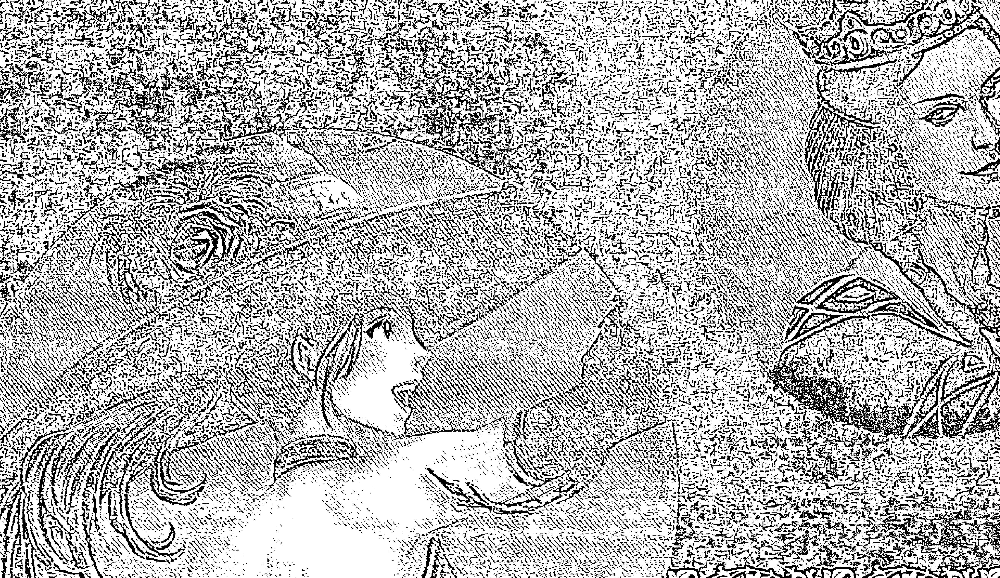

# 信仰恆久遠，魔法永不滅

即使到了現代，許願咒語、驅邪或碟仙這類簡單的法術依舊存在於民間信仰。

而另一方面，雖然被世人貶為迷信，但舉行魔法儀式的新興宗教未曾消失。乍看之下好像是科學驅逐了魔法，但這種相信魔法、巫術的風氣之所以沒有絕跡，是因為它們是建立在信仰與宗教的基礎之上。

相信世上有神的人們崇拜祂、敬畏祂並向祂祈禱。不論因果關係為何，在這樣的信仰之下誕生的法術都屬於「魔法」。

人類擁有信奉魔法的歷史，也實際施展過各式各樣的法術。只要還有，人相信寄宿於萬物中的神秘力量以及精靈、神明的強大能力，魔法就不會滅絕。

# 魔女、魔法師與魔法的入門書

本書是介紹這些魔法和巫術的入門書，但因魔法存在於世界各地，種類也不勝枚舉，僅憑本書實在無法將所有內容囊括其中。因此，本書將針對奇幻故事中常見的西洋魔女、魔法師、魔法及巫術，按照關鍵字和項目分別進行解說。希望讀者們在看過這本書之後，能對深奧的魔法世界產生興趣。

此外，本書並未斷言魔法是否真能達到書中陳述的效果，今後或許還會出現其他學術上的重大發現或新論點，但本書的內容是以現階段的研究及考察為根據。以上兩點還望各位讀者海涵。


## 第2章 世人心目中的外形

## 魔女的容貌

我们能够想到的那些典型魔女，其实是受到当时基础教育的思路所影响。

- 某种(Lilith) (希伯来语) 意为‘夜之魔女’。在希伯来神话中是亚当的第一任妻子，后来因为不顺从而离开伊甸园，成为恶魔。在犹太教神秘主义卡巴拉中被视为与神对抗的邪恶存在。
- 姆(Venus) 拉丁语，意为‘爱与美的女神’。在罗马神话中是对应希腊神话的阿佛洛狄忒。其名字也常被用作对美丽女性的称呼。因此，魔女有时也被称为‘Venus的后裔’。
- 魔女(Witch) 是指使用魔法的女性。在中世纪欧洲，特指那些与魔鬼缔结契约、崇拜异教神祇、使用黑魔法危害他人的女性，这也是猎巫时期被塑造出的典型形象。

- 事实上，现代被称为‘魔女’的人大多不符合这样的刻板印象，之所以会流传这些要求，一定事出有因。但基本上来说，这些形象都是猎巫时期的教育和思想塑造出来的。
- 本章将介绍魔女的能力及其真实面目。不过，需要读者们在阅读前先理解的是，这些内容的基础是建立在基督教会在猎巫时期所空想的产物。

## 老太太型的魔女和特征

- 外表丑陋，容貌和性格都令人不快
- 居住在荒野或森林等远离人烟的地方
- 被描绘成骑着扫帚在天上飞
- 会制造毒药或诅咒他人
- 通常与黑猫或乌鸦为伴
- 擅长使用草药，有治病的能力
- 通常穿着黑色或深色的衣服
- 是邪恶的化身，会做出各种坏事
- 会与魔鬼签订契约，出卖灵魂
- 通常被描绘成瘦骨嶙峋、牙齿脱落的老人
- 会参加恶魔的聚会（巫魔会）
- 会使用诅咒和黑魔法害人

## 美女型的魔女和特征

- 通常拥有美丽的外貌和迷人的气质
- 能够利用自己的魅力迷惑男性
- 可能具有治疗或预言的能力
- 常与自然、生育或爱情等主题相关联
- 在一些传说中，她们可能是女神或精灵的化身
- 可能掌握草药和自然疗法的知识
- 她们的行为可能不被社会常规所接受
- 有时被描绘为危险的诱惑者

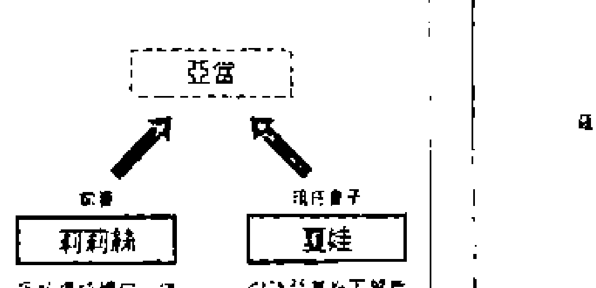

## 主題

本書精選出與西洋魔女、魔法師、魔法和巫術有關的主題，從基礎內容介紹到專家才懂的深度知識。主題上方的章節名稱則是大方向的分類。

## 解說

說明該主題的基本概要，在希望讀者記住的重要段落會加上特殊標記。另外，在其他頁面介紹過的專有名詞則會註明頁碼，請讀者一併參照該頁面的解說。

## 注釋

解說內出現的專業用語及固有名詞的注釋或補充說明。每個主題的注釋都會依文章脈絡重新編碼。和解說相同，在其他頁面介紹過的名詞一樣會附上參考頁碼。

## 詳細圖解及插圖

- [圖解] 透過圖示、表格或地圖介紹該主題的詳細內容。
- [插畫] 與該主題有關的插畫。
- [道具插畫] 內文提及道具的插畫和簡易說明。
- [Column] 針對無法收進本文中的內容所設置的專欄。

## 第1章

## 著名的魔女和魔法师

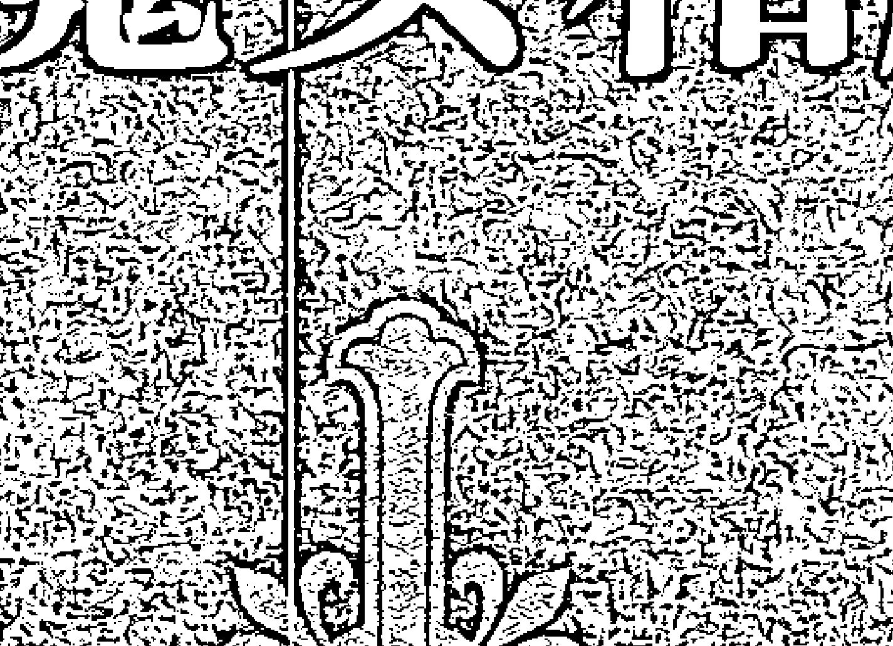

Famous Witches and Magicians

- 1. 哥列
- 2. 莫甘娜
- 3. 吉祥天女
- 4. 摩根勒菲
- 5. 迦梨
- 6. 雅典娜
- 7. 奥丁
- 8. 《马克白》的三位女巫
- 9. 《格林童话》的魔女欧选德
- 10. 《女巫屋》的女巫
- 11. 《长发姑娘》的女巫美琳
- 12. 莫瑞甘
- 13. 其他魔女

## 第1章 I 神話與傳說中的魔女

## 喀耳刻

這位希臘神話中的魔女因為會施法將靠近的人變成家畜而受世人畏懼。
多情的魔女把男性變成動物的故事也對後世的魔女形象造成影響。

## 領悟真愛的多情魔女

- ①《奧德賽》(Odys-sea)：古希臘的長篇史詩，總共用二十四個篇章敘述奧德修斯的英雄傳奇。而主角奧德修斯還有一項著名事蹟，那就是設計出讓他們打贏特洛伊戰爭的知名戰術「特洛伊木馬」。
- ② 斯庫拉(Scylla)：上半身是美女、下半身是魚尾、身上長著六顆狗頭及十二隻狗腿的怪物。她原本是住在西西里島的貌美女性，愛上她的海神格勞科斯(Glaucus)請喀耳刻幫忙成就這段戀情，但單戀格勞科斯的喀耳刻卻因此心生妒忌，用魔法把斯庫拉變成醜陋的怪物。

喀耳刻（Circe）是希臘神話的太陽神赫利奧斯（Helios）與珀珥塞伊斯（Perseis）的女兒。她被視為掌管愛與月亮的女神，然而比這個身分更為人所知的，是她以魔女形象流傳下來的各種逸聞趣事。

在荷馬史詩《奧德賽》①的描述當中，喀耳刻在義大利半島西側的一座虛構小島「艾尤島」上過著自由自在的生活。她有一副妖豔美麗的外表，只要遇見心儀的男子，便把對方帶回島上生活；一旦膩了，就施法把他們變成野獸或家畜。不過，這位多情的魔女也有一段命中註定的戀情，那便是她與英雄奧德修斯（Odysseus）的相遇。

某天，奧德修斯一行人在旅行途中來到艾尤島。早一步登上小島的部下們受邀進入喀耳刻的家，在喝下她招待的飲料後全變成了豬，被關進豬舍。奧德修斯上門要求喀耳刻解除魔法，但她卻以「與我共度一夜」作為交換條件。奧德修斯回覆喀耳刻必須先解除魔法。對奧德修斯的態度感到不滿的喀耳刻試圖把他也變成動物，但魔法卻莫名失靈了。原來奧德修斯事先從幸運之神荷米斯（Hermes）那裡獲得了讓魔法失靈的靈草（Moly）。無計可施的喀耳刻只好乖乖把部下變回原樣，而奧德修斯也依照當初的約定，與她共度春宵。其實，奧德修斯也和其他眾多男子一樣，愛上了喀耳刻的美貌。

而另一方面，喀耳刻的心也被這位誠實的英雄奪走了。她終於體會到認真愛上一個人的美好。一年後，奧德修斯即將再度踏上旅途，以怪物斯庫拉②為首的各種阻礙在海上虎視眈眈。喀耳刻細心教導他對付這些阻礙的方法，接著才目送戀人出航。魔女喀耳刻雖然善妒又惡名昭彰，但也同時擁有著對所愛之人付出一切的另外一面。

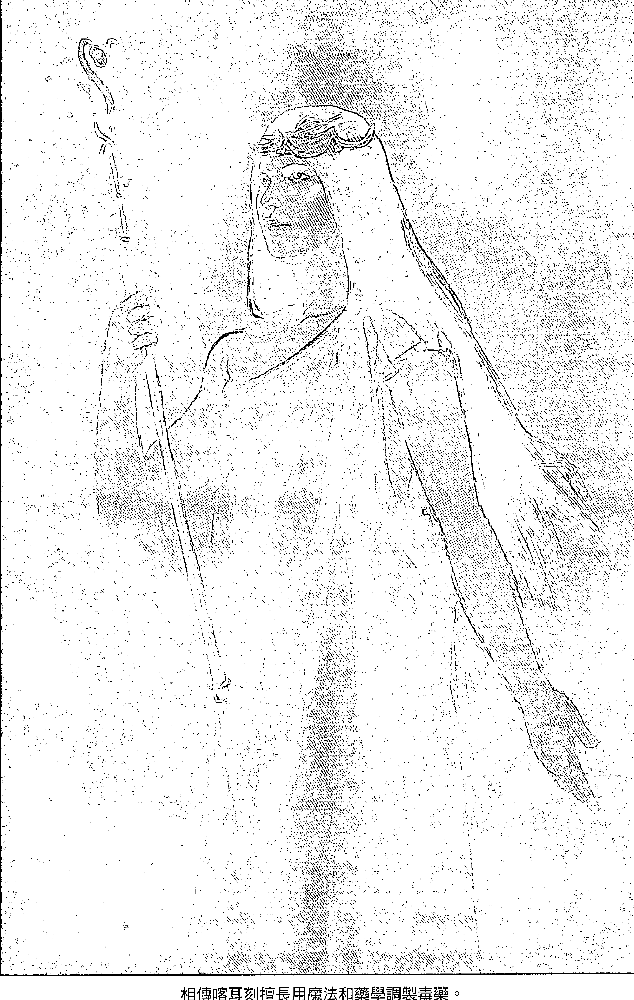

# 第1章 著名的魔女和魔法師

## I 神話傳說中的魔女 喀耳刻

相傳喀耳刻擅長用魔法和藥學調製毒藥。

Illustration : 長內佑介

## 第1章 I 神話與傳說中的魔女

## 美狄亞

美狄亞是在希臘神話登場的眾多魔女中，法力最強的一位。為了達到目的，她不擇手段，一次又一次地將身邊的人捲入不幸之中。

## 為愛殺害家人的冷酷魔女

- 1. **黑卡蒂 (Hecate)** : 希臘神話的女神。她和狩獵與月之女神阿緹蜜絲是表姊妹，掌管魔法、育兒及豐收。在赫西俄德的《神譜》中，她從宙斯那裡獲得自由來去海洋、陸地和天界的權力。
- 2. **阿爾戈英雄 (Argonauts)** : 在希臘神話中，搭乘名為「阿爾戈號」的大船在海上航行的英雄們。阿爾戈號的船員大約有五十個人，而率領他們的是愛奧卡斯的王子傑森。阿爾戈英雄的冒險傳奇被改編成影像作品，近作有2000年在美國製作及播放的電視劇《Argonauts》。

美狄亞（Medea）是柯爾基斯王國（現喬治亞西部）的公主。她的父親，也就是柯爾基斯國王埃厄忒斯（Aeetes），是魔女喀耳刻（P.8）的哥哥。繼承了姑姑血脈的美狄亞，同樣以希臘神話裡首屈一指的魔女著稱。

美狄亞信奉柯爾基斯的守護神黑卡蒂❶，她透過召喚黑卡蒂來強化自己的魔法。她的能力相當突出，據說她能輕易使出讓死者復生、讓生者不死或返老還童等高階魔法。

阿爾戈英雄❷的故事裡記錄了有關她的傳說。故事的主角傑森（Jason）造訪柯爾基斯以尋求王國之寶「金羊毛」，沒打算交出寶物的柯爾基斯國王埃厄忒斯告訴他：「只要你能驅使吐火的公牛耕作並種下龍牙，我就把寶物送給你。」這幾乎是不可能的任務，但美狄亞卻把這道難題化為可能。對傑森一見鍾情的美狄亞答應他，只要他和自己結婚，就會助他一臂之力。美狄亞用魔法完成考驗後，便施法讓守護金羊毛的龍陷入沉睡，再把金羊毛交給傑森。她搭上傑森的船共同展開逃亡，甚至在追兵面前殺了自己的親弟弟阿比圖斯（Absyrtus），將其分屍後丟進海裡。追兵們見狀便連忙停下來打撈王子的屍體，美狄亞等人則趁隙成功逃離追捕。

後來，美狄亞生下了傑森的孩子，兩人順利結為連理，但傑森卻對美狄亞的殘忍性格逐漸心生畏懼，遂與逃亡地點科林斯（Corinth）的國王之女格勞絲（Glauce）訂下婚約。憤怒的美狄亞送給格勞絲一件沾滿毒藥的新娘禮服，讓格勞絲被烈火焚身而死，接著又殺了自己與傑森愛的結晶，就此消失得無影無蹤。據說這位背叛祖國、手刃血親的殘酷魔女後來得到不死之軀，成為「死後的樂園——至福樂土（Elysium）」的統治者。

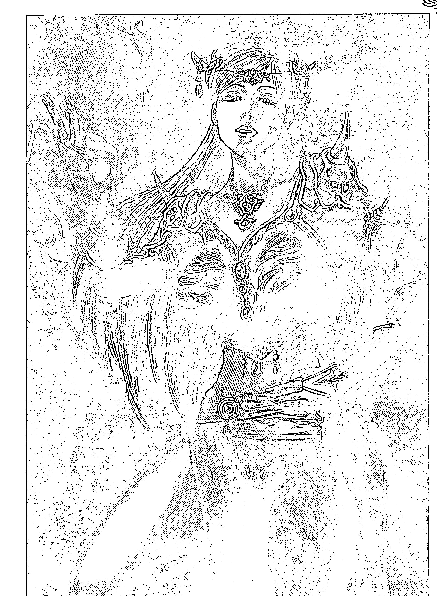

## 第1章 著名的魔女和魔法师
## Ⅰ 神话传说中的魔女
### 美狄亚

古希腊的悲剧《美狄亚》也描述了因她而起的事件。

Illustration : いけだ

## 第 1 章 I 神話與傳說中的魔女

## 古爾維格

她是在北歐神話登場的華納神族巫女，也是無論被殺死多少次都能復活的魔女。擅長用魔法魅惑女性，使她們身陷慾火之中無法自拔。

## 引發戰爭的不死魔女

- ① 諸神黃昏（Ragnarok）：北歐神話裡預言的世界末日。所有的人類、神族與巨人都將投身戰爭，步上毀滅之路。
- ② 阿薩神族與華納神族：北歐神話的眾神分為兩種族群，分別是阿薩神族與華納神族。而神話的中心是由主神奧丁所率領的阿薩神族。
- ③ 弗蕾亞（Freyja）：北歐神話的女神，掌管美、愛、豐饒、戰爭及魔法。在《老埃達》（The Elder Edda）等文獻中，她也是前往戰場迎接死者的女神。
- ④ 賽茲咒法（Seidr）：華納神族的巫女所使用的巫術（Shamanism），施術者會在極度恍惚的狀態下進行預言等行為。

在世界末日「諸神黃昏」來臨之前，北歐神話的世界一直是征戰不休。據說第一場戰爭是阿薩神族與華納神族之間的衝突，而造成這場衝突的，正是華納神族的魔女——古爾維格（Gullveig）。

有一天，古爾維格突然出現在主神奧丁（P.20）的城堡，用魔法蠱惑眾神，惹怒了阿薩神族。奧丁用長槍貫穿她的身體，再放火把她燒死，沒想到她卻起死回生，彷彿什麼事都不曾發生。後來，不論殺死她多少次，古爾維格都能復活，接著像是嘲笑眾神般飛上天空，灑下她的詛咒。古爾維格的故事只出現在《巫女的預言》，其他文獻沒有任何記載。但根據近年的北歐神話研究，將她與女神弗蕾亞視為同一人的說法已成為主流。

弗蕾亞是華納神族最厲害的魔法師。前述的諸神之戰最後以雙方談和的方式畫下句點，而弗蕾亞則是以人質的身分被送到阿薩神族。她能夠任意使出只有華納神族的女性才能使用的「賽茲咒法」，據說就連奧丁也不是她的對手。弗蕾亞的實力相當驚人，倘若她和古爾維格是同一人的話，古爾維格能夠復活這件事也就說得通了。

因為掌管愛情與豐收的弗蕾亞同時也是著名的多情女神，她曾與多位神族、巨人和妖精發生關係；古爾維格經常對邪惡的女性施法，給予她們肉體上的歡愉，兩者在性觀念上十分相似。另外，「古爾維格」這個名字有「黃金火酒」與「黃金之力」的意思，而傳說弗蕾亞的眼淚是「黃金碎片」，因此「黃金」也是雙方的共通點之一。從這些地方看來，魔女古爾維格的真實身分或許就是北歐神話最強的魔法師弗蕾亞。

# 第1章 著名的魔女和魔法師

## I 神話傳說中的魔女

### 古爾維格

與古爾維格有關的文獻不多，更為她增添了幾分神秘氣息。

Illustration : SOE

### 摩根勒菲

摩根勒菲是《亞瑟王傳說》裡的重要人物。早期的她是協助主角的妖精，但不知從何時開始卻成了折磨主角的魔女。

#### 從「可靠的妖精」變成「可惡的魔女」

❶ 《亞瑟王傳說》：中世紀時，由多位作者共同執筆的騎士精神系列作品。故事的中心是傳說中的君王——亞瑟王，他是五世紀後期～六世紀前期的英格蘭統治者。

❷ 摩莉甘（Morrigan）：凱爾特神話中掌管愛與死的女神，也與瑪夏、妮潘一起被稱為三位一體的女神「芭依波卡赫（Badb Cath）」。她非常好戰，會以烏鴉的姿態現身戰場，讓士兵們陷入瘋狂。

摩根勒菲是在講述中世紀騎士精神的《亞瑟王傳說》❶登場的重要人物，然而她的特徵在不同的故事裡有很大的落差。摩根勒菲首次出場是在十二世紀中出版的《維塔·梅林》（Vita Merlini），這時她的設定是一位來自異世界的妖精。她是九姊妹中的長女，統治傳說中的小島「阿瓦隆」，擁有驚人美貌和甜美嗓音，知識淵博且精通醫術，除此之外，她還擁有能夠變身或飛行的神奇能力。在這部作品中，**她是一位全心照顧身負重傷的主角亞瑟，並用治癒魔法幫助他的善良美女。**

然而到了十四世紀，她的形象有了極大的轉變。《高文爵士與綠騎士》（Sir Gawain and the Green Knight）裡的摩根勒菲是亞瑟之妻桂妮薇兒（Guinevere）的女官兼御醫，因為桂妮薇兒破壞了她與王族男性的戀情，心生憎恨的她便施法操縱騎士攻擊男主角高文爵士（亞瑟王的外甥），成為故事裡的大反派。

而在十五世紀後期發表的《亞瑟王之死》（Le Morte d'Arthur），則是將摩根勒菲描述成一位操弄黑魔法的邪惡魔女。這裡的她是亞瑟同父異母的姊姊，因為討厭為人正直的亞瑟，企圖用魔法篡奪他的王位，是亞瑟最主要的敵人。

為什麼摩根勒菲會從「善良的妖精」變成「邪惡的魔女」呢？她的英文原名是「Morgan le Fay」，「Fay」是「妖精」的意思。即便如此，她依舊被描寫成一位魔女，也許妖精摩根勒菲只是她的「偽裝身分」吧。之所以這麼說，是因為經常有人把她和凱爾特神話裡的摩莉甘❷視為同一人物。摩莉甘是一位女神，因為向英雄庫胡林（Cu Chulainn）求愛遭拒，她憤而以各種魔法詛咒加害於他。從這份自執著中誕生的種種惡行看來，與其說她是妖精，果然還是魔女的稱呼比較貼切吧。

她的長相在每個故事裡都不一樣，有時會被描寫成一位醜老太婆。

Illustration：雨宮テンヤ

### 芭芭雅嘎

芭芭雅嘎是斯拉夫和俄羅斯民間故事裡的著名食人巫婆。她住在茂密森林內一間噁心的小屋裡，生活中充斥著人骨。

#### 喜歡年輕人類的巫婆

> ❶ 斯拉夫民間故事：斯拉夫民族主要居住在中歐和東歐，繼承斯拉夫民間故事的俄羅斯也流傳著許多與芭芭雅嘎有關的傳說。

> ❷ 芭芭雅嘎：日本習慣將「Baba Yaga」唸成「バーバ・ヤーガ」，但俄羅斯語圈的發音應為「バーバ・ヤガー」（長音不同）。

斯拉夫民間故事❶裡的芭芭雅嘎（Baba Yaga）❷是一位生活在漆黑森林裡的巫婆。她的模樣相當奇特，身體纖長，卻瘦到像只有皮包骨，腿部甚至可以直接看到骨頭的形狀。她的家是森林裡的一棟房屋，而這棟房屋同樣也「別具特色」。房子的地板是用雞腳爪拼成，庭院和室內各處都擺放著人骨。這些人骨是過去被芭芭雅嘎吞下肚的人類，其實她最愛吃的食物就是烤全人。這位巫婆會用俄式暖爐（Pechka）把人類烤來吃，再把剩下的人骨做成裝飾，個性非常惡劣。

芭芭雅嘎平常都睡在鋪於地板上的人骨上面。在森林裡遊蕩時，她會坐在臼裡，用手上握著的杵做出像划船一樣的動作，接著臼會微微浮起，看起來就像是拖在地上前進。不小心走進森林深處時，如果在地上發現拖行的痕跡，代表芭芭雅嘎就在附近。不過她想得很周到，除了杵以外，她還會帶著掃把出門，一邊前進一邊將留在後面的痕跡清除，透過這種方法捕捉闖進森林的年輕人類來填飽肚子。此外，**芭芭雅嘎只會使用詛咒和變身之類的魔法，稱不上是法力高強的巫婆。但相對地，她的體能非常好，據說全力奔跑時甚至可以輕鬆追上馬匹。**

**芭芭雅嘎雖然在許多故事都被塑造成壞巫婆，卻仍有極少數敘述她曾經幫助人類的傳說。**《魔鷹菲尼斯特的羽毛》裡的芭芭雅嘎是幫少女尋找失散戀人的三姊妹。在漫漫旅途中走破了好幾雙鞋的少女某天來到芭芭雅嘎們的家，巫婆們同情少女的遭遇，便送了各種魔法道具給她，讓少女最後得以和戀人重逢。

芭芭雅嘎的起源據說是斯拉夫神話裡的「冬之象徵」。
Illustration : いけだ

### 梅林

梅林是中世紀不列顛名聲最高的魔法師。他擁有超凡的預言能力，能夠像是親眼見過未來一般準確預知世界的走向。

#### 遠離塵囂躲進森林的魔法師

❶ 《維塔·梅林》中曾經提到，在世界各地都有這樣的奇蹟泉水。如羅馬的西塞羅之泉能夠治癒眼疾；而非洲一座名為扎馬的泉水則會讓喝下的人獲得宛如演奏旋律般的美妙嗓音。
❷ 預言者米爾丁（Myrddin）：一說他是活在六世紀的真實人物。他有許多與梅林相同的傳說，例如「曾目擊虐殺慘案所以選擇住在森林」，或是「預言自己的三種死因，最終以符合這三者的方式死去」等等。

《亞瑟王傳說》裡的梅林（Merlin）號稱是不列顛最頂尖的魔法師。他擅長預言，不僅能用精準的預言帶領人們前往正確的方向，還曾以賢者的身分制定法律，其響亮的名聲遍及世界各地。

不過，他的人生絕非一帆風順。在十二世紀中期出版的《維塔·梅林》中，絕大部分的篇章都將梅林描述成一個失去理性的瘋子。造成他精神錯亂的原因是國內爆發的部族鬥爭，因為親眼目睹眾多生命逝去的慘狀，心智崩潰的梅林選擇躲進森林，與世隔絕。王宮需要他的能力，曾多次派遣使者請他返國，但每每他都做出一些詭譎的言行舉止，最後還是逃回森林。然而即便喪失心智，他的預言能力卻不曾減退。有一次，梅林在王宮分別見到三個孩子，為他們預言將來的死法。他說他們分別會「摔下懸崖而死」、「因為樹木橫死」以及「在河裡溺死」，但其實這三人都是由同一個男孩變裝假扮的。雖然梅林因為這件事情被當成騙子，最後這個男孩卻「摔落懸崖，腳卡在樹上，最後只有頭浸在河裡溺死了。」

梅林就這樣在森林隱居了好幾年，某天，他喝下突然在山裡湧出的泉水，才終於恢復了正常。得知這件事的世人再度懇求他回到王宮，但是年事已高的他鄭重拒絕了世人的請求，在森林裡安穩地度過了餘生。順帶一提，梅林的生涯在不同故事裡有不同刻劃。《亞瑟王之死》的梅林就曾幫助魔女摩根勒菲（P.14）並教她魔法。

而梅林的原型本出自中世紀威爾斯神話裡的預言家米爾丁，也有許多故事是把關於米爾丁的傳說直接套用在梅林身上。

相傳是梅林搬動石头，做成古代遗迹「巨石阵」。
Illustration: 長内佑介

### 奧丁

北歐神話的主神奧丁總是埋頭探索知識與魔法。比起成為替諸神帶來繁榮的國王，他寧可當一位浪跡天涯的魔法師。

#### 終其一生渴求知識的獨眼魔法師

❶ 岡加尼爾（Gungnir）：由名工匠矮人族打造的投擲用長槍。擲出後百發百中，貫穿敵人之後會自動回到持有者手中，是北歐神話裡最具代表性的武器。
❷ 洛基（Loki）：半神半巨人的神。與奧丁是結拜兄弟，因此被邀請至阿薩神族的領域。他生性狡詐，是著名的惡作劇之神。在諸神黃昏時背叛眾神，加入巨人族的陣營。
❸ 英靈戰士（Einherjar）：女神華爾琪麗（Valkyrie）會從戰死沙場的士兵中選出英雄，帶領他們的靈魂前往英靈殿。英雄們會在這裡接受華爾琪麗的鍛鍊，組織菁英部隊英靈戰士，迎接諸神黃昏的到來。

阿薩神族的世界「阿斯嘉（Asgard）」有一座名為白銀之廳的城堡。北歐神話的主神奧丁（Odin）帶著兩隻名為「福金（思考）」和「穆寧（記憶）」的渡鴉，從城堡的王座上俯瞰世間。不過，他坐在王座上的時間可說是少之又少，因為**求知慾旺盛的他為了追求埋藏各處的知識與魔法，總是來回穿梭於世界各地**。

只要是為了獲得知識，不管再大的苦痛他都能欣然接受。巨人之國約頓海姆（Jotunheim）有一座「智慧之泉」，傳說只要喝下裝在池裡的蜜酒，就能獲得賢明與智慧。想喝這種蜜酒的人必須把一隻眼睛獻給智慧之泉的看守人密米爾，而奧丁毫不猶豫地挖出自己的一隻眼睛交給對方。還有一次，他得知冥界有一種蘊含魔力的神奇文字「盧恩字母」（P.130），他用魔槍岡加尼爾刺穿自己，冥想了九天九夜才總算抵達冥界。而在取得「賽茲咒法」的時候，奧丁也拋棄了他的自尊。賽茲是一種只傳給華納女神的魔法，使用時會伴隨著女性行歡時達到高潮的快感。但奧丁卻把這種羞恥往肚裡吞，他成為女神弗蕾亞的情人，成功習得賽茲咒法。做到這種地步，連友人洛基也罵他是個「沒節操又軟弱的傢伙」。然而**只要是為了習得魔法，奧丁絲毫不在乎別人對他的謾罵**。後來他利用旅途中獲得的預言能力知曉了世界末日「諸神黃昏」，為了改變這個命運，奧丁組織了精英部隊「英靈戰士」，準備迎接無可避免的最終決戰。

附帶一提，奧丁雖然可以自由改變自己的外表，他卻偏愛變成一個蓄著灰色長鬍的老人。選擇這副模樣是為了彰顯賢者的威嚴，由此可知他非常重視自己的外表看起來是否符合賢者或魔法師的形象。

為了遮住自己的獨眼，奧丁經常戴著有寬帽簷的帽子。
Illustration : tokiwa

## II 童话与文学作品中的魔女

### 《马克白》的三位女巫

在莎士比亚的悲剧《马克白》当中登场的三位女巫。她们虽然善于预言，却用模棱两可的话术将寻求预言的人导向灭亡。

#### 毛骨悚然的预言招致毁灭

❶ 莎士比亚：活跃于十六世纪后期至十七世纪初的英格兰剧作家。《罗密欧与茱丽叶》等众多作品至今仍在「世界上最杰出的文学作品」中占有一席之地。
❷ 马克白：本名是芬莱克之子马克白塔德（Mac Bethad mac Findlaich）。1040年，他暗杀表哥邓肯一世篡夺王位，后来更将反对势力及王位继承人逐一赶尽杀绝。不同于戏剧的《马克白》，据说他在位时是一位治国得当的国王。

《马克白》与《哈姆雷特》、《奥赛罗》、《李尔王》合称莎士比亚❶四大悲剧。这部戏曲的原型是真实存在于十一世纪的苏格兰王马克白❷。

故事大纲为：主角马克白弑君夺位，但沉重的精神压力却让他对人民施以暴政，最终被起义谋反的贵族们讨伐而死。在这篇故事里，有三个苍老的巫婆大大地左右了马克白的命运，她们便是「马克白的女巫」。

马克白和女巫们的邂逅是在他平定内乱返国的路上。女巫对马克白说：「你将成为考特领主，最后当上苏格兰王。」马克白先是对这突如其来的预言感到不知所措，但当他因战功被封为考特领主后，他便对预言深信不疑。他将预言内容告诉贪心的妻子，并听从妻子的建议暗杀国王，坐上苏格兰的王位。成为国王的马克白膝下无子，他感到惶恐不安，觉得「王位总有一天会遭他人夺去」。于是他再次拜访女巫，这次**女巫预言他「不会输给任何一个妇女生下的人。」**而马克白听了预言后认定「没有人不是妇女所生。」遂以暴政治国，最后死在一位名为麦克德夫（Macduff）的贵族剑下。这位麦克德夫其实是透过剖腹产出生的，并不算是「妇女生下的人」。

显然，女巫们的话术让马克白产生误解，她们根本没打算要帮马克白登上王位。在野心的驱使之下，愚蠢的男人最终走向灭亡。

此外，女巫在自己居住的洞窟送给马克白第二个预言。**她们身披黑斗篷、站在大釜前进行仪式的模样，也深深影响了后世创造出来的魔女形象。**

她们崇拜希臘神話的女神黑卡蒂，並透過儀式召喚祂。
Illustration : SOE

### 《羅恩格林》的魔女歐楚德

#### 從歌劇誕生的虛構魔女

> 《羅恩格林》(Loh-engrin)：《羅恩格林》是華格納的歌劇中相當受歡迎的作品，據傳德國巴伐利亞的國王路德維希二世以及一代領袖阿道夫·希特勒都曾是它的粉絲。

> 騎士的弱點：羅恩格林出現在艾兒莎面前時曾與她約定，自己會和她結婚並保護她的領地，條件是她不得過問自己的名字和真實身分。然而受到歐楚德算計的艾兒莎違背了這個約定，讓羅恩格林最後離開了布拉邦特。

《羅恩格林》是德國著名劇作家理查·華格納的代表作，講述真實身分不明的聖騎士羅恩格林與布拉邦特公國（Brabant）的公主艾兒莎的悲慘戀情，而歐楚德（Ortrud）則是在故事中阻止兩人相愛並企圖篡奪王位的魔女。

魔女歐楚德信奉受基督教打壓的古老神祇。她對基督教徒恨之入骨，不斷精進自己的魔法以為復仇，而她的魔女實力在故事開頭便可略知一二。

歐楚德為了取得國家實權，用魔法將公國繼承人高特菲（Gottfried）變成天鵝，並把罪名嫁禍給其姊艾兒莎（Elsa）。她認為，只要透過這個計畫讓艾兒莎失勢，自己和丈夫泰拉蒙（Telramund）便能將國家實權收入囊中。但艾兒莎的丈夫羅恩格林破壞了這個陰謀，導致泰拉蒙被流放國外。

怒不可遏的歐楚德用魔法掌握羅恩格林的弱點，得知只要艾兒莎詢問羅恩格林：「你到底是誰？」他的力量就會消失。

掌握了騎士弱點的歐楚德用自己最擅長的話術誘導艾兒莎，成功讓她開口質疑羅恩格林的真實身分。阻止歐楚德盜國的羅恩格林於是離開了布拉邦特，眼看她的夢想近在咫尺，最終卻沒有實現，因為羅恩格林在離開前解除了高特菲身上的魔法，讓他從天鵝變回人類。

由於公國的正統繼承人回歸，歐楚德拿不到國家實權，她的野心終究被粉碎殆盡了。

狡猾的歐楚德企圖用魔法和話術竊取國家。
Illustration : tokiwa

### 《糖果屋》的女巫

《格林童話》是由格林兄弟所創作的德國民間故事集。出現在〈糖果屋〉裡的女巫，她的惡行是什麼呢？

#### 在童話裡登場的典型女巫

> ❶ 《格林童話》：除了〈糖果屋〉以外，裡面還收錄了〈大野狼與七隻小羊〉及〈小紅帽〉等許多相當知名的作品。

〈糖果屋〉（Hänsel und Gretel）是《格林童話》❶裡的一篇故事，因為是聞名世界的童話，應該有很多讀者在小時候就聽過了吧？

在這部作品登場的女巫是會被當成獵巫對象的「壞魔女」。她的外表是個老太婆，嗅覺靈敏，眼睛泛紅，視力不佳，雙手還像枯枝一樣細長。她一個人住在森林中一間用糖果餅乾搭成的房子裡，以這間房子為誘餌，吸引在森林裡迷路的小孩，抓住他們並用食物把他們養胖，最後再殺來吃。

基督教色彩濃厚的德國將森林視為受野獸支配的危險地帶，這或許是讓魔女這號危險人物被世間遺忘的根本原因。這點反映在漢森和葛麗特的父親於故事開頭所說的話。

當母親提議「把孩子們丟掉」的時候，父親只回答：「如果這麼做，他們會被森林裡的野獸大卸八塊。」並沒有提及魔女。

但這樣的內容只出現在最早期出版的〈糖果屋〉裡。參考這個故事所創作的歌劇〈糖果屋〉改編了劇情內容，父親不但早就知道「糖果屋的女巫」，而母親的真實身分就是那名女巫。

順帶一提，像糖果屋的女巫一樣住在森林深處，被世間遺忘的人、妖精或精靈，在德文稱為「Hexe」，英文則叫「Hag」。他們會帶來疾病和死亡，深受人類忌憚。

另外，在睡覺時動彈不得的「鬼壓床」，英文稱做「Old Hag Attack」。由此可知，國外認為是因為被「Hag」壓住身體，才會出現鬼壓床的現象。

她會把抓到的孩子先養胖再殺來吃，可說是非常殘忍。
> Illustration : 雨宮テンヤ

### 《長髮姑娘》的女巫芙拉·葛索

芙拉·葛索是出現在童話《長髮姑娘》的女巫。因法力高強而被世人畏懼的她，其實心地非常善良。

#### 扶養人類小孩的奇怪女巫

❶ **高塔**：拉潘索生活在沒有出口的高塔裡。當芙拉·葛索要進去找拉潘索時，便會要拉潘索從窗戶放下長長的金髮，讓她用來當作繩子爬上最頂層。

《格林童話》的〈長髮姑娘〉（Rapunzel）裡有個名叫芙拉·葛索的女巫，她主動扶養人類的小孩，和一般的魔女有點不同。

在某個地方有一對夫妻，妻子懷有身孕。為了讓妻子吃到對孕婦很好的蔬菜「拉潘索（Rapunzel）」，丈夫潛入女巫芙拉·葛索的菜園偷菜，卻不巧被女巫逮個正著。丈夫做好了被殺死的覺悟，沒想到女巫聽了來龍去脈以後，竟然爽快地答應讓他摘取蔬菜。不過作為代價，他們必須把生下來的孩子交給自己。

芙拉·葛索將這對夫妻送來的小孩取名為「拉潘索」，細心扶養她長大。當拉潘索十二歲、開始懂事以後，芙拉·葛索便把她關在沒有出口的高塔❶最頂層，斷絕與外界的所有聯繫。

但芙拉·葛索的這番努力終究化作徒勞。拉潘索不但與某國的王子墜入情網，甚至懷了對方的孩子。芙拉·葛索為此憤怒不已，把心愛的拉潘索扔到了沙漠。

雖然身為女巫，芙拉·葛索還是對人類的孩子拉潘索疼愛有加。即使她最後把愛女拉潘索趕到沙漠，卻不會讓人覺得她是個壞女巫。因為在第一版的《格林童話》中，芙拉·葛索為了不讓拉潘索餓死，**先給了她會不斷變出餅乾的魔法籃，才把她送到沙漠**。這位女巫的心地其實非常善良。

另外，雖然是題外話，被女巫趕走的拉潘索後來平安生下孩子，與王子重逢，一家人過著幸福快樂的日子。

# 第1章 著名的魔女和魔法

## III 童话风文学作品中的魔女

### 贪婪的魔女 芙菈·葛索

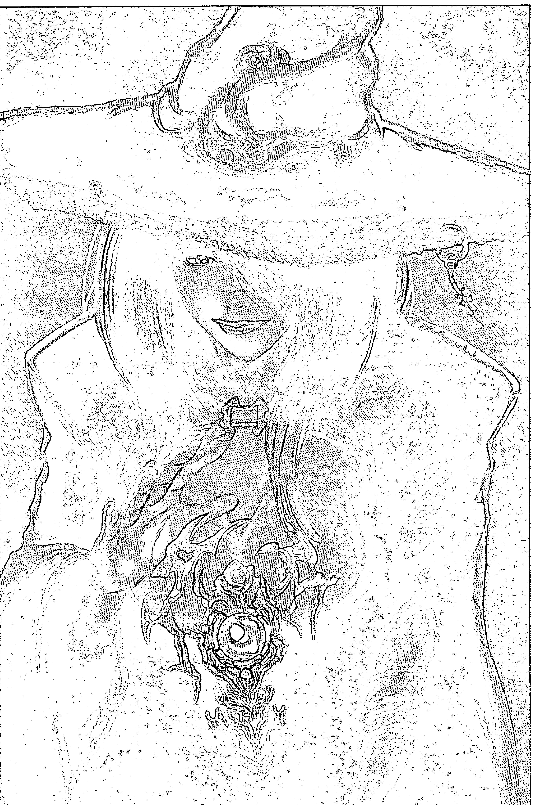

芙菈·葛索将养女拉潘索视为掌上明珠，细心呵护她长大。

除了前述的內容之外，还有其他著名的魔女以及魔法师。本章节将一口气介绍这些在奇幻作品或现实世界引发骚动的人物！

### 二十世纪最伟大的魔法师 阿莱斯特·克劳利

【魔法师】【真实人物】1875年～1947年。被称为「世上最凶恶的怪人」，是近代西洋魔法的能手。他加入黄金黎明协会，学习魔法教义，并将自己浪迹世界各地时与圣守护天使艾华斯的对话写成《律法之书》。详情介绍请参照P.156。

### 美丽与智慧的协助者 伊莱亚娜

【魔女】【神话、传说】伊莱亚娜是罗马尼亚民间故事里的一位才色兼备的魔女，她出现在好几篇故事当中，每次登场的设定都不相同，而其中最知名的版本是《勇敢的佩托蕾娅与伊莱亚娜》。故事里的她是一位森林大宅的女主人，她帮助一位叫做佩托蕾娅的女孩，完成母亲交给她的难题——带回一种特别的药。结果等不及的母亲杀害了佩托蕾娅并将其肢解，但伊莱亚娜却用这种药（其实真正的药在她手上）黏合佩托蕾娅的身体，让她复活。其实伊莱亚娜从一开始就看穿了佩托蕾娅母亲的阴谋。

### 制作出魔像守护街道 犹大·罗·本·比撒列

【魔法师】【真实人物】1525年～1609年。他是布拉格的拉比（犹太教的神父），一生不断告诫世人停止对私生子的中伤、诽谤。另一方面，他也因身为魔像传说的主角而广为人知。他梦见神的启示，在连续祈祷七天之后，来到位于布拉格郊外的伏尔塔瓦河，挖起河底的淤泥。接着他用淤泥制作泥偶，嘴里衔着写有神之名的护符对泥偶吹气，赋予它们生命，成为犹太人街道的守护者。

### 对近代西洋魔法造成巨大影响 艾利弗斯·李维

【魔法师】【真实人物】1810年～1875年。他是巴黎出生的魔法师，致力于搜集卡巴拉和炼金术等魔法相关资料并付诸实行，出版著作有《高等魔法的教理与祭仪》、《魔法的历史》以及《伟大的神秘之钥》等等。他对后来的神智学协会和黄金黎明协会造成深远影响，是近代「魔法复兴」的象征，在文学界也有许多作者受到他的影响。

### 划分四片的全都是魔女 奥兹国的四位魔女

【魔女】【童话、文学作品】1900年，李曼·法兰克·鲍姆出版了童话《绿野仙踪》，故事里的魔女分别支配着位于奥兹国东、西、南、北四个方位的国家。东之国的魔女穿着银色的魔法鞋；西之国的魔女可以用有如望远镜般的右眼看见远方；北之国的魔女是个娇小又没什么力量的老婆婆；南之国的魔女拥有强大魔力，她告诉桃乐丝返回故乡的方法。桃乐丝在冒险途中分别遇到这四个魔女，其中东、西两位魔女是故事里的反派，南、北的魔女们则是好人。

### 始于匿名著作的魔法师传说 克里斯蒂安·罗森克鲁兹

【魔法师】【真实人物】1378年～1484年。他是被视为蔷薇十字团创始人的魔法师。在圣地巡礼途中，受到大马士革贤者吸引的他决定留在当地学习阿拉伯秘术与自然科学。接着，他将奥义书《M之书》翻译成拉丁文，并在摩洛哥遇见四大精灵，随后返回德国，与同伴组成了蔷薇十字团。以上是1614年在神圣罗马帝国出版的匿名书《兄弟会传说》所流传的内容，真伪无从考究。然而，以这位身分不明的救世主为名的秘密结社让世人为之倾倒，不知不觉便成为都市传说，后来更出现许多想要入会或自称是蔷薇十字团成员的人，接连在社会上引起骚动。

### 苏格兰的恶作剧魔女 绿魔女

【魔女】【神话、传说】苏格兰传说里的魔女一族。她们是女神贝拉的子孙，每个人都独自生活在河川、森林或绿色山丘等清幽之地。她们会用变身及召唤暴风雨的魔法吓唬旅人，不过以恶作剧取乐才是她们的主要目的。

### 潜入俄罗斯帝国的怪僧 格里戈利·叶菲莫维奇·拉斯普京

【魔法师】【真实人物】1871年～1916年。他是俄罗斯帝国晚期的祈祷僧，因为作风怪异，有时也被称为「怪僧」。他用神秘的力量为人治病以增加信徒。在皇族的引荐之下，他为俄罗斯皇帝尼古拉二世的皇太子进行治疗，赢得皇帝夫妇的高度信赖。世间谣传他与贵族女性过着荒淫的生活，也有人说他是皇后的爱人。第一次世界大战爆发后，皇帝亲上前线，并将内政委托给皇后，但皇后却凡事都与拉斯普京讨论。对这种情况抱持危机感的人们，最后以暗杀的方式了结他的性命。

### 为爱子调配魔药 凯丽杜温

【魔女】【神话、传说】她是威尔斯传说中的魔女，花了一年又一天的时间替自己的儿子调配能拥有无限智慧的魔药，但就在即将完成之际，一个盲眼青年在搅拌装满材料的大锅时不慎误食药水，夺走了里面的智慧。对此大发雷霆的凯莉杜温开始追捕青年，最后她变成一只母鸡，把化作小麦的青年吞下肚里。

### 带着黑犬使魔的大魔法师 科涅留斯·阿格里帕

【魔法师】【真实人物】1486年～1535年。他是德国的魔法师及人文主义者，在大学和担任秘密侦探的时期习得炼金术、卡巴拉与神学等各式魔法。虽然他一生因为抨击和对立而颠沛流离，却能凭借自身庞大的阅读量以及和各国学者的往来交流，在1530年代初期彙整了《神秘学》这本有如百科全书般的大作，对后世的黑魔法产生重大影响。他还留下其他多种传闻，例如身边带着疑似使魔的黑色大狗；或是用魔法操纵死于魔鬼之手的青年，将其赶出家门。

### 妨碍门徒的魔法师 西蒙·马格斯

【魔法师】【真实人物】他生活在一世纪左右，是《圣经》里出现的魔法师，也是“诺斯底主义”的创始者。他拜访来到以色列撒马利亚的基督教门徒，因为想用金钱换得神力而受到责难。后来，他多次试图用自己的法术妨碍门徒却都以失败告终，可见门徒彼得等人的法力更胜一筹。

### 听见天使之声的博士 约翰·迪伊

【魔法师】【真实人物】1527年～1608年。他生于伦敦，是炼金术师也是占星术师。他曾就读英国剑桥大学与荷兰鲁汶大学，致力于王立图书馆的建设。1580年左右，他透过通灵与大天使乌列尔对谈，并将天使的语言“以诺语”和谈话内容编辑成《灵告日记》。并与灵媒爱德华·凯利搭档，向贵族展示通灵实验和魔法。以诺语后来被阿莱斯特·克劳利收录在社团刊物，而他的弟子则用它发展出名为“以诺魔法”的魔法体系。

### 从光荣贵族变成残酷杀人魔 吉尔·德·雷

【魔法师】【真实人物】1404年～1440年。他是法兰西王国布列塔尼地区的贵族。百年战争末期，他与圣女贞德一起在奥尔良之围对抗英军，成为救国英雄。然而在贞德被处以火刑之后，他隐居在自己领地内的蒂福日城，终日埋头研究炼金术与黑魔法，并沉溺于与少年侍从的肉体关系。此外，他还召集了领地内的数百名少年，每天在城里对他们进行凌迟和虐杀。这些恐怖的传说让他成为童话《蓝胡子》的原型。

### 双峰含毒的夜之魔女 丝朵莉葛

【魔女】【神话、传说】她是意大利和东欧民间故事里的魔女，可以变身成猛禽，拥有好几颗头和有毒的乳房。她与睡梦中的男性发生关系，吸取男性的鲜血，也会用含毒的母乳餵食婴儿，将其杀害。因为能用法术飞行，世人把她与猫头鹰连结。而“丝朵莉葛（Striga）”这个名称原指吸食人血的幽灵。

### 驱使七十二柱恶魔的魔法之王 所罗门王

【魔法师】【真实人物】约在西元前1035年～西元前925年。他是出现在《旧约圣经》里的古代以色列国王，从大天使米迦勒那里获得刻有五芒星的戒指，用戒指的魔力驱使名唤“所罗门七十二柱”的恶魔，是举世闻名的大魔法师，相传过去的耶路撒冷神殿就是他召唤这些恶魔建造而成。此外，他所撰写或以他为名的魔导书数量极多，如《所罗门之钥》与《雷蒙盖顿》。

### 身穿红衣的美丽魔女？ 杜艾莎

【魔女】【童话、文学作品】她是在爱德蒙·史宾赛所写的长篇史诗《仙后》里登场的魔女。这篇史诗叙述的是仙后与她的骑士们的故事，杜艾莎则是与他们敌对的反派魔女。她身穿绣有金线和珍珠的红色洋装，头上戴着教皇的皇冠，手里拿着装满魔力的金杯。她的真面目是一个丑陋的老太婆，除了能施法让自己变成绝世美女，还会用毒药把人变成树木，或是用风让女子变得奇丑无比。

### 不听话的孩子会 特露德太太

【魔女】【童话、文学作品】她是格林童话〈特露德太太〉里的魔女。不遵从父母教诲的少女，某天听到有关名为特露德的妇女的传闻。父母告诉她：「特露德是个坏女人，妳千万不能接近她。」但少女却无视父母的忠告，跑到特露德的家。结果特露德仿佛等待多时一般，将少女变成一根木柴后丢进火里，一边欣赏燃烧的火光，一边呢喃：「烧得真亮啊。」

### 侍奉血腥伯爵夫人的魔女 特萝蒂亚·辛堤斯&达尔瓦莉

【魔女】【真实人物】不明～1611年左右。她们的主人是罗马尼亚的高阶贵族——伊丽莎白·巴托里。凶残的伊丽莎白日夜在恰赫季斯堡里对女仆施暴，后来她更迷上了咒术，将特萝蒂亚和达尔瓦莉召入城中，让她们举行黑魔法仪式，或是抹杀批判自己恶行的人。丈夫过世后，伊丽莎白的行为更是变本加厉。她陷入「用处女之血涂在肌肤上可以返老还童」的妄想之中，不断捕捉领地内的少女并放光她们的鲜血，结果让612名少女成为逝去的亡魂。在这些残忍行径的背后，不难想像有特萝蒂亚和达尔瓦莉的暗中协助。

### 成功炼成贤者之石的炼金术师 尼古拉·勒梅

【魔法师】【真实人物】1330年～1418年。他是巴黎的出版业者，著有《象形寓意图之书》等多本炼金术相关书籍。获得卡巴拉秘法书之后，他巡游西班牙各地，解读该书并习得书中的奥义。回国后的他靠炼金术赚取金钱，并向教会和医院提供高额捐款。而让他声名大噪的另一个原因，是因为他是少数成功制造出炼金术师梦寐以求的「贤者之石」的人。不过上述内容都是根据《象形寓意图之书》的记载流传于后世的传说，并没有实际证据显示他曾经使用炼金术。

### 付出代价换来魔法道具 《人鱼公主》的魔女

【魔女】【童话、文学作品】安徒生童话〈人鱼公主〉里的魔女答应给人鱼公主可以长出双脚的药，代价是她必须用能发出美妙声音的舌头交换。公主爱上的王子后来与其他女性订婚，这次换公主的姊姊们拜访了魔女的家。她们请魔女制作一把魔法小刀，只要用这把刀刺进王子的胸口，并把流出的血涂在双脚上，就可以让下半身恢复原本的模样。而这次魔女也向姊姊们索取美丽的头发作为代价。

### 在医学引进炼金术的革命家 帕拉塞尔苏斯

【魔法师】【真实人物】1493年（？）～1541年。本名是菲利普斯·奥里欧勒斯·德奥弗拉斯特·博姆巴斯茨·冯·霍恩海姆，瑞士人，是医生兼炼金术师。因为想将炼金术应用在医学上，遭到当时主导医学界的盖伦批判。他当上大学教授后，被学会以异端之名流放，成为流浪医生。身为炼金术师的他留下许多传说，例如他曾经成功做出人造人「荷蒙库鲁兹」，而他随身佩带的「AZOTH魔剑」上则镶着贤者之石。

### 用魔法将心仪的男子弄到手 潘飞儿

【魔女】【童话、文学作品】她是古罗马辩论作家阿普列尤斯的小说《黄金驴》里面的魔女。她生性淫荡，只要看到喜欢的男性便会和对方发生关系。她用药草和人类的尸体举行仪式，燃烧男子的头发，把对方呼唤到自己身边。小说的主角路修斯某天偶然目击全身赤裸的潘飞儿在身上涂了软膏后变成乌鸦的瞬间，他模仿潘飞儿的作法，没想到却变成一头驴子。这篇小说便是叙述路修斯为了变回原本的模样而奋斗的故事。

### 孤岛上誓言复仇的魔法公爵 普洛斯彼罗

【魔法师】【童话、文学作品】莎士比亚喜剧《暴风雨》的主角普洛斯彼罗曾经是米兰公爵，因为被现任米兰公爵安东尼奥篡位，他和女儿米兰达一起来到一座海上孤岛进行魔法研究。他施法召来风暴，颠覆载着安东尼奥与那不勒斯国王的船，接着再以魔法和精灵之力对一行人展开复仇。

### 送给乖孩子美好的礼物 贝法娜

【魔女】【神话、传说】她是意大利传说中的魔女，是个外表像老太婆、身披黑色破布、还会骑扫帚飞行的典型魔女，但并不是坏人。在主显节（1月6日）这天，她会从烟囱或钥匙孔进到房内，送过去一年都很听话的乖孩子美好的礼物（如糖果等），并在坏孩子的袜子里放木炭；简单来说，就是魔女版的圣诞老人。根据《新约圣经》的记载，东方三博士问她要不要一起去祝贺耶稣诞生，贝法娜当下因为忙着打扫而拒绝了，但她马上就后悔并追了上去，却不晓得哪个孩子才是耶稣，于是她只好沿路发礼物给孩子们，一边祈祷耶稣就在这些孩子当中。这段描述造就了贝法娜的传说。

### 是魔法师的敌人还是朋友？ 洪诺留三世

【魔法师】【真实人物】1148年～1227年。他在1216年当上罗马教宗，除了促成十字军成军，他还认可了道明会和加尔默罗会等修道会。虽然在政治上没留下显著功绩，但他以学者身分积极进行著述活动，如编纂教会的史书、法典，并累积许多有关严厉打压异端和恶魔这类事物的记录。然而进入十七世纪之后，不知为何冒出了《教宗洪诺留的魔导书》，甚至出现教宗本人才是魔法师的传闻。书里用母鸡进行的残忍仪式带给世人很大的冲击，是继《所罗门之钥》后第二受欢迎的魔导书。

### 勤劳之人能获得奖励 霍勒太太

【魔女】【童话、文学作品】她是格林童话〈霍勒太太〉里的魔女。某位寡妇的家里有一个懒惰的亲生女儿和一个勤劳的继女。某天，继女在清洗纺针时不小心把纺针掉进了井里，寡妇命令她一定要把纺针捡回来。别无他法的继女只好纵身跳入井内，当她回神之后，却发现自己置身在一片美丽的草原上。接着她来到霍勒太太的家帮佣，因为她非常勤快，在她要回家时，霍勒太太在她身上贴了满满的黄金。得知这件事的亲生女儿也来到霍勒太太的家，可是她却总是打混摸鱼，让生气的霍勒太太最后在她身上淋了一辈子都洗不掉的煤焦油。顺带一提，在德国的黑森地区会把“下雪”说成是“霍勒太太在整理棉被”。

### 奠定近代西洋魔法的人 麦葛瑞格·马瑟斯

【魔法师】【真实人物】1854年~1918年。他成立了魔法结社的先驱「黄金黎明协会」，是伦敦出生的天才魔法师。他习得卡巴拉、以诺魔法和亚伯拉梅林的魔法，并凭借自身的渊博知识，建构黄金黎明协会的魔法体系。此外，他还致力于编辑、翻译《所罗门之钥》和《盖堤亚》等魔导书。

### 受人爱戴的巫毒女王 玛莉·拉芙

【魔女】【真实人物】1794年(?)~1881年。她是巫毒教的女祭司，以巫毒女王之姿君临纽奥良。据说纽奥良没有任何她不知道的秘密，只要她施展法术，任何诉讼都会被轻易推翻。在仪式上，她会把被精灵附身的蛇缠在身上，用血祭品举办疯狂的舞会。虽然这些传说内容虚实参半，但毫无疑问她是一位同时兼具人望、人脉且广受好评的人物。相传她的坟墓至今仍保有强大魔力，可以为来访者实现心愿。

### 用爱的魔法击退勇者 玛琳卡

【魔女】【神话、传说】她是出现在只有口耳相传的俄罗斯史诗《壮士歌》里的魔女。故事里的英雄多布雷尼亚误把箭射在玛琳卡的房子上，生气的玛琳卡挖起他留在草地上的脚印，与柴火一起燃烧并咏唱咒语。这个魔法，让多布雷尼亚成日茶不思、饭不想地爱上玛琳卡。多布雷尼亚赶走了跑到玛琳卡家找他的恋人朵拉贡，最后被玛琳卡施法变成一头牛。

### 与大恶魔缔结契约的神秘博士 约翰·浮士德

【魔法师】【真实人物】1480年(?)~1539年(?)。他是德国的炼金术师及占星术师。在学习神学和哲学之后，他转而研究魔法，以别西卜之名进行仪式，与恶魔梅菲斯托费勒斯缔结契约。他在契约有效的二十四年里不断使唤梅菲斯特，但是当契约结束时，他的身体却被撕碎丢弃在垃圾堆里，死状相当凄惨。不过这段源自约翰·徐皮斯《约翰·浮士德传》的叙述只是路德教派用来宣导「杜绝恶魔」的一种政治手段。浮士德博士虽然是实际存在的人物，但与他相关的资料如今只剩下一些只字片语，无法确定他是否真的是黑魔法师。此外，在各种以他为原型的故事当中，以歌德的《浮士德》最为知名。

### 高强的魔力只为祖国 妻希

【魔女】【神话、传说】她是一位老巫婆，在芬兰的卡勒瓦拉神话里，统治着一个叫做波赫约拉的北方国度。她能施展各式各样的魔法，像是用冷气冻结海水、变成动物或是让敌国爆发流行疾病。她施法的原因基本上都是为了守护波赫约拉，因此并不算是坏人。事实上，她还曾经用名为“三宝磨”的魔法道具，为自己的国家带来谷物及财富。

### 极东之国是魔法的圣地！ 日本的魔法与巫术①

#### 代表日本的法师非阴阳师莫属

说到日本的魔法，最具代表性的就是“阴阳道”吧。这是以中国套用在自然万物上的“阴阳五行说”为基础，由日本独立发展出来的魔法体系。

阴阳道于五～六世纪传入日本以后，凭借自然科学和占卜方面的知识被世人所接受，并受到神道教和密教等宗教的影响，演变成一套魔法。之后，大和朝廷设立了专门观测天象和占卜吉凶的公家机构“阴阳寮”，在阴阳寮工作的人被称为阴阳师。到了平安时代，因为受到怨灵信仰的影响，阴阳道更融合咒术、风水等元素大幅成长，最终出现了两大家族——“贺茂家”及“安倍家”。

阴阳道包含各种法术，如预言、除魔以及锻造护身剑或破敌剑。其中最具知名度的就属“式神”——一种驱使被赋予生命的纸张、木片或直接命令低阶鬼神的法术。或许是因为很像魔法，式神经常出现在各种奇幻作品当中。有人说那位著名的安倍晴明过去善于驱使被称作“十二神将”的式神，其实是式占里的十二天将。

#### 重覆修行获得超能力的山伏

自然崇拜色彩浓厚的“修验道”也是日本独自发展出来的法术。世界各地都有把山视为神圣之物的“山岳信仰”，这点在群山遍布的日本也不例外，如今被称为“灵山”的地方便是出自于此。修验道就是在山岳信仰（古神道）融入佛教、道教的观点后所形成的宗教。

修验道的实践者被称为“山伏”，他们为了获得验力，终日躲在深山里修行。他们的修行方式非常严苛，例如用木棒殴打身体的“床坚”、背负重石的“业秤”、停止摄取水分的“水断”，或是以瀑布冲刷身体的“瀧行”等等。

他们经历困苦修行获得验力，这些验力的源头则是山中的神灵之力和透过苦行得来的咒力。山伏可以使用九字真言或驱使鬼神的法术，其中最有名的一种则是飞行术。先不论山伏是否真的能够翱翔天际，修验道的开山祖师役小角曾利用飞行术飞往世界各地的传说，已在世人心中留下深刻印象。

附带一提，山伏基本上都是实践主义，他们不太了解理论，而是在自己的服装上大做文章。独特的衣着似乎别有含意。

## 第2章 关于魔女

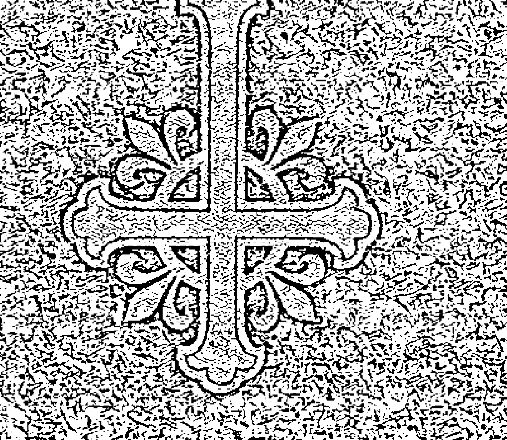

> > What is the witch?

- 魔女的资格
- 蜂蜜
- 圣水
- 歌声
- 大釜
- 随意变动物
- 荒天术
- 招恶魔法
- 其他法术
- 魔女夜宴
- 沃普尔吉斯之夜
- 恶魔的印记
- 梦魔
- 恶魔的身
- 使魔

## 第2章 I 世人想像中的外形

### 魔女的容貌

我们想像得到的那种典型魔女，其实是受到当时基督教会的思维所影响。

#### 魔女狩猎时代树立的邪恶魔法师形象

一提到「魔女」，一般人大概可以想到两种不同的外形。一种是童话里经常出现的老太婆，另一种则是勾引男性的性感美女。

老太婆型的魔女在日本常见于童话故事，通常对她们的印象是：头戴尖帽子、身披黑斗篷、长着弯曲大鼻、骑着扫帚飞行、平时住在森林里等等。当然，某些童话里也存在善良的魔女，但是像右页那种又丑又狡猾的老巫婆占了绝大多数。

这种印象源自于欧洲自古以来的魔女传说，**至于被定型成「会用魔法的邪恶老婆婆」，无疑是魔女狩猎时期被加油添醋后所产生的结晶。**

而另一方面，美丽的女性也是魔女常见的外形之一。她们拥有艳丽动人的美貌，让人觉得是个好色并将男性玩弄于股掌间的坏女人。这样的设定也是魔女狩猎时代才加上去的。基督教以《旧约圣经》里的恶魔莉莉丝和罗马神话的女神维纳斯等性感形象为基础，只强调她们身上淫秽的部分，并套用在魔女身上。

事实上，现实中被称为「魔女」的人不可能符合这样的刻板印象，之所以会选择这些要素一定事出有因，**但基本上来说，这些形象都是魔女狩猎时代的教会刻意塑造出来的。**

本章将介绍魔女的能力与她们的真实面貌。不过，要请读者们在阅读前先理解的是，这些内容的基础都是「基督教会在魔女狩猎时代凭空妄想的产物」。

- ① 莉莉丝 (Lilith)：《旧约圣经》里，亚当在遇见夏娃之前的妻子。她要求被基督教视为不道德的「女上男下」体位，两人因此破局。后来莉莉丝找上恶魔，为恶魔生下许多孩子。对基督教来说，她是世界上第一个淫魔。
- ② 维纳斯 (Venus)：罗马神话中代表爱与美的女神，与希腊神话的阿芙罗黛蒂 (Aphrodite) 被视为同一神。她的画像多以半裸或全裸呈现，当基督教在欧洲势力渐长，希腊和罗马神话的众神亦逐渐世俗化，但维纳斯却因为外表被当成卖淫的女神。顺带一提，裸女像在十七世纪的西班牙等地因为异端审判而备受打压。

# 老太婆型

## 老太婆型魔女的特征

-   1. 年纪非常大，瘦得只剩皮包骨。
-   2. 双眼如燃烧的火焰般鲜红，眼眶凹陷，会蜇伤人的邪恶眼神，能凭视线下咒的邪眼。（为了隐藏这点，她们经常戴着眼镜。）
-   3. 手里拿着T型拐杖，步行速度缓慢。（也有盲眼的魔女。）
-   4. 驼背，手指扭曲。（用围裙遮住手指。）
-   5. 嗅觉敏锐的大鼻子。
-   6. 乱糟糟的头发。（用头巾遮住头发。）
-   7. 下巴突出。
-   8. 像男性一样蓄胡，用男性的语气说话。
-   9. 不笑不哭。
-   10. 跛脚。（拖着一只脚走路。）
-   11. 遇到魔女的人一定会避开她。如果是魔女主动避开，一定会靠左边走。
-   12. 住在森林里。

左侧描述的是典型的老太婆魔女。她们的服装像是为了隐藏邪眼和乱发而存在的。而「靠左边走」的由来则是在耶稣被钉上十字架之后，祂带着站在自己右侧的罪犯一起前往天堂，因而出现「右边＝天堂；左边＝地狱」的概念。「当黑猫从右边跑到左边时，会发生不好的事。」这个迷信同样也是出自此处。

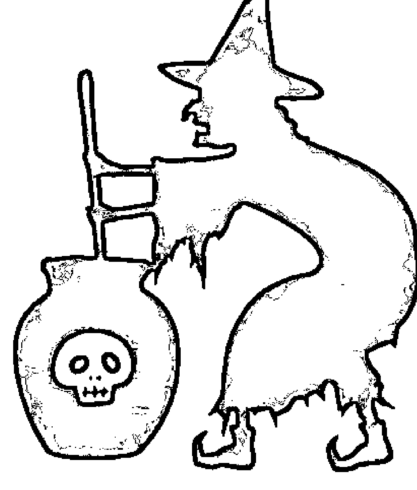

# 美女型

## 〈第一种原型〉夏娃、莉莉丝

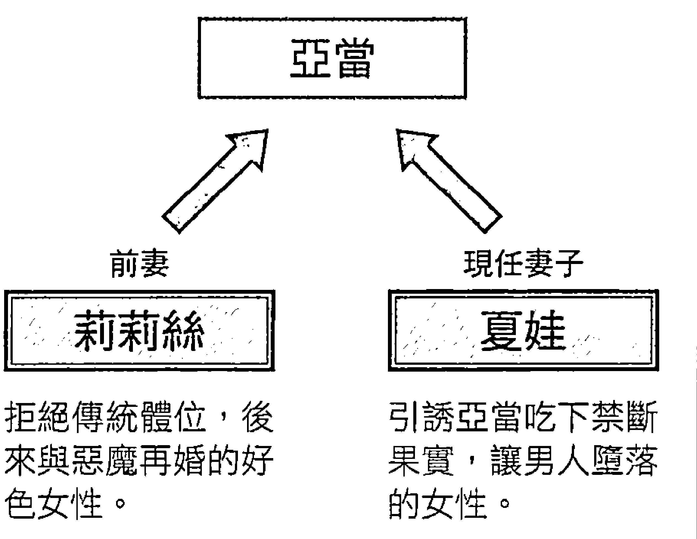

## 〈第二种原型〉维纳斯

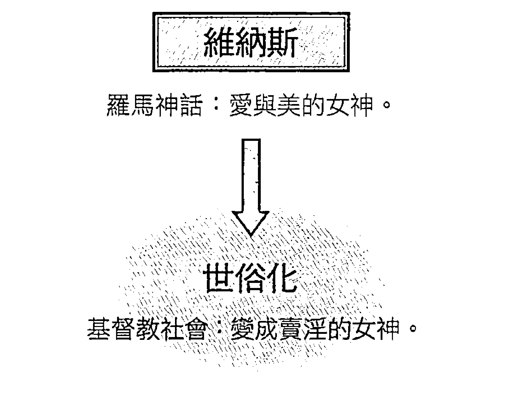

## 美女型魔女的特征

-   1. 绝世美女
-   2. 勾引男性与自己发生关系
-   3. 为男性带来毁灭

莉莉丝和夏娃是基督教开始藐视女性的根源，教会将这种会让男性堕落的女性视为恶魔般的存在。而罗马神话的维纳斯也随着基督教的普及而世俗化，形象演变成卖淫的女神。当时有许多性感妩媚的魔女画像是参考她们所绘制的。

## 第2章 世人想像中的外形

## 扫帚

任何人都能想像出魔女跨在扫帚上自在飞翔的情景。不过，魔女们是为何而飞？又为什么飞得起来呢？

### 魔女们乘着扫帚前往魔女夜宴

提到魔女的道具，最先想到的应该是「扫帚」吧。「拥有特殊力量的人可以飞上天空。」自古世上流传着各种与飞行有关的传说，当中也包含了魔女的传闻。唯一不同的是，她们骑着扫帚参加魔女夜宴（Sabbat）这种让人毛骨悚然的说法，依旧是魔女狩猎时代的产物。

举行夜宴的晚上，魔女们会悄悄溜下床，从烟囱爬到房子外面，骑上扫帚飞往集合地点。

骑乘扫帚的方式也分成好几种，将扫把头朝后的方式最为普遍，因为这样可以除去天空上的飞行痕迹。如果反过来将扫把头朝前，则会在上面装上用来照亮前方的蜡烛等工具。

大部分的魔女都会直达夜宴会场，对一般人几乎不会造成危害。可是对魔女来说，有一件她们必须留意的事，那就是教会的钟声。教会的钟声具有能驱除恶灵的能力，一旦钟声响起，魔女们便会从空中摔落。

因为这个原因，据说某些地方会在夜宴期间不断敲响钟声，以保护街道不受魔女侵扰。

### 没有扫帚的话，也可以用棍棒或动物代替？

> ⑪ 金雀儿：原产自地中海沿岸的豆科矮木。西方会用金雀儿的树枝做成扫把。

其实，魔女飞行的工具并不限于扫帚，基本上只要是棒状物品都行。有的人骑着三齿叉、纺针或锄头等物翱翔天际；也有人使用金雀儿⑪、羽叶菊、麻或豆茎等「中空的植物茎」。

传说中的知名魔女芭芭雅嘎（P.16）则是坐在臼和大釜里，像划桨一样挥着杵，让臼可以浮在地上飞行。有时她也会带着扫帚，但目的不是飞行，而是用来清扫臼留下的拖行痕迹。


除了教会的钟声以外，没有任何方法可以阻止魔女飞行。

Illustration : いけだ

除了这些以外，比较特别的还有坐着桌椅或骑着狼、狗的魔女。阿尔布雷希特·杜勒的画作《倒骑在山羊背上的女巫》正如它的标题所述，画着一位面朝后骑乘山羊的女巫。此外，有的魔女则不搭乘任何工具，而是直接变成鸟或其他动物飞上天空。

> ② 阿尔布雷希特·杜勒(Albrecht Durer)：1471年～1528年。他是德国的画家、版画家和数学家。代表作有《启示录》(1498年)、《亚当与夏娃》(1507年)及《骑士、死亡和魔鬼》(1513年)。

结果，即使没有扫帚，魔女还是一样可以飞行。

### 魔女之所以能飞，是因为涂了软膏

> ③ LSD：麦角二乙胺，一种强效迷幻剂。麦角酸化合物在能够以科学方法制造药品之前，经常被用于宗教仪式或民间医疗。寄生在谷物上的麦角菌也含有名为「麦角生物碱(内含麦角酸生物碱)」的有毒物质，过去在欧洲经常引发集体食物中毒事件，中毒者会出现幻觉、头晕和类似癫痫的症状。

那么，为什么魔女能飞呢？

一般认为魔女之所以能飞，靠的其实不是搭乘的工具，而是因为「软膏」。

软膏（P.46）是魔女在施法时使用的秘药。有的飞行软膏是来自恶魔的礼物，也有的是魔女自行调合。她们将软膏涂在自己的大腿内侧、阴部周围以及扫帚或棍棒上后，便能自在地翱翔空中。据说曾有误涂软膏的一般人被送到魔女夜宴，所以「具有飞行能力的是软膏」这点是毋庸置疑的。如此一来，不论搭乘什么工具飞行都不重要了。

> ④ 约翰·得·尼诺尔德(Jean de Nynault)：十七世纪的恶魔学家，著有《被狼附身的人与魔女》。

而到了后期，「魔女飞往魔女夜宴其实只是她本人的幻觉」这种说法也浮上了台面。其实在用来制作软膏的药草里，含有类似LSD的麻药成分。支持这个说法的人认为，若将这种药涂在阴部附近，魔女当然会有恍惚、精神错乱或出现幻觉等症状。

可是，活在现代的我们不禁想问，如果说魔女参加夜宴只是一场幻觉，这是否就称不上是一种罪行呢？

但约翰·得·尼诺尔德等人却主张除「这些幻觉正是出自恶魔之手。我们不该原谅受恶魔诱惑的魔女。」

对恶魔学家来说，魔女与恶魔的关系以及她们身上沉重的罪孽，是无论如何都无法被原谅的吧。

## 飞行的方法

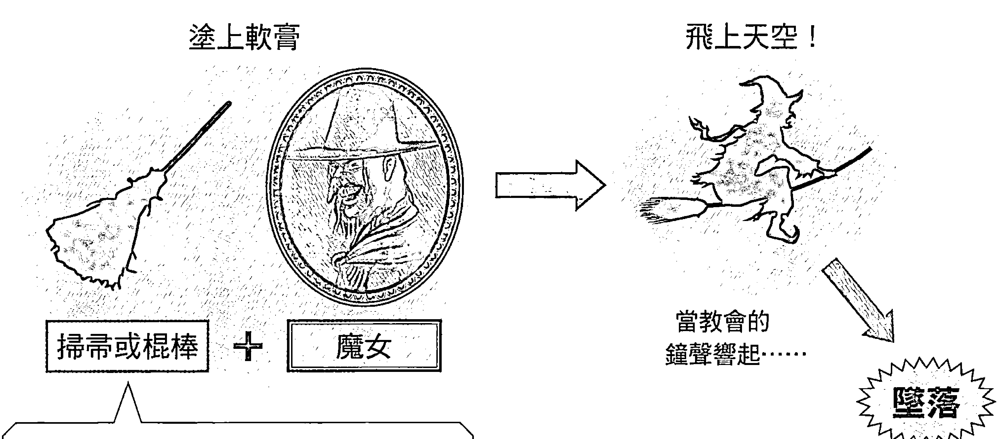

-   ★ 扫帚以外的交通工具
-   棒状的植物茎。(金雀儿、羽叶菊、麻、豆类、柊树。)
-   纺针、锄头、整理稻草用的三齿叉、白色棍棒、臼。
-   动物。(马、山羊、绵羊、狗或狼等等。)
-   有时不用飞的，改以徒步或搭乘马车。

一般认为，魔女在自己的身体和扫帚上涂满飞行软膏后便能飞上空中。虽然夜宴对魔女来说是很重要的仪式，却并没有限制一定要用飞的，在过去的记录中，也有徒步或搭乘马车的案例。我们之所以认为她们会飞，或许只是受到过去的魔女传说影响而留下的刻板印象也说不定。

## 飞行或移动时的咒语

| 年份 | 地点与人物 | 描述 |
|------|------------|------|
| 1563年 | 英国耿西岛的玛丹·雀尔夫 | 当身为魔女的母亲欲乘着金雀儿、顺着烟囱往上飞时，她说：「以恶魔和魔王之名，飞越岩壁和荆棘吧！」 |
| 1586年 | 法国亚尔萨斯的安娜·维肯兹普菲 | 当她骑着白色树枝飞行时，嘴里喊着：「飞吧！以一千个恶魔之名。」涂软膏时的咒语是：「阿门、黑登、阿门、黑登。」其他魔女会说：「吾为恶魔。吾的一切皆是你的所有物。主啊，你的仆人愿在你的圣名之下，以油涂满全身，并期望有朝一日能成为像你一样的恶魔或恶灵。」飞越河川时则说：「抬起手肘，奇耶！」 |
| 1662年 | 伊索贝尔·高迪 | 她把细长的枯草或豆茎夹在双腿之间，喊三次「霍思安发多克！霍思安构！霍思安佩拉提斯！喝一！喝一！」之后，便能飞往任何她想去的地方。 |
| 1664年 | 英国索美塞特的魔女 | 她们将精灵带来的油涂在额头和手腕上，说：「撒巫朵、塔巫朵安塔巫朵、速奥特安阿伯特。」散会时要说：「真是美好啊！快乐相聚！开心别离！」准备往家的方向出发时，则要说：「莲图姆多尔眠图姆。」 |

魔女审判的记录显示，她们在飞行时会使用上述的咒语。一开始只是像「以恶魔之名」这种简单的句子，然而随着时间经过，咒语的内容却越来越夸张，让人留下「魔女审判官的妄想是否越来越严重」的疑问。

## 第2章 世人想像中的外形

## 手杖

不论是魔法师或是近年的小魔女，她们在施展魔法时一定都会用到手杖或细长的棍棒。而这些手杖其实都具有不同的含意。

### 魔法师的手杖是智慧象征与魔力来源

-   1. 摩西 (Moses)：《旧约圣经》里，西元前十三世纪的古代以色列领袖。
-   2. 史基尼尔 (Skirnir)：北欧神话中的登场人物，丰饶之神弗雷的随从。
-   3. 德鲁伊 (Druid)：凯尔特民族的祭司阶级。详情请参照 P.120。
-   4. 《所罗门之钥》：作者不明的魔导书，相传说所罗门王所著。详情请参照 P.184。
-   5. 蔷薇木：豆科树木。因为坚固且表面光滑明亮，常被用来制作实木地板、家具、乐器和刷柄。
-   6. 榛树：桦木科落叶灌木。除了被基督教视为圣树，还曾出现在希腊神话和北欧神话当中。现代也会用榛树来驱魔避邪。
-   7. 主：即耶和华，《旧约圣经》里的唯一真神。

手杖不仅专属于魔女，也是魔法师的标准配备。《旧约圣经》的摩西和北欧神话的史基尼尔皆以手杖大显神威，在东方也有佩带手杖的山伏和仙人。

手杖的起源有好几种说法。一说它是从老人支撑身体的道具衍生为贤者的象征；另一种则说它是德鲁伊等崇拜树木的古代神官所重用的工具，是他们的魔力来源。

还有一种说法认为，因为魔女可以不靠扫帚、单凭棍棒飞上天空，这种棍棒后来就演变成手杖。无论如何，我们可以肯定手杖原本是象征贤者或神官等神圣地位的道具。

后来，当魔导书逐渐盛行，手杖成了出现在书里的魔导具。著名的《所罗门之钥》将手杖分成两种类型。

一种是用接骨木、桐木或蔷薇木制成的「魔法棒 (Staff)」，另一种是用榛树树枝制成的「魔法杖 (Wand)」。「Staff」是引导者的象征，「Wand」则是地上与冥界权威的象征。我们说的魔杖一般是指后者。

该书也介绍了魔杖的制作方法。首先，在星期三的日出时刻，一刀砍下不曾结果的新木树枝。接着在代表水星的日子与时辰，于棍棒刻上需要的记号，嘴里吟唱：「神圣的主啊，请你祝福这根棍棒／手杖，使它成为圣别。希望它能借助您的力量，获得所需的德性。」最后将木头烟熏，保存在干净的地方。

透过上述的方法，魔杖便大功告成了。不过，能为魔杖注入魔力的，只有身为持有者的魔法师。

## 代表性的魔杖

| 魔杖名称 | 神话来源 | 描述 |
|----------|----------|------|
| 双蛇双翼之杖 | 希腊神话 | 又名「商神杖（Kerykeion）」，是荷米斯的手杖。它原本是属于阿波罗的黄金手杖，荷米斯向阿波罗要来了这把手杖，并带着它走遍世界各地。炼金术师的手杖便是参考这把双蛇双翼之杖设计而成。 |
| 阿斯克勒庇俄斯之杖 | 希腊神话 | 持有者是希腊神话的医神阿斯克勒庇俄斯（Asclepius）。它的模样是一只蛇缠绕在木杖上，造型相当独特，常被当作医生的标志。虽然效果灵验，后世却没留下关于它的传说。 |
| 亚伦杖 | 旧约圣经 | 摩西和他的哥哥亚伦所使用的手杖。这把由以色列之神所赐予的手杖曾展现各种奇迹，例如分开红海、让杖身变成蛇，或是将尼罗河的河水变成血，造成鱼群大量死亡。由这支手杖引发的魔法被称为「十灾」。 |
| 加姆班泰因 | 北欧神话 | 奥丁之子赫尔莫德（Hermod）使用的魔杖（一说为魔剑），原本是奥丁向巨人赫勃巴德（Hlebard）要来的，能将别人施展的魔法无效化。此外，同样出自北欧神话的胜利之剑「雷瓦汀（Laevateinn）」，其含意是「作恶的魔杖」。 |
| 史基尼尔之杖 | 北欧神话 | 持有者是北欧神话里，华纳神弗雷（Freyr）的随从史基尼尔。他为了成全弗雷的单相思，以求婚使者的身分四处奔走，并制作刻有卢恩字母的诅咒魔杖，迫使女巨人葛德（Gerd）屈服。 |

以上是欧洲的神话及传说里的主要魔杖。这些不可思议且效果灵验的魔杖，遂成为魔女和魔法师使用的手杖原型。其中名声最高的，是能分开大海、引发各种奇迹的亚伦杖。

### 德鲁伊的橡木杖

德鲁伊是凯尔特民族的祭司阶级，负责担任神官、占卜师和诗人等职务。「德鲁伊（Druid）」这个字意指「橡木的贤者」，他们视橡木为圣物，从中汲取魔力。

西洋魔法师的形象源自于德鲁伊，他们蓄着白胡、披着斗篷并携带手杖的模样，与魔法师如出一辙。虽然神话里曾出现过许多魔杖，纵观真实的历史发展，德鲁伊的手杖无疑是西洋魔杖的起源。

此外，德鲁伊也将在橡树上的槲寄生视为圣物。即使四周的树叶枯萎凋零，槲寄生却依旧青翠，故德鲁伊认为它具有再生能力。此外，摘采槲寄生还需要特别的仪式。在阴历的第六天，用黄金镰刀将其割下，并将割下的部分以白布包起避免接触地面，最后再杀两头白色母羊作为祭品。由此可知，树木对德鲁伊来说是极为重要的存在。透过这种仪式采下来的槲寄生会被当作万应药（Panacea）等各种魔药的原料，而这种万应药具有中和毒素以及治愈不孕动物等效果。

## 第2章 世人想像中的外形

## 软膏

魔女在施展各种魔法时所用的软膏里加了稀奇古怪的材料。究竟这种秘药的真面目是什么呢？

### 含有麻药成分的危险秘药

-   1 颠茄：西欧原产的茄科多年生草本植物。内含一种叫做萇菪碱的毒素，接触到叶子表面的油脂会引起过敏反应，中毒后最严重会导致死亡。
-   2 乌头：毛茛科的有毒植物。主要毒素为乌头碱，食用后只需数十秒便能置人于死地，效果非常快速。当作中药时必须先经过灭毒处理才能使用。
-   3 婴儿：新生儿。
-   4 罂粟：罂粟科一年生草本植物。以作为麻药「鸦片」和镇痛剂「吗啡」的原料闻名。
-   5 风茄：茄科植物，正式名称为「毒参茄」。根部含有毒性强烈的生物碱，自古常被当成止痛药，现已不作药用。请参照P.176。
-   6 天仙子：茄科植物，又名「萇菪」。能够影响精神，常被用来当作麻醉药。叶子和种子含有东萇菪碱等毒素。
-   7 洋金花：茄科一年生草本植物。内含阿托品，常用于镇痉剂和麻醉药。过去华冈

正如前面所述（P.42），魔女在飞行时最重要的工具不是扫帚也不是魔杖，而是「软膏」。

软膏是恶魔授予魔女的秘药，**涂在身上可以飞行或变成动物，各式各样的法术都能靠它来发动**。大家都应该看过魔女用大锅烹煮诡异材料的图画吧？那些画里的魔女就是在调制软膏等魔法秘药。

听到魔法秘药，有些读者或许会想试着自己动手做。不过正如右页内容所示，这些材料明显大有问题，当中还包含不知该如何取得的物品，要完全重现可以说是非常困难。

先不论取得方法，软膏的材料可以分成几种类型。第一种是颠茄¹、乌头²等含有麻药成分或有毒的药草；第二种是受洗前的婴儿³、被处死的罪犯体脂和尸体等有违道德观的材料；第三种则是蛇或蟾蜍等普遍受人讨厌的动物。

当中特别要注意药草的部分。后世的科学家根据留在记录里的材料进行成分分析，从里面找到罂粟⁴、风茄⁵、天仙子⁶、洋金花⁷和黑茄，它们都含有属于麻药成分的生物碱⁸。

换句话说，魔女的软膏是一种迷幻剂，它会让涂抹或服用它的人精神恍惚并出现幻觉。1960年，民俗学者普乌克特⁹将软膏涂在自己身上进行实验，成功获得与魔女相似的体验，并证明这样的见解很有可能是正确的。尤其飞行秘药因为必须涂抹在阴部周围，可以想见魔女们会出现多么严重的幻觉症状。她们确实「体验」到了「飞上天」的滋味。

## 软膏的材料与功效

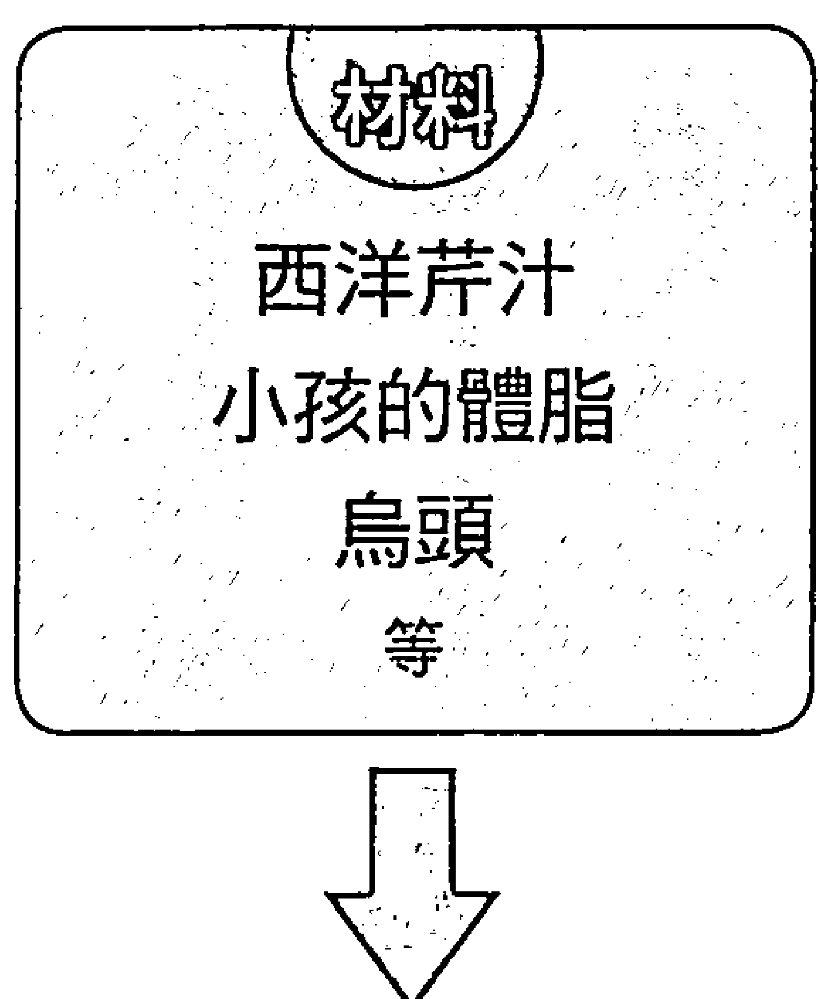

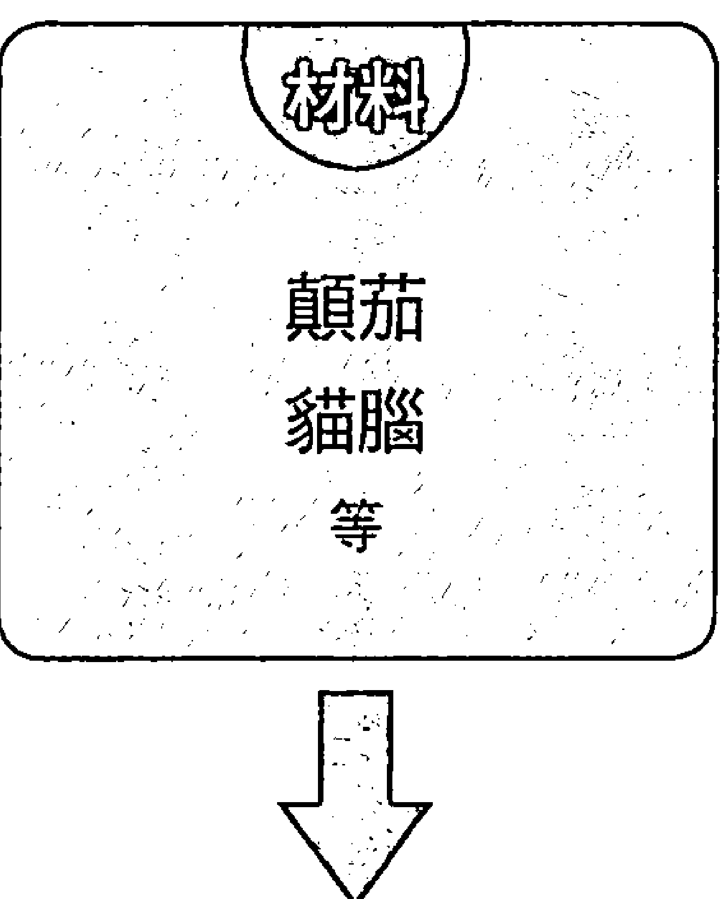

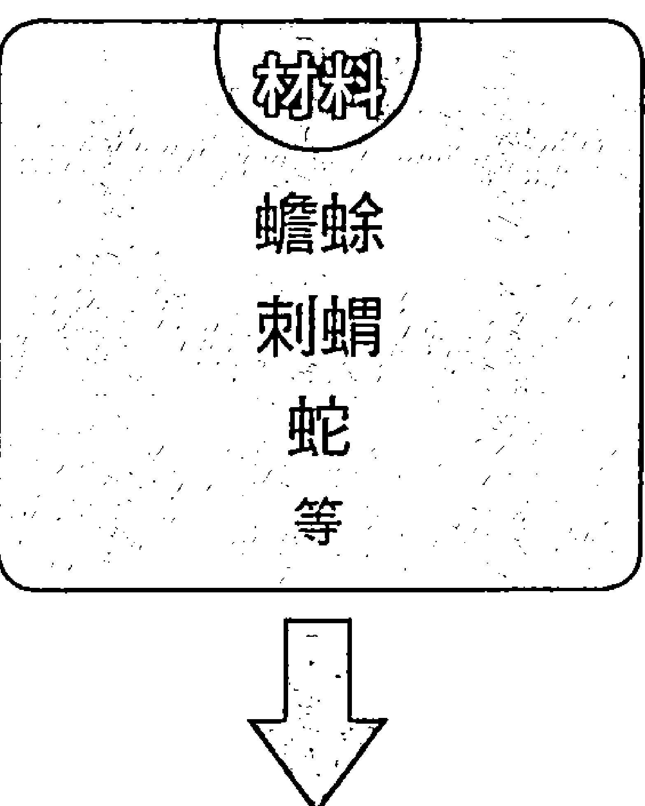

上图魔女软膏的材料与功效出自约翰·得·尼诺尔德（P.42）。前往魔女夜宴的软膏会让人产生幻觉，在脑内建构出幻想世界，涂上软膏睡觉就能让灵魂前往夜宴会场；飞行软膏含有颠茄等扰乱知觉的成分，药效发作时，魔女会觉得自己在空中飞翔；变成动物的软膏则混入了让想象力失控的药草。

## 诡异的材料

### ① 从植物取得的麻药和毒素

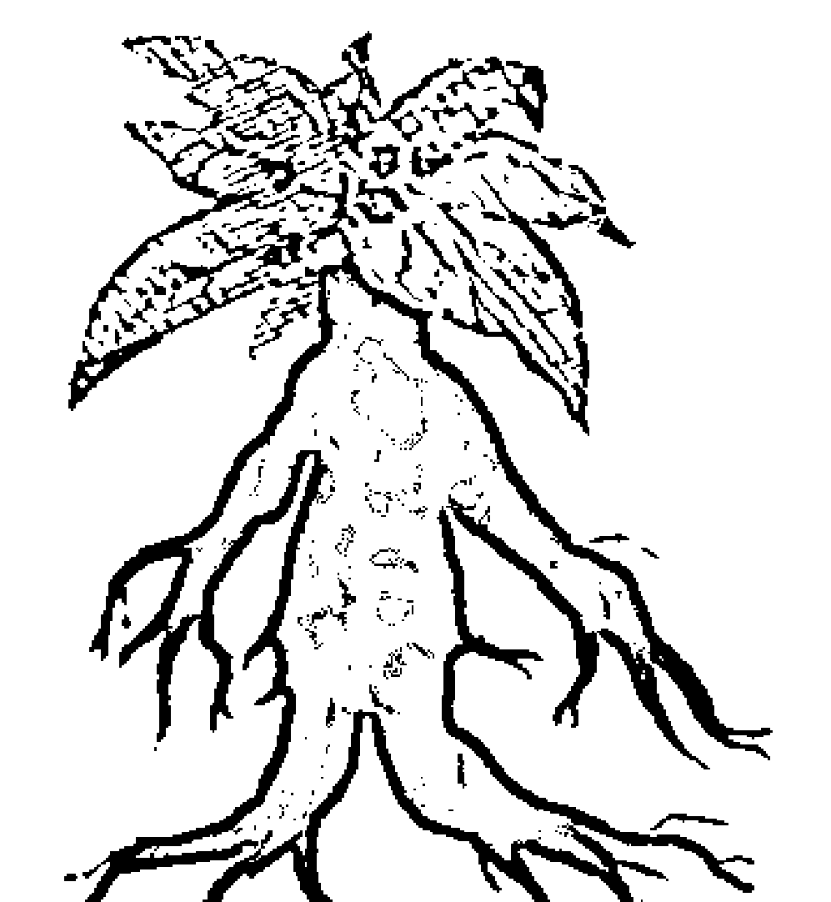

-   - 颠茄
-   - 乌头
-   - 洋金花
-   - 黑天仙子
-   - 罂粟果
-   - 风茄
-   - 黑茄
-   - 宾莨菪 等

自古用于民间医疗的药草是药亦是毒，上述的常用药草都是其中的佼佼者——用于镇痉药和麻醉药的洋金花、以鸦片原料著称的罂粟果、毒性猛烈的颠茄、对精神产生影响的天仙子，以及剧毒风茄等等。虽然也能当麻醉或镇痛剂使用，但只要用错方法，它们就会变成迷幻剂或瞬间置人于死地的毒药。现代的医疗药品已经不再使用这些植物。

### ② 违反基督教道德观的材料

-   - 受洗前的婴儿体脂
-   - 被处以绞刑的罪犯体脂
-   - 动物的血 等

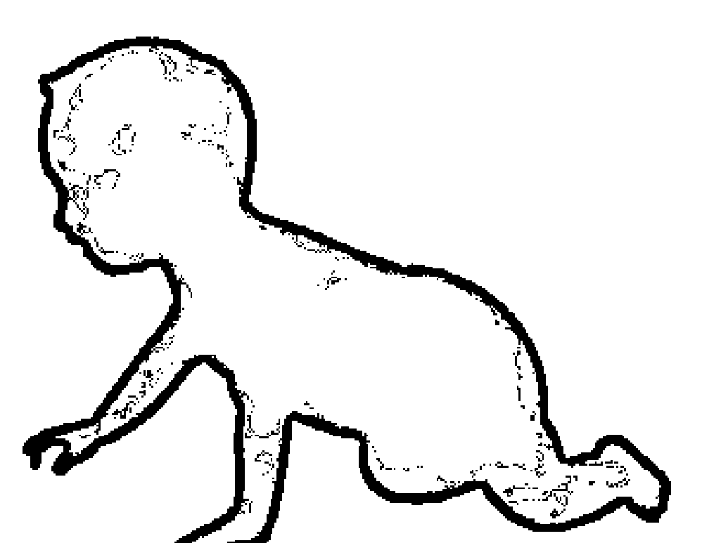

古人相信魔女会把杀死的婴儿献给撒旦，基督教的妄想让他们认为，魔女在软膏里加入了这些在教义上违反道德的材料。与药草相比，这种说法缺乏科学根据，纯粹是为了将魔女和恶魔连结而编造出来的政治抹黑。

## 因为精通药草而被当成魔女的人

说到在当时使用药草的人，首先会想到民间医疗里的巫医或产婆，以及具有宗教地位、以失魂状态进行仪式的萨满。在魔女狩猎时代，这些女性都被冠上魔女的罪名，遭受迫害及打压。**她们会用药草制作秘药、进行医疗或祭祀仪式，因此被基督教会视为眼中钉。**

就违反道德的材料来说，产婆确实容易取得婴儿的尸体；而在古代宗教的仪式上，使用活祭品也不是什么稀奇事。

然而，没有人知道这些材料的成效究竟如何。这么看来，将这些违反道德的材料与令人讨厌的动物，视为被冠上魔女之名后才加上去的「补充设定」，或许才是比较适当的做法。

## 软膏以外的各种魔药

魔女们使用的魔药不仅只有软膏，在审判记录里，还曾经出现过「魔法粉末」与「会产生魔法效果的食物」等字眼。

这些东西比软膏更加荒诞无稽，它们大多是用来施展**邪术（魔女的危害魔法）**的道具，可以加害人类或家禽，并没有科学根据。就教会的看法来说，只要是被基督教视为有罪的行为，都可以拿来套用在魔女身上。

其中比较特别的是她们在魔女夜宴上所吃的食物。「以受洗前的婴儿为材料」这种与道德背道而驰的部分虽然相同，但它具有让人「不能说话」的功效，让魔女即便受到拷问也不会说出真相。这种食物出现在苏格兰1661年和1695年的记录当中，是魔女们加诸在自己身上的交感咒术。

其原理是当魔女吃下刚出生、还不会说话的婴儿肉，她们的舌头便无法再编织有意义的话语。

不过，明明不能说话，为什么又会有魔女审判的记录呢？这种食物的真伪着实让人怀疑。

## 魔药与具有魔法效果的食物

### 魔女的秘药
1.  剁碎婴儿手臂。
2.  放进大锅里煮。
3.  加工制成粉末。

**效果**
危害家畜。
在田里降下冰雹。
放火、大量杀人。

### 魔法师的粉末
1.  从撒旦那里获得粉末。
2.  粉末为黑、白，或其他颜色。

**效果**
撒在面包皮上或加在起司里，杀死特定对象。

### 夜宴上的食物
1.  把受洗前的婴儿肝脏干燥后制成粉末，混入御谷面团。
2.  用受洗前的婴儿手脚及部分的头和臀部烤成派。

**效果**
受到拷问也不会说出真话，让人丧失语言能力。

与软膏相比，魔女的魔药和粉末材料都十分诡异。就算在仪式上用了人类以外的活祭品，将这种习俗转变成社会事件的依旧还是教会。即便如此，当时的人还是对教会的这种妄想深信不疑。

## Column

### 「吃小孩的魔女」和「杀婴儿的魔女」

「魔女会吃小孩」是童话里的一种设定，而神话或传说中的魔女本就以人为食。
话虽如此，多数在魔女狩猎时期遭基督教打压的人都没有食人习俗（食用人肉的行为或宗教习俗）。「以人肉为食」的概念自古就被视为禁忌。基督教在西元二世纪左右受到迫害时，也曾被冠上「食人」或「近亲相奸」这些莫须有的罪名。
然而，当基督教渗透欧洲以后，却用自己过去遭受的待遇对待其他宗教，指称异教徒是食人族，打压他们以排除异己。
本文内曾提过，当时的产婆也被以魔女的名义受到迫害。基督教认为她们知晓保护母体的堕胎术（杀婴的方法），能够把受洗前的婴儿献给恶魔。
而当魔女会吃小孩的迷信成立之后，她们当然也会像过去的异教一样遭受世间抨击。

## 第2章 世人想像中的外形

### 大釜

魔女用大釜调制软膏等秘药。
这个诡异到极点的工具，其实意外地普通？

### 频繁出现在魔女的古怪仪式上

❶ 美狄亚：希腊神话中的魔女。

魔女总是给人一边在大锅或大釜里炖煮奇怪材料、一边发出诡异笑声的印象。对她们来说，锅子或大釜也是重要的工具之一。

❷ 《马克白》：1606年由威廉·莎士比亚执笔的戏曲，是莎士比亚四大悲剧里的其中一篇。三位女巫对马克白提出各种预言，其中又以第四幕放着大釜的场景最让人印象深刻。

魔女会用巨大的锅子来调制软膏、媚药或毒药等各式药品，这点在各种传说故事里也可以见得，其中又以希腊神话的美狄亚❶（P.10）用来返老还童的锅子、芭芭雅嘎（P.16）把抓来的年轻人用土锅煮来吃的情景，以及戏剧《马克白》❷的第四幕等最为知名。

❸ 亚尔萨斯：位于法国东北部，过去曾是神圣罗马帝国的领土，德国和法国为了争夺这块土地，长年争战不休。

而被当成魔女的产婆在调配药草时很有可能也用了大锅，因此不难将她们与传说中的魔女联想在一起。

综上所述，虽然大家印象中的魔女经常持有一口大锅，在实际的魔女审判记录里却鲜少出现锅子的踪迹，唯有十六世纪末的亚尔萨斯❸地区曾出现以下描述。

参加夜宴的魔女会一边吟唱魔法仪式的祈祷文或咒语，一边让大锅煮至沸腾冒泡，接着把锅里的液体直接泼到地上，或是分装给信徒，让大家泼洒在自己喜欢的地方。从以泼洒为目的这点来看，这无疑是一种宗教仪式，也有人说装在锅里的其实是庆祝作物丰收用的神圣液体。

此外，夜宴上的餐点也是以大釜烹调。虽然锅里装的应该不是人肉，考虑到这是为参加祭典的群众所准备的食物，使用大锅烹煮也就不足为奇了。之所以被基督教视为魔女，纯粹是因为她们信仰异教的神。

### 《马克白》第四幕开头

第一场 漆黑的洞窟。中间放着沸腾的大釜雷声大作。三位女巫登场。

魔女1 虎斑猫叫了三声。

魔女2 刺猬叫了三声又一声。

魔女3 怪鸟催促着“赶快！赶快！”

魔女1 绕着大釜转个圈，丢进有毒的内脏。在冰冷的石头底下，蟾蜍睡了三十一天，日日夜夜分泌毒液，还没睁眼就被抓起。首先，就把妳丢进魔法的大釜里！

三人 痛苦吧！挣扎吧！沸腾吧！一遍又一遍，直到釜里化作一滩烂泥。

魔女2 沼泽蛇肉切成片，丢进锅里煮成羹。蝾螈眼、青蛙蹼、蝙蝠毛和狗舌头，蝮蛇信、蜥蜴针、壁虎脚和猫头鹰翅膀。翻滚吧！地狱的杂烩。沸腾吧！恐怖的魔咒。

三人 痛苦吧！挣扎吧！沸腾吧！一遍又一遍，直到釜里化作一滩烂泥。

魔女3 龙的鳞片，狼的牙齿，魔女木乃伊再加上食人鲨饱满的胃和肠。深夜里挖起的毒萝卜，诅咒神的犹太人肝与山羊胆汁。月蚀之夜砍下的红豆杉树枝，异教徒的鼻和邪教徒的唇。妓女生在水沟里再掐死的婴儿手指，通通煮烂之后再加入老虎的肠，釜里的材料就算凑齐了。

三人 痛苦吧！挣扎吧！沸腾吧！一遍又一遍，直到釜里化作一滩烂泥。

魔女2 最后再用狒狒的血冷却，魔咒总算大功告成了。

※出自《马克白》（莎士比亚著，木下顺二译，岩波文库）。

### 魔女的其他道具① 蜡像

魔女有时也身兼古代宗教的巫女或咒术师。“蜡像”便是具备这种身分的魔女所制作出来的道具。
这是一种利用交感巫术诅咒他人的魔法。她们会用蜡（或黏土）制作诅咒对象的人像，戳上尖刺或细针之后，再用水或小火将其熔化。
诅咒一词乍听好像很可怕，其实这是自古就有的咒术，算不上是特例。在魔女狩猎时代也留下了与这种人像有关的记录，1664年索美塞特（Somerset）和1678年佩斯利（Paisley）的魔女都坦承曾用这种人像进行仪式。

当然，魔女审判认定这种蜡像是为了诅咒他人而存在的邪恶道具，但真相为何至今不得而知。因为除了诅咒以外，蜡像还能用来为人治病，且极有可能是用在把疾病或苦痛转移到蜡像之后再加以破坏，让患者身上的病痛随之消散的这种好的咒术上。这种仰赖咒术的医疗行为，在近代医学发达以前相当普遍。

## 第2章 邪术

### 变身成动物

魔女用来加害人类的魔法被称为“邪术”。以下将为读者介绍几个代表性的魔法。

### 化身动物为非作歹是魔女的罪行

+ 11 狼人：即狼男，可以变成狼或半人半狼的兽人。请参照P.73。

魔女的其中一项危害魔法是变成动物。人变成动物的故事在神话或传说里屡见不鲜，但魔女的变身能力却来自恶魔。想变成动物时，可以使用软膏或咒语。若选择软膏，则需涂满全身上下。也有人怀疑这是否和飞行术一样，只是软膏造成的幻觉。

另一方面，咏唱咒语的方法就显得比较单纯。这种魔法借助了恶魔的力量，只要唱诵特定的咒语，就可以变成动物或变回人类。

魔女变的大多是狗、猫、乌鸦或蜻蜓这类随处可见的动物，就算是魔女变的，这些动物也并不危险，但当时的人还是担心“可能是魔女的化身”而对它们心生恐惧。

与其他动物不同，唯有变成狼的魔女危险度会大幅提高。她们被称为“被狼附身的人”，**半夜会在郊外徘徊，袭击并吃掉动物或人类。**

欧洲自古便存在狼人11传说，神学将狼解释成恶魔的化身。在魔女狩猎开始盛行之前，被认为是狼人的人同样被判处重罪。变成狼（恶魔的化身）的狼人和与恶魔缔结契约的魔女，这两者结合之后，便出现了“魔女变成狼为非作歹”的说法。

顺带一提，世上也有魔女无法变身的动物，如仔羊和鸽子被基督教视为纯血的象征，所以魔女没办法让自己变成这些动物。

### 魔女常变的动物

魔女常变成随处可见的动物。如果魔女在变成动物的时候受了伤，即使变回人形仍会在一样的地方留下伤口，据说曾有许多魔女因此暴露了身分。另外，有些魔女也会变身成动物前往夜宴，这时的她们大多化身为飞鸟。

### 变身用的咒语

#### 奥尔德恩的伊索贝尔·高迪

> 吾将进入猫的身体，
> 以悲伤、叹息与黑色子弹为凭。
> 吾将咏唱恶魔之名，
> 化身为猫并回到人类的家。

> 吾将前往野兔的世界，
> 伴随悲伤、叹息与许多的担忧。
> 接着，吾将以恶魔之名前行，
> 直到能够重新返家为止。

> 野兔啊野兔，
> 神将祂的关怀投注于汝。
> 虽然此刻吾化身为野兔之姿，
> 但很快就能变回女人的模样了吧。

1662 年，在苏格兰的奥尔德恩（Auldearn）有位被举报为魔女的女性名叫伊索贝尔·高迪，记录显示她曾利用这些咒语变成各式各样的动物。此外，若在变身後遇到其他魔女，必须告诉对方“请带我一起走”，向对方表明身分。

## 第2章 关于魔女

### 邪术

### 变身成动物

### 荒天术

第二种被视为魔女罪行的是操纵自然现象的荒天术。
因为会直接影响生活，对民众而言是相当棘手的魔法。

### 造成最多实际损害？操纵自然的危害魔法

> ❶ 詹姆士六世（James VI）：1566年~ 1625年。1567年，年仅一岁的他就任苏格兰国王。1589年与丹麦暨挪威国王弗雷德里克二世（Frederik II）的女儿结婚。1603年继承过世的伊莉莎白一世成为英格兰国王，为英格兰的斯图亚特王朝揭开序幕。

魔女的危害魔法正如字面上的意思，是指会对人类造成危害的魔法。参加魔女夜宴或使用飞行术是让魔女被冠上“魔女”之名的魔法，不过因为没有对一般民众造成实际伤害，较不会给人邪术的印象。

相较之下，“荒天术”这种让天气恶化的法术，由于会影响作物收成，可说最令人类头疼。对魔女而言，操纵暴风雨、冰雹或雷电这些自然现象简直是易如反掌。且荒天术不需藉由软件辅助，而是用手杖轻敲水面、把水灌进地上的洞、投掷打火石或是在船上吹奏笛子等等，手段五花八门。魔女们就是透过这些方法，操纵着自然现象。

魔女所施展的荒天术，著名的有1590年的北伯立克（North Berwick）事件。据说在伯斯维尔伯爵法兰西斯的指示下，魔女们多次利用“猫咒”引发大型风暴，阻挠苏格兰国王詹姆士六世❶与他的妻子——即丹麦暨挪威国王弗雷德里克二世的女儿“丹麦的安妮”——的航行。由于这起事件的受害者是苏格兰国王，参与事件的魔女人数又达百人之多，因此为后世留下深刻印象，在各种文献上都曾被提及。

然而就如P.48所提到的，魔女原本可能是崇拜自然的萨满。或许这些像施法一样的行为，只是祈雨用的祭祀仪式。

此外，实际上十六～十七世纪的欧洲本就气候不佳，强烈寒流曾数度直击欧洲大陆，农作物也长期歉收。正因社会环境如此不安，举行怪奇仪式的魔女才会受到不合理的迫害。

### ※施展荒天术的方法

魔女

> ☆透过魔女的法术……

+ - 用手杖轻敲池塘水面。
- 在船上吹奏笛子。
- 把水灌进地上的洞。
- 挥舞湿漉漉的扫帚。
- 把手杖摆在干涸的河床。
- 用浸过水的破布拍打石头。
- 面向西方，往自己的左肩去掷打火石。
- 将活祭品的鸡抛向空中。
- 用大釜炖煮蛇肉。

### 召唤恶劣天气！

+ 雷电
+ 狂风
+ 暴风雨
+ 冰雹

根据魔女审判的记录，魔女会用左侧列举的方法来操控天气。其他还有像是把去势的公猪刚毛放进锅里煮等方式，不过与下面要介绍的“猫咒”相比，大致上都不会带给人恐怖的印象。即便如此，当时的人还是深信魔女能够藉此施展法术。

### ※呼唤暴风雨（Stormbringer）的案例

北伯立克的魔女

### 猫咒

+ ① 为猫洗礼。
② 以基督教徒的名字（如玛格丽特）为其命名。
③ 将男性尸体的关节绑在猫的脚上。
④ 一边大喊“去吧，撒旦！”一边把猫丢进海里。

结果差点让詹姆士六世与他的新娘在从奥斯陆前往利斯的途中溺毙。

这种荒天术出现在 1590 年北伯立克的魔女审判记录里。成群的魔女一起施展呼唤暴风雨（Stormbringer）的魔法，企图藉此暗杀国王。这个名为“猫咒”的仪式比其他任何荒天术都还要诡异，强调魔女与恶魔的连接。

### 性爱魔法

魔女也擅长与性爱有关的魔法，她们能让男人不举，或是让女人不孕。 这种让人闻之色变的魔法究竟是什么？

### 影响生殖行为与夫妻感情的魔法

> ❶ 伊尔洁·薇塔一案：伊尔洁·薇塔是维涅卡·比尔曼家的女佣。维涅卡在婚后得了重病，就此一病不起直到过世。他的妻子指控伊尔洁用魔法勾引维涅卡，丈夫的病也是因为伊尔洁的食物所致。经过一番判决之后，伊尔洁被认定是魔女，于1589年在布隆贝格被处以火刑。

对男性而言，丧失性功能这件事可以说是非同小可。魔女狩猎时代的恶魔学家将这种现象怪罪于恶魔的法术，而这类“不孕术”和“性爱术”也是魔女的拿手好戏。

过去原本就存在让人丧失性功能或爱上他人的咒语或妖术。但基督教认为繁衍后代是神所赋予的使命，非为此目的所进行的行为（自慰、卖淫或同性恋等），都会被视为不道德的背叛。由于他们抱持这样的性观念，不论是妨碍生育的不孕症，或是并非夫妻关系却耽溺于性爱欢愉的人，都被宗教视为有害。

另外，抨击咒语和妖术是恶魔行为的恶魔学，则认为这些与性有关的冲动、疾病或失能情形，是魔女借助了恶魔之力加害于人。

具体来说，魔女们使用了右页的方法施展性爱魔法。 让男性丧失性功能的方法，是把打结的缎带或绳线藏在他的稻秆床垫、枕头里或门槛下方，若男性发现缎带并把结拆开，效果就会失灵。这个方法比起魔法，感觉更像是许愿咒语。

而在审判记录里，有一项引人注目的案例。法官判定夫妻之间的不和，是因为有魔女从中作梗。在1589年遭到处刑的伊尔洁·薇塔的案例当中，男性之所以久病不起，是因为吃了她煮的猪头料理。

从这样的案例来看，似乎也有许多人是因为女性间的忌妒或憎恨而被当成魔女。

### 不孕术和性爱术的施术方法

### 让男性失去性能力的方法

① 用缎带或绳线打一个结。

② 把绳结藏在床垫或枕头里。

③ 一旦男性睡在上面，

> **就会不举！**

+ 性爱术的种类
- 让男性失去雄风。
- 让女性无法怀孕。
- 让男性成为自己的俘虏。
- 取走男性的性器官。

### 让男性爱上自己的方法

① 把青蛙关进蚁冢，等待它被蚂蚁啃食到只剩白骨。

② 用青蛙骨头轻触男性的肌肤。

③ 男性会

> **燃起熊熊爱火！**

魔女的性爱魔法是以让男性不举或让女性不孕为主要目的。据说还有能够摘除男性性器官的可怕魔法，但这项说法并不可信。然而，著名的魔女狩猎教战手册《女巫之槌》曾一本正经地探讨这个法术。有研究指出，与其说这些基督教的神学家或修道士是轻视女性，其实更有可能是罹患了女性恐惧症。

### 魔女的其他道具① 蕾丝和绳线

在上述方法曾提到“绳线”，其实这些“绳线”和“蕾丝”也是魔女不可或缺的道具之一。

“梅堤带”是一种魔女的占卜道具，她们会把梅堤带绑在病人身上，占卜病人能否顺利康复，一般会用男性魔女的腰带或女性魔女的袜带。实际在1570年被举报为魔女的珍妮特·皮尔森，就是因为用了梅堤带而被判处重刑。

对魔女来说，绳线是用来表示身份的象征，一般会绑在大腿附近，类似我们现在用的袜带（Garter）。红色袜带代表与恶魔签订契约，不同颜色代表不同的身份地位。

虽然一般人对此不甚熟悉，魔女与绳线或袜带其实有着密不可分的关系。而除了袜带之外，英语圈国家也将吊带和臂带都归类为“Garter”。

而这种绳线或袜带也频繁地出现在恶魔的服饰当中，一般认为它具有魔法效力。

## 第2章 关于魔女

### 巫术

### 性爱魔法

### 其他法术

魔女对人类造成的危害可不只前面提到的那些。 在其他法术当中，最常被举报且影响力最大的是哪一种呢？

### 直接影响生计的“盗奶术”是最恶质的魔法

> 汤玛斯·阿奎那 (Thomas Aquinas)：1225年左右～1274 年。意大利的神学家，道明会成员。著有将基督教的神学内容以系统式条列法汇整而成的《神学大全》。

十三世纪的神学家汤玛斯·阿奎那认为，魔女的法术以“与恶魔进行性交易”、“飞行”、“变成动物”、“不孕术”和“荒天术”这五个概念为基础。这些都是魔女的危害魔法，且直接影响到她们的罪孽。不过，除了这些概念以外，还有其他邪恶法术让她们经常遭到举发。

“盗奶术”是其中最具代表性的法术，涉嫌的魔女多不胜数。她们拉住嵌在柱子上的斧头握柄，隔空为邻居饲养的牛只挤奶。在近世的观念当中，世界上的财富总量是固定的，因此当魔女用这种方式挤奶，邻居的牛奶产量便会减少。换句话说，她们偷了别人家的牛奶。

在当时的农村，一般多由妻子饲养家畜并贩卖乳制品贴补家用，故牛奶减产对她们来说是直接影响生计的严重问题。之所以有那么多人举报，其实也反映了民众希望能优先解决这个问题的迫切感。

牛是生物，会因为健康状况等因素导致牛奶的产量变少或品质变差，但要是这种情况过于频繁，在当时被怀疑是“魔女所为”似乎也有一番道理。

而另一方面，记录里也有用来对抗盗奶术的魔法与咒术，证明当时的案件数量与受害人數有多么庞大。在盗奶术以外，魔女最常被控诉的是让人生病或受伤的魔法。德文将“闪到腰”说成“Hexenschuss（魔女的箭矢）”，代表在那个年代，突如其来的病痛也会被视为魔女惹的祸。

### 盗奶术

### 魔女的盗奶术

把斧头嵌在柱子上，拉扯握柄挤出牛奶，这些牛奶来自邻居家的牛只。

从邻居家的牛奶中窃取乳脂肪，造成奶油和起司的品质下滑。

### 对抗魔法

折磨偷牛奶的魔女 把用火烤过的镰刀放进牛奶里冷却，接着加入煤炭与硫磺之后，倒在没人知道的地方。

制作奶油时的驱魔方法 脱下裤子露出屁股，让魔女和恶魔吓一大跳。

在当时的农家，丈夫的手工业无法满足一家温饱，用来支撑家计的牛奶就像是他们的生活命脉。负责照顾家畜的妻子们举凡遇到任何灾害，或是向教会举报是魔女所为，或是用对抗魔法进行自保。由此可见，这个问题已经迫切到她们必须自行想方设法与魔女抗衡。

### 诅咒和让人生病的魔法

+ - 对人吹气，让他染上手脚不听使唤的病。
- 只用一句咒语就能立即杀死所有人。
- 用邪眼攻陷法官的心防，使其堕落。
- 触碰手臂或手腕迷惑对方。
- 只需拉住人家的衣服就能让对方生病。
- 用手杖敲打母牛或母马，吟唱某个咒语将其咒杀。
- 让人胃痛、头痛、绞痛、肚子痛、麻痹、癫癇或染上癩疯病（汉森氏病）。
- 让人闪到腰。
- 故意在门槛留下灰尘，在下面埋进一个锅子后对门槛洒水，诅咒对方生病。
- 在对方门前洒上接骨木树叶煮成的汤汁和母鸡血，使对方的小孩生病。

当时的人经常将生病或受伤怪罪于魔女的魔法。根据记载，魔女会使用各式各样的方法诅咒他人或让对方生病、受伤，如用手触摸、以眼瞪视或对其吹气等等。顺带一提，“闪到腰”一词在德文称为“Hexenschuss”，意指“魔女的箭矢”，可说是过去将突发病症当成魔女所为所留下的痕迹。

## 第2章 魔女夜宴

### 魔女夜宴

魔女在“魔女夜宴”上与恶魔缔结契约、宣示忠诚。这种诡异的聚会被视为魔女的最大罪行，它的真实面貌究竟为何？

### 模仿弥撒，与恶魔签约的疯狂宴会

> ①《死之书》：恶魔用来记录与自己立下契约的魔女名册。

魔女夜宴（Sabbath）是魔女必须参加的夜间集会，她们会在这里与恶魔交换契约并举行仪式。

夜宴大致的流程如下：

举办夜宴的晚上，魔女会瞒着家人偷偷起床，在身体涂上软膏，利用变成动物或骑乘扫帚等方法前往会场。此外，也有很多人会借助恶魔的力量飞到会场。

集合地点多在远离城镇的原野、十字路口或遗迹这类人烟稀少的地方，通常是数位魔女聚在一起举办宴会，但据说也曾有聚集一万两千人以上的大型聚会。

而在魔女夜宴上，首先会进行两个重要仪式。

一个是对恶魔表示敬意的“臣服之礼”。这是崇拜恶魔、藉契约之力驱使魔女们的礼拜，**作为效忠恶魔的证明，在每回仪式的最后，她们会在拥有人类脸孔的恶魔屁股献上一吻。**

另一个则是新手魔女的“入会仪式”。这种仪式会因为新成员是孩童或成人而有所不同，以下将以从基督徒变成魔女的成人为例。

首先，新成员必须否定过去信仰的基督教，将十字架或圣人像丢在地上踩踏，发誓自己从此效忠恶魔。接着，恶魔会为她受洗，擦去她脸上的圣油。当她重新选定教父母，并献上部分衣物作为契约的证明之后，必须站到地上的魔法圆中央，宣誓对恶魔的忠诚。最后在《死之书》①写上自己的名字，承诺将献出自己的小孩，并在身体某处刻上恶魔的印记。这一连串的举动都是效仿基督教的弥撒，但内容与弥撒完全相反，是对基督教的冒渎行为。

## 第2章 关于魔女

### 魔女夜宴

魔女会亲吻恶魔的臀部表示敬意。

Illustration: いけだ

> ② 聖餐：出自「最後的晚餐」的基督教儀式，信徒會分食代表基督身體的麵包與代表血液的紅酒。聖餐一詞原本是指麵包和紅酒本身。

結束這兩個儀式之後，接著會舉行餐會。餐會上的食物琳瑯滿目，有的人覺得好吃而大快朵頤，也有人覺得味道平淡而怨聲載道。據說有些菜餚還用了青蛙、烏鴉或獻祭的嬰兒等讓人毛骨悚然的食材。另外，宴會的餐桌上不會出現基督教的聖餐²所使用的麵包、紅酒及驅魔用的鹽。

下個活動是宗教儀式必備的舞會。所有成員面朝外，不看彼此的臉，手牽手圍成一圈跳起輪舞曲。乍看之下好像很開心，其實只是激烈又不協調的動作，搭配鄉村風格的刺耳噪音，目的是為了讓人陷入恍惚狀態。

最後則是所有成員與惡魔的雜交派對。這個活動與其說是為了耽溺色慾，更接近「性愛狂宴」，即祭祀儀式。在這裡，不論性別或血緣，所有人會和身邊的人或惡魔發生性行為。近親相姦、同性戀、與惡魔結合，這些全都是與基督教相違背的不潔行為，代表對神明的冒瀆，以及對惡魔的忠誠。不過，據說與惡魔結合的行為並沒有特別舒服，反而只是一種痛苦的折磨。而部分地區則會省略這樣的「性愛狂宴（Orgia）」。

魔女夜宴以公雞的叫聲畫下句點。有些地方則是以詠唱耶穌和聖母瑪麗亞之名，或是在胸口比劃十字架作結。

### 被抹黑成惡魔儀式的古代信仰

> ③ 黛安娜（Diana）：羅馬神話的狩獵女神，與希臘神話的阿緹蜜絲（Artemis）被視為同一神。農民奉祂為多產之神，經常舉行慶祝豐收的儀式。

> ④ 戴歐尼修斯（Dionysus）：希臘神話的葡萄酒之神，即羅馬神話的巴克斯（Bacchus）。戴歐尼修斯的信仰同樣早於基督教，人們在祭典上飲酒作樂。雖然也曾出現性解放事件或暴力衝突，但祭典本身卻受到奴隸和女性等社會弱勢的支持。

這種無比崇尚惡魔的夜宴當然也是魔女狩獵時代的產物。歐洲原本就信奉掌管豐收的大地女神黛安娜³；而戴歐尼修斯⁴（即羅馬神話的巴克斯）的祭祀儀式上，則有全裸的巫女意識不清地在森林狂奔，將遇到的動物大卸八塊後生食其肉。這些信仰深植在與自然息息相關的農民心中，基督教最初也選擇寬容以對。

然而隨著時代演變，基督教根據惡魔學對異教和異端進行打壓、迫害，這些自古以來的風俗也被他們抹黑成惡魔的宴會。他們要讓社會知道，不是因為場面脫序混亂，也不是因為這些人行為不檢，而是因為這些祭典與惡魔有關，才會被教會禁止。

### 魔女夜宴的流程

舉辦時間：星期六、日以外的深夜。（多在星期三或星期四晚上。）

舉辦地點：高山、丘陵、十字路口、森林或遠離鄉鎮的荒野，有時也會辦在室內。

-   ① 禮拜惡魔
對惡魔表示敬意的臣服之禮。
1. 對坐在寶座上的惡魔行臣服之禮。魔女會以膝蓋著地，雙手交握在後，眼睛看地面往寶座前進。
2. 獻上祭品（樹葉或木片等）以示忠誠。
3. 向惡魔示意。
4. 親吻惡魔。一般吻在屁股，有時也會在腳、臉或耳朵下方。

-   ② 入會儀式
為初次參加的人準備的儀式。
1. 否定對基督教的信仰，發誓歸順惡魔。
2. 惡魔替入會者重新受洗。
3. 進行清除聖油的儀式。
4. 魔女獻上部分衣物以示服從。
5. 在魔法圓中央宣示效忠惡魔。
6. 在《死之書》寫上名字。
7. 承諾將犧牲自己的子嗣。
8. 發誓今後不再參加基督教的儀式。

-   ③ 宴會
享用各式菜餚。
蔬菜類有高麗菜、豌豆及蠶豆。
肉類有牛肉、豬肉、羊肩肉、馬肉、雞肉、鴿子肉和野兔肉。
也有用狗、貓、山羊、烏鴉或青蛙等動物做成的餐點。
沒有麵包和鹽。

-   ④ 舞會
隨著鄉村音樂跳起輪舞曲。
參加者不看彼此的臉，背靠背跳輪舞曲。
不協調且動作激烈的舞蹈。
以長笛、雙簧管、繆賽特風笛、鈴鼓和爵士鼓演奏七零八落的鄉村樂曲。

-   ⑤ 雜交
與身旁的人發生關係。
與惡魔發生關係或近親相姦等不道德的性行為。

-   ⑥ 結束
以宣告天亮的公雞叫聲作為聚會結束的信號。

雖然有些部分會因地區或宗派出現差異，魔女夜宴的流程大致上如上所述。舉辦時間要避開六、日是因為那是基督教徒集體崇拜神的日子。而之所以經常以十字路口為聚會地點，是源自異教裡守護岔路口的土地神信仰。

就邪術來說，「參加夜宴」是魔女最大的罪行。因此在魔女狩獵時代遭到告發的魔女，多半都坦承自己曾參加夜宴。

以下介紹幾個在真實的審判記錄裡出現的魔女口供。

-   1. 1569年的凱薩琳供述，她坐在惡魔派桑的頭上，前往勒彼丘陵參加魔女夜宴。在那裡，人們跳著舞、吃著飛禽做的料理或討論壞事。當她用派桑給她的小棍子輕敲水面，天空便開始降下甘霖。
2. 1624年的克拉緹安娜供述，她的祖母曾多次帶她參加位於雷斯托拉的魔女夜宴。參加的人在那裡跳舞玩樂。她在餐會上吃了厚厚的黑色肉片和黑色麵包，遇見惡魔托扈與其締結契約，並曾一度和托扈發生肉體關係，但過程非常冰冷疼痛。
3. 1624年的約翰供述，在他所參加的夜宴上，有個高大且肩膀長角的黝黑男子，以祭司的身分舉行彌撒。男人敲響撥火棍和鐵鎚，潑灑用馬尿做的聖水。會場裡有一座木製祭壇，參加的人須獻上蠟燭、麻或雞蛋並親吻鐵盆。彌撒結束後，所有人必須跪在男人面前，面朝上親吻他的耳朵下方。

仔細檢視當時的時代背景，被當成惡魔的無疑是異教的神或祭司，故這些聚會可能只是宗教的祭祀儀式。事實上，惡魔學家想像出來的魔女夜宴，就包含在異端審判遭到否定的瓦爾多派（Waldensians）的集會內容。這些異端、異教的儀式被冠上惡魔之名，混在一起變成不倫不類的信仰。

### 黑公羊模樣的惡魔

魔女夜宴上的公山羊

-   - 頭上有三根角。
- 黑色頭冠。
- 倒豎的頭髮。
- 臉色蒼白。
- 眼神銳利。
- 十指等長。
- 指甲像猛禽般彎曲尖銳。
- 像天鵝一樣的腳。
- 驢尾。
- 屁股下方有一張人臉。
- 聲音沙啞，語調平板。
- 表情像有憂鬱症的人一樣鬱悶。

魔女夜宴的主辦人撒旦經常以不同形象登場，其中以公山羊最為普遍。這副模樣源自於對「有角神」（如牧神潘及守護家畜和田野的法翁）的信仰。多年後，艾利弗斯·李維（Eliphas Levi）繪製了想像中的惡魔巴弗滅，畫中的惡魔也是以公山羊呈現。

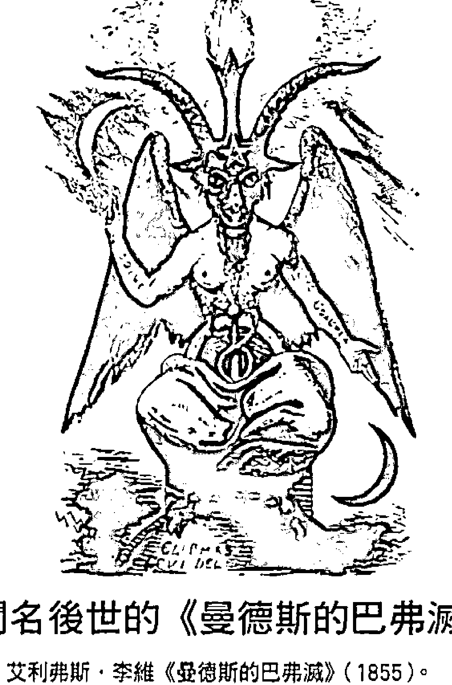

### 動漫世界裡的魔女①

在日本，說到大家耳熟能詳的魔女，應該就是「小魔女」了吧。本專欄將帶讀者快速回顧這些在日本成為一大創作類別的小魔女動畫。

這個類別的始祖是日本第一部少女向動畫《魔法使莎莉》（1966年）。以外國電視劇《神仙家庭》的高人氣為契機，電視台企劃了這部動畫，並確立了主角在生活中用魔法幫助他人的故事風格，成為「日常系魔法故事（Everyday Magic，在平凡的日常生活裡加入魔幻元素的故事類型）」的開端。

受到《魔法使莎莉》爆紅的影響，後續接連誕生出如《甜蜜小天使》（1969年）等各式各樣的少女向動畫，發起第一波小魔女風潮。順帶一提，「小魔女」原本是指「使用魔法的少女」，不過在這個時期，擁有魔法以外的神奇能力的女孩也會被稱為「小魔女」。

後來，電視公司又製作了《甜甜仙子》（1982）和《魔法小天使》（1983）。這些作品除了吸引原本鎖定的小女生客群之外，更讓高年齡層的動畫迷為之瘋狂，掀起第二波小魔女風潮。（接P.89。）

## 第2章 魔女夜宴

### 沃普爾吉斯之夜

令人聞風喪膽「魔女夜宴」。這個從想像中誕生的饗宴，其實參考了許多歐洲的祭典。

### 為了慶祝春季到來，魔女們集結在山頭

-   1. 聖女沃普爾加 (Walburga)：西元710年出生於威塞克斯王國的聖女。她與兄弟們旅行至德國法蘭克尼亞，進入當地的海登海姆修道院成為修女。
2. 歌德：約翰·沃夫岡·馮·歌德 (Johann Wolfgang von Goethe)。1749年~1832年。德國的代表性文豪。代表作有小說《少年維特的煩惱》；敘事詩《赫爾曼與寶綠苔》；戲曲《鐵手騎士蓋茲·馮·貝爾力希傑》和《浮士德》等。
3. 《浮士德》：歌德代表作之一的長篇戲曲。總共由兩部組成，第一部發表於1808年，第二部發表於1833年。

姑且不論是否真的有魔女夜宴，至少在當時，人們對此深信不疑。因為在那個時代，有好幾個可謂是其原型的祭典存在。

例如羅馬時代在每年2月15日舉辦祈禱安產的「牧神節」；大批人群飲酒作樂、縱情亂性的「戴歐尼修斯的祭典」；以及至今仍存在於歐洲各地的「沃普爾吉斯之夜」。

沃普爾吉斯之夜（Walpurgisnacht）是橫跨4月30日到5月1日的歐洲傳統慶典，古代凱爾特的春日祭典便是在這個時期舉行。這項承自異教的習俗，後來被冠上基督教聖女沃普爾加的名字，與她的紀念日合而為一。

這個祭典在中歐和北歐相當盛行，每個地方的文化與風俗各有不同，當中以德國的傳說最接近「魔女饗宴」。相傳一到夜裡，魔女們會來到德國中央偏北的哈次山脈（Harz）最高峰「布羅肯峰（Brocken）」，舉辦大規模的慶典，迎接春季的到來。

雖然現在已染上基督教的色彩，但在魔女狩獵時代，這個傳說卻深植於世人心中。正因如此，過去有許多藝術家、文豪及知識分子深陷於它的魅力，歌德也是其中一人。

歌德的詩篇〈最初的沃普爾吉斯之夜〉與戲劇《浮士德》皆以這個祭典為題材，當中又以《浮士德》的描寫最為出色。

當然這些作品純屬虛構，不過藉由歌德那以豐富知識為憑的筆觸，仍可窺見當時存在於人們信仰中的魔女傳說。

### 魔女聚集的「布罗肯峰」

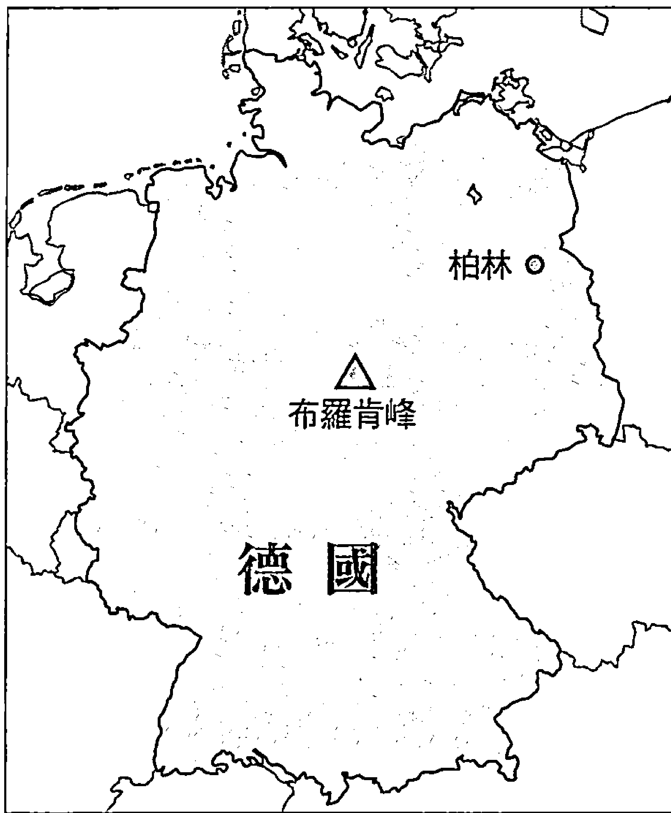

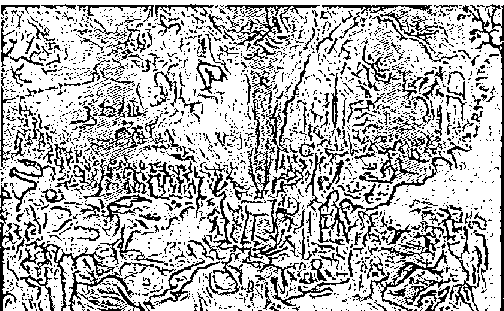

※米海尔·赫尔《沃普尔吉斯之夜》（约1650年）。
在沃普尔吉斯之夜，魔女们会集结在布罗肯峰。这座标高1141公尺的山是德国中部哈次山脉的最高峰，山顶一年有三百天受白雾笼罩，以雾中的长长人影和会出现彩虹光晕的「布罗肯现象」闻名。除了布罗肯峰以外，相传整个哈次山脉都是魔女的神秘居所。

### 《沃普尔吉斯之夜》的著名场景

〈沃普尔吉斯之夜〉撷取魔女们在浮士德等人攀登布罗肯峰时的合唱。

-   魔女们（合唱）
魔女倾巢而出，奔向布罗肯峰。
黄色残株，翠绿树苗。
成群魔女，聚集在此。
魔女乌莉安起了个调。
飞过岩石，越过树根。
魔女放了◯，公羊◯死人。
合唱
伟大的人不得崇拜他者，
鲍伯阿姨妳得走在前头。
阿姨骑在强壮的猪背上，
魔女们啊大家快点跟上。
合唱
这条山路又宽又长，
大家何苦捱肩擦背？
拨火棍刺着了妳，扫帚又挥着了她。
压扁肚里的宝宝，妈妈气得直跳脚。
年长的魔女 我们就好比蠕行的蜗牛。
（半数合唱）只要生为女人，就得抢先一步。
更别说是要与恶魔会面，
只要生为女人，就得抢先千步。
另外一半
我们对这规矩言听计从，
只要生为女人，快快抢先千步。
然而不管女人走得多快多急，
男人还是只稍一步就能追上。
合唱
微风不再吹拂，星星逃往他处，
连朦胧的月也藏起自己的影子。
当魔法的歌声响彻云霄，
无数的火花在空中绽放。
合唱
骑着手杖，乘着扫帚，
或是拨火棍或公山羊。
今晚不出席的愚蠢男人，
这辈子都别想出人头地。
合唱
魔女用油膏恢复青春，
再拿来破布制成船帆，
任何木桶都能做船身。
今天不飞的傢伙，一辈子飞不起来。
合唱
我们绕着山顶飞啊飞，
你们就在地上爬啊爬。
一望无际的荒野之上，
魔女们啊快快集结吧！

> ※第一个隐讳符号「◯」是「屁」，第二个是「臭」。
※出自《浮士德 第一部》（歌德著，相良守箚译，岩波文库）。

## 第2章 IV 恶魔

### 恶魔的印记

> 比参加夜宴或飞行还要更确实的证据，
是恶魔留在魔女身上的印记。

### 身上的印记代表与恶魔的联系

作为与恶魔缔结契约的证明，魔女身上一定会有「恶魔的印记」与「魔女的印记」。

在夜宴上，恶魔会在魔女的身体某处留下恶魔的印记。
有的用牙齿咬，有的用爪子抓，虽然方法不尽相同，但共同的特征是会留下瘀青、伤痕、斑点或是像刺青般的图形。
印记没有特定的种类和位置，通常以左肩居多。据说留下印记的地方会像被火焰烧灼般发烫，这种激烈的疼痛会持续好几天。

这种恶魔的印记被视为判定「被告是否为魔女」的标准，而魔女审问官用来辨别这点的方法则称作「针刺法」。他们相信这个印记没有任何感觉，**如果用针刺也不觉得痛或是没有流血的话，就表示这是恶魔的印记，证明被告是魔女。**

另一方面，魔女的印记看起来像是疣或痣，代表多余的乳头。魔女会用这颗乳头将母乳或血液喂给自己的使魔（P.74）。这种印记也没有固定的位置或形状，曾有记录显示被告的印记位于舌头下方和阴部。

然而不论伤痕或疣本就有遍及人体各处的可能，对于因此被定罪的魔女来说，这种找碴的方式简直是岂有此理。

即便如此，当时的魔女猎人依旧为了寻找这些印记而杀红了眼。他们扒光被告的衣服，甚至曾剃光她们的头发和体毛。从这些案例来看，不得不说那是个狂乱无章的年代。

### 惡魔的印記和魔女的印記

### 惡魔的印記

-   - 與惡魔締結契約的證明。
- 傷痕、瘀青、刺青、青色斑點、像跳蚤咬痕般的痕跡等。

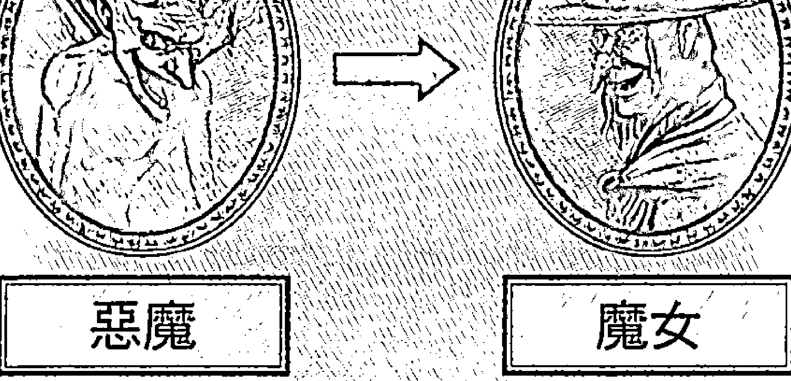

作為契約的證明，用爪子抓或用牙齒咬。

### 魔女的印記

-   - 魔女飼養使魔的證據。
- 疣或痣等突起物。

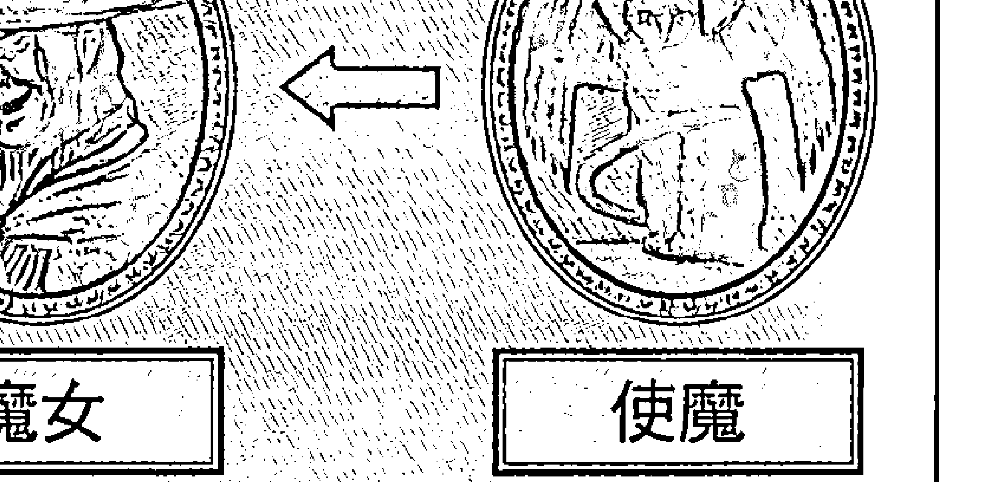

從魔女的印記獲得母乳與血。

魔女的印记代表与使魔的连繫，恶魔的印记代表与恶魔的契约。这两者都是人体上常见的特徵，只从外表难以辨别。因此，魔女审问官认为这些印记会藏在不易被看到的地方，他们会翻遍被告身体的每一寸肌肤，检查眼睑内侧、腋下、头皮或阴部。

### 辨别魔女的方法

-   1. **用針刺。**
   - 感覺不到疼痛。
   - 結果：魔女！
2. **接受拷問。**
   - 不會流眼淚。
   - 結果：魔女！
3. **綁上石頭，沉入河川或沼澤。**
   - 浮上水面。
   - 結果：魔女！

辨别魔女的方法主要有以上三种，其中又以第三种「水验法」最为准确。当时的人认为魔女像恶魔一样是灵体，又因为能在天空飞翔，体重一定很轻。而荷兰在审判魔女时用的巨秤「魔女之秤」也是采用同样的原理。

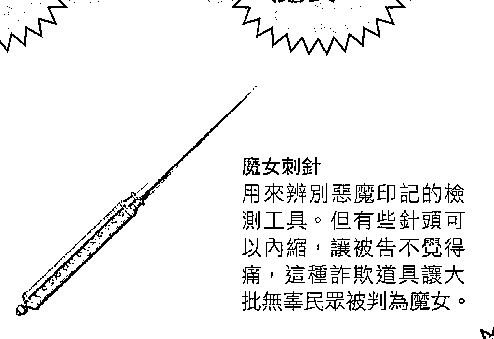

魔女刺针

用来辨别恶魔印记的检测工具。但有些针头可以内缩，让被告不觉得痛，这种诈欺道具让大批无辜民众被判为魔女。

## 第2章 Ⅳ 惡魔

### 夢魘

午夜時分，淫魔或夢魘會趁人們熟睡時與他們發生關係。 其實這種惡魔也和魔女有密切關連。

### 荒淫的夜之惡魔也是魔女的爪牙

與人類發生性行為的惡魔稱為夢魘或淫魔，基督教自古便相信有「女夢魘（Succubus）」和「男夢魘（Incubus）」的存在。前者會以女性的姿態與男性交媾，後者則會以男性的姿態與女性結合，他們會化身為獵物理想中的異性模樣，要擺脫他們的誘惑可說是相當困難。

長期與夢魘交媾的人類，身體會逐漸衰弱，最終賠上性命。耽溺於性愛歡愉的後果，便是迎來可怕的生命終結。

此外，夢魘也與魔女有密切的關聯。

他們正是魔女在夜宴上交歡的對象，雙方在契約上以及肉體上都緊密相連。而魔女還能操縱夢魘，讓牠們聽從自己的命令去襲擊睡夢中的人類。

不過，由於惡魔本是沒有肉身的靈體，惡魔學家針對牠們是如何獲得肉體與人類發生關係這點進行深度討論，一般認為，夢魘會先用新鮮的屍體或適當的對象搭配其他材料，製成「臨時肉體」後，再進行附身。

若將其視為性愛魔法的一環，魔女操縱夢魘似乎也不無道理。然而，夢魘與人類交合的目的卻尚未明朗。關於這點也存在各種說法，有人說是為了讓人類墮落，也有人說是為了獲得精子，這些精子會被用來製作前述的臨時肉體，或是讓女性意外懷有身孕。

### 魔女与梦魇的关系

其他宗教信仰或传说里也有在梦中与人交合的恶魔与妖怪，但基督教没有参考任何传说，而是藉由想象捏造出如左图所示的背德恶魔，「女梦魇」与「男梦魇」便由此而生。到了魔女狩猎时代，世人将这些恶魔与魔女的恶行结合在一起。

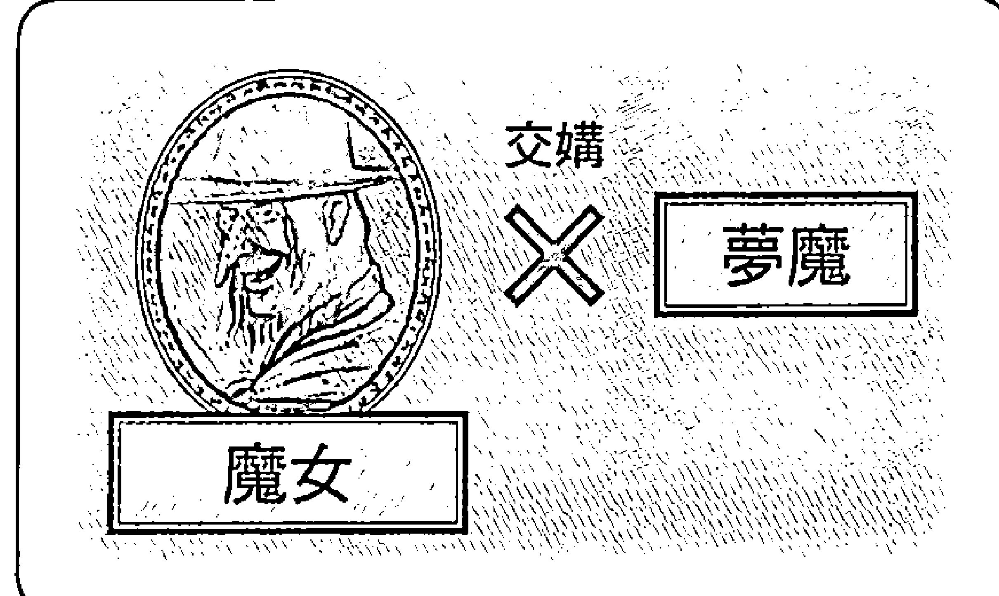

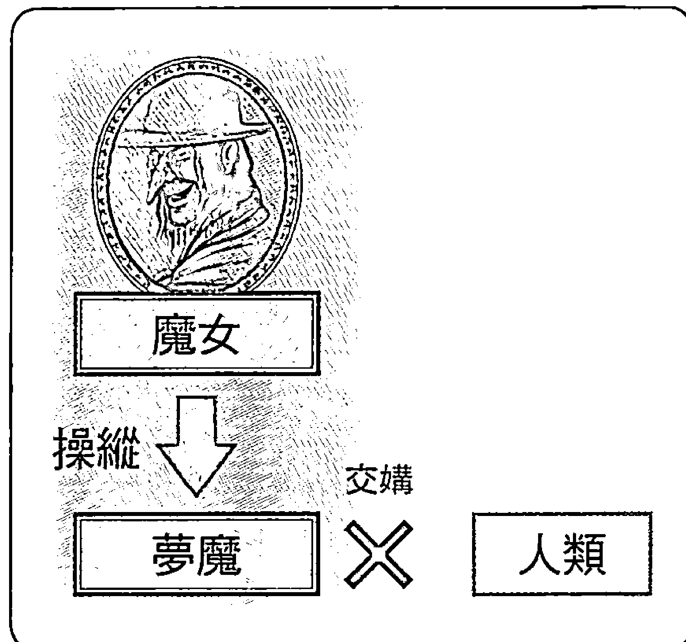

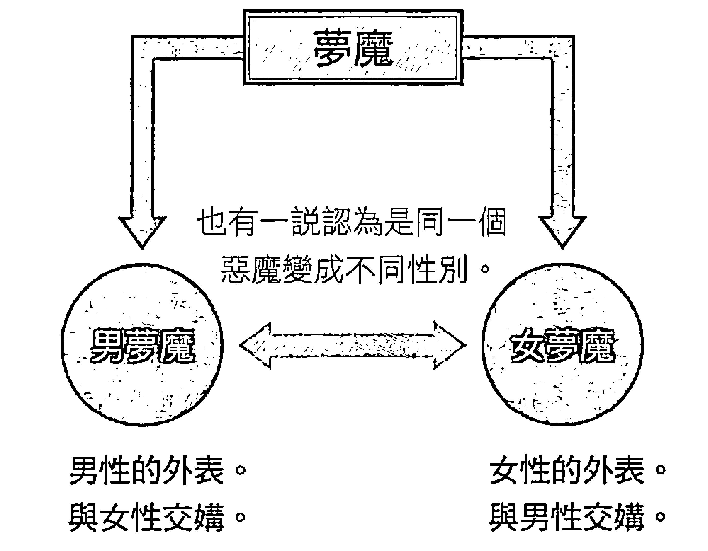

### 没有肉体的恶魔与梦魇的关系

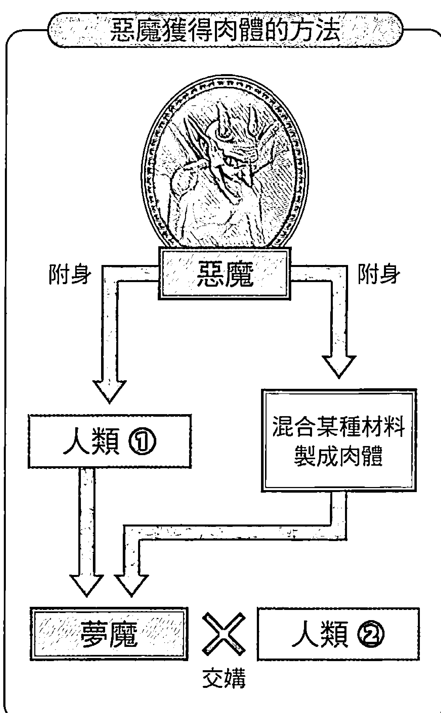

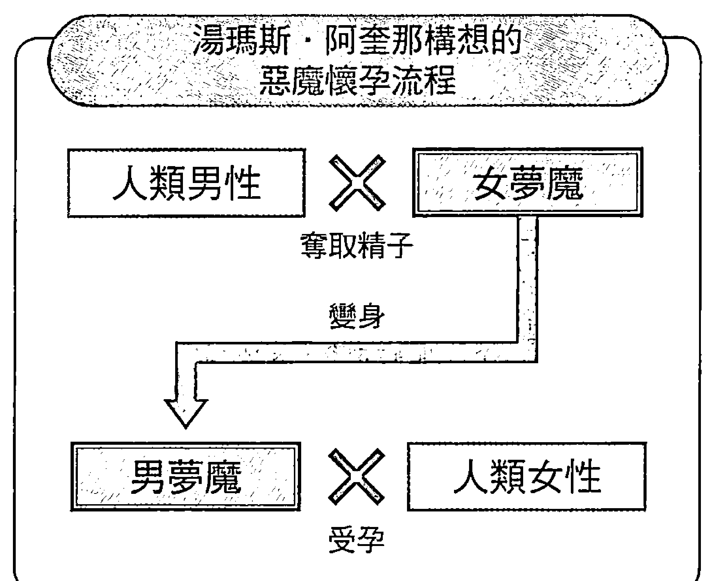

没有肉体的恶魔是像灵体般的存在，恶魔学家及神学家针对他们能够与人交合的原理进行各种研究与讨论。左图是假设恶魔拥有肉体的情况，基本上，他们必须附身在可以寄托其灵魂的肉体身上。顺带一提，其中也包含「因为是灵体，与梦魇的性行为只是受害者的幻觉」这种意见。

## 第2章 IV 恶魔

### 恶魔附身

恶魔附身是基督教社会必备的神秘现象。
然而在魔女狩猎时代，魔女们也涉入其中。

### 被恶魔附身也是魔女惹的祸？

> > 阿斯莫德：犹太教与基督教的恶魔，
> 出自《旧约圣经外典》。在魔导书里，他
> 代表七大罪中的“色欲”。身上长着牛头、
> 人头、羊头、天鹅脚和毒蛇尾巴，能从嘴
> 里吐出火焰。

恶灵或恶魔依附在人、地方或物品上就称为“恶魔附身”，这是基督教社会等相信恶魔存在的世界固定会出现的现象。人们认为疾病、恐惧或精神错乱都是恶魔害的，必须透过驱魔才能治愈。

到了魔女狩猎时代，有魔女参与的附身现象开始越趋频繁。相对于至今恶魔凭借自己的意志附身他人，这次换成魔女为了满足私欲而委托恶魔附身。

当时有两件著名的恶魔附身事件。

一件是“卢丹恶魔附身事件（Loudun possessions）”。该事件让法国卢丹修道院的数十名修女在1632年与1633年两度遭到恶魔附身，最终演变成大规模的驱魔行动。包含阿斯莫德、阿曼和利维坦在内，好几只恶魔附身在修道院长珍·德·安洁身上。而在裁判法庭上，主嫌格朗迪耶神父的“恶魔契约书”与“阿斯莫德的誓约书”都被作为呈堂证物。

另一件则是1692年的“塞勒姆审巫案（Salem witch trials）”。在美国麻萨诸塞州的塞勒姆村，几位瞒着父母参加降灵会，并在会后出现异样行径的少女，被诊断为遭恶魔附身，该起事件共造成多达一百四十一位的村民被以魔女的罪名举报和逮捕。

然而，前者是受到政治阴谋影响，后者则是典型的集体恐慌，无辜的民众因此接连入狱，至今仍无法确定这些人是否真的被恶魔附身。但无论如何，这两起事件无疑都让世人开始怀疑“被恶魔附身都是魔女惹的祸”。

## 魔女造成的恶魔附身

魔女狩猎时代的恶魔附身还出现了「魔女委托恶魔」的案例，这种恶魔会先躲进食物等物品，接着再附身于对象身上。恶魔学家亨利·伯格（Henry Boguet）认为苹果是最合适的食物，绘画里的苹果经常被作为夏娃引诱亚当吃下的「知善恶树果实」，可见它被视为诱惑的象征。

*   红酒
*   食物（以苹果最佳）
*   花束

## Column
### 被狼附身的人与狼人传说

欧洲的传说自古就不乏各式各样的魔物及妖怪，追溯其大老「狼人」的历史，会发现他们的境遇和魔女十分相似。

虽然说法不一，古人将萨满的恍惚状态，以及细菌感染造成的精神错乱或知觉障碍等情形，解释为「变身成狼」，而狼人就是从这种解释中诞生出来的魔物。当然，这些人类并没有真的变成狼。

然而，当时间进入中世纪，基督教的神学家根据传说里的描述，将狼人解释成「恶魔的化身」，连狼必须转动全身才能看见后面这点，也被穿凿附会成「恶魔不会回头看向善行」，后来更发展出魔女会变成狼的说法。仰赖魔法变成狼的人称为「被狼附身」，而魔女化身为动物正类似这种情况。

在魔女狩猎时代，狼人和魔女一样遭到迫害，狩猎狼人或狼人审判的数量与日俱增，换句话说，两者受到迫害及打压的时期是相同的。想到他们经历如此受难的时代还能有今日的发展，让人不禁赞叹其强韧的生命力。

## 第2章 IV 恶魔

### 使魔

使魔是跟随魔女的爪牙。它们对魔女来说非常重要，有的魔女甚至会为其命名。

### 帮助并监视魔女的伙伴

> ① 玛宝·霍普金斯 (Matthew Hopkins)：1620年～1647年以后。恶名昭彰的魔女猎人，主要活动于英格兰东部。他自称「猎巫将军」，谎称自己受到英国政府的委托，将三百个无辜民众举报为魔女以换取奖金。P.69介绍过的「魔女刺针」是他曾使用的欺诈工具，上面的针被设计成可以向内收进握柄。

> ② 玛格丽特·莫瑞 (Margaret Alice Murray)：1863年～1963年。印度出生的英国民俗学家及人类学家。她发表了许多与魔女有关的假说，却因内容荒诞无稽而遭受强烈抨击。她在民俗学黎明期聚焦于崇拜魔女的历史，认为魔女是古代宗教的延续，这个假说有一部分仍具有说服力。而她的研究影响了杰拉德·加德纳，成为威卡教活动的原动力。

缔结契约的时候，魔女会从恶魔那里得到名为「使魔」的低阶小恶魔。

魔女在参加夜宴、与恶魔签订契约时，便与神明背道而驰，劝导人们向善的守护天使会离她们远去，由恶魔赐予她们的守护使魔取而代之。

使魔的外表通常是随处可见的小动物或家畜，如狗、猫、兔子或山羊。而不是动物的使魔被称为「魔精 (Imp)」，大小约十公分～一个小孩高。

但不论外表如何，身为恶魔的使魔自然擅长魔法。它们会教导魔女知识及法术，同时也成为魔女的手下帮她们行恶。

当它们完成任务后，可以从魔女的印记 (P.68) 吸取鲜血或母乳作为奖赏。另一方面，监视魔女没有改过向善也是它们的职责之一。

换句话说，使魔是魔女的宠物也是伙伴。事实上，过去也曾有魔女坦承自己像对宠物一般为使魔命名。著名的魔女猎人玛宝·霍普金斯在他的著作《发现女巫》（1647年）里提到，其中一位被他定罪的魔女伊莉莎白·克拉克就曾经帮使魔命名。

附带一提，根据玛格丽特·莫瑞的说法，使魔也分成担任魔女手下的「家用使魔」与「占卜使魔」两种类型。

「占卜使魔」顾名思义就是只有在占卜时会用到的动物，其特征是任何能回应魔女呼唤的物种皆可，其中也包含大型动物，且并非魔女的所有物。

有些使魔的外表像是老鼠等令人厌恶的动物。

Illustration: いけだ

## 第2章 关于魔女
### IV 恶魔

### 使魔也有不为人知的秘密！

从记录上来看，魔女之间也会进行使魔的继承、让渡，甚至买卖。

例如魔女玛萵莉·萨蒙拥有两只名为「汤姆」和「罗宾」的蟾蜍使魔；而魔女雅蕾丝·汉特的使魔则叫「杰克」与「罗宾」。她们的使魔都是来自同样身为魔女的母亲。

1646年，法兰西丝·摩亚从一位名叫薇德的女性那里获得一只白猫。薇德告诉她，只要她否定神并将这只白猫送给诅咒对象，对方就必死无疑。

此外，也有证言表示，使魔不会在与恶魔缔结契约时自然出现，而是必须咏唱咒语来召唤它们。

1590年的艾格妮丝·桑普森在召唤使魔时大喊「艾娃，快出来听令！」，接着以「根据汝赖以为生的圭臬命汝速速退下！」要求牠离开。索美塞特的魔女会呼喊使魔的名字「罗宾」，当牠现身时则说「啊，撒旦啊！请赐予我目的。」

然而考虑到魔女狩猎这个异常的时代背景，「使魔」这种概念或许只是基督教从恶魔学衍生出来的想象。「魔精」原本是古代传说里的妖精，恶魔学家将他们归类为低阶恶魔，连容貌也被形容成恶魔的模样。「妖精（Fairy）」一词在凯尔特民族原指「拥有魔力的神秘存在」，魔法色彩浓厚的英国及爱尔兰是妖精传说的大本营；而另一方面，英国也是出现最多使魔目击情报的地方。从上述几点看来，似乎可以得出「妖精传说→魔精→使魔」的发展过程。

而在魔女法庭上，人们希望透过编造与使魔有关的证言让被告被判为魔女。有养宠物的人就说是宠物，没有宠物的人就说是随处可见的动物，甚至有人指称刚好飞来的苍蝇或蟑螂是被告的使魔，种种刁难简直是欺人太甚。

## 魔女与使魔的关系

恶魔
契约
供给魔力和使魔

魔女
吸食魔女的血作为奖赏
命令它们做坏事

家用使魔

魔女、恶魔和使魔的关系如上图所示。魔女平时会像养宠物一样照顾使魔，行恶的时候则让使魔替自己办事。使魔什么都吃，牛奶、谷物、起司、红酒或面包来者不拒，但它们最喜欢的还是「魔女的血」。

### ☆使魔的两种类型

*   **【占卜使魔】**
*   只用来占卜预言，不属于魔女。
*   以狗居多，有时也会用马等大型动物。
*   **【家用使魔】**
*   执行命令的小型动物。
*   被饲养在魔女的家。

### 使魔的种类

| 狗 | 猫 | 鸟 |
|---|---|---|
| 山羊 | 公牛 | 马 |
| 蟾蜍 | 猫头鹰 | 苍蝇 |
| 老鼠 | 兔子 | 蟑螂 |

说到使魔就会先想到黑猫或乌鸦，但其实所有身边常见的动物都可能是使魔。记录上曾出现眼睛特大或没有脚的异形动物，但无法确定它们是否真的存在，毕竟伊莉莎白·克拉克的使魔「薇妮卡·汤姆」就谣传是一只长着牛头的狗。

### ☆在十七世纪的魔女狩猎时被判有罪的伊莉莎白·克拉克的使魔。

*   霍尔特（幼猫）
*   贾玛拉（西班牙猎犬）
*   薇妮卡·汤姆（格雷伊猎犬）
*   萨克与休格（黑兔）
*   纽兹（鼹鼠）

## 日本常見的各种魔法！
### 日本的魔法与巫术②
#### 詠唱真言拯救受苦难之人的密教

佛教的始祖佛陀原本禁止一切咒术，但因为他的弟子希望能获得帮助苦难之人的力量，「救护咒（Paritta）」便由此而生，后来更发展成「密教」。

人的能力可见一斑，而他所建立的真言宗后来在日本大放异彩。

修法是密教的实践方法之一，包含驱除灾害和疾病的「息灾法」、让幸福倍增的「增益法」以及消除敌人与魔障的「降伏法」。他们在护摩坛焚烧供品、咏唱真言并诚心祈祷的模样正是在进行修法，而代表「真实言语」及「佛的话语」的真言则是源自前述救护咒的咒文。除了真言宗之外，许多其他宗派也使用真言，可说是最贴近日常生活的魔法。

密教从印度和中国传入，在西藏和日本发扬光大。日本密教的权威空海向中国的惠果请教密教的正统教义，将制作曼茶罗、法器的方法与经典抄本带回日本，并习得土木技术及药学等各种领域的知识。他在为期两年的留学期间完成这些事，其超乎常

### 至今仍在日本民间活动的萨满

能够感应并与灵体交流的人称作「萨满（Shaman）」，他们是实际存在于世界各地的咒术师，日本至今尚存的民间萨满名为「潮来（Itako）」与「犹他（Yuta）」。

民间家庭守护神，人们会在桑木棍的前端画上脸孔并为其穿上衣服，潮来则负责同时操弄两尊神像。

另外，在冲绳和奄美群岛也有叫做「犹他」的民间萨满，她们也有类似的仪式，主要的工作是提供与灵魂有关的建议、安葬死者及供养亡魂。只不过犹他曾经被以迷惑世人的名义受掌权者打压，与遭到狩猎的魔女们的经历不谋而合。

潮来主要活动于东北地方，是非常知名的民间萨满，青森县和秋田县更将其指定为「国家选择无形民俗文化财」。她们能够驱使「降灵术」，让神明或亡者的灵魂附在自己身上与他人对话。潮来在降灵时会演奏太鼓或梓弓等乐器，据说这是日本现存最古老的传统音乐。而在东北还有名为「养蚕神」的

## 第3章
### 魔女的历史

传说之前的巫女

巫术巫医和巫女形象

巫师与义妹的巫女形象

灾祸与巫女

巫魔学和魔法学

巫女形象的变迁

第3章

完

## 第3章 魔女的起源与传承
### 丰饶之神的巫女

魔女原本就是基督教会捏造出来的人物吗？
被视为古代魔女的又是什么样的人呢？

### 信仰遍及欧洲各地的地母神

1.  阿缇蜜丝：希腊神话的狩猎与纯血女神，与太阳神阿波罗是双胞胎。她原本是山野之神，后来向宙斯请愿成为孕妇的守护神。
2.  希柏利(Cybele)：在安那托利亚的弗里吉亚地区受人敬畏的大地女神，是肥沃大地、山岳、自然与动物的体现。后来在希腊和罗马也出现希柏利的信仰，相当于罗马神话的玛格纳·马特(Magna Mater)。
3.  达奴(Danu)：凯尔特神话里的达南神族之母，也被视为生命的女神。
4.  梅芙(Medb)：凯尔特神话里的康诺特女王。原本是战争女神，后来也被当成丰饶之神。
5.  霍达(Holda)：日耳曼神话的森林与狩猎女神，同时也是丰收、结婚、多产及天空之神。童话《霍勒太太》也与她有关联。
6.  弗蕾亚：守护美、爱、丰饶、战争、魔法及死亡的北欧女神。长相美丽动人，个性自由奔放。

基督教在四世纪成为罗马帝国的国教以后，才终于踏上成为欧洲主流宗教的道路。

然而在此之前，欧洲原本就存在承自古代神话、传说的信仰，且不论是北欧神话、凯尔特神话或罗马神话，每一种都属于多神信仰。

其中，地母神信仰与自然崇拜被归纳进「古代魔女」的系谱。

地母神是指带来丰收的大地女神，在世界各地都深受世人崇拜。在欧洲也有好几位不同的「母神」或「丰饶之神」，其中最著名的就属黛安娜。

黛安娜是罗马神话的狩猎女神，相当于希腊神话的阿缇蜜丝①，也是诞生与多产之神、孩子的守护神、母熊及月亮三女神之一。身为狩猎女神的黛安娜驰骋于森林，用弓箭射死猎物并将它们带往死者的国度。当死后的世界与月亮结合，她便成了夜晚与月亮的女神。

前往死者国度的女性也负责将新生命带回现世，因此黛安娜又成为诞生与多产之神。据说过去有很长一段时间，孕妇们习惯向黛安娜祈祷以减轻阵痛带来的痛苦。除此之外，她还身兼养育婴儿的乳母，与爱护孩子的母熊被视为同一神格。这么看来，说她是万物之母或地母神的确是当之无愧。

在罗马神话里，还有一位同样受到世人敬重的地母神「希柏利」②。

而细数非罗马神话的地母神，在凯尔特神话有生命女神「达奴」③与丰饶神「梅芙」④；古日耳曼神话有掌管地上生死及丰收与否的「霍达」⑤；同属日耳曼神话的北欧神话则有丰饶女神「弗蕾亚」⑥。

## 第3章 魔女的历史
### 魔女的起源与传承
### 丰饶之神的巫女

对人们来说，丰收是会直接影响生活的重要事项。

Illustration：长内佑介

### 残存在基督教社会的古代习俗

曾为欧洲一大势力的古罗马囊括了多种不同的民族、人种与宗教。在一神教的基督教壮大以前，这些古代宗教信仰理所当然地遍及欧洲各地，尤其以丰饶神和畜牧神最受农民崇拜，他们的祭祀仪式在基督教社会也透过庆典等形式保存至今。

古代宗教里的魔女包含主导这些仪式的萨满。所谓的魔法是指能够操纵自然或影响超自然的超凡能力，而拥有这种能力的正是宗教仪式里的巫女或占卜师。

事实上，在北意大利的佛里乌利地区有一种名为「贝南丹帝（Benandanti）」的传统萨满，他们会在夜里与魔法师对战，并借此占卜农作物的收成。令人惊讶的是，学者们发现直到魔女狩猎时代的1580年左右都还能见到他们的踪迹。这种案例固然罕见，但也证明了继承古代宗教的药草及魔法知识的人或风俗习惯依然零星散布在各个地区。

十九世纪曾有研究认为魔女是古代宗教的继承人，但与其说她们继承了整个宗教组织，不如说是这些知识与习俗的零星碎片。

此外，早期的基督教会将这些古代神明融入自己的教义以获取民众的信仰，对圣人⑧及圣母玛利亚⑨的崇拜就是从这里诞生的。罗马四大特级宗座圣殿（古罗马样式的教堂）之一的圣母大殿是过去的希柏利神殿遗址，这也属于宗教合并的一环，显示希柏利信仰最终没入台面之下。

⑧ 圣人：圣人的存在不限于基督教，他们拥有符合宗教期待的良好品德与值得他人效法的模范人生。基督教的圣人如十二门徒和教宗额我略一世。此外，不同教派对待圣人的方式也一样，大部分的新教派系不会崇拜圣人。

⑨ 玛利亚：耶稣基督的母亲，一般称为圣母玛利亚。每个宗派的教义与敬仰对象不尽相同，但新教大多不礼拜圣母玛利亚。

### 主要的地母神与自然信仰

| 神祇名称 | 地区 | 描述 |
|---------|------|------|
| 黛安娜 | 地中海 | 自古盛行于地中海周边的地母神信仰，又名阿缇蜜丝信仰。保存在小亚细亚以弗所的黛安娜神像有好几颗乳房，造型相当独特。 |
| 崇拜树木 | 德鲁伊 | 凯尔特民族的德鲁伊相信人类的灵魂与肉体可以直接转生。他们视橡树与依附其生长的槲寄生为圣物，利用汲取自树木的魔力来进行仪式或施展法术。 |
| 贝南丹帝 | 北意大利佛里乌利 | 殲存在北意大利佛里乌利的萨满，灵魂会在夜晚出窍（一说是陷入恍惚状态），与魔法师战斗并占卜当年的收成情况。「贝南丹帝（Benandanti）」一词是「行善者」的意思。 |
| 大地之母 | 凯尔特 | 在凯尔特人居住的地区，地母神也是黑夜女神。爱尔兰有一座梅芙的坟墓，据说有个与她相似的白色贵妇幽灵会在附近出没。 |
| 霍达 | 日耳曼 | 日耳曼人保留了虔诚的霍达信仰。十三世纪的某位修道士记录了他们在圣诞节期间向名为霍达的天空女王祈祷的模样。 |
| 有角神 | 英国 | 牧神潘（即罗马神话的法翁）等自然之神的信仰深植民间。祭祀结婚与丰收之神的古罗马牧神节也与法翁有段渊源。 |

上表为欧洲自古以来主要的地母神与自然信仰。不论在祭祀仪式或知识层面上，黛安娜和德鲁伊都被视为最有力的魔女起源。这种对自然神祇的信仰以及由此而生的习俗，奠定了魔法和魔女的基础。

### 异教的组织和仪式

*   共有十三位成员。
*   **【圣贤】** 即神本身。主导礼拜的最高领袖。
*   **【圣女（处女）】** 神的代理人。圣贤出席时则担任第二指挥官。
*   **【干事（祭司）】** 没有行政权限，但位阶仅次于圣贤。负责在跳舞时带领众人。
*   **【联络员】** 通知集会地点。
*   **【音乐家】** 演奏竖笛、长笛和口琴。

贝南丹帝
↓
灵魂出窍或骑乘动物
↓
前往夜间集会
↓
打赢魔法师的那年作物会大丰收

异教信仰在基督教社会日渐式微，即便如此，没有教会的地方仍保留了古老风俗。例如出现在北意大利佛里乌利地区的贝南丹帝，这种与邪恶魔法师搏斗的萨满在魔女狩猎时代依旧相当活跃。

## 第 3 章 I 魔女的起源与传承
### 神话与传说中的魔女形象

魔女的形象源自于神话里的魔女及幻兽。
随着时代更迭，这些历史久远的神也成了塑造「魔女」的推手。

### 魔女的原型与她们的神

① 民间信仰：过去就存在且在社会上广为流传并传承至今的事物。与迷信的不同之处在于，民间信仰不是错误的知识或思考模式，而是以传说或社会舆论为根据。

第二章所描述的魔女形象，基本上都是基督教会 in 中世纪以后捏造出来的。但是，出现在神话和传说里的众多魔女，证明了当时的民间信仰本就相信有魔女存在，而人鱼或狼人这类魔兽也是相同的情况。

② 奥德修斯：希腊神话里的英雄，长篇史诗《奥德赛》的主角。他在特洛伊战争提出特洛伊木马的计划并因此获胜，其冒险故事在凯旋归国的路上也不曾停歇，沿途遭遇了独眼巨人、妖鸟赛莲和怪物斯库拉等各种魔物。

提到对后世魔女形象造成影响的魔女，诸如以魔药让奥德修斯的同伴变成动物的喀耳刻（P.8），以及施法取得金羊毛并杀害丈夫外遇对象的美狄亚。此外，属于幻兽类的拉弥亚（Lamia）、赛莲（Siren）及丝朵莉葛也与魔女的形成有关。

③ 《主教教规》（Canon Episcopi）：九～十世纪左右完成的教会法典。这份文献显示了神学是以何种立场看待魔法，受到后世神学家与恶魔学家的高度关注。

就如上一节（P.80）提过的，古代的异教神祇本来没有与恶魔相似的特征，但是在魔女狩猎时代，他们却被当成魔女的守护神。希腊神话的冥神黑卡蒂也是丰饶、月亮与魔法的女神，因此魔法师们必然将她当成崇拜对象，同时也把她和黛安娜视为同一神祇。

> 在《主教教规》有一段记述如下：
「委身撒旦并受恶魔的幻觉及幻影诱惑的邪恶女性们公然表示，她们会在夜里骑乘各种动物，与异教徒的女神黛安娜和好几位女性一起，在静谧的夜色中驰骋大地，像服侍女主人般听从黛安娜的命令，等待她在某个晚上召唤自己前来侍奉。」

这种民间信仰又被称作「夜里的贵妇人」，而对黛安娜的崇拜则遭到教会非难。异教的女神后来因为这段叙述，在魔女学书籍里被定义成有如恶魔般的存在。

### 希腊神话里的魔女

| 名字 | 描述 |
|------|------|
| 拉弥亚 | 上身为蛇的幻兽。原本是利比亚的女王。宙斯对她一见倾心，让她生下许多孩子，但她惹怒了宙斯的妻子赫拉而被变成怪物，连孩子也惨遭毒手。陷入绝望的她开始杀害别人的小孩，有时也会诱惑男性并吸食鲜血。 |
| 喀耳刻 | 月和爱的女神。艾尤岛是她的居所，她会将心仪的男性带回岛上生活，腻了就用魔法把对方变成动物。奥德修斯的同伴也沦落到相同下场，只有他因为让魔法失效的药而逃过一劫。后来喀耳刻把自己的心交给他，两人在岛上共度了一年的光阴。详细请参照P.8。 |
| 美狄亚 | 擅长魔法的柯尔基斯公主。她对率领阿尔戈英雄的杰森一见钟情，还曾用魔法保护他不受烈火侵袭。美狄亚对杰森一心一意，但她做事的手段却相当残忍。她杀害自己的胞弟以躲避追捕他们的船队，还欺骗国王的女儿让她们用返老还童的大锅烧死自己的父亲。详细请参照P.10 |
| 丝朵莉葛 | 义大利半岛及东欧民间传说里，吸食人血的女幽灵。特征是如猛禽般的利爪、好几颗头和有毒的乳房。她会与睡梦中的男性发生关系并吸食鲜血，或是用有毒的母奶餵食婴儿将其杀害。在某些传说里，她则是以“森林守护者丝朵莉娜”的身分登场。 |
| 黑卡蒂 | 她是珀耳塞斯与阿斯忒里亚的女儿，与阿緹蜜丝是表姊妹。她是其中一位冥神，掌管魔法、月亮、幽灵、育子、丰收、洁净与救赎。前述的美狄亚是黑卡蒂的信徒，她透过黑卡蒂的帮助来施展法术。黑卡蒂后来演变成夜里出现在十字路口或三岔路的妖怪，甚至出现在三岔路口摆放“黑卡蒂的供品”的习俗。 |

上表是希腊神话中的著名魔女与类似魔女的幻兽。喀耳刻和美狄亚完全符合大众对魔女的描述，而吃小孩的拉弥亚、与男性交媾的丝朵莉葛以及用歌声蛊惑航海员的赛莲也同样对魔女的形象造成影响。

### 被当成魔女守护神的神祇

深受民众爱戴的黛安娜等地母神，原本与恶魔毫无关联，然而随着敌视魔法师、咒术师的风潮渐起，她们也被当成这些人的守护神。只要指称异教的神为恶魔，就能让基督教的信仰正当化。

# 童話與文學中的魔女形象

神話中的魔女將舞台轉移到童話故事。即便如此，她們還是無可避免地受到基督教惡魔觀的影響。

## 隨著時代演變，會魔法的老婆婆逐漸變成壞人

對惡魔學家和那些為了獵殺魔女而躁動不安的人們來說，神話和傳說中的魔女成了他們想像的依據。與此同時，在民間故事或童話中登場的魔女們也繼承了這些想像。

民間故事和童話的魔女大致可分成壞魔女和好魔女。壞魔女繼承了吃小孩或以魔法行騙這些負面印象。基本上，她們會用死亡或性來引誘人類。

而「好魔女」的形象又是如何呢？她們在用魔法幫助主角解決困難的同時，也會提出條件，例如奪走聲音或設下時限，而這些條件似乎也能解釋成一種「詛咒」。

研究童話故事的學者弗拉基米爾·普洛普（Vladimir Propp）認為，這種有魔法師登場的故事，其實是在描述孩子通過儀式成長的過程。他們先經歷了一次死亡，在死者的國度徘徊，接著成長並再次獲得重生。魔女雖然扮演帶領他們走向死亡的角色，但有些壞魔女也可以解釋成好人。或許魔女和魔法本身並沒有善惡之分也說不一定。

然而當基督教的魔女形象穩固之後，這些童話裡的魔女也慢慢受到影響。簡單來說，就是逐漸被定位成「使用魔法的壞巫婆」。

而到了文藝復興以後，這些想像中的惡魔和魔女逐漸在藝術、文學等領域膨脹；同時，活字印刷的發明也讓書籍的流通遽增。與惡魔有關的訊息或故事被攤在大眾可觸及之處，形成今日能看到的魔女輪廓並逐漸傳播開來。

文藝復興：十四～十六世紀的大規模文化復興運動。始於義大利，最終蔓延至整個歐洲。遍及哲學、基督教學、美術、音樂、文學、建築、戲劇、政治、科學、技術等各個領域，孕育出無數個天才藝術家及傑出思想家。

## 童話裡的魔女類型

### 好魔女

- 〈灰姑娘〉的魔女。
- 〈人魚公主〉的魔女。

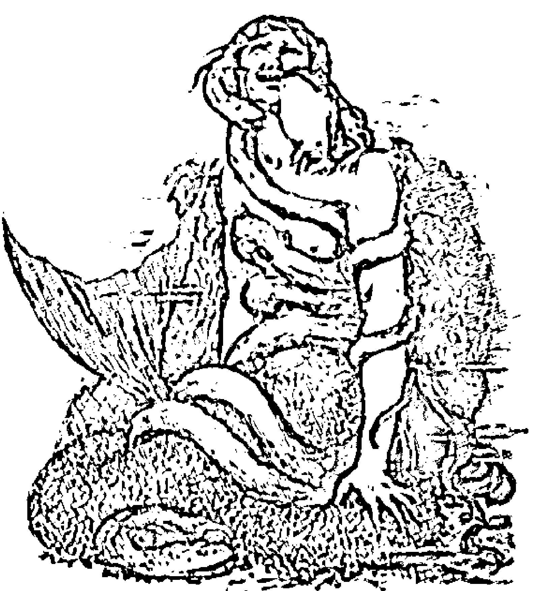

### 壞魔女

- 〈糖果屋〉的女巫。
- 〈白雪公主〉的後母。

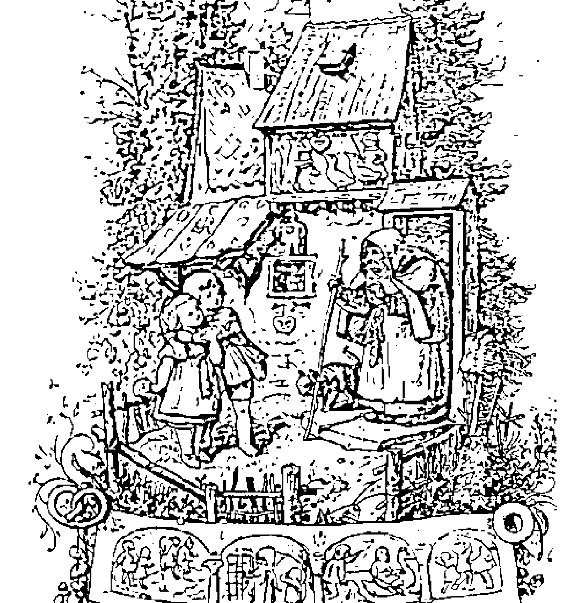

※海倫·斯特拉頓〈人魚公主〉海之魔女（1899年）。

※路德維希·里克特〈糖果屋〉插圖（1842年）。

- 但索求代價或設下規定 → 主角
- 賜予他們能力或讓他們變身 → 主角
- 為一己私慾說謊或吃掉他們 → 主角
- 擊退 → 主角

〈糖果屋〉的女巫是最明顯的壞魔女例子。過去的人將蒼鬱的森林視為通往冥界的入口。換句話說，被丟進森林的兩兄妹遭遇到差點被大鍋煮熟的危險，最後打倒魔女獲得重生，帶著寶藏回家的故事，其實是在描述孩子克服考驗，通過儀式順利成長的過程。

## 魔女形象的變遷

- 古代 → 神話和傳說中的魔女
- 中世～近世 → 民間故事和童話的魔女 （受基督教想像的魔女影響）
- 近代 → 文學和兒童文學的魔女；近代西洋魔法
- 現代 → 威卡教

基督教想像出來的魔女是以神話為原型，受到其影響的民間故事則為魔女描繪輪廓，最後在文學中被塑造得更加具體。另一方面，基督教的魔女形象反而孕育出神秘學，更促成重現古代魔女的威卡教（P.104）誕生。

# 第3章 I 魔女的起源與傳承

## 咒術師與產婆

咒術師、巫女和產婆都是繼承古老習俗的女性。她們因為與基督教的倫理觀背道而馳，逐漸被冠上魔女的罪名。

## 產婆等所在的母權社會化為魔女的世界

被當成魔女的人並不是真的會飛或命令使魔行惡。在魔女狩獵時代被視為魔女的人，據說都是異教的咒術師、巫女、產婆或民間女醫。

《聖經》裡是這麼描述咒術師的：

> > 「行惡之人不得存活。」（《出埃及記》）

> > 「不問男女，行降靈術者或靈媒必須處以死刑。他們應被亂石砸死。他們的行為形同死罪。」（《利未記》）

> > 「預言家或夢境占卜師都必須被處刑。」（《申命記》）

除了詛咒他人的邪惡咒術之外，面對其他習俗的法術，教會原本都選擇從寬以對，沒有加以處罰。然而到了魔女狩獵時代，被狩獵的對象擴大至所有咒術師，而這些法術便成了魔女被處刑的依據。

一般而言，民間女醫（為人治病的女性）或產婆應該是用藥草救人的善良女巫，民眾雖然心懷恐懼，但也確實對她們抱以感謝。不過，就如同墮胎被視為背信行為一樣，基督教的倫理觀與產婆的思考邏輯似乎有許多互相衝突的地方。

除此之外，基督教的基本女性觀源自於《聖經》裡的夏娃。當否定女性、認為妻子應服從丈夫的觀念在政治家之間達成共識，父權制便開始在宗教與制度層面普及。而受到應維護秩序、遵守道德規範的近代價值觀影響，對性的戒律也更加嚴謹，妓院與妓女於是被逐出了社會體系。

換句話說，當男尊女卑的價值觀在社會上逐漸成形，與這個價值觀相反的領域，就會被當成「魔女的世界」。

## 當時的咒術師和產婆

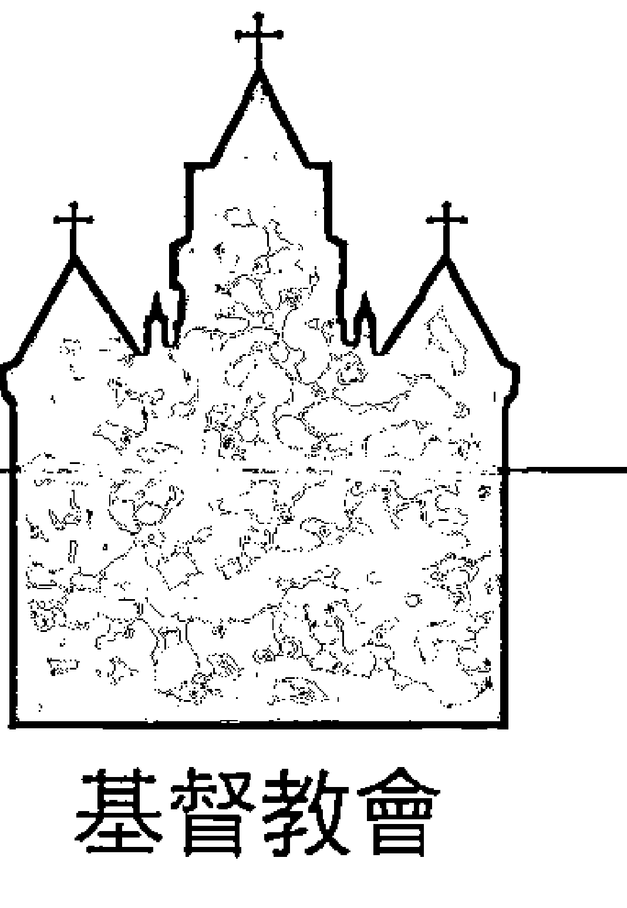

基督教會
☆根據《聖經》將其視為惡魔。「行惡之人不得存活。」（《出埃及記》）「不問男女，行降靈術者或靈媒必須處以死刑。」（《利未記》）
（敵視！）

### 咒術師

- 祈雨。
- 祈求豐收。
- 戰爭期間，祈禱友軍的安全並咒殺敵人。
- 治療或預防疾病。

### 產婆

- 助產婦。
- 精通藥草的藥劑師。
- 知曉墮胎術的女醫。

施咒者必須「依照《聖經》的戒律加以處罰。」這是基督教會進行魔女審判的根據。而與咒術師一樣精通藥草並使用自然恩惠行醫的產婆，也逐漸成為違反基督教教義的存在。這兩者都是以女權為重的職業領域。

## Column
動漫世界裡的魔女②

延續P.65，讓我們也來看看90年代以後的小魔女動畫吧。
到了90年代，《美少女戰士》系列（1992年～1997年）問世，它的爆紅讓大量同性質的作品誕生，也奠定了「戰鬥系小魔女」這個類別。這部作品的角色設計與故事安排也對後來的作品造成極大影響，而《小魔女DoReMi》（1999年～2002年）則繼承了過去《魔法使莎莉》的故事風格以及《美少女戰士》的戰隊模式，同樣也搏得滿堂喝采。
當時間進入2000年代，幼兒取向但戰鬥色彩濃厚的《光之美少女》系列（2004年～）至今仍是長青作；此外，更出現了許多小魔女風格的高學年男性向作品。少年漫畫要素強烈的《魔法少女奈葉》系列（2004年～）與黑暗幻想風格的《魔法少女小圓》（2011年）等，無一不大受好評。
由此可知，小魔女的動、漫畫也跟隨時代的腳步更加多樣化，成為動漫當中的一大類別並大放異彩。

# 第3章 II 基督教與魔女狩獵

## 惡魔學和魔女學

想要正確定義神明，就必須也給惡魔正統的定義。
這就是基督教的惡魔學。

### 惡魔的誕生是為了讓唯一真神成為「絕對的善」

- ❶ 瑣羅亞斯德教（Zoroastrianism）：發源自波斯的古代宗教。特徵是奉《波斯古經》為聖典，提倡善惡二元論與「最終審判」。受其影響的摩尼教，教義中同樣也有二元論。瑣羅亞斯德教約在七世紀左右衰退。

當基督教出現「魔女」這個概念時，最重要的就屬「惡魔學」了。
惡魔學一詞，聽起來好像是某種與神秘主義有關的詭異學術，然而這門學問卻不是出自惡魔崇拜者之手，而是從基督教的神學衍生出來的。
每個宗教都有屬於自己的「惡魔」，尤其是像基督教這類的一神教，皆需利用惡魔的存在來解釋於世界各地蔓延的疾病、戰爭或犯罪等無數惡行。因為如果不這麼做，就無法以對比的方式完成唯一真神的善性。而這種概念的誕生，據說是受到提倡善惡二元論的瑣羅亞斯德教❶的影響。

### 魔王、撒旦和魔鬼的差別

那麼，基督教裡的「惡魔」是指誰呢？
首先要介紹的是代表惡魔的名詞。在英文裡，惡魔可以分成「魔王（Devil）」、「撒旦（Satan）」和「魔鬼（Demon）」。
「Devil」是從希臘文「Diabolos」衍生出來的單字，代表身為萬惡根源的「魔王」，也就是惡魔當中的老大。
「Satan」一詞在猶太教和基督教都代表惡魔，不過對基督教來說，這個字原本是指從神的使者變成惡魔的「墮天使」。然而，在將《舊約聖經》翻譯成希臘文時，「Satan」被譯成了「Diabolos」，因此這個字也有魔王的涵義。
「Demon」的語源是希臘文的「Daemon」，原本是指在古希臘神話或哲學中介於人與神之間的「超自然存在」。這個存在當然有好壞之分，但卻慢慢演變成「惡靈」的意思。

因為是惡靈，「Demon」在階級上屬於「Devil」及「Satan」的部下。

惡魔中最重要的當然是代表魔王的「Devil」和「Satan」。將世上萬惡的原理和根源人格化後所誕生的魔王，以及勸導世人向善的神，正因樹立了這樣的對比，才能說服大眾：只要不受惡魔誘惑，行得正、坐得端，神就會帶領人上天堂。「為了鞏固代表善的絕對真神信仰而誕生的絕對敵人」，這就是惡魔的本質。

### 從彙整《聖經》誕生的惡魔學

- ② 諾斯底主義 (Gnosticism)：～三世紀存在於地中海一帶的古代宗教思想。特徵是認為世界是由善與惡、真神與偽神、靈魂與肉體、精神與物質等二元論所構築而成的。
- ③ 奧古斯丁 (Aurelius Augustinus)：古代的基督教神學家與哲學家，被天主教與東正教奉為聖人。他認為正因人類無知且意志力薄弱，才會受到惡魔引誘而犯下罪行，但只要以神的恩寵行善，便能獲得救贖。

耶穌在一世紀左右創立的基督教，在初期並沒有明確的教義體系。基督教的領導者逐步確立何為正統、何為異端，最終統整出了正典《聖經》（二～四世紀末）。

這些為神學所做的努力是因為在當時還有許多異教「群魔亂舞」。其中的諾斯底主義²擷取了各種宗教、哲學要素，建構自己的神話和思想，甚至主張耶和華才是惡魔，與基督教正面對立。想要與之抗衡，就必須樹立明確的正統神學。

接著，大量的惡魔論也作為神學的一部分逐一問世，經過各種反覆議論，正統神學裡的惡魔便逐漸成形。雖然不同異端都有屬於自己的「惡魔」，但某些後世的異端也繼承了基督教裡的惡魔形象。

該時期最重要的惡魔論，出自在西方基督教學會建立基礎神學的奧古斯丁³。他認為惡魔是墮天使，會欺騙無知的人類。而人類可以獲得神的救贖，但本就具有智慧的惡魔則永遠無法被寬恕。

此外，他將羅馬神話等異教神祇視為惡靈（即惡魔，Daemon），這種思想遂成為基督教会迫害並打壓異教時的根據。

## 何谓恶魔学？

在与各个异教和异端争夺信徒时，基督教的指导者与思想家们不断进行各种议论。他们将正统的教义汇整成《圣经》，同时也为恶魔架构正式的定义。为了统整教义，除了神之外，也必须统整恶魔才行。

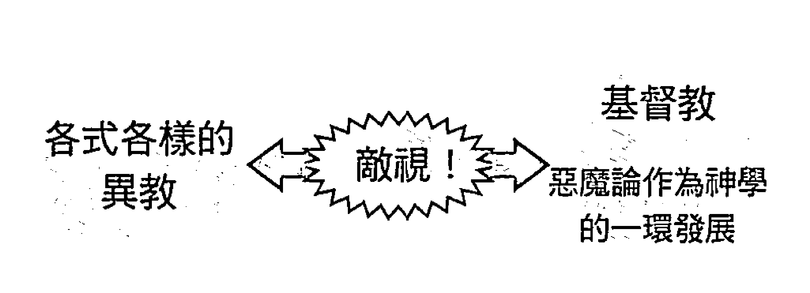

### 古代及中世纪的异教和异端

| 异教/异端 | 说明 |
| :--- | :--- |
| **诺斯底主义** | 流行于一～三世纪的思想。诺斯底主义的世界观认为，物质世界是完全的恶，而创造这个世界的则是叫作“造物主（Demiurge）”的恶魔。人类是在肉体这个物质里放入名为神之火花的灵魂所诞生的，只要获得“知识（Gnosis）”，灵魂便能从邪恶的肉体中获得解放。 |
| **摩尼教** | 三世纪时，由波斯人摩尼（Mani）成立的宗教。善与恶的原理在物质宇宙诞生之前就已存在，这两者不断争斗，直到世界的终结来临。创造亚当和夏娃的其实是闇黑之王（恶魔），耶稣却选择以蛇的模样领导亚当。 |
| **波格米勒派** | 流行于十二世纪的基督教异端。神之子撒旦觊觎神的地位，被神流放后创造了物质世界，但他败给了神派来拯救世人的基督而再度遭到流放，最终变成恶魔撒旦。顺带一提，基督是撒旦的弟弟。 |
| **卡特里派** | 流行于十二世纪的基督教异端，发源自波格米勒派。宇宙最初便存在善恶原理，天使因受撒旦迷惑，而让灵魂被封入黏土，成为了人类。为了拯救被关在肉体这个牢笼内的灵魂，神派遣了天使基督。只有遵从福音书教诲的完整灵魂，才能回到故乡天界。 |
| **伊斯兰教** | 七世纪时，由穆罕默德（Muhammad）创立的宗教，为世界三大宗教之一。唯一真神阿拉（Allah）是全知全能的存在，火精灵拒绝向依附阿拉的人类（即阿丹）跪拜而被逐出天界，成为恶魔易卜劣斯（Iblis）。他以诅咒不会立即生效作为条件，从真神那里得到诱惑人类的许可。他虽然可以诱惑，却无法强迫人类，力量小于真神。 |

### 为恶魔学奠定基础的神父与神学家

| 神父/神学家 | 贡献与思想 |
| :--- | :--- |
| **依纳爵** | 35年左右～107年。他是安条克的主教，门徒约翰的弟子。他抨击诺斯底主义，强调基督教才能带来救赎，认为对待主教的态度就是对待神的态度，发展司教论以确保对教会的忠诚。 |
| **犹斯定** | 100年左右～165年左右。基督教神学家。他将希腊哲学用语“逻各斯（Logos，代表逻辑、真理等）”套入自己的思想，认为基督才是完整的逻各斯。提出恶魔可分成撒旦、堕天使和魔鬼三种类型的也是他。 |
| **爱任纽** | 140年～220年左右。里昂的主教。他认为恶魔是神创造的产物，能力有限。恶魔变成蛇引诱亚当和夏娃犯下罪行，人类因为这个原罪成了撒旦的奴隶，但耶稣的受难让人的罪行获得宽恕。 |
| **特土良** | 170年左右～202年左右。迦太基的主教。神创造了天使，但首席天使依照自己的意志成为恶魔，那便是撒旦。他使亚当和夏娃堕落，并且诱惑人类。对撒旦而言，不道德的世俗生活代表将加入恶魔的军队。 |
| **奥利振** | 185年～251年。生于亚历山大港的教父。神创造了许多有智慧的存在，但他们却因为自由意志而丧失智慧、远离神的身边，变成天使、人类及恶魔。他是第一个主张“路西法是被逐出天界变成撒旦的恶魔”的人。 |
| **拉克坦提乌斯** | 245年～325年左右。非洲出生的教父。一开始，神用自己的气息做出了善与恶，即后来的基督与撒旦。接着，神又创造了物质世界和人类，并赐予人善恶的原理，也就是灵魂和肉体。 |
| **埃瓦格里乌斯** | 354年～399年。生活在埃及荒野的修行僧。他认为恶魔也分成好几个种类，每个恶魔军队分别对应人类的“思虑（Logismoi，即暴食、傲慢、色欲、贪婪、绝望、愤怒、虚荣和怠惰）”。著名的“七宗罪”正是以这些思虑为基础。 |
| **奥古斯丁** | 345年～430年。北非希波的神学家，基督教基础神学的建构者。他主张在天界地位越高的堕天使就会堕落越深，因此最高位的路西法才会变成撒旦。此外，他也认为恶魔引诱人类是被神允许的行为。 |
| **伪狄奥尼修斯** | 活在500年左右的叙利亚修行僧。撒旦因远离完全真实的神，身上的缺陷逐渐增加，最终变成完全空虚的存在。他延续这个概念，首次论及天使的阶级，认为天使可分为上级、中级和下级三种级次，并可再细分出九个等级。 |

## 從中世紀的惡魔學演變成魔女學

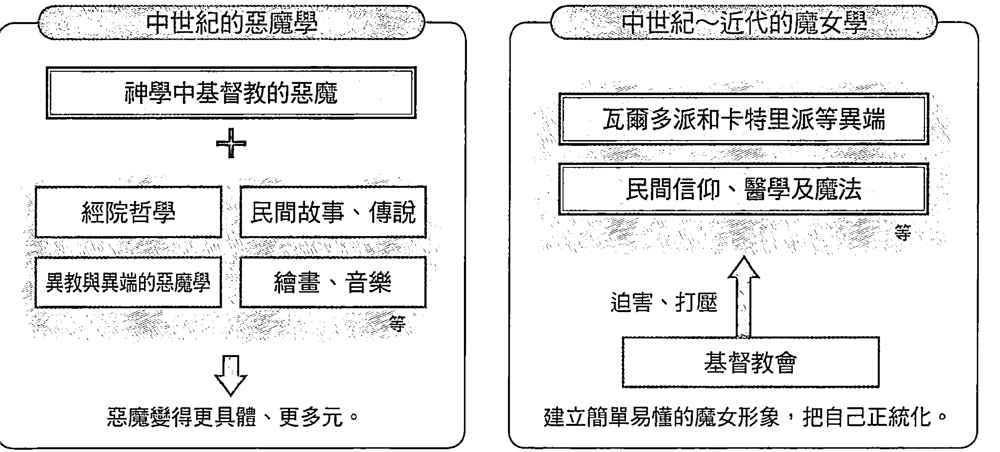

中世紀的人們以過去在神學中建立的「惡魔」概念為基礎，從各種角度探討惡魔應有的模樣。而到了魔女狩獵時代，他們更進一步探討身為惡魔爪牙的魔女是什麼樣子，但這都只能算是神學扭曲的想像而已。

### 創造「想像中的魔女」的惡魔學書和魔女學書

| 書名 | 作者 | 簡介 |
| :--- | :--- | :--- |
| 《蠅丘》（1435年～1437年） | 約翰·尼德 | 最早出版的惡魔學書，其目的是為了攻擊魔女。作者是道明會的惡魔學家約翰·尼德，內容包含從領主或異端審判官那裡得到的魔女情報。 |
| 《女巫之槌》（1486年） | 海因里希·克雷默 | 作者是海因里希·克雷默與雅各·斯普倫格。這是一本根據克雷默的經驗與過去的著作編寫而成的魔女狩獵教科書，相當於惡魔學的百科全書，然而內容卻突顯了病態的厭女情節。 |
| 《魔女的惡魔狂熱》（1580年） | 約翰·布丹 | 由法國首屈一指的人文學家約翰·布丹所撰寫的魔女學書。書中完全相信魔女的存在，主張應加重對魔女的處罰，並提出簡單的行刑方法。 |
| 《惡魔崇拜》（1595年） | 尼可拉·雷米 | 這是自《女巫之槌》以來，規模最大的天主教魔女百科全書。作者尼可拉·雷米是洛林地區的最高檢察官，一生處刑的魔女人數多達二～三千人。 |
| 《惡魔學》（1597年） | 蘇格蘭國王詹姆士六世 | 由蘇格蘭國王詹姆士六世撰寫的惡魔學書，在北伯立克差點遭到魔女暗殺的經驗是他製作此書的契機。書中具體主張須加重對魔女的處罰。 |
| 《魔法研究》（1599年） | 馬丁·德·李歐 | 多達六卷的長篇大作。書中論及各種魔法和巫術，同時為整個惡魔學建構體系，是天主教最具權威性的惡魔學書。 |
| 《魔女論》（1602年） | 亨利·伯格 | 這本惡魔學書的作者是法國東部勃艮第公爵，也是聖克洛德的法官。他根據自己的審判經驗，從各方面探究名為魔女的信仰派系，認為惡魔會和魔女發生關係。 |
| 《巫術概要》（1608年） | 法蘭斯科·馬里亞·葛佐 | 作者為米蘭司鐸。他根據魔女的審判記錄列舉豐富的案例，並引用過去的惡魔學書，彙整各種與魔女有關的情報，製成這本魔女全書。特徵是用了相當多的木刻版畫。 |
| 《圖解墮天使與惡魔的變幻莫測》（1612年） | 皮耶爾·德·蘭克爾 | 作者皮耶爾·德·蘭克爾是波爾多高等法院的法官，過去曾瘋狂狩獵魔女。他根據自己的經驗撰寫此書，詳細描述魔女夜宴的模樣，讓「夜宴是魔女的重要法術」成為人盡皆知的觀念。 |

## 恶魔形象的多样化到魔女学

- ❶ 但丁：但丁·阿利吉耶里（Dante Alighieri），1265年~1321年。出生于意大利佛罗伦萨，是诗人与哲学家。他创作了长篇史诗《神曲》等作品，是意大利文学界最伟大的诗人，也是文艺复兴的先驱。

中世纪以后，基督教已渗入社会，恶魔这个概念也在民众之间广为流传。在这样的背景之下，神话、传说和童话里的邪恶生物或怪物逐渐与恶魔的形象融合，甚至还出现了像但丁❶的史诗《神曲》❷一样，对恶魔的形象造成巨大影响的文学作品。恶魔的长相和秘密逐渐成形，模仿牧神潘的山羊恶魔以及长着蝙蝠翅膀的想象也是这个时期的产物。

- ❷ 《神曲》（Divine Comedy）：1307年~1321年发表的史诗。由地狱篇、炼狱篇和天堂篇三部组成，内容讲述但丁自己游走于三界的故事，不论是作为古典文学或宗教文学都获得极高评价。

在魔女狩猎时代，社会上发生了异教势力扩大、鼠疫❸和气候异常等问题。各种社会不安的连锁都被推到恶魔身上，被当成恶魔手下的人则遭到处罚。异端审判制度便是出现在这样的风气之下。

- ❸ 鼠疫：鼠疫杆菌侵入人体后所引发的疾病，在十四世纪时席卷全欧洲，推测造成30%以上的人口死亡。因为高致死率以及会让患者的皮肤发黑，故又被称为「黑死病」。

然而，虽然民众已知晓何为恶魔，「恶魔的手下」——魔女却没有明确的学术定义。因此为了让大众对魔女达成共识，并将她们视为异端或危害加以处罚，魔女学书就这样诞生了。

作为开端的《女巫之槌》是狩猎魔女的教科书，作者根据自己担任异端审问官的经验，阐述魔女的定义、恶行与审判魔女的过程。当世间对恶魔及魔女的恐惧逐渐高涨，这本书定义了「何为魔女」、「她们为何不可原谅」，确立她们的罪行并启蒙大众，是魔女狩猎书籍里至高无上的圣经。比起魔女，书中整体都充满了对女性的病态憎恶，甚至构思了能确实并合法地将被举报的魔女处刑的方法。虽然在出版当时也受到诸多批判，但这本书大约再版了两百年，成为当时的一大畅销书籍。

在这本书问世之后，包含《魔女的恶魔狂热》在内的众多魔女学书也接连出版，显示恶魔学已迈入一个新的阶段。但不论是哪一本书，都是以「魔女真的存在」作为前提，想象出如第二章描述的典型魔女。现代将这些内容视为无稽之谈，然而在魔女狩猎时代，世人却对这些魔女深信不疑。

## 《著名的恶魔學和魔女學書》

### 《女巫之槌》 著：海因里希·克雷默 1574年版（图宾根大学图书馆馆藏）

教宗英诺森八世收到克雷默的信，颁布《女巫训谕》。
↓
仍旧无法成功审判魔女的克雷默出版了《女巫之槌》。
↓
虽然在当时也不乏批评，却是热卖了两百多年的魔女狩猎手册。

| 部 | 内容 |
|---|---|
| 第1部 | 叙述魔女法术的三个要点，即「恶魔」、「魔女」与「神的许可」。说明恶魔和魔女是如何在神的许可之下行恶，并指出与梦魔交媾或是让男性丧失性能力皆为魔女的罪行。 |
| 第2部 | 解释魔女如何施展魔法，又该如何让她们的法术失效。视魔女为真实的存在，叙事内容犹如街坊相传的谣言。极度厌恶产婆，认为她们会把刚出生的婴儿献给恶魔，并将用避孕药堕胎视为有罪。 |
| 第3部 | 说明教会及一般法院应如何判决魔女或异端，目的是为了尽可能让更多魔女被处以火刑。此外，还详细叙述了迫使魔女自白的方法，是此书被称为魔女狩猎教科书的主因。 |

异端审问官克雷默为了定义魔女而撰写了这本恶魔学书。他参考过去的资料，并根据经院哲学的传统将全书分为三部，文章体裁正经严肃。但书中以好色的女性和产婆为例，对女性的指责与憎恨非常强烈。这本书对魔女的形象造成极大影响。

### 《魔女的恶魔狂热》 著：约翰·布丹 1580年

- 诅咒神。
- 否定神。
- 崇拜恶魔，献上祭品。
- 将孩子献给恶魔。
- 杀死未受洗婴孩献给恶魔。
- 怂恿他人加入魔女派系。
- 食用人肉。
- 咒杀人类或家畜。
- 使作物枯萎。
- 犯下近亲相奸的罪行。
- 与恶魔交媾。

| 部 | 内容 |
|---|---|
| 第1部 | 说明魔女的定义、恶魔的存在以及恶魔和魔女互通有无的证明。认为魔女是「企圖用邪惡手段達成某種目的的人」。 |
| 第2部 | 说明魔女的法术。列出与魔法有关的案例并加以论述，例如她们会加害人类及大自然、被狼附身，或是与恶魔交媾。 |
| 第3部 | 介绍魔女的其他法术以及保护自己不受这些魔法侵袭的方法。 |
| 第4部 | 魔女审判教学，说明该如何将被怀疑是魔女的被告确实送上火刑台。简而言之，就是用更简单的方法处刑魔女。 |

这是十六世纪后半的法国人文学者约翰·布丹所撰写的魔女学书。布丹是当时首屈一指的知识分子，他提倡货币数量论、建构了中央集权国家的理论，但不知为何极度推崇魔女狩猎。他完全相信有魔女的存在，并主张须加重对她们的惩罚，他所制作的这本书是在《女巫之槌》以后最著名的魔女学书。

## 魔女狩獵的變遷

魔女狩獵是歐洲史上最大的汙點。讓許多無辜民眾被處刑的這個現象究竟是怎麼發生的呢？

## 透過打壓與宗教融合勝出的基督教社會

❶主教：天主教教會的位階之一，是負責監督教區的神聖職務。

所謂的「魔女狩獵」主要發生在歐洲，是指從中世紀末期到近代人們告發並懲罰魔女或魔法行為的社會現象。每個時期和地區的處刑數量與頻率不盡相同，對於發生的原因也眾說紛紜。唯一可以確定的是，在各種背景當中，這種現象無疑是受到扭曲的基督教社會與對此感到不安的民眾心理所影響。

以下將一邊回顧前面介紹過的各種要素，一邊依序說明魔女狩獵的歷史。

正如P.84〈神話與傳說中的魔女形象〉所提到，歐洲的主流原本是信奉古代諸神的多神教。在這樣的背景之下，屬於一神教的基督教於一世紀誕生，想當然兩者無法相容。基督教受到激烈的迫害及打壓，殉教者多不勝數。當時的基督教徒還被扣上各種莫須有的罪名，如殺害嬰兒、近親相姦或啃食人肉。

此外，這個時代還存在許多其他宗教，故基督教不得不與這些異教爭奪信徒。於是他們製作了正典《聖經》，同時指稱摩尼教會吃人，進行負面宣傳。而在392年的埃及，還發生了主教❶命令基督教徒破壞異教神殿的事件，他們將異教的神視為惡魔（Demon）並予以驅逐。

另一方面，基督教利用宗教融合從民眾之間的習俗信仰獲得信徒。透過巧妙應用迫害、打壓與融合這些手段，基督教穩穩地擴展勢力，最終贏得古羅馬國教的地位。而古代諸神則遭到排擠，漸漸退出主流。

## 魔女狩猎的背景

### 十四世纪～十五世纪初

各种对社会的不安

- 天候不顺。
- 频繁出现饥荒。
- 鼠疫盛行。

癞疯病患和犹太教徒遭到迫害，魔女也成为众矢之的。

### 十六世纪中期

发生魔女狩猎的时代，社会正陷入不安的漩涡当中。尤其气候寒化与鼠疫蔓延使得人心惶惶，进而发展成对犹太教徒的迫害，而宗教改革也是造成社会混乱的原因之一。魔女狩猎与社会动荡是同时发生的现象。

### 被基督教排斥的事物

- 咒术师、魔法师 → **迫害**：以《圣经》里的「邪恶之物」应受到处罚为由，将她们视为魔女并加以迫害。
- 产婆、女医 → **迫害**：因为基督教轻视女性&认为堕胎是一种罪行，将她们视为魔女并加以迫害。
- 丰收祭、狂欢节 → **责难**：指责这些混乱且性解放的场合不符合基督教教义。
- 扑克牌等娱乐活动 → **限制**：限制不符合基督教教义的平民文化。
- 妓院 → **强化规范**：以宗教手段规范性行为&强化近代父权体制。

上图为当时教会严格惩戒与规范的事项。虽然异端一直是教会最棘手的问题，但维护自古以来的习俗在过去并不会受罚。然而随着时代变化，教会开始注重风纪，他们与权贵合作，将妓院等设施赶出社会体系。

## 巨大的社會動盪與異端審問制度成立

- 2. 東西分裂：基督教教會分裂成東、西方教會的事件，又名「大分裂」。為爭奪羅馬教皇至高無上的權力，羅馬教會與君士坦丁堡教會發生對立，最終雙方在1054年互相破門。

接著，基督教迎來激盪的時代。教會東西分裂和十字軍東征等歷史事件接連發生，但這些基本上都只是組織高層的紛爭，與魔女狩獵沒有直接關聯。真正值得注意的是十世紀以後基督教徒的活動，這種一般信徒為了追求真正的基督教生活而自發性展開的運動，大規模地發生在部分地區。受到這些運動的影響，十一～十二世紀時誕生了卡特里派（Cathares）及瓦爾多派等異端派系。

- 3. 十字軍東征：基督教國家為了從伊斯蘭教國家奪回聖地耶路撒冷而發動遠征。自1096年第一次東征以後亦多次派軍，雖然曾數度佔領耶路撒冷，卻在1272年第九次東征撤退後告終。時至今日，耶路撒冷依然受伊斯蘭教國家支配。

過去面對這些異端派系，教會頂多只會施以破門律。但中世紀的教會和教廷握有權力，而當權者又持續往中央集權化推進，想要壓制地方勢力的王權與教會的利害關係達成一致，於是促成「異端審判」制度的誕生。異端審判正如字面上的意思，是為了杜絕異端派系而出現的制度。教宗會派遣審問官前往各地進行判決，一旦發現異端便會交由一般法院施以刑罰。教會利用這個方法驅除卡特里派及瓦爾多派，這種現象正是最初的魔女狩獵。

- 4. 瓦爾多派（Waldensians）：十二世紀存在於歐洲的基督教異端。該教派以創始人彼得·瓦爾多為中心，奉行聖經主義和福音主義，現在已被承認是新教的其中一派。

除此之外，中世紀的惡魔形象由於各種因素而逐漸成形，典型的惡魔形貌已深植民心，大眾對其已有共通的印象。同時，十四世紀的西歐因天候不順導致頻頻發生饑荒，鼠疫肆虐盛行，種種因素造成社會動盪不安。隨著民眾的恐慌升高，癲癇病患及猶太教徒被冠上企圖顛覆社會的嫌疑並遭到迫害。而惡魔形象滲透民間這點，也成了煽動民眾不安的原因之一。

## 魔女狩獵的開端與想像中的魔女

自鼠疫爆發約莫過了半個世紀，從1420年代～1430年代開始，阿爾卑斯山脈西側一帶開始出現關於「魔女審判」的記錄，無端遭受迫害的社會邊緣族群與弱勢族群化身為（被當成）魔女。阿爾卑斯山脈西側過去曾是瓦爾多派的潛伏地區，被告在接受異端審判時陳述的集會模樣被當成魔女夜宴的原型，成為魔女想像勃發的背景。

## 魔女狩獵年表

| 年份 | 事件 |
|---|---|
| 1215年 | 舉辦第四次拉特蘭大公會議。制定異端審判程序。 |
| 1233年 | 教宗額我略九世成立異端裁判所。 |
| 1321年 | 癲癇病患者在法國遭到虐殺。 |
| 1347年～1349年 | 隨著鼠疫爆發，猶太教徒遭到虐殺。 |
| 1430年左右 | 西歐發生第一起魔女狩獵事件。 |
| 1435年～1437年 | 約翰・尼德《蟻丘》。 |
| 1484年 | 克雷默在拉芬斯堡狩獵魔女。教宗教宗英諾森八世頒布〈女巫訓諭〉。 |
| 1486年 | 海因里希・克雷默《女巫之槌》。 |
| 1516年 | 安德烈亞・阿爾恰托對魔女狩獵提出批判。 |
| 1517年 | 馬丁・路德發表《九十五條論綱》，開啟宗教改革。 |
| 1524年 | 德意志農民戰爭。 |
| 1531年～1533年 | 印加帝國滅亡。 |
| 1555年 | 奧格斯堡合約。 |
| 1560年～1660年 | 氣候寒化（小冰期）。 |
| 1560年～1630年 | 西歐正式展開魔女狩獵。 |
| 1562年 | 法國宗教戰爭。 |
| 1563年 | 英格蘭、蘇格蘭發布魔法禁令。 |
| 1568年 | 八十年戰爭。 |
| 1580年 | 約翰・布丹《魔女的惡魔狂熱》。 |
| 1582年 | 英格蘭聖歐西斯村發生魔女審判。 |
| 1590年～1591年 | 蘇格蘭北伯立克發生魔女審判。 |
| 1595年 | 尼可拉・雷米《惡魔崇拜》。 |
| 1598年 | 法國發布〈南特敕令〉。 |
| 1599年～1600年 | 馬丁・德・李歐《魔法研究》。 |
| 1600年 | 巴釐海默事件。 |
| 1602年 | 亨利・伯格《魔女論》。 |
| 1604年 | 英格蘭制定新的魔法禁令。 |
| 1618年 | 三十年戰爭。 |
| 1628年 | 「無夏之年」。氣候寒化與作物歉收導致魔女狩獵更加猖獗。 |
| 1631年 | 弗利德里奇・休培《給檢察官的警告》。 |
| 1634年 | 盧丹惡魔附身事件。 |
| 1642年 | 清教徒革命。 |
| 1645年～1646年 | 霍普金斯在東盎格利亞進行魔女狩獵。 |
| 1661年～1662年 | 蘇格蘭發生大規模的魔女狩獵。 |
| 1668年～1676年 | 瑞典發生魔女狩獵。 |
| 1682年 | 法國發布禁止狩獵魔女的敕令。 |
| 1688年 | 光榮革命。 |
| 1691年～1692年 | 斯洛維尼亞發生魔女狩獵。 |
| 1692年～1693年 | 麻薩諸塞州的塞勒姆審巫案。 |
| 1710年～1730年 | 匈牙利的魔女狩獵達到巔峰。 |
| 1714年 | 普魯士王國改革魔女審判程序。 |
| 1736年 | 大不列顛王國廢止魔法禁令。 |
| 1776年 | 波蘭制定魔女審判廢止令。美國獨立宣言。 |
| 1789年 | 法國大革命。 |
| 1791年 | 法國廢止魔法禁令。 |

## 第3章 魔女的歷史

而幫助魔女想像更進一步成形的，是被派到阿爾卑斯山北側擔任異端審問官的道明會成員——海因里希·克雷默。他提倡應嚴懲惡魔並舉報魔女，但成果卻不如預期。他上書羅馬教宗，請教宗頒布〈女巫訓諭〉為自己的行為鋪路，即便如此，他還是輸了官司。於是他撰寫了魔女狩獵教科書《女巫之槌》（P.95）。在這本書裡，他融合了過去異端、異教的祭祀儀式與被基督教視為不道德的行為，並將這些與惡魔連結，於是迷信變成真實存在的惡魔爪牙，魔女想像邁開了全新的一步。雖然在發表當時也備受批判，但活字印刷術的普及讓這本書得以大量生產，成為連續再版近兩百年的暢銷書。有更多的惡魔學書像是要接續這股熱潮一般陸續問世，可見這本書對魔女狩獵造成巨大影響。

## 魔女狩獵分散在不同時期與地區的原因

❺ 馬丁·路德（Martin Luther）：1483年～1546年。德國的神學家與司鐸。他是發起宗教改革運動的重要人物，批判天主教教會的贖罪券，並開創新教教會的起源。

魔女狩獵的盛況有起有落，即便是在全盛時期的十六～十七世紀，也曾出現宛如無風狀態的停滯期。

例如在1520年～1550年左右的宗教改革初期，馬丁·路德❺的《九十五條論綱》被大量印刷，其思想迅速傳遍各地。所謂的宗教改革是一種革新運動，馬丁·路德因憂心教會內部各種問題所發表的論綱成為導火線，使教派分裂成主張聖經中心主義和因信稱義的「新教」以及原本的「天主教」。這對基督教而言是非常重大的事件，因此比起魔女，人們更關注這邊的發展。

在這段無風狀態之後的1570年代～1630年代，社會又掀起魔女狩獵的風氣。當時雙方教派的宗教紛爭正打得火熱，乍看之下好像只是以魔女的名義懲處其他教派的信徒，但事實並非如此。宗教改革的本質對雙方來說都在於培育「善良的基督徒」，因此他們當然必須推廣規律作息，並提升信徒的道德生活。而不論是新教或天主教，他們對待魔女的態度依然是「魔女必須受罰」。作為這項改革運動的一環，很有可能是雙方教派為了端正風紀，才導致魔女狩獵的發生次數增加。

## 魔女審判的流程

### 基本的審判流程

- 密告者舉報。
- 逮捕嫌犯。
- 異端審問官及魔女獵人進行審問或拷問。
- 被告承認自己是魔女，或是找出惡魔的印記（P.68）判定其為魔女。
- 強迫被告供出其他共犯。
- 公開處以火刑或絞刑。

魔女審判的流程如左圖所示。基本上任何人都可以舉報，也不需要證據。接著魔女審問官會偵訊被告，然而直到被告說出「審問官想聽的內容」並在法庭獲得承認之前，審問過程會無止盡地循環。一旦認罪後便無可挽回，簡直就是合法的殺人行為。

- ★魔女狩獵的地區差異
  - 中央政府所在的首都或都市地區 →處刑的魔女數量：少
  - 偏鄉地區 →處刑的魔女數量：多

## 歐洲盛行魔女狩獵的地區

+   1. 蘇格蘭東部。
2. 英格蘭東部。
3. 丹麥。
4. 霍爾斯坦、梅克倫堡、波美拉尼亞·沃爾加斯特、波美拉尼亞·斯德丁。
5. 阿圖瓦、法蘭德斯、埃諾、洛林、盧森堡、符茲堡、亞爾薩斯、勃艮第等地區。
6. 法蘭琪·康堤、佛德、前奧地利、瓦萊。
7. 多菲內、薩伏依、米蘭。
8. 盧維耶、盧昂。
9. 盧丹、普瓦捷。
10. 基恩、拉布爾、貝亞恩、巴斯克等地區。
11. 達拉納。
12. 匈牙利。

魔女狩獵雖然遍及整個歐洲，地方差異卻也相當顯著。左圖為魔女狩獵特別盛行的區域，在神聖羅馬帝國的領土內發生得非常頻繁，反而是西班牙和義大利等虔誠的天主教國家較為少見。

+   - ⑥ 神聖羅馬帝國: 962年～1806年。主要位於現在的德國、奧地利、捷克及義大利北部。教會改革運動造成皇帝與教宗對立，雙方為了爭奪繼位權而發生衝突。皇帝的敗北為這段衝突畫下句點，同時也擴大了諸侯們的特權，使得整個國家淪為邦國支配。
- ⑦ 收復失地運動: 718年～1492年，基督教國家征服伊比利亞半島的運動。奧米亞王朝滅亡之後，基督教國家趁機收復了被伊斯蘭勢力入侵的伊比利亞半島。受到這個運動的影響，許多其他宗教的信徒被迫改信基督教。
- ⑧ 伽利略·伽利萊 (Galileo Galilei): 1564年～1642年。義大利的物理學家和天文學家。
- ⑨ 勒內·笛卡兒 (Rene Descartes): 1596年～1650年。法國出生的哲學家和數學家。理性主義與近代哲學之祖。
- ⑩ 艾薩克·牛頓 (Isaac Newton): 1643年～1727年。英格蘭的自然哲學家和數學家。透過萬有引力法則與三大運動定律開創古典力學。

事實上，當相鄰地區信仰的教派不同，魔女狩獵的情況就會更加頻繁。地方教會為了向自己的教派宣示忠誠，也為了消除平民對宗教改革混亂所懷抱的不安，或許是因為各種不同的因素交織在一起，才促成地方的魔女狩獵蓬勃發展。

之所以無法歸結魔女狩獵發生的原因，是因為在每個時期，不同國家和地方的情況都不一樣。

例如神聖羅馬帝國沒有強而有力的中央政府，越是中央管不到的地方當局，越能任意審判魔女。若出現當局不熟悉的犯罪行為，他們會請專家協助調查，而這裡面就潛藏了相信魔女存在的知識分子。結果**越是偏遠的地方，魔女狩獵的情況就越嚴重**。光是神聖羅馬帝國領地內的受害人數，就佔了魔女狩獵總受害人數的一半。

此外，脫離神聖羅馬帝國的瑞士也盛行魔女狩獵。瑞士原本是審判瓦爾多派的地方，即最初的魔女狩獵誕生之地。然而這個聯邦國家卻在宗教，甚至是文化、語言都尚未統一的情況之下建國，故地方當局各自行使司法權，導致魔女狩獵盛行。瑞士雖然是一個小國，但在這裡被處刑的魔女人據說多達3500～4000人。

而另一方面，發生「西班牙宗教審判」的西班牙則限制了魔女狩獵的發展。西班牙異端審判從收復失地運動開始發跡，目的是要取締潛伏的猶太教徒和伊斯蘭教徒，並經常對這些異端嚴刑拷打。不過，進入宗教改革時代以後，西班牙卻堅信天主教，成為反宗教改革的中心國，開始監視原基督教徒的宗教生活。對他們而言，這比魔女還要來的更加重要。

接著到了十七世紀末，魔女狩獵戛然而止，原因同樣眾說紛紜，並沒有決定性的要素。就時代上來看，伽利略·伽利萊、勒內·笛卡兒和艾薩克·牛頓等近代理性主義與科學鼻祖都出現在這個時候，讓知識階級改變了對魔女的既有認知。在近代化的巨浪當中，認為「魔女這種迷信並不存在」的風潮逐漸擴散，導致魔女狩獵衰退。對現在的我們來說，這是再自然不過的發展了。

## 歐洲魔女狩獵的推測處刑人數

| 國家（以現今國界為基準） | 處刑人數 | 1600 年左右的人口 | 國家（以現今國界為基準） | 處刑人數 | 1600 年左右的人口 |
|---|---|---|---|---|---|
| 冰島 | 22 人 | 5 萬人 | 丹麥 | 1000 人 | 57 萬人 |
| 愛爾蘭 | 4 人 | 100 萬人 | 德國 | 2萬 5000 人 | 1600 萬人 |
| 英國 | 1500 人 | 700 萬人 | 挪威 | 350 人 | 40 萬人 |
| 義大利 | 2500 人 | 1300 萬人 | 匈牙利 | 800 人 | 300 萬人 |
| 愛沙尼亞 | 65 人 | 不明 | 芬蘭 | 115 人 | 35 萬人 |
| 奧地利 | 500 人 | 200 萬人 | 法國 | 5000 人 | 2000 萬人 |
| 荷蘭 | 200 人 | 150 萬人 | 比利時、盧森堡 | 2500 人 | 130 萬人 |
| 克羅埃西亞 | 30 人 | 不明 | 波蘭 | 4000 人 | 340 萬人 |
| 瑞士 | 4000 人 | 100 萬人 | 葡萄牙 | 10 人 | 100 萬人 |
| 瑞典 | 300 人 | 80 萬人 | 拉脫維亞 | 150 人 | 不明 |
| 西班牙 | 300 人 | 810 萬人 | 立陶宛 | 50 人？ | 不明 |
| 斯洛伐克 | 400 人 | 100 萬人 | 列支敦斯登 | 300 人 | 3000 人 |
| 斯洛維尼亞 | 400 人 | 不明 | 俄羅斯 | 300 人 | 不明 |
| 捷克 | 600 人 | 100 萬人 |  |  |  |

上表為歐洲的魔女狩獵處刑人數，遭處刑者共有五萬人之多，最多的地方在曾為神聖羅馬帝國領地的德國、法國、波蘭和瑞士。瑞士過去是審判瓦爾多派的地方，即魔女審判的原型。

## Column
也有反對魔女狩獵的派系

在魔女狩獵盛行的當下，人們很難提出反對意見。但還是有少數派的人能夠從正面批評魔女狩獵。例如在文藝復興時期，以傳奇魔法師聞名的海因里希・科涅留斯・阿格里帕（Heinrich Cornelius Agrippa，1486年～1535年）就是魔女狩獵反對派的代表人物。1518年，擔任梅斯市法律顧問的他參與了魔女審判，他與魔女審問官正面對立，認為「這是具有惡意的不正指控」。即使遭到審問官威脅，直到最後一刻他都沒有放棄辯護，試圖拯救這位可憐的被告。

而耶穌會教士弗利德里奇・休培（Friedrich Spee，1591年～1635年）同樣也指責魔女審判。他在自己的著作《給檢察官的警告》（1631年）裡批評審判過程，認為他們是利用拷問將無辜的人塑造成魔女，只憑藉謠言就告發對方。這本書在當時大受好評，還被翻譯成多國語言，被視為導致魔女狩獵衰退的契機。

除了他們以外，如法學家安德烈亞・阿爾恰托等人都曾提出反對意見。

## 第3章 現代的魔女

## 威卡教

經歷基督教的傳播與魔女狩獵時代，魔女們消失在歷史的彼端。但事實上，這些魔女已經悄悄地在現代復活了。

### 從魔女狩獵研究誕生的新興宗教

① 儒勒·米什萊（Jules Michelet）：1798年~1874年。法國的歷史學家。能用栩栩如生的文筆描述歷史，在《魔女》（1870年）一書中也完美發揮了這項特色。此外，他也是第一位在學術上使用「文藝復興」這個詞彙的人。

當時間經過魔女狩獵時代，來到近代以後，人們漸漸不再相信魔法和魔女的存在。藥草知識被科學醫療取代；沃普爾吉斯之夜（P.66）和嘉年華等古代習俗或祭祀儀式，則化為與信仰無關的祭典；而信奉古代諸神的多神教與自然崇拜也都走入歷史。

然而到了現代，魔女卻再度現身，他們被稱為「威卡教（Wicca）」。威卡教興起於二十世紀，是傑拉德·加德納（Gerald Gardner）創辦的新興宗教，屬於比基督教更早出現的異教（Paganism）復興運動的一環，**理念在於讓過去被稱為魔女的人們所崇拜的黛安娜等女神信仰與多神教復活。**

魔女狩獵在十七世紀末退燒之後，英法兩國於十八世紀廢止了魔法禁令，使「魔女狩獵」名副其實地宣告終結。而在十九世紀左右出現的文化人類學和民俗學，則從各個方面探討「何謂魔女狩獵」的歷史研究。現在的我們可以將其理解為「基於多種因素並以社會動盪為背景，民眾的恐懼心理爆發與當權者的利害關係達成一致所引發的集體恐慌」，但當時的人卻認為魔女狩獵只是「由基督教會主導的大屠殺」。

在該研究發展初期，歷史學家儒勒·米什萊①與瑪格麗特·莫瑞等人提出「魔女是至今尚存的古代宗教信徒」。雖然沒有明確證據顯示當時已存在宗教規模的組織，且這個說法在現代也普遍不被接受，不過考慮到加德納在當時的活動，或許他們的說法仍具有部分說服力。

這項學說深深影響了加德納。根據他本人的說法，他在新森林遇見老桃樂希·克拉特巴克（Old Dorothy Clutterbuck），通過入門儀式後才開始以魔女的身分活動。之後，他獲得克勞利（P.156）的協助，並自行鑽研當地原住民的巫術，建構魔法體系，完成魔導書《影之書》（P.108）。

1954年，加德納將自己的魔法體系發表於《今日魔法》一書，因為書中的地母神信仰與時下流行的女權主義相契合，許多有興趣的人尋訪他並希望能成為他的門生，形成名為「威卡教」的魔女宗教。後來，加德納的弟子紛紛成立愛爾蘭派、薩克遜派、威爾斯派及德魯伊派等獨立派系，在各個地區獨自發展並展開活動。二十世紀時，為復興以前基督教時代的自然信仰為根基的多神教，新異教運動開始發跡，而威卡教是其中的最大宗。

附帶一提，「威卡」一詞出自代表魔女的古英語「Wicca」。因為「Witch」容易讓人聯想到魔女狩獵時代的魔女，故加德納選擇「Wicca」作為該宗教的稱呼。

### 新異教主義「威卡教」的誕生

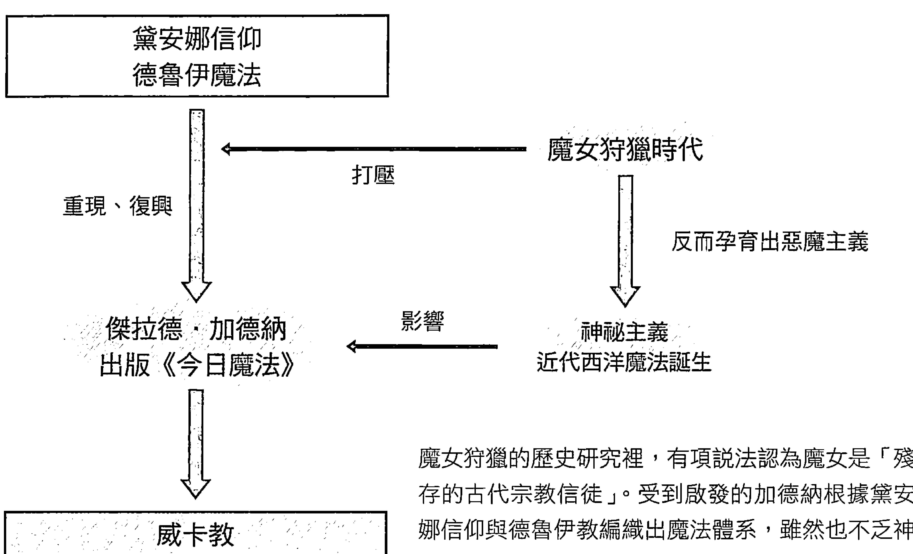

魔女狩獵的歷史研究裡，有項說法認為魔女是「殘存的古代宗教信徒」。受到啟發的加德納根據黛安娜信仰與德魯伊教編織出魔法體系，雖然也不乏神秘主義的影響，其最大的目的在於「重現」古時候的魔女們。

## 積極與自然融為一體的威卡教

威卡教都在進行哪些活動呢？他們一般將黛安娜等女神奉為主神，在被稱為「夜宴（Sabbat）」和「月宴（Esbat）」的集會上膜拜眾神。他們多為團體行動，每個團體是一個「巫師集團（Coven）」，基本上由十三位成員組成，指導者是一名女祭司。

夜宴舉辦在季節交替之時，一年共有八次，威卡信徒會在這時大肆慶祝。而月宴則是一般聚會，舉辦時間為滿月或新月之日，舉凡入教、結婚、生子或喪禮等儀式都屬於這個聚會。

身為魔女的他們也會在這些場合施展巫術（Witchcraft），但大多是與宗教有關的祈願、占卜或藥草製作。威卡教的道德觀裡有一項「三倍奉還法則」，所有善意或惡意的行為都會變成三倍回饋到自己身上。雖然占卜和藥草本身並沒有善惡之分，威卡教都將這些巫術用在好的地方。

另外，威卡教還有一種叫做《影之書》的教典暨魔導書，每位加入巫師集團的新成員都會得到一本，但書的內頁卻是一片空白，信徒必須自己寫上在集團內學到的儀式、魔法和咒文以完成這本書，作法相當獨特。

裡面的內容本是不對外公開的個人隱私，但也因為這個原因，在加德納死後，有許多人擅自修改威卡教的儀式。於是加德納的愛徒多琳·瓦利提（Doreen Valiente）在1978年公開了自己的《影之書》，隨著正確的儀式普及，他們藉由實踐各種魔法儀式與自然、宇宙融為一體的目的也逐漸散播開來。

## 魔女宗教的復興是透過「重現」而非「繼承」

乍看之下，威卡教似乎只是一個極為古怪的神秘集團。事實上，加德納師事老桃樂希只是杜撰出來的故事，就連現在的威卡教信徒也這麼認為。他們不相信這是承自古代的宗教，連瓦利提都承認威卡教曾受到神秘主義的影響。因為當中包含許多加德納自創的部分，威卡教是否真的源自於古代魔女這點至今讓人存疑。

不過，他研究了當地原住民的巫術、參考了德魯伊的文獻，先有一定的理解之後，才創辦了威卡教這個現代的靈性活動。比起「繼承」，他利用「重現」與「復刻」的方式，讓前基督教時期的多神信仰與自然崇拜重返世界，成功在沒有迫害也沒有社會問題的情況之下，為自己的宗教進行宣傳。

直到今天，威卡教仍打著「多神信仰的新興宗教」這個招牌進行傳教活動。雖然宗教勢力不大，但是其組織甚至遍及世界。被以全新視角重新審視過後復興的魔女，至今仍生活在現代社會。

### 崇拜古代女神的威卡教

**巫師集團（Coven）**
目的：與自然宇宙合而為一

**【教典】**
《影之書》（原文：Liber Umbrarum）

**【團體結構】**
巫師集團（通常包含祭司在內有十三人）

**【道德觀】**
三倍奉還法則
（不論好事壞事，自己的行為都會變成三倍回到自己身上）

**【集會】**
- 月宴（一般聚會）
- 小夜宴（夏至、冬至、春分、秋分）
- 大夜宴（薩溫節、五朔節、豐收節、聖燭節）

**【宗派】**
加德納派、德魯伊派、凱爾特派、薩克遜派（西克斯威卡教）、威爾斯派、北歐派

信仰

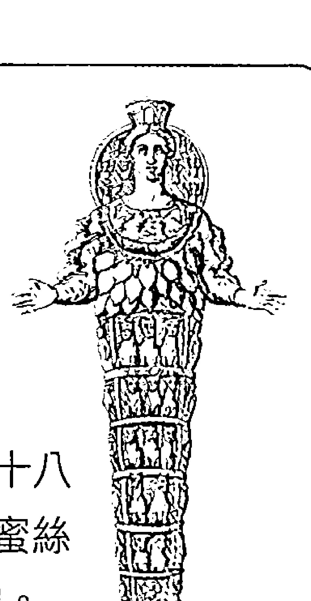

黛安娜、阿拉狄雅等古代神祇

以弗所的阿緹蜜絲像（十八世紀的複製品）。阿緹蜜絲與黛安娜被視為同一神。

比起魔法本身，崇拜地母神黛安娜、阿拉狄雅等前基督教時代的古代神祇才是威卡教的本質。它幾乎完全重現了古代宗教的特質，如母權制、崇拜自然和多神信仰。威卡教與基督教的方向性截然不同，可以想見兩者為何在歷史上長期互相對立。

### 《何谓《影之书》》

一片空白的
《影之书》

瓦利提的《影之书》内容

- □ 說明威卡教的七種基本儀式
  - 設定魔法圓
  - 巫師集團的咒語
  - 自行入教的儀式
  - 滿月月宴的儀式
  - 聖別的儀式
  - 加入巫師集團的儀式
  - 夜宴的儀式
- □ 七芒星
- □ 盧恩字母
- □ 繩結的咒語
- □ 召喚有角神
- □ 召喚月之女神
- □ 歌曲和舞蹈

新成員自行
在書中記錄學到
的儀式和魔法

原本是不對外公開的筆記

左圖為瓦利提的《影之書》內容。除了七種基本儀式的程序之外，書中還說明了在儀式上使用的咒語、文字、歌曲和舞蹈等項目。就實踐教學手冊來說，這是最能代表現代的魔導書。

### 《大夜宴與小夜宴》

冬至
(12月21日)

薩溫節
(11月1日前晚)

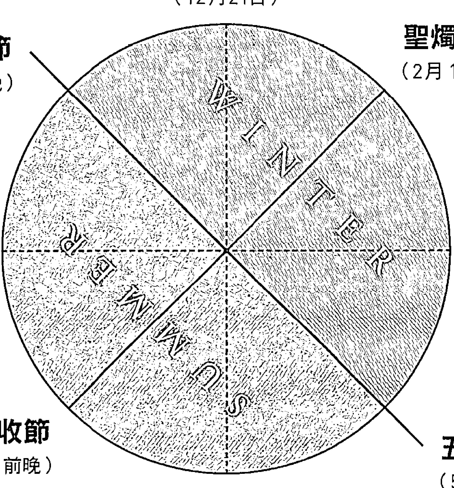

聖燭節
(2月1日前晚)

異教徒的「年輪」
威卡教每年會在八個固定的日子舉辦夜宴，這八天都是與季節有關的節日：夏至、冬至、春分、秋分為小夜宴；薩溫節、五朔節、豐收節、聖燭節則稱為大夜宴。順帶一提，薩溫節是萬聖節的原型。

秋分
(9月21日)

春分
(3月21日)

豐收節
(8月1日前晚)

五朔節
(5月1日前晚)

夏至
(6月21日)

### 仪式用的祭坛和道具

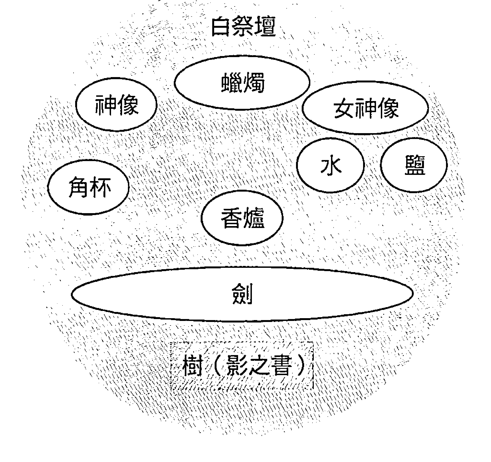

### 西克斯威卡教的祭坛

每个宗派的祭祀道具略有差异，此处以西克斯威卡教（萨克逊派）为例。放在祭坛上的道具和位置如左图所示，祭坛本身位于直径9英呎（2.7432公尺）的魔法圆中央，剑则是长30英吋（76.2公分）、宽2.5英吋（6.35公分）的萨克逊风双刃剑。

- 每位魔女会配戴西克斯短剑或阿萨米黑剑。
- 为了仪式，魔女们会裸体或穿著简朴的希腊罩衫。
- 头上戴著铜或银制的头箍。

### 魔女的字母「底比斯文字」

| 字母 | 符号 | 字母 | 符号 | 字母 | 符号 |
|---|---|---|---|---|---|
| A | 𐐨 | I, J | 𐐴 | R | 𐐶 |
| B | 𐐺 | K | 𐐼 | S | 𐐿 |
| C | 𐐾 | L | 𐑂 | T | 𐑄 |
| D | 𐑀 | M | 𐑆 | U, V | 𐑈 |
| E | 𐑁 | N | 𐑊 | X | 𐑌 |
| F | 𐑃 | O | 𐑎 | Y | 𐑐 |
| G | 𐑈 | P | 𐑒 | Z | 𐑔 |
| H | 𐑉 | Q | 𐑔 | 文章末尾 | 𐑖 |

底比斯文字是加德纳派使用的魔女通用字母。据说它出自一位仪式魔法师，后来被误当成魔女通用字母传播开来。除了它以外，威卡教还会使用卢恩字母（P.130）或欧甘字母（P.122）等魔法文字。

## 中國四千年的各種神秘奧義

## 中國的魔法與巫術

### 長生不老的仙人即為中國版的魔法師

接著，讓我們來看看東方的情況。在中國的道教裡，有一種得道後成為長生不老之軀的「仙人」。仙人會進行各種修煉，如呼吸法、飲食療法或通體活氣的房中術。這些用於修煉的術和煉製靈藥的方法都是仙人驅使的法術，它們統稱為「仙術」或「方術」，例如：被砍傷也不會喪命的辟兵法，任意讓身體變成透明的隱形法，用鏡子照出妖怪原型的明鏡法，改變自己或他人外貌的替形法，能化解災難的符咒，以及能增進視力、讓自己看到平常看不見的鬼神的明目法。

另外，煉丹術也是重要的仙術之一。這種術分成外丹及內丹，前者為製作長生不老藥，主要原料包含水銀和砷化物，換句話說，就是中國版的鍊金術。當然，因為這種藥含有劇毒，過去出了不少為追求長生不老卻反而斷送生命的案例。後者的內丹則是修煉五臟六腑內的氣，轉化自己的身心並藉此得道。比起藥物，內丹更像是以氣調身的醫學，其理論和技術影響了後世的氣功。

### 以蟲之毒下咒，以無詞歌召喚

除了仙術，中國還存在多種咒術。「巫蠱」便是其中一個代表。這種咒術會使用動物，尤其是指蟲類（包含爬蟲類和兩棲類）。根據文獻記載，巫蠱用的毒主要來自蛇、蟾蜍、蜥蜴、蝌蚪、蠍子、壁虎、蛆、蜘蛛、蚱蜢、蜈蚣或跳蚤。施咒者會選出五種蟲，將牠們關在甕裡自相殘殺，再用活到最後、毒性最強的一隻下咒或殺害他人，藉此奪取對方的財物。順帶一提，使用魚類的巫蠱稱為「挑生」或「桃生」，使用貓的巫蠱則稱為「貓鬼」。

還有一種咒術稱為「嘯」，它被歸類為所謂的咒歌，是一種沒有歌詞的古代音樂，咒術師會哼唱這首歌曲，召喚靈魂、動物或雷雲。可惜的是，這種歌已經完全失傳。雖然不知道從前的咒術師究竟發出什麼樣的聲音，但根據少數殘存的文獻，他們似乎是利用舌頭、牙齒和嘴唇來調整聲調的高低強弱。

# 第4章 魔法與巫術

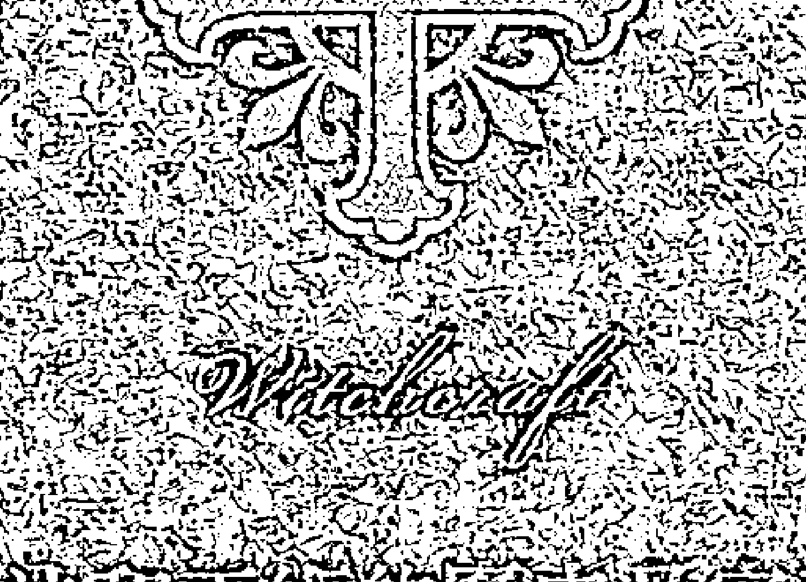

- 魔法和巫術的歷史及定義
- 魔法和咒語
- 巫毒術
- 國際字母
- 節慶
- 巴巴魔法師
- 魔鬼
- 魔鬼學派
- 占星術的歷史及定義
- 占星術的實踐方法
- 魔法圈
- 煉金術
- 煉金文字與符號
- 近代魔法的歷史及定義
- 黃金黎明協會
- 克勞利術
- 塔羅魔法

### 魔法和巫術的歷史及定義

來自古代世界的魔法歷經了獨自發展，變成今日的模樣。讓我們一起來看看魔女和魔法師的原點吧。

### 各種誕生自古代世界的魔法體系

- 1. 古代美索不達米亞地區（Mesopotamia）：在底格里斯河與幼發拉底河流經的美索不達米亞地區（現伊拉克）發展的古文明。
- 2. 迪底（Dedi）：也有人說他是魔術師而非魔法師。
- 3. 方術師：方術是源自仙術的魔法體系。

近代魔法的代表人物阿萊斯特·克勞利（P.156）將魔法與巫術定義為「能根據人的意志產生變化的學問或法術」。這些自古存在的魔法誕生於世界各地並持續發展，雖然大多因為某些因素失傳，還是有一部分的魔法體系傳承至今。

魔法和巫術是從哪裡、又是如何誕生的呢？

由於沒有文獻明確給出答案，我們無法百分之百肯定，但是從舊石器時代的遺跡裡出土的各種與魔法信仰有關的文物及壁畫看來，若說它們幾乎是與人類同時誕生的似乎也並不為過。

古代美索不達米亞地區是舉世聞名的西洋占星術發源地，據說這裡的古人會在現實生活中進行有如魔法般的占卜，例如用動物祭品的肝臟或腸子來占卜未來。

古埃及也保留了許多讓人聯想到魔法信仰的記錄，他們會在木乃伊的繃帶裡纏入護符，祈禱死者能在來世過得平安祥和。而在西元前2900年左右的古埃及文獻《韋斯特卡莎草紙》裡，則記載了更詳細的內容。

這本書提到了真實存在的魔法師迪底的事蹟，根據書中的描述，迪底能砍下動物的頭再讓牠們復活。而《舊約聖經》裡也曾出現一名魔法師，他在埃及法老王的宮殿裡，將手杖變成一條蛇。

接著讓我們來看到古代歐洲。在殘存的記錄當中，有記載名為「德魯伊」（P.120）的人物，他們是凱爾特族的神官，能用魔法操縱精靈或飛行。至於在古代的中國，則有被稱為「方術師」的魔法師蓬勃發展。魔法在世界各地冒出嫩芽，與該地區或文化一起成長茁壯。

### 魔法體系的發源地

下圖為源自世界各地的主要魔法體系。除了這些之外，還有許多種地方特有的魔法。例如在夏威夷有一種叫做「卡胡納（Kahuna）」的神官，他們是表現活躍的醫生、工匠及咒術師；而印尼的峇里島則有「峇里巫術」，這種類似黑魔法的巫術包含許多能置人於死地的術式。

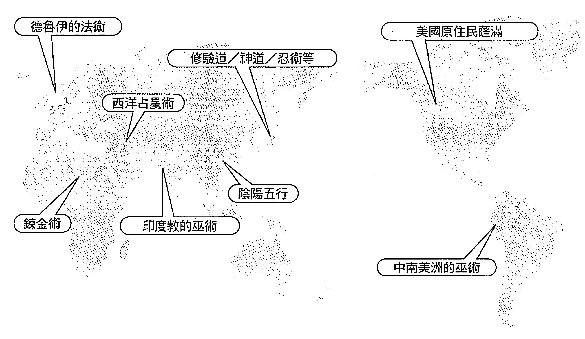

### 古代的魔法與文化

| 地区 | 古代魔法与文化发展 |
| :--- | :--- |
| 欧洲 | 史前时代（拉斯科洞窟壁画）-> 旧石器时代
约西元前3500年，巨石阵建成 -> 德鲁伊的时代
约西元前2000年，迈锡尼文明（凯尔特时代）-> 古希腊
西元前一世纪，罗马帝国成立 -> 罗马帝国 |
| 中东 | 约西元前3000年，古埃及统一 -> 古埃及、美索不达米亚文明
苏美人建造城邦国家
七世纪，伊斯兰教普及 -> 伊斯兰文化
《天方夜谭》的魔法、炼金术与占星术的发展 |
| 亚洲 | 约西元前1600年，中国商朝成立
约西元前770年，进入春秋战国时代 -> 从黄河文明发展成中国王朝
诸子百家争鸣（阴阳说、五行说等）
四世纪，葛洪《抱朴子》 -> 神仙思想确立 |
| 南北美洲 | 旧石器时代，人类从亚洲迁移至美洲大陆
约西元前500年，奥尔梅克文明诞生 |
| 非洲 | 各部族巫医或咒术师的传统巫术 |

### 各式各樣的魔法、巫術與使用它們的人

> ④ 丑時詣：一種咒術。在丑時（約上午一點～三點）將模仿對方外表製成的稻草人用五寸釘釘在神社的神木上。

魔女和魔法師使用的魔法或巫術分成好幾種體系，每一種都有不同的用法與目的。除此之外，使用者的名稱也會根據使用的法術而有所不同。

例如使用鍊金術的人一般不稱為「巫師」或「女巫」，而是「鍊金術師」；使用盧恩秘術的人叫作「盧恩秘術使」，使用德魯伊法術的人就叫作「德魯伊」，每一種法術的使用者都有固定的稱呼，詳細說明請參考右頁的表格。

而主要的法術大致上可分成八個種類，分別是「召喚魔法」、「自然魔法」、「白魔法」、「黑魔法」、「交感魔法」、「接觸魔法」、「典禮魔法」與「性魔法」。

「召喚魔法」常見於電玩或漫畫作品，是將天使、惡魔或死去的人召喚到現世並使用牠們的能力。

「自然魔法」利用蘊藏在自然界中的相互關係，從星星的動向預測未來的占星術就屬於自然魔法。

「白魔法」與「黑魔法」是根據法術的性質與施術者的意圖分類，例如召喚天使幫助他人被歸類為白魔法，但召喚惡魔對他人不利則屬於黑魔法。雖然一樣都是召喚術，卻會按照目的分成不同類別。

「交感魔法」又稱為「模仿魔法」，這種法術的基礎是建立在相同外形的事物會對彼此造成影響的「相似法則」，在日本無人不曉的「丑時詣」⁴就屬於交感魔法。而「接觸魔法」又稱為「感染魔法」，它的基礎則是原為一體，或是曾經接觸過的事物，在往後仍會對彼此產生影響的「接觸／感染法則」，有些詛咒他人的法術需用到對方的頭髮，這種法術就算是接觸魔法的一種。

「典禮魔法」是指需透過特定的儀式或咒語才能生效的制式魔法，因為只要按部就班便能得到相同的結果，因此它的優點在於就算是沒有魔法素養的人，使用後依然能得到一定的成效。

而至於最後的「性魔法」，本書將在對這種法術造詣極高的阿萊斯特·克勞利（P.156）的章節進行說明。

### 魔法、巫術體系與其使用者

| 魔法巫術體系 | 使用者 | 備註 |
| --- | --- | --- |
| 妖術<br>Sorcery | 魔女Witch<br>妖術師Warlock | 妖術一般是指與魔女術相似但較為邪惡的法術。使用者被稱為「魔女」，但是在中世紀～近代，也存在女性之外的男性妖術師。 |
| 魔女術<br>Witchcraft | 魔女<br>Witch | 一般我們說的魔女是指使用魔女術的「Witch」，她們活躍於基督教盛行之前的時代，會使用祈雨、占卜等咒術幫助大眾。 |
| 威卡教<br>Wicca | 威卡教徒<br>Wiccan | 威卡教是對魔女術逐漸失傳的現況感到恐懼的傑拉德·加德納所創辦的魔女團體，他們不贊成會傷害他人的魔法。 |
| 鍊金術<br>Alchemy | 鍊金術師<br>Alchemist | 鍊金術能將金屬變成黃金或銀等貴金屬，這種技術比起魔法更接近科學。它源自埃及，在歐洲發展，並造就許多留名青史的鍊金術師。 |
| 占星術<br>Astrology | 占星術師<br>Stargazer | 占星術是一種觀測天體並根據天體的狀況占卜未來的技術。世界各地都有占星術師，他們在占卜時會使用「天宮圖」。詳細說明請參照P.130。 |
| 卡巴拉<br>Kabbara | 卡巴拉術師<br>Kabbarist | 卡巴拉是從猶太宗教觀誕生的神秘思想，許多魔法理論也是以它為基石，因此頗具盛名。魔法結社「黃金黎明協會」（P.152）也在自己的魔法理論中採用卡巴拉的論點。 |
| 盧恩秘術<br>Rune | 盧恩秘術使<br>Rune Mage | 北歐所有使用盧恩字母的魔法總稱。根據北歐神話的描述，盧恩字母出自主神奧丁之手。詳細說明請參照P.130。 |
| 德魯伊術<br>Druidic Magic | 德魯伊<br>Druid | 德魯伊是凱爾特文化圈裡的僧侶階級，他們施展的法術多屬於自然魔法，能飛上天空或是讓空間扭曲。 |
| 咒術<br>Magic | 薩滿<br>Shaman | 薩滿大致可分成兩種類型，附身型的薩滿能讓靈魂附在自己身上，並借用祂們的能力；出竅型的薩滿則是能讓自己變成靈體，直接引導更高階的靈體提供協助。 |
| 巫毒<br>Voodoo | 烏賈<br>Houngan | 巫毒以製作殭屍聞名。使用巫毒的人多為男性，但也有女性的施術者，稱為「曼帛」。與女性相比，男性施術者的法術效果較為顯著。 |
| 死靈法術<br>Necromancy | 死靈法師<br>Necromancer | 死靈法術能召喚死者的魂魄，在電玩或動畫裡常被當成讓死者復生的巫術，但其實被召喚出來的只有靈魂，從中獲取知識才是死靈法術的目的。 |
| 近代魔法<br>High Magic | 魔法師<br>Wizard | 十八～十九世紀的魔法師們從基礎開始建構的魔法體系稱為「近代魔法」，這種魔法靠著艾利弗斯·李維及阿萊斯特·克勞利等多位魔法師的努力之下才得以成長茁壯。 |
| 儀式魔法<br>Ritual Magic | 魔法師<br>Wizard | 儀式魔法屬於近代魔法的一環，它不是只需唸咒的簡單法術，還需透過畫有魔法陣的儀式才能施法。因為和近代魔法並沒有太大的差異，使用者基本上都稱為魔法師。 |

### 源自東方的魔法、巫術體系與其使用者

| 魔法巫術體系 | 使用者 | 備註 |
| --- | --- | --- |
| 方術 | 方術師 |  |
| 仙道 | 仙人 |  |
| 煉丹術（金丹道） | 道士 |  |
| 巫毒（巫蠱、蟲術） | 術士 |  |
| 奇門遁甲 | 遁甲術 |  |
| 瑜伽 | 瑜伽士 |  |
| 陰陽道 | 陰陽師 |  |
| 咒禁術 | 咒禁師 |  |
| 修驗道 | 修驗者 |  |
| 密教 | 法師 |  |

提到使用魔法或巫術的人，一般都會先想到西方的魔女和魔法師，不過東方並不是沒有像這樣的角色，例如中國的仙人（天仙、地仙等）就能利用叫作仙道或仙術的法術飛翔或是看見某個人的命運；而日本特有的修驗者則會運用名為修驗道的法術來驅使鬼神，或是以時速500公里的高速在空中飛行。雖然在數量上不及西方，但東方也存在自己的魔法體系。

魔法和咒語

魔女和魔法師使用的魔法或巫術種類繁多。本節將介紹使用頻率最高的代表性魔法。

魔女和魔法師的招牌法術——召喚魔法

聽到魔法和巫術，大部分的人應該會先想到召喚魔法。這種魔法能召喚天使、惡魔或各種精靈，視情況也會將亡者的靈魂召喚到現世並借助祂們的力量。它的起源非常久遠，在世界各地都曾發現能讓祖先的靈魂或神靈附身在自己身上的靈媒師或薩滿。

一般來說，如果召喚的是天使或善良精靈就稱為白魔法，惡魔或惡靈等邪惡存在則稱為黑魔法。當召喚出來的對象是亡者則叫做「死靈法術」或「降靈術」。由普羅提諾（Plotinus）在三世紀開創的新柏拉圖主義，則將這種法術稱為「神通術」或「降神術」。

新柏拉圖主義（Neoplatonism）：從普羅提諾的哲學理念誕生的古希臘哲學流派。當中又分成敘利亞、羅馬和雅典娜等多種學派，活動區域也不相同。於西元六世紀時沒落。

魔法結社「黃金黎明協會」（P.152）將召喚魔法分成「召喚」和「喚起」兩種類型。根據日本魔法結社「I∴O∴S∴」成員的說法，「召喚」是祈求天使或神明降臨世上的法術，而「喚起」則是呼喚四大精靈或妖魔的魔法。

I∴O∴S∴：1986年發跡的日本魔法組織，又名「魔法學院」。活動理念是追求魔法思想的普及、探索與享受魔法本身。

四大精靈：火、水、風、地四種屬性的精靈。在一般的情況下，施術者只能召喚與自己屬性契合的精靈。

至於從黃金黎明協會傳承下來的召喚魔法，又能再將上述類型細分為讓召喚出的對象附在他人或物品上的「請願」，以及附身在施術者身上的「憑依」。

過去曾有許多成功召喚天使或惡魔的例子，例如活在十六世紀的魔法師約翰·迪伊（John Dee）與其助手愛德華·凱利（Edward Kelley）就曾經召喚大天使烏列爾並習得以諾魔法（P.160），後來黃金黎明協會便將這種魔法納入體系當中。

烏列爾（Uriel）：隸屬「下三級」的「大天使」，同階級的天使還有米迦勒及拉斐爾。

召喚魔法有時甚至能在無償的情況之下，向超越人類智能的存在借取力量。正因為有這樣的便利性，才讓它成為各方魔女和魔法師常用的法術。


施展召唤魔法时需凭借魔法阵和咒语进行仪式。

Illustration : 长内佑介

第四章 魔法与咒术

魔法

魔法和咒語

施法時不可或缺的咒語

施展魔法時，不論是作為主體或是輔助，都會需要用到各式各樣的咒語。詠唱的咒語根據使用的法術不同，內容也非常多元。

咒語大多是古語、自創詞彙或者使用譬喻法的特定詞句。它的種類和用途五花八門，除了可以用來驅除疾病或災害，還有緩解身體疼痛等效果。

祈願咒這類日常生活中的咒語通常都比較短，就算是缺乏魔法知識的人也可以使用。

相反地，如果是召喚天使或惡魔的高階魔法，則需要非常冗長且複雜的咒文。然而這些咒語的內容會因為召喚對象而不同，只要出現任何錯誤，魔法便無法發揮效果。對外行人來說，這種咒語可說是難以駕馭。

一般而言，咒語必須依照正確的步驟及方法說出特定的句子才能生效。有些施術者會自行更改內容，視情況即興創作或事後追加其他咒語。但如此一來，能否獲得理想的結果全憑施術者的運氣，如果可以的話，最好還是按照正確的步驟和方法詠唱咒語。而除了單獨使用，咒語還能作為儀式的一環，或是搭配特定的動作。

咒語除了可以用嘴巴唸，還可以寫在紙張或物品上使用。過去歐洲人經常使用的「阿布拉卡達布拉」就是一個著名的例子，它能夠保護人不受疾病、災難或惡魔侵害，通常會在羊皮紙上把文字寫成一個三角形後當成護身符。然而，後來的魔術師也在變戲法時使用這個咒語，雖然它因此聲名大噪，但也有人認為這是讓它失去效力的原因。

當魔法只需要一個咒語就能發動時，咒語本身便成了最簡便的施術工具。不過一旦用錯方法，不僅會讓魔法失去功效，甚至還會對自己造成傷害。因此在施術時，必須謹慎使用這些咒語才行。

咒語的使用方法

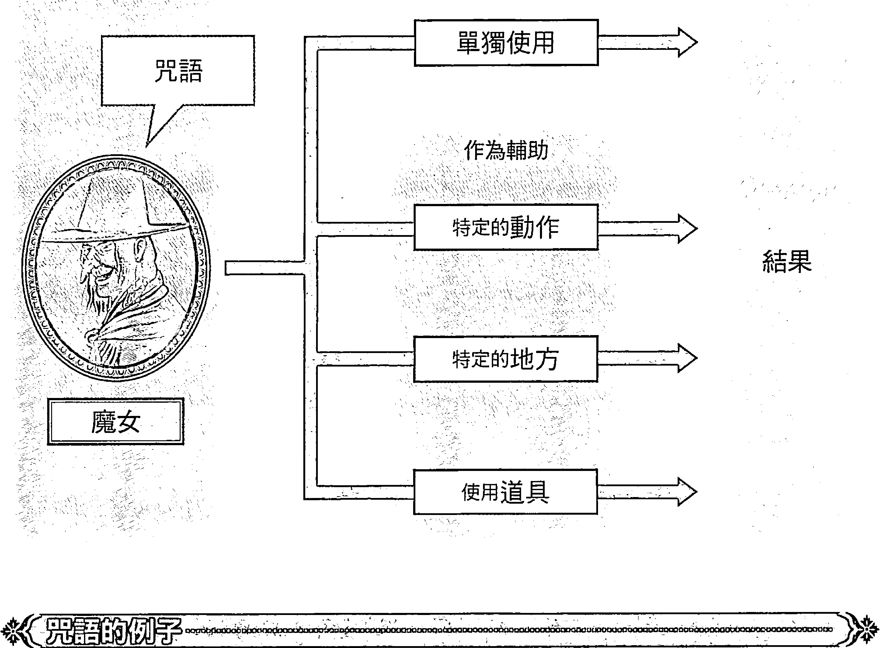

咒語的例子

阿布拉卡達布拉

```
A B R A C A D A B R A
 A B R A C A D A B R
  A B R A C A D A B
   A B R A C A D A
    A B R A C A D
     A B R A C A
      A B R A C
       A B R A
        A B R
         A B
          A
```

阿布拉卡達布拉是歐洲的一種咒語，主要效果為驅除疾病、災害以及惡魔。利用這個咒語製作護身符的時候，首先要寫上「ABRACADABRA」，接著逐行刪去最後一個字母，直到文字排出一個倒三角形。越下方的咒文越短，代表邪惡正慢慢消失。

阿格拉

阿格拉是希伯來文「Ate Gebir Leilam Adonai」的縮寫，意思是「神啊，祢永遠偉大」。這個咒語也曾出現在魔導書《雷蒙蓋頓》（P.192），它能召喚神聖的存在，保護施術者不被熱病、災害或邪惡事物侵襲。除了寫下來作為驅魔用的護身符，還能將它刻在短刀或劍上。

九字真言

九字真言是一種咒法，施術者一邊詠唱「臨兵鬥者皆陣列在前」九個字，一邊結出九種不同的手印來趕跑妖魔鬼怪。這個咒語源自道教，後來與密教的手印結合，分為結手印的「切紙九字護身法」，以及使用刀印的「早九字護身法」兩種類型。一般的情況都會使用前者，唯有在十萬火急的時刻才會用到後者。

德鲁伊

德鲁伊是活跃一时的凯尔特僧侣。他们被誉为「森林贤者」，本节将逐一介绍他们的生活型态。

德鲁伊——从凯尔特民族诞生的森林贤者

德鲁伊（Druid）出现在西元二世纪前后，他们是从凯尔特人的信仰中诞生的魔法（德鲁伊术）师。**德鲁伊可以使用多种法术，例如神谕、预言或操纵天气。**关于他们的名称由来有好几种说法，一般认为是出自代表「橡木贤者」及「博学之人」的希腊文「Druidēs」。

凯尔特人：古代居住在欧洲各地的民族，罗马共和国称他们为「高卢人」。另有一说是出自凯尔特语的「daru-vid（橡树的贤者）」。

德鲁伊不仅是魔法师，他们同时还身兼神官、占卜师、政治家、诗人和法官等多项职务，换句话说，他们就像是凯尔特人的领导者。此外，他们不必服从相当于现代征兵制的制度，并且免除了缴纳税金的义务。或许是因为这个缘故，过去有许多立志成为德鲁伊的人，不过因为修行过程过于严苛，中途放弃的人也不在少数。

凯尔特人原本是一支没有文字的民族，但或许是后来发现这样很不方便，他们制作并开始使用欧甘字母（P.122）。

在德鲁伊的修行当中，最困难的部分在于必须背诵大量的歌曲，并且他们在背诵时无法使用文字，因此也有人为了修行投注二十年的岁月。

德鲁伊原本只有一位贤者，但是随着时光流逝，需透过口述传承的内容也逐渐增加，变成一个人无法负荷的庞大数量，于是他们便在阶级制度里加入「瓦帝司（O'vateis）」和「巴德（Bardoi）」。

最高级的德鲁伊担任「神官」，负责研读神学、伦理、法律等学问与指导瓦帝司。身为「预言家」的瓦帝司跟随德鲁伊学习自然科学、天文学和占卜，并在祭祀仪式上负责外部工作和处理祭品。阶级最低的巴德则是「诗人」，负责记录氏族的族谱，并和着琴声唱出族长们的战绩与传承。透过这样的分工合作，每位德鲁伊的负担得以减轻，工作也能进行得更加顺利。

德鲁伊的魔力来源

除了各种自然魔法以外，德鲁伊还会使用下表的法术来完成自己的职责，而他们施法时所需的魔力，则是以槲寄生为主要来源。

槲寄生是寄生在其他树木上的长青植物，因为外表终年翠绿，德鲁伊认为是橡木之神不断赐予它们力量，并开始采集槲寄生以获取魔力。

德鲁伊在采集槲寄生时会举行特殊的仪式。身着白衣的德鲁伊会带着黄金做的镰刀爬到橡树上采收槲寄生，而地上的德鲁伊必须用白布接住它，因为一旦掉落地面，槲寄生就会失去蕴含的魔力。此外，在仪式上还必须准备两头白色的公牛作为祭品。

各种自然魔法：德鲁伊的自然魔法里也包含使用植物制作魔药。
特殊的仪式：举行仪式的时间一定要在阴历第六天。

| 魔法名称 | 描述 |
| :--- | :--- |
| 神谕、预言 | 德鲁伊的神谕或预言与咒术师雷同。他们在施术时会先进入冥想，获得神或精灵的力量来预知未来并传达给其他的人。不过因为凯尔特人信奉多神教，每次预言的内容都不太一样，精准度不算太高。 |
| 万应药 | 万应药（Panacea）即万能药，由依照正确步骤从橡树摘取下来的槲寄生制作而成。这种药的名字也曾出现在古罗马博物学家盖乌斯·普林尼（Gaius Plinius）的《博物志》当中。根据这本书的记载，万应药不但可以迅速让不孕的动物怀孕，还能中和各类毒物。 |
| 操纵天气 | 高阶的德鲁伊能借助神或精灵之力，自由召唤或消灭暴风雨或是大雾。这种魔法通常是以保护同伴为目的，鲜少被用来攻击敌人。或许是因为威力过于强大，他们才没办法频繁地使用这种法术。 |
| 咒歌 | 咒歌与其说是德鲁伊的魔法，不如说是专属於「诗人」巴德的奥义。这种穿透人心的歌曲具有魔力，精通歌唱的巴德据说也相当擅长咒歌。咒歌的效果五花八门，除了能够提高我方的斗志，还能让听到歌声的人陷入沉睡。 |
| 空间扭曲 | 空间扭曲的魔法是利用魔法通道串联好几个地方，施展这种魔法时必须用到刻有欧甘字母的神木。此外，空间扭曲的魔法也曾出现在凯尔特的神话当中，达南神族在对抗先进驻冰岛的弗摩尔巨人族之时，就曾用到这个法术。 |
| 变身 | 德鲁伊只要挥动注入念力的手杖，就能从人类变成狗、天鹅或猪等各种动物。但是与变身相比，这种法术更接近转生。只要德鲁伊没有再次施法，他就无法变回原本的模样，可说是一种非常可怕的法术。 |

第四章 III 魔法與巫術的歷史

歐甘字母

「歐甘字母」是凱爾特人原創的文字體系。德魯伊過去是如何使用歐甘字母的呢？

凱爾特人編織出來的獨立文字體系

歐甘字母（Ogham）是凱爾特人在四世紀左右創造出來的獨立文字體系。它的特徵與盧恩字母（P.134）一樣，都只用直線組成。後人推測這是因為當時的文字寫在樹木或石頭上，包含曲線的文字不好書寫，所以才創造了這種文字。

盧恩字母：由垂直或傾斜四十五度角的直線組成的文字。

凱爾特人原本沒有文字，他們透過口述繼承各式各樣的傳統。然而口述能傳達的內容終究有限，不知道從何時開始，他們漸漸發展出文字。

住在巴爾幹半島的凱爾特人使用希臘語，住在北義大利的凱爾特人則使用承自伊特拉斯坎人的南阿爾卑高盧語。後來，某支凱爾特人創造了歐甘字母，最終散播到整個民族，成為凱爾特人專屬的文字。

施展魔法的時候也會用到這個文字，除了前述的空間扭曲需使用刻著歐甘字母的神木，在進行「蓋斯（Geis）」的時候也會用到它。

蓋斯即為「誓約」，是一種利用咒術束縛他人的魔法。凱爾特人在自己身上設下制約，只要遵守就能獲得力量；反之若是破壞誓言，危及性命的災難便會降臨在自己身上。因為伴隨著危險，只有獨當一面的凱爾特戰士才能獲准使用這種魔法。戰士們會在愛用的武器或石碑刻上歐甘字母，藉此記住或強化加諸在自己身上的制約。

破壞蓋斯的人會遭逢災厄，因此在戰鬥時能否逼對方打破蓋斯便成了致勝關鍵。

長年被使用的歐甘字母最終受到拉丁字母的排擠而失去蹤跡。即便如此，這個蘊藏神秘力量的字母還是吸引了大批民眾。為了讓凱爾特人的文化在現代重生，許多團體至今仍在持續進行歐甘字母的研究。

歐甘字母

| 歐甘字母 | 對應的英文字母 | 名稱 | 意思 |
| :--- | :--- | :--- | :--- |
| ᚁ | B | Beithe | birch=樺木（樹木或木材）、樺木製的鞭子 |
| ᚂ | L | Luis | blaze or herb=火焰、（強）光／藥草 |
| ᚃ | F | Fern | alder=榿木 |
| ᚄ | S | Sail | willow=柳木 |
| ᚅ | N | Nin | fork or loft=叉子／閣樓 |
| ᚆ | H | (h) Uath | fear=擔心、敬畏（※） |
| ᚇ | D | Dair | oak=橡木 |
| ᚈ | T | Tinne | rod of metal=金屬棒 |
| ᚉ | C | Coll | hazel=榛木 |
| ᚊ | Q | Cert/Queirt | bush=灌木、樹叢 |
| ᚋ | M | Muin | neck=脖子、衣襟 |
| ᚌ | G | Gort | field=原野、田地 |
| ᚍ | NG | (n) Getal | wounding=傷害、破壞（感情）（※） |
| ᚎ | Z | Straif | sulfur=硫黃色、黃綠色 |
| ᚏ | R | Ruis | red=紅色 |
| ᚐ | A | Ailm | 不明 |
| ᚑ | O | Onn | ash-tree=梣樹 |
| ᚒ | U | Ur | earth=世界、大地 |
| ᚓ | E | Edad | 不明 |
| ᚔ | I | Idad | 不明 |
| ᚕ | EA | Ebad | 不明 |
| ᚖ | OI | Or | gold=黃金、財產、富裕 |
| ᚗ | UI | Uilen | elbow=手肘 |
| ᚘ | IA | Pin/Iphin | pine=松樹 |
| ᚙ | AE | Emancholl | double c=兩個C（※） |

※正確意義不明。
歐甘字母共由二十個字母及五個輔助記號組成，每個文字都有對應的英文字母、名稱和意思，但部分文字的涵義至今尚未查明，只留下一片謎團。此外，出土石碑上的歐甘字母大多代表部族或人名，因此近年也出現歐甘字母或許並不具有魔力的說法，但真相至今仍未明朗。

第四章 IV 卡巴拉

卡巴拉

神秘主义思想卡巴拉是各种神秘学的基础。本节将带读者深入了解其奥义「生命之树」。

為各派魔法奠定基礎的神秘思想

「卡巴拉（Kabbalah）」是一种神秘主义思想，有人认为它是神明赐予人类的智慧。除了各种魔法之外，炼金术和占星术也都受到卡巴拉的影响。

卡巴拉是神明授予某个人的神圣之物，而这个人正是拯救犹太人逃离埃及的摩西。犹太人的神秘学家提出了以下说法证明这项论点。

摩西：《旧约圣经》里的犹太先知，拯救了被埃及俘虏的犹太人。著名的事迹包含咏唱咒语「谢姆哈姆弗拉叙」使红海一分为二，藉此横越海洋。
十诫：神明授予摩西的十条戒律，又名「摩西十诫」。

这位学者表示，摩西为了完成与神的约定，带领七十位以色列长老爬上神圣的西奈山。他在前四十天向神明受领十诫，并在后四十天习得卡巴拉。

在卡巴拉的思想当中，万物是从神身上倾泻而出的力量与属性，而「生命之树」呈现了直到神的圣性形成物质世界为止的十个阶段，它记录了卡巴拉的神秘及奥义，在魔法相关人士之间是非常重要的概念。

生命之树由十个球体（质点）与连接这些质点的二十二条线（路径）组成，它们统称为「三十二个智慧」。而生命之树又能分割成左、中、右三个部分，分别是左边的「严厉之柱」，中间的「中庸之柱」和右边的「慈悲之柱」。

此外，生命之树上面还有三个分别称为「0（Ain）」、「00（Ain-Soph）」、「000（Ain-Soph Aur）」的存在。它们代表神本身，位于顶点的「Ain-Soph Aur（无限之光=神的睿智）」孕育出了「Ain-Soph（无限）」，接着才出现「Ain（无）」和世界。

生命之树的图形因为充满神秘性而广为人知，若说它就是促使卡巴拉渗透整个魔法界的原因似乎也并不为过。

生命之樹

與路徑（線）對應的阿爾克那

| 路徑 | 名稱 | 阿爾卡那（※） |
| :--- | :--- | :--- |
| 1 | alef | 愚者 |
| 2 | bet | 魔術師 |
| 3 | gimel | 女祭司 |
| 4 | dalet | 皇后 |
| 5 | he | 皇帝 |
| 6 | vav | 教宗 |
| 7 | zayin | 戀人 |
| 8 | chet | 戰車 |
| 9 | tet | 力量 |
| 10 | yod | 隱者 |
| 11 | kaf | 命運之輪 |
| 12 | lamed | 正義 |
| 13 | men | 吊人 |
| 14 | nun | 死神 |
| 15 | samech | 節制 |
| 16 | ayin | 惡魔 |
| 17 | pe | 高塔 |
| 18 | tsadi | 星星 |
| 19 | kof | 月亮 |
| 20 | resh | 太陽 |
| 21 | shin | 審判 |
| 22 | tav | 世界 |

※ 塔羅牌的分類。大阿爾卡那。

質點（球體）象徵的意義

| 編號 | 名稱 | 意義 | 神名 | 守護天使 | 人體 | 顏色 |
| :--- | :--- | :--- | :--- | :--- | :--- | :--- |
| 1 | Kether | 王冠 | Eheieh | 梅丹佐 | 頭 | 白 |
| 2 | Chokhmah | 智慧 | Yod | 拉傑爾 | 腦 | 灰 |
| 3 | Binah | 理解 | Elohim | 亞夫結 | 心臟 | 黑 |
| 4 | Chesed | 慈悲 | El | 薩基爾 | 右手 | 藍 |
| 5 | Geburah | 神力 | Elohim Gibor | 薩麥爾 | 左手 | 紅 |
| 6 | Tiphareth | 美麗 | Eloha | 米迦勒 | 胸部 | 黃 |
| 7 | Netzach | 勝利 | Adonai Tzabaoth | 漢尼爾 | 右腳 | 綠 |
| 8 | Hod | 榮耀 | Elohim Tzabaoth | 拉斐爾 | 左腳 | 橙 |
| 9 | Yesod | 基礎 | Shaddai El Chai | 加百列 | 生殖器 | 紫 |
| 10 | Malkuth | 王國 | Adonai Melekh | 聖德芬 | 全身 | 多色 |
| — | Da'at | 知識 | — | — | — | — |

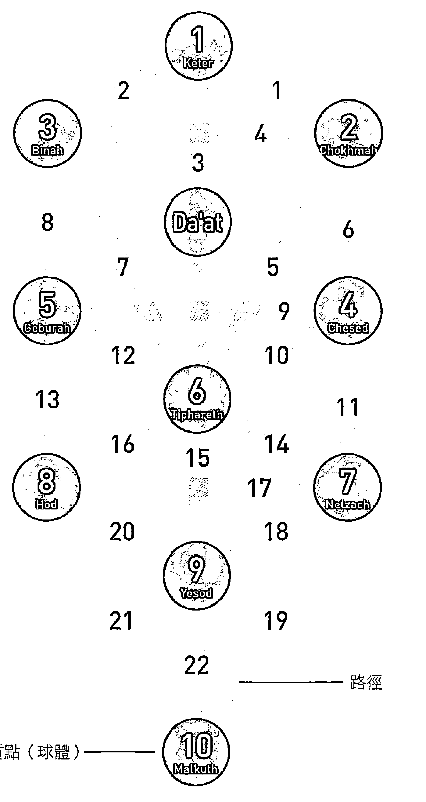

從卡巴拉祕術誕生的人造魔像

魔像（Golem）是能夠依照施術者的意志行動的人造人，雖然經常出現在各種奇幻作品，卻鮮少人知道它的出生其實來自卡巴拉祕術。

一提到「魔像」，大部分的人應該會聯想到又大又可怕的石頭怪物。不過，出現在傳說裡的魔像卻不是這副模樣。

歷史上曾有好幾個人成功製造魔像，如十一世紀的卡巴拉術師所羅門·伊本·蓋比魯勒（Solomon ibn Gabirol）就曾經製造女性魔像，將其作為僕人使喚。而十六世紀的拉比猶大·羅·本·比撒列（P.30）的相關記錄中，也顯示他曾製造外表近乎人類的魔像。

拉比（Rabbi）：猶太教的聖職者，相當於神父或牧師。

魔像會依照施術者意志行動，因為非常方便，才出現了像前述的蓋比魯勒一樣製作僕役用魔像的人。然而製作魔像的真正目的，其實是為了保護當時備受迫害的猶太人。

根據從前的記錄，白天時，魔像會坐在猶太會堂的中庭，到了夜裡，它們會在隔都的周圍巡邏，預防外敵入侵。它們不斷重複這樣的循環，直到1953年猶太人受到皇帝保護為止。

猶太會堂（Synagogue）：猶太教的集會所。
隔都（Ghetto）：猶太人的居住區，受打壓的猶太人被強迫住在隔都裡。

至於最重要的魔像製作方法，一般是先用水和泥土捏出人偶，再為其注入生命。這是模仿神在製作人類祖先亞當時的作法。而幫魔像注入生命的方法也有好幾種，可以將寫著神之名諱的紙片放在它的嘴裡或夾在耳後，或是在額頭寫上希伯來文「emet」。

寫著神的真名或簡化後的四字神名「YHVH」。
emet：為「真理」之意，去掉前面的「e」之後則變成「met（死亡）」。

魔像的製作方法意外地簡單，還會完美地服從任何命令，雖然看起來非常吸引人，但在驅使它們的時候仍必須遵守幾項規定。其中最重要的是必須讓它們「在安息日休息」，如果不這麼做，魔像便會暴走，對自己或周遭的事物造成傷害。

因此當魔像不再被需要時，施術者會拿下放在它們嘴裡或耳後的紙片，或是刮除「emet」前面的「e」，讓魔像回歸塵土。

## 魔像的製作方法

製作魔像時，首先需混合水和泥土，捏製模仿人類外形的人偶。接著將寫有「YHVH」的紙片放入魔像口中或夾在身體某處，讓它隨身攜帶；也可以只把「emet」這幾個字刻在它的額頭上，簡簡單單就完成一尊魔像。

### 能夠像人類一樣成長的魔像

據說，身為人造人的魔像，身體會隨著時間經過成長。這樣的情節曾發生在艾利亞·鮑爾·謝的故事當中。
鮑爾·謝住在波蘭東部的海姆鎮，他製造了一尊魔像來作為自己的僕人。因為非常方便，他有好長一段時間都讓魔像不停工作，沒有讓它歸於塵土。
某一天，鮑爾·謝對越長越大的魔像感到恐懼，開始思考讓它變回泥土的方法。雖然他想刮掉刻在魔像額頭上的「emet」，卻因為魔像長得太過巨大而搆不著。於是鮑爾·謝命令魔像幫他「脫掉長靴」，魔像立刻蹲下準備為他脫鞋，而鮑爾·謝則趁著這個空檔刮除了魔像額頭上的「emet」，讓它變回一團泥土。
故事到這裡看似一切順利，但在這之後，組成巨大魔像的大量泥土全落到了鮑爾·謝身上，當場把他壓死了。
若將鮑爾·謝的故事當成反面教材，定期讓魔像回歸塵土似乎才是比較適當的作法。

## 第4章 IV 卡巴拉

## 卡巴拉數秘術

這種法術使用了卡巴拉術師獨創的數字，可以用來解讀暗號或占卜未來。

### 探知真理的卡巴拉暗號解讀法

-   ① 卡巴拉術師：精通卡巴拉的猶太神秘主義者。
-   ② 《創世紀》：基督教的聖書，《舊約聖經》裡的其中一冊。
-   ③ 加百列：與拉斐爾、烏列爾同屬「下三級」的「大天使」，是負責傳遞神諭的傳信使。
-   ④ 拉斐爾：司掌治癒的天使，這個名字有「神之藥」的涵義。

世界各地的卡巴拉術師①都認為，以希伯來文撰寫的卡巴拉原書裡藏著某種秘密，這個秘密被化為暗號，**若是能解開這些暗號，或許就能觸及卡巴拉所蘊含的真理**。因此他們想出了三種解讀方法，當中也包含「（卡巴拉）數秘術」。

最著名的解讀法叫做「數字換算法」，這是將文字轉換成數字後相加，使該詞彙最後變成一位數字。

以「魔法」這個詞彙為例，如果每個字各代表「2」，相加之後就會得到「4」。換句話說，「魔法」這個詞也能用數字「4」來表示。除了單一詞彙以外，這個方法也能用來解讀一整句話。例如《創世紀》②有一段寫到：「他看向身旁的三個男人。」當中的「看向三個男人」以數字換算法轉換後會變成「701」；而另一段「他們分別是米迦勒、加百列、拉斐爾」同樣也用數字「701」表示。使用數字換算法時，數字一樣的詞彙或句子可以互相替換，因此這裡的「三個男人」正是指米迦勒、加百列③和拉斐爾④這三位天使。

第二種解讀法是「簡略法」。這種方法可以將原本的文章簡化，或是從簡化後的文章導出原本的意思。因為把文章簡化之後，可以得到的情報會大幅減少，如果不是讓對的人解讀，得出的答案可能會和原本的意思有很大的出入，故這種解讀法並不是非常方便。

最後的「逐一代換法」非常單純，它只需要依照某種規則轉換文字即可。例如看到「A」就換成「B」，看到「B」就換成「C」，把每個字母都往後推一位，找出文章隱藏的含意。

### 希伯來字母與卡巴拉的對照表

| 字母 | 名稱 | 意思 | 數值(※) | 對應字母(※) | 發音(英文名母) |
| :---: | :---: | :---: | :---: | :---: | :---: |
| א | alef | 公牛 | 1 | A | A、Ah |
| ב | bet | 房子 | 2 | B | B、Bh |
| ג | gimel | 駱駝 | 3 | G | G、Gh |
| ד | dalet | 門 | 4 | D | D、Dh |
| ה | he | 窗 | 5 | H | H |
| ו | vav | 金屬扣、鉤子 | 6 | V | O、U、V |
| ז | zayin | 劍、甲冑 | 7 | Z | Z |
| ח | chet | 柵欄、圍籬 | 8 | Ch | Ch |
| ט | tet | 蛇 | 9 | T | T |
| י | yod | 手 | 10 | I | I、Y |
| כ | kaf | 拳頭 | 20、500 | K | K、Kh |
| ל | lamed | 牛鞭 | 30 | L | L |
| מ | mem | 水 | 40、600 | M | M |
| נ | nun | 魚 | 50、700 | N | N |
| ס | samech | 支柱 | 60 | S | S |
| ע | ayin | 眼睛 | 70 | O | Aa、Ngh |
| פ | pe | 嘴巴 | 80、800 | P | P、Ph |
| צ | tsadi | 釣鉤 | 90、900 | Tz | Tz |
| ק | kof | 耳朵、頭部後方 | 100 | Q | Q |
| ר | resh | 頭 | 200 | R | R |
| ש | shin | 牙齒 | 300 | Sh | S、Sh |
| ת | tav | 十字架 | 400 | Th | T、Th |

※希伯來字母對應的數字或英文字母。

數字換算法除了可以解讀暗號，還能用來占卜未來。將相關人士的出生年月日、姓名和出生地按照上表轉換成「數值」之後，再利用該數值進行占卜。這種方法被稱為「數秘術」，是卡巴拉術師使用的占卜法之一。

## 盧恩

「盧恩秘術」是位於眾神頂點的奧丁也曾使用的一種高階魔法體系。

### 古日耳曼民族代代相傳的法術

> ① 奧丁 (Odin): 北歐神話裡的最高神祇，除了魔法以外還掌管知識、戰爭和死亡。

盧恩（Rune，盧恩秘術）使用了日耳曼民族創造的盧恩字母，這種字母具有魔力，只要將其排列組合，就能得到某種魔法效果。

盧恩字母的形狀並不適合長文書寫，或許是因為如此，即便是用在盧恩秘術也鮮少出現太長的字串，通常以不滿五個字的情況居多。發現盧恩字母的奧丁本人也曾經表示：「如果想要發揮盧恩真正的力量，就不能將其隨意亂刻，而是必須在效果最好的物品與位置上，刻下正確的盧恩字母。」

奧丁的這段言論顯示祂已徹底掌握了盧恩字母的特性。之所以這麼說，是因為每一個盧恩字母都有各自的涵義，只要將與自身需求相對應的文字刻在適當的地方，就能發揮出十足的效果。如果在使用盧恩秘術時刻下長長的字串，則會被視為邪魔歪道。

盧恩秘術只要刻上文字就能生效，但其實也有其他方法可以提升它的效力。這個方法就是替文字染上顏色，最典型的作法是使用自己的鮮血染色。

此外，使用盧恩秘術的盧恩秘術使有八個重要的能力和要素，它們分別是：
-   ①刻印（雕刻盧恩字母的能力）
-   ②解讀（解讀盧恩與其魔力的能力）
-   ③染色（替盧恩染色的方法與其意義）
-   ④實行（解放盧恩魔力的條件與方法）
-   ⑤祈禱（向司掌盧恩秘術的眾神祈禱）
-   ⑥供養（為司掌盧恩秘術的眾神獻上祭品）
-   ⑦送葬（將祭品的靈魂送到眾神身邊）
-   ⑧破壞（破壞盧恩）
唯有具備以上所有能力的人，才會被認可為獨當一面的盧恩秘術使。

### 盧恩祕術的使用方法

盧恩祕術要在身體或物品刻上盧恩字母才能發揮效果。如果要刻的是身體，必須刻在與效果有關的部位，例如「麥酒盧恩」就必須把字母刻在自己的手背或指甲上。而刻在物品上的時候也一樣，要使出「勝利盧恩」的話就刻在武器上，如果這個武器是一把劍，最好的方式就是把文字刻在劍身或劍柄上。

麥酒盧恩：可以避開毒酒的盧恩。只要施展這種祕術，就能發現哪杯酒被下了毒。

盧恩字母除了可以用來施展魔法，當然也可以作為一般用途，它們常被刻在石碑或裝飾品上，這時的它們多代表人名或者地名。因此讀者必須注意的是，並不是所有刻著盧恩字母的東西都與魔法有關。

以下將介紹其中一部份的盧恩祕術。除了這些以外，世界上還存在只有奧丁才知道的祕術內容。關於這個部分的詳細介紹請參考P.133。

### 主要的盧恩祕術

太古時代的盧恩祕術是將盧恩字母刻在武器或防具上以獲得魔法效果，不過現代在占卜的時候也會使用右圖這種刻著盧恩字母的石塊或木片。這個方法類似塔羅牌占卜，占卜師會隨意挑選一個石頭或木片，透過上面刻著的盧恩字母占卜未來會發生的事。

### 刻著盧恩字母的物品

### 勝利盧恩

刻上受人敬畏的戰神提爾的代表字母，藉此借助祂的部分力量。在武器刻上盧恩字母後，必須大喊兩次提爾的名字。武器上的字母直到沾上敵人的鮮血才會產生魔力。

### 遺忘盧恩

這個祕術出現在北歐神話的英雄齊格飛與華爾琪麗布倫希爾德的故事裡。它能刪除他人的記憶，是一種非常方便的祕術。不過要是用錯方法，就會替自己帶來不幸。

### 醫療盧恩

治療疾病或傷口的盧恩祕術。將刻有盧恩字母的樹枝遞給病患，便能將病患身上的疾病或傷口轉移到樹枝上，使病患痊癒。因為使用後即刻見效，在緊急的時候能派上用場。

### 詛咒盧恩

這是一種能讓詛咒對象遭逢災厄的恐怖祕術。災厄的內容五花八門，如果在施咒時想像得很具體，就能達到與想像內容相同的效果。此外，這個祕術也能透過某種特定的方法破除。

### 第一個發現盧恩字母的是神話中的神

-   ③ 《老埃達》(The Elder Edda)：冰島神話。以奧丁為首的北歐諸神都出現在這本書裡。
-   ④ 山毛櫸：在日本也能看見的落葉樹。
-   ⑤ 魔槍岡加尼爾 (Gu-ngnir)：奧丁持有的魔法長槍。據說他在進行取得盧恩秘術的儀式時，也是用這把長槍貫穿自己的身體，當時長槍本身尚未具有魔力。
-   ⑥ 世界樹尤克德拉希爾 (Yggdrasil)：北歐神話裡的大樹，共分成阿斯嘉和米德嘉爾特等九個世界。

「盧恩字母」是用於盧恩秘術的神秘文字。各項文獻指出，它誕生的時間大約在西元一世紀，不過還有另外一種說法，認為它是奧丁創造出來的產物。

根據《老埃達》③〈奧丁箴言〉裡的描述，北歐神話的智慧之神奧丁為了尋求更多知識，在儀式上把自己當成祭品。獻祭的方法只能用慘烈來形容。他先用長槍貫穿自己，再把自己的脖子吊在樁樹的樹枝上面。

當儀式經過九天九夜之後，奧丁的意識來到冥界，他在這裡得到了某種秘密文字，而這些文字正是盧恩字母。

奧丁把自己發現的盧恩字母傳授給人類，然而這只是其中的一小部分，因此，能夠使用所有盧恩秘術的只有奧丁一個人而已。

右頁列出了奧丁主要習得的盧恩秘術。除了這些以外，還有「睡眠盧恩」、「醫療盧恩」、「戀愛盧恩」、「安產盧恩」、「雄辯盧恩」、「山毛櫸④盧恩」、「力量盧恩」、「永恆盧恩」、「生命盧恩」、「災難盧恩」、「肉慾盧恩」和「瘋狂盧恩」等等，就算不曉得效果如何，但我們至少知道世界上仍存在人類無從得知的盧恩秘術。

很多故事裡都曾提到奧丁使用盧恩秘術的場景，當中特別要為讀者介紹的，是奧丁持有的魔槍岡加尼爾⑤。這把強大的武器是用世界樹尤克德拉希爾⑥的樹枝加上槍頭組成，射出後必定能擊中對手，還會自動回到使用者的手中。事實上，這把槍也使用了盧恩秘術。雖然不曉得秘術的具體內容，但據說是因為奧丁在槍身刻了「岡加尼爾」的文字，才讓魔槍具備此種能力。

有實際的物證可以證明上面這項說法，那便是在世界各地發現的盧恩碑文。絕大多數的碑文內容都是人名或地名，不過也有石碑上刻著「此處刻有眾神傳授之盧恩」。故我們無法否定盧恩字母及盧恩秘術是出自奧丁之手的這項說法。

### 奥丁习得的盧恩秘術

| 盧恩 | 效果 | 盧恩 | 效果 |
| :--- | :--- | :--- | :--- |
| 救贖盧恩 | 消除爭鬥、悲傷和煩惱。 | 驅魔盧恩 | 讓魔女出竅的靈魂無法回到自己的身體。 |
| 治癒盧恩 | 治療傷口，使人恢復健康。 | 盾牌盧恩 | 為戰士帶來勇氣，讓他們從戰場上平安歸來。 |
| 阻敵盧恩 | 讓武器失去威力。 | 死者盧恩 | 能夠與死者對話。 |
| 解放盧恩 | 解開或斬斷手腳上的束縛。 | 守護盧恩 | 讓敵人的刀刃無法刺進自己的身體。 |
| 擋箭盧恩 | 讓箭矢或長槍等遠距離武器掉落地面。 | 知識盧恩 | 得到與神和精靈有關的情報。 |
| 反彈盧恩 | 若因為詛咒受傷，會把疼痛加倍還給對手。 | 小人盧恩 | 從神身上得到力量，從妖精身上得到榮華，從奧丁身上得到智慧。 |
| 滅火盧恩 | 熄滅火焰。 | 愛情盧恩 | 抓住女性的心，成就自己的戀情。 |
| 安撫盧恩 | 消除憎恨的情感。 | 貞節盧恩 | 讓女性的心永遠停留在自己身上。 |
| 航海盧恩 | 停止強風或高浪，讓海面歸於平靜。 | 最後盧恩 | 只有奧丁知曉的秘密盧恩，效果成謎。 |

上表是奧丁犧牲自己習得的盧恩秘術的主要項目。在描寫主神奧丁與北歐眾神的冰島神話《老埃達》裡，還有其他用到盧恩字母的法術，有興趣的讀者可以自行查閱相關資料。

### 北歐傳說裡的其他魔法

除了盧恩秘術之外，人們還在北歐發現了幾種不一樣的魔法體系，那是名為「渥爾娃」的巫女所使用的「賽茲咒法」和「剛德咒法」。

賽茲咒法能讓施術者陷入恍惚狀態，並讓神明或祖先的靈魂附在自己身上，換句話說，就是類似降靈術的法術。施術者不但能藉此獲得知識或預言，還可以對他人下咒。通曉賽茲咒法的人過去是受人敬重的先知，不過有時他們也會被視為帶來災害的不祥之人，被社會忌諱、嫌惡。

此外，這個法術無法獨自一人進行，必須由一位渥爾娃作為神靈的容器，另一位負責唱誦咒歌或咒語。

剛德咒法則會讓施術者的靈魂出竅。靈魂離開身體的渥爾娃可以乘著手杖飛翔，或是變成狼、鯨魚、隼或海豹等動物。和賽茲咒法一樣，剛德咒法也能用來詛咒他人，為對方帶來不幸。

除了這些之外，沃爾娃還能使用類似交感魔法的法術，只要揮動手杖假裝毆打，就能實際對對方造成傷害。

### 盧恩字母

北歐各民族使用的「盧恩字母」。這個飄蕩著神秘氣息的字母，究竟隱藏著什麼秘密呢？

### 格式不一的魔法文字

1.  後弗薩克文 (Younger Futhark): 與第一種盧恩字母「古弗薩克文」相比，後弗薩克文的筆劃較多，看起來像樹枝一樣，因此又被稱為「樹枝盧恩」。共由十六個字母組成。
2.  納粹親衛隊: 1925年組成的希特勒直屬護衛隊。創立當時只有八名成員，隨後規模逐漸擴大。

盧恩秘術所需的盧恩字母發源自西元一世紀左右，使用者是住在斯堪地那維亞半島和中歐地區的各個日耳曼民族。

由於橫跨了千年以上與多個地區，每個時代或地方的盧恩字母都存在些微差異，而在這之中歷史最久遠的，是被稱為最古老盧恩字母的「古弗薩克文 (Elder Futhark)」。古弗薩克文一共有二十四個字母，雖然記錄不多，除了瑞典、丹麥這些北歐國家以外，法國、南斯拉夫、波蘭和羅馬尼亞等多國都曾使用這種文字。

另一方面，知名的第二種盧恩字母「後弗薩克文」①只出現在九～十二世紀的瑞典、丹麥及挪威三國，即便如此，關於這種字母的文獻數量之多，在解讀上也相當容易。不過，由於未曾發現涉及魔法的古物或文獻，學者認為後弗薩克文與魔法應該並無關聯。

盧恩字母最大的特徵在於它們是由垂直與傾斜四十五度的直線組成，同樣的特徵也可見於凱爾特人的歐甘字母。這兩種字母大多被刻在石頭、木材或金屬上，也就是因為如此，它們才發展成沒有任何曲線的文字體系。

當盧恩字母衰退以後，它的地位被拉丁文字取代。不過時至今日，這種字母依然存在，並沒有完全消失。

舉例來說，納粹親衛隊②的黑閃電符號「SS」就結合了代表太陽的盧恩字母；此外，在《魔戒》③等奇幻作品當中，也將盧恩字母作為構成世界觀的要素之一。

### 盧恩字母的種類與涵義

| 盧恩字母 | 名稱 | 對應英文字母 | 意思 |
| :---: | :---: | :---: | :--- |
| ᚠ | Fehu | f | 家畜、財富、財產。 |
| ᚢ | Uruz | u | 野牛、燒渣（冶煉金屬時，從融化的金屬中分離的碎屑）、陣雨。 |
| ᚦ | Thurisaz | th | 巨人、玫瑰。 |
| ᚨ | Ansuz | a | 神、河口。 |
| ᚱ | Raido | r | 騎馬。 |
| ᚲ | Kenaz | k | 癰（膿胞）、火炬、船。 |
| ᚷ | Gebo | g | 禮物、浪費。 |
| ᚹ | Wunjo | w | 喜悅、牧草地。 |
| ᚺ | Hagalaz | h | 冰雹。 |
| ᚾ | Naudiz | n | 困苦。 |
| ᛁ | Isa | i | 冰。 |
| ᛃ | Jera | j | 夏天、豐收、收穫、年。 |
| ᛇ | Eihwaz | e | 紅豆杉、木材。 |
| ᛈ | Perth | p | 舞蹈、外陰、果樹※。 |
| ᛉ | Algiz | z / r | 大鹿、防禦、保佑。 |
| ᛊ | Sowilo | s | 太陽。 |
| ᛏ | Tiwaz | t | 軍神提爾。 |
| ᛒ | Berkana | b | 白樺樹枝。 |
| ᛖ | Ehwaz | e | 馬、神意。 |
| ᛗ | Mannaz | m | 人類。 |
| ᛚ | Laguz | l | 水、海洋。 |
| ᛜ | Ingwaz | ng | 英雄的名字。 |
| ᛟ | Othila | o | 世襲財產。 |
| ᛞ | Dagaz | d | 日、白天。 |

※ 可以採收食用果實的樹木，如橘子、蘋果等。

上表是第一個、也是最古老的盧恩文字「古弗薩克文」。每個字母都有不同的涵義，盧恩秘術必須根據所需的效果選擇要刻的文字。此外，上表介紹的字母涵義只是其中一部分，有些字母的真正意義至今尚未查明，上表的內容僅供讀者參考。

# 第4章 VI 占星術

## 占星術的歷史與定義

占星術從古代世界延續至今。
本節將帶讀者解開占星術連綿不斷的歷史發展。

### 存在於世界各地的占星術師

-   ❶ 宿曜道：源自中國的「中國宿曜道」傳入日本之後，以「宿曜占星術」的名義造成轟動。

占星術（Astrology）能透過天體位置占卜他人的未來。自古代美索不達米亞（巴比倫尼亞）誕生之後，其技巧逐漸拓展至世界各地。過去在日本相當盛行的宿曜道⑴，也是以占星術為基礎。

西元前2500年左右，在底格里斯河與幼發拉底河流域砌築文明的蘇美人創造了占星術。他們認為肉眼可見的水星、金星、火星、木星、土星、太陽和月亮這七顆星球上分別住了神明，而這些星球的運行會影響地球上發生的事情。於是占星術便就此誕生了。他們利用這個方法解讀星星的動向，決定國家的未來。

-   ❷ 行星：指太陽、月亮等在天球上逆行的星體。
-   ❸ 黃道十二宮：行星逆行於太陽的軌道「黃道」，黃道十二宮便是將這條路徑平分成十二等分。
-   ❹ 十二宮位：地球的周日運動會讓整座天空每天旋轉一圈。根據這個法則，將某時某地的東、西地平線上的一點分別設為上昇點和下降點。「十二宮位（House）」就是以上昇點為起點，將整座天空切隔成十二大塊。

從誕生後經歷了漫長的歲月，擴散至世界各地的占星術在各個地區獨自發展。現在除了西洋占星術以外，還有東洋、阿茲特克和印度等多種風格迥異的占星術存在。

話雖如此，不同占星術還是有共通的部分，即「行星」⑵、「黃道十二宮」⑶、「十二宮位」⑷與「相位（Aspect）」⑸，這四個要素出自托勒密（P.141）的《占星四書》，不論哪一種占星術都將它們視為重要元素。

只要使用特定的方法，不管是誰都可以導出相同的結果。因為占星術的這項特徵，至今仍有許多人愛用這種占卜方式，覺得它的可信度高於會受偶然影響的筮竹⑹或水晶占卜。

-   ❺ 相位（Aspect）：兩個天體在黃道十二宮內呈現什麼樣的角度。
-   ❻ 筮竹：一種裝在好幾個細長容器裡的易占道具。

順帶一提，目前最主流的「星座占卜」是一種只關注太陽動向的簡易占星術。雖然得到的結果沒有占星術正確，卻因為是任何人都可以簡單上手的方法而受到大眾歡迎。

# 占星术的历史

西洋
印度
中国
日本

西元前3000
巴比伦尼亚占星术
- 确立十二宫

古印度占星术
- 观察月亮和二十八宿的占星术

古代天文学
- 阴阳五行思想
- 北斗信仰

西元前500

西元前400

西元前200
占星术盛行

希腊占星术
- 托勒密的天动说
- 星象图占卜

西元后0

西元后200
来自基督教的打压

西元后400
- 导入十二宫和星象图

密教占星术
- 成立「宿曜道」

西元后1000
- 占星术文献被翻译

宿曜道

阴阳道（天文道、历道）

西元后1200
魔法性质的占星术

印度占星术

天文占/历占
- 确立紫微斗数

阿拉伯占星术

西元后1500
- 确立十二宫位
- 哥白尼的天动说
- 结合神秘学

- 确立九星占卜

民间占星术

天文学
- 发现天王星、海王星和冥王星

近代占星术

西元后1800

西元后1900

西元后2000
- 导入电脑

## 占星術的實踐方法

「星象圖」是進行占星術時不可或缺的天體配置圖。本節將簡單介紹星象圖的製作方法。

## 占星術的關鍵——星象圖

- 七個天體：指太陽、月亮、水星、金星、火星、木星和土星。有時也會加上天王星、海王星和冥王星，合為十個天體。

占星術是根據某個瞬間的星星位置占卜命運的方法。進行占卜的時候，會用到右頁這種叫作「星象圖（Horoscope或Horoscope Chart）」的天體配置圖，以下將說明此圖的觀看方法。

星象圖的中心代表地球（自己），占星術需透過從這裡看到的七個天體與星座的相對位置來得出結果。

星象圖可以從中間分成兩半，假設左半邊是「東（上昇點）」、右半邊是「西（下降點）」，從上昇點開始將每三十度分割成一個區塊，共分成十二等分，每個區塊是一個「宮位（House）」，合稱為「十二宮位」。從上昇點開始每三十度設為一宮的方法叫作「均分制」，另外還有「普拉西德宮位制」或「科赫宮位制」等多種分割宮位的方法。

實際利用星象圖進行占卜時，首先要製作出生資料，裡面需包含姓名、生日（包括時間）、出生地、恆星時、時差、出生地的恆星時等內容。

接著要將七個天體畫在星象圖上。為了達到這個目的，施術者必須調查自己出生的那一刻，各個天體位於哪個位置。這些位置連度數都必須經過縝密計算，只要稍有誤差，就無法得出正確的結果。

最後還需要相位，也就是兩個天體夾著地球所呈現的角度。這個角度不但會決定兩個天體之間的關係，同時還會影響占卜的結果。

寫好上述的資料以後，星象圖就大功告成了。透過天體、天體所在的宮位以及兩個天體間的相位等訊息，便能知曉自己的性格或是命運。此外，現在在網路上就可以免費製作星象圖，怕麻煩的人也可以多加利用這些資源。

# 名留青史的占星術師

這個段落要介紹的是功名顯赫或對占星術的發展有極大貢獻的占星術師。

提到對占星術的發展做出貢獻的人，應該會想到活躍於二世紀前半的天文學家克勞狄烏斯·托勒密。因為完成「天動說」而聲名大噪的他，其實是個從生卒年到個人資料都沒有對外公開的傳奇人物。

當托勒密還是一位活躍的天文學家時，社會大眾還不曉得行星是運行在複雜的軌道上面。然而托勒密組合了「均輪」②和「本輪」③等概念，發現了這個原理並將其彙整在《天文學大成》④等著作當中，把知識分享給各個層面的學術領域。

另外，托勒密還撰寫了《占星四書》⑤。這套作品統整了天體動向對地上造成的影響，第一部探討行星、恆星和星座，第二部解釋行星對國家或地區的影響，第三部則是討論行星對個人命運的影響以及十二宮代表的意義，可說是現代占星術的教科書。

- ② 均輪：與地球保持固定距離的行星運行軌道。
- ③ 本輪：有一旋轉的圓，以圓周上的某一點為中心，再加上一個較小且同樣會旋轉的圓，則這個小圓就稱為「本輪」。
- ④ 《天文學大成》：托勒密執筆的數學與天文學專業書籍。
- ⑤ 《占星四書》：被譽為占星學史上最重要的四本典籍。

# 占星術使用的星象圖

假設從生日推算出來的太陽位置落在牡羊座（宮位）的區塊，我們可以從星象圖得知這個人不但自尊心強，還擁有能為了目的跨越各種困難的堅韌意志和信念。

- ❻ 《占星曆》：將莉莉透過占星術獲得的預言集結成冊的書籍。

以占星術師這個職業獲得成功的人多不勝數，如果就金錢上的成功來看，十七世紀的英國占星術師威廉．莉莉就是一個著名的例子。他出生於小農家庭，靠著自學學會占星術。當時的占星術師都是皇家或貴族的諮詢對象，但莉莉卻選擇以民眾為客戶，打著占星術師的名號展開營利活動。

為了在一天之內讓更多人諮詢，莉莉縮短了每個人的詢問時間，以薄利多銷的方式招攬客人，同時還出版了自己的預言書《占星曆》❻並賣給上門的顧客，據說他透過這些方法賺取了龐大的利益。

如果只看以上這幾點，或許會有很多人覺得他只是個用假占卜向外行人騙取錢財的詐欺犯。不過，其實從一些逸事也能看出他的確是一位優秀的占星術師，例如與重大歷史事件「倫敦大火」有關的預言。

倫敦大火是歷史上的重大火災，包含多數建築物在內，共造成二十五萬人死傷。莉莉提前預知了這場大火，他在別處買了土地，當1666年大火發生之後，他便搬到別的地方並在那裡享盡天年。

# 誕生後多元發展的占星術

占星術是一種從出生日期、時間和地點來占卜一個人的未來或個性的占卜方式。然而當它逐漸發展之後，卻也衍生出了與過去的方法截然不同的占星術。

「卜卦占星術」就是一個代表性的例子。這種占星術看的不是出生日期，而是接受占卜委託的時間。因為解讀星象圖的方法與一般的占星術不同，並不是每個學會占星術的人都能實踐卜卦占星術。不過，由於這個方法有助於找到遺失物或失蹤人口，在占星術師之間也相當受到矚目。

此外，近代還出現了一種與醫療結合的占星術。它的創始者是歐根．喬納斯，一位在捷克斯洛伐克開業的精神科醫師。喬納斯收集了大量的出生記錄，並從中調查天體與女性受孕之間的關係，結果發現占星術竟然可以占卜女性容易受孕的時期、胚胎的性別以及狀態。

除了這些以外，世界上還有許多其他不太一樣的占星術，有興趣的讀者可以自行研究。

# 著名的占星術師

| 名字 | 生卒年 | 事蹟 |
| --- | --- | --- |
| 克勞狄烏斯·托勒密 | 2世紀前後 | 他是活躍於希臘的天文學家、地理學家、音樂評論家和數學家，憑藉稀世才能在各個領域大放異彩。生卒年等個人資料幾乎沒有留下，是個謎一般的人物。 |
| 阿布·麥爾舍爾 | 不明~886年 | 他是讓西洋占星術的占星學在伊斯蘭世界發展的推手。在中世紀歐洲，他是名為「阿爾布瑪扎（Alb Umazar）」的知名占星術權威。他曾師事哲學家，亦十分精通哲學。 |
| 尼古拉·哥白尼 | 1473年~1543年 | 相對於主張地球才是眾天體中心的「天動說」，他提倡中心應為太陽而非地球的「地動說」。雖然後世經常談論他身為天文學家的事蹟，其實他也曾以占星術師的身分活動。 |
| 阿格里帕·馮·內特斯海姆 | 1486年~1535年 | 阿格里帕在科隆大學學習法律、醫學與哲學之後，成為一名成功的魔法師；帕拉塞爾蘇斯則是以醫生和鍊金術師的身分聲名大噪。他們是師事占星術師約翰尼斯·特里堤米烏斯的同門師兄弟，兩人都在名為醫學占星術的領域發揮優異才能。不過似乎是因為個性容易樹敵，阿格里帕過著不斷被迫害與流浪的悲慘人生。 |
| 帕拉塞爾蘇斯 | 1493年~1541年 | 帕拉塞爾蘇斯是以醫生和鍊金術師的身分聲名大噪。他們是師事占星術師約翰尼斯·特里堤米烏斯的同門師兄弟，兩人都在名為醫學占星術的領域發揮優異才能。不過似乎是因為個性容易樹敵，阿格里帕過著不斷被迫害與流浪的悲慘人生。 |
| 諾斯特拉達姆士 | 1503年~1566年 | 他曾預見人類的滅亡，以史上最偉大的預言家著稱。他精通醫學，甚至還取得了醫學博士的資格，過去也是一名醫生，但最終成了法國宮廷裡的占星術師。 |
| 約翰·迪伊 | 1527年~1608年 | 他在英國都鐸王朝擔任宮廷占星術師，曾預言著名的「血腥瑪麗」女王將以死亡為她短暫的在位期間畫下句點。雖然他因此被判了叛國罪，這個預言卻精準地成真了。 |
| 第谷·布拉赫 | 1546年~1601年 | 這位天文學家提倡不屬於天動說或地動說的獨立宇宙觀，致力於提升占星術的準確度。他留下許多顯赫功績，如發展相位理論及自創的占星術。 |
| 約翰尼斯·克卜勒 | 1571年~1630年 | 他是德國的天文學家，利用布拉赫留下的龐大觀測數據建立了「克卜勒定律」。他本身並不相信占星術，然而他的研究成果卻對占星術有極大的貢獻。 |
| 威廉·莉莉 | 1602年~1681年 | 這位占星術師曾預言「破壞一切的惡疾與大規模的火災即將來襲」，而這些預言都成真了。1665 年橫行的鼠疫在倫敦造成十萬人死亡，隔年的倫敦大火也導致眾多死傷。 |
| 艾倫·里奧 | 1860年~1917年 | 他是二十世紀時活躍於英國的占星術師。他一邊擔任自動販賣機公司的業務員，一邊自學占星術，曾撰寫並出版《實踐占星術》等多本占星術的專業書籍。 |
| 伊凡潔琳·亞當斯 | 1868年~1932年 | 她是擁有稀世才能的占星術師，出生於出了好幾位美國總統的亞當斯家。她曾預言許多社會事件，例如 1912 年的鐵達尼號沉船以及 1929 年的經濟大恐慌。 |
| 卡爾·艾恩斯特·卡拉夫特 | 1900年~1945年 | 在第二次世界大戰爆發之前，卡拉夫特因為傑出的占星術才能受到賞識，在納粹德國得到相當於戰略顧問的職務。另一方面，瓦爾則以同盟國軍事顧問的身分進駐英國參謀總部。雙方為了讓自己所屬的勢力獲勝，使盡了身為占星術師的各種能力，最後由卡爾所在的同盟國拿下勝利。 |
| 路德維希·馮·瓦爾 | 1903年~1961年 | 在第二次世界大戰爆發之前，卡拉夫特因為傑出的占星術才能受到賞識，在納粹德國得到相當於戰略顧問的職務。另一方面，瓦爾則以同盟國軍事顧問的身分進駐英國參謀總部。雙方為了讓自己所屬的勢力獲勝，使盡了身為占星術師的各種能力，最後由卡爾所在的同盟國拿下勝利。 |
| 珥·奎格利 | 不明 | 這位占星術師曾對過去的美國總統隆納·雷根提出建言。她的占卜非常準確，總統夫婦都對她抱持高度信賴，可說是現代版的宮廷占星術師。 |
| 阿爾弗雷德·維特 | 不明 | 維特是在二十世紀初誕生的占星術研究團體「漢堡學派」的領導人。他根據天體運行的引力會對人類產生影響的概念，確立了名為「漢堡學派占星術」的新型占星術。 |

# 第4章 魔法與巫術

## VI 占星術

## 占星術的實踐方法

# 第4章 VII 魔法

### 魔法圓

「魔法圓」主要是用於召喚魔法的魔法圖形。
本節將介紹魔法圓的具體功能與特徵。

### 用於魔法儀式的圖形

- ① 魔方陣：將正方形均分成九、十六或二十五等分並寫上數字，每個直排、橫排或斜線數字的總和都一模一樣。有的人因為覺得它的構造很神奇而將它用於魔法，但硬要說的話，它與數學的關聯性較強，在魔法或巫術的世界裡較不被受到重視。

魔法圓是指在魔法儀式上所使用的特殊圖形，通常會和咒語一起用來施展召喚魔法，這時的魔法圓會畫在地板或牆壁上。如果遇到沒辦法實際畫出魔法圓的情況，也可以在腦海中描繪魔法圓以進行儀式。

魔法圓顧名思義是以圓形為中心，大部分的魔法圓會使用圓形再加上其他符號，而符號的內容則會根據魔法的性質和用途產生很大的差異。比方說，如果要用黑魔法召喚惡魔，就需要用到有防護效果的文字或符號，這樣施術者就不需擔心會受到惡魔傷害。不過因為只要踏出魔法圓一步就會被惡魔殺掉，在儀式結束前最好都不要輕舉妄動。

除此之外，有時也必須配合欲召喚的惡魔選擇時間或地點，在滿足這些條件以後，才能繪製魔法圓舉行儀式。

魔法圓使用的符號不僅有五芒星、六芒星，還有各種多角形以及四大元素等符號，這些符號可以單用也可以排列組合，例如以諾魔法（P.160）在召喚天使的時候就是使用這樣的魔法陣。施展這種召喚魔法時，施術者會在兩個同心圓外面畫上與四大元素相對應的符號（瞭望塔），這些符號就是由多個三角形組合而成。而除了符號以外，有些魔法體系還會在魔法圓上使用希伯來文或是希臘字母。

附帶一提，電玩或動畫等奇幻作品經常將魔法圓稱為「魔法陣」，這完全是一種誤用，一般來說，「魔法圓」才是正確的稱呼。另外一種聽起來很像的「魔方陣」①則是數學用語，與魔法沒什麼關聯。

## 魔法圆使用的符号

### 六芒星
由上下颠倒的两个三角形组合而成，是知名的恶魔象征，又名「大卫之星」。

### 十二星座
代表黄道十二宫星座的符号。除了召唤魔法以外，占星术或炼金术也都会使用这种符号。

### 五芒星
星形的符号，具有保护自己不被恶魔攻击的效果。若将右图上下反转则是代表恶魔的符号。

#### 四大元素
四大基本元素的象征符号，有时也代表拉斐尔和加百列等四大天使。

### 行星符号
代表太阳系内的行星。除了有太阳、月亮，还有地球、水星和金星等星球，每个行星符号的外观都不相同。请参考P.149。

### 魔法圆的范例（以诺魔法）
上图是以诺魔法用来召唤天使的魔法圆。在内圆和外圆之间，写着以「天使的语言」著称的以诺语。四个方位都摆着瞭望塔，分别代表火、水、风、地四个元素或米迦勒、拉斐尔、加百列、乌列尔等四大天使。

## 用魔法圓召喚天使或惡魔

- 1. 所羅門七十二柱：巴爾(Baal)、阿蒙(Amon)等臣服所羅門王的七十二柱惡魔。
- 2. 《雷蒙蓋頓》：由《蓋堤亞》、《阿爾斯·圖爾基亞·蓋堤亞》、《阿爾斯·寶利納》、《阿爾斯·阿瑪戴爾》及《阿爾斯·特諾利爾亞》構成的魔導書。請參照P.192。
- 3. 路基法格·羅弗卡列(Lucifuge Rofocale)：地獄的首相，路西法命其管理地上的財富與財產。
- 4. 「神之御印(Sigillum Dei Aemeth)」：天使送給約翰·迪伊的魔法圓，上面寫著神的名字和以諾語。

過去曾經有好幾位魔法師成功用魔法圓施展召喚魔法的真實案例，後來也發現了記載這些事蹟的歷史文書，而身為古代以色列國王暨神話中的賢者——所羅門王也是其中一位。

所羅門王是《舊約聖經》裡的古代以色列國王，他是對伊斯蘭世界的發展有偉大貢獻的著名賢者，魔法世界的人則稱呼他為「魔法之王」。這個稱呼源自於他的傳說，據說他曾命令「所羅門七十二柱」①在猶太教聖地「耶路撒冷」的中心建造耶路撒冷神殿。與這些惡魔有關的情報被記錄在據說是由所羅門王撰寫的魔法書《雷蒙蓋頓》②的第一部《蓋堤亞》當中。

這本書不但記錄了這些惡魔的性格與驅使牠們的方法，同時還觸及了召喚儀式以及所羅門王過去使用的魔法圓。根據《蓋堤亞》內的描述，召喚惡魔的方法如下：

首先，在房間的地板畫上儀式用的魔法圓後，將印有欲召喚惡魔的代表圖章的羊皮紙與香爐一起擺在魔法圓上。接著，施術者需身著法袍、配戴魔杖走進魔法圓，進行驅魔儀式以及召喚前的祈禱，讓房間成為「聖堂」之後，再詠唱特定的咒語。當惡魔現身在魔法圓內，施術者便用魔杖指向惡魔命其服從。

其他還有很多像這樣用魔法圓召喚惡魔的方法，例如在《大奧義書》當中，就記載了與惡魔路基法格·羅弗卡列③締結契約的召喚魔法。

這個召喚魔法必須在儀式的前一天晚上先準備長十九吋半的榛樹枝，按照正確的流程清除細枝後將其製成手杖。舉行儀式的時候，需在畫著魔法圓的山羊皮上擺放兩座燭台和馬鞭草頭冠，接著只要施術者呼喚惡魔皇帝路西法之名，路基法格就會出現在魔法圓當中。

除了這些以外，約翰·迪伊也曾用魔法圓召喚天使。當時他使用的魔法圓是天使送給他的「神之御印」④，在魔法師之間無人不知無人不曉。

# 第4章 魔法與巫術

## Ⅶ 魔法

### 魔法圓
召喚魔法可以召喚天使、惡魔或精靈等各種存在。

## 第4章 VIII 鍊金術

## 鍊金術

將科學與魔法這兩個乍看完全相反的主題結合在一起，就是充滿魅力的鍊金術。
席捲西洋的鍊金術熱潮其實也助長了近代科學的發展。

### 對現代科學法展有實際助益的神秘學

- ① 賢者之石 (Philosopher's Stone)：能將卑金屬變成貴金屬的神秘物質。
- ② 萬靈藥 (Elixir)：吃下後便能長生不老的靈藥。
- ③ 何蒙庫魯茲 (Homunculus)：人造人類。知名的鍊金術師帕拉塞爾蘇斯曾留下何蒙庫魯茲的製作方法。
- ④ 詐欺犯：鍊金術師的研究需要龐大的資金，因此當時有很多人謊稱自己是鍊金術師，以研究經費的名義向貴族騙取錢財。

鍊金術 (Alchemy) 在中世紀歐洲掀起一陣狂潮，它的要素包含「賢者之石」¹、「萬靈藥」²及「荷蒙庫魯茲」³，深深吸引著某些族群的目光。

鍊金術起源自西元前三世紀左右的埃及亞歷山大港，這裡的科學技術非常發達，有許多記錄顯示這裡曾獨立製作過各種化學製品，而鍊金術就是這些技術、知識與希臘的思想融合而成的產物。

誕生於埃及的鍊金術被當成異端打壓而衰退，原本幾乎要失傳的技術卻透過逃亡到阿拉伯的學者傳入伊斯蘭文化圈，並在這裡繼續深耕發展。後來，鍊金術隨著十字軍東征傳進歐洲，造就了鍊金術熱潮與多名鍊金術師。

鍊金術最大的目的是要製作被稱為「靈粉」的萬靈藥「Elixir」。因為人們認為萬靈藥必須以「賢者之石」製成，當時的鍊金術師們便發奮煉製這種石頭。此外，他們還相信賢者之石具有將卑金屬變成金、銀等貴金屬的能力，因此還出現了許多冒名鍊金術師的詐欺犯⁴。

賢者之石和萬靈藥與魔女製作的物品有一些共通之處，很多將鍊金術視為一種魔法，然而我們並不能這樣一概而論，因為使用鍊金術的人只是根據自然哲學中的「四大元素理論」，試圖用自然產物發展出其他可能，且他們的努力不但發現了新的化學物質，甚至還創造出新的藥品。

賢者之石和萬靈藥等鍊金術的目的雖然被歸在神秘學領域，其製作過程卻對化學的發展有極大貢獻。比起魔法，鍊金術似乎更接近科學。

## 与炼金术有关的人物

**阿布·穆萨·贾比尔·伊本·哈扬（721年～815年）**
他发现了盐酸、硝酸、硫酸、王水、柠檬酸、醋酸和酒石酸，并改良了蒸馏器具，留下许许多多的成就。除了炼金术之外，对科学发展也有很大的贡献。

**阿尔·拉齐（865年～925年）**
他是阿拉伯的炼金术师暨医师，曾撰写多本与炼金术或医疗有关的书籍，对欧洲的炼金术师造成极大影响。

**尼楽·勒梅（1330年～1418年）**
少数成功制作贤者之石的炼金术师之一，曾写过许多炼金术书籍，并在书中提贤者之石的做法，是炼金术世界的传奇人物。

**帕拉塞尔苏斯（1493年～1541年）**
本名是德奥弗拉斯特·博姆巴斯茨·冯·霍恩海姆，在炼金术、医疗和哲学等各个领域都曾留下功绩。因为正义感强且不愿妥协，经常为自己树立敌人。

**罗伯特·波以耳（1627年～1691年）**
发现「波以耳定律」的化学家与物理学家，他彻底否定亚里斯多德的「四大元素理论」，是将炼金术定位在神秘学领域的知名人物。

**约翰·约阿希姆·贝歇尔（1635年～1682年）**
他拥有医生、科学家和炼金术师等各种称号，提出名为「油土」的元素，在后世称为「燃素（Phlogiston）」。

**安東萬一羅倫·德·拉瓦節（1743年～1794年）**
提倡「质量守恒定律」的化学家，同时也是否定约翰·贝歇尔的油土论（燃素论）、提出并奠定「氧化说」的人。

**威廉·忠威爾（1794年～1866年）**
他是科学史家暨科学哲学家，也是发明「科学家」这个称呼的人。他和罗伯特·波以耳让炼金术彻底脱离科学，使其在后世被归类在神秘学。

**约翰·特爾載（生卒年不明）**
编辑并出版与元素「锑」有关的炼金术著作《锑之凯旋战车》，也有人认为这本书的作者应该是巴希留斯·华伦廷，但真相至今不明。

**葛萊特（生卒年不明）**
活跃于阿拉伯的炼金术师，留下大量的炼金术书籍，被誉为中世纪炼金术的始祖。不过因为并没有文献能确实证明他的存在，也有人怀疑他只是虚构人物。

**赫米斯·崔斯莫吉斯堤斯（生卒年不明）**
炼金术的鼻祖，共耗费3226年撰写了36525本书籍。有人说他是从炼金术师的误译当中诞生的虚构人物。

## 贤者之石与荷蒙库鲁兹

正如前面所述，炼金术师所追求的贤者之石具有能将各种卑金属变成贵重金属的能力，某些人将贤者之石与喝下就能获得长生不死的灵药「Elixir」视为同一物质。

尼楽·勒梅留下了贤者之石的制作方法，只要参考这项文献，就能透过几个步骤完成贤者之石。

根据文献上的记载，首先需将材料放进「哲学家之卵（烧瓶）」加热，受热后的材料会从石头的颜色依序变成灰色、黑色与白色，呈现白色的物质就是贤者之石，但这时它的能力顶多只能生成银而已。要制作出能生出黄金的贤者之石，必须将材料继续加热，直到它的颜色变成红色为止。

而除了贤者之石，炼金术还能制造人工生命「荷蒙库鲁兹」。知晓制作方法的帕拉塞尔苏斯表示，这种人工生命是用男性的精液做出来的。

一开始需将取得的精液放进蒸馏机里密封静置四十天，精液会在里面发酵，形成人类模样的生命体。接着要每天喂给他人类的血液，并保持在和马的体内一样的温度，经过280天之后，荷蒙库鲁兹就完成了。

## 第4章 VIII 鍊金術

### 鍊金文字與符號

鍊金術師在寫字的時候會使用各種鍊金符號。令人驚訝的是，這些符號的絕大部分都被使用得非常隨便。

### 鍊金術師使用的原創文字與符號

① 速記法：使用特殊符號書寫文章的方法，可用於製作會議記錄等用途。據說起源自一千多年以前，但詳細發展至今不明。

鍊金術師在書寫文章時會使用一種自創符號，這些稱為鍊金符號。大多數的鍊金符號都用來表示物質，不過也有發現一些符號代表「凝固」或「溶解」等化學工程。
鍊金符號與速記法¹類似，因為它沒有完整的體系，當鍊金術師A用「△」表示「水」的時候，鍊金術師B用的可能卻是「○」。有的人將自己獨創的符號用得像是人盡皆知，也有一些強者只用一個符號表示好幾種不同的意思。

即便如此，裡面還是有一些符號通用於每一位鍊金術師，那就是右頁介紹的七個代表鐵、銅等金屬的符號。占星術原本用這些符號來表示天體，後來的鍊金術師則將金屬對應至每顆行星。代表天體的符號已有完整體系且廣泛普及，或許是因為這樣，才讓這些符號也在鍊金術師之間達成統一。此外，在鍊金術師的概念當中，金屬會依照銀到銅、銅到鉛、鉛到錫的順序逐漸變化（成長），最終會變成金。

鍊金術師的文章非常不易解讀，這不僅是因為他們用了自創符號，文章敘述過於「不直接」也是原因之一。例如以下這段：

> 「在冬與春之際讓丈夫變質、溶解。把水變成黑色的頭，朝著滿月升起的『東邊』穿越色彩斑斕。在煉獄過後，將會出現閃耀光芒的白色太陽。」

這段文字描述的是賢者之石的製作方法，裡面充滿暗號，常人根本難以理解。用這種方式留下成果的目的，究竟是為了防止情報被洩漏給一般人，還只是單純的妄想？真相至今成謎。

### 主要的鍊金術符號

#### 四大元素

- 火：△
- 水：▽
- 空氣：△（带横线）
- 土：▽（带横线）

#### 工具

- 曲頸瓶：圆形带钩
- 分解爐：人形带圈
- 蒸餾器：人形带圈和三角
- 蒸餾管：V形

#### 物質

- 金（太陽）：⊙
- 銀（月亮）：☽
- 水銀（水星）：☿
- 銅（金星）：♀
- 鐵（火星）：♂
- 錫（木星）：♃
- 鉛（土星）：♄
- 鹽：⊖
- 鹼：☽（带圈）
- 硫磺：△（带横线）
- 食鹽：□
- 錫：♃（带圈）
- 硝石：⊕

#### 十二工程

- 煅燒（牡羊座）：♈
- 凝固（金牛座）：♉
- 固定（雙子座）：♊
- 溶解（巨蟹座）：♋
- 浸提（獅子座）：♌
- 蒸餾（處女座）：♍
- 昇華（天秤座）：♎
- 分離（天蠍座）：♏
- 焚化（射手座）：♐
- 發酵（魔羯座）：♑
- 增殖（水瓶座）：♒
- 嬗變（雙魚座）：♓

## 第4章 IX 近代魔法

### 近代魔法的歷史與定義

構築現代魔法信仰的近代魔法師與魔法結社，是魔法世界裡備受崇敬的對象。

### 現代魔法的歷史

- ① 共濟會（Freemasonry）：會員遍佈世界各地的大型秘密結社。該組織原本是由製造石造建築的工匠組成，與魔法沒有任何關聯。
- ② 威卡教（Wicca）：由傑拉德·加德納創辦的魔法組織，裡面包含好幾個由指導者與男女各六名組成的「巫師集團」，組織的目的是為了復活德魯伊的自然魔法。
- ③ 神智學協會（Theosophical Society）：研究尚未查明的自然法則與人類潛能的神秘主義集團。
- ④ 克里斯蒂安·羅森克魯茲（Christian Rosenkreuz）：向阿拉伯的賢者請益之後，他與五位盟友一起組織了薔薇十字團（Rosenkreuzer）。死後屍體被安置在一個秘密墓穴，據說過了120年都不曾腐化。

存在于1800年以後的魔法師以及魔法結社讓現代魔法變得相當精彩。為了讓過去的魔法信仰復活，又或是為了讓現存的魔法體系能夠傳承下去，魔法師或參與魔法結社的人們懷抱著這樣的理念，進而展開各種活動。

近代活躍的魔法師、神秘學家或魔法結社為數眾多，其中特別要注意的人物有麥葛瑞格·馬瑟斯、阿萊斯特·克勞利（P.156）與傑拉德·加德納；組織則有共濟會①、黃金黎明協（P.152）、銀星團、東方聖殿騎士團、威卡教②（P.104）以及神智學協會③。除了這些之外，還有很多人物或組織對魔法的發展提出貢獻。

我們在前面已經介紹過，當時間進入現代以後，許多魔法師與魔法結社紛紛誕生並大放異彩。那麼，當別人詢問「是誰奠定了近代魔法基礎」的時候，第一個想到的，應該是由傳說中的魔法師克里斯蒂安·羅森克魯茲④所創立的「薔薇十字團」。

薔薇十字團是由中世紀的魔法師羅森克魯茲與他的夥伴一起成立的秘密結社，據說它的存在大約是從1600年的德國開始為人所知。這個結社的目的在於帶領人類前往正確的方向，裡面設有名為「看不見的大學」的特殊教育機構，他們在此培育人才，並將這些人送入世間，暗中影響歷史的發展。

許多後來的組織是從薔薇十字團衍生或深受其影響，例如共濟會就有叫做「薔薇十字團」的會員階級，在組織內部還存在好幾個以此為名的小團體。此外，前面提過的黃金黎明協會也是由繼承薔薇十字團的「英國薔薇十字團」的團員所創。

### 活躍於近代以後的魔法師及神秘學家

| 名字 | 生卒年 | 事蹟 |
|---|---|---|
| 艾利弗斯·李維 | 1810 年～ 1875 年 | 他原本是基督教司鐸，統整了《高等魔法的教理與祭儀》，為各種現存魔法建構體系，並創造了儀式魔法（Sanctum Regnum）。 |
| 柯林·德·普朗西 | 1793 年～ 1887 年 | 他是法國的惡魔學家，在《地獄辭典》解釋以惡魔撒旦為首的惡魔王國的基本構造，據傳此書是他召喚惡魔撰寫而成。 |
| 約瑟夫·聖伊弗·達爾維多 | 1842 年～ 1909 年 | 法國的神秘學家，與文豪維克多·雨果和魔法師沛卜斯交往甚密，構想出「精英集團至上主義」。 |
| 海倫娜·彼羅夫娜·布拉瓦茨基 | 1831 年～ 1891 年 | 她被譽為十九世紀最偉大的神秘學家，是神智學協會的創辦人之一。在教會成立之後，她因為涉嫌詐欺而遭到協會流放。 |
| 史坦尼斯拉斯·德·蓋達 | 1861 年～ 1897 年 | 他是法國的魔法師，受到李維的影響踏入魔法世界後，成立了名為「卡巴拉薔薇十字團」的魔法結社。 |
| 沛卜斯 | 1865 年～ 1916 年 | 法國的魔法師兼醫生，與德·蓋達一起創辦了卡巴拉薔薇十字團，曾撰寫多本與卡巴拉和塔羅牌有關的著作。 |
| 麥葛瑞格·馬瑟斯 | 1854 年～ 1918 年 | 黃金黎明協會的創辦人之一，畢生致力於復興西洋魔法，並讓以諾魔法以及亞伯拉梅林魔法在近代復活。 |
| 格里戈利·葉菲莫維奇·拉斯普丁 | 1868 年～ 1918 年 | 擁有奇特治癒能力的謎樣修道士，因為預言能力而被感到危險的貴族追殺，死狀相當慘烈。 |
| 魯道夫·史丹納 | 1861 年～ 1925 年 | 二十世紀的代表性神秘學家，神智學協會的前會員，因理念不同而離開神智學協會，在外自行創立了人智學協會。 |
| 艾利克·揚·漢納森 | 1889 年～ 1933 年 | 他是德國的魔法師，擅長魔法和占星術，同時也是一位著名的預言家，曾經成功預言柏林國會議事堂的縱火事件。 |
| 威廉·巴特拉·葉慈 | 1865 年～ 1939 年 | 在愛爾蘭聲名大噪的詩人，也是隸屬於黃金黎明協會的魔法師，曾短暫擔任該協會的指導人。 |
| 阿萊斯特·克勞利 | 1875 年～ 1947 年 | 活躍於二十世紀的稀世魔法師，原本是黃金黎明協會的會員，退會後依附於其他魔法結社，還曾創辦自己的結社。 |
| 喬治·伊瓦諾維奇·古爾傑夫 | 不明～ 1949 年 | 旅居世界各地的神秘魔法師，運用自創的神秘哲學以及蘇非主義的修行法創造了「工作（Work）」這個修行概念。 |
| 黛安·福瓊 | 1891 年～ 1946 年 | 隸屬於魔法結社「晨星」的英國魔法師，與神秘首領進行靈界通信，創立了施行函授魔法教學的內光協會。 |
| 傑拉德·加德納 | 1884 年～ 1964 年 | 創辦了以重現德魯伊魔法為目的的魔法體系「威卡教」，當時也曾仰賴克勞利的協助。 |
| 達西斯博士 | 1909 年～ 1984 年 | 阿拉伯圈的知名魔法師，曾創造許多不可思議的現象，連黎巴嫩的首位總統也是他的見證人之一。 |
| 吉杜·克里斯那穆堤 | 1895 年～ 1986 年 | 被神智學協會視為「即將降臨的救世主」，在協會接受救世主教育。離開協會以後，他成為東方之星教團的指導人。 |
| 拉法葉·羅納德·賀伯特 | 1911 年～ 1986 年 | 原為美國科幻作家的他加入了同屬東方聖殿騎士團系統的魔法結社，並在後來創立了以拯救人類為目的的山達基教會。 |
| 安東·桑德·拉·維 | 1930 年～ 1997 年 | 現代的代表性黑魔法師，因為在1966年4月30日（沃普爾吉斯之夜）創辦以實踐黑彌撒與惡魔崇拜的「撒旦教會」而廣為人知。 |

## 黄金黎明協會

以阿莱斯特·克劳利为首的众多知名魔法师都曾待过的「黄金黎明协会」，本节将带领读者探索它的全貌。

### 十九世纪末诞生的大型魔法结社

- ① 安娜·丝普莲葛（Anna Sprengel）：隶属于德国魔法结社的女性，在她去世以后，黄金黎明协会彻底从英国蔷薇十字团独立。

「黄金黎明协会（The Hermetic Order of the Golden Dawn）」是许多魔法结社的母体，其创办人是隶属于英国蔷薇十字团的魔法师——威廉·伟恩·威斯考特（William Wynn Westcott）、麦葛瑞格·马瑟斯（MacGregor Mathers）以及罗伯特·伍德曼（Robert Woodman）。
威斯考特曾加入英国蔷薇十字团，该组织以神秘学爱好者的社交俱乐部著称。他向团员请教了德国魔法结社的教义和入教仪式，并取得了该结社的女干部安娜·丝普莲葛的联络方式。在那之后，威斯考特开始与安娜书信往来，最终从「神秘首领」那里取得了成立魔法结社的许可。于是在1888年，他与同样隶属蔷薇十字团的马瑟斯和伍德曼一起创办了魔法结社——黄金黎明协会。

- ② 茱德·冈（Maud Gonne）：于1891年加入黄金黎明协会「伊西斯-乌拉尼亚神殿（Isis-Urania Temple）」的女演员。

创立初期，黄金黎明协会的功能只是神秘学爱好者的社交场合，这点或许能归咎于三位创办人过去隶属的英国蔷薇十字团。

在协会成立当时，组织规模非常小，但随着一位又一位的成员加入，全盛时期的会员人数甚至多达一百人。而在这些会员当中，还能瞥见哲学家亨利·柏格森、诗人叶慈与女演员茱德·冈等名人的大名。

创办人之一的伍德曼在黄金黎明协会成立后不久便过世了，因此组织的运营主要是由马瑟斯与威斯考特共同分担。然而当马瑟斯在1892年与神秘首领取得联系之后，他的态度有了一百八十度的大转变。他将威斯考特逐出协会，掌握组织的实权，并将黄金黎明协会转变成以实践为目的的魔法结社。

从这时开始，黄金黎明协会的风格更趋近于魔法结社，不过在前方等待着团员的，却是一片漆黑的未来。

### 黄金黎明協會的組織圖

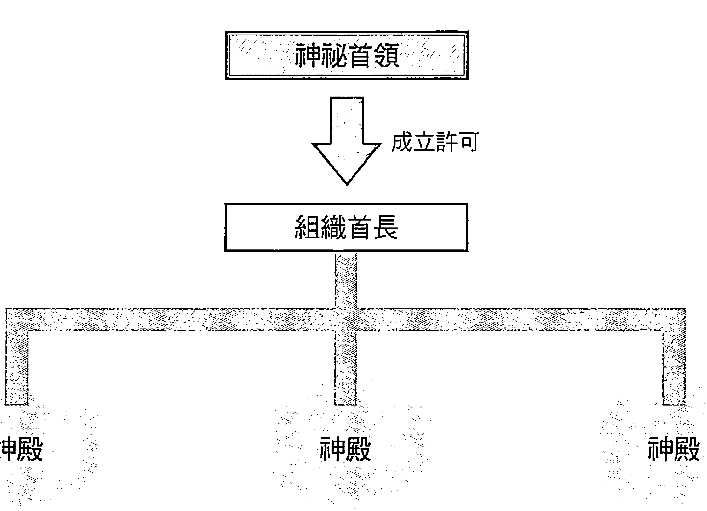

黄金黎明協會是由位居組織首長底下的許多小團體「神殿」組成，神殿內包含多位團員，每個神殿通常都是獨立活動，這點與「巫師集團（P.107）」相同。

### 黄金黎明協會的階級制度

| 外部階級 | 數字表記 | 位階名稱 | 意思 | 對應質點 |
|----------|----------|----------|------|----------|
| 外部階級 | 0°=0□ | Neophyte | 見習生 | 無 |
|          | 1°=10□ | Zelator | 新成員 | Malkuth |
|          | 2°=9□ | Theoricus | 理論者 | Yesod |
|          | 3°=8□ | Practicus | 實踐者 | Hod |
|          | 4°=7□ | Philosophus | 哲學家 | Netzach |
| 内部階級 | 5°=6□ | Adeptus Minor | 小達人 | Tiphareth |
|          | 6°=5□ | Adeptus Major | 大達人 | Geburah |
|          | 7°=4□ | Adeptus Exemptus | 豁免達人 | Chesed |
| 第三階級 | 8°=3□ | Magister Templi | 神殿首領 | Binah |
|          | 9°=2□ | Magus | 魔法師 | Chokhmah |
|          | 10°=1□ | Ipsissimus | 自我 | Kether |

協會內部的成員會根據黃金黎明協會自行開發的階級制度排序，這項制度參考了卡巴拉（P.124）的「生命之樹」，每個階級都有對應的質點，裡面當然也設置了升級測驗，不過詳細的測驗方法不明。

### 瓦解的黃金黎明協會

> ① 亞伯拉梅林魔法：《亞伯拉梅林之書》所記載的各種魔法。

英國薔薇十字團的威斯考特在1888年成立了黃金黎明協會，前面已經介紹過該協會是如何慢慢擴充會員，成長為巨大的組織。不過由於各種因素，這個協會最終步入毀滅，而其中一個原因正是馬瑟斯的改革。

當時，絕大多數的魔法師都參與了新興的神智學協會，因此許多人都受到該協會的思想影響。神智學協會的研究內容也包含東洋魔法，但馬瑟斯卻只對復活獨創的西洋魔法有興趣，於是他趕走了威斯考特，掌握組織實權，試圖讓黃金黎明協會成為真正的魔法結社。

為了達到這個目的，他研究並在協會內導入英國魔法師約翰・迪伊創立的以諾魔法（P.160）、亞伯拉梅林魔法①、卡巴拉及塔羅牌，並在組織內成立階級制度，製造讓團員可以切磋磨練的環境。成為實力主義的黃金黎明協會吸引了許多想認真鑽研魔法的成員，但不久之後，阿萊斯特・克勞利（P.156）的入會卻引發內部糾紛，甚至連馬瑟斯自己都在1901年被迫退出協會。而在兩年後的1903年，黃金黎明協會正式宣告瓦解。

黃金黎明協會雖因組織內部的糾紛解散，然而其血脈並沒有完全斷絕。馬瑟斯在脫離組織後成立了魔法結社「阿爾法・歐米茄」，並在此以魔法師的身分重新出發；克勞利也利用從黃金黎明協會學到的知識，自行成立「銀星團」及「東方聖殿騎士團」持續活動。除了這些之外，「威卡教」或「晨星」等繼承了黃金黎明協會的組織也陸續成立，當中也不乏採用該協會的階級或升級考試等制度系統的團體。

黃金黎明協會只存在了短短的十五年多就消失不見，然而成員們所孕育出的知識與技術至今仍存活在現代魔法師與魔法結社當中。

### 黄金黎明協會的相關組織

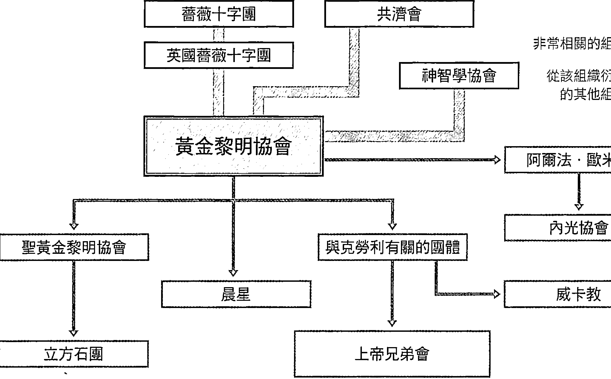

除了英國薔薇騎士團，黃金黎明協會與共濟會、神智學協會也有所聯繫。威斯考特隸屬於雙方，馬瑟斯則是共濟會的成員。黃金黎明協會分裂後誕生了許多組織，但晨星等部分組織後來遭到其他團體吸收。

### 掌管魔法結社的「神秘首領」是？

「神秘首領」是存在於世上某處的魔法結社首領，根據其中一項說法，他住在比物質界更高等的「星幽界」，無法用肉眼感知，只能透過通靈或魔法通信與其交流。在近代的觀點當中，人們認為必須要有他的許可才能成立魔法結社。黃金黎明協會成立時，是由威斯考特成功與他聯繫並獲得許可，而戴安·福瓊也是在接觸到神秘首領之後，才獲准成立內光協會。克勞利認為神秘首領就是他遇到的聖守護天使艾華斯，但這個說法似乎不被採信。羅伯特·費爾金隸屬於從黃金黎明協會衍生出的魔法結社「晨星」，他深信神秘首領就存在於歐洲某處，雖然曾展開搜索，卻並沒有任何收穫。但他利用星光體投射的方法成功聯繫上神秘首領，根據他的說法，神秘首領正是創立「人智學協會」的魯道夫·史丹納。

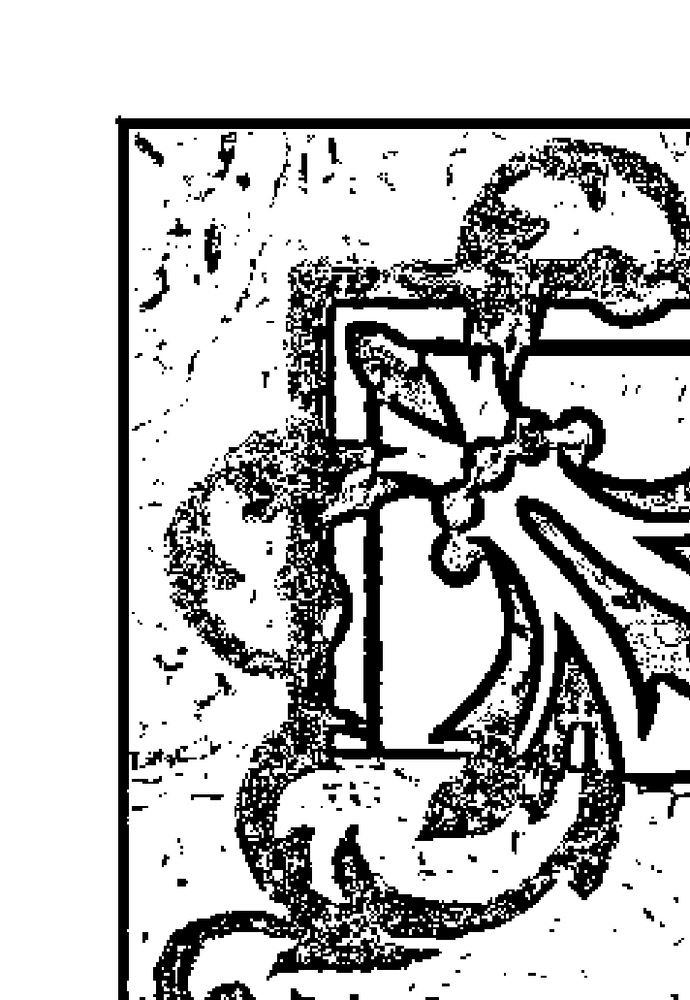

## 克劳利派

### 二十世纪最伟大的魔法师—魔人克劳利

- 1. 野兽（Beast）：基督教经典《圣经》当中的《启示录》有一种与基督教为敌的野兽（数字为666）。
- 2. 艾华斯（Aiwass）：附身在克劳利的妻子萝丝·凯莉身上的超自然存在。

现代神秘主义者将他誉为「二十世纪最伟大的魔法师」，相反地，有良知的人却用「世界上最大的恶人」或「堕落的魔王」来数落这位稀世鬼才——阿莱斯特·克劳利（Aleister Crowley）。他的故事首先要从英国开始说起。

克劳利出生于英国（英格兰）华威郡的一个传道牧师家庭，他比其他人更厌恶禁欲且严格的基督教教育，怀抱著仇视社会的心度过童年时光。克劳利的母亲轻蔑地称他为「野兽」①，但他却十分中意这个称呼，并在后来以「野兽666」自称。

克劳利大约在十二岁时接触到魔法，与其他人相比，他在比较小的年纪就对神秘学产生了兴趣。就读剑桥大学时的他已著手撰写魔法的相关书籍，在毕业的二十二岁那年，克劳利加入了「黄金黎明协会」，待在该组织的两年期间，他每天都勤奋地学习魔法。

而当黄金黎明协会解散之后，克劳利展开环游世界之旅并学习各种知识与技术。也是在这段期间，他收到了来自圣守护天使艾华斯②的启示。

结束环游世界之旅的克劳利自行创办魔法结社「银星团」，还组成「东方圣殿骑士团」的英国分会。此外，他也在意大利西西里岛成立「艾华斯教团（泰勒玛修道院）」并致力推广性魔法，但当时的领导者墨索里尼却对他下达流放处分，逼得他离开了意大利。经历各种波折，克劳利最终回到了祖国英国，将剩下的人生都奉献给魔法书的编撰。

晚年的克劳利为了实践魔法而染上麻药中毒，在被世间遗忘的状态下孤寂而终，然而他的思想和著作却被现代的魔法师与魔法结社继承，至今仍在个世界上发光发热。


### 克勞利所屬的魔法組織

從黃金黎明協會開始，克勞利到晚年之前加入了好幾個魔法結社，同時也曾自行創立組織。

他離開最初加入的「黃金黎明協會」以後，成立了繼承該協會的魔法結社「銀星團」，在這裡教授從黃金黎明協會學到的魔法，但教學內容的重心卻逐漸轉向瑜伽和性魔法。

後來他遭逢女兒去世、妻子離婚等諸多不幸，傷心欲絕的克勞利開始將心力投注於性魔法。他在這時遇到與性魔法關係密切的德國魔法結社「東方聖殿騎士團」，藉著與對方接觸的機會成立了該組織的英國分會並擔任分會長。當招募克勞利的騎士團指導者堤奧多爾·羅伊斯過世之後，克勞利便坐上了指導者的寶座，然而此舉卻導致許多成員反彈，還有人選擇退團自立門戶。

此外，克勞利在西西里島創立了艾華斯教團（泰勒瑪修道院），進行與性行為或藥物有關的魔法研究，據說有時甚至還會邀請名人參加他舉辦的雜交派對。

### 克勞利為之傾倒的性魔法

所謂的性魔法，是指利用魔法性交所產生的能量施法並獲得成效，除了男女間的性行為以外，同性間或自慰行為也都包含在內。

身為一位精通黑魔法的魔法師，克勞利尤其醉心於上述的性魔法，據說他曾以惡魔召喚儀式的名義，頻繁地施行這種法術。

他擅長活用性魔法的黑魔法，這種法術是在西洋魔法融入印度的「怛特羅」⁹與中國的「房中術」¹⁰，施術者藉由高潮時的幸福感與「知性」¹¹對話，而當無法從性行為獲得快感時，則會利用酒精或藥物來產生快樂以利魔法進行。克勞利經營的「泰勒瑪修道院」過去曾有人員死亡，如果性魔法就是造成他們死亡的原因，可以想見這是一種多麼危險的法術。

③ 怛特羅（Tantra）：在印度發跡的怛特羅教的理論和法術，施術者需藉由性能量施法。
⑩ 房中術：中國道士的法術之一，與怛特羅一樣需吸收性能量。
⑪ 知性：即所謂的神明或精靈，又名「地球外知性」，克勞利將這些存在統稱為「知性」。

## 接觸聖守護天使的克勞利

> ⑥ 紀元：根據克勞利的說法，「紀元（Aeon）」代表人類意識進化的區間。基督教出現之前的異教時代是「伊西斯紀元」，基督教盛行的兩千年間是「歐西里斯紀元」，而即將到來的則是「荷魯斯紀元」，為了迎接這個新時代，人們必須抱持新的觀念活下去。

> ⑦ 不可洩漏儀式內容是魔法結社成員必須遵從的規定。正因為有這個規定，結社本身才得以延續。

說到克勞利，就不能不提到他與聖守護天使艾華斯的故事。離開黃金黎明協會的他以度蜜月的名義環遊世界，在他拜訪埃及開羅時，遇見了聖守護天使艾華斯。艾華斯附身在克勞利的妻子羅絲身上連續和他說了三天的話，雖然細節不明，但艾華斯向他宣佈新的紀元即將到來。此外，艾華斯還將古代的儀禮認定為邪惡的黑魔法，為了淨化這股黑暗勢力，祂將授予魔法師們強大的力量。以這件事為契機，克勞利打破古老習俗，展開創造新時代的活動。他不但將黃金黎明協會必須絕對保密的各種儀式對外公開，甚至還開始研究性魔法。但因為這些都是違反社會道德價值的行為，他的舉動讓包含魔法師在內的許多人與他為敵。

## 阿萊斯特·克勞利的一生

克勞利離開了黃金黎明協會，1900年以後，他一邊修煉魔法一邊環遊世界。他走過突尼斯、法國、德國、墨西哥、夏威夷、斯里蘭卡、印度和埃及，雖然細節不明，記錄顯示他也曾涉足日本（橫濱）。晚年的他住在祖國英國，每天埋頭於製作塔羅牌與撰寫魔法書。

| 年代 | 年齡 | 事蹟 |
|------|------|------|
| 1875年 | — | 出生於英國華威郡。 |
| 1898年 | 22歲 | 加入魔法結社「黃金黎明協會」。 |
| 1900年 | — | 遭協會流放、除名。展開環遊世界之旅。 |
| 1903年 | 27歲 | 與蘿絲·凱莉結婚，蜜月旅行橫跨巴黎～斯里蘭卡。 |
| 1904年 | 28歲 | 在埃及受領來自聖守護天使艾華斯的啟示。 |
| 1907年 | 31歲 | 成立魔法結社「銀星團」。 |
| 1912年 | 36歲 | 加入魔法結社「東方聖殿騎士團」。 |
| 1914年 | 38歲 | 遠渡美國。 |
| 1916年 | 40歲 | 銀星團瓦解。 |
| 1920年 | 44歲 | 在義大利成立魔法結社「艾華斯教團」。 |
| 1923年 | — | 在泰勒瑪修道院展開活動。 |
| 1923年 | 47歲 | 收到義大利王國第27任總理墨索里尼下達的流放海外處分。 |
| 1925年 | 49歲 | 赴巴黎就任東方聖殿騎士團的首領。 |
| 1929年 | 53歲 | 被法國政府流放海外。 |
| 1937年 | 61歲 | 回到英國後，全心投入塔羅牌與魔法書的製作。 |
| 1947年 | 72歲 | 於英國逝世。 |

## 東方聖殿騎士團的組織圖

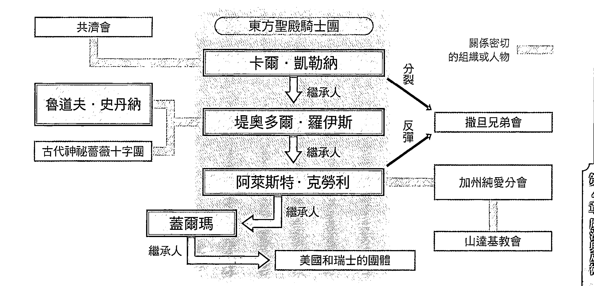

1895年前後，凱勒納成立了東方聖殿騎士團。因為看中他們對性魔法的研究，克勞利加入了該組織。凱勒納過世後的騎士團由羅伊斯接手，而在羅伊斯過世之後，則是由克勞利擔任指導者。此舉雖然導致許多成員退出，組織本身卻依然健在。當克勞利過世以後，繼承其著作和遺骨的蓋爾瑪成為東方聖殿騎士團的指導者。

## 被詛咒的《律法之書》

克勞利一生著書無數，他所撰寫的某本魔法書曾經有段奇怪的插曲，讓人不禁懷疑是否是魔法的力量在作祟。這本書是一本預言書，名為《律法之書》。

《律法之書》裡記錄了克勞利在埃及遇見的聖守護天使艾華斯賜予他的預言，而他提倡的泰勒瑪哲學也將此書奉為聖典。這本書有一個奇怪的傳聞，當它再版增印的時候，災厄就會降臨世間。

《律法之書》的初版發行於1912年，當年十月，歐洲爆發了「巴爾幹戰爭」。接著再版的1913年發生了「第一次世界大戰」，1928年的「華爾街股災」成為經濟大恐慌的導火線；1937年開始「第二次中日戰爭」；1938年爆發「第二次世界大戰」；1983年發生了「查德內戰」和「大韓航空空難」。真要認真細數，這些例子說也說不完。

有人說這些不幸都是因為地獄裡的克勞利在詛咒世界，隨著謠言傳開，《律法之書》就被世人稱為「受詛咒的書」。

## 第4章 X 其他魔法與巫術

### 以諾魔法

以諾魔法使用的以諾語被稱為「天使的語言」，它是傳承至現代的魔法體系之一。

### 使用天使語言的魔法

① 愛德華·凱利（Edward Kelley）：與天使直接對話並將內容轉達給迪伊的人。迪伊最初完全信任凱利的每一句話，但後來漸漸對他產生疑心，兩人最終分道揚鑣。

魔法師約翰·迪伊和他的靈媒助手愛德華·凱利①將以諾魔法（Enochian Magic）帶到世間，這是用大天使烏列爾②賜予他們的以諾語所構築的魔法體系。

迪伊是生活在中世紀英國的天才，包含魔法和占星術在內，他在各個領域都有傑出表現。因為賞識他的優秀才能，著名的伊莉莎白一世也曾任命他為王室數學官。

② 烏列爾：和米迦勒、拉斐爾、加百列合稱「四大天使」，負責掌管處罰罪人的「Tartarus（地獄）」。

然而這樣的迪伊也有一個缺點，那便是他缺乏「看見靈的能力」，這對魔法師而言是一個致命傷，也正因如此，他找了凱利擔任自己的助手。

有了凱利的幫忙，迪伊開始嘗試透過水晶球通靈術來與天使接觸。過去他獨自進行這種嘗試時皆以失敗告終，但借助凱利的能力，他成功終於聯繫上天使，自此以後，他把自己和烏列爾的對話內容寫在自己的日記當中。

從他們開始與天使通信之後過了大約兩年的時間，某一天，水晶球裡浮現了二十一個字母，這些正是後來被稱為「以諾語（Enochian）」的文字，與此同時，他們還得知了**用以諾語召喚天使的方法以及召喚時需準備的物品**。

最初，以諾語被視為凱利捏造出來的語言而備受魔法界輕視。要說讓以諾語（以諾魔法）正式普及的最大功臣，其實是馬瑟斯還有克勞利。他們注意到即將失傳的以諾語，用各自的方法為其建立體系並發揚光大，如果沒有他們，這個語言或許會就此從世界上消失。

順帶一提，有人說以諾語是古代亞特蘭提斯大陸的語言退化所致，也有人認為它是根據英文建構而成。由於沒有確切的證據，以諾語的起源至今仍眾說紛紜。

## 以諾字母與對應的涵義

以諾語由對應英文字母的二十一個字和其他對應元素、黃道十二宮的字母組成。從它的性質看來，以諾語極有可能是參考英文或威爾斯語所製造出來的人工語言。用以諾魔法召喚天使需要用到特定的魔法圓和這些以諾字母，包含召喚的方法在內，都是由天使授予迪伊的。這些內容後來經由馬瑟斯和克勞利的改造之後，結構變得更加縝密複雜。

### 以諾字母（21字）

Graph(E) | Un(A) | Or(F) | Gal(D) | Ged(G/J) | Veh(C/K) | Pa(B)
--- | --- | --- | --- | --- | --- | ---
[符号] | [符号] | [符号] | [符号] | [符号] | [符号] | [符号]
Drux(N) | Ger(Q) | Mals(P) | Ur(L) | Na(H) | Gon(I/Y) | Tal(M)
[符号] | [符号] | [符号] | [符号] | [符号] | [符号] | [符号]
Gisg(T) | Fam(S) | Van(U/V) | Ceph(Z) | Don(R) | Med(O) | Pal(X)
[符号] | [符号] | [符号] | [符号] | [符号] | [符号] | [符号]

### 以諾字母與元素

火 | 水 | 土 | 風
--- | --- | --- | ---
[符号] | [符号] | [符号] | [符号]

### 以諾字母與十二宮

白羊宮 | 金牛宮 | 雙子宮 | 巨蟹宮 | 獅子宮 | 處女宮
--- | --- | --- | --- | --- | ---
[符号] | [符号] | [符号] | [符号] | [符号] | [符号]
天秤宮 | 天蠍宮 | 射手宮 | 魔羯宮 | 水瓶宮 | 雙魚宮
[符号] | [符号] | [符号] | [符号] | [符号] | [符号]

## 更多存在世上的其他魔法！

### 東、西方以外的魔法與巫術

#### 巫毒教的殭屍是比死亡更可怕的酷刑！

要說東、西方以外的知名魔法，當然一定要提到「巫毒教」。
巫毒教是西非貝南和加勒比海的海地等國所信仰的宗教，它融合了基督教以及在殖民地時代透過奴隸貿易遷移到現今貝南的豐族信仰，並由逃離海地的奴隸們發揚光大。巫毒教為多神教，祭司「烏貢（Houngan）」會透過儀式來施展法術。除了為死者送靈或醫治病患的善良咒術師烏貢之外，巫毒教還有一種名為「波哥（Bokor）」的祭司負責施展邪恶咒法，不過這兩者並沒有明確的劃分。
巫毒教最著名的便是活死人「殭屍」，其實這是一種施加在壞人身上的刑罰。施術者利用叫做「殭屍粉」的秘藥殺死犯人，接著施法讓屍體復活，分離犯人的靈魂和肉體，再將肉體當成任人擺布的奴隸使喚。亡者的靈魂原本能變成巫毒教的神明或投胎轉世，但殭屍卻都做不到，他們必須永遠在現世為奴，可說是比死刑還要更殘忍的刑罰。

#### 與大自然之主結合，印地安的殘酷儀式

相信森羅萬象皆有精靈寄宿於內的宗教觀稱為「泛靈信仰（Animism）」，而印地安人即是這種崇拜精靈的民族。雖然每個部族略有差異，大部分的印第安人都會向狩獵或農耕的精靈祈禱。
例如居住在平原地區的拉科塔蘇族（Lakota Sioux）就崇拜名為「瓦甘·塔卡（Wakan Tanka，偉大的神秘）」的大自然之主，他們將日常生活的一切都視為與大自然的對話，用神聖的菸斗抽菸也屬於其中一環。
在他們的這些對話當中，於初夏到夏至左右舉辦的「太陽舞祭（Sun Dance）」是最重要的活動，這是讓整個部族與瓦甘·塔卡結合，並祈禱自然復活與和平的儀式。舞者（Sun Dancer）在儀式上要繞著叫做「槍·瓦甘（神秘之樹）」的柱子載歌載舞，與此同時，他們必須連續四天目視太陽直到日落，並維持斷水絕食的狀態。在儀式的最後一天，他們還會把鷹爪或木籤穿在自己的肉上，另一端則綁在柱子上，接著不斷跳舞直到那塊肉被扯斷為止（即穿刺儀式，Piercing）。
他們利用這種方式將肉體和疼痛獻給大精靈，並藉此從夢中獲得啟示（即靈境追尋，Vision Quest）。

# 第5章 魔導具和魔導書

> Item forte Wickeard

-   - 魔石
  (有屬性、魔導的)
- 魔符
- 神秘之手
- 屍骸與蜥蜴
- 轉導
- 魔導武器
  (高加成、魔導等)
- 《祈雨術之杖》
- 《火焰魔導書》
- 《雷暴盾牌》
- 《教皇洪留下的魔導書》
- 《黑母胎》
- 《地獄的通道》
- 《魔法之書》

## 寶石（能量石、護身符）

寶石內蘊藏特殊能量，除了可以單獨發揮辟邪的功效，還能當成儀式上的材料。到了現代，依然有很多人相信這些效果而配戴寶石。

### 用於辟邪或作為儀式材料的寶石

-   - ① 貴重寶石、② 次貴重寶石：寶石交易上的分類，以稀有度和硬度為判定標準，但各國基準不一。貴重寶石的代表包含鑽石、紅寶石、藍寶石和祖母綠；次貴重寶石則以水晶、青金石與土耳其石較為著名。

寶石——極為稀有又美麗的礦物，英語圈稱它為「Gem」，因為相信在它美麗的外表下隱藏著特殊能量，歐洲自古便將寶石視為珍貴的魔導具。英文的「Jewel」同樣也代表寶石的意思，不過「Jewel」特指鑽石或紅寶石等被稱為「貴重寶石」①的最高級寶石；而「Gem」的定義更廣，除了貴重寶石以外，還包含了「次貴重寶石」②。

-   - ③ 護身符 (Amulet)：西洋魔法中的一種護符，除了寶石之外，也有用動植物加工製成的護身符。

要補充說明的是，具有特殊力量的寶石又叫作「能量石（Powerstone）」，但這個稱呼其實是和製英語，換句話說，日本將「蘊含特殊力量的Gem」稱為能量石。不過，由於本節只針對用於魔導具的寶石進行解說，讀者可將這裡提到的「寶石」和「能量石」視為同一種意思。

寶石的用途大致可分成兩種。

第一種是「辟邪」，也就是將寶石的效果本身用於魔導具有時為提高其功效，魔法師會在表面刻上盧恩字母（P.134）或咒文。辟邪用的寶石大多被做成護身符（Amulet）③，所謂護身符屬於護符的一種，使用者會將寶石繫上繩線後掛在脖子上，像配戴首飾一般隨身攜帶。

不過，近代西洋魔法用到護身符的機會比中世紀減少許多，這是因為相較於魔法能夠主動影響其他事物，護身符卻只有被動的效果，因此對近代的魔女而言，護身符似乎並不怎麼吸引她們的目光。

寶石的第二種用途是作為魔法儀式或製作魔導具的「材料」。雖然拿貴重的寶石當材料或許有點可惜，但在召喚上級神靈之類的重要法術卻少不了它們。例如在《大奧義書》（P.188）所介紹的惡魔宰相路基法格・羅弗卡列的召喚儀式當中，血石（Blood Stone）就是一項不可或缺的道具。路基法格位居「次席上級六惡魔」，是惡魔界排名第二的高位，想召喚上級的惡魔，當然就需要高級的寶石。

## 源自《聖經》的誕生石

> > ④ 《聖經》：基督教和猶太教的經典。只有基督教將《舊約聖經》和《新約聖經》奉為聖典，猶太教把等同《舊約聖經》的典籍稱為《塔納赫》。

即便是對與魔法無緣的現代人來說，寶石也是極為貼近日常生活的存在。配戴首飾的起源本就始於用寶石辟邪的風俗，換句話說，我們不經意戴在身上的這些飾品，其實都是從前的魔導具。

除此之外，辟邪這個概念透過「誕生石」的形式延續至今。所謂誕生石是分別對應從一到十二月的十二種寶石，只要配戴自己出生當月的誕生石，就能得到寶石的庇護。誕生石的起源可以追溯到《聖經》內記載的十二種寶石。《舊約聖經》的《出埃及記》有一段製作「決斷胸牌（Breastplate of Judgment）」的故事，而這十二種不一樣的寶石就以四個橫排、每排三行的方式鑲在這件胸牌之上。另一方面，《新約聖經》《啟示錄》的寶石則出現在敘述耶路撒冷城牆的橋段，這道城牆共由十二座基石支撐，每塊基石上都嵌著不同的寶石。

雙方文獻上分別都出現了「十二」這個數字，雖然不清楚作者是否是因為意識到曆法上的月份而如此設計，考慮到曆法、寶石與魔法的密切關聯，這個情況應該並非只是單純的偶然。到了後來，奉等同《舊約聖經》的《塔納赫》為聖典的猶太人把特定的寶石結合月份，將十二種寶石視為各個月份的象徵，每個月都配戴不同寶石，吸收來自寶石的恩惠。這樣的風俗沒有多久便擴散至各地，然而內容卻在過程中發生變化，最終成了今日的誕生石。

我們現在知道的誕生石，是各國參考1912年美國珠寶商會訂定的十二種寶石再各自微調，這種做法考慮的是各國珠寶商的行銷策略，與庇護或魔法意義完全沾不上邊。即便如此，誕生石雖只是近代才出現的一種概念，但自古被當成魔導具的各種寶石，至今仍未失去它們的功效。

## 誕生石的起源

日本的誕生石最初是由「全國寶石卸商協同組合」在 1958 年所制定，下表為最具代表性的一種說法，但日本另外增加了其他多種寶石，如三月的珊瑚、五月的翡翠、六月的月光石與八月的紅縞瑪瑙。

| 希伯來文 | 新共同譯 | 啟示錄 | 日本的誕生石 |
|---|---|---|---|---|
| odem | 紅寶石 | 第 1 座基石 | 碧玉 | 1 月 | 石榴石 |
| pitdah | 黃玉 | 第 2 座基石 | 藍寶石 | 2 月 | 紫水晶 |
| bareqet | 祖母綠 | 第 3 座基石 | 瑪瑙 | 3 月 | 海藍寶石 |
| nofeq | 石榴石 | 第 4 座基石 | 祖母綠 | 4 月 | 鑽石 |
| sappir | 藍寶石 | 第 5 座基石 | 紅縞瑪瑙 | 5 月 | 祖母綠 |
| yahalom | 碧玉 | 第 6 座基石 | 紅瑪瑙 | 6 月 | 珍珠 |
| leshem | 蛋白石 | 第 7 座基石 | 貴橄欖石 | 7 月 | 紅寶石 |
| shebo | 瑪瑙 | 第 8 座基石 | 綠柱石 | 8 月 | 貴橄欖石 |
| ahihamah | 紫水晶 | 第 9 座基石 | 黃玉 | 9 月 | 藍寶石 |
| tarshish | 海藍寶石 | 第 10 座基石 | 翡翠 | 10 月 | 蛋白石 |
| shoham | 青金石 | 第 11 座基石 | 藍寶石 | 11 月 | 黃玉 |
| yashfeh | 碧玉 | 第 12 座基石 | 紫水晶 | 12 月 | 土耳其石 |

## 寶石與相似魔導具的關係

寶石 (Gem)
蘊藏特殊魔力的寶石，除了能單獨作為避邪道具，也能用來施法或當成魔導具的材料，而在寶石表面雕刻紋章或咒語亦能強化其功效。
能量石 (Powerstone)
與「Gem」同義，代表「蘊含特殊魔力的寶石」，是只有日本使用的和製英語。

護符與護身符
墜飾 (Charm)
掛在項鍊或手鍊上的飾品，每種飾品的效果不同，有些人將墜飾與護身符、魔符視為同義。
魔符 (Talisman)
將圖形或紋章刻在金屬或羊皮紙上的護符，效果會依據被賦予的魔力而不同，大多具有主動性功效，如為持有者提升魔力。
護身符 (Amulet)
在寶石上繫條繩線垂掛在胸前的這類隨身佩帶的護符，主要能力為「辟邪」，多屬被動性功效。

## 魔符

魔符能賦予持有者各式各樣的能力。記錄魔符製作方法的魔導書則被尊稱為具有崇高目的的「白魔法之書」。

### 寄宿精靈之力的魔法護符

魔符（Talisman）是一種魔導具，它具有魔法或超自然力量，能提升持有者的魔力或其他能力。關於魔符的名稱由來眾說紛紜，其中最有力的說法是出自代表「藉由宗教儀式獻給神靈之物」的希臘文「telesma」。

魔符在日本被譯為「護符」或「守護符」，因此經常與「護身符」（P.164）混為一談。但相較於附帶辟邪等被動功能的護身符，**魔符的特徵在於它具備提升魔力等主動功效**。

然而這些差異只存在於狹義說明，要明確定義兩者其實相當不易。甚至是在現代的魔法相關書籍當中，也經常出現將魔符和護身符一概而論的描述。

另一方面，廣義的魔符同樣非常棘手，因為它定義「所有具有魔力的物品皆為魔符」。也就是說，如果套用廣義的解釋，從魔女的軟膏（P.48）到王者之劍（Excalibur）❶，所有的魔導具都算是魔符的一種。因此為了便於讀者理解，本節的說明將以具有護符性質的魔符為中心。

> 那麼，我們再重新確認一次，什麼是魔符？答案是「寄宿著精靈之力的護符」。

魔符的製作方法詳細記載於《阿瑪戴爾的魔導書》，根據書中的說法，第一步是要思考自己想獲得哪種能力。雖然一樣都叫護符，每種護符的效果卻不盡相同。以日本的御守為例，想祈求生意興隆、家庭圓滿、身體健康或學業有成，不同的恩典取決於供奉的是哪一位神明。同樣就魔符來說，使用者必須選擇要向哪位精靈祈求哪種效果。

決定精靈和目的之後，接著要找出對應該精靈的印記。所謂印記（Sigil）即為圖形、符號或紋章，又名「印形」，是一種識別代號。惡魔、天使或精靈都有自己的識別代號，這個步驟就是要找到屬於他們的印記，而最簡單的方法莫過

❶ 王者之劍（Excalibur）：《亞瑟王傳說》的主角亞瑟所持有的劍，這把雙刃長劍出自妖精之國阿瓦隆，上頭寄宿著魔力。

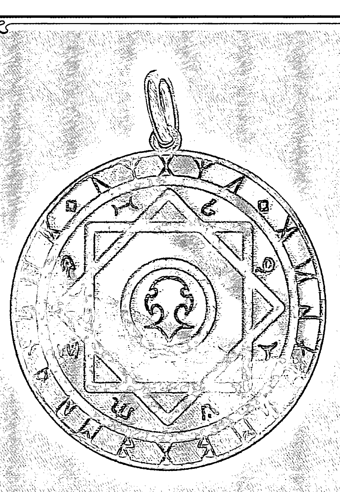

西洋魔法里的魔符一般都是先将金属、羊皮纸或木板制成圆形之后，再刻上图形或纹章等印形（Sigil）。印形会因欲召唤的精灵而异，魔符上则有与精灵相应的能力。

Illustration：长内佑介

## 代表性的魔符

魔符存在于世界各地，每个地方的形状和效果不尽相同。日本的代表性魔符是源自神道的「神札（御守）」，这是将神的名讳或神社名称写在纸片、木板或金属片上制作而成，大的神札需装饰在神坛前面，小的则多装在袋子里随身携带。

| 魔符名称 | 描述 |
|----------|------|
| 恶魔之眼 | 用来避开邪眼的土耳其护身符，相传能在生子、新居落成或发展新事业的时候，保护配戴者不受嫉妒新事物的「恶魔之眼」伤害。现在在土耳其的各个场所都能看到这种护身符，从戴在身上的饰品到放在家里的摆饰，种类非常丰富。 |
| 蒜头项链 | 自古相传大蒜能够对抗邪恶，用大蒜驱魔的风俗可见于世界各地。其中最著名的是在基督教圈的传说，现代的各类创作也经常出现吸血鬼讨厌大蒜的逸闻。除了把大蒜做成项链以外，还能挂在房子外面防止魔物靠近。 |
| 圣克里斯多福的奖章 | 奖章是指刻有徽章（职业或身分的证明）的金属装饰，而魔符上刻的则是印形。据说圣克里斯多福是实际活在三世纪的基督教圣人，带有他庇护的奖章被奉为旅行者的护身符。 |
| 所罗门王的纹章 | 对西洋魔法产生巨大影响的所罗门王是留下大量天使、恶魔和精灵印形的伟大魔法师，「所罗门王的纹章」是他在收到神的启示后创造出来的护符，那是一枚刻有印形的圆形金属板，制作方法与本文介绍过的「狭义的魔符」相同。 |
| 圣甲虫 | 圣甲虫即为粪金龟，人们认为这种虫就是埃及神话里太阳神拉的另一种形象「凯布利」。凯布利是长着粪金龟头的神明，古埃及将金龟堆粪的模样视为太阳运行的象征。圣甲虫是古埃及的代表性魔符，它能为持有者带来好运。 |

恶魔的印形：若说召唤天使和恶魔哪一种危险，当然一定非后者莫属。然而恶魔的印形具有相当于「真名（会受到知晓者支配的真实姓名）」的支配能力，透过印形召唤出来的恶魔无法抵抗施术者。

需从魔导书搜寻。《阿玛戴尔的魔导书》内有天使的印记，〈盖堤亚〉（P.192）则记录着所罗门王手下七十二柱恶魔的印形②。找到想要的印记之后，将其刻在已制成圆形的铁块、木板或羊皮纸上，最后再召唤出精灵，请祂为刻着印记的圆形物体注入魔力，魔符就算大功告成了。

另外，自己的魔符基本上必须由自己完成，最好不要向他人借取或使用让渡之物。施术者能透过仪式与魔符产生灵魂羁绊，当施术者以外的人使用他的魔符，魔符便可能无法发挥期待中的效果。

以上就是魔符的制作方法，但以诺魔法（P.160）的做法则略有差异，这个魔法体系的魔符不使用加工过的圆形物品，而是用魔法圆召唤精灵作为代替。

## 崇高的白魔法书《阿玛戴尔的魔导书》

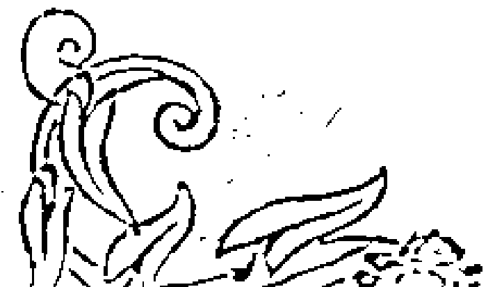

在十七世纪的法国流通的《阿玛戴尔的魔导书》以记录魔符的制造方法闻名，不过除了这点以外，此书还有一个崇高的目的。大部分的魔导书上记载的法术多为实现低俗愿望的魔法，例如「获得财宝一夜致富」或「不需要努力就能取得功名」。但《阿玛戴尔的魔导书》上没有这些魔法，**而是以提升施术者的知识与心灵为最终目的。**

当召唤的是天使时，这点自然不在话下，而即便召唤出来的是恶魔，它的目的也不曾改变。召唤恶魔界的伟大君王阿斯莫德是为了认识邪恶的恐怖；召唤恶魔布鲁弗的目的是学习恶魔的本性与限制祂们的方法；而召唤恶魔劳涅则是为了知晓恶魔被赶出天界的事由以及在那之后的历史。

在十七世纪时，到处流窜的低俗魔导书导致恶魔附身事件频传。《阿玛戴尔的魔导书》就出现在这样的背景之下，其崇高的目的让它被誉为「白魔法之书」并受世人景仰。

## 魔符的魔力来源

### 使用天使、恶魔等超自然力量的魔符

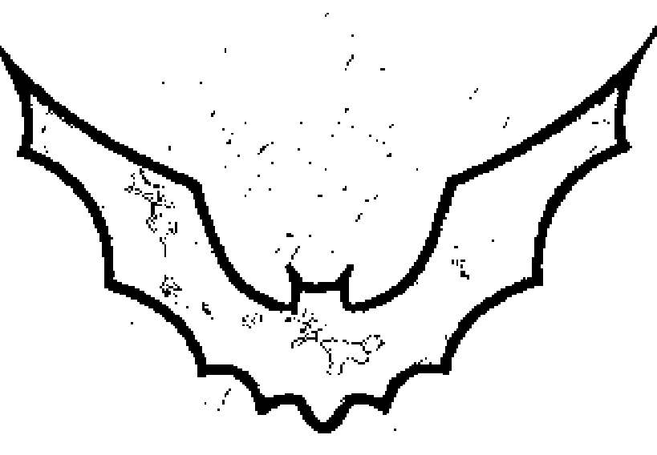

- 阿斯莫德
- 路西法
- 别西卜 等

### 使用怪物或动物部分身体的魔符

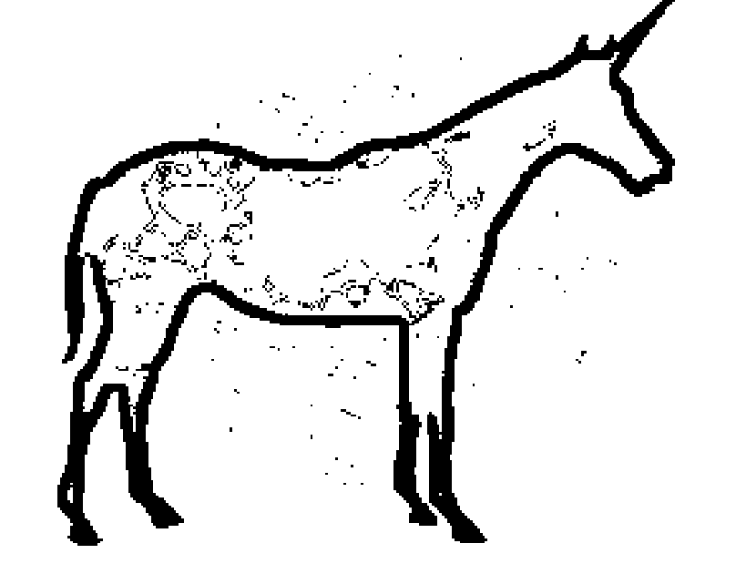

- 独角兽的角
- 兔脚
- 猛兽的牙齿或骨头 等

### 使用植物等自然魔力的魔符

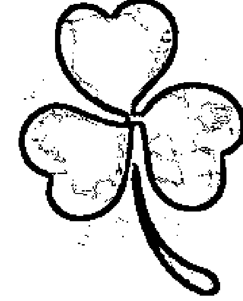

- 幸运草
- 香辛料
- 香草 等

## 魔符的制作方法（以召唤为例）

从魔导书里找到与目的相符的天使或恶魔的印形。

制作魔符的时候必须特别注意占星术（P.138）。就像每个神灵都有属于自己的印形一样，进行召唤的时间、日期也必须透过占星术决定。一旦搞错时间，不仅无法得到想要的功效，甚至有可能带来意料之外的结果。假设幸福的魔符必须在满月之夜制作，如果不小心在新月之夜制作魔符，最糟可能会出现反效果，做出带来不幸的魔符。

将印形画在羊皮纸上，制作魔符的外形。

召唤天使或恶魔，请祂为事前准备好的魔符注入力量。

## 但是！

一旦弄错制作流程，甚至可能会出现反效果造成危险……。

带来幸福的效果

失败

带来不幸的效果

## 第 5 章 I 魔导具

## 光荣之手

点亮名为「光荣之手」的烛台以后，使用者可以隐身或让睡着的人无法清醒。
这个诡异的魔导具是以死者的手作为材料。

### 砍下死刑犯的手，制成毛骨悚然的烛台

+   ① 除了光荣之手，《小阿尔伯特》包含了许多让人听了不禁蹙眉的内容，例如「调查女性花心程度的魔法」，或是「能让女性跳裸舞的法术」。

1668年，法国出版了一本名为《小阿尔伯特》的魔导书，没过多久，这本书便成了众所皆知的邪恶之书，为贩售而持有此书的商人甚至因此遭到逮捕。
但是，为什么《小阿尔伯特》这么让人忌讳呢？这是因为在这本书里，记录了魔导具「光荣之手（Hand of Glory）」的制作方法<sup>①</sup>。

+   ② 若把尸体保存在特殊的环境之下，脂肪会变化成蜡状，因此也有一种光荣之手可以直接在手指上点火。

有别于它光芒万丈的名称，被当成烛台的光荣之手，其实有着令人不寒而栗的外形。它的台座是一只被砍断的手腕，使用者会在手指间插上蜡烛点燃<sup>②</sup>。它的魔法效果相当多元，包含「点火后能让使用者隐身」、「让看见火焰的人无法动弹」以及「让点火之前睡着的人直到火焰熄灭为止都不会苏醒」。因为有这样的效果，光荣之手被奉为小偷和强盗的护身符。

+   ③ 硝石：硝酸钾的俗称，是黑火药、火柴、烟火及肥料的原料。

根据《小阿尔伯特》的记载，光荣之手的做法如下：
首先，要准备一只作为主体的手，手的来源要是「被处以绞刑的罪犯」，而且必须在他刚被处刑、身体还悬在绞刑台上的时候将手砍下，用裹尸布包裹后拧乾手中的血水。

接下来要准备一个土制容器，在容器内装满硝石<sup>③</sup>粉、盐和胡椒，再把手埋入其中。十五天后将手取出，接着放在太阳底下让阳光曝晒。理想的情况是用盛夏的阳光将其烤乾，日照不足的时候也可以用炉灶烤至干燥，不过使用炉灶时，必须用蕨类和马鞭草生火。

曝晒期间，脂肪会从手中渗出，用这些脂肪混合新的蜜蜡和萨米产的芝麻制成蜡烛，最后再把干燥的手放上底座，在手指的缝隙间插上蜡烛，光荣之手就大功告成了。

除了《小阿尔伯特》记载的作法之外，还有更简单的方

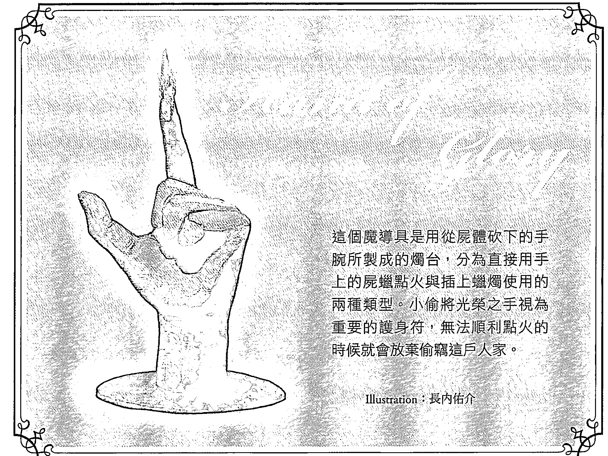

这个魔导具是用从尸体砍下的手腕所制成的烛台，分为直接用手上的尸蜡点火与插上蜡烛使用的两种类型。小偷将光荣之手视为重要的护身符，无法顺利点火的时候就会放弃偷窃这户人家。

Illustration : 长内佑介

### ※ 光荣之手的功能

点火后，使用者能够隐身。

在火焰燃烧期间，睡着的屋主绝对不会醒来。

看到火焰的人，身体会不能动弹。

这些功能让光荣之手成为小偷和强盗的护身符。

> 让它失效的方法……将特殊的软膏涂在家中可能会被侵入的地方。

用黑猫胆汁、白鸡脂肪和猫头鹰血制成的软膏。

## 第5章 魔导具和魔法书

## Ⅱ 魔导具

## 光荣之手

④ 除此之外，还有将断掉的手腕放在盐巴里去除水分的方法。

法可以制作光荣之手。虽然同样要使用从绞刑罪犯身上砍下来的手腕，保存手的方式却不太一样，这个作法须把手和月桂树的叶子一起埋在月光照得到的地方，待下个满月之夜将其取出就完成了<sup>④</sup>。

### 让光荣之手失去魔力的方法

⑤ 光荣之手的火焰可以藉由牛奶熄灭的传说在《小阿尔伯特》上市之前就已存在，这个说法源自十六世纪后半的恶魔学家德·李欧。

因为可以任意窃取他人财物而不被屋主发现，光荣之手对小偷而言就像是梦里才会出现的魔导具，但是这种无敌工具却不会平白无故就现身，当然也有其他方法可以消除光荣之手的魔力。

最有效的方式是在家中所有可能会被入侵的地方涂上特制软膏，这种软膏是由黑猫胆汁、白鸡脂肪和猫头鹰的血混合而成，只要把它涂在门轨和窗沿等处，光荣之手的效果就无法在这间房子里发挥作用。

而光荣之手的火焰本身也笼罩在特殊的魔力当中，水或啤酒都无法浇熄这株火苗。不过，过去曾出现一起以牛奶灭火的案例。

事情发生在十八世纪的某个夜晚，有个装扮成旅人的小偷来到英国的一户宅邸，小偷要求让他在这里度过一夜，宅邸的主人则答应了他的请求。过了几个小时，在屋里的人都陷入熟睡的深夜，小偷从行李内取出光荣之手并点上火苗，接着他打开大门，走到外头去寻找埋伏在外的同伴。

然而，有位年轻的女仆目击了整个经过，她从一开始就对小偷心存怀疑并暗中观察。当小偷出去以后，女仆锁了大门便动身叫醒主人，但是不管她摇晃得多大力，中了魔法的主人都不曾睁开眼睛。女仆只好放弃，走到厨房拿牛奶浇熄光荣之手的火焰，因为她知道「牛奶可以浇熄魔法火焰」的这个古老传说<sup>⑤</sup>。最后，当小偷带着同伴回到宅邸时，发现清醒的主人正拿着猎枪在等着他，只好吓得落荒而逃。有的人对女仆看到火焰还能动这点心存疑惑，但或许是因为她目击了点火的瞬间而被光荣之手当成使用者了也说不定。

## 光荣之手的制作方法

步骤①：砍下绞刑罪犯的手腕，用裹尸布包着挤出血水。
*手腕必须从还悬在绞刑台上的尸体取得。*

步骤②：在壶之类的容器内装满硝石粉、盐和胡椒，把手放入其中。
*必须使用土制的容器，腌渍期间为十五天。*

步骤③：取出的手腕接着要放在盛夏的阳光下曝晒，并用过程中取得的脂肪混合蜡与萨米产的芝麻制成蜡烛。
*日照不足的时候，可将手腕放入烧着蕨类或马鞭草的炉灶内烤干。*

步骤④：将手腕装上底座，在手指的缝隙插上蜡烛。
**完成！**

## Column
光荣之手所招致的悲惨杀人事件

1904年，漂浮在加勒比海上的巴贝多岛发生了一起残酷的杀人事件。
那天是9月28日，住在桥镇的十二岁少年收到一位男子的委托，男子请他帮忙做一份工作，听了描述后觉得内容很简单的少年一口答应了男子的请求，接著他被据称是男子友人的人带往家中，没想到在当天夜里就惨遭对方杀害。
不仅如此少年的心脏还被挖了出来，两只手腕也被双双砍断。犯人过了不久便遭到逮捕，但当时没人知道他们为何做出这种残忍行径。直到后来在法庭上，他们计划抢劫银行和持有《小阿尔伯特》的事情才曝了光。换句话说，他们原本打算保留少年的心脏和手，制成光荣之手来抢劫银行。
制作光荣之手的案例大多出现在十七世纪，后来因为廉价版《小阿尔伯特》问世，在十九世纪以后又掀起一阵风潮。这个令人忌讳的魔法甚至漂洋过海来到加勒比海的小岛，该名男性主嫌就是在读了《小阿尔伯特》之后才想出这个残忍的计划。

## 第5章 I 魔导具

## 风茄与媚药

自古以来，世界各地都曾出现媚药。这种药带有强烈的魔法色彩，欧洲更将魔法药草「风茄」视为媚药的顶级材料。

### 控制爱情和性欲的魔药

+   使用媚药的例子：
- 阿兹特克文明发现巧克力具有催淫效果；
- 澳洲原住民则用袋鼠的睾丸制作媚药。

一旦服用媚药，使用者便会立刻受到无法抑制的冲动驱使。这种药有好几种效果，最著名的是吃下后会对第一眼见到的人坠入情网的「爱情药」，以及让性欲高涨到极点的「催淫药」。古今中外不乏使用媚药的例子，其中又以西洋魔法用的最多。

许多魔导书上都记载了让意中人爱上自己的法术，然而有别于魔法，媚药这种魔导具的存在相当值得玩味。或许这就证明了不管在哪个时代，人们永远怀抱着与爱情或性欲有关的烦恼。

媚药分成口服和外用两种，受欢迎程度则是由口服药取得压倒性的胜利。这是因为媚药必须让对方吃下或使用才能生效，与外用药相比，口服药更容易用来设计对方。在这么多与媚药有关的故事当中，骗对方吃下或混在食物中的作法最为突出。而外用药则是所谓的魔女软膏（P.48），比较知名的效果包含涂上后可以飞行或加害他人，但有时这种软膏也会被当成媚药使用。

媚药的原料种类繁多，除了葡萄酒与药草之外，还包括动物的精卵巢、青蛙的毒、驴子的肺和盲眼婴儿的血。与制造其他魔导具的道理相同，越是不易获得的材料就越能获得更高的效果，而在这之中，顶级的材料就属风茄。


# 第5章 魔导具和魔导书
I 魔导具
风茄与媚药

风茄是最为珍贵、效果最好的媚药材料。
Illustration：tokiwa

## 魔药顶级材料——风茄

+   ② 根部：德国将风茄的根部称为「Alraune」，持有它的人能就获得财富。
③ 生物碱：生物碱自古就被当成止痛药的材料，但更著名的是它含有的强烈毒性，这种毒会导致呕吐、瞳孔放大或产生幻听、幻觉，严重时，甚至会导致死亡。
④ 除了风茄是由液体变成的这个说法之外，也有人说「风茄会从液体滴落的地方冒出枝芽」。

风茄是欧洲原生的茄科植物，其根部可作为媚药<sup>②</sup>材料。这种实际存在的植物之所以能够在魔法世界受到青睐，是因为它奇特的外表以及内在成分。风茄的根茎时常长成类似人的形状，而根部内含的生物碱<sup>③</sup>则具有麻药效果。因为这些原因，不知从何时开始出现了与风茄有关的诡异传闻。

传说中的风茄，从生长的地方开始就很奇怪。曾经有很多人表示它是生长在刑场的植物，他们认为真正的风茄其实是从被处以绞刑的罪人身上流出的液体变化而成<sup>④</sup>的，成熟后的风茄会爬出地面，用像人腿一样岔开的根部在地上徘徊。能制成媚药的是开始行走前的风茄，然而要取得并不是一件容易的事，因为这时的它含有剧毒，只要碰到就会一命呜呼。即使顺利在不碰到它的情况下拔出风茄，它在露出地面的瞬间会迸出恐怖的哀号声，而听到这个声音的人则会在阵痛之后死去。

即便如此，人们还是想尽办法要得到风茄，魔法师们为此考虑了许多方案，而其中最别具特色的便是用狗来摘采风茄。

要准备的东西只有两样，分别是「亲近自己的狗」以及「绳子」。首先要挖开风茄附近的泥土，让它呈现一拔就掉的状态，接着把绳子两端分别绑在狗和风茄上，并预先命令狗留在原地，等走到够远的距离之后再把狗叫过来，绑着绳子的风茄就会被应声拔起。在近距离听到哀号声的狗虽然会失去性命，但想着「只要牺牲一只狗就能获得最顶级材料」而使用这种方法的人却不在少数。

不过，这个方法有一个令人诟病的地方，那就是只要准备够长的绳子就可以不使用狗。还是说，「硬要拔出风茄的时候，至少必须用一条性命交换？」若从这个观点来看，或许这只狗同时也是献给风茄的祭品。

而提到祭品，还有一种方法是让罪犯摘取风茄。听到哀号声丧命与被吊死相比，究竟哪个死法比较痛苦呢？

此外，因为风茄是著名的媚药材料，有时这种植物也会被视为希腊神话的爱欲女神喀耳刻（P.8）的象征。

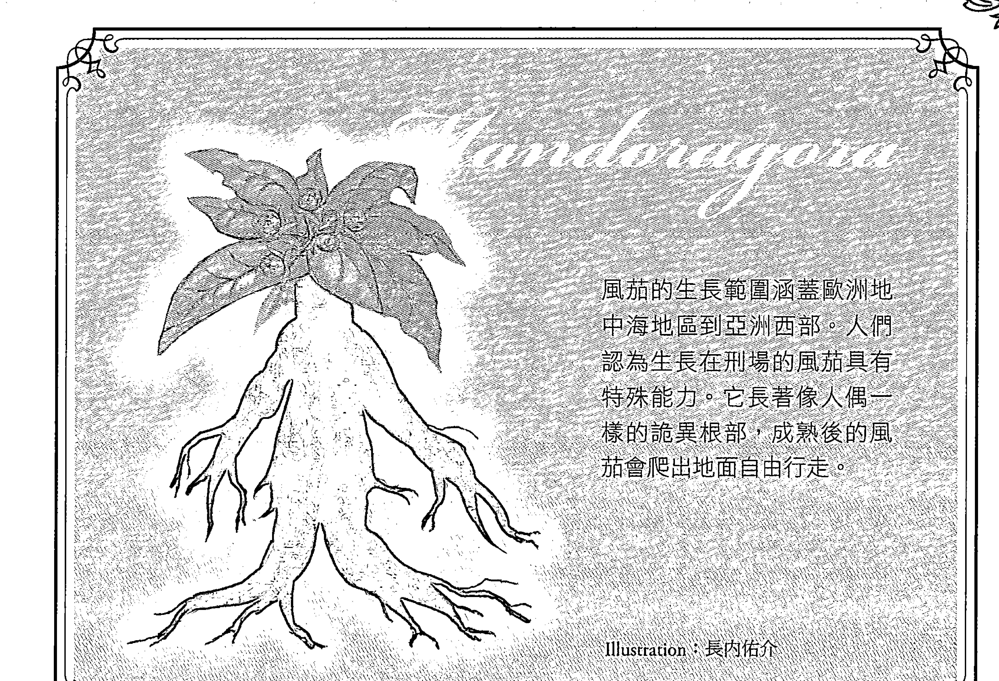

### 媚药的代表性材料

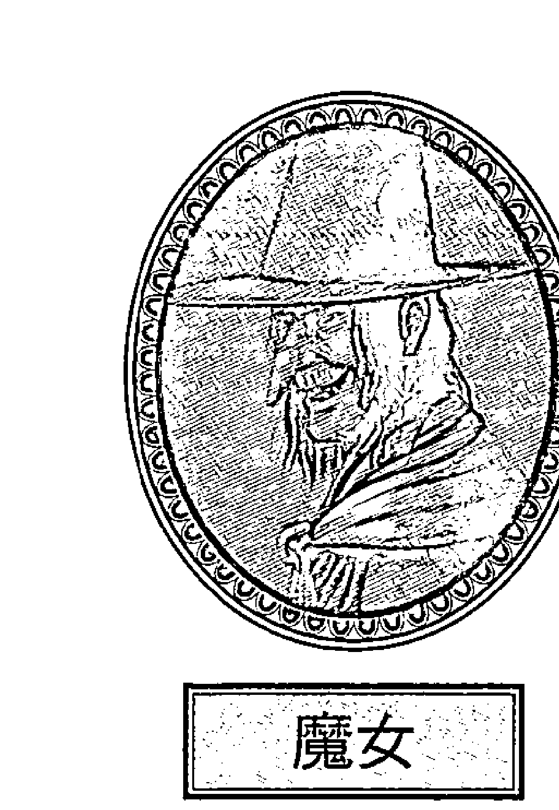

制作媚药

| 左列材料 | 右列材料 |
|---|---|
| 风茄 | 盲眼婴儿的血 |
| 墓碑上的深黑灰尘 | 山贼的肉 |
| 青蛙的毒 | 从坟里挖出的尸体 |
| 公牛的胆汁 | 驴子的肺 |
| 动物的精巢、卵巢、心脏 | |

和其他许多魔导具一样，越是不易入手的材料就越能提高媚药的效果。

## 第5章 I 魔导具

## 卍字

卍字是继正十字之后使用频率最高的十字记号，人们自古就将其视为幸运符号，常刻于护符或其他魔导具上。

### 代表幸运符号的组合图形

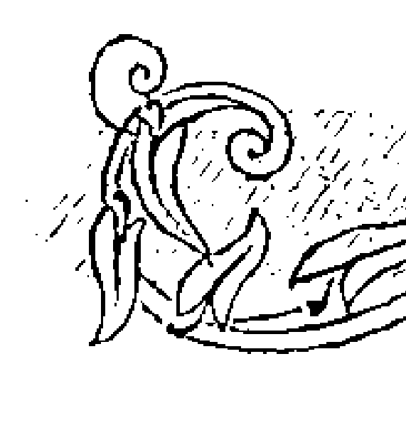

+   ① 卍字：每个地区对卍字的称呼都不一样，印度称为「Swa-stika」，日本称为「Manji」。而它看起来又像是四个拼在一起的希腊字母「Γ（大写的Gamma）」，因此也有人把它叫做「Gammadion」。

从古代开始，世界各地都将十字符号视为宗教象征，这些符号可以从形状大致分成四个种类：两条等长直线在中心点垂直交叉的「正十字（希腊十字）」、下臂较正十字长的「拉丁十字（罗马十字）」、下臂较长且没有上臂的「T型十字」，以及在正十字末端皆呈现勾状的「卍字」<sup>①</sup>。

卍字自古便是继正十字以后用途最广的十字记号，可以分为左旋的「卍」以及右旋的「卐」。左旋卍字代表黑魔法、驱魔与后退，右旋卐字则代表白魔法、吉祥和前进，双方皆是幸运的象征，常被作为护符上的魔法图形。

在日本，较为人所知的左旋卍字是代表寺院的地图记号，这个用法源自于印度的各个宗教。卍字被视为吉祥和美德的象征，随着佛教传入，这个符号也跟着被带到日本。印度教为两种卍字注入不同的意义，左旋卍字象征「和」，右旋卐字象征「力」。不过日本却没有这样的区别，大部分用的都是左旋的卍字。

而欧洲也延续正十字的使用习惯，长久以来都将卍字当成宗教上的要素之一。然而当时间进入二十世纪，纳粹德国把右旋的「Hakenkreuz（纳粹卐字）」作为党部象征却让情况有了一百八十度的转变。这个图形被染上纳粹的负面形象，直到今天为止，抑制卍字的风潮依旧未曾停歇。

当然，现在还是有与纳粹无关的国家或组织使用这个图形，对他们来说，卍字仍然是当初的那个「幸运符号」。反之也有不少人受到纳粹的超自然主义和神秘主义吸引，将卍字视为诡异的魔法符号。

### ※ 世界各地使用的卍字

| 方向 | 地区 | 说明 |
| :--- | :--- | :--- |
| 左旋 | 日本 | 称为「卍（Manji）」，是佛教的象征符号，也用于地图记号。除了还有用图形化的卍字设计而成的家纹，江户时代的「隐藏基督徒」也将卍字当成十字架的代替品。 |
| 左旋 | 中国 | 透过佛教经典由印度传入中国，除了确立读音为「万」，左旋的「卍」字本身也被纳入中国汉字。此外，万的简体字「万」亦是出自卍字。 |
| 左旋 | 印度教 | 左旋卍字象征「和」，右旋卍字象征「力」，两种符号被分开使用。佛教认为卍字来自释迦牟尼胸前的瑞向，印度教的卍字则是源自毗湿奴胸前的毛发旋，甚至连曼荼罗中也曾出现这个符号。卍字现在已是为人熟知的吉祥象征，大部分的建筑物落成典礼或祈求安全的祭祀仪式都少不了它。 |
| 右旋 | 芬兰 | 从1918年到1944年，这个符号都是芬兰空、陆军的国籍标志，叫做「Hakaristi」。1945年以后虽然考虑到纳粹的问题而做了更改，但现在在比较不显眼的地方还是能看到它。 |
| 右旋 | 纳粹 | 它是象征雅利安人的纳粹党章，称为「Hakenkreuz」。纳粹于1933年掌握政权，两年后将卍字设为国旗。现在的德国禁止人们在公共场合张贴此符号。 |

### ※ 世界上的十字记号

| 名称 | 说明 |
| :--- | :--- |
| 拉丁十字 (罗马十字) | 纵臂长于横臂，是基督教最普遍使用的十字架形式。 |
| 希腊十字 (正十字) | 四臂长度相等，常用于早期基督教和东正教。 |
| 洛林十字 (大主教十字) | 横臂有两条，上方较短，下方较长。 |
| 教宗十字 (三重十字、Triple Cross) | 有三条横臂，是教宗的象征。 |
| 圣伯多禄十字 (逆十字) | 纵臂长于横臂，但横臂靠近顶部，整个十字倒置。 |
| 凯尔特十字 | 十字架中部有一个环，是凯尔特基督教的标志。 |
| 埃及十字 (安卡) | 顶部有一个圆环，是古埃及的生命象征。 |
| 马尔他十字 | 八个尖角呈V字形，是医院骑士团的标志。 |

以十字为原型的符号多不胜数，尤其基督教更使用了拉丁十字与希腊十字等各种形状的十字记号。另外也有很多地方将十字用于国旗或组织的象征，如瑞士国旗和红十字会的旗帜都是使用希腊十字的代表例子。

## 魔法武器（高脚杯、魔杖等）

用於儀式魔法的道具或武器統稱為「魔法武器（或魔法道具）」。
魔法師須依照施法內容挑選具有合適象徵或屬性的魔法武器。

### 魔法武器的象徵性

- 破魔箭: 寺廟或神社為新年準備的吉祥象徵，有時會與破魔弓一起成套販售。破魔箭具有消除邪惡法術的效果，它能抹除妖氣、淨化空間。
- 星咒盤: 雖然很少見，但有些地方會用阿薩米黑劍象徵火、用魔杖象徵風。

一提到「魔法武器」，很多人或許會先想到魔法師們拿著具有魔力的武器戰鬥的場面。但魔法武器不僅可以用來戰鬥，還能當成儀式道具。以日本的寺廟神社比喻的話，魔法武器就像是日本的破魔箭。
武器也有很多種，包含法袍、魔法圓、聖水和香爐。就本質上來說，所有用於魔法儀式的魔導具都算是廣義的魔法武器，其中又以魔法圓和魔杖的使用頻率最高，不過因為這些在別的章節都已經提及，本節將為讀者介紹使用頻率排名第二的「四大元素武器」。
四大元素分別是火、風、水、地，象徵這些屬性的魔法武器就是四大元素武器。它們經常出現在黃金黎明協會（P.152）的儀式，分別是代表火的「魔杖（蘊含魔力的手杖）」、代表風的「阿薩米黑劍（黑柄短劍）」、代表水的「高腳杯（仿造聖杯的水杯）」與代表地的「星咒盤（繪有魔法圖樣的護符）」。這些武器分別會用在與各元素相關的魔法儀式，例如在舉行水魔法儀式的時候，就會用到高腳杯。
除此之外，魔法道具只能用於原本的目的，若是拿來作為其他用途，就會削弱道具上的象徵性。儀式材料之所以要註明「全新的○○」，也是為了不讓道具用於日常生活或沾上其他屬性。
不過反過來說，這點似乎也可以解釋成「所有魔法武器都能用其他東西取代」。因為充其量只是「象徵」，就算用其他物品代替不足的魔法武器，儀式仍然可以進行。沒有高腳杯就用裝了水的茶杯，沒有阿薩米黑劍就用紙摺出一把短劍。即便如此，這裡還是要提醒讀者們，使用真正的魔法道具會比較安全。

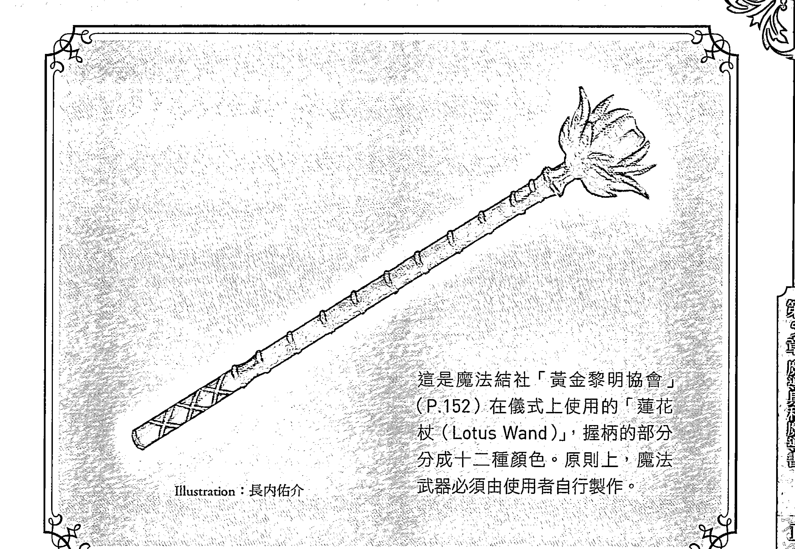

這是魔法結社「黃金黎明協會」（P.152）在儀式上使用的「蓮花杖（Lotus Wand）」，握柄的部分分成十二種顏色。原則上，魔法武器必須由使用者自行製作。

Illustration：長内佑介

## 用於儀式上的魔法武器

**阿薩米黑劍**
劍柄塗黑的短劍

**風的魔法**

**魔杖**
以具有魔力的樹木製成的手杖

**火的魔法**

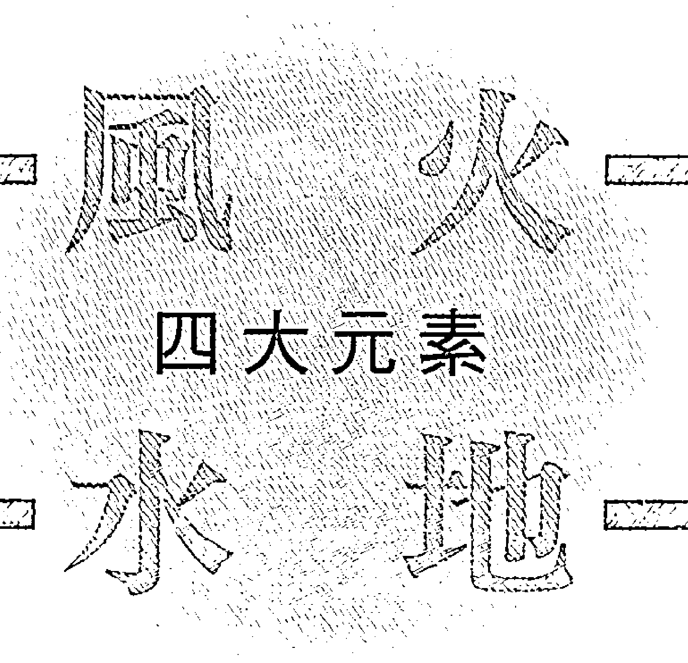

**高腳杯**
仿造聖杯的水杯

**水的魔法**

**星咒盤**
繪有五芒星等圖案的護符

**地的魔法**

# 第5章 Ⅱ 魔導書

### 《所罗门之钥》

《所罗门之钥》詳細記載了各種魔法儀式的準備事項和步驟。

這本歐洲最多人讀過的魔導書亦對後世的魔法書籍造成偌大影響。

### 代表魔導書的偉大文獻

- 所羅門王(Solomon)：他是古代以色列的第三任國王，在位期間為西元前965年～925年左右。相傳神明授予他強大的智慧，一生共撰寫了三千本書籍，其中也包含魔導書，從一～五世紀左右的《所羅門的遺言》開始，在世間流動的魔法書籍大約有五本。而本節介紹的《所羅門之鑰》，其實只是借用了這位偉大魔導書作者的名號。

我們難以正確定義何謂「魔導書」，若說它是「將魔法知識化為文字後的產物」，其歷史可以追溯至四千年以前。西元前兩千年，古巴比倫尼亞文明的黏土板上記錄了與魔法有關的內容，據說這就是魔導書的開端。後來隨著古埃及發明莎草紙，魔法相關的文獻資料有了飛躍性的增加，然而其中絕大多數都遭到羅馬帝國和基督教会取締、燒毀。

因此，我們現在看到的魔導書多為中世紀末期～近代的產物，而在現存的魔導書當中，地位最不凡的就屬《所羅門之鑰》（The Key of Solomon）。相傳這本書的作者是所羅門王，但這終究只是傳說，這本書實際上著作於十四～十五世紀，作者不詳，各國翻譯版本的根據是十五世紀的希臘文版。

這本書將魔法定義為「藉由神之力驅使精靈的術法」。為了讓精靈實現自己的願望，施術者必須了解正確的魔法基礎知識、準備工作及施行步驟。《所羅門之鑰》記載了這些魔法的入門知識，它是歐洲最廣為人知的魔法書籍，《大奧義書》（P.188）及《雷蒙蓋頓》（P.192）等眾多後世著名的魔導書都受到了它的影響。

這本書分為兩卷。第一卷的主題是「魔法的施行方法」，從儀式的場所和時間開始，按目的別記載了具體的魔法程序。除了基本程序以外，記述複雜的魔法步驟也是此書的特徵之一。所謂複雜的魔法共有八種，分別是「尋回失竊物品」、「透明人」、「預防在運動中遭遇事故」、「製作長途跋涉也不嫌累的襪帶」、「製作能獲得靈歌相關知識的絨毯」、「取得精靈的寶藏」、「得到愛情的法術」和「成功欺瞞他人的魔法」。這些魔法的儀式有別於基礎法術，每一種都有專屬的特殊程序，例如儀式須在特定的時間才能進行。

另一方面，第二卷的主題是「魔法的準備工作」，內容包含注意事項、淨身方法和如何製作魔導具等事前所所需的知識及準備工作，而此書的特徵就在於它對魔導具製作方法的詳細解說。

例如刻著星咒盤（P.182）的羊皮紙必須是「處女羊皮」，且用來製作羊皮紙的「蘆葦刀」上必須刻有特殊符號。其他不論是羽毛筆或墨水，所有的魔導具都必須用特殊的方法製作。別的魔導書上多半沒有這般具體地描述魔導具的製作方式，而這點也可說是此書的優點之一。

### 儀式需要以七曜星為首的複雜排列

太陽、月亮、火星、水星、木星、金星和土星合稱「七曜星」，它們在《所羅門之鑰》裡具有重要涵義。七曜星各自主宰不同事物，一般建議在其主宰能力較強的時間舉行儀式為佳。

七曜星每小時會依照「太陽→金星→水星→月亮→土星→木星→火星→太陽」的順序推移，每一天的開始以日出為準，代表第一個小時的就是對應當天的七曜星。舉例來說，星期三從日出後的第一個小時起分別按水星→月亮→土星……的順序推移，最後的第二十四個小時以木星作結，接著隔天（星期四）的第一個小時再從木星開始變換。

在儀式上會根據自己的願望召喚不同精靈。為了叫出所需的精靈，施術者必須預先了解各種顏色、金屬、藥草、植物、薰香、方位、咒語、形象等多種複雜的排列組合，接著挑選對應前述七曜星的時間，才能夠舉行儀式。

不同的願望對應不同的儀式，而這些儀式的準備工作、魔導具的製作方法、需召喚的精靈、咒語和時間等施術者所需了解的事項全都包含在《所羅門之鑰》當中。

- 七曜星：七顆天體，指肉眼可見的五顆行星再加上太陽與月亮。現行曆法根據七曜星的排列將每週設為七天，時間與天體的組合分別是週日=太陽、週一=月亮、週二=火星、週三=水星、週四=木星、週五=金星、週六=土星。

### 對後世造成偌大影響的魔導書

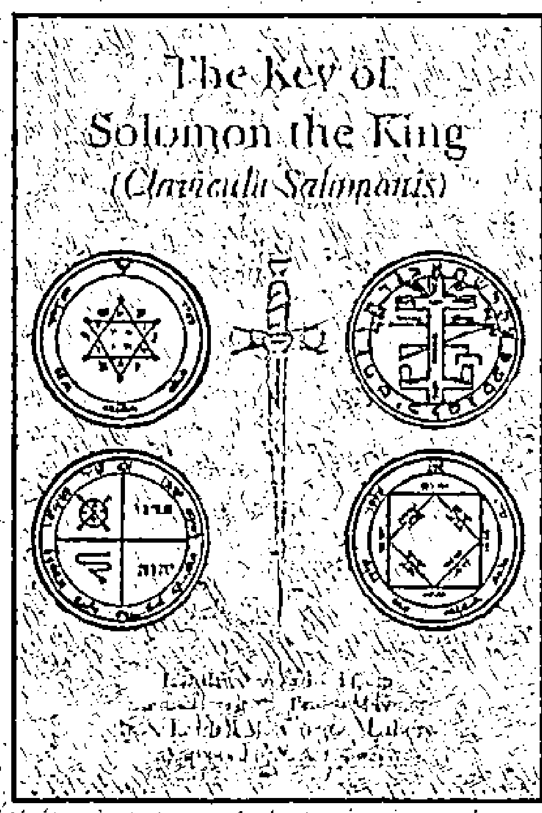

### 所罗门之钥

出版於十四～十五世紀，在十六世紀左右陸續翻譯成各國語言。

【翻譯本】《The Key of Solomon the King (Clavicula Salomonis)》

### 受《所罗门之鑰》影響的魔導書

- 雷蒙蓋頓
  - 十七世紀／法國
- 小阿爾伯特
  - 十七世紀／法國
- 教宗洪諾留的魔導書
  - 十七世紀／義大利
- 大奧義書
  - 十八世紀／義大利
- 黑母雞
  - 十九世紀／法國

### 《所罗门之鑰》的結構

分成2部

**第1部**

主題：魔法的具體施行方法

基本的魔法流程。
特殊的魔法流程。

- 找出失竊物品的魔法
- 隱身魔法
- 獲得愛情的魔法
- 等

**第2部**

主題：魔法的準備工作

施行魔法時的注意事項。
魔法道具的製作方法。

- 淨身的方法
- 獻上祭品的方法
- 製作羊皮紙的方法
- 等

## 《所罗门之钥》的魔法

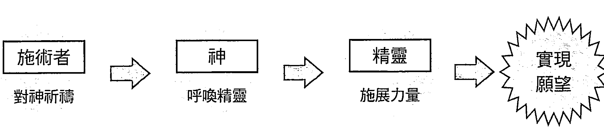

在基本的仪式流程当中，已经准备九天的施术者必须先在魔法圆内向神明献上祈祷，若祈祷传达到神明所在之处，接着咏唱特定的咒文，待需要的精灵现身之后，便能命令祂实现自己的愿望。精灵们乐于执行神的命令，故施术者可以透过神的召唤来驱使精灵。

### 与天体主宰事项相对应的魔法

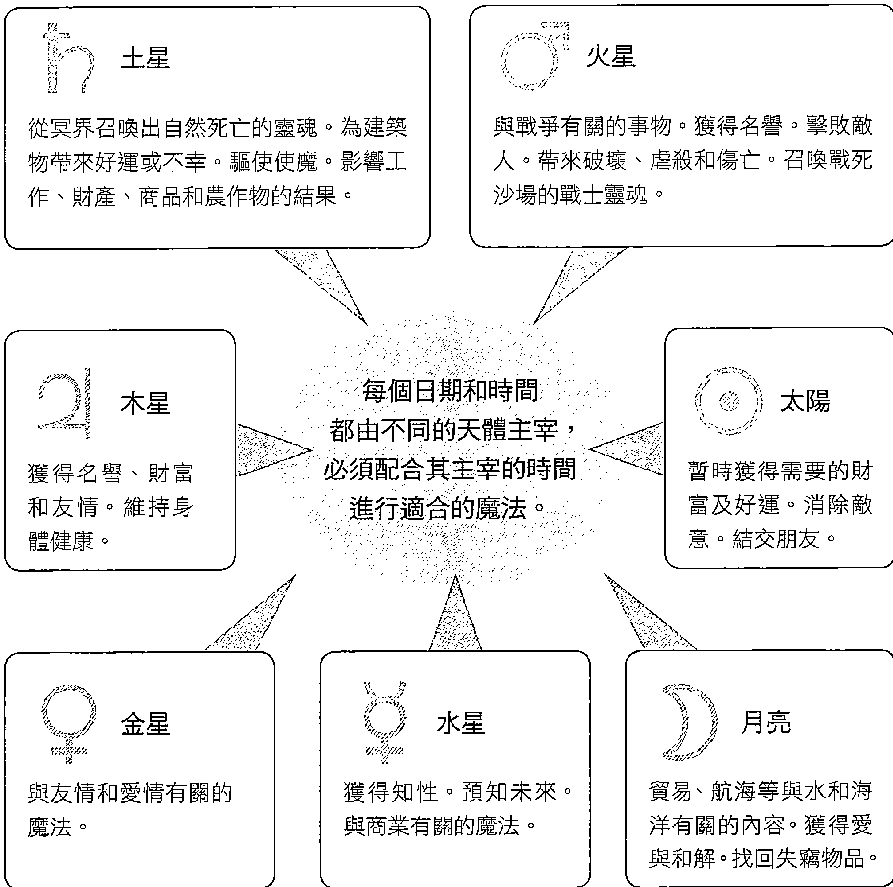

获取更多好书，请加微信号: strcdts

店铺: http://strc.cr.cx

# 第5章 III 魔導書

### 《大奥义书》

這本珍貴的魔導書記錄了與惡魔締結契約的方法。
由於內容包含獲得財寶的法術，《大奧義書》在十八～十九世紀的法國造成一股熱潮。

### 與惡魔締結契約獲得財寶

- 《Grand Grimoire》：「Grimoire」是法文的「奧義書」或「魔導書」，一般泛指歐洲的魔法書籍，不包含其他地區。此外，《Grand Grimoire》一書在十九世紀初也曾以《Dragon Rouge》（紅龍）的標題出版。

在一般的魔法儀式上，施術者會召喚出天使或惡魔，借助祂們的力量來實現願望。這時施術者雖然會委託（或命令）召喚出來的神靈，卻不會與祂們交換「契約」。不過，有極少數的儀式依然需要契約，而《大奧義書》當中就記載了這種稀有的魔法。

這本書初出於十八世紀的義大利，但因翻譯本在法國蔚為流行，在日本也以法文書名「Grand Grimoire」來稱呼此書。

正如前面所說，《大奧義書》記錄的是與惡魔簽訂契約以實現願望的法術。但所謂的契約並不包含「交出性命」這類危險的代價，只要依照書中內容用正確的方法進行儀式，就能換到對施術者有利的契約。

可以交換契約的對象共有六位，如宰相路基法格·羅弗卡列、大將軍撒旦和將軍阿迦里亞雷普特，他們在魔界的階級為「次席上級六惡魔」，是僅次於三大主宰惡魔的高官。每位惡魔司長的能力都不一樣，施術者必須依照自己的目的召喚惡魔並締結契約。若想獲得心儀女性的芳心就找撒旦，想知道國家機密則與阿迦里亞雷普特簽約。

每位惡魔都有強大的支配能力，但以路基法格·羅弗卡列在施術者當中的需求最多，因為他所掌管的是「富裕和財寶」。《大奧義書》的內容著重於這位惡魔的召喚儀式，也正因如此，夢想一夜致富的民眾才會爭相購買。

### 惡魔提出的危險契約

召喚惡魔界的宰相路基法格・羅弗卡列時，必須先做足以下準備。

首先，施術者從召喚的前一週起不得與女性發生關係。一天用餐兩次，飯前必須對主禱告。召喚的場所要是廢墟或古堡這類靜謐建築。魔導具的部分則需準備血石、兩支處女做的蠟燭、新的火盆、白蘭地、樟腦、煤炭、羔羊皮做的細長繩子以及從孩童棺木拔下來的四根鐵釘。召喚的前一天晚上必須先準備一根不曾結果的野生榛樹枝，在太陽昇上地平線的瞬間，用全新的小刀將其製成長19.5英吋（49.53公分）的魔杖。

到了召喚當天，首先要做的是繪製魔法圓。施術者需用羔羊皮繩拉出圓形，並在四個方位釘上鐵釘固定。接著用血石在圓內排出一個三角形，在三角形的內部擺上火盆，並在三角形與圓形之間放置兩根蠟燭。在圓形外面從正上方開始按逆時針順序寫下大寫的A與小寫的E、A、J。最後在三角形的底部（有小寫A的那側）寫上代表耶穌基督的「JHS」，並在文字兩側畫上十字架就完成了。畫好魔法圓之後，終於要進行召喚的步驟。將煤炭、白蘭地和樟腦放入火盆點火，帶著寫有咒語和願望的契約書和魔杖站到三角形內部，接著再向惡魔皇帝路西法召喚路基法格・羅弗卡列。這時路基法格會現身在施術者面前，如果遇到召喚失敗的情況，只需復誦兩次「所羅門的大咒語」即可。受到召喚前來的路基法格會提出賜予財寶的契約，不過亦會以「在二十年後取走施術者的性命」等作為交換條件。這時只要用魔杖頂住路基法格，並毅然決然地表示「若不聽從吾之請求，汝將永遠受到苛責」，路基法格就會心不甘情不願地將施術者帶往藏寶地點。

跟隨祂的腳步走出魔法圓時也有可能會再度受到威脅，但這時同樣只需用魔杖頂住祂就能平安無事。找到財寶之後，必須將契約書放在財寶上方，抱起自己能力範圍內能拿取的財寶，以倒退的方式回到魔法圓。最後向路基法格說出道別的話語，便能成功將這些財寶納入囊中。

- 血石（Blood Stone）：帶著紅色斑點的石英，在日本又稱為「血玉髓」。
- 樟腦：無色透明的板狀結晶，是將樟木片以水蒸氣蒸餾後製成。
- 榛樹：殼斗目樺木科榛屬的落葉灌木。
- 可以只呼喚皇帝路西法，或是再叫出另外兩位三大主宰惡魔（王子別西卜及大公亞絲塔露）的名諱。
- 「偉大的路基法格啊，吾已心滿意足。在此與汝別過，回到汝想去的地方吧。」

### 惡魔界的上位組織

除了與惡魔締結契約的方法，《大奧義書》也提到了惡魔界的上位組織。高居頂點的是「三大主宰惡魔」，其下則有「次席上級六惡魔」，而六惡魔之下各有三個惡魔，這十八名部下被稱為「十八長官」。

### 三大主宰惡魔

| 職位 | 名字 |
|---|---|
| 皇帝 | 路西法 |
| 王子 | 別西卜 |
| 大公 | 亞絲塔露 |

### 次席上級六惡魔

《大奧義書》的目的：學習惡魔界的組織結構，並召喚出與自身目的相符的次席上級六惡魔。

| 職位 | 名字 | 描述 |
|---|---|---|
| 宰相 | 路基法格・羅弗卡列 | 主宰富裕及財寶 |
| 大將軍 | 撒旦 | 譟女性跟隨自己 |
| 將軍 | 阿迦里亞雷普特 | 通曉國家機密 |
| 中將 | 福爾雷帝 | 通曉夜間勤務 |
| 准將 | 瑟迦塔納斯 | 善於將人隱形或傳送 |
| 元帥 | 涅比羅斯 | 完成各種惡行 |

### 十八長官

| 巴爾 | 阿加雷斯 | 馬爾巴士 |
|---|---|---|
| 布爾士拉斯 | 阿蒙 | 巴巴托斯 |
| 布埃爾 | 古索因 | 布提斯 |
| 巴提姆 | 布爾桑 | 艾比格 |
| 索雷 | 瓦雷法爾 | 法萊 |
| 艾沛洛斯 | 納貝爾斯 | 古拉薩柏拉士 |

### 召唤主宰路基法格

召唤上级恶魔需要很多复杂的事前准备。此外，召唤仪式必须由施术者一人或加上两位弟子、共三个人进行。但即便是三个人一同召唤恶魔，当路基法格·罗弗卡列开始指引方向之后，只有施术者可以走出魔法圆跟随他前进。

- 净身
  - 從召唤的一週前開始不得與女性發生關係。
  - 一日兩餐。
  - 安靜的召喚場所（廢墟或古城等）。
- ☆准备物品
  - 血石
  - 火盆
  - 山羊皮繩
  - 兩支蠟燭
  - 白蘭地
  - 樟腦
  - 煤炭
  - 魔杖 等

在魔法圆里面召唤路基法格

> 「偉大的皇帝路西法啊，吾以主之名命令汝，派出惡魔大臣路基法格吧。」

召唤失败时，咏唱两遍「所罗门的大咒语」

> 「神灵啊，吾以下列法力无边之名号命汝速速现身！以阿德奈之名，以艾洛伊姆、艾利耶尔、杰赫瓦姆、阿格拉、塔古拉、玛冬、奥利欧斯、阿尔莫亚沁、亚力欧斯、梅布洛特、瓦利欧斯、皮德纳、马裘多士、萨尔菲、贾柏兹、萨拉曼德烈、塔柏兹、金古亚、贾纳、艾提兹纳姆斯、萨利亚多纳米克斯之名。」

与路基法格签订「获得财宝的契约」

> 若对方要求以灵魂作为代价，可用魔杖威胁他并坚持自己的立场

在路基法格的带领下抵达藏宝地点之后，将契约书放在财宝上方，再把财宝搬回魔法圆

> 搬运财宝时，必须用倒退走的方式回到魔法圆

向路基法格说道别的话语，待他返回恶魔界后，财宝便归自己所有。

> 得到财宝！

## 《雷蒙蓋頓》

《雷蒙蓋頓》收集了有關於所羅門王的事蹟與魔法，全書共有五部。其中最著名的是記錄了「所羅門七十二柱」惡魔的第一部〈蓋堤亞〉。

### 彙整所羅門魔導書的珍貴典籍

- 《所羅門的小鑰匙》（The Lesser Key of Solomon）：這個稱呼出自對後世造成巨大影響的偉大魔導書《所羅門之鑰》（P.184）。而相對於本書，《所羅門之鑰》又被稱為《所羅門的大鑰匙》。
- 黃銅：銅和鋅的合金。因為不易鏽蝕又易於鍛造，使用層面相當廣泛，從機械器具到日用品都有。

《雷蒙蓋頓》（Lemegeton）編纂於十七世紀的法國，一共分成五部，每一部的內容都與所羅門王息息相關，因此又名《所羅門的小鑰匙》。從第一部到第五部的每個項目原本都是獨立的魔導書，將這些內容集結成一冊就成了《雷蒙蓋頓》。

此書是舉世聞名的魔導書之一，最大的原因在於第一部的〈蓋堤亞〉（Goetia）。所羅門王過去曾驅使被稱為「所羅門七十二柱」的惡魔，這些惡魔最後被封印在黃銅製的壺內沉入湖底。然而這口壺後來被巴比倫尼亞人發現，他不小心解除了壺上的封印，讓惡魔們獲得自由、重返地獄。〈蓋堤亞〉記錄了這七十二柱惡魔的詳細資料，除了每個惡魔的名字、職位、容貌和特徵之外，甚至還囊括了召喚祂們的方法。

除此之外，〈蓋堤亞〉還解釋了在為數眾多的魔法圓裡面，知名度最高的「所羅門的魔法圓」。

所羅門王設計這個魔法圓的目的，是為了保護自己不受惡靈攻擊。在直徑9英呎的圓內畫有四顆六芒星（Hexagram）和一個四角形，外側則另有四顆五芒星（Pentagram）。

而在距離魔法圓2英吋的前方還有一個高3英呎的正三角形。當施術者在圓的正中央舉行儀式，受到召喚而來的惡魔就會在正三角形內現身。〈蓋堤亞〉一書甚至詳細制定了繪製魔法圓時的方位與每個圖形的顏色。

第二部〈阿爾斯·圖爾基亞·蓋堤亞〉（Ars Theurgia Goetia）記錄了有關「天空三十一精靈」的情報，祂們別是司掌東、西、南、北四個方位的四柱皇帝、皇帝之下的十六柱王以及十一柱放浪王子，和前述的七十二柱惡魔一樣，過去都曾是所羅門王的奴僕。祂們像天使一樣以加百列或拉結爾為名，但本質卻是善惡兼具；雖然各自擁有四大元素的其中一種屬性，能力卻又非常相似。因此施術者不需視願望選擇精靈，因為不論召喚哪一位精靈，都能達到同樣的效果。

第三部〈阿爾斯·寶利納〉（Ars Paulina）共有兩章，分別提及主宰「黃道十二宮」與「一天二十四小時」的善良天使（P.194下圖）。書中內容源自所羅門王的其中一本著作，有人說這本著作的發現者正是聖保羅，而標題的「Ars Paulina」亦代表「聖保羅的法術」。

第四部名為〈阿爾斯·阿瑪戴爾〉（Ars Almadel，阿瑪戴爾之術），內容與第三部一樣都是善良天使。東、西、南、北四極各由五位天使鎮守，第一極（東）為艾利耶爾、加百列、芭拉齊耶爾、雷貝斯和海利森；第二極（南）為亞菲里薩、蓋儀、蓋倫、阿蒙和葛雷蒙；第三極（西）為艾利弗尼亞賽、葛羅米洛斯、葛朵波奈、塔拉納瓦和艾洛米納；第四極（北）則是巴凱耶爾、葛朵耶爾、葛朵耶爾、德利耶爾和加皮提耶爾。召喚祂們的時候需要「阿瑪戴爾的蠟板」，作為底座的蠟板材料是純白的蠟，上頭刻有星咒盤之類的符號。將蠟燭放在蠟板的四個角落，並在中央放上純銀或純金的徽章，準備工作就完成了。接著再將蠟燭點燃並朝其中一個方位祈禱，掌管該方位的天使就會現身在施術者面前。

第五部〈阿爾斯·諾特利亞〉（Ars Notoria，著名的法術）的起源是所羅門王在神殿祈禱時，由天使授予他的「神之語言」。只要施行本部提及的儀式，就能向召喚出來的天使學習各種知識。這些知識具體來說是「自由七藝」（文法、邏輯、修辭、算數、幾何、天文、音樂）等專門學科，施術者可以藉此讓自己獲得成長。

- 聖保羅（Saint Paul）:基督教初期的理論家，也是《聖經》作者之一，最初為迫害基督教徒的虔誠猶太教徒，在聽了基督復活後的演說之後改信基督教。
- 書中介紹的天使名稱中重複了兩次「葛朵耶爾」，不確定是否為同一天使或兩個不同的天使。

# 《五部构成的魔导书《雷蒙盖顿》》

| 部数 | 名称 | 说明 |
| ---- | ---- | ---- |
| 第1部 | 蓋堤亞 | 除了有「所羅門七十二柱惡魔」的說明和召喚方法之外，還詳細介紹了「所羅門的魔法圓」。 |
| 第2部 | 阿爾斯·圖爾基亞·蓋堤亞 | 以所羅門王的昔日奴僕「天空三十一精靈」的召喚儀式為中心。精靈的本質兼具善與惡。 |
| 第3部 | 阿爾斯·寶利納（聖保羅的法術） | 分成「黃道十二宮的天使」和「二十四小時的天使」兩個章節，兩章介紹的都是善良天使，召喚祂們的目的在於實現心願。 |
| 第4部 | 阿爾斯·阿瑪戴爾（阿瑪戴爾之術） | 介紹善良「方位主宰天使」的召喚方法。東、西、南、北四極各由五柱天使主宰，一共有二十柱天使。 |
| 第5部 | 阿爾斯·諾特利亞（著名的法術） | 彙整了神明透過天使傳達給所羅門王的內容，召喚這些天使的目的在於從中汲取各式各樣的「知識」。 |

# 《掌管「黃道十二宮」與「二十四小時」的天使》

祂們是第三部〈阿爾斯·寶利納〉所介紹的天使。每個人藉由出生時間與「黃道十二宮」連結，分別受到十二柱天使支配。而「一天二十四小時」則是指每個小時都由不同的天使主宰，每一柱主宰天使下面各有八柱公爵天使。

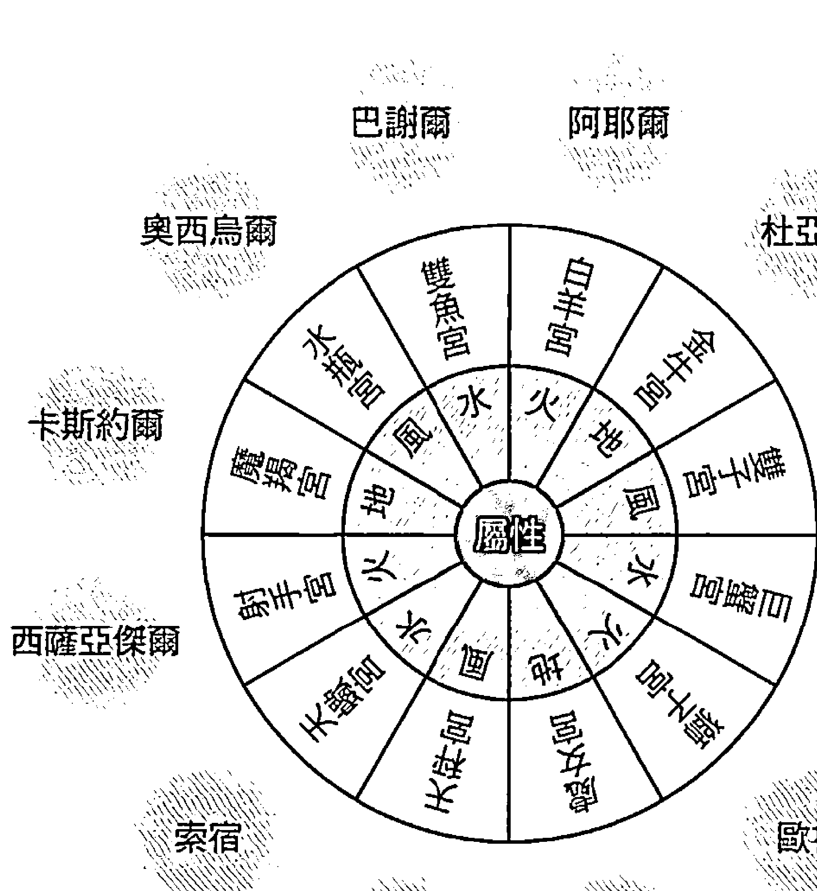

| 日（中午之前） | 時刻 | 夜（中午之後） |
| ---- | ---- | ---- |
| 薩瑪耶爾 | 1時 | 加米爾 |
| 亞納耶爾 | 2時 | 弗利斯 |
| 瓦古亞尼耶爾 | 3時 | 薩庫庫米克 |
| 瓦古米耶爾 | 4時 | 耶阿斯卡 |
| 薩斯克耶爾 | 5時 | 阿帕斯達爾波 |
| 薩米爾 | 6時 | 薩亞蒙德份 |
| 巴爾齊耶爾 | 7時 | 客羅利翁 |
| 奧斯卡艾比耶爾 | 8時 | 尼爾克利耶爾 |
| 瓦朵利耶爾 | 9時 | 徹克利耶爾 |
| 奧利耶爾 | 10時 | 雅斯庫坎 |
| 巴利耶爾 | 11時 | 達克達利耶爾 |
| 佩拉提耶爾 | 12時 | 薩瑪提耶爾 |

# 《蓋堤亞》內的「所羅門七十二柱惡魔」

| 記載順序 | 名字 | 職位 | 記載順序 | 名字 | 職位 |
|---|---|---|---|---|---|
| 1 | 巴爾 | 大王 | 37 | 菲涅克斯 | 侯爵 |
| 2 | 阿加雷斯 | 公爵 | 38 | 巴爾法斯 | 伯爵 |
| 3 | 瓦沙克 | 王子 | 39 | 瑪爾法斯 | 長官 |
| 4 | 錫米奇納 | 侯爵 | 40 | 洛姆 | 伯爵 |
| 5 | 馬爾巴士 | 長官 | 41 | 弗卡羅 | 公爵 |
| 6 | 華利弗 | 公爵 | 42 | 威帕爾 | 公爵 |
| 7 | 阿蒙 | 侯爵 | 43 | 沙布諾克 | 侯爵 |
| 8 | 巴巴托斯 | 公爵 | 44 | 謝克斯 | 侯爵 |
| 9 | 拜蒙 | 王 | 45 | 維涅 | 王／伯爵 |
| 10 | 布埃爾 | 長官 | 46 | 比弗隆 | 伯爵 |
| 11 | 古辛 | 公爵 | 47 | 烏瓦爾 | 公爵 |
| 12 | 西特利 | 王子 | 48 | 哈根地 | 長官 |
| 13 | 貝雷特 | 王 | 49 | 克羅賽爾 | 公爵 |
| 14 | 雷萊耶 | 侯爵 | 50 | 弗爾卡斯 | 騎士 |
| 15 | 艾利葛斯 | 公爵 | 51 | 巴拉姆 | 王 |
| 16 | 薩帕魯 | 公爵 | 52 | 亞洛賓斯 | 公爵 |
| 17 | 布提斯 | 伯爵／長官 | 53 | 卡米奧 | 長官 |
| 18 | 巴辛 | 公爵 | 54 | 穆魔 | 公爵／伯爵 |
| 19 | 薩洛斯 | 公爵 | 55 | 歐洛帕斯 | 王子 |
| 20 | 布爾森 | 王 | 56 | 古雷莫里 | 公爵 |
| 21 | 瑪拉克斯 | 伯爵／長官 | 57 | 歐謝 | 長官 |
| 22 | 伊柏斯 | 伯爵／王子 | 58 | 亞米 | 長官 |
| 23 | 艾姆 | 公爵 | 59 | 歐利亞克斯 | 侯爵 |
| 24 | 納貝里歐斯 | 侯爵 | 60 | 瓦布拉 | 公爵 |
| 25 | 古拉西亞·拉布拉斯 | 伯爵／長官 | 61 | 薩甘 | 王／長官 |
| 26 | 布涅 | 公爵 | 62 | 瓦拉克 | 長官 |
| 27 | 羅諾威 | 侯爵／伯爵 | 63 | 安德拉斯 | 侯爵 |
| 28 | 貝利特 | 公爵 | 64 | 郝列斯 | 公爵 |
| 29 | 亞絲塔露 | 公爵 | 65 | 安德烈阿爾弗斯 | 侯爵 |
| 30 | 弗爾涅斯 | 侯爵 | 66 | 西美耶斯 | 侯爵 |
| 31 | 弗拉斯 | 長官 | 67 | 阿姆杜西亞斯 | 公爵 |
| 32 | 阿斯墨戮 | 王 | 68 | 貝里耶爾 | 王 |
| 33 | 賈布 | 王子／長官 | 69 | 狄卡拉比爾 | 侯爵 |
| 34 | 賈弗 | 伯爵 | 70 | 薩耶雷 | 王子 |
| 35 | 瑪爾科西亞斯 | 侯爵 | 71 | 丹特里昂 | 公爵 |
| 36 | 史特拉斯 | 王子 | 72 | 安德羅馬利斯 | 伯爵 |

上表為所羅門王麾下七十二柱惡魔的一覽表。名字旁邊的數字為魔導書內的「記載順序」而非階級排序。〈蓋堤亞〉不僅記錄了七十二柱惡魔的紋章與身體特徵，還介紹如何利用這些特徵來召喚祂們以實現自己的心願。

# 第5章 Ⅱ 魔導書

# 《教宗洪諾留的魔導書》

這本十八世紀初的魔導書靠著帶來財寶的魔法而大受好評。然而召喚墮天使必須以殘酷的儀式為代價，當此書的人氣水漲船高，惡名也跟著傳遍大街小巷。

# 使用動物祭品的殘忍儀式

> ① 黑母雞：一般認為與P.198介紹的魔導書《黑母雞》所使用的母雞沒有直接關聯。

中世紀以後陸續有新的魔導書問世，在巴黎，《教宗洪諾留的魔導書》（The Grimoire of Pope Honorius）是繼《所羅門之鑰》（P.184）以後，人氣最高的魔法書籍。相傳這本書的作者是十三世紀的羅馬教宗洪諾留三世，然而書籍在市面上流通卻是1700年左右的事。此書受到世人支持的原因非常簡單，純粹是「因為裡面介紹了能獲得財寶的魔法」。

這本書召喚的是十一柱墮天使，分別是主宰東、西、南、北的四柱與主宰星期日數的七柱。祂們能實現各式各樣的願望，效果受限的只有代表星期二的菲利莫斯特（獲得名譽和威嚴）、代表星期三的亞絲塔露（獲得王與世人的好意）、代表星期四的希爾加爾德（獲得幸福和財寶）及代表星期日的斯爾迦多（獲得財富）這四柱而已。考慮到當時的需求，施術者召喚的還是以希爾加爾德與斯爾迦多居多。

召喚墮天使之前，有一項需在事前完成的儀式，而這種獻祭儀式可說是此書最大的特徵之一。祭品用的是黑母雞①，施術者首先需殺死這隻母雞，挖出牠的兩顆眼球並切下舌頭和心臟。接著將取出的部位曬乾後磨成粉末，撒在用來繪製魔法圓的羊皮紙上。之後施術者要絕食三天才能展開召喚儀式，依照自己的目的選擇要召喚的墮天使。若要召喚方位墮天使就需備妥所羅門王的魔法圓和星咒盤，若要召喚星期日數的墮天使則需描繪每個天使專屬的魔法圓。

當時有許多不易製作的魔導具，但讓人猶豫要不要做的卻意外地少，而此書這種需要獻祭黑母雞的儀式當然屬於後者。結果，隨著《教宗洪諾留的魔導書》人氣高漲，知道殘忍儀式而忌諱它的人也不在少數。

# 能够召唤的恶魔

## 各个方位的王

| 方向 | 恶魔 |
|------|------|
| 北 | 亚迈蒙 |
| 南 | 艾基姆 |
| 西 | 拜蒙 |
| 东 | 玛果亚 |

使用所罗门王的魔法圆与星咒盘进行召唤。

## 各星期日数的恶魔

- 星期一: 路西法
- 星期二: 菲利莫斯特
- 星期三: 亚丝塔露
- 星期四: 希尔加尔德
- 星期五: 贝加尔德
- 星期六: 古兰德
- 星期日: 斯尔迦多

召唤需使用每位恶魔专属的魔法圆。

## Column

### 洪诺留是魔法师？

正如本文所述，《教宗洪诺留的魔导书》的作者被认为是十三世纪的罗马教宗洪诺留三世。然而后世并未发现能证明他是魔法师的史实，且基督教原本就将魔法视为异端。那么，到底谁才是真正的作者呢？

在讨论这个问题之前，首先要介绍一本早先一步问世的《洪诺留的誓约》。这本书是欧洲各地的魔法师聚集并开会讨论得出的魔法实践理论，作者是底比斯的洪诺留，当然他与洪诺留三世是不同人物，但不知从何时开始，底比斯的洪诺留遭到世人遗忘，取而代之的是被与洪诺留三世混为一谈。

有人说，《教宗洪诺留的魔导书》的作者其实是憎恨基督教会的无名魔法师，受到教会迫害的他怀抱着对教会的憎恨与讽刺，将洪诺留三世塑造成魔法师。

假设这个说法是事实，那么底比斯的洪诺留只是因为与罗马教宗同名而遭到利用。

# 第5章 魔導書

# 《黑母雞》

這本書的前半段與後半段內容不同。前半段記述的是使用魔符與魔法戒指的法術，後半段則介紹如何養出一隻能夠找到寶藏的「黑母雞」。

# 埃及魔法師傳來的秘術

> 拿破崙遠征埃及：1798年，拿破崙率領五萬法軍開始攻打埃及和敘利亞，但因遭到英國、鄂圖曼帝國和當地士兵的抵抗，在1801年時被迫投降，撤退時的法軍只剩下一萬五千人。

《黑母雞》（The Black Pullet）出版於1820年的法國。根據這本書的前言，作者是曾經跟隨拿破崙遠征埃及的指揮官。這位指揮官的部隊在戰場上遭阿拉伯軍擊破，唯一倖存的他遇見了從金字塔出現的魔法師。他向魔法師學習各種法術，並將這些知識整理在這本書裡。

《黑母雞》前半部的內容是針對使用魔符（P.168）和魔法戒指的法術提供解說，這些法術共有二十種效果，如呼喚四大元素精靈、隱形、知曉重大秘密或得到某個人的愛等等，每一種都附有魔符的插圖解說。

另一方面，後半部的主題則是書名「黑母雞」的飼育方法。這種母雞具有發現黃金或寶藏的能力，絕大多數購買這本書的人都是以此為目的。關於飼育的步驟，首先，要從準備沒有任何汙點的蛋和一隻非常接近純黑的母雞開始，母雞身上不是黑色的羽毛必須全部拔除。第二步要將飼育環境染黑。在母雞頭上蓋上黑色斗篷之後，放進內側貼滿黑色素材的飼育箱。箱子擺放的地點也是以漆黑的房間為佳，餵食也只能在夜晚進行。用這種方式「染黑」的母雞會孵出被黑色洗腦的小雞，小雞長大就成了會按照本能不斷尋找黃金或寶藏的「黑母雞」。

不過，如果遇到按部就班卻無法培養出黑母雞的情況，還是乖乖放棄比較好。因為讓這種法術成功的條件包含了「施術者必須是配得上神秘儀式之人」。黑母雞的存在以寶藏獵人為中心廣為流傳，但實際擁有牠的人卻少之又少，因此牠不時會被當成詐欺手法，甚至還曾發生買到假貨的事件。

# 能够召唤的恶魔

**步骤①** 准备一颗没有任何污点的蛋。[插图] 把蛋放在正午的阳光下确认有没有污点。

**步骤②** 尽可能找到一只接近纯黑的母鸡。[插图] 不是黑色的羽毛必须全数拔除。

**步骤③** 在母鸡头上套上黑色斗篷，关在漆黑的房间里孵蛋。[插图] 必须在夜晚喂食母鸡。

**步骤④** 孵出一只被黑色洗脑的纯黑小鸡。待小鸡长成「黑母鸡」之后，会为主人找出宝藏或黄金。[插图]

**Column 使用黑母鸡的法术** 此书介绍的作法是利用魔法培育黑母鸡来找到黄金，但这种法术还能变成另一种应用方式，那就是将黑母鸡当成祭品，召唤恶魔并向其索取黄金。首先要准备一只不曾产卵的处女黑母鸡，在捕捉时不能让他发出声音，因此必须趁他晚上熟睡时，从后方抓住脖子将其带走。抱着母鸡沿着宽广的干道前进，走到靠近十字路口的地方时停下等待，当时间来到半夜，在十字路口中央画好魔法圆，在圆内将黑母鸡撕成两半，并把以下咒语复诵三遍：「耶罗姆、耶萨姆，我提出请求！」于是顺从的恶魔便会现身在施术者面前，为其献上梦寐以求的巨大财富。而这个咒语曾在水木茂的漫画《恶魔君》里登场，在日本可说是家喻户晓的台词。《黑母鸡》的饲育方法虽然对施术者设有严格条件，但成功后却能不费任何力气获得财宝。相反地，这里介绍的方法虽然有极高的机率能得到宝藏，却必须经历将母鸡撕成两半的残酷仪式。成为富豪的道路，果然不论哪一条都非常严苛。

# 第5章 III 魔導書

# 《地獄的脅迫》

這本魔導書記錄的是驅使地獄七大公爵實現願望的魔法。
作者浮士德博士因為與七大公爵之一的梅菲斯特費勒斯締結契約而廣為人知。

# 浮士德博士留下的魔法記錄

① 梅菲斯特費勒斯（Mephistophel-es）：祂並非出自古代傳說，而是與浮士德傳說同時誕生的惡魔。當時繪畫中的梅菲斯特費勒斯多為紅色身體或穿著紅色服裝。

② 歌德：活躍於十八世紀～十九世紀的德國詩人。代表作《浮士德》耗費了他的半生，本作分為兩部，第一部於1808年發表，第二部則在他過世隔年的1833年問世。

《地獄的脅迫》出自代表德國的傳奇魔法師浮士德博士之手，它的初出年份不明，但若是由浮士德博士執筆，推測應為十六世紀初期。這本手稿在十七～十八世紀的德國被印刷出版並獲得廣大好評。

正如標題所述，《地獄的脅迫》介紹的是威脅來自地獄的惡魔以實現自身願望的魔法。浮士德本人把這本書稱為「奇蹟魔導書」，聲稱不論是找到金銀財寶或發現地下水脈，世界上沒有願望能難倒此書。

這本書驅使的惡魔是地獄七大公爵（艾傑爾、艾利耶爾、瑪爾布耶爾、梅菲斯特費勒斯、巴爾布耶爾、艾吉亞貝爾和艾尼菲爾），每位惡魔都有自己擅長的能力。由於是透過脅迫的方式來命令惡魔，書中當然也包含讓施術者不受傷就能送走惡魔的方法。

此外，浮士德博士因為與七大公爵之一的梅菲斯特費勒斯①訂下契約而名聲遠播。根據《浮士德博士實錄》，他在某個夜晚召喚撒旦之後，叫出了身為撒旦侍從的梅菲斯特費勒斯。梅菲斯特向他提出契約，內容是「這二十四年你可以任意使喚梅菲斯特費勒斯，但必須獻出自己的肉體與靈魂作為交換。」之後浮士德過了二十四年幸福快樂的生活，到了第二十五年，梅菲斯特依約帶走了他的生命。這是德國非常知名的傳說，召喚出梅菲斯特費勒斯的威登堡森林成了後世德國魔法師所憧憬的場所。而描繪這項傳說的詩劇《浮士德》是歌德②的代表作之一，據說歌德本人也曾是熱愛《地獄的脅迫》的讀者。

# 可從《地獄的脅迫》召喚出來的七大公爵

除了七大公爵的特徵以外，《地獄的脅迫》還記載了每位惡魔的紋章和召喚咒語。與浮士德博士締結契約的梅菲斯特費勒斯是全能的惡魔，在他們交換契約之後，梅菲斯特帶來了希臘神話的女神海倫作為浮士德的妻子。

| 名字 | 特徵 |
|------|------|
| 艾傑爾 | 掌管所有藏在地底的財寶。 |
| 艾利耶爾 | 掌管地上和地下。 |
| 瑪爾布耶爾 | 會在任何需要幫助的時候現身。 |
| 梅菲斯特賓勒斯 | 掌管技藝，擁有豐富知識。 |
| 巴爾布耶爾 | 掌管大海和水。 |
| 艾吉亞貝爾 | 法律的支配者，守護財產和名譽。 |
| 艾尼菲爾 | 詳情不明。 |

# 作者浮士德博士的傳說

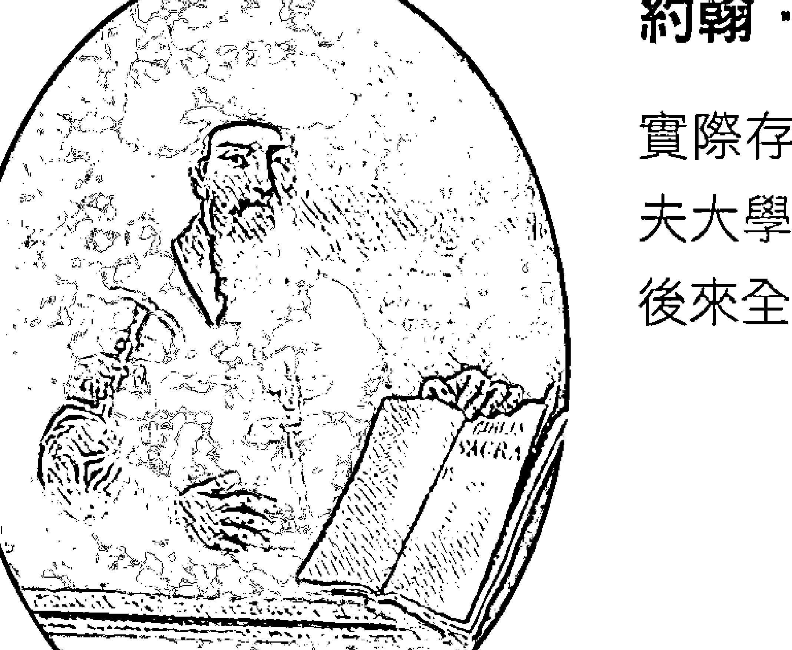

約翰·喬治·浮士德

實際存在於十六世紀的德國鍊金術師。在波蘭克拉科夫大學大學讀書，並於德國海登堡大學取得博士學位。後來全心投入鍊金術研究，在實驗過程中猝死。

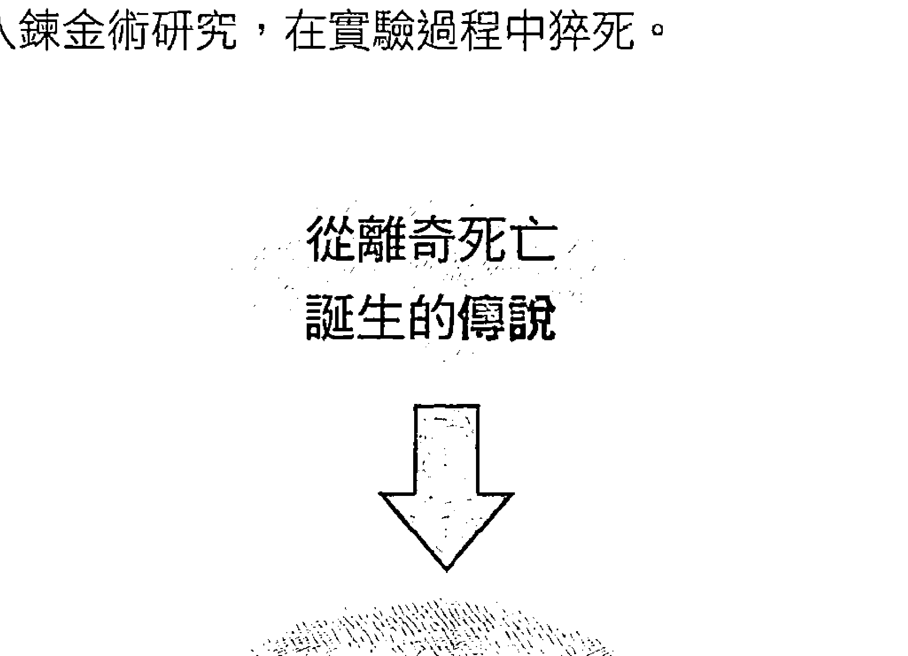

浮士德在鍊金術的實驗當中猝死，四肢與身體分離，死狀相當離奇。這件事讓世間開始謠傳「因為與惡魔的契約時效已過，浮士德才會死得如此淒慘。」結果造成他在死後被視為傳說中的魔法師，孕育出各式各樣的傳聞。

# 第5章 Ⅲ 魔導書

# 《律法之書》

代表二十世紀、惡名昭彰的阿萊斯特・克勞利撰寫了這本魔導書。
內容有許多難解的遣詞用字，評價相當兩極。

# 謎樣智慧體的神諭之書

《律法之書》（The Book of the Law）是阿萊斯特・克勞利（P.156）撰寫的魔導書，同時也是泰勒瑪教¹的聖典。克勞利雖出生於虔誠的基督教家庭，他卻極度厭惡嚴格的基督教教育，這些種種引發他的反彈，讓他對魔法心生嚮往。

1904年3月，克勞利在妻子蘿絲・凱莉面前舉行精靈的召喚儀式，但精靈並未現身，取而代之的是其他神靈附身於蘿絲身上，告訴克勞利應召喚埃及神話的荷魯斯。

在這件事情之後，克勞利不斷嘗試召喚荷魯斯，直到一個月後的某一天，原以為終於要成功了，沒想到出現在他面前的，卻是名叫艾華斯²的謎樣智慧體。後來，他逐一記錄了艾華斯對他說過的話，並將這兩百二十條神諭彙整成《律法之書》。

本書的「律法」出自泰勒瑪哲學的名言「行汝之意志」，目的在於透過《律法之書》與神合而為一，但最關鍵的內容卻非常不易解讀。然而本書在第3章第63節寫道：「愚笨之人即便讀了《律法之書》與註解，仍不可能了解其意涵。」這麼看來，或許只有特定的對象才能理解艾華斯的神諭。

多數魔導書的內容皆以施術步驟、魔導具的製作方法和精靈的詳細介紹為中心，因此不易解讀且內容偏頗的《律法之書》經常被歸類於低劣的魔法書籍。

即便如此，還是有一些後世的書籍受到此書影響。例如克蘇魯神話³裡的虛構書籍《死靈之書》（Necronomicon），其名稱是人類無法正確發音的「外來名」，而這類常見的設定可歸咎於《律法之書》的影響。

+   ① 泰勒瑪教（Thelema）：泰勒瑪原本是一種哲學思想，其代表名言是文藝復興時期的作家弗朗索瓦・拉伯雷所提倡的「行汝之意志」。克勞利以這種思想為根基，創立了泰勒瑪教。
② 艾華斯（Aiwass）：克勞利召喚出來的智慧體，真實身分不明，但克勞利自己視祂為守護天使，曾表示「艾華斯有著類似阿拉伯人的外貌」。
③ 克蘇魯神話（Cthulhu Mythos）：在二十世紀上半期，以作家洛夫克拉夫特為中心所創作出來的神話。

# 《律法之书》的特征

| 项目 | 说明 |
| :--- | :--- |
| 成立 | 1904 年 |
| 作者 | 阿莱斯特·克劳利（1875 年～1947 年） |
| 内容 | 它是泰勒玛教的圣典，同时也是讲述如何与神合为一体的魔导书。 |

**《律法之书》诞生的由来**

**1903 年 3 月**：神灵附身在妻子萝丝身上，要求克劳利召唤荷鲁斯（埃及神话里的神）。

**1903 年 4 月**：透过召唤仪式现身的并非荷鲁斯，而是守护天使艾华斯。祂留给克劳利 220 条神谕，克劳利将这些内容汇整成《律法之书》。

# 第5章 魔导具和魔导书
III 魔导书
《律法之书》

**克劳利创作的《四之书》**

《律法之书》是克劳利的代表作，他另外还有好几本魔法著作，其中最著名的就是《四之书》。这本书继承了他过去隶属的黄金黎明协会（P.152）的内容，是一本高阶的魔法书籍。

本书共分为四部。

第一部《神秘主义》解释瑜伽，讲述欲透过冥想及呼吸法和宇宙合而为一的印度神秘主义。

第二部《魔法》则是以所有魔法为主题，具体说明仪式或魔导具的意义和使用方法。

第三部《魔法—理论与实践》介绍的是施术者必须知道的重要事项，其中最令人玩味的部分，在于它提醒读者“只要在仪式上弄错一步就有可能酿成黑魔法”。

克劳利奇怪的行径经常被人视为“黑魔法”，不过只要读过这个章节，就能理解他所追求的目标确实是高阶魔法。

而最后的第四部《泰勒玛》则是克劳利所创办的泰勒玛教的相关说明，部分内容也引用自泰勒玛教的圣典《律法之书》。

# 索引

## 人名 魔女、魔法師、鍊金術師、預言家等

- 阿布·穆薩·賈比爾·伊本·哈揚 (Abu Musa Jabir ibn Hayyan) ——— 147
- 阿爾·拉齊 (Al-Razi) ——— 147
- 阿萊斯特·克勞利 (Aleister Crowley) — 30、151、156、202
- 安東萬—羅倫·德·拉瓦節 (Antoine-Laurent de Lavoisier) ——— 147
- 安東·桑德·拉·維 (Anton Szandor LaVey) — 151
- 猶大·羅·本·比撒列 (Judah Loew ben Bezalel) — 30
- 伊爾潔·維塔 ——— 56
- 伊萊亞娜 (Ileana) ——— 30
- 威廉·巴特拉·葉慈 (William Butler Yeats) — 151
- 威廉·惠威爾 (William Whewell) ——— 147
- 愛德華·凱利 (Edward Kelley) ——— 160
- 艾利克·揚·漢納森 (Erik Jan Hanussen) —— 151
- 艾利弗斯·李維 (Eliphas Levi) ——— 30
- 奧丁 (Odin) ——— 20、130
- 奧茲國的四位魔女 ——— 30
- 歐楚德 (Ortrud) ——— 24
- 喀耳刻 (Circe) ——— 8
- 綠魔女 (Green Lady) ——— 31
- 克里斯蒂安·羅森克魯茲 (Christian Rosenkreuz) ——— 31
- 古爾維格 (Gullveig) ——— 12
- 格里戈利·葉菲莫維奇·拉斯普丁 (Grigorii Efimovich Rasputin) ——— 31、151
- 喬治·伊瓦諾維奇·古爾傑夫 (George Ivanovich Gurdjieff) ——— 151
- 凱麗杜溫 (Ceridwen) ——— 31
- 科涅留斯·阿格里帕 (Cornelius Agrippa) —— 31
- 傑拉德·加德納 (Gerald Gardner) ——— 151
- 吉杜·克里斯那穆堤 (Jiddhu Krishnamurti) —— 151
- 西蒙·馬格斯 (Simon Magus) ——— 31
- 約翰·迪伊 (John Dee) ——— 32、160
- 吉爾·德·雷 (Gilles de Rais) ——— 32
- 史坦尼斯拉斯·德·蓋達 (Stanislas de Guaita) ——— 151
- 絲朵莉葛 (Striga) ——— 32
- 所羅門王 (Solomon) ——— 32
- 達西斯博士 (Dr.Dahesh) ——— 151
- 戴安·福瓊 (Dion Fortune) ——— 151
- 杜艾莎 (Duessa) ——— 32
- 德魯伊 (Druid) ——— 44、120
- 特露德太太 (Frau Trude) ——— 33
- 特蘿蒂亞·辛堤斯&達爾瓦莉 ——— 33
- 尼樂·勒梅 (Nicolas Flamel) ——— 33、147
- 〈人魚公主〉的魔女 ——— 33
- 芭芭雅嘎 (Baba Yaga) ——— 16
- 沛卜斯 (Papus) ——— 151
- 帕拉塞爾蘇斯 (Paracelsus) ——— 33、147
- 潘飛兒 (Pamphile) ——— 34
- 芙菈·葛索 (Frau Gothel) ——— 28
- 普洛斯彼羅 (Prospero) ——— 34
- 貝法娜 (La Befana) ——— 34
- 赫米斯·崔斯莫吉斯堤斯 (Hermes Trismegistus) ——— 147
- 〈糖果屋〉的女巫 ——— 26
- 洪諾留三世 (Honorius III) ——— 34
- 霍勒太太 (Frau Holle) ——— 34
- 梅林 (Merlin) ——— 18
- 《馬克白》的三位女巫 ——— 22
- 麥葛瑞格·馬瑟斯 (MacGregor Mathers) ——— 35、151、152
- 瑪莉·拉芙 (Marie Laveau) ——— 35
- 瑪琳卡 ——— 35
- 米爾丁 (Myrddin) ——— 18
- 美狄亞 (Medea) ——— 10
- 摩根勒菲 (Morgan le Fay) ——— 14
- 約翰·浮士德 (Johann Faust) ——— 35、200
- 約翰·特爾戴 (Johann Tholde) ——— 147
- 約翰·約阿希姆·貝歇爾 (Johann Joachim Becher) ——— 147
- 拉法葉·羅納德·賀伯特 (Lafayette Ronald Hubbard) ——— 151
- 裴希 (Louhi) ——— 35
- 羅伯特·波以耳 (Robert Boyle) ——— 147

## 道具

魔法导具、魔法武器或魔法材料等

- 阿萨米黑剑 —— 182
- 阿斯克勒庇俄斯之杖 —— 45
- 护身符 (Amulet) —— 164
- 亚伦杖 (Aaron's Rod) —— 45
- 光耀之手 (Hand of Glory) —— 172
- 万灵药 (Elixir) —— 146
- 大釜 —— 50
- 卍字 —— 180
- 双蛇双翼之杖 —— 45
- 加姆班泰因 (Gambantein) —— 45
- 贤者之石 (Philosopher's Stone) —— 146
- 宝石 (Gem) —— 164
- 史基尼尔之杖 —— 45
- 魔符 (Talisman) —— 168
- 高脚杯 (Chalice) —— 182
- 手杖 —— 44
- 软膏 —— 42、46
- 万应药 (Panacea) —— 121
- 能量石 (Powerstone) —— 164
- 媚药 —— 176
- 星咒盘 (Pentacle) —— 182
- 扫帚 —— 40
- 星象图 (Horoscope) —— 139
- 魔法武器 —— 182
- 魔女刺针 —— 69
- 风茄 (Mandragora) —— 176
- 蕾丝与绳线 —— 57
- 蜡像 —— 51
- 魔杖 (Wand) —— 182

## 书名

魔法导书和有魔女或魔法师登场的书籍名称

- 《恶魔学》 —— 93
- 《恶魔崇拜》 —— 93
- 《蚁丘》 —— 93
- 《阿玛戴尔的魔法导书》 —— 170
- 《被狼附身的人与魔女》 —— 42
- 《影之书》 —— 108
- 《黑母鸡》 —— 198
- 《巫术概要》 —— 93
- 《地狱的胁迫》 —— 200
- 《死之书》 —— 60
- 《占星历》 —— 140
- 《所罗门之钥》 —— 184
- 《大奥义书》 —— 188
- 《四之书》 —— 203
- 《图解堕天使与恶魔的变幻莫测》 —— 93
- 《糖果屋》 —— 26
- 《律法之书》 —— 159、202
- 《教宗洪诺留的魔法导书》 —— 196
- 《马克白》 —— 22、50
- 《魔法研究》 —— 93
- 《女巫的恶魔狂热》 —— 93、95
- 《女巫之槌》 —— 93、95
- 《长发姑娘》 —— 28
- 《雷蒙盖顿》 —— 144、192
- 《罗恩格林》 —— 24

## 魔法·巫术

魔法、巫术相关条目

- 神之御印 (Sigillum Dei Aemeth) —— 144
- 以诺魔法 (Enochian Magic) —— 143、160
- 欧甘字母 (Ogham) —— 122
- 卡巴拉数秘术 (Kabbalah Numerology) —— 128
- 盗奶术 —— 58
- 黑魔法 —— 114
- 荒天术 —— 54
- 魔像 (Golem) —— 126、127
- 典礼魔法 —— 114
- 自然魔法 —— 114
- 召唤魔法 —— 114
- 白魔法 —— 114
- 性爱魔法 —— 56、114、157
- 赛兹咒法 (Seidr) —— 12、20
- 接触魔法 —— 114
- 占星术的实践方法 —— 138
- 占星术的历史与定义 —— 136
- 其他法术 —— 58
- 变身 —— 52、121
- 荷蒙库鲁兹 —— 146、147
- 魔法圆 —— 142
- 魔法和巫术的历史及定义 —— 112
- 邪术 (Maleficium) —— 48
- 交感魔法 —— 114
- 卢恩秘术 (Rune Magic) —— 114、115、130
- 炼金术 (Alchemy) —— 115、146

## 惡魔

- 惡魔學 —— 90
- 惡魔附身 —— 72
- 惡魔的印記 —— 68
- 阿斯莫德（Asmodeus）—— 72
- 男夢魔（Incubus）—— 70
- 撒旦（Satan）—— 90
- 女夢魔（Succubus）—— 70
- 所羅門七十二柱 —— 32、114、195
- 使魔 —— 74
- 魔王（Devil）—— 90
- 魔鬼（Demon）—— 90
- 夢魔 —— 70
- 梅菲斯特費勒斯（Mephistopheles）—— 200
- 莉莉絲（Lilith）—— 38
- 路基法格·羅弗卡列（Lucifuge Rofocale）—— 144、188

## 文字

- 以諾字母（Enochian）—— 161
- 歐甘字母（Ogham）—— 123
- 底比斯文字（Theban Alphabet）—— 109
- 希伯來文字（Hebrew Alphabet）—— 129
- 盧恩字母（Runes）—— 134、135
- 鍊金文字與符號 —— 148、149

## 活動、祭典

- 沃普爾吉斯之夜（Walpurgisnacht）—— 66
- 魔女夜宴（Sabbat）—— 60、108
- 貝南丹帝（Benandanti）—— 83

## 與魔女有關的項目

- 威卡教（Wicca）—— 104
- 卡巴拉（Kabbalah）—— 115、124、128
- 咒術師 —— 88
- 神話與傳說中的魔女形象 —— 84
- 生命之樹（Tree of Life）—— 124
- 童話與文學中的魔女形象 —— 86
- 豐饒之神的巫女 —— 80
- 魔女學 —— 90
- 魔女狩獵（Witch-hunt）—— 96

## 近代魔法團體

- 艾華斯教團 —— 156
- 黃金黎明協會（The Hermetic Order of the Golden Dawn）—— 152
- 近代魔法的歷史與定義 —— 150
- 銀星團（Argenteum Astrum）—— 156
- 克勞利派 —— 156
- 東方聖殿騎士團（Ordo Templi Orientis）—— 156
- 魔法結社I·O·S· —— 116

## 參考文獻

- 『エピソード魔法の歴史―黒魔術と白魔術（現代教養文庫）』ゲリー・ジェニングズ（著）、市場泰男（訳）、社会思想社
- 『オールカラー 世界の魔術・魔法大全』魔法研究会（著）、笠倉出版社
- 『ケルトの宗教 ドルイディズム』中沢新一（著）、鶴岡真弓（著）、月川和雄（著）、岩波書店
- 『ゴーレムの生命論』金森修（著）、平凡社
- 『虚空の神々』健部伸明（著）、怪兵隊（著）、新紀元社
- 『サクソンの魔女―樹の書（魔女たちの世紀3）』レイモンド・バックランド（著）、楠瀬啓（訳）、国書刊行会
- 『地獄の辞典』コラン・ド・プランシー（著）、床鍋剛彦（訳）、吉田八岑（協力）、講談社
- 『知っておきたい魔法・魔具と魔術・召喚術』高平鳴海（監修）、西東社
- 『召還師―陰陽師からデビルサマナーまで』高平鳴海（監修）、不動館／大林憲司／糸井賢一（共著）、新紀元社
- 『新錬金術入門』大槻真一郎（著）、ガイアブックス
- 『数秘術 数の神秘と魅惑』ジョン・キング（著）、好田順治（翻訳）、青土社
- 『図解 悪魔学』草野巧（著）、新紀元社
- 『図解 近代魔術』羽仁礼（著）、新紀元社
- 『図解 西洋占星術』羽仁礼（著）、新紀元社
- 『図解 魔導書』草野巧（著）、新紀元社
- 『図説 オカルト全書』オーエン・S・ラクレフ（著）、荒俣宏（監修・解説）、藤田美砂子（訳）、原書房
- 『図説・占星術辞典』種村季弘（監修）、池田信雄（監修）、池田香代子（監修）、鈴木仁子（監修）、同学社
- 『図説 魔女狩り』黒川正剛（著）、河出書房新社
- 『図解魔導書』草野巧（著）、新紀元社
- 『「世界の魔法使い」がわかるマーリン、パラケルススから近代魔術師まで』森瀬繚（著）、静川龍宗（著）、ソフトバンククリエイティブ
- 『占星術の本 運命を支配する天界の神秘学』学習研究社
- 『超常現象大事典』羽仁礼（著）、成甲書房
- 『100人の魔法使い』久保田悠羅（著）、F.E.A.R.（著）、新紀元社
- 『ファウスト＜第一部＞』ゲーテ（著）、相良守峯（訳）、岩波書店
- 『北欧神話』H.R.エルス・ディヴィッドソン（著）、米原まり子（訳）、一井知子（訳）、青土社
- 『北欧の神話』R.I.ペイジ（著）、井上健（訳）、丸善
- 『マクベス（岩波文庫）』シェイクスピア（著）、木下順二（訳）、岩波書店
- 『魔術師の饗宴』山北篤と怪兵隊（著）、新紀元社
- 『魔術の歴史』J.B.ラッセル（著）、野村美紀子（翻訳）、筑摩書房
- 『魔術の歴史』リチャード・キャヴェンディッシュ（著）、梶正行（翻訳）、河出書房新社
- 『魔女狩りと悪魔学』上山安敏／牟田和男（編著）、人文書院
- 『魔女狩り』ジャン・ミシェル・サルマン（著）、池上俊一（監修）、富樫桜子（訳）、創元社
- 『魔女とヨーロッパ』高橋義人（著）、岩波書店
- 『魔女の神』マーガレット・A・マレー（著）、西村稔（訳）、人文書院
- 『魔導具辞典』山北篤（監修）、新紀元社
- 『魔法事典』山北篤（著）、新紀元社
- 『魔法・魔術』山北篤（著）、新紀元社
- 『萌える！悪魔事典』TEAS事務所（著）、ホビージャパン
- 『萌える！淫魔事典』TEAS事務所（著）、ホビージャパン
- 『萌える！魔女事典』TEAS事務所（著）、ホビージャパン
- 『モーセの生涯』トーマス・レーメル（著）、矢島文夫（監修）、遠藤ゆかり（翻訳）、創元社
- 『ルーン文字 古代ヨーロッパの魔術文字』ポール・ジョンソン（著）、藤田優里子（翻訳）、創元社
- 『ライトノベル作家のための魔法事典』東方創造騎士団（著）、ハーベスト出版
- 『錬金術 ―精神変容の秘術―イメージの博物誌』スタニスラス・クロソウスキー・デ・ロラ（著）、種村季弘（翻訳）、平凡社

## 圖解魔女&魔法使事典

- 企劃·構成·編集：株式会社レッカ社、齋藤秀夫、花倉渚
- 執筆：贅亭譲訪、中村仁嗣、松本晋平
- 封面&內文設計：貞末浩子
- DTP：アウーズ
- 封面插畫：添田一平
- 內文插畫：長内佑介 (P.9／P.19／P.81／P.117)、武器イラスト (P.69／P.169／P.173／P.179／P.183)、いけだ (P.11／P.17／P.29／P.41／P.61／P.75／P.145)、SOE (P.13／P.23)、アイコンイラスト:魔女／使い魔／悪魔、雨宮テンヤ (P.15／P.27／P.165)、tokiwa (P.21／P.25／P.177)

MAJO MAHOTSUKAI SEITAI ZUKAN REAL NA MAJUTSU NO SEKAI
Copyright © 2013 RECCA SHA
All rights reserved.
Originally published in Japan by KANZEN CO., LTD. Tokyo.
Chinese ( in traditional character only ) translation rights arranged with KANZEN CO., LTD. through CREEK & RIVER Co., Ltd.

- 出版／楓樹林出版事業有限公司
- 地址／新北市板橋區信義路163巷3號10樓
- 郵政劃撥／19907596 楓書坊文化出版社
- 網址／www.maplebook.com.tw
- 電話／02-2957-6096
- 傳真／02-2957-6435
- 編著／株式会社レッカ社
- 翻譯／歐兆苓
- 企劃編輯／陳依萱
- 審校／奚允柔
- 總經銷／商流文化事業有限公司
- 地址／新北市中和區中正路752號8樓
- 網址／www.vdm.com.tw
- 電話／02-2228-8841
- 傳真／02-2228-6939
- 港澳經銷／泛華發行代理有限公司
- 定價／320元
- 初版日期／2018年11月

國家圖書館出版品預行編目資料
圖解魔女&魔法使事典 / 株式会社レッカ社編; 歐兆苓翻譯. -- 初版. -- 新北市 : 楓樹林, 2018.11 面 ; 公分
ISBN 978-986-96694-7-4 (平裝)
1. 巫術 2. 超心理學
295.2 107014853

## 【本書特色】

☆精選與西洋魔女、魔法師、魔法和巫術相關主題，從基礎內容～業內深度知識。

☆專有名詞會增添註釋或補充說明，透過圖示、表格或地圖介紹該主題的詳細內容。

☆探索【卡巴拉】、【德魯伊】、【盧恩字母】、【占星術】、【鍊金術】，魔法世界絕佳的入門指南。