# 图解魔法知识


# # 前言

什么是魔法？使用魔法真的会有效果吗？
究竟魔法是以何种原理为基础发生作用？
魔法的历史非常悠久，几乎跟人类同样古老。

魔法的种类亦相当繁复。白魔法与黑魔法、仪式魔法与自然魔法、召唤魔法，还有世界各地的土著魔法等，多不胜数。

这些魔法究竟是否有个共通的原则存在？

魔法之根本，就在于认为世界万物会相互影响的世界观；未开化社会的顺势巫术与接触巫术（参见P.16），便是以这种世界观为理论基础。在这个世界观里，天上星体的运动会影响到地面的事物，就连候鸟的飞行方式或是云的形状，全都关系着人类的命运。

相反地，人类的行为与意志也会对外界造成影响。
这些影响甚至可以穿越人类五官所能感知的物质世界，及于更高次元的世界。

所谓的魔法，就是利用这种超自然影响关系、引发欲达成之结果的一种技术。

倘若人类的行为会对周遭环境造成影响，那么特定行为就可以造成特定的结果；倘若人类的意志可以左右外界的事象，那么专心致意地祈念也很可能会得到预期的成果。

本书是以利未（1810～1875，参见P.108）之后的近代魔法为中心，概略介绍魔法相关事象、魔法师等资料。至于要不要相信这种魔法式的世界观，就交给各位读者自行判断。

羽仁 礼（羽仁 礼）


# # 第1章
魔法基本概念

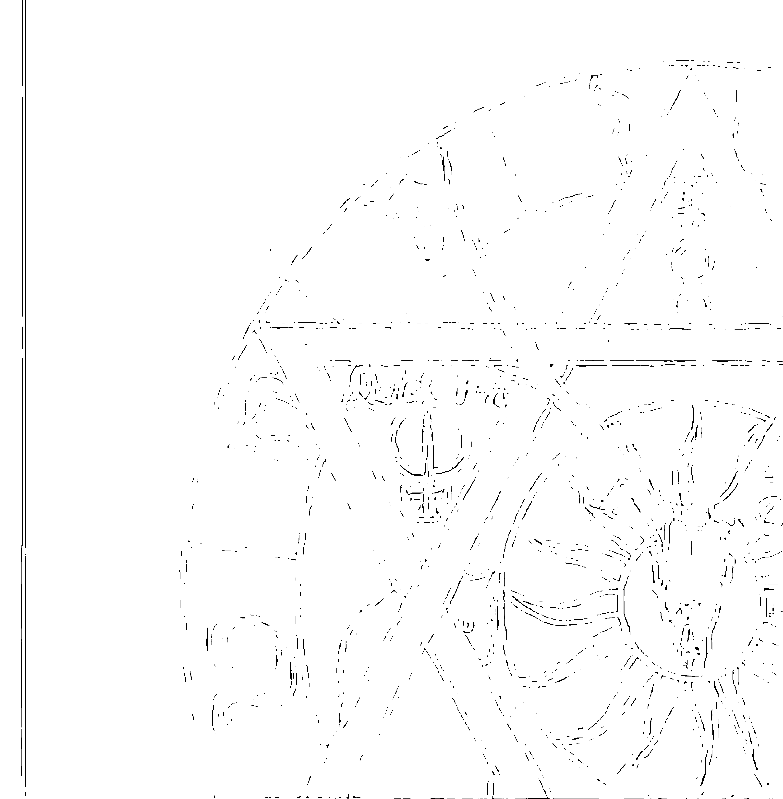

### No.001

# 古代的魔法

#### Ancient Magic

魔法几乎与人类同时诞生，古代世界各地亦发展出各式各样的魔法。许多魔法如今多已荒废，然其中亦不乏如西洋占星术般流传至今的魔法。

#### ∴ 始自远古的悠远魔法

魔法的历史几乎跟人类同样古老，考古家就曾经从旧石器时代的遗迹里，挖掘出许多昭示远古魔法信仰的文物与壁画等证据。

西洋占星术的发源地美索不达米亚地区，除占星术以外，另有许多利用活祭品内脏卜算未来的占卜术，如肝脏占卜与肠占卜等。

古埃及文化亦是同样，埃及各遗迹掘出的木乃伊裹尸布就绘有无数护符，确保死者来世平安。古埃及女神伊西斯 (Isis) 乃魔法之神，她的兄长兼丈夫奥赛利斯 (Osiris) 遭胞弟塞特 (Set) 杀害的时候，伊西斯就曾用魔法使奥赛利斯死而复生。伊西斯信仰亦传至罗马帝国，被奉为魔法之神崇拜。

古埃及文书《韦斯加草纸》(Westcar Papyrus) 记载着西元前2900年左右的传说，并提到狄德与亚巴·阿涅等魔法师的名字。据此文件记载，狄德曾斩下鹅头与母牛头并使其复活；亚巴·阿涅则曾经把蜡做的鳄鱼变成活生生的真鳄鱼。《旧约圣经》的《创世纪》亦曾记载，摩西变杖为蛇的时候，埃及法老亦曾命令皇宫魔法师做同样的事情。此记述对我们探讨古埃及魔法亦可谓颇有助益。

古代西欧有塞尔特民族的圣职者，名曰德鲁伊，能操纵精灵与施行等法术。阴阳五行说与易的发祥地古中国也有群具卜卦方术的脱业魔法师，其方术最后发展成了后来的仙术。

# 各主要古代魔法之发源地

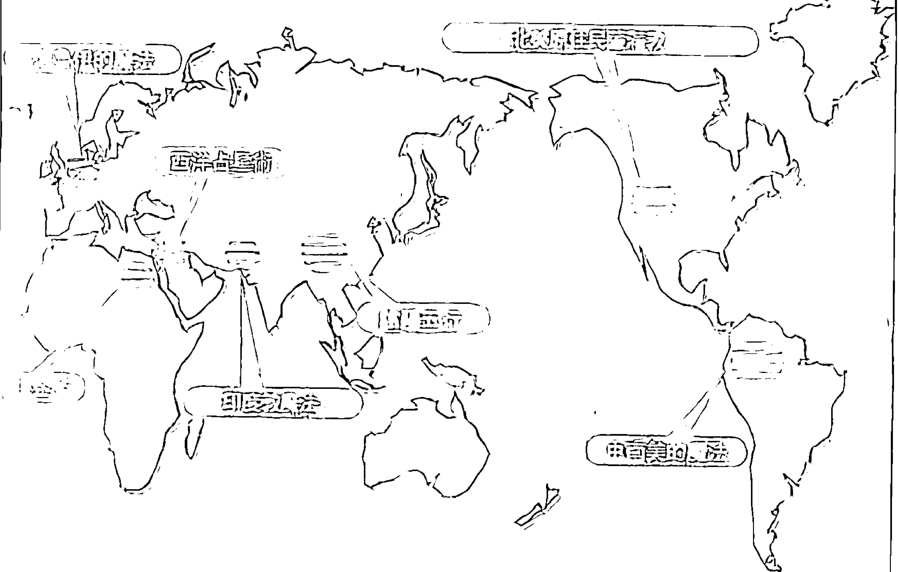

# 古代魔法与文化

- 史前时代（拉斯科洞穴的壁画）
- 约公元前3500年 巨石阵
- 西元前1世纪 罗马帝国的建立
- 约公元前2000年 爱琴海文化（克里特人时代）
- 古埃及统一 古埃及文化
- 约公元前3000年 苏美尔人建立都市国家
- 21世纪 伊斯兰教的扩张 天方夜谭的诞生 包含阿拉丁的灯
- 约公元前1600年 中国商朝成立
- 约公元前770年 东周战国时代
- 1世纪 葛洪《抱朴子》
- 诸子百家的出现（阴阳说、五行说等） 炼丹术思想之确立
- 人类迁徙至欧洲大陆
- 约公元前800年 爱琴海文明开始
- 详述魔法咒语、咒具的神秘魔法

# # 召唤魔法

# ## Invocation

所谓的召唤魔法，是指召唤各种精灵等超自然存在、借用其力量的法术。召唤魔法历史悠长，就连古代的新柏拉图主义亦传有召唤的技法。

# # 召唤魔法的今与昔

所谓召唤是种魔法的技术，先将天使、恶魔或各种精灵等拥有神通法力的超自然存在或灵体唤至眼前，再透过某种方法操纵诸灵体达成各种目的。

自然魔法是种运用自然界诸事物间隐藏的相互影响关系，所行使的魔法；相对地，召唤魔法则必须召唤出自然界背后能用超自然力量影响物质世界的灵存在，然后直接与该存在进行交涉、抑或与其缔结契约，以利用其力量。

一般而言，召唤天使或善良精灵等善良存在的魔法称白魔法，运用恶魔、恶灵等邪恶力量的则是黑魔法。又，召唤死者亡灵的召唤魔法另称为降灵术，而普罗提诺（Plotinus）创始的新柏拉图主义亦曾以御神术或降神术等名指称召唤魔法。

此类魔法起源既久，全世界各地的民间信仰皆有能使祖灵、神明、精灵等附于其身的灵媒和萨满。在西方世界里，成于西元2世纪的《加尔底亚人的神谕》（The Chaldean Oracles）便记载着进行召唤的方法。

召唤方法视时代、魔法体系及召唤对象而异，种类繁多。

中世纪欧洲一系列的《魔法书》皆记有召唤恶魔的方法，16世纪约翰·迪（1527～1608）等人就曾经透过凯利（1555～1595）召唤天使。

近代如利未（1810～1875）、克罗利（1875～1947）等魔法师据说皆曾进行过召唤魔法。

召唤对象 | 魔法系统 | 施术者
--- | --- | ---
天使 | 白魔术、天体魔术 (Enochian Magic) | 白魔法师、凯利
圣守护天使 | 亚伯拉罕林魔法 (Abramelin) | 亚伯拉罕林 (Abramelin)、亚伯拉罕 (Abraham)、启企尔明
恶魔・恶灵 | 黑魔术 | 女巫、浮士德
死者 | 招魂术 | 招魂师
亡灵 | 降灵术 | 降灵术师、卡廖斯特罗、佩布斯
祖先 | 萨满教 | 萨满
神 | 降神术、御灵术 | 萨满
动物 | 御灵术 | 苏帕拉因主灵
恶灵 | 巫毒 | 超灵、巫仙

> [召唤魔法的范例]

# 中世纪至近代的召唤实例

时代 | 召唤对象 | 召唤方法
--- | --- | ---
中世纪 | 大天使乌列（Uriel） | 将大天使召唤至类似水晶球的道具「修石」（Shew Stone）
文艺复兴 | 梅菲斯特 | 画魔法圆唱诵咒文
近代 | 泰安瑟的阿波罗尼俄斯 | 沐浴净身21日，备好镜台、祭坛与香炉，焚香祈咒
近现代 | 圣守护天使爱华斯 | 执行仪式召唤罗宾斯
现代 | 天使 | 众人围成圆状或圆弧状，燃烛唱诵咒文
（注：第三行召唤者为“Lalo Cohran”）

利用自然界元素的相互影响关系行使的魔法。许多归类为现代科学领域的知识亦属此范畴，就连近代科学之父牛顿，也无法摆脱自然魔法的世界观。

# 小宇宙与大宇宙

中世纪欧洲普遍相信人体自成一个小宇宙，是大宇宙的缩影，两者间有种相互影响的神秘对应关系。此概念亦是赫密斯思想的中心思想，而自然魔法便是利用这神秘关系的相关知识、藉以获得魔法效果的技术。

这自然界相互影响关系的概念，早在史前时代便已存在，英国人类学家詹姆斯·弗雷泽（1854～1941）主张的顺势巫术与接触巫术（感染魔法），也可视为建立于「共感」原理之上的自然魔法。

自然魔法涵盖极广，诸如古欧洲德鲁伊的魔法、各种占卜术、各种宝石与药草的使用法等皆是；自然魔法还将磁力视为眼睛看不到的神秘影响关系之理论根据，因此特别重视磁铁的作用。英国的弗卢德（Robert Fludd）对此也同样重视。

堪称近代科学之父的波义耳（Robert Boyle，1627～1691）与牛顿（1642～1727）都有自然魔法式的思想，而梅斯梅尔（Franz Anton Mesmer，1734～1815）提倡的动物磁力说，也被视为足兹证明此影响关系的证据，并且对后世魔法师造成莫大影响。

操纵支配自然界四大元素精灵的技术，也被归类为自然魔法的一种；若仅就此层意义而论，集自然魔法之大成者，当属帕拉塞尔苏斯（1493？～1541）。

由于自然魔法必须利用许多自然界的植物矿物相关知识，所以亦发展出许多现代医学与科学的先驱基础技术。因为这个缘故，基本上自然魔法多被归类为善的魔法，亦即所谓白魔法；不过若是以诅咒伤害他人等邪恶目的行使，自然魔法也可变作黑魔法。

# 自然魔法之基本理论
自然魔法会利用自然界的影响关系

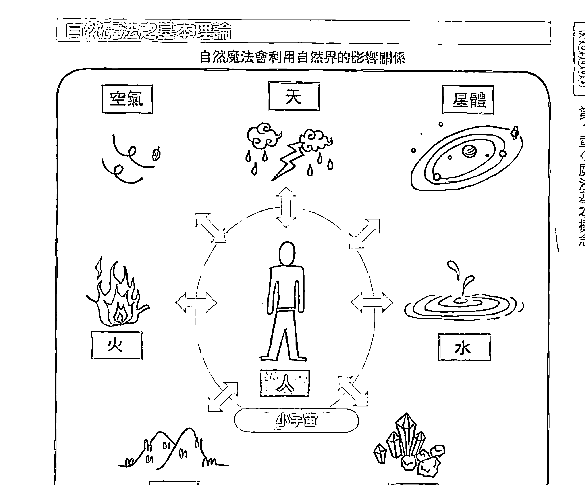

# 从自然魔法到自然科学

| 领域 | 演变 |
| --- | --- |
| 占星术 | → 天文学 |
| 炼金术 | → 化学 |
| 矿物效力之研究 | → 矿物学 |
| 植物效力之研究 | → 植物学 |

在自然魔法的世界观里，全世界所有生物与物质之间，都有着不可分割的相互影响关系存在。弗朗西斯·培根主张的实验主义与归纳法，以及相信天体运作等自然现象会影响人类命运的各种占卜行为，都是典型的自然魔法。自然魔法为了究明自然界各事物间的相互关系所作的许多努力，就是后日科学的基础。

### [No.004]

# # 白魔法与黑魔法

# ## White Magic & Black Magic

白魔法与黑魔法通常皆以魔法力量泉源之性质而分，不过原属中性的自然魔法也可能因为施术者的邪恶意图，而被归类为黑魔法。

# ### 力量泉源与施术者意图

白魔法与黑魔法是最普遍的魔法分类。

一般来说，召唤天使或善灵等「善的存在」、借用其力量以得到魔法效果的，就是白魔法；相对地，黑魔法则是利用邪恶的恶魔或恶灵之力，以得到某种超自然的效果。

中世纪欧洲的许多《魔法书》和浮士德传说等资料，都记载有召唤恶魔并与其订定契约的典型黑魔法施法内容。然而在这种分类之下，两者同样都是以召唤出某种超自然存在为前提，黑魔法与白魔法都要算是召唤魔法的一种。

另一方面，黑魔法与白魔法亦可视施术者意图区分。

按照这种区分方式，若施术者乃以实现利己欲望为目的的行使魔法，就是黑魔法；施法目的若是社会与公共利益，则该魔法就算是白魔法。这也就是为何祈求农产渔作丰收的丰饶魔法、避灾解厄的防御性魔法会被分类为白魔法的原因。

虽然利用自然界隐藏的影响关系之自然魔法，大多属于白魔法，但自然魔法一旦被拿来害人，就要算是黑魔法。

中世纪的欧洲人相信女巫会和恶魔缔结契约、借恶魔的法力行使许多邪恶的魔法，诸如降冰雹和使家畜无法生育等，为例；此例不论就魔力泉源或施术意图而论，都是非常典型的黑魔法。

此外，黑魔法还时常被唤作妖术、邪术。

# # 白魔法与黑魔法

# ## 何谓白魔法？


1.  召唤善的存在
    - 如天使、神明、精灵
2.  以社会与公共利益为目的
    - 如农渔丰收、避灾解厄

# ## 何谓黑魔法？

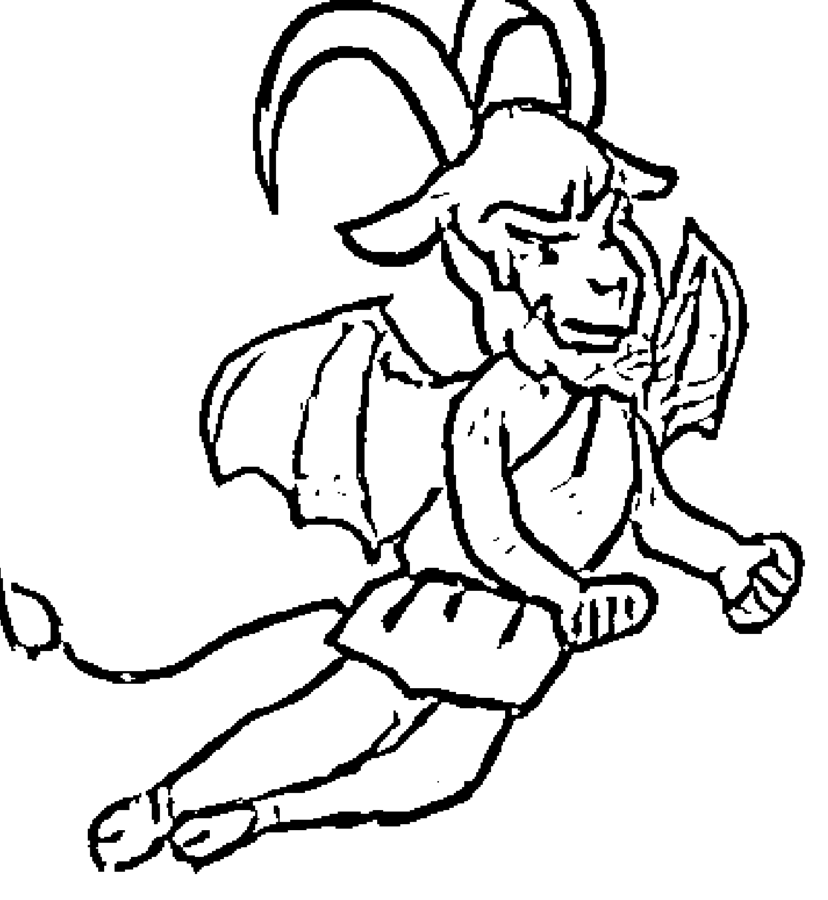

1.  召唤邪恶的存在
    - 如恶魔、恶灵
2.  以利己为目的
    - 如暗杀、蓄财

# ## 魔法分类法

- 利用与对象外形相似的物品施法术 ➡ 顺势巫术与接触巫术
- 召唤超自然力量以为己用 ➡ 召唤魔法
- 使施法过程仪式化 ➡ 仪式魔法## 順勢巫術與接觸巫術
Homeopathic Magic & Contagious Magic

英國人類學家弗雷澤的分類，原本是用來指稱未開化社會魔法的用語。此概念乃建立在共感原理之上。

### 弗雷澤與共感原理

順勢巫術與接觸巫術乃英國人類學家詹姆斯·喬治·弗雷澤代表作《金枝》提倡的分類法，後來更成為民俗學領域的主要分類方法。

由於民俗學在用語上鮮少使用「魔法」而多採「巫術」，許多民俗學書籍多寫作順勢巫術與接觸巫術。

順勢巫術又名「模倣巫術」，是種以「相似法則」為理論基礎的概念，認為外形相似的物體會彼此影響，若對其中一個物體施加作用，效果也會及於其他物體。

舉例來說，用針扎刺擬作特定人物的人偶或畫像、好讓本人蒙受災厄的行為；或是假裝用矛刺殺披獸皮扮成動物的人類、藉以祈求獵物豐碩的儀式等，都在順勢巫術的範疇內。

接觸巫術又叫作「感染巫術」，乃以「接觸或感染法則」為根據，相信接觸過的物體分開後仍能互相影響。拿短刀捅他人留下的腳印以加害其人，便堪為接觸巫術的代表例。

順勢巫術與接觸巫術有個共同的前提：施法對象其人其物跟外形相似，抑或接觸過的物體間，有某種影響關係存在；弗雷澤把這種影響關係稱為「共感」，並將順勢巫術和感染巫術（接觸巫術）合稱為交感巫術。由於順勢巫術與接觸巫術都是利用自然界隱藏的影響關係，因此也可以算是自然魔法的一種。

早在舊石器時代就已經有交感巫術的概念：據說法國南部三兄弟洞（Les Trois Freres）中的半人半鹿畫像，就是在描繪為祈求狩獵順利而扮成鹿模樣的巫師。此外，還有人認為舊石器時代的歐洲人當初是為了要得到某種魔法效果，方才創造出西班牙北部的阿爾塔米拉洞窟（Altamira）壁畫。

### 詹姆斯·乔治·弗雷澤 (James George Frazer, 1854-1941)

英國的古典學者、人類學者，出生於蘇格蘭的格拉斯哥（Glasgow）。弗雷澤是在格拉斯哥大學的就學期間，開始對古典學產生興趣，後來在劍橋擔任特別研究員，對比較宗教學亦有研究。其代表作《金枝》搜集全世界未開化民族的風俗習慣與迷信等資料，不過弗雷澤並未從事田野調查，而是他就文獻資料進行研究與著作。

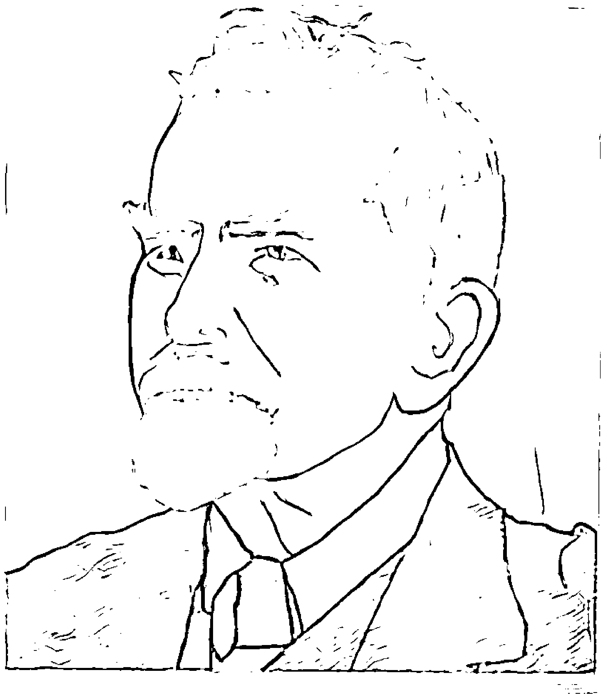

### 交感巫術的分類

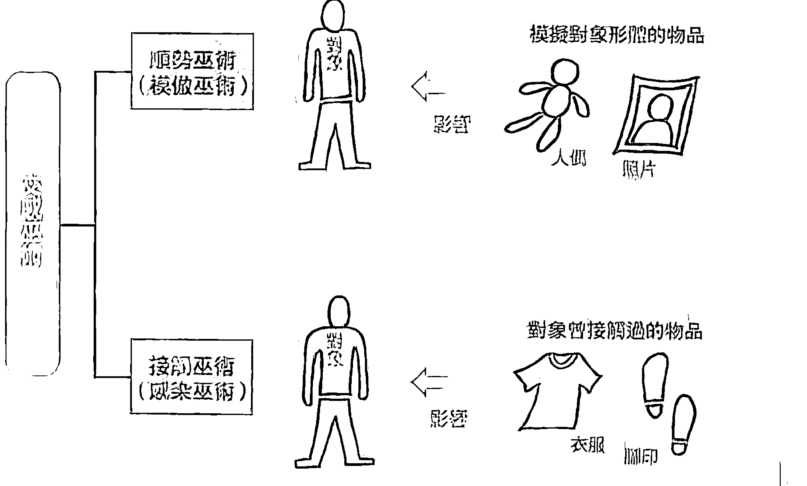

1. 原作者注 Homeopathic應是筆誤，已作更正。

## # 儀式魔法
Ritual Magic

儀式魔法是遵照特定樣式或程序施行、以期獲得一定魔法效果的技術。換言之，儀式魔法就是一種經過制式化的魔法體系，有時亦用來指稱召喚魔法。

### ☆ 魔法的制式化

施行魔法的時候，有時必須要按照固定的形式舉行儀式。
此時不論是服裝、動作或咒文用語等，皆須嚴守固定形式；只要有些許差錯，非但無法達到預期效果，有時甚至還會危及施術者的安全。

所謂的儀式魔法，就是指這種藉嚴格履行固定的儀式行動模式、以期獲得相對應魔法性效果的魔法，此語亦可譯作「典禮魔法」或「祭儀式魔法」。

在施行魔法的時候，許多關鍵性的咒文或魔法藥物製作方法通常都有相當嚴謹的規定，像這些魔法都可以算是廣義的儀式魔法。此傾向尤以召喚魔法最甚，甚至還可以用儀式魔法此詞直接指稱召喚魔法。

其實舉行魔法儀式，理應先對魔法的法則或各元素的作用有通盤理解，然後視情況製作各種道具、咒文或護符等物品，方能收效。儀式魔法則是將長年累積下來的豐富魔法知識與經驗整理成一個標準化的體系，即便施術者不知道每個步驟究竟有何意義，只要按照固定形式進行儀式，仍然能達到同樣的效果，可謂是種經過形式化的魔法。

就此意義而言，最具代表的當屬利未（1810～1875）建立的儀式魔法體系「聖界」（Sanctum Regnum）。

除大宇宙和小宇宙的對應關係以外，利未所創體系更以人類的意識和一種名為「天體之光」的特殊力量為基礎，吸收西洋神秘主義的各種概念，可謂綜括了當代西洋魔法的所有要素。

### 儀式魔法的好處

每位施術者所行儀式與咒文各異

效果不一、失敗

制式化

### 遵照固定形式進行儀式

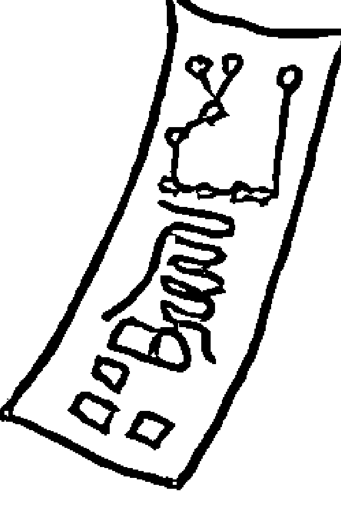

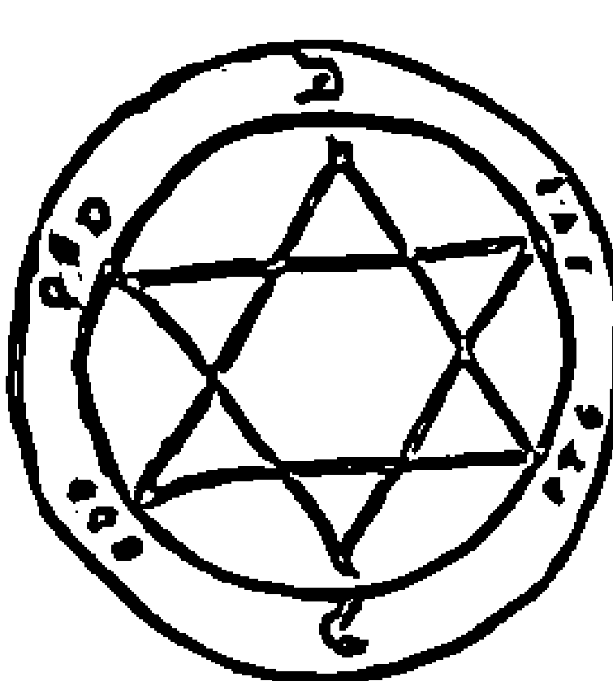

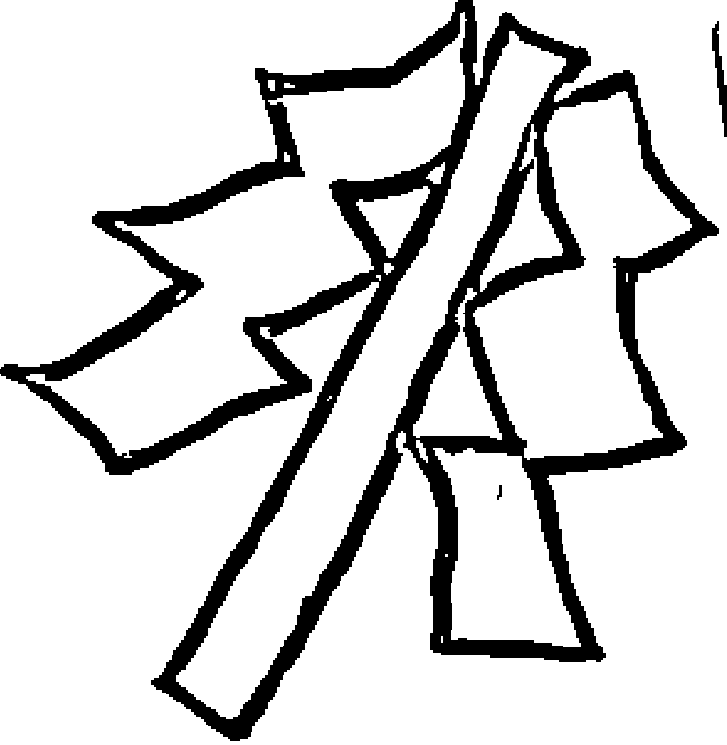

通用性

一定的效果

### 六種儀式魔法

| 類型 | 描述 |
|---|---|
| 赫密斯魔法 | 法國人伊利法斯·利未綜合各種魔法創造的魔法體系 |
| 亞伯拉梅林魔法 | 埃及的亞伯拉梅林所創，藉以與聖守護天使溝通 |
| 約翰迪魔法 | 英國人約翰·迪所創 |
| 風水 | 藉擺設各種物品以補五行諸元素之不足 |
| 修法儀式法 | 各種修法皆是執行固定的儀式，以求獲得預期的成果 |
| 召喚/使喚魔 | 大部分召喚魔法皆須遵照固定形式進行 |

## # 性魔法

### ## Sexual Magic

> > 性魔法是指透過法式的性交以獲得效果的魔法，源自印度的左道坦陀羅教。眾多魔法團體當中，亦不乏以性交為目的的亂交團體。

### ### 將性行為作魔法利用

所謂性魔法是指各種利用性行為產生的能量或采行儀式性性交等，將性行為視為魔法儀式之一環，抑或視為實現各種魔法效果的輔助性行為；所有帶有性行為元素的魔法體系，皆統稱為性魔法。性魔法裡的性行為不單指男女之間的性行為，同性性交與自慰行為也都包括在內。

世界各地自古就有許多與祈求豐收祭典息息相關的性器崇拜，古代中國亦有房中術將性交結合長生不老的概念，不過將性行為做魔法用途利用的趨勢，要到印度的坦陀羅教誕生以後才愈趨顯著。坦陀羅教原是印度教的支派，信徒奉行濕婆神及其神妃夏克提間對話形式的訓示「坦陀羅」；此教亦被稱作左道或左手道，他們將夏克提解釋成一種性能量，並將有意識地刺激性慾的行為納入儀式內。

中世紀歐洲人相信女巫會在魔宴（女巫的集會）或瓦普吉斯之夜（Walpurgis Night，5月1日五朔節前晚）等場合跟惡魔交合；17世紀法國盛行的黑彌撒，也有祭司和祭壇女執事交合等行為。

歐美流傳至今的性魔法體系，則當以德國東方聖殿騎士團的卡爾·開爾納（Carl Kellner）吸收左道坦陀羅教思想為嚆矢。

東方聖殿騎士團在德國境外亦設有分會，其英國支部「MMM」（Mysteria Mystica Maxima）創設者便是克羅利。美國則有拉維設立的惡魔崇拜團體撒旦教會等組織曾舉行黑彌撒。

### 性魔法之基礎

### 目的

- 男女交合
- 出鎮 → 原始宗教、性器崇拜
- 長生不老 → 房中術
- 解脫 → 坦陀羅教
- 召喚 → 西洋的性魔法

### 性魔法之傳播

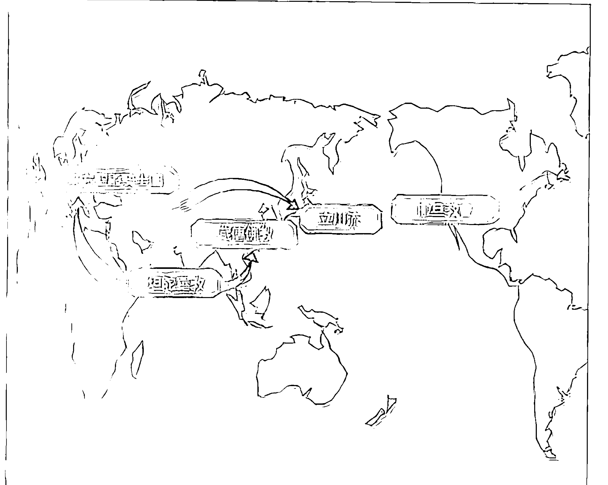

### N·008

### 惡魔崇拜
Devil Worship

向神的敵對者——惡魔的崇拜行為。猶太教、基督教的惡魔有不少都是其他民族的神祇，伊拉克更有團體公然崇拜惡魔。

### 各種惡魔崇拜

基督教雖將惡魔視為神的敵對者，但是不信神卻去崇拜惡魔的情況在西洋亦時有所見。

世界各地的宗教都有惡魔的概念；他們有時是善神的敵對者，時則是妨礙人類修行的存在，猶太教、基督教傳說則是把違抗上帝命令的天使解釋為惡魔。不過猶太教、基督教深惡痛絕的惡魔當中，也有許多原受其他宗教崇拜的神祇。

英國家俗學家瑪格麗特·穆雷（Margaret Murray，1863～1963）主張，惡魔崇拜是崇拜基督教以前的神明之原始宗教遺風，至今仍可見於歐洲各地，而中世紀的獵女巫即是此類異端宗教信徒遭人舉發所致。

穆雷還表示：崇拜惡魔的邪教（Secte）乃以13人組成的女巫團（Coven）為基本單位，而現代的巫術崇拜亦承繼了女巫團13人的組織結構。

另一方面，自古以來亦不乏有信奉惡魔、名符其實的惡魔崇拜儀式存在。

據傳居住於伊拉克一帶的亞齊德派（Yazidi）曾膜拜一種孔雀模樣的惡魔，而聖殿騎士團則是以崇拜惡魔巴弗滅¹之罪嫌遭到迫害。法軍元帥吉里·德·萊斯²亦因崇拜惡魔而遭舉發，以活祭品獻祭惡魔的黑彌撒更是盛行於17世紀的法國。及至現代，則有美國人拉維（1930～1997）設立的撒旦教會及其支派薩特寺院（The Temple of Set）等團體公然崇拜惡魔。

¹ 巴弗滅（Baphomet）：今日最為人熟知的山羊頭惡魔。名字的來源據說是由伊斯蘭教的敵人穆罕默德（Mohammed，又作Mahomet）而來。

² 吉里·德·萊斯（Gilles de Rais，1404～1440）：法國貴族、武將。他官至法軍元帥，與聖女貞德一同參加百年戰爭；後來因殺人、姦淫、盜竊等罪名遭到處刑。藍鬍子男爵的傳說便是以他為藍本。

### 原始宗教與惡魔崇拜

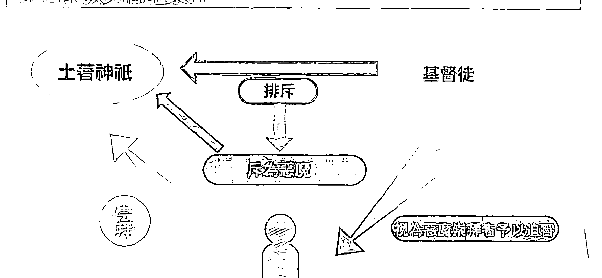

### 惡魔崇拜實例

| 實例名稱 | 崇拜對象 | 年代/場所 |
|----------|----------|-----------|
| 撒旦教派 | 撒旦 | 1966年設立於美國 |
| 激進撒旦教 | 撒旦 | 1975年脫離撒旦教會的旁支 |
| 聖殿騎士團 | 巴弗滅 | 1119~1312年（亦說其後仍得存續） |
| 中世紀女巫 | 各種惡魔 | 中世紀歐洲 |
| 亞齊德派 | 孔雀·塔伍斯 (Melek Taus) | 創始於627年 |

### 亞齊德派

> 以伊拉克為中心，居住於伊朗、土耳其等地的一派，崇拜叫做孔雀·塔伍斯 (Melek Taus) 的孔雀惡魔。他們自稱為達辛尼 (Dāsinī)，由阿迪·本·穆斯塔法 (Adi ibn Mustafa) 創於回歷15年（627年）。《黑瓦及秘密之書》乃亞齊德派的特有經典，崇拜但為獨特，諸如食用萵苣與花椰菜者必以極刑，禁止為藍色，視為避諱等。

### No.000
土著的魔法
Traditional Magic of the World

> 除西洋魔法體系以外，世界各地也各有獨特的魔法體系流傳。傳說西非巫師能行駛各式各樣的秘術，夏威夷和峇里島也都有獨特魔法傳承。

### 峇里島、夏威夷、西藏的魔法

魔法的歷史跟人類的歷史可謂是同等悠久。舊石器時代的壁畫便留有古人執行原始魔法的痕跡，而古代的埃及與美索不達米亞亦有獨特魔法體系。這些古魔法多已散佚，但古巴比倫發展的西洋占星術等思想，至今仍影響全世界甚鉅。

除此以外，世界各地還有許多獨特魔法得傳至今。

印尼著名的度假聖地峇里島，除融合當地信仰的特有印度教以外，還有種名為峇里魔法（Bali Magic）的傳統魔法。

峇里魔法可分成「普帕桑根」及「勃白南」等數種魔法。「普帕桑根」一詞原指施行魔法使用的物質；喚來一陣輕風吹入他人體內使其發瘋的「布拜」、利用魔法在食物裡下毒的「裴拉克」等法術皆屬此類。「勃白南」則是最高等級的魔法，施術者可利用變身接近敵人，使人罹患疾病、甚至殺人。

夏威夷的祭司卡胡納（Kahuna）亦傳承有獨特的魔法，他們可以安然行走於熔融的熔岩之上，還能行使各種秘術。

藏傳佛教（喇嘛教）則是以來自印度的坦陀羅教為主幹，混合當地土著宗教苯教（Bon）的薩滿信仰要素而成，魔法體系亦相當獨特；藏傳佛教又以立基於轉世思想的活佛（如達賴喇嘛）制度，以及介紹死後世界的《死者之書》尤為有名。

以藏傳佛教奉為始祖的瑪爾巴（1040～1123）¹及其師卓彌巴（1012～1097）²為例，他們不但能呼風喚雨控制天氣，更能凌空飄浮，是能行使各種秘術的魔法師。

¹ 瑪爾巴：全名「瑪爾巴·卻吉洛追」，意譯「法慧」。藏傳佛教噶舉派開創者，卓彌巴的嫡傳弟子。
² 卓彌巴：全名「卓彌巴·釋迦益西」，意譯「釋迦智」。藏傳佛教噶舉派的奠基人之一。

### 什麼是土著魔法？

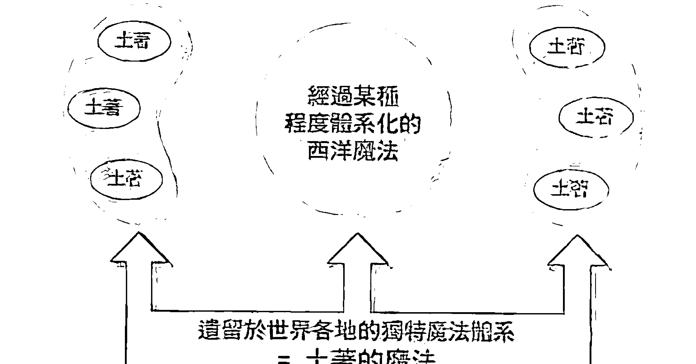

遺留於世界各地的獨特魔法體系 = 土著的魔法

### 世界各地的土著魔法

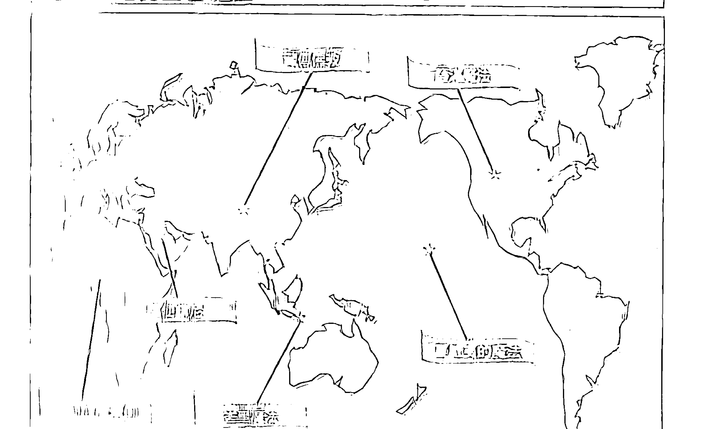

(ジン)：阿拉伯民間傳說裡的精靈。以《阿拉丁神燈》神燈裡的精靈為代表。

### NO.0510

### 薩滿信仰
Shamanism：人們以薩滿為核心之民族宗教。薩滿原本專指西伯利亞與中亞一帶的巫覡，不過世界各地其都有此類人物存在，日本恐山的伊田子（Itako）等巫覡皆可謂是薩滿的一種。

### 與神靈進行交流的民族宗教

「薩滿信仰」是指以薩滿為核心所構成之民族宗教形態，此用語是由羅馬尼亞裔的宗教學者埃利亞代（Mircea Eliade，1907～1986）命名。

所謂薩滿，就是指處於恍惚狀態（Trance）等意識異常狀態下，直接和神鬼精靈進行交流，並且負責治療疾病、傳承各種傳統文化、請神、占卜、祭祀、接觸神靈等工作，司掌部族中各種宗教性職務的人物。

關於薩滿此語字源，一說是來自梵語「sramana」或「samana」，另說則是源自於波斯語「sheman」（偶像、祠）字；此語原本專指西伯利亞與中亞一帶部族中司掌前述職務者，不過在北美原住民諸部族、印度、滿洲、朝鮮、日本、古波斯、斯基泰[1]等世界各地文化，也都能發現有相同人物存在。

薩滿可大略區分為自身靈魂脫離肉體前赴靈界、直接跟諸神靈對話或請求神示的脫魂型薩滿，以及將神靈請到自身肉体上的附身型薩滿兩種。

薩滿不是由特定家系代代世襲，還要經過一定儀式與訓練方可繼承父祖志業，否則就是從部族中選定資質特殊者擔任。

若僅就後者而論，此類人尤以先天體質異常者居多。這些資質特殊者多是從小體弱多病、性情孤僻，神經質且內向的性格尤其顯著；據說其中多數人經常會有幻覺或幻聽的煩惱，還有許多異常的夢境體驗。

此外也有人表示，北美原住民薩滿脫魂時所體驗到的諸事，其內容與遭外星人綁架之體驗頗為類似。

[1] 斯基泰（Scythui）：西元前7～8世紀由中亞遷徙至南俄、具伊朗血統的遊牧民族。

## # 靈魂的運作

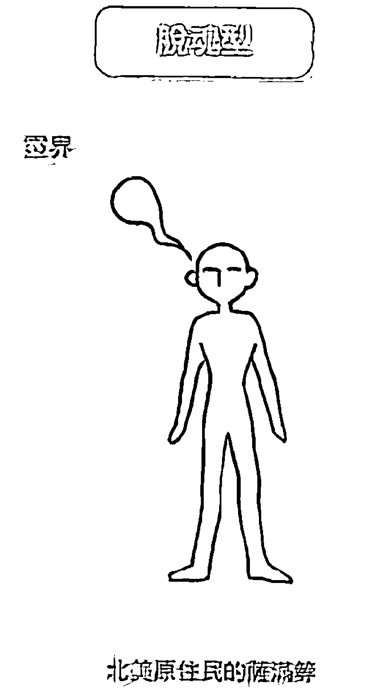

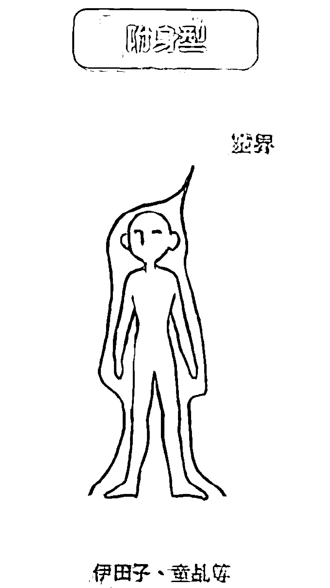

| | 地區 | 薩滿 | 傳承方法 | 類型 |
|---|---|---|---|---|
| アムリック (Amunikok) | 北極圈 | 具精靈通靈 | 只資質者修行而成 | 脫魂型 |
| インディアン | 北美 | 具精靈通靈 | 世襲或修行而成 | 脫魂型 附身型 |
| イタコ (Itako) | 日本東北 | 口寄*2、占卜 | 修行而成 | 附身型 |
| リュウ (Ryu) | 日本沖繩 | 口寄、占卜 | 修行而成 | 附身型 |
| 巫 | 中國 | 例通神示 | 修行而成 | 附身型 |

> > 注 (Kuchiyose)：所謂口寄就是巫女應他人要求，擬神霊或亡霊附於自身，傳達其意志的召喚術。

> **蘇非主義**
Sufism: 伊斯蘭教神秘主義乃透過各種修行，追求達致與神合而為一的境界。另一方面，許多蘇非亦留下了無數行使奇蹟的傳說。

## # 追求神明的行者

蘇非主義乃伊斯蘭教神秘主義的英語音譯。據傳此語源自阿拉伯語的「羊毛」（suf）一詞；伊斯蘭教神秘主義修行者大多都穿著質地粗糙的羊毛衣服，而有此稱謂。是以阿拉伯語稱伊斯蘭教神秘主義修行者為「蘇非」（Sufi），轉而才有英語「蘇非主義」（Sufism）的說法，而蘇非主義的阿拉伯語則是「Tasawwuf」。此外，阿拉伯語的「貧者」（Fakir）和源自波斯語的「托缽僧」（Dervish）等用語，其語意及用法也跟「蘇非」相去無幾。

伊斯蘭教的神秘主義跟其他宗教的神秘主義相同，都是透過各式各樣的修行，試圖接近世界的創造神，進而與神合而為一，藉以達致真理。

蘇非主義的諸用語當中，與神合而為一的境界稱作「Fanaa」；傳說達此境界的蘇非能隔空移物、變身成他人模樣、行走水面有如足履平地，還能行使各式各樣的奇蹟。各地皆盛讚此類人物為聖者，許多蘇非教團便因此自然誕生。

每個教團達到「Fanaa」境界的修行方法各有不同，但基本上修行者必須過著貧窮的禁慾生活、朗誦伊斯蘭經典《可蘭經》進行冥想，及實踐「齊克爾」（Dhikr）——反覆唱誦神名或可蘭經特定章句——都是多數教團間的共通修行法。部分教團甚至會搭配音樂與舞蹈；勢力及於土耳其、中亞一帶的毛拉維教團（Mevlevi）便以展開雙臂不停旋轉的迴旋舞蹈聞名。

## # 蘇非主義之由來

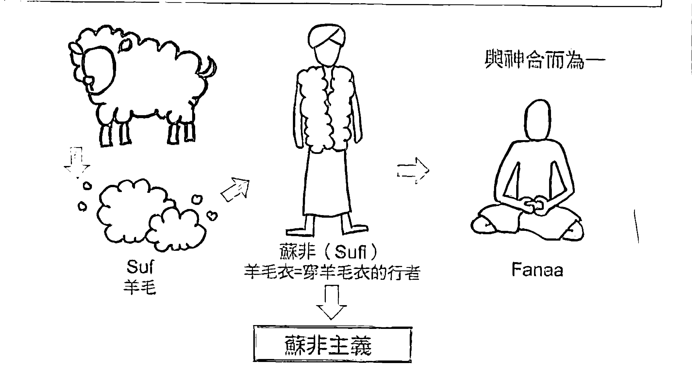

## # 亞洲的蘇非教團

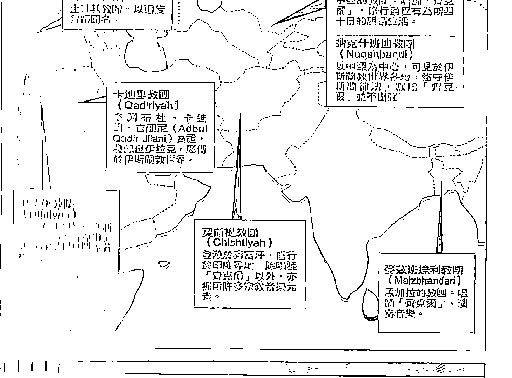

毛拉維教團 (Mevlevi) 土耳其教團，以旋轉舞聞名。

卡迪里教團 (Qadiriyyah) 創始人阿卜杜勒·卡迪爾·吉拉尼 (Abdul Qadir Jilani) 首創，發源自伊拉克，盛行於伊斯蘭教世界。

切什提教團 (Chishtiyyah) 盛行於阿富汗，盛行於印度等地，除吟誦「卡瓦力」以外，亦採用許多宗教音樂元素。

亞薩維教團 (Yasawi) 中亞的教團，唱誦「薩滿」，修行包括四十日的隱居生活。

納克什班迪教團 (Naqshbandii) 以中亞為中心，可見於伊斯蘭教世界各地，恪守伊斯蘭律法，禁止「哈克」，並不出仕。

曼蘇爾班迪教團 (Mazbhandari) 孟加拉的教團，唱誦「卡瓦力」，深受喜愛。

### 坦陀羅教

此詞原指印度教派濕婆與夏克提之間對話形式之教義，後逐漸演變成指稱性魔法門派的用語。坦陀羅教對東方聖殿騎士團以後的西洋魔法和密教，皆多有影響。

### 一、性魔法之源流

坦陀羅教原指特別重視「坦陀羅」（Tantra）的印度教支派，不過後來卻多用於指稱大力提倡活用性能量、實行性魔法之左道宗派。

「坦陀羅」原本是印度教主神濕婆（Siva）及其神妃夏克提（Sakti）之間對話形式之教義；關於其語源，一說原是織布機上的縱向線的意思，一說是由「推廣」（tan）與「救助」（tra）兩字結合而成，另有一說指此字乃由「真實」（tattva）與「真言」（mantra）兩字結合而成。印度教曾於7世紀至17世紀之間，編纂出許多種類的坦陀羅對話形式經典。

另一方面，由於瑜伽將夏克提視同為拙火（Kundalini，瑜伽的生命能量），並認為坦陀羅旨在教示如何使拙火覺醒之法門，最終才蘊生出有意識地刺激性慾藉以達目的的性魔法宗派。

而這個意涵之下的坦陀羅教，便是要透過飲酒吃肉、男女性交，使拙火神力得到覺醒。此思想亦對密教與藏傳佛教多有影響，日本則有真言立川流堪為左道坦陀羅教之代表。

正式將左道坦陀羅教性魔法引進西洋魔法世界的魔法結社，當屬德國人卡尓·開爾納（Carl Kellner）創設的東方聖殿騎士團。開爾納自稱曾經在行經印度孟加拉省（Bengal）途中，接受一位阿拉伯人及兩位印度人施以坦陀羅系瑜伽的通過儀式；另外東方聖殿騎士團倫敦分部的創建者，正是以性魔法而聞名的克羅利（1875~1947）。後來性魔法更透過卡爾·約翰尼斯·革未（Karl Johannes Germer，1885~1962）傳播至歐洲與美國的魔法結社之間。

> 通過儀式 (Initiation) : 亦即通過儀式 (rites de passage)，乃比利時民俗學者范吉納（Arnold van Gennep）所創用語，意指由某狀態進入另一狀態所行儀式。尤指人一生中在遭遇誕生、成年、結婚、死亡等變化時所行儀式共通。

### 密教與密教相關的世界各地

藏傳佛教
佛教約於7世紀傳至西藏，並與當地土著苯教（Bon）結合，發展成獨特的藏傳佛教。而藏傳佛教亦受坦陀羅教影響頗深。藏傳佛教共有寧瑪（Nyingma）、噶舉（Kagyu）、薩迦（Sakya）、格魯（Gelug）四大派，乃以輪迴轉世思想為基礎，並以活佛制度等極獨特的教義。達賴喇嘛是格魯派的領導者。此外，西藏談論死亡與再生的著名經典《死者之書》則是非主流的密教思想。

### NO013
### 巫毒教

Voodoo，流行於海地的民間信仰，以活死人殭屍聞名，巫毒教乃以祭祀名為羅亞的各個神靈之儀式為信仰核心，對海地社會有莫大影響力。

### 來自非洲的民間信仰

以活死人殭屍（Zombie）聞名的巫毒教，是廣受加勒比海島國海地（Haiti）民眾信仰的民間信仰。在非洲黑奴後代佔多數的海地，巫毒教形成過程跟海地歷史及獨立都非常密切，而巫毒教至今仍對海地社會有相當重大的影響力。

部分學者認為，巫毒教是由非洲奴隸原本信仰的傳統宗教與羅馬天主教結合而成，也確實擁有許多類似天主教的儀式和類似基督教的聖人概念，不過美國的維德·戴維斯博士（Wade Davis）卻主張巫毒教幾乎未受到羅馬天主教任何影響。

巫毒教和基督教皆認同唯一神的存在，而巫毒教相信唯一神會化作各式名為「羅亞」（Loa）的神靈與人接觸；因此，巫毒教的儀式遂以如何與羅亞接觸、正確地祭祀羅亞為首務。

主持巫毒教儀式的男祭司叫作恩貢（Hougan），女祭司叫做曼柏（Mambo）；召喚羅亞須以歌舞為中心進行儀式，等到儀式狂熱的氣氛達至頂點，羅亞就會附身在祭司或信徒身上，並示下神諭或解決難題的對策。

除前述二者以外，巫毒教還有操縱邪惡力量的魔法師波哥（Bokor）。

波哥能運用各式各樣的咒文與粉末、操縱超自然存在，還能與惡魔締結契約、變身成其他動物，甚至還可以派遣死者亡靈攻擊敵人。把活人變成殭屍的也正是這些波哥，倘若有人不幸被心懷惡意的波哥或其他邪惡存在給盯上，則該者必須請求其他波哥保護自己，才能保住性命。

### 巫毒教的祭司
### Houngan（巫毒教祭司・Houngan）

Houngan（男）或Mambo（女）是巫毒儀式的主持者，負責與神靈溝通，提供幫助、療愈、祭祀，影響信徒的日常生活。他們是社區的精神領袖。

Boko（即所謂邪術師）會受人委託加害他人或製作詛咒，許多波哥亦兼具恩貢司祭身份。

Houngan（祭司）與Boko（巫師）之間通過「助言」、「療愈」、「祭祀」與「詛咒」、「煙霧」、「製作毒藥」等活動產生互動。

亦不乏有巫法師兼具恩貢司祭與波哥雙重身分。

### Hounfo（核心成員）

Hounfo是巫毒教的核心成員，通過一系列入門儀式加入。新加入者成為Hounsi Bosal（見習者），進階後則成為Hounsi（正式成員）。

### Hounsi Bosal（見習者・Hounsi Bosal）

Hounsi Bosal以見習者身份參與巫毒儀式。新加入者便是恩希波隆，進階後則成為Hounsi。

Hounfo（核心成員）通過入門儀式成為Hounsi Bosal（見習者），再進階為Hounsi（正式成員）。

（參照P.30詳注）

### 德魯伊
Druid
古代民族的僧侶階級，能飛空飛行、行使移動巨石等各種秘法。德魯伊之固有形態，亦反映於亞瑟王傳說中的魔法師梅林身上。

### 塞爾特的僧侶

古代歐洲的西部住著一支叫作高盧人（Gaul）或稱塞爾特（Celt）人的民族。

如今我們只能透過儒略·凱撒（Julius Caesar，B.C.100～B.C.44）所著《高盧戰記》等羅馬的文字資料來推知此民族之實況，而德魯伊此語便是指塞爾特人的宗教階級或僧侶階級；更有部分學者以此名進而稱塞爾特民族的宗教為德魯伊教。

至於德魯伊此語語源，一說「daru」是「橡樹」、「vid」是「知識」的意思，另說「daru」是「多」、「vid」是「知曉」的意思。

姑且不論前述二說何者為真，塞爾特人的確將橡樹奉為聖樹崇拜，而德魯伊也確實會在橡樹林裡舉行宗教儀式。此外，據傳德魯伊還會用橡木杖施行各種魔法，或是操縱妖精精靈，或是騰空飛行。

傳說英國索爾斯伯里平原（Salisbury Plain）的巨石陣（Stonehenge）等巨石遺跡，便是德魯伊用魔法遠從愛爾蘭搬運巨石建成；由此可見德魯伊擁有高度的天文知識，而遺留於英法兩國境內的眾多巨石遺跡亦在在證實其豐富天文知識。

前述對德魯伊的諸多記憶，亦反映於亞瑟王傳奇裡的梅林等多位魔法師角色身上。

時至現代，仍有教團以德魯伊自稱，並且每年都會在夏至當日於巨石陣舉行儀式，不過此團體其實是18世紀以後再度復興的結社。此外，伽納（1884～1964）創設的巫術崇拜亦曾主張該團體已成功地使德魯伊的自然魔法得以復活。

> 1 《高盧戰記》（Bellum Gallicum）：儒略·凱撒所著，記錄高盧戰爭的作品，是記錄文學中公認最優秀之作，內容相當有趣。直至最近2000年仍有再版問世，可謂是歷史最悠久的暢銷個人著作。其文章更是後世學習拉丁語的範本之一，可謂是千古名文。《高盧戰記》與塔西佗（Cornelius Tacitus）的《日耳曼尼亞誌》（Germania），並列為研究古代民族的經典史料。

### 德鲁伊图表

- 1. 亚里士多德
- 2. 传说中的巨石阵
- 3. 罗马的罗马人
- 4. 德鲁伊特人的遗迹
- 5. 传说中的
- 6. 柏拉图斯（Timaeus）对德鲁伊的记载
- 7. 塔西佗（Cornelius Tacitus）等
- 8. 其他方面的论述
- 9. 圣帕特里克（St. Patrick）、圣布里吉特（St. Bridget）之生平等都有附于德鲁伊的
- 10. 有某些德鲁伊与吟游诗人之差异
- 11. 德鲁伊对英国殖民后，陆陆续有数位教团
- 12. 其他对德鲁伊的研究

斯特拉波（Strabo）：希腊地理学家和历史学家，所著《地理学》是奥古斯都时期涉及各民族、国家的钜著。著作引述大量文献，描绘了希腊各时期的地理和历史情况。

### 神話·傳說中的魔法
Magic in Myths & Folklore

古埃及有魔法女神伊西斯神話，古希臘神話則有瑟西、美狄亞等女魔法師，北歐神話亦仍許多魔法師傳說。

### 魔法師的傳說

世界各地的神話與傳說裡也有許多魔法跟魔法師的故事。
奧賽利斯之妻伊西斯（Isis）在古埃及神話中扮演非常重要的角色；根據神話記載，她曾經讓遭胞弟塞特殺害的奧賽利斯死而復活，還把被分屍的屍體恢復原狀，是以古埃及皆奉其為偉大的女魔法師信仰，就連羅馬帝國亦有崇拜。
至於希臘神話，除魔法之神赫卡蒂（Hecate）以外，還有瑟西（Circe）與美狄亞（Medea）等有名的女魔法師。
荷馬的敘事詩《奧德賽》亦曾提及瑟西；她住在地中海的亞伊亞厄島，擅長用魔法把人類變成動物。
美狄亞是瑟西的姪女，她曾經出手幫助由伊阿宋（Jason）率領的阿耳戈號船員，亦即所謂阿耳戈諸英雄（Argonauts）。美狄亞乃科爾客斯（Colchis）國王埃厄忒斯（Aeetes）之女，卻因愛情女神阿芙柔黛蒂的神力而愛上了伊阿宋，終於背叛父親埃厄忒斯，用魔法幫助伊阿宋一行人。
北歐神話則有創造出魯納文字（Rune）、身為眾神之長的魔法之神奧丁（Odin），還有巨人國王烏特加爾洛基（Utgard-Loki）用魔法將戰神索爾（Thor）玩弄於股掌的傳說。
根據北歐神話記載，索爾曾經跟洛基帶著侏儒勇士奧魯凡迪爾（Auvandil）之子希亞費（Thialfi）進入巨人國烏特加爾（Utgard）境內；沒想到變成巨人的烏特加爾洛基半路殺出，讓索爾等人傷透了腦筋，同時烏特加爾也被搞得烏煙瘴氣。
另外，《天方夜譚》裡也有許多「人稱鎮尼」的魔神和魔法師，能把人變成各種動物，或是變身成各種模樣與人鬥法。

註：鎮尼，請參照P25詳注。

### 传说中能用魔法的神等

奥丁
北欧神话主神，能用魔法变身成各种动物与各种形态。发明符文文字。

精灵
阿拉伯世界的超自然存在，拥有各种超人的能力

### No.001 第1章◇魔法基本概念

...法协助...从地狱回来，是...的魔法

...之女，运用...的魔法

图特（Thoth）
图特（Horus）智慧神图特所写，中毒垂危时，图特的使者传授咒文予伊西斯搭救之。文字的发明者。

伊西斯
奥赛利斯之妻，曾运用魔法使被杀害的奥赛利斯复活，亦受罗马民族信仰。

### NO.017 喀巴拉

Gnosticism 基督教初期之異端諾斯替教有許多分派，基本上皆以靈肉二元論為立論基礎，認為《舊約聖經》裡創造現世的神實為惡神。

### 術士西門之末裔

「諾斯替」（Gnosis）是希臘語「知識」、「認識」的意思；諾斯替教乃指西元1世紀至4世紀之間，勢力遍及羅馬、敘利亞、巴勒斯坦、小亞細亞之神秘主義哲學・宗教流派。

諾斯替教通常被分類為初期基督教的支派，其開祖傳為《新約聖經》〈使徒行傳〉曾提及的魔法師術士西門，然而基督教卻斥其為異端。是以諾斯替教曾經在4世紀的西方世界一度瀕臨滅絕，不過現在伊拉克的曼遜派（Mandean，即薩比教徒）等教派亦是諾斯替教的一支。

雖有諾斯替教之謂，但諾斯替教底下尚有燒炭黨（Carbonaro）、卡波克拉蒂斯派（Carpocratian）、巴西里得派（Basilides）、瓦倫廷主義（Valentianism）、阿爾比派（Albigense）、清潔派（Cathari）等諸多分派，且諸派教義不一。除前述諸宗派外，諾斯替教還有將基督教視為猶太教支派的諾瓦替安派（Novatianists）、崇拜伊甸園誘惑夏娃之蛇的蛇派教徒（Ophite）、鼓勵性交的芭碧蘿派（Barbelo）等；以上基本上皆是以靈肉二元論為立論基礎，主張《舊約聖經》中創造物質世界的造物主（Demiurgos）乃是惡神，並強調人應與真正的善神合而為一，才能解放遭肉體牢獄囚錮的靈魂。

根據學界研究，諾斯替在形成過程中曾經受到俄爾甫斯教（Orphism）等古代秘密宗教、猶太教艾賽尼派（Essenoi），甚至美索不達米亞古宗教不少影響；1945年埃及發現收錄諾斯替教聖經的《納傑哈馬迪經卷》（Nag Hammadi Library），從而得知諾斯替教擁有《新約聖經》未曾收錄的獨特聖經內容。

> > 薩比教徒（Sabaeans）：《可蘭經》把薩比教徒與猶太教徒、基督徒並列為一種教徒，他們信阿拉、信末日，並作善舉。亦可指作沙便人、阿拉伯人。

### 摩尼教之系谱

摩尼教 (Manichaeism)：旧译明教、明尊教、末尼教、牟尼教。

### 摩尼教的基本概念

### 纳戈·哈马迪经卷

1945年12月埃及卢克索 (Luxor) 南方95公里，纳戈·哈马迪村近郊发现了科普特语 (Coptic language) 草纸文书。此经卷至少收缀了52份手抄本的草纸文献，其中11份手抄本的保存状态相当良好。据推测此经卷是4世纪时，根据公元2世纪的希腊语原作而成：其中亦收缀有柏拉图的《理想国》(Republic) 部分章节等其他文献，但多数在阐述诺斯替教的教义。纳戈·哈马迪经卷亦完整收缀有原本内容残缺不全的「多马斯福音」(Gospel of Thomas)、「彼得启示录」(Gnostic Apocalypse of Peter) 等文献，描绘有别于正典四福音书的耶稣基督形像。

### NO.017 喀巴拉

猶太教神秘思想。源自巴勒斯坦的靈輪神秘主義，後逐漸發展成以神秘思想解釋猶太教律法書的思維式喀巴拉，有數值換算法、文字置換法、省略法等各種密法技巧。

### 從靈輪神秘主義到思維式喀巴拉

「喀巴拉」在希伯來語原是「傳承」的意思，多用於指稱猶太教神秘思想。

喀巴拉之起源最早可以追溯至西元1世紀巴勒斯坦的靈輪神秘主義（Merkabah Mysticism），指冥思觀想《舊約聖經》〈以西結書〉第一章所述神的戰車（靈輪，Merkabah），藉以觀視神容貌的修行法。然而時至後世，意欲從理論面究明創世秘密的「思維式喀巴拉」崛起成為主流，並以西班牙為思想中心地發展。不過猶太人在1492年被逐出西班牙以後，中心地遂轉移至巴勒斯坦的采法特（Zefat）。

思維式喀巴拉是種解釋律法書（Torah，即《舊約聖經》的摩西五書）其中隱晦意涵，以求達致真理之奧義，其思想堪以10個屬性（Sephirah）組成的「生命之樹」為象徵。

喀巴拉有各種解釋律法書隱藏意涵的技法；「數值換算法」是將字母置換成數字、計算特定單字之總數值以考察各字詞間的關係，「省略法」（Notariqon）是將某單字視為複數單字開頭字母的組合，「文字置換法」（Temurah）則是種變位法的技術，以上皆是喀巴拉解碼術之代表技術。

雖然喀巴拉的密碼術本是猶太教在解釋聖經時產生的技術，但同樣也適用於將律法書收入《舊約聖經》的基督教，也才有義大利的皮科·德拉·米蘭多拉（Pico della Mirandola）注意到喀巴拉，首開將其技術應用於基督教之創舉。此後更有眾多魔法師研究，如今喀巴拉已成為西洋魔法基本技法之一。

### 犹太神秘思想
### 犹太神秘主义

### 思维式喀巴拉

通过各种研究手段，如数值换算法、文字置换法、省略法，来研究「旧约圣经」（创世记、出埃及记、利未记、民数记、申命记），目的在于究明隐晦的真理。

- 旧约圣经
  - 创世记
  - 出埃及记
  - 利未记
  - 民数记
  - 申命记

### 何谓省略法？

省略法乃喀巴拉诸技法之一，即把某单词视为其他复数字母之组合的手法。例如，英语的bat有蝙蝠和棒球球棒的意思，同时也是Bachelor of Art in Teaching（教育学士）的缩写。日常生活中像USA、am、pm等都是极常见的缩略语单词群的用法。

### 何谓文字置换法？

文字置换法是种改变单词字母排列，使其变成其他单词的技法，跟解剖诺斯特拉达姆斯预言常用的变位法相同。举例来说，弗莱库·尤涅斯科 (Vlaicu Ionescu) 便曾改变预言书第4章71节的「ACONILE」的字母排列组合变成「LE HLANOI (河内)」，解释为越战之预言。

...上航空公司Japan Airlines的略称。

### 數值換算法

> Gematria 猶太教固有技術之一，將字母置換成數字以究明律法書隱藏意涵之技法。除此之外，亦可藉此法將人名置換成數值、卜算命運。

將文字置換成數字
數值換算法原是猶太教神秘思想喀巴拉的技法之一，是將希伯來字母各自置換成特定數字、藉以解讀律法書（Torah，即《舊約聖經》的摩西五書）中隱藏的意涵。

數值換算法是種將律法書的章句換算成一個算式，經過加減乘除導出另一個算式後，再將其置換成另一段文字，藉以考察聖經中隱晦意涵的技法。

另一方面，運用此法將特定人物姓名置換成數字，或是加總出生年月日各項數字，藉以判斷其人命運的占卜法也叫作數值換算法。在此定義下亦可譯作數字秘術或數字占卜。

利用數值換算法卜算他人命運時，通常都是將字母置換成的數字或出生年月日數字加總起來，若所得數值超過二位數，則須重複將各位數的數字相加，直到最終求得介於1～9的個位數數字，然後對照1～9各數字的意涵進行判斷。不過有時除1～9以外，也會另外追加使用11與13等特殊數字。

由於數值換算法原是將希伯來文字換算成數字的技術，因此無法直接套用於羅馬字母。至於現在的羅馬字母換算法，則有將羅馬字母依序搭配1～9數字的作法，或是選擇發音類似的希伯來字母搭配相同數字的兩種作法。

法國的卡廖斯特羅伯爵（1743～1795）是數值換算法的高手，他曾利用此法預言路易十六世（Louis XVI）及其王妃瑪麗·安托瓦內特（Marie Antoinette）之命運，並且一一言中。

### 字母數值對照表

| 字母 | 名稱 | 數值 | 象徵 | 字母 | 名稱 | 數值 | 象徵 |
|------|------|------|------|------|------|------|------|
| א    | Alef | 1    | 空氣 | ל    | Lamed | 30   | 性交 |
| ב    | Bet  | 2    | 生命 | מ    | Mem   | 40   | 水   |
| ג    | Geemel | 3  | 和平 | נ    | Noon  | 50   | 嗅覺 |
| ד    | Dalet | 4   | 智慧 | ס    | Samech | 60  | 睡眠 |
| ה    | He   | 5    | 語言 | ע    | Ayeen | 70   | 憤怒 |
| ו    | Vav  | 6    | 思考 | פ    | Pe    | 80   | 優雅 |
| ז    | Zayeen | 7  | 運動 | צ    | Tsadee | 90  | 味覺 |
| ח    | Chet | 8    | 視覺 | ק    | Kof   | 100  | 笑   |
| ט    | Tet  | 9    | 聽力 | ר    | Resh  | 200  | 種子 |
| י    | Jod  | 10   | 動作 | ש    | Sheen | 300  | 火   |
| כ    | Kaf  | 20   | 財富 | ת    | Tav   | 400  | 王權 |

### 字母與數值之代表性與意義

| A | B | C | D | E | F | G | H | I | J | K | L | M |
|---|---|---|---|---|---|---|---|---|---|---|---|---|
| 1 | 2 | 3 | 4 | 5 | 8 | 3 | 5 | 1 | 1 | 2 | 3 | 4 |
| 1 | 2 | 3 | 4 | 5 | 6 | 7 | 8 | 9 | 1 | 2 | 3 | 4 |

| N | O | P | Q | R | S | T | U | V | W | X | Y | Z |
|---|---|---|---|---|---|---|---|---|---|---|---|---|
| 10 | 70 | 80 | 100 | 200 | 60 | 9 | 6 | 6 | 6 | 6 | 7 | 7 |
| 5 | 6 | 7 | 8 | 9 | 1 | 2 | 3 | 4 | 5 | 6 | 7 | 8 |

### 新柏拉圖主義

Neoplatonism

> 古希臘哲學流派，試圖以「流溢」概念說明世界之根源性存在「太一」，以及其下方的世界諸存在。其思想體系亦涵蓋召喚技法。

#### ∴ 古希臘最後的哲學潮流

新柏拉圖主義有古希臘哲學的最後潮流之稱，乃立基並孳生自3世紀的普羅提諾（Plotinus，約205～270）哲學。

普羅提諾生於埃及的利可波利斯（Lycopolis，現在的阿西烏特Assiut）。他受泰安娜的阿波羅尼俄斯影響後，前往亞歷山卓（Alexandria）師事亞摩紐斯（Ammonios Sakkas，約3世紀）；四十歲以後，又在羅馬興辦學校教授哲學。

普羅提諾提出世界之根源性存在「太一」（to pan）假說；主張「太一」下方的存在皆是由其流溢生成，而人類的靈魂本來就保有「太一」的特性，是以生而為人應當以回歸根源為要務。普羅提諾認為，欲回歸於「太一」與其同化則必須行善禁慾，據說他便曾經四度達到與其合而為一的境界。

其實普羅提諾本身對魔法和諾斯替教乃採批判的態度，不過後來師事普羅提諾弟子波菲利（Porphyrius，232/3～305？）的揚布利科斯（Iamblichus，250～約330）卻吸收召喚靈體（Daimon）等諸神靈的召喚術，致使新柏拉圖主義以召喚術為中心的秘法色彩愈趨強烈，甚至還有擅長召喚術的馬克西穆斯（Maximus of Ephesus）、普羅克洛斯（Proclus）以及鍊金術師斯蒂芬紐（Stephanus）等人物輩出。

新柏拉圖主義之下又有數支分派，分別以其活動區域命名，如敘利亞學派、羅馬學派、雅典學派等。羅馬皇帝尤里安（Flavius Claudius Julianus，約331～363）曾於361年改宗新柏拉圖主義，但新柏拉圖主義也在尤里安過世後隨即開始衰退，於6世紀終於消滅。然而，新柏拉圖主義思想不但影響了奧古斯丁（Aurelius Augustinus，354～430）等初期基督教神學者，就連文藝復興時期的神學者馬西里奧・菲奇諾（Marsilio Ficino，1433～1499）亦深受其影響。

### 新柏拉图主义之系谱

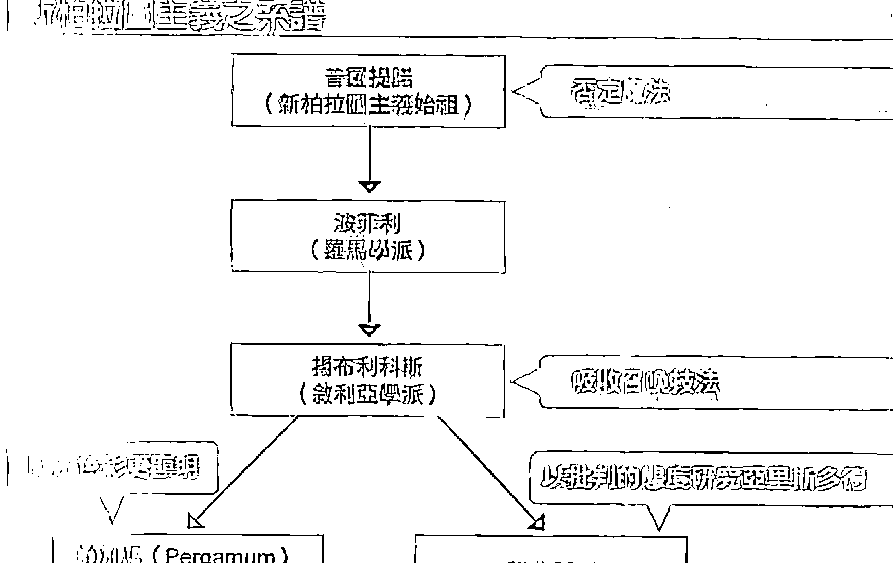

### 古代晚期的皇帝

Flavius Claudius Julianus (332-363)

罗马帝国皇帝 (361-363)，是将基督教定为国教的君士坦丁大帝 (Constantinus I Magnus) 的侄孙。从小接受基督教教育的他后来却背弃基督教，并且试图复兴罗马诸神的宗教。因此被基督教徒视为背教者。死于与波斯的战役之中。

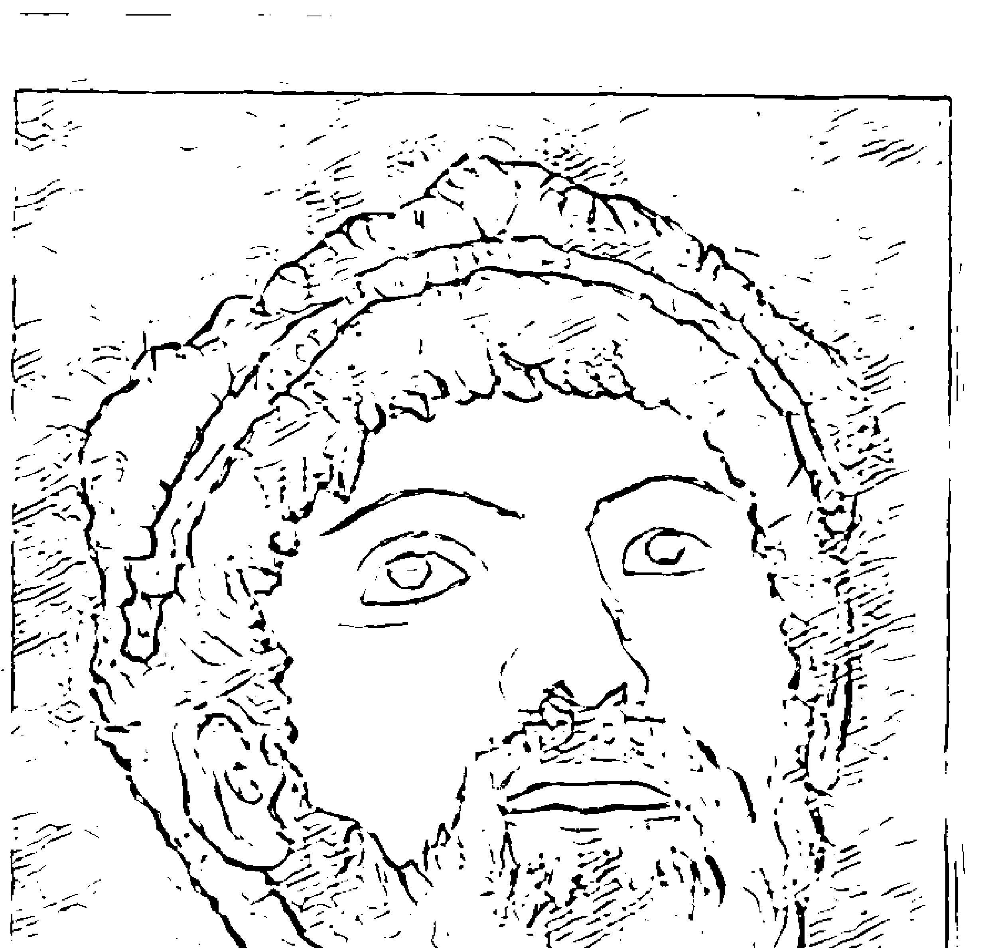

#### 赫密斯思想

立論於赫密斯・特里斯密吉斯托斯思想之神秘主義思想，其內容記載於一系列的赫密斯文書之中，主張小宇宙與大宇宙之間的相互影響關係。

#### ◇ 從赫密斯・特里斯密吉斯托斯到菲奇諾

所謂赫密斯思想，乃指歸於傳說人物赫密斯・特里斯密吉斯托斯的一系列神秘主義思想。傳說赫密斯思想先是由他傳承至俄爾甫斯（Orpheus），再由阿格菲莫斯（Aglaphemos）傳承至畢達哥拉斯（Pythagoras，BC582？～BC500？）。

赫密斯思想基本上蹈襲諾斯替教的世界觀，是種認同大宇宙（Macro Cosmos）和人體小宇宙（Micro Cosmos）之間有相互影響關係存在的世界觀。

赫密斯思想基本上記載於一系列統稱為「赫密斯文書」的文獻之中，其中最具代表性的便是《赫密斯選集》與《阿斯克拉庇俄斯》（Asclepius）等作品。此外，1945年埃及發現的《納傑哈馬迪經卷》（Nag Hammadi Library）其中也有部分內容屬於赫密斯文書之範疇。

赫密斯文書涵蓋鍊金術與西洋占星術等許多神秘學（Occultism）知識，這些知識亦稱赫密斯學。

傳說從前埃及亞歷山卓（Alexandria）圖書館藏有傳為赫密斯・特里斯密吉斯托斯所著共42卷的赫密斯文書，卻不幸在圖書館遭祝融肆虐時散佚失傳。

1455年以後《赫密斯選集》等一系列赫密斯文書陸續出現在歐洲，佛羅倫斯的神學者馬西里奧・菲奇諾（Marsilio Ficino，1433～1499）曾於1471年將選集全17冊譯成拉丁語。

此外赫密斯文書還傳播至伊斯蘭教文化圈，對蘇非主義亦有相當影響。現今學界從《赫密斯選集》的用語等線索來推斷，研判此作品應是成於西元250年至300年之間。

### 赫密斯思想概觀圖

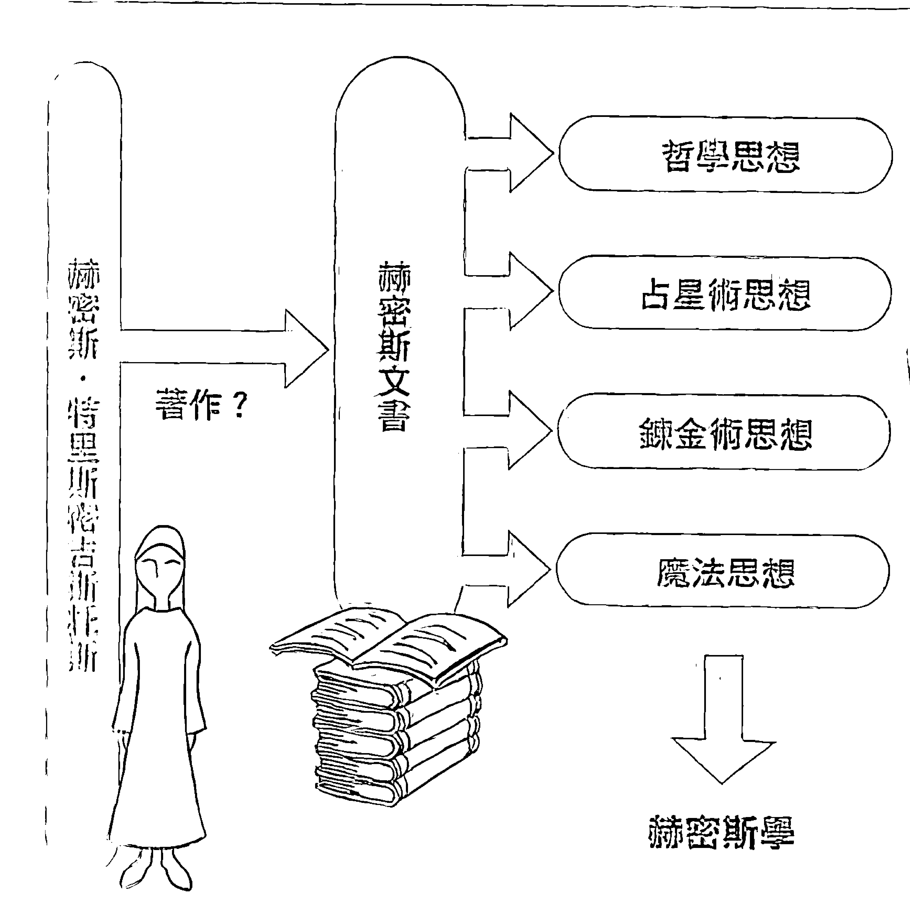

| 出現時代 | 內容 |
|---|---|
| 13世紀 | 鍊金術占星術奧義等 |
| 15世紀初 | 闡述世界乃以光明與黑暗構成、靈魂不滅等概念，以及占星術鍊金術之原理 |
| ? | 天體對地面事件造成的影響等 |
| 1945年 | 部分內容屬於赫密斯文書範疇（請參照P.39） |

### 鍊金術
Alchemy

鍊金術萌芽於古代中國與希臘文化時期的埃及，至中世紀歐洲蔚為盛行，甚至有鍊金術師曾經實際把賤金屬煉成黃金。

#### 承自亞當的秘密知識

所謂鍊金術，就是對鉛等賤金屬施以特定人為操作、將其變成金銀等貴金屬的技術。此外，鍊金術還有種神秘學的解釋：鍊金術並不是要製造真正的黃金，賤金屬變成黃金的過程其實是在比喻人類靈魂得到淨化、成為完美無缺的人類之過程。

鍊金術的英語是「Alchemy」，一般認為此用語乃是源自「黑土（Keme）之國（埃及）」一詞。

關於鍊金術起源，一說是來自古代中國煉丹術，不過鍊金術早在希臘文化時期的埃及便已在西方萌芽，當時歐洲還有帕諾波利斯的索席摩斯（Zosimos of Panopolis）等著名鍊金術師。在後世創作的傳說中，就連人類的始祖亞當（Adam）和諾亞（Noah）也都通曉將賤金屬煉成此金屬的知識。

在中世歐洲的世界觀當中，世間萬物皆是由土水火風四個元素所構成，因此在理論上，藉由人為手段改變物質之組成、把某物質變成其他物質其實是可行的。

自從西元5世紀希臘學園¹被關閉後，希臘文化圈的鍊金術便隨著逃往阿拉伯的敘利亞學者傳至伊斯蘭文化圈，其後8世紀的阿拉伯世界更有格貝爾（Geber，721～？）與阿爾・拉齊（Al Razi，865～923？）等鍊金術師，對鍊金術理論之發展有莫大貢獻。後來阿拉伯的鍊金術理論又在中世歐洲鍊金術興起時，再度逆向輸入歐洲。

勒梅（1330～1418）與史懷哲（Johann Friedrich Schweitzer）等著名鍊金術師，都曾留下成功將賤金屬變成金銀等貴金屬的傳說。另一方面，中世歐洲也拜當時盛行的鍊金術實驗所賜而發現許多化學物質，對日後的化學發現多有貢獻。

> ¹ 希臘學園（Academy）：古希臘雅典城西北郊一所哲學教學及研究的場所，西元前387年柏拉圖購得此園，作為辦學授徒之所。學園原址位於雅典傳說中的阿提卡英雄阿卡德摩斯（Academus或Hecademus）之墓地，故以其名名之。

### 炼金术之传播过程

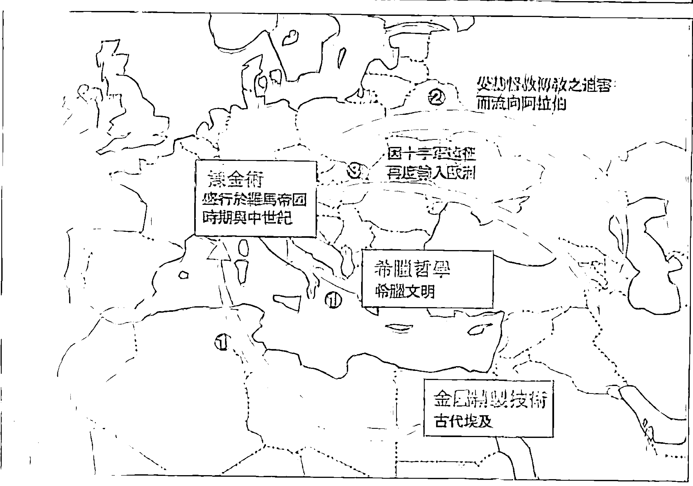

#### 1. 赫密斯与炼金术的思想概念

- **赫密斯思想**：炼金术在赫密斯思想中不只是炼金属成型的技术，而是再现创世过程的伟大秘法 (Ars Magna)。
- **炼丹术**：古代中国相信服用丹砂 (硫化汞) 制成的药金就能长生。
- **四元素说**：左右中世纪欧洲的主流思想，主张所有存在皆是由四大元素构成，是以只需改变其元素组成，便可将其物质变成其他物质。
- **神秘主义**：主张炼金术所谓金属转换只是种比喻，炼金术的过程是在比喻有罪的人类炼成完美无缺的人类之方法。

### 元素

Elements 構成萬物之基本要素，西洋有土水火風四大元素，古代中國則認為金木水火土五行乃萬物根本。

#### 西洋的四大元素與東洋的五行思想

構成自然界萬物之基本要素，稱作元素。

古希臘的赫拉克利特（Heracleitus）認為火不但是萬物的根源，亦是創造之第一物質；首先火會在天上燃燒，接著火向地面下降凝結成名為水蒸氣的空氣，再往下降則化作水，最後凝結冷卻變成土，藉此詮述四大元素之轉變。後來土水火風四個元素因亞里斯多德而得到確立，自此遂以「四大元素」之名成為西洋哲學之中心概念。

不僅西洋占星術用這四個元素來區分十二星座，倘若萬物真是由此四大元素構成，那麼鍊金術利用人為手段改變物質元素比例、將賤金屬變成貴金屬的理論亦屬可能。

此外還有人提出土水火風四元素以外的第五元素假設；第五元素存在浸透於萬物之中、賦予萬物生命，它既無實體且非肉眼所能捕捉，後來鍊金術更將第五元素視同於賢者之石。

帕拉塞爾蘇斯主張自然現象背後有諸靈存在作用，而四大元素也都各有特定精靈執掌。風的精靈稱風精（Sylph）、水的精靈叫水精（Undine）、火的精靈叫火精（Salamander）、土的精靈則是侏儒（Gnome）；只要能控制這些精靈，即可隨心所欲地操縱自然界的諸事象。

古代中國則有主張萬物皆由陰陽兩要素生成，流轉而然的陰陽說，以及主張金木水火土五要素乃萬物根源的五行說，融合此二者的陰陽五行說乃中國哲學之中心思想。

### 世界之構成要素

赫拉克利特
BC640?~BC475?

#### 「火是萬物之根源」

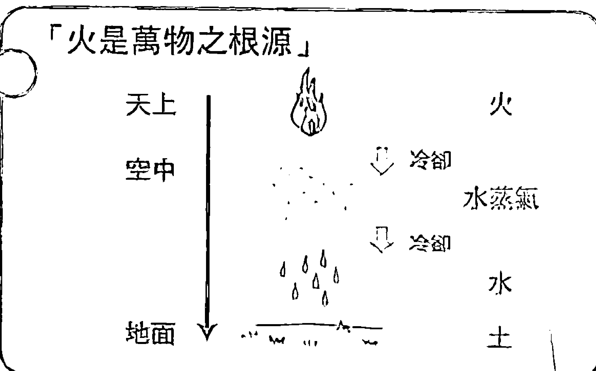

亞里斯多德
BC384~BC322

#### 「元素是兩個性質*的組合」

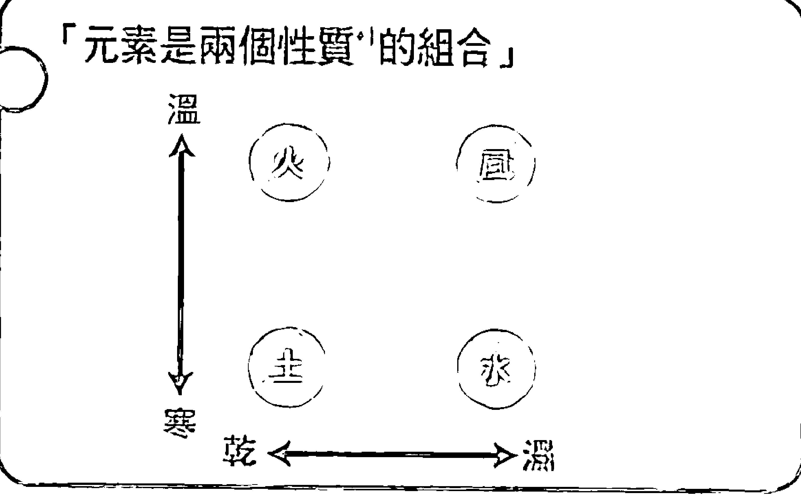

帕拉塞爾蘇斯
1493-1541

#### 「四大元素各有精靈司掌」

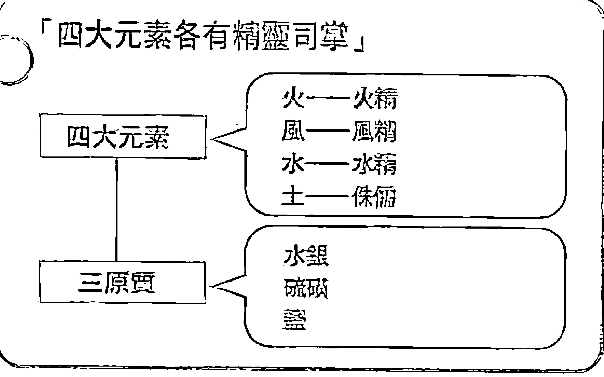

*「元素是四個性質」應是筆誤，在此修正為「兩個性質」。

### 西洋占星術

### Astrology

發源於古代美索不達米亞地區，經過古希臘、中世阿拉伯的發展，以至現代，西洋占星術便是以黃道十二宮及十行星之運行為基礎的占卜術。

#### ⇨ 從古代美索不達米亞到現代

日本所謂西洋占星術，其實發源於古代的美索不達米亞。

古代美索不達米亞認為肉眼可見的水星、金星、火星、木星、土星再加上太陽月亮共七顆行星各有一位神明居住，而且行星的運行還會影響地面發生的事件。

這七個行星與黃道十二宮的組合至今仍是西洋占星術之根本依據，而早在西元前約410年的文獻裡，便已經開始使用今日所熟知的十二星座。

源自古代美索不達米亞的占星術主要是由迦勒底人（Chaldean）傳至西方，也因此迦勒底人此語有時也會被用來指稱占星術師。其中最有名者，當屬西元前約280年移居至小亞細亞科斯島（Cos Island）的貝爾・馬爾杜克神（Bel Marduk）的祭司貝羅索斯（Berossus）。

進入西元2世紀以後，亞歷山卓（Alexandria）又有主張天動說的天文學者托勒密（Klaudios Ptolemaios，？～約150）著作《四書》（Tetrabiblos），集當時占星術之大成。

西洋占星術本是視七個行星分別落在十二星座之位置，或是視各行星之相對位置，藉以卜算戰爭與災禍等國家大事的技術；後來慢慢變成用來占卜國王或居高位者等，足以左右國運的重要人士之命運，最後才演變成卜算一般民眾命運的技術。

現代占星術除傳統的七個行星以外，又加入天王星、海王星、冥王星三個行星共有十個行星，而且通常會併用中世阿拉伯發明的「宮位」（House）天宮分割法；雜誌所載的星座運勢，則是只參考各人生日太陽座落位置的簡略版占星術。

> 1. 占星術所謂行星包括太陽與月亮，與天文學的「行星」不同。

### 传入占星術的偉人

#### 貝羅索斯

原是巴比倫的貝爾・馬爾杜克神祭司，約於西元前280年移居至小亞細亞的科斯島，將天文學與占星術等知識傳至古希臘。

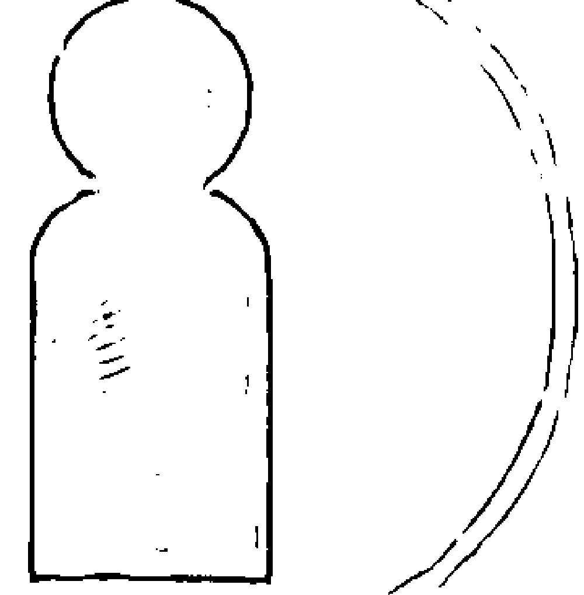

#### 托勒密

?～約150。亞歷山卓的天文學者，主張天動說。其著作《四書》乃西洋占星術基本經典之一。

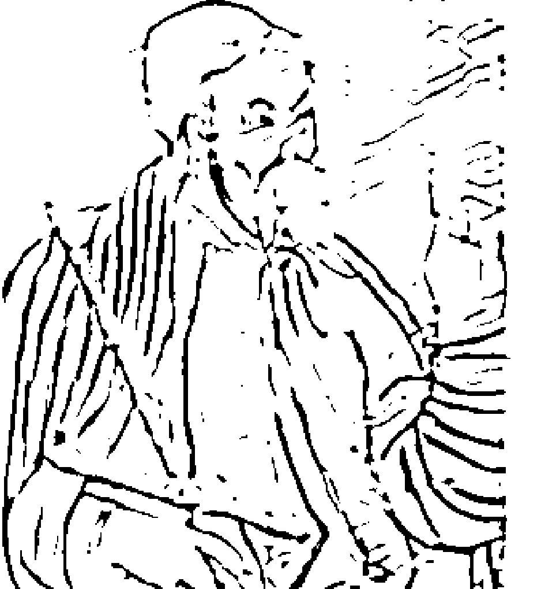

#### 12 House System

中文又稱作「宮位制」。西洋占星術裡，以地面為準選定天頂或地平線上各點，將天球劃分成12個區塊的分割法；視不同分割法，而有數種不同宮位制。各宮位皆與人生的特定事項有關，是占星術做判斷的重要依據。

#### 普拉西度宮位制 (Placidus House)

17世紀的普拉西德 (Placidus) 發明

#### 等宮制 (Equal House)

以上昇點為準，每30度一個宮位

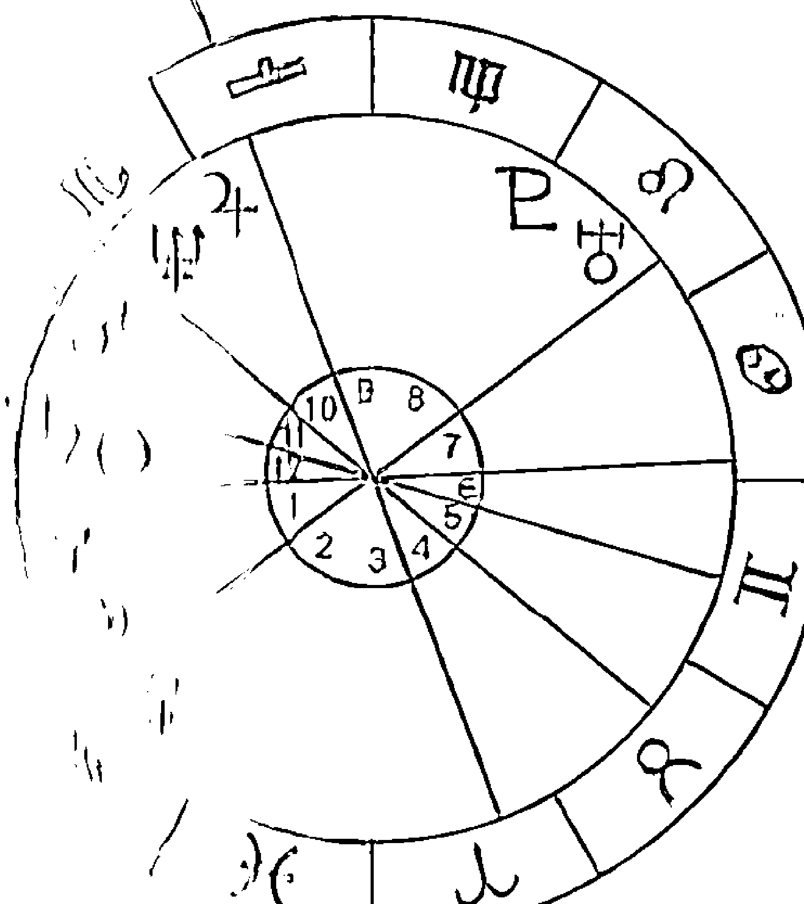

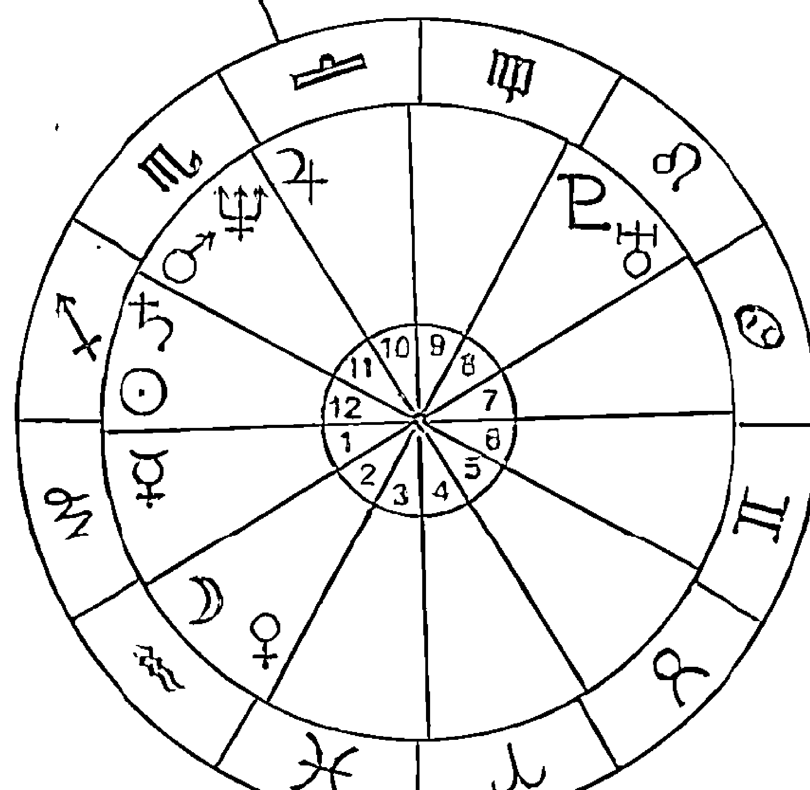

### 各種西洋占卜
Western Traditional Divinations

西洋世界有許多種類的占卜術。除手相、面相以外，文獻還有記載土占術、夢占術、內臟占卜等各種占卜術。

#### ◇ 從手相到內臟占卜

除西洋占星術、水晶球占卜、塔羅牌以外，中世歐洲還有手相、面相、土占術（Geomancy）等傳統占卜術。

不但《舊約聖經》曾經提及手相，古希臘的畢達哥拉斯（Pythagoras，BC582？～BC500？）門下有許多擅長觀人手相面相的學生，就連大名鼎鼎的哲學家亞里斯多德（BC384～BC322）亦曾對掌線掌紋多有論述。

手相在中世紀受到天主教會打壓，幸得吉普賽民族秘密傳承，手相的技術才得以在15世紀中葉復活。19世紀的法國有巴爾洛（Adrien Desbarolles，1801～1886）與達潘提尼（Casimir D'Arpentigny）等人材輩出建立完整的手相占卜法，並創造出許多手相的專業用語。

面相同樣亦源自古希臘，18世紀瑞士的拉瓦特爾（Johann Kasper Lavater）蒐集過去的文獻紀錄並加上自身的觀察實例，出版著作《面相學》。現代面相學乃於19世紀得到確立。

土占術是阿古利巴（1486～1535）代表作《細說神秘哲學》（De Occulta Philosophia）亦有記載的傳統占卜術，流傳於整個地中海地區、中東、非洲的大部分區域。土占術基本上是在地面或紙張上隨意劃線占卜，或是把海棗（Date Palm）的種子從左手移至右手等，利用各種方法求得四個數字以後，視數字是奇數偶數進行占卜。四個數字的奇數偶數共有十六種組合，而土占術視數字奇偶而卜的手法，跟周易亦有共通之處。此外，抓一把土或數顆砂石、小石頭、海棗種子等物投擲在地面，就其散佈情形占卜的占卜術，也算是土占術的一種¹。

夢占術也是種歷史相當悠久的傳統占卜術。

古代美索不達米亞和羅馬還盛行利用祭神動物的內臟來占卜的占卜術，但現已幾不復見。

1 土占術的一般：土占術通常都是將泥土或種子撒在地面而卜，相比之下，求四個數字記其為奇數偶數的方法反而比較少。

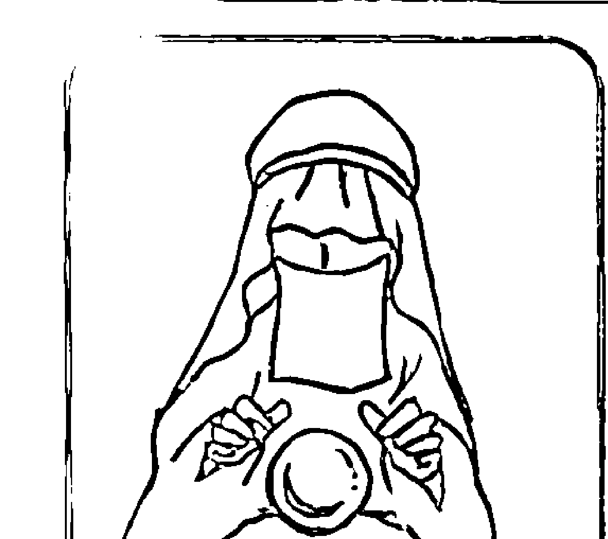

#### 水晶球占卜

看似水晶球就能浮現未來的景象或問卜的答案。魔法師有時也用水晶球跟靈體交流。

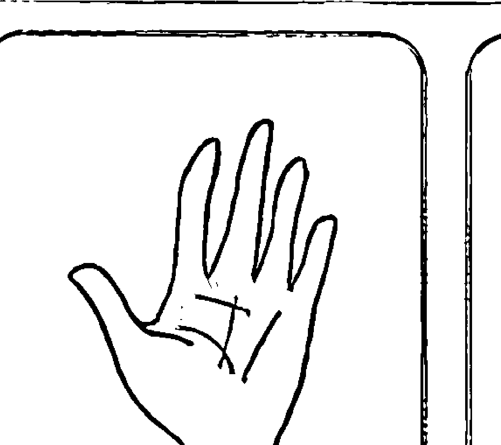

#### 手相

視手掌或手指的形狀、掌線掌紋等占卜性格、命運的方法。觀察生命線、智慧線、感情線等許多線條。

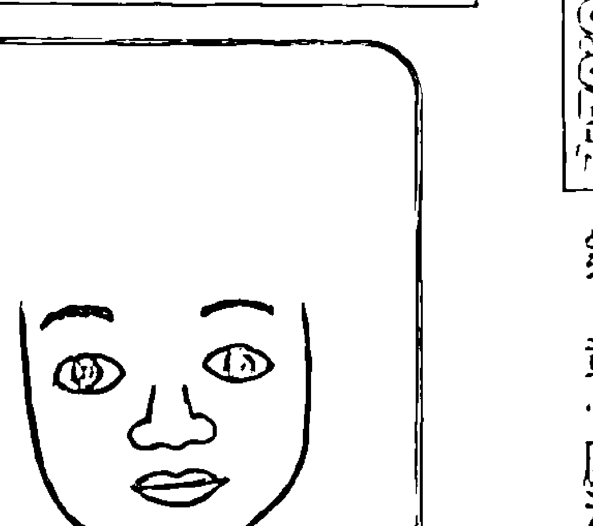

#### 面相

觀察頭面、額頭眉目、耳鼻下巴牙齒與臉部其他部位特徵，個別或是綜合各項特徵解讀面相。

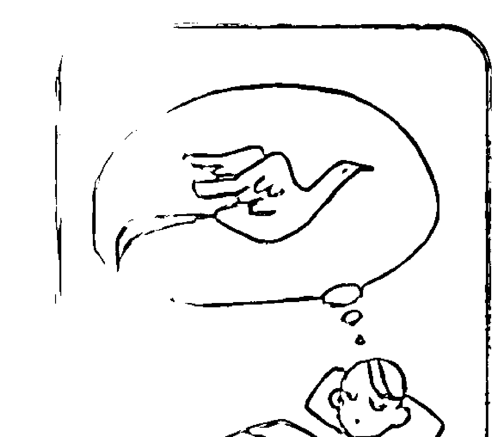

#### 夢占術

利用睡眠中的夢境占卜未來，必須擁有解讀夢境的知識解釋內容。

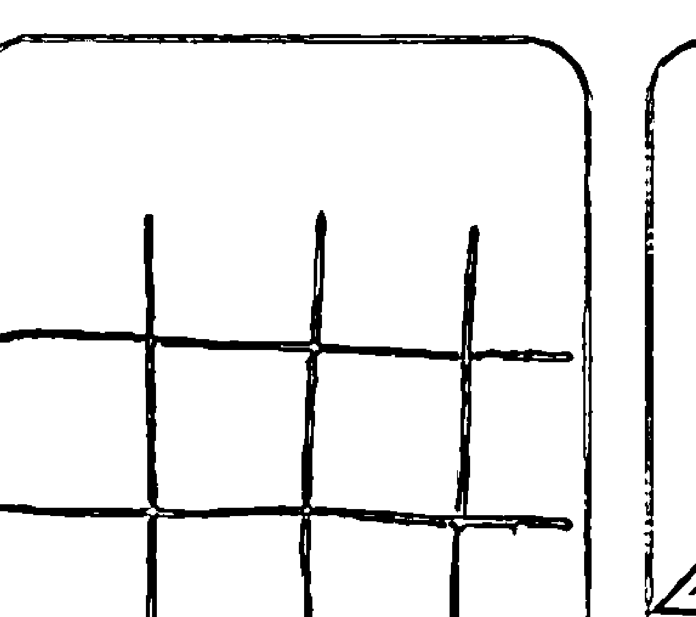

#### 土占術

在地面或紙張上隨意劃線求得數字，或是隨意抓把泥土或砂石、海棗種子投擲地面，視其分布情況進行占卜。

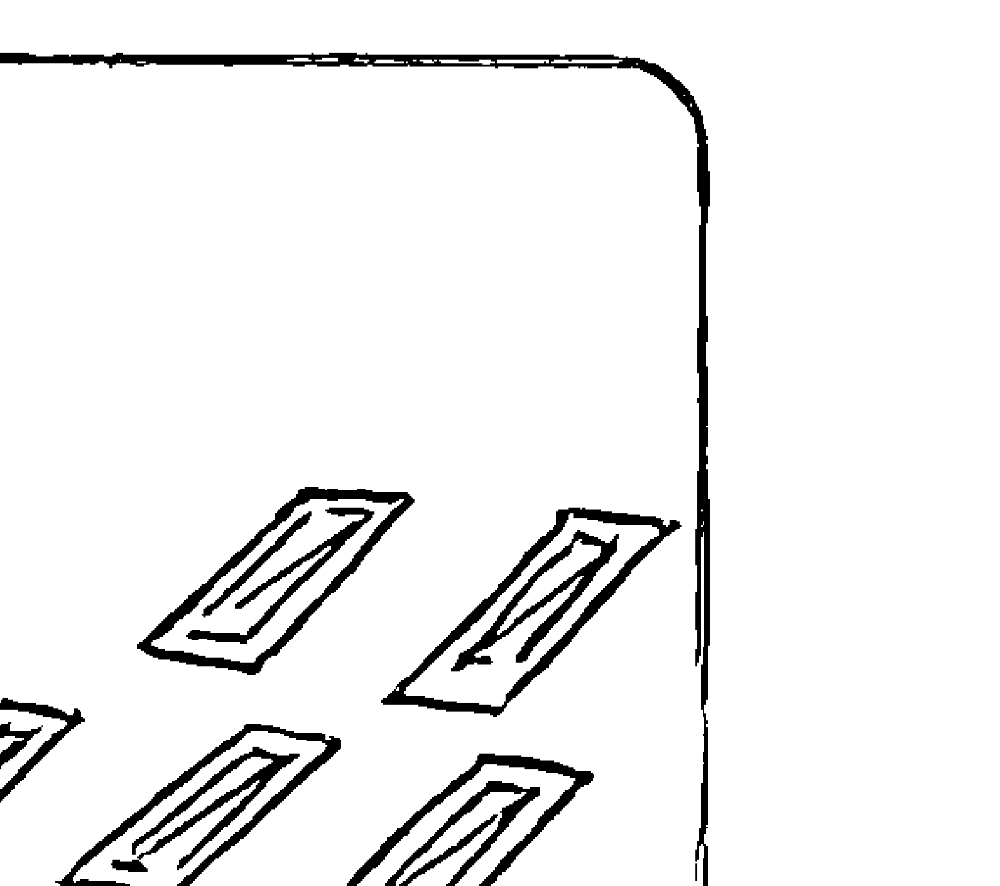

### 塔羅牌

使用塔羅牌的占卜術。必須以固定形式排列塔羅牌占卜。有許多種排列方式，也可以只使用大秘儀牌占卜。

大秘儀（Major Arcana）：指愚人、女祭司、皇后、國王、主教、戀人...

### 東洋魔法
Eastern Magic
除仙道、陰陽道以外，東洋還有修験道、咒禁道等各种魔法，而日本的神道教亦有獨特的秘法傳承。

#### 修験道與呪禁道

東洋魔法體系除中國的仙術（仙道）、藏傳佛教、陰陽道以外，日本還有極為獨特的修験道和咒禁道。日本的神道教也有言靈學、鎮魂歸神等獨特的魔法行法。

修験道結合日本固有的山丘信仰、密教與道教等諸要素，其開祖是奈良時代（710～784）的役小角。役小角被後世尊為役行者崇拜；據說他經過艱苦的山岳修行後獲得各種神通力，不但可以騰空飛行，還能驅使名為前鬼、後鬼的鬼神。

平安時代（794～1185）中期，密教系修行者開始倣效役小角從事山岳修行，並且在日本各地開拓靈峰作為修行據點。

至於對修験道亦有不少影響的咒禁道，則是由577年由咒禁師從百濟傳入日本，然而咒禁道的詳細內容今已不詳。

日本神道教也有種名為鎮魂歸神法的獨特召喚術。

此行法最早可追溯至日本神話中，眾神開天石門的時候天宇受賣命*被神靈附體的傳說，近代則有本田親德復興並體系化之本田流鎮魂歸神法，成為此類召喚法之主流，而明治時代（1868～1912）以後陸續出現的許多神道系宗教團體系，亦繼承了形式稍有不同的鎮魂歸神法。某些宗教的雙手聖撫術*同樣也是由本田流鎮魂歸神法發展而成。

所謂「言靈學」是門研究語言中蘊含的靈力之學問；在研究文字的靈力此意涵上，日本的言靈學與喀巴拉確有相通之處，不過言靈學基本上重視語言聲音多過於文字。

除前述各種魔法以外，日本戰國時代（1477～1573）還有修習忍術的忍者，能使用各種不可思議的法術。

> 1 天宇受賣命：日本神話中，太陽神天照大神因胞弟須佐之男命在高天原大肆破壞，令她相當心痛，於是她便將自己關在天石門內。結果世界被罩在黑暗之中，造成一片混亂。於是眾神便在天石門前召開宴席，此時女神天宇受賣命以幾近全裸的姿態跳起祭神舞，趁天照大神好奇探頭偷看究竟時把她拉了出來，世界才得以重獲光明。
> 2 雙手聖撫術：施術者將手伸向他人，以治療疾病或使人得致幸福。

### 忍者

忍者之起源已不可考，根据文献记载，圣德太子（574～622）曾经用过「志能備」（しび）※。后来忍术吸收密教、修验道、阴阳道等宗家的历法技术，以及使用各种武器的武术和韬术等技巧，终于战国时代才确立了忍者专门执行游击战、间谍战、暗杀、募集情报等特别任务之职能性的角色。这些忍者时则受雇于各地诸侯武将担任佣兵，时则自组结朋党，逐渐成为强而有力的武装势力。忍者当中属伊贺与甲贺忍者最为有名；伊贺的服部半藏以出仕德川家康而闻名，除此以外还有仕于北条家的风魔小太郎、毛利家的佐田兄弟、村上家的相部次郎左右卫门、�的田家的富田乡左卫门、上杉谦信的担猿等众多忍者活跃于战国时代。

※「しび」：现代日语写作「忍び」，此处是间谍的意思。

### NO.026 仙術

Xianshu

> 結合道教思想體系的東洋魔法。仙術源自古代中國，原以體現長生不老為最終目的，後來卻隨時代推移而產生出無數的神仙傳說。

### ☆ 仙人之秘術

自古中國便流傳許多能發揮各種神通力的仙人傳說。仙人本寫作「僊人」，亦稱作神仙。

仙人非但長生不老，還能預知他人命運、驅使靈符、騰雲駕霧、通曉各種變化術，能夠行使所有能想得到的秘術。

欲成仙者須得長居深山只吃松脂等特殊食物，或是從事導引法¹、呼吸法等修行，不得懈怠，或是服用特殊的妙藥仙丹。仙人使用的秘術叫作仙術，為求成仙、長生不老所行的各種修行法則統稱為仙道。

其實仙術乃源自於古代中國的方術。

方術亦作術數、數術，如今其語意已經等同於仙術。

方術涵蓋易、風水、面相、咒符靈籙、煉丹術和各式各樣的民間信仰；根據西漢史學家司馬遷（生卒年不詳）所著史書《史記》記載，秦朝在燕齊之地已經有種屬於方仙道的流派。

施行方術者原本叫作方師，後來隨著時代推移，才確立了體現長生不老的仙人信仰。

仙人又可以分成數個種類；最具代表性的分類法當屬東晉葛洪（283～343）提出的天仙、地仙、尸解仙三種。

由於仙道跟中國民間信仰的道教關係極為密切，是以不論道教崇拜的諸神祇，或黃帝、西王母、赤松子等古代神話傳說中的人物，甚至道教教祖老子等人物，全都被後世奉為仙人。

¹ 導引法：最早出現在戰國時期的一種體操，是種緩慢地運動身體，使氣內在抽拔，藉以保養身心的技術。

### 仙人的種類

| 天仙 | 地仙 | 尸解仙 |
| :--- | :--- | :--- |
| ○能騰空飛行<br>○眾目睽睽之下昇天<br>○必須累積1200個善行 | ◎無法昇天，住在凡間深山裡<br>◎必須累積300個善行 | ●看似死亡<br>●死後才能成仙<br>●開棺後屍體會憑空消失 |

### 八仙

**吕洞宾**
據傳呂洞賓是唐朝到五代時期之間實際存在的人物，八仙之首。唐受民間信仰的程度與關羽幾乎不相上下。

**鐘離權**
呂洞賓之師，傳為五代後漢武將，是位頭頂盤兩個髮髻的高大男子。

**張果老**
終日騎著匹白驢，不騎時會把驢子摺成紙摺疊收起。

**韓湘子**
唐宋八大家之一韓愈的姪子，曾經預見韓愈的命運。

**李鐵拐**
他一度陷入地獄，幸得呂洞賓搭救得免，然其肉體已經被業火燒毀，只能附身於身旁有殘缺的乞丐體內。

**曹國舅**
乃受呂洞賓渡化成仙。

**藍采和**
女仙？在酒樓飲宴，正在醉酒唱歌時昇天成仙。

**何仙姑**
女仙。幼時得呂仙桃，食用後能預言吉凶禍福。

八仙之首：究竟誰是八仙之首，其實眾說紛紜。有的說是李鐵拐，有的說是呂洞賓，但呂洞賓名氣最大傳說最多，遂有此說。
藍采和性別：藍采和性別未知，有一說他是貌似女孩的男仙。

### 陰陽道

Onmyodo ... 陰陽道有各種秘術，能使死人復活、操縱式神。

### ✦ 古代日本的官方魔法

所謂陰陽道，其實是源自中國的陰陽說、五行說、咒禁道、各種占卜術、宿曜占星術¹、仙術等思想傳入日本以後，再融合道教、地相、風水與各種民間信仰，經過獨特發展過程形成的魔法體系。

在陰陽道的形成過程當中，古代日本的政府機關陰陽寮扮演著非常重要的角色。

陰陽寮乃大寶元年（701）根據大寶律令設立於中務省之下的機關，司職占卜判斷吉凶、制作年曆與觀測天象諸事。陰陽寮同時也是培育養成陰陽師的教育機關，學生必須修習《周易》、《五行大義》等中國的易學、陰陽五行說，但後來課程又添加了許多獨特的內容，方才孕生出日本特有的陰陽道。

陰陽道涵括六壬神課與太乙神數等占卜術、乞雨術、見鬼術，還有任意操縱超自然存在「式神」的法術，甚至還有起死回生的法術。

通曉陰陽道者便是所謂的陰陽師；其實陰陽師本是設於陰陽寮的官職名，後來卻演變成通曉陰陽道、專門行使各種占卜術與咒術的人物之統稱。雖然陰陽道拜漫畫與電影中的平安時代（794～1185）陰陽師安倍晴明（921～1005）所賜，再度引起了現代日本人注意，不過陰陽師的地位卻是在室町時代（1338～1573）達到頂點，而陰陽道思想則是在江戶時代（1603～1867）始得廣播於民間。

在明治時代（1868～1912）初期以前，陰陽師執照向來都是由承繼安倍晴明血脈的土御門家負責核發，然而日本政府在明治3年（1870）廢除陰陽寮以後，現在官方核可的正式陰陽師已經不復存在。

¹ 宿曜占星術：密教的占星術，能算出人與人之間宿世的關係。利用天上二十八星宿來看，即青龍七宿：角、亢、氐、房、心、尾、箕。朱雀七宿：井、鬼、柳、星、張、翼、軫。白虎七宿：奎、婁、胃、昴、畢、觜、參。玄武七宿：斗、牛、女、虛、危、室、壁。每個人出生那天都有宿住日星，即其本命星：以本命星為中心，看其他人的本命星和自己的關係如何，是好是壞，一目瞭然。

### 陰陽道之成立

### 陰陽道的各種術法

- **占卜**
  - 六壬神課：以行運占卜當時的月份日期時刻為基準，製作出天盤地盤而占
  - 太乙占数：利用干支等概念來卜算國家社會的長期趨勢
- **祓禊**
  - 追儺：追逐厲鬼的儀式
  - 物代・人偶：用人偶或紙玉接觸身體，转 移其人身上的穢氣
- **施咒**
  - 咒祭：陰陽道使用的咒術，乃以陰陽五行說為基礎
  - 符咒：使用寫有咒文之紙符的咒術

注：在祓禊或祈祷时，會用人偶或衣物擦拭身體藉以轉移穢氣灾禍，並於退 河裡流走：此處的人偶或衣物就叫作物代。

### ✧ 從黃帝至現代

風水同樣也是孕生自古代中國的技法，是種考量地形方位和其他自然環境條件，以讀取天地間「氣」之流勢的技術。除此以外，風水亦有改變地形或追加五行（金木水火土）中不足要素，藉以改變氣運的技法。

「風水」此稱呼是郭璞（276～324）著作《葬書》其中一節的用語，風水另有堪輿、地理、陰陽、山等各種不同的稱呼。利用風水讀取氣之流勢者通稱為風水師，中國有時亦稱風水先生、山師、山人。

古代中國人相信「氣」這種能量不僅會在人體內流動、賦予人類活力，「氣」同樣也存在於大地和空氣之中；欲判斷皇宮之立地抑或戰事之趨歸，亦須看清山川間「氣」的流動。

風水從自然地形中判斷「氣」之流勢的行為，最早可追溯至古中國傳說中的帝王——黃帝的時代。風水原本只是觀察地形判斷死者墳地吉凶的陰宅風水，後來經演變後才不再僅侷限於墓地，可以視目的應用於選擇居住地等各種目的。

風水在漢代已經是門頗具體系組織的地相術，魏晉南北朝時代則有風水奉為開祖的郭璞出現，至唐宋又發展出以山川位置歸納吉地的風景派（巒頭派），以及重視羅經（風水專用的羅盤）的計測派（理氣派）兩個學派¹。

後來中國的風水還流傳至韓國、台灣、香港甚至日本等地，我們從平安京²之安排設置和江戶城之立地，便不難窺見風水造成的影響。

·1 風水的兩個學派：在中文裡，兩個學派通常分別名為形勢派（巒頭派）和理氣派。
·2 平安京：平安朝的京城所在地，即今日的京都。

### 羅盤的基本構造

羅盤有許多種類，細節構造各有不同，最複雜的羅盤共有36層之多。最基本的羅盤構造如下。

第1層
天地（安有磁石）

第2層
先天八卦（河圖所繪八卦）

第3層
後天八卦（洛書的其中八個圖樣）

第4層
24山（24方位）
此外羅盤外部還有24節、28宿、64卦等構造

### 陰陽四神相應

四神相應是指：東有蒼龍棲息之流水，南有朱雀遊翺之水畔，西有白虎奔馳之大道，北有象徵玄武之高山的地形。江戶東有隅田川、荒川、中川三條河流，南有東京灣，西有東海道，北有男 的山。平安京東有鴨川，南有巨椋池，西有山陰道，北有船岡山。

北（玄武）
京都——船岡山
江戶——男衾山

東（蒼龍）
京都——鴨川
江戶——隅田川
荒川
中川

西（白虎）
京都——山陰道
江戶——東海道

南（朱雀）
京都——巨椋池
江戶——東京灣

河圖：相傳伏羲氏見龍馬負圖出於河，遂據其文，以畫八卦，稱為「河圖」。

洛書：相傳夏禹治水，神龜從洛水出現，背上有九組不同點數組成的圖，禹因而排列其次第，乃成治理天下的九種大法，稱為「洛書」。

### 阴阳五行说

### Inyo Gogyo, Yin Yang school

阴阳五行思想乃古代中国的基本世界观，就连现代的中国占卜术也都深受其影响。此学说是透过阴与阳之推移流转，和五行间的相互关系，来说明世间所有现象。

### 阴阳说与五行说的结合

阴阳说和五行说都是古代中国阐述世界根本原理的哲学思想。此二者本是各自独立的学说，后来经西汉名儒董仲舒（BC176？～BC104？）统合成阴阳五行说，自此成为几乎所有中国占卜术之基本原理。

阴阳说主张天地万物皆由阴与阳这两个元素所构成，同时阴阳亦是易的基本原理。

五行说则传为中国夏朝开国君王——传说中的圣王禹所构思出来的思想。

从前禹治中国，有隻龟壳刻着「洛书」字样的灵龟从洛水爬上岸；禹从「洛书」之中悟得「五」此数，遂思索出金木水火土五个元素，并以此为治国之基本原理。

进入春秋时代以后，五行说又与五个行星结合，当时认为世界诸事象之变化，全都是因为这五个构成万物之要素互相的助长或对抗而使然。

五行间的相互关系在战国得到系统化，并形成三个学说：五行生成说、五行相生说、五行相克说。

五行生成说是在说五行生成于世间之顺序，依序是水火木金土。五行相生说是在阐述元素生成其他元素之关系；木生火，火烧尽后灰烬成土，土中产金，金属冷却后表面产生水滴，是以金又生水。五行相克说则是元素克制其他元素的关系。

#### 五行對應表

| 时间与阶段 | 五行 | 季节 | 方位 | 颜色 | 动物 | 行星 |
| :--- | :--- | :--- | :--- | :--- | :--- | :--- |
| 朝（十多歲） | 木 | 春 | 东 | 青 | 青龍 | 歲星 (木星) |
| 昝（二十多歲） | 火 | 夏 | 南 | 赤 | 朱雀 | 熒惑星 (火星) |
| 土旺用事（三十多歲） | 土 | 季夏 | 中 | 黄 | 麒麟 | 鎮星 (土星) |
| 夕（四十多歲） | 金 | 秋 | 西 | 白 | 白虎 | 太白星 (金星) |
| 夜（五十多歲） | 水 | 冬 | 北 | 黑 | 玄武 | 辰星 (水星) |

土旺用事：土旺用事之略称，乃指各季节结束后接下来的18天或19天的期间。若以二十四节气来说，从清明、小暑、寒露、小寒算起的第13天就进入土旺。

### ◇ 解讀陰陽消長的技術

易這種占卜術發源自古代中國，乃以主張世界是由陰陽兩個元素所構成之陰陽說依據，立基於萬物皆因陰陽消長而生成流轉之世界觀。

「易」此字原是蜥蜴的象形文字；由於蜥蜴的體色多變化，遂使此字有變化的意思。

中國命理學可分成山醫命相卜五術，而易則是其中占時以判斷狀況的「卜術」最具代表性的技術。

長的全線是象徵陽的陽爻（一），斷開的兩條短線則是陰爻（一）。每三爻合成一卦，排列組合後就得到八卦；再將八卦兩兩組合，得到八八六十四卦，可用來占算所有事象。《易經》便是六十四卦的說明書，也是儒教經典四書五經之一。

為求出陰陽兩種爻，通常都是使用胡枝子（Lespedeza）或竹棒製成的50枝筮竹。正統的求爻法叫作本筮法，必須用50枝筮竹操作三次才能得到一個爻。換句話說，若欲求得六十四卦，則須得重複相同的作業多達18次。

鑑於本筮法的繁複，後演變出數種較為簡略的方法。除使用筮竹外，還可以用三枚硬幣或是八面體的骰子卜得易卦。

有「明治易聖」美稱的高島嘉右衛門（1832～1914）主要是用只須操作筮竹三次便可得卦的略筮法，並曾經有許多準確的預言。

八卦乃易之基礎，可擬作八個方位、天地自然界各種事物或人類社會的身分地位等概念；而八卦跟陰陽五行說、十干十二支（天干地支）幾乎是所有中國占卜術共通之基本原理。

### 八卦陰陽表

### 八八六十四卦吉凶主卦

| 卦象 | 卦名 | 解释 |
| :--- | :--- | :--- |
| ☰ | 乾為天 | 諸事可順利進展 |
| ☷ | 坤为地 | 諸事可順利進展 |
| ☴☰ | 風天小畜 | 運有未及。小事可成，大事不可 |
| ☷☰ | 地天泰 | 萬事皆如己願 |
| ☰☷ | 天地否 | 運勢最低潮，但會隨時問好轉 |
| ☱☳ | 雷澤歸妹 | 凶兆。顧不得彼 |

### No.031 密教

Esoteric Buddhism

起源自印度的各種魔法技術被佛教吸收之後，經過體系化而形成密教。儘管密教在印度已經衰微，不過日本、西藏等地仍然各自保有極為獨特的密教信仰。

### ◇ 坦陀羅教向佛教的發展

密教是佛教諸流派之一，乃相對於顯教而言。不過密教卻擁有治療疾病、消災解厄，甚至是祈祝戰爭勝利等諸行法；將密教傳入日本的空海（774～835）便曾留下許多奇蹟譚，諸如在嵯峨天皇（786～842）面前化身成大日如來等。

密教主張修行者必須先經過各種修行，才能達到與大日如來合而為一的終極目標，可謂是佛教的神秘主義思想，其教義亦包括堪稱為佛教魔法體系的思想。

根據傳說記載，密教本是大日如來悟得的秘密法門，後經由金剛薩埵（Vajrasattva）傳承至龍樹（Nagarjuna，約150～約250）。然而若從歷史面考究，密教乃源生於大乘佛教末期的供養法、結界作壇法、設摩印契¹、曼荼羅²等魔法技法。雖然這些技法日後亦為現代密教吸收繼承，不過此時的密教卻尚未體系化、欠缺組織，是以後世皆稱之為雜密。

直到7世紀《大日經》、《金剛頂經》等教義基本經典成立後，密教才統整出一套名為純密的思想體系。

此後印度密教的坦陀羅教色彩愈趨濃厚，而自從1203年其根據地超岩寺遭伊斯蘭教徒破壞後，密教便開始日漸衰退。不過密教亦曾於8世紀由印度僧人蓮花生傳至西藏，並融合當地的原生宗教苯教（Bon），發展成極為獨特的藏傳佛教（喇嘛教）以至現代。中國是在7世紀中葉至末期之間有善無畏（637～735）與金剛智（671～741）引進密教，日本的密教則是由師事惠果（746～805）的空海傳入。

¹ 設荼：密教寺院經常會焚燒護摩，此舉乃借助火神阿耆尼（Agni）力量，將供品送至諸神所在處的祈願法，可說是密教中最普遍的召喚術。印契：便是所謂的結手印。
² 曼荼羅（Mandara）：曼荼羅是密教於祭儀中所使用，又或是為了表示密教世界觀所描繪出的佛教世界地圖。

### 密教之流派圖

### 日本密教之祖　空海

空海（774）～承和2年（835）

亦名弘法大師。空海將真言宗傳入日本，同時亦是跟嵯峨天皇、橘逸勢並稱為「三筆」的書法名家。延歷23年（804）被選為遣唐使，經海路入唐，得以入唐。於長安師事惠果，並且在短短一年之內便得其傳，得授所有秘法。

### No.0032 心灵现象

### Spiritual Phenomena

泛指灵魂引起的各种现象，可大略区分为物理性心灵现象和精神性心灵现象两种。心灵现象此概念确立于19世纪末，直至20世纪初，仍有许多灵媒在各地活动。

### ◇ 从魔法转向科学方法的研究

心灵现象乃指因灵存在所引起、普通物理法则无法说明的各种奇异现象。自古此类现象的案例便所在多见，譬如召唤死者亡灵的降灵术等技法就是，却一直都被归类为魔法的一种。

后来心灵现象首度受到认真看待、被正式研究，却已经是1848年美国纽约州发生海德村事件（Hydesville Events，即福克斯姐妹事件）以后的事情了。

此事件发生以后，欧美各地就开始有佛罗伦斯·库克（Florence Cook）、雷奥诺尔·派博（Leonore Piper）等灵媒出现，并纷纷宣称能引起各式各样的心灵现象。

心灵现象的种类非常多，可大致区分为「物理性心灵现象」和「精神性心灵现象」两种。

所谓物理性心灵现象，乃指伴随任何物理可测定现象发生之心灵现象，包括灵体全身或部分身体实体化的物质化现象、物体或人体凭空飘浮和瞬间移动、发出撕裂木头声响或敲击声的叩音现象（Rap）、骚灵现象（Poltergeist）、灵异照片、直接谈话^1、直接书写^2、心灵治疗（Spiritual Healing）。

另一方面，精神性心灵现象则是指未发生物理现象的心灵现象，最具代表性的便属灵媒让灵体附身传达讯息此类的技术，其他还有自动笔记、自动谈话、灵视、灵听^3等。

站在超心理学（Metapsycology）立场，其实前述的心灵现象几乎都可以用ESP（超感官知觉）或心灵致动^4来解释。此类以ESP或心灵致动说明心灵现象之学说，便称超ESP假说。

> 1 直接谈话（Direct Voice）：指灵魂利用灵媒体内流出的外质（Ectoplasm）凭空制造发音器官，直接对与会者说话。

> 2 直接书写：指不用灵媒执笔，灵魂自行书写文字、暗号、符号、图画的现象。只消准备一张白纸，或是置于抽屉内、或是置于桌面，不久纸张上就会有灵魂欲传达的信息。

> 3 灵视、灵听：灵视是指看得见灵体，灵听则是听得见灵体声音。

> 4 心灵致动（Psychokinesis）：亦即所谓「念力」。

### 心灵现象之分类

海德村事件
1848年3月底发生在美国纽约州海德村福克斯家的事件，是近代心灵主义诞生的直接契机。自从1847年12月福克斯家搬进这间屋子后，便开始发生叩音现象。3月31日，福克斯姐妹中的凯瑟琳（Catherine Fox）发现只要自己弹动手指，就会有相同的回答音，遂藉此试图与其通信。结果发现叩音的发音源，是数年前在此屋里遭人杀害的商人亡灵。此后凯瑟琳与妹妹玛格丽特（Margaret Fox）以职业灵媒为生，但两人后来于1908年承认，这些叩音其实都是她们利用身体关节制造出来的人工声响。

凯特（Kate）：凯特是凯瑟琳（Catherine）的昵称。

### 抹大拉的马利亚（Mary Magdalene）

《新约圣经》的四福音书皆曾提及抹大拉的马利亚。包括福音书的记载与各种传说，抹大拉的马利亚本是王家血脉，父亲叫作居鲁士（Cyrus），母亲叫做欧夏丽斯（Eucharis）。她的胞弟就是因为耶稣基督而死后复活的拉撒路（Lazarus），她的姐姐则是福音书里的另一位女性马大（Martha）。

居鲁士死后，其遗产便由姐弟三人分别继承，马利亚得到的是抹大拉城和耶路撒冷市内的土地，因此被称作抹大拉的马利亚。然而，后来马利亚却落得身败名裂，又因耽于肉欲而被冠上“罪女”恶名。

更惨的是马利亚还被七个恶魔附身、陷入不幸的深渊，后来幸得耶稣替她驱走恶魔，自此马利亚便跟随耶稣、行动与共。

根据福音书记载，马利亚曾经为耶稣在脚上涂香油，再用自己的头发擦拭；耶稣受十字架酷刑时，陪伴耶稣走到最后的也是抹大拉的马利亚，由此可以窥见她对耶稣是如何地奉献。相对地，耶稣也曾为抹大拉的马利亚遭法利赛人（Pharisees）指为罪孽深重的不洁女性时，挺身为她辩护。

更重要的是四福音书皆一致记载：耶稣复活后第一次现身，就是出现在抹大拉的马利亚面前。

想当然尔，如此一来自然就会有人假设：耶稣和抹大拉的马利亚两人是否有福音书未曾明言的特殊关系。

并非《新约圣经》的外典¹《腓力福音》（Gospel of Philip）便有记载，耶稣爱抹大拉的马利亚要多过任何一位门徒。

澳洲的芭芭拉·泰林（Barbara Thiering）曾于著作《Jesus the Man》（Harper Collins，1992）中进一步推展此说，主张耶稣曾在西元30年9月36岁半²的时候跟马利亚结婚，并生下子女。

另一方面，亦有传说指出抹大拉的马利亚其实是耶稣门徒兼福音书作者约翰的妻子。

还有传说指抹大拉的马利亚在耶稣复活升天后，便跟拉撒路、马大流浪到法国的马赛（Marseille），其遗骨被安置在苇兹莱（Vezelay）的圣马德莱娜教堂（St. Madeleine Church）。

抹大拉的马利亚是普罗旺斯（Provence）、西西里岛（Sicily Island）和那不勒斯（Naples）的守护圣人，专门守护悔改的女性、受刑者、罢工等人。其圣人节日是7月22日。

外典（Apocrypha）：犹太教、基督教对前二世纪至后二三世纪间，各种以《圣经》形式写成，但终未被正式承认为正典的著作的总称。

36岁半：后来基督教会订定西元制的时候发生了计算的错误，其实耶稣是在西元前6年出生的（另说为西元前4年）。

### 第2章 魔法师

No:033 赫密斯·特里斯密吉斯托斯 Hermes Trismegistus 古代亚特兰提斯传说中的君王，著有赫密斯文书与翠玉录等作品，对中世纪欧洲的神秘主义思潮有莫大影响。

### ◇ 亚特兰提斯君王暨古埃及神明

赫密斯·特里斯密吉斯托斯（生卒年不详）此人生平诸说纷纭，一说他跟《旧约圣经》的摩西是同时代的人物，亦说他是古亚特兰提斯传说中的君王，是虚构的人物。赫密斯·特里斯密吉斯托斯此名是希腊语“三倍伟大的赫密斯”之意，同时他还被视同于古埃及的智慧之神透特（Thoth）。

赫密斯·特里斯密吉斯托斯此名首问世于名为赫密斯文书的一系列神秘学文献中，而他也被视为该文献之原作者。

传说此人是古代亚特兰提斯大陆的君王，君临亚特兰提斯3226年，共有多达3万6525册的著作说明自然原理。

其他传说则说古代亚特兰提斯的祭祀王透特曾经三度转世，第三次转世时就叫作赫密斯·特里斯密吉斯托斯。根据这则传说，透特在亚特兰提斯沉没后便逃往埃及，并于西元前5万年到3万6千年间统治古埃及。埃及的吉萨（Giza）大金字塔亦是透特所建，这座金字塔内部便封藏着古亚特兰提斯的智慧和翠玉录。

翠玉录的内容早已散佚多时，但从1455年起陆续有记载其部分内容的一系列文献出现在欧洲，亦即所谓的赫密斯文书。

翠玉录的内容是记录多位神祇间对话形式的教义，除赫密斯·特里斯密吉斯托斯以外，还有埃及神明伊西斯（Isis）和透特，以及古埃及贤者印和阗（Imhotep）等人物。

注1 三倍伟大的赫密斯：亦说为“三重且伟大的赫密斯”。

#### 赫密斯思想

亚特兰提斯？

埃及？

各时代的魔法师

- 炼金术
- 魔法结社

#### 赫密斯思想之原型

埃及神话中的书记之神。多被塑造成人身朱鹭头，或是狒狒头的模样。透特原是月神、司掌魔法，后来演变成执掌所有学问的神明，透特亦传为文字的发明者，希腊人将他视为赫密斯。

希腊神话奥林帕斯十二大神之一。头戴插有双翼的宽边索斯帽（Petasos）、脚穿插着双翼的凉鞋、手持权杖（Caduceus）。赫密斯是旅人、小偷、辩论、商人、运动竞技的守护神，据传他也发明了竖琴，并创造出音乐、文学、度量、天文学等学问。赫密斯亦负责引导死者前往冥界。

赫密斯·特里斯墨吉斯忒斯

No:034

### 术士西门

#### Simon Magus

《新约圣经》亦曾述及的撒马利亚魔法师，能够腾空飞行、创造人类、行使各种秘术。此外术士西门亦传为诺斯替教之元祖。

#### ☆ 耶酥时代的伟大魔法师

术士西门是约和耶稣基督（BC4？～29？）同时期的人物，居住在现代以色列的撒马利亚（Samaria）地区，是曾经行使各式各样的秘术、深受当地民众崇拜的魔法师。

他的秘术可以让人在烈焰中来去，穿梭自如；可以让死者复活、可以腾空飞行，甚至还可以凭空创造出人类。

据《新约圣经》〈使徒行传〉第8章记载，耶稣基督十二使徒之一腓力（Philip）造访撒马利亚宣扬耶稣教义之际，腓力把手按在人们头上，他们就受了圣灵，术士西门看见此奇迹，便拿钱给使徒，要跟使徒买赐圣灵的权柄。

传说后来术士西门还前往罗马，跟使徒彼得（Peter）和保罗（Paul）同席，并且在罗马皇帝尼禄（Nero）面前表演腾空飞行；只见彼得开始祈祷，术士西门马上就丧失魔力从空中坠落，伤重不治死亡。

此外亦有传说指出，术士西门曾经想要模仿耶稣基督复活，遂自己躺进棺柩埋进地底，却是至今都仍未复活。其魔法由一位名叫米南德（Menandros）的人物继承，而米南德亦是位广受民众崇拜的优秀魔法师。

术士西门曾经在腓尼基的提尔斯（Tyrus，现在黎巴嫩的苏尔Sur）替一位名叫海伦（Helen）的卖春妇赎身，两人时常共同行动；他曾表示海伦是由天上降临下界的“索菲亚”（Sophia，既智慧），因此以“索菲亚”概念为中心的诺斯替教，有时亦会将术士西门奉为元祖。

#### 西元前后的地中海

#### 1 世纪初期与基督教

- 腓力
- 彼得
- 保罗

欲以金钱购买圣灵的力量

曾经在皇帝面前表演腾空飞行，却因彼得的祈祷而坠落

“迪尼乌姆”：是盖尔特语“蛮荒”的意思。

“卢提亚”：是拉丁语“河心居地”的意思。

### 泰安娜的阿波罗尼俄斯 Apolonius of Tyana

泰安娜的阿波罗尼俄斯曾经造访印度，向知晓所有秘密的智者求教。他能阅读思想、预知命运，甚至让死者复活，阿波罗尼俄斯消灭怪物拉弥亚的传说亦相当有名。

### ◇ 行旅世界的魔法師

泰安娜的阿波罗尼俄斯（约西元1世纪）是在耶稣基督（BC4?～29?）出现前不久，活跃于罗马帝国境内的魔法师。

阿波罗尼俄斯出生于泰安娜（现土耳其卡帕多奇亚〔Cappadocia〕地区），长大后就读毕达哥拉斯教（Pythagoreanism）兴办的学园，当时就能行使各式秘术。

传说阿波罗尼俄斯不但是位相貌堂堂、威仪不凡的美男子，而且还能说善道、辩才无碍。尽管他继承了非常丰厚的遗产，却选择将财产分给众人，自己则是穿着破烂衣服、打赤脚，去当时已知的世界各地旅行。其足迹甚至遍及印度，据说他曾在印度遇见通晓所有学问的智者们、向他们求教。

阿波罗尼俄斯通晓包括动物语言在内的所有语言，他能认知他人思想，还可以预知他人的命运。曾经有位少女在举行婚礼的前一天去世，阿波罗尼俄斯却只是用手碰触遗体，就让少女复活，另外他还曾经准确地预言罗马皇帝多米提安（Titus Flavius Domitianus，81～96在位）的命运。

据传阿波罗尼俄斯拥有数枚封有魔宠的戒指，可以视情况需要选择使用不同戒指；不过阿波罗尼俄斯最为人津津乐道的，当属他消灭女吸血鬼拉弥亚（Lamia）的传说。

传说从前他看破科林斯的迈尼普斯（Menippus of Corinth）的寡妇就是拉弥亚，遂唱诵咒文消灭了拉弥亚。

关于阿波罗尼俄斯的晚年生活现已不详，据说他活到将近百岁以后，就突然消失不见了。

他非但被后世传为记载各种恶鬼（Demon）能力之魔法书《努忒麦隆》（Nuctemeron，希腊语“恍如白昼的夜晚”之意）的作者，利未（1810～1875）亦曾召唤出其亡灵。

#### 希腊~罗马时代的重要思想家

| 人物 | 生卒年 |
| :--- | :--- |
| 毕达哥拉斯 | BC582?～BC500 |
| 苏格拉底 | BC469?～BC399 |
| 柏拉图 | BC424～BC347 |
| 亚里士多德 | BC380～BC322 |
| 芝诺 (斯多葛) | |
| 耶稣基督 | BC4?～BC29? |
| 阿波罗尼俄斯 | |

#### ※ 毕达哥拉斯教

古希腊数学家毕达哥拉斯（西元前约580～西元前约500）乃以毕氏定理——直角三角形斜边平方等于另两边平方和——闻名世界。另一方面，据说毕达哥拉斯亦曾师事斯基泰 魔法师阿巴里斯（Abaris），他不但能跟动物对话，还可以施展透视、分身等能力。西元前约532年，毕达哥拉斯移居至意大利南部的克罗顿（Croton）并创设类似为某种秘密宗教的毕达哥拉斯教（Pythagoreanism）。除宗教面以外，此教派当初亦曾试图掌控克罗顿当地的政治面，直到西元前5世纪中叶克罗顿发生政变，其组织方才转向地下发展。不过，西元前1世纪的希腊文化世界却又出现以毕达哥拉斯为教祖的新毕达哥拉斯学派出现，而泰安娜的阿波罗尼俄斯即为新毕达哥拉斯学派的一份子。

> ※注：请参照P.26评注。
> ※注：此处的分身其实是指「bilocation」，意为「同时在两地出现」。

### 亚伯拉梅林

Abra-Melin
传说中的埃及魔法师。亚伯拉梅林深谙喀巴拉，同时也是发明以圣守护天使为媒介的亚伯拉梅林魔法体系之创始者，其魔法乃透过魔法始祖得传承至现代。

### ☆ 圣守护天使的魔法

亚伯拉梅林（生卒年不详）是14世纪埃及的魔法师。

亚伯拉梅林之名，首度见载于同时代的魔法师犹太人亚伯拉罕（Abraham the Jew，1362？～1460？）著作——1896年玛瑟斯（1854～1918）发现的《亚伯拉梅林的神圣魔法》（Sacred Magic of Abra-Melin）。

据此书记载，亚伯拉罕出生于德国美因兹（Mainz）的魔法师世家；为寻求知识，遂周游奥地利、匈牙利甚至希腊和伊斯坦堡；途中经过尼罗河口一个叫阿拉奇（Arc）的城镇，听说有个名叫亚伯拉梅林的魔法师住在阿拉奇附近。

根据亚伯拉罕得到的传闻，亚伯拉梅林不但深谙喀巴拉，还被称为当时全世界最杰出的魔法师。于是亚伯拉罕马上拜亚伯拉梅林为师，习得秘术返回欧洲。

后来亚伯拉罕成为闻名欧洲的魔法师，并曾在英国国王亨利六世（Henry VI，1421～1471）、神圣罗马帝国皇帝西吉斯蒙德（Sigismund，1368～1437）等王公贵族面前展露秘法。

亚伯拉梅林魔法的最大特征就是：施术者必须跟各自的圣守护天使对话、寻求圣守护天使协助才能驱使恶魔。欲实践此魔法者，首先须得置身沙漠等杳无人迹的场所、断绝任何与他人的互动长达六个月，并且不断地祈祷精进、自我净化。

开启跟圣守护天使的对话以后，可以先暂时藉助其力量来操纵恶魔；其后施术者必须跟各种恶魔缔结契约，如此施术者只消出示自己视不同目的制作的各种护符或魔方阵（Magic Square），就能任意驱使恶魔。

#### 召唤守护天使之仪式

- 严禁肉食
- 禁服药物
- 禁止日间的睡眠等

春分～秋分间的六个月

准备银盘放置于祭坛之上

令正值青春期的青年祈祷

圣守护天使的信息出现

#### 魔方阵的意味与方阵

魔方阵是种特殊的符号，每个魔方阵都有独特的意涵，可以操纵采取不同行动。魔方阵的文字排列组合，也会视使用者或订定契约之魔而有所不同。

| D | O | R | E | H |
| :--- | :--- | :--- | :--- | :--- |
| O | R | I | R | E |
| R | I | N | I | R |
| E | R | I | R | O |
| H | E | R | O | D |

魔方阵一例

No.037

### 勒梅（尼古拉·勒梅）

**Nicolas Flamel**

曾将水银变成黄金的传奇炼金术师。传说勒梅利用贤者之石的魔力，使自己跟妻子获得长生不老，至今仍活在世间。

### ◇ 史上最伟大的炼金术师

尼古拉·勒梅（1330～1418）是位曾经达成金属炼成、用水银制造出黄金的炼金术师，其盛名一直被传诵至现代。甚至还有传说指他跟妻子佩内乐（Pernelle）两人利用贤者之石的力量获得长生不老、至今仍活在世间。就连英国作家J.K.罗琳的畅销作品《哈利波特：神秘的魔法石》（皇冠出版社，2000）里都写到勒梅夫妇如今尚在人间。

勒梅出生在巴黎近郊，在圣雅各教会（St. Jacques la Boucherie）附近经营书店，以代书维生，并约于1360年左右与妻子佩内乐结婚。

勒梅约在1361年获得名为《亚伯拉罕之书》（Book of Abraham the Jew）的炼金术书籍，此乃他开始以炼金术师身份从事活动的契机。尽管埋首于解读书籍，解释工作却不顺遂。

此时勒梅之妻佩内乐建议他前往西班牙的圣地——圣地牙哥德康波斯特拉（Santiago de Compostela）；当时西班牙住有许多犹太裔哲学家，是当代喀巴拉研究中心重镇，一定有人能帮助解读书籍。于是勒梅便依妻子所言，于1379年造访。

后来勒梅果然在西班牙遇见改宗犹太人（Conversors）医师甘榭，两人合力共同解读《亚伯拉罕之书》、前往法国。

尽管甘榭在尚未抵达巴黎之前便死于奥尔良（Orlean），但勒梅最后还是完成了这本奥义书的解读工作。根据纪录，勒梅首度成功用水银制造出黄金的时间，是1382年的4月25日。

#### 年份与事件

| 年份 | 事件 | 年份 | 事件 |
| :--- | :--- | :--- | :--- |
| 1330 | 尼古拉·勒梅出生 | 1328 | 腓力六世 (Philip VI) 即位 |
| 1341 | 获得亚伯拉罕之书 | 1339 | 百年战争爆发 |
| 1360 | 跟佩内莱结婚 | 1348 | 黑死病大流行 |
| 1368 | 前往西班牙巡礼 | | |
| 1382 | 发现“贤者之石” | 1380 | 炼金术禁令 |
| 1397 | 佩内莱去世 | | |
| 1410 | 完成《象形寓意之书》(Le Livre des Figures Hiéroglyphiques) | 1415 | 亨利五世 (Henry V) 登陆法国 |
| 1418 | 尼古拉·勒梅去世 | | |

#### 巴黎与西班牙之旅

尼古拉·勒梅故居至今仍保存在巴黎，一栋现已改建成博物馆

No.038

### 罗森克罗伊茨（克里斯钦·罗森克罗伊茨）
Christian Rosenkreutz

罗森克罗伊茨得阿拉伯贤者传授秘仪后，遂组织蔷薇十字团，以图将人类引导向正途。其遗体在经过120年以后，仍旧完好如初，不见腐烂。

### 〈传说中蔷薇十字团之开祖〉

早自中世纪以来，一直就存在一个为守护传承古代世界之智慧、将人类引导向正途而秘密进行活动的秘密结社——蔷薇十字团；而传说中蔷薇十字团的创设者，就是克利斯·罗森克罗伊茨（1378～1484）。

罗森克罗伊茨的生平，皆记载于传为德国圣职者安德烈（1586～1654）所著的《化学的结婚》，以及约于1614年德国出版的宣传册里。

据前述资料记载，罗森克罗伊茨本是德国布罗肯山（Brocken Mt.）附近家道中落的贫穷贵族之后，从小就在修道院长大；并于此此时结识了后来共组蔷薇十字团的5位盟友。

罗森克罗伊茨16岁时离开德国，欲前往耶路撒冷巡礼，却在途中听说有关阿拉伯贤者的传闻，遂转而前往达马伽（Damacar），亦即现代的叶门。据说达马伽的贤者们早已等候罗森克罗伊茨多时，甚是恳慇恳切地迎接他。

于是罗森克罗伊茨便在达马伽学习阿拉伯语、数学、自然学，并将《M之书》翻译成拉丁语。后来他又在摩洛哥的非斯（Fez）遇见名曰“四大精灵人”的人物，并获得许多知识，返回德国后便和5位盟友组织成蔷薇十字团。

罗森克罗伊茨以106岁的高龄去世，直到他死后120年，也就是1604年，才有某位会员偶然发现通往其秘密墓室的暗门。通过暗门进入七角形的埋葬室以后，会发现墓室的天上挂着永远不会熄灭的油灯，非但罗森克罗伊茨的遗体全未腐烂完好无缺，甚至还发现写着“我将在120年后复苏”的碑文。

### 蔷薇十字徽章
### 第2章 占星师

图中蔷薇乃结社之象征，蜜蜂代表领受神圣精华的结社员。

### 阿拉伯世界

### No.039
阿古利巴 (海因利·科內利烏斯·阿古利巴·馮·內特爾海姆)
Heinrich Cornelius Agrippa von Nettesheim

> 中世紀德國最具代表性的魔法師：阿古利巴乃喀巴拉之大家，終生輾轉旅居於歐洲各地；他曾被斥為妖術飽受攻擊，阿古利巴卻依舊深信魔法是達致真理的最佳方法。

### ☆ 多才多藝的德國魔法師

海因利·科內利烏斯·阿古利巴·馮·內特爾海姆（1486~1535）通稱阿古利巴，是足以代表中世紀德國的偉大魔法師，同時亦是深諳喀巴拉奧義之能人。

身為名滿世界的魔法師，想當然爾，各地自然亦流傳著許許多多有關阿古利巴的傳說。阿古利巴曾經在歐洲各地使用降靈術召喚惡魔並操縱之，他不但知道遠處發生的所有事情，甚至還有傳說中的流浪猶太人專程前來拜訪他。

他生於德國科隆（Koln），曾於科隆大學修習法律、醫學、哲學及各種外語，另外卻受義大利的皮科·德拉·米蘭多拉（Pico della Mirandola，1463~1494）影響而著手研究喀巴拉。

大學畢業以後，阿古利巴自1501年起從軍，跟隨當時的神聖羅馬帝國皇帝馬克西米安一世（Maximilian I）；1507年則在法國的多勒大學（University of Dole）講授聖經學；然而阿古利巴卻因支持同為喀巴拉研究家的約翰·羅伊希林（Johann Reuchlin, 1455~1522）之學說而遭到驅逐，逃往倫敦。

1518年他在義大利的帕維亞（Pavia）教授神學，後來則遷居法國梅斯（Metz）擔任開業律師。

在梅斯時，他曾經搭救一位遭舉發為女巫、將遭處刑的平民女性，自己卻也因而飽受積極從事異端審問的多明我會（Dominican Order）攻擊，後於1520年回到科隆。此後他仍不斷輾轉流浪於歐洲各地，最後死於格勒諾布爾（Grenoble）。

阿古利巴主張唯有魔法才是企及真理的最佳方法，其代表作《細說神秘哲學》（De Occulta Philosophia）堪稱為當時魔法與占卜術之集大成之巨作。

### 阿古利巴的思想历程

### 阿古利巴周边关系示意图

### 帕拉塞爾蘇斯 (塞俄弗拉斯圖斯·彭巴斯圖斯·馮·霍亨海姆)
Paracelsus (Theophrastus Bombastus von Hohenheim)

出生於瑞士的魔法師，帕拉塞爾蘇斯將魔法應用於醫學領域，曾為求得知識而遊歷遍歐洲各地。他主張宇宙靈魂之存在，乃自然魔法之集大成者。

### ☆ 宇宙靈魂與自然界精靈

帕拉塞爾蘇斯（1493?～1541）本名塞俄弗拉斯圖斯·彭巴斯圖斯·馮·霍亨海姆，是位幾乎與阿古利巴同時期的魔法師，同時也是位醫師。他以「帕拉塞爾蘇斯」自稱，其實是因為此名號本身具有凌駕於當時赫赫有名的醫師——塞爾蘇斯（Celsus）之人物的涵意。

帕拉塞爾蘇斯乃瑞士艾因西德倫（Einsiedeln）的開業醫師之子，打從9歲起便擔任礦山的醫療助手，於現場累積了許多醫療經驗。16歲就讀瑞士巴塞爾大學（University of Basel），後來又在義大利的費拉拉大學（University of Ferrara）攻讀醫學，畢業後周遊歐洲各地修行精進醫學知識。

另一方面，帕拉塞爾蘇斯同時也在著名鍊金術師斯邦海姆（Sponheim）的托利特密烏斯（Johannes Trithemius）指導下鑽研喀巴拉。

1527年帕拉塞爾蘇斯在斯特拉斯堡（Strasbourg）結識了伊拉斯谟斯（Desiderius Erasmus）等人文主義者，並經由其推薦進入巴塞爾大學擔任醫學教授。然而帕拉塞爾蘇斯否定當時被視為絕對的古典權威言論，拒絕使用當時的學術用語拉丁語、執意以德語授課，諸多言行使他遭斥為異端、被逐出巴塞爾，只能再度輾轉於歐洲各地，最後死於薩爾斯堡（Salzburg）。

帕拉塞爾蘇斯主張所有自然現象背後都有種名為宇宙靈魂的存在，而人類的生命活動亦深受其影響。根據他的理論，人類甚至可以藉由操縱這些精靈，隨心所欲地控制各種自然現象，而帕拉塞爾蘇斯正是因此被譽為自然魔法之集大成者。

其宇宙靈魂理論不但影響到後來的神智學與心靈學研究，甚至成為後日順勢療法（Homeopathy）之根源思想。

### 顺势疗法对医学之影响

### 顺势疗法原理

| 类别 | 描述 |
| :--- | :--- |
| **医学** | 治疗疾病之法。运用化学药品治疗。 |
| **炼金术** | 使贱金属变成黄金，将制技术发展成创造生命之秘术。 |
| **自然魔法** | 宇宙运动，特指在自然现象背后作用的力。 |

### 帕拉塞尔苏斯所构思之宇宙蓝图

### 同学四大元素的观念

### 顺势疗法

顺势疗法（Homeopathy）为德国人山谬尔·哈内曼（Samuel Hahnemann, 1755?~1843）提倡的治疗法，亦称作同类疗法。是种对抗疾病，运用会引起相同症状之自然物质进行治疗的疗法。尽管哈内曼因行使顺势疗法而被吊销医师执照，但现代仍有许多相信顺势疗法的信徒存在，现已经成为欧美最具代表性的替代疗法（alternative medicine），英国皇家御医甚至有专攻顺势疗法的主治医师。

帕拉塞尔苏斯以自然魔法的世界观为依据，主张能引起跟特定疾病同样症状之自然物质便与该疾病有关，因此被后世奉为顺势疗法之始祖。

### No.041
### 浮士德
### Faust

多部文學作品引為主角的傳奇性黑魔法師，浮士德跟惡魔梅菲斯特締結契約並因而得到現世的快樂，最終卻仍遭惡魔殺害

### ◇ 兩個浮士德

德國的浮士德（？～約1540）也是位足以代表中世歐洲的著名魔法師；同時他亦是大文豪歌德（Johann Wolfgang von Goethe，1749～1832）創作的同名戲劇，以及眾多浮士德傳說引為創作原型之人物。

這些傳說所描繪的浮士德是位典型的黑魔法師，他以自己的靈魂為代價，跟惡魔締結契約、追求現世的享樂。

從當時的各種文獻紀錄當中，可以找到約翰尼斯·浮士德（Johannes Faust）與喬治·浮士德（Georgius Faust）兩位浮士德的名字；此二人是否為同一人物並無定論，但後世的浮士德傳說應該是由這兩位浮士德的事蹟發展形成。

據傳浮士德出生在位於德國威瑪（Weimar）近郊的洛達農家。他起初在威登堡（Wittenberg）修習神學，後來卻捨卻上帝轉而染指黑魔法，終於跟惡魔梅菲斯特（Mephistopheles）訂下契約。

契約的內容是說：浮士德願在死後將靈魂交給惡魔作為代價，以其魔力換取此後24年現世的快樂，惡魔則是化作黑犬的模樣、隨時跟在浮士德身邊。

浮士德利用惡魔的力量遊遍歐洲各地，除揭露羅馬教宗與蘇丹的偽善以外，還曾經在德國皇帝等王公貴族面前表演各式各樣的魔法；在契約期滿時，浮士德就被惡魔給絞死了。

傳說魔法書《自然魔法與非自然魔法》是浮士德的作品，此書的內容便是記載如何跟惡魔締結契約的指導手冊。

### 浮士德的各种形象

- 《浮士德：都市传说与传说集》：与魔鬼缔结契约，於24年间行使各种魔法，进行各种恶作剧。
- 《约翰·浮士德博士的故事》（1587年出版 - 作者不详）：与魔鬼菲斯特缔结契约，於24年之间，行使各种魔法。24年後被魔鬼带走。
- 《浮士德博士》（克里斯多夫·马洛 (Christopher Marlowe) 的作品，1590年首演）：将灵魂卖身於魔鬼路西法。24年之间行使各种魔法。与魔鬼约定。具有追求知识色彩的浮士德。
- 歌德的《浮士德》(1832年)：浮士德与魔鬼菲斯特的辩论，发展成打赌的模样。浮士德赌自己可以赢得自己的满足。浮士德的死後被天使们带走。

> 注1：英文书名为《The Tragical History of Doctor Faustus》，中文译名为《浮士德博士的悲剧》，此处根据联经出版公司於2001年出版

### No.042
**迪（約翰・迪）**
**John Dee**

中世英國最具代表性的魔法師。迪擅長占星術與喀巴拉，曾任伊利莎白一世顧問，卻因為跟凱利合夥而告沒落，臨終時落得赤貧如洗的下場。

### ◇ 女王御用占卜師

約翰・迪（1527～1608）乃中世英國最偉大的魔法師。除整理天使魔法（Enochian Magic）體系使其更趨完備以外，迪還曾經擔任英國女王瑪麗一世（Mary I，1516～1558）與伊利莎白一世（Elizabeth I，1533～1603）的占卜師，此外在數學和航海術等領域亦頗有貢獻。

迪誕生於倫敦郊外的莫特萊克（Mortlake）；15歲就讀劍橋大學，1546年便以19歲之齡出任希臘語的副教授，而他便是於此時開始對魔法產生興趣。他先是用占星術為上流階級男女占卜，成名後出仕於愛德華六世（Edward VI，1537～1553）和瑪麗一世。此外，迪亦受阿古利巴（1486～1535）影響，因而開始對喀巴拉產生興趣。

1553年，當時遭到軟禁的伊利莎白一世召見迪並命其占卜瑪麗一世之命運，他預言瑪麗一世天壽將終、伊利莎白一世行將即位，結果果不其然，迪就此得到伊利莎白一世大力拔擢。

1582年以後，迪僱用凱利（1555～1595）為助手和大天使烏列（Uriel）通信，並得烏列授以天使魔法。

然而，家鄉莫特萊克的父老居民卻視其魔法為異端，導致1583年發生了迪的住家遭民眾縱火事件。迪深感性命受到威脅遂隨同凱利離開英國，最後來到布拉格投靠魯道夫二世（1552～1612）。不過後來迪卻在布拉格跟凱利決裂，並單身返回英國；豈料當時的英國正逢敵視魔法的詹姆士一世（1566～1625）在位，迪就此喪失名譽和收入，最終死於困頓。

不過迪所統整的天使魔法後來卻得以在20世紀復活，並且被納入黃金黎明的魔法體系。

### 16世紀的英國王室系譜及示教圖

### 什麼是天使魔法？

### 凱利（愛德華·凱利）
Edward Kelley

曾經擔任約翰·迪的助手與大天使烏列進行接觸，凱利亦通曉鍊金術，和迪決裂後滯留於布拉格，另有傳聞指凱利是伏尼契手稿之作者。

### 通靈者？抑或騙徒？

愛德華·凱利（1555～1595）曾經擔任中世英國魔法師迪（1527～1608）的助手直接與天使對話，再將天使語向迪轉述。

有人說凱利是蘇格蘭人，也有人說他是愛爾蘭人；他原以公證人為業，後因偽造文書被判有罪、遭處削去兩耳外緣。

迪之所以僱用有前科的凱利，正是因為凱利擁有迪欠缺的「靈視」能力。

兩人結識於1582年，當時凱利在一種類似水晶球、名叫「修石」（Shew Stone）的道具裡，看見了大天使烏列（Uriel）的模樣；他把現身在修石裡的烏列所說的話轉述給迪，然後迪再用紙筆記錄下來，藉此整理出天使語以及立基於天使語的天使魔法體系。

1584年兩人前往布拉格投靠神聖羅馬帝國皇帝魯道夫二世（1552～1612），共同從事魔法研究，但迪卻逐漸對凱利轉述的天使話語內容產生懷疑。

最後兩人終於走向決裂，迪獨自返回英國，凱利則是依舊留在布拉格。

關於凱利的晚年生涯今已不詳，據傳他在1591年5月遭魯道夫二世拘禁，並因企圖逃獄而死於1595年。

除此以外，還有傳說指曾經把銅變成黃金、把雜青金石（Lapis Lazuli）變成白銀的鍊金術師奧鐸亞杜·斯科岡斯（Odoardus Scotus）其實就是愛德華·凱利，更有傳說他也是至今仍無法解讀的伏尼契手稿（Voynich Manuscript）作者。

### 凯利之时代年表

- 1550 迪出仕愛德華六世
- 1558 伊利莎白一世即位
- 1577 迪任用凱利為助手
- 1583 自宅遭暴徒縱火
- 1584 出仕魯道夫二世
- 1588 迪返回英國
- 1591 凱利遭拘禁
- 1595 凱利去世
- 1603 詹姆斯一世即位
- 1603 迪去世

### 同時代名人

- 伊莉莎白一世 (1533~1603)：英國女王
- 莎士比亞 (1564~1616)：劇作家
- 伽利略·伽利萊 (1564~1642)：科學家
- 約翰斯·開普勒 (1571~1630)：數學家

### 伏尼契手稿

伏尼契手稿（Voynich Manuscript）是1912年美國古書商威爾弗雷德·伏尼契（Wilfred M. Voynich）在意大利弗拉斯卡蒂（Frascati）的蒙德拉戈內大學（University of Mondragone）圖書館裡發現的中世紀文獻。此文獻是魯道夫二世約於1586年所購得。1666年布拉格大學的約翰尼斯·馬可士·馬奇（Johannes Marcus Marci）委託亞大納修·基歇爾（Athanasius Kircher）解讀手稿，此後文獻便不知去向。文獻內的書寫文字未知，並收錄許多神秘的插圖。儘管許多學者皆曾試圖解讀伏尼契手稿，但解讀工作至今尚未成功；至於其內容究竟為何，則有記載中世紀藥草的文獻、法國異端教派清潔派（Cathari）的祭儀之書、古代煉金術手稿等說法，眾說紛紜。有人說此文獻乃約翰·迪收藏的羅傑·培根（Roger Bacon）所著密碼書抄本，也有人說伏尼契手稿其實是愛德華·凱利為了騙取魯道夫二世所捏造出來的假文獻。

### No.044
**猶大·羅烏·本·貝扎雷 (猶大·羅烏·本·貝扎雷)**
Jehuda Loew ben Bezalel

猶大是布拉格首席拉比，跟魯道夫二世亦有關聯：他並利用喀巴拉秘術創造各種神奇的現象、操縱魔像。

### ☆ 偉大的拉比

猶大·羅烏·本·貝扎雷（1520～1609）跟迪（1527～1608）與凱利（1555～1595）同樣，都是跟神聖羅馬帝國皇帝魯道夫二世（1552～1612）有過交集的人物。

一說羅烏出生於德國的沃爾姆斯（Worms），另說他出生於波蘭的波茲南（Poznan）；從1597年起，他就在魯道夫二世的居城布拉格擔任猶太教的首席拉比（Rabbi，律法學者）。

羅烏是位極富學識的拉比，不但通曉喀巴拉與猶太教口耳相傳的律法《塔木德》（Talmudh），對數學天文學也造詣甚深，生前就已是位極富傳奇的人物。人皆尊稱他為「默雷奴·哈刺·羅烏」（Moreinu ha-Rev Loew，希伯來語「我師拉比羅烏」之意），亦可取各字首個字母稱為「瑪哈刺」（MaHaRal）。

在羅烏的所有傳說當中，不少傳說都跟魯道夫二世有關。

舉例來說，當魯道夫二世下令將猶太人逐出布拉格的時候，羅烏就曾經屹立於布拉格市內的查理大橋（Charles Bridge）正中央，阻擋皇帝馬車鑾駕。憤怒的市民紛紛撿拾石頭砸向羅烏，石塊卻在接觸到羅烏身體前全都變成了花朵。

此外，他還曾經在魯道夫二世面前，讓《舊約聖經》提及的猶太人歷代族長顯靈並實體化。

羅烏還有曾經創造出魔像的傳說；儘管除羅烏以外，還有伊萊亞·本·所羅門·札爾曼（Eliah ben Salomon Zalman）和海烏姆的伊利亞（Elijah of Chelm）等人亦曾創造，不過羅烏仍是最偉大的魔像創造者，據傳其魔像活了13年之久。

### 歷史猶太教

- 紀元前586年：古代以色列王國滅亡
- 八世紀～：顛沛離散於各地
- 1世紀～：基督教、伊斯蘭教興起
- 八世紀：各地視猶太教為異教迫害
- 唯有波蘭、立陶宛的猶太教未遭迫害

### 人物介紹

- 把憤怒市民投擲的石頭變成花
- 他的雕像活了長達136年之久
- 從雕像口中取出魔像符，致使魔像
- 令舊約聖經提及的猶太歷代族長顯靈
- 其墳墓自行移動、替孫子空出空間
- 其居所看似狹窄，內部卻富麗堂皇有如宮殿
- 曾經利用喀巴拉之秘術，創造出各種神奇的現象

### 鲁道夫二世
### Rudolf II

身为神圣罗马帝国皇帝却大力支持魔法，许多魔法师皆聚集于其门下。跟迪、凯利等著名魔法师皆有往来。

### ☆ 魔法王国的统治者

神圣罗马帝国皇帝鲁道夫二世（1552～1612）终其一生支持拥护炼金术与魔法，是位人称「德国的赫密斯·特里斯密吉斯托斯」的人物。儘管俄罗斯作家布尔加科夫（Mikhail Bulgakov）在代表作《大师和玛格丽特》（Master i Margarita）里，把他塑造成受邀参加恶魔舞会的魔法师兼炼金术师，不过史实中他却只是魔法师的庇护者，本身并非魔法师。

鲁道夫二世乃神圣罗马帝国皇帝马克西米安二世（Maximillian II，1527～1576）之子，1572年登上匈牙利国王以及波希米亚国王位，1576年继承父亲，登基成为神圣罗马帝国皇帝。然而，他却因天生的忧郁症而长年隐遁于布拉格，晚年更因胞弟马提亚（Matthias，1557～1619）发动政争而失去皇位，实质上处于囚禁状态。

当时有众多魔法师、炼金术师云集于其居城布拉格，俨然是个规模庞大的魔法都市。在这些魔法师当中，不乏中世英国最具代表性的魔法师迪（1527～1608）及其助手凯利（1555～1595）、米海耶·梅尔（Michael Maier，约1566～1622）、马丁·鲁南（Martin Ruland，？～1611）等著名魔法师。鲁道夫二世一方面资助他们，可是当魔法师表现未达预期时，他又会毫不留情地把魔法师逮捕入狱抑或施以刑罚。

以制作魔像而闻名的布拉格首席拉比罗乌·本·贝扎雷（1520～1609）曾经担任鲁道夫二世的顾问，在天文学领域颇有贡献的第谷·布拉尼（Tycho Brahe，1546～1601）和克卜勒（Johannes Kepler，1571～1630）亦曾仕于鲁道夫二世。从前众多魔法师和炼金术师的居所仍保存在布拉格城的一角，如今已经成为名叫「黄金小径」的观光景点。

### 科学史的回旋

**科学革命的明星**
| 人物 | 生卒年 |
| :--- | :--- |
| 泰勒斯 | ? ~ 1100? |
| 维萨里 | 1555~1595 |
| 哥白尼 | 1520~1609 |
| 伽利略 | 1571~1630 |
| 赖特 | ?~1611 |
| 第谷·布拉赫 | 1546~1601 |

### 16世纪的欧洲

### 安德烈（约翰·瓦伦廷·安德烈）
Johann Valentin Andreae

安德烈是路德派的神学家，同时也是蔷薇十字传说的传道者，蔷薇十字团乃因其著作《化学的结婚》始得为世所知。

#### ← 神学与蔷薇十字团

在中世纪的欧洲，四处皆流传着有关传说中的秘密结社——蔷薇十字团的各种传闻。

蔷薇十字团是德国魔法师罗森克罗伊茨（1378～1484）跟五位同伴共同设立的秘密结社，设名为「看不见的大学」（Invisible College）的特殊教育机构，秘密从事人类启蒙活动，并且在暗地里左右历史。

首先将蔷薇十字团以及罗森克罗伊茨的生涯公诸于世的人物，便是约翰·瓦伦廷·安德烈（1586～1654）。

安德烈其实是德国图林根（Thuringia）著名的路德派神学家雅各·安德烈（Jacob Andreae）的孙子。他15岁进入图林根大学修习神学，后来却深受约翰·迪博士（1527～1608）的魔法思想影响，自此为魔法、炼金术深深着迷。

后来安德烈在1610年取得图林根大学的神学博士学位，1620年出任符腾堡（Wuttemberg）教区监督官、1650年出任巴伐利亚（Bavaria）贝本豪森（Bebenhausen）的修道院长。光从表面上来看，安德烈终其一生都是位严谨认真的圣职者。

《化学的结婚》出版于1616年，内容讲述罗森克罗伊茨前往受到炼金术支配的另一个世界的七天旅程。

据说安德烈曾经在自传里写到，他是在17岁时抱着好玩的心情创作出这部作品。

表面上过着严谨圣职者生活的安德烈，后来却反口否定自己跟蔷薇十字团有关联，然而世人却早已将他视为蔷薇十字团运动之宣扬者。

### 罗森克罗伊茨的生平

- 1601 就读图林根大学
- 1610 取得图林根大学学士学位
- 《十字团的名誉》问世
- 《十字团的信仰告白》问世
- 《化学的结婚》问世
- 出任符腾堡教区监督官
- 1650 出任修道院长
- 1654 去世

### 《化学婚礼》的七天

- 主角：克利斯钦·罗森克罗伊茨
- 第一天 收到某场婚礼的邀请函
- 第二天 到达举办婚礼的城堡
- 第三天 参加者接受资格审查
- 第四天 三对国王与王妃的结婚典礼
    - 国王与王妃在婚礼进行中遭到杀害
- 第五天 国王们的葬礼
    - 出发寻求起死回生的妙药
- 第六天 让国王们死而复活
- 第七天 获选为「黄金之石骑士」

### 犹太教神秘主义教派

哈西德主义（Hasidism）乃犹太教之支派，源自于18世纪的波兰。此教派是以担任人类与神的媒介、能行使各种奇迹的义人¹为中心而形成，亦可译作虔修派。哈西德主义的创设者兼首位义人，就是曾经行使过无数奇迹的以色列·本·以利撒（约1700～1760）。

以色列·本·以利撒生于乌克兰波多利亚（Podolia）地区的欧克普（Okop），曾于20岁时隐居于喀尔巴阡山脉，约于1730年移居至波兰的梅齐贝兹（Medzibezh）。

他到处替人治病，还用护符行使诸多奇迹，35岁以后被信徒们尊为圣者崇拜，并自然而然地发展成哈西德主义运动。

以色列·本·以利撒并非会堂（Synagogue，犹太教会堂）的训诫者或圣职者，而是行使奇迹的义人，乃藉普通民众都能轻易理解的谈话来宣扬教义。他反对当时东欧颇为盛行的禁欲苦行，以及违反现实、等待末日来临的末世论。

此外他还被称为「美名大师托夫」（Baal Shem Tov，意为「熟知神名者」），或略称为「贝什特」（Besht）。据传他知道神的真正名字，并曾用写着神真名的护符行使各种奇迹。

以色列·本·以利撒有许许多多的传说，诸如他从小就能行使乞雨术，或是曾经奋力对抗女巫派来的恶灵等。

传说他曾经在某次旅程来到一个居民皆擅使魔法之处，并且跟当地的伯爵比试；只见他画出双层魔法圆并踏进圈内，结果伯爵用魔法变出来的飞蛇、毒蚁、猛兽便完全不能近身。

¹ 义人（Tzaddiq）：原指体现犹太教理想的人，但哈西德主义亦将其定位为领袖乃义人，此处概意乃属后者。

### 哈西德主义之成立

- 反对
    - 拘泥于形式的宗教习惯
    - 仅由部分阶级统治共同体
- 推进
    - 纯粹的信仰心
    - 义人行奇迹、说法

何谓义人？此处所谓义人非指自古以来的圣职者，而是指行使治疗疾病等奇迹的圣人

哈西德主义

获得大众支持

### 哈西德主义

哈西德主义乃以色列·本·以利撒所创，亦译作虔修派，是由忠诚担任人神媒介之圣人的信徒们组织的共同体。
男性必须全身穿着黑色服装、蓄着满脸胡须，将两侧鬓发编成发辫，随时都要戴着名为犹太帽（Kippah）的小圆帽或宽边软帽遮住头部。
女性则必须穿着朴素，穿长裙和长袖衣服。已婚女性必须用假发或围巾遮住头部。哈西德主义共有约25万信徒，主要居住于以色列与美国。

### No.048

### 圣日耳曼伯爵

### Comte de Saint-Germain

### 现在仍在活动中的长生不老的男子

于法国大革命前夕突然出现在法国、在风雨欲来的危急情势下暗自活动之人，名叫圣日耳曼伯爵（1710？～1784）。

圣日耳曼伯爵在1758年突然现身巴黎以前究竟有何经历，如今已不得而知，不过亦有说法指他曾经在1743年的伦敦被指为雅各宾俱乐部*1的间谍而遭到逮捕。圣日耳曼伯爵曾经让路易十五世（Louis XV，1710～1774）爱妾庞巴度夫人（Madame de Pompadour，1721～1764）深深为自己着迷，并随即一跃成为法国社交界最受欢迎的风云人物。

圣日耳曼伯爵几乎能讲所有欧语、自称已经穷究炼金术之奥义，甚至还曾经实际把钻石擦伤的伤痕变不见。他自称已经有2000多岁，还曾经见过古代犹太人的国王所罗门（Solomon）和同时代的希巴女王（Queen of Sheba）。

除此以外，圣日耳曼伯爵还横跨欧洲各国，从事各式各样的政治活动。他设立了共济会的德国分会，并且将卡廖斯特罗伯爵（1743～1795）引荐进共济会。圣日耳曼伯爵更曾于1762年前赴俄罗斯，于圣彼得堡（Saint Petersburg）参与凯萨琳二世（Catherine II，1729～1796）登基的阴谋。

他从1770年到1774年都滞留于巴黎，1784年死于德国什列斯威（Schleswig），但是在在他死后仍然数度有人目击其身影，他甚至还曾经出现在1789年法国大革命以后的巴黎。

有人说其实圣日耳曼伯爵是住在喜马拉雅山的一位上师，他的前世就是法兰西斯·培根（Francis Bacon，1561～1626）或罗森克罗伊茨（1378～1484）。真神自有永有派*2之创始者盖·华伦·巴拉德（Guy Warren Ballard）便曾经于1930年美国的沙斯塔峰（Mt. Shasta）接受圣日耳曼伯爵的启示。

### 欧洲世界的纷争

- 工业革命
- 1789年 法国大革命
- 1756年~ 七年战争 奥地利×普鲁士
- 1762年 俄罗斯沙皇 彼得二世(Peter II) →凯萨琳二世
- 各国争夺殖民地的战争

### 目击到的情报

| 自称 | 目击情报 |
| :--- | :--- |
| 自称18世纪左右 | 是传说中的所罗门王、犹太王 |
| 自称18世纪左右 | 是巴比伦的首都 |
| 自称18世纪左右 | 是西班牙国王 |

- 1710年 现身巴黎宫廷
- 约1750年~ 进军巴黎社交界
- 1784年 死于德国？
- 1930 赐予巴拉德启示

### 卡廖斯特罗伯爵 (亚历山卓·卡廖斯特罗)

活跃于法国大革命前夕的巴黎，卡廖斯特罗伯爵通晓炼金术、还能行使降灵术，他更称共济会使埃及的古仪式得以复兴，晚年涉及玛丽·安托瓦内特的钻石项链事件。

#### 遭妻子背叛的魔法师

卡廖斯特罗伯爵（1743～1795）也是位活跃于18世纪法国大革命前夕的传奇性魔法师。本名叫作朱塞佩·巴尔萨莫（Giuseppe Balsamo），尽管他自称是吉普赛后裔，不过其实是在1743年出生于意大利西西里岛的巴勒摩（Palermo）。

他起初就读圣罗可（San Rocco）的神学校，并且在卡尔塔吉罗内（Caltagirone）的法泰贝内弗拉泰里（Fatebenefratelli）修道院成为见习修道僧，但不久就被逐出修道院；后来他在那不勒斯跟洛伦札·菲莉西阿尼（Lorenza Feliciani）结婚，并于1776年出发前往伦敦，从此便以卡廖斯特罗伯爵夫妇自称。

卡廖斯特罗伯爵曾在欧洲各地现场表演魔法和降灵术，或是向民众兜售长生不老的灵药（Elixir），流浪于欧洲各地。此外他还能一点也不差地说出初次谋面者的来历，更曾经用数值换算法预言路易十六世（Louis XVI，1754～1793）以及王妃玛丽·安托瓦内特（Marie Antoinette，1755～1793）的命运。伯爵亦有绘画长才，甚至曾经暂时以画画维生。

伯爵34岁在伦敦加入共济会，据传当时的引荐者就是圣日耳曼伯爵。他在滞留伦敦期间内发现记载古埃及祭仪与象征体系的古文书，并利用该文献使古埃及仪式透过共济会得以复活。

1785年卡廖斯特罗伯爵因涉及玛丽·安托瓦内特的钻石项链事件而身陷囹圄，遭囚于巴士底监狱（Bastille）达九个半月。他获释后回到意大利，岂料妻子洛伦札却公开他是天主教严令禁止的共济会会员此一事实，于是他又再度遭到逮捕，最后死于圣雷奥监狱（Fort San Leo）。

### 卡廖斯特罗伯爵的动向

- （1776年以卡廖斯特罗伯爵自称）
- （1777年加入共济会）
- （1785年因涉及钻石项链事件遭到逮捕）
- （因妻子暴露其共济会会员身份再度遭到逮捕）
- （1795年死于圣雷奥监狱）

### 共济会与法国大革命

法国本为天主教国家，当时乃依遵教宗的绝罚令「禁止共济会活动」，但共济会活动早已渗透于贵族与军队之中。共济会跟法国大革命究竟有何关系，其详细理由不详。不过法国大革命的「自由、平等、博爱」口号乃是共济会的思想，而且据说革命后组成的国民议会共400名议员之中，就有150名是共济会会员；就连国民议会通过的人权宣言最顶端，亦绘有共济会的象征「全能之眼」。

绝罚（Excommunication）：将信徒逐出教会的意思。使用绝罚者多以天主教会为主。尤其对基督教会来说，绝罚是教会跟国王进行对立时很重要的武器。
全能之眼（The All-seeing eye）：亦称作「耶和华之眼」。

### 利末（伊利法斯·利末）

> Eliphas Levi 1810-1875 法国神秘学家，仪式魔法之父等

利末本是基督教的司祭，后转向魔法。他统合整理一直以来的各种魔法，并构想出一套名为「圣界」的仪式魔法思想体系，对后世有非常大的影响。

### 近代魔法之黎明

伊利法斯·利未（1810～1875）是奠定近代魔法基础的人物。他统整一直以来的各种魔法并将其体系化的著作《高等魔法之教理与祭仪》（Dogma and Ritual of High Magic）使他获得仪式魔法集大成者之盛名，后世魔导师无不深受其影响。

利未本名叫作艾方索·路易·康士坦（Alfonso Louis Constant），据说他从小就是个很容易作梦的小孩。他起初是为达成母亲的强烈期盼而成为基督教司祭，后来爱上自己的学生而于1836年一度还俗，然而母亲却因此太过悲愤而自杀，于是利未遂又重拾圣职。

1839年他在索莱姆（Solesmes）的修道院、1840年后则是在儒易（Juilly）的奥拉托利欧（Oratorio）神学院担任学生监督官，后来却因为索莱姆时代创作的《自由的圣经》（The Bible of Liberty）内容出问题，遭囚于圣·佩拉杰（Sainte Pelagie）监狱。

利未出狱后跟18岁的娜米·卡多（Noemie Cadot）结婚，并且以共和主义者的身份投稿反体制派报社、参加二月革命；但自从跟妻子离婚后，又受到波兰神秘主义者赫涅·沃隆斯基（Hoene Wronski，1778～1853）影响而对喀巴拉产生兴趣，这才正式开始从事魔法研究活动。

1853年他在伦敦召唤泰安娜的阿波罗尼俄斯亡灵，并依神灵指示把名字从艾方索·路易改成希伯来语的表记方法，即伊利法斯·利未。此外还在1861年二度造访伦敦时加入共济会。

利未的研究涵盖塔罗牌与赫密斯思想，同时他对帕拉塞尔斯（1493？～1541）和蔷薇十字运动亦极感兴趣。后世将利未著作发展形成的仪式魔法思想体系，特称为「圣界」（Sanctum Regnum）。

### 魔法史系谱图

- 帕拉塞尔苏斯
- 提图斯·阿波罗尼俄斯
- 阿尔图尔·兰波（Jean Nicolas Arthur Rimbaud）、夏尔·波特莱尔（Charles Baudelaire）、威廉·巴特勒·叶慈（William Butler Yeats）
- 苏菲·沃隆斯卡 1778 (或1776)~1863 波兰裔夫人 1800年出现在马赛 (Marseille) 取得法国国籍，提倡融合哈西德主义 (Hasidism) 等思想的犹太神秘主义 (Messianism)。

- 赫尔墨斯秘法结社
- 炼金术

### 魔法基本概念

外界

- 天体星光 (Astral Light) 引起各种现象
- 既无形狀亦非肉眼可见，广布于全世界
- 可以特定仪式影响之

### No.051

### 普朗西（柯林·德·普朗西）

Collin De Plancy

法国最具代表性的恶魔学者，据传其代表作《地狱辞典》的内容是他召唤恶魔后，询问而得。普朗西藉此书揭开了以撒旦为顶点的恶魔王国构图

#### 多产的恶魔学者

柯林·德·普朗西（1793～1887）是法国的代表性恶魔学者，也是首位揭开以「撒旦」为顶点之恶魔王国基本构造的人物。其代表作《地狱辞典》曾多次再版，对后世恶魔学有极大影响。普朗西本名杰克·奥古斯特·西门·柯林（Jacques Auguste Simon Collin），出生于法国东北香槟区（Champagne）的普朗西（Plancy）。传说普朗西是法国大革命之领袖丹敦（Georges Jacques Danton，1759～1794）的侄子，不过此说法可信度其实相当低。

在特鲁瓦（Troyes）完成大学学业以后，普朗西又在1812年的巴黎担任教职，并于此时开始从事著作活动。

1818年《地狱辞典》出版后，他还有《恶魔的自画像》（1819年）、《封建制度辞典》（1819年）、《圣遗物辞典》（1822年）等诸多著作。

1824年普朗西转向从事不动产业却告失败，于1830年逃往比利时。1837年再回到法国时，却已经成为虔诚的天主教徒。

归国后他就在家乡普朗西经营出版业，专门出版宗教相关书籍，另一方面则将毕生心力投入《地狱辞典》的改订工作。

《地狱辞典》揭露了许多恶魔的能力与来历，据说此书是普朗西召唤恶魔，记录其口述内容而成。甚至有传闻指出他之所以在比利时改信天主教，就是害怕死后灵魂遭恶魔夺走。

不过事实上此书是集合当时欧洲流传的各种传说之集大成之作，其中还包括了普朗西自身的创作。

### 普朗西之生涯

- 1. 1816/12/30 诞生于法国香槟区的普朗西
- 2. 1817/02/23 于巴黎担任教职
- 3. 1818/?? 《地狱辞典》第一版刊行
    - 总括自古至今各种传说史料中的恶魔、妖怪及相关事项
- 4. 1820/05/?? 《恶魔的自画像》《封建制度辞典》
- 5. 1820/?? 《圣遗物辞典》
- 6. 1826/?? 移居比利时
- 7. 1830/?? 返回法国
    - 以出版宗教相关书籍维生
- 8. 1840/?? 重复改订《地狱辞典》

### 地狱构造之构造

地狱的外观和他说

### No.052

圣伊沃·达尔维铎（约瑟夫·圣伊沃·达尔维铎）

Joseph Saint-Yves d'Alveydre

跟大文豪雨果亦颇有亲交的神秘主义者。他构思出一套独特的政治体制，并主张古亚特兰提斯先进文明与地底世界雅加尔他之存在。

#### 秘密结社主宰的统治制度

约瑟夫·圣伊沃·达尔维铎（1842～1909）是法国的神秘主义者，他服膺于赫密斯思想，是位构思出独特政治体制「精英集团至上主义」的政治思想家。

1877年，圣伊沃·达尔维铎跟法国文豪巴尔扎克（Honore de Balzac）的姻亲凯勒伯爵夫人（Countess Keller）结婚，并在夫人协助下获得爵位，成为达尔维铎侯爵。

他为对抗当时正流行的无政府主义（Anarchism），遂构思出精英集团至上主义思想。这个主义就是由能用心电感应（Telepathy）跟世界秘密领导者沟通的精英们，组成秘密结社来统治国家的政治体制；他认为蔷薇十字团与圣殿骑士团便属此类秘密结社。他在构思精英集团至上主义思想的过程当中，还吸收了古亚特兰提斯的先进文明，以及住在地底世界雅加尔他的世界王者等观念。除此以外，该主义亦包括根源人种思想和雅利安人至上主义等思想，而这些思想亦由后日的布拉瓦茨基（1831～1891）神智学协会和纳粹德国继承。

圣伊沃·达尔维铎不但跟雨果（Victor Hugo，1802～1885）、李顿（Edward George Bulwer-Lytton，1803～1873）等文学家颇有交情，跟同是法国魔法师的佩布丝（1865～1916）亦有亲交，佩布丝甚至在他死后继承其遗志设立「圣伊沃之友」结社，大力宣扬推广精英集团至上主义。不知是否欧洲活动之成果，欧洲至今仍有服膺该主义的政治团体进行活动。

> †精英集团至上主义（Synarchism）：指由秘密精英、秘密结社进行统治的政治体制。

### 陰謀主義之復興

無政府主義：一概否定政府作為統治機關之存在價值的思想。

地下世界雅加爾他：位於中亞地底的王國。雅加爾他的首都香巴拉（Shambhala）住有數千位高僧輔佐世界之王布萊倫瑪，擁有遠遠超越地表人類的文明。而世界共有數道可以通往雅加爾他的地底通道，據傳西藏阿爾泰山脈有個入口。

### No.053
布拉瓦茨基（海倫娜·帕特洛芙娜·布拉瓦茨基）
Helena Petrovna Blavatsky
19世紀最偉大的神秘主義者暨神智學協會之共同設立者。她曾經提出許多主張，諸如水瓶座時代的到來，以及古代勒穆里亞和亞特蘭提斯等先進文明。

### 19世紀最重要的神秘主義者

時值19世紀末，有許多魔法師與神秘主義者活躍於歐洲各地。在這些人物當中，對今日世界影響最大的，非海倫娜·帕特洛芙娜·布拉瓦茨基（1831～1891）莫屬。

布拉瓦茨基出生於俄羅斯烏克蘭地區的葉卡捷琳娜斯拉夫（Ekaterinoslav）。自稱從小就受到啟示，還能利用心靈致動的能力隔空移物；17歲時突然嫁給尼克夫·布拉瓦茨基將軍（General Nikifor Blavatsky），結婚僅三個月便離開將軍、出發遊歷世界各地。根據她自己的說法，當時她遠赴西藏，並在該地接觸到多位在暗中啟發引導人類的上師；但實際上她在那段時間裡似乎曾經從事過鋼琴老師、馬戲團的馬術表演者、靈媒等各種職業，還曾經擔任著名靈媒丹尼爾·登格拉斯·霍姆（Daniel Dunglas Home）的助手。

後來她在1875年前往美國，並且跟亨利·史提爾·奧爾科特（Henry Steel Olcott）和威廉·賈基（William Judge）等人共同創設神智學協會。

神智學協會是個以布拉瓦茨基跟上師溝通後，所得神秘主義哲學思想為基調的哲學團體，在世界各地都有許多會員。不過1884年幫布拉瓦茨基處理家政的庫侖夫婦（Coulomb）卻揭發她自稱跟上師通信實為騙局，而英國心靈研究協會亦於1885年針對她進行調查、發現造假情事，她遂遭協會去職開除。

不過布拉瓦茨基的諸多主張，譬如引導啟發人類的多位上師與「淨光兄弟會」（Great White Brotherhood）之存在（請參照上師項目）、水瓶座時代到來等，都對後世造成莫大影響。

> 勒穆里亞（Lemuria）：傳說中的大陸古文明，應位於印度洋或太平洋。由於印度西部跟非洲東部有同種猴類棲息，部分學者遂以臆構推斷中間有個沉沒的勒穆里亞大陸。

> 心靈致動：請參照P.70註釋。

### 布拉瓦茨基简史年表

### 布拉瓦茨基相关人物关系图

> > 《秘密教义》（Secret Doctrine）：亦译作《神秘教条》、《秘奥之教》

### No.054

### 德·格達（斯坦尼斯拉斯·德·格達）

Stanislas de Guaita: 原書作「Stanislas de Guain」，應是筆誤。

### 喀巴拉薔薇十字団

-   1867年（亦說為1888年）由德·格達等人所設立
-   結合喀巴拉與塔羅牌等自古以來的魔法要素
-   共有三個等級的位階

約瑟芬·佩拉當
1856～1918。法國詩人。曾參與喀巴拉薔薇十字団的設立，後脫離該團

### 天主教薔薇十字団

-   1890年佩拉當脫離喀巴拉薔薇十字団後設立
-   亦從事藝術、文化活動
-   以魔法解釋羅馬天主教之教義

約瑟夫·布侖
1824～1893。儘管身為神父，卻有勸信徒喝尿驅除惡魔等行為。范特拉死後成為加默爾教會的領導者

### 加默爾教會

-   尤金·范特拉（Eugene Vantras）組織的團體，後遭布侖篡奪
-   實行伴隨亂交行為的性魔法
-   實行獸交，讓信徒食用排泄物以驅除惡魔

### 德·格達跟布侖的魔法戰爭

德·格達對布侖的性魔法深感厭惡，遂勾結加默爾教會的反布侖信徒誣告布侖有罪，相對地布侖亦舉行黑彌撒咒詛德·格達。就連著名的法國作家于斯曼（Joris-Karl Huysmans）亦曾提供布侖協助，但布侖後來於1893年1月3日傍晚斃命於神祕黑鳥的陣陣啼叫聲之中。

### No.055 佩布絲

近代法國的魔法醫師，他跟德·格達、佩拉當等人皆有親交，又繼承伊沃·蓬開維瑟遺志推廣其思想。佩布絲還曾經在俄羅斯進行降靈術，召喚沙皇亞歷山大三世亡靈。

### 施行降靈術的魔法醫師

佩布絲（1865～1916）也是位活躍於19世紀後半葉的法國籍魔法醫師，本名叫傑拉德·安考斯（Gerard Encausse）。

佩布絲出生在西班牙，年少時期隨雙親移居至巴黎，在大學裡攻讀醫學。大學畢業後在醫院擔任助手時，佩布絲讀到波蘭神秘主義者沃隆斯基（Hoene Wronskki，1778～1853）弟子——化學家路易·路卡斯（Louis Lucas，1816～1863）的著作《新醫學》，方才萌生了投身魔法研究的念頭。

於是，佩布絲便參加了路易·克勞德·德·聖馬丁（Louis Claude de Saint-Martin，1743～1803）的團體，並且從傳為泰安娜的阿波羅尼俄斯所著的《努忒麥隆》（Nuctemeron）裡面，選擇「佩布絲」此魔法名自稱。

佩布絲1887年跟德·格達（1861～1897）、約瑟芬·佩拉當（Josephin Peladan，1856～1918）等人共組喀巴拉薔薇十字團，並約於同時加盟神智學協會。1897年後還陸續設立赫密斯學院等許多魔法結社，並提出融合神秘學與醫學的獨特理論。

佩布絲在1905年接受聽聞其盛名的俄國沙皇尼古拉二世（Nicholas II，1868～1918）召見，施行降靈術召喚沙皇的父親亞歷山大三世（Alexander III，1845～1894）亡靈出現。

第一次世界大戰期間，佩布絲在野戰醫院裡擔任軍醫，最後死於肺結核。一生共著有260部以上，內容涵蓋喀巴拉、塔羅牌、醫學、手相等領域，涉獵廣泛；其中1891年的《隱秘學之方法論》更開拓了20世紀西洋占星術的復興之道。

### 佩布丝之动向

### 其它秘密结社之动向

-   1887 组成喀巴拉蔷薇十字团
-   1887 加入神智学协会
-   1889 设立独立学爱立学院（Independent Group of Esoteric Studies）
-   1897 设立赫密斯学院

-   1875 神智学协会成立
-   1886 黄金黎明成立
-   1890 佩拉笛成立天主教蔷薇十字团
-   1891 布拉瓦茨基去世
-   1898 克鲁利参加黄金黎明

### 佩布丝周遭人际关系

### No.056

### 瑪瑟斯（塞繆爾·利德爾·麥格雷戈·瑪瑟斯）

### Samuel Liddell MacGregor Mathers

黃金黎明的共同創設者。致力於復興西洋魔法，並使天使魔法和亞伯拉梅林魔法得以在近代復活。瑪瑟斯對喀巴拉與塔羅牌亦有研究，後來卻因教團組織失敗而遭到放逐。

### ☆ 一意營求西洋魔法的魔法師

黃金黎明是英國的魔法結社，亦是後世眾多魔法結社之母體。麥達格·瑪瑟斯（1854～1918）是黃金黎明之共同創設者之一，其後更成為該結社的唯一領導者。同時瑪瑟斯也是使亞伯拉梅林魔法、天使魔法等魔法體系得以復活，並傳承至後世眾多魔法結社的功臣。

瑪瑟斯是倫敦一名職員之子，從少年時期便埋首於探求神秘學相關知識。他是共濟會的會員，同時亦是英國薔薇十字團的團員；1888年他跟同團體成員威廉·韋恩·威斯科特（William Wynn Westcott）、羅勃特·伍德曼（Robert Woodman），共同成立了黃金黎明。

伍德曼在黃金黎明成立不久後便去世，該組織便由威斯科特和瑪瑟斯兩人主導；1892年瑪瑟斯宣稱已直接跟神秘首領取得聯繫，並於1897年放逐威斯科特，自此一手掌握教團實權。

當時許多魔法師都跟甫創設的神智學協會有密切的關係；瑪瑟斯不滿神智學的強烈東洋色彩，意圖復興獨樹一格的西洋魔法思想，遂著手於重新發現挖掘同為英國魔法師的約翰·迪（1527～1608）所創的天使魔法，以及14世紀的亞伯拉梅林魔法體系。除此以外，瑪瑟斯不僅對喀巴拉亦有研究，還試圖從理論面整理塔羅牌體系。

然而瑪瑟斯掌握主導權的日子卻不長久；他早因開除安娜·霍尼曼（Annie Horniman，1860～1937）跟克羅利（1875～1947）入團這兩件事意見相左，使得教團陷入對立分裂狀態；結果瑪瑟斯被迫退團，遂另起爐灶設立新魔法結社「阿爾法·歐米茄」（Alpha et Omega）。

### 東洋思想

### 西洋魔法

-   天使魔法
-   亞伯拉梅林魔法
-   喀巴拉
-   塔羅牌

### 思考

No!

馬爾斯

Yes!

### 秘社及重要人物分佈圖

布拉瓦茨基

神智學協會

威廉·溫恩·韋斯考特 (William Wynn Wescott)

人智學協會

魯道夫·施泰納 (Rudolf Steiner)

共濟會

羅伯特·伍德曼 (Robert Woodman)

黃金黎明

克勞利 (Aleister Crowley)

阿爾法·歐米茄 (Alpha et Omega)

馬瑟斯

弗朗茨·哈特曼 (Franz Hartmann)

東方聖殿騎士團 (Ordo Templi Orientis)

泰奥多爾·賴斯 (Theodor Reuss)

### No.057

拉斯普廷（格里高利·耶夫莫维兹·拉斯普廷）
Grigory Yefimovich Rasputin

对俄国革命前夕的罗曼诺夫王朝拥有莫大影响力的神秘修道士。拉斯普廷拥有优异的治愈能力和预言奇能，最终却遭将其视为危险人物的贵族暗杀。

### ◇ 俄罗斯的神秘修道僧

身處帝俄末期尼古拉二世（Nicholas II，1868～1918）宮廷、恣意操弄無形影響力的治療師，就是格里高利·耶夫莫維茲·拉斯普廷（1871/2～1916）。

關於此人出身雖無定說，但據傳其出生地是位於西伯利亞的波克洛夫斯科耶（Prokovskoe）。拉斯普廷18歲進入維科徹里（Verkhoture）的修道院成為隱修士，卻在19歲時一度返回波克洛夫斯科耶村結婚。不過婚後他仍未荒廢修道士的修行，還前往希臘的聖山（Mt. Athos）、耶路撒冷等聖地朝聖。

拉斯普廷首次出現在當時帝俄的首都聖彼得堡（St. Petersburg），是在1903年俄羅斯正教會（Russian Orthodox Church）修道士塞拉芬（Seraphim，1759～1833）的列聖式。

此時拉斯普廷已經身懷優異治療能力；1905年他被傳入宮廷，治療罹患當時屬不治絕症的遺傳性疾病——血友病、已經瀕臨死亡的皇太子阿列克塞（Alexis）。拉斯普廷從鬼門關救回皇太子後贏得皇后亞歷山德拉（Alexandra）的絕對信任，從此直到第一次世界大戰沙皇尼古拉二世出征期間內，他以亞歷山德拉的顧問身分某種程度地影響帝俄內政、甚至左右人事。貴族們不滿他專擅自大的種種行止，遂陰謀暗殺。

1916年，拉斯普廷在主謀暗殺的貴族宅邸裡被設計吃下摻有氰酸的蛋糕，卻全然不見拉斯普廷受到劇毒半點影響。後來暗殺者開槍把他射死，拉斯普廷竟然又在眾人搬運屍體時甦醒，暗殺者見狀再補上數記警棍和幾發子彈，並且在結冰的涅瓦河（Neva River）河面挖洞，把他丟進冰凍的河裡。據說後來驗屍結果發現，拉斯普廷的死因是溺斃而亡，也就是說劇毒與槍擊全都無法殺死拉斯普廷。

### 尼古拉二世家族与拉斯普京时期

| 俄罗斯之动向 | 拉斯普京活动 |
|---|---|
| 1894 尼古拉二世即位 | 1903 参加列望式 |
| 1904 阿列克塞出生 | |
| 日俄战争爆发 | |
| 1905 流血星期日事件 | 1905 治愈阿列克塞<br>获得皇后信赖<br>从此干预政治 |
| 1914 第一次世界大战 | |
| 1917 二月革命 | |
| 尼古拉二世退位 | |
| 1918 列宁下令枪杀沙皇一家 | 1916 遇暗杀 |

> 流血星期日事件（Bloody Sunday）：1905年1月22日沙俄政府在圣彼得堡对和平请愿群众的大屠杀，它标志着俄国1905年革命暴力阶段的开始。

### 史丹勒（鲁道夫·史丹勒）

人智学协会创设者。史丹勒原本是在神智学协会内部进行活动，后来才脱离该组织、提倡独创的人智学思想：其影响力遍及于视觉艺术、教育、农业、生态学等各个领域。

### ◇ 服膺神秘主义的教育家

鲁道夫·史丹勒（1861～1925）是20世纪最具代表性的神秘主义者之一。他年轻的时候就已经是位相当有名的歌德研究家；但另一方面，史丹勒自幼就能看见灵体存在的世界，也是位能够存取记录世间所有事物的「阿卡锡记录」的幻视者。

此外，他还在其他领域留下许多对后世影响重大的行迹，诸如重视精神性的史丹勒教育、舞蹈艺术领域的优律思美等。

史丹勒出生于现在克罗埃西亚境内的克拉杰维克（Kraljevec），父亲约翰是奥地利南部铁路系统的电信技师，经常必须四处搬迁辗转于各地。他11岁就读职业学校、18岁就读维也纳工科大学，毕业后逐渐打响名号成为著名的歌德研究家，另一方面则以担任家庭教师维生。首任妻子就是他住进家教学生家时结识的欧根·欧尼克（Eugen Eunike）陆军上尉之女——安娜·欧尼克（Anna Eunike）。

1899年史丹勒加入布拉瓦茨基（1831～1891）等人主事的神智学协会，1902年升任德国分会会长；但他反对神智学协会内部把克利希那穆提奉为救世主的运动，遂于1912年以其自我思想设立人智学协会，并于翌年脱离神智学协会。

史丹勒的人智学是以他自己活着也能跟灵界接触的亲身经验为根据，主张除物质界以外还另有灵界的存在、承认转世的概念；人智学则是要开发所有人类潜藏的高次认识能力，并透过开发个人能力以达到社会进步的最终目标，是以人智学可涉及了教育、农业、医学、艺术等极广泛的范畴。

阿卡锡记录（Akasic Record）：鲁道夫·史丹勒提出的概念，是指高阶意识世界里一种类似庞大资料库的东西，储存着全宇宙过去曾经经验过的、以及未来即将要经验的所有行为、思考、事件。

优律思美（Eurythmic）：这译为「律动」，又称音语舞，可以说是「看得见的语言」和「看得见的歌声」，乃由语言本身出发，是母音和子音的身体表达艺术。

### Rudolf Steiner的功績

+   **神秘主義**
-   存取阿卡錫紀錄
-   擔任神智學協會德國分會長、東方聖殿騎士團奧地利分會長
-   創設人智學

+   **教育**
-   以歌德研究為人所知，以家庭教師為業
-   創設重視人性的史丹納教育

+   **藝術**
-   建設歌德講堂 (Goetheanum)
-   發明優律思美

+   **醫療**
-   精神與肉體兩者並重
-   採取能提昇患者痊癒能力的醫療行為

+   **農業**
-   為求與自然調和而實施獨特的有機農法
-   重視播種時的天體位置

### 與Steiner有關的諸地方

### No.059

### 漢納森 (艾力克·揚·漢納森)

Erik Jan Hanussen

活躍於納粹德國時期的德國魔法師，漢納森通曉占星術、預言、催心術，並且跟納粹亦有關聯：他在預言國會縱火案後不久便即離奇死亡。

### 第三帝國之預言者

艾力克·揚·漢納森（1889~1933）是威瑪共和國末期納粹政黨興起當時的德國魔法師，也是被譽為第三帝國之預言者的人物。他是魔法師同時也是魔術師，是占星術師也是預言者，甚至還是現代所謂的超能力者。

不過漢納森卻是納粹厭惡至極的猶太人，本名叫做赫曼·斯泰史奈德（Hermann Steinschneider），是街頭藝人之子。

漢納森自幼便與父親行旅各地，還曾經替某位名喚魯比尼（Rubini）的魔術師擔任表演助手，因此學得各式各樣不可思議的魔術，自己也能表演不用雙手便能移動物品等各種魔術。

他從第一次世界大戰期間的1917年才改名為漢納森，一方面在舞臺上表演魔術，另一方面其預言和占星術亦頗有名聲。

據說漢納森1926年毛遂自薦出任希特勒（Adolf Hitler，1889~1945）的演說顧問以後，從此希特勒的演講就擁有一種能吸引魅惑大眾的魔力。他還在1933年1月1日饋贈希特勒具有魔力的植物曼陀羅根（Mandragora），並預言希特勒會在1月31日以前當上總理，結果正如預言，在1月30日便獲得了政權。

1933年2月，漢納森在僅有少數信徒在場的集會中預言「巨大建築物將陷入火海」。不久之後2月27日，柏林國會議堂便遭縱火，漢納森的預言再次應驗；3月24日漢納森夫婦避不明份子擄走，4月7日發現兩人被槍殺擊斃的屍體。

他贈送給希特勒的曼陀羅根還附有個預言，說是第三帝國終將滅亡，徒剩曼陀羅根而已。據說納粹德國瓦解以後，還真的從已經化為瓦礫的總理官邸裡挖掘出那株曼陀羅根。

### 希特勒之生涯與歷史情勢

-   1904: ?歲
-   1914: 第一次世界大戰（28歲）
-   1917: 俄國革命（37歲）
-   1920: 改名羅納·希特勒（44歲）
-   1929: 世界恐慌
-   1933: 希特勒擔任總理（44歲）

### 曼陀羅根

茄科的有毒植物，又叫茄參（Mandrake）或曼陀羅（Alraune），民間相信曼陀羅根是半植物半人類，經常被用作邪藥、毒藥等各種不同用途。曼陀羅根的根部分成兩股，形狀愈像人類的威力愈強。傳聞曼陀羅根被拔起時會發出使聽聞者氣絕的叫聲，因此採收者多是用繩子綁住曼陀羅根與飢餓的犬，然後再投擲食物引誘犬拔起曼陀羅根。

### No.060
### 葉慈（威廉·巴特勒·葉慈）
#### *William Butler Yeats*
> 近代愛爾蘭的代表性詩人，曾獲諾貝爾文學獎，葉慈也是秘團黃金黎明的魔法師，甚至還曾經被邀為教團領導者，終其一生不改其神秘主義傾向。

### ✦ 曾獲諾貝爾獎的魔法師

威廉·巴特勒·葉慈（1865～1939）是近代愛爾蘭的代表性詩人，1923年獲得諾貝爾文學獎，堪稱為20世紀最偉大文學家之一。此外葉慈還參與愛爾蘭獨立運動，並於1922年到1928年間期出任愛爾蘭自由邦參議院議員。

除前述身分以外，葉慈還有個頗不為人知的另一面；他對魔法亦頗為著迷，甚至曾經短暫地擔任過黃金黎明的領導者。

據說葉慈從少年時代起便嚮往肉眼看不見的世界，此性格應是因為他少年時代幾乎都在愛爾蘭西部斯萊戈（Sligo）的祖父母家度過所致。葉慈就讀都柏林大學時，亦曾組織都柏林赫密斯協會，並參加神智學協會。

葉慈約於1890年加入黃金黎明，而當時愛爾蘭的知名女演員萊德·岡妮（Maud Gonne）也是因為其邀請才加入。

從前黃金黎明發生領導者瑪瑟斯將結社內部儀式外洩事件，結果被迫退團，而當時反派領袖不是別人，正是葉慈。

於是葉慈便於1900年成為黃金黎明的領導者，然而結社內部鬥爭糾紛仍舊不斷、會員紛紛脫團獨立，以致黃金黎明於1903年便呈現停止活動狀態，葉慈自己也在1923年離開。不過葉慈離開後仍不改其神秘主義傾向，晚年還著手進行古印度奧義書的翻譯工作。

> 奧義書（Upanisad）：梵文Upanisad的意譯，音譯為「烏波尼沙壇」，原因為「近坐」，引申為「師生共坐所傳的秘密教義」。婆羅門教的古老哲學經典之一。

### 爱尔兰独立

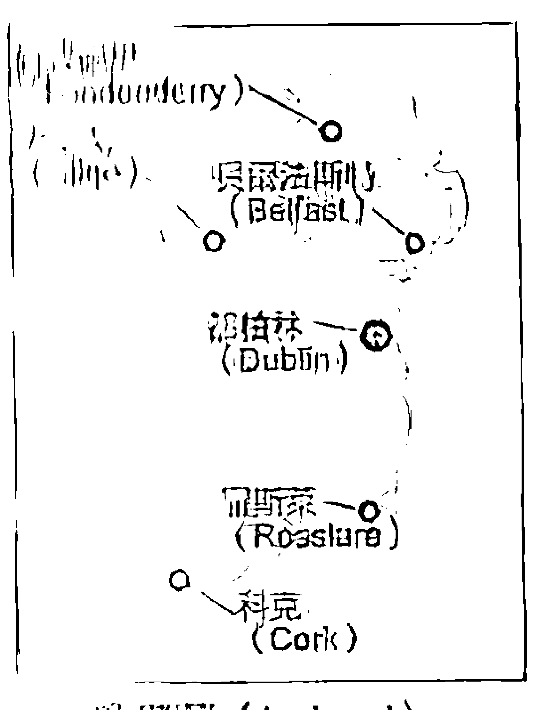

- **1542**：英王亨利八世就任爱尔兰国王
- **1801**：英国与爱尔兰王国合并
- **1840**：多数居民因饥荒而移民美国
- **1922**：爱尔兰自由邦成立，加入英国自治领
- **1937**：实施新宪法，改名为爱尔兰共和国
- **1948**：英国承认爱尔兰独立，爱尔兰成为英联邦内的共和国
- **1949**：脱离英国联邦

### 神秘主义组织

- **都柏林赫密斯协会**：
  1. 以叶慈为中心设立
  2. 都柏林大学的校内组织
- **神智学协会**：
  1. 受莫伊尼·查特吉（Mohini Chatterjee）邀请入会
  2. 曾经会见布拉瓦茨基
- **黄金黎明**：
  1. 反对克罗利入会
  2. 一度成为领导者

### 克罗利（亚雷斯特·克罗利）

### Aleister Crowley

融合近代西洋魔法体系与埃及、东洋神秘思想，完成独特魔法体系的20世纪巨人，其影响力甚至可以及于现代。

### ◇ 近代魔法师的代名词

亚雷斯特·克罗利（1875～1947）是现代法国神秘学家罗勃特·阿马杜（Rober Amadou）评为「20世纪最伟大魔法师」的人物。克罗利自幼便对各种神秘现象颇感兴趣，还曾于就读剑桥大学期间对歌德的魔法作有著述；而克罗利魔法生涯的起跑点，正是有「魔法结社之母」之称的黄金黎明。

尽管两人后来分道扬镳，但克罗利刚加入黄金黎明时非常敬重共同创始者玛瑟斯的魔法成就，而克罗利著名的「透特的塔罗牌」亦在在反映了黄金黎明的理论。

当初黄金黎明之所以分裂，其实正是因为被视为同性恋的克罗利加入造成团员间的对立，再加上他又以玛瑟斯的全权代理者身份没收教团的书籍和魔法用具，使得情势愈发混乱。

1900年退出黄金黎明以后，遂走访墨西哥、印尼、锡兰等地从事魔法之理论性研究，还曾到访日本横滨。此外，克罗利在埃及接触到圣守护天使爱华斯，完成著名的《律法之书》。

此后克罗利加入融合苏非主义与坦陀罗教的德国魔法结社东方圣殿骑士团，并于1912年设立英国分会、担任领导者。

后来的克罗利强烈倾向于性魔法，还在西西里岛成立名为「迪拉玛修道院」（Abbey of Thelema）的设施，却遭墨索里尼（Benito Mussolini，1883～1945）逐出意大利。晚年克罗利深受药物中毒所苦，就在几乎遭世人遗忘的情况下死于赤贫，然而其影响力却早已经深深扎根于后世的魔法结社之中。

# # Crowley 的生涯

| 时代 | 年龄 | 事件 | 相关魔法 |
|------|------|------|----------|
| 1875 |      | 诞生于英国瓦立克郡（Warwickshire） | |
| 1898 | 22   | 加入「黄金黎明」 | < 型信魔法(型式魔法) |
| 1900 |      | 遭「黄金黎明」放逐·除名→环游世界 | < 迪拉玛瑜伽((Kundalini Yoga)) |
| 1903 | 27   | 跟露丝·凯莉（Rose Kelley）结婚→巴黎～锡兰蜜月旅行 | |
| 1904 | 28   | 于埃及受圣守护天使爱华斯之启示 | |
| 1907 | 31   | 设立「银星」（The Order of Silver Star） | |
| 1912 | 36   | 加入「东方圣殿骑士团」 | < 性魔法 |
| 1914 | 38   | 前往美国 | |
| 1916 | 40   | 「银星」名存实亡 | |
| 1920 | 44   | 于意大利设立「爱华斯教团」 | |
|      |      | 以「迪拉玛修道院」为活动根据地 | < 巫术 |
| 1923 | 47   | 遭墨索里尼逐出意大利 | |
| 1929 | 54   | 于巴黎就任「东方圣殿骑士团」首领 | |
| 1932 | 57   | 法国政府处以驱逐出境处分 | |
|      |      | 返回英国 | |
|      |      | 从事塔罗牌制作活动、执笔写作 | |
|      | 72   | 去世 | |

### No.062
古尔捷耶夫（乔治·伊凡诺维奇·古尔捷耶夫）

### George Ivanovitch Gurdjieff

古尔捷耶夫曾经走遍世界，完成独创的神秘哲学，以及运用苏非主义固有技法的修行法「工作」，其弟子主要活跃于美国。

### ◇ 苏非主义之继承者

即便是众多魔法师当中，乔治·伊凡诺维奇·古尔捷耶夫（1870?～1949）也是个非常神秘的人物。

古尔捷耶夫是希腊裔亚美尼亚人，是出生在现在亚美尼亚共和国²的俄罗斯正教徒。关于其出生年份，则有1866年、1870年、1872年、1873年、1877年诸说。

据古尔捷耶夫本人表示，他从小经历过多次神秘体验，自此便对人类和宇宙的所有神秘颇感兴趣。青年期以后，他走遍西亚、北非、巴勒斯坦、西藏以至于中国；1899年左右则在撒尔蒙兄弟会（Sarmoung Brotherhood）的修道院潜心修行，但前述行迹除本人发言以外并无其他事证可兹佐证。也有人说古尔捷耶夫其实是秘密警察派出的间谍。我们唯一可以确定的是，他曾在1913年携带100万利维尔（Livre）的巨额现金，先后出现于莫斯科和圣彼得堡（Saint Petersburg）。

俄国革命以后，古尔捷耶夫带着奥斯宾斯基夫妇（Ouspenskys）、哈特曼夫妇（Hartmanns）等弟子，在高加索（Caucasus）的叶先图基（Yessentuki）开设「人类和谐发展研究所」。不过古尔捷耶随即就离开此地，并于1922年7月14日抵达巴黎，正式开始从事活动。

他开发出一种叫「工作」（Work）的独特灵修法，能让人类摆脱束缚已久的老旧思考和情感，达到灵魂得获自由的更高境界。此灵修法还融合了苏非主义的修行法，以及一种叫「运动」（Movement）的特殊舞蹈等集团性、艺术性要素。

古尔捷耶夫还透过众多弟子的活动，间接影响到英国诗人 D·H·劳伦斯（David Herbert Lawrence，1885～1930）和建筑家法兰克·洛依·莱特（Frank Lloyd Wright，1867～1959）。

1. George Ivanovitch Gurdjieff：原著作「Georgei」应是笔误。
2. 亚美尼亚共和国（Republic of Armenia）：外高加索国家，为前苏联加盟共和国之一，亚洲西南部古国的继承者。

### 古吉拉耶夫的弟子

| 姓名 | 描述 |
|------|------|
| 威廉·奈恩（Willem A. Nyland） | 曾参加过奇迹的训练和古吉拉耶夫的团体，西金山的训练研究所的主持者 |
| 约翰·贝内特（John Bennett） | 师从古吉拉耶夫与葛吉夫，后来在印度的穆罕默德·苏布希（Muhammad Subuh） |
| 莫斯密斯基夫妇 | 古吉拉耶夫的具影响力弟子，于美国推广其思想 |
| 哈特曼夫妇 | 与古吉拉耶夫共同创作许多乐曲 |
| 法兰克·洛依·莱特 | 著名建筑师，是古吉拉耶夫弟子，两人共同研究「工作」修行法 |
| 路易斯·马奇（Louise March） | |
| 苏利文夫妇（Sullivans） | 两人均「人类研究研究所」的成员 |
| A.R. 奥雷奇（Alfred Richard Orage） | 担任古吉拉耶夫在美国的代理人，后来决裂 |
| 霍恩夫妇（Horn） | |
| 安德森夫妇（Anderson） | |

传承 D.H. 劳伦斯

### 古吉拉耶夫的思想

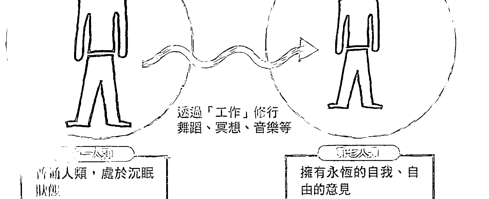

> > 一般人类，处于沉睡状态

> > 拥有永恒的自我、自由的意识

# # NO.063
福琼（狄昂·福琼）
*Dion Fortune*
活跃于黄金黎明和巫术崇拜间的过渡期，试图透过远距通信教育使魔法普及。创立时曾与莫依娜·玛瑟斯展开魔法战争。

### 接触神秘首领

狄昂·福琼（1891～1946）是英国的女魔法师，活跃于黄金黎明分裂后众家魔法结社纷乱林立的时代，直到加纳（1884～1964）的巫术崇拜兴起此间的过渡时期。

福琼本是双亲不详的孤儿，被信仰基督教科学派<sup>[1]</sup>的家庭抚养长大，取名为薇欧蕾·玛丽·弗思（Violet Mary Firth）。据传她未满二十岁时便具备灵媒资质，并已经有过跟灵体接触通信的经验。成年后就读伦敦大学心理学系，修习弗洛伊德（Sigmund Freud，1856～1939）与荣格（Carl Jung，1875～1961）的心理学，并深受布拉瓦茨基（1831～1891）著作影响。

福琼自1919年加入魔法结社「晨星」（Hermetic Order of Morning Star）以后，才正式开始从事魔法活动。不过由于当时「晨星」已几近分裂状态，是以福琼亦加入了普罗迪·依涅斯（Prodi Ines，1848～1923）主持的「阿尔法·欧米茄」（Alpha et Omega）英格兰分会，以及玛瑟斯夫人莫依娜（1865～1928）主持的伦敦分会，从事魔法修行。

福琼于1922年接收到神秘首领发出的灵界通信，成立「内光协会」（Society of the Inner Light），并与其相当于其师父的莫依娜·玛瑟斯（Moina Mathers）展开激烈的魔法战争。

打从莫依娜得知福琼萌生独立意图开始，福琼的住家就有许多黑猫侵入，甚至还有体型约莫老虎两倍大的大猫走下她家楼梯。此外，福琼利用星光体投射进入魔法的世界时，也曾经被穿着魔法服装的莫依娜硬给抛至半空中。

[1] 基督教科学派（Christian Science）：美国基督教新教的神秘教派。认为物质是虚幻的，疾病和罪恶一样，都出自人的必死意识，二者都只能靠上帝的永恒意识才能医治，并称此即「基督教的科学」。

不朽火科学派

心理学

神智学式的概念

福琼

黄金黎明之魔法形态

- 二十岁就对巫术感兴趣
- 于伦敦大学攻读心理学
- 1919年加入「晨星」
- 1922年创立「内光协会」

隶属于「阿尔法·欧米茄」的英格兰分会、伦敦分会

内光协会宗旨

- （1）反对传统巫术之迷信与教条
- （2）探索自然之奥秘与真理
- （3）促进心灵之觉醒与进化

### 莫依娜·玛瑟斯

1865～1928。法国哲学家亨利·伯格森（Henri-Louis Bergson 1859～1941）胞妹，黄金黎明共同创始者麦逵格·玛瑟斯之妻。丈夫死后，莫依娜在赫缇·依涅斯的协助之下经营魔法结社「阿尔法·欧米茄」。尽管莫依娜后来因为跟福琼的魔法战争而获得驱使猫鹰的黑魔法师恶名，但她其实是个肯为恣意而行的丈夫奉献的贤妻，并且深得结社员信赖。莫依娜毕业于美术学校，据传她曾参与设计黄金黎明的魔法用具。

### No.064 伽纳（杰若德·伽纳）

Gerald Gardner

伽纳创设自称为「德鲁伊伽法之复活」的独特魔法体系，并开创了巫术崇拜新潮流；其魔法活动亦受克罗利不少影响。

### ☆ 巫术崇拜之鼻祖

巫术崇拜是20世纪诞生的魔法界新潮流，而巫术崇拜之创始者便是杰若德·伽纳（1884~1964）。
其实伽纳是在55岁以后，才开始正式从事魔法活动。
伽纳出生于英属马来（Malay，现在的马来西亚和新加坡），并于该地担任海关职员直到退休。
另一方面，伽纳对当地的风俗民情和土著的魔法颇感兴趣，长年独自进行研究，甚至著有关于刀剑的著作。
伽纳55岁从海关退休后迁居至英国本土，并接受当时在新福雷斯特（New Forest）活动的女巫老桃乐丝·克拉特巴克（Old Dorothy Clutterbuck）施以加入仪式（通过仪式）[1]，正式成为魔法师。后来他更获得已届晚年的克罗利（1875~1947）协助，构筑出一套独特的魔法体系。
其成果尽皆收录于伽纳的代表作《影子之书》（Book of Shadow），此书至今仍是巫术崇拜的基本经典。
此外伽纳亦曾于1954年执笔《现今的巫术》（Witchcraft Today）公开其魔法体系，造成大批有志者前来向伽纳拜师，进而衍生出魔法史称巫术崇拜的新潮流。
伽纳认为巫术崇拜的魔法本是要复活古代德鲁伊的自然魔法，但巫术崇拜亦融合许多性魔法之要素，诸如把性行为编入教义，以及必须裸体执行仪式等。
尽管巫术崇拜曾经乘着1960至70年代的性解放风潮而急速壮大，但却又在伽纳死后不久又陷入分崩离析的状态。

> [1] 通过仪式：请参照P.30译注。

# # 11世纪的巫术活动

从英国马来

1030年，英国

阿凡法师开始活动

1077年，《影子之书》

1084年，《现今的巫术》

11世纪的巫术活动

伽纳

研究巫术的方法

师从的巫术，艾丝特·威斯

生卒年及生平经历不详，是当时英国为数不多的活跃的女巫之一。

各种巫术书籍，见附录资料

大师级人物

莫尼克·威尔森（Monique Wilson）

法国女巫，于伽纳死后继承其组织，跟英国人柯林·威尔森（Collins Wilson）结婚

朵琳·范里安提（Doreen Valiante）

伽纳的女祭司，生于英国多塞特郡（Dorset），曾参与《影子之书》的编纂工作，本身也是位诗人

[10世纪]以欧洲黑魔法—No.004

### 达西斯博士

Dr. Dahesh

活跃于近代黎巴嫩的魔法师，曾开创其独特魔法体系，并创造无数不可思议的神奇现象。黎巴嫩政府组织中，不少人都是他的信徒。

### ✦ 黎巴嫩的奇迹博士

达西斯博士（1909～1984）是活跃于近代黎巴嫩的魔法师；除黎巴嫩以外，他在周遭阿拉伯国家亦颇具声名。

达西斯博士本名叫作撒令·穆萨·阿西（Saleem Moussa Ashi），一说他乃伊拉克出身，一说他出生于耶路撒冷，但实情究竟如何今已不得而知。不过他在1975年黎巴嫩爆发内战前，便已经定居于黎巴嫩首都贝鲁特（Beirut），并创造出许多不可思议的奇迹。

达西斯博士总是能丝毫不差地对素未谋面的来访者说出唯有当事人才知道的秘密，让众人为之惊愕；他还曾经在巴黎被封棺沉入塞纳河，七天后又生龙活虎地出现在众人面前。据传他能使灵体物质化、任意移动钟表指针、治疗医师束手无策的患者，还曾经在一个多月以前预言美国总统甘迺迪（John Fitzgerald Kennedy）将会遭到暗杀。

阿拉伯世界至今仍流传着许多跟古以色列所罗门王一样，能驱使超自然存在镇尼（Djinn）的魔法师传说，因此也有人说达西斯博士其实是利用镇尼制造出许多不可思议的神奇现象。曾亲眼目睹达西斯博士奇迹的众多目击者当中，亦不乏黎巴嫩首任总统历里（Bishara al-Khuri）等名士。

达西斯博士还主张除物质世界外另有一世界存在，另外他主张所有宗教其实本属一宗，拥有相当独特的宗教哲学思想。这些思想后来便以其名而被称作「达西斯派」（Daheshism），现在黎巴嫩和美国皆有信徒。

达西斯博士也是位有名的美术品收藏家，纽约便设有达西斯博物馆（http://www.daheshmuseum.org/）展示其收藏。

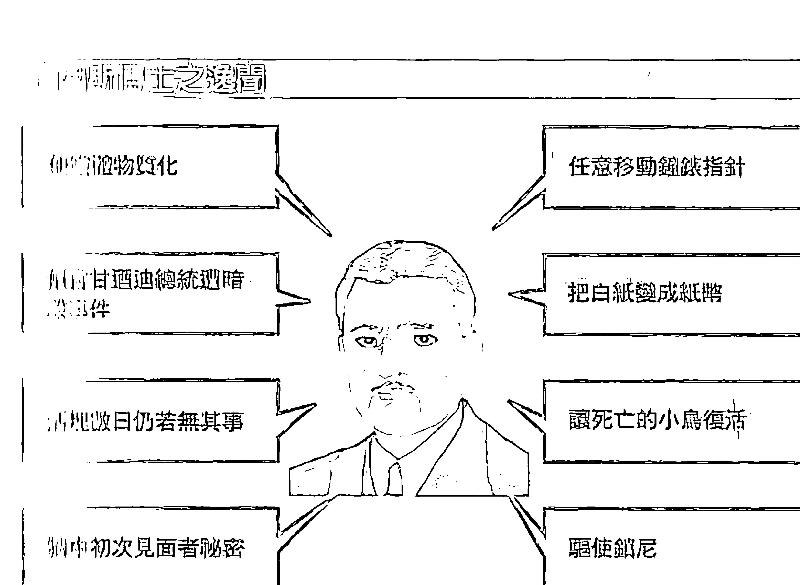

### 何谓达西斯派

- 1. 将达西斯博士奉为神圣的宗教思想
- 2. 承认灵存在的心灵主义
- 3. 主张物质只是暂时的，唯有灵才是本质

### 镇尼与中东魔法师

镇尼是伊斯兰教文化圈普遍信仰的超自然存在；据《可兰经》记载，阿拉光造天使、用土造人类，而镇尼则是火焰所造。日本亦相当有名的「阿拉丁神灯」故事中的精灵便是镇尼的一种；透过此则故事便不难得知，镇尼具备各种人类不能企及的神通力量。在阿拉伯世界的传说中，古代以色列王国的所罗门王就是位能够任意驱使镇尼的魔法师。

除所罗门王以外，《天方夜谭》还收录了许多能操纵镇尼的魔法师传说，而时至现代，有本领收服控制镇尼的魔法师亦是时有所闻。

### No.066
克利希那穆提（吉杜·克利希那穆提）
Jiddu Krishnamurti 神智学协会将其认定为传说中的救世主，并施以与其身份相当的教育；然而率领救世主的运动后来却因为自己发出的解散令而告终。其后克利希那穆提仍以精神世界导师之身份，继续从事立法活动。

### 即将降临的救世主

吉杜·克利希那穆提（1895～1986）是神智学协会视为传说即将降临的救世主、大力栽培的人物。离开协会后仍继续接收来自上师的通信，并成为新时代运动¹的一位伟大导师（Guru）。他原本是阿迪亚尔（Adyar）神智学协会的印度职员，乃吉杜·纳里亚纳（Jiddu Narainiah）之子。

某次克利希那穆提跟弟弟尼提亚（Nitya）在海岸游玩时，有位神智学协会的干部发现并认定他就是即将降临的救世主弥勒尊者（Maitreya），此人名叫查尔斯·李必特（Charles Webster Leadbeater，1854～1934）；不过李必特是位出名的同性恋，并曾因此一度于1906年遭协会放逐。

于是，克利希那穆提便跟弟弟开始接受李必特等神智学协会高层实施的救世主教育。也不知是否协会所施教育奏效，后来克利希那穆提也有能力可以自行跟传说中的上师们接触了。

后来协会会长贝赞特夫人（Annie Besant，1847～1933）在1911年另行设立奉克利希那穆提为救世主的「旭日教团」（The Order of the Rising Sun）。此结社后又改名为「东方之星教团」（The Order of the Star of the East），教团运动亦随之急速发展，不料却造成史丹勒（1861～1925）领导的德国分会脱离协会。

1929年8月，克利希那穆提突然自行宣布要解散「东方之星」并脱离神智学协会，使得教团运动为之顿挫；不过后来克利希那穆提仍不断提出自己的思想主张，并透过著作传诸后世，现在仍有许多支持者。

- ¹ 新时代运动（New Age Movement）：1970和1980年代透过秘传的形而上学的宗教社团传播之运动。期待一个充满爱和光明的「新时代」，并透过个人的转化和治愈让人们得以预先体验那即将到来的时刻

### 1. 创始人物与组织关系图

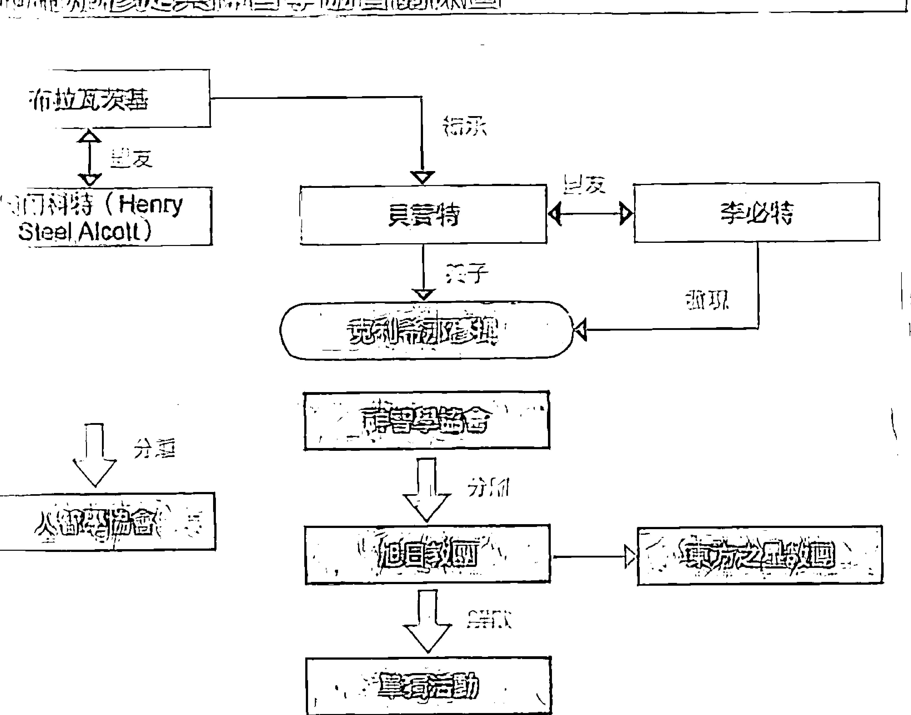

### 1. 克利希那穆提的活动

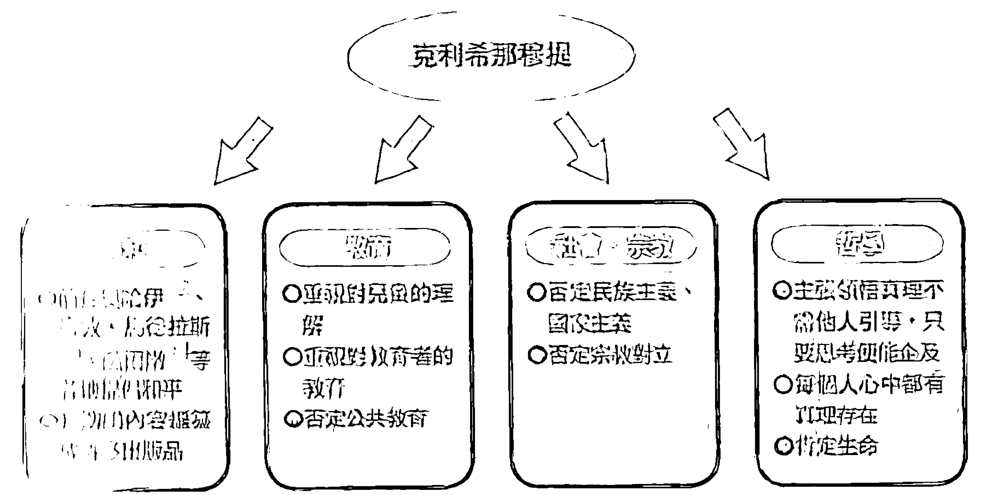

- * 教育
  * 重视对儿童的理解
  * 否定性以清者的教育
  * 否定公共教育
- * 政治、宗教
  * 否定民族主义、国家主义
  * 否定宗教对立
- * 哲学
  * 主张领悟真理不需他人引导，只要思考便能企及
  * 每个人心中都有真理存在
  * 肯定生命

欧亥（Ojai）：美国加州南部文图拉（Ventura）县的城市

马德拉斯（Madras）：印度坦米尔纳德（Tamil Nadu）邦首府，位于孟加拉湾科罗曼德海岸（Coromandel Cost）。

萨能（Surnen）：瑞士瓦尔登（Obwalden）半州首府。

### 贺伯特（拉菲耶特·罗纳·贺伯特）
Lafayette Ronald Hubbard

参加东方圣殿骑士团系统魔法结社的美国科幻作家，贺伯特于第二次世界大战后发表开发人类潜在能力的理论，并创设山达基派。

### ◇ 科幻作家与神秘学教团

山达基派是开启人类潜在能力的自我启发运动，「山达基理论」之确立者，便是拉菲耶特·罗纳·贺伯特（1911～1986）。

贺伯特出生于美国的内布拉斯加州（Nebraska），是科幻杂志《惊奇的故事》（Astounding Stories）与奇幻杂志《未知》（Unknown）等杂志的投稿作家。

贺伯特还有许多传说：据传第二次世界大战期间，他在朝鲜从事军事相关工作时不幸失明，后来却在1949年奇迹式地恢复视力；他还在1948年创作小说《石中剑》（Excalibur），据说读过原作的15人里有4个人因此发疯……事实上他是在1947年重返科幻小说界，也是位颇受好评的作家。

他在1945年结识了主持东方圣殿骑士团系统加州阿加佩分会（Agape Lodge）的杰克·巴森兹（Jack Parsons，1914～1952），并加入该团体。贺伯特于1950年发表山达基派的基础理论「戴尼提理论」（Dianetics），并将其刊载于《惊奇的故事》。后来杂志总编辑甘贝尔（John Wood Campbell Jr.，1910～1971）又在《戴尼提》单行本发售后不久设立「财团法人贺伯特·戴尼提研究中心」，此后财团不但迅速成长，范佛格特（Alfred Elton van Vogt，1912～2000）等科幻作家亦纷纷加入参与财团之营运。

后来贺伯特遂设立山达基派以发展戴尼提理论、力图使人类得到救赎，并且于1982年发表小说《地球战场》（Battlefield Earth）再度复出科幻界。

### 《惊奇的故事》

1930年以《惊奇的超科学故事》（Astounding Stories of Super Science）为名创刊的美国科幻杂志。1937年约翰·伍德·坎贝尔二世（John Wood Campbell III）担任主编后，杂志销量便稳步上升。戴尼提理论最早便在此杂志发表。

### 拉维（安东·桑德·拉维）
Anton Szandor LaVey

象征现代美国的黑魔法师，创办主持奉行恶魔崇拜的撒旦教会。除此之外，美国还有许多从撒旦教会派生出来的团体也都还在活动当中。

### ◇ 黑魔法之复活

安东·桑德·拉维（1930～1997）是现代美国最具代表性的黑魔法师。他创办的撒旦教会是个实施黑弥撒、恶魔崇拜的教团，鼎盛时期全世界共有多达2万5千名的信徒。

据传杀害女演员莎朗·泰特（Sharon Tate，1943～1969）的主谋查尔斯·曼森（Charles Manson，1934～）跟撒旦教会有关（其实两者并无关联），另外拉维还曾经在电影「失婴记」（Rosemary's Baby）里饰演恶魔*1，因此撒旦教会可说是为大众媒体提供了不少话题。

据说拉维的双亲是罗马尼亚与德国的混血吉普赛民族，但此说仅只是未经验证的传闻。拉维曾在就读高中时加入马戏团担任驯兽师，并在巡回演出中表演读唇术和键盘乐器维生，后又转职成为专门拍摄犯罪现场的摄影师。然而长期出入血腥的犯罪现场却使他开始怀疑上帝，终于步上崇拜恶魔之途。

拉维是在1966年4月30日，亦即瓦普吉斯之夜（Walpurgis Night）（5月1日五朔节*2前晚）于旧金山设立撒旦教会。当时适逢反对过度重视物质之偏颇价值观的精神运动、性解放风潮的大流行，是以撒旦教会的发展相当顺遂，而拉维亦于1969年执笔该教团经典《撒旦圣经》（The Satanic Bible）。

知名女演员珍·曼斯菲尔德（Jayne Mansfield，1933～1967）也是教会成员；她的经纪人山姆·布洛迪（Sam Brody）曾经跟拉维发生严重争执，拉维遂施法诅咒布洛迪。也不知是否诅咒应验，两人后因交通意外而死于1967年。同样奉行恶魔崇拜、由迈克尔·阿奎诺（Michael Aquino）主持的塞特寺院（The Temple of Set），也是由撒旦教会分离出来的组织。

*1 饰演恶魔：据传拉维在「失婴记」里饰演撒旦并担任非正式技术顾问，但也有人说其实因为莎朗·泰特曾参与制作此片，后来却遭曼森杀害，才会从前称曼森跟撒旦教会有关的传闻进而想到拉维。该片中饰演撒旦的演员是克莱·泰纳（Clay Tanner），而且并无任何技术顾问。此外「失婴记」的导演波兰斯基（Roman Polanski）正是莎朗·泰特的丈夫。
*2 五朔节：请参照P.20注注。

### 撒旦教会大事记
- 1966(6) 教会成立
- 1967(?) 曼斯菲尔德咒杀事件？
- 1969(?) 《撒旦圣经》刊行
- 莎朗·泰特事件
- 1972(?) 《撒旦的仪式》（The Satanic Rituals）刊行
- 1974(5/6?) 塞特寺院分离
- 1989(?) 《撒旦的女巫》（The Satanic Witch）刊行
- 拉维去世，由布朗歇·巴顿（Blanche Barton）继承

### 死海古卷

1947年，有三个贝都因人正在死海沿岸赶羊，其中一人在库姆兰（Qumuran）附近发现一个洞窟，并随手拾起石子往洞里扔，没料到洞里却传来物品破碎的声音。

其中一位牧羊人在两天后潜入洞窟，发现了十个瓶子，而且其中一个瓶子里竟然藏有三册书卷。

这便是统称为死海古卷或死海抄本的一系列文献，当初被发现的经过：

1951年以后，库姆兰附近才多次展开正式的挖掘调查行动，并且陆续发现许多文献。除《旧约圣经》抄本以外，还发现《社群守则》（Community Rule）、《战卷》（War Scroll）、《感恩诗歌》（Thanksgiving Hymns）、《哈巴谷注释书》（Book of Habakkuk）、《外典创世记》和《圣殿古卷》（Temple Scroll）等一直以来不为世人所知的文献，其中的主要文献现在多收藏于耶路撒冷的以色列博物馆附设「圣经殿堂」（Shrine of the Book）。

死海古卷乃是犹太教支派艾赛尼派（Essenes）经典，应是从前居住在库姆兰一带的教团留下来的文献。

艾赛尼派形成于西元前2世纪中叶以后，其势力一直延续至西元后1世纪为止；关于「艾赛尼」之语源，应是来自于阿拉伯语的治愈者「医师」。

艾赛尼派以洁癖饮食和独特教义而著称；据古罗马作家老普林尼（Pliny the Elder，23？～79）记载，艾赛尼派共有约4000名左右的信徒。

通常艾赛尼派的信徒大多居住在城镇里，唯有核心成员会在位于荒野偏僻的本部，组织成恪守完全共产制度和禁欲主义的共同体。所有信徒都必须基于摩西和先知之教训、透过公会教师启示之奥义，跟神缔结新的契约，严守律法诚心礼拜并祈求世界末日早日到来。

其中库姆兰的教团亦曾在西元66年的犹太人反抗事件中拿起武器对抗罗马，最后却被韦斯巴芗（Vespasian）率领罗马军队粉碎，自此消逝于历史之中。

此外还有人主张耶稣基督和施洗者约翰也都跟该教团有关。

澳洲的芭芭拉·瑟林（Barbara Thiering）认为福音书所载耶稣的许多行动，其实是利用一种特殊符号系统，记录该教团内部发生的事件，并藉此勾勒出自成一说的耶稣形象。

克里斯多夫·奈特（Christopher Knight）跟罗勃特·洛马斯（Robert Lomas）则是透过著作《The Second Messiah》（Arrow Books Ltd，1998），主张艾赛尼派之思想乃透过伊拉克的曼达派（Mandaean）由圣殿骑士团继承，甚至连结至后来的共济会。

### 第3章 魔法重塑

（下方模糊文字，可能为章节引言或说明）

# **No:069 圣殿骑士团**
The Knights Templar

为保护圣地巡礼者而设的众多骑士团之一。圣殿骑士团曾经在欧洲各地拥有广大的领地，后来却在14世纪受迫害而消减。据传幸存的圣殿骑士团遂成为后来共济会之母体。

### ◆ 涉及恶魔崇拜罪嫌的骑士团

圣殿骑士团乃中世纪众多骑士修道会之嚆矢，极富传奇性色彩。此团体原是第一次十字军东征夺回圣地耶路撒冷后，胡格·德·帕扬（Hugues de Payens，1070～1136）1118年为保护圣地巡礼者而设立于耶路撒冷的组织。

当时的耶路撒冷国王鲍得温二世（Baldwin II，1217～1273）将犹太教圣殿遗迹的部分场地拨给骑士团作为根据地，遂有圣殿骑士团之名。

随着身穿红十字白修道袍的圣殿骑士团员急速增加，骑士团因对抗伊斯兰教徒的战役成为威名远播的强力军事集团，骑士团亦拜欧洲各地领主捐赠和各种商业活动所赐，累积巨额财富，在欧洲各地共有多达9000笔的广大领地。

然而好景不常，法王腓力四世（Philip IV，1268～1314）向骑士团要求财政援助遭拒，便以否认上帝、崇拜恶魔巴弗灭[1]罪名，将法国境内的团员全数逮捕。将36名团员折磨至死的严苛拷问后，终于得到团员认恶魔崇拜的自白，教宗克雷芒五世（Clement V，约1260～1314）遂于1312年命令骑士团解散，末代团长杰克·德·莫莱（Jacques de Molay，？～1314）则遭处火刑。他受刑时曾预言教宗与法王将会在神的法庭接受审判，结果两人也在不久后去世。

另外亦有传说指圣殿骑士团并未完全消灭，部分团员逃离法国抵达苏格兰，并曾参与苏格兰独立战争。根据此派说法，苏格兰的圣殿骑士团后来遂转入地下活动，成为共济会之母体。此外，还有人主张圣殿骑士团跟锡安会也有关系。

[1] 巴弗灭：请参照P.22注。

### 聖殿騎士團之構造

### 聖殿騎士團關係圖

# **No.070 共济会**
Freemasonry

全世界规模最大的秘密结社。法国大革命与美国独立等历史事件背后，都有共济会会员在暗地里活动。许多魔法师也都是共济会的会员。

### 左右历史的神秘结社

共济会在鼎盛时期全球共有多达600万名会员，是全世界最大的秘密结社。

根据正史纪录，近代共济会乃发祥自1717年圣约翰（Saint John）圣人节日6月24日设立的伦敦大分会（London Grand Lodge），不过共济会似乎在此之前已经存在。共济会之真正起源至今仍旧是个谜；据当初创设伦敦大分会的宪章起草者安德森（James Anderson）的说法，共济会之起源可以追溯至亚当，而最早批准认可共济会的掌权者，则是盎格鲁·撒克逊国王艾塞斯坦（Athelstan，约895～939）。

共济会内部的传说则是将从前建造所罗门神殿的腓尼基人（Phoenician）领袖希蓝·阿比夫（Hiram Abiff）奉为开祖，亦有传说指共济会乃源自于古埃及秘密宗教或圣殿骑士团。

共济会起初只有徒弟、工匠、师父三个位阶，后来逐渐发展出其他位阶，现在的苏格兰仪式就共有33个位阶。

有人认为共济会其实只不过是个单纯的友爱团体，可是也有许多人深信共济会是利用旗下各种国际机构，企图征服世界的阴谋结社。就历史面而论，法国大革命后建立的议会有四分之三的议员皆隶属共济会，而乔治·华盛顿（1732～1799）、班杰明·富兰克林（1706～1790）等美国独立关键人物跟历任美国总统，都是共济会的会员。

此外，圣日耳曼伯爵（1710？～1784）、卡廖斯特罗伯爵（1743～1795）、利未（1810～1875）等近代魔法师也曾加入共济会，是以共济会跟各种蔷薇十字团体、魔法结社亦有交集。

### 共济会之位阶

| 初期 | 纽约仪式 (York Rite) | 苏格兰仪式 (Scottish Rite) |
| :--- | :--- | :--- |
| ① 徒弟 | ① 徒弟 | ① 徒弟 |
| ② 工匠 | ② 工匠 | ② 工匠 |
| ③ 师父 | ③ 师父 | ③ 师父 |
| | ④ 候选者 | ④ 秘密师父 |
| | ⑤ 苏格奇 (Scotch) | ⑤ 完全师父 |

### 共济会的组织

大分会：分会之集合体。最早设立的大分会乃由英国的四个分会而成。除英国外，共济会在其他国家亦设有大分会。

# **錫安會**
The Priory of Sion

跟圣杯传说关系密切的秘密结社。传言锡安会曾经在暗地里秘密操纵共济会和圣殿骑士团，但由于锡安会直到最近才始为世人所知，不乏派人怀疑该组织是否为近年才创设的组织。

### ◇ 圣杯守护者

锡安会是为保护耶稣基督（BC4？～29？）与抹大拉的马利亚（Mary Magdalene）一脉法国梅罗文加王朝（Merovingian Dynasty）血统而于11世纪组织成的秘密结社，据传圣殿骑士团、蔷薇十字团、共济会等团体皆深受锡安会影响。

法国早在1956年以后便开始有相关传闻出现，日本则是在丹·布朗的《达文西密码》（角川书店，2004）成为畅销书后，锡安会方才一夜成名。

据传锡安会是第一次十字军东征的指挥官之一、夺回圣地后被选为耶路撒冷国王的法国洛林公爵布永的戈弗雷（Duke of Lorraine Godfrey of Bouillon，1060？～1100）于1090年（另说为1099年）创设，不过也有人主张组织其实早已存在。

据传创设圣殿骑士团的胡格·德·帕扬（Hugues de Payens，1070～1136）其实也是锡安会的大师（Grand Master），而蔷薇十字团也是由帕扬以后的锡安会大师所创。此后约百年间，一直都是由同一人物兼任领袖与圣殿骑士团团长，两者直到1188年方才分离。锡安会在1312年圣殿骑士团解散后仍然存在，1481年时锡安会在欧洲仍保有27笔领地。

后来的锡安会还有许多赫赫有名的大师辈出，诸如传奇性炼金术师勒梅（1330～1418）、文艺复兴时期的天才李奥纳多·达文西（1452～1519）、画家波提切利（Sandro Botticelli，1444/5～1510）、近代科学之父牛顿（1642～1727）、作家雨果（Victor Hugo，1802～1885）以及法国诗人尚·科克托（Jean Cocteau，1889～1963）。

### 锡安会的历史

| 时代 | 事件 | 各时代的大师 |
|------|------|----------------|
| 1099 | 锡安会成立 | |
| 1118 | 分生成立圣殿骑士团 | |
| 1312 | 圣殿骑士团解散<br>（十字架符号） | 尼古·马基雅维利 (1490~1519) |
| 1497 | 完成「最后的晚餐」 | 达文西 (1452~1519) |
| 1614 | 蔷薇十字团公开化<br>（玫瑰十字符号） | 约翰·瓦伦丁·安德烈 (1586~1654) |
| 1717 | 共济会成立<br>（共济会符号） | 牛顿 (1642~1727) |
| 1870 | 锡安会之存在为世所知 | 佩塔尔 (1802~1895)<br>尚·科克托 (1889~1963) |

### ☆ 暗中引导人类之存在

传说中的秘密结社「蔷薇十字团」是个为守护传承古代智慧、引导人类走向正途而暗中活动的秘密结社，设名为「看不见的大学」（Invisible College）的特殊教育机构，潜藏于历史暗流之中。从中世纪直到现代，其存在一直都是以欧洲为中心广为流传的传说。

从1614年一系列的蔷薇十字团宣传册公诸于世、安德烈（1586～1654）于1616年发表《化学的结婚》以后，方才使得蔷薇十字团的存在台面化。

根据这些资料纪录，蔷薇十字团乃是由中世纪的传奇魔法师罗森克罗伊茨（1378～1484）和五位同志共同组成。

罗森克罗伊茨出生于德国没落贵族之家，曾远赴阿拉伯求得知识，归国后便和同伴组织蔷薇十字团。

由麦克·培金（Michael Baigent）、理查·雷伊（Richard Leigh）和亨利·林肯（Henry Lincoln）三人共著的《圣血与圣杯》（The Holy Blood and The Holy Grail·Dell·1983）则是说：蔷薇十字团之创设者其实是锡安会的大师马利·德·日索尔（Marie de Gisors），而圣殿骑士团和锡安会则是于1188年分离独立。

致力于启蒙人类的蔷薇十字团思想更影响到后来的共济会，不但在其位阶制度中设立蔷薇十字团位阶，会内亦组织了许多取名蔷薇十字的团体，跟日后的魔法结社皆颇有关联。

### 蔷薇十字文书

#### 值得赞赏的蔷薇十字团的名声
- 1614年于德国卡塞尔（Kassel）出版
- 记录罗森克罗伊茨的生涯
- 预告其他宣传册之出版

#### 蔷薇十字团之信条告白
- 1615年于卡塞尔出版
- 批判教宗

#### 克里斯钦·罗森克罗伊茨的化学的结婚
- 记录罗森克罗伊茨游历炼金术世界的经过
- 罗森克罗伊茨使逃杀害的国王和王妃复活

### 蔷薇十字团列表

| 团体名 | 特征 |
| --- | --- |
| 蔷薇十字团 | 传说克里斯钦·罗森克罗伊茨设立的团体。为引导启发人类而秘密活动。 |
| 古代蔷薇十字团 | 山缪·里希特（Samuel Richter）于1710年组成。 |
| 英国蔷薇十字团 | 罗伯特·温特渥·利特（Robert Wentworth Little）于1867年成立，跟黄金黎明关系相当密切。 |
| 伊莉莎白蔷薇十字团 | 亨·格达于1887年设立。 |
| 法国蔷薇十字团 | 佩拉德（Josephin Peladan）1890年脱离喀巴拉蔷薇十字团所设。 |
| 蔷薇十字同志会 | 麦克斯·汉戴尔（Max Heindel）约于1910年设立。现今仍在活动中。 |
| 美国蔷薇十字团 | 路易斯·斯彭斯（Lewis Spence）设立于1909年。现今仍在活动中。 |
| 荷兰蔷薇十字团 | 扬·冯·利肯堡（Jan van Rickenborgh）1924年设立于荷兰。现今仍在活动中。 |

南美、比利时等地也有名为蔷薇十字的团体存在。

### No:073 耶律·科恩

### Elu Cohen (The order of the Elect Cohens)

帕斯加里组织的魔法结社。此幽灵之仪式后因佩布翰得到复兴，并对俄罗斯神秘主义造成不小影响。

### ☆ 法国的魔法结社

耶律·科恩是法国神秘学者杰克·马丁尼兹·德·帕斯加里（Jacques Martinez de Paschali，1715？～1779）创设的秘密切社。据传帕斯加里是葡萄牙或西班牙的改宗犹太人（Conversors），他热衷于喀巴拉，并已穷究其奥义。

帕斯加里约于1760年左右在波尔多（Bordeaux）组成秘密切社耶律·科恩。

由于耶律·科恩有许多成员都来自共济会，是以经常被视为其内部组织，甚至还被称作耶律·科恩·共济会骑士团。

耶律·科恩的团员必须进行教团内规定的各种修行，藉以回复自我出生之原初创造原理。

耶律·科恩的修行融合了共济会的仪式和召唤魔法要素，此外还包括锻炼肉体的饮食训练、施行星光体投射所必需的呼吸训练，以及锻炼灵魂的音乐性、精神性训练等。团员还要召唤天使、在天使降临见证之下描绘圆形或圆弧、点燃蜡烛唱诵咒文；仪式进行过程中，所有与会者皆不得携带任何金属物品。

后来帕斯加里在1772年突然毫无来由地移居至加勒比海的圣多明哥岛（Santo Domingo Island）并病死当地，其仪式遂由路易·克劳德·德·圣马丁（Louis Claude de Saint-Martin，1743～1803）等人继承。

圣马丁于1768年加入耶律·科恩，并且推演开展出一套独特的神秘哲学；其思想后来传至俄罗斯，并且对索洛维约夫（Vladimir Sergeyevich Solovyov，1853～1900）等俄罗斯神秘思想家造成了不少影响。

19世纪以后尚有法国魔法师佩布丝（1865～1916）重整耶律·科恩的诸多仪式。

### 图 以科恩为中心之相关图

共济会

耶律·科恩

帕斯加里
1715?～1779。
葡萄牙或西班牙的改宗犹太人。约于1760年组成耶律·科恩

雅各·伯麦
(Jacob Boehme)

圣马丁
1743～1803。
路易·克劳德·德·圣马丁是法国的神秘学家。1768年加入耶律·科恩

维利莫
(Villermo)

### 图 科恩的各种修行

回复原初的创造原理

呼吸训练

音乐冥想训练

### No.074 神智学协会
The Theosophical Society
近世最大的神秘主义团体，立基于布拉瓦茨基思想，对人智学协会、克利希那穆提运动、新时代运动皆有莫大影响。

### 影响力及于现代的神秘主义团体

神智学协会乃立基于布拉瓦茨基（1831～1891）与上师通信所得神秘哲学之神秘主义团体。

关于「神智学」此用语，一说乃肇始于雅各·伯麦（Jacob Bohme，1575～1624）弟子约翰·葛欧格·吉希泰尔（Johann Georg Gichtel，1638～1710）1696年的著作《实用神智学》（Theosophia Practica），一说此语乃西元3世纪的亚历山卓哲学家阿摩尼奥斯·萨卡斯（Ammonius Saccas）所创；至于奉行布拉瓦茨基神秘哲学的神智学协会，则是1875年由布拉瓦茨基跟亨利·史提尔·奥尔科特（Henry Steel Olcott）等人设立于纽约的魔法结社。

神智学协会之教义皆记载于布拉瓦茨基的著作《秘密教义》*1和《揭开面纱的伊西斯》（Isis Unveiled），内容讲述根源人种之存在、跟神秘数字「7」息息相关的宇宙进化论，以及亚特兰提斯等古代文明。

协会成立后发展非常快速，至1885年已经总共成立了121个分会，生物学家亚尔佛德·罗素·华莱士（Alfred Russel Wallace，1823～1913）和发明家托马斯·阿尔发·爱迪生（Thomas Alva Edison，1847～1931）都是会员。

然而1884年布拉瓦茨基被拆穿诈骗手法逐出协会，1891年去世，造成协会内斗，紧接着又是美国地区各分会脱离协会独立、克利希那穆提救世主运动造成史丹勒派离开协会，甚至还有他自身的叛离，每个事件都使得协会势力逐渐衰退。

不过神智学协会不仅影响了后世神秘主义思想，同样也对新时代运动（New Age Movement）造成相当大的影响，就连史丹勒的人智学协会也是由神智学协会分离而成。

*1 秘密教义：请参照P.115译注。

### 神智学协会的思想

达尔文进化论

印度教

佛教

心灵术

喀巴拉

#### 根源人类

宇宙周期性发生的七个基本人种，目前只出现五个根源人类而已。现存人类便是由其中两支人种演变而成。

#### 宇宙进化

宇宙共有七个机能层级各异的天球，并且会依次向高阶天球移动。

#### 近世最大的神秘主义团体 神智学协会

### 近世的神智学协会的目标

-   突破人种、信念、性别、阶级、肤色等藩篱，成为全人类普遍同胞感之核心。
-   促进比较宗教、比较哲学、比较科学之研究。
-   调查研究未知的自然法则以及人类的潜在能力。

### No:075 人智学协会

### The Anthroposophical Society
源自神智学协会的团体。人智学协会是种以灵魂的进化为基础，总括教育、艺术、农业等领域思想的神秘主义式理论。

### ◇ 史丹勒的神秘思想

「人智学」原是16世纪以后，用来指称潜藏于欧洲思想底流之秘密宗教立场的用语；不过现此语已经变成专指德国神秘思想家史丹勒（1861～1925）提倡之独特思想体系的名词。

史丹勒是德国的思想家，自幼便能看见灵体存在的世界，还能够存取使用记录着世间所有事件的「阿卡锡纪录」；而他所提倡的人智学当中，亦包含许多他利用灵知觉获得的知识。

史丹勒的人智学是要在偏重物质的时代里担任科学和灵界之媒介，开发所有人类潜在的高层认识能力，并藉由个人能力之开发促使社会进步的思想体系。人智学协会成立于1912年，是学习并实践前述史丹勒思想的组织。

人智学主张除物理世界以外，尚有灵界和神界的存在。他们还有个非常独特的进化论：过去到未来共分成七个行星期，每个行星期皆各有七个种类的根源人种。此外人智学亦有死后世界、轮回转世等概念，其涉及领域更是横跨教育、艺术、自然农法、医学与自然科学。

重视全人格均衡发展的史丹勒教育近年在日本颇受注目，而他发明的优律思美（一种体操）不仅仅是一种舞蹈艺术，同时亦具有医疗效果。除此以外，欧洲还有基于人智学思想实施自然农法的农场。

简单来说，神智学跟人智学的不同就在于：神智学主张人类必须透过上师等超存在引导，才能达致更高层次的认识能力，相对地人智学则始终是以人类为主体，只要经过有系统的学习，任谁都能获得更高层次的认识能力。

※1 阿卡锡纪录：请参照P.124注释。
※2 优律思美：请参照P.124注释。

### 神智学协会到人智学协会

-   神智学协会
    -   分裂 → 阿迪亚尔派
        -   经理史丹勒 → 红十字同志会
        -   分组 → 克利希那穆提
        -   分组 → 秘密学院 (Arcana Academy)
    -   分裂 → 洛斯丹派 (Point Loma)
        -   分组 → 人民寺院 (Temple of the People)
        -   分组 → 美国联合会 (America United Lodge)

### 神智协会所说世界的七个阶段

| 时代 | 人类类型 | 文化时期 |
|------|----------|----------|
| 土星纪 | 极地人 | 古印度 |
| 太阳纪 | 极北人 | 古波斯 |
| 月球纪 | 勒穆里亚人 | 古埃及 |
| 地球纪 | 亚特兰提斯人 | 古希腊罗马 |
| 水星纪 | 现生人 | 近现代 |
| 金星纪 | 第六根源人 | 第六文化期 |
| 巴尔干世纪 | 第七根源人 | 第七文化期 |

> > 内作甲型：请参照P.114注解。

### ☆ 近代魔法结社之源流

黄金黎明是威廉·韦恩·韦斯科特（William Wynn Westcott，1848~1925）、玛瑟斯（1854~1918）和罗勃特·伍德曼（Robert Woodman，1821~1891）于1888年创立的英国魔法结社；不但重整各种魔法体系使其复活，后世还有许多魔法结社是由其派生而成，因此被称为近代魔法结社之源流。

韦斯科特曾经在黄金黎明设立当初，利用书信联络隶属于某德国魔法结社的女性安娜·施普伦格尔（Anna Sprengel），透过施普伦格尔间接向神秘首领取得设立结社之许可。

黄金黎明伞下设有名为“分殿”（Temple）的小组织，最初设立的“伊西斯·乌拉妮雅分殿”（Isis Urania Temple）成员包括法国哲学家亨利·伯格森（Henri-Louis Bergson，1859~1941）胞妹，亦即后来的玛瑟斯夫人米娜（后改名为莫依娜），伯格森（1865~1928），还有王尔德（Oscar Wild，1854~1900）的夫人。

此后组织发展相当顺遂，诺贝尔文学奖得奖诗人叶慈（1865~1939）与女演员茉德·冈妮（Maud Gonne）等人亦陆续加入，全盛期共有近百位会员。

然而自从玛瑟斯1892年直接接触神秘首领并于教团内部别设组织以后，黄金黎明便内斗不断，再加上1897年创设者之一韦斯科特的退团事件，以及后来恶名昭彰的同性恋者克罗利（1875~1947）入团争议，使得黄金黎明内部持续分化对立，结果玛瑟斯亦于1901年被迫退出，1903年黄金黎明终于分裂。

“晨星”（Hermetic Order of the Morning Star）、“阿尔法·欧米茄”（Alpha et Omega）等许多魔法结社皆源自黄金黎明，而亚伯拉梅林魔法、天使魔法、独特的塔罗牌解释认证等黄金黎明的中心魔法思想，亦由后来派生的诸团体所继承。

### 教团的组织构造

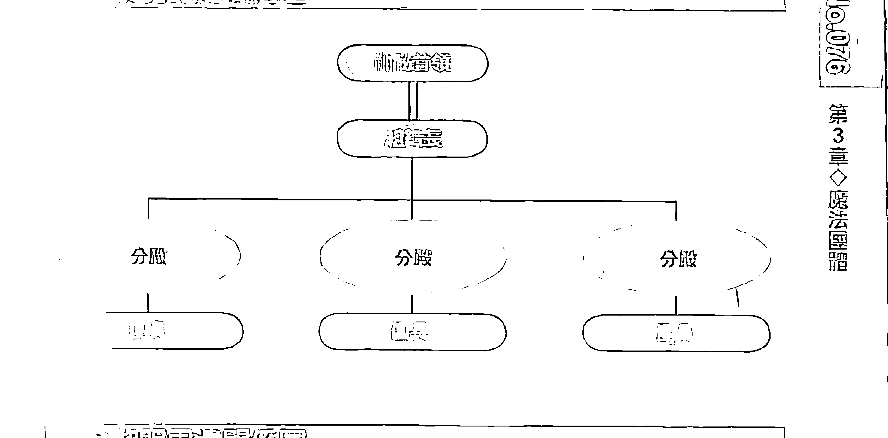

### 教团周边关系图

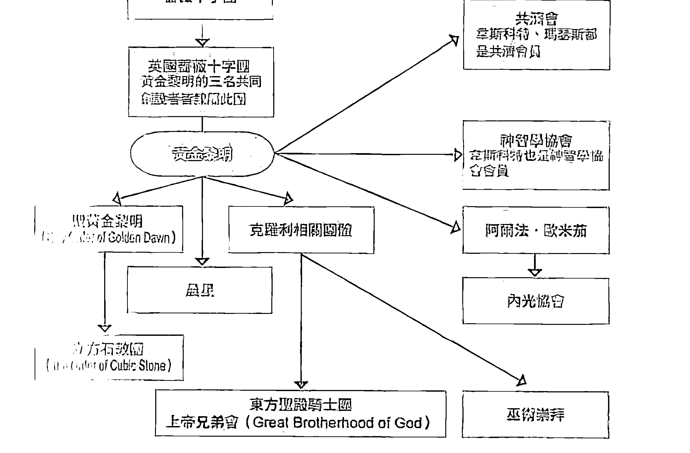

### No.077 东方圣殿骑士团
Ordo Templi Orientis
近代德国的魔法结社。首开正式引进坦陀罗教先例，连克罗利也深受影响。其分派现在仍在活动中。

### ☆ 坦陀罗教之引进

东方圣殿骑士团是卡尔·开尔纳（Carl Kellner，?～1905）设立的魔法结社，也是最早正式引进东洋坦陀罗教思想的西洋魔法结社。

开尔纳自称从前在印度孟加拉省旅行时，曾经接受印度与阿拉伯的导师（Guru）施以通过仪式*1。传说此结社成立于1895年，不过外界最早提及此名的纪录则是成立于1904年。

除将性魔法援引为教义以外，东方圣殿骑士团还有传承圣殿骑士团的象征意义，并沿用了类似共济会的位阶制度。

1905年开尔纳去世后，教团遂由提欧多·罗伊斯（Theodor Reuss，?～1924）继承。罗伊斯跟法国魔法师佩布丝（1865～1916）、德国神秘思想家史丹勒（1861～1925）都有过接触，并曾经活跃于丹麦、英国等地。

克罗利（1875～1947）于1912年加入此团体，并获罗伊斯许可设立英国支部「MMM」（Mysteria Mystica Maxima）。

1922年罗伊斯指名克罗利为教团继承者，但德国区教团有不少团员对克罗利的《律法之书》感到反感，造成教团分裂。

后来德国区教团受纳粹迫害消灭，当时的克罗利派领袖卡尔·约翰尼斯·革末（Karl Johannes Germer，1885～1962）于1941年逃往美国，并且在1947年克罗利死后继承其著作权及遗骨，成为教团领导者。东方圣殿骑士团美国本部乃由革末继任者设立于纽约，而革末生前亦曾颁布敕令准许瑞士设团，所以苏黎世也有东方圣殿骑士团的据点。

＊1 通过仪式：请参照P.30译注。

### 东方圣殿骑士团关系图

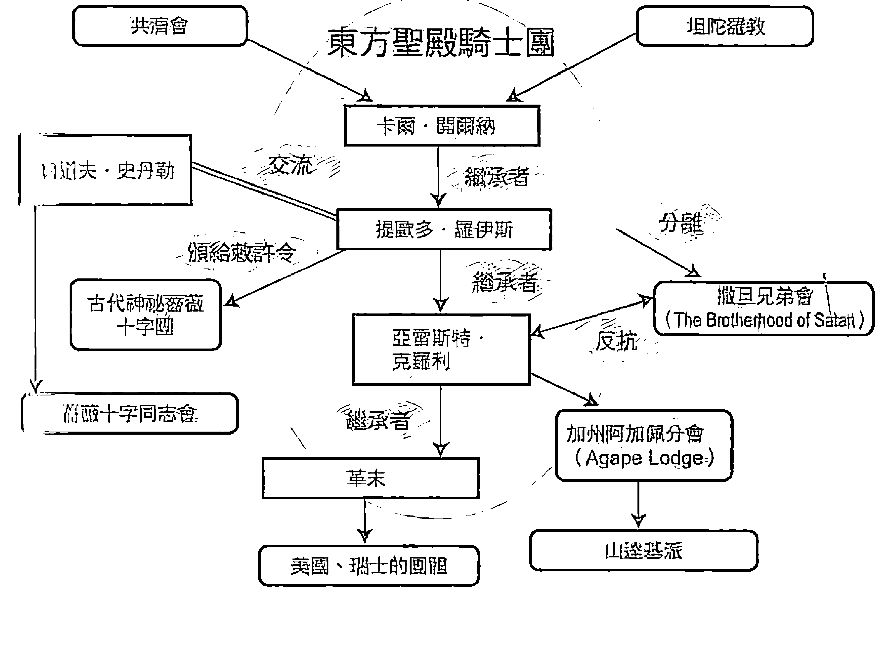

### 关系图年表

-   * 1905年 设立？
-   * 1904年 见载于共济会系统之机关杂志
-   * 1906年 卡尔·开尔纳去世，提欧多·罗伊斯继承
-   * 1912年 亚雷斯特·克罗利加入、设立「MMM」
-   * 1922年 罗伊斯去世，克罗利继承
-   * 1925年 部分团员不满克罗利的《律法之书》造成分裂
-   * 1937年 德国国内活动被迫停止
-   * 1945年 克罗利弟子革末以美国为中心展开活动

### No.078 光照派
Illuminati

企图统治世界的秘密结社。原始光照派因受当时国家权力镇压而告消灭，但后世又设立许多同名结社。

### ◇ 耶稣会士的幻想教团

光照派是德裔耶稣会士亚当・韦斯豪普特（Adam Weishaupt）于1778年组织的秘密结社，正式名称叫作巴伐利亚幻想教团。日语有时亦译作光明结社。

韦斯豪普特出生于德国的因戈尔施塔特（Ingolstadt），受耶稣会教育后成为因戈尔施塔特大学教授，但后来却又对耶稣会教义感到不满，遂于1776年加入共济会。

自此韦斯豪普特便否定皇权、教会等地上的既存权威，主张必须建立仅由接受过神秘主义通过仪式的少数份子进行统治的独裁体制，并且在共济会内部组织光照派。

据各种迹象显示，韦斯豪普特似乎有意藉光照派夺取共济会组织，进而利用共济会达到其目的。

1780年德国共济会大佬克尼格男爵（Baron von Knigge）加入光照派，使组织势力因而扩张；不过韦斯豪普特却处处提防克尼格男爵是否有企图夺取光照派权柄，结果导致两人失和，再加上巴伐利亚政府也开始对光照派采取高压政策，韦斯豪普特被迫亡命法国，组织亦全数崩坏。

被迫流亡以后，韦斯豪普特仍不断跟英国的共济会进行接触，并企图掌握该组织，却始终无法如愿。

不过光照派意欲重新组织世界的革命理论却也对法国大革命造成极大影响，以致后来有不少新团体皆以光照派自称。

时至今日，世界各地仍然流传着不少光照派暗中操纵共济会，企图统治世界的传说。

-   1. Illuminati：原文作Illuminati应是误认，近由订正。
-   2. 通过仪式：请参照P.30注。

### 光照派之演变

-   1778 成立
-   1780 共济会会员克尼格男爵加入
-   大国共济会会员加入
-   各地支部自然消灭
-   共济会色彩愈发鲜明
-   1785 光照派本部因政府命令被迫解散
-   会员持续增加
-   成为传奇性存在

### 光照派所渴望的世界统治体制

-   路西法
-   十三人评议会（行政）
-   评议公会（司法）(Sanhedrin)
-   三百人委员会（立法）
-   共济会干部
-   欧美日三极委员会
-   共济会本部干部
-   其他机构
-   世界语团体
-   扶轮社（Rotary Club）
-   童子军（Boy Scout）

世界语（Esperanto）：波兰眼科医生柴门霍夫（Ludwik Lejzer Zamenhof）于1887年设计的人造语言，试图用作国际通用的第二语言。世界语的词汇大都源自欧洲语言，因此对欧洲人来说较简单易学。

### No.079 山达基派
The Church of Scientology

基于贺伯特戴尼提理论而推行的自我启发运动。尽管许多好莱坞明星都是信徒，欧洲却视山达基派为异教。

### ✧ 好莱坞明星与异教

山达基派是科幻作家贺伯特（1911～1986）开创的一种自我启发运动，现在全世界100多个国家共有800万名信徒，好莱坞明星汤姆克鲁斯（Tom Cruise，1962～）、约翰屈伏塔（John Travolta，1954～）、爵士钢琴家奇克·科里亚（Chick Corea，1941～）都是信徒。

另一方面，山达基派在欧洲等地则被视为施行心灵控制（Mind Control）的异教教派，饱受批判。其基本教义，就是贺伯特于1950年发表的「戴尼提」（Dianetics）理论。

根据戴尼提理论，每个人都有个自古便即存在的精神个体「赛顿」（Thetan）；赛顿本身是个拥有无限力量的良善存在，但是从过去一直累积至今的有害因素「印痕」（Engram）却会使得赛顿无法发挥固有效力。

所谓的戴尼提便是一种消除印痕的方法。

该理论最早见载于科幻杂志《惊奇的故事》（Astounding Stories）；《戴尼提》单行本发售后，杂志总编辑甘贝尔（John Wood Campbell Jr.）见读者回响热烈，遂设立「财团法人贺伯特·戴尼提研究中心」，致力普及戴尼提思想。

于是贺伯特遂以戴尼提为理论基础，建立山达基派。

山达基派是要解放众人被印痕隐蔽的精神个体力量，是以信徒必须历经单独面试（名曰「审核」〔Auditing〕）、各种课程等数十个阶段的进程。

### 心的概念

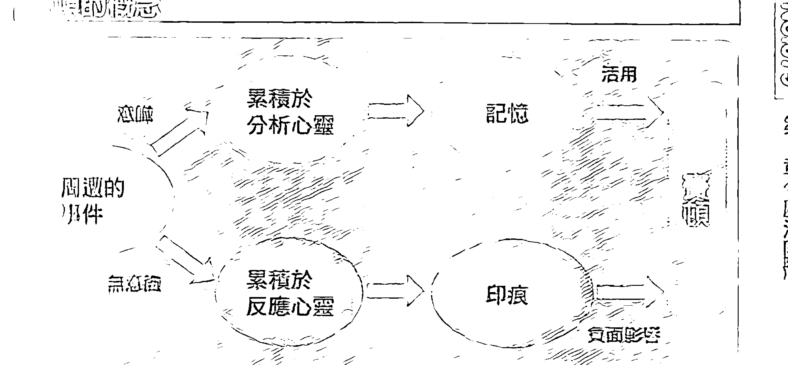

削除反应心灵（Reactive Mind）

理想状态

### 启动力理论


### No.080 巫术崇拜
Wicca 奉行加纳理论的魔法新潮流。巫术崇拜结集形成团体后，势力急速扩张，现已派生出众多分派。

### 海关职员创设的魔法结社

巫术崇拜是指20世纪后半叶以伽纳（1884～1964）整之魔法体系为基础而诞生的魔法界新潮流。

尽管伽纳主张这套体系乃是源自于古代德鲁伊的自然魔法，不过他在构思这套体系时，亦曾获得自称「兽示录之兽」（亦即撒旦）的性魔法巨擘克罗利协助；因此巫术崇拜不但跟黄金黎明有相通之处，更可谓是个亦旧亦新的思想体系。

巫术崇拜是以一名领导者加6对男女共13人组成的「女巫团」（Coven）为基本单位进行活动；若有新成员加入使得人数超过13人时，则「女巫团」就必须一分为二各自活动。

巫术崇拜基本教义皆记载于伽纳的著作《影子之书》（Book of Shadow），其仪式涵盖冥想、咒文、入教通过仪式、舞蹈、甚至性行为等诸多要素。

巫术崇拜决定举行仪式时机的时候，相当重视满月或春分等自然界的循环，且所有男女都必须赤身裸体举行仪式；不过后来从巫术崇拜独立出来的亚历山大·桑德斯（Alexander Sanders，1926～）一派则并不执著于裸体。

尽管巫术崇拜将性行为采入教义、要求信徒裸体执行仪式，甚至被视为克罗利一派的性魔法集团而饱受批判，却也随着1960至70年代的性解放风潮获得许多新成员，尤其是在美国。

伽纳死后，该组织遂由人称欧文女士（Lady Owen）的莫尼克·威尔森（Monique Wilson）继承；1970年代则有亚历山大·桑德斯重新对《影子之书》施以独特诠释，并且跟女祭司梅欣·莫里斯（Maxine Morris）搭档独立活动，形成凌驾于伽纳派的新兴势力。

### 術業軍系統圖

### 術業軍之構造

### II. 論題組目

川原泉評-No.008

### 納粹

#### Nazi Party (Nationalsozialistische Deutsche Arbeiterpartei)

德國政黨，取得政權後結合國家層級進行活動，第二次世界大戰時解體。其思想體系融合了日耳曼系神祕思想

#### ✧ 神秘主義政治結社

納粹是指德國政黨「德國國家社會主義工人黨」，是1919年在慕尼黑組成的「德國工人黨」於1920年改名而成。

1926年阿道夫·希特勒（Adolf Hitler，1889～1945）出任黨魁以來，納粹便開始急速擴張；1933年1月希特勒就任德國總理後黨國逐漸趨向一體，並且在「第三帝國」的體制下統治德國，直至第三帝國崩潰瓦解為止。

儘管納粹德國在肅清共產主義者與共濟會的同時，亦對魔法師、占星術師與魔法結社多有迫害，不過仍然有人主張納粹本身就是個具備魔法式世界觀的宗教結社，更有人說希特勒自己就是位魔法師。

當初選用古代神秘符號鉤十字（Swastika）作為納粹黨黨徽的正是希特勒，而其親衛隊也經常使用古代神秘文字——魯納文字（Rune）。此外還有說法指出，納粹很可能也受到從前在德國進行活動的「圖勒協會」（Tule Society）、「沃瑞爾協會」（Vril Society）教義不少影響。

當時不僅著名魔法師漢納森（1889～1933）跟希特勒和納粹都有關係，希特勒的智囊之一卡爾·豪修佛（Karl Haushofer）也跟古爾捷耶夫（1870？～1949）有過交集。除此之外，蓋世太保（Gestapo）的首腦海瑞契·希姆萊（Heinrich Himmler，1900～1945）、德國副總理魯道夫·赫斯（Rudolf Hess，1894～1987）也都是神秘學的愛好者。

納粹的宣傳部長喬瑟夫·葛伊貝爾（Josef Goebbels，1897～1945）曾經僱用占星術師卡爾·恩斯特·克拉夫特（Karl Ernst Krafft）將諾斯特拉達姆斯（Nostradamus）的預言做有利於納粹的解釋，也是相當有名的真實事件。

### 一、纳粹德国的崛起？

- 1919年 德国工人党成立
- 1920年 改名为德国国家社会主义工人党（纳粹德国）
- 1933年 成为德国第一大党

### 二、纳粹德国迫害的团体

### 三、纳粹德国与神秘学的关系

### 自動筆記

心靈現象裡有種統稱為自動作用的現象。

自動作用又叫作肌肉性自動作用，乃指靈體附身後靈媒的身體不受本人意志控制、逕自動作，並藉此傳送各種情報的現象。

自動筆記也是自動作用的一種，是指靈體借靈媒之手書寫文字或圖畫的現象。

靈媒可能會失去意識完全陷入恍惚狀態（Trance），也可能在仍有意識的狀態下只有手部做自動作；自動筆記的內容有時是靈媒本人根本無從得知的資訊，有時甚至是靈媒從未學習過的語言文字。

有的時候靈媒會用異常快速的速度寫出一連串文字，或是寫出唯有特定人物或經過許多修行的人才能判讀的文字。

自動筆記畫出來的圖畫、線跡特稱為自動繪畫、自動繪畫；重現已亡故、成為亡骸之故人生前筆跡文體的現象，則另稱複寫現象。

在所謂心靈現象當中，自動筆記非常普遍常見，自古至今案例可謂不勝枚舉。舉例來說，日本各種神道教團使用的宣先法，即由神靈附身在巫女身上書寫神諭指示，這正是一種自動筆記的技法。

中國道教有種求取神托的扶乩法也是同樣。扶乩法是取分成兩股的Y字型木枝，在一端裝設筆記用具，分別由兩個人握著兩股分枝，此時該器具就會自動開始動作，在砂面上畫出各種文字或符號。

歐洲則有英國的乔安娜·曼斯考特（Joanna Southcott，1750～1814）曾利用自動筆記預言基督將再度降臨。靈界從19世紀末開始正式從事心靈研究，此後陸續出現許多擅長自動筆記的靈媒。

名偵探夏洛克·福爾摩斯生父、同時也是著名心靈研究家的柯南·道爾（Arthur Conan Doyle）之妻琴（Jean），還有兼具魔術師身分的諾貝爾文學獎得獎詩人葉慈的妻子喬琪·海德利斯（Georgie Hyde-Lees）也都有此才能。

日本則有岡本天明（1897～1963）將自己透過自動筆記所得神諭彙集成名的預言書《日月神示》。

- 自動作用除自動筆記以外還有許多技法，譬如用來跟靈體通信的狐狗狸仙*1、巫寫板*2，利用鐘擺或木枝等物品探知地底埋藏物的卜杖探物*3，還有「O型指環測試法」（O-Ring Test）等。
- 然而站在發條主義的立場來看，這些現象也都可以說是無意識下的肌肉運動所致，跟靈魂或超能力根本毫無關係。

> *1 狐狗狸仙（Kokkuri-san）：原本是種利用三枚竹簽與盒子卜算未來、取得情報的儀式，後來演變成類似「碟仙」的召靈法。
*2 巫寫板（Planchette）：裝有兩隻腳的心型板，板上有孔，可插入鉛筆等物使用。將手置於板上，巫寫板就會自動寫出文字。
*3 卜杖探物（Dowsing）：指雙手各持一支L字型探測棒，四處搜查有無水源或礦脈存在的技法。

### 第4章

#### 魔法道具

### 會說話的人頭

#### Speaking Heads

確實能夠說話的金屬製人頭，據傳西洋世界曾有多位魔法師皆曾製造出此物品。

#### ◇ 只有頭部的機器人

據傳在西洋中世紀所有魔法師當中，有幾位魔法師曾經製造出類似今日所謂機器人的物體。西洋魔法界有不少堪稱「人造人」的創造物，譬如猶太教傳說的魔像、帕拉塞爾蘇斯（1493？～1541）的荷姆克魯斯都相當有名，但除前述二者以外，亦流傳著不少曾經製造出會說話金屬人頭的傳奇人物。

首位製造出會說話人頭的人物，就是羅馬教宗西爾維斯特二世（Sylvester II，945？～1003）。

西爾維斯特二世本名叫作吉伯·德歐列克（Gerbert d'Aurillac）；曾有流言指出，他當初是跟惡魔締結契約得到力量，後來才因而當上了教宗。除了曾經製造會說話的人頭以外，西爾維斯特二世還有養龍當寵物等許多傳說。

第二位則是羅傑·培根（約1220～1292？）。

培根是最早記錄火藥製造法的歐洲人，他還提出飛行機器和動力船等構想，後世奉其為實驗科學先驅者；另一方面，他對占星術、鍊金術亦頗感興趣。培根因學識淵博遂有「神奇博士」（Dr. Mirabilis）美稱，同時他還有許多發明，其中便包括會說話的銅製人頭。

約值相同時代的多明我會（Dominican Order）修道士大阿爾伯特（Albertus Magnus，1200？～1280），亦即阿爾伯特·馮·伯斯塔特（Albert von Bollstadt）也有同樣傳說。他也是位極富學識的名士，除會說話的人頭外，也有人說他造的是個全身的黃銅人偶。前述二說何者為真姑且不論，據說當時他製作出來的創造物最後是被他的弟子——後來成為偉大神學家的托馬斯·阿奎那（Thomas Aquina，1225～1274）所破壞。

### 曾經製作會說話人頭的傳奇人物

### 西爾維斯特二世

- 把靈魂賣給惡魔並因此成為教宗
- 發明天球儀、計算機等物
- 飼養龍當作寵物
- 製作會說話的人頭
- 人頭乃以黃銅製成，不但會說話還會預言未來

### 阿爾伯特

- 首位記述火藥製造法的歐洲人
- 提出飛行機器和動力船等構想
- 對占星術、鍊金術亦頗感興趣
- 製作會說話的黃銅人頭

### 大阿爾伯特

- 通曉當時所有學問
- 擁有賢者之石，能夠操縱天候
- 製作會說話的人頭，另說乃黃銅製成的人偶，後來卻遭弟子托馬斯·阿奎那破壞
- 自然科學家之主保聖人

> 主保聖人（Patron Saint）：專門保護某人物、社團、教會或地方，並屬代祈的聖徒。

### 參考文獻：

- 魔法・占星術・No.023
◇賢者之石→No.085

### No.083 魔像
#### Golem
猶太教傳說中的人造人，乃藉神聖文字的力量為土偶注入生命而成。據傳許多拉比皆曾經製作過魔像。

#### ☆ 不完全的人類

魔像（Golem）原是希伯來語「不完全之存在」之意。《舊約聖經》〈詩篇〉第139章第16節亦曾提及此語，日本聖經協會將其譯作「胎兒」[1]。

魔像直到中世紀以後才演變成為以人工方式賦予生命的土偶；猶太教口耳相傳的律法書《塔木德》（Talmudh）裡，便記載有位拉比製造出一個人類的傳說。

11世紀的所羅門·伊本·蓋比魯勒（Solomon ibn Gabirol）和亞伯拉罕·伊本·以斯拉（Abraham ben Meir ibn Ezra）都有曾經製作魔像的傳說。

此外，16世紀的海姆的伊利亞（Elia of Helm）、17世紀的美名大師伊利亞[2]、18世紀人稱維爾納的加昂（Vilna Gaon）的伊萊亞·本·所羅門·札爾曼（Eliah ben Solomon Zalman）也被傳為魔像製造者。在所有傳說人物中，最著名當屬16世紀布拉格的拉比羅烏·本·貝札雷（1520～1609）。

魔像的製造方法是模擬神創造人類始祖亞當的過程，先用泥土和水捏成人偶，最後注入生命便告完成。為魔像注入生命時，施術者必須用紙片書寫神的真名或四字母聖名（神名的略語。羅馬字寫作YHVH），放置在魔像口中或夾在耳朵，又或者是在額頭書寫希伯來語的四個字母「emet」（真理）。

魔像擁有驚人的怪力；不但能變換樣貌，還能像風一樣飄浮在空中，而且絕對會達成主人的命令，不論任務有如何艱難。倘若拉比不再需要魔像的服務，只消取出口中或夾在耳朵上的紙片，或是擦掉額頭的開頭字母即可；如此「emet」就會變成「met」（死亡），魔像也就會變回一坏黃土。

[1] 胎兒：中文版聖經並不作此解。中文和合本新譯作「我未成形的體質，你的眼早已看見了」，新譯則是「我被造的肢體尚未有其一，你都寫在你的冊上了」。

[2] 美名大師伊利亞（Elijah Baal Shem）：「美名大師」（Baal Shem）是猶太教的稱號，指知曉上帝的秘名而行神蹟治療的人。請一併參照No.047頁內文。

#### 制作魔像的方法

#### 魔像之特徵

- 为黏土人偶赋予生命所造
- 能变换样貌、飘浮在空中
- 失去神圣文字便会变回尘土

#### 犹太制作魔像的种类一览表

| 名称 | 年代 | 魔像之特徵 |
|------|------|------------|
| 以诺（Enos） | 创世纪时代 | 用黏土制造人类 |
| 耶利米（Jeremiah） | 西元前7世纪 | 额头写著emet |
| 马诺·伊本·亚比奈尔 | 11世纪 | 女性魔像<br>可以分解重组 |
| 马诺 | 16世纪 | 额头写著emet |
| 马诺·本·贝扎列 | 16世纪 | 额头写著emet |
| 马诺·本·所罗门·扎尔曼 | 18世纪 | 把写著神名的纸片夹在魔像耳部 |

### No.084
#### 荷姆克魯斯
#### Homunculus
帕拉塞爾蘇斯魔法體系創造出來的人造人，身材嬌小卻擁有異於常人的豐富知識。

#### ◇ 帕拉塞爾蘇斯的荷姆克魯斯理論

荷姆克魯斯是種用魔法製造出來的人造人，首見於帕拉塞爾蘇斯（1493？～1541）的《荷姆克魯斯之書》系列文獻。

據前述文獻記載，將人類男性的精液密封於蒸餾器內，再利用驢糞腐敗散發的熱能，使蒸餾器維持與母馬胎內相同的恆溫，40天後就形成幾近透明、粗具人形的形體。接著必須以人類的血液豢養之，經過40週即變成身材雖小四肢俱全的人類。

以上帕拉塞爾蘇斯的荷姆克魯斯理論，其實是以古希臘亞里斯多德（BC384～BC322）的生產理論為根據；亞里斯多德主張精子是胎兒之原型，會在女性胎內吸吮經血逐漸成長。此外，還有人認為製作荷姆克魯斯必須在新月時採集最純淨的五月露水，然後再抽取健康年輕人的血液作為原料。

荷姆克魯斯不但可在成年後變化成侏儒、巨人等各種模樣，且生來就具備許多普通人類無從得知的知識。據說只要將其養在蒸餾器中，就會傳授施術者想要得到的一切知識。

18世紀的約翰·費迪南·馮·庫夫施泰因伯爵（Duke Johann Ferdinand von Kufstein）曾經在義大利南部卡拉布里亞（Calabria）的旅店結識了一名叫作傑若尼（Jeroni）的僧侶，兩人閉居在深山的修道院裡，並製造了10個荷姆克魯斯。據傳後來庫夫施泰因伯爵把荷姆克魯斯裝進玻璃瓶帶回奧地利維也納定居，並且在薔薇十字團的集會中公開展示。

在腦科學研究領域中，大腦皮質對照身體各區塊的地圖就叫作「感覺荷姆克魯斯」[注1]。

> 「注1 感覺荷姆克魯斯（Sensory Homunculus）：為統一而作此譯，另可譯作「感覺小矮人」、「小矮人圖形」，不過醫學界仍主要使用英語原文。」

### 荷姆克魯斯的製作方法

#### （荷姆克魯斯之特徵）

- 則精液在蒸餾器中腐敗40日，用人類血液餵養（《荷姆克魯斯之書》）
- 四肢健全身材小巧（《荷姆克魯斯之書》）
- 擁有人類不可得知的知識（《荷姆克魯斯之書》）
- 只能活在玻璃瓶內（《浮士德》）
- 身高約莫四吋，頭顱碩大（毛姆《魔法師》）
- 一對美麗的男女（《化學的結婚》）

#### （傳說及荷姆克魯斯的魔法師）

| 魔法師 | 關聯 |
| :--- | :--- |
| 羅伊克羅伊茨 | 在《化學的結婚》裡面使國王與王妃以荷姆克魯斯的身份復活 |
| 帕拉塞爾蘇斯 | 於《荷姆克魯斯之書》等書中介紹其製作法 |
| 大施泰因伯爵 | 據傳曾經實際製作荷姆克魯斯 |

### No.085 賢者之石
#### Philosopher's Stone
賢者之石是種能將賤金屬變成黃金的特殊物質，還能使人長生不老、操縱天候。鍊金術非常重視製作賢者之石的作業。

#### ◇ 紅色妙藥、亞當之石

賢者之石是鍊金術一種可以把賤金屬變成黃金、讓人長生不老的物質。同時也是含蘊土水火風四大元素、擁有創造孕育力量的第五元素；此物質比黃金重，能輕易變成粉末狀，還可以像蠟一樣融解。它不但能混合鉛或水銀等賤金屬變成黃金，融化的液態賢者之石更是能治萬病的萬靈丹。

大多數人皆認為賢者之石呈赤紅色，是以又名紅色妙藥；賢者之石還被視同於長生不老的「靈藥」（Elixir），而「阿佐斯」（Azoth）、「萬靈藥」（Elexiir）、「萬能溶劑」（Alkahest）等語語意亦與其相去不遠。此外鍊金術師還另有许多指稱賢者之石的秘語。

傳說人類的始祖亞當也是位鍊金術大師；此傳說形成後又演變出新的傳說，說諾亞得到亞當傳下來的賢者之石，還把賢者之石吊在方舟裡充當照明。

據傳亞歷山卓的鍊金術師索席摩斯（Zosimos，約3世紀）是首位提出黃金煉成之媒介——亦即賢者之石此假想物質之人，自此，發現並製作賢者之石便成所有鍊金術師最重要的課題。

傳說中世紀有數名鍊金術師確實曾經持有賢者之石。

舉例來說，大阿爾伯特（Albertus Magnus，1200？～1280）就曾經利用賢者之石操縱天候。勒梅（1330～1418）曾經利用賢者之石的力量把水銀變成黃金，而17世紀的約翰·腓特烈·史懷哲（Johann Friedrich Schweitzer）也曾經用不知名男子贈送的賢者之石把鉛變成黃金。

### 贤者之石的性质

可以轻易变成粉末状

粉末

液态贤者之石叫作灵药，并且被视同为阿佐斯、万能溶剂

液体

铅

水银

黄金

### 贤者之石的生成过程

黑

白

红

贤者之石

贤者之石的生成过程视各炼金术师而不同，但基本上都会经过黑→白→红的状态变化

### NO:086
#### 翠玉錄
#### Emerald Table
> 赫密斯・特里斯密吉斯托斯遺體抱在懷裡的綠寶石石板，刻著古代亞特蘭提斯的秘知識，關於其所在地可謂眾說紛紜。

#### ◇古亞特蘭提斯的智慧

翠玉錄是指赫密斯・特里斯密吉斯托斯、亦即古亞特蘭提斯的透特（Thoth）記錄其知識智慧的綠寶石石板，其所在地與其數量皆可說是眾說紛紜。

據稱翠玉錄原先只有一枚，被傳說中的赫密斯・特里斯密吉斯托斯遺體抱在懷中，後來才被亞歷山大大帝（BC356～BC323）發現；另一方面卻也有傳說指埃及吉薩（Giza）大金字塔內部的香巴拉（Shambhala，藏傳佛教的理想國度）等地亦收藏著不只一枚的翠玉錄。

翠玉錄實物今雖已散佚，但其內容卻以「赫密斯文書」形式流傳下來，裡面記載鍊金術與占星術等神秘思想之奧義、宇宙的構造，甚至是攸關人類未來的預言。

翠玉錄相關記述直到13世紀才首度出現在其他文獻當中，17世紀則有以學識淵博聞名的耶穌會士亞大納西・基歇爾（Athanasius Kircher，1602～1680）進行翠玉錄的翻譯工作。

另一方面，19世紀的魔法師利未（1810～1875）則宣稱曾經獲得吉薩大金字塔內所藏的翠玉錄石板。

美國的莫利斯・多瑞爾（Mourice Doreal）亦曾主張自己發現原收藏於大金字塔內的12枚翠玉錄石板，抄寫部分內容以後物歸原處。根據多瑞爾的說法，翠玉錄是古亞特蘭提斯的末代祭祀王透特於3萬6千年前的埃及所著，石板上刻滿了古代亞特蘭提斯的知識和智慧。

### 亞大納西·基歇爾

1602–1680。亞大納西·基歇爾雖是耶穌會的修道士，但他也是位占星術師、深諳喀巴拉的大師。基歇爾的成就非常廣泛且多元，他從前旅行歐洲各地，蒐羅了橫跨地理學、植物學、民族學、歷史學等學科的龐大資料，後來都被收穫在基歇爾的紀念博物館。除此以外，基歇爾也是最早發現古埃及象形文字（Hieroglyph）其實是種文字系統的人，同時他還是密碼學專家，曾經試圖解讀伏尼契手稿（Voynich Manuscript）。基歇爾甚至利用喀巴拉解釋聖經，並提出許多言論，諸如諾亞洪水起於西元前2296年，當時連續降雨365日，而含（Ham）其實就是瑣羅亞斯德（Zoroaster）等等。

含（Ham）：諾亞之子。瑣羅亞斯德（Zoroaster）：古波斯瑣羅亞斯德教的教祖。亦作查拉圖斯特拉（Zarathustra）或查拉圖斯特拉（Zarathustra）

### No.087
#### 魔法圆
Magic Circle
魔法儀式畫在地面製造結界的特定圖樣，多以圓形為基調變化。

### ☆ 畫在地面的護符

魔法圓是指施行各種魔法舉行儀式時，以地面所繪的圓形為中心構成的特定圖樣；就召喚魔法而言，魔法圓幾乎可以說是個不可或缺的必須因素。

魔法師利用黑魔法召喚惡魔時，就必須視召喚惡魔種類在地面描繪特定圖樣，以免遭到召喚來的惡魔加害。許多惡魔出現的時間跟經常出沒的場所亦不盡相同，是以施術者舉行儀式還必須慎選時間地點。

魔法圓之種類亦視召喚惡魔種類而異，不過多數以雙重同心圓為基本，再搭配以五芒星、六芒星或三角形等圖形。

按照正確程序繪製的魔法圓可以防止惡魔侵犯，但只要繪製過程稍有差錯，魔法圓就會喪失防禦效果，施術者也會被惡魔撕成碎片。此外惡魔還會千方百計地引誘施術者走出魔法圓，就算只是手指頭伸出圈外，同樣難逃被惡魔撕成肉塊的下場。

魔法圓亦見用於黃金黎明所引進的天使魔法體系。

天使魔法多在雙重同心圓外側描繪四個三角形，象徵分別對應於四大元素的領域「觀景樓」（高次元世界的領域）。

同樣是天使魔法，倘若施術者因某因素無法在地面繪製魔法圓，也可在自身意念當中畫圓得到相同效果，但必須摒除雜念集中精神，使心中圓形跟三角形彷彿清晰可見，方可見效。

不論施術者是畫圓於地抑或以意念畫圓，完成魔法圓之後的首務，就是要依照特定程序施以聖別*1。

*1 聖別：原指基督教為某些神聖用途，會藉由儀式來潔淨人或物，以與普通世俗的用途區別。

### 魔法圆常用符号

- 六芒星
此为大卫之星，用以祈求守护、驱魔。
同时作为祈求之星

- 十二星座符号
代表太阳运行的轨道位置，上面12星座多用于西洋占星术。

- 五芒星
代表人本身的五大元素：火、风、水、土、灵（精神）的五芒星。
用以驱魔

- 行星符号
代表太阳系各行星的符号，多用于西洋占星术。

| 符号 | 名称 | 符号 | 名称 | 符号 | 名称 |
| :---: | :--- | :---: | :--- | :---: | :--- |
| ☽ | 月球 | ☿ | 水星 | ♀ | 金星 |
| ☉ | 太阳 | ♂ | 火星 | ♃ | 木星 |
| ♄ | 土星 | ♅ | 天王星 | ♆ | 海王星 |
| ♇ | 冥王星 | ⊕ | 地球 | | |

- 四大元素符号
利用四大元素来表示
有对应火、风、水、土的符号

### 黑魔法的魔法圆

### No.088

### 護符

#### Amulets & Talismans

各式各樣能夠消災解厄帶來好運的物品。護符有時是施行魔法的輔助性手段，有時則可以單獨使用。

#### ◇ 護身符與咒符

護符的種類可謂不計其數。基本上通常都是能夠消災解厄、帶來好運的各種物體，或是寫有特定文字與圖案的紙片。

有些人會把護符分成消災解厄的「護身符」（Amulet），以及主動發揮超自然力量的「咒符」（Talismans）兩種，然而此二者難以嚴格區分，有些護符甚至同時具備兩種機能。

簡單來說，此處所謂「護身符」就是機能跟日本「御守」（Omamori）類似的物品，而「咒符」則是本身便具備魔法效果的物品，道教的靈符便是相當典型的咒符。

此外，護符還經常被當作施行魔法的輔助性手段。

在這個定義之下，天使魔法常用的「魔法陣」、行使召喚魔法常用的「魔法圓」也都可以算是護符的一種。

護符的歷史非常悠久，石器時代的遺跡就已經發現可能具備護符機能的物品。人類最古老的文明——古埃及文明也有「安卡」（Ankh）、「聖甲蟲」（Scarab）和「霍露斯之眼」（Eye of Horus）等種類繁多的護符。

護符通常都是些象徵神明、超自然存在抑或其力量的物體，種類及材質五花八門；有些護符是直接使用石頭、寶石、貝殼、動物身體的一部分、植物的葉子，有些則是使用書寫咒文的紙片等，任何物品都可以當成護符使用。用手指結成特定形狀的手印，也可以算是種廣義的護符。護符的使用方法也非常多樣，可以佩戴在身上、設置在家裡、貼在牆壁上，有些護符甚至還可以拿來服用。

#### 護符之定義

- **護身符 (Amulet)**
  - 能使人免於災厄
  - 機能類似日本的「御守」

- **咒符 (Talisman)**
  - 主動發揮超自然力量
  - 咒符本身即具備魔法效果

……上門雖然嚴謹地進行區分，亦不乏有兼具雙方機能之護符

### 世界各地的護符

### No.089

### 塔羅牌

#### Tarot

塔羅牌是種專門用來占卜的牌卡，關於其起源可謂眾說紛紜。塔羅牌跟希伯來文、喀巴拉亦頗有關聯。

#### ◇ 起源不明的神奇卡片

塔羅牌是種由22張名為「大秘儀牌」(Major Arcana) 畫有不同圖樣的牌卡，再加上56張「小秘儀牌」(Minor Arcana) 所構成的占卜卡片；後來小秘儀牌演變成現在的撲克牌，而大秘儀牌裡的「愚人」牌則變成撲克牌的鬼牌。此語亦可寫作「Taro」或「Tarok」。

塔羅牌之起源眾說紛紜，傳說塔羅牌可以追溯至古埃及文明，甚至赫密斯·特里斯密吉斯托斯之教發。

塔羅牌源自古埃及的說法，是18世紀安托萬·古爾·德·格布蘭(Antoine Court de Gebelin)跟吉普賽民族起源說一併提出的理論，因當時普遍相信吉普賽民族應來自埃及。古爾·德·格布蘭還主張從前古埃及服事伊西斯、奧賽利斯的祭司亦深受塔羅牌影響，而首開職業塔羅占卜先河的法國人伊忒拉(Etteilla, 1738～1792)和利末(1810～1875)皆支持此說。

據塔羅牌研究者施瓦茨(Schwartz)表示，塔羅牌應是起源於西元前312年至64年之間，現存最古老的塔羅牌乃成於1392年，現收藏於巴黎國立博物館。

塔羅牌裡的22張大秘儀牌，此數字其理跟喀巴拉構成「生命之樹」的22條通道有關，而寶劍、權杖、金幣、聖杯四組牌亦分別對應於風、火、土、水四大元素。

瑪瑟斯(1854～1918)和克羅利(1875～1947)等黃金黎明系魔法師都對塔羅牌頗有研究，而亞瑟·愛德華·偉特(Arthur Edward Waite, 1848～1942)亦將研究成果彙整成《塔羅牌圖解》(Pictorial Key to the Tarot)公諸於世。

時至今日，塔羅牌已經演變出許多不同種類的占卜法。

### 塔罗牌与扑克牌

### 塔罗牌的历史

- **14世纪**：意大利北部相当流行的纸牌游戏
- **16世纪**：欧洲各地以塔罗牌作为赌博用途
- **18世纪**：使用塔罗牌的占卜术问世
- **19世纪**：克霍利等人自创塔罗牌
- **成为美国相当流行的神秘学道具**
- **20世纪**：从美国传入日本

### No.090

### 聖杯

#### Holy Grail

聖杯是指耶穌基督在最後的晚餐裡使用的杯子。在錫安會相關傳說中，亦有異說主張聖杯其實是指耶穌的血脈。

#### ◇ 聖杯的下落

所謂聖杯，一般是指耶穌基督在最後的晚餐裡使用的酒杯。根據《新約聖經》福音書的記載，當時耶穌曾經舉杯祝禱；後來這只杯子被耶穌的弟子亞利馬太人約瑟（Joseph of Arimathea）偷偷帶走，並在耶穌受磔刑時用來承接其鮮血。

聖杯擁有治療所有傷痛疾病的神奇力量，杯裡還會湧出甘露供人飲用。傳說後來聖杯被亞利馬太人約瑟帶到英國，也有人說是被帶到了法國。

此外聖杯傳說亦與亞瑟王傳說結合，並且在12世紀以後形成一系列亞瑟王圓桌武士探尋聖杯的故事。

根據融合聖杯要素的亞瑟王傳說，某日聖杯突然出現在亞瑟王的皇宮，於是亞瑟王便派遣圓桌武士至各地尋找聖杯。儘管後來加拉漢（Galahad）、帕西法爾（Parceval）和鮑斯（Bors）三位武士成功地找到聖杯，聖杯最後仍告佚失。

現在歐洲有不少地方皆收藏有傳為此聖杯的聖遺物，包括義大利的熱那亞（Genoa）、西班牙的巴倫西亞大教堂（Catedral de Valencia）以及法國的特魯瓦（Troyes）。

另一方面，也有人認為所謂聖杯其實並非真正的杯子，而是指耶穌跟抹大拉的馬利亞（Mary Magdalene）的子孫血脈。

根據此派說法，耶穌跟抹大拉的馬利亞其實是夫妻關係，而耶穌在各各他（Golgotha）受磔刑後仍得倖存，並且跟抹大拉的馬利亞逃往了法國。曾經統治法國的梅羅文加王朝（Merovingian Dynasty）便是兩人血統之繼承者，據傳錫安會便是為保護此系血脈而創設的組織。

### 圣杯传说

- 最后的晚餐耶稣使用的酒杯
- 耶稣受磔刑时用来承接宝血
- 会涌出生命之泉，饮用后便能得永生
- 由亚利马太人约瑟带往英国或法国
- 日耳曼、塞尔特民间传说
- 探寻
- 亚瑟王的圣杯传说

### 梅罗文加王朝系谱

### No.091
#### 隆基努斯之枪

#### Lance of Longinus

耶蘇受十字架刑時刺穿耶蘇側腹的槍，得到此槍便能統治世界。事實上，曾經有不少槍都被指為傳說中的隆基努斯之槍。

#### ☆ 改變歷史的聖槍

根據《新約聖經》《約翰福音》第19章第34節的記載，當初耶蘇基督（BC4？～29？）在各各他（Golgotha）受十字架刑昏厥過去時，有名士兵取槍戳刺耶蘇側腹。

福音書並未記載此名士兵的名字。但根據後世傳說，這名士兵的名字叫作蓋尤斯·加西阿斯·隆基努斯¹。當時他使用的槍就是隆基努斯之槍，傳說得到這把槍的人就能統治世界。

現實世界中有不少傳為隆基努斯之槍的聖槍，神聖羅馬帝國皇室便有一枝代代相傳的隆基努斯之槍。

據傳9世紀的查理曼大帝（Charlemagne，法語作Charles le Grand，742～814）曾片刻不離身地攜帶這把槍，並因而獲得千里眼的能力、戰無不勝。後來這把槍落入撒克遜王室開祖捕鳥者亨利一世（Henry I，876？～936）之手，然後再由撒克遜王室傳承至其後的霍亨斯陶芬王室（House of Hohenstaufen）。王室綽號紅鬍子的腓特烈一世（Fredrick I，1123？～1190）亦曾帶著槍東征西討擴張領土，但他在西西里島渡河時不慎把槍弄丟，結果不出幾分鐘便命喪黃泉。

納粹德國總理阿道夫·希特勒（1889～1945）也對隆基努斯之槍極感興趣。在併吞奧地利時，把包括這把槍的哈布斯堡王室（House of Habsburg）財寶集中在聖凱瑟琳教堂大廳保管。盟軍對紐倫堡（Nurnberg）展開猛烈攻擊後，他又把槍移到特別設置的地下保管庫，直到1945年4月30日，槍終於落入盟軍之手。當天傍晚，希特勒也在柏林的地下碉堡裡自殺身亡。

> ¹ 蓋尤斯·加西阿斯·隆基努斯（Gaius Cassius Longius）：蓋尤斯·加西阿斯·隆基努斯應是暗殺凱撒之主謀，並非刺殺耶蘇的士兵，此士兵名只作隆基努斯而已。

### 圣矛努斯之信的下落

- 法兰克王国 (481~843)
  - 查理曼大帝 (742~814)
- 东法兰克王国 (843~962)
  - 亨利一世 (876?~936)
- 神圣罗马帝国 (962~1804)
  - 奥托一世 (Otto I) (936~973)
  - 萨勒王室 (House of Salian)
  - 霍亨斯陶芬王室
    - 腓特烈一世 (1123?~1190)
  - 卢森堡王室 (House of Luxembourg)
  - 哈布斯堡王室
- 奥地利
- 奥地利 (1804~1938)
- 德意志帝国
  - 阿道夫·希特勒 (1889~1945)
- 霍夫堡皇宫 (Hofburg Palace)

### No.092
#### 哈米吉多顿
Armageddon, Harmagedon

哈米吉多顿原本是最終戰役發生的地名，後來演變成指稱最後戰役的用語。《聖經》曾多次提到哈米吉多頓的情景。

#### ✧ 米吉多與哈米吉多頓

哈米吉多頓是《新約聖經》〈約翰默示錄〉第16章提及的以色列地名，此地名原是海法（Haifa）東南方30公里的「米吉多山」（Hill of Megiddo）的希臘語。

米吉多此地名曾多次出現在《舊約聖經》，是有史以來許多重要戰役發生的場所。舉例來說，〈約書記〉第12章提到米吉多王是約書亞率領以色列人征服的諸王之一，〈士師記〉第1章第27節則說米吉多是迦南人的住處。

根據〈約翰默示錄〉第16章記載，世界末日時，第六位天使把碗裡的東西倒出來以後，就有許多惡靈從假先知的口中出來，並集結天下眾王到此地跟神做末日之戰，於是哈米吉多頓才引申出「世界最終戰役」的意思。

其實基督教的終末思想並不只有最終戰役哈米吉多頓，還包括耶穌基督再度降臨、末日審判和建立千年王國等思想。

除〈約翰默示錄〉以外，《舊約聖經》〈撒迦利亞書〉、〈以西結書〉、〈但以理書〉，還有《新約聖經》四福音書皆曾間斷地描述到哈米吉多頓的狀況。

〈以西結書〉在第38章以後，預言米設（Meshech）、土巴（Tubal）的王——瑪各地（Magog）的歌革（Gog）將會率領軍隊，跟波斯、古實（衣索比亞）、和弗（利比亞）等民族共同攻進以色列。屆時天搖山崩，將有大雨冰雹火焰硫磺降在歌革跟其軍隊頭頂，歌革跟所有軍隊都會倒臥在以色列山上。

自古有許多預言者曾經預言哈米吉多頓與世界末日的到來，不過這些預言目前已經全數落空。

### 米吉多=哈米吉多頓？

### 哈米吉多頓=米吉多山

- 重要交通據點
- 是舊約聖經多次提及的紛爭頻仍之地
- 演變成最終決戰的場所
- 演變成指稱最終決戰的用語

> 那三個鬼魔便叫眾王聚集在一處，希伯來話叫作「哈米吉多頓」
（《啟示錄》16:16）

### 末世預言一覽表

| 年份 | 預言內容 |
| :--- | :--- |
| 173 | 孟他努 (Montanus) 預言耶穌再度降臨的日子不遠了 |
| 992 | 圖林根的貝爾納 (Bernard of Thuringia) 預言世界末日 |
| 1260 | 約雅敬 (Gioachino Floraris) 預言世界末日 |
| 1335 | 梅爾希奧·霍夫曼 (Melchior Hoffman) 預言世界末日 |
| 1504 | 西普里安·雷歐比茲 (Cyprien Leobitz) 預言世界末日 |
| 1533 | 薩利薩耶烏斯·羅斯林預言世界末日 |
| 1560 | 尼古拉·德·庫扎 (Nicholas de Cuza) 預言世界末日 |
| 1697 | 約翰·勞 (John Law) 預言千年王國的到來 |
| 1999 | 羅賓·麥克法蘭 (Robin McFarlane) 預言末日審判 |
|  | 五島勉解釋諾斯特拉達姆斯的預言 |

### ◇ 智慧與力量的象徵

魔法杖也是魔法師不可或缺的道具。

杖在古埃及是權威的象徵，圖畫中的許多神祇手裡經常都拿著形狀特異的法杖。

據傳古代西歐的德魯伊也會揮動神聖的橡木杖，行使各種魔法。

由於許多長者都會用木杖輔助行走，因此木杖遂成年累積豐富智慧的身分象徵。這種思想尤以中國特別顯著，傳說中的仙人多是持杖的老人，有些仙人能變杖為龍，有些則是用木杖代替自己的屍體入棺埋葬。

《舊約聖經》亦曾記載到木杖的魔力。「出埃及記」第7章記載摩西變杖為蛇，還用權杖把尼羅河水變成鮮血；同書第17章還記載，以色列人跟亞瑪力人（Amalek）爭戰時，只要摩西舉起拿著神杖的手，以色列人就會占優勢。

後世的魔法亦承繼了前述魔法杖的諸多使用方法。

權杖在塔羅牌裡是四大牌組之一，象徵四大元素當中的火。

就連後世奉為近代魔法結社源流的黃金黎明，也有塗飾12種顏色的木杖「蓮花杖」（Lotus Wand）。蓮花杖的12個顏色，其實是來自於象徵黃道12星座的色彩理論，是當初黃金黎明共同創設者瑪瑟斯（1854～1918）獲神秘首領所傳授。

### 各种魔法杖

- 1. **摩西之杖**：摩西用來提羊的木杖。投擲此杖就會變化成蛇。
- 2. **赫密斯之杖**：此杖名為「Kerykeion」（羅馬神話裡叫作「Caduceus」）。是由兩隻相互糾纏的蛇所構成。
- 3. **埃及諸神之杖**：每位神祇的法杖各有不同。
- 4. **德魯伊之杖**：是用神聖的橡木製成。
- 5. **仙人之杖**：能夠變化成龍，或是變成屍體入棺。
- 6. **蓮花杖**：黃金黎明系統魔法所用之法杖。

### No.094 扫帚
#### Witch's Broom
扫帚是女巫不可或缺的道具，几乎所有女巫要飞行时都会使用扫帚，自古便被视为一种蕴藏魔力的道具。

◇ 连哈利波特都爱用

提到女巫的飞行道具，任谁都会直觉想到「扫帚」。电影「绿野仙踪」、美国影集「魔法娇妻」(Bewitched)，到「魔法使莎莉」、「魔女宅急便」及哈利波特系列作品，女巫皆用扫帚当作交通工具的概念早已成为常识。

然而根据中世欧洲女巫审判获得的众多证言显示，女巫骑乘的交通工具其实未必是扫帚；除扫帚以外，其他像是火箱、木杖、三叉树枝，甚至是玉蜀黍的茎部等物品，任何棒状物都可能是女巫的交通工具。除前述道具类以外，有些女巫还会骑猫头鹰、鼠、鸡、狗、猪、羊等动物，有些女巫甚至根本不需要骑乘物，只要赤身裸体涂抹某种特殊的软膏就能飞行。

另一方面，扫帚自古以来一直都被视为一种蕴藏魔力的物品，古罗马女神赫卡蒂 (Hecate) 的女祭司便是以扫帚作为其象征，据传古希腊时代的毕达哥拉斯 (Pythagoras, BC582？~BC500？) 亦曾劝戒并反对脚跨扫帚的动作。仅就此定义而论，扫帚对天主教会来说亦是种异教仪式的象征。

再者，女巫跨坐在扫帚等棒状器具上的行为，也是天主教会向来强烈抑制的性行为、女性自慰行为之象征。16世纪初以前，许多描绘女巫脚跨扫帚的绘画都把扫帚柄画在后方，由此不难窥见骑乘扫帚跟性行为、自慰行为之关联。

换句话说，扫帚对天主教会来说是种拥有双重邪恶意涵的恶魔存在。

### 女巫的备用交通工具
（图片：女巫的备用交通工具）

### 民间信仰与扫帚

| 时代 | 使用者 | 使用法 |
|------|--------|--------|
| 古罗马 | 赫卡蒂的女祭司 | 在有新生儿诞生的人家门口扫地 |
| 中世纪欧洲 | 农民 | 婚礼中有跳过扫帚的仪式 |
| 日本 | 民间 | 祈求安产 |
| 北非 | 民间 | 服丧的数日内不可以用扫帚打扫家里 |

**相关项目**
- 魔法 · No.007
- 恶魔崇拜 · No.008
- 驱魔 · No.100
- 魔法杖 · No.093

### No.095 宝石
人类自古以来便相信各式各样的宝石拥有不同的魔力，如今使用宝石已经成为西洋自然魔法固有技法之一。

◇ 蓄积天体力量的宝石

自古以来，宝石就被珍视为相当贵重的物品。宝石之所以有价值，其美丽当然是不在话下，不过宝石同时也是人类相当重视的魔法护符，这也是个颇重要的因素。其实人类向来就认为自然界里稀有珍奇的事物必定蕴藏着相当的灵力，尤其宝石更是如此；直到近年我们才解开宝石如何蕴孕生成之谜，但在此之前，宝石一直都是种来历不明、不可思议的存在。

宝石如此珍贵还有另外一个原因：质地非常坚硬。中世纪西方世界相信宝石会吸收并储蓄特定天体的力量，而且愈硬的宝石能够蓄积愈强大的力量。使用宝石乃蹈袭前述自然界的对应关系，也算是自然魔法的一种。

传为博学多闻的多明我会修道士大阿尔伯特（Albertus Magnus，1200？～1280）所著的魔法书《阿尔伯特》（Albert）除讲述动植物魔力外，亦对宝石的效力多有记载。鲁道夫二世（1552～1612）御医安塞姆·波伊提乌·德·布特（Anselm Boethius de Boadt）曾藉著作《宝石及矿石史》就宝石的正邪、优点和力量进行分类；除此之外，人称「莱茵河女预言者」的幻视能力者宾根的希尔德加德（Hildegard von Bingen，1098～1179）、义大利神秘学家乔凡尼·巴蒂斯塔·德拉·波尔塔（Giovanni Battista Della Porta，1550～1615）等人亦留下许多有关宝石力量的著作。

现在运动选手常用的水晶项链跟诞生石等物，亦可谓是宝石信仰之遗风。

### 星座与宝石
西洋占星术将星座结合宝石信仰，主张佩戴出生月份的宝石就会招来好运。

| 星座 | 宝石 |
|------|------|
| 牡羊座 | 钻石、红宝石 |
| 金牛座 | 祖母绿 |
| 双子座 | 红缟玛瑙 (Sardonyx) |
| 巨蟹座 | 蛋白石 (Opal) 及珍珠 |
| 狮子座 | 红宝石、钻石及黄玉 (Topaz) |
| 处女座 | 土耳其石 (Turquoise) 及孔雀石 (Malachite) |
| 天秤座 | 蓝宝石 (Sapphire) |
| 天蝎座 | 蛋白石 |
| 射手座 | 黄宝石 |
| 摩羯座 | 土耳其石 |
| 水瓶座 | 紫水晶 (Amethyst) |
| 双鱼座 | 月长石 (Moonstone) |

### 宝石的魔力

| 宝石 | 魔力 |
|------|------|
| 钻石 | 使佩戴者不受恶灵、魔力、猛兽侵袭，可以控制敌人 |
| 红宝石 | 治疗出血、发炎，避免在战斗中受伤 |
| OPUTARUMITO*1 | 佩戴后可以隐形 |
| 祖母绿 | 佩戴后思绪清晰，含在舌下则有预言能力 |
| 红缟玛瑙 | 以此碰触他人手指，那人就会变得胆小如鼠 |
| ASUMANDASU*1 | 有解毒作用，并赋予佩戴者预言、解梦的能力 |

*1 这两个石头名似无对应的中、英文，故以日语拼音表示。

**相关项目**
- 贤者之石 → No.085
- 戒指 → No.096
- 魔法书 → No.108

### No.096 戒指
魔法师的常用小道具之一。用戒指施行魔法的历史亦相当悠久，其中尤以所罗门王的戒指特别有名。

◇ 从所罗门王到托尔金

戒指也是种自古便跟魔法息息相关的道具。其实跟耳环手环等体积较大的饰品相较之下，制作戒指本来就需要使用较高度且精密的加工技术，所以戒指本身就是知识、技术的象征。再者，由于戒指对日常必须从事农作业或狩猎活动的人来说相当碍事，因此只有具相当地位权威的人才会佩戴戒指；在初期的基督教会，叙任主教的仪式亦有赋予镶宝石戒指的程序。除此以外，戒指从古代到中世纪还经常被用作印章的代替品，所以大部分戒指都会刻成可识别身份的独特图样。换句话说，除象征智慧与权威以外，戒指还有证明个人特定身份等附加机能。因其拥有如此重要的社会机能，后来会跟神秘思想结合其实并非毫无道理。

古代以色列传说中的君王所罗门（？～BC922）可以用刻着神圣名字的戒指任意使唤恶魔，还可以听得懂动物说的话。据说泰安娜的阿波罗尼俄斯也有十枚封印着魔宠的戒指，可以视不同目的选择使用。希腊神话里的里底亚（Lydia）国王盖吉兹（Gyges）有只可以隐形的戒指，而阿拉丁神灯的故事里除神灯精灵以外，也有戒指的精灵。亚瑟王传说里，加雷斯（Gareth）有只即便受伤也不会流血的戒指，欧吉亚（Ogier）则有只能永远维持年轻活力与健康的戒指。前述蕴藏魔力的思想，后由华格纳（1813～1883）的歌剧「尼伯龙根的指环」（Ring Des Nibelungen），以及受此歌剧影响的英国托尔金（1892～1973）作品《魔戒》所继承。

### 魔法戒指
（图片：魔法戒指）

1.  **所罗门的戒指**
    刻着神的秘密名讳，可以操纵恶魔。
2.  **尼伯龙根的指环**
    侏儒阿贝利希（Alberich）用莱茵河的黄金所制。得此戒者便可统治世界。
3.  **阿拉丁的戒指**
    阿拉丁潜入地底寻找神灯时，魔法师交给他当作护身符的戒指。从擦戒指精灵就会出现。
4.  **阿波罗尼俄斯的戒指**
    阿波罗尼俄斯拥有数枚封印恶魔的戒指，可以视不同目的选择使用。
5.  **拜德尔·巴西姆的戒指**
    天方夜谭里的呼罗珊（Khorasan）王子拜德尔·巴西姆（Badr Basim）得到叔父海中人赠送的戒指。佩戴此戒就不会溺水。

### No.097 咒文
◇ 咒语和咒文

为造成某种魔法效果而唱诵的特定话语，统称为咒文。

咒文的内容通常都有固定的形式，直喻法、隐喻法、拟音法、搭配旋律、使用古语、难解秘语等都是咒文常用的技法。咒文的种类和用法更是五花八门，有的可以去病消灾，有的可以祈使事业成功，遭遇喷嚏、呵欠等不祥生理现象时也有可以解厄的咒文，不慎受伤时还有忍痛的咒语，简直无奇不有。

普通日常生活常见的咒语，大部分都是以较简单的字句为主。相对地，像中世纪欧洲许多「魔法书」里召唤恶魔的咒文则多是冗长且复杂，而且咒文还会视召唤对象恶魔而异，稍有差错，咒文就无法产生效果。

通常施咒者必须以特定形式唱诵特定文句，咒文才会生效，不过还是有些施咒者会在经过判断以后变更咒文内容，又或者视状况即兴创作咒文。

咒文不但可以单独使用，可以作为魔法仪式的一环唱诵之，还可以搭配特定动作一起使用。再者，我们还可以把咒文写在纸片或石头等物体上，当作护符使用。西方世界相当普遍的咒文「驱病符」（Abracadabra）亦可书写成护符使用；日本也有可以搭配手印、划九字刀印动作使用的九字*1等各种咒文。

*1 九字：临、兵、斗、者、皆、阵、烈、在、前。

### 咒文的使用方法
（图片：咒文的使用方法）

### 咒文范例

#### 1) 驱病符
西方世界常用的魔法咒文，传为3世纪的萨蒙尼克斯（Sammonicus）发明。把驱病符写成倒三角形就可以当作护符使用。驱病符此语应是源自于诺斯替教信奉的至高存在阿卜拉克萨斯（Abraxas）。

ABRACADABRA
BRACADABRA
RACADABRA
ACADABRA
CADABRA
ADABRA
DABRA
ABRA
BRA
RA
A

#### 2) 九字
九字是密教和修验道的咒文，必须不断唱诵「临兵斗者皆阵列在前」这九个字。施咒者有时会在唱咒文时一面结出对应各个字的手印，或是凭空比划名为「道纹」的格子图案。

### No.098 天使语
Enochian Language
约翰·迪博士透过助手爱德华·凯利为媒介，得到大天使乌列传授的语言体系。天使语可以操纵诸灵，同时也是天使魔法体系之基本。

◇ 天使传授的语言

16世纪的英国魔法师迪（1527～1608）曾透过助手凯利（1555～1595）获大天使乌列（Uriel）传授某种特殊的语言，亦即天使语。迪是中世英国最具代表性的魔法师，曾经担任伊利莎白一世（Elizabeth I，1538～1603）的专属占卜师，可惜他并不具备可以看见灵体的灵视能力。是以迪博士必须以助手凯利为媒介转达大天使的所有讯息，而他的天使语亦是循此模式习得。

有人说天使语是古亚特兰提斯大陆使用的语言退化而成，有人说是英语或威尔斯语（Welsh Language）派生而成，但也有人说是伊甸园使用的语言、是天使的语言，此语拥有跟英语颇为类似的语言体系和21个字母。这21个字母还可以分别对应于西洋占星术的黄道12星座、四大元素，甚至塔罗牌。

由于天使语原本是天使的语言，因此一般相信天使语不但可以召唤天使，还能借用天使的力量操纵诸灵。乌列并不只是传授天使语而已，他还留下了用天使语召唤精灵的19把钥匙、操纵精灵的100个魔方阵，以及使用应注意事项等各种指示。

前述以迪整理完成的天使语为中心的召唤魔法体系，就叫天使魔法；每次迪跟凯利进行魔法仪式，必先用天使语献祷。后来天使魔法体系又经过魔法结社黄金黎明的共同创设者玛瑟斯（1854～1918）发掘，方才得以传承至后世的魔法团体。

### 天使语的21个字母

| 符号 | 名称 | 对应字母 | 符号 | 名称 | 对应字母 | 符号 | 名称 | 对应字母 | 符号 | 名称 | 对应字母 |
|------|------|----------|------|------|----------|------|------|----------|------|------|----------|
| （符号1） | Pa | b | （符号2） | Veh | c, k | （符号3） | Ged | g, j | （符号4） | Gal | d |
| （符号5） | Or | f | （符号6） | Un | a | （符号7） | Graph | e | （符号8） | Tal | m |
| （符号9） | Gon | i | （符号10） | Nab | h | （符号11） | Ur | l | （符号12） | Mals | p |
| （符号13） | Ger | q | （符号14） | Drux | n | （符号15） | Pal | x | （符号16） | Med | o |
| （符号17） | Don | r | （符号18） | Ceph | z | （符号19） | Vah | u/v | （符号20） | Fam | s |
| （符号21） | Gisg | t |      |      |          |      |      |          |      |      |          |

### 天使语跟各象征对应关系

**四大元素**

| 火 | 水 | 土 | 风 |
|----|----|----|----|
| （火元素符号） | （水元素符号） | （土元素符号） | （风元素符号） |

**十二星座**

| 牡羊座 | 金牛座 | 双子座 | 巨蟹座 | 狮子座 | 处女座 |
|--------|--------|--------|--------|--------|--------|
| （牡羊符号） | （金牛符号） | （双子符号） | （巨蟹符号） | （狮子符号） | （处女符号） |
| **天秤座** | **天蝎座** | **射手座** | **摩羯座** | **水瓶座** | **双鱼座** |
| （天秤符号） | （天蝎符号） | （射手符号） | （摩羯符号） | （水瓶符号） | （双鱼符号） |

> 光娜投射 → No.106 ◇魔法圈 → No.087 ◇护符 → No.088

### No.099 所罗门王的72魔王
72 Spirits of Solomon
魔法书《雷蒙盖顿》列载的72个恶灵，受古以色列传说中的君王所罗门所使役。《雷蒙盖顿》便曾记述72魔王的特征及召唤方法。

◇ 所罗门的戒指与恶魔

古以色列国王所罗门（？～BC922）是大卫之子，传说神曾经赐予他智慧和名声。在後世的传说里，所罗门有只刻著神的秘密名字的戒指，让他可以控制所有恶魔、理解动物的语言。

伊斯兰教的圣经《可兰经》第27章提到，所罗门可以操纵一种叫镇尼（Djinn）的超自然存在，并曾趁着希巴女王（Queen of Sheba）离开座位的瞬间，令镇尼将其宝座搬到自己的宫殿里；《天方夜谭》亦载，有个瓶中的魔神从前因联合一个叫撒库尔的镇尼对抗所罗门王，所以才会被所罗门王封入瓶内。

当初神命令所罗门王要在7年内完成雄伟壮丽的所罗门神殿，于是所罗门便决定要使用名叫夏米耳（Shamir）的大虫切割石材。这种怪物可以把石头切割成大小任何形状，但是只有恶魔阿斯摩丢斯（Asmodeus）才能控制它。所罗门命令部下本·叶海亚（Ben Yahya）捕捉阿斯摩丢斯，于是本·叶海亚便用酒灌醉阿斯摩丢斯，趁机用刻著神名的戒指收伏了这个恶魔。根据伊斯兰教的传说，所罗门王的戒指是用铁和黄铜制成的印章戒指，黄铜制成的部分可以操纵善的镇尼，铁制的部分则可以操纵恶的镇尼。

从前所罗门王操纵驱使的72个恶魔，便是俗称的「所罗门王的72魔王」。中世欧洲成立的「魔法书」《雷蒙盖顿》（Lemegeton）便特别指出72个恶魔，并记述魔王的特性和召唤方法。

### 72个恶魔

| 序号 | 名字 | 读音 | 序号 | 名字 | 读音 |
|------|------|------|------|------|------|
| 1 | 巴耶力 | Bael | 37 | 菲尼克斯 | Phenex |
| 2 | 阿加雷斯 | Agares | 38 | 哈法斯 | Halphas |
| 3 | 瓦沙克 | Vassago | 39 | 玛法斯 | Malphas |
| 4 | 萨密基那 | Samigina | 40 | 劳姆 | Raum |
| 5 | 玛巴斯 | Marbas | 41 | 佛卡洛 | Focalor |
| 6 | 华利弗 | Valfor | 42 | 威沛 | Vepar |
| 7 | 亚蒙 | Amon | 43 | 斯伯诺克 | Sabnock |
| 8 | 巴巴妥司 | Barbatos | 44 | 沙克斯 | Shax |
| 9 | 派蒙 | Paimon | 45 | 拜恩 | Vine |
| 10 | 布耶尔 | Buer | 46 | 比夫龙 | Bifrons |
| 11 | 古辛 | Guison | 47 | 乌瓦 | Uvall |
| 12 | 西迪 | Sytry | 48 | 哈艮地 | Haagenti |
| 13 | 贝雷特 | Beleth | 49 | 克罗赛 | Crocell |
| 14 | 勒莱耶 | Leraje | 50 | 弗尔卡斯 | Furcas |
| 15 | 埃力格 | Eligos | 51 | 巴拉姆 | Balam |
| 16 | 架派 | Zepar | 52 | 安洛先 | Alloces |
| 17 | 波提斯 | Botis | 53 | 卡缪尔 | Camio |
| 18 | 巴钦 | Bathin | 54 | 姆尔姆尔 | Murmur |
| 19 | 密罗司 | Sallos | 55 | 欧若博司 | Orobas |
| 20 | 普尔森 | Purson | 56 | 格莫瑞 | Gremory |
| 21 | 摩拉克斯 | Marax | 57 | 欧赛 | Ose |
| 22 | 因波斯 | Ipos | 58 | 亚米 | Amy |
| 23 | 艾尼 | Aym | 59 | 欧里亚斯 | Oriax |
| 24 | 纳贝流士 | Naberius | 60 | 瓦布拉 | Vapula |
| 25 | 格刺希亚拉波斯 | Glasya-Labolas | 61 | 撒共 | Zagan |
| 26 | 布涅 | Bune | 62 | 沃努克 | Volac |
| 27 | 罗诺威 | Ronove | 63 | 安托士 | Andras |
| 28 | 比利士 | Berith | 64 | 霍雷斯 | Haures |
| 29 | 亚斯她录 | Astaroth | 65 | 安德雷斐斯 | Andrealphus |
| 30 | 佛钮司 | Forneus | 66 | 锡蒙力 | Cimejes |
| 31 | 佛拉斯 | Foras | 67 | 安度西亚斯 | Amdusias |
| 32 | 阿斯玛代 | Asmoday | 68 | 彼列 | Belial |
| 33 | 佩布 | Gaap | 69 | 单卡拉比 | Decarabia |
| 34 | 弗尔弗尔 | Furfur | 70 | 系尔 | Seere |
| 35 | 马可西亞斯 | Marchosias | 71 | 但他林 | Dantalion |
| 36 | 斯托刺 | Stolas | 72 | 安杜马利乌士 | Andromalius |

No.008

**第4章 ◇ 魔法道具**

### No.100 魔寵
### Familiar Spirits
充滿女巫手下的低等靈魂，多化作貓、蟾蜍等小動物的模樣。有些法力較高的魔法師還能用惡魔當作魔寵。

### ◇ 女巫與魔寵

中世歐洲女巫審判極為盛行的時候，判斷嫌疑犯是否女巫有兩個最重要的證據，一是「女巫之印」，二是嫌犯是否有跟通稱「魔寵」的小動物共同生活。

所謂魔寵，就是女巫把自己交給惡魔、以此為代價換取使用惡魔魔力之契約時，惡魔賜予女巫的隨從；魔寵會隨侍在女巫身旁，並在施行魔法時提供協助。魔寵通常會變化成小動物的模樣，中世紀歐洲人相信貓是魔寵最常見的模樣，不過魔寵還可以變成青蛙、鳥、鼬鼠、雞鳥、小豬、蟑螂等各種模樣。

締結契約時惡魔會在女巫的身體留下疣目或較大的痔，人稱惡魔之印；魔寵便是由此處吸取女巫鮮血、獲得養分。

魔寵其實都是變化成小動物模樣的低等靈體，不過據傳法力高強的魔法師可以把惡魔封印至戒指或水晶等物品中，當作魔寵隨時使用。古以色列傳說中的君王所羅門（？～BC 922）便是最著名的例子，據說他曾用刻著神名的戒指操縱使喚阿斯摩丟斯（Asmodeus）等惡魔。中世紀的魔法書《雷蒙蓋頓》（Lemegeton）便列舉了所羅門王手下通稱為「所羅門王的72魔王」72個惡魔的名字與特性。

傳說泰安娜的阿波羅尼俄斯也有幾只封印著魔寵的戒指，可視目的的選擇使用，而16世紀的魔法師阿古利巴也有隻名叫「先生」（Monsieur）的黑犬魔寵隨侍在側。此外，據說阿拉伯世界直至現代，仍有能驅使鎭尼的人物實際存在。

### ☆ 墮天使與惡魔

惡魔本是佛教用語，源自於梵語的殺戮者「魔羅」（Mara），原指妨礙修行者得悟的惡神。

全世界的宗教和民間信仰都有為害人類的超自然存在，不過跟善神對立、行各種邪惡的惡魔概念，則是始自於古代波斯的瑣羅亞斯德教（Zoroastrianism）。

在同屬一神教的猶太教、基督教裡，惡魔仍是由唯一絕對神的被造物天使演變而來。

根據猶太教的傳說，所謂惡魔其實是群因為各種因素背叛上帝，因而被逐出天堂、化成醜惡模樣的天使。

從前有位叫路西法（帶光者）的天使率領同伴反抗上帝，後來墮入地獄變成撒旦，這則故事已經相當普遍；不過《衣索比亞語以諾書》或《舊約聖經》《創世記》亦曾記載有群為凡間女性美麗著迷、自己從天堂墮落的天使。

除撒旦以外，《舊約聖經》及外典還提到阿斯摩丟斯（Asmodeus）、彼列（Belial）、別西卜（Beelzebub）等許多惡魔，後來就連許多非猶太、基督教的神祇也都被視為惡魔。

根據猶太教傳說，這些異教神祇其實本是猶太教的神派駐至各民族的天使，受人崇拜後方才妄以神明自居。

歐洲進入中世紀以後，惡魔逐漸成為藝術創作、民間傳說中的重要元素，譬如浮士德傳說中的惡魔梅菲斯特（Mephistopheles）便是個相當關鍵的角色。

### 主要宗教的善恶观

| 宗教 | 善恶观 | 示例 |
| --- | --- | --- |
| 泛灵信仰 | 可善可恶 | 巫毒教 |
| 多神教 | 亦善亦恶 | 古代东方宗教、印度教 |
| 二神教 | 善恶对立 | 琐罗亚斯德教 |
| 一神教 | 善恶由神所造，由神所胜恶 | 基督教、犹太教 |

### No.102 天使
### Angels
> 擔任上帝信使的靈存在。天使多作生有雙翼人類的模样，基督教則將天使分成9個階級。

### ◇ 9個階級的天使

所謂天使，就是指猶太教、基督教和伊斯蘭教思想中，擔任上帝信使的靈存在。

英語的天使「Angel」來自希臘語「Angelos」，是希伯來語「使者」(Malach)的譯語。

民間傳說和傳統宗教故事中，天使是上帝派遣至凡間的使者，同時肩負守護神、引領者、樂師、教師、治療者、安慰者、戰士等各種角色任務。希伯來語與阿拉伯語另以「神之子」、「祭司」、「僕使」、「聖者」、「監視者」等名稱呼天使。

現今普遍認為普通天使的上方還有米迦勒 (Michael)、百加列 (Gabriel)、拉斐爾 (Raphael)、烏列 (Uriel) 四位大天使，不過亦有說法認為大天使共有七位。

羅馬天主教會還把天使分成名為「聖秩階級」(Celestial Hierarchy)的9個階級，當中又分成上級3隊、中級3隊、下級3隊。上級3隊乃指「熾天使」、「智天使」、「座天使」，此三者皆隨侍於上帝側近，其中座天使就是上帝的寶座。中級3隊依序是「主天使」、「能天使」、「力天使」，下級3隊則是「權天使」、「大天使」、「天使」。在這個聖秩階級裡，階級愈高的天使特質愈趨近於神，而下位天使們的使命則是要統治物質世界、為人類服務貢獻。

猶太教、基督教主張撒旦等惡魔其實原本都是天使，後來因為背叛上帝才落入地獄、變成醜惡的魔鬼。

### 羅馬天主教會的天使階級

神

### 四大天使
- 米迦勒
- 拉斐爾
- 烏列
- 加百列

### 上级3队
- 熾天使
- 智天使
- 座天使

### 中级3队
- 主天使
- 能天使
- 力天使

### 下级3队
- 權天使
- 大天使
- 天使

引領、懲罰、守護

人

誘惑

墮天使（惡魔）

墮天

### No.103 圣守护天使爱华斯
### Guardian Angel Aiwass
圣守护天使是亚伯拉赫林魔法相当重要的概念，有人说他其实就是人类的潜在意识。爱华斯是克劳利的圣守护天使，曾经传授他《律法之书》。

### 守护天使与圣守护天使

基督教所谓的守护天使，是指守护特定职业、守护凡人不受特定疾病灾害侵犯的天使，或者是指从某特定个人出生开始，便在旁看顾守护的天使。

不过经黄金黎明复兴的亚伯拉赫林魔法体系，所谓的圣守护天使概念，却有别于传统基督教的守护天使。

其实亚伯拉赫林魔法原本的世界观，也相信人类本是善神的创造物，每个人身边都各有一个圣守护天使在守护自己。

不过进入黄金黎明时代后，圣守护天使不再跟人类各自独立存在，而演变成存在于个人潜意识深处、更高层次的自我。

基本上亚伯拉赫林魔法体系是要借用圣守护天使的力量，如此不必跟超自然存在恶魔缔结契约，也可运用恶魔的力量。

为行使前述法术，施术者必须彻底净化自我、跟自己的圣守护天使直接对话。

爱华斯是英国魔法师克劳利（1875–1947）在开罗接触到的圣守护天使；据克劳利表示，爱华斯是埃及太阳神霍露斯（Horus）的使者，同时也是位神秘首领。

克劳利于1904年带着妻子萝丝（Rose）到埃及蜜月旅行时，萝丝突然在仪式中途陷入某种奇异的意识状态，并开始传达爱华斯的讯息。召唤霍露斯以后，克劳利就听到了爱华斯传达讯息的声音；后来克劳利便将这些讯息内容，整理写成其代表作《律法之书》。

### 基督教的守護天使

### 守護天使與魔法

### 相關項目
- 召喚魔法 - No.002

### ◇ 魔法界的領導者

所謂神秘首領，是指住在世界某個角落的魔法結社首領。一說他居住在高於物質界的星光界（Astral Plane），人類無法以肉體視覺察知，必須利用靈界通信、自動筆記等形式與其接觸。神秘首領是比人類更進化的超人，會在暗中秘密教化開導人類。此概念乃確立於黃金黎明時期，但此思想應是受到了由少數菁英暗中領導全人類的薔薇十字團傳說不少影響。

當初設立黃金黎明的時候，共同創設者威廉·韋恩·威斯考特（William Wynn Westcott，1848～1925）無意間發現一名隸屬於德國某魔法結社的女性安娜·施普倫格爾（Anna Sprengel）的書信，於是威斯考特跟該名女性通信後，才終於獲得神秘首領准許設立魔法結社的許可。

後來瑪瑟斯（1875～1947）又宣稱已經跟神秘首領取得連絡，並且在教團內部設立第二組織。

克羅利（1875–1947）主張神秘首領其實就是自己的聖守護天使愛華斯，然而主辦「晨星」（Hermetic Order of Morning Star）的羅伯特·費爾金（Robert Felkin，1858～1922）卻深信神秘首領確實存在於歐洲某地，還實地探尋其下落。

費爾金曾經利用星光體投射手法成功地在星光界接觸到神秘首領；後來他向神秘首領提出實際會面的請求、並四處奔走於全歐洲各地，最終竟然獲得史丹勒（1861～1925）就是神秘首領的結論。

「內光協會」（Society of Inner Light）創設者福瓊（1891～1946）亦曾透過靈界通信，獲得神秘首領許可設立魔法結社。

### 曾經接觸神秘首領的人物

- 湯瑪斯：1892年宣稱直接跟神秘首領接觸，於「黃金黎明」內部另設組織、引進許多獨特儀式。
- 克羅利：主張自己在埃及接觸的聖守護天使愛華斯就是神秘首領。
- 威斯考特：跟德國魔法結社的安娜·施普倫格爾通靈，間接獲得神秘首領的許可設立結社。
- 福瓊：神秘首領透過靈界通信連絡福瓊，設立「內光協會」。福瓊自身乃以星光體投射接觸神秘首領。
- 費爾金：利用星光體投射接觸神秘首領。曾經為尋找真實世界中的神秘首領而奔走於整個歐洲。

### 何謂神秘首領？
- 住在世界某個角落
- 只能用靈界通信、星光體投射接觸
- 比人類更進化的存在
- 其實是聖守護天使？
- 暗中引導人類
- 給予魔法結社之設立許可

### No.105 上師
### Masters
神智學相信上師是秘密引導人類的超人存在，據傳歷史上有許多偉人都是上師，而這些上師還組成名叫淨光兄弟會的團體。

### ☆ 神智學的人類指導者

布拉瓦茨基（1831～1891）的神智學相信有種叫作「上師」，或稱「偉大靈魂」（Mahatma）「呂思琴」（Ischin）的超人存在，隱居在世界的某個地方。

據說只有極少數人才能看見上師們的身影，他們一直都在暗地裡秘密活動、致力於提昇人類的靈魂。

神智學認為過去出現的所有優秀的宗教領袖、心靈術導師其實都是上師，據布拉瓦茨基表示，釋迦牟尼（約BC6世紀）、孔子（BC551/2～BC479）、所羅門王（？～BC922）、老子（生卒年不詳），還有法蘭西斯·培根（Francis Bacon，1561～1626）、聖日門伯爵（1710？～1784）等人其實都是上師。

布拉瓦茨基曾經遭遇過一位名叫庫胡米（Khoot Hoomi）的上師；這位上師曾變身成畢達哥拉斯（Pythagoras，BC582？～BC500？）的模樣，現在則是個藍色瞳孔、外型俊美的喀什米爾（Kashmir）婆羅門僧。

其實不只是布拉瓦茨基，據傳亨利·史提爾·奧爾科特（Henry Steel Olcott，1832～1907）和克利希那穆提（1895～1986）等人，也都曾實際經歷過上師現身和自己對談的體驗。

由這些上師們構成的團體，便是所謂的「淨光兄弟會」（Great White Brotherhood）。綜合歸納各種情報以後，神智學相信這個團體是由144位上師所組成，並以居住在香巴拉（Shambhala，藏傳佛教的理想國度）的世界之王為最高領袖。他是維納斯（羅馬神話中愛與美的女神）的子孫，手下有數名股肱良輔，自己則化身成16歲的少年模樣，手下的賢臣則有釋迦牟尼、摩奴（Manu，印度神話中的第一個人類）和彌勒尊者（Maitreya，印度佛教的傳奇人物）等人。

### 布拉瓦茨基與偉大靈魂的信
據說布拉瓦茨基在西藏接觸到上師，亦即另稱為「偉大靈魂」(Mahatma)的存在以後，就一直不斷地接收到来自偉大靈魂的通信。起初雙方是藉由心電感應(Telepathy)進行溝通，但自從布拉瓦茨基將神智學協會總部設立在馬德拉斯(Madras)以後，偉大靈魂捎來的信紙就會憑空飄落，或是突然出現在神殿的書架裡。然而經過英國心靈研究協會的調查，竟然發現神殿深處有個可以通往布拉瓦茨基房間的滑動式暗門。至於憑空飄落的信，相信也是事先把信紙折好置於橫樑的造假手法。

### No.106 星光体投射
### Astral Projection
人类除肉体外还有个叫作星光体的幽体，而星光体投射则是种使星光体脱离肉体，令其前往其他世界或感知远方事件的技术。许多魔法结社都会使用星光体投射，但使用此法也会造成精神分裂症的风险。

### ◇ 另一个躯体

星光体又叫「星幽体」或「幽体」。星光体平时跟肉体体重在一起，形状也跟肉体相同，不过星光体是用比肉体更精妙的物质所构成，会在肉体死亡后脱离。星光体有时还会在睡眠中脱离肉体进入别的世界，而这个状态便是所谓的作梦。

施术者刻意使星光体从肉体解放、前往其他世界的技术就是所谓的星光体投射，亦名「幽体脱离」。

其实人类自古以来就相信有个跟物质世界形状相同、用物质性感官无法察觉的世界存在，而中世纪英国魔法师迪（John Dee，1527～1608）汇总的天使魔法体系，也有跟前述高层次世界接触的概念。此外，18世纪成立于法国的耶律·科恩也吸收了星光体投射的思想。许多融合天使魔法的黄金黎明体系魔法结社，同样也都是利用星光体投射跟神秘首领接触。

尤其罗伯特·费尔金（Robert Felkin，1858～1922）组织的「晨星」（Hermetic Order of Morning Star）更是经常使用此法；费尔金曾经用星光体投射跟一名叫作「圣导师」的德国神秘首领接触，结果竟然造成团员产生精神分裂症。

「内光协会」的创设者福琼（1891～1946）也是利用星光体投射来接收神秘首领发出的信息。有意独立的福琼在用星光体投射进入魔法世界时，不巧遇到穿着魔法服装的莫伊娜·玛瑟斯（Moina Mather，1865–1928），福琼才被抛飞至半空中，结果一眨眼就回到了自己的肉体里。后来他马上又再度使用幽体脱离，跟神秘首领会面。

### 星光體的位置

### 星光體投射之結構

### 外質
### Ectoplasm
外質是靈媒體內流出的白色物體，是靈物質化時構成其肉體的材料。

### ◇ 不耐光的靈物質

外質是指舉行降靈會的時候從靈媒口鼻耳朵毛孔等孔竅流出的謎樣物體，是心靈主義相當重要的用語。

此語乃由諾貝爾生理·醫學獎得獎者——法國生理學家查爾斯·里歇（Charles Richet，1850～1935）命名，是由希臘語的「外部」（ecto）加「實體化的物質」（plasma）構成的造語。「Teleplasm」、「Ideoplasm」、「Psychoplasm」等都是同義語，另可譯作「幽物質」「靈物質」。

外質是靈體形成實體常用的材料，並無固定形態，除黏液狀、絲狀、布狀以外，有時則作氣態或流動狀態。有些人認為不僅靈體物質化必須使用外質，施術者亦須以其為媒介，才能引發空中飄浮或直接談話（並非被靈體附身的靈媒開口說話，而是直接聽到靈體的聲音）等各種物理性心靈現象。

里歇博士主張外質含有白血球、表皮細胞等成分，是種跟唾液相似的物質；史倫克諾欽男爵（Baron von Schrenck-Notzing，1862～1929）則是從外質裡檢測到食鹽和磷酸鈣（Phosphoric Acid Calcium）。波蘭的東布羅夫斯基博士（Dr. Dombrowski）則說，外質內含人體脂肪和細胞，並無澱粉反應，是種類似於白蛋白（Albumin）的物質。

外質並不耐光、經常出現在陰暗的場所，看起來像是種白色的發光物。不過我們仍然可以用攝影捕捉外質，至今已經有不少拍攝到外質的相片。

據說靈體物質化以後，倘若與會者未經許可伸手觸碰，又或是中途突然點亮照明，構成靈體身體的外質就會急速返回靈媒體內，並且對靈媒造成傷害。

### 外質 (Ectoplasm)
外質 (Ectoplasm) = ecto (外部的) + plasma (實體化的物質)

### 查爾斯·里歇博士命名

| 特質 |
| --- |
| ❶乃物理性心靈現象之媒介 |
| ❷不耐光的白色發光物 |

| 形狀 | 成分 |
| --- | --- |
| 絲狀、布狀、黏液狀等 | 白血球、表皮細胞等跟構成人體物質相似 |

### ✿ 查爾斯·里歇博士

1850～1935。查爾斯·里歇是法國的生理學家，曾於1913年獲得諾貝爾生理·醫學獎。另一方面，里歇對心靈現象亦非常感興趣，曾針對許多靈媒的靈能力進行研究。他是「外質」的命名者，1895年擔任英國心靈研究協會會長。

### 魔法書
> Grimoire中世歐洲的魔法書籍，魔法書大多都是記載惡魔召喚方法的黑魔導文獻，有許多不同種類。

### 各種魔法書

魔法書乃中世歐洲著作的各種魔法書籍之統稱，種類繁多。歐洲人相信「魔法書」所用的咒文和魔法，最早可以追溯至古埃及與古代猶太人的宗教儀式。據傳第一本「魔法書」是教宗洪諾留三世（Honorius III，？～1227）於13世紀創作、後於1629年出版的《洪諾留密章》，裡面記載並解說如何以公雞或羊隻為祭品，進行儀式召喚神靈的方法。

在所有「魔法書」當中，傳說《所羅門的大鑰匙》（The Key of Solomon）及《所羅門的小鑰匙》（The Lesser Key of Solomon）皆是由古代以色列君王所羅門（？～BC 922）親著。《所羅門的大鑰匙》是以所羅門對其子羅霍博姆（Rehoboam）講述「盡情享受現世財富與自然恩賜」的方法之體裁進行創作，此文獻當初是由魔法結社黃金黎明的共同創設者瑪瑟斯（1861–1918）所發現。

《所羅門的小鑰匙》別名《雷蒙蓋頓》（Lemegeton），共由五部組成。第一部名曰《惡靈之書》（Geotia），後經克羅利（1875–1947）翻譯出版。

傳為大阿爾伯特（Albertus Magnus，1200？～1280）所著的《阿爾伯特》（Albert），則是記載動植物、寶石等物蘊藏之魔力的自然魔法入門書。

瑪瑟斯發現的另一本文獻《亞伯拉梅林神聖魔法》（Sacred Magic of Abra-melin）亦屬「魔法書」範疇，而《黑色雌鳥》（The Black Pullet）則記載撕裂雌鳥並唱誦咒文「Elohim Essaim」、召喚惡魔的方法。

此外《紅龍》（Red Dragon）、《金字塔哲人》（Pyramid Philosopher）、《死靈之書》（Necronomicon）等都是有名的「魔法書」。

### 主要的魔法書

傳為古以色列君王所羅門所著的數冊魔法書籍。其中最重要的當屬《所羅門的小鑰匙》，記載所羅門手下72惡魔的特徵及召喚法。基本上其他以所羅門為名的魔法書籍，內容皆是以《所羅門的小鑰匙》為歸依。

### 所羅門文獻

- 所羅門的大鑰匙
- 所羅門的小鑰匙
- 阿瑪代爾 (Armadel)

傳為羅馬教宗洪諾留三世著作的出版品，1670年刊行於羅馬。記載路西法、亞斯她錄等惡魔的召喚方法。

### 洪諾留憲章

傳為大阿爾伯特所著的魔法書。除神靈召喚法及製作咒文的方法以外，亦著述動植物蘊藏的魔法效果。

### 阿爾伯特

亞伯拉梅林的弟子、猶太人亞伯拉罕著作的魔法書。記載亞伯拉梅林魔法體系及其實踐方法。

### 亞伯拉梅林神聖魔法

意為「最偉大的魔法書」。記有最強大的惡魔路西法·佛卡洛 (Lucifuge Focalor) 的召喚方法。偉特 (Arthur Edward Waite) 譽為最卓越的魔法書。

### 大魔法書 (Grand Grimoire)

### 相關項目

- 亞伯拉梅林 → No.036
- 光輝之書 → No.110
- ◇所羅門王的72靈 → No.099
- ◇衣索比亞語以諾書 → No.111
- ◇創造之書 → No.109
- ◇律法之書 → No.112

### No:109

### 創造之書

### Sepher Yetzirah

喀巴拉的重要聖典，西元2世紀的拉比，阿基巴編寫而成。悟得其奧秘者，便能任意操縱控制世上所有形體。

◇ 生命之樹與文字的秘密。

喀巴拉的聖典之一，希伯來語作《Sepher Yetzirah》。

《創造之書》是喀巴拉最古老的經典，據傳是猶太人的祖先亞伯拉罕的作品，不過現在普遍相信此書應是成於西元120年左右的拉比，阿基巴（Rabbi Akiba ben Joseph）之手。另說此書成立於西元3世紀至6世紀之間。

此書本文原本是篇不到1600字的希伯來語短文；10世紀的時候演變出兩種版本的手稿，一是只有本文部分的版本，另一種則是加有附錄部分的較長版本。

此文內容相當簡短、但文意曖昧不明，本書首次使用了「屬性」（Sephirot）此喀巴拉用語。

《創造之書》主張世界是由10個屬性和22個字母構成，過程則可以用10個球體和22條通道構成的「生命之樹」來象徵。此外，《創造之書》還把希伯來語的22個字母分成3個母文字（Mother Letters）、7個雙重文字（Double Letters）和10個單文字（Single Letters）三種，這三種文字又可以對應於世界萬物，諸如空氣、水、火三元素、七曜、七行星、十二月等概念。《創造之書》的內容亦對後世的諾斯替教多有影響。

喀巴拉相信短短的《創造之書》裡隱藏著天地創造的秘密，只要能解讀書中秘密涵意，就可任意操縱世界森羅萬象。

蒐集猶太傳說的《塔木德》（Talmud），亦記有猶大·赫納西（Rabbi Judah haNasi）的弟子拉比·罕拿（Rabbi Hanania）跟拉比·赫賽亞（Rabbi Hossiah）曾經解開《創造之書》的秘密、創造出一隻3歲小牛犢的傳說。

### 生命之樹

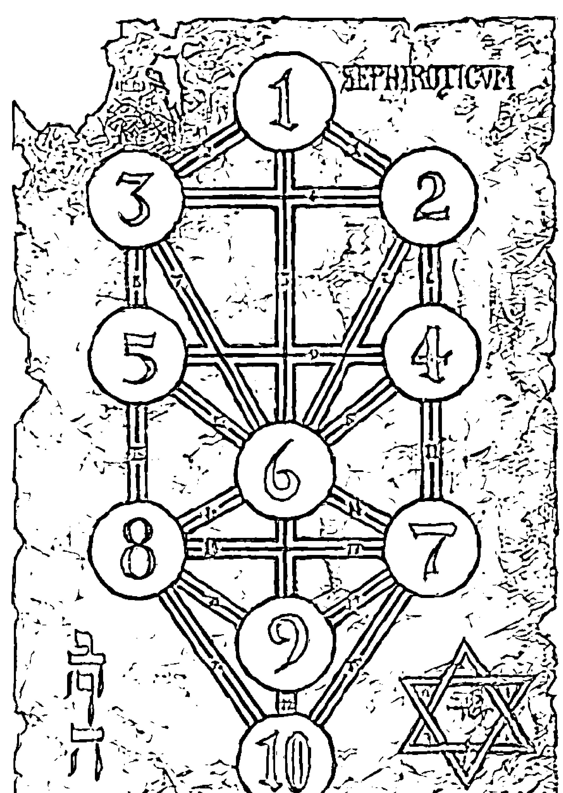

| # | 英文名 | 中文名 |
|---|--------|--------|
| 1 | Kethe  | 王冠   |
| 2 | Chokmah | 智慧   |
| 3 | Binah  | 理解   |
| 4 | Chesed | 慈悲   |
| 5 | Geburah | 势力   |
| 6 | Tiphareth | 美     |
| 7 | Netzach | 勝利   |
| 8 | Hod    | 荣耀   |
| 9 | Yesod  | 基礎   |
| 10| Malkuth | 王國   |

*摘自《魔法的十五堂課》（奇幻基地）

### 希伯來字母的對應關係

| 象徵 | 元素 |
|------|------|
| א    | 空氣 |
| מ   | 水   |
| ש   | 火   |

| 字母 | 天體 |
|------|------|
| א    | 太陽 |
| כ    | 月球 |
| ג    | 金星 |
| מ   | 水星 |
| ל    | 火星 |
| פ    | 木星 |
| ת    | 土星 |

| 字母 | 月份 | 字母 | 月份 |
|------|------|------|------|
| א    | 1月  | נ    | 7月  |
| ב    | 2月  | ס    | 8月  |
| ג    | 3月  | ע    | 9月  |
| ד    | 4月  | פ    | 10月 |
| ה    | 5月  | צ    | 11月 |
| ו    | 6月  | ק    | 12月 |

### No.110

### 光輝之書

### Sefer ha-Zohar

喀巴拉的基本經典，記載創造世界的秘密和世界的命運。許多喀巴拉僧都曾經為此書做過注釋。

◇ 追求光明

喀巴拉的基本文獻之一，希伯來語作《Sefer ha-Zohar》，亦簡稱為《佐哈》（Zohar）。

此書內容是寫西元2世紀的西蒙·本·約海（Simon ben Yohai）以喀巴拉觀點為律法書（Torah，即《舊約聖經》的摩西五書）所作的注解，因而被傳為他本人編纂的作品。不過這部作品是1280年至1286年間西班牙東北的加泰隆尼亞地區（Catalonia）發現古阿拉米語（Aramic Language）的手稿後，《光輝之書》的存在才首度為世所知，因此亦有說法指此書實為13世紀西班牙喀巴拉僧摩西·德·雷翁（Moses de Leon）的創作。

《光輝之書》有兩個主題，其一是利用「屬性」（Sephirot）的概念，對世界的創造進行神秘學的解釋。

所謂「屬性」是種像太陽散發的太陽光線一樣，從名為「Ain Suph」（無限）的神體內不斷持續流出的屬性；最原初的人類便是由10個「屬性」所構成，是完全無缺的人類。

擾亂宇宙調和狀態的就是惡，惡又稱作「Sitra Akhra」（另一面），是神進行創造時破壞的世界留下之殘留物，趁著當初亞當把「生命之樹」跟「善惡樹」分開時進入了世界。

《光輝之書》的另一個主題，則是猶太人在現世與靈界的狀況及命運。

《光輝之書》以每1000年為單位，把6000年擬作《舊約聖經》〈創世記〉裡的六天，而世間萬物將在相當於第七天安息日的第7000年回歸原初。

摩西·科爾多維羅（Mose ben Jacob Cordovero，1522～1570）等後世眾多喀巴拉僧都曾為《光輝之書》做過注釋。

### 光輝之書的世界觀

Ain Suph（無限）

屬性流出

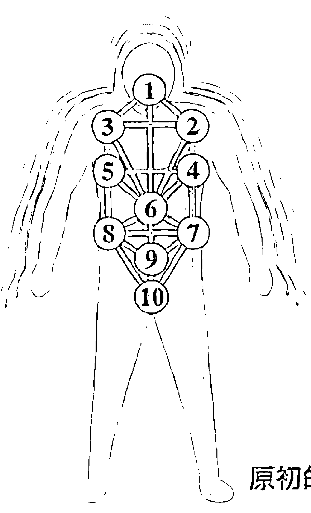

原初的人類

舊世界的殘留物

Sitra Akhra（另一面）

惡

妨礙活動

### 猶太教的經典

- 律法書（Torah）→摩西五書
- 先知書（Neviim）
- 聖卷（Ketubim）

- 有關生活的規定書

- 創造之書（Sepher Yetzirah）
- 光明之書（Bahir）
- 光輝之書（Sefer ha-Zohar）

- ◇創造之書→No.109
- ◇魔法書→No.108
- ◇衣索比亞語以諾書→No.111
- ◇律法之書→No.112

### No.111

### 衣索比亞語以諾書

### The (Ethiopic) Book of Enoch

《舊約聖經》偽典之一，記述從天而降的200位堕天使之功績，以及天界的秘密。

◇ 200位堕天使

《舊約聖經》除正典外，另有名叫經篇或偽典的文獻。

所謂《以諾書》亦屬偽典，嚴格來講此書共有《衣索比亞語以諾書》（以諾一書）和《斯拉夫語以諾書》（以諾二書）兩種版本。以諾書的原典已經散佚，如今只能分別透過衣索比亞語和斯拉夫語才能得窺其全貌，故有此名，而以諾書的內容跟民間傳說也有許多共通點。

其中《衣索比亞語以諾書》是本相當重要的魔法書，記載《舊約聖經》〈創世記〉亦曾提及的猶太族長以諾（Enoch）在大天使烏列（Uriel）引領下遊歷天界、獲悉世界秘密的傳說。

以諾看到的秘密不只是樹木為何生長、太陽如何繞著地球運行之類的自然之秘密，他還看到了諾亞的洪水跟末日審判等預言。不過《衣索比亞語以諾書》之所以被視為重要的魔法書，其實是因為此書詳細描述了200位為人間女性的美麗著迷、墜入凡間的天使之名，以及他們的事蹟。

〈創世記〉第6章也有簡單地提到天使們被人類女性的美麗吸引而降至凡間。根據《衣索比亞語以諾書》的記載，這200位天使是以西姆札斯（Semjaza）為首，並且把各式各樣的技術傳授給人類；然而人類卻利用這些技術自相殘殺，神遂命令四大天使懲罰200位堕天使。

民間流傳著不少《衣索比亞語以諾書》所述堕天使及其事蹟的片斷傳說，這些資料統稱為「以諾文獻」，而「以諾文獻」裡的堕天使則是被稱作「以諾的魔鬼」。

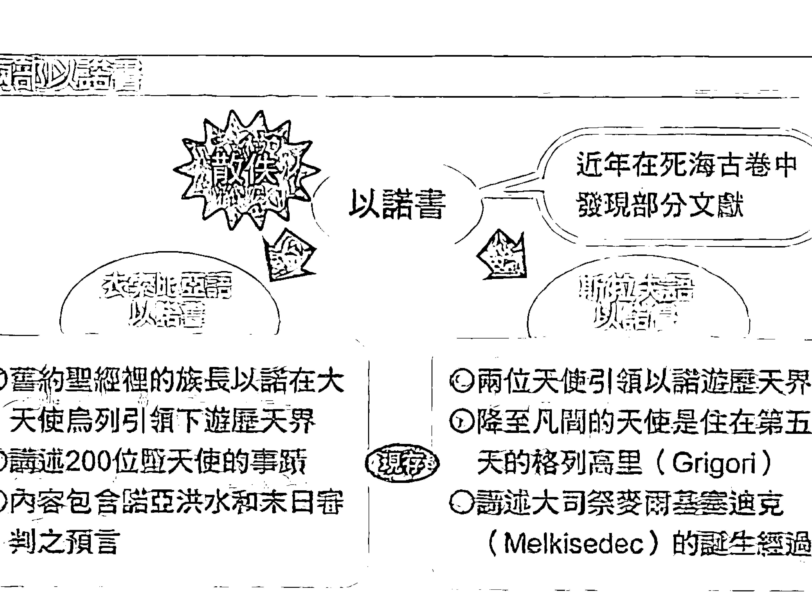

- ⊙舊約聖經裡的族長以諾在大天使烏列引領下遊歷天界
- ⊙講述200位墮天使的事蹟
- ⊙內容包含諾亞洪水和末日審判之預言

- ⊙兩位天使引領以諾遊歷天界
- ⊙降至凡間的天使是住在第五天的格列高里（Grigori）
- ⊙講述大司祭麥爾基塞迪克（Melkisedec）的誕生經過

### 以諾書的墮天使

《衣索比亞語以諾書》記載200位天使落入凡間，跟人類女性生下巨人渥菲林（Nephilim），後來卻被埋封地底，直到審判日才能解脫。

### 墮天使的作為

| 天使 | 作為 |
|------|------|
| 西姆札斯（亦名撒母亞札（Samyaza）、夏米哈札（Shemhazai）） | 傳授人類魔法、斬斷草木根部 |
| 阿撒泻勒（Azazel） | 傳授劍、盾、盔甲的製作方法與金屬加工技術 |
| 亞馬洛（Armaros） | 傳授解除魔法的方法 |
| 巴拉奎（Baraqel） | 傳授占星術 |
| 以實奎（Ezequel） | 傳授有關雲的知識 |
| 亞拉奎（Araqiel） | 教導人類如何解釋地上的前兆 |
| 沒姆樹爾（Shamshiel） | 教導人類如何解釋太陽的前兆 |
| 薩里爾（Sariel） | 教導人類月球運行的軌道 |


### No.112

### 律法之書

### The Book of Law, Liber AL vel Legis

克羅利的代表作，記錄守護天使愛華斯在埃及的話語。據聞每達此書出版，九個月後就會有戰爭發生。

☆ 守護天使愛華斯之聲

律法之書是克羅利（1875～1947）的代表作，內容記錄守護天使愛華斯的話語。

克羅利於1903年跟蘿絲·凱利（Rose Kelly）結婚，後於1904年前往錫蘭蜜月旅行途中得知妻子懷孕，遂取消預計前往中國的行程，決定折返英國。

兩人返程途經開羅，就在博物館附近的布拉克區（Bulaq）租了個公寓。某次克羅利正在召喚埃及神透特（Thoth）和伊奧（Iao）時，新婚妻子蘿絲突然像說夢話似的，不斷重複地說「他們在等著你」。

數日後蘿絲又說「等你的人是霍露斯（Horus）」，還說克羅利已經激怒霍露斯，必須召喚霍露斯向祂謝罪。

克羅利相當詫異對埃及學毫無所知的蘿絲竟然會說出霍露斯的名字，於是便問她說「霍露斯是誰」。結果蘿絲就領著克羅利前往附近的博物館，手指著某個玻璃展示箱。

箱內物品正是霍露斯神的肖像，展示編號「666」。

於是克羅利遂召喚霍露斯，聽見了守護天使愛華斯的聲音。

此儀式從1904年4月8日開始長達三天，儀式後克羅利拿起紙筆，竟然聽見有聲音從左後方的房間角落傳來。克羅利將聲音的內容一一抄下，便完成了全220節的《律法之書》。此書共有220節，是以另稱《220之書》、《AL之書》。據傳每次《律法之書》出版，九個月後就會發生戰亂。

> 1904年4月8日：原著作1404年4月8日，應是謬誤。

### 律法之書成立經過

### 埃及神話裡的霍魯斯

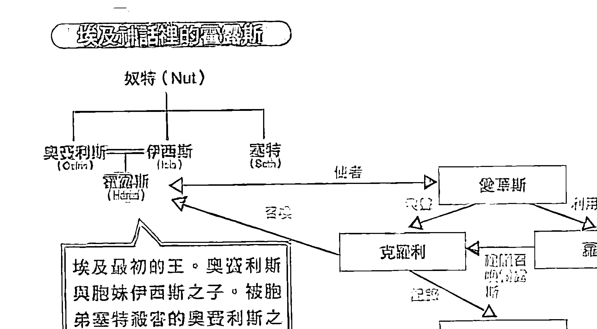

### 律法之書與數字

```
220 節 = 22 × 10
(總節數)
希伯來字母的總數: 22
屬性(Sephirot)的總數: 10
```

```
65 張 → 6 + 5 = 11
(原稿張數)
克里佛托(Qliphoth·邪惡之樹)的數目
```

```
666 → 聖經所載神的敵對者的數字
(霍魯斯神肖像的展示編號)
```

相關項目

- 創造之書→No.109
- 光輝之書→No.110
- 魔法書→No.108
- 衣索比亞語以諾書→No.111

### 中英日名词对照索引

### 【英数字】

- 220之書 Liber 220 220の書 ........................ 236
- AL之書 Liber AL vel Legis ALの書 ........................ 236

### 【二画】

- 人智學協會 The Anthroposophical Society 人智学協会 ........................ 160

### 【三画】

- 土著的魔法 Traditional Magic of the World 土着の魔術 ........................ 24
- 山達基派 The Church of Scientology サイエントロジー教会 ........................ 168

### 【四画】

- 元素 Elements エレメント ........................ 50
- 天使 Angels 天使 ........................ 216
- 天使語 Enochian Language エノク語 ........................ 208
- 巴力・閃・托布 Baal Sem Tobh バアル・シェム・トーブ ........................ 102
- 巴伐利亞光照派 Bavaria Illuminati バヴァリア幻想教団 ........................ 166
- 心靈現象 Spiritual Phenomena 心霊現象 ........................ 70
- 以色列・本・以利撒 Israel ben Eliezer イスラエル・ベン・エリエゼル ........................ 102
- 以諾書 Book of Enoch エノク書 ........................ 234

### 【五画】

- 仙術 Xiansui 仙術 ........................ 58
- 卡廖斯特羅伯爵 Comte Alessandro Cagliostro カリオストロ伯爵 ........................ 106
- 占數術 Numerology 数秘術 ........................ 42
- 古代魔法 Ancient Magic 古代の魔術 ........................ 8
- 古爾捷耶夫 Gurdjieff グルジェフ ........................ 132
- 召喚魔法 Invocation 召喚魔術 ........................ 10
- 史丹勒 Steiner シュタイナー ........................ 124
- 外質 Ectoplasm エクトプラズム ........................ 226
- 尼樂・勒梅 Nicolas Flamel ニコラ・フラメル ........................ 82
- 布拉瓦茨基 Blavatsky ブラヴァツキー ........................ 114
- 白魔法 White Magic 白魔術 ........................ 14

### 【六画】

- 伊利法斯・利未 Eliphas Levi エリファス・レビ ........................ 108
- 伏尼契手稿 Voynich Manuscript ヴォイニッチ手稿 ........................ 95
- 光照派 Illuminati イルミナティ ........................ 166
- 光輝之書 Sefer ha-Zohar 光輝の書 ........................ 232
- 共濟會 Freemason フリーメーソン ........................ 150
- 吉杜·克利希那穆提 Jiddu Krishnamurti ジドゥ・クリシュナムルティ ........................ 140
- 各種西洋占卜 Western Traditional Divinations 西洋の様々な占い ........................ 54
- 地底世界雅加爾他 Agartha 地下世界アガルタ ........................ 113
- 守護天使 Guardian Angel 守護天使 ........................ 218
- 安東·桑德·拉維 Anton Szandor La Vey アントン・サンダー・ラ・ヴェイ ........................ 144
- 安德烈 Andreae アンドレーエ ........................ 100
- 死海古卷 Dead Sea Scrolls 死海文書 ........................ 146
- 自動筆記 Automatic Writing 自動書記 ........................ 174
- 自然魔法 Natural Magic 自然魔術 ........................ 12
- 艾力克·楊·漢納森 Erik Jan Hanussen エリック・ヤン・ハヌッセン ........................ 126
- 艾方索·路易·康士坦 Alfonso Lui Constans アルフォンス・ルイ・コンスタン ........................ 108
- 衣索比亞語以諾書 The (Ethiopic) Book of Enoch エチオピア語エノク書 ........................ 234
- 西洋占星術 Astrology 西洋占星術 ........................ 52

### 【七劃】

- 佐哈 Zohar ゾハール ........................ 232
- 伽納 Gardner ガードナー ........................ 136
- 克利希那穆提 Krishnamurti クリシュナムルティ ........................ 140
- 克利斯欽·羅森克魯伊茨 Christian Rosenkrautz クリスチャン・ローゼンクロイツ ........................ 84
- 克羅利 Crowley クロウリー ........................ 130
- 利未 Levi レヴィ ........................ 108
- 巫毒 Voodoo ヴードゥー ........................ 32
- 巫術崇拜 Wicca ウィッカ ........................ 170
- 忍者 Ninja 忍者 ........................ 57
- 戒指 Ring 指輪 ........................ 204
- 狄昂·福瓊 Dion Fortune ダイアン・フォーチュン ........................ 134
- 貝什特 Besht ベシュト ........................ 102

### 【八劃】

- 亞柏拉梅林 Abra-Melin アブラメリン ........................ 80
- 亞雷斯特·克羅利 Aleister Crowley アレイスター・クロウリー ........................ 130
- 亞歷山卓·卡廖斯特羅 Alessandro Cagliostro アレッサンドロ・カリオストロ ........................ 106
- 佩布絲 Papus パピユス ........................ 118
- 咒文 Spells 呪文 ........................ 206
- 坦陀羅教 Tantrism タントリズム ........................ 30
- 帕拉塞爾蘇斯 Paracelsus パラケルスス ........................ 88

### [ (欧洲)]
- 性魔法 Sexual Magic 性魔術 ..................................................................................... 20
- 所羅門王的72魔王 72 Spirits of Solomon ソロモンの72霊 ........................ 210
- 拉斯普廷 Rasputin ラスプーチン ..................................................... 122
- 拉菲耶特·羅納·賀伯特 Lafayette Ronald Hubbard ラファイエット・ロナード・ハバード ........................ 142
- 拉維 La Vey ラ・ヴェイ ..................................................... 144
- 抹大拉的馬利亞 Mary Magdalene マグダラのマリア ..................................................... 72
- 易 I Ching 易 ..................................................... 66
- 東方聖殿騎士團 Ordo Templi Orientis 東方聖殿騎士団 ..................................................... 164
- 東洋魔法 Eastern Magic 東洋魔術 ..................................................... 56
- 阿古利巴 Agrippa アグリッパ ..................................................... 86
- 阿佐斯 Azoth アゾス ..................................................... 182
- 阿波羅尼俄斯 Apollonius アポロニウス ..................................................... 78

### [ (亚洲)]
- 哈米吉多頓 Armageddon, Harmagedo ハルマゲドン ....................... 196
- 威廉·巴特勒·葉芝 William Butler Yeats ウィリアム・バトラー・イエイツ ..................................................... 128
- 幽物質 Ectoplasm 幽物質 ..................................................... 226
- 幽體脫離 Astral Projection 幽体離脱 ..................................................... 224
- 律法之書 The Book of Law 法の書 ..................................................... 236
- 星光體 Astral アストラル体 ..................................................... 224
- 星光體投射 Astral Projection 星気体投射 ..................................................... 224
- 柯林·德·普朗西 Collin De Plancy コラン・ド・プランシー ..................................................... 110
- 查爾斯·里歇 Charles Richet シャルル・リシェ博士 ..................................................... 227
- 約瑟夫·聖伊沃·達爾維茲 Joseph Saint-Yves d'Alveidre ジョゼフ・サンティーヴ＝ダルヴェードル ..................................................... 112
- 約翰·瓦倫廷·安德烈 Johann Valentin Andreae ヨハン・バレンティン・アンドレーエ ..................................................... 100
- 約翰·迪 John Dee ジョン・ディー ..................................................... 92
- 耶律·科恩 Elu Cohen (The order of the Elect Cohens) エリュ・コーベン ..................................................... 156
- 迪 Dee ディー ..................................................... 92
- 風水 Feng Shui 風水 ..................................................... 62

- 格里高利·耶夫莫維茲·拉斯普廷 Grigory Yefimovich Rasputin グリゴリー・エフィモヴィッチ・ラスプーチン ..................................................... 122
- 泰安娜的阿波羅尼俄斯 Apollonius of Tyana ティアナのアポロニウス ..................................................... 78
- 海因利·科内利烏斯·阿古利巴·馮·内特斯海姆 Heinrich Cornelius Agrippa von Nettesheim ハインリヒ・コルネリウス・アグリッパ・フォン・ネッテスハイム .86

- 海倫娜·帕特洛芙娜·布拉瓦茨基 Helena Petrovna Blavatsky ヘレナ・ペトロヴナ・ブラヴァツキー ................................. 114

- 海德村事件 Hydesville Event ハイズビル事件 ................................. 71

- 浮士德 Faust ファウスト ................................. 90

- 神秘首領 The Secret Chief 秘密の首領 ................................. 220

- 神智學協會 The Theosophical Society 神智学協会 ................................. 158

- 神話・傳說中的魔法 Magic in Myths & Folklore 神話・伝承の魔術 ................................. 36

- 納傑哈馬迪經卷 Nag Hammadi Library ナグ・ハンマディ文書 ................................. 39

- 納粹 Nazi Party (Nationalsozialistische Deutsche Arbeiterpartei) ナチズ 172

- 麥哈拉爾 Maharal マハラル ................................. 96

- 勒梅 Flamel フラメル ................................. 82

- 曼陀羅根 Mandragora マンドラゴラ ................................. 127

- 基歇爾 Athanasius Kircher アタナシウス・キルヒャー ................................. 185

- 密教 Esoteric Buddhism 密教 ................................. 68

- 接觸巫術 Contagious Magic 接触魔術 ................................. 16

- 掃帚 Witch's Broom ほうき ................................. 200

- 畢達哥拉斯教 Pythagoreanism ピタゴラス学派 ................................. 79

- 祭儀式魔法 Ritual Magic 祭儀的魔術 ................................. 18

- 莫依娜・瑪瑟斯 Moina Mathers モイナ・メイザーズ ................................. 135

- 荷姆克魯斯 Homunculus ホムンクルス ................................. 180

- 術士西門 Simon Magus シモン・マグス ................................. 76

- 陰陽五行說 Inyo Gogyo, Yin-Yang school 陰陽五行説 ................................. 64

- 陰陽道 Onmyo do 陰陽道 ................................. 60

- 麥格・瑪瑟斯 MacGregor Mathers マクレガー・メイザーズ ................................. 120

- 奧拉匈・安考司 Gerard Encausse ジェラール・アンコーズ ................................. 118

- 傑若德・伽納 Gerald Gardner ジェラルド・ガードナー ................................. 136

- 凱利 Kelly ケリー ................................. 94

- 創造之書 Sepher Yetzirah セフェール・イェーツィラー ................................. 230

- 創造之書 Sepher Yetzirah 創造の書 ................................. 230

- 喀巴拉 Kabbalah カバラ ................................. 40

- 喬治・伊凡諾維奇・古爾捷耶夫 George Ivanovitch Gurdjieff ゲオルグ・イワノヴィッチ・グルジェフ ................................. 132

- 惡魔 Demon, Devil, Satan 悪魔 ................................. 214

- 惡魔崇拜 Devil Worship 悪魔崇拜 ................................. 22

- 斯坦尼斯拉斯・德・格達 Stanislas de Guaita スタニスラス・ド・ガイダ ................................. 116

- 普朗西 Plancy プランシー ................................. 110

- 猶大・羅烏・本・貝札雷 Jehuda Loew ben Bezalel イェフダ・レーヴ・ベン・ベサレル ................................. 96

- 賀伯特 Hubbard ハバード ................. 142

- 隆基努斯之槍 Lance of Longinus ロンギヌスの槍 ................. 194

- 雅加閣他 Agartha アガルタ ................. 113

- 順勢巫術 Homoeopatic Magic 同感魔術 ................. 16

- 順勢療法 Homoeopathy ホメオパシー ................. 89

- 黃金黎明 The Hermetic Order of the Golden Dawn 黄金の夜明け ................. 162

- 黑魔法 Black Magic 黒魔術 ................. 14

### 【アカデミー】
- 塞俄弗拉斯圖斯·彭巴斯圖斯·馮·霍亨海姆 Theophrastus Bombastus von Hohenheim テオフラストゥス·ボンバトゥス·フォン·ホーエンハイム ................. 88

- 塔羅牌 Tarot タロット ................. 190

- 感染巫術 Contagious Magic 感染魔術 ................. 16

- 愛德華·凱利 Edward Kelly エドワード·ケリー ................. 94

- 新柏拉圖主義 Neoplatonism 新プラトン学派 ................. 44

- 曾說話的人頭 Speaking Heads 物いう人頭 ................. 176

- 萬能溶劑 Alkahest アルカヘスト ................. 182

- 萬靈藥 Elixir エリクシル ................. 182

- 聖日門伯爵 Comte de Saint-Germain サン·ジェルマン伯爵 ................. 104

- 聖伊沃·達爾維茲 Saint-Yves d'Alveidre サンティーヴ=ダルヴェードル ................. 112

- 聖守護天使愛華斯 Guardian Angel Aiwass 聖守護天使エイワス ................. 218

- 聖杯 Holy Grail 聖杯 ................. 192

- 聖殿騎士團 The Knights Templars テンプル騎士団 ................. 148

- 葉慈 Yeats イエイツ ................. 128

- 達西斯博士 Dr. Dahesh ダーヒシュ博士 ................. 138

### 【ハーメリオン】
- 漢納森 Hanussen ハヌッセン ................. 126

- 瑪瑟斯 Mathers メイザーズ ................. 120

- 福理 Fortune フォーチュン ................. 134

- 翠玉錄 Emerald Tablet エメラルド·タブレット ................. 184

- 赫密斯·特里斯密吉斯托斯 Hermes Trismegistus ヘルメス·トリスメギストス ................. 74

- 赫密斯思想 Hermeticism ヘルメス思想 ................. 46

- 赫密爾·史丹史耐德 Herschel Steinschneider ハーシェル·シュタインシュナイダー ................. 126

- 儀式魔法 Ritual Magic 典礼魔術 ................. 18

- 儀禮魔法 Ritual Magic 儀礼魔術 ................. 18

- 德·格達 De Guaita ド·ガイタ ................. 116

- 德魯伊 Druid ドルイド ................. 34

- 撒母耳·黎德·麦道格·玛瑟斯 Samuel Liddell MacGregor Mathers サミュエル・リドル・マクレガー・メイザーズ ………………… 120

- 数值换算法 Gematria ゲマトリア ………………… 42

- 模仿巫术 Homoeopatic Magic 模倣魔術 ………………… 16

- 贤者之石 Philosopher's Stone 賢者の石 ………………… 182

- 鲁道夫·史丹纳 Rudolf Steiner ルドルフ・シュタイナー ……………… 124

- 鲁道夫二世 Rudolf II ルドルフ2世 ………………… 98

- 导师 Masters マスター ……………… 222

- 诺斯替教 Gnosticism グノーシス主義 ………………… 38

- 锡安会 The Priory of Sion シオン修道会 ……………… 152

- 默罕默德·哈刺·罗鸟 Moreinu ha-Rev Loew モレイヌ・ハラヴ・レーウ .. 96

- 蔷薇十字团 Rosicrucian Brotherhood 薔薇十字団 ……………… 154

- 炼金术 Alchemy 錬金術 ……………… 48

- 萨满信仰 Shamanism シャーマニズム ……………… 26

- 精灵 Djinn ジン ……………… 139

- 罗鸟·本·贝札雷 Loew ben Bezalel レーウ・ベン・ベサレル ………… 96

- 罗森克罗伊茨 Rosenkreutz ローゼンクロイツ ……………… 84

- 宝石 Gems 宝石 ……………… 202

- 苏菲主义 Sufism スーフィズム ……………… 28

- 护符 Amulets & Talismans 護符 ……………… 188

- 魔法杖 Magic Wand (Staff, Rod) 魔法の杖 ……………… 198

- 魔法书 Grimoire 魔術書 ……………… 228

- 魔法阵 Magic Circle 魔法円 ……………… 186

- 魔法书 Grimoire グリモア ……………… 228

- 魔像 Golem ゴーレム ……………… 178

- 使魔 Familiar Spirits 使い魔 ……………… 212

- 灵质 Ectoplasm 霊物質 ……………… 226

- 灵药 Elixir エリキサ ……………… 182

### 参考文献

- 『道教事典』平河出版社
- 『「道教」の大辞典』新人物往来社
- 『性魔術の世界』フランシス キング／国書刊行
- 『イメージの博物誌4 魔術—もう一つのヨーロッパ精神史』フランシス キング／平凡社
- 『図説 安倍晴明と陰陽道』山下克明監修／河出書房新社
- 『蛇と虹』ウェイド ディヴァイス／草思社
- 『ゾンビ伝説』ウェイド ディヴァイス／第三書館
- 『暦と占いの科学』永田久／新潮社
- 『魔法—その歴史と正体』K セリグマン／平凡社
- 『神秘学大全』ルイ ボーウェル、ジャック ベルジェ／サイマル出版
- 『新千一夜物語』羽仁　／三一書房
- 『魔導具事典』山北寛監修／新紀元社
- 『脳の中のワンダーランド』ジェイ イングラム／紀伊国屋書店
- 『怪物の解剖学』稲村季弘／青土社
- 『全訳漢文大系9 易経 上』鈴木由次郎／集英社
- 『レンヌ＝ル＝シャトーの謎』マイケル ベージェント、リチャード リー、ヘンリ リンカーン／柏書房
- 『シュタイナー入門』西平直／講談社
- 『魔法・魔術』山北寛／新紀元社
- 『エメラルド・タブレット大予言』上坂晟／三笠書房
- 『エメラルド・タブレット』M ドゥリル／　王文庫
- 『アブラメリンの魔術』S.L.マグレガー メイザース Church of Wicca
- 『魔術』　沓研究社
- 『超常現象の謎に挑む』コリン ウィルソン監修／教育社
- 『高等エノク魔術実践教本』ジェラード J シューラー／国書刊行
- 『オカルティズム辞典』アンドレ ナタフ／三交社
- 『魔道書ソロモン王の鍵』詩狼／二見書房
- 『聖書百科全書』ジョン ボウカー／三省堂
- 『魔女狩りの社会史』ノーマン コーン／岩波書店
- 『世界占術大事典』日本占術協　編／　栄之日本社
- 『高等魔術の教理と祭儀』エリファス レヴィ／人文書院
- 『大アルベルトゥスの秘法』アルベルトゥス マグヌス／河出書房新社
- 『レメゲトン』ロン ミロ ドゥゲット、プリシュラ シュウィ／魔女の館

BOOKS

- 『アブラカダブラ奇術の世界史』前川道介／白水社
- 『図説　アーサー王伝説辞典』ローナン コグラン／原書房
- 『カバラ』箱崎　一／青土社
- 『ネオプラトニカ』新プラトン主義協　編／昭和堂
- 『超常科学謎学辞典』秘教科　研究　編／小　舖
- 『密教』正木晃／講談社
- 『SF雑誌の歴史』マイク アシュリー／東京創元社
- 『フリーメーソンとは何か』赤間剛／三一新書
- 『エピソード魔法の歴史』ゲリー ジェニングス／社　思想社
- 『大江戸履方陣』 加門七海／河出書房新社
- 『世界神秘学事典』 荒 宏編／平河出版社
- 『魔術の帝国』 R J W エヴァンズ／平凡社
- 『地獄の辞典』 コランド ブランシー／講談社
- "Millenium Prophecies" Stephen Skinner／Carlton
- "Gods & Demons" Amanda O'Neill／Grange Books
- "Egyptian Magic" E.A.Wallis Budge／RKP
- "Harper's Encyclopedia of Mystical & Paranormal Experience" Rosemary Ellen Guiley／Castle
- "The Book of Enoch" R.H.Charles ／SPCK
- "Hamlyn History Supernatural" Karen Farrington／Hamlyn
- "Mystics and Prophets" Parragon

### 譯者參考書目

- 《儀式與魔法》 劉淆彥譯／林鬱文化（2001）
- 《東洋神名事典》 山北篤監修／高層燁譯／奇幻基地（2005）
- 《埃及神名事典》 池上正太著／王書銘譯／奇幻基地（2008）
- 《英漢寶石詞典》 梁秉剛／趙怡編著／鋻略出版（2000）
- 《宗教辭典》（上下）／任繼愈主編／博遠出版社（1989）
- 《召喚師》 高平鳴海監修／王書銘譯／奇幻基地（2005）
- 《圖解鍊金術》 草野巧著／王書銘譯／奇幻基地（2007）
- 《惡天使事典》 真野隆也著／沙子芳譯／尖端出版（2004）
- 《魔法的十五堂課》 山北篤著／王書銘譯／奇幻基地（2005）
- 《西洋神名事典》 山北篤監修／鄭銘得譯／奇幻基地（2004）
- 《魔法・幻想百科》 山北篤監修／王書銘・高闇曉合譯／奇幻基地（2006）
- 《巫毒道具事典》 山北篤監修／黃牧仁・林哲逸・魏煜奇合譯／奇幻基地（2005）
- 《惡魔事典》 山北篤・佐藤俊之監修／高闇曉・劉子綾・林哲逸合譯／奇幻基地（2003）

### 網路資料

- 從死海古卷看聖經 http://www.oc.org/big5_txt/bh0508.htm
- 聖經與死海古卷 http://cclw.net/gospel/explore/sjyshgj/index.html
