# 大魔法师咒语书

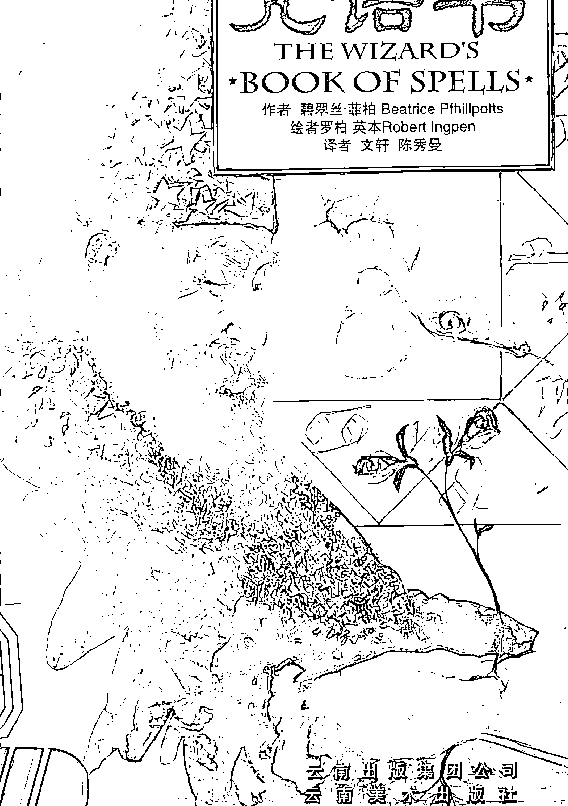

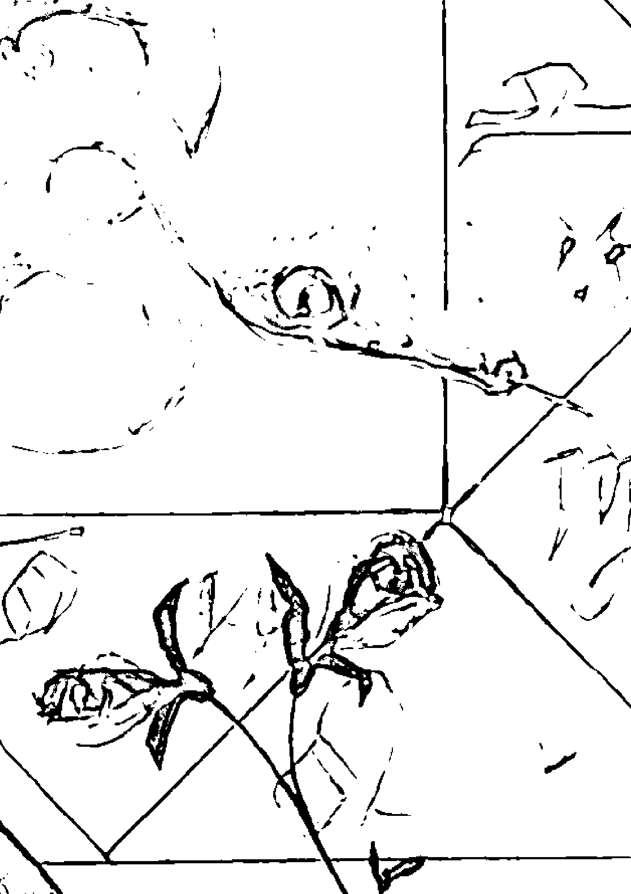

人类最初的文明时期以来，魔法早已被聪明的男女用来达成内心欲望的手段，如健康治疗、找寻真爱、获取无尽的财富，甚至是永恒的生命、咒语、魔法、诅咒、祈祷与许多随时代以这些为目的所产生的魔法习俗，仍流传至现代。

《大魔法师咒语书》是探索魔法历史与传统的奇幻之旅。引领您探索古代魔法师的秘密、中世纪炼金术士的工作与现代魔法师的施法仪式；还有幸运护身符是如何运作的，建议成功施咒所需要的工具，解答环绕在圣地四周与仪式魔法的谜题。此外，还介绍历史上最著名的魔法师们，从邪恶的女巫瑟西到传奇的梅林，全收录在罗伯英本这一系列的华丽的原创绘本中

本书深富启发性、影响力与引人入胜等特质，对于想揭开魔法世界的秘密面纱的读者来说，是必备的入门指南。

# 出版者的话

“魔法师”、“魔法”、“魔杖”是古埃及和西方社会古往今来关注和存在的一种文化现象。《指环王》、《哈里·波特》的魔法最终给人带来的是想象力和快乐观感。本书通过“史实”展示的“大魔法师”的咒语威力巨大，收录部分“实用”魔法、件件法力无边。但它们在读者心中的印象，应该像《西游记》中孙悟空的法力一样——虽神通广大却在现实生活中无法寻找；我们把本书介绍给读者的初衷，是通过阅读来细细品味“魔法”小说和影视作品风靡全球的背景及其原因。对类似的西方文化现象，重在浏览、认识，切勿模仿和生吞活剥地运用。青少年朋友尤其要认识到这一点。

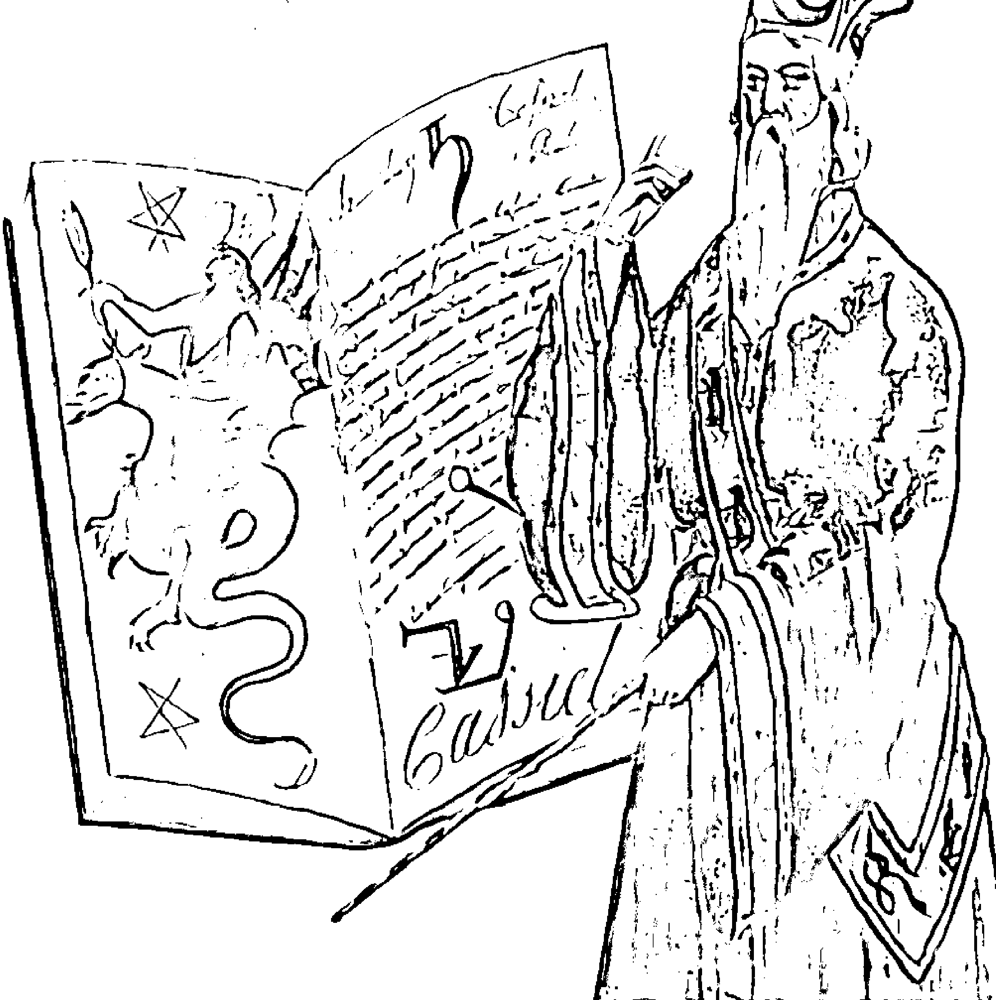

## 第一部
## 咒语的历史纪事

法师的存在与人类的历史一样久远。身为伟大的魔法师，他们所拥有的支配力只是我们凡人所梦寐以求却遥不可及的，只要挥挥魔杖，就能掌控命运之路。

这些天赋异禀的人拥有塑造善恶世界的本领，他们的故事中充满了历史、神话与传奇。如此似天神般的奇人是无所不知的。他们可以使用魔法悠游于不同的世界，并与那里的灵体沟通交谈，也能够随心所欲地幻化形体，或成为隐形。他们还可以预知未来。

魔法师从古至今一直是为人所津津乐道的，我们所喜爱的现代魔法师可能仅存在于虚构的奇幻世界里，然而这样的梦想永存不灭。

而你，会施展古老的魔法吗？

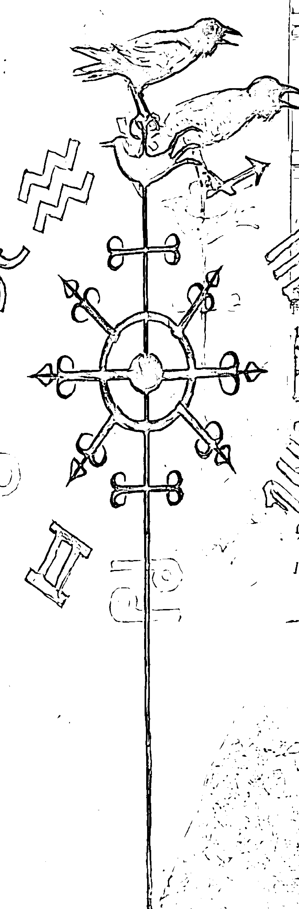

| 编号 | 物品描述 |
| :--- | :--- |
| 1 | 瓶子形状1 |
| 2 | 瓶子形状2 |
| 3 | 瓶子形状3 |
| 4 | 圆形物体 |
| 5 | 瓶子形状4 |
| 6 | 瓶子形状5 |
| 7 | 瓶子形状6 |
| 8 | 瓶子形状7 |
| 9 | 瓶子形状8 |
| 10 | 瓶子形状9 |
| 11 | 工具形状1 |
| 12 | 工具形状2 |
| 13 | 工具形状3 |
| 14 | 工具形状4 |
| 15 | 工具形状5 |
| 16 | 瓶子形状10 |
| 17 | 瓶子形状11 |

手写文字：'my atom... fit on a body... 13 vessels.' 等内容，可能涉及科学或技术描述。

Cartouche containing hieroglyphic inscription, possibly a name or title

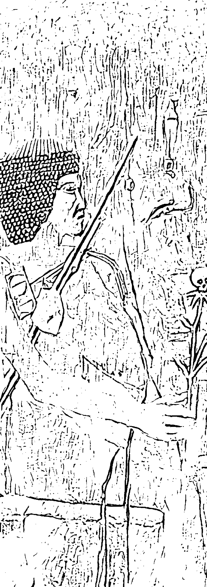

- Collection of geometric symbols and hieroglyphs, including diamonds, circles, and abstract shapes
Horizontal rows of characters or symbols, likely representing a block of text or inscription

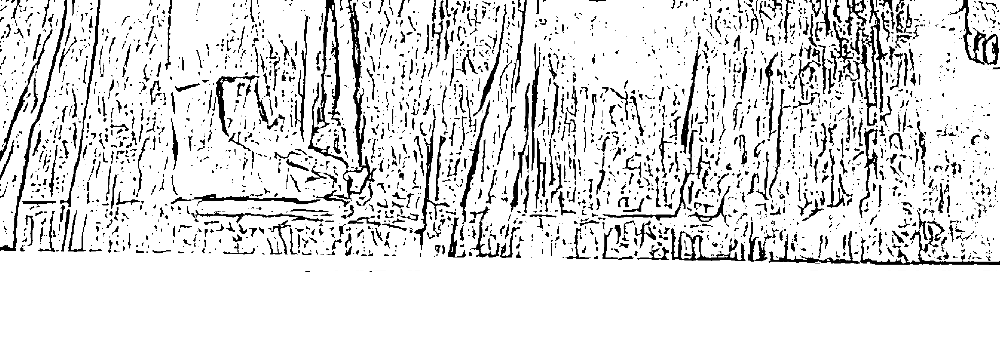

REPO
ENTIA
DIEA
O...

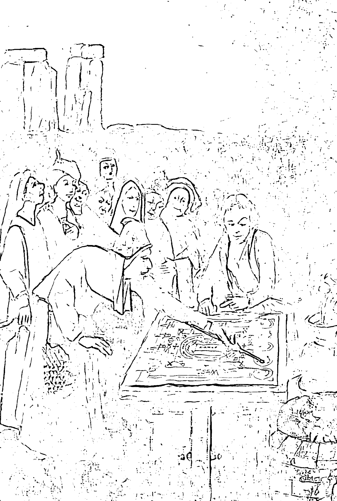

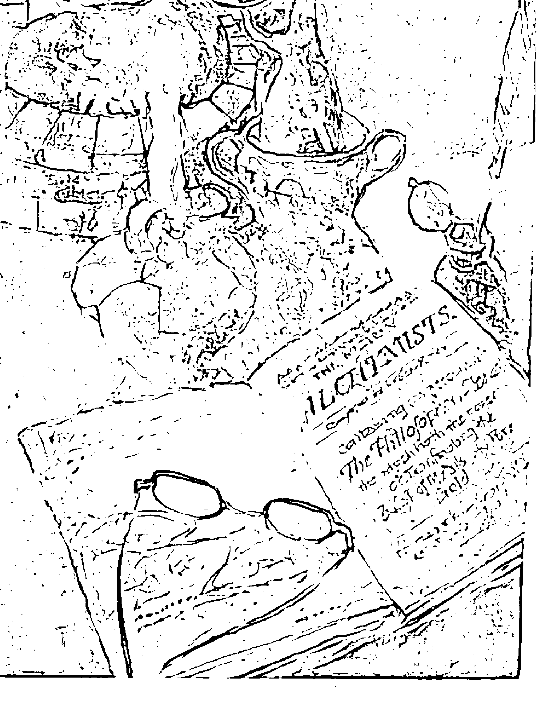

### 金字塔的神奇力量

在古埃及人的世界里，魔法具有至高无上的重要性，遍及他们文明生活的各个层面：魔法被视为生命起始前所产生的必要能量，并掌控支配死亡的力量。

古埃及的伟大魔法是一门神秘的科学，其运作方法仅揭示给抄写员当中的精英者知晓。这些万能的魔术师就是他们所处时代的魔法师。许多他们所著作的魔法书保存至今，得以保留下来，是因为这些书将是由象形文字所撰写的——一般相信这些符号拥有生存的力量。

这些魔法咒语以象形文字刻写在古王国时期金字塔的内壁上，在公元前2650年到2190年间，它们被视为有生命的存在，能增强金字塔内法老王的力量，这些魔法咒语本身则被崇敬为“魔法之王”。死亡对一位法老王来说，一点也不是阻碍：在充满魔法与咒语的保卫下，他征服了死亡并永存在埃及的死后世界里。

法老王生来即属于魔法的生命，而永恒不朽本来就存在于魔法的世界里。想要成为魔法师，不能单单阅读魔法书来学习这门技艺，还必须将这些文字逐字确切地吞咽下去。将写满魔法咒语的古代文献放入盛水的碗里软化，然后再将这些文字喝下去。

一旦以这种方式获得法力，魔法师就会如天神般地存在，能操控威胁生命自然秩序的邪恶力量。而存在魔法师体内的魔法，就像一股力量，且是具有知觉的经验。它就像是从魔法师身上所散发的光芒，不仅肉眼可见，甚至可闻其味。

“看哪！我拥有那魔法的力量，无论将会如何，任何人的房子都是它的所在之处。”一位祭司在古埃及《死者之书》的咒语24中如此说，“它敏捷胜于野兔，快速急于光速。”

古王国时期最著名的魔法师为印和阗（Imhotep），他是一位富有智慧的学者，大约存在公元前2600年，担任第三时期约瑟王（Djoser）的首席宰相。印和阗拥有召唤神明的强大法力，如果他非常想这么做的话，只要使用下列已传承给我们的魔法步骤：

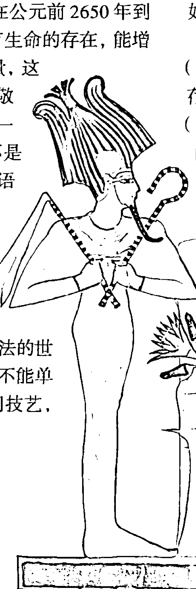

> > “准备一张四脚的橄榄木桌。将它置于一块洁净场地的中央，并用亚麻布完全覆盖。将四块砖头反压叠放在桌子下面，并在桌子的前方放置一个精致的香炉。香炉内放置橄榄木炭，以及捣的油脂碎和捣碎的没药，做成一些小柱子的形状，同时背诵一段咒语。整晚都不要与人交谈。你将会见到神明以穿着亚麻长袍的祭司模样出现。”

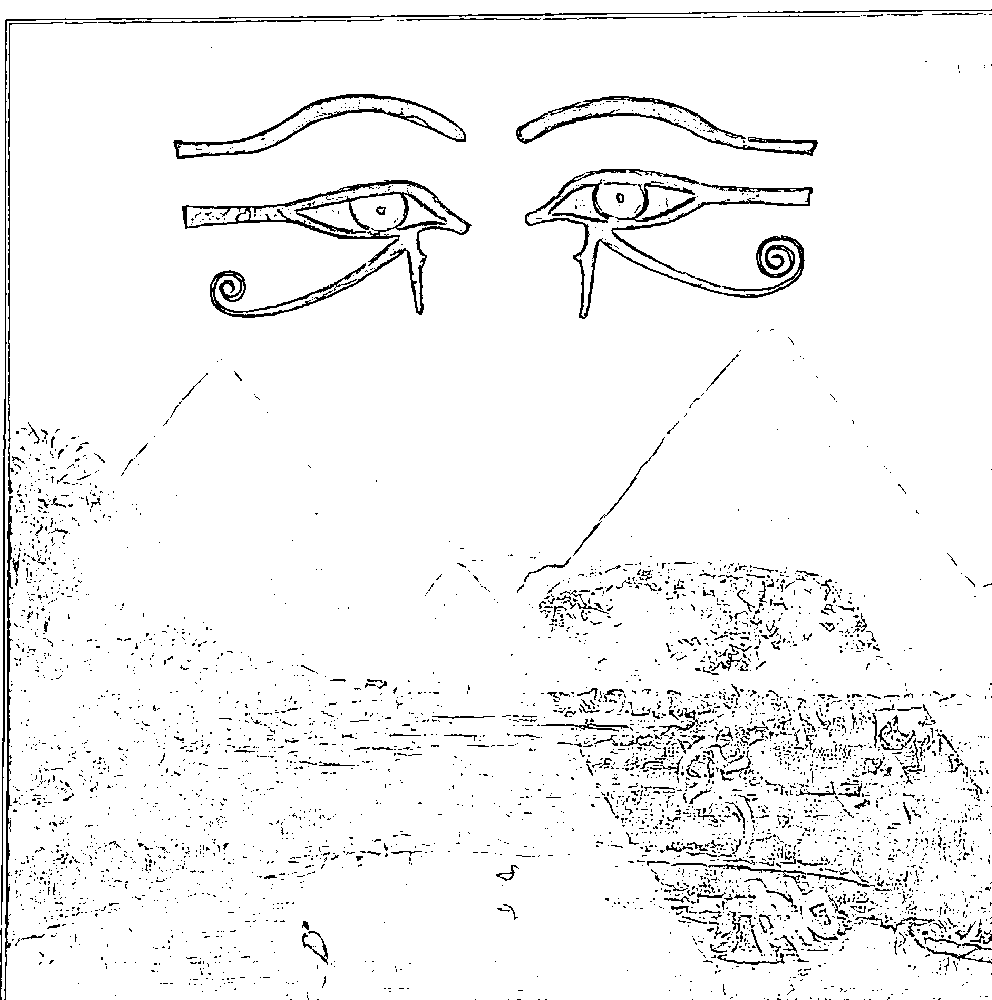

### 魔法的操控

在古老的埃及，人们相信如天神般的魔法师是由土地、空气、火与水所组成的，并且拥有支配这四种元素的力量。例如，当火灾或洪水威胁到世界自然秩序的毁坏时，魔法师们可以运用其强大的法力来重建平衡。

对于他们所看顾的贵族们，这些智者可以施用咒语驱散阴影，并使赐予万物生命的光芒笼罩大地。这种魔法必须每日更新，为了这么做，要将写着恰当咒语的草纸叶放入一个封闭的盒子里，同时每天将它丢入为此所准备的火堆中。

古埃及的魔法师有强大的魔法护身，他们可以任意进入亡者的国度，并饮用当地的神奇之水，这种珍贵的液体赐予魔法师更强大的法力。饮用前，必须要朗诵一段古埃及《亡者之书》的咒语，这是向拥有赋予这项能力的远古海洋女神——努恩(Nun)发出如下的祈求：

大洪水的侵袭是对人类的罪恶所做的惩罚，在世界各地的神话与传说中，都记载着

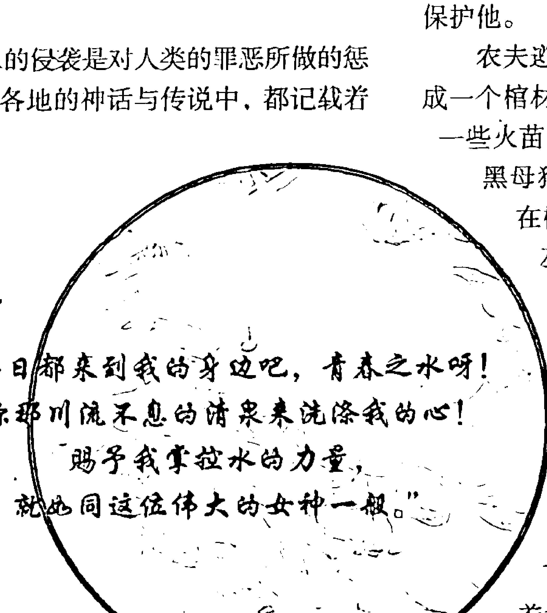

这样的天启景象。而这类故事中最普遍的主题就是神圣或有魔法的角色介入，确保灾难不会造成全面性的毁灭，能带来更美好生活的种子得以自灾难中成长。

一则美国原住民关于洪水的神话故事中，描述一个幸运儿巧遇一位女魔法师，将他自溺毙的危机中救起，并使他成为该新兴种族的族长。

有一天这个男人，他是位以交易维生的农夫，醒来后发现，前一天所砍倒的树木，全部又奇迹般地长出来。这种情况接连发生数天，直到某天晚上，他决定彻夜不眠地观察这项奇迹是如何发生的。他看到一名老妇人从地面升起，她用手里的魔杖挥舞着特定的姿势，然后砍倒的树木就再度从地面长出来。当他们面对面时，女魔法师警告农夫，世界将被一场大洪水摧毁，但她可以用魔法来保护他。

农夫遵照她的指示，用一株无花果树制成一个棺材，并收集五种不同颜色的谷粒、一些火苗、五支燃烧用的南瓜梗，与一只黑母狗，接着将自己与这些东西密闭在棺木中。这个老妇人就坐在上面，左肩站着一只鹦鹉，右肩则是只金刚鹦鹉，然后他们一同在大洪水中长达五年。在洪水消退时，女魔法师释放了这两只鸟，让它们用鸟嘴挖掘宽广的河谷，将剩余的水排出，而农夫的狗伴则神奇地变成一位年轻女子。这对幸运的夫妻，孕育了一个大家族，种植谷物，从此过着幸福快乐的生活。

### 魔法师名人堂
### 美丽的女巫师——瑟西

> “瑟西，这无人不知、无人不晓的太阳神之女啊，任何使用了她的魔咒水，都会丧失笔直站立的模样，变成匍匐爬地的猪”

这位美丽的魔术师瑟西（Circe），最为人知的故事是将传奇人物奥德修斯（Odysseus）的手下们变成猪群，当他们展开拜访其魔法岛的致命之旅时。这是纪录在17世纪英国诗人约翰·弥尔顿（John Milton）的《酒宴之神柯穆丝的假面剧》（The Masque of Comus）里的一段插曲。

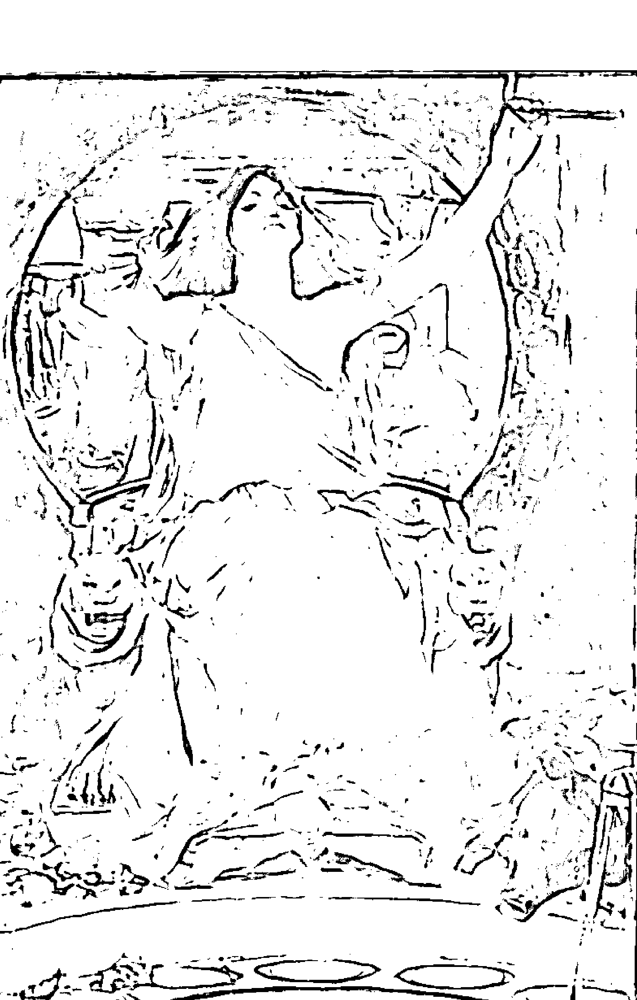

对那些忍受她邪恶魔咒而变成猪的二十二个人来说，幸运的是，奥德修斯在希腊神赫密士（Hermes）的帮助下，获得了一朵开花的洋葱与金蒜灵草（allium moly），成功地抵抗瑟西的魔法。击败瑟西后，这位魔女同意将奥德修斯的手下变回人形归还给他。“瑟西来到猪圈，在每只受到诅咒的猪身上涂抹油膏。当她这么做的时候，那些男人身上的粗毛纷纷落下，他们的四肢甚至比以前更修长俊美了。”古希腊诗人荷马（Homer）在他的史诗故事“奥德塞”中如此描述。

根据荷马的描述，瑟西握有控制命运的能力，并能借由将她的头发结为发辫，产生创造与破坏的力量。结发与解开发辫，在许多咒语中都是约束与释放能量的魔法。

然而其他的人可就没有那么幸运了，大多数造访瑟西魔法岛的人，在享用完瑟西所准备的魔法宴之后，都会被这位女巫以魔杖袭击并施以魔法。男人变成野兽——主要是猪；而女人则变成怪物，尤其是变成蛇。据说，虽然这些人处于变形的魔法中，他们还是保有理性。他们被喂以山茱萸的果实，这些红色的莓果被认为是亡者的食物。

传说中，在夜晚时，瑟西的寝宫会充满精灵，而且她的魔法十分强大，甚至可以移动树木并使它们变为白色。这个女巫也可以使她行走经过的脚下土地产生震动。

太阳神赫利奥斯（Helios）的女儿瑟西，拥有一头火红如火焰般的头发。谣传她的母亲是黑卡蒂（Hecate），是魔法的守护女神。

凡是曾经与邪恶的瑟西交会过的人，终生都将为此感到后悔，神也不例外。当半神的皮可司（Picus）唾弃瑟西时，她将他变成一只啄木鸟。当海神格劳克斯（Glaucus）爱上海洋女神席拉（Scylla）而不是瑟西本人时，她就把席拉变成丑恶的大蛇作为报复。

## CIRCE

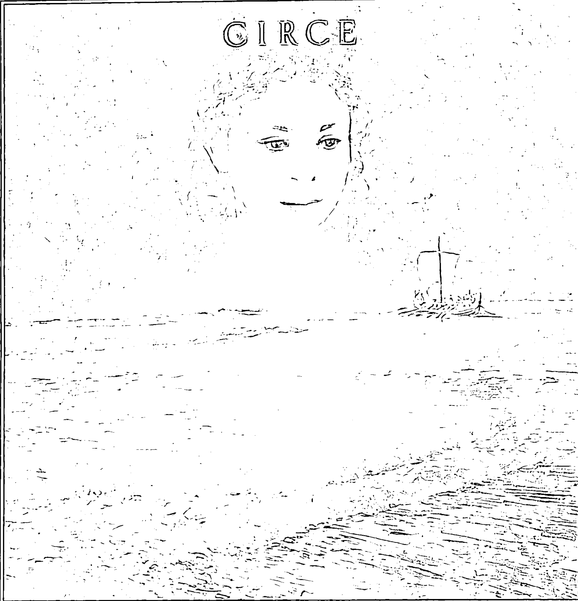

#### 眼见为凭

在古埃及人的世界里，魔法具有至高无上的重要性，变身术是最终极的魔法武器，而魔法师是最专精于这项技艺的人之一。他们不仅可以改变自己的外貌，也能够经由魔法的方式改变他人的模样。

如天神般的魔法师与生俱有变身的神奇魔力。神话与传奇故事中的伟大魔法师们经常将自己变成有魔力的怪兽来击败仇敌，例如可怕的鸟或巨鱼，有时甚至将自己隐身不见。

挪威的战神奥丁（Odin），是一位伟大崇高的魔法师。被维京人崇敬为创造之神，他的崇拜者到达鼎盛的时期是在公元第8、第9世纪。就如同印度教海神瓦如纳（Varuna），奥丁以魔法作为统治的工具。

奥丁最著名的是他的变身术，他的法力强大无边，其中最令人不寒而栗的传说是将自己变成尸体，只为了要知晓这个世界的秘密。他如死去般地倒吊在世界之树上九天九夜，以发掘活着的人所无法获取的知识。他成功了，并发现自己充塞着前所未有的更为浩瀚伟大的智慧，于是他结束死亡的状态，重新回到正常的模样。

变身的魔法武器中，最令人胆战心惊的莫过于隐形的能力。传统上，这种能力是借由魔法衣的形式产生的。这项隐形的能力以一顶魔法帽的形式，赐给了古希腊英雄帕修斯（Perseus）。戴着这顶帽子，帮助他躲掉两名蛇发女妖的致命追逐，在他杀死她们的姐姐——蛇魔女梅杜莎之后。

在J.K.罗琳所撰写的《哈利波特与魔法石》一书中，现代的魔法师哈利波特收到这份最终极的圣诞礼物——隐形斗篷。伴随这件斗篷而来的是一份告诫，就是必须将这件斗篷使用于正义之途。他深深地着迷于这份神秘的礼物。

当哈利打开这个令人兴奋的包裹时，他发现一件闪耀的银色斗篷，如此的轻巧，触感滑顺似液体般。一旦穿上它，斗篷像水一般涌向他，隐藏在他的魔罩内，使他与朋友们得以穿梭在霍格沃茨魔法学校里的许多通道而不被发现。在隐形的状态下，他们无声无息地来到隐藏着强大法力的魔法石的机关活动门前。

魔法师经常变为动物的化身。专家们相信他们已找到，在英国最早为人所知的魔法师们的活动证据，依据英格兰约克郡所挖掘出来的鹿骨面具，时间大约在公元前700年。

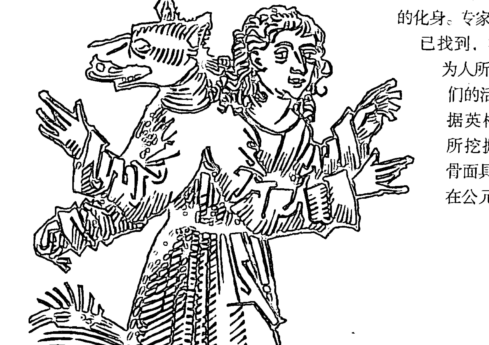

专家认为此面具曾由一位魔法师所佩戴，借此变身成为一只鹿。同时他们相信，魔法师可能因此进入这个动物的心理层面，并汲取讯息，以确保在下回的猎鹿活动中获得成功。

变身术也可以运用在将野兽变身为美女，以欺骗毫不怀疑的人类。凡人有时能逆转强大的魔法，这发生在最著名的神话故事“美女与野兽”中，一位年轻貌美的女子，设法打破将英俊的王子变为怪物的魔咒。

同样是爱情的力量获得胜利的故事，那是古老的苏格兰民谣“年轻的谭林”（Young Tam Lin）。英雄谭林受到变身魔咒的禁锢，将他变成许多令人畏惧的模样，但他请求甜心爱人将他紧紧抓住，不论自己的外貌如何吓人。她照着做，于是魔咒解除了：

> > 他们会将我放在你臂弯里，姑娘。会把我变成毒蛇；但请紧紧地抓住我，不要畏惧，我是你孩子的父亲。他们将我变成一只狰狞可怖的火龙，接着又幻化成一只凶猛的狮子；但请紧紧地抓住我，不要畏惧，如你疼爱自己的孩子一般。

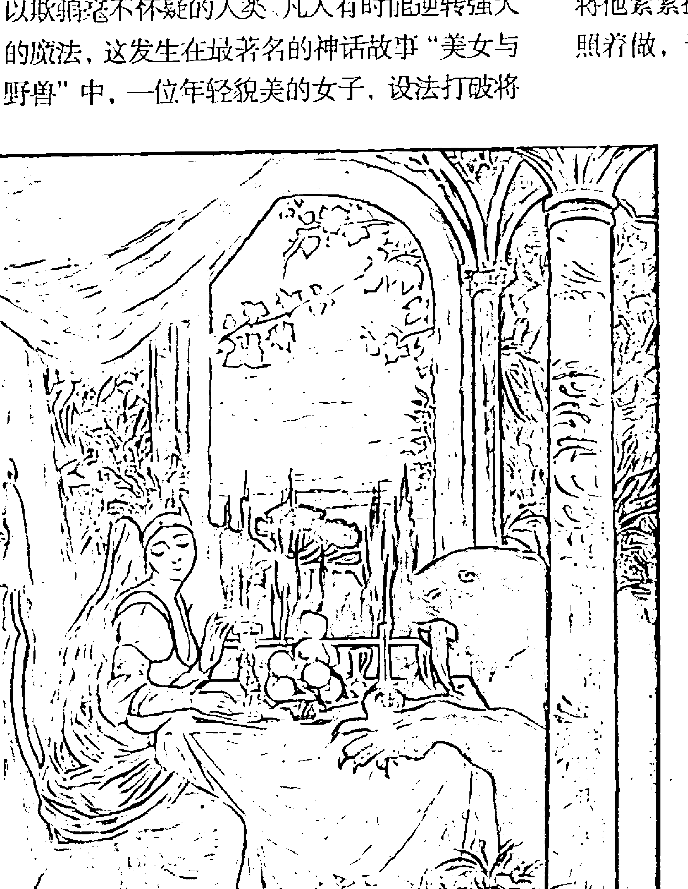

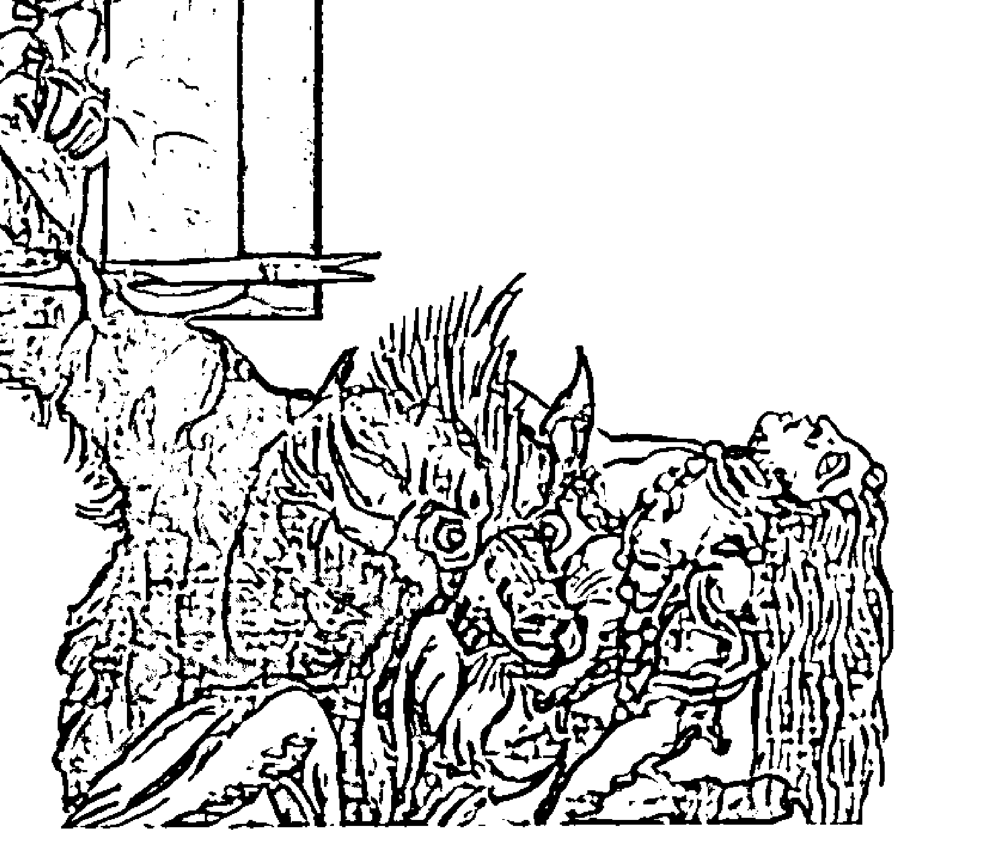# 神圣的咒语

古代塞尔特僧侣阶级的成员们就是知名的杜鲁伊德教士（Druids），他们被当作伟大的魔法师般地受人崇敬。身为一位杜鲁伊德教士，终身都必须接受修炼。从一开始，就选择被认为拥有掌控精神力量的孩童，接着就要接受超过三十年的修炼。一位修业完成的杜鲁伊德不仅是地位崇高的教士，也是领导者身边重要的顾问。在英国，对杜鲁伊德的狂热崇拜曾于公元1世纪时消失殆尽，而在18世纪又死灰复燃。现今仍有将近二十个教会主张泛神论的自然崇拜，特别是夏至时在英格兰的史前巨石柱群（Stonehenge）所举行的年度庆典。身为当代法力最高强的魔法师，杜鲁伊德被称为“非常有智慧的人”。他们拥有异于常人的法力，能够保护不凡之人免受邪恶灵体的侵袭，也能预知未来即将发生的事情。他们设计出一种神秘的语言，包含一种树状字母系统，或称欧甘文（注：Ogham，北爱尔兰的一种文字），是能够施展咒语的语言。对杜鲁伊德来说树木是神圣的，因为他们相信，树木是作为土地与天空两个领域之间的桥梁。在杜鲁伊德的魔法世界中，大自然，尤其是树木，占有极其重要的地位。

杜鲁伊德们相信槲寄生（mistletoe）具有治愈各种病痛的能力，但是要达到这样的效果，必须要在月圆的第六天，由一位杜鲁伊德以黄金镰刀从一株神圣的橡树上取下，并由穿着纯白色衣装的处女们接收。杜鲁伊德披上滑顶的白袍，使用紫杉质地的木制工具，工具上雕刻着具有魔力的欧甘文字，辅助魔法的进行，紫杉象征着生命循环中的死亡与重生。

杜鲁伊德所能施展的魔咒，并不仅只是针对个人而已，甚至足以瘫痪整个军队。传说发生在公元561年的一场爱尔兰的战役中，国王曾召唤杜鲁伊德法拉臣（Fneechan）创造一道魔法的围篱以保护他位于南方的军队，最后成功地击败三千名敌军。

> 祈求幸运的槲寄生咒语
“举起神圣的仪式匕首，在冬至那天以恭敬的仪式砍下一段槲寄生，同时朗读下面这段文字三次：‘金树枝与女巫的守护啊，你们神圣的名被称颂着。借着匕首的刃，我呼唤着你们，看着所有的厄运被破除。不再有任何的伤害发生，此咒语完成。依照操作三次的法则后，就让一切化为尘块吧！’接着将这个槲寄生挂在前门上。它将为居住在屋子里的所有人带来幸运。”

爱尔兰的传说中，充满着许多对于杜鲁伊德如何施展他们的魔法力量，来改变事件发展的生动描述。偶尔他们也会发现彼此站在对立的一方以帮助相互竞争的首领。这些魔法师互相对抗的结果，往往会造成地球毁灭性的结果。古爱尔兰《伦斯特集》（Book of Leinster）中，曾记载一位代表北方的伟大杜鲁伊德，与一位代表南方的同等高强法力的杜鲁伊德，互相对立的一场战役。

一场愤怒的呼啸中，北方的魔法师高思（Gothrue）施展魔法使南方的所有井水干枯，但是南方的魔法师摩鲁（MogRuth）将一根银管插入地面，随即涌出一股清泉，再度填满干枯的水井。高思接着也不甘示弱地升起一把火，挥动他的魔杖施展咒语，召唤一片黑云笼罩南方，并降下一场大血雨。摩鲁将高思位在北方的三位杜鲁伊德同伴化成石头作为报复。

乌云或是魔幻迷雾，都是杜鲁伊德的重要魔法之一。据说爱尔兰的魔法师马纳南（Mananan）即召唤一片魔幻迷雾将柯尔麦克国王（King Cormac）引导至他的小屋里，并在那里以一名年轻人的化身，宴请国王享用猪肉晚餐，藉此表达善意。

# 魔法师名人堂

## 伟大万能的魔法师——赫密士

法力高强的赫密士(Hermes Trismegistus)实际上是一位神话人物，父母是两位魔法之神。他同时也是炼金术的创始人，炼金术是魔法师的终极技艺。

身为希腊神赫密士(Hermes)与埃及神托多(Thoth)的神秘结晶，万能如神话般的魔法师赫密士，据说在摩西的年代拥有大量的著作。就以众所周知的《炼金术文集》(Hermetic Texts)来说，据说它包含了四十二部书。这些书籍深刻地影响着西方魔法的发展。

这些书籍当中最伟大的莫过于《翡翠绿碑》(The Emerald Tablet)，它传达着宇宙的魔法奥秘，一般相信此书的内容，最初是镌刻在魔法师所居的一块翡翠宝石上。传说中记载着族长亚伯拉罕之妻莎拉，如何在赫密士的墓穴中发现这部书册。《翡翠绿碑》的大多数书卷被认为收藏在亚力山卓(Alexandria)著名的皇家图书馆内，并在公元前97年的一场大火中损毁。神秘的传说一直环绕在任何一部残余的书卷里。有人说它们被埋藏在沙漠里的一处秘密地点，直到适当的时机来临，才会重见天日。

这位魔法师所幸存下来的智慧，已经历过数个世纪的传承，许多后继的咒语与仪式都是根据他的著作所创的。《翡翠绿碑》中似谜题般的开场白，即开始阐述赫密士的信念——认为人拥有如天神的力量：

> “那个在上方的正如同那个在下方的，而那个在下方的也正如同那个在上方的，以达到那个‘唯一的’所带来的诸多惊奇。”

他的父母亲，托多与赫密士，也与魔法的著作有关。的确，他们惊人的创作量，使得其后世的魔法徒孙们的创作显得贫乏不足。更令人难以置信的是，赫密士据说曾口授两万册书给公元前300年叙利亚的哲学家扬布里柯(Iamblichus)，以及其他的三万六千册书给同一时期的埃及祭司马内托(Manetho)。

作为神的传译者，托多肯定是表现最卓越突出的。他仅仅是在所有的神圣书册内，以作者的身份作为保证：

> “我是托多，神授文字的主宰，是所有天神旨意的传达者。”

他骄傲地宣告着。

# HERMES TRISMEGISTUS

### 神圣的仪式

在古埃及人的世界里，魔法具有至高无上的重要性，在文艺复兴时代，人民对魔法的狂热掀起新的高潮。杰出的学者们深信研究“自然魔法”，对于基督教信仰的正确理解是息息相关的。他们根据卡巴拉（注：Cabala，犹太教的神秘哲学），设计了一套复杂的自然魔法系统。

卡巴拉的魔法应用，是源自于13世纪犹太教最初的神秘释义。文艺复兴时期，炼金术士与魔法师使用卡巴拉的数字与圣名的结合，进行复杂的仪式与咒语。

16世纪德国的魔法师阿格利帕（Cornelius Agrippa）研究犹太教神秘哲学，并引用於他的魔法三部曲“神秘哲学”（On Occult Philosophy）。他主张魔法与魔鬼无关，魔法是倚赖心灵天赋。然而，世人广为相信他会施行通灵妖术。

阿格利帕最广为人知的惊人魔法是在一则关于他的房客诡秘死亡的传说中。这位年轻的男子利用阿格利帕不在时，从他的妻子手中借得阿格利帕书房的钥匙，然后就发生骇人的事件。男子在书房内找到一本魔法咒语的书，并犯下错误地大声读出其中一条咒语，此时立刻有人敲门，一个魔鬼现身，询问男子为何召唤它。年轻人惊恐地说不出话来，于是魔鬼就将他勒毙。当阿格利帕发现房子内的尸体后吓坏了，赶紧召唤魔鬼使他的房客重生。年轻人成功地复活了，但是当离开房子时他却倒地而亡。警方在死者的身上发现勒痕，阿格利帕因此被控谋杀，后来他逃离小镇，成功地躲避过被起诉的命运。

对于科学、占星术、数学以及医学这些深奥难懂的魔法支系所做的复杂研究，使文艺复兴时代的魔法师能够实行他们的魔法，产生同样的复杂的魔法程序。

成功施展咒语，得借着观看特殊仪式才能完成。必须穿着正确的长袍，施法的道具必须净化，然后使用特定的魔法符号，并召唤神圣力量。所有神圣仪式都在一个具有保护作用的魔法圈范围内进行。

一个涉及魔法仪式的周详祭典，能够赋予魔法师力量以进入一个超凡领域，在那里他可向灵界召唤，执行所求。召唤到的通常是魔鬼，因为它们被认为比天使更容易掌控。

成功召唤魔鬼最著名的传奇人物浮士德医生，他使用魔法与魔鬼立下契约。魔鬼教导浮士德关于宇宙的秘密，与所有他想知道的魔法。魔鬼甚至允许这位医生骑着它，展开环游世界，寻求天启的旅程。然而它将会取走浮士德的灵魂，以作为这些恩惠的回报。当约定的时间一到，魔鬼随着一阵可怕狂风在夜半时分降临，来收取它应得之物，第二天早上，饱受惊吓的邻居们发现浮士德支离破碎的遗骸在地上四处散落。

其他的魔法师较少关注于个人利益的黑暗面。伊丽莎白时期的学者魔法师约翰·迪博士（John Dee）一生大部分的时间都在尝试与天使沟通。他请炼金士同伴与灵媒爱德华·克利（Edward Kelley）来协助，并使用他所发明的神秘语言——天使文字（Enochian）。迪宣称已成功的召唤乌利尔（Uriel）（那是卡巴拉所描述的光明天使）与天使长米迦勒（Michael）。

### 10 LA ROUE DE FORTUNE

### 灵巧的巫师

学者魔法师同时也被称为“灵巧的巫士”与“灵巧的巫女”，他们也同样需要举行精心的仪式来施展咒语。然而，他们天生就具有超自然能力，能运用本身的能力创造不可思议的效果。

一般来说，这些灵巧的巫师们是居住在小镇或村庄里的魔法师，他们由社区的成员付费以施法的方式给予帮助。人们对这类的乡镇魔法师有大量的需求，“诚如灵巧的巫师所形容的，这种人几乎在每一乡镇都可见到。”公元1807年的英国诗人罗柏特·索塞（Robert Southey）说。

英国著名的灵巧巫士詹姆士·莫瑞儿（James Murrell），生于公元1780年。他是其祖父的第七个儿子的第七个儿子，因此生来就是一位魔法师。他使用魔法手册来充实自己的超能力，不仅是当地居民，甚至是富人以及贵族都会来寻求他的帮助。若是属于物质世界的粗浅法术，莫瑞儿仅收取一先令的费用，若是需要施展召唤神灵的高深魔法，则要价半克朗。

莫瑞儿具有千里眼以及透过魔镜预知占卜的超能力，擅长用魔法瓶咒语来抵御恶灵的侵袭。他的魔法瓶是由当地的铁匠以铁铸成的，然后由魔法师施咒以产生所需要的效果。

莫瑞儿最著名的魔咒之一，就是对抗另一位女巫的诅咒。他接受委托去治疗一位受痉挛之苦的年轻女性，当痉挛发生时，她会变成一只猫或狗；这些痉挛的发生是来自一位从她的家族的没仓被驱逐的酒醉老女人，对她施咒所引起的。莫瑞儿将女孩的尿液、鲜血、药草与针混合一起，调配成一帖魔法配方，填入魔法瓶内。为了实行这项法术，他在一个漆黑的房间里，将门锁上之后，于一片纯然寂静的状态中，将魔法瓶放在火上加热。

正当他在加热这些混合物时，一阵愤怒的敲门声伴随着一名妇人的咆哮声，喊着“看在老天的分上，快停止吧！你快把我给杀死了。”瓶子接着爆开了，此时门外的声音也消逝不见了。女孩痊愈了，而诅咒女孩的老妇人，被人发现全身烧焦的横尸在三英里外的路上。

灵巧的巫师们被相信是具有治疗能力的。19世纪的爱尔兰医师比迪·尔丽（Biddy Early）被人深信是属于“仙女的身份”，她也使用魔法瓶治疗她的顾客。尔丽的神秘黑魔瓶似乎是仙女赐予她的。只要用一只眼睛看进瓶内，同时另一只眼睛保持张开着，她就可以看清是什么原因在困扰她的客户，她还能洞悉未来。有时她会用魔法瓶帮助受仙子干扰的人，常常是因为他们不小心打扰到仙子们。其实这样做是不被仙子们所接受的。尔丽承认，她曾因对抗仙子而受到严厉的处罚。

### 神秘的社团

文艺复兴时期的学者魔法师所推崇的复杂仪式，强化了古老的信仰，认为魔法是一项高尚的艺术，罩着神秘的面纱，只有高手当中的神秘精英，才能一窥究竟。神秘魔法组织的成员，例如蔷薇十字会的会员 (Rosicrucians)，在17与18 世纪时主导日渐繁复精巧的仪式，并参考许多秘传的魔法手册，去了解如何召唤最适当的恶魔与精灵，流传至今最受欢迎的手册就是那本《所罗门的钥匙》(The Key of Solomon)。归因于所罗门王这号传奇性的人物，人们相信他曾号令一支恶魔大军，因此这本书充满着召唤的咒语。

仪式用的魔法在19世纪十分盛行，并导致一波深具影响力的新兴魔法师运动的形成，也就是神秘的金色曙光会 (The Hermetic Order of the Golden Dawn)。它是在公元1888年由三位蔷薇十字会的会员在英格兰所创立，以一部古德神秘律法为基础，拥有周全的神职阶级体制。包含十级，每一级区分成三个阶段，第十级为见习修士。初习者可经由考试通过外围阶级而晋升，但是第二级只有三位成员，也就是这项运动的创始者。这三人宣称他们是根据第三级的神秘首领——星界 (astral plane) 的神灵，所给予的指示行动的。

20世纪初英国最恶名昭彰的魔法师，艾利斯特·克劳利 (Aleister Crowley)，成为这项运动的成员之一，但是却被其首席魔法师之一所驱逐，他深深地惹恼了克劳利，所以他显然派遣了一支精灵大军去攻击这位魔法师。后来，克劳利就顺利地创立属于自己的组织——德鲁马修道院(The Abbey Of Thelema)。它根据《律法之书》(The Book of the Law)而起的，克劳利宣称这是埃华斯 (Aiwass) 亲自口授于他的。克劳利称呼自己为“伟大的野兽666”，并深信自己是由数位法力超强的魔法师转世的，包括伊丽莎白时代的神秘学家约翰·迪 (John Dee)。就像迪一样，克劳利使用天使文字魔法探索星界，并写下许多自己所见魔法景象的描述。其中之一，是以他的另一个自我“野兽大师”（The Master Therion）去经历。克劳利遇见一位拥有“无限智慧”的魔法师，他向克劳利展示一个镶嵌在四个元素内的魔法蛋，并告诉他，蛋中藏有关于生命本质的秘密。在克劳利的自传中，他宣称自己曾在一个夜晚看见316只恶魔。

克劳利的信念为新世纪的魔法运动，现代女巫的Wicca教派铺路，它如今成为美国发展最迅速的宗教之一。Wicca教徒与克劳利一样，施展的是“魔法”“magick”而非“魔术”“magic”，他们在“magic”字尾加“k”加以区别，以显示他们的魔法与舞台上娱乐观众用的魔术是不同的。Wicca教徒遵循着中心原则：“不伤人，则可随心所欲。”大多数的教徒崇拜某些大地形象的女神，并试图与大自然和谐共存。他们欢庆四季的流转，并举行庆典来纪录生命循环的重要变迁。他们施展咒语时，需要下列的程序来帮助需要保护的人们：

> > “首先，将八分之一杯的荷荷芭油或杏仁油与四滴小菝油、一滴丁香油一起混合成魔法防护油。施展此咒时，需同时操纵着油，想象着精力从人的身体离开，唱诵时同时注入保护油：‘我身站在您的守护光里，请赐与此油您的神力，我祈求受到保护免于伤害，请接受我的请求作为您的任务。’”

# # 尼可·勒梅与神秘的魔法石

数百年来，炼金术士仔细阅读思考魔法文献，并研究医学、科学以及占星术，为的就是要创造出魔法石。魔法石，这个终极的万灵丹，不仅被视为能将任何一种金属转变为黄金，还拥有赐予长生不老之力量。中世纪的学者们认为，魔法石的秘密起初已被古埃及的魔法师解开并且记录下来，传说14世纪的炼金术士尼可·勒梅（Nicolas Flamel）获得这部魔法文献之后，经由它的帮助，达成了几乎不可能的事：将水银变成黄金并得到永生。

勒梅至今仍活着，如同J.K.罗琳所著之《哈利波特与魔法石》的读者所知，也正因为如此，这位中世纪的法国炼金术士确实鲜活地永存人心。邪恶的魔法师伏地魔想窃取勒梅的魔法石却失败了，这都得感谢哈利·波特英勇地阻挡。哈利也非常高兴地知道勒梅迄今还活着，与他的妻子长期住在德文郡，而且才刚庆祝过他665岁的生日。

真实人物尼可·勒梅生于1330年。他在巴黎依靠卖书与抄写文件维生。他平凡无奇的人生在一个夜晚产生戏剧化的大转变，当一位天使来到他的梦境中，告诉他将收到一本神奇书册，他必须努力研读并透彻了解，就可获得非凡惊奇的力量。这个梦境成真了。勒梅在他的手稿《象形符号之书》（Livres des figures hieroglyphiques）中记载着：“我的手里有一本用两块佛罗林币换来的古老庞大的书籍。它不像其他的书一样使用纸张或羊皮，而是由精致平滑的年轻树皮所作成的。封面紧密地包着黄铜，上面刻满文字或是奇怪的符号……它有以七页为一组的三组，包含首页，每一组的第七页都没有任何文字，但在第一组的第七页上，却画着一根被巨蛇吞噬的魔杖。”

这部神秘的文献名为《犹太亚伯拉罕之书》（Book of Abraham the Jew）。勒梅在能够解读它前，就花费了21年的时间旅行及收集资料。最后在一位希伯来学者的帮助下，勒梅终于能创造出自己的魔法石。这个神奇的时刻发生于公元1382年的4月25日，勒梅这样记载着：“我总是逐字确实地随着书的指示，根据相同数量的水银来推演红石……然后就真的将水银转变成黄金了，确实比普通的金子还好，更柔软也更具可塑性。”

为了希望自己的神奇能力不要被滥用，勒梅宣称自己仅炼金成功三次，并将他所创造的财富拿去帮助建设医院、礼拜堂与教堂。由于魔法石所赋予的神力，勒梅与他的妻子得到永生。出现在哈利·波特的故事之前，他们似乎曾在17世纪时出现在印度，根据当时法国的考古学家保罗·卢卡斯（Paul Lucas）所说。

# NICOLAS FLAMEL

# # 现代的魔法师

当今最著名的魔法师是出现在奇幻文学中的英雄与英雄，即便是这些人，也都是确实根据许多真实或传说中的魔法师的英勇事迹而来的。这些现代的魔法师激起人们对魔法世界的热衷。

20世纪小说当中最典型的魔法师就是甘道夫（Gandalf），这位英雄般探索之旅的精神导师，出现在英国作家J.R.R.托尔金所著的《魔戒三部曲》中创造全然奇幻的世界里。因为“魔戒”电影的上映受到广大的欢迎，引起更多的追随热潮。甘道夫的角色创造是来自于托尔金对早期神话传说的喜爱与丰富的知识所激发的灵感。身为盎格鲁-撒克逊以及英国语言与文学的教授，托尔金运用他的专业技巧以及无穷的想象力，创造出一个全新的魔法世界——中土世界，这里是甘道夫领导善的力量与恶势力抗衡的舞台。

留着长长的白胡子，头戴一顶高帽，甘道夫手持一根魔杖并戴着“精灵火戒”（注：Red Ring of Fire，红宝石制成的戒指）。他是一位巫师，是后来许多魔法英雄的原型，最著名的有娥苏拉·勒瑰恩（Ursula Le Guin）的魔法师格得（Ged），他同样在《地海传奇》系列（The Earthsea Quartet）中，对抗着巨大的邪恶势力。

> > “‘是你构成整体！’，格得清楚地说着，并以他的魔杖在越过岩石之门的火线中画下一个符号：北欧卢恩符文‘Agnen’，代表结束的意思。”

同样是法力高强并站在善良势力一边的，一位非常不同的巫师，出现在大受欢迎的电影系列“星际大战”中，由美国导演乔治·卢卡斯（George Lucas）所构想出来的。相对于托尔金发生在地球上的善恶战役，卢卡斯将我们引领至深邃的太空中，观赏善良对抗邪恶力量的冲击。他的魔法导师是一位如同古老灵魂般的生物，名为尤达大师（Yoda）。回溯古埃及人对魔法的信仰，他们认为魔法是一种至高无上的创造能量，尤达是一群绝地武士的长老，他们学会如何控制这股力量，并因此拥有超凡能力以对抗黑暗的恶势力。

当代的英国得奖作家菲力普·普曼（Philip Pullman），在他的作品《黑暗元素三部曲》（The Dark Materials）中也创造了一个巫师作为中心角色。普曼的巫师，古鲁曼博士（Doctor Grumman）引导美国太空人李·将自己的诸般人性抛诸脑后，体验着最奇妙的欢愉：对一股完全正义的更强大力量的热切顺从。”

然而，全世界最知名的现代魔法师并不是个成年人，而是一位奇异非凡的小男孩，他在完成魔法学校的正规教育之前，已经法力高强得足以战胜邪恶。哈利·波特是英国作家J.K.罗琳系列书作中的英雄魔法师，他已经掳获大众极高的幻想，此书也因此成为出版界的奇迹。

在罗琳所展开的戏剧中，哈利·波特在每一场全新的冒险中与无敌的伏地魔王（Lord Voldemort）对抗。伏地魔的邪恶魔杀死了哈利的双亲，但却无法将他毁灭，即便当时他只是个在母亲襁褓中的婴儿。的确，哈利·波特的魔法灵气是如此强大，甚至几乎要摧毁这个可怕的敌人。

哈利代表着一种全新类型的魔法师，但他却是由一位典型、较为年长且深具智慧的魔法师——邓布利多教授（Professor Dumbledore）所引导，他就类似于怀特（T.H.White）的著作《石中剑》里的梅林（Merlyn）：

史钩比（Lee Scoresby）的热气球穿过一个秘密通道到达一个平行的世界。接着他赋予史钩比神力，能像鸟一样地随着博士自身的老鹰精灵（Sayan Kotor）飞翔，以击败邪恶势力：

“李的感受与鸟类的任何自然天性相同，他愉悦地回应这只老鹰皇后的指示，同时也

> “梅林蓄着长长的白胡须，并垂挂着两道长长的八字白髭，若更贴近地观察，会发现他看来一点儿也不干净……一些大鸟似乎曾在他的头发上筑巢……他那对在毒蛛眼锭下温和的蓝眼睛，又圆又大，当他凝视着男孩时，渐渐地显得朦胧而阴沉。”

## 第二部
## 实用的魔法

一位成功的魔法师最基本必要的辅助道具是什么呢？魔法是一门复杂的事业，一个咒语能以许多不同的方式执行，但却会因为没有遵守历史悠久的法则而通致失败。

最伟大的魔法师们可能天生就拥有特殊的天赋，但他们可以终其毕生精力钻研黑魔法，以探索更多未知的领域。知识就是力量，是每一个真正的魔法师都明白的道理。

经年累月地从专家身上学习这个专业的窍门技巧，你也同样能够展现出魔法的架势。发现魔杖的重要性；创造属于自己的神圣空间；武装自己以对抗邪恶。最重要的是，重视人类专注的思想所产生的力量。

一则咒语可以用低语或唱诵等方式来施行；也可以用自己熟悉的字句写下来或以秘密的语言表达；咒语可以被穿戴甚至吞食。它可以通过魔药的力量来操控，或透过一个手势展现法力。正确地施展你的咒语，就能达到目标。

### SCHEM. INTERPRETATI... (部分文字模糊)

| 编号 | 名称       | 符号                     | 手写注释                     |
|------|------------|--------------------------|------------------------------|
| I    | S...       | 皇冠、十字等符号         | [模糊文字]                   |
| II   | V...       | 圆、月、十字符号等       | [模糊文字]                   |
| III  | MINERAL... | 十字符号、圆等           | Bismuthi, Zinci, Mercutius, ?chit, Zn, Ag, Au, Hg? ... |
| IV   | SALIA      | 圆、月、十字符号等       | [模糊文字]                   |
| V    | DECOMPOSIA | 十字符号、月、圆等       | [模糊文字]                   |
| VI   | TERRA      | 圆带十字、G...等         | [模糊文字]                   |
| VII  | DISTILLATA | 十字符号、月、圆等       | [模糊文字]                   |
| VIII | OILIA      | 十字符号、月、圆等       | [模糊文字]                   |

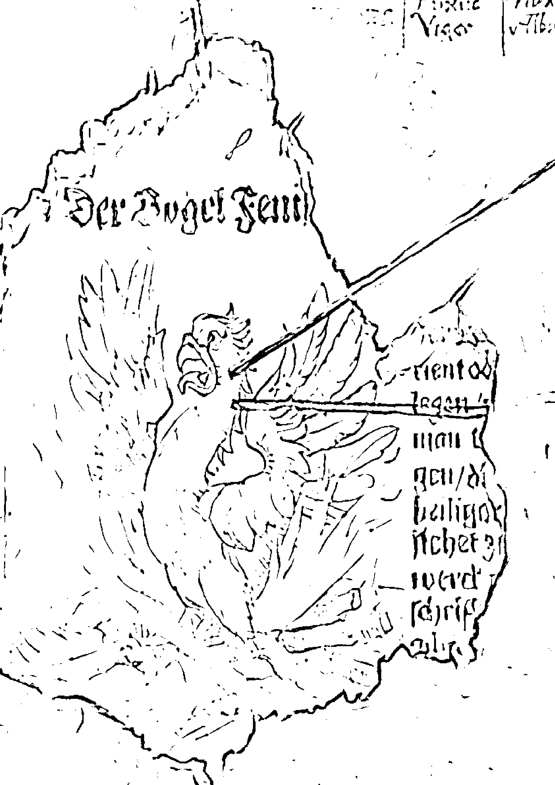

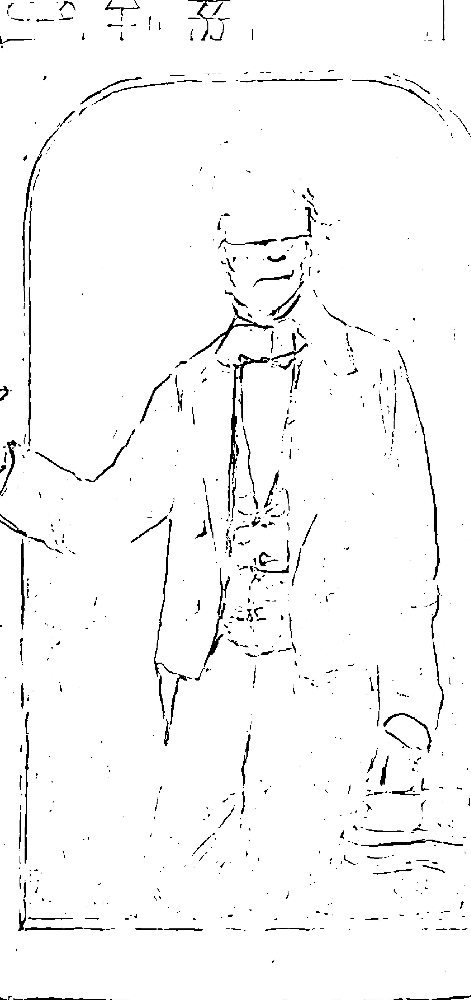

...rientes
legati
um...
nent
bellipol
ncher?
ward?
dris...

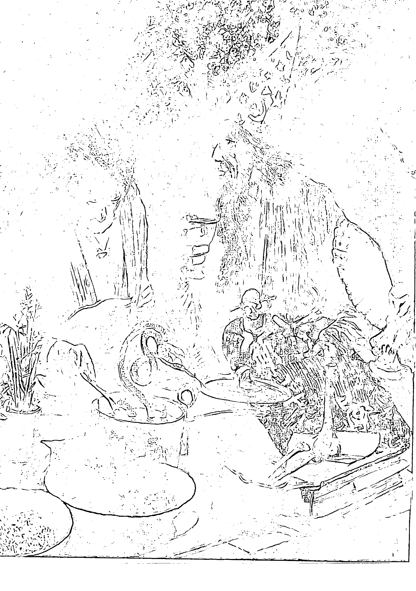

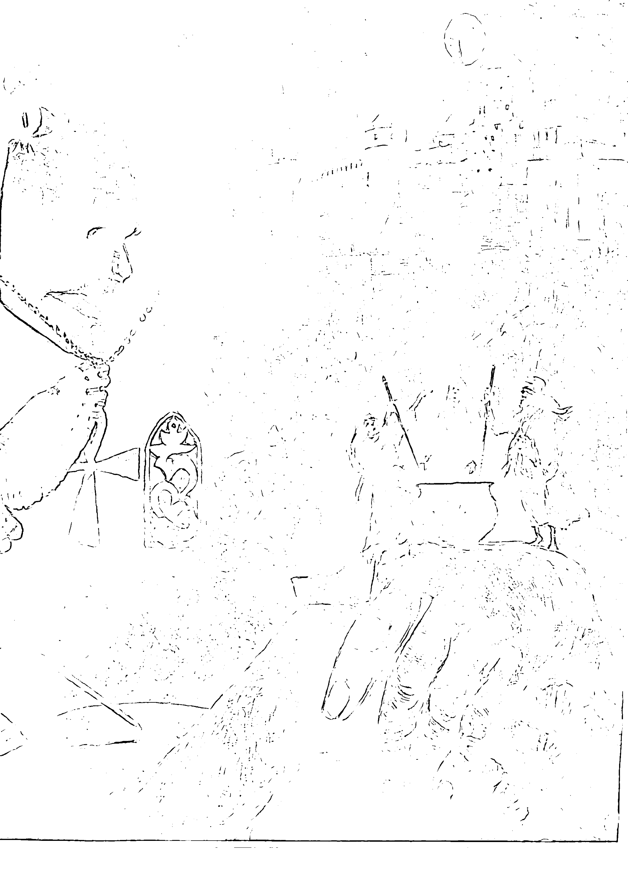

### 魔法师的养成之路

想要施展魔法就必须取得凡人所无法窥见的特殊知识。若要成为一位成功的魔法师，魔法奥秘的入门是绝对必要的，训练的过程普遍都很冗长且艰辛。魔法师的研习除将自身埋首于魔法的书海中之外，通常还需要精通许多不同类别的科学。

想要成为魔法师的人所寻求的智识，也能够由已知者加以传授。古埃及文献“棺材文”（Coffin Texts）的咒语二六一，记载着成为魔法师的方法：被选上的人首先必须与宇宙主宰的代表魔法师们谈话。他的自我被卸下，然后宇宙得以进入他的本质中，并神奇地赋予能量。一旦开始进行这些步骤，这位古埃及的魔法师就获准进入魔法图书世界中研读。

为了能够成为一位巫医（shaman）——同样是古老魔法师的一种，拥有治愈与预知未来的能力——无论男女，在入门以前，除天生必须具备超能力外，还要完成一段长久的训练。经历一段时间的禁食是入门仪式的要求之一，借此巫医会进入“死亡状态”，并进入另一个世界，和提供未来力量的守护灵建立关系。

守护灵，也就是所谓的图腾，通常以动物、鸟或昆虫的模样出现，扮演着巫医个人的守护者、引导者与导师。

还有其他的方法能帮助拥有超能力的人学习魔法的技艺。其中最普遍的方法之一，就是成为修行圆满的魔法师的徒弟。华特迪士尼的经典动画“幻想曲”（Fantasia）中，包括由米老鼠主演的著名《魔法师的学徒》（Sorcerer's Apprentice）系列，故事是根据古埃及时代的一则原著编写的。

这个童话故事中，愚蠢的徒弟决定趁他的魔法老师不在时，施展一个咒语，想要催动一支扫帚到井边为他取水。当他发觉自己并不知该如何停止这个咒语时，为时已晚。于是，徒弟将扫帚切成两段，妄想借此破解咒语，却反而使其工作效率加倍。直到魔法师回来时，整个城堡已经到处淹水了。这个故事告诫我们，知识不足是会招致危险的。

想要获准进入魔法的学习殿堂，其本身就是一项考验。如同20世纪的美国作家娥苏拉·勒瑰恩（Ursula Le Guin）在《地海巫师》（A Wizard of Earthsea）里所描写的英雄人物格得。格得想要开启洛克岛上通往魔法师学院的大门时，却被守门人告知大门已被施法，只有能够正确回答出谜语的答案者才能进入。幸运的是，格得拥有正确的答案，因此获准进入学校。

哈利·波特系列的许多引人入胜之处，在于哈利自进入邓布利多教授所管理的神秘住宿学校——霍格沃茨魔法学校，从一位初学者渐渐习得复杂的魔法技巧。如同憎恶哈利的魔药学老师——斯内普教授（Severus Snape）在第一堂课程时所言，在霍格沃茨魔法没有不可能的事。他曾自夸能够教导学生调配出与死亡抗衡的魔咒。

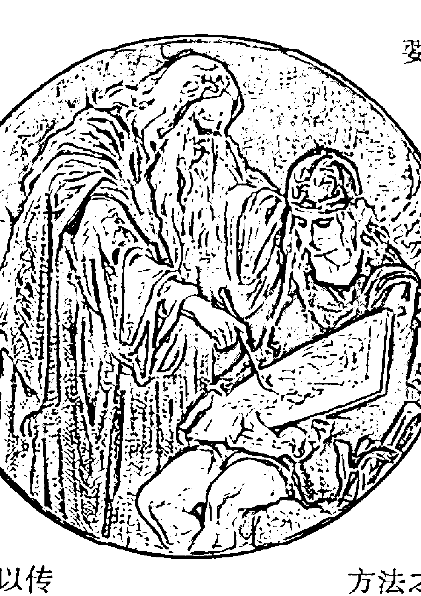

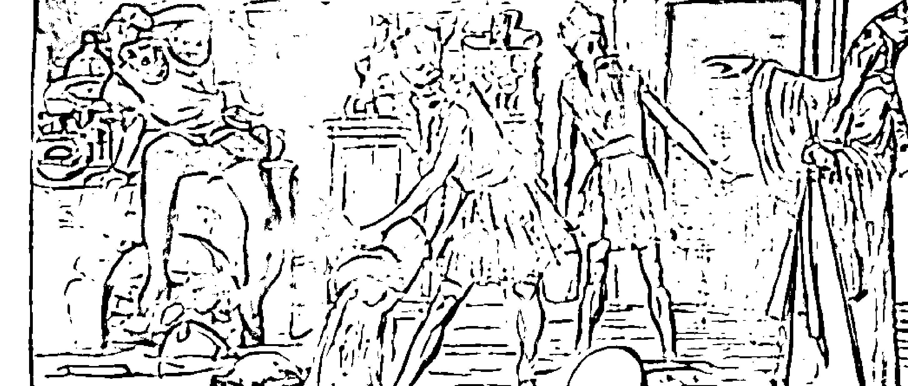

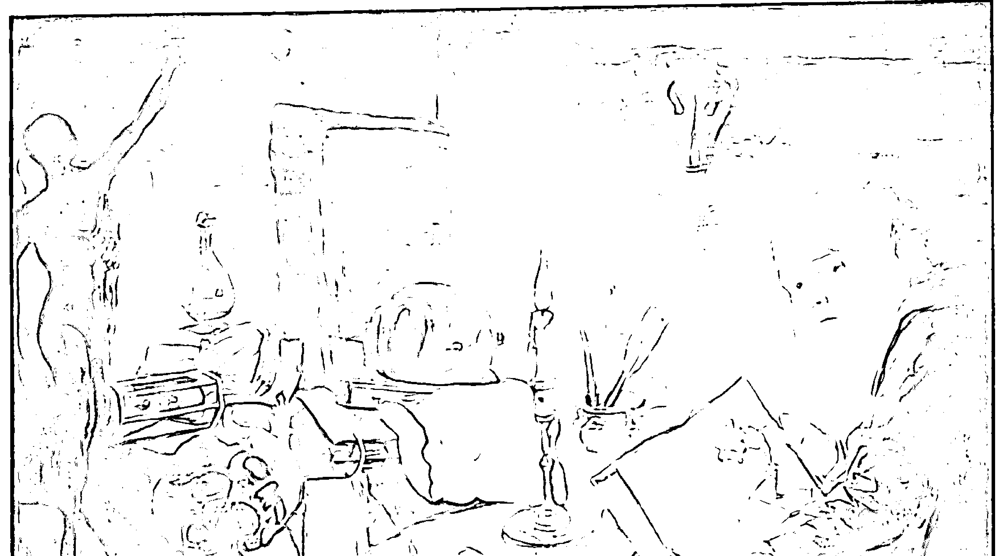

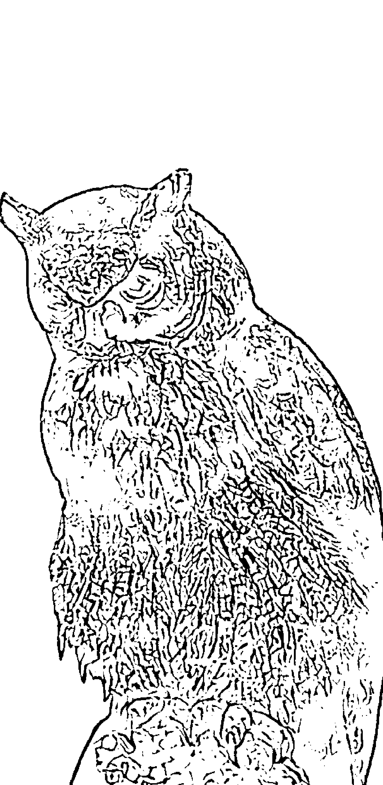

## 魔法师名人堂
## 魔法大师——梅林

梅林施展魔法，掀起巨大的损害，就在帐篷内，野火熊熊燃烧得就像烛火般通明……早在13世纪的这首无名氏的英文诗句里，甚至是更久远之前，梅林便是以拥有无限的智慧与力量的魔法大师受到崇敬。他最为人知的就是身为亚瑟王传奇中的伟大魔法师，秘密地抚育亚瑟使他成为国王，并给予他一把剑锋永不钝，剑鞘永不沾血的石中剑（Excalibur）。

公元6世纪的英国诗人艾德蒙·斯·宾塞（Edmund Spenser）在他的作品《精灵女王》（The Faerie Queen）中，称颂梅林预言未来的能力。书中描述，这位魔法师在威尔斯的一处洞室里预知未来，至今仍被称之为“梅林之穴”（Merlin's Cave）。

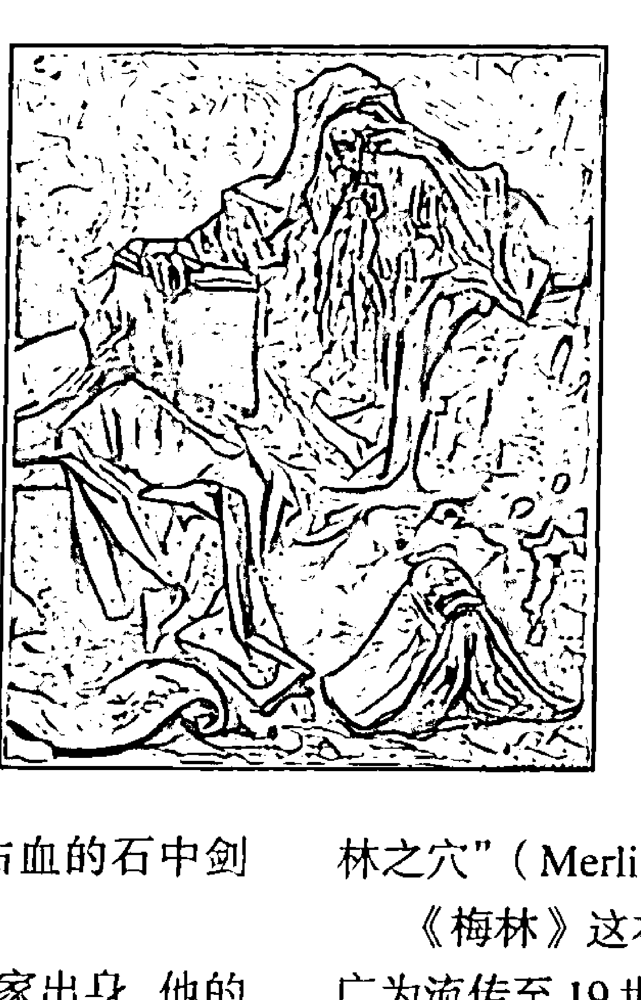

传说梅林本身就是魔法世家出身，他的母亲是修女而父亲是恶魔。这位魔法师遗传了他父亲的魔法力量与变身能力，但他的母亲灌输他凡间之爱与乐于助人的善心。虽然关于梅林的传说千奇百种，但他确实曾经存在。有些人认为他就是米尔丁（Myrddin），公元6世纪末曾居住在苏格兰低地，为皇室服务的先知。

《梅林》这本记载预言未来的书册仍被广为流传至19世纪，这正是他的魅力所在。英国作家T.H.怀特在他1938年所出版的畅销小说《石中剑》中，重现并重建梅林大师的威力，该书接着由华特迪士尼推出动画版。

关于这位魔法师最著名的传说之一，是他施展法术将爱尔兰的巨石运至索尔斯伯利平原（Salisbury Plain），建立巨大石柱区。根据12世纪作家蒙茅斯的乔佛瑞（Geoffrey of Monmouth），在他的《不列颠诸王史》（History of the Kings of Britain）这部奠定亚瑟王传奇基础的著作中描述，梅林陪同一支庞大的英国军队来完成这一项如愚公移山般的艰难任务，但不论这15000名的士兵多么努力使劲，都无法移动这些当地人称为“巨人之舞”（Giant's Dance）的巨型石柱：

诚如怀特所说，梅林能够随心所欲的幻化消失。此书中，他采用十分典型的离去的方式：“他踮起脚尖，而阿基米德则紧抓着他的肩膀，接着开始如陀螺般带着他们缓慢地旋转起来，越转越快，直到他变成一道模糊的灰色光影。几秒之后，那里再也没有任何一个人了。”

> “梅林嘲笑士兵们的白费力气……接着他令人难以置信地轻松取下石柱群，指挥大家登船；于是士兵们得以欢天喜地起航返回英国。”

然而，梅林还是有一个致命的弱点。依据某些传说，他好色淫荡的天性使他几次陷入美女的致命禁锢中。传说湖中仙女曾施法将梅林困在一处荆棘树丛中，至今他还未能逃脱出来。

而最能与梅林相互匹敌的魔法师，就属英国作家托尔金的《魔戒三部曲》中的魔法师甘道夫。

## MERLIN

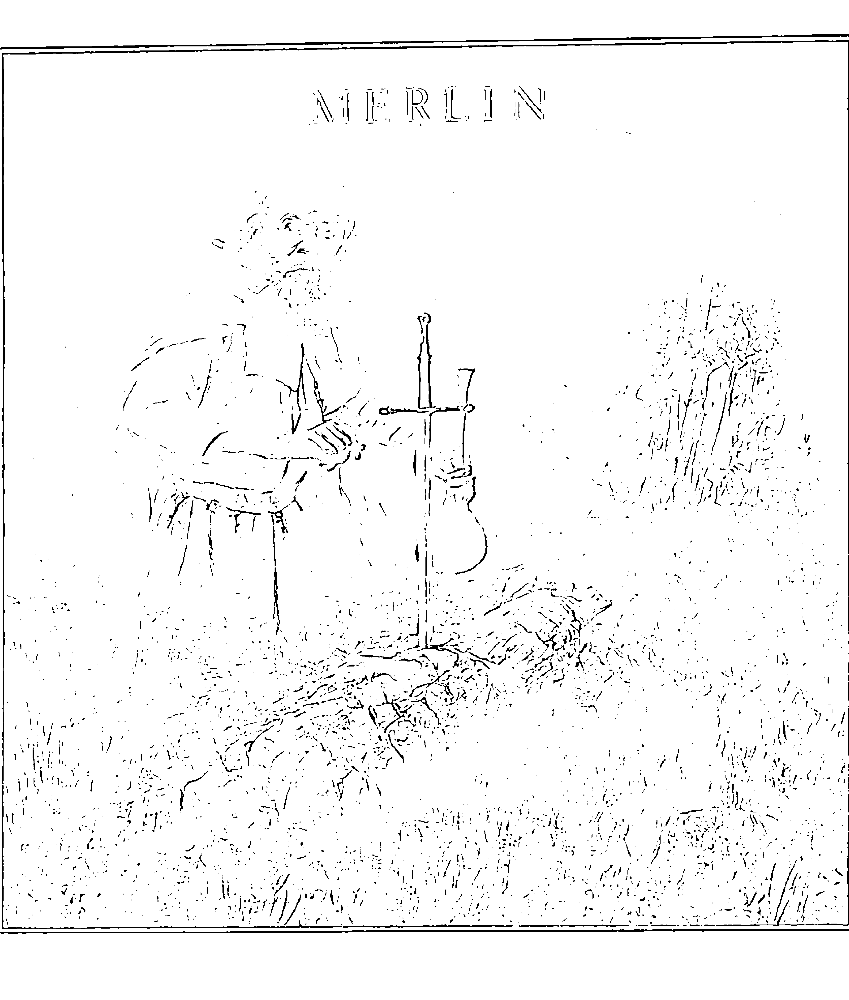

### 邪恶的魔咒

魔咒可以是语言或手写的方式。它的法力存在于所使用的文字形式中——可以是来自魔法师自己的语言，与咒语的施展表达。某些最古老的咒语是魔法文字与词汇，被记录在羊皮纸上，并环绕着脖子穿戴。中古世纪的人们普遍相信，只要将“abracadabra”这一个单字写下并穿戴在脖子上九天，然后背对着将它往后越过肩头，抛入一条向东的河流中，就可躲避瘟疫。这个字传说是源自于阿拉姆语的“abhaddakedhabhra”一词，意指“就像这个字一样地消失吧！”。20世纪的英国魔法师克劳利相信，此字具有强大的法力，而其正确的字汇应为“abrahadabra”，虽然现今它已成为家喻户晓的舞台魔术表演的开场序幕。魔法师有时会以拉丁文写下或说出基督教的祝祷词，或者将基督祝祷词的片段，作为治疗时的咒语。但这个方法却受到教会的责难，认为是异教邪说，并成为中古世纪猎捕女巫的开端。一位17世纪的英国魔法师为宣传抵抗女巫的反咒语，而刊登一则广告，内容包含念诵五段主祷文、五个欢迎词，以及一则信条。然而，根据传说，教会中的领导阶层有时也会使用反咒语来对抗巫术。

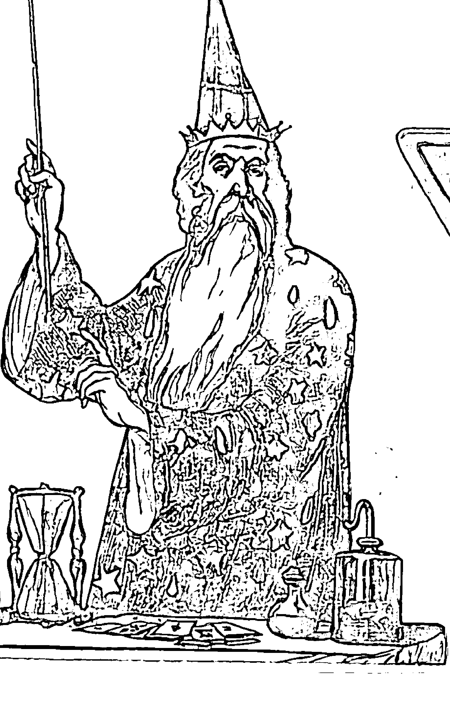

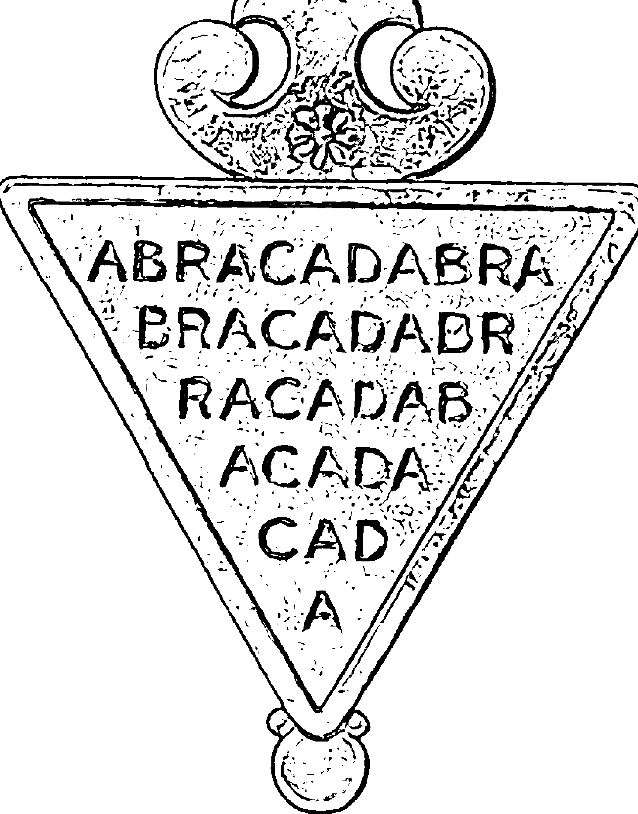

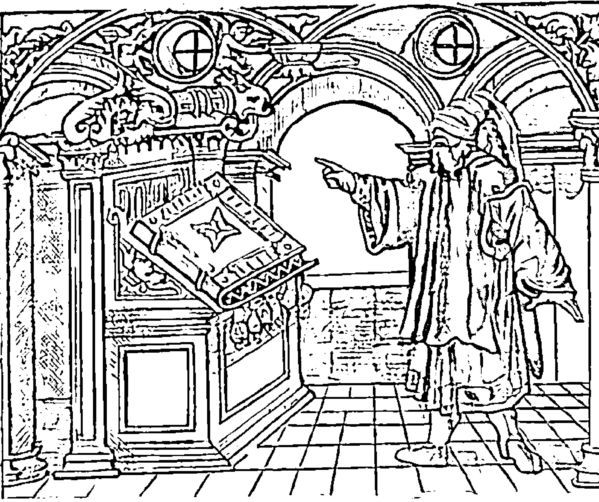

那些被称为“灵巧的巫师”的乡镇魔法师所服务的对象，特别需要能破解巫师诅咒的反咒语。人们普遍相信，魔法是息息相关的，巫师加诸在受害者身上的魔咒，也会成为反制自己的惩罚。下面的诗句是19世纪对抗巫术的反咒语：

> > 那塑造形象、施展法术之人啊！
> 他那不怀善意的容貌，邪恶的眼，
> 恶毒之唇，狡黠之巫术，
> 天上之灵，驱除它，
> 大地之灵，驱除它！

最显著的例子是，当杜鲁伊德魔法师们企图在圣·帕特里克 (Saint Patrick,) 的饮料内下毒时，他施展下列的防御咒文来抵抗：

```
Tubus fis frt ibu, fid ibu anfis,
Fris bru uatha, ibulithu, Christi, Jesus
```

魔法师的咒语可使用于善或恶的目的，而且他们的法力强大。变身咒语据说能将铅变黄金，或将一个人变为野兽；祈祷咒语能召唤灵体，自稀薄的空中出现听从吩咐；招魂咒能影响心之所欲或甚至停止时间。施展咒语可以操纵这个物质的世界，随心所欲的移动事物，或使自己隐形不见。咒语，是洞悉未来与解答世界上最伟大神秘事物的一种方法。

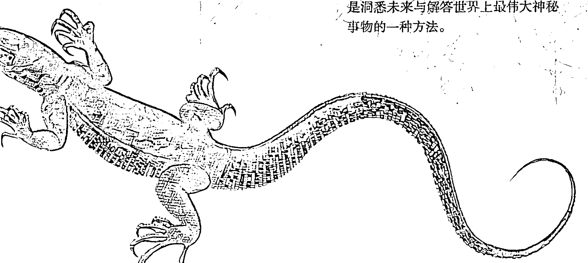

### 魔法之歌

咒语的旋律节奏是魔法本身强大的元素之一。节奏性地重复某一特定文字，据说能提升强大的精神力量，使咒语生效。

力量之歌是最常为巫医使用，作为召唤其个人的守护灵的方法。一位旁观者清楚纪录了一位西伯利亚巫医成功地召唤出他的动物灵：

> “击鼓声越来越强大，而他的歌声——可以听出是在模仿着狼嚎、水鸟的呻吟以及其他动物的叫声。接着他的守护神显灵，开始从我座位附近的角落出现，从另一端消失，接着出现在屋子中央，然后他似乎是从天花板降临。”

仪式的吟诵方式是项具强大法力的施咒法。纳瓦荷印第安人(Navaho Indians)采用仪式性的歌曲作为治疗用咒语，而这过程可以持续许多个白天夜晚。假若施法者没有正确地施展咒语，痛苦就会降临在他们的身上。因此，假使无法熟记词句，则试图要治愈的疾病就会反扑袭击在他们身上。

今日的魔法师见习生都会被提醒要以吟诵的方式来施展魔法。

《女巫与巫术完全手册》(The Complete Idiot's Guide to Wicca and Witchcraft)一书就曾建议：“在仪式中，你可以使用吟诵来建立自己的力量。如同击鼓的方式，一开始慢慢敲击；然后你就能建立自己的节奏并提高音量。你吟唱得越来越快，越来越大声，直到自己觉得已准备好与这股精力一同爆发。但千万别爆出声音，而要将这股能量导入你的魔法工具或目标。”

这首魔法歌曲广为当代的魔法师所使用，借由击鼓的模式反复吟诵，来建立一股富有韵律的气势，引导至出神恍惚的状态，赋予施展魔法的力量：

```
“Eko Eko Azarak
Eko Eko Zomelak
Eko Eko Cerunnos
Eko Eko Aradia.”
```

古时候的魔法师相信，若在魔法仪式中说出上帝的神秘之名，其所产生的音律波动，会释放出令人难以置信的宇宙威力。其力量是如此强大，以至于魔法师只能低声轻呼上帝在旧约里的个人之名。

除非是需要施展最强大威力的魔法，否则是禁止说出某些力量的名字。大部分的咒语都必须气力十足的大声吟诵才能发挥效用。据说古希腊的女巫师必须大声狂吼她们的魔法歌曲，希腊神话中所传说的海妖女赛伦(Siren)能以魔幻之歌随心所欲地控制男人。古希腊神学家克莱门(Clement of Alexandria)曾警告所有的男人，要小心赛伦的魔法：“驾驶船只航经歌声；那是致命的魔力；只要坚定你的意志，就能克服堕落；与十字架紧密相连，你将免于毁灭。”

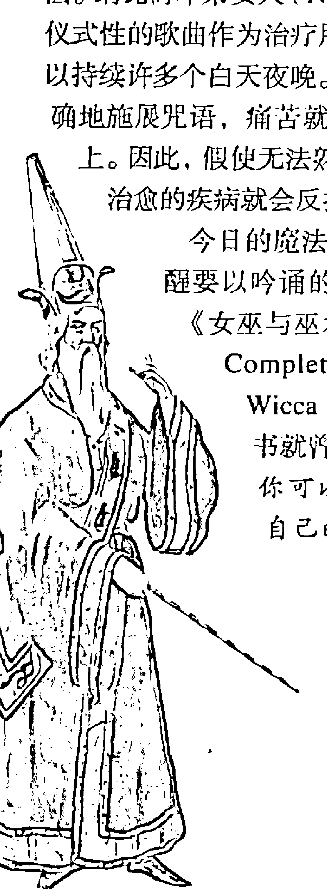

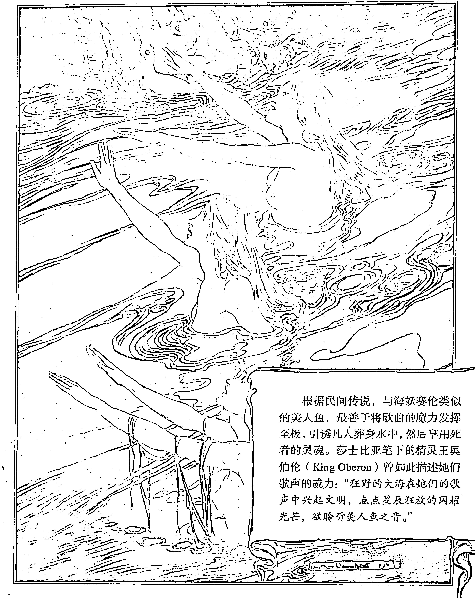

> 根据民间传说，与海妖赛伦类似的美人鱼，最善于将歌曲的魔力发挥至极，引诱凡人葬身水中，然后享用死者的灵魂。莎士比亚笔下的精灵王奥伯伦（King Oberon）曾如此描述她们歌声的威力：“狂野的大海在她们的歌声中兴起文明，点点星辰狂放的闪耀光芒，欲聆听美人鱼之音。”

## 魔法师名人堂
## 迪博士与天使魔法

最后一位皇家魔法师约翰·迪，是伊丽莎白女皇一世的占星学家，以及影响英国法庭的重要人士。他是一位才华洋溢的数学家与制图家，因此被公认为当时欧洲最有学问的人，但他一生沉迷于占星术、炼金术与天使魔法，使他成为令人敬畏且法力高强的魔法师。

迪博士大量收集有关魔法与神秘事物的书籍，并且将他位于伦敦的房子某侧改建为实验室，在里面进行炼金术的实验。为了探索将劣质金属转变为黄金的秘密，他必须与天使沟通。传说是借着炼金术士的同伴爱德华·凯利 ( Edward Kelly )的帮助，以他作为媒介，迪因此拥有充足的魔力召唤天使，并且发现炼金术转变的奥秘。

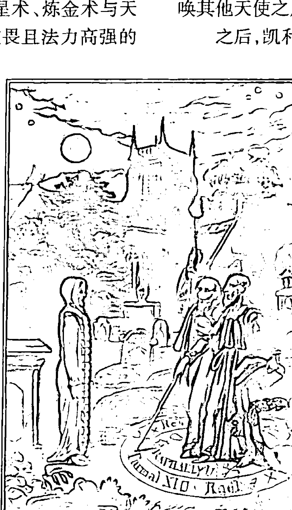

公元1608年，在迪死后不久，他与天使对话的纪录很快地出版在一本奇特的书中，名为《约翰·迪博士与某些神灵多年来的真诚互动关系》（A True and Faithful Relation of What Passed for Many Years Between Dr. John Dee and Some Spirits）。

第一次成功地召唤出天使安娜儿 (Anael)，似乎是在公元1581年的圣诞节之前，于他的家中。几个月后，迪发现自己正与大天使乌利尔对话，大天使赠送他一颗水晶球，并且给予“圣桌”与“神的封印”的摆设指示，以帮助他的炼金术研究。据迪所说，乌利尔浮现在他的窗外，手持一颗约橘子般大小的淡粉红水晶。接着大天使米迦勒也加入对谈，并告诉他水晶可以作为召唤其他天使之用。

之后，凯利成功的使用这颗水晶召唤灵界，迪因此可以与他们交谈，这颗水晶如今收藏于伦敦的大英博物馆内。凯利会凝视着这颗神奇的“显化石”，并召唤天使来到迪的面前。接着天使会教导这两个人一种特别的魔法系统，也就是现今所知的天使文字，是可以驱使神灵执行魔法师的咒语。

这些天使的降神会，在一位年轻的女性引导灵玛蒂蚩 (Madimi) 出现后，就不再举行了。那次她全身赤裸的出现，并怂恿这两名男子进行换妻游戏。但两人的妻子极力反对，于是争吵不断爆发，两个团体就拆伙了。

迪成为莎翁戏剧“暴风雨”当中，自负的魔法师普罗斯彼罗 (Prospero)一角的灵感来源，剧中，他召唤精灵爱丽儿 (Ariel) 出来听从他的吩咐，或作其他的事：

> “我将劈开一棵橡树，把你钉在它的盘根错节里，直到十二年过去。”

## JOHN DEE

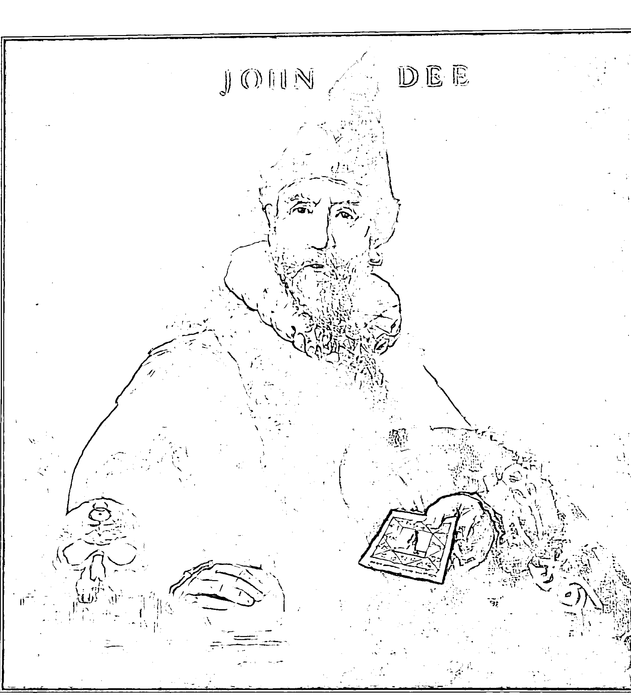

##### 魔法上身

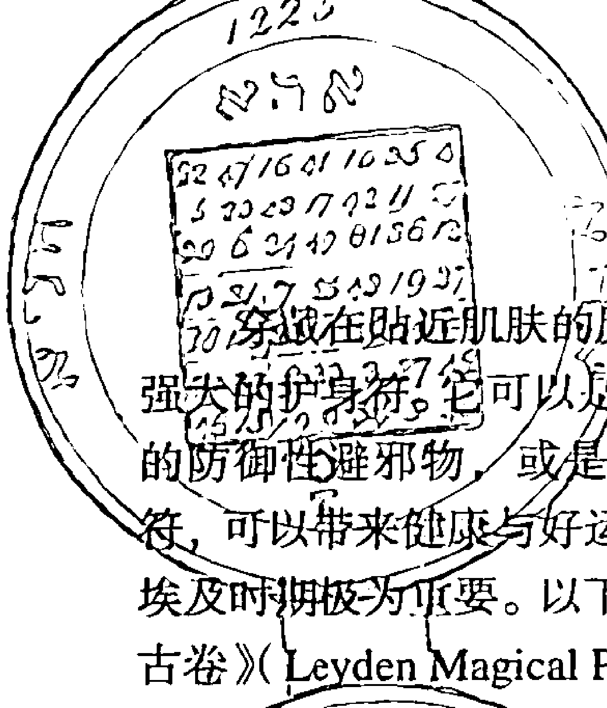

穿戴在贴近肌肤的咒语，被认为是法力强大的护身符。它可以是个驱逐疾病或危险的防御性避邪物，或是一个施过法的护身符，可以带来健康与好运。这类的咒语在古埃及时期极为重要。以下是来自《来登魔法古卷》(Leyden Magical Papyrus)的指导，说明如何创造基本的护身符：

> “拿一条有十六条细线的亚麻绳(白色四条、绿色四条、蓝色四条、红色四条)，将它们染上戴胜(编注：一种鸟类)的血，并绑在一只圣甲虫身上，如同身穿顶级亚麻的太阳神。”

将咒语制成一个主题雕像的方法，可能是源自于古埃及魔法师所制的沙伯替(Shabti)。诸如此类的事物，就是后来所知的小人俑，据说它能收纳类似于这个人的生命本质。若所受的为恶意的诅咒，小人俑就会代为遭受折磨，但是这些小人俑也可作为有益的魔法之用。

长久以来人们一直相信石头本身蕴藏着魔力，特别是圆形或是上面有洞的。爱尔兰的某种圆石就被称作“诅咒之石”，只要在施咒时将它往顺时针方向旋转，就能使厄运降临在某人身上。据闻苏格兰的魔法师柯欧德哈(Coinneach Odhar)就是因为一颗石头而拥有预言能力，当他睡在田野上时，那个有洞的石头就会神奇的浮现在魔法师的胸膛上。

身上若穿着或携带护身符，能增强魔法师自己的法力，因为它能保护穿戴者避免负面的能量，但为使其正确的发挥效用，符咒本身必须先灌注魔法。最常穿戴的护身符为指环。

星形以及上帝的秘密之名的指环，帮助他召唤恶魔来执行他的命令。

最重要的魔戒，就是出现在托尔金《魔界三部曲》中法力强大的宝物，是善与恶交战的重点。虽然是从烈焰之心提炼出来的，它却触感冰凉，指环会在适当时机浮现出如烈焰般的精灵文字，刻着

> “至尊戒，驭众戒，至尊戒，寻众戒，魔戒至尊引众戒，禁锢众戒黑暗中。”

如同托尔金，19世纪的作曲家瓦格纳创作出伟大的系列歌剧《尼伯龙根的指环》(Der Ring des Nibelungen)。剧情也环绕着一只魔戒：

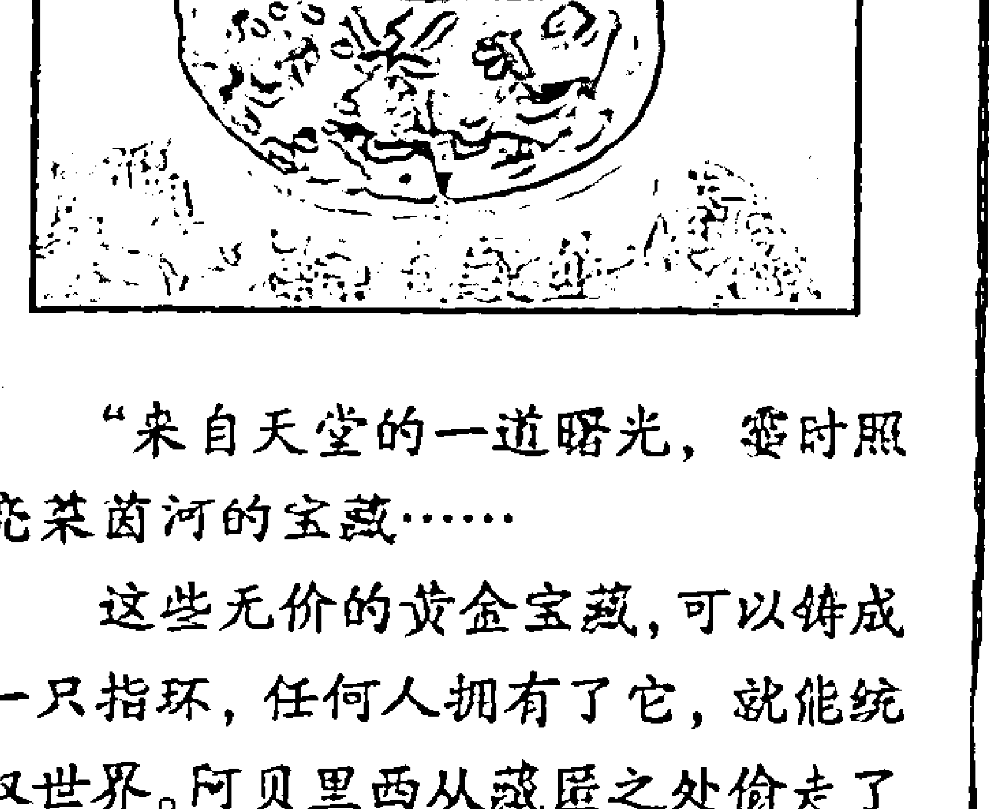

> “来自天堂的一道曙光，霎时照亮莱茵河的宝藏……

这些无价的黄金宝藏，可以铸成一只指环，任何人拥有了它，就能统驭世界。阿贝里西从藏匿之处偷走了宝藏，并将它们铸成一只魔戒。所有人都受到威胁，甚至是天上的神。”

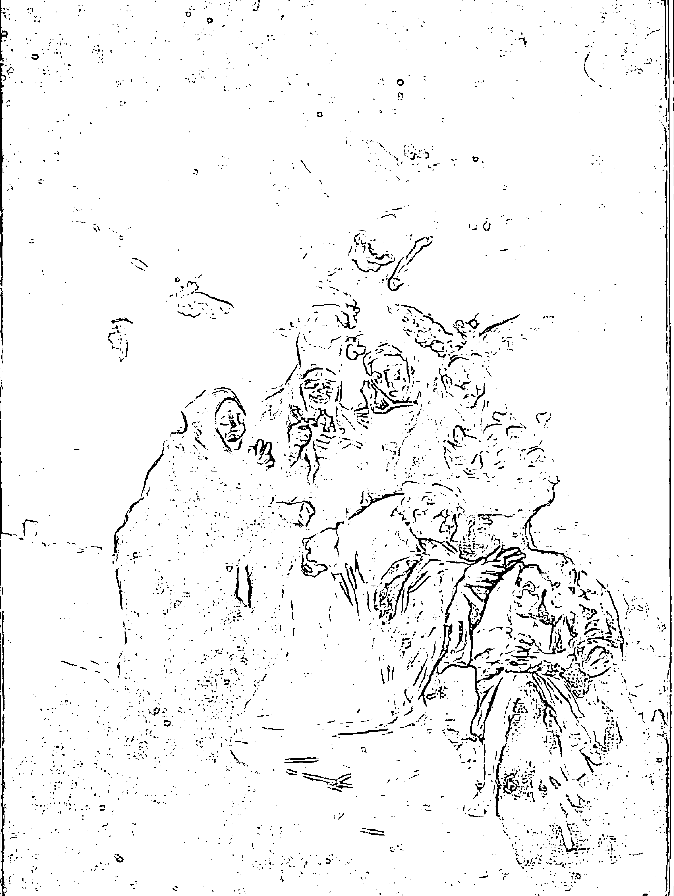

### 神奇的魔杖

一位国王或皇后手持着权杖是皇家权力的象征，而魔法师的权杖就是他的魔法杖。虽然如此，但它不单单只是个象征，更是魔法师法力集中的重要物品。若魔法师的等级越高，他们魔法棒为善或为恶的力量就越高强。

最古老且令人印象最深刻的魔法棒之一，就是为朱比特（Jupiter）所作的，他是经典神话中至高无上的神，人民信仰他为宇宙的主宰与带来光明的使者。他的权杖是由创造闪电之神伏尔康（Vulcan）所铸。魔法师之神的麦丘里（Mercury）拥有一支双蛇盘绕的魔杖，以引导亡者进入黄泉。“用他的催眠魔杖”17世纪的英国诗人约翰·米尔顿（John Milton）曾这样描述着，麦丘里能在任何的魔法程序中施展催眠术。

在南威尔斯挖掘以正规仪式埋葬的遗址时，考古家们相信，他们可能已发现所知最早的英国魔法师，大约是存活在公元前24000年左右。在帕弗园墓中（Paviland Tomb），他们发现一具年轻男子的尸体，身旁摆放着一支故意弄断的象牙，象牙在当时被视为魔法之物而受到崇敬，所以它被蓄意破坏的原因可能代表着，它曾是魔杖，因为魔法师的死亡，而必须在正规仪式下被损毁。

一支魔杖的蓄意损毁，也可能是要结束所施展的咒语，为此，连同魔法之书也必须销毁，如莎士比亚笔下的魔法师在《暴风雨》中所展现的：

> “在我强大的法力之下，坟墓听从我的命令开启，让沉睡者前进……然而狂暴的魔法在此弃绝，我将折断我的魔杖，将它深埋于地底下，我将把魔法之书沉入水中，比任何铅锤落水声还要深沉。”

万能的朱比特，是最早也是最伟大的魔杖使用者，以带来光明者的身份受人崇敬，而他的魔法杖也因能施展魔法，为黑暗带来光明而普遍受到人们的敬仰，因此，它还能象征性地克服邪恶。当年轻的魔法师格得与邪恶的影子野兽处于危急的决斗中，魔法师的木制魔杖惊人地变成最终极的魔法武器，娥苏拉·勒瑰恩（Ursula Le Guin）在她的《地海巫师》一书中，精彩的描述着：

> “格得高举起魔杖，闪耀着令人难以忍受的强光，炽热如此白亮且强大的光，甚至能驱走最古老的黑暗。在这道强光之中，无论任何掷向格得的东西，都开始脱落，最后萎缩成黑色一团。”

## 魔法师名人堂

### 卢恩符文的主宰——奥丁

奥丁是北欧最伟大的神，被尊为“众神之父”，并拥有广大的魔力，甚至可以发掘卢恩文字的智慧，是探索生命本质的神秘字母符码。奥丁曾为完成一件伟大的功迹付出极高的代价。他将矮人们所铸造的金色神枪“谷尼尔”(Gungnir)刺向自己，并像个死尸般地悬吊在世界之树上九天九夜。直到这可怕的最终时刻，他得到回报，诚如他所说出的话：“我朝下望着，我紧抓着卢恩文字，在惊声尖叫中，我终于领会了。”

拥有这些神奇的字母符号，奥丁得以窥探创世时的神秘智慧。奥丁将这个珍贵的知识传授给神明与人类，卢恩文字自此就一直使用于占卜、魔法与静心冥想。据说当卢恩字母符号连结成“卢恩缉文”(Bind Runes)，就会创造出一个强大防御能力的魔法护身符。

被赋予如此至高无上的智能，奥丁因此成为绞台之王与鬼魂的主宰。他拥有刻画与彩绘卢恩文字的能力，以使死尸们死而复生，然后这些死者会与他交谈，将死亡的奥秘揭露于他。

奥丁骑上他的八脚神骏史莱普尼(Sleipnir)，疾驰越过大海穿过天庭。这位宇宙主宰的旅程超越死亡，骑入冥界，只为向一位女预言家询问有关他儿子贝尔德(Balder)之死的真相，然而这名女预言家看穿奥丁的乔装，拒绝回答他所有的问题。

但其他人就没那么容易看穿奥丁，这位法力无边的变身术者、乔装之王的假面。除

除此之外，这位北欧的魔法师，为了品尝在天上受到严密监视的诗仙蜜酒与取得伟大的魔法智慧，先将自己变身为一位巨人，帮宝吉(Baugi)农作，他是负责看顾诗仙蜜酒的巨人史登(Suttung)的兄弟。他像超人般地辛勤工作，期望能得到一口蜜酒作为回报。当这个寄望幻灭时，他又化身为一条蛇，钻进一个小洞，是通往埋藏秘密酿酒的山洞里。

到了目的地，他又幻化成一位英俊的年轻男子，独自看守蜜酒的女子立刻就爱上他，并让他将井里的酒喝光，然后，奥丁就变成一只老鹰，飞往安全之地。

就像许多其他的魔法师一样，奥丁戴着一只神奇的金指环。那是由两位侏儒所铸成的，每逢第九夜，它就会产生出另外八只魔力的指环 更超乎寻常的是，奥丁将指环环绕在手臂上，而非佩带在手指上。奥丁还成为19世纪德国作曲家理查·瓦格纳(Richard Wagner)的《尼伯龙根的指环》(The Ring of the Nibelung)系列歌剧中的角色渥坦(Wotan)。

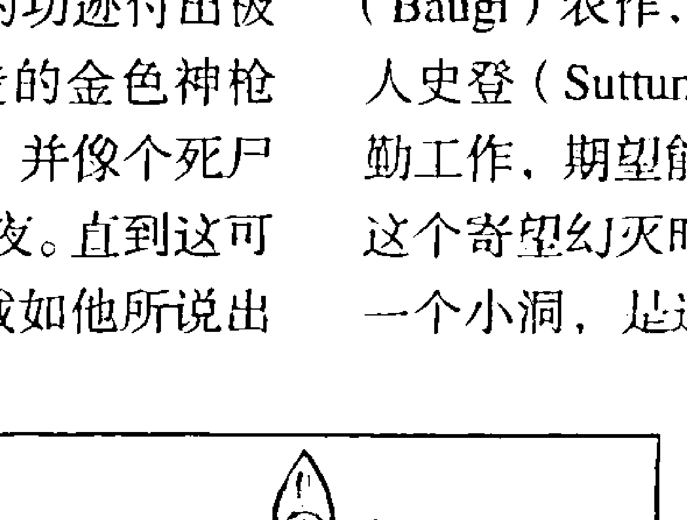

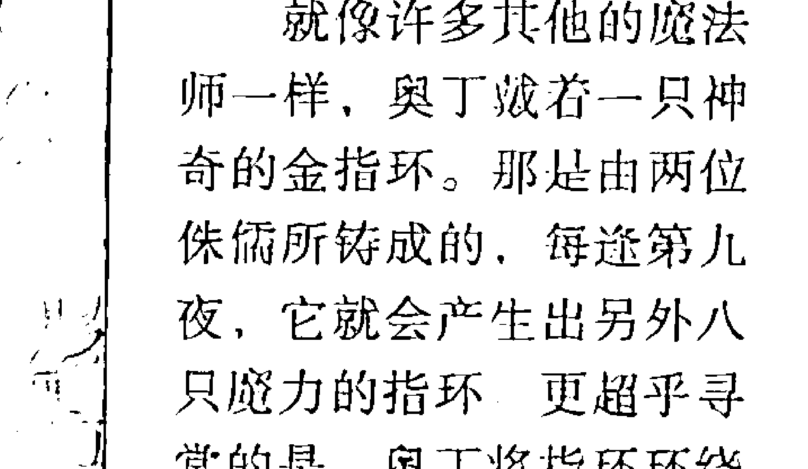

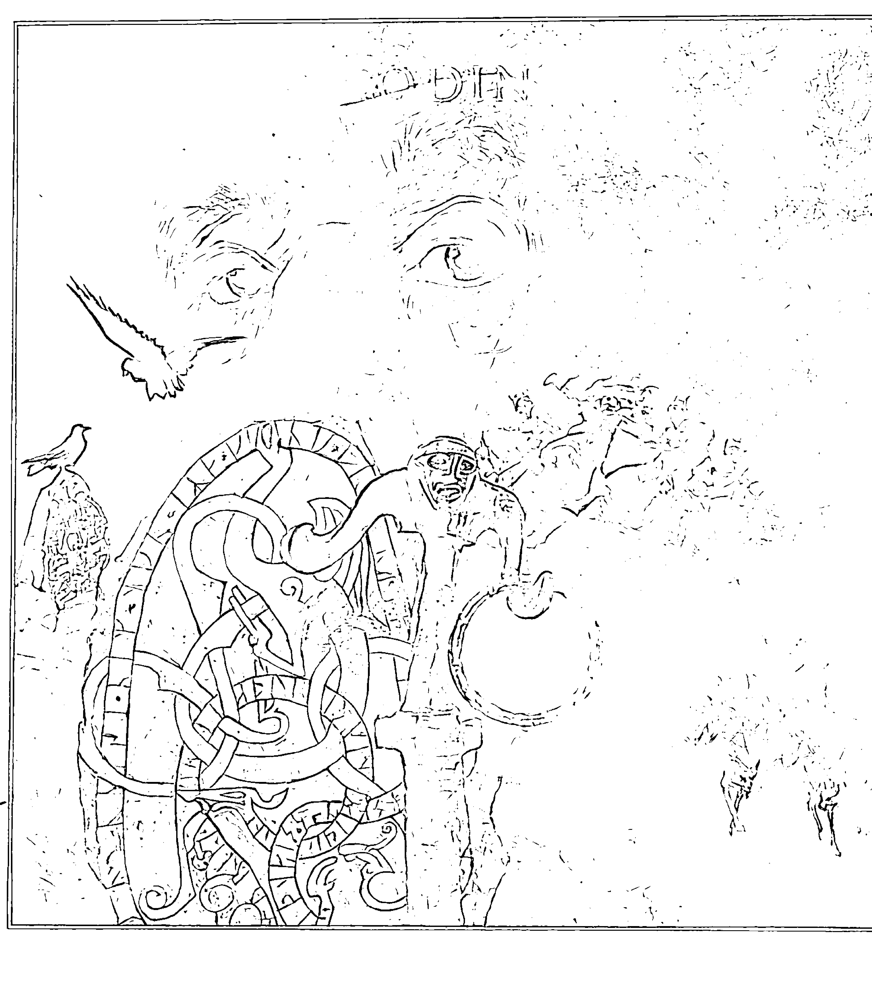

### 炼丹炉

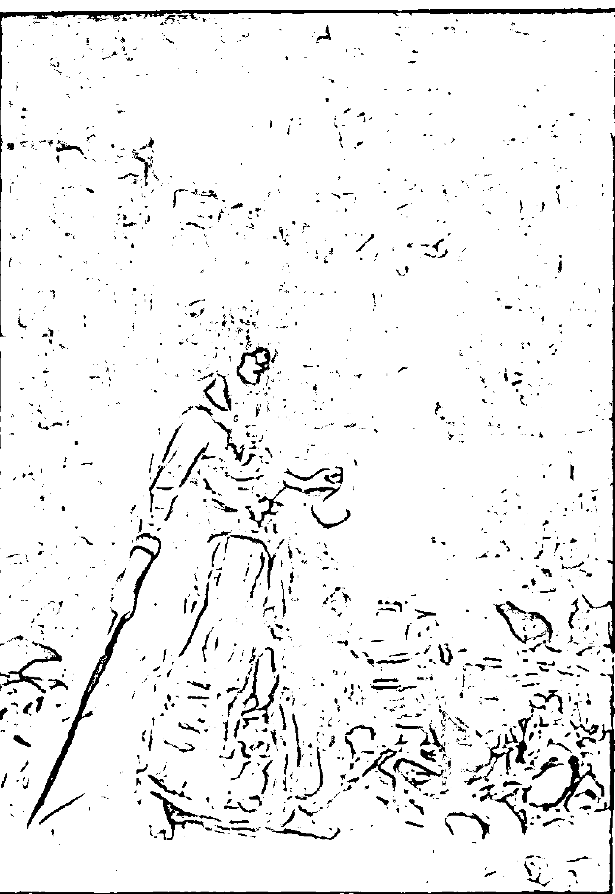

喝下魔药后，古迪恩立刻富有神力，马上变为野兔、鱼、水獭与飞鸟躲避愤怒的女神。最后，当他绝望地想要躲避追击，变为众多谷物中的一粒麦粒时，女神猛地扑上去把它吃了。

在希丽文的腹中，他再度化身为一位胎儿。九个月之后，这位女神生出了一位极为漂亮俊美的男娃娃，长大后成为威尔斯著名的吟游诗人与预言家泰连辛。他运用自己的音乐与歌曲创下无数的奇迹，并能穿梭时空，随意变形，只需用一个字就能平息暴风雨。他的天赋起因于那神奇的过程，如16世纪《泰连辛之书》（Book of Taliesin）中记载着：

> “是古迪恩创造了我，从那魔法之物获得魔力……。
从五个五十岁的魔法师与指导者。
如同数学是我所创造的……
魔法师中的魔法师在创世前，创造了我。”

从远古时期，炼丹炉就已是魔法师与女巫所必备的工具。自最早的信仰开始，它就与炼制起死回生的力量息息相关。
根据传说，有一个魔法炼丹炉就是帮助威尔斯的传奇巫师泰连辛（Taliesin）诞生的工具。塞尔特的魔法女神希丽文（Cerridwen）将炉内的魔法物烹煮一年又一天，想为她的丑儿子阿法戈杜（Avaggdu），炼制出代表智慧、灵感与科学的三滴知识魔药。然而这三滴魔药却被负责搅拌锅炉的谦卑仆人古迪恩（Gwydion）所误饮。

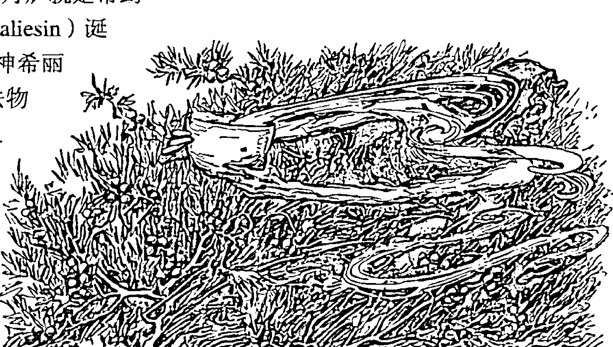

然而最家喻户晓的魔法炼丹炉，是莎士比亚的《麦克白》剧中，三位女巫所搅拌的锅炉，里头加入一些他们所难忘的东西：

> “蝾螈的眼睛、青蛙的趾、
蝙蝠的毛、狗的舌头、毒蛇的叉、
无足蜥蜴的毒牙、蜥蜴的腿以及枭的翅膀。
为了创造威力无穷的灾难题咒，
就依炼狱之汤烫烫得冒泡吧！”

当魔法师们开始对炼金术的科学产生兴趣后，炼制魔法的场所就转移到实验室，而魔法炼丹炉也就被各种分门别类的实验设备所取代。

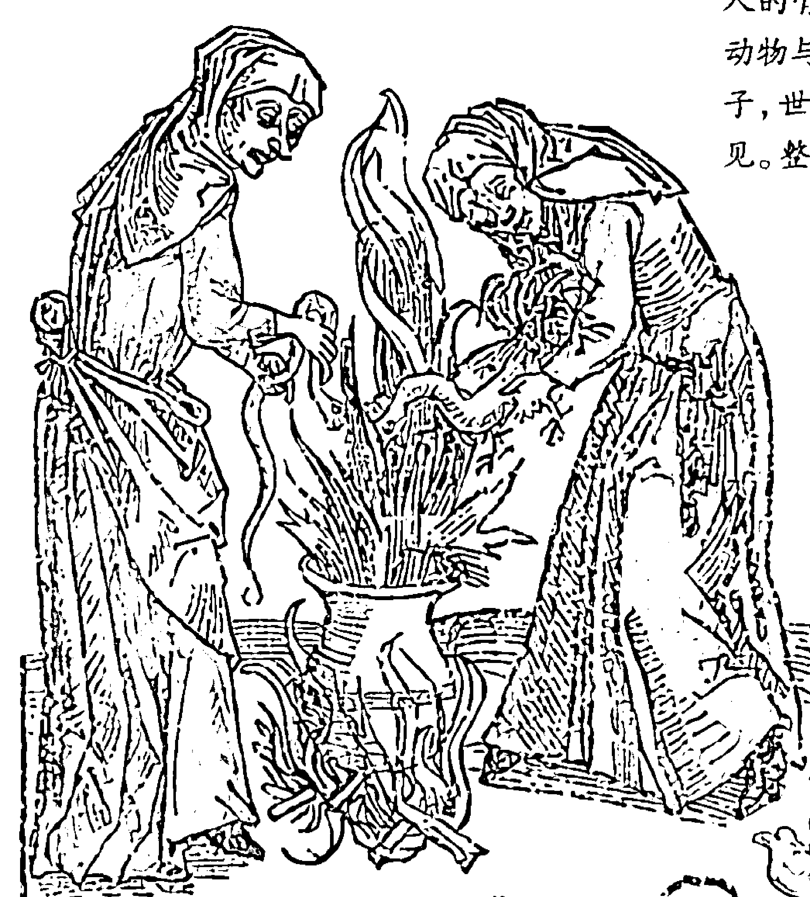

一种早期为蒸发有损金属的酸性液体的希腊器皿，会采用一支竹子的形式，底部放置熔炉，而顶端是浓缩凝结用的圆盖。另一个关键器具，是熔化炉与一个梨形的玻璃器或是升华用的陶锅。

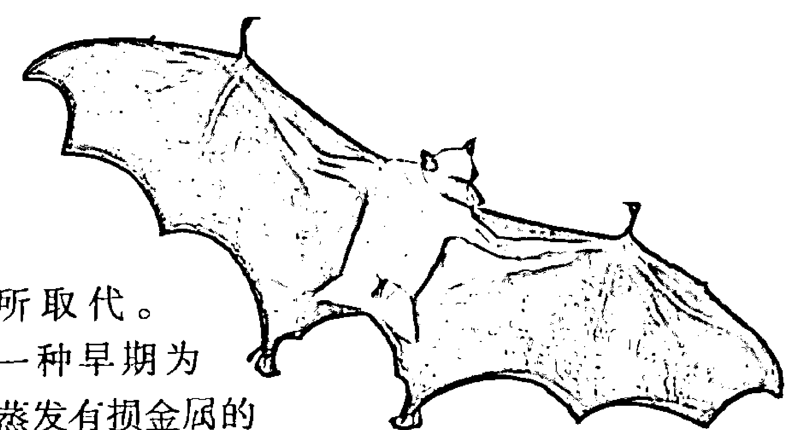

民间的传说描述着16世纪爱尔兰的伯爵魔法师，吉罗德·费兹杰罗的实验室：

> “这是一间古怪老旧的高圆顶房间，四处散布着魔法的器具，大型的缩口瓶似乎在冒着泡泡，而神秘的内容物也发出嘶嘶声响。此外还有大型的桶子，里面显然装着死人的骨灰。玻璃瓶中保存着解剖后的物体，动物与人类皆有！阴暗的一角摆着一面大镜子，世界的远方各处反映在镜子里又消失不见。整间屋子完全沸腾在古老的魔法之中。”

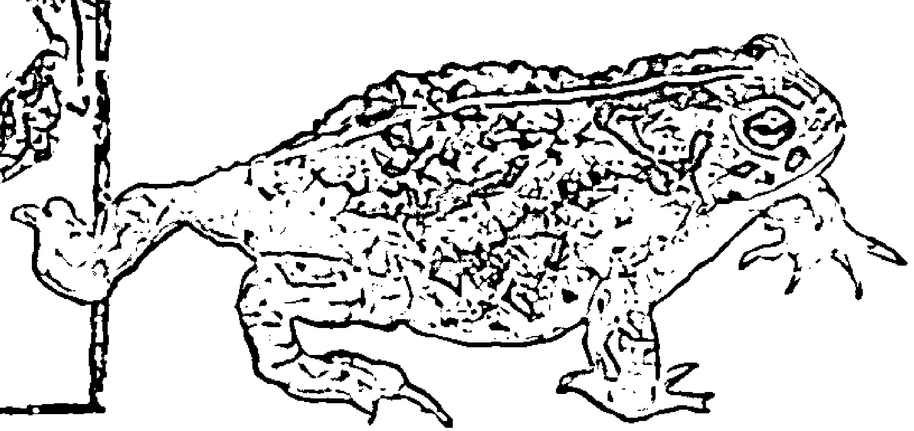

### 魔法斗篷

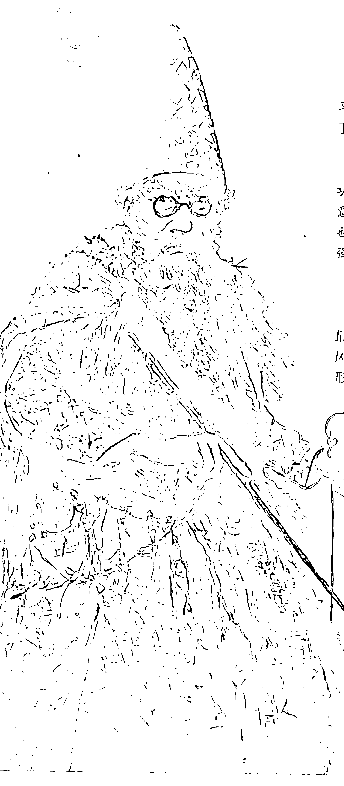

俗话说得好 “人要衣装”，这句话对于见习魔法师来说特别正确，诚如 21 世纪的女巫手册所示，提供下列建议给见习魔法师：

> “魔法装扮是另一种可以增加你的魔法功力的方法。当你穿上魔法衣饰，就会使潜意识知道，将有工作要完成。你的魔法衣饰也可以附上魔法象征或讯息。这是有助于增强衣饰的功力。”

下列所述是梅林在怀特的《石中剑》中最喜爱的服饰风格。书中详尽的描写他奇风异俗的装扮，使人联想起典型的魔法师形象：

> “他身穿一件流畅飘逸的长袍，有着毛茸茸的披肩，上头布满黄道带绣样，与犹太神秘符号，中间有一只眼的三角形、奇怪的十字、叶片、骨头、鸟与动物的形状以及一个行星系图，里面的星星闪耀着，似透视镜上的太阳光。他头戴尖尖的帽子，就像个傻蛋的帽子般……手持愈疮木的魔法棒……脸上戴着一付角质框架的眼镜。”

为使自己的专业与国王或皇后相称，古代的魔法师所穿的长袍都同样地崇高威严，尽管有着神秘的气质。晚期所增添的尖帽，赋予魔法师更多的威严气势，而眼镜使他们富有学者的气息。古埃及大祭司的仪式祭袍，是在黄褐色的赤裸皮肤上，缀满闪亮的星星，后来法国传统的君王加冕典礼所穿著的神圣长袍，就是仿照这个样式而来的。

巫医会借着特别的装束，以帮助自己进入灵界的旅程。服饰上面会绣满许多精巧的主题，或是垂挂着象征着许多作为指引的各种生物。巫医常穿着羽毛制成的鸟状斗篷，代表他在入神状态时，所转变成的鸟灵魂。19世纪爱尔兰人的《考马克辞典》（Glossary of Cormac）一书里曾描写这类的服装。这件奇特梦幻般的斗篷是由“许多白鸟与多彩鸟儿的羽毛所制成的，下半身至腰带的部分是绿头鸭脖子上的毛，从腰带以上到颈部则是一束束的毛毯。”

传统上，魔法师也许会在私下举行魔法仪式时，穿上如此令人印象深刻的衣服。但是当旅行时，他们习惯低调的穿著以免引人注目。最有名的例子就是托尔金笔下的奇幻巫师甘道夫。他初次出现在读者的面前，是当他进入哈比族的领地夏尔时，当时的形象是一个头戴蓝色尖帽的老人，身着灰色的长袍与银色的围巾。然而当适当的时机出现时，甘道夫则会呈现自己真实的样貌。

甘道夫凝聚强大的法力打败可怕的敌人炎魔（Balrog）的过程中，他从灰袍巫师甘道夫转化为白袍巫师甘道夫。他以威力更强大的魔法师姿态，呈现在邪恶的白袍巫师萨鲁曼面前，萨鲁曼早先的光辉，当时已被邪恶所遮蔽了。

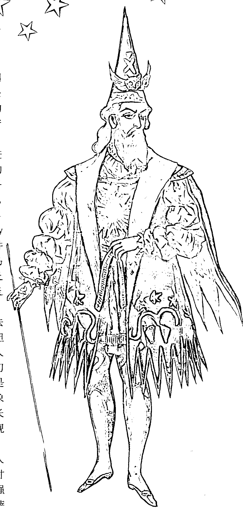

### 不可或缺的魔法道具

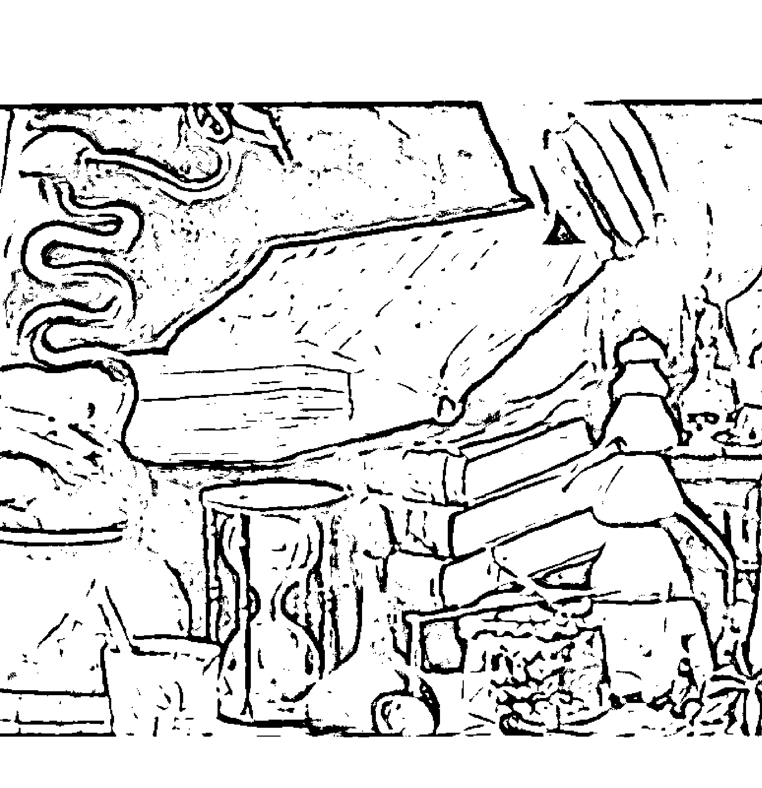

若要成功的施展咒语，除了魔法杵或冒泡的炼丹炉之外，还需要一些特殊的道具。

对于追求详尽完善的仪式魔法与炼金术的魔法师来说，一个库藏丰富的图书馆是必不可少的。都德阁魔法师——约翰·迪，拥有一个资料丰富的图书馆，藏书超过四千本，却遭到一群愤怒民众的掠夺与破坏，他们意图惩罚这位被视为邪恶且令人畏惧的魔法师。

一些最古老的魔法手册就是现今所说的《黑皮书》（black book）或《魔法摘要集》（grimoires）。这些书籍在中世纪时广为流传，仪式魔法的学习者至今仍会查阅较新的版本。这些书册精确地提供了各种仪式的指导，以及如何召唤与控制恶魔的建议。最伟大的《黑皮书》就是《所罗门的钥匙》，它提供资料给许多人，这些都归功于所罗门王，这位魔鬼大军的统领。

许多世纪以来，蜡烛在魔法仪式中也扮演着主要的角色。古埃及祭司用烛光作预

言，而这个方法一直被沿用至今。在古埃及的一项魔法步骤中，需要祭司在一盏新油灯的干净灯芯上，写下特殊的象形文字与符号。这盏油灯将被装置在砖头上，然后祭司就可以施展咒语，召唤被火焰所吸引而来的精灵，接着他可以向精灵询问有关魔法的事情。阿拉丁故事里那名传千古的神灯，能够召唤一个法力高强的精灵，就是从非常早期的占卜仪式衍生而来的。

某些人相信由人脂做成的蜡烛，包含着生命的能量，可以使用在黑魔法的仪式中。不论在任何场合，使用正确的蜡烛来进行手边的工作，是极其重要的。施展一种为达到减肥效果的现代女巫魔咒，就需要使用黑色的蜡烛，魔法师必须写上所希望减轻的体重。当蜡烛正在燃烧时，要同时吟诵下面的咒语：

> “让那撼动我的体重，随着蜡烛的燃烧溶化吧！一天天地，我将更为轻盈窈窕。此愿为我愿，就让它实现！”

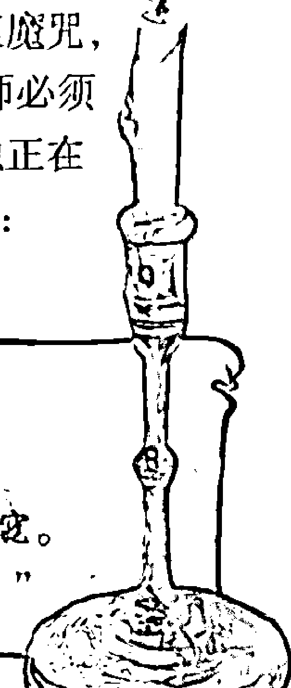

卢恩文字可以召唤神灵或预知未来。罗马作家塔西佗（Tacitus）在公元98年曾描述，日耳曼民族将卢恩诗文抛掷在白布上占卜，然后会由一位卢恩文字的大师解读结果。

13世纪的女性卢恩文专家很容易被误认为今日的魔法师，从这段当时的描绘可看出：

> “她披着宝石镶边的斗篷，一顶白貂皮衬里的风帽围绕着头颈。她一只手握着有圆把的手杖，紧束长洋装的腰带上挂着一个魔法袋。”

专家们也会使用塔罗牌作为预知未来的魔法工具。某些魔法师认为，塔罗牌拥有失传的古埃及托多神的魔法智慧。其他人则相信，学习塔罗牌的智慧能使人摆脱命运之轮，从而掌控自己的命运。19世纪英国有一位魔法师亚瑟·爱德华·伟特（Arthur Edward Waite）与他的魔法组织——金色曙光会的同伴，将纸牌的四种花色与探索圣杯的四种神圣物品连结在一起：五角星、圣杯、权杖与圣剑。

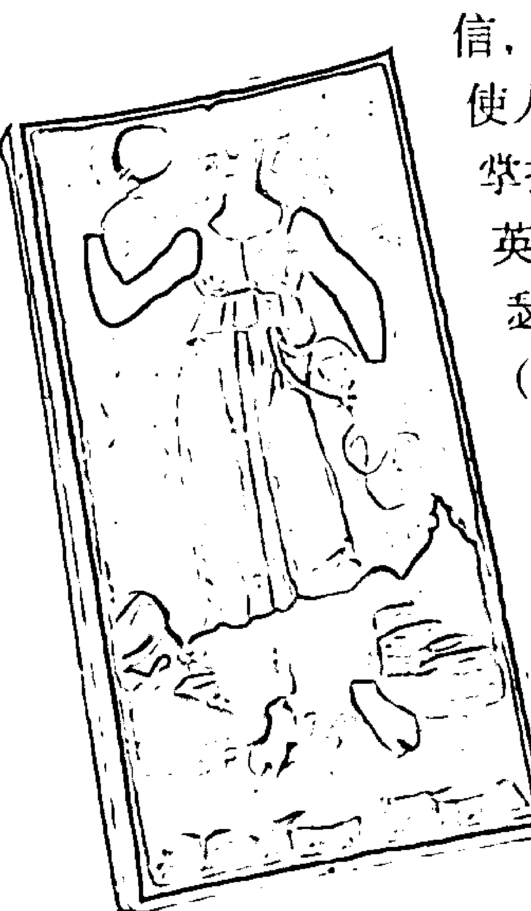

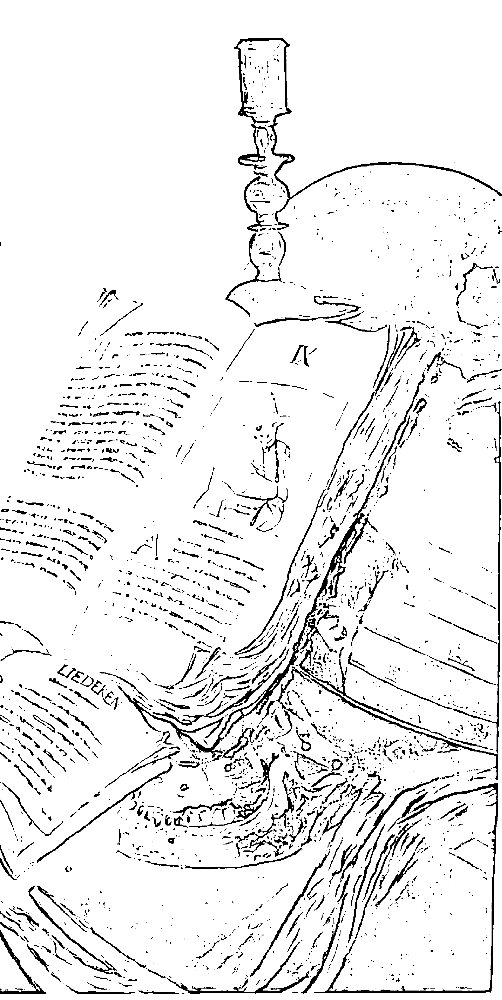

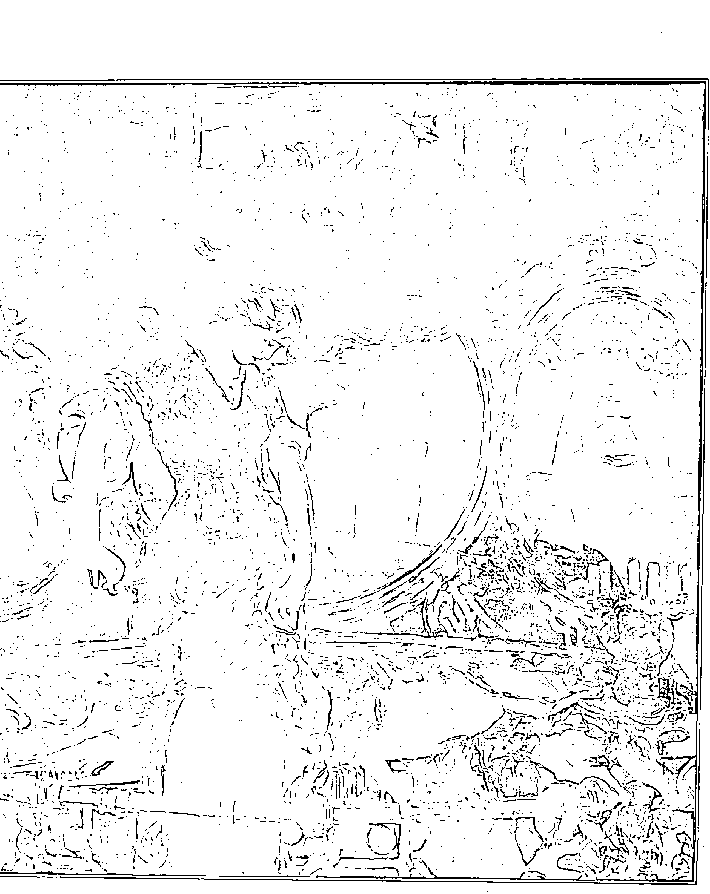

### 60 大风起兮云飞扬

### 水晶般的清晰指引

古埃及的首席魔法师们施展治疗咒语时，会利用水晶球将太阳光束集中在病人的身上。这种天然玉石现今仍与魔法的治疗能力相关，主要的原因是人们多数相信水晶拥有极高程度的自然能量，可以借由魔法师将能量释放，并转移在其他人身上。后来这项理论，因为俄国科学家席扬·克里安(Semyon Kirlian)发现水晶的周围皆散发着能量磁场，而更增加可信度。

不论何种年龄的魔法师都曾使用水晶球洞悉未来。这个占卜方法在15世纪的欧洲越演越烈，当时的人们普遍相信魔法师可以召唤神灵或天使出现于水晶球中，并执行命令或请求。

16世纪的魔法师约翰·迪，众所皆知地拥有一颗魔法球，是他与灵媒凯利用来召唤天使的。他表示水晶球是天使乌利尔所赠与的，迪还有一面用磨光的黑曜岩所制成的魔镜，据说是西班牙的探险家哥得斯(Herman Cortes)在墨西哥取得的。

自远古以来，魔镜也是占卜的工具之一。在魔法世界中，镜子总有特殊的重要性。有些人仍认为镜子可以反映灵魂，因此需要小心的守卫着以防灵魂出窍。魔法师会凝视

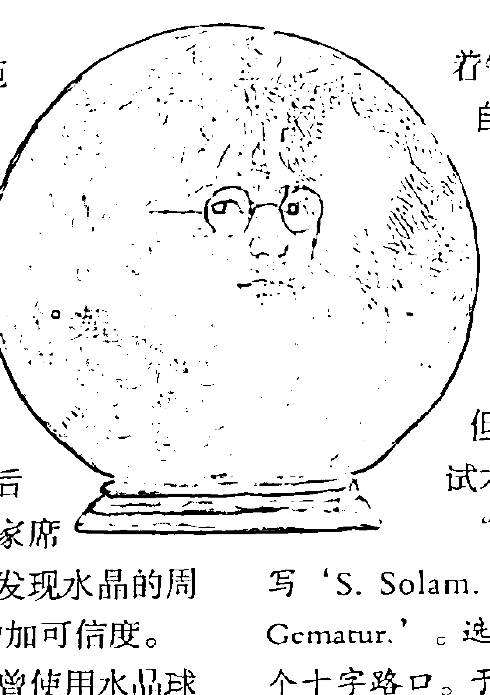

着镜子的反射面，直到他们将自己催眠，进入灵魂出窍的状态，这样一来就可以与幻想中的人物交谈。

中古世纪的魔法师亚伯特斯(Albertus Magnus)提供制造魔镜的方法如下，但他警告必须以狗或猫先行测试才能实行：

> “购买一面镜子，并在上面刻写‘S. Solam. S. Tattler. S. Echogordner Gematur.’。选一个奇数的时刻将它埋在一个十字路口。于第三天的同一时刻，回到原地点将它挖出，但千万别成为第一个凝视镜子的人。”

镜子的魔力在小说中被大力地赞扬。令人难忘的有白雪公主的魔法师继母所询问的魔镜，还有路易斯·卡洛尔(Lewis Carroll)笔下著名的爱丽丝，自踏入镜子后，开启她的魔幻之旅。而在J.K.罗琳的《哈利·波特》里，一场惊险的机智战役中，也是一面魔镜赋予哈利法力取得魔法石，免于落入邪恶伏地魔的手里。

一池静止的水面也可以产生强大的魔力，就如托尔金的《魔戒》里的英雄，当他受邀使用精灵之镜(Mirror of Galadriel)时，差点被索伦魔王俘获。

> “我眼前的这面魔镜呀，
正视我的需求，聆听我的请求，
唤醒那潜藏在内的美好事物，
启动魔咒，开启魔法，
借着镜中影，我看见，
我热切的期盼与愿望，都实现吧！”

### 圆圈的魔力

强大的咒力需要在一处神圣的空间内施展，而最有效的神圣空间就是魔法圈。

圆圈象征完整与统一。对魔法师来说，它可以提供凝聚能量的储藏范围，以及通往灵界入口的一条通道。灾难会降临在那些踏出魔法圈的保护界线之外的人，然而，这样是为了防止恶灵的侵袭夺取或是万一咒语不幸出错时。

当咒语破灭后产生的后果中，以16世纪的魔法师威司门伯爵（Earl Desmond）的传奇故事最引人注目。他犯下致命的大错，让自己的妻子在魔法圈的安全范围内，观看他施展强力魔咒。然而，惟有当她保持静默时，魔法圈的防护才会发生效用：

> > '就站在这儿别动！'伯爵命令着，并在她的四周画下粉笔圈，加上一些难以理解的刻文与符号。最后，他的妻子就站在一个奇异的五角星中。'现在开始'，他说着：'只要你站在原地并保持安静，没有任何东西能伤害你。但若你移动或发出一丁点儿声音，我们俩都会遭遇可怕的后果。'

当她朝着伯爵所召唤的怪兽惊声尖叫时，他们两人都永远的沉入湖底。

理想的魔法圈，应该在正确的天文条件与选定的白天或黑夜内，以一把神圣的匕首、剑或魔杖刻画。根据魔法的传统，圆圈的直径应有九英尺，或是两个重叠的圆圈，应包含一个八英尺的小圆圈，与另一个较大的十英尺圆圈。当划魔法圈时，魔法师必须顺时针移动以呼应宇宙的运作。然而在黑魔法的仪式里，魔法师应逆时针移动，在逆反正常的状态释放负面能量。

魔法师可以在魔法圈内刻画一些特殊符号来增强它的魔力。其中最有影响力的图形之一为五角星，在一个大圈内有一个圈，内圈里头是个五端点的星星，象征着神圣的力量，经常作为抵抗恶魔之用。16世纪的意大利诗人亚里·欧斯托（Ludovico Ariosto），曾在他的史诗《疯狂的奥兰多》（Orlando Furioso）里描绘着：

> > '唯恐恶灵入侵，她在头顶放置一个五角星，以确保万一。'

## 魔法师名人堂

### 麦可·史考特与他的魔法之旅

传说麦可·史考特 (Michael Scot) 因为一条被禁止食用的知识魔法鱼，而将他从一位普通人变成魔法师。当烹煮这条鱼时，他被警告只许看顾不可碰触，但他还是被那神奇的鱼肉给烫伤手指，并将手指放在嘴里冷却，他就因这个方式尝到第一口魔法的力量。自此之后，一切都无法回头。他之前早已是受人尊敬的数学家、医生与天文学家。这位13世纪的贵族与学者，很快地就成为拥有强大的超自然法力的魔法师，受人敬畏。

史考特的能力显然广大无边。传说他曾召唤魔鬼，仅利用一个夜晚，就能在苏格兰境内建造出一条道路。他能挥舞魔法棒，敲响巴黎圣母院的钟声。传说中，史考特甚至能将金属元素转变为黄金。他显然曾涉猎炼金术，并介绍能产生基本魔法功力的神秘混合剂：“将一位健康人类的鲜血与猫头鹰的血液混合，再与番红花、明矾、尿液与黄瓜汁掺和在一起。”

迅捷如思绪般的奔驰速度，使史考特能随心所至。他骑乘仙骏在空中穿梭，乘坐着奇幻的海中生物，越过海洋。他最为著名的一次旅程，是为了聆听教宗讲道，骑在一位女巫的背上，如旋风般地从苏格兰到罗马。然而在教宗愿意接见他之前，史考特必须先证明自己来自苏格兰。所以他告诉教宗，由于骑得太快了，他的苏格兰呢帽上，现在仍残留着自己国家的白雪呢！

“你能给我什么样的证明呢？”教宗问著。
“你脚上穿的鞋子不是属于自己的。”史考特回答。

教宗低下头看，发现自己的右脚是一只女鞋。“你将会得到所求，”他对史考特说，“然后要马上离开。”

史考特得到了只有教宗自己知道的重要秘密，那就是在大斋月的第一个星期二是忏悔节。

史考特因为14世纪意大利诗人但丁的《神曲》(The Divine Comedy) 之作而永垂不朽，书中，但丁将他安排在第八层地狱中。

至今人们仍相信，史考特是被埋葬在苏格兰的梅尔司修道院 (Melrose Abbey) 里。据说他的墓内永远点燃着一盏“神奇的光”以驱赶恶灵。

### MICHAEL SCOT

## 第三部

### 各种不同效用的咒语

设 若我们可以让自己的美梦成真，拥有最深切的爱、容光焕发的健康、数不尽的财富、无穷的权力——我们真的能够达成所有的梦想，或至少其中一项吗？

过去伟大的魔法师们确实表明过，达成以上这些奇迹是他们能力所及的。更棒的是，他们已将许多确实施展过的咒语传承给我们。现代的魔法师也同样深信着。他们相信自己拥有足以改变生命的必要魔法，他们已经共同创造出一股浩瀚庞大的魔法体系。你是否也能从他们的一些咒语中得到帮助呢？

| 8 | 3 | 4 |
|---|---|---|
|   | 5 | 9 |
|   | 7 | 2 |

> > Bubble, bubble, toil and trouble,
> Strengthen this potion on the double,
> Empower this magik, send it fast,
> And it harmonic, make it last;

### 甜蜜梦境

梦境可以是通往另一个世界的途径。古埃及的大魔法师就是利用蜡烛达到“美梦成真”：坐在一个向南的洞穴里，于黑暗中凝视着蜡烛的火焰，接着魔法师也许会进入一个如做梦般的出神状态，并召唤神灵以达成自己的愿望。

埃及第12王朝的一则咒语，形容一位男子应如何在做梦出神的状态下，向召唤来的神灵述说己意，以说服一位特定的女性爱上他。由于他是如此的不顾一切，咒语的最后竟是威胁，但也许是记载不周全的原因：

> > “赞美您，哦！里哈拉可特，众神之父！
> 赞美您，
> 哦！七位小神昊哈托尔，
> 佩希红丝带的女神！
> 赞美您啊，神！
> 这天地的主宰啊！
> 让（加入意中人之名），
> 那诞生自（意中人的双亲之名）的人
> 来追求我吧，
> 就像追逐绿草的牛，
> 就像他孩子身后的仆人，
> 就像商人追逐自己的牲畜。
> 若你不从我所愿，
> 我将放火至布西利斯，
> 烧毁奥塞里斯。”

各个年龄层的恋人都曾使用魔法的梦幻咒语来确认未来的爱人，枕头魔法是有效达到这目的的方法之一。传统的做法，是在星期三或星期六的夜晚，将祈祷文中与婚姻服务相关的部分摊开，放在自己的枕头下。为了确保你的新郎会来到梦中与你相会，必须将书本翻到有“在这枚戒指的见证下，你我永结同心”的那一页，还要绑上红白缎带与一枝桃金娘的树枝。

然而，召唤未来丈夫的魔法梦境也可能铸下大错。19世纪苏格兰的传说中就曾记载一则警示的故事，一位年轻女性施展一种准备圣叶以及三桶水的复杂咒语，成功地召唤情人至梦境中。然而，当他们俩在一起时，男方“竟在最后掉落一条有套索的绳子。隔天早上这年轻的女人将它拾起，并亲自压平放置。”不久之后，这对情侣就结婚了，但婚礼之后不到两个礼拜的时间，新郎就用那条绳子将自己吊死了。”

## 魔法师名人堂

### 致命的吸引力——邪恶女巫莫佳娜

> “她的样貌完全弥漫着魔咒，
字字句句皆是神秘魔法，
它们似乎在说着
‘来，跟我来吧！’”

王的魔法顾问梅林，倾囊相授所知的魔法。
她先诱骗梅林泄漏出空中之塔的建造秘密，
然后将他监禁在里面。

平凡男子根本无力招架美丽女巫莫佳娜（Morgana）的致命诱惑，她亦被称为“仙女莫佳”（Morgan Le Fay）。就如19世纪英国诗人曼迪森·卡文（Madison Cawein）在诗中生动鲜明的恐怖描绘。他形容这个如黑夜般鬼魅狡诈的“黑影大地之后”，诱使亚瑟王的圆桌武士——凯爵士，身受可怖骇人的“百刀”而亡。

莫佳娜也是一位恶名昭彰的变身高手，她可以随心所欲地变身为年轻的美女，或是丑恶的老巫婆。中世纪的英文诗《高文爵士与绿骑士》（Sir Gawain and the Green Knight）描述，亚瑟的骑士——高文爵士发现自己困在一个巨人的城堡中。巨人要求这位骑士与自己美丽的妻子共眠，当她来到寝宫时，高文拒绝接受她的吻，却收下一条她给的魔法腰带。这条带子后来保护了高文，免受绿骑士斩首的遭遇，但脖子仍免不了受到严重的伤害。然后高文才发觉，当时诱惑他的美女其实是一位丑陋的老巫婆，她与绿骑士都是莫佳娜为杀害他所化的变身。

更广泛地说，莫佳娜的致命女性魅力是出自中世纪浪漫文学作家之笔，如汤玛斯·马洛礼爵士（Sir Thomas Malory）在他15世纪的史诗作品《亚瑟王之死》中，将她塑造为一名邪恶的女巫，不断地想办法害死国王，她预谋要夺取亚瑟的石中剑与王位，但都无功而返。

根据马洛礼的描述，莫佳娜是亚瑟王的第三个妹妹，但令人忧心的是，她在修道院的学习中开始接触魔法。“她被送到一所女子修道院，”马洛礼写着，“就在那里她得到丰富的学习，因此成为优秀的巫术专家。”

莫佳娜的魔法之高深，甚至能诱使亚瑟

传说致命的莫佳娜是源自于古爱尔兰女战神莫莉佳（Morrigan），又名莫莉古（Morrigu），拥有呼唤魔法雾雨的能力。有时她会化身为乌鸦，出现于战场上啄食死尸。有关她各种化身的恐怖事迹，在早期爱尔兰的史诗《库力的劫掠牲口》（Tain Bo Cuailnge）中，都有栩栩如生的描绘：

> “越过他的头部尖声叫着，
一条枯瘦的腿快速地跑着，
越过武器与盾牌顶端，
她就是灰发魔女——莫莉古。”

### MORGANA

### 爱情魔咒

最知名的爱情魔药，或许是莎士比亚《仲夏夜之梦》里，妖精王奥伯伦在盛怒下，为羞辱他的皇后所使用的魔药，致使她爱上一头驴子。此帖魔药是一朵花的汁液，经由爱神丘比特的箭转变成强力的爱情灵药：

> “我将这个液体滴入她的眼睛。当她醒来后，‘睁开眼所看到的第一件东西，不论是狮子、狼或者是牛，还是玩耍的猴子或忙碌的人猿，她将会全心全意地追求它。”

无法取得这种花朵来赢得爱人芳心的人，也许可以试试这则详尽记录在古希腊文献上的爱情咒语：

> “用蜡和树脂做出一只八指长的狗，将魔法咒语写在狗的肋骨上。在一块独立的铅板上，写下欲召唤来协助的恶魔，接着将铅板放在三脚凳子上，把狗压在铅板上。吟诵狗身上所写的魔力文字与铅板上的名字。若狗厉声嚎叫，则咒语就不会成功。若闻狗吠，咒语将会实现。”

然而，资浅的魔法师们也许会发觉，这则21世纪的爱情魔咒来得简单许多：

> “将月圆之夜所收集的水，洒在你与恋中人的合照上。开始想象着恋中人自远方来找你，并吟诵以下字句：‘从我这里流出的圣水，将他引至最接近的地方，如同无尽的河水流向大海，他走向我的途径也是如此清晰明确。他将在此找到唯一的真爱，并知道这是他所寻找的终点。他的内心、灵魂与理智都将明白，我们的生命注定要结合在一起。’”

花朵魔法也能够产生类似的效果，如同以下这首传统的爱情魔咒，虽然最适合所倾慕的对象是邻家的男女时，但为避免造成人际关系的尴尬，最好在黑暗中进行：

> “将五朵红玫瑰沿着你与情人两家之间的走道放置，并一边呼唤情人的名字。接着在纯净蜡制成的蜡烛火焰中，将第六朵玫瑰的五片花瓣，一片接着一片地燃烧，并一边吟诵着：‘燃烧着朝向我家门前的道路，五片玫瑰花瓣剩四片。在烛火中四片成三片，我的愿望更相关。三片成二片，我燃烧着玫瑰，爱情毫无阻碍。这烧二片、一片至无所剩，咒语终完成。来吧，我的爱，快来吧。’”

### 情欲果实

许多世纪以来，魔法师们皆忙于探索最有效的爱情魔咒。在最受欢迎的魔法步骤中，主要的关键之一就是苹果，一种长久以来与爱情及婚姻息息相关的水果。在此介绍这则吸引真爱的传统魔咒，就是最佳范例：

> “在星期五的清晨，赶早赶好，
从树上摘下一颗最美丽的苹果，
然后将你的鲜血涂在白纸上，
并在当中写下你与情人的名字。
你应设将这颗苹果切成两半，
且为求效果，在放上白纸，
并以两支锐利的针或桃金娘木，
将这两个半边合在一起，
直到完好如初。
放在烤炉里烘干，
然后包扎在桃金娘的叶子里，
放在情人的枕其下，
千万别让她知道。
倘若这一切成为秘密，
她将会很快地对你展现爱恋。”

苹果的爱情魔力是如此的强大，果实的任何部分皆能发挥好的效果。例如，若想要知道未来的情人，就在万圣节前夕的午夜，削一颗苹果的皮成一长条，用你的右手将它从左肩抛出去。当它掉落在地时，就会呈现未来情人教名的第一个字母。苹果的核仁也可用来找出情人所居住的地方，如这个来自英格兰兰开夏郡的传统咒语：

> “以绕圈的方式走着，并用大拇指与手指用力地挤压苹果，将核仁押出，同时要一边念诵：
‘种子，种子，像天堂。
告诉我哪里是真爱的行藏；
东西或南北，
是打桩槌好或将火点略。’”

仔细观察核仁飞出去的方向，就是你真爱所住的方向。

独特的曼陀罗根，形状经常长得像个奇怪的人形，最广为人知的名称是“爱的苹果”。长久以来它在魔法圈中，都被尊崇为“强力春药”。古埃及人称之为“大地的阳具”，至于阿拉伯人认为它是“魔鬼的睾丸”。

然而要取得它的根部会伴随着极大的危险。人们普遍认为当拔起它的根部时，它会发出凄厉的尖叫，足以使得任何听到的生物发疯。早期的施咒者都被建议用一只饥饿的狗来代替他们做这项工作。将削好的根，连同一根头发煮沸，就足够产生强大的招魂咒语。

曼陀罗在现代的爱情咒语中，仍占有一席之地。美国的魔法女祭司长萝利·卡巴特(Laurie Cabot)就推荐，将曼陀罗根与胡荽、西洋耆草、龙血与油一起混合，制成男同性恋者的爱情咒语：

> “一边混合着药草，一边想象着自己处在各种罗曼蒂克的场景里。将自己的名字刻在一根粉红蜡烛的一侧，情人的名字在另一侧。画一个圆圈。然后当为粉红蜡烛涂抹油时，同时想象自己是情人。接着，将混合后的药草当作焚香燃烧，并依序点燃黑蜡烛、粉红蜡烛与白蜡烛。”

将这段咒文写在羊皮纸上，并大声地念出来，同时将羊皮纸一一触碰烛火：

> “爱之火焰，旺盛又明亮，
用我深情的爱之光，烧灼他的心，
[加入你与情人的名字]，
将不再会有其他男人，
张开深情的双臂，
他将向我走来。
就让一切实现吧！”

将羊皮纸放进烟灰缸里燃烧。当火焰高起时说：“正确无误且一切顺利。”然后将灰烬收进一个黑袋里，将它挂在床柱上，或是埋在一处没人会发现的地方。

### 杀人目光

敌人只需一瞥眼，就可以使他的受害着遭受疾病或死亡，这个信仰可以回溯至最早期的几个文明，而且，若不幸遭受“邪恶之眼”的魔力袭击时，必须尽快采取响应。

数以百个世纪以来，人们就不断地在收集挡避邪恶之眼的武器。据说最有力的防卫是佩带护身符，因为其中注入着防御性的魔法。除此之外，只要能迅速地作出特殊的手势，也能有效对抗邪恶之眼。公元1895年出版了一本最佳手势的图解书，其中最受欢迎的手势为“无花果”——紧握着拳头，大拇指从食指与中指间穿出。

对古埃及人来说，眼睛是最重要的。在埃及文中，一只眼睛的符号代表着“创造”，意味着完整性。在成为魔法师之前的最后学习阶段，必须要朗读的这段吟诵曲，就特别强调着：

> “我已将荷鲁斯之眼(Eye of Horus)施加于你，使你洗心革面获得重生。我已将绿色与黑色的药膏涂在你的眼睛上，使你的脸因此获得重生——我用来自荷鲁斯之眼的药膏完整重建你的脸。他重新黏合你的骨骸，他重组你的四肢，他重建你的血肉身躯，并驱散你的不幸。”

受害者虽无法当场报复，却总是能得到协助。他们随时可以施展反咒语，例如下面这首21世纪的咒语：

> “取一段红色绳索，将两端打结，做的同时，要想象自己是绳结的一端，邪恶的来源是另一端。用魔法刀从绳索的中央切断，并念诵这些文字：
‘我打破从你至我的这段咒语。
这不是你发信行走的路径。
我将徙然地终结这途径，
并将这咒语送还给你。”

古时的埃及魔法师需要强劲的魔法来对抗“邪恶之眼”，于是发明了一种复杂的魔法程序，称为“击球仪式”。程序中，球代表着邪恶之眼。这个仪式需要宰杀一只羚羊、一只鳄鱼与一只龟。

## 【魔法师名人堂】

### 伯爵魔法师——吉罗德·费兹杰罗

传说在爱尔兰古湖的平静表面下，仍住着一位全国法力最强的魔法师，他就是16世纪薇斯蒙的伯爵，吉罗德·费兹杰罗（Gerald Fitzgerald）。

薇斯蒙伯爵的伟大魔法师身份，在一个黑暗的暴风雨夜，突然地画下休止符，因为他的妻子打破要永远保持沉默的誓言，就在他开始变身成为可怕又丑陋的巨人时放声尖叫。咒语于是被打破了，他们的岛上城堡也从此沉入湖底。

死亡显然无法占领伯爵。每隔七年他就会从湖水深处升起，干扰活着的人。每逢城堡沉湖周年的午夜，他就会出现在湖岸，捉住不经意的路人，将他们带回他的水中城堡。

19世纪，一名叫茉瑞尔的洗衣妇，从他的手中死里逃生，当她在湖边洗衣服时，遇见这位鬼魅般的伯爵。当时伯爵试图以一只金戒指诱惑妇人，幸运的是，茉是个粗手粗脚的人，戒指还没戴上，就从手中溜走，滚入湖中溅起小水花，她却因此逃过伯爵的咒语迷惑。

薇斯蒙伯爵在神秘消失后所受到的敬畏，比起他使人感到恐惧的强大法力，简直是小巫见大巫。教会指控他与魔鬼为伍，当时人们彼此间盛传他城堡的高塔里，有间秘密小室，他在那里召唤恶灵听从他的吩咐。

的确，他的妻子就是第一个体验到伯爵可畏的召唤魔法，而导致他的失败。根据民间传说，她受到好奇心永不满足的诅咒，不断烦扰她的丈夫在她面前表演魔法，最后伯爵终于投降了。伯爵同意妻子的请求，但必须遵守的条件就是，所有过程中，她都必须保持缄默。

伯爵信守诺言，第二天的夜晚，他将妻子带进秘密小室中，吩咐她要站好保持安静，并在她四周画下有许多神秘符号的魔法圈，接着燃起一个火盆，将一些药草丢入，然后将灰烬倒入一个玻璃瓶。

他的妻子一路看着自己的丈夫先是长出羽毛，变成一只秃鹰，接着变成一位想把她拖出魔法圈的侏儒老巫婆，接着又从巫婆变成一条可怕的大蛇，想袭击她。最后，这条蛇又变回自己的丈夫。接下来的变化对她来说，显然是最大的打击：

> > “伯爵躺在小室的地板上，就离魔法圈不远，然后他开始伸长，越伸越长脸也就越畸形，直到他的大头碰到房间的一端，而脚踝碰触到另一端。他四肢都长到无法辨识的程度。圈里的女人突然感到一阵密集的恐惧，接着张开嘴巴放声尖叫，声音回荡在城堡四处。”

于是咒语破功，天色变暗，风云渐起，湖水升起，将城堡与里面所有的人永远的沉入湖底。

### 治疗咒语

下面这首传统的止血咒语是根据一种仿圣经的活动而来的：

> “确读三边，如果情况很糟，则要九边，主的祈祷者在确读前后，会将你的右手放在伤口上，并以中指在伤处做记号：
我们伟大的救世主耶稣基督，诞生于伯利恒，在约旦河由约拿受洗。上帝命令水浇停止，水浇就此停止，所以，我现在以上帝之名，命令血浇停止，这无意义的浇血，就如同约旦河里的水，以天父之名停止，以天父之子的名停止，以神圣之名命令，不再流出任一滴血，阿门，阿门，阿门。”

每位魔法师所必须具备的超能力中，通常都会包括治疗的能力。

埃及是第一个定义出魔法医学的国家。这是根据当时的主要思想而来的，认为所有染上疾病的人都是因为负面能量或恶魔所招致的。巫医会先备好必要的药物，并念咒赋予能量，使它们发挥更大的效用。

许多古埃及的治疗咒语都被保存下来。头部的疾病被认为是最严重的部分，因为头部被认为包含着生命的大门。就连神明也无法避免头痛的折磨，荷鲁斯受偏头痛之苦的故事，就曾被一位巫医对着相同病症的患者讲述了七次，当他将药物搓揉在病人的双手、身体以及双脚的时候。

中世纪的巫医也采取类似的治疗手法，但他们还会将圣名或圣经的片段加入咒语中，基督教会因此认定此种行为是巫术而加以避责。

治疗咒语至今仍然是现代魔法中最重要的功能之一，各式各样的技巧都被运用，磁性的魔力就是其中之一，这是根据古时的信仰，认为自然的磁力或天然的磁石都是有生命有灵性的，将它逆时钟方向地越过病人不舒服的区域，就能将疾病自病人体内吸走。

现今医学界承认许多药草的益处，而药草曾是魔法治疗的重要一环。填满治疗药草的穿衣小人俑，至今仍被使用在魔法仪式中。将小人俑绑在患部，将治疗用的乳香或没药焚香，逆时针在小人俑上方面圈，以驱走病痛。

黄色花朵的野生圣约翰草，普遍被认为不但具有治疗不同轻微病症的能力，还能治疗忧郁症，同时也能保护你远离湖湾边的邪恶巫师与女巫。

这种药草最常与夏至前夕的节庆相提并论。依据英国的民间传说，乡民传统上都会于夏至前夕，在家门前挂上一袋圣约翰草来驱走邪恶魔 法。那时也是施洗者圣约翰的晚宴前一天，圣约翰草就是以他为名的，传说当天也是这种植物力量最强大的时刻。只要遵照下列指示，你就能制造一条女巫治疗项链：

> “准备三条大约两英尺长的蓝色的绳索或细线，坐在你的魔法圈内，将绳索编成辫子。编的时候，要一边念诵下面的咒语，一边将自己的意念编进绳子或细线里：
‘缠住这些绳索，
传递治疗的能量，
让它每小时都成长茁壮。’
重复这段咒语，直到你完成绳结的工作。然后说着：
‘这是我的愿望，实现它吧！’”

### 聚宝盆

不想进入实验室的魔法师们会寻求大地之母的创造能源，以增加他们的财富。这是一则只需要一枚铜板就可施展的传统咒语，但保证你的回收会更多：

黄金被炼金术士崇敬为太阳，它是青春与活力的魔法灵药。炼金术士们奉献自己的生命来追寻将廉价金属转变为黄金的方法，虽然许多人宣称他们已经成功做到，但却没有任何的证据可以证明。现实中，正确的咒语已被证实为天马行空，就如彩虹上的聚宝盆那般不切实际。17世纪英国哲学家法兰西斯·培根(Francis Bacon)不仅深信点石成金的可能性，并确切将做法描述出来。但如同其他人，没有任何证据显示他的方法是行得通的：

> 放置一个熔炉，维持一定的热度。这将在元素系统中与金子特质最相近的银作为材料。将整体重量十分之一的水银与十二分之一的硫黄一起放入炉中。当持续工作至少六个月。我也希望能够同时加入一些油状物质，例如他们用来修复那些纹粗野地乱搅分隔的黄金所用的材料，最主要的工作是为了使各部分更加密合与润顺。因为黄金是最紧密的金属。

> 蜀葵盛开在夏日，种子落下在秋日。然后用一张折纸，将它们全部接下收集起来——不论散落的种子、咖啡色种子、干枯的种子或是圆种子。种子有如失去光泽的铜板，支付盛开的高大花朵。将这些生锈褪色的宝藏，与一枚崭新的钱币、一枚古老的硬币、一枚银币与一枚铜币，一同埋藏在南边的墙下。当春天来临，你的财富估计将是所播种的十二倍。

们点燃。然后集中注意力于钱币上，心中想着银币正在增加。想象着它渐渐升高，一个叠着一个。集中心力冥想几分钟后，说出下列这段话：

> “古灰色小猫头鹰啼叫三次，
古裂齿而笑的猫咪喵喵叫三次，
古蛤蟆在树林中呱呱叫三次，
古月亮通红时，愿这金钱都成真。”

静坐几分钟，并更加集中精神于银币的增加。
再次重复此项法事，一共进行三回。
完后，吹熄蜡烛——先左再右。
连续三星期，在各个星期三举行此项仪式。”

接下来，也是可以作为生财之用的更现代魔法仪式：

“盘腿坐在地上。整个仪式过程中都要点燃麝香。拿出五角钱，用橘色的纸包着。橘色象征吸引力，将它放在你面前的地板上，钱币的两侧各竖立一根绿蜡烛，并将它

### 魔法的力量与影响

一位成功的魔法师是万能的。虽然大部分的平凡人都无法达成这个目标，但我们可以冀望于伟大的魔法。许多的魔法咒语能加速我们迈向全能之途。

重要的第一步是确定你此刻施展的魔法正在发挥其极限能力。例如，当你在搅拌魔药时，可以搭配念诵下面这则21世纪的咒语，很可能可以增加自己的与魔药的力量：

> “他他，他他，辛劳与烦恼，
双倍加敬这药剂，速速增强其魔力，
无危言，持续魔力永不息。”

建立起自己坚强的魔力基础后，就可以着手进行施展特殊的咒语来提升你的社会地位。例如，可以使用以下传统的仪式来取得渴望已久的工作：

> “当黑夜完全降临，
点燃一枝蜡烛，
并在白净的纸上写下你所有的愿望，
若有人可以帮助你，
写下他的名字，
并接着写下这三者，
分别代表着权力、技巧与名誉：
hGLIMAZ
fGRIDOX
SOLIDAR
随即用粗糙的硬面包皮
擦拭每一个字，
接着撕碎这张纸，
浸入深红的水中，
将它拧一拧
并压成一小团，
好像一块湿面团，
用力地将它抛出屋外，
越远越好。”

若只需一点点幸运，就能让生活有所进展，则这条女巫魔咒可以帮你制作属于自己的幸运石：

> “准备一颗白石头，一滴阿姆奇族人的
眼泪，或是其他与好运有关联的石头。将一
些幸运油——肉桂、柏树或莲花油，或是这
三种的组合物，与一种基础油混合在一起，
例如杏仁油或葡萄籽油。将油涂在石头上，
并念诵此咒语入魔法：
‘进入我眼前的这块玉石，
祝福你，赋予你能量，提升我的力量。
增益这玉石，为我带来好运，
此我所愿，愿其实现！’”

## 【魔法师名人堂】

## 约翰·戴蒙与孙女

施展魔法的能力是可以传承的，如同这两位18世纪，拥有奇特能力的美国魔法师约翰·戴蒙（John Dimond）与他的孙女莫莉·皮齐尔（Molly Pitcher）。

首先是因为戴蒙奇怪的举动，在麻州的海边小镇——大理石头镇，引起他邻居的注意，怀疑他们之中存在着一位魔法师。当他还年轻的时候，有时会被人瞧见他正进入深沉的出神状态，经常持续数日之久，然后就会拥有预知未来事件的不可思议的力量。

当戴蒙买下一处古墓地旁的浓密灌木丛，而且还被偷听到他与魔鬼在交谈时，当地人就深信他是位魔法师，并因此称他为“大理石头镇的魔法师”。

由于戴蒙的准确预言能力，所以常常被请教咨询，他乐意为乡亲服务，而非回避。他常借由深度的出神状态来获得必要的资讯，他也利用超能力解决许多地方上的犯罪与寻回失物。

但这些能力与他掌控其他元素的力量相比就黯然失色了。戴蒙不仅能预知海上的暴风，更能呼唤它们。当地父老相信他会与埋葬在古墓园里的鬼魂交谈，以预知即将来临的暴风雨。有幸得到他帮助的船长，宣称他们曾在海上听到他的声音，指导他们远离暴风雨，抵达安全的水域。戴蒙站在墓园中怒吼着，他的声音越过土地与海水，指导船长们方向。然而，苦难却会降临在任何拂逆他的船长，他们将遭受他邪恶的诅咒。

传说中曾谈到戴蒙如何召唤一个致命的暴风雨，攻击他的敌人“茶隼”号（Kestrel）船长——米加·泰勒（Micah Taylor）。一日晴空万里，有人听到他在墓园中吟诵魔法，欲召唤暴风雨使泰勒与厄运船上的其他人一同葬身大海。

而大理石头镇魔法师的巫师孙女莫莉·皮齐尔，同样在麻州受到敬畏与遐迩。她拥有与戴蒙相同的能力，能预知未来并且扮演着海上受难者的守护天使。但她同样也会诅咒她所厌恶的船长——将整艘船的人葬送海底。事实上，也没人敢招募曾拂逆过她的人为水手。

皮齐尔最令人难忘的魔法事迹为，解决邻近城镇康科特的谋杀案。当时警长被罪案搞得一个头两个大，于是向当地魔法师请教。皮齐尔陷入深沉的出神状态，此时她不但重演犯罪发生的情况，还说出凶手的名字。之后，那位嫌疑犯很快就认罪了。

### 曙光入侵

门口与信道的守卫一直是魔法防御的重要部分。门槛在传统上有着强大的象征性意义：它代表属于你的与不屈于你的范围，以及安全与危险之间的界限。如同一个魔法师会在魔法圈内写下防卫的符号来强化抵御能力，一位心怀恐惧的屋主也会在自家门槛上使用某种记号来驱邪避恶。

若邪恶的巫师想要闯进一间屋子，他会使用一种特别令人毛骨悚然的护身符，叫做“荣耀之手”，来破除任何的抵抗。制作“荣耀之手”必须砍掉刚吊死的谋杀犯的手，并经过一连串复杂的魔法配方来保存。用死尸的脂肪所做成的蜡烛，会嵌入这只手中，当点亮烛火并携带着进入任何房子，保证所有的主人都会被深深的催眠入睡。

任何人若想要强化自己门槛的防御力，会被建议采用另一种方式，创造一种图形“在两条线之间的十字边缘；一连串的锯齿边，在每一段锯齿的宽部可以有或没有一个圆圈；两个大的十字被一条垂直线分隔。”也可以加入一条圆环的边，但是“圆圈必须完整，形成没有断裂的链”，如此才能驱走厉鬼。

- 在两条线之间的十字边缘
- 一连串的锯齿边，在每一段锯齿的宽部可以有或没有一个圆圈
- 两个大的十字被一条垂直线分隔

也可设置魔法陷阱来捕捉那些意图在房子里破坏的恶灵。为了确保能捕捉到厉鬼，房子的主人可以在陷阱前放置一个“劈开的黑刺李，上面插着一根点燃的蜡烛”来引诱厉鬼。成功的诱捕与丢弃有害恶灵的指示如下：

“用一块黑刺李木板与不会通电的铜线做一个精灵陷阱。首先以红线将铜线与木板系在一起，并标上卢恩字母D。再把它放在门前走道上，那是夜晚时分会受到惊扰的地方。若陷阱已捕捉到精灵，将它移开，并以重刀割断红线。将红线放入一个预备好的魔法瓶中，并说着：

> ‘红线绑住恶精灵，
招致我们进厄运，
收起这祸根，
不留一点痕，
卡！’

然后用软木塞堵住瓶口，并以红蜡封印。将它埋入地底，在上面种下荆棘树丛。”

盐巴一直以来都是施展咒语的重要角色，因为它被尊为绝对纯净的物质。传统习俗是，人们会将盐巴洒在门槛附近以驱邪避凶，至今仍在实行魔法的家庭中继续被使用。这是最受欢迎的防御方法：

“准备一杯放在干净的玻璃容器中的水，在太阳与皎白月光下照射二十四小时后，抓一把盐巴溶于水中。然后将盐水洒在屋内每个房间的四个角落，以及你家的外围与花园。”

### 数字魔力

魔法师相信若将数字排列成特定的神圣比率与形状，就能唤起它们的魔法力量。每一个数字都有其特殊的意义，所以当施展咒语时，对它们一定有充分的了解。

以下就是数字0到9的魔法意义：

0
无限的时间与空间：没有起点或终点的永恒圆圈。

1
单一的整体性：创造之光的第一道表现形式，会再化为数百万个独特的部分，每一个独立的部分仍包含第一道的能量。

2
二元性：母亲与父亲，或生命灵魂与精神的二元原则。

3
三位一体与圣三角：代表富饶、创造与平衡。

4
正方形：实体与物质的世界，最稳定的数字。

5
第五元素：统一其他四种元素，土地、空气、火与水，所创造出来的第五元素。

6
创造地球所花费的六天时间。

7
完美：数字三与四的组合。

8
平衡：与繁荣及权力相关。

9
代表起始的数字：个位数字的最后一个，一个系列的结尾。

“魔术方块”是魔力最强的数字组合之一，其方块内每一行列的所有数字相加之总额皆相同，不论是水平、垂直或斜线。

这种数字排列图形常被应用在魔法技艺中：

| 8 | 3 | 4 |
| 7 | 5 | 9 |
| 6 | 7 | 2 |

魔法数字对应着特定的文字与颜色。以下是最普遍的魔法公式：

| 数字 | 字母组合 | 颜色 |
|---|---|---|
| 1 | AJS | 红 |
| 2 | BKT | 橘 |
| 3 | CLU | 黄 |
| 4 | DMV | 绿 |
| 5 | ENW | 蓝 |
| 6 | FOX | 靛 |
| 7 | GPY | 紫 |
| 8 | HQZ | 银 |
| 9 | IR | 金 |

借由这些关联性，魔法师能够从自己的名字中推敲出所属魔法名，也能使用个人的数字组合，找出所属的主要能量色彩。以上这些发现都是获取能量的重要来源。

算术本身被认为是一项可以转换为己利的魔法技巧，也可以应用于治疗咒语，例如，它治疗疣就非常有效。据称你只需要数一数疣的数量，并告知一位陌生人，你的疣就会消失不见。

最恶名昭彰的魔法数字是666。根据圣经的启示录，那是统驭世界的“巨兽”(great beast)之名的数字。20世纪的魔法师——艾利斯特·克劳利就曾自诩为“巨兽666”，并依据数字魔法，创造出他自认为最极致的能量文字：“AUGMN”。克劳利形容它为“宇宙的魔法配方，是促使‘无’的延伸的反应动能，经由平衡的对立手段。”

### 最佳的施法之日

半夜属于“魔幻时刻”。它象征负面能量最深沉的瞬间，是群魔乱舞的时机。而其中，产生最大魔幻力量的时刻为周五的半夜。任何在此刻诞生的婴儿天生都赋有灵视与驾驭“邪恶之眼”的能力。若是在星期五的半夜，吟诵这段召唤精灵之后的咒语，是最有效的：

> “米柯 欧 园 米句儿 鸡合那 投
惨阴 杜 亚们拉罕；杜 以萨：杜 雅各；
地比 段尼地卡 艾 欧昧尼亚 佛斯塔
丹尼特 艾 虔希达 莫多 佛尼亚 艾
安希 莫里连 佛尼。伊格吐
儿 欧 园 米柯 乔 诺安
妮 耶稣 佛尼 悉多 特斯
夸特 地提 必提 乔 其
诺安妮 耶稣 佛尼亚 佛尼
伊格吐儿 欧 园 米柯 乔
诺安妮 耶稣 佛尼 悉多
其细 欧安妮丝 欧纳 劳斯
文 葛罗莉亚 乔 欧安妮
亚特南 阿门 阿门”

每一个咒语都有最适合的施展时机。理想中，魔法师的魔法应该要配合正确的时刻、适当的季节以及最吉利的星球移动，来提升魔法的效果。

然而，若是不愿意实行如此精细的计划，魔法师可以在普遍被推算为有助魔法的时间里，施展咒语。

万圣节前夕的夜半时分，是一将真爱的机会，只要依据下例这条传统的咒语：

> “在万圣节前夕的午夜吃一颗苹果，双眼凝视着镜子，别向后看，你将会看见未来丈夫或妻子的脸孔。”

| Sunday | Monday | Tuesday | Wednesday | Thursday | Friday | Saturday |
| :--- | :--- | :--- | :--- | :--- | :--- | :--- |
| Michael | Gabriel | Camael | Raphael | Sachiel | Anael | Cassiel |
| 符号A | 符号B | 符号C | 符号D | 符号E | 符号F | 符号G |
| ☉ ♌ | ☽ ♋ | ♂ ♏ | ☿ ♍ | ♃ ♐ | ♀ ♎ | ♄ ♑ |
| Machen. | Shammim. | Machon. | Raqia. | Zebul. | Sagun. | Araloth. |

夏日前夕是最适合寻求真爱的夜晚。无论如何，此刻要成为勇敢的女性，遵循下列的魔法步骤，就能与梦中情人相会：

> “在教堂的墓园里等待至午夜十二点的钟响。手里捧着一束玫瑰花瓣与一种药草，如迷迭香。当钟声敲响时，围绕着教堂奔跑，让四周有花瓣散落，并且柔柔的吟唱着：‘玫瑰花瓣，玫瑰花瓣，我所洒下的玫瑰花瓣，让真心爱我的人心中充满浪漫，现在就请来与我做伴！’”

一星期的每一天都有其代表的星座与神话意义，魔法师们会根据周期的循环来计算魔法时刻，以选择出最佳的良辰吉日。星期日是专注健康的好日子；星期一是繁殖生产的最佳时机；星期二有助于金钱与领导；星期三是占卜的吉日；星期四应避免任何与繁荣有关的咒语；星期五是爱情魔法日；星期六是施展绳结魔咒的日子。

然而，一位法力高强的魔法师能够掌控时间本身，而不受这些限制的束缚。这首现代咒语保证能够加速时间的前进：

> “点燃三根蜡烛，
放在一个祭坛上。
玫瑰为记号，
作出一个圆圈，
接着念诵这些文字：
‘时光之翼聚成团，
赐我双翼加速行。
追赶旅程急向前，
就让明日成今天。’”

### 绳结魔咒

在许多咒语中，结绳与解绳代表着能量的束缚与解放。古埃及的魔法师相信，魔法绳结是连结圣灵与人类世界的力量会合点，在地球上所绑上的一个绳结，也同样会存在天堂。

魔法绳结的惊人力量已持续存在数世纪之久。在16世纪法国朗格多克地区的情侣们，都十分害怕，在结婚时会受到去势的绳结诅咒，因此每一百对的新人当中，仅有不到十对的情侣愿意在教堂结婚。而他们最害怕的咒语是由女巫师所施展的，当教堂举行婚礼时，女巫师会一声不响地溜进教堂，并在婚礼仪式进行中站在新郎的身后：

> 魔法师可借由魔法绳结来驾驭风，但他们必须向求助者索取一定的酬劳：
> “由使用魔法结成三个绳结时，风会因此困在绳结中。
> 解开第一段绳结，带来轻柔的微风；
> 解开第二段绳结，带来一阵轻风；
> 解开第三段绳结，带来大狂风。”

> “地绑一个绳结，
> 丢一枚硬币在地上，
> 并念咒语：
> ‘神所缔结的两人，
> 愿魔鬼将你俩分离，
> 直到这些绳结被解开。’”

绳结至今仍是魔法仪式的主角。在21世纪的咒语中，绳结可赋予渴求之物力量，只要完成九个绳结，魔法就大功告成。还有更多不同的变化，解开绳结也能使咒语生效，每隔九天，一次解开一个绳结，或是将绑着绳结的线，系成一圈：

> “借由我所绑的结，魔法就此即展开，别退缩。
绑两结，愿成真，不论此愿为你或是我本人。
绑三结，愿成实，魔法生效必所视。
绑四结，愿高升，直抵天庭达我神。
绑五结，魔法盛，法力将行不停顿。
绑六结，魔法定，法力渐增必对等。
绑七结，此咒影响于我身，愿望已达天庭门。
绑八结，不再等，魔法立现愿望成。
绑九结，魔法即将闪耀在眼前，
此诗韵中诉我愿。”