# 女巫不傳的魔法藥草書

西村佑子◎著

王立◎◎譯

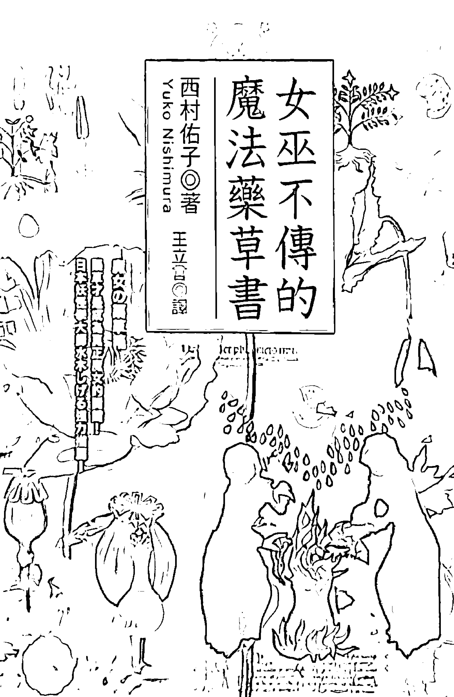

## 作者序

## 女巫的藥草箱

西村佑子

漫步於德國的森林當中，腳邊四處生長著從前女巫們曾經摘採的草藥，讓人產生彷彿會遇到女巫的錯覺。

女巫手提的籃子裡裝著許多種藥草。其中包括含有劇毒，能在瞬間奪人性命的藥草；以及用來作為「飛行軟膏」原料的藥草——女巫將這種軟膏抹在身上，便能翱翔於天際。或者從前每遇作物欠收或疫病流行，人們皆認為是女巫所為，為保護自己不受危害，人們使用了許多「辟邪草」。這些都是與女巫息息相關的藥草。

另外籃中也有一些乍看之下和女巫扯不上關係的藥草。比如說具有療效，或者帶有香氣，能夠令身心舒暢的藥草。或者是對其許下夢想與願望，佩帶在身邊的藥草，以及能當作日常生活食材的藥草等等。

從前，許多女性具有豐富的藥草知識，她們前往森林中採集草藥，或者就在庭園中栽種，用來幫助民眾。人們稱這樣的人為「聰明女性」，頗受社會大眾敬重。

然而在某些時代，這些女性卻遭貼上魔女的標籤，為社會所排斥。但實際上，巫女所用的令人聞之色變的藥草，與「聰明女性」所用的藥草並無不同，藥草本身並無善惡之分。前述的女性們，僅僅是憑藉著長久累積的傳統及知識，自己採摘草藥製成良藥而已。

本書就像一個藥草箱，裡頭裝有這些所謂「女巫」所製作的藥劑，呈現在各位讀者眼前。之所以選擇德國作為背景，是因為在那裡，女巫和「聰明女性」兩者與藥草間的關係較容易明確掌握。另一方面則是由於日本引進的草藥種類多以英美為主，我想要將草藥在德國民眾的生活中的重要性，傳達給更多人知道。因此為做出區隔，本書中故意不使用「ハーブ」這個外來的名詞，而皆以藥草稱之。

另外，我也想透過視覺，闡明藥草與德國歷史的關係，以及其如何與日常生活結合，來引起讀者的興趣，因此刊載了許多圖片與相片。

在德國，許多城鎮都設有藥事博物館，規模雖大小不一，但可供了解藥事的歷史。從許多城鎮至今仍保存創業於中世的藥局建築，亦可一窺當時的勝景。藥局調劑室的櫥櫃上，往往整面都擠滿小抽屜。藥櫃本身也帶有雕刻與彩繪，有如藝術品；櫃上擺設著作工精細的陶瓷與玻璃瓶，彷彿訴說著藥局的歷史有多長一般。窺望店內景象時，總覺得充滿神秘感，使人不免心跳加速。

至今仍有許多藥局，在藥櫃上排列著木製的藥桶與藥箱（雖然近年來也有不少是鋁製的），並且按照病人的身體狀況調配藥草。

至於端坐在藥草箱前的，到底是巫女還是「聰明女性」呢？請您自己開門進來一探究竟吧。

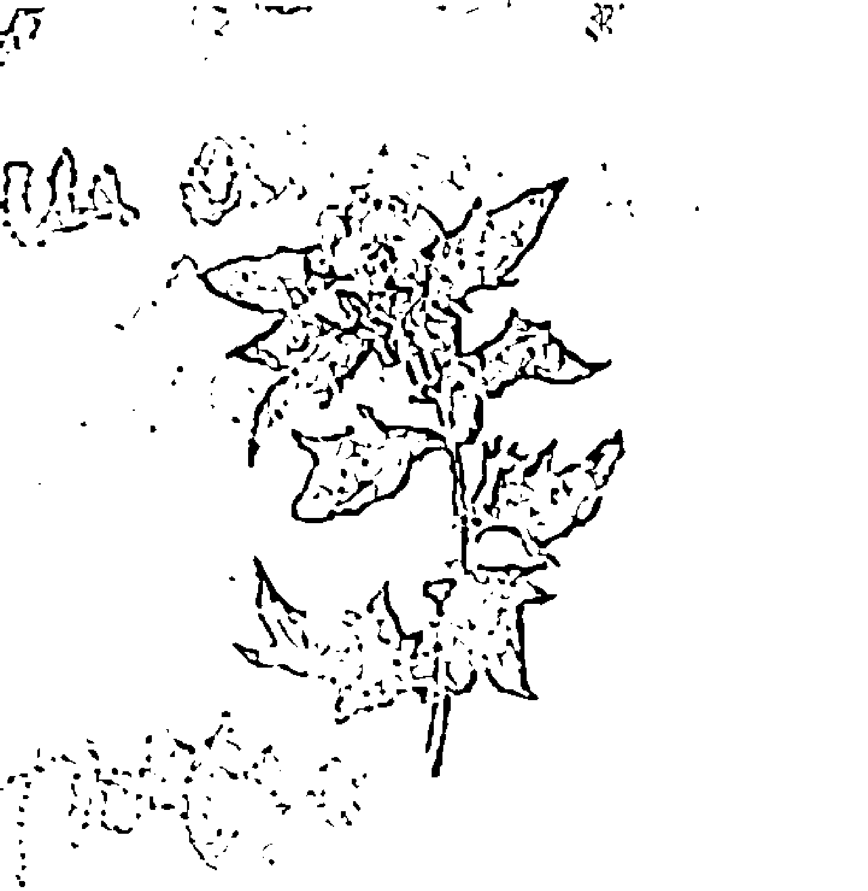

# 目次

作者序 女巫的藥草箱／西村佑子

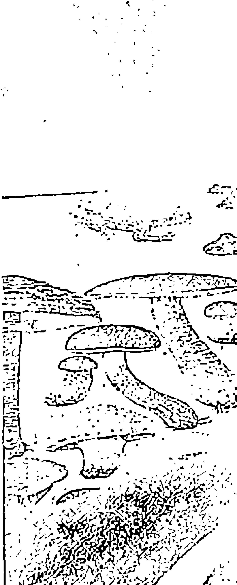

## 第一章 女巫與藥草

- 1. 飛行軟膏—12
- 2. 女巫軟膏—22
- 配方 I
- 莨菪／毒堇／毒麥／附子—22
- 配方 II
- 印度大麻／罌粟／顛茄／曼陀羅—32
- 配方 III
- 龍葵／金雀花／秋水仙／澤漆／菀葵／玄參／包心菜和馬齒牡丹—47

## 第二章 女巫與辟邪符咒

- 1. 辟邪草—74
- 野薄荷與苦薄荷／缬草／小連翹／蕁麻／榛樹／槲寄生
- 2. 適合採藥的日子—101
- 野苦苣／小陰地蕨／馬鞭草／山靛／長春花／羊齒

## 第三章 魔法藥草

- 1. 藥草的魔力—120
- 曼陀羅草／茴香／Moly／魔杖
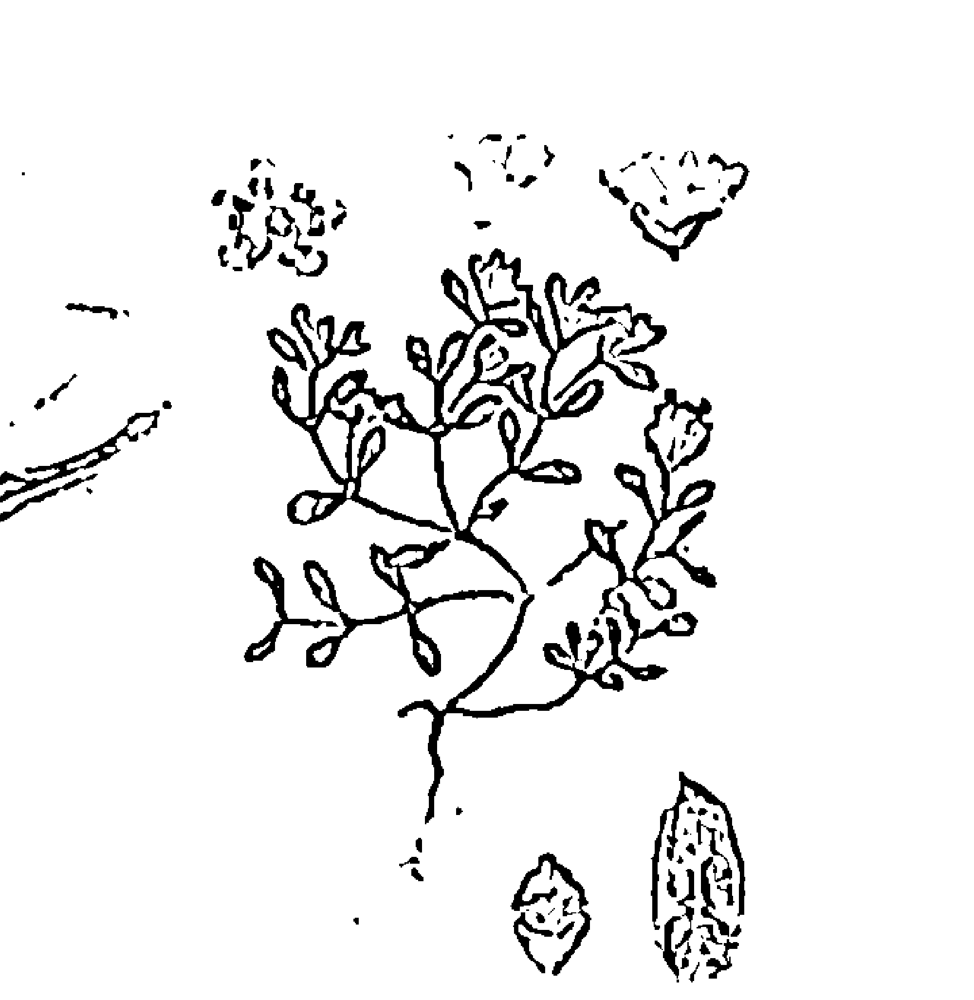
- 2. 媽藥—141
- 兩情相悅之藥·崔斯坦和伊索德的故事
- /為愛穿針引線之藥·德國傳說集
- /墜入愛河之藥·仲夏夜之夢
- /返老還童之藥·浮士德的故事/愛情魔法

## 第四章 「聰明女性」與藥草

- 1. 「聰明女性」與女巫—160
- 2. 聖母瑪利亞與藥草—167
- 斗篷草
- 3. 月神與艾草—174
- 艾草/西洋杜荊
- 4. 修女赫德嘉與藥草—180
- 5. 藥草女巫—183
- 洋香草
- 6. 具有性治癒力的藥草—187
- 芸香/蒔蘿/野包心菜
- 7. 「聰明女性」所作的藥草料理—193
- 聖星期四的綠色蔬菜/金錢薄荷/五月酒/車葉草

本書引用及參考文獻·圖片一覽—213

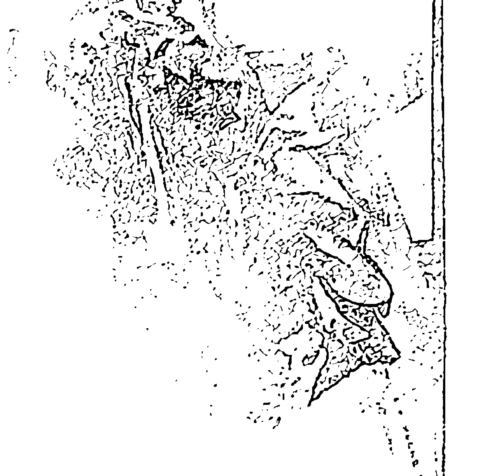
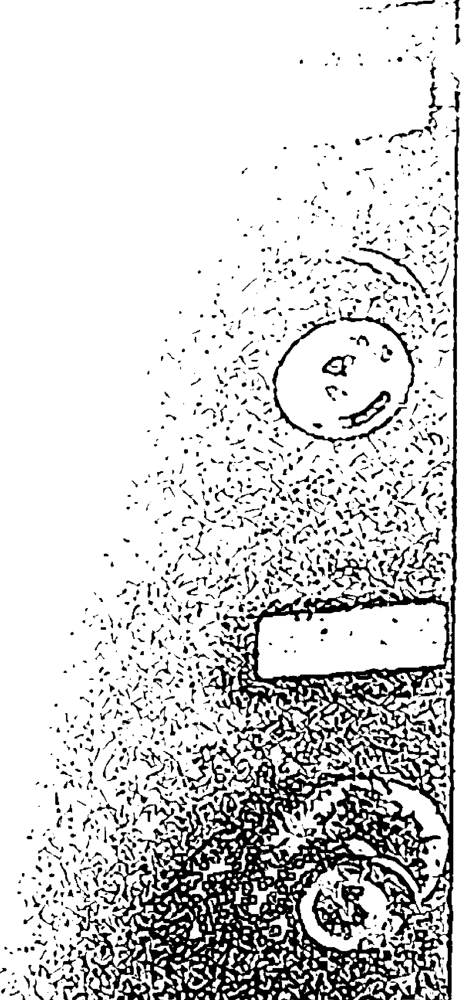
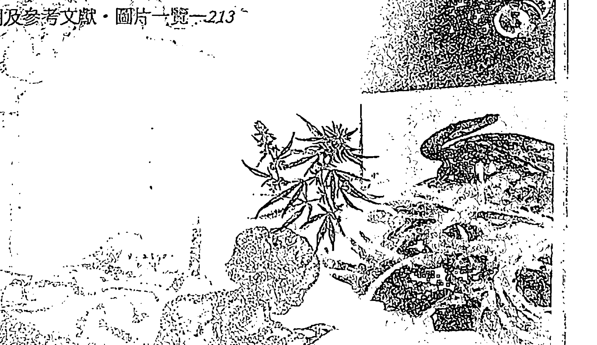

# 第一章

## 女巫與藥草

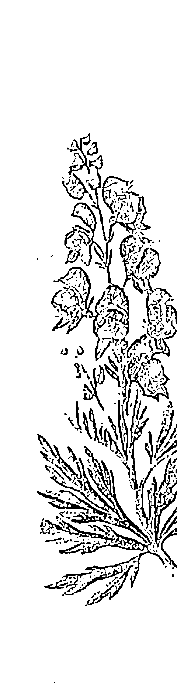

## 1 飛行軟膏

在歐洲，傳說中每到四月三十日的夜晚，女巫會齊聚一堂，與惡魔共同狂歡。這樣的夜晚稱為「瓦普幾絲之夜」（Walpurgis Night）。女巫最廣為人知的集會地點，就是位於德國中部哈茲（Harz）山脈中的布羅肯（Brocken）峰。

當晚，據說女巫會一個個向惡魔報告自己一年來作了哪些壞事，吃不加鹽或者長滿黴菌的麵包，接著背靠著背跳舞，直到第一聲雞啼時才突然消失無蹤。

德國的世界級文學家歌德在《浮士德》（完成於1831年）當中也提到瓦普幾絲之夜。因此，這屬於哈茨山地的的確流傳著許多關於女巫的傳說，其中亦不乏與「瓦普幾絲之夜」有關的。例如下面這個故事：

故事：

一個男僕偷看到女主人從抽屜中拿出軟膏抹在全身上下，然後跨上掃把，口唸咒語，從煙囪飛了出去。男僕也想跟去一探究竟，於是從她的抽屜中取出軟膏塗抹在身體上，有樣學樣地跨上掃把唸起了咒語。但是由於咒語的唸法不對，他飛向房間牆角，撞得滿頭包，好不容易才穿過煙囪飛出屋外。據說他帶著滿身傷痕地飛到布羅肯峰，在那裡與女巫們跳了整晚的舞，直到第一聲雞啼。

提到女巫，人們腦中總會浮現出她們跨著掃把飛翔在空中的形象。然而，並不是因為先有「會飛的魔毯」，人們才想出了「會飛的掃把」。能夠飛翔的掃把，也不是女巫用魔法做出來的。所以不能將「女巫一定手拿掃把」當作常識看待。 在哈茨地方的傳說中，女主人雖然跨在掃把上，然而卻是將軟膏塗抹在身上之後才有辦法飛起來的。可知想要飛上天空，軟膏扮演相當重要的角色。

十七世紀德國的民俗學者普雷托流斯（Johann Praetorius）在其所著《發生在布羅肯堡（Blocksberg）的事》（1669）當中，也介紹到布羅肯峰的瓦普幾絲之夜。其中據說女巫們除了騎掃把以外，另外也騎雄山羊和豬、爐灶的撥火棒等，裸身飛往布羅肯山。

普雷托流斯於書中附有瓦普幾絲之夜的想像圖，其中繪有騎著雄山羊的女巫。當歐洲各地開始迫害女巫時，女巫是惡魔的情婦，雄山羊是惡魔的化身這種想法遂廣為流傳。因此女巫與雄山羊配對的繪畫，在歐洲便成為對女巫的刻板印象之一。

在德國畫家杜勒 (Albrecht Dürer) 的畫中，繪有一個背對雄山羊的頭逆向騎乘的女巫。西班牙畫家哥雅 (Francisco de Goya) 則描繪了在巨大的雄山羊前努力練習飛行的男女。另外，德國畫家巴爾東·格林 (Hans Baldung Grien, 1484-1545) 以及許多畫家，也都有以正往身上塗抹軟膏或製作軟膏的裸身女巫為主題的繪畫。因為這些繪畫作品，使得某種偏見在人們之間廣為流傳，認為女巫是妖魅的，帶有讓人不敢直視的色情形象。到了十六世紀，狩獵女巫的風潮遍及全歐，當時許多遭指控是女巫而被捕的女性都供稱曾經飛去參加黑彌撒。至於前往該處的方法，則是從惡魔處學來能讓人在空中飛行的飲料或軟膏的做法，抑或直接向惡魔取得後，將其喝下或是塗抹於身上。在阿爾薩斯（現法國境內Alsace）的科爾馬（Colmar），據說還保留著當時主審官審判女巫所提出問題的清單。內容不外乎『塗在掃把上的藥膏原料是什麼』、『飛上天空時口中唸著什麼樣的咒文』之類，且主審官會引導當事人回答。在此記載當中，女巫的交通工具似乎已經定型為掃把。

對審問的主審官而言，識當事人坦承確實向惡魔索取軟膏或飲料，或者學習做法，比起逼問當事人使用何種飛行工具重要多了。畢竟，主審官的任務是證明女巫是惡魔的情婦，並加以消滅。於是很多人紛紛承認，曾經塗上軟膏飛上天空。

根據普雷托流斯記載，在身體上塗抹軟膏，或者使用交通工具，原本都非絕對必要，然而因為審判女巫的緣故，女巫與飛行軟膏的關係遂緊密地結合。

然而關鍵的軟膏到底是什麼東西，仍然不詳，甚至也有人認為，根本沒有什麼女巫軟膏。其根據在於審判女巫的記錄中所記載的軟膏配方，往往只是將當時醫生所用的幾種藥加以混合所得，或是傳說當中所流傳的大抵上不太可靠。許多人往往認為從事巫術者只限女性，然而在狩獵女巫最為激烈的時代，許多遭到告發的人往往不分性別、年齡以及職業。其中亦包括不少藥劑師與醫生，這類人持有的配方往往最易遭人懷疑。若回答不出為何持有軟膏，則會受到拷問，很多人更直接認為既然答不出來，那一定是從惡魔那裡得來的。

有幾帖女巫軟膏的配方流傳至今。到了二十世紀，關於狩獵女巫的研究開始起步時，「女巫軟膏」漸漸獲得重視。隨著研究進展，很自然地會想要知道其實際功效，許多位學者甚至先後嘗試進行製造。

德國的毒物學者先克（Gustav Schenk），於一九○二年按照古老的配方製作了一女巫軟膏，並將它塗抹在某位女性身上。結果這位女性陷入昏迷，失去意識很長一段時間。當她醒過來時，完全不相信事實上自己一步都沒有移動過，反而堅信自己曾飛上天空，前往參加黑彌撒。

德國的藥理學者修納（I. Hurner）於一九二五年進行了實驗，將一般認為是女巫軟膏重要成份的茄子科藥草萃取物，塗抹在皮膚上。據說，他經歷了一段如夢境般的飛行體驗。並且在夢中還變為貓或貓頭鷹等動物。另外，德國的大學教授波克特（Will-Erich Puckert）在一九六〇年進行過同樣的實驗。他按照意大利人所寫的一本叫做《自然魔術》（1568）中所記載的配方，製作了女巫軟膏，並且與朋友一起把它塗抹在身上，兩人立刻陷入深沉的睡眠。清醒後兩人所說的竟然相同：期間彷彿看見恐怖的臉孔、感到像在漂浮，或是不斷地墜落。從上述實驗來看，可以確定軟膏的主要成份是某種類似麻藥的藥草，會讓人產生強烈的漂浮感。所以似乎仍無法完全斷言並沒有飛行軟膏存在，或是只存在於人類的想像中。有句成語說「以毒攻毒」，在治療疾病時所用的特效藥原料當中，往往含有毒性極強的藥草，其成份與飛行軟膏相同。許多人因為用藥而產生幻覺暫時陷入忘我狀態，或是因長期服用導致藥物中毒現象。服用這些麻藥的不僅限於病人，無論古代或是現代，對於想要逃避殘酷的現實以及被社會所淘汰的人而言，其所需要的正是能夠麻痺神經的藥物。如果他們活在狩獵女巫最為激烈的時代，可能會因行為可疑而遭逮捕，並接受審判。但或許用不著強行逼供，這樣的人也會自稱曾經飛行在空中。過去許多人都是因為如此，打從心底相信自己曾經飛上天空，因而坦承自己是巫師而受到肅清。從這層意義來看，讓人能夠飛行的藥劑的確可說是存在的。

現代對女巫飛行所抱持的印象，往往是自由自在，並對其充滿嚮往。甚至有許多因此想成為女巫的女巫迷。但是，人類為何總是想要飛上天空？乘著令人身心舒爽的微風，任憑圍巾飄動，並配合著動聽的音樂操縱掃把，自由自在翱翔於天際，這樣的心願是許多人的夢想。然而想到歷史上的女巫軟膏曾經使得許多清白的人被誣陷為女巫，也許我們所渴望的飛行，還是透過飛機與滑翔翼來實現就好。

然而所謂的「飛行軟膏」究竟是什麼？這個問題的答案還是讓人十分好奇。以下所列的，並不僅限於飛行用途，而是概括統稱為「女巫軟膏」的幾道古老配方。我們只能根據配方中所列的材料，推測它是用於飛行、毒殺，或是其他用途。除了列於配方中的藥草外，也另行介紹幾種被稱為是女巫藥草的植物。

## 2 女巫軟膏

### 【配方】

- ○ 毒參、莨菪、毒堇、紅罌粟、黑罌粟、包心菜、麻繩菜各0.0648克。
- ○ 將上述材料與油以4：6的比例混和
- ○ 每31.103克混合物中，加入1.296克底比斯的鴉片。

這是西梅尼斯（Ferrando Jiménez Del Oso）所寫的《世界女巫百科》中介紹的女巫軟膏配方。據說本來記載於義大利的哲學家兼數學家卡達諾（Gerolamo Cardano）所著《事物的精妙》當中。

由於我不是藥草專家，就算看了這配方，也無法從藥學的角度判斷它具有怎的效果。然而，想必不是什麼正經的用途。光是0.0648公克要如何測量，就已經令人百思不得其解了。

配方中所謂「紅罌粟、黑罌粟」，大約是指紅色與黑色種子之意。而「底比斯的鴉片」指的應該是底比斯地方出產的鴉片。提到底比斯，就讓人想起希臘劇作家索福克利斯（Sophocles）的《伊底帕斯王》中提及的希臘都市，或是以路克索神廟聞名的埃及城市。雖然兩者都叫做底比斯，然而其中埃及的以栽種罌粟著名，因此配方中記載的應該是埃及底比斯產的鴉片。

附帶一提，鴉片的主要成份中，有種叫做蒂巴因的物質，雖然這個名字是進入二十世紀以後才命名的，然而也許其由來便是埃及的底比斯。

十六世紀時，洛林區（今法國東北部）曾經出土一個古老的陶壺。在分析其內容物之後，發現有顛茄、莨菪、毒蔘茄、毒堇等成份，經研判這應該是用來存放女巫軟膏的陶壺。

從卡達諾的配方以及壺的內容物來判斷，由於其中有許多會令人產生幻覺的成份，因此也許是飛行用的軟膏。

### 【莨菪】

莨菪 (Hyoscyamus niger) 自古便被視為擁有魔力的藥草，這是因為其含有毒性成份。莨菪屬於茄科，蘊含莨菪鹼與阿托品、東莨菪鹼等生物鹼類，會對副交感神經及中樞神經產生作用，使人失去對重量的感覺，產生像飛在空中的幻覺。人們認為是魔法造成這種酩酊感與幻覺症狀，因此莨菪便成為飛行軟體的重要材料。茄子科的植物包括馬鈴薯及番茄等富含營養且美味的蔬果，也蘊藏生物鹼類毒素的品種。生物鹼似乎已成為毒物的代名詞，然而它指的並不是單一一種毒素。生物鹼乃是鹽基性含氮化合物的總稱，約涵蓋兩千種以上的物質，對動物效果特別強。其中又以莨菪含有的莨菪鹼和東莨菪鹼、顛茄含的阿托品、附子所含的烏頭鹼、以及曼陀羅所含有的東莨菪鹼毒性最強。

生物鹼家族多數都具有相似的強烈毒性，莨菪無疑是其中最具代表性的一員。用作「女巫軟膏」原料的植物，有許多屬於茄子科，含有生物鹼成份。

然而就算植物本身帶有強烈毒性，只要能夠加以活用，也能成為藥物。例如東莨菪中含有的東莨菪鹼在手術中用於使肌肉鬆弛，並且能緩和乘坐交通工具時感到的不適症狀。莨菪的藥片則含有止痛成份，不過大量使用會導致昏睡，因此一般人不宜自行使用。由此可見藥草中含有的毒素並不全都是有害的，重點在於用量的問題。

莨菪的花為黃褐色，外形呈缽形。仔細觀察花冠可以發現上面遍佈濃花褐色的脈絡，就像生物的血管，令人感到有點噁心。不管是外觀或是內在，莨菪都算得上是道道地地的「女巫藥草」。

毒芹（Conium maculatum）與莨菪一樣，在前述卡邁諾的配方以及洛林區出土的壺中都能發現其蹤迹，且毒性乃是其中最强的。服下此种毒后，身体会渐渐僵硬，麻痹症状自脚部慢慢往上蔓延，最后导致呼吸困难而窒息死亡。更恐怖的是，在死之前意识仍然是清醒的。古希腊据说都用此种毒药执行死刑。传说希腊哲学家苏格拉底在狱中所喝的毒液也是毒堇的汁液，他直到最后一刻为止都是意识清醒的。

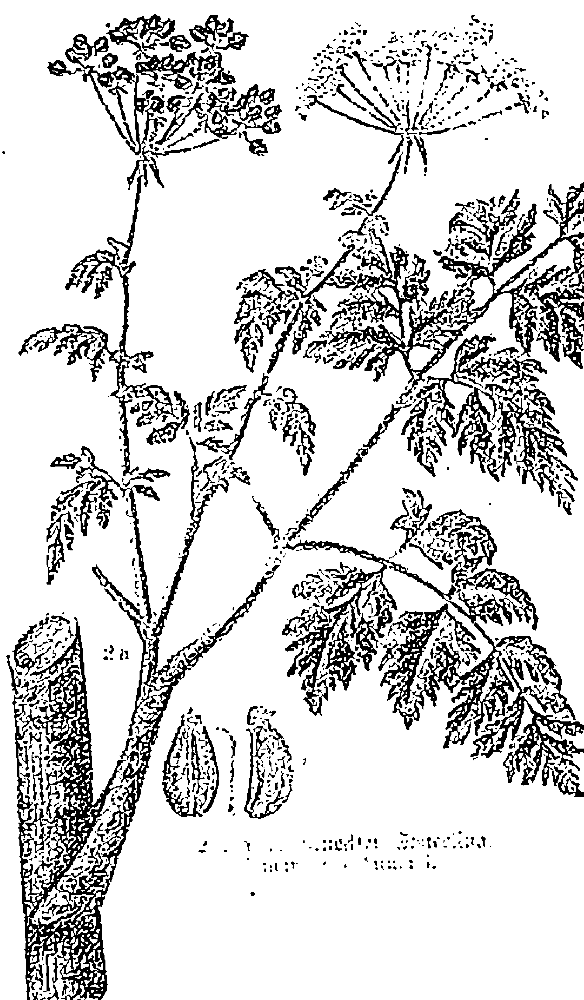

### 【毒堇】
毒堇是芹科植物，茎上有红色斑点，伞形花序的白花绽放于夏天。毒堇中含有生物碱类的毒芹碱。
但有趣的是，它的毒性并不稳定。该植物位于地上的部分所含的毒素，会随着日照多寡改变，所以土中的根部含有的毒素成分最为稳定。
同属芹科植物的还有平常所吃的红萝卜，其根为红色，相较之下，毒堇的根部外观较瘦小，看上去就像缺乏光泽的肌肤颜色。然而其毒性极强。古希腊哲学家德谟克里特（Democritus，公元前460-370年左右）曾经说过，若要毁灭一座树林，只要将羽扇豆（Lupinus）的花浸在毒堇汁液中一天后，撒在树木的根部即可。虽然其毒性强烈到足以杀死整座树林，不过从前似乎也曾用来作为治疗神经疾病的药材。
据说毒堇具有老鼠尿一般的臭味，这也相当符合邪恶的女巫给人的印象，充分具有作为“女巫药草”的资格。

### 有毒菌类
跟毒堇一样，只要在名字前面加上“毒”字，人们立刻便会了解它是有毒植物。但若因为这样，就以为在女巫的药草清单中经常出现的毒麦只是含有毒素的麦而已，那就大错特错了。一般人所谓的毒麦，正式学名为*Lolium temulentum*，这跟在女巫的术语中提及的毒麦并非同一种植物。事实上含有毒素的并不是麦子本身，而是指寄生在麦穗上的

这种菌类称为麦角菌（Claviceps purpurea），属于子囊菌，是霉菌的一种。寄生于大麦或小麦等禾科植物上。长出的麦角形状像是牛角或是黑色的香蕉，常见于黑麦的穗上。麦角入秋后落至地面，于土中过冬，到了春天会长出许多小香菇般的物体。其所产生的无数孢子受

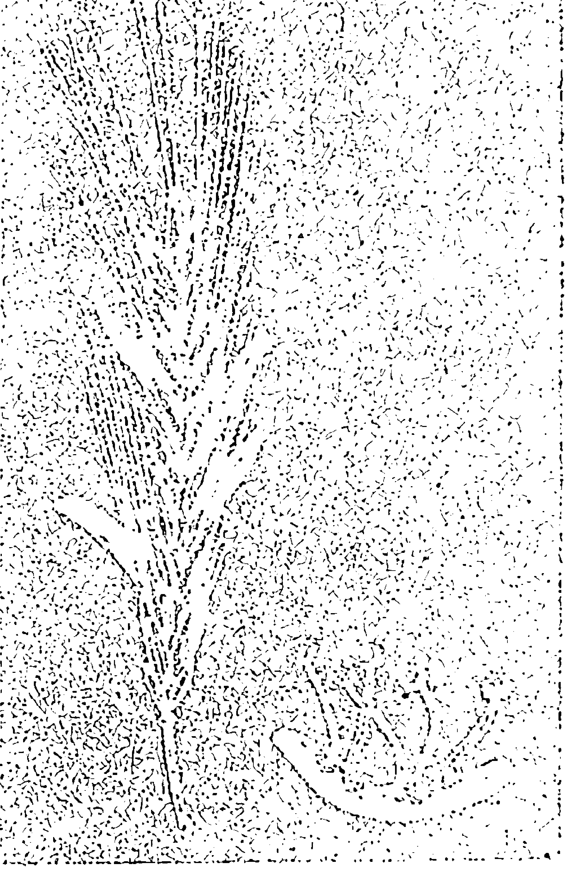

麦角菌

到风或昆虫搬运，再次附着于禾科植物的穗上。由于麦角含有生物碱，因此大量摄取会导致麦角中毒，引起目眩、呕吐、产生幻觉、痉挛等症状。不过由于其对促进子宫收缩十分有效，因此常用作子宫收缩剂和帮助分娩。落在地上的块状物一般穀物大得多，因此在德文当中称为“穀物之母”（Mutterkorn），这就是女巫们所谓的毒麦。由于穀物刚发芽的时候，还无从得知是否被这种菌类附着，因此即使怀疑有此可能，往往也要等到脱壳时才能特别留意，将其取下。

> > 新约圣经的马太福音中，记载着下面这样的故事：某个人播种之后，他的仇家趁着夜里在他的田里撒下毒麦的种子。于是到了麦子成熟时，毒麦也随之出现。这个人的家仆急着想要把毒麦拔除，却遭阻止。他的理由是，如果现在就把毒麦拔除，会连好的麦子也一并拔起，不如就此放着不管，等到收成时再分开即可。

耶稣基督在讲道时，常会用一些贴近日常生活的譬喻。我想这个毒麦的譬喻的意思是，一个人是善人或恶人，应在最后审判到来时由神决定，因此一个人选择的生活方式应该确保到时不会被神所舍弃。对于脱壳时必须不厌其烦地剥除毒麦的农民来说，这应该是个很浅显易懂的譬喻。

### 【附子】
含有强烈毒素的药草往往用来杀人。毛茛科的西洋附子（Aconitum napellus）也因为具有猛毒，名列女巫的药草之一。附子的毒素自古便用来制作毒箭，或用于暗杀。现代仍常发生利用此种毒素的谋杀案件。
其所含毒素之强烈，几乎可说是无可比拟。整株草，从根部到花粉都含有生物碱类中的乌头碱，只要几克便能致人于死。过去的记载中提到有人甚至只是闻到它散发的臭气便昏厥过去，或者把这种草丢向蚂蚁便能令其瘫痪。让人不禁佩服附子的毒性。
然而据专家表示，附子的根部并不具有臭味。也许是一般人认为邪恶的女巫所使用的草药，一定也和女巫一样散发着猛烈的臭气，才造成这种错误的常识。
十六世纪时，有位贵族弄到了强效的解毒剂，想要试试它的效用，便叫死刑犯服下附子。然而解毒剂完全没有发挥任何的效果，死刑犯只能在痛苦中死去。这是个相当残酷的故事。
附子的花形像是日本古时贵族佩戴的高帽子。在西方，这种植物名字的由来是从花的形状命名，从其在德文中叫“铁帽子”（Eisenhut），在英文中则是“修道僧的头巾”（Monkshood）来看即一目了然。

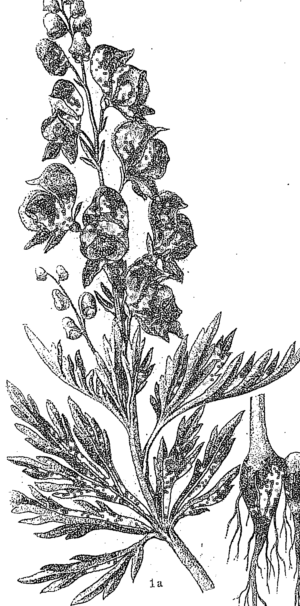

然。或许是附子含有的剧毒实在太有名了，它美丽的紫色花朵，看起来甚至无端显得有几分邪恶。 而且由于它在山中很常见，更让人觉得毛骨悚然。
1 a, b. Eijenhut. Aconitum napellus L.
西洋附子

### 【配方Ⅱ】
| 材料 | 用量 |
| :--- | :--- |
| 人类脂肪 | 100公克 |
| 高纯度大麻 | 5公克 |
| 野生大麻的花 | 半束 |
| 罂粟花 | 半束 |
| 一撮菟葵粉末 | |
| 一撮磨碎的向日葵种子粉末 | |

这据说也是用来制作女巫软膏的配方，然而其出处不明。乍看之下，用于飞行的可能性似乎相当高。
由于配方中加入了向日葵种子，因此有可能是十六世纪后半写成的。之所以这么说，是因为向日葵一直到一五七〇年左右才传入欧洲。附带一提，虽然配方中写的是“向日葵种子”，然而有专家指出，正确而言这应该是果实而非种子，这使我相当惊讶。

### 【印度大麻】
一般认为飞行软膏是用含有麻药成份的药草所制成。其中许多成份能够为皮肤吸收，使人产生幻觉以及飞翔的错觉。女巫在身上涂抹软膏后飞上天空这种印象，也由此而生。
野生大麻（Cannabis Sativa）会带给人与上述同样的幻觉，因此自然被列为飞行软膏的材料之一。野生大麻在中国从西元前五世纪左右，即用于治疗风湿与痛风，然而现已不再供药用。野生大麻在作为麻药用途使用时，就是我们一般耳熟能详的大麻。
印度产的大麻活性特别强，会让人失去时间观念、情绪失控，进入梦境般的境界。古人很早便注意到，在收获野生大麻时往往会产生奇妙的症状，因此日文中“アシユ”这个词汇，便是形容该种晕眩般的奇异感觉。
在梵文的抄本里，有一个词代表的意思是以大麻为底制成的“神的饮料”。由此看来，大麻似乎很早便用于宗教仪式中。古日耳曼人在埋葬往生者时，也常使用大麻进行净化仪式。
由初开仍未授粉的雌花尖端所得的树脂中，含有四氢大麻酚以及其他麻醉成份，会对神经造成强烈影响。将这种树脂加工成片状或是棒状，便是所谓毒品大麻，而将茎顶部的嫩叶切碎与烟草混合所得，就是所谓印度大麻（marijuana）。这种植物目前在日本栽培受大麻取缔法的限制。

Cannabis sativa L.
野生大麻

野生大麻是相当有用的植物，几乎没有无用可以丢弃的部位。古罗马的博学者老普林尼（Gaius Plinius Secundus）在他所写的《博物志》（77 A.D.）当中，认为它是最适合用来制作绳索的植物。野生大麻的纤维是制作夏季衣物的代表布料，其果实能用于七味辣椒粉中或点缀在面包上，榨出来的油也能用来制作清漆（varnish）或肥皂，以及溶解油漆。
野生大麻的茎在剥去外皮之后，在日本称为“苧壳”（gara），在盂兰盆季时当作火炬来使用。有趣的是，古代仪式中使用的大麻或是剥皮之后所得的苧壳，都被用来与另一个世界交流，也许是因为相中其容易点燃的特性吧。

### 【罂粟】
植物含有的毒性越强，似乎就越有资格作为“女巫药草”。其中，罂粟（Papaver somniferum）具有使人入眠以及失忆的效果，在女巫的药草中地位崇高。提到罂粟，便使人联想到惹人怜爱的红色小花。至于罂粟的种子，则常常用来混在面包或小点心上。罂粟结的果实，是果皮既干又薄的蒴果，成熟时会散落出细小的种子。成熟前果实分泌的乳汁含有二十五种生物碱类毒药，将乳汁加以干燥处理之后制成的，即是鸦片。
十七世纪末叶，英国医生将这种乳液加以调合，制成名叫鸦片酊（laudanum）的万能止痛药。同时，人们发现它会成瘾，遂开始将鸦片当作毒品吸食。然而罂粟厉害的地方，不仅仅只是会造成鸦片中毒而已。
十九世纪之后，澳洲的药剂师自鸦片中萃取出具有麻醉活性的生物碱，并取名为吗啡。少量的吗啡能够适度对大脑产生作用，止痛效果相当好，然而使用时夹带着陶醉感，比鸦片更容易让人成瘾。到了十九世纪中，法国的药剂师从罂粟成份中的鸦片分离出可待因，对于止咳相当有效。虽然程度不如吗啡，但仍然会造成成瘾症状。
其后，德国化学家以吗啡作为原料，合成出具有更强效果的化合物。这就是毒品之王——海洛因。
罂粟的花虽然美丽，然而每每思及它是鸦片、吗啡及海洛因之母，便让人感到不寒而栗，因此它毫无疑问具有名列女巫药草之一的资格。
现在栽培来作为观赏用的罂粟类植物几乎都是雏罂粟（Papaver）。雏罂粟虽然也具有该类植物在折断茎之后会流出乳液的特征，不过其中并不含有麻药成份。罂粟早在西元前三千年左右，便在古代美索不达米亚的苏美地区广为种植。自古以来便以具有使人入眠及失忆效果而闻名。在童话《绿野仙踪》当中，也有主角桃乐丝一行人误入罂粟田，纷纷睡倒在地的情节。
在中国，楚王项羽的爱人虞姬的故事，也跟罂粟有关。她在项羽败给汉王刘邦自刎之后，也拿起小刀结束了自己的生命。从她流出的血中长出了红色的花朵，那就是虞美人草，也就是雏罂粟。虽然虞姬自杀的故事似乎并非史实，只是将她的美貌借来比喻罂粟的花而已，但这仍然是个沾染了血腥的故事。
另外，也不免让人想到日本作家夏目漱石的一篇小说《虞美人草》。女主角藤尾是一名心高气傲的女性，在遭到所爱的男士背叛之后，“喝下了虚荣之毒”而死。从这个标题来看，几乎让人认为她所喝的便是罂粟制成的毒药，然而并不是这样。当藤尾得知遭到背叛时，脸部的肌肉突然无法动弹，手脚僵硬，像失去重心的石像一般倒在地上死去。如果她喝的真的是罂粟制成的毒药，那应该会出现海洛因中毒的症状才对。

Papaver somniferum L.

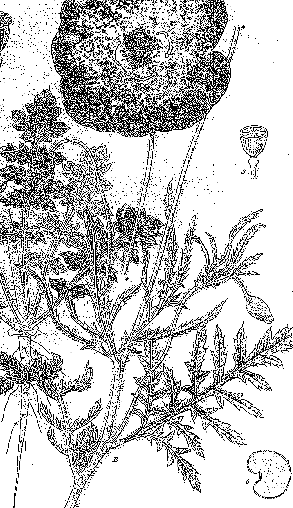
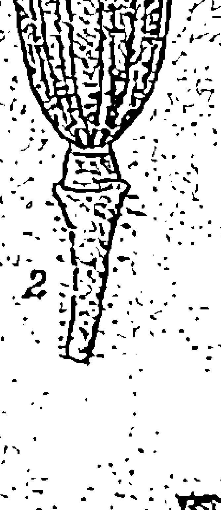
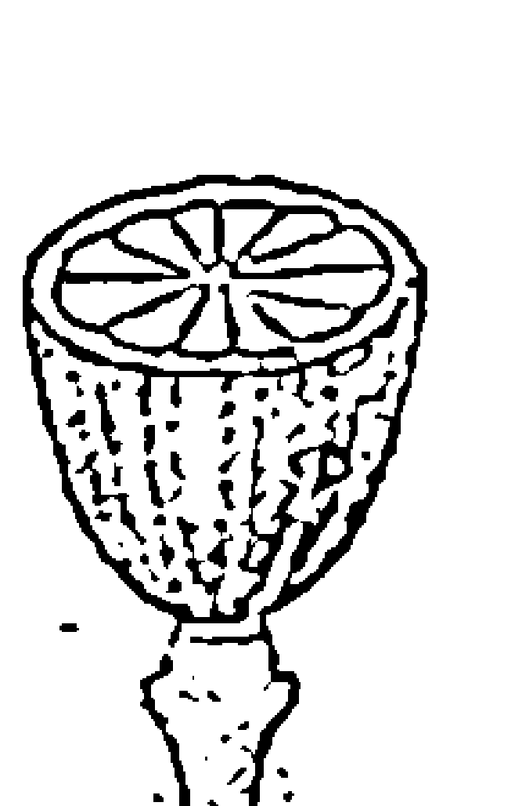
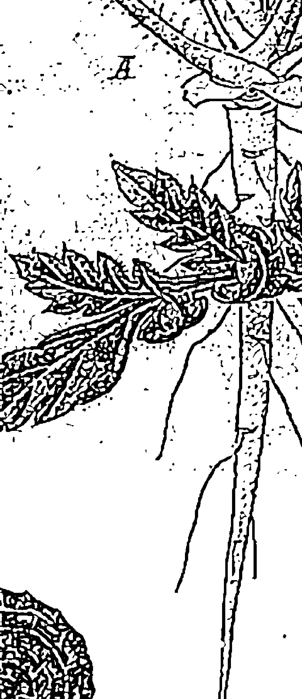
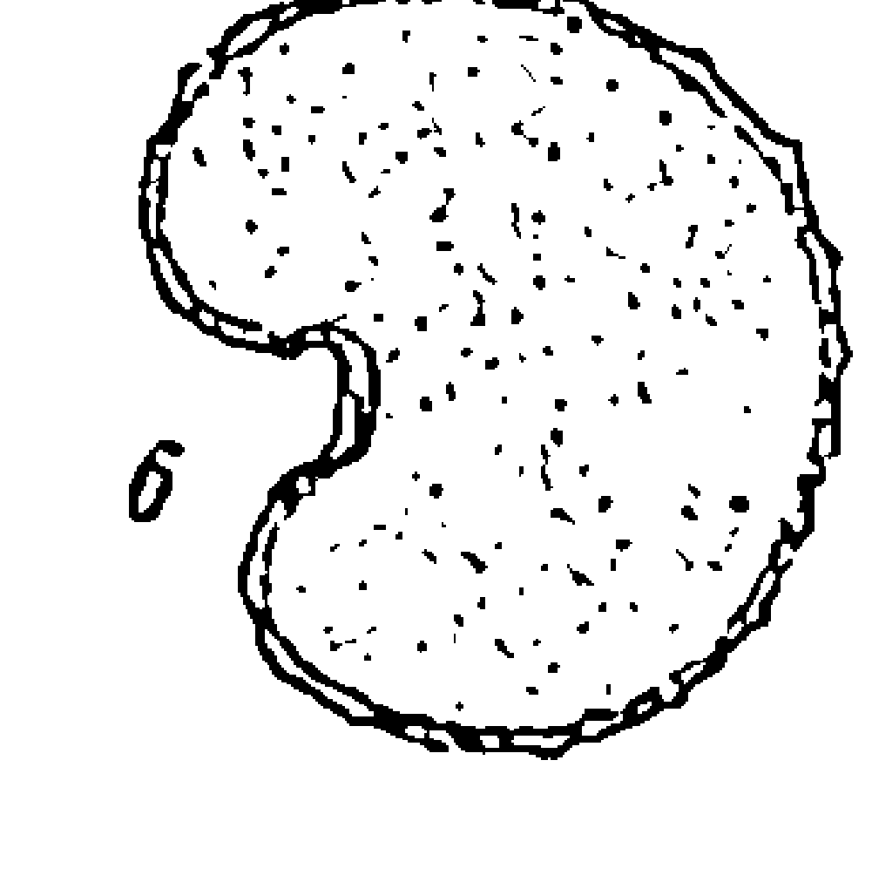

### 疯茄
就像魔女草一样，花朵背后的故事许多都和女性有关。若说“女巫药草”背后的由来与女性有关的，首推疯茄（Atropa belladonna）。疯茄（belladonna）这个字的原意为“美丽的妇人”，具有强效的镇静作用，并能使肌肉松弛。若将叶片与根部的汁液滴入眼睛，则其中含有的阿托品成份会使瞳孔散开，看上去好像在闪烁，因此受到义大利女性爱用。的确，在凝视放大的瞳孔时，往往让人有种受到吸引的错觉。
在接受眼睛检查前点过散瞳药剂的人应该很清楚，在无法对焦的情况下，看什么都不清楚。因此，遗憾的是，使用这种药剂时，无法亲自确认自己的眼睛是不是真的变好了。
药剂师指出，由于阿托品的散瞳作用会持续一周以上，因此虽然随着检查内容的不同，偶尔仍会使用，然而现在大多数使用数小时便能复原的散瞳剂作为散瞳药剂。

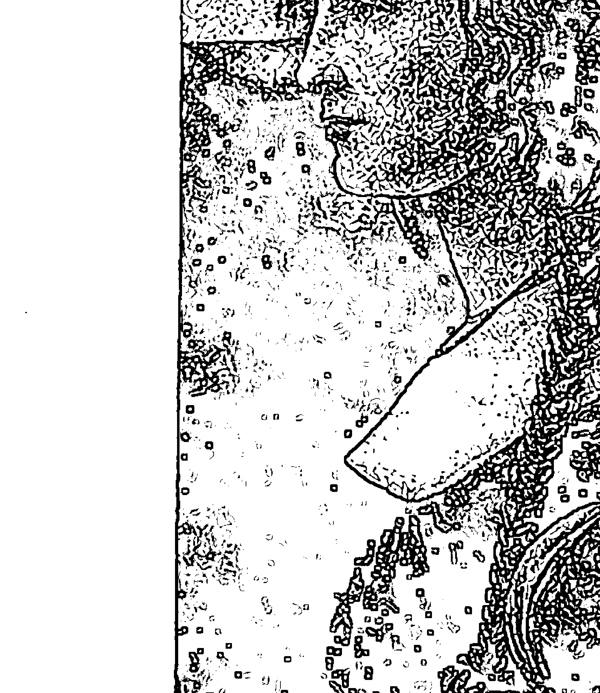

许多女性就是为了这样美丽的眼睛，而使用疯茄的汁液。波提切利工房作品〈妇人的肖像〉，1480年代中期。
德籍医师西博尔德（Philipp Franz von Siebold）抵达日本时，曾经携带疯茄。他在江户的眼科医生面前实际使用这种植物进行眼部手术。医师们对它的效力不禁感到惊叹，想要知道该草药的名称。西博尔德看了他们提供的日本植物图鉴，表示该种植物就是自生于日本的日本莨菪（Scopolia japonica）。

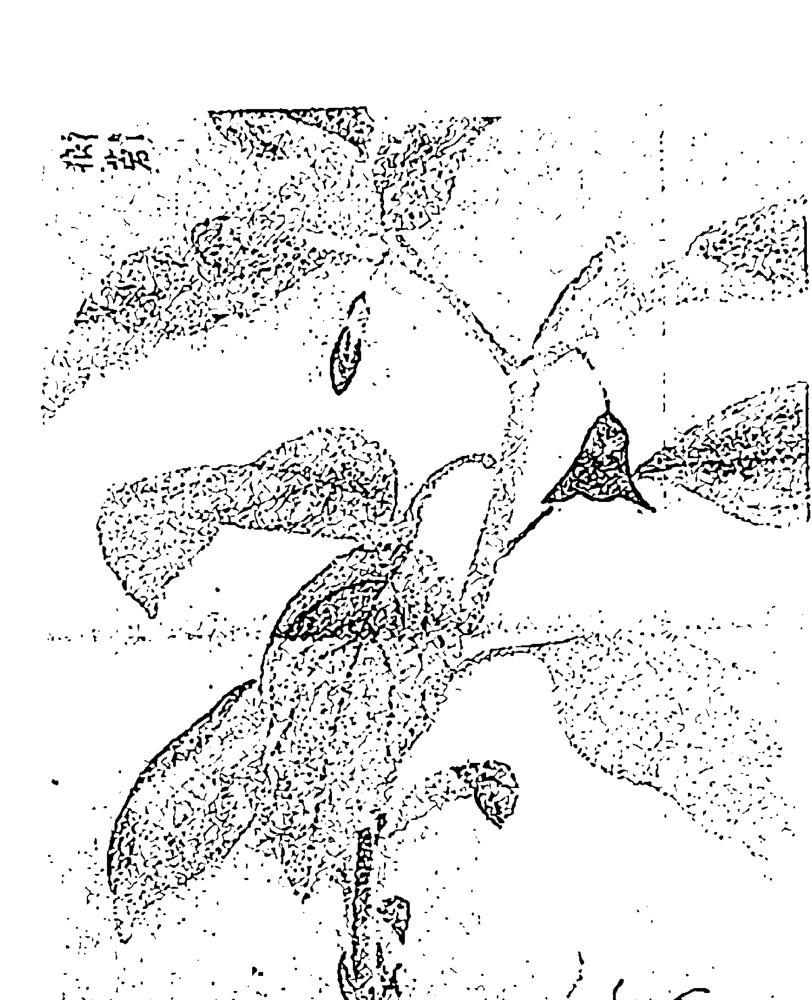

日本莨菪
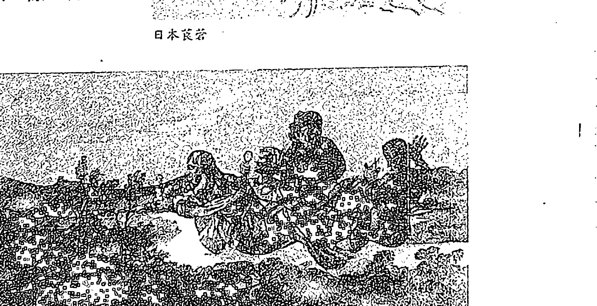

命运的女神们——负责切断命运之线的阿特洛玻斯位于右端，手上拿着剪刀。哥雅绘《黑色的画 阿特洛玻斯（命运）》，1820-1823年。
日本莨菪与疯茄同属茄子科，叶片与花朵也很类似，并且同样含有生物碱类中的莨菪碱和阿托品、东莨菪碱。因此使用日本莨菪也可达到散瞳效果。日本莨菪常会被误认为山芋科的草蓴的根部，人若误食会陷入发狂状态，四处跑动，因此其日文名称为四处分走之意。
疯茄在英语中称为“致命的茄类植物”（Deadly Nightshade），在德文中的意思则是“疯狂的樱桃”（Tollkirsche）。虽然这两个都是相当恐怖的名字，但仍然比不上其学名“Atropa belladonna”。
Atropa的语源是希腊神话中的女神阿特洛玻斯（Atropos），她是掌管死亡的女神，负责切断通往未来的生命之线。“一切断生命线的美女”这样的称呼用来作为“女巫药草”的名字，想必更有震撼力。
根据中世纪德国的修道院长赫德嘉·宝根（Hildegard von Bingen）记载，疯茄群生着的地方，是恶魔造访的邪恶场所。笔者曾经在德国的森林中见过疯茄。其圆圆的果实带有暗黑色晦暗的光泽，看来十分美味，让人想要放入口中品尝。不过只要五到十粒便能致人于死，真的是恐怖的女性。

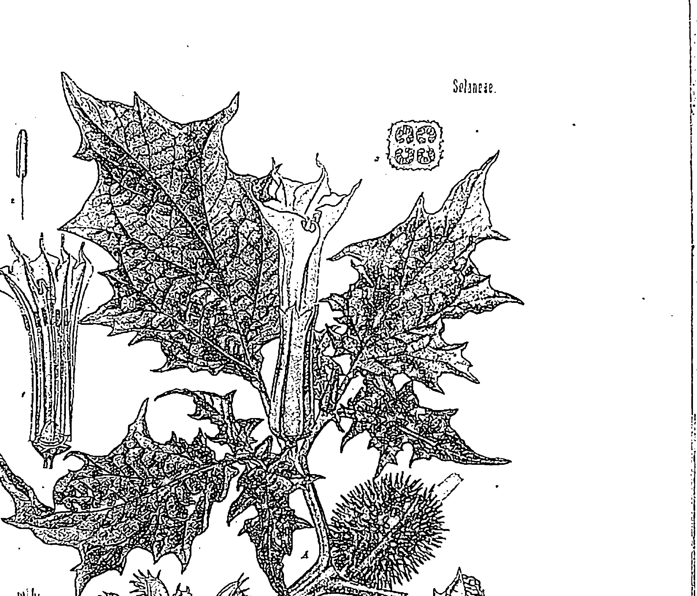

### 【曼陀罗】
接下来介绍的仍然属于茄子科。曼陀罗类的植物（Datura spp.），在女巫的药草当中独树一格。曼陀罗传入欧洲的时间较晚，直至十七世纪方从墨西哥与北美输入。
其花朵与牵牛花类似，呈较大的喇叭形。蒴果上覆满尖刺，其中包含无数细小的种子，是强烈毒性的主要来源。其毒素的成份，为同样见于茄子科的东莨菪碱、莨菪碱、阿托品等生物碱类。摄取上述成份会造成神经麻痹，陷入精神错乱，导致死亡。
在德文中它被称为“带刺的苹果”（Stechapfel）或是“恶魔的苹果”（Teufelsapfel）、“雷之球”（Donnerkugel），这些称谓来自于其蒴果的形状。

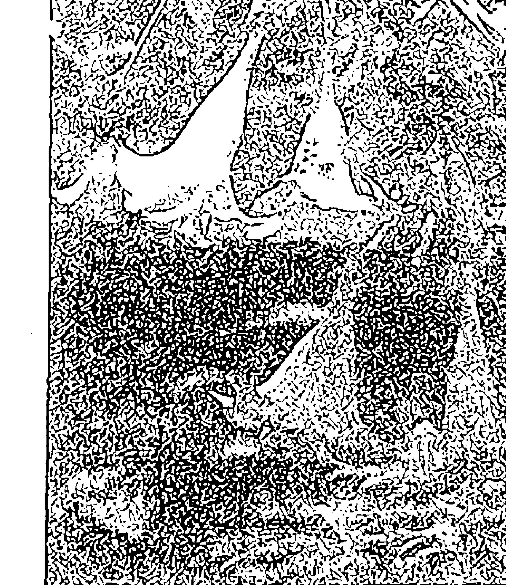

在日本于江户时代传入。纪州的医师华冈青洲（1760-1835），调和六种药草发明了全身麻醉药“通仙散”。其中的原料之一即为曼陀罗花，也就是曼陀罗（Datura metel）。

天使们吹响喇叭，告知人类最后审判的到来。这些天使并没有翅膀，且和一般人印象中的天使不同，浑身肌肉，相当雄壮威武。米开朗基罗《最后的审判》，1541年，西斯汀教堂(梵蒂冈)。
曼陀罗花是人们想像出来的花，认为它绽放于极乐净土。若摄取曼陀罗的毒素，会使人产生进入极乐世界的错觉，因此其别名又叫曼陀罗花。曼陀罗于江户时代传入日本，不仅难以种植，且在实际药用上难以适用，因此其后几乎在日本绝迹。然而最近常可在一般家庭的庭院当中，发现其近缘种大花曼陀罗（Brugmansia spp.）的踪迹。虽然大花曼陀罗因为又名“天使的喇叭”（Angel's Trumpet），以及大大的喇叭形花朵，相当受到大众喜爱，然而仍然含有毒素成份。
告知马利亚耶稣受胎一事的，是大天使加百列。在耶稣诞生时吹响祝福的喇叭的，也是成群结队的天使。于是天使成为祝福的象征，常常作成可爱的形象装饰在圣诞树上。然而，在圣经《启示录》当中，告知世人世界末日将会用如何恐怖的形式降临的，也是一随着喇叭般的声响一降临的天使。而最后审判时在旁见证的天使也吹奏着喇叭。因此这样的声音听起来，绝对不仅仅是悦耳的声音那么简单。所谓的恶魔，其实也不过是违逆了神的旨意，而被赶出天国的所谓堕天使，所以可别被天使这个头衔所蒙骗。

### 【配方Ⅲ】
| 材料 |
| :--- |
| 新生婴儿的肉 |
| 罂粟 |
| 茄葵 |
| 泽漆 |
| 毒堇 |
将前述材料煮成粥状。
这配方让人全身汗毛直竖。据说是由十六世纪相当著名的瑞士医学学者帕拉塞尔斯（Paracelsus）所复原出来的。原本记载于普雷托流斯介绍女巫之夜《瓦普几丝之夜》的作品《发生在布罗肯堡的事》当中。
配方中列举了新生婴儿的肉，想必让不少读者看了感到反胃。在“女巫软膏”的配方当中，常列有人类的脂肪以及新生婴儿的肉。
为了使软膏易于涂抹，其中往往会添加动物的脂肪。从人类或是新生婴儿身上取得脂肪，这样的制作方式的确很适合用在“女巫软膏”中。

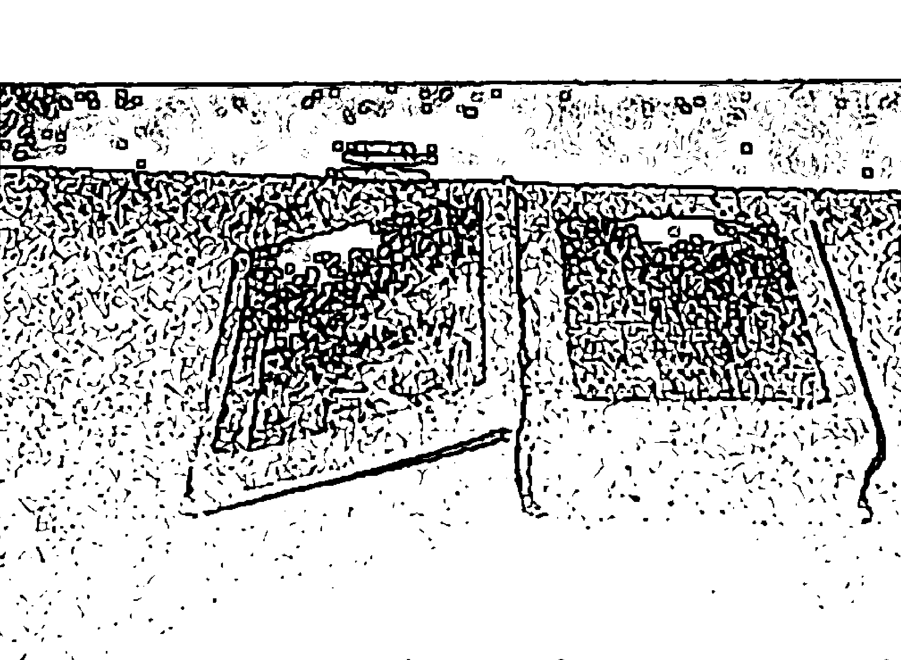

被称为是女巫裁判教科书的著作《女巫的铁槌》实物。这样一本小书，却是害得许多人被指控为女巫的元凶之一。斯布邦格及克拉玛神父著。1486年，藏于南德罗腾堡（Rothenburg）的中世纪犯罪博物馆。

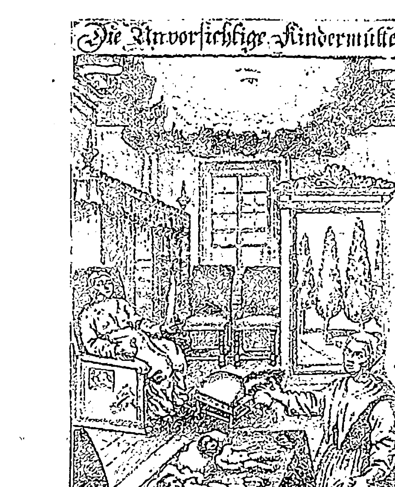

再怎么样笨拙的接生婆，也不至于这样对待婴儿。图为〈粗心的接生婆〉，1715年。这幅画当时应为流传，接生婆的执业许可这问题受到怀疑。
在狩猎女巫初期，曾有两位德国神学家合作写了一本叫做《女巫的铁锤》的书籍（1486）。其中试图透过种种诡辩，证明女巫究竟是什么，并记载着对有女巫嫌疑的人，应该透过何种方法让她招供，在自白后并处以何种处罚，几乎可说是审判女巫的教学手册。
作者更咬定接生婆也属于女巫的一种，指出接生婆会将刚出生的婴儿抛至空中交给恶魔，毫不掩饰地表达其对接生婆的憎恶。
接生婆之所以成为开刀的对象，有几个理由。亚当与夏娃违背了神的命令，偷吃了智慧树上的禁果，因此遭放逐出伊甸园。当时神对夏娃说：“我必大大增加你怀胎的苦楚。你生产儿女必多受苦楚。（创世记3:16）。生产时的痛苦既然是违背神的惩罚，那么，尽可能减少产妇所受痛苦的熟练接生婆，自然会被视为是违背神的旨意的人。另外，在基督教当中，洗礼是最重要的一种仪式。在出生时死亡的婴儿，由于没有接受洗礼，是故无法前往天堂。因此，在难产时，比起已经接受过洗礼的产妇，未经洗礼的新生儿的性命更为受到重视。于是婴儿死亡时，会视为是接生婆的责任，认为一定是因为她把婴儿的身体当作祭品献给恶魔的缘故。而且接生婆对因细故无法将小孩生下的女性也能提供很多帮助。能够促进分娩阵痛的草药，往往也具有堕胎的效果，关于类似药草的种种知识，也是接生婆的专业领域。人们进而认为，用于堕胎的药草也是“女巫药草”，而使用这些草药的接生婆自然是女巫。因此，女巫的软膏中含有新生婴儿肉的成份，不仅是用作润滑剂，还有前述的历史背景。

### 【龍葵】

女巫的藥草很可能曾用於墮胎。畢竟比起飛行，墮胎用途的需求量應該大得多。每個孕婦都會擔心有可能在生產過程中喪失生命。

特別是從前衛生條件不比現代，人們為求生產時母子平安，除了加持祈禱外，也常常使用一些促進陣痛以及對產後恢復有幫助的藥草。然而，促進陣痛的藥草由於有使子宮收縮的效果，因此若效果過強

酸漿 (Physalis alkekengi) 具有獨特的紅色外型，是日本人相當熟悉的草藥，根部也曾用於墮胎。剝開它燈籠型的花萼，裡面滿是熟透的紅色果實。把果肉取出之後，可以製成小型的氣球，或是放入口中吹出聲音取樂。不過種子常常無法巧妙地掏出，反而弄破袋子，或是將袋子裡弄得都是果實的汁液，味道相當苦澀。

有人說製作這種紅色氣球時要小心不能把種子吃下去，後來聽說酸漿可以用於墮胎，曾經想過這就是原因所在。然而事實上，就算誤食種子，頂多也只是使拉肚子而已，實際上用來墮胎的是根部。

日文當中的龍葵稱為「犬酸漿」(Solanum nigrum)，便是在酸漿這個名稱前冠上犬字，是「女巫軟體」中不可或缺的常見藥草。

茄子科植物與女巫的藥草關係密切。茄子科這個字不論在德文或英文中，都稱為「夜晚的陰影」(Nachtschatten, Nightshade)，給人陰暗的感覺。龍葵更是變本加厲，在名稱前面附帶形容詞「漆黑的」(schwarzer/black)，更加深了含有劇毒的印象，可說是極為適合「女巫藥草」的名字。

龍葵的果實比酸漿模素，成熟時不會變紅維持黑色。花萼也不呈袋狀，果實就像一個個塗黑的小燈籠。

莉豆

泡，尚未成熟的绿色果实中，含有龙葵碱与澳洲茄碱、皂素等生物碱。虽然这些成份可用来制作止痛软膏，不过事实上却是能够麻痹神经的剧毒。

### 【金雀花】

具有堕胎效果的药草相当多，豆科的金雀花（Cytisus scoparius）也是其中之一。鲜黄色的花朵呈蝴蝶型，虽然盛开时看上去相当美丽，然而其枝叶都含有生物碱成份。这些有毒成份会让子宫收缩，因此除

金雀花

了拿來當作陣痛促進劑以外，也用於墮胎。
基督教禁止墮胎，因此接生婆使用金雀花這樣的藥草達到墮胎目的，自然會被教會注意，然而這的確是許多因為不得已的苦衷而無法生下小孩的女性的救星。
金雀花常被認為是女巫掃把的材料。金雀花的某個近似種，在德語中稱為「heckseln ginster」（掃把狀的金雀花），在英文中則稱為「Common Broom」（普通的掃把），正如其名，金雀花的枝柔軟且富有彈性，適合用來製作掃把，實際上也有人把它當作掃把來用。
然而說到女巫的掃把，英國常見的荊豆 (Ulex europaeus) 則可能最為適合。春天的山丘往往會為其所開的黃花掩蓋，無數帶刺的枝桿互相交錯，葉片也呈鱗片狀或刺狀，光看便令人覺得刺痛。

# # Colchicum autumnale L.

+   - **A, B, C**: Different views of the flowering plant
- **D**: Corm detail
- **1-13**: Numbered details of plant structures (flowers, leaves, reproductive parts, seeds)

秋水仙在英文中稱為「autumn crocus」，其中crocus來自古希臘文，用阿拉伯語發音即為「saffron」。在日本，將秋天開花的稱為「saffron」，春天開花的稱為「crocus」。秋水仙由於是秋天開花，所以也不使用crocus這個名稱。

秋水仙所開的花相當漂亮，然而種子與球莖中含有秋水仙素這種生物鹼，毒性極強。就算只是數顆種子也能致命。

古希臘哲學家德弗拉斯特（Theophrastus von Eresos）曾經於《植物誌》中，記載過奴隸們使用番紅花來裝病的情景。雖然經常使用這種植物會導致死亡，然而由於其效力發作很慢，因此只要使用解毒劑就沒有大礙。

在德國這種植物被稱為「惡魔的麵包」（Teufelsbrot），長於藥草知識的修女賓根在她所寫的書《自然的治癒力》當中，也記載若服用秋水仙會造成身體機能障礙，往往導致死亡。秋水仙的效果雖然恐怖，然而從前常常當作痛風的止痛藥，對痛風相當有效，甚至如果服用之後還在痛，就可斷定疼痛一定不是痛風引起的。並且，進入十九世紀之後，發現秋水仙鹼具有促使染色體加倍的作用，因此也用於種植西瓜的用途上。

然而秋水仙鹼具有強烈的副作用，常引發下痢、血流堵塞、起疹及腸胃功能障礙，長期服用還會掉髮。若女巫因為經常使用摻有秋水仙鹼的軟膏而飽受掉髮之苦，就不免讓人同情了。

### 【澤漆】

女巫的藥草當中，除了會使人掉頭髮的藥草，還有蘊含會使皮膚潰爛毒素的藥草。在澤漆科中，許多種類皆含有對皮膚有害的毒素。近似種野漆也是其中之一。僅僅塗在皮膚上，便會造成潰爛及起水泡，不慎誤食則會毀損消化器官，引起激烈的下痢。至於澤漆科的澤漆（Euphorbia helioscopia），若折斷莖所得的白色汁液誤入眼中，則有失明之虞。

澤漆在德文中稱為「狼的乳汁」（Wolfsmilch），然而這並不是因為其汁液呈乳色，而是因為可以用來擊退野狼的緣故。在日本，人們也會使用澤漆的近親鉤腺大戟的根部來作為驅趕野狼的道具。與「狼的乳汁」這個名字相較之下，其日文名稱「燈台草」這個名字顯得較為重視外型，給人美麗的印象。它的葉片就像裝著整株植物的盤子一般，莖則從中央伸出，綻放出花朵，整體看起來就像放置著火把的台座。

### 【菟葵】

有趣的是，在「女巫軟膏」一顧名思義是用來塗抹的，但在其原料中列舉出了會引起潰爛的澤漆，讓人不免對「女巫軟膏」平添幾分畏懼。

巫軟膏」的原料當中，也含有會讓人打噴嚏的藥草。那就是自古便相當有名的菟葵，中古時期大多用於驅魔或者治療精神疾病。然而，到底菟葵具體而言是指何種藥草，至今仍無法確定。

古代希臘的大學者德福拉斯特在其所著《植物誌》中記載著，菟葵分為黑與白兩種種類，而兩者之間共通的只有菟葵這個名字而已，在外貌及性質方面許多人看法仍不一致。

英國植物學家約翰·帕金森（John Parkinson）表示，nigro品種才是真正的菟葵，開花期甚短，在接近聖誕節時開花。nigro意即黑色，指的是它黑色的根。

菟葵當中花期為聖誕節前後，且根呈黑色的品種，就只有毛莨科的聖誕薔薇了（Helleborus niger）。

> 這種花背後流傳著下面這樣的傳說：有一位少女為了沒有花可以獻給剛生下來的基督而煩惱，這時天使翩然出現，用他的手觸碰了被大雪覆蓋的地面。於是從地上開出了白色的美麗花朵，這就是聖誕薔薇。

花的外觀一如傳說中的描述，確實相當美麗。葉片像手掌一樣從地面展開，莖粗且短，尖端掛著白色的花朵。目前有許多專供栽種的品種，不僅是聖誕節前後，在春天的庭院中也能看見它的蹤跡。在日本甚至還有聖誕薔薇協會，負責召開分級評鑑大會，相當受大眾喜愛。

英國的植物採集學家法拉（Farrar, 1880-1920）這樣描述黑色種的菟葵：「它的花瓣是純白的，然而誰知道是否真的具有純潔的心？畢竟，它的中心部份以及根部都是黑的。」可說是十分巧妙的描寫。

另一方面，白色種的菟葵（ *Leucorrhizum album* ）則是百合科的植物，乃是日本的梅蕙草的母種。

正如德福拉斯特所說，白色種的菟葵與黑色種是完全不同的植物。從葉子的外型便可得知其應歸類於百合科，垂直伸長的莖部末梢盛開著白色的小花。

絞碎白菟葵所得的汁液當中含有稱為顛茄鹼的毒素，由於常於狩獵時塗抹在箭端，這種植物在日本也叫做弓取草。該毒素會引起痙攣及讓人意識不清，就算加熱毒性也不會消失，因此也用來製造殺蟲劑。根部磨成的粉末會讓人打噴嚏，因此別名又叫做噴嚏草。

聖誕薔薇，也就是黑菟葵，根部磨成的粉末呈黑褐色，也會使人猛打噴嚏。聖誕薔薇在德文中雖然叫做 *Christwurzel* ，但其別名 *Schwarze Nieswurz* 的原意其實就是「黑色的噴嚏草根」。

宮崎駿動畫作品《魔女宅急便》由角野榮子所著的同名原作，故事主角琪琪的母親是一位會用藥草來製作各種藥品的真正女巫。她在家門前柱子上貼著的紙條寫著——「出售噴嚏藥」。如果作者是想到菟葵而寫下前述的場景，那麼她真不愧是一位熟知女巫一切的人。

「女巫軟膏」所使用的菟葵，究竟是白種還是黑種，這個問題至今沒有定論。然而由於配方中記載的是粉末，也許很多女巫都是邊打噴嚏邊塗著軟膏吧。毛髮脫落、皮膚潰爛，並且不斷地打噴嚏。想像女巫有這樣的遭遇，不禁讓人覺得既可憐又好笑。

### 洋地黄

各部位编号说明（推测）：
A: 植株基部
B: 带叶枝条
1: 花朵纵切面
2: 雄蕊
3: 雄蕊
4: 雌蕊
5: 花粉粒
6: 子房横切面
7: 子房？
8: 子房横切面
9: 果实
10: 花朵
11: 种子
12: 种子
13: 种子

植物学图注（部分模糊）

页码或标识：62

# [玄參]

洋地黃的花朵呈筒狀，沿著莖順次開放，相當引人注目。屬於玄參科的洋地黃，也是「女巫藥草」之一。雖然其中含有大量可以用來治療心臟病的配醣體，然而也正因此，一般人若擅自食用會造成危險。

在德文中有一種叫做「Knotted Brunwurzel」的女巫藥草，也同樣屬於玄參科。然而令人感到困擾的是，這種藥草並沒有日文名稱，因此在此暫

這種西洋玄參與華麗的洋地黃相比，比較不吸引人注意，然而既然名列女巫藥草的行列當中，一定稱為玄參。不過那其實是西洋玄參的近似種（Scrophularia nodosa）。

有其理由。
根據目前德國開業的芳香治療師（aromatherapist）蘇珊·寶雲的記載，玄參的別名叫做「女巫草」（Henbane），「燻過的根」（Rauchwurz），表示這種植物從前曾經用於咒術儀式當中。
另外，這種草從前也被稱作是母豬草（Saukraut），這是由於它對治療豬隻的疥癬症狀很有效果。
母豬草這個名字相當有趣，豬隻對農民而言是相當重要的家畜，能夠治療豬隻疾病的藥草為什麼會被稱為「女巫草」呢？
推測恐怕是因為玄參對疥癬的治療功效在

奶油就是用圖中所見的細長木柄製作。雖然從圖片看不出來是誰掀起了女性的裙子，然而其實這是因為旁邊有隻惡作劇的惡魔，手持風箱吹起大風的緣故。這座塑像名叫做奶油的淑女，相當受到城鎮民眾的喜愛。擁有這件裝飾品的建築物建於十六世紀前半，位於德國高斯茲的馬可德廣場。

不知不覺中遭到曲解，變成「疥癬是女巫所造成的」。探討植物命名的由來及之後的變遷總是讓人感到相當有趣。

在十六世紀至十七世紀之間，也就是歐洲所謂「狩獵女巫」的時代，只要有什么不如意之事，幾乎通通都可以推到女巫身上。製作奶油是主婦很重要的工作，若一不小心讓牛奶和奶油壞掉了，逃避責任的人就會說是「一定是當時經過家門口的那個女人下了詛咒」，使得無辜的女性遭捕並接受審問。

像這樣的情節，在當時層出不窮。

話題回到玄參，玄參的花呈茶褐色，根部散發出令人不快的臭味並有毒性，然而除了治療豬隻的疥癬，對淋巴腺腫大也很有效。玄參的根部有著淋巴節狀的拳頭大小結塊，從前的人也許是因此才產生了可以用它來治療淋巴腺腫大的想法。聽到這樣的理由也許有人會感到好笑，然而這樣的聯想真的是毫無根據的嗎？從前的人們由外型推測其效果的藥草中的確有不少獲得證實確實擁有那樣的效果。

但心理作用帶來的效果，也絕不可忽視。例如，石榴紅色的汁液會讓人聯想到血液，是故自古便認為對改善血液循環及止血很有效。而它一粒粒的果實由於狀似牙齒，因此也有人說對牙齒痛很有效。也許有人認為，這是從色彩及外型近似所產生的迷信，然而石榴花目前已被證實具有幫助傷口收斂的效果，對止血很有幫助。近年來，石榴當中含有的鞣花酸（Ellagic acid）和女性動情激素一般認為前者能夠抑制膽固醇，後者則對更年期症狀有效，因此人們漸漸開始使用石榴果汁。然而隨即又證實上述觀念都是錯誤的。隨著研究進展，至今屹立不搖的學說仍有可能遭到推翻，不過使用玄參作為膏藥來治療淋巴腺腫大的療法至今仍獲大眾採用。這可說是大自然不可思議的地方。

### 包心菜與馬齒牡丹
用來作為「女巫軟膏」原料的藥草並非全部都是含有毒性

### 馬齒牡丹

的。例如卡達諾的配方（22頁）中所記載的包心菜與馬齒牡丹就沒有毒。包心菜竟然也用來製作女巫的軟膏，相信一定讓人感到不可思議。提到包心菜，一般人似乎都馬上聯想到球狀的蔬菜，然而莖較

包裹較為稀疏，呈半球形的沙拉菜，也都屬於包心菜的一種，皆為菊科植物。萵苣是西元前六世紀由波斯經希臘、羅馬傳入歐洲的古老植物，而球形包心菜普及於歐洲則是西元十六世紀的事情，因此說起來包心菜的歷史反而比較短。格林童話中有個《長髮姑娘》（Rapunzel）的故事。「Rapunzel」既是女主角的名字，同時也是發育她的女巫種在庭院中蔬菜的名字。這種植物在德文中別名Feldsalat，其實就是敗醬科的野萵苣（Valerianella olitoria）。然而遺憾的是，女巫軟膏中使用的包心菜，到底指的是前述哪一種，則不得而知。

同樣的，馬齒牡丹（Portulaca oleracea）似乎也很難令人與女巫軟膏做出聯想，不過比起包心菜與女巫的關係好像又近一些。製作軟膏的時候，為了便於塗抹，常常加入脂肪。馬齒牡丹的葉子在浸過以後由於其黏度，也許具有近似的效果。

馬齒牡丹在日文當中的表記方式未使用漢字，許多人也或許會誤以為是外來語，事實上它的漢字寫成「滑莧」。「莧」指的是小巧可愛的草，從前在路旁常常能發現它的蹤跡，但最近似乎被當成雜草拔除因此反而變得不太常見。葉片多肉質，在盛夏時會開出黃色的花。果實成熟時上半部像帽子般，可以摘除。內部含有許多細小的種子，相當可愛。馬齒牡丹自古以來便是十分著名的植物，在古羅馬博物學家普林尼所著的《博物誌》當中已經可以找到相關記載。美國的印第安人在頭痛與胃痛時也會熬煮並服用它。在歐美則常用來當作沙拉或湯中添加的蔬菜食用。松葉牡丹同屬馬齒莧科，燙過後也同樣呈現黏稠狀。雖然不知道味道是否好到讓人想主動食用，然而是解毒劑中不可或缺的材料。根據九世紀左右活躍於阿拉伯的煉金師，同時也是農業學家的華沙記載，在解毒劑當中，必定含有一種叫做「巴比那」(Babina)的草，而那其實就是某種汁液較多的松葉牡丹。松葉牡丹具有抑制嘔吐衝動的效果，而馬齒牡丹則對腸胃不適相當有效。如果發生了這兩種症狀，不妨嚐嚐看這兩種植物黏稠的口感。匯括許多有毒藥草的「女巫欺齊」當中，也使用含有豐富維他命的包心菜及馬齒牡丹這樣的植物，讓人感到相當有趣。一般人對於「女巫藥草」都含有劇毒的刻板印象，也許應該就此修正。

### 注释：

* 注 ① —— 杜勒（ALBRECHT DÜRER, 1471-1528），文艺复兴时期的优秀画家，出生于纽伦堡（NUREMBERG）。

* 注 ② —— 戈雅（FRANCISCO DE GOYA, 1746-182），西班牙艺术家，他开启了十九世纪的写实主义，对十九及二十世纪的绘画有深刻的影响。

* 注 ③ —— 巴尔东·格林（HANS BALDUNG GRIEN, 1480-1545），文艺复兴时期德国艺术家，是杜勒的头号弟子。创作许多以女巫为主题的画作。

* 注 ④ —— 卡达诺（GEROLAMO CARDANO, 1501-1576），十六世纪意大利的医师，数学家。热爱赌博，是第一个有系统地研究概率的人。

* 注 ⑤ —— 索福克利斯（SOPHOKLES, B.C.469/5-406），希腊三大悲剧作家之一，出生于雅典郊外的KOLONOS HIPIOS。现存作品有《阿伊亚斯》（AIAS），《安蒂冈妮》（ANTIGONE），《伊底帕斯王》（OIDIPUS TYANNOS）等等。

* 注 ⑥ —— 德谟克里特斯（DEMOCRITUS, B.C.460-370），来自古希腊爱琴海北部海岸的自然派哲学家。德谟克里特斯是经验式的自然科学家和第一个百科全书式的学者，是古代唯物思想的重要代表。

* 注 ⑦ —— 老普林尼（GALUS PLINIUS SECUNDUS, 23-79），常称为老普林尼或大普林尼（PLINIUS MAJOR），古罗马文学家、科學家，以《博物誌》（NATURALIS HISTORIA）一書留名後世。由於觀測維蘇威火山爆發時過於接近，吸入有毒氣體而死。

+   * 注⑧——夏目漱石（1867-1916），日本明治时期代表性小说家。
* 注⑨——西博尔德（PHILIPP FRANZ VON SIEBOLD, 1796-1866），德裔医师与植物学家。曾前往日本，于长崎讲授西方医学，后因于离开时携带日本地图为当时德川幕府所发觉，被驱逐出境，永不得进入日本。
* 注⑩——赫德嘉·宾根（HILDEGARD VON BINGEN, 1098-1179），中世纪德意志知名的女修道院长，她是神秘主义者、科学家、神学家及作曲家。据说她从很年轻时就有灵视的能力，写了多部关于信仰的著作，在自然科学方面也有杰出的成就，所写的《自然史》（PHYSICA）和《病因与疗法》（CAUSAE ET CURAE）一书，内容涉及广泛的博物学知识，以及各种动物、植物和矿物的治疗功效。体现在中世纪极为罕见的科学观察能力。
* 注⑪——帕拉塞尔苏斯（Paracelsus, 1493-1541），生于瑞士，身兼炼金术师及医生两种身份，是将炼金术运用于医药化学的始祖。Paracelsus为其自称，意为超越古罗马名医盖尔苏斯（Celsus, 1-100）。
* 注⑫——德弗拉斯特（THEOPHRASTOS VON ERESOS, BC370-285左右），古希腊哲学家，为亚里斯多德弟子之一。
* 注⑬——约翰·帕金森（JOHN PARKINSON, 1567-1650），十七世纪英国植物学家，他被认为是英国的最后一位草药师。

## 第二章

女巫与辟邪符咒

醫生和第一位植物學家，在藥物發展的歷史上有重要的地位。

### 1 辟邪草

不論在什麼時代、什麼國家，人們都希望能夠免除天災與疫病的危害，並且能健康地度過人生。因此每逢旅行或大考將至，就算知道只是迷信，往往也願意掏腰包買個護身符帶在身上，或是像日本正月的習俗一樣，買一枝破魔矢供在家裡。

現在流行的「御守」或是護身符，都可以歸類於辟邪符咒中，辟邪符咒在德國稱為「Amulette」或「Talismans」。古代日耳曼人使用的魯尼文（Rune）等，主要是把象徵符號標記在紙片，或戒指、項鍊等物上，用紙張、木片、石頭、金屬及骨片等也可以。

十四世紀中葉歐洲黑死病（鼠疫）的流行使得人口約只剩到原本的三分之一，在鼠疫的陰影籠罩下，每個人都處於不知何時可能患病死亡的恐怖之中，在那個時代，辟邪護符是一般人的日常必需品。

在基督教的觀念中，十字架辟邪的效力最強，因此只要是十字形的事物都可以用來當作護符。當時的人习惯在玄关或门前用粉笔或炉灰画上十字记号，防止恶魔侵入。根据十八世纪初期一位专门研究基督教与恶魔的学者西尼斯特利（Ludovico Maria Sinistari）的研究指出，西歐中古時代為了驅趕惡靈，甚至曾經製作飲料，材料當中包含了可以用來製作鬱金劑及媚藥的藥草。做法是將菖蒲、茲、肉桂、丁香、檀香、肉豆蔻等十七種香草類配上三又二分之一夸脫的白蘭地與水後加以蒸餾。

六芒星护符。两个正三角形交叠而成的六芒星形状，称为hexagram，或称大卫之星。魔法图案及六芒星和星形记号相互组合，是常见于辟邪护符上的图形。

卢恩文字护符。相传卢恩文字是北欧神话当中的主神奥丁（Odin）发明的文字。这种文字的功用全是当作咒文。图中状似英文字母「H」的文字，被称作Hagall或Hagalaz，象征着冰雹。这是守护人类不受突然发生的自然灾害危害的护符。

人类或动物吐出舌头吓阻邪魔的雕像，常供建筑辟邪之用。这样的现象散见于世界各地。照片摄于德国高斯拉尔的玛可德广场。

图为英国康禾地方的波斯堡（boscastle）魔法博物馆中所收藏装有药草的辟邪护符。

這樣的飲料及項鍊、戒指等護符，都是經由人類的手製造出來的。然而，接下來提到的辟邪草，無須任何加工便能達到辟邪的效果。

有趣的是，一般認為極為有效的辟邪草，同時往往也是用來製造「女巫軟膏」而受到民眾敬畏的藥草。

在格林兄弟所著《德國傳說集》當中，有個故事將野薄荷與苦薄荷描述為接生婆與孕婦臨盆時用來辟邪的植物。

從前，有個住在哈雷（位於德國東部的城鎮）的接生婆家裡，來了一位男性水精，他希望接生婆能夠前往他位在河底的巢穴幫他的妻子接生。結果，接生婆就好像自己的媳婦生小孩一般盡心盡力，水精的妻子因此十分感激，为了让接生婆能够平安回家，给了她这样的忠告：『我丈夫付你的钱，切记不可以全拿，只能拿一点。从河底回到地上时，那边应该生长着野薄荷及苦薄荷，一定要马上抓牢。』接生婆照著她的话做，因此才能平安回到家。

另外还有个故事提到，有位受到水精袭击的孕妇，是因为躲在野薄荷及苦薄荷丛生的草丛中而得救。

因为有这样的故事，所以接生婆相当看重这两种植物，往往会将这两种草放在孕妇的卧床及婴儿的摇篮中，甚至带在自己身上，并劝告民众依样画葫芦。据说在德国的莱比锡（Leipzig，哈雷附近的城堡）, 藥草販常常會在市集中兜售這兩種草藥。《德國傳說集》當中有幾篇故事的情節都提到接生婆幫助水精生產的事。由於水精被認為是異教的自然神，受基督教排斥；還有水平時住在水底，因此無法在陸地上生產，因此只好強行將接生婆帶往巢穴當中。就算心裡再不願意，接生婆一旦接受委託，也只得硬著頭皮完成任務。只是嚴格來說，畢竟沒有人打從心底樂意幫水精接生，就算只是讓人在背後流傳曾幫水精接生，事情也會很麻煩。因此她們選用傳說中水精討厭的藥草製成辟邪護符，保護自己不成為水精的目標。透過這些傳說可以窺見接生婆保護自己不受惡魔及異教怪物侵擾的方式。這些故事的背景多是狩獵女巫的時代，當時普遍將嬰兒死產歸咎於接生婆將嬰兒的屍體奉獻給惡魔，若有嬰兒死產發生，接生婆就會被視為女巫逮捕。

水精在德国的传说中，不仅有家庭，还会到市集中买肉，也有生产力，具有许多像人一样的特征。由于皮肤呈绿色，脚底下总是湿漉漉的，因此一般人能够轻易分辨出来。照片中的水精有著两条分岐的尾巴，原形应该取自古代希腊神话中的水妖赛莲（siren）。据说在德国古城堡，是市政府官邸外墙的装饰。

紫蘇科的野薄荷 (Origanum vulgare) 是守護接生婆的植物，今日也稱為牛至 (oregano)，常常用作香辛料。野薄荷花朵呈唇形，帶淡紅色，相當可愛。葉片有近似胡椒的香氣及清爽的苦味，含有幫助入眠的成份，因此人們常常將這種草放入枕頭底下。習俗中，接生婆將這種草當作辟邪護符帶在身邊，或許其實是使用這種植物來幫助孕婦睡眠紓解壓力。

苦薄荷（Marubium vulgare）同属紫苏科，正如名称所示，叶片带有强烈的苦味。这种药草的功效不胜枚举，诸如止咳、化痰、驱除肠内寄生虫、治疗湿疹、带状疱疹等等。

美国原住民那瓦侯族（Navajo），会熬煮苦薄荷的根让产前或产后的妇女服用。两种文化中这种药草都和接生婆与孕妇有很深的关系。

芹科与紫苏科中，许多带有强烈香气的植物都属于辟邪草。豢养家畜的小屋中常常煨烤这些植物，或是丢进壁炉中焚烧，这是因为习俗中认为那样的香气具有辟邪的效果。

其中香气特别强的野薄荷，不仅可以驱赶水精，还可以保护人们不受女巫及恶魔的侵害。仍然残存着许多女巫传说的德国哈茨地方，流传着下面这样的一个故事：

有两个想要见识一下女巫究竟是如何赶赴女巫的盛宴——瓦普几丝之夜的年轻人站在山里的某个十字路口处进行观察。他们将野薄荷及缬草制成花环摆在地面，坐在中央抬头望向天空。不久果然看见女巫们飞过天际。在其他的传说中，也有将野薄荷制成的花环戴在头上才能看见飞空中的女巫的说法。

后来，这两个年轻人看见一位邻家女性乘着一辆没有马拉的马车从空中飞过，于是拜託他们让他们也搭上去。年轻人并没有忘记随身带前述两种药草，因为他们相信只要有这些花朵在身边便不会遭到危害。而事实上他们的确得以安然无事地回到家，中，恶魔甚至还送给他们纪念品带回去。

「瓦普几丝之夜」本来是赶走冬天的妖魔，迎接春天来临的民间习俗，也有人相信北欧神话的主神奥汀会在这一天举行结婚典礼。然而基督教传入之后，崇拜古代神祇的仪式受到禁止，这些异教神祇的形象就变成了冬天的妖魔。于是「瓦普几丝之夜」遂成为专属于女巫与恶魔的晚宴。

在古代，哈茨山地周边是日耳曼民族的领土，基督教传入的时间较晚。因此至今仍能看见许多古代神祇信仰的遗迹。一般民众大多也并不认为女巫真如基督教所强调的那样恐怖。所以像前述两位年轻人那样，亲自前往「瓦普几丝之夜」的传说才有存在的空间。

当地人至今每年仍然期待着这个夜晚的到来。每到四月三十日，位于布罗肯峰山麓的城镇都会举办「瓦普几丝之夜」。演变至今，已经扩大为有当地四十四个乡镇参加，每年超过十万人次以上观光客造访的庆典。许多人甚至打扮成心目中女巫与恶魔的形象，并且举办戏剧公演、音乐会、摆设摊位等，活动规模相当盛大。

- 我长大要当女巫。
- 跨上这把扫把便能飞上天空。
- 漂亮吧。浮士德就是和像我一样的女巫跳舞的。
- 平时是温和的阿伯，但今晚是恶魔。
- 男人也可以扮成女巫。

### 享受现代版「瓦普几丝之夜」的人们

女巫聚集起来召开秘密会议，这样的情景只有传说中才有。

现代的女巫飨宴，来的都是为了庆祝春天到来的人。

与会的人吃吃喝喝，欣赏演员或摇滚乐团带来的表演，享受一个热热闹闹的夜晚。

> 跳累了，稍微休息一下。

> 吓吓，欢迎来到「瓦普几丝之夜」

> 戴上角，你也可以成为女巫。

### 【缬草】

缬草（Valeriana officinalis）属于败酱科，常和野薄荷一起用于制作辟邪护符，在德文中称为Baldrian，英文则为valerian。中古时代，在修道院附属的草药园当中，大多栽种有此种植物。缬草具有优良的镇静及催眠效果，据说还能抑制食欲，因此至今仍然被广泛地运用，许多具有帮助人睡效果的药草茶，大多含有缬草根的成分。

缬草的根部经干燥处理过会带有强烈的臭味，不习惯的人多想要捏紧鼻子逃离现场。也许就是因为这种恶臭的关系，缬草被视为是女巫用来施展咒术的材料，属于女巫的药材之一。我曾经在德国的草药店购买过这种草根。虽然只买了少许的量，但那还真不是普通的臭，店家将它存放在包裹了好几层的瓶中，但臭味似乎还是能够飘散出来。但若在茶中添加适当的量，臭味便能够抑制到可以接受的程度，甚至可能会让人上瘾。虽然这个味道不见得每个人都能接受，但是帮助睡眠的效果确实是有口皆碑。猫咪或者老鼠似乎也都很喜爱这种味道。以前有人专门以驱赶老鼠为业。他们带着捕鼠笼游走于各城镇间，笼子中装著用缬草根部捣碎制成的丸子，其中含有生物碱毒素。

德国北部的哈美恩（Hamelin）以“哈美恩的捕鼠男”的故事闻名。当地的博物馆中展示有从前专门以驱除老鼠为业的人所使用的笼子，或以之为主题的图画。十三世纪时，哈美恩的居民，因为老鼠数量太多感到相当困扰。有一天，一名穿著破烂的人来到镇上，表示只要付他钱就能为镇民消灭老鼠，居民纷纷表示同意。这个人随即拿出笛子吹奏，没想到镇中的老鼠通通因为被笛声吸引而跑了出来。

捕捉老鼠的笼子。（哈美恩捕鼠男博物馆）

以消灭老鼠为业的人：（哈美恩捕鼠男博物馆）

哈美恩的捕鼠男與孩童。這個故事見於格林兄弟所著《德國傳說集》（1816-1818），因布朗宁（Robert Browning）寫於一八四九年的詩作《吹笛人》（The Pied Piper）而廣為人知。（哈美恩捕鼠男博物館）

总之，他把鼠群带进河中淹死，解决了居民的困扰。然而镇民却开始推托，不肯付钱，捕鼠人生气地离去，但不久后又回到镇上，一边吹奏笛子一边漫步。结果这次变成镇上所有的小孩受到笛声吸引，跟着他走进某个洞穴中，就再也没有回来过了。

依照哈美恩市的古老文件记载，一二八四年曾经有一百三十位孩童突然失踪。关于失踪的原因众说纷纭，没有确切的答案。然而哈美恩镇鼠害相当严重却是实情。这座城镇座落于威悉河（Weser River）边，镇中建有許多利用水车磨制面粉的小屋，因此吸引了许多老鼠。老鼠是传播瘟疫的病媒。

### 【小運題】

虽然许多带有强烈臭味的药草，常常被用作辟邪草，然而叶片、花瓣的数目，以及根部的形状，也往往列入考量的重点。像拥有三片叶子的幸运草，在基督教中便认为是三位一体的象征，若是四片叶子的幸运草则代表了十字架，被视为神圣的植物，在辟邪方面具有强大功效。

自古西方人就认为数字「5」带有神圣性，常常把它用在辟邪上。例如可以一笔画出的五芒星（pentagram）除了被视为是神圣的象征外，人们也常常在玄关大门上画上这个图案，充当辟邪护符。

就算到了基督教盛行的时代，「5」仍然是一个特别的数字，这是由于耶稣被钉在十字架上时身体上共有五处伤痕（五处圣痕）的缘故。

小连翘有五枚花瓣，从前的人认为这种草具有特殊的力量。小连翘的叶片与花朵有着分泌精油的腺体，这种腺体根据草木本身品种的不同外观上呈透明或黑色点状。将花苞用手指揉碎，指头上会沾满红色汁液。从小连翘中提炼出的精油也呈现瑰丽的红色，因为每个人的看法不同，有的人或许会觉得像血。

贯叶连翘（Hypericum perforatum）在德文中称为「Johannes kraut」，在英文中则称为「Saint Jones’ wart」，两者的意思都是圣约翰草。这里的约翰，指的是在约旦河为耶稣洗礼的施洗者约翰。他被加利利领主希律·安提帕（herod antipas）憎恨，最后因为国王没有血缘关系的女儿沙乐美的强烈要求而被斩首。从前的人认为植物上的斑点即为在行刑时飞溅的血液，而红色的汁液就是约翰的血。

王尔德（oscar wilde）于一八九一年以新约圣经为题材写成了一的戏剧《沙乐美》（Salome）。是关于沙乐美受上的约的故事，内容悲惨残酷。英语版于一八九四年出版，插画由十九世纪末的画家比亚兹莱（Aubrey Beardsley）所绘。

小翘日文汉字写为弟切草。这是个令人毛骨悚然的名字，其由来记载于江户时代的百科全书《和汉三才图会》（成书于1713年）当中。

晴频是一位猎人，他拥有一种秘传的药草，可以治疗猎应身上的伤口。药方是不外传的机密，然而他的弟弟却将它泄漏了出去，因此愤怒的晴频将弟弟的头给砍了下来。据说该种密传的药草就是所谓「弟切草」。小连翘对发炎及外伤相当有效，这点印证了上述关于晴频的传说。不管在日本或欧洲，这种植物背后都同样有着瀰漫血腥气息的故事，相当有趣。小连翘的红色汁液虽然让某些人感到不舒服，但因为它的奇妙，成为一种地位很高的辟邪草。西方人认为这种植物具有驱赶让人生病的恶魔的力量，将它悬挂在家里或窗口，据信能够保护家屋不受落雷击中。

约翰火祭。从前有女性头戴小连翘制成的花环，围绕着火堆跳舞的习惯。本图为十九世纪的画作。

据说小连翘的力量在农历六月二十四日最大，这一天是夏至，过去西方人认为每到这天妖怪和女巫会纷纷现形，因此，为了驱赶魔物，人们生起火堆将制作物魔物外观的玩偶丢入火中焚烧，这就是至今仍流行于南德的风俗「约翰火祭」。这一天对采药人来说是特别重要的日子，这是因为从前的人相信这天采摘的药草最为有效。不同的药草又分成适合于朝露降临之前或黎明等不同的时间采摘，因此选在这天出外采药的女性，往往必须从靠近黎明的时间便待在采集地准备。春天开花的药草在这个时候结出果实，但也有些药草是秋天开花，这是采摘药草的女性必须拿出所关药草的知识和传统的一天。在夏至这天举行的民间仪式后来也收编进基督教历中，成为纪念施洗者约翰的日子。在日本，采茶通常选在所谓「八十八夜」进行，也就是从立春算起第八十八天，大约是农历五月二日左右，距离立夏不到几天。不管是西方还是东方，对于以农耕维生的民众来说，熟悉自然界的周期循环，是相当重要的事情，许多农耕仪式亦由此诞生。

### 【荨麻】

想列名到辟邪草中条件并不困难，从前的人好像随随便便都能想到可以辟邪的理由。其中较为简单的，像异叶木犀就只因为带刺，所以被选为具有辟邪效果的植物。

荨麻 (Urtica dioica) 也因为带刺而被认为具有解除诅咒的力量。它的叶片为茂密的刺状毛所覆盖，这种刺含有会导致皮肤发炎症狀的乙醯胆碱及血清素，所以被刺到时相当疼痛。如果尝试触摸这种植物一定会马上后悔，因为疼痛可以持续整整半天以上，碰到这么恐怖的刺，相信恶魔也会逃走吧。

安徒生写的童话故事〈野天鹅〉中也使用荨麻来解除诅咒。故事是说亲切的仙女来到么妹艾利莎的梦里，告诉她如果想解救受到诅咒变成天鹅的十一位兄长，就必须用荨麻编成十一件衬衣给他们穿上。艾利莎的整只手都被荨麻刺得肿了起来，然而她还是努力地编织。

艾利莎当时如果也能使用这么方便的纺织机就好了。这是忠实呈现中古世纪时市场景象的现代庆典，图中的女性正在纺织。（摄于德国）

《六只天鹅》：妹妹被捆绑在火刑柱上，手上拿着亲手缝好的衬衣。这时天鹅飞来，穿上衬衣便兄长们恢复人形，而故事得以圆满收场。只是狩猎女巫的行动一直持续到十八世纪末，对当时的人而言，这样的奇迹却不曾发生，童话跟现实的落差还是很大的。德国画家奥图（Otto Ubbelohde）绘，1907年。

据说从前平织的纺织品所使用的纤维取自荨麻的茎部。它的刺只要经过加热或将叶片干燥处理，即可取下。可怜的艾利莎若是早知道这点，就可以轻松不少了。

格林童话当中还有一个相当类似的故事，就是《六只天鹅》。故事中，妹妹为了解除被变成天鹅的六个哥哥身上的诅咒，必须使用「星之花」编织衬衣。

在某本德文字典中，水仙的别名称为「Sternblume」，大概是由花的外观命名的。无论怎么想，水仙都不太可能编成衬衣，因此在《六只天鹅》故事中登场的花，想来并不是水仙才对。

在翻译本当中，一般将其译为菊科的柳叶菊，然而在研究格林童话的学者当中，也有人认为事实上这是一种不存在的植物。「星之花」这个名字十分好听，然而并不让人觉得像荨麻一样，具有解除诅咒的魔力。在命名上，也许安徒生比较高明。

### 【榛树】

除了草以外，某些树木也具有辟邪的功效。例如桦木科的榛树（Corylus avellana）即是颇广为人知的例子。这种树拥有不可思议的力量，常常出现在各种传说当中。

格林童话当中有着下面这样一个故事。那是当耶稣还是婴儿时的事。某天趁耶稣正在午睡，母亲马利亚前往森林中采草莓。这时从草丛中突然爬出了一条蛇，马利亚拔腿就跑，不过蛇却紧追不舍。于是马利亚便躲在榛树低矮的树丛中，不久之后蛇就离开了。

马利亚于是说道：“榛树啊，希望你以后还能继续保护人类，就像刚刚保护我一样。从此之后，榛树的树枝就可以用来驱赶蛇类或各种爬虫类的护身符。”

沉睡的婴儿是耶稣。从这张画可以感受到年轻的马利亚温柔的母爱。右方的幼童是之后被希律·安提帕斩首的施洗者约翰。约翰的母亲与马利亚是姊妹关系。拉斐尔绘，《逃往埃及途中的休息》，1510-1511年左右。

接下来的故事也出自格林童话。灰姑娘（仙度瑞拉）的父亲在出远门前询问灰姑娘想要什么礼物，她表示自己只想要父亲回程中帽子碰到的第一根树枝，而那就是榛树的树枝。灰姑娘将它种在母亲坟前，小鸟们纷纷飞到枝前替灰姑娘带来了鞋子跟礼服。因此灰姑娘才能够进城堡参加舞会，与王子结婚，过着幸福快乐的日子。

格林童话当中的〈灰姑娘〉，与今天 we 熟知的迪士尼动画中仙度瑞拉的遭遇出入相当大。在故事中，变出南瓜马车与老鼠侍从的不是仙女的魔法棒，全部是飞来榛树前的小鸟的功劳。

中古时代欧洲曾经有一条法律，规定在进行财产让渡时需要交给对方树枝作为证明。这条法律出自日耳曼民族最古老的法律《沙力卡法典》，该法典推测制定于西元五一〇年前后。简单加以解释，就是债务人应该将象征还债责任的草茎交给债主，若在还钱时发生迟延等情事，则债主可以凭手中的草茎提起告诉。

这么说来，灰姑娘的后母带来的两个女儿要求的礼物都是漂亮的礼服或宝石，然而灰姑娘要求的却是财产让渡权。父亲交给她榛树的树枝，虽然不是草茎，却象征了两人之间的承诺，这么说来，其实灰姑娘是个相当注重实际面的女孩。

另外，尖端分叉的榛树树枝，同时也可以用来探查（或称占卜）地底有没有地下水层或金属矿脉。

据说它能够捕捉到发自地底的矿脉或地下水的震动，如果运气不错发现的话，想必可以大赚一笔，由此来看，榛树还有可为人带来财富的优点。在德国有种风俗，使用树木的嫩枝拍打彼此祈求健康与幸福。在这种仪式中使用的，是合花揪和杜松子，以及榛树的嫩枝。榛树属于落叶灌木，虽然不能算草类，然而确实属于有用植物，因此在提到药草之余，在此顺道提及。榛树的果实称为“榛果”（hazelnut），可以当做点心，用来制作食用油及香水、肥皂。榛树除了用来辟邪以外，还能够带来健康、幸运及财富，守护作用奇佳无比。

山丘上的人水平拿着尖端分叉的榛树树枝走着。若地底下有矿脉，则树枝会激烈震动，并且像受到地面吸引一般向下垂。孟斯德（Sebastian Münster），绘于1544年。

据说榛树能够探测到地底下微妙的变化，并且也有实例因而发现矿脉或地下水层的例子。至于其功效是否属实，现代科学家仍在探讨当中。阿格里科拉（Georgius Agricola）著《矿物志》，1580年。

### 【槲寄生】

桦树相当贴近一般人的生活，因此对许多人来说并不陌生。至于对槲寄生（Viscum album）则往往因其神秘色彩而平添几许敬畏。槲寄生是种不可思议的植物。从它的名称就可以得知，它唯有寄生在其他树木上才能存活。并且种子的传播必须仰赖吃下果实的鸟类排便来进行。果实属于浆果类，汁液黏稠，可用来制作捕鸟的陷阱，并且有降低血压的效果。

浆果的颜色是带点透明的珍珠白，附着在细小的枝桠根部，这样的情景看起来带有几分神秘气息。在德国，常可在落叶树上找到寄生的槲寄生。

这种植物有个别名，叫女巫的扫把，常用以装饰圣诞树。若女性站在装饰了槲寄生的圣诞树下，则任谁都可以上前亲吻她，这样的习俗一直流传至今。由于槲寄生的数量相当多，因此从前的人认为是多产与丰饶的象征，加以崇拜。

槲寄生在塞尔特民族信仰的德鲁伊教僧侣进行仪式时扮演重要的角色。德鲁伊僧侣手执黄金镰刀，将寄生在神木（橡树）上的槲寄生砍下。在地上则垫有用來承接果实的布，所接到的果实可以作为护身符。由于槲寄生很少寄生在橡树上，因此更增添了神秘气息。

有个有趣的传说是这样的。本来槲寄生是能够独立生长的植物，然而由于基督受难时的十字架就是用这种植物做成，因此它感到羞耻，缩着身子不敢抬头，慢慢地它越来越小，终于无法独立而只能靠寄生成长。在这个传说中，槲寄生简直具有人类一般的性格。

然而基督所背负的十字架其材质到底用哪种树制成，至今众说纷纭。如橡树、白杨这些树种都曾被列举出来，但仍然无法得到定论。

### 2 适合采药的日子

药草对民众的日常生活来说相当重要，因此必须特地等到最能发挥效果的日子才进行采摘。六月二十四日是纪念圣约翰的日子，同时也是对采药人而言最重要的日子，不过，采药的时间是星期几也十分重要。
巴伐利亚大公的御医约翰·哈特利 (Johann Hartlieb) 在他所写的《禁忌的技法、迷信、魔法全书》(1456年) 当中提到，为了制作“女巫软膏”，有些人会在周中固定的某些天采集某些特定的药草。

- 星期天 野苦苣
- 星期一 小阴地蕨
- 星期二 马鞭草
- 星期三 山靛
- 星期四 长春花
- 星期五 羊齿

之所以不包括星期六，是因为犹太教中认为星期六是安息日。虽然基督教有不少宗派认为星期六才是安息日，然而在犹太教的观念中，从星期五太阳下山之后一直到星期六日落之前才是安息日，也就是前面所列的时间表在基督教眼中看来是属于异教的习俗。前面提及的许多药草并不是用来制造“女巫软膏”，反而更适合用来当作护身符，甚至不乏可以食用者。民众之所以对这些药草与女巫产生联想，是因为特定的药草必须在一个星期中的某一个固定的日子采摘，这种习惯本身是异教的习惯，绝对无法见容于基督教。

### 【野苦苣】

野苦苣（Cichorium intybus）在旧时习俗中必须在星期日采摘。早在西元前四世纪，埃及的纸草文

书里便已经提及这是一种带有魔力的植物。
在旧约圣经中，摩西领导以色列人出埃及的前一天晚上，他们的晚餐是无酵饼与某种“苦菜”。关于这苦菜究竟是哪一种菜，并没有一个定论。曾经有过辣菜根、牛膝草、芫荽、苦艾、苦薄荷等说法，但亦有应该是野苦苣的说法。上述的种种药草，通通都带有苦味与辛辣味。

耶稣基督与弟子们的最后晚餐也是在逾越节的夜里。图为最后的晚餐，出自十五至十六世纪的德国画家手笔。

> 耶稣对他们说：我很愿意在受害以先和你们吃这逾越节的筵席。（路加福音22：15）

埃及法老王不准以色列人离开埃及，于是耶和华采取了行动，祂指示以色列人在自家门前的柱子和门楣上涂抹羔羊的血。之后神就一举杀了埃及地一切头生的（出埃及记12章）。在约圣经中记载，当时，涂在门前的血是一种记号，神的惩罚只击杀埃及人，越过以色列人的房屋。当天晚上，以色列人吃下无酵饼与苦菜，第二天便朝着应许之地，自埃及出发。

这便是逾越节（Passover）的由来。神下令订这一天为纪念日，必须永远遵行这样的仪式。根据了解希伯来文化的人的说法，至以色列人的逾

越节（三月—四月）晚餐仍然食用无酵饼及带有苦味的药草，来追思祖先生经历的苦难。苦菜一般似乎都使用辣菜根，在日本，据说使用的是萝卜叶和芥末。

涂抹羔羊的血，是游牧民族的辟邪仪式，而制作无酵饼食用则是农民祈祷丰收的古老传统，由此可以窥见旧约圣经世界的风貌。而苦菜想必是用来搭配饼吃的。

熬煮野苦苣的根部，可以代替咖啡饮用。但在购买市面上贩卖的野苦苣茶试喝过后，实在觉得很难称得上好喝。在菜市场常可以看到的菊苣其实就是野苦苣。通过人工栽培出的菊苣，叶片柔软，并聚集成竹笋般的层状，可以用在沙拉或pikura当中，虽然带点苦味，但十分美味，可以促进食欲。

以色列人在逾越节时，需朗诵祝拜用的祈祷文，用来追思祖先的种种苦难。班哈特（J.S. Bernhardt）《以色列的宗教仪式》，1723年。

还有一个关于野苦苣的传说。据说这种草是一个等不到恋人的少女所变成的，德文名称「wegwarte」（在路旁等待）即由此而来。 在传统欧洲药草学当中，蓝色的花可以治疗忧郁，并且可用来制作眼药。野苦苣开出的正是这样的花，可爱的姿态让人只是看着便觉得心情平静。 在基督教传入之前，民众和药草已经有了密不可分的关系。因此几乎所有药草，都理所当然地被视为带有异教色彩。在不知不觉之间，这些药草便被称作是恐怖的「女巫药草」。

### 【小阴地蕨】

小阴地蕨（Botrychium lunaria）在前面的列表中，被列为须在周一采摘的药草。根据传说指出，这种草在月夜摘下，辟邪的效果最强。其德文名称为「monduate」，英语则为「moonwort」，两者都带有「月亮」的意思，由此可见它和月亮的渊源之深。 所谓的辟邪草发挥功效的方式往往多彩多姿，例如服用、制成软膏涂抹、随身携带、悬挂在门口等等。其中小阴地蕨采取的是挂在门口的方式。小阴地蕨在德文中别名瓦普几丝草，在女巫举办宴会大

肆庆祝的瓦普几丝之夜，家家户户都会用它作为辟邪护符。另外，加藤宪市所著《英美文学植物民俗志》中提到许多有关小阴地蕨的传说。如炼金士曾经使用它炼金、妖精则用这种草来当作马车，人们则用作祈求平安生产的护符。最有趣的是，只要对着这种

草兽裙，据说不管再怎么坚固的锁都可以打开，简直就是专门保佑小偷的草。小阴地蕨属于羊齿植物的一种，悬属阴地蕨属。每次见到这种植物，总有种难以言喻的感觉，它的叶片呈羽状，沿着细小的茎伸展，肉眼看起来像是由许多小叶片组成一个大叶片。然而那看起来像是小叶片的，其实只是叶子本身的一部份，称为羽片，看起来有点像是银杏的叶片，让人感到不舒服。植物学者牧野富太郎在《牧野日本植物图鉴》当中，说明它的羽片呈扇状；德国的植物图鉴当中，也形容它的叶片呈半月形的扇状。然而它还是最像银杏的叶子。遗憾的是，这种植物目前在日本面临绝种的危机。

### 【马鞭草】

马鞭草 (Verbena officinalis) 是须在周二采摘的药草。古代用来装饰祭坛，是备受尊重的花。马鞭草在盛夏时开出淡紫色的小花，呈穗状密集，相当漂亮。马鞭草在古埃及又称“爱西斯之泪”，在举行仪式时会把它丢入火中焚烧；而在罗马神话当中，则以主神丘比特 (Jupiter) 的妃子来命名，称为“朱诺之泪”，亦用于点缀祭坛，在北欧神话及波斯神话...

中，则分别献给雷神托尔（Thor）及太阳神。马鞭草这种充满神圣性的植物，因为同时具有催情效果，在中古时代的欧洲也用于结婚典礼等场合。并且还因为能够防止传染病，成为众所周知的辟邪草。在德国，新生儿接受洗礼时会将马鞭草及起司与幼儿的身体绑在一起，保证幼儿不受恶魔侵扰。宗教改革家马丁·路德（Martin Luther）曾经不悦地说这种行径完全是迷信。

伊西斯 (Isis) 女神。伊西斯是古埃及神话中主神奥西利斯 (Osiris) 的妻子，伊西斯的神像，常见的有头上戴着王冠（右图），以及将象征太阳的圆盘夹在两根牡牛角之间的形象（左图）。通常若是后者，手上则会抱着她的儿子贺鲁斯 (Horus)，成为后世圣母子像的原型。且其头部的装饰，比起顶着个王冠，更给人神秘与华魔的感受，因此也成为塔罗牌绘画的主题。两者皆为大英博物馆馆藏。

马鞭草在德文中称为「铁之草」(Eisenkraut)。这个名字的由来，是因为它常被用来治疗刀剑伤。也有传说指出，当耶稣被钉在十字架上时，用来刷他止血的便是马鞭草。将秋天采摘的马鞭草整株晒干后制成的药材，对于治疗肿块及伤口十分有效。这种植物的叶片对于呼吸器官及肾脏方面的功能障碍相当有帮助。提炼出来的精油虽能防止落发，不过不具有专业知识的一般人，最好避免擅自使用，特别是孕妇绝对不可以滥用，因为这种植物虽然看上去可爱，但其实含有毒素。

### 【山靛】

山靛 (Mercurialis perennis) 属于泽漆科，在古老的习惯中须于星期二采摘，具有许多疗效。山靛学名当中有「Mercurialis」这个字，其语源目前有各种说法，未有定论。Mercur的意思是水银。因此也有人猜测这种草使用在跟水银有关的炼金术当中。但也有说法指出是来自于罗马神话中的墨丘利斯Mercurius（英文中称为Mercury）。而Mercurialis其实就是希腊神话中的赫密斯（Hermes），是掌管商业与旅行的神，同时也教导人

类利尿及治疗便秘的方法，而山靛事实上也有利尿效果。

这种草在德文中称为「Bingelkraut」。关于Bingel这个字，详细情形虽然未能确定，然而推测应该是源自于低地撒克逊语（一种流行于德国北部和荷兰东部的少数民族语言）中「排尿」的动词。这么一来又刚好吻合墨丘利斯的传说。

在古代，由于山靛对于妇人病，特别是生理期不顺特别有效，因此常制成草药茶。不过，因为新鲜的叶片含有毒素，所以必须晒干后使用。山靛中含有的皂素与红血球细胞膜内的胆固醇结合后，会破坏整个细胞膜，若不小心误食，会造成血便与血尿等现象，或许正因为如此才被视为「女巫的药草」。

附带一提，日本山中野生的山靛是日本最早用于制作染料的植物。从它的名字来看，也许有人会以为是用它来制成蓝色染料，不过因为山靛不含蓝色的染料色素靛青，所以会染成泛绿的蓝色。从前用来染成蓝色的事上是蓼科的蓼蓝和爵床科的马蓝。

### 【长春草】

长春草（Sempervivum tectorum）属于景天科，须于星期四采摘，通常生长在家畜小屋或仓库的屋顶上。叶片聚集呈莲座状，多肉质，夏天开出粉红色的花朵。在德文中称为「hauswurz」或「dachwurz」（屋顶上的草），而日文名称中也含有「屋顶」字样，显示这种植物与屋顶有着密不可分

的关系。

法兰克王国的查理曼大帝（Charlemagne, 742-814A.D.）所颁布的法令《庄园管理条例》（Capitulare de villis）（795A.D.）当中，对于国王领地的管理和经营有相当详尽的规定。其中甚至规定庭院中应该种植何种植物，光药草便超过了七十种，最后并指示园丁应该在家中的屋顶种植长春草。

当时一般相信这种草可以避免雷击、火灾，并且保证住在其中的人免受魔法侵害。据说和羊齿及小连翘一样，在圣约翰日，也就是六月二十四日效力会达到最大。

然而，民间亦流传着若长春草在谁家的屋顶上开花，象征着那一家将有人过世这样的说法。

长春草可以视为药草，也可以用在沙拉和药草茶中。据说对于口腔发炎、夜间频尿、拉肚子、生理期不顺等症状相当有效。又有一说可以治疗雀斑，但是其真实性还有待查证。

修女赫德嘉・宾根在《自然史・自然的治愈力》（Physica）书中提到，长春草具有增强精力的效果。正常男性一吃下去，便会燃起熊熊的欲望，就算年老体衰也能重振雄风。不过似乎无法解决女性不孕的症状。另外，据说将长春草榨成汁，持续滴入丧失听觉者的耳中，则听力可望回复。不过，这种说法就更难以分辨真伪了。

### 【羊齿】

由于长春草并不是太稀有的植物，若真有上述奇效，倒不免让人感到吃惊。

羊齿是相当不可思议的植物。约从四亿年前便出现在地球上，几乎未经进化，但却不至于绝种，一直存活至今。其中真蕨类和拟蕨类在分类及叶片形状上虽然都不相同，但是从前却同样被视为带有魔力的草类。

根据修女赫嘉德・宾根的记载，欧洲的棉马羊齿（Dryopteris filix-mas），是连恶魔也害怕的植物，并且能守护人不受雷避、暴雨、冰雹的侵袭。且据说健忘的人及无知的人，只要常常手握这种植物的孢子（事实上是孢子囊），就能改善症状。

羊齿叶片的背面附着许多孢子囊，或许有些人觉得很恶心，然而这孢子囊其实具备许多不可思议的力量。例如过去的人相信将孢子囊佩带在身上便能够隐形、或变得刀枪不入，还可以让自己的恋情就此一帆风顺。根部的块状物，则唤做“约翰之拳”，可以作为护身符。

据说羊齿曾在六月二十四日（圣约翰日）的夜晚开花，并且释放出孢子。不过羊齿并非显花植物，

用来装饰的里白蕨，其实也属于羊齿类植物。由于叶片背面呈白色，象征着心中也是纯洁无暇的意思，因此将叶片反过来装饰在门前，这种做法带有些许咒术色彩。

羊齿除了这些咒术方面的用途之外，从很早以前开始便用来驱除绦虫和蛲虫等寄生虫。通常会用根部磨成的粉或者提炼出的精华来治疗，可以收到立竿见影的效果。但是若服用过多，则会引起中毒症状，甚至导致死亡，因此一般人不可自行尝试。女巫的药草是带有魔性的植物，然而其中有许多同时也具有辟邪的效果。从前，民众为了防止恶魔进入家中，往往以药草熏屋内，或者悬挂在门口和随身携带，甚至为了预防家畜感染疾病而混于饲料中喂食。只是，到最后，一般人往往忘记了如此做的理由，仅只是遵循自古以来的习惯照做而已。

从前每到立春的前一天，家家户户将沙丁鱼头插在木樨树枝上，以赶走恶运招来福气。到了现代，日本不知还有多少家庭遵循此一习俗？辟邪草或许已经跟不上时代，然而每个人的心中，应该或多或少都期望着，能藉由某种东西来赶走灾难与恶运，不是吗？

### 註釋：

*註①——西尼斯塔里（LUDOVICO MARIA SINISTRARI，1622-1701），十七世紀天主教教士，研究惡魔學，曾寫下驅魔（EXORCISM）的詳細步驟。

*註②——納瓦霍族（Navajo），印地安部落名稱，為現存北美最大部落，於科羅拉多州北部擁有廣大的保留區。

## 第三章

## 一 魔法藥草

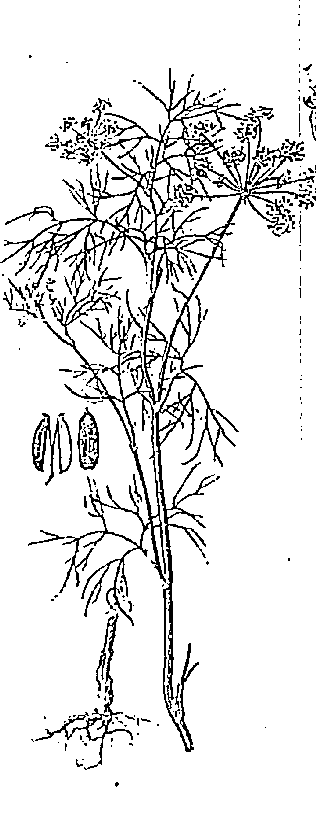

### 1 藥草的魔力

「魔法藥草」，這個名詞相信一定讓許多人感到莫名的興奮。如果藥草真的有魔力，到底會發揮什麼樣的效果？如果善加運用，是否能夠得到平常不可能擁有的力量？或者解決戀愛中煩惱已久的問題？甚至能夠免除病痛，不必面對死亡的恐懼？

魔法這個詞，英文為「Magic」，在德文中則寫成「Zauber」。這兩者都可以譯成魔法、魔術，或是妖術。要是有間魔法學校，相信辦理入學手續的人一定絡繹不絕；但若說是妖術學校，那大概會嚇跑學生。然而，咒術本身也分成恐怖的詛咒，以及有正面防護效用的咒語。魔法也好，妖術也罷，具有魔力的藥草彷彿能夠打開通往另一個世界的門窗，因此有許多人為此著迷。

正因為如此，才會有這麼多關於女巫藥草的描述。有許多傳說與作品裡，都記載著這些藥草超現實的魔力。在這些情節當中，使用魔法可說是理所當然的，因此閱讀時就像走入了一個不可思議的世界，任想像力盡情發揮。在本章當中，介紹的是這些帶有幾分超現實幻想色彩的「女巫藥草」。

### 【曼陀羅草】

首先介紹茄科植物曼陀羅草 (*Mandragora officinarum*=*M. vernalis*)。這種植物在魔法草藥中最具代表性，在英文中稱作「Mandrake」。其德文名稱則取自古代日耳曼預言家阿魯那 (Alruna) 之名，稱作「Alraun」或「Alraune」。

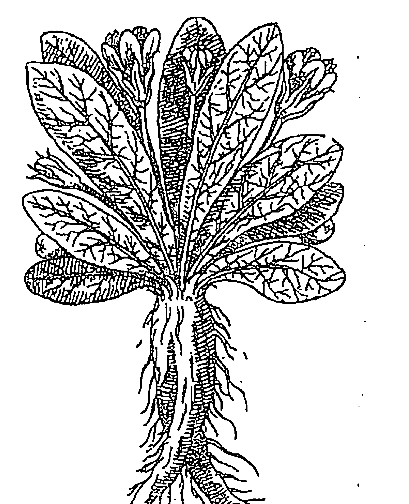

曼陀羅草起源地中海東岸，現在有大量關於這種植物的奇異傳說流傳下來。它的根部分叉成兩節，看起來就像人的下半身。葉片成蓮座狀，開白色或淡紫色的花。

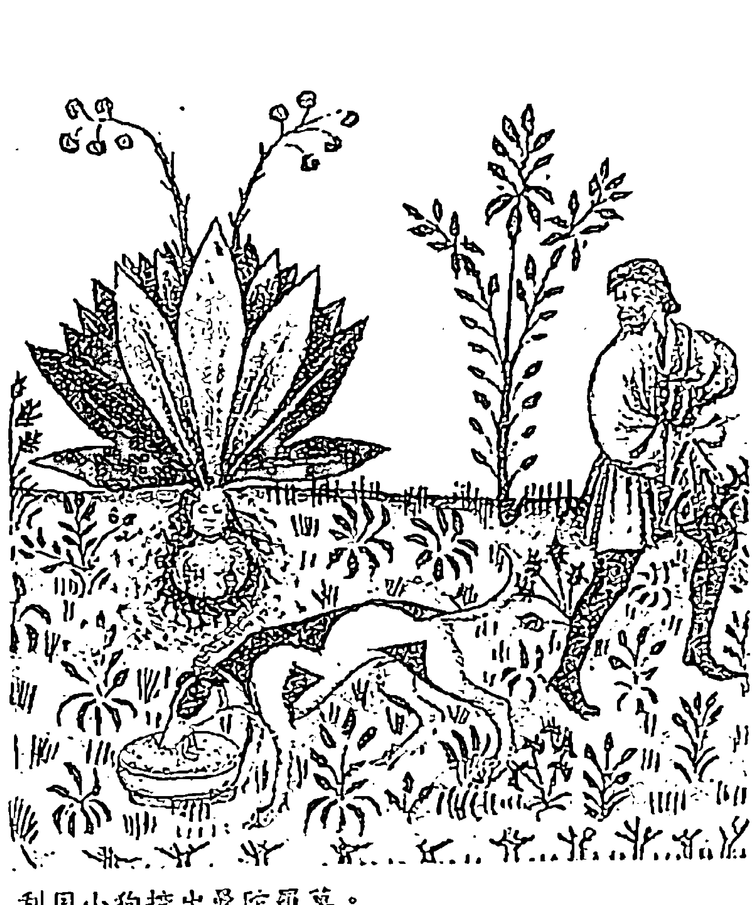

曼陀羅草之所以得以名列女巫的藥草當中，除了因為含有阿托品、東莨菪鹼等生物鹼類，像人的外觀也是重要的原因之一。

關於挖掘它的地下根時的傳說則更恐怖了。據說曼陀羅草被挖出來時會發出恐怖的尖叫聲，如果挖掘的人沒有戴耳栓，聽見這種聲音之後會發狂而死。因此聰明人想出來的辦法是，將繩索的兩端分別綁在曼陀羅草及狗的身上，靠狗把它從土裡拉出來。當然這樣一來，就只好犧牲狗的生命了。

另外，據說曼陀羅草是從執行死刑後的犯人身上漏到地面的尿液或精液中生長出來的。也有傳說指出擁有這種植物的根部的人雖然能夠得到暫時的財富與幸福，但最後都會遭致毀滅，是一種不吉利的植物。從前有些女性只不過是擁有曼陀羅草的根部就被認為是女巫而遭逮捕；不過另一方面，也有人認為根部可以用來當作珍貴的護身符，價格相當昂貴，因此常常有人買到假貨。

在傳說當中，曼陀羅草分成雌雄兩性。在十六世紀流傳下來的圖書當中，有一幅以男女成對的曼陀羅草為主題。由於曼陀羅草的傳說實在太出名了，關於實際植物的記載反而很模糊。實際上這種植物的確分成兩類，只是並不如傳說中分類為雄株和雌株，而是分成春天開花 (M. vernalis) 及秋天開花 (M. autumnalis)。

春天開花的曼陀羅草其花呈紫褐色，果實則像小蘋果，帶有甘甜的香氣。魔法師常用的是這種春天開花的品種，也就是傳說中提到的雄曼陀羅草，幾乎都供藥用。

另外，秋天開花的曼陀羅草，葉片呈皺縮狀生長於地面，像是萵苣一般，花呈淡紫色，是所謂雌曼陀羅草。古代的蘇美人用它的根及葉片和汁液來治療牙痛或當做健胃劑。

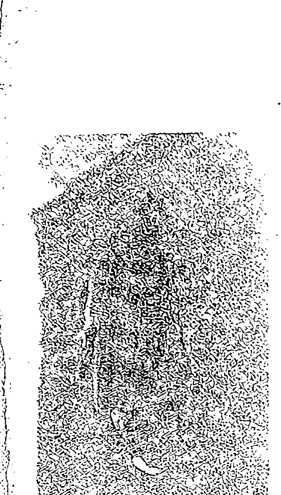

穿著衣服的曼陀羅草，藏於德國博物館（慕尼黑）。

曾經有人送我一袋秋天開花的曼陀羅草種子，我悄悄下定決心，等到植物長成之後，一定要親自將根挖出來，看看傳說是真是假，然而等來等去，連芽都沒有發出來。幾年後，我戰戰兢兢地將土挖開，但種子已經消失無蹤，不知去向了，看來這種植物並不好種。

由於曼陀羅草的傳說充滿神秘氣息，許多文學家都以它為題材進行創作。例如德國作家愛華斯（Hanns Heine Ewers）的小說《愛羅尼》（Alraune; 1911 A.D.）就是一個充滿幻想氣息的故事，內容敘述藉由人工授精的手法創造出的一位名叫「愛羅尼」的活生生女性。在日本也有以擬人的曼陀羅草為題材的漫畫，其中描繪的形象皆為妖豔的女性，幾乎沒有男性角色登場。

位於慕尼黑的德國博物館內就有穿了一身茶色連身裝的曼陀羅草根展示。穿上衣服的曼陀羅草根雖然看上去不易分辨是男是女，但確實有幾分像人類的形象。但德國著名的觀光勝地海德堡有間藥事博物館，那裡收藏的曼陀羅草看起來就只像是普通植物的根部，而非這麼奇異的造型。另外，在前往漢堡市民族博物館附設的學術研究機構「女巫研究所」時，該所所員曾經給我看過假的曼陀羅草護身符，其形狀也不太像人類。

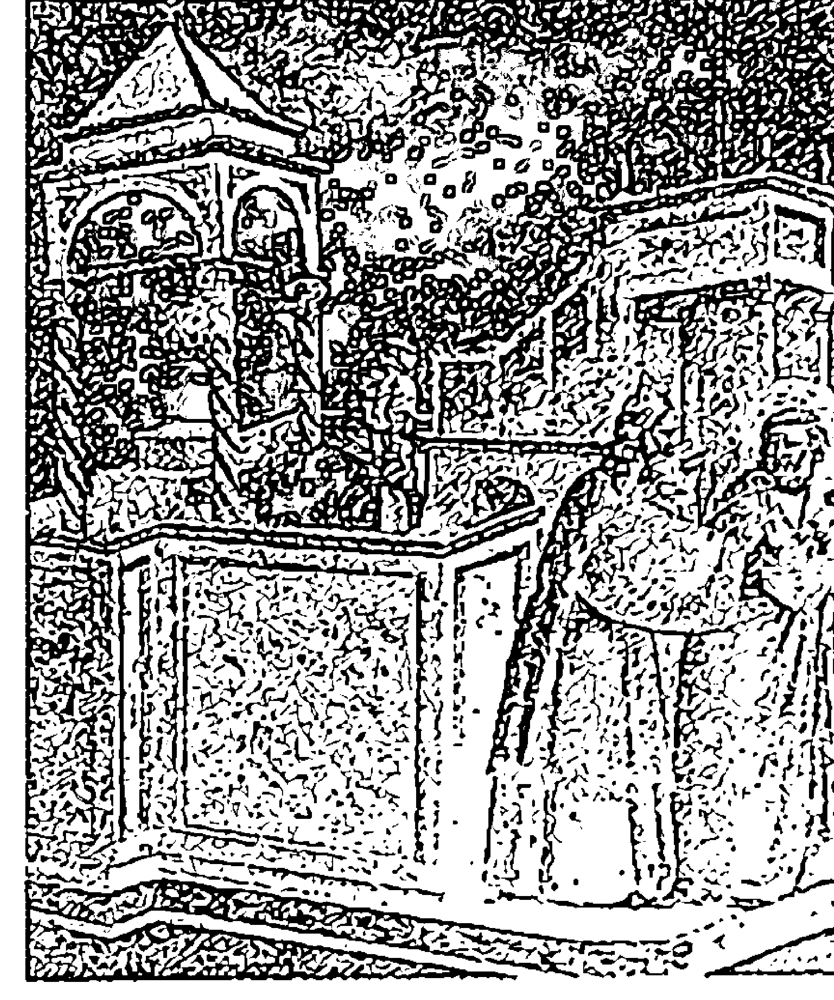

在聖經外典《雅各福音》當中記載，以色列人赫金（Joakim）與妻子安娜之間一直沒有小孩，因此沒有進入神殿的資格。之後，由於神的恩寵，安娜終於懷孕，並產下女嬰。這名女嬰就是聖母馬利亞。喬托（Giotto di Bondone）繪，《遇到拒絕的赫金》，繪於1305-1310年左右。

說到根部分叉成兩股的植物，大概有不少人會聯想到人參。不過所謂人參乃是具有強身效果的藥材，屬於五加科，至於曼陀羅草，則據說有促進性慾的效果。

在舊約聖經《創世紀》（29:18-30:23）當中有著這樣的故事：以撒之子雅各，在叔父拉班手下工作。拉班膝下育有一對姐妹，姐姐叫利亞，妹妹叫拉結。雅各愛上了妹妹拉結，因此以在拉班手下工作七年為條件，希望拉班能將拉結嫁給他。七年之後，兩人終於得以完婚，然而新婚隔天的早晨雅各醒來卻發現，在身旁的是姐姐利亞。原來這是拉班的計策，他對雅各說，當地的規矩是姐姐必須比妹妹先結婚，因此若要娶拉結，必須再工作七年。於是雅各在拉班手下又工作了七年，終於完成他的願望。然而拉結卻總是無法懷孕，雅各和利亞之間卻已經育有四子，不過利亞也因為雅各被妹妹搶走，悲嘆著說，從此以後沒有機會再生更多小孩了。

到了小麥成熟的時候，利亞的兒子在田裡找到了「風茄」，帶回來給他的母親。拉結知道了這件事，希望利亞能分一點風茄給她，於是很生氣的說：「你奪走我的丈夫，還要奪走我兒子給我的風茄嗎？」於是當天晚上雅各依約前往利亞庇過夜。就這樣利亞產下了第五個兒子，而神也知曉了拉結的心意，讓她產下了男丁。

拉結一直為不孕所苦，在以色列，男人要是沒有子女，便沒有資格供奉祭品給神殿。处在这样的社会里，无法生育的女性处境十分艰难，尤其雅各又已经跟姐姐利亚生了四个儿子，想必更加深了拉结对生儿育女的渴望。

就在此时，利亚的儿子替母亲带回了具有帮助受孕效果的风茄。拉结无论如何都想分到一点风茄，因此向利亚抗议，认为她应该已经不需要那种东西。

但是对利亚来说事情并不是这样。她因为丈夫被妹妹所夺，可能日日夜夜都在儿子面前悲叹，因此做儿子的才给母亲带了风茄回来，想必是希望母亲能和父亲重修旧好。撇开这些复杂的因果不看，两人都是因为风茄才得以怀孕的，想必风茄的效果一定相当不凡。

这种植物在日文译为「爱的茄子」，在德文中则是「爱的苹果」，英文则写作「Mandrake」，而在希伯来语当中称为「dudaim」，希腊文中称做「mandragoras」。因此许多学者都认为风茄其实就是曼陀罗草。

话说回来，利亚的儿子又是怎样把曼陀罗草挖出来的呢？他带了耳栓，还是利用狗来挖掘呢？古希腊学者德弗拉斯特提到，在挖出曼陀罗草之前，必須在植物週邊用劍描繪出三圈圓形，並且採集時必須面向西方，這應該是用以對抗曼陀羅草魔力的儀式。可見在德弗拉斯特的時代，也就是從西元前四到三世紀起，一般觀念中便已經認為曼陀羅草是種恐怖的植物。

不過據推測在西元前五世紀成書的《創世記》中，沒有對當時利亞的兒子挖掘的方式做出任何描述。

曼陀羅草是古埃及三大媚藥之一。在圖唐卡門王陵墓的壁畫，以及陪葬的小盒子表面裝飾上，都繪有種植或採收曼陀羅草的人，然而他們工作的情景，看起來一點都不害怕。這樣看來，至少到西元前五世紀為止，關於曼陀羅草的怪異傳說應該尚未誕生。在那之前，也許是曼陀羅草因為希望受孕的婦女嘗試的成效而受到重視。那麼，到底應該如何食用曼陀羅草呢？熬煮它的根部來吃嗎？或是將果實視為受孕的象徵，直接啃著吃呢？遺憾的是，《創世紀》當中完全沒有提到拉結怎麼樣吃它。

根據德弗拉斯特記載，在釀造葡萄酒時，習慣將曼陀羅草的根切成小片用細繩串起，懸吊在發酵的葡萄汁所散發的氣體當中。最近聽一位在自己家中栽種曼陀羅草並且吃過果實的植物學家說，曼陀羅草的果實可以直接食用，帶點淡淡的甜味，甚至可以稱得上美味。

### 【茴香】

提到魔法，大概有很多人會聯想到變化身形的法術。羅馬作家阿布流士(Apuleius)所寫的《金驢記》（125A.D.左右）就是跟變形有關的有趣故事。這部作品以希臘的泰沙利亞為背景，而這個城市從希臘神話的時代開始，便是魔法與幻術的發源地。

有個好奇心強的男子魯修斯(Lucius)到這座城裡來做生意。正如他所期待的，所借宿房子的女主人是個會使用各種恐怖法術的女魔法師。沒多久，魯修斯就和女僕有了曖昧關係。

女僕告訴他：「今晚主人會變成貓頭鷹，飛去找她的情人。」當晚，女主人果然將軟膏塗抹於全身上下，變成了一隻貓頭鷹。在一旁偷看的魯修斯不禁大為好奇，也想變成貓頭鷹試試看。於是他請求女僕偷偷幫他把欽青弄到手，但女僕搞錯了，拿成了會變成驢子的軟膏給他。

變成驢子的魯修斯好不容易才得以回復人形，不過整個過程充滿了不可思議的體驗，呈現出人類的種種貪婪與慾望，一旦開始閱讀便欲罷不能。在女巫傳說的故鄉德國哈茨地方，也流傳有人被女巫變成驢子的故事，一般認為其原型便是這《金驢記》。到底是什麼樣的軟膏把魯修斯變成驢子並沒有相關記載，因此無從得知。然而變回人形的方法卻寫得清清楚楚——吃下玫瑰花。明明是這樣簡單的條件，但是故事中每當魯修斯找到了玫瑰花，都會受到意想不到的阻撓，這也是故事有趣的地方。至於在哈茨地方的傳說中，變成驢子的男子最後是將教會的聖水灑在身上才復原的。

據女僕所說，從貓頭鷹變回人形的方法，並不比從驢恢復人形困難：「只要將茴香加上少許桂葉，浸在泉水當中，再到其中沐浴即可。」漢字「桂」在中文中似乎也可用來表示肉桂之意。這個故事的日文譯本當中，僅僅用「桂」一字打發，讓人無法得知是桂樹或是肉桂的葉片，不過既然是要解除詛咒，那麼帶有強烈香氣的肉桂似乎比較適合。

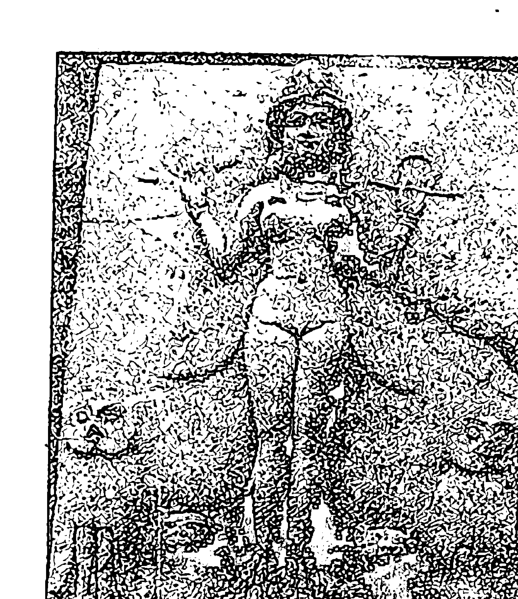

據說古巴比倫有位叫做莉莉絲（Lilith）的惡魔，它能支配野獸與猛獸，並且有像禽鳥的腳，但是並不恐怖。亦有說法指出這草即是兩河流域美索不達米亞的女神伊修達爾（Ishtar），看這生動且威風凜凜的樣子，的確不無可能。根據猶太人的古老傳說，人類的祖先並非亞當的妻子夏娃，而是莉莉絲，夏娃其實是亞當的第二任妻子。據說莉莉絲因受不了亞當在性方面的要求，而拋棄了他。由於這種說法無法為基督教所接受，因此莉莉絲被形容成不服從神，且殺害幼兒的恐怖女性。在編纂聖經的時候，照理說莉莉絲的存在應該被小心地省略掉了，然而卻存留在舊的聖經《以賽亞書》34：14當中，是一位住在荒野當中的女巫。不過到了現代，美國的猶太裔女性，將莉莉絲視為第一位不屈服於男性的女性，試圖挽回她的名聲。觀賞莉莉絲的種種資料，呈現出其相當進階的多樣化。圖片製作於西元前1800至1750年左右的陶土像。（藏於大英博物館）

茴香（Foeniculum vulgare）也是帶有獨特香氣的藥草。在德文中稱為「Fenchel」，在英文中則記為「Fennel」，屬於芹科。從它的根部萃取而出的汁液，除了用於沙拉與菜餚的調味外，加入茶中還具有解毒及利尿的效果。果實外觀看起來像是種子，添加在茶中則可以改善便秘，保證一試見效。並且由於肚子餓時啃食這種果實能抑制空腹感，在前往教會聆聽神父漫長的講道時，許多人都用這種果實充飢。也許這種藥草相當適合節食時食用。

雖然許多人認為貓頭鷹是不吉利的鳥，並說牠是女巫的手下，然而在希臘神話當中，牠是女神雅典娜的使者，也是智慧的象徵。如果百分之百能夠變回人形，那麼偶爾變成貓頭鷹似乎也還不壞。不過變成驢子，則就叫人敬謝不敏了。

茴香和肉桂之所以名列能夠解除詛咒的植物當中，想必是因為它們所帶有的香氣。一般來說香氣較強的藥草，也會被歸類為與女巫有關的草藥。

### 【Moly】

雖然解除詛咒的藥草有其必要性，但畢竟預防重於治療。在古希臘詩人荷馬所創作的英雄史詩《奧德賽》（8B.C.左右）當中，就曾提到可以預防詛咒的植物。

希臘的武將奧德修斯，在攻陷特洛伊後的返國途中，遇到種種苦難。路過埃阿亞（Aeaea）島時，他的部下被島上居住著的女巫瑟西（Circe），用恐怖的魔法全都變成了豬。

瑟西讓奧德修斯的部下喝下「摻有麵粉、蜂蜜及起司粉的葡萄酒」，並吃下「加了迷魂葉的飯菜」，之後，瑟西用手杖拍打他們，於是就一個個變成豬了。至於這是動過手腳的食物的效果，還是手杖的效果，或者兩者皆不可或缺，就不得而知了。

奧德修斯在搜尋部下的途中，遇見了赫密斯。赫密斯是希臘神話中奧林帕斯山眾神之一，掌管商業及旅行。祂從地面拔起具驅魔效果的草，將它交給奧德修斯。多虧這種藥草，奧德修斯得以迴避瑟西的魔法影響，成功救出了他的部下。

這種藥草叫做「Moly」，據說「根黑，花呈乳白色」。實際上到底是何種藥草，迄今不少學者仍在研究當中。

因為記載上說，凡人難以挖出Moly，所以有人說也許其實它是曼陀羅草。不過曼陀羅草的花並非白色，所以不太可能。

也有學者推測，可能是自古便用來作為護身符的「Allium moly」，日文名稱為黃花蒜。「Allium」是韭菜、洋蔥、大蒜、蔥等百合科蔥屬植物的總稱，幾乎全都帶有刺激性的氣味。從很久以前開始，大蒜就常被用作驅邪，而且開出來的花也是白色的。不過黃花蒜開出的花呈黃色，根部是白色而非黑色，所以也不太符合前述條件。根據德弗拉斯特記載，有種藥草，根呈圓形，像洋蔥，很類似荷馬所描述的特徵。然而這種藥草相當容易挖掘，所以應該不是奧德賽中提到的Moly。

這種植物目前最有力的說法是聖誕薔薇。它的確有黑色的根及美麗的乳色花。並且，在一世紀末葉，羅馬的植物學家狄歐斯科里德斯（Pedanius Dioscorides）亦提及，在挖掘聖誕薔薇的根時，「恐怖的鸚鵡會馬上出現襲擊著手挖掘的人。為了不被他發現而遭殺害，必須用很快的速度挖出來。事前吃大蒜並喝葡萄酒可以避免受到危害。」聖誕薔薇無論是植物的外觀或難以挖掘的特徵，都和「Moly」相當吻合。不過以上幾種說法都還未有結論，很可能這種草根本就是憑空想像出來的。

奧德修斯到女巫的家裡後，吃了他的部下吃過的飲食，也被瑟西拿手杖敲打，但他不僅沒有變成豬，反而拔劍相向。於是瑟西只有投降，讓奧德修斯的部下恢復人形。

奧德修斯確實是因為Moly的功效，才沒有被變成豬。不過，看來這種植物的效果仍然有限。因為之後奧德修斯愛上了瑟西，喝了她端出的飲料，完全忘了故鄉，在島上滯留了一年。他喝下的飲料當中，想必也摻了媚藥。

### 【魔杖】

女巫的法力再怎麼強大，也無法僅僅依靠藥草的效力施法。一般人的想像中施法的人可以靠一根魔杖實現任何願望，解決所有煩惱。人類的願望果真無窮，所以，憧憬魔法杖的人真的很多。近幾年全世界風行的暢銷書《哈利波特》（J. K. 羅琳著），不只是小孩，連大人都很熱中。書中每一頁都充滿著對魔法的描述，因此有許多人對魔法抱著憧憬，對進入霍格華茲學校所必須準備的一長串用品感興趣的人也很多。主角哈利的魔杖，則是在斜角巷的「奧利凡德商店」購買。哈利可以在這裡買到他最想要的一枝魔杖。這間店裡所賣的魔杖每一枝都是獨一無二的，用具有強力魔力的材質，例如柳木、桃心木、杉樹、櫸樹等為材料。店主說：「魔杖是會選擇主人的。也就是說，就算再怎麼想要一枝法力強大的魔杖，也還是得先看看自己合不合用，如果只能發揮微弱的魔力的話，也還是很淒慘的。」

於是哈利得到了一枝長二十八公分，用冬青木和鳳凰尾羽製作的魔杖。店主對他說：「我想你未來必然會有一番很了不起的成就。」就這樣，哈利被魔杖選上了。

距哈利誕生三千多年以前，也有一位被強力魔杖所選上的人。他就是古代以色列民族的指導者摩西的哥哥亞倫。在舊約聖經〈出埃及記〉當中，以色列人即將離開埃及，然而法老並不允許。因此耶和華透過摩西將法杖交給亞倫，讓他挑戰法老，法老方面也請了咒術師來與亞倫對抗。

於是激烈的鬥法就此展開。亞倫手中所持的法杖，展現了強大的法力。例如法杖從手中擲出就變成蛇，或者拍打尼羅河水，河中的魚會死亡，河水也變成帶有惡臭的血，無法飲用。

亞倫的法杖還招來了大群青蛙、蚊蚋、虻蟲、蝗蟲，以及疫病、流膿的腫瘡、冰雹，還讓埃及三天不見天日，然而法老仍然不同意。這段經過在〈出埃及記〉當中有著相當精彩的描述。

魔力這麼強大的法杖，到底是用什麼做成的？根據〈出埃及記〉記載，這把亞倫之杖是用玫瑰科的杏仁木製成，就算已經製成了法杖，仍然持續開花。不過把杏仁樹枝插在水中，放置在溫暖的場所，時候到了也會開花，所以這或許不能視為法杖本身的魔力。雖然亞倫的法杖展現了許多驚人的法力，然而最後還是無法使法老屈服。最後的關鍵還是耶和華本身。祂親自「擊殺」（《出埃及記》十二章）了埃及的人民，由此可見法杖的法力，應該也是由神所賦予。用哈利波特書中的說法，便是「魔力附在這把杖上」。在德文當中有種叫做「Aaronstab」的植物，屬天南星科。由於球根以及葉片中含有草酸鈣的針狀結晶，因此入口會有強烈的疼痛。「Aaronstab」，也就是亞倫之杖，在英文當中稱為「Jack in the pulpit」（講道台上的傑克）。從正面來看背後有像佛像的光圈一樣的東西。至於像手杖的部分，則是花苞中的肉穗花序，形狀有如棒狀的突起物，周圍則環繞著辣椒般的紅色小果實。這帶有紅色小果實的肉穗花序，看來就像是魔法師的魔杖，所以才有人想像只要把它拿在手上揮舞就能使用魔法。

## 2 媚藥

無論什麼時代，都有人為了戀愛而煩惱。有些人只要遠遠看著心上人，用花瓣占卜來猜測對方的心意便可以滿足。但也有人一旦喜歡上對方，便想佔為己有，或者希望對方也能愛上自己。於是為愛瘋狂，產生嫉妒的情感，甚至想要情敵的命。這些都是戀愛中之人的悲劇。

如果在這時，有人表示「這是媚藥，只要用了它，任誰都會變成你的俘虜」，那麼想必誰都會心動。 製作媚藥可說是女巫的專長，然而卻沒有實際的配方流傳下來，也許這是不外傳的秘密。傳說中可以用來當作媚藥的藥草，幾乎都具有強烈的香氣，讓人聞了暈頭轉向的甘甜香味，或許就是媚藥迷惑人的主要武器。

玫瑰帶有強烈的香氣，可說是媚藥中的女王。古希臘人在婚禮的時候，會在家中撒滿玫瑰和紫花地丁（Viola mandshurica）。埃及艷后克利奧佩脫拉也十分喜歡玫瑰，據說她的床上就鋪滿這種花。她是世界三大美人之一，其美豔自然不在話下，不過照這樣看來，她之所以能迷惑羅馬兩位偉大的將軍凱撒及安東尼，也許跟她身上沾染的玫瑰香氣也有關係。

目前的科學尚無法證明已有的藥草是否具有媚藥的功效。關於香氣的研究，雖然已在進行當中，然自古以來，用來當作媚藥使用的藥草也都有各自的根據，然而同一種藥草的香氣，不一定對每個人，都有效。每個人的嗅覺都不相同，其中包含了許多主觀要素。

雖然至今為止，媚藥的實際效果尚不明確，甚至有些藥草連確切名稱都無法確認，然而媚藥及返老還童之藥在文學作品中還是不斷地被提及。

關於媚藥，有許多相關的傳說，例如崔斯坦和伊索德（Tristan & Isolde）便是其中之一。康禾地方的騎士崔斯坦和愛爾蘭王妃伊索德之間的悲劇戀情，由於華格納的歌劇（1865年首演）以及中古德國詩人哥特弗利（Gotfried von Strassburg）所寫的《崔斯坦和伊索德》（1205年）都是以他們兩人為題材，因此廣為人知。這其中，媚藥是整個故事的關鍵。

在哥特弗利所寫的故事中，崔斯坦為了迎接叔父馬克國王的未婚妻伊索德而前往愛爾蘭，由海路去迎接她。伊索德深恨殺了自己叔父的崔斯坦，因此在船上，她連看也不看崔斯坦一眼，甚至不跟他講話。

伊索德的母親，為了使女兒心甘情願嫁給年老的馬克國王，私下交付給伊索德身邊的侍女布蘭妮（Brungne）一杯飲料。只要男女一起喝下這種飲料，就片刻也離不開彼此，可說是媚藥中的媚藥。陰差陽錯，最後喝下飲料的卻是崔斯坦和伊索德，並且馬上見效，兩個人墜入了愛河。為了延續這份感情，從此崔斯坦只有瞞著自己的叔叔，伊索德只有瞞著自己的丈夫，也就是馬克國王。

喝下命運之藥的伊索德。比亞茲萊繪 <studio> 雜誌1895年10月號附錄 <伊索德>。

伊索德的母親，據說是一位熟悉各種藥草知識，並且長於醫術的女性。然而遺憾的是，她所製作的媚藥到底含有那些成份不得而知。不過當兩人在喝下時，以為是葡萄酒，故想必應該是以這種酒來做底。

兩人之間的愛情，就如他們所說：「我們是同一個個體，同一個生命，我是你的，你也是我的。我們既是崔斯坦，也是伊索德。」兩人的愛如此熾烈，想必伊索德的母親所製作的媚藥一定是最高級品。然而，這個愛的媚藥效果卻有其期限。

崔斯坦和伊索德的故事原本是塞爾特人傳下來的。而哥特弗利所寫的故事則以法國作家托馬（Thomas d’Angleterre）寫的《崔斯坦羅曼史》為藍本。而同為法國人的作家貝盧（Beroul）也寫了一個名叫《崔斯坦和伊絲》的故事。在這個故事之中，侍女告訴兩個人，媚藥的藥效在三年過後便會消失無蹤。然而，到了第三年，兩人的熱情還沒有消失的跡象，於是悲劇乃無可避免。終究，真愛是沒有有效期限的。

董尼才弟（G. Donizetti）的喜歌剧《爱情灵药》（1832年）当中也有提到媚药。故事从一个为爱所苦的年轻人询问卖假药的郎中有没有“崔斯坦和伊索德喝的那种药”开始的。他问的是个郎中，所以当然有这种东西可以卖给他。商人利用人们笃信崔斯坦和伊索德所唱的媚药效果超群心理的这种故事，听起来不论什么时代都会发生。即使如此，还是有很多热恋中的男女，想要可以绑住对方的心，并且没有有效期限的爱情灵药。

### 【为爱穿针引线之药·德国传说集】

没有有效期限的媚药人人都想要，但如果是让人卷入狩猎女巫风暴中的媚药，就让人望之却步了。格林兄弟的《德国传说集》（1816-1818年）中有著这样的一个故事。一个在某个制旗师的家里工作的女子，爱上了同一栋屋檐下的染工。然而这个染工不久便心生倦怠，找了份新的工作离开那个城镇。这个女子想要挽回男友的心，于是当精灵降临的节庆到来大家都出门前往教会时，将几种药草放入锅中熬煮，据说当锅中的东西煮开之后，心上人便会马上现身。然而，有个不知情的僕人并没有前往教会，当他来到厨房熬胶的时候，突然有个庞大的物体掉到他背上，原来是那个染工。他失去知觉，身上只有一件内衣。 染工醒来之后，说出了他的遭遇。他说，他在睡觉时，有隻像大山羊一样的动物跑来，用牠的角把染工勾起拉出窗外，等他恢复意识以后，就发现自己在这里。他还表示，会做出这种事的，只有那个女子。 于是所有人一起去找这位女子，要以女巫的名义将她逮捕。她表示是从一位老婆婆那里听来这个方法。

各种恐怖的拷问手段。山缪·克拉克著《殉教者列传》，1651年。

回心上人的方法，而且锅子和药草也都是老婆婆给的。故事到此戛然而止，没有人知道这个女性及给她药草的老婆婆，最后到底怎么了。

十六到十七世纪间的德国是狩猎女巫最风行的时代。异端审问原本只是基督教用来排除异己的手段，后来反而变成世俗权力斗争的工具，最后连一般平民也被牵扯进来，牺牲者遍布各个阶层。

讲到女巫审判，就让人想起各种恐怖的拷问手法。故事中这位住在艾福特（Efurt）的女性被带到女巫法庭之后立刻招认了一切，由此可见她很清楚拷问到底有多恐怖。

然而更恐怖的是密告。在拷问过程中招认自己是女巫的人，必须进一步说出是谁将自己变成女巫的。如果不好好回答，则拷问立刻再度展开。于是熟人、朋友、甚至家人，许多人就这样受到连累。

到底是否真有一位老婆婆教导这位女性关于药草的一切，或者只是这位女性逃避责任的藉口，就不得而知了。

因为所有人都疑神疑鬼生怕某一天自己也成了密告的对象，于是干脆先下手为强，先密告别人，这样只求保全自身的利己主义，让女巫的数目在连坐之下飞快增加，光在德国就有约三万甚至以上的人。

## # 堕入爱河之药．仲夏夜之梦

上一个故事，是关于为了挽留爱人的心，反而被指为女巫的悲剧故事。接下来提到的，是莎士比亚（1564-1616年）的《仲夏夜之梦》当中出现过的，让人堕入爱河的药。

雅典之神，精灵王奥伯隆（Oberon），为了教训不听话的妻子缇坦妮雅（Titania），找来了爱恶作剧的妖精帕克，将花露洒在沉睡在森林中的缇坦妮雅脸上。据说被这种花露涂在眼皮上的人会爱上醒来时所见到的第一个人。于是缇坦妮雅爱上了拥有一颗驴头的波顿。

这是《仲夏夜之梦》当中有名的场面。妖精帕克摘来的花，据说原本开在地面上，后来偶然被爱神丘比特的箭矢所触，花的颜色乃从白色变成浓浓的红色，汁液则是紫色的。这种植物的名称是「Love in idleness」，亦即不断变心的恋爱。

因此，莎士比亚的日文译者福田稔将其译为「变心草」。其实就是三色堇的别名。

三色堇的学名为 Viola tricolor。堇类植物种类繁多，而 Viola tricolor 系统的植物是园艺中使用的品种，在英文中叫做「Pansy」。相对园艺品种而言，野生品种叫做「Hearts ease」。这「Hearts ease」便是帕克摘来的心草。

根据修女贫根的记载，堇类植物对于眼翳病相当有效。只要将品质优良的油煮开，丢入堇类植物熬成软膏状涂在眼皮及眼睛周遭即可。这类植物能够促进血液循环，提高免疫系统的功能，而煎煮花所得的液体也能当作眼药水。

但是如果在睡觉时被人涂了一些奇怪的药，导致人生产生一百八十度的大转变那就糟了。甚至，如果涂的药是媚药那也就算了，如果涂的是毒药，岂不连命都要赔上？因此，人类发明了解毒剂。

九世纪阿拉伯人发明的解毒剂效果奇佳。其材料及制作方式都记载在《毒物的历史》（尚玛雷 [Jean Tardieu de Maleisse] 著）一书中。首先，材料是某种松叶牡丹、仙客来（Cyclamen）、九層塔、菊苣、泽漆科的蓖麻、菟丝子、柠檬、莨菪、荨麻、包心菜、鸦片、相思树、橘科的婆罗门参、红玫瑰、肉桂、姜，以及外观像苔藓的地衣。

将上述材料磨碎，并且拌入牛奶中发酵。并加上打至发泡的蜂蜜，用文火熬煮六小时。最后加上葡萄酒，再煮一段时间，等到葡萄酒都蒸发以后便完成了。放凉之后装入黏土做的壶中保存。

花了这么多时间做出来的解毒剂，要等到实际具有疗效，还须等上六个月。这么费时的药剂，不知道是否真的有人愿意试着做出来？

### 【返老還童之藥．浮士德的故事】

如果能弄到媚药及解药，那还得有青春年华才能充分享受。不需要长生不老，只要能够暂时恢复年轻活力，对某些人来说也就够了。这个故事当中，就提到浮士德寻找「女巫的厨房」拜托女巫为他制药的故事。

歌德的毕生杰作《浮士德》（完成于1831年）的主角浮士德博士，便用了上述的手段得以重获青春。然而，要找到女巫的厨房，还得靠恶魔梅菲斯特带路才行。

浮士德博士是普遍流传于中古时代欧洲传说中的主角。他是一位刚进入老年，对知识感到绝望的博士，于是将灵魂卖给恶魔以追求现世享乐，结果却在契约时间到了之后，在后悔当中堕入地狱。歌德以此传说为蓝本，将近代人的苦恼写成了《浮士德》这部作品。

在德国常常可以看到以「hexen kuche」（女巫的厨房）为名的餐厅。大概都是取材于《浮士德》的故事中。甚至菜单当中还有「女巫特餐」之类，其中大多是一些德国常见的菜肴，例如马铃薯、德式香肠、火腿等。

另外，《浮士德》故事发生的地点莱比锡，有家餐厅的菜单上甚至还有「女巫的饮料」(Hexentrunck)。我自己也曾点来喝过，尝起来像是普通的葡萄酒。

故事中，浮士德问恶魔，如果喝下女巫所做的返老还童饮料，会变成怎样？于是恶魔梅菲斯特这样回答：「你很快就会感到体内仿佛有一位爱神邱比特，让你打从心底小鹿乱撞。」于是重获青春的浮士德，马上开始对年轻女孩展开攻势。这返老还童之药说来好听，其实应该只是让人精力充沛，提高费洛蒙效果的饮料而已。制作这种饮料的女巫曾说：「我偶尔也会自己尝尝，所以已经不觉得臭了。」「看来刚开始她曾经觉得这种饮料很臭。虽然不知道用了哪些材料，不过恐怕是包括像缬草之类带有恶臭的药草。」

能够使情绪高亢，彷彿回到年轻时代的药，也许的确存在。然而，到底有没有能让人真正返老还童的药，则有待商榷了。

读罢《浮士德》的这段情节之后，让我想起了小时候看过的一本日本绘本。大意是说有一位老爷爷去山里砍柴，就此一去不回。老奶奶觉得很奇怪，去山里寻找他的下落。结果发现一位躺在瀑布旁边哭闹的小婴儿。原来这瀑布的水有让人返老还童的功效，老爷爷喝了太多遂变成了小婴儿。我本来以为这是养老瀑布传说的变形，后来才知道原来狂言当中有个名为「药水」的段子，跟这个故事完全相同。想必是从这里将它改编成绘本的。当年这个故事对我幼小的心灵产生了很大的冲击，我一直想着老爷爷实在太贪心了，不应该喝那么多。不过话说回来，要是真有返老还童之药，各位会想要回到几岁的时候呢？

### 【愛情魔法】

不管在什麼時代及怎麼樣的社會背景之下，人為了使戀情能夠順利發展，總是有希望能有媚藥幫忙。媚藥和長生不老之藥一樣，都是人類共同的憧憬，即使至今亦然。戀愛中的男女，總想盡辦法把對方的心綁住，因此，還有一些不成熟的，類似魔法的儀式。

首先是流傳於德國北部彭美恩地方（Pommern）的愛情魔法。首先，取得三片鼠尾草的葉片，並且在第一枚葉片上寫上「Adam & Eve」（亞當與夏娃）的名字，接下來在第二與第三枚葉片上，分別寫上自己與對方的姓名，再將這些葉片燒成灰，摻入心上人的飲食當中。

鼠尾草（Salvia officinalis）帶有點奇怪的香氣，不過是很多人喜歡的香料，它的葉片一般附近的超市便有銷售。由於能夠改善生理期不順及更年期症狀，對女性來說是很有用的藥草。這種方法，使用少許鼠尾草便能輕易達成。

另外再介紹一種「愛的飲料」。出自一位自稱女巫的現代德國女性，為年輕女性所寫的《女巫配方》一書當中。

方法是這樣的：準備七個蕪荽（即俗稱香菜）的果實，用乳缽搗碎。在過程當中，要複誦三次「溫暖的果實，溫暖的心，兩人感情甜蜜蜜」的咒語，之後加入一公升的白葡萄酒攪拌。十分鐘之後再飲用。

芫荽（Coriandrum sativum）是芹科植物，日文語源來自葡萄牙語「coendio」，在泰國菜中使用的香料，其實就是芫荽的葉子。由於它的香氣十分強烈而獨特，因此也有人無法接受。

芫荽具有輕微的麻醉作用，據說古埃及人拿來作為催情劑使用，因此可能的確有這方面的效果。而且需要的材料也只有芫荽而已，可以說相當方便。

### 注釋：

- 註①——此處所謂曼陀羅草（MANDRAGORA）與第一章提到的曼陀羅類植物並不相同。
- 註②——愛華斯（HANNS HEINZ EVERS, 1871-1943），德國作家，寫作主題廣泛，不過最為人所知的是驚悚小說。他把他的黑暗幻想疊加在他對心理學的豐富知識之上。像長篇小說THE SORCERER'S APPRENTICE，ALRUNE和短篇小說THE SPIDER都包含出眾的特質，使它們達到經典的層次。
- 註③——阿布流士（APULEIUS, AD123/5-180），柏拉圖派哲學家、修辭學家及作家。所著《金驢記》又稱《變形記》（METAMORPHOSIS）。
- 註④——狄歐斯科里德（PEDANIUS DIOSCORIDES, 40-90），希臘人，曾為羅馬皇帝尼祿御用醫生。所著《藥物論》（DE MATERIA MEDICA）影響後世甚鉅，可說是西方的本草綱目。
- 註⑤——哥特弗利（GOTTFRIED VON STRASSBURG, ?-1210），中古時期德國宮廷詩人。
- 註⑥——托馬斯（THOMAS D'ANGLETERRE - 約1150-1200）。湯瑪士為一盎格魯—諾曼地（ANGLO-NORMAND）作家。行走於亨利二世（HENRI II D'ANGLETERRE）與阿基丹的愛蓮諾（ALIENOR D'AQUITAINE）的宮廷裡。推斷為一文人教士，約莫於西元一一七O年間完成他的著作：「崔斯坦與伊索德」（TRISTAN ET ISEULT），為中世紀騎士文學之代表作。
- 注⑦——貝庸（Beroul），十二世紀諾曼詩人，所寫的Tristan是諾曼語版的崔斯坦與伊索德故事。
- 注⑧——杜尼才弟（G. Donizetti，1797-1848），義大利歌劇作曲家。文中提到的作品《愛情靈藥》可說是他成功發揮義大利歌劇要素的傑作。

## 第四章 「聰明女性」與藥草

## 1「聰明女性」與女巫

在化學藥品尚未問世時，一般人若有病痛，或是感染疫病及受傷時，所倚賴的都是藥草。從前的人相當了解什麼樣的草對身體有益或是有害。人類藉由觀察生活在大自然中的野生動物的行徑，學習如何分辨藥草及其效果。例如動物受傷時，會食用哪種植物？或是將身體與其磨蹭？又或者是吃了哪種植物後會痛苦而死？甚至有時候人類也會用自己的身體來嘗試，因此得知就算是有毒的藥草，只要適量使用也會有超群的效果。透過這樣的方式，關於草藥的知識不斷累積流傳到後世。

日本自神話時代就已有用藥草進行治療的紀錄。大國主命與因蟠白兔的故事就改編為兒歌，在小學的唱遊課上是必教的曲目。大國主命遇見了一隻受了傷正在哭泣的小白兔。於是教導他，只要在身上裹上一圈蒲穗綿草就能治好」，白兔照辦之後果然痊癒。這個故事是出雲地方的神話，據說實際上使用的草並非蒲穗綿，而是一種叫做蒲黃的蒲類植物的花粉，是從前的人用來治療各種傷口的藥材。而大國主命因此也被尊為日本醫生的開山祖師。

在歐洲，早在西元前四世紀由德弗拉斯特所寫的《植物誌》，以及西元一世紀老蒲林尼（Plinius）所寫的《博物誌》（Naturalis Historia）當中，就已經實地考察過許多藥草的特性。古希臘的「西方醫學之父」希波克拉底，以及曾擔任羅馬暴君尼祿軍醫的植物學家狄奧斯科里德，也曾針對許多種藥草進行記錄。 到了中古時代，出現了許多懂得運用關於藥草知識及經驗治療疾病或者接。所謂的「聰明女性」。藥草各個部位的功效都不相同，只要稍有不慎就有可能造成致命的後果，因此在從前，這些富有智慧的女性對民眾來說扮演著藥劑師般的角色，備受敬重。當然，身懷藥草知識的並非僅限於「聰明女性」而已。中古時代的修道院大多附設規模或大或小的草藥園。當時身為知識分子的修道士，會研究希臘與羅馬時代的植物學製造出許多藥品，在遙遠的異國傳教時，若發現珍貴的藥草也會順道將它帶回。於是修道院附設的藥草園當中，往往種有許多有用的藥草。然而即使如此，修道院的條件畢竟不適合大量生產藥草，所以我們無從得知到底修道院藥草園確切的產量是多少，以及究竟造福了多少群眾。況且，許多人之所以需要藥物不見得是因為生病，往往是希望幫助受孕、安胎、避孕、墮胎、甚至增強精力等目的。這些藥，修道院自然絕不可能提供。於是，民間的「聰明女性」，她們的責任便是滿足這些人的需求。瑞士的帕拉塞爾蘇斯 (Paracelsus, 1493-1541) 行徑顛覆傳統醫學，在處方中使用了各種金屬化合物，他曾經提到，醫藥學得以發展至此，全都是「年長女性」的功勞。這所謂「年長女性」，就是前面所提到的「聰明女性」。

不過，在某些時代，這些身懷知識的女性卻被指為女巫。從基督教的角度來看，依靠傳統經驗的民間藥方不僅相當危險，在過程中使用的一些類似祈禱的儀式更是異教的咒術。為了使藥草能夠發揮最大的功效，特地挑選日期時間出門，採摘時並口唸咒語的行徑，都是基督教所急欲禁止的異教行徑。中德的哈茨地方，流傳著下面這樣一個與採藥草有關的故事。有位女孩前往森林裡採藥，就在隨身的籃子差不多裝滿時，小女孩一進入森林，事實上就等於已經踏入女巫的地盤。女巫馬上出現在她眼前，追趕著她，就在她攜帶的籃子差不多裝滿時，女孩發現，天上恰好高掛著滿月。於是她連忙往森林的深處走去。

女孩之所以這麼做，是因為她記得母親跟她說過，滿月的時候採摘的藥草效用最強。她的母親最近才剛改信了基督教，許多異教的舊習慣改不過來。

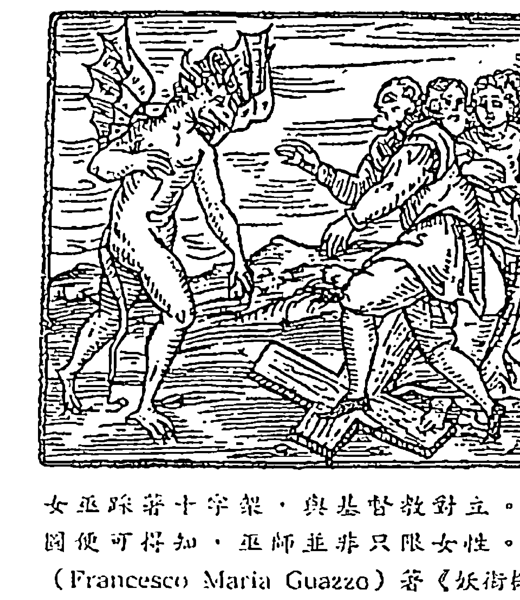

女巫踩著十字架，與基督教對立。從這張圖便可得知，巫師並非只限女性。古雅索 (Francesco Maria Guazzo) 著《巫術概論》，1626年。

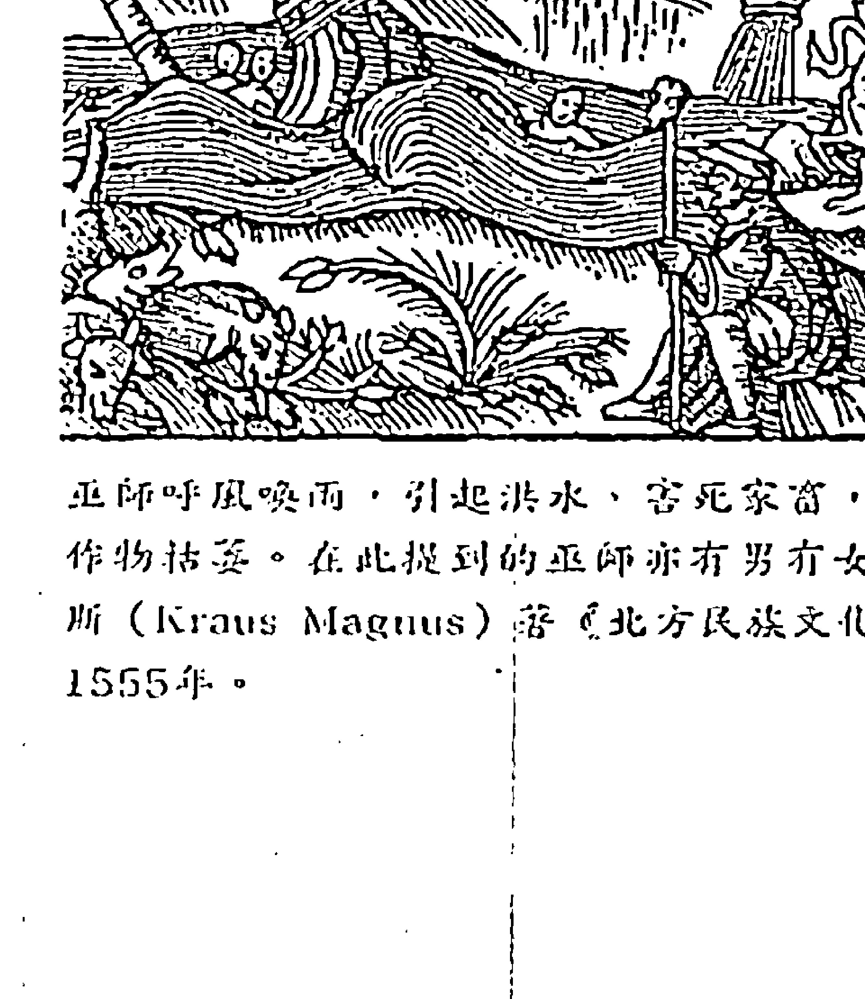

巫師呼風喚雨，引起洪水，害死家畜，並燒毀作物枯萎。在此提到的巫師亦有男有女。克勞斯 (Kraus Magnus) 著《北方民族文化史》，1555年。

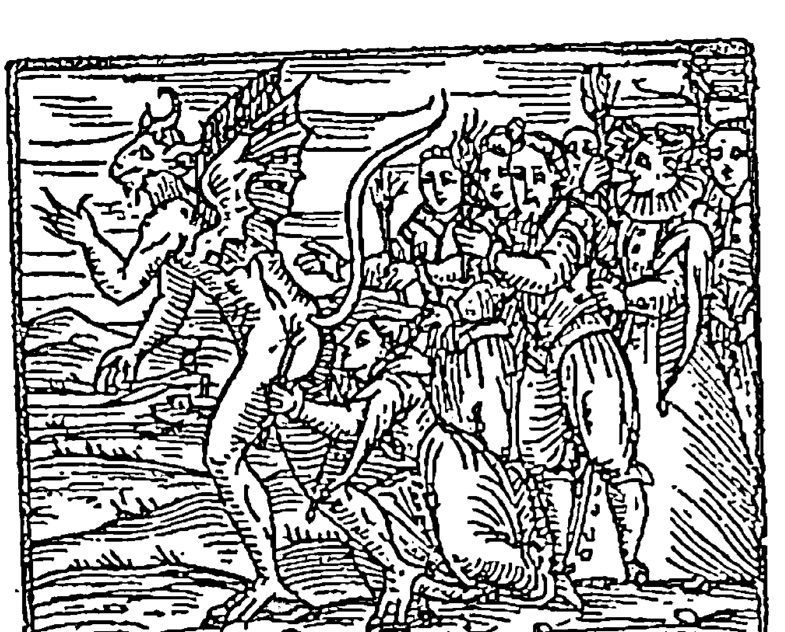

女巫效忠的對象不是十字架，她們透過親吻來證實與效忠魔鬼。《妖術概論》。

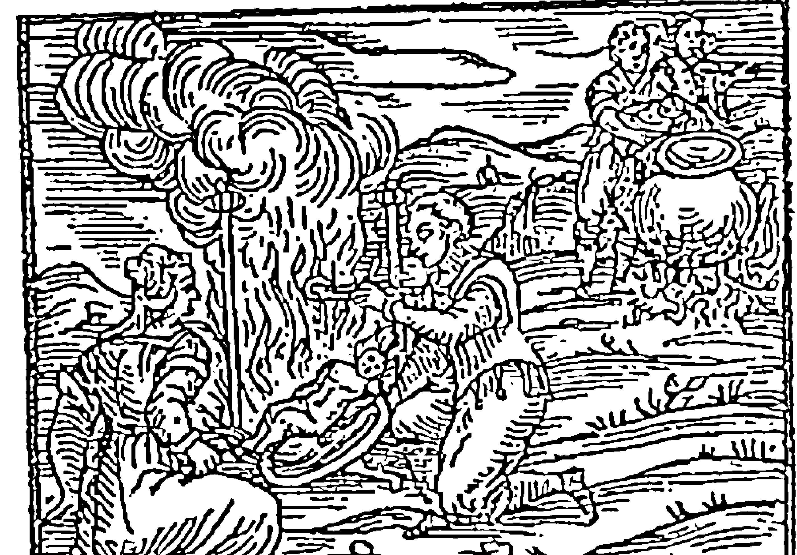

假扮為接生婆的女巫，將剛生下來的嬰兒煮熟，並獻給魔鬼。《妖術概論》。

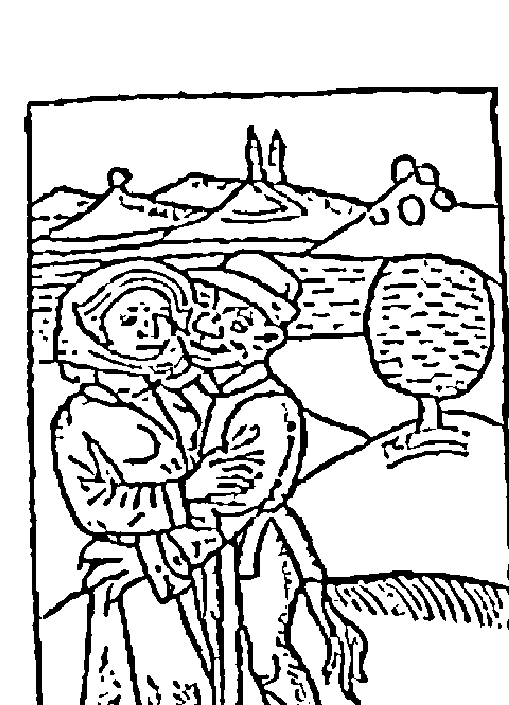

因為是魔鬼的情婦，男人的腳像鳥爪一樣，甚至也有一條尾巴，可見他其實是魔鬼。茨利特（Ulrich molitor）著《拉米亞》1489年。

千鈞一髮之際，女孩想起最近才改信的神祇，於是大聲呼喚神的名號，雙手畫著十字，於是突然颳起了大風，將女巫吹落山崖之下，當場摔死。

從教會的立場看來，對於「聰明女性」一邊口唸咒文一邊採藥草的作法，一概認為是異端的行徑。

也許正因如此，才創造出了女巫的形象。用這樣的標準來看，故事中的小女孩也算是女巫。女巫能夠運用各種恐怖的魔法，製作對人或家畜有害的毒藥，或者散播傳染病、詛咒農作物和家畜，甚至讓男性不舉、女性不孕、害死分娩過程中的新生兒。或者在身上塗抹「飛行軟膏」飛去參加邪惡的聚會。這些惡行惡狀都出於惡魔的指使，因為，女巫是惡魔的情婦。

如此，「聰明女性」因為反社會的行為被污名化成為邪惡的女巫，大約在十六到十七世紀歐洲社會整體開始狩獵女巫的時候，「聰明女性」自然成為主要目標之一。

德國的醫藥分業制度建立於一二四○年。當時神聖羅馬帝國皇帝腓特烈二世（Friedrich II）有鑑於許多不具備專門醫藥知識的人擅自製藥販賣，因此下令只有醫師能開立處方，而且只有藥劑師開設的藥局才能賣藥，於是能夠確保藥品品質的藥局就此誕生。

這是正確的政策，然而也正因如此，那些賣藥草的女性，由於沒有藥劑師資格，就只能在櫃面下進行買賣。另外，隨著醫學的進展，婦產科醫師大都由男性擔任，「聰明女性」所扮演的接生婆及藥劑師的角色漸漸遭到取代。最後接生婆終於在法律規定或是一般習俗中都被排除在外。

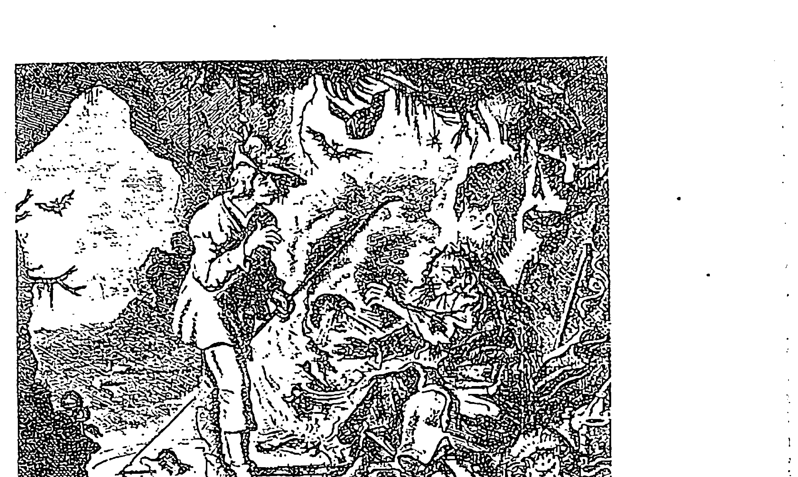

就算在女巫狩獵最激烈的時代，仍然有人相信女巫當中也有擅長治療法術的人。這樣的人，會尋訪住在森林洞窟當中的「善良女巫」，也就是所謂「聰明女性」，向她們尋求幫助。

「聰明女性」繼承了自古以來的傳統、知識及生活智慧，但是正因為如此，她們反而被視為褻瀆神明的邪惡女巫。但只要了解藥草與女巫的關係，便會了解其實女巫與「聰明女性」是一體的兩面，某種令人害怕的女巫常用藥草，往往也具有驅魔的功效。

## 2 聖母馬利亞與藥草

即使基督教會一直譴責與咒術有關的行為，但這樣的民間習俗及儀式並未銷聲匿跡。這是因為祖先流傳下來的傳統習俗必定有其理由，不能簡簡單單地予以捨棄。在基督教傳入以前，這些習俗便已經和民眾的生活習慣密切結合了。

民眾使用藥草的方式往往不侷限於治病。例如為了保護自己與親人及家畜不受恐怖的傳染病或惡魔侵害，將藥草製成護身符隨身佩帶，或者懸掛在門前及家畜小屋門口；或者就像我們常看到的，使用植物來占卜心上人的心意。

特別是一些跟農耕有關的民間儀式，就算教會再三強迫，民眾也不願意廢止。於是教會只有選擇妥協，將這些儀式納入教會行事曆當中，並改編加入基督教儀式中。

從前，要採集藥草必須先登山，用嚴肅的態度進行禮拜儀式，這一天被稱為淨化藥草的日子，是從前的人相當重視的節日。這種異教的習俗，即使在基督教社會當中仍然存在，並且還與聖母馬利亞產生關聯。

聖經當中幾乎沒有記載馬利亞的生平。不過聖經外典中的《雅各福音》（完成於12、13世紀），以及聖徒傳說集《黃金傳說》（The golden legend，成書於13世紀）當中，對於馬利亞從誕生到去世的經過有著詳細的記載。其中提到，馬利亞的生日是九月八日，而蒙召升天的日子則是八月十五日。馬利亞是在去世後才受到神的召喚而升上天堂，這點和自己升天的耶穌基督並不相同。而從馬利亞升天之日開始算起，到她的生日之間的一個月期間之內，稱為「聖母馬利亞的三十天」，在這段期間，人們會將成捆的藥草供奉於馬利亞的祭壇上。這一捆捆的藥草束有用九種、十五種、七十七種，甚至九十九種藥草所捆紫的。直到現在，在這段期間

> 《黃金傳說》（The golden legend）

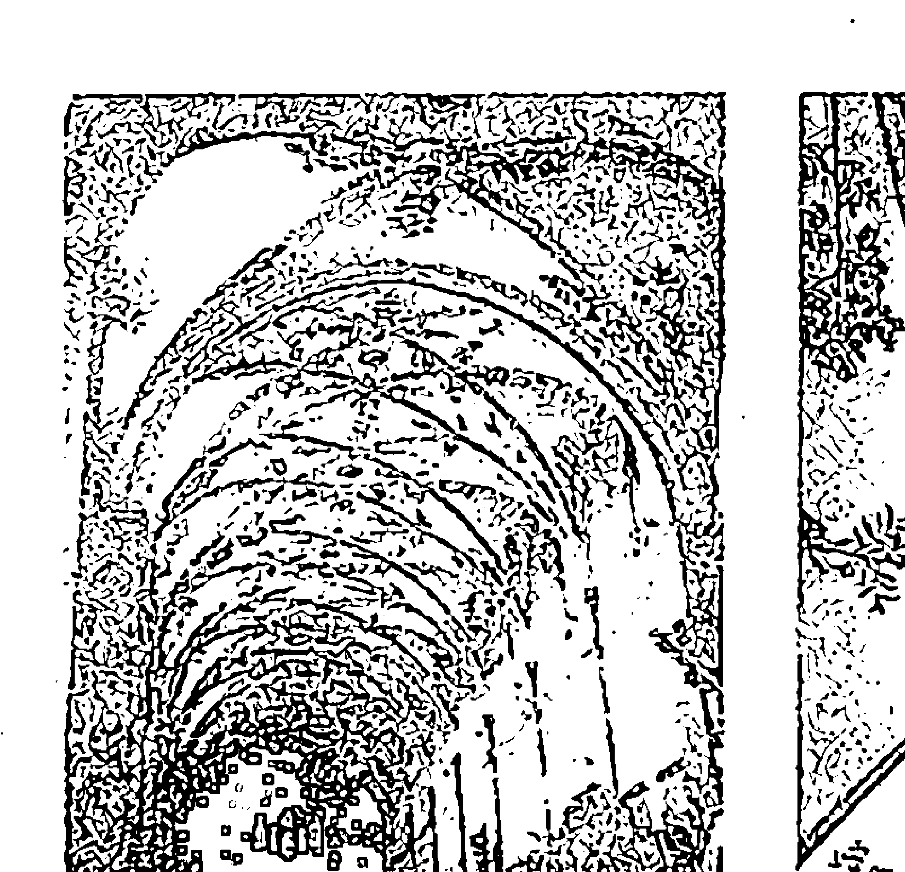

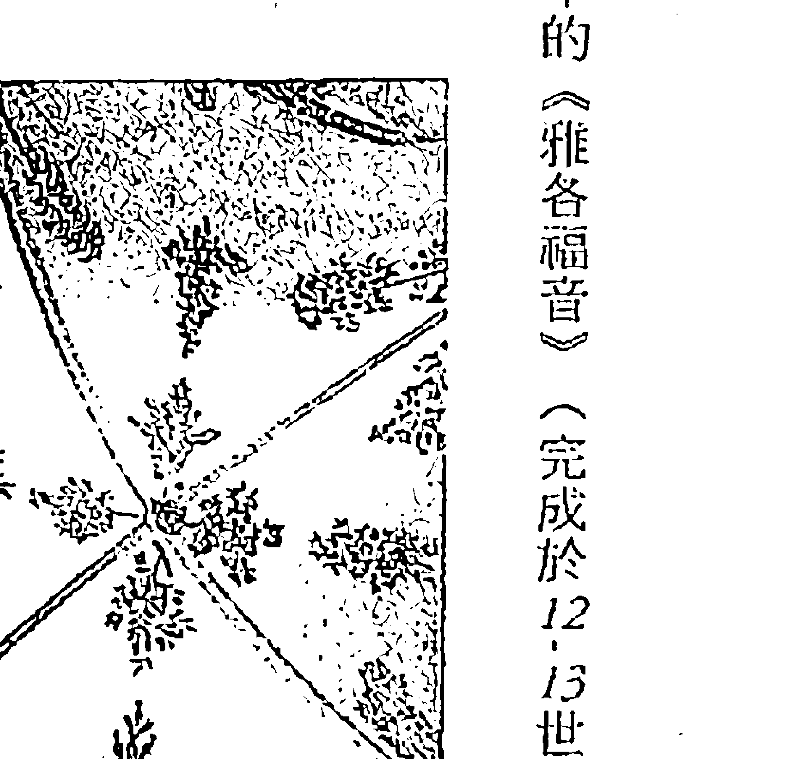

繪於亞米歇爾教會天花板上的藥草。位於德國班堡。

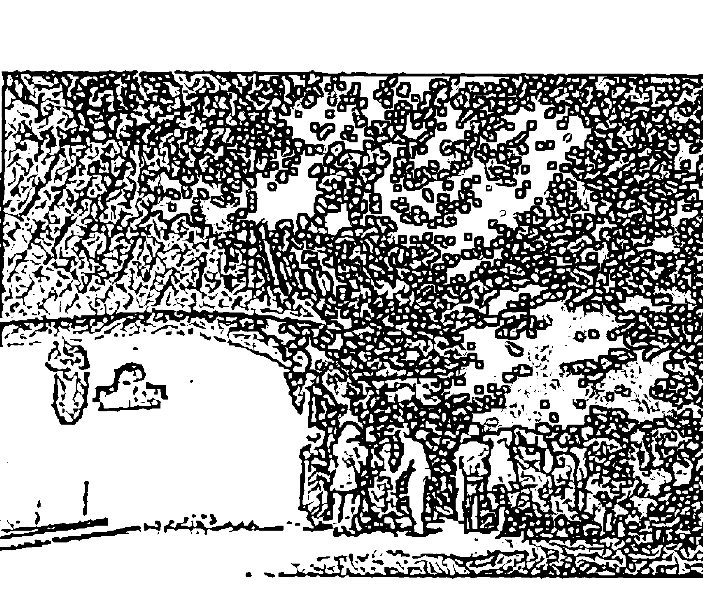

在馬利亞禮升堂前等待禮拜的眾人。慕尼黑郊外的普爾尼 (Planneg)。

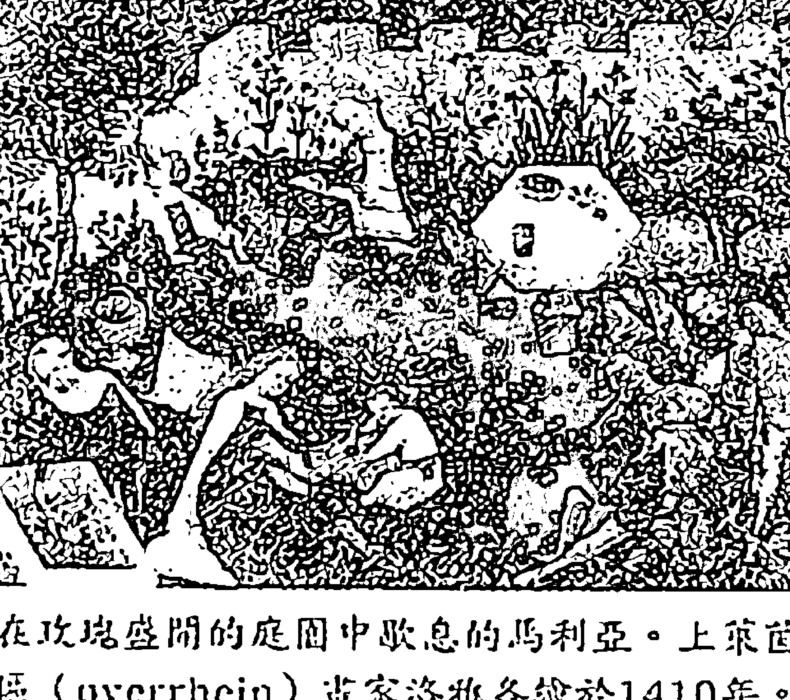

在玫瑰盛開的庭園中歇息的馬利亞。上萊茵區 (Oberrhein) 畫家洛雅各繪於1410年。收載於史達德而博物館中 (Das Städel，位於德國法蘭克福)。

內造訪馬利亞的祭壇仍然可以看到人們供奉的藥草束。班堡 (Bamberg，位於南德) 的聖米歇爾教會的天花板上，總共描繪了五百七十八種花卉與藥草，有「天堂的庭園」之稱，由此可見，教會其實也相當重視藥草。

部份篤信聖母馬利亞的地區將八月十五日訂為節慶日，這些天主教地區對馬利亞信仰的瘋狂程度往往讓人難以想像，甚至有專門尋訪各大馬利亞禮拜堂的觀光手冊和旅行團等等。我曾經造訪其中幾個馬利亞禮拜堂，讓我十分驚訝的是，信徒當中有半數是男性。以聖母馬利亞是女性，信徒大概也都是女性，這純粹是我本身的無知。

只是我本身的無知。

看見許多男信徒熱切地頌唱著「Ave Maria, Ave Maria」，手中摩挲著唸珠的情景，對於不是教徒的我來說，是很大的衝擊。不過仔細想想，在日本，也有許多信仰觀音，並且熱衷參拜位於各地修行場所的男性，也就見怪不怪了。

我並不清楚觀音是否也跟多種植物有關，但馬利亞確實和許多植物脫不了關係。例如天使加百列（Gabriel）前來告知聖母馬利亞受胎的消息時，在許多畫作中都手持百合花。不過有趣的是，最先畫出手拿百合的加百列的，是文藝復興時期的義大利畫家，在此之前的畫作當中，通常手上拿著法杖，或者什麼也不拿。

另外，也有許多畫作以坐在玫瑰園中的馬利亞為主題。只要前往歐洲的美術館或教會，一定可以看到許多以馬利亞、百合、玫瑰為主題的藝術作品。

不過，當時的玫瑰與百合花，似乎和現代人認知中的這兩種花有所不同。這一點只要比較過聖經的各種譯本，即一目瞭然。例如在舊約聖經的〈雅歌〉中有著「我是沙崙的玫瑰，幽谷間的百合」（rose of Sharon, a lily of the valleys）這樣的詩句。其中英譯本記為玫瑰的植物，在德文中則是「沙崙的水仙」，而日文版當中則是「沙崙的番紅花」或「沙崙的野花」。在近年來的聖經研究當中較為有力的說法認為，此處「沙崙的玫瑰」實際上應為風信子，而幽谷的百合則應為水仙花。 歷代畫家，用玫瑰與百合來譬喻純潔的聖母馬利亞，不過若從藥草學的觀點來看，這些譬喻其實不太精確。

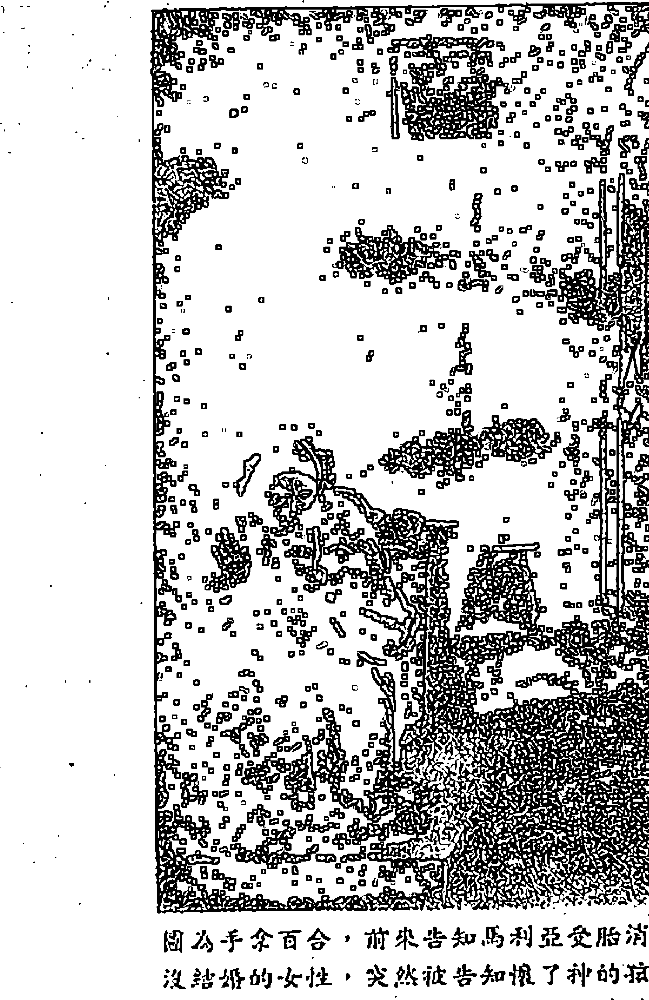

圖為手拿百合，前來告知馬利亞受胎消息的加百列。還沒結婚的女性，突然被告知懷了神的孩子，想必一定感到很吃驚。根據聖經中的描述，當時馬利亞的反應極為純淨，表示「按照您的意旨」。也許正因如此，在所有類似主題的畫作當中，馬利亞的表情通常都是莊嚴且平靜的。而在這張洛托的畫作當中，馬利亞驚訝的表情，就像在說：「唉？為什麼？這太突然了！」感覺起來就像一般人。兩手的動作也表現出她的情緒反應，而且看見天使突然出現，半個逃跑的臉的表情也很有趣。〈天使告知受胎〉洛托 (Lorenzo Lotto) 繪於1527年左右。

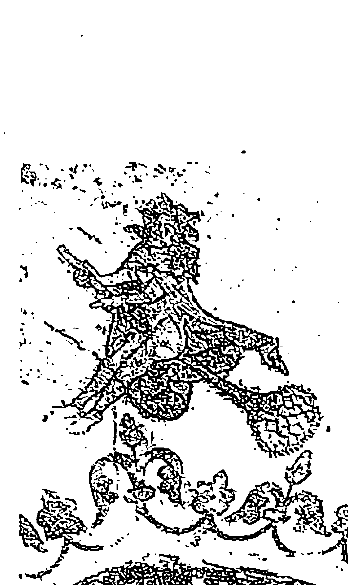

這張圖據說是北歐神話中的女神芙蕾雅。乘坐著兩端帶穗的法杖飛翔在空中。整幅圖畫繪於北德石勒蘇益格的大聖堂的天花板上。對基督教而言，屬於異教的女神圖得以保留至今，是相當有趣的現象。

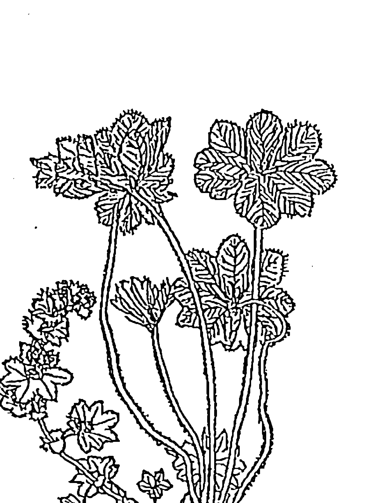

### 斗蓬草

例如屬於玫瑰科的斗蓬草（Alchemilla mollis），在日文漢字當中寫作「羽衣草」，而在德文（Frauenmantel）和英文（Lady's Mantle）當中的別名也都是「婦人」的斗蓬之意，這名稱的由來，是因為其葉子的外型，像是斗蓬一樣又大又寬。斗蓬草邊緣呈現不規則起伏，朝露得以掛在葉緣而不致滴落地面，隨著時間經過而為葉片所吸收，這種植物給人相當清新潔淨的感覺。斗蓬草能夠促進產後母體恢復及分泌母乳，甚至能夠改善卵巢功能衰退及更年期的種種症狀，可說是對女性百利而無一害的藥草。不過英文名稱當中提到的「Lady」，並非指一般的女性，而是馬利亞的代稱。

據說聖母馬利亞會張開她的斗篷，庇佑在她之下信仰她的人群。關於天使告知受胎、受召昇天、聖母子、聖家族等等與聖母馬利亞有關的畫像主題當中，其中有一種構圖方式便是馬利亞將斗篷張開，包裹住許多熱心地向她祈禱的人。

斗篷草在北歐神話當中是獻給女神芙蕾雅的藥草。隨著基督教傳入，聖母馬利亞的形象逐漸取代了異教的女神。

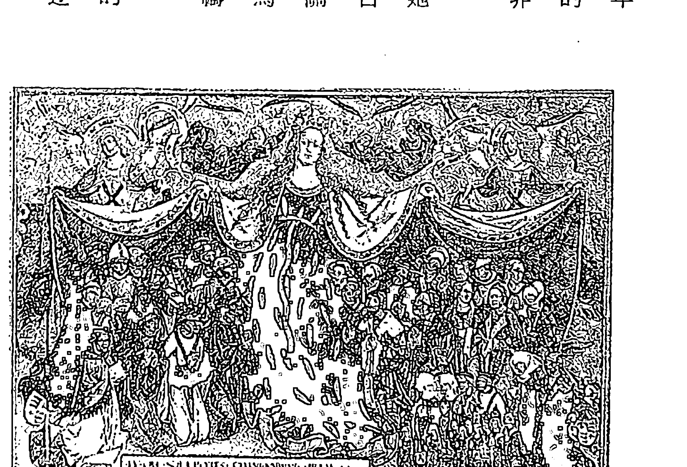

## 3 月神和艾草

蕁屬（*Artemisia*）植物皆為菊科，是各地常見的植物。其學名「Artemisia」總讓人聯想到希臘羅馬神話當中的女神阿爾忒彌斯（Artemis，即羅馬神話中的黛安娜，英文記為Diana），想必兩者之間有密切的關係。

阿爾忒彌斯是一位年輕貌美的女神，她的美貌從位於土耳其愛非索斯的阿爾忒彌斯神殿中的神像即可略窺一二。神像胸前裝飾有許多乳房（亦有說法指出應為牛睪丸），也許有些人會覺得造型有點古怪，不過容貌端正且凜然直立，看上去莊嚴而美麗。阿爾忒彌斯同時也是豐饒及多產的象徵，繼承了古代小亞細亞地區對大地母神的信仰，到了後代又成為月之女神，是保佑女性的神祇。

但是，希臘神話當中的阿爾忒彌斯形象又不太一樣。據說她習慣捲起衣襬，任頭髮垂到肩後，並且喜愛狩獵，常常穿著無袖的薄衫，手拿弓箭追趕鹿隻。甚至有時候看到難產的女性，會主動用弓箭取走她的性命，以縮短她受苦的時間。

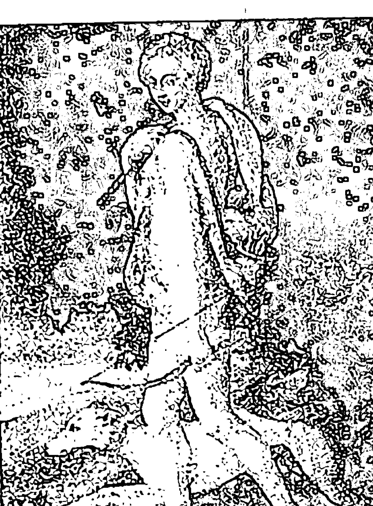

手拿弓箭的黛安娜。羅馬神話當中的黛安娜，與希臘神話中的女神阿爾忒彌斯可視為同一位神祇。圖為楓丹白露畫派的《獵人黛安娜》，繪於1550－1560年左右。

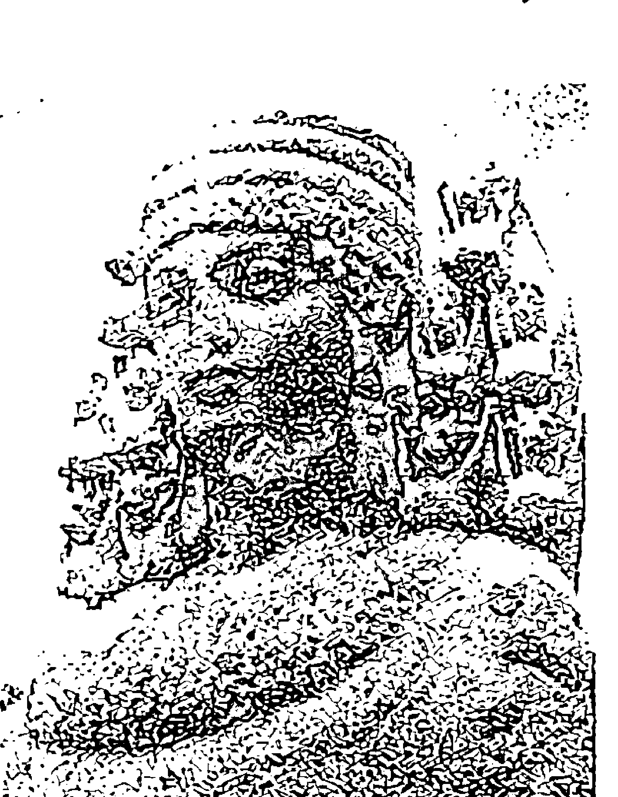

象徵豐饒與多產的大地母神阿爾忒彌斯。此神像位於阿爾忒彌斯寺院當中（在土耳其的安非沙所）。

她是天神宙斯的女兒，並且拒絕結婚，是三位處女神之一。有很多故事都提到她與男性為敵，因為觸怒她而遭到殺害的男性不計其數，甚至有人只是剛好路過，撞見她正在水邊洗澡，就被變成一頭公鹿，遭獵狗咬斷脖子分食。艾草的學名用這位帶點恐怖性格的女神來命名，讓人有點無法理解。不過關於此學名的由來，有另一種說法指出有位西元前四世紀左右頗通醫術的波斯王妃，她也叫做阿爾忒彌斯，據說這是較為有力的說法。不過無論是哪一種，蒿屬的植物自古以來便是與女性有密切關係的藥草。建議懷孕中的女性最好別碰艾草。

據說艾草還可以減輕雙腳的疲勞，因此從前長途旅行的旅客會將艾草墊在鞋子裡，因此艾草在德文中就叫做「腳邊草」(Beifuss)。加入了艾草的藥草浴，可以消除腳部疲勞並且溫暖身體，近幾年來相當風行。

在蒿屬植物當中，最常用於製作護身符的是具有茴香般香氣的苦艾（Artemisia absinthium），甚至據說在咒術儀式當中，也使用這種植物來召喚靈魂。如同它的名字，這種植物帶有強烈的苦味，因此猶太人在過逾越節時食用這種植物來追思祖先的辛勞。過去這種植物亦用來點綴在酒中，不過現在已禁止。這是因為若長期飲用摻入了苦艾的苦艾酒，會因為其中所含的一種側柏酮（thujone）成份，引起神經麻痺，導致生命危險。

在莎士比亞所寫的《仲夏夜之夢》當中，「迷魂藥」的成份是紫花地丁的汁液，而能夠解除其詛咒的，則是「月之女神黛安娜之花」的汁液。研究莎士比亞的學者認為，這種花其實就是艾草或苦艾。

莎士比亞所生活的時期正是園藝的概念逐漸興起，取代傳統在庭園中僅種植藥用藥草的時代。莎士比亞的作品當中總共提及了超過六百種的花草，也許正反映了那樣的時代風氣。不過，關於他到底具有多少藥草知識，就不得而知了。艾草的成份經科學證實，對於治療婦女疾病相當有效，不過能夠去除媚藥效果的科學根據，則還沒有找到。

另有一種說法認為，「黛安娜之花」指的是馬鞭草科的西洋杜荊（Vitex agnus-castus）。西洋杜荊的花呈紫丁香般的紫色，帶有宜人的香氣，果實經過乾燥處理後，能夠促進人體分泌一種叫做「progesterone」的黃體荷爾蒙。所謂黃體荷爾蒙，是穩定懷孕時母體平衡的荷爾蒙的總稱，對女性來說相當重要。由於這種荷爾蒙具有抑制性欲的作用，因此這種植物能夠破除塗在奧伯隆的妃子提坦妮雅眼皮上「迷魂藥」的效果，也許並非空穴來風。

將話題拉回到艾草上。在日本，艾草自古以來便和女性有很深的淵源，也常用來製作驅邪護身的符。摻了艾草的草餅，在桃花節當中是不可或缺的角色，在一些寺廟附近的商家也常販賣一些添加艾草的丸子串或草餅，是可以趨吉避凶的吉祥物。

艾草雖然看起來並不起眼，然而由於其功效，無論是在東方或西方，自古以來一般民眾都很愛用。

## 4 修女赫德嘉與藥草

許多藥草和艾草一樣，看來並不起眼，事實上，大部份的藥草也都不太需要照顧，在自然條件下生長便具有極佳的功效。

十二世紀時，德國萊茵河流域附近曾有一位修道院長赫德嘉・賓根，她在五十歲後花了七年寫成一本巨著，名為《自然史・自然的治癒力》。在書中她列舉了許多自然界中對人體有益的動植物及礦石，其中超過兩百種以上的植物都可以在路邊、林中小徑、荒野及田地中找到。

一一〇六年，赫德嘉八歲時進入萊茵河支流那厄河（Nahe River）附近的迪希邦登堡修道院修行，之後並成為該院的院長，甚至還在羅勃堡（位於今萊茵河左岸的賓根鎮附近）以及艾賓根（位於萊茵河右岸的露迪斯海姆附近）又另外設立了修道院。

迪希邦登堡的修道院中附設了規模龐大的草藥園。雖然現在已經成為廢墟，不過仍開放供一般人參觀。赫德嘉便是從這座草藥園開始認識植物的，當然日後她遊歷各地講道，也使她得以充實很多這方面的知識。

即使赫德嘉曾受羅馬教皇及德意志帝國的皇帝所表揚，不過隨著時間的流逝仍然漸漸為眾人淡忘。到了一九六〇年代，美國興起女權運動浪潮，這股風潮傳入德國，於是德國人也回頭開始尋找本國歷史中了不起的女性，她的著作及生命歷程再度受到眾人注目。她豐富的自然知識及敏銳的觀察力，擄獲了現代人的心，特別是從事與草藥相關業務的人士都紛紛尊她為開山祖師。

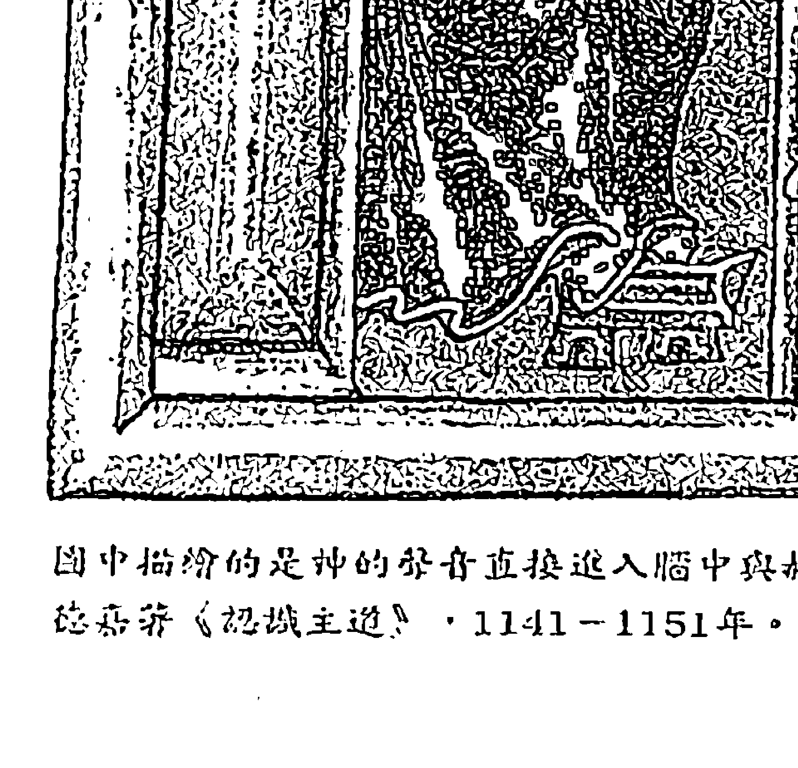

直到現代為止，科學主要的著眼點都是如何戰勝自然，然而不知不覺，這樣的研究方向已經走進了死胡同。人們開始重拾從前被貼上女巫標籤的藥草學，以及「聰明女性」長期累積下來的經驗與智慧。於是「女巫」的所作所為反而被視為是與自然調和的象徵，因此赫德嘉對待自然的態度，也被視為現代環保運動的原點。

九月十七日是赫德嘉的忌日。她所設立的教會所在的城鎮每到這天會將裝有她遺骸的聖櫃公開展示，在祈禱後由信徒抬著繞行鎮內。照片攝於德國萊迪斯海姆(Rudesheim) 的艾賓根。

位於艾賓根的赫德嘉修道院庭園中的聖像。這一带有許多她的立像，可見她相當受當地民眾愛戴。

## 5 藥草女巫

雖然我們不能全盤否定現代科學的成果，不過對科學抱持懷疑態度的人的確越來越多。有些人認為，應該重新對「女巫」作出評價，對自然界也應從另一種角度的思維出發。

在德國，有一種「藥草女巫」的名詞。藥草女巫在狩獵女巫的時代受到誣陷，說她們使用有毒的「女巫藥草」造成種種危害，因此社會將她們加上女巫的烙印，排除在社會外。

這些使用藥草的女巫，在女權運動當中獲得翻身的機會，成為活用大自然恩惠的聰明女性的象徵，因此也出現許多自稱藥草女巫的女性。

住在德國西南部的比可兒（Gabriele Bickel）小姐，也是一位自稱藥草女巫的人。她業已出版了多本與藥草有關的書籍，並且也在電視中露臉，甚至擁有數家藥草舖。一年之中還會策畫幾次藥草旅行團，吸引許多人參加。

我曾經參加過這個旅行團，在約五十名的參加者當中，許多都是女性。經過詢問才知道，他們大多曾接受過藥劑師利用藥草所進行的治療。參觀的路線主要是比可兒家的後山，她會一一指著路邊的野草，解說其效用。

在參加這趟行程之後我才了解到，原來藥草並不是什麼特別的植物，只是恰巧對身體有益的野草罷了。從前被指為藥草女巫的「聰明女性」，也不過就是善加利用這些不起眼的植物而已。當然山中也有像顛茄這類毒性極強的植物，畢竟效果優良的藥劑，含有劇毒的草藥往往是原料中不可缺少的。

在日本，也有許多野草同好會或者藥草園舉辦的講習，短至僅花個一小時把住家附近的山區或者原野繞過一圈，長至晚上入宿溫泉旅館的豪華藥草旅行都有。

比可兒小姐曾指著路旁的一株植物給我們看，那是菊科的洋著草（Achillea millefolium），是常見於德國鄉間的藥草。這種植物的葉片形狀相當特殊，一眼就可認出。日文稱為「鋸子草」，在法文中則叫做「工匠草」，葉片的週邊像是鋸子一般銳利，在德文中稱為「Schafgarbe」（對羊群的健康有助益的植物）。又因為其美麗的流線形造型，它還有一個美麗的名字，叫做「維納斯之眉」。

在伊拉克山尼遜（Shanidar）洞窟遺跡的古墓當中曾找到八種藥草，據說其中一種就是洋耆草。據估計，該遺跡的年代約為西元前六千年左右，學名則來自古希臘英雄阿基里斯。據說他在特洛伊戰爭時，曾經用此草治癒了部下的傷勢。由於整株草都含有具消炎效果的成份，因此有極強的止血與消炎功用。這種草在德文當中有許多稱呼，其中大多是像止血草、士兵草、創傷草等等，在英文中則稱為『yarrow』。我幼時曾在前往山中遠足時受過傷，當時的領隊就近摘了一把草，揉碎葉片，塗抹在我的傷口上。我雖然不知道這個草的確切名稱，不過像這樣的緊急處理，從前相當常見。如像起疹子時將酸菜的葉片揉碎塗在上面，以及感冒喉嚨痛時將蔥段用布包裹囤在脖子上等等，許多活用藥草的生活小智慧，至今依然存在。藥草在德國人的日常生活中也扮演相當重要的角色。我的德國友人當中，不乏為失眠所苦的人，然而他們絕不服服用安眠藥，只在睡前喝杯加了纈草萃取液的熱茶。還有人對我說，他孫子感冒時，只要給他來杯洋甘菊茶，很快便能康復。許多當地人都前往兼管藥草販賣的藥局，徵詢藥劑師的意見並請他們幫忙開藥。

## 6 具有性治癒力的藥草

有次我應邀到德國人家中作客，主人問我：「要不要喝點什麼？」我因為當天已經喝了太多咖啡了，於是請他給我來杯茶。沒想到他馬上接著問我：「您想要喝什麼茶呢？」一讓我不知道該怎麼回答。其實這位朋友是在問我想要喝紅茶或藥草茶。由於當時對藥草茶（Kräutertee）完全沒有概念，因此半出於好奇心，就向主人表示請幫我泡杯藥草茶。結果主人又問：「要哪一種藥草呢？」這讓我越發困惑了。原來光是他們家的廚房，就有茴香茶、銀杏茶、槲寄生茶、車前草茶、洋甘菊茶、玫瑰果茶等等，除此之外，依功能分類，還有整腸、預防感冒、寧神、安眠、降血壓等各種藥草茶。這些藥草分裝在盒中，

當時的我，只知道紅茶和日本茶兩種茶而已，現在的人可能也很難想像，從前藥草茶還沒引進時，許多人根本連聽都沒聽過這種東西。

現在的藥草茶也已經推出茶袋包裝的產品，飲用起來相當方便，據說這種自動包裝藥草茶的機械，便是德國廠商於一九二九年發明的，但這種機械卻過了四十年，也就是到一九六九年才傳入日本。而且一開始幾乎毫無知名度，負責進口的代理商花了很多心血在宣傳上。

一九六〇年代正是全世界各個角落紛紛展開反體制運動的年代，美國的嬉皮以『回歸自然』為口號，呼籲大眾多多關心自然環境。在這樣的風氣當中，日本人也開始飲用藥草茶，所以藥草茶傳入日本尚未成太長的歲月。

飲用藥草茶有助於放鬆心情，因此在日本大受歡迎。事實上，喝藥草茶之所以能夠放鬆心情，是藉由生理影響心理，而既然藥草茶對生理會造成影響，其中也必然包括了性功能方面的效用。

曾有位從事藥草相關工作的友人向我透露，他在演講時曾提到藥草對性功能方面的效用，台下的反應卻相當冷淡。據說是因為對聽眾而言，飲用藥草茶比較像是一種精神上的療癒，突然牽扯到性方面的功效很多人無法接受。

不過既然要談藥草，與性功能有關的部份就不能略過不提，畢竟性方面的煩惱也是人的諸多煩惱之一。而在赫德嘉的《自然史，自然的治癒力》一書中，也記載了許多這樣的煩惱及各種解決範例。

例如「置身性的狂喜之中卻無法達到射精的男性」，可以從芸香及少量的苦艾當中榨出汁液，加上砂糖與蜂蜜攪拌後與等量的葡萄酒一起放入耐熱容器當中，煮沸五次飲用即可。

芸香（*Ruta graveolens*）是橘子科的灌木。根據草藥辭典的記載，這種植物具有興奮作用，因此也許的確適合改善這類男性的煩惱。

若男性希望解放肉體的快樂與情慾，則可以將「蒔蘿和兩倍份量的水薄荷、比水薄荷份量更多一些的愛麗絲（Iris）」的根，放在醋當中醃漬成調味料，在吃飯的時候，無論吃什麼都配著吃」即可。

蒔蘿（*Anethum graveolens*）俗名稱為dill，是芹科的香草，常用來當作醃菜的調味，具有幫助消化的功效。至於花呈紫丁香色的紫蘇科植物水薄荷（*Mentha aquatica*）由於帶有薄荷香氣，可使人神清氣爽。其他草藥的效果不明，而主要成份蒔蘿和水薄荷到底能不能讓人解放情慾和快樂，也有待查證。赫德嘉還列出許多其他效果，例如煩惱自己精力過剩的男性，可以「在三溫暖的蒸氣室當中，將清燙野包心菜所用的水澆在身上」，這樣一來即可在不傷身體的狀況下消除慾望。

若女性感到子宮中存在著一股膨脹的慾望，則可以來個加了野包心菜的蒸氣浴。赫德嘉曾經說過，無論男女，若誤食具有催情功效的食物，可以飲用大車前草的原汁或加水飲用。這裡提到的野包心菜（*Lactuca canaxacifolia*）是包心菜的近親，而大車前草（*Plantago major*）則和日本人熟知的雜草車前草十分类似。據說若將其葉片揉碎塗抹在傷口上，可以讓傷口很快癒合。

不過或許正因為她是修女，所以才深諳許多能助人擺脫情慾糾纏的藥草。不過赫德嘉終身未婚，她又

如何知曉消除男性性慾的方法？某年我參加尋訪赫德嘉所創辦修道院的旅行團時，曾經對領隊提出這個問題。這位領隊的回答是：「赫德嘉可以聽見神的聲音，所以她對於任何事情都了然於胸。」

由於關於性功能方面的藥草，並非我的專門領域，故在此引用赫德嘉的記載代為向各位讀者介紹。

## 7 「聰明女性」所作的藥草料理

在德文當中有個名詞，叫做『hexenkesel』。雖然其原意為女巫的大鍋，不過也可用來比喻『騷動』及『混亂』等等。但如果大家以為德國的女巫也喜歡像日本人一樣圍著鍋子大唉喜喜燒或涮涮鍋，那就大錯特錯了。
所謂『女巫的大鍋』當中，裝的是未接受洗禮的嬰兒屍體、青蛙、蜈蚣等等噁心的物體，將它們煮到濃稠冒泡。之所以用來作為『一團混亂』的譬喻，大概也是想到這麼多東西在鍋子裡面熬煮時的情景。
在莎士比亞的作品《馬克白》當中，有著三位巫女圍著大鍋預言馬克白的未來的場景。莎翁鉅細靡遺地描寫了鍋子裡面有些什麼，全部共有二十五種，包括『月夜中親手摘下的杉樹枝』、『黑夜裡挖出的毒蕈』，剩下的則全都是一些動物或者肢體，如蛤蟆、蝙蝠翅膀、蝮蛇的舌頭、壁虎的眼球等等。這個場面寫出了女巫讓人不寒而慄的一面，其中的鍋子可說是典型的『女巫的大鍋』。第一章中提到的「飛行軟體」，也是在女巫的大鍋當中製作出來的。所以這鍋子對女巫來講是相當重要的工具。

然而，只要有「女巫的大鍋」，則想必也有用於正面用途的「聰明女性的大鍋」。隨著女巫歷史研究進展，這些觀念也慢慢獲得修正。其實「女巫」和「聰明女性」根本是一樣的，之所以有所區別，都是因為時代背景的不同所導致。

或許正因如此，一些以正攪拌著大鍋的女巫為主題的繪畫或小飾品，其中女巫的形象往往也分成恐怖的，或者看起來很有智慧的和善老婆婆兩種。

在格林童話中，有個叫做《千皮獸》的故事。「千皮獸」是一位公主的名字。她隱瞞身分，在某城堡的廚房工作，不久之後這座城堡的國王除了她煮的湯之外什麼都不吃。廚師長知道了這件事，便指稱她一定是個女巫。

這個故事有著怎樣的涵義？她到底是一位迷惑國王的恐怖女性，還是年輕貌美、做菜技巧一流的女性？由於童話當中的對話，沒有對這件事情做出詳細描述，因此研究格林童話的學者也沒有注意到這個細節。然而我卻認為，這恰巧描繪出了「女巫」這個概念的雙面性格。至於千皮獸煮的湯裡，到底都加了哪些食材？我個人認為，一定是添加了多種藥草。

在歐洲，許多家庭會在廚房裝飾著女巫人偶。這稱為「Kitchen Witch」，是廚房的護符。這個人偶可以保佑廚房的主人烹飪技巧突飛猛進，當然應歸類為「聰明女性」。
人類總是忘了自己也是自然界的一分子，認為憑智慧一定可以克服自然條件。然而當遇到「千皮獸」所煮的湯，是女巫的湯。埃圖繪。

了不可抗力的自然天災，如颶風、地震、洪水、旱災時，往往回過頭來才發現自己有多渺小。不過神還是給了渺小的人類「藥草」這項贈禮。我們的祖先在偶然間發現了藥草的功效，並將相關知識傳給後代。

在日本，每到正月七日都有食用春之七草的習慣。其他像桃花節吃的櫻餅和草餅，端午節吃的柏餅及菖蒲湯，以及冬至吃的南瓜和柚子湯等等，隨著季節不同，有許多不同的風俗及相關的植物。

德國人至今仍相當重視藥草，在這樣的國度裡，至今流傳著許多「聰明女性」的藥草料理。有一位住在德國北部的舊識曾說，當地至今仍然遵循著豆類、黃瓜、南瓜等都要等到所謂的「Eisheiligen」（五月十一日左右）過後才能播種的風俗。因為五月中偶爾天氣還是會突然轉涼，因此要一直等到這一天過後才能播種。

北德地方每到冬天習慣吃一種代表性的鄉土料理「Gruenkohl」（綠色的包心菜之意）。據說結霜的菜葉調理過後更加香甜，不過外表看起來就像縮成一團的菠菜。這道菜需要煮上幾個鐘頭。我曾在德國吃過Gruenkohl，雖然已經煮得很透，但仍然很有嚼勁，相當美味。

十二月時甚至會有村莊舉行Gruenkohl的健行會。到了黃昏時分，村中的人聚集在一起，步行至鄰村的餐廳，在那裡大吃Gruenkohl和香腸。據一位參加過很多次這種健行的朋友表示，一般健行的目的地只有主辦人才知道，在黑暗當中，只靠手電筒照路，大家邊走邊聊，幾個小時後終於抵達可以吃到Gruenkohl的餐廳，我想，參加這種健行一定相當有趣。

每到春天，還有類似韭菜的熊蔥（Bärlauch）製作成蔬菜泥的習俗，夏天快到時，市場中紛紛出現白蘆筍，秋天則將各種漿果製成果醬。在德國的菜市場，販賣許多日本少見的菜蔬，如茴香等等，在其中逛逛，別有一番樂趣。

在法蘭克福（德國中部）的菜市場當中，買著一種將七種綠色蔬菜捆成束用紙包裹的「Frankfurter Grüne Sosse」。人們用這幾種蔬菜製成淋醬（法蘭克福青醬），配肉食用。只看食譜，做法似乎並不困難，應該是相當家常的菜色。

在法蘭克福的大聖堂當中有許多座祭壇，其中有一個雕刻著基督最後晚餐的情景，在餐桌上有著整雙的烤小羊。跟我一起前往的友人指給我看，原來桌上也放置著法蘭克福青醬。雖然不清楚這座祭壇

### # 聖星期四的綠色蔬菜

比如說，德國至今仍保留著「聖星期四」必須以綠色蔬菜為主食的風俗。所謂聖星期四，指的是復活節前的星期四。在日本，新教徒稱這天為「聖星期四」，而天主教則稱為「洗腳星期四」。這是根據約翰福音的記載，耶穌曾經前來參加最後晚餐的門徒洗腳。這象徵了耶穌洗清了弟子的罪，並親自展現了愛與奉獻的精神。

德文中，聖星期四稱為「Gründonnerstag」。Grün這個字相當於英文的Green，不過叫做「綠色星期四」的原因，似乎沒有這麼單純。Grün在古代德文當中還蘊涵著「悲嘆」之意。在英文當中也稱這一天為「悔過星期四」（Maundy Thursday），其語源其實應該跟基督教有關，而非綠色。不過，在這一天以綠色蔬菜為主食的習俗，似乎早在基督教傳入以前就已存在，所以早已分不清楚兩個辭意之間的關係。

人們為了慶祝春天到來，到自家的庭院或是前往森林中摘取野生蔬菜。當天晚上，一邊食用綠色蔬菜製作的菜餚，一邊祈禱能夠平安無事度過這一年。至於蔬菜的種類雖然不像日本的春之七草那樣固定，不過一般說來大約是七種、九或十二種。

據說詩人歌德，習慣在這天吃菠菜。而德國的自然科學家亞歷山大・洪堡（Alexander von Humboldt），專門為這一天寫下了詳細的食譜，獻給波茲坦（Potsdam）宮廷的廚房。這份食譜裡面所使用的藥草，包括了金錢薄荷、水芹菜、洋耆草、雛菊、大車前草等等。

此風俗至今仍受到保留，特別是在天主教信仰較為根深柢固的地區。不過，地方不同，使用的藥草種類及調理方式也不同，甚至也有蔬菜餅乾和藥草沙拉這樣的菜色存在。在南德地區的餐廳，到了這一天，菜單上會特別推出一種湯，其中加了富含豐富維他命的山蘿蔔。

不過藥草盛產的時節未必剛好趕得上聖星期四，這是因為復活節的日期每年都會變動。耶穌基督遇難刑後第三天復活，這一天的慶祝活動定為復活節，基本上是春分（農曆三月二十一日）之後第一個滿月後的星期天，因此早的話三月，晚的話則會拖到四月底。

若復活節在三月底來臨，則許多藥草還來不及長成，因此，許多超市中也只能販賣「九種藥草湯」、「聖星期四喝的湯」這類包裝好的材料。

傳統的『聖星期四喝的湯』一定會用到紫蘇科的金錢薄荷 (Glechoma hederacea)。花帶有紅紫色，呈小巧的唇狀，葉片則為心型，說實話看來並不起眼。採碎葉片之後會發出強烈的薄荷香，可以舒緩頭痛，常常在民間療法當中使用。

金錢薄荷的莖相當柔軟。植物學者蘇珊·賀雪 (Suzanne Fisher Rizzi) 指出，金錢薄荷由於相當適合用來編織花冠，因此也稱為「花冠草」(Krauseblatt)，將花冠戴在頭上，還有驅魔的功效。特別是在屬於女巫的「瓦普幾絲之夜」，據說戴上這種花冠可以在人群中分辨出誰是女巫。

金錢薄荷的實際效用是消炎，據說對降低血糖、糖尿病、腎臟炎、腸胃障礙等亦相當有效，在日本，則常用於治療幼兒的疳積和痙攣，故稱為「除疳草」。至於古時日本稱為「垣通」(穿牆草」，則是因為這種植物繁殖能力甚強，甚至能夠穿透牆腳。

### 【五月酒】

在德國，每到五月一日便會立起「五月柱」(Maibaum)，慶祝春天的來臨，這是過去樹木信仰的殘留。古時候的人們相信橡樹、椴樹、白樺、檜木等樹木上棲息著神靈。特別是白樺樹，象徵春天與生命的復甦，因此常用來作為五月柱的材料。具體的做法是在木材的上端掛上草環，並加上一些裝飾。人群繞著柱子圍起圈圈向冬天告別。在北德的小村莊中，常常可以見到村人合力豎起五月柱的景象。首先是將木材運到村中廣場，擔任義勇消防隊的男性吆喝著口號，拉著繩子，慢慢將柱子立起來，旁觀者在一旁高興地拍手，之後少年和少女圍著柱子開始歌唱。整個儀式並不繁瑣，但一邊看著一邊讓人心頭也跟著暖起來。

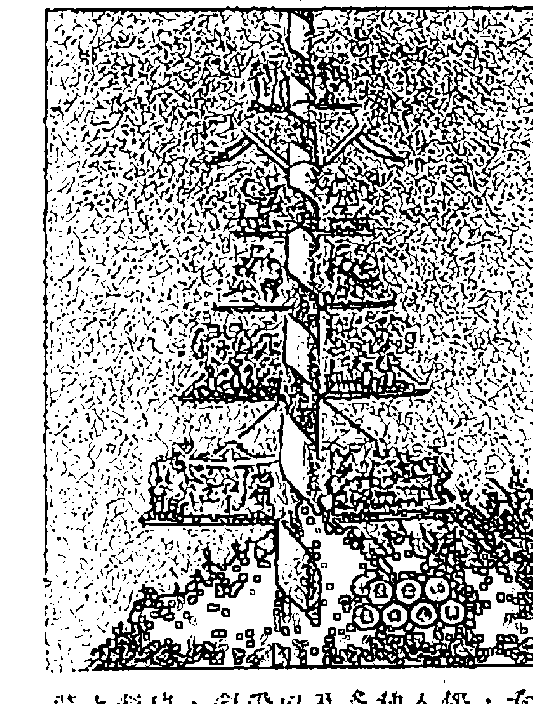

裝上彩球、彩帶以及多種人偶，看起來相當華麗的五月柱。位於慕尼黑的維多利亞廣場。

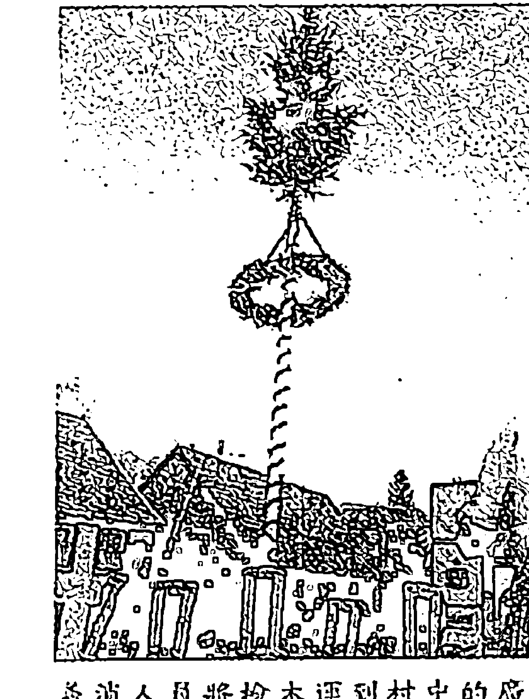

義消人員將木材運到村中的廣場，喊著口號，將柱子立起來。這是一個比較簡素的五月柱，位於哈茨地方的本涅根斯坦。

五月柱的歷史相當古老。立在廣場上的五月柱除了有各種各樣的木材外，裝飾的方法也相當多樣化。例如在慕尼黑（南德）就可以看到有各種裝飾且相當華麗的五月柱。

在舉行這項慶典時，民眾同時還會飲用一種「五月酒」（Maibowle），也就是五月喝的雞尾酒以慶祝春天到來。五月酒同樣具有悠久的歷史，最早可以追溯到九世紀，本尼迪克特教派的修士曾經寫下製作方法一直流傳至今。在此介紹其中一種：

### 材料：

- 開花前的車前草葉片一小捆
- 黑醋栗的葉片十五片
- 薄荷／龍旨／鼠尾草／地榆／百里香葉片各二至三片
- 砂糖一百五十公克（建議可以少一點）
- 白葡萄酒 1瓶
- 香檳酒 1瓶

### 做法：

- 將各種藥草綁在一起，不用太緊。
- 將藥草和砂糖放入容器當中，倒入半瓶葡萄酒。
- 放置約一小時之後，將藥草取出。
- 在喝的時候直接注入杯中，並且灑上幾片車葉草葉片。也可以用草莓或蘋果的花瓣代替。

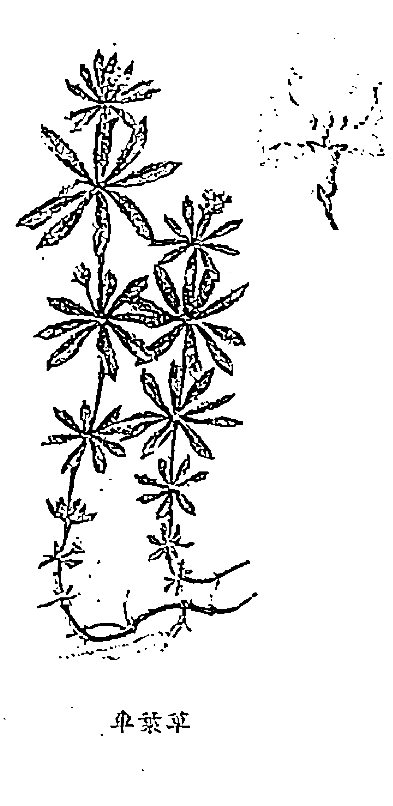

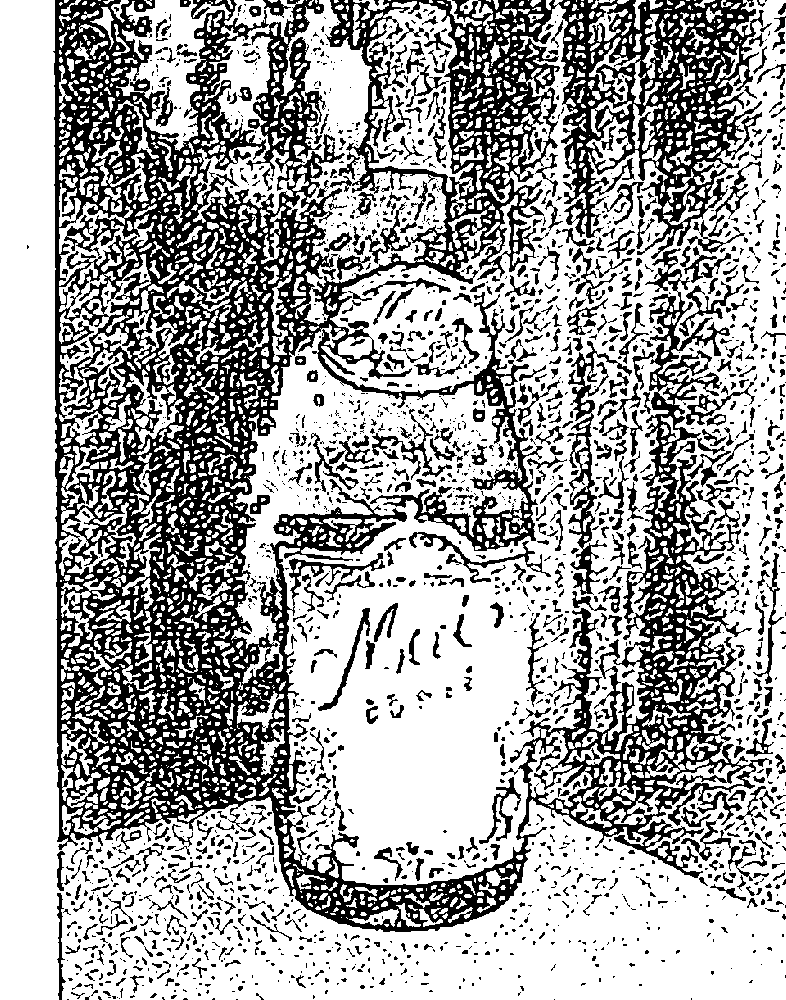

屬於五月的飲料——五月酒

在冰過的玻璃杯中，灑上一些車葉草葉片，增添點香氣之後，可以使人感受到彷彿春天確實來臨了。五月酒的主角是茜草科的車葉草（Galium odoratum）。或許正因如此，也稱為車葉草酒。

幾年前在參加採訪德國童話名勝的旅途中，於古城沙巴堡（Sababurg）的一家餐廳第一次喝到五月酒。五月酒喝起來帶有一點點辣味，但相當爽口。食譜當中建議砂糖可以少一點，就是為了這種微妙的辣味。

事後，由於還想再喝遂請友人幫忙，於是他送我瓶裝的五月酒，據說是店裡販售的商品。我小心地將它帶回日本和朋友一起飲用，這瓶的味道微甜，對酒精飲料沒輒的朋友表示相當美味。看來在製作過程中，調節砂糖的量相當重要。

車葉草的葉片上有著車軸般的放射狀紋路，日文古名的車輪草由此而來。在德文中則稱為「森林裡的老大」、「森林之母」、「五月之花」、「心靈的喜悅」等等。

車葉草自古便常用於民俗療法。例如家中有孕婦時，往往會塞一些氣味芬芳的草藥在枕頭套或床單中，車葉草的葉片曬乾後也有類似乾草般的香氣，具有鎮定心情的效果，因此是在上述情形當中常常選用的藥草。在治療用途上，大多選用開過花的葉片，不過在製作五月酒時，必須使用開花前的葉片。車葉草之所以帶有乾草般的香氣，是因為內含一種叫做香豆素的成份，若大量攝取會引起頭痛與嘔吐等現象，因此在製作五月酒時，切記葉片不可以浸泡太久。

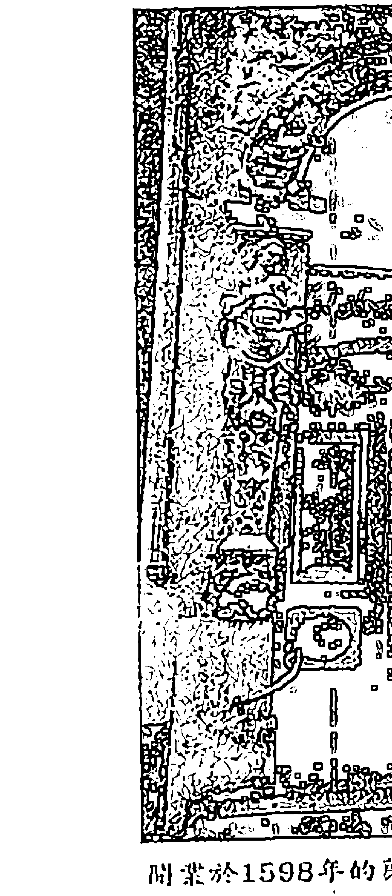

開業於1598年的藥局，至今仍在營業。位於北德的呂內堡 (Luneburg)。

送我五月酒的那位朋友，同時還送了我一捆乾燥過的車葉草，我將它掛在廚房，過了半年仍然飄著乾草的香氣。

仔細研究藥草，會發現其中包含了許多對人體有益的成份，甚至讓人懷疑這不是為人類創造的植物，思及大自然給予人類的恩惠總讓人感到不可思議，心生敬畏。

人類在死後也將回歸自然，成為自然的一部份，從植物的角度來看，人類只不過是自然循環的一個環節而已。不過，人類接受了這麼多的饋贈，有沒有給予大自然相同的回報呢？

女巫的藥草箱內容包羅萬象，還包括了許多沒有介紹到的藥草。不過走筆至此，暫時將告一段落。

不知道各位讀者看到這裡，心中對女巫的印象，是否仍然還恐怖而邪惡的？還是了解到，其實歷史的背後，躲藏著許多不為人知的聰明女性呢？