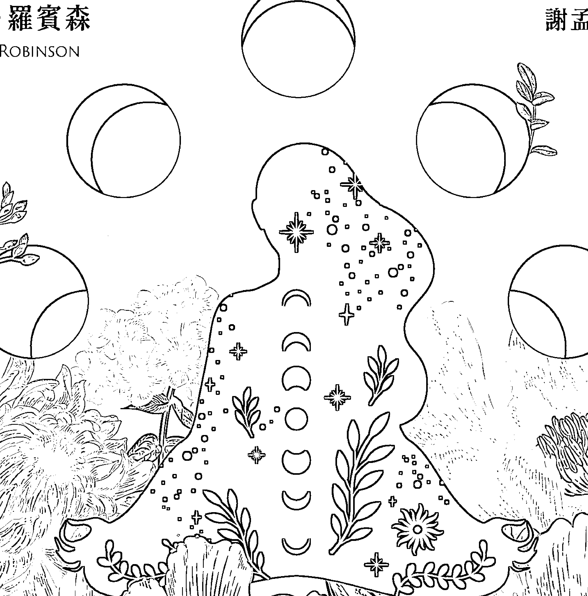
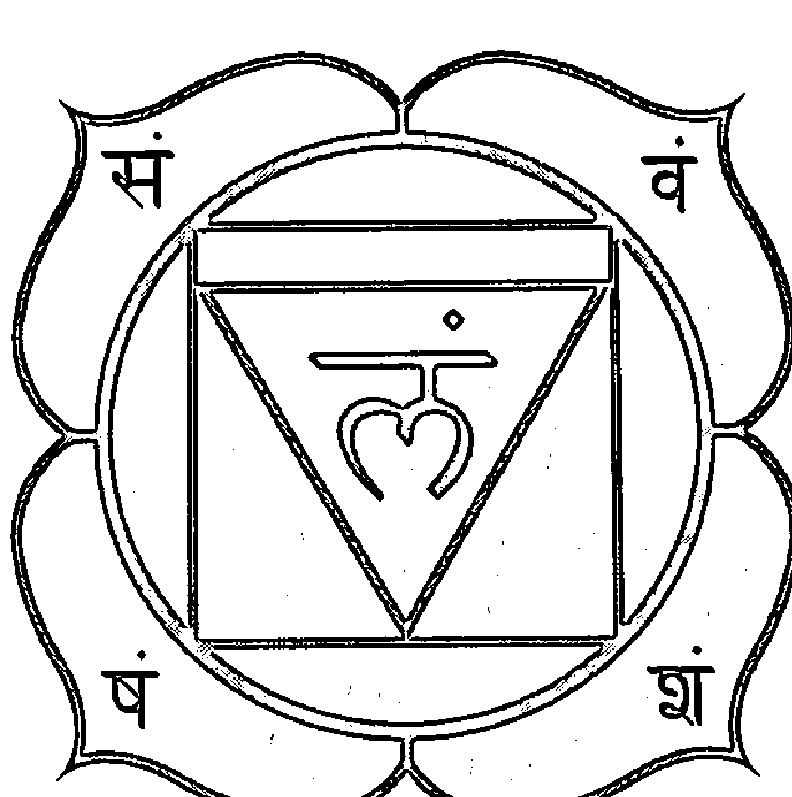
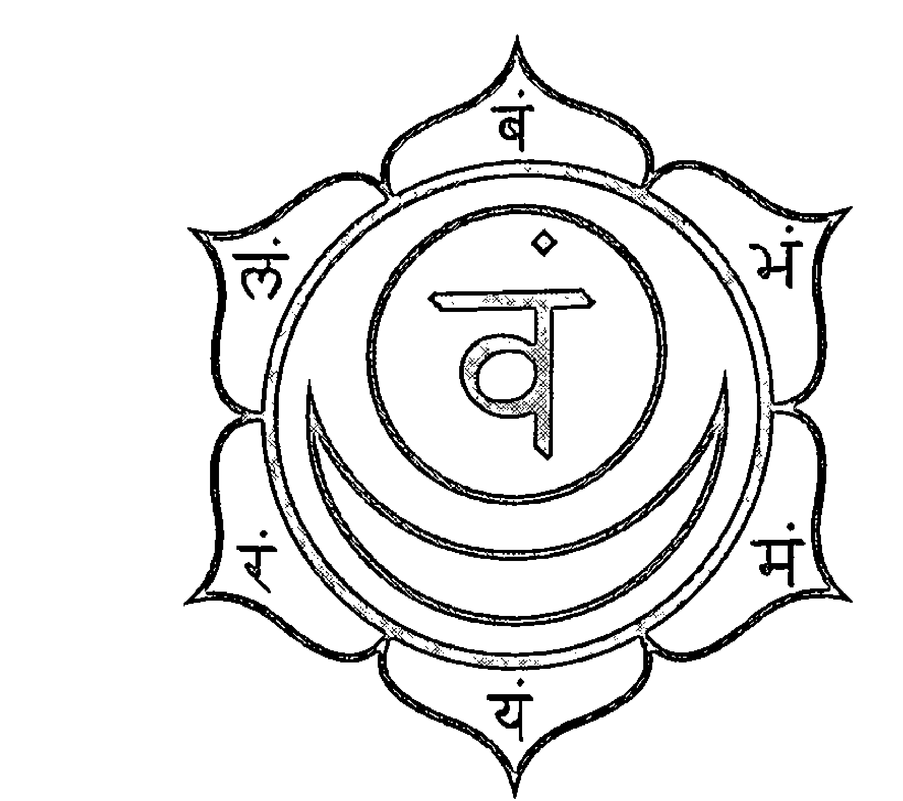
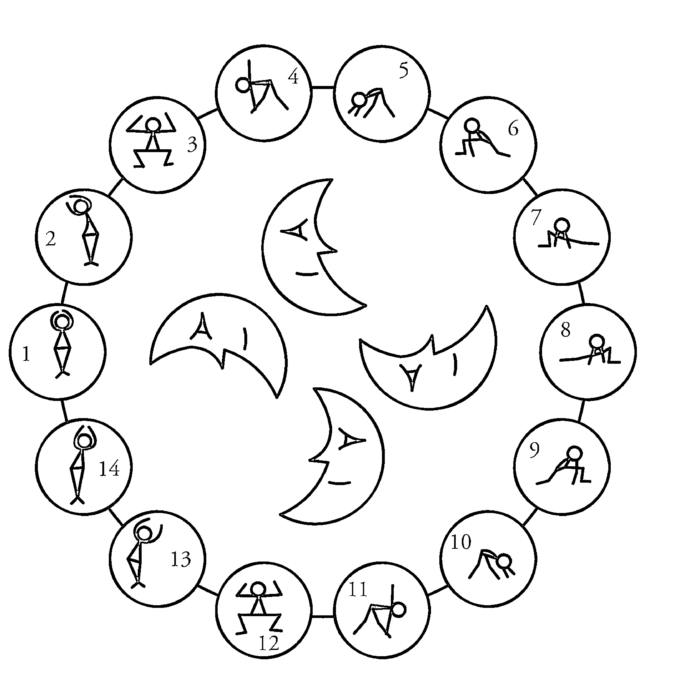
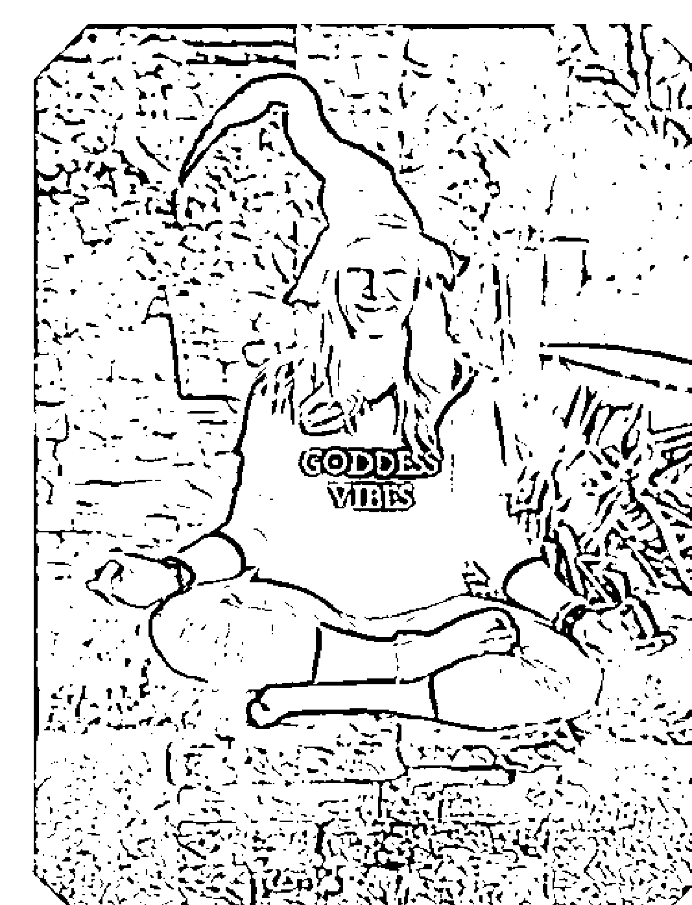

# YOGA FOR WITCHES

# 女巫瑜伽

## 瑜伽垫上的疗愈魔法

**作者** 莎拉·罗宾森 (SARAH ROBINSON)
**译者** 谢孟庭

- 透过呼吸和体位法安稳接地
- 留意日月星辰的神圣循环
- 探索脉轮的魔法能量

# YOGA FOR WITCHES

# 女巫瑜伽

## 瑜伽垫上的疗愈魔法

**作者**
莎拉·罗宾森
SARAH ROBINSON

枫树林

# 国外好评推荐

> 《女巫瑜伽》是女巫和女瑜伽士（yogini）都会喜欢的一本好书。

如果你想要深化与大地能量的连结，结合古老的巫术智慧，以及瑜伽的灵性修炼，这本书是非常实用的工具书。莎拉·罗宾森编写了一本浅显易懂、内容丰富的指南，无论是对魔法有兴趣的瑜伽士，或是刚接触巫术的见习女巫，都能获益良多。这也是一本很好的入门书，能带领读者投入日常魔法实作、学习最扎实的瑜伽技巧，并从中发现两者之间共通的美好。

——乌玛·丁斯莫尔图里博士（Uma Dinsmore-Tuli），《Yoni Shakti: A Woman's Guide to Power and Freedom through Yoga and Tantra》作者，睡眠瑜伽协会（The Yoga Nidra Network）与英国圣多萨生态瑜伽营（Santosa Eco Yoga Camp）创办人

> 《女巫瑜伽》精彩有趣、文笔流畅，主题也让人耳目一新，为当代巫术文学开拓了新的沃土，实在难能可贵。作者用真挚而暖心的口吻、循序渐进的引导，鼓励读者去发掘、探索属于自己的魔法，创造心灵富足的生活，是这本书真正的价值所在。

——菲利丝·库罗特（Phyllis Curott），威卡女祭司兼人权律师，世界宗教议会（The Parliament of the World's Religions）荣誉副主席，《Book of Shadows》、《魔法威卡：唤醒你内在的神圣魔法》、《The Witches' Wisdom Tarot》塔罗牌套组等全球畅销书作家

《女巫瑜伽》以饶富兴味、深入浅出的文笔，完美结合两种古老传统。对于想要透过创新与创意兼具的方式，结合巫术信仰与瑜伽灵修的现代读者，这本是不能错过的经典好书。

> ——爱丽丝・格里斯特（Alice B. Grist），《Dirty and Divine》作者

《女巫瑜伽》是一本脍炙人口的好书，揉合了瑜伽与巫术传统，将自然魔法带到瑜伽垫上与生活中。莎拉以温柔的笔触，引导读者运用东方古老智慧与西方巫术概念，为生活注入更多美好，并在过程中提供关于女神、仪式等丰富资讯与实作建议。无论是想探索巫术的瑜伽士，或是希望深化魔法能量的女巫，这本书都是绝佳的修行指南。

> ——琳恩・舒曼（Lyn Thurman），《Goddess Rising》、《The Inner Goddess Revolution》作者

如果我决定开始练瑜伽，这本书就是我的首选参考书。

> ——宝拉・布莱克斯顿（Paula Brackston），《The Witch's Daughter》作者

在《女巫瑜伽》一书中，莎拉・罗宾森揭开了瑜伽与巫术的神秘面纱，又同时颂扬两种传统的神秘色彩，字句之间透露出巧妙的平衡。这本书针对瑜伽与巫术皆有详尽介绍，但不会让读者感觉单调无味。《女巫瑜伽》如教科书扎实丰富，文字却直白易懂，能唤醒每个人内在蕴藏的魔法力量。

> ——吉娜・马丁（Gina Martin），《Sisters of the Solstice Moon》作者

> > 所有还没“出柜”的瑜伽女巫一定要拜读的好书！这本书提供了方法和工具，给人斗志与勇气，邀请女性创造属于自己的“Herstory”，活出我们身上的治愈者、女性智者、女神、女瑜伽士、女祭司及女巫。
> ——塔玛拉·派特伦（Tamara Pitelen），Blue Dea Books 出版社创办人、作者、能量疗愈师、瑜伽教师

> > 我一直希望有人写这样的一本书！之前就注意到巫术和瑜伽之间的许多关联，而莎拉以流畅、知性的文笔将这些共通点一一呈现。书里提供许多灵性练习，编排用心，巧妙结合女巫的魔法以及瑜伽的悠远历史，带领读者通过呼吸和体位法安稳接地，同时培养女巫之眼，留意日月星辰的神圣循环。
> ——凯蒂·史密斯（Katie Smith），占星师与“都市巫师日记”（Urban Witchery Planner）设计师

献给我的母亲，你是最棒的厨房女巫

# 免责声明

本书与其他线上资源所含的资讯仅供参考使用，不应取代专业医学建议，或合格瑜伽师资之直接指导。

操作书中练习时，请务必小心，并随时注意自身状态。对于进行瑜伽或巫术练习可能引致的任何伤害或损失，作者与出版社概不负责。

每个人适合操作的瑜伽动作都不同。建议在合格瑜伽师资从旁引导与辅助下进行，以协助判别哪些动作适合自己。如有任何疑虑，务必在练习瑜伽或从事任何运动前，事先咨询专业医师。

# 目 录

引言…………………………………………………………………………1

第 1 章 寻找魔法…………………………………………………………22

第 2 章 能量魔法…………………………………………………………33

第 3 章 接地………………………………………………………………52

第 4 章 冥想魔法…………………………………………………………60

第 5 章 瑜伽垫上的魔法………………………………………………74

第 6 章 咒文魔法…………………………………………………………83

第 7 章 日常魔法…………………………………………………………96

第 8 章 动物魔法…………………………………………………………113

第 9 章 月亮魔法…………………………………………………………126

第10章 太阳魔法…………………………………………………………142

第11章 地球魔法…………………………………………………………152

第12章 仪式与庆典……………………………………………………165

第13章 散播魔法，散播爱…………………………………………186

结语…………………………………………………………………………193

附录…………………………………………………………………………198

词汇表……………………………………………………………………212

推荐读物………………………………………………………………222

致谢…………………………………………………………………………225

作者简介………………………………………………………………226

> 你难道要我说，瑜伽只是魔法的帮佣？或是魔法除了彰显瑜伽，没有更崇高的目的？当然不是。两者相辅相成，都是爱的体现……魔法要成功，瑜伽可以说是不可或缺的元素。

——二十世纪英国神秘主义学家，仪式魔法师阿莱斯特·克劳利 (Aleister Crowley)

# 引言

“女巫瑜伽全书？”我的瑜伽学生看着我，一脸“这么做不好吧？”的表情。“你确定你要用‘女巫’这两个字？”她其实很爱魔法，来自南非的她，告诉我，在她的母语里，魔法叫做“muti”。我的学生只是觉得使用“女巫”一词有点冒险……女巫引发的负面联想太多了。她很担心书的标题里如果有这两个字，可能没办法吸引读者，甚至激起反感或愤怒的情绪。“不过，你难道没看出来，”我回答她：“就是因为这样，才一定要用这两个字啊。这是属于我们的名字，结果被人家夺走了，而且长期下来被误解、扭曲，变成今天这种负面意象。我要重新拿回这两个字的主导权，就算心里有点不安也没关系。我已经准备好了，尽自己的一份力，重振我们身为女巫的骄傲。”她接着问：“好，如果你是女巫的话……你也会投入疗愈吗？”“我已经在做这件事了。”我说。瑜伽是我的首选疗愈工具。你也可以用各种方法为自己带来疗愈，举凡药草、冥想、舞蹈、手作、与大自然连结、塔罗牌及水晶石等。每一个女巫都会运用自身的特殊技能与知识，来疗愈自己、疗愈所爱的人。如果我们够幸运的话，她也会把自己的魔法天赋与世界分享。

## 在垫子上找到你的魔法

“在垫子上找到你的魔法”是我在教瑜伽课时常说的一句话。这句引导语结合了我最喜欢的两种灵性练习：瑜伽和巫术。一般人不会将这两件事联想在一起，而我写这本书的初衷，就是希望让魔法学和瑜伽术碰撞出火花，并点出两者之间美好的共通点。

瑜伽是以身体与自我对话的灵性修炼，重在肢体的活动，通过内在意图（intention）与专注的呼吸来引导动作。瑜伽可以说是一种仪式，每一种瑜伽体位法（或姿势）不只导引身体的律动，也导引各种身体能量的流动。而巫术其实没什么不同：一样是灵性修炼，也需要设定意图、保持专注。不过，巫术也讲求创造，追求与灵界、自然界的场域及周期循环同步。

综观古今，许多魔法大师都会通过冥想、瑜伽来集中注意力，全心投入创造魔法的过程。通过《女巫瑜伽》这本书，我希望让这个单向的过程变成双向的渠道。

或许你已经对女巫、对瑜伽有一些基本了解，也可能还没办法想像这两件事到底怎么凑在一起。接下来，我们会分别探讨“女巫”、“瑜伽”这两个概念的最初意涵与象征，看看它们到底是怎样的天生绝配。

通过结合瑜伽和巫术，我们能运用连通宇宙的无形能量，创造有形的生命体验。《女巫瑜伽》将带你踏上一场探究之旅，探索这两个灵性领域如何相辅相成、发挥综效，为生活注入更多安定自在，创造更多能量与魔法。这本书会引导你了解巫术和瑜伽领域的基本概念，掌握更进阶的修炼技法，同时点出两者之间让人意想不到的巧妙关联。

# 我的旅程

我从七岁就开始接触瑜伽，也去过世界各地的不同城市，修习各种瑜伽流派。虽然我没有“含着魔杖出生”，但我参加过英国的“森林知识团”（Woodcraft Folk，一种不带宗教色彩的童军训练营），而且偷偷跟你说（小声）……我还会跳莫里斯舞！（一种英格兰民俗舞蹈）因此，我的童年时期不只有探索大自然的乐趣、民俗文化的洗礼，还有一点点异教思想的熏陶。我上完第一堂瑜伽课之后，就买了一张冥想 CD，专辑封面写着《海洋之梦》（Ocean Dreams）。从那时开始，我就养成冥想练习的习惯，一直持续到今天。我也有一个中型收藏盒，装了许多（我自认为的）魔法小物。另外还有一个小盒子，里面有我在一场夏季嘉年华会捡的水晶和石头、一颗镶有蓝色石头的复古钮扣，还有一本魔法咒语书《How to Turn Your Ex-boyfriend into a Toad》。不过，我当时施展的咒语和仪式都是我自己想的，到现在也还是这样。严格按照规矩做事一直都不是我的作风。

这几年来，我开始认真钻研相关领域。我目前正在努力增能，希望成为英国格拉斯顿伯里女神庙（Glastonbury Goddess Temple）的女祭司，这间神庙主要供奉凯尔特神话中的女神布莉姬（Brigid）。我也深入探索不同灵性领域，包含异教信仰、德鲁伊教（古英国凯尔特文化的主要信仰）、巫术等。我现在有了自己的“影子书”（Book of Shadows，又称“阴影之书”，为女巫个人的灵学、魔法学笔记，详见第6章介绍），也不错过任何向其他女巫讨教学习的机会。经过这一路的历练修行、九弯十八拐，我才觉得自己能称得上一位“瑜伽女巫”（Yoga Witch）。

这个称呼实在让我越来越喜欢，因为它具体而微地呈现了女巫一词的古老起源。从字源学的角度考究，女巫的英文“witch”来自古英文的“wicca”和“wicche”，意为“有智慧的”，也和古印欧语字首“weik”有关，意思是“弯曲、编排、缠绕”。有谁比一位瑜伽士更适合弯曲、缠绕？而我们瑜伽教师善于编排动作，引导学员感受身体的智慧，找到属于自己的魔法空间！

我要特别在这里指出，这本书和古印度教的瑜伽传统有关，而我是一个没有印度血统的白人女子。将这项灵性传统融入我的生长背景（凯尔特、古北欧、欧系文化）时，我希望能呈现自身文化的一些元素，同时对瑜伽的本源予以最高的尊敬。我想要肯定、颂扬瑜伽的起源地，也想分享这些知识和个人看法。这是我写作这本书时，对自己的期许，也希望大家分享我对瑜伽的深刻体悟：瑜伽是一辈子的修行功课，需要恒常以谦卑之心，不断学习、用心体察。

# 那些年，人们口中的“女巫”……

如果你喜欢瑜伽、冥想、神谕卡占卜或芳香疗法，对灵性、身心灵疗愈有兴趣，也许在旁人眼里，你已经是个女巫了。当然，一定会有人反对这些事物，斥之为怪力乱神或邪教。

在历史的演变下，“女巫”一词如今带有许多负面意象：心狠手辣、报复心强、善妒、易怒、崇拜魔鬼等等。然而，过往散播智慧、守护知识的女性所做的一切，与这些联想差了十万八千里，却仍被贴上邪恶女巫的标签。幸好，近年来兴起了一股女巫正名风气，世人再次看见了女巫的正面特质，了解女巫其实是充满力量、灵感敏锐的存在，与日、月、自然的循环共生。世界慢慢能从我们女巫的角度，看见我们的真实模样。

“女巫”一词过去用来称呼女性智者、草药师、助产士与祭司，能为众人治疗疾病、占卜与给予指点。几百年来，女巫与女性智者遭受许多宗教团体的谴责与迫害。举例来说，基督教教会为了掌握权势与影响力，捏造关于女巫的诸多不实言论，如崇拜魔鬼的信仰等。在教会眼里，女巫是一种危险的存在。然而，成为女巫，其实是去看自己内在神圣的一面，在我们的身体里、活着的地球上，体认到每个人与神性（the divine）的连结。对女巫，或是与大自然共生的任何女性而言，万物都是循环的一部分。相比之下，有些宗教则规定某个东西、某个人才握有主导权，凡人若要得救，必须服从教义，等着最终的“审判日”来临，与女巫的世界观完全相悖。时至今日，对于任何想主张个人权力的人，基督教会一概采取镇压、驱逐的态度，许多出色的女性和女巫正是为了争取自主、自由意志，而付出了极大代价。

《圣经》里几次提及女巫（通常不是好事），指称女巫是算命、观兆、占卜、用迷术或下咒诅的人，以及“交鬼、通灵或求问亡灵”的人（出自《申命记》）。不过，女巫真正引起社会大众的好奇与注意，其实要回溯到中古世纪的欧洲。最早关于女巫的书籍不只没帮女巫说什么好话，还带有许多偏颇的刻板印象。让女巫声名狼藉的第一大恶书要属1486年出版的《女巫之槌》（Malleus Maleficarum），书里钜细靡遗地描述女巫崇拜撒旦、淫欲无度的种种恶行。想当然，《女巫之槌》出版后，社会对女巫的厌恶有增无减，更加深信女巫是操弄人心、勾引男人的邪恶女性，“女巫猎人”（Witch Hunter）更是士气大振，打着消灭女巫的名号大肆猎捕女巫，对其施以各种凌虐刑求。与著名的《女巫之槌》相比，《Fortalitium Fidei》和《Formicarius》早了十几年问世，可以说是最早探讨巫术的历史文献。在《Formicarius》中，“witch”一词通常用来指称女性，当时很多人无法接受巫师是女性的概念，因为在多数人（包含该书作者）眼里，女性在生理、心理及道德伦理上都是次于男性的劣等动物。

在这些书籍的推波助澜下，欧洲的猎巫行动从十六世纪延烧到十八世纪。许多思想开放、独立且学识出众的女性因为投入草药研究、治疗、占星、占卜或助产等工作，遭受残酷迫害。这些事物也从此与巫术脱不了关系，如此观念深植西方人心中，并延续至今。

1542年，英格兰国王亨利八世（Henry VIII）首开先例，立法禁止施行巫术。随着历任君王改朝换代，法令多次被修正、废除又重新生效，可见世人其实也说不清自己想禁的到底是什么。在亨利八世的年代，法律禁止使用魔法或巫术寻找埋藏地下的宝藏。伊莉莎白一世（Elizabeth I）在位时，英国通过《禁止施行咒语、妖术及巫术法》，规定涉嫌女巫若造成伤害，应依法处死。也约莫在这个时期，“遭施巫术致死”的指控开始记载在历史上。在现有史籍记录的1,158位谋杀受害者中，有228位的死因是疑似遭施巫术死亡。疑似中毒而死的案例则只有31个，比例相差极大！我想，巫术当时应该是很管用的代罪羔羊，只要死因不明，一律用巫术解释就对了。（相关史料与数据可参考玛丽恩·吉布森（Marion Gibson）所著的《Witchcraft and Society in England and America, 1550-1750》。）

随着时代推进，这些法令也跟着探险船队飘洋过海，来到美洲新大陆，形塑了“新世界”的文化。1692年，著名的塞勒姆女巫审判案（Salem witch trials）在北美的麻萨诸塞州进行，当时麻州为英国殖民地，因此也受大英帝国的同一套法律管辖。

不过，局势后来有一百八十度转变。1735年，英国通过《巫术法》（Witchcraft Act），规定任何人不得宣称他人有魔法能力，或指控他人施行巫术，否则依法认定有罪。这项法令将巫术除罪化，也终结了各种猎杀、处决女巫的行动。但这时情况也变得有点复杂，施行巫术本身不再是问题，对巫术的信仰、迷信反倒成了一宗罪。原来，当权者的真正目的是扫荡巫术相关的思想。因此，身为女巫不再是可成立的罪名，但是“假装”使用任何巫术、魔法、妖术、咒语或从事算命行为，都会遭到起诉。1951年，《巫术法》被废止，取而代之的是《诈欺性灵媒法》（Fraudulent Mediums Act，该法禁止任何人自称是灵媒或通灵者，以欺手段从中图利）。2008年，这项法案又被撤换，以《消费者保护法》（Consumer Protection Regulations）取代，终于有了比较中性、像样的名称。算一算，女巫从十五世纪被贴上“荒淫堕落”、“与魔鬼打交道”的标签，一路上风风雨雨，至今竟然已六百年。不过，只要社会不再喊着要烧死、吊死或溺死女巫，应该都是好的发展。只是，写这本书的当下，在印度和非洲，仍有妇女、孩童被认定为“女巫”而惨遭杀害。同时，却也有三部以上的热门电视剧以女巫为主角，描绘她们独立、坚强又风趣的个性，深受观众喜爱。对于女巫和巫术，大众可以说是抱持着又爱又怕的心理。

这段错综复杂，剪不断、理还乱的历史，反映出自古至今，其实没有人知道该怎么定义魔法或巫术。又或者，执政者制定法律之时，刻意保留了模糊空间，以便省去解释的麻烦，能名正言顺地迫害女巫——也许两个原因都有影响。在父权主义的框架下，西方社会喜欢用逻辑定义一切、讲求实际证据，而魔法、巫术是太过神秘、让人摸不着头绪的力量。一半的世界否认其存在，另一半则想把施展魔法的人都处死。

现代女巫有时仍无法摆脱历史的刻板印象，大众对于巫术也还是一知半解。会有这个现象，一部分是因为现今女巫流派众多，而且许多女巫还是希望保有一丝神秘感。

综观而言，每个人对于女巫的印象、认知都不同，自身文化对女巫的观点也有差异，因此影响了我们对女巫的态度。我与旁人分享自己写的书之后，大家的回应也非常有意思。有个学生很开心地告诉我，她的祖母之前会用哪些草药、药酒来舒缓疼痛；另一个学生热情地跟我分享南非的魔法史；还有一位德国朋友告诉我，德国的女巫每年会相约在北部的布罗肯山，围着篝火跳舞狂欢，庆祝“女巫之夜”(Walpurgisnacht)；一位罗马尼亚朋友则分享了当地神话中的“lele”，说她们是栖居在罗马尼亚山林里，具有魔法力量的仙女。

# 什么是“巫术”(witchcraft)？

巫术是指施作魔法，包含驾驭和运用魔法、让魔法生效。在英文里，“craft”一词指的是通过双手、心智、能量或意图创造的东西。诵念咒语、调和草药、冥想、显化、占卜和仪式等，都是巫术的一种（有些人喜欢用其他称呼，你可以随喜选择）。有些女巫喜欢借助天使、女神或仙女等神灵的力量，有些女巫喜欢投入藥草、香草及水果的世界。有些女巫和魔法師會依循世代流傳的傳統，有些巫師，例如奉行渾沌魔法（chaos magic，源自英國的現代魔法流派，是將科學與祕術結合的神祕學系統）的術師，則採取兼容並蓄的做法，會從不同傳統中擷取對自己有用的元素，揚棄不符需求的概念。

巫術本身不是一種宗教，因此成為女巫，不代表要遵循任何宗教戒律。世界上當然也有以巫術與儀式為基礎的宗教，例如二十世紀於英國創立的威卡教（Wicca）。有些女巫選擇成為威卡教徒，但也有很多女巫沒有宗教信仰。女巫可以加入組織或集會（coven），或選擇作為獨修派女巫（solitary witch，不屬於任何教派的巫師）。你可以隨心所欲，有自己的一套原則，用自己喜歡的方式修行。你可以是一個信奉佛教的女巫、信奉德魯伊教的女巫，當然也可以是同時修煉瑜珈的女巫。

無論隸屬什麼流派，多數女巫都希望過著自在、舒心與平靜的生活，與大自然、人類和諧共存。女巫的生活沒什麼邪惡的成分，她們想的通常是用以療癒的草藥，而不是造成傷害的咒詛。雖然有些女巫確實會心懷不軌，利用巫術害人，但多數女巫都將巫術用於療癒或抵禦邪靈，而不是像刻板印象說的「跟惡魔打交道」。

女巫是神話象徵，是母親、療癒者、工藝師、姊妹與女妖。女巫是真實的存在。女巫既是大眾懼怕的一切，卻不是他們想像的那樣。女巫代表了力量與可能。

「女巫」一詞其實和「女人」很像，可以是一個榮耀的頭銜、一種親暱的稱呼，也可以是讓人背負罪名（甚至致人於死）的侮辱。若不是「女巫」的力量如此強大、意蘊如此深厚，世人的看法又怎會如此分歧？身為女人，我們一生中被冠上的稱呼實在不少：母親、妻子、阿姨、姊姊／妹妹、女兒……這些都是社會根據我們的身分、地位，外加在我們身上的名稱。但是，那些我們私心希望給自己的稱呼呢？簡單的「女巫」兩字，挾帶著悠遠綿長的歷史，蘊藏有幻化各種技能的潛力，賦予女性活出真實自我的力量。

女巫一直都在尋找連結，也安於連結。她了解大地和宇宙的循環，了解自己在其中扮演的角色。她會學習運用自身與世界的能量，帶來正向轉變。她會為自己、為他人努力，讓地球成為更美好的家園。

稱自己為女巫、女祭司或女神，不需要任何證明文件、通過任何考試，也不必任何人同意。如果你想要的話，此時、此地就能冠上這樣的稱呼。也許你偏好其他名稱，例如療癒師、預言家、創造女神（creatrix）、瑜伽士或女智者等。你當然也能賦予自己這些頭銜！如果能完全依照內心渴望，有意識地創造自己理想的模樣，而不是被動地接受他人、社會外加的稱呼，那不是超棒的嗎？你想怎麼稱呼自己當然都沒問題，甚至可以每天看心情變換。你不需要對任何人證明自己的本質。

無論是公開或私底下，我們擁抱內在女巫的同時，也提升了天生的魔法能力，療癒了身心靈的全部。作為女巫，我們能揮灑純粹的魔法，為生活注入平衡、安定，在今日的世界裡綻放。

## 關於瑜伽

如果你是第一次接觸瑜伽，你也許不知道：瑜伽（yoga）一詞在梵文裡的意思是「軛」（架在牛馬頸上，用來拉車的工具），引申有「結合」、「連結」之意。

瑜伽的派別眾多，分別從不同的古印度靈性傳統演變而來。瑜伽發源於印度河流域，在今日的地圖上包含了阿富汗東北部、巴基斯坦，以及印度西北部。印度河古文明的興盛時期為西元前3300年到1300年，與古埃及文明、兩河流域文明並列為「舊世界」（Old World）三大古文明。在這個時期問世的多部古印度經典，包含有印度三大盛典之譽的《吠陀經》（Vedas）、《奧義書》（Upanishads）與《薄伽梵歌》（Bhagavad Gita），都開始提到一種結合內觀與冥想的特殊練習，也就是我們後來所知的瑜伽。

《薄伽梵歌》首度記載了瑜伽的主要派別，包含行動瑜伽（Karma yoga，代表無私奉獻的行為）、奉愛瑜伽（Bhakti yoga，象徵愛與奉獻）、智慧瑜伽（Jnana yoga，探求真理、學習知識），後來又出現了勝王瑜伽（Raja yoga，追求自我實現、天人合一的王者瑜伽）。在梵文經典中，勝王瑜伽被視為瑜伽的最高境界，也是一種鍛鍊方法。談到勝王瑜伽時，常會一併提及《瑜伽經》（Yoga Sutras），也就是由古印度聖哲帕坦伽利（Patanjali）編寫的史上第一本「瑜伽教科書」。

## 帕坦伽利的八肢瑜伽

帕坦伽利的《瑜伽經》是瑜伽的核心經典，說明如何透過循序漸進的瑜伽修行，達到身心合一的境界。書裡列出八個不同的修煉階段，又稱為「八肢」（Eight Limbs），包括：持戒（Yamas）、內修（Niyamas）、體位法（Asana）、呼吸法（Pranayama）、攝心（Pratyahara）、凝神（Dharana）、禪定（Dhyana）與三摩地（Samadhi）。

在八肢分法中，前兩肢的持戒與內修是一套道德倫理準則。「持戒」指的是不該做的事、須遵守的戒律，「內修」則是該做的事、應精進的修持。兩者共同構成了瑜伽修煉者的行為守則。

### 1. 持戒（外在自制）
- 對眾生的慈悲心／不傷害（Ahimsa）
- 誠信／不說謊（Satya）
- 不偷盜（Asteya）
- 心靈節制／不過度（Brahmacharya）
- 不貪求（Aparigraha）

### 2. 內修（內在養性）
- 潔淨（Sauca）
- 知足（Santosa）
- 能量使用的自律（Tapas）
- 自我進修／內省自覺（Svadhyaya）
- 頌讚神靈（Isvarpranidhana）

### 3. 體位法（身體姿勢）
很多人以為練瑜伽就是練習各種體位法，但「Asana」只是瑜伽的一個面向。體位法有許多健康效益，也有助放鬆、專注於呼吸，不過在傳統理論中，體位法其實是強化訓練，用意是提高身體的力量與穩定性，能夠連續靜坐、冥想好幾個小時。

### 4. 呼吸法（呼吸控制）
呼吸法包含各種調息技巧，能幫助身心進入冥想狀態。

### 5. 攝心（感官收斂）
攝心指的是定神靜心，為後續的冥想集中注意力。很多瑜伽老師，包括我自己，都常用「猴心」（monkey mind）來比喻腦袋裡的雜念，這些念頭就像猴子一樣跳來跳去，讓人無法專注。透過攝心，我們由外向內收攝感官，讓心靈回歸平靜、安寧，學習不被雜念牽著鼻子走。

### 6. 凝神（心神專注、穩定）
凝神是將意識聚焦於一點的練習，概念類似於現代的心流（flow）與正念（mindfulness）。此步驟是進入禪定的預備功。

### 7. 禪定（對自我主體的意識）
處於靜心冥想的狀態，沒有專注焦點，只有不受干擾的全然覺知。

以及最後一個：

### 8. 三摩地（與神性合一）
又稱為涅槃（nirvana）、極樂（bliss）。這種全然忘我、和諧的狀態，超越了時空的限制，是瑜伽修煉追求的最高境界。

帕坦伽利所謂的「平息身心的一切波動」（chitta vritti nirodhah），便是瑜伽的終極目標。瑜伽的修行，即是為了控制心智，讓內心完全平靜，達到心如止水的境界。當我們的心有如一塘平靜、清澈的水，就能看清世間萬物、照見真實自我，不會因外在事物、他人言語而迷失了自己。當身心的波動平息，我們便能體會和萬物共為一體的合一境界。「萬物」的定義因人而異，可能是女神、神、靈體、宇宙能量、地球母親等等……

- ✦ Yoga =連結、結合、合一
- ✦ Chitta =意識
- ✦ Vritti =波動
- ✦ Nirodbah =平息

我會跟學生說，我們也許永遠都達不到這種完美境界，但這也是瑜伽作為一種修行的真諦。我們能做的就是回頭再試一次，不斷學習、不斷成長。

說了這麼多，如果要為這一段做個總結，我想說的是：當你在雜誌上看到穿著比基尼的模特兒，在海灘上把自己的身體折來折去，展現超好柔軟度，請告訴自己：那不是瑜伽。在山頂懸崖上做高難度平衡動作……那也不是瑜伽。這些動作都只是體位法，是瑜伽修行的基礎。瑜伽的內涵，遠遠超過我們雙眼所見。體位法只是一肢，加上幫助我們達到合一的其他七肢：冥想、呼吸法等等，全部才是瑜伽。所以，千萬不要覺得自己要有一定的體態，或是要夠強壯、筋骨夠軟Q或身體協調性夠好才能做瑜伽。在公車上簡單做呼吸調息，在辦公桌前正念覺察自己的動作，就是做瑜伽。瑜伽不只是「姿勢」，更重要的是心中的意圖。

# 為什麼要結合瑜伽和巫術？又該怎麼做？

希望你已經能隱約體會到，巫術和瑜伽在本質上是互補的。很多練習都有相似之處，同時修習瑜伽和巫術的人也發現兩者其實相輔相成。

瑜伽的主要目的是讓身、心安靜下來，而這樣的狀態非常適合投入儀式、觀想（visualization）、咒語念誦、祝禱，或是任何需要全神貫注的事情。瑜伽可以作為靈性練習或宗教敬拜的輔助。即使沒有特定目的，瑜伽也能幫助你專注於當下在做的事，在你操作任何形式的魔法時，為你排除雜念。許多女巫也會投入類似瑜伽的能量練習：透過冥想、占卜或催眠等方式培養更高度的覺知。既然如此，為什麼不積極做點嘗試，刻意結合這兩種活動看看？

這本書是一場學習、探尋、流動的旅程。我當然沒有一切問題的答案，也還不知道瑜伽和巫術最後拼湊在一起的全貌，這些都有待我們一起探索。我寫《女巫瑜伽》這本書，是希望能跟大家分享從過去到現在，我看見這兩個領域如何交織出美妙的火花。瑜伽和巫術都帶有「臣服」的元素，需要對過程、對一切的流動臣服。也在這樣的流動中，我們更認識了自己一點。或許我們能放下對正確解答、對一套標準的執著，讓生命多一點彈性，擁抱內在的直覺、感受與慈悲，體現神聖的女性力量。且讓我們順其自然，任眼前的路帶我們踏上未知的冒險……

## 本書結構

這趟旅程會從探索魔法的概念開始，了解如何透過巫術和瑜伽的練習，發掘自己身上以及日常生活中的魔法力量。第二部分會深入研究廣大的魔法世界，探索太陽、月亮、地球與四季對女巫和自身修行有什麼影響。

每一章都會將瑜伽和巫術個別來談，也會放在一起討論，並分享一些實務練習以及哲學觀點。我不是一個喜歡按部就班做事的人，也不會特別講求規矩和精確，在咒語和儀式上，我的態度也是如此。所以，這本書不會像使用說明書一樣，詳細列出各個步驟，要求使用者確實執行，而是提供開放式的引導和建議。畢竟，每一個咒語、儀式，最初都是由某個女巫創造，就像每一套瑜伽動作，最初都是來自某個瑜伽行者。你當然也能做同樣的事，意圖才是最重要的，儘管跟著內心的直覺走。如果你突發奇想，有了創造咒語的靈感，就放心去做吧！如果你喜歡自己創造的咒語或儀式，別忘了寫在你的影子書裡（第6章會深入探討）。

每一章的最後會介紹幾位與主題相關的女神。剛開始寫這本書的時候，我原本只打算為太陽、月亮和地球的篇章，列出一些有幫助的女神。不過後來發現，每次展開新的章節，探索新的魔法和靈性主題時，又會找到更多女神！老實說，我早該料到這件事！自古以來，人類運用自身的元素，創造出各種神靈，幫助我們領略世界萬物，而女神的形象或原型(archetype)就是歷史留下的魔法蹤跡。那種感應神性、魔法的直覺還在我們身上，所以每一章談完瑜伽和魔法之後，當然要請幾位女神來守護我們啊！不過別忘了，書裡提到的每一位女神都有多種化身、多種象徵，所以就算放在其中某一章，也不代表祂只能用在某個領域。如果你想請日本七福神中的弁財天女神(Benzaiten)指導你的月亮魔法，或是呼求凱爾特神話中的精靈皇后安亞（Áine）幫忙，給你撰寫影子書的靈感，當然沒有問題囉！

## 女神是何方神聖？重要性何在？如何呼求女神幫忙？

我會在書裡介紹來自世界各地、不同文化的美麗女神。你也許會想：太棒了！不過，為什麼要認識女神？祂們能給我什麼幫助？

這些問題問得真好！你也許知道幾個神話與傳說故事中的女神，或是知道在某些古文明的信仰中，這些女神掌管了美妙的自然現象，例如讓月亮在夜空中升起、降落。在遠古時期，當我們的祖先因為大自然的千變萬化而嘖嘖稱奇，他們用自己知道的一切，來解釋無法理解的現象。他們畫出美麗女性的圖像，賦予祂們各種強大特質：勇氣、熱情、力量、智慧與愛。而今，隨著文明、科學進步，我們知道月亮的升降，並不是因為有某個女神在夜幕後面操控。不過，人類對於宇宙運作的了解還很有限，也有科學和邏輯無法確切解釋的能量存在。月亮仍舊是迷人又強大的一股力量。除了與月亮的循環和能量連結，體會前人與大自然共生的方式和信仰，也是很寶貴、美好的體驗。他們的信仰也充滿了力量。人類將自身的形象投射在女神身上，因此當我們與女神的力量連結，其實也是與自己的本質連結。女神能提供訊息與靈感、強化你的意念，也能給予安慰和鼓勵。有時候，女神的概念結合了直覺、個人信仰、靈感與特長，因此可能有點抽象。或者，「女神」代表的只是你希望連結的內在能量，不涉及特定神靈，範圍只限於你的本體——就只是你自己的靈魂，以及你內在的神聖女性特質。這些想法沒有對錯之分，你可以探索女神對自己代表的意義，思考這樣的觀點如何幫助自己。

找到自己對女神的詮釋，與女神的概念連結，能帶來動力、療癒、創造力、直覺、成長與智慧。在人生的路上，為了在父系體制下生存，適應紛亂、忙碌又冷漠的現代社會，我們壓抑了自己的靈魂，也可能在過程中忽略了這些內在力量。不妨試試看以下的方法，邀請女神帶給自己思考靈感、為生活創造更多美好：

- 在冥想時和特定女神連結：想想祂的特殊力量，以及她會如何處理你面對的問題。
- 為新的一天選擇一位女神，思考祂的特質，從中獲得啟發。代表愛與美麗的女神阿芙蘿黛蒂（Aphrodite）會花時間放鬆一下嗎？狩獵女神黛安娜（Diana）會在工作時有話直說嗎？當然會呀！讓女神透過自身的特質，為你指引方向、帶來靈感。
- 將一位女神的雕像或圖片放在你的祭壇上，或是任何能給你支持的地方，例如書桌上、床邊等。
- 找一個非常激勵人心的女神傳說或神話故事，大聲朗讀出來，之後跟朋友分享。這段故事的什麼地方打動了你？
- 選定一個女神，花一個禮拜跟祂「相處」：了解祂的故事、文化背景、特殊力量和弱點。你也許會從中獲得啟發，因為與女神更加親近而感到雀躍開心。
- 認識不同季節的女神，藉此留意自然的變化、慶祝四季的流轉，例如：象徵春天的春分女神奧斯塔拉(Ostara)、花之女神布萊蒂(Bridie)；象徵秋天的大地女神帕查瑪瑪(Pachamama，印加神話中的大地之母)和蓋亞(Gaia)。

## 想起自己早已知道的一切

我與巫術的連結，讓我的瑜伽修行更為深刻。我能在投入儀式時結合體位法，以內心直覺引導肢體律動。帶領團體冥想或舒緩的修復瑜伽(restorative yoga)時，我會藉助女神的意象和神話。在寫這本書時，我用神諭卡指引不同章節的主題，也會閱讀禮讚月亮的詩歌。籌辦瑜伽靜修營時，我會搭配陰曆和月亮女神做規劃。這些連結幫助我打造了一個神聖空間，讓存在於肢體流動、咒語念誦之間的精微能量，進一步在課堂的儀式中顯化。這種深刻、親密的體驗，就是我希望與你分享的美好。

梵文裡有一個字我很喜歡：smarana。它的意思是「想起或發現自己曾經知道的事物」。曾幾何時，還是小孩子的我們，動來動去就只是因為開心。不管是睡覺、吃飯、大笑、大哭、唱歌，只要興致一來，我們想做就做。我們會看著天空發呆、任性發脾氣，也會用盡全力抱緊別人。瑜伽能幫助我們想起這份純真、自由。巫術也可以，而且湧現的記憶也許會更為鮮明。

你不只記起了從這一生中淡忘的事，也想起了累世的記憶。你想起的是早在你出生之前，宇宙就蘊含的亙古智慧，那些關於地球、四季、行星的古老知識。你曾經領會的一切是如此深邃、力量強大到難以撼動。只是隨著時間過去，卻被塵封起來，貼上荒謬愚蠢、怪力亂神及邪說的標籤。

一起踏上「smarana」的旅程吧！讓我們再次發掘、看見、重新領略宇宙的實相，感受那份純然、力量和無限。

# 歡迎每一個你

這趟旅程人人都能參與，真的每、個、人、都、可、以。不管歷史寫了什麼，瑜伽士和女巫其實都是中性的稱呼。以前修煉瑜伽的大多是男性，因此有些人會稱女瑜伽士為「yogini」，藉此區別用來稱男性瑜伽士的「yogi」或「yogin」。後來，在上個世紀，情況完全顛倒，女性成了瑜伽界的主流性別。現在，「yogi」單純用來指「瑜伽修行者」。在女巫的部分，雖然「witch」多半套用在女性身上，但女巫其實不分性別，在許多國家的獵巫審判中，很多男性巫師也遭迫害而喪命。

不論性向或性別認同，每一個人都能一起展開這段旅程。這本書的重點是連結，是找到屬於你的魔法和神奇力量。你也會從閱讀中，感受到滿滿的神聖女性能量，沐浴在愛、慈悲、力量、勇氣與鬥志的光裡！

好了，各位朋友，不管你是誰，我都歡迎你。我對你寄予滿心的愛與感謝，有你一同踏上這段旅程，真好。

祝福你收穫滿滿！各位女巫們，Namaste ~

# 第1章 寻找魔法 In Search of Magic

我們在前面談到「女巫」一詞的歷史，以及世人對女巫的愛恨情仇。相比之下，「魔法」則是主流文化中深受大眾喜歡的概念。當我們愛上某個人，一切就像魔法般美妙。有天大好事發生的時候，就像魔法般神奇！感覺開心無比的時候，彷彿進入魔法世界一樣，好不真實……為什麼大眾對女巫、魔法和巫術的看法如此不同？這背後到底有什麼故事？

任何帶有強大力量的事物，都會讓人既興奮又害怕，魔法也不例外。這也說明了社會對於女巫、巫師所做的事，為何有如此極端的反應。對於這種神妙的魔力，我們其實又渴望又恐懼。

從古至今，魔法以不同形式存在各種文化中。無論是美索不達米亞文明的古老石板上，或巴比倫人早期的文字紀錄中，都能發現咒語的蹤跡。古埃及人會將魔法（稱為 heka）記錄在莎草紙上或刻印下來，當時的陪葬祭文《死者之書》（Book of the Dead，又稱《亡靈書》，引導死者前往來世的冥界指南）更寫有上百條符文咒語。自古文明時期，魔法就已存在，創造魔法、以魔法服務他人的職業，自然也歷史悠久，例如巫師、女智者、薩滿（shaman，泛指能接觸超自然力量的人）、女祭司及女巫等。這些魔法守護者過去在社會上受人敬仰，享有崇高地位與權勢。然而，隨著時代演變，各種謠言、迷思、刻板印象和偏見紛紛出籠，醜化了他們的工作。百姓之間口耳相傳，說成群的男人和女人會在子夜時密會，與魔鬼共謀害人、全身光溜溜地跳舞，甚至在空中飛行。

魔法和巫術讓我們了解，世界上有些東西無法明確定義、沒有具體形象，也並非絕對。不管你相不相信，我們生活的世界，一直都對魔法有美好的想像與憧憬。只要褪去恐懼、疏離的外層，魔法能帶我們進入一個充滿可能、自由與力量的空間。

不管你想怎麼稱呼，魔法都是真實的。當我們身處一片黑暗、冷得渾身發抖，可能會忘記，或無法想像有光、有電可用的生活。不過在這種時候，不妨想一想在你和你的魔法出現之前，屹立不搖數百年的世界。在汽車、柏油路、大教堂和寺廟出現之前，放眼望去是樹、是花草，是綿延的群山。天空中有太陽，有月亮與繁星。地球上有四季，照著循環不斷輪轉。地球的魔法讓人目眩神迷，而我們都是其中的一部分。

## 定義那無法定義的

在現代英語中，代表魔法的「magic」一字有許多起源，可能來自古波斯語的「magush」，意思是「擁有力量」、「能夠」，以及希臘語中的「magike」（神奇的、有魔力的）和「magos」（屬於祭司階級的高等知識分子）。

「魔法」（magic）和「魔法的、神奇的」（magical）可以說是無法定義的概念，不過我們姑且試試看。一些比較常見的定義包含：

- ✦ 關於、類似或使用魔法。
- ✦ 太過美妙，幾乎不可能存在現實生活中。
- ✦ 來自超自然界的驚人力量或影響。
- ✦ 看似能下咒或施法的事物。
- ✦ 依照個人意志造成事物改變的學問與技藝。

細究這類描述魔法的字詞時，你常會在定義中看到「類似魔法」，或是「彷彿由魔法引起」的字眼。換言之，一件事「是不是」魔法，或是某個東西「像不像」魔法，都取決於個人的主觀判斷，這也是魔法難以定義的另一個原因。很多事都是這樣，看事情的角度決定了一切：當古羅馬博物學家老普林尼（Pliny the Elder，西元23－79）將魔法斥之為「瘋子和外來蠻族」的詐騙伎倆時，他也警告男人要遠離月經來潮的女性，因為她們身上的黑魔法會讓水果從樹上掉下來、讓金屬開始生鏽。他也将這些觀點寫進了自己所著的《博物誌》（Naturalis Historia，又譯《自然史》）裡。

「魔法」對不同人有不同的意思，很多概念也是如此。（「靈性」是我在課堂上常舉的另一個例子。）魔法可以代表力量、強大、愛的火花，或是興奮、流動的狀態，也可以代表暖心的滿足感、合一等等。無論你是一位女巫或瑜伽士，已將巫術和瑜伽穩定結合，或處於一言難盡的狀態，我都邀請你透過這本書，找到自己對「魔法」兩個字的定義，用適合自己的方式與魔法連結。你也許聽過威卡教訓誡（Wiccan Rede）的宗旨：「只要不傷害別人，盡爾所欲」（An’ ye harm none, do what ye will.）*。在瑜伽裡，這種不傷害、非暴力的原則稱為「ahimsa」。類似的觀念也存在各種文化中，用意都是勉勵世人努力找到人生的意義、與人為善，也要試著體認、接受每個人的路都不一樣。

> *雖然我在這裡提到威卡教訓誡，不過特別澄清一下，這本書主要探討廣義的巫術，而非聚焦威卡教。

## 關於魔法和巫術

每個人都有創造和體會魔法的能力，觸發魔法的媒介也很多，例如：巫術、愛、感恩、善心，或是瑜伽這類靈性練習。有時，你在生活中巧遇的事物、偶然的際遇，也能是魔法的泉源，例如：看見美麗的夕陽餘暉、一隻鹿停下來與你四目交接……這也是有些人習慣區別「魔法」和「巫術」的原因。有些人則說任何形式的魔法都是一種巫術，或說巫術不一定能創造出魔法，而有時魔法會自然發生。

巫術通常被視為運用、操控和創造魔法的一種形式。討論巫術時，我們談的是你能全權主導的一種工具，你能決定如何運用，藉以將魔法帶到生活中。你不需要成為女巫，也能感受與製造魔法、體會魔法的美好。不過，如果你想為生活中注入更多魔法，巫術就是你能使用的工具。

現代魔法作家一般認為，魔法的主要目的是改變施作魔法者本身，而不是改變外在環境，不過在我看來，兩者往往會互相影響。我們可以在現實世界中直接造成改變，也可以因為心境、覺知的轉變，擁有了積極入世、創造改變的力量，進而造成外在環境的改變。

## 重新找回失去的力量

在歷史洪流的沖刷下，人類原本與大自然、與內在直覺的親密關係，因為宗教、文化、父權體系及反魔法主義等種種牽制，變得越來越疏離、薄弱。對這些人為勢力而言，借助自然和靈性來了解世界、引導生活，是異端邪說、是愚蠢可笑，也不具任何意義。從自然界斷根的女巫、女性，被迫與自身力量的源頭分離：再也無法碰觸藥草、不能依循內心的直覺，與自己的身體、甚至大地，都失去連結。長久以來，面對教會與父權制度的威逼，社會大眾對自身的恐懼與怒氣，身為女性、女巫的我們，被迫放棄自己的力量。數百年來的分離與恐懼，以及各種迫害、獵巫，讓我們對自己的覺知感到陌生，忘了自己與時序、大自然、四周靈魂連結的本能。也許我們已經與自己原始、純粹的直覺和天性如此疏離，才會覺得這些力量就像不可思議的神奇魔法。然而，我們所做的，其實只是找回與大自然、與內在力量的連結。

重振巫術風華的時機已然成熟。讓女巫重返榮耀的時刻已然來到。親愛的女巫們，一起透過瑜伽，找回失去的力量吧！

## 瑜伽魔法：超能力「悉地」

自古以來，瑜伽士就一直在尋找一股神秘力量，類似於我們今天所謂的「魔法」。在《瑜伽經》裡，我特別喜歡談到「悉地」（Siddhis，指修煉瑜伽的過程中，能習得的各種神通、超能力）的篇章。悉地在梵文裡的意思是「成就、成果或成功」。根據《瑜伽經》，悉地可能是天生擁有，或透過後天服用草藥、持咒、自律苦行、精修瑜伽體位法，或練就三摩地來取得。這些能力包含靈視力（clairvoyance）、心電感應、懸浮空中、擁有金剛不壞之身，以及召喚前世記憶的能力等。

然而，在瑜伽經典中，這些超自然力量一點也不神奇，而是每個人都有的基本能力。我們只是與這些能力失聯太久，忘了如何使用。一個人眼中的魔法，在另一個人眼裡，也許只是人類與生俱來的美好天賦。

帕坦伽利指出，一旦掌握了「八肢瑜伽」的後三肢（凝神、禪定、三摩地），修成所謂的「三摩地」（samyama，意為「共同結合」），就能獲得悉地的能力。

一個人能練就的悉地，取決於修煉時的專注焦點。如果將焦點放在另一個人身上，練成的悉地即是今日俗稱的心電感應能力，因為你的心看破了你和對方分離的假象。《瑜伽經》列出了各式各樣的悉地，這些能力也有很多種解讀方式。我在下面列出了幾個我很喜歡的悉地，不只是因為這些能力有趣又神奇，也因為它們與其他文化中的「魔法」和「巫術」有異曲同工之妙。這些超能力是多麼親人可愛，沒有一絲可怕、邪惡、凶煞之氣，而是潛心修煉、追求離苦得樂、超脫生死病痛的成果。

- **對眾生的慈愛 (loving-kindness)**：來自以同理、喜樂和慈悲心修成的三摩地。當一個人內心法喜充滿，就可能在他人心中觸發類似感受。這項能力被列為一種超能力，是我特別喜歡的部分，因為我們都可能忘了疼愛自己和身旁的人，慈心對於促進身心健康的重要性也不容忽視。（我們會在第13章學習慈愛冥想。）
- **超越常人的力量**：來自針對身體力量修煉的三摩地，不過也可能包含心智或靈性力量。我們每個人都有成就偉大的能力，也比自己想像的還要有能耐。在冥想時聚焦於自身的特長，能幫助我們與內在力量連結，記得自己是無所不能的存在。
- **極佳的健康狀態**：來自針對太陽神經叢脈輪修煉的三摩地。這項能力指的是對自我的徹底了解，因而能擁有絕佳健康或啟動自我療癒。在現代科學研究中，越來越多文獻指出心智具有療癒人體的力量。
- **懸浮空中：** 專注於「輕」的知覺而練成的悉地。這種能力讓瑜伽士能在空中停留、漂浮或飛行（不知道他們有沒有想過用掃帚……），可視為念力（psychokinesis）的一種。從女巫的觀點來看，則近似於「星光體投射」（astral projection，類似於靈魂出竅）的概念，或是靈體離開肉身的感覺。
- **萬丈光芒：** 來自針對內在能量或內在之力修煉的三摩地。這種悉地有很多解讀方式，例如擁有迷倒眾人的魅力，或強烈的自我意識。這其實不難理解，畢竟，誰能比一個駕馭內在力量的女人更有魅力、更容光煥發呢？

《瑜伽經》另外將悉地依照脈輪系統加以分類（我們會在第2章談到脈輪）。將意念集中在某個脈輪上，或對其進行冥想，有助修成特定的悉地。舉例來說，針對第三眼脈輪進行深層冥想時，能修煉的悉地是「無上成就」，可以解釋為知識與覺悟。

不過，帕坦伽利也提到過度重視悉地的風險，告誡修行者在鍛鍊瑜伽時，不應一心想著展現或追求外顯成就，其中也包含悉地，因為這種心態會導致自大與我執（ego），阻礙靈性進一步成長。其實修行巫術，甚至為人處世又何嘗不是如此。當你自稱為某個身份——女神、女巫、女祭司、瑜伽士——有人也許會說：「證明給我看」。在當下克制住證明自己、展現自己的念頭，就是一種考驗。你的證據在你身上、在你心中。重點不是找出真相、證明對錯，你心中自持的真理、自身的經驗才是最重要的。

如果你想進一步探索「悉地」，了解如何運用悉地的概念，讓內在的神聖女性和女巫綻放，我非常推薦你閱讀烏瑪·丁斯莫爾圖里（Uma Dinsmore-Tuli）寫的《Yoni Shakti》。在書裡，她設計了一套瑜伽修煉，透過悉地和智慧女神，探索神聖女性的本質，鼓勵女性讀者有意識地與內在力量連結。雖然帕坦伽利針對悉地的論述已經廣為人知，但烏瑪的書別開生面，除了針對女性介紹全新的悉地能力，也探討了我們內在蘊藏的各種力量。

## 找到屬於你的魔法

言歸正傳，魔法到底是什麼？重新找回與內心直覺和大地脈動的連結，想起自己的內在力量……只是這樣？還是不只如此？我們能不能找到一種宇宙能量，透過與它連結，培養出自己的力量？我們能捕捉魔法，或是創造自己的魔法嗎？我們能丟掉社會給自己戴上的面具，回到最原始的自我嗎？回到獨立女性被指責為妖女、女巫被咒罵為惡魔同黨之前的純真年代。我們能回歸自己的力量和本性嗎？我們能相信內在的直覺、相信自然界的力量嗎？

這是一段你得自己踏上的旅程，也必須用自己的方式找到答案。

投入魔法和巫術，就和瑜伽一樣，都是個人的追求，也能根據自己的目標加以調整。你是否想當個療癒人心的「廚房女巫」，將家裡佈置成充滿藥草和暖心食物的舒適小窩？你希望跟靈界的訊息與啟示連結嗎？你想不想深化自己的靈性直覺力，或是與地球、四季和月亮的循環同調？或者，你希望透過燭光儀式畫出動物指導靈，將花草當作家人一般照顧？魔法不只一種用途，也沒有「標準做法」。你能創造獨一無二的魔法儀式，在廣大的靈性領域中找到適合自己的一方天地。對我來說，帶領瑜伽學員感到放鬆和療癒、調和複方精油、歌頌月亮與四季的循環以及運用神諭卡與女神連結，這些就是我的魔法。我所做的儀式和咒語其實非常簡單，有時候只是帶著意圖點燃一根蠟燭。找到自己的魔法道途，需要花時間探索、從嘗試與錯誤中學習，需要憑藉內心直覺、抱持謙卑心態，也需要不斷調整、蛻變，堅持最真的自我，並學習在必要的時候放手。這條路並不簡單，但在過程中，你會發展出完全屬於自己的靈性修煉之道。

### 小結

帶我認識女神的老師曾跟我說過一個故事。她有一次到英國的巨石陣(Stonehenge)去慶祝夏至，結果……她並不是很開心。這幾年去過巨石陣的人都會發現，自己在欣賞日出的夢幻景致時，旁邊有一群人卻在嗑藥、喝酒、聽出神(trance)電音舞曲。(我不反對這些事，但這些行為會破壞當下寧靜、與自然連結的氛圍。)在日出之前，她找了一個角落，準備進行冥想，這時一個男子手裡拎著啤酒，朝她走過來。他用嘲諷的語氣說：「喔？妳相信這種鬼東西是吧？」我的老師回答：「你說相信太陽會升起嗎？對啊，我相信。」太陽每天早上升起是多麼神奇、美妙的事，希望大家都能體會這份美好，感謝太陽日復一日，依舊升起。不過，也有很多人覺得日出日落沒什麼稀奇。所以，不管魔法存在於世界哪個角落，或只在你心中，每個人都能打開與魔法的連結，因為那股能量早就在我們身上。旭日東升之時，迎向陽光是我們的天性，就像向日葵一樣，我們不需要後天學習，只需要願意依循自己的本心。擁抱任何魔法，或說出任何字詞、咒語時，如果你內心感到純然的喜悅，就好好享受那個當下吧！

## 第2章

## 能量魔法

Energy Magic

無論是練習瑜伽或巫術，我們做的都是用適合自己的方式與內在力量連結，也學習駕馭周圍的能量。這些在我們體內及四周流動的能量，對健康、情緒及心靈狀態都有影響。在傳統中醫理論中，這種能量稱為「氣」，在印度傳統醫學領域則稱為「prana」（梵文，有「生命能量」之意）。身為女巫，你可以將這種能量稱為「能量魔法」（energy magic）。

## 瑜伽中的能量魔法

在瑜伽傳統中，身體裡的能量主要由脈輪系統調節。根據脈輪理論的核心概念，我們不只是有形的軀體。我們的身體由三大部分組成：生物體（physical body）、精微體（subtle body）與自然體（natural body）。生物體是我們的四肢、臟器、血液與骨肉。精微體（又稱為能量體）包含心理、智能、情感和靈性特質。自然體則代表我們內在的渴望，以及真實自我的本性。這三者之中，精微體透過最深層的直覺與個體能量連結。

脈輪（chakra）在梵文裡的意思是「輪子」或「轉動」，是人體的能量中心，精微能量會透過脈輪流入身體，或往外逸散。脈輪的意象通常是在健康人體內轉動的輪子，或是展現平衡能量的盛開蓮花。每個脈輪所在的位置，都能對應到身體裡重要的器官和內分泌腺。它們是精微體與生物體連結的生命中樞。在傳統七大脈輪系統中，底部四個脈輪屬於生物體，較高的三個脈輪屬於靈性體、乙太體和宇宙體（人體七層能量體中的三種）。我們的心則是連接物質與靈性維度的橋樑。

脈輪可以作為冥想的專注焦點，在體內的位置也是我們感受到情緒和靈性能量的地方。能量順暢流經脈輪時，身體能正常運作、一切安好。能量阻塞時，則可能引起疾患。脈輪會因為情緒受到擾動而阻塞，各種負面情緒，例如憤怒、悲傷、恐懼、焦慮和壓力等，都是造成脈輪失衡的常見原因。

## 能量通道

人體裡有一種稱為「脈」(nadi) 的能量通道，串接了各個脈輪，將生命能量「氣」(prana) 帶到全身。脈輪就如同項鍊上閃耀的珍珠，會沿著「中脈」(Sushumna Nadi) 這條中央能量通道，往身體上下流動。另外有兩股能量脈沿著中脈交錯纏繞，稱為「左脈」(Ida，又稱陰脈或月亮脈) 和「右脈」(Pingala，又稱陽脈或太陽脈)。左脈負責輸送下行能量，右脈則主導上行能量。兩脈將能量帶到中脈，而三脈交會之處，便產生漩渦狀的能量，脈輪就是這樣形成的！

脈輪能量過剩、過度活躍，或因能量不足而閉鎖，都是失衡的表現。找出脈輪失衡的原因，能幫助我們掌握身體狀況、覺察潛在疾病。舉例來說，如果你發現自己在開會時無法自在表達內心的想法，先想想看：這是一個生理症狀嗎？你是因為喉嚨痛而無法說話嗎？如果不是的話，你也許能從脈輪的角度分析，看看喉輪是否能量不足或堵塞，影響了你表達自我的能力。你對自己沒什麼把握嗎？最近是否自信心受到打擊？也許你可以將意念集中到喉輪，透過唱誦、冥想、跟朋友聊聊等活動，重新活化喉輪的能量。

另一方面，喉輪過於躁動的人，可能時常說話不經大腦，或者因為內心有未釋放的憤怒，常脫口說出傷人、不體貼的話。如果你無法與自己的想像力或直覺連結，可能是第三眼脈輪能量不足的問題。夜長夢多、頻繁做惡夢的話，則是第三眼脈輪太過活躍，也反映了壓力、創傷等背後原因。脈輪失衡並不是造成問題的原因，而是問題引起的症狀，可以透過瑜伽、冥想、咒語和儀式等方法緩解。

## 昆達里尼與脈輪

「昆達里尼」(kundalini，又譯「拙火」)是潛伏於脊椎底部的一種原始能量，形狀就像一條靈蛇，有時也會以女神的形象呈現。昆達里尼會從最底部的海底輪開始往上流動，沿著中脈經過各個脈輪。隨著能量不斷揚升，修行者將體會自我覺知的深刻轉變，達到覺悟的境界。喚醒昆達里尼能量有許多方法，包含哈達瑜伽(Hatha yoga)、呼吸法、瑜伽手印(mudra)、梵咒(mantra)以及觀想等(之後的章節會分別介紹)。

昆達里尼瑜伽結合了印度教與錫克教的文化與靈性觀點，提倡專注在自身的力量與能量、作自己的上師(guru)。透過昆達里尼瑜伽，我們能與內在能量中心和脈輪培養更緊密的連結。昆達里尼瑜伽主要唱誦以下兩個梵咒：

> ong namo guru dev namo
> 「我向內在的神聖智慧致敬。」

也會呼求內在的神性導師，請它指引我們——

> sat nam
> 「我即是真理。」

「sat nam」是一種種子（bija）梵咒，也就是能打開脈輪的聲音。1968 年將昆達里尼瑜伽引進美國的巴贊大師（Yogi Bhajan）說過：「種子音雖然渺小，卻帶有驚人力量，能孕育各種偉大。」

## 威力強大的瑜伽

如果你沒接觸過昆達里尼瑜伽，且容我提醒一下：這種瑜伽會引起強烈的情緒反應，身心也可能受到極大震撼，因此做昆達里尼瑜伽時，務必對練習、對自己都保持溫柔。我自己做到最後常常放聲大笑，但是我不確定這個笑是因為情緒釋放，還是因為我永遠沒辦法把所有梵唱的字念對，哈哈！如果你想嘗試昆達里尼瑜伽，請一定要找有經驗的瑜伽老師，在指導下安全地感受你的精微體！我不認為修煉身體和內在能量是危險的事，但是小心謹慎是必要的。如果有焦慮症或其他心理健康問題，一定要諮詢專業師資，循序漸進地接觸昆達里尼瑜伽，才不會觸發負面情緒或壓力。

## 瑜伽之外的脈輪

關於脈輪的歷史記載，最早要追溯到古印度的瑜伽傳統，以及古代中國和佛教文化。不過，你也能從世界各地的神話、傳說、民間記載中，找到跟脈輪有關的故事。

許多西方的魔法傳統流派，包含一些巫術在內，都採用脈輪系統，將打開和關閉脈輪的概念融入儀式中，也會借助脈輪接地、找到身體中心，或是抵禦負面能量。透過結合脈輪智慧，以及草藥學、蠟燭魔法、水晶儀式等女巫修煉，就能調和出療癒及強化能量。

脈輪通常被描繪為一朵蓮花，而且散發各種絢麗色彩與光芒。為脈輪賦予不同顏色和蓮花的意象，很可能是較晚近的發展，因為直到近代，心理學家榮格（Carl Jung）等學者才將脈輪系統引進西方世界（榮格以色彩脈輪、曼陀羅彩繪等概念發展藝術治療）。如今，脈輪理論的觸角已經延伸到世界各地，也催生出不少新觀點，而這些新興學說又相互影響，要釐清其中關係也許是不可能的任務（也不必要）。我建議你擷取對自己有幫助的概念，其他暫時擱置。

每一本跟脈輪有關的書都會提出一套脈輪系統，你會發現大家的說法都不太一樣，也會看到從各種理論發展出來的新脈輪。在這一章裡，我會分別介紹各個脈輪以及它們的特性，也許在讀到某些脈輪對心理與情緒的影響時，你會覺得非常有共鳴。其實，了解每個脈輪主宰的區域，能幫助我們找出精微體的哪些部分需要特別照顧。脈輪系統提供了一個能量健檢和自我探索的架構，能作為修行的基礎，引領我們踏上身心平衡和療癒的旅程。不過，脈輪不能立馬幫我們解決問題，也不是說開就開、說關就關。這個過程好比從身體受傷或疾病中康復，需要時間回歸原先的平衡，就給自己多一點耐心吧！

## 魔法象徵物

象徵物（correspondences）是存在自然界和魔法界中，帶有象徵意義的元素、四季、動植物等。我們能透過魔法對照表，將不同元素或物件加以分類、組合，用於咒語和儀式魔法。例如，月亮對應的顏色是銀色和白色，也對應到夜行性動物，例如蝙蝠和蛾。

象徵物能幫助我們找到萬物之間的關聯，提升咒語、儀式或巫術的效果。你可以用這本書和其他魔法書裡的現成對照表，也可以設計一份專屬於自己的。

## 海底輪 *Root Chakra*

- 梵文名稱：*Muladhara*，意為「支撐的根基／基礎」
- 位置：脊椎底部
- 顏色：紅色
- 花朵圖騰：四片花瓣的蓮花，呈三角形
- 元素：土
- 生理：掌管足部、薦骨（上承腰椎，下接尾椎的骨頭）、脊椎、卵巢／睪丸的健康。
- 心理與情緒：提供穩定、安全感與自我肯定。海底輪能量不足可能導致自信心低落。
- 種子音梵唱：Lam

> 「我的根支持著我，
> 我已然接地，
> 我處於安全之中。」

## 生殖輪 Sacral Chakra

- 梵文名稱：Svadhisthana，意為「自我的居所」
- 位置：下腹部（肚臍下方）
- 顏色：橘色
- 花朵圖騰：六瓣蓮花
- 元素：水
- 生理：與生殖器官、泌尿系統、腎上腺有關。對女性而言，生殖輪是身心層面各種「流」的來源，包含月經以及創造力的流動。
- 心理與情緒：能帶來創造力與喜悅。能量不足時，可能對生活沒有熱忱、缺乏靈感。
- 種子音梵唱：Vam

> 「我與生命之流連結。」

## 太阳神经丛轮 Solar Plexus Chakra

**梵文名称**：Manipura，意为「宝石之都」
**位置**：肚脐与胸骨之间
**颜色**：黄色
**花朵图腾**：十瓣莲花
**元素**：火
**生理**：掌管胃、肝与胰脏的健康。
**心理与情绪**：与能量、热情、斗志有关。太阳神经丛轮能给我们完成日常工作的干劲，以及达成目标的力量。太阳神经丛轮过度活跃时，可能会有愤怒与好斗的表现。能量平衡时，则让人感觉充满力量。
**种子音梵唱**：Ram

> 「我安定自在，
我充满力量，我绽放光芒。」

## 心轮 Heart Chakra

**梵文名称**：Anahata，意为「未击之声、不受击打的」
**位置**：胸腔中央，心脏处
**颜色**：绿色
**花朵图腾**：十二瓣莲花，由两个三角形组成，一个尖端朝上，另一个朝下。此图案象征微生物体和精微体在心脏处结合。
**元素**：空
**生理**：掌管心脏、肺部、循环系统、胸腺的健康。
**心理与情绪**：平衡的心轮有助我们表达爱、对他人慈悲，并完全接纳自己。向他人敞开心房，是疗愈心轮最好的方式。
**种子音梵唱**：Yam

> 「我与爱的振动频率同步。」

## 喉轮 Throat Chakra

- **梵文名称**：Vishuddha，意为「纯净」
- **位置**：颈部底部，锁骨交会之处
- **颜色**：蓝绿色
- **花朵图腾**：十六瓣莲花
- **元素**：乙太
- **生理**：掌管耳、鼻、喉及甲状腺的健康。
- **心理与情绪**：与沟通、表达、智慧、真诚有关。喉咙能量不足或堵塞时，我们会觉得说的话没有被听进去、不受重视，或无法表达最真的自己，因此感到沮丧、忧郁。
- **种子音梵唱**：Ham

> 「我与真实的自我连结。」

## 第三眼脉轮 Third Eye Chakra，又称眉心轮

- **梵文名称**：Ajna，意为「指令或权威」
- **位置**：双眉之间
- **颜色**：深蓝色
- **花朵图腾**：两片花瓣的莲花
- **元素**：灵
- **生理**：掌管松果体、脑下垂体、下视丘的健康。
- **心理与情绪**：与专注、敏锐、智慧、想象力、洞见有关。第三眼会影响我们照见生命实相、理解过往经验的能力。
- **种子音梵唱**：Om

> 「我的心已然敞开，我扩展了自己的觉知。」

## 顶轮 Crown Chakra

**梵文名称**：Sahasrara，意为「千片花瓣」

**位置**：头顶

**颜色**：紫色

**花朵图腾**：有千片花瓣的莲花，象征灵性开悟。

**元素**：灵

**生理**：主管大脑、大脑皮质、中枢神经系统。

**心理与情绪**：顶轮是我们连结宇宙意识／宇宙／高灵的门户，有助深化灵性意志、体会万物唯心。顶轮也被视为放下小我、舍弃世俗欲望，与高我（higher self）合一的关。

**种子音梵唱**：Om

> 「我和宇宙的能量连结。」

## 魔法对照表：脉轮疗愈指南

前面针对各个脉轮的基本介绍，也许刚好点出了你目前面临的问题。例如，你可能觉得在家里说话时没人听，因此对喉轮特别有感觉，又或许你刚失去至亲、深陷悲伤的情绪中，确实需要好好疗愈心轮。除了平时关心脉轮的健康，或在冥想时以脉轮为注意力焦点，我们也能透过以下的对照表，了解每个脉轮对应的元素，作为能量疗愈的起点。

如果你希望深化与特定脉轮的连结，或纯粹想探索一下、做点新尝试，不妨参考这张对照表。举例来说，如果你最近觉得心浮气躁、没什么安全感，也许是海底轮出了问题。你可以先做一些接地冥想，之后也可以考虑随身带一个红玉髓（carnelian）、使用接地精油，或是用根茎类蔬菜煮一锅暖心又暖胃的浓汤。

专注于脉轮，指的是将觉知、意念带到你的能量体，探索如何以自己的方式创造连结。你需要花点时间思考、摸索，对于自己可能发现的一切做好准备。每个象征物都是能提供协助的工具，你能自由筛选，拼凑出最能疗愈自己的组合。

| 脉轮 | 瑜伽体位法 | 精油 | 花草药 | 安神水晶 | 疗愈食物 |
|---|---|---|---|---|---|
| 海底轮 | 山式 | 广藿香、没药、雪松、岩兰草 | 蒲公英根、鼠尾草、姜 | 红玉髓 | 苹果、根茎类蔬菜 |
| 生殖轮 | 女神式 | 檀香、甜橙 | 金盏花、洛神花 | 琥珀 | 柳橙、橘子、坚果 |
| 心轮 | 仰卧女神式 | 玫瑰、橙花 | 玫瑰 | 粉水晶、绿宝石、橄榄石 | 叶菜类蔬菜、菠菜、绿茶 |
| 喉轮 | 鱼式 | 薰衣草、迷迭香 | 柠檬香蜂草、尤加利叶 | 绿松石 | 养生滋补的液体食物：果汁、汤、茶 |
| 眉心轮 | 婴儿式 | 乳香、罗勒 | 西番莲、薄荷 | 青金石 | 葡萄、蓝莓、巧克力、香料 |
| 顶轮 | 简易坐式 | 茉莉 | 薰衣草、莲藕 | 紫水晶 | 顺应自然节气、和宇宙调和的食物 |

## 超越七大脉轮

除了传统的七大脉轮，根据文献纪录，人体内的脉轮其实超过一百种。在我们周遭的能量场中，更存在「超个人」（transpersonal）与「次个人」（subpersonal）脉轮，其中包含：

- ✧ 灵魂之星脉轮（Soul Star Chakra）：与顶轮密切相关，就在头顶正上方附近。
- ✧ 大地之星脉轮（Earth Star Chakra）：位于脚底下 方，地球内部。

除了身体与四周的能量场域，也有理论认为地球也 有脉轮，而且散落在世界各地。

- ✧ 心轮位于英国西南部格拉斯顿伯里，也就是亚瑟 王传说中的理想国度阿瓦隆（Avalon）。
- ✧ 喉轮位于日本富士山。
- ✧ 太阳神经丛轮是澳洲知名地景乌鲁鲁（Uluru）巨 岩（又称艾尔斯岩）。

如果你之后计划环游世界，不妨来一场走访地球脉 轮之旅吧！

## 脉轮女神

以下介绍的前两位女神来自印度教神话与民间传说，与脉轮的发源地直接相关。不过，脉轮也能与其他文化中的女神相呼应。举例来说，如果想特别修炼心轮，你可以呼求象征爱与慈悲的女神，例如观音和阿芙萝黛蒂。

**夏克提 (Shakti)：** 印度教力量女神。夏克提是神圣女性创造力的化身与象征，也是宇宙创生的力量。夏克提能量主要蕴藏在海底轮。唤醒昆达里尼能量时，你也能让自己的夏克提或女神能量一并觉醒。

**贝拉维 (Bhairavi)：** 印度教昆达里尼女神。贝拉维也住在海底轮中，而且可能是夏克提的一个化身。「贝拉维」在梵文里有「让人叹为观止」的意思，祂的形象通常是一位坐在莲花上的女皇，有时则是让人敬畏三分的火焰女神。另外，娴熟昆达里尼瑜伽的女瑜伽士，也会被冠上「贝拉维」的称号。如果能达到贝拉维的境界，就能像这位女神一样英勇无惧、法力无边。

**伊南娜 (Inanna)：** 苏美神话女神。历史上流传一个伊南娜下降到冥界的神话故事。在前往冥界的路上，祂必须穿过七扇大门，而且每过一扇门就得脱去一件阳间的衣物。这七道门象征着七个脉轮，伊南娜必须一一通过，最终以浑身赤裸的姿态到达冥界。这个传说的寓意在于，如果要往内心深处探寻，我们也必须褪去身外之物，卸下生活加诸在身上的层层外衣，脱掉经年累月的压力、焦虑、烦恼、期待，才能回归根本（与海底轮），照见本心。

### 小结

可以想见，这些古老的智慧系统出现之时，人类对身体构造的了解应该不如今日透彻。然而，修行者仍能辨别身体的核心部位，因为各大脉轮的位置，都是重要身体机能所在的地方。也许就某个角度来说，仰赖脉轮系统的指引，能更有效地帮助我们透过内在觉知，与肉眼看不见的身体能量中心连结。

处理生物体的问题其实相对简单。如果不小心切到手，你可以清楚看到成因、造成的伤害，也知道解决方法。你会清理伤口、抹药和贴 OK 绷，七天之后就痊愈了！小事一桩！不过，如果是内心常感到不确定呢？或是对生活没有安全感？这些「症状」的成因是什么？又该做什么来疗愈？要找到问题的解答，需要觉察内心的意念、感受和能量。因此，与生物体相比，疗愈精微体会花比较多时间，也需要更深入的内观与自省。

当我们带着更深刻的觉知，去感受体内精微能量的流动，整体健康也会大幅提升。能量在体内流动顺畅时，生物体会感觉活力充沛。内心遭遇压力、创伤，导致能量淤塞时，我们会觉得失衡，无法思考、情绪混乱，身体也很可能出现不适，甚至生病。这其实是「smarana」（想起、记得）的一个好例子。我们心里明白，紧抓着负面情绪不放、压力过大，对身心健康都有害。然而，有时我们还是需要提醒，也需要找到释放的管道。透过脉轮系统的引导，我们能将觉知与意念带到能量阻塞的部位，也能集中能量，显化正向转变。改善能量淤积的状况，也有助我们点燃内在之火，让七彩脉轮展现耀眼、健康的光芒。

## 第3章

## 接地

对许多女巫和瑜伽士来说，学习如何用安全、循序渐进的方式修炼能量时，接地(grounding)是很重要的准备功课。跟任何事情一样，重点全在于「平衡」两字。接地是一种平衡、调节能量流的方法。没有接地的状态，是一种思绪杂乱、缺乏重心的状态。一个人没有接地时，可能会情绪不稳、心浮气躁、无法专注、容易分心，或感觉与世界断了连结。相较之下，安稳接地时，我们的身和心都处于安定、专注的状态。每个人进入接地状态的速度、方法都不一样。学会接地，能让我们用自在、专一的心态去做任何事，对于灵性修炼特别有帮助。因此，在巫术和瑜伽相关的史书文献中，都会提到接地或与大地能量连结(earthing)的概念。

接地的过程，即是与身体连结，同时去觉察身体、觉察它与大地的连结。做瑜伽时，我们会赤脚练习，藉此与大地连结，找到自己的接地。双脚是我们直接与地球接触的身体部位，也是许多瑜伽体式的根基。在接地的当下，能量会在身体与大地之间转移，我们能将负面或过剩的能量导入大地，或是从地球汲取无限的自然能量，为自己「充电」。每天做接地的冥想练习，能帮助我们维持身、心和情绪的健康。

一个人面对压力，处于「战或逃」的紧张状态时，上半身会不自觉紧绷：呼吸变得又短又急、心跳加速、咬紧牙关、拳头握紧……我们的身体基本上处于高压的待命状态，好让自己能拔腿就跑、逃离危险，或是立刻进入战斗模式。所以，感觉压力大时，一定要做点有助接地的事，让心神平静下来、舒缓压力，重新找回身与心的连结。

## 每天的接地练习

我们能在日常生活中融入接地练习，帮助自己提升专注力，让生活多一分喜乐、少一分焦虑。每天投入灵性功课时，加入几分钟的接地练习，对每个人都是好的。进入接地状态的方法很多，你可以多方探索、尝试，找到最适合自己的方法。

接地感觉是再简单不过的事，可是想想一般人的日常：早上起床，也许泡个茶或喝咖啡，接着梳洗着装，去上班，下班后可能去健身房运动一下，然后回家吃晚餐、看个电视，洗澡之后上床睡觉，如此不断循环。我们很可能一整天、整个礼拜，甚至整个月，都没有赤脚踩在地上，直接与大地接触。

很多人觉得接地是一种繁复的仪式，但是对我来说，与大地接触就是很简单的接地，例如赤脚在地上走、用手碰触大地，或是在地上坐着、伸展全身等。这种接地是很好的入门练习。除了透过想像或用身体实际与大地接触，有些人偏好加入更多仪式元素，以冥想或观想（visualization）的形式进行接地。有些人也发现，即使在拥挤的地铁上或飞机上，没办法直接与大地接触，冥想和观想自己接地能有效安定心神。

因此，你这个月的目标就是：只要有空，就算只有五分钟也好，把鞋子脱掉，赤脚走在草地、沙地或泥土上。花点时间到自家花园或附近的公园走走，或坐或卧，感受身体与大地的接触。如果外头下着雨或天气很冷，可以找一些自然界的东西，用手触摸或握在手里，例如手摸树皮、捡落下的松果……

如果你想进一步探索接地，也可以试试看以下方法：

## 身体觉察

现实情况没办法让你与大地接触时，不妨将注意力带到身体上，引导能量自行调节、回归平衡。身体觉察是非常疗愈又简单的练习，一开始先将双手放在心脏或腹部的位置，花点时间深呼吸，感受身体与呼吸同步的节奏。接着从头顶开始，将觉知慢慢带到身体的每一个部位，直到脚趾。在正念冥想领域，这种练习称为「身体扫描」(body scan)。你不需要实际做任何动作，只要好好觉察整个身体的感受，透过意念释放任何部位的紧绷或蓄积的压力。

## 树根冥想

想像你的能量从双腿往下流动，进入地球内部。你脚下有长长的树根，深深扎进了土壤，从大地吸取疗愈的能量。感受大地的能量往上流动到身体里，然后将这股能量往下回传，从脚下的根送回大地。你创造了一个能量循环，从中找到了平衡。

## 运动

运动有助释放多余的能量，这也是瑜伽能派上用场的地方。接地之于瑜伽修炼、之于巫术仪式，都是同样重要的功课。简单的运动，例如在大自然中散步、慢跑，以及呼吸新鲜空气，都能让生活更稳定接地、自在安适。

## 接地元素

水晶、药草、香料、精油和许多个人小物，都能有安神定心的接地功效。这些工具能帮助我们进入接地状态，或将注意力集中于土元素。红玉髓、姜黄根和雪松精油等都是对接地很有帮助的元素。

## 脉轮

如果要以脉轮系统进行接地练习，可以将注意力集中在海底轮。在草皮、大地或石头上找个舒服的姿势坐下来，透过观想，将位于脊椎底部的海底轮与大地能量连结。

## 魔法仪式中的接地

在施作咒语或仪式前接地，能帮助我们集中精神、减少内在的扰动。仪式结束后以接地收尾，则有助恢复平静的状态。进入仪式或咒语空间，是一种需要高度专注的工作，因此会消耗女巫的气力。你也许会感到身心俱疲，或是有点精神恍惚、目光呆滞。接地能避免或舒缓这种昏沉的感受，将你的心神和能量带回到现实世界。如果你之后得走路或开车回家，接地更是不能少的步骤了！

在仪式前的接地，通常透过冥想和观想进行。如果是团体仪式，领导者会引导所有人进行冥想，进入接地状态。冥想通常会和「召唤四方」（仪式前的准备作业，召唤东西南北四方位的神灵，用于净化空间、设下结界和祈求护佑）合并进行，作为祭仪展开与结束的一环。我们会在第12章〈仪式与庆典〉谈到更多操作细节。

## 瑜伽垫上的接地

无论是瑜伽或其他正念练习，在生理与心理上感觉安稳接地，是让修行开花结果的重要基础。在瑜伽里，「接地」可以是一种形容，表示脚踏实地的接地感，也可以是一个动作，指透过双脚、双手向下扎根，连结大地。透过发挥内在觉知力、让身体安稳接地，

我们能根植于地，与地球建立稳固连结。因此，做瑜伽时，我们会花时间觉察手和脚接触地面的感受，达到身心完全接地，为接下来的体位法构筑强壮的根基。

接地会引导能量往下流动，将身体的觉知带到当下，因此也有助稳定心神。很多人也许都有过「内心小剧场」太多、过度思考的经验。我们会因为生活忙碌，事情来得又急又快，而觉得心烦意乱、喘不过气。身为一个随性自由的天秤座，我很能体会这种快被压垮的感受。接地和这种状态完全不同，是以平静、安定的心活在当下，是用稳固的大地能量，去平衡、应对快速转变的世界。藉由重新建立与大地的连结，我们能感觉受到支持，也同时记起：支持自己的力量就在我们身上。

## 有助接地的瑜伽姿势

### 树式

树式这类的平衡姿势有助于锻炼专注力、呼吸控制，并提高身体的稳定性。从站姿开始，双脚稳稳踩在地上，将身体重心带到左脚。接着，右膝放松微曲，髋部像一扇门一样，向外打开。将右脚脚跟拉到左腿内侧，让脚掌贴在小腿或大腿内侧。笔直站挺，想像自己是一棵高大的橡树，接着双手合十，带到胸前。呼吸调息。不妨看着前方的一个定点，帮助自己专注、维持平衡。在瑜伽里，这个目光焦点称为「凝视点」(drishti point)。

### 山式

像山一样笔直站立。双脚稳稳踩在地上，身体挺直，保持向上延伸的感觉，胸口和肩膀打开，手肘向外弯，露出手肘内侧。山式完成了！从外观来看，你是一座雄伟的高山；在你心中，你安稳接地，充满力量，不动如山——你是一股不容小觑的自然之力！

### 婴儿式

当我们将头垂放到心脏之下，等于告诉神经系统：可以放慢脚步、休息一下了。因此，婴儿式是非常舒缓、疗愈的体式。从四足跪姿开始，双腿往两侧打开，稍微宽于臀部，接着将双脚大拇指并拢。屁股往后坐在脚跟上，双手往前延伸。额头轻轻贴地休息。

### 坐姿前弯式

坐姿前弯式的梵文为「Paschimottanasana」，意思是「西方」，也就是日落之处。因此，我常觉得这是一个属于缓和、沉淀、放松、安定心神的姿势。从坐姿开始，双脚向前伸直，以臀部为定点，身体前弯，让脊椎伸长延展。将双手带到小腿或脚掌，拉长身体，颈部放松。

### 摊尸式（大休息）

摊尸式是有助深层放松的姿势。仰卧于地，花几分钟调息，让身体彻底放松。告诉自己安心放下一切，让地球母亲稳稳接住你。如果想看这些动作的影片示范，了解更多资讯，可以到 sentiayoga 网站（sentiayoga.com/yogaforwitches）逛逛。

## 接地女神

邦芭（Banbha）：凯尔特神话中慈爱的地球母亲，类似于盖亚、帕查玛玛和泰菈（Terra）等大地女神。祂也是庇护与石圈（stone circle）女神。如果想与女神邦芭连结，获得平安与接地的祝福，你可以找一个石圈（或对你有特殊意义的任何石头），以礼敬邦芭的心沿着石圈绕行，透过静心内省、带着感恩之心与当下的空间连结。你也能在这时请求女神庇佑，并随喜献上祭物。如果讲求环保爱地球，我建议在前往石圈的途中捡拾地上的自然之物，例如松果、浆果或落叶，作为供奉女神之物。

### 小结

我在带领瑜伽冥想时，常会说要收敛自己的觉知，让身体以外的一切都淡去，只留下自我的「根本」，也就是身、心、灵和呼吸。对我来说，与大地连结最特别的地方，在于提醒自己大地会支持你。你已经有了一切：脚下的土地、肺里的空气、循环全身的血液，以及心中燃烧的生命之火。虽然有了这些东西，不代表人生就此一帆风顺，你仍会遇到烦恼、哀伤、愤怒、痛苦，但是若能记得自己够坚强，能够「关关难过关关过」，多少能给自己一点力量。只要大地稳如泰山，我们也将坚若磐石。

## 第4章

## 冥想魔法

在瑜伽的历史故事中，冥想比平衡体式和手倒立都还早出现。帕坦伽利的《瑜伽经》里提到，瑜伽的「合一」境界，唯有心如止水时才可能发生，而这就是冥想时的心理状态。当身、心、五感都平静下来，内心没有一丝波澜，神经系统也随之放松。帕坦伽利认为，当一个人了悟，追求物质生活无法带来真正的快乐和安全感，体认心中的物欲、占有欲永无止尽的时候，就踏上了冥想修炼的旅程。他在当时提出的真知灼见，在今日的世界一样受用。身外之物带来的快乐是暂时的，喜悦只能内求。

在帕坦伽利的八肢瑜伽系统中，冥想是指纯然观照的意识状态。八肢瑜伽系统的后三肢，也就是凝神（集中精神）、禅定（冥想入定）与三摩地（圆满喜乐），属于内在、心灵的修行。这三肢有着密不可分的关系，也并称为「三耶昧」（意为合一、融合）。冥想能帮助我们聚精会神，进入不同于日常觉知的意识状态，也能用来思量影响我们内在或外在的事物。在这种异于平常的意识状态（altered state of consciousness，即意识清醒的出神状态）中，你也许会感觉能与内在自我对话，或与神性、宇宙或神灵接触。

一般人会把冥想和瑜伽、东方信仰联想在一起，不过冥想也是巫术修炼的基本功。举例来说，要施展星光体投射、「跨界」（hedge riding，指个人的意识进入另一个世界）等魔法技巧时，冥想就是第一步。

冥想的概念非常好懂，操作起来却不一定简单。让心静下来已经不容易，生活环境充满干扰、噪音的话又更困难。有些人能连续冥想好几个小时，有些人每天冥想十分钟就觉得很开心。冥想的目的不是「想到睡着」，不过如果你不小心呼呼大睡，这是因为在……身體累了，需要休息。冥想也可以和觀想結合，用你的心靈之眼描繪出一幅景象，這種練習稱為「引導式冥想」（guided meditation）、觀想，或是「遊歷式冥想」（journeying）。進入冥想狀態後，你可以想像自己渴望的事物，例如壓力大時，觀想自己放鬆、開心的樣子，或是針對某個計畫，觀想你理想中的結果。

## 跨界：樹籬女巫的魔法

看到「樹籬女巫」（Hedge Witch）四個字，你會想到什麼？也許是住家庭院外圍，一整排綠意盎然的灌木叢。雖然樹籬女巫確實喜歡蒔花弄草，在花園和森林裡悠遊，這裡的「樹籬」其實是一種比喻，指的是將人間和靈界或異界（otherworld）劃分開來的界線。樹籬女巫能在這兩個世界穿梭，透過冥想讓意識「跨越」到另一個界域，也就是所謂的「跨界」。既然這一章談到冥想，自然得提到以冥想為工具的樹籬女巫了。你聽過飛天女巫嗎？這是很常見的刻板印象！這種認為女巫能飛的觀念有很多起源，其中一種說法跟樹籬女巫有關：她們通常會透過冥想進入非常態的意識狀態，接著「飛到」另一個世界，也許是為了獲得療癒、知識、體悟、與祖先溝通，或尋找咒語的靈感。樹籬女巫就和薩滿一樣，扮演著人界和靈界的中介者。

## 冥想的真正魔法

在生理層面，冥想確實有助改善大腦的運作。透過腦部造影技術，我們知道在冥想的過程中和結束後，大腦的許多區域都有所改變。隨著練習，冥想能讓人更心平氣和、更有同理心，也能對生活的大小事平靜以對、隨遇而安。不過，冥想不是做一次就好，需要一再練習。為什麼呢？就像彈鋼琴一樣，持續練習能活化與音樂有關的腦神經網絡，維持神經連結。冥想也是同樣的道理，長期練習下來，我們在遇到事情時，能夠更快掌控自己的心智，停下來思考如何適當回應，而不是被情緒拉著走，想都沒想就直接反應。定期做冥想練習，能持續鞏固新形成的神經迴路。專注力其實就像肌肉，必須透過訓練不斷增強。大腦中的電訊號會形成迴路，透過重複特定行為，這些神經連結會一再被強化，最後形成「習慣」。如果每次工作不順心，就想抱一桶冰淇淋吃個痛快，久而久之就會養成習慣，冥想習慣也可以用這種機制養成。

固定做冥想練習的好處很多，舉幾個例子：

- **專注力提升**。冥想時必須保持專心，並在注意力飄走的時候清楚覺察，因此定期練習冥想能有效提升專注力，對於生活中許多事都很有幫助。
- **不受雜念干擾的能力**，有助增進回想能力、深化記憶。
- **越常冥想，越能降低焦慮感**。在大腦中，杏仁核是主導恐懼和緊張情緒的區塊。腦部掃描研究發現，經過長期的冥想和正念練習，杏仁核的體積會縮小。這是因為我們透過冥想，破除了既有的一些神經迴路。透過正向圖片引導的冥想，更能進一步減輕焦慮。
- **更有慈悲心**。大腦的腦島（負責情緒、知覺和認知的區塊）被活化時，我們更能將心比心，也同時拿回了杏仁核的主導權，比較不會用憤怒或恐懼來做出反應（這兩種情緒都有礙我們同理他人）。冥想能幫助我們設身處地為別人著想，提升換位思考、以慈悲心待人的能力。
- 內心感到壓力、恐懼、焦慮或潛在的負面情緒時，你能冷靜地以觀察者的角度觀照內心，而不是自動化反應。
- 專注力提升、壓力減輕以後，我們能在面對壓力時有更好的表現，焦躁不安的程度也會降低。
- 冥想能讓左右腦協調運作，達到「全腦同步」(whole brain synchronisation)，進而提升大腦功能。
- 冥想提供的腦部刺激，能提高多巴胺和血清素濃度，兩者都是人體裡的「快樂激素」。

## 簡單的冥想方法

多了解一點冥想的科學知識當然很不錯，但是你不需要徹底理解，也能享受冥想的好處。以下的練習超級簡單，也是很好的入門基礎。

### 呼吸：專注在呼吸上

冥想是專注的練習。以呼吸為冥想的專注目標，指的就是把注意力放到呼吸上。首先，找個舒服的姿勢坐下來，開始注意呼吸時，空氣從鼻孔進出的感覺。吸氣時，注意胸腔升起，空氣填滿了腹部。吐氣時，注意腹部和胸腔跟著落下。不帶任何批判地去覺察。跟平常一樣自然呼吸，不需要刻意控制或調整，只要專注觀察呼吸就好。

靜心感受。慢慢吸氣。慢慢吐氣。

做呼吸冥想五分鐘。你也可以設定計時器。

### 身體掃描

身體和心靈的緊繃、緊張都是干擾因素，所以我們希望透過冥想，釋放一切壓力。你可以選擇坐著或躺下，徹底放鬆，用心靈之眼觀想你的全身。輕鬆、自在地呼吸，每一次吐氣時，想像聚焦的身體部位鬆軟下來，往下沉，緊繃感和壓力都釋放了。從腳趾開始，釋放壓力、放鬆下沉，接著將覺知帶到雙腿，逐漸往上掃描身體各區域，最後來到頭頂。

### 正念

正念是有意識地覺察當下，並在任何情緒、念頭、身體感覺出現時，以開放、接納的態度面對。我們常會不自覺想東想西，有時也會捲入各種念頭、煩惱或懊悔的漩渦裡，失去與身體的連結。

這就是焦慮的源頭。正念就是培養活在當下的覺知，將注意力拉回自己所在的當下，讓心思完全專注在眼前的事物上。

### 睡眠瑜伽（yoga nidra）

睡眠瑜伽或瑜伽睡眠術是一種冥想技巧（在梵文裡，nidra 的意思是「睡覺」），全程以攤屍式（savasana）舒服躺下的方式進行。

我很喜歡睡眠瑜伽，因為幾乎任何人都可以做。能量流瑜伽很棒，但不是每個人都適合，而睡眠瑜伽是人人都能嘗試的練習。你只需要躺在地板上（能夠放鬆的坐姿也可以），跟隨老師的引導。

睡眠瑜伽一定有老師從旁引導，比較能幫助學員專注，不會在冥想時思緒一不留神就飄走。你會慢慢進入瑜伽睡眠的狀態，所以可能不會記得老師說的每一句話，你也很可能做著做著就真的睡著了！這也沒關係，也許你的潛意識已經吸收了練習的精華。就算沒有的話，至少身體得到充分休息，也是美事一樁！

睡眠瑜伽有助深層放鬆與休息。光是在放鬆與呼吸覺察的階段，就能讓神經系統平靜下來，進而舒緩壓力、促進健康。

這種練習也能給人平靜和諧、徹底放鬆的感覺。在過程中，我們用心聆聽自己的需求，釋放蓄積已久的身心緊繃與壓力。睡眠瑜伽的課程形式很多種，不過通常會包含身體放鬆與釋放，接著是引導式冥想，讓心進入保持意識的休息狀態。瑜伽睡眠練習可以只有短短幾分鐘，或一小時長。我通常會先帶領學員做身體掃描，之後引導式觀想，讓身體和神經系統徹底放鬆，進入舒緩療癒的狀態。

睡眠瑜伽也可以作為自我進修(svadhyaya)的靈性修煉，或是攝心(pratyahara，感官收攝)的一種形式。當我們在放鬆、平靜的狀態下，潛入內心最深處，也許會得到新的體悟或靈感。

你可以每天晚上做一點睡眠瑜伽練習，或是在忙了一天之後，用睡眠瑜伽幫助自己充分休息。女巫能運用睡眠瑜伽來慶祝月亮儀式(Esbat)或其他任何儀式，也能用來引導心靈之眼的探索旅程。

## 顯化與觀想

觀想和顯化是很多領域都會使用的技巧，目的是集中注意力、駕馭內在的力量，並強化心中的意圖。研究指出，當運動員在心裡看見自己贏得冠軍，或是想像自己在練習特定技巧時，現實生活中的表現也會有所提升。你可以想像自己在求職面試上大放異彩，例如有自信地回答每個問題、展現最真的自己，你也可以觀想自己已經開始在新公司上班。你也能施展「顯化」咒語，或用觀想技巧來輔助顯化儀式。正向的觀想練習，就好比一次「腦中預演」，能與自己渴望的事物創造正面連結。雖然顯化或正向觀想不能保證成功，但仍有很多好處，例如培養樂觀心態、提升自信心，也能避免有意識或無意識的自我破壞(self-sabotage)行為。

要讓夢想與渴望成真，得從「心」出發。顯化作為咒語或儀式時，指的是有意識地表明自己想成為的人、想擁有的未來，是明白自己的意念會影響內心的感受，進而影響你的行為，以及在生命中創造的一切。顯化的中心思想在於：你的信念擁有驚人的強大力量，會影響你和宇宙的互動方式。

顯化時，最好能聚焦在追求的一個大方向，而不是特定的人事物，這一點在愛情方面特別重要。你沒辦法逼迫某個人愛上你，但你能歡迎愛進入生命中。因此，與其渴望某人的愛，你可以希望得到一段讓你感覺被愛、有安全感的關係。如果你確實有清楚目標，例如某一份工作、理想、夢想中的房子等等，當然可以詳細描述，不過也要有心理準備，最後顯化的結果可能不會跟當初所求完全相同。你也許不會拿到渴望的那一份工作，但是請相信更好的未來在前方等著自己。

### 心存善念，正向顯化

顯化的目標應該是正面的，絕對不要帶著負面的意念顯化，或祈求壞事降臨在他人身上。這麼做就進入了妖術和詛咒的世界。無論是佛教的因果業報（karma）、威卡教義，或是魔法界的「三倍定律」（Three-fold Law，指個人釋放給外界的能量，或正或負，都會以三倍的強度回到自己身上），都在勸人心存善念，我也衷心認為為世界、為你的修行帶來更多負能量，並不是明智之舉，也沒什麼好處。你當然有生氣的權利，你可以大吼大叫、在房間裡亂丟東西，來宣洩一肚子的委屈或怒氣……不過發洩完了，也就要放下了。緊抓著憤怒的情緒不放，會養成善妒、殘酷、復仇心強的性格。不妨透過咒語釋放憤怒，斬斷不想要的連結，與傷害你的人從此分道揚鑣。面對新的一天，我們每個人都能決定自己想成為什麼樣的人；在咒語中注入負面或憤怒的能量，長期下來對自我療癒並沒有幫助。

### 正向觀想

正向觀想就像為成功做準備的一次彩排。透過觀想，神經迴路能被創造、強化，進而讓身體照著我們觀想的情境做出反應。梵文裡有一個字叫做「samskara」，意思是思緒的印記。我們的任何起心動念，都會在心裡留下一個印記，所以別小看意念的力量！當你運用所有感官知覺，觀想自己實現了某個目標，就是「成果觀想」的腦中預演；在心裡演練之後要採取的步驟時，則是「過程觀想」。無論是哪一種，你都讓大腦跑了一次模擬測試。

### 觀想方式

1. 專注在你的目標上

決定這次冥想練習的專注目標，也許是更好的工作、療癒過去的傷痛、過得更快樂或更健康等。

2. 為目標創造清楚詳細的願景

觀想你渴望發生的結果，好像目標已經實現了一樣。預見這個結果正在眼前發生。觀想自己在那個情境裡，覺察各種感官知覺，在心靈之眼中構築出美好願景。看見自己散發自信光彩、充滿喜悅、流露最真的自我。

你看到了什麼？你聞到、摸到、嘗到了什麼？你在當下有什麼感覺？你展現了什麼特質？是你的聰明才智、力量，或是幽默感？看見自己在當下的情境裡，徹底活出你想要的樣子。加入越多細節越好，完全沉浸在觀想的狀態裡。

3. 重複觀想

重複操作能為你的觀想注入能量。不妨每天花幾分鐘做觀想練習，也在生活中努力將觀想的情境化為現實。

### 顯化儀式

我很喜歡用蠟燭操作儀式，因此跟大家分享一個運用蠟燭魔法的簡單顯化儀式。蠟燭能照亮你的意圖，將它釋放到外在世界。你可以視自己的意圖，選擇搭配的蠟燭，例如：黃色象徵自信、創意、樂觀、個人力量；橘色代表豐盛、快樂、勇氣；粉紅色是各種愛的事物——關懷、友情、和諧、療癒、自我疼愛等；紅色象徵生育、熱情與力量。

- 儀式開始之前，花點時間接地，調整身心狀態。
- 施作顯化咒語的最佳時間是新月到滿月期間。
- 你可以設下魔法圈（magic circle，第12章有詳細說明）或召喚四方／元素。
- 你可以用藥草薰香棒（smudge stick）淨化空間（我個人最喜歡迷迭香，也會自製成薰香棒，不過用鼠尾草也可以）。
- 舒服地坐下，將未點燃的蠟燭放在一個耐熱的平面上，例如盤子或杯墊（整個儀式最好能在你的祭壇上進行）。準備可以書寫的紙筆。
- 閉上眼睛，放鬆地深呼吸，把注意力帶到眉毛之間的第三眼脈輪。
- 觀想你的目標，以及想要顯化的事物，看見自己成功實現了理想，完全沉浸在當下的情境，用心體會一切感受。
- 抓到顯化的感受、完成願景觀想之後，拿起筆，在紙上寫下你的意圖或顯化內容。你可以用文字、圖畫、符印（sigil）呈現，或者即興發揮，順著當下的感覺走就對了。
- 準備好的時候，大聲向宇宙說出你的意圖，想要說幾次都可以。接著，把紙對摺三次，放在盛裝蠟燭的盤子下，然後放上蠟燭。
- 將心中意圖的能量傳送到蠟燭上。
- 點燃蠟燭，專注在火焰上，將你的意圖傳送到火光之中。如果你想說一些引導語，可以說：「我點亮了蠟燭，點燃了火焰。我準備好顯化心中所有渴望。」
- 準備好的時候，將蠟燭熄滅。之後想要回顧或重新點燃意圖，或是在你努力實現夢想時，都可以再次點燃蠟燭。如果蠟燭燒完了，而你還在顯化夢想的路上，可以換一根新的蠟燭。
- 如果你想創造新的意圖，或是準備好釋放舊的意圖，可以在點燃蠟燭後，用安全的方式把舊的意圖燒掉。你可以說：「我帶著感恩的心，釋放這個意圖。」

### 符印

符印是一個象徵願望或意圖的圖案，作法一般是把意圖用英文寫下來，接著將字母濃縮、變體，形成一個標記。將個人目標幻化為符印，不只極具巧思、創意，也帶有強大魔力。你可以把符印畫在書裡、手上、衣服上、蠟燭上，任何地方都可以！在印度教和瑜伽文化中，帶有魔法能量的圖案稱為「延陀羅」(yantra)。有些瑜伽士會對著延陀羅進行冥想，幫助自己安定心神、屏除雜念。

## 加速顯化的其他方法：實務建議+魔法技巧

- 設定清楚的人生目標，以一次一小步的方式，逐漸往夢想邁進。
- 製作願景板(vision board)，將你希望顯化的事物，或理想人生的模樣呈現在板子上。
- 製作一個巫瓶(又稱魔瓶，詳見第12章)，針對你希望顯化的事物，把關鍵字寫在一張紙上，放進玻璃瓶裡，再加入一小塊透明礦石或水晶，幫助成功能量增幅、讓夢想順利顯化。將巫瓶妥善保存，藏在看不到的地方。
- 反覆念誦肯定語，幫助自己專注在目標上、對自己信心喊話，例如：「我有充分能力和知識，我能在會議上勇敢表達自己的想法」，或是「我喜歡一步一步朝目標前進」。

## 異界女神

進行冥想或觀想時，如果你希望與異界和祖先連結，借助它們的力量，不妨呼求女神赫卡忒(Hecate，又譯黑卡蒂)的協助，請祂以智慧老婦的化身給你指引。

赫卡忒：希臘神話女神，是岔路、月亮、魔法與冥界的象徵。祂是女巫的守護女神，也是第一個在不同次元、界域之間穿梭的跨界女神。赫卡忒高舉火炬，以守護者與引路人之姿，駐守在人間、天界與冥界的交叉口。

當你站在人生的十字路口，在不同的選擇、方向或未來之間徘徊不定，女神赫卡忒會翩然來到。以老婦形貌現身的祂，已經走過無數世代，具有累世的智慧。祂能提醒我們，選擇沒有所謂對錯，讓我們不再因為害怕而猶豫不決。人生確實沒有對錯之分，只有一個又一個的選擇。無論我們所選的魔法是什麼——內在直覺、祖先的智慧、女神、元素等——當我們連結了魔法的力量，便能坦然做出選擇，勇敢往前邁進，蛻變成更完滿的自己。這一路上一定會有挑戰、困難，也免不了犯錯、跌跤，不過這些都會讓你不斷學習與成長。

### 小結

冥想是最簡單，卻也最困難的事。它意味著放手、臣服，卻也代表與另一股力量連結、合一。這股力量也許是魔法、女神、異界，或是宇宙意識、神靈等。每個人連結的力量可能不同，也可能隨著每次冥想而改變。我們的心喜歡依循既有模式運作，如果有更深層的東西等著我們發掘、釋放，舊習慣就可能改不了、放不下。如果要讓靈性綻放，就必須帶著意識和覺知，去做、去想每一件事。因此，冥想練習不只能調劑生活，投入冥想，也就展開了一趟靈性與情緒的療癒旅程。

女神伊南娜下降到冥界時，脫去了一件又一件人間的衣物，當我們像祂一樣，卸下外在的表象，讓層層的恐懼、焦慮、壓力、物欲和負擔消失，就能照見最真的自我。也許當內心得到解脫，我們就能穿梭到另一個世界，或是清楚預見自己的成功。你的身體、呼吸和心靈是你最好的工具，你需要的只是練習。

## 第5章

## 瑜伽垫上的魔法

### Magic of the Mat

在這本書的一開始，我就提到要「在墊子上找到你的魔法」。其實，瑜伽修行不只能創造每天的魔法，也能帶來翻轉人生的改變。瑜伽能滋養你的身、心、靈，也能幫助你安穩接地，運用內在的定性與力量，泰然面對人生的任何風雨。你的身體是神性本質的聖殿，而那份神性即是你。定期投入瑜伽練習，會對自己的身、腦、心與靈有新的體認，進而建立新的腦神經迴路。這些迴路能幫助你找到內心的平靜、安寧，時時活在當下，是不是跟魔法一樣神奇？在這一章裡，我們將深入認識幾個概念，融會貫通之後，你就能創造屬於自己的瑜伽魔法，就像調和出個人獨門咒語一樣……

## 呼吸法 (Pranayama)

「Prana」是在所有生命體之間流動、連結眾生的生命能量，在其他文化中可能稱為氣、女神、靈或宇宙能量等。透過瑜伽，我們能啟動、活化這股生命能量。

練習瑜伽就是將身體打開，讓這股療癒的生命能量在體內流動。

呼吸法是控制呼吸，進而控制 prana 的瑜伽修煉。數百年來，呼吸驚人的修復力量一直為瑜伽行者所知，近來也成為現代醫學的關注焦點。古時的瑜伽士發現，自己能透過呼吸法調息，來改變當下的內心狀態。接下來分享的呼吸法練習也能有同樣的療癒效果。

呼吸法能放慢呼吸節奏、啟動副交感神經系統，讓人感到平靜、舒緩。只要花幾分鐘觀察自己的呼吸，就能放鬆心神、改善心情。遇到特定情緒、情境時，運用相對應的呼吸法，更能放大這種安撫身心的效果。

練習呼吸法時，一般會席地而坐，將腰背挺直，不過你也可以依照自己的需求，選擇坐在椅子上，或是仰躺在地上。

### 三段式呼吸法（Dirga Pranayama）

三段式呼吸法是一個讓人平靜、接地的呼吸練習，有助將注意力拉回到當下。在瑜伽課程的一開始，我通常會教這個簡單的呼吸法，幫助學生切換模式，從繁忙、紛亂的工作生活，轉換到全心投入瑜伽的時光。

- 將注意力帶到呼吸上，覺察空氣從鼻子進出的流動。
- 每次吸氣時，讓空氣逐漸填滿肚子，腹部隨著吸氣而鼓起。
- 接著用鼻子吐氣，將肚子裡所有空氣吐乾淨。
- 以這種腹式呼吸法，再做幾次深呼吸。
- 接下來，吸氣，讓空氣逐漸填滿肚子，然後再吸一點氣，讓胸腔擴張。
- 吐氣，先吐出胸腔的空氣，再將肚子裡的空氣吐完。
- 吸氣，讓空氣填滿肚子和胸腔，然後再多吸一點氣，填滿上胸到鎖骨的部分，讓胸口（heart center）升起、舒展。
- 吐氣，先吐出上胸的氣，接著讓胸口落下，之後依序吐出胸腔、腹部的空氣。
- 這就是三段式呼吸法。
- 以自己舒服的節奏，繼續進行三段式呼吸法。隨著練習，你會更習慣這種呼吸方式。

### 蜂鳴式呼吸法 (Bhramari Pranayama)

在蜂鳴式呼吸法中，我們會在吐氣時，發出類似蜜蜂的嗡嗡聲。這種呼吸法能舒緩焦慮與壓力，是一種不需要念誦梵咒的聲音療癒！

- 保持嘴巴緊閉，上下排牙齒不碰觸。
- 用大拇指塞住兩側耳朵，其他手指能輕輕放在眼睛上，或是放在頭頂。
- 緩慢地深呼吸，讓肺部填滿空氣。
- 緩慢地用鼻子吐氣，同時用喉嚨持續發出嗡嗡聲。
- 感受腦中聲音的振動。
- 這樣就算完成了一次。
- 再做五次，看看自己有什麼感覺？

## 手印

如果 prana 是在體內流動的魔法，手印（mudra）就是輔助的咒語！手印是以雙手與手指結成的手勢，具有特殊的象徵意義。手印會形成一個「封印」，幫助引導體內的能量流動，進而創造一種心境。印度傳統醫學阿育吠陀（Ayurveda）、瑜伽和冥想，都會透過持手印來輔助療癒、導引能量和集中心神。搭配呼吸法練習時，手印能在體內激起生命能量之流，而我們需要的工具，就只是自己的一雙手。

持手印和施作咒術一樣，意圖永遠是首要關鍵。手印的象徵意涵是最重要的。在冥想時，我最喜歡的手印是「禪定手印」（dhyana生命力手印（prana mudra）能活化海底輪，大幅提升生命能量，讓身體全面啟動、充滿力量。我們的每一隻手指都代表一個元素，而生命力手印結合了水、地、火三元素，方法為將無名指和小指的指尖與大拇指碰觸，食指與中指自然伸直併攏。保持眼睛閉起，專注在呼吸上。你也可以在冥想靜坐，或是以山式站立時，手持生命力手印。這個手印不只能緩解身體的疲憊與緊張，更有提升自信心、促進循環等多種效益。

mudra），這個手勢能提升冥想、內觀的能量，並有助與更高層次的能量合一。要持禪定手印，可將雙手掌心朝上並交疊，接著兩隻大拇指輕輕碰觸。任何上過瑜伽課的人應該都能認出「合十手印」（anjali mudra），又稱為「祈禱手印」。在瑜伽課的最後，大家通常會將掌心合十，然後一起說：「Namaste」。合十手印代表對他人的問候，並對眾人內在的神性表達敬意與肯定。根據哈達瑜伽的開山經典《哈達瑜伽經》（Hatha Yoga Pradipika，又名「哈達瑜伽之光」），手印蘊含的力量能喚醒沉睡的靈蛇女神，啟動昆達里尼能量。因此，與昆達里尼女神連結的同時，我非常建議嘗試不同瑜伽手印，探索各種能量！「卡莉手印」（Kali mudra）是另一個簡單的手印，能用來召喚印度教女神卡莉（又譯迦梨），感受祂無所畏懼、獨立自主的魄力與內在力量。要持卡莉手印，可將雙手十指交握，接著將食指伸長相碰。這個手勢代表了英勇戰士卡莉的長劍，不過如果這個手勢也讓你想到《霹靂嬌娃》（Charlie's Angels）裡的女特務，我也覺得很 OK ！

## 瑜伽體位法

我們會透過不同的咒語、儀式，來平撫受傷的心、宣洩憤怒，或是幫助自己入睡。瑜伽體位法也能分門別類，發揮不同的作用，達到提振能量、療癒或舒緩身心的效果。你可以將這些動作融入儀式，或是作為儀式前的引導。我在這裡只有列出姿勢名稱，如果你希望進一步了解，可以到 sentiayoga 網站看看。

### 感覺心碎或鬱悶時適合的瑜伽

這四個瑜伽體位法能溫柔安撫你的心，或是幫助你改善心情、找到一絲平靜。打開你的心房，好好照顧、療癒自己吧！

- 嬰兒式：在這個安全空間裡休息，靜心感受，與自己的呼吸和心跳同步。
- 人面獅身式（Sphinx）：打開你的心，溫和地將頭抬起，凝視前方。
- 仰臥女神式（Reclining Goddess）：可以將瑜伽枕或一般枕頭墊在身體下面做。
- 簡易坐式（Easy Seat）：待在這個姿勢裡，不需要刻意調整或挑戰自己，自在呼吸就好。

### 助眠的睡前瑜伽

透過和緩、平穩的動作，引導身和心調整節奏，準備進入休息模式、安穩入睡。

- 坐姿前彎式：身體往前、往下彎曲時，讓脊椎伸展拉長。
- 靠牆抬腿式（Waterfall / legs up the wall）：你可以動動雙腳和腳趾，或許會覺得更舒服。
- 仰臥扭轉（Twisted Roots / Supine Twist）：以地心引力為輔助，讓身體中段扭轉，釋放壓力。
- 癱屍式：放鬆下沉，讓地球接住你。

### 釋放憤怒的瑜伽

如果你覺得情緒激動、暴躁憤怒，建議避免深層的伸展動作，因為你可能會不自覺地動作太大、太激烈，結果拉傷肌肉。情緒高張時，我們可以先釋放能量、接地，將注意力放在呼吸與平衡上。

- 獅吼式呼吸法（Lion’s Roar）：採坐姿，吐氣時，將內心的怒氣都吐出來吧！伸出舌頭，抬頭望向天空！
- 手臂擺動：吸氣時抬起雙臂，吐氣時放下。
- 山式：雙腳向下踩穩，根植於地，像大山一樣，站得又直又挺。
- 樹式：如大樹不斷往下扎根，過程中找到凝視焦點。

如果你覺得能量沒有釋放乾淨，不妨再做幾回合的拜日式（Sun Salutations）。

### 女巫們，Namaste ！

想不想在瑜伽練習裡加入一點魔法元素呢？試試看這些方法吧：

- 在練習瑜伽時，點燃香氛蠟燭。用快樂鼠尾草和茉莉花精油塗抹一根紫色蠟燭，幫助自己與內在智慧連結，打開第三眼脈輪。
- 在引導冥想時進行「召喚四方」儀式，或是朝著四個方位練習拜日式，以四回合作為一個完整循環。
- 用鼠尾草或迷迭香淨化瑜伽練習空間。
- 在瑜伽墊四周放水晶石。如果想為練習注入和諧與寧靜，可以放粉水晶。我個人很喜歡使用黃水晶，有助提升專注力、集中心神，用毫無雜念的心投入瑜伽練習。

### 梵咒與冥想女神

**薩拉斯瓦蒂（Sarasvati）**：又稱辯才天女或妙音天女，掌管音樂、學習與寫作的印度教女神，也被認為是梵語的創造者。在梵文裡，「Sarasvati」不只是女神名，也是印度神話中一條古老聖河的名稱。作為聖河與水的化身，薩拉斯瓦蒂象徵了一切會流動的事物，包含音樂、詩歌、寫作、學習與舞蹈等。

**綠度母（Green Tara）**：在藏傳佛教中，度母是一位菩薩，散發慈悲與智慧的光芒。祂有21條手臂，各自帶有不同的顏色與靈性特質。在這21種化身裡，又以白度母（象徵慈悲與長壽）和綠度母（代表覺悟與豐盛）最為有名。度母有自己的梵咒（心咒），通常用於讚誦度母：

> om tare tuttare ture soha

「我向救度世人、護佑眾生的度母禮敬。」

在宗教畫像中，綠度母通常會持具有象徵意義的手印，例如代表施恩、授予的「與願印」（varada mudra）。方法為將手掌攤開、掌心朝上，指尖自然平伸下垂，這一手印表達了慈悲與接納的能量。

### 小結

> 「我們能不能留點時間給自己，暫時放下手邊該做的事、該扮演的角色？就只是這樣，靜靜地處在當下……」

在冥想課上講這句話的時候，我通常會注意到有學生在低頭看自己的智慧手錶，或是端詳自己的指甲。這時，我不會出聲提醒，而是傳一點愛的意念給他們。「處在當下」很容易理解，要真正做到卻不容易。這就是我們不斷練習的原因，也是我們唯一能做的事。我們能嘗試睡眠瑜伽、梵唱或呼吸法，透過這些技巧讓心靜下來，讓各種雜事、雜念成為模糊的背景。在墊子上的你，能不能讓身體以外、這副生命體以外的一切，從你的焦點中淡出？你能不能讓自己的腦袋「關機」？這並不容易，但是冥想、瑜伽睡眠、梵唱與手印都能幫助我們找回心靈的平靜，安然存在於吸與吐之間。進入了這種「自在」，我們就能與顯化的力量連結，或施展咒語，或休養生息，又或者，純粹體驗當下……

瑜伽和巫術無異，都邀請我們卸下生活的負擔，深入內心去探索：心無所懼的我，是個什麼樣的人？沒有煩惱、沒有壓力的我，是什麼樣子？不因為還沒回的 email、待辦事項和工作死線，而焦慮分心的我，又是什麼模樣？當然，這些煩惱會隨著時間再次出現，這很正常，人生就是如此。不過，可以的話，盡量多留點時間給自己，卸下生活的重擔、擺脫俗世的束縛，重新與你的本質、能量和魔法連結，回歸你的身體、呼吸與心靈。

## 第 6 章 咒文魔法

不論是寫下來或大聲念出來，帶有魔法能量的字符（magic words）都是巫術的核心元素，也在許多瑜伽流派中扮演要角。我們說出口的話語、表達的方式，都蘊含強大力量；透過文字展現的能量，更是我們極為強大的魔法技能之一。在這一章裡，我們會先探討瑜伽的古老語言「梵文」，再談談書寫和口語上的魔法應用。

## 梵文

梵文在印度具有神聖的地位，不只是神明使用的語言，也是讓凡人與超越自我（transcendent self，指超越平常意識的自我）連結的媒介。「Sanskrit」一字在梵文裡的意思是「完整無缺的、神聖的、優雅的」。每一個梵文字都是一個 bija，也就是種子音梵唱。一般認為，每個梵文字母、詞語的本義，都涵蓋在其發音裡。梵語唱頌的聲音也被認為具有療癒力量，並能引導個人的靈性之光彰顯、轉化。

很多聲音都有療癒、平衡身心的效果。約翰·伍德羅夫爵士（Sir John Woodroffe）是二十世紀的英國梵文學者，常以亞瑟·阿瓦隆（Arthur Avalon）為筆名撰書。他在英國統治時期來到印度旅居，並提到古印度典籍中描述的梵語之音，確實存在身體的能量中心（脈輪）裡。

在瑜伽和冥想課程中引導學員時，我使用的字句是凝聚所有人的一股力量。透過話語，我帶著學生進入姿勢、呼吸調息，幫助學生觀照自我，也給予鼓勵和建議。我必須把很多元素拼湊在一起，用文字創造空間。不過，我發現只要我說的話都是發自內心，最後都會水到渠成！

## 梵咒（mantra）

根據阿育吠陀醫學理論，反覆唱誦梵咒是改善健康的絕佳方法。梵語具有療癒力量，梵咒則有助心念專一，透過唱誦結合兩者，不只能修復身心，也能促進全人健康。我們可以頌唱特定的梵咒，與人體的各個主要脈輪連結。

在做冥想、儀式或呼吸練習時，也能加入簡單的梵唱。在梵文中，「man」的意思是「心」，「tra」指的是「獲得自由」。梵咒是解放心靈的工具，能讓我們的心智放鬆休息。專注持念梵咒一段時間，不只能為練習增添變化、給自己專注的焦點，也能幫助你抽離內心的雜念，將意圖、覺知帶到聲音上。

我不會教你任何高難度的梵唱，這不是我的專業所在（不過如果你想多學一點，坊間有很多專業老師能教你），但我想要分享幾個觀點，引導你進一步發想。

「Om」（讀音嗡）是宇宙最原始的振動聲音，也是最廣為人知的種子音梵咒。在古印度神話中，「Om」是宇宙第一個出現的聲音，因此象徵著誕生、死亡與重生的過程。你可以感受，或觀想這個聲音的能量從你的腳底開始上升，一路來到你的頭頂，在頂輪停留。「Om」的聲音能疏通喉輪阻塞的能量，讓你與他人的溝通更和諧、順暢。

在第2章裡，我們談到每一個脈輪都有特定的種子音（p.40）。以下這個梵咒比較長一點，你也可以考慮融入練習（用梵語或中文念誦均可）：

> okah samastah sukhino bhavantu
「願世上眾生皆喜樂、自在；願我此生所想、所說、所做的一切，都能為世間萬物帶來歡喜與自由。」

### 簡單的梵唱

梵唱不一定要很長、很正式，或非常複雜。你可以用任何語言，自由頌念喜歡的梵咒，例如：「呼吸」、「放鬆」、「我能安然放下」等等。

### 梵唱

- 我能做到，我會做到。
- 我需要的一切都在我身上。
- 我即是愛。
- 我如此強大。
- 我如此美好／我正在找尋自身美好的路上。
- 我願意讓自己………
- 我的潛能是無限的。
- 我釋放我不再需要的一切。

### Sankalpa：意圖的力量

梵文字「sankalpa」的意思是意圖或宣告內心的渴望，例如：「今天，我選擇原諒」或是「今天，我選擇慈悲」。在瑜伽課的一開始，你的老師也許會邀請你設定今天的「sankalpa」，並在練習過程 中時時提醒自己。「sankalpa」是你向宇宙立下的誓願。我們在練習開始時種下意圖的種子，接著細心灌溉、呵護，讓種子發芽茁壯。你也能在早上起床和晚上就寢前，大聲念出或在心裡默念你的 sankalpa。當然也可以想到時就念誦，幫助自己帶著意圖用心生活。

## 書寫

書寫是如此美妙，能讓我們將心中思緒化為紙上文字，從中創造簡單又動人的魔法。你不必要求自己寫出優美的詩歌或散文，也不需要為任何人而寫，這是屬於你的私密儀式。書寫具有神奇的魔力，能帶來洗滌心靈、豐富生命、接地的效果。透過書寫，我們消化了情緒與生活經驗，也提醒自己過往的美好時刻：成功達成目標、學會新技能、遇見生命的奇蹟。藉著書寫，我們創造出視覺意象，還原了人生走過的起起伏伏。

將書寫融入生活的方式非常多種，數也數不清。書寫可以是一種顯化、反思，或是提醒。

日誌書寫（journal writing）的起源可以回溯到遠古時期，當時我們的祖先在洞穴石壁上刻畫，透過記錄一切來理解世界的運作。日誌具有多重功能，可以作為自我表達、爬梳思緒、激盪創意的工具，也可以用來探索內心想法與感受。日誌書寫不只操作簡單，好處更是一籮筐，包含舒緩焦慮和壓力、幫助思緒清晰、提升創造力及覺知、促進靈性成長等。

對瑜伽士而言，日誌書寫能作為「svadhyaya」（自我進修）的一種形式。日誌就像瑜伽墊一樣，可以是一個心靈殿堂、沉思內省的地方。當你雙眼掃過剛才寫下的內容，不妨花點時間想想：你是否 緊抓著憤怒或不滿的情緒不放？你在怪罪別人嗎？你是否忽略了手邊就有的一些解決方法？

### 結合冥想與日誌書寫

以冥想與日誌書寫為工具來探索內在世界，能幫助我們更深刻地去反思、與自我連結。冥想和日誌書寫都提供了探索的空間，重點不是批判自己或做任何改變，而是在內心的意念、情緒升起時，純粹以旁觀者的角度注意、覺察。現代人的生活節奏太快，停下腳步、反思自省、靜坐冥想變成一件難事，我們不知道怎麼花時間放空，什麼事都不做。大家容易忘記放空的好處，但是讓心沉澱、安靜下來是非常重要的。唯有「平息身心的一切波動」（chitta vritti nirodha），我們才能有啟發、成長、放鬆的空間。為忙碌的生活按下暫停鍵，去探索、觀照自己的內在世界，從中獲得新的體悟吧！將思緒化作文字、寫在日誌裡的時候，我們也淨空了心靈，能將世界看得更透澈。透過結合冥想和日誌書寫，你能淬煉出更深刻的智慧，更加了悟生活經驗的意義，以及其中蘊含的人生道理。

### 書寫提示

做日誌書寫時，你可以把想到的都寫下來，或是先花幾分鐘自由書寫。有時候，透過問題、梵咒或一段勵志小語作為引導，能幫助你進入書寫的節奏。以下是幾個引導問題：

### 問題

- 今天，我可以如何滋養我的內在女神？
- 我現在前進的方向，是我想要的嗎？
- 我做的選擇能讓我更快樂嗎？
- 為了達成目標，我如何給自己更多幫助？
- 今天，我可以如何善待自己？
- 今天早上，我的生活中有哪些魔法？
- 我對什麼事覺得感恩？
- 我為今天設定了什麼意圖？
- 今天，大自然裡看得到什麼季節的豐盛？
- 我內心渴望達成什麼？
- 現在有什麼阻礙了我？
- 在我心中，完美的一天是什麼樣子？

### 咒語書寫

咒語是一個專注的意圖、一種可利用的能量，有時也可以稱為祈禱或顯化。咒語可以包含一串文字、一段詩篇、一個儀式動作，或是將這些元素任意組合。施展咒語要多簡單或多複雜，都由你決定。你可以自由選用素材和工具，沒有數量或種類的限制。不妨借助書本、網路和朋友尋找靈感或建議，然後自己試看看。別忘了記下每個咒語組合的效果（有用的作法、效果不好的素材等）。

施展咒語時，最重要的是集中注意力，將能量導引到你的專注焦點。在往目標邁進的路上，咒語當然能助你一臂之力，但你自己也必須付出努力。你想為什麼事物創造咒語都可以，內容可以是受到神聖啟發的字句，或是腦海中自然浮現的詞語（兩者通常是一樣的）。

你的一字一句都承載了意義，所以先想想自己渴望什麼：放下、疼愛自己、原諒……接著運用其他儀式元素，例如打開或關閉魔法圈、冥想等，就算是完成準備作業，能開始創造屬於自己的咒 語和儀式了！不過別忘了，咒文、草藥、蠟燭等各種儀式用具，都只是為了幫助你集中能量。最重要、最根本的巫術工具還是你的心。

### 以下為施作咒語和儀式的簡單流程

- 閱讀你的日誌筆記，反思一下。你想連結什麼力量，來幫助自己活出更棒的人生？假設檢視目前的生活之後，你希望能多疼愛自己、接納自己一點。
- 在滿月的那一晚，調製一份簡單的愛之女神茶。（食譜見第7章）
- 打開你的魔法圈，或召喚魔法圈。（詳見第12章）
- 迎接月亮（draw down the moon），將月亮女神的力量帶入身體之中。（詳見第9章）
- 念出你準備好的簡單咒語。（這是我的版本，你也可以自己寫一個。）

> 塞勒涅（Selene）、希娜（Hina）、阿蒂米斯（Artemis），
諸位月亮女神——
請讓我接納我的身體，因我的身體而感覺快樂與美麗，
請讓我用照顧他人的方式，好好照顧自己，
請讓我擁抱我的內在女神。
我綻放美麗，值得擁有愛；我綻放美麗，值得擁有愛；
我綻放美麗，值得擁有愛。
女神祝福滿溢！

- 喝愛之女神茶。
- 品茶的同時，在日誌裡寫下十件讓你感覺自己很美的事， 例如：跳舞、唱歌、沐浴在陽光下、做按摩、做指甲、跟朋友一起大笑……
- 你已經展開了疼愛自己的旅程，不妨抽一張神諭卡，看看女神給了你什麼指引。
- 你可以跟自己約定好，每天要做一件疼愛自己的事，或許能參考剛剛列出的十件事。你也可以每天花點時間來到祭壇邊，點燃一根蠟燭，或是反思自己的咒語和修行之路。
- 打開魔法圈。
- 繼續你的旅程……

跟人生很多事一樣，想要讓意圖和咒語在生命中顯化，就給自己多一點時間、耐心和愛吧！

### 影子書（Book of Shadows）

影子書又稱為魔法書（Grimoire），是女巫用來記錄咒語、儀式與發想的記事本。基本上就像一本手帳，不過是女巫專用的喔！你能在影子書裡記錄任何事物，或是寫下創意靈感，例如食譜、藥水、草藥複方、月相和目標等，任何你覺得值得記錄的東西都可以。你的影子書可以是實體書或電子書。（我的影子書貼滿金色愛心，而且用不同顏色的彩帶區分主題。）影子書的撰寫格式、內容並沒有嚴格規定。如果你有參加女巫集會或組織，其他成員也許會給你一點建議。不過，既然這是屬於你的書，也不需要給任何人看，想怎麼寫真的都由你決定。

### 勇敢放下吧！

你可以把書寫魔法帶到瑜珈教室，或是你參與的任何團體活動。接下來分享的儀式非常簡單，很適合在新月的晚上進行，我通常會安排在冥想活動之後。你可以拿一張紙，寫下你想在這個月放下的任何事物。之後把紙揉成一團，帶著意圖把紙團處理掉，例如：把紙團燒掉、埋起來，或是用薰香棒淨化。

在瑜珈課帶領這個活動時，我會請學生把揉成團的紙放進一個大釜或碗裡。我帶回家之後，會用薰香棒淨化，接著把這些要「放下」的事物燒掉，畢竟瑜珈教室通常沒辦法燒東西（笑）。我會告訴同學們，魔法和瑜珈一樣，意圖代表了一切。透過這個非常簡單的儀式，我們帶著意圖，看見了自己想放下的東西，接著同樣帶著意圖，把它丟到了這個大釜裡。我們帶著新的意圖繼續過日子。這跟做瑜珈完全一樣，所有移動、平衡與呼吸，都帶著意圖，你不能二話不說，立刻做一個頭倒立的動作，然後希望神明保佑。受傷就是這樣發生的！無論是運動身體或呼吸調息，我們都應該帶著意圖，希望在練習的最後，我們能感覺更為平靜，身心更平衡一點。意圖是最重要的。你必須有意識地選擇、告訴自己：「我現在要進入這個姿勢、我現在要放下擔憂、我今天要與這位女神的力量連結。」

你的心神可能會在一段時間後飄走，也許是在一堂課的中間飄走，或是在一個月後飄走，你慢慢忘了要疼愛自己的意圖。這並沒有關係，你可以回過頭來，帶著意圖，再試一次。於是，你回到祭壇邊、大釜前，站回墊子上……這就是魔法，是年度之輪（Wheel of the Year）、是日子的循環：你永遠有機會回過頭來，再試一次。

### 自由書寫

顧名思義，自由書寫就是拿出一張紙，接著動筆開始寫……就是這麼簡單。手不要停下來，筆不要離開紙張，持續書寫，不用擔心文法、標點符號或句子結構對不對，也不用去想合不合邏輯。當我們讓思緒自然流瀉，創意便開始萌芽。透過自由書寫，每個人都能進入思緒的流，任它帶我們四處遊歷。

十九世紀時，自由書寫是靈媒和通靈者常用的工具，能用來與鬼魂和其他靈界存在連結。現在，每個人都能透過自由書寫，探索自己的意識和潛意識心智。自由書寫的唯一原則是不停地寫，持續動作是練習成功的關鍵，好讓你內在的批判聲音來不及思考內容、提出質疑。在我們的文化中，做這種自由書寫、即興創作的機會並不多。社會要求我們拿出成果，但往往不給我們揮灑創意的空間。我們需要這樣的空間，才能盡情玩樂、放膽嘗試、找到關聯並組織想法。創意只存在於開放的中介空間（liminal space），而自由書寫給了我們進入這個魔幻空間的鑰匙。

### 創造自己的魔法守則

你可能聽過「威卡教義」（只要不傷害別人，盡爾所欲），或是其他類似的女巫守則。帕坦伽利則是以八肢體系作為《瑜伽經》的指導原則。隨著我們持續探索瑜伽、巫術和女神的世界，發掘創造魔法的各種方式，你也可以藉由這本書給你的靈感、想法，以及自我探索的心得，設計一套自己的魔法守則。其中可以包含提醒自己的原則、鼓勵的肯定語，或是你的「女巫宣言」，說明你未來希望過著怎樣的生活。無論你的守則或宣言長什麼樣子，記得放在你每天能看到的地方。你可以包含類似以下的敘述：

- ✦ 我充滿力量。
- ✦ 我每天都與自己的內在力量連結。
- ✦ 我對他人多慈悲，就對自己多慈悲。
- ✦ 我幫助他人，也圓滿自己。
- ✦ 我讓自己在需要的時候休息。
- ✦ 我值得擁有宇宙為我安排的一切美好。
- ✦ 我永遠不會運用魔法、咒語、社群媒體或在背後說閒話來傷害他人。
- ✦ 我會盡量不批判，我知道每個人都有自己的問題要處理。
- ✦ 每天早上醒來，我能選擇自己想成為的人／女巫／瑜伽士。

## 書寫女神

塞莎特(Seshat)：古埃及神話中的智慧、知識與書寫女神，也是手稿與文書檔案的保護神，以及創造書寫的女神。祂並掌管眾神的圖書館(House of Books)。在古埃及傳說中，文字具有魔力，許多古老文獻也能看到符文和咒語的紀錄。塞莎特後來也是掌管會計、建築、天文與占星學的女神。在神話中，祂通常手握一根棕櫚枝，記錄著歷史的演變，並主要負責記載法老王的一生。

你可以像塞莎特一樣，發明自己的書寫系統，隨心所欲地在你的日誌和影子書上揮灑。你可以運用符號、顏色、塗鴉及圖片剪貼等各種元素，自由搭配，在日誌的每一頁展現你的個人色彩。你寫下來的每一個字，都會受到女神塞莎特的保護。

## 弁財天

弁財天：日本民間信仰中掌管一切「流動」事物的女神，包括水、文字、口才、表達、音樂及知識。因為這種流動的意象，弁財天一般也象徵海洋，身旁常有一條海龍圍繞，許多供奉祂的神社都位於近海之處。據說弁財天是印度教女神薩拉斯瓦蒂在日本的化身，而薩拉斯瓦蒂也是音樂、詩歌和書寫等流動元素的守護神。因此，每天早上動筆寫日誌之前，不妨花點時間請求弁財天或薩拉斯瓦蒂協助，或是設定意圖，任思緒自由翱翔，讓文字如流水般湧現。

### 小結

慶祝你的文字吧！或說或寫，你的一字一句都是魔法，都如此神妙！你不需要寫得一手好文章、擁有一副好口才，你的文字是你的寶藏，不必與任何人分享。為自己而寫，寫出最真的自我；喜悅時寫、悲傷時也寫，讓文字將你的魔法展現得淋漓盡致吧！

# 第 7 章

## 日常魔法

### Daily Magic

說到魔法，你會想到什麼？華麗的服裝和各種儀式道具？一字不漏地念出魔法書裡的古老咒語？如果是瑜伽呢？你很可能也會想到剪裁貼身的服裝，還有不便宜的「道具」，包含瑜伽墊、瑜伽磚或瑜伽枕等等。這些刻板印象可能讓人提不起勁每天練習，甚至一點興趣都沒有，因為這一切看起來實在太麻煩了！

我想要跟你分享如何用輕鬆、舒服的方式，將瑜伽和巫術的魔法融入飲食、打掃和生活起居，並創造你的日常魔法美學。我們能透過一些簡單的小技巧，與大自然和魔法能量連結，讓每一天的修行輕輕鬆鬆、樂趣無窮！

你的本質每天都可能改變。有些時候，你是所向無敵的女戰神，但也有些時候，你會感到脆弱、渺小。無論你每一天的狀態如何，魔法和瑜伽都能給你支持。

這是一場旅程，而且你不斷在進步、成長，就算你還不確定今天的內心狀態，也沒有關係。先問自己幾個簡單的問題：什麼能讓此刻的我感覺療癒？也許不是做瑜伽或冥想，而是吃點東西、休息、到戶外曬曬太陽？好，這就是你的第一步。今天，你是一個需要休息、接地、沐浴在陽光下的人。有時候，你會覺得內心世界充滿矛盾，讓人摸不著頭緒：如果我不知道今天的自己是誰，要怎麼展現內在的女巫力量？要怎麼分享正向能量，同時接受有些人會覺得我做的事是可怕／奇怪／腦袋不正常的？我知道這一切並不容易，但是人本來就是非常複雜的動物，活在一個無限複雜的宇宙裡。

在瑜伽課上，我常提醒學生，我們能在一次呼吸裡，同時找到安定與力量，感覺平靜卻堅強。我們心中本來就會有這些矛盾的力量，如果能全然接納，就能找到自在，就能在各種未知、不可知當中安然自處。

在一個喜歡限制、論斷是非又講求明確的世界裡，我們複雜又充滿矛盾，卻也因此而美好。別人也許會因為無法為你下定義，而感到不太自在，但這其實說明：你不欠任何人一個解釋。你豐富的內在世界只需要對你自己有意義，與他人無關。一個人可能只因為知道一些事、因為擁有知識，而被冠上女巫的稱呼。不知道是因為恐懼、嫉妒、不滿，還是什麼奇怪的理由，有些人竟然覺得「有知識」的女人是危險的。為什麼？因為她知道別人不知道的事？因為她更有智慧？或者只是她體悟到，沒有人真的知道世界如何運作，而她找到了自己的一條路，也知道這是適合自己的路？想想今日西方社會和許多國家對女性加諸的許多限制、對身體自主權的剝奪，也許這一切也跟選擇有關。傳達出**我擁有豐富知識、我充滿力量、我能自己決定如何運用這些力量**……是不安於現狀的一種宣示！

意識的轉化總是從最小的一步、最簡單的改變開始，同時敞開心擁抱魔法的力量。我們就從現在的位置展開這段旅程：用眼前的身體、在自己的家裡、在這個世界，在歷史的這個節點。不必等到擁有夢寐以求的身材、高檔瑜伽褲和完美的豪宅，而是此時、此地就開始。親愛的、勇敢的你，儘管踏出第一步吧！不用講求完美、不用追求表現，只要創造小小的火花，讓它帶你進入魔法空間，也許最後，你會看見驚喜的轉變。

## 廚房女巫

無論是調製魔藥水、用滿心的愛烤蛋糕，廚房可以是創造魔法的神聖場域。整個過程都是咒語的一部分，你內心的意圖就和食材一樣重要！廚房女巫的家總是充滿魔法的香氣，洋溢幸福、溫暖的氛圍。

廚房巫術是打造暖心居家生活的魔法，歷史極為悠久。隨著越來越多家庭主婦擁抱內在的廚房女巫，這種古老巫術也越來越盛行。廚房女巫會沖泡花草，作為藥方或獻給神靈的祭物。在古時候，他會一邊往壁爐裡添柴，一邊祈求女神庇佑，給世界一個暖冬。

對很多人來說，廚房巫術就是回到巫術的根本，回到古老的年代。那時，女巫和男巫會在傳統簡樸的屋舍裡，站在爐火前修煉巫術，偶爾也會有當地居民來尋求協助和治療。廚房女巫、綠女巫（Green Witch，運用自然系魔法，與植物、藥草為伍的女巫）、跨界女巫，都用來指那些沒有隸屬特定宗教或集會，偏好獨自修行的女巫。

意圖是最重要的，帶著愛與感恩所做的烤起司吐司，就是一道愛、豐盛、富足的魔法食譜！

為每天的例行工作注入一點魔法元素，能讓生活充滿更多魔幻色彩。廚房女巫總是就地取材，整個廚房就是他的魔法工具箱。她知道如何用輕鬆又省錢的方式探索魔法，什麼花俏道具都不需要！煮鍋就是你的大釜、木湯匙就是你的魔杖！在廚房女巫的巧手下，魔法和現實生活彼此融為一體，所有家事、雜務都閃爍魔法的光芒，這是廚房巫術讓我著迷的地方。

### 廚房女巫私藏食譜：超簡單的療癒花草茶

#### 太陽魔法檸檬茶

能帶來陽光能量的簡單好茶。這款茶飲不只淨化、暢通身心，也有助消化。檸檬水能舒緩感冒、發燒、喉嚨痛和鼻塞等症狀，也和太陽、月亮都有關，很適合搭配第9和第10章的瑜伽魔法。

##### 請準備：

- ✦ 一顆有機鮮檸檬，榨汁備用。
- ✦ 一片檸檬，或是刨一點檸檬皮，用於加入杯中。
- ✦ 一茶匙蜂蜜或楓糖漿，增加甜味。

##### 作法：

1. 將材料加入你最喜歡的杯子裡，倒入煮滾熱水沖泡。
2. 感受杯子的溫暖、啜飲檸檬茶的清香，沉浸當下，享受這一刻的美好。

#### 單方

這種藥草茶／咒語只包含一種材料、魔藥草，或只由一種配方製成的藥劑，因此稱為「單方」(simple)。其他美妙的單方花草茶包含：

- ✦ 薄荷茶：助消化，能帶來療癒、力量和好運。
- ✦ 洋甘菊茶：淨化、保護、舒眠。
- ✦ 迷迭香茶：力量、療癒和保護。

有些藥草，例如薄荷、檸檬和洋甘菊，通常會以水浸泡後使用，可以泡成茶喝、加入泡澡浴水，或用於手浴或足浴。其他如迷迭香、金盞花等香草，則可以與油調和，拌入食物、作為按摩油使用，或是加到酒裡調成藥草酒。你可以泡迷迭香茶，不過我個人喜歡拿迷迭香來調琴酒！你也可以在橄欖油裡加點迷迭香，淋在沙拉或披薩上！（建議吃披薩配琴酒，這樣很搭！）

#### 愛之女神茶

藉由這款特調藥草茶，我們能連結安亞（凱爾特神話）、芙蕾雅（Freya，北歐神話）以及阿芙蘿黛蒂等愛之女神的能量，讓各種形式的愛在生命中顯化。女神安亞擅長調製魔藥水，能帶來身心的療癒。這款茶香甜又美麗，材料中的草莓和薄荷都是女神芙蕾雅的象徵物。在民俗魔法中，草莓象徵熱情與生育，很適合用於愛情魔咒！薄荷的名稱則來自一位美豔的希臘仙女，通常用於祈求愛情、豐盛和療癒的咒語。另外，用來增加甜味的蜂蜜，是阿芙蘿黛蒂最喜歡的天上美食。蜜蜂和蜂蜜都是阿芙蘿黛蒂的聖物。在月盈期間（新月到滿月），或是在代表女神芙蕾雅的星期五，用一杯愛之女神茶寵愛自己吧！

##### 請準備：

- 一枝新鮮薄荷，洗淨備用。
- 鮮草莓數顆，切片（用草莓乾也可以）。
- 蜂蜜，如果能使用在地蜂農生產的蜂蜜更好。
- 熱水。

##### 作法：

1. 在小鍋裡倒三杯水，放入草莓，小火煮至少十分鐘。
2. 將草莓撈到你喜歡的馬克杯裡。
3. 將薄荷枝放到杯子裡，加入幾滴蜂蜜，攪拌均勻。
4. 放鬆享受這杯茶！喝的同時，不妨觀想將愛的能量帶到你的一天，充滿你的生活。

## 阿育吠陀 (Ayurveda)

運用草本植物和花卉的古老知識，跟人類的歷史一樣久遠，最早的紀錄可以回溯到四千年前。古代的蘇美、印度和中國文化都有運用草藥治病的傳統。

印度傳統醫學「阿育吠陀」是一套全人健康系統，講求透過調整飲食和草藥療法，找回身、心、靈的平衡（就像綠女巫和廚房女巫一樣！）。阿育吠陀在印度已經流傳數千年，不只是世界上最古老的醫學系統，也是和瑜伽相輔相成的科學。阿育吠陀和瑜伽一樣，是傳承千古的智慧，但其養生理念對現代人一樣受用。

阿育吠陀的梵文結合了「ayur」（生命）及「veda」（科學）兩個詞，並以地、風、水、火、空五大元素為基礎。每個人體內都具有這五種元素，當各個元素達到平衡，身心靈自然健康。

阿育吠陀理論將人體分為三種體質，又稱為「dosha」（意思是身體能量），分別是「風型」（Vata）、「火型」（Pitta）和「水型」（Kapha）。這三種體質來自五大元素，都是大自然的能量，而且不只存在人體內，也組成了宇宙萬物。這些元素能幫助我們更了解自己與身處的世界，會影響個人的生理、心理與情緒特質，也決定了我們的特殊力量和弱點。

- 風型：包含空氣及乙太（象徵空靈、無法預知、流動）。
- 火型：包含火和水（象徵充滿力量、果敢、轉化）。
- 水型：包含土和水（象徵接地、平靜、修復）。

每個人身上都有這三種體質，只是比例各自不同。

我們與生俱來的特殊能量組成，稱為「原生體質」(prakriti，意思是本質、天性)，而「動態體質」(vikruti)是我們現在的能量狀態，會受到各種因素影響，例如環境、壓力、飲食或睡眠品質等。

舉例來說，你的原生體質也許是風型，但是工作壓力大的時候，可能會偏向火型，脾氣變得比較暴躁；在冬天的時候偏向水型，比較穩定接地。

在瑜珈課上，熱情如火的「火型人」學員通常喜歡做手倒立、平板式(又稱棒式)和拜日式。如果有同學覺得今天特別「水」，不用懷疑，他們絕對是第一個進入攤屍式和大休息！

這純粹是我的個人觀察，雖然有點以偏概全，不過阿育吠陀的體質理論提供了全新觀點，讓我們能從元素能量的角度認識自己，也認識世界。

| 體質 | 說明 | 特質 | 平衡狀態 | 失衡狀態 |
| :--- | :--- | :--- | :--- | :--- |
| **風型** Vata (風+空/乙太) | Vata 是流動的能量，與空氣、空間有關，代表純淨、創造力和彈性。風型能是流動的：呼吸的流動、心臟的搏動，以及肌肉、組織、細胞的運動等。這股能量負責協調心智和神經系統的溝通。 | 體型瘦小、頭髮乾而細、皮膚較乾燥粗糙。能量旺盛，但只能維持短時間，需要大量休息。 | 創意十足、充滿熱忱 | 焦慮、畏首畏尾 |
| **火型** Pitta (火+水) | Pitta 結合了轉化的火能和流動的水能，雖然可能不穩定，卻能像火的溫暖、水的流動一樣蔓延伸展。在人體裡，火元素掌管智慧、理解力、食物消化、思考、情緒和經驗。 | 中等體型、面色紅潤、對陽光敏感、髮質一般或健康。積極進取、有高度專注力和毅力。 | 心理素質強、積極、果敢、充滿動力。 | 好勝、易怒、控制慾強、喜歡批評。 |
| **水型** Kapha (土+水) | Kapha 與地和水元素有關，能帶來結構、穩定與堅實，並代表愛和慈悲的水能。這種體質能滋養所有細胞、潤滑關節和皮膚，以及保護組織。 | 骨架大、臉色較蒼白、髮質和膚質介於中等和油膩。極有耐心、脾氣溫和、知足。 | 堅強、和善、有耐心、包容。 | 易怒、無精打采、貪心、佔有慾強。 |

我們都是獨一無二的個體，了解自己的體質屬性和元素組合非常重要。你可以到 http://www.pukkaherbs.com/uk/en/ 或其他網站做線上測驗，找出自己的「dosha」。Pukka 不只提供測驗，他們也根據阿育吠陀的原理製作花草茶包。

## 規律作息，順時養生

阿育吠陀裡有所謂的「日常作息」(dinacharya)概念，強調作息規律、依照四時循環養生，對於促進健康、調理身心非常有幫助。即使你是第一次接觸阿育吠陀，只要從小地方著手，養成健康的習慣並不難，也能讓心情更美麗。對我來說，每天早上喝一杯溫熱的檸檬水，能讓大腦慢慢開機，迎接新的一天。以下是幾個阿育吠陀理論提到的日常養生儀式。

### 冥想、禱告或靜心反思

晨間儀式的目的是讓神經系統放鬆，在一天開始前讓自己接地。冥想、呼吸法、禱告或靜心反思都能幫助你接地，平息一切的身心波動。你也許已經有自己偏好的晨間儀式，如果沒有的話，早上起床後靜坐、緩慢深呼吸幾分鐘，是簡單又美好的第一步。

### 做瑜伽

作為阿育吠陀的「姊妹科學」，瑜伽自然是阿育吠陀日常養生法的一環。阿育吠陀認為每個人能根據自己的體質和目前能量平衡狀態，修煉不同的瑜伽，藉此獲得最大效益。舉例來說，如果你是水型人，想為早晨注入一點元氣之火，可以嘗試拜日式。如果你是空靈的風型人，希望安穩接地，則可以做拜地式（Earth Salutations）和有助接地的坐姿動作。如果你是熱力四射的火型人，需要一點舒緩和療癒，也許靜心冥想和呼吸法會對你有幫助。

日常作息的用意是幫助身心系統回歸平衡，因此投入晨間儀式不只是一種自我疼愛，也決定了你如何展開新的一天。晨間作息讓我們能以身心健康為重，也提醒自己每天都值得被愛、被關懷。

阿育吠陀理論有一個很特別的地方，那就是特別著重清晨時光。在提到理想的晨間作息時，許多建議練習都是一邊做、一邊散步，而且是在吃早餐前完成。很多人也許體會過日出前幾個小時，世界一片安靜、祥和的美好。清晨也確實是照顧自己、反思內省的黃金時段。因此，阿育吠陀修行者會建議在日出前的「甘露時刻」(ambrosial hours)起床，也就是清晨三點到六點之間（我的天啊！）。這是一天當中最為空靈、最 Vata 的時刻：空氣清新、天色微亮，非常適合與最深層的自我意識連結。這個嘛……我畢竟是個普通人，我敢說對許多普通人來說，每天凌晨三點起床做早課不只是一種壓力，也是不可能的任務。（順便分享一下，我的體質是水型，也就是接地、踏實的那種，所以凌晨三點就讓我好好躺著吧，我最喜歡接地了！）不過，這個概念希望你做到的，是比家裡的人都早一點點起床。即使只是把鬧鐘的時間提早十分鐘，你也可以用這段空檔冥想、抽一張神諭卡，或是靜靜享受一杯茶，準備迎接新的一天。在各種雜事、工作開始干擾你，讓你忘了觀照內心之前，用這段晨間時光與靈魂對話吧。

以下的方法和提議都很簡單，能自然融入你的自我照顧SOP，幫助你輕鬆實踐阿育吠陀的生活哲學：

- 早起後喝點檸檬水，讓大腦和身體開機，並點燃你的「消化之火」(agni)。
- 一天當中以午餐為最豐盛的一餐，因為這時日正當中，你的消化之火也最為旺盛。
- 到戶外散步。在阿育吠陀裡，散步是一種體現三大生命能量(tridoshic)的運動，能平衡所有元素力量，而且不會造成身體負擔。走路也能讓心靈平靜。不妨約朋友一起散步，順便聊天談心吧！
- 深呼吸或做呼吸法練習。正念呼吸能促進氧氣和其他重要養分流動到身體各處。
- 早點上床睡覺。阿育吠陀非常強調睡眠品質的重要，晚上好好休息，白天才有力氣投入各種活動。(這就是人人都需要的陰陽調和！)
- 跟太陽一同起床(不必勉強自己！)。早起讓你有時間醒腦、反思，還有吃一頓營養的早餐。你也能享受清晨時分的幽靜。
- 將香料帶入生活：薑黃、孜然、香菜籽、茴香籽及小豆蔻……這些香料用於阿育吠陀飲食中，能為食物增添香氣與風味，注入暖身也暖心的能量。

## 瑜伽茶 (Yogi Tea)

蔬食、香料、藥草的療癒屬性是阿育吠陀療法的基礎，和廚房女巫的概念有異曲同工之妙。我們吃下肚的食物能帶來營養、力量與療癒。

下面介紹的瑜伽茶作法來自斯里蘭卡，當時我們在一座茶園兼香料園舉辦瑜伽靜修營，大家一邊享受優美的自然景致，一邊做流動瑜伽、游泳、探索自然與品茶養生。這份食譜根據阿育吠陀的香料調和法，混合多種暖心香料，有祛除風寒、預防感冒發炎之效。世代以來，許多瑜伽士會喝瑜伽茶來幫助自己專注冥想，度過在寒冷深山裡數小時的靜修。覺得需要暖暖身子的時候，都可以泡一杯瑜伽茶。（無數個漆黑的二月天，是瑜伽茶陪我熬過了清晨的寫作時光！）

- 薑：在阿育吠陀理論中，薑的療法應用非常廣泛，包含促進消化、祛寒暖身等。
- 小豆蔻：可支持健康的腸胃與消化機能。
- 錫蘭肉桂：錫蘭肉桂皮來自斯里蘭卡特有的一種小型常綠樹。一般超市販售的肉桂粉其實是由中國肉桂（又稱玉桂）製成。有「真正肉桂」之稱的錫蘭肉桂能支持呼吸道、消化系統機能，提升免疫力（所以我都選購斯里蘭卡出產的瑜伽茶和肉桂）。
- 丁香：另一種性溫的香料。丁香花苞是富含香氣的乾燥花苞，來自一種桃金孃科的灌木。丁香有促進循環和消化的功效。
- 香菜（又稱芫荽）：香菜籽有健胃、消脹的效果。
- 胡椒：黑胡椒在阿育吠陀醫學裡是很重要的療癒香料，具有解毒、抗氧化的功效，能促進消化與氣血循環，也有助將其他草藥的療效帶到不同身體部位。

### 所需食材(可泡兩杯):

- ✦ 7顆完整丁香
- ✦ 10顆黑胡椒粒
- ✦ 1或2根錫蘭肉桂
- ✦ 10個小豆蔻全豆莢(先把豆莢去除)
- ✦ 薑4片(不須去皮)
- ✦ 1/4茶匙紅茶粉，或一個紅茶茶包
- ✦ 4杯水
- ✦ 蜂蜜或楓糖漿增添風味

### 作法

1. 將所有材料放入鍋裡，悶煮至少二十分鐘。
2. 將茶隔著濾網倒入茶壺，或直接倒入杯子裡。
3. 依個人喜好調整甜度，就完成了！

## 日常女神

很多女神與爐灶、家庭，或是火、食物等元素相關。連結祂們的力量時，也願我們都記得，廚房不只是洗碗煮飯的地方，也是顯化魔法、找到喜悅與靈感的奇蹟空間！

**赫斯提亞(Hestia):** 希臘神話中的爐火與家庭女神。祂的名字有爐灶、火焰與祭壇的意思。女神赫斯提亞提醒我們，爐灶與祭壇本是一體。祂是為古希臘家家戶戶帶來溫暖的爐灶之火。在祭祀祂的神廟裡，常可見神聖的爐火熊熊燃燒，還有以祂之名供奉的甜酒與美食。雖然赫斯提亞是如此親民的女神，希臘神話卻對祂著墨不赫斯提亚反映出的持家、顾家形象，让我觉得非常有意思。与忙碌、吵杂的生活相比，煮饭、清洁及打造温暖小窝的厨房巫术通常像背景音乐一样默默进行。在厨房里忙进忙出，不见得是什么盛大、有趣的事，却是充满力量、不可或缺的魔法。所以，下次做家事时，不妨给自己一个微笑，也许可以点一根蜡烛、放点音乐。打理家务不会让你名留青史，但是创造生活美学的魔法是无价之宝。这些流露爱、关怀与顾家的小小举动，其实是最伟大温暖的魔法。有了这些魔法天天相伴，我们为自己和家人的日常增添了神圣的仪式感，让居家生活像蜜一样甜。

圣母布丽姬（Maman Brigitte）：凯尔特神话与巫毒信仰中的女神。布莉姬是最古老、拥有多个面向的女神，也因此扮演多重角色、有各种化身。为了成为布莉姬女神庙的祭司，我踏上了学习之路，也在过程中不断发现祂在世界各地的新化身，让人又惊又喜，其中一个化身就是圣母布丽姬，在巫毒教中象征生命、死亡、女性、生育、热情与疗愈的女神。我们会在“太阳魔法”一章介绍凯尔特神话中的布莉姬女神，不过我觉得谈到厨房魔法，不得不提一下祂的化身圣母布丽姬，因为在巫毒传统中，祂最喜欢喝浸有辣椒的兰姆酒。光是这一点，就知道祂是谁都不敢惹的呛辣女神！如果连接圣母布丽姬的力量，你可能也会爱上这款辛辣刺激的调酒。布莉姬的信仰会传到美洲新大陆，是因为当时爱尔兰的女性被送往美国纽奥良一带，作为奴隶和农场工人。这些女性什么也不能带，只能一心念着守护自己的女神，带着祂们的神话飘洋过海。

就像布莉姬一样，圣母布丽姬也是一位疗愈使者。信众需要疗愈或重新开始的时候，就会祭拜祂。身为火焰女神，布莉姬的各种化身都与炉灶之火有关。只要有火的地方，就有布莉姬的身影。如果你想借助圣母布丽姬的能量，给自己一个全新开始，可以在祭坛上放一小杯兰姆酒、一根辣椒。你也可以一口干掉用辣椒浸渍的特调兰姆酒，展现强大的女神气场，呼出力量与热情的火焰！

凯莉德温（Kerridwen）：凯尔特神话中的女神，有“大釜守护者”之称。在古时，大釜一般都放在屋子中间，生火起炉灶的地方。凯莉德温和祂的大釜是知识与转化的象征。在厨房里工作就是转化的艺术。在我们的巧手转化下，食材变成各种不同的料理，能为自己和家人带来温饱。每次下厨煮饭时，你都可以歌颂凯莉德温的美好。如果要连接女神的力量，可以运用一些和祂相关的香料和食物，例如代表土元素的月桂叶、肉豆蔻、鼠尾草、苹果、梨子和南瓜等。

安娜普纳（Annapurna）：印度教的食物、厨房与滋养女神。祂的名字结合了“食物”（anna）和“饱足”（purna）两个词。身为滋养女神，祂永远不让信众挨饿，除了提供身体的营养，祂也能给我们习得知识的能量，帮助我们悟通智慧，获得灵魂的养分。想到任何能滋补身体、疗愈心灵的东西时，都能召唤安娜普纳的能量，例如：健康的食物、温热的花草茶、泡澡、阅读、唱歌、照顾花圃、做手工艺，以及与所爱的人在一起……好好花时间滋养心灵和身体吧！

### 小结

仔细想想，地球母亲赐予的魔法，就在我们吃的食物里。如果可以的话，尽量摄取新鲜、有机的食物。自己动手做的料理，能吃出满满的爱，是现成料理包绝对比不上的！烹饪就像施展咒语，需要凭借直觉，也充满趣味！尽情挥洒、庆祝你的厨房巫术和日常魔法吧。

如果想探索更多疗愈魔法食谱，你可以到 sentiayoga 网站看看。在 Instagram 上分享你的创意料理时，也别忘了加上“#YogaforWitches”和“#YogaWitchCookBook”的标签喔！

# 第 8 章

## 动物魔法

不少古老神话与灵性传统都有动物信仰，相信动物具有引导、帮助人类的力量。许多人也认同动物确实是特别的存在，它们与大自然的紧密关系，是人类渴望拥有的连结。

在许多文化中，动物被赋予自然之灵、力量动物（power animal）、灵兽（spirit animal）的地位，或被视为神祇的动物指导灵（animal guide），因此备受尊敬、崇拜。动物的行为可能预示着大地母亲未来的安排。人类发展出敏锐的观察力，擅长发现事物间的规律、象征与意义，原因之一是为了求生。看见候鸟意味着入冬第一场雪已近、被踏过的草表示附近有掠食者，这些观察都是让自己免于一死的关键。

能透过许多方法与动物连结。我们可以借助动物寻找灵感或力量、请求动物灵守护，也能以动物为思辨对象，从中获得启发。也许有些人有养宠物、经常与动物为伍，但有时候，动物会不经意地来到我们生命中，传达宇宙的讯息。它们能引导人类领悟自己的特质与力量，或是提醒我们需要注意的人生课题。这样的巧遇也许发生在现实生活中，或透过梦境、象征物展现。动物能作为我们的老师、信使与引导，一路相随相伴，引领我们更了解自己生活的世界。

## 巫使 (Familiar，又称使魔)

女巫能选择特定动物，作为与自然、神灵连结的媒介，不过有时候，也可能是动物“选择了自己”。我们能透过仪式、献祭来敬拜动物属灵，藉此沟通、连结，或是寻求灵感启发。

“巫使”的概念跟女巫一样，在历史上长期遭到污名化，被贴上类似的负面标签。巫使有时被描绘为女巫的恶魔爪牙，有时则只是化身为动物的精灵，以密友或伙伴之姿，扮演陪伴、协助或守护女巫的角色。有养宠物或毛孩的人，也可能把它们视为好朋友或守护者，这是同样的道理。你可以自由决定要不要把宠物视为你的巫使。

## 力量动物

在某些现代异教和巫术的传统中，动物的意象、身体部分（例如羽毛）已经是魔法信仰与仪式操作的元素。你可以与拥有巫使的概念连结，或是召唤动物能量，也可以将灵兽、图腾动物或力量动物融入魔法修炼。

萨满信仰认为天地万物皆有灵（spirit）或灵魂（soul），而动物尤其具有灵性。为了与动物之灵连结，萨满在举行仪式时，会身穿动物毛皮，配挂羽毛、兽角等，一边手舞足蹈，一边模仿动物的声音与姿态，藉此召唤动物的属灵，吸引动物能量。

许多文化都有力量动物、灵兽、动物指导灵的概念，不过多半受到北美印第安原住民文化影响。模仿动物姿态的瑜伽体式则发源于亚洲。此外，许多女神也有自己的代表动物，而且通常反映了它们的特质或形象，例如狩猎女神黛安娜与猎犬、智慧女神米娜瓦（Minerva）与猫头鹰等。不难想见，在特定文化下，这些与神灵搭配的动物也通常是当地的原生动物。

如果你花点时间研究不同文化中的动物象征，也许最后会对自己、对你的道途有新的体悟与认识。探索其他文化时，务必秉持谦卑、尊重的心。了解他者文化的目的不是为了挪用（不过文化误用确实是一个大问题），而是去欣赏其他文化的野生动物，享受探索与学习的过程。

如果你想寻找自己的力量动物，我非常建议先去认识、探访在地的野生动物与自然生态，以自身文化特有的动物为优先选择。接下来介绍的动物主要来自欧洲文化。

在萨满信仰中，一个人能透过冥想或灵境追寻（vision quest）与自己的力量动物相遇。如果你想将巫使或力量动物召唤到身边，冥想是一个很好的方法。找一个地方放松调息，让心灵平静下来。你可以观想自己穿过一座森林，或是有动物栖息、景致优美的自然之地。将意图专注在找到动物同伴上，看看你是否遇到任何动物。

## 认识你的力量动物

以下介绍历史上各种文化、传说中常见的灵性动物，以及各自的象征。你也许会在生活中看到这些动物，或是希望连结它们的能量。如果你在大自然中撞见动物，或是对某些动物特别有感觉，也许你能深入探索背后的讯息与涵义。思考动物想传达的讯息，或分析自己为什么与某种动物特别“投缘”时，别忘了善用内心的直觉。

- 鹰隼：看到鹰隼，可能表示在走下一步之前，你应该再深入评估某件事。也许会有意想不到的发现或体悟。
- 老鹰：老鹰能提醒我们要勇敢，努力飞得更高、更远。也许未来需要做一些困难的抉择，但你远比自己想的还要强大。
- 渡鸦／乌鸦：看见乌鸦或渡鸦可能表示你已经准备好放下某件事，或是进入转化的循环。乌鸦是力量与创造的象征，提醒我们看见日常生活中的魔法。
- 猫头鹰：表示你需要聆听内心直觉和智慧的引导，也提醒你与最真的自我连结。
- 蜥蜴：可能表示你需要专注在目标上；提醒你记得自己的力量与特质。也许你忘记了自己的能力所及。
- 蛇：蛇是生命力与热情的象征。可能表示你需要听从内心的渴望，努力追求理想，也可能代表你准备进入疗愈、蜕变的阶段，或是需要给自己疗伤、重生的时间。
- 蜘蛛：蜘蛛是创造力和灵性绽放的象征，鼓励你感受内心的创意火花，尽情挥洒创意。
- 蜻蜓：蜻蜓象征灵性觉醒之旅，也代表你正在往对的方向前进。有一次，我在一家饭店的大型宴会厅教瑜伽课，突然一只蜻蜓不知道从哪里冒出来，在天花板附近飞了几分钟，偶尔碰到水晶吊灯，产生风铃般悦耳的声音。所有学生都很惊喜！
- 蝴蝶：象征蜕变的力量与成长。如果你经常看到蝴蝶，表示你可能需要放下绑住自己的念头或情绪。
- 狼：表示你可能要照顾你的“狼族”，也就是你身旁的人。也许你应该与家人和爱人相聚、联络感情，或是在遭遇挑战时，放心接受他们的协助。
- 狐狸：狐狸代表你可能需要调整对某件事的看法，或是做事情的方式。狐狸也可以是放松一下的提醒，要你凡事看开一点。
- 猫：猫是灵感与心的象征，与魔法有深厚渊源，也与芭丝特（Bastet，古埃及神话中的猫女神）、芙蕾雅等英勇又睿智的女神有关。喵星人也永远是女巫的最佳搭档！

## 神话、魔法与民间信仰

有些动物不只在自然界跑跳，也成了欧洲和北欧民间传说的主角。以下介绍几种常见动物，以及它们的代表意象。跟之前的象征物对照表一样，每种动物能带有多种象征，每个人对背后涵义的解读也可能不同。

### 神话中的渡鸦和乌鸦

在欧洲大陆数量众多，因此是欧洲神话常见的鸟类。一身黑的渡鸦和乌鸦常被视为不祥之兆，在莎士比亚名剧《马克白》里，女巫和渡鸦都预示了死神的脚步将近……

- 凯尔特神话中有一位女战神，名叫摩瑞根（Morrigan）。祂能化身为乌鸦和渡鸦，以女神型态显现时，身旁则会有一群乌鸦盘旋。看到这些鸟禽，表示女神摩瑞根就在附近。
- 在北欧神话中，众神之王奥丁（Odin）的身旁有两只渡鸦，一只叫做福金（Huginn，有“思想”之意），另一只是雾尼（Muinnin，有“记忆”的意思）。据说每天晚上，它们会从人类居住的中土世界（Midgard）飞返，跟奥丁报告所见所闻。
- 对古希腊人来说，乌鸦是预言之神阿波罗（Apollo）的象征。鸟占（augury）是一种观察鸟类飞行动态，用以占卜吉凶的方法。例如：乌鸦从东方或南方飞来，被视为一种吉兆。

### 民俗传说中的兔子

在欧洲，兔子和野兔是生育、多产的象征。一年当中，兔子多数时候都是夜行性动物，不过三月繁殖季来临时，它们会探出头来，到田野间开心玩耍喔！

### 兔子魔法

- 很多人都听过“兔脚护身符”（rabbit's foot），相传只要带在身上，就能招来好运。不过这个做法可能不太适合吃素者或动物爱好人士。我比较喜欢金属或陶瓷做的兔子护身符，画有兔子或野兔仰望月亮的款式特别美丽，也有助吸引兔子与野兔的丰盛能量。
- 如果你的花园里有野生兔子栖居，不妨放一点生菜或胡萝卜作为祭物。
- 遇到危险时，兔子和野兔能很快钻到地洞里保护自己。可以收集一些兔毛放到巫瓶里，作为防护魔法。
- 在某些文化中，兔子和野兔被视为冥界使者，因为它们会在地洞里钻进又钻出。如果你想透过冥想前往冥界游历，与祖先或本源连结，可以请兔子作你的引路灵兽。

### 民俗传说中的狼

在人类的想象中，狼是力与美兼具的动物，也是充满野性、自由奔放的灵魂。狼充满魅力，让人害怕却又深深着迷。在北美和欧洲许多文化中，都能找到与狼有关的各种神话与传说。

- 在苏格兰神话中，卡莉亚赫（Cailleach）是老妇女神，负责带来冬天与黑夜。在神话中，祂通常身骑一匹狼，是野生世界的守护者。
- 对罗马人来说，狼是古罗马建城、帝国诞生的关键，重要性不在话下。这背后的故事要从一对双胞胎兄弟说起：罗穆卢斯（Romulus）和瑞摩斯（Remus）是一对孤儿兄弟，后来被一只母狼救起、哺喂养大，最后创建了新城。在某些文化中，狼仍然被视为王权、领导的象征。我在英国西南部赛玫特（Somerset）所住的城镇，就有一座两兄弟和母狼的雕像，体积不大，但雕工精细，由一位意大利战俘怀着对故乡的爱铸成。这座雕像居高临下，位于 A36号公路靠近韦尔斯（Wells）一段，俯瞰着公路上来来往往的车潮。

### 民俗传说中的蜜蜂

许多文化都有关于蜜蜂的民俗故事。以下是几个著名的传说：

- 在古埃及，法老王以蜜蜂作为皇室的象征。
- 阿芙罗黛蒂女神庙的女祭司又称为“melissae”，有蜜蜂的意思，阿芙罗黛蒂本身则叫做“Melissa”，也就是蜂后。至今，在英国的格拉斯顿伯里和布里斯托（Bristol）等地，仍能看到 melissae 打点女神庙的一切。
- 在凯尔特神话中，蜜蜂是穿梭人间与灵界、充满智慧的信使。
- 蜜蜂和蜂蜜在印度教文化中有重要地位，也出现在古老的《吠陀经》里。蜂蜜被视为神明的食物，能够驱逐邪灵，而且蕴含生命能量。
- 北欧古神话与传说文学经典《埃达》（Edda）中也有提到蜜蜂和蜂蜜，通常与世界之树（Yggdrasil）有关。
- 英国西南部的博斯卡斯尔（Boscastle）有一座巫术博物馆，收藏有在道利什小镇（Dawlish）挖掘出的一个古老护身符：一个装有三只大黄蜂的袋子。大黄蜂现在当然不是活的，不过相传这个护身符能带来健康与幸福。

## 动物瑜伽

自然界的万事万物都有值得人类学习的地方，而古印度瑜伽士也将自己对身旁世界的观察，融入了瑜伽修行之道。我们也因此有了以动物、植物与自然元素发想的各种瑜伽体式。许多瑜伽姿势更以动物命名，这座“瑜伽动物大观园”里包含：牛、骆驼、猫、狗、狮子、猴子、老鹰、孔雀、乌鸦、鹤、鸽子、眼镜蛇、鳄鱼、乌龟、蝗虫、蝎子、萤火虫和蚱蜢。在透过瑜伽修行，追求身心灵合一的旅程上，动物是我们绝佳的学习对象：强壮、灵活、柔软、天性灵敏、觉察力强等。动物瑜伽能帮助我们从忙碌的生活中暂停，找回与当下环境的连结。了解这些体式背后的神话，在做动物瑜伽时带入一点神话与魔法色彩，能为练习增添几分美好。

如果你想练习这些姿势，建议参加瑜伽课程，在老师的引导下进行。如果想看这些姿势的图片，深入探索更多内容，可以前往 http://sentiayoga.com/yogaforwitches 网站。

### 眼镜蛇式（Bhujangasana）

在印度教神话中，蛇具有崇高的地位。有些印度教传说认为地球是一条蜷曲的蛇撑起来的，那条蛇名叫“阿难陀”（Ananta），意思是“无限”。谈到瑜伽和蛇的关联，你可能也想到前面章节谈到的昆达里尼能量，这股生命能量也通常以蜷曲之蛇的形象，栖居于人体脊椎底部。蛇蜕皮的行为，赋予它们重生、转化及蜕变的意象。另外，蛇也象征破坏的力量，因此备受尊敬。在眼镜蛇式中体现蛇的能量，能帮助我们提升自我、朝灵性觉悟迈进一步。

在梵文里，“Bhujanga”的意思是“巨蛇”。在眼镜蛇式中，我们就像一只巨蟒，挺起身躯、准备攻击，展现强而有力的姿态。做眼镜蛇式时，首先俯卧在垫子上，手掌贴地，位置在胸口两侧、肩膀下方，手指朝前。手肘往身体内收，手臂靠近肋骨。接着，双手往地板下压，慢慢抬起上半身，过程中运用核心的力量支撑自己。保持大腿紧贴地面。抬头往上，视线看向天花板，感觉胸口打开。你可以用双手作为辅助，但抬起身体的力量主要来自核心。手肘不要锁死，肩膀保持放松。

### 牛式（Bitilasana）与猫式（Marjaryasana）

在印度教信仰中，牛是神圣的动物，也经常在神话故事里出现。牛也被视为财富女神拉克希米（Lakshmi，又称吉祥天女）的化身。另外，地球女神普理特维（Prithvi）也常以牛的形式现身。

猫在印度教故事中比较少见，但特别的是，儿童守护者沙什蒂女神（Shashthi）的坐骑是一只猫，或常被描绘为猫脸人身的模样。

要进入伸展与流动的“猫牛式”，首先采四足跪姿，背部呈水平。到起始位置后，从牛式开始，背部下凹，将头与屁股抬起，接着进入猫式，背部拱起，伸展脊椎，同时低头、收屁股。配合呼吸节奏，猫牛式能形成一个流动组合，创造与呼吸协调的肢体律动。

### 牛面式（Gomukhasana）

与牛面式有关的神话或起源故事中，我最喜欢的一个跟女神甘伽（Ganga）有关。相传甘伽下降凡间时，降落在喜马拉雅山上，形成了一条冰川。冰川的尖峰有着牛头的外形，也是恒河之水的发源地。这个冰川的开口称为“Gaumukh”，梵文的意思是“牛嘴”，完美结合了牛、水和女神作为生命之母的意象。甘伽后来也成为恒河的象征。

牛面式从坐姿开始，膝盖弯曲，脚掌贴地。接着左脚穿过右膝下方，放在右边屁股外侧的地方。右脚横跨过左脚，将右膝叠在左膝上，右脚来到左边屁股外侧。你双脚的形状就代表牛，交叠的膝盖是牛鼻，你的脚掌就是牛耳！两边屁股平均受力，不要歪斜。接下来，你可以做牛面背部伸展（一边手肘朝向天空，另一边朝向地板，双手在背后交握），或单纯保持这个姿势坐着，做几次深呼吸。

### 狮子式 ( Simhasana )

“simha”在梵文里就是“狮子”的意思，这个体式模仿狮子的坐姿与脸部表情，能体现威风狮王的能量与嘹亮的吼叫声。狮子式结合了体位与呼吸法，在动作中段会用嘴巴大力吐气。这个姿势对于释放愤怒、轻松笑一下也很有帮助喔！（狮子式做到最后，脸上一定会有笑容，我敢跟你保证！）

狮子式从轻松盘腿坐开始，或是采跪姿坐在脚踝上，双手放在膝盖上。深吸一口气，吐气时，用力将你的狮爪（手指）张开，嘴巴张大、吐出舌头，抬头望向天空。吐气时要大声发出“哈”的声音，使出你的狮吼功。吸气时，脸部回到正常状态，颈部、胸口、双手都放松。尽情做出狰狞的表情，多吼几次吧！

## 动物女神

许多女神都有代表动物，有些则是动物的守护神，有几位女神自己就是动物的化身。

- 艾因加纳（Eingana）：澳洲原住民神话中的创世古神。祂因为住在人类的梦境里，又被称为“梦时空之蛇”（Dreamtime Snake）。艾因加纳是创造女神，以及地球众生之母。这位蟒蛇女神也以类似的化身出现在古希腊和印度的神话中，象征生命、能量、疗愈，以及灵界之间的流动。
- 芭丝特：古埃及神话中的猫女神。祂掌管智慧、独立与力量，并带有平衡与保护的能量。优雅、独立、俏皮又具有灵性的芭丝特，以一双锐眼洞察世上的一切，努力维护正义与平等。芭丝特特别之处，在于祂同时是月亮与太阳女神，因此也代表了阴与阳，能……提醒我們要找到平衡。如果需要重新平衡能量，或是找回自己的力量，不妨尋求祂的指引。

## 卡瑪赫奴(Kamadhenu):
印度教中神聖的牛女神，不只是一頭神奇的「如意神牛」(cow of plenty)，也是代表所有牛隻的「眾牛之母」，在印度教文化中象徵富足與豐盛。《吠陀經》裡有提到卡瑪赫奴，說祂有求必應，向祂許下的願望都能成真！牛也是非洲部落信仰中常見的聖獸，代表與生命、生命力有關的一切。

### 小結
狗狗睡醒伸懶腰時，不會去想自己的姿態是否優雅，只管用自己舒服的方式伸展；鳥兒在異性面前跳求偶舞時，不會擔心其他鳥怎麼想；獅子不會害怕自己不夠強壯，而是昂首闊步、勇敢迎戰。每一種動物都會依循天性，對想做的事情和自己的能力信心滿滿。所以，下次練習瑜珈、儀式或咒語時，想一想動物如何充分展現自己的力與美，如此自在灑脫，沒有一絲焦慮、自卑或猶豫。當你靜下心來，放下可能會混淆或妨礙直覺的念頭，就能在修行中找到更深厚的力量、更單純的美好。探索、連結你的動物指導靈，找到牠們在你生命中的象徵，並借助動物魔法的力量，讓你在地球的生活更順心自在。

# 第 9 章
## 月亮魔法
*Moon Magic*

月亮是最靠近我們的天體，也是地球唯一的衛星。古時候，我們的祖先會仰望銀白色的月亮，試著找出陰晴圓缺的規律，藉著月相的改變記錄月分與四時的流轉。皎潔的月色，牽動多少人的心，激發多少情懷。月亮的韻律不斷變化，每年、四季、每週、每天各有不同，這些循環都有特殊的魔法力量，我們能加以連結，深化自己的靈性修行。

## 女巫的月亮魔法
對女巫來說，月亮有多種象徵：女神、神聖女性、女性力量、能量的循環等。你也許聽過「迎接月亮」(draw down the moon，又譯為「拉下月亮」)的儀式，這是許多異教與女巫傳統中，用來召喚月亮女神、獲得女神力量的重要儀式。善用不同月相的能量，能幫助我們與自身力量連結，創造許多美妙的咒語和儀式。

許多女巫會跟著月亮漸盈、漸缺的循環修煉，運用不同週期的特殊能量。如果你想連結月亮的神聖力量，不妨多了解一些月亮相關的知識，善用月相來強化魔法儀式。以下是根據不同月相的巫術修煉建議，你可以參考看看。

## 月相
現在有很多免費、好用的應用程式能告訴你此時的月相，不少市售日記本和月曆也有提供當天月相的資訊。雖然月相不斷改變，但每天的變化其實非常細微，人類的肉眼也許要三天才能看出明顯變化。月亮的週期大約是二十九天，和陽曆的月分天數並不對應，因此有時候一個月裡會出現兩次滿月喔！

主要月相包含：新月、眉月、上弦月、盈凸月、滿月、虧凸月、下弦月、殘月，以及香脂月（Balsamic Moon）。每個月相都有其適合操作的魔法，但聆聽自己的直覺、順應內心的節奏，永遠不會錯。

## 迎接月亮儀式
迎接月亮儀式的作法很多，根據你的需求和派系，操作方式也可能不同。以下的儀式是簡易版，你可以站在祭壇前，或是在滿月時到戶外進行。

### 呼喚月亮女神：
> 神聖的月亮女神。
> 請借給我指引的聖光，
> 為我今晚的儀式注入力量。

### 雙臂向天空高舉，迎接女神／月亮：
> 我是女神。我是地、是空、是乙太、是水，也是火。
> 我是石、是風、是海、是魔法，也是柴火。
> 你永遠都能召喚我前來。
> 願你在自己身上找到我的美麗、力量和智慧。

花幾分鐘吸收滿月的月光能量。之後，你可以施展滿月咒語（例如帶來成長的咒語）、抽神諭卡牌，或簡單進行冥想。

## 新月
夜空在新月時最為漆黑。在每個週期中，當月亮變「瘦」之後，大約有三天的時間只能看到一彎細細的月亮。新月象徵新的開始、全新的旅程，很適合為下一個新循環許下願望、設定意圖，並思考自己想達成的目標。你希望接下來這個月發生什麼事？你是否在工作上不開心很久，終於準備好放下一切，擁抱內心真正的渴望？新月高掛之時，是開創新局、放下過去的時刻。在這個反思自省、休養生息的階段，非常適合做點睡眠瑜珈、冥想和日誌書寫。

襯托新月的深色夜空，為休息與沉澱創造了最佳氛圍。你也許沒有練習魔法或瑜珈的動力，這並沒有關係。趁著新月，讓自己好好休息，觀照內心，療癒內在。不過，在探索問題、情緒，或是需要時間消化的煩惱時，冥想和反思是很好的工具。種下意圖的種子，看它們隨著新的月分到來，在漸亮的月光下發芽茁壯。

運用新月能量的月亮魔法練習包含：
- ✦ 清理與淨化身心（見下方新月沐浴儀式）。
- ✦ 與促進內心和諧、平靜有關的簡單魔法，例如喝洋甘菊茶。
- ✦ 正念練習與冥想。
- ✦ 與自我對話，肯定自己的人生與靈性成長目標。你可以透過寫日誌、自由書寫、繪畫、做拼貼等呈現目標，任何能幫助你聆聽內在自我的方法都很好。
- ✦ 拿起紙筆，寫下你希望在新的月亮週期放下的事，接著把紙丟到凱莉德溫的大釜裡。你可以簡單把紙揉成團，丟到鍋子裡。如果你有大釜，也可以把紙團丟到裡面燒掉（注意安全！）。

## 新月沐浴儀式
我喜歡在日常生活中融入一點魔法、一些儀式。有些咒語繁複又冗長，但誰說一定要如此？咒語也可以以在新月夜泡個舒緩身心的熱水澡表現，簡單卻不失美好。

我特別喜歡在泡澡時製造一點魔法。反正浴室裡有這麼一個「超級大釜」，不用多可惜！為自己放一缸熱水，加入一點淨化沐浴鹽，例如鎂鹽（又稱瀉鹽）或是喜馬拉雅山玫瑰鹽。放一些乾燥洋甘菊或西番蓮到浴缸裡，提升舒緩、鎮靜的效果，也可以放幾片玫瑰花瓣，有助化解憤怒、帶來愛的能量。你可以在網路上買大包裝的乾燥花，分裝在小棉布袋裡，再放入水中，或是就讓它們浮在浴缸裡。

想要的話，你可以點燃蠟燭，創造簡單的蠟燭魔法，白色蠟燭有助淨化、藍色則有助沉思。放鬆泡澡時，不妨觀想過去的負能量都從身體排出，那些傷心事、壞習慣、悔恨與憤怒，任何你想釋放的情緒都排掉了。有需要的話，也可以把這些東西寫下來，在寫的過程中，專注在自己當下的能量與感受。你可以寫「我放下了自我懷疑」或是「我不再討厭我的身體了」之類的句子。當你最後踏出浴缸，這些東西都會跟著泡澡水流掉（你可以把寫的紙條燒掉，或帶著意圖丟掉）。

## 月盈週期
隨著新月漸盈，月亮也越發明亮。從新月到滿月大約需要14天，中間還會經過眉月、上弦月以及盈凸月。在這個階段，我們可能會覺得比較活潑外向、能量比較集中旺盛，因此是採取行動的好時機。你可以在這個週期施展顯化魔法，吸引正向能量與意圖。月盈時期是意圖儀式的「第二階段」，在這段期間，你會採取行動，朝自己在新月時設定的目標努力。此時適合的練習包含：
- ✧ 吸引豐盛或財富的咒語。
- ✧ 擁有新工作或新家的觀想練習。
- ✧ 顯化儀式。
- ✧ 製作願景板。

眉月：這是開始探索夢想的時刻，適合好好規劃人生、思考如何走出自己的路。
上弦月：上弦月是新月與滿月的中間點。和春秋分一樣，弦月象徵著步入新階段，適合積極展開行動與準備。
盈凸月：前往滿月的旅程持續進行，繼續加把勁、維持滿滿的鬥志。隨著月亮漸明、形狀漸圓，你的努力也即將開花結果。

## 滿月
滿月是蘊含強大力量的月相。雖然月亮通常代表柔和的能量，但此刻它完全反射了太陽光，造就出一股更高張、活躍的能量。滿月的引力會造成大潮，也可能讓我們的情緒感受更強烈。你也許會感覺更正向、更充滿希望，或是更憤怒、更沮喪，全視當下的心情而定。在滿月之時，如果你感覺到強烈的情緒翻湧，別忘了可能是月相的影響。

滿月是成長與感謝的時刻，我們能借著這個機會，對自己擁有的一切表達感謝。圓月的亮光能照亮我們生活的各個角落。如果我們的計劃開花結果，滿月之光便能帶來喜悅；如果月光照出了關係或事情的瑕疵、不足，我們也許會感到難受。有時，在滿月的照耀下，我會感覺腦袋一片空白，只能呆在原地發愣。因此，如果滿月時你什麼也不想做，完全沒有關係。不過，如果你想借助滿月的強大能量來施展咒語，投入個人與靈性成長有關的儀式，是很不錯的選擇。滿月時適合的修煉包含：
- 與強化意圖、提升覺知有關的咒語。
- 幫助自己與女神連結的儀式，例如「迎接月亮儀式」。
- 任何有助於培養技能的魔法。「技能」的範圍很廣，可以是閱讀，或是練習解讀塔羅牌、靈擺（pendulum，透過附在繩子上的重物擺盪進行占卜）或靈視占卜（scrying，透過靈視能力，使用能反射的平面進行占卜）等。
- 月光浴：在戶外找一個安全的地方，或是在窗邊，吸收月光的精華。（女巫通常會在滿月時，在月光照耀下清潔水晶球或珠寶。）

## 占卜
占卜是預知未來、揭開秘辛的學問與藝術。數百年來，人類不斷尋找能預測未來、探問吉凶禍福的方法，因此占卜和魔法一樣，以不同形式存在各種文化中，有些更流傳至今。解讀預兆、與其他世界溝通的方法不少，包含（但不限於）：靈擺占卜、靈視占卜、解讀塔羅牌、茶葉渣和水晶球等。以月相為媒介進行的占卜稱為「月占術」(selenomancy)，名稱源自古希臘的月亮女神塞勒涅(Selene)。

我有個朋友曾經遇過「蘆筍占卜師」，專門用蘆筍幫人算命！

有些宗教組織和教派出於無知、猜忌，將占卜等神秘研究塑造為邪惡、害人的工具，造成大眾對這些事物的無端害怕，巫術也深受其害。很多人了解命運是無法確切預知的，但希望透過占卜儀式，帶給自己希望、力量與靈感。

## 月虧週期
滿月之後，月相開始虧缺，即將重回新月，亮度也逐漸變暗。這個階段適合施作清理、除舊的魔法，將不想再執著的事物全部丟掉、釋放，好讓自己在下次新月時，能有全新的開始。月相漸缺，是放慢步調、反思內省的時刻。你正在養精蓄銳，準備在新月又現時設定意圖，把握下一次的月盈週期積極行動。這個週期適合的練習包含：
- 與負面的人或關係斬斷連結的儀式。
- 釋放壞習慣或負能量的儀式。
- ✦ 冥想，用以釋放對自己沒有幫助的事物。
- ✦ 與減少負面事物有關的魔法（例如減少恐懼、減少疾病等）。

**虧凸月：**釋放與重整。反思自己在這段旅程上的心得，並坦然接受一切。

**下弦月：**再次往平衡前進，也許這是放下的好時機。

**殘月：**思考接下來想採取的步驟。檢視內心，從過往錯誤中學習。

**香脂月：**在新月的前幾天，月亮只剩一彎細細的銀鉤，幾乎快要看不見。這時的月相稱為「香脂月」（又稱「消散月相」）。在這之後，月亮就會從夜空中消失無蹤。
隨著你完成一個月的月亮循環，準備放鬆下來，香脂月提醒你放下讓人心力交瘁的事、「有毒」的人際關係，與自己不再需要的一切，好好做個斷捨離。

## 月亮咒語
創造咒語或布置祭壇時，不妨使用與月亮有關的象徵物。舉例來說，如果你想施展蠟燭咒語，知道與月亮相關的顏色會很有幫助。如果要用精油塗抹蠟燭，或是點燃線香，也可以使用相關的香草。
- ✦ 顏色：銀、藍、黑、白、紫。
- ✦ 精油：茉莉、絲柏、快樂鼠尾草、迷迭香、薰衣草。
- ✦ 動物：狼、貓頭鷹、蝙蝠、兔子、蛾。
- ✦ 香草與植物：茉莉、月光花、月亮蕨（又稱陰地蕨）、鼠尾草、絲柏、薰衣草（尤其是白薰衣草）。

## 月亮儀式：女巫的滿月慶典
月亮儀式（Esbat）是慶祝每年十三次滿月的神聖聚會。「Esbat」能用來指任何讚頌女神的月亮能量的儀式。當滿月之光照亮夜空，女巫會聚集起來，頌揚女神的陰性力量。許多女巫集會也會在滿月時聚會，共同施作儀式、修煉魔法。

不是所有女巫都會慶祝滿月到來。有些女巫、集會選擇在新月時相聚，慶祝月亮循環的開始。我自己會在新月時到格拉斯頓伯里，在凱莉德溫女神廟的女祭司帶領下，參加新月儀式。

## 瑜伽士的月亮魔法
在瑜伽裡，月亮也是經常出現的元素，從體式名稱（如半月式和新月式）、修行時的月相，到瑜伽哲學思維，都能發現月亮的蹤影。舉例來說，如果教瑜伽課的那天適逢新月或滿月，我都會特別告訴學員，作為當天瑜伽練習的引導或能量主題，例如：新月時適合反思、滿月時適合感恩。

月亮對瑜伽有什麼重要性？又如何幫助你精進瑜伽修行、深化與大地的連結？這一切都要從名字談起……

「哈達瑜伽」（Hatha Yoga）指的是結合影位法（身體姿勢）和呼吸法（生命能量）的修煉。今日西方世界奉行的瑜伽形式，大都能歸類為哈達瑜珈。

與帕坦伽利的八肢體系相比，《哈達瑜珈經》等經典所描述的哈達瑜珈，更重視身體的鍛鍊與運用。在梵文裡，「ha」是一個種子音，象徵太陽活躍旺盛的陽性能量，「tha」則代表月亮善感陰柔的陰性力量。當兩個種子音互相结合，我們內在的陰陽能量也彼此調和、達到平衡。梵文「hatha」一詞有「能量」或「力量」的意思，因此「哈達」即是透過潛心修煉，讓體內的二元力量達到平衡。

根據帕坦伽利的《瑜珈經》，宇宙由陽性（purusha）與陰性（prakriti）兩種能量組成。不同瑜珈流派也以其他神明或能量區別兩者，例如在譚崔瑜珈（Tantra Yoga）裡，陰陽兩種能量分別稱為「Shiva」（濕婆）和「Shakti」（夏克提）。由此可見，各家學說都存在互相作用的二元力量，例如陰與陽、男與女、神聖男性與神聖女性、太陽與月亮等。太陽是陽性能量，活躍而充滿力量，月亮則是陰性能量，平靜而接地。練習瑜珈，便是在調和陰陽兩股能量。哈達瑜珈課程通常會從拜日式等活化能量的體式開始，接著轉換為舒緩的動作，最後以冥想與放鬆收尾。

### 印度教的教師節：敬師節 (Guru Purnima)
在印度陰曆稱為「Ashad」的月分（七月到八月），滿月的那一天也是「敬師節」（在梵文裡，「purnima」是滿月的意思），用以頌揚靈性導師與所有傳道授業的教師，感謝他們無私分享智慧與知識。敬師節是印度教與佛教的傳統節慶，在這一天，大家會對老師和導師致意，感謝他們幫助自己在人生和靈性成長的路上前進。在某些宗教中，上師（guru）被視為個人與神性之間的媒介。許多印度教徒會在敬師節這天，向偉大的上師致敬，一起做團體反思，稱為「共修」（satsang）。我會鼓勵瑜伽學生在敬師節這天，與帶給自己啟發與學習的人再次連結。你的上師也許是祖先、家人、朋友，或是曾經讓你獲得感悟、智慧的人。你也可能從蟲魚鳥獸、花木中得到啟發，因此你的上師也可能存在自然界。無論是敬師節當天，或任何滿月的時刻，都是對老師致意、表達感謝的好時刻。

### 瑜伽士的新月與滿月
許多瑜伽士認為月相對自己的身體與能量有直接影響。月亮能影響我們練習瑜伽的方式，或想練習的瑜伽種類。也因為月相，我們有時根本完全不想練習。在某些瑜伽傳統中，滿月和新月也確實是瑜伽的休息日。長期做瑜伽，能幫助我們與大自然的循環同調，你也能決定是否要依照月亮週期練習瑜伽。太陽和月亮都對地球有影響。過去也有人將新月和滿月時的不同能量，比擬為人體呼吸與能量的起伏。這種概念在瑜伽裡分別稱為「生命能量」（prana，又稱命根氣）和「下行氣」（apana），生命能量掌管空氣的吸入，下行氣則主導排出。滿月就如同氣吸到最滿、最飽的時候，體內累積的能量也達到高峰。你可以在吸飽氣後閉住氣，實際感受一下。在滿月期間，我們通常比較有活力，也比較可能採取行動。在新月時期，我們會放鬆，就像吐氣時，釋放出下行氣。試著長長地吐氣，過程中感受肺部空氣排出、肌肉放鬆，能量隨著吐氣自然排出，身體回歸靜止。在新月時，我們的能量趨於平緩，有助內觀靜思。許多瑜伽士會把握新月時刻，以和緩、放鬆的步調修煉陰瑜伽和修復瑜伽。滿月則是積極行動、充滿能量的時刻，適合練習哈達瑜伽或流動瑜伽（Vinyasa yoga）等能量瑜伽，擁抱內在的陽性能量。

### 拜月式（Moon Salutation）
拜月式（梵文：Chandra Namaskara）由一連串流暢的瑜伽體式組成，意在對月亮表達崇敬。在梵文裡，「chandra」的意思是「月亮」，「namaskara」則有「禮敬、崇拜」之意，這個字來自「namas」，意思是「鞠躬」（我們在瑜伽課結束時常說的「namaste」，也是來自這個字根）。拜月式是一套舒緩、有助冥想的動作序列，很適合在傍晚時練習。這些動作也能搭配拜日式一起練習，藉此平衡陰與陽的動態能量，將太陽與月亮擁入懷中。

拜月式的動作順序有很多版本，不過通常會從墊子的一邊開始，結束後再換另一邊。這些左右輪流的伸展與動作，代表了月圓、月缺的週期。

拜月式和許多瑜伽體位法一樣，都是新近發展的體式，不過崇拜月亮卻是很古老的傳統。當代的巫術技法與儀式也許已經改變，今日的瑜伽修行也不同於以往，但全都源自對自然現象、對蒼穹天體的崇敬之心。多少瑜伽和女巫曾仰望夜空，在凝視月亮之時，湧現魔法般的奇妙感受。與月亮能量連結，能為你照亮一條自在、喜樂的人生坦途，讓你在最漆黑的夜晚，找到自己的方向。

### 拜月式序列
做拜月式時，可以提醒自己：從墊子一側轉換到另一側的過程，就像月亮在夜空中運行的軌跡。
1. 展臂山式（Upward Salute）：雙手合十，高舉過頭。
2. 新月式（Crescent Moon Pose）：上半身往左邊傾斜、伸展。
3. 女神式：採寬站姿、身體下蹲，雙臂像仙人掌往兩側打開，掌心朝前。這個姿勢很像毛利人哈卡舞（Haka）的力量姿勢！
4. 三角式（Triangle Pose）：往左傾斜伸展，右臂舉起伸直。
5. 金字塔式（Pyramid Pose）：上半身往左腿前彎。
6. 往左做側弓步式。
7. 轉向側弓步式：身體朝前，右腳伸直。
8. 轉換為合掌蹲姿，也就是花環式（Malasana）。
9. 轉向側弓步式：身體朝前，左腳伸直。
10. 往右做側弓步式。
11. 金字塔式：右腳在前，額頭輕觸右膝。
12. 三角式：往右傾斜伸展，左臂舉起伸直。
13. 女神式。
14. 新月式：往右邊傾斜、伸展。
15. 回到展臂山式，雙手合十，高舉過頭。

如果想了解更多關於拜月式的練習，觀賞拜日式、拜月式與拜地式的教學影片，可以前往 sentiayoga 的資源網頁。

## 月亮女神
女神能量對於深化女巫和瑜伽士的修行都很有幫助。許多月亮女神，例如赫卡忒和凱莉德溫，也和魔法、女性天生的直覺有關。運用月亮的陰性力量，就是頌揚自己的善感特質，而不是把它視為缺點。女神會提著散發柔和月光的明燈，引導我們穿越黑夜。

阿莉安赫德(Arianrhod): 凱爾特神話中的月亮與星辰女神，在天界與人間都扮演重要角色。在天上，「Caer Arianrhod」是一個星座的名稱，意指靈魂安息的居所，又稱為北冕座(Corona Borealis)。在地球上，「Caer Arianrhod」則指威爾斯北方外海的礁岩群。阿莉安赫德的名字意思是「銀輪」，象徵年度之輪、命運與宿命，以及不停轉動、織出人生境遇的紡車之輪。

希娜: 夏威夷神話中的月亮女神。希娜原本是個凡人女子，但地球的噪音和壓力讓祂實在受不了，索性遷居到月亮上，換來耳根清靜與安寧(大家都應該都想這麼做！)。安居於月亮的希娜，會庇佑水手，引導船員平安渡海。你也許沒辦法跑到月球隱居，但是今天不妨找一個沉澱心靈的空間，就算只有五分鐘也好。無論是上瑜伽課、在安靜的地方冥想，或是在舒服的椅子上喝一杯熱茶，你都可以連結女神希娜的能量，同時好好放鬆、善待自己，之後才有力量幫助需要的人。

### 小結
無論月相如何，觀賞夜空中的月亮，能提醒我們停下腳步，為自己創造一個靜謐的空間，觀照內心、與自我對話。用心感受月亮、思考月亮，就是頌揚我們自身體現的週期，禮讚我們身處的自然循環。當你抬頭望月，也別忘了聆聽內心的直覺。

# 第10章

## 太陽魔法

Sun Magic

在前一個章節，我們探索了月亮的多種風情，以及月亮在巫術和瑜伽裡的豐富意象。太陽的象徵在巫術裡比較少見，也許多為太陽主要代表陽性能量，而月亮的陰柔之美，比較能與魔法所體現的靈感、直覺相呼應。不過，太陽的能量和週期，也具有強大、耀眼的能量，能對修煉有所幫助。之後我們也會發現，太陽也可以是神聖女性的象徵。和月亮週期一樣，我們也能用類似的方式與太陽週期調和，善用日出、日中與日落的能量：日出是迎接新開始、啟發與愛的好時機，而日落之時則適合舒緩、釋放。

## 太陽的每日循環

### 日出

太陽升起之時，我們也剛好起床，因此這時很適合做點儀式，用魔法開啟新的一天。早晨的陽光從東邊來，所以你能以東方作為焦點，連結太陽與地球的能量。當你梳洗完畢、準備出門，不妨想像太陽的光芒趕走了所有負能量，用美麗的心情展開新的一天。

### 日中

正午時分，太陽在天空的位置來到最高點，能量也最熾熱。你可以運用太陽強盛的力量，幫助自己果斷做決定，或是驅散負面念頭。如果你需要指引或靈感，可以趁著太陽最高的時刻，運用日中之光施展咒語、提出新想法、規劃新的專案等。

### 日落

日落是很特別的時刻，天色漸暗，夕陽用繽紛的色彩渲染了整片天空。黃昏是代表寧靜、平和的時刻。日落的特別之處，在於它是一個分野，劃分了白晝與黑夜，隔開了兩個世界。許多女巫也認為這是施展魔法的黃金時刻。如果你覺得需要轉換心情、有新的開始，或放下某個事物，日落時分是進行儀式的最佳時機。這個時間很適合與靈性導師或祖先溝通，請求他們給予指引或智慧。

## 女巫的太阳魔法

- 泡點檸檬茶。一片片檸檬，就像太陽的一抹抹金光！對廚房女巫來說，檸檬代表了太陽、淨化、幸福、希望與愛。泡好檸檬茶後，你可以把茶喝掉，或是倒在樹的根部附近，然後許願。你也可以在祭壇上放幾片檸檬乾、柳橙乾等，作為祭物。
- 設置太陽祭壇。選一個日照充足的地方，例如窗台邊。將象徵火與日元素的小物放在祭壇上，例如線香、金幣、黃色蠟燭、火瑪瑙、紅玉髓與琥珀等。你也可以將這些元素排成曼陀羅或太陽的形狀。
- 栽種植物和花草。無論你選擇種在花圃、陽台或是窗邊，在暖陽的照射下照顧花草，是與太陽能量連結的好方法。喚醒你內在綠女巫的能量，用心、用愛栽培植物，讓它們健康長大吧！
- 製作太陽瓶（sun jar）：在容器裡（最好是玻璃瓶）裝滿水，放在採光與明亮的地方，吸收太陽精華。你可以在瓶裡加入其他太陽的象徵物，例如一塊紅玉髓、一滴檸檬精油、檸檬片、幾片向日葵或萬壽菊花瓣等。你可以將瓶子放在祭壇上，作為太陽的象徵物，或是在下次泡澡時加入浴缸中，為自己補充金黃色的太陽能量！

## 太陽咒語

創造太陽咒語或設置祭壇時，搭配太陽的象徵物有助強化能量。舉例來說，如果你想使用蠟燭咒語，選擇太陽的相關顏色會很有幫助。如果要為蠟燭塗抹精油，或是點燃線香，不妨使用與太陽有關的香草。

| 類別 | 象徵物 |
| :--- | :--- |
| 顏色 | 金、橘、琥珀、黃、紅。 |
| 精油 | 甜橙、肉桂、乳香、檸檬、丁香。 |
| 動物 | 獅子與鷹隼。 |
| 香草與植物 | 向日葵、萬壽菊、蒲公英、橘子、檸檬、番紅花、毛茛、雛菊、丁香、肉桂。 |

## 能量魔法

太陽兼具滋養和療癒的特性。如果你覺得疲累，太阳能為你補給能量，讓你容光煥發、一整天充滿元氣。

出去走走吧！沐浴在陽光下，感受陽光照在身上的溫暖。感覺太陽的能量從頭頂開始漫流而下，灑落在你的肩膀、經過脊椎，流向雙手與雙腳，蔓延到你的指尖與腳趾頭。觀想自己從內而外，閃爍著金黃色的光芒。充滿太陽之火的你，散發奪目的光彩，這些光在你身旁形成了一個金色的盾牌。這個盾牌能保護你，也能給你滿滿的能量。在戶外做這個儀式真的很棒，但如果沒辦法，在窗前找一個有光照的角落也很好。心情鬱悶時，你可以點燃蠟燭，或是泡一杯熱飲。也許召喚四方，或呼求太陽女神、太陽神的幫助。閉上雙眼，將意念專注在太陽上，觀想太陽的溫暖與光芒。想像金黃色的光像一雙手，輕柔地擁你入懷。你也許會感覺一股溫暖、一點亮光，甚至可能接收到智慧之語或支持。當你踏出暖陽的擁抱，請告訴自己：你已經獲得了需要的一切。即使你回到屋內，或走到樹蔭下，太陽的能量都已與你同在，持續療癒你的身體，為你帶來力量與溫暖。

## 瑜伽士的太陽魔法

光是意識與光明的象徵，而太陽自古至今都受到瑜伽士崇敬。對印度教徒來說，太陽（梵文稱為「surya」）不只是化育眾生的造物主，也是宇宙的物理與靈性中心。瑜伽士會透過許多方法禮讚太陽，其中一種是做拜日式（Surya Namaskara）的動作序列。藉由歌頌太陽之美，我們也與內在之火連結。拜日式能引導我們感受光明與活力，是非常適合早晨的瑜伽練習。

拜日式的起源眾說紛紜（每一個瑜伽體式其實都是這樣！），不過這類禮拜儀式最早記載於約西元前1500年的《梨俱吠陀》（Rig Veda，印度最古老的詩歌典籍）。在黎明與黃昏時進行的儀式，主要是讓整個身體與地面貼合，之後再次起身。雖然過往的拜日儀式不復存在，我們今天所練習的拜日式，依然呼應了儀式所體現的釋放、連結與臣服。

我相信古代的瑜伽士一定有禮讚太陽的習俗，而隨著時代演變，拜日式的各種版本也相繼出現。無論如何，對我來說永遠不變的，是我做瑜伽的習慣：以山式（Tadasana）開始、以山式結束，雙手合十放在胸前，在這個時刻停頓下來，與呼吸重新連結。我常跟學生說：「感覺與動作和呼吸合一，比把動作『做對』更重要。」放下把動作「做對」的執著，試著在序列裡找到你的節奏、韻律吧！

動作與動作之間的轉移，能與吸氣、吐氣互相搭配。盡量用鼻子做深長、平穩的呼吸，讓自己有更多時間，在姿勢之間從容轉換。熟悉序列動作之後，你可以開始將思緒徹底淨空，單純跟著身體和呼吸流動——幾乎像共舞一樣——展現對太陽的問候！每個體式都帶著覺知、不疾不徐地做，也別忘了姿勢轉換之間的流動，也和動作本身一樣重要。

## 拜日式序列

1. 山式：雙手合十，放在胸前。
2. 展臂山式。
3. 站姿前彎。
4. 上身抬起，伸展脊椎，進入「平背」(flat back)姿勢。
5. 兩腳往後踩（右腳先），轉換為……
6. 高平板式（High Plank Pose）。
7. 低平板式（Low Plank Pose）。
8. 眼鏡蛇式。
9. 下犬式。
10. 雙腳往前踩（右腳先），轉換為……
11. 站姿前彎。
12. 展臂山式。
13. 山式：雙手合十，放在胸前。
14. 重複序列，這次以左腳開始。

有機會的話，可以到戶外面朝東方，對著升起的太陽做拜日式，作為一個美麗又特別的儀式。不過對很多人來說，這几乎是不可能的事！你也可以在下一次春／秋分／夏／冬至時，做幾回拜日式，標誌晝夜光影的轉變。在某些瑜伽流派中，每逢春分、夏至、秋分、冬至，都有做一百零八次拜日式的傳統喔！

如果你想打造一個簡單又舒心的晨間儀式，可以做幾回合的拜日式，加上五分鐘的靜坐冥想。有意願的話，也可以在這之後花點時間反思、書寫，接著展開新的一天。（日誌書寫相關內容請見第6章）

如果想看拜日式的教學影片，可以前往 sentiayoga 的資源網頁。

## 108拜日式的瑜伽儀式

在古印度吠陀時期，許多知名數學家認為數字108象徵圓滿與生命的完整。自古以來，進行一百零八次拜日式是四季變換（冬至與夏至、春分與秋分）時才會進行的儀式。

許多瑜伽士喜歡用一百零八次拜日式迎接新的一年，或慶祝其他重要的人生里程碑。過程中身體累積的熱，不只讓人通體舒暢，也有淨化排毒的效果。為身體加溫、活化生命能量 prana，能夠促進釋放，排除對自己沒有幫助的能量和情緒。在這個神聖的瑜伽儀式中，我們學習對過程臣服、找到自己的流動節奏、肯定任何升起的情緒，接著安然放下。

## 太陽女神

許多與太陽有關的神都是男性，因為傳統上月亮的力量常以神聖女性代表，太陽的能量則以神聖男性代表。不過，太陽也可以化為陰柔的女性力量，世界上也有不少厲害的太陽女神，用萬丈光芒照亮整片天空……

**蘇利斯（Sulis）：** 凱爾特神話中的太陽與水之女神。我所住的英國巴斯（Bath），在古羅馬時期稱為「Aquae Sulis」（意為「蘇利斯之水」），我因此與這位女神感覺特別親近。羅馬人入侵英格蘭時，也將自己的神明與信仰傳入了西南部的賽玫特，影響了當地的主要族群凱爾特人，以及他們的異教信仰。羅馬人將自家女神米娜瓦與同樣掌管智慧的異教女神結合，為巴斯城創造了全新的女神：蘇利斯·米娜瓦（Sulis Minerva）。不過，蘇利斯也有其獨特之處，「蘇利斯」的意思是視野或太陽；在瑜伽課上，我經常將祂的能量與第三眼脈輪連結，也就是我們內在直覺的中心。蘇利斯能引導我們將事情看得更透澈，照亮我們的道途。也是水之女神的祂，能祝福任何與水或療癒有關的祭典或儀式。水被視為女性元素，也和情緒療癒有關。

**天照大神（Amaterasu）：** 日本神話中的太陽女神。祂的名字有「在天堂閃耀」之意，日本國旗上東升的紅太陽，就是祂的象徵。根據傳說，天照大神負責維持人間的平衡與和諧。因此當你覺得失衡，不妨花點時間接地、吸收太陽光，來連結天照大神的能量，也可以到庭院走走、出外散步，或是沐浴在陽光下。

**安亞：** 凱爾特神話中的太陽女神。這位愛爾蘭文化中的女神代表了生命的火花，也是象徵療癒、愛、生育與豐盛的女神。在傳說中，安亞通常以仙女皇后或女神之姿顯現，讓人想起仲夏的熱忱、愛與喜悅的力量，能幫助我們在黑暗中找到光明。

**賽克邁特（Sehkmet）：** 埃及神話中的女戰神，外形為母獅或獅首人身，也是兇猛的獵手。祂同時代表了陽光的強大與破壞力，能造成乾旱與饑荒。賽克邁特象徵太陽無邊的力量；在修煉時呼求女神賽克邁特的協助，能提醒我們記起自己的內在力量、喚醒心中堅強的母獅，引導我們克服內心恐懼，勇敢綻放力量。

**布莉姬：** 凱爾特神話中的火焰女神。布莉姬在民間信仰中歷史悠久，如今不只是女神，也被封為聖人。祂在世界各地並有無數化身、擁有不同名字：布莉姬特 (Brigit)、布萊德 (Bride)、布莉吉 (Bridghe)、聖布莉姬 (Saint Brigid) 和布里甘緹亞 (Brigantia) 等。身為太陽女神，祂與光和火的元素有關，包含健康、火爐與家庭等。另外，二月一日是屬於布莉姬的聖燭節 (Imbolc)，你可以在這天召喚布莉姬的火焰能量，幫助自己尋找靈感火花，或是重新點燃沉寂已久的夢想之火。許多即將成為布莉姬神廟的準女祭司（我也是其中一個！），在培訓過程中，會學習到身為三相女神的祂，能量橫跨了年度之輪的不同季節：從初春聖燭節的少女，到薩溫節 (Samhain，每年十月底) 的母親、耶魯節 (Yule，每年十二月下旬) 的老婦。與布莉姬相關的動物包含：天鵝、蛇、牛、狼，幻獸類則有獨角獸、海豹精靈 (selkie)、鳳凰和龍。

### 小結

太陽是活躍、旺盛的陽性能量，與月亮舒緩、柔和的陰性能量交相輝映。跟很多事情一樣，找到平衡非常重要。需要時，好好放鬆休息、與自我對話，但有些時候，你也必須鼓起勇氣，點燃內在之火、高舉鬥志的火炬，集結內在火焰女神、魔法和太陽的力量，闖出自己的一片天！

# 第11章

## 地球魔法

## Earth Magic

我們很容易著迷於遠在天邊的事物，例如太陽、月亮與星辰……卻忘了近在眼前、腳底下的大地。長時間活在人造的水泥叢林裡，讓我們與地球母親變得疏離，內心變得麻木，忘了怎麼順著內心直覺、活出本心。因此，與地球魔法連結最簡單、最快速的方法，就是踏出家門、走到大自然裡！

走到戶外、腳踩大地時，你可以做一些簡單的正念練習。停下腳步，用心感受，覺察你看到、聽見、嗅聞與觸摸到的一切。儀式能用來彰顯特殊時刻的重要性，這是女巫舉行慶典和月亮儀式的原因。不過，你也能用儀式慶祝任何一天，因為每一天都獨一無二。

身處大自然時，我常會心有所感，想好好體會某個當下。你可以在大自然裡做一個野地祭壇，蒐集樹枝、落葉及落花等等。也許你突然靈感湧現，想用樹葉或松果排成一個魔法圈，或是用橡實標記四個方位……或者，你也可以撿一些自然物品帶回家，佈置一個大地祭壇。這些儀式特別適合秋天和冬天，因為這兩個季節和地元素最為相關。如果想佈置一個大地祭壇，可以簡單放一些石頭、堅果、骨頭，以及你在大自然裡找到的任何東西——誰不喜歡小巧可愛的橡實呢？

將花圃打造成神聖的魔法空間也很棒：掛一些用樹枝和乾燥花做成的花圈、用鵝卵石疊成石堆（英國稱為 fairy stacks）、做一個迷你石圈等。你可以盡情發揮創意，將整座花圃變成慶祝地球魔法的聖殿！

## 地球魔法

如果你想深入體驗地球魔法，與大地有更多「肌膚之親」，有很多，從魔法實作到日常活動與地球相關的主題能進一步探索：

- 萊伊線（Ley Lines，又稱為地脈、靈脈）：地球的能量線。萊伊線交會之處也是許多地理景觀、古蹟的所在地，例如史前遺跡、巨石等。
- 野外採集（wildcrafting）：從自然環境中採集野生植物，通常作為食物或藥方。
- 聖石：世界上有許多被供奉為聖物的石頭，有些是因為天然形狀或紋理特殊，有些是因為上頭刻有奇特符文，另外還有古人為了進行儀式而排列的石圈。在我的故鄉不列顛群島（British Isles），共有超過上千個石圈，不過在世界各大洲，你也能找到帶有神秘色彩的奇岩聖石。

石圈在古代用於儀式與祭典，走訪史前石圈遺跡，能讓我們與古老的大地能量連結。如果你是第一次去，我建議找朋友一起，因為當下的體驗可能會讓你的感官備受震懾。我的阿姨有一次到埃夫伯里（Avebury）參觀全世界最大的巨石圈，結果突然感覺渾身發燙，皮膚像著了火一樣灼熱刺痛，差點回不來。家人開玩笑說，可能她前世是個女巫，在那裡被處以火刑，不過也可能是她感受到了石頭的能量。很多參觀過的人也都提到類似經驗。

- 栽種與採收：這是綠女巫和樹籬女巫的擅長領域。不過，每個人都能成為綠手指，在窗邊打造一個香草花園，或是種一些療癒盆栽。我家裡的「開心農場」種有常春藤、茉莉花、聖誕紅、無花果樹，還有一小株可愛的翡翠木（又稱玉樹、發財樹），希望能將成長、豐盛、新氣象帶進家門。
- 研讀藥草學：這也是綠女巫的拿手領域，運用植物作為藥草和療癒配方。
- 綠色生活、保護環境：積極實踐身為地球守護者的責任，愛護生態、友善大地。

## 與土壤相關的咒語

種植花草、做園藝不只紓壓，也能讓心情更美麗。目前也有科學研究為園藝的好處背書，證實了我們喜歡親近自然的天性確實有道理。牝牛分枝桿菌（Mycobacterium vaccae）是一種存在泥土裡的微生物，能刺激大腦分泌血清素，讓人更放鬆、愉悅。針對癌症患者的研究發現，接觸這種桿菌的受試者表示生活品質提高、壓力水平降低。

在土壤、草木、石頭、獸骨的包圍下，直接在自然界「就地」施展魔法，帶有非常野生、原始的氣息。這種咒語修煉具有悠久歷史，當時的女巫沒有太多資源或器物能使用，只能從地球母親身上採集素材。也許不是每個人都喜歡，但是這種赤腳踩地、雙手沾泥的體驗，可以帶來莫大樂趣。

- ✦ 來自祖籍地或故鄉的土壤，能輔助與祖先的靈魂溝通，或強化你與過去的連結。你也能將這些土與自家花園的土壤混合，將這份與先人的連結帶回家裡。
- ✦ 希望保護家園或是住家裡的人時，可以使用自家花園的土壤作為素材。
- ✦ 到花園裡「拈花惹草」。廚房女巫、綠女巫和樹籬女巫都知道在咒語和食譜裡，植物與藥草是極具價值、不可或缺的元素。做園藝本身就是一種特殊的魔法。

## 大地精靈

精靈（elementals）是與四大元素相關的魔法生物。它們是元素或自然之力的化身，通常出現在民間信仰、巫術和鍊金術書籍中。精靈（又稱大地之靈）與花草、鳥獸共生，一同守護自然界。無論是親近河海，或走入山林，我們身處大自然時感受到的魔法，有一部分就來自這些精靈。仙女就是常見的一種大地精靈，根據民間傳說，仙女通常住在古老的祖靈地，例如石圈、深山裡。害羞內向的諾姆（gnome，一種地精）是另一種精靈，不分四季照顧大地，也會清理地球的負能量和污染源（真是辛苦了！）。大地精靈與地球母親關係密切，因此遇到任何精靈（尤其是凱爾特傳統裡的精靈）都是吉祥的好兆頭。

仙女在每個文化呈現的原型與意象都不同。在凱爾特傳說中，仙女皇后也是女神：芮艾儂（Rhiannon）和安亞都是美麗的仙女皇后，也是法力強大的女神；在英格蘭與康瓦爾神話中，皮斯基（piskie）、皮克希（pixie）、棕精靈（brownie）和絲派特（sprite）都是妖精或精靈的名稱，它們以樹木為家，喜歡在花叢間跳舞；在冰島有一個習俗，開闢任何新道路之前，一定要先請示精靈（Huldufolk，意為「隱藏的人」），確保沒有驚動仙靈之地，才不會招來厄運。

透過巫術或瑜伽感受大地能量時，不妨召喚大地精靈幫助你，不只是為了與地球連結，也讓自己多一分隨性快活，多一分古靈精怪的淘氣。到戶外練習瑜伽或巫術，在路上踩出一個又一個腳印。

## 大地儀式

播下種子，用愛細心照顧。如果你是園藝新手，可以先試試看金蓮花（nasturtium）。將種子種在花盆，或直接種入花圃都可以。金蓮花的生長速度快、花朵鮮豔繽紛，不用多久就能摘採花朵，作為女神祭物。如果你是廚房女巫，也許你已經知道金蓮花「好看又好吃」，它的花與葉子帶有芥末般的辛嗆滋味，可以灑在夏日沙拉和三明治上，增添特殊風味。金蓮花象徵活力（也許是因為整株植物都富含維他命C吧）。

種植物能提醒我們，成長和蛻變不是一夕之間的事。揠苗助長行不通，很多事都急不得。我們只能給自己（還有植物）時間、愛和養分，靜待發芽、盛開的那一天。

當你提到「看不見的存在」、精靈或仙女，旁人可能會對你投以異樣的眼光。我也有過這種經驗，不過別放在心上，要讓多少魔法進入生活中、對於魔法生物的存在有多少信仰，都是我們能自己決定的事。也許與精靈、妖精連結，能幫助你與內在小孩連結，充分沉浸在咒語、儀式、巫術和瑜伽的樂趣中。

在這本書裡，你會發現我一再強調：魔法是你找到它的過程與當下。在尋找魔法的旅程中，不見得要區別什麼是真、什麼是假，它可以純粹作為一個充滿喜悅與希望的空間，一個能讓直覺綻放、用心感受的地方。很多時候，我們會要求自己板起臉孔，認真投入靈性修持有時也許真的需要這樣。但是，能夠享受其中樂趣，並不會讓這件事變得不重要，也不代表你不認真，只是你將快樂帶到過程中而已。所以，在瑜伽課上笑出聲、說個笑話輕鬆一下，有何不可？不小心弄掉水晶、調錯藥草配方、忘記某位女神的名字時，就一笑置之吧！這些都沒有關係！我們對儀式和練習的投入，動作背後的意圖與覺知，都是很重要的。不過，也別忘了享受當下，從中找到喜悅和樂趣！

## 植物魔法

植物、樹木和我們一樣，都帶有能量，每個物種也有自身獨特的振動頻率。當我們運用植物能量，就是與大自然的能量連結，回歸祖先的知識，沉浸在大地的豐饒與恩典之中。

數千年來，世界各地的文化都有使用香氛油（fragrant oil）和香草植物的傳統，用途通常是轉化意識維度、改變心智狀態、與神性連結、療癒身心靈等。這些習俗和瑜伽、巫術的歷史有著密不可分的關係。

「Attar」是最為古老的精油提煉法，能將植物精華「封印」在神聖檀香精油裡。這種方法最早記載於古印度阿育吠陀和瑜伽經典裡，也和瑜伽一樣，都發源於印度河流域。精油（essential oil）則是近代西方發展出來的芳療用品。精油是直接從植物原料蒸餾製成。

能刺激感官，活化我們內在的療癒力量。植物與香氛的療癒能量，其實就是植物的靈魂。在療癒方面，植物可說是「多才多藝」，每一種植物都帶有多種療效，共同組合成一體。綠女巫和藥草師大都知道，單一植物的應用非常廣泛，絕對不只是治療身體而已。我們也能從情緒、靈性的角度來了解植物。我們花越多時間認識一種植物，越能看出它提升身心靈的效益。

當我們透過精油，讓植物靈魂的精華成為自己的一部分，就能從生理和情緒的層次，看見魔法與轉化的力量。深入內觀自省、投入靈性修煉時，精油是很好的輔助工具。某種氣味也許讓你想起小時候的家或故鄉。如果你想探索祖先和歷史，不妨探索你的祖母、曾祖母可能用過的藥草。接地精油則有助你設置魔法圈，或是在滿月的高能量期間找到平靜。

精油也是一種魔法藥劑，稱為「單方」（simple），只由一種藥草或植物提煉而成（第7章有提到）。有些單方精油可以食用，例如薄荷精油可煮茶，不過多數精油只能用於薰香。精油的用法非常多：滴入泡澡浴水、加入擴香儀、滴在面紙上、搭配蒸氣嗅吸、作為按摩的基底油等……

## 香氣的力量

嗅覺是人類最早發展的感官系統，不只極為敏感，也非常特別。所有感官都得先經過視丘調節，才會傳遞到大腦，這是因為各種感官傳來的訊息量太大，大腦沒辦法自己應付，所以必須靠視丘事先過濾。不過，五感之中，只有嗅覺能直接將訊息傳到大腦的邊緣系統。

邊緣系統與情緒和記憶有關，這也是嗅覺與記憶關係密切，也能激起情緒的原因。

精油有調性之分，「前調」（top note）的芳香分子最小，例如茉莉。這類精油揮發速度快，也是我們在配方裡最先聞到的氣味，因此與較高的脈輪有關。「後調」（base note）的芳香分子最大、最重，例如雪松。這類精油通常與接地和海底輪相關。

以下是幾個點子，用手邊的精油就能嘗試。盡量選用純天然、有機，以永續方式生產的精油。別忘了精油帶有植物的靈魂、大地的智慧，是一種聖物，使用時務必帶著崇敬與正向意圖。

- **廣藿香**：這款溫暖、舒緩、平撫心神的精油已經有數百年的歷史。古埃及法老王圖坦卡門（Tutankhamun）的陪葬品裡，就有廣藿香精油。在印度教神話裡，女神拉克希米（吉祥天女）最喜歡用廣藿香精油，為自己創造豐富的感官饗宴。
- **雪松**：適合在連結海底輪或地元素能量時使用。萃取自樹木的精油具有接地、安神的功效。壓力大時，雪松精油有助集中心神，讓躁動的靈魂穩定下來。
- **茉莉**：在某些亞洲文化中，茉莉精油常作為舒緩緊張和壓力的療方，至今已有數百年歷史。茉莉帶有高頻能量，很適合輔助星光體投射，以及專注於頂輪的冥想。
- **薰衣草**：薰衣草的特性包含淨化、促進和諧等。薰衣草能用於釋放緊繃、緊張與過往傷痛的療癒工作，並創造成長、蛻變的空間。
- **檸檬**：檸檬精油富含強效抗氧化物，能為你注入滿滿能量。此外，檸檬與太陽和火元素有關，因此很適合在太陽慶典、連結太陽女神和顯化儀式時使用。

## 瑜伽士的地球魔法

在瑜珈修煉中，我們能專注在身體與地球的連結。不過，地球不只是身外的環境，地元素也在我們身上，體現於體內一切有形之物，也就是骨、肉和組織。

這幾年來，我找到很多種拜地式的版本，不過我在教學時最常用的版本，其實是我自己受靈感啟發設計的。這個序列非常簡單，包含跟著呼吸往前、往後的動作。大地的梵文是「Bhumi」，指的是土壤，而不是地球本身。你可以在 sentiayoga 網站找到拜地式的動作影片。

## 拜地式序列

1. 下犬式：在這裡做一次吐氣。
2. 吸氣，轉換為高平板式。
3. 吐氣，進入嬰兒式。
4. 吸氣，進入桌面式（Table Top Pose）。
5. 回到下犬式。

搭配呼吸，以舒緩的節奏重複5到10次。

## 地球女神

大地之神多半是女性，凸顯出地球就像一位慈母，守護著芸芸眾生。

**蓋亞**：希臘神話中的大地女神、地球的化身，也是古希臘的原始神（primordial deities）之一。根據古希臘的創世神話，原始神是從一片虛無混沌之中，最早誕生的第一代天神。蓋亞作為眾神之母，也是所有神居住的家園。

**卡莉亞赫**：凱爾特神話中的老婦女神與冬天女王。在一年之中最漆黑無光的季節，祂會用雪白的冬之披風籠罩大地，讓地面結凍、霜雪紛飛。卡莉亞赫是自然元素之力的化身，也是大地的創造女神。當祂在地上行走，便刻劃出山稜、鑿切了岩石，孕育出豐富的地貌。

**帕查瑪瑪**：印加神話中的生育女神、大地與時間之母。祂提供了孕育生命需要的一切，掌管耕種與收穫。祂也代表了山脈與地震的能量。相傳如果人類沒有好好尊重地球，帕查瑪瑪會化身為一條龍，跑到山底下製造地震——提醒了我們要敬重這位大地母親。

**阿蘭耶妮（Aranyani）**：印度神話中的森林女神，也象徵各種森林動物。阿蘭耶妮崇尚自由、隨性多變、勇敢，也很能自得其樂，就跟森林裡的許多動物一樣。在古印度經典《梨俱吠陀》裡有一段頌揚阿蘭耶妮的詩歌，描述祂對叢林家園的愛，以及面對森林的黑暗角落仍不害怕、以愛包容的心。祂喜歡四處閒逛，也能輕易躲進身後茂密的樹叢裡，轉眼間不見蹤影。不過幸運的話，你也許會聽到祂走動時，腳踝鈴鐺發出的清脆聲音。

普理特维：印度神话中的地球女神，祂的生育力量是滋养所有植物、孕育各种生命的来源。在梵文裡，「prithvi」是「地球」的意思，而女神普理特维就是地球母親的化身、地元素的根本。在印度教的喪禮上，眾人會向普理特維祝禱，祈求祂輕柔將亡者擁入懷中，回歸大地。

帕帕哈瑙莫庫（Papahanaumoku）：夏威夷神話中的地球之母與創造女神，通常簡稱為「帕帕女神」，與天空之父沃基亞（Wakea）一起創造了所有人類。在夏威夷當地，供奉帕帕女神的神廟稱為「Hale o Papa」，意思是「帕帕女神的家」。女性能到神廟敬拜女神，讚頌祂孕育生命、療癒一切的原始力量。帕帕女神的靈魂是賦予生命、關愛、慈悲的地球，哺餵了形形色色的生命。

### 小結

讓你的根扎入土壤，與大地和祖先連結。運用大地的能量、感受大地的脈動，能幫助我們與地球的元素重新調和、連結。也許更重要的是，我們能藉此表達對地球的感謝。給人溫飽的食物、遮風避雨的家園，以及我們呼吸的每一口空氣，都是地球母親賜予的珍貴禮物，都是值得感恩的豐盛。

## 第12章

### 儀式與慶典

Ritual and Celebration

梵文字「r'tu」的意思是「神圣的」，不只是指特殊或神圣的时节或季节，也特指女性的经期（女性与仪式的关系一直都如此密切！）。几千年后，拉丁文里出现了「ritus」一字，最后演变成现代英语中的「ritual」，意思则千古不变，指的都是特殊、神圣的时刻。

仪式透过一套象征性的动作、符号，作为连接人间与灵界或神性的桥梁，通常用于祈求理想结果（如播种丰收）、祝愿事情顺遂（如航行平安），或歌颂一年之中的特殊时节。作为一种团体或个人活动，仪式体现了信仰、崇敬之情，以及对未来的寄望。

自从人类有自我意识以来，便开始透过各种仪式、祭典来记录时序的变化、庆祝特殊节日、礼敬祖先，或探问神灵的旨意。不管你的宗教背景或灵性传统，仪式都是让我们与自己、与大地连结的媒介。每个人心中都有魔法，但有时我们会失去与魔法的连结，或忘了体察生活中美妙的能量显化，而仪式能帮我们重新找回连结，静听魔法的温柔絮语。

仪式能为再平凡不过的生活小事注入魔法：点燃一根蜡烛、沐浴泡澡、煮一杯茶……这个世界太乱太吵，每天都有新的资讯、新的声音告诉我们，人生有了什么才算成功、才叫做圆满。用仪式带你找到内心的自在，思考你真正需要的，以及你感谢的事物。

透过仪式，我们能表达心中的感谢，与生命的节奏同步。最棒的仪式往往既独特又充满个人色彩，因此建议你多方探索，了解哪些元素与你最有共鸣。如果你热爱创作，也许绘画、拼贴能成为你仪式中的亮点。如果你喜欢唱歌，不妨在仪式中运用声音吟诵、歌唱。发扬自己的特殊天赋，创造专属于你、对你具有特别意义的仪式，本来就是你的权利，我也很鼓励你这么做。

有時候，心血來潮所做的儀式反而最迷人美麗。例如，去年我到英國西南部的康沃爾（Cornwall）進行女神靜修之旅。站在廷塔哲城堡（Tintagel Castle）旁的懸崖上，我突然一時興起，跟著浪花的聲音歌唱，作為小小的個人儀式，也造就那次旅程中讓人難忘的一刻。

你可以獨自進行儀式，或與他人一起。與地球母親連結的儀式可以包含：點燃篝火、跳舞，或運用自然素材（花朵、羽毛、落葉、石頭等）創造曼陀羅圖案。你也能為特定女神、主題或元素進行祝禱，或點燃蠟燭。或者，你也能不做任何規劃，單純體會大自然的美好，享受跟朋友相聚的時光，或是與自我對話，與大地連結。儀式的目的是讓你活躍的心平靜下來、集中精神，才能聽見來自直覺與魔法的細微聲音。個人儀式，例如冥想、自我照護、放鬆等，可以在室內或戶外進行。儀式能幫助你在自己身上找到平靜、喜悅與滿足。畢竟，你的魔法從來就在你身上，是你的一部分。只不過，活在一個喧鬧的世界裡，與自己已知的智慧連結並不容易，這也是儀式能派上用場、幫助我們的地方。所以，下次要穿過一座橋時，不妨想像自己要跨越一個關口，將所有擔憂、恐懼都留在身後。打掃家裡時，你可以想像把灰塵掃起來的時候，你也掃除了批判、嫌棄自己的聲音。你掃掉了舊的阻礙，為全新的自我、健康的習慣創造了空間。這就是將儀式融入日常生活的方法。

## 布置你的專屬祭壇

如果想嘗試儀式，或為當天的魔法尋找靈感，可以從布置祭壇開始。祭壇是你的個人神聖空間，能陳列不同女神的擺飾、點燃線香，也能擺放各種蠟燭與自然小物，例如鮮花、水果、羽毛等。祭壇可以是冥想、祈禱或創造咒語的地方，你能根據不同季節，更換祭壇上的圖片和擺設，也可以順著直覺不定時調整。佈置祭壇能為你的心、你的家帶來正能量。祭壇是你心中意圖的實體象徵，代表了你希望在生命中顯化的一切。

在家裡選一個空間，最好是你常看到的地方，來提醒自己要空出時間做冥想或反思。選擇、整理這個空間的過程，本身就是一個儀式。透過儀式，你確認自己帶著明確的意圖，選擇了這個空間。

選擇讓你感覺親近、有共鳴的物品，例如元素、特定女神等。我的祭壇上擺了一個女神雕像、大地與水之女神的圖片、一塊紫水晶、一瓶從聖納克丹峽谷（St Nectan’s Glen）裝的水，還有一些羽毛和蠟燭。你的祭壇上應該擺放讓你「有感覺」的物品，而不是你覺得自己「應該」擁有的東西。你可以盡情發揮創意，嘗試不同佈置風格，做法沒有對錯之分。有些時候，我會在早上來到祭壇前，點燃蠟燭，之後做點冥想、伸展和書寫。有時，我會在祭壇邊創作夜晚儀式或咒語。每一年耶魯節（即冬至）時，家裡的聖誕樹就是我的祭壇，我喜歡在聖誕樹燈光的照耀下練習瑜伽、做冥想和寫日誌。

| 象徵 | 物品示例 |
| :--- | :--- |
| 空 | 羽毛或線香 |
| 地 | 水晶或石頭 |
| 水 | 一小瓶水或貝殼 |
| 火 | 蠟燭 |

很多女巫喜歡在祭壇上放象徵四大元素的物品。不同顏色的蠟燭可以用在不同咒語上。其他常見祭壇用品包含大碗或大釜、儀式刀（athame，通常為黑柄雙刃短劍）、圖騰或巫瓶（見下方介紹）、魔杖、儀式杯或是聖杯。另外，你也能考慮把影子書放在祭壇上，或是只有想創造咒語或儀式時，才把書帶到祭壇上。

### 巫瓶

巫瓶是装有多种物品与液体的瓶子，作为一种防护魔法，至今已有数百年的历史。在现代巫术中，巫瓶也用于带来疗愈、富足、丰盛的能量。巫瓶其实就是装在瓶子里的咒语，过去曾被发现埋在古老建筑的壁炉和地板下方，或是埋入墙壁里。你可以依照心中的意图，在巫瓶里装入任何东西。

### 瑜伽女巫的专属巫瓶

为了帮你的瑜伽女巫之旅「加持」，我设计了一款特制巫瓶，动动手做做看吧！

- 找一个瓶子或能旋紧盖子的小罐子（最好是玻璃材质）。务必将容器清洁干净。
- 在一小张纸上写下正向的肯定语或你的「意图」（sankalpa）。你在这段旅程上想要寻找什么？力量？自由？快乐？启发？写好之后，把纸卷起来或摺起来，放進瓶子裡。
- 加入一些亚洲（瑜伽发源地）特有的药草和香料：
    - 幾粒黑胡椒，在旅途中提供保護作用，也彰顯巫瓶最古老的用途：抵禦負面或邪惡能量。
    - 一顆八角，用於招來好運、愛和健康。
    - 一小根肉桂棒，帶來防護、力量與成功。
    - 幾片藍睡蓮的乾燥花瓣。藍睡蓮在印度教是神聖的象徵，深受瑜伽士崇敬。千瓣蓮花代表靈性覺悟、智慧與知識。蓮花生於淤泥，長成之後浮出水面，花朵盛開，有如修行者從紅塵俗世中超脫，散發開悟的光芒。（你可以從芳療商家或網路上的香草店買到乾燥的藍睡蓮花瓣。你也能用小巧可愛的薰衣草花，跟頂輪的代表色一樣是紫色，也代表純潔、靈性。）
- 一條緞帶，用來繫在瓶頸：可以用象徵頂輪的紫羅蘭或藍色（如果你對某個脈輪特別有感覺，也可以選擇相應的顏色）。
- 你身上的東西，用於宣示對巫瓶的所有權，例如：頭髮、指甲或是家裡的小物。
- 將所有材料放入瓶中，妥善封好之後，將巫瓶放在祭壇上，或是一個神聖的地方。你也能把它埋在門前花圃，或是窗邊花台，將守護與開悟的能量帶給屋子裡住的每個人。

## 晨間儀式

你可以開始將之前談到的一些瑜伽女巫練習，與自己的日常作息結合，創造一個晨間儀式。

- 起床之後，先喚醒身體的能量／prana／氣：伸展一下、活動筋骨，根據你當下的心情或能量高低，做幾回拜日式、拜地式或拜月式（參考月亮、太陽、地球魔法章節）。慢慢開始連結身體、呼吸、心靈。
- 以舒服的姿勢坐下，專注在呼吸上，開始進入簡單的冥想，讓整個人平靜下來、接地，並集中心神（參考第4章的冥想練習建議）。探索內心的空間，去反思、覺察各種意念，過程中不做任何評判、沒有任何期待。
- 動筆書寫：憑著直覺做書寫，你可以自由書寫，或是用自己有共鳴的字詞、一句話作為開頭（可以參考第6章的書寫提示）。你也可以單純列出這一天想做的事或目標。
- 書寫到了一個段落，自然停頓時，沉靜片刻，接著回到冥想。留意心中升起的任何念頭和感受，你也可以將它們寫下來。感覺準備好的時候，闔上日誌，開始你的一天。

接下來，我們從「設置魔法圈」（casting a circle）開始。這個基礎魔法儀式可以在任何地方、任何場合進行。

## 設置魔法圈

如果你是第一次踏入異教與巫術的領域，或是剛開始接觸各種自然崇拜的信仰，一定會看到非常多有重要意義的圓圈、輪（wheel）、螺旋等。這些環形象徵的意義，最終都是為了與世界上最大的圓——地球——連結。因此，我們會在不同文化中看到各式各樣的輪：四季、元素、方位、月相、死亡與重生的輪迴及生命循環等，永無止盡，周而復始。

在巫術領域，圓圈最常用於「設置魔法圈」儀式，指的是施行咒術時，在自己周圍畫一個圓圈，幫助自己專注心神，並形成類似結界的防護網。魔法圈可以是實體的圓圈，或以心靈之眼創造。設下魔法圈之後，巫師接著能選擇要不要召喚四方。年度之輪和召喚儀式都是確認自身位置的方法，前者用於找到自己在時間週期裡的定位，召喚四方則能確立自己所在的地理位置。

## 如何設置魔法圈

魔法圈能幫助你將注意力與能量集中，提升咒語、儀式或接地的效果，它本身也是一個圍繞你或你的同伴的圓圈。魔法圈可以是實體圓圈，例如用蠟燭、樹葉或鹽粒等物品排成完整的圓圈，或是用象徵四方的物品（就像你在祭壇上擺的小物），擺放在東、西、南、北四個方位。你也能想像圍繞自己的一個環形魔法陣。在咒語或儀式開始前，你可以創造實體或想像的魔法圈，在這之後，你也能自由選擇要不要召喚四方神靈。

在儀式的最後，必須以實際和／或在內心觀想的方式「打開魔法圈」（open the circle）。你可以感謝四方神靈或元素，例如：

> 「火之元素，感謝你參與這一切。」

如果是團體儀式，女巫們常會說：

> 「魔法圈已打開，但永遠不缺損。我們歡喜相聚，歡喜賦別，期待下次歡喜重逢。」

## 四方

「召喚四方」是一個接地、確立位置的儀式，實際去指認四周的東、南、西、北方位。這四個方位具有豐富的象徵意義，也有各自的重要代表物，有時稱為元素或象徵物，而且彼此互相連結。例如：北方與冬天在某些年度之輪歸為同一屬性，南方則對應到夏天和火元素。不同文化對於元素、方位、四季在年度之輪上的排列看法不同，所以，你可能會發現在某些年度之輪中，水元素與夏天有關，空與冬天搭配，火與春天共生。南北半球也會影響年度之輪的排列。當然，你也可以順著直覺，創造專屬自己的年度之輪！

## 召喚四方

如果你是第一次接觸召喚四方儀式，以下的例子能讓你對整體流程有點概念。不過務必記得，這個例子只是參考。以格拉斯頓伯里女神廟而言，在女祭司的受訓過程中，我們也會學習如何召喚四方。一開始會覺得大聲說出方位有點奇怪，但是我現在也把這個步驟融入冥想課程和儀式，效果非常不錯。我也發現帶領學員出國靜修時，召喚四方是很有幫助的儀式，能讓自己在陌生的國度找到方向感，肯定自己已經來到此地。學習召喚四方時，我遇到的一大挑戰是把禱詞全部念對，不過，最重要的其實是文字背後的意圖。因此，不用執著於確切的字眼，照著你想要的方式做就好，放心讓直覺引導你。

開始儀式時，你可以說：「你好」、「衷心祝福你」、「歡迎你來！」，結束時，可以說：「謝謝，再見」。召喚四方時，我們通常從東方、春天、太陽高升開始。

### 東／春／空元素／春分

我在此召喚東方的能量。那旭日升起之地；迎來新開始與新想法、空與風起舞之地。那智慧與啟發之地，新的一天、新的黎明誕生之地。那代表春天的東方。

東之能量，歡迎你來！

### 南／夏／火元素／夏至

我在此召喚南方的能量。夏日與豐盛之力量。正午烈日的源頭，熱情、創造與靈感的泉源。生命的火花、內在的火光。南之能量，歡迎你來！

### 西／秋／水元素／秋分

我在此召喚西方的能量。日落之地，反思與內觀、結束與轉換之地。秋天是豐盛收割、傍晚綺夢的力量，是轉化與改變的源頭。西之能量，歡迎你來！

### 北／冬／地元素／冬至

我在此召喚北方的能量。象徵黑夜與冬天，以及和平、重生、寧靜、內在智慧與反思之地。北極星與新月的歸鄉。北之能量，歡迎你來！

## 四季慶典

在世界各地的傳統中，儀式與慶典的目的是迎接、標誌每年太陽週期裡的轉變，並安排養家維生的農事活動，例如播種及收割等。當新的季節到來、大地景致變換，我們的祖先慶祝萬物的流轉，歌頌其中的價值。順應四季調整生活、修煉的步調，能從中找到一種和諧，但現代社會講求成效，往往認定某一種生活方式最好、最值得追求，我們也因此很難體會與四時共生的和諧。四季的遞嬗，即是自然能量之間的轉換與連結，也深深影響了瑜伽和巫術哲學。透過四季慶典，我們與太陽、月亮和地球的運行連結，共同跳出一支宇宙舞曲，也學習看見這些變化背後的節奏與週期。瑜伽和巫術儀式藉著頌揚窗外景色的變化，迎接不同季節、肯定各自獨特的價值，也幫助我們將自身能量的轉變與四季的變化連結，從中獲得智慧。儀式鼓勵我們慶祝每個季節的美，也能支持我們度過中間的轉換時期，走過一季又一季。

以儀式慶祝四季的流轉，不只能幫助你連結不同季節的能量，也可能帶來啟發，激勵你投身或創造更盛大的年度慶典。

## 年度之輪 (Wheel of the Year)

年度之輪將生命視為一種圓形的循環，而非線型的進程。圓圈與螺旋都是古老的女性象徵。陽性能量則通常被描繪為一條直線。

年度之輪將一年分為八個時期，體現成長的歷程：種子在聖燭節播下，經過春分的成長期、夏天的成熟期，最後在收穫節（又稱麵包節）、秋分與薩溫節收成。冬至時，大地進入冬眠，等待聖燭節來臨時再次甦醒。你也可以用這種循環的概念來看月亮週期，用圓圈代表陰曆的一個月。你的某些目標可能需要一年的時間來達成，有些則只要一個月。雖然每個文化的年度之輪長得不太一樣，也有藥輪（Medicine Wheel）或生命之輪（Wheel of Life）等別稱，不過都反映出世上萬物皆有能量的信仰，而且萬事萬物都彼此相連。

現在，就讓我們跟隨太陽在空中的運行軌跡，認識年度之輪的八大節日與對應季節，走過一年的循環。接著，我們會談談在個人生活中，有哪些與四時共生、享受季節變化的方法。

## 分点与至点：庆祝太阳的日子

至点：英文「solstice」的意思是「太阳静止不动」的时刻。冬至与夏至分别庆祝、颂扬黑夜最长与白天最长的一天。之后谈到太阳节庆（Sabbat）时，你会发现夏至也称为「仲夏节」（Litha），冬至又名为「耶鲁节」（Yule）。

分点：英文为「equinox」，意思是「昼夜等分」，此时日与夜、光明与黑暗达到完美平衡。在年度之轮里，春分又称为「奥斯塔拉节」（Ostara），秋分则通常指「马布节」（Mabon，又译丰年节）。
在每个太阳节庆之间，各有一个跨季节日（cross-quarter day），又称为「火之庆典」（fire festival），分别是圣烛节、五朔节（Beltane）、收获节与萨温节。这些节庆代表了出生、成长、死亡、重生的循环。许多现代版的年度之轮（包含我列在下面的这个），融合了凯尔特、苏格兰、异教和盎格鲁撒克逊文化的元素，因此你也可能找到其他版本。

## 八大节庆（Sabbats）

### 冬至／耶鲁节（Yule）

- 北半球：12月21或22日
- 南半球：6月21或22日

白天最短的一天。从这天开始，白天会越来越长。耶鲁节的名称「Yule」来自中古英文的「yol」与古英文的「geōl」，是属于异教文化的「仲冬」之节，象征日光逐渐回归。

### 圣烛节（Imbolc）

- 北半球：2月1或2日
- 南半球：7月31日或8月1日

圣烛节的英文「Imbolc」来自凯尔特语，意思是「在肚子或子宫里」，因此是颂扬生育的节日。圣烛节庆祝春暖花开、欣欣向荣的景象，以及新生命诞生的火花。

### 春分／奥斯塔拉节（Ostara）

北半球：3月21或22日
南半球：9月21或22日
名称来自日耳曼的春天与黎明女神奥斯塔拉（Ostara／Eostre）。奥斯塔拉象征着新开始、生育、重生与复兴。自然界开始展露生机，阳光越加耀眼，白天也越来越长、越温暖。随着春分到来，圣烛节的火花也逐渐转化为丰沛的生命力。

### 五朔节（Beltane）

北半球：4月30日或5月1日
南半球：10月31日或11月1日
五朔节的英文「Beltane」意为「光明之火」，或「贝尔（Bel）的火焰」（贝尔为凯尔特神话中的太阳神）。这个节日主要庆祝春末夏初的生命阶段，歌颂大地能量与生命周期来到巅峰。

### 夏至／仲夏节（Litha）

北半球：6月21或22日
南半球：12月21或22日
在古代盎格鲁撒克逊文化中，「Litha」的意思是六月和七月，因此也常用仲夏节庆。夏至是一年之中白天最长的一天，为世界带来丰盛、喜悦与温暖。

### 收获节／面包节（Lughnasadh）

- 北半球：7月31日或8月1日
- 南半球：2月1或2日

收获节与萨温节、圣烛节和五朔节并称为古苏格兰人的四大节庆。其名称「Lughnasadh」来自爱尔兰太阳神鲁格（Lugh）。在英文或盎格鲁撒克逊语里，收获节则称为「Lammas」，意思是「面包」。这个节日代表收获季来临，是家人团聚，感谢上天赐予丰盛的时节。

### 秋分／马布节（Mabon）

- 北半球：9月21或22日
- 南半球：3月21或22日

马布节的名称来自古威尔斯神马布（Mabon），是大地女神莫德隆（Modron）的儿子。在秋分之时，昼夜再次等长，回归完美平衡。不过，从这时起，一年开始步入尾声，夜晚也会逐渐比白天长。秋分也代表第二次收获，大家会聚在一起，享受甜美的秋日鲜果，例如苹果、梨子与莓果等。

### 萨温节（Samhain）

- 北半球：10月31日或11月1日
- 南半球：4月30日或5月1日

萨温节的名称由来众说纷纭，有一种说法认为「Samhain」来自凯尔特语中的「samani」，意思是「集结或团聚」，这也是我最喜欢的解释。另一说则指萨温节的意思是「夏天的尾声」。
萨温节象征一年之中较漆黑的月份即将来临。对许多异教徒来说，这个节日代表新的一年开始，因此别具意义。随着地球进入较长的黑暗时期，这也是休息、反思过去一年的时刻。萨温节是一年中最后一次的收获日。将最后一批坚果与莓果采收完后，诞生与成长的年度循环也画下句点。

## 连结四季能量

不同节庆之间的过渡阶段，也自有其特殊能量和价值，我们能透过仪式、咒语和瑜伽练习加以歌颂、庆祝。我针对每个季节列出了建议练习，希望能滋养你的创造灵魂。也许这些小小的练习能给你刚刚好的刺激，让内在的瑜伽士、女巫和创造女神优雅现身。你也能透过这些练习，重新找到连结。毕竟，女巫、瑜伽士、创造女神的能量，一直都在我们身上，就像四季变化的能量一样，从未消失。

- 萌芽：圣烛节—春分
- 觉醒：春分—五朔节
- 成长：五朔节—夏至
- 绽放：夏至—收获节
- 采集：收获节—秋分
- 收获：秋分—萨温节
- 臣服：萨温节—冬至
- 休息：冬至到圣烛节

### 萌芽（圣烛节－春分）

- 与内在瑜伽士一起萌芽：用动作带领自己探索，与自我对话、培育心灵，以及滋养内在。
- 与内在女巫一起萌芽：在奥斯塔拉节／春分前种下种子，也种下意图。与大自然连结，深化你对自然环境的觉知。当树液再度充满枝干，回想你的意图，准备大步向前，进入生机盎然的时节。
- 与内在创造女神一起萌芽：创造一个神圣空间，颂扬这个季节的美好，例如布置祭坛、冥想空间，或是为家里大扫除。

### 觉醒（春分－五朔节）

- 与内在瑜伽士一起觉醒：专注于累积能量与生命力，例如做拜日式和流动瑜伽。在户外探索不同的身体流动，也许可以到公园做双人瑜伽（acro-yoga）！
- 与内在女巫一起觉醒：专注于和地球重新连结，例如接地、滋养，以及由内而外疗愈身心。与大自然连结，找到当下的自我。
- 与内在创造女神一起觉醒：随着时序进入春天，这时以跨越、门槛的意象为主。你可以在门边挂一个祈求丰盛的巫瓶，或是种些玫瑰，将爱迎进家门。你也能在冥想或观想练习时，连结跨越的新能量，引导你步入新的季节。

### 成长（五朔节－夏至）

- 与内在瑜伽士一起成长：探索斗志、决心，也不忘感受直觉。随着你持续练习，朝着想驾驭的高难度动作迈进，记得每个动作都要带着意图。
- 与内在女巫一起成长：以身体活动与自然的丰饶作为疗愈自我的灵药。许多自然之物都能滋养我们：做森林浴、晒几分钟的太阳，就能帮助我们绽放。
- 与内在创造女神一起成长：在大自然里活动身体、跳舞、玩耍，与你的原始灵魂连结。用心倾听内在传来的节奏与灵感。

### 绽放（夏至－收获节）

- 与内在瑜伽士一起绽放：与内在之火和力量连结，带着意图与信心流动，拥抱你对每个动作的诠释。例如：沉稳有力的战士式（warrior pose），或是一百分的不完美平衡姿势！探索你的极限，但是懂得适可而止，不忍着疼痛硬做。跳脱舒适圈是好事，但别一下子跳太远！
- 与内在女巫一起绽放：趁着这个时节，探索你和自己、他人与自然的关系。探索界限、坦诚与自我肯定的课题。
- 与内在创造女神一起绽放：用你最喜欢的创作方式表达感谢、开心与丰盛，例如绘画、跳舞、写日志、烘焙与做手工！

### 采集（收获节－秋分）

- 与内在瑜伽士一起采集：探索流动的动作，与身体和呼吸合一。从动作中收集一点一滴的感恩，感谢你的身体如此美好、充满惊奇。
- 与内在女巫一起采集：在夏日的夕阳余晖中，采集药草、花朵、木材与种子，作为祭坛饰物或咒语备品。
- 与内在创造女神一起采集：在天气仍然温暖之时，探索、享受亲近自然的方法，例如举办净滩或植树活动，或是探访森林，追踪动物的足迹。

### 收获（秋分－萨温节）

- 与内在瑜伽士一起收获：做瑜伽时，练习感恩、不批判以及不评断。
- 与内在女巫一起收获：九月的满月又称为收获月（Harvest Moon），在圆月的照耀下反思，想想你付出的努力：你的人生之路带你到了哪里？你的行动换来了什么成果？
- 与内在创造女神一起收获：运用当季丰收的食材，制作好看又好吃的暖心食物。果酱、浓汤和红酒能带来喜悦与温饱！

### 臣服（萨温节－冬至）

- 与内在瑜伽士一起臣服：透过律动，探索安全释放的方式。练习放下，体验臣服与休息的艺术。
- 与内在女巫一起臣服：这是断舍离的时节，找到适合的方法，释放你不再需要的一切。花点时间面对内心的阴影，并疗愈自己。
- 与内在创造女神一起臣服：随着年关将近，一切的脚步都慢了下来。你可以回归根本，探索自己的故事和先人的历史。

### 休息（冬至到圣烛节）

- 与内在瑜伽士一起休息：属于宁静与沉淀的时节，可以进行阴瑜伽、冥想等练习。
- 与内在女巫一起休息：好好休养生息，探索梦之国度。不妨记录梦境内容，或是化身为树篱女巫，透过冥想和观想到另一个世界游历。
- 与内在创造女神一起休息：在最黑暗的月份创造光明。当天黑的脚步变快，你可以制作蜡烛、点亮祭坛，用你的方式为昏暗的傍晚带来光芒与喜悦。

## 四季庆典女神

每一位女神的特殊能力、给予的指引都不同。我们只需要每天欢迎祂们进入生命中，带来讯息、指点和启发。仪式与其他意图练习能让我们专注于当下，敞开心胸去领受四方神灵的智慧，并重新与自己的魔法连结。

奥斯塔拉：在盎格鲁撒克逊与日耳曼神话中，奥斯塔拉女神象征春天、重生与黎明。祂常被描绘为一位少女，有着如春天般动人的美貌。奥斯塔拉不只用来指春之女神，也是三月春之节庆的名称。经过漫长的冬天，众人庆祝大地回春，再现生机与富饶，并欢迎日光与生命的气息回归。太阳越发明亮，不只带来温暖，也带来希望。
奥斯塔拉节代表春天的生命力与大地的新生，这时也很适合为自己的生活带来新气象。奥斯塔拉节时，你可以用当季的象征物妆点祭坛。想一想春天时自然界的各种颜色：艳丽的水仙花、番红花、郁金香及嫩绿的新芽等，你可以将这些元素带到祭坛上。春天是庆祝生育和生命的季节，所以蛋是很棒的象征物，其他如幼兔、羔羊、小鸡等动物象征也很适合。

波瑟芬妮（Persephone）：希腊神话中的二元女神，反映了季节的划分，如光明与黑暗、春夏与秋冬的转变。相传冥王黑帝斯（Hades）给波瑟芬妮吃了一颗石榴子。不料吃过冥府的食物之后，波瑟芬妮再也不能回到人间。所幸在母亲狄蜜特（Demeter，丰收与谷物女神）的协调下，黑帝斯同意让波瑟芬妮在每年春天回到人间。波瑟芬妮就像种子一样，在地底下熬过寒冷漆黑的时节，当祂回归大地，阳光也回来了。大地一片春暖花开、万物复苏，波瑟芬妮也很开心能在美好的春天重返人间。将一年想像为圆圈或轮，能提醒我们无论日子再黑暗，无论我们在自己的「地底下」感觉多迷惘，春天终会回来，我们也 will 再次探出头来，迎接阳光！

### 小结

庆祝吧！在新的一天、月份、季节与月亮周期展开之时，尽情地庆祝。在一年当中找到自己的节奏与循环，进而找到连结。创造仪式来庆祝、歌颂季节的变化。你的日常仪式不需要非常繁复，也不必按表操课，只要在遇到生命中小小的惊喜时，好好地享受当下。你不需要天天过得完美，但你能让日日充满意义，也许是有所学习、有所释放，或有所感悟……透过庆典和仪式，我们用神圣的方式表达自己、诉说灵魂，但也别忘了，这不是绽放自我的唯一时刻。仪式让我们记起自己神圣的本质，引导我们用神圣的方式拥抱自己，一天又一天。

## 第13章 散播魔法，散播爱

## Spreading the Magic

我们能以独修的方式投入巫术和瑜伽，作为疗愈、支持自己的日常练习。不过，当一群人共同参与时，两者能发挥更深刻、强大的力量，也能改变我们的心念与行为。
无论是瑜伽、魔法或任何活动，当大家聚在一起、共同练习，就能一起提升正向能量，一起成为更好的人。我们支持彼此做对的事，鼓励彼此善待自己、他人以及善待地球。在过程中，我们让魔法的能量充满自己、身旁的人，甚至扩及整个地球。当你散播爱，你也同时散播了魔法。像天女散花一样，让爱与魔法的五彩纸屑满天飞吧，因为一个充满魔法的世界是多么特别，就连不愿承认魔法的人也会感受到一丝不同。无论你如何让魔法走入生活中，享受它、拥有它、活出你的精彩魔法。用爱去分享、散播你的魔法吧！

## 女性的圈子

在我教的团体课里，全女性的班总是最特别、最让人动容。在一个充满爱的空间里，这群女性在彼此身旁找到安全，能够放心大笑、大哭，畅所欲言。我的学生有学校老师、训犬师、能量疗愈师、顾问、珠宝设计师及作家……有些人很少有机会放慢脚步，好好倾听内心，纯然地活在当下；很少能自在流露情绪、有话直说。对于没有参加女巫集会的女性，瑜伽教室或冥想空间可以是感受魔法的殿堂。当一群女性聚在一起、共同创造……魔法便悄然发生。这是我们最厉害的本领。我们善于给予温暖，善于倾听，善于创造一个包容的圈子。因此，在这一章里，我想传达的最大重点，是希望你能找到这么一个圈子，一群支持你，用爱接住你所有情绪的伙伴、同好、闺密。我们都需要他人陪伴，需要被在乎、关爱的时候。在带领团体课或活动时，我总会观察到：越来越多人开始分享之后，大家会发现自己并不孤单，发现原来别人也有同样的烦恼、恐惧和问题。在心中保有一个关爱、接纳的空间，也能帮助我们放下追求完美的压力，学习不再比较、不再把身旁的人视为竞争对手。当我们感到自在，就能放下焦虑，知道我们不需要证明自己，也不必刻意营造努力的形象。我们能坦然接受所有人早就知道的事（smarana 又出现了！）：每个人都已经尽了最大努力。放下证明自己多努力的执着，能让人感到如释重负。在他人身旁感到自在，对于身心健康有很大的帮助。以自己舒服的方式与他人连结、互动，更是赋予生命意义、活出快乐人生的关键。

## 慈爱冥想（Loving Kindness Meditation）

这个冥想称为「慈爱冥想」（巴利文为 metta bhavana），又称「慈心禅」，来自佛教传统，是一种培养慈爱之心的禅修练习。我觉得非常特别，也希望你有同样的感受。也许你之前在瑜伽或冥想课会做过这种冥想。这是我过去几年采用的版本，期间经过几次修改，不过你会发现所有慈爱冥想的结构都差不多。
慈心禅是一种培育慈悲心的方法。我们从把爱传给自己开始，因为如果不先爱自己、接纳自己，就很难以爱祝福他人。当我们用心感受、修养慈心，便能渐渐从困住自己或他人的枷锁中解脱。
找一个让你感觉放松、自在的空间，以舒服的姿势坐下来。轻松、和缓地呼吸，慢慢让心神安定下来，进入平静的空间。放松地吸气、放松地吐气。用你的心灵之眼，想像自己在一片大自然里。
你也许身处一座花园、一片海滩，或是能看到海洋的草原上。这个地方可以来自你的记忆或想像；这是一个让你感到安全、放松的地方。好好感受一下周围环境，也许是阳光照在脸上的温暖，或是花朵的香气。
当你在这片大自然里放松、休息时，你发现这个地方还有另外四个人。
第一个人是你能马上想像的人，因为这个人就是你。花点时间观想站在你自己面前。观想你的脸、头发，身上穿的衣服。
这时，在你的心灵之眼里，你说：
> 愿我快乐，
> 愿我幸福，
> 愿我平安，
> 愿我活得自在。
接着，你将光与爱的能量，传向自己心中。
第二个人是你深爱、让你快乐的人。也许是你的家人或伴侣。花点时间观想他们的脸，也许想像他们穿的衣服，以及头发的颜色。这时，在你的心灵之眼里，你对著这个人说：
> 愿你快乐，
> 愿你幸福，
> 愿你平安，
> 愿你活得自在。
接着，你将光与爱的能量，从自己的心传向对方心中。
接著是第三个人。这个人是你没什么特别感觉的人，可能是咖啡厅的服务生，或是工作上的同事。你对这个人没有强烈的爱恨情绪。花点时间观想他们的脸，想像一下他们穿的衣服，以及头发的颜色。这时，在你的心灵之眼里，你对著这个人说：
> 愿你快乐，
> 愿你幸福，
> 愿你平安，
> 愿你活得自在。
接着，你将光与爱的能量，从自己的心传向对方心中。
好，最后一个人是让你感觉负面的人。也许是曾经伤害过你、让你生气的人。你也许不太情愿，但还是花点时间观想对方的脸，想像一下他们穿的衣服，以及头发的颜色。这时，在你的心灵之眼里，你对著这个人说：
> 愿你快乐，
> 愿你幸福，
> 愿你平安，
> 愿你活得自在。
接著，你将光与爱的能量，从自己的心传向对方心中。
现在，从你身上往这四个人发散的光束，持续扩散、发光，穿过了你所在的地方，往全世界延伸，环绕了整个地球，最后再次回到你身上，就像暖阳照在你的背上。
> 愿众生快乐，
> 愿众生幸福，
> 愿众生平安，
> 愿众生活得自在。
沉静片刻，让自己沐浴在这道光里。

## 爱之女神

观音：观世音菩萨是佛教的慈悲女神，以悲悯众生的形象深植人心。关于观音的众多传说中，我最喜欢的故事跟祂的前世有关。相传观音本为男儿身，并发愿救度众生，引导亡魂往生西方极乐世界。然而，无论他多努力，堕入轮回的众生怎么救也救不完。绝望之余，他放弃了誓愿，身体立刻碎为千片。上师阿弥陀佛见了不舍，将观音碎成千片的身体化为女神形貌，并以神力加持，好让观音有无限慈悲心，有更强大的力量帮助众生。在某些化身中，观音具有一千只手，每一手掌各有一眼，是为「千手千眼观音」，代表祂会看见众生的苦难，以大慈大悲之心守护每一个人。在另一个故事中，观音来到天界的门口，准备升天成佛，却听到人世间众生的呼喊。结果，观音并没有升天，而是回到人间救度众生。当你诵念梵咒、经文或咒语，也许观音会听见你的心愿……
观音的象征颜色为白色，相关矿石包含珍珠、粉水晶、粉红碧玺、玉石和绿宝石。象征观音菩萨的植物为莲花和柳枝。

芙蕾雅（Freyja）：可说是北欧女神中最为人所知的一位。祂是女人、女王、女巫，也是爱之女神。掌管爱、生育和死亡的芙蕾雅，以女王之姿统治弗尔克范格（Folkvangr，意为「人民的土地」）。在战场上丧命的战士，有一半的亡灵会被牵引到祂的领地，另一半则到奥丁的英灵殿（Valhalla）。
芙蕾雅的名字有「仕女」之意，在古北欧信仰体系扮演多重角色。祂精通魔法（在北欧语称为「seidr」），尤其是和预知、创造未来有关的魔法。许多天神、人类都会跟芙蕾雅学习巫术。

### 小结

「爱」和「感恩」是我最喜欢的两个词。两者也密不可分。要爱自己的身体，我们要先感恩有它的存在。有了身体，我们才能探索世界、自在舞动、练习瑜伽。能够找到爱，无论是何种形式的爱，都弥足珍贵，记得以感恩之心好好珍惜。我们永远不知道自己能拥有这份爱多久。因此，我衷心希望你能藉这个机会，对珍爱的人、珍惜的事物表达爱与感谢，也尽情享受你热爱的事。因为总有一天，这些人、这些事物会不复存在。趁着当下去爱吧，因为我们能掌握的只有当下。

# 结语 二五〇〇

每次瑜伽课要结束时，我常会说：「今天的最后，我们要回到最一开始……」通常是带领学员重新与呼吸连结。
因此，在这段旅程的尾声，我们不妨也回到最一开始：追寻魔法的起点。
我们一起探索了瑜伽和巫术的许多概念与实作灵感，在魔法和灵性领域之间悠游。这两个主题对我深具意义，我也非常享受能与你分享、一同踏上旅程的机会。瑜伽和巫术是带你深入洞察自我、深化连结的工具。女巫和瑜伽士的修行之道，都在追求自然与能量的平衡，并承袭自古以来疗愈师、灵性导师、上师的智慧结晶。巫术和瑜伽都是一辈子的自我学习之旅，无论是人体筋膜或四时循环，修行者都从中看见了万物一体，并发出由衷礼赞。
希望这本书能带给你一点启发，帮助你找到自己的魔法，也解答了你心中的一些疑惑，又或者抛出了新的问题，有待你日后深入探索。
文学小说的美妙之处，在于能带你前往另一个世界，而且故事结束之后，那个梦幻世界仍会长存心中。不过以这本书来说，读完才是真正的开始。所以……现在你有工作要做了！
你可以用这本书来疗愈心灵、寻找灵感，不妨实际操作书里的练习，或是进一步发想、脑力激荡。你也可以跟别人分享这本书。不管是瑜伽士、女巫或手工艺家，当一群具有神奇能量的人聚在一起，总会发生魔法般奇妙的事……拓展你的交友圈，找到你的伙伴、你的支持团体，与老朋友重新搭上线，关怀你的好姊妹。这些人与人的连结会帮助你找到内在的魔法泉源，让你的心更开阔，让想像力拥抱无限可能。

瑜珈和巫術是充滿豐富視覺與肢體元素的藝術，可惜書本篇幅有限，無法編排太多美麗的圖像。因此，除了閱讀本書，你也可以到官方網站瀏覽其他參考資訊，我們也有一個臉書社團，讓大家交流、分享，將旅程延伸到書本之外。這本書不會是終點，因為還有太多值得我們探索、發掘！藉著瑜珈和巫術，我們找到了內在力量，學習主導人生、成為身心靈的主人。在瑜珈和巫術的引導下，我們能一步一步創造自己想要的生活。這些魔法能量絕對不止眼前所見，也超乎你我想像。魔法的顯化常常讓人意想不到，也許它會變成一位貴人、老師、愛人、新朋友，或是一個機會、新工作、新冒險等等。

魔法是你能展開的一段旅程。透過魔法，你會得到又驚又喜的體驗，找到自由解脫的喜悅。魔法邀請你關愛最真的自我，珍視地球上的芸芸眾生。我們能選擇看見、歌頌生命的美妙。我們能選擇善待他人，尊重彼此之間美好的差異，同時體認到我們都是地球母親的子民，是命運共同體。

對我來說，一位充滿力量，自主、自信的女性，就像一股銳不可當的自然之力，能在世界上創造有如魔法的不凡。很多人已經對周遭的一切麻木，與自己疏離，與天生的能力疏離。也因為這樣，用直覺感受、聆聽身體這樣簡單的事，竟變得如此妙不可言，甚至被稱為巫術……也許這真的是巫術吧，因為與自己的身體在一起，確實是好特別的事。

最後，我想摘錄一段「喚醒女巫冥想」引導語（全文收於附錄），作為結語：

它提醒了我們：魔法的力量存在每個人身上。這些年來，我們與自己的力量、直覺變得疏離，淡忘了曾經與自然界的親密、對萬物規律的了解。不過，美麗的女巫，在這一刻，當我們再次拿起斗篷，用它包圍自己，我們慢慢記得了……

我們開始找回連結，重新感受到身體裡流動的魔法……

當你在月光的照耀下穿越這片大自然，你也許撿起了一根能平靜、安撫心神的薄荷枝，一朵舒緩的洋甘菊，或是象徵愛的玫瑰花苞。我相信你早就知道這些花花草草的涵義，我甚至不用多作解釋。因為你的內心深處有著知識的寶藏。這些知識來自過去的女性，來自先前的療癒師、藥草師、女智者。她們都是女巫。她們不帶一絲暴戾或邪惡氣息。她們是療癒者，是引導者，是創造者。這份與大自然的緊密連結，是智慧女性流傳給我們的寶藏，存在我們身體的每個角落，在我們的血液裡流動，深埋在我們心中。當你靜靜穿越森林，每一位與你同行的女性都感覺到了與彼此、與萬物的連結。我們踏上了旅程，重新找回原本就屬於自己的一切：那些知識、那股直覺，以及從未消失的那份連結……

我們與四方元素重新連結，與內在直覺重新連結。接著，重新找回祖先的知識，重新找回一直都在自己身上的力量。此時此刻，在這個地方，我美麗的姊妹們，我們喚醒了女巫之魂，找回了內在的智慧女性。我們找回了那個通曉一切、洞察世界的女人，那個充滿力量的女人。

有人主動「指點」，教你如何找到你的魔法時，永遠不必理會。他們並沒有概念，也不比你了解你自己，更不懂得欣賞你血液裡流著的魔法。也許你相信這本書的所有內容，而且非常有共鳴，又或者你半信半疑。

各位女性朋友、女巫们，女神们！最重要的问题是——你相不相信你自己？

女巫们，Namaste！

# 附录

## 冥想引导语

我非常喜欢带领冥想。小时候上瑜伽课时，冥想是我最喜欢的部分。我最初买的几张 CD 里，有一张就是用来冥想的海洋声音。这些舒缓心灵的音乐，让七岁的我一头栽进冥想的世界，也开始尝试超级简单的咒语和仪式。（不是什么复杂的仪式，通常就是把不同的乳霜、保养品搅在一起，制作美丽魔药！）

我的冥想题材主要来自四季、阴历和女神。有时我也会用神谕卡，在冥想时抽几张牌卡，以上面的讯息引导团体冥想。

这些引导语能作为个人冥想辅助。你可以把引导语念出来、录成音档，或是用这些引导语带领团体冥想。也可以把引导语当成故事阅读，来引导自己反思，或寻找艺术创作、日记书写的灵感。我特别挑选了和之前章节有关的冥想，例如月亮、女神与脉轮等。不过，这些也恰好是我自己很喜欢的几篇！最后的两个冥想是我特别为这本书撰写的，分别是「唤醒女巫」和「女巫瑜伽全书：神谕讯息冥想」。

如果你喜欢听冥想引导，我一定要大力推荐「练习冥想计时器」(Insight Timer) 这款应用程式。它不只免费，里面还有上千个冥想练习，也包含我录的练习。寻找 Sarah Robinson - Sentia Yoga，就能找到我的冥想引导。

### 月亮魔法冥想

有机会的话，可以在满月的柔光下做这个冥想，会感觉更为特别。但你也随时能与满月的能量连结。

让自己放松下来，闭上眼睛，找一个舒服的姿势坐下，感觉被屁股下方的坐垫、瑜伽垫或毯子接住。放慢步调，让身体渐渐放松。让呼吸的节奏平稳下来，不疾不徐。我们会花点时间，重新找到自在与平静，再开始施展月亮魔法……

每次吸气时，也把平静与放松吸进身体；每次吐气时，把你想释放的东西一起排出。

举例来说，你可以吸进安详，吐出恐惧；吸进平静，吐出焦虑……让每一次吸气，都将疗愈、滋养的事物带入身体，每一次吐气，都排出了你不再需要、对你没有帮助的东西。

不管现在是什么季节、什么时间，不管头上的月亮是什么模样，此刻，我们要观想一个又大又圆、美丽动人的月亮，高挂在夜空中。月娘无时无刻陪伴着地球上的我们，也与许多女神传说有关。她代表了女性的阴柔、循环，象征着身体与大地的韵律及消长。女神塞勒涅、阿蒂米丝、黛安娜、希娜都在那里，散发着月亮神圣的能量。

在这里，在我们休息的这个地方，满月的柔光洒落大地。想像自己沐浴在一片银白色的光里，想像明亮的月光洗去了身上的任何紧绷与疲惫，洗去了心中来来去去的杂念与烦忧。满月的亮光净化了身心，就像一个温暖的拥抱，让人感到疗愈、抚慰。

透过你的心灵之眼，观想自己来到一个美丽、宽广的空间。你的脚下是一片草地，当你从这里抬头仰望，满月变得更清楚了。我们赤脚站在柔软的草地上，每一株小草都在月光柔和的照耀下微微发亮。我们踩着轻盈、悠闲的脚步，缓缓走过这片绿地。我们遇到了一群美丽的女性，每个人手里都提着一盏灯笼，在地球上形成了一个壮丽的星座。灯笼的光照亮了她们的脸。她们对你微笑，流露友善、温暖的气息，你感觉到她们一直期待着你出现。她们转身，开始往远方走去，你有一股跟上前的渴望。跟着这群美丽的人自在地走着，你按捺不住满心期待，也许美好的事情就要发生。

灯笼的光带着你穿越一座茂密的森林，在你们安静行走的过程中，满月的柔光洒落在每个人身上。你来到了森林里的一块空地，提着灯笼的女人们围着你排成了一个大圆圈。一个女人往前走了出来，手里拿着一件带有银色、灰色和白色的长袍，在月光下闪闪动人。你从没见过如此美丽的长袍。你把长袍穿上，感觉质地如此轻柔、温暖，仿佛长袍是用爱与光织成的。

你站在月光下，被这一圈灯笼、这一圈星星、这一圈美好的女性围绕着，也许她们是你认识的女性，或者是来自世界各地的月亮女神。他们也可能是森林仙女和花精灵，或是任何让你感觉舒心的美好力量。

当你站到圆圈的中心，你看到一棵大树被砍倒后，留在地面的根部。原来，一棵巨树不久前倒下，为你留下这张用来施展魔法的大圆桌。走上前时，你看见树幹上摆了琳琅满目的物品，都是你今晚创造月亮魔法需要的用具。有大碗、盛有液体的小巧玻璃瓶。有彩虹般缤纷的蜡烛，还有线香、药草与花瓣等，就像一个别致的魔药调剂工作台，各种用具、材料应有尽有。这一切都让你感觉兴奋、特别，却又异常地熟悉。

你首先拿起了一个大碗。它的质感如此光滑、温暖，也许材质是木头，或是陶瓷，或是金属或玻璃。观想你手里捧着一个美丽的大碗，观想它的颜色与材质。当你往碗里凝视，你立刻知道自己今晚想要显化什么。你已经知道你想召唤的魔法：是勇气，或是疗愈，或喜悦，也许是爱，或是和平。慢慢在心中拼凑出你的魔法，透过心灵之眼充分去观想它的样貌。

当你看着眼前的玻璃瓶和花草素材，你已经知道自己要用哪些材料，来创造今晚的月亮魔药。你拿了需要的花瓣、药草、精油、酊剂和萃取液。让你的心引导你准备所有材料，接着放入大碗里混合，在瑰丽的月色下调制显化魔法。

也许你从一个碗里拿了一把玫瑰花瓣，用来代表爱情；也许你从另一个碗里拿了几颗闪亮的珍珠，作为力量的象征；也许你选了几种美丽的调色精油，为魔药注入喜悦；你可能选了几种香水，象征情欲，或是几根白色羽毛，增添和谐。尽情挑选，将你喜欢的素材全部放进碗里。仔细观想你拿的材料，以及它们对你的意义。

接着，你拿起一根闪闪发光的银色汤匙，开始将碗里的所有材料拌在一起。这些美妙的材料彼此结合，创造出世上最美丽的魔药水。碗里的液体如夜空中的繁星，闪着微光，紫色、粉色或黑色等各种颜色，彼此交织、融合，像银河系一样散发梦幻色彩，更有微小的光点参杂其中，发出灿烂光芒。你集中心神，再次将注意力放在今晚想显化的事物上。

你把想显化的关键字放在心里，但是周围提着灯笼的女人们都听见了，就好像你大声说了出来一样。

当你将魔药水举向天空，其他女性也将手里的灯笼举高。让今晚的月亮成为见证人，看见你的愿望、你的梦想、你的显化。

月亮仿佛听见了你的心愿，变得更亮了一点，为你的圆圈洒下更多光芒。月亮将耀眼的光照在围绕着你的女性身上，光芒越来越亮、越来越刺眼。最后，她们都化为一道光，瞬间消失了。

看着手里的碗，你知道接下来要做的事：你将碗高举，接着慢慢倾斜，让里头的液体淋在身上，像一场温暖的光之沐浴。让这个梦幻液体、魔药水，这个迷人的银河之汤，从头到脚流遍全身。你感觉到魔药水的温暖、怡人的芬芳。花点时间沉浸其中，感受被色彩包围，被魔法包围，被月光包围。就在液体布满你全身的瞬间，它渗入了你的皮肤，立刻消失了。你回到原本干爽、洁净的状态，身上还穿着美丽的月亮长袍。

此时，光之魔法圈里已经没有提着灯笼的女性，只有头顶的月亮仍以柔光照耀。你知道自己该离开魔法圈了。你可以继续穿着温暖、舒服的长袍，将大碗放在木桌上，准备好下一次再到森林里，庆祝满月的美好。

### 白光脉轮冥想

找一个让你舒服的姿势，坐下来或躺下来都可以。感觉你的呼吸，觉察吸气和吐气，慢慢放松。感觉你的身体松软下来，好像要下沉到地面。轻轻地闭上眼睛。

将你的注意力带到头顶上方一点点的位置，这里是你的顶轮。想像在你的头上，有一朵纯白的莲花花苞，散发着圣光与能量。
想像这朵发光、纯白的莲花花苞，慢慢地转动，接着，花瓣开始展开，直到每片花瓣都完全舒展、绽放。这朵特别的莲花将光明和温暖的能量，注入了你的顶轮，你的头顶因为这道光而感觉温暖、舒缓。

这道光开始往下移动，经过你的第三眼脉轮，以及喉轮，为你的脉轮，以及你，都注入光芒。你感觉这道光逐渐填满了你的身体，为每个细胞注入满满的爱，你感受到越来越多的光、越来越多的温暖。

这道光继续往下，经过心轮、太阳神经丛轮、生殖轮，以及最后一个，海底轮。

你的整个身体都充满了光。好多、好多的光，多到这些光开始从你的身上往外发散，形成一个白色的气场。这个气场就像一把防护伞，能保护你的能量，遮挡人生中的风风雨雨。

继续在耀眼的光之能量中呼吸，感觉此刻，你身体里的每个细胞都获得满满能量，也充满了光。在接下来的几分钟，静静沐浴在这样的光里，感觉它像一个温暖的拥抱，疗愈了你的全部，让你感觉重获新生。

做几次深呼吸，接着，请你觉察此刻身体的感受。你可以动动手指、脚趾。或是做点伸展，感觉自己的注意力再次回到身体。你可以将双手放在胸口，或是任何脉轮上。放松下来，让爱与光的能量继续在身体的每个细胞里闪烁光芒。

### 唤醒女巫冥想

在你让身心静下来，准备进入冥想、重新唤醒内在女巫之前，请你准备一个东西：任何可以把自己包起来的织品，例如毛毯、万用毯、睡袍或大浴巾。这能让你在过程中觉得温暖、舒服。更重要的是，亲爱的，在今天的练习里，这个你用来包住自己的东西，代表了你的女巫斗篷。

这个斗篷象征着我们身为女性和女巫的内在力量。它提醒了我们：魔法的力量存在每个人身上。这些年来，我们与自己的力量、直觉变得疏离，淡忘了曾经与自然界的亲密、对万物规律的了解。不过，美丽的女巫，在这一刻，当我们再次拿起斗篷，用它包围自己，我们慢慢记得了……

我们开始找回连接，重新感受到身体里流动的魔法。

当你在这个舒服的空间里沉淀、放松，让包住你的这条温暖毛毯，代表你需要的一切。也许是爱、是疗愈、是原谅，或是力量……

让自己被这种感受团团包围，感觉自己开始放松。当你轻轻闭上双眼，放慢呼吸的节奏，我们的心也开始平静下来……进入安定自在的空间……

当我们让身体安静下来、平息一切波动，透过心灵之眼，我们看见自己赤脚站在一片草原上，脚底下的草非常柔软。在我们头顶上的，是星光闪烁、明月高挂的夜空。想像这样的空间时，我们看见自己身上穿的斗篷出现了变化……也许变成你喜欢的颜色组合、有五彩亮片点缀，或闪闪发光；也许印有精致的树叶、动物或其他象征图案。仔细观想自己像大树一样站得直挺挺的，双脚稳稳踩在大地上，身上穿着一件如此美丽的斗篷。

你感觉与周围环境融为一体，内心平静安详。所有元素都在这里了。你双脚所踩的大地，轻拂衣角的柔和晚风。天上星星的温暖与火，以及你内在的温暖和内在之火。还有流淌在你血液中、滋养全身的水。所有元素都与你在一起。而你与这个空间合为一体。

环顾四周，你看到树木参天。当你站在原地、欣赏这片美景之时，你看到远处还有其他女性出现，一个接着一个，她们赤脚走在草地上，每个人都穿着自己美丽的魔法斗篷。她们从树林里走出来，你加入她们，一起慢慢、悠闲地走到一个特别的地方。当你脚踩大地，每一步都能感觉与大地的连接，你从树梢下穿过，看见绿叶、花朵与累累的果实。你感谢树木提供了遮蔽，一路守护你进入森林。

当月光的照耀下穿越这片大自然，你也许捡起了一根能平静、安抚心神的薄荷枝，一朵舒缓的洋甘菊，或是象征爱的玫瑰花苞。我相信你早就知道这些花花草草的涵义，我甚至不用多作解释。因为你的内心深处有着知识的宝藏。这些知识来自过去的女性，来自先前的疗愈师、药草师或女智者。她们都是女巫。她们不带一丝暴戾或邪恶气息。她们是疗愈者，是引导者，是创造者。这份与大自然的紧密连接，是智慧女性流传给我们的宝藏，存在我们身体的每个角落，在我们的血液里流动，深埋在我们心中。当你静静穿越森林，每一位与你同行的女性都感觉到了与彼此、与万物的连接。我们踏上了旅程，重新找回原本就属于自己的一切：那些知识、那股直觉，以及从未消失的那份连接。

我们来到了森林中间的一块空地。树木围绕着你，守护你的安全，提供庇护。在你头上，夜空在月光与星光的点缀下如此明亮。你和其他女性围成了一个魔法圈，彼此手牵着手，各种颜色、脸孔、灵魂聚在一起，组成了像万花筒般绚烂的圆圈。

双脚踩地，胸口敞开。在魔法圈中连接，在同为女人中找到连接。与四方元素重新连接，与内在直觉重新连接。接着，重新找回祖先的知识，重新找回一直都在自己身上的力量。此时此刻，在这个地方，我美丽的姊妹们，我们唤醒了女巫之魂，找回了内在的智慧女性。我们找回了那个通晓一切、洞察世界的女人，那个充满力量的女人。

当你和其他女性仰望天空，一道闪光划过天际，原来是一颗流星。你与其他女巫、与祖先、与姊妹们相处的时光，让你感觉充满力量。

最后，你们打开了这个圈，松开了彼此的手。当你们在皎洁的月光下互相道别，你知道无论何时，你都能再次回来，重新找到连接、找回力量。魔法圈已打开，但永远不缺损。

你可以继续感受你的力量，停留在这个安全的空间里，想要停留多久都可以。祝福你，我亲爱的女巫。

### 女巫瑜伽全书：神谕讯息冥想

写到这一章的最末，我想起在书的开头，我提到自己有时会抽神谕卡牌，来引导当天的冥想主题。我接着想：「这样的话，我应该要设计一个特别的冥想，好好回馈阅读这本书的每个读者！」

于是，在一月的满月夜，我拿出最喜欢的女神神谕牌卡，并抽出四张牌作为指引。我问牌卡，有没有什么讯息要我传达给这本书的读者？在录冥想引导的过程中，我抽出神谕卡，翻开卡片，然后单纯凭着直觉，把心里想到的都说出来。下面的引导语就是录音档的逐字稿。这个冥想专为这本书和所有读者设计，献给书本前的你！（其实在抽牌之前，我有点紧张：要是牌卡的讯息不是我想要的，不适合这本书，那怎么办？如果我看着卡片，结果脑袋一片空白怎么办？后来我下定决心，就做这一次吧！结果，就跟之前的每一次一样，神谕和女神给的讯息实在太妙、太刚好了！使用神谕卡时，别忘了这个讯息也许对当下的你代表某种意义，也可能意义在未来才会完全显现。）

亲爱的女人、女巫、女神，欢迎你！

这是属于你的时刻。请你找一个温暖、舒服的空间，慢慢安顿下来。找一个让你感觉被支持、能卸下肩膀重担的地方。在这个地方，你能完全臣服，在地球母亲的怀抱里全然放松。

轻松、自在地呼吸，放慢吸与吐的节奏。每次长长的吸气，你也把想要的任何事物吸了进来。每次长长的、放松的吐气，也把想要放下的事物吐了出去。今天，我们要踏上一段旅程，与女神相遇，探索女神想给我们的讯息。

让自己彻底放松，进入平静、自在的空间。在这个空间里，你能与直觉连接，与慈悲和温柔连接。这是一个充满魔法与灵性的空间，你能听见自己的心、自己的呼吸，还有自己内在的声音。

现在，我们要暂时放下生活的繁忙，脱离外在世界的喧闹。我们要想像自己身处在一片大自然里，舒服地休息。想像一个能看到夜空的地方。也许我们在一座花园或公园里、在沙滩上，或是在邻靠海洋的高崖上。我们也许来到了一座茂密的森林，或是宽广辽阔的草原。你可以观想自己在任何地方，记忆中或是想像的地方都可以。这个美丽的自然空间是你现在需要的休息地。

用感官仔细感受这个想像的空间。你看到了什么？身旁有高耸参天的大树吗？你能够在夜晚的空气里，嗅到花朵与泥土的芬芳吗？或是海草和海风咸咸的味道？又或者，你在温暖的晚风中，闻到了松针的清香或茉莉花香？你能感觉到脚底下的大地吗？你感受到的是青草的绵软，还是沙子温暖的颗粒感？尽情观想这个特别的空间，这个属于你的空间。

当你从这里抬头仰望，你看到圆月高挂，如此美丽、如此明亮，星星一闪一闪，点缀了丝绒般的夜空。夜色是一抹浓浓的黑，深沉而温暖，像一条温暖的毛毯，将你柔柔围住。

当你在欣赏四周的风景时，你注意到不远处有一丛美丽的篝火，还听到木柴燃烧时劈啪作响。熊熊的火焰在晚风吹拂下恣意舞动，将篝火的影子拉得好长好长。篝火旁站了四个人，每一个都穿着不同颜色的美丽斗篷，在火光的照耀下闪闪发亮。你不禁想走上前去，加入他们。当你站到圆圈里，跟其他人一起围着篝火，圆圈现在完整了。

今晚，你们都被引导到了这个地方。你和这四个非常特别的人，就像地、空、火、水、乙太五大元素一样，在今夜相聚，等着听取、传达一个特别的讯息。

你们五人仿佛有心电感应一样，同时在火堆旁坐了下来，没有人说半句话。当其他人拉下斗篷的兜帽，你第一次看到祂们美丽的脸孔。在你眼前的是四位女神，四个非常特别的人，也许对你来说，祂们就像你生命中认识、珍爱的女性，分别代表了神圣女性的四个面向。或者，这四位女神代表了光或火花，也许是不同颜色或能量。也许要等到知道祂们每一个人是谁，你的心灵之眼才能看得更清楚……不过，祂们看着你的目光是如此慈祥、温柔，你知道祂们要给你的讯息，一定是充满爱与智慧的鼓励。

你感謝米娜瓦給你的愛與訊息，接著花點時間反思祂所對你說的話。

第二位女神是神聖女性的原型，祂是「野獸女神」（Lady of Beasts），也是蘇美文化的生育女神。祂身旁常有動物圍繞，這些動物與祂的生育週期連結，會照顧祂的幼子，守護祂愛的人。今晚，野獸女神來到這個圓圈裡，想帶給你和關係有關的訊息。祂想告訴你：「隨著你展開重要的旅程，找到最真的自己，並勇敢做自己。」

野獸女神是創造女神，正如祂巧手化育萬物，祂也鼓勵你創造有益的關係與互動，讓自己從中獲得滋養、成長。花點時間想想女神對你說的話，接著感謝祂給予的訊息和愛。

第三位女神是美麗的印度教女神拉克希米，也是帶來豐盛的吉祥天女。祂要給你的訊息是：慶祝生命裡的各種豐盛、享受大自然的富饒吧。慶祝你的能力、你的力量。祂要對你說：「你就是豐盛。你就是無限！」

請沉澱幾分鐘，反思拉克希米給你的訊息，並感謝祂對你的關愛。

接著，圓圈裡的最後一位女神轉向你，祂是日本的太陽女神天照大神，也是象徵美麗與陽光的女神。在此刻的化身裡，祂想要鼓勵你，溫柔地指引你踏上眼前的路，並在旅途中找到力量、自由與智慧。祂說：「你是如此美麗！」當你領受天照大神的訊息時，你感覺到篝火的溫暖與明亮，感覺到四位女神散發的溫暖與光芒。你沐浴在祂們今晚帶給你的光明和智慧之中。

你的臉上出現會心的微笑，知道女神準備離開了，因為遠方地平線的一端出現微光，代表太陽即將升起、力量即將來臨。白晝與光明就要到來。隨著太陽慢慢從地平線下探出頭來，第一道曙光以金色的光芒照耀大地，四位女神突然化為一道溫暖的亮光，轉眼間消失了。

你留在原地，心裡還記著祂們昨晚傳達的訊息，還能感受到祂們帶來的溫暖和愛。從祂們的話裡，你有了一點點頓悟，體會到了一點特殊的深意，你將帶著這點智慧微光，邁向未來的旅程。你知道在學習、成長的路上，在你努力的過程中，祂們會一路守護你。擁抱你內在的力量，那股從未離開過你的力量，那股身為女人、女巫和女神的強大力量吧！

## 詞彙表

### 女巫
指獨具智慧者；修習魔法之人。修煉內容可能包含但不限於施作咒語、法術、儀式與祭典。英文的「witch」一詞來源眾多，包含古英文字「wicca」與「wicche」，意思是「智慧的」。另一字源為「weik」，意為「彎曲、纏繞」。世上有形形色色的人類，自然也有各式各樣的女巫，你能自由決定如何稱呼自己。有些名稱我是第一次聽到，但是真的太優美了，一定要介紹給大家！這些名稱也證明了，你想成為什麼樣的女巫都可以。你能專精於任何領域，也可以直接稱自己為女巫，或是加上頭銜，展現你熱衷的領域或專業技能。

### 水晶女巫（Crystal Witch）
以水晶與寶石為工具的女巫，修煉內容包含水晶療癒、水晶冥想或脈輪平衡。水晶女巫對礦石非常有研究，能辨別各種礦石，善用其屬性與能量。

### 兼修女巫（Eclectic Witch，又譯「折衷女巫」）
兼修女巫會從各種流派中揀選符合個人需求與能力的概念，並加以揉合，創造自己的獨門巫術。這種修煉風格與混沌魔法類似。

### 精靈女巫（Faerie Witch）
特別專注於精靈族（地精、精靈、仙女與妖精等）、神話，以及精靈族與自然界的關係。

### 綠女巫（Green Witch）
綠女巫的巫術借重大自然、自然元素或能量。綠女巫通常也是厲害的藥草師、綠手指與手工藝家。她與自然循環共生，並以崇敬之心對待所有自然景物。

### 樹籬女巫（Hedge Witch）
樹籬女巫深諳藥草特性，運用自如，並具有星光體投射與占卜能力。她能擔任靈界或星光界與物質世界的中介者。

### 廚房女巫（Kitchen Witch）
廚房女巫（又稱鍋爐女巫）特別專注於居家及鍋爐魔法。廚房巫術的施作通常會用到精油、藥草、食物與日常用品。

### 海洋女巫（Sea Witch）
海洋女巫與大海的能量調和共生、關係緊密，能深刻感受大海的節奏與力量。

### 瑜伽女巫（Yoga Witch）
我不是第一個想到要將瑜伽和巫術結合的人。如果在 Instagram 上搜尋「#YogaWitch」，你會找到兩萬五千多張圖片！不過，我很榮幸能盡自己的一份力來推廣瑜伽女巫的概念。瑜伽女巫是將智慧、修行編織在一起，在瑜伽之路上為他人創造空間的人。

### 巫術的不同流派

#### 異教（Paganism）
多種信仰的統稱，可用來描述非主流的宗教。在許多領域，「異教」一詞係指任何以崇拜地球、大地為主的靈性信仰。

#### 混沌魔法（Chaos Magic）
此魔法流派發源於二十世紀晚期的英國。常見術法為創造符印。混沌魔法追求特定結果，因此有時也稱為「成功魔法」（success magic）或「結果導向魔法」（results-based magic）。

#### 黛安娜威卡教（Dianic Wicca）
近代興起的威卡教流派。黛安娜威卡教於1970年代發源自美國，奉行女性主義，主要發揚女神的主權。

#### 德魯伊教（Druidry）
一種靈性信仰，推廣和諧共生、連結，以及對大自然的崇敬。

#### 民俗魔法
一個特定群體或文化所呈現的魔法信仰與習俗。民俗魔法重視實務應用，請求促成真正、實際的轉變，例如緩解燙傷、舒緩頭痛等。

#### 威卡教／加德納威卡教（Gardnerian Wicca）
現代／新異教宗教，由傑拉德·加德納（Gerald Gardner）於1950年代推廣至民間，教徒的靈性修煉包含修習巫術。威卡教流派眾多，不同巫師集會的價值觀、儀式作法也有差異。《威卡教訓諭》為威卡教徒奉行的道德原則與價值理念。

### 女巫的專業術語

#### 祭壇
進行儀式的核心空間，在祭祀神靈與施作咒語時尤其重要。

#### 儀式刀（athame）
用於儀式與咒語的短劍。在威卡教傳統裡，儀式刀的刀柄通常為黑色，且只能作為象徵性的儀式用具。

#### 影子書／魔法書（Book of Shadows / Grimoire）
記載咒語、魔法與魔法象徵物的文字紀錄，可代代相傳沿用。女巫能在影子書裡做任何筆記，或記錄認為合適的內容。某些集會與威卡教組織對於影子書的使用有嚴格規定。

#### 召喚
在巫術或靈性工作開始時的預備儀式。召喚的用意是召請與指南針四個方位連結的元素能量，進入魔法圈。

#### 設置魔法圈（Casting a Circle）
在施作咒語和儀式時，設置魔法圈的目的是定義神聖的儀式或操作空間。魔法圈由能量構成，不同魔法流派的用途各異。

#### 大釜（Cauldron）
女巫的大釜是轉化與重生的象徵，代表了神聖女性、子宮。大釜經常與魔杖、長劍、儀式刀搭配使用，反映神聖女性與男性的意象。

#### 聖杯（Chalice）
聖杯常見於各種巫術流派的儀式，有時用於盛裝液體。聖杯象徵女性與水元素。

#### 象徵物（Correspondence）
說明自然界與魔法界象徵關聯的圖表。魔法對照表能幫助我們結合同屬性的元素，強化咒語和儀式的能量。例如，月亮對應的顏色是銀色與白色。你能參考書籍裡現成的對照表，或是設計自己的版本。

#### 集會（Coven）
集會通常指小規模的女巫和／或威卡教徒群體，成員會定期在特別的日子聚會。集會成員會聚在一起分享知識、慶祝節日或月亮儀式、施作魔法咒語等。

#### 元素精靈（Elemental）
元素精靈是與四大元素相關的魔法生物。精靈又分為許多種，常見的包含：地精靈，如諾姆與皮克希；水精靈，如寧芙（nymph）和美人魚；風精靈，如西爾芙（sylph）和天使；火精靈，如火蜥蜴（salamander）與龍。

#### 分點（Equinox）
當太陽運行到天球赤道與黃道的交點，造成晝夜時間等長，是為分點。太陽每年會來到分點兩次，分別為春分與秋分。

#### 月亮儀式（Esbat）
月亮儀式是集會成員聚集進行祭儀，或女巫潛心修煉咒語的特殊日子。視流派傳統而定，月亮儀式可能會在滿月或新月時進行，也可能兩天都進行。

#### 顯化（Manifestation）
透過書寫或思考，將意念集中在希望發生的事情上。有助顯化的做法包含施展顯化咒語及儀式、顯化冥想，或是製作顯化巫瓶、盒子和碗等。

#### 力量動物（Power Animal）
力量動物以自身的動物原型，體現了物種具有的特質。在個人的不同人生階段，動物能扮演引導、支持、啟發的角色。力量動物又稱為靈獸、靈性守護者、指導靈或圖騰動物。

### 八大節慶（Sabbat）
威卡教與傳統女巫等異教慶祝的節日與慶典。依照年度之輪的循環，每年通常有四次或八次太陽慶典。有些流派結合凱爾特習俗，以四個火之慶典作為太陽節慶，亦即聖燭節、五朔節、收穫節與薩溫節。有些傳統也會慶祝春秋分和冬夏至。

### 靈視占卜（Scrying）
一種占卜方法，主要使用會反射的表面（如占卜鏡或水晶球）進行。女巫會以眼注視表面，或讓視線穿透，藉此進入出神狀態，看見靈視異象。

### 符印（Sigils）
代表內心渴望或意圖的圖像。作法一般是把意圖用英文寫出，接著將字母濃縮、變體，形成一個圖示。

### 單方（Simple）
使用單一藥草製成的魔藥水，用於療癒。

### 薰香棒（Smudge）
薰香棒以乾燥花材或香草捆成，用於燃燒、產生薰香，為淨化空間用具，源自北美傳統文化。許多瑜伽教師（包含我也會使用薰香棒。點燃鼠尾草薰香棒、祕魯聖木的沉香木或線香（傳統瑜伽流派經常使用），能創造做瑜伽和冥想的神聖空間。

### 至點（Solstice）
至點是一年當中，太陽來到空中最高或最低點的日子。夏至時，太陽在一年之中的位置最高，因此白天最長。冬至時，太陽在天空的位置最低，那天的白天也最短。

### 咒語
施咒是刻意集中能量，用以實現特定目標的行為。咒語一般可寫下或念出，其效力取決於文字的力量與內心意圖的強度。

### 魔杖
用於儀式工作的魔法棒（通常以木材製成）。根據流派不同，魔杖可能與陽性能量、風或火元素相關。魔杖能用於集中能量，或作為攪拌用具。

### 威卡教訓諭（Wiccan Rede）
《威卡教訓諭》以詩歌形式呈現，由朵琳·瓦倫特（Doreen Valiente）於1964年寫成。現今多以其中一行詩句「只要不傷害別人，盡爾所欲」（An' ye harm none, do what ye will.）為訓諭宗旨。《威卡教訓諭》被威卡教各派視為基本倫理守則，目前有多種版本，各集會的解釋也可能不同。有些非威卡教巫師也會遵循類似的規章。

### 巫瓶
一種作為防護咒語的魔法物品，至今已有數百年歷史。過去有女巫會在巫瓶中放入繡針、鐵釘等尖銳物，用以抵禦邪靈。

### 梵文字詞

#### Asana
體位法；肢體動作。

#### Ayurveda
阿育吠陀，意為「生命的科學」，被視為瑜伽的姊妹科學。

#### Chandra
月亮。

#### Dosha
在阿育吠陀哲學裡，每個人體現元素能量的方式都不同。Dosha 指的是個人的「體質」、獨特的元素組成。

#### Mantra
用於冥想的梵咒或梵唱。梵咒有助將意念集中於某個目標，也有鎮靜心神的作用。

#### Mudra
引導生命能量的手印，或手勢結成的封印。

#### Namaste
瑜伽士與印度教徒在見面或道別時常用的問候語。其涵義有多種解讀，通常與向對方致敬有關，我最喜歡的解釋是：「我內在的光，向你內在的光致敬」。

#### Prana
生命能量、生命力。與中華文化「氣」的概念相同。

#### Samsara
字面意思為「遊蕩」或「世界」，衍生有無限循環之意，也能用來指死亡與重生的輪迴。

#### Samskara
在瑜伽哲學裡，「samskara」是一個人的思想、行為和意念在心裡留下的印記，也是過往作為在潛意識中留下的刻印。

#### Samyama
三耶昧，意為綁在一起、結合、統合。同時做到凝神（dharana）、禪定（dhyana）與三摩地（samadhi），即修成三耶昧。

#### Sankalpa
意圖。

#### Sanskrit
梵語，一種古老的印度語言，相傳字母具有特殊力量。

#### 種子梵唱／種子音
特定的單音節聲音，如「Om」。渺小的種子音，能孕育各種偉大！

#### Siddhis
悉地，直譯有「獲得」、「成就」、「力量」之意。

#### Smarana
意為「記得」、「發現」。

#### Surya
太陽。

#### Svadhyaya
自我進修、內省自覺。

## 推薦讀物

我的第一本瑜伽書來自我的瑜伽啟蒙老師蒂娜（Tina），書名是《The Beginner Bear's Book of Yoga》，作者是羅莎蒙德·理查森（Rosamond Richardson）和詹姆斯·沃德（James Ward）。當時，十一歲的我寫了一首關於瑜伽的詩送給她，而那本書是老師給我的回禮。在書的第一頁，老師寫了：「願妳繼續享受瑜伽之旅。」我到現在還留著這本書，也一直把老師的話牢牢记在心裡。

這些推薦讀物只是幾個例子，還有很多值得一讀的好書。但是，在我學習瑜伽和魔法的一路上，有幾本真的讓我收穫良多，心得滿滿！在這本書裡，我沒有引述太多書籍，因為我想把重點放在述說自己的故事上。不過，這些書帶給我許多創作靈感，也讓這本書更豐富、有內涵，希望你們也喜歡。

### 瑜伽
- 《Hatha Yoga Illustrated》—馬丁·柯克（Martin Kirk）、布魯克·波恩（Brooke Boon）、丹尼爾·迪圖羅（Daniel DiTuro）著
- 《Yoga Sutras of Patanjali》—愛德溫·布萊恩特（Edwin F. Bryant）著
- 《Art of Attention》—艾蓮娜·布勞爾（Elena Brower）、艾瑞卡·賈戈（Erica Jago）著
- 《Yoni Shakti》—烏瑪·丁斯莫爾圖里著
- 《The Spirit of Yoga》—「貓」德拉姆（Cat de Rham）、蜜雪兒·吉爾（Michele Gill）著
- 《Everyone Try Yoga》—維多利亞·伍德哈爾（Victoria Woodhall）著
- 《Eight Lectures on Yoga》—阿萊斯特·克勞利著（克勞利確實是個備受爭議的人物。這本書裡有各種古怪又有趣的章節，例如「膽小者的瑜伽」和「粗鄙之人的瑜伽」，讀起來妙趣橫生！他將瑜伽和魔法比喻為戀人，也非常巧妙貼切！）

### 魔法、女巫、綻放力量的女性
- 《Green Magic》—羅賓·蘿絲·班奈特（Robin Rose Bennett）著
- 《The Witch in Every Woman》—羅莉·卡伯特（Laurie Cabot）著
- 《Wheel of the Year: Living the Magical Life》—寶琳·坎帕尼利（Pauline Campanelli）著
- 《The Book of English Magic》—菲利普·卡爾葛姆（Philip Carr-Gomm）、理查·海格特（Richard Heygate）著
- 《The Oxford Illustrated History of Witchcraft and Magic》—歐文·戴維斯（Owen Davies）著
- 《The Magical Year》—達努·佛瑞斯特（Danu Forest）著
- 《Witchcraft: A Very Short Introduction》—麥爾坎·加斯基爾（Malcolm Gaskill）著
- 《Witchcraft and Society in England and America, 1550-1750》—瑪麗恩·吉布森著
- 《Waking the Witch》—潘·格羅斯曼（Pam Grossman）著
- 《Witch》—麗莎·李斯特（Lisa Lister）著
- 《Burning Woman》—露西·皮爾斯（Lucy H. Pearce）著
- 《Medicine Woman》—露西·皮爾斯著
- 《Real Magic》—狄恩·雷丁（Dean Radin）著
- 《The Earth Path》—斯塔霍克（Starhawk）著
- 《The Spiral Dance》—斯塔霍克著
- 《How to Turn Your Ex-boyfriend into a Toad》—雅典娜·史塔沃曼（Athena Starwoman）、黛博拉·葛雷（Deborah Gray）著
- 《Gray Weave the Liminal》—蘿拉·坦佩斯特·扎克洛夫（Laura Tempest Zakroff）著

### 女神
- 《Warrior Goddess Training》—海德艾許·亞瑪拉（Heatherash Amara）著
- 《You are a Goddess》—蘇菲·巴斯福特（Sophie Bashford）著
- 《Naming the Goddess》—崔佛·格林菲爾德（Trevor Greenfield）著
- 《Goddesses》—蘇·詹寧斯（Sue Jennings）著
- 《Priestess of Avalon, Priestess of the Goddess》—凱西·瓊斯（Kathy Jones）著
- 《The Goddess Oracle deck and book》—艾米·索菲亞·馬拉辛克西（Amy Sophia Marashinsky）著
- 《Goddess Wisdom》—坦妮絲卡（Tanishka）著
- 《The Inner Goddess Revolution》—琳恩·舒曼著
- 《Goddess Rising》—琳恩·舒曼著
- 《Dancing in the Flames》—瑪莉恩·伍德曼（Marion Woodman）、伊莉諾·狄克森（Elinor Dickson）著

## 致謝
這本書能順利付梓，要感謝許多優秀女性、女巫和女神的大力協助與支持。

衷心感謝麗莎·尼爾森貢獻插畫長才，創作瑜伽體式解說圖，也感謝阿德里亞娜·赫里斯托瓦繪製充滿魔幻色彩的封面。感謝同為瑜伽女巫的翠西（Trish）、塔米（Tam）和凱特（Kat），謝謝你們閱讀初稿，給我建議。感謝所有朋友給我的鼓勵與打氣！我也要感謝女神廟的老師尼基·麥克奧斯蘭／史旺（Nikki McAuslan / Swann）及瑪麗恩·布里甘提亞（Marion Brigantia）。

感謝露西·皮爾斯，謝謝你一路從旁指導、鼓勵，讓我跟我的書加入 Womancraft 出版社的大家庭。

最後，感謝丹（Dan），即使被我的古靈精怪和巫術糾纏，仍然給我滿滿的愛、支持與關懷！

## 作者簡介

莎拉・羅賓森現居英國巴斯（名稱源自女神蘇利斯，巴斯在古羅馬時期稱為「Aquae Sulis」，意為「蘇利斯之水」），是一位瑜伽與冥想教師。科學背景出身的她，擁有心理學與神經科學碩士學位，並曾就讀於巴斯大學、艾克斯特大學與哈佛大學。

莎拉自七歲開始學習瑜伽。她巧妙結合了自己對神話、魔法與女神的熱愛，並熱衷於以魔法為媒介，為生活注入巧思和變化。透過瑜伽、冥想和儀式，她希望幫助所有人找到自己特有的魔法與內在力量。

## 內頁插畫：麗莎・尼爾森
（Lisa R. Nelson）

麗莎是業界知名的插畫家與畫家。她現居麻州，住在景色優美的鄉村小鎮，與大自然共生。她喜歡到附近的納舒厄河划獨木舟、騎單車欣賞海景山林，以及在動物收容所擔任志工。她想感謝體貼又熱心的男友克里斯多福・強森（Christopher Johnson），用心將這本書的所有插畫原稿製作成數位檔案。個人網站：PainterLisa.com

## Yoga for Witches

© 2020, Sarah Robinson

First published in English by Womancraft Publishing

This complex Chinese edition published by arrangement with Womancraft Publishing., through LEE's Literary Agency

## 女巫瑜珈

| 項目 | 內容 |
|------|------|
| 出 版 | 楓樹林出版事業有限公司 |
| 地 址 | 新北市板橋區信義路163巷3號10樓 |
| 郵政劃撥 | 19907596 楓書坊文化出版社 |
| 網 址 | www.maplebook.com.tw |
| 電 話 | 02-2957-6096 |
| 傳 真 | 02-2957-6435 |
| 作 者 | 莎拉·羅賓森 |
| 譯 者 | 謝孟庭 |
| 企劃編輯 | 陳依萱 |
| 校 對 | 許靜云、周佳薇 |
| 港澳經銷 | 泛華發行代理有限公司 |
| 定 價 | 420元 |
| 初版日期 | 2022年10月 |
| ISBN | 9786267108833 |