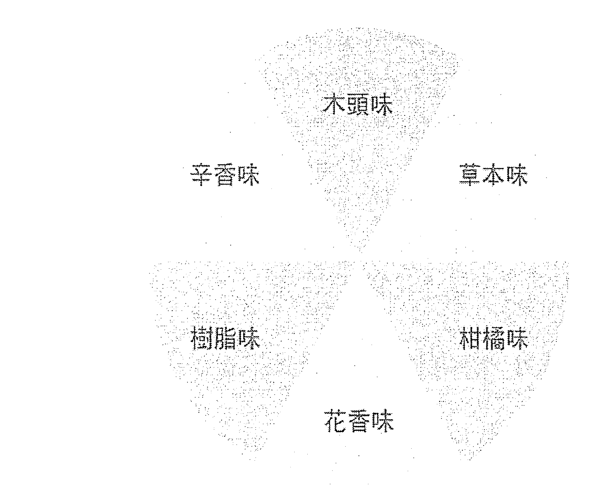
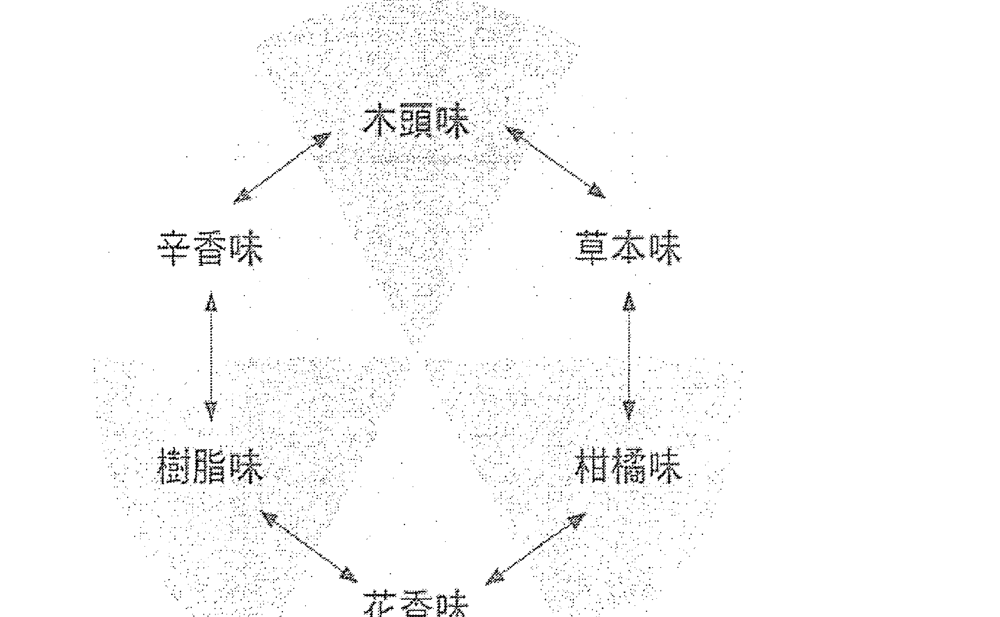
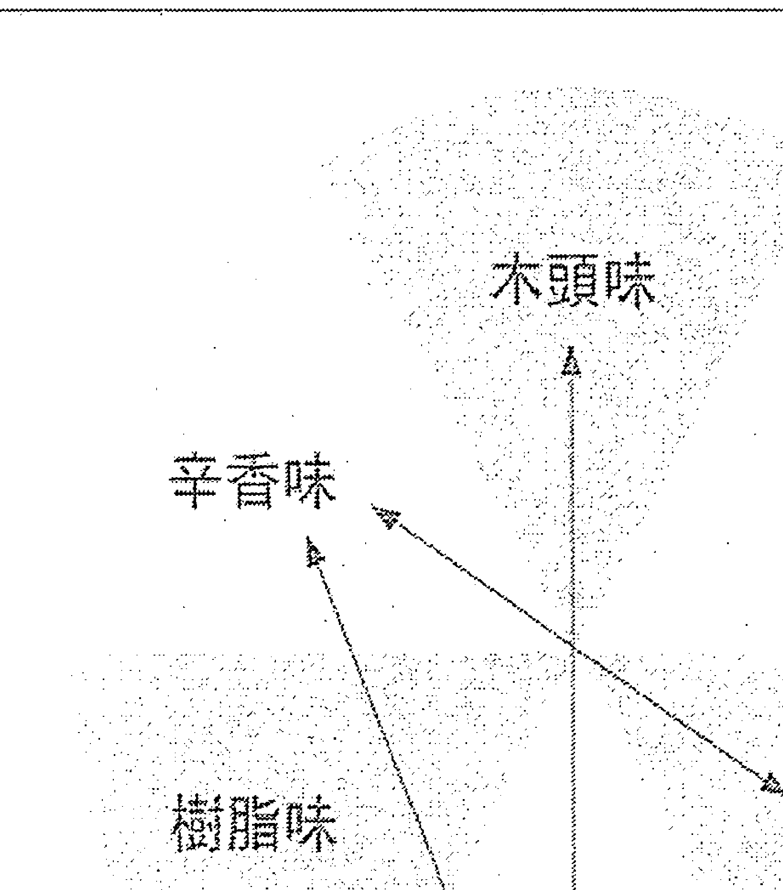
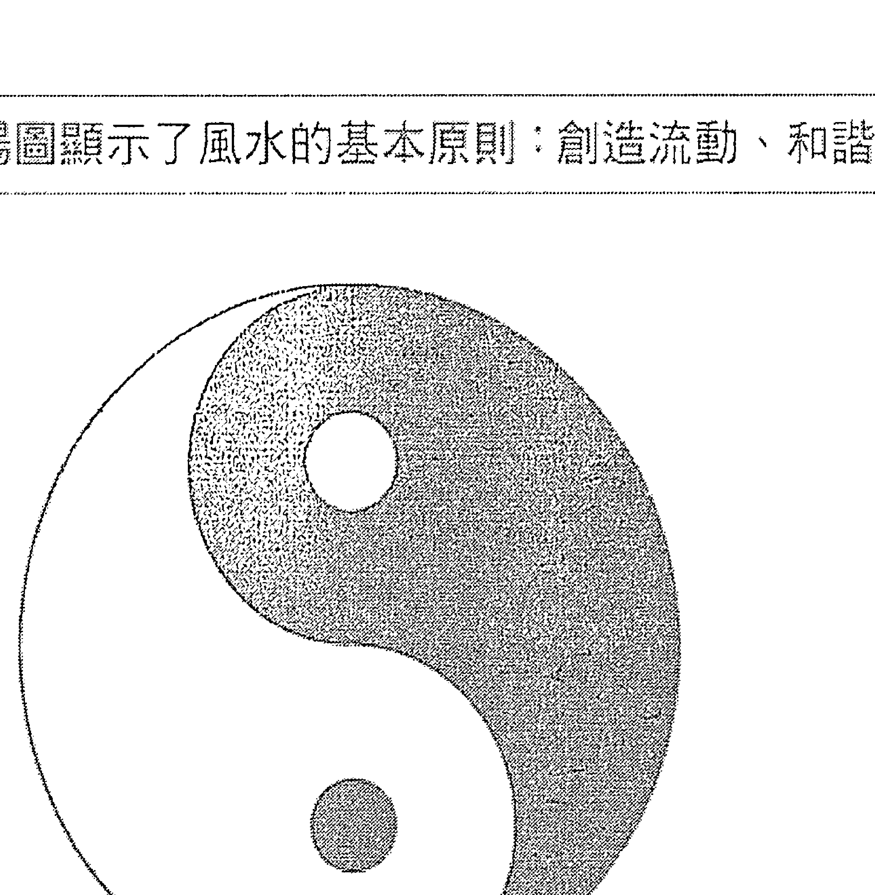

# 女巫的日常精油魔法

## 专文推荐

- ◎可以在本书找依据个人星座、身体症状调油的方法。个人觉得最有趣的是植物精油在蜡烛与居家风水中的运用方法。蜡烛是女巫施法中重要的工具之一，你可以依据书中的建议点一枝魔法蜡烛来改善居家能量。
  —— Claudia Studio-女巫的塔罗、芳疗/植物系女巫 -Claudia

- ◎这本书完整揭露植物精油所蕴藏力量，并不保留地分享居家环境、身体照顾等配方。从身心灵整合的概念切入，对于大多处于亚健康的现代人，是本值得收藏在家的芳疗宝典。
  ——Judy's Space 香氛觉醒创办人／Judy

- ◎在这个人心纷乱、压力攀爬的时代，能够找到心灵的解脱是非常重要的。《女巫的日常精油魔法》就是一本百搭的心灵解脱圣书，不只有舒缓不适的精油教学，还有星座调油、精油在脉轮上的运用，可说是本生活、灵性皆适用的芳疗小书。想使用精油却不知从何下手吗？诚挚推荐此书给您！
  —— 心灵芳疗师／Tequila

- ◎在药草魔法成为另类显学的风潮中，终于出现一本实用性高、有理有据、兼顾感性和知性的作品。从药食的芳香疗法原理，到精确的魔法调配指南，看似简单易懂，内容却涵盖了初学者需要的所有面向，实在令人惊喜不已！
  ——芳疗天后Gina／许怡兰

- ◎作者Sandra Kynes热爱大自然，涉猎的范围除了精油，还包含植物、水晶、女神、鸟类、海洋能量、凯尔特树以及各种仪式。跟着她用有创造力的方式来探索，从星座、脉轮到风水的精油魔法，与东方风水（观察气流流动）有异曲同工之妙。透过她的文字，一再告诉我们，与大自然连结、魔法的真谛是：Magic is everywhere and explore the magic around you.
  ——芳疗主播，《看植物在说话：居家好运芳疗》作者／曾钰雯

## 推薦序

## 從心理學的角度來看魔法

這不是一本以藥草、生理為基礎的芳療書，而是以傳統薩滿的角度來認識精油。

在古代，薩滿文化是人類原始的宗教，薩滿就是各種原始宗教的通稱，這種文化存在於世界各地不同種族，而人類的神話哲學也因建立於不同薩滿文化而逐漸延伸發展，筆者在心理研究所時，因為姻親族母是台灣原住民卑南族傳統巫師，對此甚感興趣，曾針對薩滿之於身心靈發展作深入的研究，因此為此書寫序，企圖為讀者在參考此書時，能建立對薩滿儀式的「魔法」有一個基本而正確的概念。

古代薩滿的療癒元素是結合符號學的心理暗示，而對內在心理起了安定力量、例如咒語祈禱文，星象發展而來的占星學也有結合了符號概念在裡面。

在文明發展之初，人類對世界的認知就從觀察大自然而來，當時人們對大自然尚未有宇宙概念難以空間詮釋，這包括了地水火風等基本地球元素，同時因日月交替對星象、四季的變化，人類開始對星星產生好奇，並對此開始進行長期觀察、記錄、研究與思考，隨著文明發展不斷的累積直到後來，結合科學對天體的研究而總結出一定的規律。

人們把這些觀察和人文活動等客觀現象進行了聯結，古代人類發現每個季節乃至每個月份、每一天，太陽系中每一顆或大小行星（即太陽、月亮、金、木、水、火、土），都對祂產生依角度和距離的不同而有著顯著差異的膨脹效應，並查覺到人被日月星變的物換星移中，影響了行為軌跡，因而占星術於焉產生。

事實上，不只是人類，包括在地球上的所有生命，皆因日月交替、季節變化而隨之改變，不同的氣候環境也長成不一樣的性格，也發現植物甚至在肉眼所看不見的空間，也以其相對應的「氣質」而存在著，而這些就是我們所謂的靈性。以愛因斯坦的相對論來理解，當氣是一種微物質，在不同生命體裡的這些微物質會因應宇宙的流動脈絡，自然而然地找到相對應的微物質。

自古以來，資深芳療師都稱精油就是植物的靈魂，特別是經過萃取、蒸餾後濃縮出來的精油，他們猶如一位歷經逆境淬煉後的「得道高僧」，一個被洗滌過後的純淨靈魂。在充滿生命挑戰的現今人類，若能夠藉由找到合適的植物靈魂陪伴，就像是一位薩滿巫師在薩滿旅程中一位守護神，能讓我們深藏內在的靈性得以有個穩定的力量支撐著，在走向解脫的靈性提升之路時，享有一隅休憩的片刻。

—— 烏順芳療師 Fanna

※ 薩滿文化具有多跨學科的學術研究價值，是人文學者研究原始文化的重要途徑和標的。薩滿研究需要藉助大量的田野調查，並以結合文獻學、考古學資料、民族學、宗教學、符號學、心理學等多學科的研究方法，對薩滿教文化內涵進行了系統的梳理和深入的探討。薩滿文化可分別從創世神話及哲學發展、自然科學、薩滿演說（預言）、薩滿治療、薩滿藝術、薩滿符號、薩滿神話、舞蹈、音樂等方面多元發展，而現今的哲學、天文學、地理學、命理古星學、傳統醫學、法學、符號學、文學、藝術、心理學等多學科都能有古代薩滿的基礎，並在此基礎上，探討薩滿與諸學科的關係及對民族文化的深遠影響。

# 前言

气味可以刺激我们、赋予我们灵感并且使我们为之陶醉。由于我们的嗅觉和记忆与情绪息息相关，因此气味攸关一个地方对我们的影响力。我最鲜明的童年记忆有一部分就是和我奶奶的房子有关。那栋房子里满是各种植物和大型的老旧家具，但我记得最清楚的却是那里的气味。那些气味来自奶奶用来熏香的干燥花草、她那宽大的厨房以及屋外的几座庭园。那真是一座由香气构筑而成的仙境。

就像许多人一样，我因着精油那迷人的香气而开始对它们产生兴趣，并热切的期盼著有朝一日我能用精油调製出属于自己的香气。我天生热爱学习、研究，总是不停的求取新知，但大多时间都是自行探索，偶尔才会去上个课或参加工作坊。在尝试使用精油期间，我发现有些精油混合起来的效果不如预期，於是我便开始搜寻这方面的资料。

我找到了许多配方，有一阵子也从中得到了许多乐趣，但我想知道更多有关精油的种类，并了解其中的原理。刚好我对製作「百花香」（potpourri，用来熏香房间的乾燥花瓣及叶子）也有兴趣，而且我知道製作过程中往往也会用到精油。於是，当我发现了一个在星期六下午举行的工作坊时，便毫不犹豫地报名参加了，希望能在那裡学到更多调香的技术。然而，那门课程固然上得很好，但还是无法完全符合我的期待。我感觉自己在精油方面的学习进展得很慢。

当时，我很想了解为何有些精油混合在一起效果很好，但有些精油则否，也想知道该如何才能做出正确的抉择。这一来是因为有些精油要价不菲，二来也是为了要满足我个人的好奇心。无论做任何事情，我除了想知道做法之外，也想知道这些做法之所以有效或无效，原因究竟何在。

尽管如此，我並不想去上那些动辄要好几百美元的芳疗师培训课程。我只想知道该如何选择用来调製香气的精油。所幸我运气很好，刚好发现一个朋友正在努力研习自然疗法，以便通过几项相关的检定，而其中一个项目便是芳香疗法。更棒的是，她愿意和我分享她所学到的知识。虽然如何选择香氛精油只是她的研究范围当中的一个小部分，但已经足以弥补我在知识上的不足。於是，我便跟著她学习了一段时间。当时，我感觉自己彷彿置身天堂，因为我终於懂得了其中的门道。

除了精油之外，我对调製药草方子也很有兴趣，而我在精油方面的研究正好弥补了我在药草知识上的不足。我之所以会这样说，其实並不奇怪，因为两者的历史原本就密不可分。打从我很小的时候，我的家人生病、身体不适或受伤的时候通常都会先用厨房或奶奶的花園裡找來的藥草治療或急救，儘管市售的成藥最終還是進駐了我們家的醫藥箱，但母親還是經常會用她從小學到的那些草藥方子來為我們治病。因此，我對這些方子自然也非常熟悉。隨著我使用精油的經驗日益豐富，我也逐漸發現那些精油讓我在調製草藥方子時有了更多、更好的選擇。

在繼續下文之前，我必須先釐清我之所以使用精油，為的是滿足自己的需求，而不是要治療他人或販售任何產品。你可能會覺得奇怪：那我為什麼要撰寫這本書呢？事實上，我的目的是要鼓勵人們放心大膽地探索那迷人的精油世界，也希望提供一些靈感，讓大家能夠發揮創意，調製適合自己的香氛處方。但儘管如此，我還是希望讀者們在這個過程中能注意自身的安全。

此外，我希望這是一本涵蓋面較廣的書。這書的英文書名之所以有「完全」（complete）二字，指的並非書中所討論的精油種類有多麼豐富完整，而是書中所呈現的全方位視角。我希望讀者們在自行調製精油處方時，除了能了解各種精油的特性之外，也能對基底油和其他重要材料有所認識。書中雖然提供了許多精油處方，但重點是在於讀者能夠了解這些處方。在書中，我將會針對這些處方進行說明，並逐步引導你挑選適合自己的處方，讓你知道該如何調製並使用這些處方，以及有哪些不同的使用方法。同時，也幫助你充分運用手上有的精油。

本書的第一篇會先概論精油的歷史，說明精油是什麼、與其他芳香產品有何不同，並提供與基底油相關的知識。此外，精油雖是天然之物，但效果強大，使用時必須小心，以免誤用。因此，為了安全起見，我們也將會談到使用精油時必須注意的事項。除非有專業醫事人員指導，否則我不建議把精油拿來內服。

在第二篇中，我將針對調香的方法做深入的說明。其中談到了兩個很基本的選擇精油的方法：一個是根據精油的「香調」（perfume note），另一個則是根據「氣味類別」（scent group）。此外，這一篇還包含一個頗具趣味性的章節：如何根據每個人的太陽星座來調製他（她）專屬的生日香水。在介紹每一種精油時，我都會說明它和哪些精油比較搭配。但關於香氣之美，每個人的感受不同。你可以依照我建議的方法和自己的嗅覺來選擇精油，以創造出專屬於你的、獨一無二的魔力。

「芳香療法」（aromatherapy）這個名詞在我看來涵蓋面太過狹隘，可能會讓人覺得精油唯一的用途就是拿來薰香。事實上，它們還可以拿來塗抹，以對抗感染、治療肌膚問題、舒緩肌肉痠痛和關節疼痛等。在本書第三篇中，我將探討精油在草藥醫學中所扮演的角色，詳細說明調製藥方的方法，並列舉各種病痛所適用的精油以及最有效的用法。第四篇的主題是個人的身心靈照護。在這一篇當中，我將說明該如何製作自己專屬的護膚與護髮用品，以及如何用精油來照顧自己的情緒（傳統的芳香療法）並提升靈修的境界。此外，我也將討論一個與個人的身心健康有關的議題：如何用精油來調節脈輪的能量，並探討該如何用精油與蠟燭為我們的生活創造一些魔法。

在第五篇中，我將討論精油的另外一個很實際的用途：清潔居家環境、淨化家中空氣並且杜絕害蟲。我們可以把精油添加在一般家庭用品（例如醋）當中，以取代市售的化學清潔劑。當然，並非所有精油都適合，但它們都可以用來改善風水，這便是所謂的「芳香風水」（aromatic feng shui）的概念。在第十五章中，我將提供一個很簡單的辦法，讓你能把精油用在中國古老的風水概念中。在第六篇中，我將針對60幾種精油做深入的探討。第七篇的內容則是介紹各種基礎油以及那些經常被用在家庭製劑中的重要材料，其中包括各種不同的水。書末的目錄中包含了「度量衡換算表」和「精油稀釋比例表」以及最後面的「辭彙表」，藉以讓讀者們能做進一步的探索與學習。

有幾種知名的精油並未被列入本書討論的範圍，其中之一便是花梨木（rosewood，學名為Aniba rosaeodora，別名bois de rose）精油。花梨木由於遭到濫伐，已經被列入「國際自然保育聯盟」（International Union for Conservation of Nature，簡稱IUCN）的「瀕危物種紅色名錄」（Red List of Endangered Species）中，而且根據IUCN的資料，這個樹種目前並沒有明顯的再生跡象。除了花梨木外，穗甘松（spikenard，學名為Nardostachys jatamansi）也被列入了IUCN的紅色名錄，而且是屬於極度瀕危的物種。另外一個便是印度檀香（Indian sandalwood，學名Santalum album）。這種樹木的氣味廣受喜愛，但很不幸的，它也因為被過度濫採而走上了滅絕的道路。目前，檀香木已經被IUCN列為「易危物種」（vulnerable species），距離「瀕危」只有一步之遙。所幸，澳洲政府為了確保它能永續生存，已經立法管制澳洲檀香木（Santalum spicatum）的採收，使得這個樹種的命運出現了一線生機。

有時，同一種植物身上可以萃取出兩種不同的精油。以歐白芷（angelica）為例，用它的根所萃取出的精油和用種子所萃取的精油並不相同。在必須有所區分的時候，我會在文中註明是「歐白芷根」精油還是「歐白芷籽」精油。如果只寫「歐白芷」，則是同時涵蓋兩種精油。此外，我們也會區分由相近的物種所提煉出的精油。以尤加利為例，當我們指前言

的是特定的品種時，會特別註明是「藍膠尤加利」(eucalyptus blue)還是「檸檬尤加利」(eucalyptus lemon)。如果只寫「尤加利」，就表示兩種精油都可以用。

我之所以撰寫這本書，是為了幫助你充分運用自己喜愛或手上現有的精油。雖然書中所列的配方會顯示哪些精油可以互相搭配，但重點還是在幫助你自行調配出屬於自己的組合。如果有個配方必須用到某一款精油，而你手上剛好沒有，你可以參考書中的簡易疾病指南或其他說明表，看看有哪些精油可以取而代之。

一個方子要有效，並不一定用到很多藥材。事實上，千百年來，許多藥草專家都是用所謂的「單方」（也就是只有一種藥草的方子）來治病。因此，剛開始時，你不妨一次只用一種精油，以便對它有所認識，並且看看它是否適合你。

書中所列的配方都只能製作少量的成品，目的是要讓製作過程既快速又方便，並確保成品的新鮮度。現在，就讓我們進入那令人著迷的精油世界，讓我們的生活變得更加豐富吧！

免責聲明

本書所提供的資訊無法取代專業的醫療建議。在沒有醫師或合格的醫療保健人員監督的情況下，不應將精油做為內服之用。若你已經因為某種疾病而就診，請先請教你的醫師再決定是否要使用精油來改善病症。在使用精油處方治療輕症時，若問題遲遲不見改善甚至更加惡化，請和你的醫師連絡。

第一篇 背景資料

在本篇中，我們將簡要地回顧精油的歷史以及人類對精油的喜愛。我們將會談到古代全球各地的諸多文明如何將精油用於醫療與宗教儀式中；我們也將發現，將芳香植物加以蒸餾以製成精油的歷史或許比我們所想像的更加古老。雖然到了20世紀之後，許多藥物與香水都是以化學物質製成，但我們將會談到精油後來如何得以再度翻身。

談完了歷史後，我們會稍稍進入科學的領域，以便了解精油是由哪些成分組成的、植物為何會產生精油以及精油和市面上其他的芳香產品有何不同。我們將會說明提取精油的各種方法以及精油的各種副產品。此外，由於市面上有些芳香產品經常被誤認為是精油，因此我們也將會檢視這些產品的萃取過程。

由於精油通常會和基底油一起使用，因此在這一篇中，我們也會詳細說明各種基底油的提煉方法。當你明白這些方法之後，你可能會對家裡的食用油改觀。此外，我們也會談及我們在購買精油和基底油時經常看到的那些行銷術語以及購買時應該注意的事項。

植物的俗名固然比較容易記住，但也可能會造成混淆。在購買精油時，我們務必要買到正確的品項，因為即使是看起來相近的精油，它們的特性和使用禁忌可能也不盡相同。儘管精油是天然的產品，可以用來取代化學製品，但如果使用不當，還是可能會造成危險與傷害。因此，在這一篇當中，我們會使用通俗易懂的語言揭開精油學名的神秘面紗，讓你能確保自己買到的是對的精油。同時，我們也將說明在使用精油時應該如何保障自己、家人以及寵物的安全。

第一章 精油的历史

精油的历史得从精油问世之前开始说起。自古以来，人们便喜爱各种芳香油脂，会把芳香植物浸泡在油脂中，然后用来治疗或举行宗教仪式。这种现象在世界各地的文化中都可以看到。古人普遍相信：香气是物质世界与灵性世界连结的管道。几乎所有人都会用香水或芳香油脂涂抹身体。这种做法一直延续到今天。在英文中，perfume（香水）这个字源自拉丁文中的per（即「经由」之意）和fume（烟雾）这两个字。

古人如何使用芳香油脂

公元前16世纪的「埃伯斯草纸医典」（Ebers Papyrus）是记录埃及人如何使用药草的最古老文献之一。书中除了详细说明各种植物的特性之外，也列出了许多药草方子以及有关香水和炷香的资料。根据书中的记载，当时埃及的医师往往具有调香师的技能，因为他们所制造的药用芳香油脂也可以当成香水使用。除了医师之外，那些专门负责用芳香油脂涂抹死者尸体以防止其腐烂的技师也会凭着自己的本事调制香料以供人们美化肌肤，避免严酷的沙漠气候对肌肤造成损伤。

乳香向来是珍贵的货物，在当时更被视为「诸神的香水」，除了用在寺庙的仪式中之外，也是香水的基本成分。但由于芳香油脂价格昂贵，因此只有上层阶级的人士才用得起。他们往往会把这类油脂存放在由雪花石膏、玉石或其他珍贵的材料所制成、既美观又实用的瓶子里。在数千年后，当考古学家找到这些瓶子并将它们打开时，其中有些仍然散发着香气。

除了埃及人之外，巴比伦人也有使用芳香植物的习惯。他们后来甚至成为邻近国家主要的植物原料供应者。当时，雪松、丝柏、香桃木（亦称桃金娘）和松树都被视为珍贵的植物。另外，亚述人也偏好此道。他们不但会把芳香植物用在宗教仪式中，也会用在个人的生活中。

《吠陀经》（Vedas）是印度最古老的文献之一。这些经卷大约撰写于公元前1500年左右，其中除了歌颂大自然的美好之外，还记载了各种芳香植物的资料，包括肉桂、芫荽、宇、没药、檀香和甘松等。这些资料构成了‘阿育吠陀疗法’(Ayurvedic medicine，一般相信，这是世界上最古老的疗法)的基础。尽管人们往往以为蒸馏法是10世纪的波斯医师兼哲学家伊本·西那(Ibn Sina，980-1037)——亦称阿维森纳(Avicenna)——所发明的，但事实上考古学的资料显示印度人在西元前3000年左右就已经开始以蒸馏法从芳香植物中提炼精油了。

传统的中医疗法始于一本名为《黄帝内经》的典籍，书中也提到了芳香植物的用法。由于古代的腓尼基商人在地中海一带买卖芳香油脂，远东地区那些珍贵的芳香植物后来也被引向了欧洲，尤其是希腊与罗马两地。

其后，希腊人日益喜爱使用香氛，对药草和芳香油脂的疗效也有普遍的认知。但和埃及人不同的一点是：在希腊，使用芳香油脂乃是全民运动，并非上层阶级特有的专利。其后的罗马人也沿袭了希腊人使用植物治病和熏香的风气，除了用芳香油脂涂抹身体之外，他们还会用芳香植物让自己的衣服、住宅乃至公共澡堂和喷泉都散发着香气。

罗马帝国衰亡后，欧洲进入了‘黑暗时代’，芳香植物的使用也随之式微。为了躲避动乱，行医的人纷纷迁徙到君士坦丁堡(也就是现今土耳其的伊斯坦堡)，也把各种知识带到了那里。因此，这段期间，虽然欧洲文明已经衰颓，但希波克拉底等人的著作却在中东各地被广泛翻译与流传。

中世纪时期

这段期间，许多人仍不断针对芳香植物进行各种实验，包括我们先前提过的波斯医师阿维森纳，他用玫瑰花提炼出了‘花之油’(当时称为 otto 或 attar)。当欧洲文化逐渐复兴时，使用芳香植物的风气就从东欧传入了西班牙，而且蔚为流行。十字军东征之后，阿拉伯的香料在欧洲各地都十分抢手。到了13世纪时，中东和欧洲之间的贸易又再度蓬勃兴盛。

当时，有位名叫西洛尼穆斯·布朗希威格(Hieronymus Brunschwig，c. 1450-1512 左右)的德国医师针对蒸馏技术进行实验。他说他用这个方法提炼出了杜松、迷迭香和穗花薰衣草的精油，并将蒸馏过程详细记录下来，写成了一本书。当时，他的主要目的是在制造纯露（aromatic water）。對他來說，精油只是蒸餾過程中的副產品。後來的德國博物學家暨藥劑師亞當·隆尼澤（Adam Lonicer，1528-1586）則反其道而行。他把主要目標放在精油而非純露之上。經過一連串的實驗，他提煉出了大約 61 種精油，並且一一詳細的說明。逐漸的，這些精油便被納入了草藥醫學的範疇。

到了 16 世紀中葉，歐洲各地人士再度開始重視薰香的藝術。由於精油可以掩蓋身上的體味，於是便日益受到歡迎。就像古代的羅馬人一般，當時的法國人也喜歡把身體、住所和公共噴泉都弄得香噴噴的。歐洲人也開始嘗試將本地的植物（如薰衣草、迷迭香和鳳尾草）提煉成精油。

17 和 18 世紀時，歐洲各地的藥劑仍然繼續進行著與精油有關的研究。到了 19 世紀後半，因著安東·拉瓦西耶（Antoine Lavoisier，1743-1794）和讓—巴普提斯特·杜馬（Jean-Baptiste Dumas，1800-1884）這兩位法國化學家的研究，人們開始廣泛使用精油。這段時期，由於化學家已經有能力解析出精油中的各種成分並加以研究，於是他們也開始在實驗室中製造化學合成的精油。

現代

20 世紀初期，由於化學技術的進步，藥草和精油在醫藥上的用途逐漸被化學製品所取代。不仅如此，由於人工合成的香水較為便宜而且容易製造，因此以化學合成的香水和美妝用品受歡迎的程度也逐漸超過了天然的藥草和精油。但說來諷刺，精油的用途之所以在 1920 年代再度受到人們重視，都要歸功於一位名叫雷內·莫里斯·蓋特福斯（Rene-Maurice Gattefossé，1881-1950）的法國化學家。某天他在實驗室工作時，有一隻手被燙傷了，於是他便隨手抓了身邊的液體（後來發現是薰衣草精油）來塗抹，沒想到傷口竟然迅速癒合。這個現象引起了他的興趣，於是後來他便全心研究精油，並將他的研究心得命名為「芳香療法」（aromatherapy）。

儘管 20 世紀期間，人們廣泛使用化學物質製造藥品和香水，但環保運動的興起讓人們逐漸意識到人類的健康取決於地球環境的健全。這樣的轉變使得人們開始對草藥、精油以及其他天然療法與相關的學問產生了興趣。隨著大家愈來愈能夠接受這類「替代」療法，我們也逐漸發現把傳統療法與現代醫藥加以結合的做法，能夠集兩者之精華，產生最佳的效益。

第二章 各式精油萃取法

植物之所以會分泌精油，是為了促進生長、吸引昆蟲授粉或對抗真菌或細菌。大多數植物所分泌的精油數量都很少，但那些被通稱為「芳香植物」的植物卻有足夠的精油供我們採收並使用。市面上眾多的精油乃是由植物的各個不同的部位提煉而成。有時，不同的部位所分泌的精油也不相同。以歐白芷為例，它的根部和種子都會分泌精油，但兩種油並不相同。事實上，植物身上可以萃取出精油的部位很多，包括葉、莖、小枝、花朵和花苞、柑橘屬植物的果皮或整顆果實、木材、樹皮、樹脂、油性樹脂、樹膠、根部、地下莖、球莖、種子、果仁和堅果等等。

大多數人都知道精油是什麼，但也有很多人誤以為只要是用天然的材料製成的芳香商品就是精油。事實上，真正的精油具有兩個重要的特質：第一，它們可以溶於酒精或油脂，但不溶於水。第二，它們揮發在空氣中時會逐漸揮發。大多數精油都呈液態狀，但有些（例如玫瑰精油）隨著室溫的變化可能會變成半固體狀。

蒸馏與壓榨

要分辨何者為精油，何者不是，要看製造商是用什麼樣的方法從植物原料中萃取出油脂。精油（又名「揮發油」）是透過蒸馏與壓榨的方式取得，而一般的「芳香萃取物」（aromatic extract）則是以溶劑萃取而得。兩者並不相同。後者除了含有揮發性成分之外，也會含有不會揮發的成分。下面讓我們來仔細看看這幾種萃取法以及它們所製造出來的商品。要取得精油，最古老也最容易的方法便是「壓榨」。這種方法也被稱為「冷壓」法。對於喜歡以橄欖油烹飪的人士而言，「冷壓」這個名詞聽起來可能很熟悉。但如果要萃取精油，冷壓法只適合用在柑橘類的水果上，因為這類水果的果皮內就含有大量的精油。但同樣是柑橘類的水果，有些是以整顆果實來壓榨，有些則只取果皮的部分。壓榨完成後必須再以離心機處理，讓揮發油與其他原料分離。這種方法很簡單，只需要用到機器，無須加熱，也不必使用化學製品。然而，如果植物並非有機栽種，它的果實就有可能會被噴灑殺蟲劑，而這些殺蟲劑可能會有少量殘存於精油中。

女巫的日常精油魔法

另外一個萃取精油的方法是「蒸餾法」。這種方法用的是水或蒸氣。在蒸餾的過程中，植物中的揮發性物質和可溶性物質會被分離出來，剩下的便是精油。有時，萃取出來的精油還會經過二次蒸餾，使其更加純化，並去除第一次蒸餾後殘存的可溶性物質。

在使用蒸氣蒸餾時，蒸氣是從植物原料的下方被灌入蒸餾槽。這些蒸氣所產生的熱氣與壓力會使植物原料分解，並釋放出揮發油。這些油蒸發後會隨著蒸氣通過蒸餾器，進入一個冷凝器，並在那裡逐漸冷卻。在這個過程中，油和水會逐漸還原成液體狀。這時，揮發油會因為本身密度的關係，浮在水面上或沉到水底。但無論是浮是沉，它都能輕易地被分離出來。不同的植物和部位所需要的蒸餾時間和溫度都不太相同。

另一種蒸餾法就是所謂的「擴散滲透法」(hydrodiffusion)，只不過在使用這種方法時，蒸氣是由植物原料的上方（而非下方）進入蒸餾槽。此法的好處是：它所需要的蒸氣比較少，時間通常也比較短。有些香水業者認為：相較於標準的蒸氣蒸餾法，用擴散滲透法所萃取出來的精油香氣比較濃郁。

當蒸餾過程中用的是水而非蒸氣時，植物原料會被完全浸泡在熱水中。這種方法所需要的壓力比蒸氣蒸餾法小，溫度也稍微低一些，但已經足以使某些植物（例如快樂鼠尾草和薰衣草）分解。另外，有些對高溫很敏感的植物（例如橙花）也比較適合這種方法。

在蒸餾過程中，當精油從水中被分離出去後，剩下的水便是一種氣味芬芳的副產品，名為「純露」(hydrosol)。過去，它們往往被稱為「花水」(floral waters 或 rosewater)，其中含有芳香植物的水溶性分子。在英文中，hydrosol 也被稱為 hydroflorates 或 hydrolats。後者源自拉丁文中的 latte（即愛喝咖啡的人士都很熟悉的「拿鐵」）一字，意思就是「牛奶」。之所以會有此稱呼，是因為純露剛剛和精油分離時看起來頗為混濁，色澤類似牛乳。儘管它們的化學成分與同種植物所提煉出的精油不同，但香氣卻相近。只不過，純露是水性的物質，和油難以融合。此外，純露的製作環境和那些可以服用的產品不同，因此不應被用於花精療法(flower essence remedy)中。

「花精」(flower essence) 這個名詞可能會造成一些誤解，因為這類產品既無香氣，也非精油。它們只是把花朵泡在水裡，然後再和 50% 的白蘭地溶液混合所形成的產品。白蘭地可以充當防腐劑，以免花精變質，但純露卻有可能會產生腐敗現象。

在使用蒸氣或水蒸餾的過程中所產生的熱氣可能會導致植物原料和其精油發生變化。這有時是一件好事，但有時則否。舉例來說，德國洋甘菊中的化學成分母菊素(matricin)在高溫之下會轉化成母菊天藍烴(chamazulene)，使得德國洋甘菊的精油變成藍色。就療效而言，這是一件好事，因為母菊天藍烴的存在使得德國洋甘菊精油具有消炎作用。相反的，茉莉花則不適合用這種處理法，因為它的花瓣太過嬌嫩，在溫度過高或有水氣的環境下，它們的揮發油將會被破壞殆盡。

其他萃取法

為了避免高溫和水對某些植物造成不良的影響，業者會用溶劑來萃取精油。其方法是用丁烷、己烷、乙醇、甲醇或石油醚把植物原料中的揮發油漂洗出來，最後得出一種半固體的蠟狀成品，名為「凝香體」(concrete)，其中除了揮發油之外，還含有該植物的蠟質與脂肪酸。就茉莉花而言，它的凝香體是由 50% 的蠟質與 50% 的揮發油所組成。凝香體的優點是它比精油更穩定也更濃縮。

得出凝香體後，再用酒精或乙醇加以漂洗（有時還會經過冷凍處理），就可以去除其中所含的溶劑與蠟質，得到一種名為「原精」(absolute) 的物質。原精通常是黏稠的液態狀，但也可能是固體或半固體狀，是一種高度濃縮的物質，香氣也比精油更加強烈、濃郁，也更像植物本身的氣味。對於香水製造業者來說，這是一大優點。溶劑萃取法能夠提煉出的精油比蒸餾法更多，通常比較適合用來處理那些含油量較低的植物。有時業者也會將原精和凝香體加以蒸餾，以提取精油。不過，原精、凝香體和由這兩者所蒸餾出的精油都有一個根本性的問題：它們都含有微量的化學物質（用來將精油與植物原料分離的那些化學物質），不夠純淨。

為了避免這個問題，有人研發出了一種「二氧化碳萃取法」(CO2 extraction)。此法有時也被稱為「超臨界二氧化碳萃取法」(super-critical CO2 extraction)。這種方法是用高壓的液態二氧化碳溶解植物原料，使其釋放出精油，然後再把壓力降低，讓二氧化碳還原到氣體狀態。這時剩下來的便是精油。用這種方法萃取的精油據說不含任何化學殘留物，但就像那些用溶劑萃取出來的精油一樣，它們還是含有植物的脂肪、蠟質和樹脂。

- 用「二氧化碳萃取法」提煉出的產品分成兩種：一個是在比較低的壓力下製造出來的，被稱為「精選萃取物」(select extract，簡稱 SE)。此物呈液態狀，所含的植物脂肪、蠟質或樹脂較少。另一種則是「完全萃取物」(total extract)，它比「精選萃取物」更加濃稠，且含有較多的非可溶性植物原料。
- 根據芳療作者暨訓練師英格麗·馬丁（Ingrid Martin）的說法，在實驗室進行的測試顯示：真正的精油和用二氧化碳萃取出來的產品，兩者的「化學成分顯著不同」。

另一種用標準的溶劑萃取法提煉出來的物質被稱為「香膏」(resinoid)。此物來自植物中的樹脂狀物質，包括樹脂、香脂、油性樹脂和油膠樹脂（有關這些物質的資料請參見書末的辭彙表。）有些香膏是呈黏稠的液態狀，有些則是呈固體或半固體狀。如果再用酒精來萃取這些香膏，就可以得出一種名為「樹脂原精」(resin absolute)的產物。

另外一種萃取法名為「脂吸法」(enfleurage)，但這種方法極其耗時、費工，以致成本高昂，因此現在已經很少用了。這種方法是用來從那些昂貴的花朵（例如茉莉）中萃取出原精，但在過程中並不使用化學溶劑，而是用動物的脂肪組織（例如牛油、羊油或豬油）。其方法是在一個有框的玻璃板上舖上一層脂肪，然後再放入一層花瓣，接著再在這層花朵上放一塊玻璃板，而後再在上面舖一層脂肪，接著再放入一層花瓣。如此這般，層層相疊。

這疊玻璃板必須每天拆解一次，把裡面的花瓣一一挑揀出來，並在原來的脂肪中放入一層層新的花瓣，然後再把這些玻璃板重新堆疊起來，直到有一天那些脂肪都吸滿了揮發油為止。這個過程所需的時間視花朵的種類而定，茉莉需要大約70天。到了最後一天，花朵都被取出來之後，業者便會用酒精漂洗這些脂肪，把其中的揮發油分離出來。在酒精都揮發淨盡之後，剩下來的便是原精。有時，用這種方法製成的原精也被稱為「脂吸原精」(enfleurage)。

還有另外一種產品叫做「浸泡油」(infused oil)。其做法是把植物原料浸泡在植物油當中，讓油充滿植物的芳香與化學成分。做法簡單而且成本很低。這種油雖然有一些藥效，也很適合用來烹調，但其中所含的精油成分很低。（有關「浸泡油」的詳細資料，請參見第七篇。）這種浸泡法也稱為「浸漬法」(maceration)，是古代的埃及人所用的方法，歷史非常悠久。浸泡油在醫藥和烹飪上有其價值，但要記住它並不是精油，因此不應該被當成精油來出售或使用。

小心陷阱

在購買精油時要注意幾個事項。首先，不要買到合成的精油。這類精油雖然成本較低，但品質也較劣，因為它們都是用化學方法製造的，而且用的通常都是石油的副產品而非植物原料。這種油聞起來可能很像真正的精油，但並沒有精油的療效。其次，不要買到用基底油稀釋過的精油。有一個很簡單的方法可以測試你買到的是不是這種油：把它滴在紙上，等到它揮發之後，觀察紙上是否殘留任何痕跡。如果紙上有油漬，那就表示其中混有基底油。

參考文獻

| 作者                | 書名                                                         | 頁碼 |
| ------------------- | ------------------------------------------------------------ | ---- |
| Groom               | The New Perfume Handbook                                     | 177  |
| Dobelis, ed.        | Magic and Medicine of Plants                                 | 51   |
| Chevalier           | The encyclopedia of Medicinal Plants                         | 34   |
| Bayer and Buchbauer | Handbook of Essential Oils                                   | 6    |
| Martin              | Aromatherapy for Massage Practitioners                       | 13   |

## 第二章 各式精油萃取法

另外，在購買精油時，要注意價格。如果一家公司所販售的精油價格都差不多，這通常表示它們有攙雜別的油，否則便是人工合成的精油。這是因為有些植物的價格較高，而這自然會反映在精油的售價上，所以不可能每種精油的價格都差不多。此外，精油的包裝上如果標示著「等同天然」（nature-identical）的字樣，那通常就表示它是化學合成或摻有其他油脂的產品。在我看來，「天然」就是天然，沒有「等同天然」這回事。最後，要注意的是：精油是來自植物而非動物的產品。因此，麝香、龍涎香以及其他取自動物或鳥類的油都不應該被歸類為精油。

既然我們已經瞭解了有關精油的種種，接下來就讓我們來探討基底油是如何製造出來的。

## 第三章 基底油

之所以要使用基底油（carrier oil），是因為：我們如果直接把精油塗抹在肌膚上可能會造成疼痛、發炎的現象或其他問題。在英文中，基底油又被称为 base oil（基礎油）或 fixed oil（非揮發油），因為它們可以做為精油的基底，而且它們即使暴露在空氣中，也不會像精油那般揮發。而精油具有高度的親脂性，很容易被油脂和蠟質所吸收。「脂吸法」之所以會把花瓣放在豬油、牛油或羊油裡面，藉以萃取精油，就是基於這個原理。

由於基底油是從植物的脂肪部位提煉出來的，因此它們很容易就能吸收精油，並達到分散並稀釋精油的作用。大多數基底油都是由植物的種子、果仁或堅果製成。有些則是來自植物的果實，例如酪梨和橄欖等。對堅果過敏的人應該避免使用以堅果製成的基底油。

儘管有人建議用超市買來的合格植物油當基底油，但這種做法其實並不妥當，個中原委我們稍後將會加以探討。同樣的，礦物油或嬰兒油也不適合當成基底油，因為它們都是由石油產品製成的。

由於基底油是用植物的脂肪提煉的，因此如果儲存不當可能會產生油耗味。就像精油一樣，它們應該被存放在密閉的深色瓶子裡，遠離陽光與人工照明的光線。把基底油放在冰箱裡，能讓它們保持新鮮並延長使用期限。不過，就像冰箱裡的其他食材一樣，它們到頭來還是有可能會變質，因此如果油品看起來或聞起來已經不太對勁了，還是把它扔掉吧。

大多數基底油的氣味都很清淡，聞起來可能甜甜的，或者有堅果、青草或香料的氣息，但並不像芳香油那麼強烈，通常也不會干擾香薰復方的氣味。有時候你可能會發現基底油的香氣可以提升香薰復方的氣味。建議你在購買基底油時每種只買少量，然後試試看哪一種最適合你所調配出來的方子。

### 基底油的煉製方法

讀到這裡，你心裡可能會想：超市所販售的合格植物油並沒有味道呀。這是因為業者使用了化學溶劑將它們脫色、除味並殺菌。這樣的做法固然可以延長保存期限，但也意味著我們會把化學物質吃進肚子裡或塗抹在肌膚上。

無論你要買的是基底油還是烹飪油，最好選擇未經精煉的油品。如果可能，就盡量購買有機的產品。市售的精煉油都是廠商為了降低製造成本，以化學溶劑製造的。其中有些甚至是以經過基因改造的植物為原料。

精煉過的食品級油脂都經過去味、脫色的程序，使它們聞起來沒有味道，看起來也幾乎沒有顏色（不知道為什麼，人們一直認為這是一件好事）。有些植物原料在被送去榨油之前往往已經在倉庫裡存放了一年以上。當它們終於被運出倉庫後，會先經過一道用化學藥劑洗滌的程序，以去除在儲存期間可能長出的黴菌。

接著，業者會以溶劑進行萃取，把固體的植物原料中所含的油脂分離出來，接著再進行蒸餾，以去除清洗時所用的化學物質。經過這些手續之後所得出的黏稠液體叫做「原油」(crude oil)。這些原油又會再經過一道過濾的手續。你可能會以為所謂的「過濾」，是用類似咖啡濾紙那樣的器具來去除雜質，但事實上，他們的做法是把油加熱，並加入氫氧化鈉（又名「鹼液」）或碳酸鈉（一種含有碳酸的鹽類）來加以中和。但到了這個階段，製作過程尚未結束。之後，業者還會使用漂白土（矽酸鈉）或一種黏土來脫色，以便盡量淡化油色。這些土壤的顆粒都非常細小，很能吸附雜質和汙物，也可以去除那些使油脂看起來有顏色的分子。

這樣的過程不斷反覆：在油裡加了某種東西之後，接下來就要設法去除那些東西。因此，加了漂白土之後，就得把油脂再過濾一次，以去除裡面的土，然後再把油放在高溫的真空蒸氣設備裡除臭。這時，油品中的養分已經所剩無幾。最後一道手續叫做「冬化」(wintering)。其作用是使油品在低溫下不致變得混濁。未經精煉的油脂放進冰箱後，看起來可能會有些混濁，但它們的化學成分、營養價值或療效並不會因此而有所改變。就我個人而言，我寧可選用那些會變得混濁而且比較不耐放的油品。

### 行銷術語

市面上有些基底油會標示著「部分精煉」(partially refined)的字樣，這表示它們曾經經過上文所描述的幾個加工步驟。其中通常包括漂白、去味和冬化，但也可能還經過其他一些手續。「部分精煉」的目的是要讓那些保存期限較短的油品變得比較安定，或是中和那些色澤較深或氣味較濃的油品。

在購買油品時，你可能還會看到其他一些術語，其中包括「純淨」(pure)這個字，這表示該油品並未摻雜任何其他油品。標籤上若有「天然」(natural)這個字樣，就表示該油品並未以人工合成的油品稀釋，至於「有機」(organic)一詞，則表示用來榨油的植物是依照一定的標準種植的。

未經精煉的油品上可能會標著「冷壓」(cold pressed)的字樣。這表示它並未經過高溫處理。我們在前一章中已經提過，所謂「冷壓」是以機械榨取油脂，並未以高溫處理。儘管在壓榨的過程中難免還是會產生一些熱氣，但通常都不會超過60-80℉（約15-26℃）。還有一種類似的方法稱為「機榨」(expeller pressed)法，是用水壓機來壓榨。這種方法雖然也沒有使用外來的熱源，但壓榨過程中因摩擦的緣故可能會使油品的溫度上升至200℉（約93℃）。用水壓機榨油成本較低，可以降低油品的售價，而且根據我的研究，這種方法所產生的熱氣並不致對油品造成損害。

在使用水壓機榨油時，通常都會把植物原料多榨幾次，以便盡可能把油脂榨出來。第一次榨出的油被稱為「初榨油」。在最後一道榨油手續後，業者會依次用棉布和紙濾網過濾油脂，以便去除其中所殘存的植物原料。之後，榨出的油脂就可以裝瓶了。

在下一章中，我們將說明植物的學名有何重要性，以及在選購和使用精油時應該注意哪些事項，才能保障我們自身的安全。

## 第四章 學名的重要性與精油使用禁忌

植物的俗名固然好記，但也可能會造成混淆，因為同一種植物可能有好幾個俗名，也可能兩種不同的植物名稱卻相同。舉個例子，烹調用的月桂（bay，學名為 Laurus nobilis）其俗名就和「西印度月桂」（West Indian bay，學名為 Pimenta racemosa）相同。市面上以這兩種植物做成的精油，有時都被叫做月桂精油，但問題是：這兩種精油的藥效不同，使用禁忌也不一樣。因此，在購買精油的時候，務必要注意該植物的學名（包括屬和種），以免買錯精油。

「屬」和「種」都是瑞典博物學家林奈（Carl Linnaeus，1707-1778）所創建的一套複雜的命名系統的一部分。後來的《國際植物命名法規》（International Code of Botanical Nomenclature）就是根據這套系統制定的。到了 2011 年時，這套法規又被更名為《國際藻類、真菌、植物命名法規》（International Code of Nomenclature for algae, fungi, and plants）。不過，即使一種植物有了學名，如果其後科學家們對它有了新的認識，它的名字也會隨之改變，以便反映新的資訊。

不過，植物雖然有了新的名字，但由於舊名有助辨識，因此並不會完全被捨棄。這就是為什麼同一種植物會有幾個學名（同物異名）的原因之一。以甜馬鬱蘭（marjora）為例，它的學名欄通常會寫著：「 Origanum majorana, syn. Majorana hortensis 」。造成同物異名現象的另一個原因則是學界的看法分歧，有些時候則是科學家們之間的面子之爭。

大多數學名都是拉丁文。這是因為在林奈那個年代，從事科學研究的人士多半使用拉丁文。學名的第一個字指的是該植物的屬名，它通常是一個專有名詞，而且第一個字母永遠要大寫。第二個字則是種名，是形容詞，通常用來描述該植物的某種特性。舉例來說，芫荽籽（coriander）的屬名 Coriandrum 就是該植物的拉丁名，是源自希臘文中的 koriannon 這個字。種名 sativum 也是拉丁文，意思是「非野生的」（cultivated）。偶爾，你可能也會看到第三個字，前面有 var. 的字樣。這表示該植物是一個變種。以佛手柑（bergamot）為例，它的學名就是 Citrus bergamia syn. C. aurantium var. bergamia。

> 7. Cuno, ed., Encyclopedia of Cultivated Plants, 436.

> *註：這裡的syn.是synonym的縮寫，表示植物的另外一個學名

此外，你可能也會看到一個學名裡面有個乘號（×）。這表示該植物是兩種植物雜交所形成的品種。舉個例子，胡椒薄荷學名為 Mentha × piperita，因為它是綠薄荷（Mentha spicata）和水薄荷（Mentha aquatica）自然雜交所形成的品種。有時，學名後會跟著一個字母或縮寫，以表明該植物的命名者。例如 F. Muell 就是德裔澳洲籍的植物學家費迪南德·馮穆勒（Ferdinand von Mueller，1825-1896）的縮寫。學名末尾如果有字母 L，則表示這個名字是由林奈取的。

我們雖然不需要記住植物的學名，但在選購精油時，不妨將它記在紙片上隨身攜帶。正如我先前所說，買到對的精油是很重要的，因為即使是相似的精油可能也會有不同的特性以及使用禁忌。

### 安全第一

我撰寫本書的目的是要鼓勵其他人大膽探索精油，並從中得到樂趣與益處。然而，使用精油時必須要有相關的知識與常識。儘管精油是天然的產品，但使用時還是必須注意安全。

精油就像植物一樣，如果使用不當，可能會造成危險與傷害，因此務必要將它存放在兒童拿不到的地方。孕婦、授乳中的婦女以及病人在使用時都應該閱讀相關的注意事項，並加以遵守。一般來說，如果手指上沾到了精油，應該避免揉眼睛或碰觸隱形眼鏡，因為有些精油可能會讓你的眼睛疼痛、發炎，並損害你的隱形眼鏡。如果精油進入了眼睛，你可以用冷牛奶沖洗。這是因為牛奶中富含脂質，其作用就像基底油一樣，可以稀釋精油。由於精油不溶於水，因此千萬不要用水沖洗，否則不但不能把精油沖掉，反而會讓它擴散到別的地方。除此之外，也要避免讓精油汽化後所形成的煙霧進入你的眼睛，因為這些煙霧可能也會讓你的眼睛感到不舒服。

如果沒有事先請教醫師或專業的醫事人員，精油不應該拿來內服。如果你使用局部塗抹的方式治療輕症，但問題卻遲遲沒有改善甚至更加惡化，你就必須去看醫生。

我先前已經提過，精油必須經過稀釋才能塗抹在身體上，唯一的例外是薰衣草、檀香和伊蘭伊蘭。雖然它們也很溫和而且經常被用來製成香水，但在使用前還是務必要先做貼布試驗並且閱讀使用禁忌。

做貼布試驗時，要先滴 2-3 滴精油在你的手腕上，然後貼上 OK 繃（不用貼太緊）。過2-3個小時之後，再把 OK 繃拿下來，看看手腕上的皮膚有沒有發紅或疼痛、發炎的現象。如果有，就用冷牛奶沖洗。你可以找個時間拿用基底油稀釋過的精油再測試一次，也可以在另一隻手腕上做。如果你的肌膚比較敏感，最好每次都先用稀釋過的精油測試一下。

儘管凡事都有例外，而且每一個人對同一種油的反應可能都不盡相同，但在使用精油時還是小心為上，使用前要閱讀製造包裝或瓶身上的標示。如果不確定是否安全，就不要用。有癲癇或其他抽搐、痙攣症狀的人士以及高血壓患者在使用前應該先請教醫生。把精油用在兒童身上時，最好也先諮詢一下你的小兒科醫師。一般來說，把精油用在兒童和高齡者身上時以少量為宜。下表是本書所涵蓋的各種精油在使用時應該注意的事項以及使用禁忌，詳細資訊請參閱第六篇中各種精油的介紹。

### 表格4.1 精油的安全指南

| 類別 | 警告內容 |
| :--- | :--- |
| 兒童 | 以下幾種精油該避免用在兒童身上，尤其是六歲以下的孩童：大茴香籽、黑胡椒、白千層、小茴香、香茅、藍膠尤加利、肉桂、天竺葵、檸檬草、胡椒薄荷（12歲以下不適用）、松樹、羅文莎葉和迷迭香 |
| 皮膚疼痛、發炎 | 以下精油可能會造成肌膚疼痛、發炎的現象，尤其是在濃度很高時：大茴香籽、黑胡椒、白千層、月桂、肉桂葉、香茅、丁香、尤加利、冷杉、生薑、葡萄柚、永久花、杜松漿果、檸檬、香蜂草、檸檬草、甜茴香、胡椒薄荷、松樹、羅文莎葉、綠薄荷、迷迭香和雪松 |
| 癲癇或抽搐痙攣症狀 | 有此類症狀者應該避免使用的精油：茴香、牛膝草、迷迭香 |
| 高血壓 | 高血壓患者應該避免使用的精油：牛膝草、胡椒薄荷、松樹、迷迭香、百里香 |
| 順勢療法 | 在接受順勢療法的治療期間不應使用的精油：黑胡椒、尤加利、胡椒薄荷、綠薄荷 |
| 藥物 | 在服用某些藥物時要避免使用的精油：月桂、快樂鼠尾草、葡萄柚、薰衣草 |
| 低劑量使用 | 使用以下精油時劑量宜低：大茴香籽、羅勒、月桂、黑胡椒、肉桂葉、丁香、芫荽籽、尤加利、茴香、牛膝草、杜松漿果、甜馬鬱蘭、胡椒薄荷、鼠尾草、伊蘭伊蘭 |
| 光敏性 | 塗抹以下精油後如果在12-18小時內暴露在陽光或紫外線之下，皮膚可能會起疹子或變黑：歐白芷(根)、佛手柑、生薑、葡萄柚、檸檬、萊姆、柑橘、甜橙 |
| 孕婦 | 懷孕期間應該避免使用的精油：歐白芷、大茴香籽、羅勒、月桂、黑胡椒、野胡蘿蔔籽、大西洋雪松、肉桂葉、香茅、快樂鼠尾草、丁香、芫荽籽、絲柏、茴香、乳香、天竺葵、牛膝草、杜松漿果、檸檬草、甜馬鬱蘭、沒藥、胡椒薄荷、松樹、羅文莎葉、玫瑰、迷迭香、鼠尾草、百里香 可能導致流產的精油：維吉尼亞雪松 |
| 致敏性 | 以下精油可能會導致皮膚過敏：月桂、茴香、天竺葵、生薑、牛膝草、檸檬、香蜂草、玫瑰草、綠薄荷和茶樹 |

### 精油與寵物

我們自己在使用精油時固然要小心謹慎，但是當我們把精油用在寵物身上時更要注意，因為牠們無法表達自己的感受。儘管有些精油可以用來為狗兒洗澡或者讓焦躁的狗兒變得比較平靜、放鬆，但你要把精油用在你家的狗兒身上之前還是要先請教你的獸醫。正如同成人和小孩所適用的稀釋比例不同，狗兒所適用的稀釋比例也會隨著他們的體型大小、是成犬抑或幼犬而有所不同。狗兒的年紀和身體狀況也應該被納入考量。此外，並非所有對人類來說安全無虞的精油都可以用在狗兒身上。關於這個問題，本書受限於篇幅，無法做深入的探討，但我呼籲讀者們在把精油用在寵物身上之前一定要做相關的研究。

當你在身上塗抹精油後，一定要等到這些精油被你的皮膚充分吸收之後才能觸摸你的寵物。如果你養的是貓或其他小型動物，更要特別注意這一點。貓對氣味非常敏感，因此當你在家庭使用精油時要格外小心，因為那些精油對你的貓來說可能有毒。在使用擴香儀或霧化器時，一定要確保你的貓能夠輕易走避到另一個房間。如果你用精油來清掃家中環境，一定要避開貓砂盆或飼料碗所在的區域。用精油清過的地方一定要充分洗淨或用吸塵器吸乾淨。絕對不要把精油塗抹在貓身上，因為牠們在舔毛的時候會把那些精油一起吃進去。

除此之外，如果你家裡有倉鼠、天竺鼠或兔子等小型寵物，你在使用精油時也要小心。不要在有魚或鳥的房間裡使用擴香儀。正如同我先前所言，你要先請教你的獸醫，並且在網路上做一些研究，才能在你的寵物身上使用精油。事實上，只要花點心思，你就能夠在享受精油的同時確保家中寵物的安全。

### 精油的保存期限

購買精油後，要將它們儲存在陰涼、乾燥的地方，不要放在浴室或廚房裡，因為這兩個地方的濕氣和溫度上的變化可能會影響精油的品質。有些專家建議把精油放在冰箱裡，尤其是當你住在氣溫較高的地帶時。在把精油放進冰箱之前，最好先用塑膠袋或保鮮盒把它們包起來，以避免影響冰箱裡的食物的味道。

儲存精油時一定要小心，因為如果讓精油曝露在高溫、陽光、濕氣或空氣中，它們的品質將會劣化，香氣會變淡，療效也會降低。此外，精油一旦氧化，其中的化學成分也會改變，而這可能會造成一些危險。要判定精油是否已經變質，可以觀察它的質地是否變得比較混濁、黏稠，或者它的氣味是否已經出現了變化。不過，由於精油放在冰箱裡時往往會變得稍微濃稠一些，而且柑橘類的精油在氣溫較低時也會變得有點混濁。因此，要判斷精油是否已經變質，最好還是看它的氣味是否已經改變。有些精油瓶於在瓶口裝有滴管（reducer），有助防止多餘的空氣進入瓶中，並且讓質地較稀的精油比較容易倒出來。此外，你不妨把買來的精油分裝在較小的瓶子裡使用，以減少儲存期間它們在瓶中所接觸到的空氣。

### 表格4.2 精油保存期限一覽表

| 保存期限（月） | 保存期限（年） | 保存期限（1-2 年） | 保存期限（2 年以上） |
| :--- | :--- | :--- | :--- |
| 歐白芷、絲柏、冷杉、松樹、大多數由柑橘類植物（佛手柑除外）的果皮所萃取的精油、葡萄柚、檸檬、萊姆、柑橘、甜橙 | 白千層、乳香、檸檬草、綠花白千層、茶樹 | 大多數精油，包括佛手柑、維吉尼亞雪松 保存期限更長一些的精油：黑胡椒、野胡蘿蔔籽、肉桂葉、丁香、尤加利、永久花、薰衣草、胡椒薄荷、羅文莎葉 | 大西洋雪松、沒藥、廣藿香、檀香、岩蘭草 |

由於影響精油保存期限的變數很多（包括精油本身的品質以及製造、包裝、運送的方式等），因此我們很難訂出一個明確的期限。上表所列只是概略的參考值。

在第二篇中，我們將學到如何選擇並調配精油，以打造你個人專屬的氣味，用來當成香水，或為你的護膚、護髮產品增添香氣。

## 第二篇 依香調、星座調配精油

在本篇中，我們將說明兩個選擇香氣精油的基本方法。其中一種是根據精油的「香調」(perfume note) 來決定。這種方法源自19世紀時將香氣視為音符的概念，一直廣受歡迎。當然，根據音階將氣味分類的做法不但複雜，也很麻煩。但把它簡化成三個調子，就變得比較簡單而且容易操作了。在這一篇中，我們將檢視這三個「調」各自代表什麼意思。不過，並非所有精油都能被歸類於這三個範疇當中的一個，因此在這一篇中，我們也將說明介於這三個「調」當中的幾個調。

除了「香調」之外，還有一種選擇精油的方法，那就是根據它的氣味類別(scent group)，又稱為「香氣類別」(fragrance group)或「香味家族」(fragrance family)。把香氣分類的方法有許多種，有些比較複雜，有些則較為簡單。在這一篇中，我們將檢視幾種將香氣分類的有趣方法。本篇會詳細描述一套簡單的方法，將氣味分成六大類，並提供三種選擇精油的方法。但由於氣味是很主觀的東西，因此所有的選擇方法只是提供我們一個起始點，讓我們得以做進一步的探索。最終我們還是要依賴自己的鼻子。

除了以上這兩種選擇香氣的基本方法之外，我也介紹了一種既特別又有趣的生日調香法，就是根據你的星座來挑選精油。這種方法是比照「生日石」(birthstone) 的概念，找出各種植物和精油與星座的關連性。我們可以用這種方法為自己調配特殊的復方精油，並為別人製作專屬於他們的禮物。

本篇最後一章將會逐步說明調配復方精油的步驟，並教你製作液態和固態的香氣。當然，你也可以用你個人專屬的香氛復方來製作泡泡浴球、沐浴蒸氣香球(shower melts) 和其他美容用品。關於這個部分，我們將在本書的後面幾篇中詳細加以說明。

## 第五章 根据香调选择精油

要调配香氛精油时，最常用的方法之一就是根据精油的香调。这个概念始自英国的一位分析化学家暨调香师塞普蒂姆斯·皮埃斯 (G.W. Septimus Piesse, 1820-1882)。他发明了一种方法，将香气比照音阶中的音符加以分类。他在他的著作《香水的艺术》(The Art of Perfumery)一书中指出，他之所以发明这种方法是因为他认为在人的大脑中，声音和气味彼此之间有着连结。根据皮埃斯的说法，用不同的音符来代表不同的香气可以让调香师调制出和谐的香气。举例来说，你可以根据 C 和弦，把檀香、天竺葵、金合欢、橙花和柑橘精油调在一起。有人认为发明这套系统的其实是皮埃斯的儿子查尔斯，因为身为《香水的艺术》一书的编辑，他在他父亲死后就把后者的名字从后来印行的版本中拿掉了。

### 三个调子的音阶

皮埃斯的系统由于过于复杂，因此并未被广泛应用，直到威廉·亚瑟·普歇尔 (William Arthur Poucher, 1891-1988) 将它简化为三个“调”为止。普歇尔是英国雅丽公司 (Yardley of London) 的化学研究员和首席调香师。他根据各种香味的挥发速度将它们分类。他的大作《香水、化妆品与肥皂》(Perfumes, Cosmetics and Soap)一书出版于 1923 年，迄今仍在印行，而且仍然是美妆界的经典参考书。他的方法是根据精油的主要特性与挥发速度将它们分成三个“调”，通常被称为“前调”(top note)、“中调”(middle note) 与“后调”(base note)。

“前调”也被称为“头调”(head note) 或“峰调”(peak note)。它是最先闻到的成分，通常也是最浓烈的，但它的挥发速度也最快，只能维持 10 分钟到几小时的时间。“前调”是打头阵的，接下来就由香气中的其他成分上场了，这便是所谓的“中调”。“中调”也被称为“心调”(heart note) 或“修饰调”(modifier)，通常要在抹上香水 10-45 分钟后才闻得到，而且可以持续几个小时到几天。“后调”也被称为“体调”(body note) 或“固定调”(fixative)。它的作用是在减缓前调挥发的速度，并且有定香的功能。“后调”的香气能持续好几天甚至一个星期以上。这几种不同的香调可以协同作用，前调居先，中调和后调则扮演核心的角色。在调香时把这三种不同香调的精油混合，可以调制出饱满厚实、有层次的香气。

### 根據香調調香

理論上，我們最好同時用到三個香調的精油，但並非所有精油都能很明確的被歸類為前調、中調或後調。有些精油比較複雜，不只屬於一個香調。以歐白芷籽精油為例，它雖然經常被歸類為「前調」，但其實是介於前調和中調之間。這類精油除了可以「跨界」演出之外，也能在複方精油中扮演銜接兩種香調的角色。

這類精油可以當成兩調之中的任何一調來用，至於它要扮演哪一個香調的角色，則要視複方中的其他精油決定。舉例來說，當複方中含有橙花（中調）、雪松（中調至後調）以及西印度檀香（後調）時，橙花就可以充當前調的角色，而西印度檀香則充當後調。一個含有胡椒薄荷（前調）、薰衣草（中調至前調）和杜松漿果（中調）的複方雖然沒有後調的精油，但仍然算是具備了三個香調。你可以放心大膽的嘗試不同的香調，盡情探索並享受其中的樂趣。

我先前提過，由不同種類的植物或部位所做成的精油香調也不盡相同，我將會在下表中註明。舉例來說，德國洋甘菊和羅馬洋甘菊就有著不同的香調，由歐白芷的種子和歐白芷的根部所做成的精油以及其他幾種精油也是如此。至於尤加利，兩種尤加利的香調都相同，因此在下表中「尤加利」一詞就代表兩種不同的尤加利。

### 表格 5.1 精油的香調

| 前調 | 中調至前調 | 中調 | 中調至後調 | 後調 |
| :--- | :--- | :--- | :--- | :--- |
| 大茴香籽 | 歐白芷（籽） | 藍茴香籽 | 歐白芷（根） | 西印度檀香 |
| 佛手柑 | 羅勒 | 小豆蔻 | 黑胡椒 | 乳香 |
| 茴香 | 月桂 | 胡蘿蔔籽 | 雪松 | 沒藥 |
| 檸檬 | 白千層 | 羅馬洋甘菊 | 德國洋甘菊 | 廣藿香 |
| 莱姆 | 香茅 | 肉桂葉 | 快樂鼠尾草 | 檀香 |
| 柑橘 | 尤加利 | 丁香 | 絲柏 | 岩蘭草 |
| 胡椒薄荷 | 葡萄柚 | 芫荽籽 | 生薑 | |
| 羅文莎葉 | 牛膝草 | 楓香脂 | 永久花 | |
| 玫瑰 | 薰衣草 | 冷杉 | 伊蘭伊蘭 | |
| 綠薄荷 | 檸檬草 | 天竺葵 | | |

## 女巫的日常精油魔法

| 前調 | 中調至前調 | 中調 | 中調至後調 | 後調 |
|------|------------|------|------------|------|
|      | 甜橙       | 杜松漿果 |            |      |
|      | 苦橙葉     | 香蜂草   |            |      |
|      | 松樹       | 松紅梅   |            |      |
|      | 迷迭香     | 甜馬鬱蘭 |            |      |
|      | 茶樹       | 橙花     |            |      |
|      | 百里香     | 綠花白千層 |            |      |
|      |            | 玫瑰草   |            |      |
|      |            | 鼠尾草   |            |      |

當你開始用這類方法調製香氣複方時，最好不要貪多，一次用三種精油就夠了。這樣你就會知道每一種精油在香調上的表現如何，之後才會比較知道在較為複雜的複方中應該如何混合多種同一香調的精油。

要根據香調調香，有一個基本法則。那便是從3:2:1的比例開始，也就是3滴前調、2滴中調再加上1滴後調。前調的精油氣味雖然比較濃烈，但香味較不持久，因此用量不妨大一些。你可以先每一種香調各滴1滴，然後再加1滴中調的精油和前調的精油。如果味道聞起來很不錯，就可以再加1滴前調的精油。

偶爾，你可能會發現你比較喜歡1:2:3這樣的比例，尤其是在你希望能強調後調的香氣時。這時，你可以根據自己的嗅覺，慢慢的、1滴1滴的加，以創造你独有的複方。請依照第七章所描述的程序來評估一種複方精油熬成所需要的時間，然後容許它慢慢熬成。有些精油會隨著時間變得愈來愈沉穩濃郁，這將會使得用它們所調製的複方發展出不一樣的風味。這類精油包括乳香、檀香和玫瑰。

就像所有調香法一樣，這樣的比例只是一個起始點。在用三種油調製了兩三個複方之後，你不妨試著增加每個香調的精油數量。如果你發現其中有幾種氣味特別突出，可以用其他精油（例如黑胡椒、檸檬或天竺葵）來加以平衡。你也會發現如果加強後調精油的份量，你所調出來的複方就會有比較強烈的香料或泥土氣息。薰衣草和檀香固然是很美好也很經典的搭配，但你可以加上檸檬做為前調，讓兩者的組合更加迷人。此外，你也可以用薰衣草或檀香來提升或凸顯其他精油的美妙。迷迭香或甜馬鬱蘭則有助於讓一個複方更加和諧流暢。

在下一章中，我們將學習如何根據「氣味類別」來選擇精油，以及如何根據你的星座來調配生日複方。

## 第六章 根據氣味類別和太陽星座挑選精油

氣味的分類方式有好幾種，有的比較複雜，有的比較簡單。卡爾·林奈根據植物的構造和演化過程制定了標準分類法，這是一項革命性的創舉，但除此之外，他還把植物的氣味也加以分類。不過，他著重的是植物的藥用價值。根據他的分類法，植物的氣味可分成「真的」、「香的」、「有蒜味的」、「有羊羶味的」、「有黴香味的」、「令人作嘔的」和「辛辣的」，只不過就調香而言，這實在不能給人什麼靈感。

1916 年時，德國心理學家漢斯·亨寧（Hans Henning，1885-1946）發明了一套將氣味分成六大類的系統，並稱之為「氣味稜鏡」（smell prism）。1927 年時，美國化學工程師厄尼斯特·克羅克（Ernest Crocker，1888-1964）宣稱他認為人的嗅覺神經共分成四種，因此形成了他所謂的「氣味方形」（odor square）。聞名倫敦和巴黎兩地的香水師尤金·芮默（Eugene Rimmel，1820-1887）在這方面的看法則大相逕庭，著眼點也不相同。他在他的著作《香經》（The Book of Perfumes）中把氣味分成 18 種。

### 香水的分類

時至今日，各種氣味分類法差異甚大，有時需要加以說明才能讓人理解。比方說，名為「綠色」的這一類通常包括藥草、薄荷和松樹；「東方」則包括一些令人興奮的香料以及樹脂般的氣息；「綠柏」（chypre，這是 cypress 的法文）包括木頭味和苔蘚味；「蕨類」（fougère，這是 fern 的法文）則包括較清淡的藥草或蕨類般的氣息。另外還有三個比較新的類別，分別是「水果味」（fruity）、「美食味」（gourmand）和「與水有關的氣息」（aquatic）。最後而這一類包括人工合成的香氣。

除了方形和稜鏡之外，也有人用圓形來將氣味分類。1980 年代早期，香水迷麥可·愛德華（Michael Edwards）發明了所謂的「香水輪」（fragrance wheel）。輪子的中心是「蕨類」(fougère)·輪子的外緣則是「花香」(floral)、「清新的」(fresh)、「東方味」(oriental)和「木頭味」(woody)這四大類，而後面這四類又各自被分為三或四個子群。

至此你或許已經看出來了，氣味是很主觀的東西。不過，透過研究，我發現了一個簡單易懂的氣味分類法，可以做為調香時的參考。這個方法是由芳療師兼作者與訓練師茱莉西·蘿莉絲(Julia Lawless)所推薦的。它將氣味分成了六大類，如圖6.1。

### 圖6.1 這個氣味分類輪可以做為調香時的簡易指南

輪中的類別包括「木頭味」、「草本味」、「柑橘味」、「花香味」、「樹脂味」和「辛香味」。它們分別描述各類植物的特性。就像麥可·愛德華的分類法，這個輪狀圖顯示了各個類別之間的關聯以及這個調香法的動態性質，因此頗為好用。

### 根據氣味類別調香的三種方法

要根據氣味類別來選擇精油，有三種方法可以使用。第一種方法我稱之為「單一類別」(single group)調香法，也就是完全使用同一類別的精油。這種方法之所以有用，是因為同一類的精油往往有著相似的化學成分，彼此可以相容。因此，大多數花香類的精油彼此調和後效果都很不錯。辛香類、柑橘類和其他類別也是如此。本章稍後所附的表格 6.1 將會列出每一類包含了哪些精油，以供你參考。

一旦選好了精油，你就可以依照第一章所描述的步驟，來調製自己喜愛的複方。這個步驟適用於所有的調香法，因為混合精油並評估效果的步驟其實都是一樣的，差別只是在於規劃並選擇精油的階段。當你購買了一瓶新的精油時，不妨在標籤上註明它的香氣類別，這樣你在規劃要調配新的複方時就會比較方便。

第二種方法是所謂的「好鄰居法」( good neighbor blending )。顧名思義，這指的就是每一類的精油都很適合搭配旁邊那個類別的精油。比方說，木頭味的精油就很適合搭配辛香類和草本類的精油，而柑橘類的精油則很適合搭配草本類和花香類的精油。如此這般，依此類推。

在這個圓形圖中，每一類的精油都可以搭配左右兩個類別的精油。

當你用這種方式來調香時，就可以同時選擇兩個類別的精油。舉例來說，你可以挑選木頭味和辛香味的精油，或者木頭味與草本味的精油。但請記住，這些都只是基本的原則，一旦你對於手邊精油的氣味已經很熟悉了，而且你感覺把某些辛香味、木頭味和草本味的精油調在一起效果應該很不錯時，就勇敢的試試看吧。

### 圖6.2 每一類的精油都可以搭配左右兩類的精油

第三種方法是「相反類別調香法」(opposite group blending)。正如圖6.3所顯示，這種方法比較複雜。在這個圓形的圖表中，木頭類和花香類、辛香類和柑橘類的精油正好是兩個相反的類別，兩者搭配起來效果很好。不過，草本類和樹脂類雖然也是兩個相反的類別，而且其中有幾款精油還挺適配的，但大致上來說，這兩類搭配起來的效果可能沒有其他幾類那麼好。相反的，辛香類和花香類的精油雖然不是相反的類別，但混在一起效果往往不錯。當你要混合三種精油時，其中一種可以使用相反的類別，這會讓你的複方變得更有趣，而且你還可以藉此探索更多的可能性。

### 圖6.3相反類別的精油搭配起來效果可能會很好

### 表格6.1 各種精油所屬的類別

| 木質調 | 花香調 | 柑橘調 | 草本調 | 樹脂調 | 辛香調 |
|--------|--------|--------|--------|--------|--------|
| 西印度檀香、白千層、雪松、絲柏、藍膠尤加利、冷杉、杜松漿果、沒藥香、松樹、羅文莎葉、廣藿香、岩蘭草 | 歐白芷、羅勒、野胡蘿蔔籽、洋甘菊、香茅、快樂鼠尾草、永久花、牛膝草、麥盧卡、甜馬鬱蘭、綠花白千層、胡椒薄荷、迷迭香、鼠尾草、綠薄荷、茶樹、百里香 | 佛手柑、檸檬尤加利、葡萄柚、檸檬、香蜂草、檸檬草、萊姆、柑橘、甜橙 | 天竺葵、薰衣草、橙花、玫瑰草、玫瑰、伊蘭伊蘭 | 乳香、沒藥 | 大茴香籽、月桂、黑胡椒、肉桂葉、丁香、芫荽籽、薑香脂、茴香、生薑、枯茗葉 |

### 生日複方

自古以來，人們就相信星座對人有著影響，而且也會預示未來即將發生的事情。在中世紀時期，占星學分成兩派，一派專事占卜，另一派則致力於醫療。著名的英國草藥學家尼可拉斯·卡爾佩波（Nicholas Culpeper，1616-1654）就曾經撰寫好幾本有關占星學的著作，並且把這些知識和他的草藥療法加以結合。從此植物和精油就像水晶（生日石）一般，和星座有了連結。

你可以為某人量身打造專屬於他（她）的生日複方，這將會是一份很美好的禮物。表格6.2列出了與十二個太陽星座相關的各種精油。（星座的起訖日期只是大概。）有些精油和一個以上的星座有關連。在選擇生日複方的精油時，你不妨參考香調與氣味類別調香法的概念，或者根據自己的嗅覺做一些嘗試。

### 表格 6.2 精油與太陽星座

| 星座 | 精油 |
|---|---|
| 摩羯座 (12月22日至1月19日) | 肉桂葉、絲柏、尤加利、麥盧卡、沒藥、廣藿香、松樹、茶樹、岩蘭草 |
| 水瓶座 (1月20日至2月18日) | 大茴香籽、快樂鼠尾草、絲柏、乳香、薰衣草、檸檬、甘菊、沒藥、廣藿香、胡椒薄荷、松樹、迷迭香、鼠尾草、檀香 |
| 雙魚座 (2月19日至3月20日) | 大茴香籽、月桂、小豆蔻、丁香、絲柏、沒藥、尤加利、薰衣草、檸檬、麥盧卡、沒藥、玫瑰草、松樹、鼠尾草、檀香、茶樹、伊蘭伊蘭 |
| 牡羊座 (3月21日至4月19日) | 歐白芷、羅勒、黑胡椒、小豆蔻、雪松、肉桂葉、丁香、蕪荽籽、茴香、冷杉、乳香、天竺葵、生薑、杜松漿果、甜馬鬱蘭、橙花、胡椒薄荷、苦橙葉、松樹、迷迭香、百里香 |
| 金牛座 (4月20日至5月20日) | 小豆蔻、雪松、香茅、絲柏、尤加利、永久花、廣藿香、羅文莎葉、玫瑰、鼠尾草、百里香、岩蘭草、伊蘭伊蘭 |
| 雙子座 (5月21日至6月21日) | 大茴香籽、月桂、佛手柑、廣藿香、茴香、葡萄柚、永久花、薰衣草、檸檬、檸檬草、甜馬鬱蘭、胡椒薄荷、羅文莎葉、綠薄荷、百里香 |
| 巨蟹座 (6月22日至7月22日) | 小豆蔻、洋甘菊、尤加利、天竺葵、牛膝草、檸檬、香蜂草、沒藥、玫瑰草、松樹、玫瑰、檀香 |
| 獅子座 (7月23日至8月22日) | 歐白芷、大茴香籽、羅勒、月桂、洋甘菊、肉桂葉、丁香、乳香、生薑、杜松漿果、薰衣草、萊姆、橙花、綠花白千層、甜橙、苦橙葉、迷迭香、檀香 |
| 處女座 (8月23日至9月22日) | 佛手柑、胡蘿蔔籽、絲柏、茴香、葡萄柚、薰衣草、甜馬鬱蘭、綠花白千層、廣藿香、胡椒薄荷、迷迭香、檀香 |
| 天秤座 (9月23日至10月23日) | 西印度檀香、快樂鼠尾草、甜馬鬱蘭、羅文莎葉、玫瑰、綠薄荷、百里香、岩蘭草 |
| 天蠍座 (10月24日至11月21日) | 羅勒、快樂鼠尾草、丁香、生薑、沒藥、綠花白千層、廣藿香、松樹、羅文莎葉 |
| 射手座 (11月22日至12月21日) | 大茴香籽、白千層、雪松、丁香、乳香、生薑、牛膝草、杜松漿果、麥盧卡、甜橙、玫瑰、迷迭香、鼠尾草、茶樹 |

既然已經學會了幾種挑選精油的方法，下一章我們就要逐步說明如何調配並評估精油複方的氣味了。

## 第七章 基本調香法

儘管要把幾種不同的精油混合在一起，似乎不用花什麼腦筋，但還是有幾個步驟能讓你從你的調香經驗中得到最大的收穫，並且在技巧上有所成長。至於設備方面，調香時所需要用到的器具其實很少：

- 幾個附有旋轉瓶蓋的小瓶子，以供混合並存放精油，也可用來添加基底油。不妨準備幾個不同尺寸的瓶子。
- 幾支小滴管，用來把精油和基底油滴進混合瓶中。
- 一支附有小匙或刻度（以毫升為單位）的藥用滴管，用來測量基底油的量。如果沒有也不要緊，但要是有，會比較方便。
- 小型的自黏標籤。
- 一個筆記本和一支筆。
- 幾根棉花棒或幾片試香條。沒有也沒關係，但有了會比較方便。

所有用來裝精油的瓶子都必須是深色的玻璃瓶。深色的瓶子可以預防精油因暴露在光線底下而變質。市面上的瓶子大多是琥珀色或鈷藍色，而且有各種尺寸。絕對不要用塑膠瓶，因為塑膠的化學成分可能會和精油互相作用。2ml 和 5ml 的瓶子適合用來調香，15ml 和 30ml 的瓶子則適合用來混合精油與基底油。

在把不同的精油滴進混合瓶時，要分別用不同的滴管，以避免不同的精油混在一起。要確定瓶子和滴管都乾燥潔淨。

許多精油瓶都有分流器，可以防止過多空氣進入瓶中，增加精油氧化的速度。不過，你可以視精油的種類來決定是否要把分流器拿掉，因為分流器雖然能讓你在倒出那些質地較稀的精油時不至於一下子倒太快，但遇到像西印度檀香、廣藿香和檀香這類比較黏稠的精油時，則會讓它變得比較不好倒出來。

如果你用的精油浓稠度各不相同，你不妨做一下点滴试验。方法是：把每种精油各滴1滴在一个盘子上，以比较每1滴的大小。大多数质地较稀的精油每1滴的大小会差不多，但质地较浓稠的精油每1滴的份量会明显的比较大。在调香或制作药方时要记住这一点，才能让每种精油的量保持在适当的比例。

调香时最好能在一个可以清洗的桌面上进行，因为精油可能会损害亮光漆、油漆和塑料表面。此外，你最好在你的工作区域铺上一层纸巾，以承接任何不慎滴落的精油。

### 动手调香

第一次调香时，不妨先从三种油开始，以便让过程既简单又不失趣味。事实上，你所用的精油种类不一定愈多愈好。有时只要用两种精油就可以调出很棒的香气。调香的第一步是熟悉各种精油的气味。方法是：打开一瓶精油，然后用一根棉花棒或一片试香条沾一点油，轻轻的在鼻子底下来回挥动。

这时，你要闭上眼睛，让那香气对你说话。它是否让你产生任何感受、情绪或者想到任何画面？把你的印象和精油最初的浓烈程度写在你的笔记本上。所谓浓烈程度通常分为「清淡」、「温和」、「中等」、「强烈」或「非常强烈」。以后你打算调制复方时，这些资讯将会派得上用场。

在试闻了一种精油的气味后，你就可以把那根棉花棒或试香条搁在一旁，然后走到别的房间去，让你的鼻子休息一下，准备品闻第二款精油。虽然我没有试过，但我听说把刚磨好的咖啡粉凑在鼻子底下晃一晃，可以清理嗅觉。当你准备好了时，就可以重复之前的步骤，一一的品闻其他几款精油。

在混合精油之前，最后一个步骤是把刚才用过的那三根棉花棒或试香条同时放在你的鼻子底下摆动。这样可以让你预先得知道三种精油混合以后的气味，不过必须等到那些精油已经混合并经过一段时间的沉淀和熟成之后，你才能知道它们真正的效果如何。

接下来，你要用不同的滴管，分别把三种精油滴进混合瓶中，每种各1滴，并且要先从后调的精油开始。你应该还记得后调的精油也被称为「固定调」，因为它们可以发挥定香的作用。

电影上的特务007喝马丁尼时喜欢先摇一摇杯子，但在混合精油时，我们要采用旋转的方式。将瓶身旋转几下后，你就可以把瓶子凑近鼻子，来回移动几下，闻一闻精油混合后的气味。要记住每一种精油最初的气味强度。如果其中一种闻起来比另外两种强烈得多，你可以再多加1滴另外两种精油。如果三种精油的强度不一，你可以据此调整每种精油的量。

## 第七章 基本調香法

油的用量，但一次只能多加1滴。加完後，要離開原地，過一陣子再回來品聞。在這個過程中，務必要記下每種精油各加了幾滴。

這時，你所調出的複方仍處於「嬰兒期」，但不要害怕做些調整。如果你的鼻子告訴你再加1滴某種精油效果會更好，你就儘管嘗試吧。這樣你才能夠從中學習並打磨你的調香技巧。不過，如果調出的複方聞起來似乎差不多了，或者你不太確定，就不要再添加任何精油。這時，你可以把瓶蓋蓋上，把滴管洗淨，然後讓你的複方靜置兩三個小時，之後再聞一次。聞了之後，你如果發現味道變得不太一樣了，要把它記下來。這時，除非你不滿意它的氣味，否則就不要再做任何變動了。

之後，你可以把你調出的複方放個兩三天再來試聞。這段時間，你還是要避免做任何調整，讓那些精油自行發揮它們的魔法。接下來，你還要再等至少一個星期(這個部分可能不容易)，讓你的複方有時間可以熟成。這是因為精油裡的某些分子會逐漸分解，並和其他精油形成新的分子，因此這些精油的化學性質需要經過一段時間才會改變並發展。最後你可能會很驚訝的發現：你原本以為有待調整的複方居然出落得如此美妙。

在調香過程中的每一個階段，你都務必要做筆記。這樣當你發現合適的配方時，才能輕易的加以複製並多做一些，而如果調出來的成果不太理想(我就有過這樣的經驗)，你也不致重蹈覆轍。失敗的狀況難免會發生，但這是學習必經的過程。不過，只要你懂得挑選精油的方法，你就更有機會能調出自己滿意的複方。

調好精油後，你要在瓶身上標註調製日期，並為你的複方取個名字，或者僅僅標示其中所含的精油種類。然後，你要把瓶子密封，放在陰涼的地方，並確保家中的孩童無法取得。

### 調製你個人專屬的香水

過了一個星期左右，當你調製的複方已經熟成後，你就可以將它加入基底油中，並拿來使用了。我先前曾經提過，基底油很重要，因為你如果把未經稀釋的精油直接塗抹在皮膚上，可能會導致疼痛、發炎的現象，因此千萬不可這麼做。在拿取精油與基底油時一定要分別使用不同的滴管。我先前在列出調香器材清單時曾說過，你不妨購買一支附有毫升或小匙刻度的滴管，這樣比較容易計算基底油的用量。這類滴管在大多數藥局都可以買得到。此外，你還可以購買一個滾珠瓶，以便盛裝這類香氣。在調製香氛精油時，最好使用質地比較清淡的基底油，例如甜杏仁油或葵花籽油，因為氣味過於濃烈的基底油可能會影響到複方精油的香氣。不過，在某些情況下，這類基底油可能也會讓複方精油變得更加芳香。你不妨做些實驗，看看自己最喜歡哪一種基底油。

剛開始把精油和基底油加以混合時，你可以將它們稀釋成濃度 2%。方法是：先把 1 小匙的基底油放在一個瓶子裡，然後再加入 2-3 滴你已經調好的複方。之後，你可以再拿另外一個瓶子，試著以濃度 3% 來稀釋，然後再看看你比較喜歡哪一種濃度。由於這些油是要搽在皮膚上的，因此一般認為如果濃度超過 2% 或 3%，可能會有安全上的顧慮。

表 7.1 稀釋劑量

| 基底油 | 1小匙/5ml | 1大匙/15ml | 2大匙/30ml/1盎司 |
| :--- | :--- | :--- | :--- |
| 精油 (濃度 2%) | 2-3滴 | 6-10滴 | 12-20滴 |
| 精油 (濃度 3%) | 3-5滴 | 9-16滴 | 18-32滴 |

除了滾珠香水外，你也可以試著製作固態的香膏。至於材料，你只需要再準備一些蜂蠟、一個小玻璃碗和一個用來裝成品的好看容器就可以了。

我發現盎司重的蜂蠟塊是最經濟實惠而且最容易計算用量的，因為當你需要的量比較少時，你可以把它切成小塊使用。有關蜂蠟的詳細介紹，請參閱第七篇。

### 香膏

- ½ 盎司蜂蠟
- 3大匙基底油
- 20-34滴複方精油 (濃度為 2%)

把蜂蠟和基底油裝進一個罐子裡，放在一個裝了水的鍋子裡，以小火加熱，並輕輕的攪拌，直到蜂蠟融化為止。然後把罐子拿出來，讓裡面的混合物冷卻至室溫，然後再加入精油。要等它完全冷卻後才可以拿來使用或儲存。

你可能會很好奇，為什麼市面上的香水都會添加酒精呢？這是因為酒精具有乳化的功效，能使各種香氣融合在一起。此外，由於酒精揮發的速度很快，因此也能幫助香味擴散、製造「餘香裊裊」的效果，有時即使人都已經離開房間了，你還是能聞到那個香味。但油性的香氣能讓香氣停留在皮膚上的時間較長，也更貼近身體，因此不會有餘味。

## 第二篇 日常精油魔法法

在本篇的第一章中，我將概略說明我們可以如何運用精油來治病。其中最簡單的方法之一，就是使用以基底油稀釋過的精油。無論用它們來塗抹痠痛的肌肉，或將它們加入洗澡水中用來泡澡，都可以達到舒緩不適的效果。另外，足浴的功用也不容小覷。把精油加入熱水中拿來泡腳，可以舒緩腳部的疲勞，治療香港腳，甚至緩解頭痛。

如果你以為製作藥膏、軟膏或油膏是一件很麻煩的事，本篇將會提供一些簡單明瞭的配方，讓你可以照著步驟自己動手製作。當然，這些配方只是供你參考。你可以根據自己的喜好或每一款精油的使用禁忌加以調整。

用精油擴香不單可以讓室內的空氣變得芳香宜人，也有助紓解壓力、提升幸福感，還有其他許多作用。此外，由於具有抗炎作用的精油能夠消滅空氣中的細菌，而且飄散在空氣中的精油會被人體所吸收，因此我們可以用一些能夠對抗感染或舒緩鼻塞的精油來治療普通感冒、流行性感冒，或緩解氣喘和支氣管炎。但要如何讓精油擴散到空氣中呢？在本篇中，我將會詳細說明各種擴香的方法，包括簡單的蒸發式擴香儀和較複雜的超音波擴香器。這些資訊將可幫助你選擇適合自己的擴香用品。除此之外，本篇也將詳細介紹我們出門在外時可以使用的擴香法。

在面對各種疾病和症狀時，我們該選用什麼樣的精油？什麼樣的治療方法效果最好呢？針對這些問題，本篇的第二章提供了一個簡單明瞭的指南，能幫助你充分利用自己手中的精油，並知道該用哪些精油來代替你手上沒有的精油。

## 第八章 精油疗法

就像草药一般，精油也是家庭常备良药。在诸多疗法中，最简单的一种便是使用以基底油稀释过的精油。但比起调香，你在调配治疗用的精油复方时更需要做笔记，以便你下次调配可以判定自己需要做哪些调整，并了解什么样的方子对你和你的家人最为有效。无论你调制了什么样的方子，都要注明日期与成分。

刚开始调配时，你不妨参照表格8.1中精油与基底油的比例，将浓度调成2%。一般认为，就局部涂抹而言，这是比较安全的浓度。但如果要用在孩童和老人身上，或者要涂抹在脸部，你最好使用浓度为1%的精油。肌肤较为敏感者在调制时务必要少用几滴精油。

### 表格8.1 浓度2%的溶液

| 基底油       | 精油     |
|--------------|----------|
| 1小匙        | 2-3滴    |
| 1大匙        | 6-10滴   |
| 1液体盎司    | 13-20滴  |

精油可以用在许多药方与疗法中。本章所提供的配方只是基本的原则。你可以根据自己的喜好或者手中精油的使用禁忌来加以调整。有关基底油和其他材料的详细资讯以及相关的注意事项，请参阅第七篇。本篇所提供的配方份量都不多，这样制作起来比较容易，也比较能确保成品的新鲜度。

### 浴油与浴盐

把精油加在洗澡水中用来泡澡有助于舒缓压力、身体的疼痛与肌肉酸痛。基底油可以让精油均匀的在水中扩散。如果要泡个舒服的美容澡，可以用牛奶。牛奶中的脂肪具有类似基底油的作用，能够稀释精油并让它均匀的扩散，你可以把12-18滴精油和1盎司的基底油或牛奶混合，然后再加入洗澡水中。

据说牛奶浴是埃及艳后克莉欧派特拉让容颜保持美丽的秘诀。现在的科学研究也证实了它的效用。由于牛奶中含有高浓度的乳酸，因此它可以去除皮层上的老旧细胞，让全身肌肤都变得细致光滑。不过，你把油加入洗澡水中时一定要特别注意，因为这样一来地面或浴缸的表面可能会变得很滑溜。

除了基底油和牛奶之外，你也可以把精油混入盐巴当中。无论是粗海盐或浴盐（又称“泻盐”或“死海盐”）都可以用来泡一个舒服的澡。关于浴盐的详细资料，请参阅第七篇。

#### 用来泡澡的盐

- 2杯浴盐或海盐
- 2大匙小苏打（可不用）
- 3/4杯基底油或混合油
- 1-1½小匙单方或复方精油

把所有干料放入一个玻璃碗或陶碗中，将基底油和精油混合，然后倒入碗内的干料中，并加以搅拌，使它们彻底融合。

将小苏打加入浴盐中有助舒缓并软化肌肤。这个配方的量足够泡一、两次澡。在进澡缸之前，你要先把这些浴盐放在打开的水龙头底下。如果你制作的份量较多，要放在一个密封的罐子里储存。

#### 足浴

把用基底油或浴盐稀释过的精油拿来泡脚，也很有放松和疗愈的效果。只要把6-10滴的精油和1大匙的基底油混合，再倒入水盆中就可以了。用温水或热水泡脚可以促进血液循环，让感冒或流行性感冒好的快一些，也有助眠的功效。虽然听起来可能很怪，但泡脚其实也可以缓解头痛。即使你只是用一般的温水来泡，也能让更多的血液流到脚部，从而减少头部的压力。在炎热的夏天，当你的双脚流汗而且感到疼痛时，如果能用凉水泡一下脚，会感觉舒服一些。

### 敷贴

热敷或冷敷都行。热敷可以让肌肉放松、缓解疼痛，也可以帮助你放松并且促进你的血液循环。冷敷则可用来治疗肿块、瘀青、扭伤和拉伤，以缓解受伤部位发炎、肿胀的现象。在发烧时，也可以用冷敷来降温并缓解头痛。

将6-10滴精油和1大匙的基底油混合，并放入1夸特的热水或冷水中，彻底搅拌一下，然后把一条洗脸毛巾放进去浸泡一下，再拿出来把水拧干，放在患部上面。但要记得每隔10-15分钟要把毛巾再放回水里泡一下，让它再次吸收精油的气味。

### 扩香

我们在谈到「芳香疗法」时，往往想到的都是扩香法。这固然是用精油来减轻压力并增进幸福感的好方法，但扩香的好处并不止于此。具有抗菌作用的精油能够消灭空气中的细菌，而飘散在空气中的精油会被人体所吸收，因此能够对抗感染或舒缓鼻窦的精油是用来治疗普通感冒、流行性感冒并缓解气喘和支气管炎的利器。此外，你还可以用精油来为病人所住的房间消毒。

「雾化器」(vaporizer)的作用是将水加热，藉以制造蒸汽，但「雾化器」和「扩香机」这两个名词往往可以互换。在本书中，我们用「扩香」来代表所有让精油挥发到空气中的方法。以下是各种扩香用品的详细介绍。

#### 喷雾器

喷雾器能够制造水雾或喷出极其细小的水滴，让大量的精油迅速扩散至空气中。这种扩香法所需要的精油用量会比其他方法多。不过，大多数喷雾器都有定时定量的装置，让你可以选择要把多少精油扩散到空气中。此外你也可以将机器设定在间歇运转而非持续运转的模式。房间较大时，需要使用雾滴较大的喷雾器。

#### 超音波扩香仪

这种扩香法是以超音波振动的方式制造出极细的雾气。基本上来说，它就是一台加湿器。比起喷雾器，它所需精油量较少。除了把精油扩散到空气中之外，超音波扩香仪也会产生负离子。一般认为，负离子对健康有益。

#### 蒸发器

或称「风扇芳香器」(fan diffuser)。这种装置的功能是将气流吹送到沾了精油的棉片或滤网上，以加速精油的蒸发。如果是要扩香，这种方法的效果很好，但如果要治病，它就不是最好的选择了。这是因为在使用这种方法时，精油中较轻的成分会先蒸发，使你无法同时吸入精油内的所有成分。

颇受欢迎的扩香瓶 (reed diffuser) 也是通过蒸发的方式把精油扩散到空气中。虽然这种方法只有在较小的空间内才有效，但如果你把扩香瓶放在门边或窗户旁边，香气就会扩散得比较快。尽管许多扩香瓶都附有化学合成的芳香油，但如果你能自己调配精油，就可以选择自己喜欢的香气以及好看的瓶子。至于如何制作扩香瓶，请参见第十一章。

#### 加热式扩香器

这种扩香器是用加热的方式来加速精油挥发。其中大家所熟知的一种便是所谓的「香气烛台」(candle diffuser)。这种烛台含有一个小陶碗，底部有个空间可以放置一个小茶蜡。你可以把几滴精油滴到碗里，藉由烛火来加热。为了减缓蒸发的速度，你也可以加1、2滴水进去。不过，就像蒸发器一样，这种方式无法将精油里的所有成分很均匀地扩散出去。有些加热扩香器是插电的，可以放在桌上或地板上。有些体积很小，可以直接插在插座上。

#### 随身扩香器 (On-the-Go)

有些器具可以让你即使不在家中，也能呼吸到精油的气息，让你无论你走到哪里，都可以享受到精油的疗效。

#### 呼吸棒

这种呼吸棒的大小就像棒状的护唇膏或口红一样，可以在你外出时缓解你的不适。它是由一个管子、一根棉芯和一个可以旋紧的盖子所组成。使用前，要把棉芯从管子里取出，放在一个盘子上，然后在棉芯上滴10-15滴单方或复方精油，然后再把它放回管子里。如果要给十岁以下的孩童使用，只要5-8滴精油就够了。使用时，要把盖子打开，把呼吸棒放在鼻子底下，深深的嗅闻。不用时，要把盖子盖紧。必要时，要补充芯上的精油。

呼吸棒又被称为「个人吸入器」(personal inhaler) 或「芳香棒」(aromastick)，在你感冒、鼻塞或头痛时特别好用。你也可以用它来缓解晕车、晕船的不适或舒缓压力。除了方便之外，它还可以让你在使用精油时不至于干扰到身边的人。

#### 插电式扩香器

这类小型的插电式扩香器有些是供室内熏香之用，但也有些是专供外出时使用。有的体积小巧、携带方便，在旅行期间可以带到旅馆内使用。有的则是专供车上使用。还有一种插电式扩香器附有USB连接器，可以用笔记型电脑供电。

#### 凝胶

自制的凝胶是以芦荟为主要原料。芦荟是大家都很熟悉的室内盆栽植物。人们通常都会在厨房里摆一盆芦荟，以供烫伤时急救之用。至于在购买凝胶时要注意哪些事项以及要如何提取芦荟所含的胶状物质，请参阅第七篇有关芦荟的部分。芦荟本身就具有疗效，若再加上具有抗菌成分的精油，就可以制成很有效的急救凝胶。

##### 药用凝胶

- 10滴单方或复方精油
- 2大匙芦荟胶

把精油滴进芦荟胶里，轻轻搅拌，直到两者完全融合为止。做好的凝胶要放进一个附有密闭盖子的罐子里保存。

### 按摩油

按摩油很容易制作，只要把几滴精油和基础油混合就可以了。表格8.1所列出的比例可以做出浓度为2%的按摩油。这样的浓度通常适用于身体的肌肤。如果要涂在脸上（例如为了缓解头痛而要涂抹在太阳穴的部位时）则要使用浓度为1%的按摩油。

在按摩肌肉和關節時要用點力氣，但力道不要太強，以免刺激皮膚，使疼痛惡化或造成不適。若要舒緩消化不良的現象，可在胃部輕輕的按摩。若要緩解便秘，則可在胃部和腹部以順時鐘的方向按摩（右側往上，左側往下）。

### 軟膏、油膏和藥膏

這三種膏狀物基本上是一樣的，只是裡面的固化劑（用來增稠的物質）含量不同。其中軟膏（ointment）是最軟的，但它的好處是很容易塗抹。油膏（salve）的質地比較硬，至於藥膏（balm）則非常硬。這些膏狀物和乳霜不同的地方在於，它們被皮膚吸收的速度較慢，因此可以在皮膚上形成一層保護膜。在下面的這個配方中，你可以用蜂蠟、乳木果油或可可脂來當固化劑。關於這些原料的詳細資訊，請參考第七篇。相較於乳木果油或可可脂，蜂蠟更能在皮膚上形成一層保護膜，但你不妨三種都試一下，看看你最喜歡哪一種。在製作的過程中，務必要做筆記，以便有需要時可以複製。

##### 用蜂蠟製作軟膏、油膏或藥膏

- 1/2盎司蜂蠟
- 3-8大匙基底油或混合油
- 1/4-1小匙單方或複方精油（濃度為2%）

把蜂蠟和基底油倒入一個罐子裡，放在一個裝了水的鍋子裡用小火加熱，並不不停的攪拌，直到蜂蠟融化為止。把罐子從熱水中取出，等到裡面的混合物冷卻至室溫後再加入精油。如果你想知道成品的軟硬度如何，可以舀一點放在盤子上，放進冰箱冰個1-2分鐘。如果你希望它硬一些，可以多加一些蜂蠟。如果太硬了，就再加一點基底油。當你對成品的軟硬度感到滿意時，就可以讓它靜置，等它完全冷卻時，再將它存放在陰涼之處。

如果你想做藥膏，基底油和蜂蠟的比例應該是 3:1 或 4:1。如果你要做油膏，可以依照5:1或6:1的比例，如果要做油膏，則可用7:1或8:1的比例。請記住：你做出來的成品質地和你所用的精油本身的黏稠度也有關係。

##### 用油脂製作軟膏、油膏或藥膏

- 1-3大匙可可脂或乳木果油（磨碎或削成薄片）
- 1-2大匙基底油或混合油
- 12-40滴單方或複方精油（濃度為2%）

將少許水放在鍋中煮滾後離火。把可可脂（或乳木果油）和基底油裝進一個罐子，放在那鍋熱水中，不停地攪拌，直到油脂融化為止。把罐子從水中取出，讓裡面的混合物冷卻至室溫。然後再次把剛才的那鍋水燒滾後離火，並把罐子放在水中，不停地攪拌，直到混合物中所有的顆粒都融化為止。把罐子從水中取出，等裡面的混合物再度冷卻後，就可加入精油並不斷攪拌，直到兩者完全融合。把罐子放進冰箱，過5-6個小時之後再拿出來，等裡面的混合物回到室溫之後，就可以使用或儲存了。

如果你要做藥膏，基底油和油脂的比例應該是1:2或1:3。做好的藥膏雖然在使用時通常必須用指甲稍微刮一下，但它一碰到皮膚就會開始融化。如果想做油膏，要用1:1或1:1½的比例。如果是做軟膏，則1½:1或2:1會比較合適。油膏和軟膏只要用手指就能刮取，就像用蜂蠟製作時一般，你也可以嘗試各種不同的比例，以找出自己喜歡的硬度。

### 噴霧

無論你想驅趕蚊蟲或想緩解更年期的熱潮紅，都可以採用局部噴霧法。當你想要舒緩因曬傷或長疹子所引起的不適，但又不能碰觸到自己的肌膚時，這種方法特別管用。關於金縷梅和各種水的資料，請參閱第七篇。

##### 爽肩噴霧

- 1小匙基底油或混合油
- 1小匙單方或複方精油
- 6盎司水
- 1大匙金縷梅酊劑

把基底油和精油放進噴瓶裡混合。加入水和金縷梅。每次使用前都要好好搖一搖。

### 蒸气

由于蒸气和某些具有抗菌特性的精油有助于呼吸道畅通，因此这是一个治疗鼻塞和胸腔感染的好方法。你可以采用以下这几种方法来使用蒸气：

##### 呼吸帐 (inhalation tent)

用蒸气蒸脸，除了可以缓解感冒、流感和鼻窦炎所引起的鼻塞，也能深层清洁毛孔，并为皮肤补充水分，对脸部的皮肤很有益处。不过，要把精油加入热水中时，务必要用滴管，以避免水蒸气进入精油瓶中。

##### 蒸气吸入法

- 1 升水
- 5-8 滴单方或复方精油

把水煮沸后离火，然后加入精油

把脸凑近热水，并用浴巾盖在头上，做成一个类似帐篷的空间。把眼睛闭上，但不要让你的脸部距离热水太近。在帐内停留大约 3 分钟，或直到水变冷为止。如果感觉太热了，可以把毛巾掀开，让冷空气进来。

除了蒸脸外，加了精油的蒸气也可以用来净化房间里的空气，在冬天时也可以用来增加房间的湿度，或让房间里的空气闻起来清新宜人。你可以把精油滴入一锅热腾腾的水里，放在需要加湿或净化空气的角落。一旦水变冷，就将它再度加热，并且补充几滴精油。如果要缓解气喘，就不要用毛巾蒸头，而是要用手把蒸气往你的脸部拨。

##### 简易的蒸气吸入法

有一种方法能让你既快速又方便的享受到蒸气和精油的好处，那便是：泡一杯茶。如果你有气喘的毛病，这种方法也很有效。

##### 一杯水蒸气法

- 1 杯水
- 1-2 滴单方或复方精油把水煮開，然後倒進一個大馬克杯。把單方或複方精油加入熱水中，然後把杯子湊近臉部，以便吸入那些蒸氣。

### 淋浴的蒸氣

在淋浴時使用精油可以讓你透過蒸氣吸入那些精油。這個方法既快速又簡單。關於沐浴蒸氣香球的製作方法，請參閱第十一章。但就像在泡澡時使用精油一般，你在淋浴間使用精油時也要格外小心，因為淋浴間的地板可能會變得滑滑的。

### 簡易的蒸氣浴

- 1條洗臉毛巾
- 40-60滴單方或複方精油

把洗臉毛巾對折，在上面滴上精油，然後再次對折。把這條毛巾放在淋浴間的地板上可以接觸到水蒸氣的位置。

在下一章中，我們將以表格來說明每一種疾病可以用哪些精油來治療，以及應該用什麼方法治療。

## 第九章 疾病、精油与疗法一览表

透過本章的表格，你可以很快速的查到某一種疾病和症狀可以用哪些精油來治療以及哪幾種療法最為有效。表格中所涵蓋的項目也包括各種基底油以及其他具有療癒的成分。你可以藉此充分運用手中的精油。當你要使用書中所提供的各種配方但手中沒有適合的精油時，可以參考這個表格來尋找替代品。當然，你也可以只用一種精油。

第八章中所提到的療法可以分為兩大類：局部療法和芳香療法。

局部療法包括用軟膏、油膏或藥膏塗抹患部；按摩；泡澡、足浴或坐浴以及冷敷或熱敷。

芳香療法包括用擴香器將精油擴散到室內的空氣中；用裝有精油的小瓶子或呼吸棒直接吸入精油；用蒸氣法吸入精油以緩解鼻塞；或以蒸臉的方式清潔皮膚（例如在治療青春痘的時候）。

我之前已經說過，在使用任何一種精油前，務必要先在皮膚上做貼布試驗。除此之外，要使用精油之前，最好先請教你的醫生，尤其是在你有服用藥物、身體有不適的現象或已經懷孕的情況下。

### 表格9.1 疾病、疗法、精油与其他材料

| 青春痘 | 用法：蒸氣、局部塗抹 精油：佛手柑、白千層、雪松、洋甘菊、快樂鼠尾草、天竺葵、葡萄柚、永久花、杜松漿果、薰衣草、檸檬、檸檬草、萊姆、柑橘、松紅梅、綠花白千層、玫瑰草、廣藿香、胡椒薄荷、苦橙葉、迷迭香、鼠尾草、檀香、綠薄荷、茶樹、百里香、岩蘭草、伊蘭伊蘭 基底油：玫瑰果油、葵花油 其他材料：蘆薈 |

### 焦慮

用法：泡澡、擴香、吸入、按摩
精油：
- 西印度檀香
- 歐白芷
- 大茴香籽
- 羅勒
- 佛手柑
- 黑胡椒
- 小豆蔻
- 維吉尼亞雪松
- 洋甘菊
- 香茅
- 快樂鼠尾草
- 丁香
- 芫荽籽
- 乳香
- 天竺葵
- 牛膝草
- 杜松漿果
- 薰衣草
- 香蜂草
- 松紅梅
- 甜馬鬱蘭
- 橙花
- 甜橙
- 玫瑰草
- 廣藿香
- 苦橙葉
- 玫瑰
- 綠薄荷
- 岩蘭草
- 伊蘭伊蘭

### 關節炎

用法：泡澡、敷貼、按摩
精油：
- 歐白芷
- 大茴香籽
- 羅勒
- 月桂
- 黑胡椒
- 白千層
- 野胡蘿蔔籽
- 雪松
- 洋甘菊
- 肉桂葉
- 丁香
- 芫荽籽
- 絲柏
- 薑膠尤加利
- 茴香
- 冷杉
- 生薑
- 永久花
- 牛膝草
- 杜松漿果
- 薰衣草
- 檸檬
- 萊姆
- 甜馬鬱蘭
- 沒藥
- 綠花白千層
- 松樹
- 羅文莎葉
- 迷迭香
- 鼠尾草
- 百里香
- 岩蘭草

其他材料：浴鹽

### 氣喘

用法：擴香、蒸氣
精油：
- 白千層
- 藏茴香
- 快樂鼠尾草
- 丁香
- 絲柏
- 尤加利
- 茴香
- 乳香
- 永久花
- 牛膝草
- 薰衣草
- 檸檬
- 香蜂草
- 萊姆
- 甜馬鬱蘭
- 沒藥
- 綠花白千層
- 胡椒薄荷
- 松樹
- 羅文莎葉
- 玫瑰
- 迷迭香
- 鼠尾草
- 綠薄荷
- 茶樹
- 百里香

附註：在治療氣喘時，用來擴香的精油份量一定要比平常少。另外，請參考第八章中有關蒸氣吸入法的說明。

### 香港腳

用法：泡腳、局部塗抹
精油：
- 月桂
- 白千層
- 大西洋雪松
- 丁香
- 檸檬尤加利
- 薰衣草
- 檸檬草
- 松紅梅
- 沒藥
- 玫瑰草
- 廣藿香
- 茶樹

### 水泡

用法：局部塗抹
精油：
- 佛手柑
- 藍膠尤加利
- 薰衣草
- 檸檬
- 沒藥
- 茶樹

### 痱子、膿瘡

用法：泡澡、敷貼、局部塗抹
精油：
- 佛手柑
- 藏茴香
- 洋甘菊
- 快樂鼠尾草
- 藍膠尤加利
- 乳香
- 永久花
- 薰衣草
- 檸檬
- 萊姆
- 沒藥
- 綠花白千層
- 廣藿香
- 鼠尾草
- 檀香
- 茶樹

### 支氣管炎

用法：擴香、吸入、蒸氣、局部塗抹（塗擦胸口）
精油：歐白芷、大茴香籽、羅勒、白千層、藏茴香、雪松、肉桂葉、丁香、絲柏、樟香脂、藍膠尤加利、茴香、冷杉、乳香、永久花、牛膝草、薰衣草、檸檬、香蜂草、萊姆、甜馬鬱蘭、沒藥、綠花白千層、甜橙、胡椒薄荷、松樹、羅文莎葉、迷迭香、檀香、綠薄荷、茶樹、百里香

### 瘀青

用法：敷貼、局部塗抹
精油：月桂、丁香、茴香、天竺葵、永久花、牛膝草、薰衣草、甜馬鬱蘭、玫瑰草、玫瑰、百里香
其他材料：浴鹽、金縷梅

### 燒燙傷

用法：泡澡、敷貼、局部塗抹
精油：野胡蘿蔔籽、洋甘菊、丁香、藍膠尤加利、天竺葵、永久花、薰衣草、綠花白千層、茶樹、百里香
基底油：金盞花油、聖約翰草油
其他材料：蘆薈、可可脂

### 滑囊炎

用法：敷貼、按摩
精油：白千層、絲柏、藍膠尤加利、生薑、永久花、杜松漿果、甜馬鬱蘭

### 橘皮組織

用法：泡澡、按摩
精油：絲柏、茴香、天竺葵、葡萄柚、杜松漿果、檸檬、萊姆、百里香

### 皮膚乾裂

用法：泡澡、局部塗抹
精油：永久花、薰衣草、沒藥、橙花、玫瑰草、廣藿香、玫瑰
基底油：椰子油、月見草油、芝麻油
其他材料：蘆薈、蜂蠟、可可脂、乳木果油

### 水痘

用法：泡澡、敷貼、局部塗抹
精油：佛手柑、德國洋甘菊、丁香、尤加利、松紅梅、羅文莎葉、茶樹

### 凍瘡

用法：蒸氣、局部塗抹
精油：黑胡椒、洋甘菊、薰衣草、檸檬、萊姆、甜馬鬱蘭

### 循環不良

用法：按摩
精油：羅勒、黑胡椒、白千層、肉桂葉、芫荽籽、絲柏、藍膠尤加利、天竺葵、生薑、葡萄柚、檸檬、檸檬草、萊姆、綠花白千層、松樹、玫瑰、迷迭香、鼠尾草、百里香、岩蘭草

### 唇皰疹

用法：蒸氣、局部塗抹
精油：佛手柑、尤加利、牛膝草、檸檬、萊姆、松紅梅、羅文莎葉、茶樹

### 感冒

用法：泡澡、擴香、吸入、蒸氣
精油：歐白芷、大茴香籽、羅勒、月桂、佛手柑、黑胡椒、白千層、雪松、肉桂葉、香茅、丁香、芫荽籽、絲柏、榄香脂、尤加利、冷杉、乳香、生薑、葡萄柚、永久花、牛膝草、杜松漿果、薰衣草、檸檬、檸檬草、萊姆、松紅梅、甜馬鬱蘭、沒藥、橙花、綠花白千層、甜橙、胡椒薄荷、松樹、羅文莎葉、迷迭香、鼠尾草、綠薄荷、茶樹、百里香

### 便秘

用法：泡澡、敷貼、按摩
精油：黑胡椒、小豆蔻、茴香、生薑、柑橘、甜馬鬱蘭、橙花、甜橙、胡椒薄荷、松樹

### 雞眼和硬皮

用法：局部塗抹
精油：野胡蘿蔔籽、檸檬、萊姆、沒藥

### 咳嗽

用法：擴香、吸入、蒸氣
精油：歐白芷、大茴香籽、羅勒、白千層、藏茴香、雪松、肉桂葉、快樂鼠尾草、丁香、芫荽籽、絲柏、榄香脂、藍膠尤加利、茴香、冷杉、乳香、生薑、永久花、牛膝草、薰衣草、檸檬、香蜂草、萊姆、松紅梅、甜馬鬱蘭、沒藥、綠花白千層、甜橙、胡椒薄荷、松樹、羅文莎葉、迷迭香、鼠尾草、檀香、綠薄荷、茶樹、百里香

### 刀傷和擦傷

用法：敷貼、局部塗抹
精油：佛手柑、藏茴香、野胡蘿蔔籽、洋甘菊、丁香、絲柏、榄香脂、尤加利、乳香、天竺葵、永久花、牛膝草、薰衣草、檸檬、萊姆、松紅梅、沒藥、綠花白千層、廣藿香、松樹、迷迭香、鼠尾草、檀香、茶樹、百里香、岩蘭草
基底油：金盞花油、芝麻油、聖約翰草油
其他材料：蘆薈、金縷梅

### 憂鬱

用法：擴香、吸入、按摩
精油：羅勒、佛手柑、羅馬洋甘菊、肉桂葉、香茅、快樂鼠尾草、天竺葵、生薑、葡萄柚、永久花、薰衣草、香蜂草、橙花、廣藿香、胡椒薄荷、苦橙葉、玫瑰、岩蘭草、伊蘭伊蘭

### 皮膚炎

用法：泡澡、敷貼、局部塗抹
精油：野胡蘿蔔籽、大西洋雪松、洋甘菊、天竺葵、永久花、牛膝草、杜松漿果、薰衣草、玫瑰草、廣藿香、胡椒薄荷、玫瑰、迷迭香、鼠尾草、綠薄荷、百里香
基底油：酪梨油、琉璃苣油、椰子油
其他材料：可可脂

### 耳朵痛

用法：敷貼
精油：羅勒、白千層、洋甘菊、薰衣草、百里香

### 濕疹

| 病症 | 用法 | 精油 | 基底油 | 其他材料 |
|---|---|---|---|---|
| 濕疹 | 泡澡、局部塗抹 | 月桂、佛手柑、白千層、野胡蘿蔔籽、雪松、洋甘菊、天竺葵、永久花、牛膝草、杜松漿果、薰衣草、香蜂草、沒藥、玫瑰草、廣藿香、玫瑰、迷迭香、鼠尾草、百里香 | 杏仁油、酪梨油、琉璃苣油、椰子油、月見草油、玫瑰果油、聖約翰草油、葵花油 | 可可脂、乳木果油、金縷梅 |

### 水腫

用法：泡澡、按摩
精油：野胡蘿蔔籽、絲柏、茴香、天竺葵

### 昏厥

用法：吸入
精油：羅勒、黑胡椒、橙花、胡椒薄荷、迷迭香

### 發燒

用法：泡澡、敷貼
精油：羅勒、月桂、佛手柑、黑胡椒、羅馬洋甘菊、肉桂葉、香茅、尤加利、冷杉、生薑、永久花、檸檬、香蜂草、檸檬草、萊姆、綠花白千層、甜橙、玫瑰草、廣藿香、胡椒薄荷、鼠尾草、綠薄荷、茶樹

### 流行性感冒

用法：泡澡、擴香、吸入、蒸氣
精油：大茴香籽、羅勒、月桂、佛手柑、黑胡椒、白千層、肉桂葉、香茅、丁香、芫荽籽、絲柏、藍膠尤加利、冷杉、乳香、生薑、葡萄柚、永久花、牛膝草、杜松漿果、薰衣草、檸檬、檸檬草、萊姆、松紅梅、橙花、綠花白千層、甜橙、胡椒薄荷、松樹、羅文莎葉、迷迭香、鼠尾草、綠薄荷、茶樹、百里香

### 痛風

用法：泡澡、按摩
精油：歐白芷、羅勒、野胡蘿蔔籽、芫荽籽、杜松漿果、檸檬、松樹、迷迭香、百里香

### 宿醉

用法：擴香、吸入
精油：大茴香籽、小豆蔻、生薑、葡萄柚、杜松漿果、檸檬、柑橘、胡椒薄荷、松樹、綠薄荷、百里香

### 花粉熱

用法：泡澡、按摩、擴香、吸入、蒸氣
精油：洋甘菊、香茅、丁香、藍膠尤加利、香蜂草、松紅梅、羅文莎葉、玫瑰

### 頭蝨

用法：局部塗抹
精油：白千層、肉桂葉、香茅、藍膠尤加利、天竺葵、薰衣草、檸檬草、松樹、迷迭香、茶樹、百里香

### 頭痛

用法：敷貼、擴香、吸入、按摩
精油：歐白芷、羅勒、白千層、小豆蔻、洋甘菊、香茅、快樂鼠尾草、芫荽籽、沒藥、藍膠尤加利、葡萄柚、薰衣草、檸檬、香蜂草、檸檬草、松紅梅、甜馬鬱蘭、橙花、綠花白千層、甜橙、胡椒薄荷、苦橙葉、玫瑰、迷迭香、鼠尾草、綠薄荷、百里香

### 痔瘡

用法：泡澡、局部塗抹
精油：絲柏、乳香、天竺葵、杜松漿果、沒藥
其他材料：蘆薈、蜂蠟、金縷梅

### 消化不良

用法：按摩
精油：歐白芷、大茴香籽、月桂、黑胡椒、藏茴香、小豆蔻、野胡蘿蔔籽、洋甘菊、芫荽籽、茴香、生薑、牛膝草、薰衣草、香蜂草、檸檬草、柑橘、甜馬鬱蘭、沒藥、甜橙、胡椒薄荷、苦橙葉、迷迭香、鼠尾草、綠薄荷

## 女巫的日常精油魔法

| 症狀 | 詳細信息 |
|---|---|
| 發炎 | 用法：局部塗抹 精油：洋甘菊、香茅、榄香脂、茴香、乳香、永久花、牛膝草、薰衣草、香蜂草、橙花、甜橙、胡椒薄荷、玫瑰、鼠尾草、茶樹、百里香、岩蘭草 基底油：杏桃核仁油、琉璃苣油、椰子油、藤果油、荷荷巴油、玫瑰果油、芝麻油、聖約翰草油、葵花油 其他材料：浴鹽 |
| 昆蟲叮咬 | 用法：局部塗抹 精油：羅勒、佛手柑、白千層、洋甘菊、肉桂葉、香茅、尤加利、薰衣草、檸檬、香蜂草、檸檬草、萊姆、松紅梅、綠花白千層、廣藿香、胡椒薄荷、綠薄荷、茶樹、百里香、伊蘭伊蘭 其他材料：乳木果油、金縷梅 |
| 失眠 | 用法：泡澡、擴香、按摩 精油：羅勒、洋甘菊、快樂鼠尾草、薰衣草、香蜂草、柑橘、甜馬鬱蘭、橙花、甜橙、苦橙葉、羅文莎葉、玫瑰、檀香、綠薄荷、百里香、岩蘭草、伊蘭伊蘭 |
| 時差 | 用法：擴香 精油：佛手柑、天竺葵、生薑、檸檬、檸檬草、橙花、胡椒薄荷、迷迭香 |
| 股癬 | 用法：泡澡、局部塗抹 精油：月桂、檸檬草、松紅梅、茶樹 |
| 喉頭炎 | 用法：擴香、蒸氣 精油：佛手柑、白千層、藏茴香、快樂鼠尾草、檸檬尤加利、乳香、薰衣草、沒藥、松樹、羅文莎葉、鼠尾草、百里香 |
| 腰痛 | 用法：泡澡、按摩 精油：丁香、藍膠尤加利、甜馬鬱蘭 |

### 更年期的不適

用法：泡澡、擴香、按摩、噴霧
精油：大茴香籽、洋甘菊、快樂鼠尾草、芫荽籽、絲柏、茴香、天竺葵、薰衣草、橙花、玫瑰草、廣藿香、玫瑰、鼠尾草、綠薄荷、百里香、岩蘭草、依蘭依蘭

### 經痛

用法：泡澡、敷貼、按摩
精油：大茴香籽、洋甘菊、肉桂葉、快樂鼠尾草、芫荽籽、生薑、薰衣草、香蜂草、甜馬鬱蘭、廣藿香、玫瑰、迷迭香、鼠尾草、百里香

### 偏頭痛

用法：敷貼、擴香、吸入
精油：歐白芷、羅勒、羅馬洋甘菊、香茅、快樂鼠尾草、芫荽籽、薰衣草、香蜂草、松紅梅、甜馬鬱蘭、胡椒薄荷、綠薄荷

### 暈車、暈船

用法：吸入
精油：洋甘菊、生薑、胡椒薄荷、綠薄荷

### 肌肉酸痛

用法：泡澡、敷貼、按摩
精油：西印度檀香、大茴香籽、羅勒、黑胡椒、白千層、洋甘菊、肉桂葉、快樂鼠尾草、丁香、芫荽籽、絲柏、藍膠尤加利、冷杉、生薑、永久花、杜松漿果、薰衣草、檸檬草、松紅梅、甜馬鬱蘭、綠花白千層、胡椒薄荷、松樹、羅文莎葉、迷迭香、鼠尾草、綠薄荷、百里香、岩蘭草
基底油：聖約翰草油
其他材料：浴鹽

### 灰指甲

用法：局部塗抹
精油：丁香、檸檬尤加利、羅文莎葉、茶樹

### 噁心

用法：擴香、吸入
精油：大茴香籽、羅勒、黑胡椒、小豆蔻、洋甘菊、丁香、芫荽籽、茴香、生薑、葡萄柚、薰衣草、香蜂草、柑橘、甜馬鬱蘭、甜橙、胡椒薄荷、玫瑰、綠薄荷

### 野葛中毒

用法：局部塗抹
精油：洋甘菊、絲柏、乳香、永久花、薰衣草、沒藥、胡椒薄荷、茶樹

### 經前症候群（PMS）

用法：泡澡、擴香、按摩
精油：佛手柑、藏茴香、小豆蔻、野胡蘿蔔籽、洋甘菊、快樂鼠尾草、芫荽籽、絲柏、茴香、乳香、天竺葵、葡萄柚、薰衣草、香蜂草、甜馬鬱蘭、橙花、玫瑰草、玫瑰、岩蘭草、伊蘭伊蘭

### 牛皮癬

用法：泡澡、局部塗抹
精油：歐白芷、月桂、佛手柑、野胡蘿蔔籽、維吉尼亞雪松、洋甘菊、杜松漿果、薰衣草、玫瑰
基底油：琉璃苣油、椰子油、月見草油、玫瑰果油、聖約翰草油
其他材料：可可脂、浴鹽、乳木果油、金縷梅

### 疹子

用法：泡澡、敷貼、局部塗抹
精油：月桂、佛手柑、野胡蘿蔔籽、維吉尼亞雪松、洋甘菊、快樂鼠尾草、沒藥、永久花、薰衣草、玫瑰草、胡椒薄荷、檀香、茶樹
基底油：杏仁油、杏桃核仁油、琉璃苣油、榛果油、荷荷巴油、橄欖油、芝麻油

### 皮癬

用法：局部塗抹
精油：天竺葵、薰衣草、松紅梅、沒藥、胡椒薄荷

### 疥瘡

用法：泡澡
精油：佛手柑、白千層、肉桂葉、薰衣草、檸檬草、胡椒薄荷、松樹、迷迭香、百里香
其他材料：燕麥

### 疤痕

用法：局部塗抹
精油：乳香、永久花、薰衣草、柑橘、橙花、綠花白千層、玫瑰草、廣藿香、玫瑰
基底油：琉璃苣油、金盞花油、椰子油、橄欖油、玫瑰果油、葵花油
其他材料：可可脂

### 坐骨神經痛

用法：泡澡、按摩
精油：甜馬鬱蘭、松樹、百里香

### 季節性情緒失調

用法：泡澡、擴香
精油：佛手柑、生薑、葡萄柚、香蜂草、甜橙、苦橙葉、伊蘭伊蘭

### 帶狀疱疹

用法：泡澡、局部塗抹
精油：丁香、天竺葵、羅文莎葉、茶樹

### 鼻竇炎

用法：蒸氣
精油：羅勒、白千層、維吉尼亞雪松、榄香脂、尤加利、冷杉、生薑、松紅梅、綠花白千層、胡椒薄荷、松樹、羅文莎葉、檀香、綠薄荷、茶樹、百里香

### 喉嚨痛

用法：擴香、蒸氣
精油：月桂、佛手柑、白千層、薰衣草、羅勒、羅馬洋甘菊、快樂鼠尾草、尤加利、天竺葵、生薑、牛膝草、薰衣草、沒藥、綠花白千層、松樹、綠薄荷、百里香

### 扭傷和拉傷

用法：敷貼、按摩
精油：月桂、黑胡椒、洋甘菊、丁香、藍膠尤加利、生薑、永久花、薰衣草、檸檬草、甜馬鬱蘭、松樹、迷迭香、百里香、岩蘭草
其他材料：浴鹽、金縷梅

### 壓力

用法：泡澡、擴香、吸入、按摩
精油：西印度檀香、歐白芷、大茴香籽、羅勒、佛手柑、黑胡椒、小豆蔻、雪松、洋甘菊、肉桂葉、香茅、快樂鼠尾草、丁香、芫荽籽、絲柏、檀香脂、冷杉、乳香、天竺葵、葡萄柚、永久花、牛膝草、杜松漿果、薰衣草、香蜂草、檸檬草、柑橘、松紅梅、甜馬鬱蘭、橙花、甜橙、玫瑰草、廣藿香、胡椒薄荷、苦橙葉、松樹、羅文莎葉、玫瑰、迷迭香、鼠尾草、檀香、綠薄荷、百里香、岩蘭草、伊蘭伊蘭

### 妊娠紋

用法：局部塗抹
精油：檀香脂、乳香、永久花、薰衣草、柑橘、沒藥、橙花、玫瑰草、廣藿香、玫瑰
基底油：琉璃苣油、椰子油、橄欖油、玫瑰果油
其他材料：蜂蠟、可可脂、乳木果油

### 曬傷

用法：局部塗抹
精油：野胡蘿蔔籽、洋甘菊、天竺葵、永久花、薰衣草、香蜂草、胡椒薄荷、綠薄荷
基底油：酪梨油、金盞花油、椰子油、聖約翰草油、葵花油
其他材料：蘆薈、可可脂

### 肌腱炎

用法：敷貼、按摩
精油：黑胡椒、絲柏、檸檬草、松樹、迷迭香、岩蘭草

### 扁桃腺炎

用法：蒸氣
精油：月桂、佛手柑、羅馬洋甘菊、天竺葵、牛膝草、百里香

### 陰道炎

用法：坐浴
精油：白千層、檸檬草、松紅梅、沒藥、玫瑰草、茶樹

### 靜脈曲張

用法：敷貼、按摩
精油：佛手柑、絲柏、茴香、葡萄柚、檸檬、檸檬草、萊姆、迷迭香、鼠尾草
其他材料：金縷梅

### 眩暈

用法：吸入
精油：大茴香籽、生薑、薰衣草、橙花、胡椒薄荷

### 疣

用法：局部塗抹
精油：白千層、維吉尼亞雪松、肉桂葉、檸檬、萊姆、松紅梅、茶樹

### 百日咳

用法：蒸氣
精油：大茴香籽、快樂鼠尾草、絲柏、永久花、牛膝草、薰衣草、松紅梅、綠花白千層、羅文莎葉、迷迭香、茶樹

在下一篇中，我們將探討如何用精油來保養身體、改善情緒及提升靈性。

## 第四篇

## 用精油照顧身心靈健康

在介紹了用精油治病的方法之後，在這一篇中，我將談談如何自行製作護膚和護髮用品。這樣做的好處是可以讓我們的身體不致接觸到太多的化學成分，而且還可以用精油調出自己獨有的香氣。如果你沒有那麼多時間，也可以把精油加入有機的無香乳霜或護膚水中。

你將會發現有些用來治病的精油和療法也很適合用來美容保養。在本篇中，我將說明該如何用精油以及其他材料來製作美容保養品以及相關的注意事項，尤其是在製作臉部磨砂膏和面膜的時候。除了護膚用品之外，我也會教你如何製作護髮用品，讓你的頭髮保持潔淨與健康。此外，本篇還會以表格說明哪些精油、基底油以及其他材料適合用來做成哪一種保養品，以幫助你選擇最適合自己的成分。

在另外一章中，我將說明如何用精油來進行芳香療法。由於嗅覺與記憶和情緒有著緊密的連結，因此精油在療癒並改善情緒方面具有強大的效果，能夠幫助我們減輕壓力、安撫焦慮的心情、改善情緒以及集中注意力等等。

此外，在本篇中，我也將探討人體的脈輪系統以及這些能量中心與生活各個面向之間的關係，並說明該如何用精油來活化脈輪的能量，並促進它的流動，藉以達成並維持人體的平衡。由於香氣自古以來就是宗教儀式中不可或缺的一部分，因此我也將在本篇說明如何製造香氛蠟燭以幫助自己在靈性上的修行。此外，有鑑於火向來被視為導致轉化的元素，因此我也將說明我們可以如何運用一些蠟燭魔法來改變自己的生命。

## 第十章 精油疗法

### 个人保养用品

精油除了可以做为天然的家庭良药之外，也可用于个人保养品中，以免我们的身体接触到太多的化学物品。此外，我们也可以用精油为个人专属的保养用品创造特殊的香气，或把精油添加在有机的无香乳霜或护唇水中。

### 肌肤的保养

皮肤要好，第一个步骤就是要保持清洁。在睡觉前务必要卸妆并洗脸。此外，在使用脸部磨砂膏和面膜之前也要先把脸洗干净。无论磨砂膏或面膜都有去角质的作用，能使肌肤更加滑嫩。不过，面膜虽然有助肌肤的深层清洁，但有干性或敏感性肌肤的人在使用时必须小心。

第八章中所提到的蒸气吸入法除了可以治疗感冒、支气管炎等疾病之外，对皮肤也很有好处，有助打开并清洁毛孔，还可补充肌肤的水分。这种方式适合大多数肤质，但如果你的脸上容易出现红色的血丝，就要避免蒸脸。

### 脸部磨砂膏

很多人在制作脸部磨砂膏时都会用玉米粉或燕麦粉来当基底。这两种粉都可以去角质，但燕麦粉稍微温和一些，可以用在敏感性肌肤上，并且能为肌肤补充水分。玉米粉则有助去除多余的油脂并且不致使皮肤变得太干。如果你想用玉米粉，最好选择非基改的有机产品。至于燕麦粉，也最好选择有机的（燕麦的市场不大，所以业者没有兴趣种植基改燕麦。）

#### 脸部去角质磨砂膏
- 2-3滴基底油
- 1-2滴精油
- 1小匙磨得很细的玉米粉或燕麦粉

把基底油和精油混合，然后加入玉米粉或燕麦粉中，混合均匀。必要时可以多加1-2滴基底油，让材料更有黏性。把做好的磨砂膏敷在脸上轻轻搓揉，再用温水洗净。

在制作磨砂膏时，也可以用少许蜂蜜或优格来取代基底油，以便让成品更加滋润。尽管这种磨砂膏对脸部的肌肤颇有好处，但一周顶多只能用一次，因为过度去角质可能会伤害皮肤。

### 面膜

面膜有助清洁、滋润肌肤并促进肌肤的血液循环。淀粉是制作面膜的基本材料，其中又以燕麦粉或在来米粉最好。如果你手上有燕麦粉，要用食物调理机将之磨细。燕麦粉适合各种肤质，甚至包括敏感性肌肤。它具有消炎作用，有助于缓解肌肤发炎的状况，还能清除毛孔内的污垢并补充肌肤的水分。在来米粉同样也具有消炎作用，还能吸收皮肤多余的油脂。如果你想用燕麦粉，最好买有机的产品；如果你要用在来米粉，最好也买有机的非基改产品。

制作面膜的另一项基本材料便是化妆土。这类黏土由于矿物质含量丰富，可以使肌肤恢复活力。最多人使用的化妆土共有三种，分别是膨润土、法国绿矿泥粉以及白色的高岭土。膨润土吸收力很强，能修复受损的肌肤，适合油性肤质使用。法国绿矿泥粉的吸收力也很强，还可缩小毛孔，也适合油性肌肤。白色高岭土的吸收力比较温和，适合中性、干性和敏感性肌肤使用。它也被称为“白色化妆土”和“瓷土”。

在敷面膜时，究竟该不该等它干燥之后再拿下来呢？这个问题曾经引起许多讨论，但近年来美容专家一致认为还是不要等它变干比较好。如果你曾经有过让面膜在你脸上变干的经验，你可能还记得当时你的皮肤有些紧绷的感觉。这并不是因为面膜把你的毛孔缩小了，而是因为它把你的皮肤里的水分吸走了。因此，你最好在面膜开始要变干的时候就把它拿下来。

#### 清洁面膜
- 2大匙燕麦粉、在来米粉或化妆土
- 1大匙蜂蜜、优格或牛奶（份量只要足以让干粉成为糊状就够了）
- 6-10滴单方或复方精油

把所有材料混合并搅拌均匀。把做好的面膜敷在脸上，但要避开髮际线、嘴唇和眼睛的部位。小心不要碰到眼睛。当面膜开始变干时，就用温水将它彻底冲洗干净，然后把脸拍干并抹上保湿霜。

### 保湿霜

每天一定要抹保湿霜，尤其是在使用脸部磨砂膏或面膜之后。

#### 简易润肤油
- 4大匙单一或混合的基底油
- 12-20滴单方或复方精油（这是脸部保湿油的用量）
- 或24-40滴单方或复方精油（这是身体保湿油的用量）

将精油和基底油彻底混合，然后用指尖沾取，涂抹在脸上或身体上。没用完的油要放在密闭的瓶子里储存。

#### 润肤乳
- 2大匙可可脂或乳木果油（磨碎或削成片状）
- 1½大匙单一或混合的基底油
- 15-20滴单方或复方精油（这是脸部润肤乳的用量）
- 或18-30滴单方或复方精油（这是身体润肤乳的用量）

把少许水放在锅子里煮滚后离火。把可可脂或乳木果油和基底油装进一个罐子，放在锅中的热水里，并不停搅拌，直到可可脂（或乳木果油）融化为止。把罐子从水中取出，让里面的混合物冷却至室温，然后重新加热一次。等到混合物再度冷却后，就可以加入精油并彻底搅拌。把做好的成品放进冰箱的冷藏室里，过5-6个小时再拿出来。等它回复到室温就可以使用或储存了。

第一次加热后，可可脂（或乳木果油）中可能还会有很小的颗粒。所以要将它再加热一次，以便让乳霜的质地更加均匀滑顺。

### 化妆水与收敛水

化妆水和收敛水使用的时间都是在洗脸之后、擦上保湿霜之前，化妆水可以补充肌肤的水分，并去除皮肤上的残留物，使肌肤更加干净。收敛水也有助清洁肌肤并去除多余的油脂。大致上来说，化妆水适合所有肤质使用，收敛水则最适合油性肌肤，但其他肤质的人也可用它来去除残留的汗垢并缩小毛孔，但不宜每天使用。化妆水和收敛水大多都是以花水（例如玫瑰花水或薰衣草花水）为基底，不过洋甘菊茶或其他花草茶的效果也很好，但必须等到茶水冷却后才能开始制作。夏天时，你可以把你的化妆水或收敛水放在冰箱里，这样用起来会有清凉提神的效果。

#### 脸部收敛水
- 1/4杯花水或花草茶
- 15-25滴单方或复方精油
- 1大匙金缕梅

#### 脸部化妆水
- 1/2杯花水或花草茶
- 12-20滴单方或复方精油

如果你要用花草茶，必须先让它泡15分钟，然后等它放凉。之后再把所有材料放在一个罐子里摇匀。做好的成品可用棉球沾取后擦在脸上。

### 表格10.1 可以用来护肤的精油与其他材料

| 肌肤类型 | 精油 | 基底油 | 其他材料 |
| --- | --- | --- | --- |
| 混合型肌肤 | 白千层、洋甘菊、缬香脂、薰衣草、香蜂草、甜马郁兰、橙花、玫瑰草、广藿香、苦橙叶、玫瑰、绿薄荷、岩兰草、依兰依兰 | 杏仁油、杏桃核仁油、琉璃苣油、椰子油、榛果油、荷荷巴油、玫瑰果油、葵花油 |  |
| 干性肌肤 | 洋甘菊、缬香脂、乳香、天竺葵、薰衣草、香蜂草、没药、橙花、玫瑰草、广藿香、玫瑰、岩兰草、依兰依兰 | 杏仁油、杏桃核仁油、酪梨油、琉璃苣油、金盏花油、椰子油、月见草油、榛果油、荷荷巴油、橄榄油、玫瑰果油、芝麻油、葵花油 | 蜂蜡、可可脂、乳木果油 |
| 成熟肌肤 | 西印度檀香、野胡萝卜籽、洋甘菊、快乐鼠尾草、缬香脂、茴香、乳香、天竺葵、永久花、薰衣草、香蜂草、柑橘、没药、橙花、玫瑰草、广藿香、玫瑰、岩兰草、依兰依兰 | 杏仁油、杏桃核仁油、酪梨油、琉璃苣油、金盏花油、椰子油、月见草油、榛果油、荷荷巴油、橄榄油、玫瑰果油、芝麻油、葵花油 | 蜂蜡、可可脂、乳木果油 |
| 中性肌肤 | 西印度檀香、欧白芷、洋甘菊、缬香脂、薰衣草、香蜂草、柠檬草、甜马郁兰、橙花、玫瑰草、广藿香、胡椒薄荷、苦橙叶、玫瑰、绿薄荷、岩兰草、依兰依兰 | 杏仁油、杏桃核仁油、琉璃苣油、椰子油、榛果油、荷荷巴油、玫瑰果油、葵花油 | 蜂蜡、可可脂 |
| 油性肌肤 | 佛手柑、白千层、广藿香、雪松、洋甘菊、香茅、快乐鼠尾草、芫荽籽、丝柏、尤加利、缬香脂、茴香、天竺葵、葡萄柚、永久花、杜松浆果、薰衣草、柠檬、香蜂草、柠檬草、莱姆、柑橘、松红梅、橙花、绿花白千层、甜橙、玫瑰草、广藿香、胡椒薄荷、苦橙叶、玫瑰、迷迭香、檀香、绿薄荷、茶树、百里香、岩兰草、依兰依兰 | 杏仁油、杏桃核仁油、琉璃苣油、椰子油、榛果油、荷荷巴油、玫瑰果油、葵花油 |  |
| 青春痘 | 西印度檀香、佛手柑、白千层、雪松、快乐鼠尾草、永久花、薰衣草、柠檬、香蜂草、莱姆、柑橘、松红梅、绿花白千层、甜橙、玫瑰草、苦橙叶、檀香、绿薄荷、茶树、百里香 | 琉璃苣油、榛果油、玫瑰果油 | 蜂蜡、乳木果油、金缕梅 |
| 敏感性肌肤 | 欧白芷、洋甘菊、薰衣草、橙花、玫瑰、绿薄荷 | 杏仁油、杏桃核仁油 | 蜂蜡、可可脂 |
| 皱纹与细纹 | 西印度檀香、野胡萝卜籽、快乐鼠尾草、枫香脂、乳香、天竺葵、柑橘、没药、橙花、玫瑰草、广藿香、玫瑰 | 琉璃苣油、荷荷巴油、玫瑰果油、葵花油 | 蜂蜡 |

### 头发的保养

头发之所以会受损，通常是因为洗髮次数太过频繁，夏天时过度曝晒于阳光下或染髮所致。当我们发现自己的头发受损时，经常会努力护髮，却几乎完全忘记头皮的存在。然而，要有健康的头发，得先有健康的头皮。为了修复受损的头发，我们两者都需要保养。
按摩头皮可以促进血液循环，以便长出健康的毛发，同时也有助去除头皮屑，并防止新的头皮屑产生。

#### 头皮按摩油
- 1 大匙单一或混合的基底油
- 3-5 滴单方或复方精油

把两种油混合在一起。洗髮前，先用指尖沾取几滴按摩油，用来按摩头皮。没用完的油要存放在可以密闭的瓶子里。
椰子油是很好的护髮油，能使头发恢复健康，但其他基底油效果也很好。关于可可脂和乳木果油的详细资料，请参阅第七篇。

#### 護髮霜
- 1小匙可可脂或乳木果油
- 3大匙基底油或混合油
- 12-20滴单方或复方精油

放少许水在锅中，煮滚后离火。把可可脂（或乳木果油）和基底油倒进一个罐子里，放入热水中，不停地搅拌，直到所有材料都融化并混合均匀为止。让混合物冷却至室温，然后重新加热。等它再次冷却至室温后即可加入精油。把罐子放进冰箱冰几个小时，直到混合物凝固为止。然后再从冰箱中取出，等它回复到室温就完成了。使用时可取大约一根手指头大小的成品按摩头皮和头发，然后用毛巾把头发包起来。过15-30分钟之后再冲洗干净就可以了。

### 头皮屑

造成头皮屑的原因有好几种，其中包括头皮太干、太油或皮肤出了状况，甚至也可能是由压力所造成。这些问题都可以用精油来解决。如果你的头皮屑有一部分是由压力所造成，你可以把具有镇静舒缓作用的精油加入你的头皮屑复方中。要想抑制头皮屑的产生，就要让头皮和头发保持干净，并定期让头皮晒晒太阳。

#### 具有镇静舒缓作用的头皮屑复方
- 2大匙基底油或混合油
- 8-10滴单方或复方精油

把两种油混合，用来轻轻的按摩头皮，让这些油停留在头皮上大约15分钟，然后再用洗髮精清洗干净。

### 表格10.2 可以用来护髮的精油与其他材料

| 项目 | 精油与材料 |
| --- | --- |
| 头皮屑 | 精油：月桂、小豆蔻、大西洋雪松、快乐鼠尾草、尤加利、天竺葵、薰衣草、柠檬、莱姆、柑橘、松红梅、甜马郁兰、没药、广藿香、胡椒薄荷、迷迭香、鼠尾草、绿薄荷、茶树、依兰依兰 基底油：酪梨油、椰子油、荷荷巴油、橄榄油、芝麻油 其他材料：蔥薺 |
| 干性发质 | 精油：月桂、快乐鼠尾草、天竺葵、没药 基底油：杏仁油、杏桃核仁油、酪梨油、椰子油、榛果油、荷荷巴油、橄榄油 其他材料：可可脂、乳木果油 |
| 中性发质 | 精油：野胡萝卜籽、天竺葵、薰衣草、柠檬、迷迭香 基底油：椰子油、荷荷巴油 |
| 油性发质 | 精油：月桂、莳萝、雪松、香茅、快乐鼠尾草、丝柏、葡萄柚、杜松浆果、柠檬、莱姆、松红梅、丝花白千层、广藿香、苦橙叶、茶树、依兰依兰 基底油：杏仁油、杏桃核仁油、榛果油、荷荷巴油 |
| 促进毛髮生长 | 精油：罗勒、大西洋雪松、丝柏、葡萄柚、薰衣草、橙花、迷迭香、鼠尾草、百里香、依兰依兰 基底油：杏仁油、杏桃核仁油 |

### 身体的保养

市售的身体保养品除了价格昂贵，大多都含有化学成分，而且我们如果同时使用不同的产品，它们的香味可能会彼此干扰。如果我们能自己製作，就可以远离化学产品并且调出自己喜欢的香气。

### 身体磨砂膏和泡泡浴球

除非你的皮肤有什么问题，否则身体磨砂膏的质地不需要像脸部磨砂膏那么温和。糖和浴盐（或海盐）是身体磨砂膏的基本原料。盐里含有对皮肤有益的矿物质；糖则是用来软化盐粒，使它们不致太过粗砺。如果你的肤质比较敏感，那用糖就好了，不要用盐。

#### 身体磨砂膏
- ½杯砂糖（白砂糖或黄砂糖皆可）
- ½杯浴盐或海盐
- 5大匙单一或或混合的基底油
- 1小匙单方或复方精油

把干料一起放在碗里。将基底油与精油混合，然后将所有的材料拌匀。不用时，要储存在一个可以密闭的罐子里。

泡澡时，除了把精油放入洗澡水或浴盐中（参见第八章）之外，偶尔也可以用泡泡浴球来增添一点趣味。在以下的配方中，柠檬酸的作用便是让洗澡水嘶嘶冒泡。有关购买柠檬酸时应该注意的事项，请参阅第七篇。

#### 泡泡浴球
- 1杯小苏打
- ½杯柠檬酸
- 1小匙干燥花草和（或）花瓣（可省略）
- ½小匙可可脂或乳木果油
- 10滴单方或复方精油
- 1-2滴基底油（必要时）

把所有干料混合，放在一旁。在锅中放少许水，煮滚后离火。把可可脂或乳木果油装进一个罐子里，放在热水锅中，不停搅拌，直到油脂融化为止。等到混合物冷却后即可加入精油搅拌。之后再慢慢加入干料，直到混合物的质地看起来像是一团湿湿的沙子为止。如果它太过干燥、容易碎散，可以加1-2滴基底油，以增加它的黏著度。把混合物填入好看的糖果模型内，过一两天后再收存起来。

除了用糖果模型之外，你也可以用蔬果挖球器为你的浴球塑形，然后将它们摆在一张蜡纸上，过一两天后再使用或储存。

### 爽身粉

在为自己调配了令人心旷神怡的洗澡香气后，可以再接着制作一款气味相近的爽身粉。所用的基本原料可以是玉米粉、竹芋粉或者磨得很细的在来米粉或燕麦粉。如果你想用玉米粉或在来米粉，最好买有机的非基改产品。当然，你也可以使用有机的燕麦粉或者不含二氧化硫的竹芋粉。不妨尝试各种不同的搭配，以找出自己喜欢的质地。

#### 简易爽身粉
- 1杯基底粉
- 1/2杯小苏打或白色的高岭土
- 1/2 - 3/4小匙单方或复方精油

把所有干料混合，加入精油，再用一根叉子或小型的打蛋器彻底搅拌，把里面的小团块打散。做好的爽身粉要储存在可以密闭的罐子里。

### 体香剂

我们的身体之所以会散发异味，是由细菌所造成。因此抑制体味最好的办法就是用可以抗菌的精油来对付它。这些精油包括小豆蔻、丝柏、杜松浆果、薰衣草、橙花、胡椒薄荷、迷迭香和茶树等。至于基底油和干料的比例，你不妨自己做些实验，看看哪一种比例可以做出你喜欢的质地。

#### 体香膏
- 1/2杯玉米粉
- 1/2杯小苏打
- 1/4杯基底油或混合油
- 1/4 - 1/2盎司蜂蜡
- 1/2 - 3/4小匙单方或复方精油

将所有的干料混合，放在一旁。把基底油和蜂蜡倒入一个罐子里，并放在一锅水里面，以小火加热，并不断地搅拌，直到蜂蜡融化为止。将罐子离火，等到罐子里的混合物冷却后便加入精油搅拌，然后再把干料加入，并且用叉子彻底搅拌均匀。之后便可将它装入一个好看又可以密闭的罐子里存放。

这种体香膏适合用指尖沾取涂抹。但就像其他用于腋下的产品一样，要在刮完腋毛后至少隔半个小时才能使用。至于体香喷雾，最好能装在一个可以喷出细雾的瓶子里。

#### 体香喷雾
- 6盎司水
- 1盎司金缕梅
- 1/2小匙单一或混合的基底油
- 1/2小匙单方或复方精油

把水和金缕梅倒进一个瓶子里。把基底油和精油混合后，加入水和金缕梅，使用前要先摇匀。

### 表格10.3 适用于体香剂的精油

| 项目 | 精油 |
| --- | --- |
| 去除体臭 | 佛手柑、小麦蔻、快乐鼠尾草、芫荽籽、丝柏、尤加利、天竺葵、薰衣草、柠檬、柠檬草、松红梅、橙花、广藿香、胡椒薄荷、苦橙叶、松树、罗文莎叶、鼠尾草、檀香、绿薄荷、茶树、百里香、岩兰草 |
| 止汗 | 香茅、丝柏、柠檬草、苦橙叶、松树、鼠尾草 |

这一章所列出的配方有许多都具有双重效果，除了可以护髮护肤之外，也可以改善我们的情绪，增加幸福感。这点我们将在下一章中讨论。

## 第十一章 有益心灵健康的芳香疗法

嗅觉和我们的记忆与情感息息相关。这是因为大脑内的嗅觉皮层和掌管情绪的边缘系统有着紧密的连结。我们左右两侧的鼻腔顶部都有一小块区域，里面含有成千上万个嗅觉受体。我们吸气时，空气会经过这些受体，然后相关的讯息就会沿着一条神经被传送到大脑。而我们的嗅觉神经除了传递气味讯息之外，也会影响中枢神经系统的运作。

精油可以直接触及大脑内储存着丰富的记忆和情感的区域，因此芳香疗法具有强大的疗愈效果，且能够改善我们的情绪。由于动人的气味会影响大脑的活动，因此精油有助于减压、缓解焦虑，让我们心情平静。它们的气味能够帮助我们处理各种情绪方面的问题，改善心情，并且集中注意力，也能改善一个房间的气氛，给人悠然放松、充满能量、愉快明朗或轻松愉快的感觉。

### 用精油扩香

要用精油来让我们心情愉悦舒畅，最简单的方法莫过于以扩香的方式将它们的香气扩散到空气中。我们在第八章中已经谈过各式各样的扩香器具。尽管市面上各种新式的扩香器具层出不穷，但简单原始的茶烛扩香台还是很受欢迎。这类烛台除了可以散发香气之外，它们那摇曳的烛光也具有安抚、放松的效果。

在中世纪时期，一到夏天，人们便会在家中四处悬挂芳香植物，利用其中的精油氧化后所散发的气味让室内变得清凉宜人、气味芬芳。16世纪时，人们会把蒸馏过的花水（如紫罗兰、迷迭香等）洒在木头地板上，让室内空气变得芬芳凉爽。到了现代，有些人会把单方或复方精油洒在两三条缎带上，然后把它们挂在打开的窗户之前或绑在电扇前面。如果用的是类似薄荷这样的精油，除了可以让房间里弥漫着香气之外，也有助降低室温。如果用的是具有驱虫功效的精油，则可让害虫远离。不过，我们不必像从前的人那样把花水洒在地板上，因为我们可以用室内喷雾器，一个具有细雾喷嘴的喷瓶其实就是低科技版本的喷雾器。

#### 室内芳香喷剂
- 1/4杯原味的伏特加
- 1/4小匙单方或复方精油
- 1/4杯水

把伏特加和精油放进喷瓶中混合均匀，再加入水。摇匀后对着空中喷洒。

这个配方中的伏特加扮演了乳化剂的角色，让精油和水这两种原本无法混合的物质可以结合。要制作这类喷剂，最好使用原味的伏特加，因为这种伏特加通常不含任何添加物。但这种喷剂最好赶快用完，因为时间一久，伏特加里面的酒精就会和精油相互作用，导致精油的气味产生变化。在制作这种喷剂时，千万不可使用消毒用的酒精（也就是异丙醇），因为这种酒精被人吸入后会造成危害。

#### 扩香瓶

这种不用插电的扩香法扩散精油的速度较慢，但好处是它既温和又安全。

要制作一个扩香瓶，需要用到：
- 一个好看的玻璃或陶瓷容器
- 扩香竹
- 基底油
- 单方或复方精油

要制作扩香瓶，最好用玻璃或陶瓷做的矮罐或窄口的花瓶，不要用塑胶容器，因为塑胶内的化学成分可能会渗入精油和基底油中。如果你用的是有软木塞的宽口罐子，你可以在软木塞上钻一个大小足以容纳扩香竹的洞。市面上贩售的扩香竹有好几种，但效果最好的是藤茎，因为它们内部多孔，能够更平均的吸收精油。扩香竹的高度至少应该是罐子的两倍。

至于基底油，最好使用质地比较清爽的那一种，因为它会比那些质地黏稠的基底油更容易被扩香竹吸收。虽然有很多人建议用甜杏仁油，但我发现葵花油因为质地清爽的缘故，效果最好。如果你想用一种以上的精油，应该先把它们混合起来，并放置一个星期左右，让它们逐渐熟成。

製作時，先把 1/4 杯基底油倒進你的擴香瓶，再加入 2 小匙的單方或複方精油，並旋轉瓶身，使兩種油混合均勻。然後再把擴香竹插進罐子裡。最初一兩天，你要把擴香竹倒過來兩三次，讓它們吸油。之後，每一兩天要倒轉一次，讓香氣得以擴散。過一段時間後，必須在罐子裡添加更多的油。當擴香竹已經完全飽和時，就可以換新了。

在製作擴香瓶時，有幾件事要注意。首先，市售的那些供擴香瓶使用的芳香油往往是人工合成的油，而非真正的精油。其中有些聞起來可能很香，但都是用化學物質製成的。市面上那些供擴香瓶使用的基底油往往也是化學合成的。另外，有些人建議用礦物油和二丙二醇做為基底油，但基於同樣的道理，最好不要使用。

### 其他芳香療法

泡個熱水澡能幫助你放鬆，但若能加上精油，效果會更好。你可以把 12-18 滴精油和 1 湯匙的基底油混合，加入你的洗澡水中。基底油可以幫助精油均勻的散佈在水中。即使你比較習慣淋浴，還是可以享受精油所帶來的療癒。你可以把 40-60 滴精油滴在一條洗臉毛巾上，將它對折再對折，然後放在淋浴間的地板上可以被熱水沖到的位置。另外一種方法就是製作沐浴蒸氣香球。

在使用沐浴蒸氣香球的時候要小心，因為其中的基底油可能會讓淋浴間的地板變滑。當室溫太高或天氣太熱時，你可能需要把沐浴蒸氣香球放在冰箱裡，才能讓它們保持在固體的狀態。使用的方法就是放一顆沐浴蒸氣香球在淋浴間的地板上，然後開始沖個熱水澡。當你心情低落時，就可以採行以上這兩種方法，利用具有激勵作用的精油來提振自己的情緒。

### 沐浴蒸氣香球

- 4大匙可可脂或乳木果油
- 1大匙單一或混合的基底油
- 40-60滴單方或複方精油

把少許水放在鍋中，煮滾後離火。把可可脂（或乳木果油）和基底油放進一個罐子裡，置於熱水中，不停的攪拌直到油脂融化為止。讓混合物冷卻至室溫，然後加入精油，接著再倒進迷你型的杯子蛋糕紙托中，並將它們放在冰箱裡，5-6 個小時之後再拿出來。等到成品回復到室溫時，就可以儲存了。

在用可可脂或乳木果油製作香氣產品時，通常要把乳脂和基底油加熱兩次，以去除第一次加熱後可能形成的小團塊或顆粒。當你要製作直接用在肌膚上的產品時，這道程序很重要。不過，在製作沐浴蒸汽香球時，由於它的質地並不需要太光滑，因此這道手續可以省略。

在睡前，你也可以用第八章所描述的有助緩解呼吸道症狀的簡易蒸汽法來幫助自己放鬆身心。方法是：將一杯水煮開，倒進一個馬克杯，再加入1~2滴精油，然後把杯子湊近臉部，把那些水氣吸進去。

另外一個能幫助你放鬆並入眠的方法就是在你的枕頭或床單上滴幾滴精油。或者，你也可以在床邊放一個擴香瓶，或者把幾滴精油滴在棉球上，然後再塞進一個紗袋裡，掛在床柱上或放在枕頭邊。

還有一個可以讓你的私密空間瀰漫著精油香氣的辦法就是按摩。你可以把2~3滴精油和1小匙基底油混合，用來按摩你的頸部和太陽穴。你也可以在手腕或膝蓋後方的疼痛點上稍作按摩，讓你的體溫活化那些精油，使它的香氣向上飄散。

### 行動芳療法

即使你不在家，一樣也可以進行芳香療法，只要把一根呼吸棒放在口袋或皮包裡帶著走就行了。這樣一來，無論在上班時間或公共場所，必要時你都可以將它拿出來、湊近鼻子吸個一兩口。但是當你正在開車或操作任何一種儀器設備時，要避免使用那些會讓你非常放鬆的精油。在下午時分，當你需要提神醒腦時，與其泡杯咖啡喝，不如把薄荷精油滴入呼吸棒嗅聞。

這種吸入法除了有助緩解感冒症狀之外，也能隨時隨地幫助你改善自己的心情。必要時，你也可以把2~3滴精油滴在一張面紙上，然後放在塑膠袋裡帶著走。

另外一個讓你在外面也可以享受芳療的辦法就是佩戴一條盒式的香薰吊墜、項鍊或手鐲。除此之外，市面上也可以買到香薰珠子。這類珠子能夠吸收精油，而且可以被串成項鍊或手鐲。你只要在出門前在珠子上面滴幾滴精油就可以了。這樣的珠串除了用來薰香之外，也可以當成傳統的佛珠使用，或者你也可以自己製作祈禱用的香氣念珠。

### 有助安定情緒的精油

精油除了可以薰香、治病之外，也能用來安定情緒。表格 11.1 列出了那些可以用來安定情緒的精油。這些精油的用途很多，但在你心緒不佳時特別好用。你可能會發現有幾種精油 (例如薰衣草) 幾乎適用於每一種用途。

| 情绪状态 | 适用精油 |
| :--- | :--- |
| 需要平衡情緒時 | 西印度檀香、歐白芷、大茴香籽、羅勒、月桂、佛手柑、白千層、藏茴香、小豆蔻、野胡蘿蔔籽、雪松、芹菜籽、洋甘菊、肉桂葉、快樂鼠尾草、芫荽籽、絲柏、榄香脂、檸檬尤加利、茴香、冷杉、乳香、葡萄柚、永久花、薰衣草、檸檬、萊姆、柑橘、松紅梅、甜馬鬱蘭、沒藥、橙花、綠花白千層、廣藿香、胡椒薄荷、苦橙葉、松樹、迷迭香、鼠尾草、檀香、茶樹、百里香、岩蘭草、伊蘭伊蘭 |
| 需要注意力集中、頭腦清醒時 | 西印度檀香、羅勒、月桂、佛手柑、黑胡椒、白千層、小豆蔻、雪松、肉桂葉、香茅、快樂鼠尾草、絲柏、榄香脂、檸檬尤加利、乳香、天竺葵、葡萄柚、永久花、薰衣草、檸檬、香蜂草、檸檬草、松紅梅、沒藥、橙花、綠花白千層、甜橙、玫瑰草、廣藿香、胡椒薄荷、苦橙葉、松樹、羅文莎葉、迷迭香、鼠尾草、綠薄荷、茶樹 |
| 感到失落與哀傷時 | 歐白芷、羅勒、佛手柑、雪松、絲柏、檸檬尤加利、冷杉、天竺葵、薰衣草、香蜂草、甜馬鬱蘭、沒藥、廣藿香、羅文莎葉、玫瑰、迷迭香、檀香、百里香、西洋耆草 |
| 心神疲倦時 | 歐白芷、羅勒、白千層、藏茴香、小豆蔻、香茅、榄香脂、冷杉、生薑、牛膝草、檸檬、萊姆、柑橘、綠花白千層、玫瑰草、胡椒薄荷、松樹、羅文莎葉、迷迭香、綠薄荷 |
| 神經衰弱時 | 佛手柑、肉桂葉、芫荽籽、榄香脂、生薑、葡萄柚、永久花、檸檬草、松紅梅、玫瑰草、廣藿香、苦橙葉、松樹、羅文莎葉、迷迭香、鼠尾草、岩蘭草 |
| 神经紧张时 | 欧白芷、罗勒、佛手柑、小茴香、雪松、洋甘菊、快乐鼠尾草、丝柏、榄香脂、冷杉、乳香、天竺葵、葡萄柚、牛膝草、杜松浆果、薰衣草、香蜂草、柑橘、甜马郁兰、橙花、甜橙、玫瑰草、苦橙叶、松树、罗文莎叶、玫瑰、鼠尾草、岩兰草、伊兰伊兰 |
| 可以让你感到平静安详的精油 | 西印度檀香、欧白芷、罗勒、月桂、佛手柑、雪松、洋甘菊、快乐鼠尾草、芫荽籽、丝柏、冷杉、天竺葵、生姜、永久花、薰衣草、香蜂草、甜马郁兰、没药、橙花、甜橙、玫瑰草、广藿香、松树、玫瑰、檀香、伊兰伊兰 |
| 可以带来幸福感的精油 | 大茴香籽、佛手柑、藏茴香、丁香、芫荽籽、尤加利、天竺葵、生姜、葡萄柚、杜松浆果、薰衣草、柠檬、莱姆、柑橘、松红梅、甜马郁兰、没药、橙花、甜橙、苦橙叶、松树、玫瑰、罗文莎叶、迷迭香、檀香、百里香 |

在下一章中，我们将探讨脉轮系统以及各个脉轮和生命的各个面向之间的关联。同时，我们也将说明要如何运用精油来活化脉轮的能量并促进这些能量流动。

## 第十二章 脈輪與身心

根據已知的資料，脈輪（chakra）一詞最早出現在古印度一本名叫《吠陀經》（西元前1500-800年）的典籍中。但一般相信，在此之前，人們已經對「脈輪」有所認識。根據古書的記載，人類的生命分成兩個層次，包括物質體和精微體。精微體又包含呼吸、心智、感情與自我。脈輪是精微體中的能量場，是與物質體的各個神經叢相對應的能量中心。其中有七個主要脈輪，分佈在脊椎底部與頭頂之間。次要脈輪則位於手掌心和腳底。

在七個主要脈輪中，最下面的三個是以自我為導向，和生存本能、性與勇氣有關。第四個脈輪則是「心輪」。從這裡開始，我們的能量開始逐漸脫離個體的基本需求，進入世界。心輪相當於橫桿的支點，負責在下面三個脈輪（我們生命的基礎）與上面三個脈輪（主管表達、直覺與靈性）之間取得平衡。

chakra 這個字源自梵文，意為「輪子」、「中心」或「轉盤」，富含「移動」的意思。因此，它們的功能就是讓能量保持在流動的狀態。當能量在每個脈輪內旋轉時，也會把能量導引到鄰近的脈輪，使得能量沿著七個主要的脈輪上下流動並且流經整個身體。

如果能量停止流動，可能會卡在某個脈輪裡，並造成相關的問題。我們可以運用精油有效的活化每個脈輪的能量並使它向外流動。透過讓能量在各個脈輪間順暢流動，我們可以讓這些脈輪和諧運作，從而讓自己過著平衡的生活。

### 第一個脈輪：海底輪

第一個脈輪是「海底輪」（Root，或稱「根輪」）。它位於脊椎底部，是我們生命的根基，讓我們得以與大地連結。這個脈輪和生存、生計與安全有關，也是我們的恐懼所在之處。如果我們的能量卡在這裡，我們就會生活在恐懼中。如果我們能夠活化這個脈輪的能量，使這股能量得以往上流動到其他脈輪，我們在創作自己的生命時才會有穩固的基礎。和這個脈輪有關的顏色是紅色。

### 第二个脉轮：脐轮

第二个脉轮是「脐轮」(Sacral，或称「本我轮」)。它位于肚脐下方约1吋之处，是我们的情绪中枢，与创造、生殖和激情有关，负责感官的享乐、性欲的满足并平衡我们的需求与欲望。它让我们得以感受到欢愉与痛苦。如果我们的能量卡在这里，我们的情绪可能会变得不太稳定，并且很容易对某些事物上瘾。如果我们能够活化这股能量，让它开始流动，我们就会变得更有创造力且更加热情，也会比较有能力维持健康的人际关系。和这个脉轮有关的颜色是橘色。

### 第三个脉轮：太阳轮

第三个脉轮是太阳轮(Solar Plexus)。它位于腹部，是影响力与控制力的中枢，可以让我们感受到力量与勇气，也是我们的意志的源头。透过这个脉轮，我们得以掌握自身的力量。如果这里的能量被卡住了，我们可能会变得太过强势，令人难以忍受。如果我们能活化这里的能量，并让它自由流动，就可以用健全的方式表达我们的自信、权威和领导能力。和这个脉轮相关的颜色是黄色。

### 第四个脉轮：心轮

第四个脉轮是「心轮」(Heart)。它位于心脏部位，是爱与同情心的中枢，与接纳、信任和人际关系有关。它让我们不会对别人有所期待或妄加批判。如果这里的能量被卡住了，我们就会与他人失去连结，无法妥善的回应周遭的人与事，而且会做出种种情绪性的反应。如果我们能活化心轮的能量并使它自由流动，就能够以爱与慈悲对待他人并善待自己(这两者都很重要)。和这个脉轮相关的颜色是绿色。

### 第五个脉轮：喉轮

第五个脉轮是「喉轮」(Throat)。它是我们和这个世界沟通的管道。我们是否有能力和别人分享自己的内心世界、是否能够表达自身的需求，都和喉轮有关。这个脉轮和第二个脉轮有关，是我们表达自我的管道。如果这里的能量被卡住了，我们就会感到挫败沮丧、疲态不堪。如果我们能活化这里的能量，并使它得以自由流动，我们就能够参与群体并与他人分享我们的天赋与才能。和这个脉轮有关的颜色是淡蓝色。

### 第六个脉轮：眉心轮

第六个脉轮被称为「眉心轮」(Third Eye)，它位于两道眉毛上方中间的位置，是意识与直觉的中枢。它让我们具有洞察力与想像力，并且能帮助我们客观的看待自己和周遭的人事物。如果这里的能量被卡住了，我们就无法深入的探索自我。如果我们能够活化这里的能量并使它得以自由流动，就可以唤醒我们的直觉，让我们能看到肉眼所见不到的事物。和这个脉轮有关的颜色是靛蓝色。

### 第七个脉轮：顶轮

第七个脉轮被称为「顶轮」。它位于我们的头顶，掌管我们的灵性以及我们和宇宙意识及宇宙能量之间的连结。它让我们得以理解事物并感受生命，同时也帮助我们找到自己在生命网络中的定位。如果这里的能量被卡住了，我们就无法专注，会脱离我们想要遵循的道路。如果我们能够活化这股能量，并使它得以自由流动，我们就会感到安详平静，并且和灵性世界有着深度的连结。和这个脉轮有关的颜色是白色和紫色。

### 表格12.1 适用于各个脉轮的精油
| 脉轮 | 精油 |
|---|---|
| 第一个脉轮（根轮） | 欧白芷（根）、野胡萝卜籽、雪松、芹菜籽、洋甘菊、丁香、榄香脂、冷杉、乳香、生姜、薰衣草、柠檬草、没药、绿花白千层、广藿香、玫瑰、迷迭香、檀香、百里香、岩兰草 |
| 第二个脉轮（脐轮） | 西印度檀香、大茴香籽、佛手柑、白千層、藏茴香、小豆蔻、野胡萝卜籽、雪松、洋甘菊、香茅、快乐鼠尾草、芫荽籽、茴香、冷杉、乳香、生姜、永久花、牛膝草、杜松浆果、薰衣草、香蜂草、松红梅、橙花、绿花白千层、甜橙、广藿香、罗文莎叶、玫瑰、檀香、茶树、伊兰伊兰 |
| 第三个脉轮（太阳轮） | 罗勒、月桂、黑胡椒、小豆蔻、雪松、洋甘菊、肉桂葉、丁香、芫荽籽、絲柏、乳香、天竺葵、生薑、葡萄柚、牛膝草、杜松漿果、薰衣草、檸檬、檸檬草、柑橘、松紅梅、絲花白千層、廣藿香、胡椒薄荷、苦橙葉、羅文莎葉、玫瑰、迷迭香、檀香、綠薄荷、茶樹、岩蘭草、伊蘭伊蘭 |
| 第四个脉轮（心轮） | 大茴香籽、佛手柑、廣藿香、小豆蔻、雪松、洋甘菊、肉桂葉、香茅、芫荽籽、絲柏、尤加利、乳香、天竺葵、生薑、薰衣草、檸檬、香蜂草、萊姆、柑橘、松紅梅、甜馬鬱蘭、橙花、絲花白千層、甜橙、玫瑰草、廣藿香、松樹、羅文莎葉、玫瑰、檀香、茶樹、岩蘭草、伊蘭伊蘭 |
| 第五个脉轮（喉轮） | 西印度檀香、羅勒、佛手柑、白千層、廣藿香、雪松、洋甘菊、香茅、快樂鼠尾草、絲柏、茴香、冷杉、乳香、天竺葵、葡萄柚、牛膝草、薰衣草、檸檬草、萊姆、柑橘、沒藥、絲花白千層、甜橙、玫瑰草、廣藿香、胡椒薄荷、苦橙葉、松樹、羅文莎葉、玫瑰、迷迭香、鼠尾草、檀香、綠薄荷、百里香、岩蘭草 |
| 第六个脉轮（眉心轮） | 歐白芷（籽）、大茴香籽、月桂、黑胡椒、白千層、雪松、洋甘菊、肉桂葉、快樂鼠尾草、絲柏、楓香脂、乳香、永久花、杜松漿果、薰衣草、檸檬、甜馬鬱蘭、沒藥、廣藿香、胡椒薄荷、苦橙葉、松樹、玫瑰、迷迭香、檀香、綠薄荷、百里香、岩蘭草 |
| 第七个脉轮（顶轮） | 歐白芷（籽）、雪松、洋甘菊、快樂鼠尾草、楓香脂、冷杉、乳香、天竺葵、永久花、薰衣草、沒藥、橙花、玫瑰草、廣藿香、玫瑰、鼠尾草、檀香、岩蘭草 |

### 如何調節脈輪的能量

你或許已經發現：在表格 12.1 中，有些精油（例如乳香和薰衣草）適用於所有的脈輪。當你要處理某一個脈輪或要讓七個脈輪達到平衡時，就可以使用這些精油。

無論單方或複方的精油都可以用來處理脈輪的能量。方法是：把精油塗抹在該脈輪所在的位置。大多數的脈輪都可以使用濃度為 2% 的精油（參見表格 8.1），但喉輪和眉心輪則應該使用濃度為 1% 的精油。使用時，要先好好嗅聞精油的香氣，然後再以少許精油輕輕塗抹於脈輪所在的位置。

如果你不想在身上塗抹精油，也可以滴幾滴精油在柱狀蠟燭已經融化的部分。讓蠟燭持續燒個幾分鐘，等到香氣擴散出去後再做以下的脈輪平衡練習。為了增進蠟燭的效果，你不妨根據每個脈輪的代表色選擇同色的蠟燭。如果你用的是茶蠟，你可以選擇和脈輪顏色相同的燭台。當你想要處理一個以上的脈輪時，可以同時使用多種精油和（或）蠟燭。此外，你也可以使用擴香器，但要確定它發出的噪音不會對你造成干擾。

就像靜坐或靈修一樣，你要找一段比較從容或不會受到打擾的時間做以下這個平衡脈輪的練習：首先，你必須決定你要處理那一個脈輪，然後開始塗抹精油、點燃蠟燭或開始擴香。接著，你要閉上眼睛，花一點時間專心感受那精油的香氣，然後再思索那個脈輪的各個面向與特質，接著再花一點時間想一想你之所以和這些面向與特質格格不入的原因。

接下來，你就可以開始讓這個脈輪和其他脈輪的能量達成平衡了。你要把注意力放在你的根輪上，觀想它開始旋轉的模樣，並且把根輪的能量想成是一道柔和的、緩緩的往上移動到第二個脈輪的白光，並觀想第二個脈輪也開始旋轉的模樣。

你要如此這般，一直做到第七個脈輪為止。在這段期間，你要試著感受那股能量在你體內沿著脊椎往上移動而後在你周身流動的感覺，並觀想自己被那白光所環繞。至此，你就可以讓這個意象逐漸從你的腦海中消逝。過幾分鐘之後，你要轉而把注意力放在地板以及你和大地的連結上。再靜靜的坐個幾分鐘，等到你已經準備好之後，就可以恢復平常的活動了。

在練習的過程中，你可能要花較長的時間才能觀想那個有問題的脈輪旋轉的模樣。也可能你第一次試著觀想時，它根本就不會轉動。如果遇到一個脈輪不會轉動的情況，你就直接跳到下一個脈輪。就算你無法想像或感受某個脈輪在轉動，當其他幾個脈輪的能量從它旁邊流過時，它還是會逐漸動起來。但你可能需要再做幾次練習才能讓它開始轉動。畢竟，冰凍三尺，非一日之寒。脈輪能量堵塞並不是一朝一夕的事，因此要讓它開始轉動也需要花點時間。但只要你有耐心、心平氣和的做，就能夠讓脈輪的能量開始流動。

這個練習可以幫助你處理你所遇到的問題，但就算你只是心情不好，也可以這麼做。除此之外，如果你能在冥想之前做這個練習，將可以讓你的能量處於平衡的狀態。為了提升我們的能量，我們將在下一章探討與靈性有關的問題以及蠟燭的神奇力量。

## 第十三章 精油冥想與蠟燭魔法

香气一直是许多宗教灵修活动中不可或缺的一环。芬芳的气味除了会牵动我们的回忆和情感之外，也能触及我们的灵魂深处。精油的英文 essential oil 中的 essence 这个字可以用来指事物的本质或从植物中萃取而来的物质，也就是香气的灵魂。无论我们要为生病之人祝祷，祈求他们能得到疗愈，或希望自己的心愿能得以实现，精油都能够帮助我们汲取自身内在的能量。

### 香气与灵性

香气可以帮助我们和自己内心深处的那个我交流，并且和我们的灵性连结。在灵修时点一根香氛蜡烛，有助于净化并增强周遭的能量。当我们置身祭坛或可供静坐、祈祷的空间时，这种做法特别有用。你可以使用自制的蜡烛，也可以在柱状蜡烛已经融化的蜡液上滴几滴精油。乳香、薰衣草和檀香对任何形式的灵修都很有助益。

古人曾用香烛供奉神祇，以表达他们的感恩之意。我们也可以这么做。茶蜡就很适合这个用途。如果你自己动手制作（这部分我们稍后将会谈到），就能根据不同的用途来使用不同的精油。至于哪些场合适用哪些精油，请参见表格 13.1。在灵修活动或宗教仪式中使用扩香瓶来扩香，也很能增进当下的氛围。或者，你也可以在手腕上涂抹一些单方或复方精油（当然是经过稀释的精油）。这种做法在祈祷和冥想时特别有效。

当你要圣化一座祭坛，或者净化某个用来静坐、祈祷或举行宗教仪式的空间当中的能量时，可以让精油的香气飘散在祭坛上方以及整个空间。在祈祷时，你也可以点一根香氛蜡烛或茶蜡。当你要向神明表达感恩之意时，可以拿一个小碗或杯子，在里面滴几滴单方或复方精油，然后开始诉说或怀想那些值得你感念的事物。当你想要祈求天使或其他神灵相助时，也可以这么做。

正如我在第十一章中所言，我们可以把芳疗珠子串起来，做成念珠或手环，然后在上面滴几滴精油，等它干燥后就可以拿来使用。当你戴着这样的手环静坐或祈祷时，你手上的热气就会让精油的香气逐渐散发出来。

### 表格13.1 适合灵修时使用的精油
| 使用场景 | 精油列表 |
|----------|----------|
| 当你要圣化祭坛或净化某个空间中的能量时 | 欧白芷、大茴香籽、罗勒、月桂、黑胡椒、雪松、肉桂叶、芫荽籽、丝柏、茴香、乳香、天竺葵、永久花、牛膝草、薰衣草、莱姆、松红梅、没药、玫瑰草、广藿香、松树、罗文莎叶、玫瑰、迷迭香、檀香、茶树、百里香 |
| 当你要静坐或灵修时 | 西印度檀香、欧白芷、月桂、佛手柑、肉桂叶、快乐鼠尾草、丁香、檀香脂、冷杉、乳香、天竺葵、葡萄柚、永久花、牛膝草、杜松浆果、薰衣草、柠檬香茅、香莢草、柑橘、没药、绿花白千层、玫瑰草、广藿香、松树、罗文莎叶、玫瑰、鼠尾草、檀香、绿薄荷、岩兰草、伊兰伊兰 |
| 当你想在静坐或祈祷之际与大地连结并达到定心的境界时 | 欧白芷、黑胡椒、白千层、小豆蔻、香茅、丝柏、檀香脂、冷杉、生姜、永久花、杜松浆果、薰衣草、柠檬草、松红梅、甜马郁兰、没药、玫瑰草、广藿香、松树、罗文莎叶、鼠尾草、檀香、百里香、岩兰草 |
| 当你想对神明献上感恩之意时 | 乳香、没药、鼠尾草 |
| 当你要祈求疾病得到医治时 | 欧白芷、罗勒、月桂、黑胡椒、白千层、小豆蔻、野胡萝卜籽、洋甘菊、芫荽籽、檀香脂、尤加利、茴香、冷杉、乳香、天竺葵、薰衣草、松红梅、没药、绿花白千层、玫瑰草、胡椒薄荷、玫瑰、鼠尾草、檀香、百里香 |
| 当你要呼求天使相助时 | 欧白芷、罗勒、乳香、没药、玫瑰、檀香 |## 如何制作香氛蜡烛

你可以自己制作茶蜡供特定的场合（例如祈求疾病得以疗愈时）使用。制作的方法既快速又简单：茶蜡容器在大多数手工艺品店或网络上都买得到。如果你想做较大的蜡烛，可以用梅森罐（mason jars）、好看的玻璃罐或金属容器。但务必要确定它们可以盛装滚烫的液体。香氛蜡烛除了可以用在灵修场合之外，也很适合用在芳香疗法、香氛风水以及蜡烛魔法（candle magic）中。

- 茶蜡容器或一个梅森罐
- 一个玻璃量杯
- 大小足以放得进那个量杯或梅森罐的锅子
- 用来搅拌的刀子
- 蜡
- 椰子油（如果你用的是蜂蜡）
- 单方或复方精油
- 能使精油的香气持久的基底油
- 烛芯
- 晒衣夹、铅笔和发夹（可免）

蜡烛的主要材料当然是蜡。市面上普遍使用的蜡共有三种：石蜡、大豆蜡（soy wax）和蜂蜡。石蜡是石油的副产品，不太适合用在芳香疗法和其他以促进身心健康为目的的活动中。

大豆蜡制作起来很方便，也容易清理，但有一点要注意的是：几乎所有大豆都是基因改造的产品，而且可能含有杀虫剂。根据我的研究，我在市面上根本找不到保证为非基改的大豆蜡。即便标签上注明着「纯净」或「100%纯净」的字样，那也只是代表该产品并未掺杂别种蜡（例如石蜡）。

蜂蜡是最早被用来制作蜡烛的原料。比起其他的蜡，用蜂蜡做的蜡烛比较不会冒烟。虽然成本较为高昂，但却很天然，尤其适合有过敏症状的人。但就像大豆蜡一般，业者可能也会拿其他的蜡掺杂在蜂蜡中，因此你要注意自己买的是不是100%的纯蜂蜡。蜂蜡本身有一种淡淡的甜味，通常不会干扰精油的香气。关于蜂蜡的详细资料，请参见第七篇。

## 第十三章 精油冥想与蜡烛魔法

市售的大豆蜡有的呈块状，有的呈薄片状。蜂蜡则呈块状或丸状（也有人叫「锭状」或「珠状」）。蜡块就像乳酪一样，可以被磨碎，这样比较容易计量，也比较快融化。市面上的蜂蜡有的呈长条状，一条重1盎司，比较方便使用。在少量制作时，你可以把它切成两半（每一半 1/2 盎司），必要时，甚至可以再切一半。由于蜂蜡的质地很硬，因此你可以把它放在一个塑胶袋里，放进一盆热水中，浸泡大约10-15分钟，让它软化，这样会比较容易切。

烛芯的一端有个小铁片。你要把有小铁片的这一端放在罐子或杯子的底部。在做茶蜡的时候，要把烛芯放在正中央的位置并不难，但在制作较大的蜡烛时，这可就得费点功夫了。为了解决这个问题，你可以在罐口放置一个晒衣夹，然后把烛芯往上拉，穿过晒衣夹的弹簧。要不然，你也可以把烛芯顶端缠在一根铅笔或烤肉签上，以便固定烛芯的位置。如果你用的是蜂蜡，还有一个让烛芯不会移位的方式就是用它末端的铁片沾一点融化的蜡，然后再把铁片黏在容器底部。

以下这个配方中的蜂蜡与精油的用量只是供你参考而已，实际的用量要看你所使用的蜡的种类而定。如果你用的是蜂蜡，蜂蜡和椰子油的比例大约是 3:1。这样做出来的蜡烛会凝固的比较平均。如果你同时用好几种精油，要先把它们混合起来，以便调整其气味。至于精油的用量则要看你所用的精油气味强烈程度而定。

我们用的是 1/2 英寸深、1 1/2 英寸宽的茶蜡容器。但你也可以用迷你的杯子、蛋糕烤盘来做蜡烛的模子。就像在调制香氛和药方时一样，在制作蜡烛时你最好能记笔记，这样你才会知道下次该如何调整精油与蜡的用量。

### 制作一根 8 盎司的罐子蜡烛所需的材料
- 5 盎司蜡
- 3 大匙椰子油（如果你用的是蜂蜡）
- 3-4 小匙单方或复方精油

### 制作 3-4 个茶蜡所需的材料
- 1 盎司蜡
- 2 小匙椰子油（如果你用的是蜂蜡）
- 1-2 小匙单方或复方精油

把蜡和椰子油放在玻璃量杯里，置于一锅水中，以小火加热，并不停地搅拌，直到蜡融化后便离火。如果你用的是蜂蜡，当蜡已经溶化后，你就可以用烛芯末端铁片的底部沾一点蜡，然后把它黏在罐子或茶蜡容器的底部。

等到油和蜡的混合物稍微冷却时，你就可以趁着它还是液体状的时候，把精油加进去。如果精油在蜡里面凝固了，你可以把装蜡的量杯放在热水锅里，让它泡个 1 分钟。之后，你就可以把蜡倒入罐子或茶蜡容器里，让它成形。但要记得留一点下来。当蜡逐渐冷却时，中央靠近烛芯的部分可能会稍微往下塌陷，也可能会裂开或者在容器的边缘有一些

### 蜡烛魔法

由于火被视为代表转化的元素，因此烛火便成了各种仪式与魔法中很重要的一环。事实上，蜡烛魔法往往被当成学习魔法的入门。自古以来，芳香油脂就被用于各种不同的场合（包括施行魔法时）中。由于精油含有植物的精华，因此一般认为它们尤其能够帮助人们集中注意力、增强意志力并使魔法得以成真。

在施魔法时，很重要的一个环节就是要用心观想。所谓「观想」，就是让一些画面如同电影一般在我们的脑海上演，就像在作白日梦一般。然而，在做白日梦时，我们可能会时而沉浸在脑海里的画面中，时而又回到现实世界，但在施行魔法时，我们一定要把「电影」全程看完。也就是说，我们在施法的过程中进行观想时，注意力绝对不能分散。此外，我们在观想自己想要的结果时，必须要有一个明确而实际的目标。

在施行蜡烛魔法时，精油有两个用途。其一就是用来圣化或处理魔法用的蜡烛，其二就是用来制作蜡烛。如果你要用精油来处理魔法用的蜡烛，就必须拿一根新的、没有用过的蜡烛。由于在施法期间，蜡烛必须彻底烧尽，因此你最好使用比较短小的蜡烛。有一种直径很细、高度大约只有 5 吋的「细枝小蜡烛」(tiny taper)就很合适。如果你要自己制作蜡烛，最好做茶蜡。自己做蜡烛的好处是：你可以在搅拌并倾倒烛蜡的时候就开始专心想著自己想达成的目标，让魔法提早发挥作用。

如果你要圣化你买来的蜡烛，可以用一根手指的指尖沾取少许单方或复方精油，从蜡烛的底部到顶端划一条线，然后把蜡烛翻个面再做一次。由下到上的划法可以帮助你把你的能量和意志力导向外面。如果你想消除不好的能量或与大地连结，就要从蜡烛的顶端往下划。这样可以把负面能量和不好的东西送到地底下，在那里被中和掉。

当你做好施法的准备时，就可以把蜡烛放在桌子或静坐之处的祭坛上，然后自己舒舒服服的坐在桌子或祭坛前面，并且闭上眼睛想著你意欲达成的目标。过了一会儿之后，等你准备好了，就可以点燃蜡烛并小声念诵以下的咒语：

> 现在就是开始行动的时候。
但愿我很快就能实现心愿。

> 请用这根熊熊燃烧的蜡烛，
让我的魔法今晚得以成真。

念完咒语后，你要开始观想你必须采取哪些步骤才能实现你的心愿或达成你的目标。接着，你要运用所有的感官来观想你看到那个心愿实现时身体和内心的感受，并注意觉察你体内逐渐涌现出来的一股能量，然后再睁开眼睛，一边注视着那根蜡烛，一边观想那股能量和蜡烛的火焰融合，变得愈来愈强大的情景。如果你能把那股能量想成是一道柔和的白光或金光，有时会蛮有帮助的。当你感觉那股能量已经增强到最高点时，就可以开始观想你把它释放到外面的情景。接着，你要把自己的脑袋放空，并让你的注意力逐渐回到你的双脚以及那股与大地连结的能量上，然后静静地坐在那儿看着蜡烛烧尽。

### 表格 13.2 适用于魔法的精油

| 类别 | 适用的精油 |
| :--- | :--- |
| 祈求富足与兴旺 | 罗勒、月桂、野胡萝卜籽、雪松、洋甘菊、冷杉、生姜、葡萄柚、永久花、杜松浆果、柠檬、莱姆、柑橘、松红梅、没药、甜橙、胡椒薄荷、松树、鼠尾草、岩兰草 |
| 消除负面能量 | 西印度檀香、欧白芷、大茴香籽、罗勒、黑胡椒、小豆蔻、雪松、香茅、丁香、丝柏、枫香脂、柠檬尤加利、乳香、牛膝草、杜松浆果、松红梅、绿花白千层、玫瑰草、广藿香、胡椒薄荷、松树、罗文莎叶、迷迭香、鼠尾草、檀香、茶树 |
| 祈求快乐 | 大茴香籽、罗勒、快乐鼠尾草、丁香、丝柏、蓝胶尤加利、冷杉、乳香、天竺葵、杜松浆果、柠檬香蜂草、柑橘、甜马郁兰、橙花、甜橙、广藿香、罗文莎叶、玫瑰、檀香、百里香、伊兰伊兰 |
| 祈求公平正义 | 月桂、佛手柑、黑胡椒、雪松、肉桂叶、丝柏、乳香、绿花白千层、广藿香、松树、檀香 |
| 祈求爱情 | 大茴香籽、罗勒、佛手柑、小豆蔻、洋甘菊、芫荽籽、茴香、乳香、天竺葵、生姜、薰衣草、香蜂草、莱姆、甜马郁兰、橙花、甜橙、玫瑰草、广藿香、玫瑰、迷迭香、檀香、绿薄荷、百里香、岩兰草、伊兰伊兰 |

## 女巫的日常精油魔法

| 用途 | 适合的精油 |
| :--- | :--- |
| 祈求好运 | 大茴香籽、佛手柑、藏茴香、洋甘菊、肉桂叶、丁香、天竺葵、柠檬草、广藿香、胡椒薄荷、玫瑰、迷迭香、檀香、绿薄荷、百里香、岩兰草 |
| 祈求成功 | 欧白芷、罗勒、月桂、佛手柑、黑胡椒、白千层、洋甘菊、肉桂叶、丁香、乳香、天竺葵、葡萄柚、杜松浆果、柠檬、香蜂草、莱姆、柑橘、没药、甜橙、檀香 |

精油和蜡烛也可以用在其他形而上的活动中。你在进行这类活动时，可以点一根蜡烛，或者抹一点单方或复方精油在手腕上。如果你想探索梦境，为了安全起见，应该采取第二种方法。要不然，你也可以滴几滴精油在棉球上，然后把它塞进一个小纱袋里，挂在床柱上，或者放在枕头旁。

### 表格 13.3 适合其他活动的精油

| 用途 | 适合的精油 |
| :--- | :--- |
| 探索梦境 | 西印度檀香、欧白芷、大茴香籽、月桂、佛手柑、黑胡椒、藏茴香、雪松、洋甘菊、肉桂叶、快乐鼠尾草、尤加利、乳香、永久花、杜松浆果、薰衣草、香蜂草、甜马郁兰、甜橙、玫瑰、迷迭香、檀香、绿薄荷、岩兰草 |
| 回溯前世 | 西印度檀香、尤加利、乳香、香蜂草、没药、迷迭香、檀香 |

在下一篇中，我们将谈到如何用精油来打扫家里的环境并杜绝害虫。在其中一章中，我们也会谈到「香气风水」的概念，以及如何用精油来改变并提升家中的能量。

## 第五篇

## 精油的居家用途

本篇将讨论精油的另一个面向，也就是它们在家中的用途。用精油制造家庭用品不仅经济实惠，也能让我们减少或避免使用有害的化学产品。大多数精油都可以用来熏香，但有些精油除了能够让我们的房间闻起来芳香宜人之外，还能净化空气并去除异味。

我们可以在那些已经沿用数十年的传统清洁用品中添加一些精油，赋予它们新的风貌。有些精油具有抗菌的特性，能够提升自制的清洁剂效果。制作这类清洁剂所需的基本的材料很可能在你家的厨房就找得到，如果家里没有，也很容易在杂货店里买到。

本篇除了提供一些制作家庭清洁用品的基本配方之外，也会详细介绍几种基本材料。我将会说明不同种类的醋各有什么用途、它们不能和哪些东西混合，以及家中的某些台面不能使用哪些醋等等。要记得：第二篇中有关调制香氛精油的资料可以让你创造出自家独有的清洁用品。

没有人喜欢家里有虫子出没，但市售的杀虫剂往往含有危险的化学成分，用起来也不安心。在本篇中，我们将学到哪些精油可以驱除那几种虫子以及如何使用它们。事实上，有些精油甚至能够让啮齿类动物闻之走避。但无论你是用精油来清洁家里的环境还是防治害虫，都要小心谨慎，尤其是在家里有小孩或宠物的情况下。

如果你一向讲究风水，或者想要开始留心这方面的事情，可以参考我称之为「香氛风水」(aromatic feng shui) 的概念。本篇的最后一章将会逐步引导你依照风水的基本原理，用精油改变和提升家中的能量。

## 第十四章
### 精油家事通

使用自制的家庭清洁用品不光是为了省钱，更重要的一个目的是避免有害的化学物品。之前我买了一个新的炉子时，厂商除了附上使用手册之外，还送了一包清洁剂的试用品。我起初觉得挺好的，但后来就发现那试用品上印着骷髅图案，旁边还有「危险！」的字样。我可不想在家里使用有这类警告标语的产品，更别说是在每天做饭的厨房里了。

如今，人们又开始流行使用从前我的祖母经常自己制作的那些「老派」的清洁用品。我们只要在其中添加一些精油，就能赋予它们新的风貌。许多精油（例如佛手柑、尤加利、薰衣草、柠檬草、茶树和百里香等）都具有抗菌作用，能够提升自制清洁剂的效果。你可以在房间或家中使用这几种精油或自己调制具有特殊香气的复方，尤其是在圣诞节假期的时候感觉会特别美妙。

制作这些清洁用品所需的基本材料很可能在你家的橱柜里就找得到。如果没有，也可以在杂货店里买到。但若是家中有宠物，务必阅读第四章中有关宠物的注意事项。

### 基本材料

醋是绝佳的清洁剂，但在使用之前，我们要先对它有基本的认识。白醋（有时也被称为「酒精醋」）酸度较高，比较适合用来清理难缠的污垢。蒸馏醋（有时也被称为「蒸馏白醋」）较为温和一些，但就一般的清洁用途而言，效果也不错。另外一种则是「清洁醋」，这种醋比白醋更酸，不适合用来烹饪。

小苏打又名「碳酸氢钠」，是钠和碳酸氢盐的混合物，也是烘焙的主要原料之一。它和醋是出了名的「清洁双宝」，两者加在一起功效绝佳。由于它本身是碱性的，遇到酸类（例如醋）便会产生反应，释出二氧化碳气体。这些二氧化碳气泡能够让糕饼发起来，也能把厨房的排水管清干净。

除了醋和小苏打之外，另外一项基本材料便是盐。自从中世纪开始，人们便一直用盐来清洁环境。它很适合用来擦洗坚硬的表面，但不能用在大理石、油毡或打了蜡的地板上。在烹饪或制作美容用品时可以用海盐，但在清洁时则应该用一般的食盐。

卡斯提亚皂 (Castile soap) 是以植物为基底的肥皂，因「卡斯提亚」(橄榄皂的发源地，位于西班牙) 这个地方而得名。时至今日，卡斯提亚皂都是以各种油混合制成，通常包括椰子油、葵花油和蓖麻油。这种肥皂具有强碱性，不像小苏打那般温和。弱碱性的小苏打可以和醋结合，但卡斯提亚皂则不行。这是因为它和醋一个是强碱，一个是弱酸，加在一起时会彼此中和，形成一种看起来很恶心的凝结物。

| 类别 | 精油 |
|---|---|
| 清新除臭 | 欧白芷、大茴香籽、月桂、佛手柑、雪松、香茅、快乐鼠尾草、丁香、冷杉、生姜、葡萄柚、永久花、杜松浆果、薰衣草、柠檬、柠檬草、莱姆、柑橘、橙花、甜橙、玫瑰草、广藿香、苦橙叶、松树、罗文莎叶、鼠尾草、檀香、丝柏、茶树、百里香 |
| 清洁表面 | 佛手柑、小豆蔻、丁香、葡萄柚、永久花、薰衣草、柠檬、莱姆、松红梅、甜橙、玫瑰草、松树、檀香、茶树、百里香 |
| 除霉 | 肉桂叶、丁香、尤加利、薰衣草、柠檬、胡椒薄荷、迷迭香、茶树、百里香 |
| 木头家具 | 雪松、薰衣草、柠檬、甜橙、松树 |

### 清新除臭

大多数精油都可以用来熏香，但表格 14.1 中所列的精油除了可以让房间闻起来芳香宜人之外，还可以净化空气，去除异味。你可以把这些精油滴入扩香器，放在有需要的地方。

许多人会在冰箱里放一盒(或1杯)小苏打，用它来吸收冰箱里的异味，使得冰箱的气味常保清新。这是去除冰箱异味的一个很简单的办法。如果能在这些小苏打里面加一点精油，会让冰箱里闻起来更清新宜人。有些精油还有抗菌的功效。

### 冰箱去味剂

- 一盒8盎司重的小苏打
- 4-6滴单方或复方精油

把所有材料放在一起，充分混合。如果其中出现了小团块，就用叉子把它们弄碎。然后把混合物倒进一个好看的容器里，放入冰箱。

冰箱去味剂应该每三个月更换一次，但不要把旧料丢掉。你可以在其中加入少许精油，然后把它倒进厨房水槽的排水管里，以去除水管里的异味。倒进去后，要让它停留几分钟，然后再用热水冲掉。

### 地毯清洁粉

- 8盎司小苏打
- 1/4小匙单方或复方精油

把所有材料彻底混合，并用叉子把里面的小团块弄碎。把做好的粉轻轻撒在地毯上，让它停留30-60分钟，然后再用吸尘器吸干净。

第十一章中所提到的室内芳香喷雾也可以用来去除室内装饰品的异味。但在喷洒之前要先在装饰品的布料上做一下贴布试验，以确保它们不会受到喷雾损害。下面这个配方里的伏特加可以充当乳化剂，让水和精油相互结合。配方中的三种材料都具有挥发性。

### 饰品或室内喷雾

- 1/4杯水
- 1/4杯原味的伏特加
- 1/4小匙单方或复方精油

把伏特加和精油放在一个有细雾喷嘴的瓶子里，让两者充分混合，再把水加进去，摇一摇，然后轻轻喷洒在室内装饰品和椅垫上，或喷洒在空气中。

除了喷雾剂之外，你也可以用一种类似地毯清洁粉的粉剂来去除浴室、洗衣间或其他区域的异味。只要把一罐这类粉剂放在房间里比较不碍事的角落里就可以了。

### 室内去味粉

- 8盎司小苏打
- 1/2小匙单方或复方精油

把所有材料彻底混合，然后倒进一个好看的罐子里。用纱布盖住罐口，并用一根丝带绑好。

### 一般清洁用途

就像在制作空气芳香剂时一般，我们可以用那些既芳香又有抗菌能力的精油来制作万用清洁剂，用来清洁厨房和浴室的表面。制作的方法有两种，一种是用醋，另一种则是用卡斯提亚肥皂。含醋的清洁剂不可用在大理石或花岗岩的表面，否则可能会造成损害。

### 含醋的表面清洁剂

- 1杯水
- 1杯白醋
- 15滴单方或复方精油

把所有材料放在一个喷瓶里并轻轻的摇一摇，然后喷洒在表面，之后再用一块洁净的干布擦干净。

### 含卡斯提亚皂的表面清洁剂

- 2杯水
- 2-4大匙卡斯提亚皂
- 15滴单方或复方精油

把所有材料放进喷瓶里，轻轻摇一摇，然后喷洒在表面，再用一条湿抹布擦干净。

气味清新的柑橘类精油很适合用来做成表面清洁剂，也很适合用来清洁玻璃。此外，它也能让你的洗碗机和微波炉焕然一新。

### 玻璃清洁剂

- 1½杯白醋
- ½杯水
- 15滴单方或复方的柑橘类精油

把所有材料放进一个喷雾瓶里，好好摇一摇。然后就像使用其他玻璃清洁剂一样，将它喷在窗户或镜子上

### 洗碗机清洁剂

- 1杯醋
- 6-8滴精油

把材料倒进一个碗里，放在洗碗机的上层。然后打开洗碗机的开关，调到「一般行程」，让它在没有碗盘的情况下洗涤。

### 微波炉清洁剂

- ½杯水
- ½杯醋
- 2滴精油

把材料倒进一个能够微波的碗或马克杯里，放进微波炉，用最强的火力加热5-6分钟。之后，再用这些溶液把微波炉的内壁擦干净。

精油也有助于对抗霉菌，抑制发霉。以下配方可以用来清洁浴缸和瓷砖，或擦拭已经出现霉味的洗衣机和洗碗机。在去除了霉斑和霉菌之后，你必须定期喷洒霉菌抑制剂，以预防再度发霉。但在喷洒前要先进行小面积的测试。此外，这类除霉剂不宜用在大理石或花岗岩的表面，以免其中的醋对这类表面造成损害。

### 除霉剂

- 1 杯水
- 1 杯醋
- 1/2 小匙精油

把所有材料放进一个喷瓶里，彻底摇匀，并喷洒在表面，过一分钟后再擦掉。

### 防霉剂

- 1/4 杯水
- 1/2 杯原味伏特加
- 8-12 滴单方或复方精油

把伏特加和精油倒进一个有着细雾喷嘴的喷瓶里。加入水，摇匀，在那些比较容易长霉的区域对着空中喷洒。

木头家具上的保护漆需要不时补涂，才能让家具保持美观。这是因木头可能会因湿度的变化而出现膨胀或收缩的现象，如果我们能在上面涂擦保养油，即可防止它产生裂纹甚至裂开。但在涂擦之前要先在木头上进行小面积的测试。

### 家具保养油

- 6-8 大匙橄榄油
- 1/2 盎司蜂蜡
- 10-15 滴单方或复方精油

把橄榄油和蜂蜡放进一个罐子里，置于一锅水中，以小火加热，并不停地搅拌，直到蜂蜡融化为止。让混合物冷却，然后加入精油，并使各项材料充分混合。

用一条柔软的布巾沾取保养油，在家具上涂上薄薄的一层，然后再用洁净的干布将它擦亮。每隔三、四个月（或必要时）就要补涂一次。当你打扫完屋子或做完户外工作后，可以用磨砂膏来清洁并保养你那双辛苦的手。

### 手部磨砂膏

- 1/4杯粗海盐
- 1/4杯糖粒（黄砂糖或白砂糖皆可）
- 3大匙椰子油
- 1/2小匙单方或复方精油

把所有的干料都放在一个碗里，将椰子油融化（必要时），并将它和精油混合，然后再加入干料里，搅拌均匀。做好的成品要放在可以密闭的罐子里储存。

磨砂膏的配方里之所以要加糖，是为了缓和海盐的粗糙质地。如果你是属于敏感性肤质，那就不要加海盐，光用糖就好了。

### 洗衣间与衣橱

衣服要洗得干净，得先清洁洗衣机中的污垢。下面这个配方可以去除洗衣机的异味，并溶解洗衣槽和水管里残留的肥皂层。用这种清洁剂来清理洗衣机时，机器里不要放衣服。

### 洗衣机清洁剂

- 3~4杯醋
- 1/2杯小苏打
- 1小匙单方或复方精油

把洗衣机设定在最大清洗量，并将槽内加满热水。把醋倒进去，开始清洗。等机器搅动1分钟后，再加入小苏打和精油，并让机器继续搅动1分钟。之后，按下“暂停”键，让热水在洗衣槽里浸泡1个小时。趁着这段时间，你可以用一条布巾沾取那些热水，擦拭漂白水和柔软精的投入口以及洗衣槽边缘。1小时后，再度启动洗衣机，并让它走完剩下的行程。

如果你想让洗好的衣服芳香宜人，可以把3-6滴精油滴入一杯水中，再倒入柔软精投入口。这是让床单和枕套变得香喷喷的好方法。在烫衣服的时候也可以用精油为衣服增添香气。

### 烫衣喷雾

- 1/2杯水
- 5-7滴单方或复方精油

把材料放在一个有细雾喷嘴的喷瓶里。在熨烫每一件衣服之前用这喷雾轻轻的喷一下熨衣板，或者在必要时喷洒。

你可以在衣橱或抽屉里吊挂或放置一些香袋，为衣服、床单、被单和枕套增添香气。下面这一节当中的配方具有多种用途，既可熏香，也可驱赶害虫。

### 天然的害虫防治剂

我们通常都不喜欢家里有虫子，但市售的驱虫产品里面所含的化学成分同样可怕。精油虽是天然产品，使用时还是应该小心，尤其是家中有小孩或宠物的时候。

#### 表格14.2 有驱虫功效的精油与其他材料

| 精油 | 能驱赶的虫子 |
|---|---|
| 罗勒 | 昆虫，尤其是蜈蚣（地蜈蚣）、苍蝇、老鼠、蚁、蟑螂 |
| 白千层 | 昆虫，尤其是跳蚤、虱子、蚊子 |
| 小豆蔻 | 昆虫，尤其是蚂蚁、苍蝇、蚁 |
| 雪松 | 昆虫，尤其是跳蚤、老鼠、蚊子、蚁、老鼠、尘虱 |
| 肉桂叶 | 昆虫，尤其是蚂蚁、苍蝇、虱子、蚊子、蟑螂 |
| 香茅 | 昆虫，尤其是跳蚤、老鼠、蚊子、蚁、蜘蛛 |
| 丁香 | 昆虫，尤其是苍蝇、蚊子、蜘蛛 |
| 丝柏 | 昆虫，尤其是蚁、蟑螂 |
| 蓝胶尤加利 | 昆虫，尤其是跳蚤、苍蝇、蚋、蚊子、蚁、蟑螂、蠹鱼、蜘蛛 |
| 柠檬尤加利☆ | 昆虫，尤其是跳蚤、苍蝇、蚋、蚊子、蚁、蟑螂、蠹鱼、蜘蛛 |
| 天竺葵 | 昆虫，尤其是跳蚤、虱子、蚊子 |
| 牛膝草 | 昆虫，尤其是苍蝇、蛾 |
| 杜松浆果 | 昆虫，尤其是苍蝇、蚊子 |
| 薰衣草 | 昆虫，尤其是蚂蚁、跳蚤、苍蝇、虱子、蚊子、蛾、蜘蛛 |
| 柠檬 | 昆虫，尤其是蚋、蚊子、蜘蛛 |
| 香蜂草 | 昆虫，尤其是蚊子 |
| 柠檬草 | 昆虫，尤其是跳蚤、蚋、虱子、蚊子、壁虱 |
| 松红梅 | 昆虫，尤其是蚋、蚊子、蜘蛛 |
| 绿花白千层 | 昆虫，尤其是蚊子、蛾 |
| 甜橙 | 昆虫，尤其是蚂蚁、跳蚤、蜘蛛、壁虱 |
| 玫瑰草 | 昆虫，尤其是跳蚤、蚊子 |
| 广藿香 | 昆虫，尤其是蚂蚁、蚋、蚊子、蛾 |
| 胡椒薄荷 | 昆虫，尤其是蚂蚁、蚜虫、蜜蜂、跳蚤、苍蝇、蚋、老鼠、蚊子、蛾、蟑螂、蜘蛛 |
| 松树 | 昆虫，尤其是跳蚤、虱子、蛾 |
| 罗文莎叶 | 昆虫，尤其是苍蝇、蚊子、蛾、蠹鱼、蜘蛛 |
| 迷迭香 | 昆虫，尤其是毛毛虫、苍蝇、蚋、虱子、蚊子 |
| 绿薄荷 | 昆虫，尤其是蚂蚁、蚜虫、跳蚤、蚋、老鼠 |
| 茶树 | 昆虫，尤其是蚂蚁、跳蚤、苍蝇、蚋、虱子、蚊子、蛾、蠹鱼、蜘蛛 |
| 百里香 | 昆虫，尤其是沙蚤、苍蝇、虱子、蚊子、蟑螂、壁虱 |
| 岩兰草 | 昆虫，尤其是蚊子、蛾 |
| 乳木果油 | 昆虫，尤其是蚊子 |
| 醋 | 昆虫，尤其是蚂蚁、果蝇、蜘蛛 |

> ☆柠檬尤加利是唯一经美国环保署认证，具有驱虫功效的精油。¹⁴

要让放床单、被单和枕套的壁橱闻起来气味清新并有效保护夏天时所收存的冬衣，有一个好方法，那便是使用香袋。以下这个配方的用量足以装满好几个 3×5 吋的棉布袋。当香气变淡时，可以在袋子里补充几滴精油。

### 防虫香袋

- 30-40滴单方或复方精油
- 1小匙基底油
- 1杯小苏打

将精油与基底油混合，然后把小苏打拌进来，并且用一根叉子把其中粉块弄碎，让材料充分混合。等到混合物干燥后就可以倒入棉布袋里。

如果你发现虫子入侵你家的路径，可以用防虫喷雾喷洒该区域，就可以防止它们进入。或者，你也可以拿几颗棉球，在上面多洒一些精油，然后塞进角落或橱柜里。

### 防虫喷雾

- ¼ 杯白醋
- ¼ 杯水
- ½ 小匙单方或复方精油

把所有材料放进一个喷瓶中。每次使用前都要先摇匀。

扩香器和蜡烛也可以用来驱虫。露台灯不仅可以让在户外不致受到蚊虫侵扰，看起来也很美观而雅致。

### 露台防虫灯

- 2-3种香草植物：罗勒、薰衣草和（或）迷迭香
- 1/2小匙单方或复方精油
- 容量18盎司的梅森罐
- 5-6盎司水
- 1个茶蜡

把香草植物和精油放进罐子里，然后加水。小心的把茶蜡放入，让它浮在水面上。

在这一章中，我们已经看到我们可以如何使用精油来去除异味、清洁环境。在下一章中，我们将探讨古代的风水平艺术，以便提升、调节家中的能量。

## 第十五章 芳香风水学

中国古代的风水观念虽然很复杂，但我们只要依照基本的“阴”、“阳”原则，就能运用风水的概念以精油来改善风水。风水最基本的原则就是要创造流动、和谐与平衡，其主要宗旨是使我们环境中的能量保持在平衡、和谐的状态。通常这个概念是以太极阴阳图来表示。

太极阴阳图中白色与黑色的部分虽然相等，但并不是从圆形的中间一分为二，而是彼此交融。这个图案不仅显示这两个部分必须并存，才能形成一个整体，也显示每一个部分都多少包含了另外一个部分。正如同万物固然需要白天的阳光才能生长，但也需要凉爽安静的夜晚才能休息。

所谓的“阴阳”，最确切的说法就是“两个相反的事物之间所存在的一种和谐的动态关系”。它们被视为两股存在于万事万物之中，让宇宙得以维系不坠的力量。由于这两股力量不断变化消长，因此宇宙恒常变动不居。任何一个从事过能量工作的人都知道，这是一个永不间断的过程。如果你想让周遭的环境保持在健康的状态，就必须有能力觉察能量流动的方式。

根据风水的理论，负面的能量被称为“煞”，阴与阳不平衡的地方就会有“煞”。“煞”可能会以两种极端的形式出现：一种是能量快速流动（阳气过重），另一种则是能量瘀塞枯竭（阴气过重）。在人们的住宅中，当能量被卡在房间里的某个角落时，就会沉滞不动，失去生命力。同样的，家中的能量也可能会被迫形成一直线（例如在一条长廊中），以致动能不断增加，让人感到不自在，甚至具有破坏力。“气”则是介于“煞”的两个极端之间的正向而平静的能量。为了让事物保持平衡，我们必须让正向的能量得以在家中自由的流动，不受任何阻碍。

风水的艺术便是要评估并消除负面的能量，并提升正向的能量。我们唯有设法让家中的能量达到平衡，才能创造出一种舒适自在的氛围，也才有能力处理个人的问题。

### 处理能量问题的三要素

我们已经知道能量必须保持平衡，那么该从何处着手呢？我们要做到三要素：觉察（awareness）、调整（adjustment）和活化（activation）。首先，你要觉察并评估你周遭的环境：花几分钟的时间静静地坐在一个房间里，如果你感觉某个地方不太对劲，就要设法找到负面能量的来源，接着再做调整。

在风水学中，做出某种调整以抵消负面能量做法被称为“镇煞”。我们可以以好几种不同的方式（用扩香瓶、蜡烛或香氛盐），用精油达到“镇煞”的效果。

要评估家中的能量状态，可以从家门外开始。城镇里车水马龙的人为环境可能会对我们家中的能量造成很大的冲击。你要评估能量如何流向你的住宅或公寓。如果你住在一条繁忙的街道上，可能会受到那些快速移动的能量冲击，影响或耗损你家的正向能量。如果你住在一条死胡同内，你家的能量可能会陷入停滞，以致形成负面的能量。尽管我们通常无法改变外在的负能量的源头，却可以在内部设法加以处理。其方法就是在窗台上或面向问题来源的那堵墙壁附近放一个“镇煞物”。

### 评估家中的能量状态

在检视了外面的状况后，你就可以开始评估能量进入你家并在其中流动的方式。在风水学中，前面的大门是能量进入你家的主要管道。这里如果被堵住了，正向的能量就无法进入你家，也无法在其中自由的流动并创造一个平衡的环境。福气与富足可能就会被挡在门口，无法进入你的生命。这时，你如果能在大门边放一个镇煞物，将有助于调节能量的流动。

接下来，你可以巡视家中各处，看看有没有哪一个地方的能量可能被卡住或流动得太快。如果有，你就可以在那里放一个镇煞物，以改变并平衡那里的能量。

除了环境中的能量之外，还有其他形式的能量。有时，我们下班后会把紧绷的情绪带回家；有时，家人之间可能会发生冲突，使家中的能量变得不太稳定。除此之外，我们可能也会没来由的感觉某个房间好像“不太对劲”。遇到这类情况，你可以用一个能让人心情平静的镇煞物来改变家中能量的品质。

季节和天气可能也会影响家中的能量。在令人兴奋的圣诞假期中，由于来访的亲友变多，我们可能需要缓和家中的能量，以避免形成一种混乱失序的氛围。不过，在假期过后，尤其是在天气寒冷阴暗的北部地区，我们可能需要提升家中的能量。

要成功的调整家中的能量，秘诀就是从小处着手。不要一下子就想改变整个家里的状况。你可以先从外在的负能量源头开始，然后再处理大门口的状况，以确定正向能量得以流入你家。之后再逐一解决每个房间或区域的问题。不要急，慢慢来。先做出调整，然后再评估结果。

### 能够镇煞的香气盐

盐之所以重要，在于它有净化的功能。它能够中和负面的能量，让正向的能量得以流动。在传统的风水学中，盐和盐水普遍被用来作为镇煞之物，但时间久了它们可能会变脏。盐灯也有许多人使用，但它们会吸收空气中的水分，让周遭的环境变得太过干燥。在极其潮湿的环境下，它们甚至可能会融化出水。即便如此，我们还是可以用盐来调整能量，只要调制一批浓度很高的浴盐就可以了。但做好之后，要记得在罐子上标示“风水盐”这几个字，以免你一不小心把它们拿去泡澡。

做好的风水盐可以放在一个好看的、盖子可以密封的玻璃罐里，等到需要的时候再拿出来使用。为了增添色彩，你可以在瓶身系上一根缎带，或者在拌盐的时候加一、2滴天然食物色素。除此之外，你不妨根据你所用的精油气味强烈的程度来调整盐的用量。表格15.1列出了那些能够安定、提升并且平衡能量的精油。以下配方中的基底油作用是在帮助精油均匀的散布在浴盐中。

### 风水盐

- 1杯浴盐或海盐
- 1/3 - 1/2杯基底油
- 1-1 1/2小匙单方或复方精油

把盐放在一个玻璃碗或陶碗中，将基底油和精油混合，并且和盐彻底拌匀。不用的时候，要存放在一个有着密封盖子的罐子里。

#### 表格 15.1 适合用在香气风水中的精油

| 能量类型 | 精油 |
|----------|------|
| 安定能量 | 西印度檀香、广藿香、小豆蔻、香茅、快乐鼠尾草、丝柏、榄香脂、天竺葵、薰衣草、柑橘、松红梅、橙花、玫瑰草、广藿香、鼠尾草、檀香、岩兰草、伊兰伊兰 |
| 平衡能量 | 西印度檀香、欧白芷(籽)、白千层、小豆蔻、野胡萝卜籽、洋甘菊、快乐鼠尾草、乳香、天竺葵、薰衣草、香蜂草、甜马郁兰、没药、苦橙叶、罗文莎叶、玫瑰、茶树 |
| 提升能量 | 欧白芷(根)、大茴香籽、罗勒、月桂、佛手柑、黑胡椒、雪松、肉桂叶、丁香、芫荽籽、尤加利、茴香、冷杉、生姜、葡萄柚、永久花、牛膝草、杜松浆果、柠檬、柠檬草、莱姆、绿花白千层、甜橙、广藿香、胡椒薄荷、松树、迷迭香、绿薄荷、百里香 |

要让家中某个区域快速流动的能量慢下来或去除该处的负面能量，你可以把含有适当精油的扩香瓶、蜡烛或风水盐（盖子要打开）放在那里。当你感觉那里的能量已经有了改善时，就可以把它们拿走，或者改放含有那些能够平衡能量的精油的扩香瓶、蜡烛或风水盐。当你需要让家中的能量流动时，可以采取同样的做法，只是要改用足以提升能量的精油。你可能会发现有些精油（例如西印度檀香和天竺葵）可以扮演双重的角色，既可安定能量，也能平衡能量。

基于安全的考量，有些地方并不适合放置蜡烛。不过，如果蜡烛里的精油气味够浓烈，它的香气自然能够散发出来，并不一定需要点燃。

如果问题来自外面，你可以把盐罐子或其他镇煞物放在正对着该处的窗户上或墙壁旁。有时，负面能量可能是由某个邻居所造成的。遇到这种情况，你可以在面对邻居家的窗台或附近的一张桌子上放一罐含有平衡精油的风水盐。

我先前已经说过，能量是变动不居的，但你只要花一点时间评估家中的情况，就能让正向的能量保持流动。在下面这两篇当中，我们将针对各种精油、基底油与其他重要材料做深入的介绍。

#### 第六篇 女巫的60种精油使用指南

在本篇中，我将针对超过 60 种精油做深入的介绍。每一篇介绍都包含该植物的背景资料以及它从古到今的用途，以便让你了解每一种植物和精油在历史上的重要性。这些资料或许能让你对精油有更深入的了解，或让你想到一些独特的方法来运用它们。为了让你对精油有完整的认识，每一篇介绍都将包含以下资料：

- 各种植物的俗名、学名和别名；
- 每种精油的特性以及其黏稠度（以便你能判定每次该用几滴）。
- 每种精油大致上的保存期限（以便让你能判定自己该买多少精油以及这些精油可以用多久）。
- 每种精油的使用禁忌以及其它相关的讯息。

为了能让你能充分运用各种精油，每一篇介绍都将依照之前几篇的主题分成以下几个部分：

- 对该精油气味的描述，并说明有哪些精油适合与它搭配。
- 调香时应该注意的细节，例如气味类别、香调、初始浓度以及适合搭配的太阳星座。
- 该精油可以用来缓解的疾病与症状以及治疗的方子。
- 如何根据本身的状况制作适合自己的保养用品。
- 让心灵快乐健康的芳香疗法。
- 如何用该精油来调理脉轮。
- 在灵修与施行魔法时如何运用该精油。
- 如何用该精油来消除家中异味、清洁居家环境并杜绝害虫。
- 如何将该精油用于香气风水中，以平衡或调整家中的能量。

### 西印度檀香 Amyris

学名：*Amyris balsamifera* syn. *Schimmelia oleifera*

别名：Candlewood、torchwood、West Indian sandlewood、white rosewood

从前，西印度檀香的英文名一直是 West Indian sandalwood，直到 19 世纪末，人们发现它和东印度檀香（也就是真正的檀香，*Santalum album*）没有关系时，才将它改为 amyris。在熏香时，西印度檀香经常被用来取代真正的檀香，过去是因为它比较便宜，如今则是为了要保护生态，因为真正的檀香已经濒临灭绝。西印度檀香的其他几个英文名字和它的用途有关。从前的人在外出旅行或夜间钓鱼时会用它那富含树脂的木材做成火把，因此它又有“火炬木”（torchwood）的别名。此外，还有许多人会把它的木材切成小块当成香来烧。今天它最广泛的用途则是做为香氛中的定香剂。

西印度檀香原产于西印度群岛和南美洲，是一种枝叶浓密的小型树木，叶子呈椭圆形，尾端尖细，会开出成簇的小白花，结出黑蓝色的浆果。它的属名 *Amyris* 源自希腊文中的 amyron 这个字，意思是“甜甜的油”或“软膏”。

#### 精油特性与使用禁忌

西印度檀香精油是以木材和枝叶的部位以蒸汽蒸馏法提炼而成，色泽淡黄，质地黏稠，保存期限约为 2-3 年或更长一些。就目前所知，这种精油并没有使用上的禁忌。

#### 调香建议

西印度檀香的精油有类似雪松的木头味以及隐隐约约的温暖的香草气息。适合和它搭配的精油包括雪松、香茅、生姜、薰衣草、玫瑰草、玫瑰和伊兰伊兰。

| 气味类别 | 香调 | 初始强度 | 太阳星座 |
|----------|------|----------|----------|
| 木头味   | 后调 | 温和     | 天秤座   |

#### 药用价值

西印度檀香可用来缓解焦虑、肌肉疼痛及压力。

这种精油虽然最常用来熏香，但根据研究，它有助减轻压力并舒缓焦虑。在经过了充满压力的一天之后，你可以用3份西印度檀香、2份天竺葵和1份香蜂草来熏香，以安抚疲惫的神经，并帮助自己放松。

西印度檀香因为含有香脂，很适合用来放松紧绷的肌肉，尤其是在运动或其他体力劳动之后。只要把6滴西印度檀香、5滴薰衣草和3滴生姜和1盎司的基底油混合，就可以做成一个很有效的按摩复方。

#### 身心灵照护

西印度檀香精油能使肌肤紧致，对成熟的肌肤尤其有帮助，能够促进细胞再生并且对抗皱纹。此外，它还具有温和的抗菌作用，可帮助缓解脸上偶尔冒出的青春痘。你可以把西印度檀香和薰衣草混合起来，做成保湿霜，让你的肌肤变得柔嫩光滑。

#### 西印度檀香脸部保湿霜

- 1大匙可可脂（磨碎或削成片状）
- 1-1½大匙椰子油
- 8-14滴单方或复方精油

把少许水放在锅中，煮沸后离火。将可可脂和椰子油放在一个罐子里，置入热水中，不停搅拌，直到可可脂融化为止。把罐子拿出来，让它冷却至室温，然后重复加热的过程，等到混合物再次冷却至室温时就可加入精油并充分搅拌。把做好的成品放在冰箱里，5-6个小时后再拿出来，等它回复到室温后就可以使用或储存了。

把西印度檀香滴入扩香器或蜡烛，可以带来安详恬静的感觉，也有助平衡情绪并使心思清明。它的气味对灵修也有助益。

在能量方面，西印度檀香能够活化脐轮和喉轮。在施行蜡烛魔法时，可用它来消除负面能量以及那些你已经不再需要的事物。把含有西印度檀香的扩香瓶放在卧室里，可以帮助你探索梦境。在回溯前世时则可以点一根含有西印度檀香的蜡烛。

#### 芳香风水学

如果你要改变家中的风水，你可以把西印度檀香的精油放在你希望能量不要流动得太快的区域。除此之外，它也能让家里的能量保持平衡。

### 欧白芷 Angelica

学名：*Angelica archangelica*

别名：archangel、angelic herb、European angelica、garden angelica、wild celery

欧白芷可以长到 5–8 呎高。它的植株高挑、枝叶繁茂，有着紫色的茎和宽大的叶子，叶缘呈粗糙的锯齿状，花则是伞状花序，白中泛绿，闻起来有蜂蜜的香气。在中世纪时期，它的拉丁名为 *herba angelica*，是“天使草”的意思，因为当时的人相信它能像天使一般保护人们免受瘟疫的危害。

有好几百年的时间，欧白芷一直备受人们重视。在中世纪和文艺复兴期间，人们用它来治疗各式各样的疾病。热带地区的人也会将欧白芷精油和奎宁混合，用来治疗疟疾。但到了 17 世纪末，欧白芷就逐渐不再被当成药草使用了。不过，一直到 20 世纪初，它还是英国人的家庭中经常使用的药草。到了今天，随着草药愈来愈受欢迎，欧白芷也开始重新受到人们的重视。

#### 精油特性与使用禁忌

欧白芷精油是以蒸汽蒸馏法提炼而成，共分两种。由根部萃取的精油为无色或淡黄色，放久了以后则会转为黄褐色。由种子萃取的精油也没有颜色。两种油质地都很清爽，保存期限约 9–12 个月。

无论是哪一种欧白芷精油，妇女在怀孕期间都要避免使用，糖尿病患也不宜。用欧白芷的根部萃取的精油具有光敏性。但不要把一种名叫“白天使”（white angelica）的精油和欧白芷精油搞混了。前者是一种复方精油，而且出乎人意料的是其中并不含欧白芷精油。

#### 调香建议

欧白芷根的精油具有浓郁的草本味和土味。适合和它搭配的精油包括佛手柑、快乐鼠尾草、柠檬、香蜂草、莱姆、甜橙、广藿香和岩兰草。欧白芷籽的精油也有草本味、土味以及微微的辛香味，适合和它搭配的精油包括月桂、生姜、岩兰草和松树。

| 气味类别 | 香调 | 初始强度 | 太阳星座 |
| --- | --- | --- | --- |
| 根部精油 | 草本味 | 强 | 牡羊座、狮子座 |
| 种子精油 |  | 中等 |  |

#### 药用价值

两种欧白芷精油都可以用来缓解焦虑、关节炎、支气管炎、感冒、咳嗽、痛风、头痛、消化不良、偏头痛、牛皮癣和压力。

由于从根部萃取的精油气味较浓而且往往比用种子萃取的精油更容易买得到，因此较常被用来治病，但事实上两种油都有效，也都值得一试。

如果要缓解焦虑、神经紧张、头痛或压力，可单独用欧白芷扩香，或者把它和薰衣草及香蜂草以等比例混合。用欧白芷的精油来做蒸气吸入疗法，可缓解感冒、流感以及相关的呼吸道症状。如果想增强欧白芷的功效，则可加上丝柏或松红梅。

欧白芷无论单独使用或和其他精油混合，都可以缓解关节炎所造成的疼痛或关节僵硬的问题。下列这个按摩油配方也可以用来做成浴盐，让自己泡一个舒服的澡。

#### 具有温热和放松效果的欧白芷按摩油

- 2大匙基底油
- 5滴欧白芷精油
- 4滴迷迭香精油
- 3滴柠檬精油

把所有的油混合并轻轻搅拌均匀。用不完的油要存放在一个有密封盖的瓶子里。

欧白芷精油能有效的治疗牛皮癣。只要把欧白芷精油和佛手柑各1滴和1小匙的椰子油或月见草油混合，然后拿来轻轻的涂抹在患处就可以了。

欧白芷具有祛痰功效，有助于缓解呼吸道问题，尤其是慢性支气管炎。你可以把3滴欧白芷精油、2滴柠檬精油和1滴松树精油混合，拿来做蒸汽吸入疗法，效果会很好。

#### 身心灵照护

欧白芷精油可以促进皮肤的血液循环，让暗沉的肌肤变得明亮。你可以用欧白芷籽精油制作紧肤水。欧白芷具有舒缓的功能，很适合敏感性肌肤。如果你用了欧白芷根的精油，要等至少12个小时之后才能出去晒太阳，因为这种精油具有光敏性，可能会使皮肤像被晒伤那样疼痛发炎。

欧白芷精油可以创造平静安详的氛围，有助平衡情绪，使人得以克服生命中的挑战，并减轻忧伤。你可以用2份欧白芷精油、2份佛手柑精油与1份檀香精油扩香，让自己恢复活力、缓和心里疲态与神经紧张的现象。

欧白芷根的精油可以活化根轮，欧白芷籽的精油则可以活化眉心轮和顶轮。在静坐和祈祷时，你可以用根部或种子的精油来帮助自己与大地连结并定心。此外，欧白芷也能用在灵修时。你可以用它来圣化你的祭坛或神圣空间，并且帮助你传送祈求疗愈的祷告。正如它的别名“天使草”一般，它能够帮助你和天使的能量连结。在施行蜡烛魔法时，你可以用根部或种子的精油，让你正在进行的重要事项得以圆满成功，或者赶走你生命中已经不需要的事物。此外，欧白芷精油对于梦境的探索也有助益。

#### 芳香风水学

正如同欧白芷的种子可以用来焚香，欧白芷籽的精油也可以用来扩香，以去除异味，让空气变得清新宜人。在风水方面，你可以把欧白芷根的精油用在你需要让能量提升并流动的区域，之后再用欧白芷籽的精油来平衡能量。

### 大茴香籽 Anise Seed

学名：Pimpinella anisum syn. Anisum officinalis  
别名：aniseed, Sweet cumin

大茴香是草本植物，看起来像是小巧细长版的野胡萝卜。它有着羽状的叶子和精巧的白色或淡黄色伞状花序。大茴香自古以来就备受重视，在大约4,000年前的埃及就已经有人栽培。它的俗名anise源自拉丁文中的anisum一字，而后者又源自此植物的阿拉伯名anysum。古代的希腊人和罗马人习惯在饭后吃一块含有大茴香的糕饼以帮助消化。希腊哲学家泰奥弗拉斯托斯（Theophrastus 公元前372-288年左右）曾经指出夜晚时把大茴香籽放在床边可以让人做个好梦。

从古至今，大茴香都被用来为各式各样的利口酒增添风味，包括本尼迪克特甜酒（Benedictine）、法国查特绿香甜酒（Chartreuse）、希腊乌佐酒（ouzo）和茴香酒（anisette）。但不要把大茴香精油和八角精油搞混了，因为后者是萃取自中国的八角树（Illicium verum）的果实。

#### 精油特性与使用禁忌

将大茴香的种子以蒸气蒸馏法萃取，就可以得出颜色淡黄、质地稀薄的大茴香籽精油。它的保存期限大约2-3年。妇女怀孕和哺乳期间应避免使用，有癫痫和肝病的人亦然。这种精油可能会导致皮肤疼痛或发炎，因此皮肤过敏或发炎的人士不应使用。6岁以下的儿童也同样不宜。使用时不应过量。

#### 调香建议

大茴香籽精油有一种甜美、有如甘草般的辛香气息。适合和它搭配的精油包括藏茴香、小茴香、芫荽籽、柑橘、苦橙叶和玫瑰。

| 气味类别 | 香调 | 初始强度 | 太阳星座 |
|----------|------|----------|----------|
| 辛香味   | 前调 | 强       | 水瓶座、双鱼座、双子座、狮子座和射手座 |

> 16. Chevalier, The Encyclopedia of Medicinal Plants, 247.  
> 17. Cumo, ed. Encyclopedia of Cultivated Plants, 27.

#### 药用价值

大茴香籽精油可以用来缓解焦虑、关节炎、支气管炎、感冒、咳嗽、流行性感冒、宿醉、消化不良、更年期不适、经痛、肌肉酸痛、恶心、压力、晕眩和百日咳。

大茴香子精油能够减轻充血现象，因此可以舒缓与感冒、流感和咳嗽有关的呼吸道问题。你只要把2-3滴精油加入1小匙的基底油，就可以作成简易的按摩油，用来按摩胸腔。此外，大茴香籽还有祛痰作用，对支气管炎和百日咳颇为有效，用它来做蒸汽吸入治疗，可以使鼻腔和支气管较为畅通。你只要把6-7滴大茴香籽精油加入1夸特冒着热气的水就可以了。用大茴香籽来泡澡或淋浴，可以舒缓感冒或流感症状。

#### 大茴香籽沐浴香球

- 1/2杯可可脂(磨碎或削成片状)
- 4大匙葵花油
- 20滴大茴香籽精油
- 20滴柠檬精油
- 12滴松树精油

把一锅水煮滚后离火。把可可脂和葵花油放进一个罐子，置入热水中。不停地搅拌直到可可脂融化为止。等混合物冷却至室温后即可加入精油。把混合物倒入迷你杯子蛋糕纸托或糖果模子中，并放入冰箱，等到5-6个小时后再取出。用的时候只要把一颗沐浴香球放在淋浴间的地板上就可以了。

如果想减轻压力，并且让自己睡得安稳，可以在睡觉前将等量的大茴香籽、薰衣草和香蜂草精油混合，在卧室扩香。或者，也可以把这三种精油洒几滴在床单上。

#### 身心灵照护

大茴香籽精油具有舒缓和安抚的效果，可以帮助我们平衡情绪并应付生命中的变化。它的香气会令人振奋，使人产生幸福感。你可以用大茴香籽精油来调理脐轮、心轮或眉心轮。在灵性方面，它可以用來净化祭坛或某个神圣空间，同时也有助冥想。在施行蜡烛魔法时，你可以用大茴香籽精油来消除负面能量、吸引爱情或好运，并增进快乐。此外，大茴香籽精油对梦境的探索也有助益。

#### 芳香风水学

大茴香籽精油具有抗菌功能，很适合用来净化空气并去除房间里的臭味。它和甜橙或松树精油混合后会散发出一种洁净、清新的气息，既可让房间变得芳香宜人，也能净化空气。在风水方面，你可以用它来提升能量，尤其是在屋里能量流动不顺畅的地方。

### 罗勒 Basil

学名：Ocimum basilicum

别名：Common basil、French basil、Genovese basil、sweet basil

罗勒是一种枝叶浓密的植物，可以长到1-2呎高。它的叶子是椭圆形的，其特色是向下卷曲并且具有凸起的叶脉，颜色则为黄绿色到深绿色，具有强烈的香气。它的茎干顶端会开出白色、粉色或紫色的花朵。罗勒的属名和种名分别源自希腊文中代表“气味”和“皇家”的两个字18。法国人称它为herbe royale（皇家药草）。据信罗勒乃是源自印度的“圣罗勒”（holy basil，学名Ocimum sanctum），并被亚历山大大帝带到希腊。

古代的埃及、希腊和罗马人已经有用罗勒来入药和烹调的习惯18。希腊医师迪奥斯科里德斯（Pedanius Dioscorides，约西元40-90年左右）在他的著作中曾经提到这种植物。到了16世纪初期，北欧和英国两地已经开始种植罗勒。在中世纪时期，它被用来当成铺撒在地上以便消除臭味、净化空气并驱赶害虫的植物。到16世纪末期时，西班牙人已经把罗勒带到了北美洲。

#### 精油特性与使用禁忌

罗勒精油是取罗勒的叶子和花朵以水蒸气蒸馏法萃取而成，质地稀薄，有的无色，有的则呈淡黄色，保存期限约2-3年。妇女在怀孕期间应避免使用。一般人则应适量并且不宜长期使用；可能会造成皮肤发炎、疼痛的现象。

#### 调香建议

罗勒的气味强烈，刚开始时闻起来像是大茴香，有草本味以及甜甜的辛香味。适合和它搭配的精油包括黑胡椒、香茅、柠檬、柠檬草、甜马郁兰和胡椒薄荷和绿薄荷。

| 气味类别 | 香调 | 初始强度 | 太阳星座 |
|----------|------|----------|----------|
| 草本味   | 中调到前调 | 强到很强 | 牡羊座、狮子座、天蝎座 |

#### 药用价值

罗勒精油适用的症状包括：焦虑、关节炎、支气管炎、血液循环不良、感冒、咳嗽、沮丧、耳朵痛、昏厥、发烧、流行性感冒、痛风、头痛、蚊虫叮咬、失眠、偏头痛、肌肉酸痛、恶心、鼻炎和压力。

罗勒精油可以缓解肌肉酸痛，尤其对肌肉劳损特别有效。它可以单独使用，也可以和薰衣草和甜马郁兰混合，做成既能舒缓肌肉也能抚慰心灵的芳香按摩油。此外，把罗勒和甜马郁兰及迷迭香混合，对肌肉酸痛的效果也好。

#### 能舒缓肌肉酸痛的罗勒按摩油

- 2大匙圣约翰草油
- 5滴罗勒精油
- 5滴薰衣草精油
- 3滴甜马郁兰精油

把所有的油都混合起来，把瓶子摇一摇，使其均匀混合。没用完的精油要存放在一个有密闭式盖子的瓶子里。

罗勒具有抗菌和抗病毒的作用，因此可以有效治疗呼吸道疾病，包括鼻窦感染。你可以用2份罗勒、1份松树和1份绿薄荷扩香，或拿来做蒸汽吸入疗法。如果要缓解蚊虫叮咬所引起的不适，可以把2-3滴罗勒加入1小匙的基底油中，并涂在患部。罗勒对蚊子和黄蜂的叮咬特别有效。

如果要缓解焦虑的情绪，可以把4滴罗勒、3滴快乐鼠尾草和3滴罗马洋甘菊滴进一根呼吸棒中，在必要时使用。如果有人昏厥，可以把几滴罗勒滴在一张面纸上，以帮助他（她）苏醒。

#### 身心灵照护

罗勒加迷迭香可以保养头皮以促进头发生长。你可以把1滴罗勒和1滴迷迭香加入1小匙的基底油，在睡前拿来按摩头皮，等到第二天早上再冲掉。要持续的使用，直到新的头发开始长出来为止。

罗勒可以帮助我们平衡情绪并面对生命中的变化。你可以用等量的罗勒、佛手柑和薰衣草扩香，以提振自己的心情。罗勒也可以帮助人们应付亲人死亡所带来的伤痛。当你需要专心工作或学习时，可以把2-3滴罗勒滴进一根柱状蜡烛已经融化的蜡中，以帮助自己扫除杂念、专专心神。罗勒精油也能带来一种安详恬静的感觉。你可以把它加上等量的柠檬和杜松浆果，以缓解你的疲劳和神经紧张的状态。在能量方面，罗勒可以活化太阳轮与喉轮。

在灵性方面，罗勒可以帮助人们传送祈求疗愈的祷告并且与天使连系。此外，由于它可能源自“圣罗勒”这种神圣的植物，因此它也有助净化并圣化祭坛。如果把它用在蜡烛魔法中，可以消除负面能量并有助吸引富足与成功。除此之外，你也可以用它招来爱情、快乐与幸福。

#### 芳香风水学

罗勒除了可以有效治疗蚊子和黄蜂叮咬所引起的不适之外，也有助驱除这两种害虫。你可以把它滴入扩香瓶，然后把瓶子放在窗户附近。在户外聚会时，你也可以点几根含有罗勒精油的蜡烛。在风水方面，罗勒能够提升能量并使家中的能量得以流动。

### 月桂 Bay Laurel

学名：**Laurus nobilis**

别名：Bay tree、Roman laurel、sweet bay、true bay

大家都知道月桂叶可以拿来煮汤和炖肉。但除此之外，月桂树也是一般人都很熟悉的那种被修剪成绒球状或其他造型的小型盆栽树木。它的叶子质地强韧有如皮革，色泽深绿，形状椭圆，尾部尖尖。它会长出小颗的椭圆形浆果，成熟时会变成蓝黑色。

#### 精油特性与使用禁忌

月桂精油是用月桂树的叶子和小枝以蒸气蒸馏法萃取而成，呈淡淡的绿黄色，质地稀薄，保存期限约为2-3年。如果你正在服用止痛药或镇静剂，就不要使用月桂精油；在怀孕或授乳期间也应避免。有些人在使用月桂精油后可能会有过敏或疼痛发炎的现象；应适量使用。正如第四章中所言，它和通常被简称为“月桂”(bay)的西印度月桂（West Indian bay，学名 Pimenta racemosa）并不相同，不要搞混，因为两者的用途和使用禁忌都不一样。

#### 调香建议

月桂精油有一种清新的草木味和微微的树脂气息。适合和它搭配的精油包括佛手柑、快乐鼠尾草、蓝胶尤加利、乳香、生姜、杜松浆果、薰衣草、柠檬和迷迭香。

| 气味类别 | 香调 | 初始强度 | 太阳星座 |
|----------|----------|----------|----------|
| 草本味 | 中调至前调 | 中等 | 双子座、狮子座、双鱼座 |

#### 药用价值

月桂精油可用来治疗关节炎、香港脚、瘀伤、感冒、湿疹、发烧、流行性感冒、消化不良、股癣、牛皮癣、疹子、疖肿痛、扭伤拉伤和扁桃腺炎。这种精油具有抗菌和抗病毒的作用，有助舒缓感冒与流行性感冒的症状。你可以用它来做蒸汽吸入法，以缓解发炎与鼻塞的现象并帮助呼吸道畅通。此外，你也可以用月桂和迷迭香做成具有温热作用的胸腔按摩油。

#### 月桂和迷迭香胸腔舒缓按摩油

- ½ 盎司蜂蜡
- 3½ 大匙单方或混合的基底油
- 17滴月桂精油
- 10滴迷迭香精油

把蜂蜡和基底油放进一个罐子里，置于一锅水中，以小火加热，并不断搅拌直到蜂蜡融化为止。将罐子离火，让混合物冷却至室温，然后加入精油。你可以测试一下混合物的浓稠度，并在必要时加以调整。等到它完全冷却后就可以拿来使用或储存了。

用月桂精油来做蒸汽吸入法可以有效缓解感冒和流感症状。只要把 5-6 滴的月桂精油加入 1 夸特滚烫的热水就行了。这种精油也可以滴在随身携带的呼吸棒中，让你随时随地缓解不适。如果要加强呼吸棒的效果，可以用 5 滴月桂、5 滴冷杉再加上 2 滴生姜。

月桂精油具有止痛效果，有助缓解关节炎引发的关节僵硬与疼痛。你可以将 3 滴月桂、2 滴蓝胶尤加利、2 滴杜松浆果和 1 大匙的基底油混合，做成具有温热效果的按摩油。如果你想缓解扭伤和挫伤的疼痛，则可将月桂混合洋甘菊和永久花一起使用。

#### 个人的身心灵照护

月桂精油能够帮助头发保持健康，对干性头发和油性头发都很有益处。如果想减少头皮屑，可以将 3-4 滴的月桂精油加入 1 大匙的基底油，用来按摩头皮。按摩后让它停留在头发上大约 15 分钟，然后再冲洗干净。这种做法也可以促进毛发生长。

月桂精油具有令人振奋的香气，有助平衡情绪。你可以用它来扩香，或滴几滴到柱状蜡烛已经融化的蜡上，以帮助自己摒除杂念、集中注意力。月桂精油也有助安定心神。在能量上，它能活化你的太阳轮和眉心轮，有助灵修，也能帮助你传送祈求疗愈的祷告。此外，它也很适合用来圣化祭坛。在施行蜡烛魔法时，它能帮助你招来富足与兴旺，也能帮助你达成你所想要的目标，尤其对公平正义的追寻。在睡前洒几滴月桂精油在枕头上可以帮助你探索自己的梦境。

#### 芳香风水学

月桂精油是很有用的一种驱虫剂，对蛀虫尤其有效。你可以拿几个棉花球，在上面滴洒等量的月桂、蓝胶尤加利和薰衣草精油（量可以多一些），然后放在衣橱里或蛀虫为患的地方。

### 佛手柑 Bergamot

学名：*Citrus bergamia* syn. *C. aurantium var. bergamia*
别名：Bergamot orange

一般认为，佛手柑是柠檬（*C. limon*）和苦橙（*C. aurantium*）的杂交种。自 17 世纪以来在地中海一带就已经有人栽种，最初是被当成庭园观赏植物。它的花朵成簇状，芳香而洁白，叶片则呈椭圆形，质地光滑。果实呈黄色，形状有点像梨子，被称为 bergamotta oranges 或 bergamotta pears。

有许多人认为佛手柑的英文名字 bergamot 是源自意大利北部的贝加莫镇（bergamo），但事实上早在该地开始种植佛手柑之前，它就已经被称为 bergamotta 树了。产于西班牙的巴塞隆纳附近的佛手柑被当地人称为 Berga，土耳其人则称之为 beg-armudi，即“王侯之梨”的意思²⁰。自从 18 世纪以来，佛手柑精油就被广泛用来薰香。伯爵茶（Earl Grey Tea）之所以有那独特的香气就是因为添加了佛手柑。

#### 药用价值

佛手柑精油可用来治疗青春痘、焦虑、水泡、癣子、水痘、唇泡疹、感冒、刀伤和擦伤、忧郁、湿疹、发烧、流行性感冒、昆虫叮咬、时差、喉头炎、经前症候群、牛皮癣、疹子、疥疮、季节性情绪失调（SAD）、头痛、压力、扁桃腺炎和静脉曲张。

佛手柑具有止痛、抗菌的作用，能够对抗感染并治疗许多种疾病。如果你长了水泡、唇泡疹或其他疹子，可以把 2 滴佛手柑、1 滴柠檬和 1 小匙的基底油混合起来，轻轻涂抹在患处。如果你长了癣子，也可以用各 3 滴的佛手柑和柠檬加上 1 大匙的基底油，然后加入 1 夸特的冷水中，用来敷贴患处。如果是被蚊虫叮咬，则可用佛手柑加上松红梅来缓解不适并使伤口痊愈。

> 20. Dugo and Bonaccorsi, eds., *Citrus Bergamia*, 3.

佛手柑也能用来治疗感冒、流行性感冒和喉咙方面的问题。你可以将各3滴的佛手柑和丝薄荷精油以及1滴百里香滴入1夸特的水中，用来做蒸汽吸入法。这个复方同样也适合用来在病人所住的房间中扩香，藉以净化空气。

#### 个人的身心灵照护

佛手柑能够洁净并舒缓肌肤。它具有杀菌功效，因此特别适合用来做为油性肌肤、青春痘和粉刺的收敛剂。如果想达成全面洁净的功效，可以用它来做成身体磨砂膏。此外，佛手柑也很适合用来做成体香剂和痱子粉，藉以消除体臭。

佛手柑那令人振奋的香气在芳疗界特别受到欢迎，普遍被用来平衡情绪、镇定紧张的神经及减轻忧郁。你可以把6滴佛手柑以及各2滴的薰衣草和丝柏精油混合起来，加入茶蜡扩香台，或滴进柱状蜡烛已经融化的蜡里面。当你感到悲伤时，可以单独使用佛手柑来扩香，以改善自己的心情。佛手柑那清新的气息也有助缓和怒气。

佛手柑和快乐鼠尾草及薰衣草一起使用时，特别具有镇定安神的效果。如果你有经前症候群，可以用佛手柑快乐鼠尾草和天竺葵来让自己的心情愉快一些。在睡觉前用佛手柑扩香能够帮助你睡个好觉。此外，佛手柑也能让人感到快乐平静。当你需要专注时，可以用它和少许的胡椒薄荷来扩香。

在能量方面，你可以用佛手柑来活化、平衡脐轮、心轮和喉轮。此外，它也有助冥想和灵修。在施行蜡烛魔法时，你可以用佛手柑招来爱情与好运，或帮助你达到目标或寻求公平正义。它对梦境的探索也有帮助。

#### 芳香风水学

在风水方面，如果你家里有哪个地方能量流动缓慢或停滞，你可以用佛手柑来促进它的流动。就像其他柑橘类的精油一般，佛手柑不仅会散发出清新洁净的气息，也是很好用的家庭清洁剂，对玻璃尤其有效。

#### 佛手柑家居清洁喷雾

- 1½杯白醋
- ½杯水
- 8滴佛手柑精油
- 5滴甜橙精油
- 5滴柠檬精油把所有材料放進一個噴瓶中混合並搖勻，然後將它當成玻璃清潔劑，拿來對著玻璃或鏡子噴灑。

### 黑胡椒 Black Pepper
學名：Piper nigrum

黑胡椒原產於印度西南部，是木本的爬藤植物，可以長到 16 呎之高。它的花朵小而白，葉子則為深綠色，呈心形。它所結的漿果剛開始時是紅色的，成熟時會變黑，乾燥後則成為我們所熟悉的胡椒子。我們現在可能會以為胡椒是再常見不過的貨物，但在過去它可是人們心中的「香料之王」。數千年來，中國、印度和埃及等地的人一直都用黑胡椒治病。古代的希臘、羅馬人雖然把它當成珍貴的烹飪用香料，但當時的醫師也曾他們的著作中提到胡椒的藥效，據說它也是毒藥的一種。

其後，胡椒逐漸成了歐洲各地不可或缺的調味料，並因此成了重要的貿易商品。由於當時胡椒都是經由陸路供應，必須透過中間人買賣，因此英國和荷蘭的貿易商便競相尋找可以直抵遠東地區的水路航線。1180 年時，那些專門從事胡椒買賣、被稱為「胡椒人」（pepperers）的商家在倫敦成立了同業公會。在中世紀時期，胡椒甚至珍貴到可以用來當成嫁妝或稅金的地步。

#### 精油特性與使用禁忌
胡椒精油是將胡椒樹乾燥、未成熟的果實以蒸氣蒸餾法萃取而成，呈透明或淺黃綠色。它的質地稀薄，保存期限一般為 2-3 年，但也有可能更長一些。這種精油可能會造成肌膚疼痛、發炎；在懷孕和授乳期間應該避免使用。它不適合用在順勢療法中；使用時請勿過量，而且必須稀釋成較低的濃度。不要用在六歲以下的兒童身上。

#### 調香建議
黑胡椒精油有強烈的辛香味以及微微的木頭味。它不像胡椒粉那樣會使人打噴嚏。適合和它搭配的精油包括快樂鼠尾草、丁香、芫荽籽、茴香、乳香、葡萄柚、薰衣草、檸檬、萊姆和伊蘭伊蘭。

| 氣味類別 | 香調 | 初始強度 | 太陽星座 |
|----------|------|----------|----------|
| 辛香味   | 中調到後調 | 強       | 牡羊座   |

#### 藥用價值
黑胡椒精油可用來緩解焦慮、關節炎、凍瘡、血液循環不良、感冒、便秘、昏厥、發燒、流行性感冒、消化不良、肌肉痠痛、噁心、扭傷與拉傷、壓力和肌腱炎。

黑胡椒精油因為具有止痛作用，很適合用來舒緩肌肉痠痛和關節炎所引起的關節疼痛。你可以把黑胡椒、芫荽籽和杜松漿果各 2 滴加入 1 盎司的基底油中，拿來按摩，讓自己舒服一些。黑胡椒因為具有消炎作用，也有助治療扭傷和拉傷；由於它能促進血液循環，因此用黑胡椒精油來按摩可以冰冷的手腳暖和起來。

#### 黑胡椒暖腳復方
- 1 小匙基底油
- 1 滴黑胡椒精油

把兩種油充分混合後塗抹在腳上。沒用完的部分要存放在有密閉蓋子的瓶子裡。

如果你想泡泡腳，讓自己的雙腳暖和起來，可以把 3 滴黑胡椒精油和 1 大匙基底混合，再放入一盆溫度適中的熱水中。黑胡椒具有抗菌和防腐功效，有助緩解感冒與流感症狀。你可以把 2 滴黑胡椒、1 滴橙花和 1 滴松樹加入 1 夸特熱水中，用來做蒸汽療法，以減輕感冒或流感症狀。如果你心情焦慮、壓力很大，可以用 2 份玫瑰草加各 1 份的黑胡椒和伊蘭伊蘭來讓自己放鬆。

#### 個人的身心靈照護
黑胡椒除了有助緩解焦慮與壓力之外，也能在我們面對生命中的變化或生氣時改善我們的情緒。你可以用 1 份黑胡椒、2 份檸檬和 2 份雪松檜香，以安定自己的情緒。此外，黑胡椒也能提神醒腦並且讓人掃除雜念，心思專注。但由於它往往會讓皮膚疼痛發炎，因此並不適合用來護膚或護髮。

在能量方面，你可以用黑胡椒精油活化太陽輪和眉心輪。由於它能幫助人們與大地連結並且定心，因此在冥想或祈禱時頗為有用。在靈性方面，它可以用來聖化祭壇或寺廟並且幫助我們傳送祈求療癒的禱告。在施行巫術魔法時，黑胡椒精油有助消除負面能量、實現公平正義和達成目標，對夢境的探索也有助益。

#### 芳香風水學
黑胡椒精油可以用來促進家中的能量。當你感覺能量停滯或淤塞時，可以用含有黑胡椒精油的風水鹽來調整。

### 白千層 Cajeput
- 學名：Melaleuca leucadendron syn. M. cajuputi, M. minor
- 別名：Paperbark tree, swamp tea tree, white tea tree, white wood

白千層樹的高度可達100呎以上，最明顯的特徵是樹皮泛白而且會像紙片般剝落。它的葉子終年常綠，葉片厚實，末端尖細，簇狀的白花長成一串串的有如瓶刷。它的原產地是東南亞，因其藥用價值而倍受珍視。17世紀時，荷蘭的貿易公司將它引進歐洲，並在其後數百年間成為當地人常用的藥材之一。如今人們之所以栽種白千層，則是為了提煉精油並取其木材。白千層是茶樹（M. alternifolia）的近親。

白千層的種名 leucadendron 源自拉丁文，意思是「白樹」。它的英文俗名 cajeput 很可能是它的印度名 kayu putih（也是「白樹」的意思）的訛誤。

#### 精油特性與使用禁忌
這種精油是用白千層的葉子和細枝以蒸氣蒸餾法萃取而成，呈淡淺的黃綠色，質地稀薄。保存期限約為12-18個月。它可能會造成皮膚疼痛、發炎的現象，不可用在6歲以下的孩童身上。

#### 調香建議
白千層有一種類似樟腦的氣味以及微帶果香的甜美氣息，適合和它搭配的精油包括佛手柑、丁香、天竺葵、薰衣草、迷迭香和百里香。

| 氣味類別 | 香調 | 初始強度 | 太陽星座 |
|----------|------|----------|----------|
| 木頭味 | 中調至前調 | 中等到強 | 射手座 |

#### 藥用價值
白千層精油可用來治療青春痘、關節炎、氣喘、香港腳、支氣管炎、黏液囊炎、血液循環不良、感冒、咳嗽、耳朵痛、濕疹、流行性感冒、頭蟲、頭痛、蚊蟲叮咬、喉嚨炎、肌肉痠痛、痠痛、鼻竇感染、喉嚨痛、陰道感染和疣。

就像它的近親茶樹一般，白千層精油也有助對抗某些黴菌感染症。如果皮膚上長了疣，可以將2滴白千層、3滴檸檬和3滴維吉尼亞雪松和1大匙的基底油混合，用來塗抹患處，每次擦1-2滴，一天塗抹三次，並在患部貼上OK繃。如果有香港腳，可以單獨用2滴白千層加上1小匙基底油，也可以和其他精油混合，做成軟膏。

#### 白千層香港腳軟膏
- 3大匙可可脂（磨碎或削成薄片）
- 2大匙單一或混合的基底油
- 18滴白千層精油
- 15滴檸檬尤加利精油
- 8滴月桂精油

用鍋子裝少許水，煮滾後離火。把可可脂和基底油放進一個罐子裡，置入熱水中，不停地攪拌直到可可脂融化為止。讓混合物冷卻至室溫，然後重複加熱的步驟，等混合物再度冷卻後就可以加入精油了。把做好的成品放進冰箱裡，過5-6個小時之後再拿出來，等它回復到室溫後就可以拿來使用或收存了。

白千層精油是很好的解充血劑，可以緩解呼吸道方面的疾病。你可以把4滴白千層、3滴松樹和2滴檸檬草加入1夸特熱水，用來做蒸氣吸入法，以減輕呼吸道的症狀，並讓自己放鬆。

早點痊癒：這個精油複方也很適合拿來泡澡，可以幫助鼻竇暢通。白千層也有抗菌作用，有助治療喉嚨膿痛並緩解喉嚨發炎。此外，你也可以用等量的白千層、佛手柑和松樹擴香，以淨化空氣並讓自己的呼吸順暢一些。

#### 身心靈照護
白千層由於具有抗菌特性，很適合做成油性肌膚的收斂劑，尤其是在你惱愛痘痘的時候。如果你是混合型肌膚，可以用白千層和薰衣草做成緊緻水。

白千層精油有助穩定情緒，讓你的心情不致太糟糕，也能幫助你在面對人生中的重大變化時能順利度過危機。當你很需要心思清明專注的時候，可以用1份白千層、1份藍膠尤加利和2份檸檬擴香。這個配方也能減輕精神上的疲勞。

白千層精油有助活化臍輪、喉輪和眉心輪。當你冥想或禱告時，它可以幫助你和大地連結並感到平靜安穩，也能幫助你傳送祈求療癒的禱告。在施行蠟燭魔法時，白千層可以增強你追求成功的決心。

#### 芳香風水學
在戶外用餐時，你可以用白千層、檸檬草和薰衣草做成蠟燭來製造氣氛並防止蚊蟲叮咬。如果是在室內，你可以把同樣的精油滴進擴香瓶中，然後把瓶子放在敞開的窗戶旁邊。當你已經安定或提升了家中的能量時，可以用白千層蠟燭或風水盤來使能量保持平衡。

### 藏茵香 Caraway Seed
- 學名 : Carum carvi
- 別名 : Carum、common caraway、Roman cumin

根據考古學的資料，藏茵香是古代重要的貿易商品，早在5,000多年前就已經開始為人所使用²⁴。它的屬名 Carum 源自希臘文中的 karon 一字，意為「一年或二年生的草本植物」²⁵。

carvi一字則是藏茴香的拉丁名。根據羅馬博物學家普林尼(Pliny)的說法，這個名稱乃是源自小亞細亞的卡里亞(Caria)地區。²⁶

古代的希臘羅馬人特別喜愛藏茴香，曾用它們來治病或調味。在其後的數百年間，藏茴香精油成了中歐地區(尤其是以生產高品質藥草著稱的羅馬尼亞)的貴重商品。中世紀時期，藏茴香因為具有藥用價值，因此在歐洲各地都備受重視。但在北歐國家，藏茴香則是因為它們在糕餅烘焙上的用途而廣受歡迎。在英國地區，從都鐸王朝到維多利亞時期，藏茴香一直都是香餅(seed cake，是當時很受歡迎的一種下午茶點心)中最重要的種子。

藏茴香的外型看起來像是小巧的野胡蘿蔔，具有深綠色的羽狀葉子。它的花朵細小潔白，呈傘狀分布，在夏末時綻放。藏茴香是大茴香、蘿蔔和茴香的近親。

#### 精油特性與使用禁忌
藏茴香精油是用藏茴香的種子以蒸氣蒸餾法萃取而成，呈透明無色、淡黃色或黃褐色，質地稀薄，保存期限約為2-3年。有些人使用藏茴香精油後會有皮膚疼痛、發炎的現象。

#### 調香建議
藏茴香精油有一種溫暖、甜美的辛香氣息，適合和它搭配的精油包括羅勒、洋甘菊、芫荽籽、乳香、生薑、薰衣草和甜橙。

| 氣味類別 | 香調 | 初始強度 | 太陽星座 |
|----------|------|----------|----------|
| 辛香味   | 中調 | 中等至強 | 雙子座   |

#### 藥用價值
藏茴香精油可用來治療氣喘、癆子、支氣管炎、感冒、咳嗽、刀傷和擦傷、消化不良、喉頭炎、經前症候群(PMS)和睽睽痛。

在寒冷的季節裡，藏茴香精油特別適合用來做蒸氣吸入法，以緩解支氣管炎、咳嗽和喉嚨痛等症狀。只要滴 6-7 滴藏茴香精油在 1 夸特冒著蒸氣的熱水中就可以了。或者，你也可以改用藏茴香和羅勒各 3 滴。要出門時，你可以把藏茴香滴入呼吸棒中隨身帶著走。

藏茴香具有抗菌、殺菌的特性，因此很適合用來做成供局部塗抹的藥膏，以治療各種皮膚問題，例如癤子、刀傷和擦傷等。如果加上薰衣草，不僅效果更好，氣味也更芳香。

#### 氣味芬芳的藏茴香藥膏
- 1/4 盎司蜂蠟
- 3 1/2 - 4 大匙單一或混合的基底油
- 15 滴藏茴香精油
- 12 滴薰衣草精油

把蜂蠟和基底油放進一個罐子裡，置入一鍋水中以小火加熱，並不攪拌直到蜂蠟融化為止。等到混合物冷卻至室溫後即可加入精油。必要時可以調整混合物的黏稠度。等它完全冷卻後就可以拿來使用或收存。

#### 身心靈照護
藏茴香精油很適合用在油性的頭髮和肌膚上。你可以用 2 盎司洋甘菊花、1/2 盎司金縷梅、5 滴藏茴香、4 滴羅馬洋甘菊和 2 滴檸檬做成收斂劑，然後用棉球輕輕拍在臉上。用藏茴香來蒸臉，可以促進皮膚的血液循環，讓氣色更好。如果要用在頭髮上，可以將 6 滴藏茴香精油加入 1 盎司杏桃核仁油，用來按摩頭皮和頭髮，等到大約 10 分鐘之後再清洗乾淨。

在芳香療法中，藏茴香對鎮靜神經和平衡情緒特別有效。它除了可以幫助人們因應生命中的變化之外，也能提神醒腦並減輕心理疲勞。如果你想讓自己有快樂幸福的感覺，可以把 5 滴藏茴香、4 滴玫瑰草和 3 滴羅勒加入香氛茶燭中。

當你要調節脈輪的能量時，可以用藏茴香來活化臍輪、心輪和喉輪。在冥想和靈修時，你也可以用它燻香。在施行蠟燭魔法時，藏茴香可以幫助你招來好運，對夢境的探索也有助益。

#### 芳香風水學
在風水方面，你可以用藏茴香燻香，也可以用它來做風水鹽，然後放在你需要調節能量、讓能量不致流動得太快的地方。

### 小豆蔻 Cardamom
學名：Elettaria cardamomum

別名：Cardomomi、Indian spice plant

小豆蔻被譽為「香料之后」，自古即被中國和印度人用來入藥。至今它仍是傳統的中藥和阿育吠陀醫學中的重要藥材。古代的埃及人視它為珍寶，用它來製造香水和香燭，希臘羅馬人則用它來烹調和入藥。長久以來，小豆蔻在印度、中東和拉丁美洲地區一直是很受歡迎的調味料，如今更成為一種時髦的香料，逐漸被其他地區的料理所採用。它最廣為人知的用途就是做為「印度香料奶茶」(chai tea)的原料之一。

小豆蔻原產於印度和斯里蘭卡，是一種形狀像是蘆葦的多年生草本植物，其高度可達13呎。它的葉子狀如長矛，花朵為淡黃色，上面有明顯的淡紫色紋理。它那灰色的莢果裡含有橢圓形的紅褐色種子。它的屬名Elettaria乃是源自它的印度名ellettari。在希臘，它被稱為cardamomum。

#### 精油特性與使用禁忌
小豆蔻精油有一種溫暖甜美的香料氣息，且略帶木頭味。適合和它搭配的精油包括佛手柑、藏茴香、雪松、肉桂葉、丁香、柑橘和甜橙。

| 氣味類別 | 香調 | 初始強度 | 太陽星座 |
|----------|------|----------|----------|
| 辛香味   | 中調 | 中等至強 | 牡羊座、巨蟹座、雙魚座、金牛座 |

#### 藥用價值
小豆蔻精油可用來緩解焦慮、便祕、昏醉、頭痛、消化不良、噁心、經前症候群 (PMS) 和壓力。

小豆蔻的按摩效果主要是在腹部和胃部。你可以把6-7滴小豆蔻精油和1大匙基底油混合，用來輕輕地按摩胃部以緩解消化不良的現象。以順時針的方向（右邊往上，左邊往下）按摩腹部則可減輕便祕。

小豆蔻也可以用來緩解噁心的症狀。其方法是把5滴小豆蔻和3滴胡椒薄荷或甜橙滴入呼吸棒，用來吸嗅。如果想要消除壓力，可以把2滴小豆蔻、2滴柑橘和1滴大西洋雪松滴進茶蠟香薰爐中。如果有孕吐的現象，光是用小豆蔻精油就可以有效緩解。

#### 身心靈照護
小豆蔻能夠解決頭皮屑過多的問題，讓頭皮保持健康。方法是把6-8滴的小豆蔻精油（或4滴小豆蔻和3滴檸檬）加入1盎司的基底油，用來按摩頭皮。然後讓這些油停留在頭髮上大約15分鐘，之後再用洗髮精洗淨。

小豆蔻具有抗菌作用，能夠殺死那些造成體味的細菌，因此很適合用來製作體香劑。用下面這個配方做成的體香劑適合用指尖沾取塗抹。你可以嘗試不同的劑量以找出你最喜歡的軟硬度。

#### 小豆蔻體香劑
- 1/4杯玉米粉
- 1/4小蘇打
- 1/4杯單一或混合的基底油
- 1/2盎司蜂蠟
- 20滴佛手柑精油
- 12滴小豆蔻精油
- 8滴生薑精油

把所有乾料混合，放在一旁。把基底油和蜂蠟放進一個罐子裡，置於一鍋水中，以小火加熱，並不時攪拌，直到蜂蠟融化為止。等到混合物冷卻至室溫後即可拌入精油。之後再加入乾料，並同時用一把叉子不停地攪拌，使所有材料都徹底混合。做好的體香劑要存放在一個有密閉蓋子的罐子裡。

小豆蔻的香氣有令人振奮、愉悅的效果，有助緩和怒氣、安定情緒。當你需要集中注意力時，可以用2份小豆蔻和1份羅勒、1份檸檬擴香，讓自己掃除雜念。小豆蔻也有助緩解心理疲勞與神經緊張的現象。

在能量方面，小豆蔻可以活化臍輪、太陽輪和心輪。在你冥想時，它能幫助你和大地連結並感覺平靜安穩，也能幫助你傳送祈求療癒的禱告。你在施行蠟燭魔法時，可以用小豆蔻精油來招來愛情或消除負面能量。

#### 芳香風水學
如果你想保養你的傢俱並增加它的光澤，可以將 5 滴小豆蔻、5 滴檸檬和 2 大匙的椰子油混合，然後用一條柔軟的布巾沾取並塗抹在傢俱上，之後再擦亮。若要驅逐蚊蟲，可以將小豆蔻精油滴入擴香器，或者滴幾滴在柱狀蠟燭已經融化的蠟裡面。在風水方面，你可以把小豆蔻用在有需要的地方，以安定能量並維持平衡。

### 野胡蘿蔔籽 Carrot Seed
學名：Daucus carota
別名：Bird's nest weed、Queen Anne's lace、Wild carrot

野胡蘿蔔早年是從歐洲引進北美地區的，如今在各地的原野、道旁和空曠地區到處可見。它的高度可達 1-4 呎，葉子呈羽狀，眾多的細小白花組成了大大的傘狀花序。每個花簇中間都有一朵深紫紅色的小花。根據傳說，這朵小花代表的是安妮女王 (1665-1714) 在製作蕾絲時不小心刺破了手指所流出來的 1 滴血。至於野胡蘿蔔之所以會有 bird's nest (鳥巢) 這個俗名則是因為它的傘狀花序會向上捲曲，形成一個籃子的形狀。

野胡蘿蔔的根部遠比現今隨處栽種的品種要小，但它曾經是古代希臘、羅馬人日常的食物。這種植物原產於亞洲，至今仍是傳統的中華藥材。在 16 世紀被引進英國後，它的花朵和葉子便逐漸成了流行的髮飾。它的種名 carota 源自希臘文中的 karoton 這個字，意思就是「紅蘿蔔」。它的屬名 Daucus 則是它的拉丁文名字。^28

#### 精油特性與使用禁忌
野胡蘿蔔籽精油是用野胡蘿蔔的種子以蒸氣蒸餾法萃取而成，呈黃色至琥珀色，質地有的稀薄，有的略微濃稠，保存期限約 2-3 年或更久一些。婦女在懷孕或授乳期間應避免使用這種精油。

#### 調香建議
野胡蘿蔔籽精油帶有土味、草本味和微微的辛香味。適合和它搭配的精油包括佛手柑、雪松、肉桂葉、天竺葵、生薑、檸檬、萊姆和柑橘。

| 氣味類別 | 香調 | 初始強度 | 太陽星座 |
|----------|------|----------|----------|
| 草本味   | 中調 | 中等至強 | 處女座   |

#### 藥用價值
野胡蘿蔔籽精油可用來治療關節炎、燒燙傷、雞眼與老繭、刀傷與擦傷、皮膚炎、濕疹、水腫、痛風、消化不良、經前症候群（PMS）、牛皮癬、疹子和曬傷。

野胡蘿蔔籽對皮膚問題（尤其是濕疹、皮膚炎和牛皮癬）特別有效。你可以把 6-10 滴胡蘿蔔籽油和兩大匙荷荷巴油混合，塗抹在患部，一天數次，藉以舒緩這類疾患以及其他類型的疹子所引起的搔癢或不適。燒燙傷時，可以把 2 滴野胡蘿蔔精油和 1 滴薰衣草或茶樹精油和 1 大匙基底油混合，用來塗抹傷處。野胡蘿蔔籽和茶樹所組成的複方也很適合用來做為刀傷或擦傷時的急救藥。如果要緩解痛風、關節炎或一般性的關節疼痛，可以把 5 滴胡蘿蔔籽、5 滴迷迭香和 3 滴杜松漿果加入 1 盎司的基底油，用來按摩患部，能使患部感到溫熱。

#### 身心靈照護
野胡蘿蔔籽是肌膚的絕佳保養品，尤其是對成熟的肌膚而言，因為它能恢復肌膚的彈性並減少皺紋。如果加上乳香和橙花，更能恢復肌膚的活力。除此之外，它也很適合和天竺葵搭配，用來做為肌膚的保養品。如果你想緩解頭皮搔癢的症狀，可以把 2-3 滴的野胡蘿蔔籽精油加入 1 小匙的橄欖油，用來輕輕的按摩頭皮，大約過 10 分鐘之後再用洗髮精洗淨。此外，野胡蘿蔔籽精油也適用於中性髮質。

夏天時，你如果想穿涼鞋，通常就得先處理腳上的硬皮。要去除這層硬皮，第一步就是泡腳。你可以把 1-6 滴野胡蘿蔔籽精油和 1 小匙基底油混合，然後倒入一盆溫熱的水中。等到水冷卻後，就可以拿一塊浮石，將它弄濕，用來輕輕的磨擦長有硬皮的地方，然後再用下面這種軟膏來按摩。## 野胡萝卜籽脚部按摩膏

- 1½大匙可可脂（磨碎或削成薄片）
- 1大匙椰子油
- 10滴野胡萝卜籽精油
- 8滴柠檬精油

放少许水在锅中，煮滚后离火。把可可脂和基底油放进一个罐子里，置于热水中，不停搅拌，直到可可脂融化为止。把罐子从水中取出，等其中的混合物冷却到室温后，再重复一次加热的步骤。当它再度冷却时，就可以倒入精油，并充分搅匀。把整罐成品放进冰箱里，过5-6个小时之后再拿出来。等它回复到室温之后，就可以拿来使用或储存了。

野胡萝卜籽精油具有令人平静的香气，有助振奋情绪，让人得以应付生命中突如其来的变化。心情不好时，可以用2份野胡萝卜籽、2份玫瑰草和1份甜橙精油扩香。在能量方面，胡萝卜籽精油可以活化根轮和脐轮，也能帮助你传送祈求疗愈的祷告。在施行魔法时，你也可以用它招来富足。

#### 芳香风水学

如果你想让家中的能量保持和谐，可以使用含有野胡萝卜籽精油的扩香瓶或风水盘。当你调节了家中流动过快的能量后，也可以用胡萝卜籽精油有效地加以平衡。

### 两种雪松精油

雪松号称「生命之树」。这不仅是因为它们的外观雄伟，也是因为数千年来它们为世人提供了许多日常生活的必要物资。维吉尼亚雪松其实是杜松的一种，但由于它的香气的缘故，一般都被简称为雪松。

### 大西洋雪松 Cedarwood, Atlas

学名 : Cedrus atlantica

- African cedar
- Atlantic cedar
- libanol oil
- Moroccan cedarwood oil

大西洋雪松原产于阿尔及利亚和摩洛哥的亚特拉斯山脉（Atlas Mountains），高度几可达100呎，树形呈优雅的金字塔状。它的属名Cedrus源自雪松的拉丁名，种名则是「属于亚特拉斯山脉的」的意思²⁹。它是著名的黎巴嫩雪松（C. libani）的近亲。

古代的埃及人曾用雪松的精油做成香氛和化妆品，并用它的木材建造船只和家具。由于雪松的木材可以抵御虫害，因此在古代一直是珍贵的建材。中东和西藏地区的人都以雪松精油入药，后者更是用它来制造寺庙里焚烧的香。时至今日，雪松普遍被用来做为香氛、化妆品和家用产品（尤其是驱虫剂）中的定香剂。

#### 精油特性与使用禁忌

雪松精油是用雪松的木材以蒸汽蒸馏法萃取而成，色泽从深琥珀色、黄色到橙色都有；大西洋雪松的质地略微黏稠而具有黏油。它的保存期限大约4-6年。在怀孕期间应避免使用；可能会造成皮肤发炎或疼痛。

#### 调香建议

大西洋雪松有一种温暖的木头味，且微带辛香气息。适合和它搭配的精油包括佛手柑、洋甘菊、杜松浆果、玫瑰草、苦橙叶、迷迭香和岩兰草。

| 气味类别 | 香调 | 初始强度 | 太阳星座 |
|----------|------|----------|----------|
| 木头味 | 中调至后调 | 强 | 牡羊座、射手座、金牛座 |

#### 药用价值

大西洋雪松精油可用来治疗青春痘、关节炎、香港脚、支气管炎、感冒、咳嗽、皮肤炎、湿疹和压力。

它具有消炎的功效，可以缓解关节炎导致的关节疼痛和僵硬。你可以把6-8滴的雪松精油加入1大匙的基底油中，拿来按摩膝盖部位，也可以把10滴雪松、5滴肉桂叶(或百里香)和2杯浴盐(或海盐)混合后拿来泡澡，藉以缓解不适。

大西洋雪松也具有抗真菌的作用，可以缓解真菌感染所造成的搔痒现象。你可以把6滴雪松和3滴柠檬草加入1大匙的基底油中，拿来轻轻地涂抹患部。

#### 身心灵照护

雪松具有收敛和抗菌的特性，因此很适合用于油性的肌肤和瘀点上，对于油性发质和头皮屑也有不错的效果。你可以把1滴雪松、1滴快乐鼠尾草和1小匙基底油混合，用来按摩头皮，然后再用洗发精清洗干净。雪松也有助解决掉发问题。

大西洋雪松特别适合用来缓和怒气、平衡情绪，或帮助我们面对失去亲人或爱人的伤痛。如果你想缓和紧张的情绪，让自己平静下来，可以用3份雪松、1份天竺葵和1份柠檬香茅。此外，雪松精油也能让你心思清明。

在能量方面，雪松能活化并平衡所有的脉轮。你可以用它来净化祭坛或净化冥想空间。在施行魔法时，雪松有助消除负面能量、帮助你实现公平正义并招来丰盛与富足。它对梦境的探索也有帮助。

#### 芳香风水学

自古以来，人们就喜欢用以雪松木制成的衣橱来保护衣物和床单、枕套等。今天我们只要使用香袋就可以轻易的达成这个目标。你可以用含有雪松精油的香袋来防护你在换季时收存的冬衣或者让存放床单、枕套的橱柜散发清新的气息。下面这个配方足以装满好几个3×5吋的棉布袋。当香袋的气味变淡时，你可以再补充4滴雪松、2滴佛手柑和2滴薰衣草。

#### 雪松除虫香袋

- 1小匙单一或混合的基底油
- 15滴雪松精油
- 8滴佛手柑精油
- 8滴薰衣草精油
- 1杯小苏打

把所有的油混合起来，一边倒入小苏打中一边搅拌，使材料彻底混合。如果其中有粉块，就用一根叉子打碎。等到混合物变干后即可倒入棉布袋中。

在调整风水时，可以把一根雪松蜡烛或一罐雪松风水蜡放在你需要提升能量的地方。

### 维吉尼亚雪松 Cedarwood, Virginia

学名: Juniperus virginiana

别名: American red cedarwood oil、Eastern red cedar、red cedar、Virginia juniper

维吉尼亚雪松原产于美国的37个州，是分布最广的一种东方针叶树。它的树枝横向伸展、枝叶浓密，树冠则呈金字塔状。其高度通常为30-40呎，有时也可达到90呎之高。它的属名Juniperus乃是juniper（杜松）的拉丁名。³⁰

从前的美国原住民会用此树的各个部分来治疗咳嗽、感冒、创伤和关节僵硬等各种疾病。早期的欧洲移民除了用它的浆果来泡茶之外，也把它们当成药物使用。当时的殖民地开拓者则用它的木材做成家具、围篱和船只。至今它仍普遍被用来做成雪松衣橱。

#### 精油特性与使用禁忌

这种精油是用维吉尼亚雪松的木材以蒸汽蒸馏法萃取而成，色泽介于透明无色到淡黄色之间。它的黏稠度中等，质地有点油，保存期限约2-3年。维吉尼亚雪松精油有可能会导致流产，因此怀孕期切勿使用。此外，它也可能会导致皮肤疼痛或发炎。

#### 调香建议

维吉尼亚雪松有一种木头味和甜美的香脂气息。适合和它搭配的精油包括肉桂叶、香茅、丝柏、乳香、薰衣草、柠檬、橙花、玫瑰和迷迭香。

| 气味类别 | 香调 | 初始强度 | 太阳星座 |
|----------|------|----------|----------|
| 木头味 | 中调至后调 | 强 | 牡羊座、射手座、金牛座 |

> 30. Coombes, Dictionary of Plant Names, 111.

#### 药用价值

维吉尼亚雪松可用来治疗青春痘、焦虑、关节炎、支气管炎、感冒、咳嗽、湿疹、牛皮癣、疹子、肠胃感染、压力和痬。

维吉尼亚雪松含有香脂，能够缓解关节炎引起的关节疼痛和僵硬现象。可以单独使用，也可以将5滴雪松、3滴冷杉、4滴丝柏和1大匙基底油混合，用来按摩关节部位以缓解疼痛。以上这几种木头精油的组合也有助减轻支气管炎所引发的不适。你可以把5滴雪松、1滴冷杉和1滴松树加入1夸特的热水中，用来做蒸气吸入法。

#### 身心灵照护

雪松有助抑制皮肤油脂的分泌。你可以用1/4杯洋甘菊茶、1大匙金缕梅和16-18滴雪松做成收敛剂，将它摇匀后再用棉花球沾取涂抹在脸上。如果要抑制头皮油脂的分泌，可以把4滴雪松和1大匙质地清爽的基底油（如甜杏仁油）混合，用来按摩头皮，几分钟之后再用洗发精清洗干净。雪松精油也能缓解头皮搔痒的现象。

雪松具有驱虫功效，因此不仅适合用来做成衣橱和橱柜，也很适合用来在夏日外出时喷洒裸露的手脚。以下这个配方也可以加上1滴薰衣草。

#### 雪松驱虫喷雾

- 1/2小匙基底油
- 3滴雪松精油
- 2盎司水

把基底油和精油放进一个有细雾喷嘴的瓶子里，再把水加进去。每次使用前要先摇匀。

如果要平衡情绪、消解怒气或舒缓紧绷的神经，可以用等量的雪松和杜松浆果扩香。雪松也可以用来创造平静的氛围或减轻面对死亡时的忧伤。在能量方面，维吉尼亚雪松可以活化并平衡所有脉轮。

你可以用雪松加檀香来净化祭坛或冥想的空间。当你要寻求公平与正义时，可以用雪松施行蜡烛魔法。它还能帮助你招来富足并消除负面能量，对梦境的探索也有助益。

#### 芳香风水学

雪松除了能够有效驱赶蚊子和蟑螂之外，也具有害虫(尤其是老鼠)讨厌的气味。你可以把几滴雪松滴在棉花球上，然后把这些棉花球散布在家里或车库中老鼠可能出入的地方。但要小心，千万不要让家里的宠物和孩童碰到那些棉花球。在风水方面，你可以把一根雪松蜡烛或一罐雪松风水盐放在你想提升能量的地方。

### 两种洋甘菊精油

尽管有时候德国洋甘菊被视为一种野草，但自从古埃及和古希腊时期至今，两种洋甘菊都被人们用来治疗多种疾病。由于洋甘菊能使其他的庭院植物健康茁壮，因此被中世纪时期的僧侣视为「植物的医生」。³¹

### 德国洋甘菊 Chamomile, German

学名：Matricaria recutita syn. M. chamomilla
别名：Blue chamomile、common chamomile、mayweed、wild chamomile

德国洋甘菊可以长到2-3呎高，茎干直立，有着许多分枝，叶子呈羽状。它的花朵小巧，状似雏菊，有着白色的花瓣和黄色的花心。它的花朵虽然没有罗马洋甘菊那么香，但在中世纪时期一直被人们用来铺撒在地板上，以防治害虫、去除异味。

#### 精油特性与使用禁忌

德国洋甘菊精油是取该种植物的头状花序以水蒸气蒸馏法萃取而成，色泽深蓝，黏稠度中等，保存期限约2-3年。对大多数人而言，它具有抗过敏的特性，但对菊科植物过敏的人在使用前应该先做过敏测试。此外，德国洋甘菊精油也可能会让某些人出现皮肤疼痛、发炎的现象。

#### 调香建议

德国洋甘菊精油具有温暖、甜美的草本味。适合和它搭配的精油包括乳香、天竺葵、葡萄柚、永久花、薰衣草、柠檬、甜马郁兰、橙花、麝香、迷迭香、茶树和伊兰伊兰。

| 气味类别 | 香调 | 初始强度 | 太阳星座 |
|----------|------|----------|----------|
| 草本味 | 中调至后调 | 中到强 | 巨蟹座、狮子座 |

#### 药用价值

德国洋甘菊精油可用来治疗青春痘、焦虑、关节炎、瘀子、烧烫伤、水痘、冻疮、刀伤和擦伤、皮肤炎、耳朵痛、湿疹、花粉热、头痛、消化不良、发炎、蚊虫叮咬、失眠、更年期的不适、经痛、晕车晕船、肌肉酸痛、恶心、肝脏中毒、经前症候群（PMS）、牛皮癣、疹子、扭伤与拉伤、压力与曝伤。

虽然两种洋甘菊的特性几乎完全相同，也经常可以替换使用，但德国洋甘菊的抗发炎效果较强。它有助缓解关节炎和一般的肌肉酸痛，也能舒缓经痛。

#### 洋甘菊止痛按摩油

- 2滴德国洋甘菊精油
- 2滴甜马郁兰精油
- 1滴百里香精油
- 1大匙单一或混合的基底油

把所有精油混合起来，再加入基底油中。没用完的油要存放在有密闭盖子的瓶子里。

德国洋甘菊精油具有抗过敏和止痛的作用，对蜜蜂叮咬特别有效，如果再加上薰衣草，效果就更好了。你可以把2滴德国洋甘菊和2滴薰衣草和1小匙基底油混合，用来涂抹被咬伤的部位。这两种精油所组成的复方也适合用来对烧烫伤的伤口进行急救。如果有扭伤或拉伤的情况，可以先冰敷受伤的部位，然后把2滴德国洋甘菊、1滴百里香和1小匙基底油混合，用来轻轻地按摩患部，就可以消肿。

## 女巫的日常精油魔法

如果想缓解头痛，你可以把5-6滴洋甘菊精油和1大匙基底油混合，然后加入1夸特的冷水中搅拌一下，再把一条布巾放进水中浸泡后取出，用来冷敷额头。若想让肿胀、发炎的双眼感觉舒服一些，可用德国洋甘菊热敷。如果要减缓更年期热潮红的不适，可以用洋甘菊、天竺葵和(或)快乐鼠尾草冷敷。

#### 身心灵照护

洋甘菊适合各种肤质，包括敏感性肌肤在内。把它加在保湿霜中，用来治愈因日晒或吹风而受损的肌肤，效果特别好。

如果你想舒缓紧绷的神经、创造安详平和的氛围，可以用3份洋甘菊、2份甜橙和1份雪松扩香。同样的复方也有助消解怒气。在能量方面，洋甘菊精油能够活化所有脉轮并使它们运作和谐。在灵性方面，你可以把它用在祭坛上，以帮助你传递祈求疗愈的祷告。在施行显化魔法时，洋甘菊能招来繁荣、运气与爱情，并帮助你获致成功。此外，它对梦境的探索也有助益。

#### 芳香风水学

当你用其他精油来提升或安定家中的能量后，可以再用德国洋甘菊来维持能量的平衡。你可以用它制作室内喷雾。只要每隔一天喷个一、两下就会有效果。

### 罗马洋甘菊 Chamomile, Roman

> 学名：Chamaemelum nobile syn. Anthemis nobilis
别名：English chamomile、garden chamomile、sweet chamomile、true chamomile

罗马洋甘菊的高度通常都在9吋以下，是一种蔓延很快的草本植物，它的茎会沿着地面匍匐生长，叶子呈羽毛状，花朵小巧，状似雏菊，有着白色的花瓣和黄色的花心。它的属名和俗名乃是源自希腊文中的 chamai 和 melon 这两个字，前者的意思是「在地上」，后者则是「苹果」之意（意指它的香气）。当年，德国的医师兼植物学家乔基姆·卡梅拉留斯（Joachim Camerarius，1534-1598）在罗马城外发现了这种植物，于是便在它的名字中加了「罗马」一字。

32. Coombes, Dictionary of Plant Names, 53.
33. Wheelwright, Medicinal Plants and Their History, 84.

#### 精油特性与使用禁忌

这种精油是用罗马洋甘菊的头状花序以水蒸气蒸馏法萃取而成，最初是浅蓝色，摆久了之后会变得有点泛黄。它的质地稀薄，保存期限约为 2-3 年。对大多数人而言，它和德国洋甘菊一样，都具有抗过敏的作用，但对菊科植物过敏的人士在使用前应该先做过敏测试。有些人在使用罗马洋甘菊精油后可能会有皮肤疼痛、发炎的现象。

#### 调香建议

罗马洋甘菊精油有一种草本味以及宛如苹果一般的香甜气息。适合和它搭配的精油包括佛手柑、丝柏、尤加利、天竺葵、葡萄柚、柠檬、没药和玫瑰草。

| 气味类别 | 香调 | 初始强度 | 太阳星座 |
|----------|------|----------|----------|
| 草本味 | 中调 | 强 | 巨蟹座、狮子座 |

#### 药用价值

罗马洋甘菊精油可用来治疗青春痘、焦虑症、关节炎、疖子、烧烫伤、冻疮、刀伤和擦伤、忧郁、皮肤炎、耳朵痛、湿疹、发烧、花粉热、头痛、消化不良、发炎、昆虫叮咬、失眠、更年期的不适、经痛、偏头痛、晕车晕船、肌肉酸痛、恶心、野葛中毒、经前症候群 (PMS)、牛皮癣、疹子、喉咙痛、扭伤和拉伤、压力、晒伤和扁桃腺炎。

用洋甘菊泡澡可以舒缓牛皮癣、湿疹所引起的不适，并帮助肌肤恢复健康。方法是把 15-20 滴洋甘菊精油和 1 盎司杏桃核仁油混合，然后再加入洗澡水中。要治疗其他类型的疹子，可以把 2 滴洋甘菊和 1 滴永久花加入 1 小匙基底油中，拿来轻轻地涂抹在患部。

如果要治疗疖子，可以把 3 滴洋甘菊和 3 滴茶树和 1 大匙基底油混合，再放入 1 夸特的热水中，用来热敷。热敷的布巾要经常更换，让它保持温热。如果有恶心的现象，可以把等量的洋甘菊和绿薄荷滴入呼吸棒中，或者各滴几滴在面纸上，拿来吸嗅。

#### 身心灵照护

罗马洋甘菊就像它的亲戚德国洋甘菊一样，适用于各种肤质。你可以把 4 滴洋甘菊、2 滴薰衣草和 2 滴没药加入 1 夸特热水中，拿来蒸脸，藉以清洁肌肤，然后再把 1-2 滴洋甘菊和 1 小匙甜杏仁油混合起来，做成润肤油，涂抹在脸上，以达到保湿的效果。

虽然洋甘菊特别适合用来调理脸部的肌肤，但也别忘了你身上其他的部位。你可以依照下面这个配方制作洋甘菊巧克力保湿棒。在使用时，要用双手的手掌心握住一段巧克力棒，利用你手掌心的热度将它融化后即可使用。在淋浴（或泡澡）前后都可以用这种油来涂抹身体。

#### 洋甘菊巧克力保湿棒

- 6大匙可可脂（磨碎或削成薄片）
- 3大匙单一或混合的基底油
- 8滴维他命E油
- 1/2小匙罗马洋甘菊精油
- 1/2小匙天竺葵精油

把少许水放入锅中加热，滚沸后离火。把可可脂、基底油和维他命E油放进一个罐子里，置于热水中，不停搅拌，直到可可脂融化为止。将罐子从水中取出，让里面的混合物冷却至室温。然后重复一次加热的步骤，等到它再度冷却后即可加入精油。接着，把罐内的混合物倒入做糖果棒的模型中，并放入冰箱冰5-6个小时。过一天后，等到保湿棒定型后再将它从模型中取出，并将它切成几段，再装进罐子里，存放在阴凉的地方。

如果你想让自己心情平静、平息怒气，可以用2份洋甘菊、1份薰衣草和1份玫瑰（或玫瑰草）扩香。这个配方也能帮助你安抚自己紧绷的神经。如果你希望晚上能睡得安稳，可以把加了洋甘菊的扩香瓶放在你的床头柜上。

在能量方面，你可以用洋甘菊活化任何一个脉轮或使所有的脉轮保持平衡。也可以用一点洋甘菊帮助自己传送祈求疗愈的祷告。在施行蜡烛魔法时，洋甘菊有助招来成功、好运和爱情，并让你得以达成目标。此外，它对梦境的探索也有帮助。

#### 芳香风水学

你可以把含有洋甘菊的风水盘放在屋里的部分区域，让你家的能量保持平衡。由于罗马洋甘菊具有清新的苹果香气，因此特别适合放在厨房里。

### 肉桂叶 Cinnamon Leaf

学名 : *Cinnamomum zeylanicum* syn. *C. verum*, *Laurus cinnamomum*
别名 : Ceylon cinnamon、Madagascar cinnamon、true cinnamon

肉桂原产于东南亚的部分地区，是热带的常绿树木，高度可达约50呎。它有闪亮而坚韧的叶子，黄白色花朵以及蓝白色的浆果。它的属名和俗名乃是源自希腊文中的 kinnamon 或 kinnamomon，意思就是「甜甜的木头」，而一般认为，这个希腊字乃是源自马来文和印尼文中的 kayamanis 这个字。它的意思同样是「甜甜的木头」34。最早栽种这种树木的是斯里兰卡人。

肉桂一直是世界上最重要的香料之一。它曾是腓尼基人和阿拉伯人对埃及、希腊和罗马贸易的贵重商品。当年欧洲探险家之所以在全球各地探险，寻找前往远东地区的更快速的新航线，除了是为了黑胡椒之外，也是为了肉桂。

#### 精油特性与使用禁忌

肉桂叶精油是用肉桂树的叶子以水或蒸汽蒸馏而成，色泽介于黄色到淡棕色之间，黏稠度中等，质地有点油，保存期限约2-3年或更久一些。在怀孕期间要避免使用；可能会造成皮肤疼痛、发炎，应适量使用，并稀释成较低的浓度。

本条目所含的资讯只限于肉桂叶精油。用肉桂树的树皮做成的精油对皮肤有毒，也是最危险的精油之一。

#### 调香建议

肉桂叶精油有一种温暖的辛香气息。适合和它搭配的精油包括小豆蔻、丁香、生姜、葡萄柚、薰衣草、柠檬、甜橙、苦橙叶、迷迭香和百里香。

| 气味类别 | 香调 | 初始强度 | 太阳星座 |
|----------|------|----------|----------|
| 辛香味 | 中调 | 中等 | 牡羊座、摩羯座、狮子座 |# 药用价值

肉桂叶精油可用来治疗关节炎、支气管炎、血液循环不良、感冒、咳嗽、忧郁、发烧、流行性感冒、头痛、昆虫叮咬、经痛、肌肉酸痛、痤疮、压力和疣。

如果想缓解被蜜蜂（尤其是黄蜂）叮咬所引起的痛楚，可以把1滴肉桂叶精油加入1小匙的基底油中，轻轻地涂抹在患部。也可以把2-3滴肉桂叶精油和1大匙的基底油混合，然后再加入1夸特的冷水中，用来冷敷。要消灭头虱，可以把2滴肉桂叶和8滴茶树加入2大匙的基底油中，用来涂抹头皮和头发，等到大约1小时之后再用洗发精清洗干净。

肉桂叶具有抗菌特性，有助于缓解咳嗽与感冒。你可以把各2滴的肉桂叶、迷迭香和薄荷精油加入1夸特的热水中，拿来做蒸气吸入法。肉桂叶所具有的消毒功效也有助净化病房的空气。

大家都知道，肉桂具有温热的效果，因此肉桂精油能够舒缓关节炎所引起的不适。其方法是把肉桂叶、芜荽籽、生姜各3滴和2滴柠檬加入1盎司的基底油中，拿来按摩患部，以缓解僵硬和疼痛的感觉。

#### 身心灵照护

肉桂叶可能会造成皮肤发炎疼痛的现象，因此不适合用在个人的保养品中，但它对情绪却颇有帮助。如果你想让自己地心情保持平稳，可以用1份肉桂叶、1份小豆蔻和2份薰衣草扩香。当你需要让自己心思清明以便专注于工作或课业时，可以再加上柑橘与迷迭香。此外，肉桂叶也有助减轻抑郁和神经衰弱的现象。

在能量方面，你可以用肉桂叶活化太阳轮、心轮和眉心轮，也可以把它滴进柱状蜡烛已经融化的蜡里面，以帮助自己冥想或灵修。肉桂叶也能用来净化祭坛或特殊的空间。在施行蜡烛魔法时，它可以帮助你获得公平正义、招来好运并且让你达到目标。此外，它对梦境的探索也有助益。

#### 芳香风水学

你可以把肉桂精油用在你的毛毯或其他寝具上，这样一来你躺在床上或坐在沙发上时就能享受到肉桂所散发出的温暖气息。其做法是：把几滴肉桂叶精油滴在一条洗脸毛巾或一个烘衣球上，然后把毛巾和毯子一起丢进烘衣机里。由于精油在某些状况下会具有可燃性，因此你要把烘衣机设定在凉风的行程，让它把你的毯子和寝具吹得很蓬松。

在风水方面，你可以用肉桂叶提升家中的能量。在圣诞假期时，如果能点一根含有肉桂精油的蜡烛，家中就会弥漫着特殊的节日气氛。如果你不想一直点着蜡烛，也可以用扩香瓶扩香，让家中充满令人振奋的美好气息。

#### 冬日节庆用的肉桂扩香瓶

- 2小匙用肉桂叶、丁香、甜橙和迷迭香调制的复方精油
- 1/2杯葵花油
- 1个好看的罐子
- 4-5根扩香竹

把所有精油都混合起来（用量随你喜欢），然后加入基底油。把混合物倒入罐子里，并插上扩香竹。每天都要把扩香竹倒过来至少一次，让香气得以扩散。

### 香茅 Citronella

学名：Cymbopogon nardus syn. Andropogon nardus
别名：Ceylon citronella、mosquito grass、nard grass、Sri Lanka citronella

凡是喜欢在自家后院野炊的人应该都很熟悉香茅蜡烛这玩意儿，并且应该都很庆幸世上有这东西。目前人工栽培的香茅都是斯里兰卡的野生种“神力草”（mana grass，学名C. confertiflorus）的后代。它的叶片狭长，每每都长成一大丛，每丛高度可达6呎高，6呎宽。它是柠檬草和玫瑰草的近亲。其俗名citronella乃是源自法文中的citronnelle这个字，意为“柠檬酒”或“柠檬水”。这是因为它有着柠檬般的香气。35

有好几千年的时间，远东地区的人一直用香茅治疗各种疾病。19世纪时，它被引进欧洲，做为室内消毒剂和驱虫剂，以防止霉虫在存放衣物的橱柜里做窝。猫和老鼠也不太喜欢它的气味。尽管到了20世纪初期，香茅的使用逐渐式微，但自从化学药剂DDT被禁之后，它又开始大受欢迎了。

#### 精油特性与使用禁忌

香茅精油是用香茅的叶子以水蒸气蒸馏法萃取而成，呈黄褐色，质地稀薄，保存期限约 2-3 年。在怀孕期间不宜使用；可能会造成皮肤疼痛发炎的现象；也不要用于六岁以下的孩童身上。

#### 调香建议

香茅有一种类似柠檬般的清新香甜的气息，而且还带着微微的草本味。适合和它搭配的精油包括佛手柑、雪松、柠檬尤加利、天竺葵、柠檬、甜橙、松树、檀香和岩兰草。

| 气味类别 | 香调 | 初始强度 | 太阳星座 |
|----------|------|----------|----------|
| 草本味   | 前调 | 中等     | 金牛座   |

#### 药用价值

- 香茅精油可用来治疗焦虑、感冒、忧郁、发烧、流行性感冒、花粉热、头虱、头痛、发炎、蚊虫叮咬、偏头痛和压力。

香茅具有抗菌功能，因此有助缓解感冒与流感症状。你可以把 3 滴香茅、1 滴松树和 1 滴蓝胶尤加利加入 1 杯特的热水中，用来做蒸气吸入法。也可以把 10 滴香茅、6 滴雪松和 4 滴胡椒薄荷和 1 盎司的基底油混合，再加入洗澡水中，用来泡澡，让自己全身暖和，以加速痊愈。此外，你还可以用香茅扩香，藉以净化病人所住的房间里的空气，并去除异味。

用香茅精油泡脚可以缓解头痛。这听起来似乎有些违反我们的直觉，不过事实的确如此，因为泡脚时可以让更多的血液流到下半身，从而能够减轻头部的压力。做法是把香茅、薰衣草和松树各 2 滴和 1 小匙的基底油混合，再倒入一盆热水中，用来泡脚。当脚部出汗、产生异味时，用香茅来泡一泡，就可以杀死那些造成异味的细菌，让你的双脚不再臭气薰人。

香茅固然是出了名的驱虫剂，但它其实也可以舒缓并治疗被蚊虫叮咬引起的不适。方法是把 2-3 滴的香茅和 1 小匙的基底油混合，并将之涂抹在患处。

#### 身心灵照护

如果要防止蚊虫叮咬，可以把4滴香茅和1/2小匙的基底油混合，再倒入装有2盎司水的喷雾中。每次出门前先摇匀，然后再喷洒在裸露的肌肤上。这个配方也可以改成香茅和维吉尼亚雪松各2滴。

如果你的皮肤和头发比较偏油性，就很适合使用香茅，因为它具有收敛的作用，能使油脂不致过度分泌。香茅、丝柏和茶树的组合很适合油性肤质，除了抑制油脂分泌外，香茅也能改善你的发质。如果用它来泡澡，可以改善过度出汗的现象。

当你需要心思高度专注时，可以用3份香茅、2份佛手柑和1份玫瑰草扩香。这个配方也能缓解心理疲劳。在能量方面，香茅有助活化脐轮、心轮和喉轮。在冥想或祈祷时，它能帮助你和大地连结，让你的能量变得平静安稳。在施行蜡烛魔法时，它能帮助你消除任何一种形式的负面能量。此外，它还有助净化气场，让你的气场变得更加光明。

#### 芳香风水学

你可以在家中能量流动太快的地方放一罐含有香茅的风水盐。香茅具有抗菌功能，不单能让空气变得清新宜人，也能发挥消毒的效果。在户外野餐时，可以放一个滴了香茅精油的茶蜡扩香台在野餐桌上，让蚊子不敢近身。

你可以把各15滴的香茅和薰衣草加入1杯小苏打中，做成香袋，挂在衣橱里，以防止霉虫滋生。香茅也可以用来去除地毯的异味，并驱赶跳蚤。但由于猫儿对精油特别敏感，而且不喜欢香茅的味道，因此如果你家里有养猫，就不建议在地毯上使用香茅。

#### 香茅地毯清洁粉

- 15滴香茅精油
- 10滴佛手柑精油
- 5滴雪松精油
- 8盎司小苏打

把所有的精油混合，然后和小苏打拌匀。如果出现粉块，就用叉子打散。把做好的粉轻轻的撒在地毯上，过20-30分钟后再用吸尘器吸干净。

### 快乐鼠尾草

### 丁香 Clove Bud

学名 : Syzygium aromaticum syn. Eugenia caryophyllata

丁香原产于印尼，外观呈金字塔状，高度可达40-50呎。它有着毛茸茸的簇状白花和大而油绿的叶子。人们所熟悉的丁香是它的花苞干燥后的样子。

丁香是早期印尼出口至中国和印度的商品，是这两个地区非常重要的调味料和药品。西元176年时，埃及人已经开始使用丁香。不久后，希腊人和罗马人也跟进来了。就像其他颇受欢迎的贸易物资一般，丁香也是促使欧洲贸易商探索世界以寻找前往东方的更好路线的香料之一。丁香的英文俗名clove乃是源自法文中的clou或拉丁文中的clavus，两者的意识都是『钉子』。它的中文名字则是『香甜的钉子』的意思。

#### 精油特性与使用禁忌

丁香精油是用丁香树的花苞以水或水蒸气蒸馏而成，呈淡黄色，黏稠度中等，质地有点油，保存期限约为2-3年或更久一些。怀孕期间应避免使用这种精油；可能会造成皮肤和黏膜疼痛发炎的现象；使用时不可过量。

本条目所提供的资讯只适用于用丁香花苞萃取的精油。其他两种精油（有一种是用叶子萃取，另一种则是以茎干提炼）被视为具有危险性。

#### 调香建议

丁香精油有一种甜甜的辛香味，而且微带果香。适合和它搭配的精油包括罗勒、佛手柑、洋甘菊、生姜、永久花、薰衣草、柠檬、甜橙、玫瑰草和檀香。

| 气味类别 | 香调 | 初始强度 | 太阳星座 |
|----------|------|----------|----------|
| 辛香味   | 中调 | 强       | 牡羊座、狮子座、双鱼座、天蝎座、射手座 |

#### 药用价值

丁香精油可用来治疗焦虑症、关节炎、气喘、香港脚、支气管炎、冻疮、烧烫伤、水痘、感冒、咳嗽、刀伤与擦伤、流行性感冒、花粉热、腰痛、肌肉酸痛、灰指甲、恶心、带状疱疹、扭伤与拉伤和压力。

就像许多味道强烈的香料一般，丁香有助舒缓因咳嗽、感冒和流行性感冒导致的呼吸道不适症状。它具有祛痰的功效，因此有助清除过多的黏液。如果要出门，你可以把3滴丁香、4滴甜橙和4滴牛膝草滴入呼吸棒，随身带着走。此外，丁香也有抗菌功效，因此在流感季节，你可以用它来扩香，以便净化空气，防患未然。但使用时应少量，扩香的时间也不宜太长。

丁香可用来治疗好几种微菌感染症，对付顽固的灰指甲尤其有效。但使用之前一定要先做测试。

#### 灰指甲断根疗法

- 3滴基底油
- 1滴丁香精油

将基底油与精油混合。用棉花棒涂一层在指甲以及边缘的肌肤上，过几分钟后再用OK绷贴上。一天涂抹2-3次。

丁香具有抗病毒的特性，能够减轻带状疱疹和水痘所造成的搔痒和疼痛。如果是带状疱疹，可以把2滴丁香、4滴香蜂草和1大匙基底油混合，轻轻涂抹在患处。如果是水痘，则改用丁香和薰衣草。

丁香的气味无论用来做芳疗或入菜都能带给人温暖与安慰。同样的，它也能舒缓疼痛的关节和肌肉。你可以把2滴丁香、2滴生姜、4滴德国洋甘菊和1大匙基底油混合，做成按摩油，用来按摩患部。这个配方也适合用来泡澡，以减轻关节与肌肉的不适。

#### 身心灵照护

丁香虽不适合用在护肤和护发用品中，但它那令人舒服的香气具有安定情绪的功效，也可以提升幸福感。它能提神醒脑、振奋情绪并且让人更加专注。在能量方面，它能够活化根轮与太阳轮。

在冥想和灵修时，你可以把 1 滴丁香精油滴在柱状蜡烛已经融化的蜡里面。用在蜡烛魔法中时，它能消除负面能量，创造幸福感，也能招来好运并且帮助你达到自己所要追寻的目标。

#### 芳香风水学

虽然传统的“波曼德”(pomander，即“表面嵌满丁香的甜橙”)大多用来做为圣诞假期间的装饰，但在过去它可是让空气清新宜人并驱赶蚊虫的有效方法。不过，只要用 1 份丁香、2 份佛手柑和 2 份柠檬扩香，同样也可以产生“波曼德”的效果。

要对付霉斑，你可以用丁香、雪松和白醋。方法是：把 1/2 杯白醋倒入一个喷瓶，再加入丁香和雪松精油各 3-4 滴，然后轻轻地摇一摇，喷一点在有霉斑的区域，不要冲洗。这个配方中的精油除了可以消除醋味之外，也有助杀死真菌。如果你希望家里某个地方的能量能够流动顺畅，可以在那里放一罐含有丁香的风水盐，或滴几滴丁香精油在柱状蜡烛已经融化的蜡里面。

### 芫荽籽 Coriander

学名：Coriandrum sativum

别名：Chinese parsley、cilantro、coriander seed、Italian parsley

这种植物有两个英文名字，分别是 coriander 和 cilantro。严格说来，coriander 指的是种子，而 cilantro 则是指下方的叶子。芫荽的茎干挺直纤细，可长到大约 2 呎高，具有强烈的香气。它那金褐色的球形种子直径不到 1/4 吋。其属名和俗名是源自希腊文中的 koriandron 一字，而此字又源自 koris 这个字，意思是“虫子”，指的是它的叶子和未成熟种子的气味。38

### 第六篇 女性的60种精油使用指南

芫荽籽的使用可以追溯到苏美尔与巴比伦文明兴盛的时期，因此它们是最古老也最受重视的食物调味料之一。早在西元前1500年时，埃及和地中海一带的人就已经开始使用芫荽籽了。希腊人和罗马人用它们来入药、调味，也把它们添加在酒品中，增添风味。甚至有人把它们当成春药。后来罗马人把芫荽引进了西欧与英国。今天，芫荽籽已经被广泛运用于各种食物与饮料（包括好几种利口酒）中，做为调味料。

#### 精油特性与使用禁忌

芫荽籽精油是用芫荽的种子以水蒸气蒸馏法萃取而成，颜色介于透明无色到淡黄色之间，黏稠度中等，保存期限约为2-3年。在怀孕期间请勿使用；用时请勿过量。

#### 调香建议

芫荽籽精油有一种甜甜的辛香味以及微微的木质味。适合和它搭配的精油包括小茴香、肉桂叶、丝柏、生姜、杜松、佛手柑、柠檬草、橙花、甜橙、苦橙叶、松树、檀香和依兰依兰。

| 气味类别 | 香调 | 初始强度 | 太阳星座 |
|----------|------|----------|----------|
| 辛香味   | 中调 | 中等     | 牡羊座   |

#### 药用价值

芫荽籽精油可用来治疗焦虑症、关节炎、血液循环不良、感冒、流行性感冒、抽风、头痛、消化不良、更年期的不适、经痛、偏头痛、肌肉酸痛、恶心、经前症候群（PMS）和压力。

芫荽籽精油具有止痛功效，能够缓解肌肉与关节的疼痛。你可以把3滴芫荽籽、4滴迷迭香和4滴莱姆加入1盎司的甜杏仁油中，做成按摩油。这个配方除了能够有效缓解肌肉与关节的疼痛之外，也有助减轻压力。芫荽籽和迷迭香则是缓解颞颚关节疼痛的好搭档。但要擦在脸上时，一定要稀释成1%的浓度。

泡澡是纾解压力、减轻头痛的有效方法。你可以用芫荽籽、橙花和薰衣草做成浴盐来泡澡，除了可以用來缓解病症之外，平日也可以使用。

#### 芜荽籽镇痛浴盐

- 4大匙单一或混合的基底油
- 5滴薰衣草精油
- 3滴芜荽籽精油
- 3滴橙花精油
- 2杯浴盐（或海盐）

把基底油和精油混合。把盐放在一个玻璃碗或陶碗里，加入油，然后搅拌均匀。做好的成品要储存在附有密封盖子的罐子里。

芜荽籽精油能够有效缓解恶心的感觉。你可以滴 2-3 滴在一张面纸上来嗅吸，也可以滴几滴芜荽籽精油和基底油在你的手掌心，然后用两只手互相搓揉，再把双手合成杯状盖住鼻子，开始嗅闻。在感冒的时候，这种做法也可以缓解鼻塞。

#### 身心灵照护

芜荽籽对油性肌肤的效果很好。你可以用 1/4 杯洋甘菊花，1 大匙金缕梅，3 滴芜荽籽和各 4 滴的佛手柑与快乐鼠尾草做成收敛剂。只要把所有的材料放入一个瓶子摇匀，然后用棉球沾取擦在脸上就可以了。芜荽籽能够抑制细菌生长，因此用来当成除臭剂也很有效。

芜荽籽的气味温和，具有抚慰人心的效果，可以让人感受到快乐、忠诚与幸福。它能让烦躁的心平静下来，并帮助神经衰弱的人恢复正常。用 2 份芜荽籽、1 份佛手柑和 1 份玫瑰草扩香，可以帮助你的情绪维持在平稳的状态，尤其是在你面对生命中的剧变时。除此之外，芜荽籽也能让人心思清明并激发创造力。

在能量方面，芜荽籽可以活化脐轮、太阳轮与心轮，也可以用来圣化家中的神圣空间。此外，芜荽籽有助于传送祈求疗愈的祈祷并带来平静安详的感觉。在施行蜡烛魔法时，它可以帮助你招来好运。

#### 芳香风水学

当你感觉家中某个地方的能量停滞时，可以在那里放一罐含有芜荽籽精油的风水盐，让能量流动得顺畅一些。或者，你也可以用少许芜荽籽精油扩香。

### 絲柏 Cypress

学名：Cupressus sempervirens

别名：common cypress、Italian cypress、Mediterranean cypress

丝柏原产于地中海东岸，终年常绿，外观呈圆锥形，枝条纤细，针叶为鳞状叶，毬果呈圆形，外观多瘤，且成簇生长，树形高大优美。在古时，丝柏因其药效与在宗教上的象征意义而备受重视。古人曾将丝柏的木材切成小块，用来焚香，藉以在病后净化空气与灵性。腓尼基人则喜欢用它的木头造船。

数千年来，丝柏一直与生死有着关连。它的拉丁种名的意思是“长青树”。这不仅是因为它的叶子终年常绿，也是因为它是“永生不朽”的象征⁰⁰。有一个希腊神话故事就和丝柏树的起源有关。虽然这个故事有着许许多多不同的版本，但大意不外乎这样：一位名叫“丝柏瑞索斯”（Cyparissus）的年轻人无意中误杀了一只非常温驯且很受他喜爱的雄鹿，令他为之心碎。由于悲痛过度，他变成了一棵丝柏树。从此丝柏便成为哀伤的象征。千百年来，世人总会在墓地种植丝柏树，以代表他们对逝者的怀念。

#### 精油特性与使用禁忌

丝柏精油是用丝柏树的针叶与枝条以水蒸气蒸馏法萃取而成，色泽介于浅黄到淡淡的橄榄绿之间。它的质地稀薄；保存期限约12-18个月；在怀孕和授乳期间应该避免使用。

#### 调香建议

丝柏精油有木头、香料味以及淡淡的坚果气味：适合和它搭配的精油包括丝柏、洋甘菊、生姜、葡萄柚、薰衣草、柠檬、柠檬草、橙花、甜橙、松树和檀香。

| 气味类别 | 香调 | 初始强度 | 太阳星座 |
|----------|------|----------|----------|
| 木头味   | 中调至后调 | 中等 | 水瓶座、摩羯座、双鱼座、金牛座、处女座 |

#### 药用价值

丝柏精油可用来缓解关节炎、气喘、支气管炎、黏液囊炎、橘皮组织、血液循环不良、感冒、咳嗽、刀伤与擦伤、水肿、流行性感冒、痔疮、更年期的不适、肌肉酸痛、野葛中毒、经前症候群（PMS）、无力、肌腱炎、静脉曲张和百日咳。

丝柏具有抗痉挛的作用，能够有效缓解咳嗽（包括由支气管炎和百日咳引起的咳嗽）。在咳嗽剧烈难忍时，可以滴1-2滴丝柏精油在面纸上来吸嗅。下面这个供呼吸棒使用的配方专治因感冒而引起的支气管炎与一般性咳嗽。如果是百日咳，除了丝柏精油之外，还可以添加牛膝草与迷迭香。

#### 供呼吸棒使用的丝柏止咳复方

- 7滴丝柏精油
- 3滴乳香精油
- 1滴甜橙精油

把所有精油滴在呼吸棒的管子中的棉芯上，或滴入一个小瓶子中。需要时吸个两三口。

以上这个复方也适合用来做蒸气吸入法。如果你有气喘，在使用精油前应该先请教你的医生。如果你想用蒸气吸入法来缓解气喘，就不要用毛巾把头蒙住，而是要用手把蒸气朝脸部的方向拂送。

丝柏具有消炎作用，有助缓解因静脉曲张而引起的疼痛。你可以把丝柏、佛手柑和鼠尾草精油各3滴和1大匙基底油混合，再倒入1夸特的热水中，用来热敷痛处。以上这个复方也适合用来按摩静脉曲张的部位，但要由下往上朝着心脏的部位轻柔地按摩，以便让血液不致沉积于腿部。

#### 身心灵照护

丝柏精油具有收敛的作用，因此适用于油性的肌肤和头发，也可以促进毛发的生长。你可以将丝柏与柠檬和胡椒薄荷混合，做成紧肤水。此外，你也可以用它来泡澡或做成体香剂，以解决汗水过度分泌的问题。在双脚疲劳又被汗水所湿透的时候，用它来泡脚，会让你感觉特别舒服。

丝柏精油气味芬芳清新，能使人心灵平静、情绪安稳，也能舒缓紧绷的神经。当你处于气愤或脾气暴躁的状态时，它能让你变得比较心平气和。此外，它还能让你心思清明。

心情安穩，在你正面臨生命中的轉變時尤其有用。若要撫慰喪親之痛，可以用3份絲柏、2份玫瑰（或玫瑰草）和1份乳香擴香。光是用絲柏也能讓氣氛變得恬靜安詳。

在能量方面，絲柏精油可以活化太陽輪、心輪、喉輪和眉心輪。它的淨化效果很出名，因此可以用來聖化祭壇或其他的神聖空間。在冥想或祈禱時，你可用它來讓自己的能量與大地連結並定心，也可以把幾滴絲柏滴在一個小碗裡，擺在神壇上獻祭以追念已故的親人。在施行蠟燭魔法時，你可以用它來消除各種負面能量、培養快樂的情緒。此外，它也能輔助你追求公平與正義。

#### 芳香風水學

絲柏精油特別適合用來使快速流動的能量緩慢下來並創造平靜的氛圍。你可以用它做成室內噴霧。如果家中有哪個地方的能量需要淨化，就可以在那裡噴個一兩下。除此之外，絲柏也可以驅蟲。

### 欖香脂 Elemi

學名：Canarium Luzonicum

別名：Elemi canary tree, Manila elemi tree, pili tree

欖香脂是乳香與沒藥的親戚，樹高可達100呎左右，有暗色的橢圓形葉子和黃白色的花朵。它原產於菲律賓與印尼的部分地區，在古時卻已為人所知。它那氣味強烈的油性樹脂被用來當成香焚燒，是當時很重要的貿易商品。在後來的數百年間，它被用來製造亮光漆和油墨。它的英文俗名 elemi 源自阿拉伯文中的 al-Lámí 這個字，意思是「樹脂」。這個字指的是欖香脂以及橄欖屬的其他好幾種樹木41。欖香脂精油雖然有一些藥用價值，但它最重要的用途還是護膚。

#### 精油特性與使用禁忌

欖香脂精油是用欖香脂樹的油性樹脂以水蒸氣蒸餾法萃取而成，色澤介於無色與微微的淡黃色之間，質地稀薄，保存期限約為2-3年。肌膚較為敏感的人士使用後可能會出現皮膚疼痛或發炎的現象。

#### 調香建議

欖香脂有淡淡的辛香味和檸檬味，還帶著些微弱的香脂氣息。適合和它搭配的精油包括肉桂葉、乳香、薰衣草、沒藥、迷迭香和鼠尾草。

| 氣味類別 | 香調 | 初始強度 | 太陽星座 |
|----------|------|----------|----------|
| 辛香味   | 中調 | 中等至強 | 雙魚座   |

#### 藥用價值

欖香脂精油可用來治療支氣管炎、感冒、咳嗽、刀傷和擦傷、頭痛、發炎、疹子、傷疤、鼻竇感染、壓力和妊娠紋。

若要緩解頭痛（尤其是與鼻病有關的頭痛），可以用等量的欖香脂、藍膠尤加利和百里香精油。這幾種精油都具有抗菌作用，可以淨化空氣，有助治療鼻竇的感染。這個複方也能緩解感冒與咳嗽。欖香脂具有祛痰的功效。在咳嗽（包括因支氣管炎所引起的咳嗽）時，很適合拿來做蒸氣吸入法。

如果想淡化疤痕和妊娠紋，可以用2滴欖香脂加上1小匙基底油（玫瑰果油和琉璃苣油特別有效）塗抹在有疤痕和紋路的部位。如果長了疹子，可以把4-5滴欖香脂和1大匙基底油混合，再拌入1夸特的冷水中，然後把一條洗臉毛巾泡在裡面再拿出來，輕輕的敷在長疹子的部位。如果要緩解因為長痱子而引起的不適，可以用欖香脂泡澡。只要把8-10滴欖香脂精油和1茶匙的基底油混合，然後再加入洗澡水中就可以了。

#### 身心靈照護

欖香脂適合各種膚質。它能使乾燥和油性肌膚恢復正常，尤其是對成熟的肌膚更具有滋養的效果。它能對抗皺紋，並幫助肌膚變得年輕緊緻。對於因日曬、風吹而受損或乾燥的肌膚，除了欖香脂之外，還可以加上乳香和胡蘿蔔籽。如果是成熟型肌膚，則可以加上薰衣草與橙花。在下面這個配方中，你可以用玫瑰果油來代替琉璃苣油。

#### 欖香脂夜間保濕霜

*   2大匙可可脂（磨碎或削成薄片）
*   3大匙琉璃苣油
*   12滴欖香脂精油
*   10滴薰衣草精油
*   8滴玫瑰草精油
*   8滴橙花精油

把少許水放在鍋中，煮沸後離火。把可可脂和基底油放進一個罐子裡，置入熱水中並不停攪拌，直到可可脂融化為止。讓混合物冷卻至室溫。重複一次加熱步驟。當混合物再度冷卻時，便可以加入精油。然後整罐放進冰箱中，過5-6小時之後再拿出來。等它回復到室溫後就可以使用或儲存了。

欖香脂的氣味清新，能夠鎮靜緊張的神經，緩解心理上的疲勞。當你有負面情緒、想讓自己的心情平靜下來或者需要振奮精神時，可以用它來熏香。當你需要讓自己心思澄明、精神集中時，同樣可以用它。如果用少量的欖香脂在家中熏香，可以使家裡的氛圍變得恬靜安詳。

在能量方面，欖香脂可以活化根輪、眉心輪和頂輪。在冥想、祈禱或靈修時，它能幫助你和大地的能量連結，變得平靜安穩，也能幫助你把祈求療癒的訊息傳送到有需要的人那兒。在施行蠟燭魔法時，欖香脂有助消除負面能量或任何你在生命中已經不再需要的事物。

#### 芳香風水學

當你需要在某個地方冥想或讓那兒的能量安定下來時，可以在該處擺上一瓶含有欖香脂的風水鹽或點一根含有欖香脂的蠟燭。當你置身室外，想讓那兒的能量變得恬靜安詳時，可以把幾滴欖香脂和1盎司的水裝入一個噴瓶中，用來噴灑門廊或露台等區域。

### 兩種尤加利精油

尤加利樹的屬名和俗名源自希臘文中的 eukalyptus 這個字，意思是「被蓋住的」或「被包起來的」。這是因為它們那懸垂的蓋子狀幾乎把新生的花蕾都蓋住了12。由於尤加利樹會分泌黏稠的膠狀物質，因此它們又被稱為「膠樹」(gum trees)。19世紀時，它們被人從澳洲引進了加州、南歐和其他地區42。尤加利樹精油是強效的抗菌劑，能夠治療感冒，因此大多數人對它都很熟悉。

### 藍膠尤加利 Eucalyptus, Blue

*   **學名**：Eucalyptus globulus
*   **別名**：Fever tree, gum tree, southern blue gum

藍膠尤加利的根系分布甚廣，可以吸收大量的水分，因此澳洲各地的人都將它們種植在濕地上，以免蚊蟲為患。由於它們具有樟腦般的氣味，因此也可以順帶驅趕蚊蟲。在原產地，它們可以長到 300 呎以上，但在其他地區，它們的高度大約只有一半。藍膠尤加利的樹皮很光滑，呈藍灰色，樹幹上方的樹皮會大片剝落，露出底下奶油色的肌理。它的樹葉狹長，呈黃綠色，花朵則為乳白色。

#### 精油特性與使用禁忌

藍膠尤加利精油是取藍膠尤加利樹的葉子以水蒸氣蒸餾法萃取而成，油色透明，但放久了以後會變黃。它的質地稀薄，保存期限約為 2-3 年或更久一些。如果拿來內服，對人體具有毒性，可能會造成口腔疼痛、發炎的現象；不適合用在芳香療法中；應適量使用；不要用在 6 歲以下的孩子身上。

#### 調香建議

這種精油具有樟腦般的氣味，同時略帶木頭味和土味。適合和它搭配的精油包括洋甘菊、絲柏、生薑、杜松漿果、薰衣草、檸檬、松樹、迷迭香和茶樹。

| 氣味類別 | 香調 | 初始強度 | 太陽星座 |
|----------|------|----------|----------|
| 木頭味 | 中調至前調 | 很強 | 巨蟹座、摩羯座、雙魚座、金牛座 |

#### 藥用價值

藍膠尤加利精油可用來治療關節炎、氣喘、水泡、癬子、支氣管炎、燒燙傷、黏液囊炎、水痘、血液循環不良、唇皰疹、感冒、咳嗽、刀傷與擦傷、發燒、流行性感冒、花粉熱、頭蝨、頭痛、蚊蟲叮咬、腰痛、肌肉痠痛、鼻竇感染、喉嚨痛以及扭傷與拉傷。

藍膠尤加利能夠對抗寄生蟲，因此可以用來治療頭蝨和疥瘡。如果是頭蝨，你可以把3-4滴藍膠尤加利精油和1大匙基底油混合，用來輕輕的按摩頭皮，然後再用一條毛巾把頭髮包起來，過半個小時之後再用洗髮精洗淨。如果是疥瘡，用軟膏的效果會很好，尤其是加上其他精油的時候。

#### 尤加利疥瘡軟膏

*   1/2盎司蜂蠟
*   4大匙單一或混合的基底油
*   10滴藍膠尤加利精油
*   14滴薰衣草精油
*   8滴松樹精油

把蜂蠟和基底油放進一個罐子裡，再放進一鍋水中以小火加熱，並不攪拌，直到蜂蠟融化為止。接著，將罐子從鍋中取出，等到裡面的混合物冷卻至室溫時就可以加入精油。必要時，你可以調整它的軟硬度。等到混合物完全冷卻後就可以使用或儲存了。

如果要緩解花粉熱所引起的不適，可以把各1滴的尤加利、洋甘菊和香蜂草和1小匙的基底油混合，然後塗抹少許在手腕上的脈搏跳動處、手肘內側和胸膛上。若要緩解並治療唇皰疹，可以把1滴尤加利和1滴佛手柑加入1小匙的基底油中，再用棉花棒沾取並塗抹在患部。

#### 身心靈照護

用尤加利精油護膚，可以讓臉部肌膚緊緻並保持平衡。它具有輕微的收斂作用，能減少油脂分泌。油性肌膚的人可以用它來蒸臉，以清潔毛孔，讓毛孔暢通。尤加利精油也有助抑制頭皮屑。此外，你還可以單獨用它（或者再加上薰衣草和胡椒薄荷）來做成體香劑。

在情緒方面，尤加利精油可以幫助你面對失去親人的傷痛，也能讓你重新找回幸福感。當你需要情緒空間時，可以用3份尤加利、2份檸檬和1份羅勒擴香。此外，尤加利精油也能幫助你減輕疲勞或神經衰弱的現象。

在能量方面，尤加利可以活化心輪。當你想要疾病得到療癒時，可以將它用在祭壇上。在施行蠟燭魔法時，藍膠尤加利精油可以招來幸福。此外，它也有助夢境的探索和前世的回溯。

#### 芳香風水學

尤加利精油是典型的驅蟲劑。你可以將它用於蠟燭或擴香器中，以驅趕家中的蚊蟲。在風水方面，你可以用它來提升能量並且讓能量流動順暢。

### 檸檬尤加利 Eucalyptus, Lemon

*   **學名**：Eucalyptus citriodora syn. E. maculata var. citriodora, Corymbia citriodora
*   **別名**：Lemon-scented gum tree, spotted gum

檸檬尤加利樹可以長到大約 100 呎高，葉片狹長呈錐形，它的樹皮顏色淺淡、略帶斑點，且會成片脫落並呈捲曲狀，讓樹幹看起來有些粗糙。它的種名是「有檸檬香氣」的意思，因此它的精油一直被普遍用來薰香存放床單、枕套的櫥櫃並防止蟲害。一般認為，它的樹形比其他幾種尤加利樹更加優雅，因此經常被用來做為園藝植物。

#### 精油特性與使用禁忌

檸檬尤加利的精油是用檸檬尤加利樹的枝葉以水蒸氣蒸餾法萃取而成，呈透明狀或淡黃色，質地稀薄，保存期限約為 2-3 年或更久一些。如果用來內服，會有毒性；可能會造成皮膚疼痛、發炎的現象；不適合用在芳香療法中；應適量使用。

#### 調香建議

檸檬尤加利精油有一種既像檸檬、又像香茅的氣味。適合和它搭配的精油包括羅勒、黑胡椒、快樂鼠尾草、丁香、天竺葵、生薑、薰衣草、甜馬鬱蘭、甜橙、松樹、羅文莎葉、茶樹、百里香和岩蘭草。

| 氣味類別 | 香調 | 初始強度 | 太陽星座 |
| :--- | :--- | :--- | :--- |
| 柑橘味 | 中調至前調 | 中等 | 巨蟹座、摩羯座、雙魚座、金牛座 |

#### 藥用價值

檸檬尤加利精油可用來治療氣喘、香港腳、水痘、唇皰疹、感冒、刀傷與擦傷、酸痛、蚊蟲叮咬、喉頭炎、灰指甲、鼻竇感染和喉嚨痛。

在發燒時，兩種尤加利精油都有解熱的效果，但檸檬尤加利的降溫效果比藍膠尤加利更好一些。你可以把 5-6 滴檸檬尤加利精油和 1 大匙基底油混合，然後放入 1 夸脫的冷水中，攪勻後再把一條洗臉毛巾泡在裡面，再拿出來冷敷。

檸檬尤加利具有抗菌和殺菌的功效，因此是很好的急救藥物，可以用來處理刀傷、擦傷和因蚊蟲叮咬所引起的不適。只要把 1-2 滴的檸檬尤加利和 1 小匙的基底油混合，輕輕的擦在患部就可以了。檸檬尤加利也有助緩解因香港腳而引起的搔癢。如果希望效果更強一些，可以用檸檬尤加利和松紅梅各 1 滴。

#### 身心靈照護

就像其他的柑橘類精油一樣，檸檬尤加利也是油性肌膚的福音，有助於減少和調節油脂分泌。它也能治療青春痘。你可以把 1-2 滴檸檬尤加利和 1 小匙的荷荷芭油或水蜜桃核仁油混合，然後用棉花棒沾取並塗抹在長痘痘的部位。此外，檸檬尤加利也能消除體味並抑制頭皮屑。

檸檬尤加利精油能幫助你穩定波動的情緒、平息怒氣並且讓心情平衡。它也能讓你的心思變得清明專注。如果你想創造幸福感，可以用 2 份檸檬尤加利、1 份雪松和 1 份甜馬鬱蘭熏香。

你可以把這種油塗抹在胸口，以活化心輪；也可以將它用在祭壇上，以幫助你傳達祈求憐憫的禱告。在施行蠟燭魔法時，它有助招來幸福。此外，它對夢境的探索和前世的回溯也有助益。

#### 芳香風水學

從前的人都會用檸檬尤加利熏香存放床單、枕套、桌布等的櫥櫃，並達到驅蟲的效果。它也是唯一經美國環保署核准的驅蚊精油。事實上，它對蟑螂和那些可能造成重大危害的蠹魚也有效。除此之外，驅蛾也討厭它的氣味。下面這個配方中所用的醋也能遏制某些昆蟲。

#### 尤加利驅蟲噴霧

*   1/4杯白醋
*   1/4杯水
*   20滴檸檬尤加利精油
*   10滴胡椒薄荷精油
*   10滴薰衣草精油
*   10滴茶樹精油
*   5滴迷迭香精油

把所有材料裝入一個噴瓶中。每次使用前要先搖勻。

如果想防止蠹蛾和其他令人討厭的蟲子進入放置床單、枕套和衣服的櫥櫃裡，可以用1杯小蘇打、15滴檸檬尤加利、10滴薰衣草和5滴胡椒薄荷做成香袋，放在櫥櫃裡。

如果家裡有任何地方能量停滯，可以在那裡放一罐含有檸檬尤加利的風水鹽，讓能量流動得更順暢一些。也可以點一根含有檸檬尤加利精油的蠟燭。

### 甜茴香 Fennel, Sweet

學名：Foeniculum vulgare var. dulce syn. F. dulce, F. vulgare, F. officinale
別名：French fennel, garden fennel, Roman fennel

茴香原產於地中海一帶。它的底部有球根，還有羽狀的葉子與黃色的傘形花序。植株的高度可達5-6呎。古時的中國、印度和埃及人已經開始以甜茴香做為食材和藥材。希臘人和羅馬人也用它來治療各式各樣的疾病。甜茴香的屬名意思是「小乾草」，指的是它具有類似乾草的氣味。此字源自拉丁文中的 foenum 這個字，意思就是「乾草」。到了中世紀時期，這個名字又演化成 fenkel，最終更變成了 fennel。中世紀的藥草學家尼可拉斯·卡爾培柏（Nicholas Culpeper）和約翰·杰拉德（John Gerard, 1545-1612）都很推崇甜茴香，並且曾建議用它來治療許多不同的疾病。

#### 精油特性與使用禁忌

甜茴香精油是用甜茴香的種子以水蒸氣蒸餾法萃取而成，油色介於透明至淡黃之間，質地稀薄，保存期限約為 2-3 年。在懷孕和授乳期間，要避免使用這種精油。有癲癇和其他痙攣症狀的人請勿使用；可能會造成過敏現象；使用時請勿過量；不可用於 6 歲以下的孩子身上。

甜茴香的俗名就像學名一樣重要，因為 Foeniculum vulgare 和 F. officinale 既指甜茴香，也指苦茴香。儘管苦茴香被用來當成蔬菜，但用它萃取的精油卻具有毒性，絕不可用於肌膚上。

#### 調香建議

甜茴香精油具有辛香味，還有一種類似八角茴香的甜甜的氣息。適合和它搭配的精油包括佛手柑、黑胡椒、小豆蔻、絲柏、冷杉、天竺葵、杜松漿果、薰衣草、柑橘、白千層、玫瑰、迷迭香和伊蘭伊蘭。

| 氣味類別 | 香調 | 初始強度 | 太陽星座 |
| :--- | :--- | :--- | :--- |
| 辛香味 | 前調 | 中等 | 牡羊座、雙子座、處女座 |

#### 藥用價值

甜茴香精油可以用來治療關節炎、氣喘、支氣管炎、瘀傷、橘皮組織、便秘、咳嗽、水腫、消化不良、發炎、更年期的不適、噁心、經前症候群 (PMS) 和靜脈曲張。

用甜茴香精油按摩，有助於減少橘皮組織和水腫，也可以緊實肌膚。只要把 14 滴的甜茴香精油和 1 盎司的基底油混合就行了。或者，你也可以試試下面這個配方：

#### 消橘皮和水腫的甜茴香按摩油

*   3大匙單一或混合的基底油
*   6滴甜茴香精油
*   8滴絲柏精油
*   6滴天竺葵精油

把所有油混合均勻，用不完的油要放在有密閉蓋子的瓶子裡。

遇到因靜脈曲張導致的疼痛，也可以用類似的配方來緩解：6滴甜茴香、8滴檸檬和6滴迷迭香。若要緩解便秘，可以用6-8滴的甜茴香精油加上1大匙基底油來按摩腹部。
甜茴香具有抗菌功效，因此用它做蒸氣吸入法，可以緩解鼻塞和鼻涕過多的現象。它也有鎮咳的作用，如果想要緩解噁心的現象，可以把1滴甜茴香加入一杯滾燙的熱水中，用來做第八章中所提到的簡易蒸氣法。

#### 身心靈照護

甜茴香對油性肌膚頗有助益。如果要做收斂劑，可以拿4大匙泡好的洋甘菊茶，加上1小匙金縷梅、5滴甜茴香和6滴杜松漿果即可。這個配方也能使暗沉的膚色變得明亮。由於甜茴香有助於恢復肌膚的滋潤度與彈性，因此對成熟肌膚也頗有助益。你可以用4大匙玫瑰果油或荷荷巴油（或兩者混合）、3滴甜茴香、5滴天竺葵和4滴乳香做成基礎潤膚油。如果要消除眼袋，可以用甜茴香冷敷。
甜茴香精油可以創造平衡、安心的氛圍，改善我們的情緒和心境，也能幫助我們開始改變。要疏通壓抑的情緒和能量，可以用等量的甜茴香、檸檬和杜松漿果擴香。在調節脈輪時，甜茴香可以活化臍輪和喉輪。在靈修時，甜茴香能夠淨化能量，也可以用來聖化祭壇或神聖空間。在施行魔法時，你可以用它招來愛情。

#### 芳香風水學

當家中某個區域的能量停滯時，你可以用含有甜茴香的室內噴霧來噴灑該處。用甜茴香精油做成的蠟燭即使並未點燃，也能夠發揮提升能量的作用。

### 冷杉 Fir Needle

*   **學名**：Abies alba syn. A. pectinata
*   **別名**：European silver fir, silver fir needle, white fir, white spruce

冷杉原產於中歐和南歐的山區，因具有高品質的軟木而備受重視。它就像其他松樹一般，可以提煉出松節油。銀冷杉生長於雜木林中，高度通常可達80-100呎之間。它的針葉是暗綠色的，有光澤，背面則是較淺的銀綠色。此樹幼小時呈圓錐形，長大後就逐漸愈來愈像圓柱形，它的傳統拉丁名是 abies，而 alba 是「白色」的意思，指的是較老的銀冷杉樹皮的顏色45。它的氣味普遍被用來為市售的各種產品增添香氣。

#### 精油特性與使用禁忌

冷杉精油是用冷杉樹的針葉和幼嫩的枝條以水蒸氣蒸餾法萃取而成，色澤介於無色到淺黃色之間。它的質地稀薄，略油，保存期限約為 9-12 個月。有可能會造成皮膚疼痛或發炎的現象。

請注意：此處所提供的資訊只適用於用銀冷杉（A. alba）萃取的精油。以膠冷杉（或稱香脂冷杉，A. balsamea）或鐵杉（Tsuga canadensis）萃取的精油也被稱為冷杉精油。

#### 調香建議

冷杉精油有土味、木頭味和微甜的香脂味。適合和它搭配的精油包括雪松、絲柏、杜松漿果、薰衣草、檸檬、甜馬鬱蘭、甜橙、胡椒薄荷、松樹、迷迭香和綠薄荷。

| 氣味類別 | 香調 | 初始強度 | 太陽星座 |
|---|---|---|---|
| 木頭味 | 中調 | 中等 | 牡羊座 |

#### 藥用價值

銀冷杉精油可以用來治療關節炎、支氣管炎、感冒、咳嗽、發燒、流行性感冒、肌肉痠痛、鼻竇感染和壓力。

冷杉精油具有強大的止咳祛痰功效，因此是治療咳嗽的高手。你可以用它和其他以常綠樹木萃取的精油來緩解胸悶和鼻塞的現象。方法是用它做成軟膏來按摩胸腔部位，或者將它滴進小罐子裡隨身帶著走，以便隨時可以吸嗅。下面這個配方也可以用來做蒸氣吸入法。

#### 第六篇 女巫的60種精油使用指南

#### 冷杉森林镇咳伏冒软膏

- 1/4盎司蜂蜡
- 3大匙单一或混合的基底油
- 9滴冷杉精油
- 6滴丝柏精油
- 4滴雪松精油
- 3滴松树精油

把蜂蜡和基底油装进一个罐子里，放在一锅水中以小火加热，并不停搅拌直到蜂蜡融化为止。接著，将它从锅中取出，等里面的混合物冷却至室温后即可拌入精油。必要时，可以调整其软硬度。等它完全冷却后再使用或储存。

在辛苦工作了一天或大量运动之后，若想缓解酸痛的肌肉，可以将各3滴的冷杉和甜马郁兰和1大匙的基底油混合，用来按摩酸痛的部位。冷杉精油具有温热、止痛的效果，对关节炎尤其有益。或者，你也可以把3滴冷杉、4滴迷迭香、1滴黑胡椒和1大匙基底油混合，效果更佳。

#### 身心灵照护

冷杉可能会造成皮肤疼痛、发炎的现象，因此通常不会用在常用的个人保养用品中。但它的气味清新，能帮助我们平衡情绪，尤其是在面对改变、心情七上八下的时候。当你需要让自己的情绪安稳并且提振、平衡自己的心情时，可以用等量的冷杉、柠檬和绿薄荷扩香。当你觉得心灵疲累、精神紧绷时，可以改用冷杉和玫瑰草。当你因失去亲人而倍感伤痛时，可以把5滴冷杉、5滴丝柏滴入一根呼吸棒，必要时就吸上几口。

冷杉加上薰衣草可以给人一种深沉的平静感。它也有助于冥想和灵修。在祈祷（尤其是祈求疾病得到疗愈）之前，你可以用冷杉让自己与大地连结，并帮助自己定心。在能量方面，冷杉能够活化根轮、脐轮、喉轮和顶轮。在施行蜡烛魔法时，你可以用它招来富足、繁荣并创造幸福感。

#### 第六篇 女巫的60种精油使用指南

#### 芳香风水学

用冷杉扩香，可以净化空气、去除异味。此外，它那清新的气息也可为家中带来温暖、亲切的感觉。当家中某个区域的能量显得滞重时，你可以用含有冷杉的风水盐来加以提升。

### 乳香 Frankincense

- 学名：*Boswellia carteri*
- 别名：Olibanum

乳香原产于红海地区，是枝叶浓密的矮小灌木，会开出淡粉色的花朵。Frankincense一名源自10世纪时法文中的frank和encens这两个字，前者意为「真正的」，后者则是「香」的意思，意指它是高品质的香⁴⁶。它的拉丁名olibanum则是源自阿拉伯文中的al-lubān一字，意为「牛奶」。这是因为乳香的树脂在接触到空气硬化之前看起来就像牛奶一般。⁴⁷

一般相信，乳香能深化灵性经验，因此在中国和印度各地的寺庙里都经常被当成香来焚烧。此外，它也被用来治病。在埃及人眼中，它则是珍贵的美妆和护肤用品。由于他们对乳香树如此重视，因此大约在西元前1479年到1458年间统治埃及的哈特谢普苏特女王（Queen Hatshepsut）甚至命人运送了好几棵乳香树到她的庭园栽种。

#### 精油特性与使用禁忌

乳香精油是取乳香树的油性树脂以水蒸气蒸馏法萃取而成，呈浅黄色或淡绿色，质地稀薄，保存期限约为12-18个月。在怀孕期间请勿使用。

#### 调香建议

乳香具有浓郁的树脂味和木头味。适合和它搭配的精油包括佛手柑、黑胡椒、丝柏、天竺葵、葡萄柚、薰衣草、柠檬、没药、甜橙、玫瑰草、檀香、岩兰草和依兰依兰。

| 气味类别 | 香调 | 初始强度 | 太阳星座 |
|----------|------|----------|----------|
| 树脂味   | 后调 | 中等至强 | 水瓶座、牡羊座、狮子座、射手座 |

#### 药用价值

乳香精油可用来治疗焦虑、气喘、癞子、支气管炎、感冒、咳嗽、刀伤与擦伤、流行性感冒、痔疮、发炎、脑颜炎、野葛中毒、经前症候群(PMS)、伤疤、压力和妊娠纹。

乳香具有抗菌功效，有助治疗轻微的刀伤和擦伤。若要治疗癞子，可以把2滴乳香和3滴薰衣草加入1夸特的温水中，用来热敷。若要缓解咳嗽和感冒，可以用等量的乳香和胡椒薄荷做蒸汽吸入法。

乳香也具有消炎作用，可以缓解痔疮所引起的不适。你可以在2小匙的基底油中加入各2滴的乳香、丝柏和天竺葵，然后用一张沾湿的面纸沾取几滴涂抹在痔疮的部位。乳香的消炎特性也有助缓解因野葛中毒所引起的瘙痒。你可以把4滴乳香和1/2小匙基底油混合，再和2盎司的水一起放入一个喷瓶中，每次使用前要先摇匀。或者，你也可以改用等量的乳香和永久花。

#### 身心灵照护

数千年来，乳香一直以其护肤用途著称。它对干性肌肤尤其具有回春的效果，也能让成熟的肌肤变得比较紧致。用它来敷脸有助于清除毛孔中的污垢，并让皮肤保持水分。

#### 乳香清新面膜

- 2大匙白色高岭土或燕麦粉
- 1大匙优格或蜂蜜（或者是足够做成糊状物的量）
- 3滴乳香精油
- 2滴榄香脂精油
- 2滴胡萝卜籽精油

把高岭土或燕麦粉放入碗中。将优格或蜂蜜与精油混合，然后倒入碗里的干料中，彻底搅拌均匀，形成糊状。再把它涂抹在脸上（但要避开发际线、嘴唇和眼睛）。等它开始变干时，就用温水彻底冲净。然后再擦上保湿霜。

要缓解眼睛浮肿的现象，可以用等量的乳香和罗马洋甘菊冷敷。如果腿上有蛛网般的青筋，可以将1滴天竺葵、1滴乳香与1小匙基底油混合，用来轻轻的按摩患部。

乳香是用来平衡心情、振奋精神的理想精油，尤其是在你面对生命中的转变、心绪混乱的时候。你可以单独用乳香扩香，也可以用3份乳香、2份雪松和1份柑橘。此外，乳香也有助减轻神经紧张的现象，让人心思清明。

在冥想时使用乳香，可以让呼吸更加深沉，进而让情绪平静、能量集中。它可以活化任何一个脉轮，并使它们和谐运作。在冥想和灵修时，你可以将各1滴的乳香、薰衣草和佛手柑滴在柱状蜡烛已经融化的蜡里面，也可以单独用乳香来净化神圣的空间或表达感恩之意。此外，当你请求天使帮助或祈求病得治疗时，它也能发挥一些作用。

在施行蜡烛魔法时，你可以用乳香消除负面能量、创造幸福感或招来爱情。它也能帮助你获得成功或追求公理正义。它对梦境的探索和前世的回溯也有助益。

#### 芳香风水学

当家中某个区域的能量需要平衡时，你可以在那里放置一罐含有乳香精油的风水盐或点一根含有乳香的蜡烛。尤其是在你已经安定或提升了那里的能量后，这样做的效果会特别好。

### 天竺葵 Geranium

**学名**：Pelargonium roseum, P. capitatum x radens, P. cv. 'Rosé'

**别名**：Attar of rose geranium、bourbon geranium、geranium rosat、rosé geranium、rose-scented geranium

玫瑰天竺葵是个难解的谜题。首先，它并非大多数人所熟悉的那种被称为「天竺葵」的庭园植物。事实上，它的的确切学名至今仍未有定论。我们一般称为「天竺葵」(geranium)的植物其实是「天竺葵属植物」(pelargonium)。「天竺葵」和「天竺葵属植物」是牻牛儿苗科植物的两个属，但真正复杂的部分还在后头。

这种名称混淆的现象可以追溯至好几百年前。当时，由于人们对天竺葵属植物非常狂热，因此培育出了许多杂交种，但因为数量过多，彼此之间委实难以分辨。让问题变得更加复杂的因素包括：人们为同一个品种取了不同的名字，但却并未提及它的别名；有时好几个品种共用同一个名字；有些人培育出了杂交种，但却并未加以命名，以致它们和亲本植株难以区分；有些名字则没有任何植物学上的意义。无怪乎这种名称混淆不清的现象会一直持续至今。

天竺葵精油是由两大类杂交种的天竺葵萃取而成。第一类是 P. capitatum 和 P. radens (syn. P. radula) 的杂交种，第二类则是 P. capitatum 和 P. graveolens (syn. P. × asperum) 的杂交种。具有玫瑰香气的天竺葵是属于第一类。

在人造的化学香精问世之前，具有玫瑰香气的天竺葵对香水工业而言是极其重要的原料，因为它们的价格较低，可以做为玫瑰的替代品。印度洋上的留尼旺岛曾是玫瑰天竺葵最大的生产地。事实上，有一段时期，「玫瑰天竺葵」（rose geranium）这个名字专门用来指留尼旺岛上所栽种的品种。有些栽培品种和精油则以留尼旺岛的旧名「波旁」（Bourbon）来命名。

#### 精油特性与使用禁忌

天竺葵精油是用整株天竺葵以水蒸气蒸馏法萃取而成，呈浅绿色，质地稀薄，保存期限约2-3年。在怀孕期间应该避免使用；不要用在6岁以下的孩童身上；可能会引起皮肤过敏的现象。

#### 调香建议

天竺葵精油具有玫瑰般的香甜气息，还带点薄荷味。适合和它搭配的精油包括佛手柑、胡萝卜籽、快乐鼠尾草、葡萄柚、永久花、杜松浆果、薰衣草、香蜂草、橙花、甜橙、苦橙叶、迷迭香和蔷香。

| 气味类别 | 香调 | 初始强度 | 太阳星座 |
|----------|------|----------|----------|
| 花香味   | 中调 | 中等     | 牡羊座、巨蟹座 |

#### 药用价值

天竺葵精油可用来治疗青春痘、焦虑、瘀伤、烧烫伤、橘皮组织、血液循环不良、刀伤与擦伤、忧郁、皮肤炎、湿疹、水肿、头虫、痔疮、时差、更年期的不适、经前症候群（PMS）、钱癣、带状疱疹、喉咙痛、压力、胀伤和扁桃腺炎。

无论你是在厨房里被烫伤或是被太阳晒伤，天竺葵都能帮助你舒缓并疗愈受伤的部位，尤其是在加了芦荟凝胶之后。你不妨一次多做一些这种凝胶放在手边，当成急救药物，以备不时之需。

#### 天竺葵与薰衣草烧烫伤凝胶

- 2大匙芦荟胶
- 5滴天竺葵精油
- 5滴薰衣草精油

把所有材料加在一起，混合均匀，然后存放在有密闭盖子的瓶子里。

若要治疗皮肤炎和湿疹，可将1滴天竺葵、1滴杜松浆果与1小匙甜杏仁油混合，然后轻轻地涂抹于患部。如果要缓解更年期或月经的不适，可以用等量的天竺葵、薰衣草和快乐鼠尾草薰香；喉咙痛时，可以用天竺葵和牛膝草各3滴做蒸汽吸入法。

#### 身心灵照护

天竺葵具有清洁和清新的效果，有助于平衡肌肤油脂的分泌，无论干性、成熟性或油性肌肤都适用。你可以将2滴天竺葵、1滴乳香和1滴洋甘菊加入1大匙甜杏仁油中，做成简易的护肤油。如果你是油性肌肤，则可改用2滴天竺葵、1滴佛手柑和1滴杜松浆果。天竺葵也有抗皱的效果。

头发干燥、头皮屑很多时，可以用天竺葵精油来调理。做法是把各2滴的天竺葵和没药和1大匙椰子油混合，用来按摩头皮和头发，然后再用洗发精洗净。天竺葵精油也适合中性发质，用来制作体香剂效果也很好。

无论你因何而悲伤，天竺葵都能帮助你稳定情绪，重新获得幸福感。当你感觉精神紧张时，可以用2份天竺葵、2份葡萄柚和1份伊兰伊兰薰香，以帮助自己放松、平静。天竺葵也能帮助你摒除杂念、集中注意力。

在能量方面，天竺葵可以活化太阳轮、心轮、喉轮和顶轮。在冥想或祈求疾病得到医治时，可以用它来净化能量或神圣空间。在施行蜡烛魔法时，可以用它招来爱情、幸福与好运，并帮助自己达成目标。

#### 芳香风水学

天竺葵很适合用来当成空气清洁剂，而且它搭配薰衣草和柑橘一起使用效果很好。如果家里有任何地方的能量流动过快，你都可以用天竺葵扩香，让能量流动变慢并达到平衡的状态。

### 生姜 Ginger

学名：Zingiber officinale
别名：Common ginger、Jamaica ginger

生姜的属名和俗名源自拉丁文中的 zingiber 一字，而后者又源自梵文中的 singabera一字，意思是「角状的」48。这指的是它的根茎形状像动物头上的角。生姜原产于南亚地区。它的茎有如姜草，叶子像矛，还有黄色或白色的穗状花序。

几千年来，在中国和印度地区，生姜一直被用来做为食材与药材，也被当成壮阳之物。后来它被希腊与罗马人引进欧洲，在中世纪时期一直是备受重视的商品。西班牙人将它带到西印度群岛与南美洲。早期移民至美国的欧洲人曾用生姜做成他们所谓的「小啤酒」(small beer)，后来便逐渐成了「姜汁啤酒」(ginger beer)和「姜汁汽水」(ginger ale)。

#### 精油特性与使用禁忌

生姜精油是取生姜的根茎以水蒸气蒸馏法萃取而成，呈浅黄、琥珀或淡绿色，质地稀薄，保存期限约2-3年。有可能会造成皮肤疼痛、发炎或敏感现象；具轻微的光敏性。

#### 调香建议

生姜精油有浓郁的辛香味和木头味。适合和它搭配的精油包括雪松、丁香、尤加利、天竺葵、葡萄柚、柠檬、莱姆、柑橘、橙花、玫瑰草、广藿香、玫瑰、岩兰草和伊兰伊兰。

| 气味类别 | 香调 | 初始强度 | 太阳星座 |
|----------|------|----------|----------|
| 辛香味   | 中调至后调 | 强到很强 | 牡羊座、狮子座、天蝎座、射手座 |

#### 药用价值

生姜精油可用来治疗关节炎、黏液囊炎、血液循环不良、感冒、便秘、咳嗽、疲劳、发烧、流行性感冒、宿醉、消化不良、时差、经痛、晕车晕船、肌肉酸痛、恶心、季节性情绪失调(SAD)、鼻窦感染、喉咙痛、扭伤和拉伤和眩晕。

生姜具有止咳祛痰的功效，有助缓解胸闷和鼻塞。感冒的时候，不妨用2份生姜、1份柑橘和1份乳香扩香，以治疗感冒或缓解相关的症状。此外，生姜还具有抗痉挛的作用，能够缓解咳嗽。若想减轻鼻窦感染，可以用各2滴的生姜、尤加利和百里香做蒸汽吸入法。

由于生姜有止痛和温热的功效，因此能够缓解关节炎所造成的关节疼痛和僵硬。你可以将3滴生姜、2滴冷杉和2滴迷迭香加入1大匙的基底油，用来按摩膝盖，以缓解不适。

出门在外时，你可以随身带一根呼吸棒以便在晕车晕船时缓解不适。只要把10-12滴生姜(或6滴生姜加上5滴胡椒薄荷)滴入呼吸棒就可以了，这个配方也有助缓解时差或宿醉。

#### 身心灵照护

若要缓解神经疲劳和心理疲劳，就要找时间放松。这时可以用2份生姜、1份薰衣草和1份胡椒薄荷扩香。点一根会散发生姜气息的精油蜡烛能够创造静谧、安详与幸福的氛围。(关于如何制作蜡烛，详情请参阅第十三章)下面这个配方可以制作3-4个茶蜡。

#### 让日子更明亮的生姜精油蜡烛

- 2小匙生姜、柑橘与维吉尼亚雪松的复方精油
- 1盎司蜂蜡
- 2小匙椰子油

将所有精油混合，并依照你喜欢的香气调整每一种精油的用量。把蜂蜡和椰子油倒进一个玻璃量杯，并放入一锅水中以小火加热。期间要不断搅拌，直到蜂蜡融化为止。接着把量杯从热水中取出。用烛芯铁片的下端沾一点蜡，然后将它固定在每个茶蜡杯的底部。让玻璃量杯中的混合物慢慢冷却，趁着它还是液状时，把精油加进去(如果精油在蜡中凝结了，可以把量杯放在热水锅中1分钟)。然后再把蜡倒入茶蜡杯中。等到成品变凉时，便可以修剪烛芯。过两天后，当蜡烛已经定型时，就可以使用了。

#### 芳香风水学

若想让家中的空气闻起来清新宜人，可以用3份柑橘、2份橙花和1份生姜扩香。这个组合也是很好的地毯除臭剂。在风水方面，你可以用生姜提升能量。

### 葡萄柚 Grapefruit

学名：Citrus × paradisi

葡萄柚是柚子 (C. maxima) 和甜橙 (C. sinensis) 的天然杂交种，原产于西印度群岛，而甜橙则是在17世纪末从东南亚进口到西印度群岛的。 paradisi 此名源自拉丁文中的 paradisus 和希腊文中的 parádeisos 一字，意思是「乐园」。葡萄柚树可以长到大约30呎高，叶子光滑浓密，花朵大而白，果实成簇生长，幼小时是绿色的，看起来有点像葡萄。

#### 精油特性与使用禁忌

葡萄柚精油是用整颗葡萄柚果实以冷压法萃取而成，呈黄色或浅绿色，质地稀薄。尽管大多数柑橘类精油的保存期限大约都在12-18个月之间，但葡萄柚的保存期限只有12个月左右。它可能会造成皮肤疼痛、发炎的现象；具有光敏性；在服用与葡萄柚相剋的药物时应该避免使用。

#### 调香建议

葡萄柚精油具有香甜的柑橘气息。适合和它搭配的精油包括小豆蔻、罗马洋甘菊、芫荽籽、丝柏、杜松浆果、柠檬、橙花、甜橙、玫瑰草和绿薄荷。

| 气味类别 | 香调 | 初始强度 | 太阳星座 |
|----------|------|----------|----------|
| 柑橘味   | 中调至前调 | 强 | 双子座、处女座 |

#### 药用价值

葡萄柚精油可用来治疗青春痘、橘皮组织、血液循环不良、感冒、沮丧、流行性感冒、宿醉、头痛、恶心、经前症候群（PMS）、季节性情绪失调（SAD）、压力和静脉曲张。

葡萄柚精油能够促进血液循环，有助于改善橘皮组织或静脉曲张。你可以将2滴葡萄柚以及各3滴的丝柏和柠檬和1大匙基底油混合，用来按摩患部（手法是朝着心脏的方向由下往上按）。

用葡萄柚精油扩香，可以缓解月经来临前情绪起起伏伏的现象。你可以单独用葡萄柚扩香，也可以加上等量的小豆蔻和罗马洋甘菊；头痛时，可以用等量的葡萄柚、胡椒薄荷和迷迭香扩香，也可以用这几种精油冷敷。

#### 身心灵照护

葡萄柚具有收敛作用，很适合油性肌肤和发质。把6-7滴葡萄柚滴入1夸特热水中用来蒸脸，可让毛孔打开、排出其中的汗垢。在蒸脸后，要用棉花球沾一点收敛水擦在脸上。你可以用1/4杯已经放凉的洋甘菊茶、1大匙金缕梅和各5滴的葡萄柚、胡萝卜籽和杜松浆果做成收敛水。葡萄柚对油性的发质也很好，且具有促进毛发生长的作用，你可以将它与迷迭香混合，用来按摩头皮，让头皮更加健康。

葡萄柚也能平衡情绪，帮助舒缓神经紧张、衰弱的现象。你可以用3份葡萄柚、2份柑橘和1份罗勒扩香。这个配方也有助缓解紧张性头痛与烦躁的心情，并带来幸福感。当你需要专注时，除了用葡萄柚之外，还可以加上等量的绿薄荷。这个配方也能帮助你克服时差或宿醉。

在冥想或灵修时，你可以把各1滴的葡萄柚、檀香和薰衣草滴进柱状蜡烛（或罐装蜡烛）已经融化的蜡里面。在能量方面，葡萄柚能够活化太阳轮和喉轮。施行蜡烛魔法时，你可以用它招来富足或帮助你达成目标。

#### 芳香风水学

葡萄柚具有抗菌、防霉的作用，很适合用来清洁厨房的流理台和橱柜表面。如果加上柠檬草，效果会更好。

#### 葡萄柚厨房清洁剂

- 2杯水
- 2-4大匙卡斯提亚皂
- 8滴葡萄柚精油
- 7滴柠檬草精油

把所有材料装入一个喷瓶里，轻轻摇匀，然后喷在流理台和橱柜表面，再用湿布擦掉。

用葡萄柚扩香可以去除家里的霉味。在消除冰箱异味方面，它更是好用。只要把10-12滴葡萄柚和一盒（8盎司）的小苏打粉充分混合，然后放进冰箱里，就能让冰箱闻起来干净清新。如果要清洁家具和硬木地板，可以把几滴葡萄柚精油加入柠檬清洁剂，但使用之前要先在小块的面积上进行测试。在风水方面，葡萄柚精油可以促进能量的流动。

### 永久花 Helichrysum

学名：Helichrysum angustifolium syn. H.italicum

别名：Curry plant, everlasting, immortelle, Italian strawflower, whiteleaf

永久花是草本植物，原产于地中海区域，高约2呎。它的茎枝分叉，看起来像是一根根棍棒。这种外型有如灌木一般的植物有着灰绿色的针状叶子以及成簇的金黄色球状小花。它的叶子有着咖哩一般的气味。它的花朵即使在干燥之后仍然能够保持原来的香气与色泽，因此才会被称为「永久花」或「不凋之花」。由于这点，它经常被用在干燥花摆设以及「百花香」（potpourri）当中。helichrysum这个名字源自希腊文，意思是「金色的太阳」，因为它的花看起来就像一个个小小、圆圆的太阳。50

从古代一直到整个中世纪时期，永久花一直被当成药材，用来治疗多种疾病。从前的人也会将它铺在地板上以去除家中的异味。时至今日，它普遍被用来为化妆品和肥皂增添香气，并且做为香水中的定香剂。

#### 精油特性與使用禁忌

永久花精油是取整朵花以水蒸氣蒸餾法萃取而成，色澤介於淺黃到淡紅之間，質地稀薄，保存期限約2-3年或更久一些。可能會造成皮膚疼痛、發炎的現象。

#### 調香建議

永久花有一種木頭和蜂蜜般的氣味。適合和它搭配的精油包括佛手柑、黑胡椒、洋甘菊、丁香、乳香、薰衣草、柑橘甜橙、玫瑰草、玫瑰、茶樹和岩蘭草。

| 氣味類別 | 香調 | 初始強度 | 太陽星座 |
|----------|------|----------|----------|
| 草本味 | 中調至後調 | 強 | 雙子座、金牛座 |

#### 藥用價值

永久花精油可用來治療青春痘、關節炎、氣喘、濕疹、支氣管炎、瘀傷、燒燙傷、黏液囊炎、皮膚龜裂、感冒、咳嗽、刀傷與擦傷、憂鬱、皮膚炎、濕疹、發燒、流行性感冒、發炎、肌肉痠痛、野葛中毒、疹子、疤痕、扭傷與拉傷、壓力、妊娠紋、曬傷和百日咳。

永久花精油具有消炎作用，能有效減輕因扭傷或拉傷而導致的腫脹與疼痛。你可以把各4滴的永久花和德國洋甘菊和1大匙基底油混合，用來輕輕的按摩受傷的部位。若要放鬆緊繃的肌肉並緩解關節疼痛，可以用3滴永久花、3滴快樂鼠尾草和1滴丁香及1大匙基底油來按摩。如果要用按摩的方式緩解關節炎所造成的不適，可用1滴永久花、1滴茴香和1小匙基底油。

永久花精油也具有抗菌作用，很適合用來做為急救藥物，為刀傷與擦傷的傷口進行消毒。如果要治療濕疹，可以用等量的永久花與洋甘菊熱敷。若要治療瘀傷，可單獨用永久花或者加上月桂葉。若要緩解或消除疹子，可以用等量的永久花與佛手柑。此外，用永久花做蒸氣吸入法，有助緩解胸悶和鼻塞的現象並且有鎮咳的作用。

#### 身心靈照護

把永久花加入臉部保濕霜中，可以讓成熟的肌膚變得緊緻並恢復活力。它對油性肌膚也有益處，尤其能夠抑制青春痘或粉刺的發炎現象。如果眼睛浮腫，可以用4-5滴永久花加上1大匙基底油冷敷，藉以消腫。如果被太陽曬傷了，可以用2大匙蘆薈膠加上各5滴的永久花和薰衣草來塗抹。如果手部皮膚乾裂，則可以用永久花和薰衣草各6滴再加上椰子油和乳木果油各1大匙塗抹。

永久花精油的氣味給人一種溫暖的感覺，也能幫助我們與大地連結，提升幸福感並且擺脫過去的煩惱，它能平衡能量、振奮心情，使人心思清明並帶來平靜安詳的感覺。下面這個配方除了可以讓波動的心情恢復平衡外，也能幫助你克服神經衰弱的現象並勇於面對改變。

#### 讓人心情愉快的永久花泡澡復方

- 2杯浴鹽（或海鹽）
- 2大匙小蘇打（可省略）
- 4大匙單一或混合的基底油
- 5滴永久花精油
- 5滴佛手柑精油
- 5滴薰衣草精油

把乾料放在一個玻璃碗或陶碗裡。把基底油和精油混合，然後加入乾料中，徹底拌勻。

在能量方面，永久花精油可以活化臍輪、眉心輪和頂輪。由於它具有讓人與大地連結的效果，因此可以幫助你做好冥想與祈禱的準備。它也能淨化祭壇或靈性空間。在施行顯化魔法時，你可以用它招來繁榮，它也能刺激你做夢，並提升夢的品質。

#### 芳香風水學

永久花具有抗菌和抗真菌的特性，因此用來擴香可以淨化空氣、去除異味。它也是很好的表面清潔劑。在風水方面，當你需要提升家中任何一個區域的能量並促進它的流動時，就可以使用永久花。

### 牛膝草 Hyssop

學名：Hyssopus officinalis
别名：Hedge hyssop

牛膝草可以长到大约2呎高，有着挺直、呈尖角状的茎、深绿色的长矛形叶子，以及长在茎顶端呈轮伞花序的紫蓝色小花。它的茎、叶和花都有香味。牛膝草原产于地中海区域，是希腊和罗马人眼中珍贵的药草。它的属名和英文俗名源自希腊文中的 hyssopos 一字，意思是『圣草』，因为当时它被用来清洁圣殿。

中世纪时期，神职人员会用牛膝草的小枝条沾取圣水洒在民众身上，以示祝福之意。但它也有世俗的用途：人们会把它铺在很难清扫的地面上，或者用它来填充床垫。它之所以会有 hedge hyssop 这个英文俗名，是因为它经常被植在结纹花园（knot garden）中，当作矮篱。

#### 精油特性與使用禁忌

牛膝草精油是用牛膝草的叶子和花朵以水蒸气蒸馏法萃取而成，色泽介于透明无色到浅黄绿色之间，质地稀薄，保存期限约2-3年。在怀孕和授乳期间应该避免使用；如果你有癫痫或高血压，也不要使用；它可能会造成皮肤的过敏现象；应适量使用。

#### 調香建議

牛膝草精油有微微的甜味和草木味，还隐隐带着松脂般的气息。适合和它搭配的精油包括：

- 月桂葉
- 快樂鼠尾草
- 天竺葵
- 薰衣草
- 檸檬
- 香蜂草
- 檸檬草
- 茉莉
- 甜橙
- 絲柏

| 氣味類別 | 香調 | 初始強度 | 太陽星座 |
|----------|------|----------|----------|
| 草本味   | 中調至前調 | 中等 | 巨蟹座、射手座 |

#### 藥用價值

牛膝草精油可用來治療焦慮、關節炎、氣喘、支氣管炎、瘀傷、唇疱疹、感冒、咳嗽、刀傷與擦傷、皮膚炎、濕疹、流行性感冒、消化不良、發炎、喉嚨痛、壓力、扁桃腺炎和百日咳。

牛膝草具有抗菌和抗病毒功效，可用來治療唇疱疹，只要把1滴牛膝草加入1小匙基底油，然後用棉花棒沾取，塗抹在患部就可以了。牛膝草也能緩解皮膚發炎的情況和濕疹。用牛膝草清潔過的傷口比較不會留下疤痕。若要治療瘀傷，可將3滴牛膝草、3滴玫瑰草和2滴丁香加入1大匙基底油。牛膝草和薰衣草一起使用對減輕瘀傷也很有效。

用牛膝草治療因感冒或流行性感冒所引起的胸悶和鼻塞，效果特別好。將牛膝草加上胡椒薄荷、迷迭香和百里香，用來擴香，可以緩解胸悶、鼻塞，也能淨化空氣。同樣的配方也能用來按摩胸口。

#### 能使呼吸道通暢的牛膝草擴香復方

- 2份牛膝草精油
- 2份胡椒薄荷精油
- 1份迷迭香精油
- 1份百里香精油

將所有精油混合，然後放進擴香器中。

牛膝草具有止痙攣和祛痰的作用，有助緩解支氣管痙攣。你可以把各3滴的牛膝草、綠薄荷和白千層加入1夸特的熱水中，用來做蒸氣吸入法。喉嚨痛時，可以用各4滴的牛膝草和天竺葵做蒸氣吸入法。感冒時，可以把各4滴的牛膝草和百里香滴入呼吸棒，隨身帶著走，以緩解感冒所引起的不適。

#### 身心靈照護

牛膝草可以幫助人們放鬆，有助緩解焦慮、神經緊張和壓力。用等量的牛膝草、薰衣草和香蜂草擴香可以讓人放鬆緊張的情緒並使心情變得比較愉悅。若要減輕心理疲勞，可以把5滴薰衣草和各4滴的牛膝草和杜松漿果加入1盎司的基底油，用來按摩身體。如果想要心思清明、情緒平靜，可以用2份牛膝草、2份檸檬與1份伊蘭伊蘭擴香。

在能量方面，牛膝草精油可以活化臍輪、太陽輪和喉輪。

由於牛膝草長久以來一直被用來清理神聖的空間，因此它很適合用來淨化並打理祭壇或神聖的空間。它對冥想和靈修也有助益。在施行魔法時，你可以用它消除任何一種形式的負面能量。

#### 芳香風水學

牛膝草可以當成一般的驅蟲劑使用，用它來擴香，更能有效驅趕蒼蠅。若要使蚤蟻不敢進入衣櫥或儲藏箱，可以用 1/2 杯小蘇打和 15 滴牛膝草做成香袋。在風水方面，牛膝草可用來提升能量。

### 杜松漿果 Juniper Berry

學名：Juniperus communis

别名：common juniper、gin berry

杜松是常綠灌木，有著水平伸展的枝桿，可以長到 6 呎高，經常被用於庭園造景中。杜松樹幼小時葉子為針狀，成熟後則通常呈魚鱗狀。圓圓的杜松漿果其實是它的球果。這些漿果大約要兩年的時間才會成熟。它們起初是綠色的，後來會慢慢變成藍黑色，表面經常有一層薄薄的白粉。

古代的羅馬人除了用杜松漿果做為藥物之外，在買不到黑胡椒的時節也會用它們來調味。在中世紀時期，歐洲人會燃燒杜松的枝條來薰蒸自家的廁所，藉以防止瘟疫和其他疾病。這種做法一直延續到第一次世界大戰之時。當時的人也曾藉著燃燒杜松來對抗流行病。杜松漿果是大家所熟知的調味品，經常被用來為菜餚與烤肉增添風味。琴酒那股特殊的味道就是來自杜松漿果。如今杜松精油普遍被用在香水、肥皂與化妝品中。

#### 精油特性與使用禁忌

杜松漿果精油是用尚未成熟的杜松漿果以水蒸氣蒸餾法萃取而成，為白色或淡黃色，質地稀薄，保存期限約 2-3 年。在懷孕期間應避免使用；有腎臟疾病的人也不宜使用；可能會造成皮膚微微疼痛、發炎的現象；應适量使用。

#### 調香建議

杜松漿果精油有甜甜的木頭味和香脂氣息。適合和它搭配的精油包括：佛手柑、黑胡椒、快樂鼠尾草、絲柏、欖香脂、冷杉、天竺葵、薰衣草、檸檬草、松樹、迷迭香、檀香和岩蘭草。

| 氣味類別 | 香調 | 初始強度 | 太陽星座 |
|---|---|---|---|
| 木頭味 | 中調 | 中 | 牡羊座、獅子座、射手座 |

#### 藥用價值

杜松漿果精油可用來治療青春痘、焦慮症、關節炎、黏液囊炎、橘皮組織、感冒、刀傷與擦傷、皮膚炎、濕疹、流行性感冒、痛風、宿醉、痔瘡、肌肉痠痛、牛皮癬和壓力。

要消除橘皮組織，可將各2滴的杜松漿果、絲柏和葡萄柚加入1大匙基底油，用來按摩患部。若要緩解痛風所引起的不適，可用杜松漿果、羅勒和胡蘿蔔籽所調成的復方來按摩。如果是關節炎，則用杜松漿果、生薑和丁香。

#### 杜松漿果抗黏液囊炎凝膠

- 2大匙蘆薈膠
- 6滴杜松漿果精油
- 2滴絲柏精油
- 2滴甜馬鬱蘭精油

將所有材料徹底混合後存放在有密閉蓋子的罐子裡。

在關節發炎、僵硬不適時，用以上這三種精油來熱敷也很有效。只要把3滴絲柏、1滴杜松漿果和1滴甜馬鬱蘭和1大匙基底油混合，再加入1夸特熱水中就可以了。如果是運動或幹活所引起的肌肉痠痛，可以單獨用杜松漿果來熱敷。

若要緩解並治療皮膚炎、濕疹或牛皮癬等肌膚問題，可將各5滴的杜松漿果、洋甘菊和胡蘿蔔籽加入1盎司的基底油中，用來泡澡。如果頭皮上長了牛皮癬，可以用同樣的精油各1滴加入1大匙基底油，用來輕輕的按摩頭皮。過10分鐘之後再用洗髮精洗淨。

#### 第六篇 女巫的 60 種精油使用指南

家裡有人生病時，我們也可以比照從前的人用杜松熏蒸以預防疾病的做法，用等量的杜松漿果、藍膠尤加利和檸檬在病人的房間裡擴香。這種做法也有助緩解因感冒所引起的呼吸道不適現象。

#### 身心靈照護

杜松漿果具有收斂作用，很適合油性肌膚使用，有助疏通阻塞的毛孔並平衡油脂的分泌。你可以把 1/4 杯已經放涼的洋甘菊茶以及各 6 滴的杜松漿果和迷迭香倒進一個有蓋子的瓶子裡搖勻，做成緊膚水，然後再用棉花球沾取塗抹在臉上。杜松漿果對油性髮質也很有幫助。

杜松漿果精油能鎮靜緊繃的神經並改善神經衰弱的現象。你可以用 2 份杜松漿果和各 1 份的佛手柑與生薑擴香，以提振情緒，讓自己心情愉悅。杜松漿果那清新的氣息會給你一種幸福感。在能量方面，它能夠活化臍輪、太陽輪與眉心輪。

當你冥想或靜坐時，杜松漿果精油可以幫助你的能量與大地連結，讓你得以定心，對你的靈修也有幫助。在施行招財魔法時，你可以用它招來富足與幸福。它也能消除負面能量並幫助你成功。此外，它還能讓你睡得比較安穩，對夢境的探索也有助益。

#### 芳香風水學

用杜松漿果精油做成室內噴霧或地毯清潔粉，能夠去除家中的霉味，讓空氣變得清新宜人。它也具有驅蟲作用。在點燃香茅蠟燭時，你可以加幾滴杜松漿果，以提升它的效果和香氣。在風水方面，你如果需要讓家裡某個地方的能量開始流動，也可以使用杜松漿果。

### 薰衣草 Lavender

學名：Lavandula angustifolia, syn. L. officinalis

別名：Common lavender、English lavender、garden lavender、true lavender

薰衣草是枝葉濃密的常綠灌木，可以長到 2-3 呎高、2 呎寬。它的花形小巧，呈紫色，輪生在沒有葉子的花枝頂端。它的葉片狹長，上面有一些絨毛，呈灰色或銀綠色。自古以來，薰衣草的香氣就為人知並且備受喜愛。希臘與羅馬人用它來治療各式各樣的疾病並清潔居家環境。羅馬人將它引進了英國，成為英國庭園中的主要植物。

#### 女性的日常精油魔法

中世紀時，薰衣草因為可以治病，也可用來鋪在地上讓家中（尤其是病房內）的空氣變得清新宜人、因此在歐洲各地普受歡迎。當時的人曾把薰衣草裝在香袋中，為床單枕套等增添香氣並杜絕黴蝨、跳蚤等害蟲。英國肥皂製造商「雅麗公司」（Yardley）的老闆威廉知道薰衣草是個好東西，於是便設法取得了英國薰衣草的專賣權。後來那些移民到北美地區的清教徒也捨不得他們所鐘愛的這種庭園植物，便將它一起帶了過去。

#### 精油特性與使用禁忌

薰衣草精油是用薰衣草的花朵以水蒸氣蒸餾法萃取而成，顏色介於無色到淡黃色之間，質地稀薄，保存期限約2-3年或更久一些。在服用鎮靜劑時，不要使用薰衣草精油。

薰衣草有好幾種，因此一定要買對品種，才能達到你想要的效果。西班牙薰衣草（L. stoechas）具有興奮作用，效果剛好和英國薰衣草相反。除此之外，有些市售的西班牙薰衣草學名和英國薰衣草相同，但被稱為「法國薰衣草」。

#### 調香建議

薰衣草精油有草本和花香味，通常還帶著一絲香脂木的氣息。適合和它搭配的精油非常多，但效果最好的包括月桂葉、黑胡椒、白千層、雪松、所有柑橘類精油、絲柏、橄欖香脂、冷杉、天竺葵、杜松漿果、甜馬鬱蘭、玫瑰草、廣藿香、胡椒薄荷、松樹、迷迭香和岩蘭草。

| 氣味類別 | 香調 | 初始強度 | 太陽星座 |
|----------|------|----------|----------|
| 花香味 | 中調至前調 | 強 | 水瓶座、雙子座、獅子座、雙魚座、處女座 |

#### 藥用價值

薰衣草精油可用來治療青春痘、焦慮症、關節炎、氣喘、香港腳、水泡、癬子、支氣管炎、瘀傷、燒燙傷、皮膚龜裂、凍傷、感冒、咳嗽、刀傷與擦傷、憂鬱、皮膚炎、耳朵痛、濕疹、流行性感冒、頭蝨、頭痛、消化不良、發炎、蚊蟲叮咬、失眠、喉嚨炎、更年期的不適、經痛、偏頭痛、肌肉痠痛、噁心、肝臟中毒、經前症候群（PMS）、牛皮癬、疹子、錢癬、疥瘡、疤痕、喉嚨痛、扭傷與拉傷、壓力、妊娠紋、曬傷、眩暈和百日咳。

我們先前提過，法國化學家雷內·莫里斯·蓋特福斯是在實驗室燙傷了手之後才發現薰衣草的療效。我們也可以做一罐薰衣草軟膏放在手邊作為燒燙傷的急救藥物。薰衣草可以恢復肌膚的活力，緩解疼痛，使得傷口癒合後比較不會留下疤痕。這種軟膏也可以用來治療刀傷，並緩解因牛皮癬、濕疹和皮膚炎等肌膚問題所引起的發炎狀況。它也可以用來治療蟲子和瘀傷。

#### 薰衣草燒傷軟膏

- ½ 盎司蜂蠟（磨碎或削成薄片）
- 6 大匙單一或混合的基底油
- 1 小匙薰衣草精油

把蜂蠟和基底油放進一個罐子裡，置於一鍋水中以小火加熱，期間要不停攪拌，直到蜂蠟融化為止。接著，將罐子從熱水中取出，等它冷卻至室溫後即可加入精油。必要時可以調整其軟硬度。等做好的軟膏完全冷卻後就可以開始使用或貯存起來了。

若要緩解野餐中毒所引起的不適，可以將 2 滴薰衣草、1 滴乳香加入 1 小匙基底油中，用來塗抹患部。若是被蜜蜂叮咬，則可用薰衣草與尤加利。

薰衣草具有止痛效果，因此用它來按摩，不僅能讓人放鬆，更能有效緩解肌肉痠痛和關節僵硬的現象。你可以用它做成具有療效的浴鹽。只要把 10 滴薰衣草和各 3 滴的德國洋甘菊和芫荽籽和 4 大匙基底油混合，然後再倒入 2 杯浴鹽中並混合均勻就可以了。若要緩解扭傷與拉傷所引起的疼痛，可將各 3 滴的薰衣草與迷迭香和 1 大匙基底油混合，再倒入 1 夸特的熱水中，用來熱敷。感到噁心的時候，可以把各 5 滴的薰衣草和胡椒薄荷滴入呼吸棒中，用來吸嗅，即可緩解。

#### 身心靈照顧

薰衣草肥皂之所以廣受歡迎，不僅是因為它的氣味芳香，也是因為它對皮膚特別有益。薰衣草適用於所有膚質。由於它具有抗菌作用，因此很適合在臉上猛長青春痘的時候用來蒸臉，藉以淨化毛孔。薰衣草可以平衡頭皮的油脂分泌並抑制頭皮屑。你可以把它加上迷迭香，用來緩解頭皮屑所引起的搔癢。它還能促進毛髮生長，中性的髮質也適用。此外，由於它具有抗細菌的特質，因此也很適合用在體香劑中。

薰衣草最為人所知的作用就是能夠平衡情緒並予人平靜安靜的感覺，尤其是在面對失去親人的傷痛時。在能量方面，它可以活化任何一個脈輪並讓所有脈輪保持平衡。它也有助冥想和祈禱。在施行鎖煙魔法時，它能夠招來並強化愛情。

#### 芳香風水學

自從羅馬時期，人們就已經開始用薰衣草來清洗衣服，它不僅能使衣物和床具散發清香，還有助去除洗衣機的汙垢和異味。你可以把它用在存放床單枕套的櫃子裡以杜絕黴菌，或者將它噴灑在螞蟻經過的地方，以阻斷它們行走的路徑。在戶外時也可以用它來防蚊。在風水方面，你可以用它來抑制流動過快的能量並使其保持平衡。

### 檸檬 Lemon

學名：Citrus limon syn. C. limonum

檸檬樹原產於印度、中國和緬甸，自古以來就因其藥用價值和芳香的氣息而備受珍視。最早開始栽培檸檬樹的地區是印度河谷。在西元前 2500 年到 500 年間，伊朗各地都曾遍有人種植。後來，希臘人也加入了這個行列。在中世紀時期，人們之所以種植檸檬樹，一來是為了要利用它們的果實，二來也是做為觀賞用。當時歐洲各地的人都認為它是一個效果強大的萬靈丹，曾用它來治療各式各樣的疾病。後來，它甚至成為英國海軍艦艇上的必備物資，主要是用來預防壞血病。

檸檬樹的高度大約只有 20 呎。它的枝條上佈滿了尖銳的刺。上方的葉子是深綠色的，下面則是淺綠色。花苞最初是淡紅色的，微微散發著香氣，盛開後便成了略帶一些粉紅的白花。法文中用來表示「檸檬」的 citron 這個字是源自拉丁文，泛指所有柑橘屬的樹木和它們的果實。一般認為，希臘文中的 kitron 這個字是源自 kedris，意思就是「雪松的球果」，因為未成熟的檸檬看起來就像是個球果。

#### 精油特性與使用禁忌

檸檬精油是用整顆的檸檬以冷壓方式萃取而成，呈淡淡的綠黃色，質地稀薄，保存期限約 9-12 個月。它可能會造成皮膚疼痛、發炎或過敏的現象，具有光敏性。

#### 調香建議

檸檬精油有淡淡的水果味和柑橘的香氣。適合和它搭配的精油包括小豆蔻、洋甘菊、尤加利、茴香、天竺葵、杜松漿果、橙花、玫瑰和檀香。

| 氣味類別 | 香調 | 初始強度 | 太陽星座 |
| --- | --- | --- | --- |
| 柑橘味 | 前調 | 非常強 | 水瓶座、巨蟹座、雙子座、雙魚座 |

#### 藥用價值

檸檬精油可用來治療青春痘、關節炎、氣喘、水泡、癬子、支氣管炎、橘皮組織、凍瘡、血液循環不良、唇疱疹、感冒、雞眼與硬皮、咳嗽、刀傷與擦傷、發燒、流行性感冒、痛風、宿醉、脹痛、蚊蟲叮咬、痔瘡、靜脈曲張和疣。

檸檬精油用途廣泛，如果手邊有一瓶，會很好用。當你要緩解因感冒和咳嗽而引起的胸部悶時，可以用4滴檸檬、2滴藍膠尤加利和1滴絲柏來做蒸汽吸入法。此外，檸檬具有抗菌特性，很適合用來做較小的傷口止血。

若要減輕唇疱疹，可以將3滴檸檬、2滴松紅梅和1大匙基底油混合，用來塗抹患部。

若要緩解頭痛，可以用等量的檸檬、薰衣草和胡椒薄荷擴香。如果要緩解時差和宿醉的痛苦，可以在檸檬中加上等量的生薑。

#### 身心靈照護

檸檬具有收斂和抗菌的作用，很適合油性肌膚使用，尤其是在臉上，一下子冒出許多粉刺的時候。用等量的檸檬和薰衣草精油來蒸臉，可以達到深層清潔的效果。

檸檬除了能夠治療頭皮屑之外，還能促進頭皮的新陳代謝，平衡油脂的分泌。此外，它還能讓頭髮更有光澤，也很適合中性髮質使用。你可以把4滴檸檬和1大匙基底油混合，用來按摩頭皮，然後再用洗髮精洗淨。由於檸檬可以對抗細菌，因此也很適合用來做成體香劑。

檸檬會給人一種幸福感。當你需要專注時，可以用等量的檸檬和迷迭香擴香，也可以再加上一些胡椒薄荷，用來提振自己的心情。你需要讓自己的腦袋很清醒時，可以用檸檬、佛手柑和大茴香籽精油擴香。當你已經筋疲力盡時，則可用檸檬、羅勒與柑橘。

在能量方面，檸檬能夠促進太陽輪、心輪和眉心輪的功能，對冥想和靈修也有助益。

在施行蠟燭魔法時，可以用檸檬招來繁榮、致效快樂並得到成功。

#### 芳香風水學

論清潔效果，檸檬可說是重量級的精油。把檸檬、白醋和水混合，用來清潔窗戶，效果絕佳。把檸檬和迷迭香與茶樹混合，用來清潔爐台和桌面，效果也很好。檸檬有助消除洗衣機裡的汙垢，並消除異味。你可以光用檸檬，也可以加上等量的薰衣草。

#### 含檸檬的洗衣機清潔劑

- 3-4杯白醋
- ½杯小蘇打
- 30滴檸檬精油

將洗衣機設定在高水位，並注入熱水。水滿時，加入所有材料，讓洗衣機攪動 1 分鐘。停止洗衣行程，讓它浸泡大約 45 分鐘。然後，把一條布巾放入洗衣機裡的水中沾濕，用來擦拭洗衣槽的上緣以及漂白劑和柔軟精的投入口，接著再讓洗衣機走完整個洗衣行程。

你可以把 20 滴檸檬和 2 盎司蜂蠟混合，做成傢具亮光劑，但在使用前要先做小面積的測試。在點香茅蠟燭時，可以加幾滴檸檬，以增添香氣和防蚊效果。在風水方面，家中有任何地方的能量需要提升時，都可以使用檸檬。

### 香蜂草 Lemon Balm

學名：Melissa officinalis

別名：Bee balm、common balm、honey plant、melissa、mint balm、sweet balm

香蜂草是一種枝葉濃密的草本植物，可以長到3呎高。它那艷綠色的葉子會散發出明顯的檸檬味。白色至淡黃色的細小花朵沿著莖成簇的生長。它有一個廣為人知的俗名是melissa，這是希臘文中用來表示「蜜蜂」的字眼。香蜂草會吸引蜜蜂，並使它們變得比較平靜，因此兩千多年來養蜂人都會在蜂房附近種植香蜂草。

在中世紀時期，香蜂草是很重要的藥用植物，被用來治療各式各樣的疾病。但儘管藥草學家卡爾佩波和傑拉德都盛讚香蜂草的療效，但它在美洲地區並未受到太大的歡迎。一直要到20世紀末期草藥再度興起後，當地人才發現它的價值。如今香蜂草已經被廣泛運用於市售的護膚品中。

#### 精油特性與使用禁忌

香蜂草精油是用香蜂草的葉子與花朵以蒸餾法萃取而成，色澤介於淡黃到深黃色之間。它的質地稀薄，保存期限約2-3年，可能會造成皮膚疼痛、發炎或過敏的現象。

#### 調香建議

香蜂草有著檸檬般的氣味，但也有清新的草本味。適合和它搭配的精油包括洋甘菊、乳香、天竺葵、薰衣草、橙花、胡椒薄荷、苦橙葉、玫瑰和綠薄荷。

| 氣味類別 | 香調 | 初始強度 | 太陽星座 |
|---|---|---|---|
| 柑橘味 | 中調 | 強 | 巨蟹座 |

> 54. Castleman, The New Healing Herbs, 305.

#### 藥用價值

香蜂草精油可用來治療焦慮症、氣喘、支氣管炎、咳嗽、憂鬱、濕疹、發燒、花粉熱、頭痛、消化不良、發炎、蚊蟲叮咬、失眠、經痛、偏頭痛、噁心、經前症候群（PMS）、季節性情緒失調（SAD）、壓力和脹傷。

若要緩解咳嗽和支氣管炎，可以將等量的香蜂草和胡椒薄荷混合，用來做蒸氣吸入法，就能幫助呼吸道暢通。也可以將各3滴的香蜂草與生薑精油、2滴藍膠尤加利和1大匙荷荷巴油混合，用來按摩胸部。

如果皮膚因罹患濕疹而發炎或搔癢，可以把1滴香蜂草和1小匙基底油混合，用來塗抹患部。這個配方也能緩解因蚊蟲叮咬所引起的腫脹和搔癢，尤其對被黃蜂叮咬的部位特別有效。如果加上薰衣草和佛手柑，效果會更好。你可以做一罐這種油放在手邊備用。

#### 香蜂草舒緩油

- 2滴佛手柑精油
- 5滴香蜂草精油
- 5滴薰衣草精油
- 2大匙杏桃核仁油

把所有精油混合在一起，再加入基底油中。沒用完的油要存放在有密閉蓋子的瓶子裡。

若要治療濕疹，可用香蜂草加上海鹽或浴鹽來泡澡。想要讓身心放鬆並且睡得安穩，可在睡前用香蜂草和快樂鼠尾草泡澡。用香蜂草擴香可以有效減輕焦慮和頭痛。若想緩解經前症候群的不適，可以加上等量的小茴香或芫荽籽。如果有季節性情緒失調的問題，則可用2份香蜂草和各1份的甜橙和伊蘭伊蘭擴香。

#### 身心靈照護

香蜂草可用於各種膚質，它具有抗氧化功能，對成熟肌膚頗有幫助。此外，它也有抗菌作用，對油性肌膚頗有好處，且能改善臉上突然冒出許多粉刺的狀況。如果經過稀釋、降低其濃度，也能用在敏感性肌膚上。香蜂草具有緊膚作用，只要把15滴香蜂草和1/4杯洋甘菊茶倒入一個瓶子裡搖勻，就成了很好的緊膚水。你可以用棉花球沾取，然後塗抹在臉上。

香蜂草有助镇静神经，尤其是在你面对生命中突如其来的变化时更有帮助。你可以把4滴香蜂草、3滴岩兰草和2滴罗马洋甘菊和1大匙基底油混合，用来按摩你的太阳穴。单独用香蜂草熏香可以帮助你集中注意力，让你心思清明。当你面对失去亲人或爱人的伤痛时，可用各2份的香蜂草和甜橙以及1份的乳香熏香。这个配方也能带给人平静安详的感受。

在能量方面，香蜂草能促进脐轮和心轮的运作，对冥想和灵修也有助益。在施行蜡烛魔法时，香蜂草有助创造快乐的氛围，为你招来爱情，并使你能获得成功。它对梦境的探索和前世的回溯也有助益。

#### 芳香風水學

如果要阻挡蚊虫进入室内，可以做几根香蜂草蜡烛，或将香蜂草精油滴入扩香瓶后放在打开的窗户附近。当你在阳台上活动时，可以在香茅蜡烛上滴几滴香蜂草精油，以增进其香气和防蚊效果。在风水方面，当你安定或提升了家中某个区域的能量后，可以用香蜂草喷雾水器或香蜂草蜡烛来使能量保持平衡。

### 兩種檸檬草精油

檸檬草是熱帶的禾本科芳香植物，具有強烈的檸檬香氣。它的葉片狹長，一大叢一大叢密密麻麻的長在一起，可高達5呎高、4呎寬。花朵為淡綠色，開在細長的莖頂端，並不顯眼。它的屬名 Cymbopogon 是源白希臘文中的 kymbe 和 pogon 這兩個字，分別是「船」和「鬍子」的意思，這是因為它的花長得像船，而花朵外緣的苞片則像鬍子。55

早在千百年前，「東印度檸檬草」和「西印度檸檬草」這兩種檸檬草就已經開始被人們拿來當成調味料與藥草。長久以來，印度人一直用檸檬草來治療發燒與感染性疾病，也用它來使家中空氣變得清新。在治病時，這兩種檸檬草精油可以替換使用。

### 東印度檸檬草 Lemongrass, East Indian

學名：Cymbopogon flexuosus
別名：British Indian lemongrass, fever tea, French Indian verbena

東印度檸檬草原產於東印度，如今在西印度也有人栽培，當地人稱之為“發燒茶”(fever tea)。它的種名是“捲繞的”意思，因為它的根看起來彎彎曲曲的，呈之字型。56

#### 精油特性與使用禁忌

東印度檸檬草精油是用東印度檸檬草的葉子以水蒸氣蒸餾法萃取而成，呈黃色或琥珀色，質地稀薄，保存期限約12-18個月。可能會造成皮膚疼痛、發炎的現象；不要使用在眼睛四周；不要用在6歲以下的嬰兒或孩童身上；懷孕期間應避免使用。

#### 調香建議

東印度檸檬草精油有草本味和檸檬味，氣味比西印度檸檬草精油清淡。適合和它搭配的精油包括：羅勒、黑胡椒、雪松、茴香、天竺葵、薰衣草、甜馬鬱蘭、甜橙、玫瑰草、迷迭香和岩蘭草。

| 氣味類別 | 香調 | 初始強度 | 太陽星座 |
|---|---|---|---|
| 柑橘味 | 中調至前調 | 非常強 | 雙子座 |

### 西印度檸檬草 Lemongrass, West Indian

**學名：** *Cymbopogon citratus syn. Andropogon citrates*

**別名：** Citronella grass、Madagascar lemongrass、West Indian lemongrass

西印度檸檬草原產於斯里蘭卡，目前在西印度群島、非洲和亞洲熱帶地區都有栽種。正如它的種名所顯示，它有非常濃烈的柑橘般的氣味。那些從小就使用「象牙肥皂」(Ivory soap)的人可能會很熟悉它的味道。

#### 精油特性與使用禁忌

西印度檸檬草精油是用西印度檸檬草的葉子以蒸餾法萃取而成，呈黃色、琥珀色或淡紅褐色。它的質地稀薄，保存期限約12-18個月。可能會造成皮膚疼痛、發炎的現象；不要使用在眼睛四周；不要用在6歲以下的嬰兒或孩童身上；懷孕期間應避免使用。

#### 調香建議

西印度檸檬草精油有清新的柑橘味和草本味，同時還帶著些泥土味。適合和它搭配的精油包括：羅勒、佛手柑、雪松、芫荽籽、天竺葵、薰衣草、甜馬鬱蘭、甜橙、茶樹和百里香。

| 氣味類別 | 香調 | 初始強度 | 太陽星座 |
|----------|------|----------|----------|
| 柑橘味 | 中調至前調 | 非常強 | 雙子座 |

#### 兩種檸檬草精油的藥用價值

這兩種檸檬草精油都可用來治療青春痘、香港腳、血液循環不良、感冒、發燒、流行性感冒、頭蟲、頭痛、消化不良、蚊蟲叮咬、時差、脹瘧、肌肉痠痛、疼痛、扭傷與拉傷、壓力、肌腱炎、陰道感染和靜脈曲張。

檸檬草含有許多類似它的親戚香茅(C. nardus)中所含的驅蟲成分，長久以來一直被用來驅除跳蚤、壁蝨和蚊子。如果你打算出門，可以做一瓶防蟲噴霧，在家裡先噴一下，同時隨身攜帶。做法很簡單，只要把4滴檸檬草和1/2小匙基底油倒入一個噴瓶中，再加入2盎司水就可以了，但每次使用前要先搖勻。

如果你沒有在出門前事先做好噴霧，回到家後也可以用檸檬草和綠薄荷來緩解在外面被蚊蟲叮咬所引發的不適。除此之外，檸檬草還可用來泡澡，以治療疥瘡。檸檬草具有止痛作用，有助緩解一般性的肌肉痠痛、扭傷與拉傷以及肌腱炎。如果加上岩蘭草和迷迭香，效果更好。

#### 檸檬草鎮痛複方

- 4滴檸檬草精油
- 3滴迷迭香精油
- 2滴岩蘭草精油
- 2大匙單一或混合的基底油

把所有精油混合，再加上基底油，然後用來按摩患部。沒用完的油要存放在有密閉蓋子的瓶子裡。

#### 身心靈照護

檸檬草能使膚色明亮、肌膚緊緻。由於它具有抗菌和收斂的作用，因此很適合中性、油性以及容易長痘痘的皮膚。當臉上一下冒出許多痘痘時，可以用檸檬草加天竺葵和薰衣草來處理。此外，檸檬草也有助平衡頭皮的油脂。由於它有抗細菌的功效，因此很適合用來做成體香劑。用檸檬草精油泡澡，可以擴張毛孔，對抗細菌，抑制過度排汗的現象。

若要緩解頭痛、心理疲勞、神經衰弱或壓力，可單獨用檸檬草擴香，或加上等量的薰衣草和洋甘菊。如果想要提神醒腦，讓心思清明，可以用各2份的檸檬草、甜橙以及1份的羅勒擴香。在能量方面，檸檬草可以活化根輪、太陽輪和喉輪。在冥想和祈禱前，你可以用它來幫助自己與大地連結，並讓你得以定心。在施行蠟燭魔法時，你可以用它招來好運。

#### 芳香風水學

在風水方面，檸檬草可以用來提升家中的能量。如果你想讓家裡的空氣芬芳宜人並防止蚊蟲在你們用餐時飛到家中或露台上，可以用等量的檸檬草、薰衣草和胡椒薄荷擴香。有一種很喜氣的方法可以使用這些精油，那便是：製作芳香緞帶。只要剪下幾段1呎長的棉質緞帶，把它們泡在上述的複方精油裡（不需要用基底油），然後拿出來掛在打開的窗戶上或露台四周就可以了。如果你不喜歡用緞帶，就用這個複方來擴香或做成蠟燭。

### 萊姆 Lime

學名：*Citrus aurantiifolia*

別名：Key lime、Mexican lime、sour lime、West Indian lime

用來提煉精油的萊姆是墨西哥萊姆，和我們在美國大多數超市看到的那些波斯萊姆（*C. latifolia*）不同。一般相信，墨西哥萊姆是源白印度或馬來群島，後來被阿拉伯商人運送到中東，再由返國的十字軍戰士引進歐洲，然後在 16 世紀時被西班牙人帶到加勒比海。20 世紀初期，這種萊姆在北美洲很受歡迎，並且以其產地佛羅里達礁島群（Florida keys）為名，被稱為 key lime57。但後來這種萊姆在一次颶風中幾乎被摧毀大半，其後便由波斯萊姆取而代之。

自從第十世紀以來，萊姆一直被用來治療各式各樣的疾病以及預防壞血病。當英國海軍發現萊姆的效果不亞於檸檬時，便在配給蘭姆酒時一起發放萊姆，為他們的水手贏得了「萊姆仔」（limey）的暱稱。

儘管墨西哥萊姆的學名中往往有一個乘號（*Citrus × aurantiifolia*），但並沒有確鑿的證據顯示它是雜交種。它的俗名的意思是「像橘子一般的萊姆」58。墨西哥萊姆樹是一種矮小的常綠樹，表面有尖刺，並有橢圓形的葉子和白色的花朵。

#### 精油特性與使用禁忌

由萊姆做成的精油有兩種，一種是由果皮提煉而成，另一種是由整顆果實萃取而成。將果皮以冷壓方式提煉的精油色澤介於淺黃色到橄欖綠之間，質地稀薄，保存期限約 9-12 個月。這種精油具有光敏性。

用整顆萊姆果實以水蒸氣蒸餾法萃取而成的精油色澤介於白色到淺黃色之間，質地也很稀薄，保存期限約 9-12 個月。

57. Cumo, ed., *Encyclopedia of Cultivated Plants*, 592.
58. Coombes, *Dictionary of Plant Names*, 56.

#### 調香建議

由萊姆皮萃取的精油有甜甜的柑橘味；由整顆果實萃取而成的精油聞起來有清新的水果味。適合和它們搭配的精油包括黑胡椒、香茅、快樂鼠尾草、癒香脂、生薑、薰衣草、橙花、胡椒薄荷、迷迭香和伊蘭伊蘭。

| 氣味類別 | 香調 | 初始強度 | 太陽星座 |
|---|---|---|---|
| 柑橘 | 前調 | 中等 | 獅子座 |

#### 藥用價值

萊姆精油可用來治療青春痘、關節炎、氣喘、癩子、支氣管炎、橘皮組織、凍瘡、血液循環不良、唇疱疹、感冒、雞眼與硬皮、咳嗽、刀傷與擦傷、發燒、流行性感冒、蚊蟲叮咬、靜脈曲張和疣。

萊姆具有抗菌和抗病毒的特性，對呼吸道疾病頗為有效。用它來做蒸氣吸入法，可以緩解咳嗽和感冒的症狀並疏通鼻子和支氣管。只要把6滴萊姆精油滴入1夸特的熱水就可以了。如果再加上胡椒薄荷（兩者各3滴），效果會更好。若要退燒，可以把6-7滴萊姆加入1夸特冷水中，用來冷敷。

天氣寒冷的時候，除了感冒和流行性感冒之外，人們可能還會長凍瘡。所謂凍瘡，就是皮膚因為天氣過冷而產生搔癢、紅腫的反應。用以下這種複方精油輕輕的塗抹患部，可以減輕疼痛與搔癢的現象，並且讓皮膚恢復健康。

#### 萊姆凍瘡複方

- 1大匙單一或混合的基底油
- 3滴萊姆精油
- 2滴洋甘菊精油
- 2滴薰衣草精油
- 1滴黑胡椒精油

把所有的油混合均勻就可以了。沒用完的油要存放在有密閉蓋子的瓶子裡。

萊姆也能緩解因靜脈曲張所引起的疼痛與腫脹，你可以把8滴萊姆和6滴絲柏加入1盎司的基底油中，用作泡澡。若要緩解痛風或關節炎的不適，可以把4滴萊姆、各2滴的杜松、漿果和迷迭香加入1大匙的基底油中，用作按摩油來按摩疼痛部位。

#### 身心靈照顧

萊姆能夠平衡油性肌膚，並且讓暗沉的臉色變得明亮。由於它具有抗菌和收斂的作用，因此有助於消除青春痘。如果在洗髮精裡加1-2滴的萊姆精油到洗髮精裡面，能夠平衡頭皮油脂的分泌，讓頭髮更有光澤。若要抑制頭皮屑，則可以把4滴萊姆、2滴薰衣草和1滴柑橘加入2大匙基底油中，用來按摩頭皮。

萊姆的香氣能讓人心情愉悅，有助於平衡情緒並帶來幸福感。若想讓疲憊的心靈恢復活力，可以用3份萊姆、2份佛手柑和1份迷迭香擴香。在能量方面，萊姆可以活化心輪和喉輪，它對冥想和祈禱也有幫助。在施行魅力魔法時，它能招來愛情與滿足並幫助你達成目標。

#### 芳香風水學

由於萊姆具有殺菌的效果，因此用它來擴香不僅可以去除異味，還可以淨化空氣。它那柑橘般的清新氣息在冬天裡聞起來特別舒服。此外，萊姆也很適合用來清潔廚房和浴室的表面。只要把15滴萊姆和1杯水及1杯白醋混合就可以了。在風水方面，你可以用萊姆來促進能量流動。

### 柑橘 Mandarin

學名：Citrus reticulata syn. C. nobilis

別名：European mandarin · mandarin orange · true mandarin

儘管歐洲人一直到19世紀初期才開始種植柑橘，但中國人早在四千多年前就開始栽培這種樹木了。柑橘的英文之所以被成為mandarin，可能是因為清朝那些被稱為“滿大人”（mandarins）的官員都身穿黃色的袍子。柑橘的種名源自拉丁文中的reticulate一字，意思就是“網狀的”。它指的是橘皮下方那層白色的網狀襯皮。柑橘樹矮小多刺，枝條纖細，樹葉光滑並呈橢圓形。它的花朵是白色的，香氣非常濃郁。

在英文中 mandarin (柑) 和 tangerine (橘) 這兩個字往往混用，因為外行人幾乎無法分辨這兩種果實的差異，而且兩者的學名也相同。然而，mandarin 指的是一種很容易剝皮的橘子，tangerine 則被視為柑橘屬下的一個子群或一種果皮為暗紅橙色的小橘子。

#### 精油特性與使用禁忌

柑橘精油是以柑橘皮冷壓而成，呈淺綠橙色，質地稀薄，保存期限約 9-12 個月。它雖然普遍被認為是一種很安全的精油，但對敏感性肌膚的人而言可能還是有光敏性。

#### 調香建議

柑橘精油有甜甜的水果味，而且還帶著一絲花香。適合和它搭配的精油包括：大茴香子、佛手柑、快樂鼠尾草、丁香、乳香、薰衣草、橙花和伊蘭伊蘭。

| 氣味類別 | 香調 | 初始強度 | 太陽星座 |
| --- | --- | --- | --- |
| 柑橘味 | 前調 | 中等 | 水瓶座 |

#### 藥用價值：

柑橘精油可以用來治療青春痘、便秘、宿醉、消化不良、失眠、噁心、疤痕、壓力和妊娠紋。

若要緩解噁心（尤其是害喜）的症狀，可以把 10 滴柑橘、5 滴胡椒薄荷滴入呼吸器，帶在身邊隨時嗅聞。這個配方也有助消除宿醉。如果想淡化疤痕和妊娠紋，可以把各 3 滴的柑橘、永久花和薰衣草和 1 大匙玫瑰果油混合，用來塗抹在患部。若要減輕壓力，可以用 2 份柑橘和 1 份小茴香擴香。失眠時，則可用柑橘和檀香擴香。

#### 身心靈照護

對於成熟肌膚而言，柑橘是很好的緊膚劑，也有助對抗皺紋。你可以把 1/4 杯已經放涼的花草茶和 8 滴柑橘以及各 3 滴的乳香和薰衣草混合起來，做成緊膚水，搖勻後用棉花球沾取少許塗抹在臉上。柑橘也具有收斂作用，對於油性肌膚頗有助益，也能改善臉上偶爾冒出來的痘痘。如果頭皮屑過多的問題，可以把 4 滴柑橘和 1 大匙基底油混合，用來按摩頭皮。

柑橘雖然無法用來治療許多疾病，但對人的心靈與情緒具有強大的功效。當你覺得心靈疲倦、精神緊張時，可以用3份柑橘以及各2份的雪松和玫瑰草擴香。想要營造幸福感，可以用3份柑橘、2份薰衣草和1份生薑擴香。當然，如果你想讓自己混亂的情緒平靜下來，改善心情，最好的方式莫過於泡個澡，尤其是用兩三顆泡泡浴球來泡澡。

#### 改善心情的柑橘泡泡浴球

- 1杯小蘇打
- 1/2杯檸檬酸
- 1小匙乾燥花草和(或)花瓣(可不用)
- 1/2小匙可可脂
- 6滴柑橘精油
- 2滴乳香精油
- 2滴伊蘭伊蘭精油
- 1-2滴基底油(必要時)

把所有的乾料混合後放置一旁。在鍋中放少許水，煮滾後離火。把可可脂放入一個錫杯子裡，置於熱水中，不停攪拌，直到可可脂融化為止，等它冷卻後便可倒入精油。然後慢慢的把乾料拌入，直到混合物變得像是一個溼溼的沙子(如果太乾，可以加1-2滴基底油進去)，然後把它填入好看的糖果模子，並放個一天，讓它慢慢成形。你也可以用挖西瓜球的勺子，將它挖成一球一球的，然後將搓好的浴球放在一張蠟紙上。過一天後再把它們存放在一個有著密閉蓋子的罐子裡備用。

在能量方面，柑橘可以活化太陽輪、心輪與喉輪。在冥想和靈修時，它也能提供很大的助益。當你施行儀式魔法時，可以用它招來富足，營造快樂的氛圍，並幫助你達成目標。

#### 芳香風水學

用3份柑橘以及各2份的洋甘菊和天竺葵擴香，可以讓空氣清香，使人心情愉悅。單獨用柑橘(或者加上等量的薰衣草)做成香袋，放在收存床單、枕套的櫥櫃中，效果會很好。做法很簡單，只要把以上精油各15滴和1杯小蘇打混合起來就可以了。在風水方面，柑橘可以用來抑制流動過快的能量。

### 松紅梅 Manuka

學名 : Leptospermum scoparium
別名 : Broom tree、New Zealand tea tree、tea bush

松紅梅原產於紐西蘭和澳洲，是常綠灌木，有銀灰色的針狀葉子。它的花沿著枝幹長在樹葉間，有的是白色，有的是淡紅色，花心則為深紅色。它的學名源自希臘文中的 leptos 和 sperma 這兩個字以及拉丁文中的 scoparium 一字。前兩者分別是「細長的」和「種子」的意思，指的是它那細長的種子，後者意為「像掃帚一樣」。 61

有好幾百年的時間，毛利人一直用松紅梅的葉子來治病和泡茶。後來，英國的探險家庫克船長 (Captain James Cook, 1728-1779) 認為松紅梅或許能夠改善壞血病，便帶了一些樣品回到英國。當他第二次來到紐西蘭時，他手下的船員更發揮創意，用松紅梅的葉子來釀造啤酒。

#### 精油特性與使用禁忌

松紅梅精油是用松紅梅樹的枝葉以水蒸氣蒸餾法萃取而成，色澤介於透明到琥珀色之間。它的黏稠度中等，質地有點油，保存期限約2-3年。一般認為它是很安全的精油。

#### 調香建議

松紅梅精油有草本味和屬於森林的味道，還略帶甜甜的蜂蜜味。適合和它搭配的精油包括：羅勒、洋甘菊、絲柏、尤加利、天竺葵、葡萄柚、薰衣草、檸檬、柑橘、胡椒薄荷、苦橙葉、松樹、檀香和茶樹。

| 氣味類別 | 香調 | 初始強度 | 太陽星座 |
|---|---|---|---|
| 草本味 | 中調 | 中等 | 摩羯座、雙魚座、射手座 |

> 61. Coombes, Dictionary of Plant Names, 116.

#### 第六篇 女巫的60種精油使用指南

#### 藥用價值

松紅梅精油可用來治療青春痘、焦慮、香港腳、水痘、唇疱疹、感冒、咳嗽、刀傷與擦傷、流行性感冒、花粉熱、頭痛、蚊蟲叮咬、股癬、偏頭痛、肌肉痠痛、銹癬、鼻竇感染、壓力、陰道感染、疣和百日咳。

較像其他來自澳洲或紐西蘭的精油一般，松紅梅有助緩解因感冒而引起的胸悶與鼻塞。你可以單獨用它，也可以把各4滴的松紅梅和藍膠尤加利加入1夸特的熱水中，用來做蒸氣吸入法。松紅梅也有祛痰作用，能幫助呼吸道暢通。

得了感冒或流行性感冒，感覺肌肉疼痛時，可以把各4滴的松紅梅和藍膠尤加利加入1大匙的基底油中，用來按摩。若要緩解花粉熱的不適，可以用等量的松紅梅、洋甘菊和香蜂草擴香，或將它們滴入呼吸棒。

松紅梅精油具有抗菌、殺菌的特質，很適合用來當成急救藥物以防止傷口感染。也可以加上等量的薰衣草以增添香氣與療效。被昆蟲叮咬時，可以將3滴松紅梅與1小匙基底油混合，用來塗抹患處。它對被螞蟻和蚊蟲叮咬的傷口特別有效。

#### 身心靈照護

松紅梅具有抗菌和消炎作用，很適合油性肌膚，尤其對偶爾冒出來的粉刺特別有效。你可以用1小匙磨得很細的燕麥粉、2-3滴基底油以及1-2滴松紅梅做成臉部磨砂膏，用它來輕輕地按摩臉部，然後再用溫水沖淨。此外，松紅梅還可以改善頭皮屑過多、頭皮搔癢的現象。用它來泡澡，可以去除腳部和身體的異味。

松紅梅能幫助你消滅火氣並穩定混亂的情緒。你可以用3份洋甘菊、各2份的松紅梅和松樹擴香，以改善心情、平衡情緒。如果你想放鬆緊繃的神經並且讓自己心思清明，除了松紅梅之外，還可以再加上柑橘與天竺葵。用等量的松紅梅和甜香橙香，則有助營造幸福感。

在能量方面，松紅梅可以活化臍輪、太陽輪和心輪。你可以用它來清理你要冥想的空間，並幫助你的能量和大地連結。此外，它也能幫助你傳送祈求療癒的禱告。在施行脈輪魔法時，你可以用松紅梅來消除任何一種形式的負面能量並招來富足。

#### 芳香風水學

由於松紅梅具有抗菌、滅菌和抗黴菌的作用，因此很適合用來清理浴室和廚房的表面以及洗衣間。當你在屋子、花園和店裡工作，以致雙手染上髒污時，可以用松紅梅作成的磨砂膏來擦洗。

#### 松紅梅手部磨砂膏

- 1/2杯粗海鹽
- 1/2杯糖（黃糖或白糖皆可）
- 3大匙椰子油
- 10滴松紅梅精油
- 6滴檸檬精油
- 5滴胡椒薄荷精油

把所有乾料裝進一個玻璃碗或陶碗中，混合均勻。把椰子油融化（必要時）並加入精油。把所有材料混合後裝入一個有密閉蓋子的罐子裡。

以上配方之所以要加糖，是為了緩和海鹽的粗糙感。如果你是屬於敏感性肌膚，用糖就好了，不要用海鹽。

松紅梅是出了名的驅蟲劑。除了松紅梅之外，你還可以再加上等量的檸檬尤加利和薰衣草，以增添效果與香氣。在風水方面，你可以用松紅梅來安定家中的能量，使它不要流動得太快。

### 甜馬鬱蘭 Marjoram

學名 : Origanum majorana syn. Majorana hortensis
別名 : Joy of the mountain、knotted marjoram、sweet marjoram

甜馬鬱蘭的植株高約 12 吋，有著灰綠色的葉子和繁茂的枝條。它的花苞是綠色的，形狀有如一個個小寶塔，綻放後變成了一球球簇狀的白色（或紫色）小花。它和它的近親牛至（O. vulgare）都被暱稱為「山之喜悅」（joy of the mountain）。

甜馬鬱蘭被視為較甜的牛至。古希臘人用它來治療關節炎，羅馬人則用它來緩解消化不良的毛病。他們還會用泡過甜馬鬱蘭的水來洗澡、洗衣服。中世紀時期，甜馬鬱蘭在英國受歡迎的程度更勝於百里香。這或許是因為兩個著名的草藥學家杰拉德和卡爾佩波都在他們的著作中對甜馬鬱蘭讚譽有加的緣故。當時的英國人會把甜馬鬱蘭鋪在家中的地上，讓空氣聞起來清新宜人，也會用它熏蒸病人所在的房間。他們要移民新大陸時，因為捨不得這種植物，便將它帶到了北美洲。

#### 精油特性與使用禁忌

甜馬鬱蘭精油是用甜馬鬱蘭的花朵和葉子以蒸餾法萃取而成，色澤介於淺黃到琥珀色之間，質地稀薄，保存期限約 2-3 年。在懷孕期應該避免使用，用時不宜過量，可能會讓人昏昏欲睡。

#### 調香建議

甜馬鬱蘭精油有辛香味和草本味，同時還散發出微微的木頭味。適合和它搭配的精油包括：雪松、洋甘菊、尤加利、薰衣草、檸檬、甜橙、迷迭香和百里香。

| 氣味類別 | 香調 | 初始強度 | 太陽星座 |
|---|---|---|---|
| 草本味 | 中調 | 中等 | 牡羊座、雙子座、天秤座、處女座 |

#### 藥用價值

甜馬鬱蘭可用來治療焦慮、關節炎、氣喘、支氣管炎、瘀傷、黏液囊炎、凍瘡、感冒、便秘、咳嗽、頭痛、消化不良、失眠、腰痛、經痛、偏頭痛、肌肉痠痛、噁心、經前症候群(PMS)、坐骨神經痛、扭傷與拉傷和壓力。

甜馬鬱蘭具有抗菌和抗病毒作用，能夠改善咳嗽和感冒時黏膜發炎的現象。用它來做蒸氣吸入法或泡個熱水澡能夠消除胸悶和鼻塞的現象。或者，你也可以把各 2 滴的甜馬鬱蘭、百里香和薰衣草加入 1 大匙基底油中，用來熱敷胸腔部位。

若要緩解肌肉痠痛和關節僵硬的現象，可以用 5 滴甜馬鬱蘭、4 滴迷迭香、3 滴冷杉和 1 盎司基底油做成按摩油，用來按摩患部。甜馬鬱蘭具有消炎作用，因此也有助緩解顳顎關節疾病所造成的疼痛。以下這個舒緩顳顎關節疼痛的配方如果用來塗抹太陽穴，也可以緩解頭痛。

#### 舒緩顳顎關節疼痛的甜馬鬱蘭按摩油

- 2大匙單一或混合的基底油
- 5滴甜馬鬱蘭精油
- 2滴迷迭香精油
- 1滴檸檬草精油

把所有油都混合在一起，用來輕輕的按摩下顎的肌肉。

如果要緩解經前症候群的不適，可以用等量的甜馬鬱蘭、洋甘菊和橙花擴香。或者，也可以用這些油來泡個熱水澡。只要把 6 滴甜馬鬱蘭和各 5 滴的洋甘菊和橙花和 1 盎司基底油混合，再放入洗澡水中就可以了。這個泡澡複方能使人感到舒適、放鬆。如果在睡前用來擴香，也可以幫助你一夜好眠。

#### 身心靈照護

甜馬鬱蘭具有輕微的抗菌作用，可以用來做成適合中性或混合型肌膚使用的緊膚水。方法是把 6 滴甜馬鬱蘭、5 滴乳香和 2 滴檸檬加入 1/4 杯已經放涼的洋甘菊茶中。甜馬鬱蘭也能幫助暗沉的肌膚變得明亮。如果頭皮油脂過多，可以把 5 滴甜馬鬱蘭、各 2 滴的雪松和天竺葵和 2 大匙的基底油混合，用來按摩頭皮。此外，甜馬鬱蘭也是很好的護髮油。做法是：把各 1 大匙的椰子油和乳木果油融化，等到混合物冷卻至室溫後便可加入 6-8 滴甜馬鬱蘭精油。至於如何處理椰子油和乳木果油，詳情請參閱第七篇。

甜馬鬱蘭是平衡情緒、改善心情的恩物，尤其是在面臨失去親人或愛人的傷痛時。它也能幫助我們面對生命的變化。你可以用各 2 份的甜馬鬱蘭和佛手柑以及 1 份的雪松擴香。當你感覺神經緊張、心靈疲倦時，則可改用 2 份甜馬鬱蘭和各 1 份的冷杉和玫瑰草。此外，甜馬鬱蘭也能帶來安詳靜謐、幸福洋溢的感覺。

在能量方面，甜馬鬱蘭可以活化心輪和臍心輪。當你準備要冥想或禱告時，可以用甜馬鬱蘭來幫助自己和大地的能量連結並得以定心。在施行斷離魔法時，你可以用它招來快樂與愛情。此外，甜馬鬱蘭對夢境的探索也有助益。

#### 芳香風水學

在風水方面，甜馬鬱蘭有平衡能量的效果。當你已經提升或抑制家中某個地方的能量時，可以在那裡用一些甜馬鬱蘭精油擴香，或放一罐含有甜馬鬱蘭精油的風水鹽。

### 兩種薄荷精油

薄荷一族的植物都有同樣一個特徵：它們的莖是正方形的。儘管綠薄荷被視為世上最古老的薄荷品種，但胡椒薄荷的歷史也很悠久。在古代埃及人的墳墓中就曾經發現乾燥的胡椒薄荷葉。兩種薄荷都很受古代的希臘、羅馬人重視，且被用來解決消化方面的問題。希臘人甚至會把綠薄荷葉放入洗澡水中用來泡澡，讓自己恢復活力。

兩種薄荷都是由羅馬人引進英國的。到了 18 世紀時，歐洲和北美各地的人已經普遍使用胡椒薄荷和綠薄荷來治病和調味了。

### 胡椒薄荷 Peppermint

學名：Mentha × piperita
別名：Balm mint、brandy mint

胡椒薄荷是綠薄荷（M. spicata）和水薄荷（M. aquatica）的天然雜交種。它的種名源自拉丁文中的 piper 一字，也就是「胡椒」的意思，因為它的味道有一點像胡椒。胡椒薄荷是很受歡迎的一種庭園植物，高度介於 12-36 吋之間，葉片呈深綠色，葉面有向下凹陷的葉脈，邊緣有鋸齒。花朵細小，有紫色、粉色或白色，開在莖枝頂端，呈輪狀排列。

#### 精油特性與使用禁忌

胡椒薄荷精油是用胡椒薄荷的葉子以水蒸氣蒸餾法萃取而成，色澤介於淺黃到淡綠之間，質地稀薄，保存期限約 2-3 年或更久一些。在懷孕期間應該避免使用；可能會造成皮膚疼痛、發炎的現象；有高血壓的人士應該避免使用；不適合用於順勢療法；應適量使用；不宜用於12歲以下的孩童身上。

#### 調香建議

胡椒薄荷精油有強烈的薄荷味以及微微的樟腦味。適合和它搭配的精油包括尤加利、冷杉、杜松漿果、薰衣草、檸檬、柑橘、綠花白千層、松樹和迷迭香。

| 氣味類別 | 香調 | 初始強度 | 太陽星座 |
|----------|------|----------|----------|
| 草本味   | 前調 | 非常強   | 水瓶座、牡羊座、雙子座、處女座 |

#### 藥用價值

胡椒薄荷精油可用來治療青春痘、氣喘、支氣管炎、感冒、便祕、咳嗽、憂鬱、皮膚炎、昏厥、發燒、流行性感冒、宿醉、頭痛、消化不良、發炎、蚊蟲叮咬、時差、偏頭痛、暈車暈船、肌肉痠痛、噁心、野葛中毒、疹子、錢癬、疥瘡、鼻竇感染、壓力、曬傷和眩暈。

胡椒薄荷因為含有薄荷腦（這是綠薄荷所沒有的）的緣故，用途廣泛，很適合用來緩解胸悶、鼻塞以及大多數的呼吸道疾病。用它來做蒸氣吸入法，效果會很好。但如果你想用蒸氣吸入法來緩解氣喘症狀，請參閱第八章末尾的資訊。
用胡椒薄荷做成的軟膏可以用來防蟲，也可以緩解因被蚊蟲叮咬所造成的腫脹和搔癢。

#### 胡椒薄荷皮膚舒緩膏

- 1/8盎司蜂蠟
- 2大匙杏桃核仁油
- 18-20滴胡椒薄荷精油

把蜂蠟和基底油放入一個罐子裡，置於一鍋水中以小火加熱，並不攪拌，直到蜂蠟融化為止。將罐子從熱水中取出，待罐內的混合物冷卻至室溫後即可加入精油。必要時可調整其軟硬度。等到成品完全冷卻後就可以拿來使用或儲存。

如果罹患疥瘡，也可以用以上這種軟膏來治療，或者用胡椒薄荷精油來泡澡。只要把各5滴的胡椒薄荷、檸檬草和迷迭香精油和1盎司基底油混合，再放入洗澡水中就可以了。
發生扭傷或拉傷時，如果用胡椒薄荷冷敷，可以減輕傷處發炎、腫脹的情況。肌肉疼痛時，可以將各3滴的胡椒薄荷、德國洋甘菊、岩蘭草和1大匙基底油混合，用來按摩疼痛的部位。如果要緩解頭痛，可以將1滴胡椒薄荷和1小匙基底油混合，用來按摩太陽穴。如果再加1滴薰衣草，效果會更好。若要緩解因為長痱子所引起的不適，可以將各1滴的胡椒薄荷、快樂鼠尾草和茶樹精油加入1大匙基底油，用來塗抹患部。

#### 身心靈照護

胡椒薄荷精油具有抗菌和收斂作用，因此很適合油性肌膚或偶爾會長痘子的中性肌膚使用。你可以用 1 小匙磨得很細的燕麥粉、2-3 滴基底油和 1-2 滴胡椒薄荷精油做成臉部磨砂膏，用來輕輕地按摩臉部，然後再以溫水沖洗乾淨。胡椒薄荷也可以讓暗沉的臉部肌膚變得明亮。

若要緩解曬傷或肌膚輕微發炎狀況，可以用 2 盎司水、1/2 小匙基底油、2 滴胡椒薄荷和各 2 滴的岩蘭草和羅馬洋甘菊做成噴霧。只要把所有材料放進一個噴瓶並且搖勻就可以使用了。或者，你也可以把 1 滴胡椒薄荷加入 2 大匙蘆薈膠中，用來塗抹患部。胡椒薄荷很適合油性或乾性的頭皮，也能抑制頭皮屑。此外，它也很適合用來製作體香劑。

胡椒薄荷精油能夠提神醒腦並改善情緒。當你面對人生中重大的轉變或感覺精神萎靡時，可以用等量的胡椒薄荷、迷迭香和檸檬擴香。在能量方面，胡椒薄荷可以活化太陽輪、臍輪和心輪。在靈性方面，它能夠幫助你傳送祈求原諒的禱告。在施行蠟燭魔法時，你可以用胡椒薄荷招來好運和富足。此外，它也能幫助你去除所有你不想要的事物。

#### 芳香風水學

用胡椒薄荷熏香可以達到驅蟲的效果。你也可以用胡椒薄荷、小蘇打、薰衣草和檸檬精油做成香袋，放在收存床單和枕套的櫥櫃裡。若要防止螞蟻和其他各種昆蟲入侵，可以用胡椒薄荷再加上月桂葉。如果家裡有老鼠，你可以在鼠輩可能出入的地方放幾個沾了胡椒薄荷精油的棉花球。在風水方面，胡椒薄荷可以用來促進家中能量的流動。

### 綠薄荷 Spearmint

學名：Mentha spicata syn. M. viridis
別名：Garden spearmint、green mint、lamb mint

綠薄荷的種名源自拉丁文中的 spicare 一字，意思就是「有尖刺的」，這指的是它的花莖形狀。綠薄荷的葉子鮮綠，花為粉色或淡紫色，密密的輪生於花莖頂端。它的葉子就像胡椒薄荷一樣，有很深的紋理而且邊緣呈鋸齒狀。它的高度介於12-18吋之間，是最被廣為種植的食用薄荷。它的氣味比胡椒薄荷溫和，大致上來說，綠薄荷氣味芳香甜美，胡椒薄荷則氣味強烈。

#### 精油特性與使用禁忌

綠薄荷精油是用綠薄荷的花朵以水蒸氣蒸餾法萃取而成，色澤介於淺黃色到橄欖色之間，質地稀薄，保存期限約 2-3 年。有些人用了綠薄荷精油之後皮膚會有發炎的現象，也可能會造成過敏，尤其是在孩童身上；不適用於噁心療法。

#### 調香建議

綠薄荷精油有薄荷味、草木味，還有微微的辛香氣，但不像胡椒薄荷那麼強烈。適合和它搭配的精油包括：羅勒、月桂葉、尤加利、薰衣草、檸檬、萊姆、柑橘、綠花白千層、甜橙和迷迭香。

| 氣味類別 | 香調 | 初始強度 | 太陽星座 |
|----------|------|----------|----------|
| 草本味   | 前調 | 中等     | 雙子座、天秤座 |

#### 藥用價值

綠薄荷精油可用來治療青春痘、焦慮症、氣喘、支氣管炎、感冒、咳嗽、皮膚炎、發燒、流行性感冒、宿醉、頭痛、消化不良、蚊蟲叮咬、失眠、更年期的不適、偏頭痛、暈車暈船、肌肉痠痛、噁心、鼻竇感染、喉嚨痛、壓力和曬傷。

綠薄荷雖然不像含有薄荷腦的胡椒薄荷那般效果強大，但也有助舒緩感冒症狀，尤其是在你想要採用比較溫和的療法時。它具有緩解充血和祛痰的作用，能夠緩解咳嗽、胸悶和鼻塞。此外，綠薄荷也有止痙攣的功效，能夠舒緩因支氣管炎而引起的咳嗽。你可以在淋浴時用它來做蒸氣吸入法以祛除風寒。方法是把各 20 滴的綠薄荷和牛膝草滴在一條洗臉毛巾上，然後把毛巾對折再對折，再放在淋浴間內可以接觸到水流的地面上。發燒時，你可以把 6-8 滴綠薄荷加入 1 夸特的冷水中，用來冷敷，藉以退燒。

若要消除噁心的感覺，可以把 2-3 滴綠薄荷滴在一張面紙上拿來嗅聞。綠薄荷對害喜嘔吐也有幫助。你可以把 1-2 滴綠薄荷滴在一杯熱騰騰的水中，然後拿著它湊近臉部以便吸入那些熱氣。如果你會暈車暈船，出門前可以把 5 滴綠薄荷和 2 滴生薑滴進一根呼吸棒中，隨身攜帶。

綠薄荷有鎮靜神經的功能，因此也能助眠。你可以在睡前用它和等量的洋甘菊擴香。

#### 身心靈照護

綠薄荷具有抗菌和收斂作用，可以對抗油性肌膚上的青春痘，也很適合用在偶爾會冒痘痘的中性肌膚和敏感性肌膚上。炎熱的夏天用含有綠薄荷的水潑洗臉部，感覺會特別舒服。

#### 清涼的綠薄荷洗臉水

- 4小匙基底油
- 1/2–1小匙綠薄荷精油
- 2杯水

將基底油與精油混合，並拌入一盆水中，然後用你的雙手把水潑在臉上。

綠薄荷有助緩解頭皮的搔癢並減少頭皮屑。你可以把 8 滴綠薄荷和 2 大匙基底油混合，用來按摩頭皮，然後用一條毛巾把頭髮包住，大約 15 分鐘後再用洗髮精清洗乾淨。若要消除腳臭，可以把6滴綠薄荷、2滴絲柏和1大匙基底油混合，再拌進臉盆裡的熱水中，用來泡腳，直到水變涼為止。

綠薄荷那清新的氣味有助振奮疲倦的心靈與神經。你可以滴幾滴在一根蠟燭上，或者用它和等量的柑橘擴香。如果需要自己頭腦清醒、得以面對改變，可以把 6 滴綠薄荷、3 滴檸檬和 2 滴月桂葉滴進一根呼吸棒中，在必要時放在鼻子底下吸嗅。

在能量方面，綠薄荷可以活化太陽輪、臍輪和眉心輪，對於冥想和禱告也有助益。在施行蠟燭魔法時，綠薄荷有助招來愛情與好運，同時它對夢境的探索也有幫助。

#### 芳香風水學

用綠薄荷擴香，可以讓空氣變得清新宜人。把它加在地毯清潔粉中，可以消除地毯的臭味。做法是：把 8 盎司小蘇打和 30 滴綠薄荷精油（或另外加上其他幾種精油）混合，並用叉子把其中的粉塊打散並徹底拌勻，然後將做好的粉輕輕灑在地毯上，過 30-40 分鐘之後再用吸塵器徹底吸乾淨。除此之外，綠薄荷也有助驅阻昆蟲和老鼠。在風水方面，你可以把綠薄荷用在你希望能量能稍微提升的地方。

### 沒藥 Myrrh

學名 : Commiphora myrrha syn. C. molmol
別名 : Common myrrh 、 gum myrrh 、 hirabol myrrh

在古代，芳香樹膠和樹脂是珍貴的物品。其中除了乳香之外，最有名的便是沒藥了。myrrh 這個字可能是源自阿拉伯文中 murr 一字，也可能是源自希伯來文中的 mor 這個字。兩者都是「苦」的意思，指的是它那苦澀、強烈的味道。而它的屬名 Commiphora 則是「有樹脂」的意思。

埃及人可能是史上最早採集沒藥的民族。他們用它來製造香水和藥物，也將它用在宗教儀式中。在中東地區，有好幾千年的時間沒藥都被用來治病，而且就像其他樹脂一般，被人們視為能治百病的萬靈丹。它被販賣到東方後，便被納入了印度的阿育吠陀醫學中。到了西元600年時，沒藥已經被引進中國。從古代到中世紀時期，有許多醫師們都盛讚它的功效。

沒藥樹原產於非洲東北部和阿拉伯半島，是一種矮小的灌木，樹皮呈白灰色，枝條上有刺。它的花朵細小，顏色介於乳白色到淡黃色之間，葉子則是橢圓形，有如皮革般強韌，由三片小葉所組成。樹皮隙縫中會滲出淡黃色樹脂。這些樹脂變硬後會形成紅褐色、有如淚珠般的塊狀物。至今沒藥仍是珍貴的貨品，被用來做成香水與寺廟中所焚燒的香。

#### 精油特性與使用禁忌

沒藥精油是用沒藥樹的樹脂以水蒸氣蒸餾法萃取而成，色澤介於淡黃至琥珀色之間。它的黏稠度中等，保存期限約4-6年。在懷孕期間應該避免使用。

#### 調香建議

沒藥精油有苦味和辛香味。適合和它搭配的精油包括洋甘菊、丁香、絲柏、乳香、檸檬、玫瑰草、迷迭香、檀香、岩蘭草和伊蘭伊蘭。

> 64. Foster and Johnson, National Geographic Desk Reference to Nature's Medicine, 256.
65. Quattrocchi, CRC World Dictionary of Plant Names, 596.
66. Foster and Johnson, National Geographic Desk Reference to Nature's Medicine, 256.

| 气味类别 | 香调 | 初始强度 | 太阳星座 |
|----------|------|----------|----------|
| 树脂味   | 后调 | 强到非常强 | 水瓶座、巨蟹座、双鱼座、天蝎座 |

#### 药用价值

没药精油可以用来治疗关节炎、气喘、香港脚、水泡、癣子、支气管炎、皮肤干裂、感冒、鸡眼与硬皮、咳嗽、刀伤与擦伤、荨麻疹、痔疮、消化不良、喉头炎、野葛中毒、疹子、钱癣、喉咙痛、妊娠纹和阴道感染。

没药具有抗霉菌的作用，有助缓解因钱癣和其他几种霉菌感染所引起的不适。你可以单独使用没药（当然必须要经过稀释），也可以把各3滴的没药、松红梅和天竺葵和1大匙基底油混合，用来涂抹患部。若要淡化妊娠纹，可以用各4滴的没药和檀香脂和1大匙椰子油混合。如果长了痱子或水泡，可以用等量的没药和佛手柑冷敷。你也可以用没药和薰衣草做成软膏，以做为刀伤或擦伤时的急救药物。

与其购买市面上用来治疗尿布疹的药膏，你不如自己动手做。毕竟，你应该不会想要把用石油做成的东西涂在宝贝的小屁股上面吧？

#### 含没药的尿布疹凝胶

- 4大匙芦荟胶
- 8滴没药精油
- 8滴薰衣草精油

把所有材料混合均匀，存放在有密闭盖子的瓶子里备用。

#### 身心灵照顾

没药能够保湿、抗皱，很适合干性或成熟肌肤使用。你可以用3大匙荷荷巴油、1大匙玫瑰果油、8滴没药、各4滴的檀香脂和乳香做成基础保湿剂。如果头发太过干燥，可以用2大匙椰子油和4滴没药涂抹在头发上，然后再用洗发精洗净。若想对抗头皮屑，可以先用这种油按摩头皮。

没药有助平衡情绪、提振心情，并带来平静与幸福的感觉。当你有这方面的需要时，可以用3份没药、2份丝柏和1份柠檬薄香。在面对生命中的重大变故或伤痛时，可以改用没药与等量的香蜂草。若想让自己头脑清醒、注意力集中，可以用没药和迷迭香嫩香。

在调理脉轮时，没药可以活化根轮、喉轮、眉心轮与顶轮。当你要冥想或祈求疗愈时，没药尤其好用，能帮助你和大地的能量连结，并得以定心。用没药净化祭坛或灵修空间，效果会很好。当你要表达感恩之意或呼求天使帮助时，可以滴几滴没药精油在一根蜡烛上。在施行蜡烛魔法时，你可以用没药招来富足与成功。它对前世的回溯也有帮助。

#### 芳香风水学

你可以把15-20滴的没药精油加入一瓶（16盎司）含有柠檬精油的家具亮光剂里面，让它的气味更加芬芳。在风水方面，没药可以用來平衡能量。

### 绿花白千层 Niaouli

学名 : Melaleuca quinquenervia syn. M. viridiflora var. angustifolia

别名 : Five-veined paperbark、paperbark tea tree、punk tree

绿花白千层原产于新喀里多尼亚（New Caledonia）和澳洲东岸，是茶树、尤加利树和白千层的亲戚。它的高度通常在30-50呎之间，但有些也可以长到80呎。它的树皮泛白，会剥落，看起来有如卷曲的纸片。它的树叶呈深绿色，革质，叶片上有一条条平行的叶脉。它的花朵为乳白色，形状宛如瓶刷。

千百年来，绿花白千层一直是传统医学所使用的药材，被用来治疗各种不同的疾病。当年，那些随着库克船长航海的植物学家在看到土人用绿花白千层治病后，便带了一些样本回到英国。早期，由于绿花白千层精油都是在新喀里多尼亚（位于澳洲西北方）的戈曼省（Gomen）蒸馏并出口，因此它又被称为“果美油”或“戈曼油”（gomenol）。

由于绿花白千层长得和叶子较宽的白千层（M. viridiflora）极为相似，因此它最初被归类为白千层树的一个变种，并因而有了一个错误的学名 M. quinquenervia viridiflora。所以，有一阵子，绿花白千层精油也被称为 MQV 油。

#### 精油特性与使用禁忌

绿花白千层精油是用绿花白千层的叶子和嫩枝以水蒸气蒸馏法萃取而成，质地稀薄、呈透明、浅黄或淡绿色，保存期限约12-18个月。一般认为它是很安全的精油。

#### 调香建议

绿花白千层精油有土味，还有一种类似尤加利的草本味。适合和它搭配的精油包括佛手柑、丁香、尤加利、茴香、杜松浆果、薰衣草、柠檬、胡椒薄荷、松树、迷迭香和绿薄荷。

| 气味类别 | 香调 | 初始强度 | 太阳星座 |
|----------|------|----------|----------|
| 草本味 | 中调 | 中等 | 狮子座、天蝎座、处女座 |

#### 药用价值

绿花白千层精油可用来治疗青春痘、关节炎、气喘、癣子、支气管炎、烧烫伤、血液循环不良、感冒、咳嗽、刀伤和擦伤、发烧、流行性感冒、头痛、蚊虫叮咬、肌肉痠痛、疤痕、鼻窦感染、喉咙痛和百日咳。
出门度假时，不妨在急救箱里放一瓶用绿花白千层精油做的消毒水。在家里也可以准备一瓶，以便在日常擦伤时使用。绿花白千层精油不仅具有清洁和抗菌的效果，还有止痛作用，能缓解伤口的疼痛，用它处理过的伤口也比较不会形成疤痕。依照下面这个配方所做成的消毒水可以用喷的，也可以用纱布沾取后搽在伤口上。

#### 绿花白千层消毒水

- 1小匙基底油
- 15滴绿花白千层精油
- 8滴茶树精油
- 7滴永久花精油
- 4大匙水
- 4大匙蒸馏过的白醋

把基底油和所有的精油混合，装进瓶子里，然后加入水和白醋。每次使用前应先摇匀。
绿花白千层精油有止痉挛的作用，可以镇咳。它也有祛痰的效果，能够消解胸闷。你可以采用蒸汽浴疗法。方法是：把20滴绿花白千层、10滴松树和10滴牛膝草滴在一条洗脸毛巾上，然后把毛巾对折再对折，放在淋浴间里可以被水柱冲到的地面上。

要改善鼻窦感染，可以用4滴绿花白千层以及各2滴的维吉尼亚雪松和尤加利做蒸汽吸入法。罹患感冒或流行性感冒时，可以用绿花白千层扩香，以缓解症状。如果喉咙痛，除了绿花白千层之外，还可以加上等量的罗马洋甘菊。

#### 身心灵照护

绿花白千层就像其他千层树属 (Melaleuca) 的精油一般，适用于油性的肌肤和发质，能够平衡油脂的分泌。你可以把 1/4 杯已经放凉的洋甘菊茶，6 滴绿花白千层以及各 4 滴的佛手柑和薰衣草放入一个瓶子里，彻底摇匀后，用棉花球涂抹在脸上。脸上突然开始猛长痘痘时，可以将 2 大匙已经放凉的洋甘菊茶、2 小匙金缕梅和 12 滴绿花白千层混合，用来涂抹患部。

绿花白千层精油有助缓解心理疲劳，让心思专注。若要平衡情绪，可以用 3 份绿花白千层、2 份苦橙叶和 1 份迷迭香扩香。在能量方面，绿花白千层可以活化根轮、脐轮、太阳轮、心轮和喉轮。它对冥想和灵修也有帮助，尤其是在祈求神的医治的时候。在施行魔法时，你可以用绿花白千层精油帮助你追求公平正义或消除负面能量。

#### 芳香风水学

绿花白千层有驱虫的作用。当你在户外用餐时，可以滴几滴绿花白千层在香茅蜡烛里。在家里时，则可以用它和等量的柠檬草和薰衣草扩香。在风水方面，当你想让家里某个区域的能量流动得更快一些时，可以用含有绿花白千层精油的蜡烛或风水盐。

### 柑橘类精油

本书将介绍由两种不同的橙子所制造的三种精油。一种是来自甜橙 (Citrus sinensis) 的皮，另外两种则是来自苦橙 (C. aurantium syn. C. vulgaris)。其中用花朵萃取的称为“橙花精油”，用叶子萃取的则是“苦橙叶精油”。

甜橙的高度介于 20-40 呎之间，一般认为它是源自中国的一种植物。苦橙的树形较为矮小，高度在 10-30 呎之间，但木质较硬，也被称为“塞维利亚橙子”(Seville orange) 或“酸橙”。两种树都有椭圆形但两端尖细的常绿叶子以及分成五瓣的白色花朵。苦橙是 12 世纪时最早被引进欧洲的一种橙子。

### 橙花 Neroli

学名: Citrus aurantium syn. C. aurantium var. amara
别名: Orange blossom

橙花精油是以苦橙的花朵蒸取而成，它的英文名字之所以叫 neroli，是为了纪念意大利奈罗拉镇 (Nerola) 的安·玛莉·奥西尼公主 (Anne Marie Orsini)，因为她很喜欢橙花的香味，而且橙花之所以能在 17 世纪时风靡欧洲各地也是因为她的缘故。由于橙花象征贞洁，因此千百年来一直是新娘捧花的主要花材。在北非和中东，它则被用来烹调和治病。

#### 精油特性与使用禁忌

橙花精油是用苦橙树的花朵以水蒸气蒸馏法萃取而成，色泽介于浅黄到咖啡色之间，黏稠度中等，保存期限约 2-3 年。一般认为，橙花是很安全的精油，它没有光敏性。

#### 调香建议

橙花精油有甜甜的花香味和柑橘味。适合和它搭配的精油包括：
- 洋甘菊
- 快乐鼠尾草
- 芫荽籽
- 乳香
- 天竺葵
- 生姜
- 薰衣草
- 柠檬
- 没药
- 玫瑰草
- 玫瑰
- 伊兰伊兰
蒸馏橙花时所得到的副产品橙花纯露是一种很受欢迎的花水，有淡淡、甜甜的花香味。

| 气味类别 | 香调 | 初始强度 | 太阳星座 |
|----------|------|----------|----------|
| 花香味   | 中调 | 强至非常强 | 牡羊座、狮子座 |

#### 药用价值

橙花精油可以用来治疗焦虑症、肌肤干裂、感冒、便秘、忧郁、昏厥、流行性感冒、头痛、发炎、失眠、时差、更年期的不适、经前症候群 (PMS)、疤痕、压力、妊娠纹和眩晕。

橙花是出了名的香气精油，但它除了让你芳香宜人之外，还有很多功效。它那迷人的香气有助缓解焦虑和压力。你可以把 7 滴橙花、6 滴香蜂草、3 滴广藿香和 1 盎司基底油混合，再加入你的洗澡水中，慢慢的泡个澡。如果你有经前症候群，可以改用橙花、香蜂草与岩兰草。

心情忧郁时，可以用橙花和等量的快乐鼠尾草扩香。若要克服时差，可以把5滴橙花、4滴迷迭香和3滴生姜滴入一根呼吸棒，随时吸嗅。感觉要昏倒或有眩晕现象时，可以把几滴橙花滴在一张面纸上，以供吸嗅。

若要淡化妊娠纹，可以把各1大匙的可可脂和橄榄油一起融化，待冷却后再加入7滴橙花和各5滴的玫瑰草和永久花，将它混合均匀后再静置一段时间即可使用（关于处理可可脂的详细步骤，请参见第七篇）。如果皮肤干裂，可以将1大匙盐酸镁、各2滴的橙花与玫瑰草以及1滴没药混合，用来涂抹干裂的部位。

#### 身心灵照护

橙花适用于各种类型的肌肤，尤其是干燥、成熟和敏感型肌肤。它可以让肌肤变得紧致、有弹性，也能减少脸部的青筋与细纹。你可以把它和乳香、罗马洋甘菊和甜杏仁油混合，做成保湿剂。如果是成熟型肌肤，则改用橙花、没药香脂、薰衣草与琉璃苣油。如果是油性肌肤，则用橙花、柠檬和丝柏。

#### 橙花肌肤深层保湿霜

- 2大匙可可脂（磨碎或削成薄片）
- 2½大匙玫瑰果油
- 6滴橙花精油
- 5滴胡萝卜籽精油
- 5滴乳香精油
- 4滴玫瑰草精油

将少许水放在锅中，煮滚后离火。把装了可可脂和基底油的罐子放在这锅热水中，不停地搅拌，直到可可脂融化为止。待混合物冷却后，再重复一次加热的步骤。等混合物再次冷却至室温时，即可加入精油，并充分搅匀。把做好的成品放在冰箱里，过5-6个小时之后再拿出来，等它回复到室温就可以使用或储存了。

若要促进毛发生长，可以把1大匙基底油、各2滴的橙花和迷迭香以及1滴生姜精油混合，用来调理头皮。由于橙花具有抗细菌的特性，因此很适合用来做成体香剂。

若要放松紧绷的神经，让心情平静下来，让自己能够安然入睡，可以在睡前用2份罗马洋甘菊和1份橙花扩香。橙花可以带来平静安详的感觉并予人一种幸福感。当你需要专注的时候，可以用橙花和罗勒（或迷迭香）扩香。如果要让情绪保持平衡，可以用3份橙花、2份柠檬和1份罗勒。

在能量方面，橙花可以活化脐轮、心轮和顶轮。当你要冥想、祈祷病的医治或做瑜伽时，它也会有所帮助。在施行爱情魔法时，可以用橙花招来爱情与快乐。

#### 芳香风水学

橙花不仅可以让空气清新宜人，也能消灭那些造成臭味的细菌。此外，它也很适合用来清洁地毯。如果不想让蚤类入侵家中存放床单、枕套的橱柜或储物柜，可以用橙花加雪松。做法是：将这两种精油（各15滴）混合起来，倒入1杯小苏打中充分拌匀，然后放进一个干净的容器里，并将它摆在橱柜中。在风水方面，如果你希望家里的能量能够流动得缓慢、平稳一些，就可以使用橙花。

### 甜橙 Orange

学名：Citrus sinensis syn. C. aurantium var. dulcis
别名：China orange、Portugal orange、sweet orange

我先前提过，一般认为，这种甜橙乃是源自中国，因此难怪它的种名的意思就是“属于中国的”。它在15世纪时被引进欧洲。当时的葡萄牙旅人和贸易商对这种形似太阳、颜色鲜艳的水果都赞誉有加。其后，富贵人家逐渐时兴在家里盖一座“橘园”（orangery），亦即一座气温较低、用来种植柑橘类植物的特殊温室。甜橙被引进欧洲之后，很快就成了香料酒的原料之一。

#### 精油特性与使用禁忌

甜橙精油是用甜橙的果皮以冷压方式萃取而成，色泽介于橘黄色到深橘色之间，质地稀薄，保存期限约9-12个月。甜橙精油具有光敏性，可能会造成皮肤疼痛、发炎的现象。

#### 调香建议

甜橙精油有一种甜甜的柑橘味。适合和它搭配的精油包括罗勒、黑胡椒、肉桂叶、丁香、快乐鼠尾草、尤加利、薰衣草、柠檬、甜马郁兰、没药、广藿香、檀香和岩兰草。

| 气味类别 | 香调 | 初始强度 | 太阳星座 |
| :--- | :--- | :--- | :--- |
| 柑橘味 | 中调至前调 | 强 | 狮子座、射手座 |

#### 药用价值

甜橙精油可用来治疗焦虑症、支气管炎、感冒、便秘、咳嗽、发烧、流行性感冒、头痛、消化不良、发炎、失眠、恶心、季节性情绪失调和压力。

我们都知道罹患感冒或流感时，喝点甜橙汁可以缓解症状，但其实使用甜橙精油也可以达到同样的效果。甜橙精油具有抗菌作用，很适合用来在病人所住的房间扩香，藉以净化空气并杀死细菌。发烧时，可以把 6-7 滴甜橙和 1 大匙荨麻油混合，再加入 1 夸特温水中，用来温敷，藉以退烧。

若要缓解消化不良的现象，尤其是在吃得太饱之后，可以把 2-3 滴甜橙以 1 小匙基底油稀释，用来轻轻地按摩腹部。如果以顺时钟的方向（左边往上，右边往下）按摩胃部和腹部，将有助缓解便秘。

#### 舒缓胃部的甜橙复方

- 6滴甜橙精油
- 2滴胡椒薄荷精油
- 1滴黑胡椒精油
- 1大匙单一或混合的基底油

把所有精油混合起来，再加入基底油即可。没用完的油要存放在一个有密闭盖子的瓶子里。

用芳香浴盐泡澡可以帮助一个人放松并得以面对压力。只要把各 5 滴的甜橙和快乐鼠尾草精油以及2滴丁香加入4大匙基底油，然后再和2杯浴盐彻底混合就可以了。

当你因为要在重要的场合中上台而感到焦虑时，可以把甜橙精油滴在呼吸棒中用来吸嗅。如果要缓解季节性情绪失调的症状，可以用等量的甜橙、生姜和伊兰伊兰扩香。

#### 身心灵照护

甜橙在帮助油性肌肤恢复活力方面效果特别好。你可以用 1/4 杯花草茶、1 大匙金缕梅和各 7 滴的甜橙、胡椒薄荷和玫瑰草做成收敛剂。只要把这些材料都放进一个瓶子里，充分摇匀，然后用棉花球沾取涂抹在脸上就可以了。

柳橙具有消炎和抗菌的特性，在脸上突然冒出痘子来时特别好用。要对付这些痘子，你可以像上面所说的那样用甜橙、杜松浆果和天竺葵做成收敛剂使用。另外，甜橙不只可以用在脸部，也能用来泡澡或按摩，让全身的肌肤洁净紧致。

甜橙的柑橘香气能够帮助头脑清醒并放松紧绷的神经。只要把 1-2 滴甜橙和 1 小匙基底油混合，用来按摩两边的太阳穴，就可以达到这样的效果。除此之外，甜橙也能改善情绪、提振精神，并带来宁静安详与幸福的感觉。方法是：用 3 份甜橙和各 2 份的柠檬与肉桂叶扩香。

在能量方面，甜橙可以活化脐轮、心轮和喉轮，也有助冥想和灵修。在施行蜡烛魔法时，它能为你招来繁荣、快乐与爱情，并帮助你达成目标。此外，甜橙对于梦境的探索也颇助益。

#### 芳香风水学

由于甜橙具有抗菌和灭菌的特性，因此很适合用来清洁各种表面，尤其是有油垢的地方。只要把 1/2 杯白醋、1/2 杯水和 18 滴甜橙精油装入一个喷瓶里，就是很好用的清洁剂，但记得每次使用前要先摇匀。你也可以用等量的甜橙、薰衣草与尤加利做成万用清洁剂。除此之外，用甜橙净化空气、清洁地毯并去除异味，效果也很好。你甚至可以用它来驱除一般的害虫或者烦人的蚂蚁。在风水方面，你可以把甜橙用在家里能量停滞的地方。

### 苦橙叶 Petitgrain

学名: Citrus aurantium syn. C. aurantium var. amara
别名: Bigarade petitgrain、true petitgrain

苦橙的英文名 petitgrain 源自法文，意思是“小粒的”，这是因为早期用来制油的都是未成熟的小粒橙子（也被称为 orangettes）^{70}。关于橙叶精油的记载，最早可见于 1694 年法国药师皮耶・波梅（Pierre Pomet，1658-1699）所撰写的《药材历史》（Complete History of Drugs）一书中^{71}。尽管有人会用未成熟的小颗柠檬、橘子、甜橙和其他柑橘类果树的叶子来制作橙叶精油，但一般认为，用苦橙树的叶子做出来的精油品质最好。这种精油普遍被用于香水中，包括经典的古龙水。

#### 精油特性与使用禁忌

苦橙叶精油是用苦橙树的枝叶以水蒸气蒸馏法萃取而成，色泽介于极浅的黄色到近乎琥珀色之间，质地稀薄，保存期限约 2-3 年。关于这种精油，目前尚未有任何使用禁忌；也没有光敏性。

#### 调香建议

苦橙叶精油有木头味、草本味，还有微带柑橘气息的花香味。适合和它搭配的精油包括：佛手柑、雪松、肉桂叶、快乐鼠尾草、丁香、天竺葵、杜松浆果、柠檬、玫瑰草、迷迭香、檀香和岩兰草。

还有一种名为“苦橙花”（Petitgrain sur fleurs）的精油是用苦橙树的枝叶与花朵以水蒸气蒸馏法萃取而成，香气特殊，介于橙花与苦橙叶之间，主要用来制作香氛。

| 气味类别 | 香调       | 初始强度 | 太阳星座       |
|----------|------------|----------|----------------|
| 辛香味   | 中调至前调 | 中等     | 牡羊座、狮子座 |

#### 药用价值

苦橙叶精油可用来治疗青春痘、焦虑、沮丧、头痛、消化不良、失眠、季节性情绪失调和压力。

若要缓解头痛，尤其是因用眼过度而引起的头痛，可以用苦橙叶精油冷敷。方法是将4滴苦橙叶、各2滴的罗勒和香蜂草与1大匙的基底油混合，然后加入1夸特的水。用时要先把一条洗脸毛巾泡在水中，然后躺下来把拧了水的毛巾覆盖在眼睛上。或者，你也可以将2滴苦橙叶、各1滴的洋甘菊和绿薄荷和1大匙的基底油混合，用来按摩太阳穴。

恐慌症发作时，可以把6滴苦橙叶、4滴罗马洋甘菊和2滴维吉尼亚雪松滴进呼吸棒里，拿来吸嗅，如此将可缓解恐慌的感觉。如果是一般性的焦虑，可以把以上这几种精油按照3:2:1的调配比例拿来扩香。

当我们感受到焦虑和压力时，就不太可能睡得安稳，因为我们的脑子会一直转个不停，让我们难以成眠。这时，如果能在身边放一个“想梦枕”（dream pillow）就能够帮助你睡得比较安稳。你可以自己做一个小枕组，或用现成的棉布袋。

#### 苦橙叶香甜想梦枕

- 2大匙干燥的薰衣草花苞
- 2小匙干燥的洋甘菊花
- 1个3×4吋的棉布袋
- 20滴苦橙叶精油
- 5滴岩兰草精油

用漏斗把一部分干燥花放进棉布袋里。把精油滴在一个棉花球上，再放进袋子里。然后再用漏斗尽可能把剩下的干燥花塞进去。把袋子的开口绑紧或缝起来，再把袋子装进一个塑胶袋里，放上一个星期的时间，让棉布袋和棉花球能逐渐吸收精油的香气。不用的时候，要把想梦枕放在塑胶袋里，以免香气散逸。

#### 身心灵照护

就像其他柑橘类精油一样，苦橙叶也有抗菌作用，因此很适合混合型肌肤和油性肌肤使用。你可以把它加上等量的杜松浆果和薰衣草，做成紧肤水或保湿霜。脸上突然一直冒出疹子来时，可以将1大匙荷荷巴油和2滴苦橙叶与各1滴的天竺葵和佛手柑混合，用来涂抹长疹子的部位。

#### 芳香风水学

当你想净化房间里的空气并消除异味时，可以用苦橙叶扩香，也可以用它来制作室内喷雾或地毯清洁粉。在风水方面，它能帮助家中能量保持在平衡状态。

### 玫瑰草 Palmarosa

**学名**：*Cymbopogon martinii* syn. *C. martini* var. *motia*, *C. martini* var. *martini*, *Andropogon martinii*

**别名**：East Indian geranium grass, Indian rosha, rosha oil, Turkish geranium

玫瑰草是柠檬草和香茅的亲戚，是一种野生的禾本科植物，原产于印度和巴基斯坦，目前在某些地区已有栽培。它的高度可达 6-9 呎，叶子细长，花朵开在挺直、簇生的花茎顶端。玫瑰草的几个别名中之所以会出现 Indian（印度的）和 Turkish（土耳其的）字样是因为有一段时期它是从印度的孟买被运送到土耳其的伊斯坦布尔贩卖；之所以会出现 geranium（天竺葵）一字，则是因为它会散发出类似天竺葵的香气。它的学名中的 *martini* 这个字的拼法末尾通常有两个 i。千百年来，玫瑰草一直被人们用来烹调和治病。由于它有着玫瑰般的香气，因此经常被用做为玫瑰的替代品，或者掺入真正的玫瑰精油中。

#### 精油特性与使用禁忌

玫瑰草精油是用玫瑰草的叶子以水蒸气蒸馏法或水蒸馏法萃取而成，色泽介于淡黄色到橄榄绿之间，质地稀薄，保存期限约 2-3 年。大致上它被视为一种很安全的精油，不太会造成皮肤过敏的现象。

#### 调香建议

玫瑰草精油有一种甜甜的花香味以及玫瑰般的气息。适合和它搭配的精油包括：佛手柑、雪松、天竺葵、薰衣草、柠檬、柠檬草、橙花、甜橙、迷迭香、檀香和伊兰伊兰。

| 气味类别 | 香调 | 初始强度 | 太阳星座 |
|----------|------|----------|----------|
| 花香味 | 中调 | 强 | 巨蟹座、双鱼座 |

#### 药用价值

玫瑰草精油可用来治疗青春痘、焦虑症、香港脚、擦伤、皮肤干裂、皮肤炎、湿疹、发烧、更年期的不适、经前症候群、疹子、伤疤、压力、妊娠纹和阴道感染。

玫瑰草精油除了广泛被用在香氛中之外，也常被用来处理皮肤问题。用以下配方做成的药膏可用来缓解皮肤炎、湿疹和一般的疹子。以下配方中的用量所调成的浓度为1%。一般认为，如果要用在脸部皮肤上，这是比较安全的浓度。如果要用在身体上，精油的用量可以加倍。

#### 玫瑰草皮疹药膏

- 1/2 盎司蜂蜡
- 3 大匙单一或混合的基底油
- 6 滴玫瑰草精油
- 4 滴胡萝卜籽精油
- 3 滴天竺葵精油

把蜂蜡和基底油放进一个罐子里，置于一锅水中以小火加热。期间要不停搅拌，直到蜂蜡融化为止。等到混合物冷却至室温后即可将精油加入。必要时可调整成品的软硬度。等到成品完全冷却后即可使用或储存。

面对压力时，可以把4滴玫瑰草和各2滴的葡萄柚和迷迭香和1大匙基底油混合，用来按摩太阳穴或扩香。若想舒缓经前症候群，可用2份玫瑰草和各1份的佛手柑和快乐鼠尾草扩香。

#### 身心灵照护

玫瑰草具有补水和滋润的作用，因此对干燥或受损的肌肤特别有帮助。如果是干性或成熟型肌肤，可以用将8滴玫瑰草、各5滴的德国洋甘菊、胡萝卜籽和4大匙基底油混合，做为保湿油。若想抗皱，则可将各5滴的玫瑰草、薰衣草、乳香和柠檬加入4大匙琉璃苣油或月见草油中，用来保养。

玫瑰草精油具有收敛和抗菌特性，对油性肌肤也很有帮助。你可以用它和胡椒薄荷和柳橙做成收敛水。如果脸上突然冒出许多痘痘或粉刺，可以用玫瑰草、洋甘菊和没药。若要平衡脸部油脂的分泌，可用玫瑰草、德国洋甘菊和茴香精油做成紧肤水。

在心绪不宁、神经紧张或精疲力竭时，可以把4滴玫瑰草、3滴柠檬和1滴小豆蔻和1大匙基底油混合，并加入1夸特的冷水中，利用休息的时间在眼睛或额头处冷敷。若要缓解心灵的疲态或让自己心思清明，可以将等量的玫瑰草和岩松滴入呼吸棒中嗅闻。若想创造平静安详的氛围、提升幸福感，可用等量的玫瑰草、佛手柑和天竺葵扩香。

在能量方面，玫瑰草可以活化心轮、喉轮与顶轮，对冥想和灵修也有帮助。你可以用它来净化祭坛或神圣的空间，也可以用它来帮助自己与大地的能量连结，并使自己得以定心。在传达祈求疗愈的祷告时，不妨在柱状（或锥状）蜡烛已经融化的蜡上滴1-2滴玫瑰草精油。在施行蜡烛魔法时，玫瑰草有助消除负面能量并送走你生命中已经不再想要的事物。你也可以用它招来爱情。

#### 芳香风水学

玫瑰草具有抗菌和防腐的作用，很适合用来净化空气并去除异味。你可以用玫瑰草加上薰衣草、柠檬或尤加利做成清洁剂，用来清理厨房或浴室的表面。此外，玫瑰草也是有效的防蚊剂，可以让你无论在家或出门时都不致受到蚊虫叮咬。在风水方面，你可以用玫瑰草调节家中的风水，减缓能量流动的速度。

### 广藿香 Patchouli

- 学名：Pogostemon cablin syn. P. patchouli
- 别名：Patchouly、puchapur

广藿香是一种枝叶浓密的草本植物，可以长到2-3呎高。它的茎上长满绒毛，叶子呈

广藿香原产于亚洲的热带地区，在亚洲和中东各地一度被用来做为药物。当时的阿拉伯旅人会把广藿香的叶子塞在枕头里面，藉以预防疾病并且延年益寿。此外，广藿香也一直被视为壮阳药。在十九世纪初期，由于商人将印度制造的手工披肩运到欧洲时，会把装满广藿香叶子的香袋塞进那些披肩里面，藉以防虫，才使欧洲人士注意到了这种植物。当时，广藿香的气味成了正宗印度丝绸的标记。到了一百多年后，也就是1960和1970年代时，它则成为当时的反主流文化的代表性气味。

#### 精油特性与使用禁忌

广藿香精油是用广藿香的叶子以水蒸气蒸馏法萃取而成，色泽介于琥珀色到深褐色之间，黏稠度则介于中到高之间，保存期限约4-6年。一般认为广藿香是很安全的精油。

#### 调香建议

广藿香精油有草本味以及浓郁的土味，而且会随着时间变得愈来愈深沉强烈。新鲜的广藿香精油在尚未熟成时闻起来可能会有些刺鼻。

- 月桂叶
- 佛手柑
- 雪松
- 洋甘菊
- 快乐鼠尾草
- 丁香
- 天竺葵
- 薰衣草
- 柑橘
- 没药
- 橙花
- 玫瑰草
- 玫瑰
- 广藿香
- 岩兰草

| 气味类别 | 香调 | 初始强度 | 太阳星座 |
|----------|------|----------|----------|
| 木头味 | 后调 | 强烈 | 水瓶座、摩羯座、天蝎座、金牛座、处女座 |

#### 药用价值

广藿香精油可用来治疗青春痘、黑斑、香港脚、癣子、皮肤干裂、刀伤与擦伤、郁躁症、皮脂炎、湿疹、发烧、头痛、蚊虫叮咬、更年期的不适、经痛、伤疤、压力和妊娠纹。

广藿香具有抗菌特性，可以用来处理刀伤和流脓的伤口以防止感染。用它来涂抹严重的青春痘或癣子，比较不会留下疤痕和斑点。经痛时，可以将各3滴的广藿香、洋甘菊和百里香加入1大匙基底油用来按摩腹部，以缓解疼痛。

广藿香能够纾解压力，因此用它来泡澡，可以帮助你放松。如果你习惯淋浴，在洗澡前可以用8滴迷迭香、6滴柠檬草、4滴广藿香和2大匙基底油按摩身体。或者，也可以用3份快乐鼠尾草、2份苦橙叶和1份广藿香扩香。

#### 身心灵照护

广藿香能够帮助成熟的肌肤保持柔嫩。你可以将广藿香、乳香脂和薰衣草加入由荷荷巴油和玫瑰果油所混合而成的基底油，做成保湿油，让肌肤恢复活力。眼睛浮肿时，可以用广藿香和胡萝卜籽精油冷敷。由于广藿香具有收敛作用，因此能够平衡油脂分泌，很适合油性和头发使用。它也有助抑制头皮屑。在泡澡后用广藿香喷一下身体，不仅可以清凉提神，还能抑制体臭。

#### 广藿香身体喷雾

- 6盎司水
- 1大匙金缕梅
- 1小匙基底油
- 1小匙佛手柑、广藿香和薰衣草精油

把水和金缕梅倒入一个喷瓶中，将三种精油以你喜欢的比例混合，然后加入基底油中，再把这些油倒进喷瓶里就可以了。每次使用前要先摇匀。

广藿香的气味具有让人平静的效果，可以帮助你改善混乱的情绪，尤其是在你面对生命中突如其来的变故或痛失亲人或爱人的时候。你可以把1滴广藿香和1滴基底油滴在一只手的手掌心，再把1滴薰衣草滴在另外一只手的掌心，接着两手互搓，然后再用双手罩住鼻子吸气。当你感觉神经衰弱、心思涣散的时候，可以用广藿香和胡椒薄荷提神。

广藿香可以带来平静和幸福的感觉，在冥想或祈祷时特别能够帮助人与大地连结并定心。在能量方面，广藿香可以活化所有的脉轮。在施行蜡烛魔法时，广藿香能帮助你消除负面能量或者断舍离你生命中的某件事物，对公平正义的追求特别有帮助。此外，它也有助招来快乐与爱情。

#### 第六篇 女巫的60种精油使用指南

#### 芳香风水学

广藿香是出了名的驱虫剂。用它和薰衣草和绿薄荷调香，可以防蚊。若要防止蚤类入侵，可以把大约15滴广藿香滴入1杯雪松木屑中。它也能阻断蚂蚁行走的路径。若要净化家中空气并去除异味，可将少许广藿香加入室内喷雾剂或扩香器中。在风水方面，你可以用它来缓和、安定并平衡能量。

### 松树 Pine

学名: Pinus sylvestris

别名: Forest Pine、pine needle oil、Scotch pine、Scots pine

生长在公园或院子里的欧洲赤松，其高度通常约为30-60呎，但生长在野外者，则可达100呎。它的针叶对生，呈蓝绿色，长度约为3吋。它的球果悬挂于枝条上，呈灰色或淡褐色，长度也在3吋左右。它的种名是拉丁文，意思是“属于森林的”。欧洲赤松原产于欧洲。它的身上有许多部分都可以用来入药。在殖民时期，它被引进了北美洲。

欧洲赤松除了木材可供利用之外，也是松脂、柏油和沥青的来源。用松树树脂做成的松香是小提琴家和其他音乐家用来涂擦琴弓的重要材料。在过去，当松针内的树脂被去除后，针叶的纤维会被分开，用来填充床垫和坐垫，或制成能够驱除跳蚤和虱子的毯子。

#### 精油特性与使用禁忌

松树精油是用松树的针叶与嫩枝以水蒸气蒸馏法萃取而成，呈透明或淡黄色，粘稠度中等，质地有点油。保存期限约9-12个月。如果皮肤有过敏状况，请勿使用这种精油。怀孕妇女和高血压患者应该避免使用；可能会造成皮肤疼痛、发炎的现象；不要用在6岁以下的孩童身上。不过就医疗用途而言，欧洲赤松的精油其实是所有松树精油中最安全的。

#### 调香建议

松树精油有一种新鲜的木头味以及淡淡的松脂般的气息。它往往被称为“松针精油”。适合和它搭配的精油包括：月桂叶、雪松、尤加利、杜松浆果、薰衣草、柠檬、丝柏、白千层和迷迭香。

| 气味类别 | 香调 | 初始强度 | 太阳星座 |
|----------|------|----------|----------|
| 木头味 | 中调至前调 | 强 | 水瓶座、牡羊座、巨蟹座、摩羯座、双鱼座、天蝎座 |

#### 药用价值

松树精油可用来治疗关节炎、气喘、支气管炎、血液循环不良、感冒、便秘、咳嗽、刀伤与擦伤、流行性感冒、痛风、齿龈、头虫、喉咙炎、肌肉痠痛、疥疮、坐骨神经痛、鼻窦感染、喉咙痛、扭伤与拉伤、压力和肌腱炎。

松树精油具有抗菌和防腐作用，很适合用来治疗感冒与流感。鼻塞时，可以把6滴松树、4滴蓝胶尤加利和2滴月桂叶滴入呼吸棒中带在身边随时吸嗅，以缓解鼻塞。胸闷时，可以用松树和尤加利精油按摩胸腔。若要祛痰，可以用等量的松树与柠檬精油做蒸汽吸入法。喉咙发炎时，则可以用松树和佛手柑（或乳香）做蒸汽吸入法，以缓解疼痛。

关节炎发作时，可用松树与冷杉这两种木头精油温热患处。肌肉痠痛时，可以用松树精油自制擦剂。尽管有许多人建议用消毒酒精来当擦剂的基底，但酒精会使皮肤过于干燥，而且对某些人具有刺激性。而金缕梅所含的酒精成分很少，因此很适合用来做为基底。

#### 松树精油肌肉擦剂

- 1小匙基底油
- 10滴松树精油
- 6滴冷杉精油
- 1/4杯金缕梅

把基底油和所有的精油都放进一个瓶子里，再加入金缕梅即可。使用前必须摇匀。

若要消灭头虫，可以将各3滴的松树、薰衣草和柠檬草和2大匙基底油混合，用来按摩头皮和头发。接着，用一条毛巾包住头部，过大大约1小时之后再用洗发精洗净。但事后要记得用热水将毛巾清洗干净。如果得了疥疮，也可用以上这三种精油来治疗。只要将它们（每种各6滴）和1盎司基底油混合，再放入洗澡水中用来泡澡就可以了。

#### 身心灵照护

松树精油很少用在护唇或护发产品中，但由于它具有抗菌特性，因此有助于抑制过度排汗现象。在制作体香剂时，不妨添加一些松树精油或其他你喜爱的精油。如果有脚臭，可以将6-8滴松树精油和1大匙基底油混合，再放入一盆温的温水中，用来泡脚，就可消除脚臭味。

松树精油的气味能使人恢复活力，有助舒缓神经紧张或精神衰弱的现象。当你心灵疲劳或需要心思清明时，可以用它来提振精神。此外，松树精油能带来平静幸福的感觉，也能稳定情绪。想放松时，可以用2份薰衣草和1份松树扩香。

在能量方面，松树精油可以活化心轮、喉轮和眉心轮。在预备冥想或祷告时，可用它来帮助自己与大地连结并定心。在施行蜡烛魔法时，它能帮助你消除负面能量、寻求公平正义并招来繁荣富足。

#### 芳香风水学

松树精油具有极佳的抗菌能力，因此被用在许多市售的产品中。你可以将它加上柠檬与百里香，用来清洁厨房表面。它能净化空气、去除臭味，也具有驱虫作用，尤其对蠹蛾特别有效。在风水方面，你可以用它提升家中的能量。

### 罗文莎叶 Ravintsara

学名：Cinnamomum camphora syn. C. camphora CT 1,8 cineole
别名：C. camphora ravintsara、false camphor

由樟树（C. camphora）萃取而成的精油其化学成分会随着树木的生长地而有所不同。这种树虽然以能提炼出樟脑著称，但生长在马达加斯加岛的樟树却只含有少量的樟脑，甚至完全没有。相反的，它富含一种名为桉油醇（cineole）的成分，这种成分具有强大的疗效，而且不像樟脑那般刺鼻。

当植物含有不同的化学结构（chemotype，又称“化学型”）时，用它们萃取的精油名字当中就会出现CT这两个字母（chemotype的缩写）。罗文莎叶的化学型是1,8桉油醇。这里的1,8是它的专有名称的一部分，指的是氧原子与第一和第八个碳原子结合的分子。

## 女巫的日常精油魔法

樟树原产于日本和中国，在 19 世纪中叶被引进马达加斯加。它和当地人千年来一直用来治病的一个原生种树木很像。罗文莎叶(ravintsara)这个名字源自马达加斯加语，意思是「好叶子」，指的是樟树叶子的疗效74。由于这两种树看起来很像，它们的叶子也都具有疗效，于是两者经常被搞混。此外，人们对它们的称呼也不同，以致情况愈发混乱。

后来 ravintsara 一字在拉丁语中成了 ravensara。原产于马达加斯加的树种有两个学名，分别是 *Agathophyllum aromatica* 和 *Ravensara aromatica*。其后，有一个香气有点像大茴香或甘草的亚种被命名为 *R. anisata*，但后来才发现它和 *R. aromatic* 同种。根据某些资料，马达加斯加的原生种是 *R. anisata*，外来种(即樟树)则是 *R. aromatica*。究竟市面上以 ravensara、*A. aromatica* 或 *R. aromatica* 的名称贩售的是什么精油，专家学者的看法不一。

在中国，用 *C. camphora* (通常是 *C. camphora var. linalool* 这个变种)的树皮和叶子萃取而成的精油被称为「芳樟精油」(ho wood 或 ho oil)。虽然有时罗文莎叶也被称为「芳樟叶精油」(ho leaf oil)，但这种称呼并不正确。

#### 精油特性与使用禁忌

罗文莎叶精油是用马达加斯加樟树的叶子以水蒸气蒸馏法萃取而成，成透明无色状，质地稀薄，保存期限约 2-3 年或更久一些。怀孕期间应该避免使用；不宜用在 6 岁以下的孩童身上；可能会造成皮肤疼痛、发炎的现象。

#### 调香建议

罗文莎叶精油有类似尤加利树的木头味，还略带辛香味或胡椒味。适合和它搭配的精油包括：
- 罗勒
- 白千层
- 洋甘菊
- 永久花
- 薰衣草
- 柠檬
- 胡椒薄荷
- 檀香
- 绿薄荷
- 伊兰伊兰

| 气味类别 | 香调 | 初始强度 | 太阳星座 |
| --- | --- | --- | --- |
| 木头味 | 前调 | 中等 | 双子座、天秤座、天蝎座、金牛座 |

#### 药用价值

罗文莎叶精油可用来治疗关节炎、气喘、支气管炎、水痘、唇疱疹、感冒、咳嗽、流行性感冒、花粉热、失眠、喉头炎、肌肉酸痛、灰指甲、带状疱疹、鼻窦感染、压力和百日咳。

罗文莎叶精油具有抗病毒功效，有助于治疗带状疱疹并减轻它所造成的疼痛，也能缓解水痘造成的瘙痒，并让水疱更快结痂。

#### 罗文莎叶带状疱疹凝胶

- 2大匙芦荟胶
- 5滴罗文莎叶精油
- 6滴天竺葵精油
- 1滴丁香精油

把所有精油和芦荟胶混合起来，充分拌匀。没用完的凝胶要存放在有密闭盖子的瓶子里。

罗文莎叶精油能够祛痰、使呼吸道畅通，因此对呼吸道的疾病特别有效。咳嗽或罹患支气管炎时，可以用蒸汽浴的方式缓解。做法是：把各20滴的罗文莎叶和胡椒薄荷精油滴在一条洗脸毛巾上，接着将毛巾对折再对折，放在淋浴间可以被水流冲到的地面上。如果得了百日咳，可以把7滴罗文莎叶和6滴快乐鼠尾草滴在呼吸棒里随时嗅闻。 气喘发作时，可以用第八章所提到的简易蒸汽法缓解。做法是：把1杯水煮滚，在其中加1滴罗文莎叶精油，然后把脸靠近那杯水，并轻轻地用手把水蒸气往鼻子的方向拂动。 喉头炎发炎时，可以用4滴罗文莎叶和3滴柠檬尤加利做正规的蒸汽吸入法。得了流行性感冒时，可用等量的罗文莎叶和柳橙甜香，藉以净化病人房间里的空气并去除异味。

#### 身心灵照护

罗文莎叶精油具有抗细菌的作用，有助抑制体臭。你可以用它和薰衣草作成除臭爽身粉。精神紧绷或神经衰弱时可用罗文莎叶精油熏香，它的香味能够安定神经并带来幸福

#### 芳香风水学

用罗文莎叶精油扩香可去除异味并消灭造成异味的细菌。如果加上柠檬，闻起来会更加清新洁净。此外，罗文莎叶也能驱除苍蝇、蚂蚁、鼴鱼以及其他害虫。在风水方面，罗文莎叶可以用來让能量保持平衡。

### 玫瑰 Rose

学名 : Rosa damascene

别名 : Bulgarian rose、damask 或 Damascus rose、otto or attar of rose、Turkish rose

千百年来，玫瑰一直象征着信心、爱情、幸福、激情以及其他特质。它的香气受到世界各地的人们认可，也是古往今来骚人墨客笔下的题材。它总是让人联想到浪漫与诱惑，也是灵性与神秘主义的象征。

大马士革玫瑰虽然名字当中有「大马士革」字样，但其实并非原产于有「玫瑰国度」之称的叙利亚，而是来自亚洲。这种玫瑰是一种灌木，可以长到 3-6 呎高。它的花朵呈粉色、单瓣，枝条上布满棘刺。考古学家曾经在埃及的坟墓中发现这种玫瑰。一般相信，它是在拉美西斯二世（Ramses the Great，西元前 1279-1213 年）统治期间被引进埃及的。在印度的神话中，毗湿奴（Vishnu）的妻子吉祥天女（Lakshmi）出现时就置身于一朵玫瑰中，因此后来才会有新郎在结婚当天要送给新娘由玫瑰花所提炼的阿塔精油（attar）的习俗。

千百年来，玫瑰精油一直被称为「奥图玫瑰精油」（otto of rose 或 rose otto）和「玫瑰阿塔精油」（attar of rose）。购买玫瑰精油时，经常会看到它以上述的名称贩售。尽管玫瑰花瓣可以用水蒸气蒸馏法萃取，但这种方法产出率很低，以致玫瑰精油非常昂贵。由于业者经常会将玫瑰原精蒸馏成精油，因此在购买时最好要选择包装上有注明精油萃取方法的产品。玫瑰纯露是最有名的一种花水。

#### 精油特性與使用禁忌

玫瑰精油是用玫瑰的花瓣以蒸氣蒸餾法或水蒸餾法萃取而成，呈淡黃色或橄欖色，質地稀薄，保存期限約2-3年；在懷孕期間應該避免使用。

#### 調香建議

玫瑰精油具有濃郁甜美的花香味，而且微微帶有一絲辛香，適合和它搭配的精油包括：佛手柑、洋甘菊、快樂鼠尾草、丁香、天竺葵、薰衣草、沒藥和廣藿香。

| 氣味類別 | 香調 | 初始強度 | 太陽星座 |
| :--- | :--- | :--- | :--- |
| 花香味 | 前調 | 非常強 | 巨蟹座、天秤座、射手座 |

#### 藥用價值

玫瑰精油可用來治療焦慮症、氣喘、瘀傷、皮膚乾裂、血液循環不良、憂鬱、皮膚炎、濕疹、花粉熱、頭痛、發炎、失眠、更年期的不適、經痛、噁心、經前症候群（PMS）、牛皮癬、傷疤、壓力和妊娠紋。

美麗的玫瑰花除了象徵浪漫的愛情之外，也是解決皮膚問題的良藥以及保養肌膚的恩物。若想緩解因皮膚炎、濕疹和牛皮癬所引起的不適，可以用玫瑰精油泡澡。做法是：把8滴洋甘菊、4滴胡蘿蔔籽和3滴玫瑰和1盎司的基底油混合，再加入澡缸裡的熱水中。

要讓療傷加速癒合，可將各1滴的玫瑰與薰衣草和1小匙基底油混合，輕輕地塗抹在患部。這個配方也可以用來淡化妊娠紋與疤痕。此外，玫瑰精油具有消炎作用，也有助舒緩乾裂的肌膚。

憂鬱時，可用2份玫瑰和各3份的快樂鼠尾草和佛手柑擴香。感覺壓力很大時，可以用玫瑰、柑橘與乳香擴香。睡覺前用玫瑰、苦橙葉和洋甘菊擴香可以讓你一夜好眠。

#### 個人身心保養

玫瑰精油適合所有膚質，但對乾性、成熟型和敏感性肌膚特別有益。它除了具有保濕功能外，也能幫助肌膚恢復彈性，讓皮膚變得更加細緻。此外，它還有助減少臉部有如蜘蛛絲般的微細血管擴張現象，並修復因日曬而受損的肌膚。由於眼睛四周的肌膚特別嬌弱，如果眼部卸妝液太過刺激，可能會使它受到傷害。因此，你不妨用能夠滋養肌膚的精油自製眼部卸妝油，然後用指尖塗抹在眼周，再用棉片輕輕地拭淨。

#### 含玫瑰精油的眼部卸妝油

- 2大匙椰子油
- 1大匙玫瑰果油
- 8滴玫瑰精油
- 6滴玫瑰草精油
- 5滴天竺葵精油

將椰子油加熱融化（必要時），等它冷卻至室溫後便可加入精油與基底油，並徹底拌勻。做好的成品要存放在一個有密閉蓋子的瓶子裡。

玫瑰的香氣會讓人感到舒適自在，有助舒緩緊繃的神經，並幫助我們面對失去親人或愛人的傷痛。若想創造平靜幸福的感受，可以用各2份的玫瑰與柑橘以及1份絲柏精油。玫瑰和洋甘菊與胡椒薄荷搭配時，效果也很好。

在能量方面，玫瑰可以活化所有脈輪，並使它們處於平衡狀態。用它來淨化祭壇或冥想空間，效果特別好。它對靈修頗有助益，能幫助你傳送祈求療癒的禱告並呼求天使相助。在施行蠟燭魔法時，可以用它招來快樂、愛情與好運。它也能讓你比較容易記住夢境。

#### 芳香风水学

在風水方面，當你提升或安定了家中某個區域的能量時，可以把1-2滴玫瑰精油滴在柱狀（或錐狀）蠟燭已經融化的蠟裡面，藉以維持能量的平衡。用室內噴霧的效果也很好。

### 迷迭香 Rosemary

學名：Rosmarinus officinalis

別名：Compass plant、elf leaf、rosmarine、sea dew

迷迭香原産於地中海地區，是一種枝葉繁茂的灌木，有著淡藍色的花朵和狀似松針的葉子，大多生長在法國南部海邊的懸崖上。有人形容它有著大海的氣味並且微帶一絲松樹的氣息。因此，它的屬名才會叫Rosmarinus，這個拉丁字的意思就是「大海的露水」。

古代的希臘、羅馬人除了用迷迭香治療之外，也將它用於婚禮中，以做為忠貞的象徵，在葬禮上也會用它來表示對逝者的懷念。由於當時的人相信這種藥草能增進記憶力，因此古希臘的學生在應考時都會在頭髮上佩戴一小枝迷迭香，希望藉此能通過考試。在中世紀時期，歐洲人會食用糖漬的迷迭香花朵，藉以預防瘟疫。其後，人們也會在醫院中焚燒迷迭香的枝葉，藉此薰蒸病房並殺死空氣中的細菌。此外，他們還會把迷迭香鋪在地上，一來可以淨化家中空氣，二來可驅蟲。

#### 精油特性與使用禁忌

迷迭香精油是用迷迭香的葉子與花朵以水蒸氣蒸餾法萃取而成，呈無色或淡黃色，質地濃稠，保存期限約2-3年；在懷孕期間應避免使用；有癲癇或高血壓的人士也不宜使用；皮膚敏感的人使用後可能會有疼痛、發炎的現象；不應用在孩童身上。

#### 調香建議

迷迭香精油有薄荷味和草木味，還微帶一絲木頭味。適合和它搭配的精油包括：佛手柑、岩松、肉桂葉、快樂鼠尾草、膠脂、乳香、天竺葵、薰衣草、甜馬鬱蘭、絲花白千層、苦橙葉、松樹、羅文莎葉和百里香。

| 氣味類別 | 香調 | 初始強度 | 太陽星座 |
| :--- | :--- | :--- | :--- |
| 草本味 | 中調至前調 | 強 | 水瓶座、牡羊座、獅子座、射手座、處女座 |

#### 藥用價值

迷迭香精油可用來治療青春痘、關節炎、氣喘、支氣管炎、血液循環不良、感冒、咳嗽、刀傷與擦傷、皮膚炎、濕疹、昏厥、流行性感冒、痛風、頭痛、消化不良、脹氣、經痛、肌肉酸痛、痠痛、扭傷與拉傷、壓力、肌腱炎、靜脈曲張和百日咳。

要緩解感冒時胸悶或鼻塞的現象，可用3滴迷迭香和各2滴的鼠尾草和百里香做蒸氣吸入法。罹患慢性疾病或頭痛時，可單獨用迷迭香擴香。

迷迭香具有溫熱、鎮痛的作用，可緩解天氣寒冷時關節疼痛僵硬的現象。當然，泡個熱水澡也是減輕肌肉酸痛的好方法，而且還能在寒冷的冬夜裡讓整個身子都暖和起來。

> 75. Barnhart, ed., The Barnhart Concise Dictionary of Etymology, 671.

#### 让全身都温暖的迷迭香冬日泡澡配方

- 2杯浴盐（或海盐）
- 4大匙单一或混合的基底油
- 5滴迷迭香精油
- 4滴甜马郁兰精油
- 3滴冷杉精油

把盐放在一个玻璃碗或陶瓷碗里。把基底油和所有精油混合起来，加入干料中，并充分拌匀。

要缓解静脉曲张所造成的不适并促进血液循环，可把6-7滴迷迭香和1大匙基底油混合，用来按摩患部。如果有人昏倒了，只要把1-2滴迷迭香滴在一张纸上供其吸嗅，就可帮助当事人清醒。

#### 身心灵照护

迷迭香具有抗菌和收敛作用，很适合油性肌肤使用，尤其是在脸上猛长痘痘的时候。若要淡化妊娠纹，可将5滴迷迭香与1大匙基底油混合，用来轻轻的按摩腹部。若要消除头皮屑并促进毛发生长，可以把迷迭香精油加入质地清爽的基底油中，用来按摩头皮。迷迭香也适合中性发质使用。

迷迭香精油能够帮助人们平衡情绪、面对伤痛并增进幸福感。就像古希腊的学生在头上佩戴迷迭香枝叶一般，我们也可以利用迷迭香的气味让自己更加专注。在能量方面，迷迭香有助活化根轮、太阳轮、脐轮和眉心轮。

在灵性方面，迷迭香可用来圣化祭坛或神圣空间，也有助传送祈求疗愈的祷告。在施行蜡烛魔法时，可用迷迭香招来爱情与好运、消除负面能量并增强保护性的能量。此外，它对直觉的开发、梦境的记忆和前世的探索都有帮助。

#### 芳香风水学

迷迭香具有抗菌和抗霉菌特性，很适合用来清理厨房和浴室的表面。只要把各1/2杯的白醋和水装入一个喷雾瓶里，再加上10滴迷迭香摇匀就可以使用了。用迷迭香扩香，可以净化浴室和厨房的空气。

### 兩種鼠尾草精油

鼠尾草有好幾百品種，很容易搞混。本書只介紹快樂鼠尾草（*Salvia sclarea*）和西班牙鼠尾草（*Salvia lavandulifolia*）這兩種精油。由普通鼠尾草（*Salvia officinalis*）───或稱「達爾馬提亞鼠尾草」（Dalmatian sage）───所萃取的精油不在我們討論之列。這是因為普通鼠尾草精油富含一種名為「側柏酮」的化學成分，如果經由口服，對人體具有毒性，因此使用時必須非常小心。而西班牙鼠尾草雖然具有與普通鼠尾草類似的特性，卻不含側柏酮，氣味也不像普通鼠尾草那般刺激，因此是很好的替代品。

至於「白鼠尾草」（*Salvia apiana*）則是美洲原住民心目中的神聖藥草。用這種鼠尾草浸泡的油在市面上可以買得到，但它的精油卻並不多見。市售的「藍色鼠尾草精油」則是由道格拉斯艾蒿（*Artemisia douglasiana*）和三齒蒿（*A. tridentata*）萃取而成。這兩種植物雖然經常被簡稱為「白色鼠尾草」（white sage），但事實上它們並不是真正的鼠尾草，不可和白鼠尾草混為一談。

### 快樂鼠尾草 Clary Sage

學名：*Salvia sclarea*

別名：Clary、clary wort、clear eye、muscatel sage、see bright

快樂鼠尾草的植株高約2-3呎，葉子寬闊，呈橢圓形，邊緣有鋸齒，且葉面有皺褶。它的花朵細小，有些白、紫相間，有些則是粉色，屬輪狀花序，長在多葉的花莖上。快樂鼠尾草的種名源自拉丁文中的*clarus*一字，意思是「清澈的」。這是因為千百年來，它一直被用來治療眼睛方面的疾病。過去，德國人在釀造某幾種啤酒和麥芽酒時，偶爾會以它來取代啤酒花。有些業者則會在價格較為便宜的酒中加入快樂鼠尾草，以製造出類似麝香葡萄酒一般的濃烈香氣，因此有時它也被稱為「麝香葡萄酒鼠尾草」（muscatel sage）。

> 76. Coombes, Dictionary of Plant Names, 176.

#### 精油特性與使用禁忌

快樂鼠尾草精油是用快樂鼠尾草的葉子與花以水蒸氣蒸餾法萃取而成，色澤介於無色到淡淡的黃綠色之間。它的黏稠度介於低到中等之間，保存期限約 2-3 年。懷孕及授乳期間不宜使用；服用鎮靜劑或巴比妥酸鹽時也應避免。

#### 調香建議

快樂鼠尾草精油有一種甜甜的、帶些堅果氣息的草本味。適合和它搭配的精油包括小茴香、雪松、芫荽籽、乳香、天竺葵、杜松漿果、薰衣草和甜橙。

| 氣味類別 | 香調 | 初始強度 | 太陽星座 |
| :--- | :--- | :--- | :--- |
| 草本味 | 中調至後調 | 強 | 水瓶座、天秤座、天蠍座 |

#### 藥用價值

快樂鼠尾草可用來治療青春痘、焦慮症、氣喘、癬子、咳嗽、憂鬱、頭痛、失眠、喉頭炎、更年期的不適、經痛、偏頭痛、肌肉痠痛、經前症候群、疹子、喉嚨痛、壓力和百日咳。

快樂鼠尾草和西班牙鼠尾草精油都可以用來治療頭痛，但快樂鼠尾草的效果更好一些，因為它具有鎮靜神經的作用，有助放鬆神經、穩定情緒並減輕壓力，而緊張、情緒與壓力都有可能是造成頭痛的原因。快樂鼠尾草和薰衣草及香蜂草混合後的香氣格外具有安撫心靈的效果。你可以用下面這個配方來擴香，或者以基底油將這三種精油稀釋成 1% 的濃度，用來塗抹太陽穴。如果要搽在手腕上，可以稀釋成 2% 的濃度。

#### 緩解頭痛的快樂鼠尾草擴香複方

- 3 份快樂鼠尾草精油
- 2 份薰衣草精油
- 1 份香蜂草精油

把所有精油混合起來，放進擴香器內。

快樂鼠尾草也可以緩解偏頭痛。你可以將它加上羅馬洋甘菊、薰衣草、甜馬鬱蘭和綠薄荷（比例自行決定），用來擴香，也可以將這幾種精油加入基底油中，用來塗抹手腕。若要緩解經前症候群，可用快樂鼠尾草和茴香（或甜茴香）。若要緩解月經來臨前的疼痛，可將各8滴的快樂鼠尾草和玫瑰草加入2大匙基底油，用來按摩腹部。或者，你也可以用這幾種精油來熱敷。要改善產後緊張和憂鬱的現象，可用3份快樂鼠尾草、2份玫瑰（或橙花）和1份佛手柑薰香。

要緩解更年期的熱潮紅，可將各4滴的快樂鼠尾草和綠薄荷和1大匙基底油混合，再加入1夸特的冷水中，用來冷敷。如果有夜間盜汗的情況，可以把各3滴的快樂鼠尾草和綠薄荷加入1大匙基底油中，用來按摩頸背和雙腳。要緩解更年期的疲勞，可以把各1滴的快樂鼠尾草和胡椒薄荷滴在一張面紙上，用來吸嗅。

快樂鼠尾草具有止痙攣的作用，能夠緩解咳嗽及支氣管痙攣的現象。如果有需要，可將8滴快樂鼠尾草和4滴冷杉滴入一根呼吸棒，用來嗅聞。

#### 身心靈照護

快樂鼠尾草富含抗氧化物，是成熟型肌膚的恩物，可以收斂毛孔、改善膚質並減少細紋，對眼睛四周的嬌嫩肌膚特別有幫助。此外，快樂鼠尾草也具有抗菌作用，對油性肌膚有益，能夠對抗青春痘以及偶爾冒出的粉刺。你可以用1/4杯已經放涼的洋甘菊茶、1大匙金縷梅以及各6滴的快樂鼠尾草、佛手柑和綠薄荷做成收斂水。

快樂鼠尾草對乾性、中性和油性髮質都有益處。只要把1 1/2大匙椰子油、1大匙可可脂、6滴快樂鼠尾草以及各3滴的天竺葵和月桂葉混合起來，就可以做成很好的護髮素，能改善毛髮分叉的現象。另外，快樂鼠尾草也有助抑制頭皮屑。由於它可以對抗那些造成異味的細菌，因此也很適合用來做成體香劑。

快樂鼠尾草尤其能夠幫助人們保持情緒上的平衡並面對生命中的變故。用3份快樂鼠尾草、2份伊蘭伊蘭和1份雪松薰香，可以改善心情並創造平靜安詳的氛圍。神經緊張時，可用快樂鼠尾草加上牛膝草（或柑橘）和絲柏薰香。想要心思清明時，可用快樂鼠尾草、檸檬草和黑胡椒。

在能量方面，快樂鼠尾草可以活化臍輪、喉輪和眉心輪，也可以幫助你在冥想或靈修時獲得更深刻的體驗。在施行蠟燭魔法時，它可以招來快樂。此外，它也能讓你更記得住你的夢境。

#### 芳香風水學

快樂鼠尾草具有抗細菌作用，是很好的除臭劑。你可以把它加上薰衣草和橙花，讓床單、枕套聞起來更清香。在風水方面，快樂鼠尾草可以讓快速流動的能量緩慢下來，並讓它達到平衡狀態。

### 西班牙鼠尾草 Spanish Sage

学名 : Salvia lavandulifolia syn. S. hispanorum

别名 : Lavender-leaved sage、lavender sage、narrow-leaved sage、Spanish lavender sage

鼠尾草的属名源自拉丁文中的 salvare 一字，意思是「被拯救」或「安全的」。西班牙鼠尾草就像它的亲戚普通鼠尾草一样，是一种常绿的灌木，叶子同样是灰绿色的，但叶面较为狭窄。它的花朵细小，呈蓝紫色。整株都有类似穗花薰衣草（L. latifolia）的香气，樟脑味则比真正薰衣草更浓。它的种名 lavandulifolia 是「叶子像薰衣草」的意思。

西班牙鼠尾草原产于西班牙和法国南部的山区。在西班牙人心目中，它是能治百病的万灵丹，甚至还可让人延年益寿。在中世纪时期，它被用来预防瘟疫。在西班牙料理中，它是最常用的一种鼠尾草。

#### 精油特性与使用禁忌

这种精油是用西班牙鼠尾草的叶子以水蒸气蒸馏法萃取而成，呈淡黄色，质地稀薄，保存期限大约2-3年。在怀孕和授乳期间应该避免使用；且不宜过量。

#### 调香建议

西班牙鼠尾草精油有一种新鲜的草本味，有点像是松树但又散发着樟脑的气息。适合和它搭配的精油包括佛手柑、雪松、香茅、快乐鼠尾草、尤加利、杜松浆果、薰衣草、柠檬和迷迭香。

| 气味类别 | 香调 | 初始强度 | 太阳星座 |
| :--- | :--- | :--- | :--- |
| 草本味 | 中调 | 强 | 水瓶座、双鱼座、金牛座、射手座 |

#### 药用价值

西班牙鼠尾草可用来治疗青春痘、关节炎、气喘、癞子、血液循环不良、感冒、咳嗽、刀伤与擦伤、皮肤炎、湿疹、发烧、流行性感冒、头痛、消化不良、发炎、喉头炎、更年期的不适、经痛、肌肉酸痛、压力和静脉曲张。

快乐鼠尾草和西班牙鼠尾草都能舒缓肌肉酸痛，但西班牙鼠尾草还具有消炎、温热作用，能缓解关节炎所造成的疼痛。

#### 西班牙鼠尾草深层舒缓按摩油

- 2大匙单一或混合的基底油
- 6滴西班牙鼠尾草精油
- 4滴迷迭香精油
- 2滴芫荽籽精油

把所有的油充分混合，没用完的油要储存在有密闭盖子的瓶子里。

除了以上配方之外，你也可以用鼠尾草、丝柏和柠檬做成类似的按摩油，以促进血液循环并舒缓静脉曲张所造成的不适。消化不良时，用鼠尾草轻轻按摩背部和腹部即可改善。

得了感冒或流感时，可用鼠尾草舒缓胸闷和鼻塞。只要用4滴鼠尾草、3滴蓝胶尤加利和1滴百里香做蒸气吸入法，即可帮助呼吸道畅通。家中有人生病时，可用西班牙鼠尾草熏香，藉以净化病人房间里的空气。罹患喉头炎时，用等量的鼠尾草和松树熏香或做蒸气吸入法，就可改善症状。

鼠尾草具有抗菌特性，可用来做为刀伤和擦伤时的急救药物。只要把1小匙荷荷巴油和各1滴的鼠尾草、松红梅和甜橙精油混合起来就可以使用了。长了疖子时，用6滴鼠尾草精油热敷，即可缓解疼痛。

#### 身心灵照护

西班牙鼠尾草能保持头皮健康。只要把4滴西班牙鼠尾草和1大匙基底油混合，用来按摩头皮即可。有头皮屑的困扰时，可用各2滴的鼠尾草和柠檬（或莱姆）。若想促进毛发生长，可用鼠尾草加罗勒（或丝柏）。如果有汗水过多的问题，可用鼠尾草泡澡或将它加上柠檬草和苦橙叶，做成体香剂，以消除体臭。这个配方对狐臭也有效。

西班牙鼠尾草能让我们的情绪保持在平衡状态。在面临人生中的变故时，可以用2份鼠尾草以及各1份的榄香脂和乳香熏香。需要头脑清楚、心思专注时，可用等量的西班牙鼠尾草与快乐鼠尾草熏香。感觉神经紧绷、精神衰弱时，可将7滴鼠尾草、4滴玫瑰草和3滴葡萄柚滴入一根呼吸棒中，随时嗅闻。

在能量方面，鼠尾草可以活化喉轮与顶轮。它的香气能帮助我们与大地连结，在准备要冥想时特别有用，西班牙鼠尾草对灵修也有助益，能帮助我们传送祈求疗愈的祷告并表达感恩之意。在施行蜡烛魔法时，可用它来消除负面能量并招来富足。

#### 芳香风水学

想要让家中的空气清新宜人并去除异味时，可用西班牙鼠尾草熏香或做成室内喷雾。此外，它也很适合用来做成地毯清洁粉。如果要让衣柜气味清新，可用西班牙鼠尾草加杜松浆果和少许岩松。在风水方面，鼠尾草可用来减缓流动太快的能量。

### 檀香 Sandalwood

学名：Santalum spicatum syn, S. cygnorum

有许多种不同科的树木都叫「檀香」(sandalwood)，但只有Santalum这个属的檀香才被视为真正的檀香。在所有檀香木当中，又以印度檀香(S. album)品质最佳。不幸的是，这种檀香由于太受欢迎，因此遭到滥伐，目前已经濒临灭绝，且被「国际自然保护联盟」(International Union for Conservation of Nature，简称IUCN)列为「易危物种」。但不要灰心，因为澳洲政府已经立法规范采收檀香木的行为，以确保它能永续生存，同时澳洲檀香(S. spicatum)的品质也逐渐受到世人所认可。

澳洲檀香木高度约在10-20呎之间，就像其他檀香树一般，它也有半寄生根。它的种名源自拉丁文中的spica一字，意思是「大钉」，指的是它那又窄又尖的叶子。19世纪期间，澳洲的檀香木主要是用来制造中国人拜拜用的香。

#### 精油特性與使用禁忌

檀香精油是用澳洲檀香的根與心材以水蒸氣蒸餾法萃取而成，色澤介於近乎透明到淺棕色之間，黏稠度則介於中度到高度之間，保存期限約4-6年，可能會造成皮膚疼痛、發炎或過敏的現象。

#### 調香建議

檀香精油有木頭味、些許香脂味以及微微的甜味。它的香氣雖然沒有印度檀香那般醇厚，但也很適合用來做為定香劑。適合和它搭配的精油包括西印度檀香、佛手柑、黑胡椒、丁香、天竺葵、薰衣草、沒藥、依蘭香、玫瑰和岩蘭草。

| 氣味類別 | 香調 | 初始強度 | 太陽星座 |
| :--- | :--- | :--- | :--- |
| 木頭味 | 後調 | 中等 | 水瓶座、巨蟹座、獅子座、雙魚座、處女座 |

#### 藥用價值

澳洲檀香精油的化學成分與印度檀香不同，至於它究竟有哪些療效，迄今尚未有深入的研究，但它的若干特性已經為人所知。它可以用來治療青春痘、癩子、支氣管炎、咳嗽、刀傷與瘀傷、失眠、疹子、鼻竇感染和壓力。

研究人員發現：澳洲檀香可以有效對抗造成呼吸道感染和皮疹（尤其是膿疱症）的金黃色葡萄球菌。此外，由於它具有抗菌特性，因此它也是絕佳的急救用藥。下面這種油膏可以用來治療癩子和疹子。

#### 檀香急救藥膏

- 1/8盎司蜂蠟
- 2大匙芝麻油
- 10滴檀香精油
- 8滴薰衣草精油

把蜂蠟和基底油放入一個罐子，置於一鍋水中以小火加熱，期間要不停攪拌，等到蜂蠟融化後便可離火。將罐子從熱水中取出，待其中的混合物冷卻至室溫後便可加入精油。必要時可調整藥膏的軟硬度。等到成品完全冷卻後就可拿來使用或儲存起來了。

要緩解鼻竇感染，可用各 3-4 滴的檀香和生薑做蒸氣吸入法。此外，由於檀香具有祛痰作用，因此它也能緩解咳嗽。家中有人生病時，可以在病人所住的房間裡用檀香擴香，以殺死空氣中的細菌。

#### 身心靈照護

檀香具有收斂作用，可以抑制油性肌膚的油脂分泌，並對抗偶爾冒出來的粉刺。只要把 1/4 杯自己喜歡的花水或花草茶、1 大匙金縷梅以及各 8 滴的檀香和佛手柑放入一個瓶子裡搖勻，就可以做成收斂水，然後再用棉花球沾取並塗抹在臉上。用檀香泡澡有助消除體臭和腳臭。此外，它也能用來和其他精油一起做成體香劑。

檀香精油有助維持情緒平衡，並予人平靜、幸福之感，在我們面對悲傷和失落時尤其有用。在能量方面，它能活化每一個脈輪，也能讓所有脈輪保持在平衡狀態。

自古以來，檀香就被當成香來焚燒。它的香氣能幫助人們與大地的能量連結，對冥想和靈修都有助益。你可以用它來聖化祭壇或神聖空間、傳送祈求療癒的禱告或幫助你與天使接觸。在施行蠟燭魔法時，你可以用它消除任何一種形式的負面能量，並招來快樂、好運與愛情。同時，它也能給你更多的能量，讓你得以追求公平正義或達成自己的目標。此外，它還能讓你更記得住自己的夢境。

#### 芳香風水學

檀香具有抗菌特性，是很好用的清潔劑。你可以把 2 杯水、2 大匙卡斯提亞皂以及各 7 滴的檀香和檸檬放進一個噴瓶搖勻，用來噴灑各處表面，然後再用濕布擦乾。家中有異味時，可以用檀香、丁香和薰衣草擴香，以淨化空氣，使其變得清新宜人。檀香也很適合用來為地毯除臭。當你希望緩和家中某個區域的能量並使它的流動變慢時，可以在那裡擺一根含有檀香精油的蠟燭或風水蠟燭。

### 茶樹 Tea Tree

學名：Melaleuca alternifolia
別名：Narrow-leaved paperbark、tea tree

茶樹是一種常綠樹木，有像紙一般的樹皮、針狀的樹葉和穗狀的紫色或淡黃白色花朵，高度可達 20 呎左右。它原產於新南威爾斯，但在澳洲其他地區也有栽種。它的屬名源自希臘文中的 melas 和 leukos 這兩個字，它們分別是「黑色」和「白色」的意思，這是因為它的葉子和樹皮在顏色上呈現明顯的對比。它的種名 alternifolia 則是「葉子互生」的意思。

澳洲土著用茶樹治病已有千百年的歷史。當英國的探險家庫克船長看到澳洲的土人用這種樹的葉子泡茶時，便稱之為「茶樹」。一般認為，茶樹精油是大自然中效果最強的抗菌劑。在二次世界大戰期間，它是澳洲陸軍的標準配備之一。後來，隨著愈來愈多的軍人也開始使用，它便逐漸有了「澳洲仙丹」(wonder from down under)的稱號。

#### 精油特性與使用禁忌

茶樹精油是用茶樹的葉子和嫩枝以蒸氣蒸餾法或水蒸餾法萃取而成，呈無色或淡淡的黃綠色，質地稀薄，保存期限約12-18個月；可能會造成過敏現象。

#### 調香建議

茶樹精油有微微的干香氣和樟腦味，適合和它搭配的精油包括：黑胡椒、快樂鼠尾草、絲柏、天竺葵、永久花、杜松漿果、薰衣草、檸檬、甜馬鬱蘭、松樹、羅文莎葉和迷迭香。

| 氣味類別 | 香調 | 初始強度 | 太陽星座 |
| :--- | :--- | :--- | :--- |
| 草本味 | 中調至前調 | 中等 | 摩羯座、雙魚座、射手座 |

#### 藥用價值

茶樹精油可用來治療青春痘、氣喘、香港腳、水泡、癬子、支氣管炎、燒燙傷、水痘、唇泡疹、感冒、咳嗽、刀傷與擦傷、發燒、流行性感冒、頭蝨、發炎、昆蟲叮咬、螫、灰指甲、腸胃中毒、疹子、帶狀疱疹、鼻竇感染、陰道感染、疣和百日咳。

茶樹精油可以對抗細菌、真菌和病毒，所以一瓶茶樹精油簡直就等於是一個急救箱。它能幫助我們的身體對感染源做出反應。受傷時，可以用2-3滴茶樹和1小匙金縷梅（用水稀釋茶樹精油）清理傷口。這個配方也可用來減輕因為遭到蚊蟲或蜜蜂叮咬所引起的不適。

被黃蜂叮咬、疼痛不堪時，可以把 2 滴茶樹、1 滴薰衣草和 1 小匙金縷梅混合，用來塗抹患部。被壁蝨咬到，又癢又痛的時候，可以直接用 1 滴茶樹精油塗抹患部，以止癢消腫並預防感染，然後再和你的醫生連絡。要防止蚊蟲叮咬，可以將 1/2 小匙薰衣草以及各 1/4 小匙的茶樹和雪松加入 1 小匙基底油中，然後連同 6 盃司的水和 1 大匙金縷梅一起放入一個噴瓶中，在外出之前噴灑在裸露的肌膚上。

茶樹就像它的親戚白千層和綠花白千層一樣，能夠有效緩解呼吸道疾病。同時，它也具有抗菌效果，可以用來在病人所住的房間中擴香，藉以淨化空氣，並預防感染源擴散。你可以單獨用茶樹精油擴香，也可以用 2 份茶樹再加各 1 份的松樹和百里香。此外，你也可以把 2 滴茶樹加入 1 小匙基底油中，做成簡易的按摩油，用來按摩胸腔部位。茶樹由於具有祛痰作用，因此對支氣管炎和百日咳也很有效果。

#### 身心靈照護

茶樹可以用來調理性油肌膚，讓皮膚變得緊緻，還能平衡油脂分泌，並消除粉刺。用茶樹來蒸臉，可以清潔毛孔，讓阻塞的毛孔暢通。此外，茶樹還有抑制頭皮屑的功效，並且可以用在體香劑中，藉以消除體臭。

想要平衡情緒、讓自己思緒清明時，可以用各 1 份的茶樹、快樂鼠尾草和絲柏擴香。在能量方面，茶樹可以活化臍輪、太陽輪和心輪，也可用來淨化供冥想的聖壇四周的能量。將它用在蠟燭魔法中，有助消除負面能量。

#### 芳香風水學

茶樹能夠對抗病毒、細菌和真菌，增強自製清潔劑的功效。它不僅有淨化和除臭的效果，也能去除霉斑、消滅黴菌。下面這個配方可用來清潔浴缸、瓷磚或洗碗機，但要避免用在大理石表面，否則可能會造成損傷。將茶樹用於瓷磚表面之前，應先做小面積的測試。

#### 茶樹除霉劑

- 1杯水
- 1杯醋
- 1/2小匙茶樹精油

把所有材料放在一個噴瓶裡搖勻，並噴灑在發霉之處，靜置 1 分鐘之後再擦掉。

上面這個配方也可以用來驅趕蚊蟲，尤其是蜘蛛、螞蟻、蒼蠅和蠹魚，但這時要把茶樹的份量加倍，改成1小匙。做好的噴劑可以噴灑在蟲子出入之處。至於風水方面，你可以把茶樹用在能量需要平衡的地方。

### 百里香 Thyme

學名：Thymus vulgaris CT linalool
別名：
- common thyme
- English thyme
- sweet thyme
- white thyme
- wild marjoram

百里香是一種枝葉濃密的草本植物，原產於地中海地區。它的葉子呈橢圓形，花朵細小，有粉紅、淡紫或藍紫等顏色，成簇生長。其植株高約1呎左右。它的屬名源自希臘文中的 thymos 一字，意思是「勇氣與力量」。古時的希臘與羅馬人不僅用它來烹調，也用它來治病與防腐。當時有許多藥方都會用到百里香。同時，人們也用它來燻蒸自家的居室，藉以預防傳染病。儘管各種資料說法不一，但一般相信：百里香是被越過阿爾卑斯山脈的羅馬人帶到了歐洲的其他地方和英國，而且很快就成了家家戶戶的庭園和藥園中不可或缺之物。

#### 精油特性與使用禁忌

百里香精油是用百里香的葉子與花朵以水蒸氣蒸餾法萃取而成，色彩介於透明到淡黃色之間，黏稠度中等，質地有點油。它的保存期限約為2-3年；懷孕婦女與高血壓人士應該避免使用。

#### 關於百里香精油

關於百里香精油的種類，我們務必要有一些認識。百里香經過第一道蒸餾手續後所產生的精油名為「紅百里香」(red thyme)，因為它的顏色可能是淡紅色、紅褐色或紅橙色。將同樣的植物原料再蒸餾一次後所得出的精油名為「白百里香」，呈透明或淡黃色。就像其他幾種精油一般，不同產地的百里香所提煉出的精油其化學成分可能會有很大的差異。不同種類的百里香精油會以不同的化學型（用 CT 這兩個字母代表）標示。百里香有大約六、七個化學型，每個的療效都不盡相同。本書所介紹的是名為「沉香醇」（CT linalool）的化學型。它比其他的百里香精油溫和，可供那些對較強的化學型敏感的人士使用。

> 80. Peter, ed., Handbook of Herbs and Spices, 297.

#### 調香建議

百里香精油有草本味以及淡淡的甜香。適合和它搭配的精油包括：西印度檀香、佛手柑、丁香、杜松漿果、薰衣草、橙花、松樹、迷迭香和絲薄荷。

| 氣味類別 | 香調 | 初始強度 | 太陽星座 |
| :--- | :--- | :--- | :--- |
| 草本味 | 中調至前調 | 強 | 雙子座、天秤座、金牛座 |

#### 藥用價值

百里香精油可用來治療青春痘、關節炎、氣喘、支氣管炎、瘀傷、燒燙傷、橘皮組織、血液循環不良、感冒、咳嗽、刀傷與擦傷、皮膚炎、耳朵痛、濕疹、流行性感冒、痛風、宿醉、頭蟲、頭痛、發炎、蚊蟲叮咬、失眠、喉嚨炎、更年期的不適、經痛、肌肉痠痛、疥瘡、坐骨神經痛、鼻竇感染、喉嚨痛、扭傷與拉傷、壓力和扁桃腺炎。

百里香可以用來治療各種呼吸道疾病，因為它具有溫熱和乾燥的作用，有助消除胸悶與鼻塞。如果家中有人得了流行性感冒，可在病人所住的房間用它擴香，以達到消毒的效果。也可將百里香滴入呼吸棒嗅聞，以舒緩鼻竇感染所引起的發炎與不適。若要增強效果，可用各5滴的百里香、羅文莎葉與胡椒薄荷。這個配方也可以用來做蒸氣吸入法。此外，百里香還能緩解濕疹、皮膚炎和青春痘所引起的發炎和疼痛現象。

#### 百里香藥膏

- 1/2盎司蜂蠟
- 3大匙甜杏仁油
- 2大匙琉璃苣油
- 1/4小匙百里香精油
- 1/4小匙玫瑰草精油

把蜂蠟和基底油放進一個罐子裡，置於一鍋水中以小火加熱，並不 停 攪拌直到蜂蠟融化為止。然後，將罐子從熱水中取出，等到混合物冷卻至室溫後即可加入精油。必要的可調整混合物的軟硬度。等到成品完全冷卻後就可以使用或儲存了。

若要舒緩因緊張而引起的頭痛，可以把8滴百里香和1大匙基底油混合，再加入1夸特的冷水中，用來冷敷額頭、太陽穴或頸背等部位。如果因宿醉而頭痛，可以把幾滴百里香滴在一張面紙上，用來吸嗅。

#### 身心靈照護

百里香可當成油性肌膚的收斂劑，以改善粉刺。由於它具有抗菌特性，因此很適合用在體香劑中。若要淨化頭皮並促進毛髮生長，可用4-5滴百里香加上1大匙基底油來按摩頭皮。

悲傷時，可用百里香改善心情、平衡情緒。在能量方面，百里香可以活化根輪、喉輪和眉心輪。冥想時，它可以幫助你與大地連結並定心，也適合用來淨化祭壇。在祈水儀式時，用它攪拌會特別有效。在施行蠟燭魔法時，可用它招來快樂、愛情與好運。

#### 芳香風水學

你可以把百里香加入家用的表面清潔劑，以達到殺菌的效果。用百里香和佛手柑(或檸檬)擴香，可使家中空氣無比清新，還能消除異味。此外，百里香也有防蟲的功效。在風水方面，它能促進能量流動。

### 岩蘭草 Vetiver

學名：Vetiveria zizanioides syn. Andropogon muricatus
別名：Khus、vetivert

岩蘭草原產於印度南部和印尼，是一種高大的熱帶禾本科植物，莖幹挺直，葉片狹長。它的種名的意思是它長得像野米^81^。岩蘭草的根系會向下延伸，深入地裡，形成細密的網狀結構，因此在印度它一直被用來防止土壤侵蝕。從前它的纖維也曾被用來織成蓆子、籃子和遮篷。這些遮篷被打濕後，會散發出岩蘭草特有的香氣，因此還兼具防蟲的效果。同時，印度人還會用岩蘭草編成扇子。這種扇子具有雙重功效，不僅能夠搧涼，還能散發出令人心曠神怡的香氣。因此當岩蘭草在19世紀被引進美國時，南方地區的婦女很快也開始用起這種扇子。

#### 精油特性與使用禁忌

岩蘭草精油是用岩蘭草的根以水蒸氣蒸餾法萃取而成，呈琥珀、橄欖或深棕色，質地黏稠，保存期限約4-6年。大致上來說，岩蘭草是安全的精油。

#### 調香建議

岩蘭草精油有濃郁的木頭香味，且略帶煙薰味，同時還隱約有著一絲甜香，而且這甜香會隨著時間日益濃厚。適合和它搭配的精油包括歐白芷(根)、小豆蔻、快樂鼠尾草、絲柏、天竺葵、薰衣草、橙花、甜橙、廣藿香、玫瑰、檀香和伊蘭伊蘭。

| 氣味類別 | 香調 | 初始強度 | 太陽星座 |
| :--- | :--- | :--- | :--- |
| 木頭味 | 後調 | 非常強 | 魔羯座、天秤座、金牛座 |

#### 藥用價值

岩蘭草精油可用來治療青春痘、焦慮症、關節炎、血液循環不良、刀傷與擦傷、憂鬱、發炎、失眠、更年期的不適、肌肉酸痛、經前症候群、扭傷與拉傷、壓力和肌腱炎。

岩蘭草具有消炎和止痙攣的作用，能夠溫暖僵硬的肌肉並減輕關節炎的疼痛。你可以把5滴岩蘭草、7滴薰衣草、3滴杜松漿果和2大匙基底油混合，做成按摩油，以舒緩患部的不適。此外，岩蘭草也有催情的效果，你可以將它和甜橙與伊蘭伊蘭混合，用來做成按摩油，和你的伴侶互相按摩以增進情趣。

扭傷或拉傷時，可以用3滴岩蘭草、各2滴的洋甘菊和月桂葉以及1大匙基底油冷敷患部。此外，岩蘭草也具有鎮靜效果，可以讓人睡得更加安穩。你可以在上床前一個小時左右，用1份岩蘭草、各2份的薰衣草和橙花擴香，或者也可以把這三種精油(每種各1滴)加入1小匙基底油中，用來按摩手腕或頸背。

#### 身心靈照護

岩蘭草具有收斂效果，很適合油性和混合型肌膚使用。只要把 ¼ 杯胡椒薄荷茶、1 大匙金縷梅、7 滴岩蘭草以及各 3 滴的香蜂草和苦橙葉混合起來，就可以做成很好用的收斂水。岩蘭草也能保護乾燥和成熟型的肌膚，讓它恢復活力並讓膚色更加均勻。此外，你也可以把各 4 滴的岩蘭草、玫瑰草和乳香和 4 大匙椰子油混合，做成簡易的保濕油。

在出門前，可以先用岩蘭草防蚊。只要把 4 滴岩蘭草和 ½ 小匙蓖麻油混合，再連同 2 盎司的水一起倒入噴瓶中搖勻，並噴灑在裸露的肌膚上就可以了。你也可以把岩蘭草和你喜愛的精油混合，做成擴香劑。

在斯里蘭卡和印度，岩蘭草被視為「平靜之油」。它的鎮靜和放鬆效果人盡皆知。當你感到焦躁不安時，可以用 2 份岩蘭草和各 1 份的迷迭香和柑橘擴香。岩蘭草有助釋放負面情緒，安定身心。它也能穩定衰弱和緊繃的神經。你可以用以下的配方來擴香，讓自己得以徹底放鬆，或幫助自己在冥想和靜修時能與大地連結並定心。

#### 岩蘭草安心擴香復方

- 3 份岩蘭草精油
- 2 份絲柏精油
- 1 份廣藿香精油

把所有精油混合起來，再放入擴香器即可。

在能量方面，岩蘭草可活化根輪、太陽輪、心輪、喉輪、眉心輪和頂輪。冥想時，如果在已經融化的蠟燭上滴 1-2 滴岩蘭草精油，可以讓你達到陰性平衡的狀態。在施行蠟燭魔法時，可以用岩蘭草招來富足、好運與愛情。此外，它也可以讓你更能記住自己的夢境。

#### 芳香風水學

印度人認為岩蘭草對驅趕蠹蛾特別有效，因此稱它為「蛾根」(moth root)。他們往往會在床單、枕套之間放幾片岩蘭草根，讓蠹蛾不敢靠近。你在戶外野炊時，除了點一根香茅蠟燭之外，也可以在已經融化的蠟燭上滴幾滴岩蘭草，以增添效果和香氣。在家時，你可以把含有岩蘭草精油的擴香瓶放在敞開的窗戶附近，以防止蟲子進入。在風水方面，岩蘭草可以用來讓流動過快的能量變得比較緩慢、平靜。

### 伊蘭伊蘭 Ylang-Ylang

學名：Cananga odorata var. genuine syn. Uvaria odorata
別名：Ilang-ilang

伊蘭屬的植物有兩個變種，一個叫genuine，另一個叫macrophylla。兩者所提煉出的精油並不相同，分別是伊蘭伊蘭和卡南迦（Cananga）。伊蘭伊蘭的花香味較濃，通常也較受人喜愛。它是香奈兒五號香水的成分之一。

伊蘭伊蘭樹原產於印度南部、馬來西亞、菲律賓和該區的其他島嶼。它是熱帶常綠樹，葉片光滑，花朵呈黃色，花瓣下垂達6-8吋長，頗為壯觀。它除了木材和纖維可以利用之外，也是庭園觀賞植物。

伊蘭伊蘭精油最特別的地方在於它分成好幾個等級。之所以能如此，是透過分餾或限制蒸餾時間的方式達成的。製造商會將植物原料持續蒸餾長達15個小時，並且每隔一段時間就用虹吸管分批提取精油。用這種方式所萃取出來的精油中，最高的等級是在蒸餾60-90分鐘後提取的，屬於「特級」(extra)精油，香氣最為濃郁厚重。「一級」(Grade 1)精油則是在蒸餾4小時後所提取的。一般認為，「特級」和「一級」精油無論在療效或香氣方面都是最好的。「二級」(Grade 2)精油是在蒸餾7小時之後提取的。「一級」和「二級」普遍被用在化妝品中。「三級」則經過10個小時的蒸餾，通常被用來為肥皂等產品增添香氣。至於「完全」(complete)等級的精油則可能經過整整15個小時的蒸餾，或是由「一級」、「二級」(有時還包括「三級」)精油混合而成。

#### 精油特性與使用禁忌

伊蘭伊蘭精油是用伊蘭伊蘭樹的花朵以水蒸氣蒸餾法萃取而成，色澤介於無色到淡黃色之間，黏稠度中等，保存期限約為2-3年。一般認為，伊蘭伊蘭是頗為安全的精油，應適量使用，過度使用可能會導致頭痛與噁心。

#### 調香建議

伊蘭伊蘭精油有極其甜美的花香以及微微的辛香。適合和它搭配的精油包括佛手柑、小豆蔻、快樂鼠尾草、丁香、芫荽籽、茴香、檸檬、萊姆、沒藥、苦橙葉、玫瑰、茶樹和岩蘭草。伊蘭伊蘭是很好的定香劑。

| 氣味類別 | 香調 | 初始強度 | 太陽星座 |
| :--- | :--- | :--- | :--- |
| 花香 | 中調至後調 | 中等 | 雙魚座、金牛座 |

#### 藥用價值

伊蘭伊蘭精油可用來治療青春痘、焦慮症、憂鬱、蚊蟲叮咬、失眠、更年期的不適、經前症候群、季節性情緒失調和壓力。

要緩解憂鬱或季節性情緒失調的症狀，可以用伊蘭伊蘭沖個熱騰騰的澡。想要創造令人舒服自在的氛圍，可以用等量的伊蘭伊蘭、佛手柑和生薑擴香。感覺心情焦慮、壓力很大時，可以將各1滴的伊蘭伊蘭、洋甘菊、薰衣草和天竺葵加入1小匙基底油中，用來塗抹太陽穴或手腕。在睡前使用這個配方，可以讓你睡得更加安穩。

伊蘭伊蘭精油對更年期和經前症候群各種不適的症狀和情緒的波動特別有效。用含有伊蘭伊蘭的浴鹽慢慢的泡個澡往往能發揮神效，可以緩解疼痛並鎮靜緊張的神經。

#### 伊蘭伊蘭女人時光浴鹽

- 2杯浴鹽（或海鹽）
- 2大匙小蘇打（可免）
- 4大匙單一或混合的基底油
- 5滴伊蘭伊蘭精油
- 4滴絲柏精油
- 3滴甜馬鬱蘭精油

把所有乾料放在一個玻璃碗或陶罐中。再將基底油和精油混合，加入乾料中並徹底拌勻。

長久以來，伊蘭伊蘭一直被視為催情之物，它那具有異國風情的香氣可以充當情趣按摩油的基底。你不妨試試不同比例的伊蘭伊蘭、西印度檸香和橙花，以找出最適合你和你的伴侶的組合。

#### 身心靈照護

伊蘭伊蘭適合幾乎所有膚質，但由於它能夠平衡皮脂分泌，因此對混合型肌膚和油性肌膚特別有益。你可以將它和等量的羅馬洋甘菊與柑橘做成收斂劑、緊膚水或潤膚油。由於它能平衡油脂分泌，因此對乾性或油性的頭皮以及頭皮屑的問題也頗有幫助。你可以用4-5滴伊蘭伊蘭和1大匙基底油做成頭皮調理油，在洗髮前滴幾滴在指尖，用來按摩頭皮。此外，伊蘭伊蘭也能促進毛髮生長。

伊蘭伊蘭之所以廣受歡迎，除了它那迷人的香氣之外，也是因為它能平衡情緒，並幫助人們面對生命中的各種變故。它能予人安詳與幸福的感覺，有助鎮定緊繃的神經並緩解怒氣。只要用各3份的伊蘭伊蘭與雪松，加上2份的玫瑰草擴香就可以達到這個效果。

在能量方面，伊蘭伊蘭能夠活化臍輪、太陽輪和心輪。它的香氣能夠振奮心情，對冥想和靈修都有助益。在施行蠟燭魔法時，它可以招來快樂與愛情。

#### 芳香風水學

家裡如果有哪個地方的能量過強或流動太快，你可以在該處用伊蘭伊蘭擴香，或者放一罐含有伊蘭伊蘭的風水鹽，也可以在已經融化的蠟燭上滴2滴伊蘭伊蘭。

# 第七篇

## 基底油與其他材料

除了極少數例外，所有精油都必須經過稀釋才能直接用在人體上，否則可能會造成疼痛、發炎或其他問題。基底油又被稱為「基礎油」(base oil)，因為它們可以為精油打底。大多數基底油的氣味都很清淡，不像芳香油脂那般強烈，因此通常不會干擾精油本身的香氣。但基底油並不光是為精油打底而已，它們本身也有療效，可以和精油一起產生協同作用。本篇將探討12種最常用的基底油，每一則介紹都包含它們各自的俗名、學名和別名以及相關的歷史與背景資訊，並說明它們的特性、療效和約略的保存期限。

此外，在本篇當中，我們也將介紹兩種浸泡油：所謂「浸泡油」就是把植物原料浸泡在基底油中所做成的油。其中，金盞花油和聖約翰草油都是用花朵浸泡而成，我們除了描述這兩種油的特性之外，也將介紹幾種製作浸泡油的方法，並教你如何自製這種油。

除了基底油之外，精油也經常和其他物質一起使用。因此在本篇中，我們也將介紹其他幾種常用的材料，其中之一便是蘆薈膠。除了說明蘆薈膠的特性之外，我們也將教你如何從自家種的蘆薈中採集膠質。此外，我們也將介紹蜂蠟、可可脂、乳木果油以及其他幾種我覺得有必要加以說明的材料。最後，我們將告訴你如何自製花水。如果你是花水的愛用者，不妨照著試試看。

### 基底油介紹

基底油是用植物含有脂肪的部分提煉而成。它們可以很快的吸收精油，讓精油均勻的散佈其中，達到稀釋的效果。大多數的基底油都是用種子、核仁或堅果製成，但也有一些（例如酪梨和橄欖）是用水果提煉的。那些對堅果過敏的人應該避免使用以堅果製成的基底油。此外，由於基底油是來自植物的脂肪組織，因此如果存放不當，它們也會像一般油脂一樣產生油臭味。它們應該像精油那樣，被存放在密閉的深色瓶子裡，遠離日光與人工照明的光線。

#### 甜杏仁油 Almond, Sweet

學名 : *Prunus dulcis* syn. *P. amygdalus* var. *dulcis*

最早種植杏仁的地區是中亞和西南亞，但有些植物學家相信甜杏仁是西亞幾種野生杏仁的天然雜交種。甜杏仁樹適應能力很強，即使在很貧瘠的土壤上也能生長。在西元前1700年時，中東地區的人已經開始栽培這種樹木了。到了中世紀時期，甜杏仁雖然價格不菲，但已經是歐洲料理中常用的食材。當時的人曾用各種不同的方式將它做成佳餚，其中甜甜的杏仁蛋白軟糖（marzipan）至今仍是許多人愛好的美食。

甜杏仁的學名中的 *dulcis* 那個字是「甜」的意思。不要把甜杏仁油和用苦杏仁（*P. amygdalus*）所提煉的油搞混了。後者的用途是調味以及為化妝品增添香氣。

甜杏仁油是用杏仁果的核仁提煉而成，呈極淡的淡黃色，有微微的甜香和堅果香。它富含礦物質、維他命和蛋白質，是質地清淡的萬用油，可以軟化、滋潤肌膚，並幫助肌膚保持水分。它適用於各種膚質，對乾性和敏感性肌膚尤其有益。它有助緩解皮膚疼痛發炎的現象，改善濕疹。此外，由於它不容易被肌膚吸收，因此很適合用來做為按摩油。它適用於乾性或油性髮質，能夠促進毛髮生長。而且它很溫和，可以用在孩童身上。它的保存期限大約12個月。

#### 杏桃核仁油 Apricot

學名：Prunus armeniaca

杏桃原產於中國和日本，在古代是很珍貴的貿易商品，尤其是在印度。幾千年來，它在印度一直都很受歡迎，直到現在，它的果實、樹皮和種子仍是中藥的藥材。有些杏桃就像它們的親戚桃子一般有著毛茸茸的外皮。當年，它們被那些從中東地區返鄉的羅馬人帶進了歐洲。它的俗名 apricot 是源自阿拉伯文中的 al birqúq 這個字，意思是「早熟的」。在中世紀時，杏桃經由亞美尼亞被帶進了美國，因此被稱為「亞美尼亞李子」（Armenian plum）。它是最早被引進北美地區的水果之一。到了 18 世紀末期，加州的西班牙傳教團已經開始種植杏桃了。目前，最普遍被種植的品種叫做「山杏」（P. armeniaca）。

杏桃核仁油是用杏桃的核仁提煉而成，它有淡淡的堅果香，顏色介於透明中泛黃到淡黃色之間。它的質地清爽，很容易被吸收，還可軟化肌膚。它富含礦物質和維他命，適合各種膚質，對乾性、成熟型和敏感性肌膚尤其有益。此外，它具有消炎作用，能夠緩解皮膚疼痛、發炎或搔癢的現象。它也適合乾性和油性髮質使用。它的保存期限約為6-12個月。

#### 酪梨油 Avocado

學名：Persea Americana
別名：Alligator pear、Spanish pear

酪梨原產於墨西哥和中美洲，在好幾千年前就已經有人栽培。考古學上的證據顯示，早在西元前 8000-7000 年間，墨西哥人就已經開始食用酪梨了。16 世紀時，西班牙的探險家在秘魯的市場上發現了酪梨，後來便將它帶回加勒比海和歐洲地區。到 17 世紀時，酪梨已經進入不列顛群島。第二次世界大戰後，地中海地區也開始栽種酪梨了。

avocado 這個字是西班牙探險家依照阿茲特克人對酪梨的稱呼所發的音。它的原意是「睾丸」，這和酪梨的外型有關。此外，由於它的質地和形狀的關係，它也被稱為「鱷梨」（alligator pear）。

> 84. Toussaint-Samat, A History of Food, 583.
> 85. Nandwani, ed., Sustainable Horticultural Systems, 156.

酪梨油是用酪梨的果實提煉而成，質地濃稠，呈微橄欖綠色，有甜甜的堅果香以及微微的草香。它富含必需脂肪酸、蛋白質、礦物質和維他命，尤其是維他命A和維他命E。它具有很強的滲透力，可讓肌膚保持水分並得到滋養，很適合乾性、成熟型和因日照而受損的肌膚。它具有消炎作用，能夠緩解皮膚炎和濕疹。但由於它質地厚重，通常最好和質地比較清爽的基底油調和使用。此外，酪梨油也能滋養乾燥的頭髮，抑制頭皮屑並促進毛髮生長。它的保存期限大約6-12個月。

#### 琉璃苣油 Borage

學名 : Borago officinalis
別名 : Bee Bread、burrage、star flower

琉璃苣是一種枝葉濃密的莖圓植物。它之所以出名是因為它那一簇簇下垂的星形藍色花朵會分泌芳香的花蜜。古希臘人喜歡用琉璃苣為酒品增添風味，也用它來治療多種疾病。據說琉璃苣它能讓人快樂（其實那可能只是酒精的作用），因此古羅馬作家暨博物學者普林尼稱它為Euphrosinum（能為人帶來快樂的植物）。根據民間傳說，琉璃苣能使人產生勇氣。在中世紀時期，它被用來做成能改善心情並降溫退燒的滋補飲料。直到現在，草藥醫師仍會用它來處理發燒和皮膚問題，並作為溫和的抗憂鬱劑。

琉璃苣油是用琉璃苣的種子提煉而成，呈淡黃色，有淡淡的甜香，經常和質地比較清爽的調和合使用。它富含必需脂肪酸、礦物質和維他命，適用於各種膚質，對乾性或成熟型肌膚尤其有益。它具有輕微的收斂作用，能平衡油性肌膚的油質分泌，是珍貴的護膚油，能讓肌膚保持水分並增進彈性。此外，它還能淡化疤痕和妊娠紋，並緩解因皮膚炎、濕疹和牛皮癬所造成的發炎和不適。它雖然滲透力很強，但可能會讓皮膚稍微有油膩感。它的保存期限大約6個月。

> 86. Ibid.
> 87. Bomar, The MacMillan Treasury of Herbs, 50,

#### 椰子油 Coconut

學名：Cocos nucifera

數千年來，椰子一直被世界各地的人們當成食材和藥材。椰子樹由於具有諸多用途（其中最重要的是為小島上的居民提供食物和飲水88），因此又被稱為「生命之樹」（tree of life）。在古時，椰子油也被用來照明。至今它仍然在傳統醫學（例如中醫和阿育吠陀醫學）中扮演了一定的角色，而且是科學界持續研究的對象。

椰子油是用乾燥的椰子肉（也就是椰子殼內那層白色的物質）榨取而成。市售的椰子油分成兩種：一種是經過精煉的椰子油，也稱為「分餾椰子油」（fractionated coconut oil，簡稱FCO）。另一種則是未精煉的椰子油，或稱「初榨椰子油」（virgin coconut oil，簡稱VCO）。精煉的椰子油無色無味，但也比較沒有效。

初榨椰子油呈淡黃色或黃白色，有明顯的椰香味。在70℉（21℃）以下的氣溫中會凝結或固態。它和質地較清爽的油調和使用時，效果很好。椰子油富含必需脂肪酸、礦物質和維他命，適合所有膚質使用，對於乾燥、成熟型或因日曬而受損的肌膚尤其有益。同時，它還具有消炎作用，有助改善濕疹、牛皮癬和皮膚炎，並且能淡化疤痕。除此之外，椰子油也能滋養頭髮，適合乾性和中性的頭髮使用，且能促進毛髮生長。而且它非常穩定，沒有保存期限。

#### 月見草油 Evening Primrose

學名：Oenothera biennis
別名：Evening star、King's cure-all、night light、night willow herb

月見草是生長在北美洲大草原上的野花。它的底部有蓮座狀的寬大葉片，莖幹呈直立狀，高度可達3-5呎。它雖然不是真正的報春花（primrose），但因為它長得很像較矮小的英國原生種報春花，因而被稱為「夜晚的報春花」（evening primrose）。月見草在夜間開花，它的花朵呈黃色，有香味，花謝後會結出一條梭圓柱狀、包覆著種子的蒴果。它之所以也被稱為「夜光花」（night light），是因為它的花朵含有少許磷光物質，在夜晚時會發出肉眼可見的微弱光線。過去，美國原住民會用月見草的根泡茶，並用其他的部份治療。早期的英國移民會用它那帶有檸檬香氣的葉子調味，到了18世紀時則將它當成藥材使用。

88, Small. Top 100 Food Plants. 186.

月見草油是用月見草的種子榨取而成，色澤介於淡黃色到金黃色之間，它的質地細膩，有甜香，且微帶堅果味。它富含維他命、礦物質和必需脂肪酸，很容易被人體吸收，能滋潤肌膚，並使它保持水分，對乾性或乾裂的肌膚特別有益。此外，它還能讓成熟的肌膚恢復活力，並有助改善濕疹和牛皮癬。它的保存期限大約是6個月。

#### 榛果油 Hazelnut

學名：Corylus avellana 別名：Cob nut、English hazel

榛樹原產於歐洲。曾經有好幾千年的時間，它一直是歐洲人很重要的食材。英國人經常以它當樹籬，偶爾也會將它入藥。它的屬名和俗名分別來自希臘文和盎格魯撒克遜語，指的是榛果殼那有如帽兜或無邊呢帽一般的形狀⁹⁰。17世紀時，榛樹被引進了美洲。又小又圓的榛果被稱為cob，較大的則被稱為filbert。但這是一個誤稱，因為filbert其實是歐洲榛樹（C. maxima）的堅果。儘管如此，在英文中，hazelnut和filbert這兩個字經常都可以替換使用。

榛果油是用榛果的核仁提煉而成，有微微的甜香和堅果香，油色淡黃，質地細緻，很容易被皮膚吸收。它含有各種維他命、礦物質、必需脂肪酸和蛋白質，適合所有膚質使用。由於它具有輕微的收斂作用，因此能幫助油性肌膚平衡油脂分泌。它除了能緩解發炎狀況外，也能保護皮膚。除此之外，它也很適合用來護髮。榛果油的保存期限大約是12個月。

#### 荷荷巴油 Jojoba

學名：Simmondsia chinensis
別名：Coffee bush、dear nut、goat nut、wild hazel

荷荷巴樹生長在較高緯度的地區，是沙漠裡的一種灌木，可以活到一百歲以上。它的蒴果裡面有一到三顆種子，也被稱為「荷荷巴果」或「荷荷巴豆」。美國原住民以它的種子為食物，並用它的油來烹調和治病。墨西哥的科阿華拉(Coahuila)部落用荷荷巴的種子做出了一種飲料，被後來的歐洲移民調整後用來做為咖啡的替代品。18世紀時，荷荷巴樹被引進了西班牙，但一直未受商界的重視，直到1930年代有人發現荷荷巴油是一種液態蠟，很適合用來取代昂貴的鯨油時，情況才為之改觀。

荷荷巴油呈清澈的金黃色，有著柔和的堅果香和微微的甜香，質地清爽。在室溫之下，它是液態狀，但溫度到達50°F(10°C)時就變成固態。它的滲透力很強，而且成分和人體的皮脂很像，因此對皮膚特別有好處。它富含蛋白質和礦物質，適合各種膚質使用，可以為肌膚補充水分、增進肌膚彈性並疏通阻塞的毛孔，也能減少細紋。由於它具有消炎作用，因此可以舒緩皮膚疼痛、發炎的狀況。此外，它也能滋潤乾燥的頭皮並抑制頭皮屑，對中性與油性髮質的效果很好。這種油非常穩定，可以無限期保存。

#### 橄欖油 Olive

學名：Olea europaea

橄欖樹生長速度緩慢，且樹幹粗糙而扭曲。它曾經是古代文明中主要的果樹。西元前4000年到3000年間，它在近東地區被馴化，成了當地珍貴的食物與油脂來源。古代的希臘與羅馬人想出了許多用橄欖油來調理、烹調並保存食物的方法，也用它來製造香水、肥皂與藥物，甚至還用它點燈照明。由於橄欖樹和女神雅典娜有關，因此它也成為和平、安全與智慧的象徵。在西班牙，橄欖油被用來製造卡斯提亞皂。在第八世紀時，這種肥皂乃是家家户户必備的奢侈品。在中世紀期間的北歐地區，橄欖油乃是昂貴的商品，只有富貴人家才用得起。

> > 90. Alcuck, Food in the Ancient World, 87.

橄欖油是用橄欖樹的果實壓榨而成，氣味自然很像橄欖。它的顏色呈較深的淺綠色，質地較油。由於它比較黏稠厚重，因此通常會和質地比較清爽的油調和使用。如果想要充分享受橄欖油的治療與美容效果，最好購買特級冷壓初榨的油品。這種油富含礦物質、維他命、蛋白質與必需脂肪酸，最適合乾性或成熟型肌膚使用，可以滋養肌膚並幫助肌膚保持水分。它能舒緩疼痛發炎的皮膚並淡化疤痕和妊娠紋，也可以當成護髮油使用，藉以修復受損的頭髮並減少頭皮屑。橄欖油的保存期限可達2年。

#### 玫瑰果油 Rosehip Seed

學名：Rosa rubiginosa, R. moschata, R. canina  別名：sweet briar rose, musk rose, dog rose

玫瑰果油是用三種玫瑰的果實（玫瑰果）提煉而成。玫瑰果亦稱 haw 或 rose haw。在很早以前，玫瑰果就已經被用來入藥。在史前時期的若干遺址中曾經發現玫瑰果的遺跡。它們很可能已經被當時的人當成食物或藥材。在這三種玫瑰中，因莎士比亞的戲劇《仲夏夜之夢》而贏得了不朽名聲的緻紅薔薇（sweet briar rose，學名 R. rubiginosa）原本是歐洲的庭園植物，後來被移植到北美洲。犬薔薇（dog rose，學名 R. canina）則是生長在鐵道旁和牧草地上的野薔薇，由於它也經常出現在沙灘上，因此又有「沙灘玫瑰」（beach rose）的稱號。因香氣濃郁而備受喜愛的「麝香薔薇」（musk rose，學名 R. moschata）在幾百年前就已經有人栽種。它的原產地不詳，但一般相信它是來自喜馬拉雅山地區。

玫瑰果油顧名思義乃是用玫瑰果實裡的種子提煉而成，顏色介於略帶淺粉色到泛著金光的淡紅色之間。它帶著些許泥土的氣息，質地清爽，容易吸收，而且富含維他命、必需脂肪酸以及能夠抗老化的 omega-3 和 omega-6 脂肪酸，適用於各種膚質，對乾性或成熟型肌膚更具滋養的效果。此外，玫瑰果油還能減少細紋，改善臉部微血管擴張的現象，並且淡化疤痕和妊娠紋。對於容易長青春痘的皮膚，它有助平衡油脂分泌。它具有消炎作用，能改善濕疹和牛皮癬。它的保存期限約為6-12個月。

#### 芝麻油 Sesame

學名：Sesame indicum

說到芝麻，人們總會想到《阿里巴巴與四十大盜》當中「芝麻開門！」的魔咒。這句話的靈感可能是來自芝麻的種子英會突然爆開，發出類似彈簧鎖打開時的聲音。一般認為，芝麻是最古老的含油種子植物。考古學上的證據顯示，早在大約西元前3000年時，位於現今的巴基斯坦地區的印度河谷的人民就已經懂得利用芝麻了。一般相信，芝麻的人工栽培就是始自這個地區，而後逐漸擴及整個近東和地中海地區。關於芝麻的記載最早出現在西元前256年間的埃及。其中提到芝麻油可以用來治病。此外，古代的梵文是用同一個字來代表「油」和「芝麻」。由此可見，芝麻的使用已經有悠久的歷史。在印度和巴比倫地區，芝麻油曾經被用來當成宗教儀式中的祭品。直到現在，芝麻油仍然被廣泛用來烹調並為食物增添風味。

芝麻油是用芝麻的種子提煉而成，呈淡黃色，有甜甜的堅果香氣，黏稠度為中至高度。它不太容易被吸收，會在皮膚上形成一層油膜，因此很適合當成按摩油。芝麻油富含礦物質和維他命，尤其是維他命E。它能讓肌膚保持水分，也具有保護肌膚的作用，能促進傷口癒合並修復受損的肌膚。由於它具有消炎作用，因此有助緩解頭皮的搔癢並抑制頭皮屑。它的保存期限約為6-12個月。

#### 葵花油 Sunflower

學名：Helianthus annuus

向日葵的屬名是為了紀念希臘神話中的太陽神海利歐斯（Helios），而它那有如黃色光芒般的碩大的頭狀花序也確實會隨著太陽的方向轉動。儘管向日葵的品種有80個之多，但最具代表性的仍屬H. annuus這個品種。它的植株高度可達十呎以上，且它的頭狀花序可達4-12吋寬。這種向日葵原產於北美洲的大草原上，美國原住民將它當成食材、藥材、染料和裝飾物，也將它用在各種儀式（尤其是戰舞）中。當歐洲的移民抵達美國時，北美洲已經有許多地區的定居部落以向日葵為作物了。

葵花油是用向日葵的種子提煉而成，顏色介於淡黃色到金黃色之間，有淡淡的堅果香。未精煉的葵花油富含必需脂肪酸、礦物質和維他命，其中尤以維他命A、D和E的含量最高。它的質地清爽，很容易吸收，能滋潤並軟化肌膚，適合各種膚質使用。此外，它還能修復因日照而受損的皮膚，也能淡化疤痕並減少細紋。同時，它還具有消炎作用，能改善青春痘與濕疹。它的保存期限約為6-12個月。

### 浸泡油

有些很受歡迎的基底油是用其他種植物浸泡而成。這類浸泡油通常都用來烹調，其中最受歡迎的便是迷迭香風味油和大蒜風味油。此處我們要介紹的是金盞花油和聖約翰草油。這兩種浸泡油通常是以葵花油為基底。如果你要自行製作，可以用任何一種油當基底油。至於你做出來的浸泡油質地和香氣如何、保存期限有多久，就要視你所用的基底油而定。

#### 金盞花油 Calendula

學名 : Calendula officinalis
別名 : Marigold、pot marigold、poet's marigold、Scotch marigold

金盞花雖然通稱「萬壽菊」(marigold)，但不要把它和「法國萬壽菊」(Tagetes patula)和「非洲萬壽菊」(T. erecta)這兩種很受歡迎的庭園花卉搞混了。金盞花原產於歐洲南部，一直是備受人們重視的藥草和調味料。古代的埃及人用它來治病，希臘和波斯人則將它當成調味料，並用來為食物上色。在中世紀時，它有「窮人的番紅花」之稱，人們用它來將奶油染色，並為燉菜和湯品勾芡。由於它具有消炎和抗菌作用，因此普遍被用在草藥中。

金盞花浸泡油色澤介於淡綠色到鮮豔的金黃色之間，有土味，特別適合乾燥或龜裂的皮膚，能發揮舒緩和軟化肌膚的功效。它可以用來當成刀傷、燒燙傷和曬傷的急救藥，也有助淡化疤痕與臉部因微血管擴張而出現的青筋。

#### 聖約翰草油 St. John's Wort

學名 : Hypericum perforatum

別名 : Rosin rose、Sweet amber

有些人把聖約翰草當成野草，但事實上，它是歷史悠久的民間藥草。古代的希臘、羅馬人經常用它來治病並保健。一直到今天，它仍然被用來治療各種疾病（包括創傷的處理），並被做成各種紅、黃染料。
聖約翰草會開出一簇簇星型的豔黃色花朵。儘管它因為在「施洗約翰」的瞻禮日（6月24日）前後開花，因此被取名為「聖約翰草」，但事實上，在更早之前的異教徒所舉行的夏至慶典中就已經開始用到它了。wort 這個字源自古英文中的 wyrt 一字，意思是「植物」或「藥草」。
用聖約翰浸泡的油呈艷紅色，有土味。它可以用來做為刀傷、燒燙傷和曬傷的急救藥，也能舒緩瘀傷與牛皮癬所造成的不適。由於它具有消炎作用，因此有助於緩解各種疼痛，但它可能會造成過敏現象。因此，你千萬不要在出門曬太陽之前使用這種油，否則可能會增進光敏反應。

#### 如何自製浸泡油？

要製作浸泡油，有兩種方法：「冷泡法」與「熱泡法」。「冷泡法」比較簡單，但需要花比較多的時間。「熱泡法」適合用來處理植物較堅硬的部位，例如根部、果實與種子。「冷泡法」則適合用來浸泡對溫度較為敏感的葉子與花朵。此處所要介紹的兩種浸泡油都是以花朵製作，因此比較適合使用冷泡法。
製作金盞花油時，可使用新鮮的花朵或乾燥花。但製作聖約翰草油時則一定要使用新鮮的花朵。採集花朵的最佳時機是在花上的露水已乾但尚未受到午後炎陽照射時。此外，把花朵剪下時，動作一定要輕。

#### 浸泡油配方

- 1品脱油
- 1/2杯乾燥的花草（揉碎）
- 或3/4杯新鮮的花草（切碎）

把花朵放在一個玻璃罐子裡，慢慢的把油倒進去。用一把奶油刀輕輕的攪拌幾下，讓氣泡釋出。之後的幾個小時先不要蓋上蓋子，以便讓多餘的空氣可以逸散。如果大多數的油都被花朵吸收了，可以再倒一些，直到花朵都被油蓋過為止。把蓋子蓋上後，要輕輕的搖晃一下罐子，然後將它放在室溫中靜置4-6個星期，之後再把油過濾到一個深色的玻璃瓶裡儲存。

花朵如果泡在油裡超出4-6個星期，有可能會發霉。如果你希望浸泡油的味道更濃厚一些，可以把新鮮的花朵放在一個玻璃罐子裡，然後把已經濾過的浸泡油倒進去，再繼續浸泡4-6個星期。如果你用的是新鮮的花朵，在儲存期間要記得隨時察看瓶子裡是否有任何凝結物，因為新鮮的花朵在油中釋出的水氣可能會導致細菌生長。

### 其他常用的材料

除了精油與基底油之外，我們如果能夠熟悉配方中可能會用到的其他材料，將可使我們在製作藥劑、個人保養用品和家庭用品時得以做出最適當的選擇。在本篇中，我們除了介紹這些材料外，也將說明部分材料的基本使用法。

#### 蘆薈膠 Aloe Gel

學名：Aloe vera syn. A. barbadensis, A. vulgaris

蘆薈是大家所熟悉的室內盆栽植物。一般人的廚房裡往往會有一盆，以便在燒燙傷時用來急救。它是多年生的植物，葉子富含汁液，有時甚至可以長到將近2呎長。蘆薈膠位於蘆薈的葉子內部，顏色很淡，呈半透明狀，帶著微微的草香。蘆薈葉被割下來的時候，其基部會分泌一種黃色的汁液，名叫「蘆薈苦膠」（bitter aloe）。這種汁液和蘆薈膠不同，它聞起來

#### 如何採集蘆薈膠

如果你想要自己採集蘆薈膠，必須要有至少1呎長的蘆薈葉，這樣才能採到足夠的份量。超市裡的農產品部門有時會販售蘆薈葉。有了葉子之後，你要把它的頭尾切掉，然後再把它豎起來，讓它直立幾分鐘，以便讓蘆薈苦膠流出來。

當你準備好時，就可以把蘆薈葉放在一塊大型的砧板上，用一把比較鋒利的刀子把表皮上的刺去除，然後再把葉子切成大約5吋長、1吋寬的長條，這樣會比較容易操作。接著，你要像片魚肉那樣，小心翻動地用刀子順著表皮下方劃過，把皮去除。這時候剩下的就是一整塊蘆薈膠了。你可以把它切成小塊，用攪拌機打成糊狀，如果攪拌的過程中出現泡沫，可以等個一分鐘，待泡沫消散後再繼續攪打。做好的蘆薈膠放在冰箱裡可以保存大約一週。

#### 蜂蠟 Beeswax

蜂蠟是蜜蜂分泌、用來形成蜂巢結構的物質，自古以來就是人們保養肌膚的恩物。它在室溫之下會呈固態狀，在製作油膏、軟膏或藥膏時經常被用來調整成品的軟硬度。它對肌膚有保護作用，可以使我們的皮膚免於接觸到空氣中的過敏原。

蜂蠟也可以用來製作蠟燭。一般認為它是做蠟燭的上好材料，因為它可以中和灰塵和異味，改善空氣品質。用純蜂蠟製成的蠟燭過了一段時間之後，表面往往會形成一層霜狀的白膜。這是一種自然的現象，名叫「白霜」(bloom)，並不會影響蠟燭的品質。如果你不喜歡那種粗糙的感覺，可以把蠟燭放在窗台上，讓太陽晒一會兒，那層膜薄就會消失了。

市售的蜂蠟分成方塊狀、長條狀和丸狀。丸狀的蜂蠟也被稱為「蠟錠」(pastilles)、「蠟珠」(pearls)或「蠟豆」(beads)。方塊狀的蜂蠟可以像乳酪那樣被磨成碎屑。這樣會比較容易計量，也比較容易融化。丸狀的蜂蠟用起來很方便，但價錢較高。我發現最經濟實惠的方法就是購買一條1盎司（相當於2大匙）的蜂蠟。如果你需要的用量較少，可以把它切成兩半，每半各 1/2 盎司，甚至還可以再次切半。在切之前，你不妨把整條蜂蠟裝進一個塑膠袋裡，然後放在一碗溫熱的自來水中浸泡大約10-15分鐘，這樣會比較好切。

在購買蜂蠟時（尤其是要用來製作護膚用品時），最好要買經過過濾的、化妝品等級的蜂蠟，因為未經過濾的蜂蠟會含有些許花粉、蜂蜜和蜂窩的碎屑，但經過過濾的蜂蠟則沒有這個問題，而且氣味也沒那麼重，比較不會干擾精油本身的香氣。此外，經過過濾的蜂蠟會比較容易和其他材料（例如精油）混合，混合起來也會比較均勻。而且，用過濾過的蜂蠟所製成的蠟燭各部分燃燒的速度會比較平均。蜂蠟的成分標示上如果有「純淨」(pure) 或100%純淨 (100% pure) 的字樣，表示它並未摻雜任何其他種類的蠟。在購買用來護膚的蜂蠟時，要確定你買到的是化妝品等級或有機的等級。

蜂蠟剛剛被分泌出來的時候是白色的，但會逐漸被花粉染色，到最後可能會變成淡琥珀色、黃色乃至像奶油糖果一般的褐色。就像蜂蜜一般，它最終的顏色如何，取決於蜜蜂所採集的花粉種類。儘管蜂蠟經過過濾之後會變得比較白，但許多業者為了讓它看起來更加純白無瑕，往往會用化學藥劑加以漂白。因此，在購買白色的蜂蠟時要千萬小心。

將蜂蠟用在藥膏或護膚產品中，除了可以保護肌膚外，也能讓皮膚得以呼吸。它具有保濕的功能，會讓肌膚變得比較滋潤、柔嫩。它所含有的維他命 A 和 E 能促進細胞再生，對乾性和成熟型肌膚尤其有益。同時，它還能減少細紋與皺紋。由於它具有抗菌作用，因此可以用在油性肌膚上，尤其是在長青春痘或粉刺的時候。此外，它也適合敏感性肌膚使用，還能緩解痔瘡的疼痛、幫助乾裂的肌膚癒合並且淡化妊娠紋。

#### 果仁油脂

我們早餐吃吐司時所塗抹的果仁醬質地都很柔軟、滑順，但可可脂和乳木果油卻是比較硬，只是不像蜂蠟那般堅硬。市面上賣的可可脂和乳木果油有的是方塊狀，有的是罐裝的，兩者都很容易磨碎。我發現用削皮刀把它們削成薄片，就很方便計算用量。在購買這兩種果仁油時，要注意閱讀成分標示，以免買到含有添加物的產品。市售的可可脂和乳木果油有些可能含有石蠟、石油、羊毛脂、芳香油脂（不是精油）和人工染料。相關的注意事項我們將在個別的介紹中加以說明。

果仁油脂融化的溫度比蜂蠟低，但它們需要加熱兩次。在自製用品時，你要把你需要的份量磨碎或削成片狀，然後和基底油一起放在一個玻璃罐子裡。接著，你要用鍋子裝少許水，將它煮滾後離火，再把罐子放在熱水中，並不停的攪拌，等到乳脂融化後，就可將罐子取出，讓它冷卻至室溫。這時你可能會發現裡面出現了一些顆粒或團塊。

這時，你要再度把那鍋水煮沸，然後讓它離火，並且再次把罐子放進熱水中。期間你要不停攪拌罐中的混合物，直到裡面的顆粒或團塊消失為止。然後，你就可以把它從熱水中取出，讓它再度冷卻至室溫，之後便可加入精油拌勻。拌好的乳脂要放入冰箱冷藏 5-6 個小時之後再取出，等它回復到室溫後就可以使用或儲存了。有時，成品裡面可能會有一些雜色的斑點，但這很正常，因為堅果的油脂就是這樣。裡面雖然可能會再次出現一些小顆粒，但它們一接觸到皮膚就會融化。

#### 可可脂 Cocoa Butter

學名：Theobroma cacao

可可脂顧名思義乃是來自可可樹。它是用可可樹的種子（可可豆）做成的，是巧克力中的重要成分。脫殼的可可豆經過研磨之後就成為液態的「可可膏」。業者會把可可膏加以壓榨，將其中的脂肪（也就是可可脂）與可可粉分離。然後，在製造巧克力的過程中，可可脂又會再度與可可粉混合。可可脂雖然顏色很淡，但還是有微微的巧克力香氣。只要將它加上牛奶、糖和其他幾個成分，就成了我們吃到的白巧克力。

可可脂在許多種商品中扮演了增稠劑的角色。它一接觸到體溫就會融化，但速度沒身子油那麼快。

#### 乳木果油 Shea Butter

學名: Vitellaria paradoxa syn. Butyrospermum parkii

乳木果油是一種天然的脂肪，來自西非的乳木果樹的種子。這種枝幹扭曲、有著革質葉子的樹木生長在稀樹草原。它還有一個眾所周知的法文別名叫 karite tree。至於 shea 這個名字則源自塞內加爾語對該樹的稱呼 shéoulou，意思就是「樹奶油」。

數千年來，乳木果油一直在人們的日常生活中扮演著重要的角色，除了被用來治病、護髮之外，也被用來照明、取暖及烹調。在古埃及时期，它是很貴重的貿易商品。

未精煉的乳木果油呈淡黃色，有一種宛如堅果般的堅果香氣。精煉過的乳木果油呈白色，沒有味道，但也缺乏療效和營養價值。未精煉的乳木果油富含維他命A和E、必需脂肪酸和礦物質。它具有滋養和保水的作用，對乾性或成熟型肌膚尤其有益。它能修復乾裂的肌膚並減少（或避免）妊娠紋。在治療濕疹、牛皮癬和其他肌膚方面的炎症時，可以用它來當精油的基底。它能舒緩乾燥、搔癢的頭皮，是很好的護髮油，也能緩解被蚊蟲叮咬的不適。事實上，它一直被用來做為驅蟲劑。保存期限約為1-2年。

#### 檸檬酸 Citric Acid

檸檬酸是柑橘類水果和其他幾種果實中自然生成的有機酸，被用來保存食品，或為食物和軟性飲料增添酸味。它也被稱為「檸檬鹽」或「酸味鹽」，可以做為清潔劑，也能軟化水質。它一旦和水及小蘇打混合，就會開始嘶嘶冒泡。

檸檬酸分成兩種，一種是粉狀，另一種則是液狀。這兩種在雜貨店的罐頭區或藥局都可以買得到。製作蒸汽浴球時用的都是粉狀的檸檬酸。

但要注意的是：市面上大多數的檸檬酸都不是來自水果，而是人工的產物。業者會先用糖餵養黑麴菌（*Aspergillus niger*），等它發酵後再用硫酸處理過，就成了檸檬酸。幸好現在已經有一些小型的廠商開始用非基改的水果或甘蔗來製造檸檬酸了。

#### 浴鹽 Epsom Salt

礦物名稱：硫酸鎂

浴鹽是一種無機化合物，在英文中之所以被命名為 epsom salt，是因為它的療效是在17世紀時英國的「埃普索姆」（Epsom）這個地區被發現的。它被用來治療關節炎、瘀傷、發炎、肌肉痠痛、牛皮癬、扭傷與拉傷。

浴鹽可以在雜貨店或藥局裡買到。但最好買 USP（美國藥典）等級的，因為這種等級的浴鹽品質比較嚴謹，比較適合用來保健。五金店裡所賣的浴鹽通常是農用等級或工業用等級，不像 USP 等級那樣純淨。

#### 花水 Flower Water

我在第二章中曾經提過，花水是以蒸餾法萃取精油的過程中所得到的芳香副產品，名為「純露」（hydrosol）。花水可以在市面上買到，也可以在家裡自製。要製造花水，有三種方法。它們分別是：熱泡法、冷泡法（或稱「浸泡法」）和蒸氣蒸餾法。無論你選擇的是哪一種方法，都要等早晨的露水乾透後才能採集花朵，而且在把花瓣摘下來時動作一定要輕。

熱泡法的步驟：把花瓣放進一個梅森罐裡。將些許水煮滾，靜置片刻，再倒進裝著花瓣的罐子裡。水量要足以把花瓣淹沒，然後就可以把蓋子蓋上，讓花瓣在裡面浸泡3-4個小時，之後再加以濾除。冷泡法比較簡單：把花瓣放進一個梅森罐，然後在罐裡倒入足以淹沒那些花瓣的水，接著再把蓋子蓋上，讓花瓣在裡面浸泡約24小時，然後再將它們濾除。

蒸氣蒸餾法比較複雜一些，但挺好玩的，你不妨試試看。要用這種方法製作花水，你需要一個大型的不鏽鋼鍋子（湯鍋或煮龍蝦用的鍋子都很好用）以及兩個玻璃或陶瓷小碗。做法是：把一個碗倒扣（碗底朝上），放在鍋子中央，當成底座。再把另外一個碗正面朝上的放在第一個碗上面，做為承接盤。然後把花瓣和水加入鍋中。水量應該剛好到上面那個碗的底部。這時就可以把鍋蓋翻面，蓋在鍋子上，以便把凝結的水氣導入承接盤裡。當水開始沸騰時，就可以把火關小。為了讓水氣更快凝結，你不妨在鍋蓋上放置冰塊。

為了省事，你可以把冰塊放進一個大塑膠袋裡，然後把一張廚房紙巾放在鍋蓋上，再把那袋冰塊放在紙巾上。蒸餾的過程中可能需要再加幾次冰塊。等到已經蒸餾了30-40分鐘之後，就可以把火關掉了。關火後，要等鍋子已經冷卻時再把承接盤裡的花水倒出來。這些花水經過冷卻後，就可以裝進有密閉蓋子的罐子裡了。

用熱泡法或冷泡法製作出來的花水就算放在冰箱裡，也只能放個幾天，但用蒸餾法做成的花水就可以保存好幾個月。不過，由於它的成分主要是水，因此就算放在冰箱裡，還是可能會變質。如果看到花水變得混濁了，或者聞起來味道「怪怪的」，就可以丟掉了。

#### 水 Water

市面上各種瓶裝水和家庭過濾裝置多得不可勝數，讓許多人搞不清楚水到底分成哪幾種，也讓人感到迷惑：在自製保健和保養用品時，到底應該使用哪一種水呢？

『公共自來水』必須符合環保署所訂定的規範，並且經過處理、消毒和定期的檢驗。『過濾水』基本上就是把氯氣濾除的自來水。除了沒有氯氣之外，其中的鉛含量也較少。『礦泉水』乃是從地下冒出、已經過天然的方式過濾的水。至於瓶裝的礦泉水則必須符合「食品與藥物管理局（Food and Drug Administration，簡稱 FDA）所訂定的規範。

所謂的『純水』，乃是以去離子化、蒸餾或逆滲透等方式處理過的地下水或自來水。它也必須符合 FDA 的規範，將雜質減到極少的程度，但在這個過程中，礦物質也被去掉了。

『蒸餾水』顧名思義就是經過蒸餾的水。當水遇熱變成水蒸氣時，其中的礦物質、金屬和污染物都會被去除。蒸餾水其實也是純水的一種。

再回到先前的問題：我們在自行製作藥劑、保養用品和家庭用品時應該使用哪一種水呢？在我看來，只要是你願意飲用並用來烹調的水都可以使用。畢竟，能讓你安心喝下肚子的水，你也應該能放心的用在自己的身體上。

#### 金縷梅 Witch Hazel

學名：Hamamelis virginiana

別名：American witch hazel、spotted alder、winterbloom

金縷梅是一種枝葉濃密的灌木，它的註冊商標便是它那黃色的花朵。這些花盛開於秋末，形狀有如皺皺的緞帶，也像是盤踞在枯枝上的蜘蛛，為秋日單調黯淡的風景平添了許多色彩與生氣。金縷梅原產於北美洲東部，過去一直被切羅基（Cherokee）、齊佩瓦（Chippewa）和易洛魁（Iroquois）以及其他部族用來治療各種疾病。不久後，來到美國的歐洲移民也開始跟進，它的英文俗名中的 witch 這個字乃是來自一個古英文字，意思是「彎折」，指的是它那柔軟易彎的枝條。

顧名思義，金縷梅萃取物就是用金縷梅萃取而成。萃取的方法是以溶劑（通常是酒精）加以處理。由於萃取的部位是富含丹寧酸的樹葉與樹皮，因此金縷梅萃取物具有很強的收斂與乾燥效果。業者往往會將它再蒸餾一到兩次，以去除部分的丹寧酸。

在美國藥局和超市中販售的金縷梅通常都是用金縷梅的枝條以水蒸氣蒸餾法萃取而成。這種金縷梅萃取液雖然比較溫和，且不含丹寧酸，但還是有很強的收斂作用。基本上，它算是一種純露。為了防止腐敗，其中通常含有14-15%的酒精。這種金縷梅萃取物的保存期限約為2-3年。市面上也可以買到不含酒精的金縷梅萃取物，但它的保存期限只有大約6-12個月。以下的資訊只適用於用蒸餾法萃取的金縷梅。

這種金縷梅具有收斂及抗菌效果，最適合油性肌膚和容易長青春痘的臉龐使用。如果是成熟型肌膚，使用後務必要搽上保濕霜。乾性肌膚的人如果使用金縷梅，皮膚可能會變得過於乾燥。不過，金縷梅有消炎作用，能緩解皮膚疼痛、發炎的現象，改善眼周的浮腫並舒緩痔瘡所造成的不適。此外，它還能改善靜脈曲張和臉部的青筋，並減輕扭傷部位的腫脹。對於刀傷、擦傷、瘀傷、昆蟲咬傷、濕疹和牛皮癬，它也頗為有效。

## 結論

正如我先先前所言，芳香療法的功用不只是薰香而已。自古以來，人類一直深受精油吸引，並用它們來靈修、治病並薰香。現代人也依循前人的步履，開始嘗試用精油來調製香氛。儘管香氣之美，每個人的感受不一，但我們在剛開始調製自己的獨門復方時，不妨先依照各種精油的香調和氣味類別來選擇合適的精油。之後，當我們用這些復方來製作美容用品時，再根據自己的喜好加以調整，讓我們能置身於自己所喜愛的香氣中。

在本書中，我們談到了人類的嗅覺與記憶和情感之間的密切關聯。精油能夠帶來幸福感，而且有益靈修。用精油來調整人體脈輪的能量也能增進我們總體性的快樂與健康。此外，有鑑於香氣蠟燭已經成為許多場合中不可或缺的一部分，因此我們在本書中也談到了如何運用精油來為我們的生活創造一些小小的奇蹟。

精油除了薰香之外，還能做成各種外用的藥膏，藉以對抗感染、解決肌膚問題、舒緩肌肉痠痛以及減輕關節疼痛等等。除了具有保健功能之外，許多精油還能用來清潔家中環境、淨化家中空氣並驅趕害蟲，讓我們不必使用有害的化學產品。除此之外，我們還可以根據中國古老的風水學，用精油調整家中能量，讓自己更加幸福安康。

誠如先前所言，我們不需要很多精油就能做出可以治病的藥方、個人保養用品或家庭用品。就像從前那些擅於使用「聖方」治病的藥草醫師，我們也可以享受自己喜愛且手邊現有的精油，並加以充分運用，以便獲取最大的效益。

## 附錄

### 度量衡換算表

下面這幾個換算表可以幫助你在調配各種製劑時計算每種材料的用量。儘管其中包括精油滴數的估算表，但請記住：每種精油的黏稠度不一，因此所用的滴數也不盡相同。下面這個表格是以黏稠度較低的精油為準，因為這類的精油數量最多。如果你用的是較為黏稠的精油，可能需要先測試一下。方法是：把較稀的精油和較稠的精油各滴 1 滴在一個盤子上，比較兩者的大小，然後再據以調整你的用量。

#### 概略的滴數換算表

| 茶匙 (毫升) | 湯匙 (毫升) | 盎司 (毫升) | 杯 (毫升) |
| :--- | :--- | :--- | :--- |
| 20-24 | ¹⁄₄ | 1 | |
| 40-48 | ¹⁄₂ | 2 | |
| 80-100 | 1 | 5 | ¹⁄₆ |

#### 稀釋比例表

| 基底油 | 15ml | 30ml | 50ml | 100ml |
| :--- | :--- | :--- | :--- | :--- |
| 精油 (1%) | 1-2滴 | 2-3滴 | 3-5滴 | 6-10滴 |
| 精油 (2%) | 2-3滴 | 4-7滴 | 6-10滴 | 12-20滴 |
| 精油 (3%) | 3-5滴 | 6-10滴 | 9-16滴 | 18-32滴 |

#### 2 小匙 / 10ml 基底油的稀釋比例

| 精油 | 1滴 | 2滴 | 3滴 | 4滴 | 5滴 | 6滴 |
| :--- | :--- | :--- | :--- | :--- | :--- | :--- |
| % | 0.5% | 1% | 1.5% | 2% | 2.5% | 3% |

### 液量／體積換算表

| Column 1 | Column 2 | Column 3 | Column 4 |
|----------|----------|----------|----------|
| 1 | 1/3 | | 5 |
| 1 1/2 | 1/2 | 1/4 | 7.5 |
| 3 | 1 | 1/2 | 15 |
| 2 | 1/8 | 1 | 30 |
| 3 | 1/6 | 1 1/2 | 45 |
| 4 | 1/4 | 2 | 60 |
| 1小匙+5大匙 | 1/3 | 2 1/3 | 80 |
| 6 | 3/8 | 3 | 90 |
| 8 | 1/2 | 4 | 120 |
| 2小匙+10大匙 | 2/3 | 5 1/2 | 160 |
| 12 | 3/4 | 6 | 177 |
| 14 | 7/8 | 7 | 207 |
| 16 | 1 | 8 | 237 |

## 關於作者

桑德拉·凱因斯是靈氣治療師，也是「吟遊詩人、預言家與德魯伊會社」(Order of Bards, Ovates & Druids) 的成員。她喜歡以自己的獨特方法探索這個世界，並將這些方法與靈修結合。她所有的著作皆是以此為基礎。桑德拉曾經居住於紐約市、歐洲與英國，目前定居美國新英格蘭地區的海邊。她喜愛透過園藝、健行、賞鳥與海上皮艇運動與大自然連結。請參見她的網站：www.kynes.net.
