SAGA

神秘文化典藏系列

## 黑暗角落的幽灵

## 女巫

### Enchantress

北京大陆桥文化传媒 编译

SAGA 中国

---

图书在版编目(CIP)数据

女巫/北京大陆桥文化传媒编译.一重庆:重庆出版社,2007.7

(神秘文化典藏系列)

ISBN978-7-5366-8955-8

I.女…Ⅱ.北…Ⅲ.巫术-研究 N.B992.5

中国版本图书馆CIP数据核字(2007)第104847号

---

## 女巫

### NUWU

北京大陆桥文化传媒编译

出版人:罗小卫

策划:陶志宏 秦金海

责任编辑:刘文

撰稿:宋志疆

责任校对:郑小石

装帧设计:传奇设计工作室

重庆出版集团
重庆出版社出版

重庆长江二路205号 邮政编码400016 http://www.cqph.com

重庆华林印务有限公司印刷

重庆出版集团图书发行有限公司发行

E-MAIL: fxchu@caph.com 邮购电话:023-68809452

全国新华书店经销

开本:787mm×1092mm 1/16 印张:15.75 字数:264千字

2007年7月第1版 2007年7月第1次印刷

印数:1-8000册

ISBN 978-7-5366-8955-8

定价:36.50元

如有印装质量问题,请向本集团图书发行有限公司调换.023-68808955转8005

版权所有 侵权必究

---

## 目录 CONTENTS

### 第一章 远古巫术/1

古时的巫术和宗教常常相互交叠覆盖。肉体凡胎的人们在一切日常事务上都要向诸神祷告，相信他们可以并且愿意——或者更糟的是，不愿意——插手凡间俗事。大部分不幸，比如疾病、饥荒、敌方进攻都被当成是有敌意的超自然力联合了不怀好意的恶神在作祟。而人们则会向本族的保护神们祈求庇佑不受损害。这些祈求被看作——至少是被那些祈求的人们看作——一种入教行为。另一方面，巫术则被认为是纯粹为了个人利益而试图操纵或控制超自然精灵。显然在古时候巫术与宗教之间有着一条微妙的分界线。

- 1. 巫师巴兰/2
- 2. 所罗门王自取灭亡/8
- 3. 通灵术的始作者/18
- 4. 隐多珥的女巫/26

### 第二章 巫师之母/35

一个关于梭伦的希腊传说充分说明了埃及在古代世界中所享有的盛誉。梭伦是公元前6世纪时一个伟大的希腊统治者，他前往埃及去会见埃及祭司们。然而，后者却侮辱了他，嘲笑希腊人知识贫乏，并声称希腊年轻的文明与埃及文明相比显得很无知。

基督教教会之父，亚历山大的克雷芒在公元3世纪早期把埃及描述为"巫师之母"。这不过是遵循了长久以来的传统，把巫术和深奥智慧的起源归功于这个最为古老且备受尊崇的文明。的确，就连埃及金字塔的建造本身也被关于巫术的神话所缠绕着……

- 1. 智慧之神的复仇/36
- 2. 《亡灵书》·神灵世界/42
- 3. 符咒横行/50
- 4. 古埃及神秘书/56

### 第三章 《荷马史诗》中的女巫/61

虽然巫术被这么多人嗤之以鼻。它却在希腊各城邦和乡间广泛应用。正如公元前4世纪的诗人索西芬斯所说的那样。"西萨里每个活泼的小姑娘都能使用巫法咒语把月亮从天空中叫下来——要是你愿意就相信吧。"巫术在希腊文化中很大程度上是通过各种故事和传说得以流传下来的。包括闻名世界的《荷马史诗》也不断地出现女巫和法师的形象，其中还点缀了各种道听途说的所谓"证据"。在这些巫术故事中不时会闪现出各种异族形象，那些通常是来自异域的、怪诞恐怖而又神秘难解的事件为故事增添了吸引力…

- 1. 卡珊德拉与特洛伊/62
- 2. 奥德修斯的情妇/68
- 3. 漫漫归乡路/76

### 第四章 阿耳戈英雄的情与罪/89

伊阿宋是个年轻人，除了有令女人迷恋的特点外。没有什么其他非凡之处。而去寻找金羊毛的人是一群最伟大、最高贵、最勇敢的英雄。似乎很奇怪。他竟被选作这群人的首领。在这些人中他既不是最聪明的，也不是最勇敢的。也不是最优秀的猎手，也不是最优秀的弓箭手或水手。但是仅仅由于他对女人有诱惑力。众神的王后赫拉左挑右选地只选中了他来完成这一使命。别有用心的赫拉为了达到自己的目的。需要伊阿宋将那个很有魔力的女巫美狄亚带回希腊。这也使得这位阿耳戈英雄堕入情与罪的泥潭中，无法自拔…

- 1. 阿耳戈英雄们/90
- 2. 伊阿宋与美狄亚/96
- 3. 罪与罚/102

### 第五章 奇幻旅行/113

古希腊神话中曾多次提及巫术与女巫，珀尔修斯与戈耳戈姊妹的故事至今仍广为世人传颂。珀尔修斯是一位足智多谋的探险家，是希腊神话最了不起的除妖斩怪的英雄。命中注定，在他的奇幻旅程中，不得不与可怖的戈耳戈姊妹相遇并与之战斗——她们的头发是一条条的蛇，目光具有穿透性，能把看她们一眼的人变成石头；舌头巨大，仿佛是蛇；牙齿长得像野猪牙，又尖又长；身上长着坚硬的鳞片，任何武器都穿不透。长着金翅膀，爪子是用黄铜打造的，战胜她们几乎毫无可能。起初，他甚至连戈耳戈姊妹的居所都不清楚，所幸无意间遇到了三个从一出生就满头灰发的女巫，她们三人共有一只眼睛，一颗牙……

- 1. 成就英雄伟业/114
- 2. 砍下美杜莎的头颅/120
- 3. 诅咒牌与爱情咒语/126
- 4. 狄多焚身以火/132

### 第六章 与上帝进行接触/139

公元814年，查理曼大帝颁布了一条法令，谴责巫师们通过召集魔鬼来呼风唤雨，破坏庄稼，影响牛奶和乳酪的产量，以及造成疾病。对这些使用巫术行为的惩罚就是死刑。然而没有人真的被带到法庭上来面对这些指控。那些对于统治查理曼王国及教育其贵族子弟有着至关重要作用的核心神职人员，根本就拒绝相信巫术的可能性。在基督教教会的影响下，对于巫师和巫术的信念逐渐发生了动摇，最终变成了农民阶层的迷信，不再为欧洲统治阶层所接受。

- 1. 得不到信任/140
- 2. 圆桌骑士的朋友/148
- 3. 令人费解的婚姻/155

### 第七章 女巫之神/161

在10世纪时期，日尔曼特里夫斯的勃鲁姆写了一部供主教阅读的隐修纪律指导书——《主教会规》。里面记载几名受撒旦诱惑的妇女，与女神阿尔忒弥斯一起骑在某些动物背上飞行。阿尔忒弥斯是跟月亮、水、沼泽地有关的女神，照顾妇女分娩。而这些都跟巫术有着紧密的联系，以致有的专家称她为"女巫之神"。据说，有些邪恶的女人皈依撒旦，接受魔鬼的幻想和迷惑，她们相信并公开承认，到了黑夜时刻，她们骑上某些动物，在异教徒女神阿尔忒弥斯的率领下，成群结队地在深更半夜穿越广大的田野。某些夜里她们也会遵守阿尔忒弥斯的命令，出来侍奉她。

- 1. 月亮女神/162
- 2. 巫术·医疗·草药/167
- 3. 围绕女人生命中最危险的阶段/177
- 4. 神行侠/187
- 5. 扫帚上的妇女/195

### 第八章 受难的女巫/203

在将近300年的时光里，一股歇斯底里的情绪逐渐上升并逐渐失控，牢牢笼罩了整个欧洲，造成数以千计无辜的人们遭到屠杀。这股歇斯底里情绪的根源在于人们的这样一种信念：某个社区，无论是一个村庄、乡镇或城市中的某些男女属于一种邪恶的巫师教派。他们在一种被称为"夜半集会"的大型聚集活动中集体崇拜魔鬼。

- 1. 女巫之锤/204
- 2. 全民总动员/211
- 3. 战争·宗教改革·反巫/218
- 4. 不列颠搜巫热潮/228
- 5. 萨勒姆的审判/235

后记/247

---

## 第一章

### 远古巫术

古时的巫术和宗教常常相互交叠覆盖。肉体凡胎的人们在一切日常事务上都要向诸神祷告，相信他们可以并且愿意——或者更糟的是，不愿意——插手凡间俗事。大部分不幸，比如疾病、饥荒、敌方进攻等都当成是有敌意的超自然力联合了不怀好意的恶神在作祟，而人们则会向本族的保护神们祈求庇佑不受损害。这些祈求被看作——至少是被那些祈求的人们看作——一种入教行为。另一方面，巫术则被认为是纯粹为了个人利益而试图操纵或控制超自然精灵。显然，在古时候，巫术与宗教之间有着一条微妙的分界线。

---

## 1 巫师巴兰

有关巫术的诱人故事代代相传，无疑都经过了加工、润色和整理。这些故事作为人类文化遗产中不可或缺的部分，无可避免地与人类文明的进步联系在一起。而鉴于类似的故事根深蒂固地存在于全世界任何一种文化之中，巫术似乎通常被认为是自然界以外的东西。事实上，巫术与宗教在古时候几乎是不分彼此的。

有关巴兰的《旧约》故事描述了要精确区分巫术与宗教时所面临的尴尬。时光来到希伯来先知摩西的部落，他的后继者约书亚率领部众南下迁向巴勒斯坦之时。

巫术中常见的法器：蜡烛与护身符。

往北行进，他们找到亚摩利人的国王西宏，求他允许他们从他的国家通过，可是西宏就是不答应。即使他们保证不进入田间和果园，也不喝井里的水，只走大路，西宏还是带兵来攻击以色列人。于是便有了一场大战，最后，以色列人大获全胜，夺得了从亚嫩河到雅博河的土地。

如果人们看看地图，就会知道，亚嫩河流入死海，而雅博河流入约旦河。这可以得出一个概念，知道以色列人从亚摩利人那儿夺取了多少土地，他们如何往死海以东进入迦南。

接着，巴珊王噩是第二个来攻击以色列的人。他是个巨人，他的国民住在岩石山中的城堡里。可他也一样被击败，失去了所有的领土。

这时，其他城市的统治者开始害怕以色列人。其中一个是摩押国王巴勒，他非常惧怕，便对他的米甸人朋友说："现在这帮人要把我们四周的所有一切一日吞尽，就如同牛吃尽田间的草一般。"

突然他有了一个主意。如果打不过以色列人，也许可以找几个巫师来诅咒他们，以此削弱他们的力量，然后把他们赶出去。

他想起一个叫巴兰的人，此人就有这种本事。可巴兰住在美索不达米亚，离这儿有250多公里远。值得跑这么远去请他帮助吗？巴勒认为值得。因为他的国家正处在危机之中，而这似乎是唯一可行的办法。于是他派出使者，带着大量的钱财去说服巴兰。

"看啊，"使者说，"有一个从埃及出来的民族，……他们遮满地面，赖在我们这里不走。因此，我求你过来，为我诅咒这群人，因为他们比我强盛。"

巴兰听了使者的诉说，但天神耶和华叫他不要去。使者只好无功而返，回到摩押。

巴勒见巴兰没跟着使者回来，非常不安。他又挑选了一些在国内有影响力的人，带着比上次更多的钱财再次去见巴兰，并许诺，如果他愿意来诅咒以色列人，他将给他巨大的荣誉。

这次巴兰同意了。他骑上驴子，跟摩押国的要人们上路了。这可不是一次轻松的旅行。旅程不但又长又热，而且，他还不知道，已经有个天使从天堂派下来，阻止他去诅咒以色列人。

他骑的那头驴——他做梦也没想到，可以看到天使，并且可以说话！第一件使巴兰觉得不对劲儿的事是，驴子从大路跨进田间。巴兰被惹怒了，因为这使他在自己的两个仆人和摩押要人们面前丢脸了。驴子其实是看见了天使站在前面，手里拿着出鞘的剑。当然巴兰并不知道，所以他使劲抽打那可怜的畜生，逼它回到大路上。

走了一段路后，驴子又不肯走了。这时他们正沿着葡萄园的小路走着，两旁是墙，突然驴子被什么东西吓惊了，把巴兰的脚在墙上挤伤了。巴兰气急败坏地猛抽了驴子一鞭子。

走啊走，最后，他们来到一处狭窄的地方，可能是在峭壁底下，这里左右转身的地方都没有，驴子在这儿又见到天使，便在巴兰身下摔倒了。这可把巴兰气坏了，便用杖使劲打它。

这一下，他惊奇地听见一个从来没有人、以后也不会有人听见的声音，驴子开始说话！

驴子问："我对你做了什么，你要这样三番五次地抽打我？"

巴兰说："因为你戏弄我，让我丢脸。"当着这么多要人的面，驴子的这种恶劣行为确实让巴兰很生气，"我恨不得手中有把利剑，把你杀了。"

"难道我不是你一直从小骑到大的那头驴吗？"可怜的畜生说道，"我以前是这样的吗？"

巴兰极不情愿地答道："不是。"

这时，据说上帝耶和华使巴兰的眼睛明亮，他看见了驴子刚才所看到的一切——上帝的天使站在路上，手里拿着一把剑，遂立刻俯倒在地。

"你为什么要这样三番五次地抽打你的驴呢？"天使问，"我之所以三次出来阻挡你，是因为你在我面前走的是邪路。你的驴看见了我，它躲了我三次。若不是它躲开了，我早把你杀了。放它一条生路。"

"我有罪。"巴兰说着便要立刻回家。

不过天使说："跟这些人去吧，但只能说我要你说的话。"巴兰就继续跟着摩押的要人们去了。

巴兰的到来使巴勒王大喜过望。他把巴兰带到一座山顶，在这里他们可以俯瞰以色列人的营地。他准备了7个祭坛，分别献上7头公牛和7头公羊作为供奉巴力（巴力是本土诸神，习惯住在山顶等高处）的祭祀品。这场仪式本来有可能使巴力诅咒和毁灭以色列人的，然而与此同时，耶和华插手其中，迫使巴兰反过来保佑以色列人。

巴勒王说："现在替我诅咒他们吧。"

但巴兰不能这么做，相反，他祝福以色列人。巴勒生气了。他把巴兰从一个地方带到另一个地方，可还是没用，巴兰想不起一点诅咒的话来。他只能说出天使叫他说的话，那都是些祝福的话。"祝福你的人将得祝福，"他对以色列人说，"诅咒你的人将得诅咒！"

巴勒恼怒了："我叫你来诅咒我的敌人，"他想到所付给巴兰的钱财和所派去请他的那些要人，生气地叫着说："可是，瞧，你却一而再再而三地为他们祝福……你快滚吧！"于是，巴兰骑着驴子以最快的速度逃走了。

国王巴勒三次催促巴兰快快诅咒以色列人，上帝耶和华却屡次出手干预并使巴兰为他们祝福。要精确区分巫术与宗教时所面临的尴尬就在于此：尽管《旧约》的作者认为巴兰不过是个巫师，竟去向其他神灵而不是他们的"真神"上帝祈求祷告，但其他古代民族却把他看成是个遵守本民族宗教仪式的牧师。

从很早的时候起，犹太教就几乎是唯一一种不相信巫术的宗教。《旧约》中的《利未记》和《申命记》大约成书于公元前5世纪，包含了一整套律法，明令禁止以任何形式使用或信仰巫术魔法。"你们中间不可有人使儿女经火，也不可有占卜的、观兆的、用法术的、行邪术的、用迷术的、交鬼的、行巫术的、过阴的。"

| 出埃及 | 摩西与兄弟亚伦带领以色列人出埃及，他们的后面是追兵。 |

这张内容丰富的单子禁止了一切接触任何神灵——除了上帝——的做法。由于几乎所有的预言方式都要涉及召唤祖先的灵魂或不那么邪恶的魔鬼，这也就意味着只有主的那些高级神职人员才能演示神迹。只有一种预言形式可被视为合法，那些"观兆的"人会为具体的人群或事件编撰显示吉日和凶日的日历。这些日历编撰者可以声称自己只使用了"科学"知识，但他们也有可能会被怀疑是求助了上帝以外的其他神灵。

尽管古犹太教事实上并未否认除了上帝以外还存在着其他次要的神灵，但它却坚持认为向它们寻求帮助将是徒劳的。不管《圣经》的法约如何强烈地反对人们使用巫术，它们也并没宣称巫术魔法完全不管用。记载中犹太人的王扫罗就曾向一个女巫问询，那女巫使用通灵术召唤来了先知撒母耳。尽管《圣经》的法约有严令禁止，这些魔法肯定还是被犹太人社区中的许多村民使用着。

---

## 2 所罗门王自取灭亡

在《圣经》的作者们看来，巴比伦（古美索不达米亚的一座城市，距巴格达以南约88公里）和古埃及的"宗教"都只不过是些巫术和骗人的把戏罢了。在众神之间的一场古老战争中，摩西在参加由法老鼓动的"巫术决斗"时担任了所谓的"埃及巫师"的角色。在比试中，摩西命令亚伦把一根手杖投掷在地，以色列人的上帝将用神力使其在法老脚下变成一条蛇。埃及术士们依靠自己诸神的力量也做到了同样的事。

在这个神话的背后有着这样一个事实：那些象征巫术的手杖常常被刻成眼镜蛇的形状。巫术大战在这第一场演示后仍在继续，其高潮部分是摩西用他的手杖命令红海向两侧分开，带领以色列人民离开埃及。

《旧约》中描述的许多巫术源于早期美索不达米亚文明。在公元前3000年左右，它繁荣于美索不达米亚南部的闪族文明中，每座城市的统治者的身份都好像"租借牧场主"，仅是为支持自己的神通广大的护城神代行管理而已。闪族各君主之间为了争夺海陆领地的持续战争使他们持续不断地向其护城神寻求帮助和忠告。因此，对于每位君主来说，千方百计令他的神满意是至关重要的事情。

牲畜祭祀是取悦神明的中心仪式之一，而且有着双重目的：讨得护城神的宠爱，以及试着预测未来。按照习俗，神圣的仪式都要在"高处"进行，以便尽可能接近天界，于是闪族人建起了金字形神塔（早期金字塔），并在其顶端建造了供奉诸神的神殿。祭祀仪式便在此举行，随后负责预测的牧师——或者说术士——会检视牲畜的内脏，看看其血液、软骨及胆汁是否会透露出有关未来的预兆。显然最利于"读取"的器官便是肝脏。确实如此，人们已经发现了许多这一时期的陶土动物肝脏模型。

肝脏读取术，或称祭牲剖肝占卜术，一直延续到公元前2000年的早期巴比伦帝国的宗教仪式中。它不仅传播到了安纳托利亚（今土耳其）的希泰人中和巴勒斯坦，并且在古希腊罗马的祭祀仪式中也有所运用。不过也存在许多其他的不那么令人毛骨悚然的方式来揣测神意，例如棒卜术（使用棍棒占卜水相）或研木术。树木被看成是连接大地与天空的神圣标志，因而树叶的沙沙声、嫩枝的萌芽，甚至是树身的投影都可作为提供预兆的对象而加以研究。《旧约》中甚至暗示说古以色列人也运用树木观察之术，许多先知都与树木联系在一起，尤其值得一提的是女先知底波拉，她"住在一棵棕榈树下。"

从长远的角度来看，最有成果的预言形式莫过于对天体本身的研究了。事实上，真正的天文学知识正是发源于此。天体的运行被人们与诸神联系在了一起，古美索不达米亚文明尤其以天文和数学的发达而著称于世。在当时，那些在今天看来半似科学的各种知识实际上是宗教上占卜巫术这个庞杂体系中的一部分，而这些知识只为神职人员所掌握，因为只有他们才能读会写。

最早的文学记载可以追溯到公元前1900年到前1600年的古巴比伦王国。古巴比伦人懂得识别七个天体——太阳、月亮，以及五个肉眼可见的行星，这些成了他们奠定自己天文学观念的基础。他们相信通过研究"天空诸神"的运行可以预测将来的事件。每个行星都被冠以一个巴比伦神的名字，例如，金星就是伊斯塔女神（巴比伦和亚述神话中司爱情、生育及战争的女神）。许多后来加诸于这些行星的特性对于古巴比伦人来说就已经存在了：水星与智慧联系在一起，火星代表攻击性，而金星则代表爱情。

古巴比伦人的天文系统也被其他古代文明采用，在公元前1000年的末期，古希腊人进一步发展了其体系，而这个体系随后延续进了后世的西方各文明之中——并且存在至今。古代世界中之所以有如此丰富的有关巫术的各种信息，是由于国王和教士这些人间统治阶层对天上诸神的信仰崇拜。大多数普通人大概也进行各种巫术和预言的仪式，但是，当时关于他们生活的记载只是一带而过罢了。考古记录倒确实提供了一些表明普通民众也参与巫术行为的线索。有证据表明，人们佩戴各种具有保护作用的护身符来驱赶疾病与灾祸，这些护身符有的是上层人士才能拥有的具有异国情调的、镶珠嵌玉的宝物，有的是用贝壳制作的简单挂件，不一而足。

但对于古巴比伦的巫术，犹太人历来都是嗤之以鼻，他们认为这是有悖耶和华的，如此为之，必将遭受祸端，国王也不例外，甚至包括伟大的所罗门王。

尽管以色列的第三位国王所罗门名声显赫、智慧超群、富甲天下，但在他的生活中，却有一个大大的问题。人们可以在《列王纪》中看到："所罗门王在法老的女儿之外，又宠爱许多外邦女子。"

他有许许多多妻子，好几百那么多，多得他无法记得她们的名字。最糟糕的一点就是她们都不是以色列人。而是：摩押人、亚扪人、以东人、西顿人和赫特人，都是耶和华明令禁止他的人民娶的女人。所罗门为什么娶那么多的女人呢，实际上是因为每一个女人都从她富有的父亲那里带来一笔丰厚的嫁妆。不过虽然他的妻子们给他带来了巨大的财富，却把他的心引向了他方。

年轻的所罗门王即位之初，全心归向上帝。这就是为什么他修建圣殿，在奉献圣殿的时候，有那么美好动人的祷文。不过这些外国公主像潮水一般涌入耶路撒冷之后，她们就要敬奉她们自己的神，这是必然的，因为她们只知道那么多。有些追随西顿人的阿什托雷思，有的追随摩洛神，那是亚扪人最讨厌的怪物，因为人们要焚烧儿童祭献他，那即是所谓的巫术。为了取悦她们，为了使她们快乐，所罗门为这些异端神祇修建了许多供奉的地方。

耶路撒冷的善良人民感到震惊：想到他们的国王，大卫的儿子，竟然允许这些偶像在宏伟壮丽的圣殿目所能及的地方存在，太可怕了。敬奉摩洛神就要拿活生生的儿童来做祭祀，这些儿童要在痛苦和恐惧中尖声哀号着穿过火焰。所罗门当初在两个女人争一个孩子的案子中，对一个婴儿那么柔情，现在怎么会允许对无辜的孩子施行这么恐怖的酷刑？一个人还能堕落到什么程度呢？

他们普遍觉得难怪上帝会对所罗门震怒，他有足够的理由震怒——在所罗门王年轻的时候，许诺只要他行善，走上帝指引的道路，就赐大福予他。现在所罗门对他没有做到，反而以主赐给他的全部智慧，使自己成为傻瓜。他没有遵照上帝的命令行事，很快他就要为他的违命和愚蠢付出代价。因此上帝对所罗门说，既然你这样做，既然你没有遵守我命令你遵守的诫命和法典，我一定要把王国从你手里分裂出去。多么可悲！多么可悲之极啊！他开始很好，上帝赐予他大福。而现在他被上帝摒弃了，像他之前的扫罗那样。他获得了财富、权力、威望和所有人们向往的东西，但他忘记了上帝。失去上帝，那就失去了一切。

所罗门为他的愚蠢所付出的代价很大——他娶进宫里来的那些外国公主，不仅带来她们的偶像和伪宗教，也带来了许许多多麻烦。以色列人民看到他们名声显赫的伟大国王竟然允许在耶路撒冷也出现这种事，有些人自然会开始认为这些异端的神根本不是那么坏。如果智慧超群的所罗门都认为这些神没问题，那它们会有什么错呢？因此，偶像崇拜在这个国家开始流传，巫术开始泛滥流行，以致好几百年人们都摆脱不了。

当人们慢慢地离开上帝时，上帝也就离开了他们。他撤回他的祝福，黑暗降临如云蔽日。尽管有短短的一段时间，以色列王国从幼发拉底河到埃及边境，四境安宁；但是现在革命开始爆发，先是在一个地方，然后在另一个地方。一个由以东人哈达领导，另一个由叙利亚统治者利逊领导。所罗门在位之时，哈达与利逊就一直与以色列为敌。然后，所罗门最亲信的一个大臣耶罗波安也转而反对他。有一天，这个人在耶路撒冷附近一块地里独自行走，先知亚希雅穿着一件新外袍，遇到他。

使耶罗波安感到吃惊的是，亚希雅把新外袍脱下来，撕成十二块，拿十块给他；先知随后说："你拿着这十块，因为上主以色列的上帝这样说：'瞧，我必将这个王国从所罗门手里分裂，将十个支派赐给你……因为他们离弃我，敬拜西顿人的女神阿什托雷思，摩押人的女神基摩，和亚扪人儿童的神摩洛，不遵从我的道路，不做我眼中视为正当的事，不按他父亲大卫那样遵守我的律例典章，……我必选定你……你将为以色列王。'"

这是值得深思的事！所罗门有这么多妻子，肯定他也有许多儿子。但是上帝把他们全都越过去，把十二个支派的十个给了一个大臣，可见上帝对所罗门背离他的道路该是多么不高兴了。所罗门听到亚希雅告诉耶罗波安说上帝已经选他为王，就要捉拿杀他。耶罗波安就起身逃往埃及，到了埃及王示撒那里，就住在埃及直到所罗门去世。

渐入老境的国王看到他的朋友也弃他而去，看到他的那些妻子给他带来的所有麻烦，他逐渐明白他在一切事情上的失误是多么可怕。他回顾自己的一生，说道："我立下丰功伟绩；我建了宫室；我栽种葡萄园，开辟花园果园，栽种各种果树；我修建水池浇灌它们长成大树；我有仆人和使女；我在耶路撒冷也有大批大小牛群；我广集金银和列国诸王及各省能有的珍宝；我有男女歌手，以及各种乐器由乐工演奏给我带来的愉快。"

"因此我高不可攀，我比耶路撒冷在我面前的所有人的财富还多。我还保有智慧，而且无论什么只要我看中了我一定要弄到手；我的心不抑制欢乐，因为我的心为我的成就感到高兴，而欢乐是我的成就所应得的一部分。"

"于是我检查我双手所做的一切事情，检查我辛勤努力的成就。瞧啊，一切都是空虚和灵魂的苦恼，太阳底下无利可图。"

无利可图！只有虚空！这一切都是因为在他的生命旅途中，他在某个地方背离了上帝。快到生命的终点时，他又找到了上帝，对他所有的错误感到难过。他写道："让我们听听整个事情的结论吧：要敬畏上帝，遵守他的诫命。因为这是人的全部职责，因为上帝要裁判人的所有工作，所有的隐秘，不论它是好还是坏。"

但是，直到这个时候，才来纠正一切，堵住他所有错误行为的后果，已经太晚了——他一生没能完全遵从这个有益的忠告，多么可惜啊！对他，对以色列，事情本来会出现另一种情况的！在他死后，以色列果然如期分裂，有人说这都是崇信巫术魔法搞偶像崇拜的下场……

---

## 巫术小百科：怎样知道一个人会不会死

- 想要知道一个病人会不会康复，只要手执一束马鞭草去看他。在病人的床边，问他身体怎么样；他若说他好了一点，他就会转危为安，若回答相反，就好不了。

- 如果要一个男人或女人爱上自己，用马鞭草汁搓手，然后用手去碰你爱的人。这个秘诀经常很灵验。

- 为了消灭房间里的跳蚤，把街上的脏水、母马的尿洒在房里，跳蚤就会一只不剩。

---

## 3 通灵术的始作俑者

通灵术——召唤死者魂灵的巫术——是历史上最为经久不衰的巫术之一。在古代，所有关于超自然的奇异信念都是围绕着死亡和死者展开的。人们普遍而坚定地认为，那些"超脱于人世之外"的灵魂通晓所有不为生者所知的险恶秘密。很自然地，其中一些秘密定会牵扯到对未来的预测，而好奇的生者则渴望知道是什么在前方等待着自己。为了与死者建立联系，人们得找到这样一个人：他或她必须被证实可与一个熟识的魂灵交流。通过这个魂灵的帮助，人们就可以召唤一个死者并向其提问。

通灵术在古代是令人畏惧的，不到万不得已不会轻易使用。据说这种危险巫术求助的始作俑者就是生活在公元前2000年末期的以色列的王扫罗。

希伯来最后一名士师撒母耳年老后的某日，以色列的长老们来看望他。他们担忧撒母耳死后会发生什么事。因为在教育子女方面，撒母耳并不是把好手——他一直忙着到处宣讲，四处奔波，没顾得上教育好自己的儿子，现在他们总是给他惹麻烦，让他失望。他曾经希望，至少能有一个在自己死后接替自己的位置。可是不行，人人都知道，他们没一个成器的。

"你老了，"长老们说，"你的儿子们又没一个走你的路，现在你来为我们立一个王领导我们，像其他国家那样，让他来治理我们的国家吧。"

撒母耳震惊了，一个王！以色列从来没有过王，只有天神。自从天神耶和华把他们从埃及带出来后，对他们来说，难道不比王更好吗？为什么他们现在却想要一个王？

撒母耳非常难过，他离开长老们，独自一人去问天神耶和华该怎么办。一天，天神告诉撒母耳就按照人们的意思办，不要把他们的请求看作是对天神的不恭。天神说："因为他们没有拒绝你，他们拒绝的是我，我自然不应该来统治他们。"

撒母耳回到长老们那里，警告他们，如果他们坚持要一个王会产生什么样的后果。

"他会带走你们的儿子，"他说，"派他们给他驾驶战车；当他的骑兵，……叫他们为他制造打仗的工具，……他还会带走你们的女儿，叫她们为他做糖果，给他当厨娘，为他烤面包。他会抢走你们的肥沃田地、葡萄园、橄榄园，把最好的地封给他的大臣，……他还会带走你们最健壮的青年以及你们的驴子，让他们去干活。"

他说的这些话多么正确啊！可长老们听不进去。他们生气地大声说："不！我们要一个王，像其他国家一样，让王来判断是非曲直，让王在沙场上率领我们打击敌人。"

撒母耳没法改变他们的意愿。他们坚信，他们所需要的就是一个王，让他来拯救他们脱离灾难。他们错了，大错而特错了。可他们看不到这点，他们得从经验中汲取教训。

当撒母耳告诉天神长老们想要什么时，天神让他遂他们的愿："给他们一个王吧！"

于是，长老们回家去了，撒母耳便开始寻访一个值得做以色列第一任国王的年轻人。

如果有人叫你去找一个人来当国王，你会怎么做？你会到哪儿去寻找他？你会选一个什么样的人？这就是撒母耳面临的问题。以色列的长者们说过："给我们一个王！"现在就指望他来为他们找一个王了。

理所当然，他把在以色列境内遇到的优秀青年通通想了一遍：有一个他在吉甲遇到的高大威武的青年，但是不，他还不够好。他在伯特利的一家人家遇到过一个英俊潇洒的青年，可他不够强壮。不过，某个地方一定有一位青年适合国王这个位置，可他是谁？他又在哪儿呢？

一天，天神叫撒母耳不要再找了，那位青年正朝他赶来，第二天早上就能进城。"明天，大约就在这个时候，"天神说，"我会从便雅悯之地给你送一个人来，你就立他为以色列的国王吧。"

第二天一早，撒母耳便来到城门口。守着每一个络绎不绝进城的人，他心里猜想着，是这个人还是那个人。其中必定有一个人要成为以色列的第一任国王，可他是谁呢？

忽然他的眼光落在一位青年身上，他从来没见过这么好的青年人，"一个优秀的被选中的青年，"高大，英俊，魁梧，在人丛中简直是鹤立鸡群，一看就是一个天生的领袖人物。

当这位出众的青年朝撒母耳走来时，天神对这位先知说道："看，这就是要统治我的人民的人。"

这个叫扫罗的青年当然不知道这一切。实际上，他以前从未见过撒母耳。三天来，他一直在寻找父亲丢失的驴，此刻他最关心的就是他的驴。他的仆人告诉他，这座城里有一位先知，也许能告诉他到哪儿可以找到他的驴。就这样，他便来到这座城里。

"先知在这儿吗？"扫罗问。

"我就是那先知。别再担心三天前丢失的驴了，它们已经找到了。"

他怎么知道我父亲丢驴的事儿？扫罗感到奇怪。他又是怎么知道它们被找到了呢？

撒母耳请扫罗和他的仆人到家里吃饭。当他们被引进撒母耳的家时，发现已有三十多人等在那儿了。当扫罗和仆人们被引到上座时，不由得大吃一惊。撒母耳和厨子端出特意为此预备的东西来，将它们摆在扫罗面前时，扫罗更是吃惊不小。

在座的每个人都觉得奇怪，为什么要如此款待这群陌生人。有人想，也许是他新来乍到，也许跟撒母耳有某种关系，也许他长这么大的个子，需要多吃些东西。但撒母耳一句话也没有说，他让人们喜欢怎么想就怎么去想。有一天会真相大白的。

那天夜里，撒母耳和扫罗坐在他家的平房顶上，在星光下进行了一次长谈，然后就各自睡觉去了。

第二天清早，先知陪着扫罗和他的仆人走到城外，然后跟他们道别。在那里，他对扫罗耳语："让你的仆人先走。"

仆人便先走了。这时，撒母耳取出随身携带的一小瓶油倒在扫罗头上，然后就吻他，并告诉他现在被敷了油，就是天神子民的领袖了。

从此，扫罗便起了变化。当他转身离撒母耳而去时，"天神给了他一颗新的心。"这就是说，他的思想和打算全都变了。在这之前，他只想着自己，而现在，他开始为他人着想了，想着自己必须为民众和天神做些什么。

撒母耳告诉他，当他来到拉结的坟墓时，他会遇到两个人，他们将告诉他，他父亲的驴已经找到。然后，在他走到草原上，他会遇见三个人，其中一人抱着三只小羊羔，一人拿着三个饼，还有一人拿着一瓶酒。他们将给他两个饼。最后，在"天神之山"上他将遇到一群先知，他们唱着歌，讲着预言，他应当加入他们的行列。

一切都如撒母耳所说的那样发生了。这使扫罗相信，先知所说的其他事情一样是真的。这样，几天以后，他来到了米斯巴。

成千上万的人聚集在那里，扫罗猜想，可能撒母耳要宣布自己为王了。他开始不安起来，把自己藏在包裹堆里。

他躲在那儿，听见撒母耳在讲话，他提醒人们，自从天神把希伯来人从埃及带出后都为他们做了什么。

然后他又听见抽签的声音，以此来确定新国王在哪个支系。也许犹大支系会中签，他想，也许是西缅支系，他希望如此，这样他就可以解脱了。

可是事与愿违。便雅悯支系中了签。这正是他所在的支系。

开始在便雅悯支系的家庭里抽签，最后在基士一家人里抽签，最终，他的名字被抽中了。

"扫罗，扫罗！"他的朋友们叫着他的名字。可他没有答应。他一生的重大时刻来临了，可他还没准备好。相反，他躲在包裹堆里。最后，他的朋友在那里找到了他。

一群兴奋的人把他领到撒母耳那里，他转过身来面对大家，正如先知所说："你们看到天神所选的人了吗？众人中有谁能与他相比？"

此时扫罗倒宁愿跑掉，回到自家的农庄，或随便什么地方。可是他不能。突然响起一阵欢呼："天神保佑国王！天神保佑国王！"

并不是所有的希伯来人都为扫罗被选为国王而感到高兴。一些人不以为然地说："这个人怎么能拯救我们？"

这个时候，扫罗照旧回到自己家里。他像往常一样，在田里干活。这是一个没有宫殿、没有内阁、没有军队、没有警察的国王。他多次迷惑，一个国王应该做些什么呢？

一天，当他正赶着牛群从田里回来的时候，有消息传来，说亚扪人包围了基列雅比，并威胁要将那里所有居民的右眼挖掉。

挑战来了，扫罗迎面而上。现在他知道国王该做什么了。他迅速派人到以色列各地，招募志愿者，和他一起去把基列雅比的人民从残酷的亚扪人手中解放出来。

他的号召得到了热烈的响应。人们万众一心地来到他身边——有三万三千人之众。他们迅速聚集，准备战斗。

见到这支强有力的队伍，扫罗受到极大的鼓舞，他让基列雅比的使者赶紧回去报信，对处于恐惧中的居民说："明天中午你们必得救。"

在扫罗的率领下，希伯来人连夜行军赶路，清晨便到达亚扪人的阵地，出其不意地攻打他们。亚扪人溃不成军，四处逃散。

就这样，基列雅比被拯救了，扫罗拯救了那里居民的眼睛。

这是扫罗领导的第一次胜利，每个人都为之欢欣鼓舞，有人说："是谁说过：扫罗岂能统治我们？把说这话的人带出来，我们要将他处死。"

扫罗却说："不，不。今天不要处死任何人：因为今天天神拯救了以色列。"

撒母耳看见这一切，认为扫罗有了一个做国王的良好开端。于是，他提议大家都往吉甲去，"在那里重新举行建国仪式。"人们就照做了。那些响应扫罗号召的拯救基列雅比的战士们也个个意气风发地开赴吉甲。尽管扫罗早就被选为王，但人们还是兴高采烈地再次立他为王。

撒母耳给天神献上祭品，人们尽情地吃喝。好久没这么高兴过了。

撒母耳对众人说："现在你们所求所选的国王就在这里。如果你们敬畏天神，侍奉天神，听从天神的教诲，不违背天神的命令，那么你们和统治你们的国王就继续顺从天神吧。可是如果你们不听从天神的教诲，……天神之手将与你们为敌，如同与你们的父辈为敌一样。"

他诚恳地请求大家说："不要不顺从天神，要全心全意侍奉天神……因为为了天神伟大的圣名，他绝不会抛弃你们：因为天神高兴你们做他的选民……要敬畏天神，真心诚意侍奉他：想想他为你们做了多么伟大的事情啊。"

- 菲利士人的刀

此刀制于公元前1150年，由菲利士人工匠所制，刀刃已腐蚀，但青铜质铆钉将其牢系于带环状末端以及悬挂孔的象牙刀柄。菲利士人为最早掌握锻造铁制武器的民族之一，他们骚扰以色列人达两个世纪之久，数次将其击败，最后才被失败后复兴的希伯来人击退，被迫退回到临近地中海的自己的城市。

- 角状杯

此角状杯是侵入迦南的菲利士人的遗物，上面刻有一只程式化的狮子友善的面孔。

## 第一章

## 女巫

远古巫术

在那一刻，每个人都想行正道，都想永远全心全意侍奉天神。

但是，撒母耳是个严厉的主人。扫罗只好接受命运的安排，开始接受各种训练准备做国王。首先，他被封为军队的统帅。这样，他就得四处征战，同难以征服的菲利士人，同亚扪人、亚玛力人以及那些犹太人还没有完全征服的其他迦南部族打仗。此外，他还要学许多东西。

撒母耳一贯坚持要绝对地、无可置疑地服从耶和华的意志，可对于一个喜欢由着自己性子来的聪明的年轻人来说，这并不是很愉快的事。而且，他已开始享用新地位给他带来的许多好处。他明白，人生不再，要及时行乐。

军队打了胜仗，通常会赢得很多战利品。撒母耳强调绝大多数战利品应该交给圣殿做祭祀用。而扫罗则相反，他宁愿留一部分给自己和士兵们。最后，难以避免的冲突终于发生了。扫罗久经沙场，阅历丰富，学得越来越世故。而撒母耳日趋衰老，成天在家闭门读书、思考问题。他主张每个人都该像他那样严于律己，把所有清醒的时光都用于敬奉上帝。扫罗并没有对他的宗教职责置之不理，不过，用今天的话来说，他有些过于"实际"了。在战胜亚玛力王亚甲之后，他觉得需要适当地犒劳军队，于是偷偷地留下了原本属于亚甲的牛羊，没有照规矩上交给祭司。更糟糕的是，他饶了亚甲的性命，而根据当时的犹太律法，他本该把所有俘虏都处死。

撒母耳听说了这件事，便指责扫罗违背耶和华的意志。扫罗并不认为自己犯了罪，相反，他企图为自己开脱。他说，之所以留住那些牛羊，是因为这样可以使得它们在最终被屠宰和献祭之前养得更肥一些。

撒母耳知道扫罗根本没打算那么做，就这样去质问他。他指责扫罗不诚实，两面三刀，并警告说，他这种令人痛心的行为会造成严重的后果，甚至将使得他不再适合当犹太人的国王。

对这一点扫罗不再辩解。他回到了基比亚的老家。不过，他感觉受到了极大的伤害，不久便开始进行报复。大家都说而且也都深信撒母耳能够预测未来，是个高明的算命术士和占卜者。扫罗对此当然也很清楚。于是，他下令把他管辖区域内所有的算命术士一律处死或者流放。

### 4 隐多珥的女巫

撒母耳也没有对扫罗的这种行为听之任之。他感到愤怒，打算对扫罗继续施加压力，并开始寻找更适合当犹太王的继承人。这次，他决心找一个愿意聆听长者忠言、不像扫罗那样我行我素的人选。他打听了几个青年的情况，有人向他说起一个叫大卫的，是伯利恒人耶西的儿子。

大卫小时候为救护羊群曾杀死狮熊，勇力过人。大卫喜书嗜琴，善诗能文，精于律法，且相貌英俊，丰采出众。当时菲利士大将歌利亚，率大军入侵以色列，阵前连日叫骂竟无人敢与他迎战。大卫以幼时所学的甩石绝技杀了歌利亚，名声大振。扫罗王召他入宫，以女许他，令执朝于殿廷，又常操琴为扫罗驱魔治病。后因大卫被民众称赞，有功高镇主之嫌，遂遭扫罗的嫉妒并屡图杀害。

大卫逃跑后，扫罗又率军搜捕。大卫两次有杀死扫罗的机会，都未忍加害。但扫罗怒气不息，迁怒营救过大卫的祭司亚希米勒，并借机将其害死。

再后来，菲利士人又大举入侵扫罗的国土，他不得不放弃逐索大卫。这一次，菲利士的兵力非常强大，扫罗看到他们就惧怕，心中发颤。他需要有人给他出主意，但是他不知道到什么地方去才会有人给他出主意。若是在以前的话，他遇到麻烦就会去找撒母耳，撒母耳总是向他提出来自上帝的决策。可是现在撒母耳已经死了。

他本来也可以去向大祭司求教，但是现在大祭司亚希米勒也死了。他曾经命令他的司牧长多益把祭司都杀掉。多益带刀前去袭击，一个没留，只有祭司亚比亚他逃掉。亚比亚他担心国王余怒未息，仍要杀他，就逃到大卫那里避难。

扫罗以前从来没有感到这样孤立无援过，他向上帝祈祷，但是由于他抗命违逆的行为，上帝不理他。由于菲利士人逼近，他愈发绝望。最后，他决定去找一个女巫，求她帮助。这是他本来不该做的一件最糟糕的事。

在那个年代，一个自称有本领和已去世的人交谈的女人，被人称为女巫。由于这种牛皮是骗人的鬼话，上帝说过这种人不能允许他们在土地上生存。撒母耳在世的时候，扫罗曾经试图灭绝她们，但是仍然有少数幸存下来。

在得知这幸存下来的几个女人当中有一个住在隐多珥那个地方之后，国王就乔装打扮，穿上普通老百姓的衣服，带上两个朋友，去拜访她。他们到达那地方的时候，已经是深更半夜了。那个女巫怀疑他们是探子，会出卖她。但是扫罗郑重其事地向她保证，只要她按照他所说的话去做就绝没有什么坏事落到她头上。

"你要我把谁请下来见你呢？"那女巫问道。

"请撒母耳。"扫罗说。

她当然做不到这样的事，上帝本来就不会让这个邪恶的女人来打扰长眠的先知。

她说她看到的人形，不是撒母耳，而是一个看起来像撒母耳的恶人的精灵。

至于扫罗，他并没有亲眼看到撒母耳，只是听这个女人怎么讲他就怎么信。这样，他就认为他是在和撒母耳讲话。他说："我很窘迫，因为菲利士人攻打我，上帝也离开我，不再借先知或梦回答我。因此，请你上来，好指示我应当怎样办？"

要是扫罗认为他就要听到一些有益的忠告，或是一些对他有所鼓舞的话，那他就错了。那个自称是撒母耳和他讲话的人用他的声音说出来的，除去坏消息之外，再没有别的东西了。那个声音说，以色列和菲利士人打仗，就会败北，扫罗和他的儿子将会被菲利士人杀死。扫罗离开隐多珥那个女巫的时候，完全绝望了，他根本没有得到什么帮助。现在，他没有心思去和菲利士人打仗，也没有精力去制定对他们作战的方案了。没有了希望，上帝不管他，他只能等待着厄运临头，他也知道那厄运离他越来越近了。

与此同时，大卫也有他自己的那份麻烦——迦特国王亚吉对待大卫和他的部下非常亲切友好，他让他们在一个名叫洗革拉的小城镇安下他们的家。他们终于有了一处可以称之为自己所有的地方，因此非常高兴。这600人和他们的妻子儿女，在这个小城镇里盖满了房子，一派兴旺气象。

随后就爆发了菲利士人和以色列人之间的新战争，这对大卫很不利。因为洗革拉和迦特都在菲利士人的国土上，看来亚吉国王是会派他所有身强力壮的人去对以色列人作战的了。

但是大卫怎么能够对自己的人同室操戈呢？毫无疑问，他和他的部下就这个问题谈论过很长一段时间。

他们决定怎么做，《圣经》上没有说。只说：在那一天，全体士兵集合起来准备进攻，菲利士人的首领各率军旅，或百或千，挨次前进。大卫和跟随他的人同亚吉跟在后面。他们一点都不知道要发生什么事。

突然有一些菲利士人将领注意到他们。"这些希伯来人在这里干什么？"他们追问。

亚吉国王告诉他们用不着担心。他说，大卫和他的部下在一起生活了很长时间，他在他们身上挑不出什么毛病来。

但是那些菲利士人将领从没听说过希伯来人会和他们并肩作战去打以色列人。他们怒气冲冲地指着大卫对亚吉说："你要叫这人回到你安置他的地方，不能叫他们同我们出战，恐怕他们在阵上反戈成为我们的敌人。"

亚吉能够理解他们有他们担心的道理，他把大卫喊来求他回洗革拉去，他说："我知道你在我眼前是好人，如同上帝的使者一般，只是菲利士人的首领说，这个人不能跟我们出战；因此你和跟随你的人，就是你本土的人，明天要一早起来，等到天明就回去吧！"

大卫无可奈何，他和他的部下只好动身回他们安家的地方。他们回来得正是时候，当他们回到洗革拉的时候，发现整个城已经被烧成平地了。

因为当他们全体外出的时候，亚玛力人袭击了这个城，把大卫和他的部下以及家里所有的妇女儿童和所有财物都掳走了。

这个打击对他们来说太沉重了，他们连做梦也没有想到过会有这样的事落到他们头上。

"大卫和跟随他的人就放声大哭，直哭得有气无力。"

这是一个多么难过的日子啊！但是这些人不仅仅是难过，他们还怒不可遏。有些人甚至说应该用石头把大卫砸死，仿佛这些灾难都是由于大卫的过错所致。"但是大卫依靠他的主上帝，心里平安。"

城里已经被烧得不像样子，他在废墟中对上帝说："我若追赶敌军，追得上还是追不上？"

上帝对他说，"你可以追，一定追得上，人都救得回来。"

大卫和他的部下出发追赶亚玛力人，他们不顾疲劳拼命追赶，在追到比梭溪的时候，有两百人已经累得一步也走不动了。于是他们就和辎重一起留在比梭溪这边，其余四百人越过小溪继续拼命追赶。

走着，走着，他们就迷了路。他们心急如焚，要在任何伤害落在他们的女人和孩子头上之前，赶上亚玛力人，这想必是多么难以忍受的磨难啊！碰巧，他们在路上遇到一个躺在地上的年轻埃及孩子，他又病又饿，人已经昏过去了。他们就给了他一些无花果和葡萄干吃，很快就恢复过来可以讲话了。他说他是一个亚玛力人的仆人，他的主人带着他赶到洗革拉，回来的路上他病倒了，他的主人就甩下他让他躺在这里。

他把亚玛力人走的那条路告诉了大卫。这真是个好消息，这四百人很快就又向前追去了。当天傍晚，他们追上了敌人。他们看到的是个什么样的景象啊！亚玛力人"东一群，西一伙，吃喝跳舞，因为从菲利士地和犹大地掳来的财物非常多。"

他们在这些喝得醉醺醺的士兵当中，看到了他们的女人和孩子，很可能有一些已经给捆绑起来，有些给戴上了镣铐。

大卫立即下令攻击，这四百人向前冲去搭救他们的亲人。他们怒不可遏地击杀亚玛力人，"从黎明直杀到第二天黄昏。"

那些孩子们看到他们的父亲来救他们的时候，该是多么欢喜地大喊大叫啊！我几乎可以听到他们的喊声，"看哪，妈妈爸爸来救我们了。"

战斗结束之后，丈夫和妻子，兄弟姐妹和兄弟姐妹，彼此紧紧地拥抱着，那是一种多么动人的亲人团聚的景象啊！人人都得救了。大卫把所有被掳去的人都救回来——所有做母亲的，所有的孩子，所有的羊群，所有的牛群，都救回来了，正如上帝所许诺的。

有那么一段时间，大家欣喜若狂，但跟着一场大辩论就开始了。有一些跟着大卫去参加了战斗的人说，那些留在比梭溪后面的人没有权利来分享战利品，只要把他们的老婆孩子还给他们就够了。

但是大卫对这些话一个字都不听，他的心可不是那么卑微，他说："弟兄们，上帝所赐给我们的，不可不分给他们，……这事谁肯依从你们呢？上阵的得多少，看守器具的也得多少，大家应当平分。"于是他们就这样分了战利品。

- 扫罗受辱之地

> 伯珊古城遗址上的大土墩。被菲利士人斩首的扫罗父子的尸体就被悬挂在伯珊的城墙上，以羞辱被打败的以色列军队。

在扫罗去隐多珥见了那个女巫之后没有多久，他就带着他的部队去和菲利士人对阵了。对以色列人来说，这是个不幸的日子。从战役一开始，他们实际上就被打败了。国王本人就灰心丧气，哪里还有胜利的可能。他既然知道上帝不与他同在了，也就等待着打败仗，他也就打了败仗。

几乎战斗还不曾开始，以色列人就从菲利士人面前逃走了。扫罗和他的三个儿子也逃之夭夭，菲利士人紧跟在他们后面追赶。大王子约拿单首先被菲利士人杀死，然后他的两个兄弟也被杀死。

不多一会儿之后，一支箭射中了扫罗，他受的伤很重。自知死期已经临近，他就要求他的持戟侍从把他杀死。但是那个侍从不肯干这事，扫罗就拔出剑来，自己扑到剑上死了。他的持戟侍从看到主人死了，也扑在剑上随主人去了。

第二天，战役结束之后，菲利士人开始来剥战死的人的衣服。他们看到扫罗和他三个儿子的尸体。

他们砍下扫罗的头，剥掉他的盔甲，打发人送到菲利士人住地的四周，报信与他们庙宇的偶像和民众。稍后，又将他的尸身钉在伯珊的城墙上，把他的盔甲放在他们的神庙里，把他的脑袋钉在达贡神殿里。

对一个当初曾被上帝选作以色列第一任国王的人来说，这个下场太悲惨了。

他为什么死了呢？

《旧约》上说："扫罗之所以死，是因为他所犯下的违抗上帝的罪行，不听从上帝指示的罪行，也因为他向一个与鬼魂有往来的人讨主意问吉凶的罪行。"

所以实际上就是违抗上帝的诫命导致了他的死亡，他一次又一次地不听上帝的话，最后他的错误行为给他带来了祸事。他去见隐多珥的女巫，使他向死亡又迈出一步。

扫罗的这则故事正是警告人们不得使用此种巫术。通灵术会触怒上帝，带给人们的只有痛苦，没有任何好处。

## 第二章

### 巫师之母

一个关于梭伦的希腊传说，充分说明了埃及在古代世界中所享有的盛誉。梭伦是公元前6世纪时一个伟大的希腊统治者，他前往埃及去会见埃及祭司们。然而，后者却侮辱了他，嘲笑希腊人知识贫乏，并声称希腊年轻的文明与埃及文明相比显得很无知。

基督教教会之父，亚历山大的克雷芒在公元3世纪早期把埃及描述为"巫师之母"，这不过是遵循了长久以来的传统，把巫术和深奥智慧的起源归功于这个最为古老且备受尊崇的文明。的确，就连埃及金字塔的建造本身也被关于巫术的神话所缠绕着……

## 1 智慧之神的复仇

埃及历史记载中确实有一些与金字塔的建造相关联的真实人物，可是既然那些用以建造如此宏大工程的成熟建筑学知识业已遗失，后世便总不免会把它们与巫术魔法联系在一起。

- 梭伦

梭伦出身于贵族家庭，年轻时一面经商，一面游历，到过许多地方，漫游名胜古迹，考察社会风情，后被誉为古希腊"七贤"之一。

在把金字塔作为标准陵墓之前，埃及早期的法老、贵族以及高官们通常被安葬在大约12英尺高的长方形平顶、用泥砖建造的墓穴里，上面仅仅覆盖着一层厚厚的木板，形如矮凳，被称之为"马斯塔巴"。但是，到了古王国第三王朝法老左塞的时候，事情发生了变化。虚荣奢华的左塞非常不满意马斯塔巴的简陋，他的大臣兼建筑师伊姆荷太普满足了他的愿望，为他建造了埃及史上第一座金字塔——左塞国王的阶梯金字塔。

它的外形显示了全新的构造，伊姆荷太普天才地在平顶的陵墓（马斯塔巴）上加建五层，一层比一层小，形成阶梯式的金字塔。为了能使它在阳光下耀眼夺目，还铺有一层光滑的白色石灰石。这座建于公元前2630年的矩形石砌建筑，最高点约77米，东西底边长123.3米，南北长107.4米，大约共用去85万吨石块。于是，埃及人把它的外形轮廓作为"原始山丘"的象形文字，代表创世时的浑沌景象。

这种全部使用精心錾凿的大块石灰石建筑的方式，使伊姆荷太普成为埃及石制建筑方面的宗师。伊姆荷太普还在左塞国王的金字塔下修建了一个地下迷宫，走廊和墓室饰以花岗岩地板、蓝色彩陶砖墙，寝宫旁的长廊里，大约有4万件器皿以满足左塞在另一个世界的需要。此外，他还在金字塔周围营建了葬仪院、祭司堂等，并筑造了一堵约1英里长、33英尺高的防护墙。古埃及人认为国王死后仍会保持庆祝、狂欢等礼仪，所以他们建造这种综合性陵墓，是为国王继续提供举行这些仪式的场所。

因为这一创造性建筑，伊姆荷太普被后人尊为神，受到永世的供奉。在他死后两千年，古埃及人奉他为智慧之神，有个书记甚至把他的建筑称作为"发明家用奇怪的石头建造的艺术。"此外，他还被描述成为一位巫师。据说他能够读懂古代巫术书并借助其帮助完成金字塔的修建，自己也因此而成名。在另一则传说中，是透特神（埃及神话中的月神）教会了他巫术，这位智慧之神还保藏着一本世界上最伟大最神奇的巫术之书，号称稀世珍宝，他还是众神明中无所不知、无事不晓的神明，巫术之书是他亲笔写成的，并藏在极其秘密的地方。

巫术之书中包括了时间种种巫术，据传只要读了第一页咒语后，就会变得耳聪目明，能够看清天上人间的万物，不管是藏在洞穴里的，还是埋在江河湖海里的东西，都会看得真真切切。还将听懂空中飞翔的鸟类的话语，明白地上爬行动物的言语，了解水中游鱼的谈话内容。读了第二页咒语，虽然死后仍将进入鬼魂世界，但能够具有起死回生的本领，变成原来的模样，重返人间。除此之外，还能幸运地看到天上伟大神明的宝座、太阳神巡游天空的庞大队伍，并会使人感到终身幸福。

不过，公元前2世纪时的"现代"埃及人会津津乐道于那些语义含糊的、3000年甚至更久远以前的稀奇传说，这也是可以理解的。

埃及人对于天书这回事儿可以说是极其迷恋，对于任何取得了超常成就的前人，

## 第二章

## 女巫

### 巫师之母

### ◎卡姆瓦塞特

总是动不动就冠以巫师的称号。卡姆瓦塞特王子（公元前1279～前1213年）是孟斐斯的高级祭司，也是一位高明的建筑师，修缮了许多在当时已经很古老的陵墓和金字塔。然而在一系列流传于公元前2世纪到公元2世纪之间的故事里，这位王子被描绘成了一个通晓深奥难解事物的巫师。

这位王子喜爱哲学，广泛阅读哲理书籍。读了这样的书，他增长了知识，开阔了视野。此外，王子还特别热衷于研究写在莎草书上、存放在"生命殿"里的古老生命书上的文字，对那些雕刻在庙宇墙壁上的奇奇怪怪的象形文字更是兴趣盎然。王子如醉如痴地刻苦钻研着，他向各地著名的祭司和巫师虚心求教，博览所有能弄到手的各种书籍。终于，他成为那个时代最伟大的学者、最著名的哲学家、最出色的巫师。法老和臣民百姓无一不称赞他高深的学识、威力无比的巫术。

### ◎墙壁刻满象形文字的法老陵寝

随后，这个巫师王子发现了透特神隐藏其秘密咒语天书的所在，并费尽心机地得到了它。王子欣喜若狂，急忙翻开那神奇的巫术之书，二目圆睁，一口气读完了第一页。奇迹出现了。他的视力越来越好，感到世界上特别细小的东西都变大了，远处的东西仿佛就在眼皮底下。他朝天上看，看见伟大的万能之神众神之父——拉神在永恒的太阳船上，众神围在四周；他朝地下看，看到了地底深处的冥间，那儿无比漆黑，无比炎热，背信弃义者、暴虐者都在地狱中接受惩罚。他还奇怪地发现自己能听懂飞翔的鸟类的语言，明白洞穴里各种爬虫的言谈……这一切是多么的神奇！

他又目不转睛地读完了第二页。这回，他看到了东升的太阳、西斜的月亮以及闪烁在空中的星辰，它们居然同时出现在空中！他还能够看清天上所有的神明，了解他们每一个的地位……

与此同时，智慧之神透特已经知道有人盗走了他的宝书，他暴跳如雷，骑马赶到拉神面前诉苦，并得到拉神的允许，决意严厉惩罚盗书之人。

透特的报复开始了，王子的妻儿先后在乘船时落水身亡。可是他依然不肯归还巫术之书，在参加完亲人的葬礼后乘舟漫无目的地行驶。他感到一种巨大的力量在拽他，便知道自己怎样抗拒都将无济于事。于是，他取出一段结实而质地优良的御织亚麻布，用它做了一条腰带，把书绑在胸前，他决意不让智慧神得到，即使他死了，书也不和他分离。

这样做完之后，当一种巨大无形的力使劲推他的时候，王子下意识地走出船舱，然后跌入水中，迅速沉到了河底。水手们惊慌失措地东奔西跑，大声呼叫着。但是，他们既无力救王子，又无法打捞起他的尸体。

王子的父亲法老米里卜塔亲自带领文武众臣，穿着丧服迎候这条不幸的船。当御舟抛锚停泊后，一名水手惊叫起来，他把手指向船舵木柄，众人一齐朝那儿望去，只见王子的尸体靠在舵杠上，那本神奇的巫术之书牢牢地绑在他胸前。就这样，巫术高超的王子虽然没有力量避免灵魂的消亡，但却保住了儿子、妻子和他自己的肉体，使它们免遭灭亡。

众多的祭司无比崇敬地抬起奈弗尔王子的尸体，他们用了七天七夜为他制好木乃伊香尸，然后用洁白的御织亚麻包裹起香尸，把它放到金制的棺材里。

法老沉痛地为王子举行了隆重的葬礼，把金棺放到特制的王室墓地里，他把智慧神透特的巫术之书放在儿子棺材旁的大理石床凳上，让他能继续诵读自己喜爱的书。

这个故事的寓意是，即使那些最伟大最聪明的人对巫术的掌握也应当有个限度。在探寻巫术过程中遇到的各种危险几乎成了这一时期同类故事的一个定式。其最早的版本是罗马作家卢西恩笔下的《巫师的学徒》，讲述了一个在孟斐斯求学的巫师的故事。今天这个故事被改编成了迪斯尼影片《幻想曲》，充满了神秘而搞笑的场面，但在古代世界里，这个故事其实是在阴郁地提醒人们警惕不加控制的巫术所带来的危险。

## 巫术小百科：怎样驱蛇

想要把蛇赶走，就用秃鹫的羽毛在这个地方煮烧。身上带着秃鹫心脏的人不怕蛇。鹫心上系一根狮子或狼的毛，就可赶走魔鬼。

想要让一个熟睡的人看到魔鬼，就用鸡冠鸟的血擦他的脸，他会觉得，四周都是魔鬼。如果想在旅途上保持精神旺盛，就在手里拿一种莴属植物，在走路时做成一条腰带；再把这根腰带放在水里煮，用这水洗脚，就永远不会感到疲劳。

## 2 《亡灵书》

### 神灵世界

埃及巫术神话的某些部分甚至一直延续到了今天。那些含义晦涩的象征和符号体系，以及现代人总把巫师想象成一位长着长胡子、拿着魔杖的慈祥老人这种理念，归根结底都源自希腊罗马人对于历代相传的埃及巫术的理解。

在古埃及尤其难以区分巫术与宗教的分别，因为祭司往往被看成是举行巫法仪式、尽力使一位或多位神灵都感到满意的专家，而不是宣扬道德的教师和立法者。

就像在苏美尔和巴勒斯坦一样，古埃及的每一座城邦都有自己所托庇的护城主神。孟斐斯城崇拜的是布塔，埃德夫城的神是荷鲁斯，底比斯城的神是阿蒙，布西利斯城的神则是奥西里斯。城邦渐渐被统一成了更大规模的王国，上埃及帝国指的是北部埃及，下埃及帝国则位于尼罗河南部冲积平原一带。古埃及最值得一提的统治者是那些古王朝的建立者和金字塔的建造者们，他们统一了上下帝国，使埃及成为当时世界上最强大的国家。金字塔以及后来的皇家陵寝内保留下来了许多宗教石刻，其年代从公元前24世纪延伸到前22世纪，被称为"金字塔文"。

#### ◎盾形石板

公元前3100年，上埃及国王美尼斯征服了下埃及，实现了埃及的统一。藏于埃及博物馆的美尼斯盾形石板，就是这一重大事件的历史见证。图中美尼斯国王头戴王冠，手举权杖制伏战俘。

#### ◎布塔

孟斐斯的主神布塔手中拿的权杖是生命和护卫的象征

## 典藏系列 >>

这些对神话的古老记录为后世作品奠定了模式。

人们还没有发现古埃及官方对其民族神话传说有过搜集，因此我们对古埃及生活的了解只能是来自金字塔文以及后来葬礼书中的断章残篇了。葬礼书是一种仪式性指示，用以帮助国王由此生过渡到"另一世界"中去，并在那里的天空诸神中为自己找到一席之地。这类文字起初只能在皇家陵寝中看到，但渐渐地，它们也开始出现在高级官员的墓穴之中。到公元前17世纪时，《亡灵书》出现在皇家裹尸布和葬仪用具上，很快摘有其中段落的纸草就也成了祭司家族的殉葬用品。这些文字包含了关于召唤灵魂在死后穿过彼世生活继续存在的内容。象形文字——用以记录这些铭文的书写系统——被认为其字形本身就蕴含着神秘魔力。"象形文字"这个词本身的意思就是"神圣的文字"。

> #### ◎《亡灵书》
> 现藏于英国伦敦博物馆的"阿尼的纸草书"，是保存最完整的《亡灵书》。

葬礼书中所包含的神奇段落主要是些咒语，用以帮助死去的国王的灵魂轻松地穿越阴司。不过也有一些用来治疗普通疾病（例如头疼等）的小咒语。铭记在葬礼书中的这些咒语的威力有赖于举行仪式的祭司从"太初"——即诸神创造这个世界的那段历史时期——那里获得创造性力量的能力。

很多宗教都相信有一位创造神通过在"太初"的浑沌状态上加诸秩序而创造出了宇宙。这位神既然是力量的源泉，也就顺理成章地成为了巫术的最终源头。埃及语言中代表巫术的一个词赫卡，也可以作为一个巫术神灵的名字，这个神灵有时就被等同于创造神。赫卡并不仅仅是一位神灵，也是充盈在宇宙大部分区域中的一种能量。

因此，所有超自然的精灵及其他生命形式都生而具有赫卡，也就理所当然地能够使用巫术。赫卡是一种创造性的能量，能为巫术增添威力，但与赫卡联系在一起的是阿克胡，可以翻译为巫术或咒语。阿克胡是指使用赫卡这种创造性巫术的知识和能力。赫卡或阿克胡并无天性好坏之分，但是二者都可以被用来做好事或坏事。尽管如此，在罗马人于公元前30年统治古埃及之前，有关使用巫术生物伤害他人的听闻是极其罕有的。

并非只有古埃及的男女诸神才具有这样的法力。国王也具有赫卡，那些生理有异于常人者（例如侏儒）也是一样。既然死者能够在地下世界里获得如何使用巫术的知识，那么特别把他们与阿克胡联系在一起也就是不奇怪的事了。不过拥有这类超自然力量者的名单远不止这些，除了那些生而具有巫术的人之外，其他人，特别是祭司，也能通过仪式和符咒获得法力。

祭司仅凭自身力量是无法获得法力的，因为他们毕竟只是凡人，天性中没有巫术能量。他们需要通过讲述神话故事来召唤潜藏在神灵体内的魔力。正如书写的文字自身就具有魔力一样，那些书写下来的、讲述诸神巫术伟业的故事也能够再现神的法力。

伊希斯女神是古埃及人最为爱戴的神祇之一，就像所有其他众神一样，她的法力也可以为凡人所用。当她说从死者的国度里救回了她的丈夫奥西里斯时，她的伟大法力得到了最好的证明。到处制造混乱的赛特神谋杀了奥西里斯并将他分尸。和许多埃及神话一样，这个故事有好几个版本，但大致情节都是伊希斯用她的阿克胡使其死去丈夫的肉体不会腐烂。在其中一个版本里，伊希斯把丈夫支离破碎的身体又缝合在了一起。从此以后，奥西里斯就被视为死亡与阴司之神了。由于伊希斯治好了奥西里斯，人们在使用治疗符咒时总是向这位女神求助。她也被视为最同情埃及社会中那些贫穷无助者疾苦的女神。

就像在许多古代神话中那样，埃及诸神组成了一个吵吵闹闹的小家庭，彼此妒忌，经常突发奇想地给他人造成麻烦和伤害。伊希斯和其他神祇也没有什么两样，许多故事都显示了她在进行自己计划的时候有多么诡计百出。人们认定伊希斯在所有神祇中拥有最强大的法力，她以知道数百万神精灵的真名和特性而著称。只要知道一个精灵的真名，她就有了操纵它的力量。只有一位神的真正的巫术名字是她不知道的，那就是她的父亲，也是众神之父——拉神。

关于伊希斯是如何知道拉神的真名的故事被埃及人用作治疗蛇伤咒语的一部分，这与伊希斯为了让拉神讲出他的秘密所使用的奇异巫术有关。拉神已经上了年纪，总是不由自主地流下口水来，他觉得这对于一个神来说实在有失身份。伊希斯知道如果收集一些拉神的口水，就可以用来制成咒语获得控制拉神的法力。在任何一个文明的巫术中，任何人自己身体上的东西，特别是毛发和指甲，都可以被用在不利于他或她的符咒中。所以伊希斯悄悄收集了一些这位老神落在地上的唾液，并把它们烤成了一条陶土蛇。

接下来她便给这条陶土蛇下了个咒语，使它在适当的时机获得生命。当拉神走过她隐藏此蛇的地方时，蛇活了过来并咬了他。由于蛇身上有着拉神自己的唾液，伤口使得他痛苦不堪。拉神召唤伊希斯来为他疗伤，而伊希斯则声称不知道他的真名就没法给他治疗。拉神并不情愿把秘密说出来，因为他知道这会给予伊希斯多么巨大的能力，然而伤口的痛楚最终还是让他无法忍受而让步了。于是，伊希斯知道了拉神的真名，治好了他，也因此成为了诸神中法力最大的巫师。

伊希斯的儿子荷鲁斯也是埃及巫术神话中的一个重要角色。赛特杀死了荷鲁斯的父亲奥西里斯后，荷鲁斯向他寻仇，但却在和赛特的打斗中受了重伤。自那以后，他就在神话和巫术的历史中具有了双重身份，既是拯救者（在赛特杀死奥西里斯后重建秩序）也是牺牲者（在一场崇高的战斗中受了伤）。荷鲁斯被描绘为"好大夫"、"救世主"和"巫士"等多种形象，尤其受到埃及历代国王的尊崇，他们敬重他的这种双重身份。在很多咒语中，病人都被当成荷鲁斯来称呼，以便于他或她也可以像这位神那样迅速康复。

赛特显然也是直到古埃及历史相当晚的时期才被看成是一个完全邪恶的魔神，因为在早期的治疗咒语中他也有一席之地。当时他只是被刻画为性子暴躁、富于侵略性，但绝不邪恶。有一个传说讲述赛特为自己不正当的欲望受到了惩罚：他自己的精液涌进了他的脑袋，弄得他头痛欲裂。从此以后，治疗头痛最常用的咒语之一便是召唤伊希斯奉拉神之命去为赛特除病。

文字一经书写下来就有着巨大的魔力，因此哪怕只是记录某些神话事件也被视为要担上风险。要暗示诸神也有弱点更是禁忌——更别提用语言或图画来表现了。这个世界的秩序是由诸神制定的，如果用文字描绘了一种干扰秩序的混乱，那么就可能会弄假成真，让这种混乱变成现实。

然而有些符咒中确实需要记录一些表现神灵弱点的例子，为了避免犯忌，可以尽量缩小这些弱点：例如描绘赛特神时，将他与正常身高的荷鲁斯和伊希斯神相比，他就成了位滑稽的小个头儿。利用这种方式，既出于符咒的需要——令人满意地取笑了赛特神，又不必担心宇宙混乱的状态会真的发生。

尽管有法力的文字和神话、故事是埃及祭司举行各种仪式不可或缺的核心部分，但他们的仪式可并不仅仅依靠神话故事。在公元前27世纪的一些最古老的金字塔铭文中，有着某些让人如入梦境、心醉神迷的段落，显示出在巫法仪式中，祭司要经历一种精神恍惚的状态，在这期间灵魂前往"另一世界"。然而，随着书写文字的重要性与人们的读写能力的俱增，以及各神庙成了受埃及国王慷慨资助的富有机构，巫术的仪式变得标准而严格。

## 巫术小百科：如何预防诉讼和离异

要预防一个男人和女人打官司和离异，拿两只鹌鹑的心，一雌一雄，在男女没发生纠纷前，给他们分别戴上。男人戴上雄鹌鹑的心，女人戴上雌鹌鹑的心，他们就会情意缠绵，没有人能够拆散他们，即使用魔法妖术也不行。

## 3 符咒横行

### ◎法老的排场

这是一幅巨大的莎草纸（长达41米）的一部分，表现的是法老祭司献祭的场面。坐着的法老为拉美西斯三世，据上面的文字记载，法老于公元前1200年前后向孟斐斯、底比斯等城的神庙献祭，一次就用了30多万袋谷物，以及无数的黄金和宝石。

一个神圣的地点：一间铺上了干净沙子并熏过圣香的专门房间。这一切准备就绪后，仪式才能开始。

神庙祭司在巫法仪式中要试着使用"太初"中的巨大能量，而在此之前他得先通过仪式净化自身。在举行仪式的前一天晚上，他不能和妻子睡在一起，也不能吃鱼或猪肉。有时候祭司不仅要剃头，还要刮净整个身体，再举行一个复杂的沐浴仪式。举行巫法仪式还得有很多保留下来的古埃及咒语显然是需要大声说出来的，许多咒语甚至包含了对具体语调的详细指示。咒语中通常包括需要不断重复的各种段落模式，最常见的是重复4次。4次代表了东、南、西、北四个方向，邪恶力量可能会试着从这些方向来攻击保护性符咒。7也是符咒中十分常见的数字，出现在许多文明的巫术传统中。它最有可能代表的是7个肉眼可见的天体：太阳、月亮、水星、金星、火星、木星和土星。

埃及祭司施用的巫术花费巨大，仅限于在神庙中举行，而这些地方只有皇族和祭司才能进入。比较富有的居民付钱给地位较低的祭司，委托他们在神庙外办理葬礼及施用其他特殊符咒。在神庙之外也有一些仪式用具带有法力，其中一种便是覆盖着神奇雕刻的弯曲的象牙手杖。杖上通常都装饰有一种或多种生物，人们相信这些生物有着魔力，其中河马尤其受到尊崇。一根象牙手杖是很昂贵的，但是也有一些可以为普通埃及人所用的、价格比较低廉的手杖。然而，当那些国属大神庙在公元前2000年的后半期里向普通人敞开它们的大门时，这些手杖就已经销声匿迹了。

大部分埃及巫术的基本原理依赖于物体之间巧合的相似性及由此建立起来的联系。因此，一枚贝壳可以被视为像一只人眼，由此和眼睛建立起特殊的联系并在治疗眼疾的咒语中派上用场。

象征意义在大多数巫法仪式中都有着类似的作用。颜色总是很重要的，黑色和绿色代表着重生和成长，在治疗符咒中同时被大量使用。颜色可以来自非常简单的东西，例如绿色的草药，也可能需要一场血腥的动物祭祖来获得需要的颜色。在需要用到黑色的符咒中，黑色动物的血液或乳汁尤其有价值，人们认为其颜色中的精华是通过血液传递的。因此一头黑色牛犊的血被认为可以使白发返黑，而要召唤姜红色头发的赛特神，咒语中则一定要使用一些红色的东西。

埃及祭司并非因为具有幽默感或会适时搞笑而知名，而是因为在他们的巫术咒语里总是充满了双关语。有一条咒语是召唤赛特来担任贼的角色，以保护啤酒不被偷盗，因为在古埃及语中"偷盗"和"啤酒"的发音很相近。对梦境的解析遵循的也是同样的原则：梦到一头驴意味着你就要提升了——"毛驴"和"升职"这两个词只有一个字母的差别；如果梦到了竖琴则意味着邪恶要降临在你身上。

有些对使用咒语的指示在今天看来似乎匪夷所思。例如，一张希腊－埃及纸草上记载巫师只准使用一张从未被坐过的橄榄木凳。事实上，这是要求巫师使用这条咒语时自身和周遭环境都必须纯洁。

到罗马人在公元前1世纪晚期开始统治埃及的时候，已经出现了一类新的世俗巫师，他们不是神庙中的祭司，而是使用巫术为普通顾客提供收费服务。流传下来的关于这一时期的巫术记载中显示，这群新出现的巫师使用了一些相当古怪的原料。其中有一些昂贵并且来自异域的如金叶子、叙利亚蜂蜜和乳香——而另一些则根本是稀奇古怪，例如蝙蝠血、双尾蜥蜴，以及一个被谋杀者的头发。这张单子还可以继续开下去：鳄鱼粪便、公鳄鱼的肚脐，还有阿蒙神的精液。不过，记载也同时显示了这些更为稀奇的原料其实也并非真的都那么古怪：粪便其实指的是埃塞俄比亚土壤，公鳄鱼肚脐只是水塘边的野草，而神的精液不过就是地位卑微的韭菜罢了。

在古埃及不是只有祭司才施行巫术。有些民众也使用巫术，只是其具体内容有别于祭司的符咒。有证据表明早在公元前3000年时就存在着受政府承认的乡村医生，他们使用的是一种糅合了实用治疗和巫术咒语的方法，称为"苏努"。到了公元前2000年时，又出现了一种神秘人物：扫。不论男人或女人都可以是扫，他们既懂施药治病，也能表演一些巫术小技艺。大部分女性扫也同时是接生婆，为怀孕妇女和儿童施行保护性的咒语。还有被称为莱克海特——也是有男有女——的一类人，他们的能耐更邪门一点。他们所使用的巫术在埃及古来有之，然而人们对其却知之甚少，因为能读会写的祭司在记载中并未涉及过它们。人们认为莱克海特能够与死人接触，以及找出那些在自己所在的群体中引起疾病的恶灵们。

考古记录显示，人们驱避灾祸最常用的一种方法便是佩戴符咒或护身符。在古埃及人人都佩

## 第二章

戴这类物件，它们也被运往异国，被世界上各个国家所模仿制作。妇女和儿童总是格外要注意佩戴护身符，因为人们相信这两种人尤其容易受到超自然力量的攻击，难产或患上各种儿童疾病。制作护身符的材料多种多样。玛瑙贝因为很像人眼或女性生殖器，通常被串起来戴在手腕上用以保护妇女旺盛的生殖能力——与人体某一部位的相似性构成了其魔力的核心部分。猫毛或用亚麻布包裹的草药也可以制成护身符。在制作护身符时有时会用到蜂蜜，因为既然对人来说蜂蜜吃起来是甜的，按照逻辑它对魔鬼来说吃起来就应该是苦的，因此可以用来驱赶他们。

在其发展历史中的大部分时段内，埃及宗教并不正式认同存在着对人有敌意的神明或一心作恶的魔鬼。人们并不清楚魔鬼的概念到底是后来补充进去的，还是普通人从来就相信有魔鬼——只不过他们的观点被正统国教压抑下去了而已。大部分人类文明都意识到有必要对邪恶和灾难做出解释，而在一个超自然力量占统治地位的文明中，魔鬼自然是想当然的罪魁祸首了。每位主神都有一定数量的次要魔鬼作为仆人，或代表其在不同方面的各种能力。

女神塞赫梅特是身负骂名最多的邪神之一。她手下控制着七个魔鬼，称为暴魔，意思是箭矢。在夏天和收获季节里，人们尤其惧怕塞赫梅特神的这些暴魔，担心它们会毁坏庄稼，通常疾病和虫害也算在它们头上。但即使是这位女神也能被用来为善。巫师相信塞赫梅特的这些魔鬼就像其他神祇的魔鬼一样能够受到巫术的控制。他们甚至会召唤这七名暴魔以对抗其他恶魔。也许这会令人有些费解，埃及巫师居然试图通过这种方式去控制神明和魔鬼，不过他们常常认为这些超自然生命其实也是一种自然力量。巫术魔法就是一种控制超自然存在的技术。

只有神才能给予人类巫术的能力。从公元前1000年到罗马人统治时代这期间，两个最重要的巫术来源分别是朱鹭头人身的透特神和豺头人身的阿努比斯神。古希腊人把透特神视同于赫尔墨斯——他们自己的掌管神秘知识的神。

据《亡灵书》所著，阿努比斯为死神奥西里斯之子。相传，奈菲思把奥西里斯灌醉后生下了阿努比斯。另外一种说法是：奈菲思把自己伪装成伊希斯去诱惑奥西里斯，然后生下了阿努比斯。他是介于黑夜与黎明的中间状态的神灵。

阿努比斯的样貌为长有胡狼头和尾巴的男性形象，一头优雅的黑色直发披散在双肩之上。他一般身着闪烁金光的鳞片锁环胸甲和及膝的短裙，同时双臂都佩有护腕和臂章。其标志性持有物是一根节杖或一支真知圆环十字杖。阿努比斯可以利用"改变形体"能力将自己变为一只胡狼。

阿努比斯是巫术秘密的守护神，就像其他后期神话中的神祇一样，他也驱使魔鬼传递信息，这些信使魔鬼把知识和其他有益的东西带给人类。但是正如塞赫梅特的那些暴魔可以被用来做好事一样，巫师也可以驱使透特或阿努比斯的魔鬼去做坏事。古埃及的巫术魔法和诸神并不像人们想象的那样富于道德是非观念，他们只不过是知识与力量的源泉。而众所周知，知识与力量既可以用来为善，也可以用以作恶。

- 巫术小百科：如何让小孩重新长牙

要减少小孩长恒齿的痛苦，可用煮熟的兔脑擦小孩的牙龈。实例可证，经过这种程序，长恒齿的小孩就不会感到疼痛。

## 古埃及神秘书

著名的关于秘密巫术智慧的作品——"神秘"书——是公元1到4世纪之间在埃及成书的希腊文著作，由在埃及文坛占统治地位的那些讲希腊语的文人写成。在这些作品中，埃及的透特神——希腊神话中与他所对应的神祇为赫尔墨斯——被描述为教导了希腊的医药之神阿斯克勒庇俄斯。在这同一个故事的另一版本中，教授秘密智慧的导师是伊希斯，她指导了自己的儿子荷鲁斯。相传这些作品的大部分都是由一位传说中的埃及圣贤赫尔墨斯·特利斯墨吉斯忒斯所著，他与犹太圣贤摩西生活在同一时期。虽然这些作品据称可以追溯到古埃及，但它们实际上是把希腊、犹太、波斯和埃及思想放进北部埃及这个大熔炉（特别是亚历山大城）后得到的产物。

这些神秘书可以分为泾渭分明的两大类。一类是巫术魔法技艺的大杂烩，包括占星术和炼金术（把廉价金属变成黄金的尝试）。另一类则是哲学和神学著作，大部分专注于对灵魂自由的神秘探索。那些讨论炼金术的作品实际上常常是在描述一次神秘实验。炼金术和占星术在这些神秘书中都被错误地认为是源自埃及。

许多古代社会中都有着各种各样的占星术，但是存在至今的那套精密占星体系直到公元前1000年才出现。黄道带完整的12个符号实际上是由希腊天文学家发展出来的，他们把自己的学问与埃及和美索不达米亚星象知识糅合在了一起。炼金术也被错误地归功于埃及祭司，这部分是由于希腊作家索西摩斯把孟斐斯祭司的烘烤炉说成了炼金炉。这些炉子实际上是用来烧制巫术小雕像而不是把铅转变成金子的。

具有科学意义的巫术建立在一些对深奥文化传统的书面记载的基础上，而非村庄中流传的民间做法。它并非只是一些胸怀雄心大志而无视道德观念的神职人员偷偷摸摸进行的某种行为，早期科学家希望能运用占星术和炼金术来了解物质的属性。自从17世纪的科学革命以来，西欧人一直倾向于把整个宇宙视为机械性的——也就是说，它严格按照其规律来运行，各种物体间的相互作用是完全直接并可预测的。这就是像艾萨克·牛顿爵士那样的17世纪思想家所描绘出来的宇宙，他的物理法则构成了现代科学的基础之一。然而牛顿也对巫术魔法很感兴趣，即使是在发展自己革命性的新法则的同时，他也涉足了炼金术和占星术。

在17世纪之前，哲学家所相信的整个世界的运行法则与我们今天所接受的"机械"宇宙截然不同。人们认为所有的物质中都浸透着某种"精神"或者说效力，能够以巫术的方式远距离地影响其他物质。占星术正是建立在这一观点的基础之上。

随着真正的科学知识在17世纪的成长，炼金术所依赖的基础理论最终被证伪，而这种施为也彻底遭到了推翻。

正如现代的占星术那样，行星都具有某些"效力"，能在其影响力范围内作用于周遭的所有物体。这些天体的"效力"通常都被人性化为魔鬼，因此人们普遍认为占星家都得和这些魔鬼打交道；占星家们自己则把这些魔鬼视为自然世界运转的一部分，所以它们也就不会是天性本恶的。在他们的观念中，魔鬼其实是另一种天使。这些天使类的魔鬼作为"自然界"力量在世界中为上帝服务，而不是和传统意义上的天使一样留在天堂里。对于文艺复兴时期的哲学家来说，要公开阐明这一理论仍是相当危险的，大多数人都选择闭口不提自己在占星术中到底有多么大程度上用到了魔鬼。

同时存在于这一时期的一些其他巫术施为并不牵扯到魔鬼，而是建立在一切物质皆有"精神"这个观念之上。神学家圣托马斯·阿奎那曾经认可说，存在着"自然巫术"这种形式，一个基督徒可以对此加以使用而不会获罪。一些草药和矿物质就被看作具有自然巫术性质。人们把这些性质视为"交感"，而在这种交感之下一种事物与另一事物或另一个人建立起了某种神秘的联系。如果使用得当，这种事物间的交感可以产生某种实际效果，例如治疗功效。

炼金术最早在公元纪年后的几百年间出现于埃及的亚历山大城。接下来它又在拜占庭帝国和阿拉伯文明中被人们施用，随后于12世纪传入西欧。炼金术所依赖的基础是这样一个信念：所有的物质都是由气、土、火、水这四种元素混合而成的。人们认为所有的金属都是由硫磺（代表了火）和水银（代表了水）组成的。炼金术士正是试图利用自己对于这些元素的知识来将一些低廉的金属，例如铅，转变为黄金。

炼金术士通常都不会认为自己仅仅是受到了追逐财富这种低俗欲望的驱使。炼金术被当作一种精神探索，其目的是为了发现各元素的属性并由此探索上帝的创造。因此只有那些生活纯洁的人才能成功地进行炼金研究，而炼金术士也以其苦行生活而闻名。很多炼金术士都是僧侣，尽管教会谴责炼金术是一种危险的巫术形式。

炼金术直到17世纪都仍是一种常见的学术探索，炼金实验促进了许多科学的发展，尤其是在化学方面。炼金术士对于宇宙基本组成的探究，以及他们对于"世界是如何被创造出来的"这个问题所做出的回答，都使得我们可以将炼金术和今天的理论物理学加以类比。

尽管神秘书并不是真正的埃及巫术之书，但它们的存在却鼓励了古代世界的人们坚信还有更多类似的书有待发现。另一些人则猜测埃及巫术的秘密就是以密码的形式藏在这些已经存在的作品中。直到17世纪神秘书仍受到西方许多学者的关注，他们仍然相信这些作品包含了古代埃及的巫术秘密。

当英国学者伊萨克·卡索邦正确地指出这些神秘书成文于公元纪元初期时，人们不再孜孜不倦地探索所谓的"神秘智慧"。然而，古埃及的神秘保留着它对人们的吸引力，从18世纪起一些秘密社团就经常借埃及符号作为自己的象征。例如玫瑰十字会就改变了他们借来的这些埃及符号的特性和含义。现代的人们对埃及宗教和巫术还有着许多癫狂的思索甚至纯粹的幻想，这追根溯源都来自于那些古老却错误的信念，即相信秘藏神秘书的存在。

- 巫术小百科：如何让名字留在果核上

如果想看到自己的名字留在桃子或巴旦杏的果核上，可拿一只好桃子的核，在适合种植的时间把它埋在土里，等上六七天。待它裂开发芽时，将种子轻轻取出，不要碰坏，用Sinabre在种子上写上自己想写的字。当种子干燥后，把壳合上，用一根上等的细线缝合起来。埋在土里，等它长大成树。那棵树长出的果子上就会有你写的名字。

# 第三章 《荷马史诗》中的女巫

虽然巫术被这么多人嗤之以鼻，它却在希腊各城邦和乡间广泛应用。正如公元前4世纪的诗人索西芬斯所说的那样："西萨里每个活泼的小姑娘都能使用巫法咒语把月亮从天空中叫下来——要是你愿意就相信吧。"巫术在希腊文化中很大程度上是通过各种故事和传说得以流传下来的，包括闻名世界的《荷马史诗》也不断地出现女巫和法师的形象，其中还点缀了各种道听途说的所谓"证据"。在这些巫术故事中不时会闪现出各种异族形象，那些通常是来自异域的、怪诞恐怖而又神秘难解的事件为故事增添了吸引力……

## 1 卡珊德拉与特洛伊

尽管到了公元前1世纪末期，埃及已不再是一个独立的国家，但它的古迹和不朽的金字塔仍受到其他文明的景仰，尤其是当时统治着地中海地区的希腊和罗马人。埃及的巫术传统吸引来的不仅是崇拜，也有怀疑。尽管如此，好奇心强的希腊人还是接受了埃及巫术和宗教的许多方面并把它们融进了自己关于神秘知识的传统之中。

亚历山大大帝在公元前4世纪晚期完成了他的征伐伟业后，希腊文化在东部地中海的各文明中占据了统治地位。在希腊文化的影响下，巫术起源于埃及的观点远传近播。

不过，与埃及人不同，古希腊人并没有用一个连贯一致的结构专门详细阐述巫术的体系及如何运用的方法。希腊的祭司阶层分散成了各自为政的本地小团体，根本无力系统地描绘诸神的天性或指示人们如何去接触和崇拜他们。宗教在很大程度上是件个人事务，并且越来越排斥巫术。从公元前5世纪开始，被称为智者（这个称呼源自希腊文的"智慧"）的希腊哲学家们发展出了一套理性主义思维，这构成了我们今天所熟知的逻辑和哲学体系的基础。

随着理论的成熟，这些哲学家最终形成了关于理性神权的观点，冷静的神明为了人类的最终受益而赐降了秩序。在这个理性世界中，要希腊社会里那些受过良好教育的阶层再去按照传统模式来接受巫术就变得极其困难了。

尽管如此，巫术在希腊罗马人的世界中仍然被持续使用着，希腊和拉丁文学中也不断出现女巫和法师的形象。只是此时的巫术总是边缘性的，与钦定的宗教泾渭分明。不过，人们还是会出于习惯的需要而崇拜那些传统神祇，还是会出于仪式的需要而采用某些形式来进行预言，例如检视祭祀动物的肝脏。然而巫术信仰的许多其他方面都被视为可疑，被认为受到了异族影响的沾染。虽然巫术被这么多人嗤之以鼻，它却在希腊各城邦和乡间广泛应用。正如公元前4世纪的诗人索西芬斯所说的那样："西萨里每个活泼的小姑娘都能使用巫法咒语把月亮从天空中叫下来——要是你愿意就相信吧。"

最早出现在希腊文学中的预言师之一，便是索福克勒斯悲剧《俄狄浦斯王》中双目失明的特瑞西阿斯。他能预知未来，揭示不为人知的真相。"神圣和鄙俗的学问、所有天上和地下的知识都在你的掌握之中。"俄狄浦斯国王这样对他说道。然而当这位盲人预言师说出来的内容惹得国王不高兴时，俄狄浦斯又将他斥责为"策划阴谋的巫言师"。虽然"巫言师"这个词其实还是"巫法师"的意思，在此处的用法却是意在侮辱。"巫言师"还可以指采用某些方式来做预言的波斯祭司，或者指那些收取报酬预言未来的流浪巫法师，后者很像今天那些要顾客将银币放在其手掌中来进行预言的算命人。这些做法在希腊一直受到抨击，被认为是亵渎神明，并且破坏了诸神在人们心中的威严形象。

巫术在希腊文化中很大程度上是通过各种故事和传说得以流传下来的，其中还点缀了各种道听途说的所谓"证据"。在这些巫术故事中不时会闪现出各种异族形象，那些通常是来自异域的、怪诞恐怖而又神秘难解的事件为故事增添了吸引力。荷马的《奥德赛》曾经提及了一个悲剧性的女巫卡珊德拉。因为她能预知未来，所以被归在女巫之列。据说卡珊德拉的力量来源是因为有一天真理之神阿波罗看见了她，便爱上了她。阿波罗赐予她预知未来的能力。卡珊德拉却拒绝了阿波罗的示爱。恼羞成怒的阿波罗对她下了一个诅咒，让别人永远不相信她所说的话，因此注定她永远知道真相却无力阻止悲惨的事情发生——

特洛伊战争是所有古代神话中最重要最著名的一个事件，它消灭了几千名英勇和不太英勇的斗士并摧毁了上千艘船只。许许多多的传奇人物死于这场持续10年之久的战争，据说这场战争大约爆发于公元前1200年，战争及其后果使那一英雄时代宣告结束。

尽管战争的结局是一场悲剧，它使一座城市永远毁灭了，最出色的英雄躺在血泊中，另外数百名英雄在海上失踪，但特洛伊战争中发生的故事太丰富多彩了。它是以希腊诸城联合起来为夺回海伦而战胜牢不可破的特洛伊城为基本结构，讲述了交战双方的英雄们那无以计数的种种行为：勇猛、诓骗、背叛、忠诚、怜悯等等。在几个世纪中，无数个希腊的说书人以这一重要传说的不同侧面为重点，编写出各自的神话。

战争开始后，希腊人并没有直接攻打这个难以攻克的特洛伊城堡，而是先着手摧毁那些为该城提供人员和物资帮助的周边城镇。希腊人战胜这些周围地区后不但切断了特洛伊的供给，而且为自己的部队掠夺到了粮食和其他装备。

这场战役持续了9年，它割断了特洛伊与其同盟国的联系。在这场战役中希腊征服者们在他们所占领的城镇中犯下了滔天罪行。为了满足贪欲，他们将能带走的东西都从这些周围城镇中掠走；为了满足淫欲，他们强奸并奴役了弗里吉亚（小亚细亚的大片地区，特洛伊就坐落在这里）妇女。

尽管特洛伊实际上几乎失去了所有了不起的斗士，但这座城仍没被攻克。阿波罗和波塞冬修筑的城墙坚不可摧。

最后，希腊英雄奥德修斯想出一个绝妙的进城方案。在雅典娜的帮助下，一位名叫厄佩俄斯的能工巧匠造了一匹巨大的木马。奥德修斯率领的由希腊最勇猛的斗士组成的小部队藏在木马里。然后希腊船队开走了，但只是开到了近海的特内多斯岛的背面。

当特洛伊人发现了这个木马，看到上面的献给雅典娜的题词时，有些人想把它烧掉或是从悬崖上推下去。但另一些人争论说如果把木马搬到城墙里面，用它代替被盗的帕拉狄昂，就会给他们带来好处。预言家拉奥孔和女巫卡珊德拉明确地警告特洛伊人木马内藏有希腊军队，但无人相信他们的话。

为了使人们相信自己的警告，拉奥孔将自己的矛掷向那个木马。就在这时，两条海蟒从海中升起并向拉奥孔的儿子进攻。拉奥孔冲过去保护自己的儿子，结果这父子俩都被海蟒杀死了。雅典娜派这两条蟒叫拉奥孔永远闭上嘴，由此而导致特洛伊的毁灭。但那些目睹了这场悲剧的特洛伊人认为，由于拉奥孔亵渎了木马，所以这个祭司受到惩罚。

特洛伊人已经想把木马搬到城里，希腊人西农（他也许是狡猾的西西弗斯的儿子）促使他们正中下怀地采取了最后行动。特洛伊人发现西农在城外，他的两只胳膊被绑了起来，而且他衣衫褴褛。看起来西农对自己的战友非常气愤，声称自己刚刚逃脱成为雅典的祭品的厄运，由于希腊人盗走了帕拉狄昂，雅典娜非常气愤。西农补充说，为了使女神平息怒火，希腊人已造了一个巨大的木马，并且把它设计得非常大，无法使人们将它抬进城门。他们知道，如果将其放到那个城堡里将给特洛伊带来胜利。西农警告说，如果将其弄坏，会使雅典娜朝特洛伊人身上发火。特洛伊人相信了西农的谎言，为了将木马弄进城，他们将自己城市的城墙拆了个口。当天夜里，由于海伦怀疑其中有诈，就一边绕着木马走，一边学着一些希腊最著名的斗士的妻子的声音喊他们的名字，奥德修斯命令希腊人不许出声。当天夜里更晚些时候，特洛伊人为了庆祝他们即将到来的胜利，喝得酩酊大醉，然后就倒在床上睡着了。西农把希腊斗士放出来，并点火给希腊船队发去信号，船队迅速返了回来。城内的希腊人将城门打开，就在这个血腥的夜晚里希腊人占领了特洛伊城。

- 巫术小百科：如何治愈瘟疫

要治疗瘟疫，可取半两酒汁和一特拉格姆的蛇毒糖浆，加温给病人喝下，然后给病人盖上被，让他出汗；如果他刚罹病，肯定会治愈。这个秘方得到古今好几位优秀的医史研究者的肯定。

在洗劫特洛伊时，希腊人残酷无情地对待特洛伊人，他们的暴行同时触怒了凡人和众神。希腊人的暴行之一就与女巫卡珊德拉有关——来自洛克里斯的埃阿斯在雅典娜神殿强奸了她，而且可能在他发泄兽欲的同时撞倒了雅典娜雕像。

《荷马史诗》详细讲述了奥德修斯从海上返乡途中所经历的一系列冒险。由于触怒了诸神，奥德修斯和他的随从被引到了陌生而危险的国度。可想而知，这个故事的出现了相当多的巫术魔法，其中一些格外迷人的历险以及神秘女巫喀尔刻的名字在其后无数世代的神话和传说中都被一再讲述。

从特洛伊战争中返回家乡的希腊人绝不是一帆风顺。实际上根本没几个人回到家乡，大部分返航的船只都在海上遇难。所剩下的船只中，大部分在回到家乡之前都被风吹得偏离航线，归乡的日期被推迟好几年。

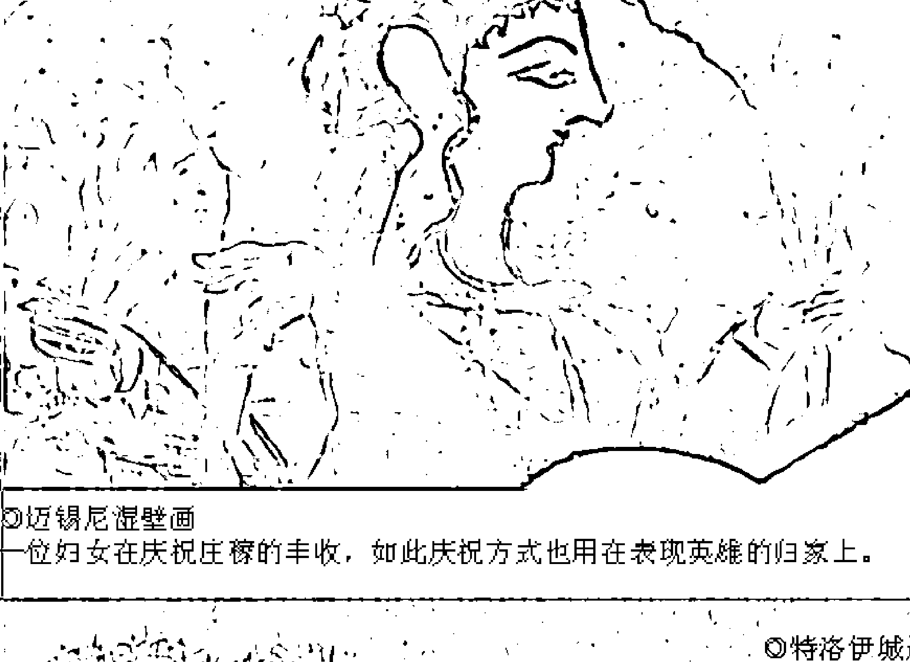

◎迈锡尼湿壁画一位妇女在庆祝庄稼的丰收，如此庆祝方式也用在表现英雄的归家上。

然而，在所有从特洛伊战争中返乡的希腊英雄里，没有哪个人比奥德修斯所走的航线更艰苦。战争结束后，这位伊塔卡国王在地中海及其沿岸的陆地上又徘徊了10年才终于回到家。当他到家时，他极不情愿地见到了满屋子的"杰出"人物，他们都想为自己赢得奥德修斯的妻子珀涅罗珀以及奥德修斯的财产。

◎特洛伊城遗址今天的特洛伊除了一些被摧毁的城墙外，几乎已经无迹可寻。

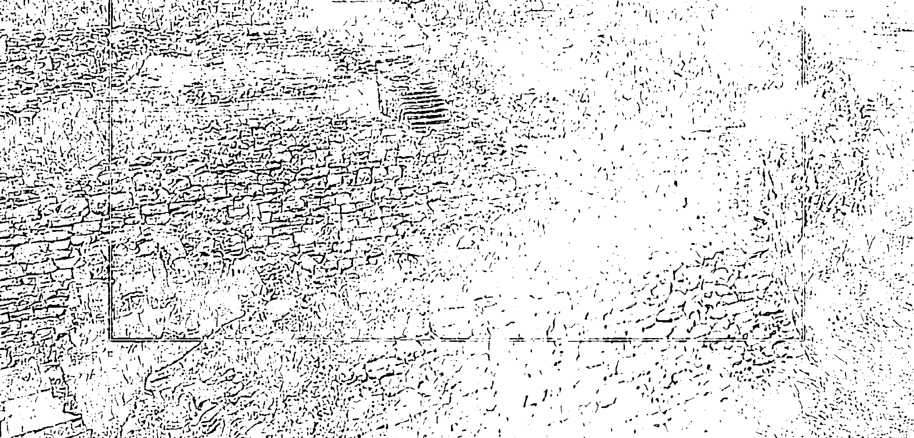

与许多希腊士兵一样，奥德修斯历经艰辛才回到家乡。在他离开特洛伊迅速驶过赫勒斯滂来到属于色雷斯的一个部落比斯托涅斯地界的那个半岛时，他的漫长航程就开始了。奥德修斯把普里阿摩斯的妻子赫卡柏带往身边当奴隶。在战争即将结束时，赫卡柏曾将小儿子波吕多洛斯和一船金子送给特洛伊的同盟者色雷斯国王波吕梅斯托尔。此时，她想将孩子和金子要回来。

赫卡柏伤心地发现波吕梅斯托尔已谋杀了波吕多洛斯并盗走了金子。赫卡柏为了替死去的儿子报仇，将这个国王引诱进自己的帐篷，将他弄瞎并杀死了他的两个襁褓中的儿子。接着赫卡柏变成两眼冒火的狗跳进了海里。

奥德修斯继续沿着色雷斯海岸向西航行，来到了伊斯马罗斯的西科尼亚市。奥德修斯及其12艘船的船员洗劫了这座城市，他们只放过了阿波罗的祭司马戎。马戎十分感激他们，拿出美酒以及其他东西赠予他们。尽管奥德修斯已向船员们提出过警告，但他们庆祝胜利的活动持续时间太长，西科尼亚的主力部队袭击了他们并将他们赶到了海上。奥德修斯这12艘船每只船上都失去了6组划船手，每组两人或3人。

这12艘船平静地驶过爱琴海，很快就到达了伯罗奔尼撒半岛的最南端马里亚角，并准备向北驶向伊塔卡。但由于刮了9天逆风，他们的船被向相反方向吹得一直横渡地中海到达了利比亚海岸。他们派了3个人登陆上去侦察这一地区的情况，但这3个人没有回来，因此奥德修斯亲自去找他们。

他很快就找到一个土著部落，这些土著人给他一种橘黄色的莲蓬吃。但他看出来，这些果实在自己的侦察员身上所发挥了作用。那3个人完全忘了自己的使命，除了吃这果子没有其他的愿望。奥德修斯将这3个人从这些食莲者中拉出来，把他们带回了船上。

奥德修斯随后在一个树木繁茂的海岛（也许是西西里）靠岸了。奥德修斯及其手下的人都不知道，被称为库克罗普斯的独眼巨人就住在这里，这些巨人十分野蛮。

> ◎公元4世纪一名富有的罗马人别墅里的拼花图画
> 波吕斐摩斯是海神波塞冬野蛮的孩子，奥德修斯用计谋战胜了这位巨人。画中的波吕斐摩斯贪婪地从奥德修斯手中接过一碗色雷斯酒。也许他原打算小心谨慎些不要喝太多。

奥德修斯带着12个人爬进一个山洞，他们在洞里发现大量乳酪和小羊。船员们想拿着这些东西跑掉，但奥德修斯命令他们等一等，看看是什么人住在这里。黄昏时分，一个叫波吕斐摩斯的独眼巨人赶着羊群回来了。他用一个巨大的石头堵住洞口，结果大家都被困在洞里。

奥德修斯求波吕斐摩斯看在待客的礼仪上能仁慈一些。但波吕斐摩斯并不承认神和法规，他吃了奥德修斯手下的两个人，这就显示了他的待客概念是什么。奥德修斯非常理智，他明白只有波吕斐摩斯有力气打开洞口，所以自己不能杀死这个库克罗普斯独眼巨人。他一整夜都在谋划怎样逃出去。

到了早晨，波吕斐摩斯又吃了两个希腊人，接着用巨石堵住洞口后，就去放羊了。当天晚上他回来后又吃了两个人。

奥德修斯很聪明，他告诉这个库克罗普斯，自己叫"没人"。当天晚上他用马戎的美酒把主人的肚子灌满，当这个巨人醉得不省人事时，奥德修斯用一个烧热的尖棍刺穿他的眼睛，疼得波吕斐摩斯吼叫起来。其他库克罗普斯闻声赶到洞口问出了什么事，

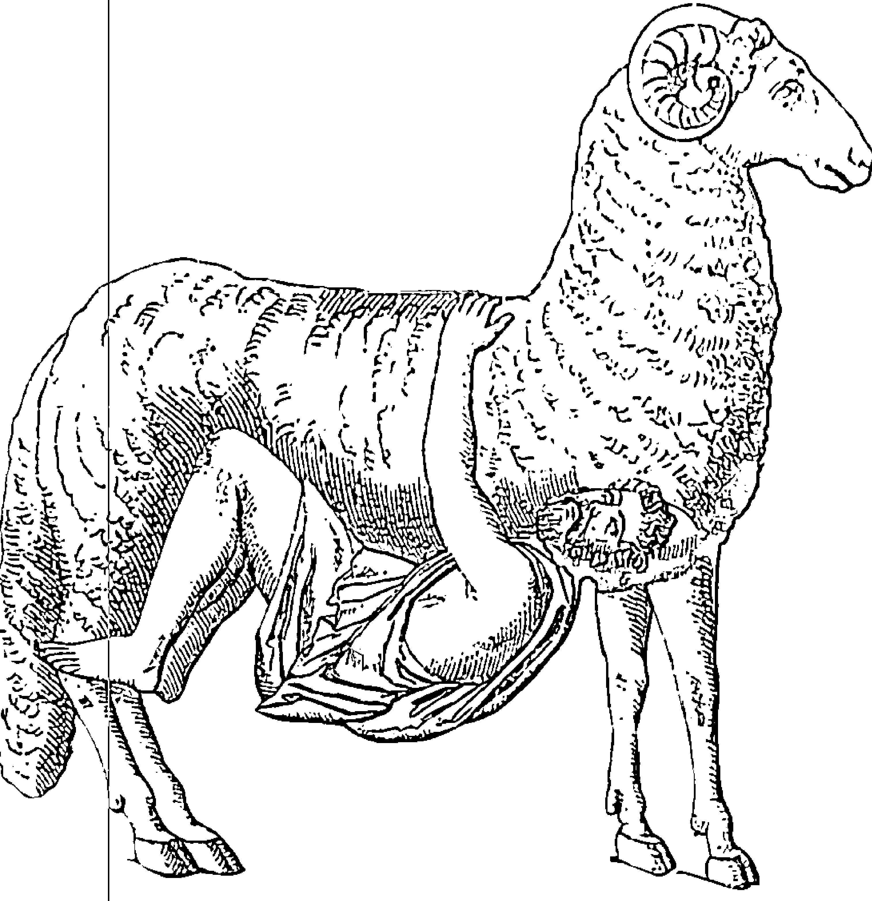

告诉他安静点，然后回去睡觉了。

第二天早晨，波吕斐摩斯将巨石推到一边，但仍用身体挡着洞口，希望在剩下的七个人逃跑时抓住他们。但奥德修斯已在夜里将自己和自己手下的人绑在这个妖魔的羊群中的公羊肚子底下。波吕斐摩斯把这些动物放出去吃草时，为了弄清放出的是否确实是羊，在每只羊背上都摸一下。由于他没摸羊肚子底下，所以并没发现羊的乘客。当奥德修斯

◎奥德修斯贴在羊肚子下避祸

波吕斐摩斯想起了特勒摩斯的预言。尽管他无法惩罚这个折磨自己的人，但这个库克罗普斯祈求他父亲波塞冬为他报仇。从那天起波塞冬就憎恨奥德修斯，将灾祸一次又一次降到奥德修斯的头上，使奥德修斯返回伊塔卡的旅程变得漫长、无聊而且代价巨大。

奥德修斯的船一帆风顺地来到埃俄利亚这个虚构的漂游海岛，风神埃俄洛斯热情地欢迎了他们，对这些劳累的客人用盛宴款待了一个月。埃俄洛斯只留出温柔的西风，把其他风装到牛皮袋中包扎起来，将其作为礼物送给了奥德修斯。自由的西风载着他们航行。在10天后他们就看见了伊塔卡。

奥德修斯很高兴，他们就要到家了，所以当天晚上他睡得很沉。但好奇的船员感到奇怪，埃俄洛斯送给他们船长的到底是什么宝贝，他们打开袋子想看个究竟。他们放出的阵阵狂风将他们一直吹到埃俄利亚岛，埃俄洛斯看得出来这种曲折的命运乃神亲手所为，所以就把他们打发走了，没有再帮他们。

◎海神波塞冬
公元2世纪拼花图，海神波塞冬是奥德修斯最大的敌人。

他们又划船走了一个星期，来到一个由悬崖峭壁环抱着的港湾。只有奥德修斯的船留在港湾的外面，其余11艘船都驶入港湾。

三个被派去了解情况的侦察员见到一位看似善良的女巨人，她将他们请进宫殿去见她父亲拉厄斯特律戈尼亚人的国王安提法特斯。这个国王急切地迎接他们并立即吃掉其中的一人。其余二人逃出来，跑回去见奥德修斯。

奥德修斯立即将船驶进海里。但拉厄斯特律戈尼亚人居高临下向困在港湾中的那11艘船扔石头。船沉之后，那些吃人的巨人用鱼叉把水手们像鱼一样叉起来，带回家去当晚饭。

失去了这么多船员使奥德修斯遭受了严重的打击，他现在只剩一艘旗舰了，这艘船行驶了好几个星期才到达意大利西海岸的阿依厄岛。现在他们在陌生的地方很谨慎，船员们分成2组，每组22个人。这两个组抽签，由大副欧律洛科斯带领的小组运气不佳，抽到侦察那个岛子的签。这些负责侦察的船员在树林中间遇到一座房子，里面住着赫利俄斯和珀尔塞（珀尔塞是俄刻阿诺斯的女儿）的女儿喀尔刻女巫。迎接这些侦察员的是一群看上去已被驯化的狼和狮子。

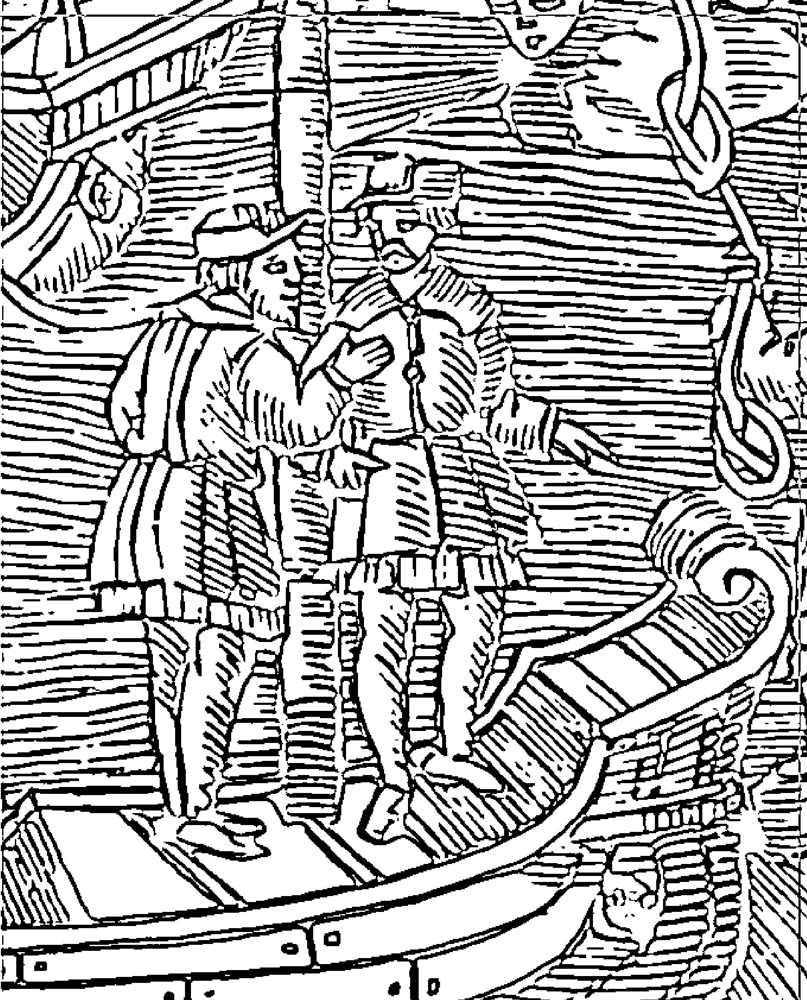

风的口袋
这是古代故事中一个十分常见的主题：一个巫师有着一个装着大风的魔法口袋。这幅木版画上显示巫师正在出售他的口袋，这口袋必须用三个结扎住。

喀尔刻把这些侦察员请进屋吃饭时，欧律洛科斯对她感到怀疑，所以只有他一个人待在屋外。他等了远远超过一顿饭的时间后就跑回船上，把发生的一切都告诉奥德修斯。

奥德修斯立即只身前去救自己手下的人。但在他到那房子之前遇到了旅行者在危难时的救护神赫尔墨斯。这个神告诉奥德

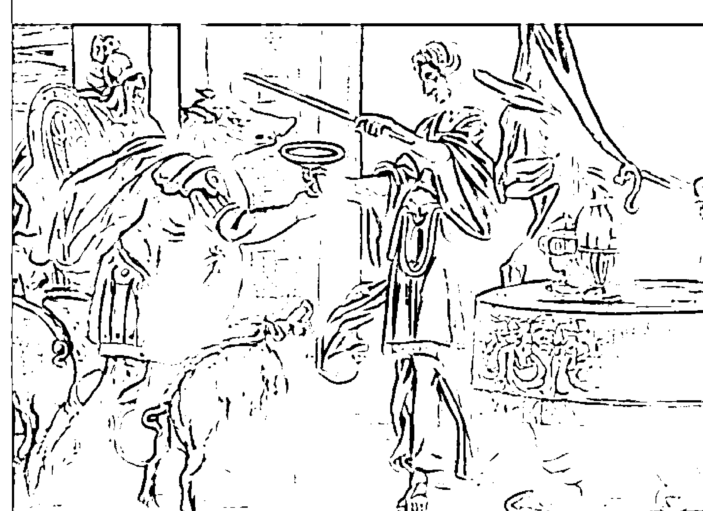

人猪变
在这幅1610年的雕版画中，喀尔刻把奥德修斯的人从人变成了猪。此处的女巫喀尔刻被刻画成一个丑陋的巫婆形象，而不是希腊神话中那个还未进入主神之列的女神。

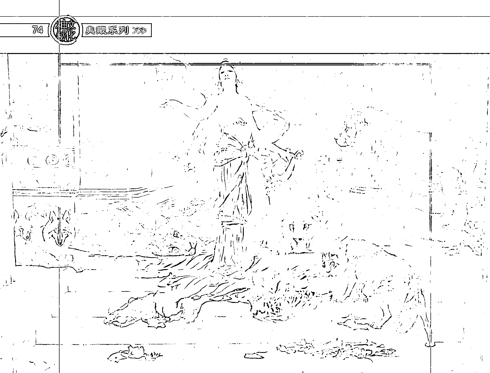

## 女巫喀尔刻

女巫喀尔刻在她的宫殿中，被驯服的动物围绕在她身旁，其中有她用咒语变化了的人类受害者。

修斯，喀尔刻已将他的船员变成了猪，并给了他一棵长着黑根开着白花的魔草，赫尔墨斯将这魔草叫"毛莉"，它能用来做喀尔刻制的药的解药，随后赫尔墨斯就消失在树林里。

奥德修斯坐在喀尔刻的小屋里的筵席前，她的魔法没有将奥德修斯变成野兽，奥德修斯向她抽出了剑。奥德修斯逼着喀尔刻向神发誓她不再加害他后，喀尔刻将那些猪又都变成了人。

喀尔刻成为奥德修斯的情妇，服侍她的仙女款待了奥德修斯的船员并整整服侍了他们一年。

奥德修斯终于决定离开这里时，喀尔刻向情人建议应该首先取得著名的底比斯占卜者泰瑞西阿斯的忠告。遗憾的是泰瑞西阿斯死了。奥德修斯及其船员不得不到阴间的边缘去与他交谈。喀尔刻许诺要用魔法为他们召来顺风将他们带到阴间的边缘。

在他们出发前的那天晚上，最年轻的船员厄尔珀诺尔喝醉了，在喀尔刻的房顶上睡着了。到了第二天早晨他仍头昏眼花，从房上跌下来摔断了脖子。但船员们没有埋葬他就匆匆地离开了。

在荷马时代的希腊，人们所采用的治疗方法是使用民间药物——神秘的草药、配剂、药液和油膏——而不是埃及式的咒语和仪式。这样看来，女巫喀尔刻的迷药中会有能够麻痹知觉的各种草药，以及能够逆转其效果的各种油膏，也就没什么好大惊小怪的了。这些草药和毒药都被希腊人视为巫术的产物而非单纯的自然物质。

在希腊家庭中主要是由妇女来开方下药，这就使得类似于喀尔刻和她的草药的故事更加令人信服。不过正是由于这些希腊家庭中的妇女懂得如何施药治病，她们也就有可能调制有害的药物甚至毒药。民间故事中的女巫形象正是直接源于人们的这种担忧，而且还掺杂了男人对于女人双刃剑般的力量的恐惧。赫尔墨斯神就警告过奥德修斯不要被喀尔刻引诱到床上去，除非她发一个神圣的誓言绝不伤害他。否则，赫尔墨斯郑重地告诉奥德修斯，喀尔刻"将会掠走你的勇气和你作为男人的能力"。喀尔刻将会使奥德修斯成为性无能，这种威胁是几乎每个社会中人们打击女巫时都会引用的一项指控，在后来16和17世纪那些搜巫运动中最为常见。

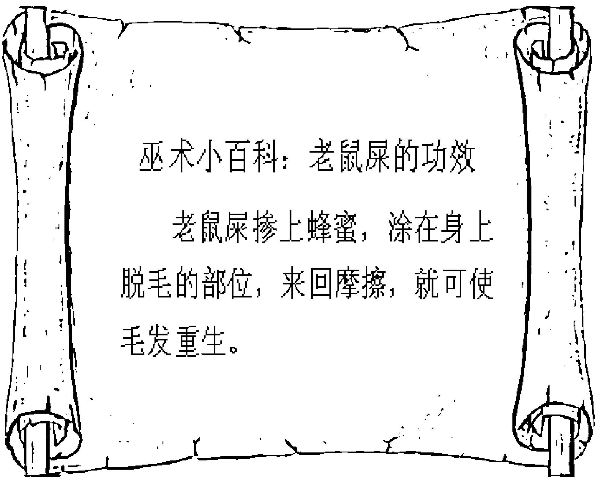

在荷马的《奥德赛》中，还有对通灵术的记录——奥德修斯击败了喀尔刻之后，本想立即继续他的返乡航程。但喀尔刻却告诉他说，他必须先到地下冥府向盲先知泰瑞西阿斯寻求忠告。

奥德修斯的船驶到一块太阳永远照不到的陆地。他们步行来到构成哈得斯的地界线的阴间河流冥河、珀里弗勒戈冬河和科赛特斯河的河边，奥德修斯挖了个坑准备向冥王哈得斯和冥后佩尔塞福涅表达敬意。他往这个坑里倒入牛奶、蜂蜜、葡萄酒、水以及从做祭品用的小羊和喀尔刻给的黑色母羊身上流出的血。

坑里出现一大群幽灵，按照喀尔刻的建议，奥德修斯拔剑出鞘，站在坑边保证泰瑞西阿斯能先得到饮料。

第一个出现的是厄尔珀诺尔，他向自己的船长祈求适当地安葬自己，奥德修斯答应了他。接下去奥德修斯既吃惊又伤心地见到了自己的母亲安提克勒亚。由于儿子长期不在家，她或许因为过度悲伤而身亡，或许是因为她听到讹传儿子已死，所以自杀了。尽管奥德修斯很伤心，但他还是没有把任何饮料给这两个幽灵喝。

泰瑞西阿斯的幽灵拿着金拐杖终于出现了，他感激地喝完奥德修斯献上的祭酒后预言道：在奥德修斯的回乡路上，愤怒的波塞冬会继续折磨船员们。然而，尽管困难重重，只要奥德修斯及其船员在特利那西亚岛上，别对赫利俄斯的女儿所看管的神牛群和神羊群动武，他们都会平安到家的。如果这些动物受到一点伤害，奥德修斯仍能回到伊塔卡，但他将乘坐外国船回家，同时一路上不但要受责罚而且会孤苦伶仃。泰瑞西阿斯还告诉奥德修斯会有许多人向他妻子求婚，并且预言了他与妻子珀涅罗珀团圆后的漫游经历。

当泰瑞西阿斯喝足后，其他幽灵接下来从坑里喝着饮料。安提克勒亚告诉奥德修

斯珀涅罗珀仍对他回家抱有希望。阿伽门农叙述了自己被害的经过后警告奥德修斯要将自己乔装起来，直到发现家中有什么危险在等待自己为止。当奥德修斯告诉阿喀琉斯他儿子尼奥普托列墨斯在特洛伊战争的最后几场战斗中表现英勇时，阿喀琉斯感到欣慰。

奥德修斯还看见了埃阿斯，但这位强大的斗士仍对奥德修斯得到了阿喀琉斯的盔甲存有芥蒂，所以他转过脸不理奥德修斯。或许是赫拉克勒斯本身，或是他的凡人部分的幽灵对奥德

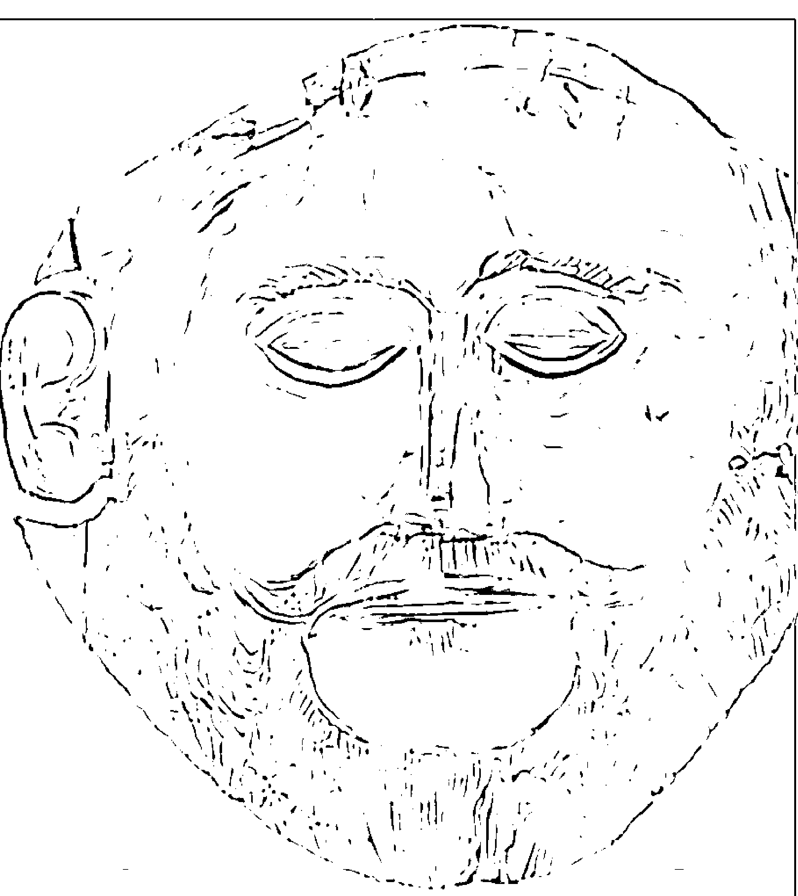

阿伽门农面具
《黄金面具》出土于迈锡尼，约制作于公元前1580年—前1500年，高26厘米，这是考古学家舒里曼于1876年在一个古墓遗骸中发现的。舒里曼根据面具上雕刻的漂亮的胡须、高高的鼻梁等特征，断定他就是迈锡尼城主阿伽门农。

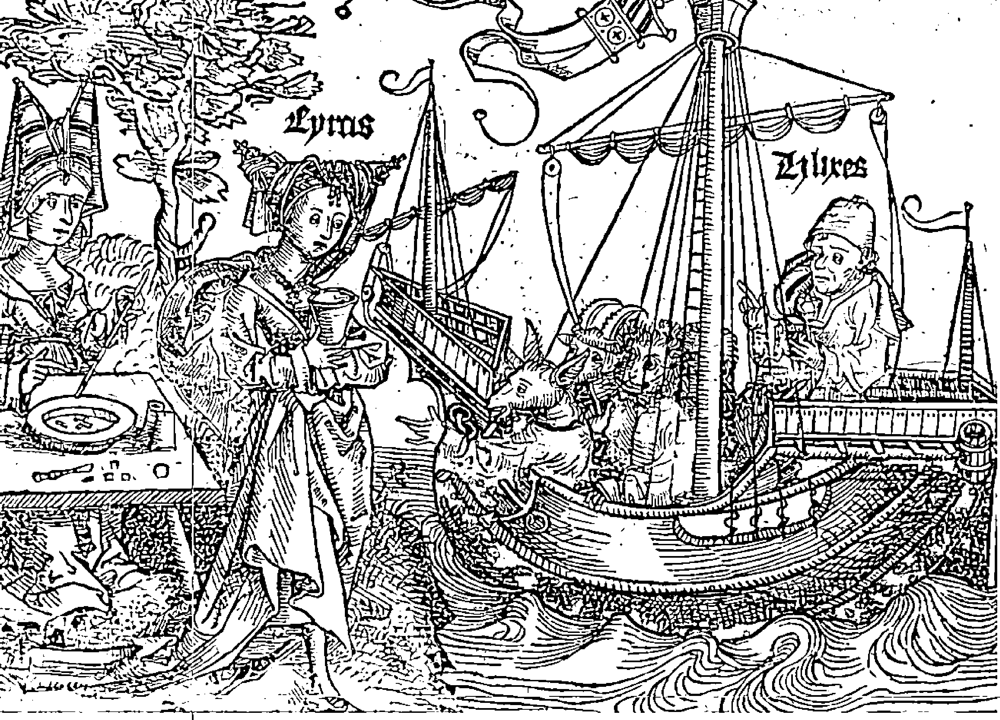

喀尔刻为奥德修斯送行

修斯无止境地漫游感到同情。最后，聚集的幽灵太多了，奥德修斯逃回到自己的船上。

奥德修斯及其船员回到阿依厄后焚烧了厄尔珀诺尔的尸体，将其骨灰埋葬了，并将小伙子的桨插在坟墓上的土堆里。喀尔刻也对奥德修斯及其船员所面临的危险提出了自己的意见，她提到了塞壬以及"游走礁"或锡拉岩礁和卡律布狄斯之间的海峡这两者之一。她也警告奥德修斯不要伤害赫利俄斯的畜群。

当船走近塞壬栖息的安特摩萨岛时，奥德修斯命令船员们用蜂蜡堵住耳朵并叫别人将自己紧紧地绑在桅杆上。这样，只有他一个人能听到塞壬那令人陶醉的歌声。这些半人半鸟的女海妖唱起歌来特别有诱惑力，她们的歌声已使众多水手忘记了自己的航行目标，除了听她们唱歌外什么都不做了，直至饿死。

奥德修斯一听到她们那欢天喜地的歌声就嚷着叫别人放开他，但

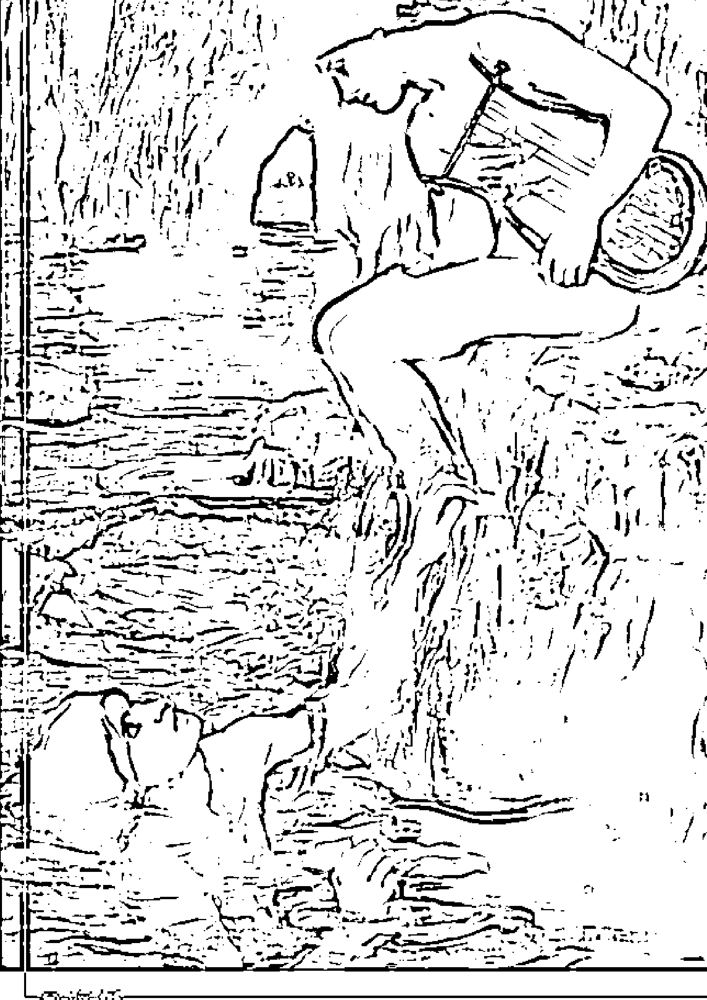

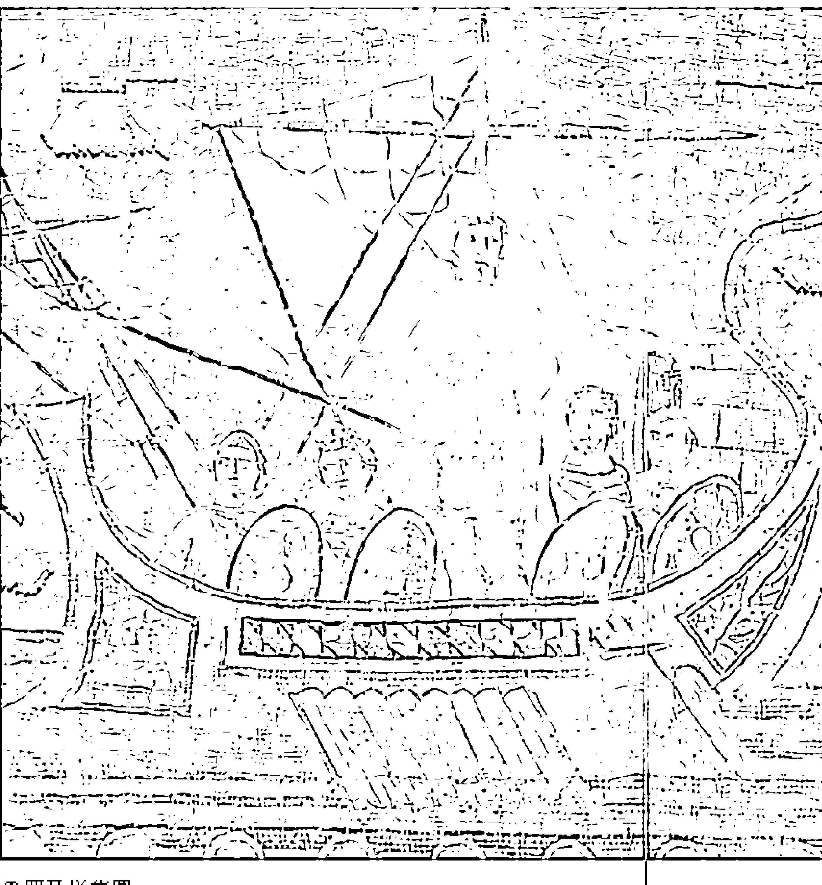

船员们却毫不动摇地置之不理。塞壬发狂了，她们认为，任何一个水手都应该听到她们的歌声，但这次却没有一个被其诱惑，因而她们跳到海里，从此再也没人听到她们唱歌。

奥德修斯并不知道，阿耳戈号安全通过"游走礁"后，这些礁石从此变得纹丝不动了。因此，他驶向了西西里与意大利间窄窄的墨西拿海峡。在海峡北端入口西侧的卡律布狄斯旋涡威力强大，它一天三次将周围的水全部吸下去，后来再猛地将水喷出来在咆哮的旋涡中，奥德修斯命令手下人在海峡对面的峭壁底下使出全身力气划船。为了避免引起恐慌，奥德修斯没有警告他们当心栖息在峭壁洞中长着长脖颈和6个头的怪兽斯库拉。

奥德修斯随时准备保护自己的船员不受那妖怪的伤害，但咆哮的卡律布狄斯旋涡令他将头转开了片刻。那妖怪就在那瞬间将6名正在划船的人抓住了，他们尖叫着，妖怪的每张嘴里都有1个人。

船员们通过海峡之后被折磨得筋疲力尽，吓得心神不定，同时感到十分气愤。当奥德修斯命令他们别停下来，一直划过或许是特利那西亚或许是西西里时，这些人险些反叛他。面对他们的抵制，奥德修斯对他们想休息的要求默许了。

在船靠岸之前，奥德修斯提醒船员喀尔刻已经给了他们足够多的好吃的东西，并命令他们不要吃岛上的任何东西。因为这里放养着赫利俄斯的神畜，它们是7群牛和7群羊，每群有50头。泰瑞西阿斯和喀尔刻都曾警告过他们别碰这些动物。

在他们靠岸后整整一个月的时间里一直刮着强劲的南风。如果他们出发，就会被风吹回锡拉岩礁和卡律布狄斯大旋涡，所以他们就待在特利那西亚岛上。由于缺少食物，他们开始捕鱼、打猎，但捕获的鱼和猎物非常少。最后，当奥德修斯睡觉时，欧律洛科斯命令一些人杀死了那些在附近撩人地吃着草的牛。

奥德修斯感到震惊，法厄托萨和赫利俄斯的女儿拉姆佩提亚也同样感到震惊。拉姆佩提亚将此事告诉了父亲，赫利俄斯要求众神惩罚凶手。他威胁说，如果众神不满足他的要求，他将点燃坦塔洛斯。这样，在船员们再次启航后，宙斯派了强风暴将船撕碎，除了奥德修斯以外，其他人都被杀死了。

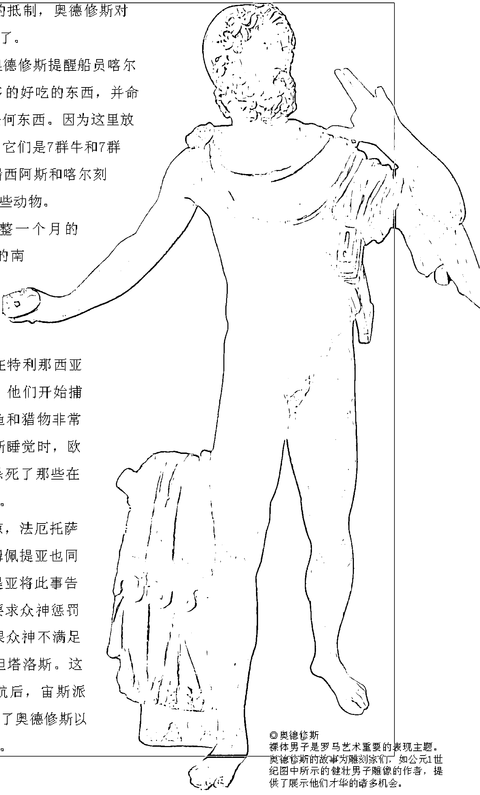

◎奥德修斯裸体男子是罗马艺术重要的表现主题。奥德修斯的故事为雕刻家们，如公元1世纪图中所示的健壮男子雕像的作者，提供了展示他们才华的诸多机会。

## 典藏系列

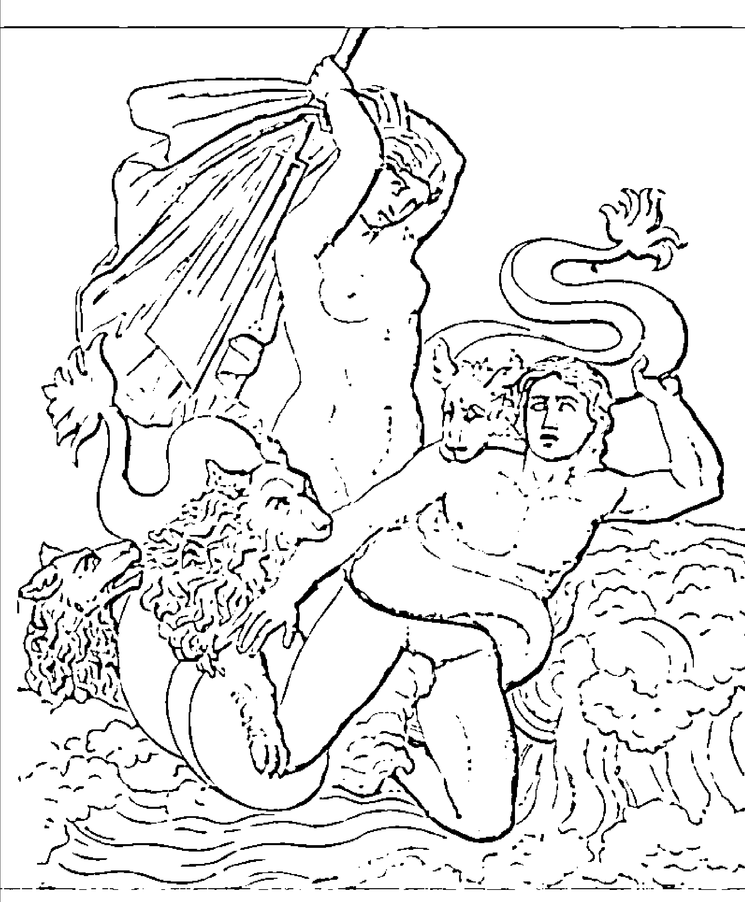

奥德修斯抓住浮在水面上的桅杆和龙骨无助地顺水漂流。黎明时他发现自己又到了奔腾的卡律布狄斯大旋涡的边缘。整整一天，奥德修斯都抓住旋涡上方的一棵无花果树的树枝。黄昏时卡律布狄斯大旋涡吐出了那只木筏，奥德修斯跳下去，使出全身力气划船。他又漂流了9天才被冲到奥杰吉厄岛。

阿特拉斯的女儿卡吕普索爱上了奥德修斯，并想让他永远留在奥杰吉厄岛的山洞里与她共同生活。她不仅以身相许，而且会使奥德修斯青春常在、永远不死。但奥德修斯拒绝留在岛上。噢，当然了，他与她上床了，而且吃着好饭好菜，并且在他住在岛上的7年中，他没干过一天活。但他不想永远待在那里。他盼望着回家与珀涅罗珀待在一起，他整天可怜巴巴地眼望大海打发日子。

与此同时，在奥林匹斯山上，智慧女神雅典娜乘波塞冬不在之机为奥德修斯的案子向宙斯提出辩护。多年来奥德修斯一直遭受磨难并向众神无数次献祭，他理应得到神的帮助。宙斯同意了，并派赫尔墨斯到奥杰吉厄岛命令卡吕普索让奥德修斯离开岛子。卡吕普索不情愿地遵从了，她借给奥德修斯一些材料造了一艘船，并在船上装满食物，吹起微风将他送上路。

波塞冬一回到奥林匹斯山就对兄弟宙斯帮助他的敌人感到愤怒，他派了一场风暴摧毁了奥德修斯的小船。但海中女神琉科忒亚——也就是过去的凡人伊诺，即酒神狄俄尼索斯亲爱的姨妈、佛里克索斯和赫勒讨厌的继母——救了他。她把自己的面纱给了奥德修斯，把他托出水面并保护着他，伊诺还告诉他要使出全身的力气往前游。两天后奥德修斯到达了斯克里亚岛。他把面纱扔回海里后，就累得瘫在地上。

奥德修斯被一些玩球的姑娘高兴的喊叫声吵醒了。这些姑娘是费阿刻斯的公主瑙西卡亚和仆人们，她们一边玩耍一边等着晒干她们晾在海滩上的衣服。瑙西卡亚拿出食物让这个海上遇难的人吃，还找来衣服给他穿上，然后带他去见自己的父亲。尽管奥德修斯有求于阿尔客诺俄斯，但这位以搭救遇难水手而闻名的既英明又慷慨的国王欢迎奥德修斯来到自己的朝廷，并答应将奥德修斯安全地送到伊塔卡——当然了，除非他想留下来与瑙西卡亚结婚。奥德修斯有礼貌地谢绝了这门亲事。

奥德修斯一踏上费阿刻斯人的船就睡沉了。他们到了伊塔卡港的时候水手们不忍心叫醒他，只是把他抬到海滩上，将阿尔客诺俄斯送的礼物在他身边堆放好就返回家乡。但是水手们根本没回到家乡，波塞冬仍要报复，当船驶近他们自己的港口时，波塞冬将船变成了石头。

奥德修斯醒来后，彻底晕头转向了，但雅典娜出现在他面前告诉他说，他终于回到伊塔卡，他消除了疑虑，从特洛伊出发后又过了10年，即离开伊塔卡20年后，他终于到了家。但是雅典娜警告奥德修斯，有一群王公贵族为了得到他的财产在向珀涅罗珀求爱，这些人并不想见到他。如果奥德修斯只身回到王宫，那些人一定会杀了他。于是，女神将奥德修斯乔装成一个年老的乞丐。

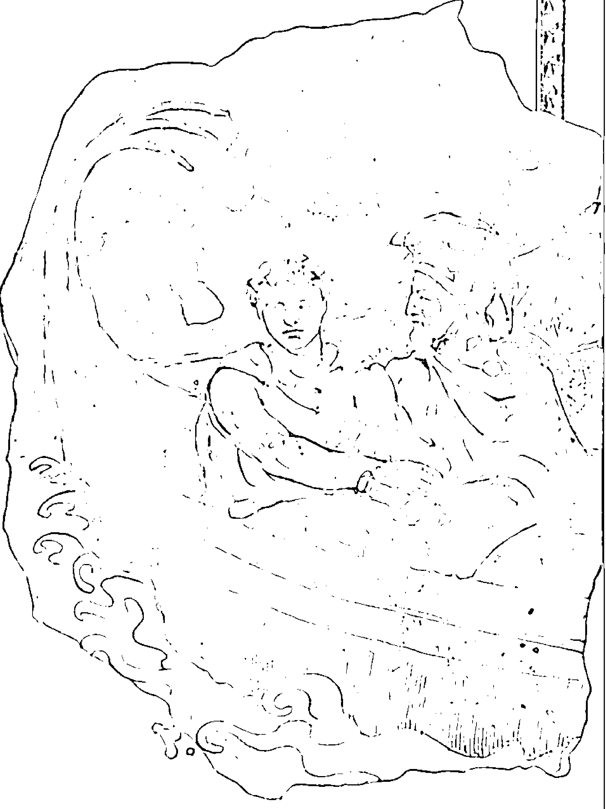

奥德修斯先到了忠实于自己的养猪人欧迈俄斯的小屋里。他从欧迈俄斯

奥德修斯的儿子特勒马科斯在婴儿时，父亲就远离家乡参加特洛伊战争了。如今特勒马科斯已长成一个英俊善良的青年，但却不能将母亲的求婚者赶出父亲的宫殿。

典藏系列 >>>

那里了解到，自己的父亲累尔提斯由于妻子去世、谣传儿子死了而且自己无力将那些不劳而获的求婚人赶出王宫等原因而感到悲哀，他日渐虚弱，现在离开了王宫，衣衫褴褛地住在一个小棚屋里。

奥德修斯动身去特洛伊时，他的儿子特勒马科斯还是个婴儿，现在他已经长成大人了。这时恰好特勒马科斯顺路到欧迈俄斯的小屋来串门，他把自己的父亲奥德修斯当作了异乡人。特勒马科斯把食物和衣服送给了已经是老人的奥德修斯，但令他遗憾的是，他不能将这个异乡人请到王宫去住。几乎可以肯定向他母亲求婚的人会辱骂这个异乡人，特勒马科斯感到自己没有办法保护自己的客人。

欧迈俄斯离开屋子时，奥德修斯向儿子说出了自己的身份。父子俩都高兴得泪如泉涌。但他们很快就将重逢的喜悦忘到脑后，开始谋划报复珀涅罗珀的求婚者。

依旧乔装的奥德修斯进入自己宫殿中的宴会厅讨饭。所有的王子公孙们都给他一点精美的食物，只有傲慢的安提诺俄斯向他递来一个凳子。一个名叫伊罗斯的乞丐想保护自己的领地就威胁这个年老的异乡人。那些求婚者们

珀涅罗珀没能认出装扮成乞丐的丈夫

本来就盼望能有点刺激，所以就安排两个乞丐进行一次拳击比赛。奥德修斯一拳就将那个人击倒了。

不久珀涅罗珀走进宴会厅，她斥责了求婚者们粗俗的行为以及他们依靠她丈夫的财产生活的丑恶行径。奥德修斯满怀爱慕静静地看着她，但在将这些求婚者赶出王宫前他并不想暴露自己的身份。当天晚上当所有的求婚者都入睡后，奥德修斯和特勒马科斯将那些求婚人的矛拿到地窖中的贮藏室里。

奥德修斯借口说自己有珀涅罗珀丈夫的消息，准备当天晚上与她见面。这个异乡人说自己曾招待过她丈夫，并向她保证奥德修斯不久就会到家。珀涅罗珀想相信这个异乡人的话，但她回答说，奥德修斯必须很快就回来。奥德修斯本人建议她，如果奥德修斯不从特洛伊回来，她就再找个丈夫，而且她也无法持续不做决定了。她打算举行一次力量和技艺的测验来决定谁应该是她的第二个丈夫，她要用丈夫的老办法将12把斧头排成一条直线，要求被测试者把箭从这12把斧头眼中射过来。

珀涅罗珀与这个"异乡人"道了晚安，并告诉保姆欧律克莱亚好好照顾他。奥德修斯小的时候欧律克莱亚曾服侍过他。当她给奥德修斯洗脚时，认出了野猪在他腿上留下的伤疤，她惊得倒吸了一口气，奥德修斯劝她不要把他回来的事告诉别人。

第二天，珀涅罗珀把奥德修斯的旧弓拿出来后，宣布了比赛规则，并提出用自己作为获胜者的奖赏。尽管求婚者都试了，没有一个人能拉开那张弓，更不用说将箭射过斧头眼了。乔装乞丐的奥德修斯要求接受挑战，尽管求婚者提出抗议，珀涅罗珀在回卧室前还是同意了这个请求。

菲洛厄提俄斯是个放牛人，奥德修斯已将自己的真实身份告诉了他，因此他悄悄地锁上了大厅的门。奥德修斯敏捷地拉开弓一箭从斧子眼射了出来。

转眼间，奥德修斯就将箭对准了求婚者，射中了安提诺俄斯和欧律马科斯，同时，特勒马科斯用矛杀了安菲诺摩斯。紧接着，奥德修斯父子与众多求婚者进行了一场血战。他们四人将求婚者全都杀死，只留下传令官梅冬和吟游诗人菲弥俄斯，这两人是被迫为求婚者做事的，但他们忠于奥德修斯。

特勒马科斯逼着成为求婚者情妇的12个女仆人将尸体搬到大厅外边。然后他将这些女人也绞死了。奥德修斯的牧羊人梅兰提俄斯是那12个情妇中的梅兰托的兄弟，在战斗刚刚开始时，他背信弃义地将求婚者的武器拿给他们，因此他被割去四肢后丢弃在院子里死了。

甚至在奥德修斯就站在珀涅罗珀的面前时，珀涅罗珀也不相信丈夫已经回来了这个好消息。这个和她狡猾的丈夫可谓天造一对的女人想确信这个人就是自己的丈夫，于是就设下了一个新的计谋。她当着奥德修斯的面命令仆人把自己和奥德修斯的床搬出卧室，她说这位客人已将她的求婚者杀死了，应该为他准备床位。奥德修斯曾用一棵仍长在土里的老橄榄树当床架杆，精心地为自己和珀涅罗珀制作了婚床。当听到珀涅罗珀所下的命令时，他以为一定是有人已锯下了床架杆，因此十分愤怒。珀涅罗珀听到奥德修斯提到了他们卧室里的秘密后，相信自己的丈夫终于回来了，并拥抱了他。在他离家20年的时间里，珀涅罗珀对丈夫忠贞不渝，此时她的名字成为了忠诚的缩影。

安提诺俄斯的父亲欧佩特斯并不看重多年前奥德修斯曾救过他的命这件事，他鼓动伊塔卡的贵族起来反抗自己的国王，这个国王离家这么久，回来就杀死所有贵族的儿子。累尔提斯与儿子团聚后又恢复了自己的尊严，他率先掷出了矛，打死了欧佩特斯。

若不是雅典娜尖叫一声将伊塔卡贵族吓跑了才结束了这场战斗，可能紧接着又会有一场大屠杀。奥德修斯开始追赶他们，但宙斯在奥德修斯追赶的路上打了个霹雳把他阻止了。随后雅典娜变成英明而受人尊敬的伊塔卡人门特的样子在敌对的两方游说使他们讲和了。

许多年之后，奥德修斯和女巫喀尔刻的儿子特勒戈诺斯在母亲的要求下来找父亲。由于不知道自己已经到达了伊塔卡，为了获取食物，特勒戈诺斯及其船员袭击了这个海岛。年老的奥德修斯和特勒马科斯一道出来保护伊塔卡，从未见过父亲的特勒戈诺斯用鱼制成的毒药中浸过的矛杀死了多人。

奥德修斯的家人发现凶手的身份之后很快就饶恕了他。特勒马科斯、特勒戈诺斯和珀涅罗珀将奥德修斯的尸体运到阿依厄并把他葬在那里。珀涅罗珀嫁给了丈夫与喀尔刻所生的儿子特勒戈诺斯，而特勒马科斯娶了喀尔刻，此时奥德修斯的流浪生涯宣告终结，而他的情妇——女巫喀尔刻则使其余3人得到了永生。

## 《荷马史诗》中的女巫

## 奥德修斯历险路线

- 1 特洛伊
- 2 埃斯科里亚城；被奥德修斯及其随从烧毁
- 3 利比亚；食莲人的家乡
- 4 库克罗普斯岛；波吕斐摩斯被奥德修斯所杀
- 5 埃俄罗斯的岛屿，可能是今天的斯特龙博利岛；奥德修斯得到一口袋风
- 6 科西嘉；奥德修斯的船只遭到巨人袭击
- 7 埃阿亚岛；喀尔刻引诱奥德修斯留下
- 8 通往冥界的入口；泰坦西阿斯预言未来
- 9 瑟王岛；奥德修斯和他的船员从欧律刻斯中逃离
- 10 墨西拿海峡；奥德修斯和他的船只通过斯库拉和卡律布狄斯漩涡之间的海峡
- 11 俄古癸亚岛，即今天的马尔他；卡吕普索囚禁奥德修斯
- 12 克基拉岛，即今天的科孚岛；阿尔喀诺俄斯提供给奥德修斯一艘新船
- 13 伊萨卡；奥德修斯的王国

## 特勒马科斯历险路线

- 14 皮洛斯；涅斯托尔的故乡
- 15 斯巴达；墨涅拉俄斯和海伦的故乡
- 16 迈锡尼；阿伽门农的故乡

> ——奥德修斯历险路线
> ……特勒马科斯历险路线

## ◎奥德修斯历险图

> 关于奥德修斯的历险路线以及整个神话发生的方位，学者们的意见不一致。这张地图是这条路线的重现，而且被认为是奥德修斯儿子特勒马科斯游历的路线。

---

## 巫术小百科：小壁虎屎

对年华已逝还希望保持青春美丽的女人，郑重推荐使用这种小壁虎屎。因为它可以消除皱纹，净白皮肤，使女人的气色鲜艳动人。

用小壁虎屎、墨鱼骨、白葡萄酒垢、鹿角粉、白珊瑚粉、面粉，每种材料同样分量，放在臼里磨碎，经过精细筛选后，再把所有材料放在以数量相等的巴旦杏、果园鼻涕虫和毒鱼草花蒸馏过的水里，浸泡一个夜晚。然后加入等量的白蜜，再把所有材料放入臼里磨碎。把这个混合剂小心储存在干净的银缸或玻璃缸内，需要时就用它擦脸、双手、乳房、脖子。不久会发现这份秘方灵验有效。

---

## 第四章

### 阿耳戈英雄的情与罪

伊阿宋是个年轻人，除了有令女人迷恋的特点外，没有什么其他非凡之处，而去寻找金羊毛的人是一群最伟大、最高贵、最勇敢的英雄。似乎很奇怪，他竟被选作这群人的首领。在这些人中他既不是最聪明的，也不是最勇敢的，也并不是最优秀的猎手，也不是最优秀的弓箭手或水手。但是仅仅由于他对女人有诱惑力，众神的王后赫拉左挑右选地只选中了他来完成这一使命。别有用心的赫拉为了达到自己的目的，需要伊阿宋将那个很有魔力的女巫美狄亚带回希腊，这也使得这位阿耳戈英雄堕入情与罪的泥潭中，无法自拔……

---

## 1 阿耳戈英雄们

在特洛伊战争前的英雄大聚会中，那些与伊阿宋一起乘船去寻找金羊毛的阿耳戈英雄的故事流传得最广。许多阿耳戈英雄都是神的子孙。他们在那艘被称为阿耳戈号的船上服役期间表现出了英雄的气概。

正如大多数神话中的远征，阿耳戈英雄的故事并不只是讲述了他们达到预期目的的经过。金羊毛只是故事的中心，而去寻找金羊毛及回乡途中的惊险经历构成了故事的主体。这一系列惊险的故事为英雄们提供了展示其品格、技艺和英勇气概的机会。

梯罗将自己由于被叔叔西西弗斯强奸而生下的孩子杀死后，嫁给了另一个叔叔克瑞透斯，伊阿宋就是他们的孙子。他们的长子埃宋即伊阿宋的父亲本该继承约尔科斯王国的王位。这个王国是克瑞透斯建立的，位于希腊东北部的特萨利海港。但梯罗还与波塞冬生下一对双胞胎儿子，其中的一个叫佩利阿斯，他把王位夺去了。

尽管佩利阿斯并没有加害埃宋，但他的这位同母异父的兄弟为自己及其自己那尚未出生的儿子的生命担心。因此当妻子生伊阿宋时，他说婴儿死了。他把孩子托付给刻戎照顾。刻戎就是曾教过希腊大英雄赫拉克勒斯的半人半马怪物。

伊阿宋成年时就回到约尔科斯去要回王位。到达那座城市之前，他在阿瑙罗斯河边遇到一位老妇人。这位年轻的英雄非常侠义，他将老妇人背过河去。由于负重，他丢了一只鞋，那只鞋陷到河床的淤泥里了。当安全到达河对岸时，他将那老妇人放下就迅速赶往约尔科斯。在那里，佩利阿斯正在为自己的父亲波塞冬举行庆祝活动。

伊阿宋并不知道自己所帮助的那位老妇人其实是天后赫拉装扮的。赫拉恨佩利阿斯，他从未向赫拉献祭或者向她表示应有的敬意。另外，尽管梯罗那残忍的继母西得罗为求得庇护待在赫拉的祭坛不肯离去，佩利阿斯还是违背道义将她杀了。现在赫拉要对这些有辱于她的行为进行报复，她的计划涉及到伊阿宋和女巫美狄亚。

不久佩利阿斯就听说有个仅穿一只鞋的人到了他的城里。这个消息把他吓了一跳，曾有一个神使警告他，有个穿一只鞋的人是埃俄洛斯（埃宋和佩利阿斯的曾祖父）的后代，这个穿一只鞋的人会给他带来死亡。佩利阿斯来到伊阿宋面前没报姓名就问对方是谁。伊阿宋如实地回答了他，并勇敢地宣布要为自己或父亲要回王位。

佩利阿斯一定是想杀掉这个侄子，但他知道这样对待来访者违背常理，会使众神愤怒。为了除掉伊阿宋，佩利阿斯决定给这位青年分配一个无法完成的任务，叫他去黑海东海岸的一个野蛮之地科尔基斯将金羊毛搞到手。

毫无疑问，佩利阿斯是想永远除掉伊阿宋，所以他报出自己的姓名并轻易地答应，如果伊阿宋成功地完成这项任务，他就毫不反抗地将王位交给伊阿宋。胆大而心高的伊阿宋将寻找金羊毛看作是自己走向辉煌的道路，所以他同意了佩利阿斯的要求。

几年前，奥考梅努斯的国王阿塔马斯（西西弗斯和克瑞透斯的另一个兄弟）为了娶卡得摩斯的女儿伊诺将自己的妻子涅斐勒抛弃了。伊诺想改变自己孩子的命运，因而谋划除掉涅斐勒的儿子佛里克索斯与女儿赫勒。她将这个国家所有的种子粮毁坏。由于庄稼歉收，信使领命去德尔斐神示所请教。信使回来时伊诺贿赂他们，使他们撒谎说必须将佛里克索斯献祭出去。

阿塔马斯很不情愿地听从了这则假神谕。就在阿塔马斯在祭坛上将刀举到儿子头顶上时，一只长着翅膀的金羊出现了。这只羊将佛里克索斯和赫勒背走了。他们飞往黑海东海岸的神话中的王国科尔基斯的首都阿依阿。路上赫勒摔了下来，掉在爱琴海和马尔马拉海之间的海峡里淹死了。这个地方就以她的名字命名为赫勒海。佛里克索斯安全到达了阿依阿，那里的国王埃厄特斯怀疑并藐视陌生人，但宙斯命令他欢迎佛里克索斯的到来。

佛里克索斯把这头羊作为祭品献给了自己的救星宙斯，后来他还与埃厄特斯的女儿卡尔喀俄佩结了婚。在科尔基斯的一座神圣的园林里，取自这头漂亮的公羊身上的羊毛被他挂在一棵树上。

伊阿宋向德尔斐神示所请教之后，邀请希腊各城市中最出色、最勇敢的贵族加入到自己的行列中，假如把他们的名字一一列出来，那要费很长时间。但是，这里值得注意的是：勇敢的双胞胎兄弟卡斯托耳和波吕丢刻斯，歌手奥菲士和安菲翁，还有最狡猾的人奥东莱克斯，最聪明的人内斯特、阿尔克墨涅和安菲特律翁的儿子赫拉克勒斯，还有梅利埃格和忒修斯。所有的这些人以及他们的同事个个雄赳赳、气昂昂，血气方刚，英勇善战。非凡的猎手阿塔兰特，也装扮成老百姓前来，而太阳神阿波罗的儿子医神埃斯科拉庇俄斯，有起死回生术。

由于那艘壮丽的船叫阿耳戈号，所以伊阿宋的船员就把他们自己叫做阿耳戈英雄。阿耳戈号往往被称为第一艘建造起来的船，它是在雅典娜谨慎的目光下组装起来的，雅典娜将航海的技术教给人类。船取自特萨利的拍利恩山，而且该船还有一个说话舱，它是用取自多多马神谕橡木制成的。这样，在漫长的航行中，阿耳戈英雄在自己的船上就能听到神使的忠告。

阿耳戈号下水时的情景堪称奇观，就连海中的女神涅瑞伊得斯都从海底深处升出海面来惊奇地观看这一奇怪的发明。正是在这里，阿耳戈英雄佩琉斯见到了自己未来的新娘海中女神特提斯。阿耳戈英雄向阿波罗献祭之后，便启航前往科尔基斯。

阿耳戈英雄进入爱琴海后，到达莱姆诺斯岛。几年前，由于莱姆诺斯岛上的妇女对阿芙罗狄特不恭，这位女神为了惩罚她们而使她们的身体散发出讨厌的体臭，导致她们的丈夫不再接近她们。这些男人袭击色雷斯时，把俘虏到的妇女带回家乡，并与她们生儿育女。

莱姆诺斯女人嫉妒得都发狂了，她们把色雷斯妇女和莱姆诺斯男人杀了，只有一人幸免于难，他就是国王托阿斯。忠诚的许普西皮勒，即莱姆诺斯女王，无法杀害自己的父亲，她把他藏了起来，然后将其放入一只小船的箱子里，安全地漂到了俄诺岛。

在阿耳戈英雄上岸之前，莱姆诺斯妇女已经意识到，即使单纯为了繁衍后代，她们也需要男人。所以她们欢迎男性来访者来到海岛上，并将他们迎进自己的卧室。伊阿宋与许普西皮勒同居，尽管他发誓要忠诚于她，但不久他就扔下她，继续去寻找金羊毛。

若不是待在船上的赫拉克勒斯捎信给阿耳戈英雄，质问他们是否就想这样为自己赢得荣誉的话，也许他们会永远待在莱姆诺斯岛上。阿耳戈英雄羞愧地回到船上，留下了满岛的孕妇。许普西皮勒后来生下了一对孪生儿子。

接着在奥菲士的建议下，阿耳戈英雄来到爱琴海北部的萨莫色雷斯岛。他们在那里成为萨莫色雷斯神秘宗教的新成员，并希望这一宗教仪式会在他们的航行中保护他们。

穿过赫勒海，进入马尔马拉海以后，阿耳戈号靠到一座海岛上，阿耳戈英雄受到岛上的多利奥涅部落塞吉科斯王的欢迎。大多数船员都与塞吉科斯一起上了迪因迪墨斯山。但当他们正在欣赏那儿的风光时，6个全副武装的巨人攻打了这艘几乎毫无防范的船。幸亏留下来看守船的人员中有赫拉克勒斯。

宙斯的这个儿子自己一个人就用弓箭射死了好几个巨人，后来其他船员赶了回来将其余的巨人杀死。第二天早晨，阿耳戈号又启航了。但船遇上了逆风，而且能见度很低。那天晚上，他们并不知道自己没有走出多远，其实就停在同一个岛的海滩上。在昏暗的月光下，多利奥涅人担心是海盗靠上岸了，他们与阿耳戈英雄展开了一场血战，战斗持续了一整夜。

黎明时，阿耳戈英雄伤心地发现自己到底做了些什么事。包括塞吉科斯在内的几十个多利奥涅人一动不动地躺在海滩上，他们死了。阿耳戈英雄留在岛上，他们举行了适当的葬礼，向这些死去的朋友表达敬意。

当这些船员再次启航后，由于赫拉克勒斯的桨断了，他们不得不停在位于小亚细亚西北部的米西亚。赫拉克勒斯在这里和阿耳戈英雄分手了。他和自己的同伴波吕斐摩斯在寻找自己那个年轻的情人许拉斯时，阿耳戈号没有等他们就走了。当船员们发现少了两个成员时，泽特斯和卡莱斯兄弟说服他们继续行驶。这一决定得到海神

> 巫术小百科：尿的疗效
> 尿温热而气味呛人，但它是极珍贵的药材。……虽然人们觉得喝尿是恶心的事，可是若要身体健康，则世上没有比它更有效的药物。且不说它能治愈头癣、中耳炎、伤口不愈合等顽症，还可医治其他好几种病。

---

## 2 伊阿宋与美狄亚

当船驶到博斯普鲁斯海峡的南端时，阿耳戈英雄在萨尔米得索斯停下来。这块土地受菲纽斯统治，菲纽斯的妻子是泽特斯和卡莱斯的姊妹。他们发现这位国王正在挨饿，他非常肮脏，而且双目失明，身体虚弱得不能动弹。菲纽斯是个预言家，由于他揭示了太多有关人类未来方面的问题，宙斯派那些哈比来惩罚他。哈比是一种长着女人脸和身躯而其余似鸟的妖怪，它们发出的气味非常难闻，这种怪物能替神报仇。它们偷吃菲纽斯的食物，而剩下的东西却被它们那恶臭味弄脏。

为了设圈套抓哈比，阿耳戈英雄为菲纽斯准备了一些食物。那些哈比立刻出现了，他们偷了食物然后飞走。北风之神那两个带翅膀的儿子泽特斯和卡莱斯开始紧追不舍地跟在他们后面，终于追上了他们并将其抓住。就在这时，宙斯的信使彩虹女神从奥林匹斯山下来，告诉这对双胞胎说，如果他们饶过那些哈比，宙斯保证那些哈比不再打搅菲纽斯。因此，他们很不情愿地放哈比返回了萨尔米得索斯。多年以来菲纽斯第一次如此尽情地饱餐了一顿，他非常感激阿耳戈英雄并为其将来做了预言。但是他仍没忘记宙斯的惩罚，并没将一切都和盘托出。现在，对阿耳戈英雄来说，最重要的是如何通过位于博斯普鲁斯海峡东端，即黑海的入口处的那两个暗藏危险的"撞击礁"。菲纽斯提出了宝贵的建议。这两个漂浮着的巨大海岛在风的吹动下会毫无先兆就撞击到一起，这一航线上的东西将无一例外地被挤得粉碎。

当阿耳戈号接近博斯普鲁斯海峡终端时，奔跑如飞的欧菲墨斯放飞一只鸽子，那只鸽子直接飞到两块"撞击礁"之间。菲纽斯已经告诉阿耳戈号的英雄们，如果这只鸽子能成功地穿过海峡，阿耳戈号就也能穿过海峡。两块礁石撞击到一起，但鸽子只不过从尾巴上掉了几支羽毛。当两块礁石分开时，50名划手使出全部力气划船。与那只鸽子一样，阿耳戈号成功了，只不过船尾的一个装饰物丢了。两块礁石再次分开，由于咒语被破解，它们从此永远分开了。

在沿黑海东海岸航行时，阿耳戈英雄在阿克隆河附近靠岸了。预言家伊德蒙就是在这里被野猪杀死的，舵手提菲斯也生病死于此地。这两个人是阿耳戈英雄中最先死去的人。马里安迪尼的国王吕科斯感激阿耳戈英雄为其除掉了敌人阿米科斯和贝布里刻斯，因而提出用自己的儿子达斯库罗斯代替死去的两个人中的一个位置。

在一个由阿瑞斯专用的岛附近有一群鸟围攻了阿耳戈号。也许这些鸟与赫拉克勒斯从斯蒂法洛斯湖赶走的鸟是同一种，它们向阿耳戈号撒下利箭般的羽毛。半数水手将盾举过头顶形成一个巨大的保护伞，另外半数人继续划船。随后，阿耳戈英雄想起了赫拉克勒斯的战略，他们把船靠到岛上，并开始高声叫喊，用剑在盾上猛敲，这群鸟被这响声吓得晕头转向，它们一齐飞起来离开了海岛。

阿耳戈英雄在岛上补充给养时，有4个人向他们走来，他们说自己是佛里克索斯与埃厄特斯的女儿卡尔喀俄佩所生的儿子。为了要回佛里克索斯从父亲阿塔马斯那里继承的金银财富，他们乘船前往奥考梅努斯。路上他们的船失事了。伊阿宋希望能用他们去说服其外祖父放弃金羊毛，所以就邀请佛里克索斯的这几个儿子加入到自己的行列。

不久，阿耳戈号进入发希斯河口，科尔基斯的首都阿依阿就位于此地。这里的居民肤色黝黑，头发也是黑色的。他们身穿只有他们才知道如何染织的那种色彩鲜艳的亚麻布衣。他们自称是一个埃及部落的子孙，若干年前迁徙至此，他们懂得很多，并拥有无穷的智慧。

伊阿宋决定先试用外交手段去得到金羊毛。他带着特拉蒙、奥莱阿斯以及佛里克索斯的儿子向赫淮斯托斯为埃厄特斯建造的雄伟宫殿出发了。

此时，太阳神（赫利俄斯）之子埃厄特斯非常强大，即使赫拉和雅典娜这两位女神在没有其他人帮助的情况下也不能确保希腊人能保住性命带着金羊毛逃出来。伊阿宋及其船员找到了雅典娜，她答应用一个金球收买自己的儿子厄洛斯，让他去挫伤埃厄特斯的女儿美狄亚的心。如果魔力强大的女巫美狄亚能背叛她父亲，那么伊阿宋及阿耳戈英雄就会有希望。

美狄亚是美惠三女神赫卡特的女祭司，她是第一个在科尔基斯见到阿耳戈英雄的人。由于她已被厄洛斯弄得神魂颠倒，所以她立刻就迷恋上了伊阿宋。到了宫殿，佛里克索斯的儿子将三位阿耳戈英雄介绍给埃厄特斯。为了打动埃厄特斯，他们还告诉他，奥革阿斯也是赫利俄斯的儿子，而且特拉蒙是宙斯的。埃厄特斯根本不信这些，他说他们撒谎，并指责他们策划攻击他。然而，伊阿宋始终说他们并不想要他的王位，只想要那羊毛，并提出去攻打埃厄特斯的敌人索罗马提亚人作为交换。

曾有神使警告埃厄特斯，他自己家族内部会有背叛行为。由于他对女儿的忠诚坚信不疑，所以怀疑自己的外孙。既然他们是伊阿宋的伙伴，那么他们就可能会背叛他。因此，他拒绝了伊阿宋的提议，而且要求伊阿宋为得到羊毛得先通过一次力量考验。

与佩利阿斯对伊阿宋进行的考验一样，伊阿宋似乎不可能通过这一考验。他得把一对口中喷火的牛套上犁，将龙的牙齿种到地里，然后将从那种子里长出的人全部杀死。这个冷酷的科尔基斯国王对伊阿宋能在这场考验中的第一关幸存下来感到怀疑，他命令自己的臣民等伊阿宋一死就把那些阿耳戈英雄，包括他自己的外孙在内赶到他们自己的船上，然后放一把火将其烧掉。

佛里克索斯的儿子求见母亲卡尔喀俄佩，请她呼吁比她年龄小很多的妹妹美狄亚帮助伊阿宋来完成这一危险的任务。美狄亚已对伊阿宋着了迷，所以不需要太多的劝说，她就帮伊阿宋通过了他父亲那要命的考验。

伊阿宋和美狄亚初次约会是在深更夜半时分，伊阿宋仍然不能入睡。房门突然打开，他的面前出现了一位手中端灯的黑皮肤、黑眼睛、黑头发、高个子的漂亮女人。

尽管她确实很漂亮，但她的漂亮仍让人毛骨悚然。

她用一种柔和的声音说道："你不要以此而忧伤，而羞愧难当。这两头牛是魔牛。即使是比你强大十倍的英雄，也管不住它们。这是个妖人之国。科尔基斯国王是故意作弄，故意调戏你们的，在全体妖人之中，数我的巫术最高。假如你答应我一件事，我就教给你驯服这些公牛的方法。"

伊阿宋说："只要你告诉我你是谁，你要让我干什么，那么任何事我都答应你。"

"我是国王的女儿美狄亚。我要你今晚在美惠三女神神庙里与我结婚，并在神坛

伊阿宋答道："好吧。"为了冒险活动的成功，他没有不敢做的事。接着，他跟着国王的女儿美狄亚去了美惠三女神神庙。在那里，经过许多奇特而又可怕的仪式之后，他娶了国王的女儿美狄亚，赌咒：终生独爱她。

在这场考验之前，伊阿宋把美狄亚给他的魔药涂在自己的身上以及武器上。在这种药力的保护下，他不会被火焰烧伤，所以他才能迫使那些牛跪下并迅速地把犁套在它们身上。几小时之内就在整块地里种上龙的牙齿，并把一块巨大的石头扔到种出的人中间，这样他们开始自相残杀。在随后的混战中，伊阿宋手握闪闪发光的利剑，冲进这群人中，开始挥舞起来。夜幕降临时，他已将他们全部杀死。

埃厄特斯并没像他许诺的那样马上交出羊毛，反而生气地回到王宫要谋害这些希腊人。美狄亚悄悄溜走，去参加伊阿宋及阿耳戈英雄的庆祝活动。美狄亚听到伊阿宋向赫拉起誓他返回希腊后要娶自己为妻，因此她把阿耳戈英雄领到阿瑞斯的园林里。这个美丽的女巫施展魔法使那条从不睡觉的龙打了个盹，伊阿宋就把那羊毛拿走了。这对情侣一登上阿耳戈号，船就立刻启航了。

## 巫术小百科：人的骨头

人的骨头也具有一种潜在的神奇疗效。把人骨磨成粉末，掺入任何饮料内空腹喝下，可以治疗癫痫发作。

## 3 罪与罚

埃厄特斯得知伊阿宋盗走金羊毛后，立即派儿子埃普舍塔斯率领一支由战舰组成的船队去追赶他们。半数船只驶往博斯普鲁斯海峡，其余半数驶向多瑙河河口。

尽管阿耳戈号先向多瑙河驶去，但埃普舍塔斯抢先到达多瑙河河口。阿耳戈英雄不久就发现自己被包围了，一艘科尔基斯船只把守着多瑙河的入口。这些英雄便躲在阿尔特弥斯专用的岛上，他们知道科尔基斯人不敢攻打这个地方，那样会得罪这位女神的。

美狄亚给埃普舍塔斯捎去信，说自己被劫持了，接着她把自己的兄弟引到了岛上，伊阿宋埋伏在那里将其杀死。随后阿耳戈英雄设法把埃普舍塔斯船上的人全部杀死，并逃往多瑙河。

阿耳戈号摆脱了科尔基斯人的追赶。但宙斯对美狄亚无耻地出卖自己的兄弟感到愤怒，他酝酿了一场风暴。宙斯命令伊阿宋和美狄亚到美狄亚的姨妈那里为自己谋杀兄弟的行为认罪。美狄亚的姨妈就是本书中曾提及的女巫喀尔刻，她住在意大利西海岸的阿依厄岛上。阿耳戈号却停在多瑙河，他们没有一条路线可以直达阿依厄。阿耳戈号英雄没有去找入海口，然后绕过希腊和意大利的南部海滨，而是大胆地选择了成功的可能性极小的迂回航线。他们沿内陆河设法穿越希腊和意大利北部。当他们艰难地到达地中海西部以后，就向阿依厄驶去。

喀尔刻没问伊阿宋和美狄亚任何问题就用猪血为他们涤罪，并向宙斯和复仇三女神做了献祭。但是当她弄清楚这些人是谁，他们是怎样背叛自己的兄弟埃厄特斯及外甥埃普舍塔斯时，她气愤地将他们撵出海岛。

伊阿宋和美狄亚还算幸运，赫拉仍没放弃惩罚佩利阿斯的计划。这位女神命令风神埃俄罗斯刮起顺风，并请海中女神特提斯也帮一下忙。

阿耳戈号在朝安特摩萨的方向行进，安特摩萨是塞壬居住的地方，她们的歌声很有诱惑力，已经使许许多多的水手放弃航行并因饥饿而渐渐消瘦下去。当他们接近安特摩萨时，奥菲士开始放声歌唱并尽量大声地弹奏竖琴。他的歌唱和演奏压过了塞壬诱人的歌声，使阿耳戈英雄逃脱了自我毁灭的厄运。

如果要到达位于希腊以西海域的爱奥尼亚海，阿耳戈号必须过锡拉岩礁与卡律布狄斯大旋涡之间的海峡。特提斯在暗中掌着舵，使他们安全地驶过海峡。

随后，涅瑞德仙女们帮助阿耳戈号安全地掠过西西里附近的海域，避免了激流把他们带进毁灭过往船只的"游走礁"。

穿过爱奥尼亚海之后，阿耳戈英雄终于到达了希腊的得里帕涅岛，可能就是我们现在所说的科孚岛。在这里他们与另外半数的埃厄特斯船只相遇。这些科尔基斯人要求美狄亚立即回到科尔基斯。

阿耳戈英雄向阿莱特王后与阿尔客诺俄斯国王求助，王后和国王表示只要伊阿宋与美狄亚结婚，王后和国王就同意要阻止他们分离。当天夜里在神圣的玛克里丝洞里，阿耳戈英雄为他们举行了结婚仪式。那天夜里，这对新婚夫妇就睡在这个洞里，从此这个洞被叫做美狄亚山洞。

就在阿耳戈号到达希腊南部海滨时，一股恶风吹得他们越过地中海到达利比亚的海滨。紧接着，一个巨大的海浪将船冲到远离大海的内陆并使其在沙漠中搁浅了。

若不是三个居于山林水泽的仙女出现在伊阿宋面前并向他说出一个晦涩难懂的神谕，这些阿耳戈英雄可能就会放弃努力。这条神谕说，他们的母亲在自己的子宫里怀了他们这么长的时间，在看到波塞冬的马被卸下来以后，他们应该报答母亲。当一匹马从海中跃出来在沙漠上奔驰而过时，伊阿宋解开了这个谜。母亲的子宫就是阿耳戈号。所以为了报答这艘船，阿耳戈英雄用滚柱载着它艰难地走了9天才穿越沙漠。

当到达咸水湖特里托尼斯湖时，阿耳戈英雄四处寻找淡水。他们不知不觉来到金苹果园，发现仙女们在号啕大哭，告诉他们赫拉克勒斯在前一天偷金苹果时已造出一个淡水泉。

为了寻找赫拉克勒斯，阿耳戈英雄又失去了两个成员。堪托斯在设法偷羊时被牧羊人打死。预言家莫普索斯被毒蛇咬死。这条蛇是大英雄佩尔修斯飞过利比亚时从美杜莎的头滴出的血中一下子长出来的。

回到船上后，船员们找了几天都没有找到特里托尼斯的入海口。奥菲士建议将其父阿波罗送给他的礼物青铜三脚鼎奉献给那些神。神特赖登做出反应，他将那条船一直推到地中海，阿耳戈英雄依靠自身的力量是绝对不会通过这条线路的。

阿耳戈英雄用了很长时间才越过大海到达克里特岛。但巨人塔洛斯往船上扔大石块，不让他们靠岸。塔洛斯是古老的青铜巨人种族中唯一仍活在世上的巨人。除了踝骨附近的一根血管外，他全身上下刀枪不入。美狄亚施展巫术对这巨人进行催眠，他一个踉跄把踝骨撞到一块尖尖的石头上。那根血管破裂了，塔洛斯跌入海中。

就要到家的船员们归心似箭，他们在克里特岛补充给养后丝毫没有耽搁就起航了。

阿耳戈号返回约尔科斯之前的很长一段时间就谣传那艘船及全体船员已经失踪。这一消息给佩利阿斯壮了胆，他把伊阿宋的父亲埃宋逼得喝了具有致命毒性的公牛血而自杀身亡。他还杀死了伊阿宋的弟弟普罗玛科斯。伊阿宋的母亲诅咒佩利阿斯，但她随后拔剑自刎。

伊阿宋猜对了，佩利阿斯打算食言，不想交出王位。所以阿耳戈号在城外就靠了岸，在那里美狄亚策划出一个令人生畏的计谋，他们可以不废一兵一卒就夺到王位。

美狄亚将自己装扮成一个满脸皱纹的干瘪老太婆进了城。她声称是阿尔特弥斯派自己来使佩利阿斯恢复青春的。随后，她溜进一个帐篷，很快就显出了自己的本来面目，成为一个年轻漂亮的女人。佩利阿斯对她的印象很好，所以同意由她"诊治"。

美狄亚说用这一魔法治疗必须有佩利阿斯的女儿配合才行。尽管佩利阿斯的女儿都忠实于自己的父亲，但她们都不情愿按美狄亚的处方去做：将其父亲剁成碎块后炖了。于是美狄亚给她们演示，她杀了一头羊，将其剁成块，然后将其放到大锅里。当这女巫从锅里拎出一只蹦蹦跳跳的小羊时，除了佩利阿斯的长女阿尔刻斯提斯之外，其余的女儿都信服这个奇迹。阿尔刻斯提斯的姊妹们将佩利阿斯杀了并将其身体的各部分炖上，当发现他们的父亲再没有生还时，她们绝望地号啕大哭。

佩利阿斯已被除掉，阿耳戈英雄轻易地拿下这座城市。然而，与伊阿宋同船的船员阿卡斯托斯继承了他父亲的王位。当他得知伊阿宋和美狄亚是如何使用欺骗的手段杀害了他的父亲时，将这对夫妻赶出了约尔科斯。但他们之所以离开这座城市，也可能是因为接受了别人对美狄亚的邀请，去统治其父埃厄特斯曾统治过的科林斯。不管怎么说，他们根本没有达到寻找金羊毛的最终目的，即恢复埃宋或伊阿宋的王位。

伊阿宋和美狄亚在科林斯住下来，在那里他们生了两个（或许是3个）孩子，并一起幸福地生活了10年。但伊阿宋越来越强烈地感到科林斯人既害怕又憎恨美狄亚，这使他感到难堪。他决定与美狄亚离婚。

当科林斯国王克瑞翁提出将女儿格劳刻（又名克瑞乌萨）嫁给伊阿宋时，他迫不及待地接受了。他知道与美狄亚离婚并娶格劳刻不但"可以保证自己的孩子取得公民身份，而且会使自己的权力得到增强，地位得到提高。"

被抛弃后又被强迫离婚的美狄亚——克瑞翁由于害怕她的巫术后来又流放了她——利用她在科林斯的最后一天给格劳刻送去一件礼物：婚礼时穿戴的礼服和花冠。由于美狄亚曾把那礼服在毒药中浸过，天真的格劳刻试穿礼服时，礼服突然起火。大火不但烧死了格劳刻，还烧死了克瑞翁及其全家，科林斯的宫殿也被烧光了。仅仅为了进一步伤害伊阿宋，美狄亚随后又杀死自己的孩子。最后，她恶狠狠地对伊阿宋说道："你这个不仁不义，抛妻寻欢的小人！你就这样回报我的爱吗？为了你，我离开自己的祖国；为了你，我犯下了滔天罪恶。但是，直到最后一分钟，我还在望你回头是岸，永结恩爱。现在，那最后一分钟已经过去，咱们一刀两断，就此绝情。"

当她离开科林斯时，她带着孩子的尸体，使伊阿宋无法将他们掩埋。这个女巫乘坐祖父赫利俄斯送给她的一辆龙车逃离了科林斯。

## 第四章

美狄亚逃到雅典，她许诺给那里的国王奥革阿斯生儿育女，从而说服无儿无女的国王娶了她。其实特洛厄赞的国王皮透斯的女儿埃特拉已经怀上奥革阿斯的儿子特修斯，但奥革阿斯对此一无所知。美狄亚与奥革阿斯生了一个儿子，取名为墨多斯，他们在雅典共同生活了许多年。

特修斯除掉科林斯地峡及周边地区的妖怪与路匪之后，最终到达雅典。雅典人有穿短上衣的传统，由于特修斯身着长袍，他们最初嘲笑这个陌生人，说他像个姑娘。但特修斯不允许别人轻易地怀疑自己的阳刚气概，他把两头牛抛得比房子还高，很快那些提出非议的人就住了嘴。

虽然奥革阿斯国王并不知道这个异乡人就是自己的儿子，但仍将其视作地峡恐怖的征服者来欢迎他的到来。国王举办了盛大的宴会庆祝这位年轻英雄的胜利。按照待客的惯例，奥革阿斯并没有问客人的情况。特修斯也对自己的身世只字未提。

女巫美狄亚用巫术认出了特修斯是奥革阿斯与别的女人生的孩子。美狄亚很激动，这个年轻的英雄对将来自己的儿子墨多斯继位构成威胁。她就在奥革阿斯耳边吹风，不久就使奥革阿斯对这个外乡人产生了怀疑。奥革阿斯的兄弟帕拉斯共有50个儿子，奥革阿斯已经提防他的这位兄弟可能会带领一些人暴动。

为了将这个异乡人打发走，奥革阿斯派他去杀马拉松公牛。他很清楚这项任务的危险性。许多年前，为了将安德罗革俄斯从自己身边支走，他就叫其完成同样的任务。安德罗革俄斯是个田径冠军，他是克里特国王弥诺斯的儿子。

## 美狄亚谋杀亲子

由于考虑到做客的规矩以及自己渴望冒险，特修斯无法拒绝主人的要求。他去了马拉松，实实在在地抓住了牛角，把它逼得倒在地上。他在牛脖子上拴了一根绳子，把它牵回雅典交给奥革阿斯用作献祭。奥革阿斯对这一勇敢的举动感到惊喜，但美狄亚却感到愤怒。

美狄亚怒火中烧，她将一种烈性毒药兑入酒中，然后劝丈夫在为特修斯的胜利举杯祝酒时，将酒让给特修斯。但当特修斯伸手接酒杯时奥革阿斯突然认出了挂在客人腰间的剑。奥革阿斯又迅速扫了一眼年轻人脚上的鞋，便一下从特修斯嘴边夺下酒杯，并且拥抱了自己的儿子。

帕拉斯及其50个儿子听到又有一个新的王位继承人后非常气愤，他们开始公开造反。但特修斯为了保护父亲以及自己的王位杀死了许多造反者，并逼得帕拉斯及其儿子逃到城外。因为美狄亚阴谋杀害奥革阿斯的儿子而被奥革阿斯流放，所以美狄亚和墨多斯也离开了雅典。

美狄亚走投无路，最后返回自己的家乡科尔基斯。在那里，珀尔塞斯已将其兄弟埃厄特斯废黜。墨多斯在母亲的怂恿下杀死了珀尔塞斯，为自己夺得了王位。或许像有些记载所叙述的那样，埃厄特斯仍活着，墨多斯就为自己的外祖父重新夺得王位。尽管美狄亚可能到死（如果的确会死的话）一直住在科尔基斯，但后来再没有人知道有关她的情况。

至于伊阿宋，他再也没有取得年轻时的辉煌。尽管寻找金羊毛给他带来了持久的荣誉，但他既没得到财富也没得到约尔科斯的王位。而且他后来与美狄亚的所作所为只能给他带来悲哀和耻辱。

复仇女神厄里倪厄斯总是萦绕在伊阿宋的心头，他漫无目的地在世界上游荡，寻找美狄亚报仇，直至有一天他在科林斯又看到了那艘平静地靠在海岸上的阿耳戈号。

触目生情：那昔日的荣耀，今日的落魄，总会有一种滋味在心头。正是这条船，载着他那昔日英雄气概，趾高气扬，何等的气吞山河；然而，也正是这条船，让他饱尝了人间疾苦与无奈，饱尝了生活的艰辛。

海风习习，涛声阵阵。此时此刻，伊阿宋顿然醒悟：与其说美狄亚十分残酷，不如说伊阿宋自己太虚荣，太贪图。这个想法一旦形成，便成了他永远解脱不掉的一句咒语。

他在航船前面跪下，低下头，顿首捶胸："我要是能像你一样安眠多好啊！"

阿耳戈号似乎听懂了老船长的话，一根一丈长的桅杆落下，正好砸到伊阿宋那低垂的脑袋上。船长真的与自己的船一起同生共眠了，他那光辉的时代也随之而去。

## 巫术小百科：人的唾沫

人的唾沫有三种。饭后的唾沫，少而没有医用价值；禁食或者长时间没有喝水的唾沫，则有很大的功能，因为它有一种刺激性；消化后的唾沫，处于这两者之间。人的唾沫沾在毒蛇、普通蛇和其他有毒的爬行动物身上，可以杀死它们……

此外，把水银和唾沫掺在一起，让瘟疫病人嗅一下就可以痊愈；这个秘方很难解释，不应该公诸于众。

## 第五章
## 奇幻旅行

古希腊神话中曾多次提及巫术与女巫，珀尔修斯与戈耳戈姊妹的故事至今仍广为世人传诵。珀尔修斯是一位足智多谋的探险家，是希腊神话中最了不起的除妖斩怪的英雄。命中注定，在他的奇幻旅程中，不得不与可怖的戈耳戈姊妹相遇并与之械斗——她们的头发是一条条的蛇；目光具有穿透性，能把看她们一眼的人变成石头；舌头巨大，仿佛是蛇；牙齿长得像野猪牙，又尖又长；身上长着坚硬的鳞片，任何武器都穿不透。长着金翅膀；爪子是用黄铜打造的，战胜她们几乎毫无可能。起初，他甚至连戈耳戈姊妹的居所都不清楚，所幸无意间遇到了三个从一出生就满头灰发的女巫，她们三人共有一只眼睛，一颗牙……

## 1 成就英雄伟业

过去，希腊有个名叫阿耳戈斯的国王，有人给他算卦说，他将被自己的外孙杀死，为此，他心神不宁，坐卧不安。接着他造了一座大铜塔，把他的女儿达那厄关在最上层的房间内。

阿耳戈斯为女儿准备了供她一生所用的食品，还准备了一些娱乐用品，便把所有的出口封死，而且，众兵守塔，使任何人都接近不了铜塔。阿耳戈斯为的就是不让女儿结婚，以免生出一个长大要杀死他的外孙。

被关在铜塔内的达那厄是多么地孤独。虽说她有足够的食品，有乐器、图画、珠宝之类的东西，然而，光阴似箭，日月如梭。一天天过去了，一年一年又来了，除了在镜中看看自己的模样之外，从未见过一个人的面孔；除了她本人的歌声之外，从未听到过一个人的声音，所以，达那厄寂寞无聊极了。

由于没有窗户，达那厄不能向窗外眺望，更得不到光线，平日里只好靠点灯照明。达那厄也就这样无可奈何地生活着。

那位觉得有了安全感的父亲却自觉春风得意马蹄疾，喜气洋洋享天伦。无论怎样的花天酒地，灯红酒绿，再也不会担心有生命危机了，因为他自以为只要不让女儿结婚，就没有外孙，就不会有生命危险了，就可以万事大吉，高枕无忧了。

然而，自以为"非常聪明"的阿耳戈斯，到头来仍免不了"聪明反被聪明误"的生命危机。是的，那位自以为聪明的国王拿着女儿的青春煎熬度过了一个个美好的春秋年华。

然而，有一天，被禁闭的公主达那厄突然听到一声似乎是金币落到铜地板上的叮当声。原先，这并未引起她的特别注意。因为客观上讲，是没有什么人来看她的，也不抱任何希望。但接着她又听见了一声。达那厄漫不经心地向下一望，果真看到地板上有两枚金币。

真稀奇，金币是从何处来的呢？当第三枚金币落地时，达那厄抬头朝天花板望去，只见一个接一个的金币通过一个直到此时她才发现的小裂缝掉下来。金币渐渐增多。最后就成了金币雨，地上堆的金币竟高出她的头顶。最后，金币雨不下了，那裂缝又合上了。

达那厄站在那儿，正发着愣。一会儿，那堆金币开始自己摇动起来，融成一团金块后逐渐成了人形。最后，达那厄看到一个比任何人都威武的人站在面前。达那厄不由得顿首叩拜。那人扶达那厄起来，说道："我是天公宙斯。我已选中你做我的人间新娘。"达那厄父亲到此，也就白费心机、用心良苦了。终于，达那厄无论怎样，也有了自己的儿子——国王阿耳戈斯的外孙珀尔修斯。

后来，阿耳戈斯得知有人听到铜塔中有小孩哭的消息后，急忙来到铜塔那最高层的房间。他看到达那厄怀中抱着一个男婴，真有点怒气冲冲，心惊胆颤。

阿耳戈斯决心一定要摆脱命运。由于他不便公开叫人杀死他的女儿和外孙，便把他们带到海边，放在一只无帆、无橹、无舵的漏船上推入海中，顺其漂泊逐流。他想他们无疑最终被淹死。国王做完这件事，心旷神怡，心情舒畅。

当时，在两百多里之外的一个小岛上，住着一位诚实的渔夫，名叫蒂克提斯。虽然该岛附近的天气恶劣，但这位勇敢的渔夫，为了谋生，便不顾这些，继续出海营生。

他平生第一次这么多天不能出海撒网，当时天气是何等的恶劣。躺在床上，狂风呼啸，大海汹涌，波涛翻腾，他久久不能入睡。这么多天不能出海，捕不到鱼，怎么养活老婆孩子？他决定到石缝和水洼中寻找食物，哪怕只能找到一只乌龟螃蟹呢，也比躺在床上强得多！

一天早上，正当他经过一块凸出的岩石，忧心忡忡四处搜寻海物的当儿，突然发现一位衣服褴褛、全身湿透的年轻漂亮女人坐在那儿，胸前抱着一个婴儿，一副失魂落魄的样子，蒂克提斯从附近一堆破船木判断，他们无疑是被狂风吹上岸的。

蒂克提斯态度和蔼地询问女人一些事，然而，那女人一言不发，蒂克提斯搀起她来，牵着她的手，把她领到了自己的茅舍。心肠和他一样善良的妻子用冲上岸来的木头点起一堆火，把家中剩下的少得可怜的一点食物送给他母子吃。

达那厄热泪盈眶，千恩万谢，她向蒂克提斯深表谢意，但没透露自己的身世。蒂克提斯只是认为他们一定是遭遇了海难，漂泊了好几天了。

当历尽磨难、疲惫不堪的女人搂着孩子睡着以后，蒂克提斯对妻子说："她可能已经失去了记忆，她连自己是什么人都不知道了，这叫我们如何是好呢？"

妻子说："从他们穿的衣服来看，虽然破烂不堪，却异常华丽，像是王后和王子穿的衣服。"她叹了口气，"不管他们是什么人，我们都不能让他们冻死、饿死。我从未见过这么漂亮的孩子，比咱们的孩子漂亮得多。"

尽管蒂克提斯为这母子俩的不幸也感到悲哀，但在那艰难岁月中，仅能养家糊口，现又添两口，更是度日如年，穷困潦倒，并为此又感到力不从心，真太遗憾了。

后来，蒂克提斯喊道："亲爱的，我有办法了！等他们身体恢复以后，我把他们带到国王波吕得克忒斯那里去。我相信，国王能帮他们的忙。假如国王不肯帮忙的话，我们再想办法。谢谢苍天保佑，但愿如此！"

不久，蒂克提斯便动身带那母子俩前往王宫。这座小岛方圆不足6公里，本来就不必走远路，再加上蒂克提斯一路上尽量逗母子俩开心，他们不知不觉便到了王宫。国王碰巧在宫内。

国王名叫波吕得克忒斯，他被达那厄母子俩的美貌和风度深深打动。在听了渔夫的讲述后，他把母子俩留在宫内，除了对他们彬彬有礼，待如上宾外，国王无话可说。

达那厄也不多说，她除了说出自己的名字和孩子的名字外，别无他言。

波吕得克忒斯非常喜欢珀尔修斯，并待他如同亲生一样。在国王的关照下，珀尔修斯长成一位出众的男子汉。他强壮、英俊、品德高尚、文武双全。他很爱自己的妈妈，并且感激一直善待他们母子的渔夫蒂克提斯。

然而，珀尔修斯的美好品德，也给他自己种下了祸根。由于国王波吕得克忒斯看到岛民对珀尔修斯的爱戴和尊重超过了自己，为此，禁不住妒忌起珀尔修斯来。他担心岛民可能要造他的反，而拥戴珀尔修斯当国王。

再说，波吕得克忒斯极力想占有达那厄。所以，他想出一个迫害珀尔修斯的诡计……

有一天，波吕得克忒斯把珀尔修斯叫到跟前说："珀尔修斯，我知道你十分勇敢，喜欢各种冒险。你听说过蛇发女怪戈耳戈吗？哦，戈耳戈就是住在非洲中部的十分可怕的恶魔三姊妹。她们身上覆盖着任何长矛都刺不透的龙鳞般的东西。还长着铜爪、蛇发以及像猪牙那么长的利齿。无论任何人，只要看她们一眼，就会变成石头。姊妹三人中，名叫美杜莎的蛇发女怪最为可怕。我曾说，既然你喜欢冒险，你可以去把蛇发女怪美杜莎的头砍下来，那将是你称雄一世的自豪伟业。"

这番话使珀尔修斯跃跃欲试，尽管他既不知道到何处去找戈耳戈，也不知道如何才能杀死戈耳戈，然而，战胜怪物的诱惑，太令他难以自抑。珀尔修斯年轻气盛，在勇气的驱使下，他没有拒绝国王的挑拨，也好像从来就不计较，他欣然答应去试一试。

"我与母亲告别一下就立刻出发！"

他没有把自己答应要干的事情告诉母亲，以免让她担心。珀尔修斯痛痛快快地与母亲告别，就好像要与他们的那位渔夫朋友外出打鱼一样。珀尔修斯请求蒂克提斯在他归来之前，照顾好他的母亲，接着，他躺下睡了一会儿。

他做了一个奇怪的梦，梦见冥王哈德斯、智慧女神雅典娜和信使赫尔墨斯来到他的床边，每人都给了他礼物。冥王给了他一件盔甲，雅典娜给了他一个盾牌，赫尔墨斯给了他一双带飞翼的短帮便鞋和一件奇特的短刀兵器，这件兵器用一块钻石制成，刀刃锋利无比。

珀尔修斯禁不住满心欢喜，"哈哈"一声，惊醒梦中人。一看，原来床上果真放着盔甲、盾牌、带飞翼的短帮便鞋和短刀。啊，这些东西一定是什么人放在这儿的。或许是波吕得克忒斯国王的告别礼物吧！他戴上盔甲，然后把武器挂在腰带上，把盾牌挎在臂上，最后穿上带飞翼的短帮便鞋。不一会儿，短帮便鞋上的那对飞翼慢慢地自动展开，他离地升入高空。他才终于明白在他熟睡之时，众神真的来访过了。

他飞得很高。他朝下看，岛屿似乎只是海中的一个小点。他在大海的上空向南飞行，最后在一个既不见山又不见水的炎热沙原上着陆。

他不知身在何处，然而，他毫不在乎。他深信只要沿着一个方向走下去，就一定会到达目的地，接着他动身穿越沙漠。

走到半夜，他看到远处有一片棕榈树，这说明那里肯定有水。他头顶烈日在炎热的沙漠上长途跋涉，总想迫不及待地痛饮一点水。

他走到棕榈树丛前，发现林中有一座小木屋。他一方面想弄清什么人竟然住在这样一个地方，另一方面又想找到食物和向导，便大胆地用剑柄敲门。一个沙哑、粗暴的声音叫他进去。他推门进屋，发现有三个老太婆正在烧火烤手。他看到其中一位只有一只眼没有牙，另一位只有一颗牙而没有眼，第三位则既没有牙也没有眼。这是三个奇怪的女巫。

## 巫术小百科：红色蜗牛

巫术一定要告诉你从红色蜗牛身上得到的绝妙秘方，把蜗牛放入一只脏锅里面，用炉火煮成粉末，如果给婴儿服食，就放在粥内；若给断奶的婴孩服食，就放在汤内。这个方子服上15天，不用再加其他东西，可以治愈疝气。蜗牛隔水内蒸，蒸出水来加糖，或混入粥内叫身体衰弱的人喝下去，效果跟粉末一样。取同样分量的红色蜗牛和迷迭香，放在一起捣成末，然后放进一只包铅的密封罐，埋在马粪堆下40天，取出罐中的油放入密封的玻璃细颈瓶内，置于阳光下一段时间，可以很快治疗妇女生产前后的绞痛。

## 2 砍下美杜莎的头颅

珀尔修斯对女巫们说："我是过路的迷了路，请你们告诉我这是什么地方。"

"过来，让我瞧瞧！"那个有一只眼的女巫尖声说道，"我要先看看你是谁，再回答你的问题。"

珀尔修斯走到屋子中央说："我在这里。我想你能看见我了。"

那女巫说："稀罕！稀罕！真稀罕！妹妹们，我只听见有人说话，但看不见人。"

有一颗牙的那个女巫说："让我试试看！"

"胡扯，姐姐，那只眼你放正。让我试试看！"

珀尔修斯吃惊地看到第一个女巫竟然抠出她的眼，递给第二个女巫，第二个女巫擦了擦那只眼，把它按到自己的脸上。她向四周看了一遍，似乎没有一点动静。

两位女巫为屋里有没有人大肆争论，又把那只眼传给第三位女巫。尽管那只像燃烧的炭一样闪闪发亮的眼骨碌碌地转了好长时间，然而，她仍什么也没看到。接着，她们就把那只眼不停地传来传去，但依旧什么也看不见。

后来，珀尔修斯觉得十分炎热，便脱下冥王给他的盔甲。不久，碰巧正在使用那只眼的女巫突然喊道："他在那儿，现在我看见他了。"

截至目前，珀尔修斯才发现身上的盔甲有隐身的功能。那双短帮便鞋的功能，他已试用过，觉得很好，他断定其他礼物或许也各有各的功能。他让女巫依次好好端详了自己一番。然后说道："我又渴又饿又累，也不知这是哪儿。请你们给我点吃的，告诉我你们这些好心的人是谁，告诉我这是什么地方。"

碰巧此时头上接着眼的那个女巫说道："看来你是个品行端正的青年，我们就满足你的要求，满足你的希望。你来到的这个偏远的不毛之地是利比亚大沙漠。人们把我们称为'格里伊三姊妹'（灰发三姊妹）。你准备上哪儿呢？"

"我想去拜访可怕的怪物——戈耳戈。你们知道她们在哪儿吗？"

"我们当然知道，因为她们是我们的姊妹。我们决不会告诉你她们住在哪儿，我们也决不允许让你这么英俊的青年变成石头。"

长着一颗牙的女巫用低沉沙哑的声音附和说："决不允许！"

既没眼也没牙的女巫也说："决不允许！"

珀尔修斯尽量说服她们，但她们特别固执。珀尔修斯无计可施。接着，她们摆上了晚餐。她们吃晚餐的方式特别古怪，正如她们轮流使用唯一的那只眼一样，她们彼此传用共有的那颗牙。由于她们的饭量极大，吃了好大一会儿。

吃过晚饭，她们把那只眼和那颗牙放进一个小盒子里，打起盹来。珀尔修斯趁此机会抓起那个盒子，穿上盔甲喊道："现在告诉我去找寻戈耳戈的路，不然，我让你们断吃断喝，失去眼睛，永世不得生存。"

这一招太厉害了，三个女巫全跪下，恳求他还给她们唯一的那颗牙和唯一的那只眼。

然而，珀尔修斯说："现在该我威风威风了。只要告诉我在哪里能找到戈耳戈，我就把眼和牙还给你们。你们必须在一分钟内做出回答！"

最年长的女巫叹了口气说："我想既然如此，我们只好告诉你了。哎，不论发生什么事，都不是我们的过错。你变成石头，我们不管，毕竟比我们痛苦的生活要好得多。"

她的两个妹妹随声说："是的，挺好的。"

年长的女巫说："好的，你仔细听我说。你必须日夜兼程，继续径直走下去，一直走进阿特拉斯国王的毛里塔尼亚国。该国王宫附近有个金苹果园，进入果园的唯一途径是穿过由巨龙把守的大门。如果你能逃脱巨龙，就继续沿着一段很长很长的路走下去，一直走到一个大湖边。假如你在那里碰不到戈耳戈，你就真福大命大造化大。"

珀尔修斯说了一声"谢谢"，把那个装有眼和牙的小盒子还给她们。接着，他离开小木屋，继续前行。

经过无数昼夜的跋涉，珀尔修斯进入一个富饶的国家。那里矗立着一座似乎插入云端的雄伟宫殿。宫殿旁边是一个有高墙环绕的大果园。果园门口盘着一条怒目圆睁的巨龙。

由于珀尔修斯穿着隐身盔甲，他能顺利地进入宫殿。后来，他来到那个湖畔，不久，感到十分口渴，便在湖边脱下盔甲，要痛饮一番。正当他喝水之际，忽然听到一阵狂风呼啸，心中不禁一阵寒颤，他急忙穿上盔甲，立刻看见湖面映出可怕的美杜莎那飞翔的形体。蛇发女怪美杜莎收拢双翼，落在他的身旁。尽管没多远，但是美杜莎却看不见身旁有人。

珀尔修斯知道看一眼美杜莎将会是什么结果，可是不看清她又怎么与她作战呢？

现在，他突然想起智慧女神雅典娜送给他的那个镜子一样的盾牌。他把盾牌转向美杜莎。如此以来，珀尔修斯看到的便不是美杜莎的真实形体，而是她在锃亮的盾牌上的映像。从盾牌中看，美杜莎的音容笑貌举手投足，均能一一看清。

美杜莎的可怕确实超出了珀尔修斯的想象。她的面目又凶又丑，庞大的身躯上长着龙鳞、双翼和吓人的利爪；头顶上长的不是头发，而是数百只缠绕在一起、口中发出嘶嘶声响的蛇，怪不得任何人一见到她，就立即吓成石头。穿着隐身盔甲的珀尔修斯始终紧盯着那面盾牌，抽出钻石刀砍向怪物，正中她的脖颈。那颗丑恶的头颅滚到沙地上，群蛇垂死哀嚎。大功告成。

珀尔修斯突然发现，盾牌中不见了美杜莎的那颗头。此时，他又听到刮风般的鼓翅声。美杜莎的妹妹——另外两个可怕的戈耳戈飞掠湖面而来，要向杀死姐姐的人报仇雪恨。她们尽管看不见穿隐身盔甲的珀尔修斯，却能看见珀尔修斯身后那被砍下来的姐姐的头颅。

原来美杜莎的头颅藏到珀尔修斯身后，这是便于美杜莎向妹妹呼救的信号标志。所以，以此为导向，她们立刻飞下扑抓仇人。珀尔修斯迅速包起美杜莎的头，背在身上，操纵那双带翅短帮便鞋，升入空中飞走。戈耳戈们怒发冲冠，紧紧追击。

那场赛跑可真是触目惊心，一个快速飞跑，一个紧迫不舍；一个箭步如飞，一个快似奔马……从珀尔修斯身背的美杜莎的头上滴出血来，血落到地面上，变成一个用金剑武装起来的巨人。他骑上长有双翅的飞马珀伽索斯，飞入天空追击珀尔修斯。珀尔修斯此时此刻特别害怕，幸好众神们制服了飞马，把它拴在了赫利孔山丘。从蛇发女怪美杜莎头上落下的血滴，还变成了无数的毒蛇和各种各样令人作呕的爬行动物。

珀尔修斯飞啊飞啊，像一个在噩梦中被追赶的人，到处乱冲，无处安身。最后终因体力不支迷迷糊糊地摔落地上。

他从地上爬起来，发现自己是在一个美丽的果园里。果园里金果累累，在他不远处站着一个大巨人。那巨人把腰弯下，发出一种雷鸣般的惊讶声音："我是毛里塔尼亚的国王阿特拉斯，你是如何从巨龙嘴边进来的呢？"

珀尔修斯说："我以我父亲的名义要求你，我要在你这里得到保护。因为有凶恶的复仇者正在追赶我，要杀掉我。"

阿特拉斯说："在我这里，你很安全。可你父亲是谁？"

"我叫珀尔修斯。我的父亲是万神之王、众灵之父天公宙斯。"

阿特拉斯脸色大变，大声喊道："你是宙斯的儿子？准备死吧！"

珀尔修斯惊讶地问道："你要杀死天公宙斯的儿子？"

"是的。只要是宙斯的儿子，我就要杀。因为我算过神卦，说有一个宙斯的儿子要霸占我的金苹果园。我说，宙斯的儿子，你来这儿究竟要干什么？"

阿特拉斯一边说着"准备死吧"，一边举起拳头。那只拳头一下子能打死一百个人。在他的眼中，珀尔修斯，简直就是一只小蚂蚁。

珀尔修斯死到临头了——他打不过阿特拉斯，就像以卵击石一样，但是，珀尔修斯像一个决心战死的勇敢骑士，抽出砍刀，紧握盾牌。霎时间，珀尔修斯急中生智，想起至少可以用背着的蛇发女怪美杜莎的头颅抵挡一番。珀尔修斯拿起美杜莎的头颅抵挡巨人阿特拉斯。

此时此刻，美杜莎的头仍魔力不减，巨人的目光刚一接触美杜莎的目光，巨人阿特拉斯立马定形不动，不久就变成了一座直插云霄的大山。现在，巨人阿特拉斯仍矗立在那里。

珀尔修斯庆幸自己巧妙地死里逃生，他又继续赶路。蛇发女妖们没再追来，肯定她们已经捕风捉影了。离开毛里塔尼亚，珀尔修斯再次跨越利比亚大沙漠，马不停蹄地返回故乡。

## 巫术小百科：蜘蛛和蜘蛛网

据医生说，蜘蛛对人有大益也有大害，但是我只谈蜘蛛有用的一面。把蜘蛛捣碎，装入一块布内，包住前额和太阳穴，可以医治间日疟。蜘蛛网敷在出血部位可以止血。此外，也可防止伤口感染或溃疡发炎。

## 3 诅咒牌与爱情咒语

美狄亚、喀尔刻甚至格里伊三姊妹都是神秘而非凡的施用恶性巫术的异邦女性。而与此同时，一些普通男女也在使用着某些形式的巫术，这些巫术也可能会被描述成是恶性的。考古证据显示出从极早的时期起就有了许多"巫术"用具。这些用具是要利用巫术给别人造成某种伤害，一种是诅咒牌，另一种则是巫毒娃娃。

巫毒娃娃是人们熟悉的巫术用具，它在古时候被广泛而频繁地使用。在古希腊时期，身上扎着大头针的小人儿被用以控制另一个人的行为举止，倒不一定是为了伤害他们。比方说，有时候一个巫毒娃娃嘴里扎着针，这最有可能是为了阻止某人在特定时间张嘴说话或是泄漏秘密。有些娃娃身上贴着书写的符咒，特别指定这个"受害者"不能在法庭上提供证据。其他一些娃娃也许双脚绑在头后，要么头或躯干被反拧过去。这些都是以不同的方法来标示出按照诅咒的具体内容对受害者进行的"束缚"。

> ◎希腊女祭司
> 在古希腊神话中，对能够行使巫术的女性称呼不一，类似美狄亚之类异邦人一般被称为女巫，而对于本地人则有着女祭司的美称。

诅咒牌通常是刻着符咒的、薄薄的小铅板。这些牌子也是用于左右某人的行为，或是影响一个人甚或一只动物的安宁幸福。人们在西西里一个公元前5世纪的希腊殖民地内发现了一批22个这样的物件。这些诅咒牌到公元2世纪时已经广泛地散布于整个地中海地区了，甚至出现在英国的罗马人遗迹中。

流传下来的诅咒牌可以分为五大类。第一类是"诉讼诅咒"，用以影响一场审判的结果。这类牌子在古代雅典十分常见，当时的社会充斥着激烈的竞争和争论，市民常常要诉诸法庭来解决意见分歧。另一种诅咒牌是演员常用的。商人也有着许多的"贸易诅咒"可以刻在自己的诅咒牌上。后来这些类型中又加上了一种"爱情诅咒"，用来结束一段关系或阻止某人开始一段关系，又或者是为了吸引受诅咒者爱上那个下咒的人。最后一种类型与前几种有所不同，不是为了诅咒而是为了祈求公正。

如果只考虑这些诅咒牌的数量和它们明显的恶毒用意，我们也许会形成这样的印象：古希腊社会里生活着的是一群争强好胜、用心险恶、经常吵得热火朝天的乌合之众。然而真正的情况并非如此，因为人们总是会夸大巫术行为的负面效应，习惯上总是认为巫术仅仅用来"束缚"或禁止其他人的行为。因此，一个买卖人如果想要生意兴隆，就只能使用巫术来限制竞争对手的行为。类似地，早期的爱情诅咒也只可能是防止被下咒的人被别人吸引，从而发挥吸引这位情人的功用。

束缚巫术的功效要依据几条原则。首先，由于存在"感应巫术"，即认为两件事物间的相似性在二者之间建立起了某种巫术联系，因此束缚咒语所用的材料通常都会扭曲或卷起后放入一根管子里。既然巫术物件都被束缚起来了，那么它所要影响的受诅咒者当然也就会受到束缚了。诅咒牌上的文字通常都写成螺旋状，或者交替着从右到左、再从左到右地书写。扭曲的形状本身就被认为具有魔力。希腊神话中与巫术联系在一起的火神赫菲斯托斯就经常被描绘成有着扭曲的双腿。

诅咒牌也需要从某个源泉汲取力量。新近去世者——尤其是那些夭折或暴死者——的灵魂被认为是具有力量的。人们在墓穴中发现了许多埋下的诅咒牌，这也是一种感应巫术。正像尸体不能说话一样，受到此类诅咒的人也将不能开口讲话。其他诅咒牌则是为了向地下世界中的冥府诸神求助，所以都埋在这些神明的圣坛下。人们为达到这种目的而最常求助的冥神是得墨忒耳，她同时也是农业女神。其他那些既没有葬在坟墓中，也没有埋在神坛下的诅咒牌则是为祈求公正。既然并不包含什么罪恶目的，它们自然也就可以正大光明地摆放在普通神明的祭坛上了。

早期诅咒牌都极为简陋，通常只写着受咒人的姓名。使用这些牌子的都是些普通男女，仅仅懂得最基本的诅咒，也只会一点简单的读写。古罗马作家用了更多的细节来描绘各种使用魔法的人。级别最低的是村中的男女方士。作家奥维德曾描述过一个村中老妇使用咒语来终止人们散布恶意流言。她用三根手指在一个老鼠洞上放了三块小熏香，因为老鼠洞代表了流言在全村传播所借助的鬼鬼祟祟的方式。接下来她对着几根细绳嘟哝了一些咒语，再把这些细绳绕在一块铅上。最后她给一个鱼头涂上树脂，缝起它的嘴，然后把它给烤了！人们遇到各种问题都会求教于像她这样的妇人：从医治蜜蜂叮刺到找出婚姻中的问题所在。

在古罗马文学中不乏使用巫术爱情咒语以达到自己目的的女性，诸如维吉尔史诗《埃涅阿斯纪》中命运悲惨的女王狄多。

> ©埃涅阿斯头像
> 经历了10年的战争，希腊人终于攻陷特洛伊城。当埃涅阿斯意识到他已无力保卫这座燃烧着的城市时，便弃城而逃。有人说埃涅阿斯是被吓跑的，因为就在特洛伊人把木马拖进伊利昂之前，拉奥孔突然死去，这被认为是个不祥之兆。

> ◎在古希腊罗马，人们通常都在得墨忒耳的圣坛中藏匿诅咒牌以祈求帮助

不管怎样，埃涅阿斯是特洛伊陷落后，劫后余生的少数特洛伊男子之一。在他儿子阿斯卡尼俄斯（在意大利被称为尤罗斯）的陪同下，埃涅阿斯背着他的父亲安喀塞斯，暂时回到伊得山。

埃涅阿斯的第一位妻子克瑞乌萨，就远不如他走运了。早先她就曾被希腊军所俘虏，但在弗里吉亚女神西布莉的帮助下，阿芙罗狄特将她的儿媳解救了出来。然而在逃离特洛伊的途中，克瑞乌萨与埃涅阿斯失散，自那以后埃涅阿斯和他们的儿子阿斯卡尼俄斯就再没有见过她。人们推测她已死去。她的灵魂后来出现，催促埃涅阿斯逃离这座即将灭亡的城市。

埃涅阿斯带领着满载特洛伊人的20艘船从伊得山出发，开始寻求新的家园。最终他和所剩的一小群幸存者在意大利定居下来，自那以后罗马人便称他为自己的祖先。奥德修斯花了10年的时间才重返家园，而埃涅阿斯到达意大利的旅程也是同样的漫长与艰难。

埃涅阿斯同他的特洛伊人是在初夏离开伊得山的。他们原本打算在黑海与爱琴海之间广阔的色雷斯地区建立一座城市。有了这个计划，所以埃涅阿斯和特洛伊的幸存者们穿过达达尼尔海峡来到比斯托涅斯。如果他们在这个地方定居下来，恐怕就不会有今天的罗马了。

然而有一天，当他们正在一个没有墓碑的坟墓上收集山茱萸和爱神木时，注意到这些树枝在流血。更为离奇的是他们突然听到了埃涅阿斯的妻弟波吕多洛斯——赫卡柏和普里阿谟被害的儿子——的声音。于是特洛伊人马上改变了计划，祭奠完波吕多洛斯的亡灵后便迅速离开了色雷斯。

埃涅阿斯的下一站是位于爱琴海中的得洛斯岛。该岛被认为是阿尔特弥斯和阿波罗的诞生地。其君主阿纽斯是安喀塞斯的老朋友，一位预言家。他是阿波罗的儿子兼祭司。阿纽斯动用他预言的天分来帮助安喀塞斯，告诉他要找出他"古老的母亲"。

安喀塞斯把这一晦涩的预言中"古老的母亲"理解为克里特——他的祖先、达耳达尼亚第一代君主透克罗斯的故乡。因此，特洛伊人接下来便启程前往克里特岛。不幸的是这些人在克里特遭受了饥荒。这时，埃涅阿斯和安喀塞斯从特洛伊带来的家神澄清了阿纽斯的预言。家神建议他们不要在透克罗斯的故乡建设家园，而应把它建在达耳达努斯的故乡——意大利。

## 第五章

特洛伊人启程前往意大利，在途中遇上了暴风雨。强劲的大风将他们的船只顺着爱奥尼亚海吹了回来，使他们不得不在伯罗奔尼撒西边的斯特罗菲得暂时躲避。就是在这个地方泽特斯和卡莱斯追上又放过了哈比。这些可恶的半人半鸟的怪物是被宙斯派来报复萨尔米得索斯国王菲纽斯的。

哈比的金属翅膀是特洛伊人的剑所无法穿透的，所以这些鸟不断地来骚扰在小岛上暂住的特洛伊人。他们偷走食物并留下一片狼藉。他们还警告埃涅阿斯和他的伙伴们，他们要面临重重的危险才能在意大利建起一座崭新的城市。

埃涅阿斯诸人沿希腊亚得里亚海海岸向北，到达了厄皮埃若斯的科耳西拉岛对面的布特罗特姆。这是希腊沿海一块尚未十分开化的土地。先知赫勒努斯（普里阿谟之子，向希腊人透露了打败特洛伊的条件）创建并依然统治着布特罗特姆。赫勒努斯预言埃涅阿斯将会建立罗马民族。他告诉埃涅阿斯，在遇见一头白色的母猪给30头白色的小猪哺乳时，他就会知道该在哪里安定下来。赫勒努斯为船队指引方向，帮助他们穿过爱奥尼亚角，安全抵达西西里——这个位于意大利半岛西南部的大岛。

> ◎哈比袭击埃涅阿斯和他的同伴

## 4 狄多
### 焚身以火

在西西里的西部城镇得里帕诺姆，年事已高的安喀塞斯去世。埃涅阿斯为他的父亲举行了盛大的仪式，并将他埋葬在了厄律克斯山——这座西西里的大山得名于阿芙罗狄特的另一个儿子，他在一场摔跤赛中被赫拉克勒斯所杀。

与此同时，天后赫拉一直极其不快地观望着埃涅阿斯和特洛伊人的进展。恼羞成怒的赫拉命令风神埃俄罗斯去摧毁特洛伊人的船队。然而妒嫉的波塞冬坚决捍卫他治海的权威，使海面平息下来，从而打破了赫拉要消灭特洛伊船队的计划。船队虽然逃脱了风暴的袭击和赫拉的阴谋，但却被吹得远离了航道，来到了北非海岸。

幸存者被海浪冲到迦太基，女王狄多盛情欢迎他们，并为他们举办了大型的晚宴。宴会后埃涅阿斯向女王述说了他的冒险经历，从木马计到特洛伊的毁灭，以及之后的漂泊生活。维纳斯想帮助埃涅阿斯，于是派小爱神丘比特使狄多爱上他。爱情魔法应验了，狄多痴迷地倾听埃涅阿斯的叙述，这时她感觉自己的血液沸腾了。爱情之火燃烧着她的心，她的心像被箭刺中的小鹿般疯狂地跳动起来。

> ©狄多热情接待埃涅阿斯

这一切自然逃不过赫拉的眼睛。她感到时机已到，决定把埃涅阿斯骗离该去落脚的意大利。第二天，狄多和埃涅阿斯在林间打猎时，赫拉降下了一场暴风雨。情急中，女王和埃涅阿斯找到了一个岩洞，借以躲避愈加凶猛咆哮的风暴。在洞里，他们终于抑制不住强压在心底的爱情，完成了灵与肉的完美结合。埃涅阿斯同狄多生活了一年后，宙斯派来了信使赫尔墨斯，提醒埃涅阿斯他的伟大目标，告诉他必须马上离开迦太基。

埃涅阿斯不知道如何把这个消息告诉狄多。狄多一听说他正在准备离开时，气得简直要疯了。她骂埃涅阿斯是叛徒，并发誓无论他走到哪里都要放一条恶犬追捕他。埃涅阿斯强忍住巨大的悲痛，但却不动摇命定中的计划。

> ©狄多

狄多对别离悲愤欲狂，为了报复她那不忠实的爱人，她准备举行一场十分繁复的巫术仪式，只有这样，她才可以成为一个恶灵而阴魂不散地缠着埃涅阿斯。

在妹妹安娜的帮助下，她搭起了一座大柴堆，把那些引起她回忆的埃涅阿斯所有的物品都烧掉，尤其是他留下的利剑。

与此同时，赫尔墨斯托梦给埃涅阿斯，叫他在天明以前离开迦太基。黎明时分，狄多亲眼看见埃涅阿斯的船队起航，她不停地念着咒语，诅咒他们将有一个多灾多难的航程，并希望将来他的子孙会败在迦太基人手下。然后，她从剑鞘中抽出利剑，爬上高高的柴堆，将剑刺向自己的喉咙，一下便扑倒在柴堆上层用英雄的衣衫和被褥铺成的床上。她的身体很快就被烧成灰烬。

远远地航行在海上的埃涅阿斯船队，看见了迦太基冒出的浓烟，却丝毫不知道那里已经发生了可怕的一切。

埃涅阿斯等人穿过地中海，又一次来到了西西里，在厄里克斯王艾克斯特斯处做客。艾克斯特斯正在为安喀塞斯举行葬礼活动，艾克斯特斯是维纳斯之子厄里克斯的后代，因此是埃涅阿斯的远亲。

到此时为止，埃涅阿斯等特洛伊人已经游历了7年之久，有很多人已不再想继续这样的游历。所以当大部分船员及乘客在庆祝启航时，特洛伊女人们——受天后赫拉的左右——将埃涅阿斯的部分船只付之一炬。这些女人们希望破坏这些船只会迫使埃涅阿斯和其他特洛伊人放弃他们的使命而停留在这个好客的岛上。

这个计谋取得了部分的成功。剩余的船只无法承载所有的特洛伊人，所以埃涅阿斯允许一些老人和那些想放弃的人留在西西里。这些留下来的特洛伊人建造了一座城市。为感谢热情的西西里国王，他们把这座城取名为厄克斯特。而其余的人则继续向意大利驶去。

埃涅阿斯和他的随从们从伊得山出发，历经了7年多的时间，终于到达了意大利。他们首先在位于今天那不勒斯北面的库米停泊下来。现在的特洛伊人准备好要面对他们的宿命——创建一个新的民族。但他们应该选择什么地方定居呢？

埃涅阿斯来到库米是应他父亲鬼魂的指引，但安喀塞斯并没有告诉他为什么。因为需要进一步的指引，所以埃涅阿斯前去拜访库米的西彼拉——一位有预见能力的女巫。她生活在一个有100个出口的山洞里。他请求西彼拉带他前往冥界寻找他的父亲。

西彼拉答应做他的向导。启程之前，她指示埃涅阿斯去拜访附近的一棵树，并折一枝金色的树枝。这个树枝是要奉献给冥界的皇后佩尔塞福涅的。

西彼拉领着埃涅阿斯来到了环绕冥土9周的斯梯克斯河边。在那儿他们遇到了那些死后未葬者的幽灵——船夫卡戎不许他们进入冥界。那些没有得到安葬的人，没有葬礼仪式，手中没有硬币来支付卡戎的船费，便注定要在斯梯克斯河边游荡100年才能进入冥土。

在这些未安葬的死人中间，埃涅阿斯认出有他旗舰的舵手帕里努若斯。帕里努若斯趴在舵柄上睡着了，被海浪卷入海里。他在海里挣扎了4天，终于游到了意大利海岸，却被当地的野蛮人所杀并暴尸荒野。埃涅阿斯答应要找到并妥善安葬他的尸体，使他能够进入冥界。

## <<< 女巫 奇幻旅行

## 第五章

> ©冥河老渡神卡戎
> 只要死者付钱给卡戎，他就会将其摆渡过河，但他的船也会因生者的重量而变得极不安全。对于那些付不起钱的，他一律不予理睬。

卡戎将送给佩尔塞福涅的金树枝视为进入冥界的通行证，因而免费将埃涅阿斯和西彼拉渡过了斯梯克斯河。

在冥间，埃涅阿斯又遇到了狄多。埃涅阿斯试图与她交谈，但狄多拒绝回到她丈夫埃涅阿斯的身边。

在极乐世界，埃涅阿斯发现了安喀塞斯。极乐世界是死后成仙的英雄及好人所住的地方，例如有：阿喀琉斯、卡德摩斯和佩琉斯。在这里阳光终日普照，神仙们整天歌舞升平，逍遥自在。

> ©埃涅阿斯和他的子孙们
> 公元20年的浮雕玻璃宝石，上面雕刻有围绕在埃涅阿斯身边的埃涅阿斯的后代凯撒、奥古斯都、提比略、利维亚、卡利古拉等人。

> ◎埃涅阿斯在地府

西彼拉领着埃涅阿斯穿过阴森的重重洞穴和无数魑魅魍魉，去向父亲请教。

安喀塞斯预言埃涅阿斯的后人将会建立罗马并历任数代君王。最后，安喀塞斯指给埃涅阿斯一群等待转世投胎为罗马人的鬼魂。知道了自己将来的命运后，埃涅阿斯回到阳间，再一次扬帆启航完成自己的宿命。

诗人贺拉斯有好几篇故事写的都是一个叫做卡内狄娅的女巫，她的爱情咒语后来变得越来越奇异恐怖。贺拉斯曾在一首诗里取笑她，描述她"四处游荡，黑斗篷紧紧围在身子四周，光着双脚，披头散发，口中发出阵阵尖叫"。为了施行她的魔法，她和另一个女巫用指甲把一头黑色羊羔活生生地撕得四分五裂，然后把血倒进地上的一个洞中作为献给各路邪恶精灵的供奉。不幸的是，就在这场令人作呕的仪式进行的时候，卡内狄娅的假牙从嘴里掉了出来，她的假发也从头上落了下来！尽管古罗马作家都认为巫术更多的是与女人联系在一起，但是爱情诅咒牌的存在本身就与他们的这种观念相抵触：大部分诅咒牌似乎都是男人制作的。

诅咒牌在古希腊和罗马世界中被广泛地运用，很明显有许多人都相信这些东西确实管用。如果一个诅咒没有造成任何显而易见的效果（显然这种情况是经常发生的），那么人们若还是对它的功效坚信不疑就有些令人匪夷所思了。不过某个具体巫术行为的失败实在很难动摇人们对巫术的总体信念。例如，要解释某个诅咒的失败，可以想当然地认为那个受诅咒者使用了威力更加强大的对抗巫术。

在一个普遍相信巫术功效的社会中，人们理所当然地认为，任何被施法者早已有了一个保护性的护身符或是对抗符咒。最有特点的护身符是一卷写了文字的纸草，或者一张金银箔片，塞在一根钢管里挂在脖子上。护身符可以作为抵抗魔法的一般性保护，抵挡某种具体疾患，也可以保护佩戴者不受他人所下诅咒牌的损害。于是为了再制作能够对抗这些护身符效力的诅咒牌，一场巫术上的"军备竞赛"就此展开。

> 贺拉斯
> 贺拉斯是古罗马诗人兼文艺批评家。约公元前52年～前50年左右到罗马求学，后去雅典深造。凯撒遇刺后，雅典成了共和派活动的中心，贺拉斯应募参加了共和派军队，并被委任为军团指挥。两年后，共和派军队被击败，贺拉斯自称"弃盾而逃"。后来他趁大赦机会返回罗马，贫困中写诗。诗歌作品有《讽刺诗集》2卷、《长短句集》、《歌集》4卷、《世纪之歌》、《书札》2卷。《讽刺诗集》和《长短句集》为早期作品，可能同时写成。《歌集》中有不少诗篇的主题与讽刺诗的主题相近，宣扬远离世俗纷扰、保持内心宁静和知足常乐的生活理想。这些诗重哲理议论，抒情色彩不很浓，好用神话典故，联想丰富，形象鲜明，读来颇能感人。《歌集》第二卷全部与文艺批评有关，特别是其中第三首《诗艺》，成为欧洲古典文艺理论名篇。

激起某人对他人下咒的事情通常都是一场令人怀恨在心的公开冲突，例如一场官司中的诉讼双方。在这种情况下，双方大概都感觉到采用巫术措施来为自身辩护是相当重要的，因为另一方可能就会这么做。用巫术诅咒别人一直都被视为一种邪恶的行为，通常都是不合法的。使用铅这种平凡的金属作为诅咒牌的基本材料乍一看也许会令人有些费解，然而事实上这正好显示了下咒者的动机有多么强烈。所用的铅常常来自于公众排水管道，这在所有古代城市中都能找到。这项举动是相当危险的，很容易被发现并且会被认为很不文明。

要下一个诅咒也是危险的，因为所牵扯到的黑暗力量很容易会反过来弹回下咒者身上。大部分早期的诅咒牌上都没有写明下咒者的姓名，这样被召唤来实施诅咒的精灵就不能转过头来去迫害下咒者了。下咒是件很严肃的事，可以在被诅咒人身上引起相当的心理畏惧，总是疑心自己身上出现了受到巫术侵害的症状，如果发生任何不幸事件也会被理解成是受到诅咒的结果。

然而，如果下咒确实是秘密进行的，那么心理压力又是如何施加给受诅咒者的呢？下咒的人十有八九会拐弯抹角地知会那位受害者，让他（或她）知道已经受到了诅咒。当然，并非所有人都相信这种形式的巫术，公元前4世纪早期伟大的哲学家柏拉图就曾争论说：诅咒只在那些相信它们的人身上才起作用。

---

## 巫术小百科：牡蛎壳

取牡蛎的壳，生的或烧过的都可以，磨成粉末后，掺入新鲜黄油，有一种神奇的效力，能制止久治不愈的痔疮。把牡蛎壳粉敷在脓疮上，也可以使它干燥封口，效果显著。

## 第六章

## 与上帝进行接触

公元814年，查理曼大帝颁布了一条法令，谴责巫师们通过召集魔鬼来呼风唤雨，破坏庄稼，影响牛奶和乳酪的产量，以及造成疾病。对这些使用巫术行为的惩罚就是死刑。然而没有人真的被带到法庭上来面对这些指控。那些对于统治查理曼王国及教育其贵族子弟有着至关重要作用的核心神职人员，根本就拒绝相信巫术的可能性。在基督教教会的影响下，对于巫师和巫术的信念逐渐发生了动摇，最终变成了农民阶层的迷信，不再为欧洲统治阶层所接受。

## 1 得不到信任

巫术和女巫在公元前5世纪时已得不到人们的信任，到了罗马统治时期更是越来越受到排斥。公元第一个千年伊始，奥古斯丁皇帝通过了一条法令，宣布向施行巫术者问询的行为是非法之举。提庇留皇帝（公元14年～37年）执政时期的一则记载显示，有45个男人和85个女人由于私自施用咒语和法术而被处死。这些不幸的人有可能是些相对富裕的罗马市民，他们多半是当时高度的政治偏执的牺牲品。不过，奥古斯丁下达这条法令的本意恐怕只是为了贬损巫术而不是要开始一场搜巫运动式的政治迫害。

公元312年，罗马皇帝君士坦丁大帝皈依基督教，到公元4世纪末的时候，一切对从前罗马异教诸神的崇拜都被宣布为非法，所有供奉他们的仪式也遭到了禁止。基督教当时已经在罗马帝国内广为传播，信众不仅有受过良好教育的上流精英，还有普通城邦居民，甚至连令人生畏的日耳曼各部族都信奉基督教，这些部族在公元4至5世纪期间统治了罗马帝国。基督徒开始嘲笑那些仍然崇拜从前异教诸神的人，傲慢地称他们为异地人，字面上的意思是"住在乡下的人"，"异教徒"这个词正是由此发展而来。如今这些人就是今天人们说的"乡下土包子"或者"乡巴佬"。

然而在罗马上层社会中有许多人仍然忠诚地崇拜着以前的诸神。公元410年，在阿拉里克和他率领的西哥特人军队洗劫了罗马之后，罗马社会上下震惊，因为这座城邦已经有几乎一千年没有遭受过外族侵略了。于是到处流传着一种说法：此次异族入侵以及罗马的陷落正是由于宣布从前的诸神为非法而遭到的报应。基督徒们把这些流言看得十分严重，赶忙催促希波主教奥古斯丁（即后来的圣奥古斯丁）提笔著述，彻底辟谣。他的不朽神学著作《上帝之城》的前一部分就是在指斥那些错误的观念，批判他们错误地认为人类繁荣完全是由从前那些异教神祇的喜怒而决定的。他的目的在于把那些受过较高教育的"异地人"吸收进基督教对世界的认知体系中来。

基督教为欧洲带来了一套新的精神秩序。天堂的掌管者只有一位上帝，由三位一体的圣父、圣子和圣灵组成。基督徒往往把基督的人类母亲圣母玛利亚描绘为天堂里地位中等的神明，人们可以向她祈求帮助和怜悯。

基督教圣人打击异教巫术魔法的另一种方式，是实实在在毁灭掉其象征和神庙。公元4世纪时，埃及一位主教马西顿纽斯阿巴（神父）要着手摧毁伊希斯女神的一座神庙，它位于尼罗河上的菲莱岛。拜敬伊希斯的仪式之一是要礼拜一只猎鹰的形象，在仪式进行当中，一个真鸟大小的模型会在空中鼓翼拍翅，看起来似乎是依循着某种魔法轨迹。主教心里清楚这只鸟不过是件机械装置，他假称要向伊希斯献纳供奉，借机爬到了祭坛后面，把这个鸟形装置砸成了碎片。当神庙祭司发现破碎的翅膀和羽毛时，他们深信若是伊希斯的信众发现圣地遭到这样的破坏，自己一定难逃一死，于是都惊惶地逃进了沙漠。马西顿纽斯主教很快就设法找到了这些魂飞魄散的祭司并说服他们皈依了基督教。

基督教领袖们并非只在埃及一处刻意地亵渎和损毁异教圣坛和神殿。在高卢（Gaul），即现在的法兰西，一位苦行的圣人，图尔的圣马丁（约316年～397年）主教，就是以他对于异教崇拜中心场所"神迹般的"摧毁而闻名遐迩。很多时候所谓的摧毁无非是砍倒几棵圣树之类的行为而已。即便如此，围绕圣马丁的各种传说还是在他去世后迅速传播开来。为他作传的人甚至杜撰说他能够从天堂中召来闪电以摧毁异教神坛。

虽然巫术与基督教信仰间的区别在当时那些受过良好教育、思想更为成熟的基督徒看来是一目了然的，但对于其他普通男女来说，这种区别很可能就远没有那么清楚了。

魔鬼对于中世纪的人们，就像细菌对于今天的人类一样真切而无处不在。既然几乎任何不好的事都可以解释为"魔鬼附身"，对于普通民众来说，掌握某些消除或躲避魔鬼控制的方法就是相当必要的了。教会普遍依靠念咒驱魔和发放圣餐的办法来使人们接触到神力。在整个中世纪，许多人相信只要按时参加弥撒就能够有力地保护自己不受恶魔伤害，这些魔鬼就窥伺在人们周围，不放过任何可以跳出来作恶的时机。事实上，在公元6至11世纪的信仰大转变时期，基督教教会的用具本身对于北部和西部欧洲的人们来说就隐含着类似巫术的力量。

甚至直到公元六七世纪时，盎格鲁-撒克逊人显然仍对巫术和巫师心存信仰。英国第一位历史学家比德的创作时间是在8世纪早期，他记录了肯特国王埃塞尔伯特在基督教传教士于公元596年造访他的小国时所表现出的抵触情绪。如果埃塞尔伯特能够皈依基督教的话，将会是一桩令人喜出望外的美事，因为作为英格兰南部诸国的最高统治者，他是当时英伦诸岛上最有权力的人物之一。

埃塞尔伯特国王的朝廷对基督教信仰的外在形式已经很熟悉，因为埃塞尔伯特的法国妻子伯莎便是基督徒，她甚至还将自己的主教一起带到了英格兰。然而当传教士在未来的坎特伯雷的圣奥古斯丁带领下抵达此处时，国王却命令他们留在肯特北部海岸的赛尼特半岛上。埃塞尔伯特派人向岛上运送给养，甚至还亲自去拜访了他们，但他小心翼翼地留在了户外。显然他是在担心，如果他在室内接待这些传教士而这些人施用"巫术技艺"的话，他们会用巫法咒语操纵他。

不过，国王到底还是被这些传教士深深打动了，允许他们在坎特伯雷那些废弃的罗马教堂中布道。根据比德的记载，这些僧侣的生活神圣而纯洁，令人们深受震撼，最终埃塞尔伯特的整个朝廷都皈依了基督教。

教皇格里高利一世就此建议那些传教士循序渐进地令整个英格兰都皈依基督教。他说道，异教神庙通常都位于小山顶或林中空地上，不要摧毁它们，应当让它们为基督教所用。但是首先，必须举行神圣的仪式，播撒圣水以及在基督教圣坛中放置圣人遗物，以此来驱赶任何在此间徘徊的魔鬼和异教神。这些遗物通常都是圣人和殉道者的遗骨，偶尔也会有些更为稀奇的物件，例如耶稣受难十字架的碎片。基督教在这里又一次与古代世界的巫术找到了对应。人们曾经佩戴护身符来向一些神祇寻求保护，而现在基督徒则相信圣人的遗骨有保护他们的力量。

与其他信仰异教的北部国家相比，基督教在英格兰的传播进程异常的快。然而令人费解的是，尽管对异教神的崇拜到8世纪末时就已经完全消失了，仍然有人相信巫术和魔法，例如，坎特伯雷的西奥多大主教谴责一些人居然调用恶魔的力量来改变天气。甚至在50多年后的747年，英国教会的一个主要委员会还要求牧师在布道中反对一切巫术、咒语以及类似做法。基督教在此时已广为传播，但它却不能阻止一些基督徒们继续坚定地相信巫术的存在。

比德曾讲述过这样一个故事：一个叫伊玛的年轻贵族，效力于诺森伯兰国王艾格弗里德的兄弟。公元679年，在一场与麦西亚国王埃塞尔雷德的战争中，伊玛受伤失去了知觉，当他醒来时已经成了麦西亚人的俘虏。为了逃脱一死，他谎称自己只是个农夫，去那儿只是为了给诺森伯兰军队运送给养的。于是麦西亚贵族派人医治了他的伤口，把他监禁了起来以防逃跑。显然他们是打算把伊玛卖为奴隶。

但是，伊玛有位兄弟是个牧师，他以为伊玛已死，便举行了弥撒为他唱诵祷词，免得他的灵魂在炼狱里受到折磨。

由于伊玛还活着，这些弥撒便在他的锁链上发生了效力，每次人们要给他锁紧链条时它们都会从他身上掉下来。麦西亚贵族对此啧啧称奇，询问伊玛是否"携带了那些神话故事中所提过的符咒"。伊玛告诉他们自己并不会使用这类巫术，但承认了自己其实是个贵族，有位牧师兄弟。最终他买回了自由并返乡回家。这个故事让我们看到，很多盎格鲁-撒克逊贵族都相信巫术，并且随身携带着符咒以自我保护。不过对于比德来说，伊玛的例子却是显示了崇高的基督教信仰：他依赖的不是巫术，而是对基督的信念。比德认为，这个故事证实了基督教信仰要比异教巫术优越。麦西亚贵族所指的那种巫术只是种古老的迷信，而伊玛的故事，照比德的说法，却是真实的。

在此后的数百年间，尽管有一代代像比德那样的牧师不断谴责巫术，但大部分普通民众仍然相信巫术符咒的效用，并怀疑他们的邻居有可能会对自己施用有害的法术。

在5世纪时，大部分罗马治下的高卢土地都被一个叫做法兰克的日耳曼部落所征服，后来的法兰西王国正是以此来命名的。早期的法兰克国王都被称为梅罗文加王室，用以纪念他们王朝的建立者梅罗夫。他们的统治一直延续到8世纪中叶，但饱受王室家族内部争权夺利的致命打击。在一次事变中，对使用巫术的谴责被用为政治工具。

公元580年，王后弗蕾德贡德的两个年幼的儿子都死于一场疫病。她迁怒于继子施罗多里克，指责说是他让自己情人的母亲施用"恶术"（"恶术"是个拉丁词汇，神职人员用它来指代有害的法术，也翻译为"巫术"）杀害了两个孩子。于是那个女人受到了拘捕，在酷刑下认了罪，随后被当作一名女巫烧死了。在另一个儿子又死于痢疾时，这位王后把死因归咎于她的政治敌人，于是他们也被控使用巫术而被折磨致死。

实际上这些事件与政治的联系和它们与巫术的联系同样紧密。王后大概确实相信这些人在使用巫术对付她，不过更有可能的是，她也的确希望借此除掉他们，因为他们是她政治上的仇敌。

在中世纪早期，法兰西那些梅罗文加王朝统治者绝不是唯一相信巫术的人们。与他们同一时期、统治着部分意大利的一个日耳曼部落伦巴第人，以及公元8世纪时被查理曼大帝征服的德意志撒克逊人，都曾经在彼此的族间仇杀中追捕拘杀被怀疑为巫师的人。

公元814年，查理曼大帝颁布了一条法令，谴责巫师们通过召集魔鬼来呼风唤雨，破坏庄稼，影响牛奶和乳酪的产量，以及造成疾病。对这些使用巫术行为的惩罚就是死刑。然而没有人真的被带到法庭上来面对这些指控。那些对于统治查理曼王国及教育其贵族子弟有着至关重要作用的核心神职人员，根本就拒绝相信巫术的可能性。在基督教教会的影响下，对于巫师和巫术的信念逐渐发生了动摇，最终变成了农民阶层的迷信，不再为欧洲统治阶层所接受。

## 巫术小百科：毛

女巫只找到两种毛在医疗上成效卓著。一种是人的毛，一种是兔毛。人毛磨成粉末，和着白葡萄酒，连续七个早晨服用，可以治愈黄疸病。兔毛烧成灰，敷在伤口上可以立即止血。此外，若让一个患水肿或肾结石的病人用白葡萄酒服下兔毛，也可治愈。

## 2 圆桌骑士的朋友

12世纪见证了一场席卷整个西欧的文学大繁荣，在当时的这些文学作品中，巫术和超自然力量都有着实实在在的一席之地。

虽然理智的教会人员不遗余力地采取各种措施，但就是无法完全消除人们对巫术的信念。早在12世纪，关于亚瑟王的传奇故事已经在英国和法国流传开来。亚瑟王文学描述的是过去的故事，虽然这些故事完全是虚构出来的。不过，在这个理想的亚瑟王宫廷中，巫术魔法完全可以舒适地发展繁荣。具有讽刺意味的是，写就大部分亚瑟王文学的作者都是受过高等教育的神职人员，他们小心翼翼地不敢越过雷池而又对巫术有着某种模模糊糊的信念。

亚瑟王与他的圆桌骑士故事中有两位举足轻重的女性，她们是仙女摩根和薇薇安女巫。她们两人都跟凯尔特神话中的神有很多相似之处。

在亚瑟王的传奇中，仙女摩根经常以亚瑟王敌人的身份出现，而薇薇安女巫却是圆桌骑士的朋友，这是因为兰斯洛特是她钟爱的养子。

兰斯洛特是最出色的圆桌骑士，是后来才进入亚瑟王传奇的角色。法国中世纪作家把这个人物带到读者面前，他受欢迎的程度恐怕只有特里斯特拉姆和帕尔齐法尔可以与之相比。据说兰斯洛特和帕尔齐法尔的家族都是亚利马太人约瑟（《圣经》中的故事人物，耶稣的门徒，身居高位的财主，把耶稣遗体安葬在自己的新墓中）的姐姐这一系的分支，而其他圣殿骑士也和他俩有姻亲关系。

兰斯洛特是法国班努瓦克的国王班恩和王后伊莱恩——亚瑟王传奇爱上兰斯洛特爵士的女子，因失恋抑郁而死（亦为加勒哈德的母亲）所生的儿子。班努瓦克也通常被称为布尔热斯、博恩或巴约纳。在兰斯洛特的父亲去世不久，他就被薇薇安女巫从他的母亲身边偷走了，并把他交给他的叔叔鲍斯爵士抚养，让他和鲍斯爵士的儿子小鲍斯和莱昂内尔一起长大。

待兰斯洛特成年以后，薇薇安女巫为他准备了骏马、盔甲、宝剑、盾牌以及一些有魔力的宝物，让他去杀死自己的敌人。兰斯洛特轻而易举地完成了这个任务，把每一个胆敢向他挑战的骑士都杀死了。他在很长一段时间里隐姓埋名，没有人知道他的名字，有时他也会穿上某个圆桌骑士的盔甲来冒充那个人，比如说，他就曾这样装扮成了圆桌骑士凯。

兰斯洛特的父亲班恩和他的叔叔鲍斯爵士曾经帮助过亚瑟王来巩固他在不列颠的统治地位。这使兰斯洛特有幸承担起辅佐亚瑟王治理国家的责任。而这也只是所有能证明他已经成为不列颠事实上的国王的诸多迹象之一。

后来，随着道德最高尚的骑士兰斯洛特与亚瑟王的皇后格温娜维尔的私通故事逐渐升温，他在德行上有了污点。尽管如此，在13世纪的《兰斯洛特传》中，他的德行本身就有着足够的法力，能破除巫术咒语。

有一次，兰斯洛特在林中遇到一群骑士和少女，他们正绕着一把椅子翩翩起舞，椅子上放着一顶金王冠。兰斯洛特愉快地加入了他们的行列，但马上就失去了所有的记忆，陷入永无止境的舞蹈循环中。最后，他坐到了椅子上，这些舞蹈者把王冠戴上了他的头顶。他一戴上王冠，咒语就立即被破解了，所有跳舞的人都恢复了记忆。他们向兰斯洛特解释说，这条符咒几年前就被下在了他们身上，只有当"世界上最好最英俊的骑士"坐上椅子并戴上王冠时才会破除。兰斯洛特的美德令他不但拥有法力，而且自身就是力量。他根本不需要知道如何打破符咒，甚至事先连要去打破符咒的念头都没有。

薇薇安女巫本来没有名字，后来曾被人称为薇薇安、尼尼安娜和尼缪埃。她领地的入口是一片湖泊。在早期的故事中她的臣民有男也有女，但在后来的故事中她的水下宫殿就成了仙女们的天下了。薇薇安女巫轻易不冒险进入凡间，她和养子兰斯洛特以及亚瑟王之间的联系全仰仗她的女信使来完成。布列塔尼传说中的仙女们也都是这样做的。

虽然在亚瑟王传说中，亚瑟王的谋士是由默林来担任的。可在后来的版本中，薇薇安女巫却取代了默林的位置。这个情况主要出现在兰斯洛特进入圆桌会议和默林被绑架之后。很多故事中，她也被说成是默林的情人。

默林在早期威尔士传说中是个叫做梅尔丁的先知诗人。据说梅尔丁的预言能力是在疯癫时候突然具备的，他当时孤独一人住在森林中，陪伴他的是一只小猪。梅尔丁这个形象可以与爱尔兰传说中的苏伊宾（又名斯维尼）和苏格兰传说中的莱洛肯联系起来。他们都是些有着预言能力的野人，命中注定要死三次，或者一次要受三处致命伤。他们还能够预见到其他人的死亡。

在蒙默思的杰弗里笔下的亚瑟王故事系列里，默林还有着另一个形象，这个形象来自于早些时候的威尔士传说，是一个有着千里眼的男孩，差点被残暴的国王沃提纪恩当祭祀品杀掉。沃提纪恩当时正在建造一座巨塔，以此作为他统治整个不列颠的标志，但是任他用尽各种方法，最后这座建筑总会轰然倒塌。国王的御用魔法师建议说，要让高塔屹立不倒，就必须在塔基处进行一场祭祀，祭祀品应当是一个没有人类父亲的男孩。默林的母亲是个隐居的修女，而父亲则是个梦魔魔鬼（中世纪的人们认为这种魔鬼在妇女的睡梦中与她们相会并发生性关系）。国王沃提纪恩的手下找到了默林并把他带到塔基下准备用做祭祀品。

由于默林的父亲是个魔鬼，这孩子有着先知的能力，并能向国王指出什么才是造成他的巨塔无法耸立不倒的真正原因。默林说服了国王派人挖开塔基，在塔底发现一条红龙和一条白龙正在激烈搏斗。于是，沃提纪恩放弃了他建造高塔的无谓尝试，但把默林留在了身边做他的宫廷魔法师。

默林比沃提纪恩长寿，在沃提纪恩死后又辅佐了下一任不列颠国王，大龙头尤瑟，以及尤瑟的儿子亚瑟王。杰弗里也创造了一个奇异的故事，说是默林下令让人把那些史前巨石柱从爱尔兰搬到不列颠来的。他这么做显然是因为这些石头"和某种秘密的宗教仪式联系在一起……许多年以前，是巨人们把它们从非洲大陆的最远边界搬运来的"。

塔基下的那两条巨龙被人们发现后，在故事中便再无下文了，但是杰弗里把它们用作了象征性的角色，让它们出现在默林的预言中。这些预言用红色和白色的龙来象征撒克逊人和不列颠人之间的战争。杰弗里意欲使这些预言描绘出日耳曼征服者在不列颠的最终胜利，以编织证据显示出他们的统治在几个世纪以前就被预言注定了，他们才是亚瑟的真正继承人，以此来取悦自己的恩主——日耳曼国王。

默林在亚瑟王丢失他的第一把神剑后升任为他的谋士，他后来帮助亚瑟王从薇薇安女巫那里又得到了另外一把。

默林在亚瑟王传奇中与一位仙女的恋情很出乎人意外。这位仙女在不同版本里被叫做尼缪埃或薇薇安，后来被认定就是薇薇安女巫。

由于对默林的求爱很反感，她把默林活活地钉死在树上，也有的版本说默林是被钉在了树上和墓碑上。这样的故事很大程度上证实了薇薇安女巫和死亡的联系。就拿她的领地来说，这个深藏在水下的地方和凯尔特的冥界十分相像。在凯尔特神话中，故去的人们也要穿过深邃的大海进入冥界。随后的故事又把阿瓦隆当作了薇薇安女巫的领地，并认定她就是接收在最后一战中战败受重伤的亚瑟王的三位仙女之一。

薇薇安女巫这个人物是在兰斯洛特出现以后才进入英国亚瑟王传奇之中的。故事中她劫持了幼年的亚瑟王以及他的两位堂兄弟：莱昂内尔和鲍斯，并把他们当作自己的孩子抚养长大，为他们灌输骑士信仰的要义。就这一点，她又和爱尔兰预言家战士斯凯撒奇有相通之处，后者也是这样把库丘林抚养成人的。薇薇安女巫同样因为曾为圆桌骑士们准备随身御敌的武器而闻名。比如说，她就为兰斯洛特和亚瑟王本人提供了武器。亚瑟王从她那里得到了神剑（在威尔士传说中这把宝剑被称为卡勒德乌尔奇）。

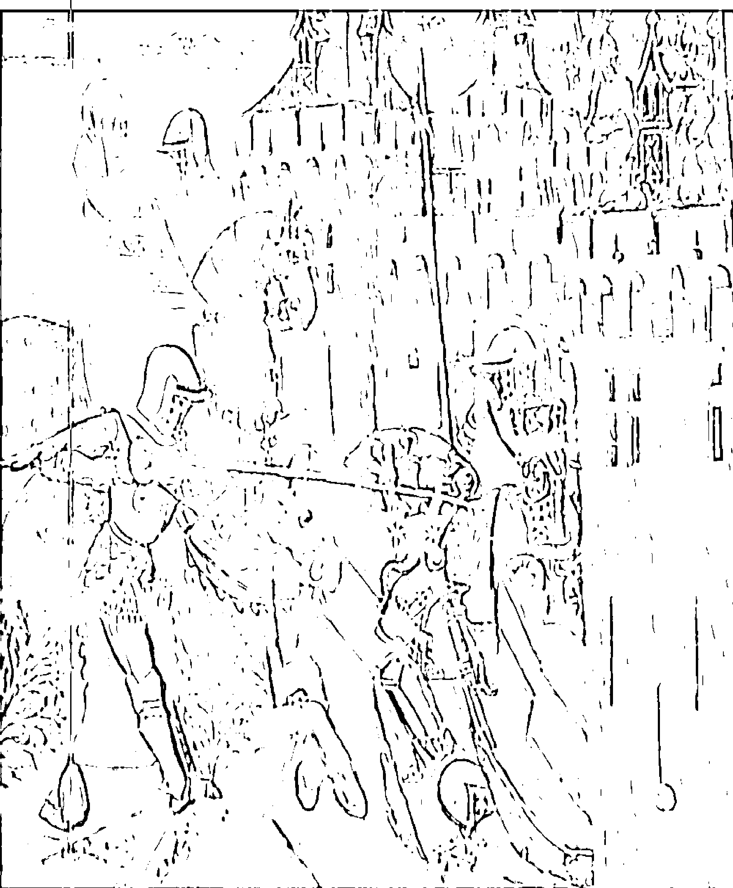

◎兰斯洛特攻城
他戴着薇薇安女巫新送给他的头盔，图中左边在不远处手持头盔的就是薇薇安女巫。

薇薇安女巫会施展自我保护的魔法，并且可以制造出一些用来提供庇佑和解除咒语的有魔力的宝物。不仅如此，她还精通于如何把人变成和自己的本来面目完全相反的样子：她能把勇敢的骑士变成胆小鬼，把懦夫变成英雄。她还能用魔法来劝人崇尚善良，并且与人为善。

> **巫术小百科：怎样使物品变硬**

把匍匐委陵菜和明矾汁放进一只玻璃杯内，然后捉几条昆虫捣碎，包在一块布内。把物品磨热，放入汁内，就会开始变硬。

## 3 令人费解的婚姻

在圆桌骑士的故事中，有些事情非常有趣。而首当其冲的要数加韦与朗内尔夫令人费解的婚姻了。因为他二人一位是谦恭有礼的骑士，而另一位却是通常被称为"令人作呕"的凯尔特女巫。

威尔士传说里，加韦代替兰斯洛特成了圆桌会议最早的领袖，并和凯及贝德维尔同为亚瑟王最初的同伴，他同时还被称作格沃奇梅。由于加韦的母亲摩加韦斯和亚瑟王与仙女摩根共有一半相同的血统，所以他应该是亚瑟王的外甥。和其他同为亚瑟王效力的骑士相比，加韦的故事是最能体现凯尔特精神的。故事中的加韦是凯尔特太阳

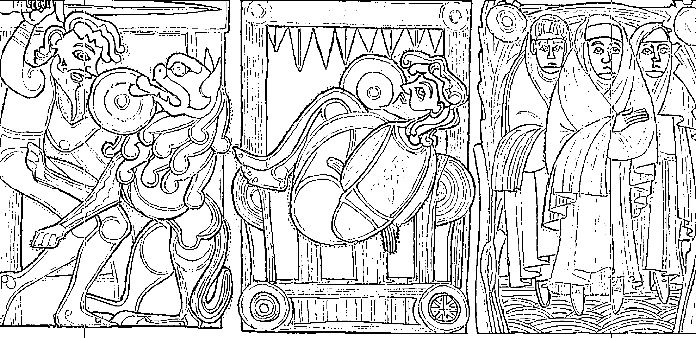

◎加韦解救三个女囚的故事
首先，他与一头狮子决斗，而后，又被困在了一张设有机关的床上，由于他在躺下之前因过于劳累没有把盔甲脱下，从而最终得以逃脱，而那三位女囚则一直等待着他来营救她们。

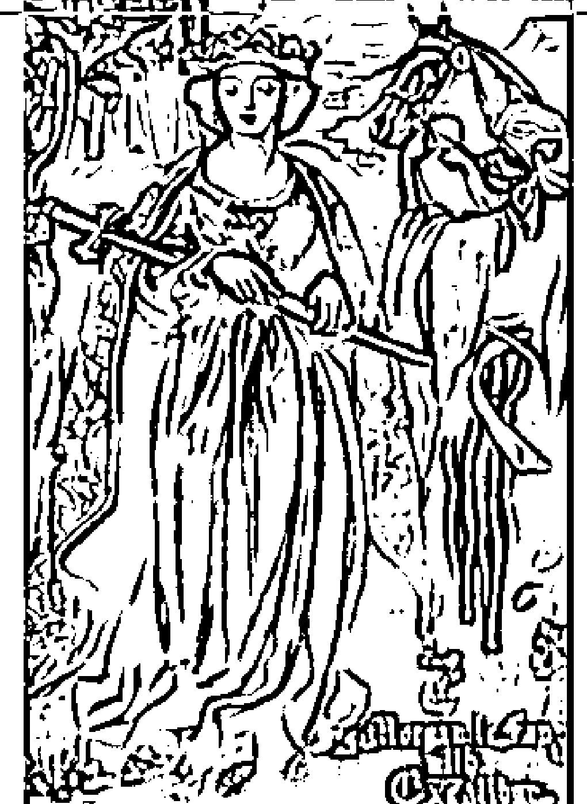

神的代表，这是因为，他通常在一天的中午达到体能的最高峰，到了黄昏就开始衰弱了。加韦的很多经历故事在一定程度上直接来源于爱尔兰英雄库丘林的传说。

和威尔士传说一样，流传于英格兰、苏格兰、德国和低地国家（指西欧的荷兰、比利时、卢森堡等国）的有关加韦的故事都把加韦描写成一位骑士精神的典范和女士倾慕的对象。法国的传说故事则在克雷蒂安·德·特罗亚（公元1160年？～1180年，法国诗人，生平不详，创造一种描述典雅爱情的叙事形式，作品多取材于中世纪历史人物和事件，因五首亚瑟王传奇故事诗闻名）的影响下，全都把加韦说成举止轻佻并且很会讨好女人，有时甚至成了杀人凶手。他在故事里的作用主要是为了突出兰斯洛特，不管他怎么努力，都无法真正达到法国骑士的标准——拥有健硕无敌的体魄和略有瑕疵却不乏高尚的德行。即便如此，大多数情况下，加韦还都是以正面形象示人的。他周身散发出的人性的魅力使他比任何一位圆桌骑士都要平易近人。

在新年宴会上，一位身穿绿衣的巨人骑士手持一柄巨大的绿色战斧、骑着绿色的战马闯入了亚瑟王的皇宫。他向在座所有的骑士挑战，说他们当中的任何一位都可以将他的头颅砍下，条件是一年零一天之后，他也要同样砍下这个人的头颅。加韦见状接过他手中的战斧，把他的头砍了下来。而后，绿衣骑士的躯干把头捡起来后便离开了。

眼看一年的期限就快到了，加韦不得不出发前往绿衣骑士指定的地方——绿色教堂去履行许下的诺言。他在沿途的一片森林里遇到了一个为他带路的男人，因为绿色教堂就在附近。这个男人后来和加韦约定，每天都要交换当天各自得到的东西。在接下来的三天里，男人每天都要去打猎，回来的时候总为他的客人加韦带回很多猎物。就在这段时间里，男人的妻子企图勾引加韦，她在第一天就吻了加韦一下，随之又一而再、再而三地持续到了第三天。在第三天，她不仅向加韦献上了自己的吻，而且还送给他一条绿色的腰带，凡是佩戴这条腰带的人都会远离死神。

被男人的妻子弄得尴尬不已的加韦把每一个吻都转给了男人，但却保留了那条腰带。到了第四天，加韦被带到了绿衣骑士的面前，不过，等绿衣骑士的战斧砍下来之

◎仙女摩根
虽然名为仙女，但亚瑟王的同父异母姐妹据说是个会施行邪魔巫术的魔鬼。

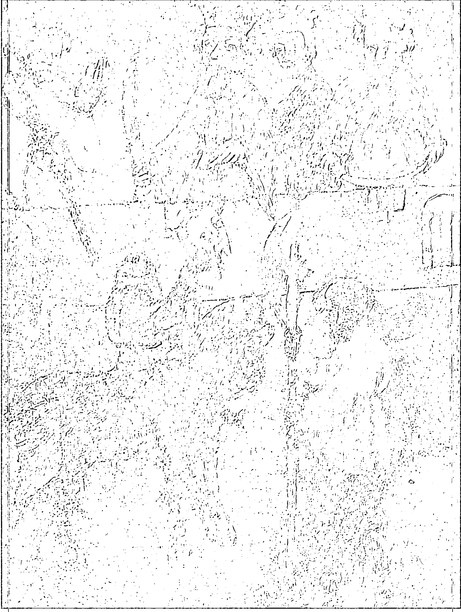

◎创作于公元1475年的以绿衣骑士来到亚瑟王的王宫这个故事为题材的画稿

后，加韦发现自己仅仅是被刮伤了脖子。

"这个伤口是为那条腰带而留下的。"绿衣骑士这样说道，"我叫贝尔西拉克，是你的姑姑仙女摩根的骑士，她派我来检验圆桌骑士的品德。你做的还可以，但是，由于你保留了那条腰带，我们的友好关系被破坏掉了。"贝尔西拉克正是曾为加韦带路的那个男人。等到加韦平安回到亚瑟王身边以后，亚瑟王下令让每一位圆桌骑士都必须佩戴绿色腰带。

据蒙默斯的杰弗里所载，加韦和他的家族来自挪威。由于抄写员的笔误，他们成了奥克尼群岛的主人：一位抄写员在抄写亚瑟王的骑士名单时在加韦的父亲、挪威的洛特王和奥克尼伯爵之间落了一行。洛特曾被指派到奥克尼群岛上，于是在中世纪传说中这里就成了他和他的家人的栖息地。

在洛特被他的敌人佩利诺尔杀死之后，加韦便成了奥克尼部落的首领。在他的兄弟阿格拉威恩、加尔瑞斯、加雷思和莫德雷德的协助下，他帮助亚瑟王征服了罗马帝国。兰斯洛特加入圆桌会议以后，加韦很快就和他成了好朋友，可兰斯洛特却取代了他亚瑟王宠臣的地位。在随后的寻求圣杯的故事中，加韦以反面角色出现，最终没有成为基督教义下的典范人物。

加雷思·博迈纳（美丽的双手）是加韦最钟爱的兄弟，他隐姓埋名来到卡米洛，并在凯的厨房里找到了活干。后来他自告奋勇去从恶魔艾恩赛德手里营救一位名叫里昂乃斯的女子。在他出征前，他向兰斯洛特表明了自己的身份，并被授予了骑士头衔。他最终打败了艾恩赛德，并娶里昂乃斯为妻。

奥克尼部落里的反派是阿格拉威恩、加尔瑞斯和声名狼藉的莫德雷德。其中，阿格拉威恩是邪恶的莫德雷德的同谋。在莫德雷德的教唆下，加雷恩和其他兄弟一起当场发现了母亲摩加韦斯与佩利诺尔的儿子拉莫拉克的奸情后，当即将母亲斩首示众，由此导致了奥克尼部落的分裂。兰斯洛特一直是加韦的支持者，但后来却在设法将格温娜维尔从火柱上解救下来的时候意外地杀死了加雷恩，从而致使两人的关系彻底破裂。加韦被痛失爱弟的怒火冲昏了头脑，发誓一定要杀死他昔日的好友，为弟弟报仇。最后，加韦因头部受重创而死，死后被埋在了多佛尔（虽然在很多版本里，加韦死后被埋在了卡米洛）。

在亚瑟王的最后一场战役中，加韦的灵魂曾在亚瑟王的梦中出现，并且对他发出

了警告，让他在兰斯洛特率援军到来之前不要与莫德雷德奋战，可亚瑟王却无视他的劝告。加韦的传说为人们描述了一位高贵而感性的骑士，他的粗枝大叶以及与基督教教义格格不入的报仇心切的行径导致了圆桌会议的毁灭。

收录于《坎特伯雷故事集》里面的《浴场夫人的故事》就是乔叟由此改编而成的。

一天，一位丑陋的女巫来到卡米洛城，她是来向亚瑟王的皇室荣誉挑战的。这个女巫让亚瑟王猜一个谜语，而且会给他一整年的时间来考虑。不过，如果一年以后亚瑟王还是猜不出谜底，他就必须无条件答应她的一个要求。待亚瑟王点头同意之后，女巫说出了她的谜语："什么

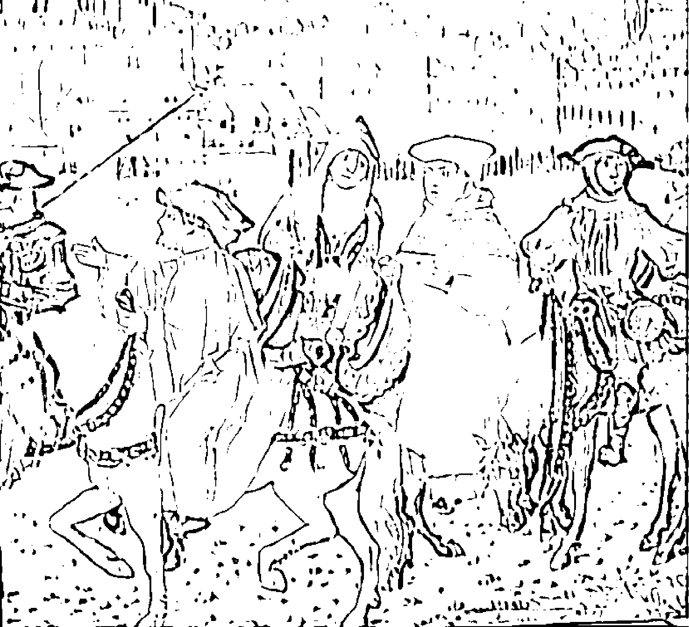

**《坎特伯雷故事集》插图**
乔叟在不惑之年开始写作《坎特伯雷故事集》，但直到最后都未完成。他写作用的是中世纪的英语，在所有的23个故事中，除了两篇之外，其余都是诗歌体裁的作品。这些故事来自欧洲各地，有的甚至来自东方。他的伟大的创作灵感似乎主要来源于薄伽丘的《十日谈》和《玫瑰传奇》。《坎特伯雷故事集》以一伙来自社会各个阶层的香客在宗教朝圣的路上讲述故事为线索，向我们清楚地展示了那个时代人们的生活。

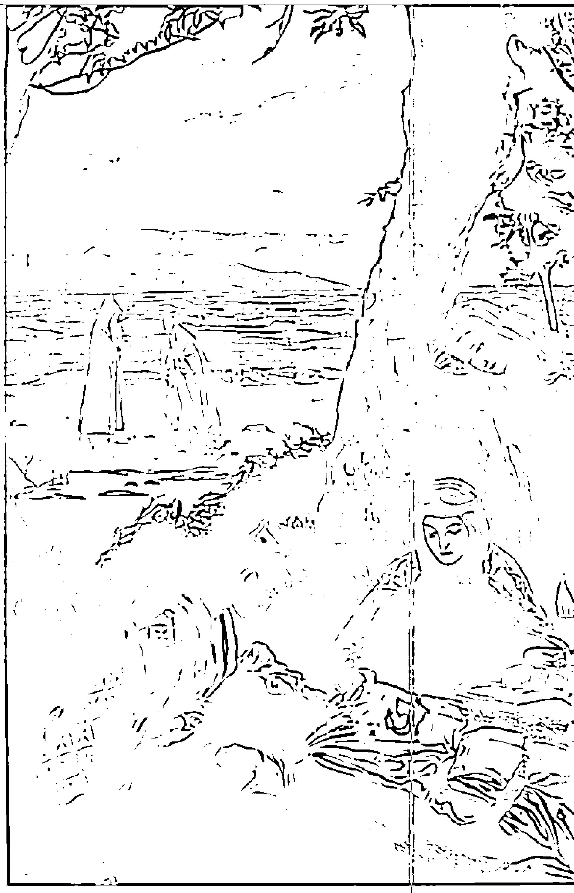

**亚瑟王的结局**
在剧情完善的亚瑟王系列故事中，这位上了年纪又身受重伤的国王被送到了神秘的阿瓦隆岛，护送他的甚至包括他的死对头仙女摩根。

是一个女人最想要的东西？"

在接下来的一年里，亚瑟王的骑士们在全国四处找寻这个谜语的答案，但最终都是无功而返。一年转眼间过去了，女巫按时来要她的答案了。亚瑟王没办法，只好实话实说，他告诉女巫他没有答案，并只能遵守自己的

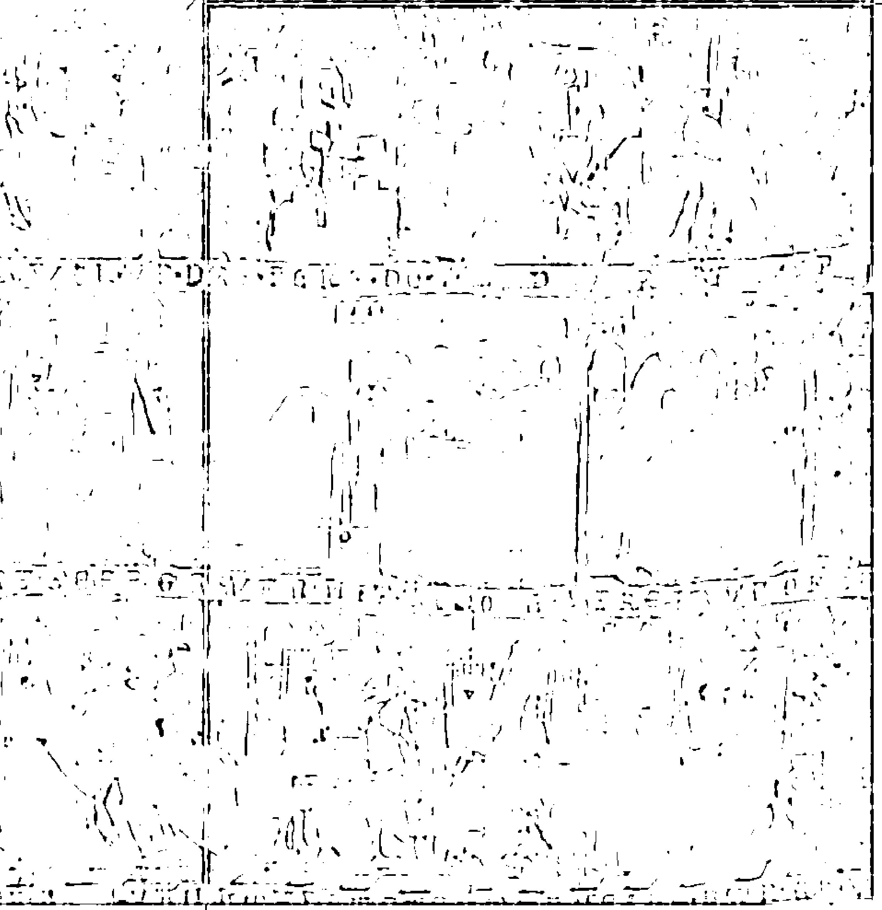

◎赢得美人归
德国14世纪的刺绣制品，上面画有埃申巴赫撰写的加韦历险的故事。在这个版本的故事中，加韦历经千辛万苦终于赢得了奥格鲁斯夫人的芳心，而不是本书提及的郎内尔夫人。

诺言，答应她的一个要求。

> "我要一个丈夫。"女巫这样说道。

由于身份悬殊，亚瑟王自己是绝不能成为她的丈夫的。他的那些骑士也都个个胆战心惊，生怕被选中。关键时刻，加韦站了出来，自告奋勇代替他的舅舅娶女巫为妻。亚瑟王随即批准，于是加韦和女巫就结婚了。新婚之夜，加韦迟疑不决地靠近婚床，却惊奇地发现，床上坐的不是女巫郎内尔，而是美丽的姑娘郎内尔。

她告诉加韦，自己受到了诅咒：

> "我只能在白天或晚上拥有美丽的容貌，但却无法全天拥有。剩下的时间就只能是你看到过的丑陋无比的样子了。现在由你来决定我是在夜晚我们独处的时候美丽，还是白天在亚瑟王和你的朋友面前展现美好的容貌。"

加韦左思右想，但还是拿不定主意。最后，他对郎内尔说："你应该自己选择！"

郎内尔听后，异常地兴奋，她高兴地大声喊道："你的这个回答解除了咒语！现在我可以从早到晚都是美丽的了！而我给亚瑟王出的谜语的谜底就是女人最想要的就是自己做决定。"

> **巫术小百科：如何使水晶变软**

取一份烧热的铅和等量的水晶，在石头上敲碎，放入坩埚内熔化，用这种方式，可把水晶铸成任何模样。另外一种方法是取一份生石灰和一份羊痘粉，放在水里捣成汁，过桶九到十次，再把钢或水晶放在里面浸泡24小时，之后，你要它是什么形状就会是什么形状。

## 第七章

## 女巫之神

在10世纪时期，日尔曼特里夫斯的勃鲁姆写了一部供主教阅读的隐修纪律指导书——《主教会规》。里面记载几名受撒旦诱惑的妇女，与女神阿尔忒弥斯一起骑在某些动物背上飞行。阿尔忒弥斯是跟月亮、水、沼泽地有关的女神，照顾妇女分娩。而这些都跟巫术有着紧密的联系，以致有的专家称她为"女巫之神"。据说，有些邪恶的女人皈依撒旦，接受魔鬼的幻想和迷惑，她们相信并公开承认，到了黑夜时刻，她们骑上某些动物，在异教徒女神阿尔忒弥斯的率领下，成群结队地在深更半夜穿越广阔的田野。某些夜里她们也会遵守阿尔忒弥斯的命令，出来侍奉她。

## 1 月亮女神

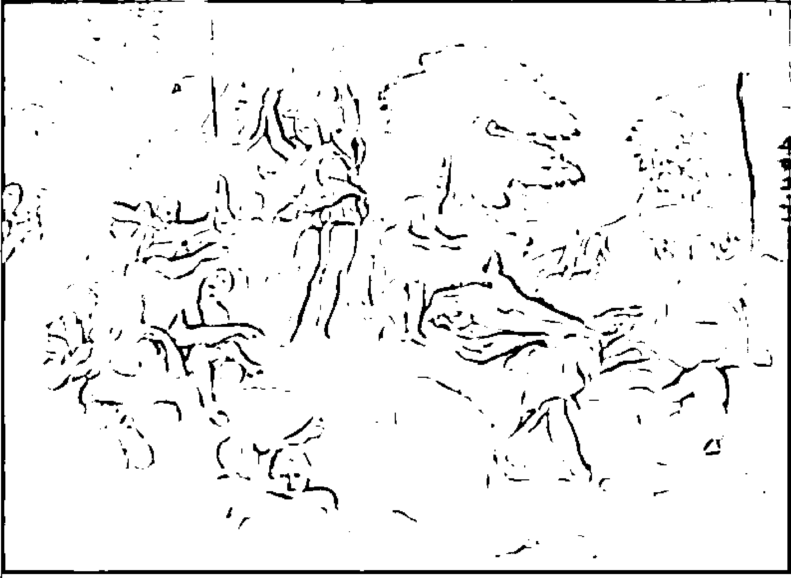

◎狩猎的女神阿尔忒弥斯

按照希腊神话的说法，阿尔忒弥斯是宙斯与提坦巨人科俄斯之女勒托的女儿。她是一位月神，又是湖泊泉水神、女人生活监护神和狩猎神。在希腊人来到小亚细亚之后，她又和这里的土著居民所特别崇拜的丰产女神合而为一，所以又获得了地母神的称号。

据说，她呱呱坠地后不久就能给母亲助产生得弟弟太阳神阿波罗。由于目睹母亲饱受流浪之苦，她特别讨厌嫁人。

接着，月亮女神向父亲宙斯要求，她要像姐姐雅典娜那样终生不嫁，以保持贞洁。

> "父亲，"一天，她坐在父亲的腿上对他说，"请您同意让您的女儿终生保持贞洁。请给我一把弓、一把箭、一把火炬，像一个男子汉一样去自由闯荡狩猎。请您给我一支由60个山林女神组成的合唱队，让她们陪伴我在森林里打猎。请您再给我21名水泽仙女，充当我的打猎助手。"

女儿提出的要求，宙斯全都同意了。从

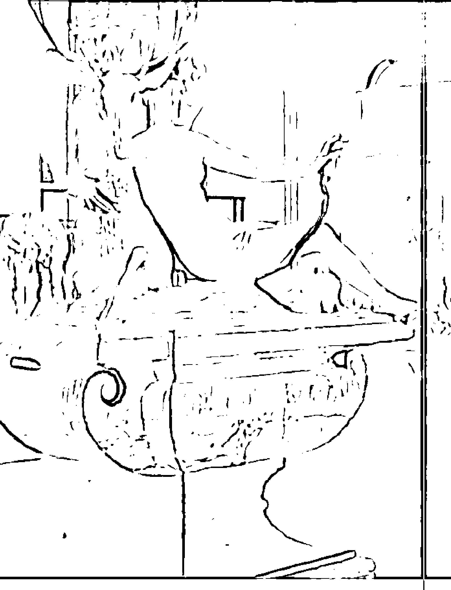

◎凡尔赛的阿尔忒弥斯像

这天起，阿尔忒弥斯就带上一把弓和一个箭袋。这位月亮女神阿尔忒弥斯，又是一位狩猎女神。她酷爱在山中玩耍，喜欢追击猛兽怪物。她经常坐在由两头牧鹿拉着的车子上，驰骋于山间原野，水泽仙女们在她身边前呼后拥，猎犬走在前头。她追野鹿，逐山猪，并且百发百中。当她满载而归，精疲力尽时，就去找弟弟太阳神阿波罗。她把弓和箭袋挂在一棵树上，换上镶着珠宝的衣服，参加丰富业余生活的卡里忒斯和缪斯的大合唱，这是她生活情操的一种表现。

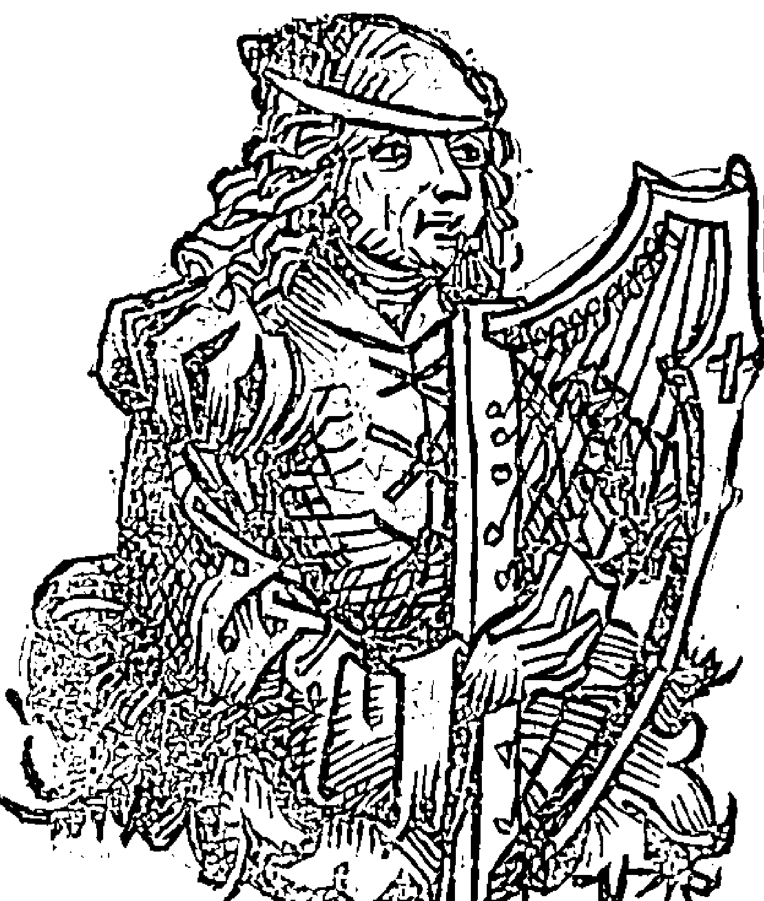

太阳神阿波罗是给人类带来温暖和灿烂白日的太阳神，他的姐姐阿尔忒弥斯则是太阳下山后发亮的月亮神。她比她的同伴的形象要高大和美丽，犹如月亮比陪伴她的星星更美丽和更光耀。阿尔忒弥斯和阿波罗的功能就是照耀全世界，普度众生，维护生灵，这正是他们的真实体现。

月亮既为人们照亮道路又会勾起令人毛骨悚然的浮想，这也正是月亮女神兼狩猎女神阿尔忒弥斯的真实体现，因此，月亮女神又是灵魂女神赫卡忒的化身。她是夜里引路的女神，她给人们照亮悬崖峭壁、羊肠小道、山间隘口和交叉路口。但她又是幽灵女神，有时她的光会使人仿佛看见幽灵或魔鬼而恐惧。晚间，被太阳晒得焦渴的植物可以在皎洁的月光下吸到清新的空气，甜润露珠滋润干裂的心田。

金色的新月美得令人浮想联翩。阿尔忒弥斯和阿波罗一样非常自豪，他们姐弟俩都唯恐失去自己的光辉。据说，有一天，坦塔罗斯的女儿尼俄伯生了12个健美的子女，她夸耀自己的子女比勒托的双胞胎要漂亮。

尼俄伯高声自夸说："我感到很幸福，我将永远感到幸福。我有一大群子女，命运永远也不能让我和他们分开，因为我的子女比勒托夸耀的子女身体更健壮，相貌更

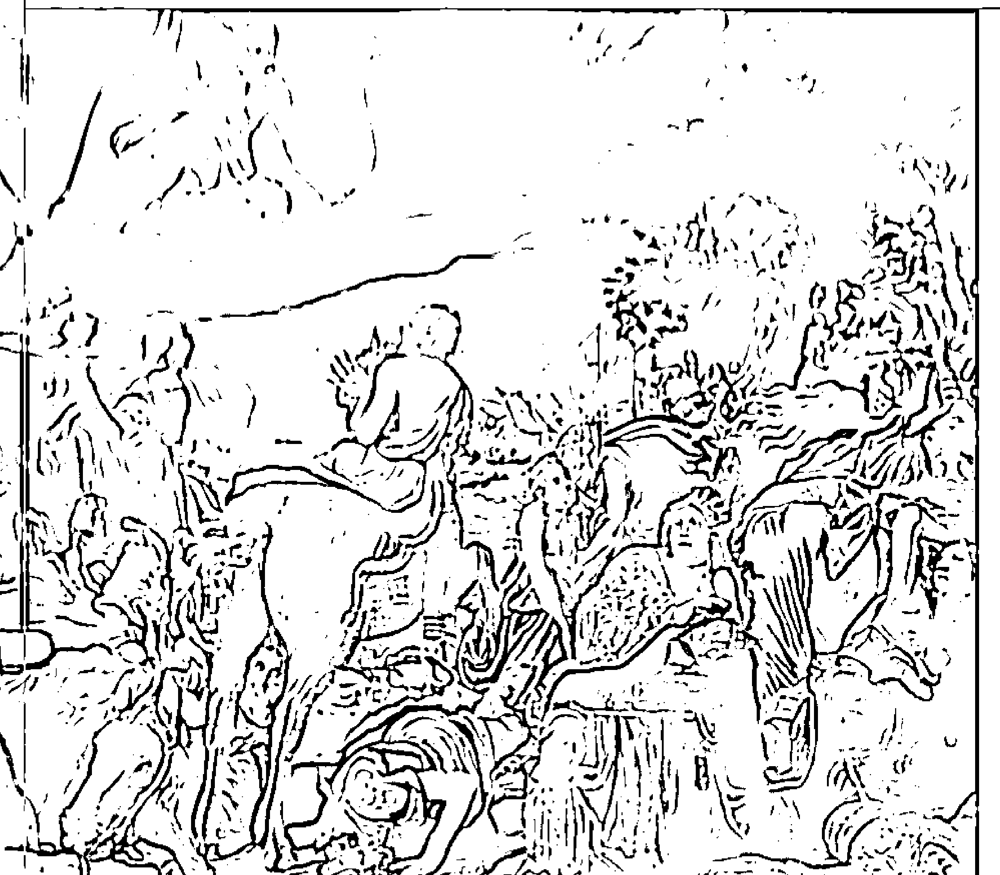

阿尔忒弥斯与阿波罗用箭射杀尼俄伯的子女

水灵优雅。我有我的法术，勒托斗不过我，我总比她强。"

尼俄伯的话被勒托当仁不让地给予回击。后来，她把子女叫到面前，命令他们为她报仇雪恨。姐弟俩立即执行了母亲的命令。正在西特隆山上打猎的尼俄伯的6个儿子被太阳神阿波罗用箭射中身亡。六姐妹听见兄弟的呼喊声便立即赶到出事地，然而，恰恰正好，她们刚一出现，就被狩猎女神阿尔忒弥斯的神箭百发百中，当了几个活靶子。尼俄伯的6男6女已经死去9天，但无人愿意去收殓。尼俄伯坐在心爱的子女的尸体中间痛哭流涕，悲伤欲绝。眼泪流干以后，她就像一尊悲痛的塑像一样坐在那里。为了结束她那无法忍受的痛苦，她求神灵将她化为石头。后来尼俄伯便来到西彼尔山，这座陡峭的山崖在她周围像茂盛的常春藤一样不断扩展，不久，她便葬身于此，为了纪念尼俄伯的不幸遭遇，并且警告世人，不要太狂妄，西彼尔山突然间冒出一块貌似女人的大岩石，并且终年流水潺潺，哗哗不断，淙淙不绝。这块石头就是尼俄伯的化身。她向世人警告不要向她学习，傲气冲冲，狂妄自大，否则下场与她一样。

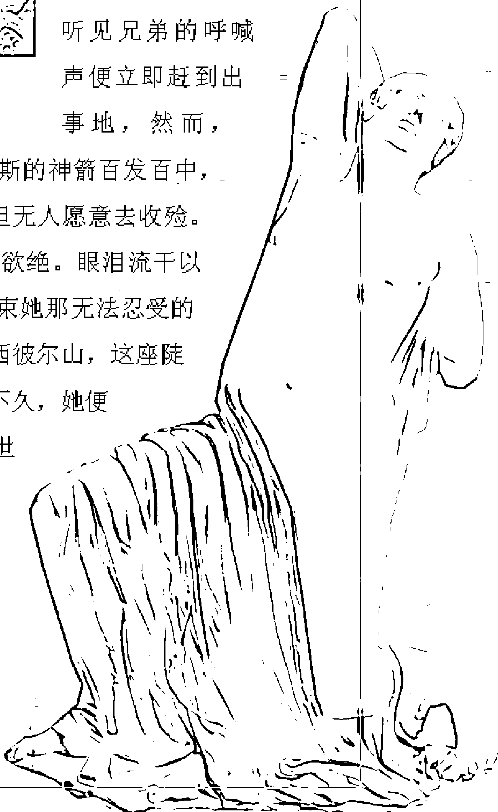

尼俄伯受伤的女儿

月亮女神给大地带来朝露，月相的变化又往往带来雨水。她是能滋润大地、促进植物生长、

维持万物生命的女神。她会给耕耘过的土地、谷麦丰收在望的田地、正在草地上吃草的畜群带来益处或造成灾害。她带来的雨水使谷物和水果生长、成熟。然而，月神阿尔忒弥斯要求人们用时新水果和谷物向她献祭。否则她柳眉倒竖，一反常态，怒气冲冲。于是她用冰霜冻死作物，放逐野兽去践踏庄稼。据说，在富庶的卡吕冬有个富有的国王名叫珀涅斯，他的妻子阿西亚生了一个儿子，取名为梅利埃格，婴儿刚生下7天，命运女神帕尔卡就下凡到阿西亚的宫殿，指着炉子里正在燃烧的木柴对她说："这块燃烧将尽的木块，就是您儿子梅利埃格的寿限长短。"

阿西亚听了命运女神帕尔卡这句话，胆颤心惊，不寒而栗。她立即从床上跳下来，将炉内的木块用水浇灭，并且精心地保存起来，以便儿子梅利埃格长命百岁。有一年，孩子的父亲珀涅斯在丰收之年忘了用刚收获的时新果蔬向月神阿尔忒弥斯进贡。这位女神火冒三丈，她马上指使一条长着锋利牙的野猪破坏了这个国王的田地和葡萄园，把他的果树连根拔掉。英雄豪气的梅利埃格打算为民除害。他组织了一支由著名猎手组成的庞大的狩猎队去清除卡吕冬地区的祸根。在这支狩猎队伍中，最著名的是年轻姑娘阿塔兰特，她以飞毛腿和神箭手著称。她第一个射中野猪，然后才由梅利埃格将野猪击毙。这位英雄猎手梅利埃格倾心爱慕美丽的阿塔兰特，把这条野猪的头和皮送给她，以讨她的欢心。然而，在梅利埃格的狩猎伙伴中，有几个是他的舅舅，他们看到外甥把战利品送给一个女子而感到气愤，接着便夺回这战利品。出于对阿塔兰特的钟爱，舅舅们的这一举动使他大为恼怒，他用长矛把他们全部刺死。阿西亚看到自己的全部兄弟都被刺死，想起了命运女神帕尔卡的预言，接着她愤怒地将儿子梅利埃格的命根子，那块存放的木块扔入熊熊的烈火之中。木柴很快便燃烧起来，当这块木柴刚刚烧尽，梅利埃格便咽了气。

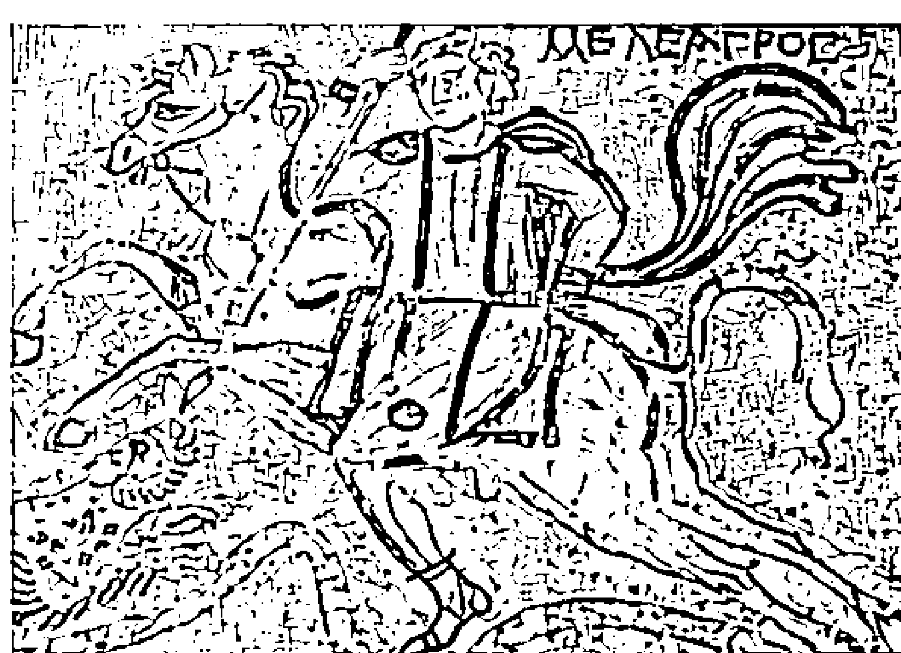

卡吕冬地区的野猪被击毙后，美貌非凡的飞毛腿阿塔兰特便回到父亲家里。她对父亲并不很了解，因为她父亲希望生个男孩，而王后生下的却是个女孩。因此，阿塔兰特一出生，就被她爸爸抛到荒郊。事情巧得很，一只母熊发现了阿塔兰特，便把她衔回去用自己的奶喂养她。后来，一个猎人发现了她，把她带回家去抚养。阿塔兰

特长大成人后，特别崇拜狩猎女神狄安娜，同样她也非常喜欢到深山野岭去打猎。参加卡吕冬搜捕野猪后，她便回到家里，恰巧，父亲正准备把她嫁给别人。然而，父亲一提起她的婚事就立即遭到她的拒绝。后来，在父亲的坚持下，阿塔兰特同意考虑婚事，唯一的要求是：谁要想娶她，必须首先在赛跑中战胜她，否则，求婚者肯定必死无疑，阿塔兰特是个飞毛腿，在赛跑中从来没有人胜过她，所以和她赛跑只能是死路一条，在赛跑中，她总是让对手跑在她前面几步，然后才急起直追，超过对手。

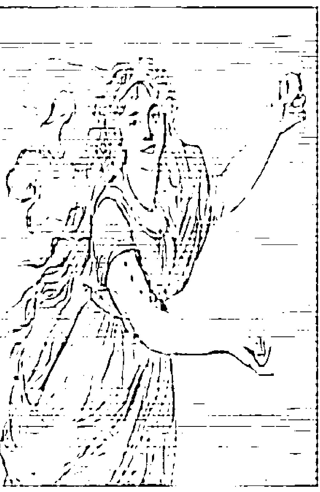

◎阿塔兰特为金苹果所吸引
阿塔兰特是希腊神话中唯一一个希腊本土的女英雄，长得用原文来说就是"男人看她是美女，女人看她是美男子"，男女通杀的美女。此图表现的是阿塔兰特为金苹果所吸引。

兰特姿色超人，她的美貌深深打动着每一位求婚者，觉得死在她的手下也值得。因此，向她求爱的人很多。然而，一个名叫米拉尼翁的新对手又向她求爱来了。米拉尼翁得到了爱与美的女神阿佛洛狄忒的保护，她把从赫斯珀里得斯园子摘来的三个金苹果交给他，为他出谋划策，定将战胜阿塔兰特。米拉尼翁带着三个金苹果来到起跑线，准备以死来与阿塔兰特比赛。每当她快要赶上自己时，米拉尼翁就拿出一个金苹果抛到地上。他一连三次采取这一策略。美丽的金苹果吸引着阿塔兰特，而阿塔兰特因三次俯身拾取金苹果而失去了时间，米拉尼翁在赛跑中首先到达终点。这就是米拉尼翁在爱神的帮助下，最终有情人终成眷属。

"女巫之神"阿尔忒弥斯喜欢驰骋于森林原野。她脸上稚气未消，肩上挎着箭袋，身旁往往有一头牡鹿或一条猎狗，俨然是一个出色的猎手。她往往手举火炬，头

> **巫术小百科：怎样使铁化为绕指柔**

让一个人放血，淬取血中清澄的血水；把铁放在火上烧红，用一根在血水里浸过的羽毛在铁上刷涂，一直把水刷完为止。用这个秘方软化铁屡试不爽。

发往上隆起，头周围是星星，或一轮镰刀形的新月高挂于前额上方，她体态苗条轻盈，裙子过膝，露出白皙细长的小腿和匀称的脚。阿尔忒弥斯喜爱的动物有母鹿、公鹿、猎狗、公鸡、鹌鹑、熊、野猪和狼。她最喜欢的树木是月桂树、爱神木、松柏、雪松和橄榄树。

## 2 巫术·医疗·草药

民间传说中的巫师无一例外全部是女子，历史记载中的许多施行巫术者也都是女人。在大多数传统社会中，女人的首要职责一直都是照看孩子和生病的人。在早期的欧洲，情况仍然大抵如此，特别是在乡村地区，大多数人所能找到的医疗资源大概也就只是某个贫苦寡居的老妇所知晓的草药偏方和巫术制剂了。

然而，尽管许多妇女都施用巫术，但16、17世纪时村庄里"专业"的巫术施行者还是男女各半。全职的白巫师和村庄巫士中女人的数量要比一半多出那么一点来，但牵涉其中的男子数量也不容忽视。很多妇女使用巫术只是作为一项"副业"。对那些生计窘迫的人来说，巫术行为不失为一个赚取一点额外收入的办法，而女人在经济需求方面比男人更容易遇上困境。但是由于官方并不赞成这种行为，施用巫术是有风险的。因此，人们所知的大部分村庄巫术都来自于对那些被带到了法庭上的男女的记录，他们被指控为施用巫术或其他行为不端的巫术。

在人们的印象中，传统的知识和巫术有些含混不清，很多女巫都相应了解植物习性。

在16、17世纪的搜巫大运动中，任何与巫术发生的联系都有使用巫术的嫌疑。今天的一些人认为搜巫活动就是专门针对女人——特别是女巫的。事实并非如此，男巫和女巫同样有可能被卷进一场巫术审判中去。

1581年，一个德国妇女厄秀拉·弗拉丁被控使用巫术，她声称自己所使用的都是些无害的咒语，是从附近一个村子里的男巫那儿学来的。于是那个男巫被传到法庭上来为自己辩解，但幸运的是，最终他只被判为行骗而非行巫术。

从巫术法庭保留下来的数据显示了遭受迫害男女的真正比例。从1581到1620年间，在法国的拜·德·沃地区共有970人受到了巫术指控，其中有325名男人和624名女人（另外21人的性别不详）。其他地区的数据显示出了对女性甚至更为严重的偏见。在1561年到1684年间的德国西南部，1050名妇女受到了指控，而只有238名男人被指控，也就是说有82%的受控者都是女性。在德国某些大型审判中妇女占了受控人数的90%。巫士审判中存在着一种极强的仇视妇女的情绪，其根源也许在于15世纪那些歇斯底里的反女巫作品，其中最值得一提的是《女巫之锤》。这本书在16世纪的德国妇孺皆知，作者认为女人的习惯和天性使得她们天生就爱好使用巫术。

除了记载的符咒以外，巫术治疗中最常见的材料便是草药和植物根茎，数百年来不同国家的人们都在使用它们。对于它们的疗效有着好几种解释。根据当时的医药理论，人体要保持良好健康就需要平衡四种体液：干、湿、热和冷。当这些体液失去平衡时疾病就有可能发生。严格来讲这并不算是巫术的方式去解释疾病，因为关于体液的理论最早产生于古希腊，被认为真实描述了人体的生物学特性。体液统管人体健康这种说法在普通人当中也相当普及，不过他们对此的理解将这种早期的"科学性"医学理论和自己的巫术治疗术掺和了起来。很多植物都被认为能够有效地平衡人体体液。比如，莴苣是凉性的，将其打湿就可以用于缓和发热的肌肤。类似罂粟的草药白屈菜，其性"热而干"，可用以导出腐坏的血液、汗液和忧郁液。

从血管放血治疗发烧病人的传统做法也是建立在平衡人体体液这一古老的理论之上的。发烧症被认为是热而湿的，就好像血液一样，因此如果有人患了热症，他就需要减少一些血液来使自己的各种体液重归平衡。这种没有助益甚至危险的"疗法"直到19世纪还是一些声望斐然的医生惯常使用的方法，在那之后现代医学才最终彻底否定了体液理论。

很多被认为有医疗作用的植物自身就带着标记以显示出与相应人体器官的关联，这被称为"标记理论"。疗肺草被认为能够治疗肺结核，因为其叶片上分布着白色斑点，很像生了结核的肺部。玄参被用来医治淋巴结核（淋巴各节点肿大）和痔疮的，因为它长着类似肿块的多节根须。用紫草来溶解膀胱结石是因为人们认为其坚硬的种子长得很像这类结石。地钱自然而然地被用来治疗肝脏疾病，因为其叶片的形状有点类似于肝脏。牛舌草因为其种子长得像个蛇头，所以被用来治疗蛇咬伤。

草药和根茎的天然巫术特性并非只来自于它们的形状。患有黄疸病的人皮肤会发黄，因此可以用同色的物品、植株或花朵来对抗这种疾病。同理，可以用一块红色的毛巾敷在疼痛的喉咙处，这是因为红色和血液有关系而咽喉疼痛又被认为是由血液引起的毛病。

虽然这些草药疗法背后的解释未必经得起推敲，但一些草药混合使用大概的确有一定疗效。历史上几乎所有的国家都使用过各种各样的植物、根茎和草药，它们也是唯一可用的药物来源。

一种治疗蛇咬伤的方法更有点"以毒攻毒"的意味，要杀死那条蛇，再将蛇皮覆盖在伤口上。这种疗法的基础和"咬你的狗身上的毛"出自同一原理，而后者在今天更多地被当成一种不太明智的醒酒解醉的法子。西班牙作家塞万提斯讲述过一个年轻人在探访一个吉普赛人露营地时被狗群咬伤的故事："负责治疗他的那个吉普赛老妇从咬了他的那些狗身上剪下一些毛，用酒清洗他的伤口，接着便把那些用油煎过的狗毛敷在咬伤处，上面又覆盖了一点儿咀嚼过的迷迭香。然后她用干净的布条把伤口包扎了起来，又用手在表面画了个十字形。"

农民可不会在动物身上浪费感情，为了达到某些巫术治疗的目的，往往会刻意地给它们造成极大的疼痛。在葡萄牙，蜥蜴可以用来治疗肿瘤，但必须用食指一下下地将它打死。17世纪英国有一种治疗肺结核的办法，要把一只公鸡杀死剥皮再砸成碎块，这样才可以入药。似乎那只动物越是受苦，用它做成的药物也就越是有效。在众多治疗瘟疫的巫术中，1615年流行的一种做法尤其令人作呕，要把一只鸽子切成两半敷到患者的皮肤上。在19世纪美国的一些疗法里还能找到这些习俗的影子。例如，刚刚宰杀的猪和牛的血液会被直接涂到一个湿疹患者的皮肤上。

蟾蜍与女巫的联系人人皆知，女巫不但施行邪恶的咒语，自身就与罪恶有着种种联系。事实上，英国有很多受指控的女巫都被迫供认养了一只蟾蜍作为自己的恶灵，或者承认只要自己愿意就能变化成一只蟾蜍。然而与此有些自相矛盾的是，保护性的咒语中也常常要用到蟾蜍：瘟疫肆虐的时期人们往往在脖子上佩戴一只风干的蟾蜍，希望以此来吓退传染病毒。由于蟾蜍自身是有毒的，人们相信它们也有以毒攻毒的力量。这种方法所依仗的仍是相似理论——彼此相似的两个事物之间具有一种"感应"，并可以互相影响。

具体的对等联系，例如解毒疗法和一只有毒动物间的对应，倒并不是非有不可的。有些疗法中用到了鼹鼠，只是因为人们相信任何在地里打洞的东西自身都具有某种邪门法力。一只鼹鼠身上的法力可以转移到一个人身上去，他只需要弄死这只鼹鼠就成，杀死鼹鼠的那只手则被认为就此拥有了强大的治疗能力。而那只不幸的小动物的身体部位也可以用在治疗咒语中。一本1758年的法国医书就曾建议把一只鼹鼠的爪子和头放在一个病婴的脖颈周围。

动物的身体部位普遍应用在一系列治疗方法之中，所依据的通常都是相似理论。风干的野兔肝脏用于治疗各种肝脏不适，狐狸的肺部可以用来治疗肺部疾病，而螃蟹眼睛则被放在脖颈上来缓解眼部的肿胀。

从某种意义上来说，这些疗法中有许多都并未被看成是巫术。人们相信在可见的世界之外，还有一张看不见的、各种影响力组成的网将所有物体束缚在一起，而村中治疗师和普通大众则认定他们只不过是在摸索事物的天然属性罢了。

除了动物的身体部位以外，巫术用料还包括其他一系列令人生厌的东西，其中几种治疗方法甚至会用到尿液或动物粪便。烧过的男性大便或山羊粪便掺上蜂蜜制成的药膏用于治疗乳癌，而通过各种方式处理过的粪便经常用来治疗烧伤。这类疗法中的一些是依靠感应巫术来起作用的。

根据16世纪法国的一种医治浮肿（也称为水肿）的方法，病人应当"一连九个早晨在太阳照到一株苦薄荷之前在它上面小便，当这棵植株枯萎之时，肿胀也会随之平复"。另一条来自16世纪法国马赛的疗法则指示，在烧完全发起来之前小便，用尿液揉制一条面包喂给狗吃，那只倒霉的动物将会承受这场疾病，而病人也就治好了。

有时候患病的根源会被怀疑为受巫术所害，而病人的尿液可以用来迫使那个女巫收回其诅咒。在德国的埃斯林根镇，人们会在盛满病人尿液的玻璃杯中放置一块布和一些蜡。据说这种做法能使女巫在12小时之内赶到病人的房子里，然后就可以迫使她帮助这个巫术受害者了。为了防止她来到房子里后马上离开，得在门上放置面包、盐和一把扫帚，以防女巫逃走。事实上病人那些怒不可遏的家庭成员就足以抓住女巫不让她逃走了。每当此时，女巫就不得不献上一项巫术治疗来交换自己的人身自由。人们并不认为女巫邪恶到了无可救药的地步，尽管一个女巫使用其巫术大抵是用来为害的，但只要她愿意，她也能将它们用作治疗之用。

巫术力量也可以产生于对惯常的做法和习俗反其道而行之。在英格兰的萨福克，和民间医师打交道时的不成文做法是绝对不说"请"和"谢谢你"。在法国的利穆赞，治牙痛的一个办法是去参加弥撒，但是所有的举动都要反着来。当全体会众都站起来时，病人应当跪下去，而当其他人都跪下去时，病人应该站起来。这样做当然得把握尺度，以免做得太过火了惹恼牧师以及其他与会的人。有时候要治病甚至还得违反法律，因为有些药材偶尔还必须用一定的仪式偷来。

众多可以追溯到中世纪甚至古希腊罗马时代的观念都认为，草药必须以一定的方式在一年中的某些特定时期进行采集。一部1597年的法国作品《乡村住宅》在向一群好奇的贵族读者描述农民的各种习俗和日常生活时曾提到，蕨类孢子只能在圣约翰节（6月23日）前夜采集。大多数基督教节日都给定了某种特定草药的采集时间。根据西班牙宗教裁判所于1615年审问一名妇女时的说法，马鞭草应当在仲夏（6月21日前后）前夜采集，然后放置到祭坛台布下面去，这样在不为牧师所知的情况下它就会在次日早晨的弥撒中受到祝福。在那之后就可以用它来向圣母玛利亚祈求财富了。许多其他植物也需要与基督教发生类似的关联：芸香经常用以入药就是因为与基督的受难有关——至于到底是什么样的关系就不甚清楚了。按正确的方式把这些草药采集来之后，并不是制成一剂药服下去就万事大吉了。草药往往只是一项巫术疗法中的组成原料而已。

尼古拉斯·库尔派珀著于17世纪的《草药纲目》也许是最为著名的对草药疗法和草药巫术的编年史记载了，它不仅描述了当时的普遍做法，还大量借鉴了各种民间偏方。按照库尔派珀的说法，马鞭草的疗效尤为显著，被用以巩固子宫以及减轻黄疸、水肿和痛风症状，并且能够打掉肚里的绦虫和治疗口腔溃疡。马鞭草也能用来保护人们不受巫术侵害，甚至可以用于制作春药。根据另一种理论，在采集时必须在马鞭草上画十字并进行祝福，还要吟诵一首特殊的诗文：

> 愿你变得神圣啊马鞭草，
> 尽管你还生长在地面，
> 因为你是在凯尔维瑞山上被发现。
> 你治好了我们的救世主耶稣基督，
> 止住了他伤口的流血，
> 以圣父、圣子和圣灵的名义，
> 我把你从地上采下。

《圣经》中并没有证据表明曾用马鞭草来治疗基督的伤口，但是它与基督复活的这种联系倒是为其巫术疗效提供了巧妙的神学背景。

槲寄生的功效被公认比马鞭草还要强大，它不但能治疗疾病，还可用于灭火和开锁。曼德拉草也以其巫术特性而著称，甚至在《圣经》中也有所提及。在《创世纪》第三十章中，雅各的妻子拉结就曾为了受孕而吃下曼德拉草。在一些文化中曼德拉草因为形似一个男子而被称为"男人根"。据说有时曼德拉草在被连根拔起时会发出尖叫声，这显示了那棵草格外具有法力。古希腊罗马时期的作家也提到过曼德拉草的药用功效，据普林尼称，它可以在手术过程中被用作麻醉剂。直到中世纪后期它才开始与巫术产生联系。

治疗巫术常常会要求患者和治疗者之间发生某种身体接触。要搽上油膏和药膏，就得按摩。有时候治疗者要触碰或抚摸病人，以此来将疾病吸走并转移到某个无生命的物体上，例如一块石头。在法国的部分地区，这类治疗师被称为"触摸师"。

在17世纪的英格兰，据说有一个诺森伯兰的妇女将双唇贴在一个病孩儿的嘴上，"又是啧啧作声又是使劲吸吮，弄得病孩儿的母亲差点儿以为她要把孩子的心脏也吸出来了，实在吓得够呛"。1604年在同一地区，两名妇女被送上教会法庭，受到的指控是使用符咒"治疗病人……她们常常会带着一只母鸭或公鸭，将鸭啄贴在患者的嘴上并嘀咕起她们的咒语"。这种奇特的做法显然是为了将疾病从患者那儿转移到鸭子身上。

## 巫术小百科：人粪

女巫保证，治疗咽喉炎只要用人粪就有效，不需用其他的药物。以下是配制的方法：让一名脾性佳、身体好的青年，吃3天羽扇豆和烘制味美的面包，面包内要放点酵母和盐，饮料只喝淡红葡萄酒，除此以外什么也不吃。第一天的粪便是无效的。应该抛掉。接着两天的粪便小心收拾好，然后拌上同样数量的蜂蜜，叫病人喝了吞下去，或者当膏药或石膏敷在皮外，对治疗咽喉炎效果奇妙。

## 3 围绕女人生命中最危险的阶段

在早期欧洲，巫术被认为是种实用的东西。人生的所有重要阶段都被巫术习俗所围绕着，不过恐怕没有哪个时候能像一个女人生命中最危险的阶段那样密集地被巫术所围绕了。

根据一项公元1600年左右的估计，一名妇女在其有生殖能力期间大约每两到三年就会分娩一次。在分娩中死亡是种实实在在的巨大威胁，每八个第一次生育的女性中就有一人死去。助产士直到18世纪都还提供不了多少实际的帮助，通常所用的工具无非是剪子、线、用来止血的醋、某种润滑剂和按摩油。因此，巫术和仪式起了至关重要的辅助作用。

分娩中的各种难关被认为是仙女、巫术和魔鬼造成的。1576年，一个苏格兰妇女宣称自己在分娩时，"精灵王国的女王"造访了她并告诉她说孩子会死去，而孩子确实死了。1533年，布兰登堡教会让其神职人员指示妇女说，她们在分娩时不会受到魔鬼的控制，而她们在此之前显然相信自己是会遭受噩运的。17世纪50年代在爱沙尼亚，一名妇女在生产后连续几天昏迷不醒。罪责被归咎到了一只猫头上，因为它刚好爬到了屋顶上正对着这名妇女躺卧处的位置。人们相信这只猫其实是本地的一个女巫的化身。

对女巫的传统描绘还会包括她的好朋友——在今天通常都是一只黑猫，然而这种形象出现得相当晚。随着搜巫运动在16世纪的发展，动物越来越多地和女巫们的魔法联系在了一起。首先，魔鬼本人会以一只大型黑色动物的形象出现在夜半集会上，例如一只公牛或大狗。女巫有时也使用一只动物飞去夜半集会，所以据此类推，任何黑色的动物都可能是一个魔鬼改变了外形以驮起一个女巫。

女巫被认为也有能耐自己化身为动物。这一点是十分重要的，因为据说女巫能用巫术或者其他不被人发觉的方式进入房子。由于猫的体型很小，所以变成它们是再理想不过的了。在一场16世纪的法国巫师审判中，被指控的那些妇女在酷刑之下供认自己曾化身为猫，她们的供词中包括用许多荒诞不经的方法进出邻居的住所。

尽管对于女巫与猫之间的联系的确有着一些例证，但一个女巫带着她的黑猫这种标准形象在早期对女巫的描绘中还不常见。只是在搜巫行动的大潮退去之后，在关于女巫的民间故事里，女巫才与黑猫紧紧地联系在了一起。在19世纪的德国有这么一种说法："一只猫活上20年就会变成女巫，而一个女巫活上100年就会又变成猫。"

在东欧，分娩要尽可能秘密地进行，这样生育者就不会吸引任何存心不良的邻居的"恶意眼神"。而在西欧则采取了完全相反的策略。一个难产中的女性要受到其他一大群妇女的照看，这群人有可能提供实用的帮助，但通常据说她们的主要功能是击退那些有可能来攻击这位未来母亲的邪恶咒语。

大多数村庄都有自己的助产士，被称为主姆、女圣贤、嬷嬷、虔婆、女主人、接生婆或者助产娘。她们通常都已人过中年，是有孩子的寡妇。有时村中助产士的行当是母亲传给女儿的。助产士的地位有点类似于一位牧师，这也是一个妇女可以从事的接近神职人员的唯一职务。她要参与一系列重要的仪式，例如为一个新生儿洗礼以及一个妇女在分娩后所必须经历的其他教会仪式。助产士——通常被称为"女方士"（这个词可以用来泛指各种使用某类巫术或民间医药的女性），也经常负责做好埋葬死者的准备以及其他葬礼事宜。她会随身携带一小瓶应急圣水，用来为那些看似马上就要死去的新生儿洗礼。

助产士的地位十分重要，从中世纪晚期开始教会权威就指定某些妇女来担当这一职务。当选的人必须得接受正规严肃的洗礼仪式培训，在有些地方还会举行一场教会仪式来将她"封为"助产士。

18世纪在法国的安格斯，这项仪式要在礼拜日的弥撒上举行，准助产士要手捧教堂圣水盘托着一根蜡烛起誓。在英格兰，助产士由主教委任，也要起誓说不会"在任何妇女艰难生产的时候使用任何形式的巫术或咒语"。然而一部始于1638年的英国戏剧就表现了这么一个女方士，除了助产外，她还进行各种普通治疗、算命以及用巫术找出丢失的物品。

实际上，很多助产士还是没有得到特许许可，有些教会人员也抱怨说妇女更愿意选择那些没经特许的助产士。受过特许的助产士在使用巫术时总会束手束脚，因为她们得持续取得教会的支持，而没受过特许的助产士就有更大的自由了。此外，由于分娩是只有女人涉足的领域，一个孕妇多少会觉得选择没受过特许——因此也就和男性权威没有任何关联——的助产士是更加合适，甚至也是更为有效的。分娩过程中用

◎助产士的分工
男人和女人在帮助一位临产女性时各有分工，在这幅1587年的插图中，助产士提供的是实用的帮助，而男人们则转而研究星相。

到了各种自然草药，这些草药也许可以缓解疼痛，例如麦角菇、香脂草、月桂、艾草、百合以及烟草。大部分草药显然是按照巫术方式使用的，例如要求难产的妇女吞下三粒胡椒。"3"在传统巫术中是个有着象征意义的数字，代表了神圣的三位一体：圣父、圣子和圣灵。

众所周知，助产士使用各种各样的咒语和祈祷。咒语会被写下来，有时用的是拉丁文，然后贴在孕妇身上或床上以加速分娩或减轻疼痛。有一条直到20世纪还以各种不同版本流传在英格兰及斯堪的纳维亚半岛上的咒语是这样的："我召唤你呢，孩子，不管你是男是女，以圣父、圣子和圣灵的名义，你出来吧，别再缩回去，也不要伤害到你的母亲。"也就是说，这条咒语借用了基督在拉撒路出生和他从坟墓中现身的神迹典故。其他咒语使用的是些不明其意的话语，或者只简单地写上"耶稣"。

### 烟叶

烟草在登上美洲大陆后不久便传入了欧洲，很快人们便宣称这种植物对人有一系列益处，尽管它自始至终只被用在吸烟一项上。

### 耶稣救助拉撒路

在《圣经》中流传着耶稣的种种神迹，据说他曾使已亡几日的拉撒路复活，将其从坟墓中解救出来。

欧洲各地的人们使用五花八门的护身符。在德国，会将一些特殊的石头——有时是牡丹石——绑在分娩妇女的右膝上。其他地区还分别会用到浮石、珊瑚、特别的贝壳、斧身、马掌和磁铁。穷人如果弄不到这些东西，也会用上动物的身体部位，例如根据当时一个人的观察，会将一只驴蹄或马蹄吊在私处（生殖器）附近。我们并不清楚这些东西究竟怎样起巫术效用，但很明显是用到了感应巫术。

蛇蜕掉的那层皮和生育有着显著的关联并被用作护身符，尽管神职人员将其视为与魔鬼的联系。有时农民自己也会有这种担忧，在法国的某个地区，蛇皮在分娩时被当成腰带缠在身上，但分娩后会很快拿开，这样婴儿就不会属于撒旦了。

其他类型的腰带也通常都带有超自然含义。1576年，一个受控使用了巫术的苏格兰助产士声称说，她拴在妇女身上用以减轻分娩痛楚的花边是一个幽灵给她的。更加常规的做法是用曾在教堂中鸣钟用的绳子制成腰带。人们认为教堂的鸣钟能够驱赶魔鬼，因此也就相信绳子本身也具有相似的保护性力量。还常常会用到与女圣人有关联的腰带，尽管也可以向男性圣人祈求帮助。犹太妇女使用的腰带是由绑过《律法》手卷的皮条制成的。

未婚女性通常并不在各种分娩仪式和巫术中担当任何职责。不过，在有些情况下她们可能有着重要的巫术效用。17世纪新英格兰的一张"医药"处方开列了一条复杂的咒语来减少分娩时的困难：

取一束处女的头发，其年龄要正好等于生产妇女的一半，细细切成粉末。然后取12枚置于烤过面包的平底锅上烘干的蚁卵，如果手头没有则即行烘烤，然后将其与头发一起制成粉状。用四分之一品脱的红色奶牛之乳（如没有可用浓啤酒代替）送服。

在早期现代欧洲仇视女子的氛围中，助产士地位重要，往往会引起男性的猜疑和敌意。一本15世纪的书将助产士描述成了本质上的女巫，她们"用各种手段杀死母亲子宫中所孕育的生命，即使没这么做，也是将孩子献给了魔鬼……助产士的罪恶大于所有其他女巫。她们数目庞大，即使在最小的村落里也有"。

如果分娩不能顺利进行，助产士就不得不采用各种巫术。有一次，在德国城市蒂灵詹姆出生的一个孩子是死胎，当地的特许助产士瓦尔普尔嘎·豪斯玛敏将婴儿的尸体埋在了房门口下面，这样这名妇女以后就不会再流产或生产死胎了。但是瓦尔普尔嘎于1587年因使用巫术而被处死，罪名是在一个分娩的妇女和婴儿身上涂抹了一种油膏而导致了他们的死亡。无疑那种油膏是用来保护妇女和婴儿的，但由于分娩的最终结果是死亡，助产士就不得不为此担上责任了。

### ◎蛇皮的功效

保护孕妇分娩的咒语包括来自教堂的绳子，用以赶走魔鬼，而蛇蜕下的皮（蛇自身的重生）也可以用来帮助人类的生产。

16、17世纪，越来越多的人拒绝与巫术打任何交道，这些人通常都是新教徒。与此同时，在欧洲天主教各国那些受过良好教育的阶层中也开始出现了对巫术施为的怀疑。然而，新教徒对巫术攻击的焦点通常都集中在天主教习俗上，他们认为这些习俗沾染上了巫术，而且也助长了村民们的迷信观念。一个英国新教徒就曾经抱怨说，"这些天主教徒的脖子和手上总是挂着符咒，以保护他们远离各种困苦和所有不幸的伤害。"

天主教从前的仪式中引起新教徒疑虑的一项是为刚刚分娩的妇女举行"安产感谢礼"的传统。人们认为一个妇女在分娩后极容易受到邪恶影响，在恢复正常生活并担任起做母亲的新角色之前必须在教堂中接受净化仪式。在分娩和举行安产感谢礼之间通常会相隔一段很短的时间。17世纪末在威尔士，一个英国教士曾评价说，"普通妇女所受的教育不过是将安产感谢礼视为一种抵挡巫术的咒语罢了，她们认为分娩后，在举行这场仪式之前连自己踩过的地方也不会再长草了。"

### ◎安产感谢礼

这是一种直到18世纪还在举行的仪式，目的是使妇女在分娩后得到净化，这样她就可以重新加入到村里的宗教生活中去。

教会曾试图破除与安产感谢礼相联系的种种迷信，然而它们还是存在于许多地区的传统之中。正统的基督教观念认为这场仪式仅仅是因为平安生产而表达感谢的举动，但许多人觉得分娩后的妇女不洁，认为她们在经历安产感谢礼的仪式之前都应当被禁止进入教堂。这种仪式背后的观点其实是认为女性在有了性关系后的一段时间里是不洁的。分娩既然是性行为的最终果实，也就证实了这种不洁的状态。正是基于这些原因，17世纪早期的一位英国国教牧师曾拒绝同正在月经期的女性或任何头一天有过性行为的人进行交谈。

也正是在这样的背景下英国的一些新教徒才反对举行安产感谢礼，18世纪后这种仪式还在英国国教教会中持续存在了很长时间。一个17世纪的激进新教徒反对说，安产感谢礼的整个仪式"在淳朴民众的心中孕育滋长了许多迷信观念，比如刚生过小孩的妇女是不干净和不洁的"。

并不仅仅是安产感谢礼这一项仪式被新教徒认为鼓励人们相信魔法和巫术。在其发表于1584年的《巫术发现》一书中，雷吉纳德·司科特抨击了巫术审判，将它们描绘为对受了蛊惑或与人无害的老妇的攻击。在司科特看来，天主教的驱魔仪式——"不过是种巫术咒语"，压根儿不比"巫师"的那些迷信行为好到哪里去。他声称驱魔只是上帝赐给其十二使徒的天赋，再也不应指望这种奇迹还能在后世出现。

17世纪，厌恶魔法的并非只有新教徒。天主教反宗教改革运动也谋求将那些迷信和民俗性质的做法从教会中清除出去，虽然它们已经逐渐发展融入了教会仪式和传统之中。通过将一些围绕着教会仪式的巫术因素从天主教传统中去除，这些运动倡导者希望能够加强人们对于天主教各核心圣礼的信念，例如面包和葡萄酒在弥撒过程中变成了基督的真正血肉这样的信念。尽管他们表面上反对村庄巫术，但许多新教徒和革新后的天主教徒仍然相信并施用这些巫术，即使是在受到自己牧师的禁止时也不例外。

巫术的衰落是个复杂的过程，但这个过程显然在17世纪的时候就在大部分西欧国家和美国开始并持续进行了。在没有足够医药知识的年代里，对巫术的信念常常是普通民众唯一的选择，因而被合理化了。然而有效并普及的医药知识是直到巫术不再为人们所相信，并且成了孤立的边缘文化之后很久才出现的。事实上，正是巫术的衰落使得医药和科学进步成为可能，而非后者的进步促成了巫术的衰落。不过，也正是随着这种更为理智的世界观开始传播发展，对巫术的恐惧才在16、17世纪的巫术大审判中达到了高潮。

> 巫术小百科：狗粪
> 把一条狗关起来，三天中只给它啃骨头，把它的粪便收起来晒干，治痢疾非常有效。

## 4 神行侠

在意大利东北的弗留利地区，人们曾一度相信存在着神行侠这么一类人——他们的灵魂在夜间飞去与巫师战斗。对这个信念最详细的描述来自于两个男人所讲述的故事：保罗·加斯帕鲁图和巴蒂斯塔·莫都科。这两个人也因为相信神行侠和巫师间的战斗而被拘捕。然而在弗留利很多人都有着与他们相同的看法，类似的信念大概更早时候就在欧洲中部各地广为流传了。这个不同寻常的故事几乎是偶然性地出现于1575年3月，一个被称为菲利斯兄弟的宗教裁判员从一个教区牧师那儿听到了一场令人费解的报告，称一个男人治好了那些受巫师魅惑的人，还有传言说他在夜间和一群巫师及小妖精一起四处游荡。

那个据称在夜间与超自然精灵们一起飞行的男人是一个叫做保罗·加斯帕鲁图的普通农夫，宗教裁判所怀疑他是个巫师，而当他受召来到裁判所时，他从容地解释说自己不是巫师，而是一个神行侠。宗教裁判员并不明白这个方言用语的意思，但他们将此理解为"流浪汉"。起初，加斯帕鲁图无拘无束地为自己进行辩解，说："我是一个神行侠，因为我和其他弟兄一起每年进行四次战斗。"他的冒险总是发生在夜间："我的灵魂隐身而行，肉体则留在原地。我们服务于基督，对抗魔鬼的那些巫师们。"在接下来的50年当中，宗教裁判所在意大利的这一地区发现了许多相信自己就是神行侠的人们，而且这些人无论男女，都讲述了十分类似的与巫师进行战斗的故事。

这则奇异的民间故事其实就是某种形式的魔法，与确保土地的丰饶有关。四季节，即神行侠自称出来战斗的日子，是每个季节中献给某些圣人的三天，被视为从一个季节进入下一个季节的转折点。正如加斯帕鲁图所说，"在我们所进行的战斗中，一次是为了小麦和其他谷物而战，另一次是为了家畜，其他的则是为了葡萄园。这样一来，我们的四次战斗就是为了所有大地所出产的果实，而因为有了神行侠的胜利，那一年人们也就丰收富饶了。"在战斗中，巫师们的武器都是高粱秆。高粱是谷物的一种，而其象征性意义如今已完全不可考。神行侠的武器则是茴香秆。茴香被认为具有治病疗伤的魔法功用，是种对付巫术格外有用的解毒剂。茴香对抗巫师的威力就好像传说中大蒜对付吸血鬼的威力一样显著。

### ◎四季大斋日的面具

四季大斋日之夜是在星期四到星期五的夜晚举行，天主教历中也有这个古老的节日。在意大利南部和西西里岛上的四季大斋日祭仪上，经常透过面具来表现神秘的威力，这在17至18世纪非常流行。

### 神行侠们

神行侠所保护的并不仅仅是收成。众所周知，巫师们还掠食儿童，而神行侠宣称可以认出任何受到巫师攻击的孩子。仅仅通过一连三个星期四都对他或她称量体重的办法，神行侠就能治好一个因为受巫师所害而生病的孩子。他们的理念是，孩子的血肉在巫师的无形攻击下正在逐渐地损耗，而这种攻击通常发生在星期四。神行侠在他们的魂灵与巫师战斗时会随身携带着天平，他们的头领会用称过孩子的天平去攻击那个残害孩子的巫师。如果神行侠对巫师的袭击成功了，那个孩子就会恢复健康，而那个巫师则会死去。

### 茴香

人们相信茴香植株具有治疗疾病的魔法功效。神行侠们则想象自己在夜间以茴香秆作为武器与巫师作战。

宗教裁判员菲利斯兄弟询问这个自封为对抗巫师的战士，是什么使得他加入神行侠的行列。保罗·加斯帕鲁图回答说，午夜时分，在他的房中，"一个天使出现在我面前，全身都是金子做成的，就像圣坛上的那些一样，他召唤我，于是我的灵魂便出窍了"。加斯帕鲁图此时已经意识到自己陷入了宗教裁判所的麻烦，他希望能通过强调自己信仰的基督教性质来逃过惩罚。不幸的是，这只会将事态弄得更糟，因为宗教裁判员现在已经不再有任何疑惑，断定那个天使显然是个魔鬼，在引诱这个农夫走上邪道。

宗教裁判员问加斯帕鲁图："你得到了什么许诺？女人、食物还是歌舞宴乐？"他使用了这类引导性的问题，希望此人会泄漏出自己是个巫师。加斯帕鲁图否认了那个天使曾许诺过他任何好处，但是承认说在这些集会上巫师们"的确四处雀跃起舞"。这位裁判员至此已深信不疑保罗·加斯帕鲁图就是一名巫师，并参加了邪恶的夜半集会，而这和加斯帕鲁图自己所宣称的完全相反。

### ©巫魔会场景

## 第七章

## 女巫 女巫之神

这位裁判员开始向这个可怜的农夫暗示一些情节，好让他的叙述与邪恶的夜半集会相吻合。在宗教裁判所的概念中，构成夜半集会的标准元素之一便是位于巫师狂欢中心那魔鬼的王座。裁判员紧紧追问加斯帕鲁图有关魔鬼王座的事，以及那个"天使"是否引领着神行侠们在王座面前下跪并去亲吻魔鬼。加斯帕鲁图勃然大怒，发作道："他才不是我们一伙的呢，上帝都不允许我们和这个虚伪的敌人搅在一起！是那些巫师坐在漂亮座席上。"

加斯帕鲁图和莫都科都试图使神行侠们的集会听起来尽可能军事化。两人都将自己和同伴描述成被一个"队长"率领，而他显然是个人类。莫都科还提到了他们是如何像士兵那样向自己的头领敬礼的。成为一名神行侠就类似于应征入伍。在步入成年之时（莫都科自己是在20岁的时候），二人受到召唤去服役，并且在服务了一段时间之后——也许是10年或20年——就能获准从神行侠队伍中退役。

莫都科和加斯帕鲁图都相信他们是在为了土地的丰饶而和那些反社会的超自然敌人们进行战斗。两个人最终被监禁了六个月，并被迫在公众面前声明自己的"异端思想"，承认神行侠的聚会其实就是巫师的集会。然而，从对他们审讯的记录来看，加斯帕鲁图和莫都科都从未动摇过信念，而是始终坚信自己作为神行侠的重要性和良善本质。

欧洲的有些地方，但最为显著的是在意大利北部，有这么一种观念：那些出生时头顶覆盖着胎衣膜（胎盘）的婴儿与超自然力量有着紧密联系。对弗留利的许多人来说，胎盘是种被赋予了魔法力量的东西，而那些出生时带着胎盘的人会终生保留它作为一件护身符。在它的众多功效中，有一项就是保护士兵不会受伤。即使那些受过高等教育的人也十分看重自己胎盘的力量，据说一个律师的胎盘能帮助他赢得讼案。

巴蒂斯塔·莫都科是最早作为神行侠而被意大利宗教裁判所拘捕的人之一，声称自己的母亲把他的胎盘给了他。她教导儿子说，他注定要成为一名神行侠，以灵魂的形式去和巫师战斗来保卫收成。据他自己所说，在弄丢了胎盘以后，他便再也没有被召唤出去和巫师作战，因为胎盘丢了就意味着他同时也失去了自己的魔法力量。

还有一些人相信生下来时头顶胎盘的人注定会成为巫师。在这些人看来，胎盘赋予了巫师灵魂与肉体分离的能力，这样他们就能在夜间飞出去作恶。正如其他大多数与魔法有关的东西一样，胎盘既能引人向善也能助人为恶。

当一个神行侠的灵魂出窍时，他的躯体不仅仅处于一种深度睡眠的状态，而且是几乎失去了生命的迹象，就好像陷入了昏迷一样。加斯帕鲁图告诉自己的宗教裁判员说，离开的是他的灵魂，"而如果我们在外作战时恰巧有什么人带着灯长时间地看着某具躯体，其灵魂就无法重新进入，要直等到当天夜间再也没有人看为止，若是这具躯体因为看起来好像已经死去一样而被埋掉了，那么灵魂就只好四处飘荡，直到身体死亡的那一刻"。

无论巫师还是神行侠都相信他们的身体在这种状态下是十分脆弱的。一个认为自己是女巫的女子，圣洛可的马格丽塔就曾说过，如果她在参加夜半集会时自己的身体被脸朝下翻转过来，那么她的灵魂和肉身都会死去。如果她化身成了一只猫外出走动而"灵魂不能在黎明公鸡打鸣时及时返回的话，我们就无法变回人形，身体就会永远死亡而灵魂只能一直呆在猫身上了"。

有时灵魂在进出躯体时会被认为像是一只老鼠。1589年在卢卡受到审讯的一个巫师曾声称："40年或更久以前，我认识一个叫吉娅娜的女巫，一次在她睡着时我看到从她口中钻出一只老鼠。那是她的灵魂，我不知道它要上哪儿去。"神行侠加斯帕鲁图也相信自己的灵魂是以老鼠的形态从他的口中出窍的。

## 女巫与灵界动物

对于神行侠——弗留利巫师的天敌——的信念并不仅仅局限在最初被拘捕的少数几个人身上，而是为一系列受到宗教裁判所质询的人所共有。这类信念在1575年到1620年间弗留利的许多案例中屡见不鲜。此外，一些被指责为女巫的16世纪意大利女方士似乎也有着类似的关于神行侠传说的信念。一个名叫安娜·拉·罗萨的妇女会使用魔法来治疗一系列疾病，她还宣称能"看见"那些已死者并为活着的人带回讯息。

在宗教裁判所的反复盘问下，安娜·拉·罗萨称自己曾陷入深度恍惚状态，灵魂去到了女巫聚集的地方，在那里学到了她目前所使用的所有魔法秘方。如果她泄漏了这些秘密，就会受到高粱秆的毒打，正如神行侠所说的一样：如果他们透露了太多关于夜间战斗的情形也会遭受到同样的惩罚。拉·罗萨十分幸运地逃过了被控诉为女巫的命运，因为当地的宗教裁判员认为她的故事实在太离奇，不足以令他们相信她真的是个女巫。

然而，宗教裁判员们倒是全心全意地相信夜半集会的存在，认为它们就像在欧洲各地流传的相关书籍中所描绘的那样。在许多场审判和质询中，宗教裁判所确实曾尽力压制人们对于神行侠的信念。渐渐地，它说服了人们相信要么神行侠根本就是些巫师，要么他们那些关于夜间战斗的故事就纯属幻想之作。教区牧师谴责神行侠都是些流氓暴徒，他们破坏人们的家庭，公开谎称自己能治好巫师魅惑之症，就是为了骗钱。在这样的压力之下，这个不同寻常的生命力旺盛的民间故事最终消失了。

## 巫术小百科：狼粪

任何人都知道狼是一种残酷的动物，它在吞食猎物时，经常连肉带骨头一起吞下肚，如果在它的粪便里找到骨头，把骨头磨碎，然后和着酒一起饮下，对止肠绞痛有特效。

关于神行侠的非同寻常的信念还涉及到欧洲各地的其他一些观念，其中都提到了超自然的精灵在夜半狂欢中四处飞行。这些精灵有时被称为"野外猎手"。就像对待神行侠的态度一样，权威人士要么就用他们那一套巫师夜半集会的理论来看待这些精灵，要么就将它们当成了恶魔制造的幻觉。对野外猎手或者"暴躁的流动部落"的信念最早出现于9世纪。一个德国主教发现"有一些邪恶的妇女相信并公开宣称她们在夜半时分骑着某些动物飞行，同行的还有异教徒的女神阿尔忒弥斯以及数不清的其他妇女；在子夜的死寂时刻穿越一个个村庄；遵从阿尔忒弥斯的一切命令，好像她是她们的女主人，在某些特定的夜晚受到召唤去为她服务"。尽管这位9世纪时的主教并不相信这些故事，然而在接下来的若干世纪中却有许多妇女都相信自己确曾见到过这些夜间飞行的女精灵的身影。

在随后的几个世纪里，偶尔还会有资料提到这些野外猎手，有时候是由阿尔忒弥斯所率领，有时则是一位叫做霍尔达的德国女神。霍尔达原本是一位与冬至日联系在一起的异教女神，在冬季最为活跃，为大地回复肥沃多产做着准备。19世纪的德国民间故事中说雪花来自她卧床上的羽毛。霍尔达是一个母亲式的形象，照料着家园田产，同时也是一个恐怖的角色，引领着野外猎手飞翔在暴风雨中。当她生气——特别是被孩子惹生气时，她就会以类似女巫的形象出现：长着巨大的牙齿和长长的鼻子。

肉体凡胎的男女也能加入这个由空中飞行的精灵组成的"暴躁的流动部落"而成为其追随者，只要他们能够在夜间将灵魂从躯体中分离出来便成了。既然霍尔达都可以变成一个类似女巫的生物，就不难理解为什么那些声称在夜间追随着她的凡人女子也会被视为女巫了。16世纪伊始，在德国就有这样的故事，一些妇女在四## ⓒ阿尔忒弥斯和她的山林女神

季节期间会在夜里陷入一种迷糊状态，此时她们的身体不怕小的割伤或烫伤。就在这种迷糊状态下，她们的灵魂加入了"弗纳斯神"（即维纳斯女神）的追随者队伍，醒来时她们描述自己曾到过某个奇异的天堂，那里有丰盛的宴席和金银珠宝。这个弗纳斯神显然就是与霍尔达有关的神话中这位女神的另一个名字了。

除了这些进行精神之旅的凡人女子以外，"暴躁的流动部落"的主要追随者是那些死人的灵魂，特别是那些年纪轻轻就死掉或者暴毙的人。另外，领导"暴躁的流动部落"的并不仅仅只有女性精灵。一个中世纪的法国农夫就曾宣称看到这些野外猎手由亚瑟王领导着，他身边的追随者还有他那些传奇骑士。

在人们脑海中最为传统的女巫形象之一便是：一个或更多穿着黑衣的干瘪老丑婆骑在扫帚上飞过月亮，为自己那些邪恶的取乐发出咯咯笑声。在巫师迫害狂热时期，在英格兰也只有一场巫术审判曾提到过扫帚作为一个女巫的魔法用具。19世纪以前的女巫形象要远比童话故事中一成不变的陈词滥调丰富得多，扫帚也只不过是女巫的众多道具中的一种。

乡村民间故事里的普通女巫可不是童话故事中的那种超自然生物，她们不过是某个被怀疑运用魔法来伤害庄稼、动物及人们的邻居罢了。发端于寻常村庄生活中的巫术指控极少提到像巫师们飞行或变身成了动物这样荒诞离奇的故事。只是在教会人员和本地统治阶层成员开始执迷于巫师夜半集会这一观念之后，飞巫才成了支配性的主题。

这些秘密的夜半集会通常被想象成在遥远的山顶举行，巫师需要具有某种魔法才能到达这些地方。有一些受到巫术指控并身受酷刑逼供的人说是魔鬼将他们载到了夜半集会上。另一些人则声称是骑着猪呀、牛呀、狗或是其他动物到那儿去的。普通的家居用具，例如铲子和（当然还有）扫帚，也能派上用场。许多人还招供说他们有一种魔法油膏可以擦在身上用来飞行。很明显，扫帚只是巫师们用以飞往夜半集会的众多手段中的一种。

野外猎手所做的事情并不仅仅是在空中飞行。有些地方的人们会害怕他们，认为他们能够穿过墙壁和紧闭的房门，闯入屋内大吃大喝。有时候这些野外猎手的贪婪胃口反而能为那一家带来好运道。在13世纪的法国，这群鬼魂是由阿邦迪亚女士或塞西尔所率领的，如果她和她的追随者在不请自入一间房子里时发现供奉给她们的食物和饮料已经摆好了，阿邦迪亚女士（阿邦迪亚的意思就是富足）便会保佑这一家并使其家业兴旺繁荣。只有在找不到任何供奉时这帮人才会蓄意破坏。在德国，霍尔达也有着这种类似的双重性格，既会记仇报复又能助人为乐。据说她会奖励那些辛勤劳作的人，在他们家的窗户外面留下礼物。

关于野外猎手的传说在意大利被称为"夜之女士"。一个14世纪的故事讲述了一个主教有一次和朋友们在一间房子里聚餐，晚餐后，他惊奇地看到餐桌上又重新布置了一番盛宴。其他人告诉他说这是为那些"夜里进来的女士们"准备的。这位主教于是熬夜准备观赏这一景象，他看到"数不清的化身成了男男女女的魔鬼"，随即驱逐了它们。这些家伙供认不讳自己就是魔鬼并十分驯顺地离开了。写作这个故事是为了说服人们，如果他们相信夜之女士的存在并为她们留下了供奉的话，那他们就是在允许恶灵，而不是友善精灵，在夜间侵入他们的居所。

有关夜之女士的神话在西西里一直流传到了今天，她们也被称为"外面来的女士"、"家中的女士"及"美丽的女士"。那些声称见过她们的人将她们描述成高大美丽的女人，有着闪光的长头发。她们在夜里出现，尤其是在星期四的夜里，如果为她们提供食品、饮料、音乐和舞蹈的话，她们就会保佑这一家。对这些女士的不敬举止有可能会为家庭带来疾病和贫困，但是这些女士其实并不怎么记仇，只要她们下次再来时加以正当的款待，她们很快就会原谅你。不同于早先那些野外猎手的情况，在西西里这些女性精灵绝不会和巫师混为一谈，巫师都被视为是肉体凡胎、邪恶十足的。

野外猎手传说的另一种流传至今的形式——虽然很少有人意识到这二者之间的联系——就是现代的万圣节前夜仪式。万圣节是一个基督教节日，用以赞颂所有天堂中的圣人。欧洲百姓间流传的民间故事说，在万圣节前夜，成群的死人会出外在地面上自由地行走，就像野外猎手那样。人们担心这一些"野外猎手"会侵入他们的居所，即使不造成严重的破坏，也会搞些恶作剧。

在现代早期时，很多地方一年中都会有那么几个不同的时候，年轻人（特别是年轻男性）会模仿那些野外猎手或其他传说人物绕城镇或村庄游行。这些年轻人所制造出来的乱子其实只比死亡大军可能会造成的麻烦稍微小一点点。这么做是为了标志那些死者在每年的生长与死亡这个循环圈中的重要性，也是为了抚慰死者那漂泊不定的灵魂。万圣节前夜的起源早就已经被遗忘了，现在的人们将它与所有类型的邪恶精灵鬼怪联系在了一起。巫师们当然也就无可避免地与万圣节前夜密不可分了，尽管真实的情况是他们最初与这个节日没有任何关系。

许多相信自己曾追随野外猎手的妇女不大可能会同时视自己为女巫，特别是当人们对于巫师的恐惧在16、17世纪激增以后。一旦教会人员和本地官员开始对魔法及精灵世界整套广为人知的理念进行压制，野外猎手便被谴责为只是些邪魔歪道的幻象。

长久以来，野外猎手神话的因素开始逐渐和巫术联系起来。所有的巫师都被认为有着一个"魔鬼的印记"——身体上某个不会感到疼痛的地方。这种观念受到了关于那些灵魂离体女子的故事的影响，她们的灵魂离开了躯体去追随野外猎手，而身体则失去知觉而且不怕疼痛。另外，巫师的夜半集会据说也通常是在星期四举行的，与相传中那些夜之女士外出的时间刚好是同一天。

16世纪，在意大利的某些巫术审判中，妇女们表现出她们真的相信自己在夜间曾和野外猎手一起飞行。那时她们已经完全被教会人员的布道所说服，相信这些精灵其实是邪恶的魔鬼而不是早先人们概念中那亦正亦邪的生物了。这些妇女仍然坚持自己对野外猎手的信念，但由此得出的结论就是她们自己也是些罪恶的女巫。多米尼加·芭芭瑞里是意大利诺维镇中的一个女巫，于1532年受到摩德纳宗教裁判所的指控。她一口咬定自己确实是个女巫，并且一直很想参加阿尔忒弥斯（她是这么称呼野外猎手的）的那些"游戏"。她的家人试图打消她的这种虚妄之念，在她睡着时一直看护着她，然而醒来后她却宣称自己的灵魂那时已经秘密地逃走了。她同时声称在进行那些游戏时，自己还犯了许多人们通常可以指望女巫犯的恶行。她与魔鬼们共同起舞，还亵渎了神圣的十字架。

## 巫术小百科：牛粪

新鲜牛粪包在葡萄叶或白菜叶内，放在灰堆上烤热，可以消除创伤引起的炎症。同样的粪掺上醋，可减轻坐骨神经痛，并可防止颈淋巴腺化脓。

## 第八章

### 受难的女巫

在将近300年的时光里，一股歇斯底里的情绪逐渐上升并逐渐失控，牢牢笼罩了整个欧洲，造成数以千计无辜的人们遭到屠杀。这股歇斯底里情绪的根源在于人们的这样一种信念：某个社区，无论是一个村庄、乡镇或城市中的某些男女属于一种邪恶的巫师教派，他们在一种被称为"夜半集会"的大型聚集活动中集体崇拜魔鬼。

## 1 女巫之锤

今天的人们很难相信在过去某个时段社会各阶层的人们都真的相信自己的邻居会是女巫。他们认为这些女巫以巫术方式飞往夜半集会，骑在动物身上或是什么家常用具上，例如一把铲子或扫帚。一旦到达了她们的秘密目的地，这些崇拜者便亲吻魔鬼的臀部，举行一场黑弥撒来戏谑地模仿基督教的领取圣餐仪式，其中的一切仪式步骤都反过来进行，并用一块木炭代替圣体面包。接下来女巫们便大享魔鬼的盛宴（其中包括人类婴儿做成的菜肴），并且与魔鬼进行性交。夜半集会结束后，女巫们飞回家中，运用自己的魔力制造各种灾祸，使人或动物染上疾病，造成男人的性无能，毁坏庄稼，令牛奶变质，并带来各种五花八门的小祸患。人们不仅将女巫视为邪恶的，更相信她们就是魔鬼的仆人。

搜巫大狂热大约开始于1450年，直到1750年后才逐渐熄灭。在此期间，整个欧洲大致进行过10万场审判，被处死的人数在4万到5万之间。在许多地方，例如爱尔兰、威尔士、布列塔尼和德国的大部分地区，搜巫的举动比较少见，相对来说也比较无关紧要。迫害行为的中心地带向南穿过瑞士的莱茵河谷地区，向西穿过法国北部直到佛兰德斯。苏格兰低地也曾爆发过大规模的搜巫狂热，英格兰的艾塞克斯也是如此。

在大部分这类事件中，邪恶的夜半集会是患有妄想症的人们检举揭发的主要焦点。他们对夜半集会的描述异乎寻常地相似，这令许多人深信确实存在着一种恶魔般的巫师教派。然而它并不存在。夜半集会这种观念是通过反巫术的宣传方式遍布整个欧洲的，这些宣传包括各种小册子、手册和搜巫者指南。对于夜半集会的荒诞描绘牢牢地抓住了贵族阶层和公众的想象力，更何况他们天性就是迷信而好猜疑的，因此，认为夜半集会确实存在的观念传遍了整个欧洲。这些歇斯底里的宣传品中的各种用来逼供的、令人不寒而栗的方法就被施加在那些脆弱的牺牲者身上。

瑞士的瓦莱州见证了发生于1428年的第一场大规模搜巫行动及集体审判，据说被当成巫师烧死的人达到了200之多。巫术审判规模的这种急遽飙升要归因于地方司法程序中的一个简单变动。世俗法庭的法官、地方官员及主教们也开始采用宗教裁判所用来获得供词的方法：酷刑。一旦什么人受到了巫术指控，就会对其用刑来令其招供并找到与其同伙的巫师。此时人们已经形成了根深蒂固的观念，认为巫师并不单独行动而是组成团体一起参加邪恶的夜半集会。因此，受控的"巫师"毫无疑问定是有着同谋。在搜巫行动早期曾有些人始终拒绝招供，最终死在了酷刑之下，但很多其他人最终还是招供了并进而指控了另一些人。正是这种酷刑以及人们对于夜半集会的信念综合起来导致了大规模的巫师审判。

人类进入现代社会的第一项大创新是印刷机的发明，在欧洲最早出现于15世纪中期。被广泛传播的不仅仅是知识、消息和学问，对于夜半集会的巫师教派的虚妄想象也同样被广为传扬开去。在搜巫运动占据了牢固的统治地位的那些欧洲地区，关于巫师夜半集会的描述以书籍和小册子的形式在统治阶级的某些圈子内广为流传。

最早的关于巫师的著作之一是篇成文于1435年至1437年间、行文相对比较谨慎的论文，作者是德国多明我会的托钵修士约翰·尼德（多明我会是一支由讲道的托钵修士组成的教派，宗教裁判所在很大程度上就是由来自这一教派的修士组成的）。在他的论文中，尼德将这样一个故事当成了真事：一个农妇在与一位托钵修士对话时承认自己是个女巫。据说她在夜间与异教女神阿尔忒弥斯一起飞翔。听她这么说的那位多明我修士起初表示怀疑，于是她提出要证明给他看。她坐在一个篮子中向自己身上涂抹一种油膏，接着就失去了意识，在场的两名来见证的教会人员无论怎样都无法将她从这种恍惚状态中唤醒。当她自行醒来时，她声称自己刚才与阿尔忒弥斯在一起，两名神职人员说什么都没法使她相信其实她从未离开过那个房间。

尼德的这则故事不大可能是真的。他只是从自己的老师那里听来了这件事，而他的老师甚至也不是故事中说到的那位多明我修士。在尼德之后还出现了一连串故事，也是关于老年妇女在自己身上涂抹作用于精神的油膏并在梦境中飞行的，但其内容都很难让人相信。这类故事类似于现在所讲的"都市传奇"。就像那些用电子邮件四处宣传的吹牛大话故事一样，这一类故事通过印刷机这种新技术传遍了整个能读会写者的世界，在16世纪的意大利、西班牙和荷兰文学中都能找到例证。

约翰·尼德将巫师视为异端，他也是第一个把他们描述为有组织的团体而非单独行动个体的作家。尽管他相信一些男女真的将自己视为巫师，但却并不相信他们真的能使用邪恶巫术。而后世作家则并未受益于他的这种怀疑态度。

历史上最为声名狼藉的关于巫术的著作之一成书于1456年，作者是两名多明我会的宗教裁判员，海因莱希·克拉默和雅各布·斯普朗瑞。他们所著的《巫术之秘》，又称《女巫之锤》，向统治阶级发出了一项令人毛骨悚然的警告：巫师异端是真实存在、广为流传并且意图谋害大众的。他们相信几乎每个欧洲村庄都已渗透进了一支邪恶的巫师团体，而妇女尤其容易背弃基督教去转而崇拜撒旦。

克拉默和斯普朗瑞沉迷于女性巫师构成的威胁，深信整个欧洲的大多数助产士实际上都是女巫，她们非但没有帮助分娩，其实是在谋杀婴儿和他们的母亲。《女巫之锤》一书中包括的大部分观点已经流行在当时的许多圈子中了，它们详细描绘了夜半集会的情形和巫师们被认为所具有的法力。正是这两名多明我修士对女性巫师的格外恐惧使得他们的作品与当时流行的许多其他关于巫师教派的书籍有所区别。按照他们的观点，几乎所有的妇女都是女巫，或者至少有极大的危险性会受到魔鬼的诱惑。

从今天的观点来看，这本书的作者对女性的怀疑和轻视达到了令人瞠目结舌的地步。他们提醒自己的读者要警惕女性对权力的野心，认为哪怕赋予她们最轻微的权力都将导致危险，警告说："如果你将管理房子的全部权力都交给她，但却保留了一丁点儿细节问题想要自己做出判断，她就会认为你根本不相信她，会掀起一场轩然大波；除非你很快对她言听计从，否则她就会为你准备一份毒药，会去询问预言家和占卜者，还会变成个女巫。"

根据《女巫之锤》所说，巫师会与魔鬼签订一份正式的协定，声明自己将"真正效忠于魔鬼"。很多后来的巫师审判对这条说法当了真。

在提出这项主张的时候，克拉默和斯普朗瑞自己已经危险地接近了异端邪说；因此，对他们来说最重要的是将巫师描绘为是出于自愿签署这样一份令自己永世不得超生的协定。

在正统基督教中，魔鬼除了制造幻象外没有其他力量，根本无法违反上帝的意志去伤害什么人。认为魔鬼凌驾于巫师之上并能够赐予他们法力去自行伤害他人，这种观点近似于"二神论"的异端邪说。按照这种观点，上帝和魔鬼具有同等的力量。因此，为了避免被他人谴责为持有"二神论"，克拉默和斯普朗瑞强调说是撒旦说服了巫师服从其意志，而这一切也是在上帝的许可下发生的。巫师签订这项协议是在履行自己的自由意愿，是有意识地否定上帝，因此也是所有异端中最坏的一群。

《女巫之锤》是一项有力的佐证，证实了16、17世纪受过高等教育的阶层——主要是神职人员，无论是新教徒还是天主教徒——对巫术进行的恶魔化描述。尽管若干世纪以来教会都并不赞成巫术，但它却始终对这一事实熟视无睹，在欧洲，几乎所有的人都会为解决自己的问题而寻求这样或那样的巫术帮助，并且还会继续这样做下去。然而当一些神职人员和其他受过高等教育的人开始把与人无害的村庄巫术同魔鬼对人们日常生活的影响联系起来时，在某些人看来，任何种类的巫术都成了有人施用巫术的罪证。白巫师受到了声讨，说他们偷偷引起疾病然后再将其治愈，以此来使魔鬼的力量显得更为强大。一旦权威人士将普通村民的巫术视为沾染了魔鬼的影响，人们也就随之极易相信遍布欧洲的巫师网十分庞大，甚至可以占到总人口的三分之一。

虽然《女巫之锤》在当时众所周知，但其真正的影响范围却受到了争议。按照某些说法，是《女巫之锤》所持的那些激烈谴责的观点造成了后来人们提出的种种指控和发生在德国南部的搜巫大行动——那里正是巫术狂热的中心地带。真相有可能确实如此，因为这本书在16世纪的德国尤其受欢迎。然而在巫师审判或教会布道中却极少提及这本书，它也并不像所宣称的那样可以在每个法庭上见到。更有甚者，克拉默和斯普朗瑞的主要关注点之一——女巫引起性无能并因此在婚姻中造成冲突和不幸——在许多巫师审判中压根儿不曾提及。因此，尽管这本书无疑是极有影响的，它却并不像人们一度以为的那样对搜巫运动产生了决定性影响。

《女巫之锤》对妇女的疯狂仇视也受到了指责，因为受到巫术指控的绝大部分都是女性。差不多所有的搜巫牺牲品都是女人，在德国的某些事例中，作为巫师而被处死的女人和男人的比例几乎达到了九比一。《女巫之锤》所表现出来的仇视女性的态度导致了搜巫行动被误传成了一场打击女性的战争，不管是有心的还是无意的。然而这个看法是一种误解。当然，神职人员和许多男性权威对女子的评价确实十分之低，认为她们更容易犯下各种罪行，也相信她们远比男人更有可能成为巫师。妇女被认为更难抵抗魔鬼的诱惑，年长的女性更是被指责在性欲上需索无度，所以要使用巫术诱捕年轻的情人来满足自己的情欲。尽管对女性的仇恨和恐惧无疑影响了大部分搜巫运动，然而真正的罪魁祸首其实是人们想象中的那个邪恶组织，而它正好主要是由女性组成的。

巫师夜半集会上，男女都参与那些邪恶的仪式。巫师教派被视为一种"邪恶"社会，保留了一个社会所具备的一切常规，是基督教权威社会的一个镜像。在这样一个社会中，妇女自然而然地占有统治地位，因为在现实社会中她们大多被隔离在掌管公共事务的职位之外。

## 巫术小百科：药草

女巫为了施行魔法及诅咒术，会使用某种药草。比方说，在圣约翰节的前夕制成的春药，被称为"夏娃"。人们相信，它作为使不肯屈从、无法被诱惑的对象成为爱的俘虏的药物，是很有效的。基于诅咒对方的目的而使用药草，是水芹和其他菜所做的一种药草。将这些药草溶解于古老、腐败的葡萄酒里，将加入酒里的玫瑰的刺扎入诅咒用的人偶之中的方法，经常被采用。

## 2 全民总动员

虽然16、17世纪期间搜巫运动的大部分牺牲者都是些普通的村妇，然而在搜巫热潮的第一批动乱中情况并非如此。在有些事件中，受过良好教育、有着极高社会地位的人也会被宗教裁判所指责为巫师，说他们召唤魔鬼。

1438年，一个来自拉图尔杜班的法国骑士皮埃尔·瓦林受到了维也纳大主教的巫术审判。酷刑加身下，瓦林供认在63年前就曾宣誓全身心地效忠于魔鬼拜勒则布。他还承认自己曾骑在一根棍子上飞往夜半集会，在那里小孩儿会被活活吃掉。教会首脑在获得了他的供词之后，便将他移交给了世俗权威，后者更加残酷地对他用刑以找出和他一起参加夜半集会的那些同谋。他们尤其感兴趣的是那些可能参与了这一"邪恶密谋"的牧师、贵族和富翁们。最终瓦林供出了十来个"同伙"，其中大部分是男性。随后他便被处死了。

那些不相信巫师夜半集会存在的人自己有时也会身处危险之中。威廉·阿德林是一位布道驳斥夜半集会真实性的法国神学家，他在1453年被指控为魔鬼的同谋，说他与魔鬼签订了一份协定，承诺会否定夜半集会的存在。在严刑拷打之下，他承认自己骑在扫帚上飞往夜半集会，在那里魔鬼以一头山羊的形象现身，还承认了自己曾仪式性地亲吻了魔鬼的尾巴下面，并献上了自己的女婴供其杀戮。在后来的审判中女巫们通常也被迫承认犯过其他罪行，例如杀死了牛和人以及造成风暴等。但是阿德林除了承认自己参加夜半集会外并未受到其他关于他使用了有害巫术的指控。他逃过了死刑，这多亏了他与颇有势力的卡昂大学那些头头脑脑们关系不错，他们在这件案子中都向着他，但是四年后他还是死了。

阿德林一案标志着涉及召唤鬼怪和恶魔（一定要记得这两者之间并没有什么真正的分别）的审判的一个重要转折点。与以往那些受指控召唤鬼怪的巫师审判不同，在阿德林的案子中，鬼怪和人类力量间的平衡发生了改变。之前人们一般认为鬼怪是巫师的副手，而现在成了魔鬼在操纵巫师。这种魔鬼统治着巫师的模式令人们想到巫师间的合谋，更让人胆战心惊。现在情况已不再是有野心的个人操纵鬼怪以满足一己私欲，而是魔鬼操纵世人以达到其更广泛的邪恶目的。

历史上最为残酷而野蛮的搜巫行动之一发生在1459年的法国北部城市阿拉斯。一个隐士被指控并定罪为巫师，他被严刑拷打逼问和他一起参加夜半集会者的名单。由于人们相信隐士在某种程度上就是圣人，各行各业的人都会去拜访他以获得保佑，所以在他给出的名单上甚至包括一个来自附近城市杜埃的妓女和一位阿拉斯本地的画家兼诗人。那位上了年纪的诗人在阿拉斯一向以赞美圣母玛利亚的虔诚诗文而闻名，但他却和那个妓女一样受到了使用巫术的指控。

当时负责审判这起案件的是两个狂热相信巫师夜半集会的宗教裁判员，来自贝鲁特的让主教和雅克·德·伯伊斯，后者是一个多明我会的高级神父。诗人和妓女在酷刑下供出了其他一些本地"巫师"的名字，接下来那些人又招出了更多其他参加过夜半集会的人。两个宗教裁判员相信当地有三分之一的基督徒其实都是巫师，他们甚至还相信一些主教和红衣主教私下里可能也是巫师。任何对指控和进一步实施火刑表示反对的人也会被指控为巫师，理由就是他们的出声反对。不过至少我们不能指责这两个宗教裁判员只将目标对准了那些施用日常巫术的贫困民众，因为他们对搜查出撒旦那些富有的追随者也表现出了同等的兴趣。

在阿拉斯的搜巫运动期间，恐惧牢牢笼罩着市民们。没有人知道自己会不会就是下一个受到指控的人。很多人在这场运动早期就自愿承认自己是巫师，因为他们得到了这样的保证：如果很快供认，得到的惩罚不过是进行一场短途的朝圣活动。而当他们被领向燃烧着的火焰之时，这些不幸的人才大声疾呼自己受了欺骗，其实他们从未参加过夜半集会。听到的人则对他们的喊冤声置若罔闻。激烈的审判一场接着一场，这座城市的经济开始受到严重影响，贸易也趋于崩溃。

这些审判最终引起了勃艮第公爵的注意，他召集了一批神职人员讨论夜半集会的真实性。公爵找来的这些学识渊博的神学家们并没有达成一个斩钉截铁的肯定答案，因此他命令自己的传令官去参加对巫师的检验审判，而那些审讯就戛然而止了。虽然让主教和雅克·德·伯伊斯再三催促，但阿拉斯市的宗教裁判员们都拒绝再进行任何审判。尽管很明显，连裁判员们也不再相信有夜半集会这回事儿了，但这一对搭档仍然希望将审判进行下去。

受到了巨大伤害的阿拉斯市民并未就此善罢甘休。一个富有的搜巫运动受害者的儿子们向法国最高司法机构巴黎议会提交了一份上诉。雅克·德·伯伊斯在获知此事后神志开始失常并于一年后死去。经过了一场历时30年的诉讼之后，议会最终颁布了一道判决，宣布所有搜巫运动的受害者都是无辜的，同时对那些曾经参与迫害活动而仍然在世的人处以了罚款。

在这场牵连如此之广的搜巫运动最终得出了这样一个结果之后，你也许会认为人们对夜半集会的信念和迫害巫师的热情应该遭受了严重的打击。毕竟，连那两个主角都受到了冲击而清醒过来。但真实情况并非如此，因为更大规模的搜巫运动接踵而至，并且要再持续两个世纪之久。

权威人士会时不时地心血来潮一下，围捕一大批人并检验他们到底是不是崇拜魔鬼的巫师，而对于欧洲各地的许多村民来说，那些更加惯用的日常巫术才是他们的注意力所在。普通民众很少会希望法庭来插手他们自己的事务。他们有自己的办法，包括使用巫术来保护自己不受巫师的侵害。

很多人采取的办法是相当生硬的。一个洛林地区的农夫怀疑一位叫凯瑟琳·拉·洪德莱特的女人在他的牲口身上下了恶咒。于是他把她暴揍一顿，一面还说道："女巫，我现在来杀你，谁让你弄得我的马群和牛群都死掉了，现在你也得死在我的手上。"她随后去向执法者投诉，农夫被罚向她做出赔偿。在她保证说不会再用巫术伤害他的牲口后，农夫还额外付给她一小笔钱。这是殴打巫师事件中一个相对比较温和的案例。

另外一些事件中被控为巫师的人则真的被杀死了，而杀死他们的人有时还能得到权威人士的赦免，因为这些权威认为杀死一个被怀疑为巫师的人是有道理并且可以接受的。但情况并不总是如此。1677年，在英格兰约克郡，三个男人因为杀死了一个疑似的女巫而被绞死。

另一条去除女巫咒语的方法是使用巫术控制住女巫本人，逼她自动取消其咒语。正如女巫的巫术通常要使用某种与她想害的那个人有关联的东西才能生效一样，人们也能使用某种与女巫有关联的东西来破除她的咒语。一种办法是从疑似女巫者的房顶上取来一些茅草烧掉。人们认为毁掉某种属于女巫的东西就能令她前来寻找她的"攻击者"，因此也就能逼她去受害者的家中。一旦她到了那里，就可以用暴力来威胁她取消咒语。

用暴力对付女巫的方法有着其巫术含义。人们认为可以通过将女巫抓挠出血的办法打破其咒语。1579年，英格兰温莎的一个马夫听取了某个远见卓识之士的意见，后者说他的疾病是由巫术引起的，他甚至还被告知了那个女巫的名字。那人这样对他说道："如果你能遇上她，并且使劲儿抓得她流血，你的病就能立刻治好。"英格兰的法庭记录中留下了数不清的案例，都是关于疑似的女巫被人们从家中拖出来，用手抓挠，用别针和刀子戳刺，直到她们流出足够多的血能打破咒语为止。

## 巫术小百科：人偶

女巫在使用诅咒术的时候利用人偶的情形颇多。最典型的是诅咒用的人偶。这样的人偶实物，由于目前被收藏于博物馆等处，因此仍可见到。作为单纯的人偶，有一种做成人的形状。这种人偶并不单单是黏土的成分，其中也混入了动物的血液及弄碎的骨头之类的成分。大多数的情形，女巫并不是经常带着这种人偶。一般认为，女巫唯有在接受诅咒的委托时，才按照需要而制作人偶。要在诅咒对方死亡的时候，将那个受诅咒的对象身体的一部分（例如头发）加以混合，尽可能地制作相似于对象的人偶。为了要使单恋的恋爱成功，则应制作两个人偶，也施行使特别制作的爱的液体倾盆而注的咒法之类的方法。根据女巫与恶魔的契约，女巫虽已被赋予了卓越的魔力，但其魔力更加出色的关键，是全凭努力而定。为了达到此目的，女巫借由喜好动物的骨骼制成人偶。以头部而言，人猿的头盖骨被使用的情形很多。为了利用秘法而提高诅咒的效果，女巫也在头盖骨上刻入各种魔符或魔字。这样的人偶，人们几乎看不到，其原因是因为女巫们害怕因这些魔符或魔字被人看见而失去魔力。人偶是女巫在诅咒仪式上不可或缺的小道具。

## 战争·宗教改革·反巫

最早的一批搜巫运动于16世纪的60年代和70年代在德国西南部达到了高潮：在头十年里发生了21场大规模审判而在第二个十年间竟有50场。直到1650年，这场恐慌才开始逐渐平息。在此之前每年至少进行一次审判，大多数受到指控的人都被集体处死。举行这些审判的原因通常都是某些自然灾害，例如庄稼欠收或瘟疫爆发。

罗滕堡市经历的激烈的搜巫运动始于1578年，当时有16名妇女被处死，因为人们认为她们召来风暴毁掉庄稼。结果那一年的收成偏巧特别好，然而那些被认为造成了风暴的"女巫们"此时已经死了。

这个意外转折并没能阻止对巫师恐慌情绪的上升，两年之后又有九名巫师被处死。被处死者中的男性通常还连带犯有其他死罪，例如偷窃或谋杀，然后再加上使用巫术。被指控的妇女则更有可能是自己邻居疑神疑鬼的牺牲品，起因不过是些寻常的吵架拌嘴。一旦对某人做出了一项指控，也通过用刑进行了调查，可能接下来就该轮到那个人的朋友或敌人受到指控了。从1578年到1585年间，几乎每年都会有大批妇女被处死，直到后来地方官阻止了这些搜巫运动，宣布说如果它们再这样进行下去，很快罗滕堡就不会剩下什么女人了。

搜巫运动的短暂停歇只持续了四年，1589年又有五名妇女因为和撒旦签署了协定而被处死，据说她们造成了某些损害。从1596年5月一直延续到7月的几场审判也相当耸人听闻，有35个巫师被处死。图宾根大学的教授们抱怨说，他们的很多学生不来听讲而去观看执行火刑。

在搜巫运动早期被指控为女巫的大部分都是穷困妇女。然而随着人们巫术恐慌的延续——看起来就好像虽然被处死者的数目惊人，但罗滕堡却似乎依然充斥着巫师——指控的范围也变得更广泛了。巫术指控开始对准了贵族成员，甚至连信仰新教的女贵族阿加莎·冯·宗特海姆·祖·勒灵施海姆也于1590年受到了指控。阿加莎的家庭成员总算还有本事将她从诉讼中救了出来，但他们还是不得不偿付了1万基尔德，并将自己的土地交还给天主教徒。而其他统治阶级的成员就没这么幸运了，一些城市政府官员和他们的妻子都受到了审判并被当作巫师处死。

随着指控和处死的数目及频率不断上升，越来越多的人被牵扯其中，正常的社会信任纽带也不复存在。任何人都可能会被指控为巫师而被处死。最后，一位叫汉斯·乔治·豪梅尔的高级官员也被指控曾与魔鬼发生了性关系，当时魔鬼化身为一个医院的护士。豪梅尔自己就是一位搜巫运动的领导者，据说他在职期间曾下令处死过170个巫师。

一旦巫术指控对准了政府成员，审判就无法继续进行下去了。如果那些负责对巫师进行审判的人自己也成了巫师，那么开展搜巫运动的法律机器本身也就不可避免地受到质疑。正是出于这一点，巫师审判的频率开始下降，受指控的巫师数目也减少了。在恐怖气氛笼罩了30年之后，罗滕堡的搜巫运动最终结束于1613年，当时一群被指控为女巫的妇女得到了释放。她们之所以获救是因为法庭采纳了一位备受尊敬的律师，来自图宾根大学的雅各·豪布里特的法律建议，他认为现有证据并不足以构成对巫术的正式起诉。

巫师恐慌就此在罗滕堡算是结束了，以后也没有卷土重来。但是其他地方并没有汲取罗滕堡的教训，在这之后17世纪的大部分时间里类似的事件在欧洲的许多城市和地区都发生过。

历史学家根本无法解释为什么有些地区可以很多年都未发生过巫师审判而突然之间搜巫大行动就爆发了。天主教和新教教区都同样面临搜巫者的威胁。贫困的山村和富庶的城市在易受巫师恐慌情绪袭击的程度上也没有什么分别。几乎在每一个社区中，搜巫运动的基础其实早已存在于人们对巫术潜在的恐惧中和相信夜半集会存在的那些权威的心中了。点燃一场大规模搜巫运动的导火索可以是任何在社区中造成了紧张和猜疑的事件。

16世纪的德国受到了宗教的严重分裂，天主教徒与新教徒之间的冲突是一系列搜巫运动的潜在因由。1555年，在维森斯台格，几位新教牧师在市民的强烈要求下应邀前来讲道，就此激发了宗教冲突。伯爵尤里奇·冯·海尔冯斯坦是当地支持新教改革的领导者，这导致了他与奥格斯堡主教之间的冲突。在来自他那信仰天主教的妻子的巨大压力下，伯爵最终重新皈依了天主教。而本市在此时已经水火不容地分裂成了天主教徒和新教徒两个阵营。在类似这样的情况下，社会由于局势不稳及宗教矛盾而变得动荡不安，一场巫师恐慌的爆发几乎是不可避免的。

尤里奇伯爵自己的信仰矛盾也许正是造成了他狂热进行搜巫运动的推动力。当天主教与新教彼此冲突的压力大到无法调和时，把巫师从自己的地盘上彻底赶走看起来似乎不失为一种办法，这能够打破僵局并为自己的地域带来一些确定的精神信仰的纯洁性。1562年，伯爵下令拘捕了一批妇女，指责她们招来冰雹糟蹋了本地的葡萄园。这些拘捕行为在周遭地区获得了颇多支持，附近城市埃斯林根的牧师诺吉奥格斯也开始宣扬巫术造成的威胁。然而，另一些人则提醒人们要谨慎，埃斯林根的市议会便警告本市牧师不要煽动民众。

埃斯林根有这样一个谨慎的市议会真是幸事一桩。在维森斯台格，尤里奇伯爵逮捕了6名妇女之后不久就将她们处死了，随后他声称维森斯台格的女巫曾经在夜半集会上见到过一些来自埃斯林根的市民。在很多地方这样一项指控本来有可能会导致一场巫师恐慌从它的发源中心扩散到周围的乡村中去。然而，埃斯林根的市议会依旧立场坚定，释放了受到巫术指控的那3个人。尤里奇伯爵对议会的这种宽厚为怀勃然大怒，但却无法干涉。而在由他控制着司法体系的维森斯台格，他在四个月的时间里下令处死了63个人。

此时的维森斯台格和埃斯林根都是信仰新教的城镇，但两城正在推行改革的宗教领袖对于巫术指控各有不同的看法。附近的图宾根大学有着一定的缓和搜巫狂热的影响力，埃斯林根的掌权者们也受到了斯图加特的传教士阿尔伯和比当巴赫的布道的影响。他们的布道在埃斯林根大量出版以对抗当地的新教牧师诺吉奥格斯所宣扬的那些煽动性言论。然而，在维森斯台格，带头以煽动性言论攻击巫术的是一个非正统的路德教会牧师莱昂哈德·库尔曼，而那里的权威人士也并未引入任何缓和人们情绪的影响力。

并非只有行为古怪的新教徒领袖才有可能挑起搜巫运动。到1583年时，维森斯台格市民已经全部重新皈依了天主教，而另一场搜巫运动还是开始了，最终又添了25个牺牲者。这座城镇在17世纪早期还经历了至少一场大规模的搜巫运动。无论是信仰天主教还是新教，执政者们都以同样的热情投入了搜巫运动。

德国的宗教纷争一直延续到17世纪，从1618年到1648年，德国更是饱受了那场起因于宗教战争的所谓"30年战争"之苦。战争所带来的恐惧和动荡很容易就成了造成巫术恐慌的另一道催化剂。深受巫术恐慌侵扰的不仅仅是那些身心都受到了损害的市民。流动人口，例如军队，也见证了这些事件。

当时总有大批妇女尾随在军队的后面，被称为随营人员。虽然这些妇女对于军队来说通常都是有用甚至不可或缺的，军事领袖却频繁地反对她们的出现，她们也常常遭到巫术的指控。1643年，巴伐利亚军队回应了这些指控，对每一个军官和士兵的妻子进行了巫术审查。这些妇女受到了浸浮审判，浮上来的那些就被定罪为女巫。很多人都被处死了。

1561年到1670年，在德国西南部，竟有3200人被当成巫师处死，数目之巨令人震惊。只有严刑拷打的逼供才有可能导致这股指控和处决的洪流。在一个只有700名农民的小地方，从1586年到1588年间就有43名妇女和11名男子被烧死。1631年，另一地区由于接连经历了一系列巫师审判而几乎损失了人口的十分之一。威登堡地区的奥皮诺人口只有650人。在九个月的时间里，就有50人被处死并且还有另外170人在等待审判。幸运的是，此时法官们开始对这些审判的合法性产生怀疑并阻止了其继续进行。

一些性质最为恶劣的搜巫运动发生在教会——无论是路德教会还是天主教会——统治的地区。1587年到1593年间，特里尔大主教选侯所倡导的一场搜巫运动从22个村庄中抓来了368人，其中两个村子最后都只剩下一个幸存的妇女。夫·冯·伊兰博格在17世纪20年代共处死了900人，其中包括他自己的侄子、19名天主教牧师和几个很小的孩子。在波恩，科隆大主教选侯曾下令处死了自己的首相、首相夫人及首相秘书的妻子，理由就是他们使用了巫术。

一些德国搜巫运动的规模骇人听闻，这也许会令人觉得在德国存在着一股尤为致命的狂热情绪。然而情况并不是这样。其他地区也有着热情高涨的搜巫者，他们在搜捕疑似的巫师时也是同样毫不留情。而且，有一点是相当重要的：德国的大部分地区实际上逃过了大规模的巫师迫害。德国神学家和传道士向来有谴责人们对巫师事宜的狂热偏执情绪的有力传统，他们频繁地布道以驳斥所谓巫师能造成雷雨风暴毁坏庄稼的说法。

## 女巫的下场（一）

搜巫热潮中，将女巫处死的方式可谓五花八门。

## 女巫的下场（二）

## 女巫的下场（三）

## 女巫的下场（四）

使这种大规模迫害成为可能的是笼罩在部分德国地区的那种特殊政治环境。德国当时分裂成了许多大小和局势复杂程度各不相同的城邦。在这种状况下，一个孤立的地区就有可能被那些狂热相信巫术威胁的人们所控制。最大的那些城邦避过了声势更加浩大的大规模审判，不过最小的城邦也是如此。那些由无足轻重的小贵族所统治的弹丸之地受到巫师审判的滋扰最小，因为这些穷乡僻壤的局势往往是稳定的。灾难最为深重的是那些中等规模的邦国、各邦都城及教会领地。正是在这些几乎完全独立的地区，不需要对任何外来权威负责，搜巫狂热才有可能爆发并迅速失控。

到了17世纪中期时，统治者开始压制搜巫运动。1672年，施瓦本地区的阿尔特道夫议会就明文禁止了一切巫术指控。在莱茵河流域的卡普尔发生的一场审判中，所有受到指控的人全部获得释放，当地牧师还得到指示要告诉那些由他负责教育的孩子们不要去相信巫师的威胁。情况渐渐地变成了那些指控他人施行巫术的人要比那些受到指控的人更容易受到法律的责难。

在反巫狂热最高涨的时候，任何被控使用了哪怕是无关紧要的小巫术或者涉嫌参与邪恶巫师教派的人都会面对一场耸人听闻的巫师审判。但是到了17世纪末，任何有迷信行为的人只需接受一点最为温和的小惩罚。权威人士又恢复到了中世纪晚期时统治者所抱的态度，那时候魔法巫术只是被视为冒犯了基督教信仰，而不是对广大社会造成了极大威胁。下毒曾经不可动摇地与巫术和恶灵们的行为联系在一起，而现在人们开始将它看作另一种形式的谋杀，是通过正常而非巫术手段完成的。

## 巫术小百科：房屋

女巫住在何处呢？没有人会堂而皇之地称自己为女巫。女巫所拥有的魔力，大多是悄悄地被行使。对女巫而言，作为其差遣使唤的喽啰，拥有数百只的多种小动物，是很平常之事。尽管如此，并不是说需要饲养这些小动物的场所。因为它们只有在遵循女巫的命令时才现身，除此之外了无踪迹。17世纪前半期，德国的巴布尔固市市长乔尼伍斯的妻子，被当作女巫而受到处刑，正如从此一事例所了解的，连与市政有关的高官之妻，也可能是女巫。此事意味着，也有女巫住在豪邸的。

## 4 不列颠搜巫热潮

对巫师的恐惧在16、17世纪的英国也是相当普遍的。1542年，英国议会将召唤鬼神和使用巫术定为可判死刑的重罪，在接下来的60年里附加的严厉议会法案也层出不穷。但是英国对巫师的迫害与德国和其他那些经历过大规模激烈搜巫运动的国家都有所不同。英国进行得更多的是针对单个巫师的审判，这些小审判极少会恶化到数十或数百人都有可能受到巫术指控和审讯的地步……

英国与其他地方之间一个至关重要的区别在于对夜半集会的概念。在那些大型巫师审判中，受指控的人在严刑拷打下会招供出其他参加夜半集会的巫师的名字，而那些人接下来又会吐露更多牵涉其中的人。认为巫师们会聚在神秘集会上的观念产生于欧洲大陆，但在英国传播得十分缓慢。1612年以前，在任何英国的巫术审判中都未曾提到过夜半集会，因此也就罕有牵连他人的情况。没有夜半集会这种观念也就不大可能发生大规模的巫师审判，因为受到指控的巫师始终只是独自一人涉嫌使用黑魔法。另外，刑具在英国也极少使用，除非是在审讯叛国罪时，因此忏悔和定罪都不像在欧洲大陆那些大规模审判中那样是靠严刑拷打从人们口中逼出来的。

值得一提的是，16世纪最不遗余力的搜巫者之一是英格兰国王詹姆士一世（公元1603年～1625年），他同时也是苏格兰国王詹姆士六世（1567年～1625年）。当他还只是苏格兰国王时，就开展过一场搜巫运动以对付自己不共戴天的仇敌博斯威尔伯爵，指控他与巫师结盟阴谋颠覆自己的统治。

有一点是很重要的，这位国王后来在英格兰统治期间并未像之前那样激烈地开展巫术审判，在那里他的地位似乎更为巩固，其政治敌人也更易于控制。即使对于像詹姆士这样一个坚信巫师存在的人来说，搜捕巫师的动力也是同对政治局势不稳的担忧紧密联系在一起的。不过詹姆士是真的相信巫术。他曾写道，巫师们"没有酷刑加身就不愿招供，刑具就是他们有罪的证据"。很多与他同一时代的人也都抱有这种令人不寒而栗的逻辑。

詹姆士热烈支持"浸浮"女巫的检验方法。要将犯人绑在一件物品上，例如一把座椅或者一种专门制作的"浸水椅"，再把她扔到深水里去。如果她沉下去了，那她就不是女巫，但是如果她浮了上来，这就是她邪恶本质的证据。和传说中的情节不太一样的是，受到这种审判的人不会就这样被淹死，尽管他们确实要冒上很大的风险。奇特的是，同样的方法当时在德国也有所采用，但对结果的判断却截然相反。一个无辜的人会浮起来，而有罪的人才会沉下去。

詹姆士国王所估计的女巫对男巫的比例是二十比一，他认为每个巫师身上某处都带有一个显而易见的"魔鬼的印记"。这个印记可以位于身体的任何部位，那里感觉不到疼痛，刺它也不会流血。这种寻找魔鬼印记的做法本身也演变成了一种可怕的酷刑，在欧洲各地是常见的用来辨认巫师的方法。詹姆士相信在巫师审判过程中不会出现任何邪恶之举，因为上帝绝不会允许无辜的人受苦。

然而，归根结底，造成巫师审判的并不是像詹姆士国王这样的鬼神学家的文字或诸如《女巫之锤》这类更早期的作品。在这些书出现以前就存在着夜半集会的故事和狂热搜巫者对巫师法力的描述。搜巫者的作品既是搜巫运动的起因也是其结果，甚至在《女巫之锤》一书流行以前，一些大规模的搜巫运动就已经开始了。

尽管在英国有过许多巫师审判，但只在1645年至1647年间在艾塞克斯发生过一次大型的搜巫运动。这两年中在艾塞克斯及其周围诸郡，大约有200人因受控使用巫术及与魔鬼签订协定而被处死。这次事件与英国通常发生的那些小打小闹的巫师审判完全不同。

从1558年到1736年间，伦敦周围的各郡中总共也只有200人受到巫术法令的定罪，而且他们还并不全是被判死刑。出现在法庭记录中的许多巫术审判其实是人们在被指控成巫师后反过来指控他人诽谤。艾塞克斯的搜巫运动一直断断续续地进行，直到1620年才停止。

不过25年之后，恐慌情绪又爆发了出来。艾塞克斯在1645年至1647年间经历了英国历史上最大的一场搜巫运动，统领者就是那位自封的"搜巫队长"——马修·霍普金斯。

在1645年7月发生在英格兰切姆斯福德的审判中，共有36名妇女受到巫术指控，其中19人被处死，9人在监狱中感染了疾病死亡，有6人直到1648年仍然关在狱中，只有一个逃过了惩罚。到了1647年，这场大搜巫结束时，已经有200人被处死了。

此时的英格兰正处于国王查理一世与议会之间的内战状态中，在很多地方正常的政府办公都瘫痪了。正是这些情况才使像霍普金斯这样的狂热分子及其支持者们有可能对整个地区施行恐怖统治。

- 霍普金斯在审判 在霍普金斯主持的那些巫师审判中，妇女被逼供认自己豢养了某些恶魔，这些恶魔的名字如汤姆和格雷蒂尔都是当地传统民间故事中的喜爱恶作剧的小精灵的名字。
- 马修·霍普金斯 传说这个搜巫队长自己后来也被当作一个巫师而被处决，而根据记载，他实际上是由于肺结核死于1647年。

在这场搜巫运动刚开始时，霍普金斯在全国各地都能找到支持者，他们自愿上前揭发自己的邻居就是巫师。在1645年7月，切姆斯福德的那场审判中，来自当地社会各阶层的证明人员达到了92名之多。霍普金斯坚定地相信崇拜魔鬼的巫师们的存在，他策划了这些人的证词，好令这些受指控者看上去不仅仅是巫师，而且还是一个邪恶阴谋的共犯。他宣称找到了这些人与魔鬼签订的协定。这类协定在欧洲的巫师审判中是频繁出现的，然而在霍普金斯之前英格兰还几乎无人知晓这一概念。

1645年以前，在艾塞克斯，巫师们之所以受到审判并非单纯因为他们身为巫师，而是因为他们通过魔法伤害了别人。霍普金斯的那些审判则不一样。很多"巫师"受到指控仅仅是因为他们被人看见正在逗弄某些诡异的妖精，例如长了牛头的灰狗或者一条没有腿的狗。

霍普金斯还要为另一项指控负上责任，即那些女巫仪式性地嫁给了魔鬼并和他发生了性关系。女巫们自己也对此提供了许多细节，互相指责别人在每周一次的星期五聚会上进行了各种荒唐的魔法行为。

这些完全不足以取信的指控和供词都是通过严刑拷打取得的，而酷刑在之前的审判中也是不曾使用过的。霍普金斯命令这些女巫在许多个晚上站成一排不准睡觉，并强迫她们不断地来回走动，直到脚上布满了血泡为止。

随着这些审判和搜巫行为日趋残暴，支持霍普金斯的人数减少了，而反对其恐怖统治的呼声则愈来愈坚定。亨廷登郡的一位教区牧师写了一本小册子，谴责艾塞克斯的搜巫运动，宣告说："任何老妇只要符合以下中的一项：脸上布满皱纹，额上有毛，嘴唇毛茸茸的，口里有假牙，眼睛斜视，声音嘶哑或者说话刻薄……再不就是身边养着一只狗或猫，就不但会受到怀疑而且最终会被宣判成是个女巫。"

在霍普金斯的所作所为过去很久以后，出现了一个传说：这些搜巫运动之所以停止，是因为这位搜巫大行家本人也被一群暴民抓住并当作巫师来进行"浸浮"检验——霍普金斯本人就曾使用这种办法杀人无数。

根据这个传说，霍普金斯沉了底，证明了自己不是个巫师。他虽然没有被淹死，但是被那群暴民捞起来吊死了。这样一种死法相对于被霍普金斯搜巫行动所害的那数百个无辜的牺牲者来说也许是罪有应得了。然而，所有可靠的证据都表明，霍普金斯实际上是于1647年死于肺结核。

数目最多的巫术审判发生在16世纪80至90年代的伊丽莎白一世统治时期。这两个十年中充满了焦虑不安，全国从上到下都对经济低迷以及可能发生的政治剧变忧心忡忡。已知的巫术处决案例有一半以上都是在这20年间发生的。然而即使是在巫师恐慌的最高峰时，也只有百分之四十受到巫术指控的人最终被定罪。有时候法官们对于审判结果并不满意。1612年，在兰开夏的一场巫术审判中，法官布罗姆利就曾告诉那些无罪释放者，他相信他们和那些被绳之以法的人一样有罪。

不同于欧洲大陆上司空见惯的那些大规模指控，巫术在英国通常被视为仅仅是意欲为害而使用巫术魔法罢了。在普通人的观念中，它从来没有发展成为过一种邪恶的教派。然而，大批地方官员和律师对于欧洲大陆上所盛行的巫师教派的观念却是耳熟能详的，正是这些人传播了对巫术的恐慌。法院院长安德森在1602年警告说，巫师们"充斥在各处"，如果不采取强硬措施，他们"很快就会在整个国土上泛滥成灾"。主教豪尔在1650年写道，巫师在过去曾经很少见，但"如今一个郡里就能找到好几百个"。

有些德高望重的执法人士迫害巫师的狂热程度简直有悖常理。1616年，两个莱斯特市的法官坚决地开展巫术定罪，他们的证据根本经不住推敲，连向来热心搜巫的詹姆士国王都谴责了他们。其他一些官员则在这股歇斯底里情绪最高涨的时候也对巫术指控表示了怀疑。1633年，一个观察者这样评价道，如果不是因为法官们谨慎而慈悲的执法态度，会有更多的无辜老妇被处死。

随着17世纪的继续推进，法官们开始越来越不相信巫术审判的合理性了。最高法院首席法官约翰·霍尔特爵士一连主持了11场审判，受审的每一个"巫师"最后都无罪释放。据说他给陪审团的那些问题及引导都显示出他"压根儿就不相信巫术的存在"。

英国最后一个因为巫术被绞死的人名叫爱丽丝·莫兰德，事情发生在1685年的埃克塞特。1736年，议会废止了此前的巫术立法，这使得巫术指控成了非法行为，任何宣称能使用巫术的人都要受到入狱一年的惩罚。

## 巫术小百科：法器

提到女巫，大概有人会想到她们跨骑在法器（一般印象中是扫帚）上的形貌影像吧。作为法器的代替品，有时手杖也会被使用。据说，这些东西其实是魔法棒。另外，在心理学者中，有人主张，女巫及信仰女巫包含了强烈的性方面的意味，而法器或手杖是象征着男性的生殖器。

## 5 萨勒姆的审判

那些在16、17世纪导致了欧洲巫术审判大潮的观念随着欧洲人开始在美国定居也就自然而然地漂洋过海随之而至。

美国的历史，一般都是从英国在北美建立殖民地开始。殖民地时期，则是指1607年到1776年宣布独立时为止。1492年，意大利人哥伦布在探索通往亚洲的海道的活动中，横渡大西洋，偶然踏上了美洲的土地。从此，西班牙、荷兰、法国和英国殖民主义者，陆续来到北美。欧洲殖民者对北美的殖民掠夺，以西班牙为最早，它在1496年在美洲的海地建立了第一个白人区——圣多明哥。从1519年起到1763年，先后征服了墨西哥、秘鲁、北美的佛罗里达半岛、乔治亚、得克萨斯、新墨西哥；1763年又占领了密西西比河以西路易斯安那的大片土地。

1601年，荷兰人进入北美，他们与印第安人进行掠夺性的毛皮贸易，获得高额利润。1618年，成立西印度公司，在哈得逊河流域建立起新尼德兰殖民地。17世纪的荷兰，有"海上马车夫"之称，一度成为商业资本的强国。但荷兰强盛一时，为时不久，英国通过三次对荷战争，彻底战胜了荷兰，夺取了荷兰在北美的殖民地。在英国人赶走了荷兰人后，在新尼德兰这块土地上建立了纽约和新泽西两个殖民地。

法国人早在1562年和1564年从北美南部进入佛罗里达半岛，在那里建立了城堡。但后来由于遭到西班牙人的抵制而退出。到17世纪初，法国人从北部（现在的加拿大）沿着圣劳伦斯河进入北美大陆，于1608年建立了魁北克移民点，继续向南扩张，占领了各大湖区，并沿着威斯星河和密西西比河南下，占领了密西西比河的中下游，把这广大的地区称为新法兰西。

英国人在16世纪也向北美洲的东南部开始"探险"活动，但对北美的大批的殖民侵略是在17世纪。它在北美洲最早的殖民地，是由一些享有特权的贸易公司建立起来的。1607年，伦敦公司组成后派出一支殖民队在北美东海岸建立了第一个城市——詹姆士城，后来由此发展为弗吉尼亚殖民地。1620年，有一批英国移民102人，其中有贫苦农民、工匠、契约奴和在英国受到宗教迫害的清教徒等人，渴望到北美来建立家园，他们乘了一艘"五月花号"船，来到马萨诸塞南端的普利茅斯港，开始了新英格兰一带的殖民。在登陆之前，他们中间部分人订立了一项约法，即《五月花号公约》，这是清教徒内部的自治公约。以后，英国向北美的移民迅速增加，沿着大西洋沿岸，建立起许多英国移民点和城镇，如波士顿、费城等。英国殖民者以这些城镇为据点，通过夺取、诱骗等手段，把印第安人驱逐到阿巴拉契亚山以西。在东起大西洋沿岸西迄阿巴拉契亚山的狭长地带，英国殖民统治者先后建立起13个殖民地：弗吉尼亚、马萨诸塞、新罕布什尔、罗德岛、康涅狄格、纽约、新泽西、宾夕法尼亚、特拉华、马里兰、北卡罗来纳、南卡罗来纳和佐治亚。建立最早的是弗吉尼亚，在1607年。最晚的是佐治亚，在1733年才建立。

这13个殖民地就是构成美国独立时的13个州。英国在北美的殖民地并不限于这13个，经过18世纪中期的英法七年战争，英国击败了法国，从而进一步扩展在北美的势力范围，企图从殖民地榨取更多的收入。法国被迫把加拿大以及密西西比河与阿巴拉契亚山之间的广大殖民地割让给英国。这样一来，在七年战争以后到独立战争前夕，英国在北美已占有北起加拿大，南到墨西哥湾，东达整个大西洋沿岸，西抵密西西比河的广大领土，成为北美的最大殖民者。

英国在七年战争中击败法国后，在北美夺得了广大的殖民地，但最主要部分还是大西洋沿岸的13个殖民地。其统治形式分为皇家殖民地、业主殖民地和自治殖民地三种类型。多数殖民地是直属王室的皇家殖民地，如纽约、新泽西等，由英王直接任命总督统治；宾夕法尼亚、特拉华、马里兰等地属业主所有，总督由业主任命经国王批准；罗德岛和康涅狄格属自治殖民地，总督由选举产生，英国国王批准。每个殖民地有一个民选的立法会议，但总督有否决权，因而每个殖民地的立法会议实际上只是咨询机构。选举受高额财产资格的限制，为大有产者所垄断。大有产阶层在南部是占有奴隶的大种植园主，在北部是大地主和由毛皮商、糖酒商、走私商、奴隶贩卖商、船主和手工工场主等构成的资产阶级。印第安人、奴隶、工人、手工业者和小农都没有政治权利。

随着欧洲移民大量地向殖民地移入，北美13个殖民地人口逐渐增多，除印第安人外，到1775年已有260万人。在白人居民中，来自英格兰、爱尔兰、苏格兰占多数，此外还有德国人、法国人、荷兰人等。

就像在英格兰一样，小镇上的邻里之间频繁地指责对方使用巫术。当权人士并不经常相信这类指控，大部分受了指控的人最终都被无罪释放。然而，还是不时有人被证实使用了巫术并因此而被绞死。美洲殖民地内只发生过一场蔚为壮观的巫术审判，

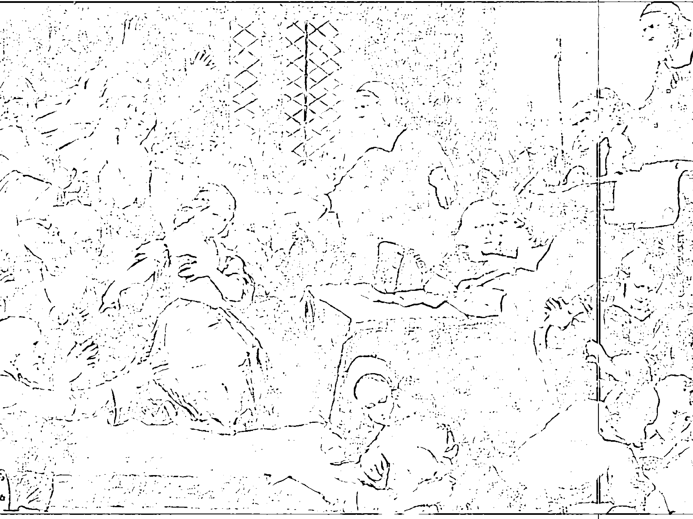

当这些被认为巫术缠身的萨勒姆的女子开始指控愈来愈多在国内深受敬重且位高权重的人士时，萨勒姆的审判开始陷入一片混乱。

那就是1692年那场著名的马萨诸塞州萨勒姆事件。在这场事件中因为巫术而被处死的人比之前新英格兰历史上所有受害人数的总和还要多。

认为巫师们在夜半集会上共商阴谋的观念在萨勒姆事件之前还从未在新英格兰的巫术审判中出现过。正如在大多数类似的欧洲案例中那样，这种观念使得在常规的巫术审判后发生了一场大规模的迫害。萨勒姆的搜巫运动最终导致156人因使用巫术而入狱，19人被绞死，1人死于严刑拷打，另有4名受害者死在了监狱中。

萨勒姆的巫术审判自从发生以来就不断激发起美国人的丰富想象。每一代人都对这场悲剧提出了自己的解释，很多传说故事也就不可避免地成为了对于这些事件的传统记载的一部分。

起初是从两个女孩儿身上开始的。贝蒂·帕里斯和阿比盖尔·威廉姆斯首先开始生病并将自己的病症归咎于巫术。这两个女孩会莫名其妙地发生痉挛并陷入歇斯底里的阵阵尖叫，她们叫起来时的样子疯狂可怕，甚至不像人类所为。

第一个传说故事便自此开始。在19世纪以来的许多记述中，这两个女孩是听了贝蒂父亲的一个奴隶提图巴所讲的那些故事而沉迷于女巫、魔鬼和巫毒咒语的。这个女奴据说一般是来自巴巴多斯岛。提图巴与萨拉·奥斯柏恩和萨拉·古德是最早受到巫术指控的三名妇女。人们通常认为是这些关于恶毒巫术的故事激发了那两个女孩假装出那种歇斯底里的状态。但是当初的那些记述甚至根本没有暗示性地提到提图巴曾给这两个女孩讲过

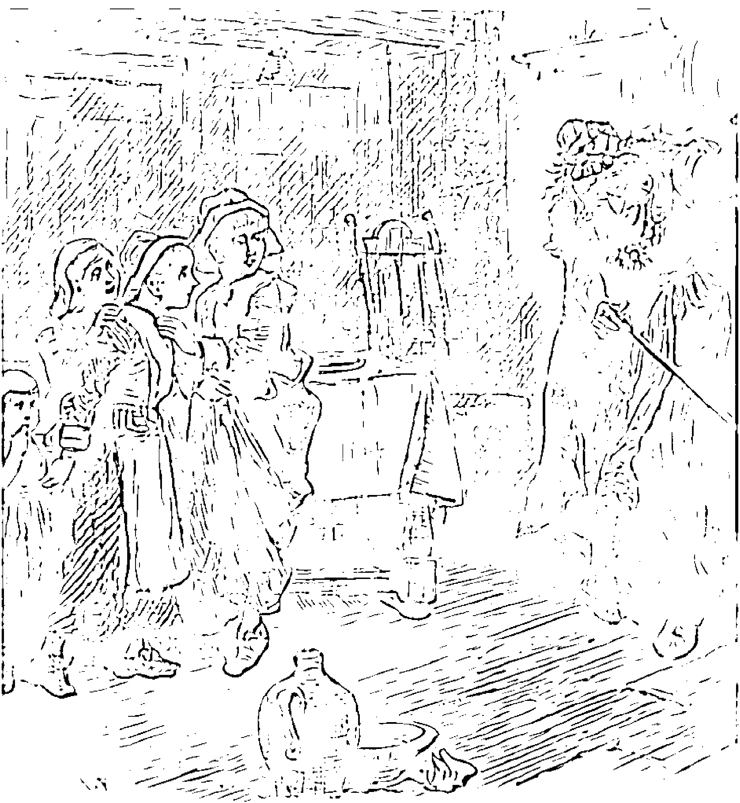

◎此图描绘的是帕里斯家的奴隶提图巴正在用恐怖故事来吓唬女孩子们，这已经成了萨勒姆传说故事的一部分，而整个叙述中的这个经典部分其实并没有事实基础。

这些审判对于美国法律有着持久的影响力。「隐像证据」从定义上来说只有提供证据的那个人自己才能看见，不再被当成可以接受的证

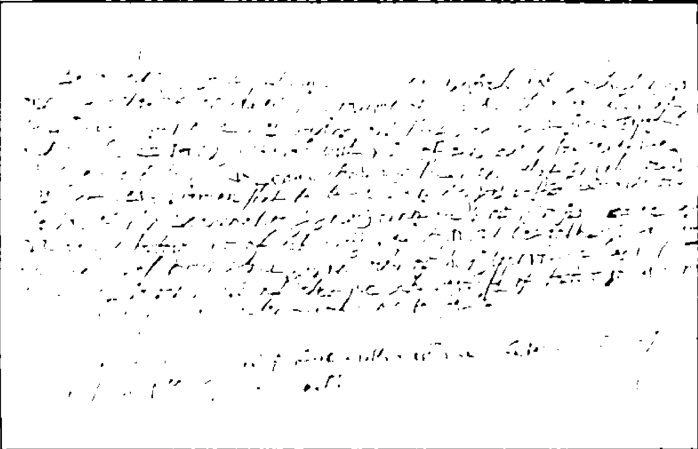

任何恐怖故事。在受审时她承认使用了巫术并运用自己文化中的那些民间传说来细述她自己和其他人的巫术行为，但她并不是受指控者之中唯一这样做的人。在萨勒姆事件的传统描述中这个女人充当了一剂愚昧的催化剂，而引发了后来的事件，但很明显她本人是无辜的。

贝蒂·帕里斯和阿比盖尔·威廉姆斯刚刚生病的时候，当地医生使出了浑身解数来查明病因进行治疗。在他试尽了所有手段都不能奏效之后，贝蒂的父亲，当地的教堂执事，开始求助于祈祷并向其他本地神职人员寻求建议。最终大家断定这两个姑娘一定是被某种巫术咒语缠身，并不断追问她们是谁在折磨她们。在她们的事情发生后不久，另外两个女孩也加入了她们的行列：12岁的安娜·普特曼和大约17岁的伊丽莎白·哈伯德。

这些女孩声称女巫们曾以魂灵的方式拜访她们，在她们身上扎针，并诅咒她们得上一场浑身抽搐的病。审判所依赖的全部证据就是这些"隐像证据"——只有这些女孩自己才能看到的影像，所以没有人能证明或证伪她们的这些话。

在萨勒姆事件发生前不久曾有一件著名的案子，一个波士顿妇女因为用巫术残害四个孩子而被绞死，那些孩子"发不出声音来，双唇紧闭，喉咙处好像塞住了什么东西似的，四肢惨遭摧残折磨，连铁石心肠的人也会受到震撼"。几名萨勒姆女孩的症状与波士顿的那些孩子完全一样。当时二者之间的联系被人们当成了证据：这证明巫术是确有其事的，要不然为什么两个不同地方的孩子会表现出一模一样的症状来？那桩波士顿案件在萨勒姆无人不晓，很可能影响了人们对后来事件的观点和反应。即使巫术审判在欧洲已经趋向尾声，但从欧洲法庭上传来的那些故事在新英格兰还是广为人知的，有很多人极易相信存在着邪恶巫术的观念。

最初受到指控的三名萨勒姆妇女都是萨勒姆社区内受到鄙视的边缘人员。萨拉·古德是当地的一个乞丐，总是诅咒那些撞到她身上的人。她简直是代表女巫的理

◎安娜·普特曼宣誓证词的手抄本

想人选，频繁出现在欧洲和美国巫术审判中的正是这类孤身一人的老妇。

作为一个奴隶兼白人社区传统种族歧视的对象，提图巴也是一个圈外人。有人说她是黑人，有人又说她有一半本土美洲人血统，而实际上她的祖上似乎是纯粹的本土美洲人。第三个牺牲品萨拉·奥斯柏恩比另外那两个妇女要富有多了，但她在嫁给一个男人前就和他一起同居了一年，因而在自己的清教徒社区中备受指责。

三名妇女中第一个受到审讯的是萨拉·古德，时间是在1692年的3月1日，她试图为自己转移罪责，检举说是萨拉·奥斯柏恩在用巫术折磨那些孩子。而这一举动实际上是为她的命运盖棺定论。她是最初受到指控的三名妇女中唯一一个因为巫术被绞死的。萨拉·奥斯柏恩死在狱中。提图巴供认使用了巫术并指控了另外两名妇女，声称村里还有其他许多献身于魔鬼的人。她也是三人中唯一幸存下来的一个，在这场恐慌结束后被释放出狱。

在萨拉·古德和提图巴转而指控了其他人以后，局势开始升温。这些"巫术缠身"的女孩简直被奉为了传达神谕的使者，由她们来挖出深藏在社区中的秘密罪恶。她们继续着自己那些十有八九是装出来的抽搐和歇斯底里的尖叫，越来越多的人开始受到她们的指控，其中有很多都是深受敬重而信仰虔诚的人士。她们甚至还指控像多卡丝·古德这样的孩子，她是最初三名受控妇女之一的女儿，只有五岁大。

到了1692年春天时，这股歇斯底里情绪已经从萨勒姆蔓延到了安多福。在一场新的听证会上，萨勒姆的地方官员被殖民地官员所取代，举行这场听证会是为了试图阻止这股指控和招供的洪流。然而，这些新任的法官也同样轻而易举地相信了这些受害女孩病痛的真实性以及巫术在其中的作用。那些被指控者最常用的办法是招供以逃过绞刑。那些拒绝承认自己有罪的人都被处死了。

控诉活动在这些⼈手下变得愈加疯狂离奇，有一次甚至连菲普斯夫人——威廉·菲普斯总督的妻子，都被指控成了女巫。最终这些萨勒姆女孩将指控对准了塞缪尔·维拉德，哈佛大学的校长及波士顿第一教堂的牧师。

至此，地方官员对这些指控的轻信戛然而止，他们告诉几个女孩她们一定是弄错了。从这时开始，掌权人士开始怀疑整场事件中是否存在着任何真实成分。指控者于是又争论说，魔鬼也可能化身成无辜的人出现在这些女孩面前。这种认为魔鬼牵涉其中的观念也就意味着几个女孩可以被免除所有的罪责，因为她们只是指控出了错而已。

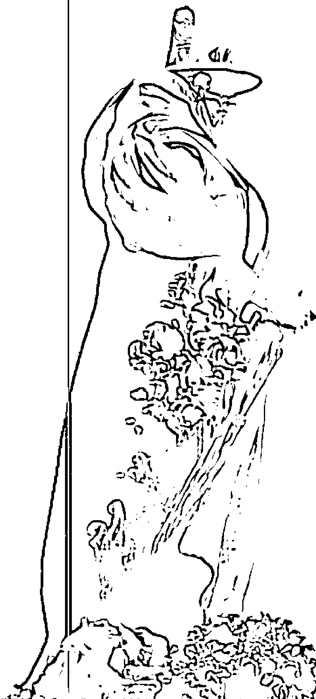

◎罗杰·科南特
一尊栩栩如生的萨勒姆建立者罗杰·科南特的塑像就站立在萨勒姆巫师博物馆之外，馆中各种令人毛骨悚然的展品展示了此地的搜巫历史。

最后总督本人插手了，召集了一场新的听证会，几个萨勒姆女孩所看到的影像不被接受为证据。听证会对52个人进行了重新审判，只有三个被定罪为使用了巫术。即使这三个人也得到了总督的缓刑，他还释放了所有仍关在监狱里的犯人并对所有受到指控的人进行了大赦。萨勒姆搜巫运动算是结束了，然而关于最初的那些指控是否只是骗局人们却依然争论不休。很久之后才出现这样一种共识：萨勒姆从来就不曾存在过任何巫师，折磨那些女孩的也并不是魔鬼。到底她们压根儿是在假装生病还是真的生了某种心理或生理上的疾病也许永远无法水落石出了，各种观点直到今天仍无法达成统一。

在我们这个崇尚科学思维的时代里，将这些女孩子的"魔鬼缠身"归因于化学作用会是种很诱人的想法，时常有人争论说她们是受到了麦角菇的毒害。

麦角菇是一种危害谷类作物（特别是黑麦）的菌类，在寒冷潮湿的天气里或这种天气过后往往会引起疾患，因为那样的气候有利于菌类的滋生。吃进受麦角菇感染的谷类食品可能引发两类疾病：第一类会造成坏疽，症状包括火烧火燎的痛感；第二类病症则会引起痉挛、幻视以及刺痛、窒息和受到咬啮的感觉。这些令人产生幻觉的症状是由麦角菇中的化学物质引起的，该物质如今是制作化学药物迷幻剂的成分，尽管它的药性要比其人造亲戚的效果弱得多。

那些萨勒姆女孩的症状与麦角菇中毒十分相似，但是有数不清的理由都证明这恐怕不是她们被"缠身"的原因。痉挛性麦角菇中毒通常都发生在营养不良的人群中，但新英格兰社区中的人都吃得很好。如果真是麦角菇中毒，症状应当表现为长坏疽的那种才对，而且如果真是庄稼受了感染，那中毒应当是影响了整个社区居民才合理。但是在萨勒姆，表现出症状的只有少数几个人，从未出现过全家一起发作的状况。最后还有一条，麦角菇的致幻作用十分温和，根本不足以影响那些萨勒姆

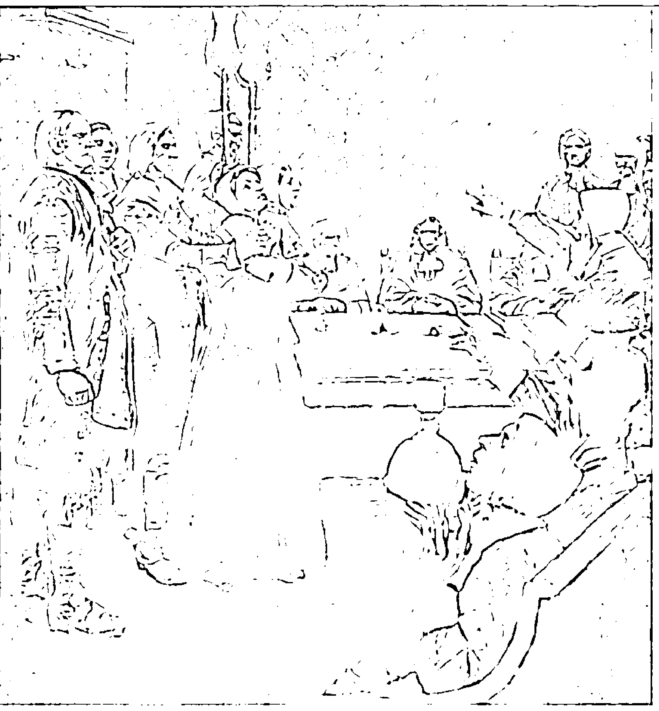

> > **中毒的女孩**
> 在萨勒姆审判的某个阶段，这些恶灵缠身的女孩宣称自己能看到一群黄色的小鸟绕飞在受指控者的头顶。这些隐身的鸟被认为是恶魔创造的。

女孩不断讲述自己那些巨细无遗的幻象。

事实上，这些女孩，以及随着事态的蔓延牵涉进来的其他一些妇女，根本就不像是有什么不妥的模样。萨勒姆"受害者"的那些幻象和痉挛大概是混合了精神因素和人为的装假。随着搜巫运动的不断升级，其他人也加入了她们的行列进行新的指控，十有八九是为了分享那些女孩正在享受的知名度和人们的注意力。然而，不久便有很多人受到巫术指控，以至于加入指控者的行列要比冒着被指控的风险安全多了。

巫术的地位已经下降成了琐碎和粗俗的欺骗行为而不再是对社会的威胁。但是，虽然受过良好教育的人已不再相信巫术，普通村民却仍然对它心怀恐惧。由于再也无法将巫师送上法庭，人们便开展了私下的打击巫师的暴力行为。村民们都成了义务警员，他们在1665年到1735年间的11起案件中强制性地"浸浮"巫师以证明他们有罪，导致了受指控者的死亡。

统治阶层中最有可能进行巫师起诉并开展大规模审判的成员是那些低层和中层神职人员、本地官员和法官。更高层的掌权人士极有可能会对搜巫运动心存怀疑，哪怕仅仅是因为他们惧怕一股大规模巫师恐慌情绪所可能引发的混乱。

很多搜巫者后来对将酷刑作为取得证据的方法有所醒悟。本尼迪克特·卡普佐夫在人们的记忆中曾是一个毫不留情的搜巫者，实际上他后来为了将刑具从审讯手段中清除出去而作了不懈奋争。

## 第八章

## 女巫

### 受难的女巫

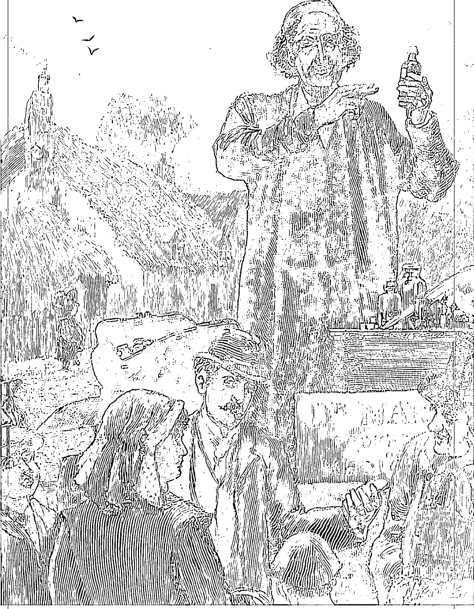

◎江湖郎中

17世纪以后，巫术在大多数人的日常生活中逐渐失去了光彩，日益被兴起的科学医疗所取代，随着巫师行业的衰落，一种新的角色出现了——江湖郎中，他们的药物充其量也就比巫术的效果好那么一点点，尽管他们宣称自己的治疗建立在科学的基础上。

耶稣会教士弗雷德里克·冯·斯匹身为巫师们在行刑前的忏悔牧师，成为了17世纪反对巫师审判和使用刑具的一个最重要的人物。他宣称与自己对过话的那些巫师中没有一个犯下了他们所承认的那些罪恶。他的警示以及他对使用刑具的批判具有极大的影响力，通过他和其他人的反对，搜巫运动终于止息了。

虽然这些搜巫运动一直是欧洲历史中最耸人听闻的事件的一部分，所有的苦难毕竟还是换来了一样好处：刑具从此不再是司法程序中的一个常规组成部分。

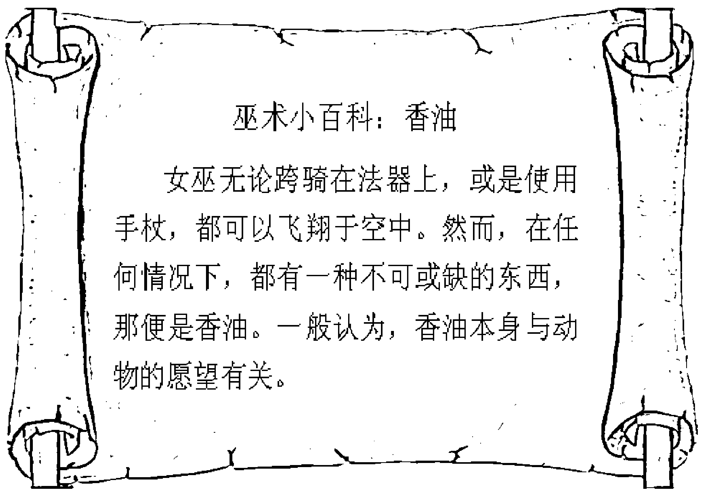

### 巫术小百科：香油

女巫无论跨骑在法器上，或是使用手杖，都可以飞翔于空中。然而，在任何情况下，都有一种不可或缺的东西，那便是香油。一般认为，香油本身与动物的愿望有关。

## 后　　记

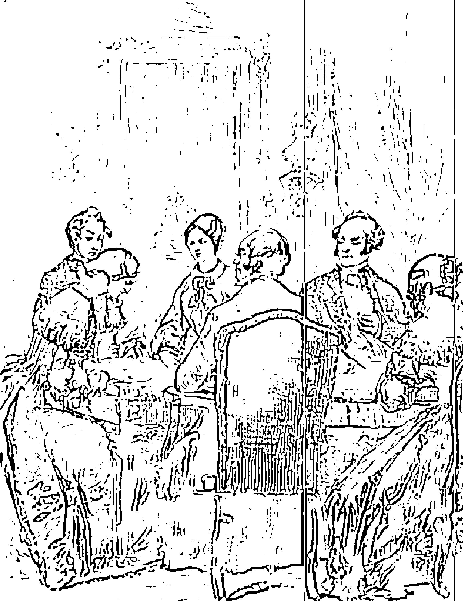

巫师、蒸馏器、硫磺蒸气不久后又重新兴起，但这都是浪漫派的想象，他们满脑子是神秘的力量和无形的灵魂。18世纪时期，西方国家已看不到对巫案的审讯。经过浪漫主义文学、绘画或音乐上的渲染升华，巫术又恢复部分失去的光彩。19世纪上半叶浪漫主义，尤其是德国浪漫主义，在文学中重新发现民间文化，促使了女巫一成不变的形象，在欧洲以及从来没见过巫师的地区生根。民间故事和传奇中，吸收了以魔鬼为主的古代文化。这些故事被民俗学作家格林兄弟搜集起来，进入文学殿堂。

经过几番介绍，撒旦为非作歹的巫术又获得了一部分合法存在的权利。

巫术也成了画家灵感中的一个题材，这方面表现最为杰出的是西班牙画家戈雅。他的作品中不乏巫魔会的场面和女巫的画像，虽然实际上在西班牙猎巫的现象并不多见。

浪漫派音乐家门德尔松或柏辽兹汲取了不少巫术题材。历史学家米歇莱的作品也是这种浪漫主义再发现的延伸，1862年他发表了《女巫》，这部书对后世影响很大，使历史学家重新关注魔鬼学和猎巫的历史。他将中世纪描述为魔影幢幢，撒旦的传说处处可闻，而女巫的出现，就是遭受教会迫害而奋起反抗的妇女原型。她们了解自然、肉体和医学，可说是现代科学之母。这种对巫术慷慨而反习俗的看法，在后来的研究者当中却得不到知音。

即使巫术是历史研究中最丰富且最有争议的主题，它的意义对于人们来说仍是一团谜。近年来随着人类学发展，对那时社会的最新研究陆续出炉，或可帮助我们了解一些单凭古代档案仍无法解开的奥秘。