# 威卡关系魔法

# 前言

魔法的世界真是充滿無可限量的可能性。說實在的，現有的魔法已達數千種之多，無論你想達成什麼目的，都會有對應的魔法。當然，在威卡（Wicca）及許多其他巫術（Witchcraft）傳統中，那些將魔法運用當成是修習功課之一的人們只會將魔法運用在正向或中性的目的，絕不故意去傷害任何人或任何事物，因此這本書所載的魔法也會遵循這項重要的規矩。

你在本書看到的魔法，只要運用聚焦的意願，就能為你的生命帶來正面的經驗，還可依此推展到你所關心的人們那裡。

書中魔法所涵括的應用範圍頗為廣泛，大致上分為三類，即愛與關係、興旺與豐盛，還有健康與身心安適，這也是人們會傾向尋求魔法協助的三大生活領域。

然而，它們並不是構成人類經驗的唯三要素，所以你也會在書中看到關於其他魔法的例子，那僅是一點提示，幫助你擴展自身魔法操作之可能性。

此外，本書涵括多種不同魔法運用方式與技術，從蠟燭魔法、占卜，到護身飾物及其他手工製品皆有涉及。每種魔法都會有詳細的指示，然而許多魔法在這部分也有機會讓你能依己意調整成更加適合的版本。

如果你在魔法方面已有不少經驗，在看到一些較難取得的材料時大概就能馬上想到適合的替代品。如果你是新手，那麼最有用的方法莫過於盡量嚴格遵循書上所載內容來做，直到你對於自身直覺的連結變得更加有力，才考慮即興而為。不過，如果你的內在智慧引導你去做出完全不一樣的事情時，請務必聽進去哦！

雖然魔法很有彈性，然而還是會有某些特定關鍵步驟及注意事項是魔法得以成功的要素。

第一點，同時也是最重要的一點，請要注意這裡的每項魔法指示都有個前提，那就是你已為自己追求的魔法目標而為那些成分進行充能。

充能的方式通常會依照你所使用的物體而定，不過如果你不確定怎麼做的話，就使用幾乎所有事物都能套用的標準方式：將要充能的物體放在已經充能的五芒星盤上，最好能夠直接曬到日光或月光，然後說出關於你將進行的魔法操作之意願。根據個人的習修方式，你也許會祈請對應的女神或男神、四元素或是你所共事的其他靈性力量。

如果你是魔法新手，就去研究並嘗試一些為不同工具充能的方法，直到找出感覺最適合自己的充能方式。

第二點，請一直要記住，無論你的材料是什麼種類或等級、無論你對它們的充能做得多好、無論你有多麼嚴格遵照書中魔法指示，能使魔法操作成功的真正關鍵要素仍是個人的心智狀態。

如果你是以懷疑魔法是否成功的心態執行魔法，那麼大概可以保證魔法不會成功。若是帶著焦慮操作魔法，那麼魔法結果比較有可能出現好壞參雜的狀況或甚至完全無效。

最成功的魔法是在歸於中心的平靜境地，以非常專注的意願來進行的。所以請一定要先做任何能讓你落實下來的方法，無論那是冥想、觀想、呼吸技巧、劃出儀式圈，還是以上都做，只要能夠使你落實下來就好。說到底，那是「你的」能量在對宇宙實相做出真正的改變，所以請妥善塑造之、睿智運用之。

若要確保自己的能量焦點與魔法相符，其中一種做法即是用你自己的話來改寫魔法中的唸咒部分，應該會有幫助。當然，書中所列咒語都已相當強大而且有效，不過如果你傾向用語言做出創意表現，那麼竭誠歡迎你使用自己的話。

有些女巫認定咒語應當押韻，押韻的確有好處，因為魔法能夠借用押韻的力量。不過，有些人發現如果咒語實在太像「誦經」的話，會使他們分心，無法真心說出那些話語。

你會發現本書有些咒語會使用押韻，其他則無。請這兩種都去嘗試看看，並觀察自己對於那些文字的內在感受。不過，這裡還是再次提醒，請自由去細部調整或全部改寫成你覺得比較適合的版本。

有幾個實用的小技巧值得在這裡分享。請務必在確定無人打擾的空間操作魔法，關掉手機，並盡量創造出利於魔法的氛圍，無論是音樂、燃香、蠟燭或其他事物，只要能達到目的都可以。

至於蠟燭，請務必謹慎使用，絕對不要出現燃燒的蠟燭無人看守的空檔。如果你有用油塗抹蠟燭，請在要拿火柴或打火機點火之前，確保手指上的剩油已完全擦掉——你絕對不會想見識塗油的皮膚碰到火的狀況！

還有，如果魔法有用到藥草，請要記住，書中所述僅是一般的建議量，你真的不需要量出「完全一樣」的幾湯匙或幾茶匙的份量，除非你發現這樣做能夠增加能量並使自己專注在魔法上，才去細部必較，不然的話請大約估計所需材料的份量即可—— 這部分也是同樣請遵從你的內在直覺！

最後要說的是，無論你從魔法操作中得到多少經驗，請記得總是有學習與成長的空間。請在嘗試本書所列魔法時好好享受，如果想要的話，就讓這些魔法成為你的靈感跳板，創造出屬於自己的魔法。也別忘記要以愛與感謝來榮耀自己得到的成果。

願汝有福。

## 愛與關係的魔法

### 介紹愛與關係的魔法

在人們向魔法尋求協助的原因當中，最常見者應該就是這個——愛。從久遠到早已遺忘的時代開始，滿懷希望的戀人一直在嘗試各式各樣的魔法與魔藥，就是為了要使屬於自己的真愛來到面前。本書這部分的確會有吸引浪漫的情愛進入個人生命的魔法，然而它也涵括關於友誼與家庭關係的魔法操作，這也是平衡的人生之愛的來源之一，它跟情愛同樣重要。還有一些魔法是用來強化、鞏固那段屬於你自己、且為最重要的關係——就是你與你的靈性源頭之間的關係。

如同序言所述，這本魔法書只以正向魔法來運作，意謂你在這部分不會找到任何可以使他人違背自己的自由意志，而對你做出好事或產生好感的魔法。這種違背自由意志的魔法幾乎必會產生與預期完全相反的結果，即使暫時有效，你也將因清楚知道自己在操縱對方，而無法建立由衷的親密關係。

所以，還不如將自己的魔法能量，專心導引到支持所有與自身狀況相關人等的最佳好處。如此一來，你所吸引來的連結，其品質會高上許多，而其結果也會使你對於自己與自己的人生感覺更好。

### 促進新友誼的魔法

無論你才剛搬到新地方，還沒認識許多人，或者只是你的社交生活需要大幅翻修，這項快速魔法能為你的生活帶來值得結交的新朋友。

這魔法最好是在月盈時期進行，然而如果你最近有某個社交活動想要放點魔法能量進去的話，那麼即使仍在月缺時分也還是做吧。

#### —— 使用材料 ——

- 1 顆小石，可以是粉晶、白水晶、紅玉髓或青金石
- 1 根黃色魔法蠟燭或祈願蠟燭
- 3% 薰衣草精油

#### 執行指南

- 將蠟燭塗油。
- 以慣用手如同握拳那樣將小石握在手心，另一手的手掌再覆於其上。
- 雙手緊握，閉上眼睛，觀想正向、風趣、好相處的人們圍繞自己。
- 當你抓到這感覺時，深吸一口氣，然後吐氣並睜開眼睛。
- 將小石放在蠟燭前面，點起蠟燭，在燭光中唸以下文字：
- 外出時，就把小石隨身帶著；在家時，把小石放在自己看得到的地方。

> 新友誼、好真實，
吾族靈魂共團聚！

### 強化關係的魔法

當新關係的「蜜月期」無可避免的開始消退時，常會看到關係中的一方或雙方會感受到疑慮，或緊抓著過去沒有解決的情緒障礙。若要強化伴侶之間的連結以度過風風雨雨，就需要開放的心及彼此的尊重。說到底，健康的關係才能讓雙方有機會彼此學習並持續成長。

在你們關係繼續深化的過程中，這項魔法能幫忙種下和諧與信任的種子。你可以自己進行這項魔法，不過如果你的伴侶也想參與的話，也可以一起做。

塔羅牌裡面有一張名為「戀人」（The Lovers）的牌，象徵浪漫的愛，還有伴侶關係、夥伴關係、成長、忠誠以及選擇，所以當你在魔法中宣告自己的意願，即你願意跟自己的伴侶攜手共度難關時，它會是用來聚焦心神的現想象徵。塔羅牌有許多種，所以「戀人」牌卡圖樣也會有許多不同表現方式，為了達到最好的效果，請使用你喜歡的「戀人」牌卡圖樣。

#### 使用材料

| 材料 | 数量/描述 |
|---|---|
| 1根提供氛圍的大蠟燭 | 1根粉紅色魔法蠟燭 |
| 1張「戀人」牌卡 | 1個小碗 |
| 2顆粉晶、青金石、月光石或東菱玉（2顆材質需相同） | 肉桂、杜松、玫瑰或與愛有關的塗抹蠟燭油品* |
| 1/4 茶匙新鮮或乾燥的迷迭香 | 1/4 茶匙新鮮或乾燥的薰衣草 |
| 1/4 茶匙乾燥的洛神花瓣 | 1/4 茶匙乾燥的洋甘菊花 |

> *請參考本書 P120〈魔法油〉關於「混合」的段落。

#### 執行指南

- 點燃營造氛圍的大蠟燭。
- 將花草放進小碗並以手指混合，同時觀想自己的能量流入每片葉子、花瓣及花朵。
- 將「戀人」牌卡正面朝上放在你的祭壇中央。
- 用油塗抹魔法蠟燭並放在牌卡後面約7.6至10.2公分之處。
- 花些時間仔細欣賞牌卡的圖畫。然後兩手各握一顆水晶，由衷喚出自己與伴侶和諧相處、坦誠溝通的感覺。當你覺得準備妥當的時候，將水晶放在戀人牌卡的左右兩側、一邊一顆，盡可能靠近並對齊牌卡圖畫顯示的心形圖案。
- 現在將花草撒在牌卡與兩顆水晶外並構成一個圈，同時說出以下的話語（或類似者）：

> 吾向愛情，敞開胸懷，榮耀靈魂，成長意願。吾伴愛侶，攜手同行，用心傾聽。以上所言，照此遵行。

- 點燃魔法蠟燭，讓燭火燒到自行燃盡。將整個擺設留在祭壇上達24個小時。
- 你可以隨身帶著兩顆水晶，或是把它們放在家中顯著之處。如果伴侶也有參與魔法操作但沒有跟你同住，那麼其中一顆水晶應該由他（她）帶著。

### 吸引優質關係的護符

芫荽籽（coriander）是料理食物時會用到的香料，有著溫暖、芬芳的香氣，品嘗時還帶有一點像是堅果的味道，不過並不是每個人都知道它就是香菜（cilantro）的種子。有趣的是，芫荽籽跟香菜葉的味道完全不一樣。這種二元本質也呈現在芫荽籽的魔法用途，其中就有同時吸引愛以及預防那些不想要的能量。

芫荽籽會用於愛情魔法、春藥，也用在使吵架的雙方和解，以及家宅的驅邪與保護。況且絕大多數超市的香料區架上都會有芫荽籽，因此它是廚房女巫新手在開始練習時的優良選擇。

對於芫荽籽的吸引及保護特質，這魔法都有取用，為的是能以平衡的態度吸引可能的新對象來到自己的生命中。

這魔法特別適合看似不缺追求者、然而在發展關係時常出問題的人。藉由芫荽籽的能量，那些對你完全沒有助益的人們將無法引起你的注意，而正面、健康且與你相合的對象將能輕鬆容易地來到你面前。

在護符組合中加入粉晶，可以強化這項魔法的正面振動。請確定自己所拿到的是完整的芫荽籽，而不是碎末，因為你將隨身攜帶這藥草。

#### 使用材料

- 13顆完整的芫荽籽
- 1小顆粉晶
- 1個具有束口袋的袋子或1塊布
- 1條紅色或粉紅色的緞帶
- 1根大蠟燭（用於營造氣氛，非必須）

#### 執行指南

- 如果有準備大蠟燭，將它點燃。
- 將芫荽籽繞著粉晶擺成圓圈。
- 閉上眼睛，觀想自己能完全接受能以你的真貌愛你的伴侶。
- 當你抓到這感覺時，睜開眼睛並專注在粉晶上，唸出以下文字（或類似者）：
  > 唯有健康、平衡的愛，
  得吾吸引，來吾這裡！
- 然後將芫荽籽一顆一顆地拾起來放入繩袋或布中。（最好從位在圓圈最南邊的芫荽籽開始拿，後續則沿著順時針方向拾起種子。）
- 加入粉晶，將袋口或布收攏妥當，然後再用緞帶綁緊。
- 每當你覺得想要讓愛有機會發生時——特別是要去公共場合的時候——就把這個護符隨身帶著。

### 吸引浪漫情愛的魔法熏煙

這是個有趣又簡單的儀式，能夠強化空間的浪漫氛圍，不論是自宅或任何想在那裡遇見浪漫愛情的地點都可以用。

玫瑰油能在魔法方面給予很好的助力，但是請別只為這項魔法才買玫瑰油喔，如果喜歡玫瑰油的香氣，那麼它還相當適合用來保養雙手呢。

請勿使用複方熏煙條 (smudge stick)，像是鼠尾草加薰衣草或是雪松加薰衣草，這些複方在某些方面很好用，然而在這魔法中只會稀釋薰衣草的浪漫振動。

#### 使用材料

- 1根紅蠟燭
- 帶梗的乾燥薰衣草或純薰衣草熏煙條
- 3% 玫瑰精油 (非必須)
- 1根羽毛 (非必須)

#### 執行指南

- 如果有準備玫瑰油，用一、二滴油塗抹蠟燭。將留在手指上的油擦拭乾淨，之後才把蠟燭點燃。
- 將乾燥薰衣草枝梗拿起來，用燭火點燃，並同時唸出以下文字（或類似者）：
  > 愛情薰衣，創意之焰，
  藉此愛欲，改變此間！
- 從房間的北方某個點開始，以順時鐘方向移動，一邊行走、一邊用羽毛（如果有準備的話）或自己的手搧動薰衣草的煙，讓煙散布整個空間。你也可以依自己的意思，一邊行走薰煙、一邊將上述力量文字當成咒語反覆唸誦。
- 如果可以的話，將薰衣草放在抗熱材質的盤子上，等它自行燒完。不然，就把它拿到裝土的花盆或裝沙的碗裡輕柔按熄。

### 美好初次約會的信心護符

在與可能戀愛的對象初次約會之前，如果你已開始緊張的話，就適合運用這項魔法。

只要把這護符放在口袋或手提包隨身攜帶即可，不過如果你的口袋或手提包還有放別的東西，那麼最好把護符裝在繩袋或布中以保持完整。

這裡請要記住的是，無論對象是何等人物，魔法的焦點都是放在自己的信心與愛惜自己的感受。不論結果如何，如果你有好好享受那段時光，那麼就算是成功達成目的了。

#### 使用材料

- 1 條白色或粉紅緞帶，長約 18 公分
- 1小顆紅玉髓或虎眼石
- 海鹽
- 1根大蠟燭（營造氣氛用，非必須）
- 1個具有束口繩的小袋子或1塊布（非必須）

#### 執行指南

- 如果有準備大蠟燭，把它點燃。
- 將緞帶放在你的祭壇上或操作台上。
- 用海鹽做出一個包圍緞帶的圓圈——這會將魔法的能量聚集在護符的周圍。
- 將小石頭放在緞帶上，並唸出以下文字（或類似者）：
  > 吾之信心，從內展現，
  安然接受，本來面貌。
  靈魂之會，必定歡喜，
  令此石儲備額外精力。
- 拿緞帶緩慢纏繞小石，最後打結固定。
- 然後就出門享受跟人初次約會的樂趣吧！

### 相親、網路約會的魔法浸浴

無論是親友為你安排的相親，或是你打算直接跳入網路約會的新大陸，對要去見素不相識的人這件事不免會感到十分緊張。

這項魔法係藉由去除緊張與增強自信而改善會面的能量，使你不論結果如何幾乎都能享受那段過程。說真的，即使到這場約會最後沒有結果，你還是能夠玩得很高興呢！

喜馬拉雅山鹽 (Himalayan salt) 是用在放鬆的上好保養品，然而如果你沒有經常使用的習慣，它的效用就有可能強到導致困倦。因此，如果你是打算做完這項魔法浸浴就出門約會的話，也許改用海鹽會比較好。

如果你的浴缸排水孔有濾網的話，就能將這裡提到的藥草直接輕灑在浴缸裡。不然的話，就把藥草放進茶包或是薄毛巾中，避免它們在水中散得到處都是。

#### 使用材料

- 1茶匙到1汤匙的洛神花
- 1茶匙到1汤匙的洋甘菊
- 1茶匙到1汤匙的款冬（coltsfoot）或红花苜蓿（red clover）
- 2至3汤匙的海盐或喜马拉雅山盐
- 5滴薰衣草精油（与酒精结合）
- 1颗黄水晶、东菱玉或虎眼石
- 1支或数支用来营造气氛的蜡烛

### 执行指南

- 在澡缸中放入适合浸浴的热水。在水位达到澡缸的四分之一高度时，放盐进去。
- 在水位达到澡缸的二分之一高度时，放进水晶并滴入精油。
- 当澡缸的水位升到快要满的时候，加入药草。
- 点燃蜡烛，关掉浴室所有人工照明。然后进入装满水的浴缸。
- 放松下来，有意识地释放自己对于去见陌生人的焦虑，也释放自己对于特定结果的执著感受。
- 至少浸浴20分钟。如果可以的话，在排水时仍继续待在浴缸里面，因为药草与水晶的能量在这做法中会有变得更加强效的倾向。
- 带着水晶去约会，请好好享受那段时光！

### 放手讓愛自由的柳樹之法

在面對親密關係的結束時，無論出自雙方共識或單方決定，都會經驗到傷痛。即使在最佳的情況，也還是需要去處理並調整的失落感受，畢竟諸如原本的陪伴、慣常的作息，還有情感與身體的親密，這些都會失去。

在這時候，那些要自己「克服」失落的念頭（或是善意勸告），其實是想要逃避那段轉換至「在人生旅途上繼續前進」的必經過程。這儀式所提供的架構，能讓你主動認知並放下傷痛的感受，不需要一直壓抑那些傷痛或是抓著不放。

柳樹自古以來就以其療癒能量聞名，能夠幫助人們緩解身體與情緒層面的傷痛。如果你家附近沒有柳樹，不妨改用柊樹（ash）、樺樹（birch）、冷杉（fir）或橡樹（oak）等任何讓你覺得受到吸引的樹木。

#### 使用材料

- 柳樹，或是其他種類的樹木
- 筆記本或可供寫字的紙張
- 小紙片
- 小鏟子（或湯匙）

#### 執行指南

- 坐在樹幹旁邊，盡可能靠近它。如果坐在地上真有困難的話，就帶一張椅子過去坐著。
- 在小紙片寫下你要放手的對象姓名，將紙片放在樹幹底部。
- 接著撰寫「道別信」給那個對象。這封信並不是真的要寄給對方，所以請自由表述自己的感受，但整封信的調性請盡量保持正向。
- 你可以為他們的正向特質以及你們擁有過的美好時光獻上你的感謝。當然，你也可以承認自己的難過，但避免陷入無法解決的爭吵或怨恨。這部分的重點是放下自己在這段關係中想要繼續保留的事物，而不是執著於想挽留的部分。
- 寫完之後，大聲朗讀這封信。然後用鏟子將那張小紙片埋在那棵樹的底部附近。
- 離開那裡，不要回望。那封信可以燒掉，或是撕得細碎送去回收。

### 蘋果五芒星占卜魔法

巫術習修者有許多理由認爲蘋果樹具有神聖品質，而其中之一就是其果實含有種子的中心呈現五芒星的形狀。

蘋果會被用在各式各樣的魔法操作，包括將蘋果削皮，在削出一串螺旋長條果皮後將它丟在地上，以顯示真愛之人名稱的第一個字母。

下述的占卜技藝，係將蘋果橫切一半之後，觀察五芒星的呈現而定。任何時候、任何問題都可以運用這種占卜，然而它在秋天收穫季節以及浪漫愛情的事情上特別有用。

完成占卜之後，請一定要把蘋果吃完或用來做堆肥——不要浪費這顆魔法水果喔！

#### 使用材料

- 1 顆蘋果
- 儀式切刃（boline）或是其他切割刀具
- 1 根黑色、白色或粉紅色的蠟燭（非必須）

#### 執行指南

- 如果有準備蠟燭的話，將它點燃。
- 花些時間釐清自己的問題，並在過程中握著那顆蘋果。
- 將這問題的可能答案之一指定為這顆蘋果的上半，將另一可能答案指定為這蘋果的下半部——因此最適合運用這方式的問題就是「是非題」。
- 蘋果橫切剖半，以顯露出含有種子的五芒星狀果核。
- 如果所有種子都在某一半的話，那麼這就是你的答案。如果種子分散在兩邊，或是有掉出來，代表目前資訊不足，無法給出清楚答案。
- 無論答案為何，總是將種子留下來播種，或是將它們撒在美好的自然之中，並同時為自己所收到的答案獻上無聲感謝。

### 放下負向執著的魔法

每個人總會有經驗到無法立即藉由溝通解決的無休吵鬧之時候。無論對象是前任愛人、難相處的工作同僚或是某個家人，有些狀況的確只能靠時間與距離才能達到和平。

在這過程，的確很難不去鑽牛角尖並持續留在創造這些紛爭的負面能量之中。這項魔法能幫助的地方，就是無論對方有什麼表現，你都能對這事態保持心理距離。有一點要注意的是，這裡的重點應當放在自己與自己的能量上，而不是放在對方身上！ 其關鍵在於使自己脫離紛爭，不論這過程要用多久時間才能解決，這項魔法都讓你能夠平心以對。

這項魔法非常適合在月亮漸缺的期間來做，然而若事態已使你非常煩惱，就別因等待月缺而使自己更加深陷負面情緒的泥沼——就直接做，解除執著！

#### 使用材料

- 1根黑色蠟燭
- 1張紙條（約寬2.5公分、長17.8公分）
- 筆記本或準備一些紙張（非必須）
- 1枝用於寫字的筆或鉛筆
- 小型鍋子或耐熱盤子
- 乳香、檀香或鼠尾草的燃香（即香粉、線香、盤香或香錐等香品。）

#### 執行指南

- 將香點燃。
- 若要得到最好的成效，先花至少10到15分鐘對於這場紛爭及自己難以釋懷的感受進行自由書寫。別停留或耽溺在負面想法上，而是將這動作看成是某種心靈「驅邪」過程，斷然清除那些想法與情緒。
- 當你覺得自由書寫的部分已經完成，在準備好的紙條上寫下對方的名字，並以一句話簡要敘述那場紛爭。
- 將紙條捲成鬆鬆的紙捲。
- 點亮蠟燭、做幾個深呼吸，說出以下話語（或類似者）：
  > 今晚，憑此燭光，
  吾不再執於自己必對。
  釋放，留出空間，
  吾之存在充滿療癒的平安。
- 用燭火點燃紙捲，讓它在小鍋裡面或盤子上完全燒盡。
- 在灰燼冷卻之後，將它們輕輕倒在戶外的大地土壤上。
- 若要得到最好的成效，就讓蠟燭自行燃燒殆盡。
- 如果你在後續數天有發現自己又在開始對那紛爭鑽牛角尖的話，請憶起你所進行的魔法操作，做幾個深呼吸，然後觀想那些負面事物的灰燼已經消失在大地的土壤裡。

### 在艱難處境選擇平安

在生命歷程中，我們總會遇到自己無法操控的巨大挑戰，也許是親愛的人罹患嚴重病症，甚至是為你的生活帶來混亂的重大世界事件。

針對某事態的展現對於自己的可能影響來使用魔法，這樣的作法完全沒有問題，不過如果你覺得自己已經受到影響，就有可能難以處在認為自己具有力量做出改變的心態，從而使自己施展的魔法失去能量。像這樣的的時候，你需要好好照顧自己，這是最先要做的事情，之後才有能力幫助別人。

「平安心靈油」(參見〈魔法油〉，本書第 119 頁)裡面的薰衣草、洋甘菊與伊蘭伊蘭的舒緩、撫慰性質，能使你觸及自身內在核心以及自己與神靈的連結，幫助你放下對某事態的關注(至少暫時如此)，並恢復自己的內在平衡。

這項魔法最好是在睡前一小時左右進行，不過你若想讓蠟燭自行燒盡的話，一定得先把蠟燭放在水槽中才能去睡覺喔！不然的話，你可以先輕柔熄滅燭火，然後在後續幾天晚上均進行此術，直到蠟燭燒盡。

說真的，請盡量依個人需要來調整這魔法。播放冥想的音樂、沖泡一杯洋甘菊茶、手腳好好伸展一番、泡個熱水澡，並且(或是)做任何會使你放鬆的事情。你自己為這項魔法所「預備」的能量越多，這魔法的威力就越大。

#### 使用材料

- 「平安心靈油」（參見〈魔法油〉，第119頁）
- 1根白蠟燭
- 冥想音樂（非必須）

#### 執行指南

- 如果有準備音樂的話，就播放出來，並進行任何能讓自己盡量平靜鎮定下來的活動或方法。
- 靜靜坐著，做幾個深呼吸。將油塗在能夠感受到脈搏的身體部位，蠟燭也要塗油。
- 閉上眼睛，再做幾個深呼吸，儘可能使自己腦筋清楚。
- 當你覺得自己準備妥當，張開眼睛、點燃蠟燭，並唸出以下文字（或類似者）：
  > 吾將重擔，托付高我，
  重新注意，平衡休息。
  就讓此願如實具現吧！
- 暫時讓自己僅是坐在那裡望著燭火，盡量使自己的頭腦保持安靜，並把意識焦點放在燭光。

### 靈性連結的「備用鑰匙」魔法

雖然我們對於他人經常以「關係」的角度來思考，然而我們與自己的「較高力量」——或是你對於那股在操作魔法時流經自己的力量之任何名稱——之間也存在著關係。這項魔法專注在強化這層關係，因它畢竟是一切人際關係藉以發展的基礎。

在過去，許多家庭會習慣在家門外藏一支備用鑰匙，像是藏在門口地墊底下、某個盆栽中，或是其他的隱密之處，除了因應遺失鑰匙的可能性之外，也能讓親戚或朋友在主人不在時還能進得去，但現在會這樣做的家庭應該比較少見了。

這項魔法汲取這個風俗習慣中所傳遞的智慧與信任之能量，用來當作榮耀那些在無形領域為你服務的美善力量。

藉由祝福某一鑰匙並將它埋在家宅附近（如果有需要的話，也可埋在室內植物盆栽中），你是在向自己的更高力量——不論那是某位神祇、守護靈或單純是宇宙的美善能量——發出信號，表示無論何時、無論你在哪裡，你都歡迎祂們來到你家、你的生命中提供協助。

這項做法也是在提醒你自己，即使暫時與自身靈性中心失去連結，自己總能夠找到重新接上的方式。

你也許想用一支自宅的備用鑰匙來施展這魔法，然而這還是要看住家周遭地區的治安是否良好而定，其實任何一支金屬鑰匙都可以拿來使用。

有些人會用金鑰匙象徵男神，並（或）用銀鑰匙象徵女神，若你想在這項魔法用上兩支鑰匙也是沒問題喔。

#### 使用材料

- 1支鑰匙
- 1根白蠟燭

#### 執行指南

- 將鑰匙握在手中，並安靜冥想數分鐘。專注在自己與真正的自己及自身更高力量相互連結的感受。
- 當你覺得自己準備妥當，點燃蠟燭，並唸出以下文字(或類似者)：
  > [神祇/守護靈/較高力量的名稱]
  從今以後，歡迎祢來。
  來待吾家，來居吾心。
  此鑰象徵，祢、吾及吾之高我，
  從今以後，相連相繫。
- 將鑰匙迅速掠過燭火三次。(保護你的手指，別讓鑰匙有機會變熱。)
- 然後將它埋到屋外土地，至少要有15公分(6英寸)深。或是埋在大型植物盆栽的土壤裡面。

### 三草愛情護符

薰衣草、洛神花與羅勒的魔法性質都有包涵愛，所以這三種藥草構成的魔法能夠用來吸引新戀情，或將現有關係更新為愛情。不過，無論是哪種方向，請一定要專注在自己想要有什麼樣的感受，而不是操控對方的感受或行為。

#### 使用材料

- 乾燥薰衣草
- 乾燥洛神花
- 乾燥羅勒
- 1小塊白色、粉紅色、紅色或紫色方布（理想材質為絲綢或天鵝絨）
- 1條白色、粉紅色、紅色或紫色緞帶
- 粉晶

#### 執行指南

- 將粉晶握在手中，同時藉由冥想自己在目標實現時會想要擁有的感受，將愛的振動存進粉晶之中。
- 將布展開，輕柔地把水晶置於其上。
- 三種藥草各取一小撮，散撒在水晶上。
- 在將三種藥草個別撒在水晶上的同時，說出藥草的名字並申明其目的。例如在撒薰衣草時，你也許可以這麼說：
  > 憑薰衣力，
  吾之生命，顯現愛意。
- 將布在水晶上方摺疊並輕柔包裹起來，再以緞帶纏繞綁縛。
- 將做好的護符放在皮包或口袋，並（或）在睡覺時把它放在自己的枕頭

## 財富與興旺的魔法

### 介紹招來財富與興旺的魔法

運用魔法的第二常見理由，幾乎必定是對於金錢的需要或渴望。雖然絕大多數人都了解，只用簡單的蠟燭魔法應該不會具現出數百萬元的樂透頭彩中獎，但我們曉得自己可以運用聚焦的意願，從尚未預見到的地方吸引金錢流入我們的生活——這裡有些有趣魔法的可以讓你嘗試看看！

然而，「看得見、摸得到的金錢」只是財富的諸多形式之一，如果我們要過均衡的生活，認知到豐盛與興旺的其他途徑也相當重要。

能夠為未來增長財富的方法也很重要，像是結交許多朋友，以及滋養身心的樂趣嗜好與養生。你也會在這裡看到增加生意成功、田園耕作豐收的魔法，甚至還有協助取得重要工作的魔法。

所以請享受經驗到意料之外的橫財所帶來的驚喜，然而也別忘記那幅名為真實豐盛人生的巨作。

### 田園種植魔法

無論你想要種的是一大片花田、菜圃，還是只有幾盆室內植物盆栽，這魔法都能在生長季節開始的時候給予推力。魔法完成後馬上種植種子、幼苗或插枝應是最好的做法，使植物能夠在力量最為新鮮強勁的時候栽入土壤裡面。

如果你要種的種子只有一種，就盡量把它們從包裝倒到碗裡以直接施法，然而如果要種的種子不只一種，那麼施法時種子還是留在個別包裝比較好。

至於幼苗或插枝，如果沒有很大的碗，也許就要個別施法，因為施法期間它們仍留在各自的容器中，做完之後才將它們取出種在土中。（例如已長出幼株的育苗花盆，前面提到的大碗就是為了能夠放進數個育苗花盆，以便一次完成施法，之後再分株栽種到花園或田地。）

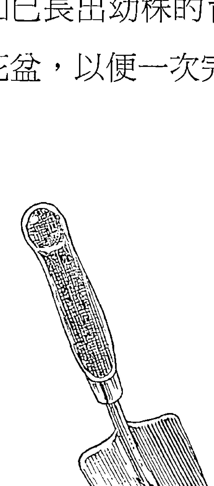

#### 使用材料

- 種子、幼苗或插枝
- 碗，材質為陶、石、玻璃或木頭（塑膠以外的材質都可以用）

#### 執行指南

- 將碗捧在手中，閉上眼睛並觀想自己的愛與力之能量流入碗中，然後流入種子、幼苗或插枝。
- 當你能感受到強勁且穩定的能量流動時，唸出以下文字（或類似者）：

> > 自然之力、遍及一切，
> 園丁為吾、呼喚傾聽。
> 這些種子、具有生命，
> 吾以能量、滋養需要。

- 然後把種子、幼苗或插枝種進土裡，觀察它們的生長。（當然還是要記得澆水呀！）

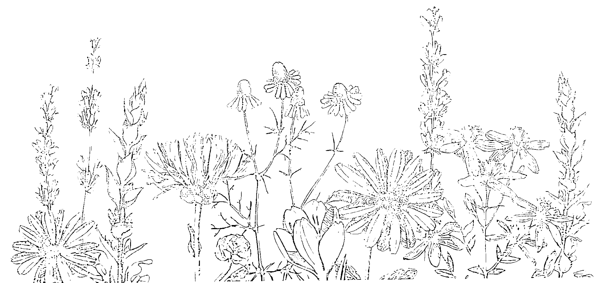

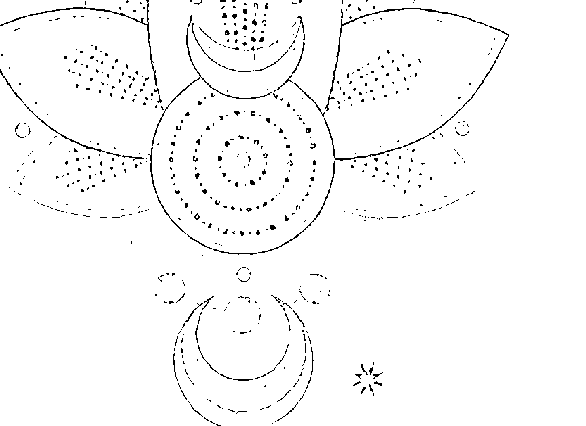

### 月光豐盛魔法

錢幣是進行豐盛魔法的上好工具，因為它們不僅是財富的實質象徵，而且還代表那將在未來獲得的財富之種子。

滿月是進行這項魔法的理想時間，然而只要是月盈期間，又曬得到月光的時候，均可進行這魔法。

#### 使用材料

- 3枚銀幣
- 小鍋，或是玻璃、陶土材質的碗
- 水
- 1根白色、綠色、金色或銀色蠟燭
- 一片軟布
- 一個小繩袋或另一片布

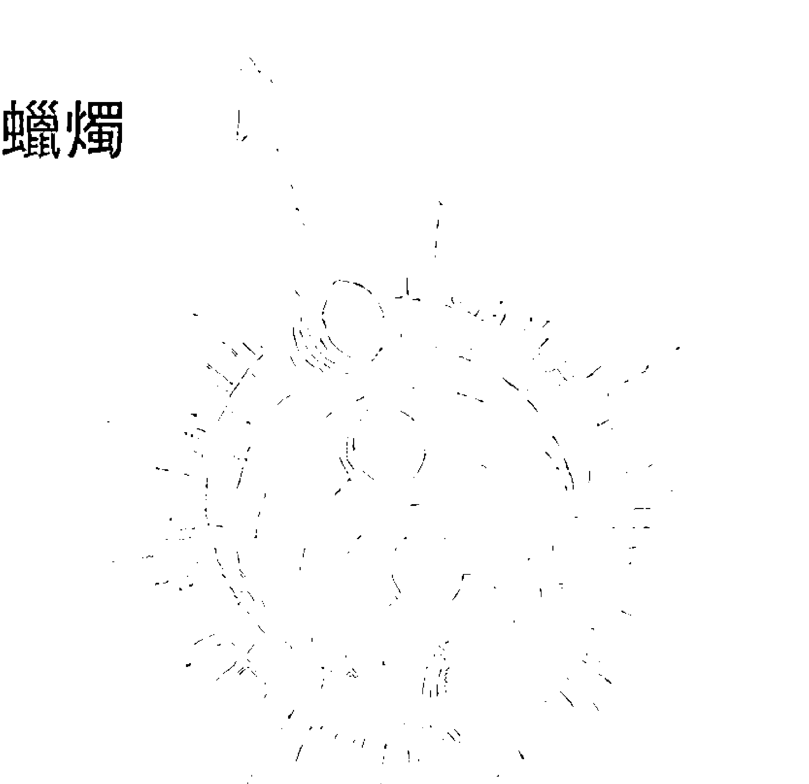

## 执行指南

- 将银币放进锅或碗中，并注水至三分之二满。
- 将锅或碗静置在直晒月光之处，至少晒一小时，使银币充饱能量。
- 当你准备要进行魔法时，将小锅或碗拿到你的祭坛或施法空间，并点起蜡烛。
- 将你的手（或是魔杖，如果有在用的话）在小锅或碗上轻柔挥动，并念出以下文字（或类似者）：

> > 月神映照、無限之光，
> 今晚許吾、無垠財富。
> 豐盛似水、無盡流動，
> 銀幣為籽、長吾財富。

- 将银币从水中拾出，并以方布将它们轻柔擦干。
- 接着将它们放在绸袋里面（或是用另一片布包裹起来），放在燃烧的蜡烛旁边至少一小时或直到蜡烛燃尽为止。
- 将水倒在屋外土地，如果因故无法这样做，将水倒在土壤已干的植物盆栽裡。
- 接下来的七天，请将包好的银币放在你的口袋或手提包里面。

### 唤钱过来

财富会以许多不同形式进入我们的生活，然而运用专门吸引现实金钱的魔法其实还挺有趣的。魔法完成之后，请留心观察钱币与纸钞在后续数周突然具现出来的方式。

这魔法的关键品项是「财富吸引油」，因它在现实与心理层面将你与另两个仪式用品——蜡烛与现金——连结在一起。请把它想成是魔法印记，用于呼唤更多金钱进入你的经验。

如果你是使用依照本书的「财富吸引油」配方（参见〈魔法油〉，本书第 116 页）自行制作的油品，这魔法将会变得更加强大呢！（不过，如果你有购得与此目的相容的油品，想用在这魔法的话，也是没问题的。）

至于魔法会用到的纸钞，面额越大越理想，因为大额纸钞会在能量层面提高你所唤之物的标准。不过，如果此时只能动用小额纸钞，也不用气馁喔，因为等到现金增长成能够运用面额更大的纸钞时，可以重复进行魔法啊！

至于魔法要用的蜡烛，金色蜡烛有时还真难找，所以如果情势所需，换成绿色蜡烛是没问题的，不过也许要在祭坛或施法空间摆设一些金色物品以支持这项魔法，例如黄铁矿、金黄色调的水晶或珠宝，还有金币。

#### 使用材料

1. 1 根金色（或綠色）魔法蠟燭或祈願蠟燭
2. 「財富吸引油」（參見本書第 120 頁）
3. 1 張紙鈔，任何面額均可（面額可以很高，然而這應是你能夠安心帶在身上的金額）
4. 1 條綠色或金色緞帶

#### 執行指南

◇ 先用油塗抹自己的太陽穴、第三眼以及可以摸到脈搏的部位。接著用油塗抹蠟燭，從底部開始往頂端塗。
◇ 將紙鈔的各個角落或取相對兩邊塗油，然後將紙鈔摺成三角形，並用緞帶綑好。
◇ 點燃蠟燭，將它朝摺疊的紙鈔中央稍微傾斜，滴一小滴蠟在緞帶上。
◇ 把蠟燭放回燭台。而當紙鈔上面的蠟稍微凝固時，將它輕置於自己的兩隻手掌之間。
◇ 唸出以下文字（或類似者）三遍：
◇ 讓蠟燭自行燒盡。經過魔法充能的紙鈔，請放在自己的隨身錢包至少一個月。

> > 豐盛之靈，吾呼喚汝，
> 穿戴現金，來吾生命。

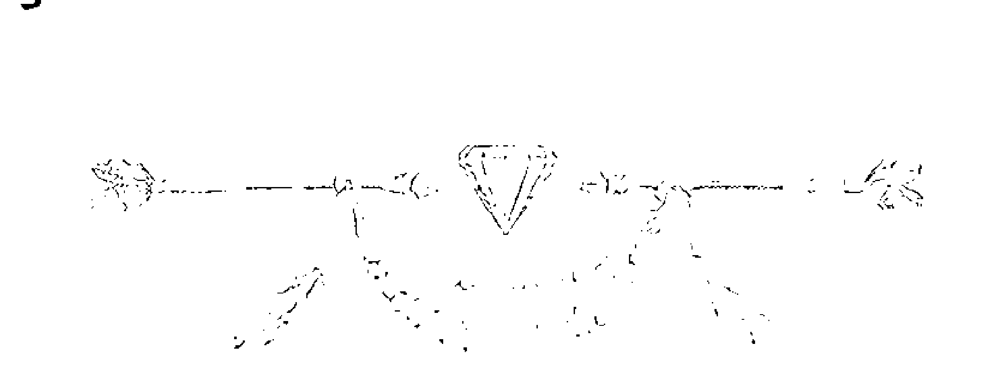

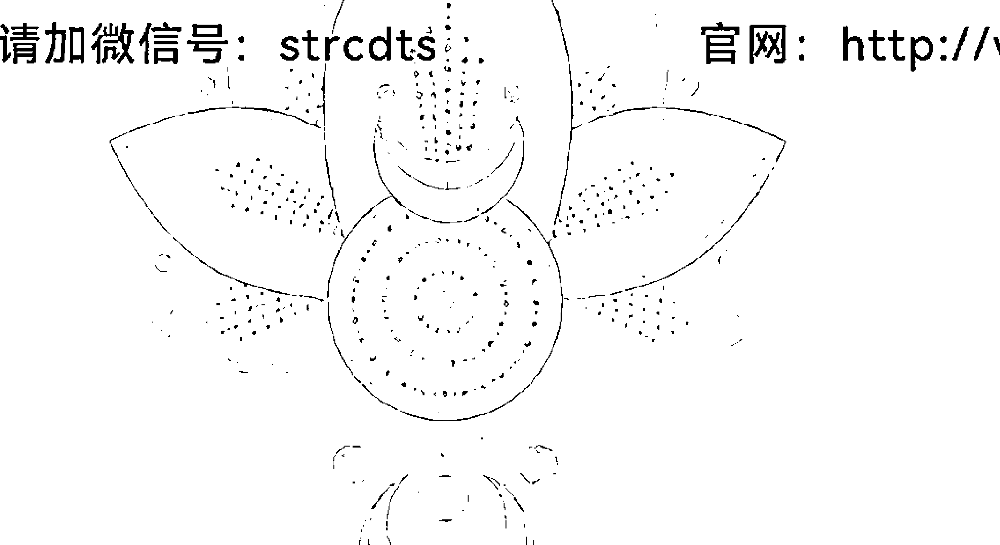

### 豐盛家庭洗地劑

如果方法用得正确，连清洁的日常家务也能成为施展魔法的时候。只要往一些基本材料加入一些魔法油以及自己的有力能量，就能欢迎丰盛进来自己的家中。

广藿香（patchouli）、佛手柑（bergamot）、雪松（cedarwood）及岩兰草（vetiver）精油关联到兴旺与丰盛，而且适合用在清洁产品。柠檬精油则为整个混合液带来明亮、清新的能量而有加成的效果。调好的液体可以安全用在硬木地板跟瓷砖上。

全新拖把应是理想的施法工具，即它的首次使用是以魔法刻意进行。而超细纤维（microfiber）材质的拖把垫会是最好的选择，然而如果你已持有状态最优的拖把，那是完全没问题的。这里的重点在于，进行魔法之前，请确认自己待会用的拖把头要非常干净。

#### 使用材料

- 1 根大蜡烛（非必须）
- 1 茶匙橄榄液皂（castile soap）
- 4 杯温水
- 喷雾瓶
- 10-15 滴广藿香、佛手柑、雪松及（或）岩兰草精油
- 2-3 滴柠檬精油（非必须）
- 拖把

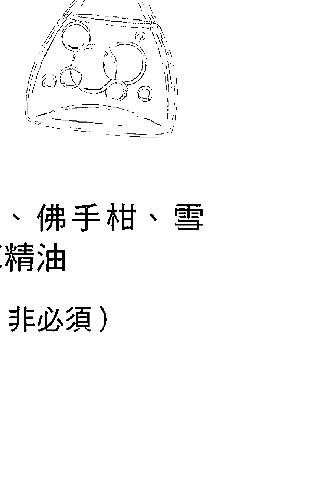

#### 執行指南

- 如果有準備大蠟燭，將其點燃。
- 將液皂與水倒進噴霧瓶中，激烈搖動以混合之。(請記得瓶口蓋緊再搖動喔！)
- 先加入幾滴精油，觀想明亮的豐盛能量遍及家中各處。
- 先試聞混合液的氣味，之後再加入幾滴精油。
- 在加入不同的精油時，每換一種都要重複這過程。
- 將噴霧瓶的瓶口蓋緊，並朝右(順時針)方向轉圈搖晃混合液三圈，同時說出以下的話語(或類似者)：

> > 出去陳舊、進來新鮮，
> 芬芳法水、使之成真。
> 吾家地板、清淨明亮。
> 真正豐盛、來成吾珍。

- 在進行清潔家務時，播放自己喜愛的輕快音樂，想要隨之舞動或哼唱也沒問題。
- 工作完成時，花些時間享受「自己真的做得很棒」的滿足感。
- 變化形式：如果你喜歡拖把配水桶的傳統做法，可以增加液皂與溫水的量，甚至可以改用 Murphy 品牌或其他天然材質的地板清潔劑。

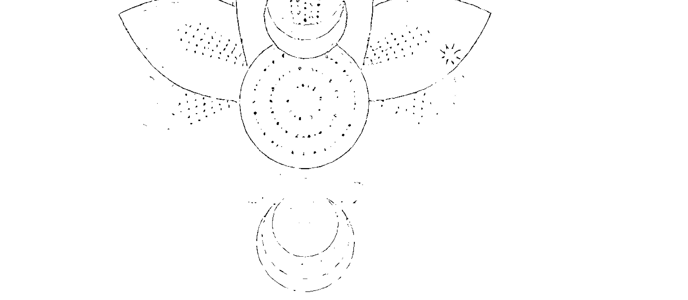

### 興旺黃鐵礦零錢罐

形狀為立方體且各面都有光澤的黃鐵礦，是礦石界中最為吸睛的晶體之一。而它也具有相當強勁的能量，是接觸水晶的新人鍛鍊手感的理想礦石之一。當你將一顆黃鐵礦立方體握在手心時，也許會訝於它比一般礦石來得沉重，以及那股幾乎像在「滋滋作響」的能量。

黃鐵礦具有許多魔法用途，其中包括平衡、增強自信以及促進財富。這礦石特別適合用來協助我們，將成功人生不可或缺的兩個部分，即創意／直覺部分與邏輯／理性部分，和諧交織在一起。

黃鐵礦也被稱為「愚人金」(fool's gold)，因為沒有經驗的礦工常把它錯認成真金。促進興旺的魔法居然使用「愚人金」，雖然看似矛盾，然而當你了解黃鐵礦的魔法並不在於增加運氣，而是在於強化那以創意與邏輯賺取財富的道路時，就不會覺得奇怪了。

這魔法是藉由將黃鐵礦的現實能量連結到在零錢罐進進出出的金錢，使魔法操作整合到日常生活之中。任何容器均可使用，然而請一定要選擇讓你在欣賞時能感受到個人能量揚升者。有人會為這目的特別出門去買好看的瓶罐或碗，還有些人則是在樸素的瓶子上面繪圖裝飾，藉此為後續的魔法操作增加額外的魔法能量。

#### 使用材料

- 1塊中型黃鐵礦礦石
- 存放零錢的罐子
- 數個不同面額的錢幣
- 裝飾材料（非必須）

#### 執行指南

- 如果你想要裝飾自己的零錢罐，可以把這動作當成施法的第一步來做，不過也可以視需要預先完成裝飾。
- 當你準備開始進行時，將黃鐵礦夾於兩手掌心維持一段時間，專注在平衡與興旺的感受，為它灌注能量。
- 當你可以感受到手中有強勁的能量在流動時，唸出以下文字（或類似者）三遍：

> > 財富支持、智慧滋養，
> 吾之生命、得以成長。

- 把黃鐵礦放在零錢罐的底部，並將準備好的錢幣輕輕放入。
- 每當你將錢幣放進零錢罐或從罐中拿出零錢時，請以自己的方式向那顆黃鐵礦致意，例如獻上感謝，或是重複唸誦施法時的禱詞。
- 請務必要榮耀自己的力量，即運用創意的方式影響個人財務狀況。

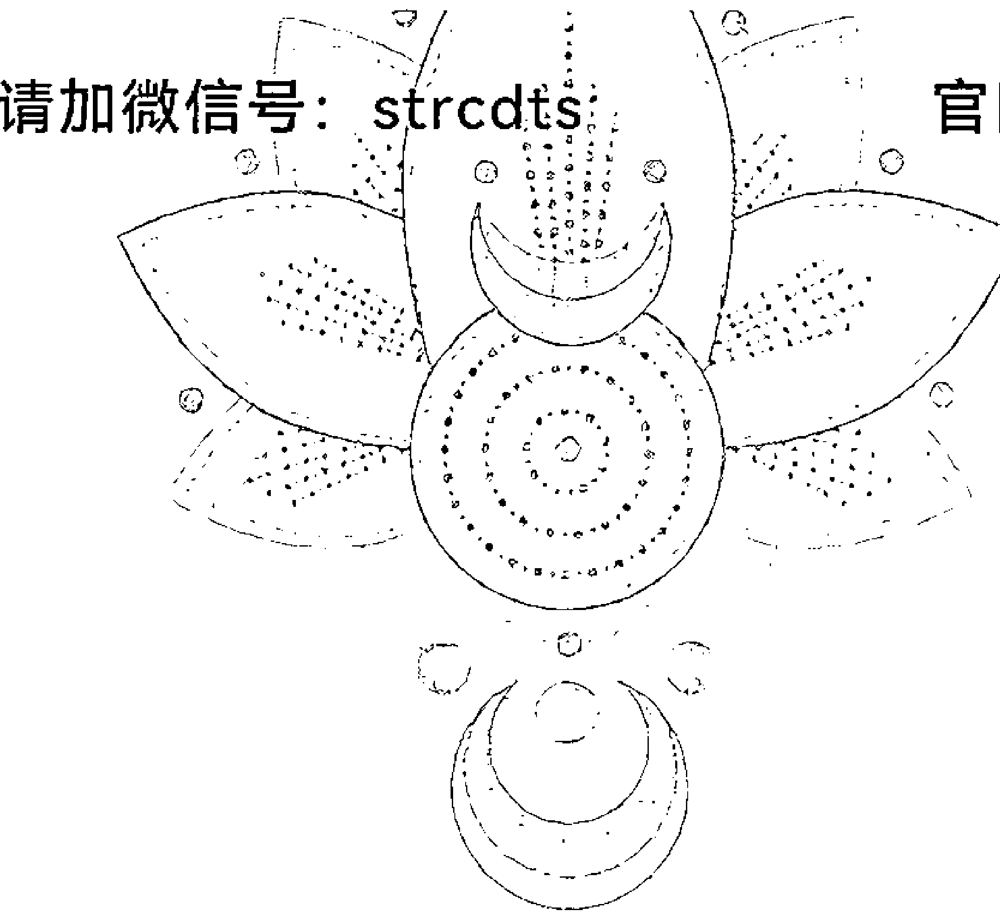

### 肉桂吸引金錢護符

肉桂是頗具辨識度的香料，我們較常看到的是它的粉末，然而肉桂也常用於以興旺與幸運為目的的魔法。在傳統上，有些魔法操作會加入肉桂，以加快具現時程，還有強化其他成分的能量並「加把火進去」。

這魔法所用的肉桂是棒狀，本身即是強力的魔法物品，其香氣使它成為適合放在車上的理想護符，然而你也可以把護符掛在廚房，或任何可以時常看到它的地方。

肉桂棒的中間幾乎都是中空的，請務必選用能讓緞帶或長線穿得過去者。雖然緞帶能使護符更加亮麗，也更為耐用，不過只要能夠穿過肉桂棒的中間且不會自行滑掉，任何夠長的事物都可以用。

#### 使用材料

1根肉桂棒，長約 5.1 到 7.6 公分（即2至3英寸）
1條綠色或金色緞帶，長約 30.5 到 45.7 公分（即12至18英寸）

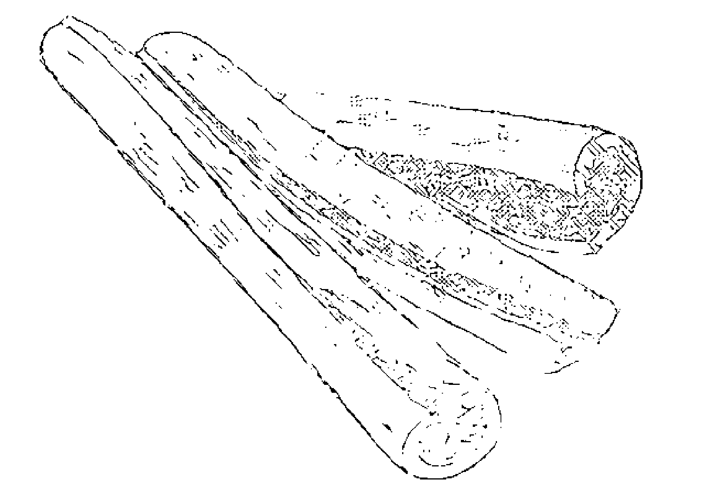

## 执行指南

- 将缎带穿过肉桂棒的中空部分，然后将线头两端绑在一起并系紧。
- 将肉桂棒夹于两手掌心，闭上眼睛，想像大量纸钞像风暴那样从各个方向朝你飞来。
- 将肉桂棒的一端轻点自身手腕、手肘、颈部与太阳穴的脉搏点，同时念出以下文字（或类似者）：

> > 甜美肉桂，为吾招财。
> 速速吸引，更多吾财。

- 将你的「吸引金钱护符」放在看得到的地方，并尽量每天至少摸它一次。

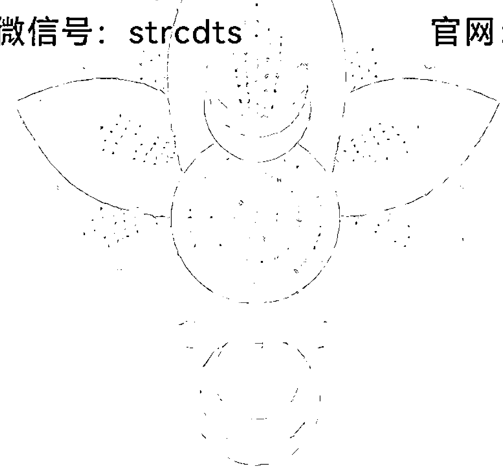

### 工作面試成功魔法

這魔法能夠幫忙反轉對於重要面試的焦慮，並增加成功的機會。理想的施法時間雖然是朔月漸盈到滿月的期間，不過如果面試是在滿月漸虧到朔月的期間，仍然可以施法，別因時間不理想就放棄不做喔！

#### 使用材料

- 1 根橘色或金色蠟燭
- 燃香（乳香、紫丁香或肉桂）
- 紙與筆（鉛筆也可以）
- 1 小顆青金石、黃水晶或虎眼石

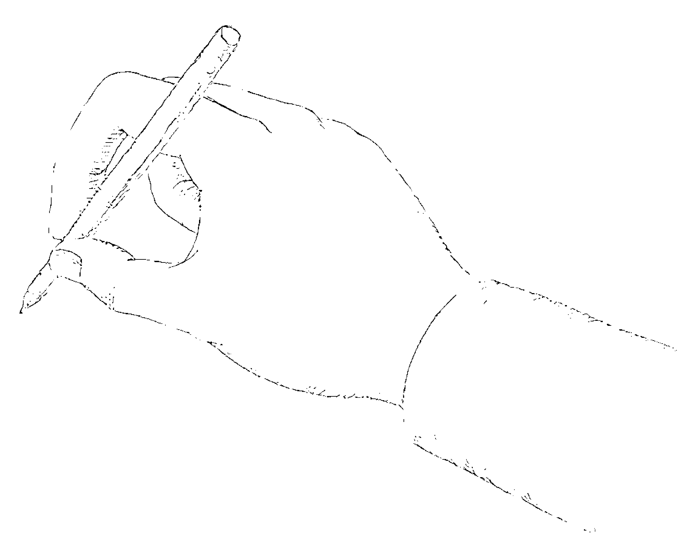

#### 執行指南

◇ 將香點起，並用油塗抹蠟燭。
◇ 花一些時間觀想自己在面談時保持鎮定、充滿自信的感受。
◇ 在紙上寫下自己會是這份工作或職位的最佳人選之三項理由。
◇ 將紙摺疊成三角形，大小不超過數英寸（約 10 公分以下），將它擺在蠟燭前面。
◇ 點燃蠟燭，唸出以下文字（或類似者）：

> 趁此良辰，於此美境，吾燃此燭，工作屬吾。

◇ 將小顆水晶快速掠過燭火，然後放在摺好的紙片上面。
◇ 讓蠟燭在安全之處自行燃盡。
◇ 前去面試時，帶上摺好的紙片以及那顆小水晶。
◇ 當你確定拿到這份工作時，將紙片撕得細碎送去回收。請一定要感謝自己在這過程所呈現的力量，而且也要恭喜自己成功通過面試！

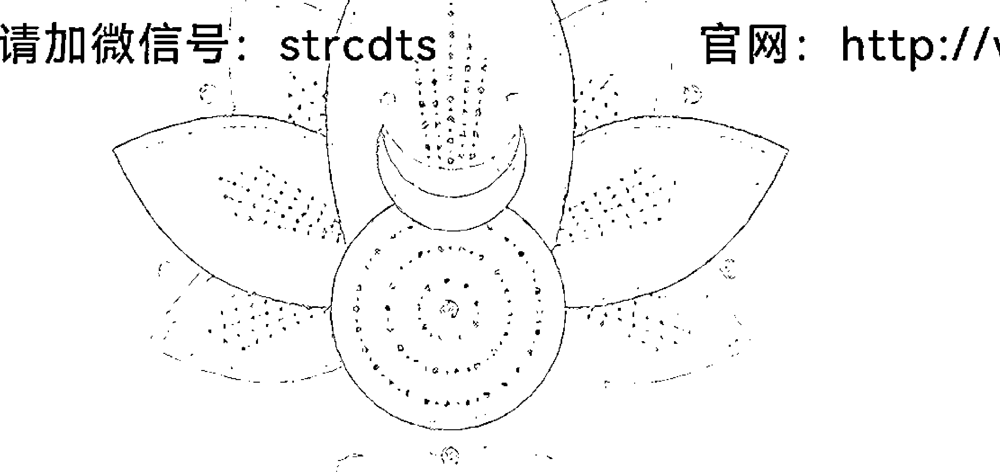

### 事業成功的盆栽護符

無論你是剛開始自己的事業，或想為已經順利運作的事業注入推力，一棵單純的盆栽就能達到出乎意料的效果。這也是一種具有高度隱密性且持續發揮作用的護符——客戶根本料想不到你的「幸運護符」居然是一棵植物！

竹與蘆薈是跟好運有關的常見植物，而且在室內也容易生長。如果你的事業擁有戶外花園的空間，那麼薰衣草及羅勒會是促進興旺的上好植物。請依個人喜好及植物對於場所的適應性這兩點，以找出一到兩種可以運用的植物。

#### 使用材料

- 1 個或多個具有適當排水孔的陶盆
- 1 株或多株自選植物的幼苗
- 1 個或多個硬幣（與植物株數相同）
- 盆栽用土 *
- 水 *

*:每種植物對於土壤、水與陽光的合宜需求並不相同。為了得到最好的結果，請依照自己所選用的植物之相關種植知識來照顧它們。

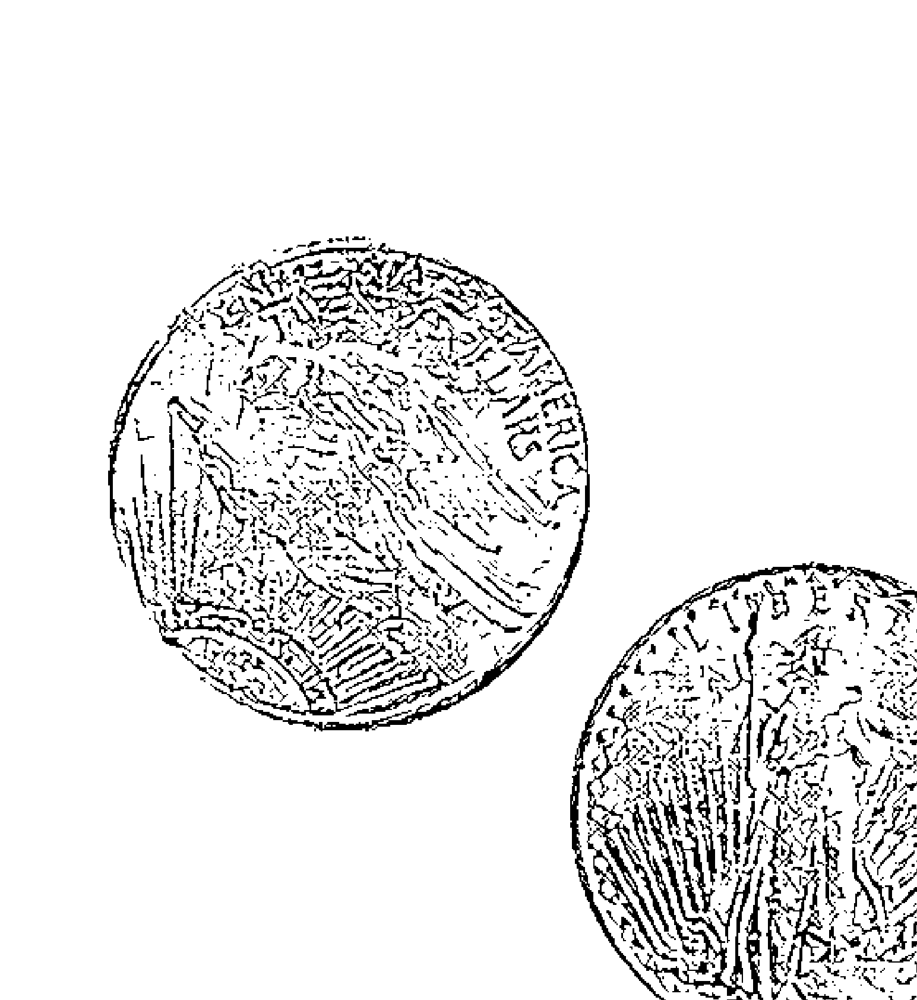

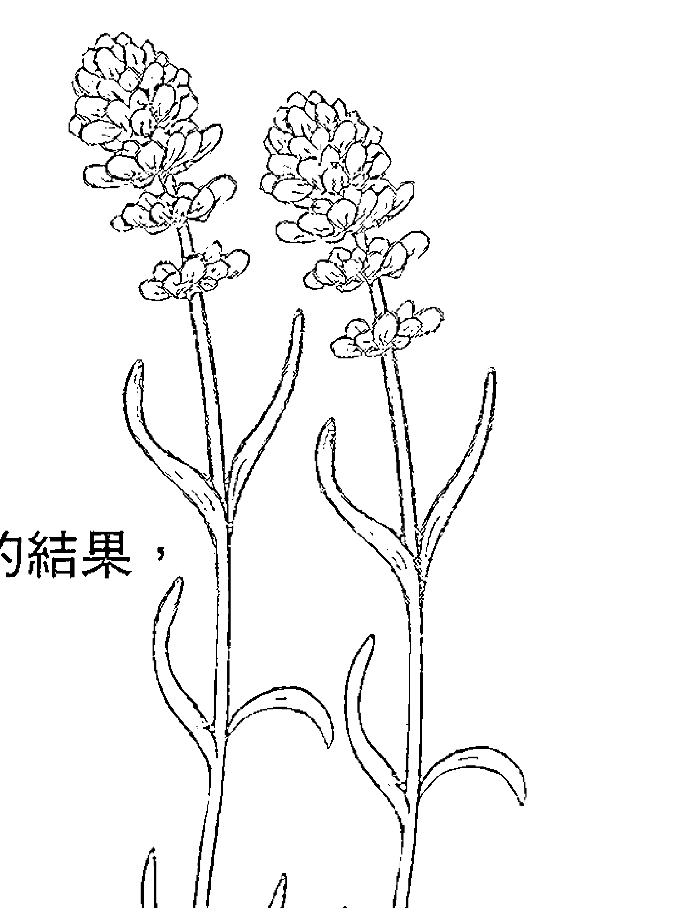

## 执行指南

- 在陶盆的盆底薄铺一层土。
- 把一个钱币放在盆底土上。一边用指头轻按钱币，一边唸出以下文字（或类似者）：
  > 吾之事業，由此穩固，
  > 營養沃土，成長必願。
- 再往盆中填进足够固定幼苗的土壤，中间挖出足以置入植物根团（植物的根抓取周遭土壤所形成的团块）的空间。
- 在你轻柔地将幼苗固定于土壤中并在周围填入足够的土壤之后，用水将盆栽浇透，并唸出以下文字（或类似者）：
  > 吾之事業，如此鞏固，
  > 發達必行，好運必願。
- 将盆栽放在工作场所的预定位置，两手手掌放在盆栽两侧，并唸出以下文字（或类似者）：
  > 吾之事業，美好興盛，
  > 豐富吾命，滋養眾生。
- 经常照料盆栽，在照料过程回忆自己的魔法操作，并在心中默默感谢植物来支持自己在事业上的成功。

### 「空白支票」興旺魔法

支票可以說是銀行業的命令文件，指示金錢從某一源頭流往另一處。這項魔法旨在時常提醒你持有具現無限豐盛的力量，還有協助溶解個人對於金錢根深蒂固的局限思維模式。

如果你有支票簿，選擇對你具有特別意義的票號，例如那號碼含有你的生日或是你所認為的幸運數字。如果沒有支票，除了到你的銀行申請臨時支票（counter check）之外，也可以上網下載空白支票的範本或自行設計。

如果你沒有銀色或金色的麥克筆，就用綠色或寶藍色的筆、彩色鉛筆或是任何你用於施展魔法的特殊書寫工具。

如果還想為這魔法錦上添花，可以等蠟燭燃盡之後將支票裱框，像是使用相框、自行製作外框並裝飾之，或是用硬紙板將支票襯邊，再刷上一層 Mod Podge 剪貼彩繪膠水。請盡情揮灑創意，好好享受吧！

#### 使用材料

1. 1根綠色、寶藍色、銀色或金色蠟燭
2. 1張空白支票
3. 銀色或金色麥克筆／其他書寫工具
4. 廣藿香、快樂鼠尾草或肉桂精油
5. 為支票裱框、襯邊的材料（非必須）

#### 執行指南

◆ 點燃蠟燭，花些時間喚出放鬆的感受以及對於豐盛的信任。想像自己擁有物質層面一切所需事物，也能夠取得所有自己想要的东西，并且确知将来持续会有更多事物来到你这里。当你清楚掌握这感受时，请依下述说明填写支票的各个空白栏位：

◇ 凭票支付：〔签上你的姓名〕
◇ 新台币：无限财富
◇ NT$：〔画上无限大的符号〕
◇ 日期：从今以后的每一天
◇ 备注（用途）：我的丰盛无边无际
（有些中式支票没有这栏位或列在支票存根上，相当于西式支票的 Memo 或 For 栏位。所以如果没看到这栏位的话，也许可以思考看看要写在哪里。）
◇ 发票人签章：宇宙

◇ 在支票后面填上你的姓名与住址（中式支票是写在支票背面，西式支票是写在正面左上角），并画上五芒星符号（这里指塔罗牌的钱币符号，即内有五芒星的圆形）或你所选定的其他丰盛符号。

◇ 将支票的四角涂上一点精油（请尽量避免污损任何字迹）。用两手捧起支票，并说出以下的话语（或类似者）：

> 从今以后，
吾之丰盛永远满溢。
无限财富，持续存入吾之生命。
以上所言、照此遵行。

◇ 将支票放在蜡烛前面，等待蜡烛自行燃尽，之后再依你的意思将支票装框或衬边。无论你打算怎么做，请将支票放在可以时常看到的地方。

注：这项魔法可以调整成专门偿还债务的版本，毕竟债务常是人们在面对财务问题时最在乎的事情。只要在「新台币」的大写金额栏位改写成「债务全清」即可，并观想这样的未来。等到你的债务全清时，可以将那张支票烧掉，或是撕得细碎送去回收。

### 蜂蜜豐盛瓶

在巫毒傳統中，將藥草與蜂蜜運用在魔法瓶是常見的魔法操作形式。這類魔法可能會使用到比較多的東西，然而它們的效果較為持久，而且可以持續反覆使用。

雖然超市或商店賣的一般蜂蜜即可用在這項魔法中，但如果可以的話，請找自己所在地區生產且未加工的天然蜂蜜。

你可以將這裡所列的藥草替換成其他藥草，然而你應要找那些關聯到金錢、豐盛及興旺的藥草來用。為達最佳效果，應當使用至少三種藥草，若想放更多種類也沒問題——放得越多，效果越棒喔！

這裡所指定的蠟燭係一次只點一根，所以一開始只需要一根蠟燭即可，為了讓魔法維持數週，在第一根蠟燭燒完之後，會需要更多蠟燭一一為這魔法「供應能量」。

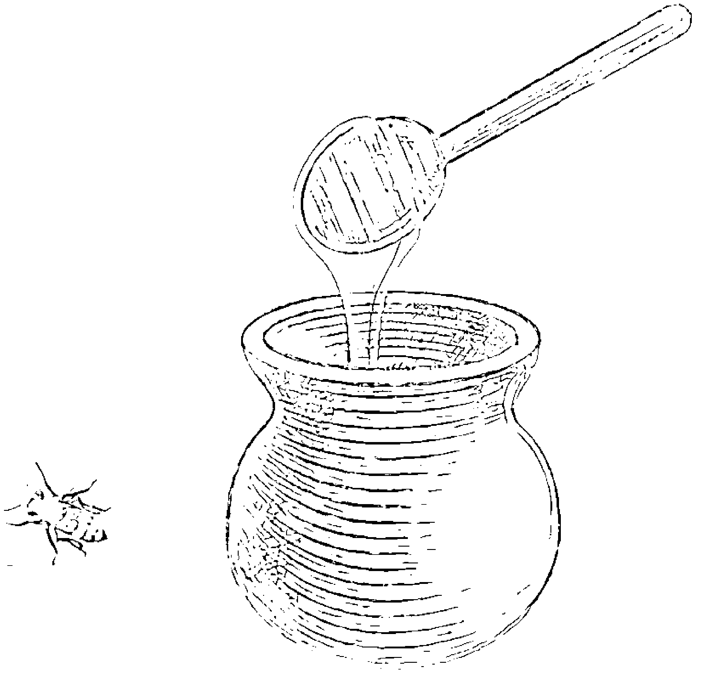

#### 使用材料

1 個具有旋轉蓋的小罐子
蜂蜜 (需足以裝滿小罐子的量)
1 顆水晶或礦石 (天然磁石／磁鐵礦、黃水晶、綠色東菱玉、黃鐵礦或虎眼石)
8 粒向日葵種子
3 根以上綠色魔法蠟燭或祈願蠟燭
研缽及研杵 (或碗與湯匙)
廣藿香的油品 (用於塗抹蠟燭，非必須)
具有尖端的水晶或大頭針 (非必須)

下列藥草各取 1-3 茶匙 (至少選三種):
◇ 薰衣草
◇ 愛爾蘭苔蘚 (Irish moss)
◇ 洋甘菊
◇ 肉豆蔻
◇ 苜蓿 (alfalfa)
◇ 羅勒
◇ 金印草 (goldenseal)
◇ 菊苣 (chicory)
◇ 菖蒲根 (calamus roots)

#### 執行指南

◇ 將所有藥草放進研缽 (或碗) 裡面，用研杵 (或湯匙) 加以混合。
◇ 然後用你的手指混合藥草，將個人能量滲入藥草。請一邊混合藥草，一邊專注於自己的意願，無論那是金錢、其他豐盛形式或是兩者均有。( 請記得在後續開始施法之前把手洗淨。)
◇ 接著將準備的礦石放進罐裡，專注於讓它為你的生命招引豐盛的力量。
◇ 將藥草蓋在礦石上，然後在最上面撒下向日葵種子。
◇ 將蜂蜜從前述堆疊起來的物品之上方倒入，直到裝滿整個罐子。

盖上罐盖并转紧，然后双手握着小罐，花些时间观想丰盛正流进自己的生命。

你也可以按照自己的意思，在蜡烛表面刻上北欧符文(rune)或其他能够象征个人祈愿的符号，并用广藿香的油涂抹蜡烛。(关于精油的稀释，请参考本书 P120〈魔法油〉的「混合」段落。)

然后用打火机将蜡烛尾端烧融，使它能够固定在罐盖上面。(另一做法则是点燃蜡烛，将它倾斜滴出数滴蜡液到罐盖上，再将蜡烛固定上去。)

让蜡烛自行燃尽，然后视需要每周重复一次(或数次)点蜡烛的步骤。

最后，你会感觉到这个魔法罐该是停止使用的时候。当这时候来临时，感谢它的支持与贡献。

这项魔法的传统释放方式，系将魔法罐埋入土里。然而，现代许多习修者会把内容物倒入排水管或当作堆肥，瓶罐则在清洗后送去回收，只将矿石埋入土中。

如果你是用后面这种释放方法，就要记得在打开罐盖时释放这魔法。你可以说出类似下列话语：

> 药草啊、蜂蜜啊，
感谢你们助我实现丰盛。
我现在释放你们的能量，回归大地吧。

### 春华之术

春天是个魔法般的季节。从初春早啼的鸟儿到枝头冒出的花蕾，新的生命看似从无形之中出现。那么，何不在魔法中运用春天的花朵、获取一些持续生发的能量，好为自己的生命招来更多丰盛呢？

由于这魔法只在特定季节操作，从中汲取自然界的韵律，所以会是特别强劲的魔法。虽然这魔法只要在春天就可进行，不过若你能把施术时间安排在月盈或满月的时候，还会得到能量和谐共振的加成效果。

如果可以取得的话，苹果花、山楂花（hawthorn）或忍冬花（honeysuckle）会最理想，然而只要找当地正在开花的植物即可。最好捡拾掉在树木底下或周围的花朵，不过如果有需要的话，你也可以摘取还在树枝上的一两个花蕾，只是在摘取时一定要心怀感谢（如果想要的话，也可以倒几滴牛奶或蜂蜜当作谢礼）。

#### 使用材料

- 1/4 到 1/2 杯的花朵
- 白色、粉红色或绿色蜡烛

## 执行指南

- 在预定施法的前一天收集要用的花朵，让它们自行干燥，并放在整晚能够晒得到月光的地方进行充能。
- 然后将花朵绕着蜡烛围成一圈。
- 花些时间冥想春天本有的欢愉，像是花朵的香气、暖和的土壤、蜜蜂的嗡嗡声，还有逐渐变长的白天。
- 当你觉得已经回归到中心并对准春天的振动时，做个深呼吸并点起蜡烛，念出以下文字（或类似者）：

> 荣耀春天、美哉春天，
新生奇迹、遍布各地。
吾命生长、喜乐欢唱，
无尽丰富、处处得寻。

- 如果可以的话，让蜡烛自行烧尽。施术后三天之内，将花朵散撒户外以返还大地。

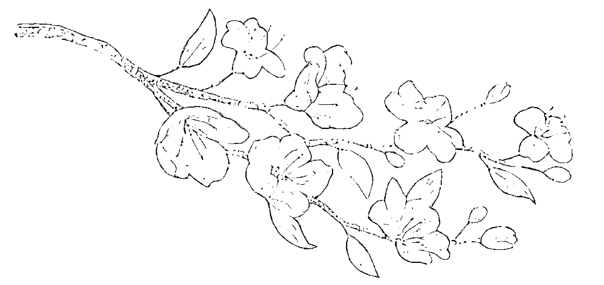

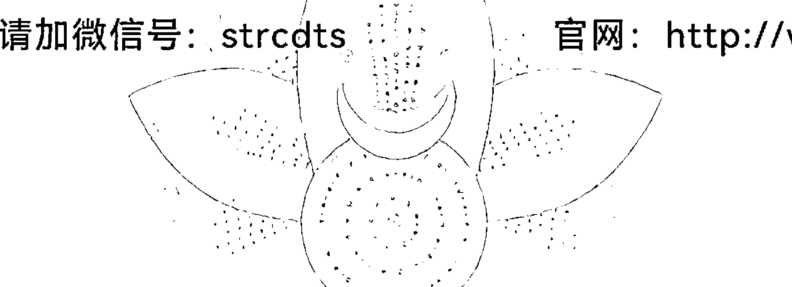

### 秋烨之术

偏好自然魔法的人们，会喜爱在秋意浓厚时分运用鲜艳的红色、橘色与黄色落叶来施法。这项魔法是在庆祝秋季最为强盛的能量，也就是树木自春天开始演出的生命戏剧，在落幕时来一场色彩缤纷的「盛大结局」。

如同「春华之术」（参见第 63 页），这项魔法的力量也是来自季节，亦即你所运用的是自然界的魔法韵律。

这时的焦点要放在引出自己于整个生长季节已经实现的丰盛，呼唤那些在幕后业经数月成熟的祝福及惊喜进入自己的生命。

虽然这魔法只要在秋天进行即可，然而它也跟绝大多数的丰盛魔法一样，如果是在月盈期间或满月进行，就会有能量和谐共振的加成效果。

这项魔法有一关键细节，即使用的叶子都须从地上捡拾。就像你不会提早收割自家园地的蔬菜，树上的叶子若还没自行掉落下来，就别拔下它们。

为达最好的效果，请尽量找最新鲜、最亮丽、最无瑕的叶子，色彩也尽量有些变化。（对了，如果你住的地方有长橡树的话，请至少捡拾一片这种神圣树木的叶子放进魔法里面喔！）

若想做出令人惊艳的摆设，请把捡拾的树叶压在两本厚重书册之间过一个晚上，就能把它们平贴地放在祭坛上或工作台面。

#### 使用材料

- 7片压过的树叶
- 橘色、棕色或黄色蜡烛

## 执行指南

◇ 将树叶排成一个圆、叶柄朝内，然后在中心放上蜡烛。

◇ 花些时间冥想秋日的美好——凉爽干燥的空气、营火燃烧的味道、踩踏落叶的脆响，还有逐渐延长的惬意夜晚。

◇ 当你觉得已经回归到中心并对准秋季的振动时，做个深呼吸并点起蜡烛，念出以下文字（或类似者）：

> > 暖日渐退、夜晚渐长，
> 吾今聚集、秋之能量。
> 智慧技艺、吾均增长，
> 秋之赠礼、愿明端详。

◇ 如果可以的话，让蜡烛自行烧尽。想要的话，也可将树叶留在原处妆点个人空间数天，直到它们的颜色消退并卷曲起来为止，之后就将它们散撒出去以返还大地。

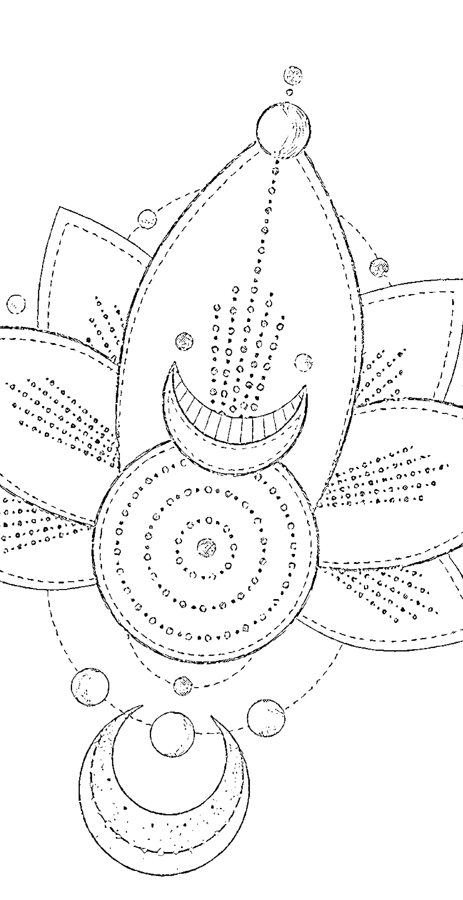

# 健康与身心安适的魔法

# 介绍使身心健康安适的魔法

我们的世界步调快速、混乱常现，要维持正面、健康的身心安适状态也许有其难度。然而若想要平衡个人能量，好使自己能有干劲及韧性面对现代世界的挑战，其实还算容易。

这部分的魔法范围在于减低压力的影响，还有使你在日常生活中更容易接上那股已经储备起来等你取用的正向能量。不过，即使有些魔法的确可以因应身体健康的挑战，但它们全都不是要来取代必要的医疗作为。如有任何严重健康问题，请一定要咨询医疗照护专业人士。

当然，「身心安适」所指涉的领域非常广泛，身体与情绪层面的健康仅是其中一部分而已。你所身处的环境，其能量对于你的整体生命品质来说十分重要。居住环境的负向能量越少越好，所以你也会在这部分找到几个相应的防护魔法，以强化你的实体及社交环境，并将有害的能量阻挡在外。

在运用这些魔法时，请将结果记录下来，利用这些经验来帮助自己扩展并优化个人身心安适的能量。

## 迅速康复的疗愈浸浴

几乎每个人都知道热水浴或热水冲澡本身就能舒缓从胸闷、痠痛到肠胃不适等许多症状。而将植物精油用于浸浴以大幅强化疗愈效果的做法，也越来越常见。

如果你在这些做法当中加入「魔法意图」的话，会发生什么情况呢？当下一次觉得身体不适时，不妨试试这项魔法，并期待得到惊奇的效果吧！

如同前页介绍所言，这项魔法并不是用来替代任何必要的医疗照护，所以如果你真的生病的话，请一定要咨询医疗照护专业人士。然而如果你是受寒、感冒或其他一般不会去找医生来看的轻微症状，那么这个魔法浸浴会让你真正得到恢复的好方法，比那些仅用来「掩饰」的非处方药物还要好很多。

迷迭香、杜松与檀香是复方「支持疗愈油」（参见第120页）会用到的成分，而在结合它们的实际效用之后，就能用于对抗感染与发炎，还能舒缓疼痛。而这些精油的魔法性质当然也同样包括疗愈，还有保护与长寿。

如果你无法自行调制「支持疗愈油」复方油品，也可使用外面贩售的复方油品，只要含有这三种精油即可。（有些浴盐商品会预混这些精油，如果你有买到并打算用在这魔法中的话，就不用另外准备海盐。）

#### 使用材料

- 5-7滴「支持疗愈油」(参见第120页)
- 2-3汤匙海盐
- 1根白色蜡烛
- 营造氛围的额外蜡烛(非必须)

## 执行指南

如果有额外准备的蜡烛，先点起来。

◇ 浴缸注入洗澡水至四分之一满，加入海盐。一边撒下海盐，一边念出以下文字(或类似者)：

> 大地生产之盐，
为吾移除有害能量。

◇ 当浴缸的水位已达二分之一满时，加入精油，并念出以下文字(或类似者)：

> 神圣疗愈精油，
为吾恢复应有平衡。

◇ 然后一边点起白色蜡烛，一边说：

◇ 关闭浴室的所有人工照明，跨入浴缸浸浴。至少浸二十分钟，在过程中闭起眼睛做深呼吸。

◇ 专注在疗愈精油的香气以及浸在水中的触感。如果发现自己的心智飘去任何会引起焦虑感受的事物上，请放下念头，把注意力再度转回魔法浸浴所带来的正面感受。

◇ 如果可以的话，请在排水时继续留在浴缸中，这能强化仪式的净化振动。

◇ 浸浴之后，还是要继续好好照顾自己。请一定要喝足水分并尽量休息，因为你刚才已用魔法加快自己的恢复速度了呢！

让此愿如实具现吧！

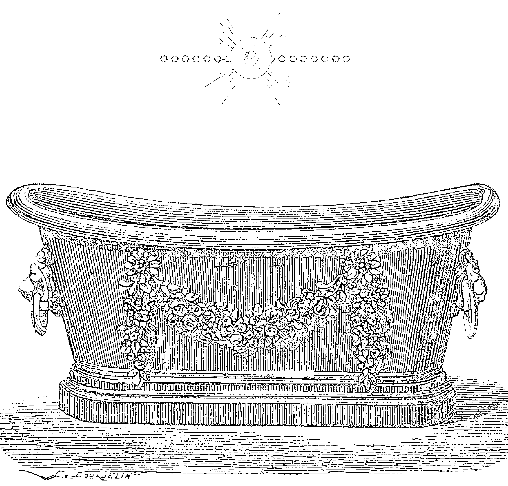

# 断开连结、重新对焦的仪式

在这时代中，我们或多或少会黏着自己的手机或其他电讯产品不放。当我们花太多时间在网上时，就有可能忘记自己与现实世界的连结，也忘记与真实自我的连结。

定时放下科技事物，会对你的身体、情绪与灵性层面的健康有所助益。这个简单仪式能够帮助你清除个人能量场域里面过多的电磁辐射（electromagnetic field (EMF) radiation），并重新对焦到大自然的能量。

次石墨（shungite）能够强力吸收电磁辐射，对于能量层面敏感的人们来说真的有差。奥刚石（orgonite，近代以树脂、金属及水晶组成的人造能量工具）与黑色电气石（black tourmaline）也有不错的效果。至于用来对焦的矿石，只要是你个人能够与之共振者皆能使用，不过以下所列几种会特别有效。

#### 使用材料

- 1 颗用于吸收的矿石：次石墨、奥刚石或黑色电气石
- 1 颗用于对焦的矿石：玛瑙（agate）、紫水晶、方解石（calcite）、白水晶、青金石或粉晶
- 笔记本或书写用纸(非必须)

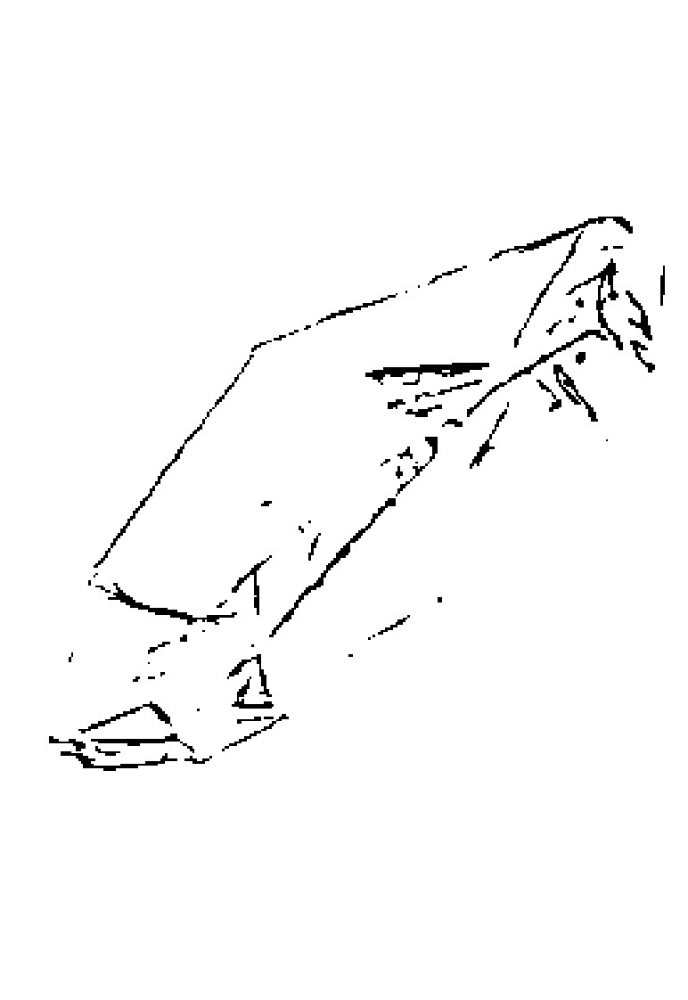

# 执行指南

- 在开始之前，将所有电讯用品关机至少两个小时。在这期间，想要的话可以去散个步，或是找个可以进行的计画执行。
- 如果你发现这样做有困难，只要留意自己对这状况的反应即可，无需多加批评。你会焦虑不安？感觉跟世界脱节？只要陪着这感受就好，让它自行过去。经过三十分钟之后，你的感觉如何？两个小时之后的感觉又是如何？如果觉得写作有帮助的话，请自由书写自己的经验。
- 在户外找个能够赤脚踏地的地方。（如果不可行的话，就用热水浸浴或冲澡来代替。）
- 两手握住用于吸收的矿石，观想所有多余的电能离开你的能量场并进入那颗矿石。做个几个冥想的深呼吸。当你觉得自己跟科技世界完全「断开连结」，就把矿石放下。
- 现在握着用于对焦的矿石，观想它的能量将你与地球及内在的自己连结起来。花些时间观照自己的呼吸并维持这样的观想。你也可以用笔记本写下那些在过程可能会出现的洞见、感受或直觉的讯息。
- 在长期使用电讯产品的时间中，每当你感觉自己失去专注力或与现实脱节时，请重复进行这项仪式。

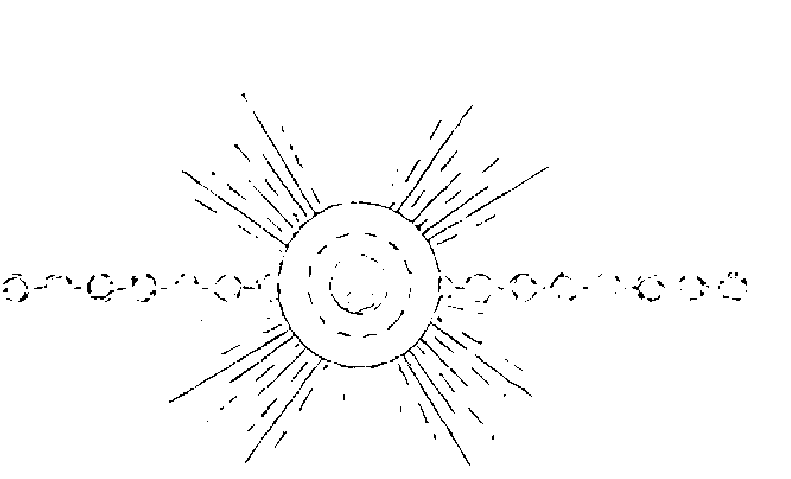

# 镇定焦虑的魔法

每个人总会遇到无名焦虑的时候，仅是用正面思考的话很难甩得掉它。

在单独使用时，薰衣草的芳香疗效以及洋甘菊的镇定效果，都能有效对抗焦虑，然而再加上鼠尾草及矿石的运用，会使这项魔法有额外力量清除身体系统里面的焦虑能量。

煤精(jet)、黑色电气石及黑曜岩(obsidian)等黑色水晶矿石能有效带出有害能量，不过如果你在握着某些石头时能够镇定下来，即使那只是在野外捡到的一颗普通石头，也能用在这项魔法。

#### 使用材料

- 用于熏烟的鼠尾草 (系绑成束或散装叶片均可)
- 薰衣草燃香
- 或者使用熏香烛台与薰衣草精油
- 洋甘菊茶
- 1颗用于镇定或落实的石头

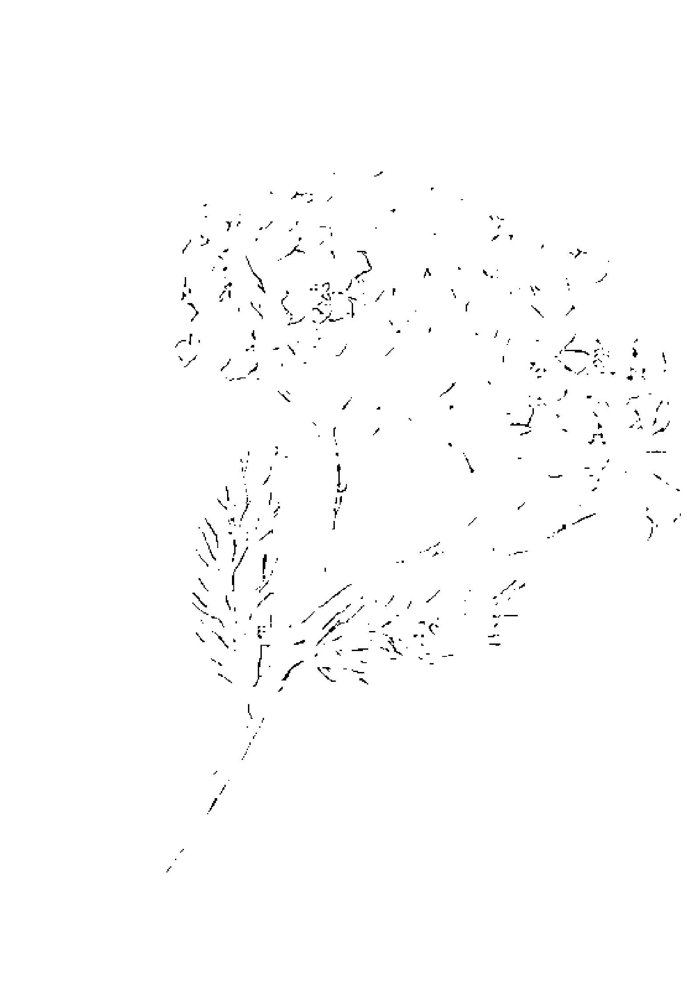

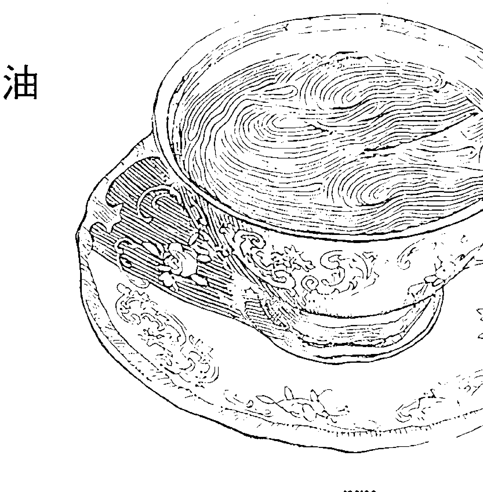

# 执行指南

- 将香点起来，或是用熏香烛台加热精油，然后冲泡洋甘菊茶。在等茶泡好的过程中，点起鼠尾草，轻轻熏过自己的能量场，以去除有害的能量（请务必将所待位置的一扇窗户打开，至少要留个缝，让清出来的能量有可以离开的途径。）
- 接下来，一边喝茶、一边握着准备好的石头。观想身体里面所有的焦虑能量都被牵引出来，并从手进入石头。
- 当你觉得已经可以的时候，将石头埋在户外。大地将会中和那股有害能量，使它不会再回到你这里。

# 提升活力与耐力的红碧玉

虽然魔法可以很有效（而且好玩），不过魔法并不完全是由正规术法施展而成。水晶及其他矿石即是很好的例子，它们本身就有魔法，只需要用正确的方式汲取出来以产生效果。

若要检验水晶矿石对于个人生活特定面向的影响效果，长时间将它们带在身边是个不错的验证方式。无论你是运用水晶的新手，或者仅是想将新种类的矿石加入自己的魔法操作，将单一矿石带在身上数天都能让你对于那颗矿石有更多了解，这是书本鞭长莫及之处。

以下范例是用红碧玉（red jasper）来达到强化活力与耐力的目的，特别是准备要去处理不甚讨喜的事务时。

#### —— 使用材料 ——

1. 1 颗中型尺寸红碧玉，业经打磨抛光者
2. 笔记本或书写用纸

# === 执行指南 ===

- 如同其他矿石，在将红碧玉用于魔法之前，先为它清理并注入能量。
- 从预定的日期开始，将矿石带在身上七天，而且一定要每天数次把它拿出来握在手上。
- 在这过程中每一天的最后——或是至少第七天的最后——记下在身体、情绪或心灵层面有注意到的任何感受，不论它们有多麽微妙。
- 至于后续步骤，也许可以用不同的矿石进行同样的实验，然后比较这些结果。

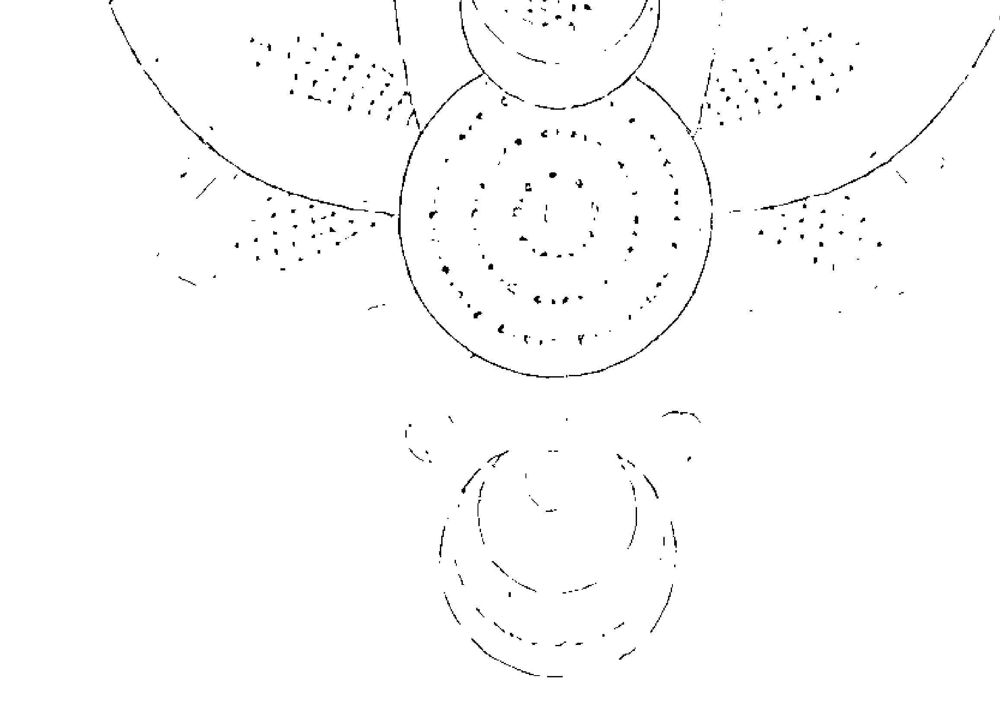

# 泡在黄色中的「扶我一把」魔法

我想你也一定知道，色彩对于我们的心理状态具有强烈的影响力，而它在魔法也会有相当强势的表现。这魔法系专注在黄色，以及它能将我们的能量提升到较为愉悦的频率。

黄色是最容易联想到阳光的颜色，在提振个人感受或身心状态、挥散怀疑、焦虑与阴郁感受方面非常有效。这颜色虽是一年四季均可使用，然而它对于冬季的情绪低迷状况特别有舒缓的效果。

以下所列的各种材料，你也许无法一次全部搜集，然而请至少要有一支蜡烛及二到三件其他黄色物品，无论是水晶、花朵，甚至是缎带或几块布料都没问题。这魔法基本上算是「越多越欢喜」的类型，然而请别只因材料尚未齐全就不去施法。

至于音乐的部分，虽然每个人的喜好不同，然而这里请一定要选择让你感觉正向、情绪振奋的音乐。你也许非常「喜爱」那些忧愁苦闷的音乐，这没问题，然而它们并不是这类魔法所需要的振动频率，所以请找一些让你觉得快乐的音乐吧！

为达最佳效果，在操作魔法时请穿着黄色衣物或饰品——即便是雨衣也可以达到很好的效果哦！

#### === 使用材料 ===

- 1根或数根黄色蜡烛（其中1根为魔法蜡烛）
- 1支花瓶，插有黄色花朵，像是黄水仙、向日葵或蒲公英。
- 1颗或数颗黄色水晶，像是黄水晶、黄玉、琥珀、黄萤石或虎眼石
- 1段愉悦、提振人心的乐曲录音
- 1块黄色覆布，用于覆盖你的祭坛或是工作台（非必须）
- 1张主调为黄色的愉悦图像，例如塔罗牌里面的「太阳」

# === 执行指南 ===

- 在一开始，播放音乐。
- 重新调整祭坛或工作台的摆设，让自己看得舒服。然后覆上黄布（如果有准备的话），再放上水晶、花朵、蜡烛，以及想在这魔法中使用的图像。如果你所准备的蜡烛不只一根，除了魔法蜡烛先不点之外，其他蜡烛在此时先点起来。
- 接着用两手掌一起握住一颗或几颗水晶，并花些时间观想自己身处在某个非常欢乐的场景中，无论那是所有你喜爱的人聚集的宴会、徜徉在大自然中或是一趟热带之旅——任何能使你大为提振的白日梦都可以。你想在这个「梦幻乐园」停留多久都没问题。

- 当你感觉自己比进行魔法之前有明显好转时，点起那根魔法蜡烛。
- 让魔法蜡烛自行烧尽，并知道在这之后自己的心情会明显振作起来，而且至少维持二至三天。
- 如果可以的话，就让你的祭坛或工作台继续以黄色装饰一阵子，并尽量常常注视这一片黄色。你可以按照自己的意思反复进行这项魔法，密集与否由你决定。

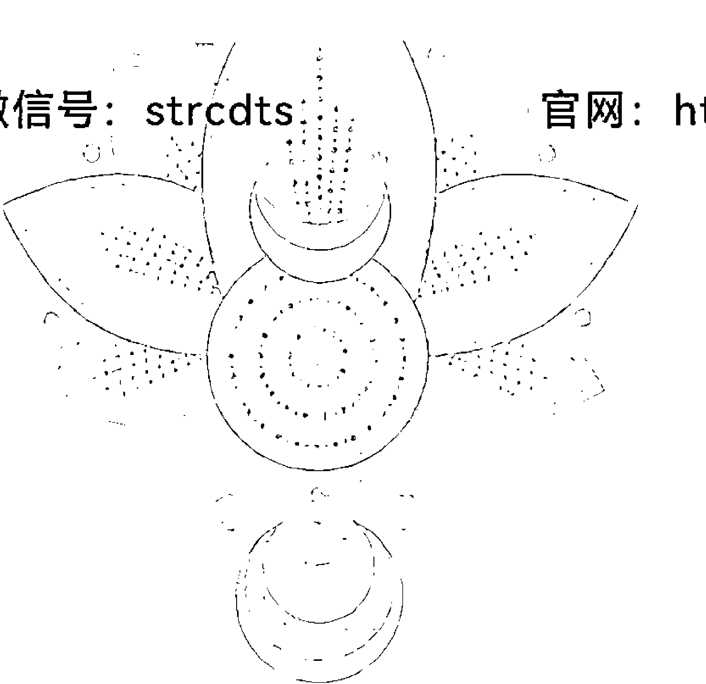

# 清净能量场的身体磨砂膏

这个身体磨砂膏并不是用来去除实质的皮屑，而是清除非实质的能量残余，这些残余是我们于日常世间互动时累积在个人能量场的废物。椰子油具有很好的疗愈及净化的特质，而喜马拉雅山盐能帮忙移除能量层面的沾黏。

这样的二重奏已经相当具有功效，如果想强化它的提振与清净功能，可以加入一种或多种你喜爱的植物精油，像是佛手柑、雪松、快乐鼠尾草、天竺葵、薰衣草、广藿香、胡椒薄荷（peppermint，请少量使用）、迷迭香、檀香及岩兰草都是不错的选择。这边要记得的是，有些植物精油会刺激皮肤，例如丁香，所以对于不熟的精油请多做一些研究。

你也可以按照自己的意思，为这个清理能量的配方附加其他功能，例如想要求财的话，加入广藿香与佛手柑；想要疗愈的话，加入薰衣草及快乐鼠尾草；想要愉快地开始每一天，就使用天竺葵。

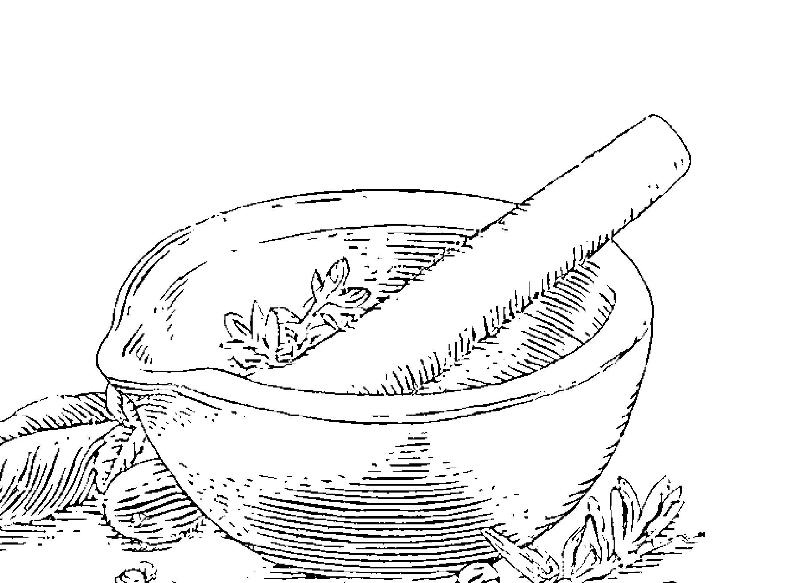

#### 使用材料

- ½ 杯椰子油
- 1 杯喜马拉雅山盐细末
- 具有螺盖的小型宽口玻璃罐或梅森罐 (mason jar)
- 研钵及研杵 (非必须)
- 10-30 滴 *植物精油

## 执行指南

- 将椰子油放进玻璃罐中。如果油凝固的话，将玻璃罐放入稍微热一点的水中 (不是沸水) 几分钟，它就会融化成液态。
- 如果有需要的话，用研钵与研杵将喜马拉雅山盐磨成细末。
- 将盐分成几次放入玻璃罐中，与椰子油仔细混匀，直到整体呈现均匀的磨砂膏状。(依据盐的颗粒大小，你也许要视情况多加一点盐或一点油。)
- 加入你所选定的精油，一边搅拌磨砂膏，一边试闻其香气。如果你有加入特定的魔法意图，请在进行过程中观想自己欲求的结果。
- 请尽量每天使用磨砂膏，为期一周，并记录自己在不需要的负向能量离开自身系统之后，感觉有变得多好喔！

* 如果椰子油的香味较为浓厚，植物精油的用量就需要更多，香气才出得来。

* 椰子油会使澡缸或浴室地板变得非常滑溜，所以使用时务请小心，并在每次使用磨砂膏之后彻底清洁澡缸或浴室。

# 「忙碌如蜂」的平衡护符

有些人真的能在忙碌到来不及思考的过程中获取奋发向上的活力，然而大多数爱好魔法的人们，因其高度敏感性与创意，对那种状态是敬谢不敏！
在面临即将到来的忙碌一整天或一整周时，如果你觉得自己对这样的生活已经感到畏惧，这项放松魔法可以帮助你在度过整段时间时更加从容舒适。你甚至会想把它设定成定期执行的仪式，就订在周日晚间开始来做呢！
如果你手边没有任何水晶或矿石，就改用大小可以放在口袋的「忘忧石」(worry stone)。

## == 使用材料 ==

- 1杯洋甘菊茶
（用蜂蜜调甜者最为理想）
- 1根白色蜡烛
- 1颗玉、粉晶、紫水晶
或其他具有镇定效果的矿石
- 薰衣草或其他具有镇定效果的燃香（非必须）

## 执行指南

- 如果有准备燃香的话，先点起来，然后冲泡洋甘菊茶。在花茶浸泡的过程中，点起蜡烛并花些时候凝视烛光。
- 轻啜几口花茶并做几个深呼吸。然后以惯用手的手掌托着矿石，另一手的手掌覆于其上，然后一边和缓摇动矿石，一边送入镇定、平安的能量。
- 念出以下文字（或类似者）：
> 此刻无尽，身处平安，
吾依节奏，平静而行。
吾将平静，携往来日，
无论去哪，平安同行。
- 将矿石在烛火上方快速掠过三次。
- 这矿石已经得到指示，会在你忙碌的时候提供协助——只要把它放在自己的口袋里，有感觉到需要的时候就握住它即可。

## 唤醒晨间动力的魔法药水

许多人在早上都会进行的一项重要仪式，就是喝一杯晨间咖啡，而以下要讲的魔法药水虽然非常简单，但它可是上述仪式的强化版本呢！不过，即使不想喝含有咖啡因的饮料，你也可以为自己准备一杯美味晨间饮品，特别是那些在口味方面能与肉桂相合的药草茶。

请把这份魔法药水当成额外的魔法提神剂来使用，亦即它是用在自己觉得提不起精神，但有很多事情等着完成的时候*。

这魔法的观想与念诵部分若能在室外进行，应是最理想的做法，不过面对窗户进行这两部分也完全没问题。

> *如果你是因生病或操劳而提不起精神，最好还是只喝无咖啡因的药草茶就好，别喝含有咖啡因的饮料。

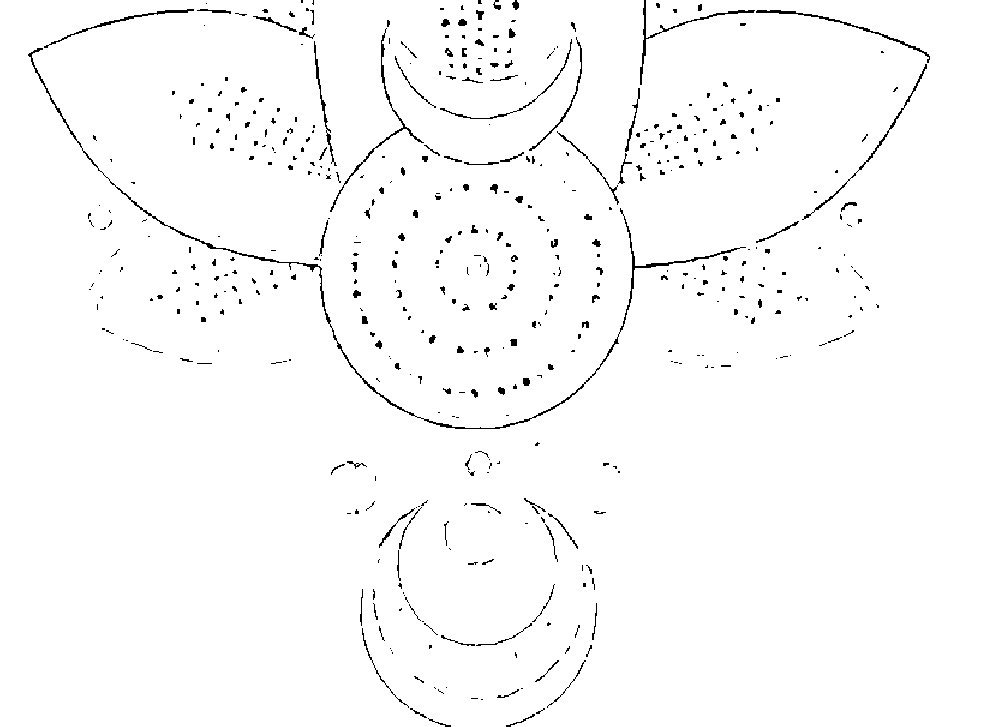

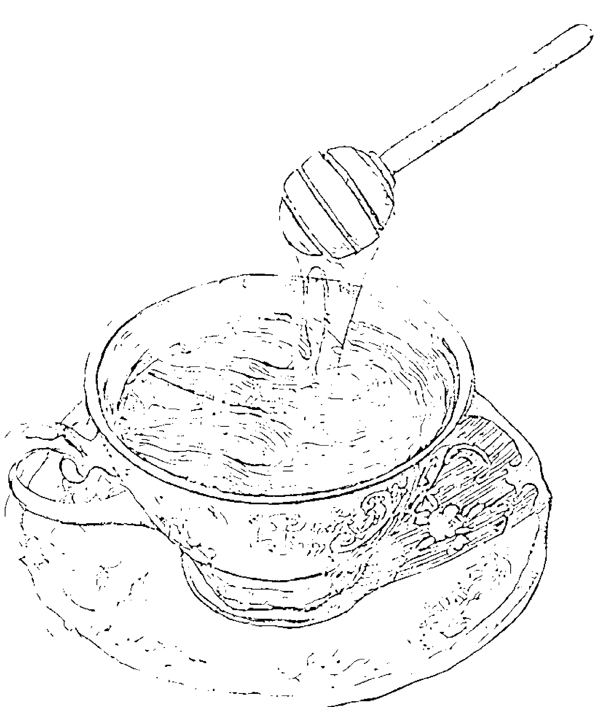

#### 使用材料

- 1 杯现煮的咖啡或药草茶
- 1 小撮肉桂粉
- 1 茶匙或更多的蜂蜜

## 执行指南

- 如果有准备蜂蜜的话，将它以顺时钟方向搅入饮料中。（如果不用蜂蜜的话，仍以顺时钟方向搅动饮料。）
- 当饮料还在杯中打旋时，将肉桂粉撒入中央。
- 将你的魔法药水拿到户外或是室内窗边，无论天候不佳到什么程度，总要感谢晨光为你示现一天的开始。
- 做个放松的呼吸并开始啜饮你的饮料。
- 观想充满活力、头脑清楚的自己在开展这一天的感受，以及达成预定目标的满足。
- 当你觉得已经准备好的时候，念出以下文字（或类似者）：
> 感激今朝，
吾以正向，应对今日。
能量提升，
吾知吾事，均将完成。
就让此愿如实具现！
- 现在动身出发！好好享受这一天！

## 功课马拉松的耐力魔法

对于功课落后的大学生来说，光是要趁期末数周赶上进度就已疲惫不堪，而这项魔法能够增进学生的自信与专注力。（即使不是学生，还是可以运用这魔法——像是用在完成某项工作任务的时候！）
如果找得到的话，新鲜花瓣最为理想，但在面临紧要关头时，干燥花瓣就可以了。

#### 使用材料

- 1根橘色或黄色蜡烛
- 1茶匙花瓣，兰花、忍冬、紫丁香或洛神花
- 1颗白水晶或紫水晶
- 柠檬或迷迭香精油

（请参考本书P120〈魔法油〉关于「混合」的段落。）

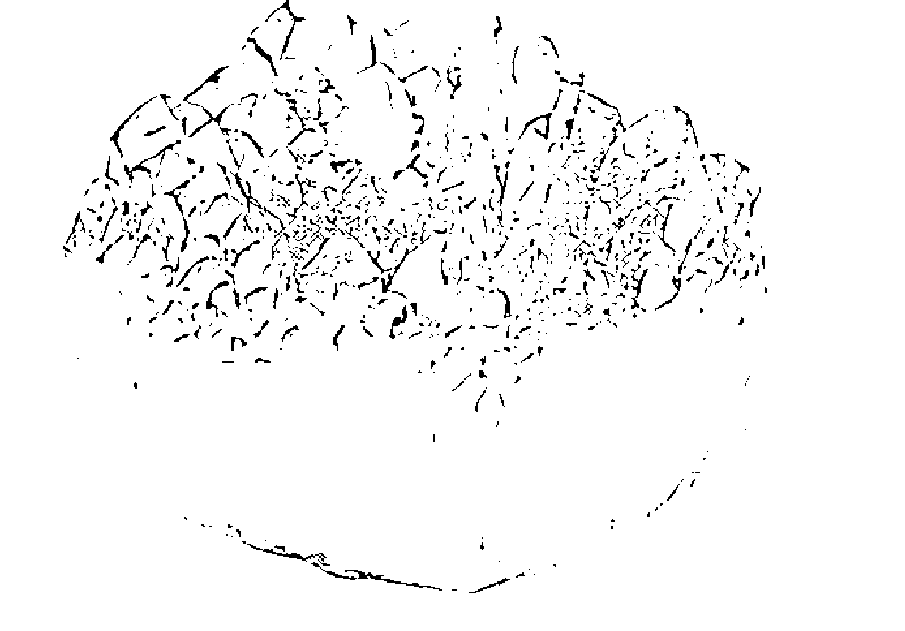

### 执行指南

- 将花瓣撒在盘子上，或是撒在个人祭坛、工作台上。用油涂抹蜡烛，然后将蜡烛滚过花瓣。
- 将蜡烛固定在烛台上，白水晶或紫水晶放在紧邻烛台的位置。
- 观想自己已完成那份正在进行的功课或任务。容许自己感受那在工作完成时必会经验到的放松与欣喜。
- 当你觉得已经准备好的时候，点起蜡烛并念诵以下文字（或类似者）：
> 吾祈上天，持续支持，
专注精力，以成吾事。
- 在进行「功课马拉松」的期间，将水晶放在你的书桌或其他工作台上。
- 每当感到气馁或无法专注时，就握住水晶一会儿。

## 惹是生非者的束缚魔法

正向、具有道德观念的魔法会相当尊重他人的自由意志，不想主动操控除了施术者以外的人之行为或境遇。

然而这并不代表术法不能用来保护你不受他人的恶意伤害，像是具有消极攻击行为的工作同僚想要暗中破坏你的好事，或是早已分手的前情人还一直在跟你歹戏拖棚。

这类状况的理想解决途径自然是以开诚布公的对话来进行，不过如果这条路行不通的话，些许的魔法干涉也能够有所帮助。

在魔法中，运用绳线与绳结的传统历久不衰。个人的意愿能量会凝聚在绳结上，然后依据术法的目的予以封印或释放。

在束缚的操作方面，绳结所「捕捉」的是某对象所发出任何跟你有关的负面能量，继而将绳线埋入大地中就能中和那能量，让你能从自己与某对象的互动时所遭遇的一切负面性当中开始恢复。*

只要能够绑出够紧的绳结，任何细线、绳索或缎带都可以用。如果绳线过于厚实或滑溜而无法维持绳结的话，魔法的效果会不如预期。

#### 使用材料

- 1 根黑色或白色大蜡烛
- 1 条绳线，长约20.3-30.5公分（即8-12英寸）

## 执行指南

- 点起蜡烛，并把绳线平摊在自己面前。
- 花些时间想象白光笼罩自己周围。别专注自己跟某对象的问题，而是专注在回归中心、平静以对的感受。*
- 当你已准备好时，在绳线左端算起四分之一处打一个结，同时念出以下文字：
> [对象的名字] 针对吾的任何负面事物，
吾均束缚之。
- 然后在绳线中央处再打一个结，并念以下文字：
> 此人与吾之间的任何未来纷争，
吾亦束缚之。
- 最后在绳线右端算起四分之一处打一个结，同时念出以下文字：
> 以吾至高之力因应至善之理，
封印此物。
- 在将这条绳线埋进大地时，想像它分解成土壤。如果你无法将它埋入大地，就用碗装满盐，将绳线埋入其中，之后将整个内容物倒入户外的垃圾桶。

* 在观想时，请勿想像此对象受到任何伤害，即使这样会让你有「伸张正义、执行报应」的感受也不可以。仅是专注在驱除他们对你的伤害能力即可，无论那伤害能力是在现实、心灵或其他层面都一样。

## 宠物保护魔法

虽然我们一般来说会比这些动物伙伴长寿许多，不过我们也能汲取魔法来保障牠们一路平安与健康到享尽天年。这项全方位的守护祝福虽然已调整成适用于猫与狗，但还是可以用在其他种类的宠物上。

#### 使用材料

- 海盐

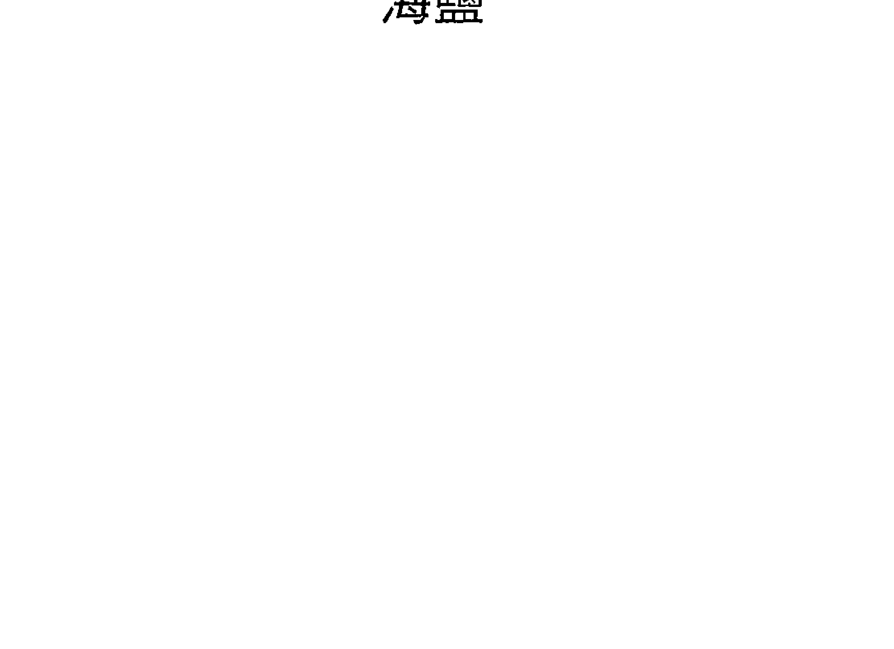

### 执行指南

- 用海盐围成一个神圣之圆，然后坐在中央，呼唤你的宠物来你这里。*
- 将你的手按在宠物的头上（如有需要，也可按在身体上），并念诵以下文字（或类似者）：
> 守护灵啊**，吾祈求您
每日每夜，照看〔宠物的名字〕。
让〔宠物的名字〕不会想要
远离安全的保障与健康的喜悦，
让我们的喜悦陪伴
成为滋养彼此的情感养分。
借此祝福，〔宠物的名字〕平安无恙，
周围将有伟大守护灵的护佑。
就让此愿如实具现吧！
- 完成之后，将海盐扫起来，并且一定要花些时间拥抱宠物以将祝福固着下来。

*你的宠物也许会对盐圈感到好奇并且想要舔它。虽然摄取大量盐分对宠物（或人）的健康有害，不过如果你用海盐做出神圣之圆的线条够纤细的话，应该不用担心这问题。善用你的常识来判断——如果盐圈会使宠物过于分心而无法待在圆里，那么换用小水晶或小卵石试试看。

**如果你有与特定神祇共事，特别是那些已知与动物魔法有所关联的神明，请自行将「守护灵」代换为这位神祇的名称或者并列其中。

## 家园守护巫瓶

巫瓶（witch bottle），又名「宝瓶」（spell bottle），是一项已有数百年之久的魔法传统，多用于驱除由特定源头而来的负面能量，例如某个令人心生恐惧的敌人。然而在传统上，它的某些材料不甚讨喜（例如头发与血液），而且也要埋在地下以运作魔法。

现代的巫瓶则有多样用途，包括爱情与财富，且其材料通常没有源自人体的东西（虽然有些护卫传统的人士还是沿用旧有配方），虽然可能还是被埋在地下，但也可以藏在家中，甚至依其目的及施术者的喜好还可放在盒中展示。

下列的防护魔法是要把巫瓶藏在家中，不过你喜欢的话也可以把它摆在看得到的地方。（这个巫瓶不一定要埋在地下，不过如果你无论怎么样都觉得很想要这样做的话，那就这样做。）

你也可以用其他方式——即选用对你而言更具意义的成分——将这魔法改成更为贴近自身需要的版本，以下会讲到这部分，只要确定各个项目（药草、水晶与尖锐金属物件）都有东西就好。

列在最后的金属物件，系藉由模仿现实层面的铁丝网栏，当成能量层面的「围栏」来用，以屏除负面或有害的能量或意图——所以请小心处理它们，如果你想戴手套来做也是没问题的！

一旦抓到要领，你只要运用符合目的的材料，就能够制作各种用途的巫瓶。请发挥创意制作自己最有灵感的巫瓶吧！

#### 使用材料

- 1个有软木塞的玻璃空瓶（酒瓶或橄榄油瓶相当适合，然而你也可以用可乐瓶或啤酒瓶配上合适的软木塞）
- 1/4 杯土壤（最好是从自家庭院挖掘的土）或海盐
- 1颗（至少）用于保护的水晶：黑曜岩、缟玛瑙（onyx）、黑色电气石或烟晶（浅褐色者又称茶晶、近黑色者又称墨晶）
- 3瓣大蒜，压碎
- 1撮玫瑰的刺或荨麻
- 3片月桂叶
- 3根（至少）铁钉、缝衣针及（或）其他尖锐的金属物件
- 1汤匙（至少）一种或多种用于保护的药草：罗勒、莳萝、茴香、杜松、迷迭香及龙蒿
- 醋（任何醋都可以，但人们常用苹果醋）
- 1根黑色蜡烛
- 干燥鼠尾草，成束或散叶均可（薰香用，非必须）

## 执行指南

- 如果有准备鼠尾草的话，在制作巫瓶之前先将你的祭坛或工作台熏过会是不错的做法，但不一定得这样做。有人会在前一晚将空瓶晒月光充入能量，然而这也不是必要的步骤。
- 当你觉得准备妥当、可以开始时，点起黑色蜡烛并念诵以下文字(或类似者)：
> 守护之灵，来与吾事，
愿汝助吾，以法卫家；
愿汝赐吾，神圣护佑。
- 然后将土壤或海盐加入瓶中，并确实覆盖整个瓶底。然后加入水晶、碎蒜，以及荨麻或玫瑰的刺。
- 此时先轻轻摇晃一下瓶子，然后加入月桂叶、尖锐的金属物件，以及剩下的药草。
- 将醋倒满整个瓶子，但要留下软木塞的空间。在用软木塞封瓶之后，一边摇晃巫瓶、一边念诵以下文字(或类似者)：
> 守护之灵，荣耀吾事，
谢汝助吾，制作此瓶。
瓶中圣力，护佑吾家。
此法已成，此事已定。
- 接着拿起蜡烛向巫瓶的软木塞滴下数滴蜡液以封住巫瓶。
- 将巫瓶藏在家中靠近大门的地方。

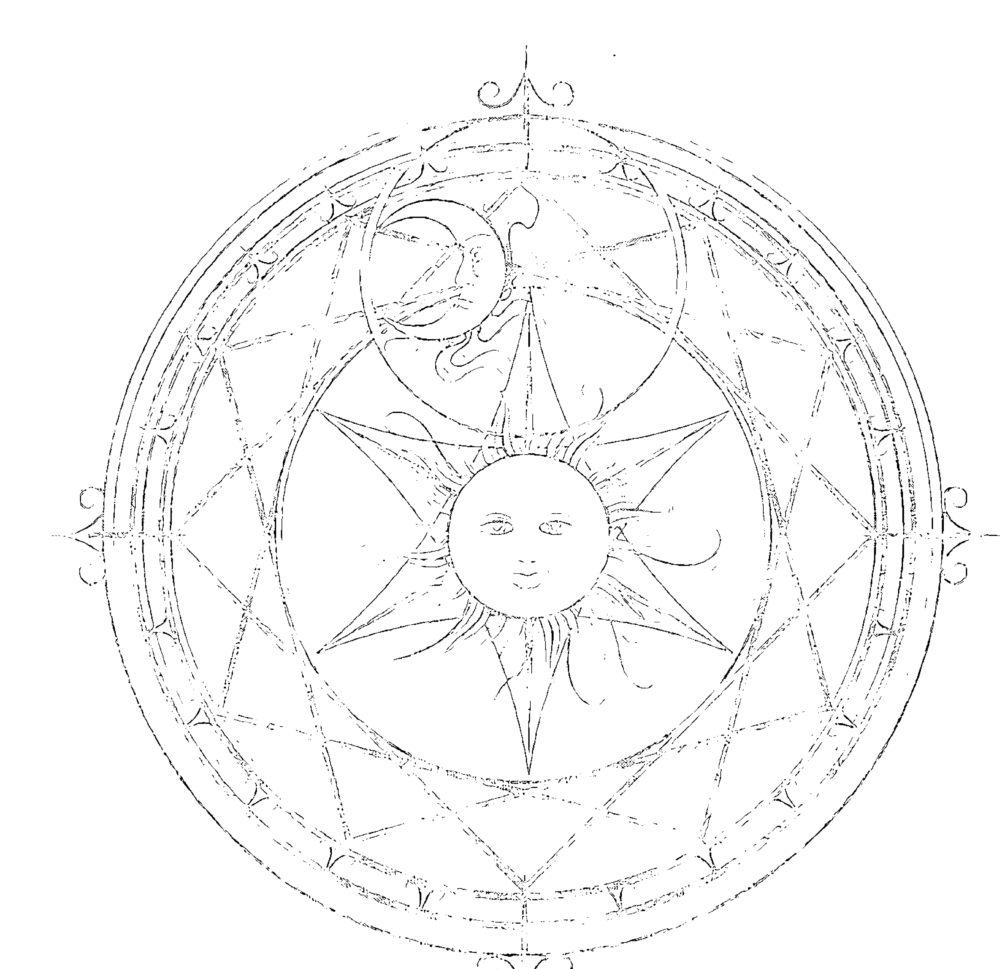

## 各式魔法及策略

## 各式魔法及策略的介绍

魔法的形式、风格与技术形形色色、多有不同，其可能性无穷无尽，有许多会在你的探索过程中逐渐认识。而本书这部分旨在简短介绍魔法的多种运用方式，包括厨房巫术（kitchen witchery）、制作自己的魔法材料，还有借重计算时机与自然韵律以顺水推舟。

放在这部分的魔法，只有少数魔法系为特定用途，其他大多为「万用」，亦即它们能用于爱情与关系、财富与兴盛，还有健康与身心安适等单一或多重目的。况且，每个人迟早都会出现非属于前述三大项的个人欲求或挂念——那么就选用这部分的一种或多种魔法来处理。

你会在这部分看到强调直接从自然取得工具的魔法、向宇宙要求资讯的新方法、创造自己的复方魔法油品，还有一套依据月亮周期来操作魔法的方式。最后，你会找到庆祝个人新年的仪式，为自己设定长达十二个月的魔法具现。

请好好享受实验这些魔法的过程，记录每次结果，还有持续探索魔法的广大世界吧！

### 好消息魔法

这是个适合初学者的优良魔法，也适合那些不想花太多精神在专注意愿、只想用少许努力换取有趣结果的人们。

这魔法的回馈方式将会让你大为惊喜，其秘诀在于你的问题要够笼统，亦即如果你当时对某事非常介意，就别要求这方面的好消息或任何特定结果，因为这样做只会把你送出去的能量变得混浊。

在完成魔法之后，就把它放下、忘记——你当然可以留意好消息啦，只不过就是信任它一定会来到你这里，不需要一直「警戒注意」。

由于此法施术时间较短，魔法蜡烛或其他燃烧时间较短的蜡烛会比较适合，还有在使用时让蜡烛自行燃尽。无论你用哪种颜色的蜡烛，尽量选择色泽最为明亮者，因为这类魔法比较讲究高频的振动。

#### 使用材料

- 1根黄色、金色、橘色或绿色蜡烛
- 佛手柑、肉桂或广藿香精油

（请参考本 P120 〈魔法油〉关于「混合」的段落。）

## 执行指南

- 用一两滴油涂抹蜡烛。
- 专注在突然听见好消息的感觉，也可以回忆过去的类似经验以帮助想像。
- 当你锁定这感觉时，重复念诵三遍以下文字（或类似者）：
> 三日之内，惊喜将來；奇妙展现，使吾欢喜。
- 点起蜡烛，并以下列话语将魔法固定下来：
> 就让此愿如实具现吧！

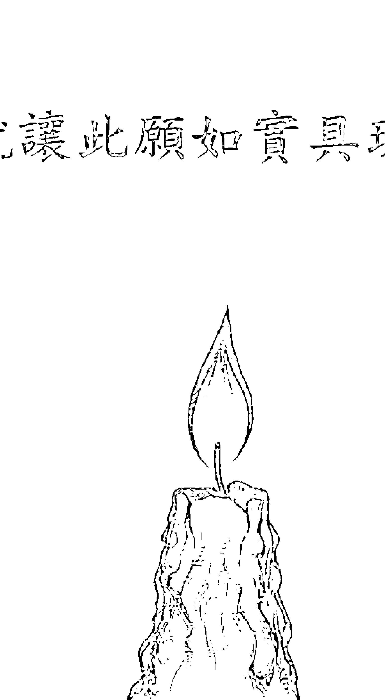

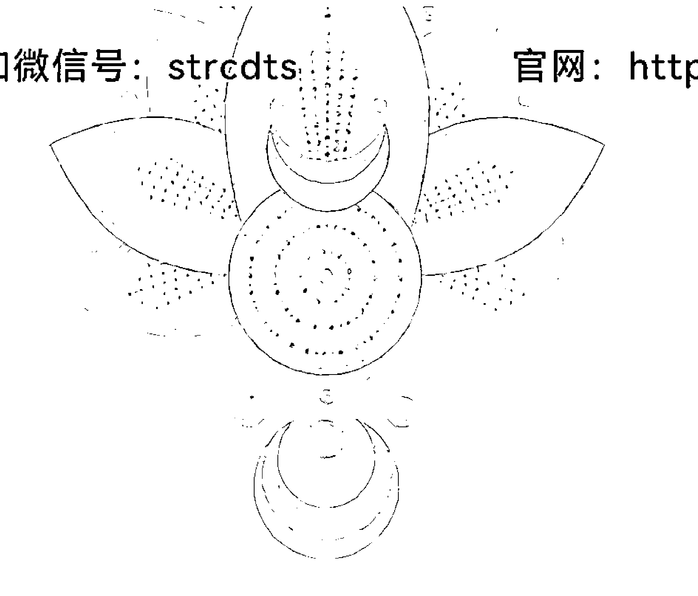

## 雨中散步净化法

雨天，对于许多人来说是应该留在家中的日子，因为外出就得躲在伞下。不过你是否知道，雨水是自然界最具魔力的材料之一呢？它在清理淤滞或负向的能量氛特别有用，特别在面对持续存在的情绪难题时更是如此。

这魔法运用雨水的疗愈振动，除了你自己、你的意图、认真的话语，还有理所当然的雨天之外，不需要其他材料。

在雨中走一小段路会是最理想的方式，不过如果无法这样做，站在户外即可。另外在身处雨中时，也可以依己意反复念诵以下执行步骤所列的语句。

你也可以将这魔法改成适用于当时自己所面对的挑战，只要把「不再需要的一切事物」代换为你的事情即可。

#### 使用材料

- 雨天！

## 执行指南

- 在开始下雨时，走到户外进行短程散步（或仅是站在户外即可）。
- 专注说出以下意愿（自拟亦可）：
雨之灵、爱之水，
为吾释放不再需要的一切事物，
使吾恢复，能够接受即将来临的祝福。
- 至于要在雨中逗留多久，由你决定，但根据一般的经验法则，至少要有五分钟。如果那是轻濛细雨，你应会希望多逗留一些时候，但如果是倾盆大雨的话，只要几分钟就应足以达到效果。
- 请勿在打雷的暴风雨之日进行此法，这是常识喔！

## 生日三愿之法

在吹熄生日蛋糕上面的烛火之前许愿，是用来荣耀光阴的生日庆祝习俗。传统上，生日所许的愿望一般应要闭口不谈，这也许是人们在潜意识了解将愿望大声说出的动作可能会阻碍愿望的具现。

这魔法应是独自进行，且无人听闻你向宇宙大声说出的愿望。这也是反思与庆祝个人过去一年以来的生命经验，之后再为将来的一年立下想要实现的意念。

从许愿之后吹动蒲公英成熟「绒球」（众多种子上面的冠毛所形成的球体）的传统上，我们可以知道蒲公英跟愿望有关。如果你的生日刚好在蒲公英的花期，不妨尝试用新鲜的绒球。如果生日不在花期的话，可以使用干燥蒲公英叶来做也一样有效。

如果没法在生日当天进行这魔法也没问题，在生日前后一周之内的任何时间进行皆可，这期间的能量都有利于此法的运作。

#### 使用材料

- 1根营造气氛的大蜡烛
- 1根「生日」魔法蜡烛
- 笔记本或书写纸张
- 羊皮纸（非必须）
- 1公分宽的缎带
- 1撮干燥蒲公英叶（或新鲜的蒲公英绒球）

### 执行指南

- 点燃大蜡烛，花些时间写下自身生命在过去十二个月的展现。
- 这里要留心的是，只专注在你会感动的事情上，像是精彩表现、成就与搞笑片刻之类的事情。在过去这一年当中，你对于自己的了解是什么呢？在灵性方面的进展如何？在魔法的习修方面又是如何呢？
- 如果去年有撑过任何难关，请荣耀自己一番，但也别执着于此，毕竟再怎么厉害也都已经过去了。
- 现在，请确认出三件想在未来一年实现的事情。如果想要的话，也可花些时间将它们详细记录下来。然后将这三个愿望分别用单字或短句来代表，并写在一小张纸片或羊皮纸上。
- 把这张纸放在自己的祭坛上，点燃「生日」魔法蜡烛。
- 将一撮蒲公英叶放在自己手上（如果准备蒲公英绒球的话，就握住茎柄），大声说出你的三个愿望，接着念出以下字词（或类似者）：
> 生日愿望，其数有三，
逐渐实现。
绕日一圈，明年此时，
愿望已成。
- 轻柔吹送蒲公英叶或绒球，使它们散落于纸上。
- 将纸卷起来，并用缎带绕着它绑紧。
- 把它放在「生日」蜡烛前面，让蜡烛自行燃尽。
- 将这份愿望纪录留在个人祭坛上，时间长短由你决定。然后将它收至某个特别的地方直到你的下一次生日。

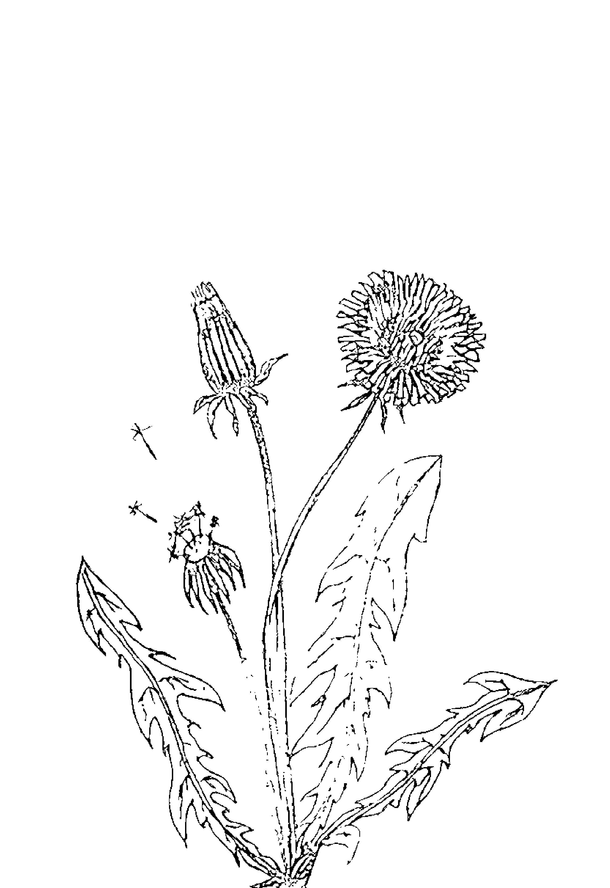

## 焚烧问题、通往清晰之道

在面对严苛困境或难以抉择时，很难不去烦恼，即使你自己知道烦恼无助于解套或解答。这魔法很适合用来打通个人的阻塞管道，使你在面对问题时让答案能进得来。

不过，若你对某状况的结果没有直接的影响力、只想知道是或不是的答案，像是自己会不会被应征的公司录用等等，这魔法并不适用，因为它的目的在于使你能够明白那些需要自己采取行动的状况。如果你没有锅子或任何耐火的盘子，可以把术中燃烧的纸张放在水槽。

#### 使用材料

- 1根黑色、金色、紫罗兰色、靛蓝色或白色蜡烛
- 1条短纸条（约7.6-12.7公分长），纸或羊皮纸均可
- 小锅子或耐火的盘子

### 执行指南

- 点起蜡烛。
- 使自己落实下来、回归中心，让问题暂时停留在自己的脑海中，无须重复思索相关细节。
- 当你对于这问题已足够清楚到能用最为简单、直接的话语表达时，把它写在纸条上。
- 一边点燃那纸条，一边说：
> 吾将问题、交托善灵，
敞怀倾听、相应答案。
- 在安全的前提之下，捏住那张纸条让它尽量烧。当手持纸条已不再安全时，将它顺手丢进小锅或水槽中。
- 之后就让自己的心思转向一些令人舒服、放松的事物，并信任答案会在适当的时机来到你这里。

### 菊苣的勝利護符

在朝向像是減重、找到新工作、戒除不健康的習慣等等個人目標努力時，可以嘗試運用菊苣根（chicory root）來幫助穿越過程中的任何阻力。

菊苣是用來消除各式各樣的障礙，傳統上會用來解除詛咒，並在沒有鑰匙時協助開鎖。根據古時候的說法，菊苣能夠賦予隱形，不過這應該不是如字面呈現的意思，而是用來描述「不受任何負面能量傷害」的效果。

將此法製成的菊苣根護符帶在身上，能夠幫助你克服目前遇到的阻礙。

菊苣根有數種常見市售形式，然而粉末並不適合用在此法術，未加工的根部切片或顆粒比較適合。

#### 使用材料

- 1 湯匙菊苣根
- 鍋或碗
- 1 小塊方布（約10公分見方）

#### 執行指南

- 在開始進行魔法之前，請務必洗手。把菊苣放在鍋或碗中，然後用你的手指攪和它們，以混進自己的個人能量。

- 一邊攪和菊苣，一邊唸出以下語句（或類似者）：

> > 毀壞之力，不見吾。
> 易得坦途，達成吾願。
> 此法來助，此事已成。

- 將布平攤，把菊苣放在布的中央。

- 將方布的四角收攏綁緊，作成小布包，確保它不會鬆開。

- 把它放在口袋或錢包，或是把它繫上細繩掛在頸上。

- 在達成目標時，感謝那些與你同在的力量。然後將整個布包埋進土裡，或是把布包打開，將菊苣散撒在土地上。

### 新開始的蛋魔法

在世界各地，蛋自古以來即具有神秘與魔法方面的重要意義，到現在仍有許多魔法傳統會用到它。蛋殼在經輾碎、磨末後，就能用在保護性質的術法，而生蛋則是療癒魔法的有力介質之一。此外，蛋也象徵生育、春天、豐盛及純粹的潛能。

在這魔法中，你將為一顆生蛋注入想在個人生命中經驗新事物的意願，然後把它埋在地下。這顆蛋是新開始的完美象徵，因為的確儲存著具現新生命的實際物質。所以這魔法就成為夫妻想要生育孩子的理想技術，然而它也適合用在開始新事業、帶來新的工作機會，或是支持自己照顧自己的努力，例如飲食或運動的規劃。

你將會汲取太陽與正東方向的能量，用來增添這術法的力量。為得最佳結果，請在月盈期間的前半段任一晚進行此法，並於第二天早上起床後馬上把蛋埋入大地。

#### 使用材料

- 1 根綠色、棕色或白色圓柱蠟燭
- 1 顆生蛋
- 橄欖油
- 1 碗土壤（或沙子、稻草或乾草），需足以把蛋蓋住的量

#### 執行指南

- 點起蠟燭，並用一兩滴橄欖油塗抹生蛋。

- 兩手掌輕柔將蛋包住，並觀想它充滿明亮、純粹的橘光，那光芒甚至透出蛋殼而圍繞自己的身體。想像未來的自己將會十分享受現在所推動之事的成果。

- 用些時間鞏固自己的觀想。然後在覺得已經準備好的時候，唸出這句話：「就讓此願如實具現吧！」

- 將蛋放在碗中，並用土壤或稻草輕柔覆於其上。

- 將整個東西留在你的祭壇上過一個晚上，然後在日出時把它埋在自宅庭園最東方的區域。

- 睡前可以先把蠟燭熄滅，然後在你想要的時間再度點燃，用來提醒自己，有個奇蹟般的新開始正在個人生命的土壤中逐漸實現。

### 酪梨美貌魔法

這魔法應是廚房巫術的理想範例，因它使用的是大自然賜與我們的上等食材——即兼具實質與魔法特性的美味酪梨喔！

酪梨自古以來因其安撫及催情的效果而得到重視，許多魔法傳統都有用它來促進愛情、美容及放鬆等效果。有些女巫偏好在生育方面的魔法使用酪梨樹的枝條，有的則是依照傳統做法，攜帶一粒酪梨果核以促進愛情與美貌。

而現在的美容產品也越來越常看到這水果，畢竟它富含健康的脂肪與礦物質，對於皮膚的舒緩與保濕非常有用。

這項美味魔法使用一顆酪梨同時作用在身體層面與無形層面，以更新、恢復你的身體，而這樣的效果會使我們在他人眼中變得更加美麗。

這當中的主要施法動作，即是用湯匙直接從未削皮的酪梨上挖食（也可以加一小撮鹽增加風味！），而乾燥花瓣圈成的魔法圈會強化該魔法的能量。

花瓣的量要足以做出讓你能在裡面坐著的魔法圈。有些人會用一些插有鮮花的花瓶來圍著自己，只要花夠多的話，這也是很好的做法。你也可以發揮創意來結合這兩種做法。

這魔法的理想操作環境應是曬得到陽光的戶外區域，如果無法這樣做，也可以在直曬陽光的房間進行。如果你是在夜間進行這魔法，請在魔法圈外點上數根蠟燭。

#### 使用材料

- 1 颗酪梨
- 海盐 (非必须)
- 5-7 根蜡烛 (夜间施法使用)
- 盘子、刀子与汤匙
- 鲜花及 (或) 花瓣

#### 執行指南

先从厨房开始。用手掌轻捧酪梨，闭上眼睛、做个深呼吸，观想有道美丽的白光从自己的皮肤底下闪耀出来。

将酪梨对半切开。将果核挖出并清洗干净，对半切开的连皮果肉则放在盘子上，并撒上盐 (如果有准备的话)。然后将整个盘子端到魔法圈预画位置的中央置放。

然后用花瓣圈出魔法圈，同时为聚集在此的自然之力献上无声的感谢，感谢它们提供如此美好的环境，使你能在这里进行魔法。

在魔法圈里面坐稳之后，开始吃你的酪梨，从容进食并享受美味。吃完之后，闭上眼睛并说出以下的话语 (或类似者)：

> 大自然啊，感谢你
> 用自己的美来滋养我的美。

至于果核，你可以按照自己的意思把它送进堆肥。不过在此之前，先用一块布将果核包妥，随身带着几天，以巩固自己对于自身美貌增进的感受。

如果你住在热带或亚热带区域，可以尝试种植那颗果核，说不定会种出一棵专属于你的酪梨树呢！

### 魔法油

如果你在魔法的探索已有一段時間，應該會遇到運用複方魔法油的魔法，像是用來驅除負面能量的驅邪油

巫術、新時代思潮的商家，還有一些網路商店，會販售一些高品質的良好油品。不過，購買少數單方精油並創造出自己的複方魔法油，除了成果會讓你覺得花這筆錢真是值得之外，未用完的單方精油還能運用在未來的療癒、淨化及其他各式各樣的個人用途上。

以下是供你嘗試製作的三種複方魔法油，所用到的單方精油都屬多用途者。滴管瓶（dropper bottle，國內另稱精華液瓶）可以在大部分健康食品店找到或上網購買（國內可在美容材料、容器的店家或網路平台買到）。如有急需，也能使用蓋子可以旋緊密封的迷你罐子。

#### 使用材料

- 1/4 杯基底油*，即甜杏仁油、橄欖油、葡萄籽油、荷荷芭油（jojoba）或紅花籽油（safflower oil）*
- 3 個小滴瓶（各複方都需要1 個）**
- 配方所列單方精油都需要1瓶

* 1/4 杯約60毫升 **容量須有20毫升

### 支持疗愈油（用于<迅速康復疗愈浸浴>，P72）

- 4滴迷迭香
- 2滴杜松
- 1滴檀香

### 財富吸引油（用于<唤錢過來>，P46）

- 3滴佛手柑
- 1滴羅勒
- 1滴廣藿香
- 1滴檀香

### 平安心靈油（用于<在艱難處境選擇平安>，P32）

- 3滴伊蘭伊蘭
- 3滴薰衣草
- 2滴洋甘菊
- 1滴佛手柑

#### 執行指南

##### 混合

植物精油具有高揮發性，而且濃度很高，絕大多數都不能直接接觸皮膚。而基底油（base oil, carrier oil）則是能讓精油進行混合的安全介質，當精油經基底油調和之後，就能安全用在塗抹蠟燭及其他魔法工具上，想要的話也可應需要塗在皮膚上。*

- ◇ 為避免問題，請務必不要略過基底油。

##### 充能

- ◇ 在創造自己的複方魔法油時，最好同時觀想自己的意願。
- ◇ 為了強化成品的能量，製作過程中播放提振人心的音樂會大有幫助。
- ◇ 在蓋上複方魔法油的瓶蓋之後，請務必以兩手掌握住瓶子，並將自己的魔法力量送入瓶內液體。

##### 使用

- ◇ 按照魔法的指示來用油，像是塗抹蠟燭及其他魔法工具，或當成香氛產品來用，所以也能當成香氛禮物來送。
- ◇ 請儲存在陰涼處所，並且盡量在一年之內把整瓶油用完。

> * 若要調出本書所提到用於塗抹蠟燭的油品，初學者可以先以這三款魔法油所呈現的比例來做，也就是 20 毫升基底油配精油總量 6 至 9 滴。至於更為進階的調油方式，請參考芳香療法書籍或教學課程。）

### 水晶氣場護欄

若要維護自身空間不受有害能量影響並提振正向氣場，水晶護欄會是滿不顯眼的簡單做法。以下所列步驟可以作在整個房間或整個家宅。

煙晶或黑色電氣石都可以用其他具有保護性質的礦石來代替，只要確保以下提到的四顆礦石都要同樣的材質即可。至於中央的石頭，其實可以用你自己感覺有共鳴的任何礦石，只不過以下所列的三種水晶礦石在提振正向能量的效果很好。請依自己的直覺來決定。

#### 使用材料

- 4塊黑色電氣石或煙晶
- 4根小型透石膏棒（selenite wand）
- 1顆中到大型的「中央石」（粉晶、紫水晶或黃水晶）
- 用於薰香的鼠尾草束

### 执行指南

- 在開始之前，將所有水晶礦石曬數小時的陽光，以進行淨化與充能，最好能曬足一整天。

- 仔細打掃自宅的所有房間，盡可能清除灰塵與雜亂的東西。

- 用鼠尾草薰過所有房間，門窗記得敞開，讓那些該出去的能量可以出得去。

- 將黑色電氣石放在自宅角落，每個角落各放一顆。

- 每個黑色電氣石前面放置透石膏棒，一端朝著黑色電氣石，另一端朝著家宅中央。

- 將中央石放在桌子上或書架上，其位置應是能夠隨時得見且盡可能靠近家宅中央的地方。

- 花些時間坐在中央石附近，並用觀想所有水晶礦石在能量層面彼此相連的方式來啟動之。

- 然後說出以下的話語（或類似者）：

> > 吾家安全、吾居清淨，
> 吾屋顯正、吾宅平安。
> 有福之地、吾真有福。

- 水晶礦石（特別是黑色電氣石）要定期淨化與充能。

- 如果家裡開始出現負面的感受，就是該為水晶護欄淨化並充能的時候。

### 朔月的意願設定

如要深化自己與月亮運行週期的關係以及強化個人力量，那麼利用一整個月亮週期來設定及執行單一意願會是很好的做法。

這個夜間儀式有兩週時間會向碗中逐次增加石頭，每次只加入一顆，象徵月盈期間逐漸且穩定盈增的月相，使你跟自己的那股正在成形的具現能量保持連結。

為使視覺效果達到最好，所有石頭在全部加入時應當剛好能夠在碗底鋪滿一層。為了讓這項魔法操作在月盈期間持續運作，你將需要一塊特別為其保留的空間，無論那是祭壇、書架，甚至餐桌中央都可以。

這項魔法適合用來支持你想在個人生活中進行的正面改變，像是開始新的日常運動訓練或是突破舊習的時候。

傳統上認為月盈時期應用於召喚事物進入自身生活，而不是褪除自身生活的某些事物，不過這裡的重點還是一樣，即你應當跟隨自己的直覺來做。

開始進行此魔法的夜晚應當挑選最靠近朔月發生的真正時間，如果無法如此，就挑朔月之後盡量靠近它的夜晚來做。

#### 使用材料

- 1 個小碗，最好是瓷製或陶製
- 至少 15 顆小石頭或小卵石，最好是圓形且大小相近者
- 1 根白色或銀色圓柱蠟燭或祈願蠟燭
- 筆記本、影之書 (book of shadows)，或其他書寫用紙

#### 執行指南

- ◇ 先将自己落实下来、回归中心，点起蜡烛，并以自己的话语向朔月致意。

- ◇ 用些时间在笔记本或影之书（即用于记录这类魔法的个人簿本）详细写下你的目标，这是为了在脑海中创造心像，即自己在达成这目标之后，个人生活会有什么样的展现。

- ◇ 你也可以按照自己的意思写下短句以宣告自己的目标，并在整个施法期间将它跟蜡烛与碗放在一起。另一种做法则是用图片来象征自己的意愿。

- ◇ 然后再花些时间凝视烛光，并观想自己从容欢喜地实现意愿。当你准备好的时候，以惯用手拿起第一颗石头并说出以下的话语（或类似者）：

> 夜得汝光、海受汝力。
> 吾亦立愿，由朔至望，与汝同长

- ◇ 将石头放进碗中。到满月之前的每个晚上，都要重新点燃蜡烛并将一颗石头放进碗中。

- ◇ 到满月时，回顾自己对于目标的进展，感谢月亮的协助，然后将碗里的石头拿出来。

### 弦月的魔法

人們大多認為朔月與望月是魔法最為有力的時候，且其理由還滿充分的呢！不過，在這兩個月相的中間之處也算是重要的時機，特別在為目前生活中的重要領域評估進展時更是如此。

此外，如果你有想要施展某些魔法的感覺，但是還沒真正決定出具體目標或時間點，那麼選在這些日子來做會比較好。

請查看曆書，找出下一個弦月，然後尋找它所坐落的那一天在魔法方面的對應，那麼你就可以開始計畫在那天晚上依合適目的進行魔法囉！

下列兩項運用弦月魔力的魔法，也可以嘗試看看喔！

### 漸盈半月之法（上弦月）

名為上弦月的漸盈半月，象徵著個人意願從種植到成熟整個過程的中間點。那些你已在努力實現的目標，無論那是什麼，此刻都應是開始使其成形的時候，即便其呈現形式僅是有助於達成自身目標的新概念也沒關係。

這項魔法運用月光石來製作「祈福石堆」（cairn）之類的事物，以導引月亮能量堆疊在當前能量層面已經成功達到的個人動量上。魔法或新時代思潮的商家通常會供應小塊的月光石，不過如果找不到月光石的話，也可在附近的海灘或溪邊撿拾幾顆觸感不錯的扁圓石頭來用。

這魔法也能結合前述〈朔月的意願設定〉的魔法（見第 124 頁），為那項已進行到一半的魔法給予額外的「推力」。

如果你沒在最近的新月設立特定的意願，也沒有關係，還是可以使用那些已經設定且目前還有興趣的意願來進行此魔法。而這魔法的要旨在於確認自己的進展，並更新自身在能量層面的願力以進行更進一步的具現。

#### 使用材料

- 數塊月光石（至少3塊）
- 1根白色或銀色蠟燭
- 筆記本、影之書或其他書寫用紙（非必須）

#### 執行指南

- 花些時間握著月光石，對準它們的能量。
- 再用些時間反思自己的目標，以及當前該目標在個人生活的相關具現程度——無論那對你而言有多渺小或微不足道都沒關係。
- 為了幫助這魔法發揮功效，此時若能對該目標進行自由書寫，會有很大的助益，特別是在難以確認自己已成功達到的進度時——甚至進度還在純概念的階段時——更是如此。
- 當你對於目標的進展抱有正向的專注力時，點燃蠟燭。開始將準備的石頭以一塊疊上一塊的方式形成石堆。如果你的石堆看起來像是一堆石頭而不是完全垂直堆疊的石塊，那也沒問題，它其實象徵著你從過去到現在已成功達到的能量。所以請自由擺弄那些石頭，做出一個令自己滿意的石堆。
- 然後請用自己的話語，為自己至此已經具現的部分獻上感謝，表達自己還要繼續成長、發展下去的意願，並承認自己需要去信任整個具現的過程。
- 如果願意的話，可以將石堆留在自己能看到的地方直到滿月。

### 漸缺半月之法（下弦月）

下弦月在傳統上是用於釋放、甚至驅逐那些已在個人生命當中的有害能量，例如某種習慣或思想、不健康的關係、癮頭，或是某種業力模式。

就技術而言，從滿月之後的第二個夜晚到朔月當晚均適合施展這類魔法，然而下弦月是個很好的中間點。

在這時間進行「釋放」或「減少」，其優點之一即是在朔月設定新意願之前，有一週的時間可以經驗「釋放」或「減少」的效果。

煙晶算是變異的水晶，跟月亮的漸缺與黑暗時期有著強烈的關聯。在這魔法中，它會跟同樣也是由月亮掌管的水一起使用，滌除那些處在你生命中的有害能量。如果你沒有煙晶，也可使用白水晶，不過煙晶的落實及保護能量值得你多花心思去蒐羅它們。

#### 使用材料

- 1 顆煙晶
- 1 個具有螺蓋的寬口玻璃罐或梅森罐
- 水
- 1 根黑色或白色蠟燭
- 筆記本、影之書或其他書寫用紙（非必須）

#### 執行指南

- ◇ 用幾分鐘反思（自由書寫會更理想）自己想要釋放、減少或驅逐的事物。
- ◇ 別把注意力聚焦在事物本身，而是用在觀想自己將那處在個人生命中的事物清理出去之後所感受到的放鬆與自由。
- ◇ 當你覺得已經準備好時，點燃蠟燭。
- ◇ 兩掌合抱煙晶，觀想有害事物的能量從你與自己的能量場被拉出來並送入煙晶中。
- ◇ 將煙晶放入裝滿水的玻璃罐，旋緊瓶蓋，然後輕緩搖動瓶子一陣子。
- ◇ 把瓶子放在曬得到月光的戶外地方或就近放在窗台上過夜。到了早上，把罐裡的水倒在大地上※。
- ◇ 如果你覺得把煙晶埋在土裡比較好，那就這樣做。除此之外，請將煙晶徹底淨化，並直曬月光數小時以補充能量。

※：水最好灑在戶外，直接倒在土壤上。如果不可行的話，也可以把水倒入排水管，不過請別把水拿來澆室內植物。

### 滿月的白水晶充能法

如果術法能夠配合月相進行的話，亦即在月盈時期進行「增長」之術、在月缺時期進行「釋放」之法，會是滿理想的狀況，不過現實生活並不一定與這節奏相應。

例如正值月缺時分，但你在個人事業成功方面的確急需助力的話，該怎麼辦呢？答案是，你可以預先準備一顆充入滿月能量的白水晶，藉此就能在任何時候使用這水晶進行魔法。

白水晶就像「行動電源」，能夠儲存你所送入的能量，並於未來依你的指引釋出能量。雖然你能用滿月之光為任何水晶礦石充能，但是身為「萬用」水晶的白水晶能夠支援你所進行的任何魔法意圖。

所以無論你在下一個滿月有沒有預定進行的術法，請拿你的白水晶出來充能，當作是在幫助未來的自己，那麼你就能在任何需要的時候用到它。

#### 使用材料

- 1顆或多顆白水晶
- 鈴器(bell)或鐘器(chime)(非必須)

#### 執行指南

- ◇ 當然，在一開始會先進行水晶的淨化，這步驟有很多方式可供選擇。絕大多數關於水晶的資訊來源所推薦的方法，即是將它們置於流動的水達十分鐘以完整淨化之，然而這方法會用掉大量的水，使得有些修習巫術的人不願使用此法，特別是居住在乾旱區域者。如果打算要把白水晶用在療癒方面，像是用於洗浴或是製作魔法藥劑，那麼最好要在流動的水待足十分鐘，因此也可以找尋對環境更為友善的方法來為自己的水晶礦石淨除舊有能量，像是埋在海鹽或土壤中一段時間，之後再迅速洗淨即可。

- ◇ 直曬月光或日光都被視為淨化與充能兼具的做法，所以依據水晶當前的能量狀況，也許你會感覺沒有另外做淨化的需要也說不定。

- ◇ 不過如果你想徹底一點，試試以下的做法：將水晶快速用水洗淨，然後用鈴聲淨化，亦即一手拿著水晶放在鈴下，另一隻手搖鈴發聲。（掛在陽台或門廊的風鈴或藏式鈴鑪也相當適合。）

- ◇ 然後鋪排水晶以接受滿月之光的充能，在戶外或在窗台上均可。（如果它們剛洗過還沒乾也不要緊，就讓它們在充能時自然風乾即可！）

◇ 如果可以的話，一邊鋪排水晶，一邊說出以下的話語（或類似者）：

> 因應吾需，取望月光，
入此水晶。
能量增長，有力明亮。
將來吾術，成功有望。

◇ 第二天早上，將水晶置於可以時常看到的特別處所。如果你沒在幾週之內使用它們，你也許會想在下一個滿月重複這個充能過程。

### 新年祝福四方之法

這項有力魔法讓你能汲取四個基本方向的影響力，在個人生命的數個領域開始具現願望。每一方向都關聯到四元素之一，因此也會關聯到該元素的特定魔法性質。

這魔法可以在一般認定的新年進行，像是陽曆的元旦，或是個人認定的新年，像是重生節（Samhain）、耶魯節（Yule）、中國春節，甚至你的個人生日也可以。無論你選擇哪一天當作一年之始，請一定要先花點時間，深入思索自己在即將到來的一年，想為你的生命帶入什麼事物。（如果你對這方面還沒有清楚的想法，不妨自由書寫一下讓思路流動。）

運用下一頁的表單，確認出自己的目標在各個方向的對應。這裡的重點在於你可以選擇多個方向，亦即你可以選擇四個不同目標，或是將魔法聚焦在具有四個不同面向的單一目標。

例如，如果你想要改善自己的工作出路，可以選擇北方以著墨財務面向，然而也可以召喚東方的能量以創造新的開始，召喚南方的勇氣與耐力來執行自己的計畫，以及（或是）召喚西方的能量以清除任何抵擋改變的無形阻力。

一旦你訂出自己在各個方向的要求，也許要把它們寫下來以方便自己在儀式過程中記住它們。（儀式之後也可以把這些紀錄保留下來，方便自己在這一年當中的幾個時間點檢驗自己的進度。）

### 四方／四元素對應表

| 方向 | 對應元素 | 具現領域 |
| --- | --- | --- |
| 北方 | 地 | 財務豐盛、 家庭的溫暖與安全、 實體財產、現實事務 |
| 東方 | 風 | 創意、改變、 新的開始、 靈感、清晰觀點 |
| 南方 | 火 | 愛、生命力、熱情、 積極進取、 將概念執行到底的勇氣 |
| 西方 | 水 | 療癒、淨化、 直覺、關懷、 心靈及靈性層面的覺察 |

#### 使用材料

- 1根白色圓柱蠟燭（可以換成任何對你來說具有重大意義的顏色）
- 用於書寫年度目標的紙與筆（非必須）

#### 執行指南

◇ 先面向北方站立，兩腳分開約十公分左右，背部挺直、抬頭挺胸，手臂自然下垂在身體兩側，然後彎起前臂、手掌向上，以代表自己已準備接受新的祝福。

◇ 說出以下的話語：

> 北方之靈，藉汝之助，
這一新年將〔目標〕帶入吾之生命。

◇ 轉向東方，並說：

> 東方之靈，藉汝之助，
這一新年將〔目標〕帶入吾之生命。

◇ 轉向南方，並說：

> 南方之靈，藉汝之助，
這一新年將〔目標〕帶入吾之生命。

◇ 轉向西方，並說：

> 西方之靈，藉汝之助，這一新年將〔目標〕帶入吾之生命。

◇ 於此，點起蠟燭。

◇ 緩緩拿起蠟燭，用兩手握住。再次面對北方，說出當自己向北方宣告的目標實現時會感受到的所有正面事物。

◇ 好好把握那種感受，同時做三次深呼吸（注意呼氣時別把燭火吹滅）。

◇ 然後再次轉向東方、南方與西方，並於各方向重複上述兩個步驟。

◇ 做完之後，將蠟燭放回祭壇，並再次依序面對四個方向，手臂上舉過頭，兩手手掌於頭上合十，手指朝上。

◇ 以此姿勢，一邊面向各個方向，一邊說出結束的話語：

> 此年將是吾所經歷過最為奇蹟的一年。吾如此有福，得見願望實現。

在完成這魔法之後，剩下的圓柱蠟燭仍可依你的意思繼續使用至完全燃盡。不過，在每次點燃與熄滅這根蠟燭時，若能說出一些感恩的話語，會是相當好的做法。等到整支蠟燭燃盡時，你會發現自己所召請的祝福有一些已經開始在實現了呢！

### 元素茶的創意魔法

無論何時需要一點創意靈感時，你都能夠享用這項美妙的魔法調製而成的魔法茶。你會在依步驟放入對應的香料時召請協同創造的四元素原始力量，使這些魔法力量滲入混合的香料。

在開始任何創意工作時，請將喝這道茶當成儀式來做，讓它引你進入新概念的流動當中。如果還想添加額外的魔法氛圍，就為你用來儲存魔法香料茶的罐子製作色彩鮮豔的標示，並裝飾它的蓋子。

你將需要用到濾茶器或是空茶包來泡這道茶，每次用量約為一茶匙到一湯匙，依你的喜好而定。以下所列的香料用量也請按照自己的意思來調整。

#### 使用材料

| 左列 | 右列 |
|------|------|
| 1 杯散裝阿薩姆紅茶 | 碗 |
| 4 茶匙茴香籽（風元素） | 具有螺蓋的小玻璃瓶 |
| 2 茶匙小豆蔻（水元素） | 可選用的額外添加物： - 1 湯匙丁香粒 - 1 茶匙多香果 - 1 茶匙黑胡椒粒 |
| 2 茶匙肉桂片（或將肉桂棒磨成粗粒）（火元素） |  |
| 1 茶匙乾薑末（地元素） |  |
| 研缽與研杵 |  |

#### 執行指南

◇ 將紅茶放到碗裡並置於一旁。

◇ 將茴香籽放入研缽，同時說出以下的話語（或類似者）：

> 憑風之靈，樂迎想法，入吾創造。

◇ 放入小豆蔻，一邊用研杵攪動，一邊說出以下的話語（或類似者）：

> 憑水之靈，創意直覺，吾順流動。

◇ 然後放進肉桂，一邊攪動，一邊說：

> 憑火之靈，吾燃熱情，著手創造。

◇ 然後放進乾薑，一邊攪動，一邊說：

> 憑地之靈，吾創新作，引入現實。

◇ 如果還有其他想要加入的香料，請於此時全部加入。

◇ 將混合過的香料緩慢攪入紅茶裡面。雙手捧著碗並說出以下的話語（或類似者）：

> 憑聖靈力，融合萬物，成就此茶，吾真有福。

◇ 將混好的茶葉放入玻璃罐中，蓋子蓋上轉緊，然後充分搖晃瓶子。之後就請好好享用吧！

# 結語

希望你在初次看完本書的時候，已經注意到幾項符合個人目的的魔法。隨著時間過去，你大概會找到更多魔法使用呢！

不過，雖然有幾個想要嘗試的魔法，但是你無法決定從哪個開始嗎？這是相當常見——而且還滿愉快——的難題呢！別讓難以選擇的感受多到使你不願進行任何魔法就好。

如果真的難以抉擇要從哪項魔法開始進行，那麼可以參考以下幾個建議：

首先，就讓時間來指引你吧，像是目前的月相。如果不確定的話，就去翻農民曆或陰曆，然後依這資訊精簡自己的選擇。用於「增長」的魔法通常在月盈期間進行比較好，用於「驅逐」、「消除」有害事物的魔法則在月缺期間最為有效。

其次，反思自己的「願望清單」，不過這裡的願望清單也可以只是一些簡要文字敘述，表達自己的生活想要出現的正面改變。接著在其中擇定一個目標，其選擇條件是你對於這目標不僅有著強烈的欲望，而且還具有自己在這意願的專注力足使魔法成功的信心。換句話說，別一開始就挑個人生命中最為困難的面向來進行魔法，除非你打從心底知道自己有力量可以改變它才能這樣做。

最後，也可以為自己的抉擇過程施展一些魔法。選出五項或是更多想要嘗試的魔法，將它們的名稱分別寫在正方形小紙片上。將這些紙片一一摺成更小的正方紙籤，放在碗中混在一起。然後請求宇宙幫忙選出最適合開始進行的魔法。接著閉上眼睛，信任自己的手指一定會挑中最完美的那個魔法吧！

無論你在選擇魔法方面的進展如何，請一定要讓自己好好享受，並將你個人的獨特能量滲入每個步驟，像是挑選施法材料、為材料充能、魔法的操作，以及觀想自己的施法成果。對於書上記載的魔法，如果你有做出任何更動或替代的話，請把這些情況寫下來，並追蹤自身願望在生活中具現的過程。

最後，祝君幸運！願汝有福！

# 致谢

我深挚感谢我的家人以及朋友，感谢他们的无尽支持与爱。感谢凯利·哈趣森（Kelli Hutchison）在這幾年來在魔法方面的陪伴。還有也要感謝當時在思索撰寫關於巫術的書時，把一顆球果掉到敵人頭上的松樹。

這次跟編輯芭芭拉·伯格（Barbara Berger）及史特林（Sterling）出版團隊的合作，仍是一如往常令人感到愉快。感謝藝術監督伊莉莎白·林蒂（Elizabeth Lindy）為本書設計美麗的封面；感謝內頁藝術監督凱文·烏涅里奇（Kevin Ullrich）及克莉絲汀·西翁（Christine Heun）；還要感謝夏瓏·雅各布斯（Sharon Jacobs）的美妙內頁設計概念、導向與編排；感謝生產編輯麥克·賽亞（Michael Cea）以及生產經理克莉絲塔一麗希·因斗（Krista-Lise Endahl）。

# 圖片出處

- ClipArt ETC: cover, i
- Depositphotos: © geraria: 33; © NadezhdaSh: cover, throughout; © nafanya1710: 67
- Getty Images: angorius: 72; KeithBishop: 32; DenPotisev: 54; Epine_art: 50, 53, 74, 75, 76; gameover2012: 60; Hulinska_Yevheniia: 82; Jobalou: 10; JonnyJim: 2; Diane Labombarbe: 7, 27; mecaleha: 13; Nastasic: cover, 30; pimpay: 4, 10, 14, 46, 56, 98; Nadezhda_Shuparskaia: 34; Nataliia Taranenko: 18; vectortatu: iv, 11, 12, 23, 25, 37, 38, 45, 79, 85, 87, 93, 94, 107
- Shutterstock: Mariijus Auruskevicius: 67, 76; Kat_Branches: 78; kuzmicheva: cover; Yevheniia Lytvynovych: 42; Morphart Creation: 64; Vera Petruk: cover; Nadezhda Shuparskaia: throughout; paulart: 44; Wondervendy: iv, 4, 9, 65, 75, 108, 119
- Wellcome Library: 90
- Wikimedia: 41, 46

# 作者簡介

麗莎·錢伯倫（LISA CHAMBERLAIN）是頗有成就的作者，在威卡（Wicca）及魔法方面的著作已有二十餘本，包括《威卡入門指南》（Wicca for Beginners）、《威卡藥草魔法》（Wicca Herbal Magic），以及《威卡的廚房》（Wiccan Kitchen）。多年來，她的威卡經驗已從傳統的習修進化到比較不拘一格的探索，並著重「促進個人掌握一己力量以支持整體至善」的正向魔法。

你可以在其個人網站 wiccaliving.com 找到更多可供參考的資訊。

威卡(Wicca)領域大師麗莎·錢伯倫從多如繁星的魔法中選取50個入門款，分成「愛與關係」、「財富與興旺」、「健康與身心安適」3大類型，作為專注生活的威卡入門者的日常實踐功課。本書含括多樣施法技術，包含蠟燭魔法、占卜及護符。

- 促進全新友誼的魔法
- 吸引浪漫情愛的魔法薰煙
- 初次約會的魔法浸浴
- 美好初次約會的信心護符
- 放下負向執著的法術
- 放手讓愛自由的柳樹之法
- 製作豐盛家庭洗地劑
- 吸引金錢的肉桂緞帶護符
- 滿月的白水晶充能法
- 斷開連結重新對焦儀式

實踐魔法的過程中，請務必要讓自己好好享受，並將個人的獨特能量滲入每個步驟，以及觀想自己的施法成果，願汝有福！

Claudia Studio-女巫的塔羅·芳療植物系女巫-Claudia ○ 塔羅公廔心創空間&晶采号Jing Tan Hao 創辦人 Ricky Otis ○ 愛情的療愈聖殿-女巫Yvette 版主 ○ YOYO心靈角落 創辦人 ○「我在人間系列」作家、靈修、瑜伽士宇色————————專文推薦
