# WICCA
## A GUIDE FOR THE SOLITARY PRACTITIONER
# 女巫術

經實證最有效、最易操作，巫師必讀的第一本魔法自修經典

史考特·坎寧安 (SCOTT CUNNINGHAM)——著

李芸玫——譯

## 推薦序1
### 魔法就是透過自然能量的投射，創造出我們想要的效果

Seer思逸

魔法／巫術／薩滿，過去曾經被人誤解或恐懼的名詞，如今隨著心靈復興的活動又重新回到了世界的潮流之中，我們可以在報章雜誌或電影電視等媒體上看見它們回到了我們的生活之中。

然而，魔法／儀式／巫術究竟是什麼？這些讓人感到迷惑敬畏，卻又十分渴望的力量究竟是如何運作的，為什能夠影響人類的心靈數千年？

對我來說，這些古老儀式是人類嘗試將心靈活動與自然現象連結起來的證據，在科學尚未發達的年代裡，各種自然現象影響著人們的生活及內心世界。人類生活在大自然之中，為了理解並連結這股偉大的力量，人們相信一切萬物都有靈性，一草一木、一動一物，甚至是山川日月都擁有自己的意識與靈性，因此萬物平等，各取和諧之道。古老的智者運用觀察與體驗，用他們自己的方式理解整個世界流動的方式、自然規律的法則，以及植物與動物的力量教導。

這些智者發現了力量流動的規則之後，便利用這些規則來改善生活，順著自然流動去創造更適合人們生活的習慣與環境。就像是各種古文明的曆法，如中國人的農曆、馬雅人的馬雅曆，還有各種古老的藥草療法或特殊的心靈療法，甚至各種降靈術或占卜等，都是人們渴望與大自然獲得連結、使用自然力量的證明，一代一代傳承下來，成為我們現在看見的方式。

魔法與儀式可說是一種透過特定方式與手法，運用心理力量與大自然連結，透過對於自己生命的重視（淨化），對使用空間的重視與保護（淨化空間與建立魔法圈），進而對各方靈性存有的尊敬（透過召喚／祈禱／獻祭等方式）。都是為了澄清自己的意願與心志，一步一步與自己內在的需求更加貼近，一步一步往自己真正想要的目標前進。透過呼喚「三部世界」的力量（上、中、下三部世界，是古老文化的世界觀。一般相信世界有三層：上部為神靈，中部為人間，下部為大地眷屬），得到精神上的支持，然後在現實世界中獲得回應，反映在真實的人生裡。

簡單來說，如果今天你想求取豐盛與金錢，並不是直接向上天開口說：我需要錢！你得先瞭解自己真正的願望和需求，潔淨自己的身體，透過洗滌的過程，讓心思逐漸沉澱。淨化自己的使用空間，排除所有會引起雜念的東西，透過呼喚四元素或建立四方的魔法圈，讓我們與整個世界都處在和諧平衡的關係中。然後，依照自己的需求進行神靈的呼喚，也都是為了再次確認自己的心意；最後進行儀式時，將自己的力量完全投射出去，等待投射出去的力量，回到我們身邊。

因此，魔法或儀式的力量並不是來自絢麗的花招或虛華的祭壇，而是來自巫師本身與大自然之間的連結，還有他能否澄清自己的心念。

因為魔法就是透過自然能量的投射，創造出我們想要的效果。除此之外，也沒有其他的訣竅了。

本文作者為荒人巫思手抄部落格格主 http://tw.myblog.yahoo.com/seer-721207/

## 推薦序2
### 唯有純淨的心靈，才能帶來最強大的魔法祝福

通靈女巫YOYO

這是一本真正在教什麼是魔法的書籍，書中詳細解釋了許多魔法元素與儀式，甚至可以說，他將巫師一天的生活都放進去了。有些人或者會訕笑怎麼會有人相信魔法，有些人則是非常好奇我們的生活是否這麼的哈利波特？其實威卡在美國是一股強大的信仰勢力，僅次於基督教、猶太教、伊斯蘭教和印度教，事實上威卡在美國是第五大宗教派系。過去許多人將威卡與撒旦崇拜等混淆，其實這完全是錯誤的，威卡就是崇拜大自然的力量，他們相信大地的能量、花草與水晶，以及無處不在的神靈之愛。

威卡與女巫信仰比較不同的地方，就是在女巫依然遵循最古老的方式來進行儀式，而威卡則較能融貫古老的魔法系統，再生成現代生活方便使用的儀式。在這本書中，也提及了女巫的八大節日慶典活動和許多儀式的來源，讓大家能更輕易的理解神秘的魔法世界。我前幾年在愛爾蘭修習薩滿課程時，也有同學信仰威卡，根據他的說法，威卡與薩滿很多地方都是相通的，他們都非常熱愛大地之母，也都祈求各方神靈給予儀式力量。

神秘學其實也是一套嚴謹的學問，只是我們運用五芒星的五大元素表示：風、水、火、土元素和最重要的靈元素來解釋萬物的能量，然而靈元素就是指我們的心靈能量，也是最重要的一環，唯有純淨的心靈才能帶來最強大的魔法祝福。書中也有提到許多如何運用魔法藥草的祝福儀式，都是我非常喜歡的。其實身為讀者的你也不要想太多，可直接照著書上寫的試試看，然後看看你的靈魂喜不喜歡，你的心情有沒有覺得更平靜吧！

當然，書中也有提到人們是如何在毒害地球。只要是信奉大地之母的信仰，都會提及環保與幸福。我自己有小孩，有時會想到我們留了一個多麼瘋狂、汙濁的世界給下一代，我真的非常感傷。希望大家看完本書後，能感受到這份對大地的愛，能多做一些資源回收，少用一些塑膠袋，多愛一點地球！

魔法力量的來源往往都來自於愛，如果你真正能感受到大地的能量及各個靈元素的呼喚，你的內心一定會更充滿溫暖，也會更尊重這個世界，你的愛將源源不絕。

歡迎你們一起加入我們的魔法旅程，感受魔法力量就在你的身邊。

## 推薦序3
### 將大自然的魔法帶回日常生活

Michelle

威卡根源於歐洲在基督教之前的原始信念系統，是一種與大自然以及所有神聖和諧共處的生活態度。威卡的核心是與大自然快樂的同在，一切神聖；不論是海洋、沙灘、森林或花園裡的小花小草，都是神聖力量的顯化。不過因神祕以及遭受迫害，威卡的歷史眾說紛紜，但姑且是古老宗教也好，新興信仰也罷，威卡看待大自然的尊敬態度、對大自然背後之神聖力量的崇奉，卻是現代的你我所需要的。現代人與大自然的疏離已在地球造成傷害，我們迫切需要重新審思我們與大自然的關係，以及我們在地球的角色，而威卡是將大自然的魔法帶回我們日常生活的道途之一。

魔法是威卡重要的一部分，但也是最常被誤解的部分。我非常喜歡作者對魔法的解釋：魔法是為了改善我們的生活與回饋地球能量，而與宇宙力量一起和諧工作的過程。魔法是以正面、負責、自然和諧的態度與行動來創造需要的改變。威卡人絕對不做破壞性或操縱性的魔法，因為威卡的倫理是不傷害——任何都不傷害，包括對自己。所以，任何人都可以進行魔法儀式，只要你擁有至善意願、帶著愛，大自然的力量會祝福你的。

本書是威卡的必讀經典。除了參考威卡的理論，書上的練習與儀式皆可自行運作。 靈性的道途有關於與宇宙大自然的神聖連結及自我體驗。有時需要的只是為自己點上一根蠟燭，插一束花，其他的，都在你的心中。

所以，打開這本書吧！大自然的魔法力量正等著你來探索。

本文作者為核心薩滿工作者
Blue Electric Eagle部落格格主
http://blueelectriceagle.wordpress.com/

## 推薦序4
### 以薩滿精神來體驗巫術的神聖

宋驊明

我這幾年從極度物質、理性的職場生涯，轉換至相信能量、意識的內在之旅，在進行這樣的探索時，本書作者多年前便開始分享的概念，也是我一直遵循並因此收穫甚多的指引：「巫術就是薩滿，是一種源於歡樂和自由意識的信仰，信任自己與萬事萬物的連結，在尊重萬事萬物一切存有，以及不傷害自己與他人的原則下，我們都有權創造自己的命運。」

關於薩滿與巫術的意涵，沒有所謂的標準答案，就我個人的觀點：「薩滿」是對宇宙天地萬物懷抱著敬意的人；「巫術」則是人對於自然能量產生連結的意識。

薩滿不是專指印第安族群祭司，也絕非僅存於南美叢林或北美草原的神秘職業，薩滿是人類社會最古老的信仰，他們相信萬事萬物皆有其靈魂及能量，正是這些不可見的力量影響著可見的世界。在世界各地的古老文明與原始部落中，處處可見具備薩滿精神的信仰形式。

巫術是源於對大自然力量的敬畏，當人的意識提升後，便能藉由儀式轉化精神的能量與自然共振，而這就是巫術。「巫」這個字在中文的意涵便是「與天地鬼神溝通的媒介者」，「巫」是中國知識份子的原型，是「敬天地、禮神明、愛萬物」精神文化的創造者，天文、地理、曆法、算數、音律、醫藥……都與「巫」的儀式有關。

任何文字、名詞帶給我們的感受，都是來自錯綜複雜的信念系統，沒有對或錯、好或壞，一切都只是我們各自設定體驗世界的觀點與角度，我選擇用「天地與我並生，萬物和我為一，神性於我之內」的薩滿精神來體驗巫術的神聖，你呢？

本文作者為前Yahoo!資深經營策略經理
心語身心靈推廣諮詢中心合夥人

## 推薦序5
### 魔法給你多一種「可能」

藥草女巫喬夏

在魔法師的世界裡，最常被提到的字，就是「需要」。你需要什麼，就可以施行什麼樣的魔法。但是，所有魔法的目的，都不可以違反別人甚至自己的自由意志。否則，你會付出等同的代價或以更甚的程度反饋在自己身上。這是施行魔法的禁忌，也是分辨白魔法和黑魔法的關鍵界線。基於這個原則，其實很多藥草咒語，並沒有一般人想像的效果。（如果你想要的效果，是如一般電影裡或傳說那樣神奇……）

那麼，既然魔法如此沒有效，它的用途到底在哪裡？

魔法是將（出自於）自己想要的能量，透過咒語強化的過程。魔法的咒語是強化自身能量的一個工具，它提供你多一點的機會跟多一些的選擇。

是的，就是多一點的機會而已。

比如說：戀愛咒語不能使某人愛上你，但可以讓你更容易用開朗的心情去挑戰新環境、吸引別人注意到你、認識更多新朋友，並在新的社交圈中找到新戀情。

金錢咒語不能讓你中樂透，或讓你的負債就此消失，卻更可能會以「禮物」的形式出現在你的生命中，比如說預期之外的加薪（當然要在你同時很努力的情況下）。金錢咒語會加強你努力的動力——更好的工作、讓欠錢不還的朋友突然良心發現還你錢等。治療魔法不能真正治癒你已經存在的疾病，卻可以預防身體不適，強化你身體本來就有的抵抗力，進而達成預防勝於治療的目的……

比起直接達成願望，我倒覺得上述這些作用會比直接給你錢或讓某人愛上你，更具有鼓勵人生的意義，也才是真正解決問題的方式。就好比給錢但最後因為沒有事業將錢花光，或讓某人愛上你卻沒有時間累積的基礎跟記憶，最後還是不知道什麼是愛。

魔法世界相信宇宙能量，西方人也相信自我意識的無限可能。因此，魔法提供了強化自身能量與接收相近能量的方法，讓你憑這個力量，可以做出更好的選擇或得到多一點機會。

你相信魔法嗎？我相信！魔法給你多一種「可能」，而這樣的「可能」，是需要你去面對並積極爭取。如果只是等待「奇蹟」出現，你就不是真正了解與相信魔法的力量，那麼，也就不會有任何「效果」或改變發生的。

本文作者為女巫藥草園（The Witches Herb Garden）品牌總監

## 魔法使用分享

- 開始接觸威卡，是因為個人長期受到靈體騷擾。最初只是單純想學一種方法解決這個困擾，於是參加了威卡相關的課程。現在回顧起來，威卡為我帶來的改變，真是遠超乎我想像。
我後來學會在家中建立自己的神聖空間，靈擾的問題明顯減輕，而且可以感受到四方的力量支持我，幫助我對抗外來的傷害。與父神和母神的連結，更幫助我在許多人生關卡上獲得指引，尋回屬於自己的道路。
威卡帶來的契機，同時也開啟了我的尋根之旅。在威卡中認識的所有前輩、老師、朋友，都是在黑暗中引領我前進的引路者，父神和母神如同夜空中的北極星，永遠在遠處為我指出方向。我隨著步伐前進，漸漸明白「巫」與我的血緣、我的祖先有何關係。最後終於明白，一直困擾我的靈擾問題的源頭究竟是什麼。
威卡對我而言，不僅是可應用的技術與工具，更純粹是一顆信仰的心、人生的指引與找回靈魂之路的感動。
> ——渡鴉，巫術實踐者

- 第一次參加威卡儀式時，很意外原來儀式也可與花草、大自然結合在一起。之後陸續又參加了八大太陽儀式後，發現所謂巫師的儀式，並不像電影或小說裡描述的那樣神秘與恐怖。
三年前，我自己也開始做儀式。凡事真的起頭難，第一次做儀式時，儘管手上有資料與多次儀式的記憶，但還是凸槌連連，連最基本的召喚女神、男神的手勢都做錯，而且是結束後才發現的，當時真糗；但也因為開始自己做儀式，越做越多次，越走越深入，才漸漸感受到，參加儀式與自己做儀式之間，的確有一條很大的分界線，那差別也只有自己親身體會才能感受。
現在儀式對我來說，已經是生活的一部分，是在月亮（女神）、太陽（男神）與地球（四方力量和大地之母）交織出的四季節氣中，與祂們連結，並一起呼吸生活的過程。在過程中，無論是許願、設定個人的方向與目標或捨棄我們不需要的，當這些累積到達一個程度後，才會發現，自己必須隨時調整儀式的方向，捨棄不需要的。目前我做太陽儀式也進入了第三年；每次做儀式，都會讓我覺得更踏實，更深深扎根在這塊土地與自己的生命中。
> ——Pluto，愛巫吉屋員工

- 我是在兩年前接觸到巫術儀式以及魔法的。每一次的儀式，都帶給我很多的感動和祝福。在儀式中與女神連結，感恩我們所給予的一切，祝福我們自己、家人和朋友，祝福大地之母還有一切生靈。在這感恩和祝福中，我們把意念和祝福放進魔法裡。
我每天都會使用財富和愛情魔法精油，是它幫助我有勇氣面對挑戰，並帶來好的機會和人緣。我非常感謝女神給我勇氣，幫助我放下了恐懼，轉變我的事業、迎接新生活，還帶來很多貴人的幫助！
——Yvonne Mu，貿易商

- 神祕的魔法，早已融入一般人的日常生活中。自古以來，誰不愛金錢、不愛美麗、不愛魅力十足、不想尋覓真命天子，誰不害怕邪惡、不想舒服安眠？調製魔法精油，可以為人們帶來許多協助，也是聯絡朋友感情最好的方式，大家結合自己豐富的想像力、專注力，一起將能量發揮到極致。
今年我參加了財富魔法的課程，顧名思義是讓花出去的錢能夠再回來。對於收入固定的人，實在想不出可以從哪裡得到更多的收入；經濟不景氣，就算再怎麼分紅，一個助理也只能分到幾千塊的績效獎金。而我今年七月意外的在台北區達到業績，分到的獎金破萬，也是歷年來最多一次。
> 我認為，魔法是一種學習、傳承和儀式。遵循宇宙的法則，我們都是生活中的祭司，也是生活中的巫師。「巫」這個字的意義，是透過中間一直線，連結上天與下地、左陰與右陽，這是天、地、人共同成就的。
——謝美玉

- 雖然從小在基督教家庭長大，但除了唯一的神之外，我相信大自然中還有其他靈性的存在，像是森林裡的小精靈或是花朵中的花仙子。加上我的嗜好與事業都建構在天然礦石、寶石之上，我從來沒有懷疑過大自然的神奇，以及天然水晶礦石的力量。
過去幾年間，我參加了許多威卡魔法的儀式，在聖燭節和夥伴聚在一起刻許願蠟燭，在收穫節一起分享堅果麵包，在復活節小心翼翼的製作藥草蛋，在夏至製作自己的隨身守護藥草袋，在巫師新年一起擺脫黑暗跨過火盆。每一次的節慶中，我們一方面學習古代巫師的生活方式，隨著季節更迭，製作合適的魔法用品（蠟燭和藥草），吃著當季被祝福的食物（水果或麵包），一方面也練習透過咒語以及儀式，向宇宙傳達內心幽微而真切的渴望與心願，然後靜靜等待魔法和奇蹟在我身邊彰顯。
很多人也許想知道：魔法有效嗎？我可以肯定的說：是的，這些生活中可以自行操作的魔法小儀式是有效的！儀式般的慶典活動，能讓我放下焦慮，專注在自己可以努力的願望上，並學習分享美好的祝福。感恩無形的眾神，我的生活與工作忙碌卻悠然自得，更值得一提的是：我的豐盛遠超乎期待。
——陳烏鴉，美石夢想曲創意總監

- 走入巫術的世界，依循月亮的節奏與四季的節慶生活；走出紛擾的城市，奔向大自然，在森林漫步中享受大地之母的滋養，是我這些年來的生活步調。在新月時點蠟燭靜心許願，在滿月的月光下調整願望與生活目標，在生活中清晰的創造未來願景，有意識的享受生命的美好與體會傷痛，這是進入巫術世界最大的禮物。
在威卡魔法的世界中，最重要的憑據是意念，遵循著古老的智慧，用心與生命中所有的人事物做連結，讓生命時時刻刻都處在平衡與和諧中，用自己的言行舉止去榮耀女神，是我對威卡魔法的認知。美好的體驗與大家分享，也希望大家重拾美好的古老智慧，共創美好的生活。
——夏月之水，工藝巫師

- 每次看到「魔法」二字，我都忍不住會有種「用這個詞彙來描述Magic真是太單薄了」的感覺。對我來說，Magic不是電影裡那種揮杖一比，就會出現的神奇魔法，反倒是施作者需要以科學家的實驗精神，去觀察、假設、操作和驗證Magic，整個過程沒有捷徑，唯有重複不斷的練習。
練習或許不會創造神蹟，但持續操作巫術所投入的專注和相信，確實會作用在身心靈的不同層面，為自己及生活帶來轉變的可能，一如我很喜歡的這句話：「享受小小的事物，有一天當你回頭看，你會發現它們是偉大的事物。」
> ——Viner，巫術實踐者

推薦序1 —— 003
魔法就是透過自然能量的投射，創造出我們想要的效果 / Seer思逸

推薦序2 —— 006
唯有純淨的心靈，才能帶來最強大的魔法祝福 / YOYO

推薦序3 —— 008
將大自然的魔法帶回日常生活 / Michelle

推薦序4 —— 010
以薩滿精神來體驗巫術的神聖 / 宋驊明

推薦序5 —— 012
魔法給你多一種「可能」 / 喬夏

魔法使用分享 —— 014

前言 給獨自修行者的威卡魔法書 —— 024

引言 —— 027

## 第一部：認識威卡

### 第一章 威卡與薩滿 —— 030
世間第一個宗教／一種擁抱魔法的信仰／與自然愉悅的融合

### 第二章 開始與母神和父神連結 —— 036
神的原型體現了自然的雙性／母神／父神／協助人們清理心靈，生出自助的力量／開始設立祭壇／神既是光明的，也是黑暗的

### 第三章 擁抱魔法的信仰 —— 050
魔法的定義／魔法是宗教性的自然行為／魔法從決定施行之時，就開始生效／全神貫注在你的魔法需求上

### 第四章 魔法工具 —— 058
威卡儀式工具介紹／淨化工具

### 第五章 運用音樂、舞蹈和手勢 —— 070
最有效的三種非物質儀式工具

### 第六章 儀式和準備 —— 079
關於儀式／儀式前的準備／獨修的威卡巫師數量驚人

### 第七章 魔法圈和祭壇 —— 089
戶外與室內的魔法圈／魔法圈的結構／關於祭壇／精心布置你的祭壇

### 第八章 有力量的日子 —— 097
八個有力量的日子／四個巫魔會／食物與神密切結合

### 第九章 重生的輪迴 —— 105
我們為自己的人生負責／業力是導引靈魂進化的工具，而非懲罰／死亡其實是重生之門

### 第十章 有關入門 —— 111
第一位威卡信徒是如何入門的？／每個人都可以接觸威卡，入門儀式並非必要／入門隨時隨地都可能發生## 第二部：练习施行威卡魔法

## 第十一章 练习和魔法技巧
镜子之书：成为自己的导师／呼吸：训练肉身进入意识转换状态／静心：完全放松的艺术／观想：最强大的魔法工具／能量运作

## 第十二章 献身
献身前的准备

## 第十三章 自己动手设计仪式
威卡仪式的九个组成元素／净化自己／净化空间／创造神圣空间／召唤／仪式礼仪／集结能量／将力量落实在大地／感谢母神和父神／解除魔法圈

## 巨石阵影子之书

引言

## 第一章 给智者的几句话
我们道路的本质／太古洪荒之前／母神之歌／召唤父神／石头圈／切出一个入口／解除圆圈／石头圈的观想／唱诵〈祝福之歌〉／简单的盛宴／圣化工具／月圆仪式

## 第二章 季节性的节日
冬至／圣烛节／春分／五朔节／夏至／收获节／秋分／巫师新年

### 第三章 仪式手势
- 力量的法则
- 召唤四元素
- 祷告、唱诵和召唤
- 召唤母神
- 召唤牧神
- 召唤艾西丝
- 兽角神的祷词
- 献给月神黛安娜的新月颂词
- 召唤父神
- 召唤母神
- 召唤父神
- 母神颂词
- 给父神的夜晚颂词
- 给母神的夜晚颂词
- 母神颂词
- 灵数学
- 巫师的十三个目标

### 第四章 魔法配方
- 食谱
- 薰香配方
- 精油配方

### 第五章 药草魔法书
- 撷取鲜花、药草和植物
- 魔法圈
- 烽火
- 家中魔法圈
- 做仪式的人
- 工具
- 巫魔会的药草
- 满月仪式的药草和植物
- 供品
- 给母神的神圣药草
- 给父神的神圣药草

### 第六章 威卡水晶魔法
- 准备画魔法圈
- 石头祭坛
- 母神的石头
- 父神的石头
- 圆锥形石堆
- 水晶和蜡烛咒语

### 第七章 象征和符号

### 第八章 卢恩文魔法
- 卢恩文介绍
- 卢恩文咒语

### 第九章 咒语和魔法
- 祈求保护的颂词
- 镜子咒语护家令
- 破除咒语力量的咒语
- 线绳魔法
- 保护某个东西

### 附录 威卡魔法用语

### 前言

## 给独自修行者的威卡魔法书

本书是我十六年来身体力行和研究的成果，也是概述威卡基本学说和实践的指南。写这本书时，我心里想的是独自修行的学生或巫师，因此本书的描述并不包括巫师集会（coven）仪式或魔法群体。本书所描述的威卡是「新的」，而非揭露数千年来代代相传的古代仪式。不过，这并无损于威卡的效用，因为它的确是奠基於时光熏陶的实作。

流传三千年的马纳咒语（译注：Manna，犹太教圣食），并不一定比私人仪式中信手拈来的咒语更有威力或有效。咒语成功与否，端视施行仪式和念咒语者的道行。

如果几百年的老咒语对你来说就像是毫无意义的胡说八道，那么这项仪式很可能就不会成功，就像是日本神道教仪式落到了美以美教派信徒手上。如果想要有成效，仪式就必须对你有吸引力。

对某些人来说，仪式是威卡的核心，对其他人来说却是威卡哲学和威卡生活方式的讨喜附属品。仪式在威卡中，就像在所有宗教中那样，都是跟神性接触的方式。有效的仪式可以将敬拜者跟神祇结合在一起，无效的仪式则会扼杀灵性。

当然，这本书里面有仪式，但只是指引，不是神圣的文件。我收录这些仪式的目的，不过是要给人们当作一般的指导方针，据此创造出自己的仪式。

有些人也许会说：「这是你的玩意儿，我们想要的是真正的威卡！告诉我们其中的秘密！」

事实上，这世界上并没有，也永远不会有一个纯正、真正或名副其实的威卡形式。威卡没有中央政府这类机构，没有实体的领袖，没有大众公认的先知或信使。尽管特定结构的威卡形式确实存在，对于仪式、符号和学说却并未达成一致。基於这种健康的个人主义，没有一种仪式或哲学系统能够吞并或摧毁其他仪式或哲学系统。

威卡是多元的和多样化的。就像所有宗教一样，威卡的精神性经验是个人与神祇独享的。本书根据我的经验和我接收到的指示而来，只是奉行威卡的方式之一。

尽管我写了这本书，但它并不是无中生有的。打磨祖母绿原石的珠宝商并不是创造珠宝的人，陶艺家也不是陶土。我只是试图全面呈现威卡的重要主题和仪式结构，并无意创造新的形式，我的用意仅在於呈现出一个基本形式，好让其他人发展出自己的威卡实践。

我刚开始学习威卡的时候，威卡的书根本没几本，更没有出版成册的「影子之书」。在许多威卡传统中，威卡仪式和魔法内容是秘密，直到最近才有一些系统出版。正因如此，鲜有威卡巫师著书描述威卡仪式和内在教义，那些不是威卡（或所谓的威卡魔法）门道中人写的书，只不过是断章取义或拼凑罢了。

我的威卡入门书出版后，不出几年，更多正统、资讯丰富的威卡书籍出版了。我一面自修、一面接受我遇见的导师的指导。在威卡路上持续学习深造之际，我发现若只依赖书籍来学习和奉行威卡，只会得到不完整的失衡资讯。

大多数的威卡书籍作者强行推销自己的威卡形式。这么做无可厚非：把你知道的写出来。不幸的是，许多重要的威卡作者有相同的观点，因此市面大多数威卡书籍都是重复的。

同样的，这样的书多半倾向描述巫师集会式的威卡，但这会让找不到四、五个志同道合者组成巫师集会的人无所适从，对於想私下从事信仰实践的人来说，也是一个负担。

除了应众人要求，也许我写这本书的真正原因，是纯粹基於个人理由。我不只希望在一般固定架构的威卡书之外呈现另类的途径，也希望回馈一下我在这个当代信仰中受过的训练。

尽管我偶尔会教授威卡，也总是会吸引一大票学生，但是我偏好用文字来指出我学过的东西。虽然一对一对学最理想，但不是每个人都有这样的机会。

因此，几年前我顺手写下笔记和章节，最后集结成本书。为了避免太狭隘（英国最有名的女巫西碧儿·里克〔Sybil Leek〕说过，写自己的信仰最危险，因为你离它太近了），我请我的威卡朋友看过初稿，他们的评语证实了我所呈现的威卡不致太过狭隘和武断。

请不要误解，尽管本书的目的是更广泛的了解和欣赏威卡，我并不是要你改变信仰。就像大部分的威卡巫师，我并不是要改变你精神上和宗教上的信仰；那不关我的事。

无论如何，基於对非传统宗教的持续关注、关心环境被破坏，以及对威卡的广泛兴趣，我希望本书可以部分回答我最常被问到的一个问题：「什么是威卡？」

### 引言

威卡，是一种巫师的信仰，一直笼罩在神秘的阴影之中。想学这种「技艺」的人，只能从书籍和报章杂志中寻找蛛丝马迹。巫师们大都不愿透露太多口风，也不愿招收新的成员。

目前，越来越多人对传统的宗教结构心生不满，许多人寻找个人可以参与的信仰，一个既可以赞颂肉身宝体、也可以赞颂精神宝体的信仰，在这种信仰之中，需要经由调频和施行魔法来上达神祇。

威卡就是这样一种信仰，主要在向被尊为母神（Goddess）或父神（God）的大自然致敬。威卡古老、接受魔法和神秘本质的根源，使它深具吸引力。然而，威卡的公开资讯匮乏、明显遭到漠视，令有心向学的学生不久前还感到非常沮丧。

威卡并不招收新会员，俨然是阻挡更多人学习威卡仪式和魔法的绊脚石。威卡并不像多数的西方宗教，会请求别人入会，因为它并未宣称自己是上达神祇的唯一方式。

由于想要奉行威卡的人越来越多，在宝瓶座时代来临之际，也许威卡该受到大大的弘扬了。这样做并不是要吹捧威卡是我们星球的唯一救赎，而仅仅是把它提供给想要学习的人。

而今重重阻碍还是横亘在这条道路前方。以往要进入威卡，只能：（一）跟已经入门的巫师接触，通常是巫师集会的一员；（二）接受入门仪式。如果你不认识任何巫师，那你就惨了，因为这是入门的绝对要件。

而今，时代变了，人们成熟了——也许成熟得太快了。我们的科技凌驾於利用科技的智慧之上。世界上充斥着大量的不安，战争的阴影笼罩在六十多亿在世的人口之中。

威卡这种信仰也开始有了变化，若不想像早年一样被当作古董，就一定要改变。若想对后世子孙有所贡献，威卡的后辈信徒就必须将他们的信仰牢牢指向未来。

由於我们来到了稍微出现一点差池就可能导致地球毁灭的关键点，身为尊崇自然的威卡信徒，我们从来没有像现在一样，可以对人类有那么多的贡献。

本书突破了许多威卡的传统，书写结构也让每个人都能学会威卡。本书是为独自修行的巫术学习者而写的，不须他人领你入门，因为想要在附近（特别是郊区）找到相同兴趣、志同道合的人的确很难。

威卡是一种欢乐的信仰，源自我们跟大自然的亲密关系，威卡把女神跟男神，还有创造所有存在物的宇宙能量结合起来，它是一种个人而正面的生命礼赞。

现在它开放给所有人享用。

## PART I

## 认识威卡

## 第一章

## 威卡与萨满

### 世间第一个宗教

萨满（Shamanism）被定义为世间的第一个宗教。在文明初期以前，在我们的祖先踏出第一步、走向现代的漫长旅程之前就已存在。在这段时间之前，萨满巫士就是巫师，也是拥有生杀大权的灵能者，有男有女。他们施行魔法，向大自然的灵说话。

萨满巫士是最早拥有人类的知识。他们创造、发现、滋养知识，然后运用知识。知识就是力量；在遥古时代，拥有知识的男男女女就是萨满巫士。

那么萨满巫士是怎么捕捉和发现这些力量的？他们透过狂喜，也就是经过转化的意识，跟宇宙的力量交流。早期的萨满巫士必须靠一些「工具」来达到这样的状态，譬如斋戒、不喝水、断伤自己、摄取致幻植物、全然专注等。一旦掌握了这样的技巧，就能够让意识进入另一个非物质的世界。

### 意识的转换

透过「意识的转换」，可以获得所有魔法的知识；藉由与大灵、神、植物和动物对话，开启新的学习远景。萨满通常会在自己人当中分享若干这样的知识，却也会留一手作为私人之用。萨满的知识并非大众的消耗品。

稍后，萨满提升了帮助意识转换的工具，标示了魔法仪式的到来。世界各地的萨满仍旧运用诸如鼓、沙铃、镜面物、音乐、唱诵及跳舞等工具。的确，最有效的萨满仪式，就是同时运用自然和人造工具的仪式：叹息的风声、怒吼的海浪、闪烁的营火、稳定的鼓声、嘶嘶的沙铃声等，再加上黑暗与唱诵，最后将意识给淹没，强迫人将对物质世界的觉察转向更大领域的能量。这就是一直流传到现代的萨满仪式。

这种原始的开端，萌生了所有魔法和宗教，包括威卡。尽管近来有人质疑威卡的「古老」，其实它在精神上也直接传承自这些仪式。威卡虽然因应我们的世界而变得更为精致，还是能深深触动我们的灵魂，让我们达到狂喜（意识的转换），将我们与神结合在一起。

威卡的许多技巧都源於萨满，因此威卡也可称为萨满。就跟萨满一样，只有被选中的人感到自己不得不进入这个光之环（circle of light）。

如今，威卡已经去除了痛苦的酷刑和迷幻剂，改为运用唱诵、静心、专注、观想、音乐、舞蹈、召唤和仪式剧等方式。这些精神性工具促使威卡巫师达到仪式意识的状态，是近似最残酷的萨满酷刑所能达到的一种状态。

我刻意用「意识转换」这个词。这种状态并不是反常的，而是超脱清醒意识的「正常」轨道。威卡教导我们大自然包括范围辽阔的心智跟精神状态，其中大多数的状态都被我们忽视。有效的威卡仪式能让我们顺利滑进这类状态，跟母神和父神沟通及交流。

威卡跟别的宗教不一样，并不认为神跟人的距离遥远。母神跟父神都在我们的体内，并且以各式各样的状态显化。通则即是：万事万物皆为神造。

萨满巫师或威卡巫师以仪式作为进入仪式意识的工具，进而持续扩张知识，而知识就是力量。威卡帮助巫术学习者认清宇宙以及我们在宇宙中的地位。

### 一种拥抱魔法的信仰

今日，威卡是一个内部有许多差异的信仰。由於它是一种由个人建构的系统，我只能写出纲领和大概的形式，再用我的经验和知识加以过滤，来创造一个威卡本质的全貌。

威卡跟许多宗教一样，认为神祇是双生的。它崇敬母神和父神，祂们是平等、温暖、慈爱的，并不遥远，也并非住在「天堂」里，而是无所不在充塞在宇宙之中。

威卡也教导我们物质世界只不过是众多实相之一。物质界并不绝对就是最高的表现，精神界也并比底层来得「纯净」。物质跟精神最大的差别就是前者的密度较大。

东方宗教拥抱（受到严重误解的）转世之说，威卡也不例外。不过，威卡并不像若干东方宗教一样相信肉体死亡时，灵魂会转世成为肉体以外的东西，也没有几个威卡信徒会相信我们的生命始於石头、树木、蜗牛或小鸟，再经过投胎转世成为人。尽管这些动物和物质拥有某种灵魂，但这样的灵魂却跟我们大不相同。

东方和西方国家数以百万计的人民接受投胎转世这项事实。它答覆了许多问题，包括死后的世界是什么样子？为什么我们好像会忆起这辈子从未做过的事情？为什么会莫名其妙受到从未到过的地方或不曾见过的人的吸引？

当然，转世投胎无法答覆所有问题，这些问题可以留待他人研究。我们不应该用研究的方式来看待。许多人透过深思、静心和自我分析，达到接受投胎转世为事实的境界。想要得到进一步的讯息，请见第九章〈重生的轮回〉。

威卡对道德规范的观念很简单：在不伤害其他人的状况下，做你想做的事情。这条规则包括另一条不成文的条件：不要做伤害自己的事情。因此，如果你是威卡巫师，却凌虐自己的身体，否认同它是生命的必需品，或是用其他方式伤害自己，就违反了这项原则。

这条规则比生存还要重要。它同时也确保你可以在极佳的状况下担负起维持和改善世界的工作，因为关切和爱护我们的星球，是威卡最重要的中心思想。

威卡是一种运用魔法的信仰，魔法是它最有吸引力和独到的特色之一。宗教性的魔法？其实也没有什么好大惊小怪的。天主教神父不是运用过「魔法」，将一片面包转化成早已仙逝的「救主」的圣体。祷告（许多宗教里的常见工具）不就是全神贯注以及跟神沟通的一种形式？如果不断延续这股全神贯注的精神，能量就会随着思想往外传送，很可能祷告终会成真。所以祷告就是一种宗教性的魔法。

魔法是移动自然的（虽然我们对此所知甚少）能量去达成想要的改变的一种做法。在威卡中，魔法被当作圣化仪式空间及改进我们自身和所居住世界的工具。

有许人把威卡和魔法混为一谈，彷佛这两个字可以相通。威卡是一种拥抱魔法的信仰，不过如果你要的只是变魔法，那么威卡可能不是你要找的答案。

另一个基本关键在於，魔法并不是强迫自然去顺从你的意志的工具。这是完全谬误的观念，这样的观念源自认为魔法是超自然的、可以超越自然而存在的想法。其实魔法是自然的，是一种能量和谐运作、以俾创造出需要的改变。如果你需要施行魔法，就要完全抛开它是超出正常范围和超自然的这种念头。

### 与自然愉悦的融合

大多数威卡信徒不相信宿命。尽管我们荣耀和崇敬母神与父神，却也知道自己是自由的灵魂，可以全盘掌控并对我们的生命负责。我们不能指着邪神的像（譬如撒旦），信誓旦旦的说是祂造成我们的过错和软弱。我们不能迁怒命运。每一天的每一秒，我们都在创造未来和形塑生命的途径。一旦威卡巫师对自己所做过的一切负起责任（不论是此生或前世），并且决定未来的行动将遵循更高的理想和目标，那么魔法自然会开花结果，生命也将会是愉悦的过程。

威卡的核心也许就在於此——威卡是与自然愉悦的融合。地球是神圣能量的显化，威卡的庙宇是布满鲜花的原野、森林、海滩和沙漠。当威卡信徒在户外时，他其实是被神圣所包围，就像基督教徒进入教堂一般。

此外，自然不断对我们歌唱，向我们揭露她的秘密。威卡信徒倾听地球，不会排斥地球迫切想传授给我们的功课。当我们跟我们神圣的星球失去联系，我们跟神祇也就失去了联系。

威卡有所谓的基本原则，这才是威卡的本色；仪式和神话次於这些理念，其作用在於证颂这些基本原则。

本书所附巫师秘传手记《巨石阵影子之书》（The Standing Stones Book of Shadows，仪式之书），是建构自己仪式的指南。然而这些仪式只是外在形式，你毋须受到牵制。你可以随心所欲改变这些仪式，只要这个仪式能让你跟神祇的频道校准就行了。

千万不要为了进入精神或魔法的领域而排斥物质世界，因为唯有透过自然，我们才能经验这些实相。我们到地球上是有原因的，请尽量运用仪式来延展你的觉知，这样你才可以跟所有的生灵合一。

这条道路是开放的，古代的母神和父神在你体内和身边等着你，愿祂们赐给你智慧和力量。

## 第二章 开始与母神和父神连结

所有的宗教架构都奠基於对神祇的尊敬，威卡也不例外。威卡承认一个至高的神圣力量，那是未知、终极、整个宇宙源起的力量。

这股力量的概念，远远超过我们的理解能力，因此我们很难与它联系，以致它差一点从威卡中遗失。尽管如此，威卡信徒还是透过他们的神祇与这股支配力相链接。而为了要符合自然的原则，至高的力量被拟人化成两个基本的存有，那就是母神和父神。

### 神的原型体现了自然的双性

每个在这个星球上受到崇拜的神，都跟父神和母神的原型共存。世界上各个地方的万神殿看似复杂，其实只有两个面貌：每一位女神都存在於母神的概念里，每一位男神也都包含在父神的概念中。

威卡因为这些双生的神跟大自然相链接而崇尊祂们。因为大多数自然界的生物（当然不是全部）有分性别，所以神也按照这样的构想而体现出来。

过去，当母神和父神跟月亮和太阳一样真实的时候，崇拜和爱戴的惯例是没有结构的，而是自然而然便与神性愉悦的结合。后来，敬拜仪式追随了天文年（还有季节）中太阳的轨迹及每个月的月亮盈缺。

如今，威卡巫师奉行着类似的仪式，定期的实践使得他们跟这些神和祂们背後的力量产生了魔法上真正的亲近。幸运的是，我们不必等到亲临仪式的场合，才能想起神的风采。在荒芜的原野上出现一丛盛开的花，就相当於把最强大仪式产生的感受注入观者的心中。居住在大自然里的每一刻都是一个仪式。威卡信徒可以从容的跟动物、植物和大树对话。他们感觉到岩石和沙土中的能量，在他们面前，连化石都会吐露太古洪荒初期的过去。对某些威卡信徒而言，每天看着太阳和月亮升起和落下，就是一种仪式，因为太阳和月亮就是父神和母神在天上的象征。

由於威卡认为神源自大自然，我们之中有许多人参与生态保育，以防止地球毁在人类自作孽的破坏之下。母神与父神仍旧如往常般存在，为了荣耀祂们，我们就得荣耀和维护我们珍贵的星球。

### 诸神的拟人化形象

在威卡信徒的心目中，直到我们精神上的祖先开始认知诸神之后，诸神方才存在。不过，是祂们背後的「能量」创造了我们。早期的参拜者将这样的力量称为母神和父神，并将祂们拟人化以便了解祂们。

当古代的异教徒信仰於欧洲灭亡、天主教兴起之时，老宗教并没有死亡。尽管大部分老宗教的仪式消失了，还是有其他儀式存在。威卡仍然活得好好的，諸神也會回應我們的召喚和祈求。

當我們想像母神和父神的形象，許多威卡信徒把祂們想像成古代宗教裡著名的諸神：黛安娜（Diana）、牧神（Pan）、艾西絲（Isis）、赫米斯（Hermes）、西那（Hina）、塔模斯（Tammuz）、赫卡特（Hecate）、伊西塔（Ishtar）、卡莉德溫（Cerridwen）、圖特（Thoth）、塔拉（Tara）、阿拉迪亞（Aradia）、阿特米斯（Artemis）、佩蕾（Pele）、阿波羅（Apollo）、卡納羅阿（Kanaloa）、布里姬（Bridget）、海里歐斯（Helios）、布萊恩（Bran）、路格（Lugh）、赫拉（Hera）、西布莉（Cybele）、伊那那（Inanna）、毛伊（Maui）、伊阿（Ea）、雅典娜（Athena）、洛諾（Lono）、馬杜克（Marduk）——這份名單實在是長到沒完沒了。這些神祇各有各的歷史、膜拜儀式及神秘訊息，結合起來，就成了威卡的諸神概念。

有些人喜歡將這些名字和形體跟母神和父神連在一起，他們覺得自己無法參拜沒有名字的神；某些人則認為除去名字和服飾，反而能讓他們發揮最大的想像力。

正如先前提過的，威卡在本書中被描述為「新的」信仰，不過它卻是建立在既有的儀式和神話之上，並且源自認為大自然可以振奮人類的最早宗教。在這些儀式中，我運用了「父神」和「母神」的名詞，而非選用諸如黛安娜和牧神等特定神祇的名字。對某些特定神祇有特別喜好的人，可以在《巨石陣影子之書》中調整儀式，把這些神祇加入。

#### 諸神平等

如果你沒有研究過非西方的多神崇拜宗教，或是不曾與外於成長過程中認識的諸神發展出密切的關係，那麼就請先接受這個前提（只要在此刻接納即可）：神是雙生的，由「母神」和「父神」所組成。

祂們有許多名字，有人稱祂們為無名尊者（Nameless Ones）。祂們的外表看起來就跟我們想的一模一樣。母神和父神擁有全能的力量，因為祂們是所有顯化和不顯化存在的創造者。我們可以跟祂們接觸和交流，因為我們有一部分在祂們裡面，祂們也在我們之中。

母神和父神是平等的，沒有一方是更高級的或者更值得我們的尊敬。儘管有些威卡信徒專注於對母神的崇拜儀式，而完全將父神撇在一邊，但這是對幾世紀以來僵化的父權崇拜及失落的女性面向的確認。完全建立在女性能量的宗教，其實就跟完全崇拜陽性力量的宗教一樣不平衡和不自然。最理想的狀態就是兩者取得完全的平衡。母神和父神是平等的，兩者相輔相成。

#### 母神

母神是宇宙之母，是繁殖、無盡的大智慧，以及愛與關懷的泉源。從威卡的角度來看，祂通常具備有三重身分：處女、母親和乾癟的老嫗，以月亮的盈虧為代表。祂不僅僅是未經耕種的荒野，也是豐收的田野，更是休耕、冬眠和覆上霜雪的大地。祂孕育了豐足。不過正如祂送出生命作為禮物，祂同樣也傳遞出死亡的承諾。這並不代表黑暗和遺忘，而是超脫物質存

在的辛勞紛擾，進入安息。這是人類在轉世之前存在的狀態。

由於母神是無所不在的大自然，祂既是誘人的女子，也是乾癟的老嫗；既是龍捲風，也是新鮮的春雨；既是搖籃，也是墳墓。

儘管祂具備了兩種特質，威卡巫師將之尊為繁殖、愛和豐足的給予者，也承認祂具有較黑暗的一面。我們在月亮、無聲而千變萬化的大海，以及早春抽出的新綠中看見祂。祂是繁殖與愛的化身。

母神被稱為「天后」、「孕育眾神生生不息之母」、「神聖的源頭」、「宇宙的子宮」、「大母親」及無數其他名稱。威卡裡有很多符號是用來榮耀祂的，諸如大釜、杯子、雙面斧、五瓣的花、鏡子、項鍊、貝殼、珍珠、銀飾、祖母綠等。

由於祂統轄大地、海洋及月亮，受祂支配的生物既多樣，數目又龐大，包括兔子、大熊、老鷹、貓、狗、蝙蝠、鵝、母牛、海豚、獅子、馬、鹬鶴、鼴子、蜘蛛和蜜蜂，都可作為供奉母神的祭品。

母神通常被形容為一位帶著獵犬奔跑的女獵人；一位昂首闊步行走於天上，腳跟邊走邊落下星塵的女天神；一位永遠懷著孩子的笨重母親；一位生與死的編織者；一位在月色黯淡的夜空下躑躅獨行、尋找羸弱和被遺棄孩子的乾癟老嫗，以及許多其他形象。然而不管我們怎麼設想祂，祂是無所不在、永不改變和永恆的。

#### 父神

亘古以來，父神受到極大的尊重。祂既不是基督教和猶太教中那位頑固而權威的神，也不單純僅是母神的配偶。父神和母神是平等的、合一的。

我們在太陽中見到父神，祂在白天高高當空照耀，反覆循環著東升又西沉，主宰著我們的生活。沒有太陽，我們就不會存在，因此祂被尊為所有生命的源頭，祂的溫度可以將沉睡的種籽催化為生命，並且在寒冬的霜雪之後加速地球的綠化。

父神也看顧野生動物。作為獸角神，有時候我們可以看到祂頭上戴著獸角，象徵祂與這些有角野獸有關。據說，早期狩獵是由父神掌管，而飼養家畜則由母神主掌。

父神的領域包括未被人類觸及的森林、炙熱的沙漠和崇山峻嶺。由於天上的繁星都是遙遠的太陽，有時也被認為是在父神的管轄範圍內。

年復一年的轉綠、成熟和收成的季節循環，一直以來都和太陽有關，因此歐洲的拜日慶典（第八章〈有力量的日子〉有進一步的討論）仍然受到威卡的關注。

父神是熟成的豐收、從葡萄鮮榨出來釀人欲醉的美酒、在孤寂的田野中搖曳的金黃色穀子、在十月午後從綠樹粗枝上垂吊下來的亮閃閃蘋果。

祂跟母神同樣歡慶和主宰性愛。威卡並不閃避性愛，也不用嚴厲的語氣批判。性是與生俱來的一部分，應被視為自然的天性，因為性帶來歡愉，讓我們的意識從日常生活中轉移開來，且因為讓我們的種族生生不息，而被視為神聖的。父神將確保人類傳宗接代的衝動，強而有力的灌注在我們體內。

### 第二章 開始與母神和父神連結

可用來描述和崇拜父神的象徵，包括刀劍、角、矛、蠟燭、黃金、黃銅、鑽石、鐮刀、弓箭、魔法棒、三叉戟、巫刃和其他東西；可用來供奉父神的動物，包括公牛、狗、蛇、魚、雄鹿、龍、狼、公豬、老鷹、隼、鯊魚、蜥蜴等。

#### 協助人們清理心靈，生出自助的力量

在老宗教中，父神被稱為「天父」，母神被稱為「地母」。主掌天、雨和閃電的父神，從天而降，跟母神結合，將種籽灑遍大地，頌揚祂旺盛的繁殖能力。

如今威卡的諸神仍舊牢牢的跟繁殖力連在一起，不過人類生存的方方面面，都與母神和父神有關。祂們可以被召喚來幫助我們度過人生的變幻無常，並且給我們往往非常孤寂的精神生活帶來歡愉。

然而，這並不表示我們遭遇困難時應該靠母神幫我們度過，這是拖延和怠惰，是逃避面對人生路上的顛簸。作為威卡信徒，我們會呼喚母神和父神來清理我們的心靈，協助我們幫助自己。魔法是達到這個目的的絕佳方式。在跟母神和父神校準頻道之後，威卡信徒會在接下來的魔法儀式中要求祂們的協助。

除此之外，母神和父神可以幫助我們改變生活，因為諸神是宇宙創造性的力量（而不只是象徵）。我們可以召喚祂們前來為我們的儀式增強法力，並且庇護我們的魔法。這樣做又跟大多數的宗教抵觸。力量是在每個施法者的手上，而不是在為大眾施行儀式的特定神職人員手上。正是這點教人覺得威卡是一種令人非常滿意的生活方式：我們跟諸神有直接的連結，不需要其他媒介，也不需要向神父告解，不需要牧師或薩滿巫士。我們就是薩滿巫士。

奉行威卡的人都希望跟母神及父神發展出密切關係，因此你也許會想遵循以下的簡單儀式。

#### 與母神及父神建立連結的儀式

如果晚上出現月亮，站著或坐著面對月亮。如果看不見，想像你所見過最大、最圓的銀色月亮高掛在夜空中閃閃發亮，就在你的頭頂之上。

感覺輕柔的月光滑滑流瀉到你的肌膚上，感覺它碰觸到你，並且跟你的能量結合，混合及形成新的形態。

設想母神以你渴望的姿態出現。呼喚祂，唱誦祂的老名字：黛安娜、魯契娜（Lucina）、寶麗娜（Selena）（作者註：必須唸成Dee-AH-nah, Loo-CHEE-nah, Say-LEE-nah）。敞開心胸，接收月光中顯化的母神能量。

一週內每天複習同樣的過程，每晚最好都在同樣的時間進行。

練習的同時，也不要忘了跟父神的頻道校準。早上起床時，無論多晚都要站在太陽之前（可以隔著窗子或盡可能站在戶外），沉浸在太陽的能量之下。想像父神的模樣，想把祂想成什麼樣子都行。你可以把祂想成滿身肌肉的英勇武士，一隻手舉著矛，另外一隻手搖著嬰兒或抓著一串滴著露水的葡萄。

你也許想要唱誦父神的名字，譬如克倫諾斯（Kernunnos）、奧賓里斯（Osiris）、阿波羅（作者註：要唸成Care-NOON-nos, Oh-SIGH-ris, Ah-PALL-low），就像母神的唸法一般。

### 第二章 開始與母神和父神連結

版權所有

如果你不想觀想父神的模樣（因為會產生限制），那麼只要與太陽傾倒出的能量校準頻道就行了。即使烏雲密布，父神的能量還是會到達你身上。運用觀想的技巧來感受祂們（參見第十一章〈練習和魔法技巧〉）。
觀想時，除了讓父神進入，其餘事物都撇在一旁。把腦袋放空，讓父神進入。全力觸及你的感覺，打開覺知進入更高的領域。用各種可能的話語召喚父神，說出你的渴望，以便跟祂的頻道校準。
每天都做這樣的練習，持續一週。如果你想深入探討母神與父神的概念，不妨參閱世界上任何一個國家的神話書籍。閱讀時，請注意書裡的微言大義。讀得越多，越能掌握書中的訊息；最後，它會聚合成鬆散卻複雜的諸神知識寶庫。換言之，你會開始了解諸神。
如果七天之後，你覺得有需要（或渴望），那就繼續這些練習，直到你對母神和父神感到輕鬆舒適。祂們一直以來就在我們之內和周遭，只要我們開放自己感受這樣的覺知即可。這就是威卡的秘密之一：神祇就在我們體內。

#### 開始設立祭壇

在追尋了解眾神的道路上，不妨在樹下散步良久、研究花和植物、拜訪荒野，透過潺潺的溪流、老橡樹樹樁的能量脈動及被太陽烤熱的石頭，直接感受母神和父神的能量。藉由實際接觸這類能量來源，你將更容易熟悉諸神的存在。

達到這個境界之後，你可能會希望為母神或父神設立暫時或永久的祭壇。只要一張小桌子、兩根蠟燭和一個香爐，以及一個放置獻祭花朵、水果、穀物、種籽、酒、奶等的碟子或碗即可。把兩根蠟燭和燭台放在祭壇後面，左邊的蠟燭敬拜母神，右邊的蠟燭敬拜父神，兩者的顏色通常也有區別：紅色的敬拜父神，綠色的敬拜母神。這兩種顏色與威卡的自然關聯有關，在古代，綠色和紅色分別是與生命和死亡有關的魔法顏色。你也可以用其他顏色取代，譬如用黃色或金色來敬拜父神，用白色或銀色來敬拜母神。

在這兩根蠟燭中央的前方放置香爐，在香爐之前再放置一個碟子或放祭品的碗，也可以再加一瓶時令鮮花或私人的能量物，譬如水晶、化石或乾燥的香草。

在你的祭壇前，開始向母神和父神做簡單的儀式。拿著祭品站在祭壇前，點燃蠟燭和薰香，把祭品放在碗或碟子裡，然後唸出以下的句子：

> 月亮、波濤洶湧的大海和翠綠的地球之女啊，
> 太陽和野生動物之主啊，
> 請接受我放在這裡敬拜祢的祭品。
> 請賜予我智慧，看見祢在大自然中的所有風采，
> 喔，偉大的神啊！

隨後，坐著或站立片刻，深思諸神以及你跟祂們逐漸增長的關係。感受祂們在你的體內和四周，然後熄滅火焰（用你的手指、燭花剪子或刀鋒。不可以吹滅燭火，這是對火元素的冒犯）。讓香爐裡的香燒盡，然後繼續度過你的白日或夜晚。

如果可以，每天都在固定的時間到祭壇祭拜一次，也許是剛起床、睡前或吃完午飯時。點燃蠟燭，與母神或父神校準頻道。這並不是必要的，但這個循環週期所建立的穩定頻率有所助益，還可以改善你跟諸神的關係。可在每天晚上或當你換上新鮮供品時，記得要將祭壇上的祭品還諸大地。

如果無法設立永久的祭壇，那就在需要時設立一個新的祭壇，用完後再將這些用品收起來。將把用品放置在祭壇上的行為視為儀式的一部分。

這個簡單的儀式其實效用很大。母神和父神是可發育的真實實體，擁有創造宇宙的力量。與祂們的頻道校準，將永遠改變我們，也會為我們的星球和繼續在地球上存活點燃新希望。

如果這種儀式對你來說太過正式，那就改成你自己的版本。這就是本書的要旨：按照你自己的方式去做，而不是我的方式，不要因為我將儀式寫在紙上而拘泥於此。任誰也沒辦法削足適履。在威卡中，沒有人是絕對正確的，也沒有一種方式是唯一的；那種思考屬於一神論宗教，而一神論宗教早就成為政治和商業性的機構。

#### 神既是光明的，也是黑暗的

發掘威卡的諸神是永無止境的經驗，祂們通常會自行向你顯現。正如薩滿所說的：時時留意。大自然正在向我們唱誦她的秘密，母神常常會揭開面紗，父神會賜給我們靈感，啟發我們的性靈，只是我們沒有覺察罷了。

不必怕被別人知道你在跟兩千歲的母神校準頻道。他們對你的信仰的感覺和想法並無法影響你。如果你想要隱藏你的經驗，那就隱藏吧，不要因為害怕和困窘而隱藏，而是要出於知道我們跟他們並非志同道合。並非所有的人都適合威卡。

有些人會說我們（或者任何不遵循他們儀式和擁抱他們神學的人）在崇拜撒旦，不過這也太恭維我們了。撒旦太狡猾，我們根本無法跟祂打交道，專家都是這麼說的。

這些人除了自己的宗教，不相信任何其他的宗教，他們認為只有他們的宗教最有意義、最圓滿、最真實。所以如果我們敬拜父神和母神，他們會說我們捨棄了善而去崇拜撒旦，撒旦正是所有負面和邪惡的化身。

反觀威卡信徒的心靈並不這樣封閉。認為自己的宗教是通往眾神的唯一道路，也許是一件很偉大的事情，但是這樣的信仰卻造成了不可勝數的流血戰爭，也激發了醜陋的聖戰概念。

這樣的錯誤想法，似乎奠基於一個質樸、單純、正向的存在——父神。如果這個神是信奉者認為所有善的總和，那麼一定有一個相對的負面存在。因此，撒旦就出現了。

威卡不接受這樣的概念。我們承認母神和父神既有黑暗的一面，也有光明的一面。所有的自然都有相反的兩極，而這種兩極化也安住在我們體內。最黑暗的人類特質和最光明的人類特質都鎖在我們的潛意識裡，唯有我們自己可以駕馭毀滅性的衝動，從而將這種能量轉為正面思考和行動；正是這種能力，讓我們跟殺人魔和反社會人格者有所區別。

是的，父神和母神都有黑暗的一面，但我們並不會被嚇跑。不妨看看祂們力量的展現：滔滔洪水帶來讓新植物茂盛生長的肥沃土壤，死亡讓活著的人對生命有更深的感激。「善」與「惡」通常在本質上是相同的，端賴每個人的觀點而不同。此外，在每一種惡之中，終會產生一絲善。

任何一種宗教都是真的，對敬拜他們的人來說都是貨真價實的。不可能只有一種宗教、一個先知或一個救主可以滿足所有的六十億人口（譯註：現今的世界人口已超過七十一億）。我們每一個人都可以找出自己跟眾神校準頻道的理想途徑，而對某些人來說，這樣的理想途徑正是威卡。

威卡信徒強調諸神的光明面，因為這樣才能給我們一個目標，讓我們不斷成長和進化到存在的最高境界。當死亡、毀滅、傷害、痛苦和憤怒在我們的生活中出現時（這是逃不掉的命運），我們可以向母神和父神求助，並且知道這些負面的力量也是祂們的一部分。我們不必把生活中這些自然的面貌歸罪於惡魔，然後召喚一位像白紙般純潔的神來把它們趕走。

如果真正了解了母神和父神，就會真正了解生命，因為兩者是相互纏繞不可分開的。好好過你俗世的物質生活，但是也不要忘了檢視你活動中的精神面。請記住：物質和精神是彼此的寫照。

在我授課的時候，學生常常會提出一個問題：「生命的意義為何？」他們有時會邊問邊笑，但是這個問題如果回答出來了，會滿足任何一個有這樣疑問的人。這是每一種宗教和哲學系統試圖要解決的問題，每個人都可以透過實際生活和觀察生活這種簡單的技巧獲得答案。儘管每個人得到的答案都不一樣，但是大家不妨一起尋找答案。

母神和父神都是從大自然中產生的，兩者既愉悅又黑暗。我們不會崇拜大自然，某些威卡信徒甚至不會說他們崇拜母神和父神。我們不會對諸神鞠躬哈腰，而是與祂們合作，創造出更好的世界。

正因為如此，威卡是一個真正入世的信仰。

### 第二章 開始與母神和父神連結

### 第三章 擁抱魔法的信仰

大概沒有人不知道，巫師是會施魔法的人。他們也許會誤解施魔法的類型，但是一定會在想到魔法的時候就想到巫師。

威卡是一種將魔法當作基本概念之一的信仰。其實這並沒有什麼大不了的。事實上，每一種信仰都很難釐清宗教跟魔法的界線。

儘管如此，魔法在威卡中還是扮演著特殊的角色。魔法可以改善我們的生活，將能量還給受到殘害的地球；威卡信徒也會透過魔法跟父神和母神發展出特殊的關係。但這並不表示每句咒語都是祈禱，召喚也並不是咒語的另一種說法。透過跟父神與母神體現的力量合作，我們會跟祂們更為接近。在唸咒語跟行使儀式時呼叫祂們的名字、觀想祂們的風采，可以創造神與人之間的連結。因此在威卡中，魔法是宗教性的行為。

#### 魔法的定義

我在之前的章節中已經定義過魔法許多次。令人驚訝的是，這是一項艱難的任務，我個人最新、最精確的魔法定義是：

魔法就是利用自然能量的投射，進而創造我們需要的效果。

這樣的能量來自三大來源：個人的力量、地球的力量和神聖的力量。

#### 個人的力量

個人的力量是維持我們俗世生存的生命力量，它是發動我們身體的力量。我們從月亮、太陽、水和食物裡汲取能量，當我們行動、運動、做愛和生產時會釋放這些能量。即使呼氣也會釋放一些力量，不過我們可以藉著吸氣補充這些損耗。

在施魔法的時候，個人的力量被激起，灌注到特定的意念，然後釋放出來，朝著目標前進。

#### 地球的力量

地球的力量蘊藏在我們的星球和它的自然產物中，諸如石頭、樹木、風、火、水、水晶和氣味裡面，在進行魔法儀式時，全都擁有獨特的力量。

一名威卡信徒可能會把水晶浸泡在鹽水裡淨化，然後把它放在病人的身體上，讓它傳遞出內在的療癒力量。或者，把藥草散置在製造魔法氛圍的已點燃蠟燭四周，也可以在身體上抹精油，藉此影響身體內部的變化。

#### 神聖的力量

神聖的力量是個人的力量跟地球的力量的顯化，它是存在於母神和父神之中的能量——生命的力量，創造萬事萬物的宇宙力量的源頭。

#### 魔法是宗教性的自然行為

威卡巫師召喚母神和父神，用力量來保佑他們的魔法。在儀式當中，他們也許會把個人的力量導入母神和父神之中，祈求神力來滿足一個特定的需求。這是千真萬確的宗教性魔法。

正因為如此，魔法是威卡巫師、（被我們假想成母神和父神的）宇宙力量源頭、個人能量與地球能量和諧運作的過程，我們不僅以此來改善生活，也可以把能量借給地球。換言之，魔法是不靠他人但憑自己決斷的命運來掌握自己人生的方式。

與大眾想法大相逕庭的是，魔法並不是超自然的。誠然，它是一種秘密（隱藏）的行為，千百年來都必須遮遮掩掩、受到毀謗及誤導，但其實它是一種運用尚未被科學界發現或命名的原力來施法的自然行為。

魔法並沒有因此而失效，即使科學家也無法大言不慚的說自己了解宇宙間的萬事萬物。如果他們真的做到了，科學研究的領域就沒有必要存在了。威卡信徒運用的力量終將受到記錄，從而失掉神秘性。催眠術和心理學已經剝除了威卡一層神秘外衣，超感應力也快要被破解了。磁力早先也是屬於魔法的一種，自從被科學「發現」以後，它的神秘感就消失了。但即使是今日，咒語和護身符還是會用到磁石，這樣的力量還是可以喚起奇特的古老感受。

玩弄兩個磁鐵，看著兩股無形的力量，以一種彷彿是超自然的方式排斥和吸引彼此。魔法也一樣。儘管它看起來很荒謬，沒什麼道理可言，卻有自己的規則和邏輯。別單單因為無法理解，就認為它並不存在。魔法能有效實現你需要的改變。

這並不是自欺欺人。正確施行魔法的確會生效，毋須贅言。

#### 蠟燭魔法練習：付清帳單

譬如我要交一百美元的電話費，但是我沒有錢。魔法的目標為：繳這筆錢的方式。

我決定要利用一種儀式來幫助我凝聚注意力，用觀想將想像化為影像（請見第十一章〈練習和魔法技巧〉）。查查我的魔法用品，我發現我有綠色蠟燭、廣藿香油、一組用來吸引錢的藥草、仿羊皮紙和一罐綠色墨水。

我在祭壇上點燃代表母神和父神的蠟燭，默默召喚祂們降臨。之後，我點燃一塊木炭，將肉桂和鼠尾草灑在木炭上，當作招徠繁榮的魔法薰香。

我把電話帳單的樣子畫在仿羊皮紙上，用數字標明準確的金額。我在畫圖的時候，觀想仿羊皮紙已不再是單純的一張紙，而是變成了帳單本身。

然後我在帳單周圍畫出一個方框，象徵我對它的控制，接著，我又貫穿方框畫一個大叉，表示我有效的取消了它的存在（將會發生在帳單被付掉的時候）。

現在我再觀想帳單被全額付清。我也許會在仿羊皮紙上寫下付清的字樣，讓它看起來像是被印戳蓋上的樣子。我觀想自己看著存款簿，看到結餘數字超過帳單的數字，再簽下一張支付這筆電話費帳單的支票。

接下來，我用廣藿香油塗抹綠色蠟燭，從兩頭抹起，抹向中間，口中唸著：

> 我召喚母神和父神的力量：
我召喚土（地）、風、火、水的力量：
我召喚日、月、星辰帶給我支付這筆帳單的款項。

觀想的同時，我把蠟燭插入直接壓在仿羊皮紙上的燭台，之後又把藥草灑在燭台的底部，請求（並觀想）每一種藥草都把能量借給我，以便達成我的目標。

- 鼠尾草，屬於木星的藥草，請把力量傳遞到我的咒語中。
- 肉桂，屬於太陽的藥草，請把力量傳遞到我的咒語中。

完成之後，我仍舊觀想我的帳單被全額付清。我點燃蠟燭，燭光閃閃的同時也引出了我建構在仿羊皮紙中的能量。

我讓蠟燭燃燒十到十五分鐘或更久，端視我可以持續想像出的畫面多久而定。我想像蠟燭吸取了我注入畫面的能量；我看到藥草把能量源源不絕輸入蠟燭的火焰中。藥草、蠟燭、廣藿香油和仿羊皮紙的能量相互結合，再加上我個人的力量——從火焰中泉湧而出，從而顯化我的魔法目標。

當我力竭之際，我把仿羊皮紙移開，用蠟燭點燃，拿著它燒個幾秒，丟進祭壇旁的大釜裡。完成之後，我讓蠟燭燒盡，確知魔法將會生效。

在一、兩天或一週之內，我可能不是收到了意外（或遲來）之財，就是以滿足其他財務義務的方式抵銷了這筆帳單。

#### 魔法從決定施行之時，就開始生效

這是怎麼生效的？從我決定施一個魔法的時候，我就在做了。想著它就是將個人的力量集中注入這個行動。在整個過程中（蒐集用品、畫帳單、點燃蠟燭和觀想），我正在喚醒和灌注我個人的力量到我的魔法需求（magical need）中。在儀式當中，我把這股力量釋放到蠟燭中。當我終於燒掉仿羊皮紙之後，這些最終形成的能量被自由釋放出來，得以開始替我安排付帳單的事情。

我也許無法確切告訴你魔法是怎麼生效的，不過它確實有效。還好我們不必追根究柢；我們只需要知道如何讓它生效就夠了。

我不必是電器專家，就能把烤麵包機的插頭插進牆上插座裡，烤我的全麥麵包；同樣的，我們把蔓延、交叉和貫穿我們全身的能量「插進」魔法裡。

施行魔法的方式很多，威卡信徒通常選擇簡單自然的形態，儘管也有人喜歡繁文縟節，譬如從魔法書《所羅門之鑰》（The Key of Soloman）中借用的儀式。通常，施行魔法需要藉助藥草、水晶和石頭；運用象徵符號和顏色；魔法的手勢、音樂、聲音、舞蹈和狂喜；神遊太虛、靜心、專注和觀想。

魔法系統有千百種，即使在威卡也一樣。譬如魔法中有無數種運用水晶、藥草或符號的方式，將它們組合之後，又產生更多的系統。

許多書已經大致描述過魔法系統。我在其他書籍中，也討論過元素、水晶和藥草的力量。在這本書裡，我要舉盧恩（Rune）魔法這樣一個完整的魔法系統為例，並且建議跟其他的魔法做某種結合。

#### 全神貫注在你的魔法需求上

然而，這些系統並不一定會讓你施行的魔法成功。只靠著操弄諸如藥草和水晶等工具施行魔法儀式並不會生效，因為魔法真正的力量就在你的身上——神賦予你的天賦。

不論是什麼樣的魔法系統，個人的力量必須先傾注到需求之中，然後加以釋放。在威卡的魔法之中，個人力量被視為跟母神和父神直接的聯繫。因此，魔法是一種宗教性的行動，威卡信徒藉由這樣的行動與神相結合，以改進他們自己和他們的世界。

這點非常重要——魔法是一種正面的行為。威卡信徒不會施作破壞性、操控性或剝削性的魔法。因為他們知道魔法中的力量，基本上是來自母神和父神，負面的運作絕對是禁忌。「邪惡」的魔法是對他們、對人類、對地球、對母神和父神及對宇宙的侮辱。

每個人都可以施行魔法——不管是是不是跟宗教有關。如果在唸咒時，有些話語或手勢閃進你的念頭，而且好像很對味，那就不管三七二十一，用吧！如果你找不到喜歡或符合需求的儀式，那就去創造一個吧！你不必為了三十位捧著香爐的薰香淨化者和十三位唱歌的女祭司寫出華麗詩篇，或編出絢麗的舞蹈。

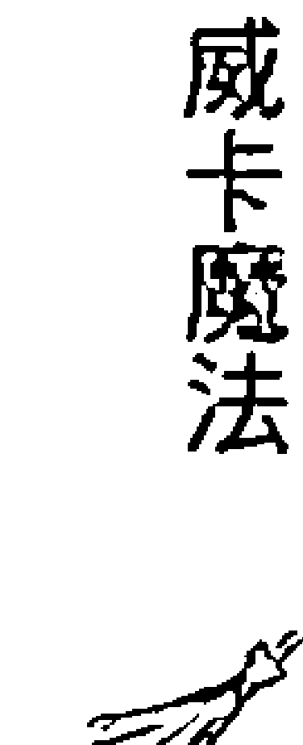

如果一切就緒，那就點燃一根蠟燭，放在祭壇之前，全神貫注在你的魔法需求上。相信你自己。

如果你真的想要知道魔法的本質，那就去施作吧！許多人害怕魔法。有人（未施行過魔法的人）告訴他們，施行魔法是危險的。不要被嚇到了。這樣說來，過街不也是危險的？但是如果你好好的去做，就不會有事。當然，找出答案的唯一方式，就是跨過這條街。如果你的魔法裡充滿愛，就怎麼樣也不會碰到危險。

請召喚母神和父神來保護你，請祂們傳授給你魔法的秘密。祈求石頭和植物顯現它們的力量，並且傾聽。盡量大量閱讀，拋開負面和令人不安的資訊。

邊做邊學，母神和父神都會保佑你，給予你真正需要的東西。

### 第四章 魔法工具

威卡的儀式跟大多數的宗教一樣，也需要若干用具。這些用具可以召喚神靈，摒除負面力量，並藉由我們的觸摸和意念導引能量。

巫師的若干工具，例如掃帚、大釜和魔法棒，已經在當代傳說跟神話中建立了牢不可破的形象。透過通俗傳說和迪士尼動畫，成千上萬的人都知道大釜是用來熬煮湯藥，魔法棒則用來將邋遢的女人變成美女。儘管如此，大多數人卻不知道這些工具背後的強力魔法和威卡中內化的工具符號系統。

如果要奉行威卡，至少要蒐集一些這類工具。到骨董店、舊貨店、以物易物的二手市集或跳蚤市場蒐集這些寶藏。雖然很難找，但找到之後，你會發現真的很值得花這麼大的精力。

當然，奉行威卡並不一定要這些工具不可，不過，這些工具確實會豐富儀式，也可以象徵複雜的能量。不過，除非我們借力量給工具，否則它們是沒有力量的。

有些人說我們應該在剛開始時就使用魔法工具，等到道行更高之後就可以一腳拋開。不過最好的方式也許就是只要你喜歡，你可以從頭到尾都使用。

#### 威卡儀式工具介紹

##### 掃帚

巫師在魔法和儀式中會用到掃帚，這對母神和父神來說都是神聖的工具。掃帚並不是新的工具，早在前哥倫布時代的墨西哥就有人崇拜巫師神「特拉佐蒂奧托」（Tlazolteotl）——這位愛欲女神被畫成騎在掃帚上的裸女；中國人也崇拜掃帚女神，每逢大雨就召喚「掃晴娘」來掃除風雨（譯註：掃帚甚至連天也能掃。山西呂梁如果遇陰雨連綿，久涝不晴，便剪一個女人形狀的紋樣掛在掃帚上，俗稱「掃天媳婦」，然後讓未出嫁的少女站在磨眼上掃天，並不斷念咒語。江浙一帶也有類似習俗，久雨後，剪紙為女形，手持一帚，懸簷下以祈晴，謂之「掃晴娘」。又以之祈雨。在豫西，人們則剪個「掃天娘娘」掛在樹上）。

不過，也可能因為掃帚的外觀像陽具，於是掃帚就成了對抗詛咒和黑魔法術士的強大工具。把掃帚橫跨在門檻上，可以阻擋咒語進入屋內，也保衛著屋內的居民。枕頭底下放一隻掃帚，可以帶人進入甜蜜的夢鄉，也能護衛睡覺的人。

歐洲巫師會跟掃帚劃上等號，是因為兩者在宗教和大眾心中都跟魔法有關。巫師被控乘著掃帚飛行，因為騎著掃帚就證明了他們跟黑暗力量掛勾。如果真的可以騎著掃帚飛上天，這樣的行為就確實是超自然的，因此便順理成章成了民眾眼中的惡魔。其實巫師只會施行治療跟愛的咒語，跟民眾的想像完全相反。這種毀謗性的說法當然是由驅逐巫師的人捏造的（作者註：若干威卡信徒表示，騎掃帚只不過是在地上拖行，就像是騎木杖馬一樣，作用在於促進田野的豐饒。而且，巫師騎掃帚飛上天的說法只不過是穿鑿附會，胡亂捏造神遊太虛時看到的影像）。

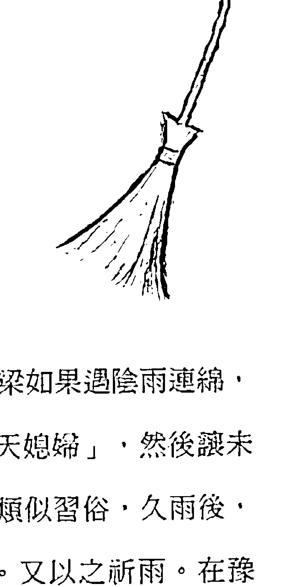

威卡巫師直到現在仍舊使用掃帚。威卡儀式或許會以魔法掃帚微微掃地（不管是戶內或戶外）作為開始，之後再設立祭壇，把工具都擺出來，儀式即將開始（詳見第十三章〈自己動手設計儀式〉）。

這樣的掃地不僅僅是實質的清潔，事實上，掃帚的帚尖不必碰到地面。威卡信徒掃地時，會想像這就掃掉了人類生活對精神管道造成的阻塞。這樣的淨化過程，能讓儀式更為平順。

由於掃帚是一種淨化工具，便與水元素有關，因而被運用在所有有關水的形態的咒語，包括跟愛及努力工作相關的咒語。

許多巫師會蒐集各式各樣的掃帚，製作掃帚時運用的各種材質，讓蒐集掃帚變成一項有趣的嗜好。

如果你想要製作自己的魔法掃帚，也許可以試試古老魔法中使用的白蠟樹或樺樹的樹枝，並且用柳條固定。白蠟樹有保護的功能，樺樹有淨化的功能，柳樹則是供奉母神的祭品。

當然，任何大樹或樹叢的枝條都可用來做掃帚（砍樹枝時，要謝謝樹給予的貢獻，使用書末《巨石陣影子之書》中〈藥草魔法書〉所用的詞句），用松針做的迷你掃帚也可以。

早期美國傳統婚禮及吉普賽的婚禮中，新婚夫婦通常會做一種跳上掃帚的儀式慶祝兩人永結同心。這樣的婚禮不久之前還很常見，即便今日威卡信徒和異教徒結合，也會行跳上掃帚的儀式。

許多老咒語都包括掃帚。一般而言，掃帚是一種淨化和保護的工具，用在儀式上的清潔環境以便施行魔法，以及橫放在家門檻上、床底下、窗台上或門上保衛家庭。

用在魔法上的掃帚，就跟所有的魔法工具一樣，應該專門做一種用途。如果你打算買一把掃帚，選圓形的；（震顫教派教徒發明的）扁平掃帚似乎沒有同樣的效果。

##### 魔法棒

魔法棒是一種重要的魔法工具，不論在魔法或宗教儀式中，都已經用了千百年之久。這是一種召喚的工具，用言詞和往上舉的魔法棒可以召喚母神和父神來觀看儀式。它也可以用來接通能量，畫魔法符號或在地上畫圈圈，還可以一邊穩穩的放在巫師的手掌或手臂上，一邊指向危險，或者是攪拌大釜裡的藥草湯。魔法棒在某些威卡信徒眼中代表風元素，是供奉父神的祭品。

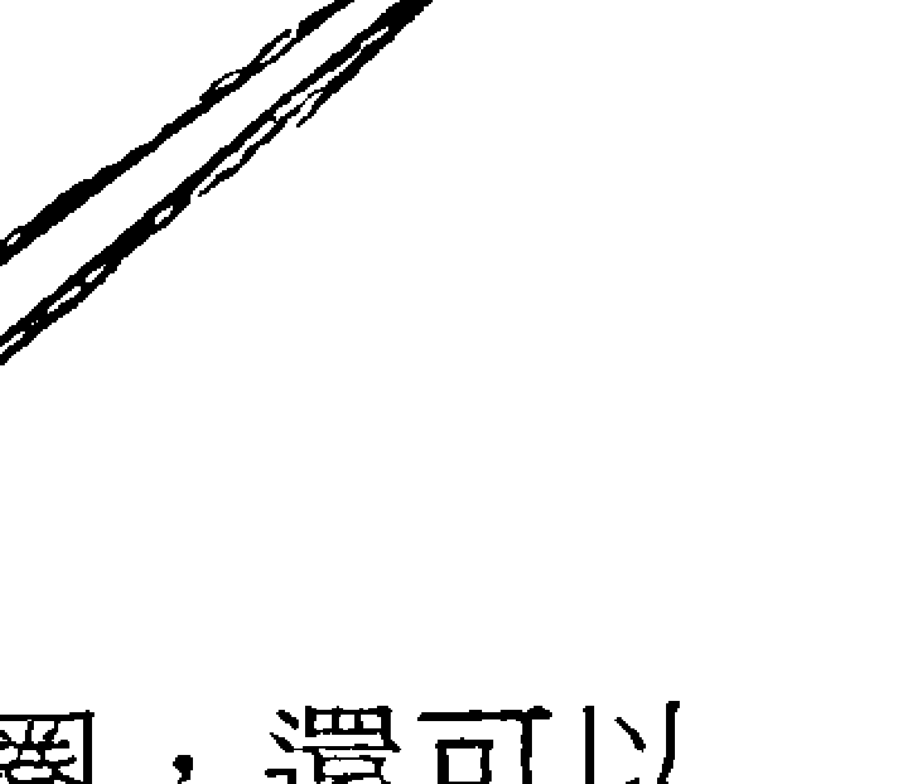

有些傳統的木材可以拿來做魔法棒，譬如柳木、榆木、橡木、蘋果木、桃木、榛木、櫻桃木等。有些威卡信徒對魔法棒的長度精挑細選，一定要符合手肘到食指尖的長度，但這是沒有必要的，任何直的木條都可以用，即使在五金行買的木樺都可以，我看到很多雕刻和漆繪得很漂亮的魔法棒都是用木樺做的。

新時代意識（和商品）讓魔法棒重新抬頭，受到矚目。不論是漂亮時髦、鍍金包銀或半水晶的，各種尺寸和價錢的魔法棒比比皆是，都可以用在威卡儀式中，不過，木製魔法棒卻是歷史最悠久的一種。

不必擔心找不到理想的魔法棒，它會自然而然到達你手上。我用一段歐亞甘草根當魔法棒好一陣子，每每得到很好的效果。你用的任何一根棍子都可以充滿能量和力量。找一根用起來很順手的棍子，就能發揮極佳的效用。

##### 香爐

香爐是焚香的器具，可以是一個雕飾繁複的金屬爐子，就像是天主教堂裡的大金屬爐，或僅僅是一個簡單的貝殼。香爐在威卡儀式中的作用是存放悶燒的薰香。

如果你找不到合適的香爐，可以自己做一個。任何一個裝滿半碗沙或鹽的杯碗都可以。鹽或沙會吸收木炭和薰香的熱氣，以防碗熱到破裂。長條形的線香可以插在鹽堆裡，香錐可以放在鹽堆或沙堆的上面。

儀式或魔法中的薰香，不論是本身或表現都是一種藝術。如果儀式中沒有特定要用哪一種香，那就靠直覺和創造力來決定。

條狀、錐狀或塊狀的薰香都可以使用，但大多數威卡信徒喜歡用未加工的顆粒狀薰香，這種香必須放在自燃的炭磚上燒。不論哪一種都很好。

在儀式性的魔法中，大靈有時候會被召喚來顯像在香爐升起的香煙裡。儘管這部分並不屬於威卡，我們偶爾也會在裊裊升起的香煙中看到母神和父神。一邊坐著，一邊慢慢呼吸，看著香煙，是一種讓人陶醉的事情，你也可以藉此達到意識轉換的境界。

如果是在室內舉行威卡儀式，一定要薰香才算完成。在戶外多半要燒營火，或是把一根條香插在地上。因此在室內的儀式中，香爐是重要的工具。對某些威卡信徒而言，薰香代表風元素。

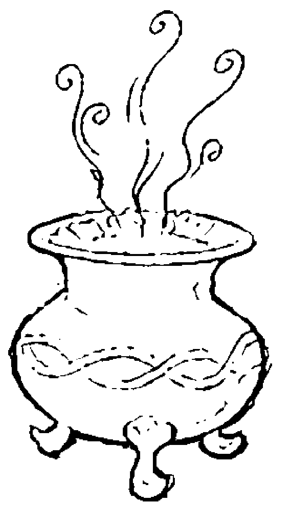

如果有神像，香爐多半是放在祭壇上的神像之前。

##### 大釜

大釜是巫師最了不起的工具。這是古代的烹飪和煮湯工具，充滿了魔法的傳統和神秘的氣氛。大釜是一種可以變出魔法的容器，是神聖的器皿、神聖之泉和宇宙洪荒之海。

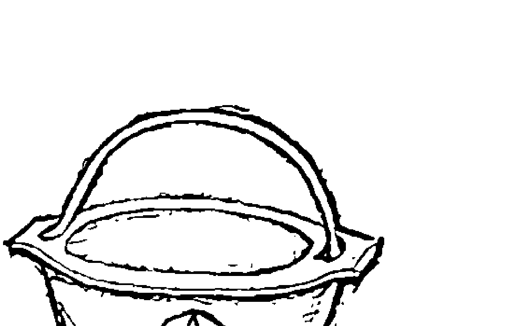

威卡將大釜視為母神的象徵、女性特質和繁殖力的證明，同時也是水元素、復活、不朽和靈感的象徵。塞爾特有關卡力德溫（Kerridwen）的大釜傳說，對現代威卡影響甚深。

大釜也是儀式的焦點。在春之祭典時，大釜中通常會放滿新鮮的水和花朵，冬天的時候，大釜裡通常會點起一把火來代表熱力和陽光（父神）從大釜（母神）裡回歸。在農業神話中，父神在冬天誕生，在夏天成熟，在最後一次收成之後死去（詳見第八章〈有力量的日子〉）。

理想上，大釜應該是鐵製的，鍋底要有三支腳，鍋口要窄於鍋腹。這樣的大釜，即使是小的都很難找，但仔細找應該還是找得到類似的。大釜有各式各樣的尺寸，從直徑幾吋到怪物般的三呎都可。我自己蒐集了幾個，包括一個作為儀式之用的古老大釜。

大釜也是凝視的一種工具，可將大釜裝滿水，然後凝視底部。大釜也可以用來燉煮惡名昭彰的威卡藥酒，不過不要忘了，在大釜中燉煮液體，需要很大的火跟耐心。目前，很多威卡信徒用爐子和炒菜鍋取代大釜。

如果你找不到大釜，那就等一會兒，它終將現身的。開口向母神和父神要一個也無妨。

##### 巫刃

巫刃（我也喜歡叫它魔法刀）有悠久的歷史。在威卡中，巫刃的用途不是切東西，而是在導引由儀式和咒語集聚的能量。很少人會用它來祈求和召喚神祇，因為它是一種命令和力量操控的工具。我們寧可用它來召喚母神和父神。

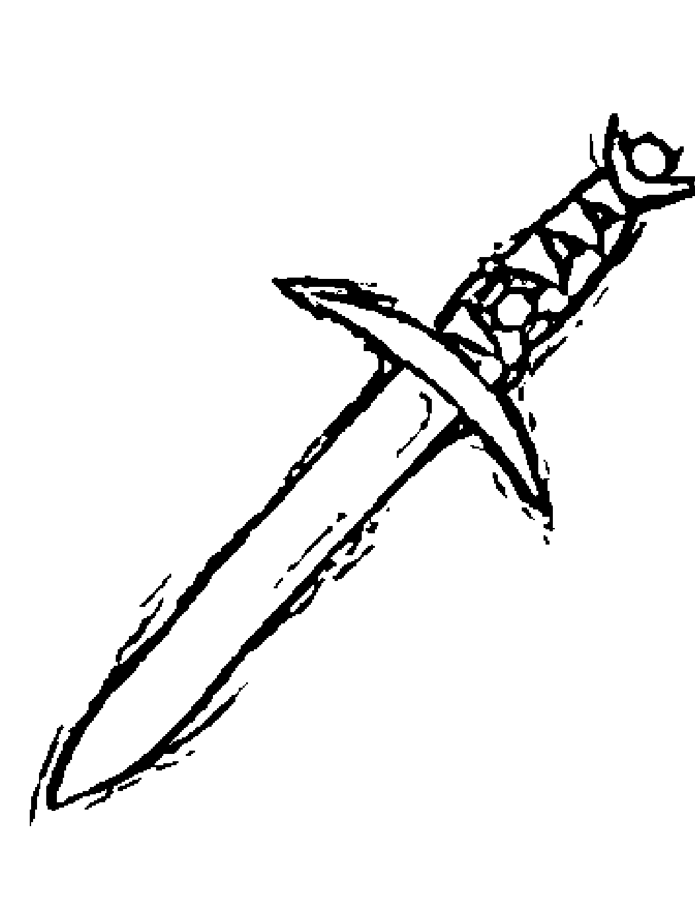

巫刃通常是鈍的，有雙面刃，把手是深色或黑色的；黑色會吸收能量。巫刃在儀式中用來導引能量時（詳見《巨石陣影子之書》），這些力量只有一點點會被吸入刀把，稍後可以再把這些力量召喚出來。同樣的，威卡儀式中集聚的能量也會被導入刀身中，以待稍後之需。神話故事中經常出現擁有魔力和名字的神劍，而劍不過就是大一點的刀罷了。

有些威卡信徒會在刀上鐫刻魔法符號，這些符號多半來自《所羅門王之鑰》，但這並非必要。就跟所有魔法工具一樣，巫刃是因為你的碰觸和使用才會變厲害。如果你很想要鐫刻，那就在刀背或刀把上鐫刻字句、符號或是盧恩文。

威卡巫師有時候也會用劍。劍擁有刀的特質，但是劍的尺寸太大，難以在室內的儀式中使用。

因為刀子的象徵符號是一種導致改變的工具，因此往往與火元素有關；類似陽具的外形也使它跟父神產生關聯。

##### 白柄刀

這是白色把柄的單鋒刀（又稱波刀〔bolline〕），跟純粹儀式用的巫刃相反，它只是一把實用的工作刀。白柄刀的用途是切割魔法棒或作為獻祭的藥草，或者在蠟燭、木頭、陶土或蠟上鐫刻符號，也可切斷繩子，以備魔法之用。因此它的把手通常是白色的，用來與巫刀區別。

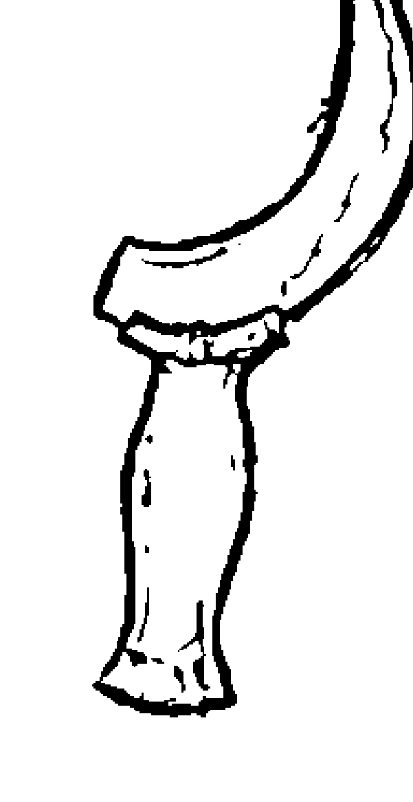

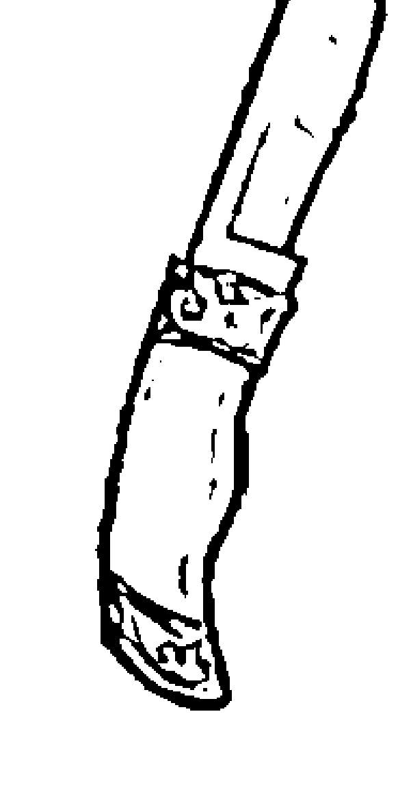

若干威卡傳統指出，白柄刀只能用在魔法圈中。這樣一來，它的功用將大受限制。我認為，若只限制它用於儀式上（例如在儀式進行時，切割花園中的花朵放在祭壇前），既可賦予工具神聖性，又容許它在「神聖空間」以外的地方使用。

##### 水晶球

白水晶近來很受歡迎，但白水晶球卻是一種古老的魔法工具。水晶貴得不得了，價格在二十美元到數千美元之間，依據大小而定。市面上大部分的水晶球不是玻璃，就是灌鉛的玻璃，甚至是塑膠的。真正的白水晶球一定很貴，內含雜質或者不平整。

長久以來，水晶就被用在需要沉思的占卜中。占卜者看進水晶球裡，直到通靈的能力出現，而在心中看到的畫面，或者是投射到水晶球之中的畫面，則揭示出必要的資訊。

在威卡儀式中，水晶有時會被放在祭壇上代表母神。它的形狀（圓球狀）就跟所有的圓圈和球狀一樣，是母神的象徵，那冰冰涼涼的溫度（這是另一種判定是否是真的岩石礦水晶的方法）也是深沉大海的象徵。大海也是母神的領域。

同樣的，水晶也可用來接收來自父神的訊息，或者儲存由儀式得來的能量。有些威卡信徒會用水晶球來占卜、召喚母神的形象或前世的形象。它是神聖的魔法物體，請好好護衛你擁有的這顆水晶球。

定期讓水晶球沐浴在月光下，或者用新鮮的艾蒿擦拭，將會提升它激發我們靈性的能力。可作為滿月儀式的核心。

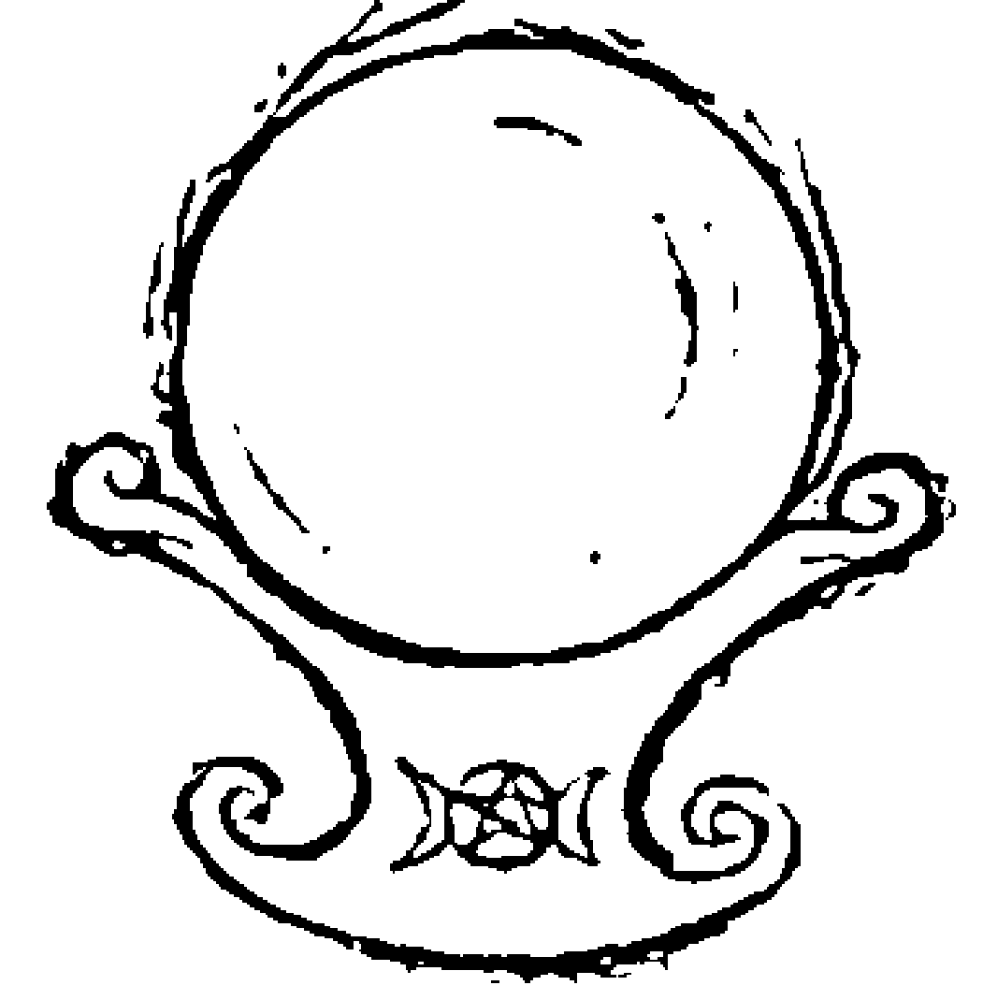

##### 杯子

杯子是大釜的基本型態，象徵母神和肥沃，跟水元素有關。儘管它可以用來裝水（通常裝了水的水杯會放在祭壇上），在儀式中，它也可能裝了要在儀式中喝掉的飲料。

杯子可用各式各樣的材質，有銀、銅、金、陶土、皂石、石膏、水晶等。

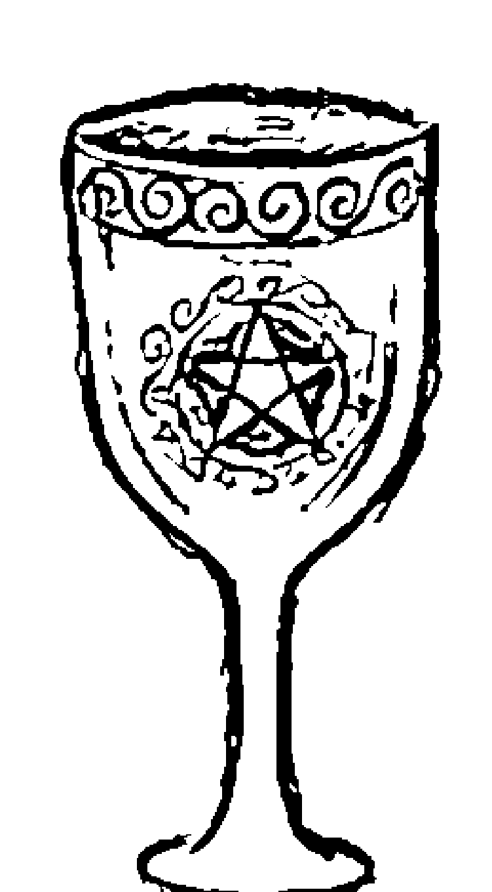

##### 五芒星

五芒星（pentacle）通常是在一塊扁扁的銅、金、銀、木、蠟或陶土上，鐫刻著特定的符號。最常見和最重要的，就是五角星（pentagram），一個有著五個尖芒的星星，這個星星被用在魔法中已經有千年的歷史。

五芒星是從魔法祭典中轉借而來。在古代藝術中，它是一種保護的工具，或是召喚神靈的工具。在威卡中，五芒星代表土元素，也是放置護身符、幸運符或其他物品的方便工具，讓物品依據儀式而受到聖化；偶爾也可用來召喚父神和母神。

五芒星也可以懸掛在門上或窗戶上，當作一種保護措施，或者憑藉它的土象特質，在儀式中作為吸引錢的工具。

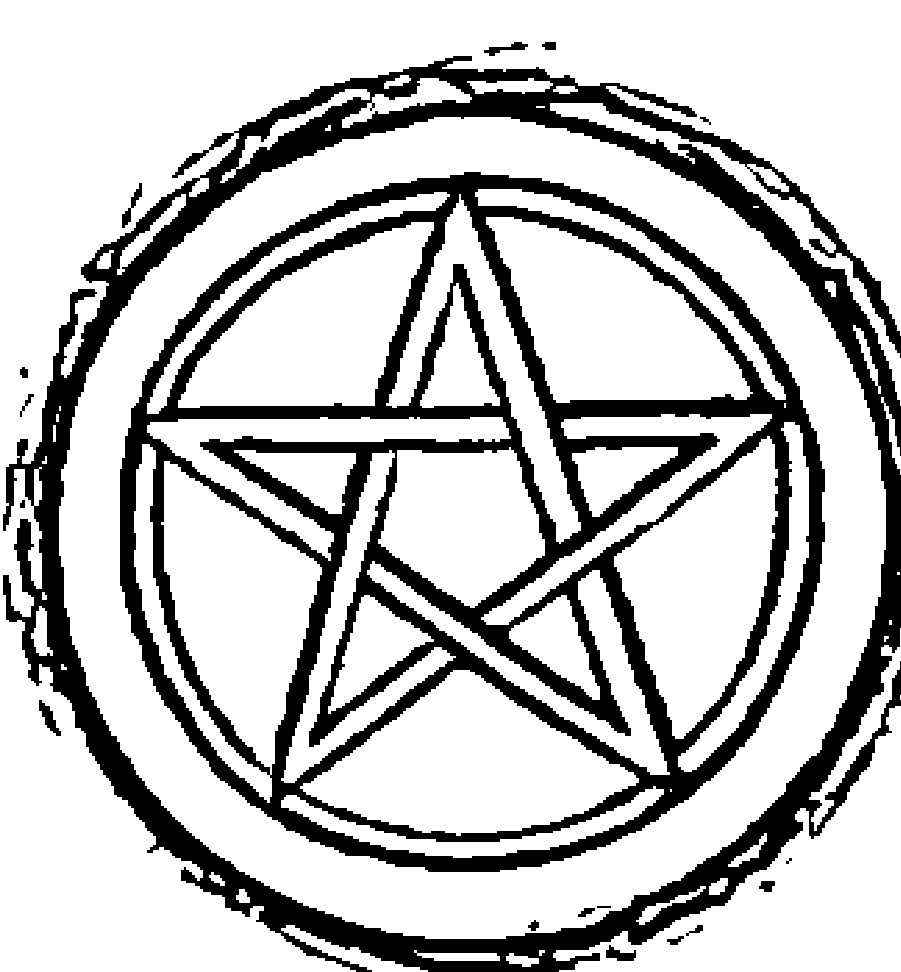

##### 影子之書

「影子之書」是威卡巫師的工具書，其中包括召喚、儀式形式、咒語、盧恩文和管理魔法的規則等。影子之書多半是由某個威卡巫師傳給另一個威卡巫師，通常是啟蒙書，不過目前大部分

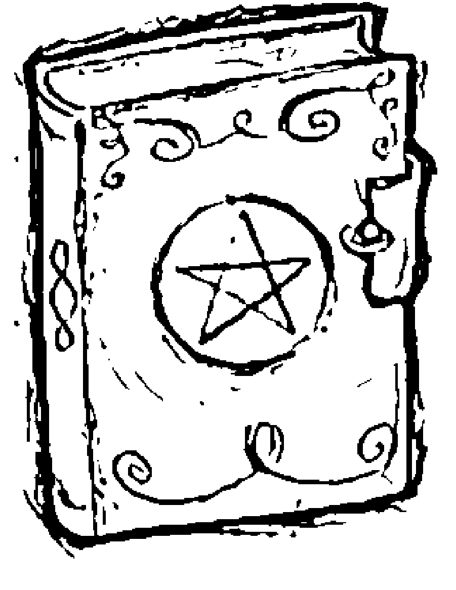的影子之書是由個別的威卡巫師所編撰的。

有些威卡書籍中會說，威卡中有一本代代相傳的經典影子之書，其實這是無稽之談，因為每一個威卡信仰分支都號稱自己的影子之書是原創的那本，而且這些書每一本都不一樣。

不久前，每一本影子之書都是手寫的，今日的影子之書則多半是打字或影印的。有些威卡信徒甚至把書存在電腦裡，創造出我朋友說的「影子磁碟」。

想創造自己的影子之書，首先要準備一本空白筆記本，大部分美術社或書店都有。如果你找不到裝訂成冊的空白筆記本，任何畫線的練習本也可以。在這本書上寫下你所編造或在其他地方找到的想要保存下來的儀式。

不要忘了，所有的影子之書（包括書末的《巨石陣影子之書》）都是給你儀式的建議而已，不要把它當作「聖旨」，不要被這些字句綁住了。事實上，許多巫師都用三環的活頁本隨時候意抽換或增添他們的影子之書。

把你的咒語或儀式用手抄錄下來，是個不錯的主意。這不僅能讓你完整的讀過資訊，也更方便秉燭夜讀。最好把所有的儀式都背起來（邊翻閱書，邊準備儀式會讓人分心），或是自發性的創造出來。你的影子之書最好可以在閃爍的燭光下閱讀。

## 铃铛

鈴鐺是相當相當古老的儀式工具。搖鈴鐺可以釋放強而有力的震波，效果依據它的質量、音色和材質而定。

鈴鐺是女性的象徵，多半用來在儀式中召喚母神。搖鈴鐺也可以驅逐惡毒的咒語或鬼魂、遏阻暴風雨或引來好的能量。把鈴鐺放在碗櫥或掛在門上，可以保衛家園。儀式中偶爾會搖鈴以顯示不同的階段，或者示意咒語的開始或結束。

鈴鐺的材質和形狀不拘，各式各樣的鈴鐺都可以使用。

#### 淨化工具

以上就是威卡儀式中所運用的若干工具。使用它們，熟悉它們的力量，並且把你自己的能量灌入其中，你會發現使用它們變成了你的第二本能。蒐集工具也許不太容易，不過，這也許可以當作測試你對威卡興趣有多濃厚的一種魔法試驗。

當你蒐集完所有的工具之後，就可以開始準備儀式了。如果工具是二手的，就該去除附著在上的所有聯想和能量，因為你不知道它以前的主人是誰，也不知道它以前的用途是什麼。

#### 去除工具的舊能量，將自己的能量注入其中

開始儀式程序之前，用適當的方式好好清理一下工具。如果東西是乾淨的和乾燥的，把它埋起來（不管是埋在土裡、一碗沙或一碗鹽裡都可以）幾天，消除其中的能量。另外一種方式則是把工具浸在海裡、河裡、湖裡，或者是放了幾撮鹽淨化過的浴缸水裡。

不要用泡在水裡的方式毀了一塊好好的木頭，也不要讓拋光過的東西碰到鹽。不同的東西有不同的對待方式。

幾天後，把工具挖出來，擦乾淨，就可以用在魔法儀式裡了。如果用泡水的方式，請把東西浸在水裡，自然風乾。如果不放心，可以重複多做幾次，直到工具完全乾淨、新鮮和簇新為止。

在書末的《巨石陣影子之書》中，有威卡工具的聖化儀式，以及《藥草魔法書》裡的準備儀式。在眾多方式之中，你可運用直覺自行選擇。

### 第四章 魔法工具

### 第五章 運用音樂、舞蹈和手勢

威卡深知人們之所以會覺察物質和非物質的差異，在於我們受到肉身的限制。在宗教儀式中使用的某些工具確實是非物質的，而最有效的三種就是音樂、舞蹈和手勢（作者註：嚴格來說，音樂是由可實際衡量的聲波組成。我們無法掌握音樂，卻能掌握製造音樂的樂器）。

這些技巧用來聚集力量、轉換意識、與母神和父神結合，以達到狂喜，通常只占儀式的一小部分，但結合這幾種工具卻可能形成最有效、最強力的儀式（純粹以手勢構成的儀式請見書末《巨石陣影子之書》）。

#### 最有效的三種非物質儀式工具

音樂和舞蹈是最早的魔法跟宗教行動。我們的祖先可能早在語言發展之前，就開始運用手部的信號和軀體的姿勢。用手指人或物這種單純的手勢，從目擊證人指認嫌疑犯，到海選會裡被評審一指，在一片黑壓壓的男女競爭者中脫穎而出，直到現在還有強烈的渲染力。

最初的音樂也許是節奏。人類很快就發覺，拍打身體的各個部分（尤其是大腿和胸腔），可以製造出愉悅的節奏和聲音。

拍手可以創造出特別而乾淨的聲音，直到現在威卡巫師在魔法儀式中還使用拍手聲來釋放個人的力量

> > 作者註：請見朵琳·瓦蓮提〔Doreen Valiente〕的《明日魔法》〔Witchcraft for Tomorrow, New York: St. Martin’s Press, 1978, p. 182〕

節奏樂器（譬如空心鼓）後來用於製造更飽滿的聲音。有些石頭相互撞擊時會有響聲，於是另一種樂器就誕生了。正確的吹奏蘆葦、骨頭和若干貝殼時，會發出哨聲。現存的薩滿系統仍舊利用這些工具。

越不知性的儀式越有效，原因在於避開了有意識的心，而跟深層潛意識、也就是精神性的覺察對談。音樂和舞蹈在威卡儀式中跟我們的情感產生聯繫。

有些人想到要跳舞、唱歌或演奏音樂就感到困窘，這是這個壓抑社會的產物。不過在威卡中，舞蹈和音樂只會在神靈之前展現。你不是為了一個群體而表演，所以不要擔心你少了個音符或絆到自己的腳丫。神不會管這麼多，也沒有人需要知道你做了什麼。

即使最沒有音樂概念的人也會想把兩塊石頭敲擊一下、搖一下沙鈴、拍拍手或邊走邊圍成圓圈。目前，最有制度和最有威力的威卡巫師集會，會在祭壇外畫一個簡單的圓圈集聚力量。華麗的儀式舞蹈就各憑想像了。

以下是有限舞蹈、音樂和手勢的傳統傳說。如果你覺得很吸引力，盡量融入你的威卡儀式之中，這裡只給你一個忠告：如果你發現自己的儀式僵化且不合你意，如果這樣的儀式無法跟神祇產生連結，問題可能出在缺乏感情的內涵。音樂和舞蹈可以在儀式中製造真正的聯繫，開啟你對母神和父神的覺察力。在魔法中，它們可以創造進入能量更自由的入口。

#### 音樂

簡單的說，音樂就是重新創造自然的聲音。吹過樹梢的風聲、掠過崎嶇懸崖峭壁的海濤聲、滴滴答答的雨聲、閃電製造的霹靂聲、鳥囀及野獸吼聲，都是大自然音樂的樂器。

人類很久以前就將音樂融入宗教和魔法儀式中，以加強效力。薩滿運用穩定的鼓聲來導入出神狀態，而鼓又能用來控制魔法舞蹈的步調。音樂同樣也因為可以安撫猛獸以及人類而受到頌揚

> （作者註：在傑拉德·嘉德納〔Gerald Gardner〕的小說《魔法之助》〔High Magic's Aid, New York: Weiser, 1975〕的第六章中，對音樂魔法有極佳〔虛擬〕的描述）

音樂同樣也被用在今日的威卡之中。你可能可以在古典樂、民族樂、民間歌謠或當代的來源找到適當的曲子，然後在儀式中播放；有音樂天分的威卡巫師可以在儀式之前、之中和之後創作音樂。

對我來說，我最滿意、最生動的儀式通常會包含音樂。記得有一天我在拉古納山的樹後面藏了個小小的錄音機。奇怪的是，音樂並未觸犯滿地的野花、高聳的松樹還有古老的橡樹，反而提升了我的儀式。

如果你精通某種樂器，把它用在你的儀式裡。不論是長笛、小提琴、八孔直笛、吉他、民謠豎琴或其他小型樂器，都可以輕鬆引進儀式之中，像是鼓、沙鈴、鈴鐺，甚至是水杯和敲水杯的刀子都行。其他不易攜帶的樂器也可以用錄音機錄下來，在儀式中播放。

這樣的音樂插曲可直接用在儀式進行前，為儀式製造氣氛；在儀式之中放音樂可視為對母神或父神的獻祭，或是喚醒能量；在儀式之後進行，則是純粹的慶祝和歡愉。有些威卡巫師會譜一首曲子，這首曲子其實就是一項儀式，包含了一切，從創造神聖的空間、召喚神祇到感謝祂們的出現。音樂魔法可以依照你的想法而定。

鼓、鈴鼓、木琴及所有的打擊樂器（除了叉鈴）擁有特定的威力，皆是由土元素所主宰。因此，這四種樂器可用來召喚繁殖力、增加金錢、找工作等，也可以在儀式中用來召喚母神或激起能量傳送到大地中。

長笛、八孔直笛和所有的口吹管樂器，都由風元素所主宰。風元素是智力的元素，可用來提升心智的能力或想像，從而發現古老的智慧和知識，以提升神通能力或召喚父神。

弦樂器由火元素所主宰，如古希臘的七弦豎琴、豎琴（正常尺寸或民謠豎琴）、曼陀鈴、烏克麗麗等。這類樂器可用在有關性愛、健康或身體力量、熱情、意志力、改變、革命、勇氣和改變壞習慣的咒語或儀式中。弦樂器也可在儀式之前淨化有問題的空間以及主持儀式的人。放一首特別的歌曲，跟著樂器一起哼唱，或是順時鐘繞圈圈彈奏樂器，直到那個空間發出一樣的振動。弦樂器也可用來召喚父神。

能發出共鳴的金屬樂器，如鏡鈸、叉鈴、鈴鐺、銅鑼都是水元素的象徵。由於水包含了療癒、繁殖力、友誼、神通能力、精神之愛、美麗、同情、快樂和其他類似的能量，鈴鐺、銅鑼或鏡鈸便在這類的咒語跟儀式中扮演要角。艾西絲的叉鈴則提醒我們，會發出共鳴的金屬可以召喚母神。

音樂性的咒語（相對於只有言詞的咒語）既簡單又有效。

需要錢嗎？穿著綠色衣服靜靜坐著，緩緩槌擊一面鼓，觀想自己一邊召喚提供豐盛的母神，一邊源源不斷的噴發出鈔票。

如果你很沮喪，找個會發出愉悅聲音的鈴鐺，在儀式上敲打、搖晃它，感覺聲音的振動清除了你的沮喪，提升了你的靈魂。或者，在身上掛一個小鈴鐺。

當你害怕的時候，可以彈奏六弦吉他或聆聽預錄的吉他音樂，並且觀想自己是一個自信而勇敢的人。召喚具有鬥志、積極和可以保護人的父神。

威卡儀式除了可以加入混和言詞和音樂的歌唱，某些威卡巫師還會在音樂或歌唱中情不自禁的加上唱誦或召喚。

許多威卡師士從未施行過音樂魔法，只是單純播放錄好的音樂作為儀式的背景音樂。這樣做也很好，但是如果你的儀式結合了你自己創作的音樂（不管多麼簡單），可以讓儀式更有效。曲風不限，只要你喜歡這首曲子就好了。

目前許多地方都可以買到預錄的威卡錄音帶。某些歌曲可以用在儀式中，但是大部分的歌曲最好是在準備儀式或儀式完畢之後，等心情放鬆時再播放。

適當的音樂跟儀式結合，可以大大提升威卡儀式的功效。

#### 舞蹈

舞蹈無疑是一種古代的儀式，同時也是一種魔法活動。肉身的移動會釋放軀體的能量，能量也用於魔法中。這樣的「秘密」老早就被發現了，因此舞蹈被結合進魔法和儀式之中，用來增進能量和轉換意識，或僅僅作為表演儀式來榮耀母神和父神。

群體的舞蹈（如迴旋舞）通常會出現在巫師集會。在個人的運作中，你不必拘泥於傳統或編好的舞步，不妨隨心所欲使用各種你喜歡的姿勢移動，不管看起來多麼孩子氣和狂野。

在魔法中，許多威卡巫師會唸短短的咒語或施行某種特定儀式形式（鐫刻盧恩文、打繩結、在沙土或磨成粉末的藥草中看到圖像、唱誦神祇的名字等），之後再施行真正的魔法：聚集和導引魔法的能量。他們多半會以越來越快的速度順時鐘繞行祭壇，有時是獨自一人，有時集合十三個人，看著祭壇上的火焰，聞著薰香，深深沉浸在唱誦和密集的觀想之中。當巫師達到不可逆的關鍵點，身體再也無法聚集跟導引更多能量之際，這股力量就會釋放出來，達到魔法的目標。到了這個節骨眼，有些威卡巫師會癱倒在地，象徵所謂的「那支舞」的結束。

舞蹈不只用來集結能量，也用以協助威卡巫師與大自然的諸神校準頻道。像狂風般舞著，像奔流下山的溪流般舞著，像被閃電擊中的樹枝萌生的火焰般舞著，像風飛沙般舞著，像花朵在豔陽的夏日午後綻放般舞著。跳舞時，運用你想用的各種移動方式，向父神和母神展開自己。

想像一下迴旋的托缽僧、狂野不馴的吉普賽舞者、性感的中東肚皮舞，以及神聖的夏威夷呼拉舞。舞蹈是通往神的路徑之一。

#### 手勢

手勢對話語而言，可說是沉默的對手。手勢與召喚或舞蹈相結合，或是單獨使用其強大的力量，都可以增強威卡巫師儀式的功效。伸出手指指向人或物、叉開食指和中指做出V字型，或是比中指做出粗俗的手勢，說明了各種訊息都可藉由手傳達。手勢也可以有象徵特質和象徵，手的形象在全世界都被用來當作護身符。

威卡儀式中的手勢很容易就會成為第二本能。召喚母神和父神時，雙手必須向上伸展，十指分開，以便接收祂們的力量。伸出左手可以召喚母神，大拇指和食指彎曲形成半圓形，其他三隻手指緊扣在手掌上，代表弦月。召喚父神則是把右手的食指和中指豎起來，或是食指跟小指豎起，用大拇指壓住其餘兩隻手指頭，代表父神頭上的兩隻獸角。

接近四個方位的時候，可以用不同的手勢召喚四個元素。往前平伸的手掌可以召喚北方的土元素；往上舉的手掌、十指分開，可以召喚東方的風元素；往上舉的拳頭，可以邀請南方的火元素；合攏雙手成杯形，則可向西召喚水元素。

有兩種手勢再加上姿勢，長久以來都被用來召喚母神和父神，並以祂們來命名。「母神的姿勢」是站著把雙腳張開約兩呎，將雙手往前伸，手掌朝上攤平，手肘稍稍彎曲。這樣的姿勢可以召喚母神，跟祂的能量相協調。「父神的姿勢」是將雙腳併攏站在地上，身體筆直，雙手交叉放在胸前（右臂壓在左臂上），雙手握拳。諸如魔法棒和巫刃等工具多半會被父神握住，呼應古埃及法老在展開爭論時握在手裡的彎曲連枷。

在巫師集會中，女祭司和男祭司在召喚母神和父神時，多半會採取這樣的姿勢。獨自施法時，先後採取這兩種姿勢可用來連結我們體內的母神跟父神；這兩種姿勢也可用在個別的召喚儀式中。

手勢也可以用在魔法中。每一根手指都跟不同的行星及古代神祇有關。由於伸出手指指向人或物是一種魔法行為，也是咒語的一部分，我們可以選擇象徵性各不相同的手指：大拇指跟金星和地球有關，木星（代表行星木星和羅馬神話中的宙斯）主宰食指，中指由土星和農神主宰，無名指由太陽和阿波羅主宰，小指由水星和信使之神主宰。

許多咒語往往會用象徵木星和土星的手指來指向一個物體，讓它充滿或浸淫在魔法的能量中。這樣的力量可以用觀想讓它直接從指尖發射出去，進入物體之中。

其他的威卡儀式所用到的手勢，包括用巫刃、魔法棒或食指往空中的四個角落畫出五角星，也就是所謂的「切割」五角星。這樣做既可以阻止，也可以召喚土、水、火、風四種元素。這麼做的同時，當然還要加上觀想。

手可以當成大釜，因為可以舀和盛裝水；手也可以當成巫刃，因為可以用來導引魔法能量；更可以當作魔法棒，因為可以召喚神。

手勢跟其他魔法工具一樣有效，永遠都跟隨著我們，以備不時之需。

## 第六章

## 儀式和準備

#### 關於儀式

我將儀式定義為「特定形式的移動、操控物件，或是一連串用來產生所需效果的內在過程」（詳見附錄〈威卡魔法用語〉）。在威卡中，儀式是慶祝和強化我們跟母神、父神及地球關係的典禮。

我們不需要事先計畫、排練或依循慣例才能舉行儀式，同樣的，儀式也不需要謹守某種特別的模式或型態。事實上，我跟威卡巫師聊過，我們都同意，凡是自發性創造出來的儀式都是最強大、最有效的。

威卡的儀式，也許包含主持儀式的人獨自點燃火、唱誦神聖的名字和觀看月亮升起；也可能有十多個人，每一個人都扮演神話劇中的一個角色，或是唸出很長一段話語來敬拜神。儀式可以是古代的，也可以是嶄新的創作。儀式的外在形式並不重要，只要能成功達到覺察威卡裡的神就夠了。

威卡的儀式通常在滿月的夜晚舉行，或者力量產生的第八天，也就是在歐洲古老的農業和季節節慶時舉行。儀式的本質多半是很精神性的，不過也可能會施法。

在書末，你可以看到整本的儀式之書《巨石陣影子之書》。學習威卡最好的方式就是邊做邊學，演練書中或你自己寫下的儀式一段時間，你就會了解威卡真正的本質。

許多人都說他們想要成為威卡巫師，但他們只會坐而言，不能起而行，他們的說詞大都是沒有看到滿月、沒碰到教儀式的老師、沒有入門，或者不知道怎麼做。

這些都是藉口。如果你想成為威卡巫師，做就對了。

對獨修的威卡巫師來說，創造新儀式是很讓人興奮的。你可以花很多個晚上查詢資料，一點一滴拼湊儀式和召喚，或是讓當下的靈光一現或神的智慧給你靈感。不論儀式是怎麼創造出來的，一定要出於愉悅的心情而非強迫性的義務。

如果你想做威卡的儀式，可以按照季節、異教徒節日及月亮盈虧來施行（詳見第八章〈有力量的日子〉）；如果你對其他聖曆特別感興趣，不妨就按照它的節日去做。威卡已經成功運用了古埃及、美國印第安、夏威夷、巴比倫及其他宗教魔法系統。儘管大部分的威卡巫師都在歐洲或英國，但我們並不會因此而受限。作為獨修的威卡巫師，我們可以隨心所欲。只要儀式能實現和生效，又有什麼好擔心的？

#### 儀式前的準備

本書第十三章〈自己動手設計儀式〉會教導和指示你如何設計自己的儀式，但我要先透露一些準備儀式的資訊。首先，確定你在宗教（或魔法）的儀式中不會受到打擾。如果你在家裡，跟家人說你在忙，不希望受到干擾。如果你一個人，把電話關掉，鎖上門，最好也拉上窗簾。確保你可以獨自一人，而且能夠有一陣子不受打擾。

#### 沐浴

接著是儀式性的沐浴更衣。除非先快速沖個澡，否則我往往無法好好去做儀式。部分因素是心理上的：如果你感覺自己很乾淨，而且洗去了每日的憂慮，就可以暢快的跟母神和父神接觸。

儀式性的淨化是許多信仰的共通特徵。在威卡中，我們把水看成可以清除日常緊張造成的干擾振波的淨化物質，能讓我們以淨化過的軀體與思維站在神面前。更深層的含意是，浸泡在水裡，就好像是把我們跟最原始的記憶連在一起。在一缸加了浴鹽的冷水中泡澡，就像是走進深情相迎的海洋波浪中，也就是母神的領地。水讓我們在精神上和肉體上都準備好（你在浴缸中有感覺到任何不一樣嗎？），迎接即將來臨的經驗。

沐浴通常會變成儀式本身。你可以在浴室點蠟燭和薰香，芳香精油和藥草小香包都可以加在洗澡水中。我最喜歡的淨化沐浴藥草包裡有等量的迷迭香、茴香、薰衣草、羅勒、百里香、牛膝草、馬鞭草、薄荷及磨碎的微量纈草根（這個配方來自《所羅門王之鑰》）。把這些藥草包在零碎的布頭裡，紮緊尾端，丟進浴缸。

靠近大海、湖泊或河流的戶外儀式，可以用在水中游一下泳作為開場。當然，在突發性的儀式中，沐浴是不可能的。有些人甚至懷疑儀式性的沐浴有無必要。如果你覺得洗個澡會比較舒服，就這麼做吧。如果覺得沒必要，那就不必了。

#### 著衣與服色

沐浴過後，就要開始為儀式著衣了。今日的許多威卡巫師（尤其是受到嘉德納的著作和思想影響的人或他的學生）認為，召喚自然界的神靈最好是裸體以對。當然，裸體是人體最自然的狀態，但並非每個人都願意在儀式中裸體。教會對光溜溜的人體灌輸了羞恥感。這種扭曲而不自然的感情直到現在還存在。

在敬拜時堅持裸體有各式各樣的原因（作者註：未在這裡指明的原因之一，也是最明顯的原因，就是人都喜歡看裸體。有些無恥之徒組成巫師集會，只是為了行天體大會之實。這樣的團體，很顯然並不是在提倡威卡的目的：母神與父神的結合和崇敬大自然。我竭力聲明大部分行裸體儀式的巫師集會非我族類），有些威卡巫師表示，穿了衣服的肉體無法像裸體一樣釋放出強大的個人力量；不過他們也說，假如非得穿衣，穿衣的室內儀式就跟裸體的戶外儀式一樣有效。如果穿上衣服的威卡巫師可以生出跟裸體威卡巫師同樣有效的魔法，衣著就不會對力量的傳遞構成阻礙。

對於威卡儀式中的裸體禮拜有另一種更有說服力的解釋，那就是這樣做是有象徵意義的：在母神和父神之前做心靈、精神及肉體上的裸露，代表威卡巫師的誠實和開放。儀式化的裸體可見於許多古代的宗教中，到現在還零零星星見諸世界各地，因此這並不是一種新觀念，只不過有些西方人並不知道罷了。

儘管許多巫師集會堅持要裸體參與儀式，你卻不需要擔心。作為獨修的威卡巫師，你可以自己做選擇。如果你不習慣裸體儀式，即便在私下也都如此，那就不必裸體。你可以有很多選擇。

特製的服裝，諸如袍子和粗布衣，都很受威卡信徒的歡迎。穿袍子的原因很多，其中之一就是穿上專門為魔法儀式準備的衣服，會產生神祕的氛圍，將我們的意識導向即將來臨的儀式，從而提升對儀式的意識和覺知。

顏色同樣也因為特殊的振動而被用於儀式，以下是袍子顏色的幾個樣本。如果我對藥草魔法特別感興趣，或是要執行阻止核電廠或核子武器增生的儀式，我可能會穿上綠色袍子來協助儀式與地球能量校準。你也可以根據以下的描述，針對若干的咒語或咒語週期來訂製和穿上特殊的袍子。

- 黃色：對占卜的人來說是絕佳的顏色。
- 紫色：對純粹行使神通力量的人（魔法師）或想要深化對母神和父神的靈性覺知的人來說，是最恰當的顏色。
- 藍色：對療癒者、行使神通力量者或想跟母神的海洋特性相連結的人來說最恰當。
- 綠色：可加強藥草學家或魔法生態學家的力量。
- 咖啡色：最適合給跟動物感應或對動物施咒語的人穿。
- 白色：象徵淨化和純粹的精神力量，對靜心和潔淨儀式來說都很完美。在滿月慶祝以及和母神感應時，最好穿白色的袍子。
- 橘色或紅色：橘色或紅色的袍子可以在巫師集會時、保護性的儀式或是跟父神狂暴的太陽特質相感應時穿著。
- 黑色：黑色的袍子很受歡迎。跟大眾的誤解剛好相反，黑色並非象徵邪惡，反而代表沒有顏色。這是一種保護性的色調，象徵夜晚、宇宙和真實。當威卡信徒穿著黑色袍子時，等於穿上外太空的黑色，象徵著神聖能量的太初來源。

如果這樣對你來說太過複雜，不妨去做或買件袍子用來參與每一次的儀式。袍子的樣式可以是最基本的浴袍或從頭蓋到腳的全罩式修道士袍子，再加上喇叭袖，這種喇叭袖如果靠蠟燭太近，保證會起火。有些威卡信徒會穿有兜帽的袍子，目的在摒除外界的干擾和在儀式中控制感官的刺激。這對魔法和靜坐來說還不錯，卻無法用在威卡的宗教儀式上。在威卡儀式中，我們應該對自然界開放，而不是切斷我們跟實體世界的關聯。

如果你不想穿這樣的外袍，也不會縫衣服，甚至找不到像樣的袍子，那不妨穿一件以自然纖維做成的乾淨衣裳，譬如棉質、毛質或絲質。只要感覺很舒適，那就對了。為什麼不實驗看看到底哪一種衣服對你來說最適合呢？（作者註：我這樣的說法會讓很多威卡巫師認為我是異端邪說，並且很氣我這麼說。他們的反應是傳統威卡巫師訓練下的成果。我認為在儀式中穿著乾淨輕鬆的衣服，可能還好過穿上威卡巫師們穿的悶熱、不適的袍子。就各取所好吧！）

##### 儀式首飾

著衣之後，通常就是選擇和佩帶儀式用的首飾。許多威卡信徒蒐集了各式各樣奇特而帶有宗教或魔法設計的首飾，也有可作為儀式首飾的護身符和避邪物（用來驅逐或吸引力量）。這些奇特的首飾，譬如琥珀和黑玉做成的項鍊、銀或金的手環、鑲嵌了弦月的銀色頭冠、翡翠和珍珠戒指，甚至鑲嵌了銀鈀的儀式用吊襪帶，都是威卡的標誌之一。

但是你並不需要購買這樣奢華的東西。盡量簡化。如果你覺得在儀式中戴一兩件飾品還不錯，那就這樣做吧！選擇在設計上鑲嵌了弦月、生命之鑰、五角星等的飾品。

很多人都問我有沒有幸運符、首飾、護身符或其他有威力的物品。我一個也沒有。

很多人都聽了都大吃一驚，但這就是我的魔法哲學。如果我認為某件首飾（不管是戒指、項鍊墜子、單尖白水晶）是我的法寶，也是我跟父神的連結和好運的來源，假如它被偷了、遺失了或不知道放到哪裡去了，沒有它在身邊，我不就完蛋了？

儘管我可以說它已經失去魔力，是個假法寶，被更高的靈拿走了，或是我太不小心了，但我還是會覺得很崩潰。

把我們的希望、夢想和能量都放在物質上，是不智之舉。這是一種劃地自限、來自唯物論生活教養下的產物。我們可以輕而易舉說出「我的月光石項鍊掉了，所以我失去法力了」，也很容易脫口而出「我的獸角神戒指掉了，所以什麼事情都行不通了」。可是最不容易看清楚的是，我們需要的所有力量和運氣都在我們體內。除非我們把它們傳遞到物體裡面去，否則外在的物體無法包覆它們。如果我們真的這樣做了，等於將自己開放，把那部分的力量和運氣丟到外界，我可不願意這樣做。

有力量的物件和儀式首飾的確能讓我們想到母神和父神，並且象徵自己的喜好，但我想這些物品的作用應該僅止於此。當然，我是有幾件首飾（譬如銀質的五角星、一個母神神像、一個埃及生命之鑰、一個象徵天神茂宜〔Maui〕的夏威夷魚鉤）偶爾會用在我的儀式上。佩戴這類東西會啟動我們的心念，製造出對有效儀式來說非常必要的意識狀態。

## 第八章 儀式和準備

這並不是說力量不可以傳送到物體上：的確，護身符和幸運符的魔力就是這樣來的。不過我並不喜歡用這樣的方式來對待個人和儀式首飾。

若干自然的物體，諸如白水晶，戴上它可以邀請我們體內這類的能量，進而促成特殊的變化。這種「力量物件」是個人能量絕佳的助力，但純粹依賴它們卻是極端危險的事情。

如果佩戴某件特別的飾品，能讓你進入魔法的情境中，或者佩戴母神的神像或母神的神聖象徵符號可以讓你跟祂更為親近，那就盡量佩戴。不過，你的目標應該是時時與周遭隱匿的世界以及母神和父神的實相校準頻道，即便是在最初級、最無知的人類經驗中，也該朝這樣的目標前進。

#### 慎選同伴

那麼，你現在已經洗好澡、穿好衣服，並且戴上飾品，準備要開始進行儀式了。還需要考慮其他因素嗎？當然要，而且是非常重要的因素，那就是同伴。

你想要私下敬拜威卡的古老神靈，還是想跟別人一起？如果你有朋友感興趣，你可以邀請他們加入你的敬拜。

如果沒有，也沒關係。在威卡巫師剛起步時，行單獨敬拜禮應該沒多大關係。有志同道合的朋友很棒，但也可能會對你處處制肘。

若干特定的儀式，他人是不能在場的。譬如意見看見半掩映的滿月，召喚你進入幾分鐘的沉默和感應、祈求或靜心，也有一些儀式需要單獨跟母神和父神分享。神祇不會和你客氣的，他們不可捉摸而流動，就跟自然一樣。

如果你想聚集朋友來參加你的儀式，記住只要找那些真正跟你一樣對威卡有共鳴的人。那些心存懷疑或不屑的人，對你的威卡進展一點幫助也沒有。也要當心因愛而衍生的興趣——你的男友或女友、先生或老婆，因為你有興趣而產生興趣。他們也許看起來很真誠，但時間一久，你會發現他們對儀式毫無幫助。

巫師集會也有很多好處，我曾有過這樣的美好經驗。威卡最棒的部分往往發生在一次很棒的巫師集會（最爛的部分也往往發生在很差的巫師集會中），但多數人都無緣參與，也缺少志同道合的朋友一起施行儀式。這也是我為獨修巫師撰寫本書的原因。如果你願意，大可一邊參考本書和其他的威卡指南，一邊繼續尋找導師或巫師集會來加強訓練。如果你真的遇到了，你可以用你在威卡中的一些實務經驗，而非書本上的知識來跟他們接觸。

#### 獨修的威卡巫師數量驚人

儘管大多數有關威卡的書都強調入門和集體崇拜的重要，但是獨修的威卡巫師並不該因此被鄙視。今日個別敬拜古老神靈的人，遠比巫師集會的人數多，基於自由抉擇而選擇獨修的威卡巫師數量驚人。除了每年參加的幾個集會，我也是獨行俠之一。

不要因為自己不是跟導師或有聲望的巫師集會學習，而覺得自己不如人；也不要擔心你不會被認定是真正的威卡。這樣的認定只有在頒發或擁有認證者的心中顯得重要，除此之外毫無意義。

你只要把心放在如何取悅自己和怎麼跟母神及父神產生連結即可。你可以隨心所欲寫下自己的儀式，掙脫僵化儀式給你的束縛，也不必被「啟示書」（revealed books）牽著鼻子走。威卡是一種與時俱進的信仰，核心是愛好大自然以及母神和父神，而不是繁文縟節的傳統及古老的儀式。

這並不表示傳統的威卡不好，事實上完全相反。的確，我受到若干威卡儀式的啟蒙，每個教派都有自己的入門儀式、巫魔會和巫會（請見第八章〈有力量的日子〉）、母神和父神的名字、傳說和魔法故事。但是在聽到這些「秘密」之後，我瞭解到其實它們都是一樣的，而任何人如果肯花時間認清大自然就是母神和父神的顯現，就可以通往其中最大的秘密。

每一種威卡的傳統（表達），不管是傳承或直覺式的表現，都像是花瓣中的一瓣。沒有一片花瓣可以構成全部，所有的花瓣集合起來才成為一朵花的存在。獨行的道路跟別的道路一樣，都是威卡的一部分。

### 第七章 魔法圈和祭壇

圓圈、魔法圈或球形，都是界線清楚卻沒有實際形體的廟宇。在現今的威卡中，儀式和魔法的運作多半都在這種個人力量的結構中發生。

魔法圈有非常古老的淵源，被用於古老的巴比倫魔法中。中世紀和文藝復興時期的教儀魔法師也會使用，許多美洲的印第安部落同樣也會使用，不過可能基於不同的理由。

#### 戶外與室內的魔法圈

魔法圈有兩種型態。以前（和目前）的教儀魔法師所運用的魔法圈，是用來保護魔法師免於受到他召喚的力量的威脅。在威卡中，圓圈可以創造出一個聖域，人類跟母神和父神在此中相遇。

基督教之前的歐洲，大部分的異教徒節慶都在戶外舉行。這些慶典慶祝太陽、月亮、星星和地球的豐饒。豎立的石林、石頭堆成的圓圈、神聖樹林及歐洲的聖泉，都是這些古代慶典的遺跡。

這些異教徒的儀式，在受到新崛起的強大基督教教會驅逐之後，都轉入地下。草地上再也聽不見唱誦太陽諸神古老名字的聲音，垂掛在夜空的月亮再也不受愛戴。異教徒施行儀式時越來越神秘。有些異教徒只有在夜黑風高時，才會到戶外施行儀式。

很不幸的，威卡延續了這些殘餘的禮拜儀式。許多威卡信徒認為，戶外的儀式對於僵化的室內儀式來說，是一種新鮮而愉快的嘗試。我把這種症狀稱為「起居室威卡」。雖然大部分的威卡信徒都在室內禮拜，但其實在曠野的太陽和月亮之下，以及遠離人煙的地方施行儀式，才是最理想的。

施行戶外儀式在現代來說非常困難。傳統的威卡儀式不僅非常複雜，也需要許多工具。再者，現代威卡很難有隱私，擔心被人看到也是原因之一。但是這樣的擔心從何而來？

有一種跟我們完全不一樣、負責而聰明的成人，寧可叫我們去死，也不願讓我們遵行自己的信仰。這樣的「基督徒」（作者註：我在這個字眼上加引號，有很明顯的原因：這些殘暴而瘋狂的人肯定不是基督徒。即使基本教義派人士也會限制信徒只能傳教和糾察，而非使用暴力、丟燃燒彈和毆打）雖然不多，卻真正存在著，即便是今日，威卡信徒還是受到這些人的心理威脅和肉體暴力。

#### 戶外儀式可經過修飾進行

不要被他們嚇退了。儀式可以在戶外施行，若經過修飾，便不會引來多少注意。在公園裡穿著連帽黑袍、攪拌大釜中的液體或在空中揮舞刀子，都會引來不必要的注意。

在大庭廣眾下行戶外儀式，最好穿著一般衣服。雖然可以運用工具，但請記住它們只是裝飾品，不是必需品。如果你認為工具會造成問題，最好留在家中。

我在一九八七年前往夏威夷茂宜島時，我黎明即起，走到海灘。太陽剛剛從哈雷阿卡拉火山國家公園後方升起，將海洋染成粉紅與大紅色。我在珊瑚礁砂中漫步，信步走到一個溫暖海水沖刷著火山岩的地方。

我在砂中立起一個小石頭代表夏威夷古老的眾神，坐在石頭前面，開放我自己等待阿苦啊（akua，父神和母神）降臨我的四周。之後我走進大海中，將雞蛋花花環撒在海面上，再將花環獻給西那、佩蕾、拉卡（Laka）、卡尼（Kane）、洛諾、卡納羅阿，以及所有他們的親屬（作者註：或者是夏威夷人所說的四千位諸神、四萬位諸神、四十萬位諸神。諸神在這裡指的是男女兩性都有的神和半神）。

我講了一大串話，卻沒有在空中比劃工具。儘管如此，諸神還是一一圍攏過來，當時波浪不斷拍打在我腳上，太陽從古老的火山後方完全升起，用翡翠般的光芒觸摸海面。

諸如此類的戶外儀式，因為是戶外的，而不是被困在科技化年代中充滿鋼筋和塑膠的室內，可以產生千百倍的效能。

#### 在室內創造神聖空間

如果沒辦法走到戶外（氣候也是一個因素），威卡信徒會把客廳或臥室變成有法力的地方。他們藉由創造神聖空間（一種歡迎和慶祝神的魔法環境），讓自己重新覺知內在父神和母神的樣子。在聖域也可以施行魔法，這個聖域就是魔法圈。

對於室內儀式而言，魔法圈是必要的條件。圓圈界定了儀式區域，並把個人的力量向內集中，關閉讓人分心的能量——基本上，圓圈提供了儀式的適當氛圍。一邊站在魔法圈中，一邊看著蠟燭在祭壇上閃閃發光，聞到薰香的香味，並且唱誦古代神祇的名字，是絕佳的召喚經驗。透過恰當的設置與觀想，魔法圈就能發揮功能，讓我們越來越靠近母神和父神。

圓圈是藉由個人去感覺（和觀想）體內流出的能量流所建構的，這股能量透過巫刃到達空中。完成之後，圓圈會變成一球能量，圍繞著整個儀式範圍。說「圓圈」是誤用，其實創造出來的是「球」形的能量。圓圈單純指的是球形碰觸到地面（或地表）的那一部分，通過地表會繼續形成圓圈的另一半。

#### 魔法圈的結構

地上通常會用某種記號做標示，顯示圓圈將地表一分為二。也許是大致圍成圈圈的繩子、用粉筆輕輕畫出的圓圈，或是用東西擺出的輪廓。這些東西包括花朵（很適合用來做春天跟夏天的儀式）、松枝（冬季的慶典）、石頭或貝殼、白水晶，甚至是塔羅牌。運用可以引起你的好奇心、跟你的儀式調性相符的東西（更多魔法圈資訊詳見第十三章〈自己動手設計儀式〉）。

#### 四個方位的擺設

圓圈直徑通常為九呎（作者註：九是代表母神的數字），不過任何尺寸的圓圈都可以。在主要的方位點，通常會點上蠟燭或擺上儀式工具：

北邊可以放五芒星、一碗鹽或土，代表土元素。穩定、豐饒而滋養的土元素，也是其他三元素的基礎。

冒煙的香爐通常放在東方，代表智慧元素風的方位。鮮花或線香也可以放在東邊。風元素代表心靈、溝通、行動、占卜和禁欲的靈性。

在南邊，可以放一支蠟燭，代表轉換的火元素。火元素也象徵熱情、改變、成功、健康、美麗和力量。蠟燭也可以用油燈或火山岩來代替。

在圓圈的西方可以放一杯或一碗水，代表居四元素之末的水元素。水屬於情緒的範疇，代表通靈的心、愛、療癒、美和情緒化的靈性。

當然，這四樣物件也可以放在祭壇上，位置要與各自代表的元素方位相呼應。

一旦儀式空間的圓圈形成，儀式就可以開始了。在魔法儀式中，圓圈中的風元素會變成酷熱難當、步步進逼，跟外界的風完全不同，它會因為充滿能量而生龍活虎。

圓圈是能量的產物，是可觸摸到的架構，隨著經驗增長，我們能夠意識和感覺到它。它並不只是一個花圈或一根繩子，而是一道結實、會增長的結界。

威卡巫師認為，圓圈代表母神，亦即大自然、豐饒、無限和永恆的精神層面，也是地球的象徵。

#### 關於祭壇

祭壇上放著工具法器，置於圓圈中央。祭壇可以是任何材質，不過還是木頭最好。橡木的力量和強度特別適合當祭壇，而敬拜母神專用的楊柳木也很適合。

威卡並不認為母神和父神寄居在祭壇中。祭壇是屬於法力和魔法的地方，但並不是神聖不可侵犯的。儘管每次施行魔法儀式時都得重新設立，施法後再拆除，某些威卡巫師還是會在家中設立永久的祭壇。你的神龕（個人聖地）可以慢慢成為這樣的祭壇。祭壇可以是圓的，代表母神和靈性；也可以是方的，象徵四種元素；甚至可以只是地上的一塊區域、用一塊布包裹著紙盒子、用兩個圓柱形木頭撐住的一塊板子、一張咖啡桌、野地裡鋸剩的老樹樁或一塊大大扁扁的石頭。在戶外的儀式中，可以升起一把火代替祭壇，也可以用線香畫出圓圈，使用的工具就是心靈的力量。

#### 祭壇的擺設

威卡的工具法器通常以一種怡人的型態放在祭壇上。一般來說，祭壇會擺在圓圈朝北的方位上。北方是權力的方位，與地球息息相關，因為這是我們的家，我們可能會對這樣的組合感到較為舒坦。某些威卡巫師也會把祭壇放在面東處，也就是太陽和月亮升起的地方。

祭壇左邊通常供奉母神。敬拜母神的法器放在左邊：杯子、五芒星、鈴鐺、水晶及大釜。母神像也許也可以放在那邊，掃帚也可以放在祭壇左邊（作者註：若干威卡巫師，特別是強調女性精神力量者，也許會再放一個雙頭斧。雙頭斧是母神和月亮盈虧的象徵，在克里特島廣泛被運用）。如果你找不到恰當的母神像（或者只是不想用），你可以用綠色、銀色和白色的蠟燭取代。

右邊強調的是父神，可以放置紅、黃或金色的蠟燭，或是恰當的神像，以及薰香、魔法棒、巫刃和白柄刀。鮮花可以放在中間的花瓶或大釜中。薰香往往放置在中央，讓香煙繚繞著母神和父神，五芒星則可放在香爐之前。

若干威卡巫師遵循更原始、更回歸自然的祭壇擺設。代表母神的是一顆圓石頭（如果可以，在中央戳個洞）、一個穀物娃娃或貝殼。代表父神的是松果、錐形的石頭和橡實。請運用想像力來布置你的祭壇。

#### 其他注意事項

如果你在圓圈中施行魔法，所有必需品都該在進行儀式之前就準備好，不管是放在祭壇上或祭壇下。別忘了要準備火柴，還有一口小碗裝用過的火柴（把用過的火柴丟入香爐或大釜是不禮貌的）。

祭壇擺設

### 第七章 魔法圈和祭壇

我們也許會設立母神和父神的神像，但我們並不是崇拜偶像的人。我們並不認為一尊神像或一堆石頭就等於所代表的神。我們崇敬大自然，但是並不崇拜樹、鳥或石頭。我們只是很愉快的把這些東西視為宇宙創造力，也就是母神和父神的顯現。

#### 精心布置你的祭壇

祭壇與魔法圈代表的是個人化的架構，對你來說應該是賞心悅目的。我的首位威卡導師會針對場合布置精心設計的祭壇——如果我們沒有在戶外進行儀式的話。在一次滿月崇拜中，她在祭壇旁綴滿白色綢緞，在水晶燭台上插上白蠟燭，再加上銀製高腳杯、白色玫瑰、白絨毛矢車菊。一股帶著白玫瑰、檀香和梔子花香氣的香煙瀰漫在空氣之中。閃亮的祭壇讓房間裡充滿了月亮的能量。那天晚上的儀式讓我們終生難忘。希望你的儀式也一樣令人難忘。

### 第八章 有力量的日子

過去，當人跟大自然和平共處的時候，季節的變化和月亮每月的盈虧，對於宗教性儀式有著深遠的影響。月亮被視為母神的象徵，敬拜及魔法儀式會在月光下舉行。冬季的來臨、春季的第一次甦醒、夏季的溫暖、秋天的降臨，同樣會以儀式做標記。

#### 八個有力量的日子

威卡巫師是前基督教時期歐洲民間宗教的傳承者，仍舊慶祝滿月並觀察四季的變化。威卡月曆包含十三個滿月慶祝，以及八個巫魔會（又稱「有力量的日子」(days of power)）。

其中的四天（更正確的說應該是四夜）是由冬至、夏至和春分、秋分（作者註：這些古老習俗甚至可以在基督教中發現。譬如復活節，就是春分後第一個滿月之後的星期天，選擇這樣的日子來舉行宗教儀式，的確非常的「異教徒」）決定，它們是每個季節天文上的開端。另外四個儀式的場合是根據古老的民俗儀式（甚至可追溯到古代中東）。這些儀式給予威卡巫師每一年的架構和次序，也提醒我們這些無盡的週期在我們死去之後，仍然會持續下去。

#### 四個巫魔會

有四個巫魔會（或許是被關注最久的聚會）可能跟農業和動物養育週期有關，分別是聖燭節（Imbolc，二月二日），貝爾坦（Beltane，四月三十日），秋收節（Lughnasadh，八月一日）和巫師新年（Samhain，十月三十一日）。這些字眼都是賽爾特語，在威卡巫師之中廣為流傳，還有許多其他塞爾特語也依舊流傳著。

仔細觀察天象，可以獲得天文年曆的知識，春分、夏至、秋分和冬至（大約是三月二十一日、六月二十一日、九月二十一日和十二月二十一日；每年的確切日期都不一樣）會被帶進這個宗教性的架構中（作者註：夏至、冬至和春分、秋分，以及巫魔會都列在Llewellyn的占星年曆中）。

是誰最先在這些日子裡敬拜和集結能量？這是一個無法回答的問題。然而這些神聖的白晝與黑夜，是威卡巫師二十一個儀式場合的起源。

許多今日尚存的儀式，兼具了世俗和宗教的儀式。幾個常見的美國節日，譬如五朔節的慶祝、萬聖節、土撥鼠日，甚至感恩節，都跟古代的異教徒崇拜有關。天主教也保存了基督化的巫魔會。

巫魔會是崇拜太陽的儀式，記錄了太陽每年的循環點，僅只是威卡巫師年度儀式的一半。巫會（esbat）是威卡巫師慶祝滿月的儀式，此時我們聚集起來慶祝母神的偉大。威卡巫師並不會在巫會中忽略父神，兩者多半會在所有儀式場合中受到敬拜。

一年中有十二或十三個滿月，或者說每二十八天就有一次滿月。月亮是母神的象徵，也是能量的來源。因此巫會除了宗教上的意義，威卡巫師在這一天往往還會施行魔法，深入據說在這些時候才會產生的更大能量。

某些古老的異教徒慶典，被掌權的基督教剝除了神聖的特質，已經變質退化了。萬聖節儀式似乎已經被美國的糖果商人接管，耶誕節也從最神聖的異教徒節日變成了十足的商業主義。即使後者呼應了基督教救主的誕生，也身不由己的被淹沒在電子化收銀機的叮叮響聲之下。

但是古老的魔法仍活著，威卡也依舊慶祝著。儘管儀式大不相同，卻都跟母神和父神及我們的家（也就是地球）有關。大部分的儀式都在半夜進行，一部分是為了實際的需要，另一部分則是想保有一絲神秘感。巫魔會是崇拜太陽的儀式，最好在午間或黎明時分舉行，但現在幾乎已經見不到白天的儀式了。

巫魔會說出了母神跟父神的其中一個故事，以及祂們的關係和影響所及給予地球的豐饒。這些神話有許多不同的版本，然而最普及的版本卻與巫魔會的基本描述交織在一起了。

##### 冬至（Yule）

母神在冬至的時候（十二月二十一日左右）生下了兒子——父神，這樣的傳說絕對不是從基督教改編而來的。冬至老早以來就被視為神聖的誕生時刻，光之神（Mithras）據說也是在這個時候誕生的。基督徒在西元二七三年順便把這種說法占為己有。

冬至是黑暗能量最強的時刻，也是每年白晝最短的一天。早期人們注意到這些現象，並祈求大自然把白晝拉長，縮短夜晚。威卡信徒偶爾會在黎明前慶祝冬至，接著會看著太陽升起，當作努力所該得到的終極樂章。

由於父神同時也是太陽，這個節日標示著太陽獲得重生的時刻。因此，威卡巫師會點燃一把火或蠟燭，歡迎太陽的光芒回歸。母神經過冬季分娩的停滯狀態，在分娩結束後進入休眠期。

冬至是早期慶祝冬季快快離去、迎來春季繁殖力的遺風，在冬至時，食物再度豐盛得垂手可及。對當代的威卡信徒來說，冬至是在提醒死亡最終的產物就是重生，在動盪不安的現代，這是一種相當安撫人心的想法（見第九章〈重生的輪迴〉）。

##### 聖燭節（Imbolc）

聖燭節（二月二日）記錄了母神生下父神之後的復甦，延長的日照將母神喚醒。父神是一名年輕、好色的男孩，但祂的威力卻只有在白天拉長時才能感受到。溫度讓土壤（或母神）變得肥沃，讓種籽發芽和抽條。慢慢的，最早的春天發生了。

聖燭節時的巫魔會會透過太陽的復活力量，走出幽閉的冬季生活，淨化身心。聖燭節也是日光和繁殖力的慶典，歐洲人曾經以巨大的火焰、火把和各種型態的火光來表現。這裡的火不僅僅代表外在的光和溫暖，也代表我們內在的啟發和靈感。

聖燭節也被稱為火炬節（Feast of Torches）、羊乳節（Oimelc）、豐饒慶（Lupercalia）、牧神節（Feast of Pan）、雪花節（Snowdrop Festival）、日照拉長節（Feast of the Waxing Light）、布里姬女神日（Brigid’s Day），甚至還可能有更多其他的名字。

某些威卡女信徒會遵循古老的斯堪地那維亞習俗，戴上插上點燃蠟燭的皇冠（作者註：見《巴克蘭的巫術全書》〔Buckland's Complete Book of Witchcraft, Llewellyn, 1986 and 2002〕），不過有更多人是在祈願時手持長蠟燭。

此時是入門者進入巫師集會的傳統時機之一，或是像第十二章〈獻身〉所描述的自獻禮，便可以在此時執行或更新。

##### 春分（Ostara）

春分（三月二十一日左右）又名春天、春之祭（Rites of Spring）、伊奧斯塔拉日（Eostra's Day），標示著春天的第一天。大自然的能量從冬天的遲滯和瑟縮，漸漸轉為春天的生氣蓬勃、向外擴張。母神以豐饒覆蓋著大地，在甦醒之後向前衝撞，父神則不斷延展和成熟。祂走過青青草原，愉快的欣賞著大自然的豐富。

在春分當天，白天跟晚上一樣長。日光逐漸戰勝黑暗；母神和父神驅使地球上的野生動物繁殖。

這是一個萌發、行動、對穀物未來的收成施展咒語和照料儀式花園的時刻。

##### 五朔節（Beltane）

五朔節（四月三十日）是初生的年輕父神茁壯成為男人的日子。父神受到大自然中的能量刺激，想跟母神求歡。祂們墜入情網，一起躺在青草地和花叢中，然後結合。母神懷上了父神。威卡信徒用儀式來慶祝祂豐饒的象徵。

五朔節一直以來都充滿了形形色色的慶典與儀式。五月柱乃至高的陽具崇拜象徵，是古老英國鄉村的重點儀式。許多人黎明即起，從田野和花園中收集花朵和綠色枝幹，用來妝點五月柱、房子和自己。花朵和绿色植物象征母神；五月柱象征父神。五朔节记录了活力的回归，还有热情和希望的实现。

目前威卡巫师在五朔节仪式时，偶尔也会用到五月柱，然而大釜才是最常見的重點。大釜代表的當然就是母神——女性化的本質，所有慾望的終結，是與五月柱所代表的父神相等、卻相反的力量。

##### 夏至（Midsummer）

夏至（六月二十二日左右）又称利塔（Litha）。夏至在大自然的力量到达最高峰时降临，地球浸淫在母神和父神的丰饶之中。过去，营火用来鼓励繁殖、净化、健康和爱。火又代表太阳，在这个白昼最长的时间里受到欢庆。

夏至是施行各种魔法的经典时刻。

##### 收穫節（Lughnasadh）

收穫節（八月一日）是秋季第一次收成的时刻，当春天的植物凋谢、果实或种子落下为人们所用并确保未来谷物生长。很神秘的，随着太阳每天在越来越偏南的东南方升起，夜晚变得越来越长，父神也渐渐失去了力量。母神发现父神正慢慢死去，却又还未成为祂体内的婴儿，祂在一旁观看着，显得既悲伤又欢喜。

收穫節又名八月前夕（August Eve）、麵包節（Feast of Bread）、收成之家（Harvest Home）和拉馬斯（Lammas）。这一天并没有什么必要刻意观察，它原本就跟第一次的收穫在同一天。

随着夏天过去，威卡信徒在食物中忆起夏天的温暖和丰饶盛。每一餐都是跟大自然校準頻道的行為，同時也提醒我們，宇宙間沒有一件事是恆久的。

##### 秋分（Mabon）

秋分（九月二十一左右），是秋收完結的那一天。日與夜又開始變成等長，父神在這個時期沉潛，準備留下肉身，進入未知的大冒險，朝母神之中的更新和重生而去。

大自然開始衰頹，撤回豐盛，準備過冬和休息。母神在逐漸衰退的太陽下打瞌睡，不過祂子宮內的火苗還繼續在燃燒。即使父神逐漸黯淡，還是感覺到祂的存在。

##### 巫師新年（Samhain）

在巫師新年（十月三十一日）的時候，威卡巫師向父神告別。這只是暫時性的告別。父神被包覆在無盡的黑暗之中，不過卻也準備在冬至的時候，由母神體內重生。

巫師新年又稱十一月前夕（November Eve）、死亡節（Feast of the Dead）、蘋果節（Feast of Apples），以及神聖中的神聖（Hallows and All Hallows），這個時節是獻祭的時節，有些地方會宰殺動物以確保食物在漫長的冬季不虞匱乏。父神（被視為動物）隕落以確保我們繼續存在（作者註：吃素的威卡信徒也許不會喜歡巫師新年這部分的象徵意義，但這是一種傳統。我們當然不會在儀式中宰殺動物作為犧牲，這個供奉神的象徵已不再適用）。

巫師新年是反省的時刻，是回顧去年，是跟我們無法掌控的一種生命現象（死亡）妥協的時刻。在這天夜裡，威卡巫師感到肉體跟精神的差別很小；威卡信徒憶起他們的祖先和所有先人。

#### 食物與神密切結合

當然，這裡頭埋藏了好多秘密。父神為什麼既是兒子，又是母神的愛人？這並不是亂倫，而是象徵性的說法。在這個農業時代的故事中（威卡的諸多神話之一），地球多變的繁殖力是由母神和父神作為代表。這個神話訴說著出生、死亡和重生的秘密。這個故事慶祝了愛情美妙的一面和美麗的結果，並且榮耀替我們延續種族的女性，也指出了人類對地球、太陽和月亮的依賴有多大，以及四季對我們日常生活的影響。

對於農業時代的人們來說，這個神話週期的重點是透過母神與父神之間的相互作用，所產生的食物。食物（沒了它我們都會死）跟神密切地結合在一起。確實，威卡信徒將食物當成神聖力量的另一種顯現。

因此，威卡信徒藉著觀察巫魔會，與地球及神祇校準頻道。他們再度確認了自己在地球上的根源。在月圓之夜施行儀式，同樣也強化了他們跟母神的連結。

有智慧的威卡信徒只在巫魔會和巫會中慶祝，因為在這兩個時刻，象徵性的力量跟真實的力量才會一樣大。用某種方式榮耀它們（也許可以用《巨石陣影子之書》中建議的幾種方式）是威卡不可或缺的一部分。

### 第九章 重生的輪迴

轉世似乎是這個時代最受爭議的議題。好幾百本談論這個主題的書，似乎都把西方世界看成最近才發現這個古代教義一般。轉世是威卡最有價值的教義。我們知道此生只不過是我們許多世中的一世；當肉體死亡時，我們並沒有停止存在，而是在另一個軀體裡重生。這樣的教義解答了許多問題，卻也產生了更多的問題。

#### 我們為自己的人生負責

為什麼？我們為什麼要轉世？如同許多其他宗教，威卡教導我們，轉世是一種工具；透過它，我們的靈魂得以完美。一世的生命並不足以達成這個目標，因此意識（靈魂）就會重生許多次，每一世都涵蓋了不同系列的功課，直到臻至完美。沒有人知道達成這個目標之前，要轉世幾次。我們是人類，很容易就會陷入不進化的行為之中。貪婪、憤怒、忌妒、沉迷和所有負面的情緒，都阻止了我們的成長。

我們在威卡中尋求強健自己身體、心智和靈魂的方式。我們當然是過著一個完整、具有生產力和非常實際的生活，但與此同時，我們也試圖在不傷害任何人的情況下達到這樣的目標，諸如對立性的競爭、恐嚇或追求第一，都不該出現在我們的生活中。

靈魂沒有年齡、性別，也不具形體，並且擁有母神和父神的神聖活力。靈魂的每一次顯化（譬如寄生於地球的軀體）都不相同。沒有兩個軀體和人生是相同的。如果沒有這樣的設計，靈魂就會變得陳腐。靈魂誕生的性別、種族、地區、經濟階級和其他個別性，都是由前世的行為和今生該學到的功課所決定。

威卡信徒心中，最重要的信念就是：我們決定自己人生的位置。沒有神、詛咒或神秘的力量該替我們人生經歷的試煉負責。我們決定我們必須學習以獲得進化，之後希望再藉由轉世，向這樣的進程邁進。如果沒有，我們就會退化到黑暗之中。

#### 業力是導引靈魂進化的工具，而非懲罰

有一種叫作「業力」（karma）的現象，輔助凡人學習每一世該修行的功課。「業力」常受到誤解，它並不是一種賞罰系統，而是導引靈魂進化的現象。因此，如果有人做了負面的行動，就會有負面的行動回到他身上。善有善報。心存善念就不可能會做壞事。

「業力」意味著行動，它的運作就是如此。它是一種工具，而非懲罰。沒有人可以「摧毀」業力，當然每一樁發生在我們人生中的可怕遭遇，也並非都是業力的副產品。

只有我們覺察到業力的時候，才能從業力中學習。許多人從前世中發現錯誤，並且找出阻止他們在這一世進步的問題癥結。催眠和靜心技巧可以有所幫助，但是真正的自覺才是達到目標的最佳方式。

退化到前世是很危險的，裡頭不乏許多的自我欺騙。我無法告訴你我遇過多少穿著高筒網球鞋和牛仔褲趴趴走的埃及艷后、亞瑟王、梅林、瑪利亞、娜芙蒂蒂或其他過世的名人。我們清醒的心靈在尋求前世的時候，很輕易就會抓住這樣浪漫的完美典型。

如果這會變成你的問題，如果你並不想知道你的前世或缺乏知道前世的管道，那就看看你的今生。你可以靠著細細檢驗今生得知與你前世相關的事情。如果你在前世清除了你的問題，今生就不會對你造成困擾；如果沒有，相同的問題就會再度出現，所以只看今生就夠了。

每天晚上研究你白天的行為，不僅要觀察正面、有益的行動，也要觀察負面的行動。然後觀察上一週、去年或十年前的行為。參考以前留下來以便勾起回憶的日記、日誌或舊信件。你是不是繼續犯下同樣的錯誤？如果是這樣，那麼就在你自己設計的儀式中發誓不會再犯。

#### 終結負面行為的魔法練習

在你的祭壇或神龕中，你可以在一張紙上寫下這樣的錯誤。你所條列的錯誤可以涵括負面的情緒、恐懼、不對等的耽溺、允許別人操控你的生活、對於不關心你感受的男人或女人無法遏止的迷戀……在條列這些錯誤的時候，想像自己在過去、而不是現在做過這些事情。

接著點燃一根紅色蠟燭，把這張紙燒了，丟入一口大釜之中，或是任何防熱的容器中。你可以大吼大叫，或是對自己說這種已經成為過去的行為不會是你今生的一部分。想像你未來的生活去除了這有害、受限和被抑制的行為。如果需要，可以一遍又一遍唸著咒語（也許是在月亮由盈轉虧的晚上），以終結毀滅你生命中的這些負面東西。

如果你把此生求進步的決心化為儀式，你的誓言會跟力量一起振動。當你受到誘惑，想回到過去的負面想法跟行動時，回想這樣的儀式，並運用其中的力量來克服這股衝動。

#### 死亡其實是重生之門

死後會是怎樣的光景？只有軀體會死，靈魂繼續存在。有些威卡巫師說，靈魂踏上一段旅程，走向仙境、明亮的境地和年輕的境地（作者註：這些是塞爾特用語。威卡巫師又稱之為永夏之地，是神學上的用語）。這樣的境地既不是天堂，也不是地獄，而是一種非物質的實體，比我們的世界密度小很多。某些威卡傳統將之描述為「永夏之地」，有青青草原和潺潺小溪，也許是人類出現之前的地球。其他威卡巫師則將之含糊的視為一個沒有形狀的領域，眾多打轉的能量跟最大的能量共同存在——母神和父神在天體的身分。

據說靈魂會檢視前世，也許是透過一種跟諸神神秘運作的方式來檢視。這並不是一種審判，只是要衡量一個人的靈魂以作為轉世的依據。學到或疏忽的功課都將一一現形。

等到適當的時機，當地球的條件正確的時候，靈魂就會轉世，生命會再度開始。

接下來問題就是，轉到最後一世之後會怎樣？

威卡的教義對這個問題一直都很不明確。基本上，威卡巫師認為，在生死和重生中打轉的靈魂修到完美境界的時候，就會永遠擺脫輪迴，跟母神和父神住在一起，沒有任何得失。我們靈魂中的能量回到當初孕育我們的神聖源頭。

威卡巫師並不害怕死亡，因為他們接受輪迴轉世的概念，他們並不覺得死亡是被丟到洪流裡淹沒，也不覺得死亡代表在地球上的日子永遠被拋在身後。死亡反而被視為通往出生之門。正因如此，我們的生命跟塑造地球樣貌的四季有象徵性的連結。

別強迫自己相信輪迴轉世。知識遠高於不明就裡的信念。盲目接受像輪迴轉世這樣重要的學說，而不仔細研究它對你來說有無道理，是非常不智的。同樣的，儘管你跟你所愛的人有很強烈的連結，但是不要受到靈魂伴侶概念的影響。所謂的靈魂伴侶，就是你前世的愛人註定要在今生跟你再度相愛。雖然你的感覺和信念也許是很誠懇的，這樣的概念卻沒什麼事實根據。在你的一生當中，除了你現在的伴侶，你也許會對五、六個人產生相同的連結，難道他們都是你的靈魂伴侶嗎？

這種概念的問題是，如果我們都跟其他人的靈魂緊緊綁在一起，我們絕對就學不到新東西。因此，宣告自己找到靈魂伴侶，等於是宣稱你將不會在轉世的輪迴中求進步。

有一天你也許會知道，而不單單只是相信，轉世就跟植物長出花苞、開花、種籽墜落、凋謝，又創造出跟自己相同形象的植物一樣的真實。轉世可能是古人在觀察大自然時想出來的。

也許你該好好的反省和考量轉世的教義，直到想清楚為止。

### 第十章 有關入門

多數薩滿和魔法信仰會利用某種入門儀式，讓門外漢成為該教派、社團、團體或巫師集會認可的成員。這類儀式通常也表示入門的人要展開生命新方向了。

#### 第一位威卡信徒是如何入門的？

不論是公開或私底下，威卡的入門儀式有千百種。每一個威卡傳統都運用自己的入門儀式，某些入門儀式甚至並不受到其他威卡信徒的認同。無論如何，從某一觀點看來，大多數入門者都同意，只有在某個人接受過入門儀式之後，他才可以成為威卡信徒。

這就會產生一個有趣的問題：第一位威卡信徒又是誰讓他入門的？

大部分入門儀式只不過是表示接受某個人進入某個巫師集會的儀式，或表明他獻身於母神或父神。有些時候，「力量會在入門者和新手之間傳遞」。

對一個非威卡信徒來說，入門儀式看起來就像是皈依的儀式。但其實並非如此。威卡並不需要這樣的儀式。我們並不會譴責我們在信奉威卡之前所信奉的神，更不會背棄祂們。

入門的儀式（或連綴儀式，因為在許多團體中可能會連綴執行三次）對一些仍在秘密進行儀式的威卡團體來說，是最為重要的儀式。當然，進入這樣的團體，需要經過入門儀式，儀式的一部分包括發誓永遠不對外透露他們的秘密。但是入門的重點並不在這裡。

許多人告訴我，他們迫切想要接受入門儀式。他們似乎認為一個人除非被印上受到認可的戳印，否則就無法奉行威卡。如果你已經讀到了這裡，你就會知道，事情並非如此。

#### 每個人都可以接觸威卡，入門儀式並非必要

過去十幾年來，威卡都是一個封閉的團體，但現在不再如此了。威卡內部的許多要素，只要能夠閱讀和領會的人，都可以任意擷取。威卡唯一的秘密是個別的儀式型態、咒語和諸神的名字等。

你不必因此發愁。因為在每一個秘密的威卡儀式或母神的名字之外，都已經有幾十個（或幾百個）儀式和名字被發表過和公開過了。目前，已發表的威卡資訊比以前多了許多。儘管威卡以前曾經是秘密教派，現在卻幾乎已經沒有什麼秘密可言了（作者註：有些威卡團體會撰寫自己秘密的影子之書，並且限制只有哪些人可以翻閱。這些動作的確會確保其神秘性，但是這樣的影子之書卻並不保證比別的影子之書來得古老和有效）。

當然，許多人緊抓住必須經過入門儀式的概念不放，他們可能以為有了這樣的魔法行動，將被賜予宇宙的秘密以及無窮的力量。更糟的是，某些心胸特別狹窄的威卡信徒表示，母神和父神只會聽從巫師集會裡配備巫刃的會員。許多即將成為威卡信徒的人會相信這一套。

事實上並非如此。真正的入門儀式並不是一個人傳遞給另一個人什麼儀式。即使你接受已入門者在儀式中被聖靈充滿的概念，它就只是一個儀式罷了。

入門是一種個人漸漸（或瞬間）跟母神或父神校準頻道的過程。許多威卡巫師承認，入門儀式不過是一種外在形式，真正的入門通常是在數週或數月後發生，或是在做了實際的儀式之前就發生了。

正因為如此，「真正的」威卡入門儀式也許發生在學生接觸威卡集會或導師的前幾年。那麼如果一個人並沒有受到另一個人親手點化的正式儀式，這樣的入門是不是就比較無效或不純正？當然不是。

#### 入門隨時隨地都可能發生

更為肯定的是，你大有可能不必接觸另一個跟威卡有關的人，而經歷一次真正的入門。你也可能根本沒察覺，直到你注意起鳥兒和雲朵之後，你才發現自己的生命慢慢在轉移重心。你也許會在孤獨的夜裡盯著月亮看，或是跟植物和動物說話；日落也可能會帶給你一段安靜的沉思時間；你也可能會隨著季節的轉變而轉變，調節身體的能量以配合周遭的大自然；母神和父神也許會在你的思想中歌唱，你也會在不知不覺中施行起儀式。

當古老的方法成為你生命中的一部分，你也加強了與母神和父神的連結，並蒐齊了所有的工具法器，而且在愉悅的心情之下施行仪式和魔法，你就真的具备了这样的精神，并且可以理所当然称呼自己为「威卡信徒」。

这也许是你的目标，或是你想要更进一步，或许是继续寻找一个指导者。这个主意不赖。但是如果一直找不到，你就会知道你不必呆坐下去，等待神秘自动掉入你的怀中。你必须运用古老的魔法，跟母神和父神说话，重申你对地球许下的精神进化的承诺，并且将缺乏实体的启蒙转换为改变你生活和思考模式的正面刺激。

如果你接触到一位导师或巫师集会的会员，他们也许会觉得你是一个可教之徒。但是如果你发现自己不适合他们的威卡风格，或是跟你的人格特质有冲突，不要把自己撞得粉身碎骨。你还是可以做回自己，一边继续寻找。

这可能会是一条孤独的道路，因为我们之中遵循古老方式的人少之又少。你会感到伤心，因为你花了无数时间崇敬大自然，却看到别人似乎毫不关心地球快要被钢筋水泥所窒息。

为了要跟志同道合的人接触，你也也许想要订阅威卡刊物或跟国内的威卡教派联络。继续阅读有关威卡和母神的新书，密切注意威卡世界的动向，搜集并撰写新的仪式和咒语。威卡必须不断成长，不能故步自封。

许多人想要将自我启蒙的仪式融入威卡，我在本书的第二部〈练习施行威卡魔法〉为有这种需求的人列出了这样的仪式。

如果你决定邀请朋友和有兴趣的人参与你的仪式，不要让他们只是在旁观看你扮演女祭师或巫师，不妨让他们进入你的仪式，邀请他们成为仪式或魔法的一部分。运用你的想象力和实际的经验，将他们纳入你的仪式。

当你看到日落或月升，当你看到母神和父神在山间纵横交错的森林中，或是蜿蜒在原野中的小溪里，心中感到无与伦比的快乐；当你在嘈杂的都市里，感到地球能量的脉动，你就已经真正的入门了，你已经跟诸神古老的力量和方式产生了连结。

有人说：「只有威卡信徒可以造就威卡信徒。」我却说，只有母神和父神可以造就威卡信徒。说穿了，到底谁比较够格呢？

## PART III

## 练习施行威卡魔法

## 第十一章 练习和魔法技巧

接下来的章节对你来说很重要，收录了各种小练习和程序，能让你成为威卡巫师、掌握魔法技巧。这些活动一天只要花几分钟，但不容小觑。这些练习是让你更为流畅的施行所有威卡和魔法仪式的垫脚石。将这些练习列入你的每日计划，会让你日积月累有功。

### 镜子之书：成为自己的导师

现在，读到这里，你也许该有一本「镜子之书」了。这是对你每日在威卡中进展的魔法纪录。镜子之书可以上锁的日记，也可以是活页笔记本。在其中，你可以记录自己关于威卡的思考和感受，还有你的读书心得，或是成功或失败的魔法、疑虑和害怕，以及重要的梦境——甚至是跟日常事务有关的忧虑。这本书只有你自己可以看，别人碰不得。

这本书就是你精神生活的镜子，因此对于评估你在威卡和生命中的进展显得格外重要。等你读完本书之后，你就会成为自己的导师。你会注意到有问题的地方，然后采取解决的步骤。

### 呼吸：训练肉身进入意识转换状态

呼吸可说是我们一生中持续进行的无意识举动。然而在威卡和魔法中，呼吸却可以是训练肉身进入意识转换状态的工具。

如果想要正确的静坐，就得正确的呼吸。这是最基本的练习，而且很幸运的，这也是很容易的练习。

深呼吸的技巧需要充分运用肺和横膈膜。横膈膜在肋骨下两指宽的地方。吸气的时候，把这个地方推出去。记住你最多可以吸入多少空气。

练习呼吸的时候，采取舒坦的姿势，坐着或躺着都可以（深呼吸几乎不管用什么姿势都可以做）。稍稍放松身体。从鼻孔吸气，然后缓缓的数一、二、三、四或五，只要你觉得舒服就可以了。记住要让空气胀满你的横膈膜和肺。屏住气，再用同样的慢速数数把气吐出来。

重复数次这个过程，慢慢放缓呼吸频率。不要让自己憋气憋得不舒服。吸气、屏气和呼气应该受到控制，要镇定，不能紧张。

与此同时，专注于自己的呼吸过程。吸气的时候，吸进爱、健康、宁静，也许可以观想这股正面能量是充满金色小点

点的空气。呼气的时候，吐出怨恨、疾病、愤怒，也许可以观想你的肺中原本充满了乌黑的空气。

氧气是生命的气息，也是我们生存不可或缺的要素。恰当的呼吸可以让你变成更好的人和更好的威卡信徒。在做每一次的敬拜和魔法时都要先深呼吸，这是一种专注和观想的练习。当你感觉愤怒在你体内狂飙时，请深呼吸。呼出愤怒，吸进和平，屡屡都能奏效——如果你允许它生效。

每天都做深呼吸练习，直到屏住呼吸的能力越来越强。最聪明的方式是偶尔在海边或森林、远离空气污染的地方做深呼吸。在大自然中的深呼吸不但更平和，也更健康。

### 静心：完全放松的艺术

静心是达到完全放松的重要艺术。很少有人能放开压力和忧虑，找到片刻的自由，因此静心是把自己从日常生活的焦虑和挫折中释放出来的好方法。更重要的是，这是我们跟母神与父神以及自己交流的安静时刻。在这个时刻，我们放松自己牢牢抓住实际事物的有意识的心。静心通常是进行魔法行动和崇拜仪式前的行动。

坐着是理想的静心姿势，对于在静心时很容易睡着的人更是。

坐在有靠背的椅子上，如有需要，可用枕头支撑下背部。下巴与地板平行，闭起眼睛，背打直，双手放在双膝上，手掌向上，十指放松。在这样的姿势之下，你应该觉得很舒服和放松，脊椎骨挺直，上半身直立。如果你的姿势不良，也许需要一段时间才能让自己感到舒适。保持这个姿势。

深呼吸数分钟。放松。忘掉。想像存在你身体里的日常压力跟忧虑，随着你的呼吸带出体内。放松的坐在椅子上。

现在打开你的意识。让你的有意识的心放松，并保持灵性的觉知。跟诸神交流和说话。在你的脑海中抛出各种象征。如果你想要，可以唱诵某位母神和父神的名字，或者唱诵一堆母神和父神的名字。这是潜入微光世界的最佳工具。

小心选择静心的时间跟地点。灯光必须昏暗；最好是用烛光。可以点白色或蓝色的蜡烛，再加上一点薰香，但是在深呼吸的时候，四周不宜有太多的烟。

在每一次静心之后，立刻在镜子之书中记录下所有的影像、想法和感受。

### 观想：最强大的魔法工具

在魔法和威卡之中，这是最基本却也是最高阶的技巧。运用我们的大脑来「看见」实际并不存在的东西，是许多威卡仪式中最强大的魔法工具。好比形成魔法圈，部分就仰赖威卡巫师想像自己的力量向外流泻，在仪式区域形成一个发亮的球体。这样的想像，就会导引着力量实际形成一个圆圈；它并不是就这样凭空生出来的。

因为观想可以大大改变我们的态度和生活，最近坊间许多书都在描写观想。每一本书都承诺要显示观想的秘密。

幸运的是，我们大多具有这样的能力。也许并不是每次都奏效，但是熟能生巧。

你在当下可以在心中看到你最好的朋友，或是你最讨厌演员的脸吗？那么你平常最爱穿的衣服、你家的外观、你的车子

或你的浴室呢？

这就是观想。观想就是用心智来看，而不是用眼睛来看。魔法的想象就是看到目前不存在的东西。也许是一个魔法圈、一名痊愈的朋友或一个有法力的幸运符。

我们可以从体内汲取能量，想像它从我们的手掌流泻而出，形成一个发光的小球体，好像揉雪球一样，把它捏成自然界的一个雪球，在心智上则可以看成任何我们想要的形状。

在魔法中，我可能一边集结力量，一边在心智中想像我需要的东西，好比是一辆汽车。我想像这辆车的样子，看到自己签下买车的合约，在路上开着这辆车，为油箱加油、处理付款事宜——把它显化出来。

换言之，观想可以设计力量的程式。这可以解释为心智共鸣的魔法。我们以在脑袋中创造画面的方式，取代创造实体的形象。

思想绝对是回事。我们的想法会影响我们的生活，如果我们不断发牢骚说自己有多穷，然后只花十五分钟想像把金钱带入我们的生活中，那么这十五分钟的能量将要跟二十三小时又四十五分钟日常自找的负面程式设计相对抗。所以，我们必须适当维持想法与欲望及需求一致。观想可以帮助这个过程。为了砥砺这项工具，请尝试以下这些在威卡中很普遍的练习。

### 观想练习一

舒舒服服的坐着或躺着，闭上眼睛。身体放松。深呼吸，定下心来。你的脑海中会不断出现各种画面。选择其中一个画面，专注的想着它。脑中除了你选中的画面，不能出现其他干扰画面。让所有的想法都围绕着这个画面打转。尽量留住这个画面，然后放掉，结束练习。如果你能留住一个画面达数分钟之久，就开始往下一步迈进。

### 观想练习二

在脑海中决定一个画面，然后维持住。你也许会想要让它先有外在的形体，研究它，然后记住每一个细节，诸如阴影在上头的模样，它的质地、颜色，甚至味道。你可以选择一个小而立体的形状，譬如金字塔形，或者更复杂的形象，好比从海中升起的阿芙萝黛蒂（Aphrodite）或一颗熟苹果。

等到你仔细研究过之后，闭上眼睛，然后想着看到了那个东西的样子，就像你的眼睛是张开的一样。别再用肉眼看那个东西，用你魔法性的想像力，用观想的能力。

当你可以完整维持这个影像五分钟以后，继续下一步。

### 观想练习三

这个步骤更难，它在本质上是真正的魔法。想像一个东西，任何一个都可以，最好是你从来没看过的东西。譬如说，木星来的蔬菜。它是紫色的、方形的、跟脚一样宽、上面有四分之一吋长的绿色绒毛和半吋的黄色斑点。当然，这只是举例。

现在，闭上眼睛来看，确实的在你心中看到这个茄子。这个茄子并不存在。你用观想创造了这个茄子，让这个茄子变得真实。在心中把它反过来，好让你可以从各个角度看到它，再让它消失。当你可以让自己创造的形象维持五分钟左右，再继续下一个练习。

### 观想练习四

这是最困难的一个步骤。张开眼睛，在心中维持一个自己创造的形象（譬如木星上的茄子）五分钟。让它好像就在眼前，真真实实，可以触摸得到。凝视着一面墙，望着天空，或者盯着繁忙的马路，看到那个蔬菜就在那儿。让它变得如此逼真，逼真到你可以触摸得到。试着让它出现在桌子上或树后的绿草中。

如果我们运用观想为这个世界创造改变，而不是用眼帘后的朦胧区域，那我们就得练习张着眼睛想像的方式，观想真正的测试就在于我们有能力把想像出来的东西（或结构）变成真的，并且成为我们世界的一部分。当你将这个练习完美演练成功之后，你就已经踏上正途了。

### 能量运作

威卡运作的能量和魔法法力是千真万确的。它们不是来自

外星的飞碟，而是就在地球上和我们体内。它们维持生命于不坠。我们每天消耗储藏的能量，藉由吸进的空气、吃进的食物以及太阳和月亮传递下来的力量来补充这些能量。

我们知道这些力量是实体的。没错，它很神秘，却是因为没有多少人用魔法的方式来研究它。以下就是几个帮助你这样做的练习（你可能会想重新阅读第三章〈拥抱魔法的信仰〉）。

### 能量球的练习

定下心来。深呼吸。摩擦手掌心二十秒。先是慢慢摩擦，然后渐渐加快。感觉自己肌肉的紧张。感觉你的手心发热。然后突然停下来，让两只手保持两吋的距离。有没有感觉到它们的抖动？这就是力量的显现。藉由摩擦双掌运用手臂和肩膀的肌肉群，你是在集结能量——魔法的力量。在你把双手分开的时候，能量从你的手掌心流出。

如果你没有感觉到，那么每天练习一、两次，直到成功为止。别忘了，不必强迫自己感觉到力量。越勉强越会失败。放松，允许自己感受到一直存在的东西。

实际感觉到这股能量之后，接着将它形塑成一种形状。运用观想来做。在摩擦双手之后，也就是双手仍在抖动的时候，立刻观想少许能量（也许是铁青色或铁紫色的能量）从你的右（给予的）手掌传到左（接受的）手掌。如果你是左撇子，就颠倒过来（作者注：记得你看过的科幻小说和奇幻电影中，总是会有一个魔法师从手掌中拚出力量吗？还记得在电影中是怎么做的吗？如果可以，用同样的影像来观想个人的力量流泻到你的手掌之中。尽管电影只是特效，你所做的却是真实的，我们可以运用这个画面将力量真正传递出去）。

现在想像这股能量在你手中以顺时钟的方向慢慢旋转。把它形塑成一球发光、振动的魔法能量。观察它的大小和颜色，感受它在手掌中的能量和热力。这是你从体内释放的一小撮力量，并没有什么超自然的东西。用手托住这个球体，经由观想，你可以让它在你手中发光和变大变小。最后，把它推进你的肚子里，吸进你的体内。

这样做不仅仅有趣，也是很有价值的魔法学习经验。当你掌握了能量球的艺术，就可以进一步去感受能量场。

坐或站在任何植物之前。药草或盛开的植物似乎最有效。如果没有的话，用一束剪下来的花也可以。深呼吸一会儿，清理一下思虑。把接受的（左）手掌放在植物上方数吋。把你的意识精准的投射在你的手掌上。你有没有感觉到手掌上有隐约的悸动，一阵嗡嗡声、一股热力或单纯的能量移转？你有没有感受到植物的内在力量？

如果是这样，很好——你感受到能量了。当你完成了这个练习之后，开始感觉石头和水晶（作者注：感应石头能量的深入练习，请见《坎宁罕的水晶、宝石和金属魔法》（Cunningham's Encyclopedia of Crystal, Gem & Metal Magic, Llewellyn, 1988 and 2002））的能量。

将白水晶放在桌子上，把接收的手覆盖在水晶上。扩大你的感受，觉察水晶中无形却在萌发的振动能量。

别忘了，所有自然的东西都是神圣能量的显化。多加练习之后，我们就可以感到蕴藏在内的力量。如果你很难感受到这些力量，轻轻摩擦双手，让双手变得更敏感，然后再试试看。

这种能量跟我们在愤怒、紧张、害怕、愉悦和性欲被挑起时的能量是一样的。它就是被运用在魔法中的能量，不管我们是要从自己的身上汲出，还是要从母神和父神、植物、石头及其他物体中导引过来。这就是我们运用在魔法中的创造力。

现在你已经感受到这股力量了，用观想来挪动它。你不必摩擦双手来集结能量，你光是靠着专注去做这件事就够了。最简单的方法之一就是紧缩肌肉，让身体紧张起来。这样做就可以集结能量，也因此如此，我们要在静心中放松。静心可以降低我们的能量，以便让我们漂出这个世界。

当你感到自己全身活力充沛的时候，伸出你的右手臂，让能量经过手臂，从手指导引出去。运用你的观想能力，真正看到和感受到它从你的指尖流泻而出。

你可以站在家中做这个练习。在体内集结力量，把它传到每一个房间之中，观想它进入缝隙和墙壁，到达门窗的周边。你不是在创造一个实际的防盗铃，而是一道魔法屏障。观想能量形成一道无法穿越的结界，不论是任何负面力量或是入侵者都无法进入。

等到你「封闭」这栋房子之后，终结这股能量流。你可以靠著观想它停止了，并且将手甩一甩表示停止。感受你保护性的能量存在墙壁之中。当你站在现在受到防卫的屋子里的时候，你会感觉受到一股安稳、安全的感觉所围绕。

没错，你就是用你的意念达到这个地步，当然还要加上你的力量。能量是真的，你运用能量的能力决定你的魔法圈和仪式的效果。

每天练习感受和导引力量。把它当作一种魔法的游戏，直到你达到不必停下来思考「我做得到吗？我能够集结力量吗？」的时候为止。你会知道你可以。

## 第十二章 献身

如果你想要走上威卡的道路，你也也许希望献身给母神或父神。这种献身纯粹就是表明你有意识的决定展开新生活方式的正式仪式——这也就是威卡的精髓。

起初我很犹豫是否要在这章里加上这类献身仪式，我觉得最佳的献身仪式是自创的。我从看到和听来的故事里知道，很多男人或女人受到威卡的吸引，却缺乏接触巫师集会或魔法书的管道。他们会点起蜡烛，喝点小酒，向心中的神祈祷，说出他们的意图。这可能是献身的最佳仪式：简单和诚恳。

### 献身前的准备

多数人觉得要有正式的仪式才会心安，所以我在本章末加上了一个正式的仪式。它跟大多数写在书上的其他仪式大不相同，因为它是一个跟母神和父神的能量接触的户外仪式。

这个仪式开放给任何想要用它的人。但是在你还没有考虑将自己奉献给神之前，要确定自己是不是已经打定主意了，你已经研究出威卡真的是你最正确的道路。

这意味着继续深造，阅读每一本你能找到的威卡书籍——

好的和坏的都要读。订阅威卡和异教徒的刊物，尽可能的熟悉威卡。尽管许多作者认为只有他们的传统是最正确的，你也不要因此就排斥他们的书。同样的，不要因为资讯被装订成册，就相信书上所有的资讯都是真的。

除了读书，还要研究大自然。当你走在街上时，注意从你头上飞过的鸟儿，或是弯腰去凝视蚂蚁窝，就像是神秘兮兮看进水晶球一样。用仪式庆祝四季的变化和月亮的圆缺。

你也可以用音乐滋润心灵。如果可以，可以邮购现成的威卡音乐录音带。如果没办法订到，每天花些时间聆听大自然的音乐，到风吹过树叶和抚过树桩的地方去，聆听溪水潺潺流过石头或海水拍打岩岸的声音，倾听踯躅独行的猫的鸣叫，暗示黎明将至。如果你有音乐天分，也可以创造自己的音乐。

让你的感情受到波动，不管是被笛子、八孔直笛、鼓声、鸟声、河水声或风声所感动都行，你如果想要进入威卡，就不该只靠自己的智力或只凭藉情感；你要调和两者才能得到最好的成效。

这样做必须连续好几天熬夜或早起。独处时，写下（不管文句多么支离破碎）你想从威卡得到什么，也许包括精神方面的满足、跟母神或父神更深入的关系、洞悉你在世界上的位置、重整你的生活、与季节和地球校准频道的能力等。

要具体、要坚定、要完整。如果你对列出的清单不满意，觉得并不坦诚，请重拟一张。不要给别人看。在镜子之书写下最后确认的备忘录。把其他草稿都烧掉，这就结束了。

完成清单之后，利用隔天的晚上或早晨创造一个新的清单。在这张单子上记下你觉得自己可以给威卡什么。

不必大惊小怪，但是你该知道每个信仰都等于其信徒的总

和。威卡不像大部分的东正教，它不要你的钱，所以不必写下「我每月收入的十分之一」。这并不是因为威卡把钱视为污浊、低下或非精神性的东西，而是因为金钱被大多数主流宗教滥用和误用。威卡信徒不会把威卡当作摇钱树。

由于威卡不会谴责叛教、不立领导人物、不盖神殿，也没有中央组织，你也也许会开始纳闷你可以为威卡做些什么。其实你可以给的很多，不仅仅是你的时间、精力、奉献等，还有更具体的事情，以下就是我的建议：

- 加入全国性的威卡或异教徒组织（例如异教徒精神联盟），你可藉此跟其他志同道合的人往来，即使只是透过通信和电话也无所谓。也可以参加每年定期在全国各地举行的威卡或异教徒公开聚会。
- 捐钱给拼命保护地球的生态保护团体。我们每天都在毒害地球，仿佛在弄脏了我们的营地之后，可以再搬去其他地方。如果我们现在不采取行动，我们不会有可以搬去的另一个地方。经济支援诸如致力于对抗污染的团体、解救濒临绝种动物的团体、遏止不经大脑的土地开发案的团体等，是你可以为威卡做的事情的几个例子。也可以帮助致力于解救饥荒的团体。请记住一个基本概念，那就是帮助生命延续是神圣的任务。
- 你也也许会开始想做资源回收。多年来，我从我的垃圾中留下旧报纸、玻璃瓶和铝罐。因为我住在大城市里，这里有许多资源回收中心。这些中心会付钱给你，但是最大的报酬并不是金钱，而是我们协助拯救地球的自然资源。如果你家附近没有资源回收中心，那就要更小心处理你的垃圾。避免购买塑胶盒装的产品。选用白纸装的、不要用彩色袋子装的产品——染料会污染河川和溪流。限制或避免使用塑胶袋。

膠袋、包裝食物的袋子或用一次就要丟棄的塑膠產品。這些塑膠不會腐爛（也就是說不會被生物所分解），它們不僅造價昂貴，而且即使經過兩萬年還會維持著基本形狀。

如果你讀到這裡開始納悶，這些關威卡什麼事，那麼請把書放下、挪開。或者再重讀一遍。

威卡把尊敬大自然、將大自然視為母神和父神的顯化，當作重要的教義之一。而尊敬地球的方式之一，就是去關心她。

請遵循以上的建議，自行發現其他向威卡致敬的方式。提示：你替地球或地球生靈做的任何事情，都是替威卡做的。

下頁的獻身儀式，並不是要讓你成為威卡巫師，成為威卡巫師需要時間和奉獻（也不是經過入門的儀式）。從神秘的角度來說，它是一個進一步連結你跟母神和父神能量的儀式。它是一個真正的魔法行動，如果好好去做，可能會永遠改變你的一生。

如果你猶豫不決，請再讀本書一遍，你就會知道自己什麼時候準備好了。

### 第十二章 獻身

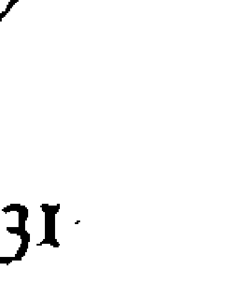

#### 自我獻身的儀式

準備一缸溫的洗澡水。灑一匙鹽和幾滴有香味的精油，譬如檀香精油。

如果你沒有澡缸，那就用淋浴。在沐浴巾上抹鹽，滴上幾滴精油，然後擦洗全身。如果你在海邊或河邊執行這個儀式，如果你想的話，可以泡進海裡或河裡。

一邊沐浴，一邊準備接下來的儀式。將意識朝更高層的覺察開啟。深呼吸。清洗你身體的同時，也清理你的意識。

洗完澡後，擦乾身體，穿上衣服，準備踏上旅途。去到你覺得安全的野地裡。它應該是不受干擾的殊勝之地，蓄積了地球和土、水、火、風四元素的能量。它可以是在山頂上或沙漠中的峽谷或洞穴、茂密的森林、伸出海平面之上的岩層或湖中央的安靜小島。即使是公園中一個人跡罕至的角落或花園，也都可以。運用你的想像去找出這個地方。

除了一小瓶芳香的精油，你不需要攜帶任何東西。檀香、乳香、肉桂或任何一種精油都可以。到達你要獻身的地方，脫掉鞋子，靜靜坐著幾分鐘。如果你覺得途中有點累，請先靜下心來。深呼吸以便恢復正常，排開心中的瑣事。向四周圍繞著你的自然能量開放。

當你靜下心來的時候，以一隻腳為重心站起來，環顧四周，尋找最理想的地點。不要特意找；打開覺知引領你到達那個地方。當你發現它（你會知道就是它）的時候，坐下、跪下或仰躺著。把精油放在你身邊的地上，不要站著，要接觸地面。

繼續深呼吸。感覺周遭的能量。用你喜歡的任何字眼呼喚母神和父神，或是運用以下的召喚方式。背誦以下的字句，以便在進行儀式時毫不費力的說出來，或是信口說出都可以：

噢，母神，
噢，父神，
所有神秘的解答也是無法解答的神秘；
在這有力量的地方，我向你的本質開放。
在此時此地我改變了；
從此我要走上威卡的道路。
我獻身於你，母神和父神。

（稍事休息，安靜，不動。然後繼續）

我將你的能量吸入體內，
把它們摻入、混合、調和進我的能量，
讓我在自然中見到神聖，在神聖中見到自然，
在我體內和其他所有東西裡見到神性，
噢，偉大的母神，噢，偉大的父神，
讓我跟你的本質合一，
讓我跟你的本質合一，
讓我跟你的本質合一。

你也許會感覺體內萌生了活力跟能量，或是有種和平的平靜。你的心智也許會開始打轉。你腳下的地球也許會因為充滿能量而跳動。野生動物受到出現在此的靈性力量吸引，紛紛現身圍繞著你。

不管之後發生了什麼，你知道你已經開放了自己，母神和父神聽到你了。你應該感到自己的內部發生了改變，也許是感到平靜，或是感到自己的力量越來越大。

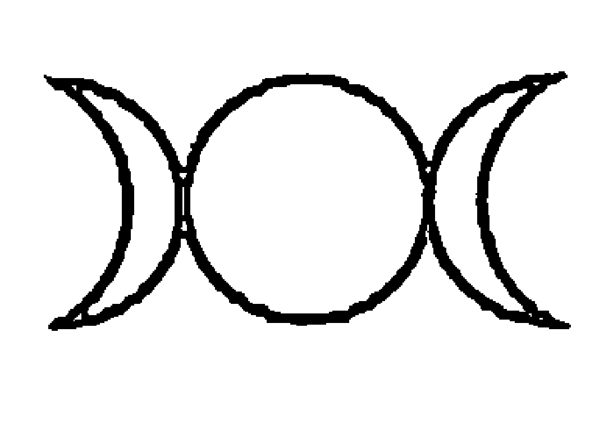

母神

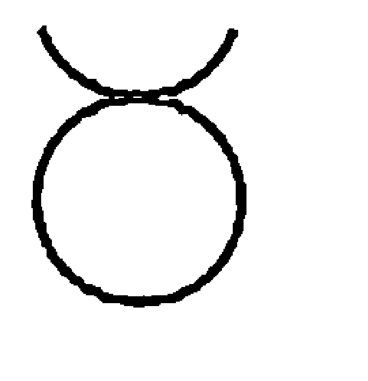

父神

#### 母神和父神的記號

在召喚之後，用手指沾著精油，在身上畫下母神跟父神的記號。畫在哪裡都可以；胸部、前額、手臂、腿上都可以。當你用精油畫記號在身上的時候，觀想這些記號陷入你的肌肉裡，一邊發光一邊進入你的體內，然後散發成數百萬微小的光點。

正式的獻身儀式現在就正式結束了。謝謝母神和父神關注這個儀式。在離開獻身地點之前要先靜坐一會兒。

回家後，用特別一點的方式慶祝。

### 第十三章 自己動手設計儀式

本書書末，收錄了完整的威卡儀式系統。我把它加進去以便那些沒法接觸到影子之書的人，在實際運用和研究時也可以有一部完整的影子之書在手邊參照。

這並不是說我們要牢牢遵循這些儀式。這並不是一種代代相傳多年的傳統，只是基本的威卡影子之書裡可行的例子。

因為我希望你能自由自在寫出自己的儀式，或者在有需求的時候逐步形成儀式，所以我就增添了這一章。

#### 威卡儀式的九個組成元素

威卡儀式的結構其實沒有什麼神秘可言，至少是再也沒有神秘可言。有些人說這是好事，威卡的神秘面紗一點一點被揭開了；另一些人認為這個信仰的浪漫氛圍被剝奪了。我了解這一點，但是（正如你們現在所知）我也認為威卡應該開放給每一個人。

這一章看起來也許很難，因為它針對的是精神性主題的理性分析面。就像我的朋友巴達曾經寫的話：「威卡就像是一朵漂亮的花。如果你一瓣一瓣將它撥開，來看它的結構，你還是會得到一朵花，但是卻不如當初那麼漂亮了。」我希望本章能避開這一部分。

首先，儘管我想要給你一個完整的架構，以便讓你組織自己的儀式，這樣的架構並非像刻在岩石上無法更動。以下這九點是威卡儀式的基礎，不過大多數的人只用到其中的一些，它們是你創造自己儀式的絕佳指南。

- 淨化自己
- 淨化空間
- 創造神聖空間
- 召喚
- 儀式禮儀（巫魔會或巫會）
- 集結能量（在施行魔法的時候）
- 將力量落實在大地
- 感謝母神和父神
- 解除魔法圈

#### 淨化自己

我在第六章〈儀式和準備〉已經提過淨化自己的方式，基本上包括洗澡、在身體上塗抹精油、靜心、深呼吸，以及其他淨化身體、心靈、靈魂，並且為了即將到來的儀式把自己打理好的方式。

這是真正的淨化，淨化讓你拋開日常生活中的麻煩與思慮。是讓你平靜下來的時刻。

儘管儀式化的沐浴在威卡中很常見，淨化身體的方式還有很多種。譬如站在一陣陣吹來的風中，觀想風把負面思考和情緒都吹走了就是一種。或是運用音樂，輕輕打鼓幾分鐘是很棒的淨化儀式（不過你的鄰居也許並不這麼認為）。其他可用來做淨化儀式的樂器包括鈴鑼、鑼、叉鈴（淨化水元素）、吉他、小提琴、豎琴和曼陀鈴（淨化火元素的樂器）。

強調淨化是有根據的，我們的身體不是靈魂寄居之所的流血戰場。我們每天都暴露在負面環境中，從報紙和新聞中大屠殺和毀滅的場面，到我們自己的黑暗思想。所以這些淨化儀式並非為了驅魔，而僅僅在於把我們從負面能量中解放出來。

淨化肉體之際，也不要忘了思想。為儀式做好準備。一位卡胡那（Kahuna，專精古代夏威夷魔法、哲學、宗教和應用科技如造獨木舟、房子、航海或藥草醫學等的專家）有次告訴我，當你在想像施行儀式時，你就已經是在這麼做了。儀式已經啟動了。能量在移動，意識在轉換。

在做儀式性淨化時，意識到自己已經點燃了蠟燭、設下魔法圈、召喚母神和父神。不要想那是接下來才會開始的儀式，因為它已經開始進行了。

這也許會讓你感到混淆，卻是訓練你的覺知的優秀工具。

#### 淨化空間

戶外的儀式性空間不太需要淨化。不過，室內的儀式卻多半需要淨化。大部分居住空間都會積聚「靈魂的垃圾」，在人類居住的地方會積聚負面能量和其他能量。由於這些能量可以被破壞，所以實際在這個區域施法之前，要做儀式性的清理。

#### 室內的儀式

對於家中的儀式，如果你單獨一人在家，請把門鎖好，拔掉電話線，並且拉上窗簾。在進行儀式的時候，一定要確保絕對的隱私和不受干擾。如果有其他人在家，告訴他們不要打擾你，等候進一步的通知。

如果這會造成家人的困擾，或是你的配偶或家人不給你時間獨處，那就等大家都入睡以後的夜晚或大家還沒起床的凌晨，來進行儀式。

實際清理地板。用一般的掃帚、吸塵器或拖把清理。清理乾淨之後，你可以用古老的巫師工具——魔法掃帚淨化空間。

- 魔法掃帚的帚尖不需要碰到地板。急速揮動掃帚，觀想掃帚掃掉了負面、病態和超自然的垃圾。你可以觀想掃帚射出火花，或者發出密密麻麻的藍光或紫光火焰，可以將負面成分變成灰塵。觀想並知道掃帚正以魔法清理房間，它就會去清理。

另一種淨化儀式是撒鹽、磨成粉末的藥草或樹脂如百里香、迷迭香、乳香、柯巴脂、鼠尾草或龍血（作者註：使用任何藥草於魔法中之前，把它握在手上，並且觀想、滲入你設計的個人力量之中），可以加進鹽裡或另外撒上，讓你的法力更為增強。也可以使用鹽水。

撒的動作會釋放鹽和藥草等物質中的能量，並導引和放大你的儀式目的和觀想的視覺影像，驅逐干擾性的能量。請強而有力的執行這個動作。

或是以順時鐘繞行的方式一邊彈奏一種樂器，一邊走到四個角落。總之，提升淨化的等級。你也可以唱誦，特別是唱出你感覺可以設立保護屏障和淨化能量的聲音。你也可以靠著實驗和提高靈性覺知發現哪些聲音適用於上述情形。

你也可以光是燃燒被證實具有淨化特質的藥草，諸如乳香、沒藥、鼠尾草、百里香或迷迭香當作薰香，可以單獨燒，也可以混著燒。讓儀式空間煙霧裊裊，並觀想它們驅走負面垃圾。

#### 戶外的儀式

戶外的儀式不怎麼需要淨化。自然環境中的靈性汙染，都大大少於我們的家和其他建築。用傳統的魔法掃帚（在這種情況之下，用掃帚掃去落葉和小石頭及負面能量）輕輕掃一下，並且配合你的觀想就夠了。噴灑純淨的水也不錯，鹽會傷害植物，最好不要在戶外用。

#### 創造神聖空間

這部分包括布置祭壇（如果祭壇不是永久的）和形成魔法圈。在第七章〈魔法圈和祭壇〉，我已不厭其煩的講過這個主題，這裡我就稍微提一下就好。

#### 祭壇的位置

雖然許多威卡巫師將祭壇放在神聖空間的中央，也就是將來的魔法圈的中間，其他人卻不會這樣做。有些人將祭壇放在魔法圈的一角，也就是邊緣上，通常是在北邊或東邊，他們說這樣會讓他們在圓圈中移動得更容易一些。我卻認為恰恰相反。此外，它還會限制你構成圓圈的方式。
你用什麼方式都沒有關係，所以兩者都試試，看看哪種對你來說最行得通。

我使用兩種祭壇，一種是永久的，一種是專為儀式設立的。我總是將祭壇放在圓圈中央，面朝北，因為我最習慣這種方式。此外，如果我把它放在圓圈的北端，我可能會踢到。

#### 圓圈的畫法

現在回到圓圈，或是「球形法力圈」這部分，你可以依據《巨石陣影子之書》裡的說明找出一種圓圈畫法。書裡記錄了很多種圓圈的畫法，但是在不同的情況下，應該用不同的畫法。其中的變數之一取決於你的喜好（或者是適合你的儀式空間）。

第一種畫法要大大仰賴你觀想和魔法的能力，因為它不用其他的工具，只用你的意念來畫圓圈。

為了協助你觀想，在地上放一根紫色的線繩或其他物件來標記圓圈周邊。站在祭壇前方或圓圈中央（戶外的儀式通常不會有祭壇）。面朝東或是你喜歡的方向，在體內聚集力量。當它到達一定的強度（有做練習就會知道），將你給予的手掌朝下，放在腰間。將手指指向未來圓圈的邊緣。

看見和感受到能量從指尖竄出，呈現震顫的光亮藍紫電流的能量帶。慢慢以順時鐘方向繞著圓周走。將力量向外推展，用觀想把它變成閃著魔法光芒的圓圈，寬度跟你的圓圈一致（通常是九呎以內）。這個圓圈應該籠罩著你和祭壇。

當這道光在空中旋轉時，用觀想將它拉大。看著它逐漸拉長和變大。把它凝聚成圍繞著儀式區域的半球形。它碰觸地面的部分應該跟你放在地面做記號的繩索完全吻合。現在將這股能量向下延伸，直到它以你為圓心，形成一個完整的圓形。

圓圈應該是一個活生生、會發光的實體。感受它的能量。

感覺圓圈的邊緣。感覺其中有振動和無振動的不同。不要理會一般威卡教義，用手碰觸或走進魔法球體中，並不會對你的靈性造成傷害，它並不像設立在你家周遭的電網。畢竟，大部分的魔法圈在設計上會是你站在圓圈邊緣的時候，你的頭和軀體的一半是在魔法圈的外圍。通過魔法圈，至多只會給你一股能量的振動，這麼做也會破壞圓圈。如果圓圈被破壞，只要再形成一個就行了。

當圓圈似乎已經完整和結實的圍繞在你身邊時，將你給予的手掌向下收在身側，切斷能量流。關掉能量流，如有必要甩甩手來阻止。

接下來，你就該召喚圓圈四個角落的主宰者。威卡教義跟概念對這四個主宰者有許多不同的版本。有些巫師把它們跟元素連結在一起，因此東方的「靈」或主宰者就跟風相連結；南方是火；西方是水；北方是土。

然而，也有威卡信徒並不認為自然界的四元素有這麼重要，他們只是將四元素視為四個古代安置衛兵或守夜者的方位，它們也許是早期的母神與父神創造出來的。

不過，有些威卡信徒卻把四元素看成大能者，是經過轉世輪迴的道路、功德圓滿的前人。這樣的功德讓它們可以「與母神和父神共存」。

也許跟這些能量接觸是最好的方式，然後自己再去發現。不管你如何看待這些主宰者，在召喚時請向祂們開放自己。在畫圓圈的時候，不要只是說出一些字眼或觀想顏色：請邀請祂們到場。用你的覺知向外伸展。意會祂們到底有沒有到場。太多威卡信徒只會在畫圓圈時說一些字眼，卻沒有驗證祂們是否有效。這些言詞除了可以提升儀式意識，其實是威卡儀式中最不重要的部分。

召喚四元素的主宰用不到言語，但若運用得當，可以是訓練注意力、專注於覺知和攪動情緒的工具。你可以運用書中畫圓圈那部分的召喚儀式，或者是寫下你自己的召喚儀式。

離開儀式中的圓圈時，要先鑿出一個出入口（見書末的《巨石陣影子之書》）。除了你清除的出入口的一小部分能量以外，還可以保留其餘大部分的能量。靠著這樣做，你可以在不干擾圓圈中其他能量的情況下，通往外在的世界。記住回來時要把出口關上。

另一種比較簡單的畫圓圈方式，就是用肉體的行動來集結力量，如果你對集結能量沒那麼在行，這倒是一個比較輕鬆的方式。站在未來的圓圈邊緣面北的地方，向右轉慢慢走，用腳畫出圓圈的邊緣。

當你繼續用腳畫圓時，你也許會想唱誦母神或父神的名字，或是唱誦兩者的名字。你也許會想像他們就在現場，或者將你的覺知轉向你正在發出的能量。如果你已經將祭壇放在圓圈的一邊，當你經過時，稍稍往內縮幾呎。

繼續順時鐘移動，但是步伐要稍微放大。能量會從你體內溢出，被你的動能拾起，被你帶向追隨著你圓形的路徑。

接著移動得更快一點，感到體內流動的能量。你也許會有種好像在水中行走的感覺——你釋放出的能量會隨著你移動。感覺你的個人的力量創造出一圈圍繞著祭壇的能量。牢牢建立起這股能量之後，召喚四個方位，然後儀式就開始了。

以上兩種方法對於即將施行魔法的儀式來說都很理想，但是對於純宗教的儀式，諸如建立精神性的能量來說，就完全沒有必要了。圓圈被認為是橫跨幽冥兩界，以及遇見母神與父神的地點，我們不必建造實體的神殿來跟大自然的神交流溝通，祂們也不會像寵物一樣，隨著我們的召喚立刻現身。威卡儀式是用來擴張我們對祂們的覺知，而不是要祂們立刻現身。

因此，複雜的畫圓圈方式（如《巨石陣影子之書》中所述）並非必要，特別是在戶外的儀式之中，因為這樣的圓圈幾乎無法形成。萬幸的是，還有其他比較簡單的方式可以運用。

在戶外的畫圓圈方式，只需要在四個角落各放上一支點燃的薰香即可。從北方開始順時鐘繞行圓圈，召喚四方的元素。你可以用一隻手指、一根魔法棒或白柄刀在沙上或土上畫出圓圈。對於海邊和山上的儀式，這是最好的做法。

或是你想用東西標記圓圈的周邊，最好是用植物：春天用花，冬天用松或冬青（其他建議請見《巨石陣影子之書》中的〈藥草魔法書〉）。用河床上被河水磨平的鵝卵石或白水晶排成一個圓圈，也是不錯的方法。

有些威卡信徒會拿一個沒有間斷的小圓圈當作界定儀式區域的東西。在圓圈中順時鐘移動的時候，要灑下磨成粉的藥草、麵粉（在古代的中東和現代的巫毒儀式中都用過）、磨碎的彩色礦石、沙或鹽。我之前也說過，可以將一條繩索擺成圓圈形狀。有關形成圓圈的方式，可參見書末的《巨石陣影子之書》。

#### 召喚

召喚可說是所有威卡儀式的核心，也可說是唯一必要的部分。威卡儀式是要與母神和父神的力量校準頻道，其他的都是撐場面的花稍把戲（作者註：儘管這些把戲肯定可以提高儀式意識，戶外的儀式卻不太需要召喚神靈，因為威卡信徒已經被顯化在大自然中的神靈所圍繞）。

「召喚」這個字眼不應該按照字面解釋。這個動作通常跟一篇祈禱詞或韻文有關，也可能包含音樂、舞蹈、手勢和歌唱。

在《巨石陣影子之書》裡有許多召喚母神和父神的儀式，在設計你自己的儀式時，可任意採用。但是別忘了，即興的召喚通常會比任何古老的祈禱詞有效。

如果你自己寫召喚詞，你可能希望押韻。數世紀以來的魔法傳統都證明押韻的價值。押韻確實讓召喚詞更容易被記憶，押韻也會接觸到無意識或通靈的心，它將我們以社會、物質和知性為依歸的意志變得昏昧迷糊，讓我們滑進儀式意識之中。

真的開始召喚時，不要因為忘了一個字眼、拼錯字或完全無法集中思考就暗罵自己。這種狀況很自然，大都是因為疲倦、壓力或希望在魔法圈中表現完美而來。

召喚需要你心甘情願將自己向母神和父神敞開。它不必是一個原始的表現。由於大部分的儀式都以召喚開始，它在某種意義上來說，是最真實的片刻。如果召喚不夠誠懇，就無法接觸到內在的母神跟父神，接下來的儀式也就只是虛有其表了。

不僅僅在進行儀式的時候，也在日常生活之中練習召喚母神和父神，終生都要進行召喚。別忘了：威卡的實踐不僅僅是在滿月的夜晚或巫會，而是一種全天候的生活方式。

在更形而上的意義而言，召喚是一種雙重面向的行動。它不僅僅召喚母神和父神，也喚醒我們（轉換我們的覺知）神聖的那部分——我們不可變洩、不可更改的本質，也就是我們跟老宗教的連結。

換言之，你在召喚的時候，不僅要召喚更高的勢能，也要召喚棲息在我們體內的神性，點燃存於所有生靈體內的神聖能量。

存在諸神之後的力量都是同一股力量，它們也存在於所有人類的體內。這也解釋了為什麼所有宗教的中心思想都差不多，而這些宗教為什麼會替他們的信徒服務。如果接近神靈只有一種可能的方式，就只會有一種宗教的典範，這樣的情況就完全不會發生。

母神與父神住在我們體內的概念，看起來也許有點自大（我們都是神聖的），不過這只是從失衡的觀點看來。沒錯，有些人抓住這樣的概念時，會有不可一世的囂張行徑。但是如果看出所有人類的體內都有神性，就可以矯正這種偏頗的觀點。

儘管從某種意義來說，我們是不朽的（我們的靈魂確實是），我們卻不是永生的神。我們不是在所有宗教中那些萬能、永恆、超自然的存在。

用愛和誠懇召喚母神和父神，你的儀式就會受到成功的賜福。

#### 儀式禮儀

如果儀式在巫龐會或巫會之際舉行，禮儀通常緊跟在召喚之後，有可能是靜心、轉換、感恩或只是幾分鐘的交流時間。在這些情況下，就有些該注意的儀式禮儀。

行儀式的時候，不需要過於陰鬱、嚴肅或墨守成規，威卡信徒對自己的信仰非常嚴肅，並不表示神也是（作者註：大部分威威卡信徒都有魔法圈災難的心愛小故事。我的故事發生在我引領一次儀式的時候。我拼錯了土元素主宰的名字，結果雙頭斧就從祭壇上掉了下來，在集結力量的時候，我的手打到了吊在祭壇上的枝狀燭台，這次儀式真的超爆笑。笑聲有儀式性和魔法性的功能。譬如說，真心嘲笑魔咒，可以破除它的效果。笑聲會在你的四周建立起強大的保護能量，沒有負面能量可以穿透。笑可以釋出大量的個人力量。

所以，當你把鹽給灑了、踢倒蠟燭或點不著香、忘掉韻文時，笑著再重新開始。有太多威卡新手在操作魔法圈時以為威卡是古板、嚴肅隆重的信仰，但是威卡從不這麼認為。

把這些念頭拋在腦後。威卡是和平快樂的信仰，也包括笑聲。威卡儀式不需要炫耀浮誇，除非有必要。

#### 集結能量

在這個練習中，這是個真正的魔法：移動自然能量以造成需要的改變。你可以在大多數的威卡儀式中集結能量，不過這並非必要。滿月、春分、秋分、夏至、冬至是施展魔法的最好時機，因為這些時刻有格外活躍的土能量，可以增強魔法的效力。

但這並不代表威卡儀式只是施行魔法的藉口。雖然八個有力量的日子（這是一個傳統）是施行魔法的最佳時機，但是許多威卡信徒並不會選這些日子，他們認為這幾個日子是與母神和父神校準頻道和慶祝的時刻，而不是施行魔法的時刻。

不過，威卡和其他宗教主要的差別之一，在於它接納魔法操控在每一個施行魔法儀式者的手中，而非任魔法掌握在某個神職人員手中，而其他人只是觀看而已。因此在施行召喚和儀式禮儀之後的威卡儀式中，每個清明的意識都可以操控魔法。在魔法中，確定你的需要是真實的，你的情感專注在這個需求上，你也知道你的魔法會生效。最簡單的咒語其實就是最有效的咒語。經過這麼多年，我喜歡選用彩色蠟燭、精油和藥草當作能量灌注的焦點。施行魔法的方式有千百種，請找到最適合你的。

就像我寫過的一句話：「魔法就是魔法。」魔法這個字眼多半不帶宗教意涵。在威卡中，魔法通常發生在召喚母神和父神、請求祂們現身和藉助祂們的力量來完成這個任務的時候。威卡所以能成為一個魔法信仰的原因即在於此。

形成魔法圈（或球）的目的是保存集結到的能量。用古老的方式（跳舞、不斷唱誦、觀想等）為咒語集結能量時，威卡信徒會把這股能量保存在體內，直到這股能量到達高峰，就會被釋放，然後送到它的目標。要完整保存這股力量並不簡單（尤其是跳舞的時候），因此魔法圈就成了從旁協助的工具。不過，一旦你放出了所有的能量，圓圈就無法阻擋能量流奔向目標。

施行魔法時並不一定需要魔法圈，不過當你召喚母神或父神時，魔法圈可以確保你得到的力量牢牢保留在圈內，直到你決定要送出為止。

請求母神和父神幫助你，應允你的請求或放大你的力量，不論你在魔法圈中施行的是什麼樣的魔法均可（作者註：只要是正面的魔法就可以）。

這樣做的同時，你也擴大了對體內神性的覺知，你開啟了一個頻道讓神聖的能量得以通過。在儀式的最後，說出對母神和父神的感謝，藉著點燃蠟燭或在地上的供品盤上放進食物或飲料來表達謝意。

### 第十三章 自己動手設計儀式

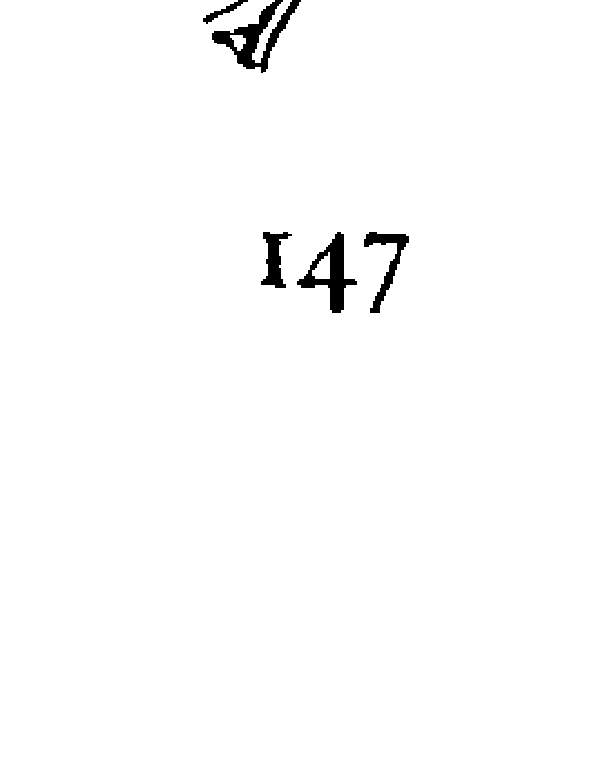

有關「邪惡的」魔法，這裡也無庸我贅言。任何用來傷害或控制另一個人（即使你認為是對他好）的魔法，就是負面魔法。它會把負面能量彈回到你身上。威卡信徒不會玩弄負面的魔法。

一旦完成魔法，停下來等一會兒。凝視母神和父神的蠟燭或祭壇上的圖片。你也可以看著薰香往上冒的白煙或碗中的鮮花。

想著諸神，還有你跟諸神的關係，以及你在宇宙間的位置。靠著轉移覺知的方式，將有關儀式的點點滴滴全部拋在腦後。

如果你確實釋放了能量，你可能會感覺筋疲力竭，往後靠在椅子上，放鬆一下。這是沉思的時刻。慢慢再開始下一個儀式步驟。

#### 將力量落實在大地

一旦將力量送出去，殘存的力量通常會在你體內迴盪。在魔法圈中也有殘餘的能量。它們應該被埋入土中，或重新改編以回到你正常的能量模式。即使你沒有施行任何魔法，結束儀式之前把能量埋入土裡的步驟中，如果包含一頓飯，將會有另一種神聖的特質。

某些威卡信徒稱之為「蛋糕和紅酒」或「蛋糕和麥芽酒」。在《巨石陣影子之書》中，我稱之為「簡單的盛宴」。它們都是一樣的：用儀式的心情消化食物和酒，讓我們從狂喜中回神。

吃東西會讓你的身體轉換到另一個模式。因為食物是地球的產物，能讓我們的覺知慢慢回到肉體的實相。食物是神聖能量的證明，吃東西是真正親密交流的形態。

這一餐可以是餅乾和牛奶、果汁和麵包、起司和紅酒，也可能是傳統半月形的蛋糕（實際上是餅乾）和紅酒（請參見《巨石陣影子之書》的〈魔法配方〉）。在吃東西之前，通常要先感謝這些食物。你可以在《巨石陣影子之書》中找到簡單的感恩儀式。

開動之前，剁幾小塊麵包、灑幾滴酒在地面上小小祭祀一下母神和父神。如果是在室內，把這些祭祀品放在特製祭奠用碗中。儀式完畢之後，盡速把這些祭祀品埋在外面的土裡。

嚐一小口鹽，然後灑在魔法圈裡。你也可以試著觀想。把過剩的能量看成滯留在圓圈中和你體內的紫色煙霧。拿某種工具（一把巫刀、一顆石頭、一個五芒星或其他工具），觀想它吸收了多餘的能量（試著用接納的那隻手拿住工具）。當圓圈被清除、你也回到正常狀態時，再把工具放下。用巫刀做這個儀式時，多餘的能量稍後可以用在咒語上，或形成魔法圈。還有更多可能的做法：某些威卡信徒會在祭壇底下放幾支蠟燭，然後把多餘的能量收在蠟燭裡。

#### 感謝母神和父神

接下來的威卡儀式包括感謝母神和父神出席你的圓圈。你可以用特殊的方式，譬如做手勢、唱誦或奏樂來表達感激，當場即興發揮表達謝意也可以。

有些威卡信徒認為這樣做是請諸神退散，我卻聳聳肩不以其他形態的圓圈，可以用另外的方式解除或驅散。如果你在祭壇旁邊擺了一圈石頭，請撿起來。拿開你用來標記圓圈周圍的花朵或植物，掃除那圈藥草、鹽巴或麵粉。

不管你用的是什麼方式，謝謝四個角落的四個元素的主宰者，謝謝祂們的光臨，請祂們再度光臨將來的祭典。

當圓圈消失之後，收起儀式的工具。如果你用了鹽和水，把剩下的鹽巴收起來留待下次使用，水則潑在地面上。供碗上的供品要跟薰香灰埋在一起，不過這些香灰有時也會留待下次咒語和儀式時使用。

祭壇不必立刻拆掉，可以留著過夜。當你收拾工具時，把掐熄蠟燭留到最後一步，會有很好的象徵意義。用燭花夾、你的手指或白柄刀（每次用完後要清除蠟和油灰）掐熄燭火。從代表四個方位的蠟燭開始，然後是其他的蠟燭，在熄滅代表父神的長蠟燭之後，最後熄滅代表母神的蠟燭，儀式到此就完成了。

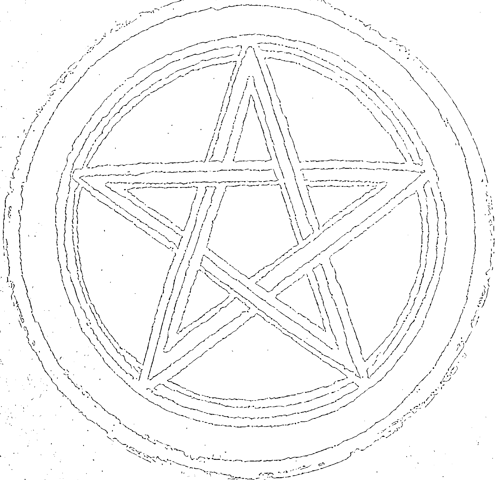

## 巨石阵影子之書

### 引言

這是一本完整版的影子之書，可以立即使用。我在多年前完成了其中的大部分，給想要施行魔法、但對巫師集會不得其門而入的學生。書中其實沒有什麼秘密可言，我用的都是最大眾化的方式，也並沒有向其他傳統轉借任何東西。

我在這本影子之書中盡量減少評論、註解和批評。如果你在讀這些儀式，或是在施行儀式時覺察問題，最好自行解決。不熟悉的字眼可以在附錄的〈威卡魔法用語〉裡查詢。

請記住，這只是影子之書中的一本，還有其他無數本影子之書存在，每一本都有自己的優勢和弱點。某些影子之書已經部分或者全部發行成書。

我再次強調這些書並不是神聖文件，也並沒有天啟在內，我用一種巴洛克式的浪漫行文方式，希望可以燃起你的想像力。別忘了，我再次強調影子之書並非不可更動。你可以在各種原因之下做各種變動，或是用這本影子之書當作建構自己影子之書的模式。我並沒有要展開新的威卡傳統的意思。

這個儀式是為個人建立的，若想要變成團體性的運作，就需要做點改變。為什麼要叫「巨石陣」？我對英國和歐洲的巨石柱林感到著迷。巨石圈和巨石柱林讓我的想像力馳騁，我想知道這些儀式遠古的創造者到底在這裡施行什麼樣的儀式（作者註：不是督伊德教〔Druid〕的僧侶團，他們在數千年後才來到這裡，跟巨石柱林的設立沒有關係）。我將這個系統設立的魔法圈看成一圈精神性、也是實質的巨石圈。如果你覺得這個概念不妥，可以改變這個儀式。別擔心，這樣做並不會讓你變成一堆沙。除非你利用儀式召喚血腥、死亡或活生生的獻祭，或者施行魔法傷害別人或扭轉他人的意志來服從你，否則不會有憤怒的神會降臨你的儀式。

在執行這些或任何其他儀式時，記住要觀想、要感覺、要移動力量。感受母神和父神的降臨。如果沒有的話，所有的儀式都會變成虛有其表。

我希望這本影子之書會抓住你的想像力，引領你走上威卡的道路。

對那些興致勃勃的人來說，通往這條途徑的大門已經敞開。

希望所有良善和正面的力量都圍繞著你。

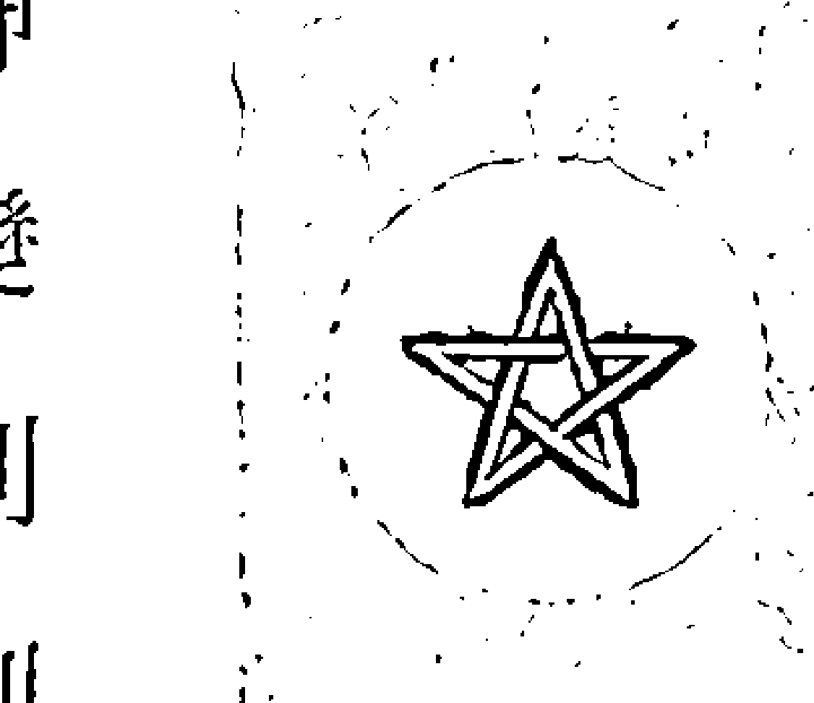

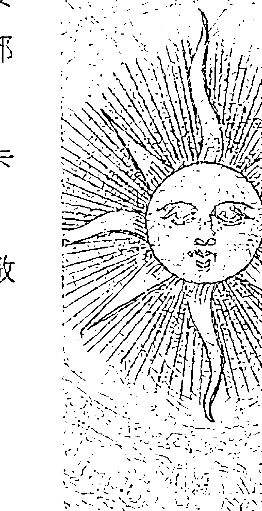

### 第一章 給智者的幾句話

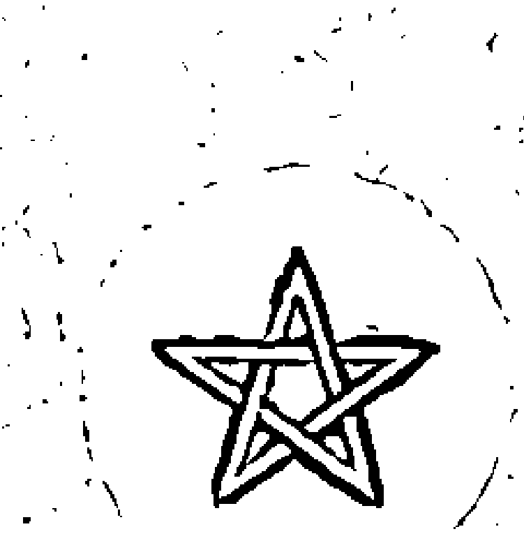

噢，地球的女兒和兒子們，請愛慕母神和父神，並受到完整生命的賜福。

知曉是祂們帶你看到這些文字，因為此中通往我們的威卡道路，成為智慧的守護者，知識聖火的看管人。用愛和歡愉來施行儀式，母神和父神將賜給你所需的一切。但是施行黑魔法的人該知道他們將受到極大的報應。

別忘了你是威卡的一員。不要心生疑慮，你走在光的道路裡，從一個又一個陰影中攀升到存在的最高層次。儘管我們擔負著真理，其他人卻不想分享我們的知識，所以我們在灑滿月光的天空下，在黑暗的陰影中施行我們的儀式，但是我們卻很快樂。

盡全力活著，因為那就是生命的目標。不要躲避我們在人世間的生存方式，我們從中不斷學習和了解，直到我們重生，再到這個世界上來學習更多，我們一直重複著這樣的循環，直到我們輪迴轉世到完美的境界，那個時候，我們就可以稱母神和父神是我們的同類。

在曠野和森林裡行走，接收涼風吹拂和花朵點頭相迎，你也因此疲勞全消。太陽和月亮在古老的野地裡歡唱：杳無人跡的海岸、乾枯的沙漠、狂奔流漓的瀑布。我們是地球的子女，該當尊敬她和她的榮耀。

在適當的日子和季節舉行慶祝儀式，當時間到的時候，召喚母神和父神，但是不到迫不得已，絕對不要使出「力量」，不要輕易出手。也要知道用「力量」傷害別人，是誤用生命本身。

然而對那些去愛和推崇愛的人來說，得到的報償將是豐富的生命，大自然會替你慶祝。

因此要敬愛母神和父神，不要去傷害任何人！

#### 我們道路的本質

若有可能，盡量在森林、海邊、無人的山巔或平靜的湖泊旁舉行儀式。如果做不到，在花園或房間裡也可以，不過要準備好薰香和花朵。

你大可在書籍中、珍貴的手稿和隱密的詩篇中尋找智慧，但是，你也可以在簡單的石頭、纖弱的藥草和野鳥的叫聲中尋找智慧。傾聽風聲低語、水聲隆隆，魔法就藏在其中，因為所有古老的秘密都保存在裡面。

書籍裡有言詞，但樹木裡卻蘊藏著書呆子不知道的能量和智慧。

你有沒有想過，古老之道一直在顯化自己。所以河邊的垂柳會低頭，隨風搖擺。那些保持不變的將會持久，但是那些進化和成長的卻會流芳世世代代。

智慧是不能被獨占的，因此一路上你必須和跟你一樣在尋找智慧的人分享你已經會了的事情，不過卻得在覬覦它、想要摧毀它的人面前隱藏這些秘密知識，若反其道而行，則會迅速遭到破壞。

不要嘲弄別人的儀式或咒語，因為有誰可以證明自己的儀式或咒語更強大或更有智慧？

確保你的行動是光明正大的，因為你所做的一切，將以三倍能量回到你身上，好或壞都一樣。

當心那個想要主導你的人，他會控制和操縱你的行動和敬愛。對母神和父神的真正敬愛是發自內心的。當心那些為了一己之私和榮耀，進而扭轉你所崇拜對象的人，不過卻要張開雙臂歡迎充滿愛的女性或男性神職人員。

- 榮耀所有活著的生命，不管是鳥、魚或蜜蜂。
- 不可摧毀活著的生命，除非摧毀可以延續你的生命。

這就是我們行事的本質。

#### 太古洪荒之前

在太古洪荒之前，有大能者；大能者就是全部，全部就是大能者。

而廣大無垠被稱為宇宙的就是大能者，它無所不知、無所不至、至大至剛，無時無刻不在改變。

然後空間移動了。大能者將能量分為兩股，相生卻相反，並且照著大能者自己的形象，從大能者中形塑出母神和父神。

母神和父神伸展身軀，向大能者致謝，但是黑暗籠罩著他們。他們是孤單的和唯一的，除了他們，就只有大能者。

因此他們將能量化成了草，草又化成太陽、星星和月亮；他們在宇宙間綴滿旋轉的球體，這些球體都出自母神和父神之手。

光出現了，天空被幾十億個太陽照亮。母神和父神對自己的傑作感到很滿意，祂們歡慶、相愛，而後結合為一。

祂們的結合萌生了所有生命的種籽以及人類，我們也因此可以在地球上達到重生。

母神選擇月亮作為祂的象徵，父神選擇太陽作為祂的象徵，好提醒地球居民不要忘記打造他們的是誰。

在太陽和月亮之下，所有的生命都出生、活著和死亡；所有的東西都經過其下，所有的東西都在大能者的賜福下發生，就像太古洪荒之前那樣。

#### 母神之歌 (根據摩根的召喚詞)

> (作者註：摩根是我第一位導師和女性神職人員。這首母神之歌和接下來的召喚父神，並不一定要在儀式中說出口。可以在以獻身為目的的儀式上唸出來，或在靜心時唸出來以便更了解母神和父神，或是在儀式中插入她或他等字眼使用，或是再做一點小小的更動以便符合這樣的改變。)

我是偉大的母親，
所有生靈和存在還未產生意識前就開始敬拜我。
我是太初的女性力量、永恆和無垠。
我是貞潔的月亮女神，各種魔法都會的女人。
風和被吹動的樹葉唱誦我的名。
我在眉毛上佩戴彎彎的月亮，
腳上踏著天空點點的繁星。
我是尚未被解答的謎題，一條初設的路徑。

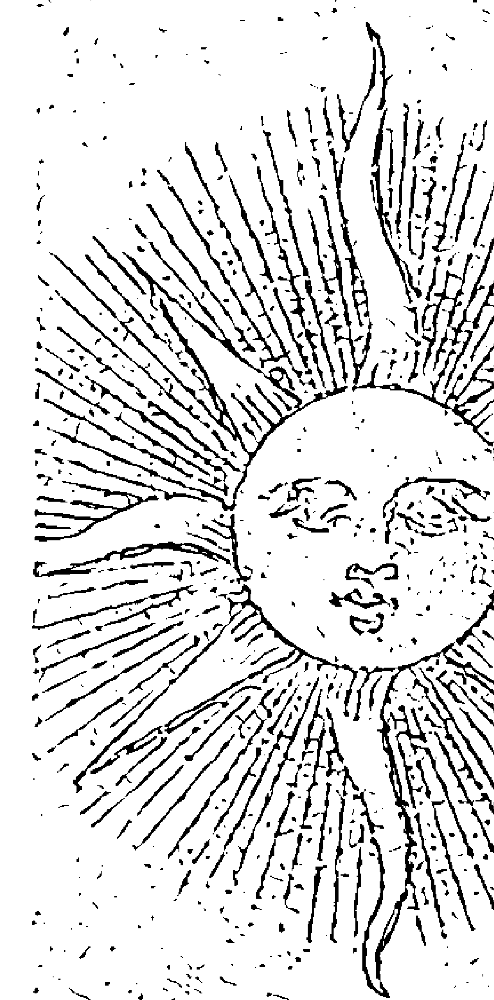

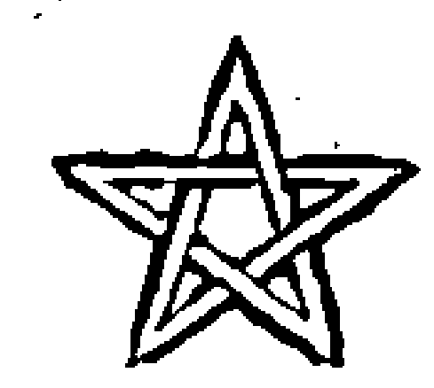

我是尚未被犁過的田。
我內心歡愉，也知曉飽滿的青春。

我是受到恩賜的母親，仁慈的豐收女人。
我穿著地球上深奧、佳美的奇景，
以及穀類結實纍纍的金黃田野。
地球的潮汐由我掌控；
所有作物都根據我的季節成熟收成。
我受到庇護和治療。
我是給予生命的母親，神奇的豐饒。

敬拜我這個乾癟的老嫗，
死亡和重生循環的守護。
我是輪子，月亮的影子。
我掌管女性和男性的生理週期，
讓憂心忡忡的人兒放鬆，重獲能量。
儘管黑暗的死亡是我的領域，
出生的歡愉卻是我送出的大禮。

我是月亮、地球和海洋的女神。
我有千變萬化的名字和能力。
我傾倒出魔法和力量、智慧及和平。
我是永恆的處女、萬物的母親和黑暗的老嫗，
我送出無盡的愛給你作為恩賜。

## 召唤父神

我是天上閃亮的王，
我用溫暖覆蓋大地，
鼓舞著隱藏的創造力種籽向外迸發顯化。
我高舉著光明的長矛照亮所有生靈，
日日將我的黃金光芒傾倒在地球之上，
擊退黑暗的力量。

我是狂野和自由的萬獸之主。
我跟矯捷的雄鹿賽跑，
像神聖的獵鷹一樣在蔚藍的天際翱翔。
古老的森林和野地激發了我的力量，
天空的鳥兒歌頌著我的神聖。

我也是最後的一次收成，
我將穀類和食品奉獻給時間的鐮刀，
好讓所有的東西都得到滋潤。
沒有栽種就不會有收成；
沒有冬天也就不會有春天。

敬拜我這個有數不清名號的創造之陽，
野地裡有角雄鹿的精神，無盡的收成。
在一年節慶的週期裡看到我的誕生、死亡和重生，
從而得知道這就是所有生靈的命運。

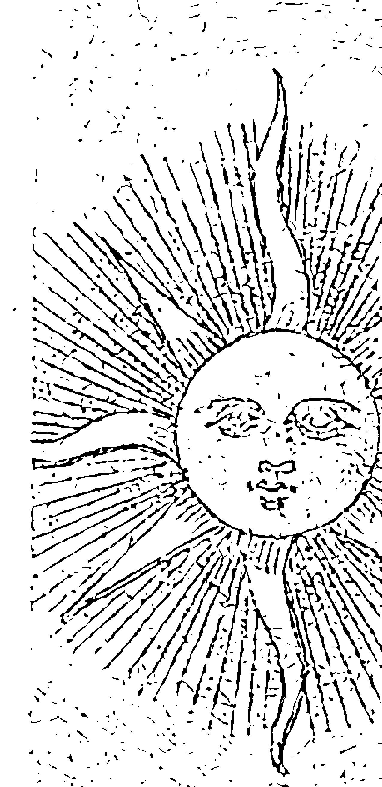

我是生命的火花，發光的太陽，
和平和休息的賜予者，
我將我的賜福之光溫暖萬事萬物的心靈，
強化他們的心智。

## 石头圈

石头圈可用在室内的仪式之中，用于集結能量、靜心等。

首先，以仪式用掃帚清理一片區域。

这个圆圈需要四个扁平的大石头，如果你没有，也可以用蜡烛来标记圆圈四个主要的点。可以用白色或紫色的蜡烛，也可依照颜色来代表不同的方向——绿色代表北方，黄色代表东方，红色代表南方，蓝色代表西方。

将第一颗石头（或蜡烛）放在北方，以代表北方石头之灵。当你在仪式中召唤石头之灵，你等于是是在唤醒所有寄居在那个方向的灵，包括元素的能量。

在设好北方石（蜡烛）之后，依序设好东方、南方和西方的石头。这些石头应该标示出一个几乎涵盖整个工作区的粗略方形。这个方块代表我们存在的平面——土。

现在拿出一条紫色或白色的长绳（作者注：经过造形或编织的纱绳），摆成圆形，用四颗石头或蜡烛当作引导。要练习一下才能顺利摆出圆形。绳圈应该圈在石头外。现在你已经有了方块和圆圈，圆圈代表精神性的实体。这是一个在方块外围成的圆圈；一个实体和精神交互贯通的领域。

圆圈的尺寸视你房间的大小和你的渴望而定，可以是五呎或二十呎不等。

下一步，設立起祭壇，請準備以下工具：

- 一個母神的象徵（蠟燭、有洞的石頭或雕像）
- 一個父神的象徵（蠟燭、角、橡實或雕像）
- 魔法棒
- 香爐
- 五芒星
- 一碗水（泉水、雨水或自來水）
- 一碗鹽（可以把鹽放在五芒星上方）
- 薰香

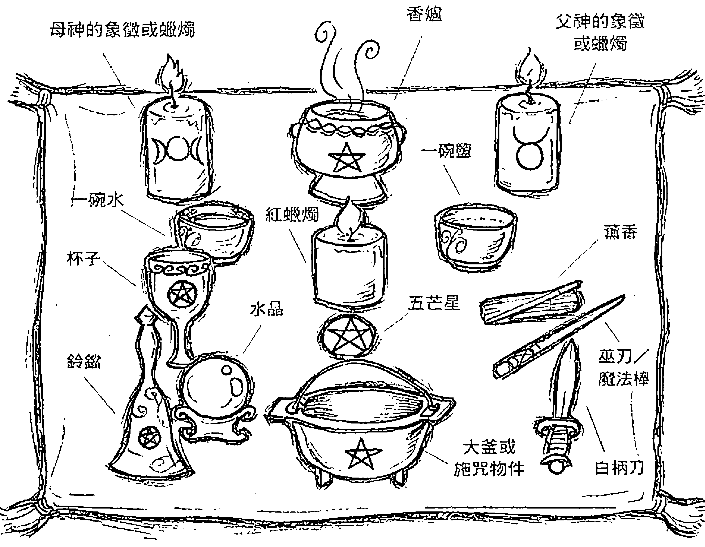

- 花朵和植物
- 燭台上的一支紅蠟燭（如果不是用星狀蠟燭的話）
- 任何其他儀式、咒語或魔法所需的工具或東西

根據上圖所示或者根據自己的設計設好祭壇。同樣的，也要準備好火柴和防火容器，以便盛裝用過的火柴。焚燒薰香還需要用到一塊木炭。

點燃蠟燭，讓薰香冒煙，拿起巫刃，用刀面碰觸水面，然後說：

> 我聖化並潔淨這碗水，
> 讓它淨化並適合放入這神聖的石頭圈內。
> 以母神和父神（如果你跟某位女神或男神特別有默契，就把祂的名字唸出來）之名，
> 我聖化這碗水。

你這樣做的時候，觀想你的巫刃把水中所有負面的東西都刮乾淨了。之後將刀尖插在鹽堆裡，然後說：

> 我淨化這碗鹽，
> 讓它適合放入這神聖的石頭圈內。
> 以母神和父神之名，我淨化這碗鹽。

現在面北站在用繩子做記號的圓圈邊緣，抓住巫刃從齊腰的地方向外指。順時鐘沿著圈圈的邊緣慢慢走，你的雙腳要剛好靠在繩圈的裡邊，用你的言語和能量將它充電。用你的觀想

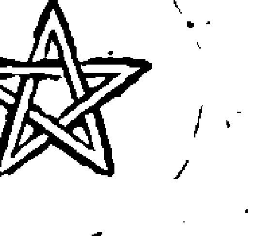

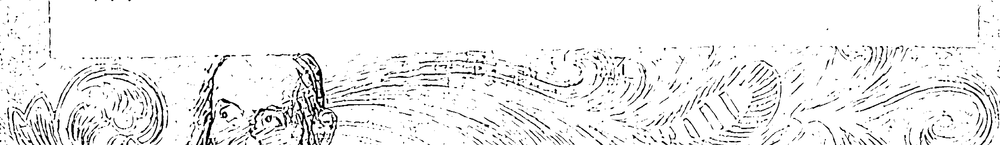

以及從巫刃泉湧而出的力量創造圓圈。你一邊走，一邊將能量舒展開來，直到它在工作區周圍形成一個完整的球體，一半在地平面之上，一半在地平面之下。在這樣做的同時說：

> 這裡是石頭圈的邊界。
> 除了愛，沒有東西可以進來。
> 大能者，用祢的力量為它充電！

當你從北面走回來時，請將巫刃放在祭壇上。拿起鹽巴撒在圓圈外圍，從北方起也從北方結束，順時鐘移動。接下來，拿著冒煙的香爐繞行圓圈，之後拿著南方的蠟燭或祭壇上點燃的紅蠟燭繞行，最後把水灑在圓圈外圍。除了拿起這些東西繞行，還要放大覺知的力量感覺這些物質在淨化空間。現在在石頭圈封閉起來了。

站在圓圈北方的邊緣，舉起魔法棒說：

> 噢，北方石頭之靈，
> 古老的土之靈，
> 我召喚祢前來這個圓圈，
> 大能者，用祢的力量為它充電！

在你這樣說的同時，觀想一陣綠色的霧從北方升起盤旋，飄在石頭上。這是土元素的能量。當靈出現的時候，放低魔法棒，走到東方，再度舉起魔法棒說：

> 噢，東方石頭之靈，

#### 給智者的幾句話

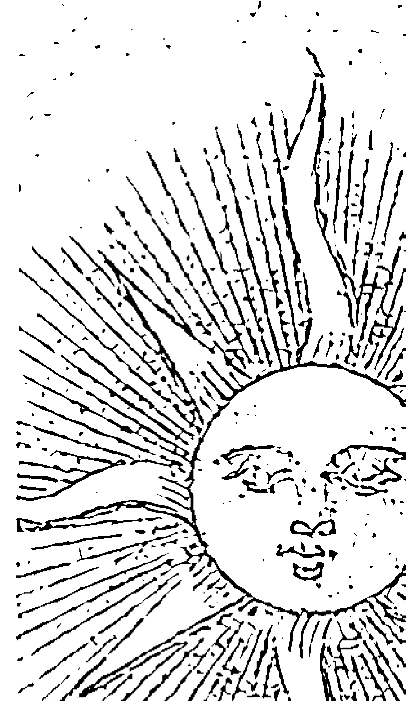

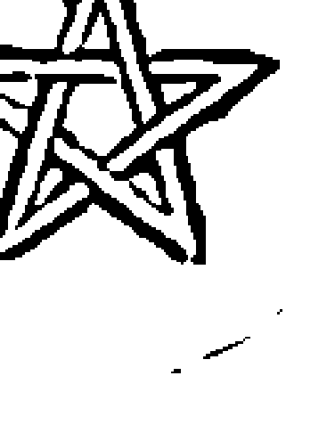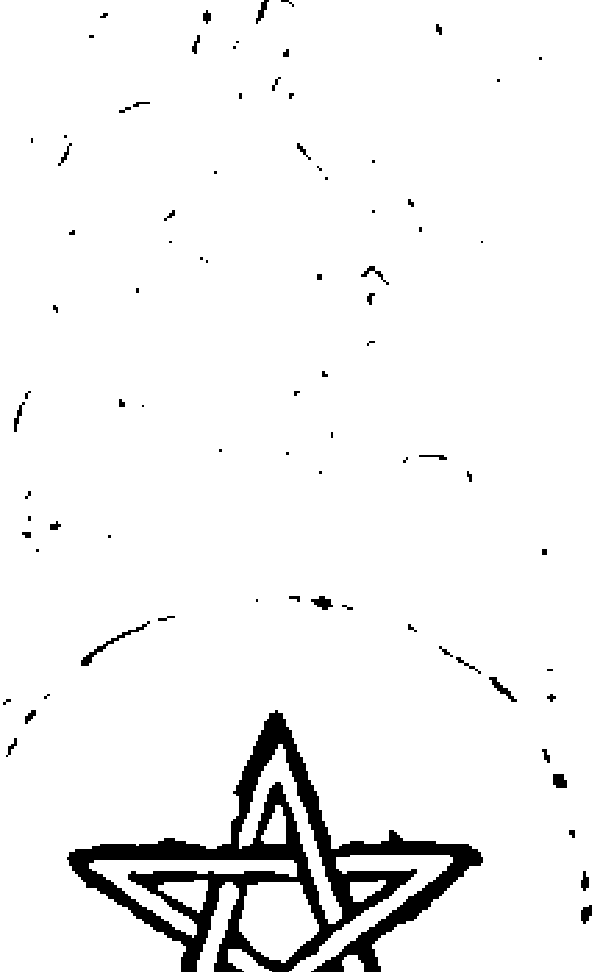

> 古老的风之灵，
我召唤你前来这个圆圈。
大能者，用你的力量为它充电！

观想一阵黄色雾状的风能量。放低魔法棒，移到南方，举起魔法棒再重复以下的动作，观想一阵深红色的火元素之雾：

> 噢，南方石头之灵，
古老的火之灵，
我召唤你前来这个圆圈。
大能者，用你的力量为它充电！

最后，走到西方，举起魔法棒说：

> 噢，西方石头之灵，
古老的水之灵，
我召唤你前来这个圆圈。
大能者，用你的力量为它充电！

观想一阵蓝雾，水的本质。
圆圈开始在你四周呼吸和活了起来。石头之灵出现了，感受它们的能量。观想圆圈因充满了电而发亮和变大。静静站着，感受一会儿。
石头圈已经完成了。可以开始召唤母神和父神，魔法可以开始运作了。

现在你已经可以离开圆圈了。这样当然很好，但就像先前提过的，穿越圆圈会让圆圈消散。为了防止这样的情况发生，传统做法就是切出一个入口。

面向东北方。拿着巫刃，刀尖往下朝着地面。看着并感觉你面前的圆圈。用巫刃戳进能量墙，画出一道拱门，高度要让你可以通过，逆时钟绕行圆圈大约三呎。把巫刃的刀尖向上对着拱门的中心，然后沿另一边下来，直到刀尖接触地面。

在你这样做的同时，观想圆圈里这一区的能量被吸收进巫刃里。这样做形成了一个空洞，让出一个可以进出圆圈的通道。把巫刃从能量墙中拔出来。现在你就可以向外走了。

一旦回到魔法圈之内，关门时要把巫刃放在拱门的东北角（作者注：传统的方位，在某些巫师集会里，成员就是从这个方位进入或离开圆圈）。用巫刃顺时钟沿着圆周画线，仿佛要把圆圈那部分的石头画回来。再度观想蓝色和紫色的能量从刀尖涌出，跟圆圈的其他部分会合。这样就完成了。

一旦仪式结束，面向北方，高举着魔法棒说：

再见，北方石头之灵。我感谢你在这里现身。带着你的力量离去。

将魔法棒放在祭坛上。拿起巫刀。站在北方，齐腰举起巫刀戳进圆圈的墙。顺时钟绕行圆圈，观想它的力量被吸回巫刀之中。能量被收回刀锋和刀柄里。感觉圆圈解体、缩小，外面的世界逐渐接管了这个区域。当你再度回到北方时，圆圈已经消失了。

你可以一边画圈，一边用以下的观想方式辅助石头圈形成：

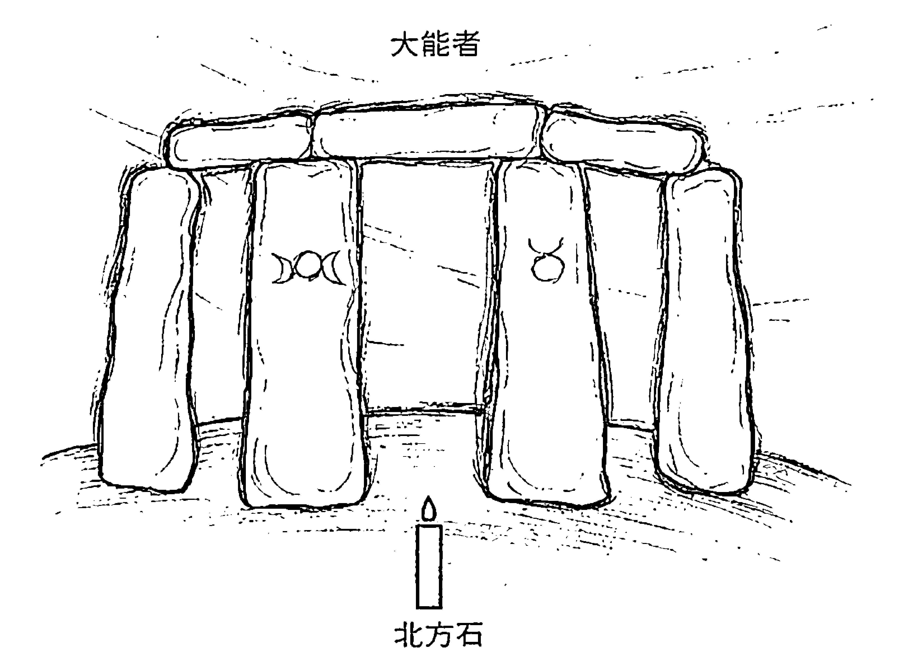

先准备如前。走到北边在地上设立北方石（或蜡烛）。然后观想一块厚厚的石板竖立在北方石左后方两呎处。观想这块石头是蓝灰色的，两呎宽，两呎厚，六呎高。这块石板代表母神（见上图）。

当石头真正站在那里的时候（在你的观想中），在北方石的右后方两吋处，创造另一块同样大小、同样颜色的石板，用它来代表父神。

现在观想两块竖立的石板上，撑住了一块平放的石板。它两呎宽，两呎厚，五呎长，代表母神和父神之后的大能者，所有力量和魔法的源头。现在这座北面的石牌坊完成了。

这些石头形成了一道拱门，通往土元素真相的象征性入口。

牢牢观想这个画面，然后从石板形成的拱门一直往里面看进去，看到土能量的绿色烟雾。

重复这个观想过程，用在东方、南方和西方。观想每一个石牌坊的元素的色彩。现在净化盐和水，像往常一样画圈，然后拿着盐巴、香炉、蜡烛和水绕圈。

每走到一个角落就召唤这个角落的石头之灵，在心里笃定的看到这些牌坊。观想它们沐浴在异教时代的壮丽光辉中。看到它们里面的元素冒烟、沸腾、袅绕，模糊一片。延伸你的感觉；感受每一个石头之灵的降临，再前往下一个。

多练习这样的观想就会来得轻而易举，但这样的观想并非必要。

+   - 愿大能者的力量，
- 所有生灵的源头；
- 无所不在、无所不能和永恒不朽；
- 愿母神，月之女，

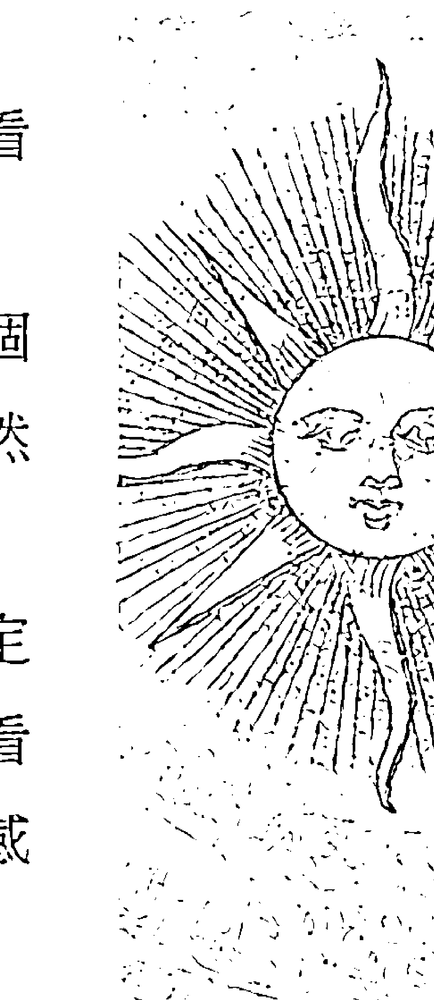

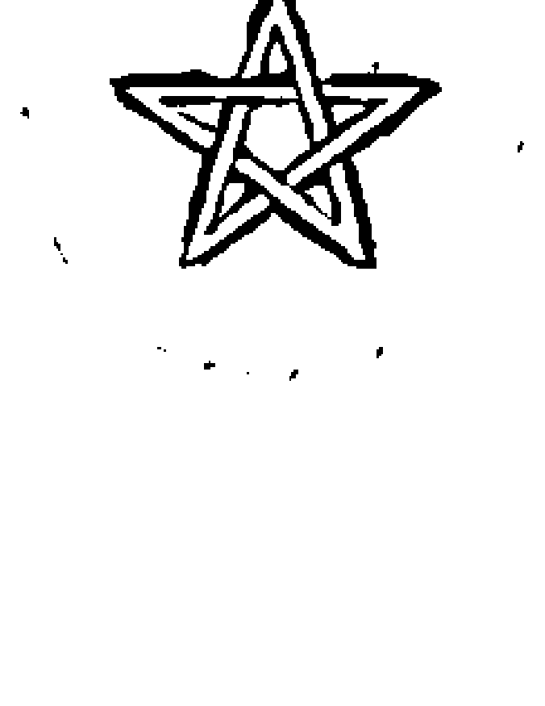

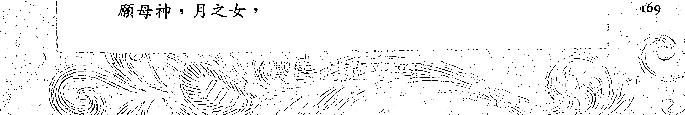

以及父神，太阳的兽角猎人；
愿石头之灵的力量，
元素界的主宰；
愿天上星和地上土的力量，
祝福这个地方、这个时辰和我这个跟随你的人。（作者注：祝福的赞美唱诵可以在任何仪式之前做，当作一个普遍的召唤。接下来可以展开对于母神和父神个别的召唤。）

双手高举着盛入红酒或其他饮料的酒杯，向天祝祷：

仁慈的丰饶母神，
祝福这杯酒并倾注你的爱。
以母神和父神之名，
我祝福这杯酒（或茶、果汁等）。

双手高举着一盘蛋糕（面包或饼干），向天祝祷：

强大的收获父神，
祝福这些蛋糕并注入你的爱。
以母神和父神之名，
我祝福这些蛋糕（或这些面包）。（作者注：简单的盛宴通常是在巫魔会或巫会结束时举行，这是欧洲乡间农事庆典中野宴的简易版本。除了红酒之外，也可以用其他酒精饮料。）

点燃蜡烛，让香炉冒烟，摆好石头圈。
把工具放在五芒星或一盘盐巴上方。用巫刃的刀尖（或是你给予的手）来碰它，并且说：

> 我圣化你，噢，钢铁之刀（或木头魔法棒等），
我清洁和净化你，好让你在魔法圈中侍奉我。
以母神和父神之名，
你被圣化了。

将给予的手的能量灌注进工具里，净化它所有的负面力量和与过去的关联。现在拾起一把盐，把盐撒向香炉的烟、蜡烛的火焰，再洒一点水，召唤石头之灵来圣化它。然后高举工具向天祝祷：

> 我以大能者之名：
以母神和父神的无所不能帮你充电，
以太阳、月亮和星星的美德，
以土、风、火和水的力量帮你充电，
经由你，我可以得到所有我想要的。
大能者，请用祢的力量帮它充电！（作者注：上述用在圣化仪式中的字眼，来自《所罗门王之钥》里的仪式，许多威卡传统都会使用这样的字眼。）

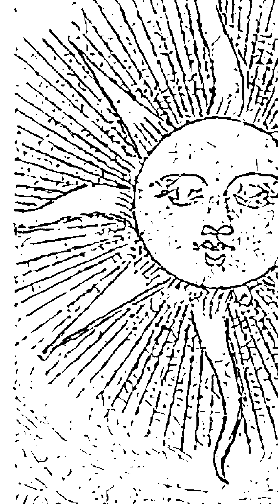

给智者的几句话

晚上看到月亮的时候，可以举行这个仪式。这个仪式上的祭坛可以放新月形的面包、白花、银饰或其他代表月亮的东西，也可以放白水晶球。或者，若你想要的话，可以放一个注满水的大釜（或者是白色或银色的小碗），在水面上放一片银饰。

把祭坛摆好，点燃蜡烛和香炉，并且把石头圈排好。

站在祭坛前方召唤母神和父神，可以用祝福的赞美唱诵或其他召唤方式（详见稍后的〈祷告、唱诵和召唤〉〔193页〕）。

现在可能的话，请凝视着月亮。感觉祂的力量浸入你的体内，感到凉凉的母性能量让你沐浴在力量和爱中。

现在说出以下的句子，或是相近的句子：

> 奇妙的月之女，
你用银色的一吻迎接薄暮；
黑夜和诸多魔法的情妇，
在黑色的天幕上驾着云飘荡，
并且在清冷的地球上洒下光芒；
噢，月之女神，
弯弯的弦月，
阴影的制造者和破坏者；
过去和现在秘密的揭示者；
牵引海洋的力量和女性的主宰；
无所不知的月之母，
我以荣耀你的仪式，

在你的天体珠宝能量最强的时期迎接你。

+   - 我对着月亮发誓，
- 我对着月亮发誓，
- 我对着月亮发誓……

不断唱诵“我对着月亮发誓”，直到你觉得够了为止。

你也可以观想母神是一个高大结实的女性，戴着银饰和穿着白色垂坠皱褶的衣裳。一弯新月可能依在她的眉毛上，或者她的双手轮流抛着一个银白发亮的天体。她跟她的恋人太阳父神，持续踏在永夜的星野上，所到之处遍布月光。她眉开眼笑，肤色白里透亮，光芒熠熠。

现在是施行任何一种魔法的时刻，因为满月表示月亮已经到达力量的高峰，这个时候施行的所有正面咒语都是最强而有力的。

满月同时也是静心、施行镜子魔法和通灵的最佳时刻，在魔法圈中施行这些法术往往会更为功德圆满。

满月时最适合做的一件事就是看水晶球。在进行仪式之前，先把水晶球浸淫在月光之下。如果你没有水晶球，可以用注满水的大釜，并且在水面上放一片银饰。凝视水面（或在银片上闪闪发光的月亮）以唤醒你灵性的觉知。

在施行过简单的盛宴后，可以喝月亮属性的饮料，如柠檬水、牛奶或白酒。新月形的蛋糕也是传统的点心。感谢母神和父神之后就可以解除圆圈，整个仪式就完成了。

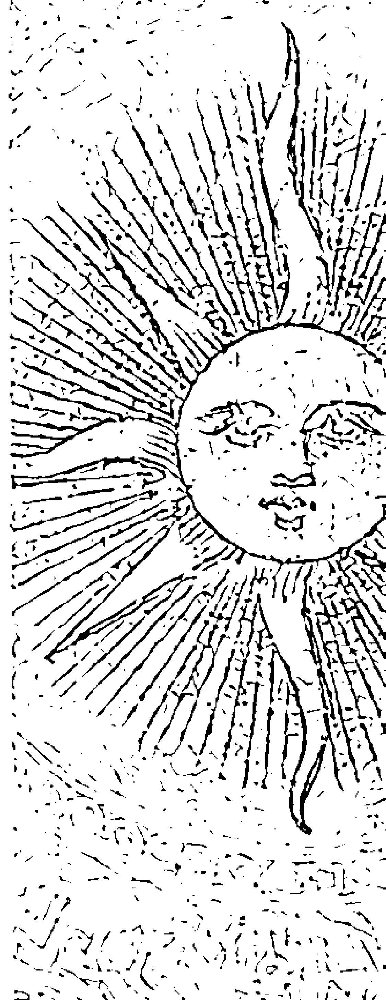

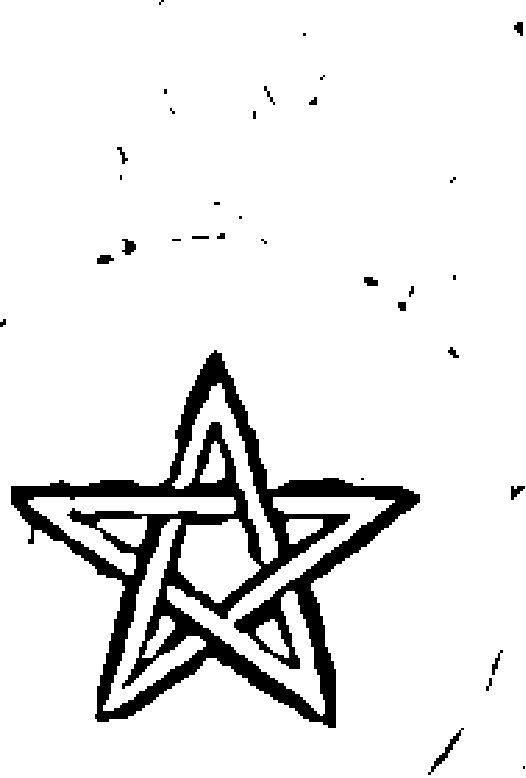

## 第二章 季节性的节日

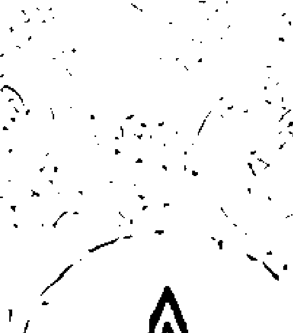

#### 冬至（十二月二十一日左右）

祭坛上妆点着松枝、迷迭香、肉桂、杜松和雪杉等长青植物，同样的植物也可以摆在石头圈外围帮魔法圈做记号。祭坛上可以放一些干燥的叶子。

大釜放在祭坛上可以防热的表面上（若大釜太大，可以放在祭坛前方），里面注满可燃烧的酒（酒精），或放一根红蜡烛在里面。在户外的仪式中，可在大釜中燃起一把火。

摆好祭坛上的供品，点燃蜡烛和香炉，摆好石头圈。唱诵《祝福之歌》（第169页）。召唤母神和父神（作者注：也可运用第193页〈祷告、唱诵和召唤〉里的任何一种召唤，或是你自己发明的祷词）。站在大釜前，朝里面凝视。说出以下的话或类似的话语：

> > 我不悲伤，尽管世界沉沉入睡。
> 我不悲伤，尽管刮着冷冷的风。
> 我不悲伤，尽管风雪严厉的吹。
> 我不悲伤，这些很快就过去。

点燃大釜（或蜡烛）中的大火。利用一根长火柴或纸媒点火。当火焰跳起时说：

> 我以你，母神的荣耀点燃这团火。
你从死亡里创造了生命；从寒冷中创造了温暖：
太阳再度活了起来；白昼的时间日益增长。
欢迎，一再重返的太阳神！
为万事万物之母欢呼！

将祭坛和大釜顺时钟慢慢转一圈，凝视着火焰。等一会儿再唱出下面的词：

> 巨轮转动：力量燃烧。

在太阳底下静心，冬天休眠的隐藏能量不只在地球上，也在我们体内。想像诞生不仅仅是生命的开端，也是生命的持续。欢迎父神的回归。
念完之后等一下，再度在祭坛和燃烧的大釜之前站起来，说道：

> 伟大的太阳神，
我欢迎你的回归。
希望你光明的照耀着母神：
希望你光明的照耀着大地，
播下种籽和肥沃土壤。
所有的祝福都给你，

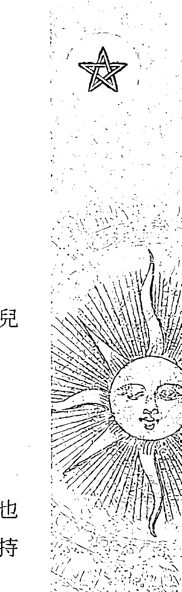

再度获得重生的太阳！

接下来，如有必要的话，可以施行魔法。庆祝简单的盛宴。解除魔法圈。

传统的冬至季节练习，就是做一株圣诞树。它可能是一棵种在盆子里，之后可以挖出来种在土地上的活树，或者是砍下来的树。你可以决定要用怎么样的树。制作配合圣诞树的威卡装饰品，从一串串干燥的玫瑰花苞和肉桂条（或爆米花和小红莓）到花环，以及吊在树干上的一袋袋芳香香料，和冰柱般吊在树枝上的、绑上发亮金属线的白水晶球，是很有趣的过程。

挂在树上的苹果、橘子和柠檬，看起来漂亮得不得了，这些自然的装饰在古代很常见。

很多人享受点亮圣诞柴（Yule log）的习俗。这是一个代表父神在母神圣火中重生的生动象征。如果你选择烧木材，选根好一点的（传统上是橡树或松树），在上面雕刻或用粉笔画个太阳（好比一个放出光芒的圆盘）或是用白柄刀刻一个父神（一个头上有角的圆圈或一个男人的身形），于冬至黄昏放在壁炉里点燃。木材燃烧时，观想太阳在里面照耀，想着更温暖的日子就要来临了。

至于食物，果子、苹果或梨子等水果，用泡在苹果酒里的葛缕子做的蛋糕，以及（非素食者）传统会上桌的猪肉。酒席、羔羊毛、洛神花或蓝茶都是搭配简单的盛宴或冬至餐不错的饮料。

### 圣烛节（二月二日）

这个季节的象征，诸如雪花、白花或装在水晶容器里的雪，都可以放在祭坛上。还没点火的橘色蜡烛，抹上麝香、肉桂、乳香或迷迭香油，也应放在祭坛上。画圆圈的时候，化掉的雪水可以当作水。

把祭坛摆好，点燃蜡烛和香炉，摆好石头圈。唱诵〈祝福之歌〉。召唤母神和父神，说：

> > 这是举行火炬盛宴的时刻，
> 每一盏灯都点亮，
> 迎接父神的重生。
> 我庆祝母神，我庆祝父神：
> 在沉睡的遮盖下，
> 大地欢庆。

用祭坛上的红蜡烛（或从圆圈的南方角落），点燃橘红色的枝状蜡烛。顺时钟绕着祭坛慢慢走，蜡烛拿在身前。说着以下的话或类似的话语：

> > 所有的陆地被包裹在冬季中。
> 空气清冷，寒霜覆盖着大地。
> 但是太阳的主子，
> 有角的野兽和荒郊野地，
> 隐藏的你又从仁慈的母神，丰饶之女中重生了。
> 为伟大的父神欢呼！

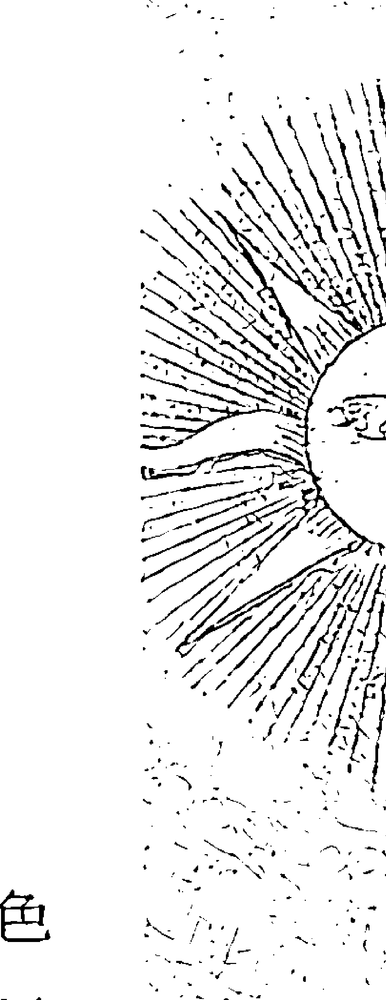

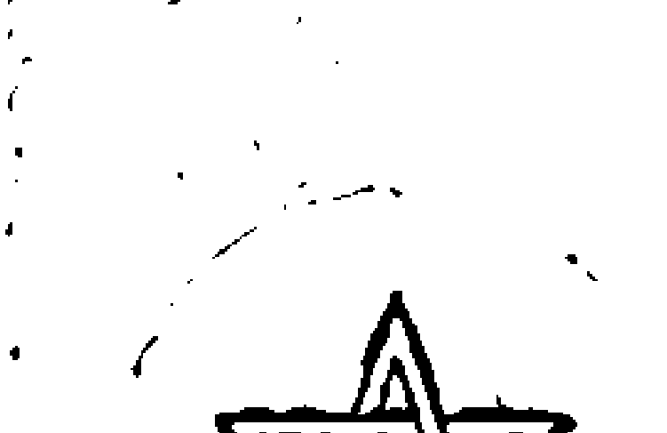

### 季节性的节日

欢呼加欢迎！

在祭坛之前驻足，高举蜡烛。凝视火焰。观想你的生命萌生了各种创意，有各种能量跟力量。

如果你想看进未来跟过去，现在正是理想的时刻。

此刻可以施行魔法。以简单的盛宴庆祝之后，就可以解除魔法圈了。

传统上每逢圣烛节，在黄昏或做完仪式之后，要点亮屋子里的每盏灯，即使只是一阵子都行。或者点燃每个房间的蜡烛，以荣耀太阳的重生。或者点燃一盏有红色灯罩的煤油灯，然后把它放在家里醒目的角落或窗边。

如果外面的地上有雪，请在外面走一会儿，回忆夏日的温暖。用给予的手在雪地上画下太阳的样子。

这个日子适合吃乳制品，因为圣烛节是生产小牛的节日。可以吃几盘用酸奶做的菜，荣耀太阳的辛辣和浓烈的食物也很合适。咖哩和所有含有胡椒、洋葱、韭菜、青葱、大蒜或珠葱的菜都可以。所有象征太阳的食物，包含葡萄干的辛辣酒菜，都是圣烛节的传统食物。

#### 春分（三月二十一日左右）

祭坛上供着鲜花，魔法圈周围则围绕着鲜花，地上也要点缀鲜花。大釜里注满泉水和鲜花，花苞和鲜花可以串成一串挂在身上。祭坛上要摆上一盆盆栽。

把祭坛摆好，点燃蜡烛和薰香，摆好石头圈。唱诵《祝福之歌》。以任何你喜欢的字眼召唤母神和父神。站在祭坛前，一边凝视着植物，一边说：

> 噢，伟大的母神，
你把自己从冬日冰封的监牢里释放出来。
现在是一片绿油油的时候，微风吹来花朵的芬芳。
现在是万物的开端。
在你的魔法之下大地回春，伟大的地母。
父神舒展筋骨站了起来，带着青春的狂热，
胸中充满对夏天的允诺。

碰触植物，跟它的能量连接，透过它连接整个大自然。藉由观想，周游叶子和根茎，从你意识的中枢到你的手臂和手指，进入植物本身。探测它内在的本质，感受它体内奇迹般的生命运作。一阵子之后，摸着植物说：

> 我带着友谊而非支配者的优势出现在地球上，
母神和父神，
藉由这株植物，
将所有生灵需要的温暖徐徐灌入我体内，

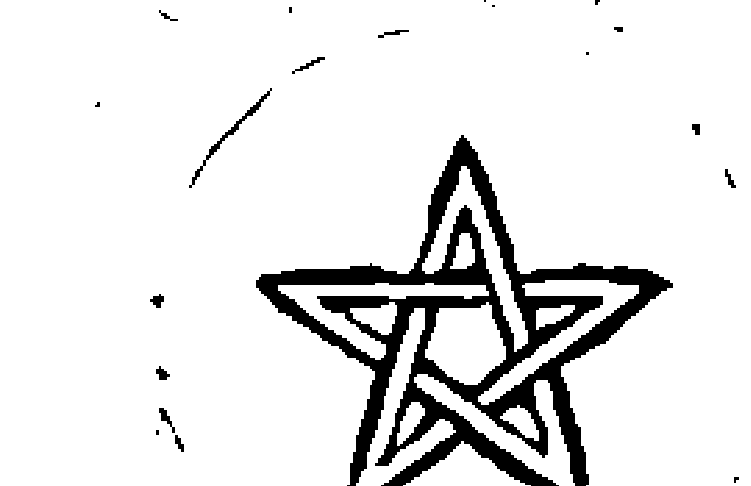

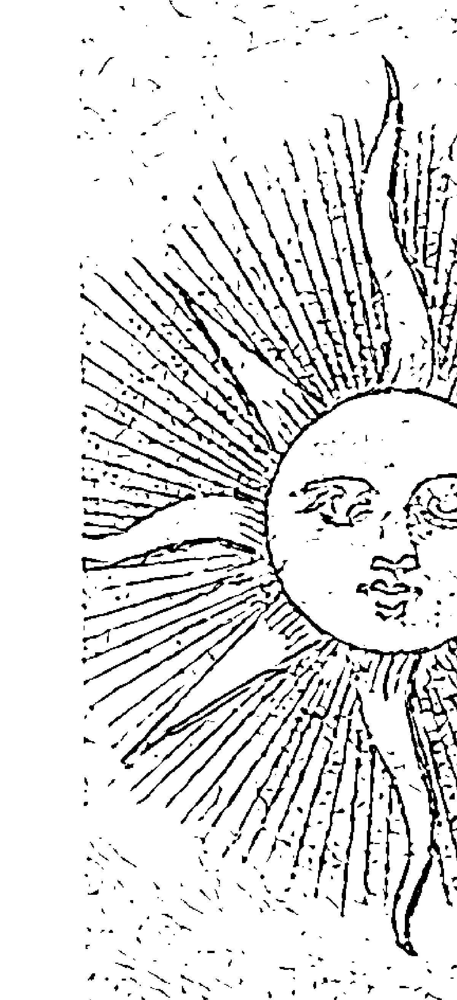

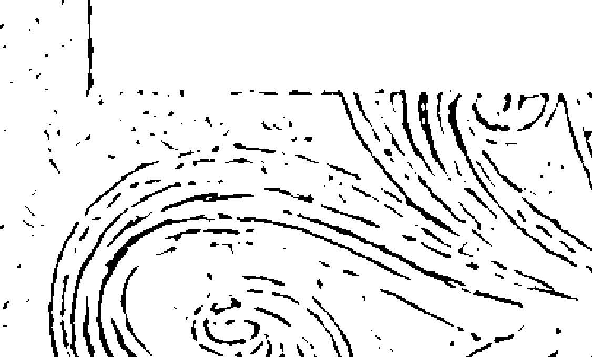

### 季节性的节日

教导我尊敬地球和地球上的宝藏，
希望我永不忘怀。

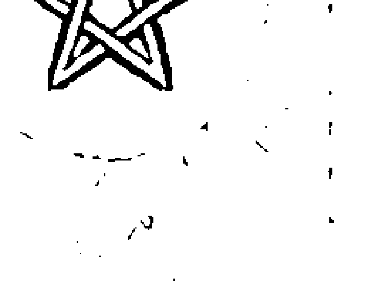

在季节转换时静心。感觉地球上被唤醒的能量围绕着你。
接下来可以施行魔法。以简单的盛宴庆祝，然后解除魔法圈。

传统的春分娱乐：来到原野，随意摘些野花（作者注：摘花之前要先谢谢它们牺牲自己，参考〈药草魔法书〉来做摘取的收集）。或是从花店买你喜欢的花，带回家，以书籍、你的直觉、灵摆或其他方式来圣化它们。你选择的花朵也显示了你内在的思想跟情绪。

在大地回春的此刻，别忘了要有计划的去花园、公园、林地、森林或其他地方走走（或骑车）。这并不是做运动，你不应该还想做些什么其他的事。不过，你也不仅仅是在欣赏大自然。你要一边走一边欢庆，这是一个庆祝大自然的仪式。

其他传统的行动包括栽种种籽、在魔法花园工作，以及施行所有跟药草有关的活动：魔法、医药、美容、美食和艺术的行动。

配合这个日子的食物（随着时节吃当令的食物是与大自然校准频道的好方法）包括各种种籽，诸如向日葵、南瓜和芝麻子及松子。嫩芽也是这个日子当吃的食物，譬如绿色叶菜类。水田芥或康乃馨杯子蛋糕等花类食品也是这个节令可吃的食物（找本食花食谱，或是自己做一个香甜的杯子蛋糕。用粉红色糖霜和康乃馨花瓣妆点蛋糕。塞了水田芥的杯子里可以混

进乳酪起司、切碎的核果、细香葱和水芹菜，会让人食指大动）。

### 五朔节（四月三十日或五月一日）

若有可能，在森林中或一棵活生生的大树旁庆祝五朔节。如果不可能，在祭坛里摆一棵小树，最好是盆栽；任何种类的树都可以。

做一个小纪念品或幸运符以荣耀母神与父神的结合，并且挂在树上。当然也可以在树上挂上好几个。这些小纪念品可以是装了香花的小袋子、串珠、雕刻品或花环，只要你想像得到或做得到的都可以。

摆好祭坛，点燃蜡烛和香炉，摆好石头圈。唱诵〈祝福之歌〉，召唤母神和父神。站在祭坛前，举起魔法棒说道：

> 噢，母神，
黑夜和大地之后；
噢，父神，白昼和森林之王，
我在大自然萌发出各种色彩和生命的时刻庆祝你们的结合。
请接受我庆祝你们结合的礼物，母神和父神。

在树上挂上小纪念品。

你们的交配将使万物更新；
丰沛的生灵将布满大地，

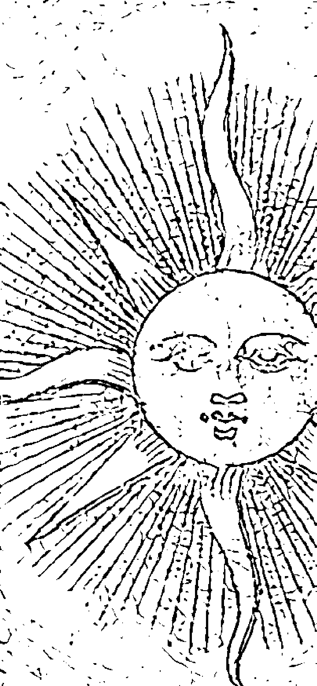

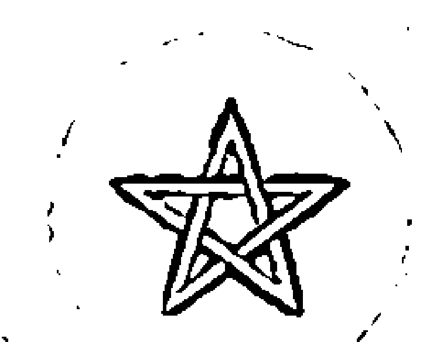

阵阵清甜的微风拂过。
噢，古老的神，我与你们共欢庆！

接下来可以施行魔法。以简单的盛宴庆祝。解除魔法圈。

这个节令的传统艺术是编织，因为把两种不同的东西交织在一起，形成第三种东西，就是五朔节的精神。

食物传统上来自乳制品，诸如金盏花蛋奶冻糕（详见〈魔法配方〉）和香草冰淇淋等点心都很搭。燕麦蛋糕也很合适。

#### 夏至（六月二十一日左右）

在祭典开始之前，做一个塞满诸如薰衣草、洋甘菊、贯叶连翘、马鞭草或〈药草魔法书〉里所列举的仲夏药草小香包。做香包时，用意志力将所有的烦恼、问题、痛苦、忧伤或病痛（如果你有上述问题的话）加入这个请求之中。用红绳子将香包拴紧，在仪式中放在祭坛上备用。大釜也应该放在附近。即使你是用蜡烛标出四个角落，在祭坛上也应该放一个插着红蜡烛的烛台。请在户外的仪式中点燃一把火（不管多小），然后把香包丢进火里。

摆好祭坛，点燃蜡烛和香炉，摆好石头圈。唱诵〈祝福之歌〉。召唤母神和父神。站在祭坛之前，高举魔法棒说：

我用神秘的仪式庆祝仲夏之午。

噢，偉大的母神和父神，
大自然的一切都在祢的能量之下振動，
大地沐浴在溫暖和生命之中。
現在是忘掉過去的憂慮和災害的時刻；
現在是淨化的時刻。
噢，酷熱的太陽，用祢無所不能的力量把所有無用、有害和災難性的東西燒光。
淨化我！淨化我！淨化我！

把巫刃放在祭壇上。拿起祈禱香包，用祭壇上的紅蠟燭點燃（或者，如果是戶外的話，可用儀式之火）。香包燒起來時，扔進大釜中（或其他防熱容器中），然後說：

> 我以母神和父神的力量阻擋你！
我以日、月、星辰的力量阻擋你！
我以土、風、火、水的力量阻擋你！

稍微停頓一下，看著傷害和痛苦被燒得精光，然後說：

> 噢，仁慈的母神，噢，仁慈的父神，
在這個仲夏夜魔法之中，
我祈求祢在我的生命中注入奇妙和歡愉。
幫助我接通漂浮在迷人夜晚空氣中的能量。
我感謝祢。

沉思你所經過的淨化。感覺大自然的力量流進你體內，用神聖的能量清理你的內在。之後可以施行魔法。以簡單的盛宴慶祝。解除魔法圈。

夏至是施行魔法的最佳時刻。此時施行有關療癒、愛情和防護的魔法最有效。如果舉行的是戶外魔法，可以在儀式之火上弄乾藥草。從火上跳過以得到淨化和更新能量。夏至的美食為新鮮的水果。

#### 收穫節（八月一日）

在祭壇上放上一把小麥、大麥、燕麥，以及水果和麵包，也許是一塊太陽形狀的麵包或象徵父神的男形麵包。穀物娃娃是母神的象徵，也可以放在祭壇上。

擺好祭壇，點燃蠟燭和香爐，擺好石頭圈。唱誦〈祝福之歌〉。召喚母神和父神。站在祭壇之前，高舉一把穀物說：

> 現在是首次收成的時刻，  
大自然把豐盛給了我們以讓我們存活。  
噢，成熟田野的父神，穀物的王，  
當你準備好將自己置於母神的鐮刀之下、  
踏上永夏土地的旅程時，  
請讓我了解你的犧牲。  
噢，黑月的母神，在太陽失去力氣和夜晚變冷時，  
教我重生的秘密。

用手指搓揉麥子的頂端，讓穀子灑落在祭壇上。拿起一片水果入口，細品筍中滋味，然後說：

> 我吃下首次的收成，
將它的能量跟我的混和，
以延續我對完美明亮智慧的追求。
噢，月亮之女和太陽之王，
兩位仁慈的大神，
星星在祢們之前都停下了腳步，
我向祢致謝，為了祢們延續大地的豐饒。
希望低垂的穀子將種籽掉落在地上，
埋進母親的懷抱，
確保它在來年溫暖的春天中重生。

吃光剩下的水果。其後可以施行魔法。以簡單的盛宴慶祝。解除魔法圈。

#### 收穫節傳說

可以將在儀式中吃掉的水果中的種籽種在土裡。如果它們發芽了，用愛來養育這株植物，當作你跟母神和父神連結的象徵。

編織麥稈（譬如做穀物娃娃等）是適合在收穫節做的活動；這個時節也適合拜訪田野、果園、湖泊和水井。

收穫節的食物包括麵包、黑莓和所有的漿果、橡實（先過濾掉毒素）、山楂、所有的穀類和本地的土產。可以再烤個蛋糕，並以蘋果汁取代酒。

如果你想要烤一個父神模樣的麵包，可以用在簡單的盛宴上。

#### 秋分（九月二十一日左右）

用橡實、橡樹枝、松果或杉果、穀物的穗子、麥程或其他水果和堅果裝飾祭壇。祭壇上還要放一個鄉村式的小籃子，裡面裝滿乾燥的各色葉子。

擺好祭壇，點燃蠟燭和香爐，設好石頭圈。唱誦〈祝福之歌〉。召喚母神和父神。站在祭壇之前，高舉一籃乾燥的葉子，慢慢撒下葉子，讓葉子逐一落在魔法圈裡，然後說：

> 落葉飄零，
日子冷了。
母神披上大地的披風，目送祢，噢，
偉大的太陽神，
向西航向被包覆在清冷寒夜裡謎一樣的領土。
水果熟了，種籽落了，
白晝和黑夜的時間平衡了。
北方吹來刺骨的風隱含著悲鳴。
在這個大自然的力量有如寂滅的時刻，
噢，受祝福的母神，我知道生命還在延續。
因為春天不可能沒有第二次收成，
就像生命不可能沒有死亡一樣肯定。
無數的祝福給祢，噢，殞落的父神，我目送祢踏上航向冬天的領土和進入母神慈愛臂彎的旅程。

一邊把籃子放下，一邊說：

噢，仁慈的豐饒母神，
我播下也收成了我行動的果實，好的和壞的。
賜給我勇氣，好為來年播下歡樂和愛的種籽，
阻擋痛苦和仇恨。
教導我明智活在這個星球上的秘密，
噢，某個被照亮的夜晚！

接下來可以施行魔法。以簡單的盛宴慶祝。解除魔法圈。

#### 秋分儀式

傳統做法是走進荒郊野外和森林，撿拾種籽的莢和乾掉的植物。某些撿來的東西可以用來裝飾家裡，其他則留給未來的藥草魔法。

秋分的食物包括第二次收成的落穗，所以穀物、水果和蔬菜占絕大多數，尤其是玉米。玉米麵包是傳統的季節美食，豆子和烤胡南瓜也是。

#### 巫師新年 (十月三十一日)

在祭壇上放上蘋果、石榴、南瓜、胡南瓜和其他晚秋時分成熟的瓜果。秋天的花，譬如金盞花和菊花也不錯。在一張紙上列出你想要從生命中釋出的東西：憤怒、壞習慣、不對勁的感覺和疾病。大釜或諸如此類的工具應該放一個在祭壇上，可以放在三腳架或其他防熱的面板上（如果大釜的腳不夠長）。還需要備有一個刻出八道光芒的小碟片（作者註：沒錯，在一個平盤或淺碟上畫一個大圓圈，中間點一個點，從這個點拉出八道光芒到達圓周。這樣你就有了一個輪子的象徵，這就是巫魔會的象徵，也是永恆的象徵）。

施行這個儀式之前，靜靜坐著，想著過世的朋友或愛人。不要沮喪。要知道他們已經去到更美的地方。在心中牢牢相信，肉體並不是唯一的實相，靈魂永遠不會死亡。

擺好祭壇，點燃蠟燭和香爐，擺好石頭圈。唱誦〈祝福之歌〉。召喚母神和父神。

舉起一顆石榴，用剛剛洗好的白柄刀刺穿果皮。刮出石榴裡的一些籽，放在畫了輪子的盤子裡。舉起魔法棒，面向祭壇說：

> 在秋分的晚上，
我記下你的消逝，
噢，太陽王，通過日落到達年輕的領土。
我同時也記下所有已經過世的人，
以及行將追隨他們而去的人。
噢，仁慈的母神，永恆的母親。
給予這些消逝者生命的你，
請教導我知曉在極端黑暗的時刻裡有著極大的光明。

吃石榴籽，用牙齒剔開，品嚐那苦甜參半的強烈滋味。看看盤中的八芒星記號，這也是年輪的象徵，季節的循環，所有生靈的結束和開始。在大釜中生火（放點燃的蠟燭也可），坐在大釜之前，拿著那張紙，看著火焰，說道：

明智的弦月，
星夜的母神，
我在妳的大釜中創造了這撮火來轉化折磨我的這些東西。
希望逆轉這些能量：從黑暗到光亮！
從壞的到好的！從死亡到誕生！

把紙丟進大釜的火焰中燒掉。在它燃燒的時候，明白自己的疾病消失、減少，最後從你身上離開，從宇宙的火焰中消逝（作者註：大釜被視為母神的化身）。

你可以在這個時候嘗試水晶球或其他占卜，因為這是看到過去和未來的最佳時刻。也可以試著回想前世，但是不要去干擾死者。用你的記憶榮耀他們，但不要召喚他們到你面前（作者註：許多威卡巫師試著在這段時間跟逝去的祖先和朋友通靈，但如果我们接受輪迴轉世的教義，我並不覺得這樣做有何意義。也許我們認識的那個人仍舊存在，但如果那個人的靈魂現在轉世到另一副軀體，不用說，要通靈就很困難了。因此，最好的方式就是以愛與和平記住他們，而不要召喚他們前來）。

把痛苦和失落的感覺灑進大釜的火焰裡。

接下來可以施行魔法。以簡單的盛宴慶祝。解除魔法圈。

## 季節性的節目

#### 巫師新年習俗

傳統上，巫師新年的晚上要放一盤食物在門外給亡靈吃。在窗前點燃一根蠟燭，引導它們進入永夏的領土，在密實的土壤中埋進蘋果，讓亡靈在上路時吃。

諸如甜菜根、蘿蔔、蘋果、玉米、堅果、薑汁麵包、蘋果汁、加糖和香料的熱飲酒和南瓜等食物都很合時令，還有一些肉（如果你吃素，最好用豆腐代替）。

### 第三章 儀式手勢

站在儀式的區域。靜下心來。深呼吸半分鐘左右，直到平穩安定。把心思轉向諸神。

面北，雙手齊腰，掌心向下。手指併攏，創造出兩個結實、平坦的平面。感覺到結實、基礎、豐饒。用這個手勢召喚土的力量。

一陣子後，面向東方。把手向上再舉高一呎，手心朝外（不再跟地面平行），手肘稍微彎曲。張開雙手的十根手指，保持這個姿勢，感覺到移動和交流。藉著這個手勢召喚風元素。

面向南方，雙手高舉過頭。手肘伸直，緊緊握拳。感覺到力量、威力、創造和破壞。透過這個手勢召喚火的力量。

面向西方，手往下移一呎左右。彎曲手肘，掌心向上攏成杯狀，用大拇指捏住食指。感覺到流體、大海和液化。透過這個手勢召喚水元素。

再度面向北方。頭往後仰，雙手高舉向天，掌心向上，十指伸開。啜飲大能者的本質，不可知、不可觸的萬物終極源頭。感覺到宇宙間的神秘。

放低給予的手，但是接受的手保持高舉，把中指、無名指和小指往掌心壓，伸出拇指和食指比出半月形。感覺到母神的實體。感覺到祂的愛、祂的豐饒、祂的同情。在這樣的手勢中感覺月亮的力量，永恆之海的威力——母神的降臨。

現在把接受的手放下，舉高給予的手，把中指和無名指往手心裡壓，用大拇指按住它們，食指和小指向天舉起，創造出頭上長角的形象。感覺到父神的實體。在手勢中感覺太陽的力量，荒野中不馴的能量——父神的降臨。

放下給予的手。平躺下來。張開雙腳和雙臂，呈現五角星的形狀。感覺四元素的力量在你身上流動，聚攏和融合進你的體內。感受它們從大能者、母神和父神的身上散發出來。

靜心、交融和交流。

完畢之後，站起來。你的儀式手勢就結束了。

作者註：正如本書正文第五章〈運用音樂、舞蹈和手勢〉所說的，手勢是滑進儀式意識的有效工具。重新閱讀這個章節之後，我有了架構一個儀式手勢的概念，不用任何實質工具，不用話語，不用音樂，甚至也不用觀想。儀式手勢僅以形狀暗示，蘊含了許多不盡的意思。它是用來跟能者、母神和父神，以及元素的力量接軌的工具，它的作用不在魔法或季節的觀察。

#### 力量的法則

力量不應該用來傷人，不該弄傷或控制別人。但如果真的有需要，力量可以用來保護你或他人的生命。力量只該用在最緊迫的時刻。

力量也可以拿來幫助你獲利，前提是不能傷害到他人。被人花錢收買來運用力量是不智之舉，因為它很快就會控制收受錢財的人。不要學其他宗教的人的壞榜樣。

不要為了標榜自己的驕傲而運用這股力量，因為這樣做會貶低威卡和魔法的神秘。

請記得力量是母神和父神賜予的神聖禮物，不該誤用或濫用。

這就是力量的法則。

## 召唤四元素

風、火、水、土，誕生自星際的元素，
我現在召喚你們，來到我面前！
在我正確畫出的魔法圈裡，
安然不受實質的詛咒或抨擊，
我現在召喚你們，出現在我面前！
從洞穴到沙漠，海洋到山丘，
由魔法棒、巫刀、杯子及五芒星，
我現在召喚你們，來到我面前！
這是我的意志，請如我所願！ (作者註：你可以繞著祭壇邊唱邊走或邊唱邊跳，為魔法的運作召喚元素的能量。)

#### 禱告、唱誦和召喚

在行儀式、畫好魔法圈之後，運用以下這些禱詞可以召喚母神和父神。當然，任何你寫的或被靈感激發而說出來的禱詞也都可以。

某些唱誦也需要涵蓋在儀式內，以便集結能量或跟神祇溝通。

某些召喚有押韻，有些沒有。我想這只是顯示我個人有多大的押韻能力。但是回頭想想押韻的力量，它真的可以讓有意識的心跟無意識的心或通靈的心相連，從而產生儀式意識。

> > 有些禱詞跟特定的神有關，但是神秘學家狄恩·福勤（Dion Fortune）寫過，「所有的父神都是一個父神，所有的母神都是一個母神，宇宙間只有一個啟蒙者。」（作者註：見Aspects of Occultism, London: Aquarian Press, 1962, p. 35）

#### 召喚母神

- 星空中的弦月，
- 沃原中的花朵，
- 大海中的嘆息，
- 小雨中的歡欣；
- 聽我在巨石陣中的唱誦，
- 我向祢的神秘之光敞開；
- 用祢的銀色基調喚醒我，
- 在我神秘的儀式中與我同在！

#### 召喚牧神

- 噢，偉大的牧神，
- 野獸與男人，
- 牧羊人與大地的主人，
- 我召喚祢來我的儀式
- 在這個最神奇的夜晚，
- 美酒的父神，
- 蔓藤的父神，
- 原野的父神，
- 雌牛的父神，
- 請用愛降臨我的魔法圈，
- 從天上將祝福送給我。
- 幫我療癒，
- 幫我感受，
- 幫我帶來愛和好運，
- 林中的牧神，林間的牧神，
- 在我魔法中與我同在！

#### 召喚艾西絲

月之艾西絲，祢是一切的根源，
一切的現在與一切的將來。
來吧，戴著面紗的夜之后！
帶著聖潔的蓮花香前來，
以愛與魔法為我的魔法圈充電。
請降臨我的魔法圈，我祈禱，
噢，祝福艾西絲！

#### 獸角神的禱詞

荒野中的獸角神，
閃耀天空中的翼神，
絢爛太陽下的光神，
巫師新年呼叫下墮落之神——
我在巨石陣中呼喚，
祈求祢，古老的神，
紆尊降貴降臨我神秘的儀式——
噢，熱烈的豔陽之主！

#### 獻給月神黛安娜的新月頌詞

漸圓漸滿，漸大漸長——
黛安娜的力量正在流動，流動。（重複）

#### 召喚父神

森林深處的古老的神，
萬獸與太陽之主；
當世界沉靜入睡
白晝已盡之際，
我在魔法圈中用古老的法子召喚祢，
祈求祢傾聽我的禱告，
將太陽的力量傳送下來。

#### 召喚母神

仁慈的母神，
祢是萬神之后，夜晚的燈火，
狂野和自由生靈的創造者；
女子與男子之母；
獸角神的愛人與威卡巫師的庇護者：
我祈求祢降臨，
將月光的力量傾注進我的魔法圈之內！

## 召唤父神

炙烈的父神，
祢是萬神之父，太陽之王，
狂野和自由的生靈之主；
女子和男子之父，
月神的愛人與威卡巫師的庇護者：
我祈求祢降臨，
將太陽的力量傾注進我的魔法圈之內！

#### 母神頌詞

月神，月神，月神，黛安娜
月神，月神，月神，黛安娜，
保佑我，保佑我，保佑我，黛安娜，
月神，月神，月神，黛安娜。（重複）

#### 給父神的夜晚頌詞

爲驕陽歡呼，
白晝之主宰；
黎明即起照亮我的道路。（一邊看着夕陽一邊說）

#### 給母神的夜晚頌詞

爲美麗的月亮歡呼，
夜晚的主宰，
護衛着我直到光線出現。（一邊說一邊看着月亮）

#### 母神頌詞

Aaaaaaaaaaaah
Ooooooooooooh
Uuuuuuuuuuuuu
Eeeeeeeeeeeeee
Iiiiiiiiiiiiiiiiiiiiiiiiiii（作者註：這幾個字母很明顯是英文中的母音。發音的時候，把聲音拉長。這會產生母神覺知，並喚醒通靈的心。）

#### 靈數學

數字可以用在儀式和魔法運作中。總而言之，奇數跟女人、接受的能量及母神有關；偶數跟給予的能量和父神有關。

- 1——宇宙；大能者；萬物的源頭。
- 2——母神與父神；完美的二元性；給予和接受的能量；配偶；個人跟神的結合；肉體跟精神的相互滲透；平衡。
- 3——三重母神；月亮的階段；人類的肉體、心智和精神三方面。
- 4——四元素；石頭之靈；飄動的風；四季。
- 5——感覺感官；五角星；四元素與乙太空間；屬於母神的數字。
- 7——古人所知的行星數；月亮盈虧階段的時間；力量；保護和魔法。
- 8——巫魔會的數字；屬於父神的數字。
- 9——屬於母神的數字。
- 13——巫會的數字；代表好運的數字。
- 15——代表好運的數字。
- 21——威卡曆中巫魔會和月亮的數字；代表母神的數字。
- 28——代表月亮的數字；代表母神的數字。
- 101——代表豐饒的數字。

行星的代表數字如下：

| 行星 | 數字 | 行星 | 數字 |
| :--- | :--- | :--- | :--- |
| 土星 | 3 | 金星 | 7 |
| 木星 | 4 | 水星 | 8 |
| 火星 | 5 | 月亮 | 9 |
| 太陽 | 6 | | |

> （作者註：這個系統有諸多版本。這只是我用的一個版本。）

#### 巫師的十三個目標

- 1. 認識自己
- 2. 認識自己的技藝（威卡）
- 3. 學習
- 4. 以智慧應用知識
- 5. 達到平衡
- 6. 言詞井然有序
- 7. 思想井然有序
- 8. 慶祝生命
- 9. 與地球的週期循環校準頻道
- 10. 正確的呼吸和吃東西
- 11. 運動身體
- 12. 靜心
- 13. 榮耀母神和父神

# 第四章
## 魔法配方

#### 食譜

##### 新月蛋糕

+   1杯磨得很細的杏仁粉
+   1¼杯麵粉
+   1½杯糖粉
+   2滴杏仁露
+   ½杯軟化牛油
+   1個蛋黃

將杏仁粉、麵粉、糖粉和杏仁露均勻的攪拌在一起。用手把牛油和蛋黃拌勻。將麵糰冷藏起來。將烤箱開到華氏320度預熱。掐幾塊核桃大小的麵糰，捏成新月狀，放在油紙上烤20分鐘左右。在簡單的盛宴時食用，特別是在巫會的時候（作者註：這是我能找到的最佳食譜。其他的食譜嚐起來味道都不對。純化論者也不必擔心這個食譜中加了糖。這是跟金星有關的儀式，在魔法的歷史中非常長久。）

##### 五朔節的金盞花蛋奶凍糕

+   2杯牛奶
+   1杯沒有散開的金盞花花瓣
+   1/4茶匙的鹽
+   3大匙糖
+   1到2吋厚的香草莢
+   3顆蛋黃，稍稍打散
+   1/8茶匙五香粉
+   1/8茶匙荳蔻
+   1/2茶匙玫瑰水
+   鮮奶油

用乾淨的研缽和杵搗碎金盞花花瓣，或用湯匙壓碎。將鹽、糖和五香粉、荳蔻香料一起搗碎。把金盞花和香草莢一起放入牛奶中燒煮。拿出香草莢，加進稍稍打散的蛋黃和其他乾燥材料。用低溫燒煮到可以裹上湯匙後，加入玫瑰水放涼。加上鮮奶油，點綴金盞花花瓣。

##### 無酒精蜂蜜酒

+   1夸脫的水，最好是山泉水
+   1杯蜂蜜
+   1片檸檬
+   ½茶匙荳蔻

在非金屬的鍋子裡，將所有成分一起煮。一邊煮，一邊用木杓刮去浮在表面的泡沫。等沫子完全消失後，加上以下的成分：

+   一撮鹽
+   半個檸檬汁

過濾和冷卻。在簡單的盛宴時，取代酒精性飲料或酒。

#### 薰香配方

製造薰香的方式就是把所有成分磨碎，再混在一起。混合時，感受它們的能量。進行儀式時，點燃香爐中的炭條。

##### 魔法園裡的薰香

+   4份乳香
+   2份沒藥
+   2份安息香
+   1份檀香
+   ½份肉桂
+   ½份玫瑰花瓣
+   ¼份馬鞭草
+   1/4份迷迭香
+   1/4份月桂

在魔法圈中點燃薰香，可用於各式各樣的儀式和咒語。乳香、沒藥和安息香是綜合香的主體。

##### 祭壇的薰香

+   3份乳香
+   2份沒藥
+   1份肉桂

當作祭壇上的一般用薰香，好在儀式中淨化和提升儀式意識。

##### 滿月儀式薰香

+   2份檀香
+   2份乳香
+   1/2份梔子花瓣
+   1/4份玫瑰花瓣
+   幾滴龍涎香油

在巫會或滿月時點燃薰香，以便跟母神校準頻道。

##### 春季巫魔會燒香

+   3份乳香
+   2份檀香
+   1份安息香
+   1份肉桂
+   幾滴廣藿香油

在春天或夏天的巫魔會儀式中燃燒。

##### 秋季巫魔會燒香

+   3份乳香
+   2份沒藥
+   1份迷迭香
+   1份雪松
+   1份杜松

在秋天或冬天的巫魔會儀式中燃燒。

#### 精油配方

要製作精油，只要把它們混和在小瓶子裡就可以了。可以在儀式上塗抹。

##### 巫魔會1號花油

+   3份廣藿香
+   2份麝香
+   1份康乃馨

在巫魔會儀式中塗抹，可增進跟諸神的交流。

##### 巫魔會2號花油

+   2份乳香
+   1份沒藥
+   1份五香粉
+   1滴丁香

如以上的方式塗抹。

##### 滿月1號花油

+   3份玫瑰
+   1份茉莉
+   1份檀香

在巫會之前塗抹在身上，以便與月亮能量校準頻道。

##### 滿月2號精油

+   3份檀香
+   2份檸檬
+   1份玫瑰

如以上的方式塗抹。

##### 母神精油

+   3份玫瑰
+   2份晚香玉
+   1份檸檬
+   1份玫瑰草
+   1份龍涎香

在行儀式時塗抹，以榮耀母神。

##### 父神精油

+   2份乳香
+   2份肉桂
+   1份月桂
+   1份迷迭香
+   1份麝香

在行儀式時塗抹，以榮耀父神。

##### 祭坛用油

+   4份乳香
+   3份没药
+   1份南姜
+   1份马鞭草
+   1份薰衣草

每隔一段时间定期涂抹祭坛，以便净化和加强能量。

# 第五章
## 藥草魔法書
威卡儀式中的藥草和植物使用指南

#### 擷取鮮花、藥草和植物

以白柄刀切割這些植物時，先用觀想與這些植物校準頻道，感受它的能量。在割取的時候，說以下這些話：

> 噢，小小的（植物名，如牛膝草等）！
> 我請求你慷慨捐出你自己以幫助我的工作。
> 在我的切割下更為茁壯、更有力量。
> 噢（植物名）！

如果是一棵樹，那就以樹名（譬如橡樹）取代。輕輕剪取你需要的分量，絕對不要從年幼的樹上擷取，也不要剪掉超過一棵樹的四分之一。在樹的下方留下供品：一枚銀幣、一顆亮麗的珠寶、一小杯酒、奶、穀物或白水晶等。把供品埋起來，整個儀式就結束了。

#### 魔法圈

魔法圈可以用對母神和父神來說很神聖的鮮花花環來裝飾。當然，鮮花也可以零星灑在魔法圈的裡面。

小石頭和適合四元素的藥草可以點綴在鮮花周圍，諸如：

+   北方：玉米、絲柏、蕨類、忍冬、小麥、馬鞭草
+   東方：刺槐、佛手柑、苜蓿、蒲公英、薰衣草、檸檬香茅、薄荷、槲寄生、歐芹、松木
+   南方：羅勒、康乃馨、雪杉、菊花、蒔蘿、藿香、錦草、冬青、杜松、金盞花、薄荷
+   西方：蘋果花、香蜂草、山茶花、貓薄荷、黃水仙、接骨木、梔子花、葡萄、石南花、洛神花、茉莉和蘭花

鮮花可以放在祭壇上，如果沒有花，也可以拿綠色植物如蕨類來取代。

在樹下蓋魔法圈時，你可以用水果、樹葉、堅果或樹上開的花來標示圓圈。

在繩子和石頭之外，你也可以把以上述諸元素列入考慮。

#### 烽火

如果你想在戶外儀式中升起一把火，可以用以下任何一種木材來燒，或混著用：

+   蘋果樹
+   橡樹
+   雪松
+   松木
+   水木
+   白楊
+   杜松
+   花椒
+   牧豆樹

如果這些木材都不可得，用本地木材也行。在海邊舉行的儀式可以用事先蒐集的乾燥漂流木來生火，照亮儀式。

#### 家中魔法圈

放在家中室外栽培的魔法盆栽，可在儀式當中放在魔法圈裡或祭壇上。如果你主要是在室內施法，選幾棵神聖植物湊成奇數，放在你的儀式區域中栽培。如果這些植物需要更多陽光，那就只要移到戶外，在進行儀式時再拿進來就可以了。給予它們能量和愛，它們會在你的敬拜和魔法中給你力量。

儘管除了有毒的植物，任何植物都可以使用，但是我最推薦以下幾種：

+   非洲董
+   棕櫚（任何一種均可）
+   紅色天竺葵
+   玫瑰
+   仙人掌（任何一種均可）
+   玫瑰天竺葵
+   蕨類（任何一種均可）
+   迷迭香
+   冬青
+   朱蕉
+   牛膝草
+   斑葉逑蘭

#### 做儀式的人

進行儀式時，你可在髮際和身上佩戴鮮花和香草。把鮮花編成花冠或花圈適合春天和夏天的儀式，橡木或松木則適合冬季的祭典。

你也可以戴上香草和種籽編成的項鍊，譬如把整顆的零陵香豆、肉豆蔻、八角、橡實和其他種籽及堅果串成一串。小松果串成的長項鍊也可以。

在夜晚舉行的滿月儀式則該佩戴夜晚開花的芬芳花朵，以便讓月亮的能量灌注在你身上。

#### 工具

以下是給首次使用的工具或正式聖化儀式之前的建議。用適當的觀想和儀式的意念來執行。

##### 巫刃或劍

日出時，在戶外不會被打擾的地方用新鮮的羅勒、迷迭香或橡樹樹葉擦拭刀鋒。把巫刃或劍放在地上，尖峰朝南。以順時鐘方向繞行三次，把月桂葉（最好是新鮮的）灑在上面。拿起巫刃或劍，面東站著，手臂下垂，兩手握刀朝上，召喚父神，請祂將力量灌注在你的巫刃或劍裡。把刀尖高舉向天，召喚母神用祂的愛和力量為你的刀鋒充電。用紅布將巫刃或劍包起來帶回家。可以一直包著，直到使用時再打開。

##### 白柄刀

清晨時走進森林（或者公園、花園或你的溫室）。選擇幾棵最漂亮、最有朝氣的植物。用白柄刀的刀尖輪流輕觸這些植物，在你的刀子和植物間形成連結（這樣也會跟大地形成連結）。

之後坐在地上。確定你旁邊沒有人，在地上用白柄刀的刀鋒畫出五角星。這樣就完成了。

##### 魔法棒

如果是木製的魔法棒，日落時拿到戶外，用新鮮的薰衣草、尤加利或薄荷葉擦拭。把它舉起朝向西方的天空（或者是月亮，如果看得到的話），召喚母神。在日出時分，再度把它拿到戶外，用新鮮的芳香葉子擦拭，朝東方舉起，召喚父神。

##### 五芒星

在光禿禿的土地上放上五芒星。把乾燥的歐芹、廣藿香、樹寄生或新鮮的茉莉和忍冬花放在上面。面北坐在前面數十秒，觀想五芒星吸收地球的能量。然後把它撿起來，把藥草和鮮花灑在四個角落，從北方開始，到北方結束。

如果一定要在室內進行，在小碟子裡填進新鮮的土，然後把五芒星放在土上。如前述進行聖化儀式，把藥草跟鮮花留下來，晚一點再灑到戶外。

##### 香爐

啟用香爐之前，把純的迷迭香、乳香或柯巴脂放進香爐裡焚燒。燒一個鐘頭左右。

##### 大釜

把大釜拿到小溪、河流、湖泊或海洋之中。蒐集一把生長在附近的植物葉子（如果是在海邊，可以蒐集海草）。把大釜泡在水裡灌滿。將葉子放進大釜中，然後放在水邊，同時分據沙和水的兩邊。用雙手摸著大釜，把它奉獻給母神，一邊念念有詞，任何自發性的言詞都可以。把水倒光，擦乾大釜，然後回家。充電儀式已經完成。

如果是在室內舉行，將大釜浸在一大桶的水裡或澡缸裡，室內點燃蠟燭。把一撮鹽灑進水中。水應該是冷水，進行上述的步驟。

鹽水會腐蝕金屬，大釜在浸泡海水或鹽水之後，要好好清洗。

##### 杯子

在杯子底部抹上梔子花、玫瑰或紫羅蘭精油，並注入乾淨的泉水。然後讓一枝長春藤、一朵小玫瑰、一枝新鮮梔子花及其他適合的鮮花或藥草浮在水面上。看進杯子裡，召喚母神來祝福。你也可以在夜晚拿到戶外，注滿水，盛住月亮的倒影。

##### 掃帚

用白蠟樹、樺樹和柳樹的樹枝做成掃帚。用洋甘菊、柳樹、香蜂草、接骨木、木槿莖或枝幹刷刷掃帚，然後莊重的將這些藥草埋起來。你可以在掃帚的手把上刻一個新月。

##### 水晶

在滿月的晚上，用新鮮（或乾燥）的艾蒿擦拭水晶球表面，再拿到戶外。舉起水晶球，讓它暢飲月亮的光芒和能量。把水晶拿到眼前，透過水晶看月亮。每年至少要重複這樣做三次，才能得到最大的效果。

##### 影子之書

可以在影子之書的封面織進神聖藥草的葉子，如馬鞭草、芸香、月桂、柳葉或其他葉子。葉子要完全乾燥，且曾秘密放在月光下曝曬。影子之書的封面當然應該用布蓋起來，才稱得上是影子之書。

##### 袍子

如果你選擇穿袍子，收進衣櫥抽屜時，最好在周圍塞一些薰衣草、馬鞭草和雪松的香包，做袍子時可在袍襬縫進一些迷迭香或乳香（這樣洗過之後就不會留下汗漬）。

#### 巫魔會的藥草

可當作祭壇、魔法圈外圍和屋內的裝飾。

##### 巫師新年

菊花、苦艾、蘋果、梨子、榛果、薊、石榴、所有的穀物、剛採收的水果和堅果、南瓜和玉米。

##### 冬至

冬青、槲寄生、常春藤、雪松、月桂、杜松、迷迭香、松樹。將蘋果、橘子、肉豆蔻、檸檬和整條肉桂棒等供品掛在聖誕樹上。

### 圣烛节

雪花、花楸、今年度開的第一批花。

##### 春分

黃水仙、車葉草、紫羅蘭、金雀花、橄欖、牡丹、鳶尾花、水仙花；所有春天開的花。

##### 五朔節

山楂、忍冬、金絲桃、車葉草；所有的鮮花。

##### 夏至

艾蒿、馬鞭草、洋甘菊、玫瑰、百合、橡樹、薰衣草、常春藤、蓍草、蕨類、接骨木、野生百里香、雛菊和康乃馨。

##### 收穫節

所有的穀物、葡萄、石南、黑莓、黑刺李、山楂果和梨子。

##### 冬至

榛果、玉米、白楊、橡實、橡樹枝、冬天的葉子、麥稈、絲柏果實、松果和熟成落下的穗子。

#### 滿月儀式的藥草和植物

在祭壇上放置所有晚間開花、白色或五瓣的花朵，如白玫瑰、夜晚綻放的茉莉花、康乃馨、梔子花、大仙人掌、百合和鳶尾花；所有散發出悅人芬芳的香花都應該用來召喚母神，樟樹也是象徵之一。

#### 供品

##### 給母神

所有水象和土象的花朵和種子，諸如山茶花、百合花、水生百合、柳條；一些在滿月儀式中用到的花朵；白色或紫色的花朵，諸如風信子、木蘭花、石南花和紫丁香；甜香味的藥草和鮮花；供奉給維納斯或月亮的花；芸香、馬鞭草、橄欖或其他適合的花草。

##### 給父神

所有火象和風象的藥草和花朵，諸如羅勒、菊花、金魚藻、苜蓿、薰衣草、松木；味道強烈、清爽或柑橘類的藥草或鮮花；由火星或太陽主宰的植物；黃色或紅色的花朵，如向日葵、松果、種子、仙人掌、薊和刺人的藥草；柑橘、鈴草、雪松、杜松等。

##### 給母神的神聖藥草

+   阿芙蘿黛蒂（Aphrodite）：橄欖、肉桂、雛菊、絲柏、檉椏、鳶尾、蘋果、桃金嬀
+   阿拉迪亞（Aradia）：芸香、馬鞭草
+   阿特米斯（Artemis）：銀冷杉、不凋花、絲柏、雪松、榛果、桃金嬀、柳葉、雛菊、艾蒿、椰棗
+   阿斯塔特（Astarte）：赤楊、松針、絲柏、桃金嬀、杜松
+   雅典娜（Athena）：橄欖、蘋果
+   巴斯特（Bast）：貓薄荷、馬鞭草
+   貝羅娜（Bellona）：莨菪
+   布里姬（Brigit）：黑莓
+   卡里克（Cailleach）：小麥
+   卡蒂亞（Cardea）：山楂
+   塞里斯（Ceres）：楊柳
+   西布莉（Cybele）：橡樹、桃金嬀、松樹
+   迪米特（Demeter）：小麥、大麥、薄荷、甜薄荷、桃金嬀、玫瑰、石榴、豆子、罌粟、所有栽種的莊稼
+   黛安娜（Diana）：白樺、柳樹、刺槐、苦艾、榛木、山毛櫸、冷杉、蘋果、艾蒿、藤懸木、桑樹、芸香
+   杜安提亞（Druantia）：冷杉
+   芙蕾亞（Freya）：黃花九輪草、雛菊、月見草、鐵線蕨、桃金孃、草莓、樹寄生
+   哈索爾 (Hathor)：桃金孃、小無花果樹、葡萄、曼德拉草、香菜、玫瑰
+   赫卡特 (Hecate)：楊柳、小無花果樹、天仙子、附子、紫杉、曼德拉草、仙客來、薄荷、絲柏、椰棗、芝麻、蒲公英、大蒜、橡樹、洋蔥
+   黑凱 (Hekat)：絲柏
+   赫拉 (Hera)：蘋果、楊柳、鳶尾花、石榴、桃金孃
+   西那 (Hina)：竹
+   赫爾達 (Hulda)：亞麻、玫瑰、黑籬蔞、接骨木
+   艾琳 (Irene)：橄欖
+   艾瑞絲 (Iris)：苦艾、鳶尾花
+   伊西塔 (Ishtar)：刺槐、杜松、所有的穀物
+   艾西絲 (Isis)：無花果、石南、小麥、苦艾、大麥、桃金孃、玫瑰、棕櫚、蓮花、牛油果、洋蔥、鳶尾花、馬鞭草
+   朱諾 (Juno)：百合、番紅花、日光蘭、楹桲、石榴、馬鞭草、鳶尾花、萵苣、無花果、薄荷
+   卡莉德溫 (Kerridwen)：馬鞭草、橡實�+   蜜娜娃 (Minerva)：橄欖、桑葚、薊
+   娜芙藤 (Nefer-tum)：蓮花
+   奈芙蒂斯 (Nephthys)：桃金孃、百合
+   努特 (Nuit)：小無花果樹
+   奧溫 (Olwen)：蘋果
+   普西芬妮 (Persephone)：香菜、水仙、楊柳、石榴
+   尼亞（Rhea）：桃金娘、橡樹
+   蘿溫（Rowen）：苜蓿、留茬田
+   維納斯（Venus）：肉桂、雛菊、接骨木、石南、銀蓮花、蘋果、罌粟、紫羅蘭、馬鬱蘭、鐵線蕨、康乃馨、翠菊、馬鞭草、桃金娘、蘭花、雪松、百合、槲寄生、松樹、楹椁
+   維斯塔（Vesta）：橡樹

##### 給父神的神聖藥草

+   阿多尼斯（Adonis）：桃金娘、玉米、玫瑰、茴香、萵苣、白石南
+   埃斯丘勒匹厄斯（Aesculapius）：月桂、芥末
+   埃皆克斯（Ajax）：飛燕草
+   阿努（Anu）：桎柳
+   阿波羅（Apollo）：韭蔥、風信子、纈草、山茱萸、月桂、乳香、椰棗、絲柏
+   阿提斯（Attis）：松樹、杏仁
+   阿瑞斯（Ares）：金鳳花
+   巴克斯（Bacchus）：葡萄、長春藤、無花果、山毛櫸、桎柳
+   巴爾杜（Baldur）：金絲桃、雛菊
+   布萊恩（Bran）：赤楊、所有穀物
+   邱比特（Cupid）：絲柏、糖、白色堇菜、紅玫瑰
+   戴格達（Dagda）：橡樹## 第六章 威卡水晶魔法

水晶和石頭是母神和父神給予的禮物。它們是神聖而有魔力的工具，可用來提高儀式和魔法的威力。以下是這類大地魔法的施行方法。

#### 準備畫魔法圈

用水晶或石頭擺出魔法圈，會比用藥草擺出來的有效。
從北邊開始，北邊結束，在圓圈周圍放下七、九、二十一或四十顆不拘大小的白水晶，可以放在繩子內緣或放在繩子上面。如果是施行一般精神性或魔法性質的魔法，水晶的尖端要朝外；如果是保護性質的魔法，尖端要朝內。
如果你用蠟燭標示魔法圈的四個角落，而不是用大石頭，請用以下的石頭圍繞每根蠟燭：

- 北方：苔紋瑪瑙、綠寶石、黑玉、橄欖石、鹽、黑色電氣石
- 東方：帝王拓帕石、黃水晶、雲母、浮石
- 南方：琥珀、黑曜石、菱錳礦、紅寶石、火山岩、紅石榴
- 西方：海水藍寶、玉髓、翡翠、青金石、月光石、舒俱來

#### 石頭祭壇

若要做石頭祭壇，可以沿著乾枯的河床或海邊，揀選各式各樣圓滑的小石頭，或是到石頭專賣店裡挑選適當的石頭。

選三顆大石頭，兩顆較小的做成基底，較大較長的石頭放在這兩塊石頭的頂端做成祭壇。祭壇左邊放一顆石頭代表母神，它可以是河床上圓滑的天然石頭，也可以是有洞的石頭、白水晶球，或跟母神有關的任何石頭（詳見下）。

祭壇的右邊放一塊石頭代表父神，它可以是火山岩、單尖白水晶、細長或梅花形的岩石，或是任何代表父神的石頭（詳見下）。

在這兩個石頭中央放一塊石頭，上頭滴蠟黏住紅色蠟燭，蠟燭既代表母神和父神的神聖能量，也代表四元素中的火元素。

在這幾個石頭前方放一塊扁平的石頭，放上酒、蜂蜜、蛋糕、半寶石、鮮花和水果等供品。供品石的左方要放一塊小的杯狀石頭（如果找得到的話），裡面注滿水，代表水元素。供品石的左方要放一塊平的石頭，灑上鹽巴，代表土元素。此外，供品石前方可以再放一塊平的石頭，充當香爐。

接著用一根細長的雙尖水晶當作魔法棒，另外用箭頭狀的打火石或黑曜石充當巫刃。其他工具都可以放在祭壇前，或者用石頭來代替。

這樣的設置可以用在所有威卡儀式中。

#### 母神的石頭

一般來說，所有粉紅色、綠色還有藍色的石頭都是母神的石頭，跟月亮或金星有關。由水或土元素主宰的石頭包括翠綠橄欖石、綠寶石、粉紅碧璽、粉晶、藍水晶、海水藍寶、綠柱石、紫鋰輝及土耳其石。

跟特定母神有關的石頭如下：

- 阿芙蘿黛蒂（Aphrodite）：鹽
- 塞里斯（Ceres）：綠寶石
- 蔻麗克優（Coatlicue）：翡翠
- 西布莉（Cybele）：黑玉
- 黛安娜（Diana）：紫水晶、月光石、珍珠
- 芙蕾亞（Freya）：珍珠
- 母神（Great Mother）：琥珀、珊瑚、水晶洞、有洞的石頭
- 哈索爾（Hathor）：土耳其石
- 艾西絲（Isis）：珊瑚、綠寶石、青金石、月光石、珍珠
- 觀音（Kwan Yin）：翡翠
- 拉克西米（Lakshmi）：珍珠
- 瑪特（Maat）：翡翠
- 瑪拉（Mara）：綠柱石、海水藍寶
- 努特（Nuit）：金青石
- 佩蕾（Pele）：火山岩、黑曜石、翠綠橄欖石、黃綠橄欖石、浮石
- 賽倫妮（Selene）：月光石、透石膏
- 提阿瑪特 (Tiamat)：綠柱石
- 維納斯 (Venus)：綠寶石、青金石、珍珠

#### 父神的石頭

一般來說，所有橘色和紅色的石頭，都是父神的石頭，跟太陽和火星有關。由火和風掌管的石頭包括紅玉髓、紅寶石、石榴石、橘色方解石、鑽石、虎眼石、拓帕石、貓眼石、紅玉髓、紅碧璽。

跟特定父神有關的石頭如下：

- 埃斯丘勒匹厄斯 (Aesculapius)：瑪瑙
- 阿波羅 (Apollo)：藍寶石
- 巴克斯 (Bacchus)：紫水晶
- 邱比特 (Cupid)：蛋白石
- 酒神 (Dionysius)：紫水晶
- 戰神 (Mars)：縞瑪瑙
- 海神 (Neptune)：綠柱石
- 奧丁 (Odin)：有孔的石頭
- 波塞頓 (Poseidon)：綠寶石、珍珠、海藍寶
- 拉 (Ra)：虎眼石
- 特扎立普卡 (Tezcatlipoca)：黑曜石

(作者註：珍珠和珊瑚在此被列為石頭，是因為在古代它們就被視為石頭。我們知道珍珠被加工製成日常用品和裝飾品，因此有理由懷疑是否適合用在儀式中。這就留待你個人決定。除了海邊撿來的珊瑚，我建議其他最好不要使用。)

#### 圓錐形石堆

早期全世界的人民都建造一堆堆的石堆，有时用以记录旅人的足迹，有时是纪念历史性事件，然而这样的锥状石堆通常都有仪式性的意义。

在魔法上来说，锥状石堆是集中力量的地方，集中了创造它们的石头的能量。锥状石堆扎根在地上，但往上向空中堆叠，象征了实体跟精神领域的连结。

可以在户外的魔法圈的四个方位，各堆一个由九到十个石头堆叠而成的小锥状石堆。最好在画魔法圈之前就把石堆堆好。

下次你来到荒郊野地，如果眼前有很多石头，最好在石头间先清出一块空位，然后坐下来。观想你的魔法需求。一边想像的时候，一边抓起附近的一块石头。感觉它内在跃动的能量，那大地的力量和大自然的力量。把石头放在空地上，捡起另一颗石头，依旧观想你的需求，然后把它放在上一块石头的旁边。

继续观想，继续加石头，堆出一小堆石堆。接着继续堆叠，直到你感到石头在你面前震颤、悸动。用正式的仪式意念将最后一块石头放在锥状石堆顶端，对你自己，也对这个石堆和大地重申，你已经用这个魔法行动的最后一步显化了你的需求。

把你的手放在石堆的两侧，将你的能量透过观想灌注其中。滋养它，喂给它力量，并且看到你的需求被满足，然后让石堆独自完成工作。

#### 水晶和蠟燭咒語

拿一根代表你魔法需求的顏色蠟燭，根據以下的列表（或者你的直覺）去做：

- 白色：保護、淨化、和平
- 紅色：保護、力量、健康、熱情、勇氣
- 淺藍色：療癒、耐心、快樂
- 深藍色：改變、心靈論
- 綠色：金錢、豐饒、成長、工作
- 黃色：智力、吸引力、學習、預言
- 棕色：療癒動物
- 粉紅色：愛、友誼
- 橘色：刺激、能量
- 紫色：力量、療癒痼疾、靈性

用純淨的雙尖水晶在蠟燭上刻出你的需求符號。可能是代表愛情的心型符號、代表金錢的美元記號或代表力量的拳頭記號。用水晶把需求刻在蠟燭上，並交互使用盧恩文（作者註：相關資訊請見以下章節）。

當你在刻畫的時候，用水晶般澄澈的觀想力量觀想你的需求，彷彿已經顯化了一般。把蠟燭放在燭台上，將水晶放在附近，點燃燭蕊。火焰燃起的時候，再次強力觀想。水晶、蠟燭和符號會自行運作。

### 第七章 象徵和符號

| 符号 | 名称 | 符号 | 名称 |
|------|------|------|------|
|  | 母神 |  | 聖杯 |
|  | 父神 |  | 香爐 |
|  | 蠟燭 |  | 五芒星 |
|  | 掃帚 |  | 魔法棒 |
|  | 大釜 |  | 巫刀／箭 |
|  | 烽火 |  | 祭壇 |
|  | 逆時鐘行走 |  | 順時鐘行走 |

- 符号：四瓣花形状，对应文字：药草、绿色
- 符号：水滴形状，对应文字：水
- 符号：带横线的倒水滴形状，对应文字：酒
- 符号：∞（无穷大）形状，对应文字：不朽
- 符号：X形交叉上方带圆圈，对应文字：剋星、致命的、毒药
- 符号：点状聚集图案，对应文字：盟
- 符号：带斜线的圆圈，对应文字：魔法圈
- 符号：月牙形（右侧发光），对应文字：月亮
- 符号：太阳形状（带光芒），对应文字：太阳
- 符号：月牙形底部带横线（右侧发光），对应文字：月升
- 符号：半圆底部带横线，顶部有向上箭头，对应文字：日升
- 符号：半圆底部带横线，对应文字：月落
- 符号：半圆底部带横线，顶部有向下箭头，对应文字：日落
- 符号：圆形内右侧有新月形（左侧发光），对应文字：盈月
- 符号：圆形顶部有两条弯曲触须，对应文字：春天
- 符号：圆形，对应文字：满月
- 符号：U形底部带两个卷曲，对应文字：夏天
- 符号：圆形内左侧有新月形（右侧发光），对应文字：亏月
- 符号：类似拱形加十字，对应文字：秋天
- 符号：圆形，对应文字：新月
- 符号：梯形内部有点状图案，对应文字：冬天

### 第八章 盧恩文魔法

盧恩文是一種符號，在描摹、繪製、勾勒、雕刻或觀想盧恩文時，會釋放出特殊的能量。正因如此，簡單得不得了的盧恩魔法，現在正在慢慢復甦當中。

早期盧恩文被刻在樺樹的樹枝、骨頭或木頭上。它們被刻在武器上以確保射擊精準，被畫在杯子和酒杯上以避開毒藥，還雕刻在物品上和家中作為保護之用。

但是這些符號令人感到非常混淆。有些人覺得盧恩文含有隱藏的力量，五角星和其他魔法符號也被說成具有同樣的力量。這樣的看法是，魔法師只要畫出一個盧恩文，就等於釋放了超自然的力量。

其實並不盡然。盧恩文是魔法的工具，它的力量與使用者有關。如果我們的鄰居在餐巾上漫不經心畫了一個盧恩文，再用餐巾去擦額頭，將不致產生任何療癒的能量，因為他沒有灌入任何療癒能量在盧恩文中。

一定要灌注力量到盧恩文內，才能產生魔法的力量。雕刻、繪畫或勾勒盧恩文時，不僅要觀想，還要灌注個人的能量。

運用盧恩文的方式跟你的想像力有關。譬如有個朋友要我替他治病，讓他快點好。我可能會在白紙上畫一個療癒性的盧恩文，然後坐在這張紙前面。

在我全神貫注於這個盧恩文的時候，我會觀想我的朋友在極度健康的痊癒狀態。然後，在引出個人的力量之後，我會用盧恩文的形狀傳送能量給他。我會看到它緊緊纏住他的身體，把他不通的地方打通，安撫他的疼痛，並且療癒他。我也可以在雪松木片上刻出盧恩文，再次觀想完美的健康，送給他佩戴。也可以用力量把盧恩文和進食物裡，然後吃掉，特定的能量就能藉此回到身體裡。或是一邊用精油把盧恩文塗寫在身上，一邊觀想，還可以把盧恩文刻在蠟燭上，然後把蠟燭燒盡，釋放出能量。另外就是在進入池塘或澡缸前，先在池塘或浴缸中把盧恩文勾勒出來或觀想出來。

在紙上描繪出盧恩文時，墨水顏色和它們所代表的意義如下，若你想要，也可用來施行魔法。顏色跟盧恩文可以和諧作用。盧恩文的符號與意義如下：

#### 盧恩文介紹

#### 好運

這是一個多用途的盧恩文，常常用來封信。它會被畫在包裹上、刻在白色的蠟燭上以確保所有的努力都獲得好運，或者刻在珠寶上。

#### 勝利

用在法律爭訟及一般的魔法上。在各式各樣的爭鬥途中，都可以在紅蠟燭上刻上這個符號。或用腥紅色的墨水塗在一張紙上，在儀式中燒掉或帶在身上。

#### 愛 ᚠ

這個符號不僅可用來接納和強化愛情，也可用來把愛送給朋友。用綠寶石或粉紅色墨水把這個符號畫在紙上，或者用觀想、刻畫或其他方式。也可以用湯匙或叉子把符號描在烹飪食物的鍋子裡，好讓食物摻進愛的振動。

#### 安撫 ᚹ

可以減輕和解除痛苦，傳給他人快樂和撫慰。如果你感到沮喪或焦慮，站在一面鏡子前，注視自己的眼睛，觀想這個盧恩文擁抱著你的身體。或是把這個符號刻在粉紅色的蠟燭上，然後燒掉。

#### 財富 ᛗ

在你的名片上刻上這個符號。觀想你的口袋、錢包上都有這個符號。用廣藿香或肉桂等吸引金錢的精油在即將花掉的紙鈔上勾勒出這個符號，確保它最終會回到你身上。

#### 財產 ᛜ

代表有形物體，作用在於取得需要的品項。譬如說，你需要屋子裡的家具，就可以用這個盧恩文使用魔法代表所有需要的品項。

#### 旅遊 ᛚ

當你想要或需要旅遊時，用黃墨水在紙上勾勒出這個盧恩文，觀想你到了你想去的目的地旅遊。用它包覆一根羽毛，從懸崖往下丟，或寄到你想去的目的地。或是刻在黃色的蠟燭上，把蠟燭放上燭台，燭台下壓著一張你想去造訪的地方的圖片，然後把蠟燭點燃。

#### 繁殖力

如果你想要變得有繁殖力，請將這個盧恩文用精油或觀想的方式勾勒在性器官上。它也可以用來導引心智的豐富，以及用在大部分跟成長形態有關的咒語上。

#### 身體健康

可以改善或增強健康。在運動、進食及深呼吸時觀想這個符號。

#### 療癒

用來幫助療癒疾病。可以用藍色墨水直接畫在處方箋上，在服藥前先觀想這帖藥，可以在藥袋上或藥草上面勾勒出這個符號。也可以將這個盧恩文做成幸運符，佩帶在身上。

#### 秩序

維持井然有序的生活，或者思路清晰不紊亂。把這個盧恩文穿在身上或描在額頭上。

#### 保護

可以把這個複雜的符號畫在家中、車上或任何你想要守護的東西上。把它縫在或繡在衣服或袍子上，可以為你帶來保護。它可以做成護身符，穿戴在身上。在危急時刻，如果你沒有這樣的護身符，可以強力觀想這個盧恩文。

#### 保護

另一個如上述用法的保護符號。

#### 男人

可和其他盧恩文連結，來代表咒語主體。譬如說，如果我醒來之後無法集中思考，可以在紙上用黃墨水用力畫出這個盧恩文來代表自己。然後我可以在其上再加畫一個代表秩序的盧恩文，一邊觀想著自己達到這個狀態。

#### 女人

另一個如上述用法的盧恩文。在施咒時用來跟其他盧恩文連結。

#### 友誼

代表男人和女人的盧恩文可以因為各式各樣的目的而畫在一起；實驗。

#### 盧恩文咒語

##### 盧恩文金錢咒

用丁香精油或肉桂精油把代表金錢的盧恩文勾勒在你最大面額的鈔票上。把這張鈔票放進錢包，盡可能不使用。每當你打開錢包，看到它時，觀想你所有的財務問題都解決了。這張鈔票最終會離開你的錢包，但它會帶著更多的金錢回來。

##### 盧恩文愛情咒

用粉紅色或綠色的墨水，把代表愛情的盧恩文畫在一小片玫瑰花瓣上。把花瓣放在枕頭底下，連續做七個晚上，同時觀想你吸引愛情的畫面。七天後，把花瓣燒掉，將灰燼撒在風中。

##### 盧恩文保護咒

用黑色墨水把代表保護的盧恩文畫在一張小紙片上。把紙片放進一個小袋子裡，加上一些鹽和一片銀葉（如果沒有的話，用錫箔紙代替）。把袋子掛在門框上或窗邊，保護你的家。

##### 盧恩文療癒咒

用藍色墨水把代表療癒的盧恩文畫在一碗清水上。觀想這碗水充滿了療癒的能量。然後，把水灑在需要療癒的人身上或房間裡。也可以把水喝掉，讓療癒的能量進入你的身體。

##### 盧恩文成功咒

用金色或黃色的墨水把代表勝利的盧恩文畫在你的名片或工作相關的文件上。觀想你在工作上獲得成功和認可。把這張名片或文件放在辦公桌上或你的錢包裡。

##### 盧恩文溝通咒

用藍色或黃色的墨水把代表旅遊（或溝通）的盧恩文畫在一張紙上。把紙放在電話或電腦旁邊。每當你使用這些工具進行溝通前，觀想這個盧恩文幫助你清晰、有效地表達自己。

##### 盧恩文智慧咒

用紫色或藍色的墨水把代表秩序（或智慧）的盧恩文畫在一本書的封面上或你的筆記本裡。在學習或研究時，觸摸這個符號，觀想智慧和清晰思維流入你的腦海。

##### 盧恩文勇氣咒

用紅色墨水把代表力量（或勇氣）的盧恩文畫在你的心口位置（可以畫在衣服上或直接畫在皮膚上，如果使用顏料的話）。在需要勇氣的場合前，觸摸這個符號，觀想自己充滿勇氣和力量。

### 盧內文友誼咒

用綠色或粉紅色的墨水把代表友誼的盧恩文畫在一張紙上。把紙對折，寫上你和朋友的名字。把紙放在枕頭下或安全的地方，觀想你們的友誼日益深厚、牢固。

##### 盧恩文旅行平安咒

用黃色或藍色的墨水把代表旅遊的盧恩文畫在一張紙上，或直接畫在行李箱、護照套上。在旅行前，觸摸這個符號，觀想旅途平安順利，充滿愉快的經歷。

##### 盧恩文農業豐收咒

用綠色或棕色的墨水把代表繁殖力的盧恩文畫在種子包或花園的標籤上。在播種或照料植物時，觸摸這個符號，觀想植物茁壯成長，豐收碩果。

##### 盧恩文心靈平靜咒

用白色或藍色的墨水把代表安撫的盧恩文畫在一張紙上，或直接用精油塗抹在手腕上。在感到壓力或焦慮時，觸摸這個符號或聞一聞精油的味道，觀想平靜和安詳充滿你的身心。

##### 盧恩文創意咒

用紫色或橙色的墨水把代表好運（或創意）的盧恩文畫在你的日記本、畫布或創作工具上。在開始創作前，觸摸這個符號，觀想靈感源源不絕，創意無限迸發。

##### 盧恩文財產保護咒

用棕色或綠色的墨水把代表財產的盧恩文畫在你的重要財產（如房產證、貴重物品收據）上。觀想這些財產受到保護，免受損失或盜竊。也可以把這個符號刻在物品本身或其存放處的附近。

##### 盧恩文招喚愛情咒

用粉紅色墨水把代表女人的盧恩文和代表愛情的盧恩文畫在一起（如果你是女性，尋找男性伴侶；反之亦然，則用代表男人的盧恩文）。觀想理想的伴侶形象，然後把紙放在心口，想像愛情能量從你的心流向這個符號，再擴展到宇宙中，吸引合適的伴侶前來。

##### 盧恩文和解咒

用白色或藍色墨水把代表友誼的盧恩文和代表安撫的盧恩文畫在一起。觀想與你發生衝突的人達成和解，關係恢復和諧。把紙放在蠟燭旁，點燃蠟燭，直到紙張自然燒毀（請注意安全），將灰燼埋在土裡。

##### 盧恩文考試順利咒

用黃色墨水把代表好運的盧恩文和代表智慧的盧恩文畫在一張小卡片上。考試前觸摸這個符號，觀想自己思緒清晰，記憶力超群，順利通過考試。把卡片放在筆袋或口袋裡帶入考場。

##### 盧恩文減肥咒

用綠色或藍色墨水把代表身體健康的盧恩文畫在一張紙上。每天早晨看著這個符號，觀想自己變得健康、輕盈、充滿活力。把紙貼在浴室鏡子或冰箱上，時刻提醒自己。結合健康的飲食和運動。

##### 盧恩文戒菸咒

用黑色或灰色墨水把代表保護（保護健康）的盧恩文畫在一張紙上。每次想抽菸時，看著這個符號，觀想菸草對你身體的危害，以及你成功戒菸後健康的肺部。把紙放在菸盒或打火機旁。也可以把符號刻在橡木片上（橡木代表力量和意志），隨身攜帶。

##### 盧恩文增加魅力咒

用粉紅色或金色墨水把代表女人/男人（根據你的性別選擇）的盧恩文和代表愛的盧恩文畫在一起。觀想自己充滿魅力，自信迷人。把紙放在化妝包或衣櫃裡。也可以用對應顏色的精油（如玫瑰、茉莉）塗抹在手腕或頸動脈處，同時觀想這個組合符號。

##### 盧恩文尋找工作咒

用綠色或棕色墨水把代表財產（代表工作機會）的盧恩文和代表好運的盧恩文畫在一起。觀想自己獲得理想的工作面試機會，並在面試中表現出色。把紙放在求職信或簡歷下方，或貼在辦公桌附近。在投遞簡歷或參加面試前觸摸這個符號。

##### 盧恩文家庭和諧咒

用白色或粉紅色墨水把代表友誼的盧恩文和代表安撫的盧恩文畫在一起。觀想家中充滿愛、理解與和平。把紙放在家庭相簿下或客廳的中心位置。也可以將符號用鹽水（代表清潔和保護）噴灑在房屋四個角落。

##### 盧恩文靈性成長咒

用紫色或白色墨水把代表智慧的盧恩文和代表秩序的盧恩文畫在一起。觀想自己靈性覺醒，與 higher self 或宇宙能量連接更加緊密。把紙放在祭壇、冥想角落或枕頭下。在冥想或祈禱時手持這張紙。

##### 盧恩文克服恐懼咒

用藍色或銀色墨水把代表保護的盧恩文和代表安撫的盧恩文畫在一起。觀想恐懼像黑霧一樣被這個符號的光芒驅散，你感到安全和平靜。把紙放在床頭櫃或隨身攜帶。感到恐懼時，握住紙張並深呼吸，觀想符號的保護力量。

##### 盧恩文農業豐收咒（擴展）

除了用在種子上，還可以在花園或農田的四個角落，用綠色或棕色顏料畫上代表繁殖力的盧恩文。觀想土地肥沃，植物健康，免受害蟲和疾病侵害，迎來豐收。

##### 盧恩文旅途平安咒（擴展）

除了畫在物品上，還可以在出發前，用黃色粉筆（如果戶外有石頭或水泥地）在地上畫一個代表旅遊的盧恩文，觀想旅程安全，然後跨過它再出發。或者用指沾水在地上畫，觀想後讓其自然乾燥。

##### 盧恩文考試順利咒（擴展）

除了卡片，還可以在考試前一晚，用黃色蠟筆在橡皮擦上畫一個代表智慧的盧恩文。考試時，如果感到緊張，可以輕輕擦拭橡皮擦，觀想符號的能量幫助你冷靜下來，思路清晰。

##### 盧恩文戒菸咒（擴展）

除了刻在橡木片上，還可以在想抽菸時，用手指在空中畫一個代表保護的盧恩文，同時深呼吸，觀想乾淨的空氣充滿肺部，取代對菸草的渴望。也可以將符號畫在水杯上，喝水前觀想。

##### 盧恩文招財咒（變體）

用綠色墨水把代表財富的盧恩文畫在一個小布袋上，在裡面放入一枚硬幣（最好是你國貨幣中面額最大的硬幣之一）和一些肉桂或廣藿香。把袋子放在錢包或收銀機附近，觀想金錢源源不絕而來。定期更換硬幣和香草以「充電」。

##### 盧恩文健康咒（變體）

用藍色或綠色墨水把代表身體健康和療癒的盧恩文都畫在一個玻璃杯底部。每天早晨喝一杯清水（將水倒入該杯中），觀想水吸收了符號的療癒能量，然後喝下它，讓健康流遍全身。

##### 盧恩文考試記憶咒

用黃色墨水把代表智慧的盧恩文畫在你需要記憶的資料或教科書的關鍵頁面邊緣。複習時觸摸這個符號，觀想知識牢固地印在你的記憶中。考試前也觸摸它，觀想回憶順暢。

##### 盧恩文溝通順暢咒

在開會、演講或重要對話前，用藍色或黃色墨水把代表旅遊（溝通）的盧恩文畫在你的手腕內側（用可水洗的顏料）或名片背面。觸摸它，觀想你的話語清晰、有說服力且被準確理解。

##### 盧恩文保護家宅咒（進階）

在房子的四個主要入口（門、窗）內側上方，用黑色或白色顏料畫上代表保護的盧恩文。觀想這些符號形成一道無形的屏障，只讓正面、有益的能量進入，阻擋一切負面影響。定期（如每月新月時）重新描繪或加固觀想。

##### 盧恩文尋求指引咒

當面臨重大抉擇時，用紫色或白色墨水把代表智慧的盧恩文畫在一張紙上。靜坐，將紙放在面前，清空思緒，專注於符號。觀想光明或靈感從符號中流出，照亮你的道路。記下隨後出現的任何直覺、想法或夢境。這張紙可以保留作為日後的參考。

##### 盧恩文增強直覺咒

用銀色或紫色墨水把代表月亮的盧恩文和代表智慧的盧恩文畫在一起。觀想你的第三眼（直覺）被打開，能更敏銳地感知能量和信息。把紙放在枕頭下，或在滿月時將其放在月光下「充能」，然後隨身攜帶。

##### 盧恩文釋放負面能量咒

用黑色墨水把代表魔法圈的盧恩文畫在一張紙上。觀想這個圈是一個強大的清潔漩渦。將你感到沉重的負面情緒或能量想像成黑煙，吹向或丟入這個符號中，觀想它們被轉化、釋放。完成後，將紙安全地燒掉（注意防火），說：「我釋放一切不再服務於我的。」

##### 盧恩文吸引新機會咒

用綠色或金色墨水把代表好運和財產的盧恩文畫在一起。觀想大門為你打開，充滿潛力的新機會（工作、項目、人際關係等）如水流般向你湧來。把紙放在辦公桌的東南方（傳統上代表財富和機會的方位），或貼在視線常及之處。

##### 盧恩文農業咒（針對特定作物）

除了通用豐收符號，還可以研究該作物對應的元素或傳統守護神（如小麥對應大地母神，葡萄對應酒神），畫上對應神的植物符號（如果有）或通用繁殖力符號，並在播種、澆水時觀想作物茁壯成長。

##### 盧恩文考試專注咒

用橙色或黃色墨水把代表秩序和智慧的盧恩文畫在一張便利貼上，貼在書桌正前方。開始學習前，深呼吸三次，每次呼氣時觀想雜念被吹走，專注力從符號流入你的大腦。設定一個計時器，在此期間保持高度專注。

##### 盧恩文旅途探索咒（非僅平安）

用綠色和藍色墨水把代表旅遊和自然的符號（如四瓣花代表植物，水滴代表水）畫在一起。觀想旅途不僅平安，而且充滿驚喜的發現、與自然的深刻連接以及難忘的經歷。把紙夾在旅行指南或地圖中。

##### 盧恩文財務規劃咒

用棕色和綠色墨水把代表財產和秩序的盧恩文畫在一起。觀想你的財務狀況井井有條，收入與支出平衡，儲蓄和投資穩步增長。把紙放在你的預算表、記賬本或存錢罐旁。

##### 盧恩文情緒平衡咒

用藍色和粉紅色墨水把代表安撫和友誼的盧恩文畫在一起。觀想你內心平靜、溫和，能以同理心和愛與自己及他人相處。把紙放在心口，深呼吸，感受情緒如海浪般平靜下來。也可搭配薰衣草精油。

##### 盧恩文靈性守護咒

用白色或銀色墨水把代表保護的盧恩文和代表五芒星（代表四大元素加精神）的符號畫在一起。觀想你被一個神聖的光之籠罩保護，你的靈性修煉（如冥想、儀式）免受干擾。把紙放在祭壇上或冥想空間內。

##### 盧恩文創造力泉源咒

用紫色和綠色墨水把代表好運和繁殖力（心智的豐富）的盧恩文畫在一起。觀想你的思維如泉湧，創意點子源源不絕。把紙放在你的創作工具（畫筆、樂器、鍵盤等）旁邊，或戴在身上。

##### 盧恩文和解與寬恕咒

用白色和粉紅色墨水把代表友誼、安撫的盧恩文與一個代表「釋放」的簡單符號（如一個鬆開的結，或無窮大符號∞）畫在一起。觀想你與某人之間的緊繃關係逐漸鬆開、化解，雙方心中充滿理解與平和。把紙折成紙飛機，順風放飛，或燒掉（安全地），觀想怨恨隨煙散去。

##### 盧恩文健康生活咒

用綠色和紅色墨水把代表身體健康和力量的盧恩文畫在一起。觀想你充滿活力，做出健康的選擇（飲食、運動），身體各系統和諧運作。把紙貼在冰箱或運動器材上。每天早晨觸摸它，作為對健康的承諾。

##### 盧恩文考試信心咒

用金色或黃色墨水把代表勝利和力量的盧恩文畫在一張小卡片上。考試前，將卡片握在手中，閉眼觀想自己自信、冷靜、從容地應對試題，並取得優異成績。把卡片放入口袋帶入考場。

##### 盧恩文旅途連接咒

用藍色和綠色墨水把代表旅遊和四瓣花（植物、自然）的符號畫在一起。在旅行中，特別是到自然景區時，將此符號畫在或觀想在腳下的土地上，感恩大地，並觀想你與當地的能量和諧共振，獲得深度的寧靜與啟發。

##### 盧恩文財務增長咒（長期）

用綠色和金色墨水把代表財富和繁殖力的盧恩文畫在一個小木盒或錢匣內部。每次存錢進去時，都觀想這些錢像種子一樣，在符號的加持下生長、倍增。同時，在錢包裡放一張畫有相同符號的紙幣（如你國最小面額），作為「種子錢」，永不花用，只用來吸引財富。

##### 盧恩文心靈清晰咒

用藍色和白色墨水把代表秩序和智慧的盧恩文畫在一起。觀想你的思緒如晴朗的天空，雜念如雲朵般飄散，留下清晰、明亮的洞察力。在需要做重要決定或頭腦昏沉時，專注凝視這個符號，深呼吸，直到感到思緒清明。

##### 盧恩文守護寵物咒

用棕色和綠色墨水把代表保護和身體健康的盧恩文畫在一個小布條上，繫在寵物的項圈或籠子上。觀想符號發出溫和的光芒，保護你的寵物免受傷害和疾病，讓牠們健康、快樂。定期更換布條以保持能量。

##### 盧恩文播種與收穫咒

在種子袋上畫代表繁殖力的盧恩文，播種時觀想種子蘊含無限潛能。在植物開花時，畫代表好運的盧恩文，祈求順利結果。收穫時，畫代表感謝的符號（或心中默念感謝），將一部分收穫（如果實）作為供品謝地。

##### 盧恩文旅行靈感咒

用紫色和黃色墨水把代表旅遊和智慧的盧恩文畫在一本空白筆記本的扉頁上。在旅途中，隨時記錄所見所聞所感，並相信這個符號會幫助你吸收環境的精華，獲得創作、寫作或個人成長上的靈感。

##### 盧恩文職場和諧咒

用白色和藍色墨水把代表友誼和安撫的盧恩文畫在一張紙上，放在辦公桌抽屜裡或壓在檯墊下。觀想工作環境融洽，同事間互相尊重、支持，溝通順暢。遇到衝突時，在心中默念或觸摸抽屜裡的符號，尋求內心的平靜與智慧應對。

##### 盧恩文財務流動咒

用藍色和綠色墨水把代表財富和水（流動）的符號畫在一起。觀想金錢如活水般自然流入你的生活，並輕鬆地流出去支付必要開銷，維持健康的流動平衡，無所匱乏亦無所執著。將紙放在水流附近（如魚缸旁，但注意防水）。

##### 盧恩文靈性保護咒（夢境）

用銀色或白色墨水把代表保護和月亮的盧恩文畫在一張紙上，放在枕頭下或床頭櫃。觀想此符號在你睡眠時守護你的靈體，防止負面能量侵擾，並鼓勵有啟示性或療癒性的夢境。早晨回憶夢境時可觸摸此紙。

##### 盧恩文家庭健康咒

用綠色和紅色墨水把代表身體健康和友誼的盧恩文畫在一起。觀想健康與和諧籠罩整個家庭，每位成員都充滿活力，彼此關愛。將紙放在家庭照片旁或客廳的中心位置。也可在家庭聚餐時，將符號畫在餐桌布中央（或觀想），祈求食物帶來健康。

##### 盧恩文學習語言咒

用黃色和藍色墨水把代表智慧和旅遊（溝通）的盧恩文畫在一起。觀想語言的障礙如冰雪般消融，新的詞彙和語法結構清晰易懂，並能流利自信地運用。將紙夾在語言學習書籍中，或貼在常用學習工具上。

##### 盧恩文農業防蟲咒（自然方法）

用棕色和黑色墨水把代表保護和魔法圈的盧恩文畫在木樁或標籤上，插在菜園或花圃周圍。觀想符號形成一道無形屏障，驅趕害蟲，同時不傷害生態平衡。搭配種植一些天然驅蟲植物（如萬壽菊、薄荷）。

##### 盧恩文考試時間管理咒

用橙色和黑色墨水把代表秩序和勝利的盧恩文畫在一張紙上。觀想你在考試中對時間有完美的掌控，能從容分配時間給每道題目，既快速又準確。把紙貼在準考證或筆袋上，考試時瞥見即提醒自己保持節奏。

##### 盧恩文旅途攝影靈感咒

用黃色和紫色墨水把代表旅遊和智慧的盧恩文畫在相機或手機殼的內側（若可打開）或貼紙上。觀想每次按下快門，都能捕捉到獨特、充滿故事感和美感的瞬間，傳達深刻的情感或訊息。

##### 盧恩文財務預算咒

用棕色和綠色墨水把代表財產和秩序的盧恩文畫在你的月度預算表或記賬APP的圖標旁。每次查看財務時，觸摸符號，觀想自己嚴格而智慧地執行預算，儲蓄目標順利達成，開銷皆有所值。

##### 盧恩文心靈療癒（過去創傷）咒

用藍色和白色墨水把代表療癒和安撫的盧恩文畫在一张信纸上。寫下你想釋放的創傷或負面記憶（無需詳述，可象徵性），然後將信紙安全地燒掉，觀想符號的光芒將殘留的傷痛轉化為力量與智慧。說：「我釋放過去，我選擇療癒。」

##### 盧恩文守護兒童咒

用粉紅色和白色墨水把代表保護和友誼的盧恩文畫在一個小香囊上，裡面放入一小片薰衣草（安神）和一個光滑的小石頭（穩定）。將香囊掛在兒童的床頭或放在他們的枕頭下。觀想他們夜夜安眠，白日安全快樂，免受驚嚇與傷害。

##### 盧恩文靈性覺醒咒

用紫色和銀色墨水把代表智慧和月亮的盧恩文畫在一起。在冥想時凝視此符號，觀想一道銀色的光從符號流入你的頂輪，沿著脊柱向下，照亮每一個能量中心，帶來深刻的洞察、啟示與 connectedness。此符號可作為個人靈修的聖像。

##### 盧恩文職場晉升咒

用金色和紅色墨水把代表勝利和力量的盧恩文畫在名片背面或一張代表你的工作身份的卡片上。觀想你因出色的工作表現、領導才能和團隊合作而獲得認可與晉升。將卡片放在辦公桌的左手邊（接收位）或隨身錢包中。

##### 盧恩文農業豐收祭壇咒

在田地或花園的中心，用自然材料（石頭、樹枝）擺出一個小祭壇。在祭壇石頭上畫代表繁殖力、好運和保護的盧恩文。每次照料植物前，在祭壇前稍作停留，觀想豐收，並獻上少量清水或一句感謝。此舉旨在建立與土地的神聖連接。

##### 盧恩文考試策略咒

用綠色和黃色墨水把代表智慧和秩序的盧恩文畫在一張紙上。在考試前複習時，不僅觀想記憶知識，還觀想自己能靈活運用策略，判斷題目重點，合理分配精力，避開陷阱。把紙夾在筆記本里，考試時可快速觸摸尋求冷靜。

##### 盧恩文旅途文化交流咒

用紅色和藍色墨水把代表旅遊和友誼的盧恩文畫在一本小筆記本封面上。在旅行中，主動、尊重地與當地人交流，用此符號觀想你能超越語言障礙，理解並欣賞不同的文化，建立真誠短暫的友誼，豐富旅途體驗。

##### 盧恩文財務債務清除咒

用黑色和綠色墨水把代表財富和保護的盧恩文畫在一張紙上。將紙放在你存放帳單或債務文件的地方。觀想所有債務被清晰的綠色光芒籠罩，它們如冰雪般消融，同時一股穩定的財富流開始填補空缺，帶來財務自由。定期（如每週）觀想，直到債務清除。

##### 盧恩文心靈寧靜（焦慮）咒

用藍色和白色墨水把代表安撫和魔法圈的盧恩文畫在一個光滑的石頭上（可作為鎮石）。當焦慮襲來時，將石頭握在掌心，感受它的冰冷與實在，凝視符號，深長緩慢地呼吸，觀想一個寧靜的藍色能量圈將你包裹，隔絕外界紛擾。

##### 盧恩文守護長者咒

用棕色和綠色墨水把代表保護和身體健康的盧恩文畫在一個溫暖的毛線帽內襯或一條圍巾上（確保安全）。觀想符號釋放出溫暖、滋養的能量，保護長者免受寒冷、疾病和意外，讓他們身體康健，精神矍鑠。贈送時說明此為祝福。

##### 盧恩文靈性連接地脈咒

用綠色和銀色墨水把代表自然（四瓣花）和月亮的盧恩文畫在赤腳上，或觀想它們印在腳底。赤腳站在草地、土地或沙灘上，觀想你的腳像樹根一樣深入大地，吸收地脈（ley lines）的古老能量與智慧，同時接受月光的洗禮，感到強大的滋養與平靜。

##### 盧恩文職場創意會議咒

用橙色和紫色墨水把代表好運和創意的盧恩文畫在會議筆記本的首頁。在會議開始前，快速瀏覽這個符號，觀想會議充滿活力、突破性想法和富有成效的合作。將符號畫在白板中央（或觀想），作為團隊創意能量的焦點。

##### 盧恩文農業抗旱咒

用藍色和棕色墨水把代表水和保護的盧恩文畫在木樁上，插在乾旱的農田或花圃中。觀想符號像磁鐵一樣從空氣中吸引水分子，凝聚成滋潤的露水或引來及時雨。同時採取實際的節水措施，觀想自然與魔法協同作用。

##### 盧恩文考試靈感寫作咒

用紫色和黃色墨水把代表智慧和好運的盧恩文畫在一支筆上（或筆袋上）。如果是寫作考試或需要創意回答，觸摸符號，觀想思緒如泉湧，文字優美流暢，觀點深刻獨特，完美表達你想傳達的內容。

##### 盧恩文旅途尋路咒

用綠色和黃色墨水把代表旅遊和智慧的盧恩文畫在指南針上（或手機指南針應用程式的圖標貼紙上）。在陌生環境中感到迷茫時，觸摸符號，深呼吸，觀想內在的直覺和外在的指引都變得清晰，幫助你找到正確的方向和路徑。

##### 盧恩文財務意外之財咒

用金色和綠色墨水把代表財富和好運的盧恩文畫在一片樹葉上（最好是橡樹葉，代表力量），然後將樹葉放在錢包裡，或埋在門口的花盆中。觀想一筆意料之外的金錢（禮物、退款、小額獎金等）輕鬆、愉快地進入你的生活。保持開放和感恩的心態。

##### 盧恩文心靈悲傷療癒咒

用藍色和白色墨水把代表療癒和安撫的盧恩文畫在一张信纸上。寫下你想療癒的悲傷（無需詳述），或 simply 象徵性地畫一滴眼淚。然後將信紙折好，放在月光下（或水晶旁）一夜。第二天早晨，觀想符號的光芒吸收並轉化了悲傷，將信紙安全地焚燒或埋於花園。觀想自己內心變得輕盈，容納新的希望。

##### 盧恩文守護旅行者（遠行）咒

用藍色和白色墨水把代表保護和旅遊的盧恩文畫在一個小護身符或鵝卵石上，贈予即將遠行的人。觀想這個護身符成為他們旅途的守護天使，確保他們免受意外、盜竊或健康問題的困擾，一路平安，並帶著美好回憶歸來。

##### 盧恩文靈性召喚指導靈咒

用銀色和紫色墨水把代表智慧和月亮的盧恩文畫在一面小圓鏡的背面。在安靜的夜晚，點燃一支白色蠟燭，將鏡子放在面前，凝視符號，輕聲請求你的指導靈給予指引或訊息。觀想鏡面不僅反射你的臉，也反射出超越物質的智慧。記錄任何隨後出現的直覺或圖像。

##### 盧恩文職場團隊合作咒

用綠色和黃色墨水把代表友誼和好運的盧恩文畫在團隊海報或公共區域的布告欄上。觀想團隊成員像一個和諧的有機體，各自發揮特長，互相支持，溝通順暢，共同朝向目標努力，並分享成功的喜悅。

##### 盧恩文農業豐收感恩咒

在收穫季節，用金色和綠色墨水把代表繁殖力和好運的盧恩文畫在一個籃子或容器上。將第一批或最好的收穫放入其中，作為對大地母神的感謝供品。觀想你的感恩之情通過符號傳達，並祈求來年繼續的豐產。然後將這些農產品分享或食用。

##### 盧恩文考試冷靜咒

用藍色和白色墨水把代表安撫和秩序的盧恩文畫在一張小卡片上。考試時如果緊張，將卡片藏在手心（或放在筆袋上），低頭假裝撿筆時快速觸摸，深呼吸，觀想藍色的冷靜能量從指尖流入身體，平息心跳，恢復清晰的思維。

##### 盧恩文旅途文化尊重咒

在出發前，用白色和藍色墨水把代表友誼和智慧的盧恩文畫在旅行日記的首頁。觀想自己成為一個謙遹的學習者，尊重當地習俗、信仰和環境，以開放的心態去觀察和互動，避免無意的冒犯，並收穫深刻的文化理解。

##### 盧恩文財務節儉咒

用棕色和綠色墨水把代表財產和秩序的盧恩文畫在你的錢包或存錢罐內部。每次想要衝動消費時，觸摸這個符號，觀想你對金錢的珍惜和智慧的管理，分辨「需要」與「想要」，選擇對長遠福祉更有利的選項。觀想節省下來的錢如樹木般穩固增長。

##### 盧恩文心靈自我接納咒

用粉紅色和白色墨水把代表愛和安撫的盧恩文畫在一面小鏡子的邊緣（或觀想畫在鏡中自己的影像上）。每天早晨對著鏡子，凝視符號，對自己說出肯定語句（如：「我完全地、無條件地接納和愛我自己。」）觀想粉紅色的光芒充滿你的心輪，化解自我批評，帶來溫和與包容。

##### 盧恩文守護寵物（旅行寄養）咒

用綠色和白色墨水把代表保護和友誼的盧恩文畫在寵物最喜歡的玩具或毯子的一角。當寵物需要寄養時，將此物品一同帶去。觀想符號在你不身邊時持續守護你的寵物，讓牠感到安心，適應新環境，並與照顧者建立良好的關係。

##### 盧恩文靈性夢境導航咒

用銀色和紫色墨水把代表月亮和智慧的盧恩文畫在一個夢境日記本的封面上。每晚睡前，觸摸符號，設定意圖：「我將在夢中獲得指引/答案/啟示。」醒來後立即記錄夢境。定期翻閱，你會發現符號幫助你接收並記住更有意義的夢境信息。

##### 盧恩文職場面試魅力咒

用金色和粉紅色墨水把代表勝利和愛的盧恩文畫在一張小紙片上，放在面試要穿的衣物口袋或面試用的筆記本里。觀想你在面試中不僅展現專業能力，還散發出自信、真誠和親和的魅力，讓面試官留下深刻而正面的印象。

##### 盧恩文農業抗寒咒

用紅色和白色墨水把代表保護和火元素的盧恩文畫在木樁上，插在易受霜凍的植物旁邊。觀想符號散發出溫暖的紅色能量，形成一個保護性的微氣候，抵禦寒冷。同時採取實際的覆蓋保暖措施，觀想魔法與科技結合保護植物。

##### 盧恩文考試選擇題直覺咒

用黃色和紫色墨水把代表智慧和直覺（可搭配月亮符號）的盧恩文畫在鉛筆或橡皮擦上。遇到不確定的選擇題時，先排除明顯錯誤的選項，然後觸摸符號，深呼吸，相信第一直覺或「感覺對」的那個選項。觀想符號過濾掉焦慮的雜音，讓準確的直覺浮現。

##### 盧恩文旅途安全駕駛咒

用黑色和銀色墨水把代表保護和秩序的盧恩文畫在車鑰匙或行車記錄儀附近。每次發動車輛前觸摸它，觀想車輛被一個強大的保護力場包圍，行車一路順暢，避開事故、堵塞和罰單。保持專注、防禦性駕駛，並將符號作為提醒。

##### 盧恩文財務智慧投資咒

用綠色和棕色墨水把代表財富和智慧的盧恩文畫在一份財務報表或投資計劃書的封面內側。在做出任何投資決定前，觸摸符號，靜心研究市場，諮詢專業意見，並觀想你的資金被投入到穩健、有潛力且符合道德的項目中，帶來長期穩健的回報。

##### 盧恩文心靈耐心咒

用橙色和藍色墨水把代表力量和安撫的盧恩文畫在一張卡片上，貼在你經常看到的地方（如電腦螢幕邊框、冰箱）。當感到不耐煩時，凝視符號，深呼吸，觀想橙色的行動能量被藍色的平靜所調和，讓你能耐心地處理事務，等待合適的時機。

##### 盧恩文守護家宅（防盜）咒

用黑色和白色墨水把代表保護和魔法圈的盧恩文畫在房屋的門框、窗框內側或圍牆入口處。觀想這些符號形成一個無形的、振動的屏障，任何帶有不良意圖的人接近時都會感到不自在而轉離，同時不妨礙正面能量和歡迎的客人進出。

##### 盧恩文靈性溝通（祈禱）咒

用白色和紫色墨水把代表智慧和五芒星（精神統御四元素）的盧恩文畫在一張祈禱紙或願望清單的頂端。在祈禱或設定意圖時，專注凝視此符號，觀想你的請求或感恩通過這個神聖的通道，清晰、有力地傳達給宇宙或你的 higher power，並加速顯化。

##### 盧恩文職場演示說服力咒

用紅色和黃色墨水把代表力量和好運的盧恩文畫在演示用的遙控器或筆的背面。在演示前觸摸它，觀想你的聲音堅定有力，肢體語言自信從容，幻燈片內容清晰引人入勝，你的觀點不僅被理解，更被聽眾由衷接受和贊同。

##### 盧恩文農業土壤活力咒

用棕色和綠色墨水把代表土元素和繁殖力的盧恩文畫在石頭或木片上，埋在花園或農田的四個角落。觀想符號釋放出滋養的能量，改善土壤結構，增加微生物活性，讓土壤變得肥沃、充滿生機，為植物根系提供最佳的生長環境。

##### 盧恩文考試運氣加成咒

用金色和白色墨水把代表好運和保護的盧恩文畫在你的準考證影本背面或考試用的文具盒內側。這不是替代努力，而是為你的努力增添一層宇宙的眷顧。觀想在遇到難題時，靈光一現；在模稜兩可時，幸運地選中正確答案。

##### 盧恩文旅途意外驚喜咒

用紫色和粉紅色墨水把代表智慧和愛的盧恩文畫在旅行地圖或行程表的空白處。觀想旅途中充满意想不到的小小喜悅：一次免費的升級、一場偶然遇到的精彩表演、一個令人心動的邂逅（友誼或更多），或一片絕美的、未被遊客發現的景色。保持開放和接受的心態。

##### 盧恩文財務儲蓄強制咒

用棕色和綠色墨水把代表財產和秩序的盧恩文畫在一個帶鎖的儲蓄罐上。每次發薪日，觀想一部分收入（即使是小額）自動、順滑地流入這個儲蓄罐，如同被符號吸引和鎖定。只有在真正緊急或實現重要財務目標時才打開它。視覺化儲蓄罐日益沉重。

##### 盧恩文心靈放下執著咒

用藍色和白色墨水把代表安撫和釋放（∞符號）的盧恩文畫在一張紙上。寫下你執著的人、事、物（用代號），然後將紙折成紙船，放在流動的水上（如河流、大海，或僅是洗手池），看著它漂走，觀想相關的執念也如水流般離開你的心，留出空間迎接新的可能性。

##### 盧恩文守護新生兒咒

用粉紅色和白色墨水把代表保護、愛和月亮的盧恩文繡在一個小香囊上，裡面放入一片乾燥的洋甘菊（安神）和一顆小小的玫瑰石英（愛）。將香囊掛在嬰兒床的上方（確保安全不會掉落）。觀想它散發出溫和、滋養的光暈，守護嬰兒夜夜安寧，健康成長，被愛環繞。

##### 盧恩文靈性淨化空間咒

用白色和藍色墨水把代表保護和魔法圈的盧恩文畫在四個小碗邊緣。在碗中放入粗鹽（代表土）、水（代表水）、一支小蠟燭（代表火）和一根羽毛或 incense（代表風）。將這四個碗放在房間的四個角落。點燃蠟燭和香，觀想符號啟動，四元素能量充滿房間，淨化並保護整個空間。定期更換碗中物。

##### 盧恩文職場時間管理（項目）咒

用橙色和黑色墨水把代表秩序和勝利的盧恩文畫在項目計劃書的甘特圖或時間表旁邊。每次審查進度時觸摸符號，觀想項目在你的高效管理下，各個里程碑按時達成，潛在延誤被提前預見和解決，最終圓滿成功。

##### 盧恩文農業豐收慶祝咒

在豐收後，用金色和綠色墨水把代表好運和繁殖力的盧恩文畫在一個大碗或餐盤上。用它來盛裝豐收的果實，與家人朋友分享。在享用前，共同感謝大地、陽光、雨水和勞動，觀想豐收的喜悅和豐盛的能量通過食物滋養每一個人，並為來年種下富足的種子。

看著鈔票時，觀想這個盧恩文的法力增強。這將會把鈔票吸引過來。

#### 盧恩文愛咒

在鳶尾根或蘋果木上刻出代表愛的盧恩文，同時觀想你想要遇見什麼樣的人物。把盧恩文帶在身上三天，晚上放在床上。第三天晚上，把鳶尾根或蘋果木丟進河裡、溪裡、湖裡、泉水或大海中。

#### 盧恩文許願

站在祭壇中，拿出乾淨的白紙。在紙中央畫出符合你需求的盧恩文。如果有需要，可以再畫一個小小的藥草符號，或是用適當的魔法精油塗抹這張紙。一邊把這張紙摺起來，緊緊握在手上，一邊觀想你的需求。現在把它拿到火邊，丟進火焰裡。或是點燃一根紅蠟燭，拿著紙邊湊到火焰上，再把燒著的紙丟進大釜或任何防熱容器裡燒掉。如果紙沒有被燒盡，隔天再點燃，然後再重複一次咒語。

#### 摧毀否定性或有害的狀態

用黑色墨水在紙上畫一個代表否定性的盧恩文（紊亂的思緒、戰爭、毒藥，請見下）。凝視它，觀想有害的影響力、習慣或狀況。然後，猛然用一罐白墨水或顏料把這個盧恩文塗髒，破壞整個盧恩文。當墨水或顏料乾了以後，觀想好運、秩序或安撫的盧恩文出現在紙上，把所有有害思想都遮蔽。

#### 用盧恩文抽籤

如上所述，盧恩文可用來一窺未來可能發生的事件或未知的狀況，最古老的方式也許是把以下十二個盧恩文標註在扁平木棍或一棵樹的小枝條上（當然，要按照〈藥草魔法書〉裡的方式來蒐集這些樹枝）。拿著這些盧恩文扁棍，觀想問題所在或狀況，然後把木棍扔在地上。

從一堆散在地上的盧恩文扁棍中找出符號朝上的木棍，然後讀出上面的盧恩文，或是閉上眼睛，隨便抽一根盧恩文木棍。根據上述資訊占卜解讀，再從地上一堆棍子中隨意抽出兩根以上，讀出上頭的盧恩文。

你也可以去河邊、海灘或石頭專賣店蒐集十二顆扁平的石頭，在石頭的一面畫上盧恩文。觀想那個問題，然後把石頭丟在地上。詮釋那些盧恩文朝上的石頭，從右到左解讀它們。

譬如，盧恩文「財富」在「男人」旁邊，表示財富會以某種方式到達你身邊，是跟一個男人有關；或者是金錢的問題來自一名男性的影響力。詮釋石頭要靠你的直覺和通靈的力量，再考量眼前的狀態。

盧恩文石頭似乎有某種內建的限制，大部分對未來的解讀只有兩週的壽命。不過別忘了，就跟所有占卜一樣，盧恩文只是顯示未來的趨勢，如果顯示出來的圖像不合你意或很危險，那就改變你的路徑以避免這樣的後果。

你使用盧恩文的次數越多，就越順手。用完之後可以收在籃子、盒子或布袋裡。

以下是十二個常用在占卜裡的盧恩文。你也可以設計自己的盧恩文應用。

- 家：家庭關係、基礎、穩定、自我形象
- 財產：有形物質、物質世界
- 愛：感情狀態、戀愛、與配偶相處上的困難或配偶對你的支配力
- 毒藥：閒話、毀謗、否定性、有害的習慣、有害的態度
- 財富：錢、關切財物、受雇、僱員
- 紊亂的思緒：情緒性緊張、不理性、混淆、懷疑
- 女人：來自女性的影響或女人
- 男人：來自男性的影響或男人
- 禮物：遺產、升遷、意外的收穫；也可以是實質的禮物、通靈或精神性的禮物、犧牲、志願、獻出自己
- 安撫：輕鬆、歡愉、安全、快樂、愉悅、轉機
- 死亡：事情的終結、全新開始、入門啟蒙、所有形態的轉變、淨化
- 戰爭：衝突、爭吵、爭執、敵意、侵略、憤怒、對抗

### 第九章 咒語和魔法

#### 祈求保護的頌詞

唱誦時，觀想一個三重圓圈的紫光環繞著你：

我受到神聖力量的保護，
噢，仁慈的母神、白晝和黑夜。

另一種同樣形態的咒語。觀想一個三重圓圈然後唱頌：

三重圓圈的領域，
惡魔掉進地獄。

#### 鏡子咒語護家令

設立一個祭壇。在母神像前放香爐，再放一面直徑約十二吋的圓鏡。在祭壇邊圍上九根白蠟燭。香爐裡焚燒保護性的薰香（諸如檀香、乳香、柯巴脂或迷迭香）。

從最接近母神像的蠟燭開始點燃，說出以下的咒語：

月光護持我！

每點燃一根蠟燭就重複這句咒語一次，直到所有蠟燭都點燃為止。現在舉起鏡子，用以下咒語召喚母神月亮的那一面：

> 偉大的月光之母神以及海之情婦；
偉大的神祕黑夜以及奧祕之母神：
在這個蠟燭點亮的空間和你的鏡子上；
在邪惡的振動升起時，用你無比的神力保護我。

站在祭壇前，拿起鏡子面對蠟燭，讓鏡中反射出燭焰。讓鏡子靠近蠟燭，順時鐘繞著祭壇慢慢移動，看著鏡子中的火光在你四周跳躍。

慢慢加快速度，用心靈召喚母神前來保護你。移動得越來越快；看到燭火在空氣中劈啪作響、清潔空氣、燒掉讓否定性和邪惡能量循線進入你家的所有路線。

讓母神的保護之光充滿你家。繞著蠟燭奔跑，直到你感到氛圍有所改變，直到你感覺你家被清理乾淨，並且受到偉大的母神的守護為止。

結束之後，再度站在母神像之前。用你想說的話謝謝母神。逐一掐滅蠟燭，用白繩子把它們綁在一起，收在安全的地方，直到再度使用。

#### 破除咒語力量的咒語

如果你覺得有人對你施咒，那麼就在大釜中放一根黑蠟燭（或大黑碗），蠟燭的高度必須高出大釜邊緣幾吋。用熱蜜蠟或另一根黑蠟燭滴下來的蠟油把蠟燭黏在鍋底，以免蠟燭翻覆。

在大釜中注滿乾淨的水，不要濺到燭蕊。蠟燭應該高出水面一兩吋。深呼吸，靜心，放空，點燃蠟燭。

觀想詛咒你的咒語的力量存在燭焰中。安靜坐著觀看蠟燭，並觀想那股力量在燭光中滾動和長大（是的，那股對抗你的力量）。當蠟燭往下燒，燭火碰到水面會自動噴濺而熄滅。一旦燭火遇水熄滅，咒語就會被驅散。

打破你所觀想的咒語的力量；看著它散掉變成灰塵，變得無力。

把水倒進地下的一個洞裡、湖裡或溪裡。把蠟燭埋起來。整個過程就完成了。

#### 線繩魔法

拿一段線繩，顏色不拘，在祭壇上圍成一個盧恩文符號，或是你想要的東西的樣子：一輛車、一棟房子、一張支票。一邊這樣做，一邊觀想你需要的東西；集結力量，傳送到它身上讓它顯化，它就會實現。

#### 保護某個東西

用食指和中指在你要保護的東西上勾勒出一個五角星。觀想銀藍色和紫色的火焰透過你的手指形成了五角星。一邊勾勒一邊說出以下的話語：

> 我留下這個五角星做護持，
> 日日夜夜不離不棄。
> 不該碰它的人，
> 手指一碰到就會燒痛。
> 我現在召喚三的法則：
> 這是我的意志，讓我如願！

## 附錄 威卡魔法用語

我加上威卡魔法用語這個部分，是想提供一個管道，方便讀者找到書中某些晦澀用語的定義。有些定義當然是很私人的，跟我的威卡養成背景有關，若干威卡信徒在某些小地方可能並不同意我。這是可以想見的，每個威卡信徒都有不同的信仰架構。不過我會盡量不讓這些用語帶著教派和個人色彩。用語解釋中的楷體字代表字彙中另有相關的解釋條目。

阿卡莎 (Akasha) : 第五元素，宇宙之間無所不在的精神力量。四元素的能量就是由其而來。

護身符 (Amulet) : 一個充電了魔法力量的東西，可以讓特定的、通常是負面的能量轉向。一般而言，這是一個保護人不受邪靈侵犯的東西。可與幸運符對照。

阿斯柏格 (Asperger) : 一把新鮮的藥草或有洞眼物體，用來在儀式之前灑水。

巫刀 (Athame) : 威卡儀式刀，通常會有雙面刀和黑把手。巫刀通常用來在儀式運作時導引個人的力量，它很少（幾乎沒有）用來實際切割物體。這個用語的起源很模糊，在威卡信徒間有多種拼法，唸法更大不相同。美國東岸的威卡信徒唸成Ah-THAM-ee（跟whammy〔詛咒〕押韻）；最早我被教導要唸成ATH-ah-may，稍後又被糾正為ah-THAW-may。我也不知為什麼，有時喜歡把這個用語改成「魔法刀」。其實兩種說法都可以，即使只稱「刀子」也無妨。

烽火（Balefire）：為了施魔法而升起的火堆，通常位於戶外。烽火通常在冬至、五朔節和夏至時點燃。

禍害（Bane）：會毀滅生命、有毒、有破壞性、邪惡而危險的東西。

五朔節（Beltane）：在四月三十日或五月一日（每個地方的傳統不一樣）舉行的威卡節慶。五朔節又稱五月前夕（May Eve）、羅德瑪斯（Roodmas）、沃爾帕吉斯之夜（Walpurgis Night）和薩斯薩漠（Cethsamhain）。五朔節慶祝象徵性的結合、交配或女神與父神結婚，以及跟即將到來的夏季月份連結。

白柄刀（Bolline）：用在魔法和威卡儀式中的白色手柄刀子，有實際的用途，如切割藥草或刻進石榴。可以跟巫刃對照。

影子之書（Book of Shadows）：威卡儀式、咒語、魔法傳說之書。一度是需要入門者手抄的寶物，現在若干巫師集會也會用影印和打字的方式傳遞。並沒有一本「真正的」影子之書存在；它是不是真的只存在每一個使用者的心中。

香爐（Censer）：一個可讓香在其中悶燒的防熱容器；薰香爐。象徵風元素。

充電（Charge）：把個人的力量注入某個物體中。「充電」是魔法行為之一。

石頭圈（Circle of Stones）：請見魔法圈。

有意識的心（Conscious Mind）：我們的意識中，以分析和物質為基礎的理性部分；計算所得稅、建立理論或拼命想主意時的心智。可以跟無意識的心對照。

穀物娃娃（Corn Dolly）：通常是人形的玩偶，由乾燥的小麥稈或其他穀物編織而成。在早期歐洲的農業儀式中代表地球的繁殖力及母神，在威卡中至今仍會使用。穀物娃娃不是用玉米穗或穀子的外皮做的；穀物娃娃原本是指除了玉蜀黍之外所有的穀物做成的娃娃，除了美國之外，至今仍盛行於大多數英語國家。

巫師集會（Coven）：威卡信徒的集會，通常包含入門儀式，由一、兩位帶領者領導。

## 巫術（Craft）

威卡。巫術。民俗音樂。

## 有力量的日子（Days of Power）

請見巫魔會。

## 依太陽移動的方向（Deosil）

順時鐘，太陽在天際的運行方向。在北半球的魔法和宗教裡，依照太陽移動的方向就是生命的象徵，正面的能量，「好的」。在咒語和儀式中常常會用到，譬如「依太陽移動的方向繞行石頭圈」。若干南半球的威卡團體，特別是澳洲，在儀式中會轉為逆太陽移動的方向走，因為從他們站立的方向看到的太陽是逆時鐘方向移動。參見逆太陽移動的方向。

## 占卜（Divination）

藉著解讀雲朵、塔羅牌、火焰或煙霧隨機排列出來的形態，來發現未知的一種魔法藝術。占卜以儀式、觀察力或運用工具來哄騙或模糊有意識的心，以此連結人們通靈的心。占卜對於很容易就能與通靈的心交流的人來說，並沒有必要。不過，這些人也可多練習占卜這種技巧。

## 神聖的力量（Divine Power）

存在於母神和父神之中未顯現的純粹力量。生命的力量，萬事萬物最終極的力量。可與地球的力量及個人的力量對照。

## 地球的力量（Earth Power）

存在於石頭、藥草、火焰、風和其他自然物裡的能量。它是顯化的神聖的力量，可在施行魔法時使用，以創造需要的改變。可以跟個人的力量對照。

## 四元素（Elements）

土、風、火、水，這四個要素是構成宇宙的基石。每一個存在的（或有潛力存在的）東西都包含一種或一種以上的這類能量。這些元素在我們體內嗡嗡作響，也「散布」在宇宙之間。可以透過魔法運用這些元素來造成改變。這四個元素也是由阿卡莎最初始的要素或力量而來。

## 巫會（Esbat）

威卡儀式，通常於滿月時舉行。

## 祈求（Evocation）

召喚靈或其他非物質的存在，請有形的存在或無形的存在降臨。請跟召喚對照。

## 魔法書（Grimoire）

一本包括儀式資訊、配方、自然物的魔法特質，以及儀式工具的準備等的工具書。許多這樣的書還包括「蠱的目錄」。最古老的魔法書恐怕就是《所羅門王之鑰》了，這本書最早出現在十六和十七世紀，但可能更古老，並且包含了羅馬、希臘、巴比倫、埃及末期，甚至蘇美人的儀式。

異教徒的結婚儀式（Handfasting）：一種威卡、異教徒或吉普賽式的婚禮。

聖燭節（Imbolc）：在二月二日慶祝的威卡節日，同時也叫作堪斗瑪斯、路普卡力亞、牧神節、火炬節、日照拉長節、歐美勒克、布里姬女神日，以及其它很多的名字。聖燭節慶祝春天的第一次騷動，以及母神在冬至那天生下太陽（父神）以後的復原。

入門（Initiation）：個人靠著這樣的過程被引進，或是被接納進一個團體、一種興趣、技藝或宗教。入門可能是儀式場合，也可能是自然而然發生的。

召喚（Invocation）：向更高的力量（或許許多力量），諸如母神和父神請願或祈求；祈禱。召喚其實是跟體內的母神與父神的諸多面向建立起有意識的關係。基本上，我們似乎是靠著這樣做讓祂們現身，或者靠著覺察祂們，讓祂們被覺知。

卡胡那（Kahuna）：實行古老夏威夷哲學、科學和魔法系統的人。

雙頭斧（Labrys）：在古克里特中象徵母神，今日某些威卡信徒仍會以同樣的目的使用它。雙頭斧可以放罝或倚在左邊的祭壇上。

收穫節（Lughnasadh）：在八月一日慶祝的威卡節慶，又稱八月前夕、拉瑪斯、麵包節。收穫節代表第一次收成，這時大地的果實受到收割和儲存，以便度過黑暗的冬季月份。父神在這個白晝縮短的時候，也神秘的變弱了。

秋分（Mabon）：大約為九月二十一日；秋分。威卡信徒慶祝第二次豐收，大自然準備要進入冬季。秋分是古代收成節日的迴風，幾乎所有地球上的人民一度都會慶祝這種節日。

魔法（Magic）：移動自然的能量（諸如個人的力量）以創造需要的改變。能量存在於所有的事物裡——我們自身、植物、石頭、顏色、聲音、行動之中。魔法就是引起或增強這股能量的過程，給這股能量一個目標，然後釋放它。魔法是自然的，它不是非自然的行為，不過卻往往受到誤解。

魔法圈（Magic Circle）：一個透過個人的力量，所形成的進行威卡儀式的圓圈或球體。這個用語指的是，透過觀想和魔法，創造出一個穿透地面，擴展至地表上下的球體。

魔法刀（Magic Knife）：請見巫刀。

靜心（Meditation）：反省、沉思，往內尋找自我或往外尋找神和自然。一段安靜的時刻，讓靜心者腦中盤旋著特殊的想法或意象，或是讓它們不請自來。

巨石（Megalith）：一個巨大的石頭紀念碑或結構。英國的巨石柱林大概是巨石建築最著名的例子之一。

糙石巨柱（Menhir）：先民為了代表宗教性、精神性或魔法性的理由所豎立的巨石。

夏至（Midsummer）：通常落在六月二十一日或前後，威卡節日之一，也是施魔法的絕佳之夜。夏至是一年當中太陽的象徵性到達力量的最高點，因此，也是父神力量到達最高點的時候。一年中白晝最長的一天。

大能者（Mighty Ones）：存在、諸神或是臨在，通常在威卡儀式中被召喚來見證或守護儀式。大能者被認為是精神性進化的存在，曾經在世為人，或者由母神或父神充電創造出來的精神性實體，以保護地球和四個方位。祂們偶爾也跟四個元素連結。

新異教徒（Neo-Pagan）：照字面上來看就是新異教徒，是指這個新近形成、現在蔓延全世界的信仰的一個成員、信徒或支持者。所有的威卡信徒都是異教徒，但並非所有的異教徒都是威卡信徒。

古老的神（Old Ones）：威卡用語，多半用來涵蓋母神和父神的各個層面。我在《巨石陣影子之書》中就曾用過。若干威卡信徒認為它跟大能者可以交替使用。

春分（Ostara）：發生在三月二十一日左右，當雪與冰向綠意接手大地，真實而美麗的春天就此開始。因此，春分是屬於火和繁殖力的節日，慶祝太陽、父神及大地的繁殖力（母神）的回歸。

## 異教徒 (Pagan)

源自拉丁文Paganus，住在鄉村的居民。目前被當作威卡或其他魔法、薩滿或多神教信徒的通稱。當然，基督徒對這個字眼有他們奇特的定義。可與新異教徒這個術語通用。

## 靈擺 (Pendulum)

一種占卜的工具，以一條線纏綁住一個沉重物體，諸如白水晶、樹根或戒指。用手抓著繩線一端，手肘靠著平坦的表面固定，然後就可以問問題了。透過垂墜物的擺動方向得到答案，旋轉代表「是」或正面的能量，前後則代表反面的意思（靈擺擺動有許多解釋，選擇最適合你的）。它是一種與通靈的心接觸的工具。

## 五芒星 (Pentacle)

儀式用物件（通常是一塊圓形的木片、金屬片、陶片等），上面印、畫或刻了五個尖芒的五角星（pentagram）。它代表著土元素。五角星和五芒星不可混用。不過可以想見，它們會造成一些困惑。

## 個人的力量 (Personal Power)

維持我們身體的力量。它最終的源頭是母神和父神（或者可以說是母神跟父神背後的力量）。我們在子宮裡時，起初是從生物性的母親身上吸收它，之後從食物、水、月亮和太陽，以及其他自然物體中吸收。我們在壓力、運動、做愛、懷孕和生產時，將力量釋放出來。魔法多半是移動個人的力量到達一個特定目標的行動。

## 兩極 (Polarity)

對等而相斥的能量。東方的陰／陽就是完美的例子。陰是冷的，陽是熱的。其他的兩極例子：母神／父神，日／夜，月亮／太陽，誕生／死亡，黑暗／光亮，通靈的心／有意識的心。宇宙的平衡和諧。

## 給予的手 (Projective Hand)

這隻手通常是用來做一些手工的事情，譬如寫作、削蘋果及撥電話。做這些事情的時候，就象徵著身體把個人的力量送了出來。在儀式中，個人的力量被觀想成從手掌或手指裡流出去，以達到多種魔法目的。這隻手也是拿著巫刀和魔法棒的手。雙手都很靈巧的人可以選擇用哪一隻手來達到這些目的。請跟接受的手對照。

## 通靈的心 (Psychic Mind)

潛意識或無意識的心，我們接收靈性念頭的地方。通靈的心在我們睡覺、做夢和靜心時發生作用。它是我們跟母神和父神...父神，以及我们周遭更大的非物质性世界的直接连结。其他相关的用语有：占卜是一种利用有意识的心，来接触通灵的心的一种仪式性过程，直觉这个用语是用来描述不预期到达有意识的心的通灵讯息。

## 通灵的行动（Psychism）

有意识的通灵行为，通灵的心和有意识的心互相连结，并且和谐运作。仪式意识就是一种通灵的形式。

## 接受的手（Receptive Hand）

右撇子的左手，左撇子的右手。能量会透过这只手进入身体。请跟给予的手对照。

## 转世（Reincarnation）

重生的法则。不断重生为人的形式，以便进化成无性、无年龄的灵魂。

## 仪式（Ritual）

典礼。用一种特殊的移动形式控制物件，或者是一种用来造成想要结果的内在过程。在宗教里，仪式的作用在于调适自己，以便跟神圣结合。

## 仪式意识（Ritual Consciousness）

一种特殊、另类的觉知状态，对于成功施行魔法很有必要。魔法师靠着观想和仪式达到这样的状态。它表示有意识的心跟通灵的心协调一致，魔法师在其中感受到能量，给予能量目标，然后再度释放它们，朝魔法的目标前进。它可以提高感知，扩张对于非物质性世界的觉知，并与自然以及所有神的概念的势能连结。

## 卢恩文（Runes）

像棍子一样的图形，有些会让人联想到条顿文的字母。其他的则很图像式。这些象征符号再度被广泛运用于魔法跟占卜上面。

## 巫魔会（Sabbat）

威卡节日。见五朔节、圣烛节、收获节、秋分、夏至、春分、巫师新年、冬至。

## 巫师新年（Samhain）

威卡节日，十月三十一日举行，又称十一月前夕、哈罗玛斯（Hallowmas）、万圣节、灵魂节（Feast of Souls）、死亡节、苹果节。巫师新年标志着太阳神象征性的死亡和进入「年轻之境」，等待母神在冬至的重生。这个爱尔兰特字眼被威卡信徒念成SOW-wen、SEW wen、SAHM-hain、SAHM-ain、SAV-een和其他的念法。大部分的威卡信徒都采用第一种。

## 凝视（Scry）

凝视或看进一个物体（一个白水晶球、一池水、倒影、烟火），让有意识的心静下来，以便跟通灵的心接触。这样做会让人觉察可能会在未来发生的事件，并且透过非正常接收的意识，觉察之前、遥远和同步发生的事件。一种占卜的形式。

## 萨满巫士（Shaman）：

通晓天地间细微的次元知识的男性或女性，他们多半藉助转换意识而得到这样的知识。各式各样的仪式让萨满巫士得以穿越物质世界的帷纱，经历能量的领域。这样的知识让萨满巫士藉由魔法，获得改变他们的世界的力量。

## 萨满（Shamanism）：

萨满巫士的实践之道，通常是透过仪式、魔法或宗教性的行为。

## 简单的盛宴（Simple Feast）：

与母神和父神分享的一种仪式餐。

## 咒语（Spell）：

一种魔法仪式。通常不带宗教色彩，通常伴随着说话。

## 石头之灵（Spirits of the Stones）：

魔法圈的四个角落固有的元素能量，在巨石阵的传统中被拟人化为「石头之灵」。与元素有连结。

## 幸运符（Talisman）：

如紫水晶等物件，依据仪式被充电，替佩戴者吸引特殊的力量或能量。请跟护身符对照。

## 威卡的传统（Tradition）：

一种有组织、架构、特殊的威卡次团体，通常会用独特的仪式引人入会。许多传统有自己的巫师集会和影子之书。

## 石牌坊（Trilithon）：

用两块直立的石板，一块平躺在两块直立石板之上的石板，而组成的石头拱门。石牌坊出现在英国的巨石阵，也出现在《巨石阵影子之书》中观想出来的魔法圈里。

## 观想（Visualization）：

在头脑中形成画面的过程。魔法观想包括在仪式中形成一个需要达成目标的意象。观想也被用来在施魔法以达成目的的时候，指引个人的力量和自然的能量，包括充电和建立魔法圈。它是有意识的心的功能。

## 白柄刀（White-Handled Knife）：

一把普通的切割用刀，有一面锋利的刀和白色的把手。在威卡中，它的作用在于切割药草和水果，以及在简单的盛宴中切面包，还有其他的实用功能，但绝不会用于以刀取命的献祭。可跟巫刀对照。

## 威卡（Wicca）：

当代的异教徒信仰，精神性的根源来自萨满巫士和人类最初对大自然的敬畏。主旨为：敬畏母神和父神；重生；魔法；对所有的满月、天文和农业上的现象做仪式庆祝；用个人的力量创造出球体的殿堂，在其中进行仪式。

## 逆太阳移动的方向（Widdershins）

逆时钟的行动，用在北半球时通常是为了负面的魔法目的，或者是驱散诸如疾病等的负面能量和情况。在南半球，威卡信徒用在完全相反的目的上，也就是正面的目的，在前述的顺时钟方向已经说明理由。在两种情况下，逆时钟方向和顺时钟方向的行动都是象征性的；只有严格、封闭的守旧威卡信徒认为不小心在绕行祭坛时走反了，会召来负面的能量。在威卡中的运用，源自古代欧洲人观察和敬畏太阳及月亮每日的运行，而施行在仪式之中。逆时钟方向在仪式的背景中，大多数的威卡信徒还是会避免，不过也有人偶一为之，譬如说用在仪式最后解除魔法圈时。

## 女巫（Witch）

施行基督教以前的民间魔法的古欧洲巫师，她们的魔法主要包括药草、疗愈、井水、河流和石头；施行巫术的人。后来这个名词的意义刻意被扭曲成精神错乱的疯子、危险、神秘、超自然的存在，以及施行破坏性的魔法和威胁基督教的人。这种转变对部分组织性的宗教造成政治、财产和性别上的伤害，却没有影响女巫这个行业。

## 巫术（Witchcraft）

女巫的巫术——魔法，特别是用到个人的力量再加上石头、药草、色彩和其他自然物体能量的魔法。尽管这个名词有精神上的弦外之音，可是在这样的定义下，巫术并不是一种宗教。有些威卡信徒也用这个名词来代表他们的信仰。

##### 冬至（Yule）

在十二月二十一日左右庆祝的威卡节日，标示着太阳父神从地球母神得到重生。严冬之下的欢庆时刻。

## The Other 1

### 威卡魔法：

经实证最有效、最易操作，巫师必读的第一本魔法自修经典

（随书附巫师秘传手记《巨石阵影子之书》）

Wicca: A Guide for the Solitary Practitioner

- 作者／史考特·康宁罕 (Scott Cunningham)
- 译者／李芸玟
- 内页排版／黄雅蓝
- 美术设计／谢安琪
- 内页插画／王韵仪
- 编辑校对／简淑媛、黄淑俐
- 特约编辑／温芳兰

- 新星球出版
- 行销企划／郭其彬、王绶晟、夏莹芳、邱绍溢、张玮瑜、陈诗婷
- 总编辑／黄淑俐
- 发行人／苏拾平
- 出版／新星球出版 New Planet Books
- 地址／105台北市松山区复兴北路333号11楼之4
- 电话／(02) 27182001
- 传真／(02) 27181258
- 发行／大雁文化事业股份有限公司
- 地址／105台北市松山区复兴北路333号11楼之4
- 24小时传真服务／(02) 27181258
- 读者服务信箱／Email:andbooks@andbooks.com.tw
- 划拨帐号／19983379
- 户名／大雁文化事业股份有限公司
- 香港发行／大雁 (香港) 出版基地·里人文化
- 地址／香港荃湾横龙街78号正好工业大厦22楼A室
- 电话／852-24192288  传真／852-24191887
- Email／anyone@biznetvigator.com

"Translated from"
WICCA: A GUIDE FOR THE SOLITARY
PRACTITIONER
Copyright © 2004 Scott Cunningham
Published by Llewellyn Publication
Woodbury, MN 55125 USA
www.llewellyn.com

国家图书馆出版品预行编目(CIP)资料
威卡魔法：经实证最有效、最易操作，巫师必读的第一本魔法自修经典 (Scott Cunninghma) 作；李芸玟译. -- 初版. -- 台北市：新星球出版：大雁文化发行, 2013.10
面；公分. -- (The Other ; 1)
译自：Wicca : a guide for the solitary practitioner
ISBN 978-986-89265-5-4 (平装)
1.巫术

初版一刷／2013年10月  定价：新台币320元
ISBN: 978-986-89265-5-4

版权所有·翻印必究 (Print in Taiwan)
ALL RIGHTS RESERVED  缺页或破损附寄回更换

大雁出版基地官网：www.andbooks.com.tw

## 接触魔法，就从翻开本书开始！

魔法、仪式、巫术究竟是什么？这些让人感到迷惑敬畏，却又十分渴望的力量究竟是如何运作的，为什么能够影响人类的心灵数千年？威卡魔法，让人类可以透过的古老仪式，将心灵活动与自然现象重新连结起来。本书作者是第一位将威卡现代化的重量级大师，融贯古老的魔法系统和新时代的精神，在1989年写出这本魔法仪式经典，成功提取了威卡魔法的日常特性，让普罗大众得以学习应用。出版至今20余年，仍长踞畅销总榜不坠，堪称史上最畅销的魔法自学手册。

在本书中，作者以浅显易懂的笔调介绍威卡的由来、精神、仪式结构、工具用法及仪式设计的技巧，还解说了魔法界最引人好奇的传统：八个力量强大的日子、魔法三倍偿还论、手势的仪式、如何建立魔法圈、祭坛摆设……更收录了魔法界最重要的巫师笔记「影子之书」，内含药草魔法书、水晶魔法、卢恩文咒语……为想接触魔法的现代人提供了最方便易懂的入门捷径。

新世纪的威卡魔法不需要入会仪式，也毋须遵循任何传统仪式，读者可透过本书一窥神秘的魔法世界，自由创造自己的仪式与咒语，成为生活中的巫师。