# 魔鬼辞典

## Dictionary of Demons and Devils

[日]山北笃  佐藤俊之◎监修
高朋晓  刘子磊  林哲逸◎译
朱学恒 杨伯勋◎中文版审定
汕头大学出版社

B933 GLF

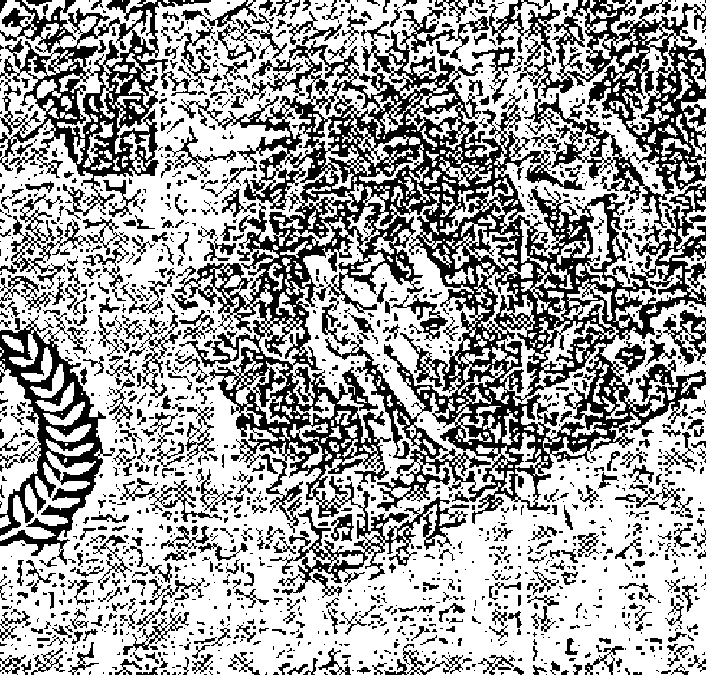

# 前 言

恶魔，这个字眼似乎深沉、黑暗、令人畏惧，却又有着某种甘美诱人的声音。如今已被广泛使用，并拥有诸多解释涵义。

在以基督宗教为首的各类宗教及其教义、神话中，恶魔被描绘为现身于各色传说中的神明之敌，或被视作坑害人类的存在。在日常生活中，我们也时常使用“恶魔某某”、“恶魔的某某”等说法。

那么，哪种说法才是正确的恶魔形象？听到这个问题，恶魔或许会哑然失笑也说不定。因为这就像排着黄、黑、紫、红各色鞋子，却问人“哪双是白鞋？”一样。

以恶魔冠名的“不正”存在、状况或行为，乃是在形容身为此类存在的生成要因的一切事物；而神话中所描述的“恶魔”，或许便可以说是此类事物的拟人化了。

本书就是尽数网罗此类“恶魔”的词典。本书并不仅仅局限于常见的基督宗教与佛教，还列举了广义上被当成“邪恶存在”的诸多恶魔。书中涵盖并囊括了于某神话中本为神灵，却因为其他敌对神话而被视为“神之敌”的神格；以及民间传说里祸害人类的妖怪；也包括宗教领域中的恶魔性存在体。然而，书中并未研究、核实恶魔是否存在。因为本书出版的目的并非要论述恶魔是否“实际”存在，而是希望传达历史中被塑造出的恶魔形象。本书并非要将历史上的恶魔们作为社会学、民俗学或神话学等类的学问，也不是从精神医学的角度看待，而是将个性鲜明的各色“存在”以传说故事对待处理。在书中，笔者为对神话、传说、民间故事抱有兴趣的读者送上了平常被总称为恶魔的各式存在；如果读者能从这些神话传说中获得快乐，就是笔者之幸。

各个项目按照该传说诞生地域的宗教及神话体系，由多位作者分工或共同执笔。西洋魔法书、古典作品为司马；阿伊努（Ainu）、克苏鲁（Cthulhu）为牧山；中国、韩国为遥；克尔特（Celt）为佐藤；日本、都市传说为秦野；玛雅（Maya）、阿兹特克（Azteca）、印加（Inca）为田中；东欧、芬兰为桂；印度为山北、佐藤、桂；中东为山北、桂；希腊、罗马、埃及、北美、大洋洲（Orient）、欧洲诸神话以山北为主要负责人。然而，这仅为概略划分，实际上相关、邻接项目极其繁多，执笔时并未严密区分负责范围。因此，由山北进行整体架构与补充，佐藤为其补助。

希望读者阅读各项目描述过的传说后，能感受到恶魔是一种令人生畏，却又拥有邪诡魅力的存在。或许，比起众神来，恶魔更能引人共鸣。这也在所难免。因为，恶魔乃是栖身于我们体内的存在。

执笔者代表
佐藤俊之

# 目录

- 前言 ……003
- 序 ……008
- 主项目 ……014
- 恶魔绅士录 ……318
  - 一神教 ……318
    - 希伯来（犹太教） ……318
    - 基督宗教 ……319
    - 魔法书（Grimore） ……320
    - 《神曲》（Divina Commedia） ……331
    - 《失乐园》（Paradise Lost） ……332
    - 《浮士德》（Faust） ……334
    - 伊斯兰教 ……334
  - 多神教 ……336
    - 中东（Orient） ……336
    - 非洲 ……341
    - 埃及 ……341
    - 希腊·罗马 ……342
    - 克尔特（Celt） ……344
    - 北欧 ……345
    - 东欧·斯拉夫 ……346
    - 芬兰 ……349
    - 西伯利亚 ……350
  - 欧洲诸神话 ……350
  - 印度 ……353
  - 印度尼西亚 ……362
  - 中国 ……362
  - 朝鲜半岛 ……371
  - 日本 ……371
  - 东洋诸神话（东亚） ……377
  - 北美 ……378
    - 玛雅（Maya） ……379
    - 阿兹特克（Azteca） ……380
    - 巫毒教（Voodoo） ……381
    - 印加（Inca）·秘鲁 ……381
    - 中南美诸神话 ……382
  - 大洋洲（Oceania） ……382
- 现代传说 ……384
  - 克苏鲁（Cthulhu） ……384
  - 作品虚构 ……385
  - 都市传说 ……386
- 主要神话、宗教的恶魔观 ……388
  - 恶魔观之沿革 ……388
  - 一神教的恶魔观 ……394
    - 希伯来（犹太教） ……394
    - 基督宗教 ……397
      - 女巫审判 ……399
      - 魔法书 (Grimore) 中的恶魔 ……401
      - 古典作品中的恶魔 ……403
    - 伊斯兰教 ……411
  - 多神教的恶魔观 ……413
    - 中东 ……413
    - 埃及 ……414
    - 希腊·罗马 ……415
    - 克尔特 ……416
    - 北欧 ……417
    - 东欧的基督宗教 ……419
    - 印度 ……421
    - 中国 ……424
    - 朝鲜半岛 ……430
    - 日本 ……431
    - 北美 ……438
    - 玛雅·阿兹特克 ……439
    - 大洋洲 ……441
  - 现代虚构的恶魔观 ……442
    - 小说 ……442
    - 克苏鲁 ……444
    - 漫画・电影 ……448
    - 游戏 ……449
    - 都市传说 ……449
    - 摇滚音乐 ……450
- 主要参考文献 ……453
- 索引（英文字母顺） ……465

# 范例

## A 构成

- 1 主项目中记录并描述了 456 条出自古今中外神话传说创作作品的恶魔、邪神、恶灵；恶魔绅士录则记载有 890 条。
- 2 主项目由“欧洲文字（主为英文）”、“名称”、“神格”、“出处”、“说明本文”、“参照项目”、“图片”构成。
- 3 排列次序依照英文 26 个字母顺序进行。
- 4 外来语长音“－”按照其后之发音按 50 音顺排序。

## B 记号、参照

- 1 ＋ 出现于恶魔绅士录中并属于主项目的名词在右侧印有 ＋ 记号。
- 2 ※ 于主项目、恶魔绅士录、简介中，属于恶魔绅士录的名词，在左侧（索引为右侧）印有※号。
- 3 强调 主项目、恶魔绅士录、简介中强调的文字（粗黑体），为主项目。
- 4 脚注 于该条后面或当前页底部另有注解。原书注释以“原注”表示；译者注释以“译注”表示；审定者注释以“朱注或杨注”表示。
- 5 参照 本文文末的（→）表示关系密切的参照项目。

## C 索引

- 1 索引中的页数是该词汇出现的页数。
- 2 粗黑字表示该词汇在主项目与恶魔绅士录中的页数。

# 序

恶魔究竟是何物？本书的目的并不在于回答这个既复杂又没有定论的问题。下面是与名目繁多的恶魔有关的用语的简单说明，并尝试着借此稍稍阐明无所不在的恶魔形象。希望读者能配合本书后半部分的简介（主要神话、宗教的恶魔观），作为扩展阅读方面的参考。

**恶魔**
demon
daemon

英语中的demon语意相当广泛。如萨满宗教¹中给人带来疾病等灾难的“邪恶精灵”、“恶灵”，神灵或人类之敌，诱惑人类的存在，都可以demon称呼之。这个词可以说是对恶魔的总称。

现在，在恶言相向蔑称对方时，或指称使用香辛料的辛辣料理²、恶人、有吸引力者、转包者时，也频繁使用这个词，将其视为一个普通名词。

恶魔原本是“恶”的拟人化词汇。由于神话中作为恶魔登场的角色其实是带来恶的存在，所以问题的重点在于他所带来的是何种“恶”；是“谁”所造成的反而不重要了。拥有人格特性的恶魔受人重视乃是恶魔被拟人化后才有的事。

在文明扩展遍及全球，认识到世界为一共同体的现代社会中，前面叙述的这种在意“状态”而不在意拟人形象的看法，似乎有复兴的迹象。

在现在社会中，“恶魔”并非仅止于拟人化的形象，而是泛指许多现象或状态，甚至也有表示在职业生涯中表现优异的涵义³。这种情况，如果由恶魔一词本非指人性化存在，而是指“恶”的一种状态来看，前面叙述的情形就不那么难以理解了。

当然，“demon”本来并非用以称呼上述的诸多事物，而是指demon一词诞生以前就有的“可怕存在”。

或许，在主项目中列出的诸多恶魔，都可称为demon的朋党。无论宗教哲学如何变迁，对我们而言，恶魔乃是从远古时代起便不断侵害我们的“可怕存在”，此外并没有别的。

> 1. 译注：Shamanism，又名“黄教”，是指以通灵人（萨满）为媒介，与神灵沟通为信仰重心的宗教模式，见于极北寒带、西伯利亚、中亚、北美原住民处。
> 2. 译注：如法式料理中有叫做“魔鬼鸡肉”（Pollo alla Diavola）的辛辣料理，欧洲常将使用辣椒或胡椒之料理称为“魔鬼风味”（alla Diavola）。更直接的是用Diablo来表示呛辣的菜系，如Meatball Diablo等。
> 3. 译注：例如a demon bowler是指“快速投球手”。

**恶灵**
badman
evil spirit

神话产生前，也就是还处于万物有灵论<sup>4</sup>、图腾崇拜<sup>5</sup>的精灵信仰时代时，由于疾病、灾害、死亡、谎言、悲伤诸多事物现象的成因都不清楚，所以人们将这些认定为是某种存在带来的可怕事物。在国家，或身为国家原形的政治性集团尚未成立，对异民族的接触也极少，尚未有“敌人”存在的时代，前面那些灾害便成了“恶”的概念。于是自然而然地将被蚊虫传染而得的疫病，认为是沼泽地的“邪恶空气”所造成，并进一步将其视为是“邪恶精灵”所导致。

这种思考模式，在将本身神话范围外的神灵敌人二度吸收进神话中的基督宗教出现后，也再度现身于宗教领域中。

**邪神**
the evil
evil goods
evil one

因为人们的注意力改由被带来的恶，转而聚焦至带来恶的存在的缘故，遭拟人化的“恶”，便逐步以“人类敌人”的形象清楚地呈现出来。这种演变在宗教里具有让对象清楚呈现，好令信徒容易信仰的目的存在。

然而，在初期的多神教神话中，此类拟人化的恶魔几乎无从得见。因为全盘接受自然的原始人类知道：带来灾害的台风同时也是贵重水资源的来源；若无造成干旱的太阳，生命也无法存续；一个生命的死亡乃是其他生命的粮食。

那么，人类的敌人究竟是什么？其实就是异民族的神。

农业兴起，在为了治水或建设而产生的中央集权政府成形后，人们变得会以“国家”的角度衡量事物。共同体存在于国家内部；国家之外则成了未知的世界。当成为共同体的国家与相邻的他国接触时往往发生争斗，于是，人们的“敌人”便由此而生。

一场战争结束后，随着一派神明的胜利，借用该神灵之名义，遂行支配的权力者，将造成自己错误的责任或令人们痛苦的“恶”，转化为败北民族的神；或将胜利的历史记录为自家神灵对“恶”的胜利。此时，恶魔身为带来“恶”的“神灵与人类之敌”的形象便清楚呈现。

> 4. 译注：animism，英国人类学家所提理论。认为原始人于形成宗教前先发生“万物有灵”观念。认为一切具有生长或活动现象的物，如动植物、日月、河流都具有“灵”（anima）。
> 5. 译注：totemism，宗教最早形式之一，以图腾观念为标志。许多氏族社会的原始人相信，各氏族分别源出于各种特定物类（动植物或其它物种），会对该物种加以爱护或作为标志、或对其进行宗教仪式。

# 魔鬼
devil

基督宗教中对人类行恶的灵体，也就是被定义为恶灵的名称。魔鬼这一用语虽然是基督宗教的概念，但在基督宗教根深蒂固的西欧，固定用以指称一切神的敌人。

这是因为，基督宗教在成为世界性的一神教之前，与多神教一样同为“民族信仰”。换而言之，魔鬼本身也包含了邪神的概念。

邪神中最重要的是异类民族的丰穰神。丰穰神是司掌生命恩惠的神灵，与食物和生殖相关。因为对于某一神灵而言，异民族的丰穰就是增强对方国势、兵力之大敌，故而越发敌视其存在。将富饶敌人的神明进行负面转化，作为欲望的象征。

在确立社会体制的过程中，本与暴饮暴食、奸淫等“贪婪事物”有所关联的丰穰神，便被由赐惠之神变形为反社会的恶魔。之后再经由基督宗教使其演变为固定的概念。

#### 魔王

- Satan
- The Devil
- Lucifer
- Archenemy

魔界之王。在指称神灵与人类之敌的devil前方加上“The”，特指统领恶灵的王。名为撒旦(Satan 魔王)、路西弗⁶(Lucifer 堕落天使)、别西卜(Beelzebub)、大敌(Archenemy)的各种存在，都可以用“The Devil”称呼。

在基督宗教中，“恶”的意思是抵挡神的福音，妨害神的理想。魔鬼诱惑身为神子的人类，并带来灾厄。这群人类的敌人应当有一首领。而神为什么不能从身为人类之敌的魔鬼手中护佑我们？这是因为有统率诸多恶魔，与神为敌的魔王存在的缘故。⁷

> 6. 译注：Lucifer一字在中文中音译颇多，有路西法、路济弗尔（简明大英百科全书）、鲁西弗（桂冠所版之失乐园）等译。此处权采用《大美百科全书》的译名。因为Lucifer一词本为拉丁文。希伯来文圣经赛亚书14章12节中将巴比伦王称为“发光者”，通俗拉丁文本圣经以Lucifer翻译。Lucifer的拉丁词义小写时有“含光”、“射光者”、“照耀者”之意；而大写则为“金星”、“魔鬼首领”之意。英王詹姆士钦定本英文圣经中保留了这个词（此版圣经12节前半原文为How art thou fallen from heaven, O Lucifer, son of the morning!）。中文合订本圣经中译为“明亮之星”。人们认为这是撒旦堕落前的名称。
> 7. 译注：对于神与恶魔的关系，基督宗教中论述颇多，有时也会有所歧异，有兴趣者可参照神学著作。

魔王的出现也意味着：恶魔并非处于神所创造的社会外部的“可怕存在”，而是变成了已被收编入神话体系内的“社会敌人”。与人类为敌而形象逐渐明晰的恶魔，终于变成同时与身为崇高存在的神明为敌者。这意味着，在文明进步中，对立由共同体与共同体之间移转到了共同体内部。

#### 魔罗

在亚洲，特别是印度及中国，被视为人类敌人的存在。严格地说虽然不尽相同，但在亚洲地区，魔罗相当于魔鬼的存在。原先居于印度的原住民的神灵，与西欧及中东的情况相同，被从北方迁入的雅利安人（Aryan）视作恶魔。不可不提的是，欧洲以及深受欧洲影响的南北美洲、中东、印度，以及受印度影响的中国与日本，全都不免受到此民族神话的影响。换而言之，或许可以说凯尔特（Celt）的弗摩尔族（Fomor）、希腊的泰坦神族（Titan）、北欧的尤弥儿（Ymir）、印度的魔罗（Māra）与罗刹（Raksasa）、中国与日本的鬼与恶魔，全部属于魔鬼的同伴。

### 恶魔

原本的语意并非作为demon、devil、Satan的意思，而是指称佛教中的“恶魔”。在佛教中，对人而言所谓的“恶”，乃是人类自身产生的欲望，也就是自我。而悟道便是要舍去心怀欲望的自我与宇宙化为一体，更应当说是成为宇宙本身；但不成熟的人多数无法克制自我的诱惑。在此，恶魔也不是位于宗教外部的敌人，而是被纳入神话体系中化为维持体制的道具。

## 恶魔主义

现代社会，看起来是理性胜过信仰，或者至少也是以理性为一般价值判断基准的时代。但尽管如此，恶魔并未就此消失，也没有沦为纯粹的概念。随着科学的进步，开始客观看待事物；进行相对性判断的主体意识，发觉并非是“神=人类”，而是“神=体制”。国家原本是为了进行治水、建设，或管理军备而诞生，而当权者为了维持国家权力将神引为同伴。于是，体制 (神) 的敌人，便成了反体制 (恶魔) 的存在。

法国大革命以来，在权力由国家回到民众的过程中，名为恶魔主义¹⁰的观念就诞生了。

恶魔主义的思想浅显易懂。恶魔之所以邪恶，是相对体系而言，对恶魔主义者们而言并非如此。因为对他们自身来说 “神” 才是敌人。

对认为 “神=体制=人类真正敌人” 的人们而言，本书所记述的恶魔们，或许可以说是与真正的敌人战斗，却被打压迫害的英雄。

## 亚必迭

米尔顿的叙事诗《失乐园》（1667年）中出场的天使。虽然同大逆不道的天使·撒旦极其亲近，但却是撒旦一党中唯一未参与反叛唯一神者。他的名字是“神仆”的意思。为炽天使。

当撒旦听见天父宣布以圣子作继承人、给圣子自己的全部权力时，心中深怀嫉恨。于是撒旦假称准备接受圣子的命令，召集所有跟随他的天使到自己在天国北部的领土。响应撒旦召集的天使高达全天使的三分之一，亚必迭也身在其中。由此可见，亚必迭原本应是一臣属天使，隶属撒旦这身为天国首领之一的领邦君王。

撒旦在自家宫殿所在的天国北部山岳中，初次表明对唯一神与圣子的敌意；被召集的天使全数赞成撒旦的叛乱，但唯有亚必迭不忘对神的忠诚，脱离了撒旦阵营。在造反天使与天国军的交战中，亚必迭给了撒旦重重一击。

> > (→撒旦 Satan 《失乐园》)

## 安达原的妖婆

别名 “※黒塚鬼女” (Kuroduka-no-kijyo)
本为服侍公卿的一老妪，因自己一手养大的小姐口不能言，在听说只要让小姐吞下孕妇的新鲜肝脏即可治愈后，便躲到安达原野的岩洞中等待孕妇经过。

过了一段时间，有对名叫伊驹之介与恋衣的夫妇造访她的住处，要求借住一宿。老妪鼓动簧舌将伊驹之介骗出户外后，剖开留在屋内的恋衣腹部，取得新鲜肝脏。然而，老妪却由恋衣携带的护身符上发现她就是自己的女儿，为此疯狂错乱，化为女妖。

数年后，熊野的山中僧侣佑庆向她借住一宿。当她为佑庆出外取柴时，告诉佑庆绝对不可窥看她的寝室。但佑庆不听嘱咐偷窥了寝室，发现房间内有许多尸骸，于是大惊而逃。妖婆从后面追来，佑庆从怀中取出观音菩萨像一心祈祷后，佛像升至空中射出破魔箭，刺穿妖婆。妖婆被打倒后，她所住的岩洞便被改称为“黒塚”。

> > (→宇治桥姬 Uji-no-hashihime、红叶 Momiji)

## 亚得米勒

诗人米尔顿的叙事诗《失乐园》（1667年）中登场的造反天使（恶魔）。经米尔顿之手，将他设为《旧约圣经》《列王纪》中出现的西法瓦音人神灵的前身。

亚得米勒在〈列王纪〉中被描述为与摩洛（Moloch）相同，要求献牲的异教神，这或许就是米尔顿将亚得米勒加入失乐园登场人物的理由。在〈列王纪〉中与亚得米勒一同出现的是异教神亚拿米勒（Anammelech），但不知为何米尔顿没有将他列为造反天使。《失乐园》中与亚得米勒同列的变成了阿斯玛代（Asmadai）。

亚得米勒出现在描写大逆不道的天使撒旦进行造反的第6卷中，似乎是反叛军中指挥官等级的天使。布阵于敌方阵营天国军正面的天使尤烈儿（Uriel）所指挥的部队与他发生激战，但亚得米勒不敌落败。或许，因为亚得米勒被西法瓦音人当作太阳神崇拜，所以米尔顿选亚得米勒作为太阳守护天使尤烈儿的敌手。

-   * **天使 失乐园**


-   * **女妖 日本**


-   * **造反天使 失乐园**


## Aēsma
艾什玛

琐罗亚斯德教中司掌狂行暴举的恶魔。
遭艾什玛所控制的人，会虐待有用的家畜，做出难以想象的凶暴行为。而且就像“着了魔”这句话所形容的一样，自身并不会察觉到已被恶魔控制而变得丧心病狂。
琐罗亚斯德教对酒的态度有些模糊暧昧。一方面在宗教仪式中常常饮用呼玛（Haoma，含有常用药草的发酵饮料）；另一方面又将禁酒作为宗教原则，视作应有的道德。关于禁酒戒律的严峻程度众说纷纭。但无论如何，与世界上多数宗教相同，琐罗亚斯德教也明显不赞同饮酒过量或酒后无德。醉酒后行为乱暴的人会被形容为“被艾什玛控制了”。
而艾什玛总是手持满布鲜血的武器，与暴徒的形象十分相称。古波斯萨珊王朝（Sāsān）时代的琐罗亚斯德教徒间便流传着“若让此恶魔掌握统治权，世界恐怕会变得比肩有两蛇的暴君萨哈克（Zahāk）¹统治时还要可怕”的说法。
（→阿里曼 Ahriman）

## Agares
阿加雷斯

据说是古以色列王国国王所罗门所著的17世纪魔法书《雷蒙盖顿》（Lemegeton，又名The Lesser Key of Solomon即《所罗门之钥》），书中第一部分《哥耶提雅》中所记载的72名恶魔之一。
乘鳄而来，授人语言及相关之智慧。又据说能控制地震。别名“※阿加洛斯”（Agaros）。
16世纪的恶魔学者让·维尔（Jean Wierus (Wier)）称阿加雷斯是地狱东部的大公爵，为地狱23名公爵之首。
身为名著《地狱辞典》（Dictionnaire Infernal）作者的19世纪作家柯林·德·普朗西（Collin de Plancy），深受维尔影响，也应熟知维尔对阿加雷斯的解释；但在《地狱辞典》中却没有阿加雷斯一项。《地狱辞典》经画家M.L.布尔顿（M.L.Breton）之手，添加了通俗美观手绘彩色木版画，书中插画颇有名气。但书中配上乘鳄贤者之图介绍的，却是名为※齐博斯（Zaebos）的来历不明的恶魔。这位齐博斯属于伯爵或属于公爵的说法都有，布尔顿笔下的齐博斯肖像常与阿加雷斯混淆。

## Aghāsura或Aghaśūra
阿迦修罗

阿迦修罗乃名为“阿迦”的阿修罗（Asura或Ashura）之意，据说他是恶王庚斯（Kansa）手下的将领。
阿迦修罗化身名为阿迦俱罗的大蛇，阴谋吞吃英雄神黑天（Kṛṣṇa）²及其同伴。
由于阿迦修罗的口部外观与洞窟入口极其相似，于是黑天的同伴们与他们的家畜便被诱入其中吞下。
得知此事的黑天前去救出同伴，打倒了阿迦修罗。
这则故事载于《薄伽梵往世书》（Bhagavata Purana，印度教圣典之一）中。此书为薄伽梵派（Bhagavat sect）的主要经典。书中毗湿奴神（Visnu或Vishnu）以薄伽梵（Bhagavad，或译世尊）之名登场。
而且，因为在第10卷登场的黑天（阿迦修罗的故事也在此卷）也是毗湿奴的化身，所以演变为阿迦修罗是被毗湿奴打倒的。

#### 恶魔 伊朗

1 译注：或译佐哈克，伊朗神话中其肩之所以生出两蛇乃是阿里曼所址，萨哈克每日杀人取脑供蛇食用，又被称为蛇王（或译蛇君）。朱注：在田中芳树的《亚尔斯兰战记》中即引用此魔王的传说作为主题。

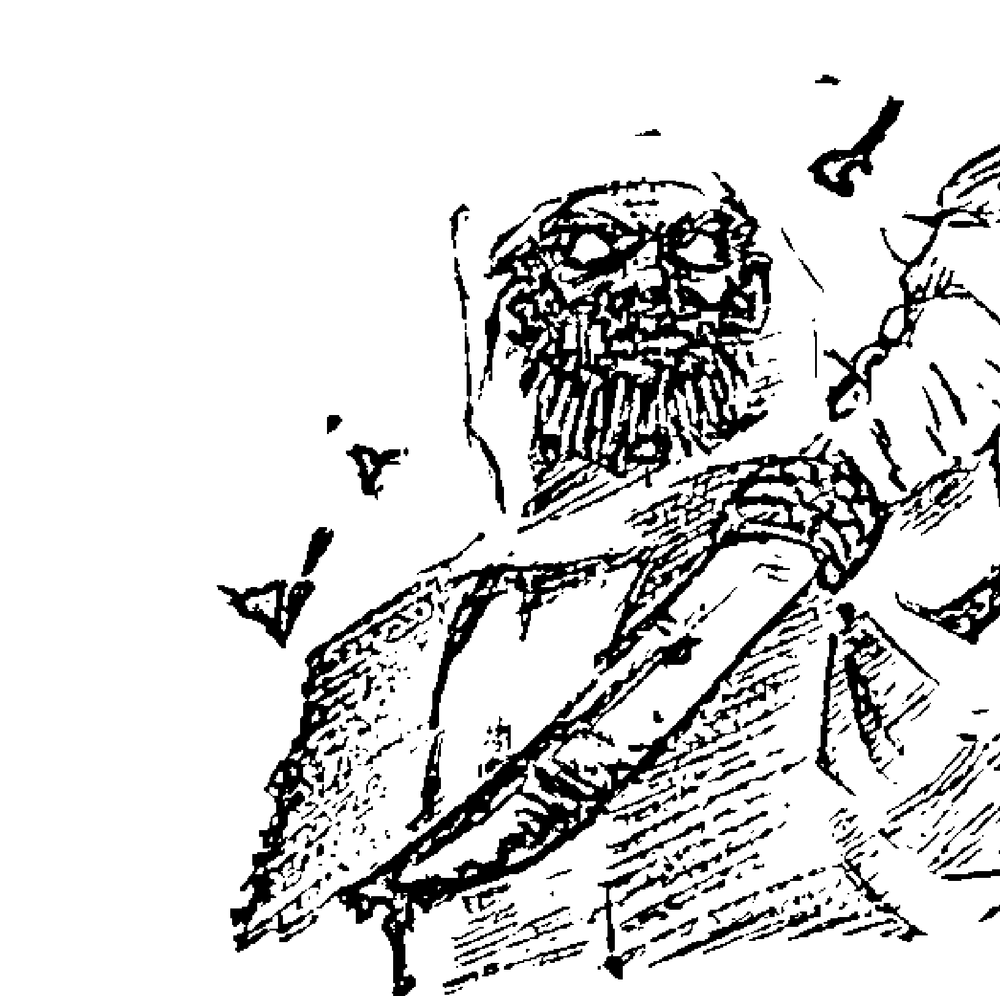

##### 恶魔·所罗门的恶魔 雷蒙盖顿

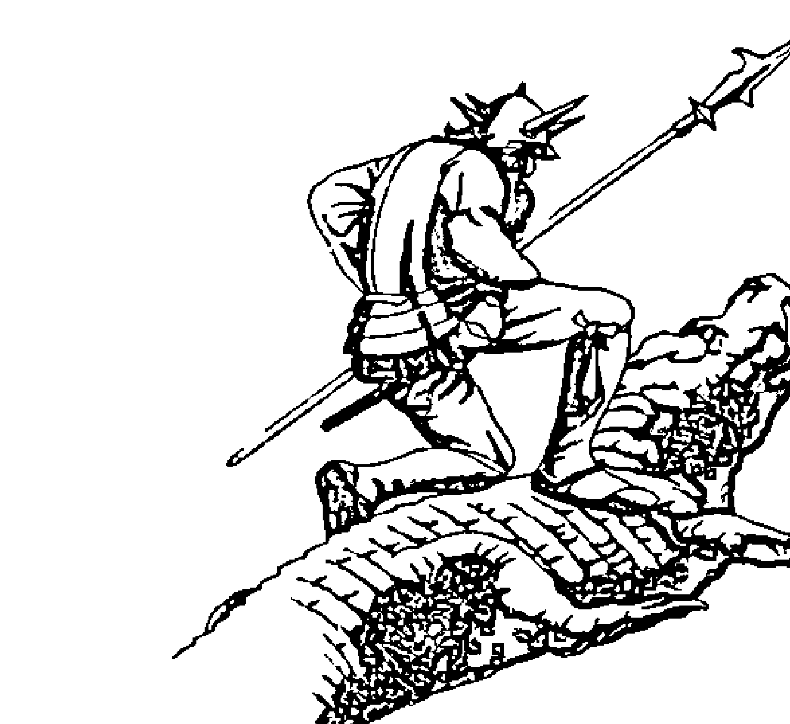

#### 阿修罗 印度

2 译注：又译克里须那、克里希那、克里斯那天或奎师那，印度教主神毗湿奴第八化身。

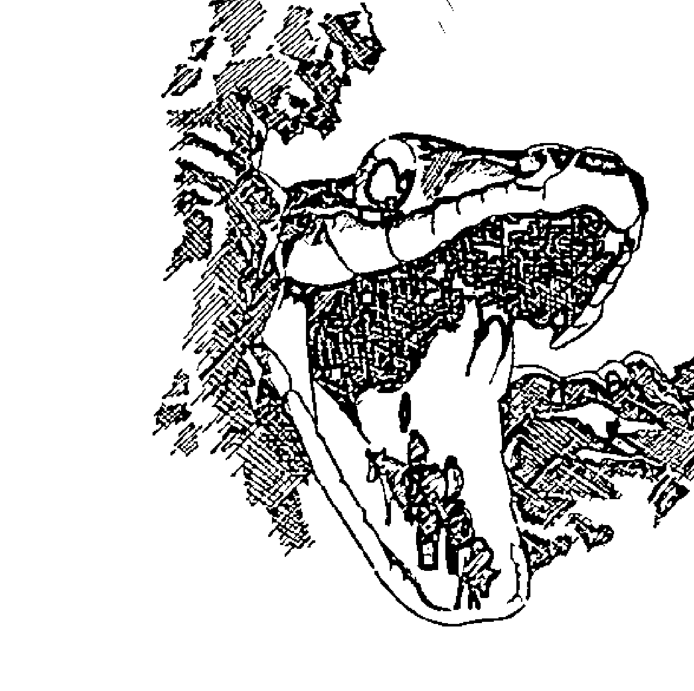

#### 阿·普切

居于中美洲犹加敦半岛玛雅人的死神。玛雅人的神话中，如阿·金（Ah Kin）、阿·塔巴（Ah Tabai）3这种以“阿·一”之名登场的神灵颇多。阿·普切即为其中一名。
阿·普切的形象为一具骸骨，或以挂铃的肿胀尸体形象出现。
阿·普切也是恶魔之首※胡好（Hunhau），支配着地底最下层的第九层世界米挞那耳（Mitnal）。即使到了现在，阿·普切也依旧存在，只是更名为“幽姆·席密鲁”（Yum Cimil）。

幽姆·席密鲁乃“死亡之主”，贪得无厌地索求牺牲者。所以幽姆·席密鲁会徘徊于病人家庭附近。
玛雅人与好战的周边民族截然不同，是对死亡异常恐惧的民族。玛雅人遗族对死者的极度哀伤，甚至让西班牙征服者（Conquistador）们为此惊异。
正因为如此，身为死神的阿·普切遭人畏惧的程度等于死亡。
（→维科布·卡库伊科斯 Vucub Caquix、奥迦斯 Orcus、米克特兰泰库特利 Mictlantecuhtli）

#### 阿里曼

琐罗亚斯德教（Zoroastrianism）认为，世界是善神阿胡拉·玛兹达（Ahura·Mazda）与恶神阿里曼不断争斗的场所。有传说阿里曼较阿胡拉·玛兹达力弱，也有传说两者势均力敌，众说纷纭。但无论如何，阿胡拉·玛兹达在将创造世界时，定然认为将这名敌对者置之不理有所不妥。于是以咒语将阿里曼困缚了3000年，并趁此时创造了世界。之后解除咒缚的阿里曼心中大怒，转而反击。他创造了毒蛙、毒蛇、毒蜥蜴、毒蝎，以及1万种病魔，将它们放诸于世。此后，善神同恶神的斗争直至今日依旧不息。

阿里曼统驭以※六大恶魔为首的无数魔鬼（德弗）4，造恶无数。偶尔会化为人类接近诸国国王，诱导他们奢侈，令他们堕落。阿里曼在国王堕落后就用计亲吻国王双肩，令国王两肩各生出一对蛇。可怕的是，这对蛇每日各需吃食一个活人的脑子。
（→安格拉·曼纽 Angru Mainyu）

#### 奥陀

奈亚鲁法特（Nyarlathotep）被称为“持拥千面”之神，奥陀即他的化身之一。主要于非洲地方被信仰，甚至还随黑奴一起融入了巫毒教中。
奥陀乍看之下像是拦腰折裂的巨木。然而，在相当于树干之处，却长着仿如镶嵌石英般闪闪生辉的金属曲枝，奥陀可以挥舞它攻击人或动物。当然，本体也可移动。
奥陀的信徒是因压迫或独裁者等原因被逼入疯狂绝望的人们。所以他的信徒几乎都因遭受酷刑、鞭笞而身受重伤，甚至四肢不全。

根据黑魔法书《死者之书》（Necronomicon）记载，传说奥陀乃是在无限漫长的往昔，落于地球上的众多种子之一，只要在地球上扎根一次，便终有一天会盖满整个大地。

### 死神 玛雅

3 译注：前者为干旱瘟疫之神；后者为猎神。

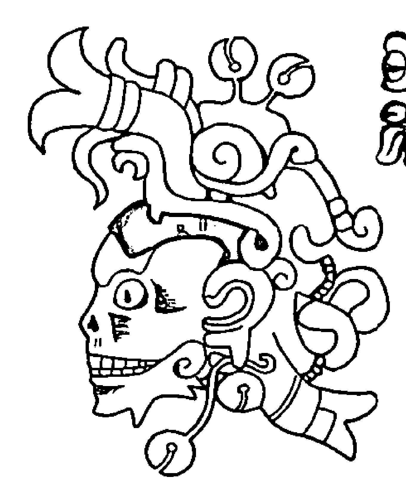

### 恶神 伊朗

4 译注：Daeva，泛称古伊朗神话传说中的恶魔，与善神为敌。

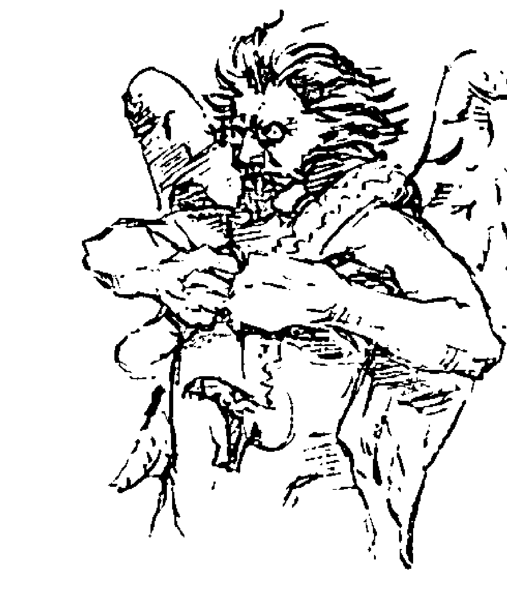

#### 邪神 克苏鲁神话

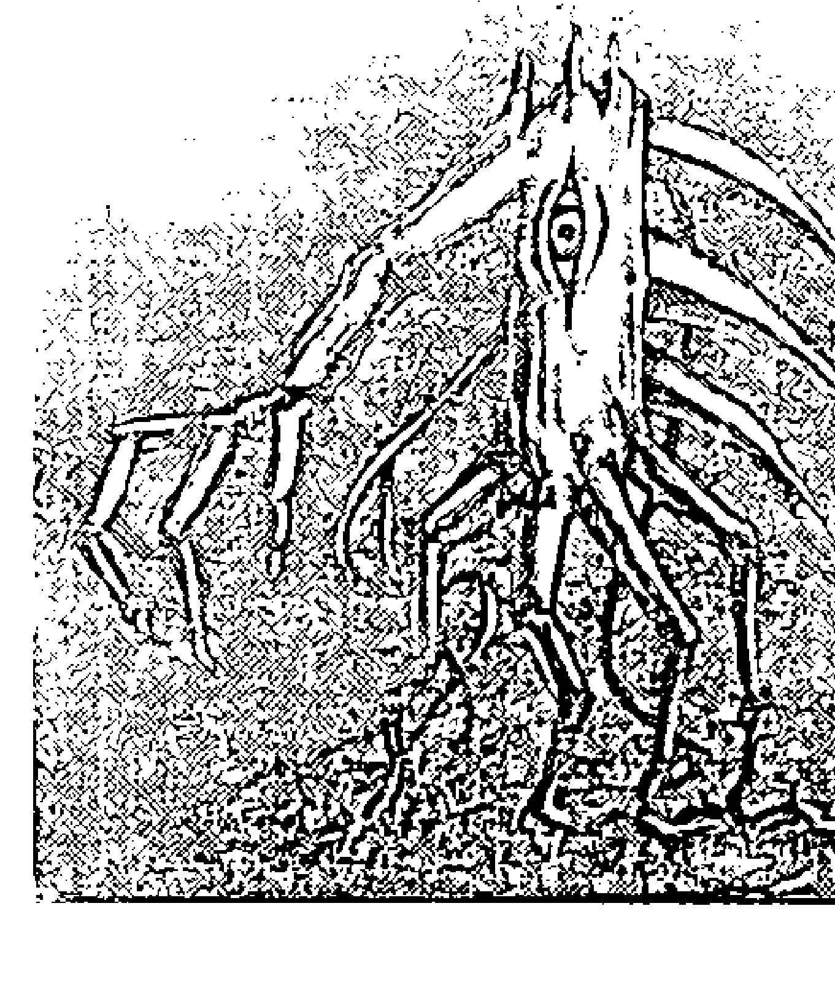

#### Aini

#### 艾尼

据称为古以色列王国国王所罗门 (Solomon) 所著，现于17世纪的魔法书《雷蒙盖顿》(Lemegeton, 又名 *The Lesser Key of Solomon*) 中第一部分《哥耶提雅》(Goetia) 中所记载的72名恶魔的第一位。戴维 (David) 之子所罗门，因受崇奉异教的妻妾影响，而祭祀偶像神，所以相传与恶魔有关的人物。但《雷蒙盖顿》是17世纪之书，并非所罗门所著。

依据《雷蒙盖顿》所记，艾尼有蛇、猫、人三头，骑跨毒蛇而现。因其带有猫头，所以有人认为他对古以色列人而言是异教之神，与埃及的猫女神巴斯特(Bastet)有关。又名“艾姆”(Aim)，也有“哈拜利”(Haborym) 之名。在法国作家柯林·德·普朗西 (Collin de Plancy) 的《地狱词典》(Dictionnaire Infernal, 1818年初版) 中，就记载有哈拜利这一名字。普朗西之作应是参考了受《雷蒙盖顿》影响的恶魔学家让·维尔 (Jean Wierus (Wier), 1516～1588) 所著的《魔界王国》(De praestigiis daemonum)，此书中记载哈拜利是司掌火灾的地狱公爵，指挥26个恶魔军团。

#### Akuroou

#### 恶路王

桓武天皇 (781～806年在位) 时代兴兵做乱的传说人物，别名“大丈丸”。固守在达谷的洞窟中，后为坂上田村麻吕所败。

如今，在虾夷地区将恶路王以及和他同样起兵作乱的阿弓流为视作同一人；但两者其实截然不同。恐怕是同时同在东国起兵作乱，又都遭坂上田村麻吕剿灭的缘故，这才引起混淆。

他本来应是中世纪的盗贼，随着时日变迁，形象便由人类变为妖人，再由妖人转为妖怪。这或许是由于当时京城中的为政者与知识分子，将不服天皇者 (特别是东国) 视作如同半魔物的存在，加以畏惧的缘故。飞驒 (今日本岐阜县北部) 的两面宿傩 (Ryoumennsukuna) 的由来或许也是如此。

相传坂上田村麻吕在讨伐藏身山中的恶路王 (阿弓流为) 之际，点燃大灯笼并以鼓笛伴奏壮大声势；此事被当作青森灯笼祭的起源。但史实中，坂上田村麻吕从未踏足青森。

(→土蜘蛛 Tsuchigumo)

#### Akushirou Ishikawa

#### 石川恶四郎

相传广岛县的真定山中曾住着名为石川恶四郎的妖怪首领。

一位名叫五大夫的人，有一次被名叫三左卫门的友人劝邀道，“去看妖怪吧”，于是两人就这样来到真定山。抵达后，这个地方的后山顶上乌云低垂，大地鸣动，下起倾盆大雨。因无法走到山顶，加上已经入夜的缘故，两人决定先躲在岩缝中过夜。

然而当晚因异状接连不断，二人无法安寝。后来虽然狼狈下山，但三左卫门却发起高烧昏迷不醒。

在那过后不久，五大夫家开始有妖怪出没。然而而大胆的五大夫丝毫不惧，度日如故。

于是数日后，有名和尚打扮之人来到五大夫家，

> > 如此说道：“阁下实为勇敢无比之人。既然如此，我等这就离山。”

这名和尚便是石川恶次郎。据说，之后五大夫将自己所见的妖怪模样绘为画卷，藏于寺庙。

> >(→山本五郎左卫门 Gorouzaemon Sanmoto)

#### 恶魔·所罗门的恶魔
雷蒙盖顿

5 译注: 此书共分4部分，第一部分是召唤72名恶魔之法。
6 译注: 猫首神, 形象初为牝狮, 后为猫首人身, 是快乐与音乐舞蹈之女神, 并护佑人类健康。

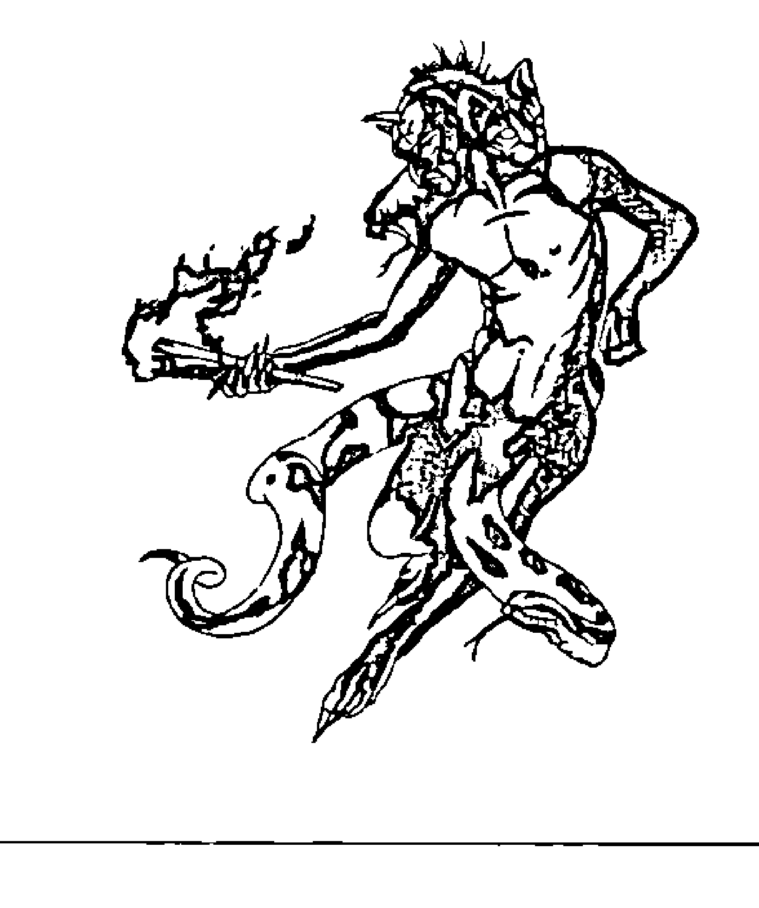

### 魔物
日本

7 译注: 在今日日本岩手县一带。
8 原注: 泛指北日本、东日本。
9 译注: 泛指日本箱根以东的关东地方。
10 译注: 青森阴历7月7日举行之祭典, 制作许多大型灯笼, 上贴武士、恶鬼、鸟兽等图, 以鼓笛伴奏游行。

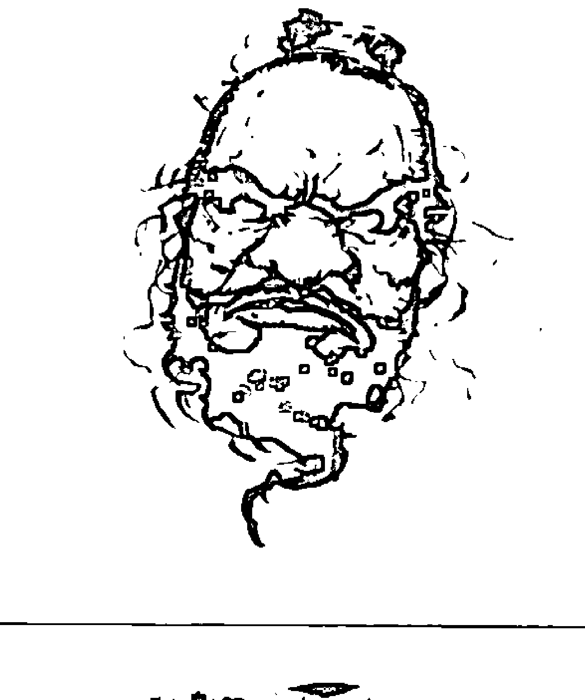

### 妖怪首领
日本

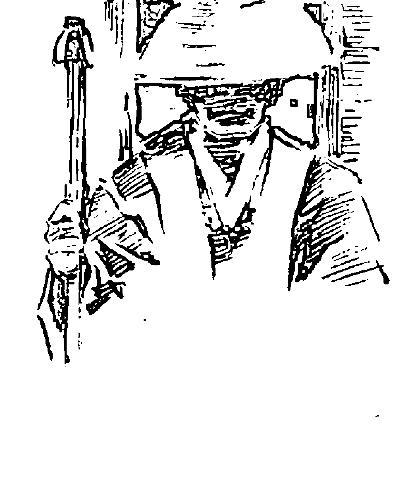

#### 阿罗乞什密

在印度广受崇敬的女神里，有一位毗湿奴 (Visnu或Vishnu) 的神妻罗乞什密 (Laksmi)。是掌管财富、幸运、丰收、家庭圆满的女神，在汉译佛典中被译作“吉祥天”。
这名罗乞什密有位姐姐，名叫阿罗乞什密，即不吉祥天。印度教寺院中常以阿罗乞什密像装饰，形象为一骑驴丑陋老太婆。
在名为排灯节 (Diwali) 的印度秋日节庆中，人们会在家门口与所有窗户上点灯，借此从家中赶出阿罗乞什密，迎入罗乞什密。在某些地方甚至可以听见“阿罗乞什密在外；罗乞什密在内”这种如同日本立春前随时可闻的喊声。

然而在古孟加拉国地区，曾有在罗乞什密的祭典前，特地请来婆罗门 (祭司) 在家外进行祭祀阿罗乞什密的仪式的风俗。因此，有学者主张：“阿罗乞什密本为古代土著的吉祥女神，但被罗乞什密所取代。”也有其他学者主张：“罗乞什密本为司掌幸运与不幸双方面的女神，只是后来分化为罗乞什密及阿罗乞什密。” (→迦梨女神 Kali)

#### 亚利几诺

意大利诗人但丁 (Dante Alighieri, 1265~1321年) 的叙事诗《神曲》(Divina Commedia, 1307~21年作) 中登场的恶魔。《神曲》三部作第一部《地狱篇》的第22篇内，描述了地狱中第8圈第5沟惩罚亡者的、由12名魔鬼组成的集团“※马纳勃郎西”(Malebranche)，亚利几诺为其中之一。名字为“诱惑者”之意。(→马纳果达 Malacoda)
马纳勃郎西们监视着浸于沸腾沥青 (天然柏油) 池中的众多亡者，一旦发现有露出身体者，便用铁钩将其吊起，不停地虐待犯人的身体。

带领主人公但丁的诗人维其略 (Virgillo)，朝被马纳勃朗西之一的格拉非冈 (Grafficane) 抓起的“那伐拉人强波洛”询问沥青池中的状况时，强波洛与恶魔们约定，以叫出池中与但丁同乡的意大利人为条件，让恶魔们不对自己施加暴力。
然而，身为惩罚贪官污吏与诈欺犯的第8圈第5沟犯人的强波洛，欺骗了恶魔们逃回池中。勃然大怒的恶魔们因生性头脑简单而开始内哄打闹起来。亚利几诺与恶魔加卡比那 (Calcabrina) 一齐摔落沥青池中双双灼伤。

#### 安洛先

假称古以色列王国所罗门王所作之17世纪魔法书《雷蒙盖顿》(Lemegeton, 又名The Lesser Key of Solomon)，书中第一部分〈哥耶提雅〉所记载的72名恶魔之一。地狱侯爵。拥有“※安洛瑟”(Alocer)、“※安力瑟”(Allocer)”“※安林恩”(Alloien) 等别名。
据说他以有着火红狮头与如焰双目的骑马战士之姿现身于世。
19世纪法国作家柯林·德·普朗西，所著之《地狱辞典》中，采用安洛先别名之一的安洛瑟来介绍他，地位被升格为地狱的大公。安洛先是司掌学问的恶魔之一，被认为能给予召唤者天文学、占星术，以及众多学科的知识。据说他充满知性的声音中有着庄严声韵。画家M.L.布尔顿在该书中绘有许多恶魔肖像画，在安洛瑟一项中附加有形似骑士的插图。在该幅木版画中，安洛瑟身穿甲胄，头戴饰羽头盔，骑乘披挂严整马甲的战马。
(→撒旦 Satan《失乐园》、撒旦 Satan〈中世纪欧洲〉)

#### 神·印度

11 译注：日本于立春前一日时有手撒大豆，口呼“鬼在外，福在内”以驱祸祈福的习俗。
12 原注：印度次大陆东北部，包括今日的印度、西孟加拉国州、孟加拉国共和国。

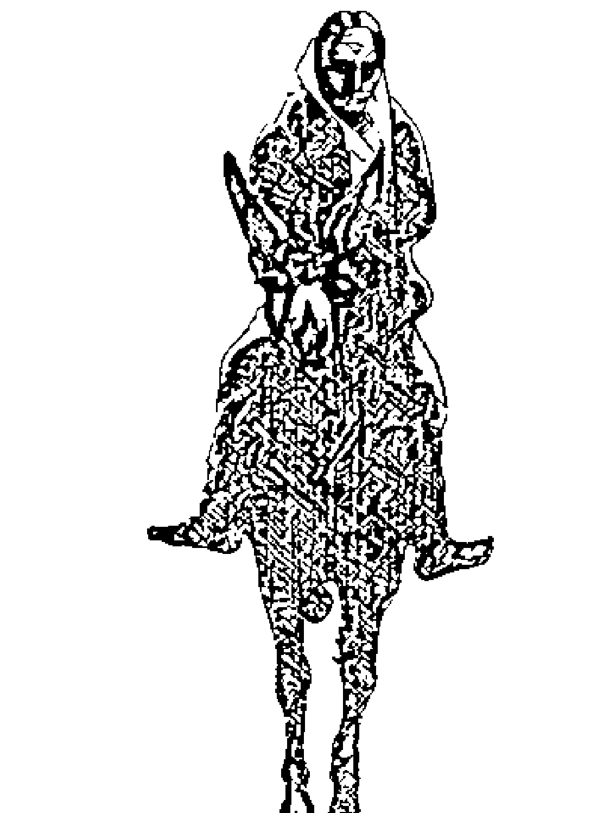

#### 恶魔·地狱的魔鬼 神曲

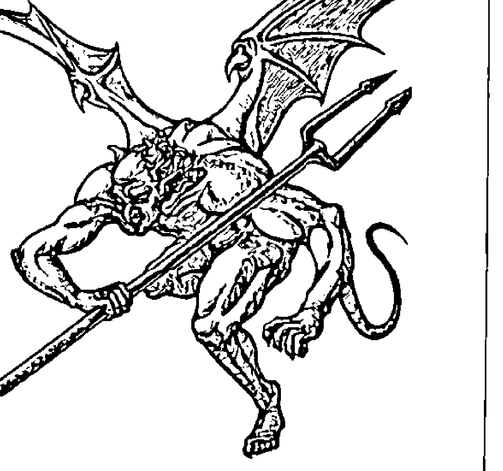

##### 恶魔·所罗门的恶魔 雷蒙盖顿

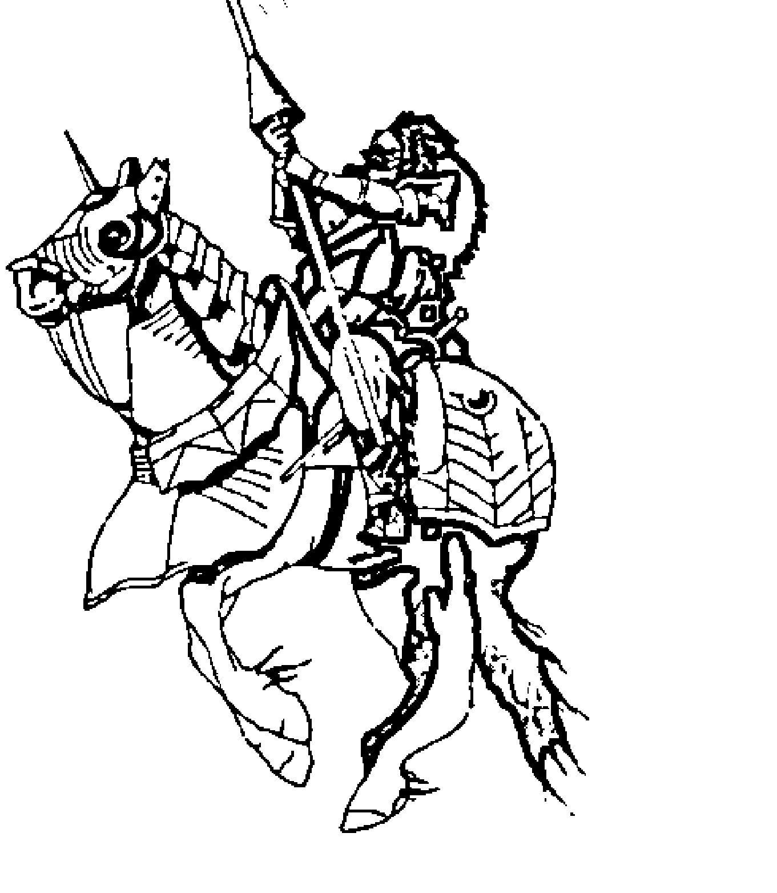

##### 阿洛伊代

指称海神波塞冬（Poseidon）的两个儿子“※俄托斯”（Otos）与“※厄菲阿尔忒斯”（Ephialtes）13。
阿洛欧斯（Aleus）之妻伊菲墨狄亚（Iphimedea，她是阿洛欧斯的侄女）爱慕波塞冬，时常跑到海中，让海水注入她怀中。波塞冬回应了她的爱情，于是两人生下二子。此二子即为阿洛伊代。
他们是巨人，每年长高2米，9岁时就将俄萨山（Ossa）迭到奥林帕斯山上，再将佩利翁山（Pelion）迭到二山上。接着爬到天上与众神搏斗，还想填海造陆，化陆为海。

厄菲阿尔忒斯曾对赫拉（Hera）求爱；俄托斯曾对阿耳忒弥斯（Artemis）求爱，并把从中阻挠的战神阿瑞斯（Ares）绑了起来，关到青铜壶中13个月。
他们之死有三种说法。一种传说被太阳神阿波罗（Apollo）于成年前所杀；一种传说为大神宙斯（Zeus）以雷击杀；一种传说阿耳忒弥斯化为牡鹿走入两人间，让两人掷出长枪相互杀死对方。
相传落入地狱后的阿洛伊代被巨蛇捆缚于柱上。

##### 亚迈蒙

仿启示文学《以诺书》所作之《伪以诺书》的目录中记载的恶魔。也被称作“※亚达依蒙”（Amoymon）“※达蒙”（Maimon）“※梅蒙”（Maymon）等。
《新约圣经》“马太福音”中表示“财利”的玛门（Mammon）一词被解释为是一恶魔。亚迈蒙似乎也因此被认为是与黄金关系匪浅的存在。有时会被描绘成骑乘似龙生物的鸟头恶魔。
19世纪法国作家柯林·德·普朗西的《地狱辞典》内，亚迈蒙与玛门被分作两个，当成不同恶魔。但因普朗西并非对恶魔学造诣深厚之人，所以他对恶魔的解释几乎都是以16世纪恶魔学者让·维尔为基准。在《地狱辞典》中，亚迈蒙是地狱四王之一，为东方领域支配者。然而，在该书说明地狱帝国阵容的部分中，不知为何，没有亚迈蒙之名。
《地狱辞典》因画家M.L.布尔顿所描绘的通俗恶魔肖像画而享有盛名，但他并未绘有亚迈蒙的插画。

#### 天邪鬼

日本民间故事中出现的恶鬼。会模仿他人的外表或声音举止，或把人的言行举止变得相反，以借此对人作乱。大多数的场合，最后都会被消灭。
在天邪鬼相关的民间故事中，最有名的应属《瓜子姬》。由瓜中出生的瓜子姬为膝下无子的老夫妇收养长大。但在出嫁前夕，天邪鬼趁老夫妇不在家时跑来与瓜子姬碰面。天邪鬼巧言哄骗瓜子姬，将她绑在树上，而自己化身为瓜子姬取而代之。然而因为小鸟的通风报信而使其恶行败露，于是天邪鬼被杀死切为碎块，瓜子姬则被救出平安完婚。

而在日本东北或九州岛流传的早期故事中，天邪鬼将瓜子姬撕碎吃下后，再披上瓜子姬的皮变身，情节颇为残酷。依据流传地域不同，有时天邪鬼即使恶行败露也能顺利逃脱。
他的起源众说纷纭。代表性的有：和山姥（Yamanba）、山彦（Yamabiko）14同样属于山岳拟人化之说；原形是被征服民族中的山地住民之说；源自《记纪》神话的天探女（Amenosagume）之说等15。另外，佛教毗沙门天（Vaisravana）腹部的鬼面，或其所踏的小鬼也被称作Amanojyaku（汉字作海若）。
(→魔王尊 Maou-son)

#### 众神之敌 希腊

13 译注：或译“艾非亚特士”。

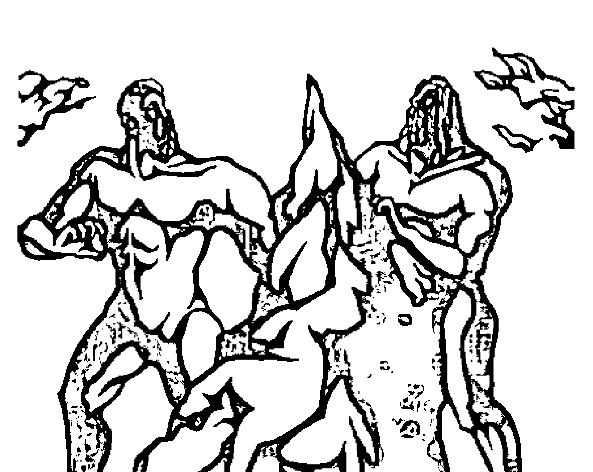

#### 恶魔 伪以诺书

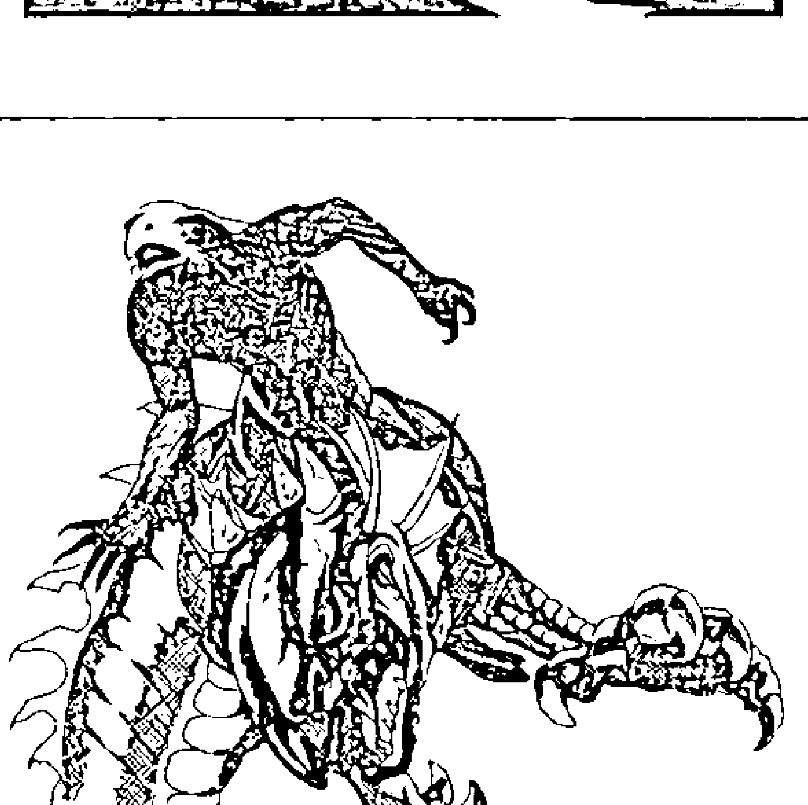

### 恶神 日本

14 译注：山姥位居于山中身有怪力的女妖，山彦乃山神、山精一类。
15 译注：《记纪》指《古事记》《日本书记》两日本古书，天探女乃日本神话中一女神。

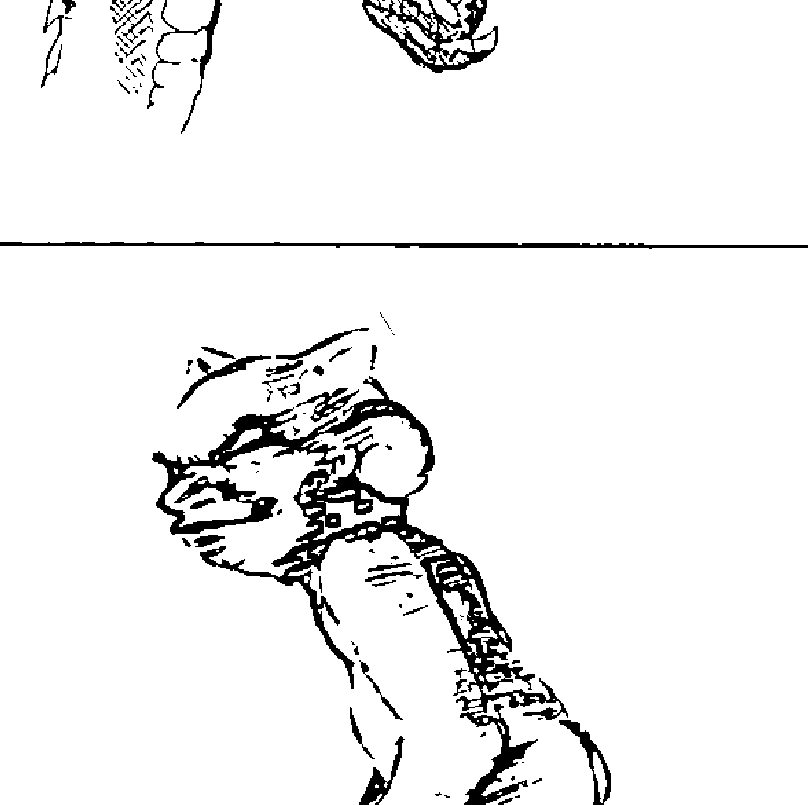

##### 天香香背男神

别名“※天津甕星神”（Amatsumikaboshi-no-mikoto），由这一别名可知他是天津神，而不遵高天原命令的天香香背男神却是平定地上诸多暴虐恶神的天津神第一强者。此神拥有的强大力量足以打倒※建御雷之男神（Takemikazuchi-no-mikoto）、经津主神（Hutunushi-no-mikoto）二神。最后若非被倭文神·建叶槌（Shitsurikami Takehazuti-no-mikoto）怀柔劝服，定能发挥胜过日本神话中最强大的两战神的力量。

平定地界而打算派遣建御雷之男神与经津主神下凡。但两神因天上尚有名为天香香背男神的恶神，而主张平定地上前应先打倒他。但天香香背男神依旧未被二神击败，据守于香取地方（今日本千叶县佐原市）；即使面对强大权势也始终没有改变自身立场。因他自身是司掌星宿之神，所以也可能因此被认为司掌吉凶祸福。另外，后来自中国传入牛郎织女的神话后，因同为星宿神的缘故，两者相互结合，变得同受祭拜（七夕）。

谣传中，据说天照大神（Amaterasuookami）欲

（→大国主神 Ookuninushi-no-mikoto）

##### 安度西亚斯

假称古以色列王国所罗门王所作之17世纪魔法书《雷蒙盖顿》（Lemegeton，又名The Lesser Key of Solomon），书中第一部分〈哥耶提雅〉所记载72名恶魔之一。别名“※安布西亚斯”（Ambuscia），地狱公爵。被认为是音乐家性格的恶魔，无需管弦乐团即可演奏出悦耳动听的音乐。又据说会率领隐形乐队出现。以独角兽形象现身于人世，会响应召唤他的魔法师——小恶魔，以供使唤。

法国作家柯林·德·普朗西所著之《地狱辞典》，安度西亚斯为地狱大公爵，统帅29个军团。在维尔的说明中，他的原形与独角兽相仿，现身于魔法师面前时会化为人形。《地狱辞典》中也介绍他是恶魔中的音乐家，只要召唤者希望，他便开始举行音乐会。安度西亚斯在《地狱辞典》插画家M.L.布尔顿手绘的彩色木版画中，为马头人身造型，这幅肖像相当有名。而该图中，在安度西亚斯的背后放有数只喇叭。

依据受16世纪恶魔学家让·维尔影响的19世纪

##### 阿米特

鳄头女恶魔。也被叫做“※阿米玛特”（Amemait），她的胴体为大型猫科动物（多半是狮子），臀部为河马。此名女恶魔在埃及的死者审判中担任重要职务，而她也因该职务的缘故被称为“吞噬亡灵者”。阿米特在下达判决以前无法对死者作出任何举动，只是潜伏在审判之秤旁静静等待。

而※奥西里斯（Osiris）会将死者的灵魂置于秤上计测重量。秤的一边是死者的心脏（象征灵魂）；另一边是象征真理女神玛特（Maat）的羽毛。若灵魂无罪，磅秤中心脏的一方便会下沉。然而若有罪，便会是羽毛较重。以此下达判决后，阿米特便开始行动。自然，她是不能伤害善者的；可是对于有罪的灵魂，她会将其扑倒，再一口吞下。

（→塞特 Seth）

#### 恶神·星宿神 日本

16 原注：白诸神所居住之高天原降临的众多神灵之总称。

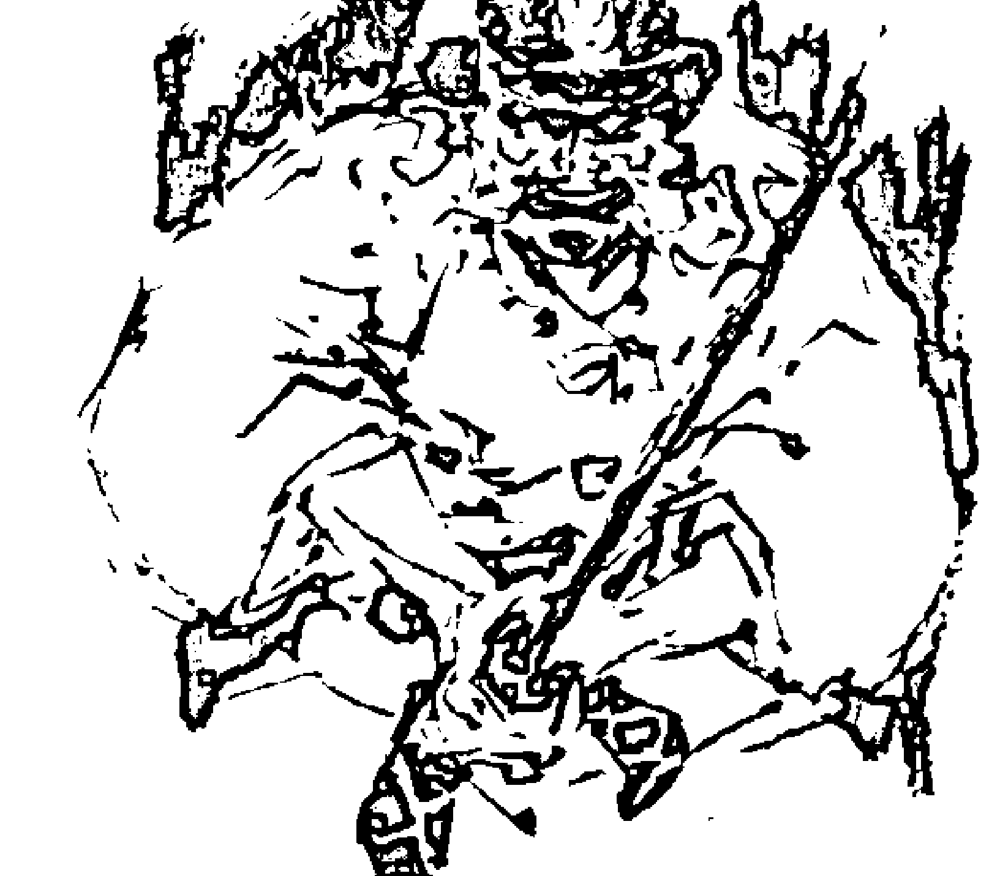

##### 恶魔·所罗门的恶魔 雷蒙盖顿

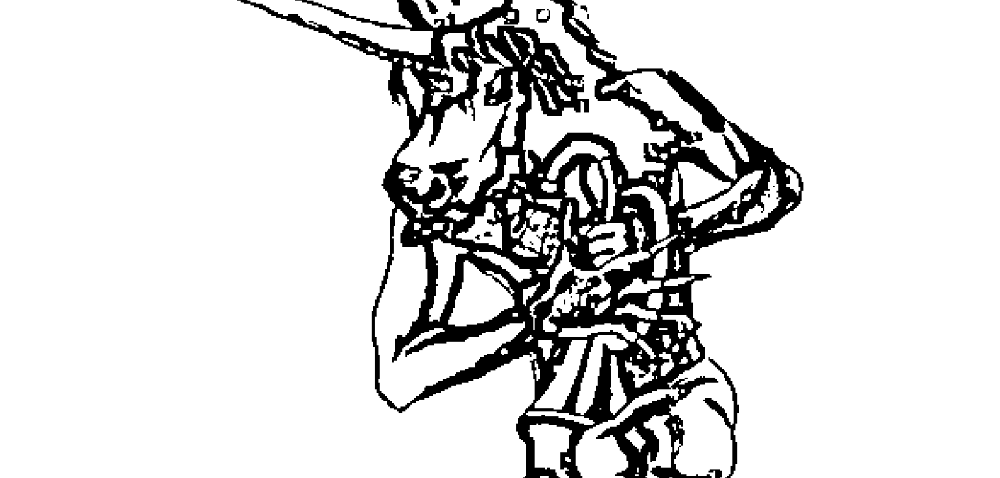

#### 死之恶魔 埃及

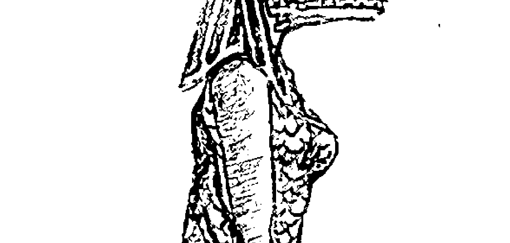

##### 亚蒙

假称古以色列王国所罗门王所作之 17 世纪魔法书《雷蒙盖顿》(Lemegeton, 又名 The Lesser Key of Solomon), 书中第一部分 〈哥耶提雅〉 所记载的 72 名恶魔之一。地狱侯爵。

因头部为鸟 (枭) 首，所以有人认为他是被当成恶魔的埃及神之一。教授召唤者未来与过去的知识，给予人和情爱相关的秘密。

在受 16 世纪恶魔学家让·维尔影响的 19 世纪法国作家柯林·德·普朗西所著之《地狱辞典》中，亚蒙转而被赋予了截然不同的形象。除了身为埃及神痕迹的枭头，在《地狱辞典》中他还被加上蛇尾、狼躯、狼牙，说明他是地狱诸侯中屈指可数的强者 (40 个军团的指挥官)。《地狱辞典》中的恶魔项目，经画家 M.L.布尔顿之手添加了美丽的彩色手绘木版画，成了相当有名的插图。布尔顿的亚蒙肖像十分忠于普朗西对他的描述，不只画出了狼的胴体，还加上狼的前脚。由于这幅令人印象深刻的肖像画，亚蒙成了著名恶魔之一。

##### 勇者安蒙

他是永井豪漫画《恶魔人》中的角色，简单讲就是恶魔族中的好人。原本是恶魔族的一员，而且是个被族人称为勇者的勇猛恶魔。

故事中，得知恶魔族即将来袭，主角不动明在朋友飞鸟了的引导下在飞鸟家地下举行的魔宴中与勇者安蒙合体。正确地说，是安蒙被不动明把他肉体上的能力与记忆全部夺走，而精神活动也被不动明吸收了。

这就是当初漫画发表时引起争议的第一章，不过实际上，通过吞食“神（或超常的存在体）”来获得超人般的能力在许多传说、传承中屡见不鲜。例如德国的叙事诗《尼贝龙之歌》(Das Nibelungenlied)中，主角齐格飞 (Siegfried) 吞食了恶龙法夫尼尔 (Fafnir) 的心脏，并用龙血洗涤全身，因此获得刀剑不入的肉体。而《新约圣经》中最后的晚餐一幕，耶稣为了将自己的圣灵分给门徒时，把代表自己血与肉的葡萄酒与面包分给他们食用。

勇者安蒙（=恶魔人）最后将全部的恶魔族打倒，与魔王撒旦 (Satan the Demiurge) 在没有人类与恶魔的大地上一同迎向最后的破晓时。

##### 亚米

17 世纪魔法书《雷蒙盖顿》(Lemegeton, 又名 The Lesser Key of Solomon) 书中第一部分 〈哥耶提雅〉 所记载的 72 名恶魔之一。

被认为是地狱之火的拟人化，常被视为与火相关。据说地位为大议长、大总督。相传在死者世界，哈迪斯 (Hades) 18时而全身为火焰包裹，被召唤到地上；时而会顺应召唤者的希望，化为秀丽人类。传说中他是司掌占星术的恶魔，能给予人交换人类生命力的法术。

依据受 16 世纪恶魔学家让·维尔影响的 19 世纪法国作家柯林·德·普朗西所著之《地狱辞典》，亚米不仅能给人占星术的知识，还能给予人学问或忠仆。为地狱 36 个军团之指挥官，统率堕落的能天使。他是希望回到天国的恶魔，心中怀有堕落过 20 万年以后便能回归天国的愚蠢想法。因该书插画家 M.L.布尔顿没有绘制亚米的插画，故成为低知名度恶魔。

##### 恶魔·所罗门的恶魔 雷蒙盖顿

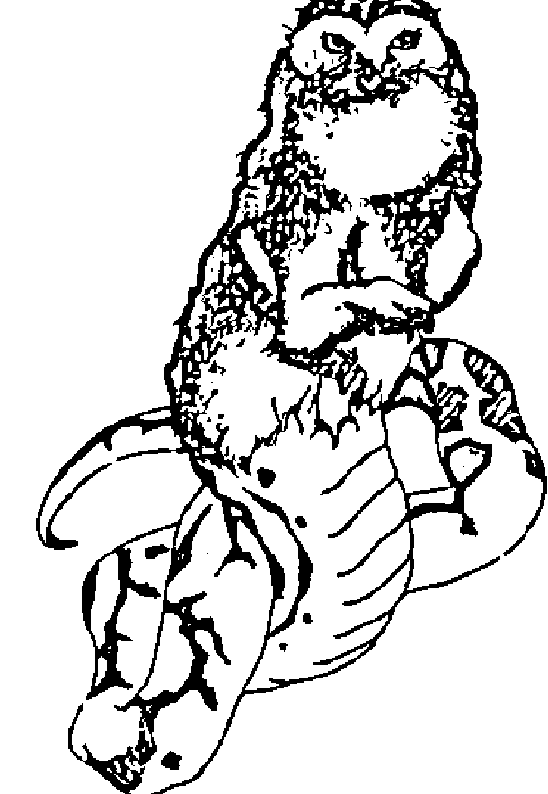

#### 恶魔 日本

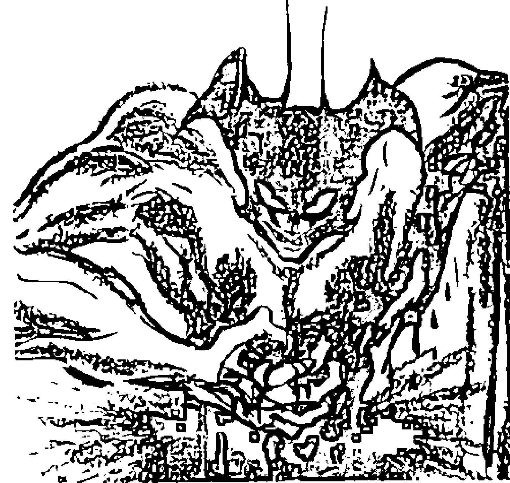

17 原注：勇者安蒙的插图为安蒙吸收了不动明之后，变身成恶魔人的样子。

##### 恶魔·所罗门的恶魔 雷蒙盖顿

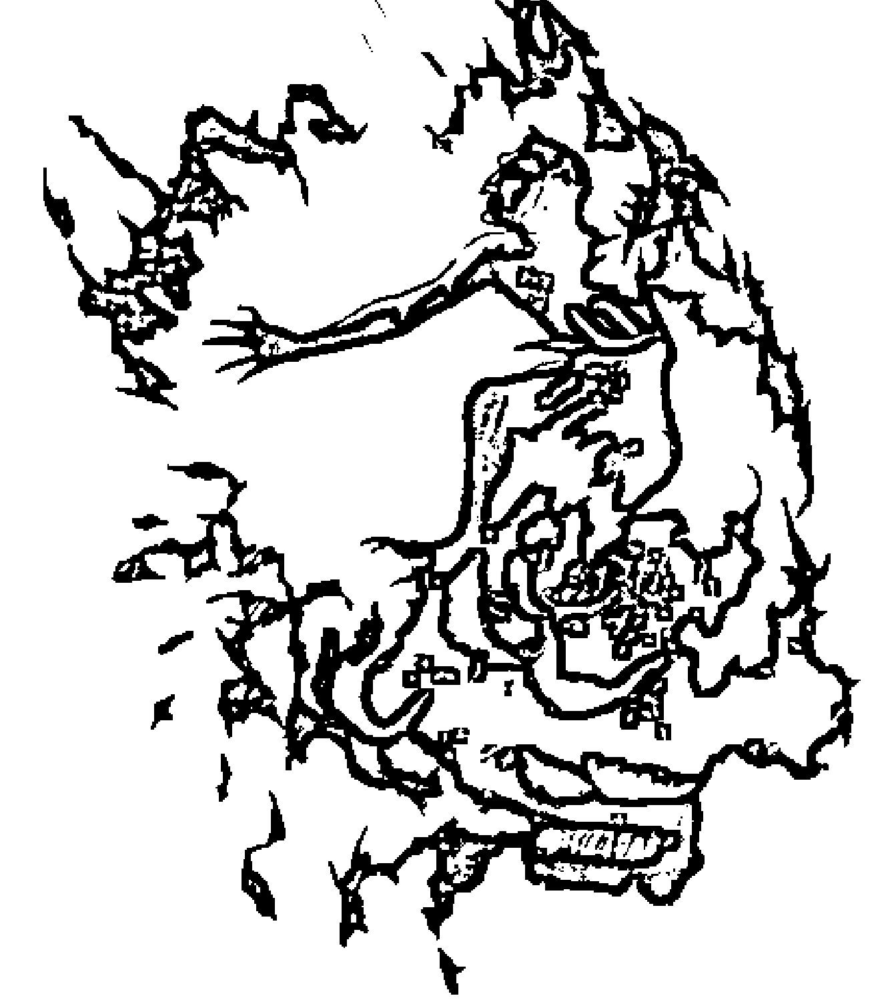

18 译注：希腊神话中的冥神、地府。

#### 混沌

弥尔顿所著叙事诗《失乐园》中登场的老迈灵魂。支配着上帝用来创造宇宙的混沌。上帝从万物诞生前就存在，而混沌则接着诞生。不清楚他是否由上帝所创。在《失乐园》中，其存在与除了上帝和耶稣之外，一切事物皆由上帝所造的基督宗教基础思想相互矛盾。关于混沌，作者可能是从希腊创世神话当中撷取灵感。混沌之妃与他共同统治混沌界 (Chaos)，他的王妃是“万物中最年长”，身着黑衣的“夜”，其周围还有“谣言”、“投机”、“骚扰”、“混乱”，以及拥有无数张嘴的怪物“吵架”等等不祥灵体。混沌王与其党羽被撒旦称作“下界的天使”，为与天使一样拥有柔软灵体的种族。（→撒旦 Satan《失乐园》）混沌虽不遵从上帝，但也无力反抗；在神不断扩张领域、侵吞蚕食所属领地之时，也只能不断悲叹。因此，混沌向脱离地狱前往天国侦察的造反天使撒旦提出忠告，教导他前往新世界“宇宙”的正确道路。

##### 安陀加

湿婆 (Siva 或 Shiva) 神之子。当湿婆神苦修时，湿婆之女19为了玩闹而蒙遮他的双眼，于是世界化为黑暗；在一片黑暗中随着如雷巨响，安陀加（黑暗）诞生于世。此时，魔族的希罗尼亚克夏（Hiranyaksha）为了求子而奉行苦修。于是湿婆神现身，将安陀加赠与他做义子。然而，在宣告“安陀加若受世人憎恶、或求其母、或杀婆罗门（祭司），吾必亲自烧杀”后便行消失。可是，安陀加在见到湿婆神之妻雪山神女（Parvati）后爱慕日深。而且对任何人的劝告都充耳不闻，只想着如何得到雪山神女。于是湿婆神现身，以打赌方式击败安陀加。据说因安陀加诚心忏悔，湿婆神便将安陀加救离阿修罗道。在其他传说中，他的姓名乃“盲者”之意。意指他心中愚昧不辨事物。相传因想盗窃天界神树波哩音陀（Parijata），被湿婆神所杀。

##### 安托士

假称古以色列王国所罗门王所作之17世纪魔法书《雷蒙盖顿》（Lemegeton，又名 The Lesser Key of Solomon），书中第一部分〈哥耶提雅〉所记载的72名恶魔之一。地狱侯爵。首为鸟类之头，据说平时头部为鸦首，体为天使，手中持剑。所以安托士被认为是象征战斗破坏成分的恶魔。安托士骑狼而现，但这也有可能是在表现这名恶魔的攻击性。19世纪法国作家柯林·德·普朗西受16世纪恶魔学家让·维尔影响，写下了《地狱辞典》一书，书中说安托士为地狱的大公爵；并把一般传说的乌鸦头部换成枭头，而跨下之狼换成了黑狼，更添凶杀之气。安托士为地狱30个军团之指挥官。相传除自己性喜破坏外，还会煽动人们不和。此外据说能授人以杀敌之法。（→撒旦 Satan《失乐园》、撒旦 Satan〈中世纪欧洲〉）

#### 混沌的支配者 失乐园

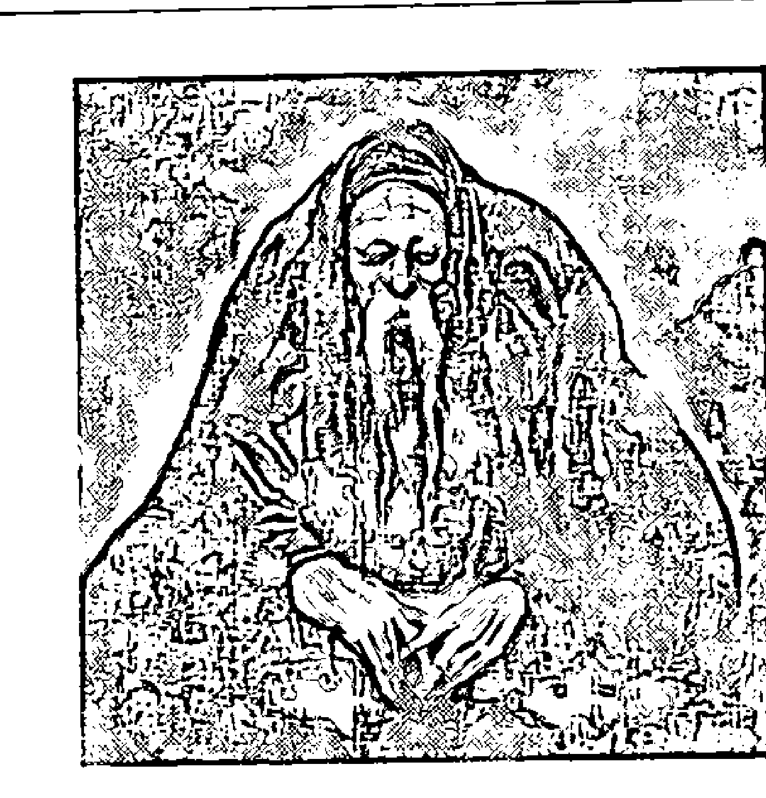

#### 黑暗神 印度

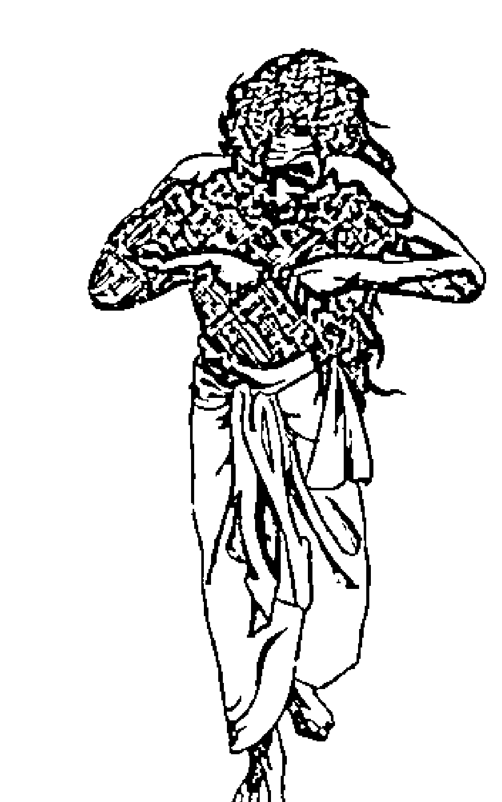

> 19 译注：有一说是其妻雪山神女（Parvati）。

##### 恶魔·所罗门的恶魔 雷蒙盖顿

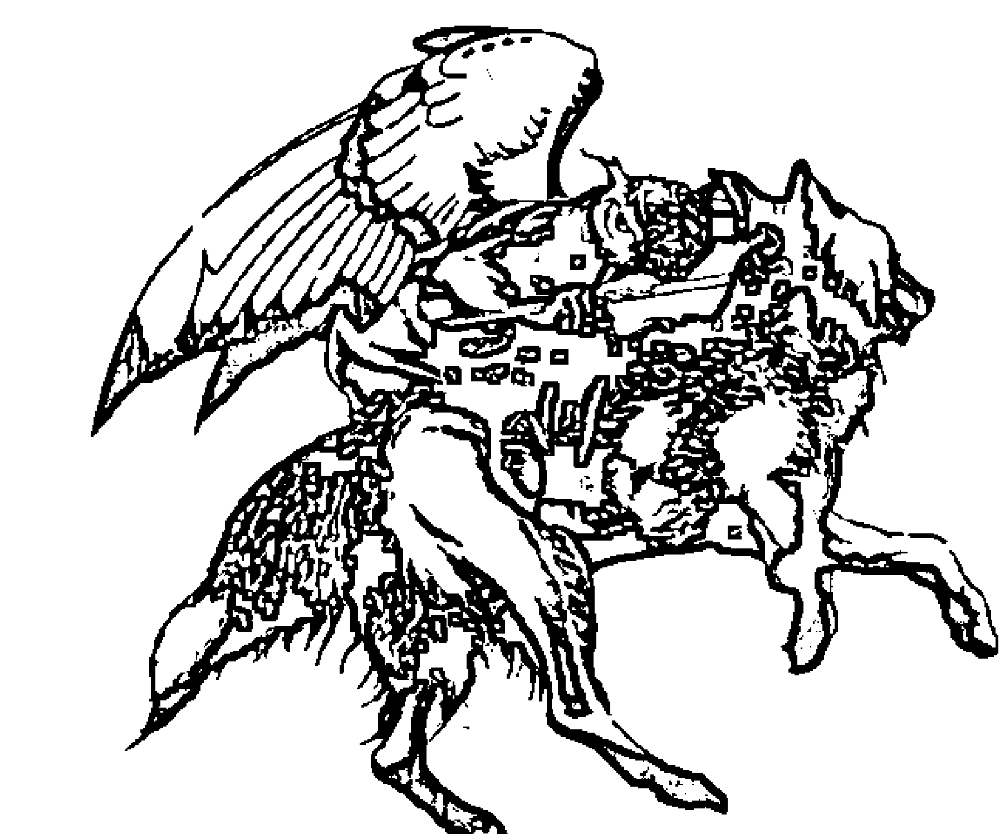

##### 安德雷斐斯

假称古以色列王国所罗门王所作之17世纪魔法书《雷蒙盖顿》（Lemegeton，又名The Lesser Key of Solomon），书中第一部分〈哥耶提雅〉所记载72名恶魔之一。地狱侯爵。

他常被认为与鸟类关系密切，据说会以孔雀形象在人前现身，并拥有将人变为鸟类的法力。能授予召唤者代数与几何的秘密。19世纪法国作家柯林·德·普朗西，因受16世纪恶魔学家让·维尔影响而写下的《地狱辞典》中，说当请求安德雷斐斯教授几何学时，最好趁此恶魔不是孔雀形象，而是以人形现身之际比较合适。同书中，安德雷斐斯除数学知识外，尚能传授愚弄他人的歪理邪说。在《地狱辞典》中，普朗西与插画家M.L.布尔顿为被恶魔化的亚述太阳神亚得米勒（Adramelec）添上了孔雀羽毛。或许因为这个缘故，所以没有附加安德雷斐斯的肖像，让他成了印象薄弱的恶魔。

##### 安杜马利乌士

假称古以色列王国所罗门王所作之17世纪魔法书《雷蒙盖顿》（Lemegeton，又名The Lesser Key of Solomon），书中第一部分〈哥耶提雅〉所记载72名恶魔之一。地狱公爵。

虽然以人形现身，却手中握蛇，所以召唤者能辨识出他并非普通人类。与窃盗关系密切，拥有取回被窃之物、查明小偷真面目之力。因他能揭露隐秘之事，常为了要找出地下交易地点与隐藏财宝之所在而被召唤。在他带给人的灾害方面并无特别纪录。受16世纪恶魔学家让·维尔影响的19世纪法国作家柯林·德·普朗西，写下了《地狱辞典》一书。书中经画家M.L.布尔顿附加了许多恶魔肖像画。这些广受好评的通俗插画，也成了后世恶魔的固定形象。安杜马利乌士虽是“所罗门72恶魔”之一，并曾于《雷蒙盖顿》中出现；但在《地狱辞典》中却未介绍，因而是不起眼的低知名度恶魔。

##### 安格拉·曼纽

琐罗亚斯德教恶神阿里曼（Ahriman）的别名。更正确地说，是较早时的发音。

阿契美尼斯王朝（Achaemenian dynasty）巴底亚（Parthia）时代的琐罗亚斯德教中，把生的力量叫做斯朋塔·曼纽（Spenta Mainyu）；把死的力量名为安格拉·曼纽（Angru Mainyu），他们是孪生精灵。他在世界初始时为善神阿胡拉·玛兹达（Ahura Mazda）所造出。而安格拉·曼纽从阿胡拉·玛兹达对先知琐罗亚斯德所说的话中，得知要把波斯化为地上乐园的计划后，便想加以破坏。据说阿胡拉·玛兹达给了一切被造物自由意志，但安格拉·曼纽借故“选择最恶事物”方法逆转了这一恩惠。而这正是安格拉·曼纽的乐趣所在……

然而到了萨珊王朝，身为琐罗亚斯德教神话根干的这一部分，莫名其妙地发生了变化。在一般说法中，阿里曼（安格拉·曼纽）已非阿胡拉·玛兹达所造，而被当成了与阿胡拉·玛兹达同等级的存在，是“无限的时间”所生。他恐怕是世上的恶魔恶灵中最为飞黄腾达的一人了。

（→阿日·达哈卡 Azi Dahaka）

##### 恶魔·所罗门的恶魔 雷蒙盖顿

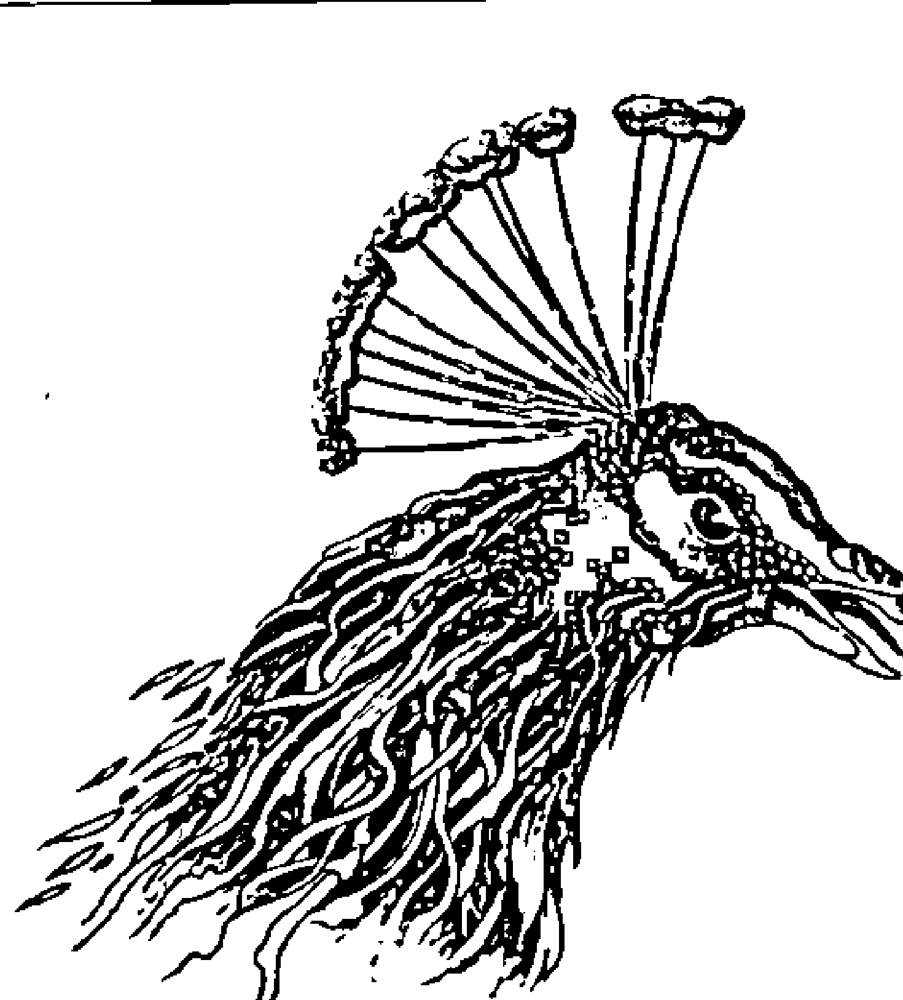

##### 恶魔·所罗门的恶魔 雷蒙盖顿

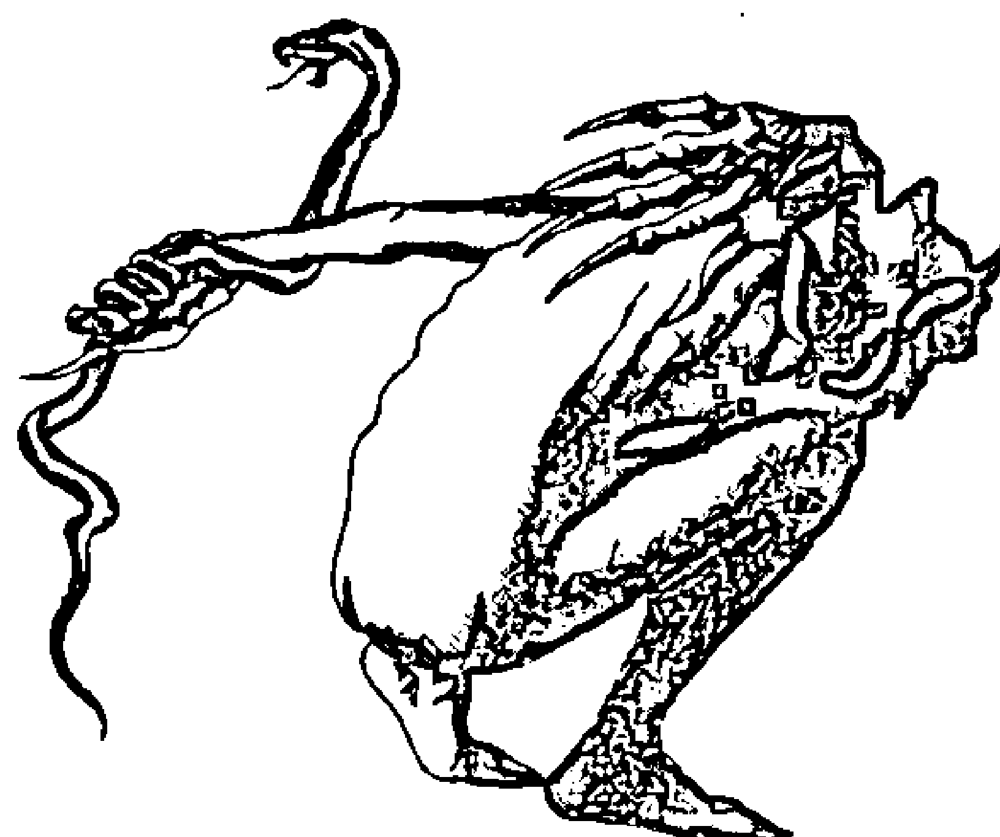

#### 破坏灵 波斯

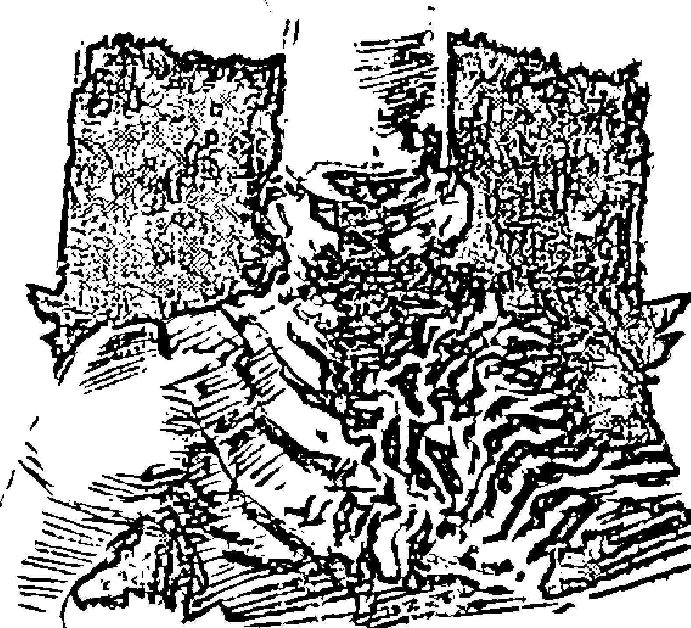

##### 阿努比斯

豺狼头人身的丧葬神，有时也被描绘成一只狗。早先的时期，丧葬仪式是以阿努比斯为主神而进行，但到了后来因冥神奥西里斯 (Osiris) 渐渐重要，转而以奥西里斯为主神进行丧事。

母亲是牝牛神黑莎特 (Hesat)，或说是猫首神巴斯特(Bastet)。然而，也有他是奥西里斯与妹妹奈芙蒂斯 (Nephthys) 的私生子的说法。妻子名为伊卜特，女儿为掌管让死者复苏的清水的女神凯勃胡特(Qebehet、Kebhut)。

起初，人们在看见徘徊于坟墓附近的狗后，认为狗是墓地的守护者，再由此观念产生了这名神灵。

阿努比斯因为将奥西里斯被分为16份的身体加以组合，而成了制作木乃伊时施行防腐措施的神官的守护神。

阿努比斯会在进行埋葬前，在地下墓地前方立起木乃伊进行“开嘴大典”。这是赋予死者生气的仪式，也借此仪式拔除死者的污秽。

之后，死者经阿努比斯向导被带至地府的奥西里斯前面，秤量死者灵魂的重量。 (→塞特 Seth)

##### 阿帕奥沙

琐罗亚斯德教中带来旱灾的恶魔。虽然伊朗自古即为农耕畜牧两者并行的国家，但伊朗人自身(相对于东邻的土耳其，系游牧民族)一直认为自己是农耕民族，故而将旱灾视作最大灾害。

而司掌这最可怕灾害的即是阿帕奥沙。形如黝黑马匹，但头、背、尾上光秃无毛。只要这匹能随意奔驰于天际的黑马停滞空中，下界便会不断为盛阳所苦。

与他相争斗的则是雨神提什特里雅 (Tishtrya)。外形为一雪白马匹，有黄金双耳与黄金口辔。

依照琐罗亚斯德教经典，阿帕奥沙与提什特里雅大战三天三夜后，提什特里雅落败。然而提什特里雅从善神阿胡拉·玛兹达 (Ahura Mazda) 处得到“十匹马、十头骆驼、十只牛、十座山、十条大河”之力后再度上阵，激战三天三夜，终于一雪前耻。如此一来，下界的雨期终于来临。但虽说如此，提什特里雅并非总是每次都能迅速打败阿帕奥沙。 (→阿里曼 Ahriman、魅 Pa)

##### 阿波非斯

由水元素和土元素构成的黑暗之蛇，身上颜色为黄与黑，也被以“骇人者”、“危险者”、“反叛者”、“不可招来者”等名称呼。

象征黑暗的阿波非斯为太阳神阿图姆 (Atum) 之敌。本来也是塞特 (Seth) 之敌，但在赛特于奥西里斯 (Osiris) 传说中被视作反派角色后，阿波非斯似乎也变成了赛特的同伴。

因为阿波非斯是自原初之水 (阿庇索斯) 中现身，故而他其实是将世界拉回原初混沌的力量的具体化。

阿波非斯于埃及的祭典中登场时，会被当作必须打倒的邪恶存在。孟菲斯 (Memphis) 举行的塞凯尔 (Sekar) 祭典中，国王会在奥西里斯前举行打倒阿波非斯的仪式。在其他神殿中，虽有记载要打倒赛特及其手下的书籍，但仪式中被打倒的仍为阿波非斯。而在此类仪式中使用的教条，到了后世转而被当成由一切邪恶中保护自己的咒文。不过在冥界中，阿波非斯担任着追赶、折磨被奥西里斯宣判有罪者的任务。

丧葬神
埃及

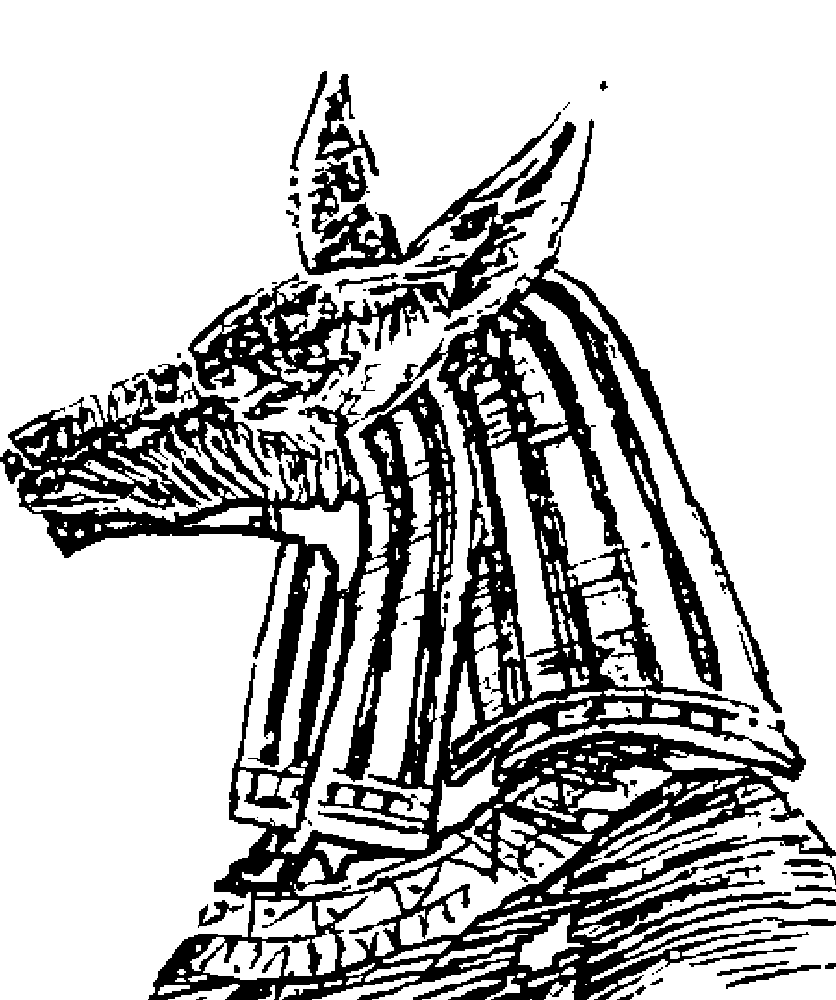

恶魔
伊朗

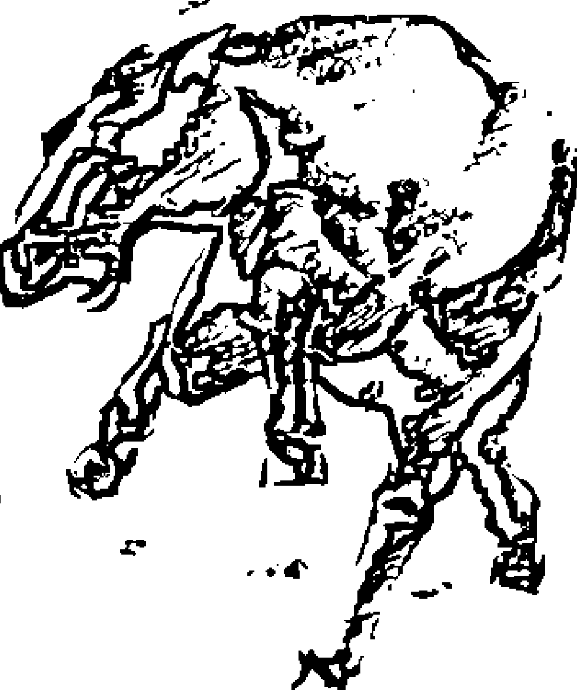

黑暗之蛇
埃及

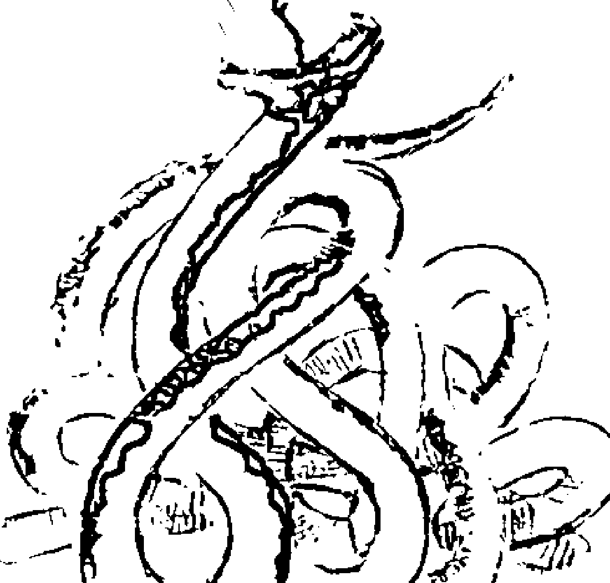

荒吐神

也写作“*荒霸吐神”（Arabaki-gami）。日本关东以东、东北地区以南原住民信仰的古代神。邪马台国王长胫彦与其兄长安日彦为神武天皇所败后亡命到津轻地方（日本青森县西部），与原住民结为荒吐族。荒吐神被认为是该族所祭祀之神。但依照二次大战后公开的伪史文书《东日流外三郡志》，荒吐神则是对日本全土拥有影响力的神明。然而，据说是因遭战胜荒吐族的朝廷贬为夷神（东方异族之神），所以在今日才被降格为替《记纪》诸神之神社守门的门神。

像这种神灵的复活、复权行动，在明治维新前后与二次大战后颇为盛行。说得好听，是发掘失落的知识，但也有人认为是在浑水摸鱼，把为人淡忘的弱小神灵升格抬高。此外，青森县曾挖掘出造型奇特，脸上仿佛带着护目镜的土偶与遮光器土偶，甚至有人说它们是古代航天员的塑像。但也有人说那些是仿自荒吐神形象的塑像，越发增添了荒吐神这名来历不明的门神的神秘性。→恶路王 Akurou)

亚利

《失乐园》（1667年）内登场的造反天使（恶魔）。在描述大逆不道的天使撒旦于天国进行叛乱的第6卷中登场。名字为“神狮”之意，在战争场面中与同阶级的造反天使亚略（Arioc、Arioch = 如狮者）、拉米埃（Ramiel = 神之雷霆）一组。三人于战场上同遭对神忠诚笃实的天使亚必迭（Abdiel）所败。《失乐园》中屡屡提及在《约翰启示录》中出现，名为“生命册”之书的重要性。在《失乐园》中，“生命册”内记有在最后审判中可得救者的名字。若是

姓名被从书中划去，便会成为永无姓名者。书中撒旦身为天使的本名已然消失，而别西卜（Beelzebub）等高阶造反天使的原本姓名被消去的迹象也很浓厚，但亚利等人的姓名依旧有着强烈的天使气氛，所以有人认为他们三人在撒旦统率的天使中地位不高。在介绍主要造反天使的第1卷中也没有记载他的名字。→撒旦 Satan《失乐园》、别西卜 Beelzebub《失乐园》)

阿琳毗

爪哇皮影戏的罗刹娑（Raksasa）之一。爪哇皮影戏（Wayang）中，有五名被国家流放的王子来到了人迹罕至的马尔杜森林。而这座森林中有着罗刹娑（*罗刹Raksasa）的小国，国中之人对王子们的来历感到怀疑。于是罗刹娑公主阿琳毗，奉国王兄长之命前去刺探五名人类王子的状况……但她却对五名王子的其中之一，力大无穷的勇士必玛（Bima）一见钟情。阿琳毗现身于必玛面前，请求与他结为夫妻。然而她的模样丑陋狰狞，嘴角露出长大獠牙。因此必玛心想：“这定然是要欺

我，好将我吃掉的陷阱。”于是他抓住阿琳毗，对她又踢又打、又甩又摔。此时五王子的母亲插了进来，说道：“停下这种粗鲁举动。请过来这边，美丽的姑娘。”说完这句话后，阿琳毗便变成了绝世美女，趴在五王子母亲的脚边。就这样，必玛与阿琳毗成亲结婚，生下一子。他们的孩子就是能看穿黑暗、奔驰于夜晚天际的勇士加塔图凯卡（Gatutkaca）。

#### 邪神
日本

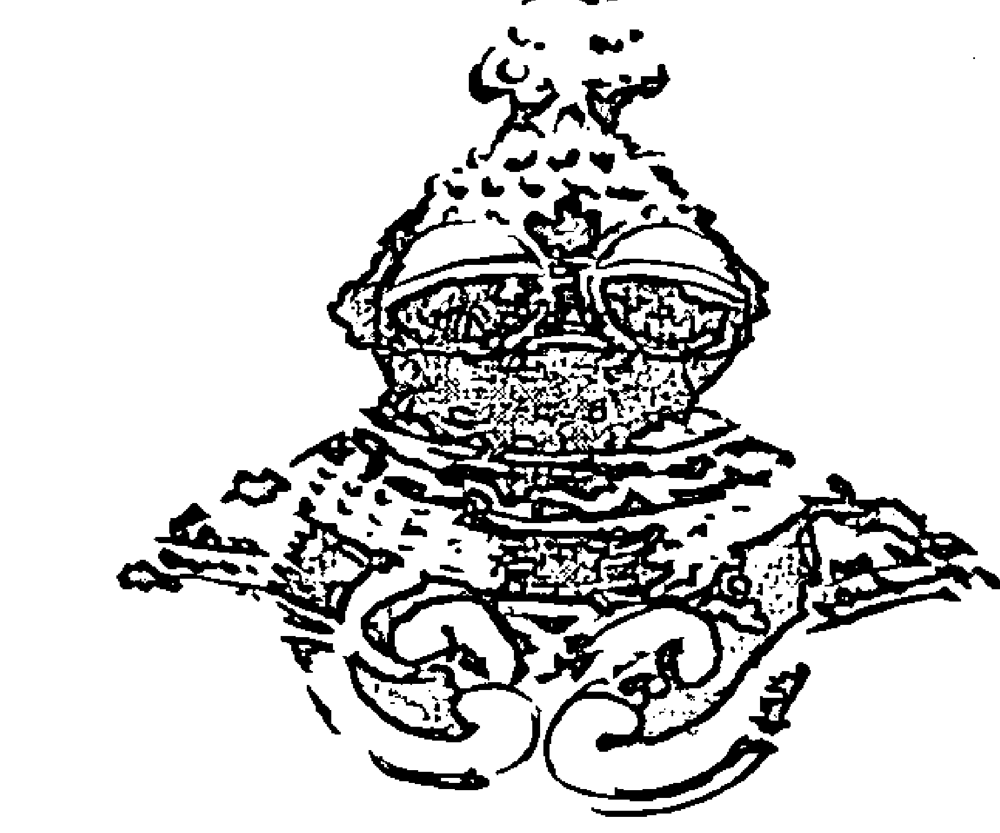

20 译注：指出现于《古事记》《日本书记》两日本古书中的神灵。

### 造反天使
失乐园

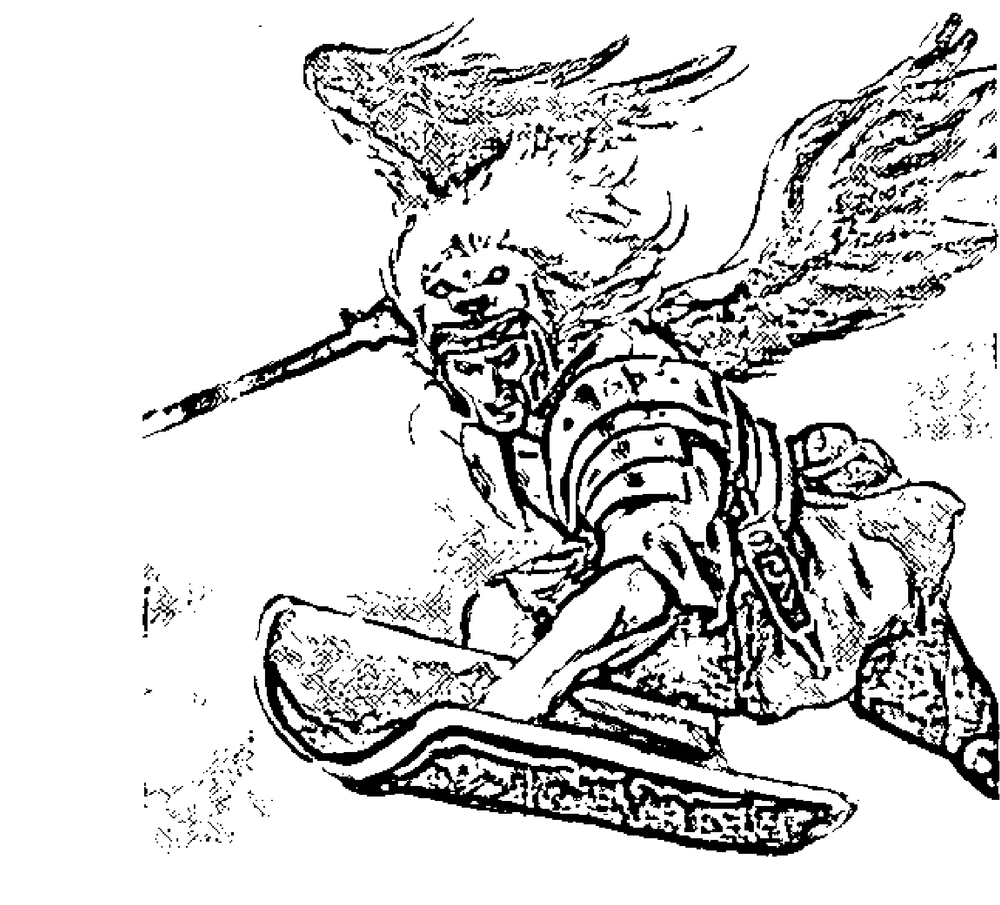

#### 罗刹娑公主
印度尼西亚

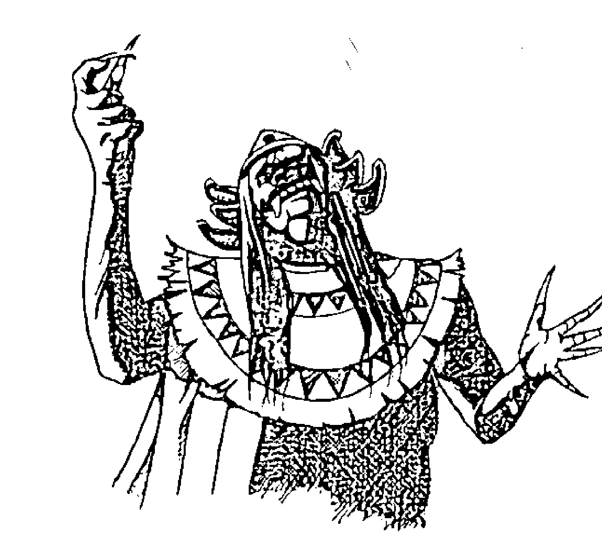

Asmadai (Asmodeus)

阿斯玛代（阿斯摩丢斯）

英国诗人米尔顿的叙事诗《失乐园》中登场的造反天使（恶魔）。在《失乐园》第一卷中，逐一介绍了与大逆不道的天使——撒旦一同造反的众多天使，但里面没有他的名字。在描述撒旦对天国之战的第6卷中，他以指挥官身份登场，与造反天使亚得米勒（Adremelec）一同指挥造反天军的两翼。在米尔顿的设定中，他是圣经外典《托比传》（Tobit）中曾出现的好色恶魔※阿斯摩丢斯（Asmodeus）的前身。米尔顿也在第4卷中说明了他于《托比传》内的恶行。另外，作者可能也意识到了载于犹太神话里，名字与他相同的恶魔王。在《托比传》中，阿斯摩丢斯为大天使拉斐尔（Raphael）所击退，米尔顿也将这段事作为两者的往日纠葛加以叙述。《失乐园》第6卷里，造反天使阿斯玛代、亚得米勒和指挥天军两翼军势的天使长尤烈儿（Uriel）、拉斐尔（在《失乐园》中为炽天使²）交战。阿斯玛代为拉斐尔所败。→撒旦 Satan《失乐园》

Asmodeus (Asmadai)

阿斯摩丢斯（阿斯玛代）

以犹太神话为发端的名恶魔。更早期的原形，似乎是波斯传说中出现的艾什玛（Ašma）。在启示文学中的圣经外典《托比传》内以“※阿斯摩丢斯”（Asmodeus）之名出场后，便成为恶魔学中占有重要位置的存在。由《托比传》的描述来看，他多半被解释为破坏夫妇感情的存在。在17世纪魔法书《雷蒙盖顿》，或仿启示文学《以诺书》作成的《伪以诺书》两书的恶魔目录中，记有他的不同的名字“阿斯摩代”（Asmodai）。《雷蒙盖顿》记载他的姿态为有公羊、公牛、人类三个头的骑龙国王。依照受16世纪恶魔学者维尔影响的19世纪作家柯林·德·普朗西所作《地狱辞典》，阿斯摩地（Asmodee，即阿斯摩丢斯）是地狱七王之一，统驭72团军团。经由普朗西与画家布尔顿之手，他除了三个头与乘龙外，还加上了蛇尾鹅脚与蝠翼，外形变得犹如怪兽。这种外形或许是在仿讽象征福音传道者的四种动物也说不定。²²

Astaroth

亚斯她录

由古巴比伦王国丰穰女神伊西塔（Ishtar）的传说与解释中发端成形的名恶魔。拥有“※亚斯她脱”（Astarte）、“※阿斯塔特”（Ashtart）等众多别名。被认为与埃及的亚斯托勒（Astoreth）²³与希腊的阿芙柔黛蒂（Aphrodite）相近。本是异教女神的阿斯塔特，被犹太教、基督宗教恶魔化；《失乐园》作者米尔顿也将亚斯托勒作为造反天使的一员让他于书中登场。也有将亚斯她录视为恶魔代名词的说法，所以他成了恶魔文献中不可或缺的存在。在《雷蒙盖顿》，与仿照启示文学《以诺书》所作的《伪以诺书》两书之恶魔目录中，自然顺理成章的将他收录于内。《伪以诺书》说他是率领40个军团的司令官。依照受到16世纪恶魔学者维尔影响的19世纪法国作家普朗西所作之《地狱辞典》，亚斯她录为地狱大公爵之一，左手握毒蛇乘龙而现。他是典型的堕落天使，在堕为恶魔后外表变为丑陋的天使。详熟天使学与历史。出现时散发恶臭。

### 造反天使
失乐园

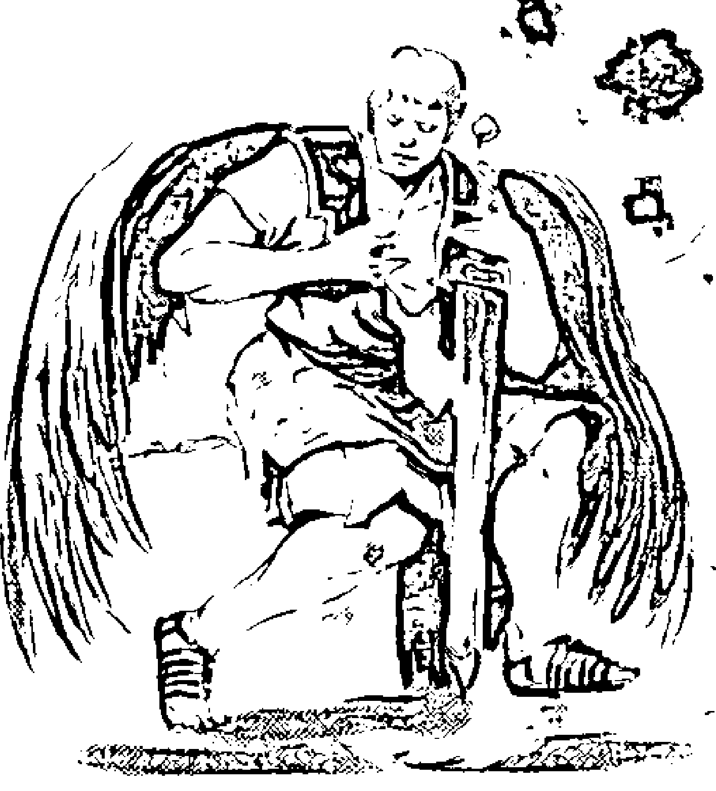

21 译注：即撒拉弗。

#### 恶魔·所罗门的恶魔
雷蒙盖顿、伪以诺书

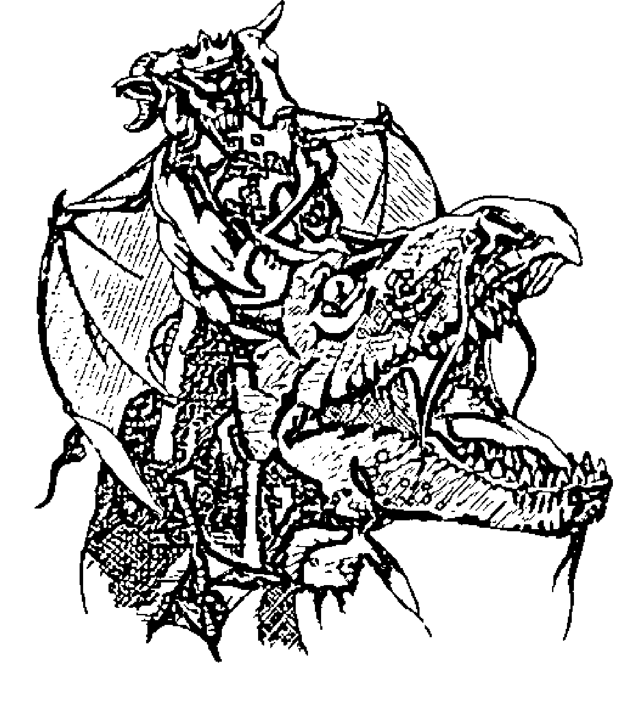

22 译注：象征马太、马可、路加、约翰的四种动物为有翼雄狮、有翼之人、有翼公牛、鹫。

#### 恶魔·所罗门的恶魔
雷蒙盖顿、伪以诺书

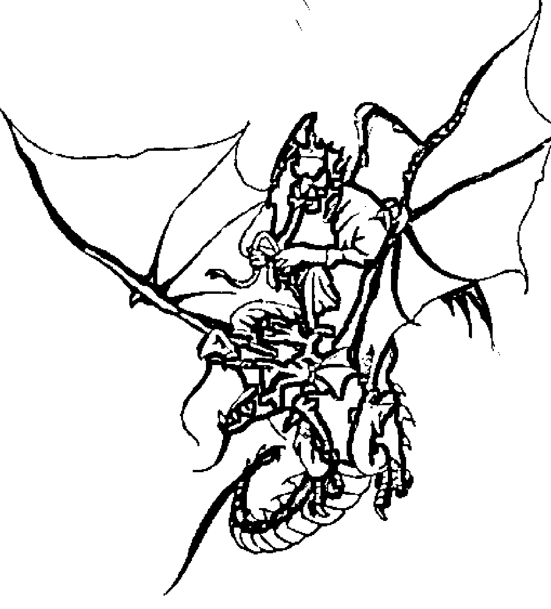

23 译注：埃及战斗女神，形象为狮头女身驾驶马车。

#### 阿斯图·维达特 (Asto Vīdatu)

琐罗亚斯德教中的死亡恶魔。因为对一切人类而言，死亡乃避无可避之事，故而阿斯图·维达特被视为强悍无比的恶魔。此魔物不仅觊觎世上所有活人的生命，连对母亲腹中的胎儿也虎视眈眈（流产即是由他引起）。身为善良琐罗亚斯德教徒，必须经常留心意外灾害，不做有损健康的行为；而琐罗亚斯德教也不很尊崇苦行，都是因为必须减少被此魔物夺去性命的机会，以生育子女。

依照民间传说，此魔物极擅投掷套索，会将套索套在世上每个活人颈上。据说人一旦死去，好人头上的套索会松脱，坏人则被绳索拽入地狱。

然而在其他传说中，在人项上圈挂绳索的，是坐在地狱入口处名为维萨鲁夏的恶魔。这名恶魔会在死者行经通往天国的桥梁时投出套索。若是好人便不会被绳索套住；恶人则会高兴地被绳索牵着拉入地狱中。

(→ 阿里曼 Ahriman)

#### 阿修罗 (Asura 或 Ashura)

众神之敌，日本佛教中汉字写为※阿修罗 (Asyura)。相对于意指印度众神的提婆 (Deva) 一词，阿修罗乃是总称拥有变身能力与法力，名为伐楼那(Varuna)或的神格。之后转为指称与众神为敌的魔神。

对阿修罗此词本身的语源，看法颇多。有自意指“存在”的 asu 而来之说，有自意指“呼吸、生气” asyu 而来之说，还有指涉及众神的 sura 加上否定的 a 而来等说法。

出处也是众说纷纭。印度教祭典仪式指引书《推提利耶梵书》(Taittiriya Brahmana) 说他们是造物主生主 (Prajapati) 自生气中所造出。而祭典仪式指导书《百道梵书》(Satapatha Brahmana) 中称众神与阿修罗都是造物主所生，但众神取真弃伪，阿修罗取伪弃真。圣典之一的《毗湿奴往世书》(Visnu 或 Vishnu Purana) 记载阿修罗乃自梵天 (Brahma) 神的大腿所生。

事实上，阿修罗即是阿胡拉·玛兹达 (Ahura Mazda)，在琐罗亚斯德教中阿修罗是善神；相对于身为印度诸神的提婆而言时才是恶神。

#### 阿图拉奇·纳采 (Atlach-Nacha)

有着与人类的大小相近的躯体、粗圆足部的蜘蛛神。体型与蜘蛛相仿，但头部却极似人类，浓毛密布的脸中狡猾的深红双眼闪闪生辉。由于外形的缘故，而有人说他支配着全世界的蜘蛛。阿图拉奇·纳采住在札特瓜 (Tsathoggua) 所居的地底湖——“恩该 (N’Kai) 的洞窟”更深处。在洞窟深处有着辽阔且深不见底的裂缝；而他想在那里以蜘蛛丝架起桥梁。

阿图拉奇·纳采对这件工作极其热衷，所以对想妨碍他的入侵者毫不留情。在古老黑魔法书中，虽记载有将阿图拉奇·纳采招至地上的咒文，但若未事先做好恰当准备，即使是咏唱咒文的召唤者也会成为这名怪物不满的对象。

阿图拉奇·纳采架桥的理由完全无从得知；但在古书中有着当他筑巢完成时此世界即会灭亡的记载。

恶魔
伊朗

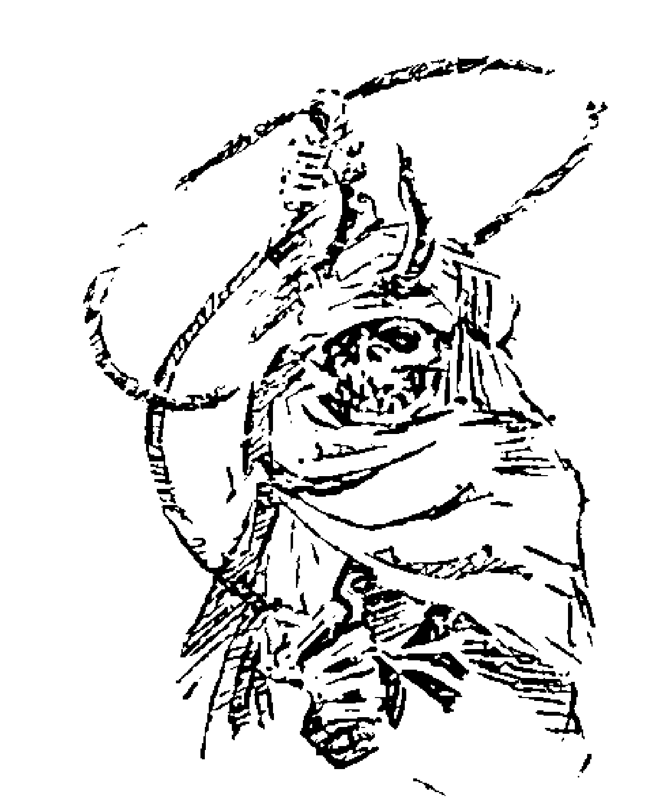

魔族
印度

（→阿里曼 Ahriman、商波罗 Sambara）

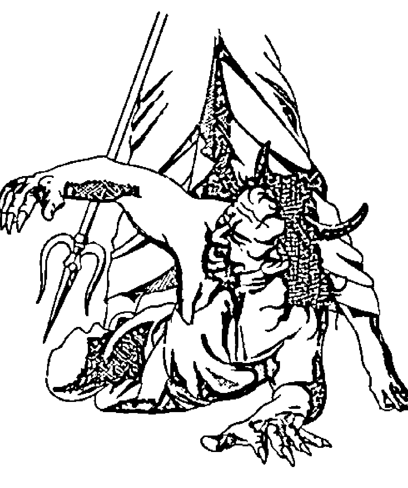

蜘蛛神
克苏鲁神话

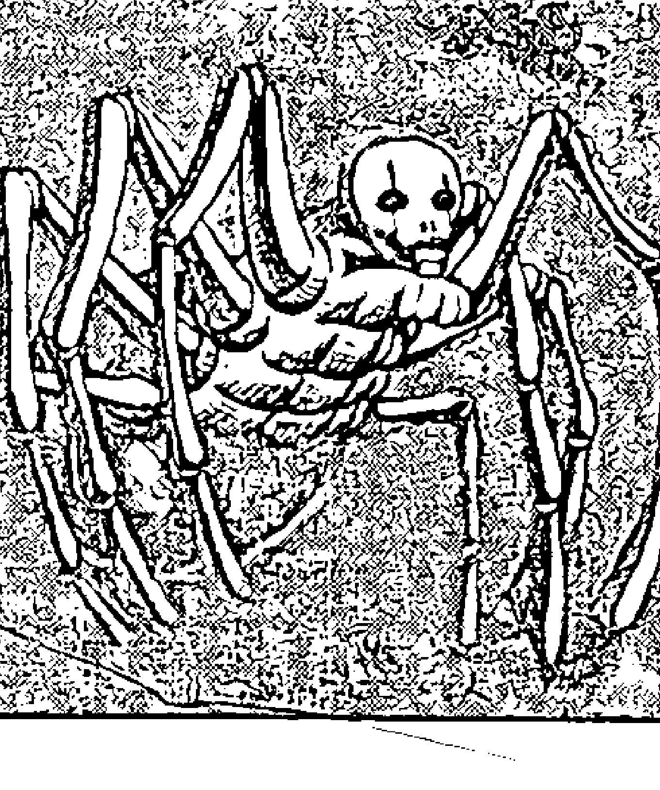

#### 阿撒特斯

克苏鲁神话 (Cthulhu Mythos) 中的主神暨破坏神。自宇宙初始之时即存在；又一种传说宇宙本身不过只是阿撒特斯引起之“现象”，因此或许也可说他是创造神。由于为地位极高之神，所以即使是在破坏神众多的克苏鲁神话中，他所有的力量依旧强大惊人。

平常居于宇宙中心的王座上，受“外神们的仆人”所服侍。被咒文或仪式召唤后，出现的最初一瞬间是直径数米的沸腾团块，于数十秒内就壮大至数千米并吞噬周遭物体。甚至可能进一步形成伪足²⁴

破坏更多区域。有人说存于木星与火星间的小行星带，便是遭阿撒特斯破坏的行星的残骸。

一般几乎没有崇拜阿撒特斯的人。因为他即使被祭祀也不会感到高兴，也不会眷顾敬拜者。阿撒特斯是名实相符的破坏神。

(→奈亚鲁法特 Nyarlathotep)

#### 阿撒泻勒〈希伯来〉

希伯来恶魔。在《旧约圣经》〈利未记〉中也有登场。性格不明，与“恶魔”一词一样被作为一般名词使用。

也现迹于《旧约圣经》伪经《以诺书》(Enoch)内，书中义人以诺对阿撒泻勒咒骂如下：

> “你必不能得享平安；严峻的审判要临到你。他们将会捆绑你，你不会有安息和祈求的机会，因为你教人行不义，又因你指示他们羞耻、不义和罪恶的行为”。

而阿撒泻勒最后也被捕获。

在烈火焚烧的深谷里，天使们在铸造极重的锁链。被问到锁链用途的天使回答：“这是为阿撒泻勒的军队做的。他们要捉住阿撒泻勒的人，把他们丢入完全绝望的无底坑里，并用大石堆在他们的颚上，这是万灵之主所吩咐的。”²⁵

最后阿撒泻勒被米迦勒 (Michael)、加百列 (Gabriel)、拉斐尔 (Raphael)、法鲁尔 (Phanuel) 等天使所捕获，连同他所爱的人被投到深谷。

#### 阿撒泻勒《失乐园》

英国诗人米尔顿 (John.Milton, 1608~1674) 之叙事诗《失乐园》(Paradise Lost, 1667年) 中登场的造反天使 (恶魔)。在《旧约圣经》〈利未记〉中，是与唯一神二分祭物，其面目不明的恶魔²⁶。另外，在犹太教伪经《以诺书》(Enoch) 中被记为恶魔指挥官中的一人。米尔顿于《失乐园》内所描写阿撒泻勒的形象似乎是以《以诺书》为素材。原形虽是有名恶魔，出场机会却少，仅出现于第1卷中。

米尔顿虽熟知“炽天使”²⁷、“基路伯”、“宝座”、“治权”、“王国”、“权势”、“德行”、“天使长”、“天使”²⁸的天使九阶级，却不知为何未在《失乐园》中严格区分位阶。罕见地将阿撒泻勒写为智天使²⁹ (Cherubim)。天使的位阶不仅是阶级，还是天使命定的出身。即使变为地狱居民后，阿撒泻勒的阶级依旧是基路伯。阿撒泻勒是相貌堂堂高大颀长的天使，担任为撒旦掌旗的荣誉职务。经常手持庞大王旗而行。在第一卷中撒旦命他执掌大旗。

(→阿撒泻勒 Azazel〈希伯来〉、撒旦 Satan《失乐园》)

破坏神
克苏鲁神话

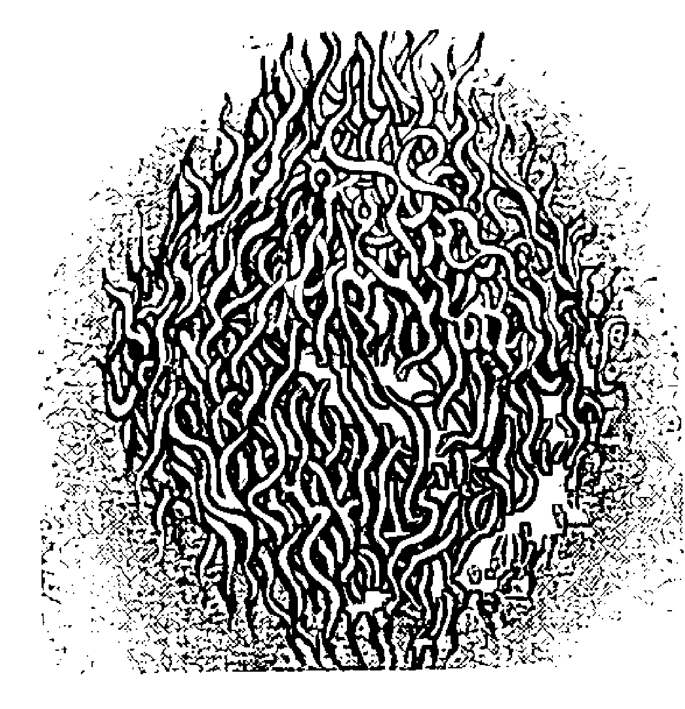

24 译注：原生动物为摄食或运动方便而由身体伸出的临时触手或突起。

恶魔
希伯来

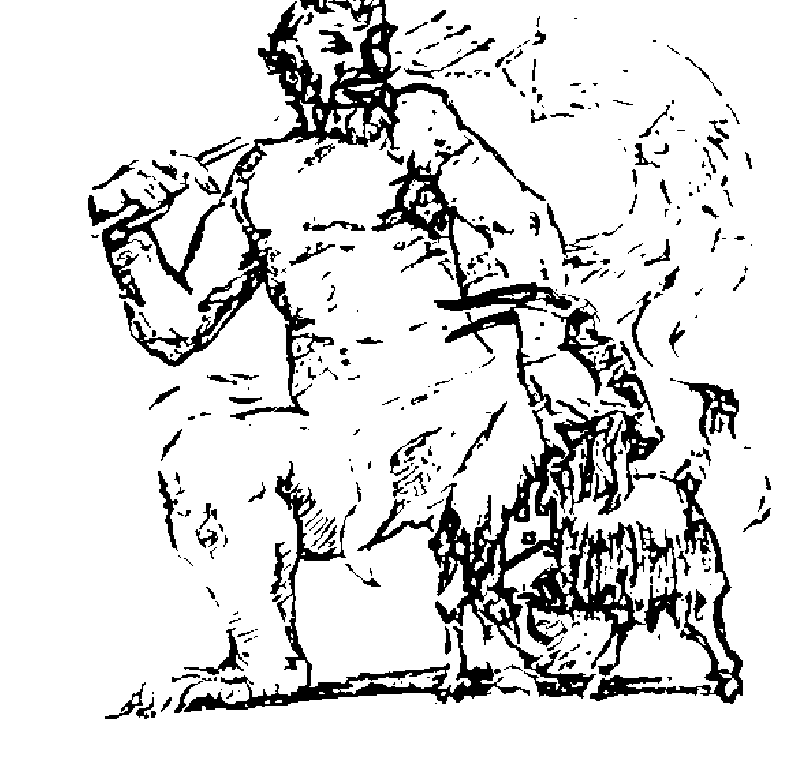

25 译注：此处两段经文引自《基督宗教典外文献-旧约篇》（基督宗教文艺出版社）第一册，然书中阿撒泻勒译作“亚撒尔”，此处为求统一变之。

造反天使
失乐园

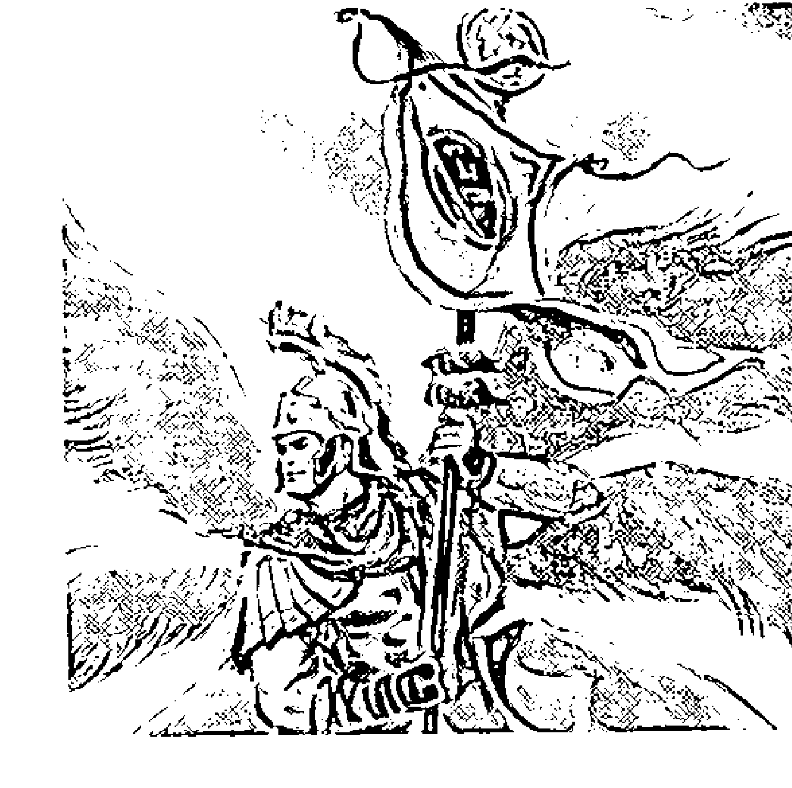

26 译注：《利未记》16章8节“为那两只羊拈阄，一阄归与耶和华，一阄归与阿撒泻勒”。
27 译注：即撒拉弗。
28 译注：原文分别为 “Seraphim”、“Cherubim”、“Thrones”、“Dominations”、“Principalities”、“Powers”、“Virtues”、“Archangels”、“Angels”。此处天使九阶汉译引自朱维之译、桂冠1994年出版之《失乐园》中。同日系天使九阶略有所不同。
29 译注：即合订本圣经中之基路伯。

亚祖兰

美国作家塔妮丝·李（Tanith Lee）的小说《平坦地球系列》（Flat Earth Series）中登场的妖魔王之一。
在世界尚为一片平地浮于混沌之海时，天上、地下和海中各有神灵存在。天上众神造出人类后将人放置陆地；海中诸君王则与人类无干；地底妖魔王则以作弄人类、令人不幸为乐。
亚祖兰即为妖魔王之一，别名“黑暗公子”（Night's Master）。好用形象为一黑发白肤，有着会如石炭般燃烧生光的黝黑双目的男子。还能自由地幻化为黑鹰、黑云或其他任何姿态。他以玩弄、陷害人类为乐，有时会引诱人类让人自动走入他的陷阱，有时利用与人类所订契约的漏洞令人不幸，有时则将人们垂涎的宝物撒布于世以埋下纷争种子。又因淫乱无度，只要容貌美丽，对象是男是女皆不在意。即使死亡了也会将身体化为数块，被数名姊妹生下后再愈合重生。
（→乌戮穆 Uhlume、凯希梅特 Keshmet、强兹 Chuz）

阿日·达哈卡

琐罗亚斯德教恶神阿里曼（Ahriman）为了完全破坏善神阿胡拉·玛兹达（Ahura Mazda）所造物而作出的巨大三头龙。琐罗亚斯德教圣典“阿维斯陀”（Avesta）上形容它“三口三首六目，法术上千，极其高强”，有时被列为※六大恶魔之一。
照古波斯萨珊朝时代（224～651年）之文献，此龙造恶无数，将两名公主关于岩山中。于是名为费里顿（Feridun，或译法里顿）的勇敢年轻人，携带粗重棍棒与锋利无匹的长剑前去消灭他。
费里顿遇上龙后，用粗重棍棒击打了龙的肩膀、心脏、头顶。但龙依然不倒。于是他拔出锐剑砍斩三次；此时砍下的部分化为毒虫猛兽。
见到如此，善神自空中喊道：“别再砍了。若是这样世上便会充满蜥蜴同其他可怕生物了。”
于是费里顿放弃斩杀恶龙，用锁链将其捆缚于山底洞穴中。

巴力

腓尼基神的巴力最初是只用来表示一个特定的神的名词。但是后来这个名词开始用来表示一般名词的“神”之后，就出现了无数的“巴力・～”了。
《旧约圣经》中有好几个叫做“巴力・～”的异教神出现。就连有名的别西卜（Beelzebub），其实也是这些“巴力・～”的其中之一³¹。
以色列因为崇拜“巴力毗珥（Baalpeor）”而惹来主的愤怒，结果瘟疫就开始流行了。主对摩西（Moses）说：“将百姓中所有族长在我面前对着日头悬挂，我向以色列人所发的怒气就可以消了。”
于是摩西吩咐以色列的审判官说：“凡属你们的人，有与巴力毗珥联合的你们各人要把他们杀了。”于是瘟疫虽然是停了，但是据说共有 24000 人在瘟疫中丧生³²。
另外，还有一次攻击崇拜“巴力比利土（Baal-berith）”的城市，将居民全部杀死，撒上了盐，还放火烧楼，据说大概死了有 1000 人³³。
从这些记载看来，耶和华似乎比巴力们更邪恶得多了。
（→撒旦 Satan 《旧约圣经》）

妖魔之王 美国

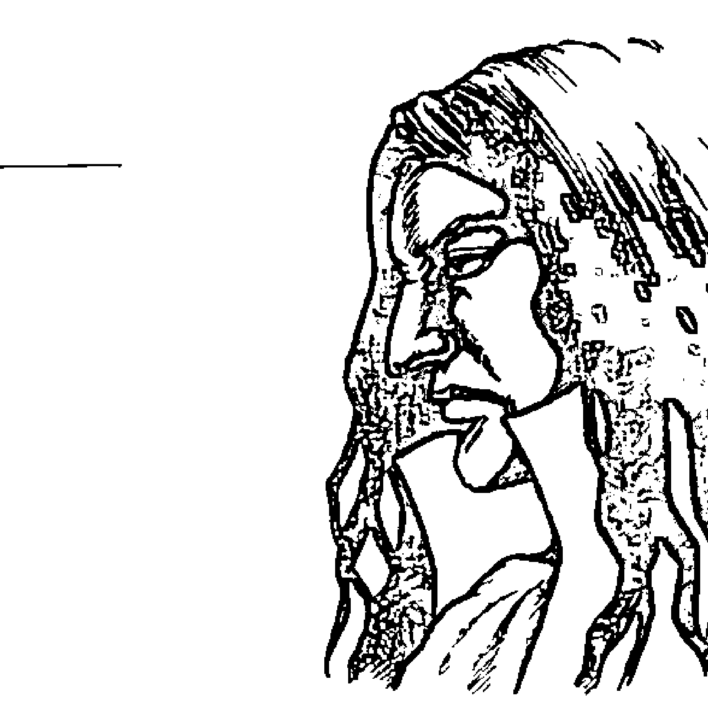

龙 伊朗

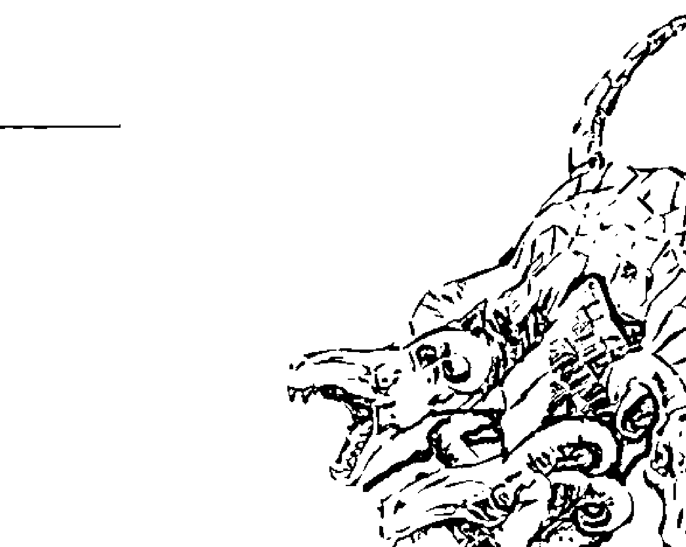

30 译注：或译阿日达哈克。

伪神 希伯来

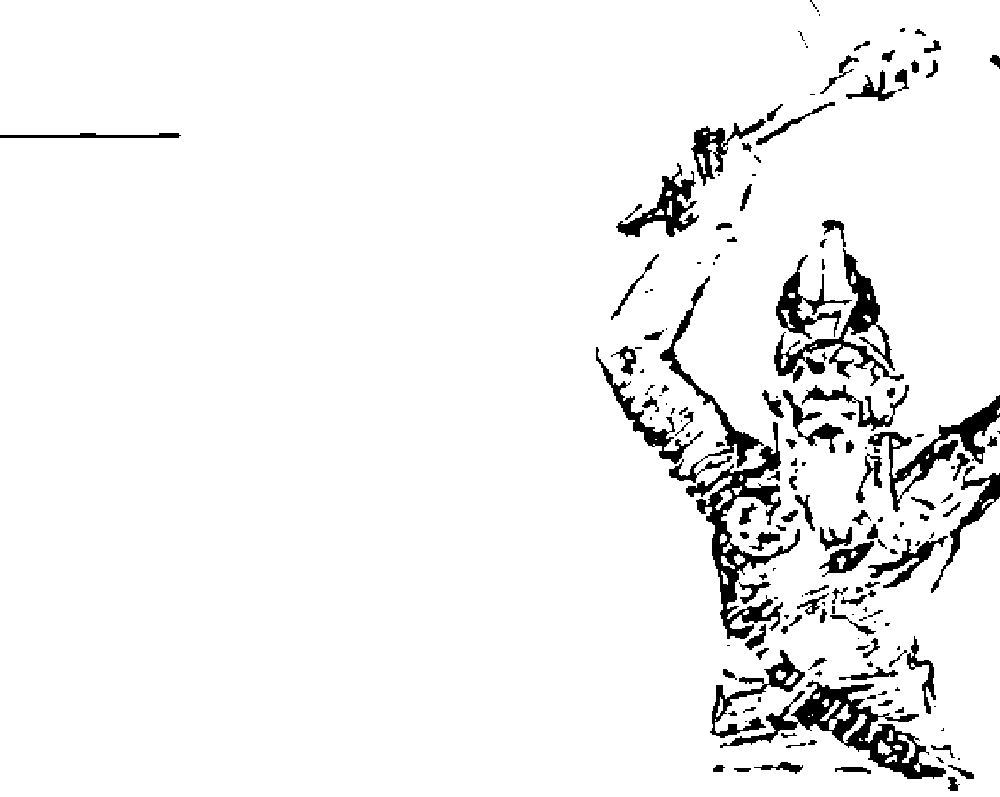

31 译注：参见别西卜〈希伯来〉条 (Beelzebub (Hebrew))。
32 译注：出自《旧约圣经》〈民数记〉4:3
33 译注：出自《旧约圣经》〈士师记〉9:45-49

巴力（巴耶力）

这是假托所罗门王所写，但其实为17世纪魔法书《雷蒙盖顿》(Lemegeton)的第一部《哥耶提雅》中记载的72只恶魔当中的一人。另外以模仿启示文学《以诺书》(Enoch)所作的《伪以诺书》上面，也记载有这个恶魔的名字。

这个恶魔多半是以圣经中出现的腓尼基人（古代闪族）崇拜的太阳神巴力为蓝本，结果在恶魔学的辗转传承之间变成了与原貌毫不相关的恶魔。

他通常被描述成恶魔当中最有力的一人。在《伪以诺书》中，说他的外形是长着猫头与青蛙头，人类的身体，当然有时也以人头的样子出现。另外一种传说认为他是同时长着三个头，也有说是蟹头人身等等。

法国作家普朗西 (Collin de Plancy, 1794～1881) 的《地狱辞典》(Dictionnaire Infernal) 中将“巴力”、“巴耶力”两项分开，该书中“巴力”被介绍为异教的神，而“巴耶力”则说他是会授予人奸诈，也可以让人变为透明。该书的插画家布尔顿将他画成同时具有人、猫与青蛙的头部，底下长着蜘蛛的脚，因为这张插画使得他在一般人之间也颇有名。

巴林与亚斯她录

这指的是《失乐园》中登场的造反天使中的一个集团。作者米尔顿说明这些天使是两河流域一带人民信仰的丰穰神的前身。《失乐园》只认定全能的造物主才是此宇宙中唯一的神。因此多神教中的诸神在这部作品中，通常被视为原本是天使在反叛了主之后变成恶魔来诱惑人所假借的姿态，当然这里我们所说的巴林与亚斯她录也不例外。巴林是“主人们”的意思，指的是一群男神。这个字的单数型是Baal（→巴力 Ba'al)。而亚斯她录则代表着“女神们”的意思。米尔顿以这些具有性别的天使为例，说明天使原本并没有确定的性别或形态，他们灵性的肉体可以自由自在地变化。亚斯她录的单数型亚斯托勒 (Astoreth) 则是被当成一个单独的天使来介绍，作者说她就是美索不达米亚与腓尼基人所崇拜的女神※亚斯她脱 (Astarte) 的前身。这个女神经常被视为跟希腊神话中的美神阿芙柔黛蒂 (Aphrodite) 与罗马神话中的维纳斯 (Venus) 是同一尊神。

(→撒旦 Satan 《失乐园》)

芭芭雅嘎

她是俄罗斯童话中的老巫婆。据说她住在一间底下长有一支鸡脚的小屋里，窗口向着森林，门向着墙壁，一旦听到有王子或小姑娘在森林里迷路了，房子就会转个180度，门朝前，打开窗子。

芭芭雅嘎很瘦，长的一副皮包骨的样子，脚也只有一只骨头脚。虽说她并不是什么坏事做尽的恶魔，但是也绝非善类，经常抓那些在森林里迷路的小孩丢进火炉里烤来吃。而且，万一如果你以前曾经打倒过恶龙的话，那只恶龙搞不好就是芭芭雅嘎的女婿，如果真是那样就糟了，因为就算你想逃也逃不了。芭芭雅嘎会坐在铁臼上面，一只手用铁杵划着，另一只手用扫帚将她留下的痕迹扫干净，飞快地来追你。

不过这个老巫婆偶尔也有很亲切的时候。有时给远道而来的年轻人忠告，送他魔法马与毛线球。有时年轻姑娘来的时候，交代她繁重的家事做，如果完成的话就会对她非常好。不知道到底是有两个一好一坏的芭芭雅嘎，还是单纯只是老人的任性而已。

(→俄罗斯的恶魔 Demon 〈Russia〉)

#### 1. 恶魔，所罗门的恶魔
雷蒙盖顿·伪以诺书

名气。

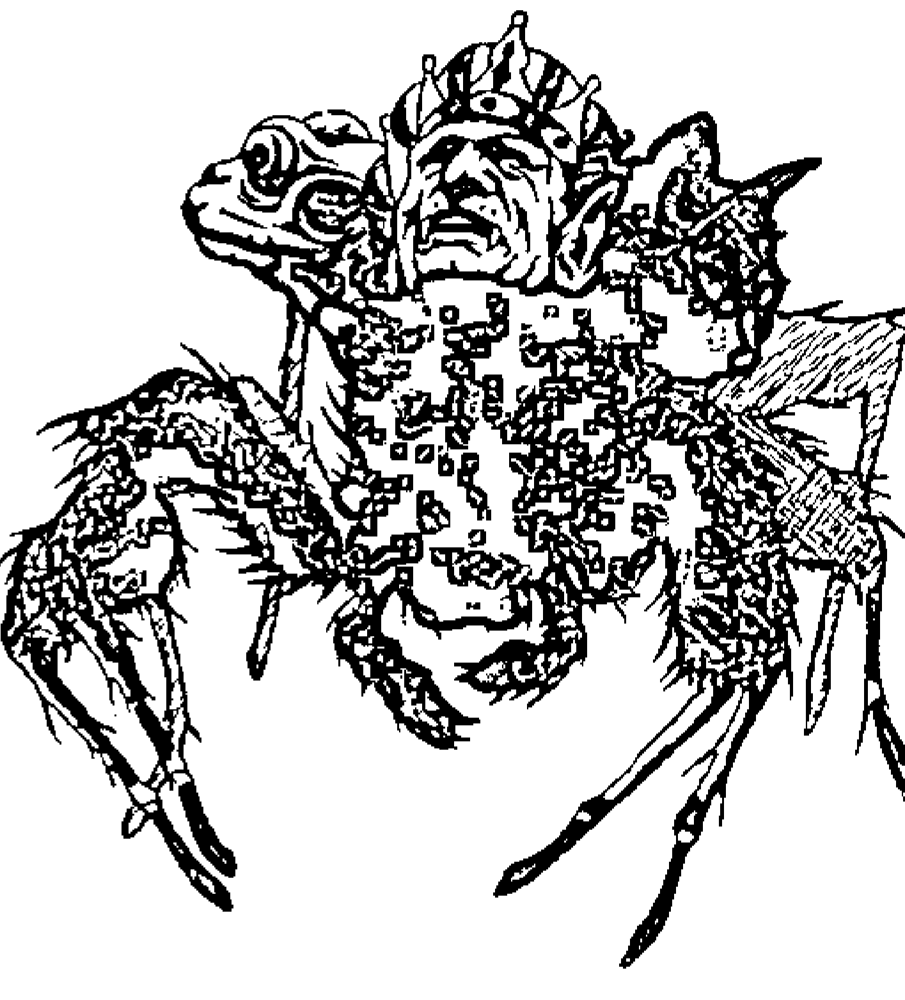

#### 2. 造反天使
失乐园

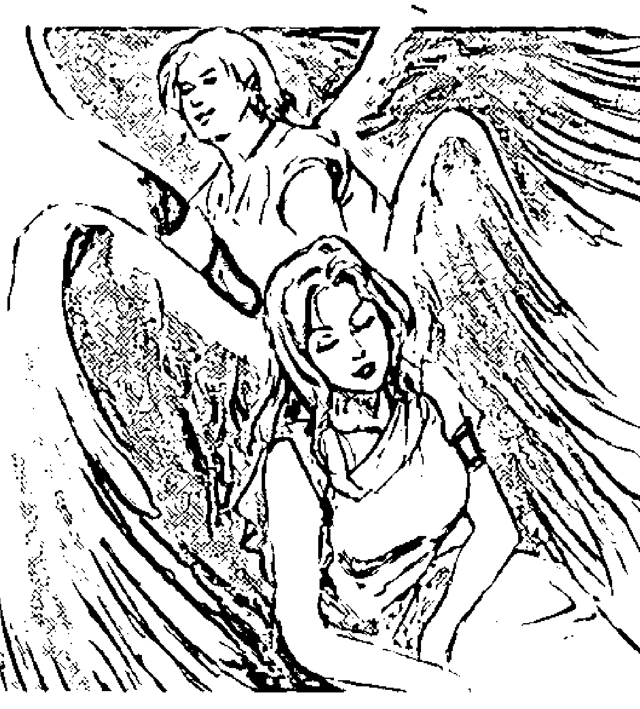

#### 3. 女巫
俄罗斯

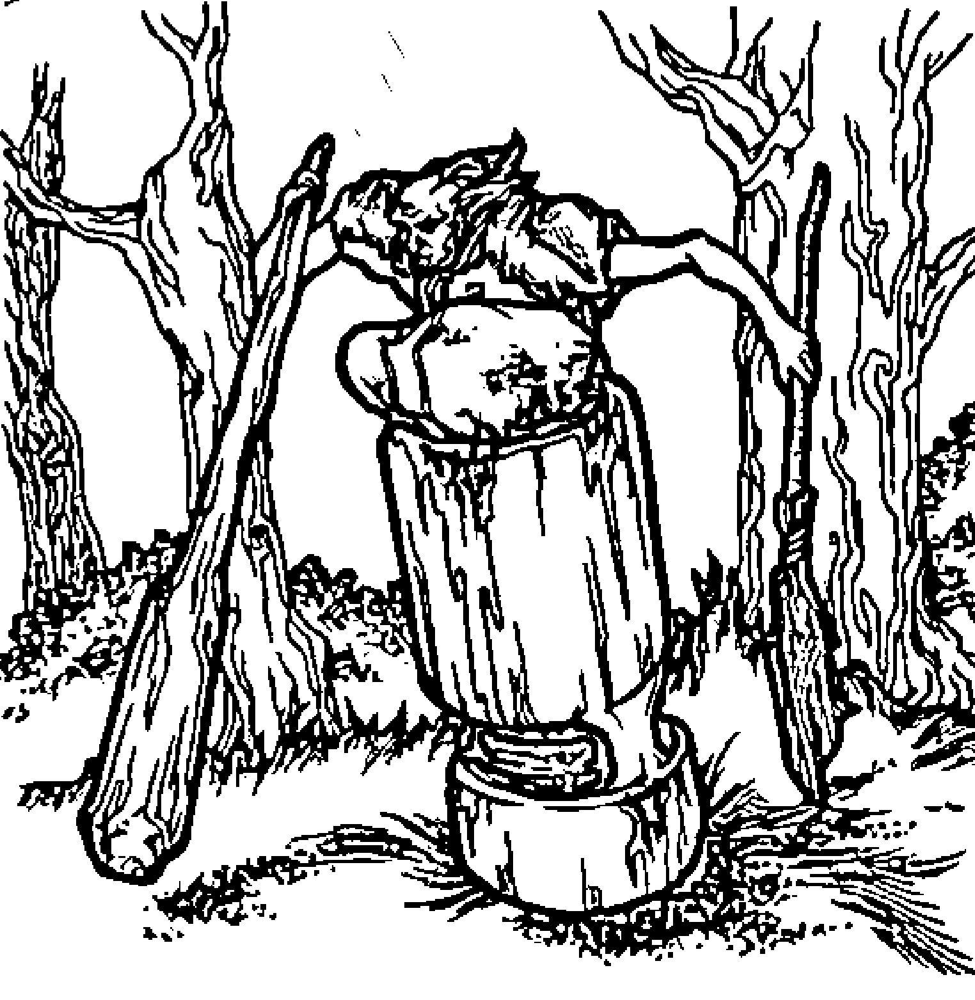

34 译注：或译雅加婆婆。远流有出版《芭芭雅嘎的故事》，讲的就是这个老巫婆。另外俄国音乐家穆索斯基的代表作“展览会之画”中的第9曲曲目“巫婆的小屋”指的也是她。

#### 巴比

古埃及《亡灵书》（The Book of the Dead）中记载的邪神，或说是黑暗的恶魔。他的外形被描述成一支阴茎勃起的猩猩。

在埃及古王国时期（公元前2700年左右）便已为人所熟知，是个暴力且充满敌意的神。埃及传说中人死后会到※奥赛洛斯（Osiris）35的面前举行测量心脏的仪式。如果这个时候巴比出现的话，就表示能去天国的几率微乎其微，非常有可能会下地狱。由此可知他是非常危险的神。

不过有时候他也是个守护者。在地下世界（库多尼亚），他那勃起的阴茎就成了渡船的船帆，引渡死者上到天国。

巴比在希腊人的魔法书里面则是以“※巴弗”（Bafo）这个名字出现。巴弗这个字代表塞特（Seth）的意思，活跃在罗马时代的希腊思想家普卢塔克36（Plutarch）认为巴比应该是赛特的陪神，不然就是赛特本人。

#### 芭德布37

克尔特神话中的女战神除了现在要介绍的芭德布以外，还有摩莉甘（Morrigan）、玛哈（Macha）等等女神。这些女神不管是特征或行为都很类似，因此有人认为这些女神其实指的都是同一尊神，只是这些名字代表着她们不同的面目罢了。另外也有人认为，女战神的主格其实是摩莉甘，其他两人都算是她的从属而已，这个说法主要根据在不少神话里都可以看到玛哈、芭德布接受摩莉甘的命令去实行种种的行动而来。

芭德布的别名是“黑乌鸦”或是“冠鸦”，外形是只黑鸟。战斗时，她用她那尖锐叫声唤起战士们的亢奋状态。

由于她的恐怖外形以及战神身份，很容易让人联想到恶魔。但是实际上在诸神与巨人的战斗中，她是站在诸神这一边来对抗巨人族，因此神话中经常将她描写成善神。只是到了后世，当故事的主角由诸神转到英雄的时代，她也逐渐被冠上诱惑英雄的形象，开始强调她是恶魔了。

#### 拜札克

她是伊斯兰教中恶魔王易卜劣厮（Iblis）的女儿。

根据伊斯兰民间传说来看，这个世上的法师分为两种，善法师使用的是所罗门王流传下来的法术，而恶法师使用的则是堕落天使哈鲁特（Harut）与马鲁特（Marut）教的法术。

很久很久以前，恶魔或恶法师直接向两位堕落天使学习；不过现在这些邪恶的法术已经是由拜札克来统筹管理。

伊斯兰教的恶魔或※镇尼（Jinn）喜欢隐藏在东与西的交界点（昼与夜的交界点＝清晨或黄昏；地上与地下的交界点＝井；道路与道路的交界点＝十字路口；现实与虚幻的交界点＝镜子或水面。）上，拜札克也不例外。传说她坐在遥远水面的王座上。想要学得邪术的人只要忘却神所立下的律法，并且献上人或兽当作祭礼的话，瞬间就可以来到拜札克的王座前，向她学习邪术。水上的王座旁有许多恶法师随侍在旁，据说他们全部都光脚，脚踵裂成两根。这些人到底是恶魔装成人类的样子，抑或是人类并无定说。

#### 邪神
埃及

35 译注：又译“欧西里斯”、“俄赛里斯”，埃及宗教中的王室丧葬神，王者之主宰。

36 译注：普卢塔克（Plutarch, 46?-119 以后）活跃于罗马帝国时期，出身于雅典。对十六-十九世纪的欧洲影响最大的古典作家，知名的法国作家蒙田（Michel de Montaigne, 1533-1592）、哈伯雷（F. Rabelais, 1483?-1553），英国作家培根（F. Bacon 1561-1626）、莎士比亚（W. Shakespeare 1564-1616）等人均深受他的影响。今日一般人对希腊罗马的知识也多由他的作品而来。

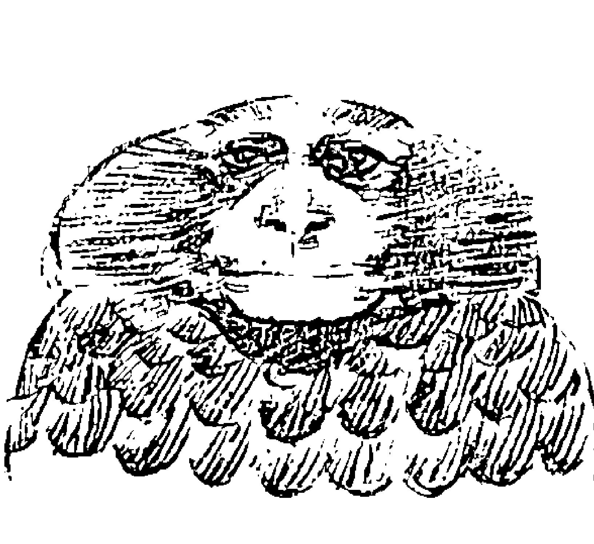

#### 女战神
克尔特神话

37 译注：或译作“芭兹芙”。

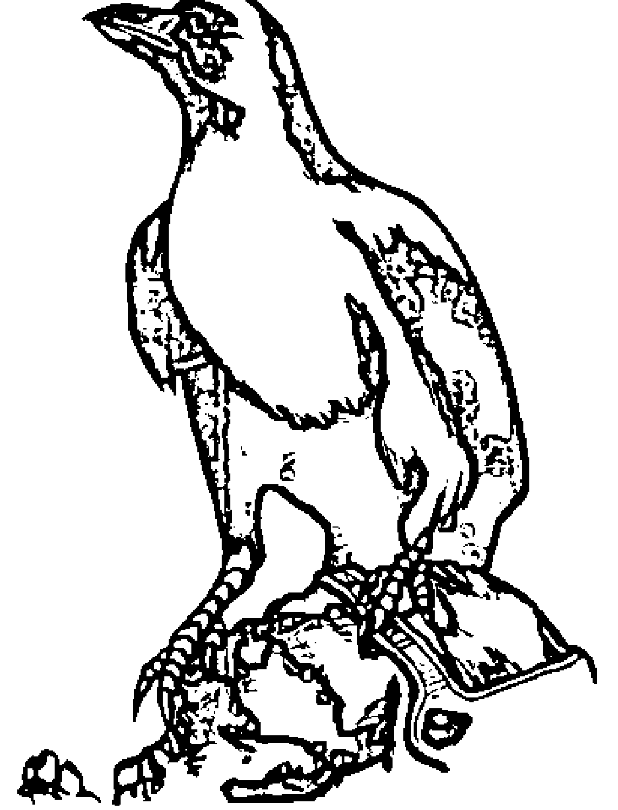

### 恶魔
伊斯兰教

（→红龙The Red Dragon、撒旦Satan《新约圣经》）

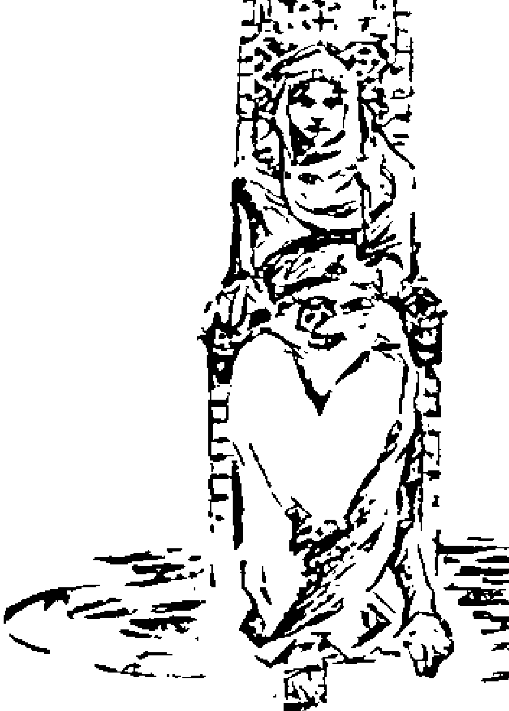

#### 巴卡王

他是爪哇皮影戏的罗刹娑 (Raksasa) 其中之一。
巴卡王长得尖牙利嘴，是※罗刹娑国的国王，最喜欢吃人肉。有一次连续七天都没吃到人，他生气地对他的家臣说：“你们再不去抓几只人类来让我享用的话，我就把你们连皮带骨都吃了！”
结果他的家臣回答说：“本国的人类都抓光了，但是别国还有。”
于是国王就率领罗刹大军杀进邻国，突袭村子。大口大口地吃掉村民。
一阵狼吞虎咽，饥饿的肚子也差不多填饱了之后，村子里还剩下一户人家，因此打算好好品尝这户人家的滋味，于是国王对这户人家的小孩说：“我打算明天吃你父亲，你给我用酱料将你父亲全身好好地腌到入味。”
小孩子一边做着酱料一边叹气，结果有个名唤必玛 (Bima) 的男子来到这村落，经过他身边。这男子就是古代印度数一数二的豪杰，据说他是风神的儿子，一走动就会起风，风暴来袭。他是个力大无比，个性豪爽之人。必玛听完小孩子的哀诉之后，义愤填膺，立刻前往巴卡王处，将他打倒了。这就是贪好美食的下场。

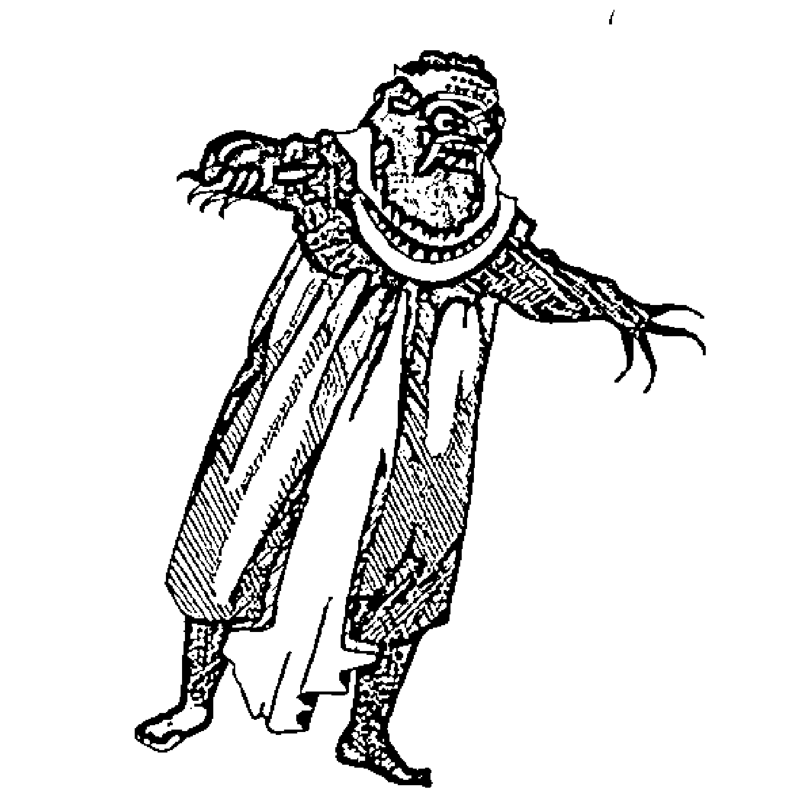

#### 巴拉姆

这是假托所罗门王所写，但其实为 17 世纪魔法书的《雷蒙盖顿》 (Lemegeton, 又名 The Lesser Key of Solomon) 的第一部〈哥耶提雅〉中记载的 72 只恶魔之一。另外以模仿启示文学《以诺书》所作的《伪以诺书》上面也记载着这个恶魔的名字。别名是 “※巴兰” (Balan)。
传承恶魔学的学者们通常喜欢奇形怪状的恶魔，而其中三头的恶魔不算少数，巴拉姆就是其中之一。而通常拥有三头的恶魔多半其中一颗是人头，巴拉姆当然也不例外。剩下的两颗则是牡羊与牡牛的头。
尾巴是蛇，骑着一匹凶暴的熊。另外他还有个重要的特征是手腕上停了只老鹰。至于他的能力在 72 恶魔中并不特别，能够给予召唤他来的人过去与未来的知识。
作家普朗西的书《地狱辞典》中是以 “巴兰” 这个名字来介绍他，并且追加了他负责教导恶魔们策略与透明化的能力的记载。并说明他现在是 40 个军团的指挥官。该书的插画家布尔顿将他画成长着牛头、人身、裸体的样子。

#### 伯利

他是以善良著称的※达伊提耶 (daitya) 38 之王。
※毗卢遮那 39 (Virocana) 的儿子，钵罗诃罗陀 40 (Pralahda) 的孙子。
伯利虽然身为达伊提耶，但是虔诚信神苦心修行，结果甚至获得了凌驾※因陀罗的神力，得到了支配天上、地上、地下三界的权力。
众神害怕世界即将受达伊提耶统治，于是就拜托毗湿奴 (Visnu 或 Vishnu) 神想办法阻止他。
毗湿奴神立刻化身成伐摩纳 (Vamana) (矮人，毗湿奴的第五化身)，来到伯利的面前，希望伯利能够赏赐他三步跨过的土地。
伯利见他矮小，笑了笑，毫不迟疑地立刻答应他的要求。结果矮人马上变成巨大的神，第一步跨过天界，第二步跨过地上界。
当他打算走第三步将地下也取回来的时候，想到伯利本人道高德隆，他的祖父钵罗诃罗陀也是德行高深之辈，而且伯利也算是毗湿奴自己的孙子，于是就留下地下界，交由伯利统治了。
（→阿修罗、底提 Kotavi、波诺 Bana）

#### 恶魔·所罗门的恶魔
雷蒙盖顿·伪以诺书

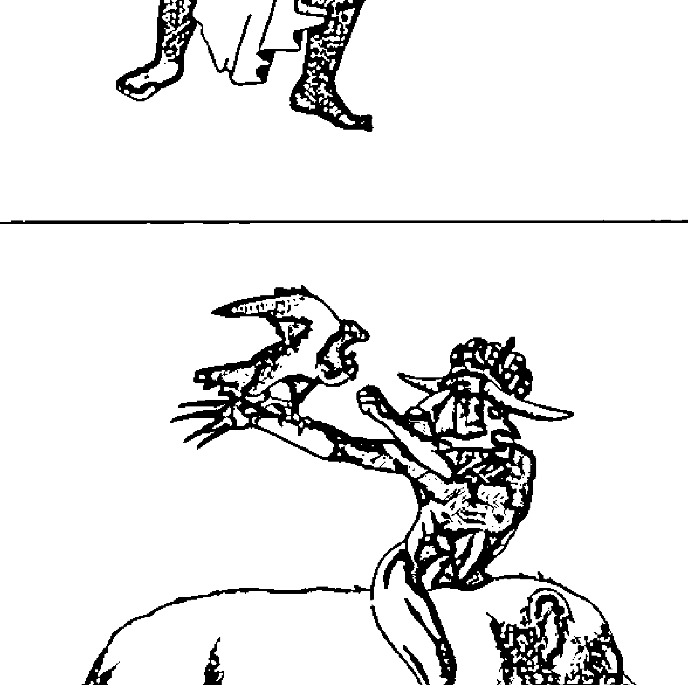

#### 达伊提耶（恶鬼）
印度

+   38. 译注：巨人族。与众神对抗的恶魔。在历史上象征着南印的原住民。
39. 译注：名字意思是“光明遍照”，佛教中拥有崇高地位。在日本佛教的真言宗里则称之为大日如来。
40. 译注：希罗尼耶格西布（参见该条）之子，虽身为恶魔，但德行深厚，笃信毗湿奴，其道行甚至与因陀罗并驾齐驱，最后与毗湿奴合而为一，故此处说伯利为毗湿奴之孙即是如此。

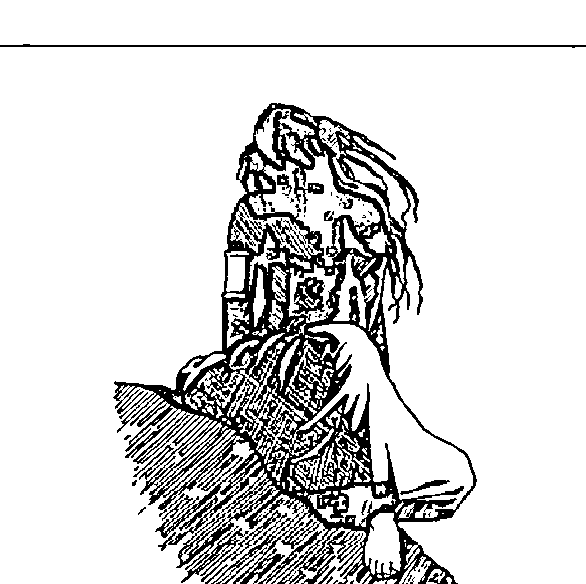

#### 巴洛尔

他是弗摩尔（Fomor）族之王，克尔特神话中的恶神。弗摩尔族与爱尔兰的“那神族”展开激烈的战争，最后败给了他们。而巴洛尔也在最后一战的时候被太阳神鲁夫⁴¹（Lug）打败。

传说巴洛尔有两颗眼睛，其中一颗一直紧闭着，看不见他的眼球。据说要四个壮汉的力量才有办法打开他的眼睑。这颗紧闭的眼睛一旦打开，被他的视线射中的话，不管是人还是神都会立刻死亡，但，这颗紧闭的眼睛同时也是他的唯一的弱点。

在漫长的弗摩尔族与达那神族的战争期间，巴洛尔一向都是身先士卒在前线作战，令女神族苦战连连。只要女神族中没有人能够打倒巴洛尔，诸神就不可能获得胜利。

但是，能够打倒巴洛尔的神终于出现了。在一场战斗中，巴洛尔打算用他的视线射杀诸神时，太阳神鲁夫趁着他眼睛睁开的一瞬间用石头⁴²丢向他的眼球，结果击破了他的唯一弱点，巴洛尔就这样死了。巴洛尔一死，弗摩尔族败亡的命运就再也不能避免了。

（→英帝契 Indich）

#### 波诺

他是达伊提耶（Daitya）王伯利（Bali）的长子。拥有1000只手臂，是破坏神湿婆（Siva或Shiva）之友，同时也是全能神毗湿奴（Visnu或Vishnu）的敌人。

波诺的女儿优莎（Usha）爱上了英雄黑天⁴³（Krsna）的孙子阿楼尼陀，因此波诺很生气，用魔法将阿楼尼陀抓到自己身边。

得知此事，黑天与大力罗摩⁴⁴（Balarama）以及明光⁴⁵（Pradyumna）便出发前往救助。但是波诺那边的援军有湿婆与塞建陀⁴⁶（Skanda），因此战斗非常的激烈。

一番激战之后，湿婆被黑天打倒，塞建陀也受了伤，不得不轮到波诺自己出场跟黑天一战了。面对波诺，黑天拿起名唤铁饼⁴⁷的武器准备要丢向他时，达伊提雅的守护女神底提（Kotavi）裸身出现在黑天的面前想要保护自己的孩子（波诺乃底提之子）。

黑天闪过底提，掷出铁饼，波诺的1000只手被切了下来。此时，湿婆出现在黑天面前，向他求和，于是波诺才得以活命。

#### 巴弗灭⁴⁸

今日最为人所熟知的山羊头的恶魔。他的名字来源据说是由基督宗教的敌人穆罕默德（Mohammed，又作 Mahomet）而来。

14世纪初，法国国王腓力四世（Philips IV）指称圣殿骑士团（Knights Templars）⁴⁹是异端，搞同性恋，以及崇拜偶像。巴弗灭就是当时所谓的骑士团崇拜的偶像。但是在教会审判下，231个骑士中知道巴弗灭名字的人仅仅只有12人，而且这12人的自白书中所描述的巴弗灭形象也毫不一致。或说头有1～3个，脚有2～4根；偶像有说是金属做的，有说是木头做的，也有人说上面贴着金箔，甚至有人说他们拜的只是张图画。很明显，这些都是在拷问下逼出来，胡乱回答的自白。

到了19世纪，法国的魔法师艾利佛斯·利瓦伊（Eliphas Levi）所画的“曼德斯的巴弗灭”（The Baphomet of Mendes）⁵⁰造成轰动，这一恶魔的名称因此变得很有名。20世纪最伟大的魔法师亚历斯·特·克劳利（Aleister Crowley）等人在要入魔法团体东方圣殿骑士团的时候还曾经以巴弗灭的名号加入过。
原本是随便回答产生的恶魔，没想到变得如此有名，恐怕其他恶魔也要叹气了吧。
（→易卜劣厮Iblis、撒旦Satan〈中世纪欧洲〉）

41 译注：或译作卢格。克尔特文字发音法与罗马拼音的发音法差别不小，因此采取哪种发音规则来翻译就会影响译名。百科全书类的多采取罗马拼音规则来翻译，而此处所采的译法是根据星光版的译法，即克尔特文字的发音法，日文网站中多依此种发音。朱注：光是Celtic的发音就有遵照该文化原始发音的克尔特，或是以后代拼音为主的克尔特念法两种争议，在历史学界造成不小的争议。希望读者看到两种发音时各自知道其来源即可。
42 译注：关于鲁夫打倒魔眼巴洛尔的说法不一，星光出版的《克尔特神话》的说法与本书说法不同。此一版本中所说的石头其实是鲁夫的神器之一的“魔弹塔斯拉姆”。其余兵器尚有“魔剑安撒拉（应酬者的意思）”、“十字剑弗拉加拉哈（Fragarach，报复者的意思）”、“魔枪布琉那克（Brionac，贯通者的意思）”（红色部分是网络数据，出自“猫之夜会附属幻想图书馆”，网址http://www.asahi-net.or.jp/~qi3m-oonk/tosyokan/tosyokan.htm。

43 译注：毗湿奴的第8化身。
44 译注：为黑天之兄，但也是毗湿奴自身的化身，相传毗湿奴有黑白二色头发，黑发是自己的头发，而白发是他身上的神蛇舍涩（Sesa，舍涩亦被视为毗湿奴的一部份）的头发，这两色头发化身为两英雄，黑发即黑天，白发即大力罗摩。
45 译注：为黑天之子。
46 译注：湿婆之子，神界军的统御者，也被视为战神。
47 译注：音“斯陀卢舍那”，为一飞盘状武器，火神阿耆尼为了答谢黑天的帮助赠送他的神器。

48 译注：计算机网络游戏“天堂”或“仙境传说”中亦有此恶魔，译作“巴风特”。
49 译注：又名Poor Knights of Christ and of The Temple of Solomon，是共济会以及其它一些团体的前身。该团最初成立于12世纪初，几位法兰西的骑士决心保卫朝圣者而组成的团体，耶路撒冷国王鲍得温二世（Baldwen II）将犹太教圣殿范围的一部分划给他们，因而得名。后来迅速发展，拥有强大军事力量与聚集大量的财富。14世纪初时遭腓力4世的指控，队长英荣（Jacques de Molay）受火刑而死。此一事件可谓中世纪的异端审判的滥觞。
50 译注：为一额有五芒星、头为山羊、背有双翅、上半身为女体下半身为男性，两性征皆具的恶魔画像。未注：在漫画《洛印勇士》断罪之塔篇中其形象就有实际出现过。

#### 巴巴利却

这是在意大利诗人但丁的叙事诗——《神曲》（1307～1321年创作）这部作品中登场的恶魔。《神曲》三部作中的第一部《地狱篇》中第22篇中描写到的地狱第8圈第5沟的狱吏，专门惩罚生前贪污或诈欺的死者的恶魔集团“※马纳勃郎西（Malebranche）”十二恶魔中的一人。他名字的意思是“充满恶意者”。

第8圈第5沟是个沸腾的沥青（天然柏油）池，在世时行骗的罪人下地狱后要在此受浸泡沥青之刑。马纳勃郎西这班恶魔用他们状似蝙蝠的翅膀飞到池上，用利爪将罪人从沥青池子里拖出来，然后再用爪子或獠牙撕裂罪人。

巴巴利却的地位似乎仅次于队长马纳果达（Malacoda），大概相当于班头。当但丁与诗人维其略（Virgilio）51要前往下一个沟时，马纳果达命令巴巴利却带他们前往。他虽然是个狂暴且粗俗的恶魔，但是似乎对同伴还十分有情谊，因为他见到同属马纳勃郎西的亚利几诺（Alichino）与加卡比那（Calcabrina）因为争吵而不慎摔落池里时，焦急着想要赶快把他们救上来。

#### 巴巴妥司

这是假托所罗门王所写，但其实为17世纪魔法书的《雷蒙盖顿》（Lemegeton，又名The Lesser Key of Solomon）的第一部《哥耶提雅》中记载的72只恶魔之一。另外以模仿启示文学《以诺书》所作的《伪以诺书》上面也有记载这个恶魔的名字。

据说在召唤者面前，他带着大量侍从52身着猎装出现。他的能力是能给予召唤者过去与未来的知识，并且会告诉召唤者财宝埋藏的地点等等，十分普通的能力。但是如同他身着猎装所示，他与动物之间的关联性很强，在《伪以诺书》中说他通晓一切动物的语言。另外许多书中都提到他原本是力天使堕天之后变成的恶魔。

作家普朗西的书《地狱辞典》中说他是地狱的伯爵兼公爵，是统御30个军团的指挥官。而该书又说他在出现时身旁伴随着四个吹着号角的国王，这应该是与前述赶兽的侍从相混淆了的结果。除此之外该书又为他附加了能与争执中的友人和解的能力。插画家布尔顿所画的肖像画简直就像是罗宾汉53，一点都感觉不出他是个恶魔。

#### 巴钦

假托所罗门王所写，但实为17世纪魔法书的《雷蒙盖顿》（Lemegeton，又名The Lesser Key of Solomon）之第一部《哥耶提雅》中记载的72只恶魔当中的一名。另外以模仿启示文学《以诺书》所作的《伪以诺书》上面也记载有此恶魔之名。别名有“※马尔钦姆（Marthim）”“※巴提姆（Bathym）”“※玛提姆（Mathym）”等等。

根据《伪以诺书》的说法，出现在召唤者面前的是个骑着气色不佳的马，身材魁梧、长有蛇状尾巴的男性。一般认为他具有强大力量，是※路西法（Lucifer）的亲信，贵为地狱大公。动作敏捷，在恶魔当中是少见的和蔼可亲之人。在具有草药与宝石的知识这点上，跟同为72恶魔的斯托剌（Stolas）与单卡拉比（Decarabia）相似。

19世纪法国作家普朗西的著作《地狱辞典》中将他的名字写作“马尔钦姆”（Marthim），一样说他是掌有重权的公爵，并且该书还帮他附加了《哥耶提雅》中概布（Gaap）所拥有的，让人可以瞬间移动的能力。

51 译注：此处译作维其略是根据志文出版社版《神曲》的译法，英语版拼作“Virgil”，因此大英百科译作弗吉尔，拉丁语全名为“PUBLIUS VERGILIUS MARO”生卒年70-19 B.C.，为罗马最伟大的诗人，最著名的作品是罗马民族史诗《埃涅阿斯记》(Aeneid)，对米尔顿的《失乐园》等影响很深。
52 译注：此处侍从原文作“势子”，指古代贵族狩猎的时候在一旁赶野兽、不让它们逃走的随从。
53 译注：12世纪韩国民间传说中劫富济贫的豪杰

#### 恶魔·地狱的魔鬼 神曲

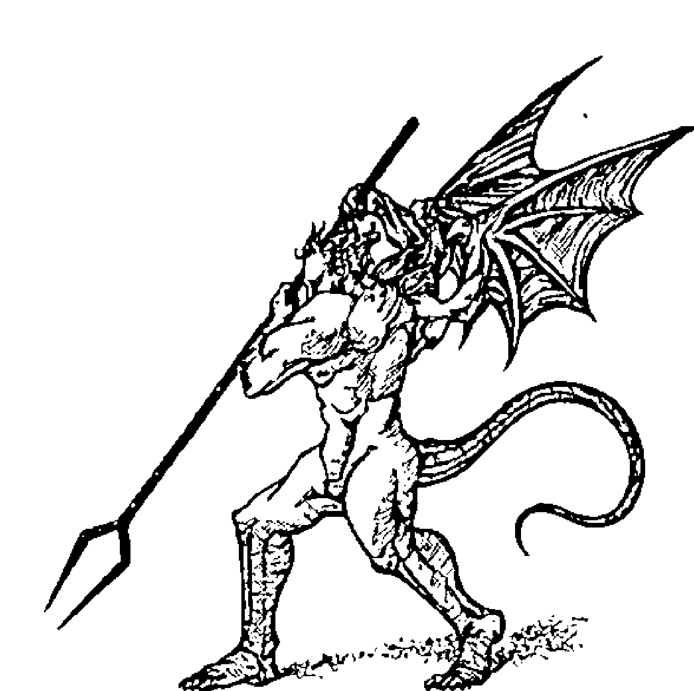

#### 恶魔·所罗门的恶魔 雷蒙盖顿·伪以诺书

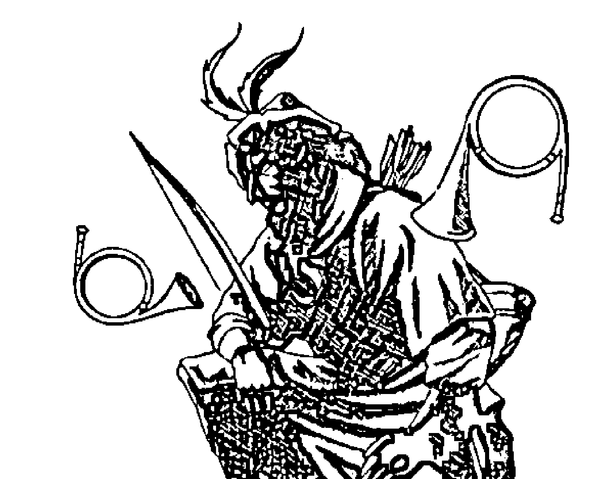

#### 恶魔·所罗门的恶魔 雷蒙盖顿·伪以诺书

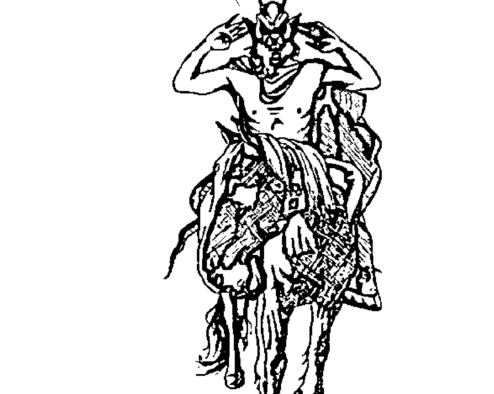

#### 别西卜〈希伯来〉

他原本是腓尼基人的神巴力西卜（Baal-zebul），其意思是“天上的主人”，或者在阿卡德<sup>54</sup>（Akkad）语中是“王子之主”的意思。（→巴力Ba'al）
但是在拉比（rabbi, 犹太教宗教上的领导者）的文献中，别西卜这名字已经是作为“苍蝇王”的意思在使用了，他被视为引起疾病的恶魔。
《旧约圣经》中别西卜以巴力西卜之名出现，以色列王亚哈谢（Ahaziah）得病时，差人去询问以革伦（Ekron）之神巴力西卜<sup>55</sup>。
而在《新约圣经》的〈马太福音〉〈路加福音〉中提到<sup>56</sup>，基督帮一名被鬼附身的又聋又哑的人赶鬼，但却被人指责“这个人赶鬼，无非是靠着鬼王别西卜啊！”于是基督回答：“凡一国自相纷争，就成为荒场；一城一家自相纷争，必站立不住；若撒旦赶逐撒旦，就是自相纷争，他的国怎能站得住呢？我若靠着别西卜赶鬼，你们的子弟赶鬼又靠着谁呢？”从基督的回答看来，恶魔之间似乎还不会出现自相纷争的样子。既然如此，那不是比人类还了不起吗？
（→撒旦Satan《新约圣经》）

#### 别西卜〈M.L.布尔顿〉

十九世纪法国作家普朗西（Collin de Plancy, 1794～1881）所著《地狱辞典》的1863年版（第6版）中附了550张插图，而当中给读者们最深刻的印象是由M.L.布尔顿这位画家所画的72张恶魔图。这种彩色版画在爱好传统魔法书的恶魔学家之间颇受恶评，但是由于其强烈的视觉效果，结果使得这些画家画出来的恶魔形象成了今日恶魔形象的典型。
而这些插画当中最有名的就是别西卜的肖像。别西卜是腓尼基的神巴力西卜（Baal-zebul意思是天上的主人）被希伯来人转音念成别西卜（Beelzebub意思就是苍蝇之王），这个行为原本只是一种对巴力西卜的污蔑性文字游戏而已，但是布尔顿就直接依照其转音后的意思来画出这张既不像蝇也不像蜂的巨大昆虫的样子来。这怪物鼓胀的蓝紫色身体与翅膀上浮现的骷髅图案，正可说是一般人心目中“苍蝇王”的样子吧。而这巨大苍蝇的形象，时至今日已经成为恶魔别西卜的代表形象了。
（→巴力Ba'al、别西卜Beelzebub〈希伯来〉）

#### 别西卜〈失乐园〉

这是英国诗人米尔顿的叙事诗《失乐园》（1677）中登场的造反天使（恶魔）。在书中作者说明这个在希伯来文中有“苍蝇王”的意思的名字，是后来巴勒斯坦（Palestine）地方称呼他的名字，原本尚为天使时应该还另有别名。但是他与他追随的领导者撒旦因为背叛了天神，他们的名字已经被神从救赎者名单——也就是“生命册”中给抹消掉了。因此《失乐园》中从头到尾一贯以“别西卜”这名字来称呼他，并未提到他的原名。
别西卜是撒旦的亲信，同时也是最要好的朋友，当然也是有如他的分身一般最忠实的部下。而且别西卜在造反天使中的地位也是仅次于撒旦的第二人。当撒旦亲临作战时，他一向以参谋的身份随侍在旁。从书中的描述来看，别西卜几乎看不出他有任何邪恶的气氛，即使已经堕天仍不失其王者的威严与贤者的风格。其有如水一般的冷静性格，与充满热情及人格魅力的撒旦恰好形成一对比，可以说是贤相型的天使。被认为是智天使，但书中未替他定下阶级。
（→撒旦Satan《失乐园》）

#### 神之敌
希伯来

- 54 译注: 楔形文字，古代美索不达米亚使用的语言。
- 55 译注: 见《旧约圣经》(列王纪下) 1:2。
- 56 译注: 见《新约圣经》(马太福音) 12:24，(路加福音) 11:15。

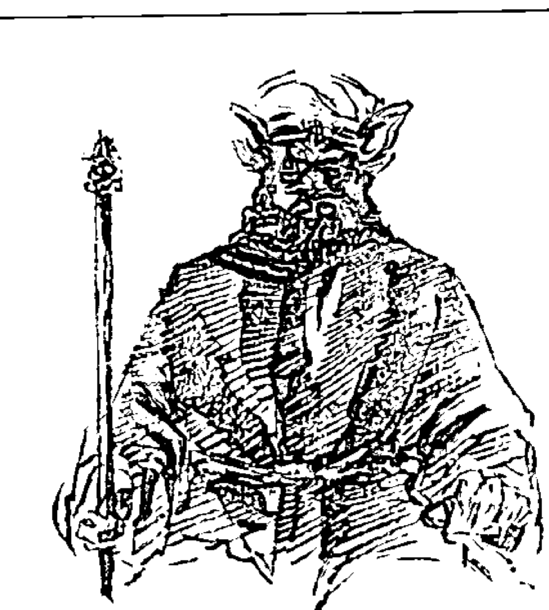

### 恶魔
地狱辞典

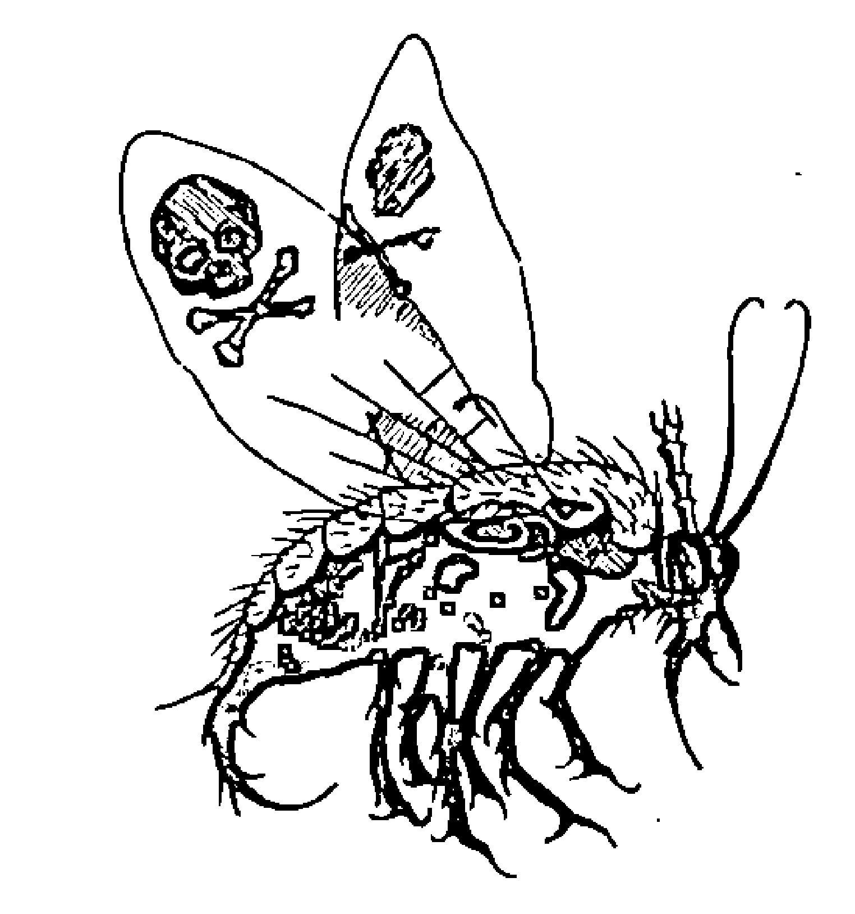

### 造反天使
失乐园

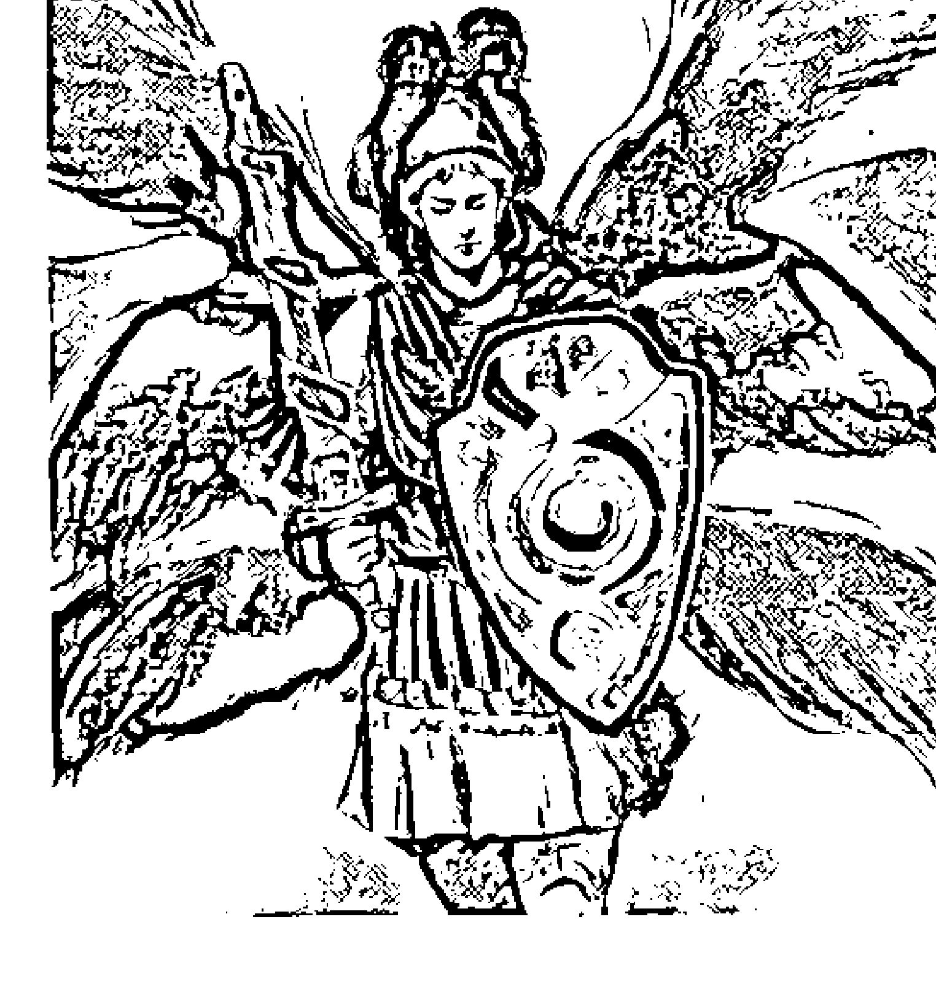

#### 贝西摩斯巨兽

他是《旧约圣经》中提到的怪物。看起来样子很吓人，但并不是什么邪恶的怪物。
“你且观看贝西摩斯巨兽；
我造你也造他。”
如同这段经文所示，这一怪物也是神所创造的。而且根据以下的描述，他似乎是只草食性的动物。

“他的气力在腰间，
能力在肚腹的筋上。
他摇动尾巴如香柏树；
他的大腿的筋互相联络。

它的骨头好象铜管；
他的肢体仿佛铁棍。
他在上帝所造的物中为首。
（中略）
河水泛滥，他不发战；
就是约旦河的水涨到他的口边，也是安然。”⁵⁷

在《乔布记》中，神对自己能够创造出这样一只庞然大物感到十分自豪。
那么傲慢的神都会感到自豪了，想必是将贝西摩斯巨兽造得很好。至少肯定是造得比人类好多了。

#### 贝拉

苏格兰传说中的众神之母，同时也是冬之女神。
身高很高，非常年老。
贝拉一旦发起怒来的话，就会吹起猛烈的暴风雪，因此人们厌她如毛虫，畏她如恶魔。

冬天的时候没人敢惹怒冬之女神贝拉。她以女王的身份君临“四个红色国度”，但是一到春天，人们开始敢反抗她了。因为夏之王安格斯与他的妃子布莱德将会取代贝拉成为世界的统治者。

而贝拉在春天来临后，因为喝了青春之泉中的魔法泉水，进入沉眠。然后被阳光唤醒后，她此时已经摇身一变，成了一个青春貌美的少女。能与她的美貌匹敌的就只有夏之女神布莱德而已了。

但是贝拉在夏天过半之后就会转为一个成熟女性，到了秋天时脸上已有皱纹，开始老化。而到了冬天的时候就已经完全变成一个满脸皱纹的老太婆，再度恢复成那个可怕的冬之女神贝拉。据说这时的贝拉眼睛只有一只，脸色阴沉且呈黑蓝色，牙齿外露像是生锈的刀子，蜷曲的毛发就跟霜一样苍白。

(→绿魔女 Green Lady)

#### 贝雷特

这是假托所罗门王所写，但其实为17世纪魔法书的《雷蒙盖顿》(Lemegeton，又名 The Lesser Key of Solomon) 的第一部〈哥耶提雅〉中记载的72只恶魔之一。另外以模仿启示文学《以诺书》所作的《伪以诺书》上面也记载有这个恶魔的名字。其他尚有“※比雷斯”(Bileth)、“※表雷特”(Belieth)等别名。

他的特征是讨厌被人召唤，召唤出来时总是在生气。《伪以诺书》说他骑着气色不佳的马出现在召唤者面前，但对他本身的外形并无描述。并且建议要召唤他的人，最好在左手的中指上戴上银戒指以保平安。

深受16世纪恶魔学者维尔影响的19世纪法国作家普朗西，在他的《地狱辞典》中以“※比雷特”(Byleth)这个名字来介绍他，据说这是跟别的恶魔混淆了的结果。很难得的是在他的记载中并没有提到他的爵位，只说明他是80个军团的指挥官，并且该书更强调他易怒的性格，解说了要召唤他时该注意的事。

#### 怪物 希伯来 (→利维坦 Leviathan)

- 57 译注：引自《旧约圣经》〈乔布记〉40:15。

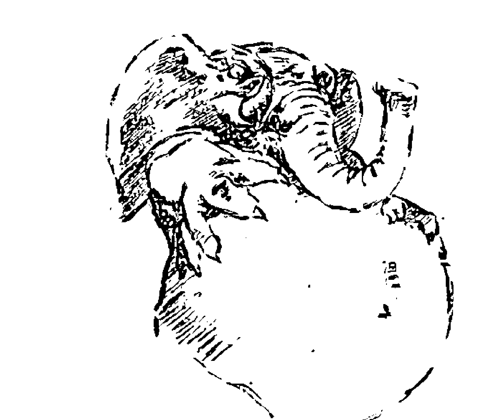

#### 冬之女神 苏格兰

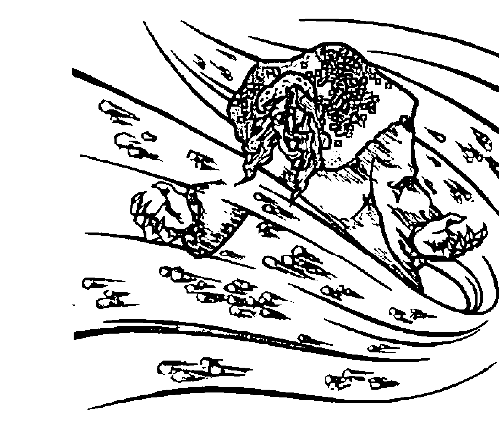

#### 恶魔·所罗门的恶魔 雷蒙盖顿·伪以诺书

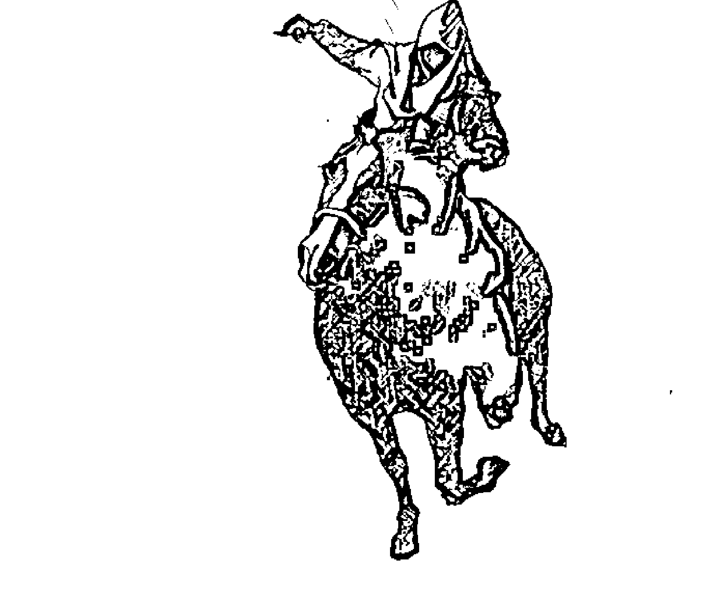

#### 彼列〈希伯来〉

在《旧约圣经⁸⁸》或《死海古卷⁵⁹》(Dead Sea Scrolls) 中提到的神的敌对者。从与他相关的传说中我们可以看到属于一神教的犹太教也受到了伊朗（琐罗亚斯德教）的二元论的影响，神创造了光，同时也创造了暗。

根据《死海古卷》的说法，神所造的恶灵的名字叫做彼列。彼列的外形与天使无异，但是头上长了角。因此他也被称为黑暗之子或充满敌意的天使。彼列是为了带来毁灭而创，因此他的职责就是犯罪行恶。而光之子所率领的军团将与彼列的军团一直交战到世界末日为止。

《死海古卷》中的《战争之书》里有下述记载：“光之子们以其勇气击倒邪恶三次，彼列的势力也奋力作战，使光明之军后退三次。”

不过因为神是站在光之子这一方的，所以在第七次的战斗中，彼列与他的追随者，也就是毁灭的天使们终将被打倒，他的头角也会消失不见。（→撒旦Satan《旧约圣经》）

#### 彼列《雷蒙盖顿》

这是假托所罗门王所写，但其实为17世纪魔法书的《雷蒙盖顿》(Lemegeton, 又名The Lesser Key of Solomon)的第一部〈哥耶提雅〉中记载的72只恶魔之一。另外以模仿启示文学《以诺书》所作的《伪以诺书》上面也记载有这个恶魔的名字。

希伯来文中彼列这个字的意思是“无价值”、“无赖”的意思，于是后来演变成了一个恶魔的名字。原本在《旧约圣经》中的〈士师记〉〈塞缪尔记上〉中当成形容恶人的话，但是到了《新约圣经》〈哥林多后书〉时已经变成一个恶魔的名字了，在概念上与撒旦类似。

根据《伪以诺书》的记载，彼列是个乘在火战车上的俊美天使，声音悦耳，能给予人崇高地位。19世纪法国作家普朗西的书《地狱辞典》中说他是古代腓尼基的西顿⁶⁰（Sidon）人崇拜的神。（→撒旦Satan《中古欧洲》、彼列Bilial《失乐园》、彼列Belial〈希伯来〉）

#### 彼列《失乐园》

这是英国诗人米尔顿的叙事诗《失乐园》(1667)中登场的造反天使（恶魔）。他第一次登场是在第一卷中，介绍跟从天使撒旦（Satan）造反的天使时，最后提到了他；在他之前介绍的天使多半都是后来异教神的前身，不过他与他们并不是。

名字有“恶”、“毁灭”、“无赖”的意思，在圣经中与撒旦这个名字一样，并不单指一个特定的恶魔。《新约圣经》〈哥林多后书〉中视这个名字为撒旦的别名⁶¹，因此《失乐园》将彼列描写得像是个小撒旦一般，拥有堂堂的相貌与优雅的动作。但是不同于理想崇高的撒旦，他的品行并没那么高尚，丝毫不像他有崇高的理想，反倒像是个只会说些漂亮话的纨绔子弟一般。从书中描述看来，他并不是个好战者，当摩洛（Moloch）提议反攻天国时，他用一堆冠冕堂皇的言词来反对。而且他也是个马屁精，对撒旦的发明大炮以他擅长的美丽词藻赞美了一番。（→撒旦Satan《失乐园》）

#### 神之敌
希伯来

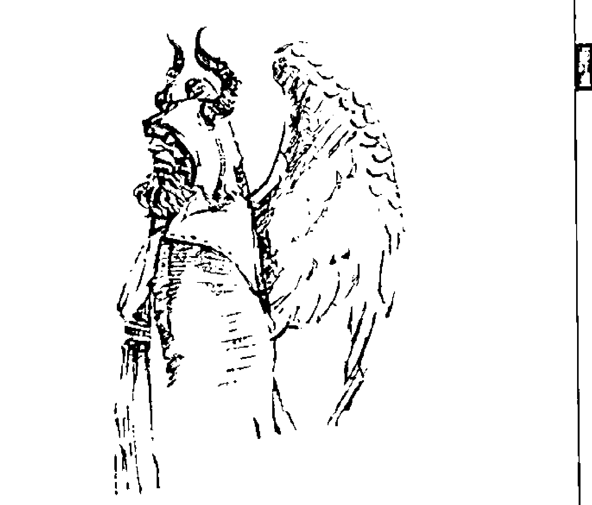

- 58 译注：中文的《旧约圣经》中并未特地将此字译为一具体恶魔，而是将之视为邪恶的代名词，例如在英文版写作 "the son of Bilial" 的部分，中文版通常译为 "恶人" 等等，有兴趣者可自行比对。
- 59 译注：1947 年以来陆续在死海西北岸发现的以希伯来文、亚兰文、希腊文写成的古书，对于《旧约圣经》以及基督宗教成立前后的犹太教研究上具有高度的史料价值。

#### 恶魔·所罗门的恶魔
雷蒙盖顿·伪以诺书

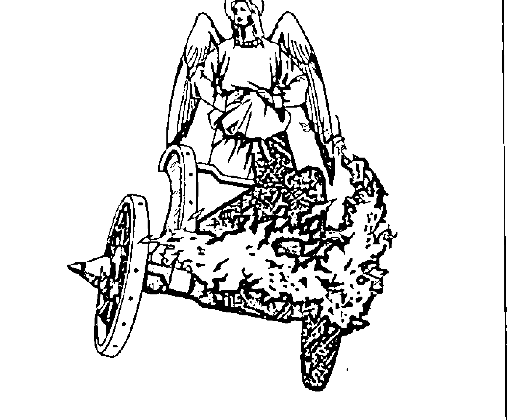

- 60 译注：即今日黎巴嫩 (Lebanon) 南部海港赛伊达 (Saida).

### 造反天使
失乐园

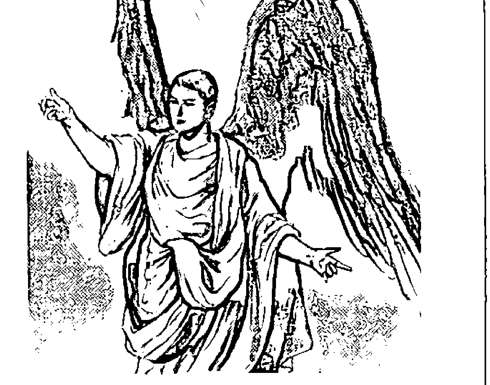

- 61 译注：见《新约圣经》〈哥林多后书〉6：15。原文作 “基督和彼列（彼列就是撒旦的别名）有什么相和的呢？光明与黑暗有什么相通的呢？”

#### Berith

#### 比利土

这是假托所罗门王所写，但实为17世纪魔法书的《雷蒙盖顿》（Lemegeton，又名The Lesser Key of Solomon）的第一部〈哥耶提雅〉中记载的72只恶魔之一。另外以模仿启示文学《以诺书》所作的《伪以诺书》上面也记载有这个恶魔的名字。此外别名为“※比亚珥”(Beal)、“※伯夫莱”(Bolfri)“※伯菲”(Bofry)等。
据说他骑着红色的马，头带皇冠出现在召唤者的面前，与红马、红色之间的关联性强。《伪以诺书》上也记载他是骑着红马的士兵。

他能给人炼金术，以及过去与未来的知识，性格表里不一，多本书上都说他是个会说谎的恶魔。
深受16世纪恶魔学者维尔影响的19世纪法国作家普朗西在他的《地狱辞典》中说他是颇有势力的地狱公爵，统领26个军团，也是异教徒的偶像神。该书插画家布尔顿将他画成了三头身的比例，有点滑稽的样子，结果比利土也因此变得有名了。

#### Bifrons

#### 比夫龙

这是假托所罗门王所写，但其实为17世纪魔法书的《雷蒙盖顿》（Lemegeton，又名The Lesser Key of Solomon）的第一部〈哥耶提雅〉中记载的72只恶魔之一。另外以模仿启示文学《以诺书》所作的《伪以诺书》上面也记载有这个恶魔的名字。据说他拥有伯爵的爵位。
《雷蒙盖顿》等深具传统恶魔学相关特征的魔法书中并没有记载他出现在召唤者前的模样，只说明他在魔法师命令他行事之前是怪物的模样。他是只对博物学有深厚知识的恶魔，从占星术到矿石草木
之名都知晓。虽然从这些描述中看不出他有任何不祥的气氛，但是不知为何比夫龙经常被认为是与死者或坟墓相关，好几份文献中都说他是在坟墓上点燃鬼火、蜡烛的恶魔。
深受16世纪恶魔学者维尔影响的19世纪法国作家普朗西在他的《地狱辞典》中说明他是26个军团的指挥官，另外在占星学知识方面还附加了能给予人了解行星运行对命运影响的知识，以及能够移动尸体的能力。

#### Bilwis

#### 比威斯

比威斯原本是德国南部巴伐利亚⁶²（Bavaria）地方与奥地利一带的民间故事。因此从这些地方的文献里我们可以看到比威斯相关传说的原貌。原本的比威斯是一种自然精灵，而且她会射出可以治病的箭。
德国中部则称作※皮威斯（Pilwiz）。
但是到了中古世纪末期，原本的意义变得完全相反了，许多传说中的精灵开始被视为恶魔妖怪的一种。
比威斯也不例外。原本的精灵身份转变为会使用魔法害人的魔法师，结果比威斯就被当成是女巫的一种了。

在德国东部，比威斯被看作是拥有魔力的男子，脚上带着镰刀，一到晚上就会偷偷进到玉米田里偷走谷物。
到了现代，一般认为比威斯是类似恶作剧精灵（Boogeyman）之类的怪物，只不过身材比他还要更矮小。

#### 恶魔·所罗门的恶魔
雷蒙盖顿·伪以诺书

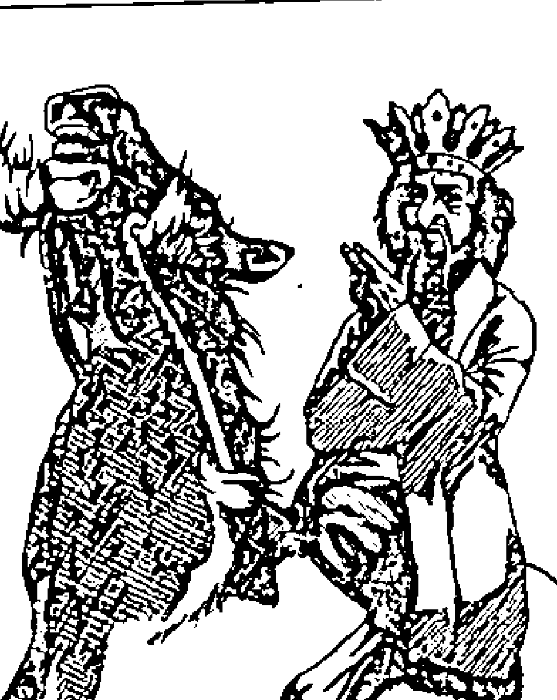

#### 病魔
德国

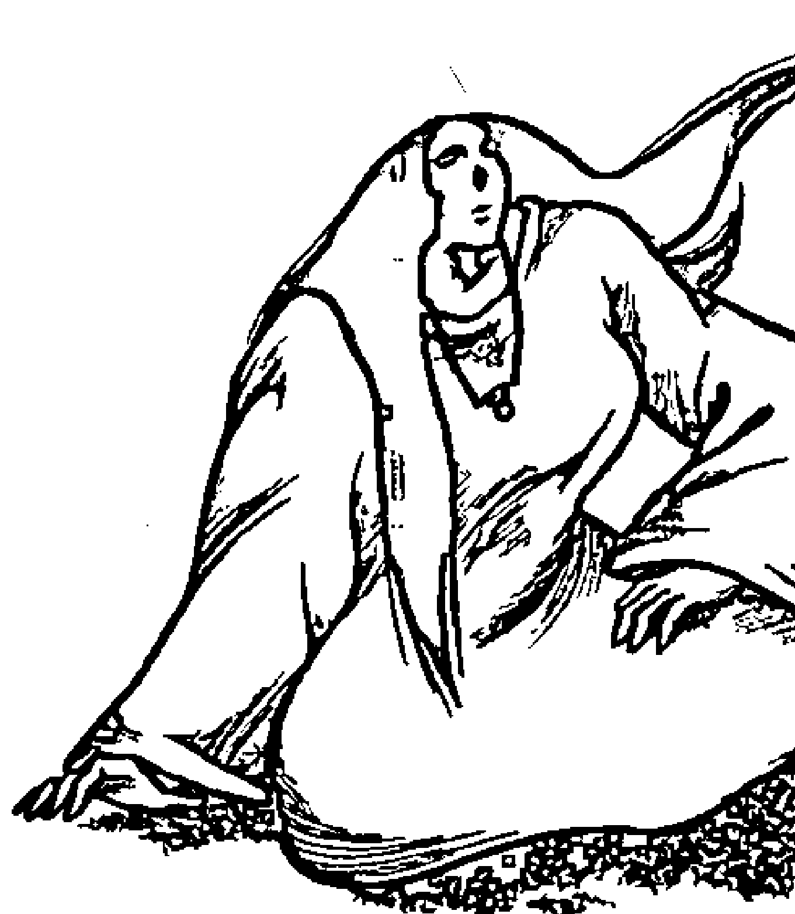

- 62 译注：德国南部一州，首府为慕尼黑，过去是一独立王国。

#### 穷神 <日本>

居留在人家里，给那个家庭带来贫穷的神。虽称作神，却不是令人愿意信仰的对象。但是因为穷神也是神，所以并没有方法可以打倒他，不过还是勉强有个能够赶走他的方法。新为县⁶³有个传说，据说只要在大秽日（12月31日，也就是除夕）的夜里在家中的围炉燃烧大火，穷神就会嫌太热而跑掉，而同时喜欢温暖的福神就会出现。据说这个福神会以小孩子的样子出现待在围炉的旁边。关于穷神的外表，一般说他是躲在壁橱里的小老头，或者是个像颗小豆子似的矮小男子，再不然就是挂着拐杖，身穿破烂衣服的老爷爷。总之其共通点就是矮小。不过他喜欢懒惰者的家里，只要待在懒人家中，他的身体就会越来越大。另外还有个传说，穷神会以落魄者的样子出现，如果不嫌弃好好地招待他的话，就会变身成福神。从这个传说看来，或许穷神福神其实是同一神的一体两面吧。（→穷神〈西伯利亚〉、疱疮神 Housou-gami）

#### Bokrug 波克鲁格

他是克苏鲁神话中鲜少提及的一尊邪神。他住在“梦之国”（Dream land）里。他的外形就像是只巨大的鬣蜥，下颚长有长长的像是触角一般的胡须，背鳍就跟剃刀一样锐利。脚长的粗壮而扁平，趾间长有蹼，体长约3.6米。名义上虽然也是个神，但是更像是只拥有强大能力的奇妙生物。例如说，他在幼年期时长的与人类丝毫没有差别，因此可以送进人类社会里，在那里长大，也就是所谓的换子传说⁶⁴（changelings）的一种。原本他受到一群叫做“伊布⁶⁵（Ib）的怪物”所崇拜，但是这群伊布的怪物被萨拿斯⁶⁶（Samath）的人们所灭，因此波克鲁格对萨拿斯下诅咒，结果这个都市也在一夕之间灭亡了。现在伊布怪物们的幽灵跟在他的身旁，而他则是在依拉尼克⁶⁷（Ilarnek）人民的敬畏下再度受人膜拜。（→克苏鲁 Cthulhu）

#### 恶作剧精灵⁶⁸

恐怖电影界的大师约翰·卡本特（John Carpenter）身兼导演、剧本、配乐制作而成的恐怖电影“月光光，心慌慌”（Halloween）（1978）中出现的杀人魔⁶⁹。这里出现的恶作剧精灵是个人类。在某个万圣节的晚上，年方六岁的麦克·梅尔（Michael Mayer）刺杀了姐姐，被强制送入精神病院里。但是十五年后，二十一岁的麦可逃出了医院，回到过去生长的小镇上。戴上了番瓜面具，手拿菜刀开始无差别地杀人。他那一个接一个地将小镇居民杀掉的行为已经让人无法相信他是个人类了。他杀人的时候既不吼叫也不发声，只是淡淡地进行着。最后精神科医生追寻他来到这个小镇，番瓜头在身中数枪后，从阳台摔了下去，但最后生死不明的情况下电影就这样结束了。这个杀人魔原本是美国都市传说中的人物，父母经常以“如果你还不睡觉小精灵就要来抓你了喔！”来吓小孩子要他们赶快就寝。另外史蒂芬·金（Stephen King）原著，杰弗里·席洛（Jeffrey C. Schiro）导演的The Boogeyman（1982

#### 穷神 日本

- 63 译注：日本的一县，位置在日本本州岛岛上的东北方靠日本海侧。

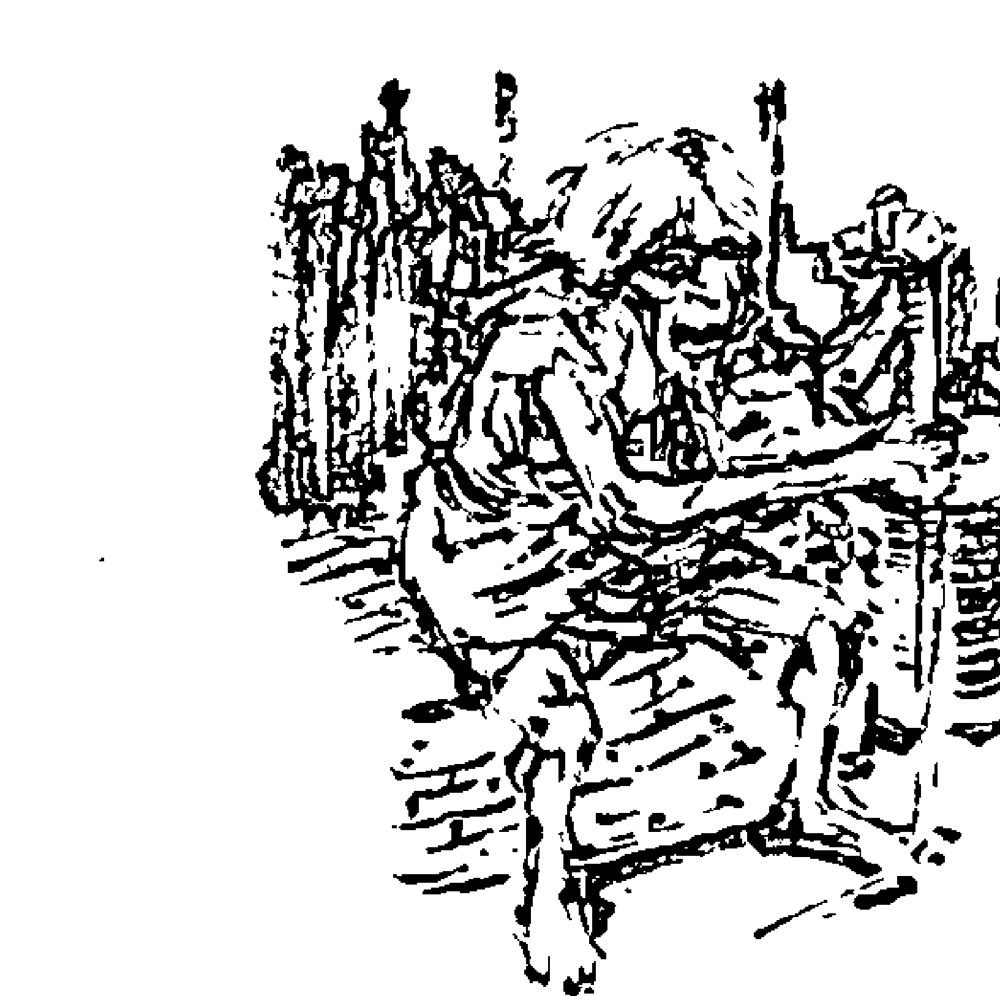

#### 破坏神 克苏鲁神话

- 64 译注：英格兰的民间故事中常见的一种小妖精（Fairy）的恶作剧。例如某故事中妖精将人类的婴儿与自己的小孩互换，但是妖精并不会长大，结果使得小孩的母亲一直都要照顾婴儿，而妖精们则是因为有新人加入所以很高兴。
- 65 译注：克苏鲁神话小说The Doom That Come to Sarnath中的太古文明都市。
- 66 译注：克苏鲁神话小说The Doom That Come to Sarnath中的太古文明都市，与伊布在同一大陆上。
- 67 译注：同上。

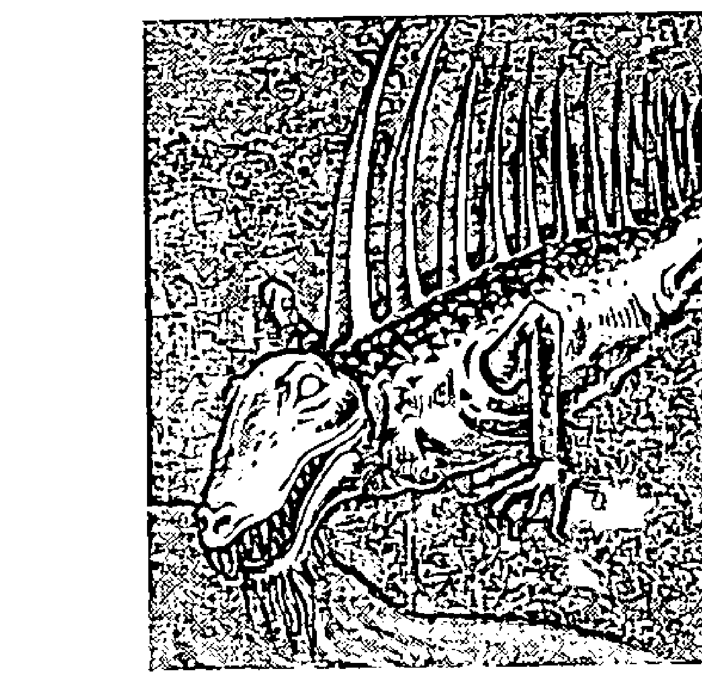

#### 都市恶魔传说 美国

年）也是以此为题材。 (→克莉斯汀 Christine、杀人小丑 Killer Crown)
- 68 译注：在这里出现的boogeyman指的是一个杀人魔，但其实原本的boogeyman并没有特定的形象，指的是一种会害人的精灵。
- 69 译注：这部片子后来在卖座之后又连续拍了不少续集，2002年7月拍了该系列的第八部作品，台湾译名为《战栗online》、香港大陆的译名为《月光光心慌慌：重生》(Halloween: Resurrection)，导演为里克·罗森塔尔(Rick Rosenthal)。

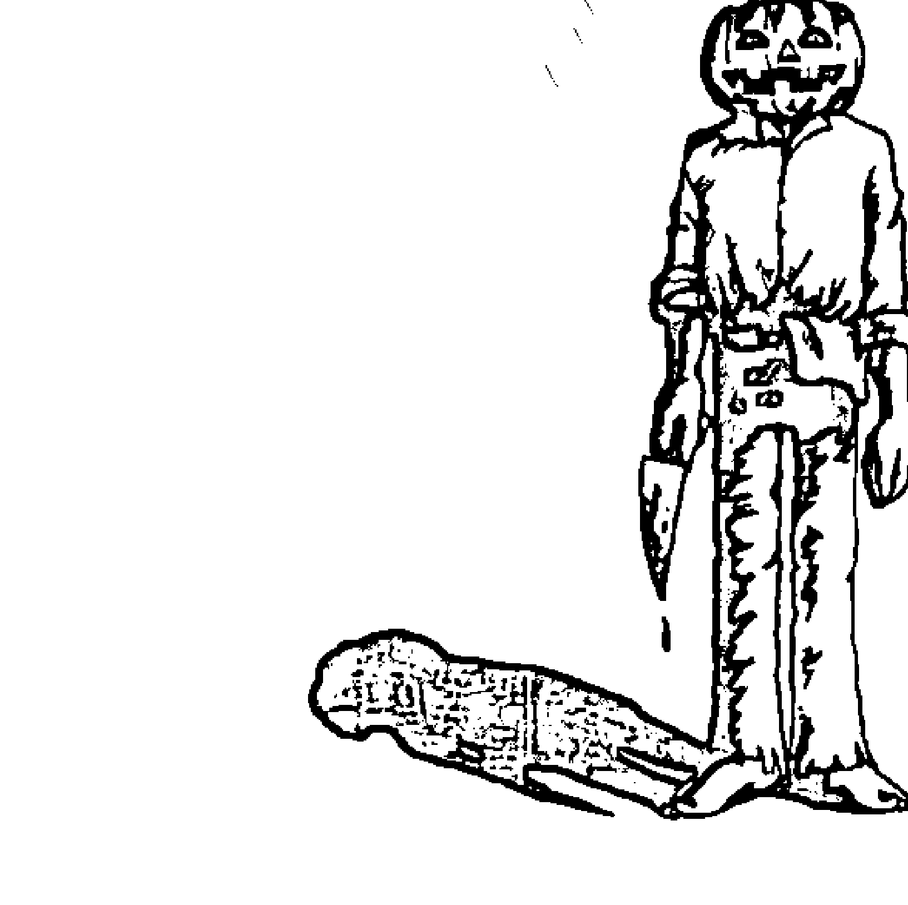The request was rejected because it was considered high risk

#### 吸血神 玛雅
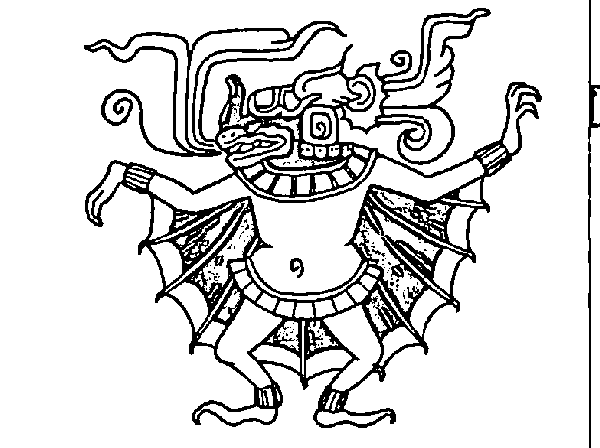

#### 恶魔 伪以诺书
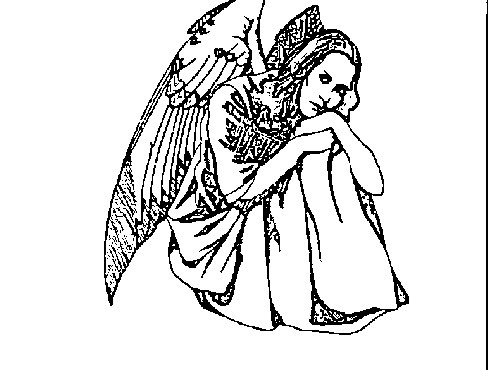

#### 罗刹 印度尼西亚
其明显例证。
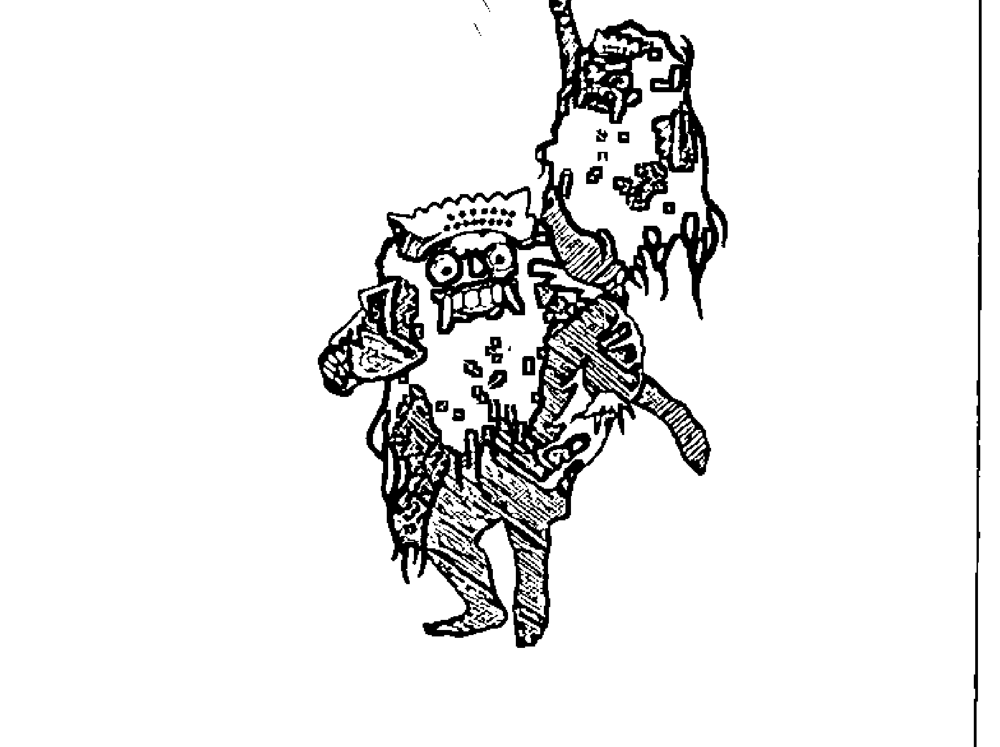

#### 加斯伯禄
**Caspel**

此恶魔出现在仿启示文学《以诺书》而成的《伪以诺书》一书目录中。该书目录中记载的恶魔与17世纪魔法书《雷蒙盖顿》(Lemegeton, 又名The Lesser Key of Solomon) 的恶魔多有重复。但《雷蒙盖顿》中并无此恶魔。

正如他的名字所示，加斯伯禄残留的天使性质颇重。不太像是恶魔，反倒是灵体（鬼神）的色彩较浓。相传他是“支配南方的伟大皇帝”，统驭200名公爵与400名小公爵。描写恶魔属性因方位不同而有别于此点，与米尔顿《失乐园》中撒旦身为天国北方领邦郡主一事颇为近似。（→撒旦Satan《失乐园》）

15世纪德国圣职者兼秘法家崔勒缪司(Trithemius. Johannes, 1462~1516) 所著《秘密法术》(Steganographia, 1499) 在目录中列举了许多灵体。而加斯伯禄之名也载于此目录中。《秘密法术》中的灵体分为白昼灵体与夜晚灵体，加斯伯禄是白昼中可召唤的灵体之一，其属性依旧与南方有关。

#### 凯隆
**Charrn**

根据居于古意大利地区的伊特拉里亚人（拥有比罗马更古老文化的民族，因为罗马共和国并吞，族中许多神灵也被纳入罗马神殿中）传说，凯隆为居于地底的男恶魔。

有人认为凯隆这个名字是希腊神话冥界摆渡人查融（Charon）的由来。

凯隆肩挑铁垂，或倚铁锤为杖。

凯隆的鼻子高凸有如秃鹰，耳朵尖耸与动物相仿。在许多传说中他头上长蛇代替头发。此外偶尔会被形容成身具羽翼的模样。

凯隆为死者向导，总是监视着坟场的入口。（→范丝Vanth）

#### 基抹
**Chemosh**

在米尔顿所作叙事诗《失乐园》（1667年）中登场的造反天使（恶魔）。米尔顿将此堕落天使描述成，《旧约圣经》〈列王纪〉里居住在约旦河以及死海东岸的民族——摩押人所崇拜的偶像基抹的前身。这位异教神与摩洛（Moloch）79一起被犹太王约西亚放逐。在《旧约圣经》〈民数记〉所描写的邪神巴力昆珥(Baal-peor)80，据米尔顿解释，和基抹相同。不管如何，基抹在之后被当作造反天使。

异教神基抹和摩洛同时记载于〈列王纪〉中，被当作造反天使的素材。然而，与基抹相反，摩洛在《失乐园》中，却只记载其名而无详细叙述。这只能说，叙事诗在使用固定传统名词时，基抹恰巧被拿来当作造反天使的造像之一。在〈列王纪〉里，基抹被当成“淫乐”的拟人化，而摩洛则是“憎恶”。这么一来，身为造反天使的基抹，智能与勇气可想而知并不是十分优秀。

#### 恶魔 伪以诺书
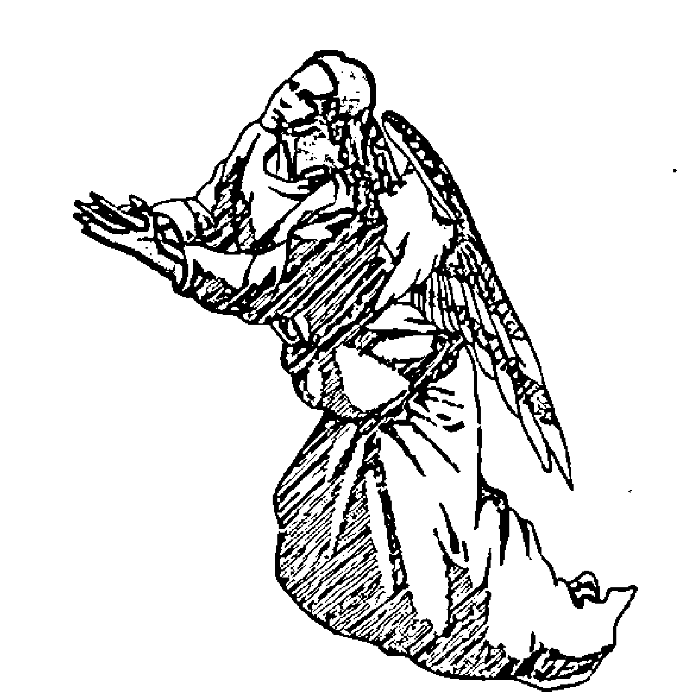

#### 死之恶魔 伊特拉里亚
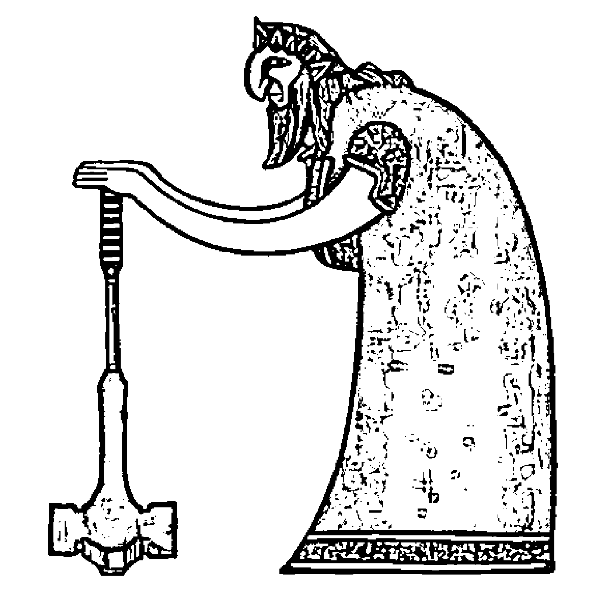

#### 造反天使 失乐园
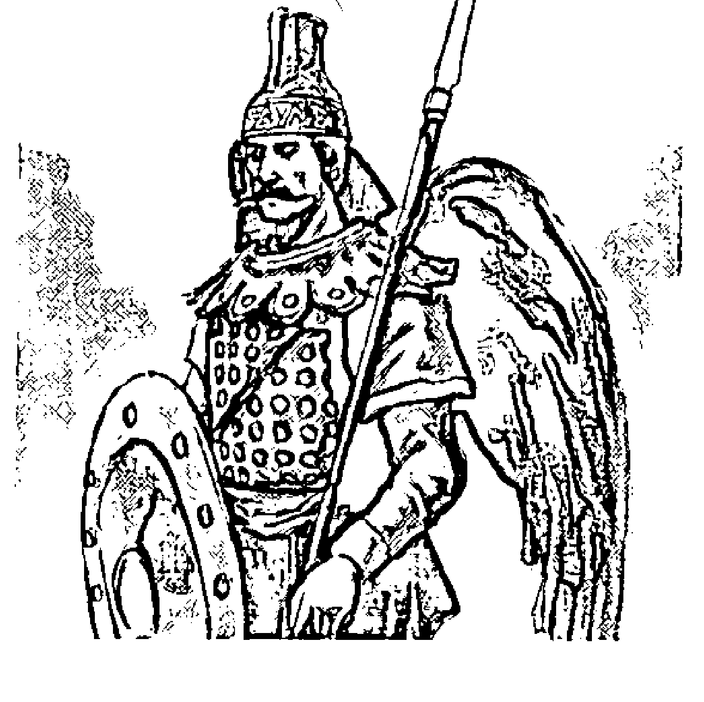

79 译注：亚扪人和腓尼基人的神，一些以色列人在欣嫩子谷将自己的幼婴献给他们。
80 译注：山谷之主（神）。在毗珥（地）可能以放荡仪式被敬拜的神灵。

#### 江君大神⁸¹

中国最长的河川——长江之神。
在中国，河川与湖泊都有龙神居住。江水泛滥，即为居住此处的龙王兴风作浪所致。长江也不例外。身为中国最长的河流，居住于此地的龙王——江君大神，自然具有强大的力量。然而，江君大神却是位恶神。向居住在流域一带的民众要求每年供奉两位女孩，要是拖延不从，则兴水患。
战国时期，秦国有位名叫李冰的贤臣。他在赴任蜀郡太守之时，听闻此事，便独自跃入河内与龙神大战。最后变身为青牛于岸边互斗之时，命屈员刺杀北面者，江神于是死了，从此蜀郡再也没有了水患。
李冰在担任蜀郡太守时，治水相当有名。因此，这项传说也是事出有因。有一种传说，此人以二郎神（哪吒⁸²）为范本而创。
(→共工 Kungkung、洪水之兆 The omen of flood、钱塘龙王 Chientang-lungwong、洞庭神君 Tungting-shenchun)

#### 蛟

属龙之一族。在日本，蛟念作 Mizuchi，与虬龙、螭龙的念法混同，但三者并不相同⁸³。
蛟像蛇，有四足，小头细颈，身体需数十人环抱，能吞人。一种传说，池里的鱼满三千六百条时，蛟就会来，为之长，能率众鱼飞空。
另一种说法是，蛟的形状像蛇，头像虎，声音像牛叫。潜伏于溪潭石穴下面，伺机害人。
见到人时会先吐出腥臭的涎水迷惑，使受害者自己投入水中。蛟再捕捉受害者，在其腋下吸吮受害者的血，血尽而止。
蛟原本是水蛇修炼五百年、蓄积功力而转化成的。应该是四足、头有瘤、背有青斑、尾巴上环有几重纹路的龙中的一族。
然而，却和各种怪异的传说混淆，变成了怪物。
(→共工 Kungkung、洪水之兆 The omen of flood)

#### 钱塘龙王

钱塘龙王指的是流经中国中南部的钱塘江水神。也是洞庭神君 (Tungting-shenchun) 柳毅妻子的叔父。
钱塘江之所以为人所知，主要是由于著名自然奇景——钱塘江大潮。由于海潮的流向，使江水以气势万千的澎湃之姿逆流。因此，钱塘江的水神自然也被认为拥有极为激烈的性格。而钱塘龙王也的确是个性暴烈的神灵。在天帝神·尧的时代，钱塘龙王由于一时激愤，使中国全境蒙受大水灾，之后又与天界将领争斗，再次使天下成为一片汪洋，因此被剥夺了仙位，受到了反躬自省的处分。
柳毅之所以成为洞庭湖之神，是因为他帮助遭到下嫁夫君——泾川小龙虐待的洞庭龙王之女。
钱塘龙王正是洞庭龙王的弟弟。得知自己的侄女受辱的钱塘龙王，火冒三丈地飞向径川兴师问罪，结果竟把侄女的夫婿给活活吞下。⁸⁴
据说当时引起的风雨及洪水摧毁了方圆 800 里之内的作物，因而丧生的人更达到 60 万人之多。对沿岸的人民来说，还真是难以承受之怒啊。
(→共工 Kungkung、江君大神 Chiangshen-tachun, 洪水之兆 The omen of flood, 无支祁 Wuchihchi)

#### 长江神・龙神 中国
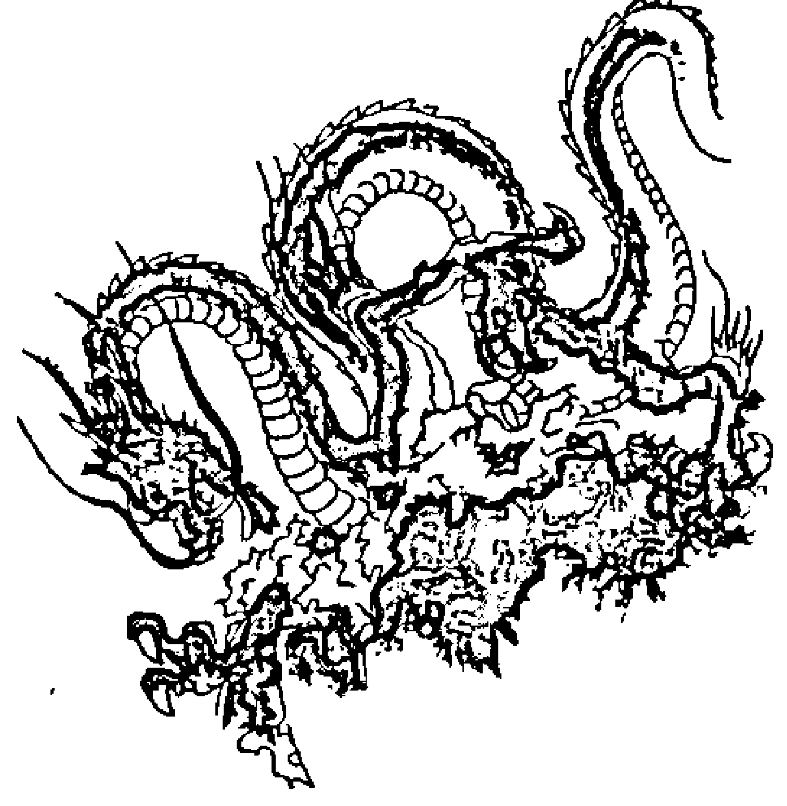

81 译注: 中文只有“江君大神”, 并无“江神大君”, 疑原文有误。
82 译注: 原文疑有误。二郎神之传说有二, 一为李冰二子, 助其治水甚多, 后人感念其恩, 奉为“二郎神”, 于灌口立庙, 别号灌口二神。二为青城道士赵昱, 原隐居于蜀中青城山。隋炀帝知其贤, 屡诏起用为眉州太守。河内有老蛟为害百姓, 显奋神勇, 入水斩之。后嘉州江水大涨, 蜀人看见赵昱骑白马挟弹弓牵猎犬从江上越流而过。百姓感德, 在灌江口立庙, 称为“灌口二郎神”。

#### 怪物・水神 中国
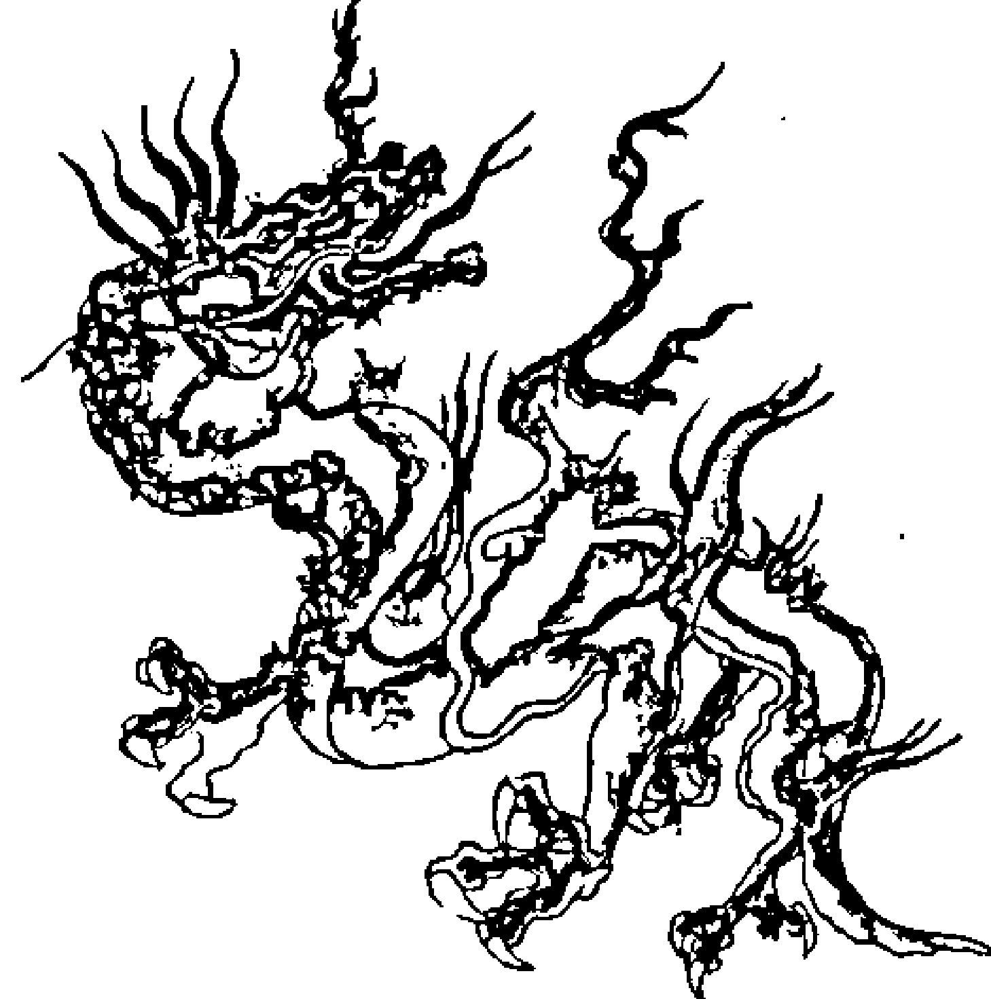

83 译注:《博雅》中明文记载, 有鳞者称为“蛟龙”, 有角者称为“虬龙”, 无角则称为“螭龙”。

#### 水神 中国
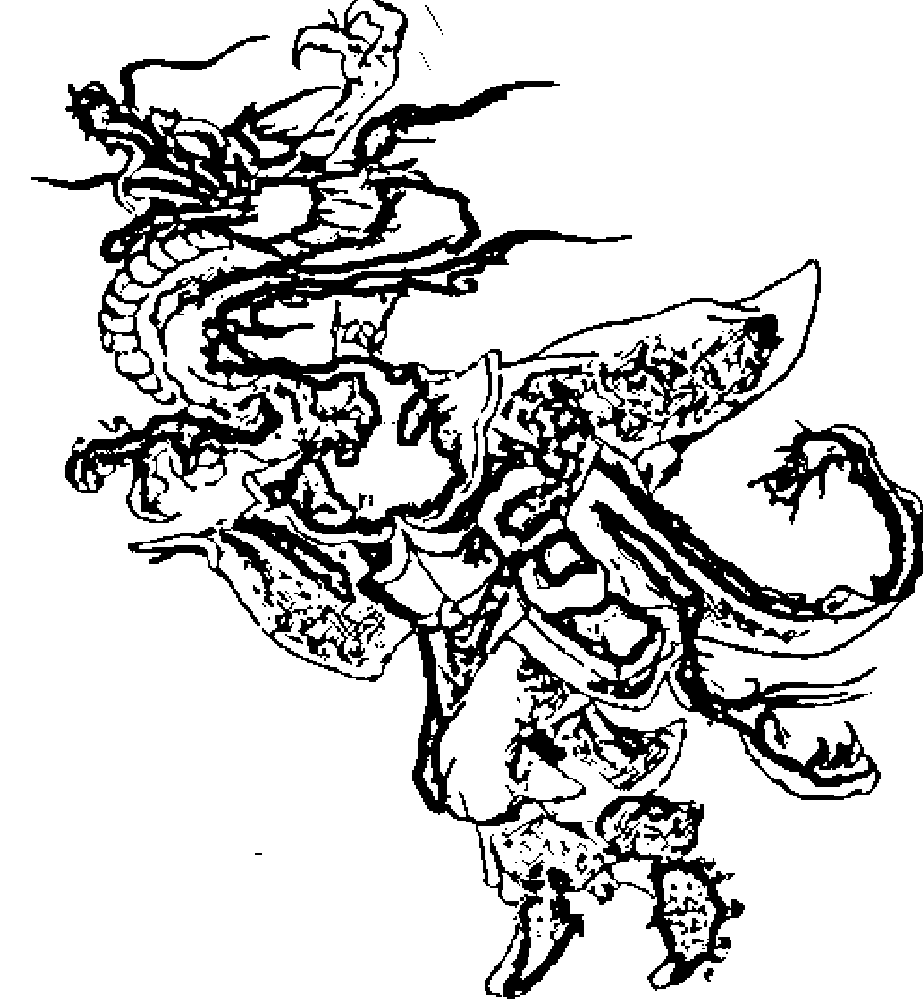

84 译注: 此段故事详见唐代传奇小说《柳毅传》。作者李朝威。
《太平广记》题《柳毅》, 《类说》题《洞庭灵姻传》。

#### 蚩尤

古代的恶神、战神、叛乱神。蚩尤是古代帝王炎帝神农氏的后裔。关于他的模样，有各种传说。一种传说，蚩尤牛头人身<sup>85</sup>，四目，六手，长有牛角和牛蹄。有八十一名兄弟，都以砂石为食<sup>86</sup>。神农氏衰败、政治混乱之时，黄帝继炎帝（神农氏）后即位，封炎帝一族为南方之王。蚩尤因而不满，率魑魅魍魉及风伯雨师推翻黄帝。蚩尤精通武器发明<sup>87</sup>，又具有指挥能力，在战争一开始时，曾一度压制了黄帝的大军。然而，天帝派遣九天玄女帮助黄帝，蚩尤因而战败被杀。

之后，大乱又起，黄帝便画蚩尤形象以昭示天下，作乱的人们以为蚩尤被黄帝收为部下，心中产生警觉，就将长矛收起。后世的民众认为黄帝的敌对者蚩尤是位恶神，因而厌恶。但因蚩尤同时是武器的发明人以及魑魅魍魉的支配人，最终还是获得战神、驱魔神的地位。

- →暴风之兆 The omen of big wind、共工 Kungkung、大风 Tafeng

#### 金角大王·银角大王

在《西游记》（1570 年左右成书）登场的怪物。他们登场的一回，应该最为读者所熟知。金角与银角是平顶山水莲洞洞主。支配洞外方圆六百里的区域，以人类为食。他们厉害之秘密在于五件法宝。作为武器的七星剑、将回答的人吸入瓶中溶解的瓢箪和净瓶、吟念咒语可以收放自如的幌金绳，以及刮起真火（三昧真火）的芭蕉扇。他们让三藏一行人遭遇极大困难，首先捉走猪八戒（猪悟能 Chu-wuneng），接着是三藏、沙悟净（Sha-wuching），而孙悟空（Sun-wukong）也数次被捕遇险。然而，悟空用计盗走宝物，使两人最后被自己的宝物，也就是瓢箪给收服。两人原是道教之祖太上老君的仆人，负责看守炼丹炉，却盗取太上老君的宝物来到下界享受荣华富贵。

#### 穷奇

惩善劝恶的恶神。传说形状像牛毛，如针眼；也有说是似虎有翼的怪物，声音像狗叫。会吃人，然而他的饮食喜好十分奇特。听到人争吵他便前去吃掉正确的一方；看见诚实的人就吃掉他的鼻子；另一方面，如果遇到凶恶的人则捕杀野兽馈赠给他。以此诱导人行凶作恶。西方帝王神少皞氏的儿子不成才。不重信义，弃舍忠恕，口出恶言，诽谤他人；重用恶人，屏退有德之人。据说此人因此被称穷奇。由此可知穷奇极其逊人嫌忌。然而穷奇又有不同的形象。名为“大傩”的追恶驱凶仪式中，有十二匹异兽驱食恶鬼<sup>88</sup>。以十二神或十二兽称之，穷奇即为其中之一。此处穷奇被视为驱赶恶灵之降魔神。如同蚩尤（Chihyu），凶猛恶神化为降魔神之例也可见于中国。

#### 战神·叛神 中国
85 译注：原文疑有误。据《述异记》：“人身牛蹄，四目六手，耳鬓如剑戟，头有角。”
86 译注：《龙鱼河图》（《太平御览》卷七八引）云：“蚩尤兄弟八十一人，并兽身人语，铜头铁额，食沙石子。”
87 译注：《世本》：“蚩尤作五兵：戈、矛、戟、酋矛、夷矛。”
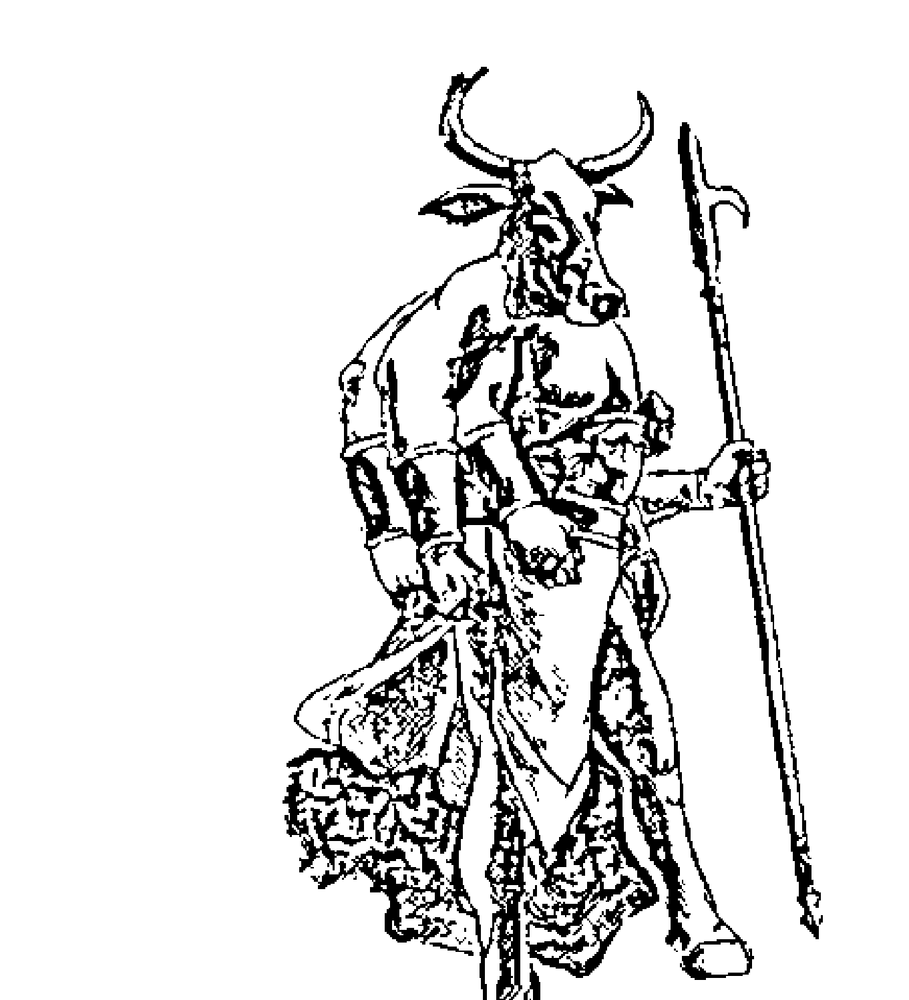

#### 怪魔 中国
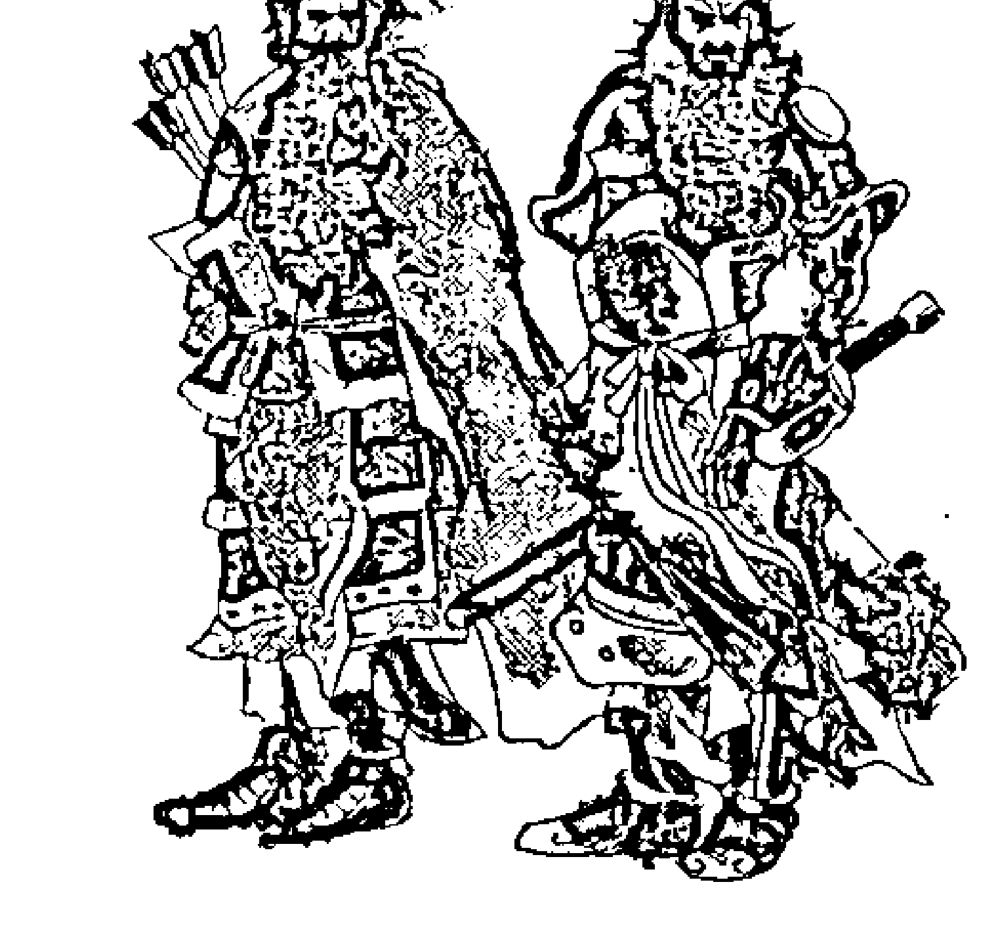

#### 恶神·降魔神 中国
88 译注：可参见《汉书》之《礼仪志》。
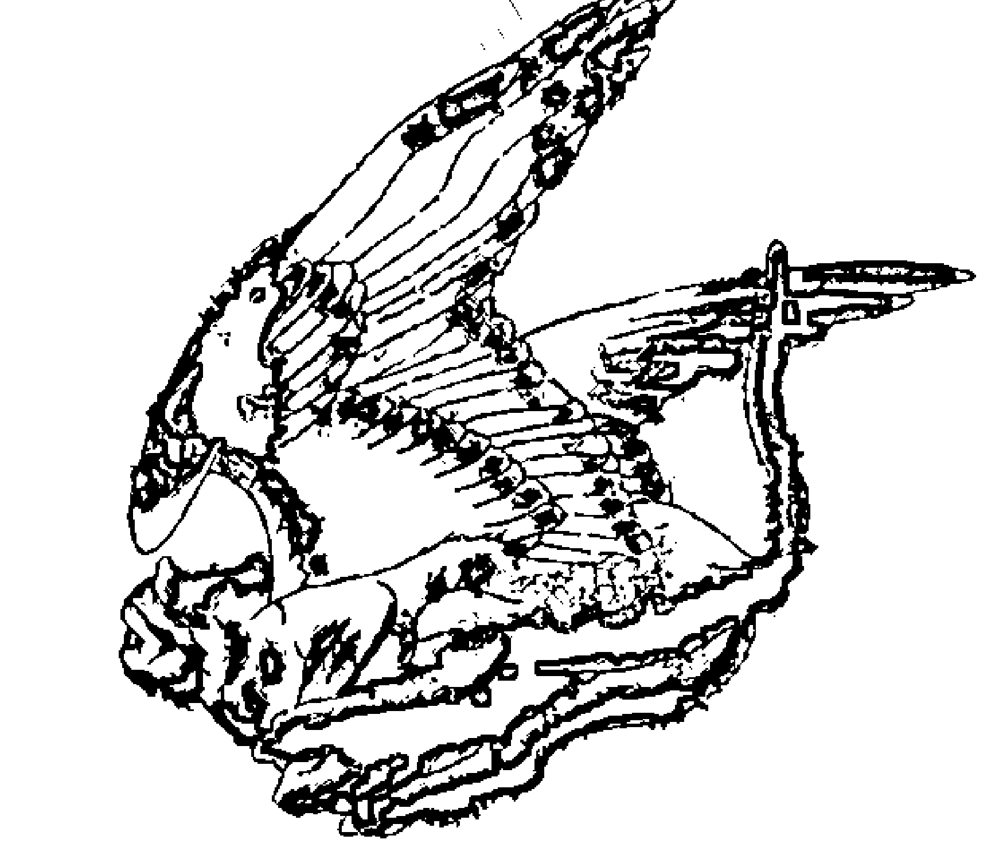

#### [Chomiel] 可弥尔

启示文学《以诺书》的模仿作《伪以诺书》的目录中有记载其名。然而，和《伪以诺书》的目录多有重复的17世纪魔法书《雷蒙盖顿》，第一部分《哥耶提雅》却无此记载。

《伪以诺书》的恶魔目录当中，以有名的加百列及米迦勒为首，其中也有卡穆尔（Camuel）或是加斯伯禄（Caspiel）等等。书中也混有弥漫着天使气息的人物，例如可弥尔就是其中之一。在《伪以诺书》中，可弥尔被视为一同刊载在名录上北方君王戴蒙瑞（Demoriel）的家臣。戴蒙瑞为北方君主，让人想起米尔顿《失乐园》中登场的天国北方城邦君主撒旦。侍奉戴蒙瑞的可弥尔，身份贵为公爵。（→ 撒旦《失乐园》、迪里艾尔 Diriel）

15世纪德国圣职者兼秘法家崔勒缪司所著《秘密法术》目录当中，刊有戴蒙瑞之名，却没有提及可弥尔。在《秘密法术》当中，戴蒙瑞拥有四百多名仆人，可弥尔可能是其中之一。

#### [Chonchon] 飞头

受秘鲁（Peru）的印地安人畏惧，会吸取人类灵魂的怪物。又称为“Chuncho”。

这个怪物长着一颗大大的人头，但是没有身体。一对又大又长的耳朵，可以像翅膀般拍动，会一边发出奇特的叫声，一边自在地盘旋空中。

它们只在晚上出现，而且只局限家有病人的房子四周。飞头一出现，几乎所有的病人都过不了多久就死了。因此人们都很害怕“死亡传讯者”，对它们是又忌又厌。

它们除了告知死期将近，据说也是“夺取魂魄”的怪物。一旦发现虚弱的病人，飞头就会企图进入病人的身体之内。要是灵魂虚弱的话，就会败给飞头，任凭它入侵体内。如果变成这样，病人就真的没救了，会被吸干血液而死。

飞头只能在夜晚行动，一旦天亮，它们就会四散奔逃而去。

#### [Christine] 克莉斯汀

由史蒂芬·金原作，约翰·卡本特导演的电影“克莉斯汀”（1993年）里登场的1958年型Plymouth Fury车辆之名。

在电影当中，该车破破烂烂被扔在废车弃置场，之后这辆车被取名为克莉斯汀，由主角阿尼（Arnie）买下修理好。这辆车被亡灵鲁贝附身，对伤害阿尼以及克莉斯汀的人一一复仇。克莉斯汀极端执着、力量庞大，拥有不管损伤到何种程度，都能靠自己修复再生的恐怖能力。正如其车名Plymouth Fury（fury = 愤怒）一般，随心所欲，恣意妄为。

正因为美国没有固有神话或传说，才产生克莉斯汀这种独特的存在。在这之前，也有“拥有邪恶意志的机械”登场。不知是否因为杀人车独具人气，“克莉斯汀”播映之前，也有许多部相同类型的电影。

此外，杀人车的概念大概是取自于英国，驾驶无头马车的无头骑士（Dullahan）的变种。（→ 杀人小丑 Killer Crown、恶作剧精灵 Boogeyman）

#### 恶魔 伪以诺书
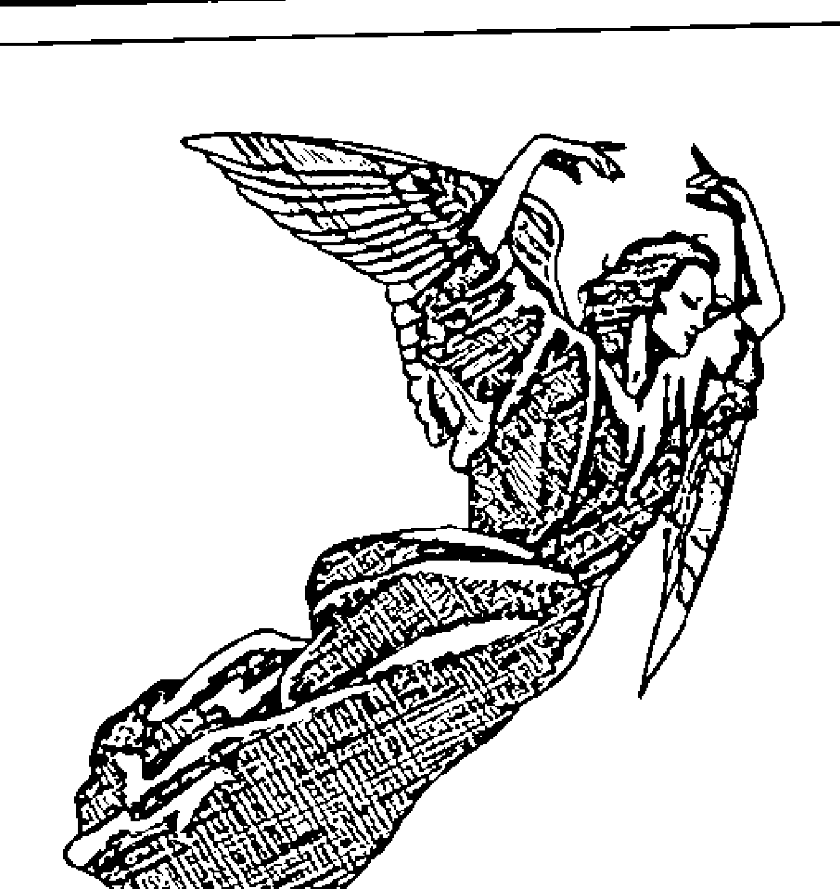

#### 告知死亡的怪物 印加
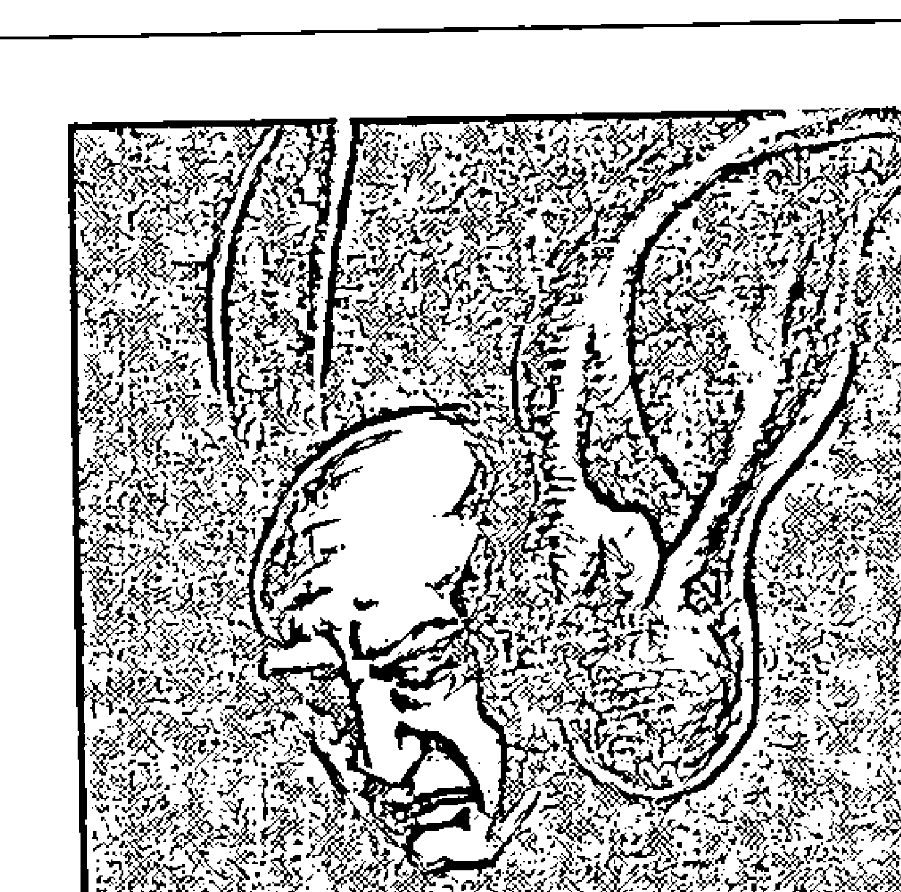

#### 恶灵·杀人车 美国
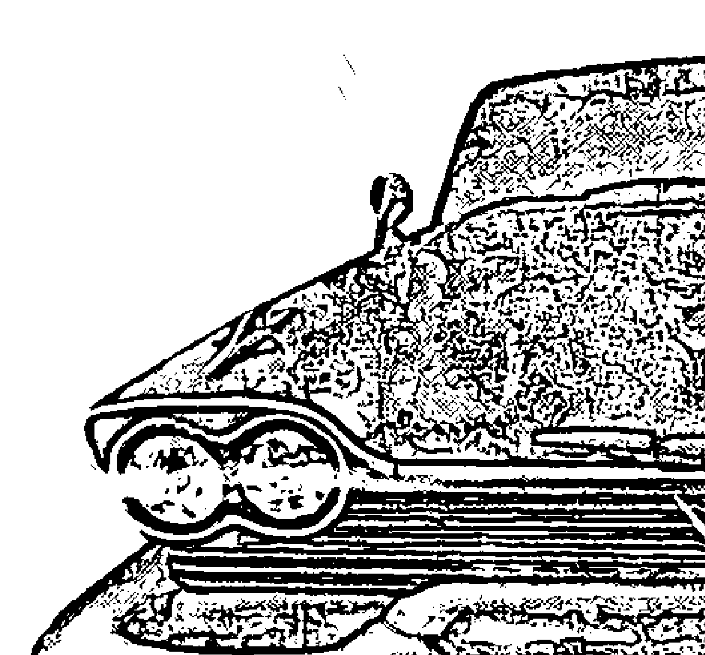

#### 朱鸟

虽说灾祸，也有许多形式。
例如，洪水与旱灾平等地给予人痛苦；但受害最深的还是农民。此外，也有种灾祸只有君子蒙受。
造成此种灾祸的怪鸟就是鴸。如同别名“※鴸鶹”，姿态如鸥。此外，也有人说鴸的脚像人手。
只要鴸一现身，当地被流放的士人增多。士人即为君子，也就是官员、学者等人。对此种阶层的人来说，鴸简直是灾难。
然而，越多官员及优秀的学者被放逐，对政治的影响越大，结果，反而危害到人民身上。

一种传说，鴸正确的名称为“※鴸鶹”(Hanchu)，取其偏旁则为“丹朱”。正是帝王神尧的不肖太子之名。这项理论若是正确，或许丹朱无法即帝位的怨气生出了这只怪鸟。
（→鬼车 Kueiche、銮鸟·鷮鸟 Tzuniao & Channiao、大风 Tafeng、毕方 Pifang）

#### 猪悟能

明代神怪小说《西游记》(1570年左右成书)中的角色。在日本则是以别名“※猪八戒”(Chu-pachich)较为人所知。
猪悟能原本是天蓬元帅，统领天兵中的天河水师。但是因为他在蟠桃会（→西王母 Hsiwang-mu）时趁酒意调戏月神嫦娥，所以被贬入凡间。下凡时又不小心误投到母猪的肚子里，所以变成了半人半猪模样的怪物。投胎变成怪物之后，他成了吃人肉的妖怪，扰乱凡间的安宁。但是经过观世音菩萨的点化，再次扭转了他的命运。观世音菩萨奉如来佛之命，寻找愿意由唐土前往天竺（印度）取经的僧人，以及担任随从的弟子。偶然相逢的猪悟能获选为随从之一。
希望能够修成正果重返天庭的猪悟能，之后便以唐三藏（玄奘法师）弟子的身份活跃书中。
经过重重苦难到达西天后，功劳受到肯定的猪悟能，晋升成为净坛使者菩萨，也顺利重返天庭。
（→沙悟净 Sha-wuching、孙悟空 Sun-wukong）

#### 烛阴

神名，又名“※烛龙”(Chulung)，人面蛇身，身躯长及千里。
关于此神有数种传说，其共同之处皆为自然的化身。
居于北方的钟山或是章尾山，从山上俯视天地。两眼纵向排列，开目为昼，闭目成月。其所放之光，能达到天地的尽头。如果两眼俱开，就会使大地如燃烧般酷热。
不饮不食，也不呼吸。然而一吐气即成风，拂过大地。急吐成冬，缓息成夏。

若将各类传说一一拾阅，则其传说多不胜数。综观各项，烛阴为“创造大地的巨人”传说的变形。据中国天地创造神话，世界依据巨人盘古的尸体而成。而烛阴，正是这一传承之变形。
（→鴸 Hsun）

### 征兆 中国
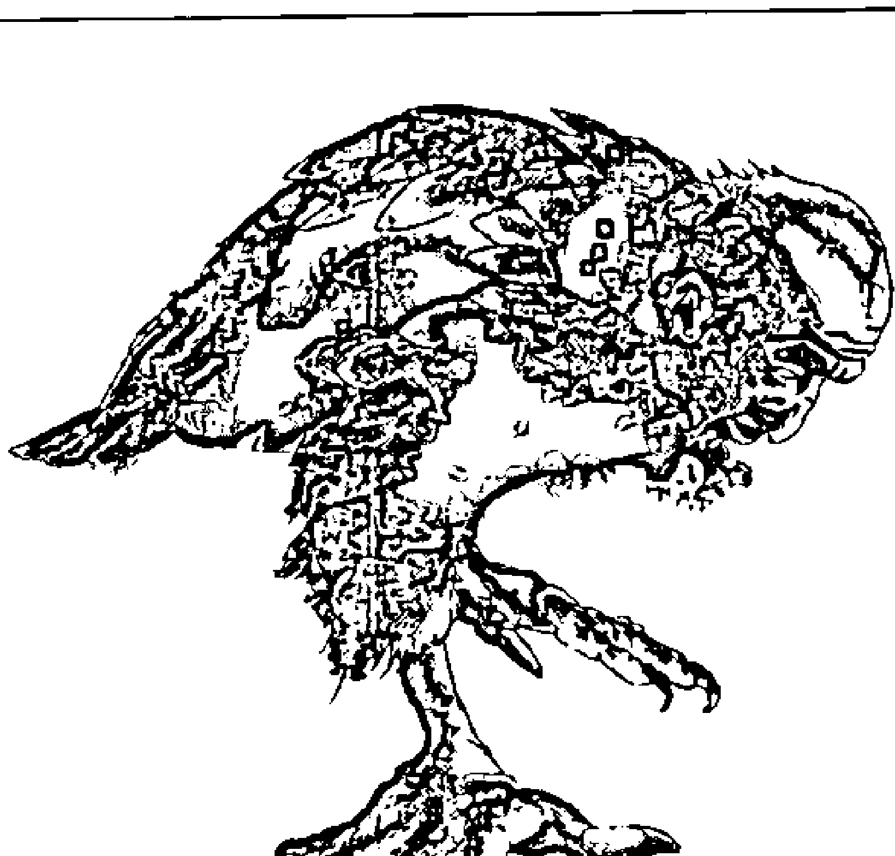

#### 恶神・怪物・武神 中国
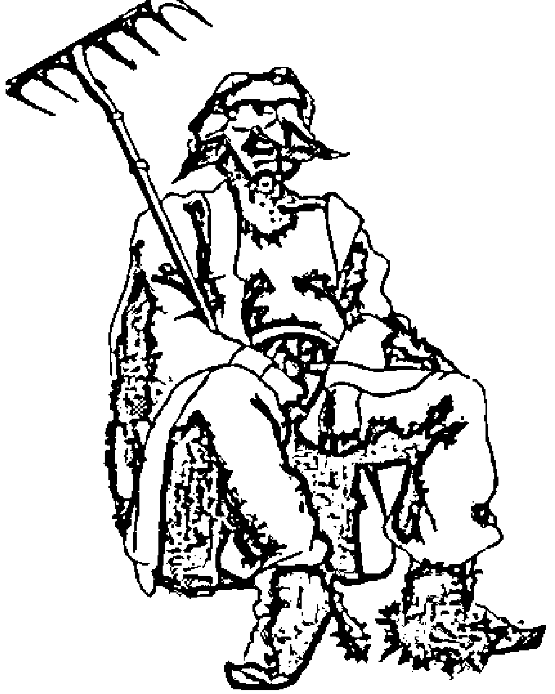

#### 自然神 中国
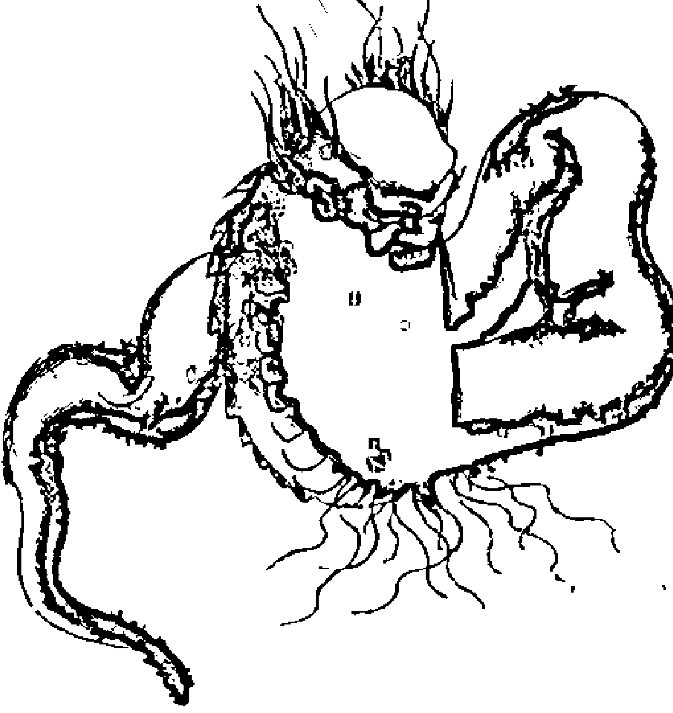

#### 强兹

于美国作家塔妮丝·李的小说《平坦地球系列》中出场的妖魔王之一。远古时分，当世界还是浮于混沌之海的平面大地时，天空、地底、海洋各有专属的神。天上众神创造出人类便放手不管，海中君王们与人类毫不相关，而地底的妖魔众王则以捉弄人类，折磨人类为乐。其中一个妖魔就是强兹，别名“惑乱公子(Delusion’s Master)”。他的右脸是年轻俊朗的男子，简直可以说是美的化身。但是左脸却是布满皱纹的丑陋老者。从正面看到他的人，几乎都会变成疯子。五位妖魔王之间互不友好，强兹尤其厌恶“黑暗公子(Night’s Master)”，他会利用自己得意的疯狂，也就是送上使对方会陷入狂情痴恋的女人。当他不想陷害妖魔王同伴时，就会将目标转为人类，为了寻找对象而在人世间漫无目的地游晃。他的手上握着黄铜的喀拉喀拉棒、各种骰子以及驴子的头骨。驴子的头骨会说话，有时还会说出正气凛然、充满说教味道的言语。（→乌戮穆 Uhlume、凯希梅特 Keshmet）

#### 锡蒙力

17 世纪魔法书《雷蒙盖顿》(Lemegeton，又名 The Lesser Key of Solomon)，书中第一部分〈哥耶提雅〉所记载的 72 名恶魔之一。并记载于仿启示文学《以诺书》而成的《伪以诺书》目录中。地狱侯爵。因锡蒙力自身外形毫无特异之处，故而常以他所骑的黑马作为他的象征。一种传说他以士兵外形出现，但或许此外形是由他能予人勇气之能力而来。然而蒙锡力并非只拥有战争面向的恶魔，也有会教授人文学的一面存在。锡蒙力此名恶魔被人强调他与失物、遗忘物、隐藏物之关系，能带领召唤者前往遗失物或财宝所在之处。并拥有关于非洲的详细知识。虽然《雷蒙盖顿》及《伪以诺书》均有介绍他，但或因外观能力缺乏特性，作家普朗西的名作《地狱辞典》中并未收录他。

#### 西里阿多

出现在意大利诗人但丁的叙事诗《神曲》(Divina Commedia, 1307～1321 年所作)中的恶魔。首次出场是在《神曲》三部作的第1部〈地狱篇〉中的第22篇,是以马纳果达 (Malacoda) 为首、被称为“※马纳勃郎西 (Malebrache)”的地狱狱卒之一。马纳勃郎西们都是有着黑色身体、蝙蝠般的翅膀以及长着锐利爪牙的凶残恶鬼，西里阿多跟同伴相比，牙齿又特别的长而利，因此又有“獠牙猪”的别名。此外，马纳勃郎西的首领马纳果达也叫他“长牙的西里阿多”。在〈地狱篇〉第 21、22 篇中描写到地狱第 8 圈第 5 沟, 是为了处罚生前曾经贪污或诈欺的亡灵们的沥青池 (天然柏油)，西里阿多等数位马纳勃郎西，虎视眈眈的等着罪人的头或身体露出池面。当马纳勃郎西之一的格拉非冈 (Graffiacane)，将一个不小心让身体冒出沥青池的亡灵——“伐拉人强波洛”给抓住时，西里阿多就用正字标记的锐利长牙，把这个罪人背上的皮给狠狠撕裂。

### 妖魔之王

美国

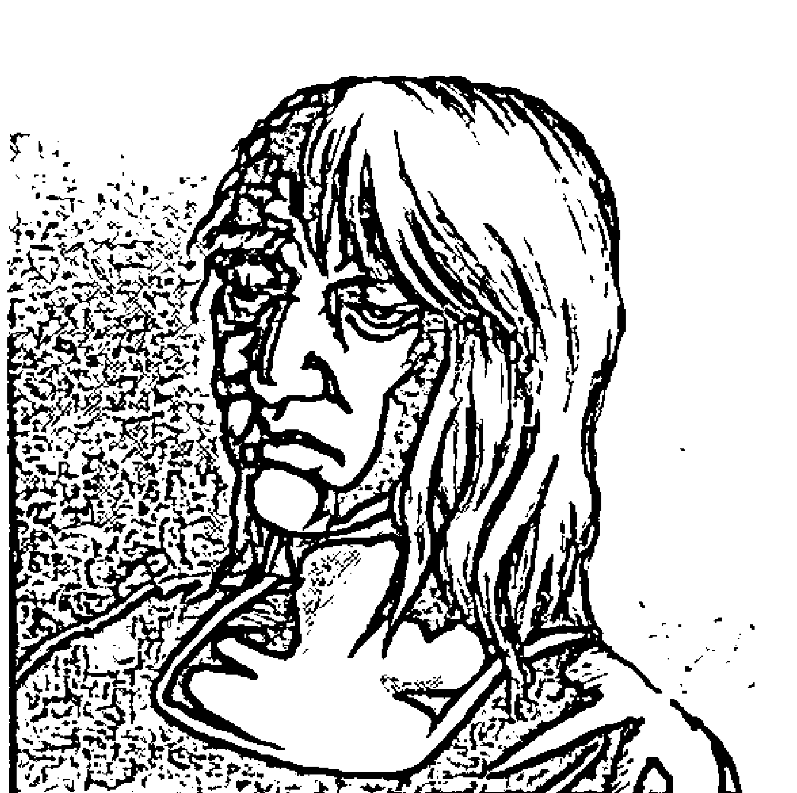

#### 恶魔·所罗门的恶魔

雷蒙盖顿、伪以诺书

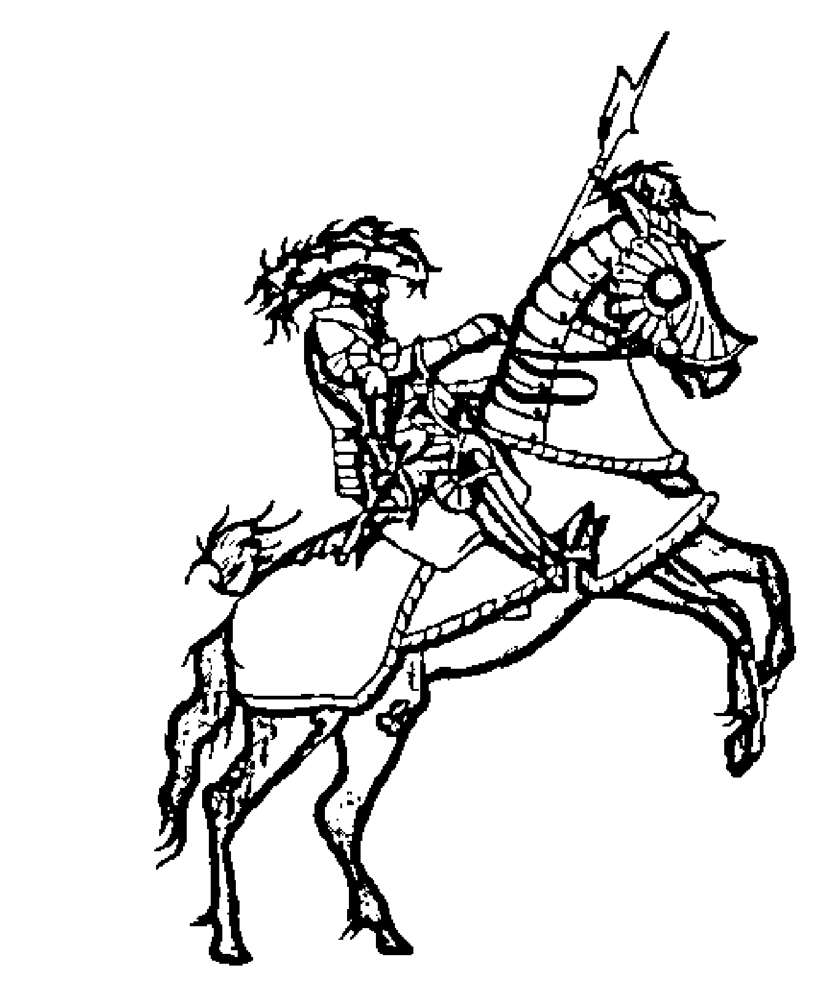

#### 恶魔·地狱的魔鬼

神曲

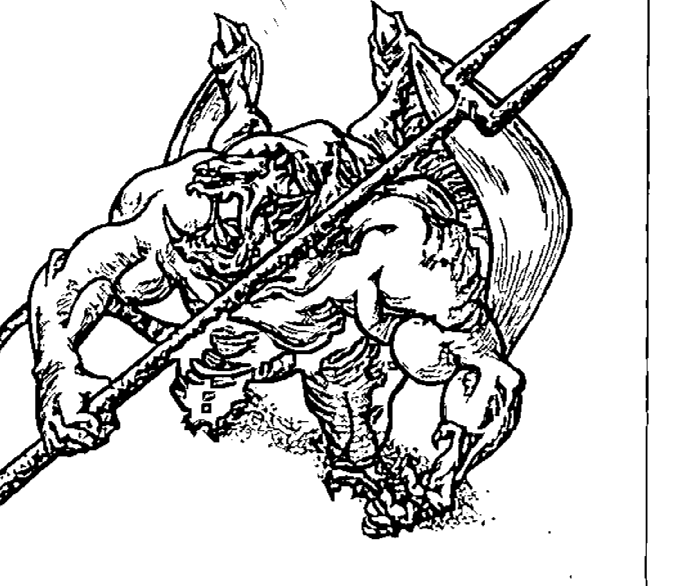

### 科亚特利库埃

嗜血的大地女神。其名称意为“蛇淑女”。产下阿兹特克的守护神威济洛波特利⁹⁰(Huitzilopochtli)，具有重要功能的神灵。

她的模样与一般大地母神有相当大的出入。盖住下半身的裙摆上是无数条蛇所织成的，项链则是用人身体的一部分（心脏、手腕、头骨）制成。手脚生有利爪，可撕裂取食人类或是其他生物。身为大地女神应为大地带来恩惠，为何有如此恐怖的行为姿态，实在引出有因。她是大地的子宫，可孕育一切生物。但是，一旦生命逝去，必会归回原处。绝对逃不出科亚特利库埃的“死亡之颊”。她最恐怖的姿态象征的是大地的黑暗面（吞食生命的墓地）。残酷地执行自然法则的大地之母，就是科亚特利库埃。（→泰兹卡特利波卡 Tezcatlipoca）

### 库多古

克苏鲁神话中的邪神之一。居住在离地球27光年的北落师门南鱼座α（Formalhant < α PsA>）的炎之邪神，是一团有生命的火焰。只要念诵咒文召唤，便会形成一团巨大的火焰现身。此时，娇小的“炎之精灵”或者“库多古的部下”一起和库多古出现也十分普通。库多古现身时，其高热使得周围一带产生大火灾。除此之外，库多古可造伪足敲击、拖取物品，或是射击火焰使物品燃烧殆尽。

作家奥古斯都达雷斯（August William Derleth, 1909-1971）创造的克苏鲁邪神中，库多古独有土的属性（达雷斯自己定义的），与奈亚鲁法特（Nyalrathotep）相对应。也因为如此，其他相关的描写非常稀少，就连他到底有没有知性也不清楚。（不过，这一点对克苏鲁邪神来说，也不是十分少见。）即使在破坏神众多的克苏鲁邪神当中，库多古仍是具有强大破坏力的邪神之一。

#### 克苏鲁

克苏鲁神话中的主要邪神之一。其名称虽冠有神话之名⁹¹，却非主神。在太古之时，从异界飞来地球。

身形巨大，形似章鱼的头上长着蝙蝠般的翅膀，如人类般的四肢覆有鳞片，身形不定，身体各部分的比率及详细状况时时刻刻都在变化。

克苏鲁信仰虽说是世界性，但在临水区、岛屿、渔民等，与水有关的地方特别多。

平常时克苏鲁被封印沉睡在沉没于太平洋深处的都市鲁利谒⁹²（R'lyeh）中，偶尔会利用精神感应（Telepathy）与远处不特定的人类接触。与克苏鲁接触的人类，大致上感受性颇强，有许多人因为精神接触而发狂。然而有时，有些艺术家因得到此种疯狂的灵感而声名大噪。

恶魔与艺术的组合绝不少见，但是人为了追求艺术与恶魔订契约而招致疯狂的说法并不太正确；一种新的解释是，艺术乃是恶魔自然流露的疯狂中所产生的副产物。（→奈亚鲁法特 Nyalrathotep）

### 残酷的地母神

阿兹特克

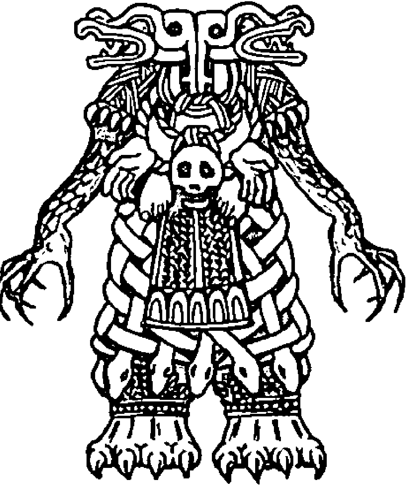

- 89 译注：或译“寇阿特里姑”。
- 90 译注：意为太阳神，或战争之神。

#### 邪神

克苏鲁神话

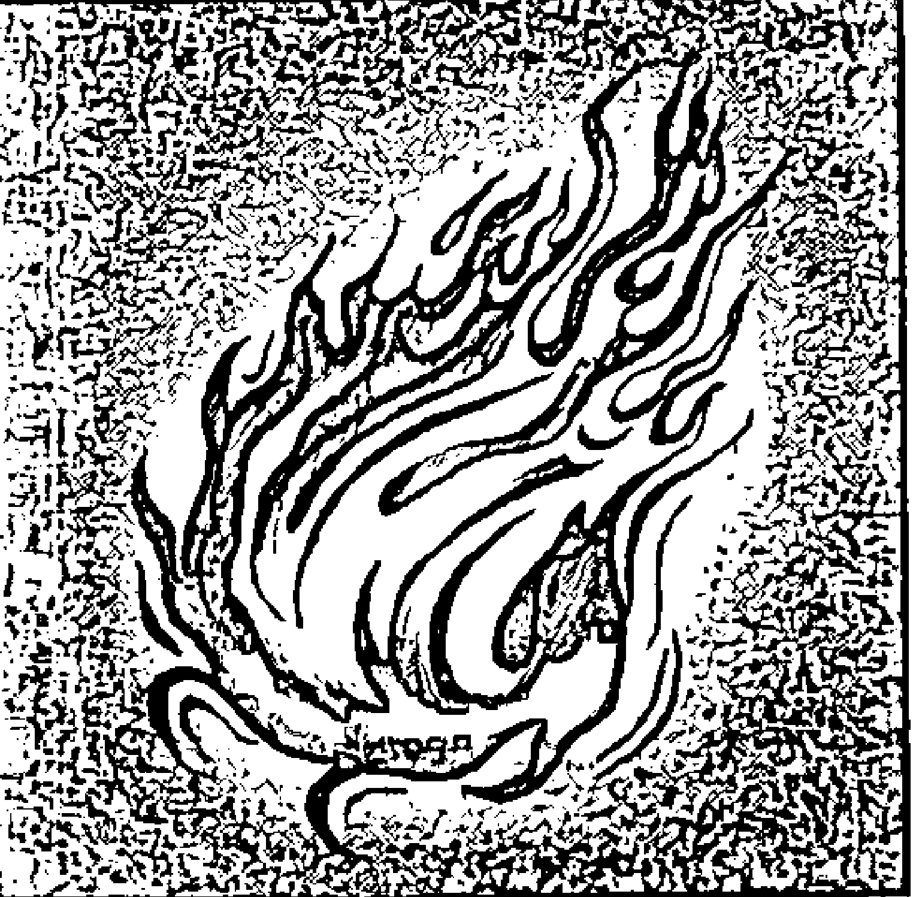

### 旧支配者

克苏鲁神话

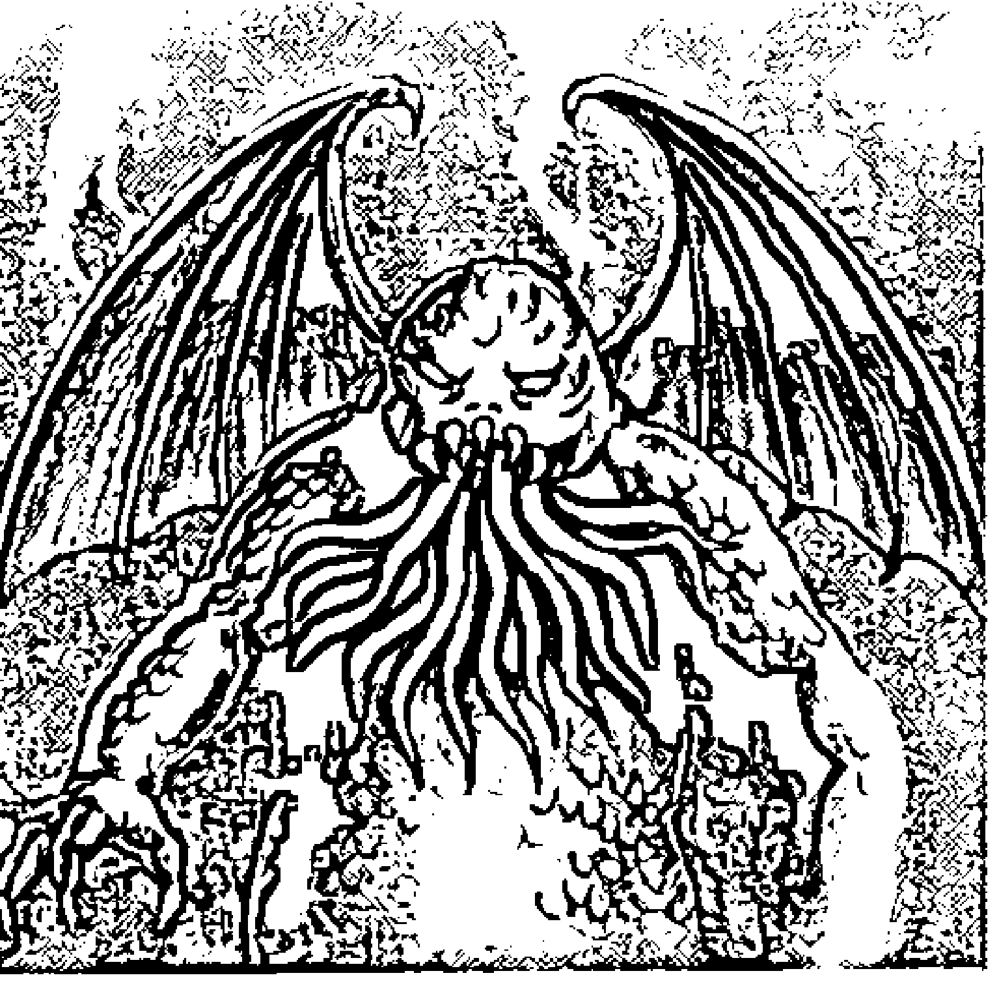

- 91 译注：克苏鲁神即为 Cthulhu Mythos。
- 92 译注：水底都市鲁利姆，位于太平洋及纽西兰之交汇处，南纬47度9分西经126度43分的海底，分布区域广大的石造都市，具有极端不规则的几何外形。据说，只要星辰回归正确的位置，都市会再度浮出水面。

### 大衮

于米尔顿所作叙事诗《失乐园》(1667年)中登场的叛逆天使(恶魔)。根据米尔顿的说法，他应该是非利士人(Philistine)所崇拜的异教神之前身。这位非利士人的神——大衮，本来是古代闪族(Semite)的农耕之神。被非利士人崇拜之后，海神的神格逐渐增强，米尔顿也描述这位异教神是半人半鱼的姿态。在《旧约圣经》的《塞缪尔记》(Samuel)中，提到大衮是一位偶像神，或许这就是米尔顿将大衮这位异教神加入到叛逆天使名单中的原因。在《失乐园》当中，只有在列出追随大逆天使撒旦(Satan)的叛逆天使目录的第一卷中，记载着大衮的名字，除此之外的事项则只字未提。大衮也跟列在这一卷的其他诸多叛逆天使一般，是米尔顿为了展现叙事诗——唱名的传统而准备的天使吧。然而，身为撒旦的部下，参与了天国的叛乱事件，又因失败而坠入地狱时的大衮，虽然逐渐失去光辉与美丽，但也不会是半人半鱼，而是一直保持着天使的姿态才对。

> （→撒旦（Satan）《失乐园》）

### 但他林

假托古代以色列王国之王所罗门所著，完成于17世纪的魔法书《雷蒙盖顿》(Lemegeton，又名The Lesser Key of Solomon)书中第1部《哥耶提雅》所记载的72名恶魔之一。身份是恶魔公爵。当他现身在召唤者面前时，全身长有无数男女的脸。这些脸显示出但他林的博学多闻，象征他涉猎的知识范围之广。记载中还特别描述，当他出现在人类面前时手上会拿着书籍，这也表示但他林是与知识有关的恶魔。但他林可以传授召唤者神秘的知识，或是隐藏在别人心中的秘密知识。此外，他还能让人看见人类的幻影。符合他拿着书籍现身的姿态，但他林会教导人类有关艺术及科学的种种。19世纪的法国作家柯林·德·普朗西的著作《地狱辞典》，让许多恶魔声名大噪，但是但他林却不在其中。他是拥有特异形态的恶魔，如果本书的插画家M.L.布尔顿画出但他林的肖像的话，或许他会成为大名鼎鼎的恶魔。

### 达沙

又称“※达湿由”(Dasyu)。达沙——婆罗门教经典《黎俱吠陀》中的众神的敌人，也就是恶魔。达沙是“黑”的意思。达沙的形象为黑肤、塌鼻、操着完全不同的语言，其信仰也很特异。由历史上来看，达沙很有可能是亚利安人(印度=欧洲人的古老称谓)入侵印度时所遇见的印度原住民。这些原住民与亚利安人间的争斗，通过许多的神话流传至今。原住民们虽然兴建城寨、竖立栅栏来抵抗，但是碰上乘着战车，使用铁制武器的亚利安人，无疑是以卵击石，毫无胜算。与恶魔战斗且获胜的战神※因陀罗(Indra)^93之所以被称为Puran-dara(意为“城寨的破坏者”)，也是源于这场战争。当时的原住民面临或是被杀、或是逃亡、或是投降沦为奴隶的惨况。印度种姓制度(caste)中最低层的贱民(Sudra)^94，很有可能是当时原住民的后裔(当然，经过长久以来的混血，现在由外观上几乎看不出不同之处。) ※达伊提耶(Datiya，恶鬼)或※檀那婆(Danavas，恶魔)、阿修罗(Asura或Ashura)等，极有可能都是印度的原住民族。

### 叛逆天使

失乐园

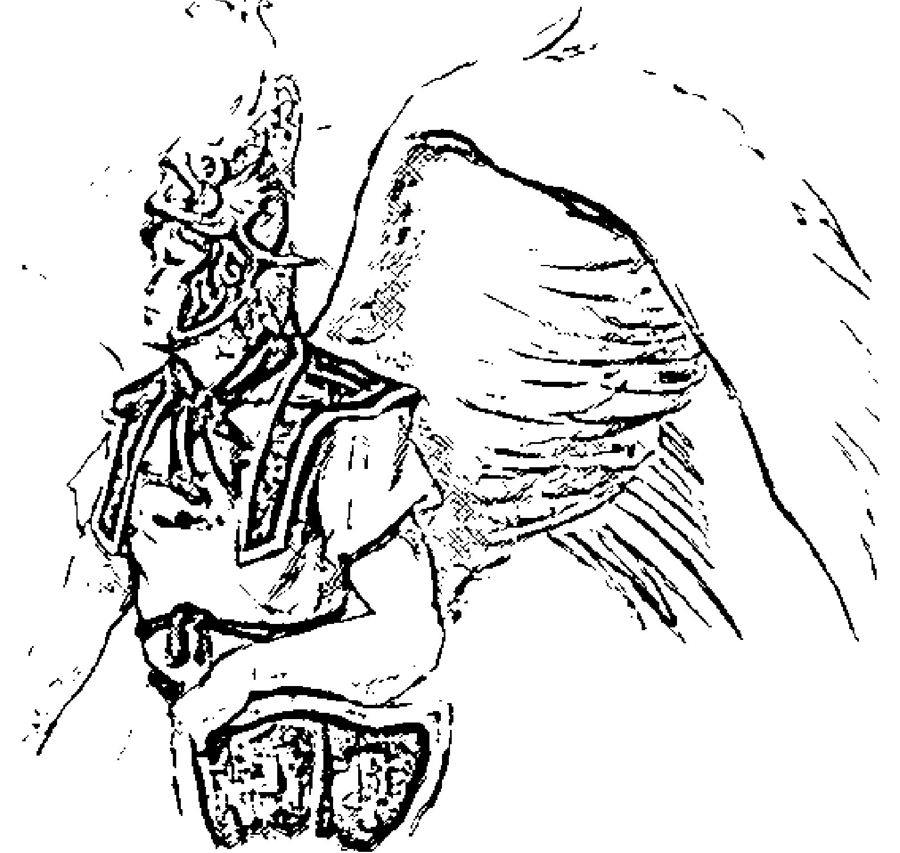

#### 恶魔·所罗门的恶魔

雷蒙盖顿

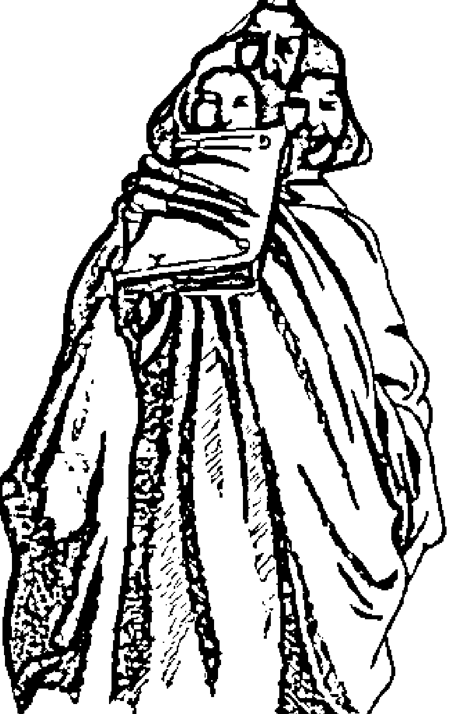

### 恶魔族

印度

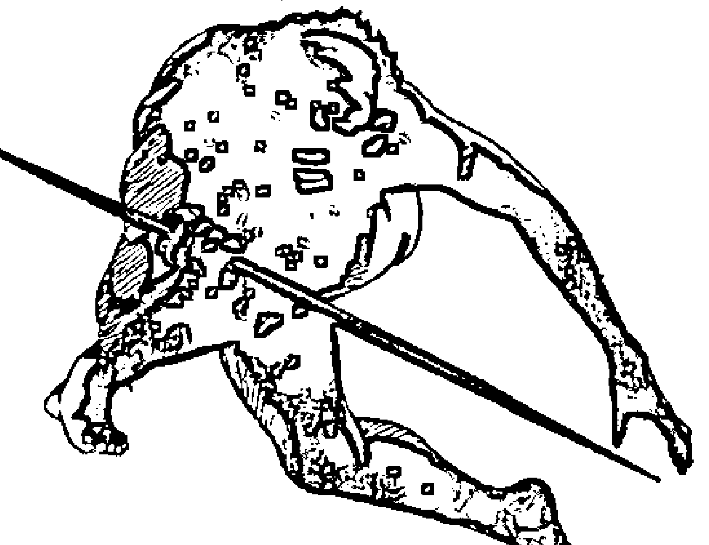

- 93 译注：“因陀罗”在汉文经文中曾被译为“天帝”、“天帝释”、“帝释天”或“帝释”。佛教将因陀罗视为护法神之一，即为忉利天（及三十三天）之主，居须弥山顶之善见城。
- 94 译注：又称为“首陀罗”，为奴隶之意。

### 死《非洲》

第一个男性吉兹与妻子娜比要前往天国之时，古鲁对两人忠告说：因为“死”也想一同前往，所以要两人赶快动身出发别再回来。

然而，娜比却忘了带鸡饲料，返家来取，“死”也就紧跟着他们。之后，夫妇生了许多小孩。

“死”拜托吉兹让自己照料小孩，但吉兹拒绝了他。于是“死”就说“我要杀了你的小孩”。吉兹虽不懂什么是“杀”，但小孩却陆续病死。

于是，吉兹前往天国向古鲁诉苦。古鲁认为应该给予警惕，便派“死”的兄弟凯依吉基阻止“死”。

凯依吉基与“死”作战，最后仍被“死”逃掉。之后让小孩领着山羊散步，想引诱“死”出来。但因小孩大叫，“死”就再度躲入地下。于是凯依吉基放弃追捕“死”，返回天国。

因此到了现在，“死”仍藏于地底，伺机杀人。

### 《死》《失乐园》

英国诗人米尔顿所著叙事诗《失乐园》(1667年)中登场的异形。为叛逆天使撒旦与其女《罪恶》(Sin)所生。性格狂暴，连他的母亲也屈服于他的暴力之下，和他生下了怪物般的地狱猎犬。《死》的姿态仿如地狱，躯体黝黑而庞大、器官无法判别。连看到他的撒旦大感嫌恶。武器为蝎子鞭及百发百中的镖枪。

《死》与其母《罪恶》一起看守地狱之门，对试图通过地狱之门的撒旦施予恐吓。《死》与母《罪恶》不同，是以强烈饥饿作为其行动准则，因此，对撒旦的孺慕之情已一点不剩。先忽略撒旦选择地狱作为其住所此点，《死》也是地狱的支配者，像头一般的地方戴着皇冠。虽不属于叛逆天使，也无对上帝的归属感，只以其欲望为行动准则。

撒旦、其女《罪恶》，以及两人所生的《死》是模仿天国“圣父、圣子、圣灵”三位一体的拙劣品。

(→撒旦 Satan 《失乐园》)

### 单卡拉比

完成于１７世纪的魔法书《雷蒙盖顿》(Lemegeton, 又名 The Lesser Key of Solomon)，据称是古代以色列王国的所罗门王所著，单卡拉比是此书第１部《哥耶提雅》中所记载的７２名恶魔之一。

这个恶魔非常与众不同之处是他出现在召唤者面前时的姿态，据说是五芒星形中的星形一般极为抽象的形态。以没有生命的无机姿态现身的恶魔，在《哥耶提雅》中也只有单卡拉比而已。而当我们想到《雷蒙盖顿》成书于17世纪初，就不禁为想象出单卡拉比姿态的人击节称赞。

据说如果召唤者要求的话，单卡拉比也可以化身成人的姿态。他的能力在《雷蒙盖顿》的恶魔当中，并没什么特出之处，他可以教导人类了解关于蕴藏在植物或岩石中的力量。此外，他还可以将似鸟的形态存在的灵，赐给召唤者作为使唤魔之用。

法国作家柯林·德·普朗西的著作《地狱辞典》，配合插画家 M.L.布尔顿 (M.L.Breton) 所绘制的恶魔肖像，使得许多恶魔声名大噪。但是可惜的普朗西在书中并没有介绍单卡拉比，因此也没有具体的单卡拉比画像。

**死 非洲**

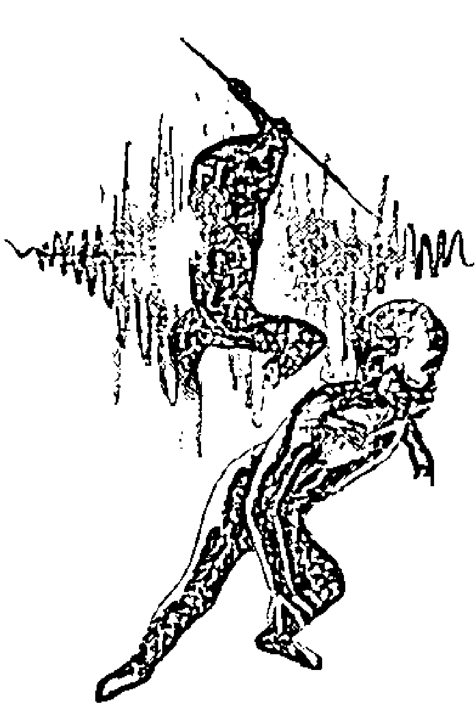

**撒旦之子·地狱守门人 失乐园**

- 95 译注: the Trinity, 即上帝天父、基督、圣灵，神的三位格。
- 96 译注: parody, 文学作品的一种形式。指模仿他人作品而作的戏作、游戏文字。

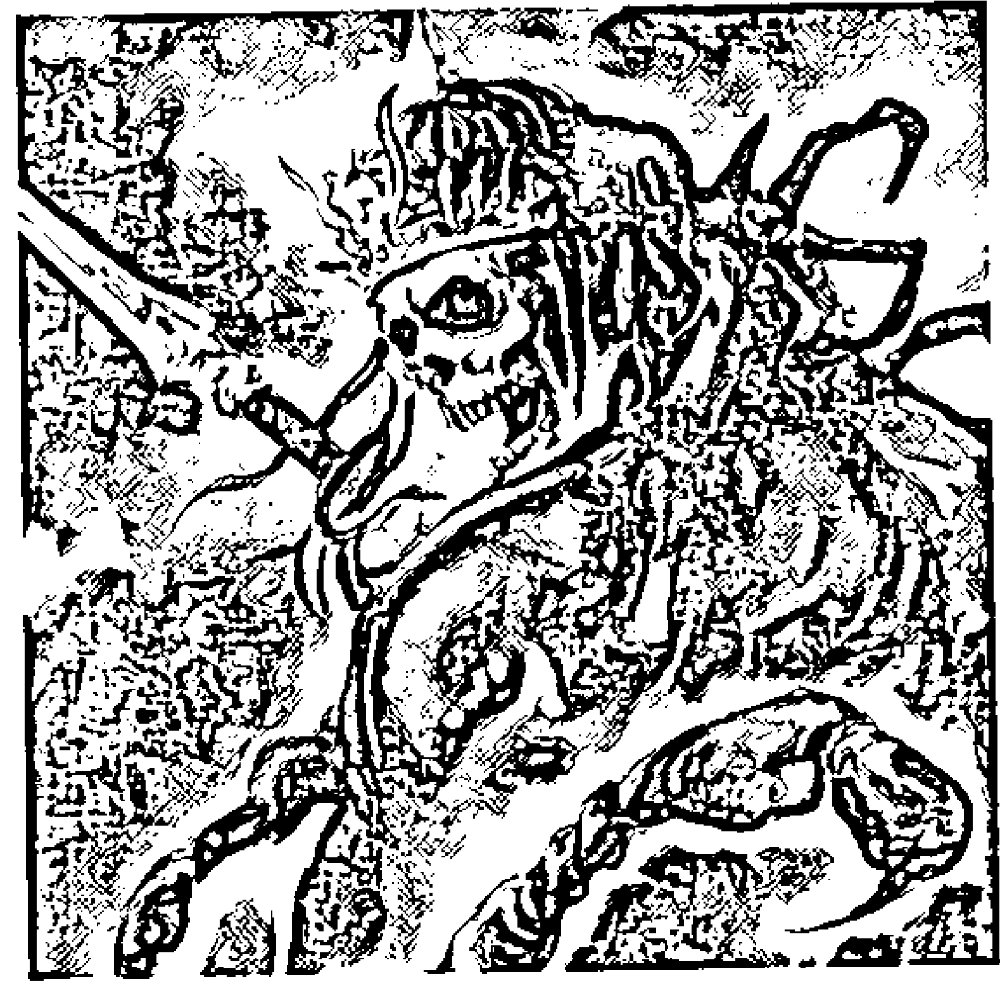

**恶魔·所罗门的恶魔 雷蒙盖顿**

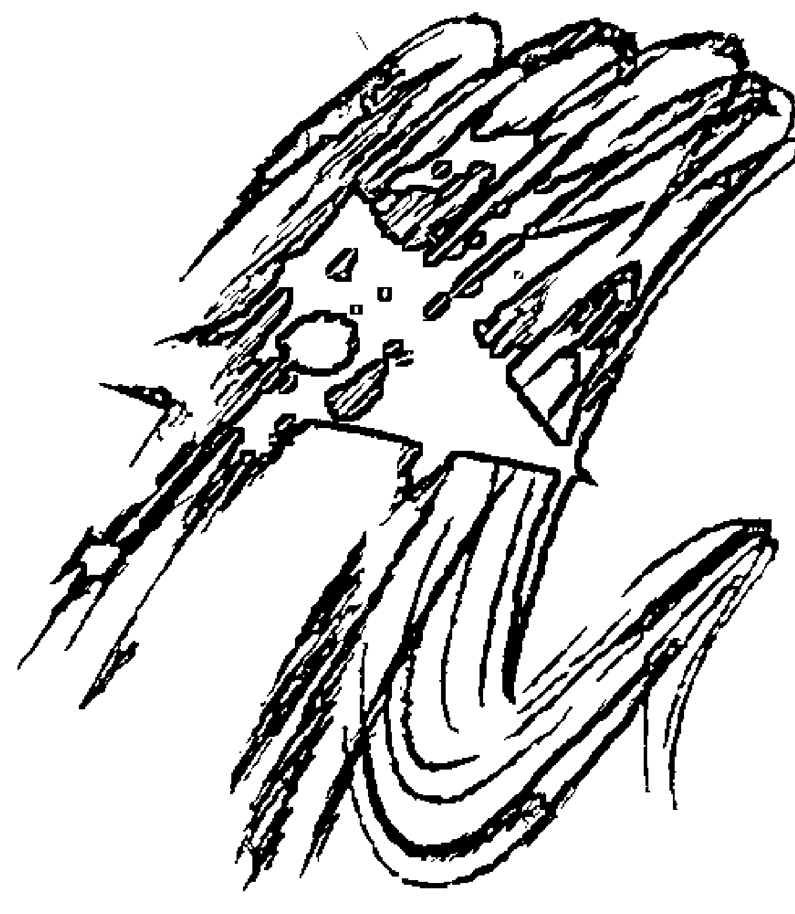

### Demogorgon 特摩高根

出现在《失乐园》（公元1667年）书中，如灵体般的存在。在宇宙之外，有个比宇宙还要古老的原初世界——混沌界（chaos），它的支配者是混沌（Anarch），特摩高根正是混沌的臣子。他是继混沌及王妃<夜>的左右手——奥迦斯与黑帝斯（Orcus & Hades）后的第三廷臣。又被称为“可怕的特摩高根”。

《失乐园》的作者米尔顿选用许多圣经记载的偶像神、异教神、恶魔等，让他们以跟随大逆天使撒旦（Satan）的叛逆天使身份出现在书中，但是特摩高根并不是出自圣经的恶灵，也不像同为混沌之臣子的奥伽斯及黑帝斯出自于希腊·罗马神话。米尔顿可能是将希腊古哲柏拉图（Platon）的著作——《提玛友斯》（Timaeus）中的宇宙创成论里记载的宇宙创造者戴米乌尔格司（Demiurgos）⁹⁷之名略加变化，或是看到14世纪的意大利小说家薄伽丘（Giovanni Boccacci）⁹⁸的论文《异教神的系谱》⁹⁹，以及16世纪英国诗人爱德蒙·史宾赛（Edmund Spenser）未完成的叙事诗《妖精女王》中被描述为恶灵的特摩高根，并因此借用而来的吧。

这个恶魔应该是从说出名字就会招致灾祸的传说，渐渐演变成“可怕的特摩高根”。
（→撒旦 Satan 《失乐园》）

### Demons<Gogol> 果戈里的恶魔

果戈里为俄国作家，喜好描写怪异、怪奇、恶魔以及魔术之类题材。特别是他的初期作品《狄康卡近乡夜话》（Vechera na khutore bliz Dikanki）中，有许多恶魔登场。遵循传统俄国恶魔形象，书中恶魔喜好赌博，经常于密林中、荆棘榛树茂密处的对面小河上架的桥梁周围，整夜吵闹。在这里无数的恶魔，其面如猪、犬、雁或是马等，与魔女相互追逐嬉戏，或是在空中旋回，打着满是手垢的扑克牌赌博。他们之间的赌博，因为彼此都是恶魔的关系，都是互相诈赌。

他们做尽一切坏事，只有在圣诞节的早晨钟声一响，便会全身发抖不得不躲进洞穴里。因此，只有在圣诞节前夜这天能尽情为恶，与魔女嬉闹。

之后，果戈里透过描写恶魔时幽默滑稽的笔法，道尽一切人世间的不合理，被世人奉为俄国写实之父。描述写实此点实在令人出乎意料。
(→威Vii)

### Demon <Karuhaimu> 加鲁海姆的恶魔

多瑙河流经处有一名叫加鲁海姆之土地，该处有个名叫“恶魔崖”的高耸岩石。
因多瑙河于该处变得十分狭窄，故船只难以航行。

于是便有一名工匠想借用恶魔之力拓宽河道。
然而恶魔不可能平白出力。恶魔与工匠约定在实现工匠的心愿后要把通过拓宽河道的头三个灵魂给自己。

在河道拓宽后，工匠先让一头鹿坐在船上随河而去。接着坐船顺河而下的是公鸡，最后是狗。

之后工匠便对恶魔说他可以取去三个灵魂了。
恶魔为此愤怒无比，把三匹动物变为岩石。这些岩石于是被叫做“恶魔之轭”。三座岩石分别名为“鹿岬”、“公鸡”、“狗”。
（→戴拉·布兰卡 Dera Buranka、姆欧迪尔 Muouderu、枞树中的恶魔 The demon in fir）

### 混沌的臣子

失乐园

- 97 译注：希腊原文为“工匠”之意。
- 98 译注：Giovanni Boccaci (1313-1375) 中文译为“薄伽丘(邱)”，意大利作家及散文家，也是一位人文主义者。与但丁(Dante)、佩脱拉克(Petrarch) 同为意大利文艺复兴的先驱。早年从父习商，及长在那不勒斯攻读法律，因兴趣偏好古典文学，弃商就法，以文学著作闻名于世。其代表作品有《菲罗可罗》(Filocolo)、《菲亚美达》(Fiammetta)、《十日谭》(Decameron) 等。
- 99 译注：原书名为 (De genealogia deorum gentilium)(1350-1374)，以拉丁文写成，书中仔细论述关于古老神话与文化的种种。英文版书名为 (On the Genealogy of the Gods of the Gentiles)。

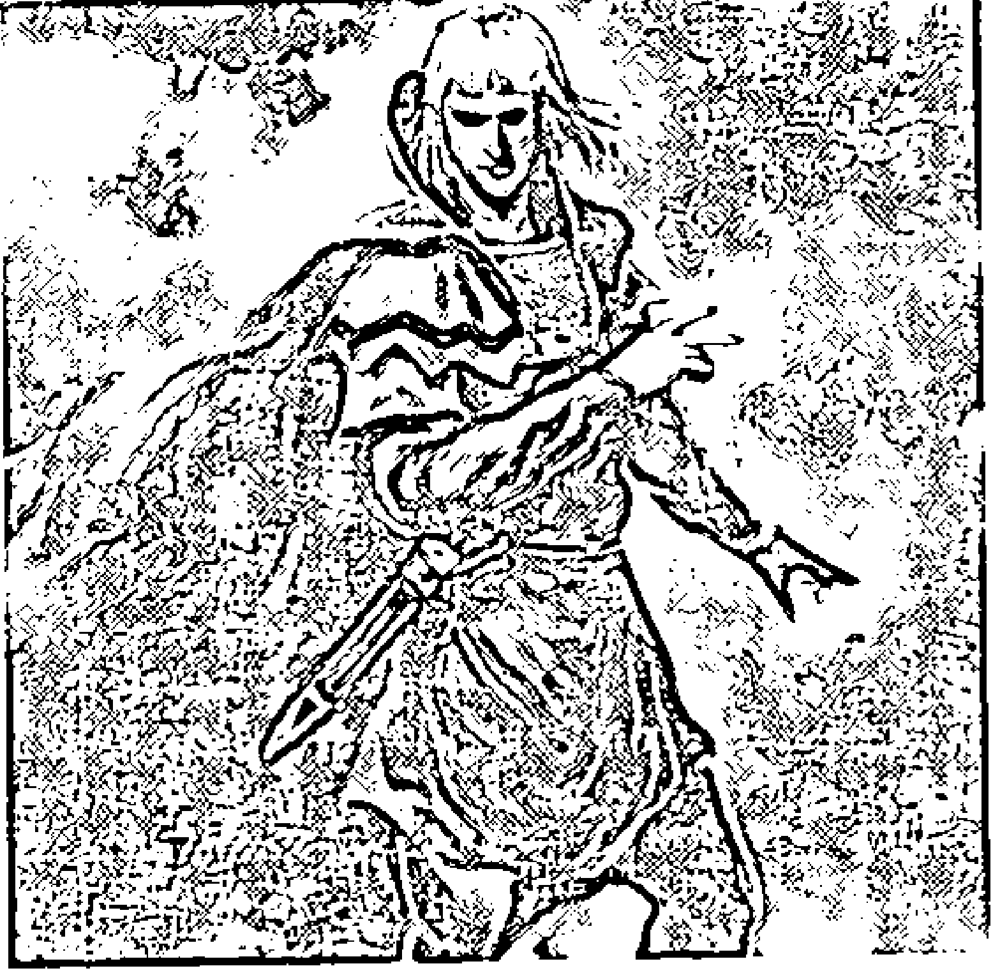

### 恶魔

俄罗斯

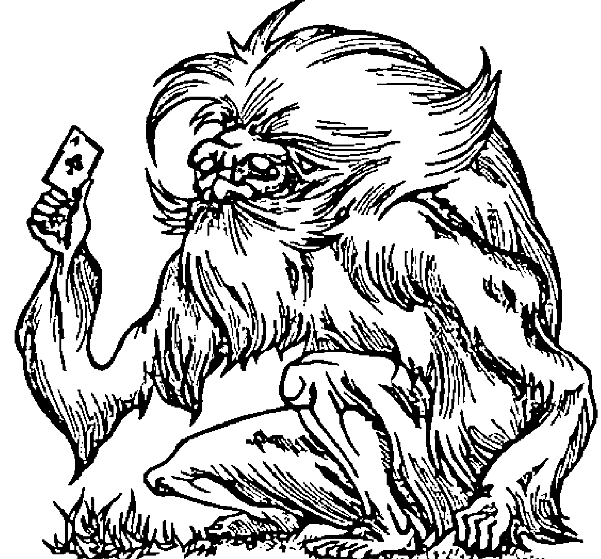

### 恶魔

奥地利

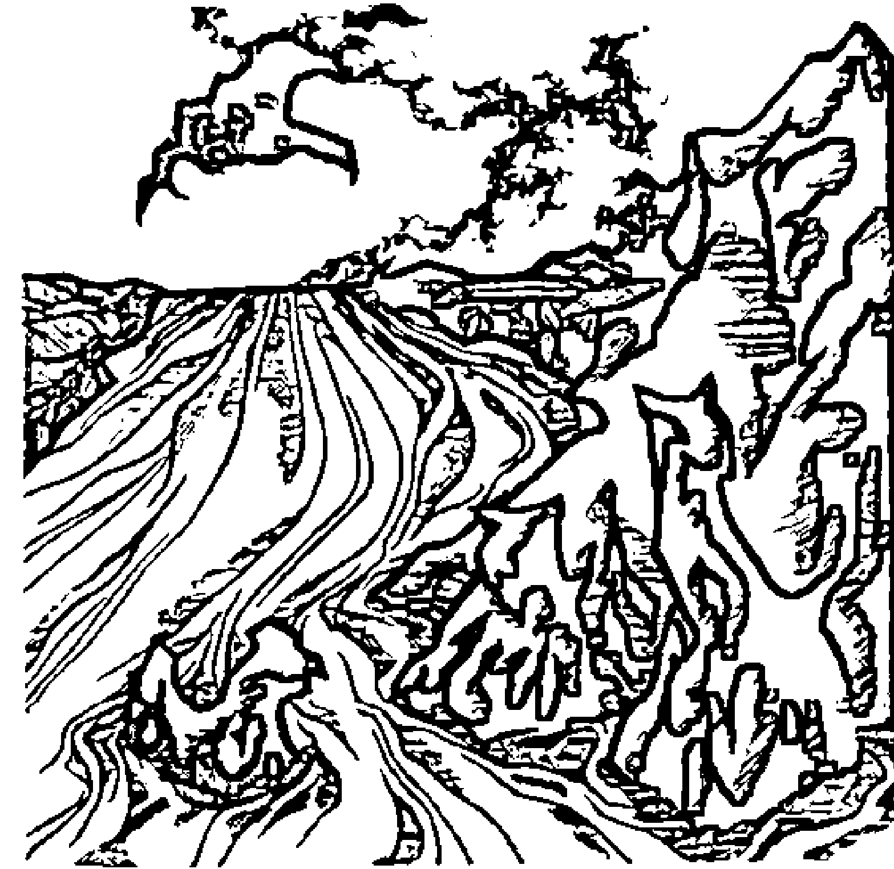

### 莱蒙托夫的恶魔

俄国作家莱蒙托夫100 (Mikhail Yur'evich Lermontov) 的长篇诗《恶魔》中描述的恶魔。俄国文人笔下的恶魔经常带有乡土味，但是这部作品则不同，对主角的描写，有如米尔顿的《失乐园》一般洗炼。主角“他”是一堕天使，被天国流放到人间，在地上流浪，四处行恶。但是因为没人反抗自己，因此作恶作久了也开始感到厌烦。有一天，他在山间之国乔治亚101 (Geogia)的山谷里，遇见了一名美丽的少女。少女明天就要与未曾谋面的新郎结婚了。“他”惊觉，他见到少女时居然连任何引诱她堕落的卑劣句子都想不出来。后来新郎被杀了，少女叹息，“他”出现在她的梦中安慰她。少女后来进入修道院，但是无法忘怀曾经安慰自己的“他”。不久，“他”时常来到修道院与她幽会，最后少女不顾天使的警告，与“他”接吻了。结果，因为恶魔之吻带有剧毒，少女因此而殒命。“他”获得了伴侣，欲带着少女飞向天空，但是天使出现对“他”说：“这少女已经受了太多苦难，因此她已获得救赎，我们要带她上天国。”然后带着少女离去了。

### 俄罗斯的恶魔

俄文中称恶魔为“※秋尔特”(Chërt)“※贝斯”(Besu)“※加否” (Diyaavoru) 等。有种种形象，大体上是全身长满黑色的体毛，有角有尾，脚上有蹄。擅长变身，可以自在地变成纯白的马，纯黑的狗，容貌美丽的年轻人，懂得人情世故的流浪士兵等等。喜欢躲藏在镜子里面，某一宗派认为镜子里映出的世界其实就是恶魔住的世界，因此该派信徒家中不摆镜子。就算是一般的家庭，家中有死者的时候，或是“圣伊利亚在对恶魔生气了”（打雷）的时候，也会用布将镜子盖起来以防止恶魔进去的习俗。有时他们也会钻进镜般的水面，与溺死的女人相好、结婚。据说龙卷风或旋风就是恶魔与溺死女的婚礼。俄罗斯的恶魔最喜欢酒与烟草、唱歌与跳舞、牌戏与猜谜，经常彻夜地与魔女或溺死女们玩耍。有精神的年轻人与美丽的姑娘们经常被他们的玩乐所吸引。俄国的小说家的作品中，经常会出现这种充满民族特色的恶魔。（→《傻子伊凡》的老魔、《傻子伊凡》的三匹小恶魔、威Vii、果戈里的恶魔Demon〈Golgo'〉莱蒙托夫的恶魔 Demon〈Lermontov〉）

### 戴拉·布兰卡

放荡子狄提鲁·冯·佛理德布洛克向锡布里格城 (Hedberg) 的姑娘尤蒂朵 (Judith) 求婚被拒后，动用武力抢亲，不过还是失败了。此时有位意大利骑士戴拉·布兰卡出现。他全身包在黑天鹅绒之中，头上戴着插有大红羽毛的尖帽。“要达成愿望，就到蔷薇谷大叫三次我的名字。”他说完这句话之后便出城去了。其实这个男人正是恶魔。在尤蒂朵举行婚礼的前一天，狄提鲁跟恶魔订定了契约。他希望当尤蒂朵在祭坛前发誓的那一瞬间，锡布里格城还有全城的居民都会同时灰飞烟灭。狄提鲁为了看见城镇的灭亡而外出。忽然之间乌云密布，雷声大作，虽然仍是白昼却如同夜晚般漆黑。接着，在云中漂浮着一颗托在恶魔手中的巨大岩石。当这颗岩石来到狄提鲁城上空时，宣告结婚的礼拜堂圣钟正好敲响，使恶魔支撑不住，岩石就这么从狄提鲁上方坠落。而他的灵魂则为了恶魔之王的需要，被带到了灼热地狱。（→加鲁海姆的恶魔 Demon〈Karuhaimu〉、姆欧迪尔Mouderu、枞树中的恶魔The demon in fir）

### 恶魔

俄罗斯

（→果戈里的恶魔 Demon〈Golgo'〉俄罗斯的恶魔 Demon〈Russia〉）

> 100 译注：俄国诗人、作家。生卒年 1814-41 年。被视为普希金 (A.S. Pushkin, 1799-1837) 的后继者，但最后于决斗中死亡。
101 译注：即今日从前苏联独立出来的乔治亚共和国

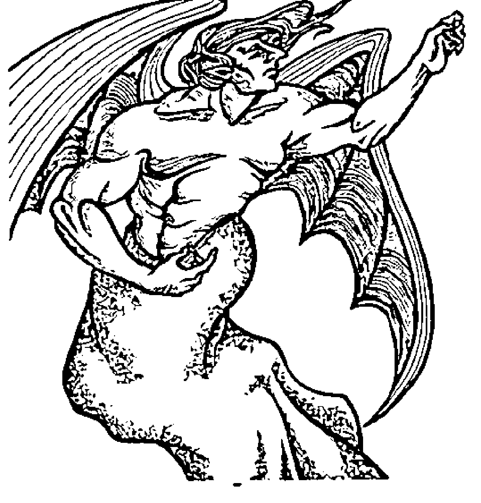

### 恶魔

俄罗斯

蒙托夫的恶魔 Demon〈Lermontov〉

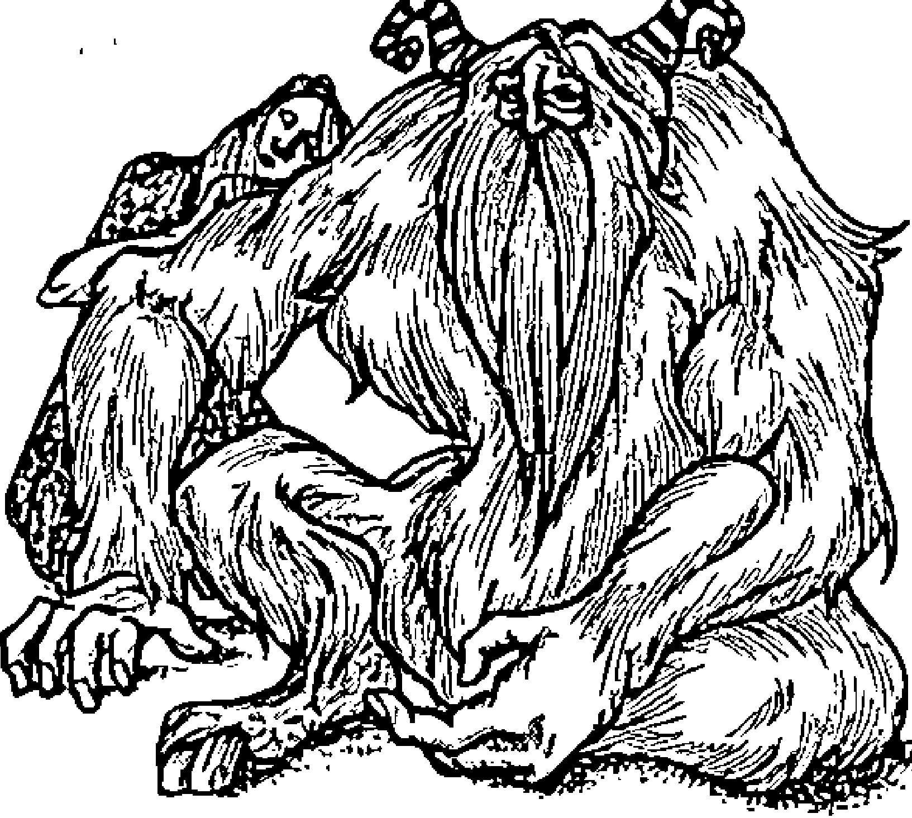

### 恶魔的化身

奥地利

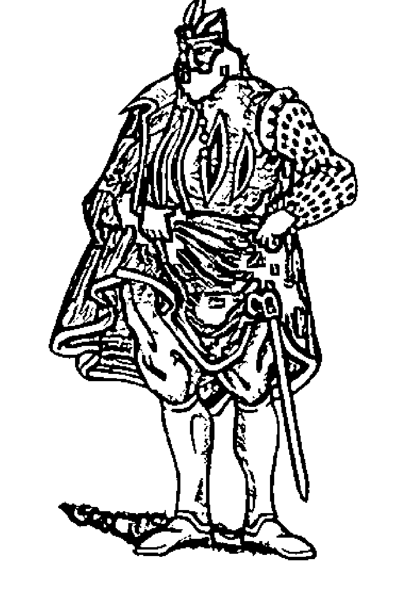

#### 达奴卡（Dhenuka）

体型庞大的罗刹婆（Rashasa），有着驴子的外貌。罗刹婆是印度神话中的鬼神，也就是佛教中的“罗刹（Rashasa）。达奴卡住在迦梨女神（Kali）的森林。人们都很惧怕，丝毫不敢靠近森林。听闻此事的英雄神黑天（Krsna，或Krishna）就与兄长巴拉拉马（Balamara）同行，准备讨伐达奴卡。在一阵激战之后，达奴卡被兄弟俩给消灭了。在其他传说中，黑天跟兄长巴拉拉马，跟牧童们一起看守牛群，此时有一位阿修罗（Asura 或 Ashura）变成公牛的模样混入牛群中。黑天跟巴拉拉马视破那只公牛是由阿修罗所变，就把他给杀死了。

#### 波兰的恶魔（Diabel）

波兰的民间故事或口传文学中与恶魔相关的非常多。有人做过统计，将波兰的民间故事以主题类别来分类，当中最多的一类就是恶魔的故事。波兰的恶魔们与其他基督宗教的国度中述说的恶魔一样，在地狱里惩罚罪人，或者与人们交易想要获取他们的灵魂。但是比起他国的恶魔，波兰的恶魔多了点人情味，十分绅士且充满正义感。他们严守商业道德，在与人作灵魂的交易时，绝对会信守自己所做的承诺（相反的充满奸诈的波兰百姓却经常会打破自己的诺言）。例如在赌上灵魂的扑克牌戏中，结果被人类耍了老千，最后只好眼睁睁地看着到手的灵魂离开地狱，上了天堂等等之类的故事可说是屡见不鲜。

不过就算经常被人类骗，恶魔们还是不会怨恨全体人类，只憎恨着那些做坏事的人们。有个故事是这样的：城市的恶魔与乡下的恶魔两人一起到城市中某法庭里要抓一个作伪证的贵族。正当抓到他，拔掉了他的舌头时，舌头自己跳了起来，并且叫着“我专作伪证！我专作伪证！”。看到这副光景，两个恶魔叹口气说：“这种无赖连恶魔也受不了啊！”

#### 迪里艾尔（Ditiel）

仿照启示文学《以诺书》写成的《伪以诺书》目录中有列出其名。和可弥尔（Chomiel）相同，都是“北方君王”戴蒙瑞（Demoriel）的臣子，爵位则是公爵。在17世纪的魔法书《雷蒙盖顿》中，记载于第1部《哥耶提雅》目录中的72名恶魔，一般称为“所罗门的恶魔”，其中有许多与《伪以诺书》中列出的恶魔名称重复，但是像加斯伯禄（Caspier）或是卡穆尔（Camuel）这般有着类似天使之名的《伪以诺书》恶魔，《雷蒙盖顿》里几乎没有收录。迪里艾尔也是其中之一。而像迪里艾尔这般名字充满天使气氛的《伪以诺书》恶魔，有许多也被记载在15世纪德国圣职者兼秘法家崔勒缪司所著的《秘密法术》目录之中，其中当然也收录了迪里艾尔之名。被收录于《秘密法术》中的北方支配者戴蒙瑞，拥有众多下属，公爵迪里艾尔也是其中一人，但是比起同样侍奉戴蒙瑞的可弥尔相比，迪里艾尔的地位恐怕略逊一筹。

#### 罗刹娑（罗刹） 印度

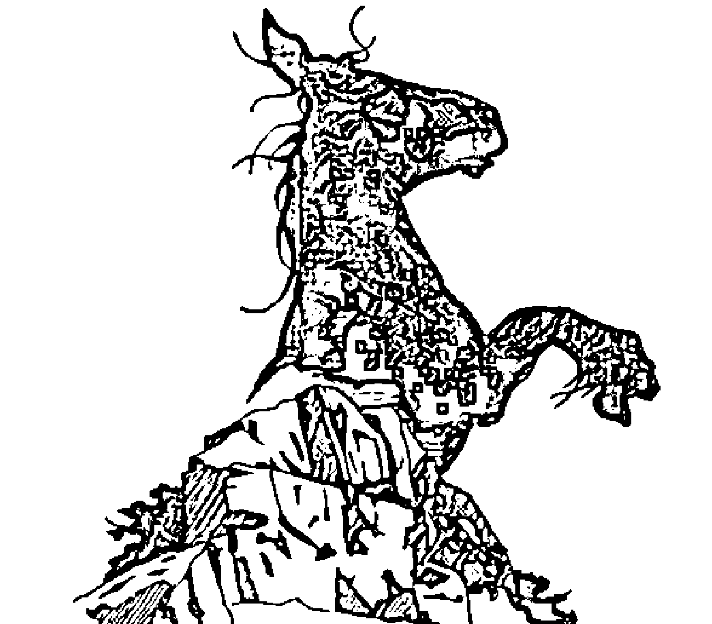

#### 恶魔 波兰

于是就离开了。
(→波兰的路西法 Lucifer<Poland>)

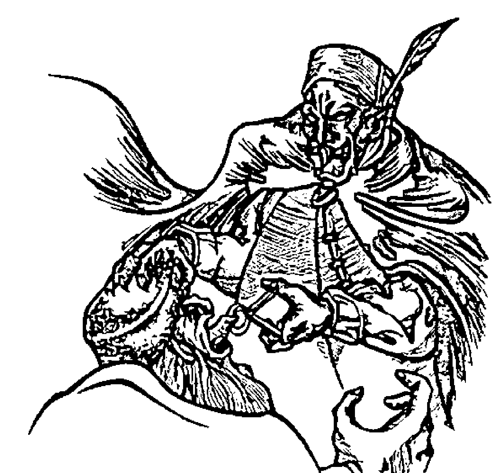

#### 恶魔 伪以诺书

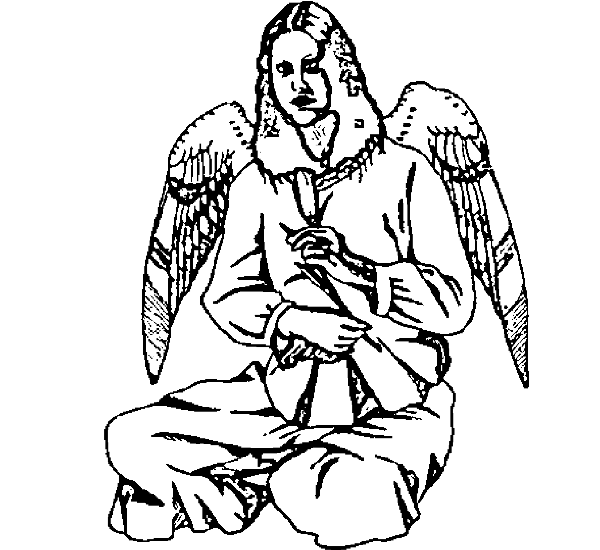

#### 地狱王

《神曲》中出现，硕大无朋的恶魔之王。又名“※狄斯”(Dis)或“※地帝”(Dite)，也称作“※路西勿罗”(Luccifero)。相当于基督宗教中大逆不道的堕落天使撒旦，《神曲》中将其等同于别西卜(Beelzebub)。(→撒旦Satan<中世纪欧洲>、别西卜Beelzebub<希伯来>)。

地狱王位在地狱最下层，第9圈第4沟的“犹大环”(Giudewcca)中，自胸以下呈立姿封于冰中。过去曾为伟大天使的地狱王，因反抗神而被逐出天国，在地上到地心间撞出大洞，并维持堕落时的姿势冰封地狱深处。惩罚人类亡魂的地狱便是依地狱王堕落时所生之洞而造。

地狱王有三个面孔，右面白而带黄、左面黝黑、中央的脸火红。三张口中各别咬住出卖耶稣基督的犹大、刺杀西泽的柏吕笃(Bruto)与卡西何(Cassio)，以牙齿给予惩罚。每张面孔以下生了一对如蝙蝠般的大翅膀；似乎是他以往曾为六翼炽天使(Seraphim) ¹⁰²的残证。
(→卑鄙的天使Caitiff Choir Of Angels、黑天使Nelo Angelo)

#### 一千零一夜的镇尼（Djinn）们

伊斯兰教与犹太教及基督宗教均有渊源，因此伊斯兰文化圈中，也有类似犹太教和基督宗教文化圈的恶魔，以及许多与恶魔有关的民间故事。然而伊斯兰文化圈的故事集《一千零一夜》(Arabian Nights)之中，却几乎没有恶魔登场。威胁无辜的商人、背叛神的使者所罗门王，并将其绑在铁柱上凌虐，依据魔法契约而现身等各式恶灵，全都是镇尼(Djinn)。为什么《一千零一夜》中都没有恶魔出场呢？

镇尼是阿拉伯原生的妖怪，在伊斯兰教出现的

同时，邪恶的镇尼便与恶魔的形象混淆。这种混淆的情况一直持续至今。因此，即使是内容相似的民间故事，却经常出现下列的情况：如果故事的气氛偏宗教，或是与预言者有关，出现的便是恶魔；如果故事的气氛偏世俗，或是与古代阿拉伯有关，便换成镇尼出场。

另一种传说则是在民间故事中，固执的法律学者唤来的通常是恶魔，如果是老婆婆或为人妻者唤来的通常是镇尼。因此由美丽的王妃向国王娓娓道来的《一千零一夜》，可以说是由镇尼取代了所有恶

#### 达其惹索

这是在意大利诗人但丁的叙事诗——《神曲》(1307~21年创作)这部作品中登场的恶魔。神曲三部作中的第一部<地狱篇>中第21篇与第22篇中描写到的地狱第8圈第5沟的狱吏，专门惩罚生前贪污或诈欺的死者的恶魔集团“※马纳勃郎西(Malebranche)”十二恶魔中的一人。

他的名字有“残忍的龙”或“堕落的龙”的含意。的确，“马纳勃郎西”们凶暴但欠缺知性，与其说是堕落的天使，感觉更像是地狱的妖魔。圣经中龙是恶魔的象征，因此由这点来看，相信作者是将

这些“马纳勃郎西”视为恶魔的。(→马纳果达Malacoda)

达其惹索在地狱里并没有什么了不起的工作。文中他顶多是将罪人那伐拉的强波洛，从沥青(天然柏油)的池子里拉上来的时候，与他的同事西里阿多(Ciriatto)或利比谷谷(Libicocco)一起割裂罪人的肉。而且比起西里阿多用强大的利牙来撕裂罪人背部，达其惹索只会消极地用爪子刮伤罪人小腿而已。

#### 地狱之王 神曲

102 译注: 天使分为“炽天使”(Seraphim)“智天使”(Cherubim)“座天使”(Ofanims)“主天使”(Dominons)“力天使”(Virtues)“能天使”(Powers)“权天使”(Principalities)“大天使”(Archangels)“天使”(Angels)九等之分法乃日本对天使位阶之汉字翻译，很多书亦常引用。Seraphim于和合版圣经中做“撒拉弗”乃身具六翼之天使（参见以赛亚书6:2）。

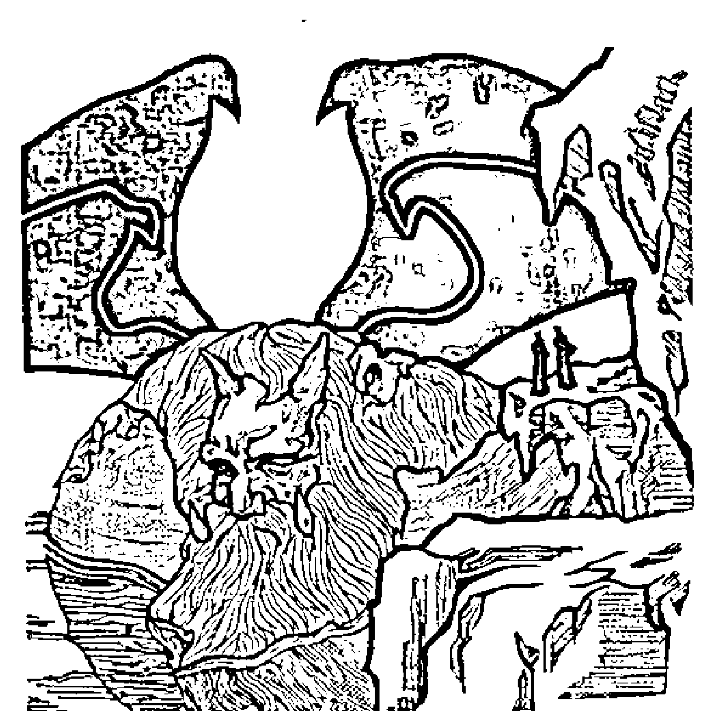

#### 恶灵 伊斯兰教

魔的角色吧。（→易卜劣厮 Iblis）

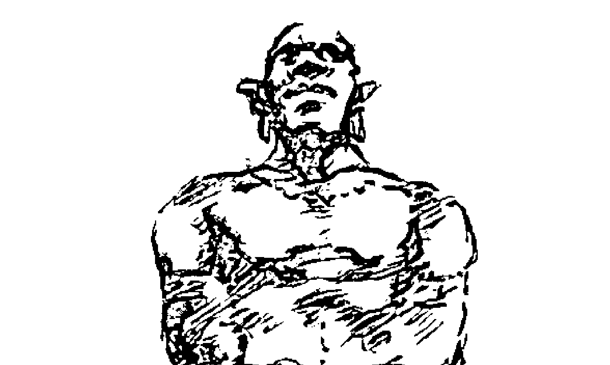

#### 恶魔·地狱的魔鬼 神曲

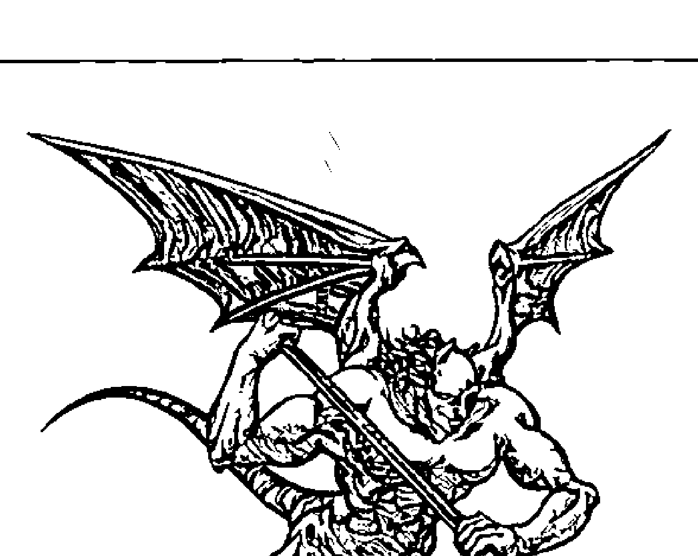

#### 突迦 103

突迦乃湿婆(Siva或Shiva)之妾“提毗104”(Devi) 众多别名的其中一个，或说是多个化身中的一个。此名字原本是一个欲打倒诸神征服世界的恶魔之名。湿婆之妻决心要打倒该恶魔，击退恶魔的军团，并且一一打倒化身成水牛或大象等多种变化的突迦，最后终于获得胜利，消灭了恶魔。为了纪念，她称在与恶魔作战时的自己为突迦。女神突迦有一千只手，通常画成十只手来表现。各自拿着枪、矛、剑等武器，且拿着武器的手上还有锐利钩爪。而如果敌人数目众多，她也可从头发创造分身来应对。于是，突迦为了诸神而战获胜，吃下恶魔的肉来庆祝胜利。这个名字与象征了性与破坏的迦梨女神(Kali)名字一样，表现出湿婆之妾恐怖的一面。

#### 艾奇德娜

上半身美女，下半身为蛇的怪物。艾奇德娜一词即有“蛇”之意。她的来历众说纷纭，一种传说为大海老人福耳库司 (Phorkys) 与刻托 (Ceto) 之女；一种传说为克律萨俄耳 (Chrysaor, 波赛冬与美杜莎【Medusa】之子) 与卡利罗厄 (Kallirrhoe、Callirrhoe (这是英文)，俄刻阿诺斯【Okeanos、Oceanus】同忒修斯【Tethys】之女) 所生；一种传说为地狱之神塔耳塔罗斯 (Tartaros, Tartarus) 105 之女；或说为冥河女神斯梯克斯 (Styx) 所生。此外，她的住处也无定论，或说居于伯罗奔尼撒半岛 (Peloponnesus) 106；或说是基利西亚 (Kilikia)。她与泰风 (Typhoeus、Typhon、Typhaon，塔耳塔罗斯之子) 生下盖美拉 (Chimaira、Chimaera)、地狱看门狗地狱犬 (Kerberos、Cerberus)、水蛇海德拉 (Hydra)、犬怪俄耳托斯 (Orthros)。而她又与俄耳托斯生下斯芬克斯 (S p h i n x )、涅墨亚狮 (NemeanLion)、库罗迈米恩 (Krommyon) 的母猪等怪物。其他尚有看守黄金苹果的巨龙拉冬 (Ladon)、守卫科尔奇斯 (Colchis) 金羊的龙、啄食普罗米修斯 (Prometheus) 肝脏的鹫鹰都是艾奇德娜的子嗣。

#### 埃提姆

巴比伦神话中，在地狱阿普斯 (Apsu) 与地上世界中夹着一地底世界，名叫“有去无回的国度”。该处是以七重门扉封锁的死者国度，即便是神明，只要进入了便无法回来。统治那里的乃是“死亡女主人”埃蕾什基伽儿(Ereshkigal)。在这个黑暗国度中住着埃提姆（死者的灵魂），外形如鸟，生有翅膀，不停胡乱徘徊。一则神话中如此记述了这个国度：

> “室内满布灰尘 活着的君王与僧侣 活着的术士与预言者 甚至连活着的伟大众神 全被驱至此地狱 以幽暗为滋养 以泥浆为食”

这个国度唯一欢迎的唯有埃提姆。只有他们能获得床铺与新鲜饮水。此国度中，有如“金古 (Kingu) 一类的冥神于其中度日。

#### 恶魔 印度

103 译注：“突迦”的意思是难以靠近，因此也译作“难近母”。
104 译注：湿婆之妻拥有两种截然不同的样貌，性情温和柔顺时，称作优摩（意思是“光明者”）或波哩婆提（Parvati，意为“岱山者”），而性格暴戾时则以突迦、迦梨女神（Kali，意为“黑肤者”）为代表。

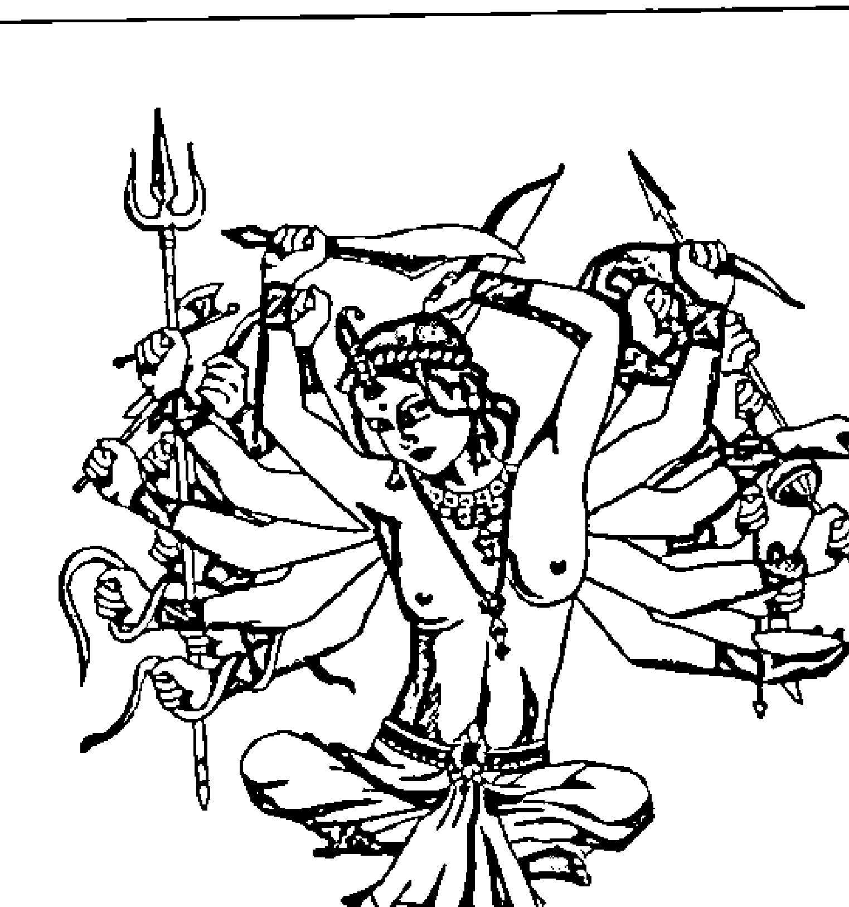

#### 怪物之母 希腊

她偷走赫拉克勒斯（Herakles、Heracles）之马，与前来取马的英雄生下斯库忒斯（Skythes，斯库提亚族【Skythai】之祖先）以及革洛诺斯（Gelonos，革洛诺斯族之祖）。
最后在睡眠时被百眼巨人阿古士（Argos、Argus）抓住杀害。
（→拉弥亚 Lamia）

105 译注：亦指地狱。
106 译注：希腊南部的半岛，或作“Peloponnesos”。

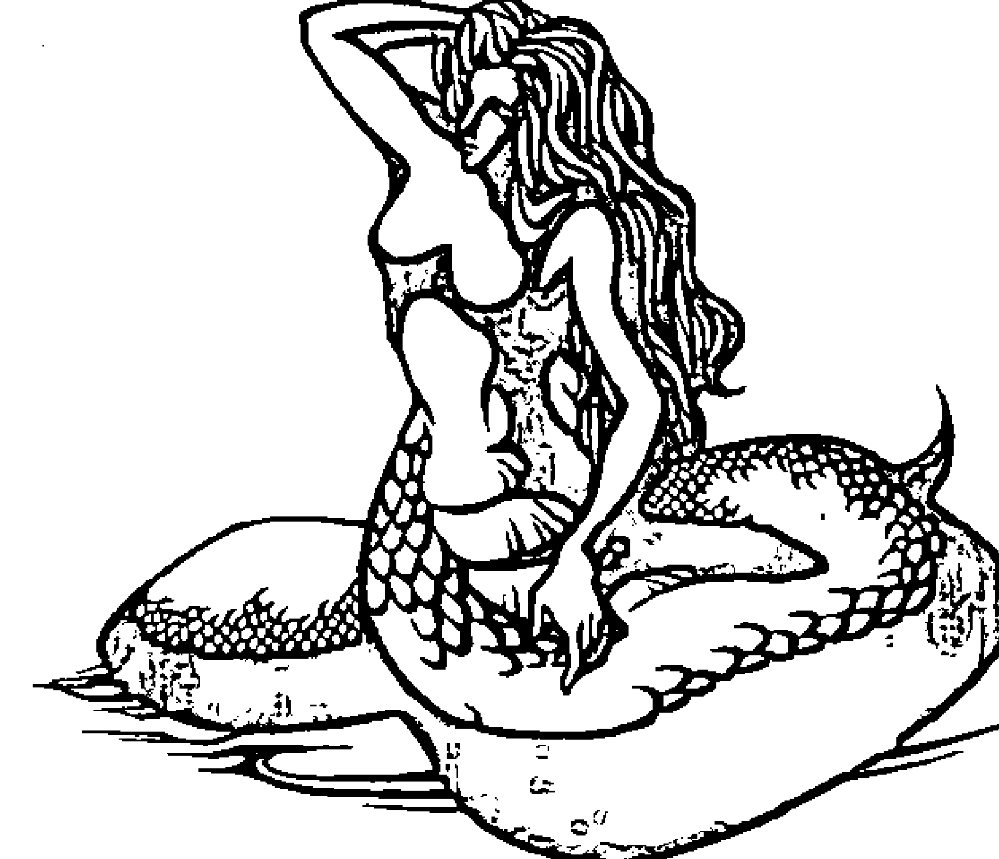

#### 亡灵 巴比伦

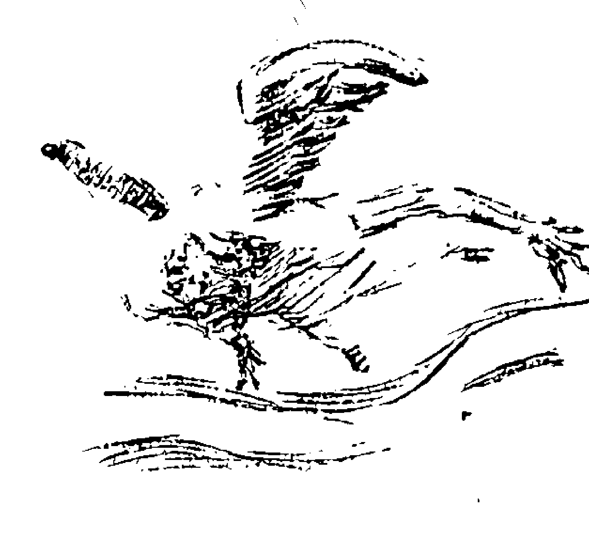

#### 埃力格（Eligor）

17世纪魔法书《雷蒙盖顿》（Lemegeton，又名TheLesser Key ofSolomon）书中第一部《哥耶提雅》所记载的72名恶魔之一。

以骑士之姿限于召唤者面前，所以也被认为和同样以骑士姿态出现的“※亚必戈“（Abigor）为同一位恶魔。许多恶魔学者将亚必戈解释为埃力格的别名。

埃力格现身时为一手持长枪与王旗的扛旗骑士，能告诉召唤者财宝隐藏之处。另外，据说能予人快乐的恋爱及勇敢的战斗。多半将埃力格解释为能给予预见未来之力，或带给人类军事帮助的恶魔。后者应当是从他的骑士形象联想而来的属性。

19世纪法国作家柯林·德·普朗西的作品《地狱辞典》中，以“亚必戈”之名介绍他，说他是地狱大公爵，为60个军团的指挥官。或许是因为他传说中的姿态全无恶魔的感觉，所以《地狱辞典》的插画家M.L.布尔顿在亚必戈的坐骑身上加绘了巨大蝠翼，增添邪恶之感。

#### 埃拉帝穆（Eratemuu）

西太平洋帛琉的贾拉左玛地方流传的有翼恶神。

相传在贾拉左玛的秃山上住有恶神，会自空降下掳人而食。
人们因心怀恐惧而逃到名叫霍鲁雷伊的村庄。可是有一名老婆婆因来不及逃走而被留了下来。老婆婆只好躲入山洞食芋维生，不久后生下两兄弟。两人长大成人后建了自己的家。并在自家屋顶上用一种名叫图贝黑鲁的红树树枝作了陷阱，接着在家中生起火。

于是埃拉帝穆便停到屋顶上，结果立刻触发了陷阱而不得动弹，最后为两兄弟所杀。

两兄弟取下埃拉帝穆的气囊（佐拉布库鲁）打算把事情的经过传播出去，便命气囊去霍鲁雷伊传达恶神被消灭之事。当霍鲁雷伊的村人捡到气囊，就对它问道：“是鱼的气囊吗？”气囊没有回答。问道：“你是野兽的气囊吗？”气囊也没有回答。最后问道：“是恶神的气囊吗？”当时，气囊便沉入水中变为石头。
（→布烈其Bururekki、姆尔阿兹库尔Muruadurukuuru、姆尔阿兹·恩黑阳家尔）

#### 埃蕾什基伽儿（Breshkigal）

苏美神话中，在流过大地的甜水底下，有块满是干燥砂尘的土地，名叫“有去无回的土地”（库尔·努·吉，kur-nu-gi-a），埃蕾什基伽儿就是支配该处的“死亡女主人”。

她是“天之女主人”伊南娜（Inanna）的姐妹；与光明的伊南娜相反，拥有黑暗性质。埃蕾什基伽儿于巴比伦神话中为奈尔伽耳（Nergal）之妻；地底恶魔“※伽拉”（Galla）为其部下。埃蕾什基伽儿与伊南娜敌对，而伊南娜因想展现自身权威故造访姐姐所支配之土地；但反遭杀害被赤身裸体吊于木桩上。

后伊南娜虽获水神恩基（Enki）之助，吃下“生命之食”与“生命之水”复活；但众伽拉仍对伊南娜纠缠不休，要她寻得替代者方能离开。
伊南娜因发现丈夫植物神杜姆兹（Dumuzi）对自己之死毫不在意，正在游宴寻乐，一怒之下就将丈夫作为自己替身送入库尔·努·吉。杜姆兹虽竭力逃匿，最终还是被送入地府。
（→埃提姆Edimmu）

##### 恶魔·所罗门的恶魔 雷蒙盖顿

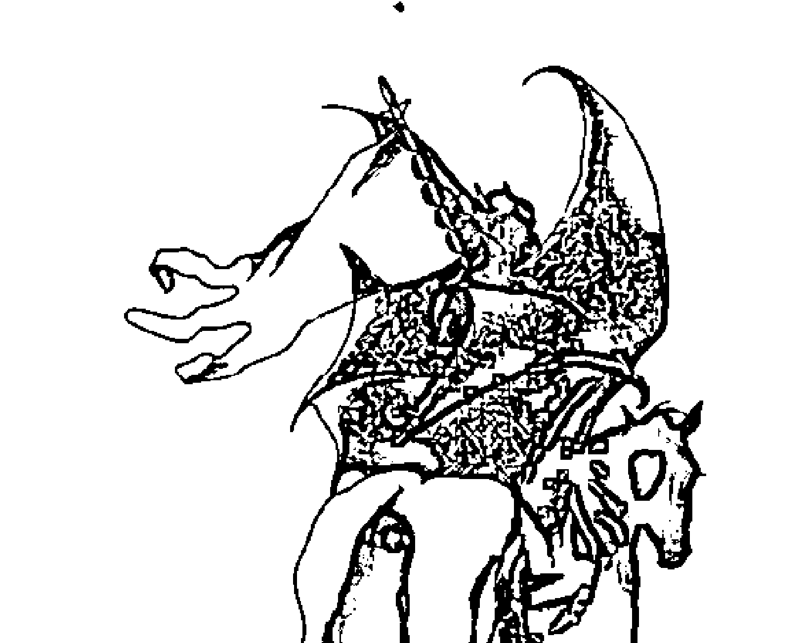

#### 恶神 昂琉

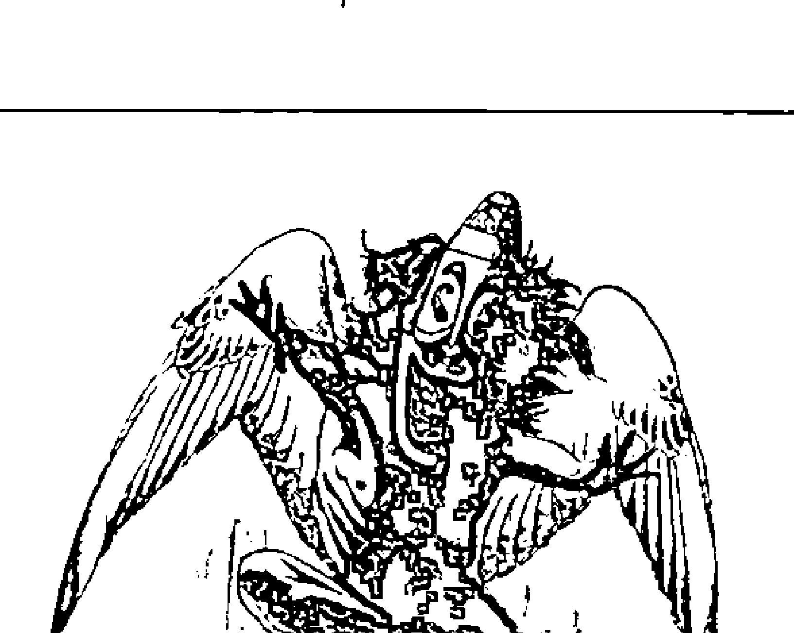

#### 死亡女主人 苏美、巴比伦

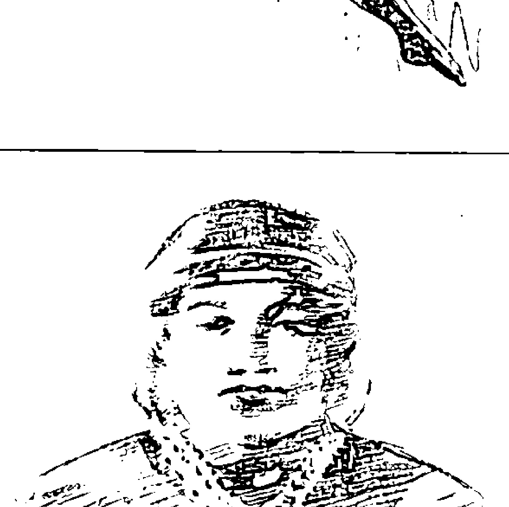

#### 复仇女神

报仇的女神。等同于罗马神话的“※复仇女神”（Furiae）。因由“※阿勒克托”（Alekto）、“※麦格拉”（Megaira）、“※提西福涅”（Tisiphone）三人组成，故而也用复数形“※厄里倪厄斯”（Erinyes）称呼他。顺便一提，三人姓名意义分别为“无休无止者”、“怀恨者”、“血仇复仇者”。为针对杀害血亲或不法行为的惩罚者。背生双翼，头发为蛇，手持火把追赶罪人，使其发狂。

因她们为颇不吉利之神，故多以“※欧美妮德斯”（Eumenides，善意之人）或“※赛姆妮西”（SemnaiTheai，严峻的女神们）等委婉表现称之。她们平时居于塔耳塔罗斯（Tartaros、Tartarus），责罚犯下永恒罪孽的人或神。美锡尼（Mykenai、Mynekai）王妃克莉坦娜丝查（Klytaim (n) estra、Clytem (n) estra）杀害丈夫阿葛曼农（Agamemnon）。两人的儿子奥瑞斯特（Orestes）于是杀母以报父仇。此时复仇女神现身开始追赶奥瑞斯特。即使太阳神阿波罗（Apollon、Apollo）为奥瑞斯特脱罪，将他庇护于圣地特尔斐（Delphoi），复仇女神依旧不放过他。最后经由雅典

#### 埃利刻

西伯利亚神话中的恶灵，为最初的人类，也是死者之王。鞑靼人（土耳其、蒙古系的游牧骑马民族）认为，传说中至高神兀儿该于海中发现一有人脸的土块，将土块注入灵魂后便造出埃利刻。然而埃利刻因过于自大而被放逐至地下，成为死者之王。埃利刻主张：兀儿该虽然管辖“有气息者”，可是死者应归自己所有。由于兀儿该对死者并不在意，便照埃利刻所言办理。但尽管如此，埃利刻同时也是人类始祖。还是第一个开启通往冥界之道的人类，

一切“有气息者”的最终状态——尸体的原形。另外，鞑靼人相信令人不快的湿地也是埃利刻所造成的。当最初的人类被命令从海中带来泥土时，埃利刻偷藏了一部分土于口中。而在土块开始变大化为大地时，埃利刻口中的土壤也开始变大。埃利刻连忙将土吐出，那些泥土则因唾液化成湿地。

#### 发发累罗

这是在意大利诗人但丁的叙事诗——《神曲》（1307～1321年创作）这部作品中登场的恶魔。《神曲》三部作中的第一部〈地狱篇〉中第21篇与第22篇中描写到的地狱第8圈第五沟的狱吏，专门惩罚生前贪污或诈欺的死者的恶魔集团“※马纳勃郎西（Malebranche）”十二恶魔中的一人。名字的意思是“中伤他人者”、“爱说人坏话者”（→马纳果达 Malacoda）。这些马纳勃郎西的任务是监视着罪人们，防止他们从沸腾的沥青池爬上来。一旦有人浮了上来，就

立刻用铁钩将他们钓上来惩罚他们。引导神曲主角但丁的诗人维其略向格拉非冈(Graffiacane)刚钓上来的罪人——也就是那伐拉人强波洛询问沥青池里的情形如何时，暴戾且欠缺思虑的发发累罗立刻想要用钩子刺他，结果被班头的巴巴利却(Barbaricca)给阻止了。这些马纳勃郎西们背上长着状似蝙蝠的翅膀，为了监视罪人，经常在沥青池上盘旋飞舞，就像只静不下来的麻雀一般。因此巴巴利却骂发发累罗为“恶雀子”。

#### 复仇的女神 希腊

娜（Athena、Athene）在亚雷奥帕高斯（AreiosPagos、Areiopagos）法庭的判决，复仇女神才总算离去。 (→横死之神 Ker、鸟身女妖 Harpuia)

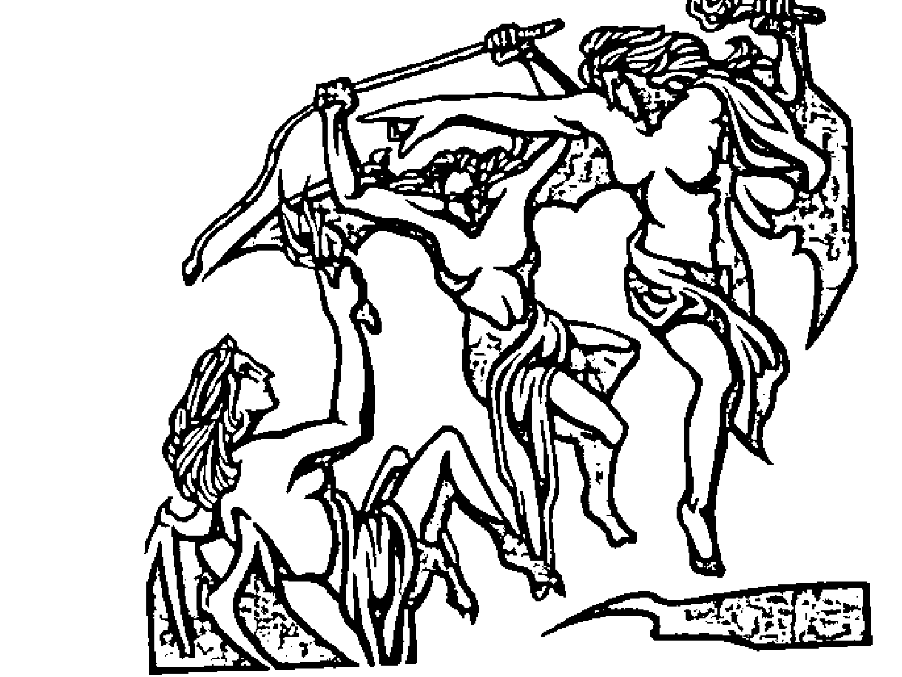

#### 恶灵 西伯利亚

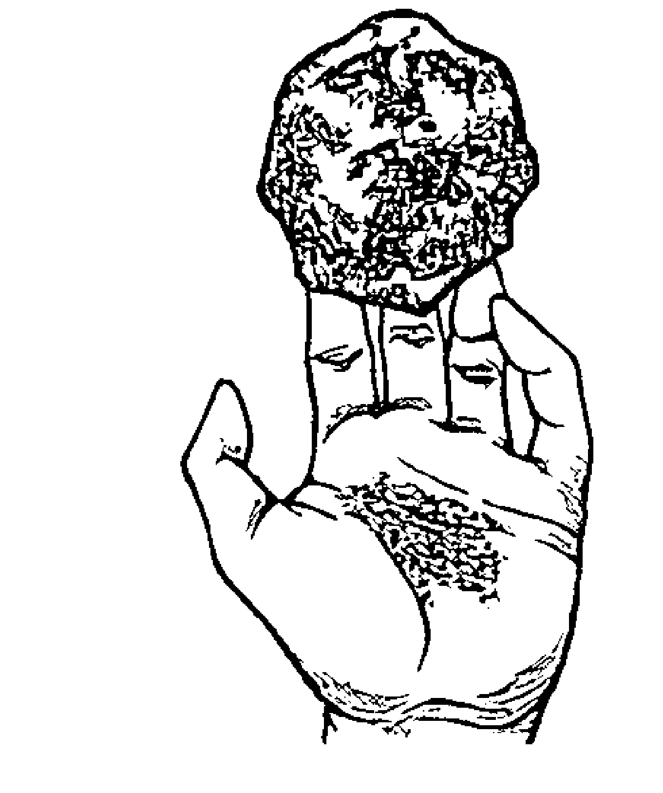

#### 恶魔·地狱的魔鬼 神曲

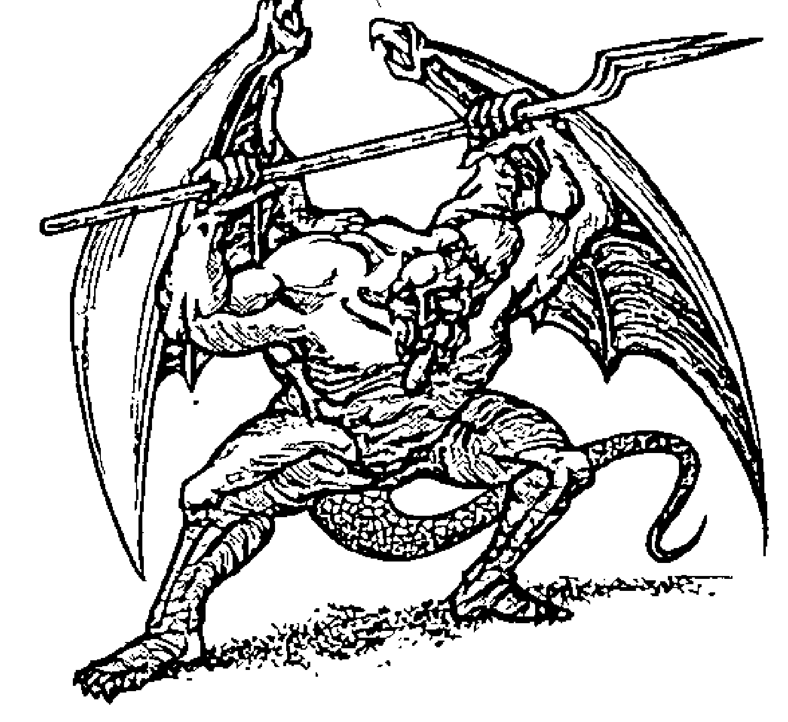

#### 肥遗

他是会带来旱灾的兆，外形是条蛇怪。

据说肥遗藏身在中国西方的太华山山脚下。根据传说，他具有六只脚，两对翅膀，一个头，两个身体。

另一个版本的说法则完全不同，这个版本说肥遗是只黄色的长得像是鹧鸪的鸟，只有嘴的颜色是鲜红色。据说吃了他可以治百病，还能除寄生虫。

至于为何会有差异如此大的两个版本并无定论。或许是原本是毫无关系的两个传说在流传的过程中有所讹误所导致的吧。

不论如何，只要这条蛇出现在人间的话，即刻会干旱连年。

除了肥遗以外，还有另外一只怪物也会引起旱灾的，他的名字叫做“※人面鸮”。

这只怪物外形状似猫头鹰，但是长了人头、犬尾、猴身。据说他一出现的话，也是会立刻带来大旱灾。

中国有关旱灾的传说非常的多，由此可见旱灾在中国是非常可怕的灾害吧。

#### 芬里尔狼

他是北欧神话中导致诸神毁灭的元凶。他的父亲是擅长使奸计的邪神洛基(Loki)，母亲则是女巨人安格尔伯达(Angrboda，意思是“苦命的女人”)，弟弟是大蛇“约尔孟甘德”(Jormungand，意思是大地的带子)，妹妹是阴间的统治者“海尔”(Hel)。

由于父亲是有巨人血统的洛基，母亲则是不折不扣的女巨人，所以在血统上应该算是巨人族，但是他们三兄妹与其说是巨人族，倒不如说他们就是诸神毁灭世界末日的象征。

芬里尔狼似乎拥有高度的知性，例如说在诸神想要用魔法的锁链将他绑起来的这段故事中，我们看到他与诸神的斗智。而另外当知道自己最后终究会毁灭诸神的时候，他又装出对诸神示好的态度。

芬里尔狼的身体一天一天地以令人惊讶的速度茁壮长大，他那快速的成长正暗示着世界毁灭的日子逐日接近。虽然芬里尔狼最后还是被诸神用魔法的锁链给绑住，但是在诸神与巨人族的最终战争时，他挣脱开来，重获自由，如同预言所说的一般，吞食了诸神之王奥丁(Óðinn)。

(→奥丁 Óðinn (北欧神话))

#### 佛劳洛斯

这是假托所罗门王所写，但实为17世纪时魔法书之《雷蒙盖顿》(Lemegeton，又名 TheLesser Key of Solomon) 的第一部〈哥耶提雅〉中记载的72只恶魔之一。

他与《雷蒙盖顿》中的欧赛(Ose)同样是豹的外形。通常被召唤来与其他魔法师召唤出的恶魔相对抗。根据某些传说，如果召唤他时他出现在魔法阵的三角形外面，这时他所说的全部都是谎话。据说他可以给予召唤者未来的知识，但是他似乎是力量更胜于知识的恶魔，只要召唤者下达命令，他会以火焰烧尽对手。

深受16世纪恶魔学者维尔影响的19世纪法国作家普朗西在他的《地狱辞典》中说他是地狱的大将军，指挥20个军团，除了未来的以外，还能给人过去与现在的知识。另外更强调了他的攻击性，他会呼唤所有的恶魔攻击召唤者的敌对者。该书的插画家M.L.布尔顿将他画成人身、豹头、蛇尾站立的豹，使得他给人更加不祥的印象。

#### 征兆

#### 中国

（图片：img/7eb6bbae1545c5fa0514cf31fbafaa87_110_0.png）

##### 洛基的儿子

#### 北欧

（图片：img/7eb6bbae1545c5fa0514cf31fbafaa87_110_1.png）

#### 恶魔·所罗门的恶魔

##### 雷蒙盖顿

（图片：img/7eb6bbae1545c5fa0514cf31fbafaa87_110_2.png）

#### 佛卡洛

这是假托所罗门王所写，但其实为17世纪魔法书《雷蒙盖顿》（Lemegeton，又名 The Lesser Key of Solomon）的第一部〈哥耶提雅〉中记载的72只恶魔之一。另外以模仿启示文学《以诺书》所作的《伪以诺书》上面也记载有这个恶魔的名字。别名“※佛尔卡洛”（Forcalor）。

他与同书中的另一恶魔威沛（Vepar）的能力有相当多的重复。据说他拥有控制海洋的能力，因此通常召唤他的目的是想让某人溺死，或者让某船沉没。不过不同于外形是人鱼的威沛，他以有翼人或是骑乘狮鹫107（Griffon）的姿态出现在召唤者的面前，外形上与海洋并无太大关联性。

十九世纪法国作家普朗西的书《地狱辞典》中说他是地狱的将军，同时也是30个军团的指挥官。其兴趣是残酷地将人杀了丢人海里，而对于召唤者的命令虽会实行，但却一副十分不悦的表情。并且说他与亚米（Amy）相同，是个期盼能够回到天国的堕天使。

#### 弗摩尔

弗摩尔是在凯尔特神话中，与达那神族对抗的种族。达那神族从爱尔兰来到凯尔特，但是弗摩尔族从远古以前就已经住在这里，面对不断来袭的爱尔兰入侵者，有的降服，有的挺身对抗，但战败后不见其踪影。弗摩尔族是巨人族，或许可以说相当于希腊神话中的泰坦神族（Titan）或北欧神话中的尤弥儿族（Ymir）吧。

弗摩尔这个字的意思原本是“地底”或者是“下级神”。但是在凯尔特神话中，他们并不是神，而是被形容成像恶魔一般的种族。他们拥戴魔眼巴洛尔（Balor）当他们的王，与诸神展开激烈对抗。

达那神族刚来到爱尔兰，战胜菲柏克（Firbolgs）族之后，他们拥戴达那神族与弗摩尔族的混血儿布雷斯（Bres）当他们的王。但是布雷斯的统治并不长久，最后巴洛尔被光神鲁夫打倒之后，弗摩尔族让出了爱尔兰后，最终灭亡了。

（→英帝契 Indich、奥克托力蓝其 Octriallach）

#### 佛拉斯

这是假托所罗门王所写，但实为17世纪时魔法书之《雷蒙盖顿》（Lemegeton，又名 The Lesser Key of Solomon）的第一部〈哥耶提雅〉中记载的72只恶魔之一。别名“※佛卡斯”（Forcas）。

被召唤时，他是以普通老人的姿态而非畸形的怪物姿态出现在召唤者面前。与斯托剌（Stolas）一样，属于《雷蒙盖顿》中常见的学者型恶魔。这类恶魔通常具有矿石学与药草学的知识。另外也说他可以给予召唤者逻辑学与医学的知识。至于其他的能力则是可以让人隐形，不过这在《雷蒙盖顿》的恶魔中并非特别稀奇的能力。

19世纪法国作家普朗西的书《地狱辞典》中是以“佛卡尔”这个名字来介绍，并且说他是地狱的骑士兼大议长，29个军团的指挥者，而在外观上则增加了白发长须的特征。另外在该书中关于他的能力除了医学知识以外，还有占卜、修辞学、让人获得滔滔雄辩的能力等等，增加数个多样化的能力。

#### 恶魔·所罗门的恶魔 雷蒙盖顿·伪以诺书

107 译注：半鹰半狮的怪兽，前半具有老鹰的头、翅膀与爪子，后半则是狮子的身体与尾巴。

（图片：img/7eb6bbae1545c5fa0514cf31fbafaa87_112_0.png）

#### 诸神之敌 凯尔特

（图片：img/7eb6bbae1545c5fa0514cf31fbafaa87_112_1.png）

##### 恶魔·所罗门的恶魔 雷蒙盖顿

（图片：img/7eb6bbae1545c5fa0514cf31fbafaa87_112_2.png）

#### 佛钮司

这是假托所罗门王所写，但实为17世纪时魔法书之《雷蒙盖顿》（Lemegeton，又名 The Lesser Key of Solomon）的第一部〈哥耶提雅〉中记载的72只恶魔之一。

虽然在召唤他出来的时候他是海中怪物的样子，但是也可以依照召唤的魔法师的命令变成人类的姿态。虽然他的样子是海怪，但是能力上却与海洋毫无关联。《雷蒙盖顿》中学者型的恶魔占了不少部分，他也是其中之一。据说可以给召唤者艺术、科学与语言学的知识。

不过会召唤佛钮司出来，其最重要的理由通常是因为他拥有将对召唤者的敌意转变成爱情的能力。

因为 M.L. 布尔顿的插画而变得有名的普朗西的《地狱辞典》中并没有介绍到佛钮司。因为这本书的插画而使得《雷蒙盖顿》或《伪以诺书》中的许多恶魔一举成名，佛钮司很可惜地并没有受到这个恩惠。

#### 浮游

据说他是反叛天帝的水神·共工（Kungkung）的臣子。

在叛军之中，浮游究竟是担当什么职责如今已不可考；只知道在颛顼的时代时，共工造反，他也随之响应，但最终失败之后他自杀身亡。

不过这里有个与他相关的传说。

春秋时代 108 时，晋平公梦见一只红色的熊从屏风后面偷看，之后就得了怪病，一直难以痊愈。于是便请教郑国的贤相子产得病的原因，子产回答说：

“古代共工的大臣浮游随共工起事失败后自杀了。这浮游的相貌是只红熊，爱笑，爱回头看，经常作祟害人。宫廷里见到他则表示统御天下的王者要驾崩了，在大门遇见他则表示近臣有忧难，在庭院里遇见他则平安无事，见到他在屏风后面则可能会因病身亡。请备大礼祭祀颛顼与共工，应该就可免于病灾了。”

于是晋平公按照子产的建言祭拜了之后，果然真的病愈了。

#### 弗尔卡斯

这是假托所罗门王所写，但其实为17世纪魔法书的《雷蒙盖顿》（Lemegeton，又名 The Lesser Key of Solomon）的第一部〈哥耶提雅〉中记载的72只恶魔之一。另外以模仿启示文学《以诺书》所作的《伪以诺书》上面也记载有这个恶魔的名字。

据说召唤他出来时，出现在召唤者面前的一个骑着气色不佳的马，手里拿着枪的老人。虽然性格残忍，但是非常博学。可以授予召唤者哲学、修辞学、逻辑学、天文学、占卜学的知识。

若说到其暗色的马，手持枪，残忍而博学的老人，不由得会让人联想到日耳曼民族的主神奥丁（óðinn）或渥丹 109（Wondan，或 Wotan），气氛非常相近。

十一世纪以后的北欧在基督宗教的渗透下，过去信仰的诸神之王奥丁，其形象也转变成与基督对抗的恶魔。或许在恶魔学的传承过程中，弗尔卡斯的特征受到了北欧的奥丁或是德国的渥丹的影响也说不定。

（→奥丁 óðinn〈改宗后的北欧萨迦〉、奥丁 óðinn〈北欧神话〉）

##### 恶魔·所罗门的恶魔 雷蒙盖顿

（图片：img/7eb6bbae1545c5fa0514cf31fbafaa87_114_0.png）

#### 恶神 中国

（图片：img/7eb6bbae1545c5fa0514cf31fbafaa87_114_1.png）

108 译注：原文为“战国时代”，疑有误，应该是“春秋时代”。

#### 恶魔·所罗门的恶魔 雷蒙盖顿·伪以诺书

（图片：img/7eb6bbae1545c5fa0514cf31fbafaa87_114_2.png）

109 译注：日耳曼传说中的主神，一般将他与奥丁视为同一种。

#### 弗尔弗尔

这是假托所罗门王所写，但实为17世纪时魔法书之《雷蒙盖顿》（Lemegeton，又名 The Lesser Key of Solomon）的第一部《哥耶提雅》中记载的72只恶魔之一。

据说，出现在召唤者面前的是一头长有燃烧中的蛇尾与巨大翅膀的鹿，这样的外形在《雷蒙盖顿》中算是非常稀奇的。

据说他能让夫妇间充满爱情，也能告诉人一些不为人知的秘密。而比较特别的能力是能够呼唤闪电，在《雷蒙盖顿》的72恶魔中拥有与天气相关魔力的只有弗尔弗尔而已。

十九世纪作家普朗西的书《地狱辞典》中说他是会说谎的恶魔，并且有时会以天使姿态出现在召唤者面前，是地狱的伯爵，26个军团的指挥者。插画家 M.L. 布尔顿为该书画了不少世间评价不错的插图，而弗尔弗尔在他笔下则成了长有蝙蝠翅膀的半人半鹿，令人印象深刻。拜此图所赐，弗尔弗尔也因而在现代成了知名度颇高的恶魔。

#### 慨布

假称古以色列王国所罗门王所作之17世纪魔法书《雷蒙盖顿》（Lemegeton，又名 The Lesser Key of Solomon），书中第一部分《哥耶提雅》所记载的72名恶魔之一。也出现于仿启示文学《以诺书》而成的《伪以诺书》目录中。别名“※戈布”（Goap）、“※塔布”。

相传为堕落的能天使。被认为是手握重权的恶魔，现身于人类面前时会有四名王者随侍。另外，在《伪以诺书》内说他与恶魔派蒙（Paimon）同为统领西方之王。他的能力多彩多姿，能司控喜爱与憎恨、通晓未来之事，并能给予召唤者瞬间移动及隐身之力。

19世纪法国作家柯林·德·普朗西所著《地狱辞典》中载以“※塔布”之名，为他多添了地狱大议长与君王的地位，说他与《伪以诺书》恶魔之一的※比雷特（Byleth，贝雷特 Beleth）关系深厚，是同僚，或奉比雷特为主。《地狱辞典》插画家 M.L. 布尔顿在他的肖像画中，把他画成一般人心中最常见的恶魔形象，因此成为知名度最高的恶魔。

#### 加麦基

假称古以色列王国所罗门王所作之17世纪魔法书《雷蒙盖顿》（Lemegeton，又名 The Lesser Key of Solomon），书中第一部分《哥耶提雅》所记载的72名恶魔之一。此恶魔还记载于仿启示文学《以诺书》而成之《伪以诺书》的目录中。别名“※加米基”（Gamigin）。

以小马或小驴的形象出现于召唤者面前。是与亡者关系密切的恶魔，人们会为了与亡灵见面而召唤他。《伪以诺书》中也说他与死者灵魂有关，拥有叫出溺死者灵魂，令其回答问题的能力。

受到16世纪恶魔学家让·维尔影响的19世纪法国作家柯林·德·普朗西所，在著作《地狱辞典》中也同《雷蒙盖顿》与《伪以诺书》一样，介绍时把加麦基的特殊性放在灵媒能力上。《地狱辞典》中还多加了他在完成被命令的工作前，会留滞召唤者身旁的特性。他是地狱大公爵，30个军团的指挥官，该书插画家 M.L. 布尔顿没有为他绘制肖像。

##### 恶魔·所罗门的恶魔 雷蒙盖顿

（图片：img/7eb6bbae1545c5fa0514cf31fbafaa87_116_0.png）

#### 恶魔·所罗门的恶魔 雷蒙盖顿、伪以诺书

（图片：img/7eb6bbae1545c5fa0514cf31fbafaa87_116_1.png）

#### 恶魔·所罗门的恶魔 雷蒙盖顿、伪以诺书

（图片：img/7eb6bbae1545c5fa0514cf31fbafaa87_116_2.png）

#### 伽尼萨 110

在佛教中又被叫做“※圣天”或“※欢喜天”。别名“※伽那婆提”（Ganapati）。

本为印度原住民的灾厄神、瘟神。又有其他传说，说伽尼萨原是※夜乞叉（Yaksa）的丰穰神。只是在被印度神话吸收时变成了湿婆（Siva 或 Shiva）与雪山神女（Parvati）之子，转为智能与艺术的神灵。

伽尼萨像头四臂而仅有一只像牙。他的母亲雪山神女在一次洗浴前曾要伽尼萨负责守卫，不让任何人接近。而伽尼萨就连湿婆也拦阻不误，毫不通融。湿婆因此发火切下伽尼萨的首级。但雪山神女反对湿婆此举大怒，于是湿婆就近寻来大象首级安在伽尼萨项上。此后伽尼萨的头便改为象头。之所以仅有一牙，是因为他与“持斧罗摩”（ParAsura 或 Ashurama）相搏负伤所致。相传伽尼萨在看到罗摩手中之斧时便知该斧为湿婆所赠，于是故意败给罗摩，让一只象牙被打断。

#### 盖得

巫毒教中的死神。又称“※星期日男爵（Baron Samedi）”、“※墓地男爵（Baron Cimetiere）”、“※十字架男爵（Baron La Croix）”。身形娇小的男子，头戴黑色圆顶礼帽，身着黑色燕尾服，站在“永远的十字路口”。永远的十字路口指的是死者前往众神故乡几内（几内亚[1]）的必经之地。

盖得也是诸神中最贤明的神。因此，身为死神的盖得对所有生者之事知之甚详。

盖得是生命的支配者，可自由增加生者，也可让死者复活。此外，恐怖僵尸的生成也需借助盖得之力。

盖得虽是爱神，但盖得之爱，恐怕是大口喝兰姆酒般令人感到猥琐不堪的爱。

他也会闯进其他神明的仪式中，附身于众人身上。此时，尽管是巫毒教的祭司也拿他没辙。

#### 葛拉奇

克苏鲁神话中的邪神之一，从异星飞到新几内亚海岸边小岛的某个湖底。椭圆形的身体上，长满无数金属棘刺，厚唇大口，三个眼睛分别位于嘴巴周围突出的肉棘前端。其长相与其说是邪神，更不如说是怪兽。实际上，葛拉奇带给人的恐惧，比起恶魔，更像是1950年代好莱坞大量制造的B级恐怖片。

葛拉奇利用自己的棘刺创造出不死的怪物当作手下使唤。当他锁定牺牲者后，用心灵感应催眠牺牲者，让他自己前来，接着再用棘刺扎入被害人体内，注入毒液杀害。棘刺留在被害人体内，经过一昼夜成长后自行脱落，一个不死的奴隶便产生了。

不管是不死的奴隶或是梦的牺牲者，操纵的方法都是让被害人做噩梦，再根据契约夺走魂魄，与中世纪的恶魔或男夜魔[12]（Incubus）的手法如出一辙。其原型可说是根据50年代的现实而产生的新式恶魔。

（→奈亚鲁法特 Nyarlathotep）

#### 瘟神 印度

110 译注：或译“象头神”。

（图片：img/7eb6bbae1545c5fa0514cf31fbafaa87_118_0.png）

#### 死神 巫毒

111 译注：现为几内亚共和国，位于西非。

（图片：img/7eb6bbae1545c5fa0514cf31fbafaa87_118_1.png）

#### 邪神 克苏鲁神话

112 译注：或译夜魔，化作美男子侵犯沉睡中的女人，有时会将精液注入女子体内使其怀孕，之后女子所生之子，便成为梦魇的手下。

（图片：img/7eb6bbae1545c5fa0514cf31fbafaa87_118_2.png）

#### 格刺希亚拉波斯

据称为古以色列王国国王所罗门所著，现于17世纪的魔法书《雷蒙盖顿》（又名 The Lesser Key of Solomon）书中第一部分〈哥耶提雅〉中所记载72名恶魔之一。此外，以《以诺书》为蓝本的《伪以诺书》的目录当中，也记载其名。

格刺希亚拉波斯又称 “※卡西莫拉尔”（Cassimolar）、“※古拉夏”（Glasha）、“※古拉奇亚·拉波刺”（Gulakyalabolas）等，拥有许多别称。在所有别名当中，最具知名度的就是 “※卡喀里诺拉斯”（Caarucrinolaas）。格刺希亚拉波斯，以拥有巨大翅膀的犬的姿态出现在召唤者面前。

除了杀害人类的工作之外，格刺希亚拉波斯会将丰富的学问，特别是科学方面的知识传授给召唤者。此外，也具有使人隐身的能力。

19世纪法国作家柯林·德·普朗西所著《地狱辞典》中，以 “※卡喀里诺拉斯”（Caacrinolas）之名刊载于上面。他是地狱司令官，以及36军团的指挥官。在《地狱辞典》当中，被介绍为《雷蒙盖顿》恶魔中的纳贝流士（Naberius）的坐骑。根据画家 M.L. 布尔顿所绘肖像，卡喀里诺拉斯是位知名度较高的恶魔。

#### 格莫瑞

据称为古以色列王国国王所罗门所著，现于17世纪的魔法书《雷蒙盖顿》（又名 The Lesser Key of Solomon）书中第一部分〈哥耶提雅〉中所记载72名恶魔之一。

以骑乘骆驼、头戴黄金冠的美女姿态出现于召唤者的面前，是《雷蒙盖顿》72位恶魔当中，唯一以女性姿态出现者。

她的能力也与女性有关，召唤者为了得到女性的爱而召唤她。其他能力包括知道过去未来、隐藏黄金的地方等没什么个性的能力。

受到16世纪恶魔学家让·维尔的影响，19世纪法国作家柯林·德·普朗西所著《地狱辞典》中，被描述成地狱公爵，头顶戴的王冠被解释成公爵冠，是地狱军团第26团的指挥官。

画家 M.L. 布尔顿的画工优异，恶魔学相关知识却几近空白。画家联想到骆驼去了，而把她绘成充满中东异国情调的女性。结果，格莫瑞变成72人中知名度最高的恶魔。

#### 山本五郎左卫门

支配日本各种来自魔界生物的魔王之一。江户时代（1600-1867年）的妖怪物语《稻生物怪录》最后登场，并说明自己 “在日本称为山本五郎左卫门。不是人类，也不是天狗，而是魔王。” 其中，提到 “在日本” 的名字，在国外的名字则不详。

《稻生物怪录》中，广岛·三次藩的稻生平太郎（后来的武太夫）的宅中，众多妖怪相继出现，并骚扰主角。然而，年轻的当家屋主（当时16岁）对这一切采取毅然决然态度。此种气度受到山本五郎左卫门的青睐，给了主角一枝木槌，并说今后遇到怪事或危机，只要朝北方喊出 “山本五郎左卫门快来” 并以木槌击柱，他就会飞快赶来帮助。

日本的妖怪基本上都有共通之处，具有相当能力的妖怪，对自己欣赏的家伙，都会予以保护。

顺道一提，在《稻生物怪录》中，山本五郎左卫门以普通武士的姿态出现，而在平田神社所藏的图画中，则被描绘成三只眼的鸦天狗。

（→石川恶四郎 Akushirou Ishikawa）

##### 恶魔·所罗门的恶魔 雷蒙盖顿

（图片：img/7eb6bbae1545c5fa0514cf31fbafaa87_120_0.png）

##### 恶魔·所罗门的恶魔 雷蒙盖顿

（图片：img/7eb6bbae1545c5fa0514cf31fbafaa87_120_1.png）

#### 魔王 日本

（图片：img/7eb6bbae1545c5fa0514cf31fbafaa87_120_2.png）

#### 格拉非冈

意大利诗人但丁所作叙事诗《神曲》（1307～1321年作）当中登场的恶魔。《神曲》三部作的第一部（地狱篇）第22篇所描写，地狱第8圈第5沟的狱吏。负责惩罚犯下渎职和诈欺的亡灵，是12个魔鬼所组集团“※马纳勃郎西（Malebranche）”之一。格拉非冈原意为“似犬者”。（→马纳果达 Malacoda）

格拉非冈等魔鬼负责地狱第8圈第5沟的沥青池（asphalt），将亡者推入池中，使之受到沥青灼身之惩罚。然而，在这第8圈中最重的刑罚是，魔鬼集团的爪牙撕裂身体之刑。死者为避免恶魔施暴，将身体隐匿于炙热的沥青池中。格拉非冈在主角但丁的面前，将不经意露出头的罪人用勾子吊起。

受到格拉非冈注意的“那伐拉（位于西班牙东北的国家）男子强波洛”，因为主角详细的描述，注释家[^113]试图找出实际相符的人物，却仍不明。

#### 绿魔女

属于冬之女神贝拉（Beira）子孙的魔女之一。姿态多变，有时如同贝拉老妪，有时又仿佛夏之少女时的贝拉一般年轻美丽。此外，其他人也能够自由变化其姿态。

她们各自居住在安静的场所，如河流、瀑布、绿色的丘陵或是深峻的峡谷。白天难得见其踪迹，晚上即出外四处徘徊欺骗人类。

譬如，在旅人的面前变成其所爱之人，谈了一会儿取得信任后，大声嘲笑而去。又或者，变成野犬追逐羊群使之四散，困扰牧羊人。甚至使人溺于浅滩、诱至断崖绝壁。

绝对不可将所拥有的武器名称告诉她们，一不小心说了出来，她们就会用魔法变作无用之物。只要记得这一点，就可以顺利捉到绿魔女，使之实现愿望。但是，被强迫工作的魔女，之后绝对会来复仇。其中不乏善良的魔女。

#### 格兰戴尔

七世纪盎格鲁-撒克逊的叙事诗《贝奥武夫》（Beowulf）里登场的怪物名称。个性残暴冷酷，经常徘徊在国境、荒野、沼地以及城堡周围，令人感到毛骨悚然。

居住在丹麦湖畔，每晚化作人类潜入胡鲁斯加王城内，逐一捕食其仆人家臣。最后，国王因为恐惧，弃城而逃。

此时，瑞典的英雄贝奥武夫向国王提出除去怪物的要求，前往废弃的城堡。正当贝奥武夫小憩之时，格兰戴尔突然现身。贝奥武夫连拔剑的时间都没有，与怪物扭打成一团，并扯下对方的右手腕。国王和众臣看到怪物逃出城外，便又安心地回到城中。隔夜，格兰戴尔的母亲愤怒地前来复仇。其母比格兰戴尔更恐怖百倍，却被贝奥武夫的剑打败。之后，贝奥武夫前往格兰戴尔水中的房间，割下怪物的首级带回城内。为了搬运怪物的尸体，必须召集四位男性才得以搬动。

（→奥丁 Óðinn〈北欧神话〉）

#### 恶魔·地狱的魔鬼 神曲

113 译注：指注释神曲的人。

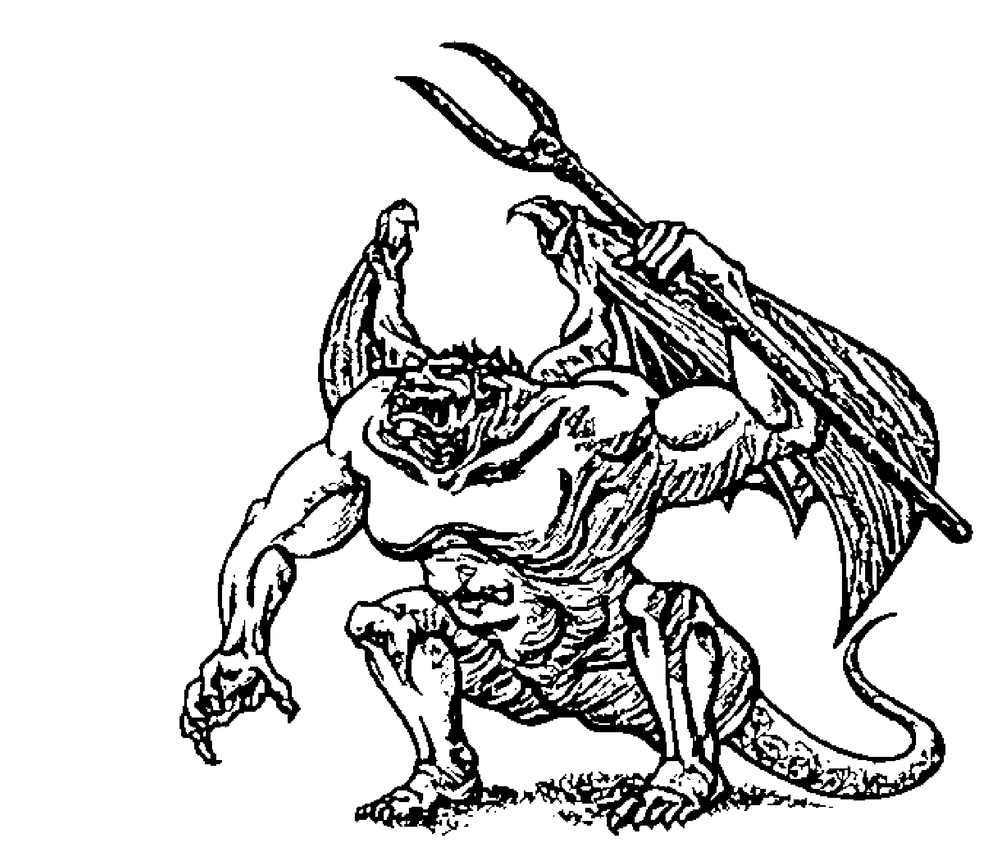

#### 魔女 苏格兰

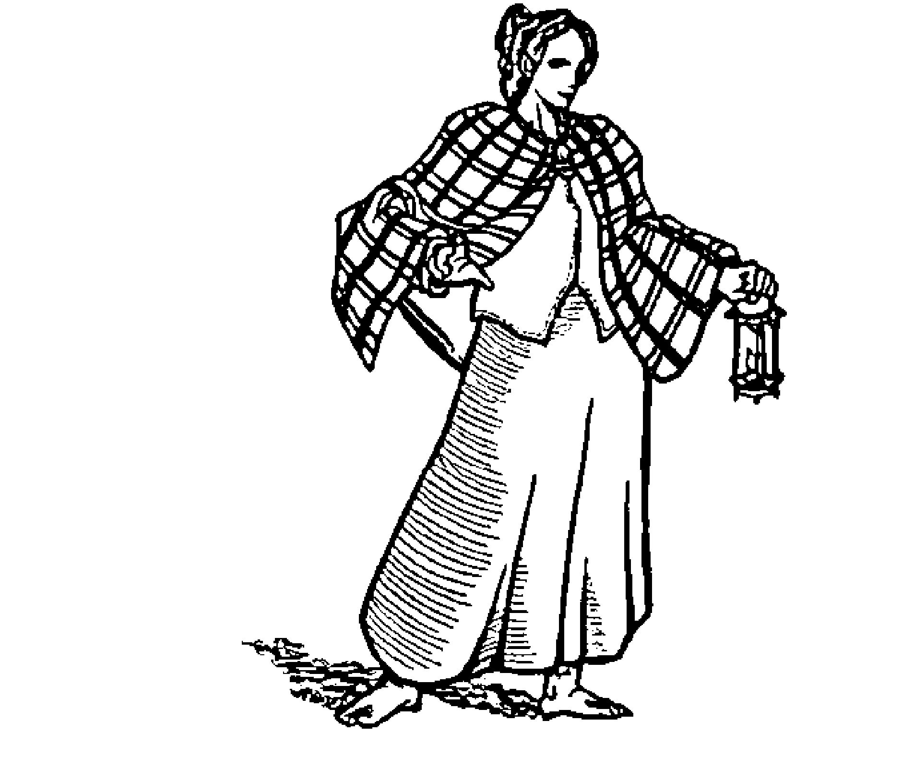

#### 怪物 日耳曼

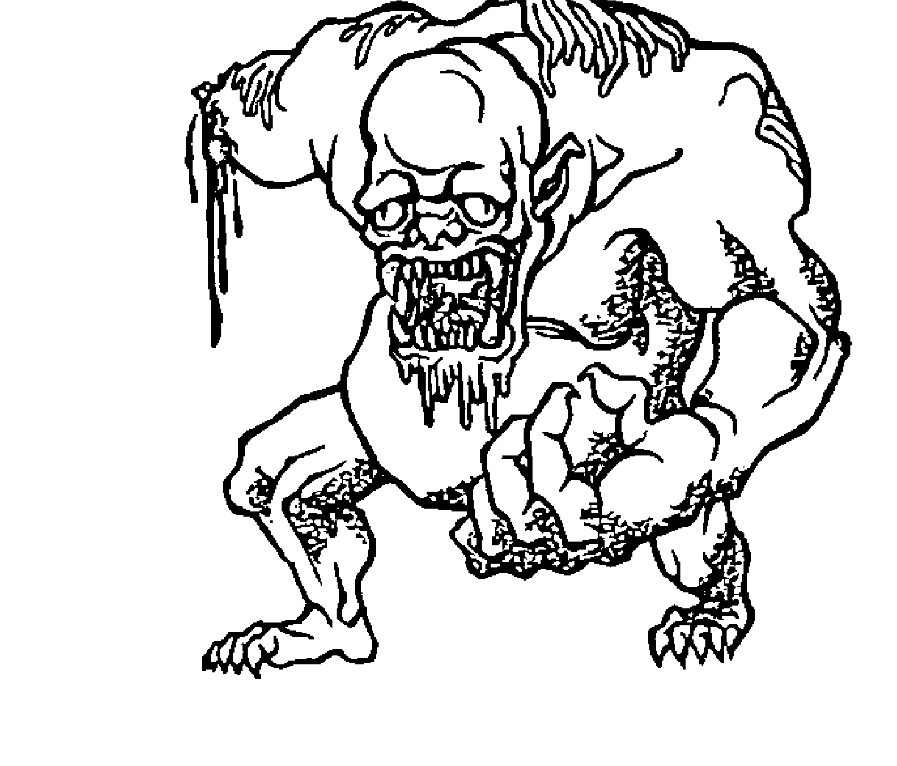

#### 古辛

据称为古以色列王国国王所罗门所著，现于17世纪的魔法书《雷蒙盖顿》(The Lesser Key of Solomon)书中第一部分《哥耶提雅》中所记载72名恶魔之一。又名“※哥赛因”(Gusayn)或“※哥所因”(Gusoyn)。
他为外形不明，于召唤者前所采用的相貌也不明的恶魔之一。能力为通晓古今及未来、对其召唤者有问必答。这点在《雷蒙盖顿》所记载的众多恶魔当中是极为普通的能力，没有必要加以着墨。古辛个人特有的能力是将别人对魔术师抱持的敌意转成善意。
受到16世纪恶魔学家让·维尔的影响，19世纪法国作家柯林·德·普朗西所著《地狱辞典》中，《雷蒙盖顿》所记载之恶魔，有许多都以自己的见解加以解释，再由画家M.L.布尔顿绘其肖像。然而形态、能力都不突出的古辛，即使位列所罗门72恶魔之一，在《地狱辞典》中却漏载。是知名度较低的恶魔之一。

#### 哈艮地

这是假托所罗门王所写，但实为17世纪时魔法书之《雷蒙盖顿》(Lemegeton，又名The Lesser Key of Solomon)的第一部《哥耶提雅》中记载的72只恶魔之一。别名“※海艮地”(Haagenti)“※哈格尼特”(Hagenti)。
他的外形与能力跟同书中记载的另一个恶魔撒共(Zagan)可以说毫无两样，同样都是以长着翅膀的牡牛的姿态出现在召唤者面前。同样是在影射以牛为象征的四福音书作者之一的圣路加^14。在能力上也跟撒共相同，可以将水变成葡萄酒，将葡萄酒变回水，也能将普通的金属变成黄金。
深受16世纪恶魔学者维尔影响的19世纪法国作家普朗西在他的《地狱辞典》中将这只恶魔写作“海艮地”，并且还帮他加上新的能力。如果召唤而来的是以人头而不是牛头的样子出现的话，甚至还能给召唤者万能之力。据说哈艮地是地狱的议长，统领33个军团。
只不过该书的插画家布尔顿并没有帮他画插画，因此在现在知名度是比较低的。

#### 哈帕斯

这是假托所罗门王所写，但实为17世纪时魔法书之《雷蒙盖顿》(Lemegeton，又名The Lesser Key of Solomon)的第一部《哥耶提雅》中记载的72只恶魔之一。别名是“※哈法斯(Haliphor)”。
据说他是以鸽子的样子出现在召唤者的面前，但是他的性格十分好战，与战争之间有很深的关联性。
16世纪英国的学者雷吉那勒德·史高特在他的著作中介绍了哈帕斯，说他是个营建要塞城市的恶魔，但是这其实是经常会跟哈帕斯混淆，在《雷蒙盖顿》中也有介绍的恶魔玛帕斯(Malpas)的能力。另外也有人认为他的样子是鹤鸟，这种说法与雷吉那勒德对沙克斯(Shax)的解释相近。
作家普朗西的书《地狱辞典》中是以哈法斯(Haliphor)这个名字来介绍这只恶魔，他采用了其外形是鹤鸟的说法，并且说他是会引起战争的恶魔，不过同样也是与玛法斯混淆，也说他是建设都市的恶魔。普朗西似乎将哈法斯与玛法斯之间的关系搞混了的样子，《地狱辞典》中将这两只恶魔视为同一只。

##### 恶魔·所罗门的恶魔 雷蒙盖顿

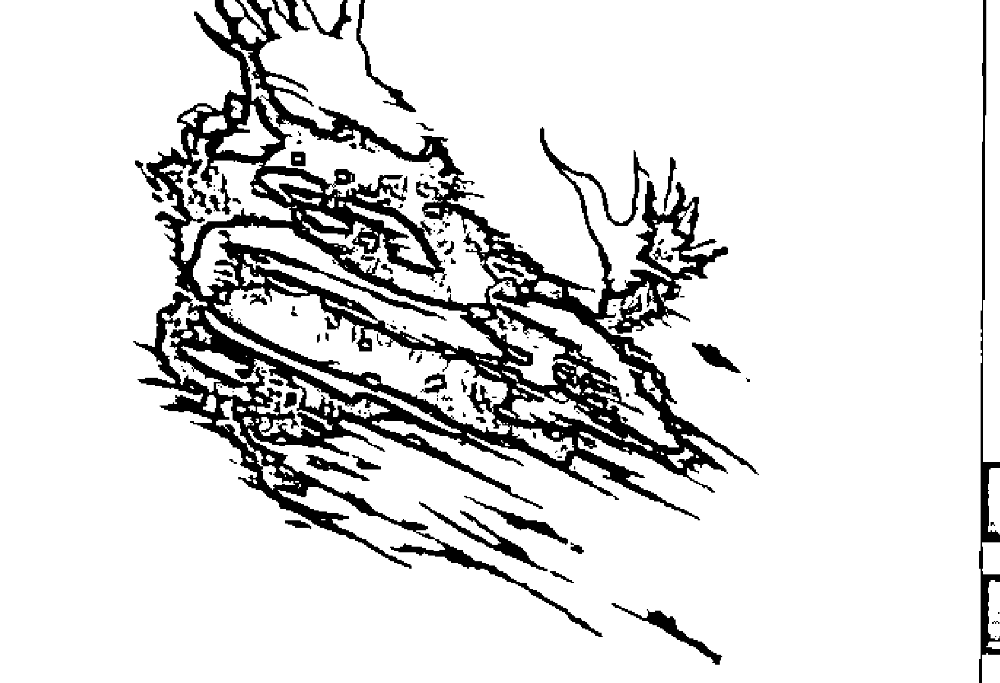

##### 恶魔·所罗门的恶魔 雷蒙盖顿

> > 114 译注：有翼牛为路加代表；圣马可代表为有翼雄狮。此处原文有误。

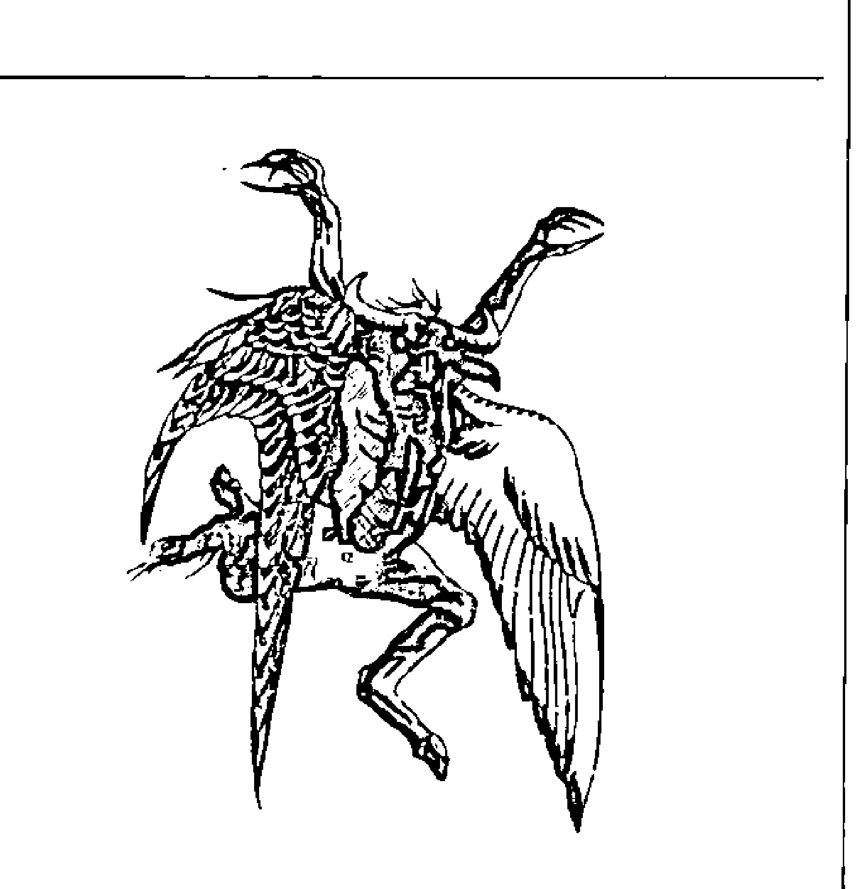

##### 恶魔·所罗门的恶魔 雷蒙盖顿

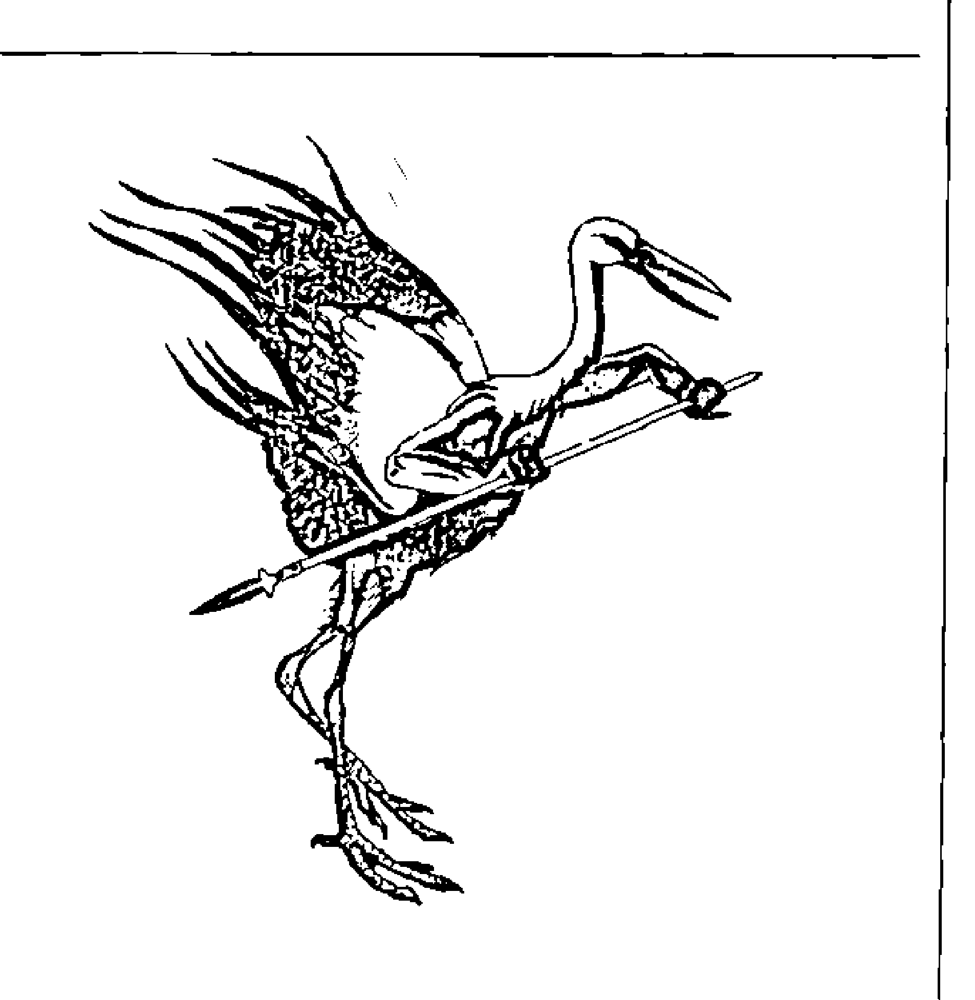

##### 恶魔哈普

俄罗斯作家科罗连科（Vladimir.G.Korolenko, 1853~1921）小说《赎罪日》（*Yom Kippur*）中登场之恶魔。赎罪日乃犹太教节日，根据乌克兰地方基督宗教信徒的传统信仰，犹太恶魔哈普会于这一天自犹太教会中带走一个人。但若有基督宗教徒在看到恶魔抓人的光景后，对恶魔大喊“放开！那是我的！”，被抓之人便能得救。
然而小说主角眼看着经营酒店兼高利贷的犹太人被抓走，却未说出赶走恶魔的话，自行将酒店老板的财产据为已有。
此后他热衷于凶狠的高利贷放款，即使让自己所爱的女性掩面涕泣也无动于衷。
而恶魔哈普看到这“连犹太人都相形见绌”的狠恶后，于下一个赎罪日中，不抓走犹太人，而改抓走了主角。可是主角所爱的女子看到后大喊了：“放开！那是我的啊！”救下主角，这才令他洗心革面。
在这则故事中的恶魔不针对特定人种或民族，有世界主义倾向。

> （→俄罗斯的恶魔 Demon<Russia>）

##### 鬼母 115

在日本以“鬼子母神”之名而广为人知的神格。在原本的印度神话中被称为“诃利底”，为财神俱毗罗（Kubera）之妻，生有一万名子嗣，为丰穰与多产的象征。
尽管诃利底的孩子如此众多，但她却是会攫取他人孩童而食的鬼魔。这是说明在印度神话中带来恐惧的神格几乎都为女性的例子之一。
同其他许多神灵一样，诃利底后来添加了佛教神格。在佛教中她是名为“半支迦”（Panchika）的鬼魔之妻，子女人数变为 500 人，但依旧会吞噬孩童。
于是某次释尊藏起她的一名孩子，诃利底自此明了失子母亲之苦，遂洗心革面，皈依佛法，变为安产神。
佛教中诃利底的形象，多是造成左抱幼子，右手持象征多产石榴的模样。

##### 鸟身女妖

一般认为她们是有翅膀的女性，或者是女首鸟身。名字的意思是“掠夺东西的女人”，由于鸟身女妖不止一只，因此通常以复数型的“Harpuia”来表示。
希腊诗人赫西奥德¹¹⁷（Hesiod）所著《神谱¹¹⁸》（*Theogony*）中说她们为巨人陶玛斯（Thaumas）与海洋神俄刻阿诺斯（Okeanos、Oceanus）的女儿海之精灵伊莱克查¹¹⁹（Elektra、Elcctra）所生。
鸟身女妖共有三人，即※阿耶罗（Aello，意思是“奔驰的风”）、※奥赛琵特（Ocypete，“飞得快的女人”）、※色莱诺（Celaino，“黑女人”），不过也有其他说法是扣掉色莱诺，只有其他两人，或者说还要加上波达格（Podarge，“快脚女”）总共四人。
而在《荷马(Homer)史诗》中，鸟身女妖则是掳走潘达罗斯（Pandareos）女儿的怪物，只不过在这里则是将她描写为死灵。
图画中经常将她们画成与赛壬（Seiren、Siren）相同的女首鸟身怪，而在他们旁边也同样画有死者的鬼魂，因此两者经常被混同在一起。
《阿尔戈号远征记》中也将她们描述成发出恶臭，在餐桌上空盘旋，一边排出粪便，同时企图掠夺桌上的食物，非常讨人厌的怪物。

> > (→复仇女神 Erinys、横死之神 Ker)

+   - 115 译注：又译“鬼子母”、“呵利陀”、“迦利帝”、“呵利帝”、“诃利帝”、“诃利底”。
- 117 译注：创作时期约公元前700年希腊诗人。是希腊最早的诗人之一，常被称为“希腊教训诗”之父。
- 118 译注：亦译作《神统记》。赫西奥德所作的叙事诗，歌颂宇宙诞生到宙斯（Zeus）统治世界的过程，与《荷马史诗》并称，为带给后世的人了解希腊神话众神系谱的重要著作。
- 119 原注：与索福克勒斯（Sophocles）的悲剧中阿葛曼农（Agamemnon）的女儿不同人。（译者补注：阿葛曼农的女儿即有名的恋父情结（Electra Complex）的字源。此名或译作厄勒克特拉。）

##### 哈鲁特与马鲁特 Harutwa Marut

他们两位为堕落天使，在伊斯兰教的可兰经中说他们住在丧德之都巴比伦里，教导人类与恶魔妖术。
这段记载后来被人加油添醋。传说中，他们原本是天国中很了不起、行为端正的天使。了不起的人总是喜欢嘲笑别人，他们也不例外。看到下界的人沉溺于欲望当中时，经常笑称“这些人类真是傻啊”。
于是神就对他们说：“你们到了下界恐怕也会变成那样吧，你们敢去试试看吗？”
当然可以。
于是他们接受挑战来到了人间，结果仅仅三天就被卷进欲望的漩涡里了。两人同时被一个美女玩弄于手掌之间，美女劝酒他们就喝（伊斯兰教禁止喝酒），甚至还拜唯一神以外的异教神。而且，那个美女从他们口中套出了“某个秘密名字”，靠着名字的魔力，她升到天空中变成了金星。神看到这种情形大为愤怒，将这两人用他们自己的头发吊在巴比伦里的一口很深的井里了。

##### 八将神 Hasshoujin

他们是日本的阴阳道思想中，会影响一年的吉凶方位的神灵。不过与其说他们是掌管星辰的神，不如说性质上比较接近星辰的精灵。
木星之精大岁神（Taisai-shin）的方位对于争斗为凶，但对于创造或迁徙为吉。
大岁的神妃是土星之精大阴（Daion-shin），在她的方位上，与女性相关的一切事务皆凶。同属土星之精的岁破（Saiha-shin）的方位，则会有遭损受伤的凶相发生。
金星的大将军（Daisyougun）方位，对于迁徙结婚为凶。岁杀神（Saisatsu-shin）同属金星，虽然他较大将军为弱，但是据说有毁败诸事物的力量。
水星之精是岁刑（Saikei-shin），如其名所示，他是掌管刑罚的神。
罗睺星之精是黄幡（Ouban-shin），据说他的方位对于建筑为凶。
计都星的豹尾（Hyubi-shin）则是会极为凶猛且强力地作祟。
除了这些或多或少都会带来灾害的八神以外，再加上两位一整年都是吉相的岁德神（Toshitoku-jin)。岁德神与大岁神二位，刚好可以与其他位神明取得平衡。

> （→太岁 Tasuei）

##### 哈斯特 Haster

克苏鲁神话（Cthulhu Mythos）中的主神之一。别名“难以名状之物”或“往来星间宇宙者”。据说他住在金牛座毕星团（Hyades）中的α星（Aldebaran）附近的黑暗星云之湖，“黑色哈利湖”里（另有说法说他是被封印在那里的）。
如同他的别名所示，没人知道哈斯特真正的样子。那是因为他真正的样子实在太吓人了，恐怕只需看一眼就会吓得发狂。有时候他也会附身在人类或其他生物上来行动，这时他的身体会膨胀，变得软趴趴的，像流体一样。
他最温和的样子大概是他的一个叫做“黄衣之王”（The King in yellow）化身。外形看起来极为接近人类。他会招待疯狂或是有素质的艺术家，然后吞食他们的精神。以艺术为饵来骗取艺术家灵魂的恶魔并不少，哈斯特的创作者大概是从这些传说中得到灵感的吧。

> （→克苏鲁 Cthulhu）

#### 堕落天使 伊斯兰教

> （→易卜劣厮 Iblis、拜札克）

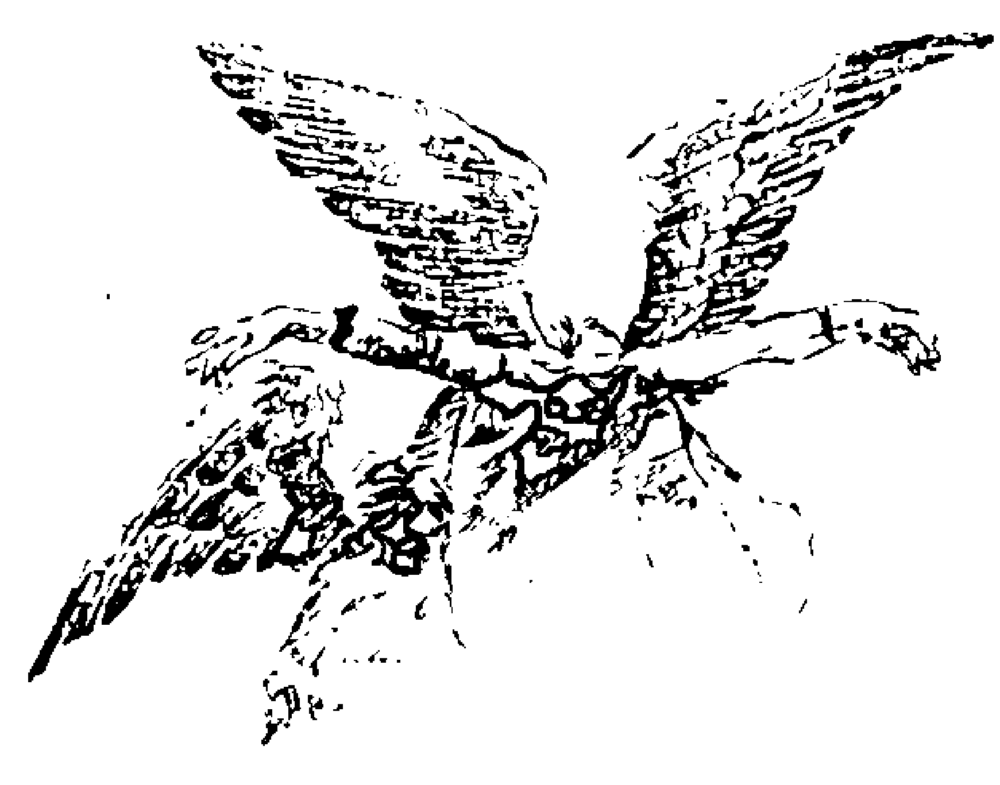

#### 祸崇神 日本

120 译注：即太岁，日本有太岁、大岁两种称法。

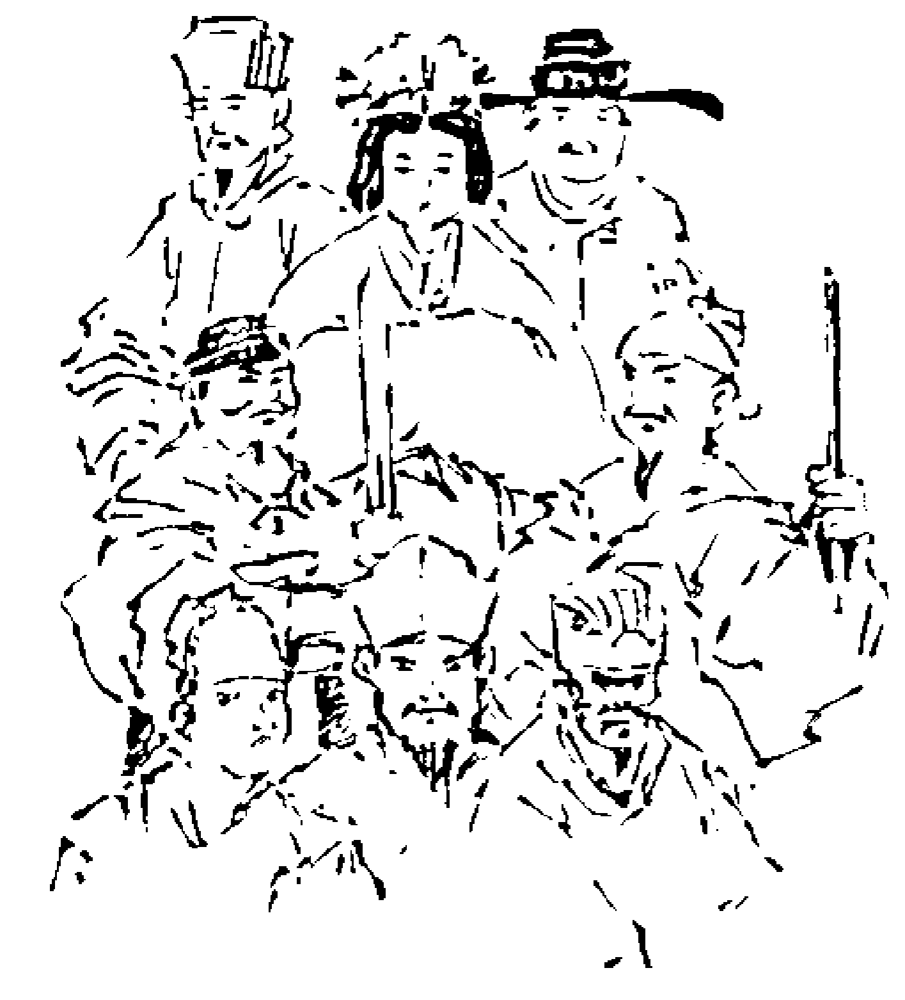

#### 邪神 克苏鲁神话

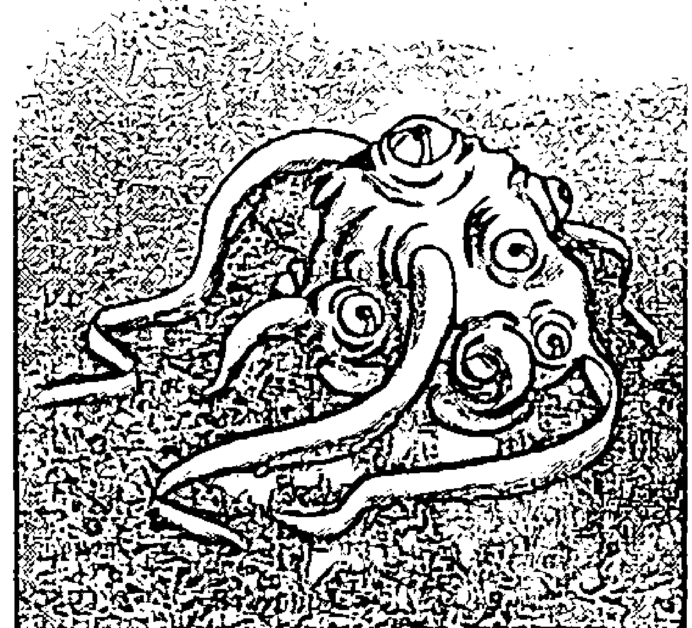

##### 哈乌美亚

她是波里尼西亚的吃人女神。
哈乌美雅与来自地下世界的罗·努伊结婚，生了个儿子叫做慈慈雷。后来夫妇之间发生激烈的争吵，罗·努伊丢下妻子回到地下去了。
从此之后，哈乌美亚在怨恨与愤怒中开始有了吃人的习惯。她的儿子慈慈雷因此害怕母亲，做了一艘魔法船要逃离她身边。他给她一把有破洞的水瓢拜托她舀水，趁机逃了出去。哈乌美亚发现后立刻追了出去，准备连人带船一口吞下去，慈慈雷拿烧的火红石头丢进她的口里，于是哈乌美亚发出一声惨叫，就这样烧死了。
但是她死后又再度复活，改名叫做诺娜，继续吃人。后来她又生了个女儿。女儿长大有了爱人，害怕母亲知道，一直隐瞒这件事。但是最后还是被诺娜发现，将女儿的爱人吃掉了。而且因为太过生气，甚至打算连女儿也吃了。
女儿没命地逃，最后逃进一个老婆婆的家里。老婆婆看她可怜，于是将追来的哈乌美亚给杀了。
就这样，吃人女神终于消失了。

> (→玛图克 Matuku)

##### 席西

在芬兰叙事诗《卡勒瓦拉》中登场的魔神。
古代芬兰人的概念中，有无数的神存在于这个世上。不过他们心目中的“神”或许较为接近“精灵”此概念。死者的国度图奥奈拉 (Tuonela) 中有图奥尼与图奥奈达(Tuoni & Tuonetar)以及他们的儿女，此外冥府里还有无数的邪灵。而海底也有人智所不能及不可胜数的恶灵。
但是如果只限定在人界的恶神的话，那这个魔神席西就是最强大的，甚至可以说是邪恶的批发商了。因为世上一切不好的、邪恶的事物都叫做“席西的～”。
举几个例子来说，黄蜂的别名是“席西的小鸟”，蛇毒或蚁酸则称为“席西的可怕东西”。而另外，当北方的魔法师与妖术师们唱着欧陆尽头的拉布兰^{121}地方的歌谣时，也会被说是“席西的歌声震天价响”。甚至连一个勇敢的男子手持的斧头伤到了自己的膝盖也被说成是“这是席西搞的鬼”。
但是，席西在《卡勒瓦拉》中几乎没有显现出他的形象。以中文的感觉来说，或许这个席西就像是“厄运”或“道高一尺魔高一丈”之类的词语吧。

##### 希罗尼耶格西布

他是希罗尼亚克夏(Hiranyaksa)的兄弟。
经过严苛的苦修之后，他从梵天^{122} (Brahma) 那里获得了“不管是神、是阿修罗，或人、或兽，不管是白天还是晚上，不管是屋里或屋外，不管用任何武器，都杀不了他”的这个非常注意到细节的承诺。
获得不死力量的他，就这样征服了天上地上地下三界。但是他的儿子钵罗诃罗陀^{123} (Prahlada) 不像父亲，笃信毗湿奴 (Visnu 或 Vishnu)。为此希罗尼耶格西布十分不满。有一次希罗尼耶格西布又对他儿子生气，说：
“你这小子嘴里老是念着毗湿奴毗湿奴的，你倒说说看他到底在哪？”
“毗湿奴神无所不在。”
“喔，是吗？那这里也在吗？”
希罗尼耶格西布说着顺手就打向玄关的柱子。柱子瞬间裂成两半，从中跳出了狮首人身的毗湿奴^{124}来。希罗尼耶格西布立刻拿起剑应战，但是最终还是不敌，被半狮人抓住，用爪子撕裂杀死了。
就这样，希罗尼耶格西布在既不是夜里也不是白天的时刻下，既不是屋内也不是屋外的场所里，被既不是神也不是阿修罗，也不是人也不是兽的东西，用不是武器的东西杀掉了。

##### 希罗尼亚克夏

印度教经典之一《伐由往世书》(Vayu Purana) 125中描写到的※达伊提耶 (daitiya, 一种恶鬼)，名字的意思是“金眼人”（也有别的说法说他是阿修罗而不是达伊提耶）。
有一次，希罗尼亚克夏恶作剧地拿起棍棒，在海上边打边走。水神伐楼那 (Varuna) 被那声音惊吓到，于是向毗湿奴 (Visnu 或 Vishnu) 神求救。毗湿奴想要杀死他，但是这恶鬼却用他的利牙咬起大地逃到下界去，结果大地就这样沉入下界。
于是毗湿奴化身成为一只野猪（婆罗诃 (Varaha)，毗湿奴的第三化身。）与他相斗，最后获胜，并且以他的猪牙支撑起来，大地才得以恢复正常。

##### 疱疮神

日本人将散播疾病的瘟神总称作疫病神，而其中特别令人害怕的几种传染病则各自有自己的名字，例如会传染恙虫病的恙虫，就被认为是某种妖怪。
而在形形色色的传染病神中，特别为人所害怕的恐怕就是疱疮神了吧。疱疮是天花的旧称，在接种牛痘的方法尚未发明之前，对日本人来说没有比疱疮更可怕的疾病了。
据说疱疮神是搭着稻草编成的船，不知从何出现来到人们的梦中，在梦里将疱疮传染给人。一旦被传染，患者全身会起疹子，并且发高烧，十之八九的人都会死。因此这些患者们非常的热心地祈求疱疮神减轻他们的病症，不要夺走他们的生命。
只不过，在某几个故事中不约而同地提到疱疮神讨厌狗，因此不会进入养狗的家里。至于为何会怕狗则没有提到，其原因已不可知了。

> (→疫病之兆 The omen of plague、禹强 Yuchiang、穷神Binbou-gami<日本>)

##### 相柳

又名为“※相繇”(Hsiangyao)。是上古时曾经雄霸北方的洪水之神·共工(Kungkung)的臣子。
相柳是人面蛇身的怪物，而且还是只九头的大蛇。相柳会用这九颗头，很贪心地将九处地方的所有东西吃得一干二净。
不仅如此，只要这只怪物所到之处，那个地方的土地便会化为沼泽。饮水也会变得苦涩而不堪饮用，使得任何动物都无法继续居住下去。

121 译注：Lapland，斯堪的纳维亚半岛的最北端。
122 译注：印度教三大神之一，为宇宙的创造者。
123 译注：希罗尼耶格西布之子，虽身为恶魔，但德行深厚，笃信毗湿奴，其道行甚至与因陀罗并驾齐驱，最后与毗湿奴合而为一，故此处说伯利为毗湿奴之孙即是如此。
124 译注：即毗湿奴的第四化身——人狮（Narasimha，音那罗辛诃）。
125 译注：又称《湿婆往世书》(Siva Purana)，以记述湿婆相关事迹为主。

#### 达伊提耶 印度

阿底提女神的耳环，结果被毗湿奴亲手杀了。

> (→希罗尼耶格西布 Hiranyakasipu)

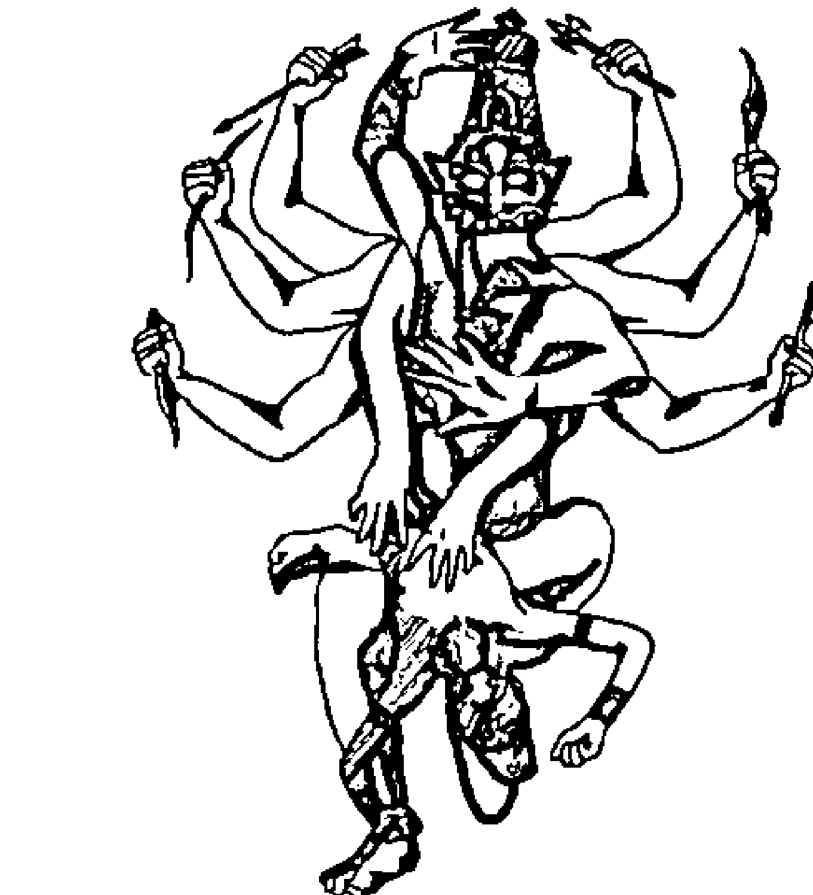

#### 瘟神 日本

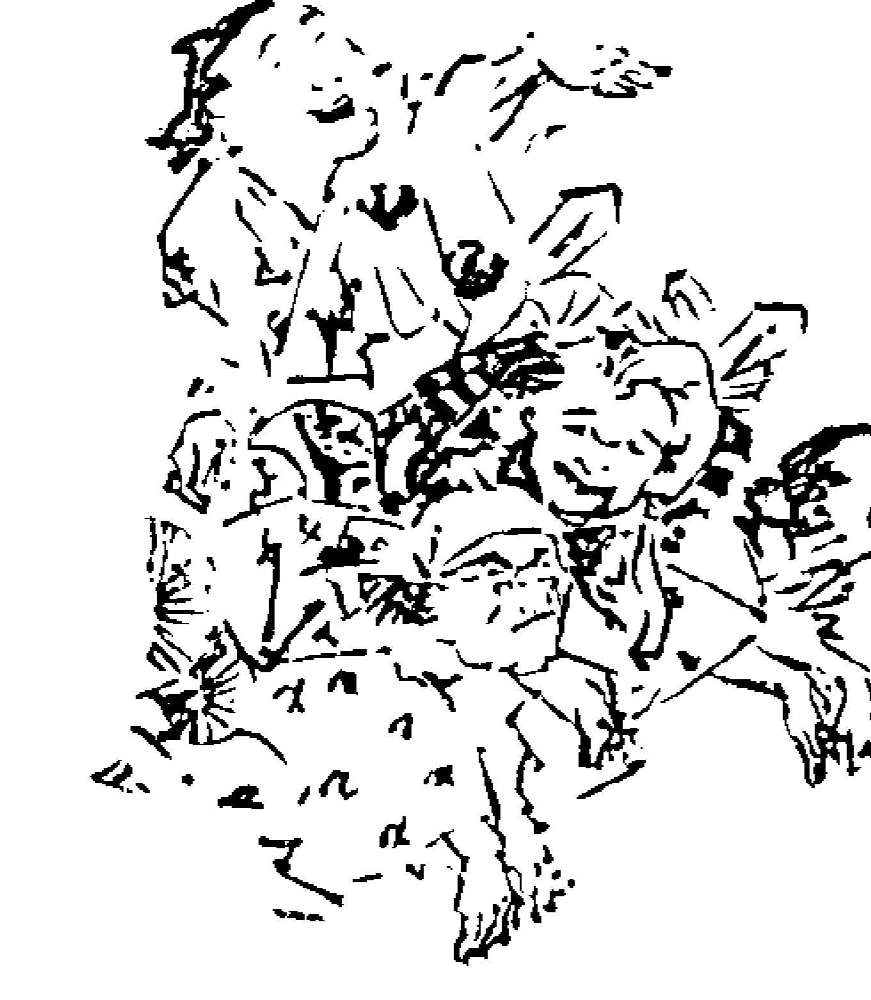

#### 怪物·灾害神 中国

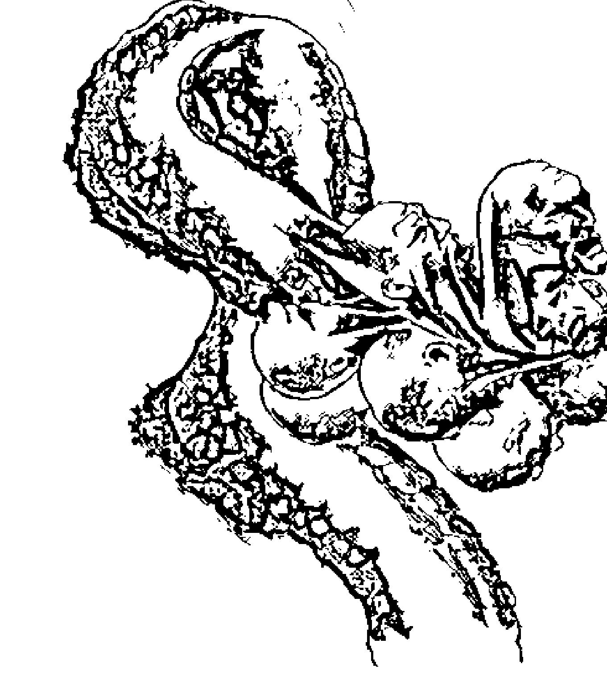

##### 修蛇

修蛇是中国古代的怪物。别名“※巴蛇”（Pashe）。蛇身硕大，有180米长，青头乌身。
栖息在中国南部洞庭湖周边，居住在附近无论何种生物一律袭而吞之。传说曾吞食一头大象，三年后则吐出类似象骨的东西。
居住在洞庭湖畔的人深受其害，帝王神·黄帝便命神射手后羿除民害。后羿先用箭射他，修蛇在痛苦之际逃往西方，后羿紧追而至，将修蛇砍成两截。而修蛇的尸体化作丘陵，其地便被称为巴陵。修蛇与后羿一战，逃往西方后被后羿讨伐此点，与凿齿（Tsaochih）的传说十分相似。
抵抗汉民族的各部族，以怪物的姿态留名于神话、传说中。说不定凿齿与修蛇同族，或是分属不同族却一起战斗吧。

> (→猥瑜 Iayu、大风 Tafeng)

##### 西王母

在中国众多神仙当中知名度最高、最受人尊敬的女神。
西王母负责监督众神，是位绝世美女。头上结着大髻、戴金冠、身穿金锦衣、脚履凤锈鞋。此外，这位女神也负责管理吃了可长生不老的蟠桃生长的蟠桃园（三千年结一次果实的蟠桃一熟，众神便会前来向西王母贺寿，举行蟠桃宴。）
然而，这是在道教成立之后才创造的姿态。
根据古代传说¹²⁶，西王母豹尾虎齿、蓬发上簪着镶有宝玉的钗子。负责监督因刑罚或灾害等诸事，也就是司掌死于非命之命运。
两者的形象差距甚大，但若以女神的角度思考则可理解。这两个姿态正是女性在男性眼中的两面：慈母像和怪异像的象征。

> (→迦梨女神 Kali、沙悟净 Sha-wuching、孙悟空 Sun-wukong、猪悟能 Chu-wuneng、突迦 Durga)

##### 虚耗

为人招来灾祸的小鬼。
虚耗身着红衣，鼻似猿，单脚穿着鞋，另一只鞋则系在腰上。此外，腰上还夹有一把竹扇。
唐玄宗在位年间（712~756）曾记载虚耗现身于宫中。相传玄宗练兵后回到宫中，突然疟疾发作，因而昏寝，虚耗现身梦境。
大鬼自称“钟馗”，终南山人，应举不第，羞愤之余撞廷阶自杀。玄宗命以厚葬，钟馗为感恩发誓除尽天下恶鬼妖孽。日本端午节（五月五日）所装饰的武人人偶就是钟馗。

### 怪物
中国

#### 神仙·祸神
中国

126 译注：《山海经·西次三经》：“玉山，是西王母所居也。西王母其状似人，豹尾虎齿而善啸，蓬发戴胜，是司天之厉及五残。”

#### 祸神·疫鬼
中国

#### 鵸鵌

原名“鼓”，中国古代自然神·烛阴(Chuyin)之子。与其父一样，人面蛇身，或是拥有青色的羽毛的人面马身。

烛阴是司掌自然的大神，鼓则为不肖子。他与人面兽身的钦鵟共同谋杀了葆江（或云祖江）的神。

鼓是怎么杀了葆江并不清楚，只知掌管天庭的天帝知晓此事，将鼓与钦鵟予以处刑。

被惩处的两人心生怨恨，死后各自化作灾祸。

鼓转生为 。其脚似枭而赤，直直的鸟嘴上有黄色的花纹，鵌为白色。或是，其鸣如白鸟。只要此鸟一出现在地方上，就会有大旱灾。（→干旱之兆 The omen of drought、大鹗 Tae、魃 Pa）

#### 混世魔王

明代神魔小说《西游记》（约1570年著成）中登场的怪物，是主角孙悟空(Sun-wukong)最初的敌人。

混世魔王本来是坎源山水脏洞之主，掌管山中小妖。孙悟空为了修习仙术离开花果山水濂洞，期间，混世魔王的手下率众袭击水濂洞，意图占据。

悟空回来后，听闻此事瞬时飞往坎源山水脏洞，要求一决胜负。

当时悟空还没得到如意棒，只好徒手攻击，却因此遭受到混世魔王的轻视侮辱。混世魔王自己也是徒手攻击，但两人的实力不辩自明。不得已只好取刀再战，没想到，刀反而被悟空夺去，将自己劈成两截。

同样也是明代小说的《水浒传》当中，有一位名叫“樊瑞”的好汉。他是一山之主，使用幻术对抗贪官污吏。他的名号也是混世魔王。两个作品之间，不知是否有所关联。

#### 混沌

也可写作“混沌”。混沌之意本为宇宙演化成现在这个模样之前，一切混沌互相混杂，没有任何东西存在的样子。从混沌之海可诞生出一切生命，因此，也有人称呼为“原始混沌”。

人类畏惧混沌。对混沌象征的无形、无秩序感到厌恶。因此将混沌当作不论何时都可带来灾恶的元凶。

身为凶神的混沌，一种传说为天帝之子。状如囊，似炎而赤，无口，能解歌舞音律。

另一种传说，混沌似犬又似熊，有目不能视，有耳不能听。平常时咬着自己的尾巴团团转，一脸呆滞地嘻笑着，一遇到有德者就会变得十分粗暴，对恶人则十分安静温驯[27]。

另外，在道教里，原始混沌有一个拟人化的名字“鸿钧道人”。他是道之起源原始混沌的具体体验者，具有无穷的力量。（→阿波非斯 Apophis、混沌 Anarch、太岁 Tasuei、蒂雅玛特 Tiamat、泰兹卡特利波卡 Tezcatlipoca）

#### [征兆 中国]

#### [魔怪 中国]

#### [原始神·凶神 中国]

> 127 译注：《神异经》〈西荒经〉云：“人有德性而往抵触之，有凶德而往依凭之。”

##### 红孩儿

在明代神怪小说《西游记》（约1570年成立）中登场的怪物。又称“圣婴大王”。是孙悟空(Sun-wukong)的义兄牛魔王(Niu-mowong)与铁扇公主(Tiehshan-kungchu)所生的小孩。

红孩儿掌管枯松涧火云洞，支配钻头号山方圆六百里。和许多在《西游记》登场的怪物一样，红孩儿也想捕捉三藏食其肉，和孙悟空一战。

他的武功及法术比悟空和八戒略逊一筹，但是拥有三昧真火这项秘法。

三昧真火为纯粹元素之焰，非普通火焰可与匹敌。悟空为了对抗三昧真火，向水神龙王请求帮助，但普通之水岂能与之对抗，反而加大了火势。

不得已之下，悟空只好向南海观世音菩萨求助。菩萨将海水装入净瓶变为甘露水，用甘露水灭了三昧真火，顺利捉到红孩儿。

红孩儿自知不敌，于是降于观世音菩萨，皈依佛门成为善财童子。

##### 祸斗

食火怪兽。

原本祸斗是用以称呼传说中居于中国辽阔南方的异民族。相传该族能食火炭。应是有此传说才将食火怪兽以祸斗称之。

祸斗其形似犬。好食犬粪喷火为祸。

自然，祸斗所到之处必生火灾。故此兽被视为火灾之兆。祸斗一现即属大凶。

另有一种传说祸斗为食焰粪火之兽。唐代书籍中有白螺天女赠知县以祸斗 ¹²⁸ 之记载。然而不知白螺天女意欲为何，竟将此种不祥凶兽送至下界。或

许该名知县乃无德之人故天女赐祸于他。

(→毕方 Pifang)

##### 狌狌

狌狌乃古代怪兽。也写作“狌狌”、“猩猩”。

不可思议的是，狌狌的形象依文献不同而描述上各有所异。

若一一列举不免繁复。例如有狌狌是人面龙身之怪物之说；也有其外形似狸之说。又一种传说形为人面牛身马脚，或说乃龙头虎身马尾的巨大怪物，众说纷纭。

由于不同文献中对外观的形容莫衷一是，故而有他可能为可随意变身之怪物的说法。或也有可能为数个怪物传说交混而成的产物。

唯一共通之处，仅有搜人而食此点。

狌狌本为天神。然被名为“危”的神灵所杀，后虽经仪式复活，却化为怪物。

他曾于传说中帝尧的时代肆虐为祸，但被奉尧之命的名弓箭手羿所杀。

(→凿齿 Tsaochih、修蛇 Hsiushe、大风 Tafeng)

#### 1. 魔怪 中国

#### 2. 怪物·征兆 中国

> > 128 未注：《山海经》校注：《冯梦龙情史》卷十九〈白螺天女〉条略谓：“吴堪少孤，得一白螺归，螺变为美女，助其炊爨。县宰欲图其妻，先索虾蟆毛及鬼臂二物。后乃索蜗牛，妻牵一兽形如犬者以致之。兽食火而粪火，宰身及一家，皆为灰烬，遂失吴堪及妻。”（按实出唐皇甫氏原化记，见旧小说乙集四，“蜗牛”作“蜗斗”）。此“蜗牛”者，即“祸斗”也。

#### 3. 怪物 中国

##### 茨木童子

即所谓的“※罗生门的鬼”（Rasyoumon-no-oni）。乃盘踞于大江山的酒吞童子（Shuten-douji）之弟子。

下面是与他有关的传说。

于京城的罗生门附近肆虐的茨木童子，遭源赖光的部下渡边纲砍落手腕。渡边纲将那只手腕携回后，依阴阳师安倍晴明的指示将其收入唐柜（一种柜子），进行为期七日的闭关净身。而进行闭关时，渡边纲在津国^129的伯母来访。因为渡边纲正在闭关无论如何也不与她见面；伯母便对泣诉了对他如此

无情的怨恨、扶养他的辛苦以及旅途的辛劳。渡边纲终于因此让步，将伯母迎入屋中设酒宴款待。心情大好的伯母，说希望渡边纲能让她见识一下他砍下的妖怪手腕。当渡边纲应允出示后，伯母却趁机将其夺走，露出了茨木童子的真面目一溜烟地逃了。

而茨木童子的这段故事后来成了歌舞伎戏码“罗生门”中的名段子“茨木”。由“茨木”中，可看出平地居民的都市人，自山中、海滨居民处夺走“宝物”后又被夺回的古老民间传说雏形。

##### 易卜劣厮

伊斯兰教中的恶魔王、堕落天使。相当于基督宗教中的“※路西法”（Lucifer）。也被称作“亚·晒依陀乃”（AlShaitan，那唯一的恶魔）。名字一种传说来自希腊语的“迪奥波罗斯”（Diabolos，恶魔）；一种传说来自阿拉伯语的“乌卜劣沙”（无所期待）一字。依据可兰经，神造人祖阿丹（Adam）命众天使“跪拜他”时，唯有易卜劣厮一人回答“不”。因此被逐出天国成为恶魔之王。

然而，关于易卜劣厮的来历并无定论。因为在可兰经中他有时被说是天使，有时被叫做※镇尼

（Jinn，邪灵）。于是便有一神学者统整两派说法思考出一个答案。依照该神学者的说法：他原为镇尼，因对镇尼同伴在地上整日争斗感到心灰意冷而升天成为天国看门人。可是在被命令跪拜阿丹的瞬间，无法容忍自己这名身为“无烟之焰”所造的镇尼，去敬拜黑土捏塑而成的人类，于是背叛了神明。

（→伊斯兰教的恶魔Shaitan、撒旦Satan《新约圣经》、拜札克）

##### 伊卢延卡

西台的恶龙或是蛇恶魔。被天候神所杀，但关于此事有新旧两种传说。

古老的传说中，伊卢延卡虽击败了天候神，却中了女神伊纳拉为恶龙设下的圈套。女神陈列了“盛葡萄酒之瓮、盛果汁之瓮、盛其他饮料之瓮”召开庆祝会，伊卢延卡与其诸子喝得烂醉无法回家。于是女神的爱人胡帕西雅斯（Hupasiays）绑起伊卢延卡与其子，天候神将他们杀死。^130

较晚的传说中，恶龙战胜天候神后夺去其心其目。为取回自己的心自，天候神造出子嗣，让儿子

与恶龙之女结婚。儿子向妻子问出心脏与眼睛的所在后取还于父。天候神立即击毙伊卢延卡，却连自己的儿子也一并击杀了。

无论是哪个传说，当天候神击败恶龙便意味着新年的到来。因为新的一年被认为乃是由蛇怪的死所带来。

这个传说普及后，成了迦南地方中巴力（Ba'al）与利维坦（Leviathan）相搏的故事，以及希腊的泰风（Typhon）传说。

#### 妖怪 日本

129 译注：日本一古国之名，于今日大阪、兵库县一带。

#### 恶魔王、堕落天使 伊斯兰教

#### 恶龙 西台

130 译注：有书说是女神爱人所杀。

##### 男夜魔

Incubus在拉丁语中有“骑在上方者”之意。不论在古罗马也好，或是今日的意大利，男夜魔都被认为是“精灵”的一种。因他乃噩梦精灵或是隐藏财宝之精灵，故被视同于方努斯（Fanus，等若希腊神话中的潘Pan）。

男夜魔于入夜后坐于入睡女子胸上（此即名称由来）让她做噩梦。有时会与沉睡的女性交合。

男夜魔头戴圆锥帽，但有时会因得意忘形而落下帽子。据说能得到这顶帽子之人便能发现隐藏的财宝。

到了中世纪以后，侵犯入睡女性的变成了男性恶魔。

而在女巫的记录中，也说明男夜魔乃是担任女巫爱人的恶魔。

女性外表的女夜魔（Succubus），在到了中世纪纪时被则被认为是女性版男夜魔。

（→奥迦斯 Orcus）

##### 英帝契

爱尔兰岛巨人族——弗摩尔(Fomor)族之王，与魇眼巴洛尔(Balor)和混血儿布雷斯(Bres)同为与“达那神族”交战的魔神。

英帝契之母是被视作弗摩尔族亲生母亲的托姆纽女神。托姆纽有“海底”之意，因此身为女神子孙的弗摩尔族也被叫做“海之巨人”。神话中所记载，弗摩尔之王除英帝契外尚有巴洛尔与拉密铁。

英帝契虽以弗摩尔之王身份于神话中出场，但他并未活跃于战场上。大抵只有在同逃出宫殿的布雷斯，或是与众神最强之敌巴洛尔召开作战会议的

桥段中出现。而在战争最高潮时他遭众神的战士欧格马（Ogma）所杀。大约在此时，巴洛尔也被光神鲁夫（Lug）打倒。弗摩尔族就此败亡。

另外，据说其子奥克托力蓝其(Octriallach)于战事正盛时，立下掩埋可让众神复活的魔法之泉的功劳。

##### 因陀罗耆特

楞伽（Lanka※罗刹之都）魔王罗波那(Ravana)之子。别名“※弥迦那陀”（Megha-nada）。弥迦那陀是“雷鸣”之意。

因陀罗耆特一词有“战胜※因陀罗（Indra）者”之意。弥迦那陀之所以被如此称呼，是因当罗波那天界与因陀罗部下交战时，弥迦那陀与魔王父亲极其骁勇善战，最后俘虏因陀罗将他带至楞伽的缘故。而以梵天（Brahma）为首之诸神赐他因陀罗耆特之名，请求释放因陀罗。但他回答若不以“永生不死”之恩典交换便不放人，于是赢得不死之身。

有种说法是因他乃湿婆(Siva 或 Shiva)神之子故才如此强悍。传说中阿婆娑罗（Apsaras，天界水精）之一的玛陀罗因与湿婆结下露水姻缘，被湿婆之妻雪山神女（Parvati）变为青蛙。湿婆因哀怜她一心求恕，便将她化为美丽少女。当这名少女与罗波那结婚时腹中湿婆之精开始活动，于是生下因陀罗耆特。

#### 噩梦精灵
罗马

#### 弗摩尔之王
克尔特

#### 魇物
印度

##### 爱奥尼诸神

《失乐园》内登场的一群造反天使（恶魔）。于第1卷介绍参加叛乱的造反天使姓名处出现。（→撒旦Satan《失乐园》）这一造反天使集团被解释为希腊神话内泰坦神族(Titan)的前身。在《失乐园》以唯一神为绝对真理的基督宗教式世界观中，说他们是假冒神之名的恶魔集团。虽然爱奥尼（Ionian）诸神自夸为天（乌拉诺斯Uranos）与地（盖亚Gaia）所生，但由于唯一神才是创造全宇宙之存在，故爱奥尼诸神不过是自不量力的卑微存在。书中的泰坦并非指以泰坦

为名之种族，而是指被当成乌拉诺斯与盖亚之长男的神明；与原本的希腊神话有所不同。希腊神话里，泰坦中的长男乃水神奥克亚诺斯，但《失乐园》里出现的泰坦并非是奥克亚诺斯，似乎是作者自创的神灵（造反天使）。爱奥尼诸神系指天地之长男泰坦同他的高大诸弟。他们与在他们之前介绍的埃及诸神相同，并未出现在《失乐园》其他卷中。

##### 依皮屋普·因纽雅

伊果里克族[31]传说中的吃人精灵。 有一次部落的人们开始陆续失踪。而某一天，三名姊妹出外游玩。其中一人发现了海象骨制成的小鸟，正在寻找是否还有其他东西时，三人突然发现自己身在某栋住家里。在入口处有一名女精灵。 最年长的姐姐知道自己一行人到了吃人精灵的家中，于是便对精灵说：“在你吃掉我们身上的柔嫩动物肉前，请先向后转，吃掉门口处的土。”接着三姊妹趁机挖掘地洞逃了出来。一回家后就告诉母亲事情经过。

因为男人们都已消失，所以妇女们便出发复仇。 在模仿三姊妹的行为后，也进入了那栋住家。妇女们对精灵说：“就算是捕鲸时也不会杀死抓到的鲸鱼，所以我们是来砍断你的爪子的。”之后就用皮绳将她的手脚绑起。 当妇女们正想杀死精灵时，精灵说了：“我的内脏乃是串珠所造。”杀了精灵后剖开肚子一看，正如她所说的一样。于是妇女们以串珠装饰自己。可是过了一晚后那些串珠便跑回内脏里了。 (→温敌哥Windigo、努莉雅尤克Nuliajuk、持

##### 因波斯

假称古以色列王国所罗门王所作之17世纪魔法书《雷蒙盖顿》（Lemegeton，又名The Lesser Key of Solomon），书中第一部分〈哥耶提雅〉所记载的72名恶魔之一。拥有“※埃沛欧斯”（Ayperos）、“※埃波罗斯”（Ayporos）、“※因悖思”（Ipes）等诸多不同的名字。 相对于天使的阶级，恶魔也常被赋予爵位；但罕见的是并无关于因波斯的爵位记录。《雷蒙盖顿》中分别记载了因波斯的天使形象与诡异形象两种相貌。他的恶魔形象为鹅头鹅脚的狮子，常会以外

形现身。据说因波斯拥有未来的知识，会被想知晓该类事物的人召唤而来。 19世纪法国作家柯林·德·普朗西于著作《地狱辞典》中介绍他时，使用的是因波斯别名之一的“因悖思”。在普朗西笔下他又被加上了兔尾。因为插画家M.L.布尔顿如实画出了普朗西的描述，故该书中因波斯的外表便变得戏谑滑稽。《地狱辞典》中也未提及因波斯之爵位，说他乃地狱36个军团之指挥官。

#### 造反天使 失乐园

#### 危险的精灵 爱斯基摩

鞭的精灵 The Thrashing Spiritwitha Bearded Sealfora Whip)

131 译注：为爱斯基摩人之一支。

##### 恶魔·所罗门的恶魔 雷蒙盖顿

#### 依兹拉科里乌基

阿兹特克的石头与冷气之神，名字的本义是“黑曜岩匕首”。
他司掌的乃是寒冰、盲目、冷酷与顽固。他代表完全处于禁止状态（无力、无感觉）的物质，被认为是于人类社会散布灾害的恶神。此外，带来黎明的寒冷也是他的工作。
过去，他曾是被视作破坏神而深受畏惧的存在，被称为“清晨之主”特拉威斯卡尔潘泰库特利（Tlahuixcalpantecuhtli）。然因挑战太阳神失败才变成这一模样。
在失败后他便化为“晨星”（金星），仅能于太阳升起前的短暂时间绽放光明。就这样，他至今依旧一边散发着冰冷光芒，一边静待时光流逝。
另外，他也被视作等同于混沌神泰兹卡特利波卡（Tezcatlipoca）。将象征“死之寂静”的依兹拉科里乌基，与象征“无秩序活力”的泰兹卡特利波卡视作同一神的想法，十分耐人寻味。

#### 伊希切尔

玛雅神话里，伊希切尔是天界支配者伊札姆纳（Itzamna）的伴侣。相对于伊札姆纳身为善神、文化英雄、太阳神，伊希切尔为引发洪水或豪雨、对人类抱持恶意的女神。
伊希切尔为手生利爪的女水神。头上盘蛇、裙衩上绣有骨头交叉为十字的图案。当描绘伊希切尔时，会在她周遭画上死亡与破坏的象征。
当伊希切尔暴怒时，会倾斜天界的水瓶造成豪雨。而“天蛇”则会协助她兴起洪水。因此伊希切尔也被称做“愤怒老妪”。
因她是如此可怕的女神，故而必须时常献上活祭品以取她欢心。若不如此做，她便会引发热带暴风雨杀死人类、破坏城市。

> （→阿·普切 AhPuch、伊希塔布 Ixtab）

#### 伊希塔布

于中美洲尤加敦半岛建立高度文明的玛雅人的自杀守护女神。
伊希塔布的形象为颈部被套索吊悬的女神。双眼紧闭，脸颊上已开始出现腐败的征兆。然而尽管外表令人不寒而栗，伊希塔布却是值得敬谢的神灵。
由现代人的角度来看，玛雅人对死亡一事抱持的观念颇奇特。因为上吊自杀者、战死者、做活祭品而牺牲者、生产时死亡的女性，以及神官在死亡后都被认为能直接进入乐园。
神官与战死者能前往乐园乃是常见观念，但生产时死去之女性能进入乐园的说法便相当罕见（将生产视作一种污秽的文化相当普遍），而自杀是通往乐园之道的想法则更是稀罕。
总之，伊希塔布会将先前那些幸运的灵魂带到位于宇宙树亚奇（Yaxche）树阴下的乐园。她们会忘记一切现世的烦恼，从一切痛苦缺乏中变成自由自在，过着休憩的时光。

> （→阿·普切 AhPuch、伊希切尔 Ixchel）恶神
阿兹特克

洪水霖雨之女神
玛雅

自杀女神
玛雅

#### Izanami-no-mikoto
#### 伊邪那美命

神世七代<sup>132</sup>中的最后神灵，为日本人祖先之夫妇神中的女神。
这名女神于生产火神火之香具土(Hinokagutsuti)时因下体灼伤而死。而当丈夫伊邪那歧神(Izanagi-no-mikoto)追至黄泉时，她对他说道：由于自己已然行过“黄泉户契”(吃下黄泉的食物)故不得随意返回阳世，因自己要设法与黄泉国之主商量，所以切不可加以窥探。如此说完后她便消失于黄泉深处。伊邪那歧神遵守吩咐一阵后忍不住加以窥视，发现在里面的是为八名雷神所凭附的丑陋妻子尸体。心生恐惧的伊邪那歧神落荒而逃，而伊邪那美命下令黄泉丑女（Yomotsushikome）加以追捕。结果虽被伊邪那歧神成功逃走，但她宣布此后每日要杀死1000人，成为黄泉女王君临冥界。
以上即是伊邪那美命的冥界神话。雷同的神话散见于世界各地，如希腊神话的诗人音乐家奥菲斯(Orpheus)的故事便十分有名。换而言之，可说伊邪那歧伊邪那美神话属于普遍性的神话主题。

> （→须佐之男命 Susanowa-no-mikoto）

#### Jack the Ripper
#### 开膛手杰克

英国史上第一位变态杀人犯。历史上真有其人，但是“开膛手杰克”之名却早先一步不胫而走。
1881年8月31日英国伦敦，一位在白教堂区(Whitechapel)街上拉客的妓女的尸体被路人发现。尸体喉管被割断，腹部遭到凶手剖开。被认为是凶手第一件案件。
约一周后，同样发生妓女被杀，器官(子宫)被取走的案件。此时，被认为嫌疑最大的犯人是，使用剃刀的职业——特别是鞋匠。因此缘故，特别给予“剃刀围裙(Razorapron)”这一称号。
然而9月底，中央新闻社(Central news agency)收到犯人寄来的信。通篇使用红墨水书写的信上署名“开膛手杰克”。
凶手持续犯案，总计有五名妓女被害。而后新就任苏格兰警方犯罪调查部长马克诺顿提出，1888年12月投水自杀的医师蒙太鸠·德洛伊是首要嫌犯。

> （→杀人小丑Killer Crown、弹簧腿杰克Spring-heel Jack）

#### Jahi
#### 贾西

琐罗亚斯德教的女恶魔。古称“贾希”，意为恶女。然而，在古波斯萨珊王朝时代（224~651年），这位女恶魔一下子跃升为“恶神阿里曼(Ahrinman)所造物中最强的存在”。
话说，善神阿胡拉·玛兹达(AhuraMazda)在创造世界之时，视恶神阿里曼为阻碍，用咒语束缚对方后，趁此时机创造世界。恶神阿里曼身上的咒语解开后，入侵世界，看见对手所造之物嫉妒不已，意图破坏，并认为自己手上握有十分胜算。然而此时，恶神瞧见善神创造物之一，人类。看到这个十分杰出的种族后，恶神马上感到气馁。尽管手下巧言安慰，依旧提不起精神来，最后只有女恶魔贾西的打气奏效。
贾西成功的理由不详。一种传说，她是掌管女性月经的恶魔。说不定可以解释成“女人是灾难之源”等潘多拉盒子之类的逸闻。

冥神·死神
日本

都市恶魔传说
英国

恶魔
伊朗

132 译注：日本神话中自天地开辟之后出现的七代神灵。

#### 贾拉

身形巨大的※罗刹女 (Raksasi)。在家中挂上贾拉的图画并予以祭拜，可防止其他恶鬼出没家中。是给予祭拜者福气的罗刹女。
摩揭陀 (Magadha) 国王频婆沙罗祭拜贾拉却仍无子嗣，便向隐者求助。隐者带回一颗芒果，王将芒果剖成两半，给两位妻子一人一半。
不久后，两位妻子都怀孕了，并同时生下孩子。但是芒果一人一半的结果就是，两人生出的小孩都只有一半。
妻子们看见孩子后吓得逃出，此时贾拉现身，将两个只有一半的小孩合而为一，交给国王。
这个孩子，因为“经贾拉之手合一”，故取名为“贾拉桑达”，成为后来的摩揭陀王。
(→首哩薄那迦 Surpanakha)

#### 约尔甘德

这是导致众神灭亡的怪物。其父亲是狡猾之神洛基 (Loki), 母亲是女巨人安格尔伯达 (Angrboda)。为“带来不幸的三兄妹”中的次子。
名字的意思是“大地的带子”，不过因为被众神之王奥丁 (óðinn) 抛到外海里，结果在那里成长茁壮，最后甚至成长到能将整个人类世界米德加尔德 (Midgard) 环绕的程度，因此他又称作“米德加尔德之蛇”。
血缘上虽然应该属于巨人族，但是他不像是巨人族一般与神相竞争，他带着毁灭世界的命运来到这个世上，在世界灭亡的日子来临前并不积极地与众神相抗衡，对神界 (Asgard) 与人界毫不干涉。
如同其兄芬里尔狼 (Fenrisulfr) 注定要吞食众神之王奥丁一般，约尔甘德则是注定要与神界最强的雷神托尔决一死战。
众神与巨人的最后战争开始之后，约尔甘德第一次由海底爬上陆地，与芬里尔狼共同战线，对诸神的军队发动攻势。最后约尔甘德虽然被托尔所打倒，但是托尔也因为中了约尔甘德的毒而绝命。

#### 迦盘陀

居于丹达卡森林中的※罗刹娑 (Raksasa※罗刹)。体大如山而无头，腹中生有大口，内有齿无数。胸生双目两臂极长。
据说迦盘陀本为天精干闼婆¹³³ (Gandharra)。之所以变为此种相貌，说法有二。
一种传说是他与※因陀罗 (Indra) 相搏，头部被因陀罗的雷击入身体中。
另一种传说他因某圣仙 (rishi) 之诅咒才化作此等模样。
当众罗刹娑与拘萨罗国的罗摩兄弟在丹达卡森林交战时迦盘陀身受重伤。他要求罗摩 (Rama) 火焚自己的躯体，罗摩应允。于是迦盘陀在火中变回了原本的干闼婆形象。为了感谢罗摩破除他的诅咒，迦盘陀与猴王须羯哩婆¹³⁴ (哈奴曼) 结盟提供建言，协助夺回罗摩被罗刹王罗波那 (Ravana) 夺走的妻子——悉多 (Sita)。

罗刹女 印度

洛基之子 北欧

> > (→奥丁 óðinn 〈北欧神话〉)

罗刹娑（罗刹） 印度

> > 133 译注：婆罗门教所崇拜之诸神。
> 134 译注：《古代印度神话》：Sugriva与哈奴曼不属同一神灵，哈奴曼为其智囊，此处恐有误。

#### 卡布拉坎

诸神之敌维科布·卡库伊科斯（VucubCaquix）的次子。拥有“翻山者”的称号。因为他只要踏出一步便会让小山粉碎，大山震摇。
天上众神看到卡布拉坎粗暴的样子后，命令孪生子胡那普（Hunapu）与喀巴伦格（Xbalanque）前去讨伐他。这对孪生子乃消灭卡布拉坎之父兄的英雄。
孪生子假扮为贫穷猎人接近卡布拉坎。两人告诉卡布拉坎自己在打猎时发现一座巨大无比的高山后，卡布拉坎便十分想把那座山给震碎。于是他让孪生子领他前往该处。
旅途中，孪生子拿了烤得香气诱人的鸡肉给卡布拉坎。卡布拉坎把鸡肉吃得一干二净，但肉中其实已被偷偷涂上石膏。
石膏让卡布拉坎力气衰弱动作迟缓。孪生子趁机将这可怕怪物的双手反绑，把他埋入土中。
就这样，怪物一族就此灭亡。

#### 吉陀婆

毗湿奴神（Visnu或Vishnu）于劫末沉睡不起时，从他耳中生出的恶魔。为一阿修罗（Asura或Ashura），又说是※达伊提耶（Daitya）或※坛那婆（Danavas）。
他与另一名恶魔摩图（Madhu）打算加害坐在自毗湿奴脐中所生莲花上的梵天（Brahma）。
但毗湿奴神察觉此事，于是亲手除去二者。因此毗湿奴得到吉陀婆吉塔（Kaitabha-jit败吉陀婆者）与摩图苏达那（Madhu-sudana杀摩图者）两个名字。然而在《摩卡地雅往世书》（Markandeya Purana,印度教圣典之一）中记载，杀死吉陀婆的乃是乌摩（Uma），于是乌摩改被称作吉陀婆。
传说毗湿奴杀死二恶魔时海中堆满他二人的肉与骨。结果骨髓形成一片大陆，于是由骨髓（medas）化成的陆地就被叫作弥底尼（Medini）。

#### 迦罗尼弥

楞伽（※罗刹之都）※罗刹娑（Raksasa，罗刹）王罗波那（Ravana）的伯父。
罗波那与罗摩（Rama，拘萨罗国王子）的争斗开始后，迦罗尼弥意欲杀害罗摩的盟友猴王哈奴曼（Hanuman）。于是化身修行者邀哈奴曼进餐。
然而哈奴曼拒绝，径行前往河川沐浴。哈奴曼在河中时有鳄来袭，哈奴曼随即将他击毙。结果从鳄鱼中出现一名美丽的阿婆娑罗（Apsaras，天界水精）。言她因遭达刹（Daksa）¹³⁵诅咒而被迫变为鳄鱼，直至如今才为哈奴曼所救。阿婆娑罗为了报恩，
便说出迦罗尼弥欲谋害哈奴曼之事。
哈奴曼立刻跑回家中，于是逮到迦罗尼弥，哈奴曼直接把他扔向高空让迦罗尼弥摔到罗波那的王座前。
在其他文献中，有一阿修罗（Asura或Ashura）为恶魔希罗尼亚克夏（Hiranyaksa）之孙，也名叫迦罗尼弥。他虽为毗湿奴（Visnu或Vishnu）所杀但依旧转生为摩图罗的恶王庚斯（Kansa）。结果最后被英雄神黑天（Krsna）所杀。

怪物之子
玛雅

恶魔
印度

罗刹娑（罗刹）
印度

135 译注：印度教神明之一。

#### 卡刺司雷基

爪哇皮影戏的罗刹娑 136 (Raksasa) 之一。
卡刺司雷基是※罗刹国王，年轻温柔、身强力壮，其头为野猪。有一件事令他十分在意，就是不知道自己的父亲是谁，他曾捉住乳母强逼她说出，乳母便说：“从前，罗刹国王朝有一对兄妹，公主暗恋着人类勇士安诸那 (Arjuna)，王子则喜欢安诸那的妻子。王子向安诸那要求，希望他能让出妻子，若是拒绝也要硬抢。没想到，王子得偿所愿。安诸那对王子说，变得俊美一点会比较好，于是就把王子变得和他一模一样。王子前去安诸那妻子所在，向她求爱。没想到在那里的女性却是以同样模式变成安诸那妻子的妹妹。王子知道事情真相后勃然大怒，袭击安诸那却遭到反击。公主也在生下卡刺司雷基后向安诸那宣战，却也战败而亡。”
卡刺司雷基听完这番话，奔向空中展开了复仇之旅，结果，他和安诸那的儿子双双作战至死，罗刹国中盈满了叹息声。

#### 迦梨女神 137

身为湿婆神 (Siva或Shiva) 之妻的最高女神“提毗” (Devi) 拥有诸多别名，迦梨女神即为别名之一。提毗又被称为“黑地母神”，迦梨女神则用以表现她最可怕的性格部分。提毗为丰穰与献牲的女神；迦梨女神是在提毗被当作献牲对象时的神格。
她肌肤黝黑，尖牙三眼四臂。一手持武器；一手持滴血首级；余下手臂上举祈祷。脸被祭品血液染为赤红。身上未着寸缕；以头盖骨与蛇串成之项链、孩童头颅做成的项链与耳环、附有阳具的带子装饰自己。
迦梨女神曾与名叫罗耆陀毗音的魔物争战获胜。然而这头怪物拥有从自身所滴落血液中增殖复活的能力，所以迦梨女神必须时常喝掉他的血。饮血时的迦梨女神会变为众神破坏力的象征，陶醉于破坏达至神圣的无我境界。此时就连她的丈夫湿婆也无计可施，只得趴伏在她脚畔任其踩踏。
(→突迦 Durga)

#### 卡拉厄

西伯利亚东北部科里亚克族 (Koryaks) 传说中的恶鬼。又名 “※卡拉”。
当创世神泰纳多姆瓦前去森林砍材时发现一间在地下的房子。靠近一看才知那是卡拉厄的家。
于是许多卡拉厄说道：“啊呀，食物自己上门了。”抓起了创世神开始养肥他好做食物。
某日创世神在老卡拉厄的监视下出门活动。泰纳多姆瓦借口说要把斧头磨利，借来了卡拉厄携带的斧头。之后撒谎说 “有一群鸭子”，趁卡拉厄转身时用斧头砍下他的头后逃走。
逃出卡拉厄家的创世神向至高的宇宙神纳伊尼延诉苦，说：“他们的箭矢上有两眼所以每射必中。”于是宇宙给了他铁嘴，告诉他：“就用这张嘴去咬住箭矢。”
不久后，卡拉厄的儿子们追到了创世神，于是射出箭。但创世神以铁嘴将箭挡下全部吞了下去。
之后创世神把箭吐还给卡拉厄的儿子们。

罗刹王
印度尼西亚

恶魔
印度

恶鬼
西伯利亚

136 译注：Raksusa，印度尼西亚语意为巨人、怪物、庞大的。

#### 累

累是下总国羽生村（茨城县水海道市）的女子，性格容貌欠佳但却家财颇丰。有一名叫与右卫门的男子因觊觎财产而入赘累的家中。某日，与右卫门在务农结束的归途中，于鬼怒川的岸边平原将累杀害。她死时口中塞砂，双目被戳瞎，并遭活活勒毙，死像极为凄惨。之后与右卫门将累的尸体洗净，佯装毫不知情的模样，说死因乃原因不明的猝死，将遗体送入羽生村的法藏寺。虽有多名村人目睹他犯罪的过程；但因大家皆认为性格恶劣的累早晚都会有此种下场，所以无人阻止揭发。之后过了26年，与右卫门第六任妻子所生之14岁女儿阿菊被累的怨灵附身。无论除灵超度几次她都会去而复返。名僧佑天在听闻这一消息后造访该村。得佑天之助，总算令累的怨灵升天成佛。据说作法时佑天曾做了犹如恐吓般的宣誓，仰天对阿弥陀佛大喊：“若不能以佛法解救阿菊，我便抛弃佛法改习外道法术破灭佛法！”（→阿岩o-Iwa、阿菊o-Kiku、阿露o-Tsuyu）

#### 圣卡西亚

欧洲、特别是东欧有一个节日称为“名字日”（imieniny）。小孩取名的时候会从守护一年366天的366位守护圣人的名字中挑选一个，并将与小孩名字相同守护圣人的日子称为“名字日”，将此日当作生日一般盛大庆祝。然而，366人当中却有一位被排除在外，那就是圣卡西亚。他是2月29日的圣者，只能四年庆祝一次。因此，在俄罗斯和乌克兰流传一个传说：“圣卡西亚是恐怖的圣人，只要被他双目凝视就会遭受灾难。” 根据传说，只要圣人一看，树木马上枯萎，鸟雀也会掉落。所幸，圣人的眼睑非常大，甚至垂到地下。因为太重，圣人很少自己把眼皮撑开。圣人想要看东西的话，就会叫侍从用铁制熊手撑开眼皮（另一种说法说不是眼皮，而是眉毛或睫毛因为太长而下垂）。 斯拉夫的传说是，有斜视（招来祸患的眼睛）的人往往有长眉、长睫毛或是长长的眼皮。由此可猜想，圣卡西亚应该是威（Vii）之类妖怪的伙伴。 （→圣露西Lucie）

#### 横死之神

其名拥有“斩断”、“破坏”等意味。据希腊诗人赫西俄德（Hesiodos）所著《神谱》¹³⁸：“夜神纽克斯¹³⁹生了可恨的厄运之神¹⁴⁰、黑色的横死之神和死神¹⁴¹，她还生下了睡神¹⁴²和梦呓神族¹⁴³。接着黑暗的夜神还生了诽谤之神¹⁴⁴、痛苦的悲哀之神¹⁴⁵。” 如上文所述，夜之女神纽克斯独自生下众神。也被当作厄运之神和死神的姊妹。 于荷马的叙事诗《伊利亚德》中，被认为是战场上带来死亡的恶灵。背有翼，翼上黑色的部分是因牺牲者的血所染，当然也有鲜红的部分。有长长的尖牙和利爪，吸食尸骸的血液为生。 希腊历史时代（希腊文化繁荣之时）时，被认为是带来腐败、污染、不幸的元凶而被厌恶。除此之外，其也可用于指称死者的亡灵。在死者祭典-安塞斯特里昂节（Anthesteria）结束时，参加者必须一起喊着：“Ker出去！” 也就是此缘故。 （→复仇女神Erinys、鸟身女妖Harpuia）

黑/圣卡西亚/微死之神

怨灵
日本

人类
俄罗斯·乌克兰

恶灵
希腊

138 译注: 原文为Theogony。
139 译注: 原文为Nyx, 英文译作Night, 即夜晚。
140 译注: 原文为Moros。
141 译注: 原文为Thanatos。
142 译注: 原文为Hypnos。
143 译注: 原文为Oneiros。
144 译注: 原文为Momus。
145 译注: 原文为Oizys。

#### Keremet
克雷梅特

在天国中，天使与神互相争斗，之后被放逐至下界。坠落森林的天使变成森林精灵，坠落水中的天使变成水之精灵。在众多堕落天使当中，有位邪恶的天使名叫克雷梅特。
他坠落到切雷米司的小屋外，以远来旅客的身份，向屋主要求住宿一宿。但是，由于小屋过于狭小，屋主回答：“我没有房间，你愿意在炉灶中睡一晚吗？”小屋极少使用炉灶，况且现在正值夏天，更不可能用到。
不一会儿，神下令追捕克雷梅特的天使现身于小屋前，并询问屋主：“屋里有人来访吗？”屋主和其家人不管天使问多少遍都回答：“没有人来访！”
接着天使就说：“算了，就让你们和那家伙一起住好了。要是以后有任何抱怨我可不管啰！”说完就消失了。
此后，克雷梅特就一直待在炉灶里。

> (→西鲁多 Shiiruto)

#### Keshmet
凯希梅特

美国作家塔妮丝·李的小说——《平坦地球系列146》中登场的妖魔王之一。
地球仍处于平坦、浮于混沌之海的时候，天上、地底及海里各有众神司掌。居于地底的妖魔王对作弄人类、使人陷于灾难感到乐此不疲。
其中，司掌“命运”的是凯希梅特。原本面目不可考，只知他喜好穿着肮脏褴褛的橘色破衣，手捧金箔斑驳脱落的木碗，在世界各处乞食。皮肤经过长久日晒雨淋，肤色有如咸菜一般，头顶也秃了大半。但是仔细用心一窥，褴褛的橘色衣服，仿佛是奢华的衣着；木碗也像是以纯金打造。只要他一弹指，繁荣的都市瞬间就会崩毁。此外，也可以使人清楚看见自己的过去未来。
五位妖魔王相当不合，只要一碰面，就会指着对方骂：“你这个冒牌货！”、“不配当作兄弟的家伙！”互相谩骂挖苦对方。其中，只有凯希梅特平易近人，不做作，对同族屡次给予劝告。

> (→亚祖兰Azhrarn、乌戮穆Uhllume、强兹Chuz)

#### Killer Clown
杀人小丑

1960年代到1980年代发生在美国堪萨斯州及密苏里州境内，使两州各城陷入恐怖的连续杀人犯。
被称为杀人小丑的犯人，装扮成小丑的模样，开着一台黄色箱型车（贩卖冰淇淋或是糖果的车），用长而尖锐的刀砍伤返家的孩童，或是诱拐他们。
如前述所述，犯人并没有实际杀害学童，称为过路煞神，或是砍伤行人的歹徒比较恰当。同样的，也无人家收到诱拐的恐吓电话。然而，在杀人小丑出没的时候，美国的失踪孩童人数暴涨。即使现在想要逮捕，也摸不清他的模样。
杀人小丑和开膛手杰克（Jack the Ripper）、弹簧腿杰克（Spring-heel Jack）一样，都是都市传说的变调，无法判别其身份。
一部名为“来自外星的杀人小丑（Killer Klowns From Outer Space）”（1978年）的电影，其中的小丑比实际犯人更适合表达都市传说变调的形象。

> (→克莉斯丁 Christine、恶作剧精灵 Boogeyman)# 堕落天使 西伯利亚

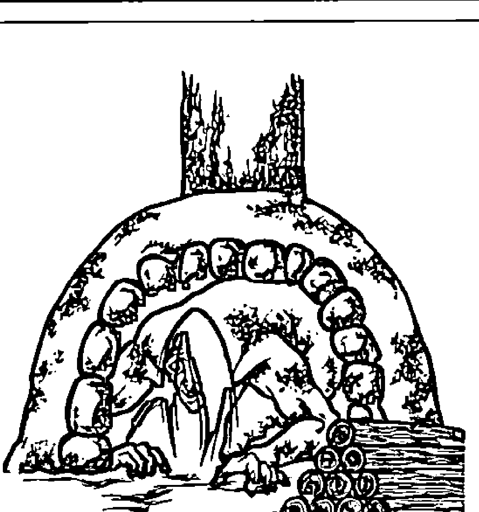

### 妖魔之王 美国

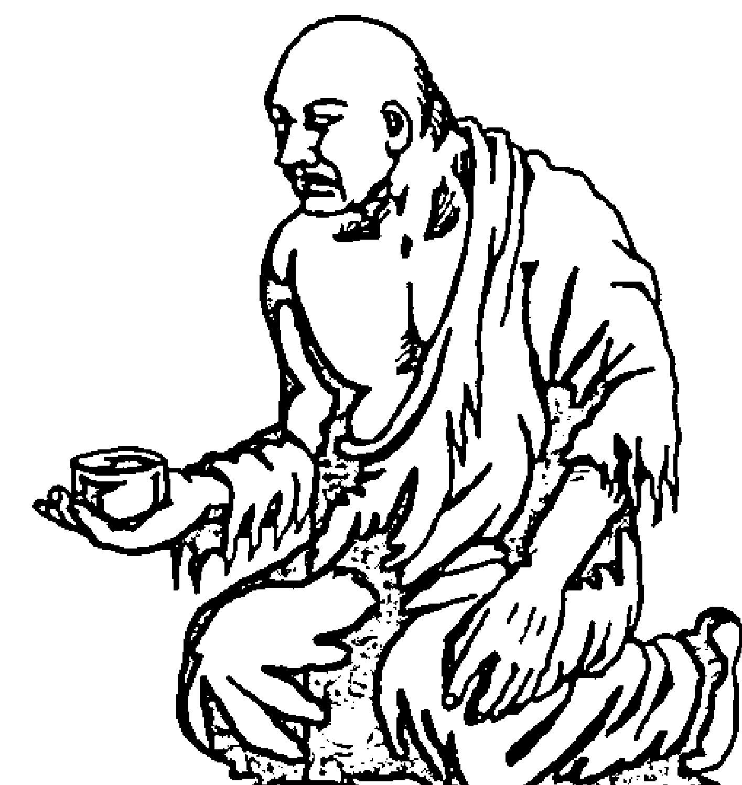

146 译注：故事大意为：神创造宇宙之前，地球仍处于平坦的状态，此时，人与妖魔同时并存。故事中五位暗之王一一登场，与人、妖魔之间产生各种爱欲纠葛。此系列中共有七部分，分别为 1.Night's Master（暂译：暗夜之王）2.Death's Master（暂译：死亡之主）3.Delusion's Master（暂译：迷惑之王）4.Delirium's Mistress（暂译：谵狂女王）5.Night's Sorceries（暂译：暗夜妖众）6.The Man Who Stole The Moon（暂译：偷了月亮的人）7.The Origin Of Snow（暂译：雪之源）。

#### 都市恶魔传说 美国

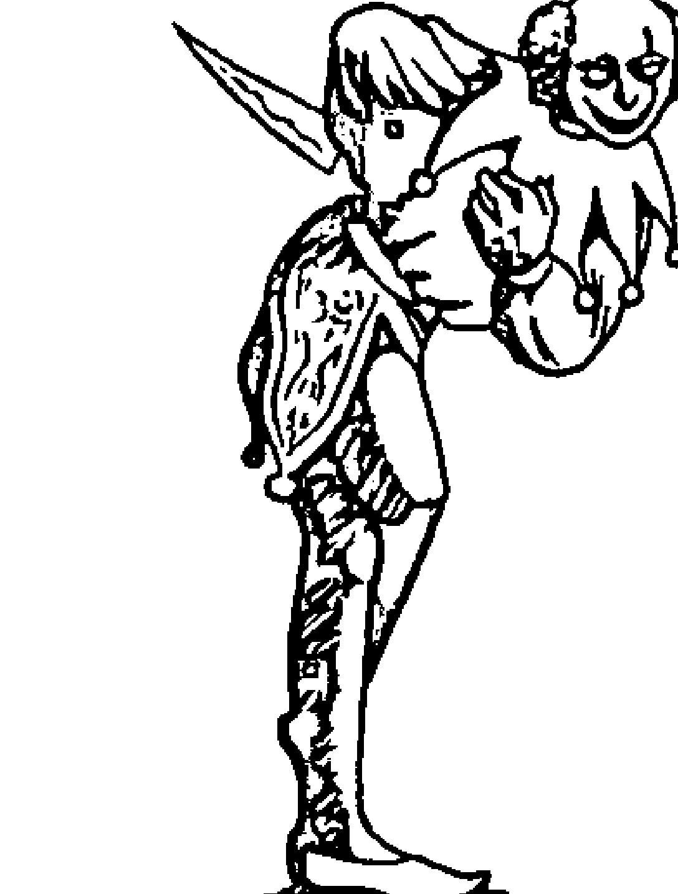

### 不死的科西切

也叫做“※卡西切”（Kashchey），俄罗斯民间故事中的恶魔。关于他名字的来源，据说是由土耳其语中的“奴隶”而来，或者说是从俄语中的“骨头”而来。他的外形是个瘦弱且矮小的老头，但是却力大无比。住在七个城堡中的七道厚重的门里面。虽然拥有无数的财宝，但是却极端小气（或者说正是因为拥有无数财宝才会那么小气的），欲望深厚且极为善妒，见到年轻漂亮的小姐就会起邪心。结果在这些民间故事中，他总是四处掳走美貌的姑娘，带给这些故事的主人翁们种种不幸。比起芭芭雅嘎（BabaYaga）或俄罗斯的恶魔（Demon（Russia））可以说是还要坏上好几倍的人物。科西切拥有不死的能力，因为他将自己的生命放在身体外面的地方，不管是刺他还是砍他，都绝对杀不死他。据说他的生命放在针头上，针又在蛋里面，蛋在鸭子的肚里，鸭子关在铁盒子里，铁盒用七道锁链牢牢锁住，挂在高高的橡树的最顶端上。据说只要这个针头一折断，不死的科西切就会在他那豪华的城堡中痛苦万分倒在地上打滚，飞跳起来而死。

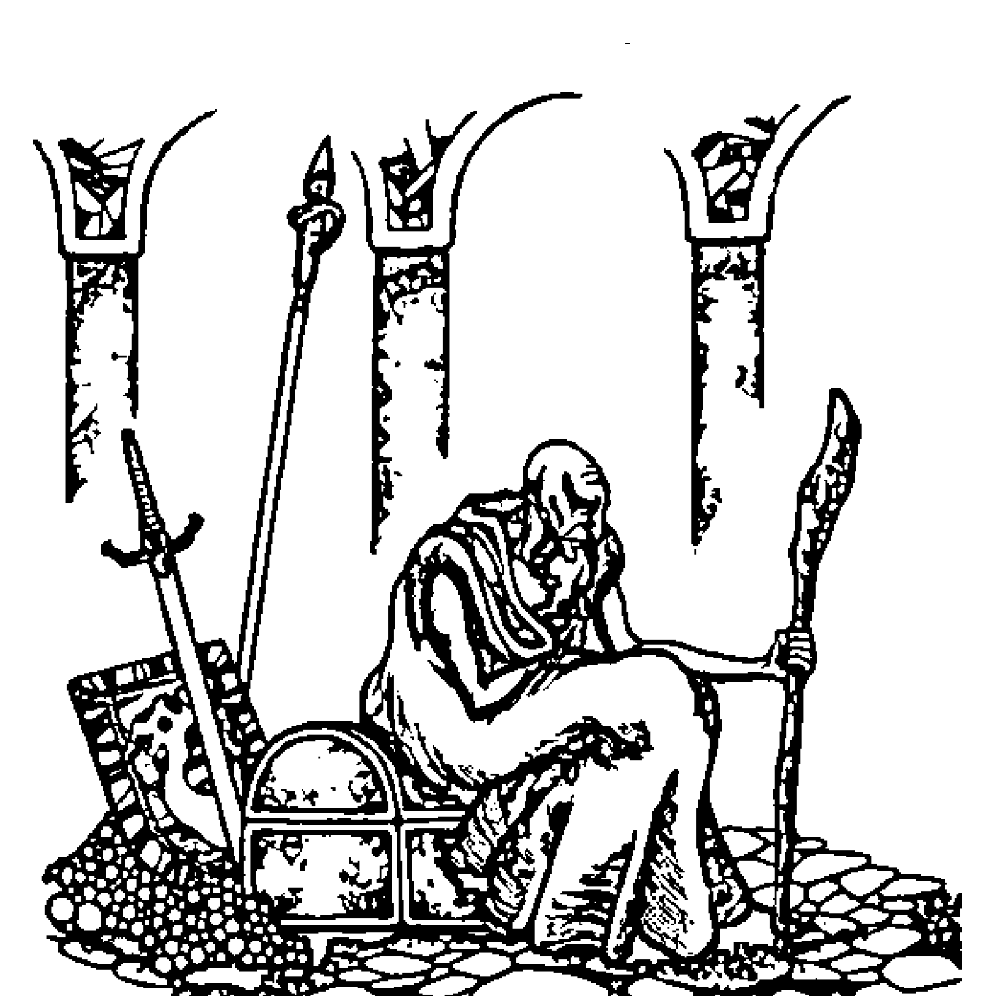

### 巨旦大王

别名“※巨旦将来”（Kotan-syourai）。《金乌玉兔集》147 只园说话中论及的恶神之一。根据该书，牛头大王（依照本地垂迹说148，是须佐之男命Susanowo-no-mikoto）前往迎娶龙宫公主之时，向富裕的巨旦大王要求住宿一宿，却被拒绝。之后，受到巨旦大王婢女之弟——贫穷的苏民将来热情的款待。迎娶归来之时，顺道灭了不让自己借住一宿的巨旦大王。此时，牛头大王在用桃木制成的木简上写下“急急如律令”，交给婢女苏民将来的姐姐，并说：“从此之后，灾祸不会发生在苏民将来的子孙上。”并教导她们在元旦（1月1日）时吃红白饼等护身的方法。巨旦大王之所以当作恶神、厄运之神的原因是，他后来被称为金神（或是艮之金神 Ushitora-no-konjin），执着到令人恐怖的程度，向人施法作祟。

147 译注：作者、成立年代不详。传为安倍晴明所撰。一说，为室町时代只园的社僧所著。
148 译注：日本神道教的理论。佛教将佛的法身称为“本”或“本地”，把佛随时应机说法的化身称为“迹”或“垂迹”。本地垂迹说最早主张“佛主神从”（把日本神当作佛教的护法神），之后伊势神道提出日本诸神是“本地”，而佛、菩萨是“垂迹”的神主佛从的本地说。

### 恶神 日本

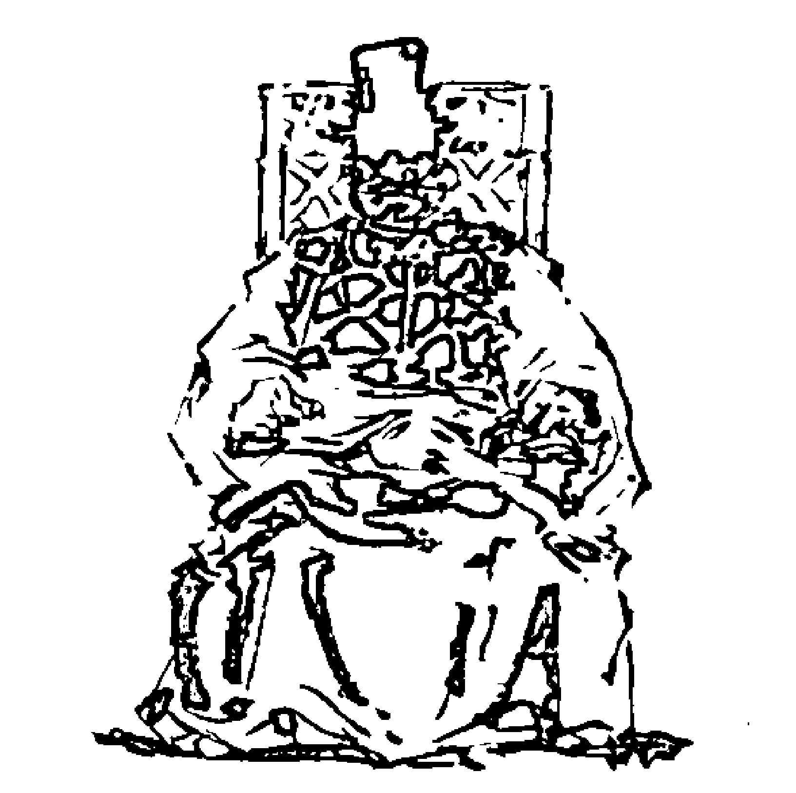

### 底提

是众※达伊提耶的守护女神。为达伊提那王子波诺（Bana）之母，其名意为“裸女”。拥有千手的波诺和英雄神黑天（Krsna）作战之时，黑天手执名叫苏达沙纳（Sudarsana）的圆形武器向波诺掷出，裸身的底提出身于波诺之前，保护孩子。黑天避开底提掷出武器，砍断了波诺的一千只手，却也留住性命。在南印度，对底提的信仰非常深厚，与湿婆（Siva 或 Shiva）的妻子突迦（Durga）不相上下。也难怪，达伊提耶被南印度的众神征服，从神明降格为恶鬼。（→伯利 Bali）

### 达伊提耶（恶鬼） 印度

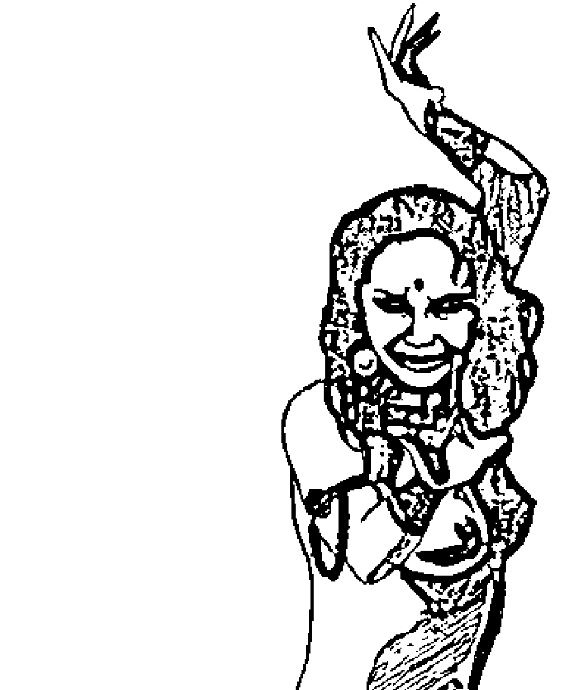

### 裂嘴女

1970年末期到1980年流传于日本各地，使得全日本的小学生惊惧不安的妖怪，就是裂嘴女。

之后，裂嘴女虽产生各种不同的形态，一般而言其形象为，在深夜鲜有行人通过的道路上，一位戴着口罩的女性询问路人：“我漂亮吗？”路人回答若：“是。”女人便会脱下口罩，露出裂到耳际的嘴巴问：“这样也是？”当人感到万分恐怖想要逃离时，裂嘴女就会用100米3秒的飞毛腿直追而来。但是，若回答：“不漂亮。”裂嘴女就会说：“把你也变得跟我一样吧！”接着就撕裂对方的嘴巴。

现代都市怪谈，大多是以“从朋友的朋友那边听来的”这种典型的句子开始。然而，此类小学生的都市怪谈，竟使得北海道钏路市的女子高中一起集体放学回家，虽然只有持续一段时间，没想到连大人都为之影响。

在流传期间，传说裂嘴女有三姊妹，是整型失败的女性等等，此种设定假想不断地增加，也是都市怪谈特有之处。

> （→黑衣男MenInBlack,Blackmen）

### 夔

中国古代灾害神，能引起暴风雨之怪物。古时，中国被称为东海的大海中有以座山叫流破山149。山中有兽名夔。

状如牛，苍身而无角。光如日月，声如雷鸣。此兽出入水时，必起风雨。

中国帝王神黄帝同叛乱神蚩尤(Chihyu)交战时，黄帝捕杀此兽，以其皮作为军鼓。因当时黄帝一方居于劣势，士气低落，为避免失败，黄帝想方设法打击蚩尤军士气。

于是以雷兽骨击军鼓，声闻五百里。黄帝军因而气势大盛；蚩尤军闻鼓则心生畏惧。

149 译注：原书中错作“流波山”，流破山才对。

### 鬼车

招祸怪鸟。别名“※九头鸟”(Chiutouniao)。形如其名，为身具九头之鸟。

鬼车有十颈，但仅有九头。据说一头遭犬咬去，也有的说遭古时周朝宰相周公旦命庭师射掉。不论传说为何，鬼车无头颈部时常滴血，人们因而易知此鸟来临。

相传鬼车来时，众人熄灯，令犬吠之，以此驱赶。

又说鬼车每头皆生双翼，所以，欲腾空时18只羽翼相互扑打受伤，因而无法飞起。

另外，有一种传说鬼车为“※姑获鸟”（Kuhuoniao）别名。姑获鸟为攫捉孩童之妖怪，应当是由鬼车衍生而来。

> （→鵸鵌鸟·鷩鸟Tzuniao&Channiao、鵸Chu、大风Tafeng、毕方Pifang）

#### 都市恶魔传说

日本

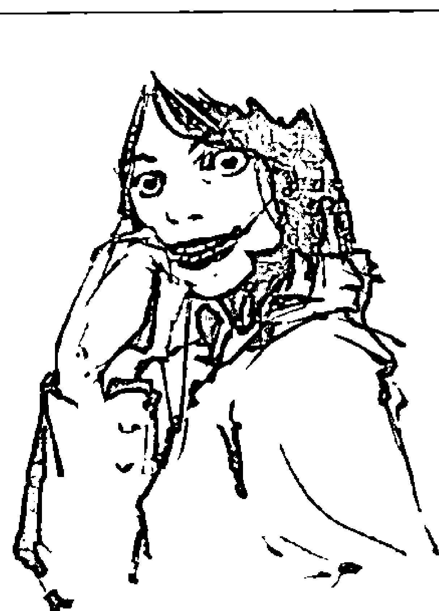

### 怪物·灾害神

中国

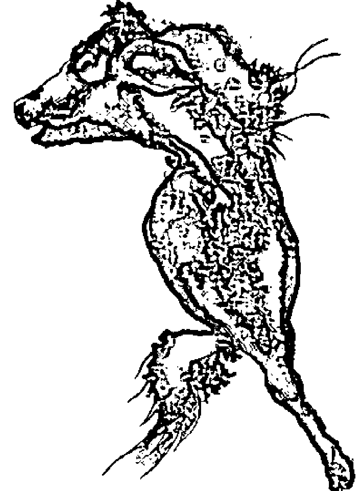

### 怪物

中国

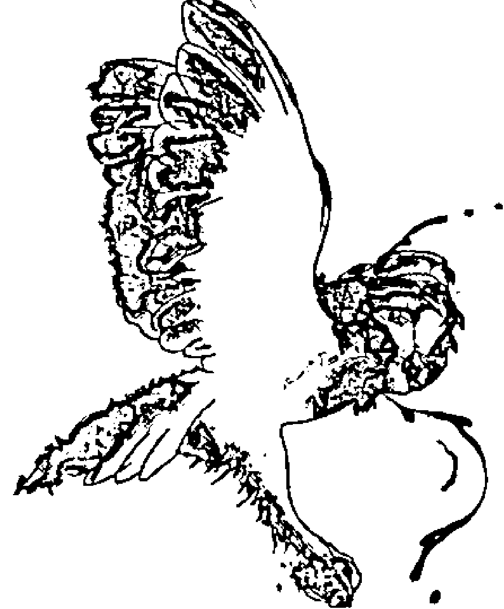

### 库希多拉

阿尔巴尼亚（巴尔干半岛的西南部）民间故事里登场的恶魔，或是同一类。其名称来自拉丁语 Kelshidras，意思就是“住在水中或是地上的蛇”。

曾以两种姿态出现在人的面前。一个是乳房下垂、身材高大、面目丑陋的老妇人；另一个是貌似喷火龙的怪物。

库希多拉以自己的尿作为武器，也有使大地干旱的能力。一旦，库希多拉所导致的干旱开始时，除非以活人献祭，否则无法平息。

库希多拉也可以是男性，被称为“库鲁希多拉”（Kulushedel）。当然也是邪恶、为所欲为的恶魔。

库希多拉最初是被称为“※波拉”（Bolla）的蛇形恶魔（在南阿尔巴尼亚则称※布剌（Bullar））。每当一年一度的圣乔治日（St.George's Day），波拉就会张开眼睛将人活活吞下，经过12年后就会变成恐怖的库希多拉。

### 鸠姆婆迦哩纳

楞伽（※罗刹之都）的罗刹王罗波那(Ravana)的弟弟。是※罗刹（Raksasa）毗湿罗婆（Visravas）与妻子※罗刹女（Raksasi）吉私尼¹⁵⁰ (kēśnī) 之子。

鸠姆婆迦哩纳在一次苦修末期受到梵天的恩惠。他向梵天要求“永远的生命”，梵天却故意错听赐给他“永远的睡眠”。然而，这么睡下去不免死亡，梵天便允许他六个月连续睡眠后，有一天的时间能够醒着。利用这一天，鸠姆婆迦哩纳吃下六个月份的食物。

然而在罗摩（拘萨罗国的王子）与罗波那的战事一起，罗波那唤醒鸠姆婆迦哩纳。最初，罗波那准备了如山高的米粮以及数百头水牛的料理，却被鸠姆婆迦哩纳嗤之以鼻。之后，又准备了数千头象，鸠姆婆迦哩纳这才悠悠醒来。

鸠姆婆迦哩纳负责迎击猴王羯须哩婆¹⁵¹和熊王羯巴婆（Jambavat）率领的大军，顺利擒得猴王。

然而在这之后，鸠姆婆迦哩纳回到战场与罗摩一战，却被砍下首级而死。

150 译注：一说鸠姆婆迦哩纳以及罗波那为毗湿罗娑及尼迦娑所生，但据《毗湿奴往世书》所述，毗湿罗娑其妻并非尼迦娑，而是吉私尼。
151 译注：又称妙颈。

### 共工

古代恶神・武神・乱神。

共工为古王炎帝神农氏的族人。相传人面蛇身，并有人手人脚，个性贪婪恶劣，顽固愚钝。炎帝人如其名，乃为火神；共工则为能起洪水的水神。

相传神农氏德衰治乱时，黄帝起而逐之，黄帝自身即位后封炎帝一族为南王。共工对黄帝体制而言乃为叛神，此点与蚩尤（Chihyu）同。

若蚩尤乃最强叛神，则共工可谓最大叛神。相传与共工争战过之人中有黄帝，甚至还有其母祝融氏。共工的真正叛乱于颛顼继黄帝之位后方始。此时在一阵激战后共工败北，其手下浮游(Fouyu) 自尽。因战败而大怒的共工撞断支撑世界的不周山，大陆为此地倾东南。

其后共工屡屡叛乱但均失败，最后遭夏朝开国君主禹讨伐，被禹处刑。

> (→洪水之兆 The omen of flood)

### 民间故事的恶魔
阿尔巴尼亚

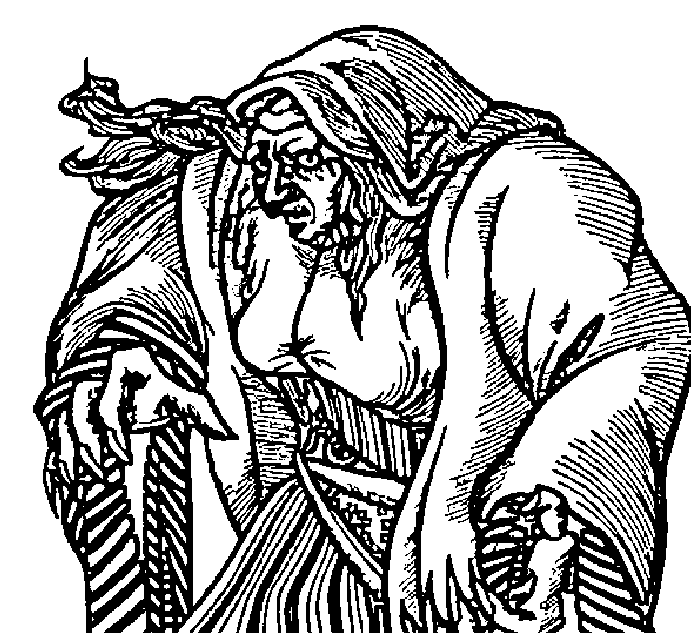

#### 罗刹
印度

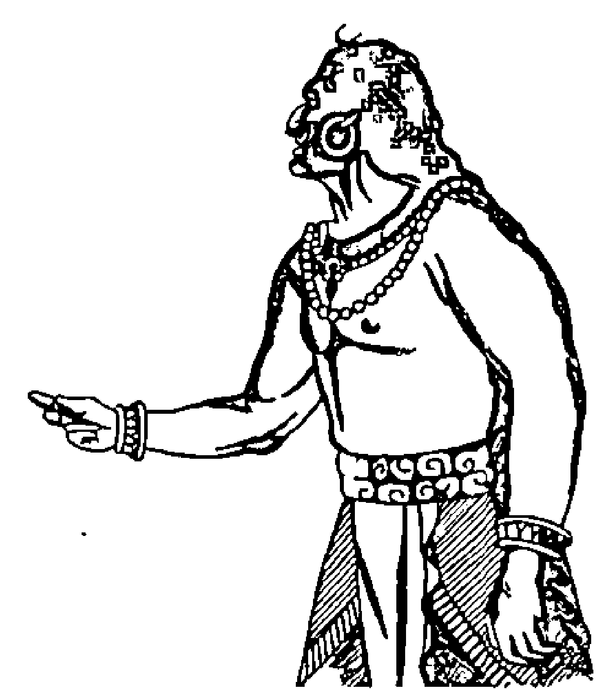

### 恶神·叛神·水神
中国

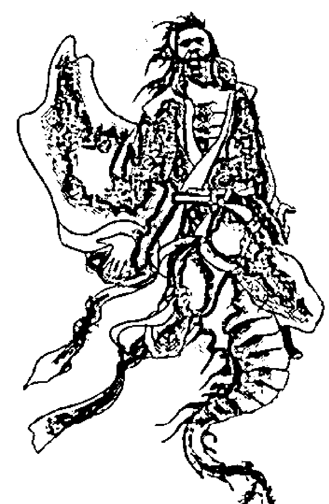

### Lamia
拉弥亚

贝罗斯<sup>152</sup> (Belos) 与利比亚<sup>153</sup> (Libye、Libya) 的女儿。

她原本受到宙斯 (Zcus) 的宠爱，但是赫拉 (Hera) 嫉妒拉弥亚，于是对她施了一种法术，让她每生一次小孩，就一定会自己吃掉他。在这残酷的报复下，在绝望中拉弥亚终于逐渐失去她正常的心，开始转变成野蛮的怪物了。最后她成了栖身于洞穴中，猎食小孩的怪物。

而赫拉见到她这样的下场却还不放过她，更进一步地夺去她睡眠的时间。宙斯不忍心，便施法让她能够自由地将眼睛取下。因此当拉弥亚将眼睛拿下时，小孩子们就是安全的。一旦装回去时，她又会开始四处猎食小孩了。

到了历史时代时（希腊文化发达的时候），希腊的母亲们经常拿拉弥亚来吓唬不听话的小孩：“再不听话的话，拉弥亚就要来将你们吃掉了喔！”

(→艾奇德娜 Echidna)

152 原注：海神波赛顿 (Poseidon) 的儿子，埃及之王。
153 原注：她同时也是贝罗丝之母。今日小亚细亚国家利比亚的语源。

### Lerajie
勒莱耶

这是假托所罗门王所写，但实为17世纪时魔法书之《雷蒙盖顿》(Lemegeton, 又名 The Lesser Key of Solomon) 的第一部〈哥耶提雅〉中记载的72只恶魔之一。

在召唤者面前，他手里拿着弓箭，身穿绿色的猎装出现。说到猎人样子的恶魔，不禁让我们联想到同是《雷蒙盖顿》恶魔的巴巴妥司 (Barbatos)，不过巴巴妥司的能力与他的外形相符，与动物很有关联性，但是勒莱耶似乎就只有外形带来的气氛罢了。

勒莱耶的能力是能够让受伤者痊愈，或是让伤者完全不能治愈。另外也能引起纷争，似乎是与战争有关系的恶魔。虽说关于他的记载不多，但可以说是〈哥耶提雅〉中十分有特色的一个恶魔。

19世纪法国作家普朗西在他的《地狱辞典》中，插画家布尔顿所画的图深受大众欢迎，因他的图而变得有名的恶魔不少，但是可惜的是该书并没有记载勒莱耶的事项，自然也不会有他的插画，结果在现代算是知名度较低的恶魔。

### Leviathan
利维坦

这是希伯来神话中，受到蒂雅玛特 (Tiamat) 影响下产生的蛇怪，名字的意思是“盘绕起来的东西”。正如其名，他是一条身体巨大的能够将大地盘绕起来的蛇。发音除了“利维坦”以外，也可念作“利拜雅桑”或“利未雅坦” (Liwyathan)。而在地中海沿岸的古老都市乌加里特 (Ugarit) 的传说中，则叫做“隆卡” (Lotan)。

《旧约圣经》的伪经《以诺书》中对他有如下的描述：
“在那天，两个兽将要被分开，女的兽叫利维坦，她住在海的深处，水的里面；男的名叫比希摩夫<sup>154</sup>，他住在伊甸园东面的一个旷野里，旷野的名字叫登达烟 (Dundayin)，是人不能看见的。”<sup>155</sup>

利维坦在《旧约圣经》中是一条混沌之龙，是耶和华所创出来的生物中号称最大的。这个时候他还不是恶魔，只是神所创的怪物罢了。但是到了《新约圣经》的〈启示录〉或后来的基督宗教文学时，他就摇身一变，被视为反抗神，要让世界毁灭的恶魔了。

(→贝西貘斯巨兽 Behemoth)

154 译注：其实就是贝西菽斯巨兽 (Behemoth)，当贝西菽斯的传说流传到阿拉伯的时候，就转变成巴哈姆特 (Bahamut) 了，巴哈姆特是漂浮在极为巨大的海洋上的大鱼，其上有公牛，牛上有红宝石山，山上有天使，天使之上有6层地狱，地狱之上才是大地。天方夜谭故事中，耶稣想要看看这只巨兽，结果看了之后昏倒在地，三天三夜才醒来，可见其巨大程度。（以上数据引自志文出版社，波赫士 (Jorge Luis Borges) 著《想象的动物》）
155 译注：此段经文引自《基督宗教典外文献-旧约篇》（基督宗教文艺出版社）第一册，然书中利维坦译作“利未安单”，此处为求统一变之。

### ## 怪物
希腊

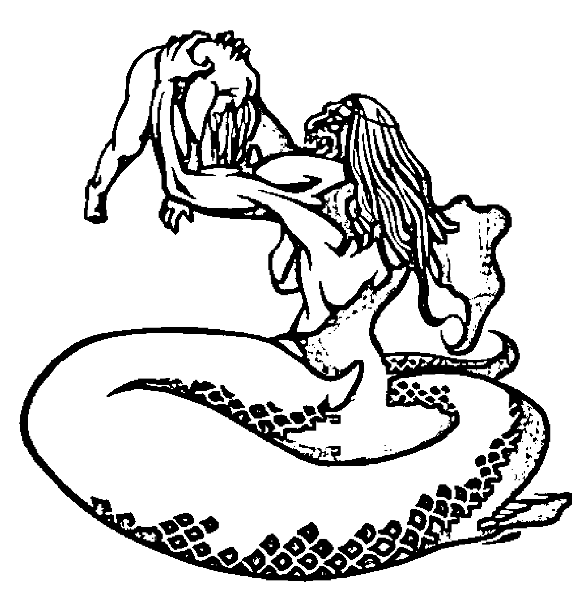

### ## 恶魔·所罗门的恶魔
雷蒙盖顿

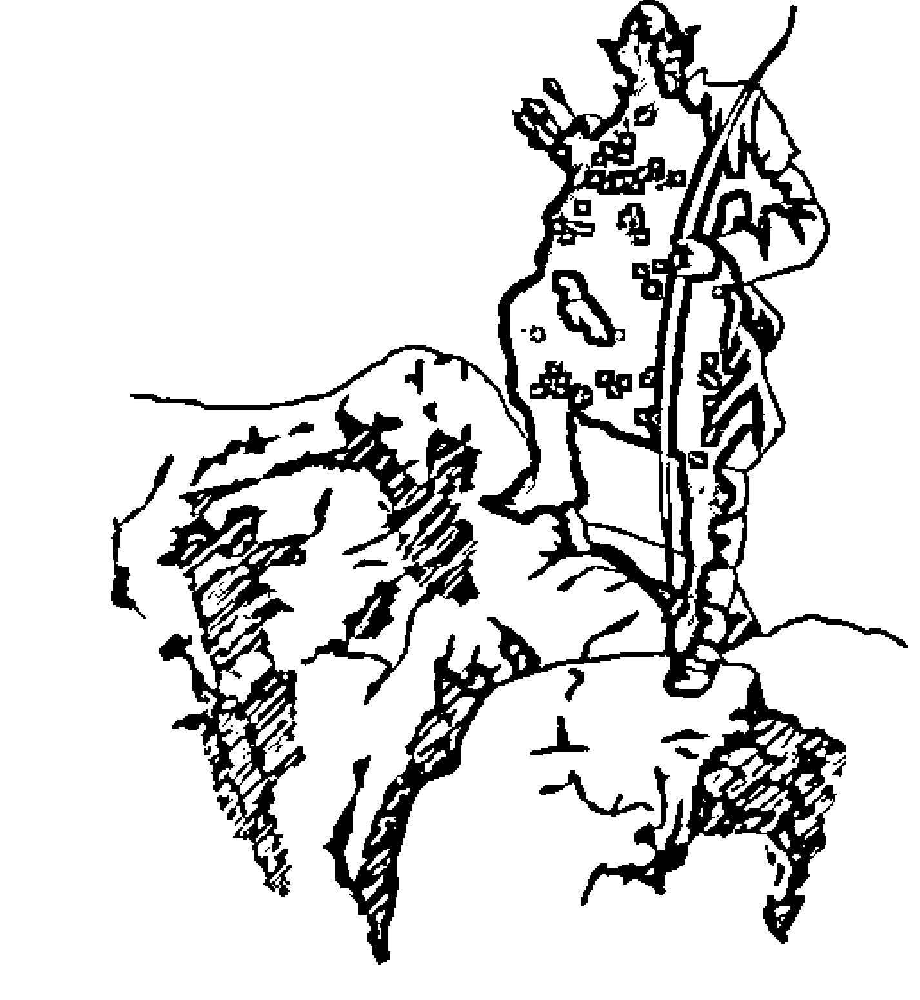

### ## 海蛇
希伯来

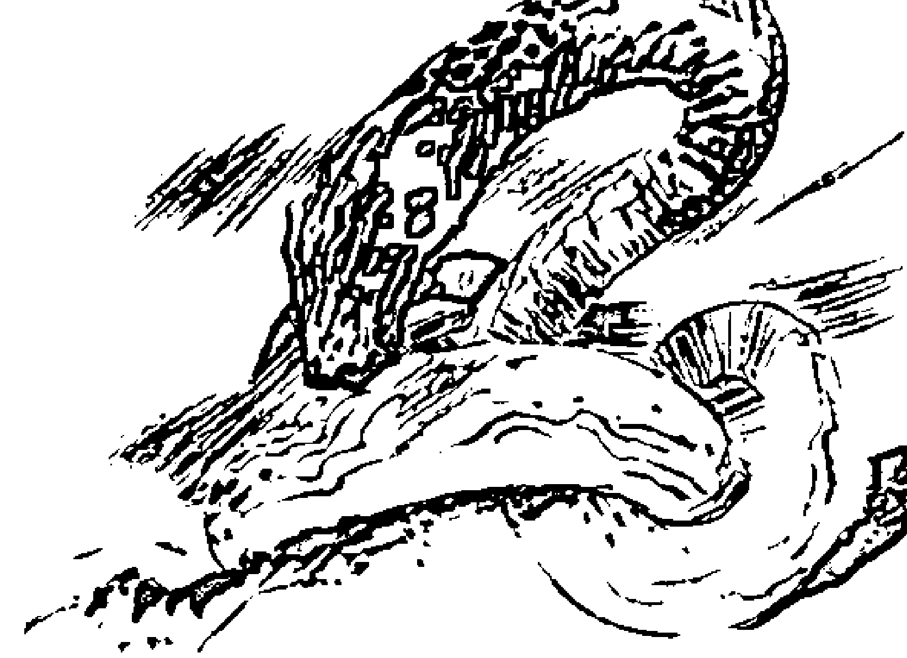

### 利比谷谷

这是在意大利诗人但丁的叙事诗——《神曲》（1307~1321年创作）这部作品中登场的恶魔。神曲三部作中的第一部《地狱篇》中第21篇与22篇中描写的地狱第8圈第5沟的狱吏，专门惩罚生前贪污或诈欺的死者的恶魔集团“※马纳勃郎西(Malebranche)”十二恶魔中的一人。名字的意思是“坏心眼家伙”或者是“暴躁易怒”。(→马纳果达 Malacoda)

一般说来，《神曲》中出现的怪物多半是引用了希腊神话或圣经中的典故，不过这群“马纳勃郎西”则是作者自己的创作，并没有参考其他的典故。“马纳勃郎西”们长了一副漆黑的身体，背上有蝙蝠翅膀，利牙锐爪，可以说就是“恶魔”这个概念的化身。但是这群“马纳勃郎西”与幽禁在地狱最下层第9圈第4圆“咯”中的恶魔王※狄斯(Dis，也就是※路西法)那种型的恶魔可以说完全不同。《神曲》中并没有谈到马纳勃郎西原本是否为天使，而他们的职责似乎也是遵照神的旨意在地狱惩罚罪人。

利比谷谷的性格正如其名非常地“暴躁易怒”，当罪人“那伐拉人强波洛”由池子里拉上来时，立刻按耐不住，冲动地想要撕裂他的手臂。

156 译注：原书写作Libiocco，应为错误，因此参照志文出版社版的《神曲》改正为Libicocco。

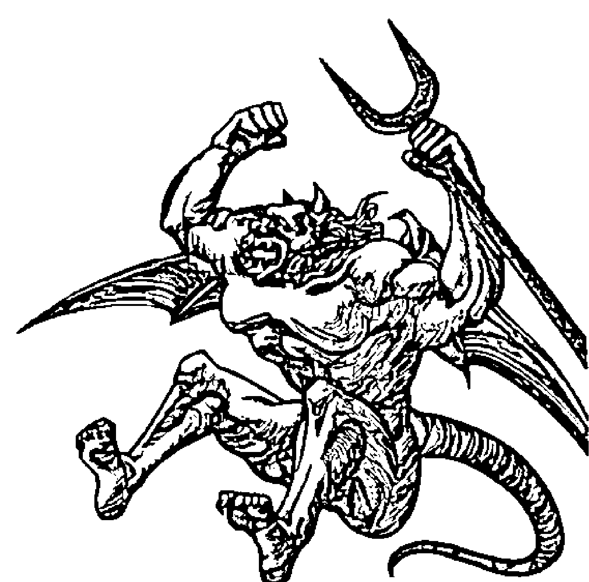

### 莉莉丝 157

她是与亚当同时从土里造出来的第一个女人，亚当的第一个妻子。原本应该是巴比伦传说中的女性，但是因为犹太教经典《塔木德》(Talmud)的记载而变得十分有名。

莉莉丝与亚当生了很多恶魔，后来她不愿听从亚当的命令，因此离开他到红海去。主命令三个天使去找她，天使们威胁说要每天杀掉她100个小孩，莉莉丝向天使求饶，结果她也因此获得使小孩们痛苦的能力。不过由于她向天使发誓不会靠近写有天使名字的家，因此公元前七到八世纪时希伯来与迦南地区流行着这种符咒。

犹太密教喀巴拉(Kabbala)的经典《光辉之书》中也说莉莉丝是由深层的水底诞生，为亚当的第一个妻子，但是后来神造了夏娃之后，她就被驱逐出去，变成了黑夜的恶魔。

而在后世的种种文学作品中也经常以诱惑者的身份出现。在欧美文学里，莉莉丝的典型是美丽的妖女。例如歌德的作品《浮士德》(Faust)中，她是金发美丽的诱惑者，而乔治·麦当劳(G. MacDonald, 1824-1905)的小说《莉莉丝》中则是地狱的女王。

（→梅菲斯特 Mephistopheles）

157 译注：意译为“夜妖”，或音译“李丽丝”。

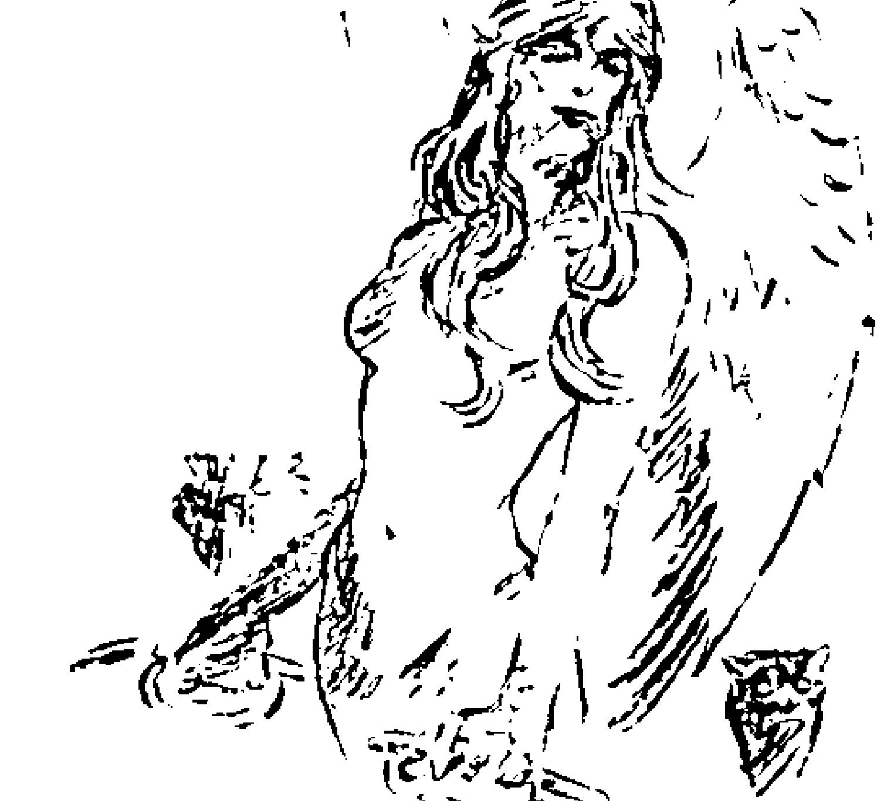

### 妖女
希伯来

### 李左车

冰雹会使农作物受损，有时甚至会夺去人命，虽然不是经常可见的天气现象，但是对农民来说依然是不受欢迎的对象。

据说冰雹之神是道教张天师的部下。《聊斋志异》（蒲松龄著，1766年完成）中有一则关于他的故事158。

一个姓王的人159即将赴任湖南当地方官，因此打算拜访天师。到湖上，准备搭船的时候，立刻有一人搭小艇前来迎接他。王姓男子对他的预知感到不可思议，跟在后面来到天师面前。

天师设宴款待，酒熟耳甜之际，方才引领王公的使者来到天师身边传达事情，天师回答：“我现在有客人，你静静地出去吧。”使者离去后，天师对王公说：“他是你的同乡，有名的李左车将军，刚刚天帝命他降雹。”

李左车是汉高祖刘邦的将军韩信的部下。他为何会成了雹神原因不明，而且除了《聊斋志异》以外，也不见其他说他是雹神的记载。

(→暴风之兆 The omen of big wind、干旱之兆 The omen of drought、洪水之兆 The omen of flood)

158 译注：出自《聊斋志异》中的“雹神”。
159 译注：王药苍，名孟震，明万历甲午年间举人，曾历任浙江道御史、辽东巡按、工部主事、光禄寺丞等官。

### 冰雹之神
中国

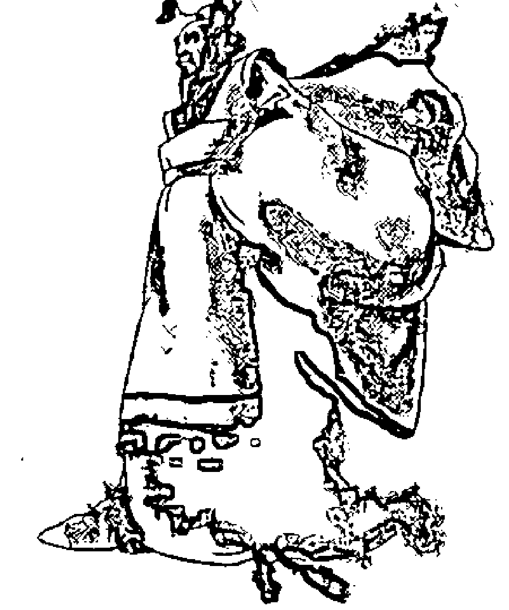

他是北欧神话中的神，出身于诸神之敌的巨人族。与主神奥丁（óðinn）是义兄弟。思虑敏捷，擅长奸计，拥有自由变身的能力。个性任性妄为，从不考虑事后结果，想恶作剧的时候就会恶作剧，使得众神经常因此陷于危机之中，但是他也很擅长靠着他狡猾的智能回避众神的责难。根据基督宗教传入北欧前的资料，洛基只是个单纯的神界中的恶作剧者而已；但是在基督宗教传入后，北欧神话开始产生了质变，洛基的角色定位也逐渐接近类似撒旦一般，变成一种根源性邪恶的拟人化了。

据说洛基拥有俊美的容貌，但是有人认为这是受到基督宗教撒旦堕天之前拥有美貌传说的影响。而北欧神话中洛基因为恶作剧太过分被众神以锁链绑在深山中，这点也与基督宗教中撒旦被基督绑在地狱1000年，直到末日审判来临为止的说法相类似，因此也有学者认为这是受到基督宗教的影响。（→奥丁 óðinn 〈北欧神话〉、撒旦 Satan 〈中古欧洲〉）

#### 路希

她是芬兰叙事诗《卡勒瓦拉》中最了不起的英雄维那莫依宁的敌人，是统御北国波约拉（Pohjola）的女王。她看到维那莫依宁的故乡维诺拉如此的繁荣感到很嫉妒，因此向乌可神祈祷说：“统御天上世界的乌可神啊，用您那以雷电光芒制成的弓箭，或者是用各种疾病，毁灭维诺拉的人民吧！”但是她的愿望并没有实现，于是路希设计让罗薇塔（Loviatar）在自己的国度生下9个小孩，然后将这9名小孩送进维诺拉去，但是最后她这诡计还是被维那莫依宁的智能所破解了。（→罗薇塔的孩子们 9 children of Loviatar）

另外，她也曾抓住魔熊奥德索（Otso）并且将他赶进维诺拉去。但是维那莫依宁用他的枪将大熊给打倒了，甚至因此获得更多的人望。除此之外，路希为了让维那莫依宁陷入痛苦之中，甚至还曾经将太阳与月亮藏了起来，从这些行为来看，早就超越人类的行为了，因此本书将她视为邪神或恶魔的一种，收录在内。

#### 罗薇塔

冥府之王图奥尼的女儿中最坏心、最丑陋的就是罗薇塔。她被认为是种种邪恶的元凶。（→图奥尼与图奥奈达 Tuoni & Tuonetar）有一次她坐在“罪恶”与“悲哀”的原野时，由东方吹起风暴，风暴从原野上呼啸而过，吹到她的身上，于是她就怀孕了。罗薇塔很痛苦，想要快点生下孩子，但是总是生不下来。这时天上传来乌可神的声音，说“想生下孩子的话就到波约拉（Pohjola）去吧，那个国家正焦急地等着你哪。”于是她就前往北国波约拉去了。

结果从她的肚里生下了九个孩子，这些孩子分别是“疝气”、“横隔膜炎”、“肺病”、“痛风”、“发烧”、“溃疡”、“瘟疫”、“癣疥”、“肿瘤”。罗薇塔将这些孩子养大之后，对他们说：“来，我的孩子们啊，你们去英雄维纳莫伊宁（Vainamoinen）的故乡，把疾病与痛苦带给他们吧！”结果维纳莫伊宁故乡的居民就因此患了种种的疾病一个个死亡了。（→罗薇塔的孩子们 9 children of Loviatar、路希 Louhi）

#### 巨人族出身的亚萨神族 北欧

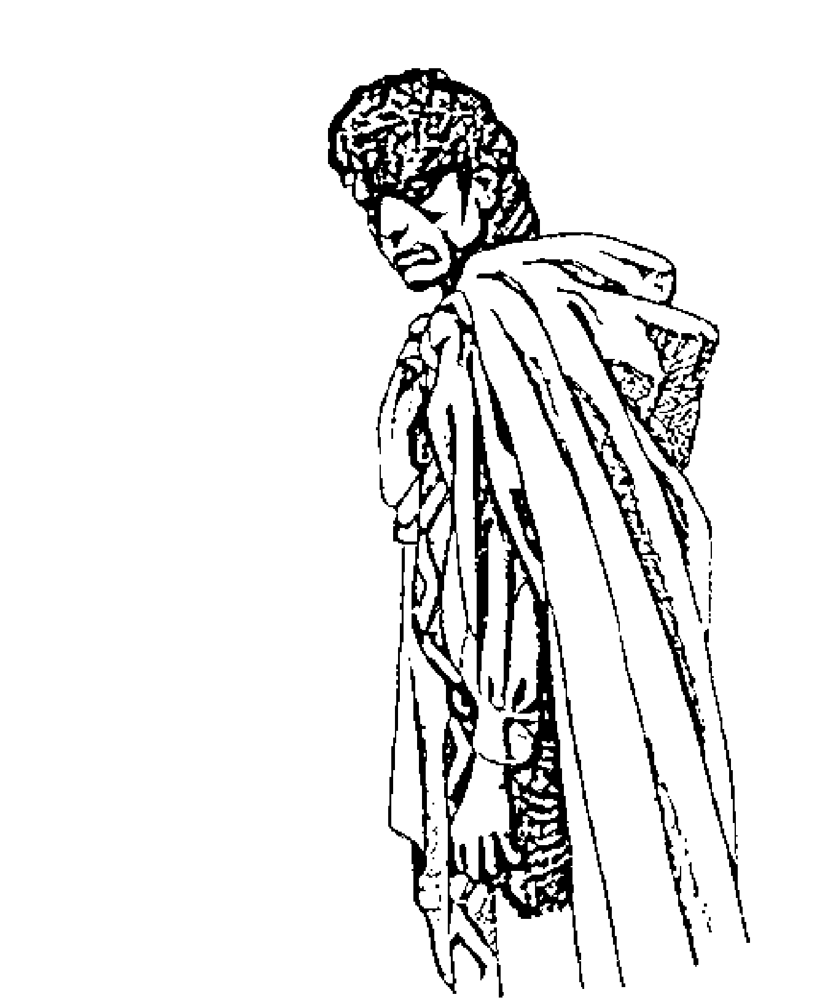

#### 北方女王 芬兰

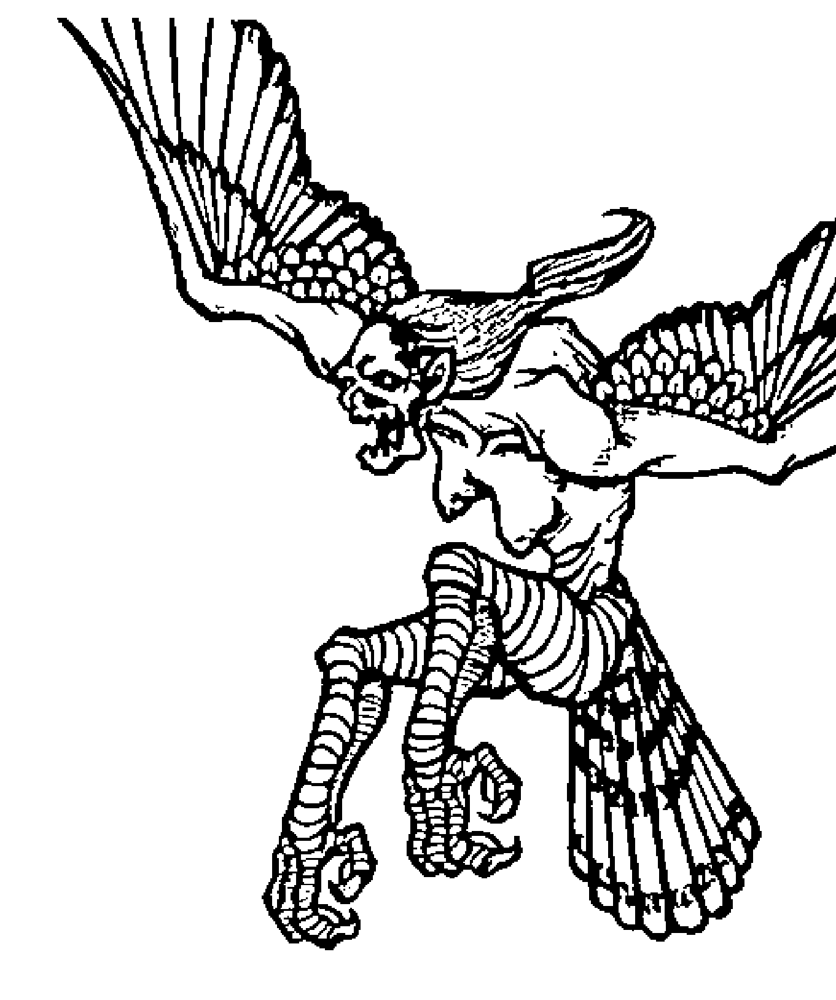

#### 死亡魔女 芬兰

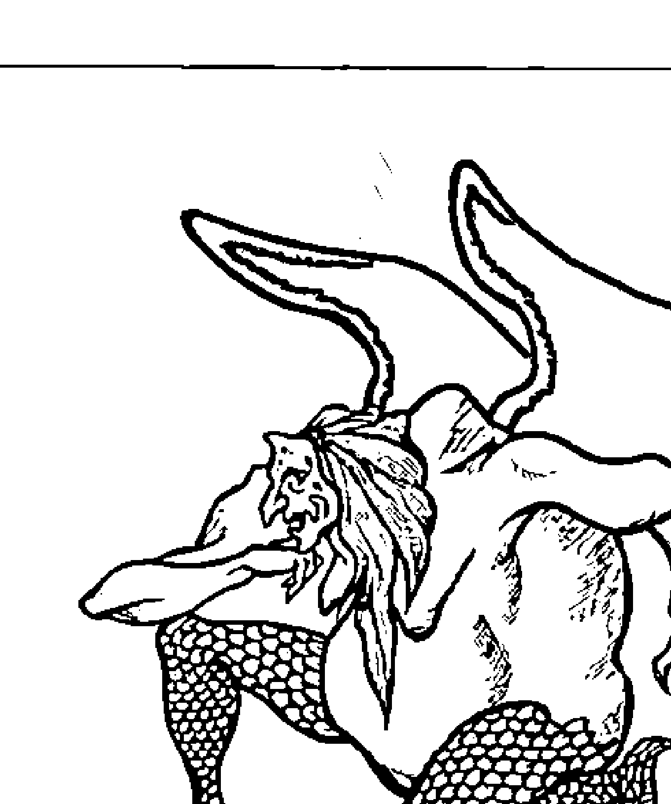

#### 圣露西

所谓基督宗教的圣人，就是把对基督宗教有所贡献之人，依照其事迹，将其化作生活各方面的守护神。在欧洲，不管什么职业、什么日子都有守护的圣人。譬如焊锡匠的圣人、卡车司机的圣人、几月几号的圣人等等。此类圣人不可避免地与神、英雄、妖精、妖怪等相结合。进一步说就是“在圣人之名下，妖怪也会惧怕。”这类思想盛行的结果，结果造成一部分的圣人与恶魔无法区别。

譬如12月13日的圣女圣露西。根据捷克或斯洛伐克的民间信仰，圣露西之夜，此位女性会在街上徘徊。穿着纯白的衣服与披肩、长发飞舞的美女会把不听父母劝告的小孩带到不知名的场所。然而，信仰正统基督宗教的老妇人之中，也有人不相信圣露西会对小孩做坏事，只是吞食长夜让它缩短而已。让人想起这样传说的夜晚大概接近冬至吧。

（→圣卡西亚 Kas'yn）

#### 波兰的路西法

波兰的民间故事中与恶魔有关的故事非常多。而这些故事中当然也有以恶魔王路西法为主角的故事。

波兰文人布尼凯维奇（Witold Bunikiewicz）在1930年编纂的民间故事集《波兰恶魔的生活》中提到：波兰的路西法是个非常懂得人情世故的国王，每次看到他的部下又在吵架的时候总是担忧在心。他深知“人和是最重要的。如果不和，就算是最繁荣最富裕的国家也会堕入灭亡的境地，最后搞不好连自己都会一起毁灭了”的道理（这倒也是，毕竟他本人就有在天庭挑起不合的前科）。

因此他将收买人魂、严惩罪人的任务交给自己的部下，而自己则专心负责恶魔之间的仲裁与调停。如果有爱吵架的小恶魔他就会将他流放到人间去，让他在地上而不是在地底散播灾难。从这些故事看来，与其说这波兰的路西法是个“黑暗的王子”，倒更让人联想到好好先生的中小企业经营者。

（→撒旦 Satan《新约圣经》、波兰的恶魔 Diabel）

#### 玛哈

她是爱尔兰凯尔特神话中的战女神。名字的意思是“愤怒”，与战争有很深的关联。

爱尔兰的神话中，战争女神本来就有好几组存在，而与玛哈同时期的神话中的战争女神尚有摩莉甘（Morrigan）、芭德布（Badb）等，这些战争女神经常被视为同一人物。甚至连名为玛哈的女神也有好几位，她们各有各的故事。从这些现象看来，“玛哈”这个名字大概不是一个女神的专有名字，而是一种对“战争女神”的称号吧。

最为人所熟知的玛哈是在“达那神族”与巨人弗摩尔（Fomor）族的战争中出现的女神，她与众神的指挥者努哈萨（Nuada）同时被弗摩尔之王魔眼巴洛尔（Balor）所杀。

玛哈虽然是个女战神，但是她不是勇猛地在战场上挥舞着剑或枪来战斗，而是凭借着自己的魔法之力来驱动战争。

玛哈在战场上以她的魔力唤起战士们的愤怒，给予他们狂暴的战斗力。这也就是为何人上了战场之后会性格大变有如鬼神一般地疯狂战斗。

#### 人类 捷克、斯洛伐克

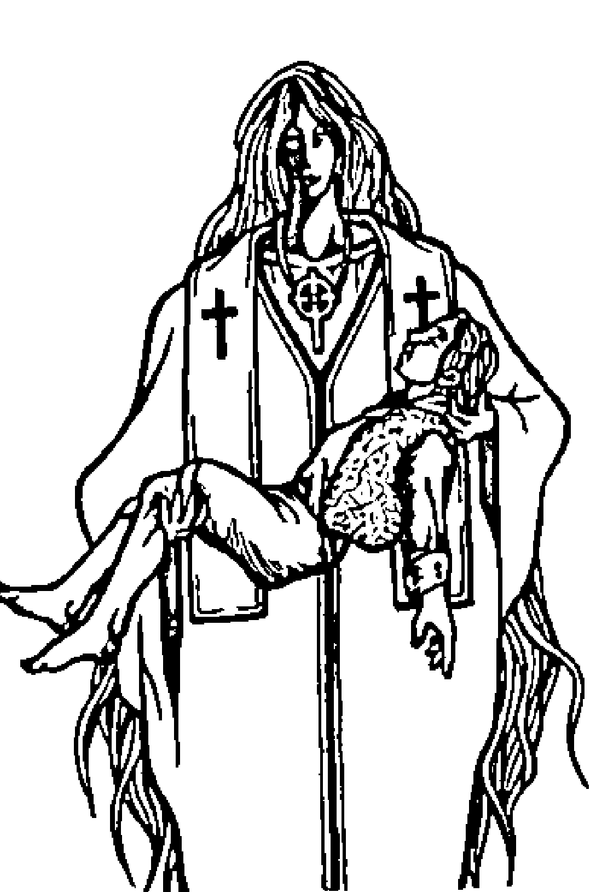

#### 恶魔王 波兰

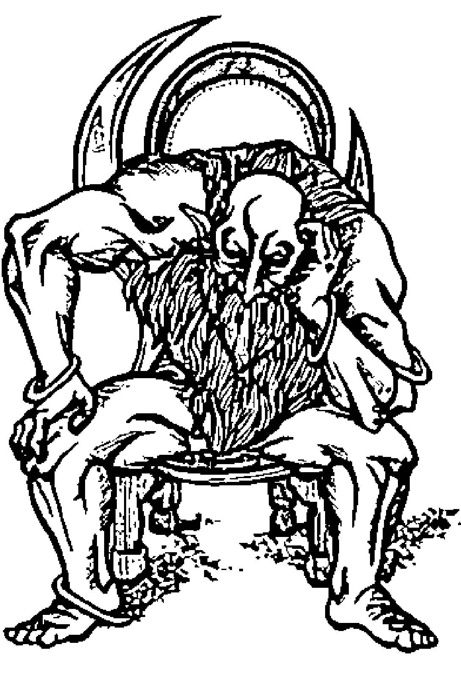

#### 战争女神 克尔特

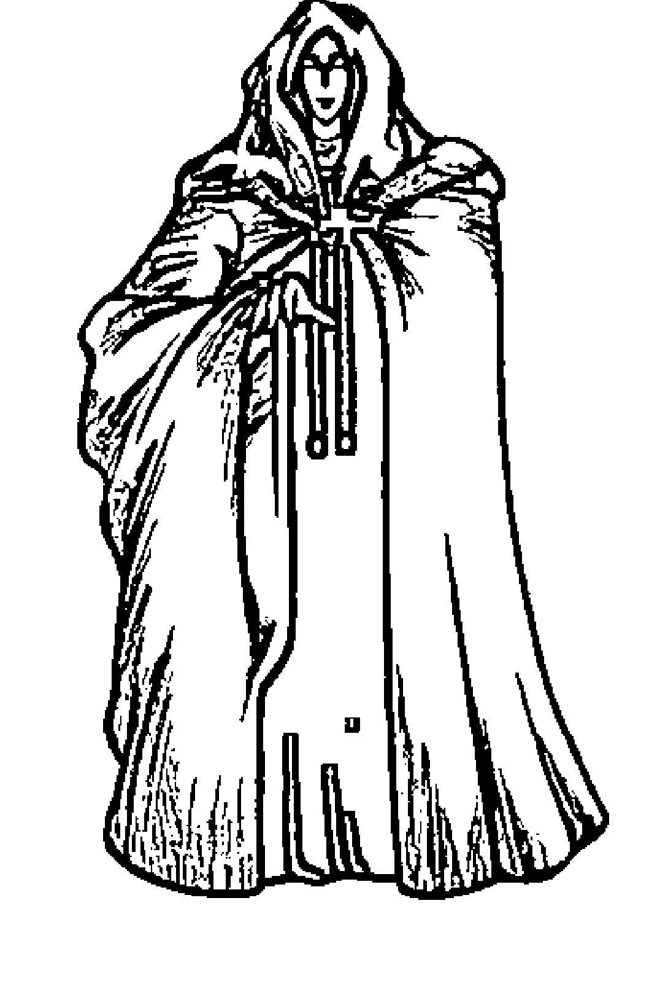

#### 摩陀

吉耶婆那（Chyavana）仙人通过苦修所生出的阿修罗。吉耶婆那仙人因为从双马童160（Asvin）那里获得了年轻与美貌，非常感谢他们，因此答应让双马童饮用苏摩酒。但是※因陀罗（Indra）认为双马童他们混在人类之中当医师，所以没有饮用苏摩酒的资格。吉耶婆那仙人不顾因陀罗的反对，继续供养。于是他获得了苏摩酒的容器。因陀罗很生气，拿起了他的武器金刚杵（Vajra）对仙人放出了雷电，仙人被雷电打中手麻，为了打倒因陀罗，他继续修行，于是终于生出了摩陀这个巨大的恶魔。“摩陀”的意思是“酩酊大醉者”。摩陀张开他的大口准备要吞下因陀罗，因陀罗难敌这一巨怪，只好向吉耶婆那求饶，并允许双马童喝苏摩酒。后来吉耶婆那将摩陀分为四个部分，代表着“苏罗酒”、“女人”、“骰子”、“狩猎”四大恶习。

#### 马纳果达

这是但丁的叙事诗《神曲》（1307~1321年作）中出场的恶魔。马纳果达这名字是意大利文，意思是“恶尾”。他登场的部分是《神曲》三部作中的第一部〈地狱篇〉中的第21篇。主角但丁与引导他的罗马时代诗人维其略之灵所探访的地狱，在构造上是一圈圈的阶层，共有九圈。而马纳果达他是当中第八层的恶魔。第8圈“欺骗者之沟”又再细分为十沟，马纳果达与他的部下负责惩罚当中五沟的死者。马纳果达与他的手下总称为“※马纳勃郎西”（Malebranche），意思是“恶爪”，这些恶魔的身上长有蝙蝠般的翅膀，具有锐利的爪子与獠牙。马纳果达则是他们的队长。这些恶魔并不是一般在故事中常可见的诱惑人犯罪型的恶魔，而是听命于神负责惩罚这些罪人。因此与其说他们是叛神者，倒不如说他们是地狱中的专职狱卒。

> →恶魔王 Dis,Dite,Luccifero

#### 玛帕斯

这是假托是所罗门王所写，但实为17世纪时魔法书之《雷蒙盖顿》（Lemegeton，又名The Lesser Key of Solomon）的第一部〈哥耶提雅〉中记载的72只恶魔之一。据说他的样子是巨大的黑鸟。拥有建设营造的能力，一般说他是所罗门王在营造都市时曾经担任建筑师帮忙过的恶魔。他与同属《雷蒙盖顿》72恶魔的哈帕斯经常被人混淆了，与战争相关的哈帕斯以及与建筑相关的玛帕斯会容易被人混淆，主要原因是因为他们都是鸟形的恶魔。只不过哈帕斯是鸽子（或是鹤鸟）的造型，而玛帕斯则是大黑鸟（或说是乌鸦）。作家普朗西的书《地狱辞典》以“※玛法斯”（Malphas）这个名字来介绍。并且说他不只是建筑师，还是建筑物的破坏者，不过恐怕这也是与哈帕斯混淆了的结果。《地狱辞典》说他是地狱的大议长，40个军团的指挥者。该书的插画家布尔顿把他画成手里拿着水泥抹刀、直立步行的乌鸦，使得他在现代也十分有名。

#### 阿修罗 印度

> 160 译注：音译“阿湿波”，为一对孪生兄弟神。

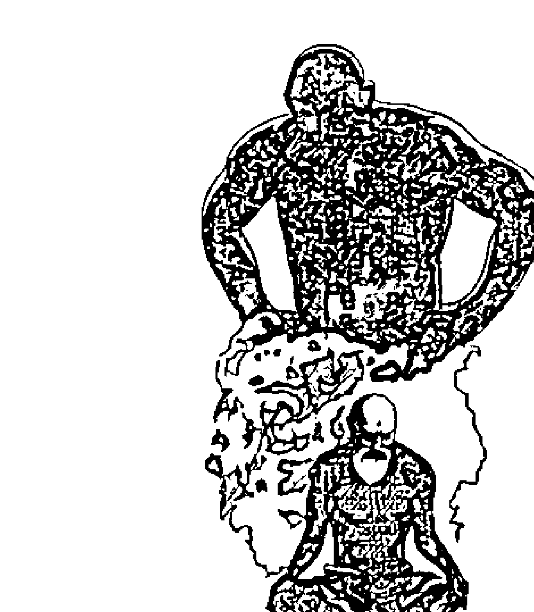

#### 恶魔·地狱的魔鬼 神曲

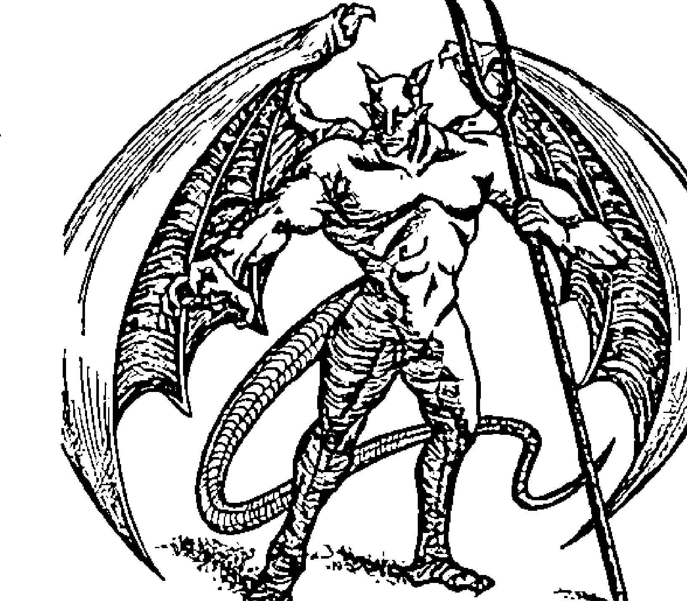

##### 恶魔·所罗门的恶魔 雷蒙盖顿

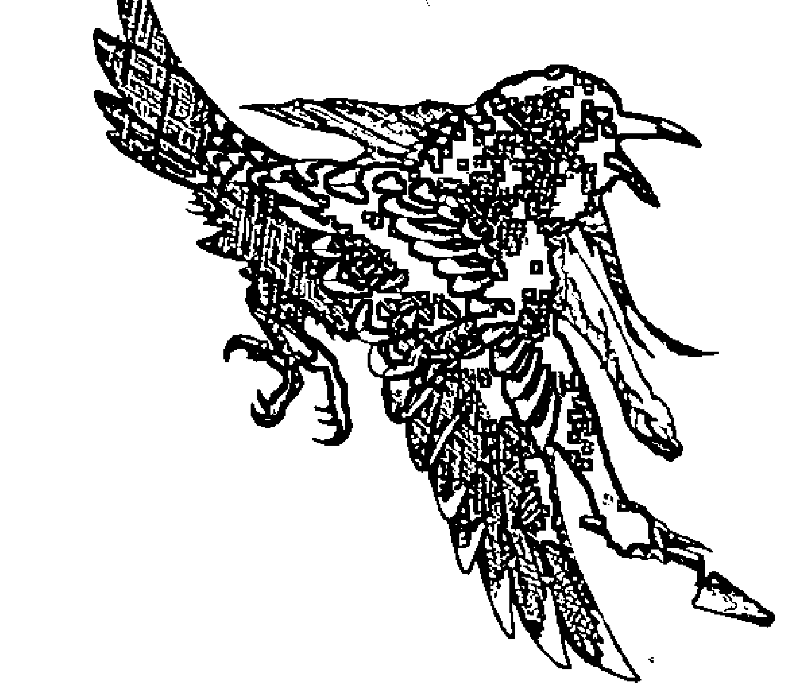

#### 玛门

这是英国诗人密尔顿所著之叙事诗《失乐园》(1667 年)中登场的造反天使（恶魔），也拼作“Mamon”。米尔顿在自己的作品中，将《新约圣经》〈马太福音〉¹⁶¹ 中代表“财利”的“玛门”这一名词拟人化而造出他。因此他的来源与被设定为异教神、偶像神前身的其他造反天使们相较之下较为特殊。他被称作“浅薄者、卑贱者”，对于天使们的根本的存在理由——赞美神的光荣并不热心，在堕天之前他就醉心于天国路上所铺设的黄金，而堕天之后他虽然并没有对自己现在的境况感到悲伤而叹气，但那也是因为地狱的地底埋藏了极为庞大的贵重金属的矿脉，据说教人们挖掘地底埋藏的贵金属的就是玛门。堕入地狱的天使们在那里建造了一座壮观的“万魔殿”，而玛门则提供了他在地狱挖到的金矿用来装饰。除了财产之外他对一切都不感兴趣，在地狱的会议上，摩洛提议反攻天国时，他与彼列（Belial）一致反对这个主张。（→彼列 Belial《失乐园》）

#### 魔王尊

这是日本京都鞍马山鞍马寺中所祭祀的天狗¹⁶²的头目。一种传说他是毗沙门天¹⁶³夜晚时的样子。或者也有人认为他就是胎藏界曼陀罗中，东北方（鬼门的方位）的守护神伊舍那天¹⁶⁴。不管是哪种说法，都认为他是鬼神，是黑暗世界的统治者。魔王尊的破坏性格基本上是因为一般认为他就是破坏神毗沙门天或伊舍那天的缘故。据说，传说中教导遮那王，也就是幼年时期的源义经¹⁶⁵剑术与体术（空手搏击或手持短武器的武术）的鞍马天狗，或是鬼一法眼¹⁶⁶都是他化名而成的。因此从这点来看，他应可说是打破体制创造英雄的神。另外俄国通神论者勃拉瓦茨基夫人¹⁶⁷（Helena Petrovna Blavatsky）所著《神秘教义》（Secret Doctrine）中，将他与650万年前由金星飞来的灵王“萨玛特·克玛拉”视为同一人物。（→酒吞童子 Syuten-douji）

#### 《杂阿含经》的恶魔

于初期佛典经常登场妨碍释迦牟尼修行之恶魔（魔罗 Mara），其中最常现身的章节是《杂阿含经》中〈恶魔集成〉这一章。在此章节中，恶魔已经连续24回现身于释迦牟尼及其弟子之前，一会儿说明恶魔派的哲学，一会儿又以恐怖的姿态威胁释迦牟尼。然而释迦回以简短之语，听完恶魔便说：“这人知我甚详。”便觉悟而离去。其中，连续出现24回的恶魔究竟是同一位，还是两人以上并不清楚。因为无人描写恶魔平常的姿态，况且他又常常变身，屡次变成恐怖的姿态吓人。譬如，变成像之时，头如巨大的黑岩、牙似纯银般闪亮、鼻若巨锄削尖之前端。其他还有身躯庞大如原木船的大蛇，或是手持杖的老婆罗门（祭司）等姿态。恶魔放弃后，又换成恶魔的女儿们迷惑释迦牟尼。众女说：“每个人所喜好的不尽相同。”就变出年龄姿态各异的六百位美女诱惑他，终究没有成功。

#### 造反天使 失乐园

161 译注：出自《马太福音》6:24，原文作：“一个人不能事奉两个主，不是恶这个，爱那个，就是重这个，轻那个。你们不能又事奉神，又事奉玛门（玛门：财利的意思）。”另外《路加福音》的16:13中也有近似的内容。

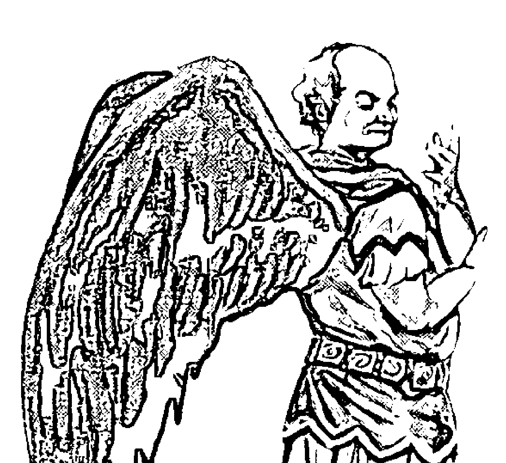

#### 魔王·天狗 日本

162 译注：日本传说中的妖怪，红脸长鼻，背有乌鸦翅膀，外形似山伏（日本山中的修道僧），手持金刚杖、团扇，具有怪力，可自在地飞行。
163 译注：佛教中半旗夜叉 (Yaksa) 镇守北方的守护神，十二天之一，又名多闻天。
164 译注：十二天之一，据说是大自在天（相当于印度教中的湿婆）愤怒的化身，东北方的守护神。
165 译注：日本平安末期镰仓初期的武将，生卒年1159-1189年。源义朝的第九个儿子，乳名牛若丸，遮那王，九郎等，曾任检非违使尉（判官），故也称九郎判官。1180年响应其兄源赖朝（镰仓幕府开创者）的起义，在对平氏的讨伐战中建立不少功劳，但后来与赖朝对立，兵败自刎而死。其悲剧性的一生经常成为日本文学的题材。
166 译注：传说中的阴阳师，住在京都，文武双全。据说牛若丸与鬼一法师之女交好，趁机偷学其“六韬三略”（兵法书，相传《六韬》为姜子牙，《三略》为黄石公所著）的心得。
167 译注：1831-1891年，俄国女通神论者，研究神秘主义与招魂术，多年来遍及亚欧美洲许多国家。自称为在西藏印度居住多年，拜当地诸大圣为师。创办通神学学会，并发行杂志《通神学家》(The Theosophist)，对神秘主义的发展有重大影响。

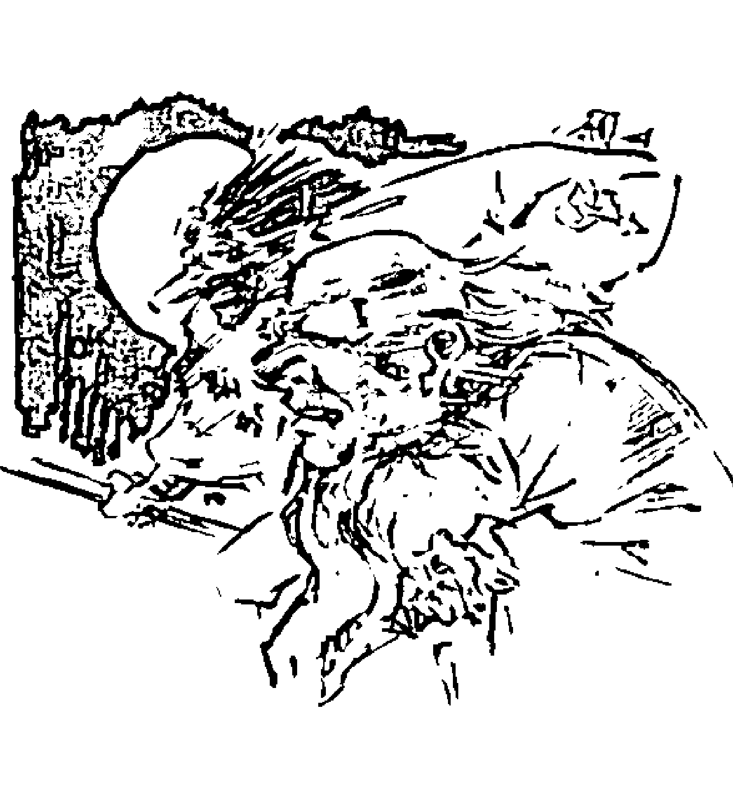

#### 恶魔 印度（佛教）

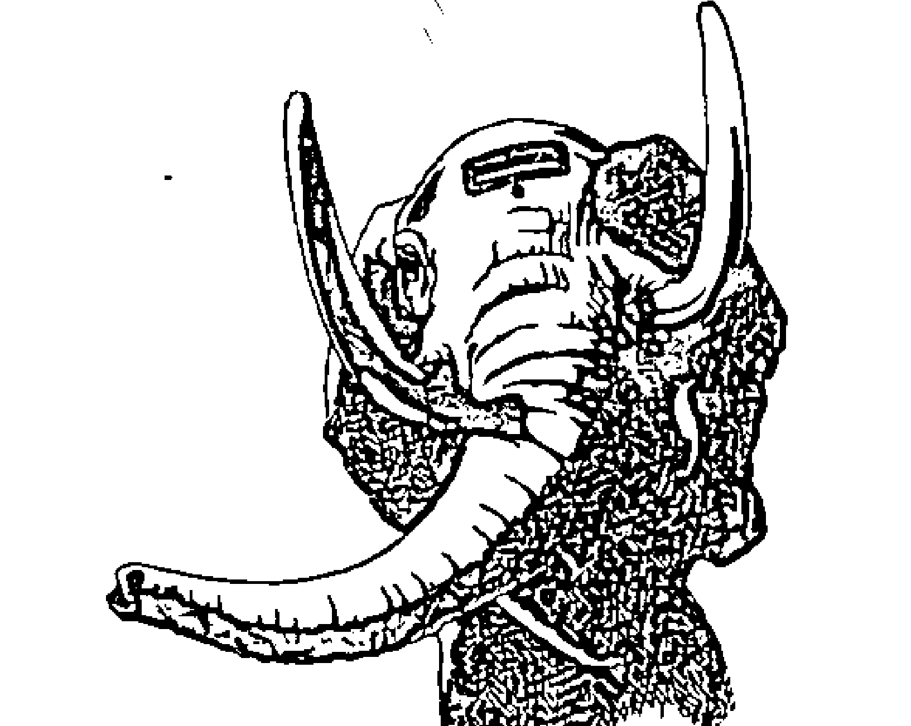

#### 魔罗

这是佛教中妨害悉达多¹⁶⁸ (Gautama Siddhartha) 修行的恶魔。他们象征着妨碍人性开悟的烦恼，也就是对性的欲望，现在在日本这个词也常拿来当作男性生殖器的别称。

如果人类全部都开悟，不再有烦恼的话，这些魔罗也都会全部消灭，因此他们不断地妨碍悉达多的修行。有次是将三个擅长各种让人获得快乐的技巧的女人送到他身边。有次则是发动各种恐怖邪魔的军团。这些恶魔张牙舞爪，发出可怕的吼叫。但是无视这些妨碍，悉达多仍旧不声色继续修行。最后他终于开悟成为佛陀。于是魔罗们使出了最后手段，他们建议佛陀，不要去浪费时间去普渡众生，还是自己努力地修行，才能达到了悟的最高境界——涅盘。

佛陀本来就对一直执迷不悟的人类感到绝望，因此对于是否要接受这个建议感到迷惑。但是众神恳求佛陀为世人说法，将悟的境地推广给全部的人知道，因此最后佛陀摆脱了魔罗的诱惑，决心在现世说法了。

（→《杂阿含经》的恶魔 Mara）

#### 玛巴斯

这是假托所罗门王所写，但实为17世纪时魔法书之《雷蒙盖顿》 (Lemegeton, 又名 The Lesser Key of Solomon) 的第一部〈哥耶提雅〉中记载的72只恶魔之一。

他会以狮子的外形出现在召唤者的面前，但是在《雷蒙盖顿》里外形是狮子的恶魔实在非常的多，如普尔森 (Purson)、安洛先 (Allocen)、瓦布拉 (Vapula)、华利弗 (Valefor)、欧里亚斯 (Orias)、拜恩 (Vine) 等等，因此他在外形上可说是毫无特色，而且在能力上也并不出众。

16世纪学者雷吉那勒德·史高特的著作《妖术的揭发》中以※巴巴斯 (Barbas) 这个名字来介绍，并且说明他就是在莎士比亚作品中出现的恶魔※巴百松¹⁶⁹ (Barbason)。结果原本并无多大特色的玛巴斯因为在文学名作中出现而大大提升其知名度。

作家普朗西的书《地狱辞典》中也说他的别名是巴巴斯，地狱的大议长，为36个军团的指挥官。并且为他附加了拥有工艺的知识，能使人得病的能力，以及能让人变身成种种东西的能力。

#### 马可西亚斯

这是假托所罗门王所写，但其实为17世纪魔法书的《雷蒙盖顿》 (Lemegeton, 又名 The Lesser Key of Solomon) 的第一部〈哥耶提雅〉中记载的72只恶魔之一。另外以模仿启示文学《以诺书》 (Enoch) 所作的《伪以诺书》上面也有记载这个恶魔的名字。

《雷蒙盖顿》中说他是有翼的狼，嘴能吐火。而《伪以诺书》中也说他是有翼狼，但是追加说明了翅膀是狮鹫 (Griffon) 的翅膀 (也就是老鹰的翅膀)，而且又追加尾巴是蛇尾的特征。

16世纪学者雷吉那勒德·史高特的著作《妖术的揭发》中则是介绍了他变身成人类的样子。他在人类的状态下会帮召唤者战斗，回答任何问题，对召唤者十分忠实。

19世纪法国作家普朗西在他的《地狱辞典》中说明他是地狱的大侯爵，指挥30个军团，原本的出身是权天使。该书的插画家布尔顿笔下的马可西亚斯十分优美，拜此图所赐，马可西亚斯到了现代也仍然十分有名。

#### **恶魔 印度（佛教）**

168 译注：释迦牟尼还未出家前的本名。

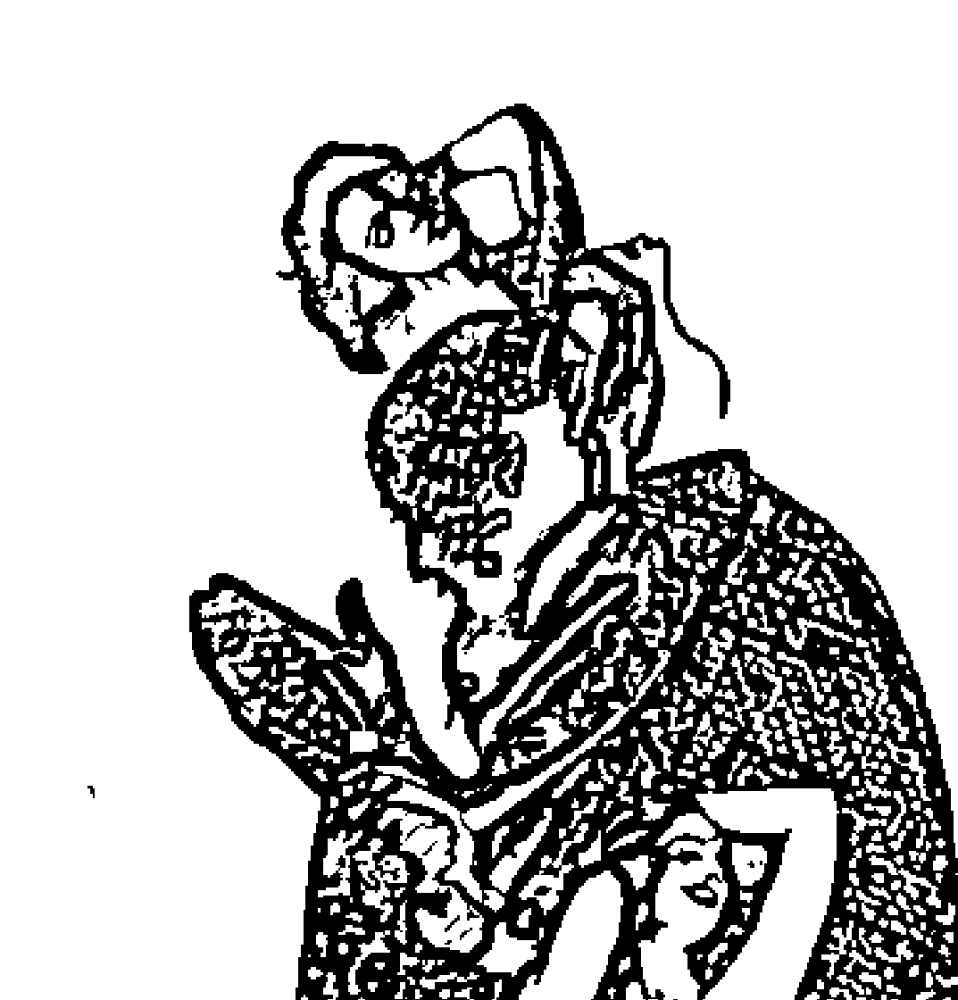

#### **恶魔·所罗门的恶魔 雷蒙盖顿**

169 译注：此恶魔出现于《温莎的风流娘们》(The merry wives of Windsor) 里。本此译法根据的是猫头鹰出版社的《新莎士比亚全集》。

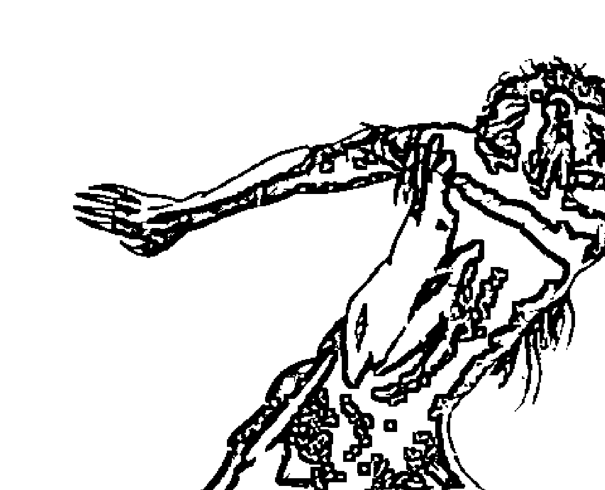

#### **恶魔·所罗门的恶魔 雷蒙盖顿·伪以诺书**

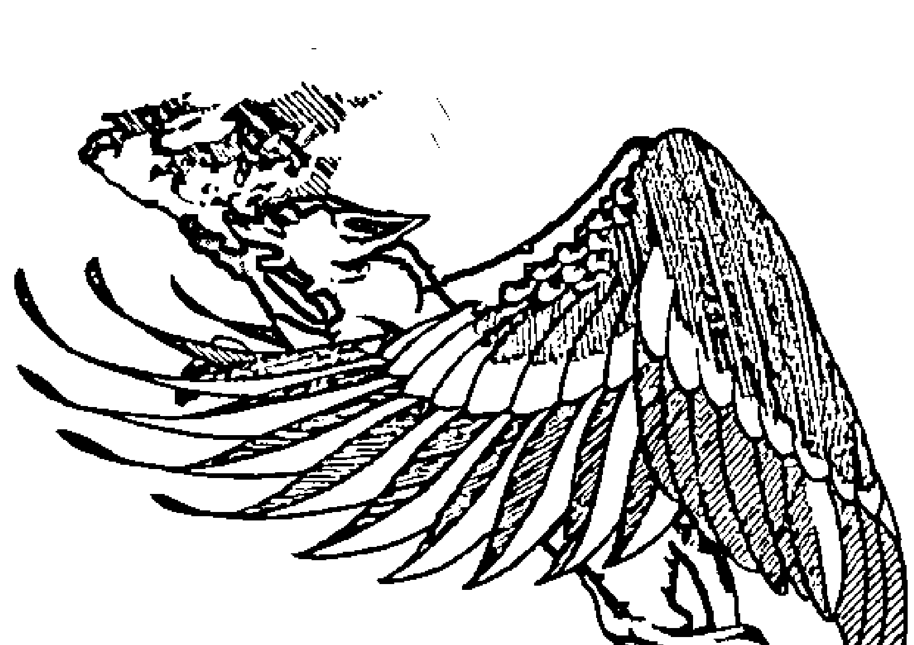

#### 马丁路德

他是德国的宗教改革者（1483-1546年）。曾担任罗马的使节，因此深知罗马教廷中的腐败情形，反对贩卖赎罪券。因为不愿更改“即使是教宗也不可能完美无瑕”的主张，因此被处以基督宗教世界中最严重的惩罚——驱逐出教，后来连神圣罗马帝国也将他的国籍除去了。但是他从此之后在态度上更加具有攻击性，宣称要获得救赎不能靠教宗，“只需要靠圣经”就能得救。可以说是后来一连串新教运动的始祖。因为反对罗马教会，因此经常被他的教敌们骂作是“※敌基督”(Antichrist)“恶魔”(只不过根据梵蒂冈的正式说法，真正的“敌基督”是只有世界末日才会出现，在那之前出现的也都只是“敌基督”的部下罢了)。路德本人当然不认为自己是恶魔，不过他倒是相信恶魔是存在的，例如说他骂同样是德国人的妖术师浮士德说：“他与恶魔结拜为兄弟了！”而自己也经常为恶魔所扰，根据他自己说的话，“晚上与恶魔在一起的时间还比跟老婆在一起的时间多。”他认为恶魔经常钻进他的肚里，因此肚子状况老是不好（事实上路德有便秘的症状）。

#### 平将门

他是日本中世纪历史中最高级的恶灵之一。平将门是高望王之孙。天庆九年（公元939年），他声称受到八幡大菩萨的神谕嘱托，自命“新皇”，举兵造反。掌握坂东八国的控制权之后，便在上野（今日本群马县）的官衙发表新皇宣言。然而，翌年2月，他与藤原秀乡（俵藤太）、平贞盛的军队交锋，弓箭乘着突然转变的风势射中了他，残余势力也被剿灭。将门的首级虽然被带回京城，但是过了三个月依然没有一丝腐败的迹象，每夜高声吵着想要自己的身体，最后朝向东国飞去。首级落下之处，就是今天东京大手町的首家，不过同样的传说也流传在关东到东北一带的许多地方。平将门也被视为江户镇守神，在神田明神170等神社中受人祭拜。虽然为一般庶民提供了宗教上的慰藉，一旦有人冒犯埋有自己首级的首家，平将门便会毫不留情地施法作崇。例如大正12年，原本预计要兴建大藏省的临时办公厅，但是从大藏大臣开始，不断有人发生意外；当战后GHQ（General headquarters，联合国总司令部）展开挖掘作业时，相关人员同样事故频传。

#### 马萨莱

这是居住在新几内亚的阿拉贝许族中各氏族的精灵。他住在岩石或水塘里，有时会以带有斑点或条纹的双头蛇的样子出现。马萨莱基本上是狩猎之神，也是会对入侵者带来恐怖灾害的守护神。但是对于怀孕中的女性而言，马萨莱是很可怕的神。因为他会引起流产、胎死腹中、生病，严重时甚至连母亲都会死亡。而且马萨莱还能发起大风、土石流、地震或是洪水。在阿拉贝许族的神话中，就有个故事是说因为触怒了马萨莱，而使得整个村庄灭亡。这个时候，整个村里就只有一名女性获救，这是因为只有她没有吃村人捕获的兔子肉的缘故。结果这名女性也因此获得一种特殊能力，她的身体能够生出山芋（yam，一种食用芋类），这使得跟她一起生活的都受到了恩惠，因此大家都很感谢她。（一史马兰格Tsumarangu）

#### 人类
基督宗教

(→撒旦Satan〈中世纪欧洲〉、彼得大帝Pyotr I Alekseyevich、梅菲斯特Mephistopheles)

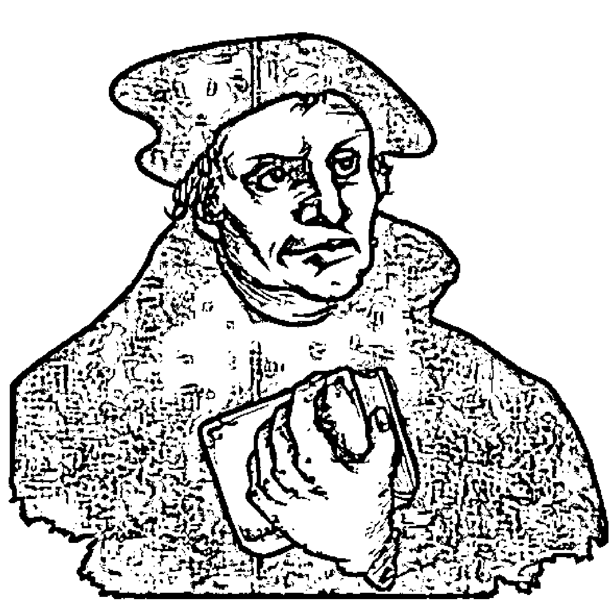

#### 祸祟神
日本

(→早良亲王Sawara-shinnou、菅原道真Michizane Sugawara、崇德上皇Sutoku-joukou)

170 译注：“神田明神”是位于东京都千代田区外神田的神社。祭祀的神明有大己贵命、少彦名命、平将门等。又称为神田神社。

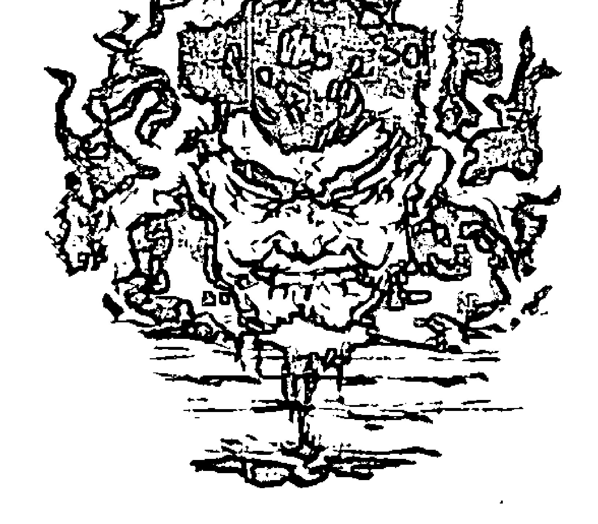

#### 氏族神
巴布亚新几内亚

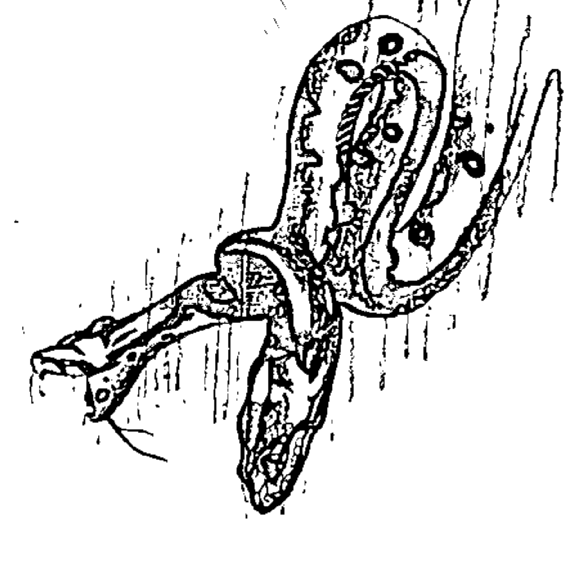

##### 摩多罗神

慈觉大师圆仁<sup>171</sup>（794-864年）回国时在遣唐使的船上感应到的神。他以像是威胁般的口吻说：“这是妨碍我们修行的神。如果我们不祭拜他的话，恐怕无法达成往生的愿望吧。<sup>172</sup>”

于是摩多罗神就成了佛教的守护神，由历代天皇主持的天台密教（日本佛教的密宗之一）的玄旨归命坛来负责祭祀。但是这个摩多罗神实在是十分诡异的神。江户时代中期的学僧觉深说：“此乃来历不明神，应非日本或中土之神”。也有人认为摩多罗神就是往生之神荼枳尼天<sup>173</sup>（Daginiten），不过从今日著名的京都太秦·广隆寺的牛祭中，摩多罗神头戴北斗七星出场，因一般相信他是深受道教影响的神。

这个神被认为是邪神的最大理由是他周围有两尊童子神陪祀。据说这两童子神会嘴里念着“梭梭洛梭尼，梭梭洛梭”、“悉悉利悉尼，悉悉利悉”的句子，边唱边跳。而“梭梭”代表着小便，“悉悉”则是大便，而且“悉悉利”其实指的就是当时寺院里盛行的“众道”（也就是男色），因此，江户前期时，玄旨归命坛被幕府视为邪教而下令撤销了。

##### 玛图克

他是波里尼西亚的食人巨人。

威塔莉（Whaitari）与凯丹·卡达（Kai-tangata）的子孙中有个叫做瓦西耶洛亚的男子。他的妻子怀孕时，想要吃点珍奇的食物，于是瓦西耶洛亚便到远地去为她张罗，但是却被当地的食人巨人玛图克给吃掉了。

妻子生下了一名男孩，取名作拉达。

拉达长大后决心为父报仇，带着几个部下，搭着圆木舟出发了。

来到某个岛上，他们遇到了一个食人巨人。巨人打算吃掉他们，但是拉达用魔法将他的部下的数量变得人山人海，几乎将要整个岸边都占满了，见到这种情形巨人也没办法对他下手，于是便诱骗拉达到他家去。拉达来到巨人的家，但是识破巨人所设的陷阱，反而用计骗巨人去打水，并且将水源用魔法隐藏起来。巨人找啊找，总是找不到，终于累倒了。拉达将烧得滚烫的石头放进他的嘴里，将他杀死了。

玛图克听到这个消息很害怕，他躲到地下的洞穴里头。拉达来到他的洞穴前，故意摆上成堆的好

##### 马克士威的恶魔

这是19世纪的科学家马克士威<sup>174</sup>（James Clerk Maxwell）的假设中出现的恶魔。

这个宇宙有热量高与热量低的地方，不过最终当宇宙中所有的热量都达到平衡的时候，宇宙就会平均化进入一种停滞的状态。但是如果有一种能够改变自然状态的“小恶魔”存在的话，那会变得怎样？

例如说，有两个相邻的房间，这两个房间有一个仅能够让一个分子通过的小门。而这个“恶魔”负责开关门，选别移动速度快（高温的）与慢（低温的）的分子，于是一个房间中就只有移动快的分子，另一个房间中则只有慢的分子。于是这两个房间就会产生温差，而既然有温差，我们就可以利用它来汲取能量，这样一来，有动机就有可能实现……以上就是他的假设。

20世纪俄国作家史卓加斯基兄弟<sup>175</sup>（Arkady Natanovich Strugatsky & Boris Natanovich Strugatsky）的小说中，这个假设的恶魔变成巨大魔神出场，书中马克士威的恶魔一样是负责开关门，但是因为身体实在太大了，所以负责的不是甄别分子，而是在

#### 邪神·往生神
日本（佛教）
(→常世神 Tokoyo-no-kami)

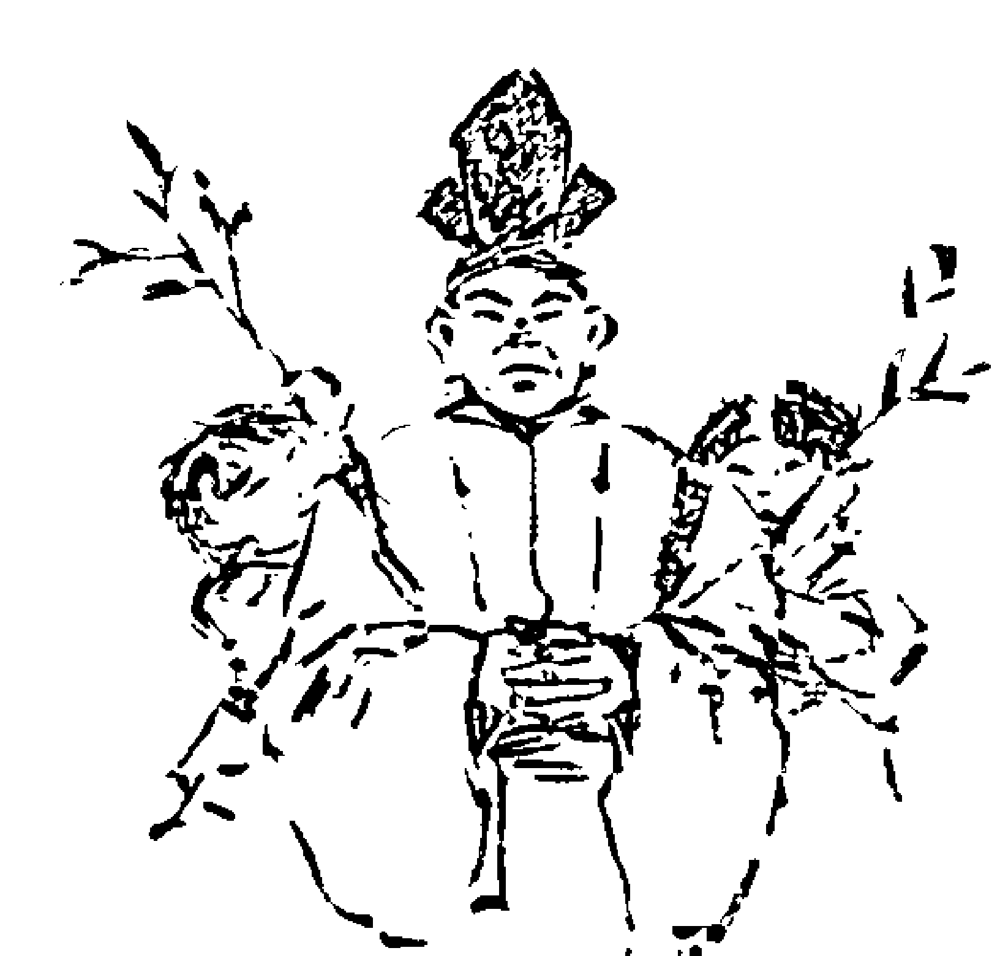

171 译注：794-864。日本平安初期天台宗的僧侣。曾入唐习佛。所著《入唐求法巡礼行记》为一重要游记。
172 译注：原典见于《溪岚拾叶集》（日本佛教典籍，作成于1311-1347)。
173 原注：由印度神话传进佛教密宗的夜叉（或说是罗刹）。据说他能在六个月前预知人的死亡，前来吃掉他的心脏。

#### 食人巨人
波里尼西亚

吃食物，然后设下陷阱。玛图克肚子饿得头昏眼花，受不了眼前的诱惑，结果出了洞穴要吃这些东西时，被陷阱夹住，就这样被拉达所杀了。
(→哈乌美亚 Haumea)

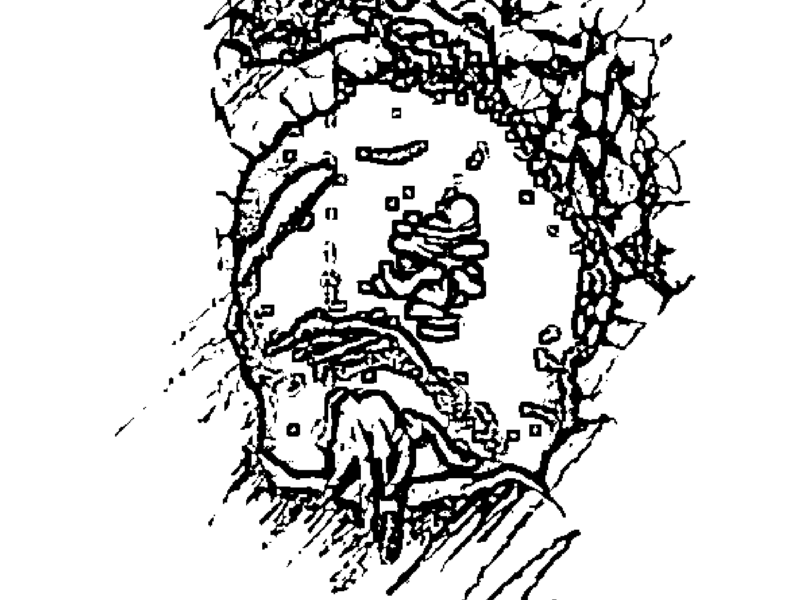

#### 假想的存在物
物理学

前苏联国内的魔法妖术科学研究所中当门僮。

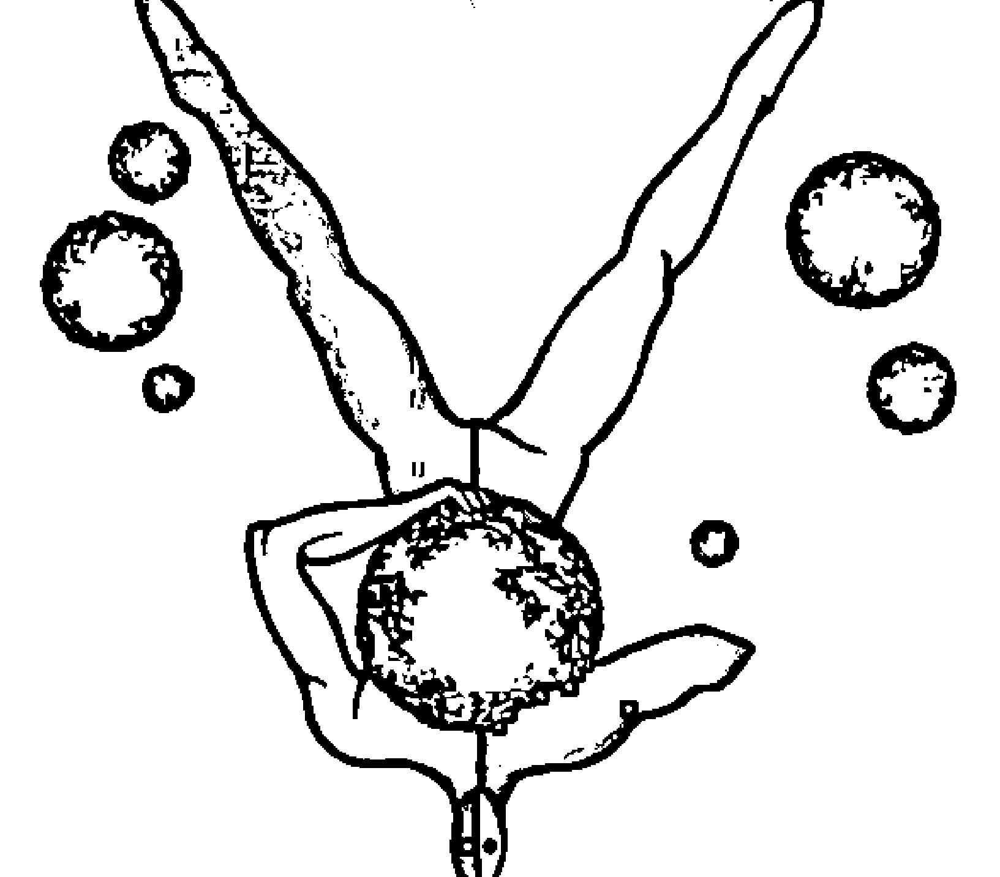

174 译注：1831-1879年，苏格兰物理学家，对电磁学理论及气体动力论有重大的贡献。他的电磁场方程式以及对光的阐释使得后继的科学家发现了电磁波，之后又由此发展出通讯技术。
175 译注：现代俄国科幻小说家，其作品多部改编成电影。

##### 黑衣人

在UFO悬疑书籍中，必会登场的“黑衣人”，是现代都市传说中的代表。

第二次世界大战后，他们才在都市传说中频繁登场。正如其名，黑衣人全身上下穿着仿佛出席丧礼般的黑衣及黑帽，经常三人一组，乘着一部旧式黑色的BMW四处奔波。对研究UFO的人施以恐吓、窃听，并任意检查他人的包裹邮件，有时还假装是邻居或是扮成其远亲。偶尔，还会不小心泄漏一些未来的情报。

黑衣人的存在，比起将UFO当作国家研究机密，还不如说是掩饰自己国家（或是外星人），令人感到畏惧不已。

顺道一提，在中世纪魔宴中，就有一位被称为“黑衣人”的恶魔。说不定，这也是其中一位。

（→天蛾人 Mothman）

##### 梅菲斯特

这是德国诗人、作家歌德（Johann Wolfgang von Goethe, 1749-1832）的著作《浮士德》中登场的恶魔。一般认为，中古世纪德国民间流传的故事中出现的梅佛斯特（Mephostophiles）应该就是这个梅菲斯特的原型。

梅菲斯特虽然是个恶魔，但歌德将他设定为代表“为成就大恶而行善的力量”，他刚登场的时候，并不是个恐怖的恶魔，而是一个身躯瘦弱，微微驼背，鹿勾鼻的男子，脸上浮着嘲笑似的笑容。不过他毕竟是个恶魔，能够变身成种种样子，变成龙犬跟在浮士德身旁散步，或者变成旅行的学生待在浮士德的书斋中。而在要与浮士德签订契约时，则是变身成西班牙的贵族。

与浮士德订契约的场面相信是以《旧约圣经》中的《乔布记》为参考。契约的期限是到浮士德念出“啊啊！你真是美好无匹！请你驻留！”为止。在那之前恢复年轻的浮士德经历了种种的事件。

最后浮士德所希望的新国土建设完成时说出了那句话，恶魔终于获得了胜利。

正当梅菲斯特要将浮士德的灵魂带往地狱时，

##### 菅原道真

承和12年（845年）时汉学家藤原是善的第三子。得到宇多天皇（在位年间887年～897年）作为后盾，于昌泰2年（899年）被拔擢为右大臣（掌管太政官事务之职）。是继吉备真备后第二位以学者身份出仕的特例。

然而，延喜元年（901年），被认为有谋反的可能，而被醍醐天皇（在位年间897～930年）降职为太宰权帅（掌管太宰府事务之官），贬至九州岛。为了取消这项命令，菅原道真想尽一切办法手段，却都失败。死于延喜三年（903年），终生没再踏入京都半步。

在这之后，京都城内雷雨频繁，传为化身雷神的菅原道真所为。接着延喜8年开始，曾陷害他的人及其周边的人陆续死亡。到了延喜23年4月，天皇为了平息怨灵，恢复他原本右大臣的地位，将左迁太宰府的饬令（天皇的命令）撤回，然而，怨灵却持续肆虐一直到延喜8年，醍醐天皇驾崩为止。此外，根据《扶桑略记》（平安末期的历史书），醍醐天皇死后，因菅原道真怨灵的缘故堕入地狱。

（→早良亲王 Sawara-shinnou、崇德上皇

#### 都市恶魔传说
美国

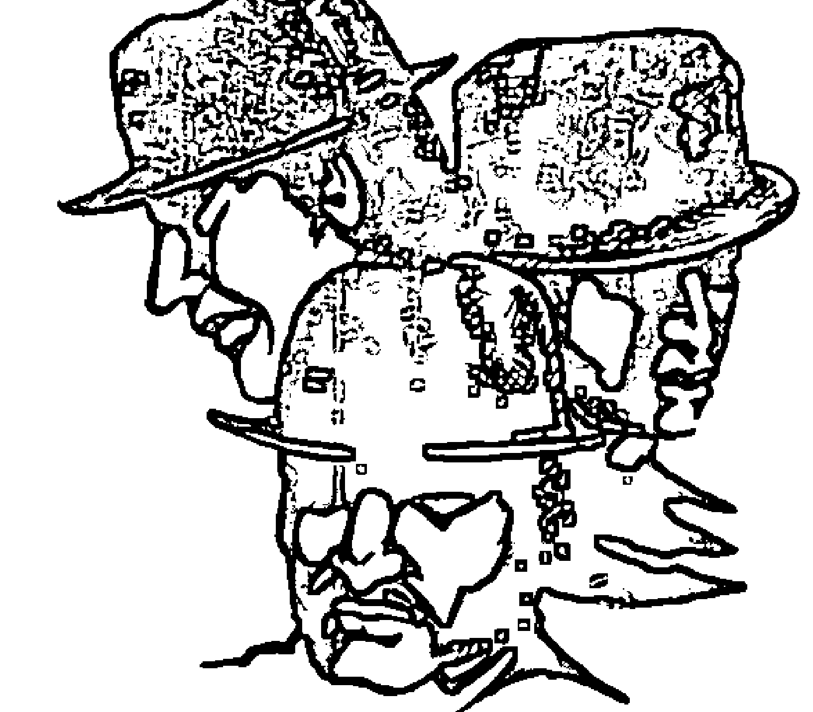

### 恶魔
浮士德

天使们抛落的玫瑰花瓣变成了烈火烧死了恶魔，而浮士德的灵魂获救，被带往天国去了。

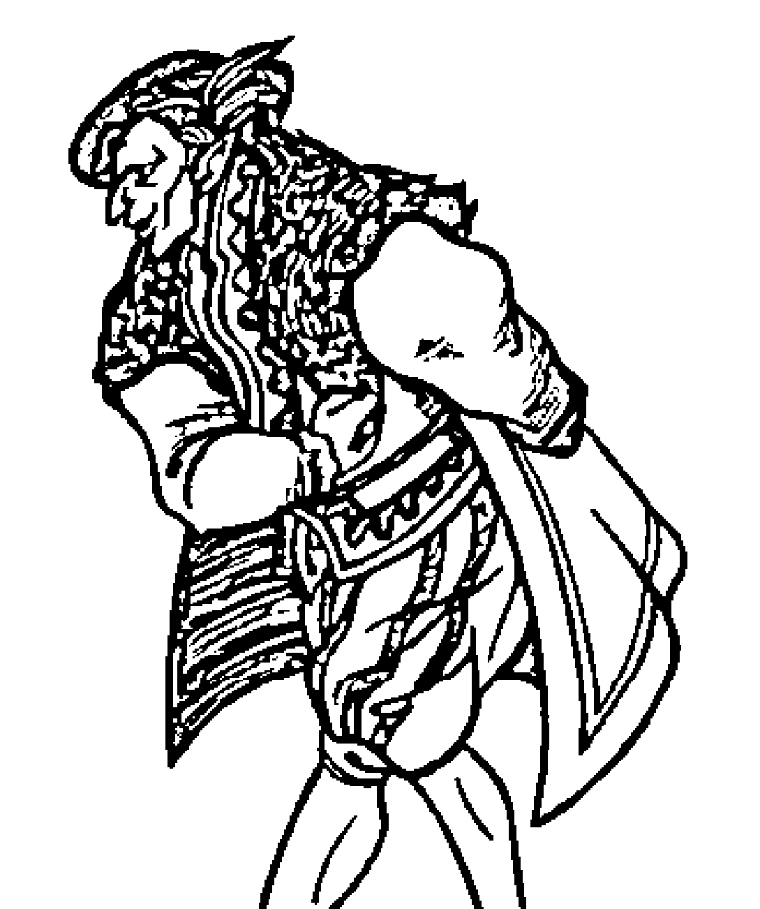

#### 怨灵·雷神·学问之神
日本

Sutoku-joukou、平将门 Masakado Taria）

176 译注：古代律令制度里中央最高机关，统掌八省及其它官厅，其中职务最高的是太政大臣，左大臣居次，再来则是右大臣。

177 译注：其中的“权”，意为权宜，指正职以外，另外编制的官员。太宰权帅，一部分是为高官左迁时所设之职。

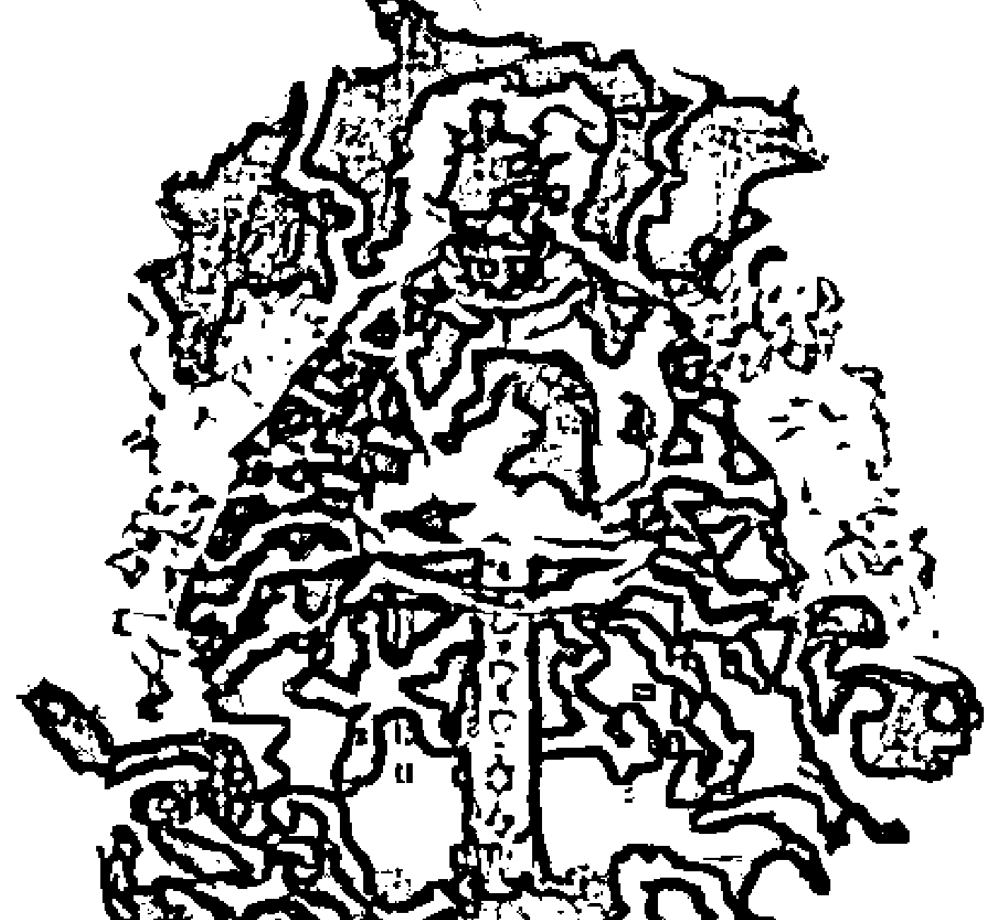

##### Mictlantecuhtli
米克特兰泰库特利

这是阿兹特克的死神。
他是阿兹特克主要的四大神之一，受玛雅的阿·普切（Ah puch）神的影响产生的神。阿兹特克人的雕刻或绘画中将他描绘成有如骷髅一般的脸庞，外露的牙齿，十分恐怖的相貌。米克特兰泰库特利是创出寂静的冥界——米克特兰（mictlan）的神。而且冥界现在也在他的掌控之下。据说米克特兰一片荒凉，为冰雪覆盖的寒冷土地，毒蛇是那里唯一的食物。
阿兹特克的王蒙提祖马二世（Montezuma II，1466-1520）听到西班牙军即将进攻阿兹特克的时候，派了使者去探访冥王米克特兰泰库特利，并且让使者带活人的剥皮作为丰盛的大礼准备献给他，因为当时流传着调和之神魁札尔科亚特尔（Quetzalcoatl）即将复位的说法^178（国王认为西班牙的司令官科尔特斯（Hernan Cortes, 1485-1547）可能就是魁札尔科亚特尔），因此想要知道米克特兰是否平安无事。
根据传说，米克特兰泰库特利是13个天国中的第六个天国，叫做“依尔菲卡特尔·玛玛尔法索坎”

##### Mishaguji-gami
御社具持神

他的前身是大国主神（Ookuninushi-no-mikoto）的次子——御建名方神（Takaminakata-no-mikoto）。也念作“※ Mishagudi-gami”。
这个神是由诹访^179上社神官一族的守屋氏祭拜的神，一般称作“Moreya-gami”，也写作“泄矢神”。
他是木与石的神，算是典型的自然神，不过同时也是附身在神官上宣达意旨的神。负责宣达意旨的神官由守屋氏族人中选出。以一年为期，当任期结束时，便要决定下任继承者，然后将卸任的神官杀掉。
根据日本民俗学者柳田国男^180（Yanagita Kunio）的说法，借助死亡的过程，得以确信神官能够成为神，使其萨满巫师（Shaman）的能力得以更加强化。
另外，大和岩雄（Yamato Iwao）则提出为了丰穰与生命的更新，所以必须要一年杀掉一个主祭的神官；而该名死去的神官则是被视为御社具持神自身的化身。关于这个说法，福芮哲^181（Sir James George Frazer）的《金枝》（The golden bough）中也曾提到类似的例子，相信比柳田的说法更接近真实才是。
御社具持神为东北地方的猎人们信仰的神，因此说他是绳文时代^182的神应该是没有问题。

##### Mokoi
莫可伊

莫可伊这个名字是“恶灵”的意思，是住在澳洲的原住民阿波吉尼族中的一部族姆伦金人（住在北澳）信仰中的恶灵。
姆伦金人认为，人几乎不可能因为年老而死。而导致死亡的生病或受伤的原因只有两个。
一个是仪式上的不纯净，祖先之灵幽鲁伦格尔曾经因此生气地吃掉两个行近亲相奸的女人与其子孙。
另一个原因就是莫可伊害的。不过莫可伊并不会主动害人，他会害人是因为萨满巫师的黑魔法驱使的。因此姆伦金族人对于这种邪恶的巫师非常恐惧。所以他们会向好巫师求救。好巫师则会呼唤出与自己亲善的灵来与莫可伊相战。

#### 死神
阿兹特克

178 译注：魁札尔科亚特尔，或译作羽蛇神。会有这个说法是因为当初策提祖马之部族能有统治权就是将魁札尔科亚特尔赶跑后才获得的，而传说他将会从东方率领众神的军队回来。1519年科尔特斯率领军队到来时，正好是传说中魁札尔科亚特尔的回归年，而西班牙军又刚好从东岸上陆，因此才会有此传说。

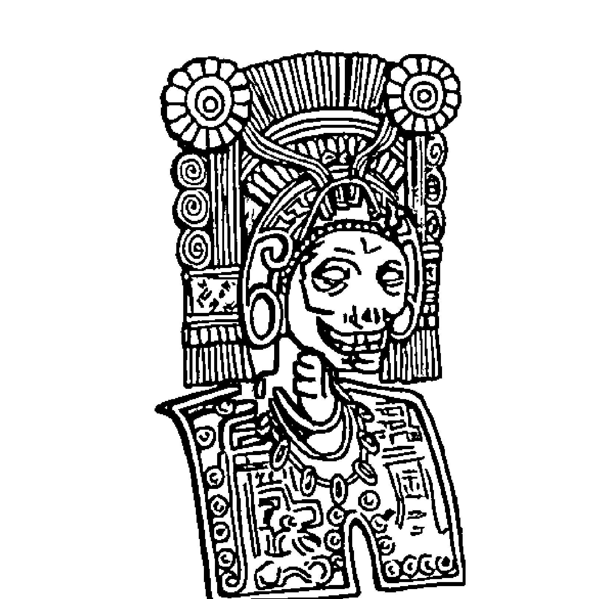

#### 祸神神
日本

179 译注：诹访，音“suwa”，为甲斐（Kai，及今日长野县的一部份）的中心都市，位于日本本州岛岛中部。
180 译注：生卒年1875-1962年。日本著名民俗学者，在民族学的研究上留下许多重大贡献。代表著作有《远野物语》《桃太郎的诞生》《蜗牛考》等。
181 译注：生卒年1854-1941年。受封为詹姆斯爵士（Sir James），为英国人类学家、民俗学家和古典学者，《金枝》为其重要著作。
182 译注：日本考古学上的时代断限，由旧石器时代一直持续到公元前三世纪弥生时代开始。

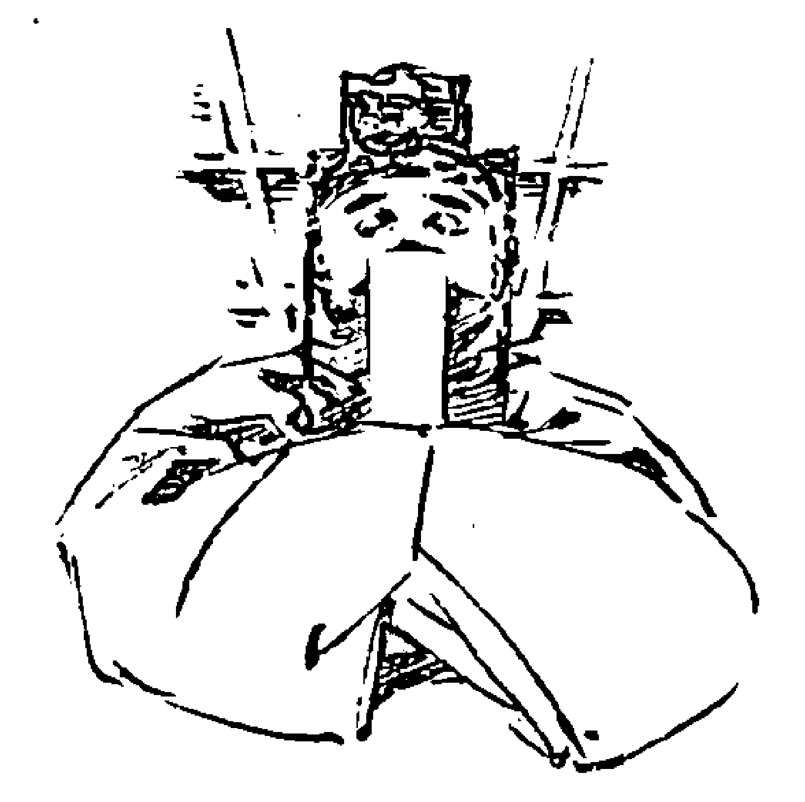

#### 恶灵
澳大利亚

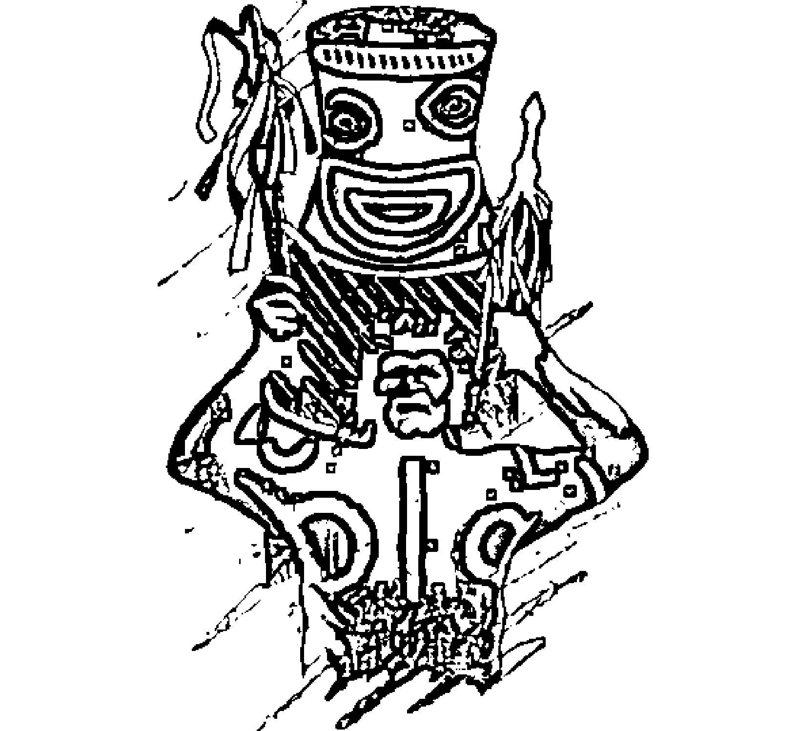

#### 摩洛

这是英国诗人米尔顿的叙事诗《失乐园》(1667)中登场的造反天使（恶魔）。名字的意思是“王”，有时也被称作“持杖的王者摩洛”。米尔顿说他是《旧约圣经》〈利未记〉〈列王纪〉中提及的异教神的前身。异教之神摩洛是个渴求牺牲的火神，因此作者也在《失乐园》中强调他凶猛的性格。

追随撒旦旗下反抗神的这些造反天使中，米尔顿特别凸显出摩洛的主战派军人性格。而且他个人的战斗能力似乎也是天国中数一数二的强。只是在背神之后，其原本天使的光荣与能力似乎也跟着减弱了。在第一次交战时，摩洛勇猛地向天使加百列挑战，但是反遭痛击，不得不败战逃亡。

摩洛的性格直率而欠思虑，自己也坦承并不擅长思考策略。但是他绝不是个胆小之辈，即使堕入地狱也毫不后悔，而且也不畏惧死。在这些造反天使们堕入地狱后第一次召开会议时，摩洛提出对天国进行绝地反攻。

(→撒旦 Satan《失乐园》、摩拉克斯 Morax)

#### 红叶

传说183中奥羽会津地方（福岛县184西部）有一对姓伴笛的夫妇，他们向摩利支天185祈求赐子之后，生了一个女孩，为她取名作“吴叶”。吴叶生得一副绝世的美貌，于是当地的一名富豪上门来提亲。但是由于他们一家都怀有到京都发展出人头地的野心，因此吴叶用摩利支天授予的魔力做出了替身，将替身嫁出去，收下聘金，然后就到京都的四条通做生意了。

有一次源经基186的夫人经过店外，被店里传出的琴声吸引，因而结识了吴叶。之后吴叶就经常出入源家的宅第。不久受到经基宠爱的吴叶怀孕了，正妻对她而言就成了妨碍者，于是用她的魔力变成了女妖，每晚去折磨夫人。源夫人向比叡山的僧侣求助，让吴叶现出了原形。于是吴叶被抓住，流放到户隐（长野县北部）去了。

之后吴叶改名作红叶，取得村人的信任后，又显露女妖的本性，开始吃人肉、喝人血了。于是朝廷派遣武将平惟茂187前来讨伐，经过一番苦战后，用降魔宝剑将红叶打倒了。

附带一提，据说红叶底下有许多女修行者跟随

#### 摩拉克斯

这是假托所罗门王所写，但实为17世纪时魔法书之《雷蒙盖顿》(Lemegeton，又名 The Lesser Key of Solomon)的第一部〈哥耶提雅〉中记载的72只恶魔之一。别名“※佛拉克斯”(Farax)“※佛莱伊”(Foraii)。

他的外形是长了牡牛头的人。一般认为他是从《旧约圣经》中〈利未记〉〈列王纪〉中记载的，亚扪人信仰的神摩洛（※Molech，或作Moloch）衍生而来的恶魔。

虽然是由邪神摩洛而来，但是《雷蒙盖顿》中的摩拉克斯却差得多了。他与斯托刺（Stolas）和单卡拉比（Decarabia）相同，可以让人了解矿石与植物的秘密，授予人占星术的知识等等，能力上并不特别。据说也可以给予魔法师们供人差遣的精灵。

19世纪法国作家普朗西在他的《地狱辞典》中并非以摩拉克斯，而是以“摩洛”(Moloch)这个名字来介绍他。该书的插画家将他画成坐在王座上，中古风格的王（头是牛头），给人强烈的印象。结果在这张插画的影响下，摩洛到现代也还是很有名。

### 造反天使
失乐园

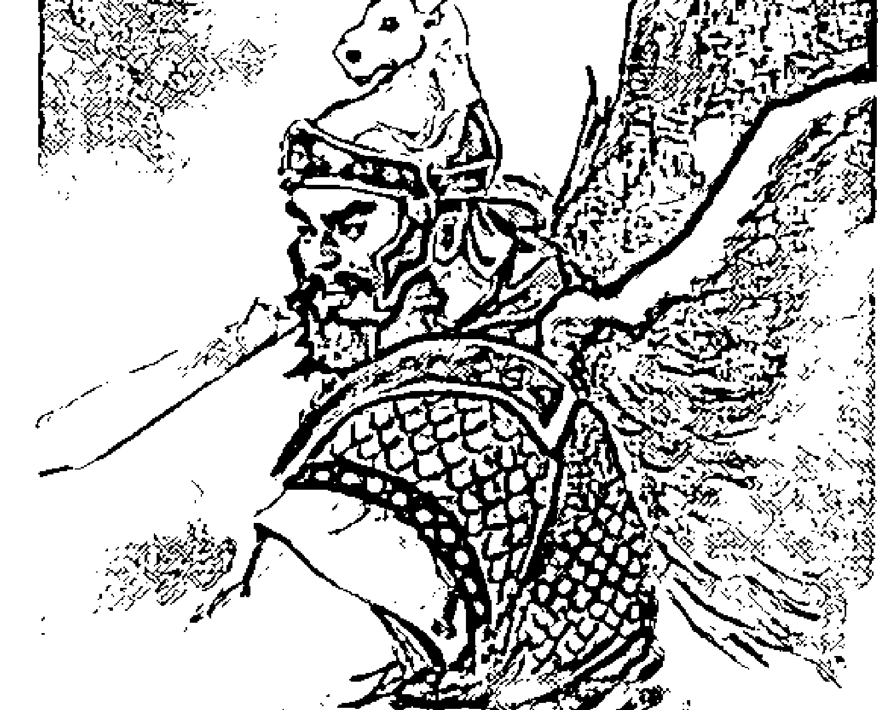

#### 女妖·魔女
日本

着她，其中较有名的是一个叫做阿万，体格壮硕力大无穷的女人。
（→安达原的妖婆 Adachigahara-no-onibaba、宇治桥姬 Uji-no-hashihime）

183 译注：此一传说也有改编成能乐（日本传统戏剧）的戏码，名称就叫做“红叶狩”。只取材传说的后半。故事大纲为武将平维茂上山狩猎，遇到了美女红叶，红叶邀请他一起喝酒，结果醉得不省人事的时候红叶露出女妖本色，危急之际八幡菩萨出现拯救，并授与维茂一把神剑，维茂借着神剑的威力终于降服女妖。

184 译注：为日本本州岛东北部偏南的县。

185 译注：原本是印度民间信仰的神，随佛教传入日本，据说膜拜他可得平安、富贵、胜利的恩惠。

186 译注：日本平安朝中期的武将，为清和源氏的始祖。开创日本镰仓幕府的源赖朝即属清和源氏。

187 原书是写作平“惟”茂，不过日本史上真有其人，名字写作平“维”茂，或许是原书作者的笔误也说不定。

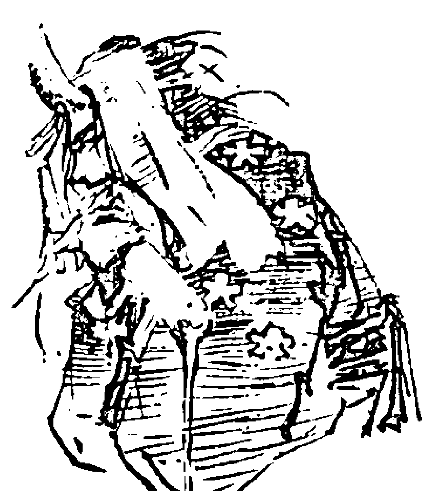

#### 恶魔·所罗门的恶魔
雷蒙盖顿

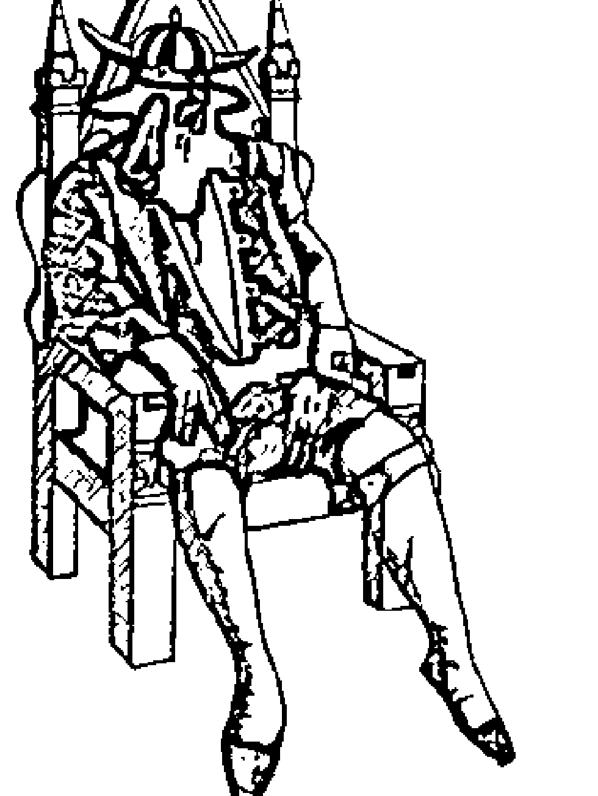

##### 摩莉甘

别名“茉莉格”，她是克尔特的战争女神，一有战争必定会出现在战场上，用她的魔力为战局带来种种不可思议的影响。
虽然有时她也会以女性的样子上战场，不过她也会变身成各种动物。如果是以女性的样子出现的时候，据说是坐在两头鲜红色的马拉的马车上，手里拿着两把枪，身上穿着鲜红色的衣服与外套，而她的眼里则闪耀着不祥的鲜红光芒。
摩莉甘有三名侍女，名字分别是玛哈（Macha）、涅芙（Navan）、芭德布（Badb），她们合力让战场布满了雾，下起火雨，流起血的河川来。而她们的喊叫声据说拥有让战士们狂暴的魔力；听到她们的叫声，战士们就会变得不畏死亡，心中充满愤怒，奋力杀敌了。摩莉甘与她的三名侍女经常被视为同一人。认为这是“战争女神”这一神格的种种体现。
另外摩莉甘在亚瑟王传说或克荷林188（Cu Chulainn）的故事等等英雄传说中，经常以诱惑英雄的魔女身份出场。在基督宗教传入后则经常被认为是会令王国灭亡的魔女，代表了基督宗教传入前，巫术时代的面相。

##### 莫特

这是迦南189（Canaan）的冥界之神，象征着“死亡”与“荒芜”。他是迦南的主神巴力（Ba'al）的敌人，他会将巴力打倒并且杀死他。
据说莫特所统治的冥土称作“不祥”，而他的都城则叫做“毁灭”，王座的名称则是“荒废”。
巴力向莫特挑战，但是莫特对巴力说，巴力最终将会被他所吞入到冥界去吧。这是因为代表丰穰的神巴力与代表荒芜的神莫特以一年为期的争斗下，最后荒芜的时期终会到来的缘故。
在两人的战斗下，最后巴力倒地死去。这时巴力之妻阿那特埋葬了巴力。阿那特向莫特求情，希望他让巴力从冥府归来。但是莫特拒绝了，于是阿那特便以她的实力将丈夫救回。
她将莫特抓了起来，撕裂成两半，以铁锹将他打飞，用火烧烤，用石臼将他磨成粉末，洒在原野上。
于是莫特就这样死去，而巴力也因此复活了。
这可以说是代表了雨季与干季轮替的神话。

##### 天蛾人 190

这是与杀人小丑大约同时期，1960年代到1980年代之间在全美各地出现的怪生物。
根据目击者的说法，特别是在外星飞行物体——也就是UFO大量目击的地点，特别容易发现天蛾人出现。此外也听说过天蛾人啃咬牛只，吸他们的血。也曾接到有人目击他侵袭生理期中的女性的报告。因此现在也有研究家认为，牧牛一连串离奇死亡的事件（cattle-mutilation，意思就是牛只肢体被切除）就是天蛾人所为。
关于天蛾人的外表特征，以一句话来形容的话，就是“长了蛾头的大猩猩”。目击证言中或说他有手或说没有手，或者说手与翅膀一体化等等，说法不一。但是天蛾头与猩猩的身体则是共通的。
洛杉矶金门大桥（Golden gate bridge）爆破未遂事件的前几天，也有人宣称目击到类似天蛾人的生物在桥边徘徊。
天蛾人已经可以说是相当有名的都市传说了。因为我们身处现代所以自然而然地会联想到UFO，但是如果是古代的话多半就会把他当成吸血鬼或恶魔的一种了吧。

#### 战争女神 克尔特

188 译注：光神鲁格的儿子。名字意思是“猛犬荷林”，自幼就勇猛无比、拥有魔枪盖伯格（Gáe Bolg）。

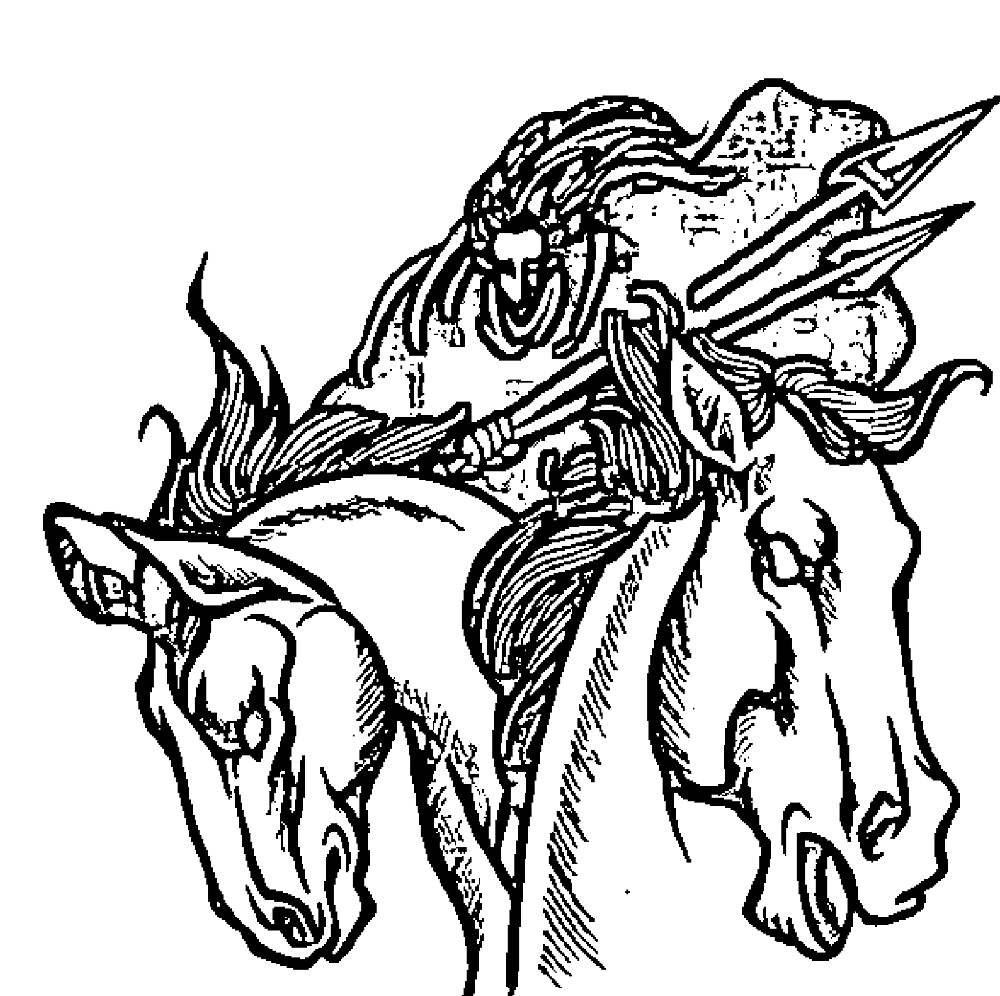

#### 死亡与荒芜 美索不达米亚

189 译注：古代称小亚细亚地中海沿岸及约旦河流域为迦南，即今日的巴勒斯坦（Palestine）。

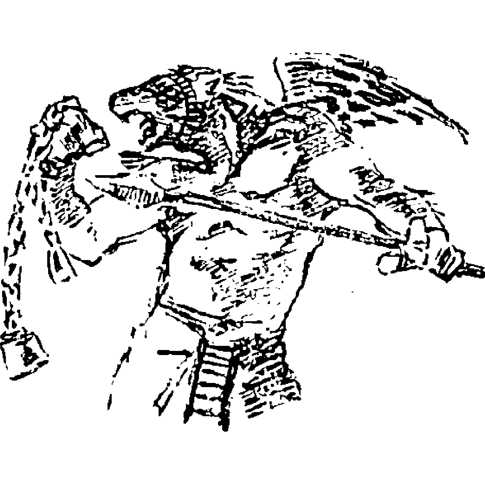

#### 都市恶魔传说 美国

（→黑衣人 Men In Black, Black men、纽泽西恶魔 New Jersey Devil）

190 译注：好莱坞中也有据此题材拍成的电影，名字就是“Mothman”，中译“天蛾人”，由李察吉尔主演。

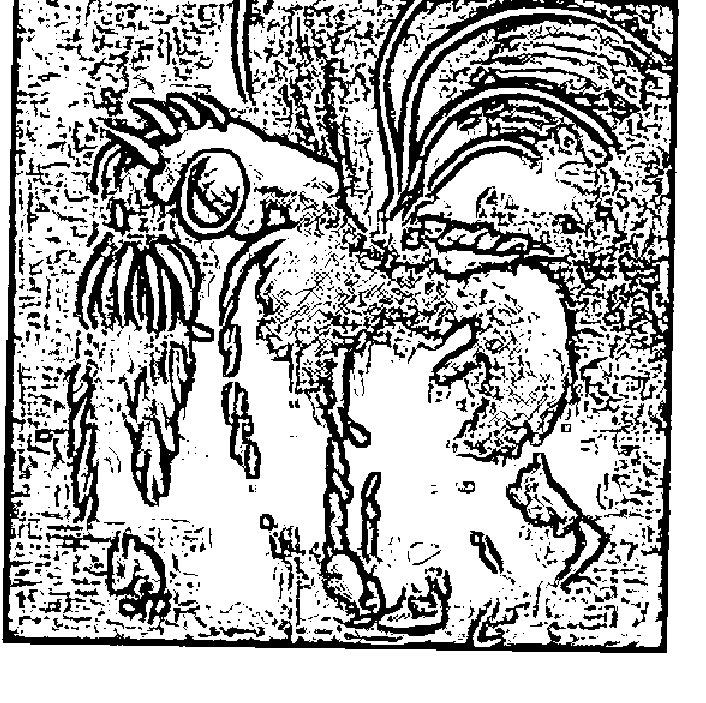

#### 玛尔西巴

他是《失乐园》(1667年) 中出场的造反天使 (恶魔) 之一。根据作者米尔顿的设定，他是希腊神话中火神、工匠神的赫发斯特斯 ⁹² (Hephaestus)，也就是罗马神话的武尔坎努斯 ⁹³ (Vulcanus) 的前身。并且说明《荷马史诗》中提到他被宙斯从天上丢下来这一段，其实就是暗示着他堕天的经过。玛尔西巴这个名字其实就是赫发斯特斯的意大利文说法。因为他是赫发斯特斯的前身，因此他是个很擅长锻造工作的天使，同时也是个优秀的建筑师。在堕入地狱之前他为天使们建造了许多高塔与壮丽的住处。而大逆不道的天使撒旦在起兵造反时，他加入撒旦阵营时似乎也为他们打造了许多兵器。但是或许是因为背离了神，原本玛尔西巴作为天使时的优秀能力也逐渐衰退，并不见那些武器发挥出强大的威力。堕天之后，玛尔西巴与他的徒弟们靠着玛门 (Mammon) 提供的黄金，为造反天使们在地狱筑起了一座巨大的住处，称作“万魔殿。”(→撒旦 Satan 《失乐园》)

#### 姆欧迪尔

这是奥地利传说中的幽灵军队。据说一到晚上就可以看见一大群的幽灵军队浮在空中数十米高，飞驰通过十字路口。这时可以听到可怕的喊声与吼叫声，甚至车轮的响声 (明明就是浮在空中，居然还有车轮声!! )这群称作姆欧迪尔的幽灵军团的最前面，有个骑白马的男子，吹着号角并且喊着:“让开让开!!不闪开的话就危险了!” 只不过他所说的话人没有办法听懂。这批军队不只有步兵与骑兵，据说也有坐着火焰马车或是黑色马车的部队。如果不幸遇到了姆欧迪尔的话，如果附近有十字架，就紧抱着十字架并且将眼睛紧闭起来。这样的话，军队就会直接通过，不会加害;但是如果一旦睁开眼睛，据说就会因此而失明。但是如果附近没有十字架的话，那就立刻躺在地上，并且双手张开做出十字架的形状来。这样做的话，顶多只会被惊吓到而已，不会有性命危险。但必须要注意的是，做十字架必须要躺着，因为如果是站着的话，难保不会被军队拖着跑。

#### 姆尔姆尔

这是假托所罗门王所写，但其实为 17 世纪魔法书的《雷蒙盖顿》(Lemegeton，又名 The Lesser Key of Solomon) 的第一部〈哥耶提雅〉中记载的 72 只恶魔之一。另外以模仿启示文学《以诺书》所作的《伪以诺书》上面也记载有这个恶魔的名字。他出现在召唤者面前时，乘坐在狮鹫之上，外形是个体面的公爵。以嘈杂的大声讲话，据说在堕天以前属座天使的阶级。姆尔姆尔能给召唤者哲学的知识，但是他的能力中最受人注意的是降灵术。不管是哪个死者的灵魂都能呼叫来，让他与生者交谈。因此他与拥有相同能力的加麦基 (Gamygyn) 都常常被魔法师们召唤。19 世纪法国作家普朗西在他的《地狱辞典》中，说他是坐在秃鹫上的大公爵兼伯爵。不过在能力上与《雷蒙盖顿》或《伪以诺书》上记载的十分不同，说他是司掌“音乐的恶魔”。并且该书中很难得的，并没有谈到他在地狱掌管的军团数。

### 造反天使
失乐园

- 1. 译注：关于这一个造反天使，桂冠出版的中文版《失乐园》中认为他就是玛门，玛尔西巴是玛门的别名。
- 2. 译注：文中根据的是志文出版社出版，赫米尔敦著的《希腊罗马神话故事》的译名，或译作哈派司特（志文出版社，舒维丹《希腊罗马神话与传说》）、赫斐斯塔司（桂冠，《失乐园》）等。
- 3. 译注：文中根据的是志文出版社出版，赫米尔敦著的《希腊罗马神话故事》的译名，或译作伍尔纲（桂冠，《失乐园》）等。

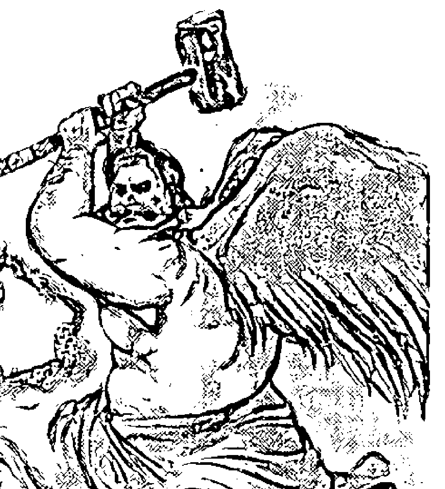

##### 幽灵军团
奥地利

（→加鲁海姆的恶魔Demon(Karuhaimu)、戴拉·布兰卡Dera Buranka、枞树中的恶魔The demon in fir）

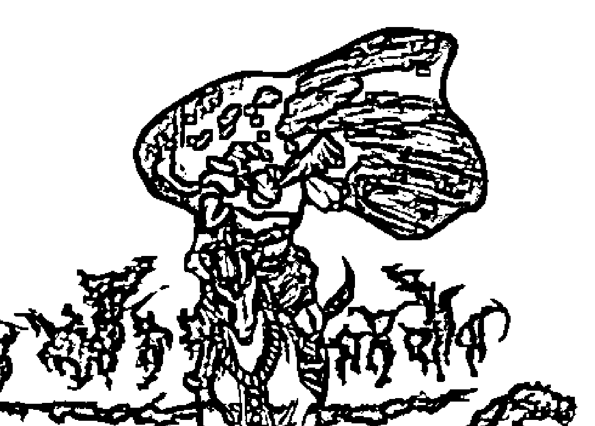

#### 恶魔·所罗门的恶魔
雷蒙盖顿·伪以诺书

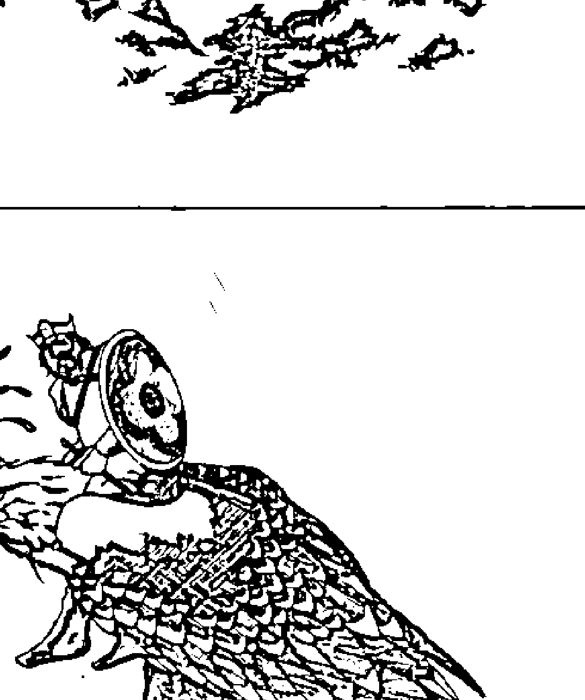

#### Muruaduru Nheyangaru姆尔阿兹·恩黑阳家尔

这是住在西太平洋帛琉群岛中恩黑阳家尔地方的恶神。
据说他会在人生火的时候出现，张开血盆大口，一口气就吞下五个人。因此村人都害怕，逃了出去，结果只有一个老婆婆来不及逃而留了下来。老婆婆没办法，只好躲在流木的洞穴里，在那里生了两个男孩。
小孩长大后问母亲为什么村里都没人？老婆婆回答说，大家都逃到叫做加萨坎的地方去了。一生火恶神就会跑出来，所以千万不能生火。

好强的两兄弟听到这些话，就去收集了大量的薪柴，将石头丢进柴里烧的滚烫。于是恶神马上从海中冲了出来，兄弟俩立刻将火热的石头丢进他的嘴里。他们总共在三个地方烤石头。恶神来到第一个地方时，他们就在第二个地方将石头丢人火中准备。于是，在用完三个地方的石头后，终于将恶神打倒了。
恶神痛苦万分绕着珊瑚礁最后死去，据说那片珊瑚礁因此而圆圆地鼓起来了。
(→埃拉帝穆Eratemu、布烈其Bururekki、姆尔阿兹库尔 Muruadurukuu ru)

#### Muruadurukuuru姆尔阿兹库尔

这是西太平洋上的帛琉群岛中，贝里琉岛上叫做卡西亚斯的地方的恶神，是个食人者。而且这个恶神的嘴巴与一般人不同，竟然是纵着长的。
卡西亚斯的居民害怕他，因此逃到一个叫做米云斯的地方，但是一个叫做伊莉莉丝的老婆婆来不及搭船而被留在那里。老婆婆没办法，只好呆在叫做伊鲁鲁的洞穴里。在那里老婆婆生了两位神明。哥哥叫做鲁斯·贝得格尔（身上长了针的人），弟弟叫做贺雷亚尔·贝得格尔（身上长了瘤的不死人）。
他们十五岁的时候，兄弟俩问母亲为何要吃生肉而不吃熟肉？老婆婆回答，如果生火会被恶神发现将他们吃掉，所以只好吃生的。于是兄弟俩来到渡船口，一边唱歌，一边钓鱼，果然姆尔阿兹库尔立刻闻声而至。哥哥自己冲进他的肚内，将他的肚子抓破；而弟弟则是在外面用石头丢他，最后终于将恶神打倒了。

于是兄弟两人从回来的村民那里获得移到阿·拜（公共房，一种共同式的住宅）坏掉的时候可将那房子拆了当薪木使用的权利。因此现在在当地留有当村里的阿·拜坏掉的时候，独栋的房子可以获得

#### Myouchin妙春

这是江户时代的长篇传奇小说《南总里见八犬传¹⁹⁴》中登场的妖狸。曾经喂乳给失去双亲的幼犬八房（玉梓转世而成的狗）。
原本妙春与里见家丝毫没有关系，但是因为授乳给八房，结果也被八房中玉梓的怨念不断地影响。在获得神通之力的同时，也被那股怨念所牵动。
妙春在八房成佛后，幻化成人形，自称八百比丘尼¹⁹⁵，来到里见家的滨路姬的面前。另外向滨路姬求亲被拒的畠田素藤则尊称她为天助尼公。其后妙春怂恿畠田素藤起兵造反。不过最后畠田被犬江亲兵卫赶出城外，这时妙春救了他，逃到山中躲藏起来。
后来《八犬传》改编至各种媒体上时，经常将玉梓视为真正的元凶，是一切的罪魁。但是实际上在小说中八犬士们最后的敌人其实是妙春与畠田素藤。
仅仅是因为好心照顾了八房，结果使得一只普通的狸猫变成故事中罪大恶极的妖魔，这恐怕只能用悲哀来形容了。

194 译注：《南总里见八犬传》，作者洸泽马琴（1767-1848）费了 28 年才完成的长篇大作。主要内容在叙述安房里见氏的公主伏姬受了妖犬八房的妖气而生出八个孩子，分别代表仁、义、礼、智、忠、孝、信、悌八种德行的八个勇士们的活跃故事。全书充满了贫苦罚恶的思想，为江户时期读本文学的代表作之一。
195 译注：日本自古以来就有的传说人物，原本是个普通的比丘尼（尼姑），因为吃了人鱼的肉而不老不死，活了八百岁。

#### 怨灵·妖狸 日本

194 译注：《南总里见八犬传》，作者洸泽马琴（1767-1848）费了 28 年才完成的长篇大作。主要内容在叙述安房里见氏的公主伏姬受了妖犬八房的妖气而生出八个孩子，分别代表仁、义、礼、智、忠、孝、信、悌八种德行的八个勇士们的活跃故事。全书充满了贫苦罚恶的思想，为江户时期读本文学的代表作之一。
195 译注：日本自古以来就有的传说人物，原本是个普通的比丘尼（尼姑），因为吃了人鱼的肉而不老不死，活了八百岁。

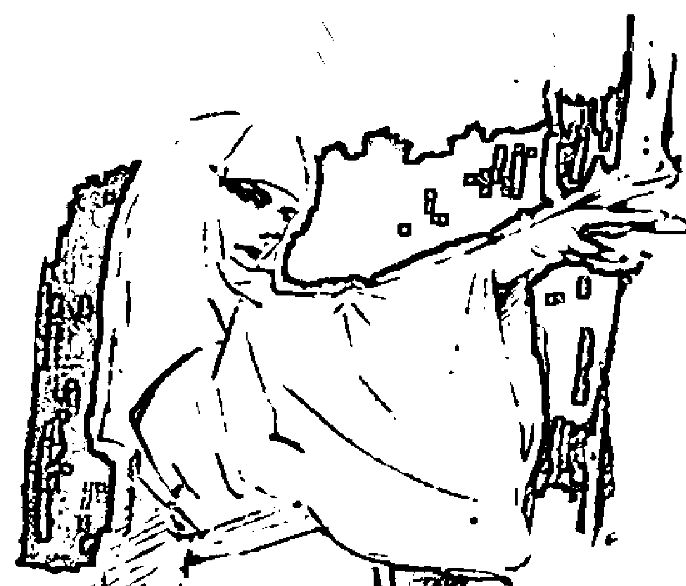

#### 巴比伦的大淫妇

巴比伦是美索不达米亚的古都。过去犹太族曾被抓到这里当过奴隶。对犹太人而言，巴比伦不只是个过度浪费奢侈的都市，在道德上更是颓废与邪恶的象征。不仅是犹太教，基督宗教与伊斯兰教都有这样的概念。

因此在《新约圣经》的《启示录》（Revelation）中，约翰说在世界末日到来时，会有个“巴比伦的大淫妇”出现。这个美女身穿紫色与朱红色的衣服，用金子、宝石、珍珠为妆饰，手拿金杯，杯中盛满可憎之物。她骑着一只朱红色的兽，立于水上，兽长有七头十角，身体上遍布亵渎神的名号。

长有七头十角，身体上遍布亵渎神的名号。

如果从《启示录》的描写来看，与其说这个女人是真正的人类，倒不如说她就是巴比伦这个都市本身，充满了罪恶与诱惑的象征。朱红色的兽，他的头是七个崇拜恶德背离真神的王（或说罗马皇帝），十个角则是十个僭主，而水当然就是众多的人口、国家与语言的象征。

> （→撒旦 Satan（中世纪欧洲））

#### 纳贝流士

17世纪的魔法书籍《雷蒙盖顿》（Lemegeton）的第一部《哥耶提雅》（Goetia）中记载的72名恶魔其中之一。

他有数个别名，如“※舍惹布斯”（Cerebus）“※克雷狈如斯”（Kereberus）等，不过从当中的“※舍惹狈如斯”（Cerberus）这一别名看来，这个恶魔的来源就很清楚了。这个恶魔应该是希腊神话中的地狱看门狗地狱犬（Cerberus）经过恶魔学的学者附加了种种想象，最后变成了完全不同的恶魔。

依照传说，他长得像公鸡，或者是说像乌鸦，不过受到其来源的影响，他也有三个头。他会教导召唤者逻辑学或修辞学，给予人恢复名誉或爱情的力量。

作家普朗西的书《地狱辞典》中将他写作“舍惹狈如斯”这个名字，说他是地狱的侯爵，19个军团的指挥者，并且是掌管美术的恶魔。该书的插画家布尔顿将他画成了穿着贵族服装，有着三个狗头的乌鸦。因为这张插画，原本就已大大不同于希腊神话的看门犬形象，更是变得毫不相关。

> （→菲尼克斯 Phoenix）

#### 那迦

在亚利安人入侵以前，印度原住民所崇拜的蛇神。这个蛇神信仰后来也被纳入佛教或印度教信仰中，但是或许因为印度代表性的蛇为有剧毒的眼镜蛇，因此经常被说成是恶魔。

那迦（或译蛇龙）乃支配地底世界之神。拥有七个眼镜蛇的头，额头上有枚宝石闪耀光芒，那光照亮地底世界以及信仰他的信者的黑暗。那迦因喝了神鸟迦楼陀196（Garuda）掉下的阿摩利陀（amurita），也即苏摩酒（soma），所以能长生不死。一般说来，蛇神信仰经常会与水有关，那迦也不例外，拥有呼云唤雨的魔力。

那迦在新宗教，也就是印度教与佛教中被当成恶魔。不过在佛教中，最后他皈依向佛，以八部众的身份加入曼陀罗中。在印度教中，他也在搅拌乳海的仪式中，吐出体内的毒素，身体得到净化最后成为神，后来变成皮带缠在湿婆（Siva或Shiva）腰间，专门捕捉恶魔。

196 译注：为毗湿奴（Visnu或Vishnu）神的坐骑。

#### 都市 基督宗教

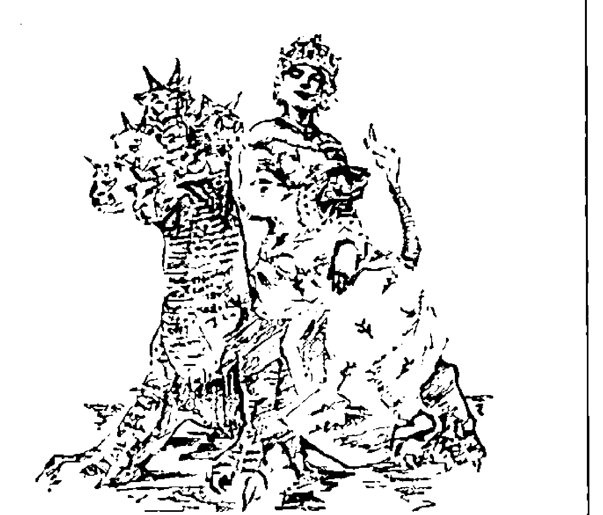

#### 恶魔·所罗门的恶魔
雷蒙盖顿

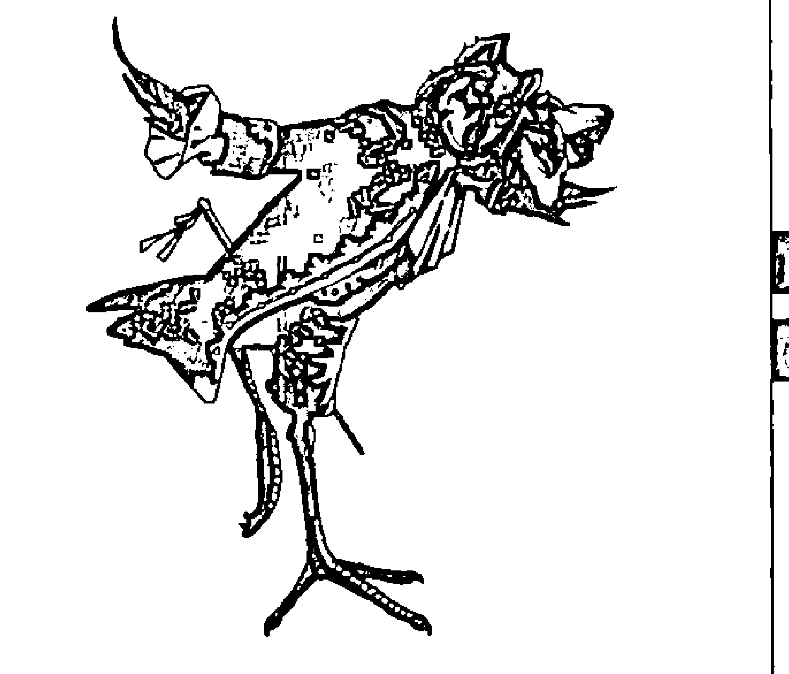

#### 恶龙 印度

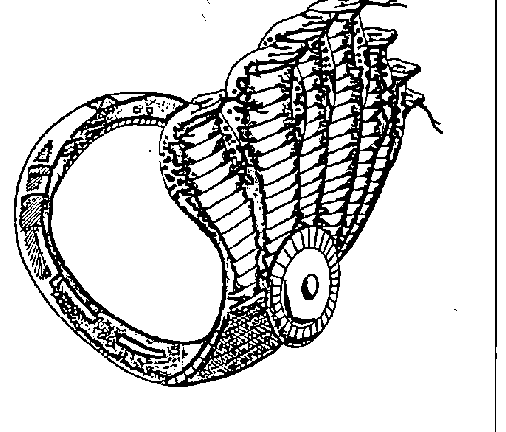

#### 那牟质

仙人迦叶波（Kasyapa）与妻子陀奴（Danu）生的*檀那婆（Danava，一种恶魔）之一。在另一本书《伐由往世书^197^》（Vayu Purana）中则说他是*毗婆罗吉提（Vipracitti）与*达伊提耶（Daitya，一种恶鬼）的公主*辛悉迦（Simhika）之间的儿子。

过去*因陀罗（Indra雷神）与檀那婆争战的时候，杀了那牟质以外全部的檀那婆，但是却被那牟质给抓到，于是因陀罗答应他一个条件才获得自由。这个条件就是“不管是晚上或白天，不管用干的还是湿的武器，都不能杀那牟质。”

后来那牟质还利用这个条件偷了因陀罗的不死神酒。

于是因陀罗向双马童^198^（Asvin）与娑罗室伐底女神（Sarasvati）^199^祈求，希望他们借给他力量。他们给因陀罗非湿也非干的水泡做成之武器，其名字叫做金刚杵（Vajra雷电）^200^。

后来那牟质就被因陀罗用这个武器，在既不是白天也不是晚上的黄昏里斩下头颅而死。^201^

#### 纳苏

琐罗亚斯德教的女恶魔。外形是苍蝇，喜欢尸体，会散播传染病。

琐罗亚斯德教的恶魔传说住在地下（或说是在北方尽头）的地狱里，地狱入口为一座巨山，山的名称便叫“阿苏拉的头盖骨”（直译便是阿苏拉的丑陋的头），这里经常会变成阿里曼（Ahrinman）与其眷属的集会场所。纳苏就是从这个山的洞窟飞到人间。

来到人间的纳苏会停留在有死亡与腐败味道之处。一旦尸体无人看守，或只有一个人看守，她便会立刻从尸体的眼窝或耳朵的洞钻入，然后散播传染病。而且在世的时候越是有名望，如僧侣或战士等等的尸体，其传染的范围越广。

要有效防止这个女恶魔入侵尸体的方法是诵唱神圣的咒语，不然就饲养猛禽或狗。附带一提，在琐罗亚斯德教中，狗是十分受到尊敬的动物，不过到了回教就不见得如此了。伊朗人在改信回教后，主人打狗的次数是否有增加我们不得而知，不过在文学作品中骂狗的次数增加了倒是真的。

#### 黑天使

意大利诗人但丁的叙事诗《神曲》（1307~1321年作）当中登场，来自地狱的使者，又称“黑色的智天使（Cherbini）”、或“恶天使”。在《神曲》第一部第24篇及27篇中载有其名。

如字面所述，黑天使全身黝黑，其翅可使其于地狱中自由来回。此外，黑天使也被派遣至地面，其任务并非传播恶种或诱人为恶，而是在恶人死亡之际，拘提其魂前往地狱判官冥罗司之前。主角但丁于地狱第8圈第8沟遇到基独蒙勿得禄伯爵，此人因为参与教皇^202^阴谋之罪而被黑天使拘至地狱。

不管是看守地狱下界“地帝城”城门的千人守卫、第18篇鞭打死者的恶鬼们、还是第21篇中的*马纳勃郎西（Malebranche）等，《神曲》〈地狱篇〉中虽有为数不少的恶魔居住其中，黑天使却比这些狱吏们更高位。据诸多注释家解释，黑天使主要侍奉拘于地狱最下层的恶魔王*狄斯（Dis）。

#### 达伊提耶 (Daitya 恶鬼) 印度

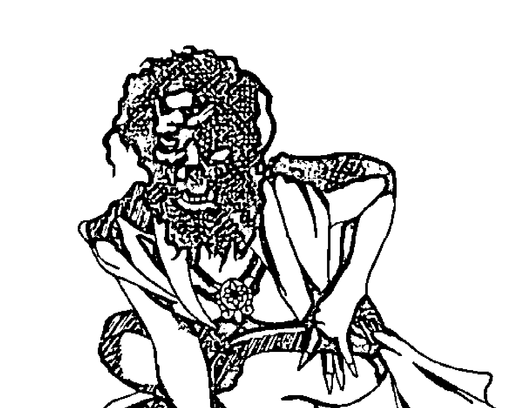

- - 197 译注：又称《湿婆往世书》(Siva Purana)，以记述湿婆事迹为主。
- 198 译注：音译“阿湿波”，为一对孪生兄弟神。
- 199 译注：意译“辩才天女”，婆罗门教、印度教文艺女神。
- 200 译注：Vajra 又音译“伐底罗”，为吠陀神话中因陀罗手中金刚杵，即雷电。
- 201 译注：也有另一个版本说他被海浪的泡沫击中结果就死了。

#### 恶魔 伊朗

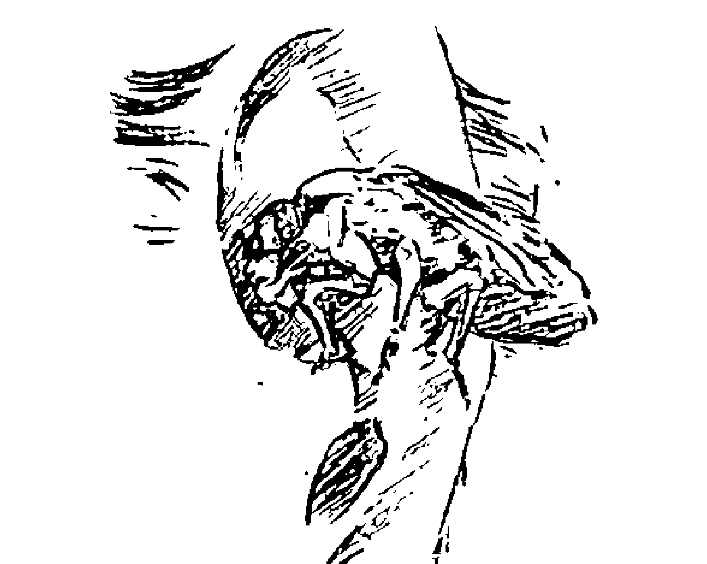

#### 地狱使者 神曲

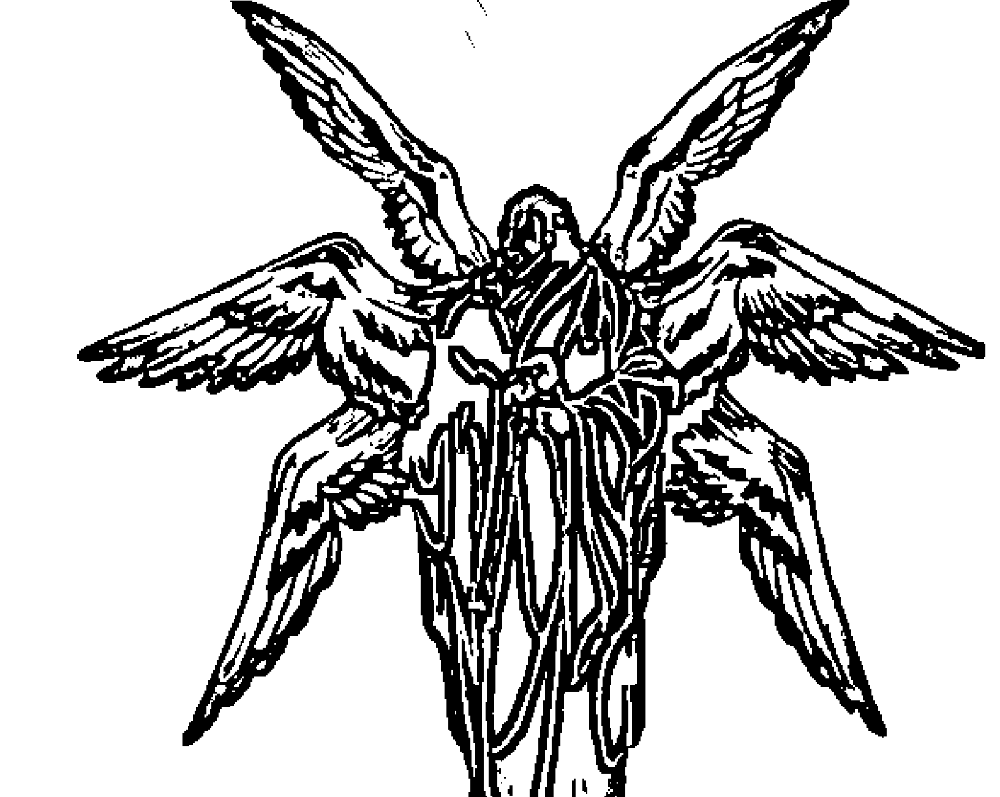

202 译注：即教皇连尼发西第八。

#### New Jersey Devil 纽泽西恶魔

据说这是实存于美国纽泽西州的生物。体长一米左右，脸部像马一样的长，长有形似袋鼠的粗大尾巴与蝙蝠一般的翅膀，用有蹄的双脚步行移动。根据目击者的说法，这个怪物是肉食性。

最初目击到这怪物的时间是1730年代。后来在1840又再度传出有目击者，之后几乎是每隔50年就会传出目击事件。到了1909年时，说亲眼目睹过这个怪物或者见过他的足迹的人甚至达到了千人。根据某个可信度极低的传说，这个怪物的诞生是有以下故事的。

1735年的某日，龙卷风来袭的时候，纽泽西的一群妇人由于无聊，便模仿着黑弥撒的仪式来玩，在仪式中某妇人怀中正在喂乳的婴儿突然变身成这个恶魔，袭击其他参加仪式的妇人及小孩，将尸骸乱啃一通之后，飞向龙卷风中消失了。

大部分的神秘学家以及一部分动物学者认为他应该是一种UMA²⁰³。至少比起说他是真正的恶魔还要有可能得多了。

(→天蛾人 Mothman)

#### Nikumbha 尼空波

印度神话中叫做尼空波的恶魔有好几个。

首先在叙事诗《罗摩衍那 (Ramayana)》中，楞伽 (※罗刹的都城) 的魔王鸠姆婆迦哩纳 (Kumbhakarna) 的儿子就叫做尼空波。这个尼空波是罗刹王罗波那 (Ravana) 的弟弟²⁰⁴，在罗摩 (Rama) 与罗波那的战争中，最后被神猴哈奴曼 (Hanuman) 所杀。

另一个则在是与罗摩衍那并称的叙事诗《摩诃婆罗多 (Mahabharata)》中登场。这个尼空波是信仰毗湿奴神 (Visnu 或 Vishnu) 的罗刹王钵罗诃罗陀²⁰⁵ (Prahlada) 的第三王子。

另外同样在《摩诃婆罗多》中还有另外一个绑架了亚达瓦族 (Yadavas) 的公主婆奴摩提的恶魔也叫做尼空波。

甚至善陀普拉国的国王也叫做尼空波，只是这个尼空波并不是罗刹，而是个阿修罗 (Asura 或 Ashura)，他靠着苦行从婆罗门那里获得了除了毗湿奴神以外谁也杀不了的恩惠，而且他还拥有强大的力量，能够变身成各种东西。但是因为不知道英雄黑天 (Krsna) 就是毗湿奴的化身，与他战斗的时候

#### 9 children of Loviatar 罗薇塔的孩子们

罗薇塔 (Loviatar) 的孩子们，他们的名字分别是“疝气”、“横膈膜炎”、“肺病”、“痛风”、“发烧”、“溃疡”、“瘟疫”、“癣疥”、“肿瘤”，全都是不可轻忽的疾病。

他们听从母亲的命令，前往英雄维那莫依宁的故乡维诺拉，结果使得那里的居民患了各种做梦都想不到的疾病，在难以言喻的痛苦中，一个接一个死去了。

维那莫依宁得知怪病的原因是罗薇塔的孩子们带来的之后，将自己关进浴室里，然后在蒸汽中向乌可神祈祷，说：“啊啊，统御天上世界的乌可神啊，请您垂怜痛苦的维诺拉人民吧，请赐予您伟大的力量，灌注进这浴室中的蒸汽与热水与药里吧，将邪恶的九个病魔赶回图奥尼的国度，赶回东风的故乡，赶回恶魔的洞穴里吧！”

于是，维那莫依宁用这热水清洗病人，让他们做蒸汽浴，用药草制成香油涂抹在他们身上，于是病人就这样一个个痊愈了。

(→图奥尼与图奥奈达 Tuoni & Tuonetar)## 都市恶魔传说 美国

203 译注：尚未确定的神秘动物，Unidentified Mysterious Animal 的缩写。

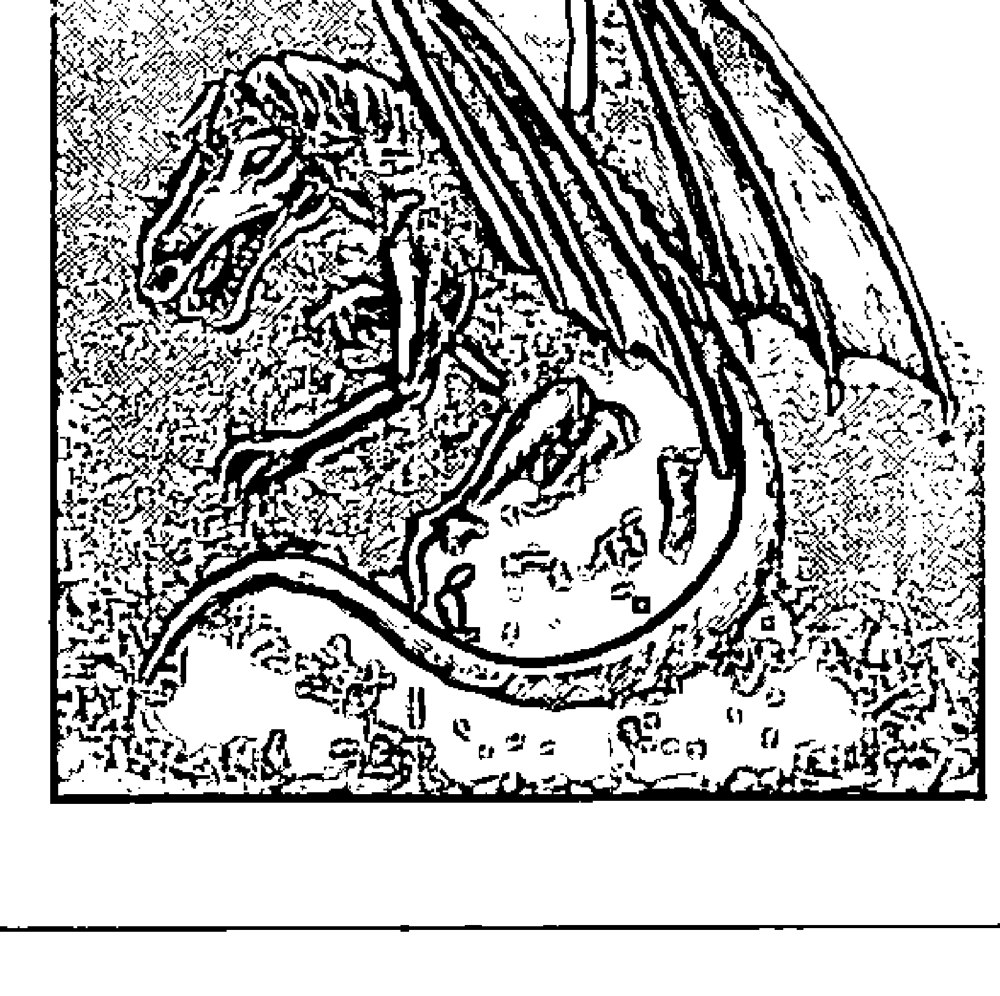

#### 恶魔 印度

被杀了。

204 译注：据《古代印度神话》：从系谱上看来尼空波似乎是罗波那的侄子而不是弟弟（P835）。
205 译注：参见伯利Bali、布罗尼耶格西布Hiranyakasipu。

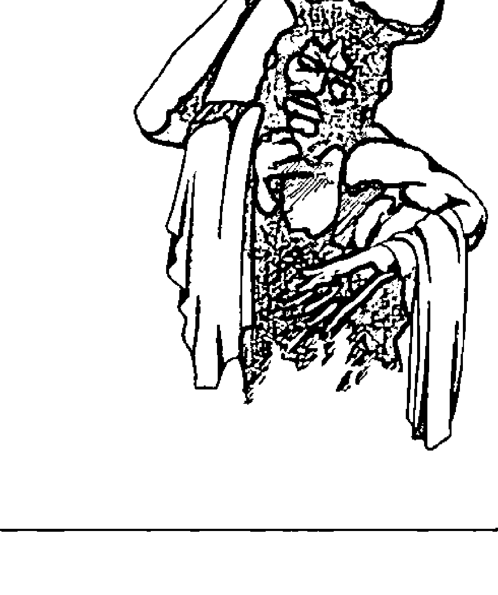

#### 疾病 芬兰

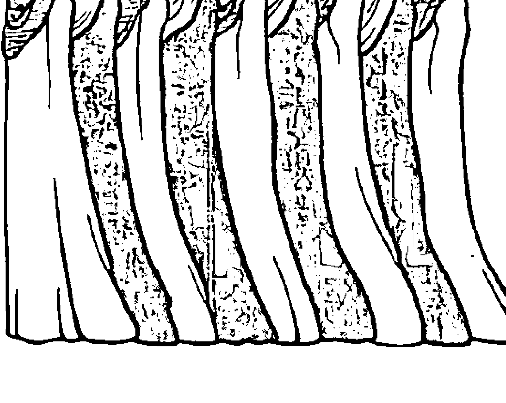

#### 太阳九姊妹·月亮十兄弟

布朗 (Bulang) 族居住在中国云南省南部的山岳地带，在他们的口传故事中，这些灾害神是创造神顾米亚 (Gumiya) 的敌人。

世界初始之时，月亮跟太阳同样熊熊地燃烧着。它们想要破坏顾米亚创造出的美丽世界，因此同时现身攻击。使得全世界宛如酷热地狱，星辰也失去了光芒。鱼的舌头，鳄鱼的头，蛇的脚，青蛙尾巴都是在这时因为高温而干缩不见的。

愤怒的顾米亚想用强力弓箭将它们一一射落，但是还没射完就已经气力用尽，第18枝箭只有轻轻擦过月亮表面。但是月亮已经吓得心惊胆战，身体也完全冰冷下来。幸存的月亮跟太阳，因为畏惧顾米亚而躲了起来，世界马上陷入了黑暗与寒冷之中。因此顾米亚就派动物们作说客，想要说服它俩现身。

太阳因为太过害怕顾米亚，迟迟不愿出现，最后公鸡跟它约定：“我会趁顾米亚不在的时候再叫你出来。”才使得太阳接受了大伙儿的要求。

因此世界就变得像今天这样，由太阳和月亮普照大地。

#### 宁图

巴比伦神话中出场的母蛇，她是半人半蛇的女恶魔，头上长角，左手抱着在她怀中吸奶的婴儿。

歌咏宁图模样的诗中，有一首是如此说的，如下：

> “从头至腰
> 裸女肉身。
> 自腰到踵
> 可见蛇鳞。”

某次，一只老鹰抓了这母蛇的儿子吃掉。母蛇大怒，向太阳神沙马什 (Shamash) 控诉。神决定惩罚这老鹰，于是便命令母蛇躲在野牛尸体的内脏中。

老鹰看到野牛的尸体就下来准备要夹走，小鹰感到危险发出警告，老鹰却完全没有警觉。老鹰停在牛尸体上，察看了四周并没有异状，于是准备开始享受这一餐的时候，母蛇从内脏里冲了出来，抓到了老鹰。老鹰向母蛇哀求原谅，但是母蛇还是将他的翅膀拔掉丢到谷底，于是老鹰在谷底不能飞出来的状况下就饿死了 206。

(→舒兹 Shutu)

#### 尼斯洛

《失乐园》中登场的造反天使（恶魔）。根据作者米尔顿的说法，他是《旧约圣经》〈列王纪〉中登场的亚述 (Assyria) 偶像神之前身 207。

在这些背离神的造反天使当中，以异教神、偶像神为蓝本的天使通常在反叛军中都具有高位，尼斯洛也不例外。特别给他个“治权（权）天使之长”的地位。但是在第一卷介绍高位的造反天使却没有介绍到他的名字，直到第六卷时他才出现。撒旦在天国举兵，唯一神派遣米迦勒 (Michael) 同加百列 (Gabriel) 与之交战，结果撒旦军败退。初战败退后，尼斯洛在军事会议中认为天国军比起原先预测的还要强大，如果没有强大的武器恐怕很难获胜。

尼斯洛这名字有“老鹰”的意义，因此他的造型也被设计成军人的感觉，但是从初战败退后就显露怯色来看，或许是个没什么气魄的恶魔。

(→撒旦 Satan《失乐园》)

#### 灾害神 中国（布朗族）

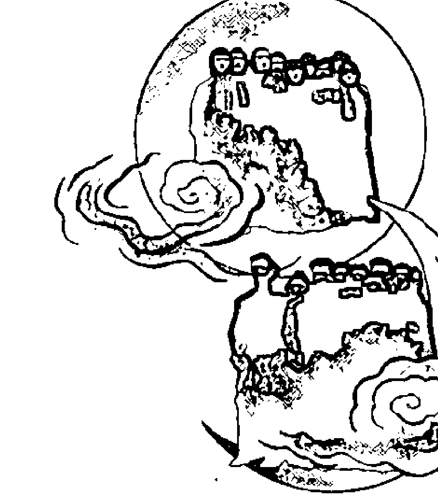

#### 母蛇 巴比伦

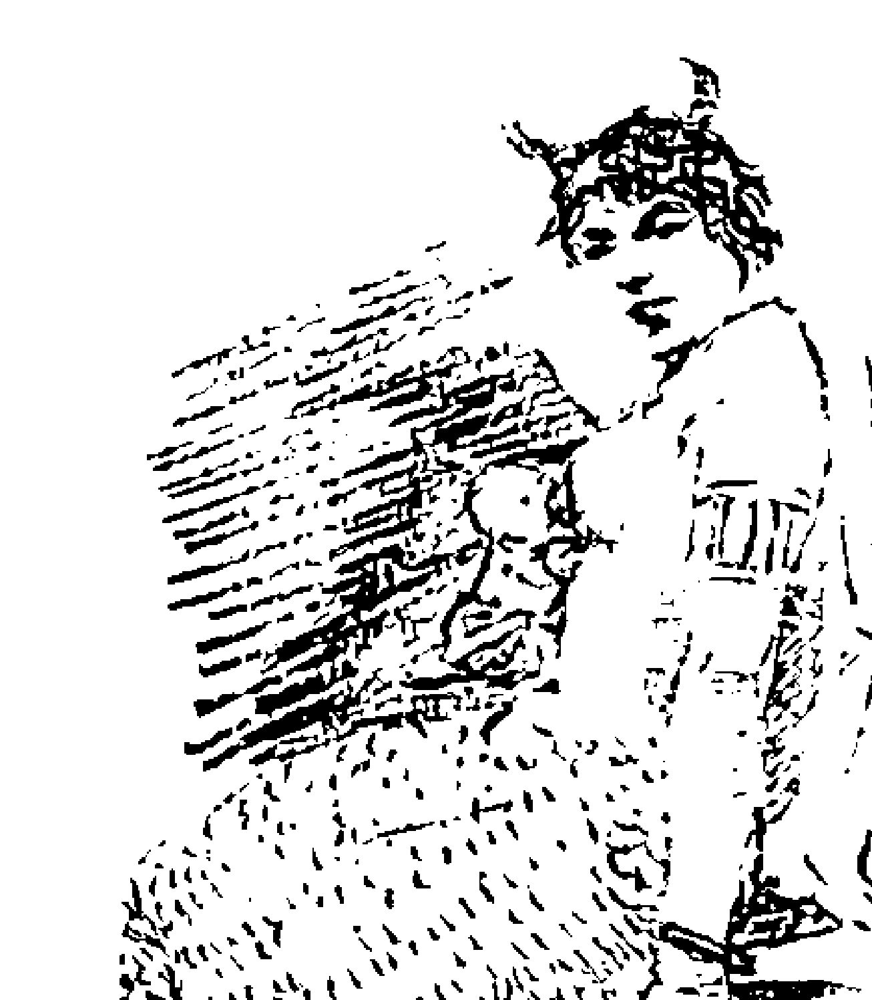

206 译注：星光出版社的《美索不达米雅神话故事》的故事稍有不同，该书老鹰并没有饿死，后来被翁埃塔纳所救。

#### 造反天使 失乐园

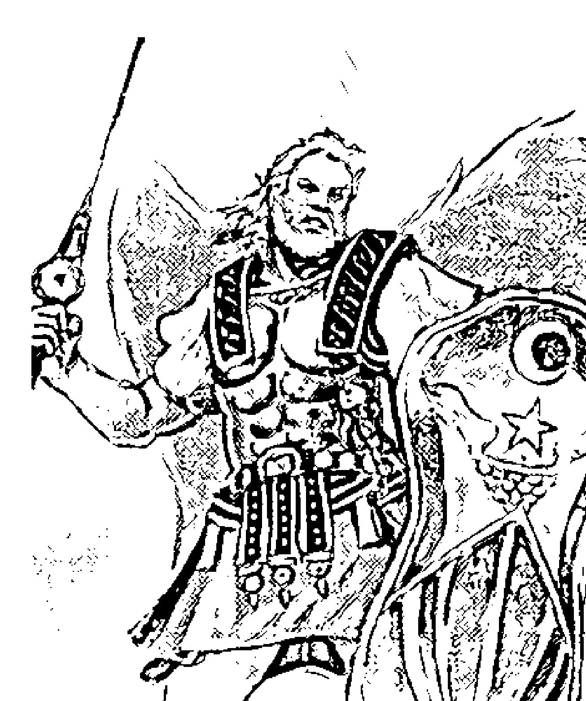

207 译注：出自《列王纪下》19：37，原文作“一日在他的神尼斯洛庙里叩拜，他儿子亚得米勒和沙利色用刀杀了他，就逃到亚拉腊地。他儿子艾萨克哈顿接续他作王。”

#### 牛魔王

《西游记》（1570 年左右成书）中的妖魔。别名“※平天大圣”（Pingtian-tasheng）。

孙悟空（Sun-wukong）修炼仙术完后不久，尚未于花果山自称美猴王前，曾于下界厮混度日，当时他与六魔头义结金兰，牛魔王便是七兄弟中的大哥。

平天大圣之名是当孙悟空自称※齐天大圣（Qitian-tasheng）时仿效而成之名。其原形为巨大白牛。

当孙悟空成为唐三藏弟子，于取经之旅中担任保卫，牛魔王后来与他发生激战。

起因是孙悟空与牛魔王之子红孩儿（Hung-haierh）的纷争。当时孙悟空降服红孩儿后将他引渡与观音菩萨，两人因此结下梁子。之后孙悟空又与其妻罗刹女铁扇公主发生纠纷。结果往日的结义兄弟就此完全为敌。而他也不愧为孙悟空之结义兄长，实力与孙悟空不分轩轾。两人之战为《西游记》中盘高潮。

然而孙悟空得天将之助后，终于击败牛魔王，便将他交予观世音菩萨。

#### 努莉雅尤克

尼切里克族208传说中出现的海兽之母。与依努依特209（Inuit）神话中的海之女神赛德娜（Sedna）非常的相似。

过去，每当要找新的狩猎地时，也就意味着要舍弃现在所居住之处。人们忙着将兽皮缝合做成小舟。但是人数太多，小舟的空位不够。

努莉雅尤克是孤儿，原本同其他的少年一起搭同艘小舟，但是其他少年们将她推下海，努莉雅尤克用手紧抓着船缘想要爬回来，但是少年们用小刀将她的手指切断，于是她便落海了。

随着她的下沉，被切断的手指一支支变成了海豹，而她也变成海的精灵，变成了所有海兽之母亲，甚至连地上的生物也听命于她。她在海底建造了与陆上毫无两样的房子，在恐怖精灵的包围下过生活。现在努莉雅尤克正张大眼睛监视着人类是否有打破禁忌。一旦有人打破禁忌，不管是多么的小，她都会将所有的动物隐藏起来。这样一来人类只有靠萨满巫师（Shaman）的力量才能够再度看到动物了。

（→依皮屋普·因纽雅 Ipiup Inua、温敌哥 Windigo、持鞭的精灵 The Thrashing Spirit with a Whip)

#### 奈亚鲁法特

在克苏鲁神话中，有名字的神几乎全都是破坏神或邪神。而在这些神当中最接近“恶魔的概念”的，恐怕就是奈亚鲁法特了。别名也叫做“无形之神”，从完全就是一副怪物妖魔的相貌，到与人类别无两样的形貌，他都可以轻易的变形。

克苏鲁（Cthulhu）诸邪神中，很多神不是完全没有知性，不然就是精神构造与人类截然不同。可是奈亚鲁法特乃少数拥有“明确意志”、“会用语言与人类沟通”、“具有优秀知性”的神。虽然拥有神般强大的破坏力，但是却偏好诱人犯罪，欺骗人类，引导他们自己走向灭亡之路。例如在某部作品上说，这个神其实便是引诱人去开发核子武器的元凶。

他喜欢的一个形态是叫做“black-man”的黑皮肤人类造型。脸部模样是白人的感觉，但是皮肤却黑如檀木。这个姿态酷似基督宗教传说中恶魔变身来引诱人类的造型，因此在有些作品当中也就直接说中古世纪传说中的恶魔其实乃奈亚鲁法特所化身。

（→库多古 Cthugha、奥陀 Ahtu）

#### 怪物·魔王 中国

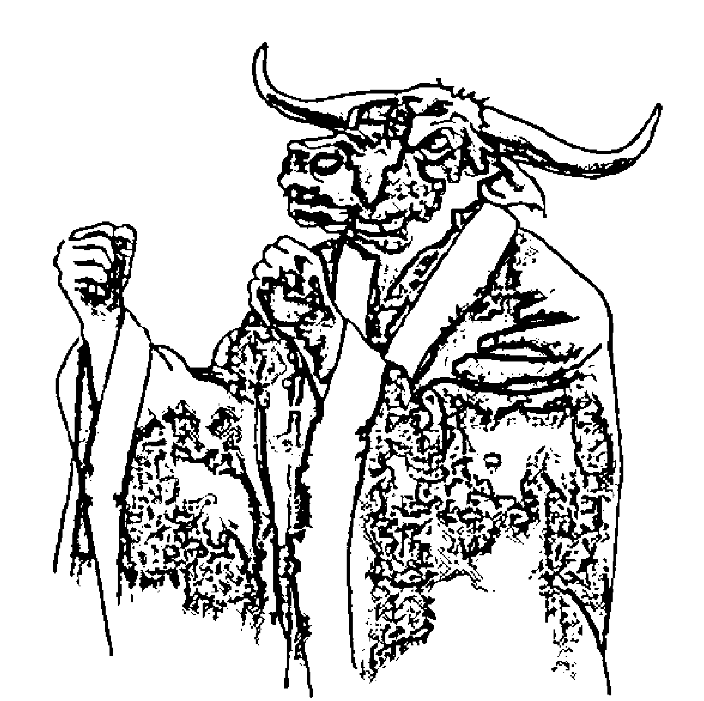

#### 海兽之母 爱斯基摩

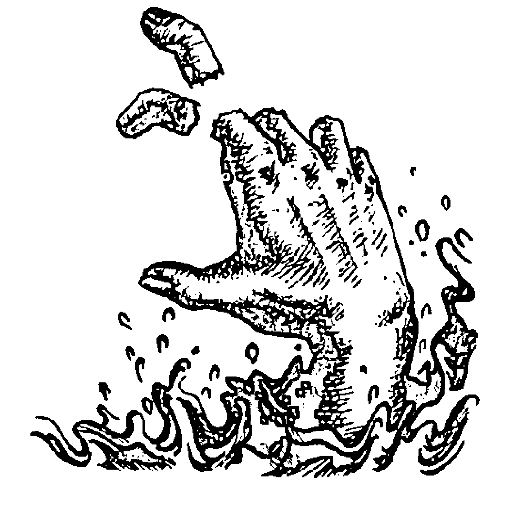

208 译注：居住于加拿大爱得华王子岛附近的爱斯基摩人。
209 译注：爱斯基摩人的自称。意思是“人”。

#### 恶作剧神 (Trickster) 克苏鲁神话

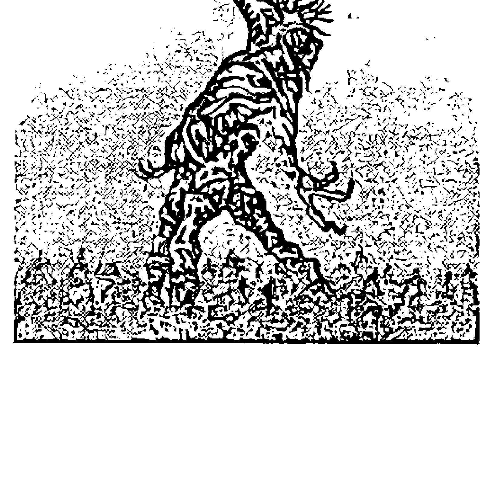

#### 奥克托力蓝其

奥克托力蓝其为克尔特神话中登场的年轻族长，率领巨人弗摩尔（Fomor）族，在与“达那神族”众神之战中十分活跃。其父为弗摩尔女神托姆纽之子，也即弗摩尔之王英帝契（Indich）。

当弗摩尔族与“达那神族”之战越演越烈之际，弗摩尔族发现诸神的战士不论倒下几次，都会于不久后再度返回战场。其实这是因为只要将死者浸入医疗神迪安卡西特（Dianceht）的魔法之泉，便能伤愈复活的缘故。

于是奥克托力蓝其带领部下趁夜色掩护接近泉水。奥克托力蓝其同其部下全部手拿自河底取出的大石，接着不停将岩石投入魔法之泉将泉水埋起。如这一来，诸神变得再也无法复活。

因为这次掩埋的动作，魔法之泉所在处成了一个大土堆，大家将它叫做“奥克托力蓝其的土堆”。

#### 阿岩

阿岩为江户时代（1600~1867）前锋火枪队同心 210田宫又左卫门之女。21岁时，患痘疮（天花），虽留得一命，却变得脸上满是伤疤，头上混生白发，弯腰驼背，并瞎去一目。

后因父亲染病，身为独生女的阿岩不得不招赘。而在同僚推荐下，遂招浪人伊右卫门为婿。然而伊右卫门却伙同前锋火枪队与力伊东喜兵卫欺骗阿岩家产，将她逐出家中。阿岩于惊慌失措后形貌变得有如女妖，就此消失无踪。

阿岩失踪14年后，伊右卫门迎娶伊东喜兵卫之妾阿花，生下四名子女于田宫家中度日。不过阿岩的幽灵突然现身，于是小孩陆续死去，阿花也因身体欠佳逝世。之后伊右卫门因执勤时受伤而流淌脓血，结果嗅到脓血气味的老鼠蜂拥而至，将他的身体咬得七零八落。伊右卫门因此毙命。

如今，阿岩虽被祭祀于阿岩稻荷（今日之东京都新宿区四谷），却拒受超度；相传只要拍摄“四谷怪谈”的相关剧作，她便会出现作祟。

（→阿菊 o-Kiku、阿露 o-Tsuyu、累 Kasane、疱疮神 Housou-gami）

#### 阿菊

本为盗贼向坂甚内之女，因父亲被捕处刑而被收为火付盗贼改 211青山主膳的下女。

阿菊长大后出落得十分美丽，主膳欲纳她为妾而不住地游说。但因阿菊对身为父亲仇人的主膳怀恨在心，故不愿首肯。一日，阿菊打破了一枚青山家珍藏的盘子。早就对阿菊心怀不满的正室打算为此重重责罚她。于是盘子之事马上传入主膳耳中，主膳爱之深而恨之切，便切下了阿菊右手中指。之后阿菊投身庭中水井自尽。

此后，古井中每夜皆会传出“一个、两个……九个，还少一个”的凄凉声音。这件事立刻传遍江户地区，主膳因此遭免职，青山家也家破人亡。

经年累月后，了誉上人为了超度阿菊造访该宅。诵经21日后在阿菊数到“九个”的瞬间大喊：“十”，于是她总算升天。

同阿菊以及盘子数量不足的相关怪谈可见于日本全国各地。又，有人说“菊”乃是“传说” 212之意；又一种传说她与巫女神菊理媛神（Kukurihime）有关。

（→阿岩 o-Iwa、阿露 o-Tsuyu、累 Kasane、）

#### 弗摩尔 克尔特

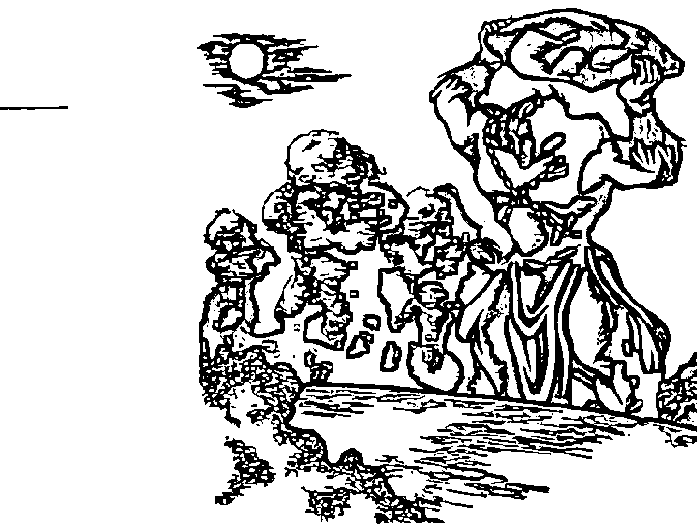

#### 怨灵 日本

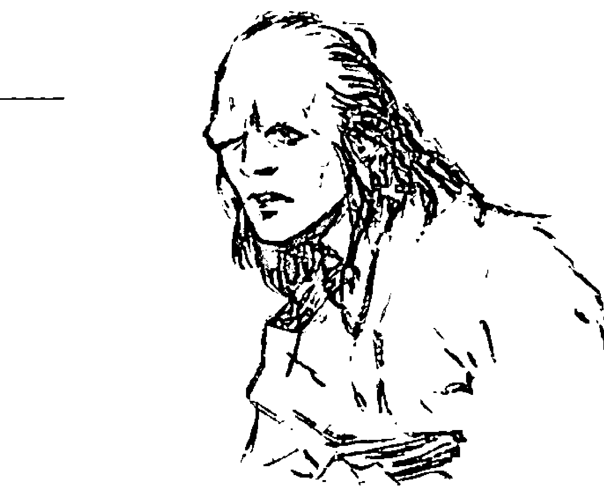

210 译注：同心为日本下级治安人员之职称；后段的“与力”亦为治安人员职称、阶级较同心为高。

#### 怨灵 日本

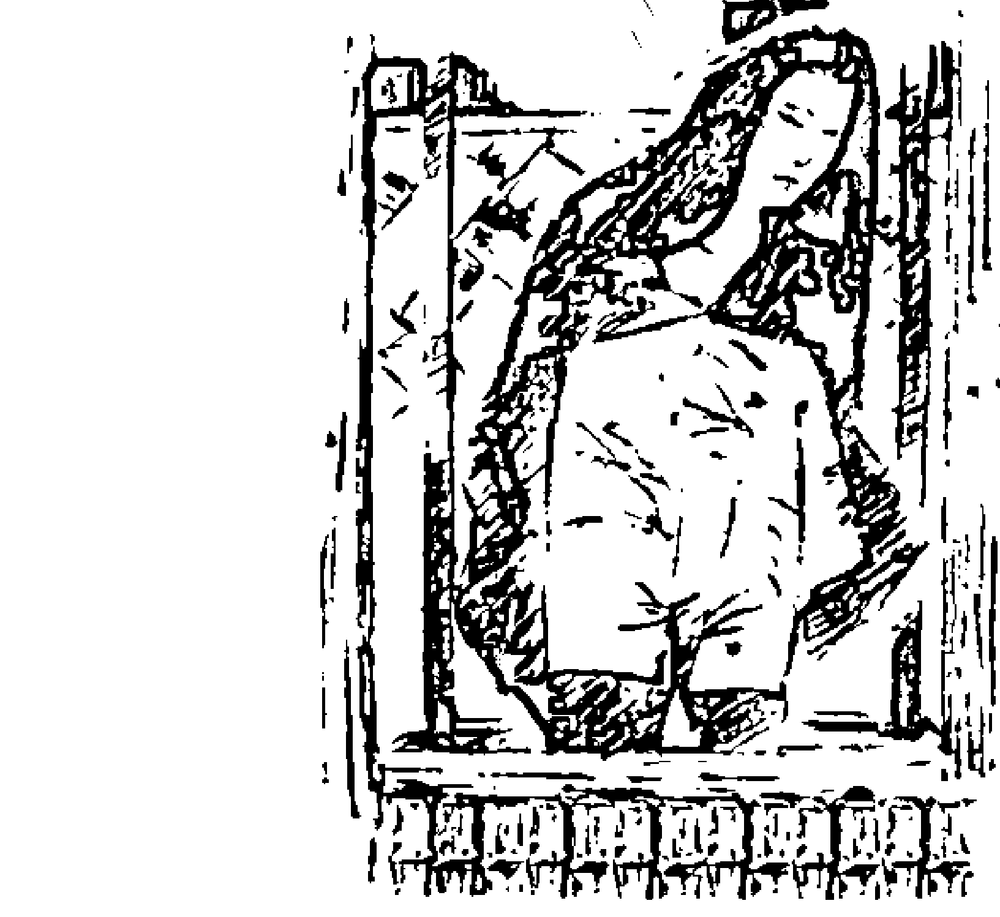

211 译注：火付盗贼改为江户幕府时巡守江户一带拘捕盗贼之官员职称。
212 译注：日文中“菊”与“传说”同音。

#### 大国主神

日本神话中代表性的“国津神（Kunitsu-kami，土著神之总称）。因后与大物主神（Oomonononushi-no-mikoto）混同而继承大物主神的蛇神、祸祟神性质。同样，之后也与密宗传入的大黑天（Mahākāl）发生融合，变得拥有凶神性质。但两者并无宗教学上的缘由与类似性质，所以融合原因除同可念为“Daikoku”213一事外别无他故。

以下乃题外话：以湿婆（Siva或Shiva）神为原型之大黑天，其象征动物为牛，与大物主的蛇（龙）属对立关系。因此，若非是在各地风土习俗相差悬殊的日本，或许两者便无融合之可能。

大国主神与大物主神的融合，应是朝廷势力入主机内214时，欲借由融合当地神话以怀柔有力氏族；或有可能是于打倒某豪族后夺其神灵以图确立支配权。

大国主神的负面形象几乎皆是他神融合而来。原初的大国主神乃是立国之神，为大国之王，全然属于善神。

#### 大物主神

大国主神（Ookuninushi-no-mikoto）的不同的名字之一。

与大物主神的相关神话中，最有名的应属大物主化身贵人，每夜偷偷造访村邑望族之女的传说。故事中对此觉得有异的少女双亲，命女儿在贵人衣袖上刺上丝线。于天亮后沿线寻去，却走到了三诸山（三轮山）215，方才知道贵人乃三轮山之神。

同样神话又有另一版本：少女对隐藏自己脸孔的贵人说希望能看看他的脸，而贵人回答道：“黎明后我会进入箬盒中。”待天一亮少女打开箬盒一看，里头有条雪白长蛇。白蛇在看到少女震惊的样子后便一面叹气，一面回去山中了；少女对此悔恨不已，遂用筷子刺入下阴自杀。

另外，有一种说法大物主本与大国主神乃不同神格；是因当朝廷势力进入畿内后将畿内的神灵大物主神收编，才与大国主神同化了。

此外，正如其名所言他乃为“物”216（魔物）之主，为强力祸祟神。这点由即使使用延请已入神域的天皇协助的祷文，他也能抗拒无视，不住作祟一事可得而知。

#### 奥迦斯与黑帝斯217

英国诗人米尔顿之叙事诗《失乐园》中登场的灵体。在除了唯一神所创造的天国、地狱、宇宙这些世界外，其余领域乃由混沌（Anarch）所支配，奥迦斯与黑帝斯则臣属于混沌。两神居于混沌界（Chaos）中的混沌王宫内，而混沌界中满是神用以创造世界的材料——原初混乱。

黑帝斯为希腊神话中的冥府神；奥迦斯则为罗马神话中相当于黑帝斯之神。米尔顿将此二神视作不同存在令他们于《失乐园》中登场。在以基督教世界观为基础的《失乐园》中，多将异教神解释为是由造反天使而来，这些天使随大逆不道的天使·撒旦叛乱，堕落后他们的形象便成为异教神；然奥迦斯与黑帝斯却非造反天使。（→撒旦Satan《失乐园》）

混沌的王宫中有着希腊神话气息，其中阴气森森的样子特别令人联想起冥府阴间。与奥迦斯及黑帝斯同列的廷臣尚有特摩高根（Demogorgon）、“谣言”、“投机”、“骚扰”、“混乱”、“吵架”等神。特别是“投机”乃为仅次于混沌的权力者；而奥迦斯与黑帝斯随侍于混沌及其后“夜”的宝座旁。

#### 立国之神 日本

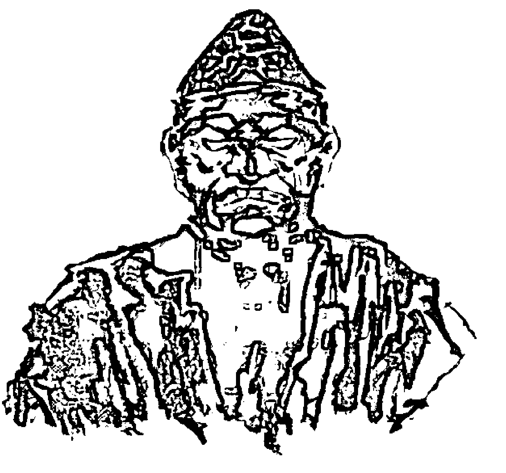

213 译注：日文中“大国”与“大黑”皆可读作“Daikoku”。
214 译注：指今日日本京都一带。

#### 蛇神 日本

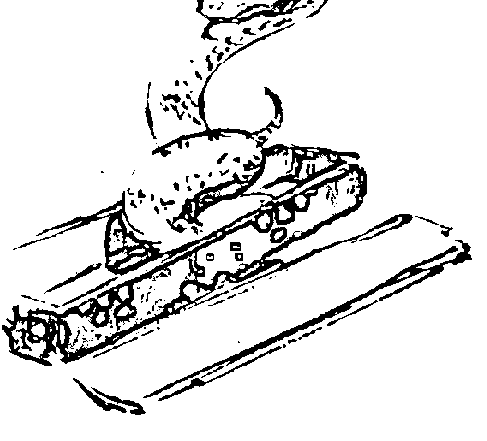

215 译注：此山位于今日日本奈良县。
216 译注：“物”之一字于日文中会用于指称神佛鬼魅等超自然存在或妖怪、怪物。

#### 混沌的廷臣 失乐园

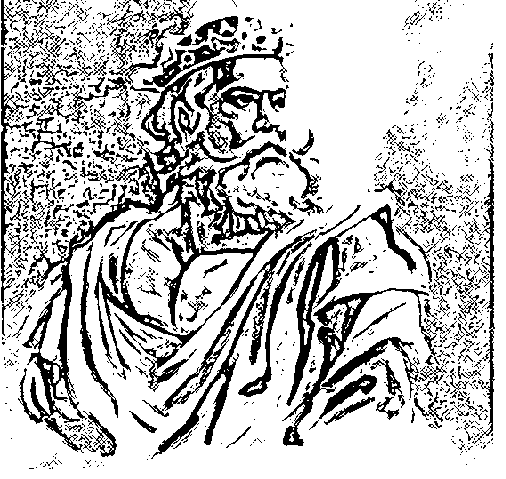

217 译注：本书中有关《失乐园》之项目泰半参照桂冠1994出版朱维之所译之版本而成，然“Hades”一神于书中译作“阿得斯”非本书选用之“黑帝斯”，特此说明。

#### 奥迦斯

罗马的地底（冥界）之神、死神。同时冥府本身也称作奥迦斯（Orcus）。被视同于希腊神话的黑帝斯（Hades）。本为源起自伊特拉里亚之神。

及至后世，转而与冥界神地神（Dis Pater）混同，两者同被作为冥府的代名词。地神之名直到公元前 249年才随着西彼拉218的预言（负责传递阿波罗神谕之女神官的预言）开始流传，在此之前地神的名字几乎无人知晓。

艾特拉里亚人的坟茔中，将奥迦斯绘作长有胡须的狰狞巨人。另外，有时他会化身为一可怕战士出现于地上，打倒勇敢的战士或是追杀懦夫。

地神之妻为普洛塞庇娜（Proserpina、Proserpine），因姓名与黑帝斯之妻珀耳塞福涅（Persephone）相近（也可能是在古代时引用前者而成），令地神与黑帝斯为同一神灵之观点更加坚固。

在意大利的迷信里，奥迦斯也会以身具黑翼的恶魔此形象出现。

(→奥迦斯与黑帝斯 Orcus & Hades)

#### 欧里亚斯

假称古以色列王国所罗门王所作之17世纪魔法书《雷蒙盖顿》（Lemegeton，又名 The Lesser Key of Solomon），书中第一部分〈哥耶提雅〉所记载的72名恶魔之一。

19世纪法国作家柯林·德·普朗西所著之《地狱辞典》中，他乃地狱大公爵，为30个军团之指挥官。

此恶魔以足跨巨马的蛇尾狮子之姿现于人前，手持两条毒蛇；此种外形在《雷蒙盖顿》中乃属稀松平常。相传为司管占星术的恶魔之一，能让想了解此道者轻易理解复杂的占星术。

在该书中，蛇尾不在欧里亚斯身上，改为他的马匹所有。或许因外表与其他恶魔雷同处颇多的缘故，布尔顿并未于《地狱辞典》中绘制他的插画。由于欧里亚斯并无肖像，能力外表也不出奇，于是成了低知名度恶魔。

也传说他能让人类变为各种形态，会予人同敌人达成和解的能力；不过这些能力在《雷蒙盖顿》的恶魔中可谓比比皆是。

#### 欧若博司

17世纪魔法书《雷蒙盖顿》（Lemegeton，又名 The Lesser Key of Solomon），书中第一部分〈哥耶提雅〉所记载的72名恶魔之一。

19世纪法国作家柯林·德·普朗西所著《地狱辞典》中，言他乃地狱王族，为20个军团之指挥官。

据说以马匹形象出现于召唤者面前。同其他《雷蒙盖顿》的多位恶魔一样，拥有过去、现在、未来的知识，可回答任何问题。相传能给予召唤他的魔术师威严与人望。

拥有予人地位、军功等名声，或让人看穿谎言得知真相的能力。能让人与敌对者和解。并将与马密切相关的欧若博司多加了人身这一特征；插画家M.L.布尔顿依照普朗西的说明，将欧若博司画成人立马匹。由于该幅肖像画给人的印象强烈，结果欧若博司成了高知名度的恶魔。

《雷蒙盖顿》系列的恶魔有不少让人无法感受到他们的邪恶性质，欧若博司也属此类恶魔之一，令人感觉不出召唤他的危险。

#### 死神 罗马

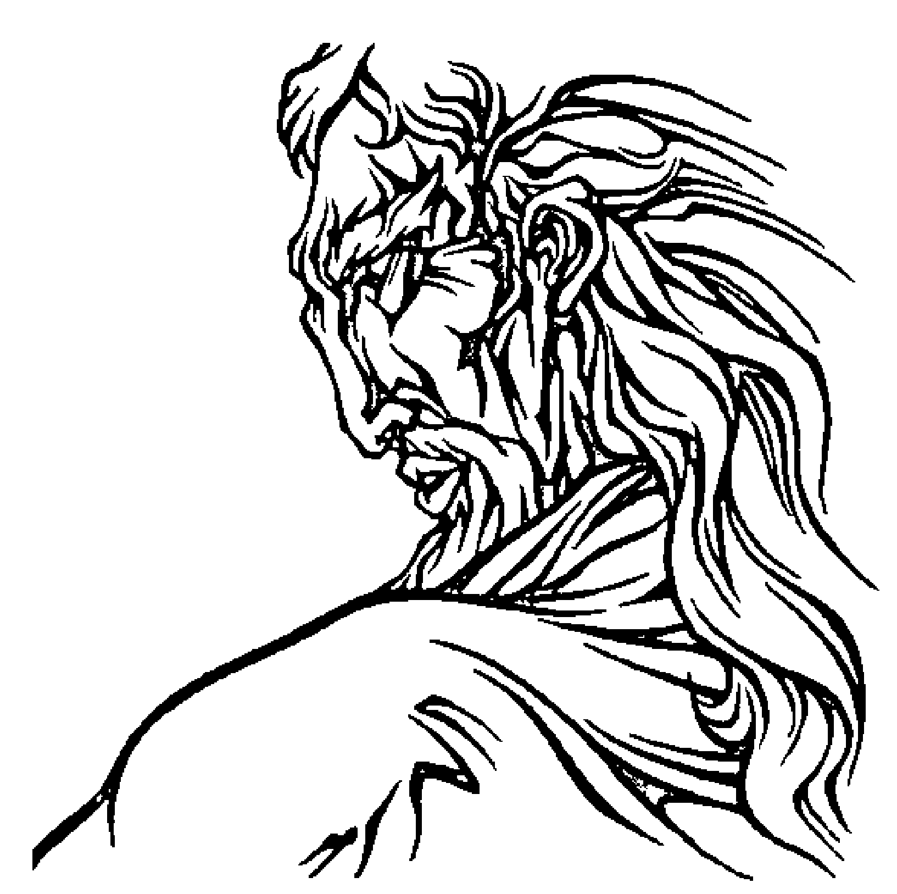

218 译注: Sibylle 或作 Sibylla, 指负责接受神谕加以记录的女性。

##### 恶魔·所罗门的恶魔 雷蒙盖顿

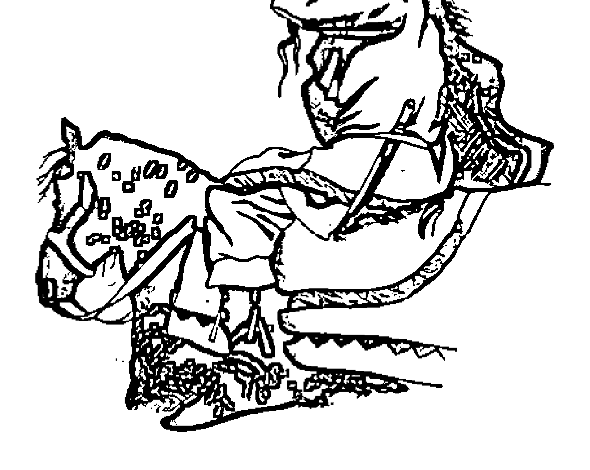

##### 恶魔·所罗门的恶魔 雷蒙盖顿

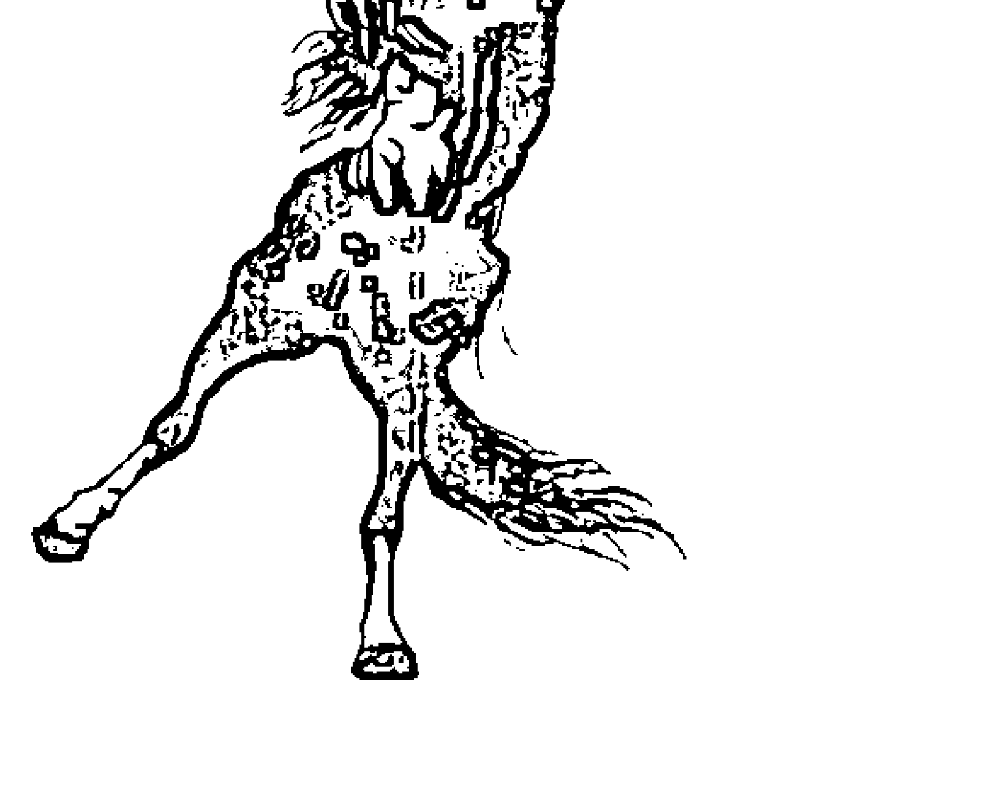## 欧赛

假称古以色列王国所罗门王所作之17世纪魔法书《雷蒙盖顿》(Lemegeton, 又名The Lesser Key of Solomon), 书中第一部分〈哥耶提雅〉所记载的72名恶魔之一。此恶魔也记载于仿启示文学《以诺书》而成之《伪以诺书》的目录中。

常被认为与豹关系密切; 据说乘豹而来, 或是以豹形现身。大多认定他为司掌变身与幻惑之力者, 并特别擅长“伪装为人”一事。拥有随意变化人类外形的魔力, 并能令遭他变身之人对此浑然不觉。又传说只要召唤者愿意, 他就可让人胡思乱想或是疯狂错乱。受到16世纪恶魔学家让·维尔影响的19世纪法国作家柯林·德·普朗西, 在著作《地狱辞典》中, 以“※欧兹”之名介绍他, 说他乃是“地狱大议长”。同书中为他增添了能解答人类神学与抽象疑问的能力。又有记载说欧兹头戴冠冕, 也有说他一日仅能控制人类一小时的记述。

#### 奥赛洛斯

英国诗人米尔顿之叙事诗《失乐园》中登场的造反天使(恶魔)。在第1卷内介绍参与撒旦叛乱之造反天使姓名的场景中, 他与埃及神灵埃西丝(Isis)、奥鲁斯(Horus)一同出现。(→撒旦Satan《失乐园》)

许多埃及神灵拥有象征该神的野兽, 以野兽拟人化而成的神也不在少数。※奥赛洛斯之象征为公牛; 埃西丝之象征为母牛; 而奥鲁斯以鹰或隼为象征。因埃及频繁使用动物偶像作为崇拜对象, 故米尔顿在受基督宗教戒律支配的自家作品《失乐园》中, 把奥赛洛斯为首之埃及诸神的动物形象, 解释为那是他们参与大逆不道之天使·撒旦的叛乱后, 变为造反天使之后的模样。

奥赛洛斯、埃西丝、奥鲁斯三人似乎是为了叙事诗传统中的唱名桥段而准备的天使, 故未出现于描绘撒旦叛乱的其他卷中, 也无定下天使的位阶。之所以描写他们, 应是视作为说明参加撒旦叛乱的造反天使, 在叛乱后转而成为诱众人信仰邪教的邪神一事。

#### 奥德索

芬兰叙事诗《卡勒瓦拉》(Kalevala)中出现的巨大魔熊。相传他生自月世界的大熊星座欧塔瓦肩上。

打算毁灭维那莫依宁(Väinämöinen)故乡(维诺拉)的波约拉(Pohjola)女王路希(Louhi)将他送入维诺拉中。

奥德索原本住在不见天日的森林深处, 却被路希抓住, 并被放到维诺拉。而来到维诺拉的奥德索在旷野与牧场上唯我独尊地走着, 随手杀害人类或家畜充作食物。

为此大感头痛的维那莫依宁去拜访了魔法打铁匠伊鲁马力宁, 请他做了枪尖分为三股的沉重长枪。

接着维那莫依宁口中唱到: “哎呀, 脚上沾着蜂蜜覆有毛皮的奥德索啊, 魔法伶人维那莫依宁来同你见面了。所以请收起牙齿与爪子!”并趁魔熊攸然望着他的时候把枪刺入他喉咙。奥德索就这样当场毙命。

于是维那莫依宁把奥德索扛回城镇, 剥下熊皮, 以锅煮肉。奥德索便化成了杀熊庆典中的食物。

#### 阿露

日本怪谈“牡丹灯笼”中的女幽灵。天文年间（1532～1555年），京都的五条一带住着一位名叫萩原新之丞的男子。中元节前夜，他于宅前读经悼念亡妻时，一名年约20左右的美女带着手持绘有牡丹灯笼的女童经过。新之丞目送美女走过后，美女突然回头请求道：“妾身为月色所诱出门散步，能否请您送妾身归宅？”于是新之丞便让美女进入家中，同其饮酒，互通款曲。

美女在第二夜、第三夜依旧造访新之丞家。如此过了20日后，邻居老者对新之丞的举动起了疑心，于夜中窥探新之丞处。于是发现新之丞正紧挨着犹如干尸的女子，表情恍惚地同她耳鬓厮磨。翌日，听了老人劝告的新之丞去寺庙后探寻女子所说的住家地址。然而该处并无住家，仅有吊着牡丹灯笼的坟冢。

于是新之丞听从修验者219的建言，贴护符于门，此后美女不再来访。但新之丞相思难耐跑去墓前。于是周遭霎时间化为一片漆黑，美女再度现身并杀害新之丞。

> （→阿岩 o-Iwa、阿菊 o-Kiku、累 Kasane）

219 译注：日系佛教支派修验道之僧侣。

#### 奥

西伯利亚民间传说中的恶魔。会授予年轻人化身动物之能力。以前有一名穷人在带儿子出门去作工匠学徒时失足落入井中。此时出现了名叫奥的恶魔，恶魔说道：“把你儿子交给我。”父亲便把儿子卖给自己回家。两个礼拜后，父亲为了领取卖儿子的钱而前往恶魔处。于是奥牵出三头牛问父亲：“哪个是你儿子？”父亲在绞尽脑汁后总算成功猜中。到了一个月后，奥拿出三只鸽子；因为这次父亲也猜中了，恶魔只好把儿子与钱都还给他。之后儿子对父亲说：“我在恶魔那学会了各种法术。接下来我要变成猎犬，然后请把我带去市场卖掉。”而儿子在被买走后就会变回原形跑回家。接着儿子变成了马，同时恶魔也再度出现。因为恶魔知道那匹马是人类所变，便将马买了下来。于是年轻人为了逃跑不停变身，在他变为玉米粒时恶魔也化为母鸡。就在那一瞬间年轻人立刻变为狐狸杀死母鸡。

#### 奥丁 <北欧神话>

北欧神话主神。亚萨神族（Aesir）之王。传说中的形象多为一独眼阴森老人。拥有多重性格与诸多不同的名字。属于战争神与死神的性质极为强烈。巨人族乃诸神及人类之宿敌，而奥丁为准备与巨人族的最后一战，意欲将伟大王者与优秀战士聚集至神界阿斯嘉特（Asgard）。奥丁以战争作为挑选这些勇者的手段。奥丁会干涉人界撒下纷争的火种，并于战争开始后秘密协助每一个阵营，以激烈化、长期化战争。

长于谋略的奥丁经常暗中活跃于战场上，予人的感觉与其说是神明，不如说近似恶魔。奥丁这一神灵被认为掌管北欧战士的激烈斗争心、复仇心，以及瞬息万变的战争运道。既是需要敬爱之神更是应当畏惧之神。另，与奥丁关系密切的除了战争以外还有死亡。他能以肉身造访冥界召唤死者灵魂命其说出秘密，是位带有阴森气息的神明。

> （→奥丁 Óðinn〈改宗后的北欧萨迦〉）

#### 奥丁 220 〈改宗后的北欧萨迦〉

10 世纪后半，随着基督宗教进入北欧影响力逐渐转强，异教诸神的光荣便转而式微。

北欧诸神在人们的想象中，也变成了畏首畏尾的弱小神灵，反映出现实世界的宗教转变。特别是过去身为诸神之王的奥丁，更被说成是反抗基督光辉的恶魔。

相传身为狂热基督宗教信徒的10世纪末挪威王奥拉夫·特拉格瓦森（Olaf Tryggvesson）曾遭奥丁（或“形为奥丁之恶魔”）拜访。曾有一名神秘老人造访王宫，而他所述说的古代故事一度让国王听得恍惚出神。但最后国王依旧看穿老人的真面目，未吃下老人献进的上等肉，把肉当作恶魔的赠品烧毁。

此外，据说奥力佛·特拉格瓦森的后继者圣王奥拉夫二世（Olaf II，Olaf Haraldsson）也曾受一名擅讲古代故事的老人拜访。国王专心倾听老人讲述之古老故事，但于不久后看出老人之真面目乃是奥丁，于是把祈祷书丢向他将其驱逐。

> (→奥丁 óðinn〈北欧神话〉)

220 译注：或译“欧丁”，英文为Odin。萨迦原文为“saga”，乃中世纪北欧故事的总称。其中多是北欧的神话、英雄故事或传说与历史，以挪威冰岛地区流传的传说为主。

#### 魃

魃的原名为“魃”。据说她是黄帝的女儿。

相传蚩尤（Chihyu）与黄帝大战时，蚩尤的阵营中有掌控风雨的“风伯”与“雨师”，使得黄帝这边在战斗中受尽不利，于是黄帝命魃上场。魃体内充满了光与热，她一上场风雨立刻消失无形，黄帝阵营才得以获胜。但是在战事结束后，魃或许是因为神力用尽了，无论如何都无法跟随父亲升天，只好继续留在人间。但魃所在之地会变得一片干旱，但毕竟是对蚩尤争战的功劳者，又不能将她处刑。黄帝无计可施，只好将她软禁在北方的系昆山上。

只是魃有时候还是会因为怀念人间而偷偷下山回到中原，这时候就又会引起大旱灾，这时人们就会挖通沟渠，清除河道，喊着“魃啊，请你回北方去吧！221”

> (→干旱之兆 The omen of drought)

221 译注：袁珂版所说稍有不同。据《中国神话传说》，魃原居住于系昆山，在与蚩尤战后无法回天庭时，黄帝不得已将她安置在赤水之北。

#### 帕夫努爱阿皮塔爱特莱

他是波里尼西亚的海中恶魔，特别是大溪地人更是怕他。

波里尼西亚群岛位于太平洋，对当地人民来说，海洋是赐予食物的生命之源，但同时也是可以轻易夺取船员生命的恐怖地方，因此波里尼西亚的传说里有许多海洋的恶魔。

帕夫努爱阿皮塔爱特莱就是这些海中恶魔的其中之一，他的名字的意思是“开创天空的伟大人物”，是个像神一般的名字。

他与他的眷属躲在海底深处，伺机侵袭船员。

波里尼西亚还有其他海洋恶魔，例如“普阿多塔西”（Puatutahi 孑然独立的珊瑚礁）“阿西法多摩亚纳”（海蛇）“阿列马塔洛洛亚”（大浪）“阿列马塔卜卜托”（小浪）等等。

> (→裴蕾 Pele)

#### 派蒙

这是假托所罗门王所写，但其实为17世纪魔法书的《雷蒙盖顿》(Lemegeton, 又名 The Lesser Key of Solomon)的第一部〈哥耶提雅〉中记载的72只恶魔之一。另外以模仿启示文学《以诺书》所作的《伪以诺书》上面也记载有这个恶魔的名字。
他的特征是骑着骆驼与洪亮的声音。据说召唤他的人可以获得名誉与艺术科学的知识。
根据《雷蒙盖顿》上面的记载，他出现的时候骑在骆驼上，旁边有侍卫随行，声音洪亮有如王者，而在《伪以诺书》中也描述说他骑着单峰骆驼出现，外形跟人类并无两样，头戴王冠。因此他别名叫做西方的王者。
十九世纪的法国作家普朗西的《地狱辞典》中把他当成“※拜耶蒙”(Bayemon) “派蒙”两只恶魔来介绍。该书中“拜耶蒙”是地狱西方的王者，身边有着众多的下级恶魔。“派蒙”则说是骑着骆驼戴着王冠的地狱王者。据说他貌似女性，这样一来就跟该书中也曾介绍的格莫瑞 (Gomory) 非常类似了。

#### 帕伊里卡

根据琐罗亚斯德教的传说，有一群叫做帕伊里卡的女恶魔，也有传说说她们是女巫，她们的性质随着时代不同而有所改变。
最初的时候，在流星上有叫帕伊里卡的女恶魔。琐罗亚斯德教的恶魔通常不是住在地底，不然就是住在北方的尽头，不过她们例外，随着流星从天上落到地上来，在流星落下的地点作恶。伊斯兰教里头也有个类似的传说，说是有群邪恶的※镇尼 (jinn) 想要偷听神的开会内容到底在讲什么，结果被天使射出的流星的碎片击中掉落到大地来。
有多少颗流星就有多少位帕伊里卡，不过这些帕伊里卡之中特别有名的是叫做“杜兹雅鲁雅”(意思是“凶年”)，与去诱惑屠龙英雄“克南萨帝”的魔女“慕修”。
只是这些帕伊里卡随着时代的演进，她们在神话中的地位也越来越低，最初说她们是恶魔，后来变成不知是人还是魔物变的魔女，最后沦落到变成人们用来骂女算命师或卖春女的话，这点跟欧洲的魔女的处境倒是蛮类似的。
(→阿里曼 Ahriman)

#### 帕幽卡卡姆依

他是爱奴族传说中的瘟疫神。
爱奴族是典型的自然崇拜的民族，在他们的观念里头，很少有神是邪恶的。
他们并不是认为神就绝对不会作害人的事，而是像是人类一样，人偶尔也会对某人抱持着敌意，结果犯了罪，每个神都有可能做出坏事来。
帕幽卡卡姆依则算是少数的例外，他的存在就是要危害人类，不过那是他的任务，并不表示他打从心底就想要害人。
关于帕幽卡卡姆依有这么个故事。有一户人家住在爱奴族的村庄外围，那一家的父亲并不擅长打猎，所以家里很贫穷，但是他很会讲幽卡拉<sup>222</sup>(民间故事)。有一次，这个父亲在讲故事给孩子听的时候，发现帕幽卡卡姆依在外头。父亲对他献上祭品，当天晚上帕幽卡卡姆依来到他的梦里，向他道谢，说他很喜欢他讲的故事与祭品，并且传授他如何回避瘟疫的方法。
据说后来这位父亲将方法告诉村长后，村长非常感谢，村里因此得以免除瘟疫的威胁，村民快快乐乐地生活下去了。

222 译注：Yukar，阿伊努族的传统口传叙事诗。

#### 帕祖祖

美索不达米亚与亚述的病魔，配偶也同样是病魔，叫拉玛什图²²³ (Lamashtu)。

他长着四根鸟的翅膀、脚爪状似老鹰、头与手是狮子、额上长角。据说他还有蝎子尾巴与蛇状阴茎。只不过最有名的帕祖祖像（目前收藏在罗浮宫）上面并没有蝎子尾。

他也是东南风的暴风神（美索不达米亚的东南方是波斯湾，从波斯湾吹来的风会带来酷热，他们相信这会害人得到高烧的症状），他会随着风一起散播疾病。因此苏美人很怕他。

苏美人为了保护自己不受帕祖祖的威胁，他们诵唱种种咒语，举行驱魔仪式。

不过如果是要驱逐弱小的病魔，向帕祖祖祈祷反而能够赶跑他们。

著名的美国恐怖电影“大法师 (The Exorcist)”（1977）的第二集中将他描写成蝗虫的恶魔。

（→蒂雅玛特 Tiamat）

223 译注：两河流域的阿卡德神话中的狮头女魔，相传来自地下世界，降病厄于世人。

#### 裴蕾

她是夏威夷的掌理火山的破坏女神。她拥有用岩浆将一切土地烧尽的力量。据说她原本是大溪地²²⁴ (Tahiti) 的女神，但是因为与姊夫通奸而被赶了出来。

某日，裴蕾的灵魂出窍，化身成为一个美丽的女性，来到附近的岛屿，在庆典中以草裙舞使当地的年轻酋长罗希奥迷上她。三天后，她对他说必须离开此地，并且答应酋长会派使者来见他。而裴蕾派出的使者是她忠诚的妹妹席依阿卡。

但是，罗希奥与席依阿卡在要去见裴蕾的路上，因为反对裴蕾与普通人类结婚的精灵的阻挠下，无法如期到达。这时裴蕾后悔起派自己美貌的妹妹担任使者，并且怀疑两人之间是否有什么暧昧关系了。在嫉妒与妄想的驱使下，使火山爆发，岩浆烧毁了席依阿卡的朋友与她深爱的森林。

而罗希奥在冒险过程中也逐渐被席依阿卡给吸引，不过席依阿卡不愿意背叛姐姐而拒绝了他。但是在他们回来后，见到烧毁的森林，席依阿卡愤而选择与罗希奥在一起。

极为愤怒的裴蕾用她的烈火要烧死这对恋人，席依阿卡靠着魔力的保护而平安无事，并且让已经烧死的罗希奥复活，最后两人一起回到了罗希奥的故乡。

224 译注：南太平洋法属社会群岛 (Society Islands) 中的主要岛屿，靠近南美洲。

#### 菲尼克斯

这是假托所罗门王所写，但实为17世纪时魔法书之《雷蒙盖顿》(Lemegeton，又名 The Lesser Key of Solomon) 的第一部〈哥耶提雅〉中记载的72只恶魔之一。

如同《雷蒙盖顿》中72恶魔之一的纳贝流士 (Naberius) 由希腊神话中的地狱犬舍惹狈如斯 (Cerberus) 而来的情形一样，菲尼克斯则是阿拉伯神话中的不死鸟菲尼克斯，在传承的过程中逐渐转化而被视为恶魔。由于来源是不死鸟，因此他的外形经常被描述为美丽的鸟或者是小型的鸟。

至于他的叫声据说也非常美妙，或许是从这美妙叫声而来的联想，他的能力据说是能让人在文艺或诗才上有所发挥。而原本阿拉伯神话中的不死鸟所拥有的不死性则在传承过程中消失了。

作家普朗西的书《地狱辞典》中说他是地狱的大侯爵，统领20个军团。该书中说明他的声音像小孩子一般，但是如果召唤者要求他变身成人类的话，这时他的声音就不堪入耳了。

#### 毕方

据说他是会引起火灾的神鸟、怪鸟。
原本毕方这个名字是从形容燃烧竹子或木材的时候发出的声音而来的。在古代如果有必要在山林里过夜的话，人们会烧竹子让竹子发出爆裂音来，其用意是要吓走山林里的一些精怪，让他们不敢靠近。人们称这个燃竹为“烨竹”。毕方应该就是从这个词变化而来的吧。
因此毕方被说成是火神，也是木神225。传说中他是从木头中生出来的也就是这个原因。
毕方外形似鹤，仅有一足（或说仅有一翅）。体色为青色夹杂红色斑点，喙啄为白色，不食五谷，嘴里经常叼着火团。每当毕方出现时，该地就会发生原因不明的大火灾，由此可见毕方应是属于火灾之兆。
此外尚有异说226，据说黄帝在泰山召集诸鬼神时，负责拉他座车的是六条蛟龙，而毕方随侍在车旁。从这一段记载看来，毕方可能也是负责守护黄帝座车的神鸟。
（→祸斗 Huotou、鬼车 Kueiche、�鸟 Tzuniao·鵩鸟 Channiao、鴸 Chu、大风 Tafeng）

225 译注：《淮南子·汜论训》：“木生毕方”。高诱注：“毕方，木之精也。”
226 译注：见《韩非子·十过》。

#### 百济王子

又称“吉备冠者”、“祸又温罗”、“丑寅御前”。两眼炯炯有神，乱发如火焰燃烧般赤红，身长一丈四尺（约四米）；头有瘤、口吐火，能使变身等妖术。
据说，于第10代·崇神天皇时（公元前97~30年）突然出现，四处为恶，使人民为之困扰。朝廷派遣五十狭芹彦命组队讨伐。百济王子投石攻击队伍之际，五十狭芹彦命同时放出两箭射穿敌人的左眼，怪物随即被捕。
百济王子的首级虽被砍下示众，却不断发出呻吟。五十狭芹彦命将首级埋在吉备津神社的御釜殿的釜227下，呻吟声却从未间断，其声还使得釜产生共鸣，之后持续了13年。
然而，有一天，百济王子突然现身于五十狭芹彦命的梦中，并告知：“可将祭神之物于釜中焚烧，釜声可告知吉凶。”五十狭芹彦命依照梦境指示，果然十分灵验，将釜视为珍宝。这也是现在日本吉备津神社流传的鸣釜神事的起源。

227 译注：指神社中用于神事的祭祀用大锅。

#### 普罗喀尔

这是假托所罗门王所写，但实为17世纪时魔法书之《雷蒙盖顿》（Lemegeton，又名 The Lesser Key of Solomon）的第一部〈哥耶提雅〉中记载的72只恶魔之一。别名“※普喀尔”（Pucel）。
在召唤者面前以天使的样子出现。《雷蒙盖顿》中除了他以外外形是天使的还有亚斯她录（Astaroth）、因波斯（Ipos）、华努克（Valac）等等。
不过外形是天使的恶魔几乎坐在邪恶的生物背上，再不然就是身上长了特异的器官。但是普罗喀尔则是单纯地以天使的样子出现，这可以说是他的一大特征。
也因此他丝毫没有邪恶的气氛，能给予召唤者全部的科学知识，特别是数学更是专门。
勉强能让人想到他是恶魔的能力是他可以做出幻像，让人以为天候状况恶化了。

#### 征兆
中国

- 225 译注：典出《山海经》《西山经》：“有鸟焉，其状如鹤，一足，赤文青质而白喙，名曰：毕方，其鸣自叫也，见则其邑有讹火。”另外《淮南子》《泛论》：“山出枭阳，水生罔象，木生毕方，井生坟羊。”其注云：“木之精也，状如鸟，青色，赤脚，一足，不食五谷。”
- 226 译注：典出《韩非子》《十过》：“昔者黄帝合鬼神于西泰山之上，驾象车而六蛟龙，毕方并辖，蚩尤居前。”袁珂对这一段的解释法不大相同，据他的说法，象车指的是大象拉的车，而蛟龙是车前护卫。

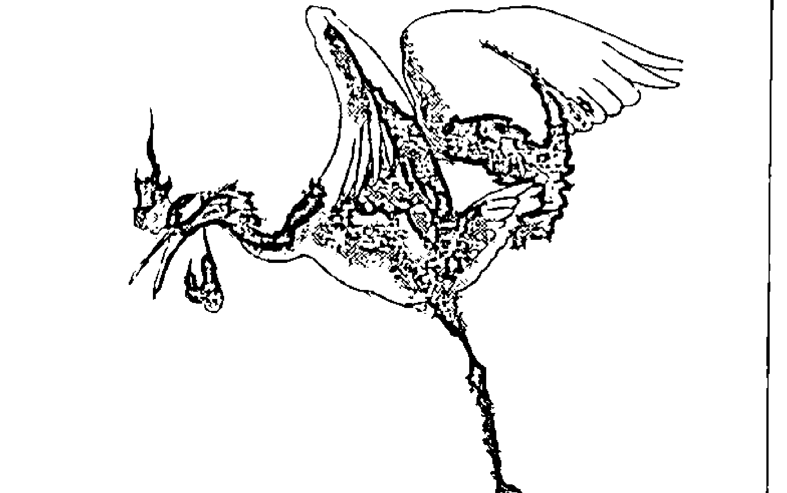

### 恶魔
日本

- 227 译注：铁制，形如饭锅。

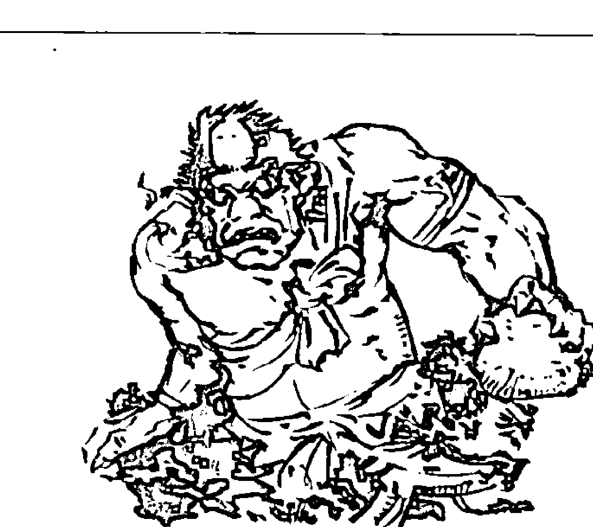

#### 恶魔·所罗门的恶魔
雷蒙盖顿

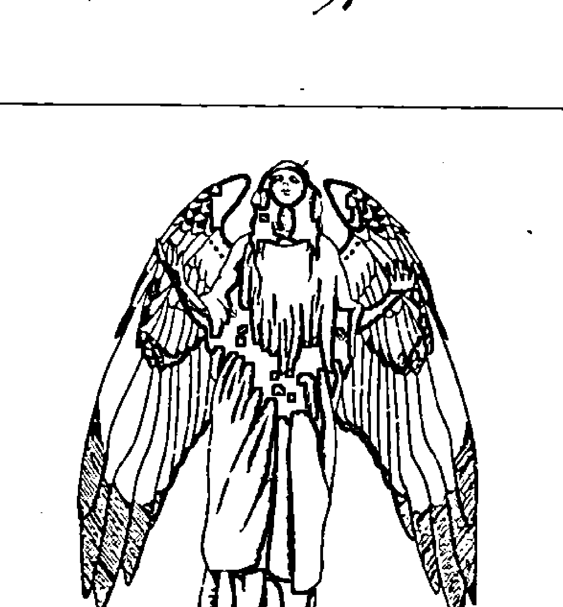

#### Purson
普尔森

这是假托所罗门王所写，但实为17世纪时魔法书之《雷蒙盖顿》（Lemegeton，又名The Lesser Key of Solomon）的第一部〈哥耶提雅〉中记载的72只恶魔之一。

出现在召唤者面前的是一个骑在熊背上的狮头壮汉，而且手上还抓着一条蛇。《雷蒙盖顿》中拥有狮子外形的恶魔相当多，除了普尔森以外还有安洛先（Allocen）、瓦布拉（Vapula）、华利弗（Valefor）、欧里亚斯（Orias）、拜恩（Vine）、斯伯纳克（Sabnak）等等。特别是欧里亚斯与拜恩手里也抓着蛇，特征上与普尔森实在非常相近。

如果说普尔森外形上最大的特色大概就是骑着熊这点吧。而且不只是外形，他连能力在《雷蒙盖顿》的恶魔中都不稀奇，据说会告诉召唤者宝物的埋藏场所，以及未来的秘密。

深受16世纪恶魔学者维尔影响的19世纪法国作家普朗西在他的《地狱辞典》中帮他附加了与音乐相关的能力，据说他会教人作曲与演奏乐器的能力。因此该书的插画家布尔顿在肖像画中让他手里拿着喇叭。

#### Pyotr Alekseyevich
彼得大帝

俄罗斯皇帝，在位期间1682年～1725年。在他留学西欧回来后，便开始着手以强硬的手段改革俄国。舍弃莫斯科，在北极圈内无人的沼泽地中建立新城，并且干涉圣职者的任命权与教会资产的管理。在他的强硬的执政作风下开始有了这样的流言：“彼得大帝其实就是圣经中预言的“敌基督（Antichrist），他打算整倒教会。”

根据这个说法，现在位居皇位的并不是真正的彼得。真正的彼得在出国旅行的时候来到“乌鸦之国”时，为乌鸦国女王所骗，结果被他们用烤得火热的平底锅油煎，装进桶子流放到海里去了。而现在坐在皇位上的替身，其实是来自遥远大海对岸国度的人。这个“该死犹太人”其实是邪神巴力（Ba’al）赐给雅各布（Jacob）之妻的孩子的子孙。他是个狼人，是女巫在石臼上抱卵孵化而成的孩子。

结果这一“彼得＝敌基督”的说法立刻快速蔓延，俄国东南部也因此动乱频传。欧洲史上被称作“敌基督”的人物不少（例如路德<Martin Luther>、列宁），彼得算得上是这些人当中特别有名的一位。

#### Quachil Uttaus
时间的影子

于克苏鲁神话中登场的邪神之一。

因其可自由操纵时间，被归类为时间神。其存在非常罕见，少有黑魔法书记载，现只见于《阿玛斯誓约书》（The Testament of Athammaus）。

时间的影子身材似乎小型木乃伊（身高如小孩般大），肌肤布满皱纹，无眼鼻，只有无数网状的纹路；手脚僵直，特别是如勾爪般的手，仿佛摸索些什么似的向前突出。移动时脚不动，乘着从天空来的灰色光柱移动。

一旦被时间的影子接触，人类会瞬间老化或死亡，物体则是仿佛经过数百年般腐朽崩坏，不管什么，最后都会变成一抔尘土。

相反地，其能力倒施时虽能给予信仰者永远之生命，但此事十分少有。

（→奈亚鲁法特 Nyalrathotep）

#### 恶魔·所罗门的恶魔
雷蒙盖顿

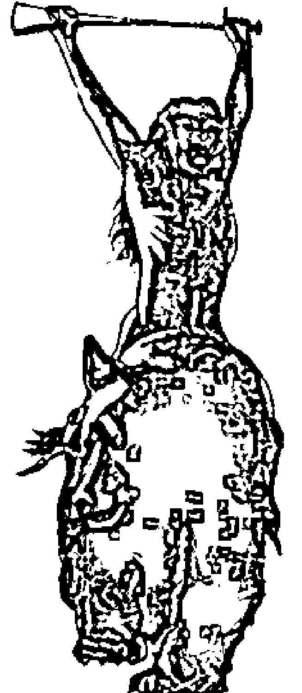

#### 人类
俄罗斯

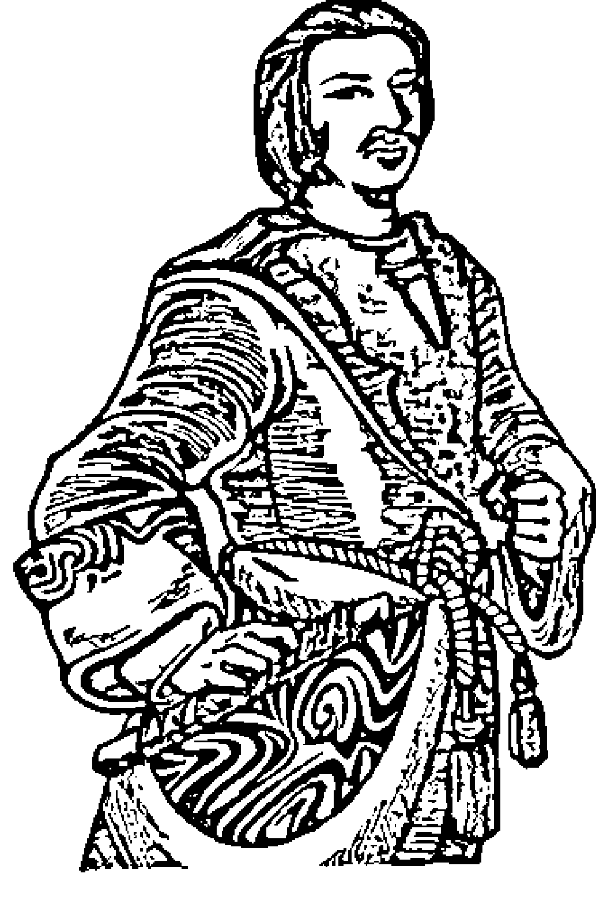

- 228 译注：这个雅各布到底是哪个雅各布？原书中并没交代。

#### 邪神
克苏鲁神话

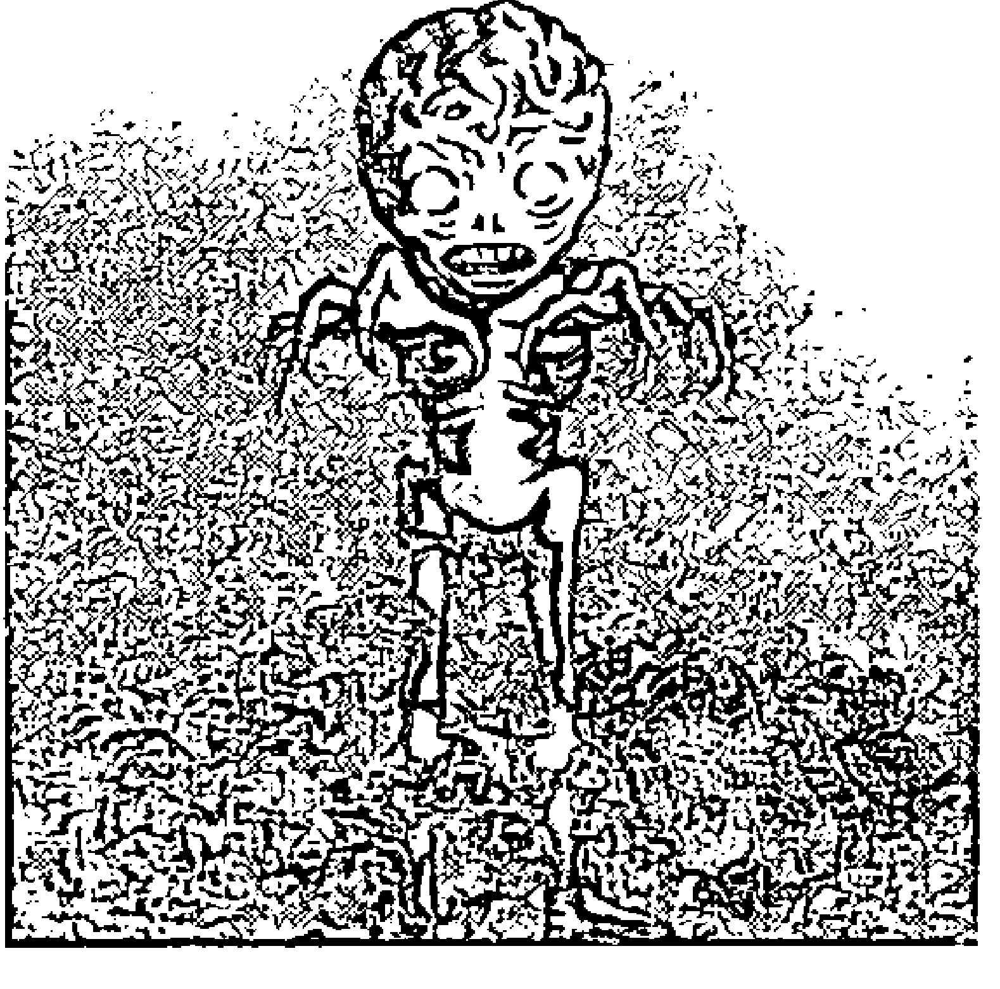

##### 拉宏

这是住在中国与缅甸的疆界附近的阿昌族传说中，会将混乱与灾害带到世界上来的魔神。天的创造神遮帕麻为了修补南方破掉的天空，一时离开天地之间，这时风神与雷神密谋创出了拉宏。

拉宏看到这美丽的新天地，立刻想要破坏它。他做出第二个太阳，并且打破天空的帷幕，结果使得大地成了炎热的地獄。而且他还将陆上的动物与海上的动物互换，让树木倒着生长等等，使得混乱的事态更加扩大。

遮帕麻之妻，也就是大地女神遮米麻差遣水獭充当使者，向遮帕麻告知此事。遮帕麻回来后愤怒地要与拉宏一决高下，但是因为遮米麻不愿意因为两人间的战斗而使得混乱加剧，因此遮帕麻装成要向他求和的样子接近他。于是以大地的统治权为赌注，两人比赛魔法的技术与作梦，最后都是由遮帕麻获得胜利。

于是拉宏既然输了比赛，便答应他的求和。结果在和睦的酒宴上，被遮帕麻给毒死了。

##### 雷公

这是住在中国西南方及越南、泰国等地的苗族传说中的灾害神。他引起大洪水，曾经一度毁灭了世界。

很久很久以前，暴风雨对人类造成巨大威胁的时候，有名勇敢的男子挺身而出，与席卷而来的雷雨相抗，最后终于抓到了雷公，将他关了起来，于是暴风雨也总算止息了。

关在笼子里的雷公向那名男子的儿女哀求赐他一杯水，小孩子们听话地拿水来，结果雷公因此而恢复了力量。他拔了一只牙齿交给小孩，对他们说：

> “将这根牙齿种在大地可以免除灾祸。”

说完便逃回天上去了。

男子听完小孩们的话，猜想雷公必定会报复，于是便着手制造铁船了。而另一方面，小孩子们听从雷公的话，将牙齿埋在土中，结果一个晚上牙齿就长成了一颗大树，上面结了一颗大葫芦。铁船才刚完成不久，狂风暴雨大作，洪水淹没大地，水面甚至淹漫到了天际。男子驾着铁船来到天界之门，向神控诉这件事情。神立刻将大水退去，但是男子的铁船因此从半空中掉了下来，他也因此摔死了。

##### 爪哇皮影戏的罗刹婆

爪哇皮影戏中最具人气的戏码为“摩诃婆罗多”(Mahabarata)，它是以公元前10世纪左右的印度为舞台的史诗。皮影戏屏幕上的公元前10世纪世界中，印度的※罗刹娑 (Raksasa) 与阿拉伯的《可兰经》、荷兰的大炮、日本的二轮车一同登场。而印度的罗刹在爪哇称为罗刹娑婆。

人类喜欢白天，此族则喜好黑夜。大多具有圆滚滚的眼珠、血盆大口、突出嘴外的獠牙。能自由变化，身形会逐渐变大（此时会将皮偶接近光源使影子变大）。

他们隐居在人迹罕至的森林里，或是群居于罗刹娑之国。和人类一样有喜怒哀乐，也会恋爱。在爪哇皮影戏中，经常描写美丽的罗刹女与人类勇士相恋之事。生下的小孩，和罗刹娑一样具有看穿黑夜、在黑暗中奔跑的能力。

必玛 (Bima) 之子加塔图凯卡（在印度则是怖军〈Bhima〉之子迦多铎卡伽）也是其中一员。

(→阿修罗 Asura 或 Ashura、罗波那 Ravana)

#### 魔神
中国（阿昌族）

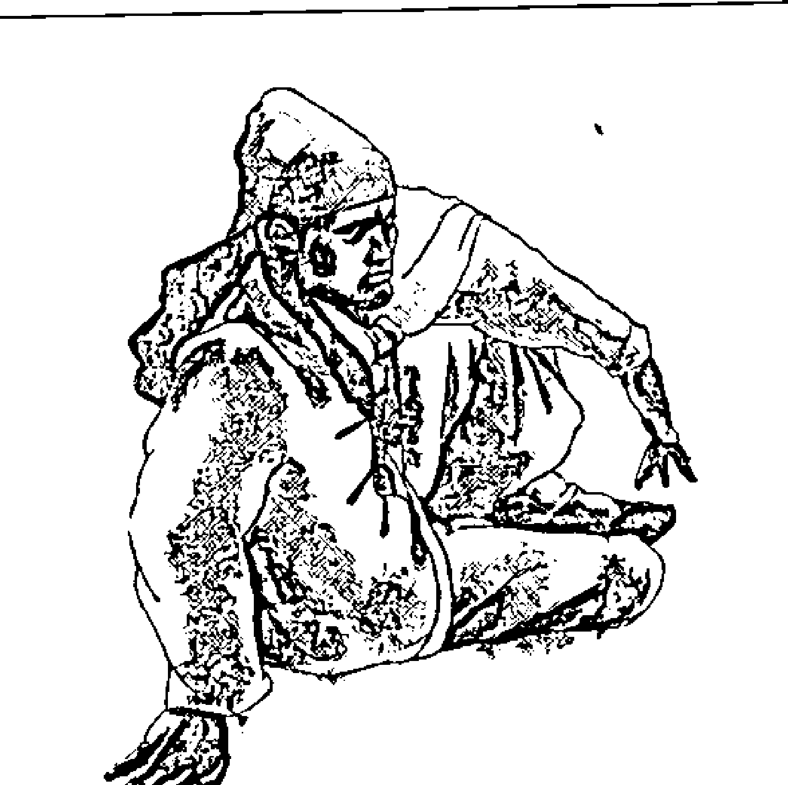

#### 灾害神
中国（苗族）

而他的两个小孩因为躲在大葫芦里而得以幸免于难，后来他们就成了人类的始祖。

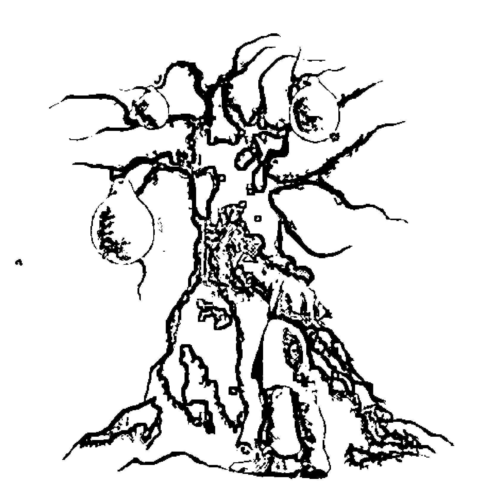

#### 罗刹
印度尼西亚

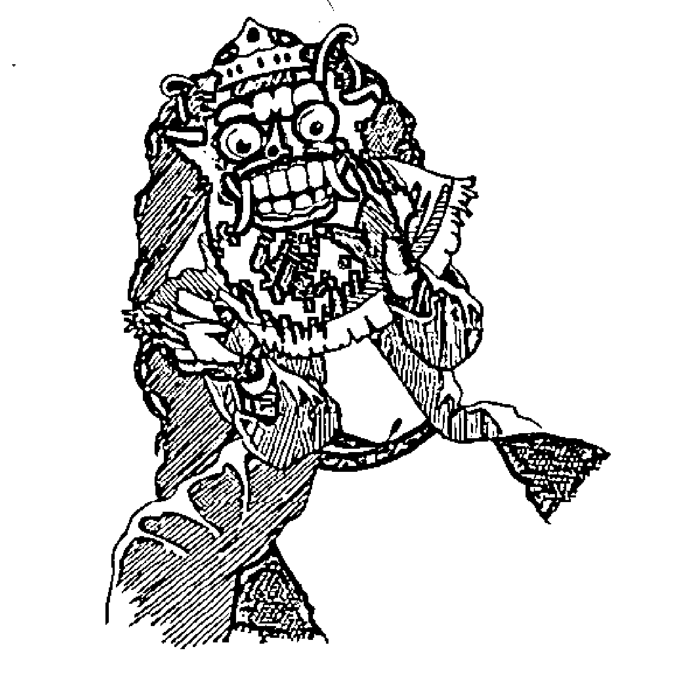

##### 兰达

印度尼西亚中印度教最兴盛的地方是峇里岛。依照峇里岛的风俗，一旦村里有灾厄发生时，为了平息灾厄，通常会在村里的寺庙举行舞蹈剧。而剧的内容通常是由“摩诃婆罗多”中选出一段来演。这名叫兰达的魔女就是出自舞蹈剧的故事。有一次“摩诃婆罗多”的主角般度（Pandu）五王子中的最小的弟弟萨得瓦被魔女兰达抓住。在快要被活祭之前，圣兽巴隆（狮子）赶来相助，但是却被同伴的猴子拖累，一直没办法赶到目的地。这个时候兰达正在跟其他赶来救人的战士们激烈交战中。她张开她的大口，用她又圆又大的眼珠子一瞪，战士们就一个个拿起自己的剑刺向自己的胸膛，结果通通受了重伤。就在这危急的时候，巴隆终于赶到了，于是激烈的战斗继续下去。几乎每一个舞台都是在战斗持续中没有结果的状况下闭幕的。甚至有时候还会为了安抚邪恶的兰达，结果局势在兰达稍微优势的状况下闭幕。依据学者的说法，这出戏是要告诉我们善与恶会一直持续地并存于世间。（→爪哇皮影戏的罗刹婆 Raksasa）

##### 劳姆

这是17世纪魔法书之《雷蒙盖顿》（Lemegeton，又名The Lesser Key of Solomon）的第一部〈哥耶提雅〉中记载的72只恶魔之一。别名“※莱姆”（Raim）。据说他以黑鸟的样子出现在召唤者的面前，这点与同属《雷蒙盖顿》恶魔的玛帕斯（Malpas）相似。虽然外表很单纯，但是能力却很多样化。其他《雷蒙盖顿》恶魔拥有的能力他多少都有一点。例如说他能使男女之间生出爱情，使相互敌对的两人和解。也拥有毁灭都市的能力，让人的名声与地位下降。只要召唤者想要，也能偷来黄金。拥有未来的知识，能告诉召唤者即将发生的事情。作家普朗西（Collin de Plancy, 1794～1881）的书《地狱辞典》（Dictionnaire Infernal）中说他是冥界的大伯爵，统领30个军团，人类面前以乌鸦的样子出现。而该书中将他的能力简化，说他拥有破坏都市，予人高位的能力。

##### 罗波那

他是印度长篇叙事诗《罗摩衍那》（Ramayana）中，住在楞迦（罗刹的都城）的魔王。有说法认为他是罗刹，或说他是梵天的曾孙，也有人说他两者都是。他拥有10颗头与20只手，骁勇善战。而且又诚心苦修，从梵天那里获得了可以许一个愿望的承诺。于是罗波那祈求梵天能赐他一副“不管是神还是恶魔都杀不了的身体”。但是这个愿望有个漏洞，因为罗波那打从心底瞧不起人类，因此忘了在愿望中加上“人类也杀不了”的条件。有一次，他见到十车王（Dasaratha）的王子罗摩（Rama）之妻悉多（Sita），十分中意。于是当场就将她抓回楞迦岛。王子极为愤怒，在猴王哈奴曼（Hanuman）的帮助下，将楞迦包围了起来。在长期的抗战之后，王子与罗波那的单独对决的时机终于到来。王子将罗波那的头一颗颗砍下，但是又从后面长了回来。最后使用梵天赐予的箭射穿了他的心脏，总算杀死了魔王。（→因陀罗耆特 Indrajit、维毗沙纳 Vibhisana、迦罗尼弥 Kalanemi、鸠姆婆伽哩纳 Kumbhakarna）

#### 魔女
印度尼西亚

- 229 译注：即印度神话中的倍天（Sahadeva），因善观天相，故名。

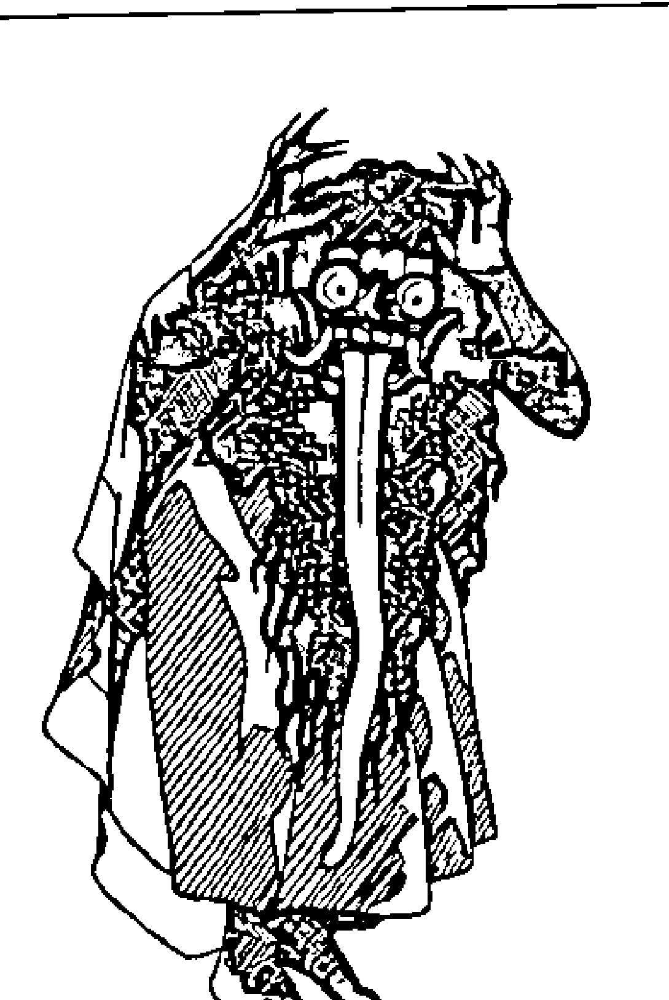

#### 恶魔·所罗门的恶魔
雷蒙盖顿

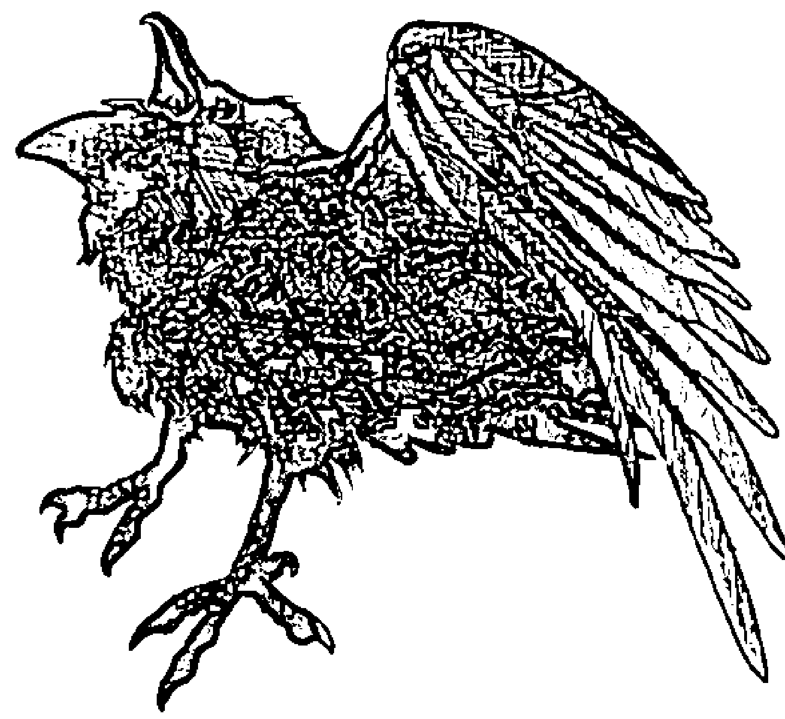

#### 罗刹娑
印度

首哩薄那迦 Surpanakha）

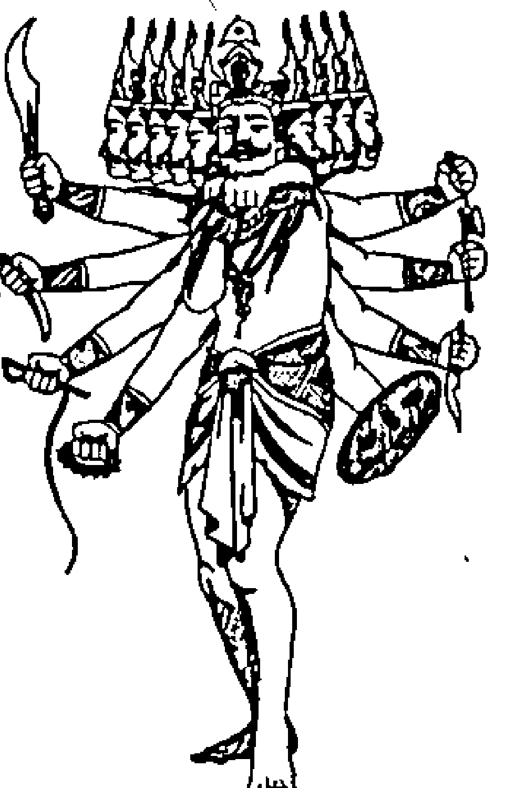

#### 利悉

他是埃及神中少有的完全人形的神。原本是爱琴海中的塞普勒斯岛上的神，为闪族系中的阿摩利人所信奉。之后对他的信仰扩张到埃及、迦太基(Carthage)、西班牙等地。在这些新扩张的地方，视他作战争之神，或是能够实现愿望的神来崇拜。而希腊人甚至认为他就是英雄赫丘力(Hercules)。

但是对阿摩利人来说，利悉其实是地狱或地底之神，是战争之神，同时也是雷雨、风暴与灾害之神。据说他名字的意思是“光”、“火”、“燃烧”等意思。

《旧约圣经》中，利悉也经常出现。在圣经中利悉被认为是堕落的恶魔。认为他是迦南的神堕落之后变成的恶魔。而且拥有散播疾病与死亡的恐怖力量。《摩西五书》之一的《申命记》将他描写成瘟疫之神。而“利悉之子”也被认为是有翅膀的恶魔。

(→塞特Seth)

#### 临门

这是英国诗人米尔顿的叙事诗《失乐园》(1667)中登场的造反天使(恶魔)。在《失乐园》第一卷中一一介绍的造反者大半是《旧约圣经》《列王纪》里提到的异教神・偶像神，而临门也不例外。

临门是叙利亚的神，据说他是司掌暴雨的神。米尔顿说《列王纪》中的记述便是造反天使临门堕落后的事迹。异教神临门本在大马士革神殿中受叙利亚人祭拜。而纪元前9世纪的叙利亚将军乃缦(Naaman)离弃他，转为信仰唯一神；但纪元前8世纪的犹太王亚哈斯(Ahaz)却改为信仰临门，将本国祭坛变为大马士革的模样。

不过《失乐园》第一卷中介绍的多位造反天使到了第5章、第6章描写撒旦(Satan)们反攻的时候几乎都没有再提到了。第一卷中临门也是只有提到他的名字，而原本的位阶或性格则是完全没有说明。

(→撒旦Satan《失乐园》)

#### 罗诺比

这是假托所罗门王所写，但实为17世纪时魔法书之《雷蒙盖顿》(Lemegeton, 又名The Lesser Key of Solomon)的第一部《哥耶提雅》中记载的72只恶魔之一。别名“※罗诺威”(Ronove)、“※罗奈威”(Roneve)。是地狱的侯爵，或说是伯爵。

关于他在召唤者面前的姿态，由于有种种的解释，并无定说。据说拥有让敌对者心生好感、让朋友间的情谊更坚定的能力，能授予人外语的能力，对魔法用语的知识也很清楚，并且可以赐给召唤者忠实的仆人。

19世纪法国作家普朗西在他的《地狱辞典》中介绍了“※隆威”(Romwe)这个恶魔，相信所指就是罗诺比。

隆威是地狱的侯爵兼伯爵，能力是能给予人语言的知识与让人获得众人的好感，与罗诺比相同。该书中说隆威的外形像怪物，这与16世纪学者雷吉那勒德・史高特对罗诺比的说明：“外形近似魔兽”这点也相近。

另外，《地狱辞典》说他是地狱19个步兵团的指挥官。

#### 灾害之神
埃及

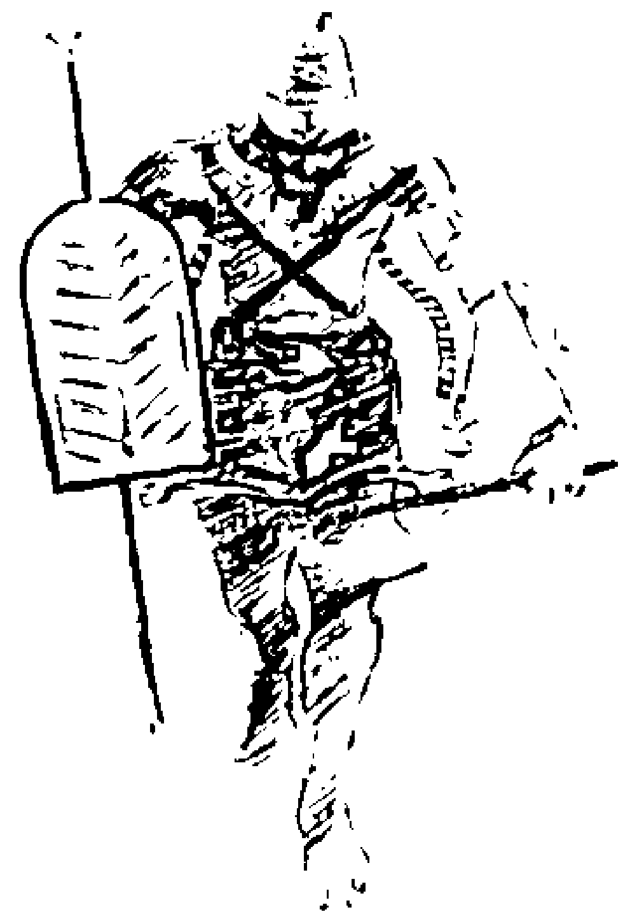

### 造反天使
失乐园

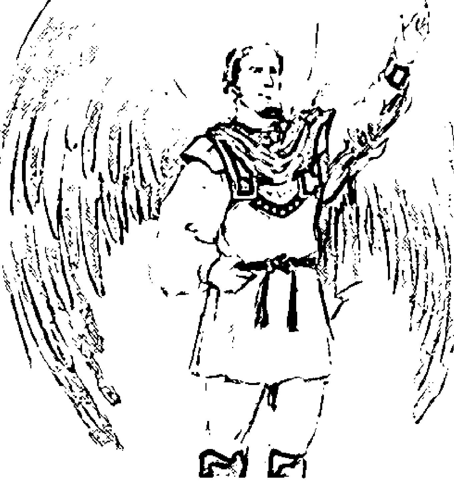

#### 恶魔·所罗门的恶魔
雷蒙盖顿

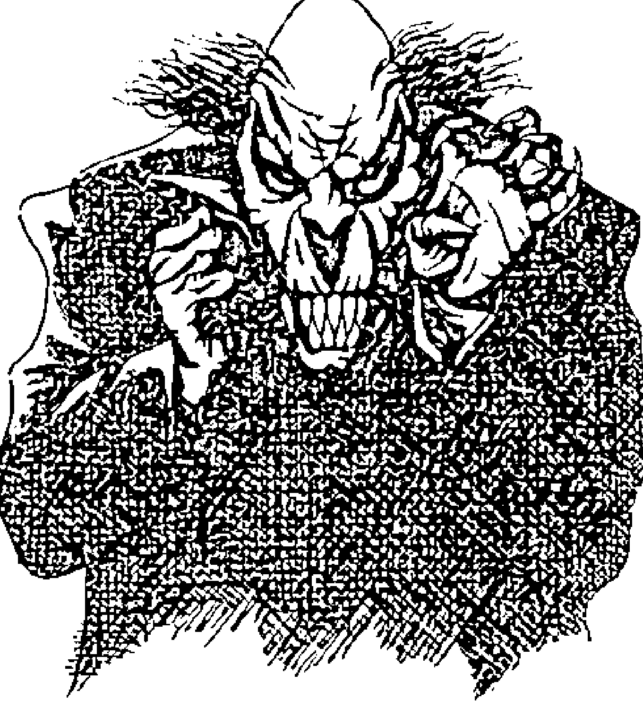

##### Rubicante 路比冈德

这是在意大利诗人但丁的叙事诗——《神曲》（1307～1321年创作）这部作品中登场的恶魔。神曲三部作中的第一部《地狱篇》中第21篇与第22篇中描写到的地狱第8圈第5沟的狱吏，专门惩罚生前贪污或诈欺的死者的恶魔集团“※马纳勃郎西 (Malebranche)”12恶魔中的一人。名字的意思是“气得满脸通红”。 马纳勃郎西的队长马纳果达 (Malacoda) 对这些部下下达命令的时候，他是最后一个点到名的，而且还特别加了“呆子路比冈德”的外号，似乎在这班恶魔中十分被看不起。 马纳勃郎西的任务是监视沥青（天然柏油）池中的罪人，只要有人露出头来就立刻将他钓上来撕裂他的肉，好好地惩罚一番。在但丁一行人来参观的时候，恰好有一罪人“那伐拉人强波洛”浮出来的时候，格拉非冈 (Graffiacane) 立刻将他钓了上来，这时大家都带着嘲弄的口气喊着“路比冈德啊，用你的钩子划他的肉吧！”看来他应该也是个饱受同伴欺负的可悲恶魔。

##### Ryoumensukuna 两面宿傩

这是仁德天皇（第16代）时代割据飞驒地方（岐阜县北部）的地方英雄。虽然他的造反最后还是被朝廷所镇压，但是即使到了现代，他仍然受到当地民众的爱戴。

针对两面宿傩的真面目为何有各种说法，现在尚未确定，但是根据当中的一个记录来看，他被描述成二个人背对背融合的样子，脸两个，手二只，脚虽然黏在一起所以只有两条，但是据说前后都能弯曲。

如果往比较合理的方向思考的话，应该是有两个同等级的首领存在。如果是血缘上非常接近的两个人（例如说双胞胎之类的），那么上面所描述的那种奇特相貌或许也能说得通。

虽然是少数派，但是也有人认为其实两面宿傩真的就像传说中描写的一样，认为他们真的是连体婴。但是考虑到古代社会歧视畸形儿这点，实在很难相信连体婴能够当上地方的首领并且到现在还一直受到敬爱。另外记录上他是战场上的指挥官，同时也是非常优秀的战士，因此连体婴的说法恐怕是难以成立的。

##### Sabnak 斯伯纳克

据称为古以色列王国国王所罗门所著，现于17世纪的魔法书《雷蒙盖顿》（又名 The Lesser Key of Solomon）书中第一部分《哥耶提雅》中所记载72名恶魔之一。拥有众多别名如“※斯伯诺克 (Sabnock)”、“※斯伯拉克(Sabnack)”、“※萨尔马克 (Salmac)”等。

以骑乘白马，或青白色的马的狮头战士姿态出现于召唤者前。《雷蒙盖顿》当中，有许多恶魔形似狮子，斯伯纳克即为其一。同为《雷蒙盖顿》的恶魔拜恩 (Vine)，与斯伯纳克仿佛成双似的十分类似，两人都精通筑城术。也能给予召唤者军事方面的力量。

他特别与伤害有关，能使敌方的伤口难以愈合，而我方不管受什么伤都可痊愈。

19世纪法国作家柯林·德·普朗西所著《地狱辞典》中叙述，斯伯纳克是地狱的大侯爵，50军团的指挥官，并明确介绍他是城塞的恶魔。此外，普朗西替斯伯纳克增添一项能力，就是把人变成石头。

#### 恶魔·地狱的魔鬼
神曲

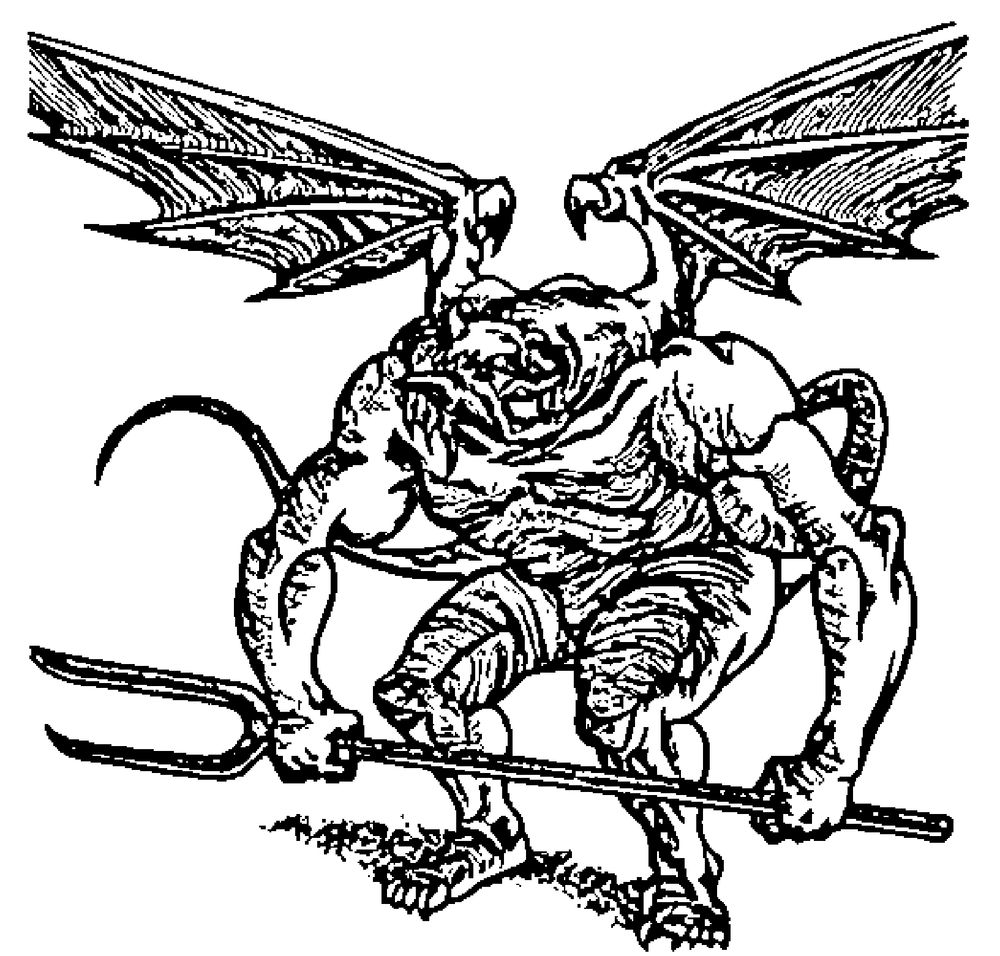

#### 造反者
日本

(→恶路王 Akuroou、夜刀神 Yato-no-kami)

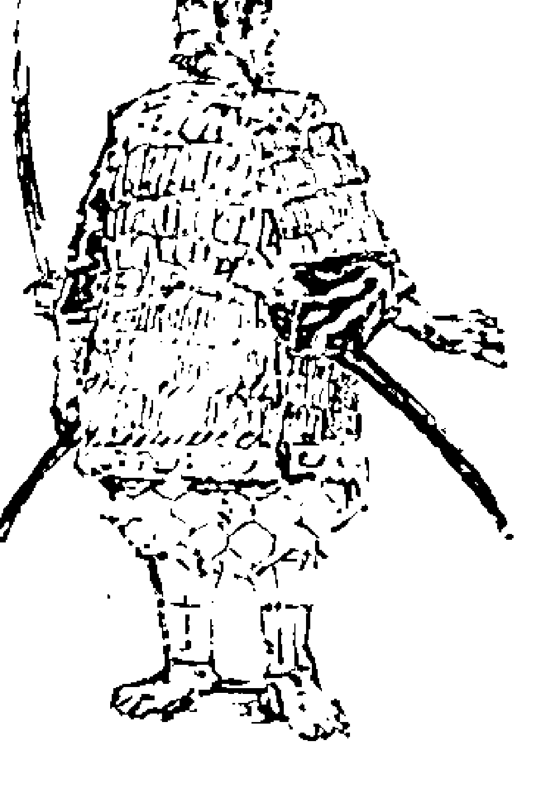

- 230 译注：位于日本本州岛中部的县名。

#### 恶魔·所罗门的恶魔
雷蒙盖顿

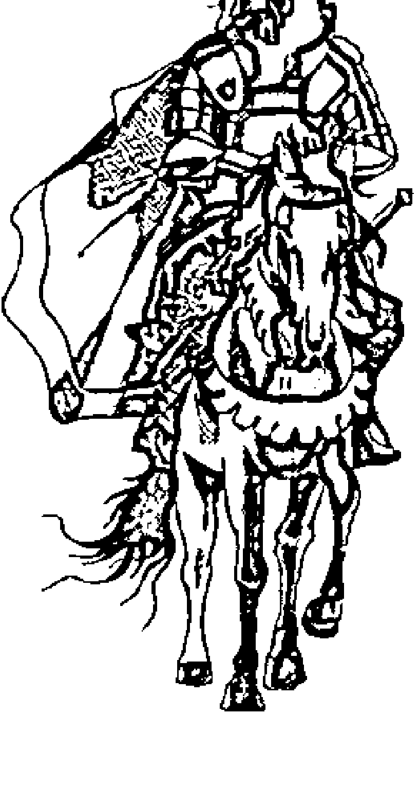

#### 塞列欧斯

据称为古以色列王国国王所罗门所著，现于17世纪的魔法书《雷蒙盖顿》（又名The Lesser Key of Solomon）书中第一部分〈哥耶提雅〉中所记载72名恶魔之一。别名“扎列欧斯”(Zaleos)。

以严肃战士的姿态现身于召唤者前。与同录为《雷蒙盖顿》恶魔之一，阿加雷斯（Agares）同样骑着鳄鱼。鳄鱼也是塞列欧斯的特征之一。一反严肃狰狞的战士形象，与战斗、军事毫无关联，而是与爱情有密切关系的恶魔。具有让男女爱情萌芽的能力。

19世纪法国作家柯林·德·普朗西所著《地狱辞典》（Dictionnaire Infernal，1818年初版）中，记载一位出典不明的恶魔“齐博斯”(Zaebos)，也是骑着鳄鱼的战士。由于绘制《地狱辞典》的插画家，M.L.布尔顿所绘之肖像，齐博斯的知名度因而提升。但是此图却常被介绍成阿加雷斯的肖像，《地狱辞典》中的齐博斯可能是塞列欧斯的别名，两者的名称可能相互混乱了。

#### 商波罗

阿修罗（Asura或Ashura）之王，其势力甚至凌驾于众神。

在众神与阿修罗战争之际，作为领导人领兵作战，最后被湿婆（Siva或Shiva）所杀。

然而，古代印度婆罗门教圣典《梨俱吠陀》（Rig Veda）中，商波罗并非阿修罗，而是掌管100多个都市的达丝尤（恶魔）之王。

印度神话当中，还有一位商波罗。这位也是阿修罗，希罗尼亚克夏（Hiranyaksa）之子（然而，希罗尼亚克夏却是达伊提耶〈恶鬼〉，恐怕神话也已经混乱了）。

本文所提的商波罗有许多兄弟，分别为沙恭尼、陀毗穆哩陀、商供、阿湿波等。虽然长于魔法，却被英雄神黑天（Krsna）之子明光（Pradyumna）所杀。

#### 三足乌

日之精，或又传为驾日车者。

中国古代相信太阳里住着一只三足乌。因为太阳施恩于人，三足乌便被视为瑞鸟。瑞鸟三足乌，传说主要是侍奉西王母（Hsiwang-mu）。

但是，施恩过多适足以害之。

在古代，三足乌有十只，轮流飞向天空。然而，在尧在位时，却不知为何十只同时升空。可想而知，地上成了灼热地狱，人民受到生灵涂炭之苦。

因此，尧命神射手·后羿，射下三足乌，大地又恢复了原来的面貌。

一种传说，那时后羿箭桶中有十只箭，因为射得太过神准，这样下去就会把十只都射下，尧如此想着，便将其中一箭取走。使得其中一只安然无恙，现在还留在天上。

#### 恶魔·所罗门的恶魔
雷蒙盖顿

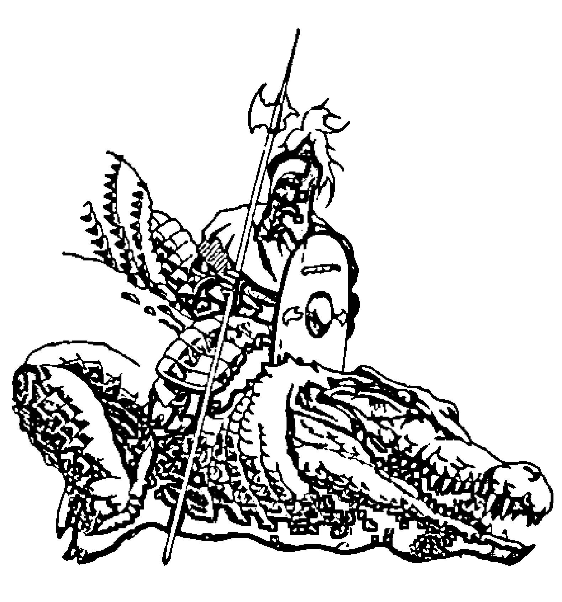

#### 阿修罗
印度

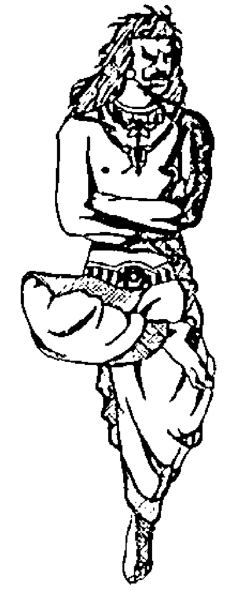

#### 日精
中国

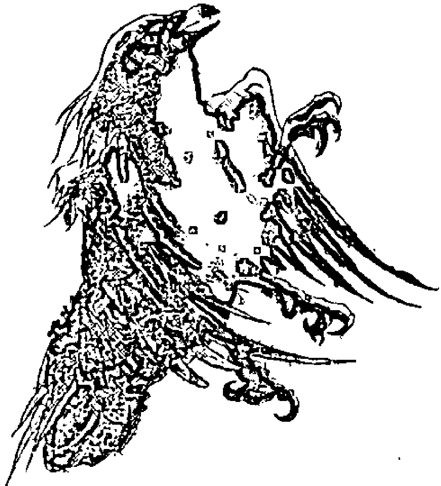

#### 撒旦〈中世纪欧洲〉
撒旦在欧洲中古时代，具有庞大非凡的力量。因为基督教教徒卷土重来，被封印了一千年的撒旦，以敌基督（Antichristos）的姿态再现。在主张光与善神、暗与恶神二元对立的基督教中，更是肯定其存在。

为了一心一意投入使人堕落的工作，撒旦支使众多的恶魔，并加入女巫及咒术师。

历经中古世纪宗教改革的祭司及牧师，更将恶魔的恐怖深锁人心。强调魔王将引导人类走向邪恶、背叛上帝的道路上。其手段不外给予财富、奢侈、肉欲等等。如此一来，人类的灵魂便会走向地狱。而恶魔攫取人心的方法就是凭订定契约。

在圣经中并无与恶魔定契约的描述，恐怕是神学家模仿人与神定契约的概念而衍生出的。

魔王也可变成人的姿态，一身黑装束、身材高大的黑人。使得邪恶与黑色产生更紧密的联系。

> (→撒旦 Satan《新约圣经》)

#### 撒旦《新约圣经》
《新约圣经》中的撒旦和旧约中的撒旦立场不同。撒旦是要被神攻击毁灭的存在，新约中的撒旦却是条龙。

也就是，他并不是奉神之命引诱人类为恶，而是自己到处作恶。

> “那撒在路旁的，就是人听了道，撒旦立刻来，把撒在他心里的道夺了去。” 231

正如其上所述，撒旦可使神讲的道无效。

但是，撒旦不过是在神掌上跳舞的小丑。天使从天降下，捆绑了撒旦一千年。之后好不容易才解放，向神提出挑战。此时，“他们上来遍满了全地，围住圣徒的营与蒙爱的城，就有火从天降下，烧灭了他们。那迷惑他们的魔鬼被扔在硫磺的火湖里。” 232

> (→红龙 The Red Dragon、撒旦 Satan《旧约圣经》)

#### 撒旦《旧约圣经》
撒旦一字本意为“敌对者”（Adversary）的普通名词。而实际上用于《旧约圣经》中的撒旦，大多指“敌人”。

稍后，撒旦以神的仆人天使的姿态出现，引诱人类为恶加以试练。《旧约圣经》〈乔布记〉中写到：“有一天，上帝的众子来侍立在耶和华面前，撒旦也来在其中。耶和华问撒旦说：‘你从哪里来？’”

> 撒旦回答：“我从地上走来走去，往返而来。” 233

也就是说，在《旧约圣经》中的撒旦其任务就是试验、诱惑人类。然而，却也热心过度，做得太超过了。

> “大祭司乔舒亚站在耶和华的使者面前；撒旦也站在乔舒亚的右边，与他作对。耶和华向撒旦说：‘撒旦哪，耶和华责备你！’ …… 234

> (→阿撒泻勒 Azazel<希伯来>、撒旦 Satan《新约圣经》)

#### 魔王
基督宗教

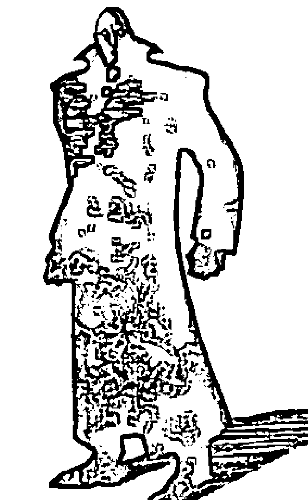

#### 堕落天使
基督宗教

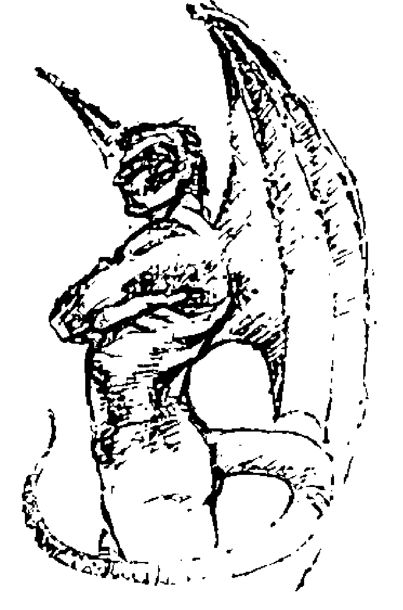

231 译注：取自《马可福音》第四章第15节。
232 译注：出自《启示录》第二十章第9、10节。

#### 神仆
希伯来

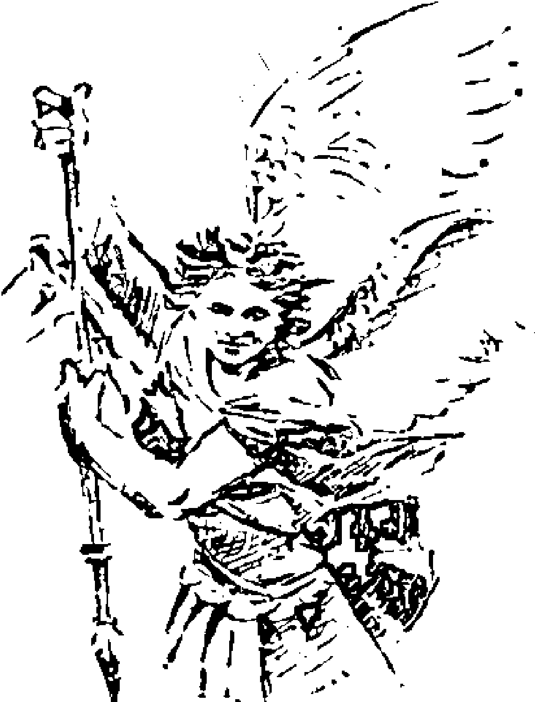

233 译注：取自《乔布记》第一章第6、7节。
234 译注：取自《撒迦利亚书》第三章第1、2节。

#### 撒旦《失乐园》
英国诗人米尔顿所著叙事诗《失乐园》(1667年)中登场，造反天使的首领。因为上帝欲将世界的统治权转让给他的另一分身——神子（后来基督宗教的耶稣）之时，引起撒旦的嫉妒与不满，率众起而造反。撒旦是上帝所造之中，唯一自发性产生邪念之人，故被视为万恶的根源，和因诱惑而堕落的人类相异，绝对无法救赎。而※路西法(Lucifer)一名，《失乐园》解释为荣光及光辉之意。身为天使时的名字应该是另一个。只是叛乱之后，他原本的名字被抹杀，只以撒旦(背叛者)称之。曾经是高位天使，位阶不详。只知他拥有天国北方广大的领土。影响力足以唤动三分之一的天使军，加入叛乱。彻底败给神子后，自愿成为堕落、幽闭之地——地狱的支配者。 (→混沌Anarch)

#### 撒旦《西伯利亚》
撒旦原属犹太·基督宗教的产物，但也扩张到世界各地，发展为地方独自的恶魔。

东西伯利亚鄂温克族235(evengki)的撒旦即是其中之一（受到希腊正教的影响）。

根据原本神话，撒旦为恶神，乃是创造神的兄长。

有一次，神用石土捏成人形，并说“变成强悍的人类”，便放在木板上等待干燥。之后，便去做其他工作，留下狗看守塑像。

正当此时，撒旦来了，并对狗说：

> “你现在裸体，我来帮你看守，我这边有些衣服，你拿去穿吧！” 狗就将人类交由撒旦看守，撒旦就唾了一口口水在人像上。到了夜晚，神一回来，狗就对神说：“撒旦给了我这身衣服。” “你有拜托撒旦什么事吗？”神问。 “帮我看守人像。” “谁的？” “就是你做的那些。” 听到回答，神马上哭了出来。”

#### 魔王撒旦
永井豪的漫画《恶魔人》中最后的敌人。

魔王撒旦改名作飞鸟了(Asuka Ryo)，成为主角不动明(Fudo akira)的好朋友，并且帮助不动明成为恶魔人。但是连飞鸟自己也不知道他其实就是魔王撒旦（正确地说，应该是刻意忘掉了）。但是当恶魔族开始正式展开侵略时，飞鸟发现恶魔族的战略居然都完全被自己猜中。他感到怀疑，于是对自己进行反向催眠，终于恢复记忆，得知自己原来就是魔王撒旦。

故事中撒旦的称号虽然叫做魔王，也就是恶魔族的王，但是实际上是他创造出恶魔族的，对恶魔来说他就像是父亲、像是神明一般。他比王还要伟大得多，可以说就是恶魔族所信仰的神。

最后魔王撒旦与“陷入永劫的休眠”的不动明（也就是恶魔人）一起迎向最后的破晓。 (→恶魔王赛农Zenon the Demon-lord、勇者安蒙Amon the Brave)

#### 造反天使首领
失乐园

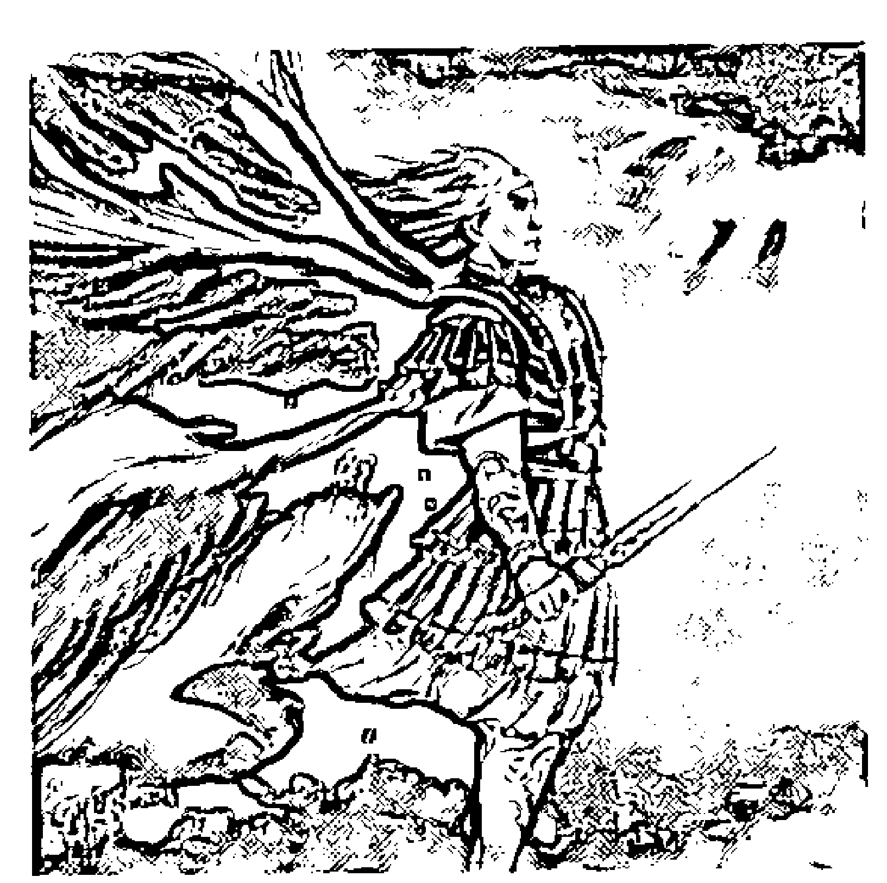

### 恶魔
西伯利亚

> 因为撒旦的唾液，那些人都死了。
> (→克雷梅特 Keremet、撒旦 Satan《新约圣经》)

235 译注: 鄂温克族人主要聚居在内蒙古自治区呼伦贝尔盟鄂温克自治旗和周围几个旗、黑龙江省讷河县等地。使用鄂温克语，属阿尔泰语系满通古斯语族通古斯语支。没有自己的文字，牧区通用蒙古文，农业区和靠山区通用汉文。过去，鄂温克族人多信仰萨满教，牧民同时信仰喇嘛教。

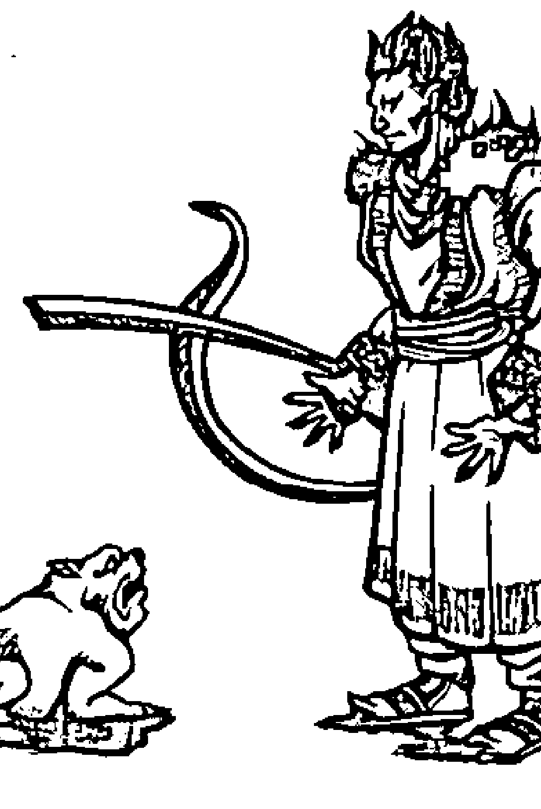

#### 魔王·创造主
日本

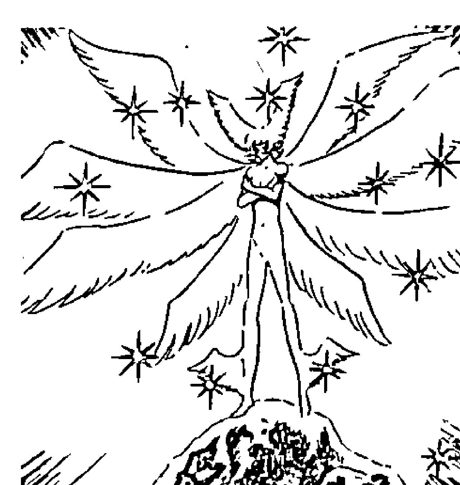

#### 早良亲王
光仁天皇（700～781年）的第二皇子。在其兄桓武天皇（781～806年）即将即位之时，还俗恢复成皇太子。然而，早良亲王的亲信・大伴家持并不想这么急迁都长冈京，便与桓武产生冲突，此外，又加上桓武天皇的亲信・藤原种继被暗杀的事实浮上台面，桓武便以暗杀主谋者的名义拘禁亲王于长冈京的乙训寺。主张自己无辜的亲王，以绝食政策抗议这项裁决。然而，天皇并无理会，决定将亲王流放至淡路（兵库县淡路岛）。亲王在前往淡路的途中衰弱而死，却仍不允许回京，尸体埋于淡路。此后，天皇周边的人相继而死，天皇自己也卧病在床。天皇派兵前往守墓却仍无效果，瘟疫、水灾接踵而至，最后决定迁都至平安京（794年）。然而，亲王的怨灵仍在平安京中作祟，为此，桓武天皇决定追谥早良亲王为“崇道天皇”，并将葬于淡路的遗骨迁至大和国（奈良县）的八岛陵。使暗杀藤原种继的相关大臣恢复地位，这才平息了怨灵的愤怒。

(→菅原道真 Michizane Sugawara、崇德上皇 Sutoku-joukou、平将门 Masakado Taria)

#### 司加密林
意大利诗人但丁所作叙事诗《神曲》（1307～1321年著）中登场的恶魔。出现于《神曲》三部作第一部〈地狱篇〉第21篇中，是马纳果达（Malacoda）的头目。是被称为“※马纳勃郎西（Malebranche）＝恶爪”的地狱狱吏之一。其名意为“有毒者”。与其伙伴相同具有黑色的身躯、尖锐的爪牙以及蝙蝠的翅膀。在〈地狱篇〉中身份卑微的恶魔，并无说明其来源，连是否为堕落天使也不清楚。此类恶魔(＝鬼)陆续于〈地狱篇〉第18篇、第21篇以及第22篇中登场。其中，第18篇登场的恶魔使用鞭子，第21、22篇的恶魔则使用钩子凌虐罪人、死者。他们除了监视犯人，更代神刑罚。由此点观之，地狱的功能不过是遵循神的意旨。司加密林更是将马纳勃郎西们低劣的品格表现得淋漓尽致，连对并非亡者绝不可以处罚的主角但丁，都说出：“我打他的臀部好吗？”此类低俗不堪的言语。

#### Seere 系尔
这是记载于17世纪的魔法书《雷蒙盖顿》（Lemegeton, 又名The Lesser Key of Solomon）的第一部〈哥耶提雅〉中，72位恶魔的其中一位。

人们只知道系尔会以长发男性的姿态现身在召唤者的面前，并骑着有翼的飞马，除此之外，几乎没有留下任何文字记载。关于他的能力，仅知的也只有他能在短短一瞬间移动到任何地方，如此这般抽象的叙述。

众所周知，19世纪法国作家柯林・德・普朗西的著作《地狱辞典》（Dictionnaire Infernal），由画家M.L.布尔顿绘制了许多恶魔的肖像。这本著作由于插画的强烈印象而广为一般大众接受，但同时也歪曲了历史上传统的恶魔形态，并就此定型于人们的记忆中。

此外，并非恶魔学者出身的普朗西有许多出处不详的记述，而布尔顿按照不明记述完成的插图，则让一些无足轻重或是出处不明的恶魔声名大噪。

系尔虽然是历史悠久的《雷蒙盖顿》中的恶魔，但是由于没被收入《地狱辞典》，因此可说是知名度不高的恶魔之一。

##### 怨灵
日本

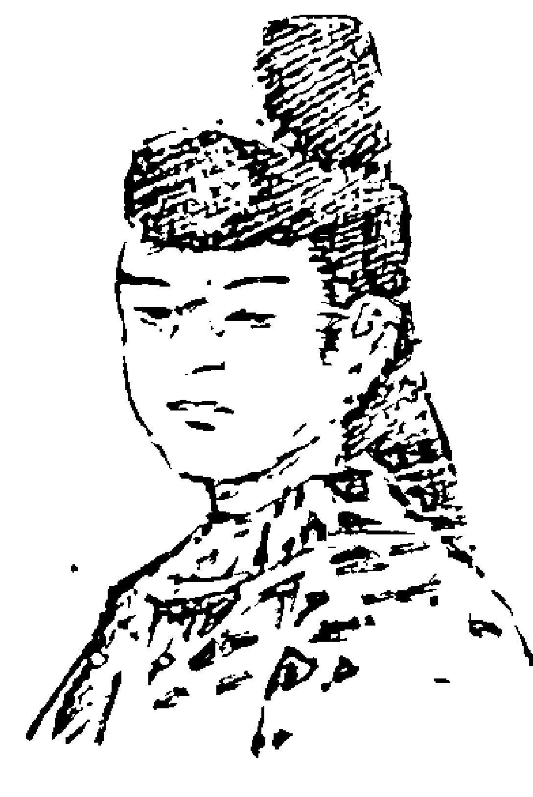

#### 恶魔·地狱的魔鬼
神曲

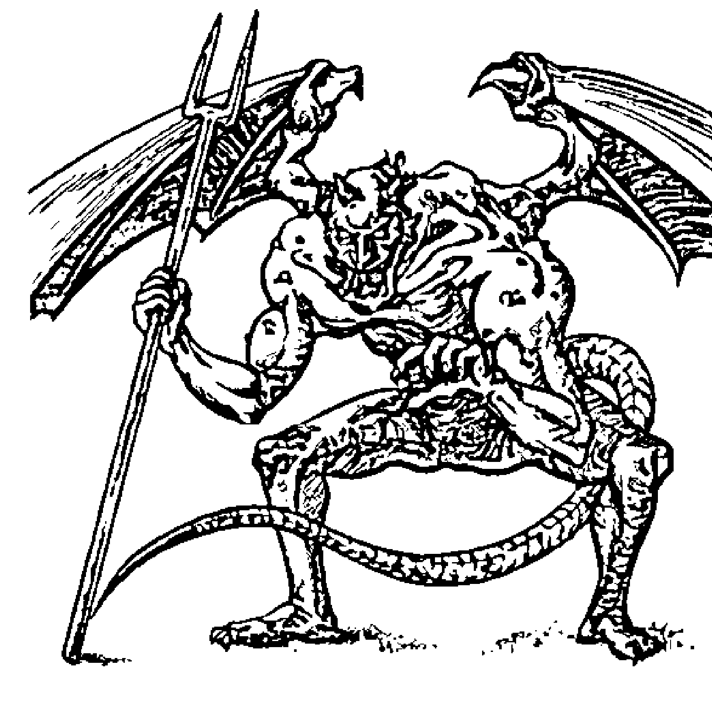

#### 恶魔·所罗门的恶魔
雷蒙盖顿

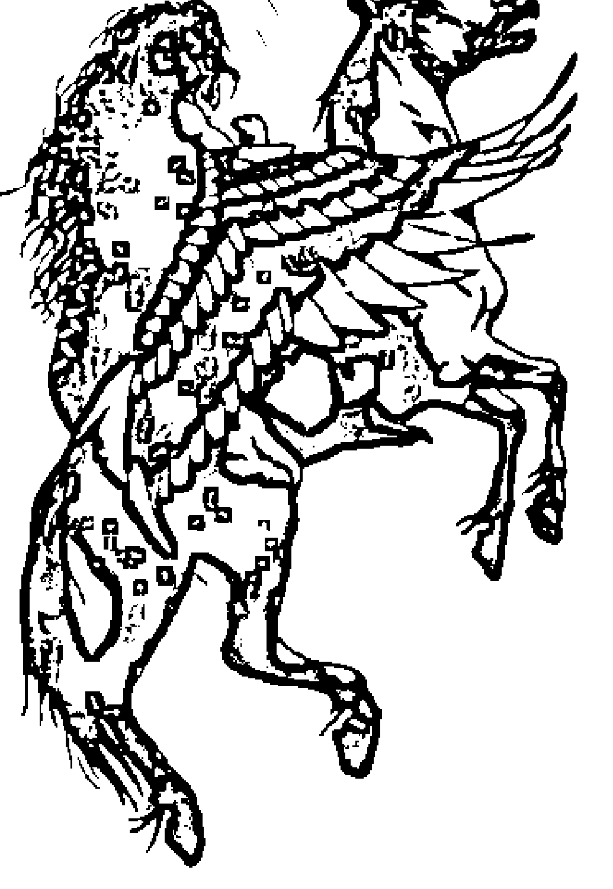

#### 塞凯尔
此神为鹰首人身的男性，但有时也被描绘成普通人类的外形。头上长着牡羊角，羊角之上带着锥形冠。
塞凯尔是丧葬之神，同时也是冥府（库多尼亚）之神，因此塞凯尔与※奥赛洛斯（Osiris）经常被视为同一个神。他的执掌是保护亡者，而且他还能执使逝世国王洁净的“开口”仪式，使国王重新恢复感官知觉。
塞凯尔是很古老的神，因此他的父母不详。原本塞凯尔是没有伴侣的，但是后来出现了塞凯尔的女性形态——塞赫梅特（Sakhmet）。此外，在新王国（公元前1567～1085年）之后，则是以奥赛洛斯之妹奈芙蒂斯（Nephthys）为妻。
塞克尔的信仰中心为孟斐斯（Memphis）城中的亡者之城（Necropolis，“墓地”之意），该地也叫拉一萨塔乌（Ro-Setau）。因此塞克尔又被称为“拉一萨塔乌的主人”。有时也与孟斐斯的工匠之神普塔赫（Ptah）结合。
在冥界塞克尔的领域中，有※奈特卜哈乌（Nehebkau）236虎视眈眈，狼吞虎咽地将被判有罪的人的灵魂吃掉。它所在之处是沙漠不毛之地，上有洞窟。
(→塞特 Seth)

236 译注：为冥府的女神。

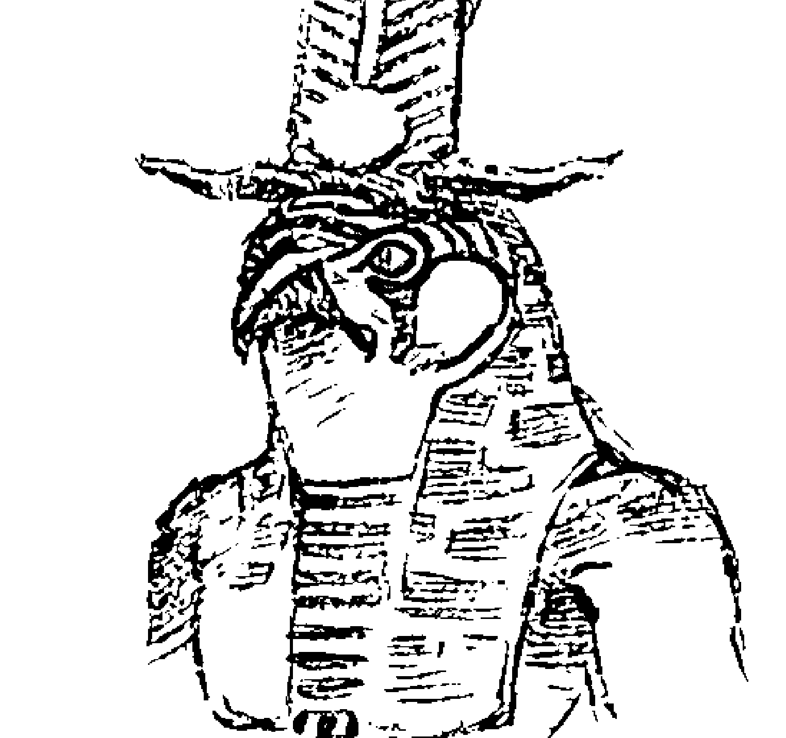

#### 秩序的破坏者
埃及

(Reshep)。
(→奥赛洛斯 Osiris《失乐园》)

237 译注：泰风：1.希腊神话中拥有一百个蛇头，会喷火的怪物，亦称作 Typhoeus。盖美拉 (Chimera)、地狱犬 (Cerberus)、海德拉 (Hydra) 等怪物之父。2.埃及神话中塞特 (Seth) 的希腊语名。

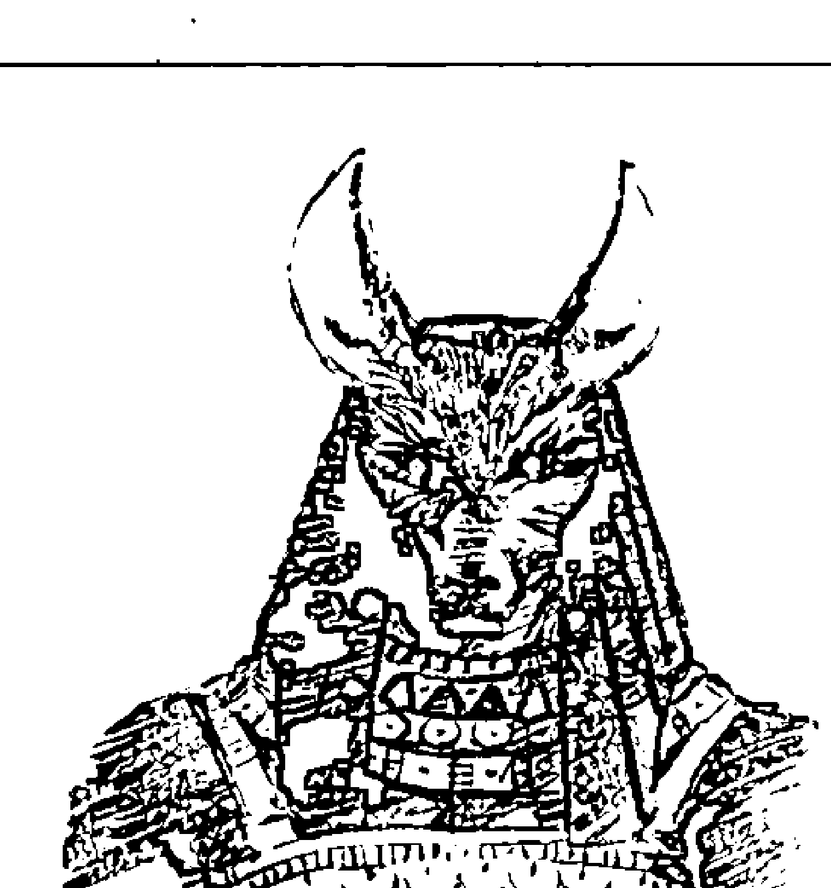

#### 恶灵
巴比伦

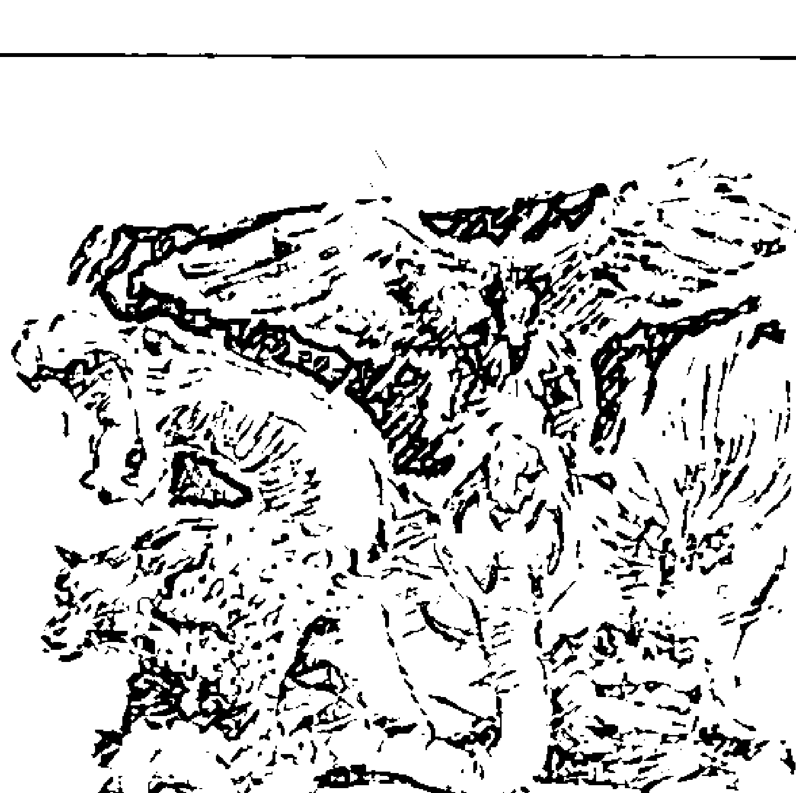

#### Shaitan
伊斯兰教的恶魔

因伊斯兰教乃受犹太教、基督宗教影响之宗教，故伊斯兰教文化圈中有着与犹太、基督宗教文化之恶魔相似的恶魔群。他们受名为易卜劣厮（Iblis）的头目率领，违抗神明，造行一切罪恶。其中最擅长的恶行为散布传染病以及诱人行恶。为了在人世间活动，他们会化成与人类相同的外表。据说只要看到他们的原形一眼，便会吓得缩成一团。他们在黄昏时与黎明前活动最频繁，相传报晓的公鸡啼声对他们而言便如神的圣名一样可怕。恶魔中有男有女，和人类一样每一位都有自己的名字。例如恶魔王易卜劣厮的副官之一就叫“札拉布尔”（Zalambur），易卜劣厮的女儿则叫“拜札克”。然而虽然知道他们的名字，但他们的来历却无定论。有人说他们是邪恶的※镇尼（Jinn，恶灵）；有人说是由天使堕落而成的。又，在阿拉伯话中一般都以“※色但”（Saitan）称呼恶魔。乃是撒旦（Satan）的讹误。（→撒旦 Satan 《新约圣经》）

#### Shambleau
宇宙魔女

美国女性作家 C. L. 摩尔（Catherine Lucille Moore，1911 ~ 1987年）的太空冒险《诺斯威斯特·史密斯》（Northwest Smith）系列中登场的外星生物。在宇宙开拓时代，地球人流浪者诺斯威斯特·史密斯在火星殖民市里目击当地居民追逐一位女子，并喊着“宇宙魔女！宇宙魔女！ ”此景，让人想起古时地球的魔女狩猎。因为地球人所特有的同情弱者之心，史密斯帮助藏匿那位女性。女子有一张褐色的脸庞、衣服般的鲜红皮肤以及野猫般灵活的眼睛。即使再怎么向她推荐火星上的奶油色运河苹果，她也不吃。问她从哪里来，都只以模棱两可的话语回答：“遥远的过去。”隐藏在头巾下的头发，和身体一样鲜红，像蛇一样蠢蠢欲动。一到夜晚，就会将史密斯的身体缠住，让他动弹不得。史密斯的同伴金星人雅洛鲁，用光线枪将他由恐怖的快乐中救出。雅洛鲁说，地球古代的吸血鬼或美杜莎等恶魔传说，追本溯源都是由和宇宙魔女相关的记忆所生。（→天蛾人 Mothman）

#### Sha-wuching
沙悟净

于明代的神怪小说《西游记》（约1570年成书）中登场，又称“沙和尚”。原本身居天界大军武将——卷帘将军这一要职。却在蟠桃会上（→西王母 Hsiwang-mu），将宝物琉璃杯不小心给打破，因其罪而流放凡间。在凡间，沙悟净住在流沙河，捕食过往行人为生。然而，与观世音菩萨一会面，却改变了他的一生。观世音菩萨受释迦如来之命，寻找前往天竺（印度）取经的僧侣及跟随者。便将路上遇到沙悟净，选为跟随者之一。沙悟净希望任务完成后能再次回归天界，就成为唐三藏的弟子。至于沙和尚之名，则是行事作风具有僧侣风范的唐三藏帮他取的别称，有别于法号。之后，经过数十年艰辛的求经之旅，成功地完成任务。沙悟净的功绩被天界认可，受封为金身罗汉再次回到天界。

### 恶魔
伊斯兰教

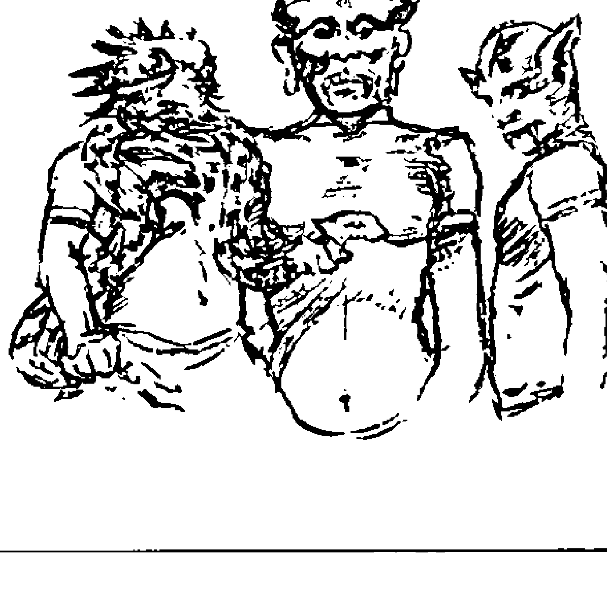

#### 外星生物
美国

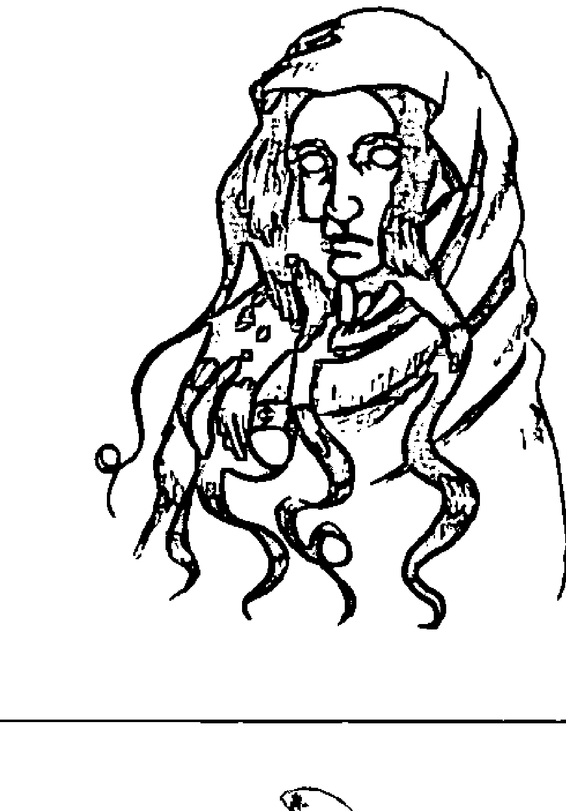

#### 恶神、怪物、武神
中国

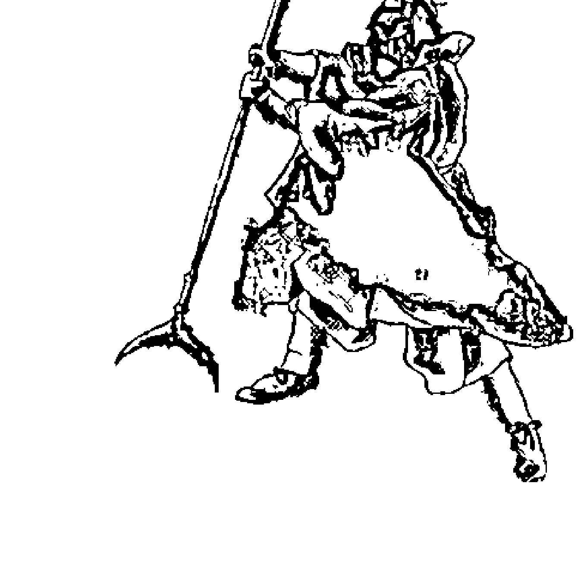

#### 沙克斯
据称为古以色列王国国王所罗门所著，现于17世纪的魔法书《雷蒙盖顿》（又名The Lesser Key of Solomon）书中第一部分〈哥耶提雅〉中所记载72名恶魔之一。别名“※沙忑”(Shaz)、“※恰克斯”(Chax)，或是“※夏克斯”(Shass)。

沙克斯强调会以鸟之姿态出现于召唤者面前的，被16世纪学者雷吉那德认为是以鹑鸟姿态出现的恶魔。

沙克斯仿佛就是使役魔一般，供召唤者使唤。除了告知黄金隐藏之地，更可夺去与召唤者为敌的人的声音、视力、及听力，或是夺取对方的财物。乍看之下，沙克斯好象十分忠实，实际上却是满嘴谎言、又时常背叛的恶魔。

受到16世纪恶魔学家让·维尔的影响，19世纪法国作家柯林·德·普朗西所著《地狱辞典》中，以“※史寇克司”(Scox)之名、地狱的大公爵、30军团的指挥官等身分介绍此位恶魔，并也加上盗马的新能力。插画家M. L.布尔顿则以盗取马匹的鹑鸟描绘史寇克司此恶魔。

#### 石矶娘娘
石矶娘娘是中国古代的法力高强的妖魔之一。她在明朝神怪小说《封神演义》中，是以名为“石矶娘娘”的女道士之姿登场。

在哪吒太子年纪尚幼之时，偶然发现传家之宝的弓箭，便拿起来戏耍试射，没想到竟意外射死了石矶娘娘的弟子，惹得石矶大怒，企图追捕哪吒，但是反而被哪吒之师——太乙真人所杀。

如果只看这段叙述，可能会认为石矶娘娘简直是不分青红皂白地遭到杀害。但是我们可以检视一下这段插曲的可能来源——《三教搜神大全》中的描述：“(哪吒) 不意时上帝坛，手搭如来弓箭，射死石矶娘娘之子，而石矶兴兵。帅取父坛降魔杵西战而戮之。父以石矶为诸魔之领袖，怒其杀之以惹诸魔兵也。” 238

> “ (哪吒) 不意时上帝坛，手搭如来弓箭，射死石矶娘娘之子，而石矶兴兵。帅取父坛降魔杵西战而戮之。父以石矶为诸魔之领袖，怒其杀之以惹诸魔兵也。”

由此可知，事实上哪吒原本就是担任玉皇先锋的大罗神仙，也就是征讨下界魔王的降魔神之一。讨伐石矶娘娘其实正是哪吒的分内之职。

(→邬文化 Wu-wenhua)

#### 西鲁多
在西伯利亚西鲁多是引起疾病的恶魔。潜入村中新迁住户家中，一入夜就会制造声响、四处散播疾病，使居民困扰。

民众为了避掉灾祸，纷纷在住家周围立柱。如此一来，就可防止西鲁多前来捣乱，恢复住家安宁。然而一有灾祸，村民就会与巫女老妪商量，向柱子献上蜡烛。一旦发现柱子上有发光处，其他人就会另立新柱。

曾邀西鲁多借住过的屋主，因为害怕西鲁多会再回来，仍保留柱子完好。

不久后，村民不止献祭蜡烛给西鲁多，也在森林中献上活祭品。从事此种行为的人，女性比男性还多。女性的生活，多半受到迷信所左右。其中还有瞒着丈夫向西鲁多献上蜡烛、或是向克雷梅特 (Keremet) 献上活祭品的女人。

#### 恶魔·所罗门的恶魔
##### 雷蒙盖顿

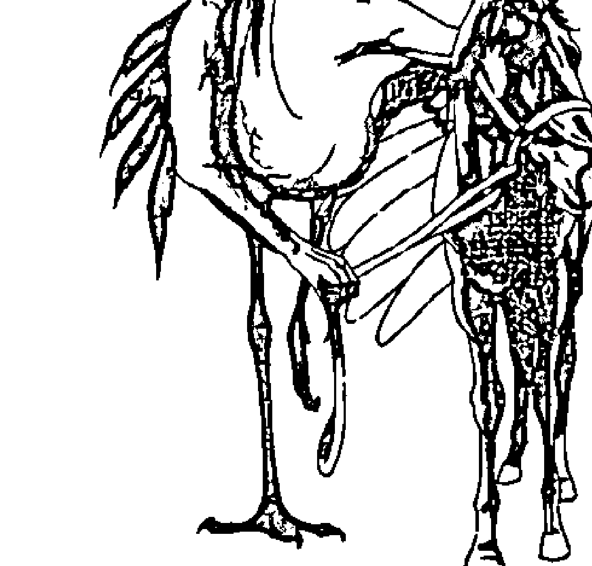

#### 妖魔
#### 中国

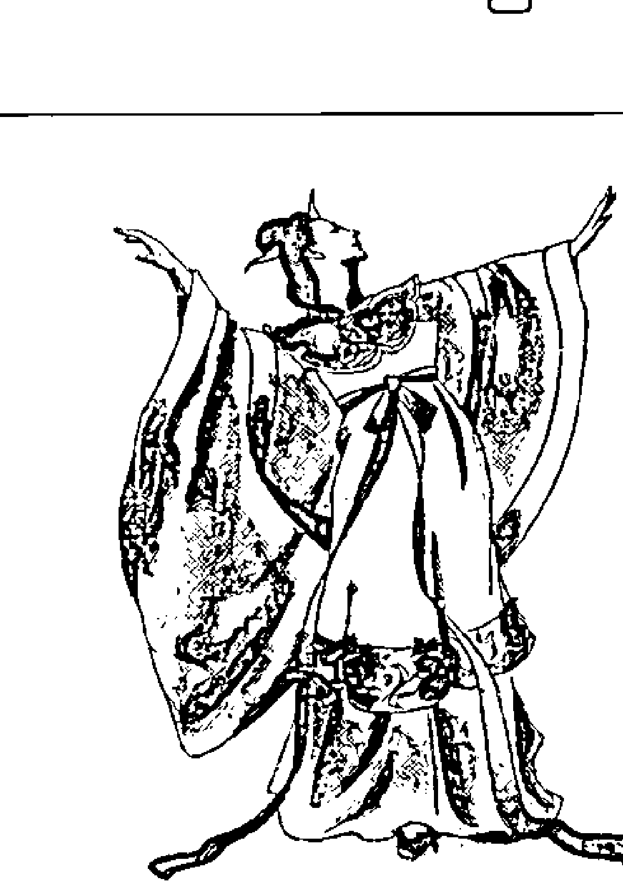

238 译注：《三教源流搜神大全》卷六。

### 恶魔
#### 西伯利亚

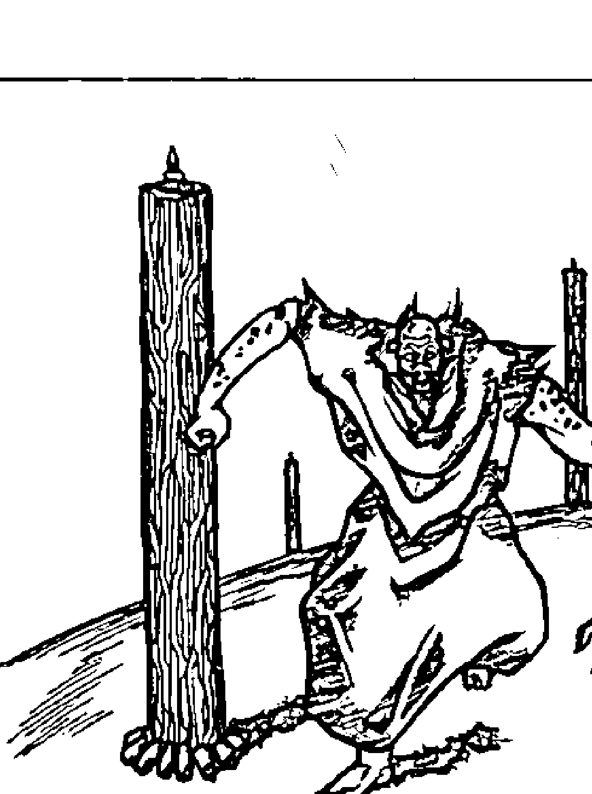

#### Shuimu-niangniang
#### 水母娘娘

水神或水怪。水怪，经常为中国带来大洪水。水母娘娘挑着一担水行于道上，想使中国南方化为水乡泽国。而两桶所盛之水，其量至五湖四海。张果老听闻此事，急忙骑驴前去。因为驱驴甚急，请求饮水，以缓解牲畜长途跋涉之困。水母娘娘答应要求，让驴喝水。神驴伸嘴一饮，竟饮尽两桶所盛五湖四海之水，只剩少量一些。计划泡汤的水母娘娘，愤而将桶中所余之水尽倾于地，立刻卷起滔天狂澜，使数十万生灵悉葬水底。

张果老一怒，以铁链锁之。也有人说，这个传说与无支祁（Wuchihchi）的传说相互混乱。（→共工 Kungkung、洪水之兆 The omen of flood）

#### Shuten-douji
#### 酒吞童子

平安朝时代，盘踞京都西北大江山众鬼的首领。经常下山掠夺乡里的钱财食物及女人。被源赖光、藤原保昌以及赖光的四天王239等日本中世纪240物语的英雄降服。当中过程十分有趣。赖光假扮成山伏241，接受酒吞童子手下的招待，参加酒宴。当众鬼醉得不省人事、四周一片寂静的时候，赖光一行人潜入酒吞童子的寝室里。此时，露出原形的酒吞童子和众多女性身体交缠，赖光趁隙砍下酒吞童子的首级，头飞了出去紧咬着赖光的兜甲，渡边纲及坂田金时刺向头的两眼，让他一命呜呼。

传说，酒吞童子原是被扔在大江山的弃儿。从“被弃的童子”（sute-douji）流传变成“酒吞童子”（shuten-douji）。也有其他传说说是寺庙的小僧。小僧是寺庙捡来的弃婴，并不是正式出家的人。因为不想出家，而从寺庙逃走，至今仍保持”童子”之姿。（→茨木童子 Ibaraki-douji、八俣远吕智 Yamata-no-worochi）

#### Shur
#### 舒兹

在古巴比伦中，风是恶魔造成的。地处沙漠地带的古巴比伦，相当惧怕带来沙暴或热气的风。然而，风魔们却是天空之神阿奴（Anu）的手下。有时会吹起恐怖的风暴，但只要神一命令也会吹起带来雨的风。埃阿（Ea）的儿子埃达帕（Adapa）曾经一度拔光舒兹的羽毛。有次埃达帕出海钓鱼，所乘之船因舒兹所吹的大风而翻覆。埃达帕一怒之下发誓向舒兹报仇，舒兹却鼓着一身丑陋身体上的羽毛，边飞边高声怪笑。结果，埃达帕飞向舒兹，拔下他的一身羽毛，让他再也不能飞。

然而，无论阿奴神再怎么呼唤却迟迟不见舒兹踪影，于是前去调查其原因。受到召唤的埃达帕遵守父神艾阿的吩咐，不碰阿奴神手上的食物，终于逃过一劫。（→兹 Zu、西南风的恶魔 The demon of south-west wind）

#### 水神·水怪
#### 中国

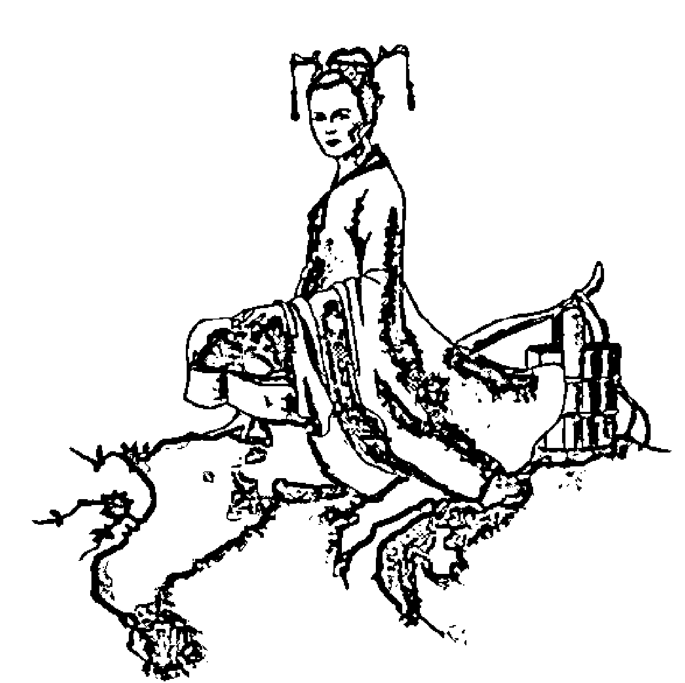

#### 鬼
#### 日本

239 原注：即为渡边纲、坂田金（公）时、碓冰贞光、卜部季武。
240 译注：日本中世时期为，12世纪镰仓幕府成立到16世纪末室町幕府灭亡期间。
241 译注：在山中修炼的僧侣，或是披袈裟、负笈、手持金刚杵的修行僧。

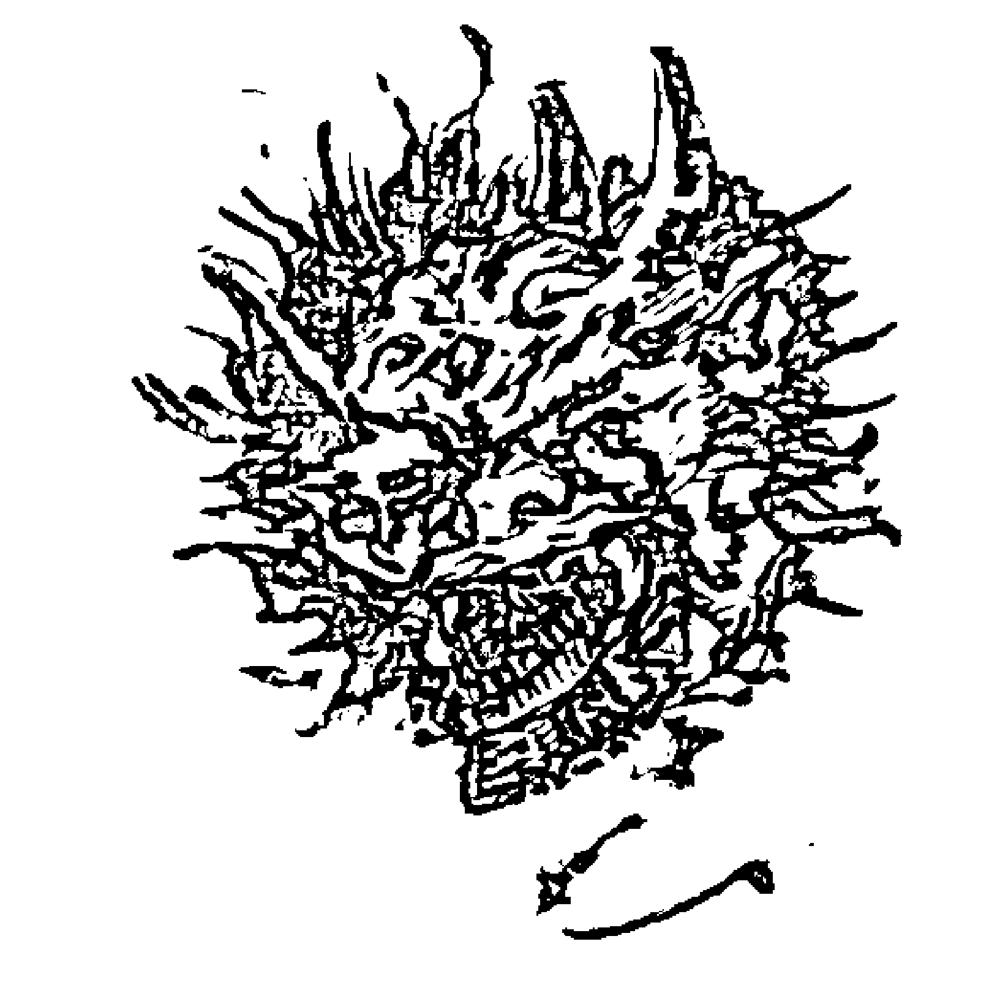

### 风之恶魔
##### 巴比伦

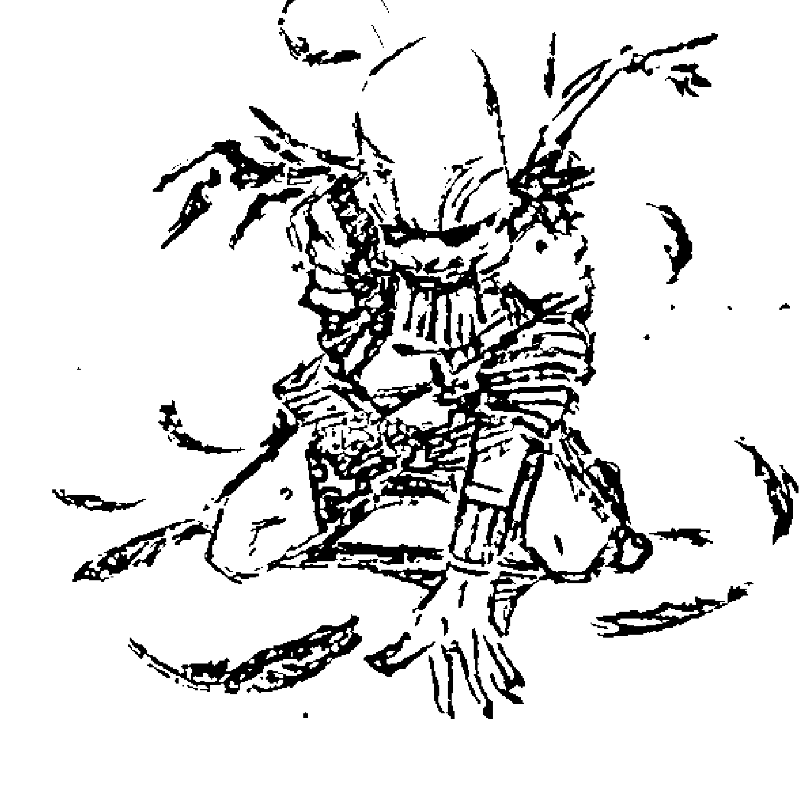

#### 〈罪恶〉

出现在《失乐园》中的异形女妖。她是违逆唯一神及神子的天使撒旦（Satan）的左半身里诞生，诞生时全副武装。她的诞生让我们怀疑，米尔顿是不是以希腊神话中雅典（Athena）的诞生为灵感，同时夏娃（Eva）从亚当（Adam）肋骨诞生的故事，也很可能是希腊神话的谐拟（parody）。撒旦之下的天使畏惧此种异常的出生方式，将她视为不吉的征兆，并把她取名为“罪恶”，这就是她名字的由来。

〈罪恶〉跟撒旦非常相似，容貌极美，因此造反天使们很快就喜欢上她，而特别爱她的正是身为父亲的撒旦自己。不久之后，造反失败的撒旦被天国放逐，〈罪恶〉也跟撒旦一起坠入地狱。跟撒旦之间生下〈死〉这孩子的〈罪恶〉，又跟〈死〉有了小孩。怀孕与生产的痛苦，让她的下半身变成了蛇。

唯一神将地狱之门的钥匙托付给〈罪恶〉，由此〈罪恶〉并不是背叛唯一神的造反天使。但是〈罪恶〉终究违背了唯一神的意旨，为撒旦开启了地狱之门。

（→撒旦 Saran 《失乐园》）

#### 湿陀罗

古孟加拉国地区^242（Bengal）的天花女神。能使人患病或痊愈，干旱或降雨的能力。病人皮肤上因天花或麻疹所起疹子，是因为她用“珍珠”来装饰信徒，所以不需要过于恐惧，大抵都会马上痊愈。只要村人聚在一起祭拜，就会平息女神的愤怒，使得一个个疱疮凹陷痊愈、天降甘霖。

有关湿陀罗女神的姿态各地不同，在某个村落神似迦梨女神（Kali），在另一村则是骑驴马、背背扫帚和竹耙、皮肤黝黑的大婶。具有“首陀罗（outcast，弃民）女之身，婆罗门（祭司）女之首”。具有患病或痊愈，干旱或降雨能力的土地神，在印度也有，称为“湿陀罗蒂法”、“玛里亚曼”、“撒里亚曼”、“悉修达”、“歇泰”等女神非常多。而村内进行祭拜土地神的仪式时，通常是跨越各宗教，回教徒、基督徒来参加也是十分普通之事。

（→疫病之兆 The omen of plague、疱疮神 Housou-gami）

#### 湿婆

印度教的至高神之一，与毗湿奴、大梵天（或梵天）齐名。原本为暴风神楼陀罗（Rudra），是司掌破坏之神。将一切彻底毁灭，然后重生。

湿婆有许多别称，当中，强调湿婆最恐怖一面的名字是“※跋伊罗婆”（Bhirava）。有一天，大梵天与湿婆争论，谁是宇宙的创造者，两人互不相让。终于，湿婆被激怒，全身被愤怒所包裹着。众神瞧见湿婆这个模样，称他为跋伊罗婆（恐怖的杀戮者）。湿婆一怒之下，砍下梵天五首之一。成为现在梵天四颗头颅的模样。

其他的别称还有，象征湿婆是世界终了“毁灭万物者”的“※诃罗”（Hara）、司掌死亡时刻的“※伽罗”（Kala）；将埋在墓地死者的尸体烧成灰，涂在身上并“带有一串头骨者”的“※迦婆罗摩林”（Mundamaaraa）；“恶魔之王”的“※菩提商波罗”（Buuteeshuvara）等众多恐怖的别称。

（→迦梨女神 Kali）

#### **撒旦之女·地狱守门人**
##### **失乐园**

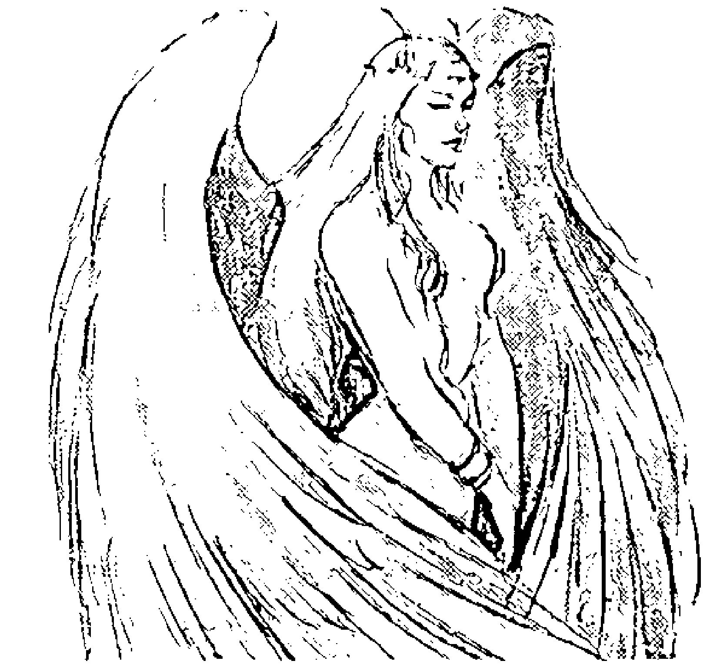

#### **天花女神**
##### **印度**

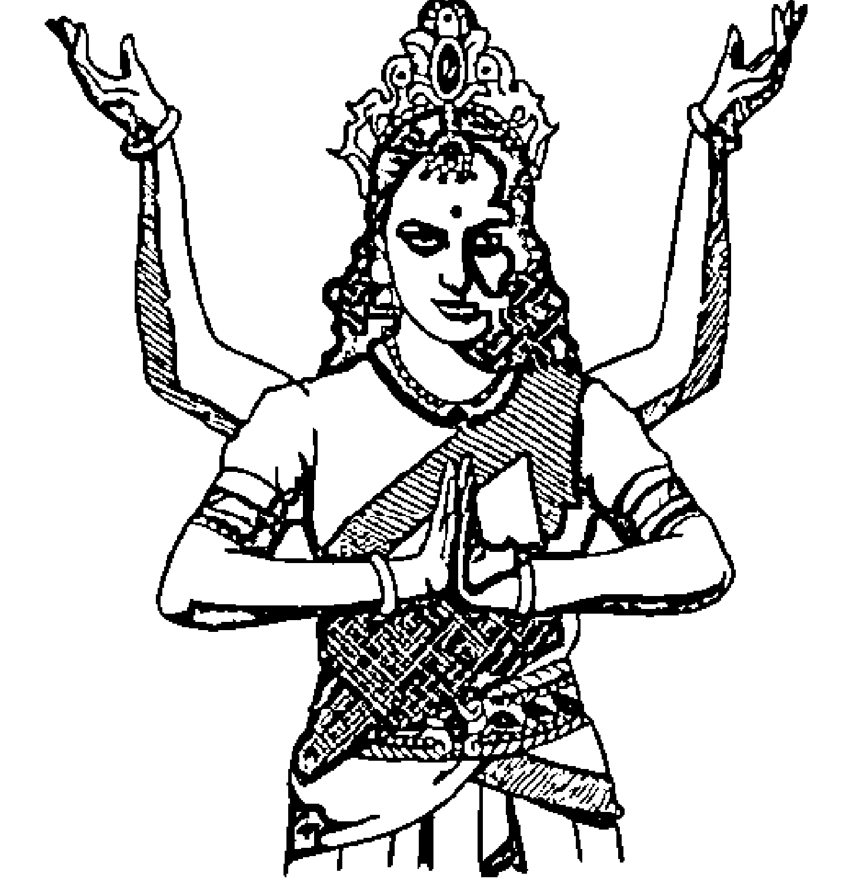

242 原注：印度次大陆东北部，包括今日的印度、西孟加拉国州、孟加拉共和国。

#### **破坏神**
##### **印度**

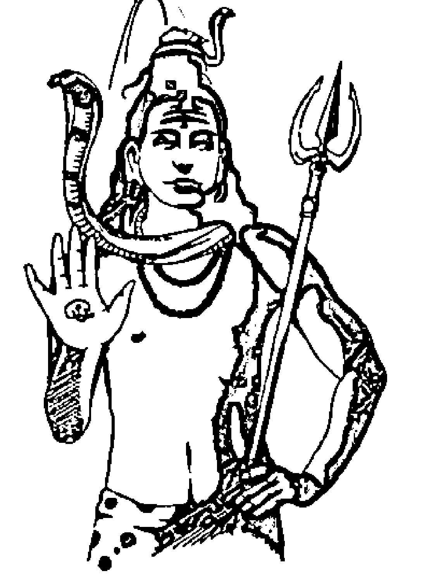

#### 索贝克

一般认为索贝克身具鳄鱼之姿，或是拥有鳄鱼头的男性神。其母为奈特（Neith）女神，其父为赛奴伊神，另外也有文献显示其母为雌神牛（Meythyer）。

索贝克很早就与太阳神拉（Ra）结合，以索贝克=拉的形态受人膜拜。此时的索贝克被视为光之神，同时也是丰穰之神。

然而，毕竟它拥有鳄鱼外观，因此也是恐怖之神。以阴险、贪心的狩猎动物——鳄鱼作为象征的索贝克，经常被描述成极恶的反派。时至今日，仍有“鳄鱼上的奥鲁斯（Horus）”或是“奥鲁斯的石柱”之类的图流传下来。不过鳄鱼的老成与勇猛、执着、冷不防发动攻击等特质，也是一位王者所应具备的优点。因此索贝克也被视为王者的守护神。此外，对埃及人来说，住在水滨的生物拥有带来好运的神秘力量。因此，人们认为索贝克也有支配洪水的力量（埃及的洪水会带来肥沃的土壤，与农业息息相关）。（→塞特 Seth）

#### 弹簧腿杰克

同样产生于伦敦，比有名的开膛手杰克（Jack the Ripper）的时代早了约十数年，有另一个杰克存在。跟开膛手一样也是史实事件，但是这个杰克更加神秘，令人难以置信。这个俗称弹簧腿杰克的男子的真面目到底是谁至今未明，根据部分证人的说法，他通常身穿银色的服装造访单身女性的房间，自称是消防员（或说是警员），一旦进去房间后，马上用喷火烧伤或者用小刀砍伤对方然后立刻逃跑，有次刚好有个警员来得及赶到凶案现场，只看到他以惊人的跳跃力快速逃去，如其名所示，他的脚上似乎装了弹簧一般。据目击者所言，他连高数米的围墙都能够一举跳过。维多利亚时代末期（19世纪后半），在这个弹簧腿杰克出现之后还陆陆续续的发生许多恐怖连续杀人事件（恐怕都是些以杀人取乐，给人带来恐怖为乐的人）。这或许是自古以来幽灵故事繁多的英国的特有状况也说不定。（→杀人小丑 Killer Crown）

#### 斯托剌

据称为古以色列王国国王所罗门所著，现于17世纪的魔法书《雷蒙盖顿》（又名 The Lesser Key of Solomon）书中第一部分〈哥耶提雅〉中所记载72名恶魔之一。以乌鸦的姿态出现在召唤者面前。仿若博物学家，感觉不出任何邪恶气息的恶魔。教导召唤者药草、矿物等的医学效用，或是授予占星术等相关知识。

受到16世纪恶魔学家让·维尔的影响，19世纪法国作家柯林·德·普朗西所著《地狱辞典》中，描述斯托剌的姿态为枭。

与同书介绍的西迪（Sytry）相同，也曾以人类的姿态现身。以人类的姿态现身时，会将植物的性质、宝石的价值等相关知识传授给人类。身为地狱王族的一员，统领76军团。恶魔学相关知识阙如的《地狱辞典》插画家 M.L. 布尔顿，将斯托剌描绘成头戴皇冠、双脚细长的角鸮。结果，因为这幅肖像使得斯托剌成为知名度高的恶魔。

#### 恐怖之神
#### 埃及

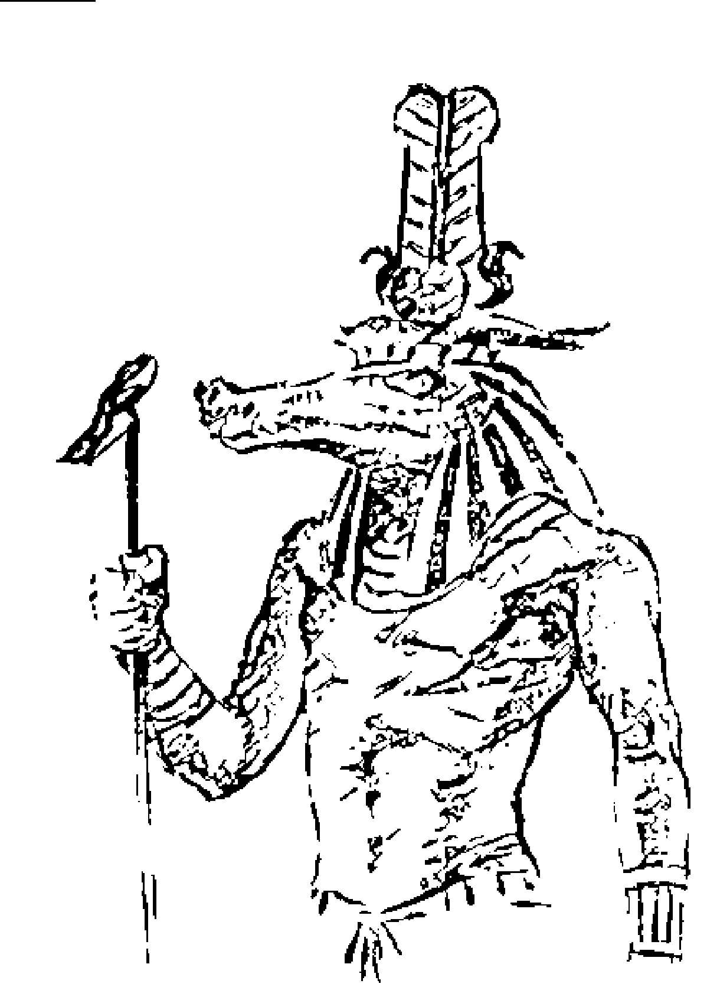

#### 都市恶魔传说
##### 英国

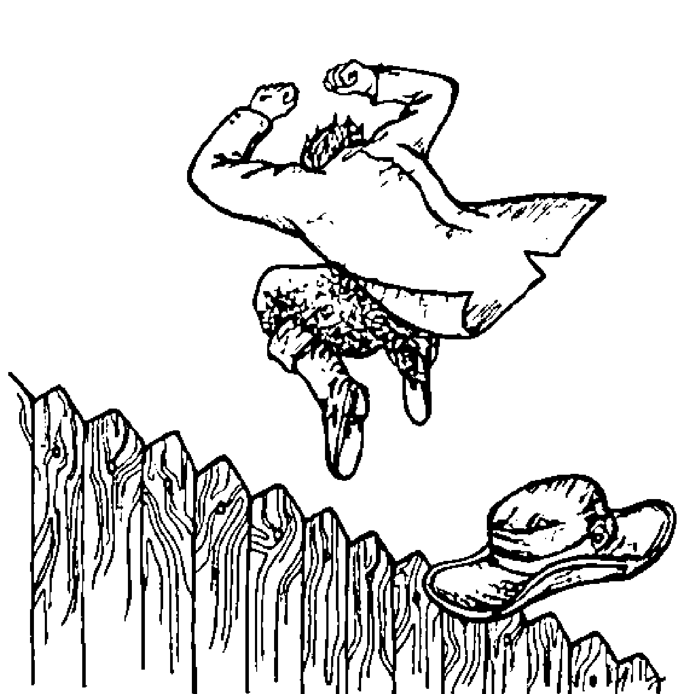

#### 恶魔·所罗门的恶魔
##### 雷蒙盖顿

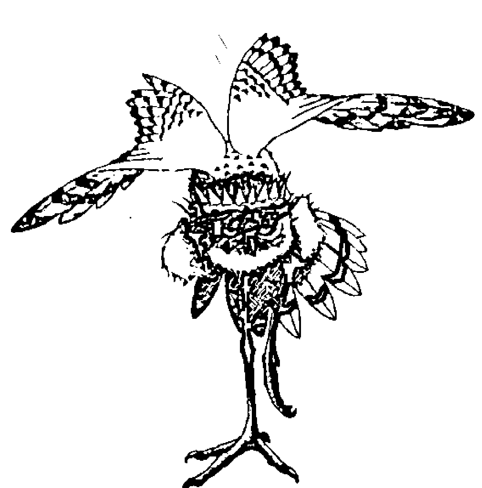

#### 苏姆婆

苏姆婆和※尼苏姆婆（Nisumba）是阿修罗（Asura 或 Ashura）中的一对兄弟。其名皆意为“杀戮者”，兄弟俩非常的富有，拥有地上所有的财富。

有一次，苏姆婆的部下旃陀及※穆恩陀瞧见一位女性在喀济思河中沐浴，向苏姆婆进言，将这位美若天仙的女子迎为妻子。

苏姆婆向女子求婚，女子说只要打败我，我就答应做你的妻子。而女子的真正身份却是湿婆（Siva 或 Shiva）的妻子突迦（Durga）。

两人的战斗一开始，突迦就以迦梨女神（Kali）的姿态为始，幻化成各种形态与苏姆婆战斗，成功杀了尼苏姆婆。

突迦虽然强，却怎么也胜不了苏姆婆，于是向印度教的三主神梵天（Brahma）、湿婆（Siva 或 Shiva）、※因陀罗（Indra）求助，最后终于获胜。

如这一来，众神终于成功杀了实力既强又富裕的阿修罗兄弟。

#### 孙悟空

《西游记》（约公元 1570 年左右成书）主角。另有“※孙行者”（Sun-Ascetic）、“※齐天大圣”（Qitian-tasheng）等别名。最后修成正果，成为斗战胜佛。

在花果山山顶有一仙石，自开天辟地以来，不断吸收天地灵气、日月精华，最后孕育而出的生命便是孙悟空。

起初孙悟空是雄霸花果山的猴王，之后拜入须菩提祖师门下学习仙术。学成之后返回花果山重登王位。

后来由于阳寿已尽，跟随黑白无常来到地府之后，反而大闹阎罗殿（地府的宫殿），还拿大笔，将生死簿上所有同伴的名字全部抹去。

天庭不但没有处罚这只石猴，反而赐他官职，意图笼络，但是孙悟空后来大闹天界，弃官回到花果山，惹出一场大乱。孙悟空与天庭派来的武将哪吒二郎神交手数回，始终不分胜负，由此可见孙悟空的身手不凡。不过最后孙悟空还是被释迦如来佛给收服，压于五行山之下。成为玄奘法师（唐三藏）的弟子，则又是 500 年之后的另一个故事了。

由孙悟空的单纯与残酷看来，应该可算是童子

#### 首哩薄那迦

楞伽（※罗刹之都）魔王罗波那（Ravana）之妹，为一※罗刹女（Raksasi）。其名意为“爪如扇子般的女人”。

首哩薄那迦住在般遮婆提之森。罗摩（拘萨罗国的王子）被阿逾陀城国王十车王（Dasaratha）放逐后，来到此地。首哩薄那迦向罗摩求爱，但罗摩以已有爱妻悉多之理由，拒绝了她，并将她介绍给弟弟罗什曼那。

然而，受到罗什曼那嘲笑，自尊受伤的首哩薄那迦欲将悉多一口吞下，却被罗什曼那割掉耳鼻。

首哩薄那迦逃回兄长罗波那之处后，向其兄进言，说悉多有多么美丽，叫兄长从罗摩之手中夺走悉多。

罗波那信了首哩薄那迦之言，驾着黄金车飞去，掳走了悉多。开启了罗摩和罗波那两人间的大战。

仔细深思，其中最坏的应该是首哩薄那迦。

254

#### 阿修罗
#### 印度

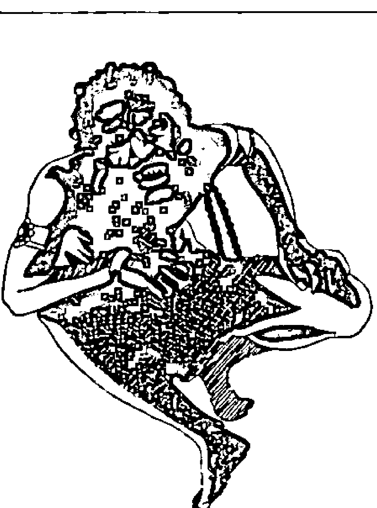

#### 叛神·破坏神·降魔神
#### 中国

神的一种。此外他又以小说主角的身份，得到人们喜爱，之后也被视为降魔神，受人祭祀。

（→沙悟净 Sha-wuching、猪悟能 Chu-wuneng）

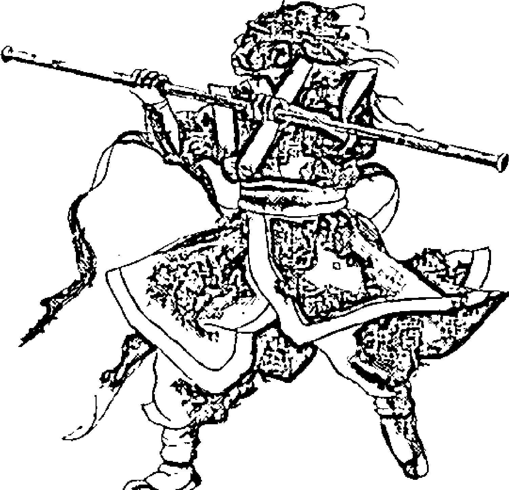

#### 罗刹女
#### 印度

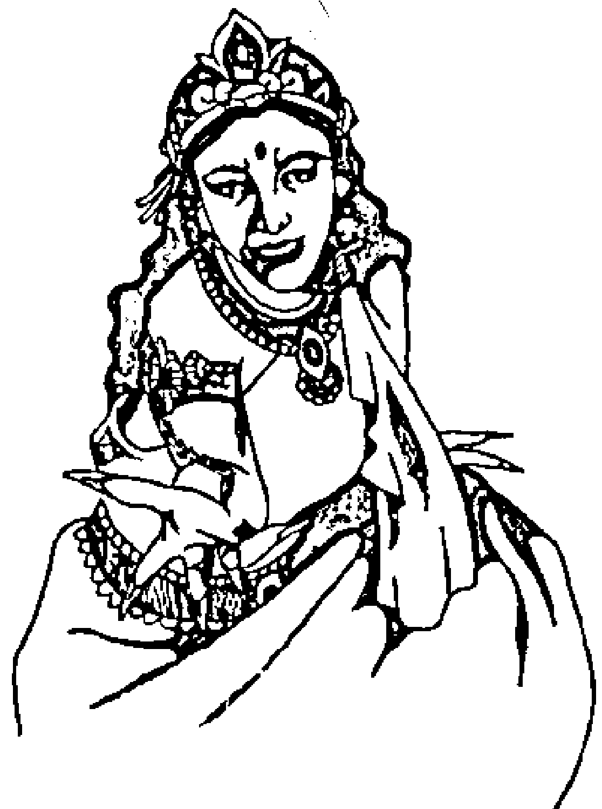

#### 史尔特尔

与众神敌对的炎之巨人的国家，穆斯贝尔海姆（Muspellheim）之王。穆斯贝尔海姆位在诸神国度之南。

史尔特尔手持炎之剑，与华纳（Valhalla）神族的丰穰神夫雷（Frey）敌对。此炎剑可放出光芒、使其周围地面皴裂喷出火焰。甚至只要靠近史尔特尔岩石就会崩落、人们也会丢失性命。

而夫雷曾有一把能够自行杀敌的宝剑，当夫雷拥有此剑时史尔特尔敌不过他。但是夫雷为了用这把宝剑向世界上最美的女巨人凯儿特（Gerda）求婚，把剑交给了家臣斯基尼尔（Skirnir）。

因此，史尔特尔在世界的末日，拉库那克（Ragnarok，诸神的黄昏）之役中才能用自己的炎剑成功杀死夫雷。

率领炎之巨人烧毁连接众神之国与大地之间的虹桥。再用火包围地球，使世界变成灼热的炼狱。所有生物俱死，古老的世界于是迎向终结。

（→奥丁 Óðinn〈北欧神话〉）

#### 须佐之男命

日本神话中最强的荒事神²⁴³（荒人神²⁴⁴）、英雄神，以及支配大海的神。

须佐之男命在高天原（众神的居所）中，是极为特异、不驯的存在。除了破坏田地、织布小屋、使天照大神躲在天之石屋内种种作为外，还说些像是想见已入黄泉的母亲伊邪那美命（Izanami-no-mikoto）之类的任性话使众人困扰。

经过数次捣乱破坏后，须佐之男命被高天原的众神放逐。然而在这之后，正是此位神明奇妙之处。被贬下凡间的须佐之男命，性格巨变，与身处高天原时的他完全不同，化作英雄神。有时是根之国（冥界）的主人，给予大国主神（Ookuninushi-no-mikoto）试炼。这种变化迅速的性格，依本居宣长（江户中期的国学家）的说法是，须佐之男命之所以为恶，是附在伊邪那岐神上的黄泉之秽没有完全拔除的缘故。

所谓英雄神，不论东西，不都是蛮横不讲理的吗。如这一来，在高天原的须佐之男命行为粗暴也不足为奇了。

#### 崇德上皇

鸟羽天皇（1107～1123年在位）与中宫璋子之子。事实上，却是祖父白河院（1072～1086在位）和璋子之子。

保安4年（1123年）鸟羽天皇强迫白河院退位，传位于崇德天皇（1123～1141在位）。大治4年（1129年）白河院驾崩，鸟羽上皇迫崇德退位，使其同父异母弟近卫天皇（1141～1155在位）即位。之后，鸟羽院驾崩，遗言中吩咐禁止崇德吊丧。此事激怒崇德，掀起了保元之乱（1156年）。崇德以罪人的身份流放到赞岐（日本香川县），结束了他46岁的生涯。

在流放期间，为了替来生祈求冥福而书写的大乘经中，用自己的血写下“愿为日本之大魔，为帝戮民，为民弑帝！”之诅咒。最后，虽然他还活着，形貌却渐渐变成天狗。

接下来，二条天皇（1158～1165年在位）病死之后所产生的天地异变或战乱，被认为是崇德怨灵的怨念所致，治承元年（1177年）时马上追谥他为“崇德院”。然而，至今仍不减其怨念，昭和39年（1965年）举行崇德死后800年祭之时，位于白峯陵山脚下的小学，被一把不明火烧毁。

#### 众神之敌 北欧

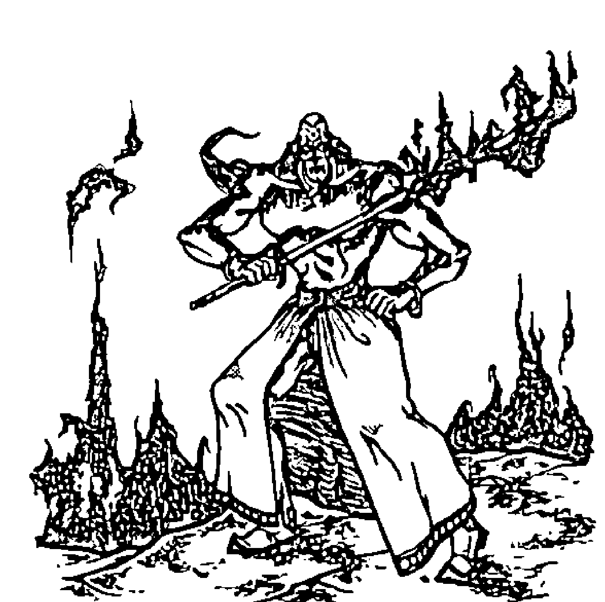

#### 破坏神·英雄神·海神·冥神 日本

243 译注：具有非凡力量、勇猛果敢之武神。
244 译注：随时现身，展现神威的神。或是化成人之姿，现身凡间的神明。

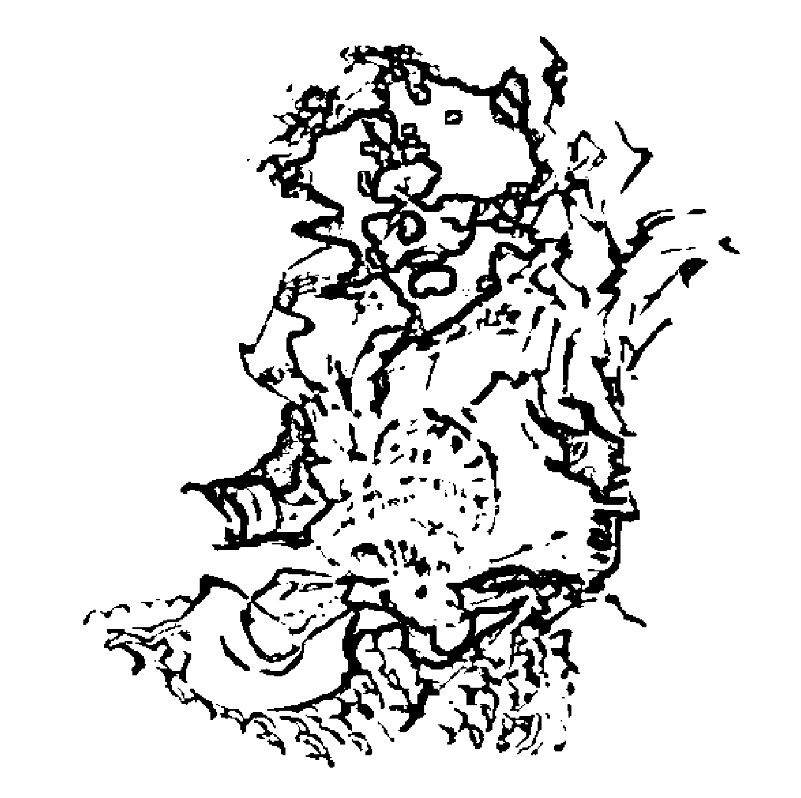

#### 祸崇神·魔王 日本

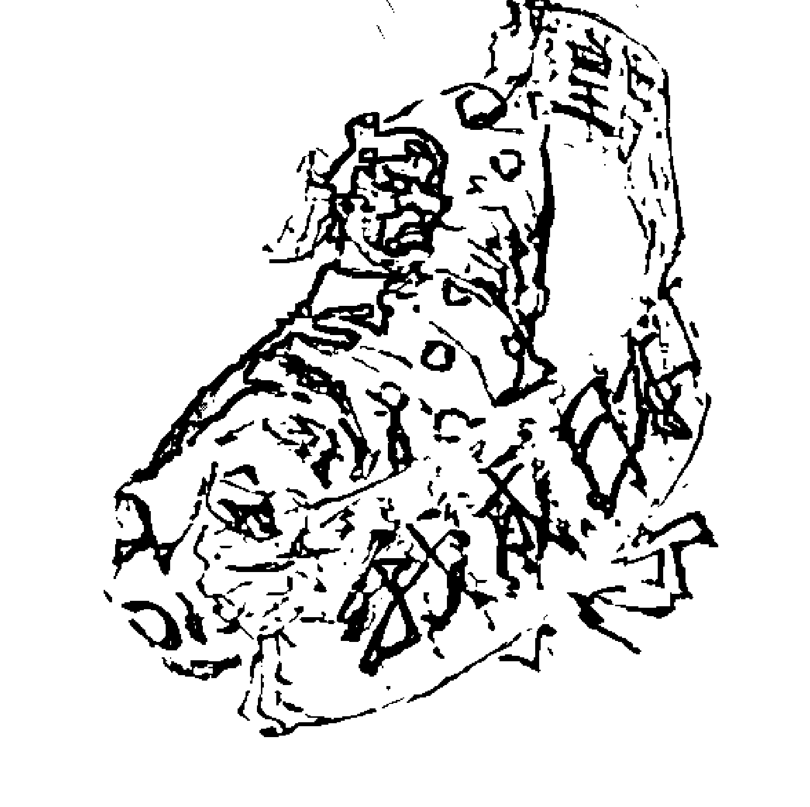

#### 西迪

据称为古以色列王国国王所罗门所著，现于17世纪的魔法书《雷蒙盖顿》（又名 The Lesser Key of Solomon）书中第一部分〈哥耶提雅〉中所记载72名恶魔之一。以启示文学《以诺书》为模仿的《伪以诺书》的目录中也载有其名。别名 “※毕特鲁”（Bitru）。

以拥有各种野生动物的头，以及有翼人身的姿态出现在召唤者面前。《伪以诺书》中描述，西迪豹头人身，具有狮鹫的翅膀。是掌管情欲的恶魔，在召唤者的面前可唤出任何女性，并使其裸身。

受到16世纪恶魔学家让·维尔的影响，19世纪法国作家柯林·德·普朗西所著《地狱辞典》中，以“西迪”之名刊于其上。书中描述西迪有两种姿态，分别为拥有狮鹫翅膀的豹，以及俊美的人。西迪是地狱皇族的一员，也是70军团的指挥官。《地狱辞典》中也介绍为与情欲、热情有关的恶魔。但是，西迪的能力并非使女性裸身，而是暴露其秘密。

#### 大鹗²⁴⁵

兆的一种，相传会带来战乱。

大鹗原本是名为“钦鵊”²⁴⁶的神明，它与烛阴（Chuyin）之子・鼓共谋，杀害了名为葆江的神。

在中国，统领所有神明的是天帝。天帝是没有拟人化性格的命运之神——“天”的具体形象化表现，并非指特定的神明，而是指一种地位。依时代不同，有不同的神登上天帝之位，但是上述事件起于何时，以及当时在位的天帝为谁等等，均不可考。

无论如何，当时的天帝获知这件事之后，大为震怒，便将两者处以重刑。

至于钦鵊为何要杀了葆江，详细的经纬已不可考。但是，对于自己受到的责罚，钦鵊似乎极为怨怼。因为钦鵊死后转生成了一只大鹗。

大鹗外形如鹜，羽毛有黑色斑点。白头，赤喙，鸟爪如虎，鸣声似鸭。

相传只要有这种鸟出现的地方，不久之后必定会有惨烈的兵燹之灾。

（一鵊 Hsun、兵乱之兆 The omen of war）

#### 大风

中国古代的怪神。如名所示，大风的职掌是司风，并是一位会引起狂风的灾害神。

也有人认为大风的真面目是协助蚩尤叛乱的“风伯”。当蚩尤与帝王神黄帝作战之际，风伯偕同“雨师”，聚云刮风，掩护蚩尤麾下的魑魅魍魉作战。

另有一种传说指出，大风指的是大凤，狂风是由大凤鼓翅而引发的。

无论如何，大风就是个刮起狂风、侵害人民的恶神。

因此著名神射手・后羿奉黄帝之命，出发讨伐大风。后羿结绳于箭上，不偏不倚地射到大风，并趁机将他捉住带回京城。

在汉族统治中原期间，不断发生重大的战争。据推测，其中最大的一次战役便是与假托蚩尤之名的南方部族会战。

失败之后仍然持续作战的部族，以怪物的形态存留于神话，传说之中，并因此在史页上留下了记载，这样来解读应该不会错的吧。

#### 恶魔·所罗门的恶魔
雷蒙盖顿

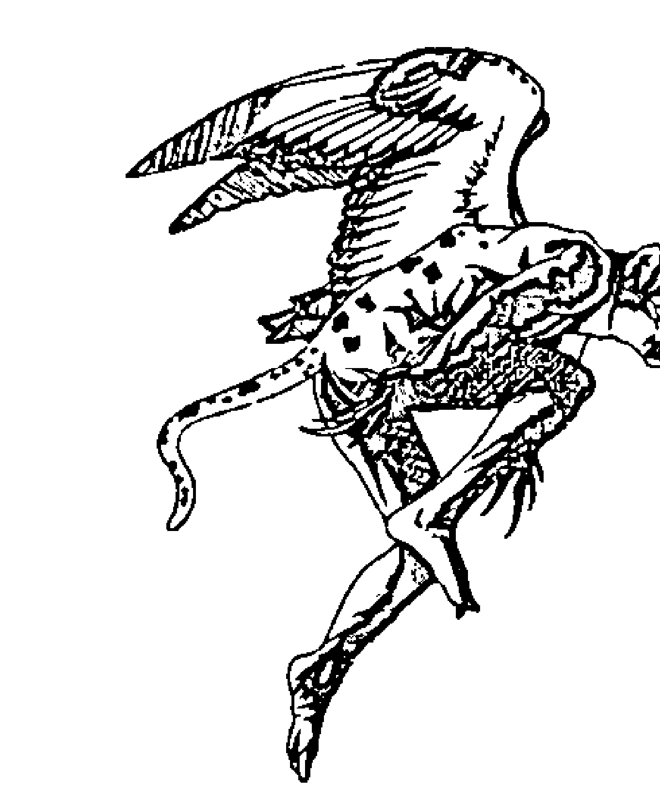

#### 兆
中国

245 译注: 鸷为猛禽的一种，外形如鹰，足趾中间有蹼，背黑褐色，腹部白色，捕食鱼类，又称“鱼鹰”。
246 译注: 《山海经》〈西山经〉：“又西北四百二十里曰钟山，其子曰鼓，其状如人面而龙身，是与钦鴀杀葆江于昆仑之阳，帝乃戮之钟山之东曰瑶崖。钦鴀化为大鹗，其状如雕而黑文白首，赤喙而虎爪，其音如晨鹄，见则有大兵。鼓亦化为鸟，其状如鸱，赤足而直喙，黄文而白首，其音如鹄，见则其邑大旱。”

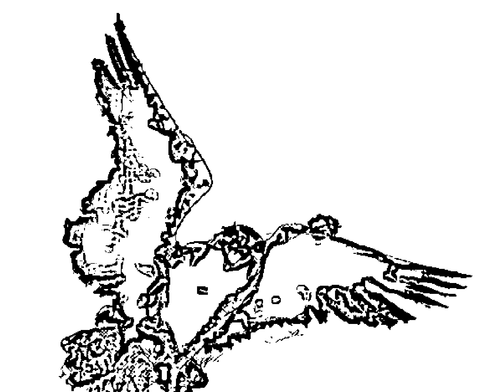

#### 风神·怪鸟
中国

> (→暴风之兆 The omen of big wind、鬼车 Kueiche 盗鸟·鵽鸟 Tzuniao & Channiao、朱Chu、毕方 Pifang)

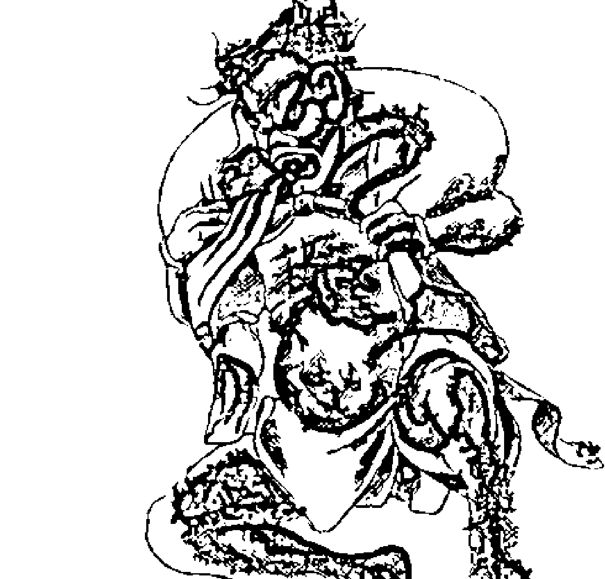

##### 武甕槌神
也就是近畿朝廷官编的《记纪》神话中的※建御雷之男神（Takemikazuchi-no-mikoto）。原本是常陆（今日本茨城县）的“大氏”248一族所祭祀的鹿岛大神，后来因为逐渐崛起的藤原氏、中臣氏成为春日大社的氏子249，因此硬是把他改写成藤原家系的祭神。可能是因为太过牵强，因此在《记纪》中，可以看见武甕槌神与建御雷之男神有时以各自独立的形态出现，有时似乎又是同一神的混乱情况。本来的武甕槌神是镇压地灵、守护氏子不受蕃神（指外国人信仰的神或是由国外传入的神）侵害，以及掌管航行安全等，也就是说他既是防塞神250又是海神。总之，在成为藤原氏及中臣氏的氏神之前，他一直都是个“叛逆神”。

此外，自从变成建御雷之男神后，他拥有的雷神、也就是战神的神格特质也益加明显。日本神话中的雷神通常都是蛇神，除了建御雷之男神，※国津神・武甕槌神都看得出蛇神的特质。为什么这么说呢？因为建御雷之男神同时也是剑神，而配剑的剑尖正是蛇鳞的形状。
（→天香香背男神 Amanokagaseo-no-mikoto)

##### 建御名方神
虽然他被视为大国主神（Ookuninushi-no-mikoto）的儿子之一，但其实是完全不同体系的神。根据《先代旧事本纪》，在让国251时，建御名方神跟派为先锋的※建御雷之男神（Takemikazuchi-no-mikoto）及天津主神不同，反对让国之事，他主动挑衅却败走到了诹访湖，并立誓从此不再离开后，才没有被赶尽杀绝。但是，在《日本书纪》中，却完全没有提及建御名方神之名，由此可知他是后来才被人插入让国神话里的神。

在此背景之中，既是信浓国造252（长野县的地方官吏及豪族），且担任诹访大社下社之大祝253的金刺氏则在暗地里活跃。金刺氏跟大氏出身相同，与负责编纂《古事记》的高官安万侣同族。或许是安万侣感受到族人的期待，因此将诹访地方的大神建御名方神当成重神之一插入了让国神话之中。不仅如此，还抬举他成为势力最大的※国津神（Kunitsu-kami）・大国主的次男。之后，建御名方神变成了祸祟神・御社具持神（Mishaguji-gami），可说是本末倒置了。

##### 玉梓
《南总里见八犬传》中出现的妖女。玉梓的怨念正是故事的开端。玉梓受到安房的平郡与长狭郡（今千叶县）的领主・神余光弘的宠爱。她一方面想取代沉溺在自己美色中的光弘，插手干预政事，同时又是奸臣・山下定包的情妇。光弘死后，由于山下定包弄权，政风败坏，因此受到里见义实等人的讨伐。对于被捕的玉梓，里见义实虽然说要“放过她”，但是因为金碗八郎孝吉的反对，最终还是被处以极刑。那时玉梓留下了“让你的子孙在三代之内坠入畜生道”的诅咒。

后来成为安房二郡领主的里见义实与邻国作战失败时，对着玉梓转世的爱犬・八房说：“要是有人能取下敌军将领的首级，就将女儿许配给他”。没想到八房真的衔来了敌军大将的首级。里见义实只好将女儿伏姬嫁给八房。想要阻止此事的金碗大辅孝德却不小心误射，使八房跟伏姬双亡。得到诵经供奉的八房顺利成佛，但是伏姬跟八房之间还未成形的8个小孩，却变成8颗珠子，从伏姬体内飞散四方。（→妙春 Myouchin）

#### 战神·塞神<sup>247</sup>
日本

##### 大国主神 (Ookuninushi-no-mikoto)

##### 恶神·祸祟神
日本

##### 怨灵
日本

#### 玉藻前

这是在印度称为“※华阳夫人”，在中国则称“※妲己”的金毛白面九尾狐。

根据御伽草子《玉藻前》，来到日本的这只妖狐，化身倾国倾城的绝世美女玉藻前，成功赢得鸟羽院（也有人说是近卫院）的宠爱。但是几乎在此同时，鸟羽院患了重病，日益消瘦衰弱。当时的治疗方式，首先便是加持祈祷，但是鸟羽院毫无起色。在委请安倍晴明的后代——阴阳头·安倍泰成占卜之后，才得知在下野国那须野处，栖息着一只已有800岁、二尾、长达七尺的大狐，就是它威胁到鸟羽院的性命。

为了降妖除魔举行了泰山府君祭后，玉藻前就因为忍受不了而逃走。这只妖狐虽然逃进了巢穴，但还是被三浦介及上总介给射杀了。

然而，由于它曾在三国间散布灾害，使得它的怨念变成了杀生石（长满青苔的大石）的模样，即使死后也不停作祟扰乱人间。不过，在偶然路过的源翁和尚慎重供养后，终于超度了玉藻前。254

（→五通神Wutung-shen）

#### 担生

可以掀起水患的大蛇之名。

有位书生捕到了一条小蛇，他基于好玩的心态留下饲养，小蛇越长越大，但是这个书生仍然担着这条蛇行动，因此得了“担生”这个名字。

随着岁月更迭，这条蛇越长越大，想担也担不动了。于是书生便将这条蛇带到河南的大沼泽里放生。

过了40年之后，这条蛇长得更加巨大，只要有人想经过沼地，大蛇便会现身把人给吃了。

后来，当年的那位书生来到此地，虽然他已经上了年纪，却不听当地人的劝告硬要行经沼泽，果然被大蛇袭击。书生觉得大蛇眼熟，脱口叫出“担生”之名，大蛇便垂下头离开了。

县衙的人听闻这件事后大为玄奇，于是就将老书生抓来，准备处死。老书生在牢中长吁短叹，结果当晚整个县突然沉陷，成了湖底。只有关着老书生的牢房安然无事。

（→共工Kungkung、洪水之兆The omen of flood）

#### 梼杌

凶暴恶兽。也叫做“※难训”（Nanhsun）或“※傲狠”（Aohen）。“难训”乃桀骜不驯难以教诲之意，传说中梼杌的性格正是如此。

人面虎身，全身长满细毛，嘴有猪牙后有长尾，常于荒野中任意作乱，但谁也制止不了他。天帝颛顼有许多不肖子，其中一人特别恶劣，无论如何教诲都不听从，任意行恶，于是天下人便将他称作梼杌255；也有另一种传说法，颛顼的儿子本身就是梼杌。

颛顼还有另一个不肖子，名为“穷鬼”，他虽然非什么恶神，但却是个怪人，明明身为天帝之子，却特意衣着破烂四处流浪，最终饿死在路旁。

这个穷鬼不太受中国民众欢迎，看来应颇类似日本也有的穷神。

（→饕餮Taotieh、穷神Binbou-gami〈日本〉）

妖狐
日本

254 朱注：漫画《魔力小马》中的大反派白面者就是缘起于此神话。

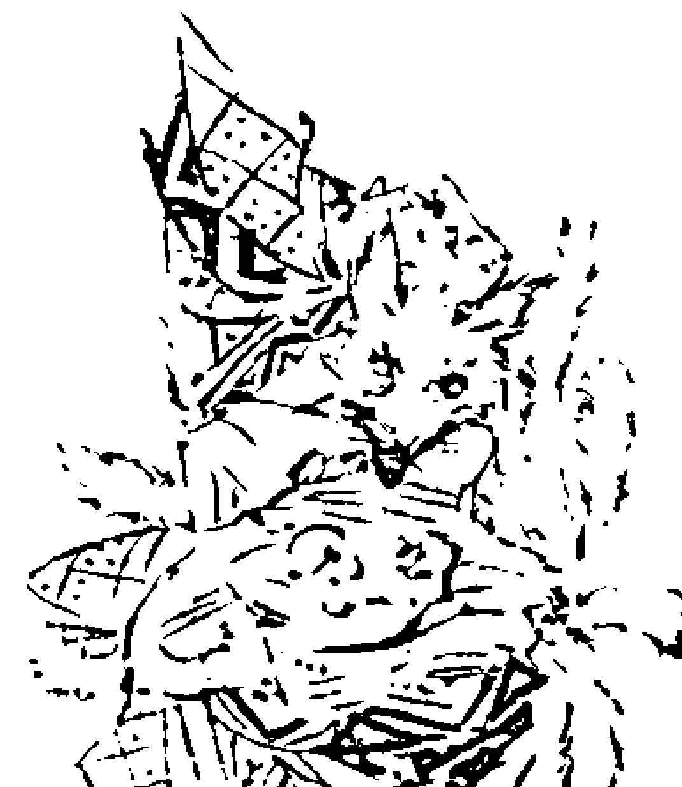

怪物
中国

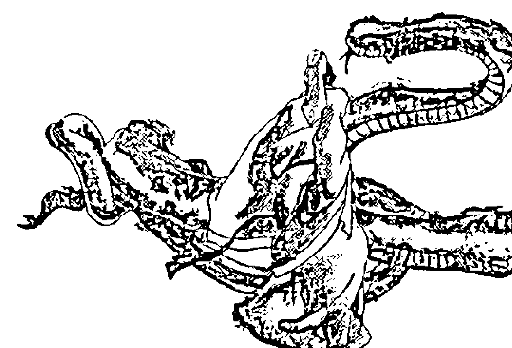

恶神·怪物
中国

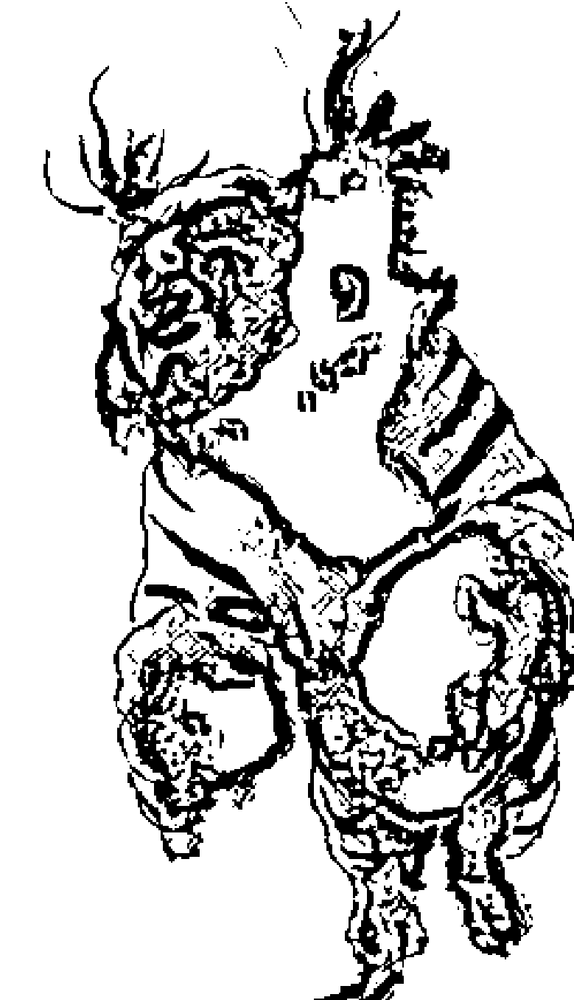

255 译注：出自《左传》，原文作“颛顼，有不才子，不可教训，不知话言，告之则顽，舍之则嚣，傲狠明德，失乱天常，天下之民，谓之梼杌。”

#### 饕餮
饕餮一般认为乃贪欲之化身、象征，为古代中国的恶神。饕餮为生于中国南方之多毛人，生具猪头。本性极为贪婪，与猪头相称，喜欢囤积钱财，但一毛不拔，抢食他人收获的谷物过活。而且夺来的也绝不分给别人。据说他害怕强者，不敢靠近成群的人，专挑独行之人抢劫。
因此他与穷奇（Chiung chi）、梼杌（Tao chueh）、浑敦等恶神一般，为天下人所畏惧。

人们对他的害怕，具体的可从饕餮纹之使用看出来。人们为了驱魔避恶，于鼎面铸上他的模样。但不知为何仅有头部没有身体，某文献如此说明：“之所以有头无身是因吃人时未吞下，结果害到自己身体了。256”

不过，根据另一个说法，饕餮纹其实乃根据蚩尤（Chihyu）所做，若此说法属实，那饕餮其实应为蚩尤别名。

#### 陀罗迦
*达伊提耶（Datiya，恶鬼）之女。也有人说她是恶魔孙陀（Sunda）之女，或是*夜叉须吉图（Suketu）之女。
她触怒了著名的投山仙人（Agastya）257因此被变为*罗刹女（Raksasi）。之后她便住在恒河（Ganges）流域的森林中，并横加劫掠邻近地区，使人民不得安宁。

住在附近的圣仙-众友仙人（Vishuamitra）258便命令罗摩旃陀罗（Ramacandra，印度神话的英雄——罗摩（Rama）的别名）去收服陀罗迦。虽然陀罗迦是恶鬼，但是罗摩并不愿意杀女人，只想将陀罗迦的能力废去，于是罗摩砍下了陀罗迦的双手手腕，罗摩的弟弟罗什曼那（Lakshmana）则将她的耳、鼻割了下来（此段的情节跟首哩薄那迦（Surpanakha）的神话雷同）。

但是陀罗迦却运起妖术，扬起碎石雨攻击他们，因此罗摩最后还是将陀罗迦给射杀了。

#### 太岁
太岁是星宿之名，也就是我们今天所说的木星。木星每12年会运行天空一周，因此在中国占星术中具有特别的意义。
太岁被视为地上之君（=皇帝）的表征，在天上，则是象征天帝的星宿。关于这一点，西洋占星术将这颗星宿称为朱彼得（Jupiter）（=希腊神话中的天神宙斯<Zeus>），东西方有着一同的巧合，非常耐人寻味。
不过，太岁既然是象征皇帝的星宿，便有可能遭到邪祟侵害。对中国的钦天监官员来说，必须特别注意当年太岁的方位。要是在太岁所处的方位上贸然进行破土、营建等工程，就会招致极大的灾祸。

在民间，太岁则是凶神的代表，也就是说太岁是最为人恐惧的神明。
比如在《西游记》之中，孙悟空（Sun-wukong）被敌对的妖怪评为“太岁”，也就是说太岁甚至可以用来比喻“引发重大灾厄的祸首”。
对于太岁，人们的态度应该是“敬而远之”吧。
（→混沌 Huentuen、八将神 Hasshou-jin）

#### 恶神
中国

256 译注：出自《吕氏春秋》（先识）：“周鼎铸饕餮，有首龙身，食人未咽，害及其身，以言报更也。”另外袁珂所著《中国神话传说》有不同的解释，有兴趣者可自行参考。

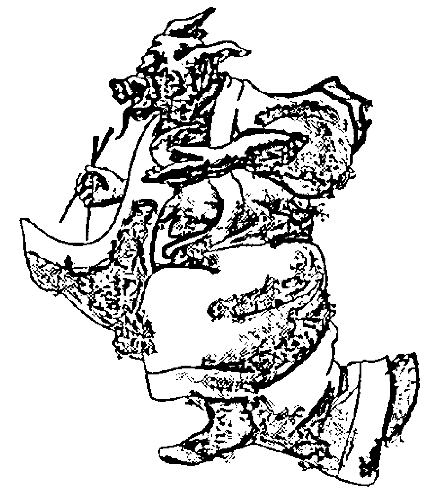

#### 达伊提耶 (Datiya, 恶鬼)
印度

257 译注：音译为“阿迦斯提耶”。
258 译注：众友仙人是古印度神话传说中著名的仙人，相传他出身刹帝利，经过严峻的苦行，跻身于婆罗门种姓之列，并成为七大仙人之一。

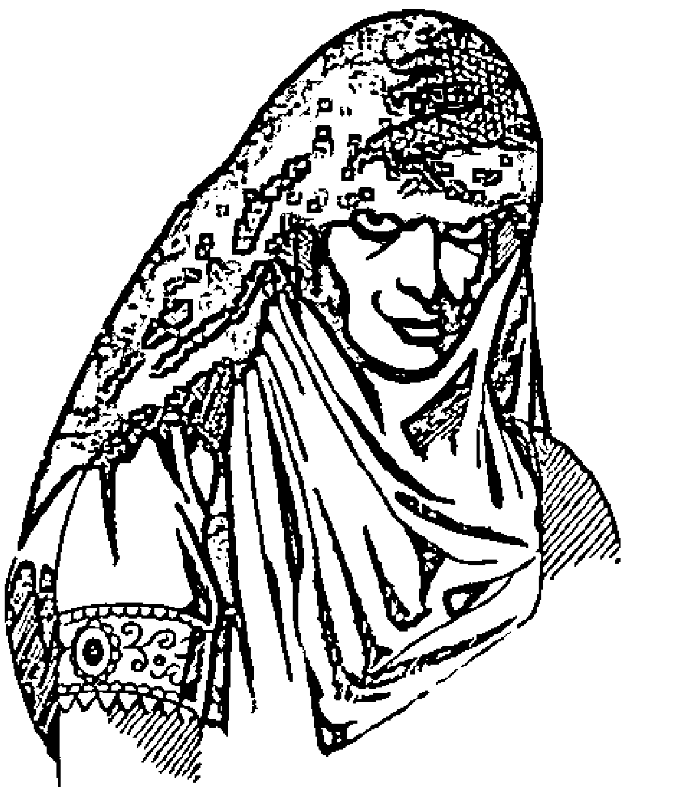

#### 凶神·祸祟神
中国

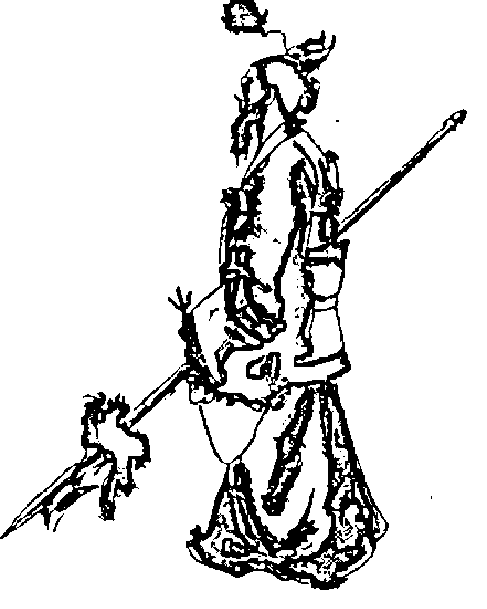

#### 塔威史卡拉
出现在休伦印地安人（Huron Indan）及莫霍克印地安人（Mohawk Indian）等，居住于美国五大湖附近的印地安传说中的恶灵。

伊欧史凯哈（Ioskeha）与塔威史卡拉是月亮的双胞胎孙子。但这两人总是互不相让。当塔威史卡拉只有摘下野蔷薇时，伊欧史凯哈则是用公鹿角武装自己，并得到了胜利。而塔威史卡拉只不过偷了打火石便遭到驱赶。

塔威史卡拉对此愤愤不平，因此更是借着犯下种种恶行表示反抗。

例如偷走太阳、制造人面兽、要青蛙将人类不可或缺的干净之水给吸干等等，跟身为创造者的双胞胎兄弟不同，塔威史卡拉制造严重的破坏以示报复。

他从湖中的岛架起一座石桥，让吃人兽借此渡水而至。这头吃人兽会带来食粮缺乏的寒冬。狗儿与画眉鸟合力骗过了塔威史卡拉，暗地里把桥给弄不见了，这样一来，冬之兽就不能上岸，也没办法吃人了。

据说塔威史卡拉也是伟大的魔术师，会在半夜举行神事，使得自己百病不侵。
(→魔灵 Brushman)

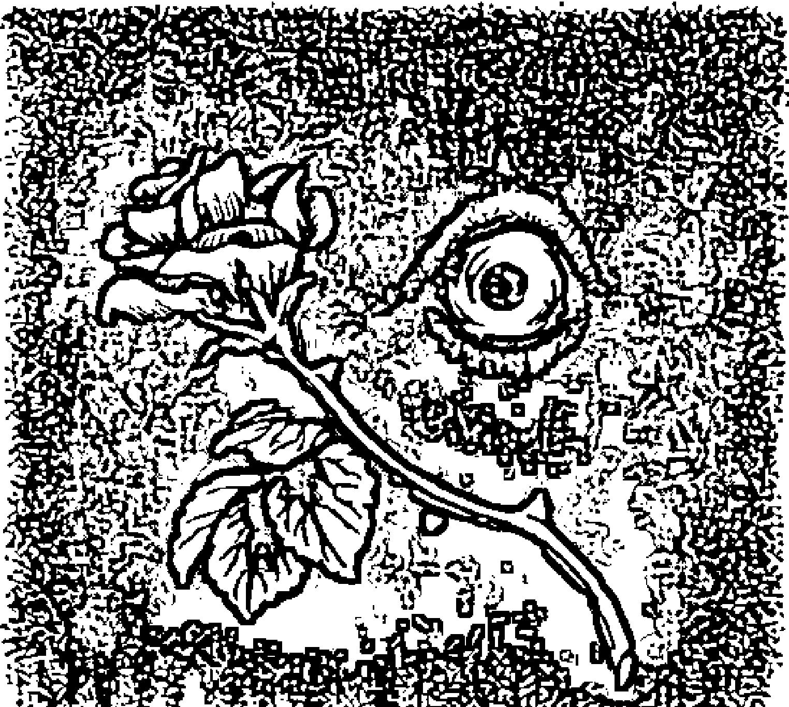

#### 手长脚长
相关故事广泛流传于日本东北地方全境。手长的妖怪叫手长，脚长的妖怪叫脚长，它们通常是两只一起行动。

根据流传在山形县庄内地方的传说，手长脚长住在山形与秋田县境上的鸟海山。它们会瞄准日本海上航行的船只，由山顶丢下岩石进行攻击。人民为此烦恼不已的时候，手长脚长被武士模样的大物忌神给击垮了。相传他们作战时，鸟海山爆发，落入海中的山顶据说就是现在的飞岛。

福岛县的传说则是盘梯山上住着叫做手长脚长的妖怪。它们生性暴虐，时常骚扰乡里，经过一位恰巧来到此地的法师祈祷之后，手长脚长的手脚渐渐变短，个性也变得温驯。后来才知道那位法师正是弘法大师空海。也就是说这故事是空海行脚传说之一。

在山形县流传的传说是典型的天津神（由高天原降临人间的众神之总称）收服地方豪族的平定神话。由大物忌神讨伐完手长脚长后，便入祀鸟海山的大物忌神社来看，其实这等于是由叛逆神手中夺回支配权。

(→土蜘蛛 Tsuchigumo)

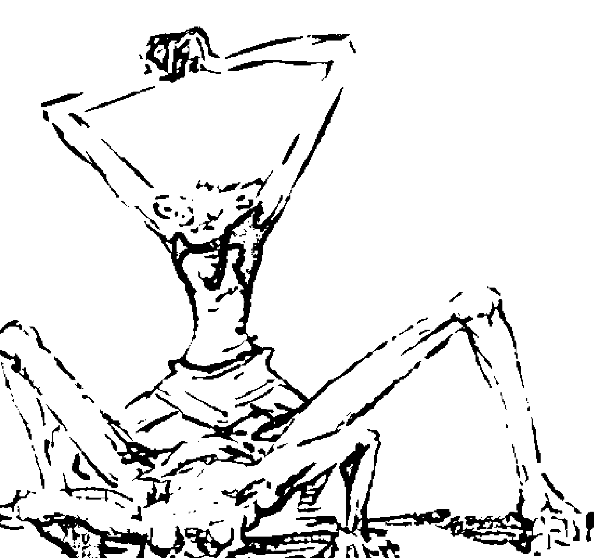

#### 泰兹卡特利波卡
泰兹卡特利波卡是阿兹特克人崇拜的神灵中最强的神。

他既是恶作剧神（Trickster），也会赐福给人类，另一方面，他也会造成混乱与混沌。阿兹特克人极为敬畏地称他为“魔王”、“统领我们的男神”。

他是由创造之神欧曼帝欧多鲁（Ometeotl）所生，是世界初创时照亮整个世界的太阳。另有一种说法是身为太阳的，乃是频繁出现在神话中的泰兹卡特利波卡之兄，但是详情如何并不清楚。

这个名字的意思是“烟雾镜”。与大地怪物争斗时，泰兹卡特利波卡的左脚被吃，于是他便用黑曜石来代替失去的左脚，这就是他名字的由来。在描绘他的姿态时，一般都习惯以黑曜石来点缀左脚及后脑勺。“朦胧”意指黑曜石的光芒，也暗示出他千变万化的特质。

泰兹卡特利波卡经常和羽蛇神魁札尔科亚特尔（Quetzalcoatl）作对，但对世界的形成是不可或缺的。如果没有了混沌，世界就会一片沉寂，失去所有活力。

（→依兹拉科里乌基 Itzlacoliuhque、特拉索泰奥特尔 Tlazolteotl)

(→恶作剧神・混沌神 阿兹特克)

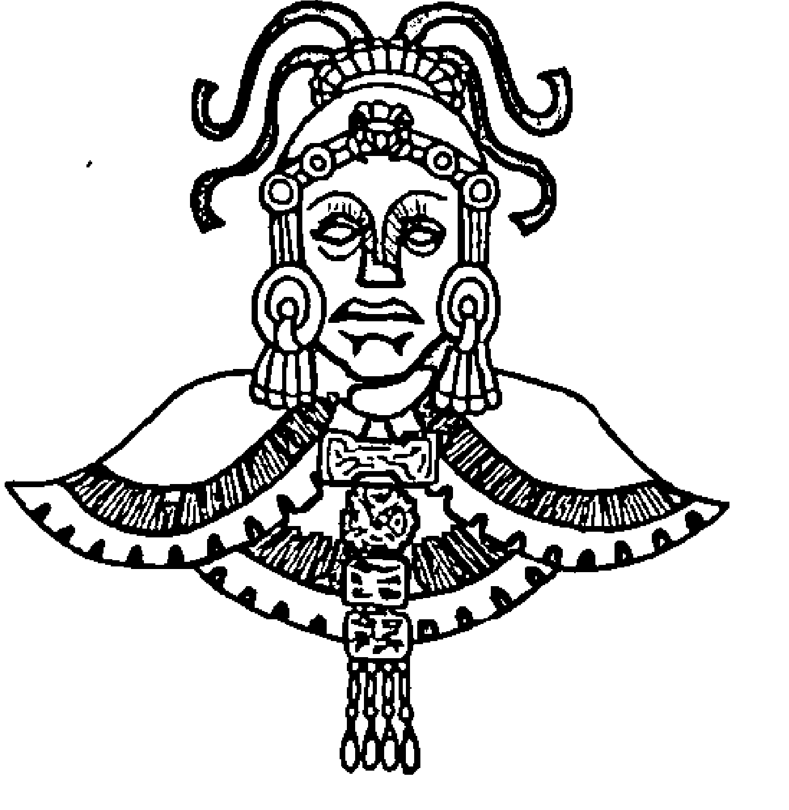

##### 塔模斯
于米尔顿所作叙事诗《失乐园》(1667年)中登场的造反天使(恶魔)。又称“塔姆斯(Thammuz)”。据米尔顿描述，他是腓尼基(Phoenicia)男神的前身。腓尼基的青年神塔模斯受到女神伊西塔(Ishtar)的爱慕，但在狩猎时却丧命于猪牙之下。等于是希腊神话中的阿多尼斯(Adonis)。叙利亚(Syria)人在夏至之后会举行追悼塔模斯的祭典，而这个祭典在《旧约圣经》〈以西结书(Ezekiel)〉中遭到严重的批判，所以米尔顿才会把异教神塔模斯的名字放入造反天使的名单之中吧。

塔模斯与女神伊西塔的爱情故事常被用来鼓动少女的春情，并在唯一神的神殿附近进行淫乱的行为。在《失乐园》第1卷中，列出了跟随大逆天使撒旦(Satan)而由天国堕落的造反天使名单，其中虽然提及塔模斯之名，但是如同这一卷中提到的多位造反天使一班，描写撒旦大乱天国的第6卷中，并未看见塔模斯的身影。塔模斯应该是米尔顿为了符合叙事诗一一唱名的传统而准备的造反天使吧。(→撒旦 Satan 《失乐园》)

##### 森林神
他是西伯利亚的森林精灵。也被叫做森林神，或是森林恶魔。长有七颗头。某男子养了两头狗，分别叫做“熊”与“狼”。有天他对他妹妹说:“在我回来之前，你不能洗头发，也不能扫地。”而妹妹回答说:“那，你把狗留下来吧，因为客人快到了。”男子将狗留下来自行离开后，妹妹却忘了约定，开始扫起地，梳起头发来了，她将狗的耳朵塞起来，结果这时七颗头的森林神出现，抱住了妹妹。之后森林神跟随男子。男子逃到落叶松的树上，于是森林神开始砍这棵树。这时兔子来到树下，对森林神说:“我来帮你砍，你休息吧。”但是森林神睡着之后树木比未砍之前更粗壮了。之后母狐狸与河獭也对森林神说一样的话，树木却因此越来越粗。并且麻雀与乌鸦还去叫男子的狗来帮忙。麻雀的叫声太小声，狗的耳朵被塞住所以没听到，等到乌鸦来的时候狗才发现，连忙咬断锁链，赶到主人身边。森林神被狗咬住的时候，男子用斧头将他的头击碎了。

##### 穷神 〈西伯利亚〉
穷神并非只存在于日本的传说里而已，西伯利亚的民间故事里也有穷神。只是西伯利亚的穷神跟日本的穷神不太相同。(→穷神Binbou-gami〈日本〉)某个穷农夫有个美丽的女儿，地主迷上了他的女儿，于是向农夫要求让他跟他女儿结婚。但是不管是农夫还是女儿都不喜欢这个地主，所以拒绝了。结果地主生气，不断骚扰这户农家，农夫迫不得已只好搬家到外地。结果在要搬家的时候，突然，一个美丽的女性出现在壁炉旁啜泣着。

农夫骂说:“你这恶魔，你出现有什么企图?”那女性说:“我是穷神，你要搬家的话也请你带我走。”农夫听了心生一计，叫她把手伸进树干的缝隙中，结果她的手卡在树干上，农夫喊着“我再也不会回到这鬼地方了!”逃掉了。农夫一家人因为摆脱了穷神，结果在新的村中里变成最有钱的人。而那个地主后来看到了这个手卡在树上的美人，又再度坠入爱河与她结婚了，最后听说是全部的财产都被穷神给搬光了。

-   - 247 译注：塞神的读音为“sa-e-no-ka-mi”，是为了防止恶灵入侵，而在村庄边境、坡顶、公路等处设置神社加以祭祀的神。也是旅途安全的守护神。除此之外，还被视为生殖之神、结缘之神等等。属于道祖神的一种。也可念为“sa-i-no-ka-mi”。
-   - 248 译注：此处的“氏”指的是“姓氏”，因此“大氏”就是指姓“大”的人。
-   - 249 译注：氏神指的是一族的祖神，氏子便是祖神的子孙。
-   - 250 译注：日文的“防塞”指的是预防敌人的意思，也有守护之意。
-   - 251 译注：在记纪神话中，由于天照大神的神谕，大国主神将国家让位给皇孙。
-   - 252 译注：日文发音为“kuni-no-miyakko”，字面意义是“国之御权”。是日本古代世袭的地方官。通常领有一郡，在大化革新之后多成为郡司。
-   - 253 译注：大祝 (ou-hofuri)：把人当作神来祭拜。

### 造反天使
失乐园

### 森林的精灵
西伯利亚

> (→撒旦 Satan〈西伯利亚〉)

### 穷神
西伯利亚

财产都失去，变得一文不名。

### 枞树中的恶魔

这是16世纪时著名炼金术士兼医师的帕拉塞尔苏斯259（Paracelsus）年轻时的故事。

他在森林里散步的时候，忽然听到有人喊他的名字。原来是一个恶魔被关在枞树里，希望他能放他出来。

于是他说只要恶魔给他能治百病的药与可以将任何东西变成黄金的溶液，就放他出来。他将上面刻有十字架的木栓拔起，一只小蜘蛛从里面爬了出来后，变成了一个长脸的恶魔。

恶魔说要向关他的人复仇，于是帕拉塞尔苏斯对他说：“他既然能将你变成小蜘蛛，可见他的实力很强，恐怕你是赢不了的吧！” 恶魔回答：“变蜘蛛有什么了不起，这种程度我也会！” 于是自己变成了蜘蛛，爬进洞里给帕拉塞尔苏斯看。

帕拉塞尔苏斯见状立刻将栓子重新栓上，并且在栓子上再度划上十字架，让恶魔没办法出来。于是他就这样从恶魔手中骗到了万能药与能作出黄金的液体了。

恶魔再也不可能从里面出来了。因为为了防止雪崩，这片森林的树是禁止砍伐的。

### 西南风的恶魔

巴比伦人相信风是恶魔吹出来的。对于位在沙漠地带的巴比伦而言，风是会带来沙风暴与热气的恐怖之物。

在这些风的恶魔里，最恐怖的即为西南风的恶魔了。

此恶魔有若没有眼睑骨碌碌的眼睛、宽广扁平的鼻子、令人畏惧的血盆大口、尖锐突出的獠牙、高突颧骨、粗浓眉毛、弯曲且低的额头。从这样的外表描述来看，或许是对中亚游牧民族的一种讽刺也有可能。

这个恶魔一旦吹起风来，便会带来严重的大风暴，夹带着洪水，无数的人都会因此而牺牲。

除了他之外，风的恶魔当中还有南风的恶魔“舒兹”(Shutu)。此外，虽然不算风的恶魔，不过“兹”(Zu)也因为在夏天时会在阿拉伯沙漠卷起沙风暴而闻名。

（一禹强 Yuchiang、大风 Tafeng）

### 黄衣之王

克苏鲁神话邪神哈斯特（Haster）的化身之一。乍看下外形为一身披褴褛黄布，脸带青白面具之人。然而身高为常人之两倍；面具下并无脸孔只有伪足。身上的碎布其实也是伪足。这些伪足能随意伸缩缠卷猎物，以吸取其精神力。在以鲜艳黄色书皮装订的古剧本《黄衣之王》中，有关于这位奇特邪神的详尽记载。阅读该剧本者往往会因书中的极致残酷美学而崩溃，或是因此得到几近疯狂的艺术灵感。《黄衣之王》内盖有“黄印”。此印本身藏有力，只消有人望见此印一眼，潜意识便受影响而做恶梦。借着如此，让牺牲者精神衰落，最后将其逼至发疯。

### 恶魔
奥地利

259 译注：生卒年 1493-1541 年。瑞士的医学家兼化学家。为今日化学疗法的鼻祖。

### 风之恶魔
巴比伦

#### 邪神
克苏鲁神话

### 《傻子伊凡》的老魔

《傻子伊凡》为俄国作家托尔斯泰(1828~1910)所作童话。在此故事中出场的老魔厌恶人们感情融洽，为了让三名兄弟彼此不和派出了三只小恶魔。小恶魔们使用了各式各样的法力让大哥二哥的生活陷入困境，但却对老幺傻子伊凡束手无策。当小恶魔们被伊凡消灭后，老魔便亲自动手开始破坏三兄弟的生活。老魔不愧为老魔，他与小恶魔们不同，未动用法力，光凭三寸不烂之舌，便让身为军人的大哥鲁莽发动战争，又变身为商人二哥的竞争对手让对方破了产。身为厉害恶魔的他似乎无需倚仗法术。

因他能变身为人类的模样，所以他是用气派将军与商人的模样前往大哥二哥家。然而当他前去拜访伊凡时，却未作好事先准备。因为伊凡傻就傻在他决定只有工作到手上长茧的人才能吃饭。而老魔变成的商人因为手上留着修长指甲，所以落得无饭可吃。
（→俄罗斯的恶魔 Demon 〈Russia〉）

### 暴风之兆

各式各样的天灾中，应属暴风与洪水最能让人切身感受自然力的强大。特别是在中国，因南方海上形成的台风时常造成重大损害，故对暴风倍感畏惧。(→大风 Tafeng)
相传蚩尤 (Chihyu) 兴兵造反挑战皇帝时，风神“风伯”曾加入蚩尤阵营令黄帝陷入苦战。而这则故事应可说是古中国人恐惧暴风的象征。
此处介绍的能引发暴风之恶神，便是由此种恐惧心具体化而成。
“※山猲” (Shanhuei) 乃人面犬身之怪物，疾走如风。见人则笑，善投物。相传此兽现则天下大风。(见图)
“※闻猲” (Wenlin) 其形似猪，身有黄毛，白头白尾。闻猲一现天下则起大风，为害甚烈。

### 干旱之兆

对以农业为产业根本的文化圈而言，干旱与洪水同为可怕的自然灾害。
众所周知，中国的魃 (Pa) 乃带来干旱的神明。只要知道旱魃260一词是由此神之名而来，应当便可想象出古人对她有多感害怕。
下面介绍的怪物虽未如魃一般为人深惧，却也因身为旱象征兆而遭人嫌忌。
南方火山一带有名“※颙” (Yung) 之鸟，人面四目。
名“※螐鼠” (Tzushu) 之鸟其形似鸡，体覆鼠毛 (见图)。
东方之河中有“※倏舋” (Tiaoyung) 体形似蛇，有鱼鳍，出入有光。
“※薄鱼” (Paoyu) 如鲤而一目也居于东方之河。
“※狪狪” (Pipi) 此怪物则为有翼之狐。
相传上述怪物所现之处定有大旱。

### 征兆 中国

### 征兆 中国

### 征兆 中国

> 260 译注: “旱魃”一字于日文中乃指旱灾，并非如中文一样是指旱神。

### 洪水之兆

在中国，有相当多的恶神可引起洪水。
洪水，对依大河畔发展的文明而言是宿命。因此，对洪水产生的恐惧自然而然地转变成对引起洪水的诸多恶神的想象。

重要的水神会再另列条目，于别章介绍。在此，特将洪水发生的前兆，民众恐怖厌恶的各项征兆一一介绍。

“※铃铃”(Lingling) 261，其状似牛，全身披有虎纹。

“※合窳”(Keyu) 262，人面猪身的怪物，夤身赤尾，声如幼子，食人。此兆一现，天下必起洪水。

“※长右”(Changyu) 263，形似长臂猿，有四耳，其声似人呻吟。（参照图片）

“※夫诸”(Fuchu) 264，形似白鹿有四角。

这些征兆一现，该地或是地方上都会作大水。

（→共工 Kungkung、蛟 Chiao、江君大神 Chiangshen-tachun、水母娘娘 Shueimu-niangniang、钱塘龙王 Chientang-lungwong、洞庭神君 Tungting-shenchun、妒妇津神 Tufuchin-shen、无支祁 Wuchihchi）

### 人祸之兆

中国自古便确立了皇帝独裁制，是支配者权力极端扩张的国家。

皇帝大兴土木，驱使人民服其劳役。其中，有的劳役真有所需，有的却仅止于夸耀皇威、毫无用途。然而，不管哪一项赋役，对人民来说都是一项灾难。

“※猾褢”265 (Huahuai) 形似人，背有猪鬣。只要一出现在县内，人民就要服繇役，紧接着就会发生叛乱。

“※狸力”266 (Lili) 状似豚，有距267，声似狗鸣。
地方见其姿，则当地多兴土木。

此外，当权者身边恶人横行，对人民则为大害。这些恶人为了满足自己的欲望，驱使当权者榨取人民血汗。

“※莜莜”268 (Yuyu) 形似马而羊目，牛尾而四角。此兽一出，则多狡客（狡诈之人），地方大乱。（见图）

（→兵乱之兆 The omen of war）

### 恐慌之兆

我们现在或许难以想象，但古代社会中都市或村落的居民常为鸡毛蒜皮之事陷入恐慌。

古代社会治安不如现代，情报来源也不足，只消少许谣言伪报便会令一城镇发生慌乱。

有鸟名“※酸与”(Suanyu)。虽为鸟然其形如蛇，四翼六目三足。酸与之名源自此鸟的不祥啼声，此鸟所现之都城必然大为恐慌。

“※朱獳”(Chuju) 其形似狐而有鱼鳍。因以吼叫时呼喊自己名字，故名称乃由其声而来。此兽现处该地定陷于惶恐。（见图）

名“※雍和”(Yunghe) 之兽乃特异生物，形似猿而黄身赤目，最奇之处为口有赤喙。此物一现该州该国定生大恐慌。

（→疫病之兆The omen of plague、暴风之兆The omen of big wind、干旱之兆The omen of drought、洪水之兆The omen of flood、人祸之兆The omen of man-made calamity、兵乱之兆The omen of war）

### 征兆 中国

261 译注：出自《山海经》《东次二经》：“空桑之山，……有兽焉，其状似牛而虎纹，其音如钦吟，其名铃铃，其鸣自叫，见则天下大水。”

262 译注：出自《山海经》《东次四经》：“剡山有兽焉，其状如貙而人面，黄身而赤尾，其名曰合窳，其音如婴儿。是兽也，食人，亦食虫蛇，见则天下大水。”

263 译注：出自《山海经》《南次二经》：“长右之山，无草木，为水。有兽焉，状似禺而四耳，其名长右，其音如吟，见则郡县大水。”

264 译注：出自《山海经》《中次二经》：“敖岸之山……有兽焉，其状如白鹿而四角，名曰夫诸，见则其邑大水。”

### 征兆 中国

265 译注：《山海经》《南次二经》：“又东三百四十里曰光之山，其阳多玉，其阴多金。有兽焉，其状如人而彘鬣，穴居而冬蛰，其名曰猳訟，其音如斫木，见则县有大繇。”

266 译注：《山海经》《南次二经》：“柜山有兽焉……，其状如豚，有距，其音如狗吠，其名曰狸力，见则其县多土功。”

267 译注：类鸡爪后方，位置稍高突起之一爪。

268 译注：《山海经》《东山经》：“又南五百里，曰硬山，南临硬水，东望湖泽，有兽焉，其状如马，而羊目、四角、牛尾，其音如狗，其名曰攸攸。见则其国多狡客。”

### 征兆 中国

### 疫病之兆

即使是在医学发达的今日，传染病依旧十分令人畏惧。对仅拥有未成熟医术与药学的古代人而言则更是如此。无论是哪个文化圈，瘟神一类的神灵皆深受畏惧。
下面介绍的，便是被视作疫病流行前兆，深受人们畏惧的诸多怪物。
东方泰山有“※蜚”(Fei)，其状如牛，白首蛇尾而一目。行水则竭；行草则死（见图）。
首阳山外围可见“※跂踵”(Chichung)，乃似枭之鸟，猪尾独脚。
又，东方有鸟名“※絮结”(Chiehkou)，似鸭而鼠尾。
又 有名“※猳”(Li)，状如赤色针鼹，居于荆山不易得见。
据说若见上述怪物，该地将有疫病盛行。
(→禹强 Yuchiang、疮疮神 Housou-gami)

### 兵乱之兆

人祸有时远比天灾更为惨重，而人祸之最可以说就是战争了。农民被征调去当士兵，结果田地因而荒芜，而在兵荒马乱中家破人亡的悲剧又不断上演。因此兵乱可以说是人民最痛恨的灾害了。而会招来这兵乱的怪物自然更是为人所忌恨。
据说有一怪物名叫“※朱厌”(Chuyen)，其模样似猴，白手朱足。只要此兽一出现，就会给当地带来战争。
据说有一兽名唤“※狌狼”(Shihlang)，其外表像狐狸，长有长耳白尾，一旦这只怪物出现就表示大战就要发生了。
有种鸟叫做“※凫俿”(Fushi)，外形像鸡但脸似人，会发骇人鸣声，这只怪鸟一旦出现，就表示即将天下大乱。
四川北部有座岷山，在岷山的某座山峰里，有个叫做熊穴的洞穴，据说里面住了“※神人”(Shenjen)，这个洞穴夏天会开放，到了冬天则紧闭，但是如果那年的冬天也开放的话，该年必会有战祸。
(→人祸之兆 The omen of man-made calamity、大鹗 Tae)

### 红龙

龙此种怪物，不可思议地在世界各地的神话传说中均有出现。然而其个性各国不同。中国龙多半善良者居多；地中海沿岸之龙大多邪恶。
其中最具有决定性的恶龙，乃是《新约圣经》〈启示录〉中登场的“红龙”。
“此龙于末日时自天上出现，迷惑普天下。七头十角；七头上戴着七个冠冕。它的尾巴拖拉着天上星辰的三分之一摔在地上。不久后天上发生争战，龙及其使者，同天使长米迦勒(Michael)及其使者发生战斗。但龙为天使所败，摔落地上，在地上引起灾祸，从口中吐出河。由于他的体积庞然硕大，口能吐河并不为奇。此龙乃恶魔之首※路西法(Lucifer)，也即撒旦。269” (→撒旦Satan《新约圣经》)
此后，西欧基督宗教圈中的龙，特别是红龙，都固定为邪恶角色。世界第一款角色扮演游戏“龙与地下城”(Dungeon & Dragon)中出现了许多颜色的龙，红龙自然而然地担任了混乱邪恶阵营的龙族最强者。

### 征兆 中国

### 征兆 中国

### 恶魔王 基督宗教

269 译注：可参照《新约圣经》（启示录）第12章。

### 持鞭的精灵

这是爱斯基摩人中伊果里克族传说中的可怕精灵。据说他手持海豹以之为鞭来鞭杀人类。不过现在他因为已经失去鞭子，所以已经不会有人死在他的鞭下。
有一次大人们去庆典中跳舞了，家里只剩下小孩子。小小孩子不小心将油灯点燃，结果油灯冒起了烟，而持鞭精灵也随着烟出现在小孩子面前。小孩们立刻逃到家中各处躲藏起来，但是除了躲在干燥台上的小孩以外全部都被他杀了。
大人们回来看到这副景象非常悲伤，发誓一定要报仇。于是第二天大家装作一副什么事都没发生过一般照常举行庆典，但是一部分大人躲藏在小孩们游玩的秘密场所中，其中一名男子拿着油灯与滚烫的油脂躲在干燥台上等待。结果，这天持鞭精灵果然又出现了。持鞭精灵一出来，众人立刻就将滚烫的油倒在他身上，而躲在其他地方的大人们冲了出来，将他的海豹杀掉了。精灵吓得连忙逃出去，大人们虽然也立刻追了出去，但是还是让他给逃掉了。只是精灵失去鞭子之后，人们举办庆典跳舞时再也不会出现了。

### 《傻子伊凡》的三匹小恶魔

《傻子伊凡》中，三匹小恶魔奉老魔之命前去破坏三兄弟的生活。因他们的法力相当高强，轻而易举地就让军人长兄变得鲁莽冲动，商人二哥变得贪心爱财。接着再让长兄的火药全部被水泡湿，替敌军以干草变出千军万马；又把二哥的贵重商品在一夜间化为马粪。
然而因为老幺农夫伊凡毫无欲望，所以找不到机会下手。收拾掉两位兄长的两名小恶魔也前来帮助自己同伴。一匹小恶魔钻入土中，压住伊凡耕田的锄头让它无法动弹，可是小恶魔最后还是被伊凡拉了出来。于是恶魔给了伊凡三条治腹痛的树根好让伊凡放过他。然后伊凡对他说“你走吧，愿上帝与你同在”。
这句话对恶魔乃是致命的。恶魔马上消失土中，只留下一个小洞。剩下的两匹恶魔不久后也遭到同样下场。
(→《傻子伊凡》的老魔、俄罗斯的恶魔Demon〈Russia〉)

### 蒂雅玛特

蒂雅玛特是生下世上第一个男人阿普苏(Apsu)，以及所有事物（包括诸神）的造物之母。蒂雅亚玛特的意思是“苦水”，阿普苏的意思是“甘露”。
但是蒂雅玛特也生下了“混沌”，它的存在甚至威胁到诸神天界的存亡。因此风神马杜克(Marduk)就挺身向蒂雅玛特挑战。
马杜克带着弓箭、石棍、闪电、网子和风，与蒂雅玛特对峙。蒂雅玛特张嘴想要把马杜克吃掉的时候，马杜克送出“恶风”，让蒂雅玛特的嘴合不起来。蒂雅玛特的肚子被风灌得膨胀了起来，嘴也被迫张得大大的。马杜克拉弓一射，弓箭射破了蒂雅玛特的肚子，穿透内脏，刺破心脏，蒂雅玛特就这么死了。
马杜克踩碎蒂雅玛特的头，用石棒敲破她的头骨，甚至还将她的身躯撕成两半。撕开后的半个身体往上一丢就成了天空。天空就是蒂雅玛特的半个身体。
(→莫特)

### 邪恶精灵
爱斯基摩

(→依皮屋普·因纽雅 Ipiup Inua、温敌哥 Windigo、努莉雅尤克 Nuliajuk)

### 恶魔
俄罗斯

### 众神之母
美索不达米亚

### 铁扇公主

出现在《西游记》（成书于公元1570年左右）中的妖怪。在日本则是以“罗刹女”之名为人所知。
铁扇公主是翠云山芭蕉洞的女主人。但是她最活跃的舞台怎么看都还是火焰山吧270。这是一处广达八百里见方，昼夜冒着熊熊火焰的地方，只有铁扇公主的芭蕉扇才能把火给捣熄。
火焰山是往西方的必经之路，因此三藏一行人非得突破这个关口才行。然而铁扇公主却一口回绝了登门求借芭蕉扇的孙悟空（Sun-wukong）。

其实铁扇公主是悟空的结拜义兄牛魔王（Niu-mowong）的妻子。那她为什么会将悟空视为眼中钉呢？原来是因为她的儿子红孩儿（Hung-haierh）曾跟悟空争斗，最后却败在悟空手下。
这次的冲突由于牛魔王的涉入而更加激烈，最后演变成一场连天兵天将都被卷入的大战。结果因为牛魔王被擒，铁扇公主也只好投降，捣熄火焰山的烈焰。
之后，铁扇公主皈依了佛法，从此她的名号就永留于经文之中。

### 泰坦神族

泰坦神族指的是希腊神话中乌拉诺斯（Uranos）跟盖亚（Gaia、Ge）的所生的小孩，以及第三代的部分子孙。他们是宙斯（Zeus）成为众神之王前，支配整个世界的古老神灵。
主神为克洛诺斯（Kronos、Cronos），另有俄刻阿诺斯（Okeanos、Oceanus）、伊阿佩托斯(Iapetos、Iapetus)、许佩里翁（Hyperion）等男神，以及瑞亚（Rhe（i）a）、忒修斯(Tethys)、忒弥斯（Themis）等女神。
此外，在上述男神女神的后代中，普罗米修斯（Prometheus）和厄庇米修斯（Epimetheus）、阿特拉斯（Atlas）等神灵也都算是泰坦神族。

相反的，即使同样是乌拉诺斯与盖亚的小孩，像库克洛佩斯（Kyklops、Cyclopes、Cyclops）271或赫克顿盖尔（Hekatoncheir、Hecatoncheir）272般的巨人，却不属于泰坦神族。当然，以宙斯为首的新世代诸神，也都不是泰坦神。泰坦神族在与宙斯等新神的战斗中败北，被丢入了塔耳塔罗斯（Tartaros、Tartarus）的黑暗中。不过，其中如普罗米修斯等站在宙斯这一方的神，或是像俄刻阿诺斯这样保持中立的神，则未被囚禁。

### 特拉威斯卡尔潘泰库特利

他是古代墨西哥人畏惧的破坏神。名字之意为“清晨之主”，代表清晨时的明星——金星。他既会给人类带来灾害，也是名破坏神。经常被形容成以燃烧旺盛的火光为武器的男性。
当时的人们认为金星发出的光芒有害，因此非常害怕金星出现。且人们也相信疾病与饥荒、战败等不幸皆是他所带来。

他原本是个有能之神，有则神话描写了他挑战太阳神，结果最后败北的故事。在过去，太阳神托纳提乌（Tonatiuh）诞生时，太阳神宣称如果不献上活人祭拜他的话，他便不放光芒，特拉威斯卡尔潘泰库特利听到这话很生气，于是就拿起他自夸的武器—光之枪（带来灾厄的光芒）丢向他，结果没想到到托纳提乌没事，反而特拉威斯卡尔潘泰库特利被他反击的光箭射穿头部，结果变成了石头与冰冷之神依兹拉科里乌基（Itzlacoliuhque）。这也便是为何清晨气温较低的缘故。

（→泰兹卡特利波卡 Tezcatlipoca）

### 妖怪 中国

270 原注：位于吐鲁番（新疆维吾尔自治区）东部之山。

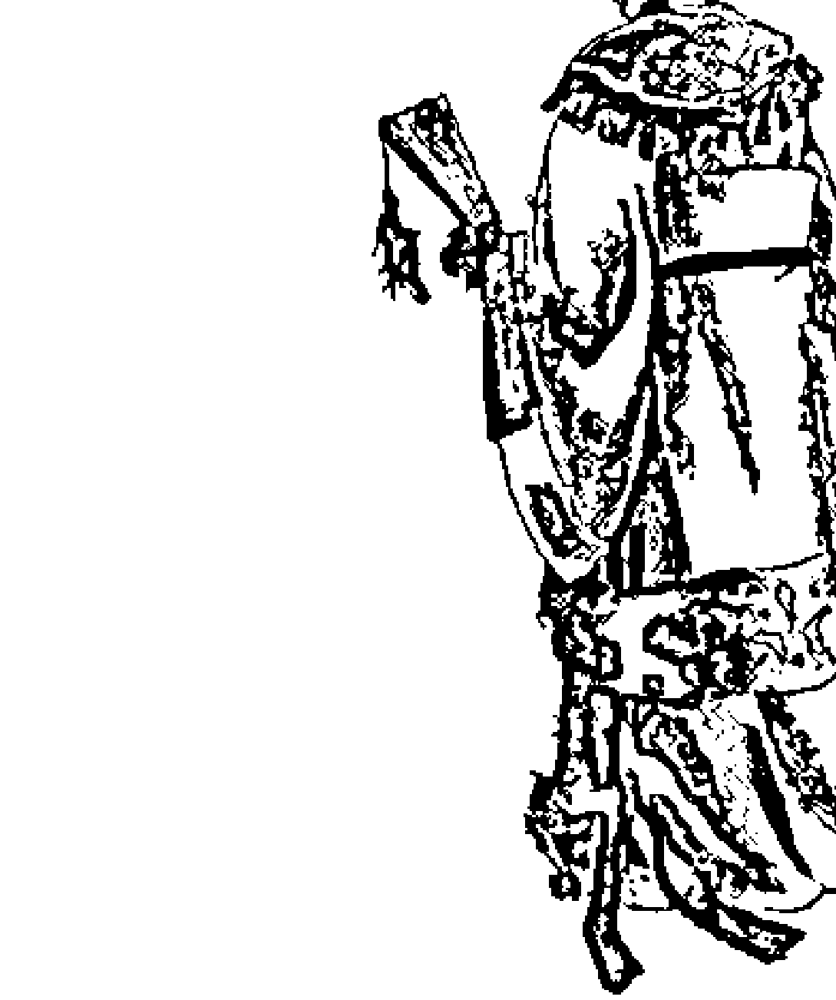

### 上古神灵 希腊

立的神，在宙斯成为世界之王后，仍然可以与诸神平起平坐。

泰坦神族虽然不是恶魔，不过也算是诸神的敌对者，因此把他们收录于本书中。 (→爱奥尼诸神 Titan)

> 271 译注：Cyclops：额头上长着一只眼睛的独眼巨人，又称车轮眼巨人。
> 272 译注：Hecatoncheir：有着五十个头，一百只手的巨人。

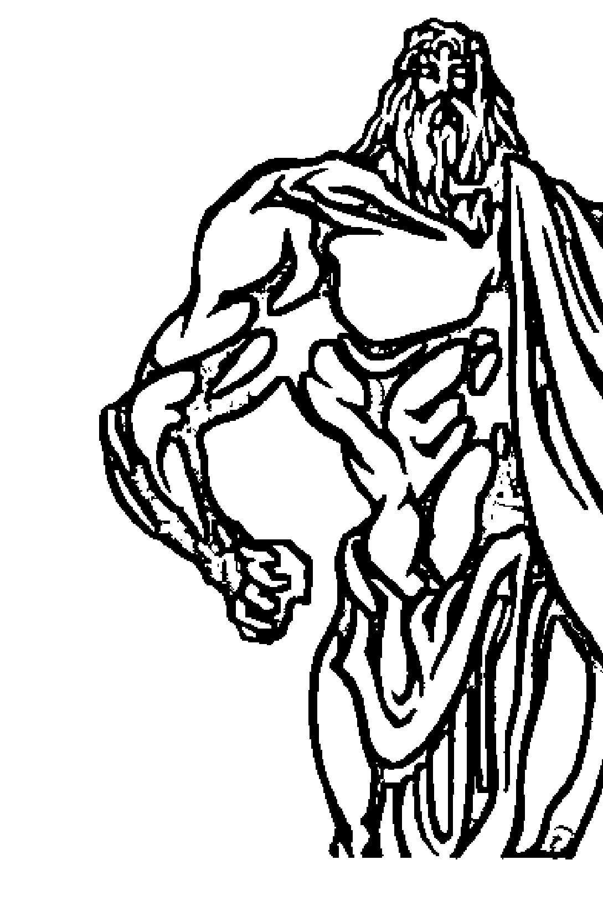

### 破坏神 阿兹特克

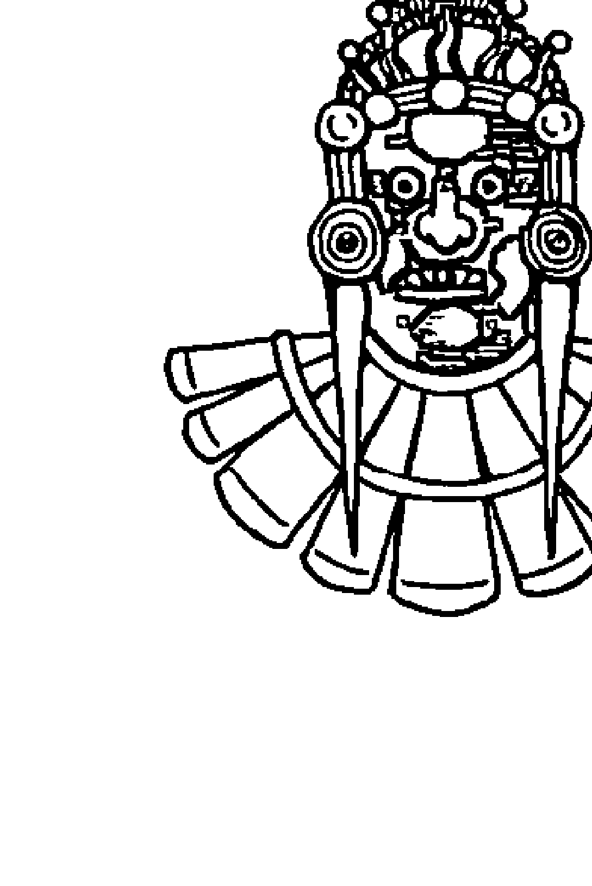

特拉索尔泰奥特尔 273

中美的纳瓦族人（以属于阿兹特克语系中的纳瓦特尔语（Nahuatl）为母语，现今墨西哥最大的印第安人集团）信仰中的爱之女神及玉米女神。瓦兹特克族（阿兹特克人的后裔）也叫她“棉的女王”。在阿兹特克神话中也是古老的大地女神，一般认为她是玉米女神们的母亲。

但特拉索尔泰奥特尔这个名字乃“不洁的女神”之意 274。阿兹特克的神话中她被认为是“隐藏在所有不洁行为背后之力量”，也是身居想要赎罪的信者与全能神泰兹卡特利波卡（Tezcatlipoca）之间的牵线人。

特别与性的罪恶关系密切。在阿兹特克的湖上都市特诺奇蒂特兰（Tenochtitlan） 275 中有个为提高战士忠诚心而设的娼妓组织。从各都市一般家庭而来的女孩子们皈依特拉索尔泰奥特尔，接受娼妓教育，然后被送到各地兵营。之后当交合结束，这些女孩子们的责任已经终了，她就将她们抓起来，把她们的嘴巴涂黑，在仪式中杀掉。

273 译注：或译“特拉佐蒂奥托”。
274 译注：此外也有“吃粪者”、“吞尽不洁者”的意思。
275 译注：或译作台诺切提特蓝，位于特斯科科（Texcoco）湖上，是阿兹特克帝国的统治中心。

独脚鬼 276

韩国传说中的鬼神，类似日本传说中的鬼 277。不过并不像日本的鬼那样凶恶，虽然是会恶作剧，但是并不至于杀害人畜。也因此他受韩国人民喜爱，在壁画、兽头瓦、门板、把手等上面，常可以见到用他的图案来装饰。

这些独脚鬼之上有个领袖人物，名叫鼻荆。

新罗第二十五代国王——真智王（在位时间576~579），有次看上了某平民美女，但是那美女已经嫁人，拒绝了国王的求爱。之后，国王死后过了三年，美女的丈夫也死了。丈夫死了十天后，国王以生前的姿态出现了，对她说：“我依约前来见你了。”女人虽然害怕，但接受了国王。王在地上世界停留了七天，那段期间女人怀孕了。然后月圆之夜时天地鸣动，女人生了一个男婴，取名叫鼻荆。

鼻荆十五岁时便任当时国王的执事，不过一到晚上就会出外与群鬼游玩，有时驱鬼架桥，如有不听从的独脚鬼就会捉起来杀掉。据说直到现在，独脚鬼一听到鼻荆这个名字就会害怕。

> （→布尔喀 Buruke）

常世神

皇极天皇时代（在位期间642-645）时，富士川周边突然出现了常世神。

这常世神事实上乃毛毛虫。但并非有着毛毛虫外形的神，而是本身即是毛毛虫。

据说只要祭拜栖息于富士川河岸周边的某种特定毛毛虫，便可由贫变富、令病者痊愈、老者还童，甚至还能不老不死。此民间宗教到底是谁开始，依照现存记录已不得而知，不过当时似乎十分兴盛。只是最后被视为邪教而遭禁。

从这个常世神信仰中我们可以看见中国神仙道教之影响。蛊术指的便是通过饲养特殊虫类（有些种类甚至会养在自己身上），可以使自己达到荣华富贵或不老不死的秘术。

蛊术随着道教的传入一同来到日本，后来与阴阳道并禁咒道结合在一起成为巫蛊之术，其后又流人民间，成为民间信仰之一，或许常世神信仰即是如此形成的。

另外，所谓的常世事实上乃是神道教用语，意指死后的魂魄前往之国度。因此从这点来看多半应该也受过神道教的影响。

不洁女神 阿兹特克

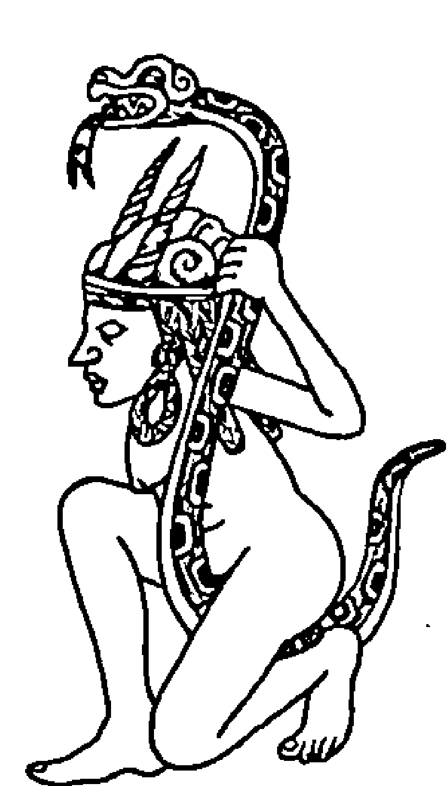

妖怪 韩国

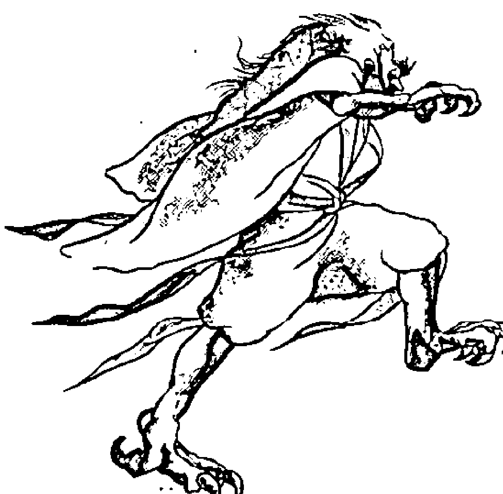

276 译注：或译作独鬼比。网络游戏“仙境传说”中也有这样的怪物，译作“土人”。
277 译注：音 Oni，日本受到佛教思想影响下产生的妖怪，与中国一般所谓的“鬼”不同，具有实体，头有角，身穿虎皮衣，近似夜叉、罗刹之类的妖怪。

邪神 日本

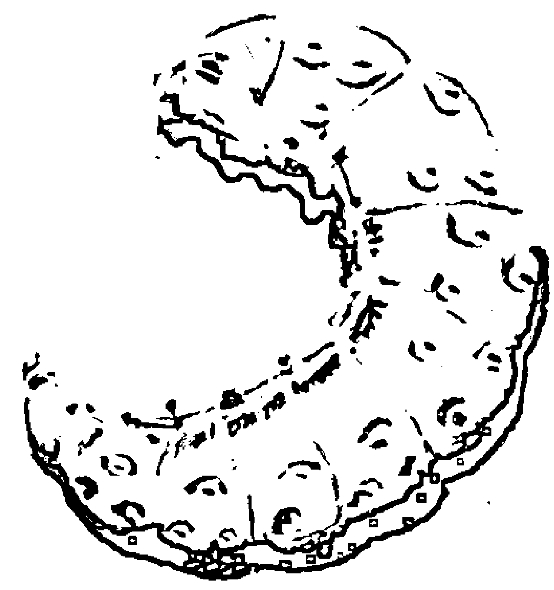

> (→摩多罗神 Matara-jin)

凿齿

中国古代的怪神。居于中国南方的沼泽地带的怪物。一种传说是巨人。
因长齿如凿，贯通颌下而得名。手持盾与矛，说其为巨人之姿，也能通之。
凿齿食人，尧 ^278^ 下诏神射手后羿，命其前往讨伐。战况十分激烈，凿齿虽全力应战，后羿从西追至昆仑山捕而杀之。
后羿有许多驱退怪物的事迹，而这是最初的例子。
凿齿被描写成南方异民族神话的姿态。黄帝支配着象征汉民族的中原，与外围部族展开了数次大战。其中庞大的战争便是假托为蚩尤（Chihyu）的南方部族。
败战后仍持续力战到底的各部族，以怪物的姿态留名于神话、传说中，而凿齿的由来，恐怕也是相同的。
（→ 猰貐 Iayu、修蛇 Hsiushe、大风 Tafeng）

278 译注：原书为“黄帝”疑有误。据《淮南子》《本经训》：“尧之时……狪獬、凿齿、九婴、大风、封豨、修蛇皆为民害。尧乃使羿诛凿齿于畴华之野。”

札特瓜

也被称为“佐特瓜”（Zhothaqquah）、“索达瓜伊”（Sodagui）。栖息在恩该（N'kai）的黑色河口处，以“无形的婴灵”为食。
他的外形很像覆着毛皮、肥胖而拟人化的癞蛤蟆，还有一双像蝙蝠般的大耳。不管是睡着或清醒，眼睛总像快睡着一样半闭着。
当他肚子饿的时候，不管是人类、其他生物，或是无形的婴灵，可说来者不拒。不过，如果它肚子不饿，就没有那么危险，有时他还会一时兴起，教导热心的信徒咒语或知识。
因此，他是克苏鲁（Cthulhu）神话的邪神中，极少数不那么邪恶或充满破坏性的妖怪。但是在远古时的失落大陆（Hyperborea, Lost Worlds）上，信仰札特瓜的宗教莫名地被视为邪教，遭到诸多迫害，但是信仰克苏鲁（Cthulhu）与依格（Yig）的宗教却能为人民接受。
（→ 奈亚鲁法特 Nyalrathotep）

土蜘蛛

别名“※八握胫”（Yatsukahagi）。根据《肥前风土记》，当天皇移驾（公元72年）到志氏岛（平户）时，海中有岛，从岛上升起了烟雾，访查之后才发现小近岛住着名为大耳、大近岛住着名为垂耳的土蜘蛛。当官兵想要捕捉并杀死他们时，大耳们趴伏于地，频频哀求：“从今而后必然定期朝贡天皇”，并献上各式海产恳请原谅。
这故事中出现的土蜘蛛当然是人。土蜘蛛是蔑称，指涉没有顺服于天皇的土著豪族。
然而，随着岁月流逝，土蜘蛛渐渐转化成妖怪。
原本人们对蜘蛛就有种妖怪或怪物的感觉，因此这样的转移非常顺畅无碍。约在14世纪时写成的《土蜘蛛草子》中，就如书名所示，出现了蜘蛛模样的怪物，后来被源赖光和渡边纲给制伏。
此外，这也让我们联想起东北地方的原住民所信仰的手脚细长之神，信仰这种神的居民，应该就是这个妖怪的原形。
（→ 恶路王 Akurou、手长脚长 Tenaga & Asinaga）

怪物 中国

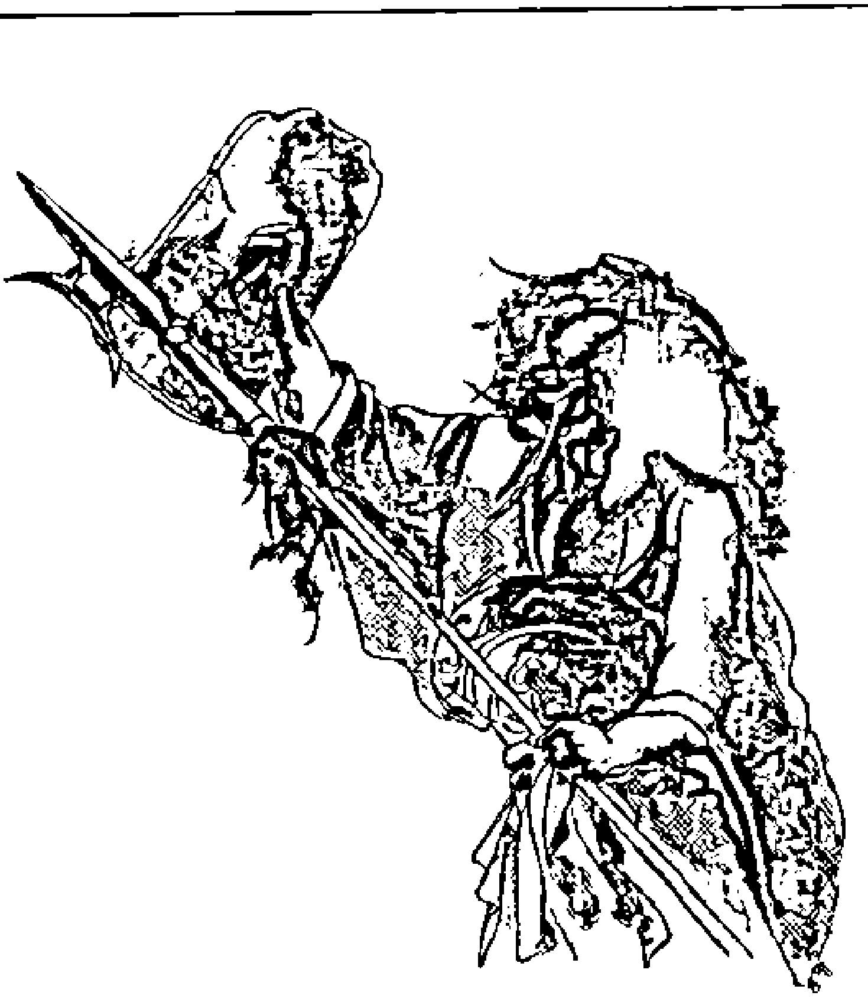

邪神 克苏鲁神话

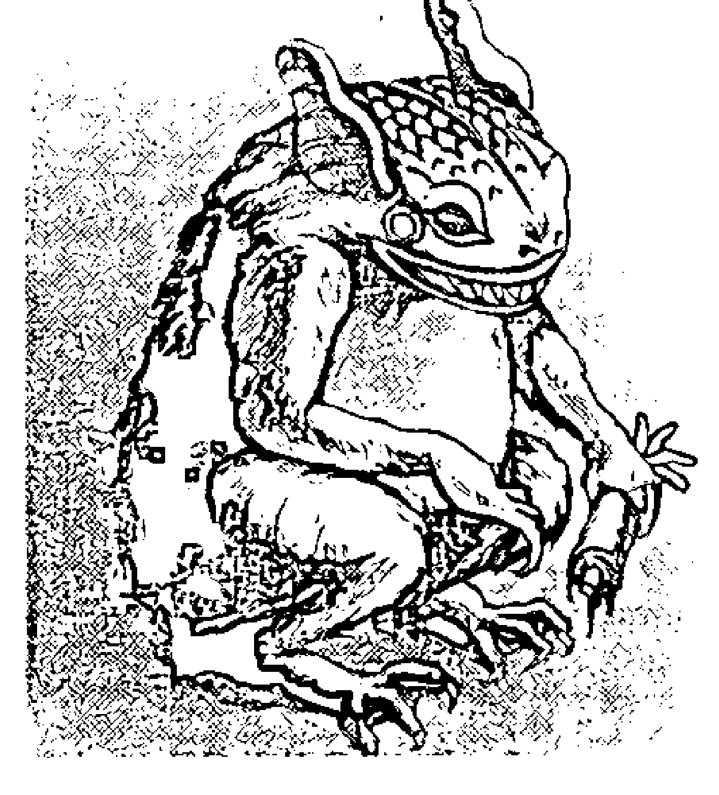

妖魔 日本

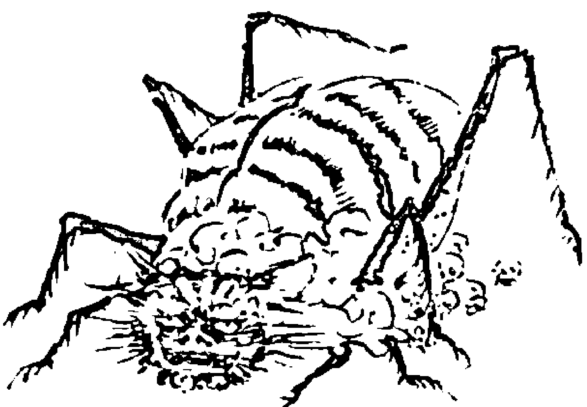

史马兰格

流传在巴布亚新几内亚的拉包尔 (Rabaul) 附近的马丘皮特岛 (Matupiy Island) 上的恶灵。
很久很久以前，马丘皮特岛上没有火山，而是一片平地。有一对叫做塔布布鲁跟盖欧库的夫妇住在今天的火山一带。他们想要开辟新的田地，但是因为地上长了一棵很大的无花果树，所以他们就放火把树烧了。
然而那棵树正是史马兰格的住所。
愤怒的史马兰格就把树原来生长的地点变成很大的岩丘，把夫妇两人骗到岩丘中。

塔布布鲁也稍微懂得一点魔法，所以并不怎么在乎史马兰格的法术。即使如此，两方还是起了激烈的冲突。最后，随着一声爆炸巨响，岩石、泥土、燃烧的无花果树枝等等，都从山丘顶上喷了出来。这就是马丘皮特岛火山的由来。
史马兰格在爆发时迅速地逃了出来，但夫妇两人走避不及，在村人们救出前就死了。只不过在挖掘夫妇两人遗体的时候，发现了许多蛋。从此之后，人们到山丘上就可以捡到鸟蛋。
（→马萨莱 Masarai）

图

图这个字有“对立”、“攻击”的意思，他是个战神。他与塔涅 (Tane)、坦加罗阿 (Tangaroa)、龙戈 (Rongo)、哈乌米亚 (Haumea)、塔乌希里都是由创世神朗吉 (Rangi) 与帕帕 (Papa) 所生。
这些小孩们，生活在父母两人相拥的狭小空间中，感觉不舒服，于是想让父母分离。塔乌希里反对这么做，而图则甚至主张将父母杀了。结果最后天的朗吉与地的帕帕分离，广大的空间也于是出现。但塔乌希里对兄弟们拆散父母的行为感到愤怒，于是攻击其他兄弟与他们的子孙。只有图起来与他对抗，并且最后打败了他。但图很生气其他兄弟在他们战斗时都不出手帮忙，于是做了陷阱来捕捉森林之神塔涅的鸟，做了渔网来捕捉海洋之神坦加罗阿的鱼，拉扯植物之神龙戈与哈乌米亚的子孙的头发，让他们在太阳底下活活晒死。

于是，图就这样将他所有兄弟的子孙都吃光了。因此人们称他“好战的图”、“吃人的图”、“没人缘的图”，深深地害怕他。
附带一提，图在夏威夷则是樵夫的守护神。
（→玛图克 Matuku）

妒妇津神

妒妇津为一地名。所谓“津”指的是渡口，不过前面会加了个“妒妇”是有典故的。
晋朝时，有个人名叫刘伯玉，其妻名为“段氏”。段氏善妒，于是刘伯玉便经常故意在他面前吟咏赞美美丽水神的诗，然后说“如果能够娶到这样的女性为妻人生了无遗憾”来激她。于是段氏最后忍无可忍，投河自杀了。
接着段氏死后七天，出现在刘伯玉的梦里说：“你一直向往着娶水神为妻，如你所愿，现在我已变成水神了。”之后据说刘伯玉再也不敢渡河。

而且从那之后，如果有女性要渡过段氏自杀的那条河时，一定要将头发弄乱，衣服弄脏之后才能过河，因为美丽的女性如要过河，善妒的段氏会突然掀起大浪。不过若是丑女渡河什么也不会发生，因此当时的人便有这样的传言“欲寻美女到渡口，女性近渡口知美丑”。
（→共工 Kungkung、洪水之兆 The omen of flood）

恶灵 巴布亚新几内亚

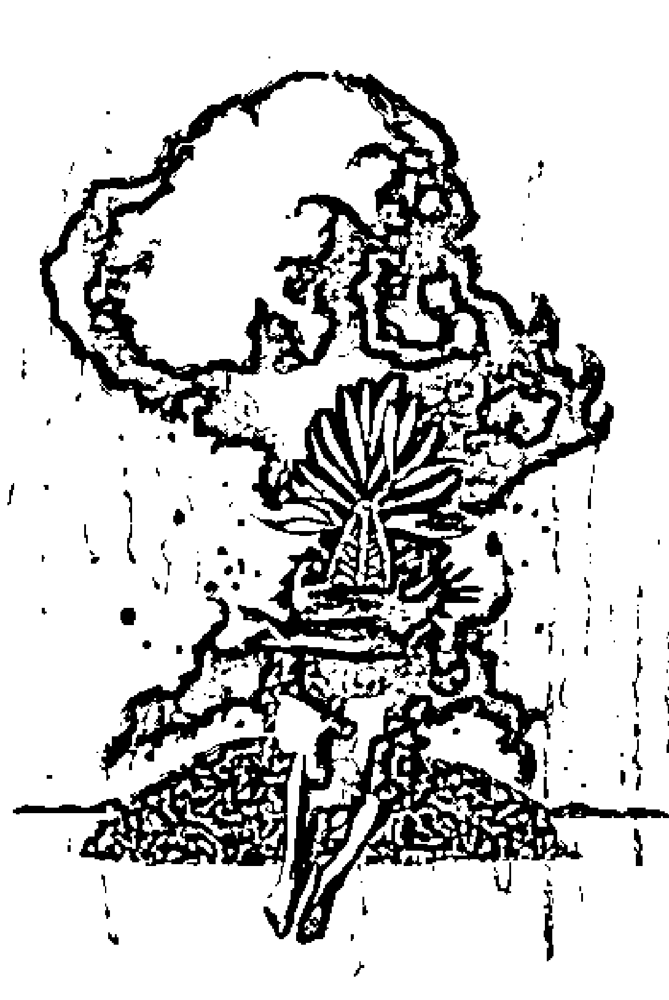

战神 波里尼西亚

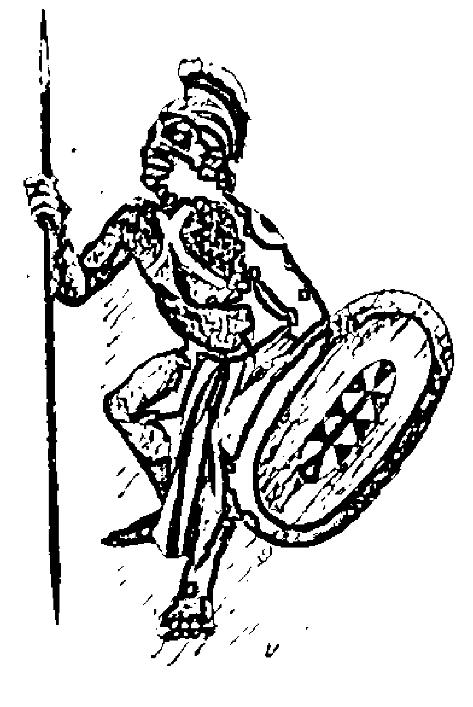

水神 中国

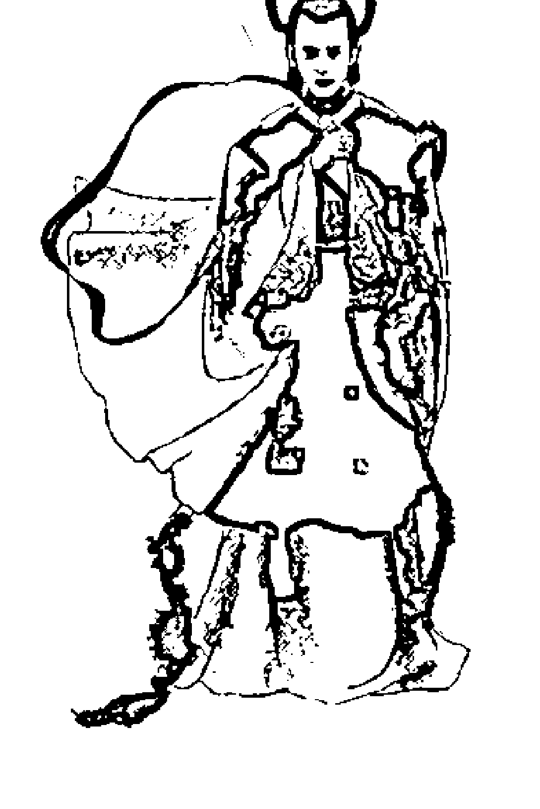

洞庭神君

洞庭湖水神。洞庭湖为中国第二大的淡水湖，过去曾被称做“八百里的洞庭”，可见其广大程度。
神君原名“柳毅”，本是名文弱书生，但恰巧见到洞庭龙女遭难，出手相救，因而缔结缘分，最后与龙女结婚升天成神，接着继龙王之后当上了洞庭湖神。
但柳毅原本只是个书生，容貌优丽，难以威服众水怪。故白日就戴上畸形鬼面，晚上方将鬼面拿下睡觉。只是戴久之后已成习惯，经常忘记取下。最后终于面具与脸合而为一，再也拿不下来。
传说乘船往来于洞庭湖的人不可乱言妄语、不可以手指乱指、不可四处张望。因洞庭神君可能会误解成在讲他的坏话，在指着他的脸嘲笑，在偷看他的脸，愤而用大水覆舟。
（→共工 Kungkung、江君大神 Chiangshen-tachun、洪水之兆 The omen of flood、钱塘龙王 Chientang-lungwong、无支祁 Wuchihchi）

279 译注：出自唐代的传奇小说《柳毅传》。李朝威作。叙洞庭龙女遭夫家虐待，为书生柳毅所救，终成夫妻的故事。情节曲折离奇，文笔优美，叙事生动，描写细腻，在当时流传甚广，颇受推举。

图奥尼与图奥奈达

他们是于芬兰叙事诗《卡勒瓦拉》(Kalevala)中登场的冥府之王与女王。人死后会到他们统治的国度——图奥奈拉 (Tuonela) 去。国境有漆黑无比的河流，河面上有极其雪白的天鹅。一旦越过黑河就是死者的国度图奥奈拉。
图奥奈拉的啤酒中，放了青蛙、蛇以及一些不明的恶心东西，那里的床垫乃以滚烫岩石制成，棉被则用蛆虫织成。英雄维纳莫伊宁 (Vainamoinen) 活着来到这个死亡国度，虽然冥府之王未接见他，但女王倒是很客气地招待他，图奥奈达恭敬地取出啤酒来，对他说：“你一旦踏进这里，便再也不能够离开了。”
图奥尼与图奥奈达生了一个儿子与为数众多的女儿。儿子的手指弯曲似钩，在河上架了长达千丈的竹箦，让不管是多么英勇的战士一旦来到死人国便回不去。女儿们皆为生病与痛苦的女神，但是只有一个女儿很善良，经常站在河岸警告还未死之人不要过来。
（→路希 Louhi）

280 译注：这是芬兰的民族史诗，兰罗特（Elias Lannrot）根据古芬兰民谣等汇集而成。卡勒瓦拉是故事中主要角色的居住地，也就是指芬兰。
281 译注：竹箦：用竹条、芦苇等编织成的席状物，捕鱼用的器具。

盗鸟·詹鸟

象征亡国之兆的怪鸟。
在中国古代，许多怪物都被当成一种兆，而被厌恶（或是尊崇）。其中，象征大凶之兆的便是这只怪鸟。
盗鸟青羽、詹鸟黄羽，依其羽色又称“青鸾、黄鸾”。此外，盗鸟为人面鸟身。而詹鸟无相关资料，只能想象其貌，但恐怕也不是普通的鸟，可能也是人面鸟身。
这些鸟又称“※应祸”，听起来名声响亮。但也正如其名，一见此鸟，必招祸患。
这两只鸟经常一起行动，他们曾停留的国家不用说，光是看见他们飞过天空就足以使国家死亡。因此，被人民公认为凶兆。
（→鬼车 Kueiche、鸩 Chu、大风 Tafeng、毕方 Pifang）

水神 中国

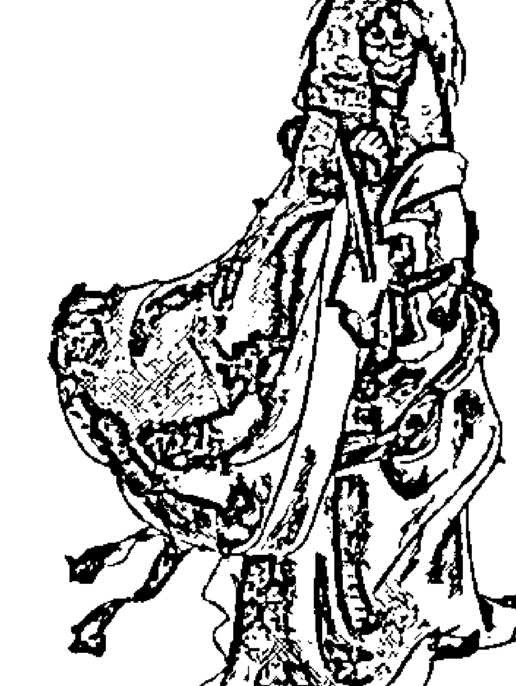

冥府之王与女王 芬兰

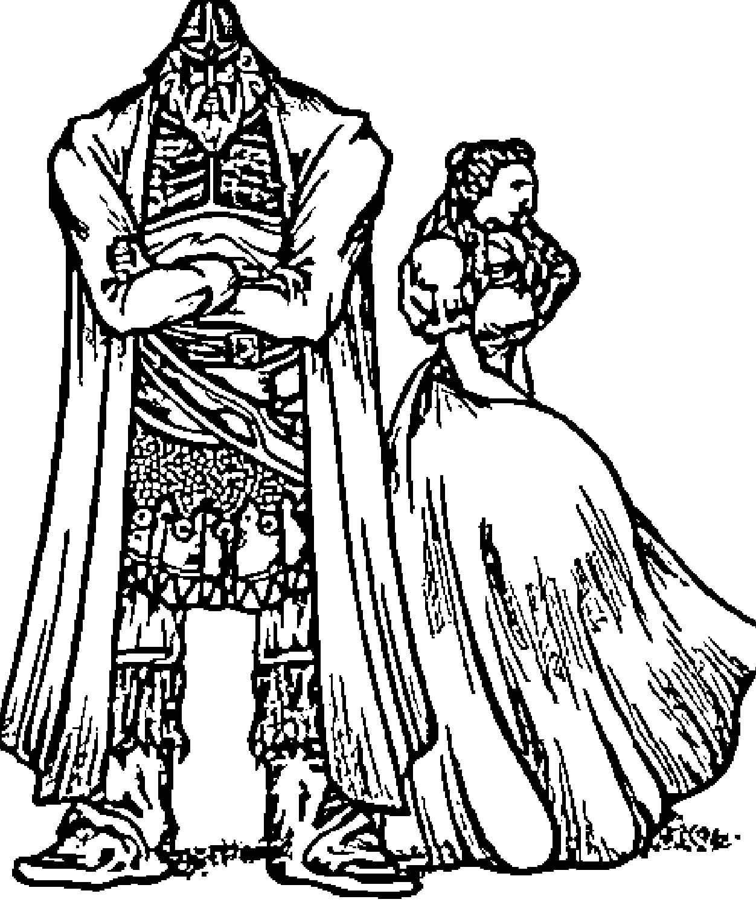

征兆 中国

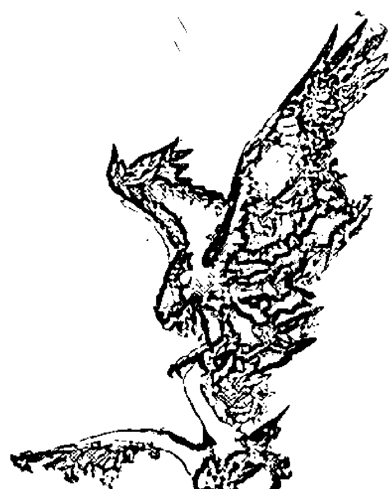

Uhlume
乌戮穆

美国作家塔妮丝·李的小说《平坦地球系列》中登场的妖魔王之一。

世界尚为一片平地浮于混沌之海时，天上地下海中各有神灵存在。天上众神造出人类后将人置于陆地；海中诸君王则与人类无干；地底妖魔的诸王则以作弄人类、令人不幸为乐。

妖魔王之一的乌戮穆别名“死之王”。他的外表高大消瘦肌肤黝黑，看来仿佛是由黑暗雕凿而成的人形。只有头发蓬松雪白，身上衣服一片洁白。

在无德无行者居多的魔界要员中，唯有他一人刚正不阿，徘徊战场回收死者。在无药可救的重伤者求水时给予毒药，让对方安乐死。

当乌戮穆为战场或病房中的人们带来死亡之际，将死之人可看见其身影。但周遭之人仅会觉得仿佛有“寒冷蓦风”吹过，甚至有时连那股风也感受不到。偶尔，与将死者关系深厚的女性们也能看见他的身影。

(→亚祖兰Azhrarn、凯希梅特Keshmet、强兹Chuz)

Uji-no-hashihime
宇治桥姬

嵯峨天皇（在位809～823年）时代，某公卿之女因忌妒欲狂，向贵船之神发愿，愿化为妖怪以便咒杀自己所妒之男女。神明对她降谕：“若欲化身成妖，于宇治川浸水21日可成。”于是少女以长发结为五角，脸上妆红体涂朱砂接着走入河中。就此化身为宇治桥姬。

一日，渡边纲走过一条庚桥后，一名美女请他护送自己到五条一带。这名美女即是宇治桥姬，她本欲抓走渡边纲，却反被砍断手腕。之后，宇治桥姬在与渡边纲及坂田金时对峙时因心生惧意而逃，立誓若自己能得人供养便不再为害。而桥姬神社即是在此时为镇抚她而建的神社。

有所谓的“桥姬”是桥梁守护神，原是建桥时献祭的人柱（活祭品）一种传说。又有一种传说言宇治桥姬乃是由人柱化成水神，再由水神精魄转生为人。

此外，说宇治桥姬的形象乃是丑时参拜之原型的说法也颇值得玩味。

(→安达原的妖婆Adachigahara-no-onibaba、酒吞童子Shuten-douji、红叶Momiji)

282 译注：Kihune，一地名于现今日本京都。
283 译注：日本进行架桥、筑堤、建城等困难工事时为祈求建筑顺利，会将活人埋于土里或水中作为献牲。
284 译注：日本传说中，当心怀妒恨的女性欲咒杀某人时可于丑时（约凌晨2点）参拜神社，头上置点燃蜡烛，以铁锤铁钉将代表憎恨者的稻草人钉于树上。依法施行七日即可杀害对方。

Ullikummi
乌利库梅

古中东胡里特民族神话中与众神为敌之巨人。

胡里特人的神话中，众神之王的位置乃是轮替担任。身为前代神王的泰舒卜之父库玛尔比（Kumarbi）图谋不轨，欲消灭暴风雨神泰舒卜（Teshub）夺回王位。于是库玛尔比与海神之女结婚生下名为乌利库梅之巨人。

乌利库梅是以闪绿岩所造之巨人，当他被放到乌贝卢里（Ubelluri，类似希腊神话阿特拉斯之巨人）的右肩上后开始迅速成长。

而暴风雨神虽决心与乌利库梅战斗，但闪电暴雨都对巨人无效，泰舒卜只得让位出逃。之后泰舒卜对埃阿神（Ea）诉苦，埃阿神便前往乌贝卢里处。乌贝卢里则对埃阿说了：

“当他们将天地置于我身上时我毫无感觉；当他们前来以青铜锯分割拉远天地时我也毫无感觉。如今，有某个东西在我右肩让我痛苦，我却不知道那是哪个神明。”

于是埃阿在巨人右肩发现乌利库梅的脚，就以分割宇宙的青铜锯锯断他的脚，夺走了巨人的力量。

妖魔之王 美国

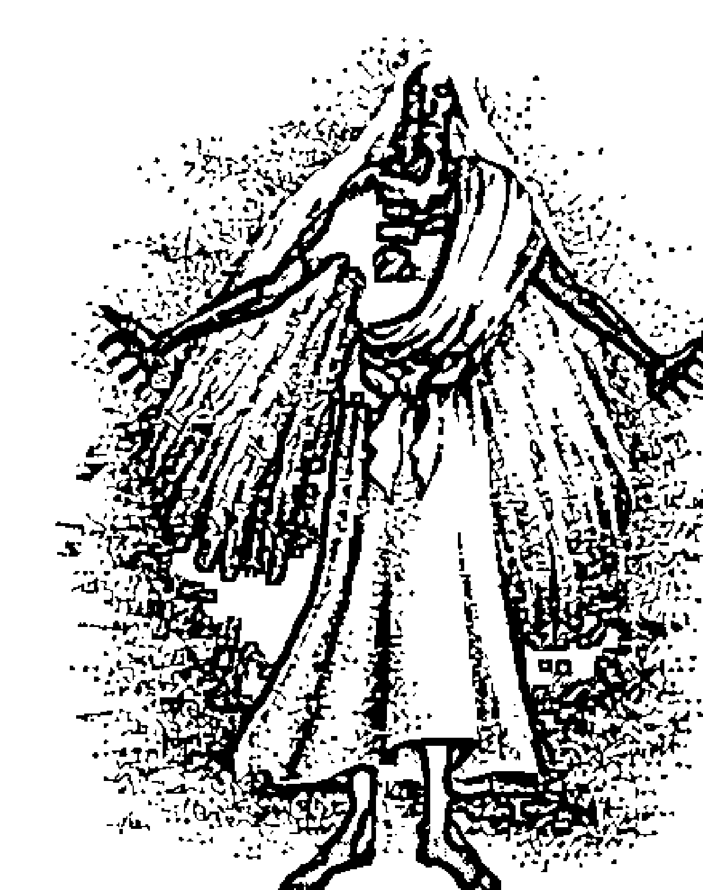

女妖 日本

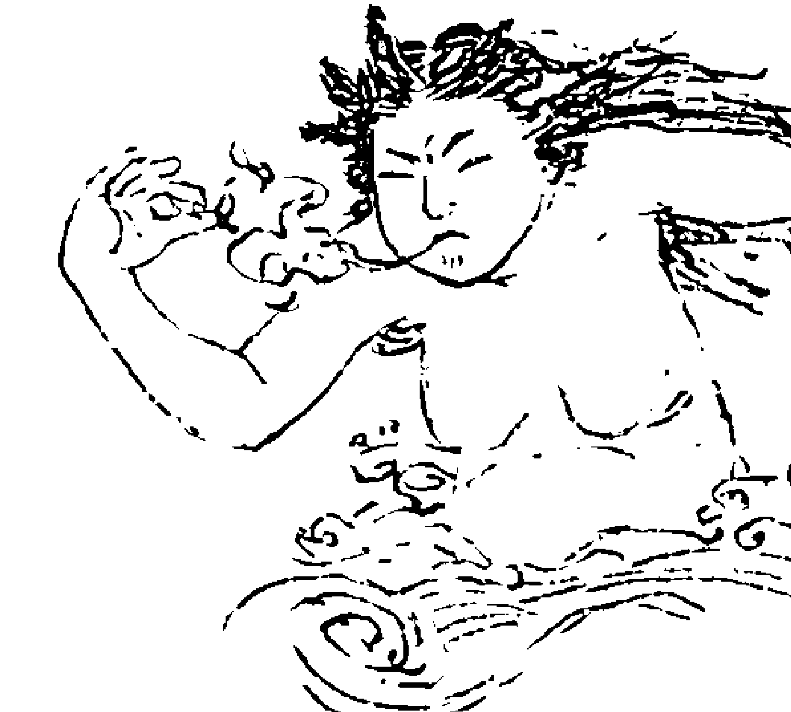

巨人 胡里特人

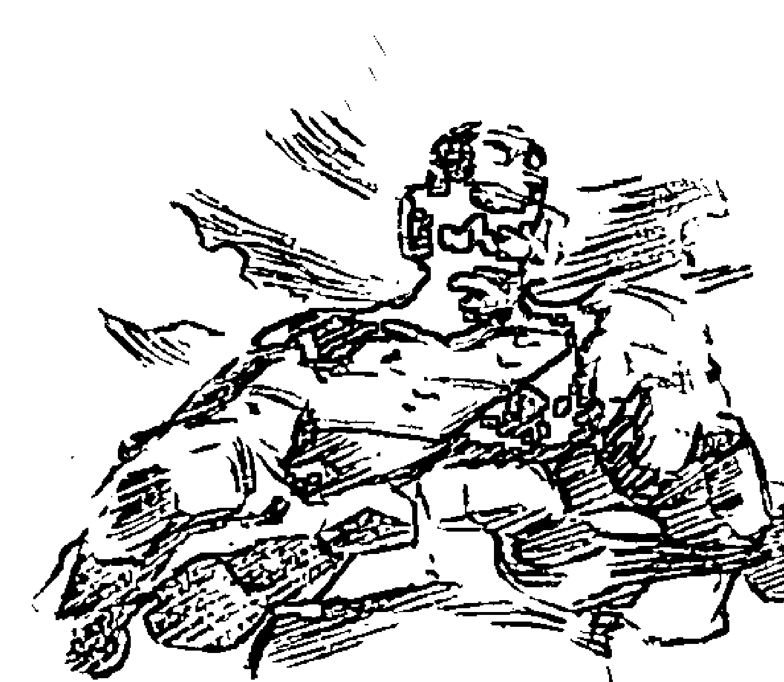

尤拉

在巴比伦神话中并未严密区分神灵与恶魔。神明也会带有恶魔的性质。

尤拉便属这种神明之一。乃是生者之敌，疫病的恶魔。

巴比伦人相信只要信仰尤拉便不会有疾病缠身，因此热衷于信仰他。

然而，尤拉有一次却打算消灭这世界上的所有生命，丝毫不顾人们虔诚信仰自己。

而震惊的人们对尤拉祈求得更加热诚。于是尤拉终于被感动，对人们说道：

> “那么就饶恕称扬我名之人，以及赞颂我是威勇无比之伟大存在的人吧。”

艮之金神

主要受大本教 285 等大正时代（1912～1926）以后成立之新兴宗教祭祀的神灵。

依据大本教教理，此神即国常立神 (Kunitokotati-no-kami)，原初神，乃是宇宙创造者。然而，于创造出宇宙后遭其他神灵封印于世界的艮方。

所谓的 “艮” 乃丑寅方位（东北），也即所谓的 “鬼门”（不吉方位）。而 “世界的艮方” 便是日本。

被封印的艮之金神，为江户时代（1600～1867）末期的日本国学学者所发掘后，于大正时代成为大本教所宣托的神灵。

另外，因此神也为与方位相关之神灵。若冒犯此神所在的方位，他便会降下名为 “金神七杀” 的灾祸。此祸不仅针对犯禁本人，尚会牵连七名亲人；而若亲人不足七名，甚至会以邻人充数、怨念偏执深沉。

这种方位神性质，与其说是来自大本教中 “艮之金神 = 国常立神” 的神道教神格，不如说是身为阴阳道根源的道教思想而来较为恰当。

285 译注：大本教，日本新兴宗教之一。

乌图库

巴比伦的邪恶精灵。

此类精灵本是死者的灵魂埃提姆 (Edimmu)。却因死时未行葬礼的怨恨，而带给生者痛苦以作为复仇。重新进行葬礼（基什库）后即可让他们不再作祟。

但其中有更值得恐惧与不可怠慢的乌图库。乌图库们来自更下层的地底世界阿拉利，是由埃阿神 (Ea) 咬牙时产生的邪恶精灵。时而散布疫病于世；时而于人心中注入邪念；时而令家人间产生不合；时而杀害羊群。他们被喻为 “将光明之日化为黑暗的风” 。

并无镇压乌图库的方法。在极欲逃离他们的魔掌时，可拜托阿希普（退魔师）。阿希普会吟唱下面的咒文驱逐乌图库：

> “邪恶的存在啊，转身离开！
> 汝之住所乃为废墟
> 伟大之主埃阿，为我送行
> 上主、以我口诵咒
> 上主、依循圣裁
> 大锅赐于我手”## 疫病恶魔 巴比伦

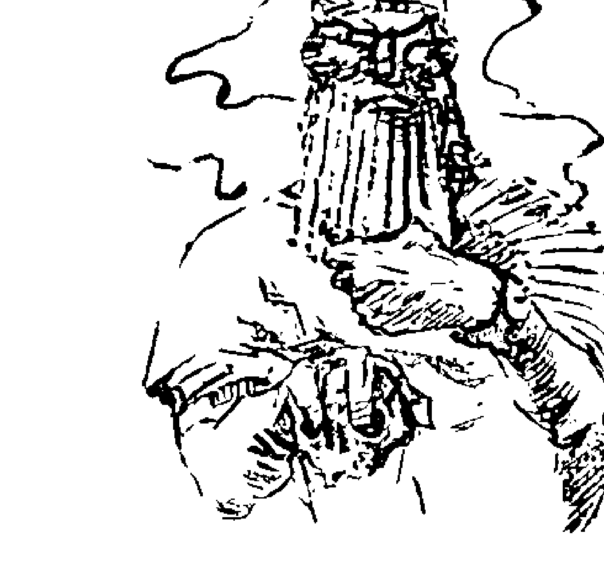

#### 祸崇神·创造神 日本

285 译注：日本神道宗教之一，源起自19世纪末。

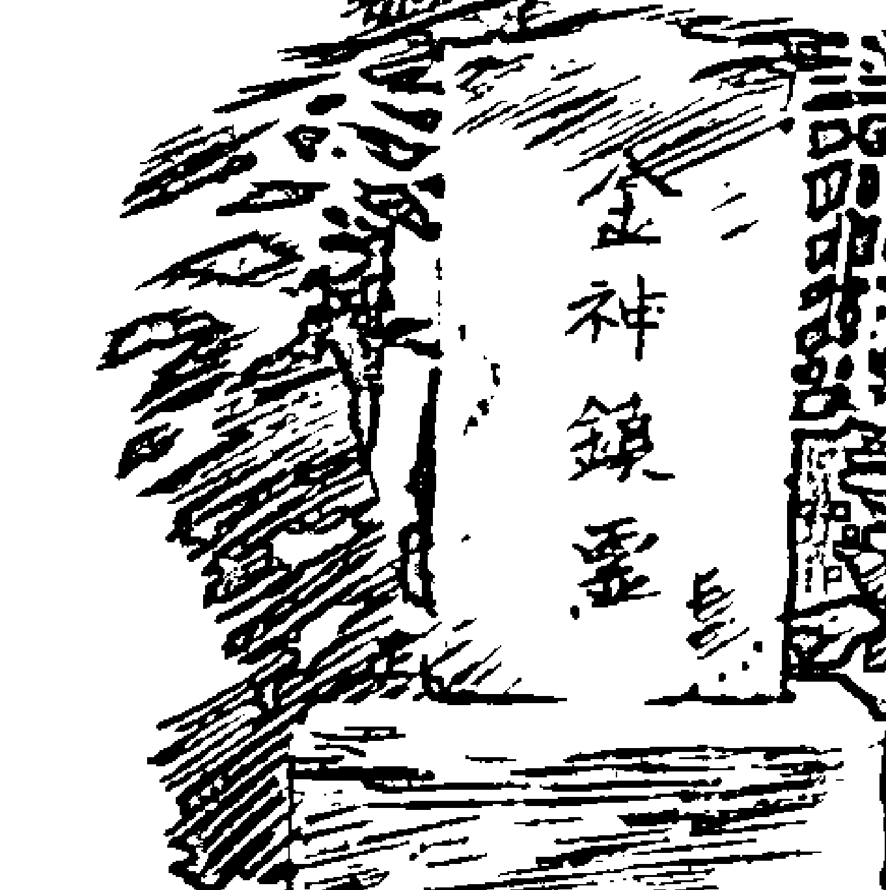

#### 邪恶精灵 巴比伦

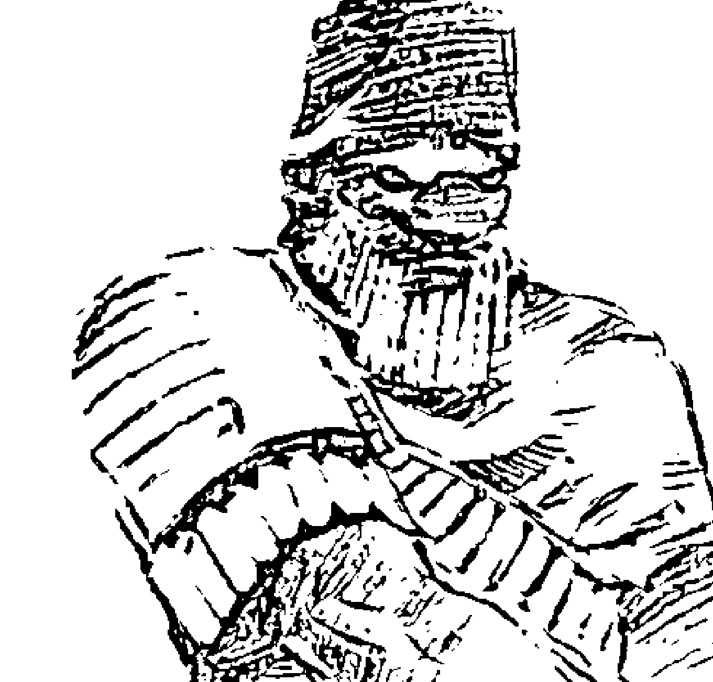

#### 华劣克

假称古以色列王国所罗门王所作之17世纪魔法书《雷蒙盖顿》（Lemegeton，又名The Lesser Key of Solomon），书中第一部分〈哥耶提雅〉所记载的72名恶魔之一。并记载于伪启示文学《以诺书》而成之《伪以诺书》一书的目录中。

为拥有天使外形的恶魔之一，相传现于人前时形象为骑乘双头龙的有翼少年。能支配爬虫类，他所骑之双头龙即被认为是此种力量的象征。又传说他能告知召唤者财宝所在之处。

受16世纪恶魔学家让·维尔影响的19世纪法国作家柯林·德·普朗西，在著作《地狱辞典》中以“※沃劣克”（Volac）之名介绍他。记载他知晓天中行星之位，并能告诉人蛇类的秘密巢穴。该书替他添加了“地狱大议长”与30个军团之指挥官的地位。《地狱辞典》的画家M.L.布尔顿将华劣克画为可爱少年，为该幅肖像画增添了奇妙气氛，乍看之下不令人认为他是恶魔。

#### 华利弗

假称古以色列王国所罗门王所作之17世纪魔法书《雷蒙盖顿》（Lemegeton，又名The Lesser Key of Solomon），书中第一部分〈哥耶提雅〉所记载72恶魔之一。也出现于伪启示文学《以诺书》而成之《伪以诺书》的目录中。别名“玛列法尔”（Malephar）。

《雷蒙盖顿》系列的恶魔有许多以狮子为形，华利弗也为其中之一。相传现身人前时为一狮子，有时也以数种动物交混的形象出现。16世纪英国学者雷吉那勒德·史高特（Reginald Scot, 1538？~1599）所著，被认为是参考了古版《雷蒙盖顿》而成的《妖术的揭发》（Discoverie of Witchcraft）一书中，介绍了69位恶魔；书中说华利弗乃与盗贼有关的恶魔。

《地狱辞典》以“※华拉法”（Valafar）之名记录他，描述他的外形为狮头鹅脚兔尾；所述外形与该书所载的※因孛思（Ipes，因波斯Ipos）相差无几。此外，传说他与安托士（Andras）及※沃劣克（Volac，华劣克Valac）相同，拥有天使外形。为地狱中的大公爵，能予人才能及胆量。

#### 范丝

根据居于古意大利地区的伊特拉里亚人（拥有比罗马更古文化之民族，因后为罗马共和国并吞，族中许多神灵也被纳入罗马神殿中）传说，范丝为居于地底的女恶魔。

范丝多被描绘为身具羽翼，手持蛇、火把、钥匙之模样。

在意大利西部的沃尔泰拉（Volterra，古代伊特拉里亚人的城市位居此处）挖掘出的雪花石膏壶上，绘有范丝之像，并在她的翅膀上画有巨大眼睛。

据说这是为了象征恶魔不论身在何处，皆对全人类虎视眈眈的缘故。

范丝的职责乃是带来死亡讯息，或是对濒死者施以致一命一击令其死亡。

（→凯隆Charun）

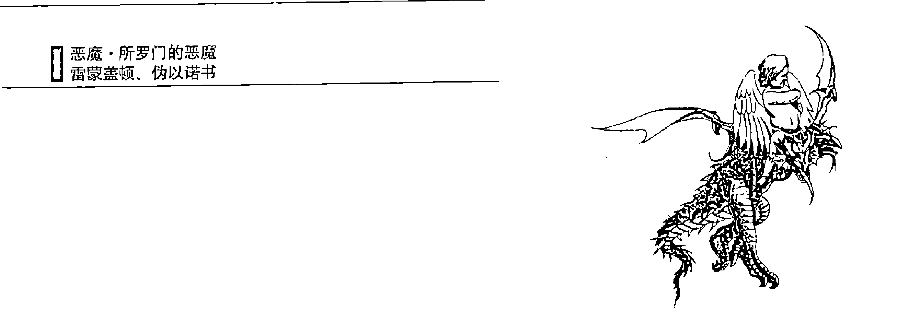

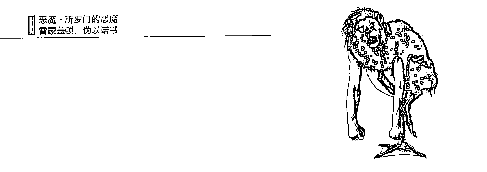

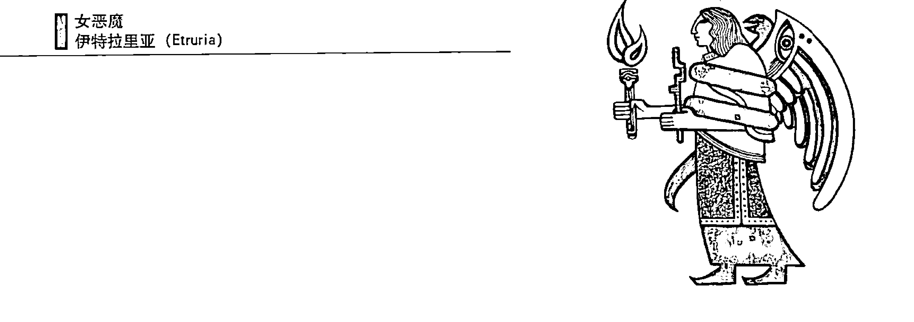

#### 瓦布拉

假称古以色列王国所罗门王所作之17世纪魔法书《雷蒙盖顿》（Lemegeton，又名The Lesser Key of Solomon），书中第一部分〈哥耶提雅〉所记载72名恶魔之一。能增强魔法师的哲学与技巧。

据说现形形态为背有狮鹫（Griffon）翅膀的狮子。外形为狮的原因，被认为乃是在仿讽雄狮。雄狮形象曾于《旧约圣经》预言者以西结（Ezekiel）的幻觉中出现，并成为四福音记录者之一的圣马可的象征。

19世纪法国作家柯林·德·普朗西的著作《地狱辞典》里，把瓦布拉视作能增进人对哲学之理解力的恶魔。还多了比《雷蒙盖顿》更近代化的解释——说他为能增进机械相关技术的恶魔。尽管外形有明确记载可循，插画家M.L.布尔顿却未附上肖像画，因此在近世成为低知名度恶魔。向来承袭维尔说法的普朗西，将瓦布拉记为地狱大公爵，乃36个军团之指挥官。（→撒共Zagan）

#### 瓦沙克

17世纪魔法书《雷蒙盖顿》（Lemegeton，又名The Lesser Key of Solomon），书中第一部分〈哥耶提雅〉所记载的72名恶魔之一。此群恶魔数量的‘72’乃是将12星宫中每宫再细划为6区而得。似乎是从欲订立象征全方位支配者的想法而来。因此72恶魔中也有如瓦沙克这般仅有姓名而几无性格特征的恶魔。并无瓦沙克在恶魔的世界中身居爵位的记述；也无外表的描述。据说通晓过去现在未来之事，会被寻求智能之人召唤。

19世纪法国作家柯林·德·普朗西所著之《地狱辞典》内，记录了许多被认为是引用自《雷蒙盖顿》的恶魔。并有数位恶魔因画家M.L.布尔顿的手绘本版肖像画成了一般人耳熟能详的名恶魔。不过，或许是因普朗西对无爵位、外表记述的瓦沙克不感兴趣，该书中并无瓦沙克一项。

#### 伐陀毗

※罗刹婆（Raksasa，※罗刹）之一。※毗婆罗吉提（Vipracitti）与※辛悉迦（Simhika）之子。伊婆罗（Ilvala）之兄。欲谋害名为投山仙人（Agastya）之圣仙（rishi）246但反为他吞噬。

伐陀毗有次变身公羊伪装作祭祀的供品。许多婆罗门（祭司）吃下了他的肉。而伊婆罗一呼喊伐陀毗之名时他便破开婆罗门的肚肠飞出。

伐陀毗食髓知味，于是意图以相同手法杀害著名圣仙投山仙人。然而投山仙人知道了他的企图，在吃下公羊肉的瞬间马上将他消化，伐陀毗的计划就此失败。无论伊婆罗如何呼叫兄长的名字，已被消化的伐陀毗都未出现。结果连伊婆罗也被投山仙人的视线所杀。

于古代叙事诗《摩诃婆罗多》（Mahabarata）中，伐陀毗以人类身份出现。内中记载他乃南印度原住民的国王，欲与胞弟伊婆罗杀害投山仙人但却失败。（→罗波那 Ravana）

#### 恶魔·所罗门的恶魔
雷蒙盖顿

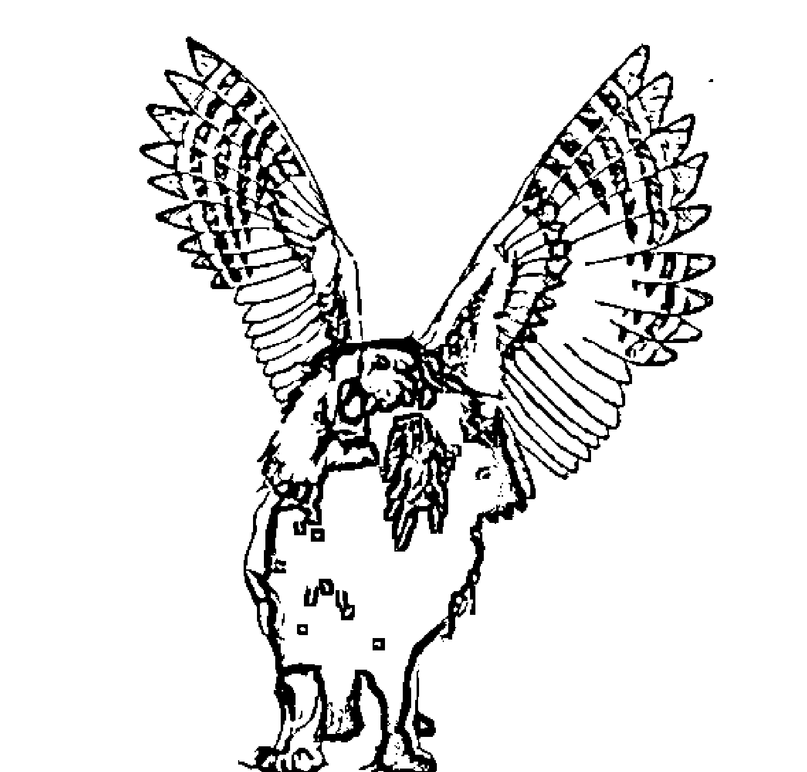

#### 恶魔·所罗门的恶魔
雷蒙盖顿

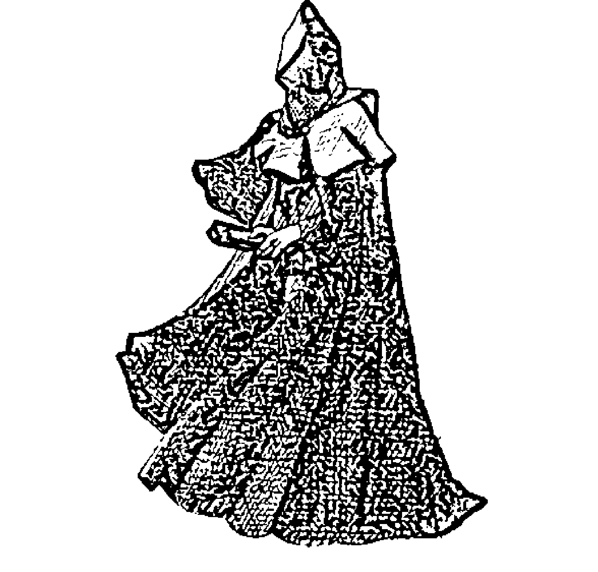

#### 罗刹婆（罗刹）
印度

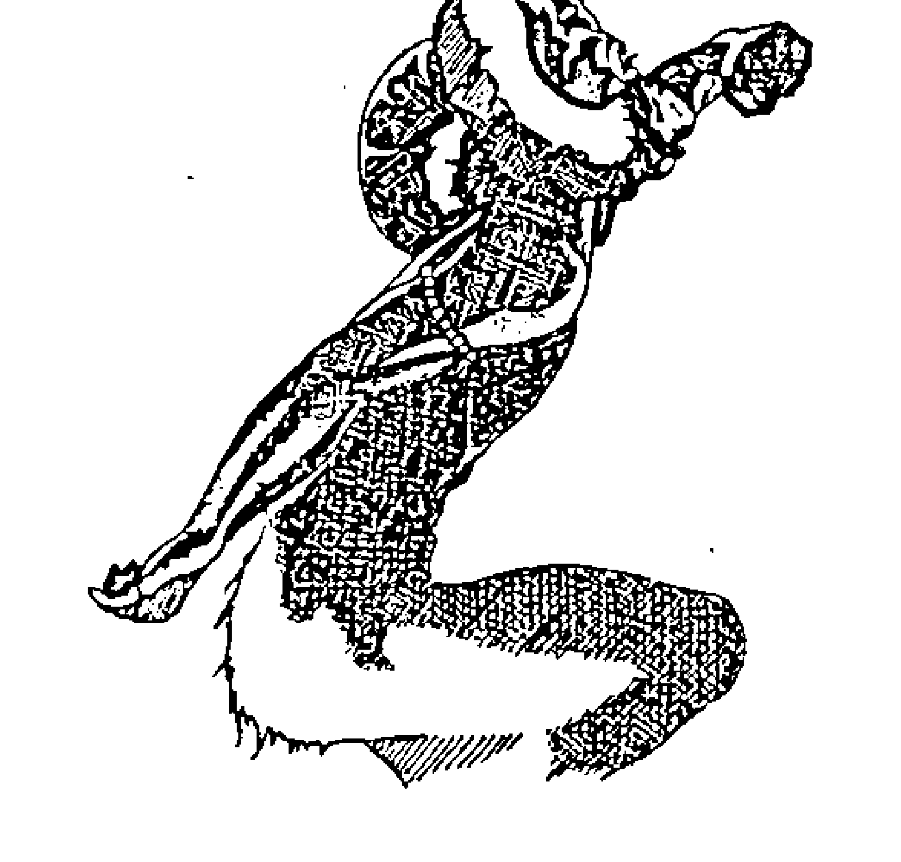

286 译注：或译“仙人”，于印度神话中他们属智者、先知一类，为神圣人物有强大法力。

##### 威沛

假称古以色列王国所罗门王所作之17世纪魔法书《雷蒙盖顿》（Lemegeton，又名The Lesser Key of Solomon），书中第一部分〈哥耶提雅〉所记载的72名恶魔之一。别名“※赛沛”（Separ）。

威沛被认为是与海事关系密切之恶魔，以人鱼形象出现于召唤者面前。此种与水的关联性乃是威沛所独有，于其他71位恶魔中，再无同海水关联如此之深的恶魔。相传他在海上带来暴风雨，沉没船只溺毙人类；据说也能造出船只的幻影。《雷蒙盖顿》中记载的威沛徽章即形似船舶。

16世纪英国学者雷吉那勒德·史高特所著之《妖术的揭发》中，把威沛记作让人类伤口化脓致死的恶魔。受16世纪恶魔学家让·维尔影响的19世纪法国作家柯林·德·普朗西，在著作《地狱辞典》里说他乃地狱的有力公爵，29个军团的指挥官。虽是颇具特性的恶魔，但该书的插画家M.L.布尔顿并未绘制威沛的肖像。

##### 维毗沙纳

楞伽（※罗刹之都）的※罗刹娑（Raksasa，即罗刹）之王——罗波那（Ravana）的弟弟。

维毗沙纳在罗波那的教导下不断苦行，结果梵天神（Brahma）为此降赐恩惠于他。然而该项恩惠却是让他变得“无论何时皆不作出无益之举；永远方正不偏”。

因此，当兄长罗波那王强夺拘萨罗国王子罗摩（Rama）之妻悉多（Sita）时，维毗沙纳便非难兄长的不义之举。要求将悉多归还罗摩。

在国王对这要求勃然大怒后，维毗沙纳便舍弃自己的兄长，带领另外四名罗刹渡海，加入罗摩的军队中与王兄交战。

维毗沙纳帮助罗摩渡海前往楞伽（楞伽相当于今日的斯里兰卡）。因为这桩功劳，当罗波那败北后维毗沙纳得罗摩之助即位为楞伽王。

##### 威

俄国作家果戈里（Nikolai V.Gogol，1809～53年）之小说《女妖》（Vii）中登场之妖怪。一名神学院学生因一些原因而落得要在一所教堂内与女巫尸体度过三晚的下场。每当一入夜尸体便会爬起要捕捉这名学生，但因学生在身边画下了圆圈（结界），所以尸体似乎看不到他。而在第三夜中，尸体一念出咒文，无数怪异野兽便飞入教堂。然而群兽也看不到学生的身形。此时尸体说道：“找威来！把威请来！”

于是一个矮胖壮硕的身影随着沉重脚步声出现。

威浑身是土；手脚曲扭犹如树根。有着长而厚重的眼睑垂至地面。威站到学生的正前方后，对妖怪们说：“提起我的眼睑。”当威与学生四目相交时，威大叫：“在这里！”并伸出钢铁的手指指向学生。学生则被吓得气绝倒地。

虽然威只是果戈里的虚构，但在斯拉夫自古以来的传说中，身具邪眼（evil eye）者会有特长眉毛、睫毛与眼睑。

（→果戈里的恶魔Demon<GoGol'>、圣卡西亚Kas'yn）

#### 恶魔·所罗门的恶魔
雷蒙盖顿

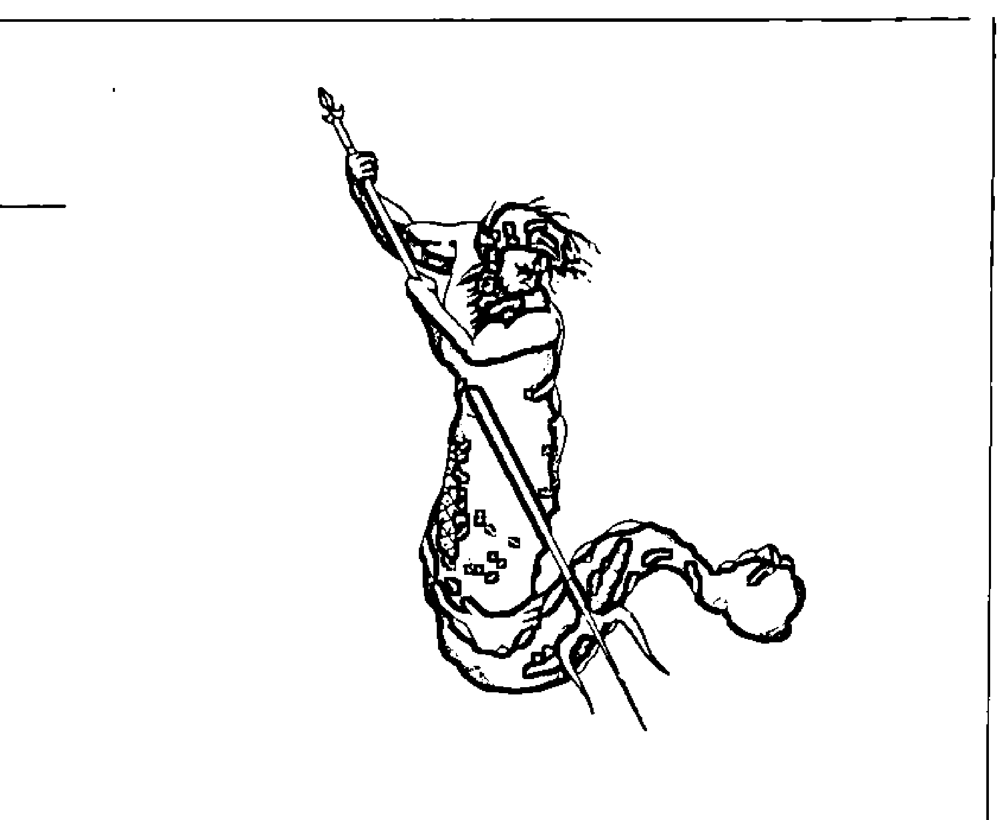

#### 罗刹娑（罗刹）
印度

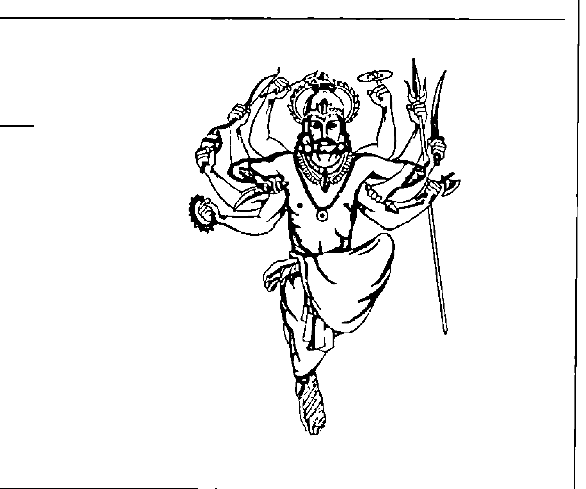

#### 妖怪
俄罗斯

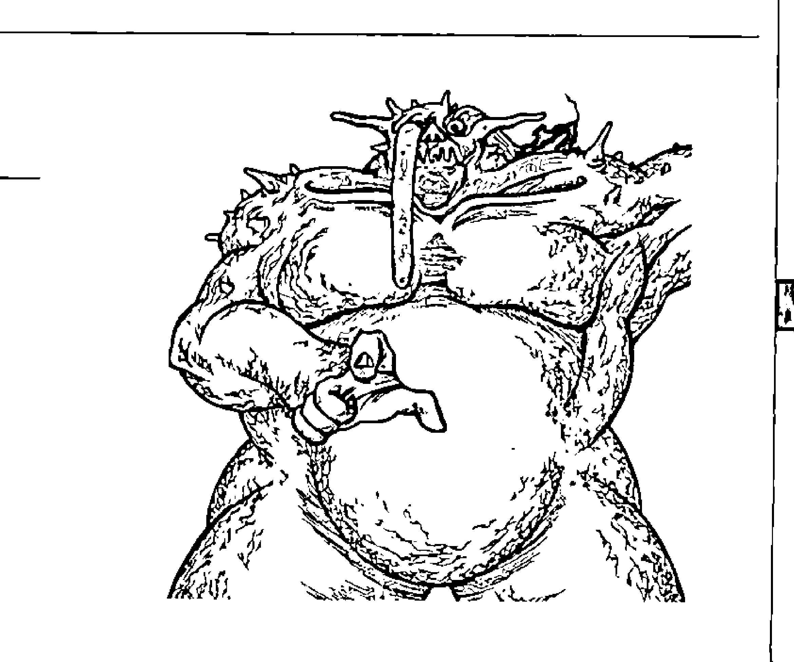

#### 拜恩

假称古以色列王国所罗门王所作之17世纪魔法书《雷蒙盖顿》（Lemegeton，又名The Lesser Key of Solomon），书中第一部分〈哥耶提雅〉所记载的72名恶魔之一。

骑乘黑马，并与《雷蒙盖顿》此古书目录中所记载的多名恶魔一样，以狮子形象现于人前。此外，据说与安杜马利乌士（Andromalius）同样手持毒蛇。此恶魔拥有挑唆战乱的强大力量，能建出守卫用的坚塔，或兴卷暴风破坏城墙。通晓世上一切秘密；相传他所拥有的独特能力，是能告诉召唤自己的魔法师其他魔法师隐藏的真名。

受16世纪恶魔学家让·维尔影响的19世纪法国作家柯林·德·普朗西，在作品《地狱辞典》里说他是地狱伯爵，统领19个军团。该书中记述的拜恩能建造住家并且令河川水位上升。或许是因为他的外形太过平凡无奇，《地狱辞典》的插画家M.L.布尔顿未替拜恩绘制肖像画。

#### 毗卢跋迦娑

名为毗卢跋迦娑的恶魔有数人之多。

其中最有名的一位，是守护西方的“※夜乞叉”（Yaksa）。于佛教中被称作“广目天”，居于须弥山第4层，以净天眼观望世界，专职守护西方。

接着，※那罗伽（Naraka，阿修罗之一）的随从中也有一名为毗卢跋迦娑的阿修罗。

此外，迦叶波（Kasyapa，生主287之首，有21名妻子，为众神、动物、人类、魔族之父）与妻子之一的陀奴（Danu）生下了33名恶名昭彰的※檀那婆（Danavas，恶魔）。其中一名即叫毗卢跋迦娑。

此外，为楞伽（※罗刹之都）王罗波那（Ravana）所率领，与罗摩（Rama，拘萨罗国王子）交战的一位※罗刹婆（Raksasa，罗刹）也名叫毗卢跋迦娑。

#### 薇薇安

在英国的亚瑟王（King Arthur）传说中，出现过数名拥有神奇法力的妖精。薇薇安可为她们的代表，也被称作“妮穆”（Nimue）“妮妮安”（Niniane）。这些妖精被称为“湖中仙女”，会帮助亚瑟王率领的众英雄；或加以诱惑；或陷他们于险境。甚至还出现一种说法，说故事内的数个名字皆是指同一妖精，只是于传说口承时变化了。

她们因赠与亚瑟王传说中的宝剑王者之剑（Excalibur）而广为人知；并担任在亚瑟王濒死之际接引他至妖精国亚佛隆（Avalon）的任务。然而，另一方面薇薇安却引诱身为亚瑟王谋士的梅林（Merlin），并同魔女摩根（Morgan）一同为宫廷带来灾祸。

薇薇安得到梅林教授魔法后，巧妙地将爱慕她的梅林骗出宫廷，以从梅林口中问出的魔法将他永远困住，使亚瑟王从此以后再也无法获得梅林的建言。许多人将此事与克尔特由异教信仰转为基督宗教一事共同讨论。又，将亚瑟王首席骑士蓝斯洛（Launcelot）扶养成人的也为湖中仙女。

（→摩莉甘 Morrigan）

#### 恶魔·所罗门的恶魔
雷蒙盖顿

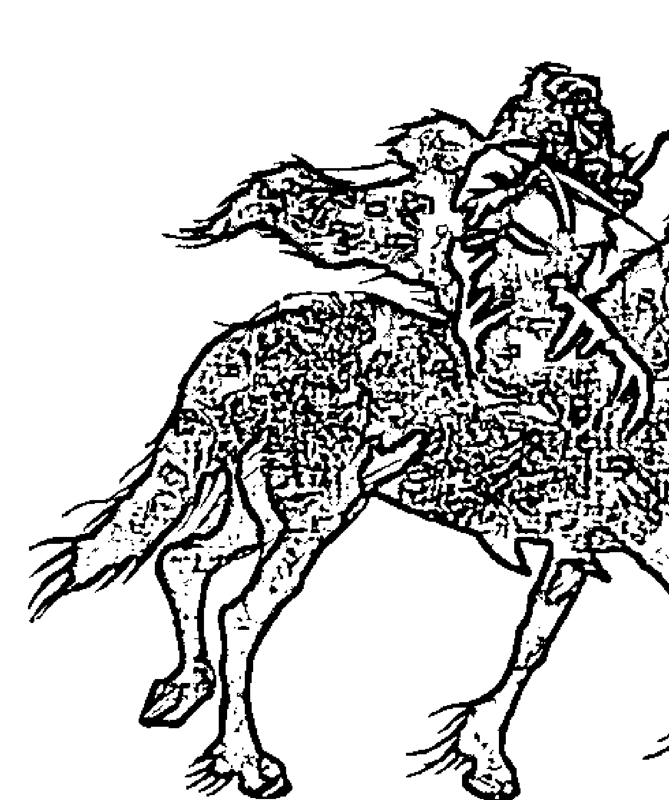

#### 各式各样
印度

287 评注：Prajapati，印度神话中对诸多创造神的一种称谓。数量及神灵之名皆不一定。

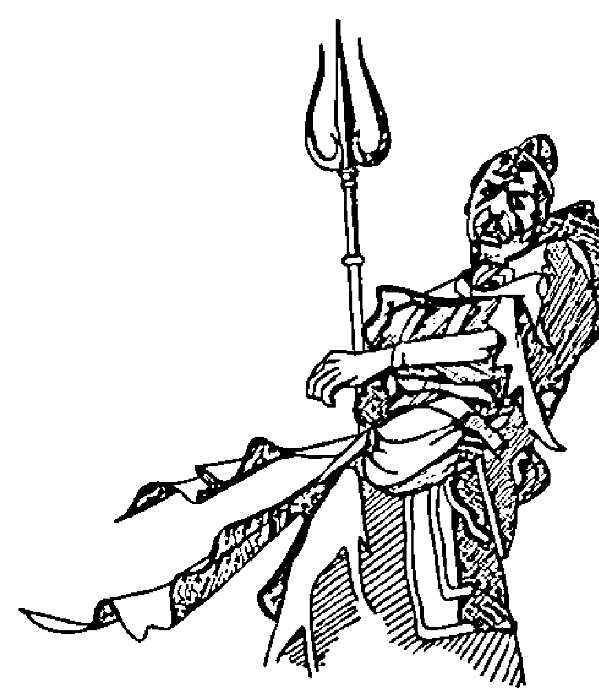

#### 湖中仙女
克尔特

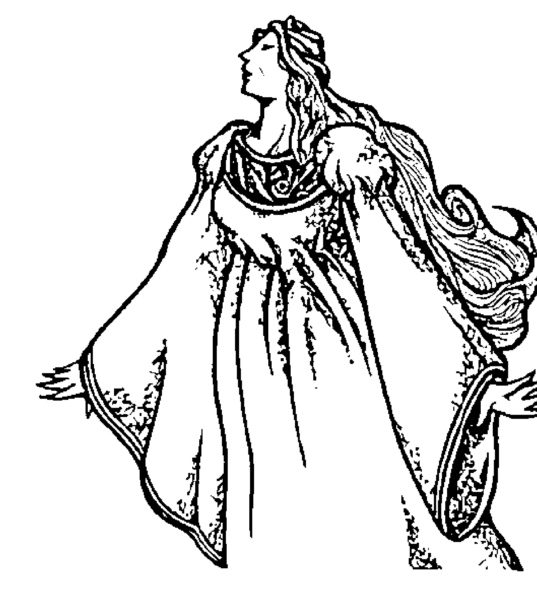


#### 弗栗多

古代印度的强悍魔怪。照婆罗门教圣典《梨俱吠陀》（Rig Veda）所记载，他乃是阻塞河川带来干旱的邪恶大蛇，或说是龙。被身为雷神的最高神※因陀罗（Indra）以伐折罗（Vajra，金刚杵）掷之，这才击退他。

然而在后世叙事诗《摩诃婆罗多》（Mahabarata）中，弗栗多却非是蛇而是人形神明。有一婆罗门其子嗣无故遭因陀罗所杀（祭司），当此婆罗门献上活祭品后，弗栗多便自祭坛火焰中飞出与因陀罗相搏。因两神争战不休而使世界一片荒芜。在众神前去调解时，弗栗多说道：“纵使我停手不战他也定不肯罢休。所以因陀罗必须发誓不论是白天或黑夜，都不以石头木头或金属杀害我。”

于是因陀罗发了如他所说的誓；之后因陀罗于黄昏时，以毗湿奴（Visnu或Vishnu）入海所生之水沫投掷弗栗多，对他加以偷袭。结果大神因陀罗为此感到羞愧而躲了起来。

由于天上的王座因此虚悬，故众神延请地上贤王纳夫夏（Nahusha）即位为王。纳夫夏虽造就了一番盛世，却在不久后堕落腐化，于是变成了一尾大蛇被放逐于地上。取代弗栗多成了邪恶大蛇。

#### 化勒

假称古以色列王国所罗门王所作之17世纪魔法书《雷蒙盖顿》（Lemegeton，又名 The Lesser Key of Solomon），书中第一部分〈哥耶提雅〉所记载的72名恶魔之一。也载于仿启示文学《以诺书》而成的《伪以诺书》的目录里。拥有“埃及恶灵”的不同的名字。

关于此恶魔的外表，有他乘坐骆驼出现以及使用骆驼形象现身两种说法。据载，当他以人形外貌现身时口操埃及语。拥有过去与未来之知识；能令召唤者获得心仪女性的爱慕。

受16世纪恶魔学家让·维尔影响的19世纪法国作家柯林·德·普朗西，在作品《地狱辞典》里以“※瓦尔”（Wall）之名介绍他，并增添了他曾为能天使的过去历史，以及身为36个军团之指挥官的地位。《地狱辞典》的插画家M.L.布尔顿使用了在某种意义上可谓平凡无奇的诠释：直接把化勒绘为人立骆驼。结果反而令此幅画显得特异不群，成了令人印象深刻之物。

#### 维科布·卡库伊科斯

于世界刚被造出不久时，反抗众神意欲统治世界的男神。名字的意思是“七鹦鹉”，泰半被描绘为一只巨大怪鸟。

他是比被神造出的人类更早出现的存在。声称自己“是太阳、是光芒、是月亮”，假装自己是至高的存在。

由于维科布·卡库伊科斯的傲慢，孪生子英雄神胡那普（Hunapu）与喀巴伦格（Xbalanque）前去讨伐；但反为他所败，胡那普的左腕也为他所夺。而好不容易逃得一命的两位孪生神，最后探听出维科布·卡库伊科斯力量的秘密乃是在于牙齿。

于是两位孪生神伪装为医生，前往因在先前一战中负伤而为牙痛所苦的维科布·卡库伊科斯处。粗心大意的维科布·卡库伊科斯就这样被他们拔去牙齿装上玉米，结果力量全失。接着被剜去双眼。因他失去了力量来源，就此衰弱而死。对“众神敌对者”而言可谓是不光彩的死法。

（→阿·普切 Ah Puch）

#### 蛇或龙或神
印度

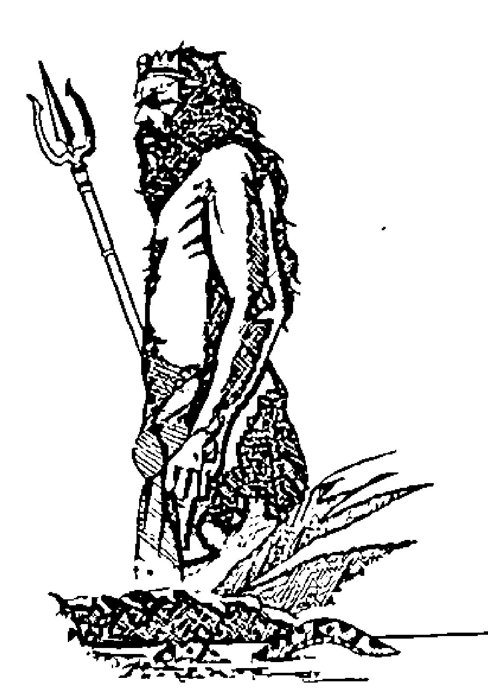

#### 恶魔·所罗门的恶魔
雷蒙盖顿、伪以诺书

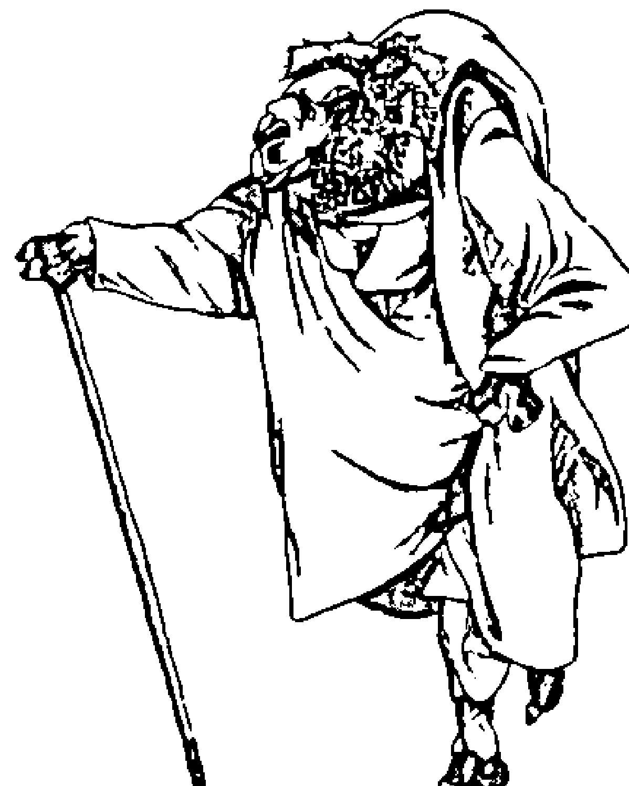

#### 众神敌对者
玛雅

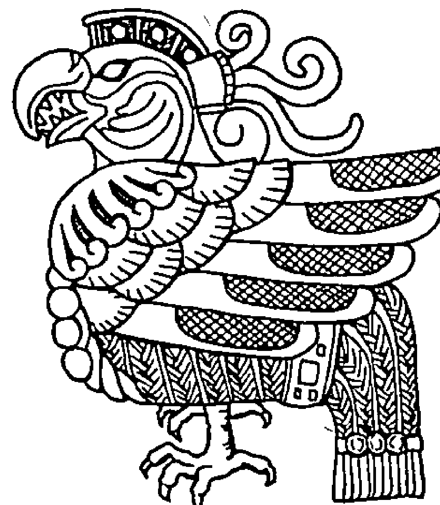

#### 瓦达汉加

瓦达汉加（“非常长”的意思）是普通女人生下的蛇女。她的母亲隐瞒丈夫将她养大。后来又生了第二个孩子，于是自己与丈夫到田里工作时，就把第二个孩子交给瓦达汉加照顾。不久丈夫开始感到有问题，于是偷偷地回家察看状况，结果看到蛇女唱着摇篮曲在照顾他的小孩。丈夫感到害怕，于是当场将蛇女大卸八块。但是连续下了八天雨，蛇女的身体接了回来，又再度复原了。瓦达汉加此后就出外旅行，但由于对人类有憎恨心，结果开始吃起人来了。于是又被人砍成八段煮成食物，除了一个女人与小孩以外，在场的全部都吃了这道菜，吃剩的骨头丢在一旁，结果这些骨头再度连结起来，下了八天的雨，肉又长了回来了。瓦达汉加掀起八道巨浪侵袭村庄，将村子毁灭掉。但是只救了没有吃蛇肉的女人与小孩，给他们芋头与椰子之后就离开了。人们虽然害怕瓦达汉加高耸而邪恶的外形及她那细长且尖锐的牙齿，不过听说后来她找到她的归属，成了那块土地的守护神。

#### 威塔莉

波里尼西亚神话中的天界女神。威塔莉乃“雷”之意。此女神以人肉为食。某次她听闻地上有一名叫凯丹卡达（Kai-tangata, 意为食人者）的男子，便心生爱慕想与之结婚。于是前往人界杀了一名奴隶取出心脏赠与凯丹卡达。结果那名男子立时怒火中烧，说道：“我并不要那种东西。我被称为‘食人者’乃是因为勇敢过人，我并不吃人！”而女神虽然因此灰心丧气，但依旧与男子结婚生下数名儿女。然而，威塔莉在这之后并未停止吃人，最后连丈夫的亲人也遭她吃食。凯丹卡达对此却丝毫不知，还把亲人的骨头制成鱼钩出门钓鱼。在让女神吃下钓回的鱼后，女神因天谴而眼盲。女神为此厌恶居于人界而返回天上。其后她的盲目被孙子塔乌哈其（Tawhaki）治愈。（→玛图克 Matuku）

#### 温敌哥

温敌哥为爱斯基摩人最为恐惧的寒气精灵。只要温敌哥一来访，便意味着有人身染疾病，会发寒打颤发高烧死去。以前曾有一位少女罹患胸病。治疗师塔克·爱格说从少女胸口会发出患病狐狸在雪地表面踏出窟窿的声音。于是猎人们出发去寻找那匹狐狸。然而猎人们却无法抓到那匹狐狸，反而因雪上的反射光而瞎了。这些全是温敌哥所做的好事。治疗师在知道这些事后为了帮助猎人以魔法来到现场，挖了一个注有滚烫兽脂的洞让温敌哥跌落其中。温敌哥便因心脏溶化而死。于是狐狸与少女一起康复，随着狐狸的痊愈，少女胸膛的声音也渐渐变小。克苏鲁神话中的温敌哥（Windigo），也是以此爱斯基摩神话为原形所创作而成。（→依皮屋普·因纽雅 Ipiup Inua、努莉雅尤克 Nuliajuk、持鞭的精灵 The Thrashing Spirit with Bearded Seal for a Whip）

#### 蛇女
美拉尼西亚

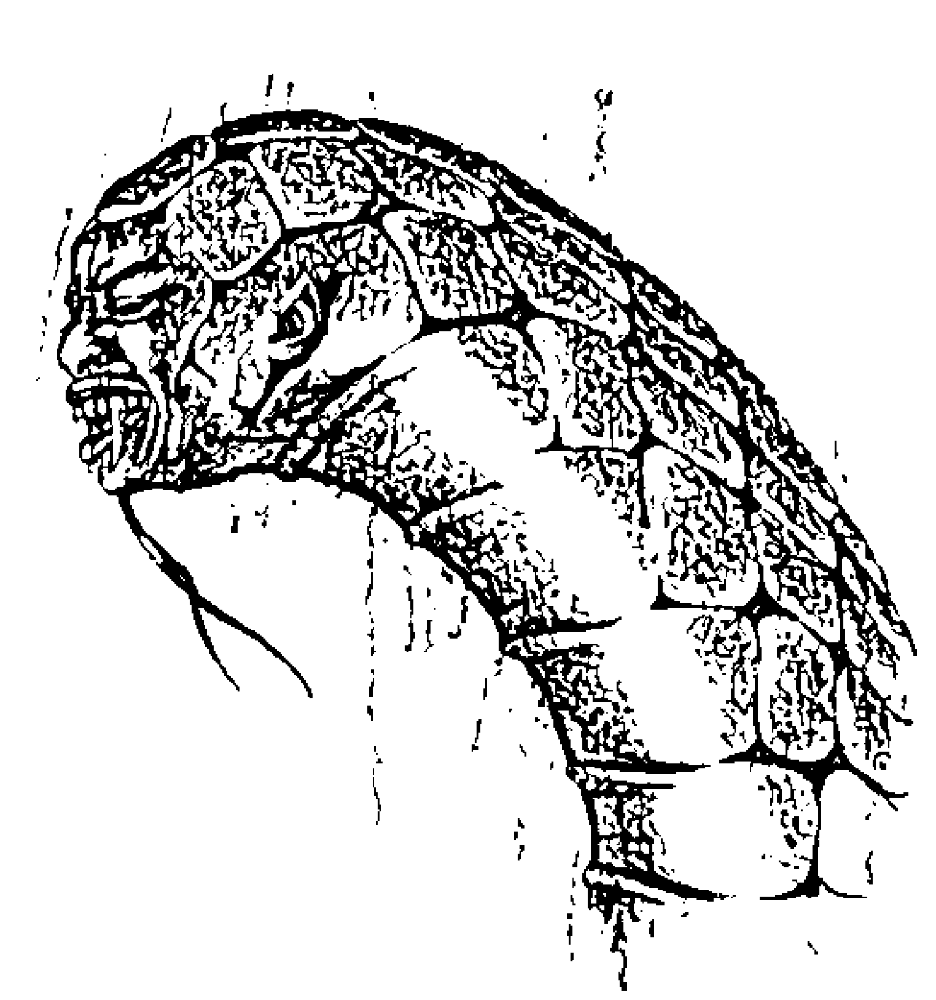

#### 食人女神
波里尼西亚

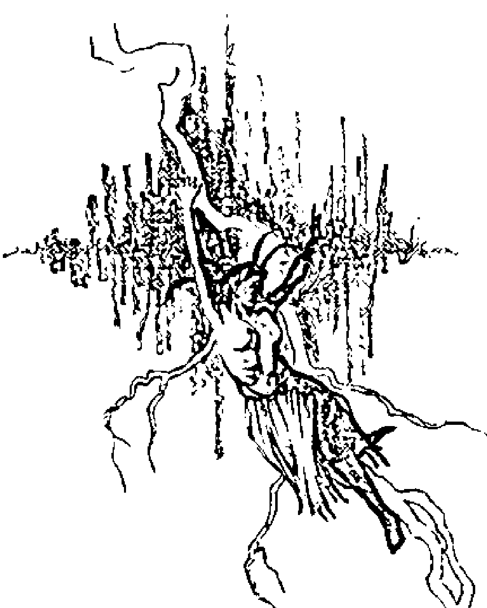

#### 寒气精灵
爱斯基摩

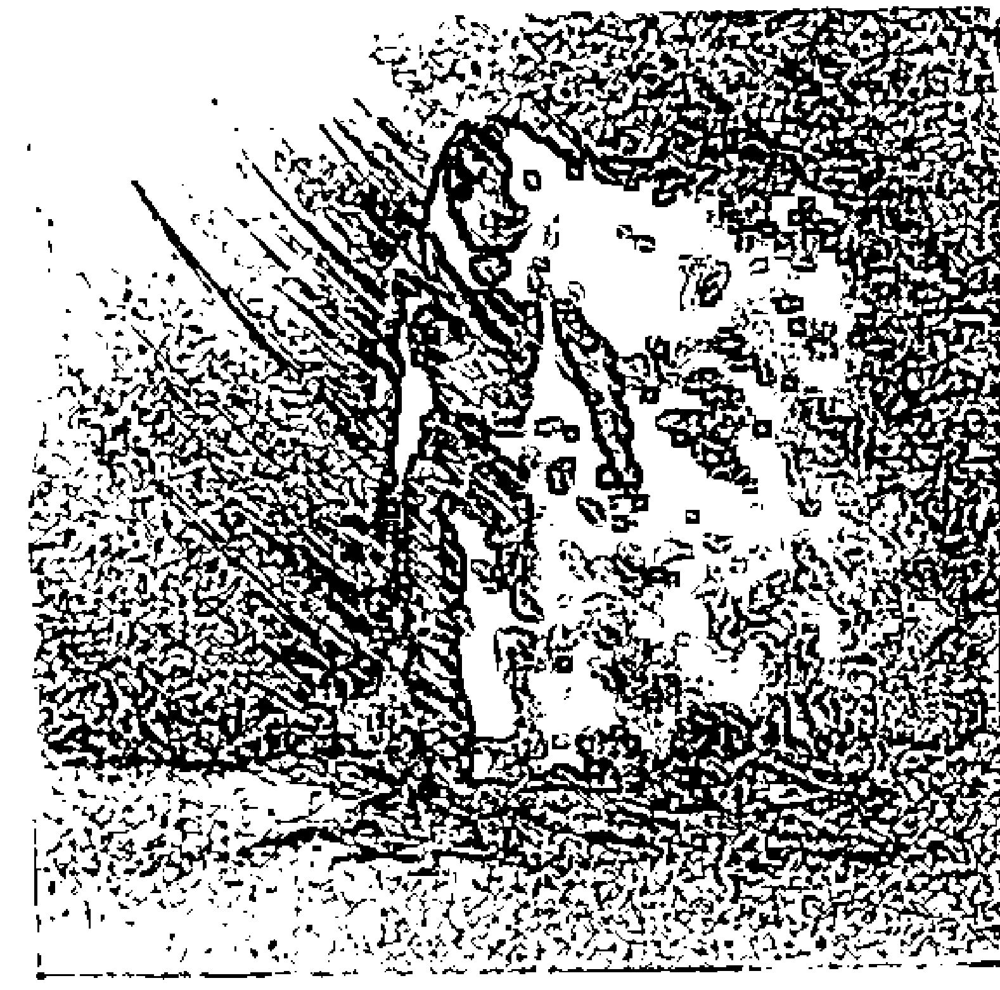

##### 无支祁
也写作“*巫支祁”（Wuchihchi）。他是淮河的神，具有引起洪水，操控妖怪的能力。据说大禹在中国各地治水的时候，无支祁想要妨碍他。
无支祁的外形像只猴子，额头很高，鼻上满是皱纹。体黑首白且可以自由伸缩，眼睛金光闪闪，牙齿雪白似雪。
对河川与沼泽非常了解，擅长应对，而且动作敏捷且拥有怪力。
大禹命令他的大臣庚辰去捕捉无支祁。无支祁呼唤精怪来抵抗，但终究不敌还是被抓了。他被带到禹的面前，禹在他脖子上扣上锁链，鼻子上挂上环扣，上面挂了一个金钟。大禹将他关在淮水之北，龟山的山脚下，让他再也不能扰乱治水。于是禹才得以安心治水。
其后，南北朝时代（5-6世纪）的记载中，据说在龟山的山脚下的深渊里，发现了类似猿猴的怪物。这只怪物身上锁了锁链，要拉它上来需要几十个年轻人与几十头牛的力量才拉得动，恐怕这只怪物就是无支祁了吧。
（→共工 Kungkung、江君大神 Chiangshen-

##### 五通神
令中国南方为之恐惧的淫神。
据称某时代，中国流传着“南有五通、犹北之有狐也”。南方的五通神就和北方的狐一样四处作祟。特别是家有美丽的女性，必定会遭到侵害。然而，和狐狸不同，五通神并无方法可驱逐，人民因此更为恐惧、厌恶。
明代晚期，有位姓万的书生，偶然间得知自己借宿的民家遭到五通神骚扰，当晚便埋伏谋刺，顺利除去三通，使得其中一通身负重伤。
不久后，金龙大王的女儿受到往来男子的请托，假扮侍女撕裂最后一通。
自此，五通之害已除。上述逸话皆记载于《聊斋志异》（1766年）中。
原本，五通神称为“五显神”，为东岳泰山神之五子，降至凡间。然而，为何后来转变成南方的淫神，其中缘由不甚清楚。可能是传说流传时，性格突变所致。
（→玉藻前 Tamamo-no-mae）

##### 邬文化
明代（1368～1644）神魔小说《封神演义》中出现的巨人。
《封神演义》此小说是将古代实在的商（殷）王朝为周所灭之史实故事化，并融合了仙界纷争而成。与同为润色史实而成的历史小说《三国演义》相较，因主角为仙人妖怪，故为幻想色彩较浓的作品。
于以周为首的诸侯联军伐商末期时，商朝因武将不足进行招募，邬文化往而应之。被配属到袁洪旗下拦阻周军前进。
他除身体巨大并拥有与体格相应之怪力外，并无法力或神力。然而，或许对古人而言光是敌人出奇高大，便已能让人心生畏惧，与在怪兽电影中见惯巨大怪物相搏的现代人有所不同。
邬文化与袁洪一同对周军军营发动夜袭，造成25万人以上的死伤并杀害将士34人。不过后来中了周营道士杨戬之计，被诱入谷中以火烧杀。
（→石矶娘娘 Shihchi-nianigniang）

#### 水神·怪物 中国
tachun、洪水之兆The omen of flood、钱塘龙王 Chientang-lungwang、洞庭神君 Tungting-shenchun

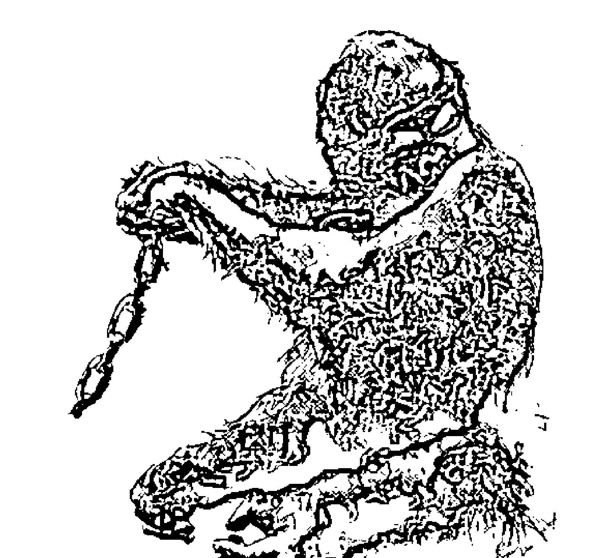

#### 淫神·恶神 中国

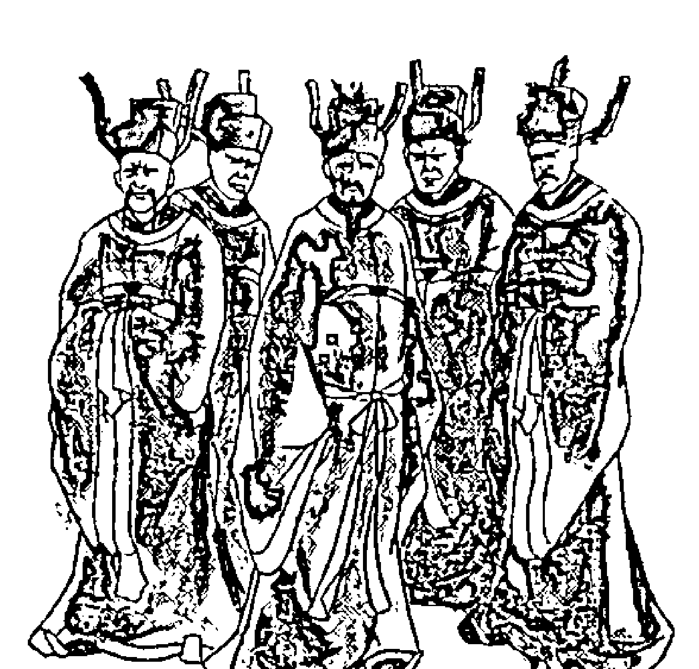

#### 巨人 中国

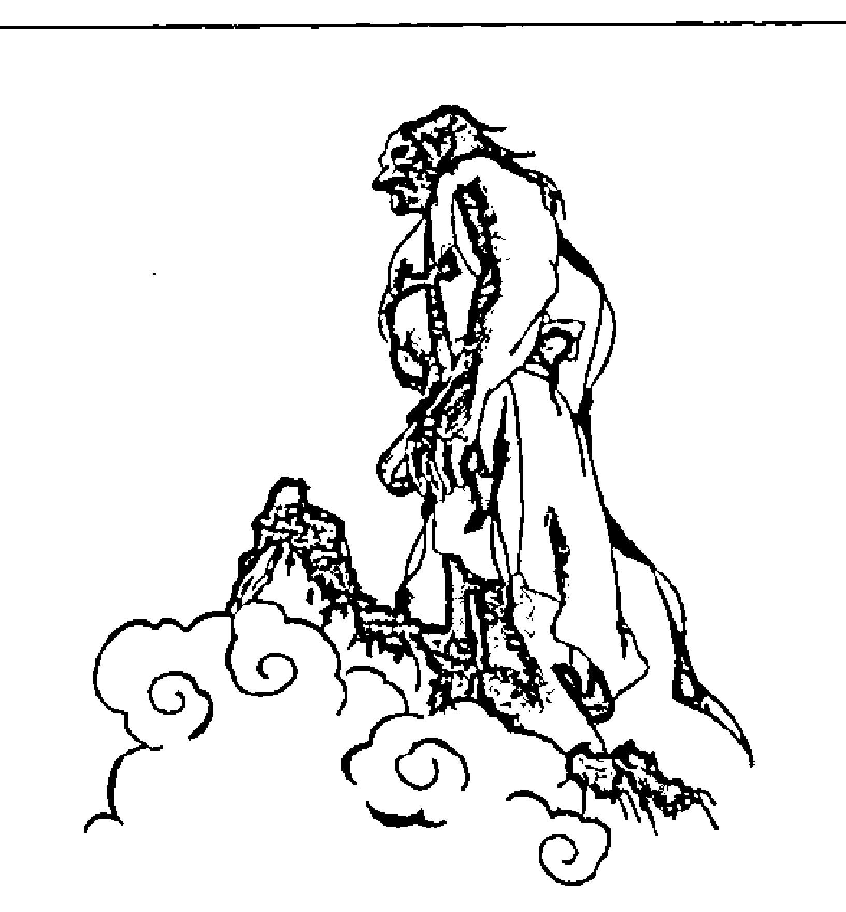

#### 雅朱者与马朱者
《新约圣经》的《启示录》中曾提到叫做“歌革”(Gog)与“玛各”(Magog)的东西。在世界末日之时，恶魔出来迷惑地上四方的列国，就是“歌革和玛各”，叫他们聚集争战。这“歌革和玛各”到底是什么无法确定，因而有种种的说法来解释；有国家、恶魔的集团、巨人族，巨人兄弟，或者说歌革玛各是一个巨人等等各种说法。
伊斯兰教的经典《可兰经》便采取此两者是巨人族的说法，记有如下之事。
久远以前，希腊有个国王叫做亚历山大 (Alexander the Great, 356B.C.-323B.C.)，他是虔诚的伊斯兰教徒，因此神赐给他地上的统治权，他因此得以征服地上无数的国家。而且也得以行遍世界东西南北，看到种种不可思议的事物。
北方的尽头有两座很高很高的山脉耸立着。北国人民说叫做雅朱者与马朱者的巨人族要跨过这两座山来此作乱。因此亚历山大王将融化的铜与铁注入山谷间，做成了巨大的城墙。在末日之前，这座城墙保护了人类的安全，但是一旦世界末日来临时，雅朱者与马朱者就会由那里涌进来。

#### 夜行者
这是日本德岛县传说中的怪异神。
以前当地人将节分（立春的前一天）晚上叫做夜行日，特别禁止晚上出门。因为据说那一天晚上是魑魅魍魉活动的日子。
如果在夜行日的晚上出游的话，会遇到骑着无头马的夜行者。如果遇到了，就会立刻被夜行者抓住丢飞出去，被无头马踹死。
有的地方的传说是只有无头马会出现，也有的地方是说只有马头会出现在路上浮行。不管怎样，禁止夜出这点是各地共通的。
原本所谓的夜行指的是祭礼的时候，将神明的神体移到外面的意思。这个仪式是在深夜举行，而除了仪式的执行人员以外，则必须要谨慎地待在家里，不得外出。
而夜行者则可以说就是对于这些破坏禁忌、玷污了神圣仪式的惩罚的具体表现。
（→菅原道真 Michizane Sugawara、平将门 Masakado Taira）

#### 阎魔
原本是印度的死神，后来随着时代演进，变成了地狱之王，在佛教中则成了属于天部的神。传到中国翻译作“阎魔”,再传到日本时则念作“enma”。
据说阎魔是日神遍照者 (Vivasvat) 与技术之神陀湿多 (Tvastar) 之女娑罗尼尤 (Saranyu) 之间所生的双胞胎，其妹叫做阎密。这两人是最早的人类，为了帮后来的人类开路，他们在这世上旅行，最后来到了死者之国。于是也立下了人类由生到死人生历程。阎魔为了往后的人类着想，于是自己当上死国的国王。死国原本是像天国一般充满幸福的土地，但是因为统治这样的天国的神增加了，因此阎魔所统治的国度也逐渐变化成地狱了。阎魔负责审理世间人的罪恶与管理人类寿命的命运之书，也就是俗称的“生死簿”。一旦有人的寿命到了尽头，阎魔就会乘着水牛来到他面前，手持长矛与绳圈，将死者套住拖往地狱去。
（→恶魔王 Dis,Dite,Luccifero）

#### **巨人族 伊斯兰教**
(→易卜劣斯Iblis)

288 译注：此故事出自《可兰经》18：83-110。《可兰经》中原文作左勒盖尔奈英（Dhul Qarnain），名字意思是“双角人”。其所指到底是谁并无定说，但比较普遍的说法是说他指的就是亚历山大大帝，本书中所采用的就是这个说法。

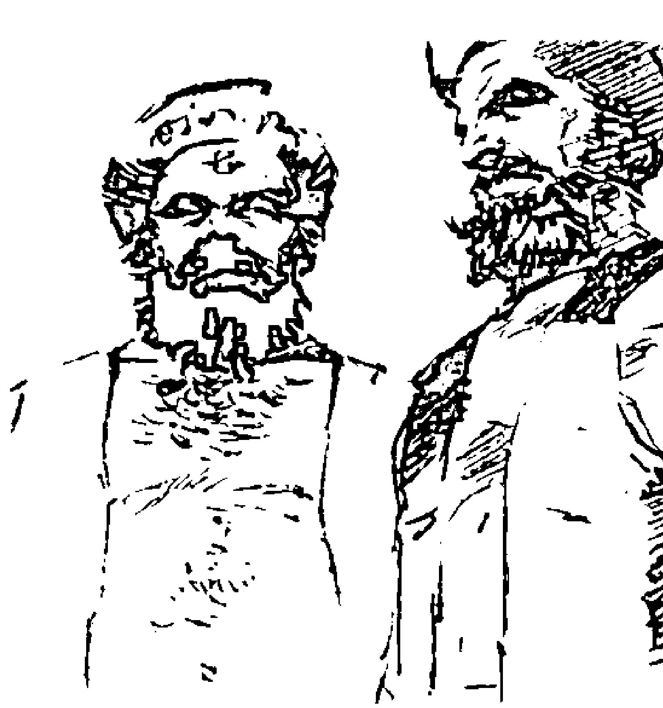

#### **祸神 日本**

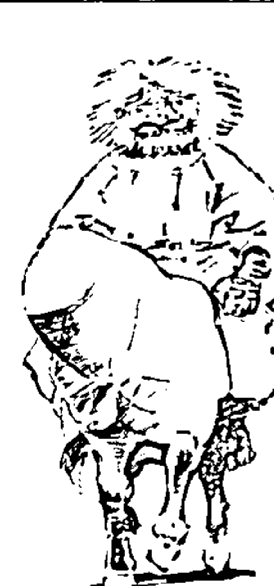

#### **地狱之王 印度**
289 译注：中国俗称阎罗王，不过不敢肯定是否初传入时称作阎魔。根据《古代印度神话》写作阎摩。290 译注：音译毗婆湿婆陀。吠陀神话体系中的日神，同时也是双马童（Asvin，音译“阿湿波”，为一对孪生兄弟神）的父亲。

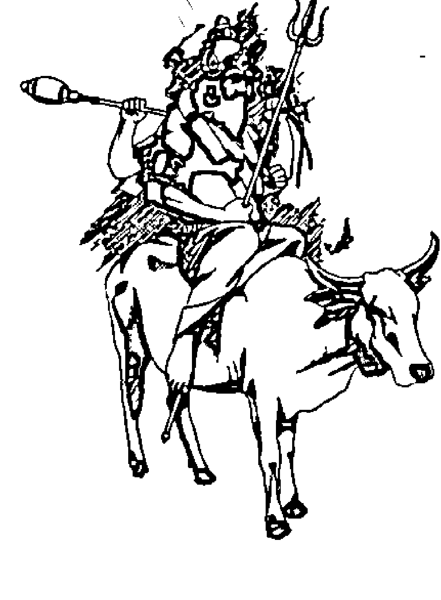

#### 八俣远吕智
他与须佐之男命（Susanowo-no-mikoto）之间的死斗，可说是日本传说故事上最大的动作剧。恐怕他是日本传说中最凶恶的蛇神・邪神了吧。他是拥有八颗头与深红发亮的眼睛的巨蛇。名字也可写作“※八岐大蛇”（Yamata-no-worochi）。

住在出云・肥川附近的足名椎・手名椎夫妇有七个女儿，但是八俣远吕智要夫妇每年献上一个女儿当祭品，于是到了今年终于轮到最后一个女儿，也就是栉名田比卖要当祭品了。就在这个时候，恰好被高天原（神的世界）流放到人间的须佐之男命来到此地。

靠着他的计谋让八俣远吕智喝得烂醉，于是终于被须佐之男命所斩杀了。之后他在八俣远吕智的尾巴中得到了神器草那艺之太刀（也就是一般通称的草薙剑、天丛云剑）。

这个神话的背景被认为是崇拜天津神的大和民族与肥川一带的铁器文化的原住民之间的争战。肥川就是绯川，绯色指的是铁砂的颜色。而神话中从蛇的尾巴得到剑可以说就是个证据。

值得一提的是，另外也有传说认为，其实八俣远吕智并没有死亡，带着残破的身躯逃出后成为依

#### 亚姆
这是迦南神话中，巴力（Ba'al）的敌人——“海的王子，海流的支配者。”

亚姆在主神埃尔召开的神明会议上威胁众神，要他们献出贡品来，并且让巴力神当他的奴隶，众神们都卑贱地答应了，只有巴力左手拿起武器，右手拿着小刀与亚姆交战。

后来巴力从诸神的工匠“熟练且知觉敏锐者”手中获得雷电“追踪者”这项武器来与亚姆作战，但是亚姆十分顽强，没办法轻易地打倒，于是巴力又再度向亚姆丢出另一道雷电“流放者”，“流放者”击中亚姆的眉间，顽强的亚姆终于败北了。

这一段战斗的情形在一首诗中有所描述，如下：

> “将他碎尸万段吧，强大的巴力啊 将他碎尸万段吧，《乘云者》啊 《海王子》现在已经是我们的俘虏了啊！ 《海流的支配者》现在已经确确实实地是我们的俘虏了啊！”

“海”被杀死，这代表着原本无法驾驭的水因而得以掌控，成为可以使用的水资源的意思。

#### 弥三郎婆
新潟县²⁹¹中部祭祀弥彦山的家系中，有一族以锻造为神职。该族的族长代代称作“弥三郎”，负责管理锻造用的神火。因此这一家的女性被称作“弥三郎之妻”或“弥三郎之母”，据说她们拥有特别强大的灵力。

另外新潟县南蒲原郡葛卷村的传说中，有个叫做弥三郎的用网狩猎的猎人。有一次弥三郎被狼群侵袭，爬上树等候狼群离开，可是狼群不断试着要爬上去一直不肯放弃。这时弥三郎婆出现，从黑云中伸出她的手要抓住弥三郎。弥三郎拿起柴刀将手砍下，结果弥三郎婆与狼瞬间都消失了。弥三郎拿着砍下的手回到家后，在他家等候的老婆婆抢走手逃掉了。

关于操纵狼的老妇人日本全国都有类似的传说。而且打退老婆婆的人不是叫做“弥三郎”就是“妙太郎”。有的说法是狼本来是山神，而像弥三郎婆这种的山中老妖原本是山神的祭司变成的。也就是说，这样的传说是从神职者与山神之间的交流的故事为基础发展的。

> (→天邪鬼 Amanojyaku)

#### 蛇神·邪神
日本

吹山的山神，后来与当地的地主之女生下一子，那个孩子就是后来的酒吞童子（Syuten-douji）。可见反抗朝廷的思想事实上一直根深蒂固地存在着。

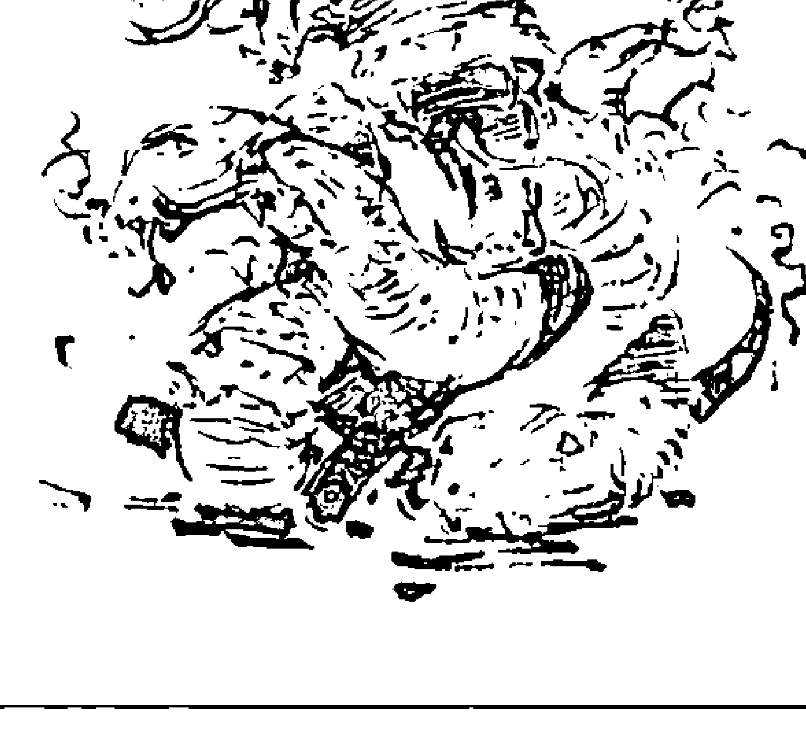

#### 海王子
迦南

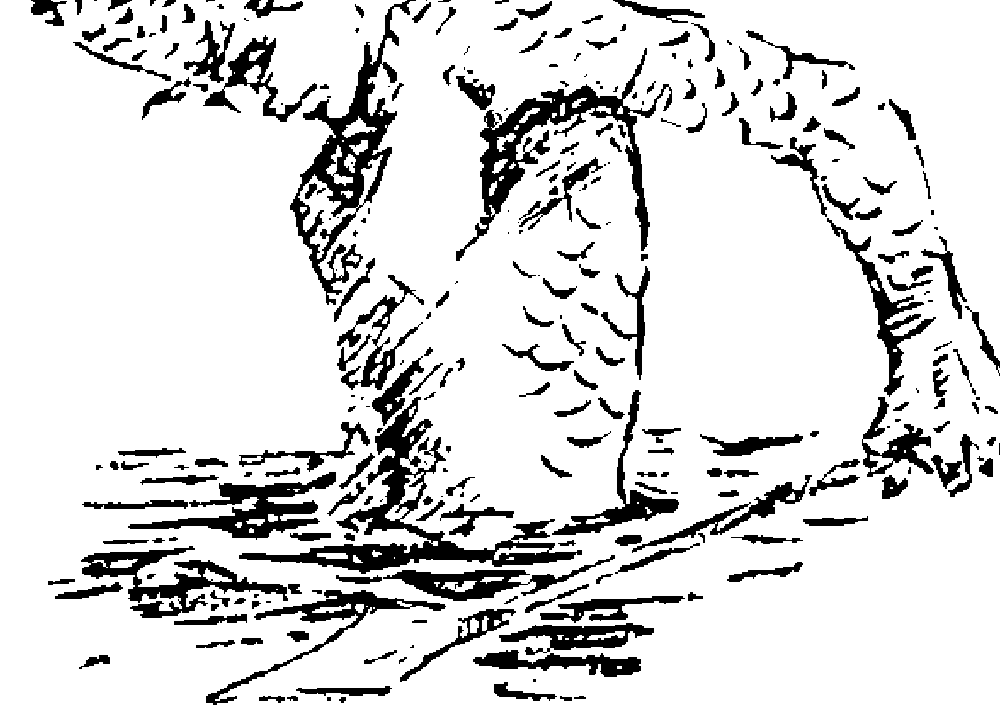

#### 女妖·魔女
日本

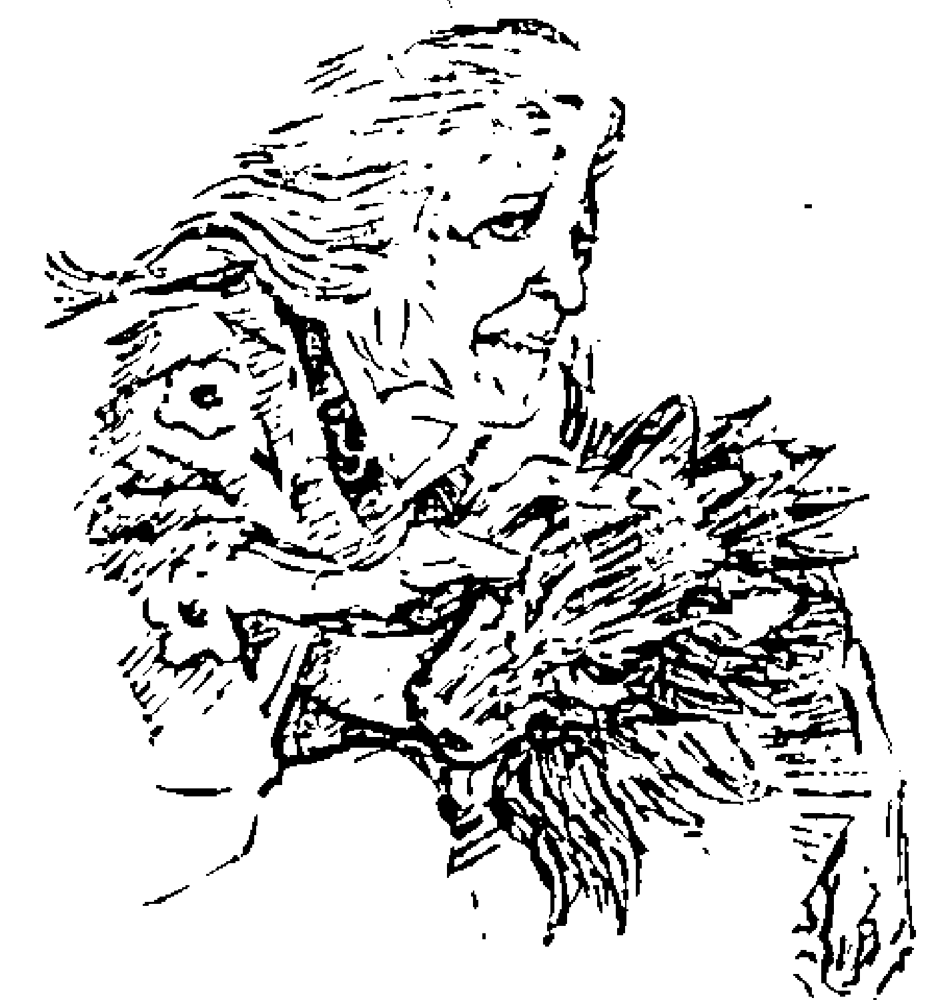

291 译注：日本的一县，位置在日本本州岛岛上的东北方靠日本海侧。

#### Yato-no-kami
##### 夜刀神
他是有角的蛇神。而且与其说是单一的神，不如说是一群的神。

在《常陆国风土记》行方郡的段落中，提到继体天皇（在位507年？-531年？）时代，箭括氏麻多智于常陆国（茨城县）的谷间的一片沼泽开垦营造新田时，夜刀神成群结队来袭，妨碍开垦。箭括氏麻多智砍杀了众多的夜刀神，但是因为害怕他们作祟，因此自己建了神社来祭拜。

后来孝德天皇（在位645年-654年）的时代，壬生连麻吕在这块土地上开垦时，夜刀神又再度出现。

于是壬生连麻吕命令手下“就算他们是神，违背皇上意旨者杀无赦。”再度将夜刀神击退了。

从这些故事可以发现，所谓的夜刀神正是住在朝廷尚未平定的土地上的“化外之神”——换句话说，也就是常陆国的原住民。

夜刀神的“夜刀（音 yato）”与爱奴族语中的代表“沼泽”意思的“yati”这个字相通。因此夜刀神其实就是“住在沼泽的神”。

(→恶路王Akuroou、武瓮槌神Takemikaduchi-no-mikoto、手长脚长 Tenaga & Ashinaga、两面宿...

#### Y'golonac
##### 伊果鲁纳克
伊果鲁纳克乃恶行与败德之神。但尽管如此，他却非亲自为之，而是喜爱让崇拜者施行恶事，于世上散布让精神堕落的方法。

伊果鲁纳克的原形貌似身体巨大肥胖的裸男，然而项上无头，肌肤发出白热光芒。且两掌上张着血盆大口。于进行恶行时，只要呼喊或说出伊果鲁纳克之名他便会现身。大多数的场合中，他在选择牺牲者时会选择读过《葛拉奇启示录》等黑魔法书，对伊果鲁纳克有一定认识之人。伊果鲁纳克也对诱骗人类阅读《葛拉奇启示录》一事十分擅长。（→葛...

有邪恶资质之人一旦与伊果鲁纳克接触后，伊果鲁纳克会对他加以诱惑，令其更加罪恶堕落。而当对方完全沦入邪恶时，便附至那名人类身上将他吸收。借着如此，伊果鲁纳克能够自由变为该名人类的外表或是原形。

#### Yig
##### 依格
司掌克苏鲁神话诸蛇的神灵。在美洲中西部平原、姆大陆（Mu）、古・扬（K’n・yan）292等地受崇拜。据说也是阿兹特克蛇神魁札尔科亚特尔（Quetzalcoatl）的原形。除人类外也受克苏鲁神话中的蛇人崇祀。

外形被描述为蛇头人身遍体鳞片的壮硕男子。正如“众蛇之父”的别名所示，他能自由召唤控制蛇类。

对于敬重蛇者温和宽厚，甚至会授予蛇毒的知识、与蛇对话之能力；对迫害蛇的存在冷酷无情，有...

时会将其变为蛇。另外，在群蛇饥饿的秋季他会变为粗暴灾神。

由现代人的观念会由蛇神的外表认为他是邪神。但自古以来许多民族将蛇视作再生与生命力的象征（有人认为如此的主因之一是蛇会脱皮），甚至将蛇作为此类魔力的象征。单单只将依格视作邪神，可谓是现代人的傲慢。

#### 蛇神・祸祟神
日本

傩 Ryoumensukuna）

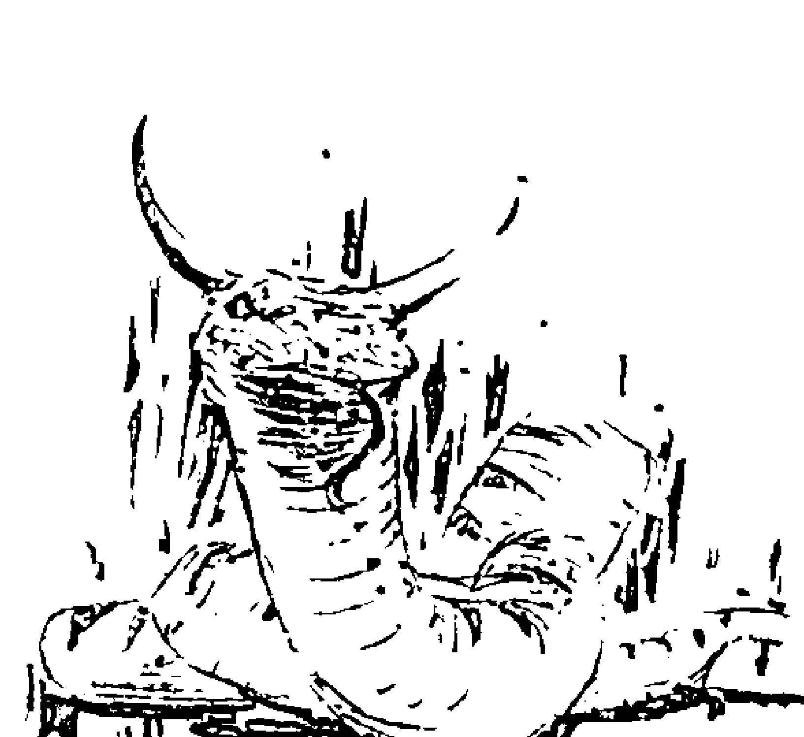

#### 邪神
克苏鲁神话

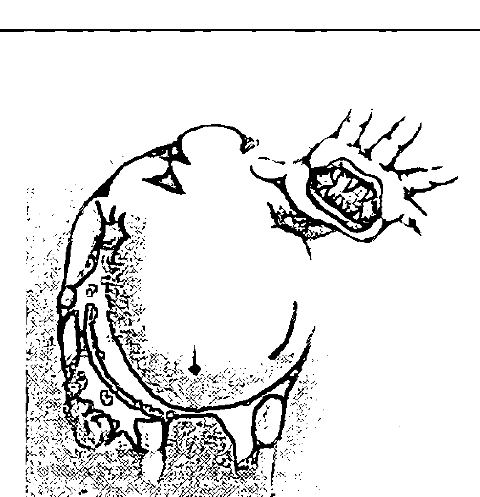

#### 蛇王
克苏鲁神话

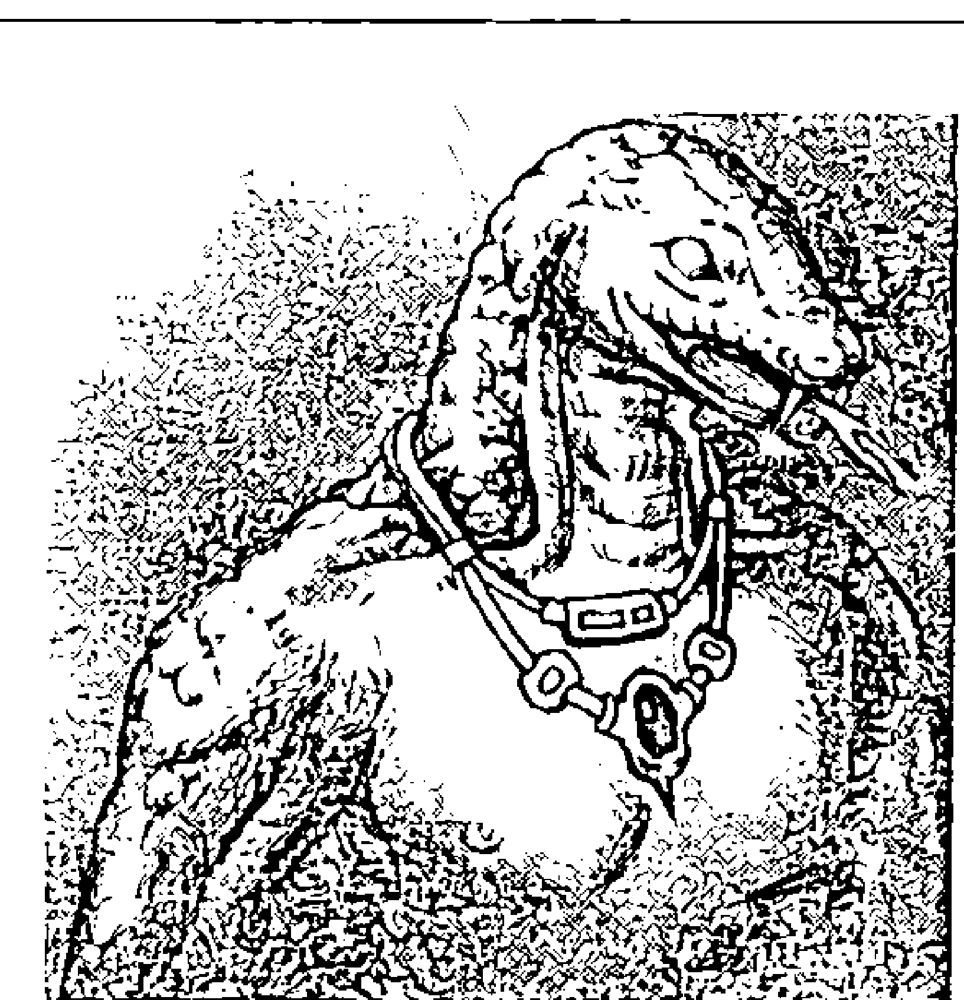

292 评注：此为克苏鲁神话创作者 H. P. 洛夫克莱夫特所著作品中的地底世界

#### Yuchiáng
#### 禺强
既是海神也是风神，又是传播疾病的瘟神。禺强也作“禺强”、“禺京”，是帝王神・黄帝之孙293。

居北海之海神禺强，其身与手足似鱼，乘双头龙。身与手足似鱼，应是指披有湿鳞。

风神禺强，字玄冥，传为古代帝王・颛顼的部下。人面鸟身、耳饰两蛇、脚踏两蛇。传说与海神禺强相同，支配北方。

海神能兼风神的传说是基于《庄子》294：“化鲲为鹏”，而鲲指的就是鲸鱼。

然而，风神禺强却也是乘风散播疫病的瘟神，所...

到之处皆为之伤，自古为人所厌忌。文献将他与“伯强”一同视为瘟神。并将北西之风称为厉风（疫病之风），人皆惧之。

(→疫病之兆 The omen of plague、疱疮神 Housou-gami)

#### Zagan
#### 撒共
据称为古以色列王国国王所罗门所著，现于17世纪的魔法书《雷蒙盖顿》（又名 The Lesser Key of Solomon）书中第一部分〈哥耶提雅〉中所记载72名恶魔之一。别名“※撒共姆”（Zagam）。

和同为《雷蒙盖顿》恶魔之一瓦布拉（Vapula）非常类似。撒共和瓦布拉一样拥有狮鹫（Griffon）的翅膀，以四福音书295作者之一的路加之象征——牛的姿态出现（瓦布拉则是采用四福音书作者马可的象征——狮子的姿态。）

与圣经的情节作为发想十分吻合，撒共能将水...

变成酒，再将酒变成血，且精通于炼金术。根据16世纪学者雷吉那勒德的著作，他的能力还要加上能将恐者变成贤人一项。

19世纪法国作家柯林・德・普朗西所著《地狱辞典》中以“撒共姆”之名介绍此位恶魔，并增添他是地狱君王、议长、30军团的指挥官等描述。虽然其外貌似牛的姿态十分具有个性，但画家M. L.布尔顿（M. L. Breton）却无绘其肖像，因此撒共姆知名度不高。

#### Zenon the Demon Lord
#### 恶魔王赛农
永井豪漫画《恶魔人》中登场的恶魔族之王。

初次登场时令自身身影浮现于全世界上空，出场方式极其震撼。这一表现手法因效果颇具冲击性，为诸多作品仿效。

此时，拥有勇者安蒙（Amon the Brave）记忆的主角不动明（＝恶魔人），在面对恶魔王赛农的影像时，即使是恶魔族中力量数一数二的勇者安蒙，也自承对恶魔赛农心怀恐惧。

然而，登场时虽然声势惊人，恶魔王赛农却毫无作为便被恶魔人打倒。这完全是为了他背后尚有...

魔王撒旦（Satan the Demiurge）存在的缘故。或许，自魔王撒旦的存在被暗示出来时起，赛农便由最终大魔王、敌方头目转而降格为通往最终敌人的台阶之一。

他最后在《恶魔人》中的位置，与其说是恶魔族的支配者，不如说是恶魔族的直接指挥官。他之所以在恶魔族与恶魔人军团的冲突中被打倒，或许也是为此缘故。

#### 海神·风神·瘟神
中国

293 译注：语出《山海经》《大荒东经》：“黄帝生禺䝞，禺䝞生禺京，禺京处北海，禺䝞处东海，是为海神。”
294 译注：语出《庄子》《逍遥游篇》。其原文为：“北冥有鱼，其名为鲲。鲲之大，不知几千里也。化而为鸟，其名为鹏，鹏之背，不知几千里也。怒而飞，其翼若垂天之云。是鸟也，海运则将徙于南冥。南冥者，天池也。”此处的鲲鹏蓝本非典出《庄子》，而是来自于古代神话中兼北海海神和风神于一体的禺强。

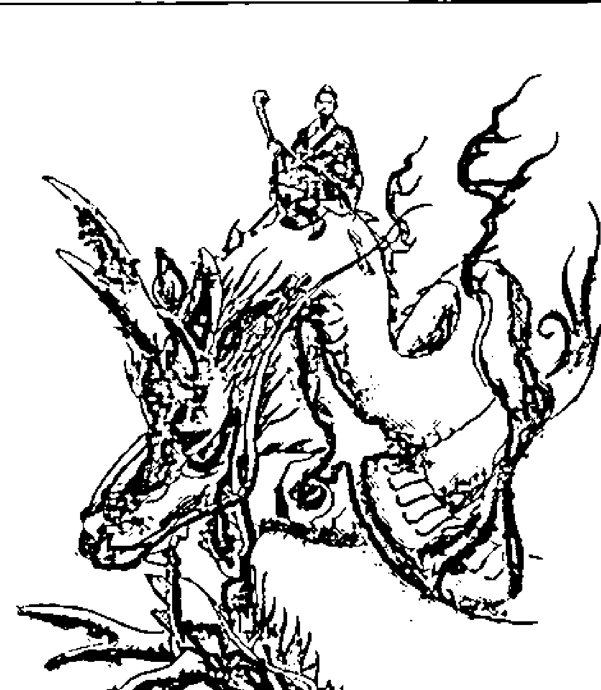

#### 恶魔·所罗门的恶魔
雷蒙盖顿

295 译注：福音书有四篇：〈马太福音〉、〈马可福音〉、〈路加福音〉和〈约翰福音〉。被教会认为是耶稣的门徒或门徒的门徒写的，实际作者无从得知。一世纪末和二世纪初，基督徒掀起了假托耶稣的门徒匿名写福音书的热潮，这四篇不过是其中的一部分而已，其它的还有〈彼得福音〉、〈马利亚福音〉、〈腓力俄福音〉、〈多马福音〉等等，只不过这些福音被教会认为是伪经，不收入新约。

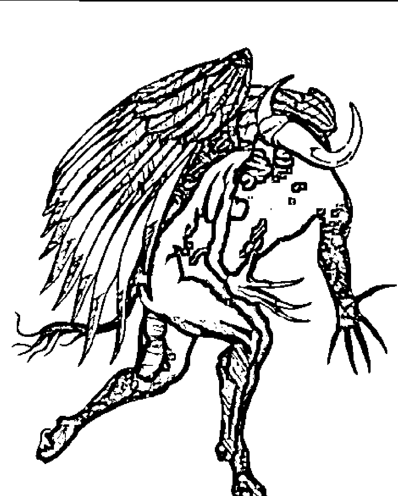

#### 恶魔族之王
日本

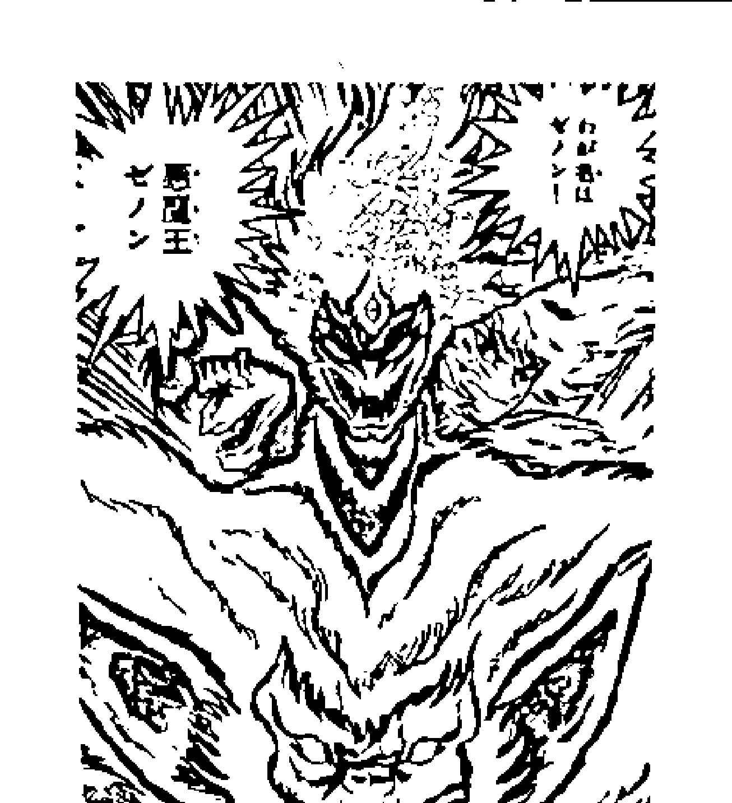

#### 桀派 Zepar
这是记载于17世纪的魔法书《雷蒙盖顿》（Lemegeton, 又名The Lesser Key of Solomon）的第一部〈哥耶提雅〉中，72位恶魔的其中一位。
桀派会以士兵的姿态现身在召唤者的眼前。与同属于《雷蒙盖顿》书中之恶魔的塞列欧斯（Saleos）或西迪（Sytry）一般，桀派也是与男女之爱、热情、情欲等有关的恶魔，只要得到命令，不论是什么样的女性，他都有办法把人带到召唤者面前，还能让女性的心熊熊燃起对于男人的爱意。桀派还有一种奇诡的能力，就是能令女性不孕。
19世纪法国作家柯林·德·普朗西所著的《地狱辞典》中，曾指出桀派（Zepar）说不定是威沛（Vepar）的别名，但是一般认为普朗西应该把桀派跟威沛的别名“※赛沛”（Separ）搞混了。
《地狱辞典》也述及桀派与人类的情欲有关，并附加说明他是地狱的大公爵，且是29个军团的指挥官。或许是由于外形没有特出之处，本书的插画家M.L.布尔顿并未画出桀派的肖像画，也使他成为今日知名度不高的恶魔。

#### 辛巴克那 Zipakna
众神的敌对者维科布·卡库伊科斯（Vucub Caquix）的长男。具有“造山者”的称号。事实上是位力大无穷的怪物，只为了好玩，就在一夜之中造好了一座山脉。
他的父亲维科布·卡库伊科斯被双生英雄胡那普（Hunapu）与喀巴伦格（Xbalanque）打败后，愤怒的辛巴克那肆虐各处。
有一次，四百位战士建造屋子时，辛巴克那突然现身，状似轻松搬运木材，借以夸示力量。战士们将他视为恶人，设计除掉辛巴克那。然而，却被辛巴克那识破计策，假装死亡。粗心大意的战士们举行宴会，每个人都醉得东倒西歪。邪恶的怪物立刻将屋子扔在战士们的头上，将他们杀了。
然而，他却面临和父亲相同的命运。胡那普与喀巴伦格用计将他诱进土石松软的谷底，再引发山崩，辛巴克那遭活埋而死。

#### 兹 Zu
在美索不达米雅神话中篡夺众神王权的怪鸟。兹狮头鸟身，为掌管暴风之神。
兹为了成为众神之王，从大神恩利尔（Enlil）手中夺取天命书板“天机表”（Tupsimati）。
天机表上记载着一切律法，原本是众神的母亲蒂亚玛特（Tiamat）送给夫婿※金古（Kingu）的结婚礼物。之后，马尔杜克（Marduk）杀了金古夺走天机表，再由现在的大神恩利尔所继承。
兹之所以盗走天机表，是因为只要谁将天机表佩带在胸前，谁就是世界最高的支配者的这项规定。
众神失去天机表，每个人都吓得狼狈不堪。没有一人愿意与兹一战。此时，恩利尔的儿子，战争之神尼努尔塔（Ninurta）站出来寻找兹之所在处。兹的巢穴就在传说之山·圣峯之上。
兹与尼努尔塔一战战败后，失去了天机表。
（→舒兹Shutu、西南风的恶魔The demon of southwest wind）## 恶魔·所罗门的恶魔
雷蒙盖顿

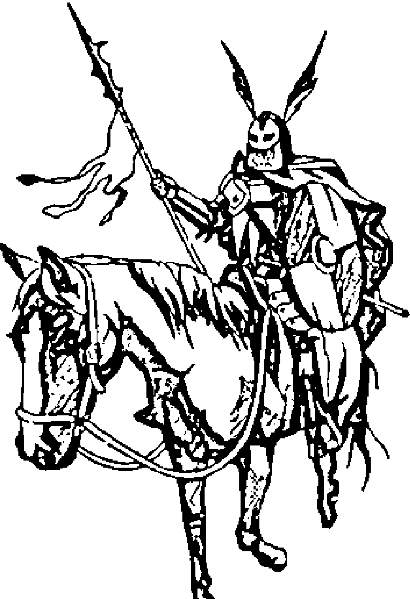

#### 怪物之子
玛雅

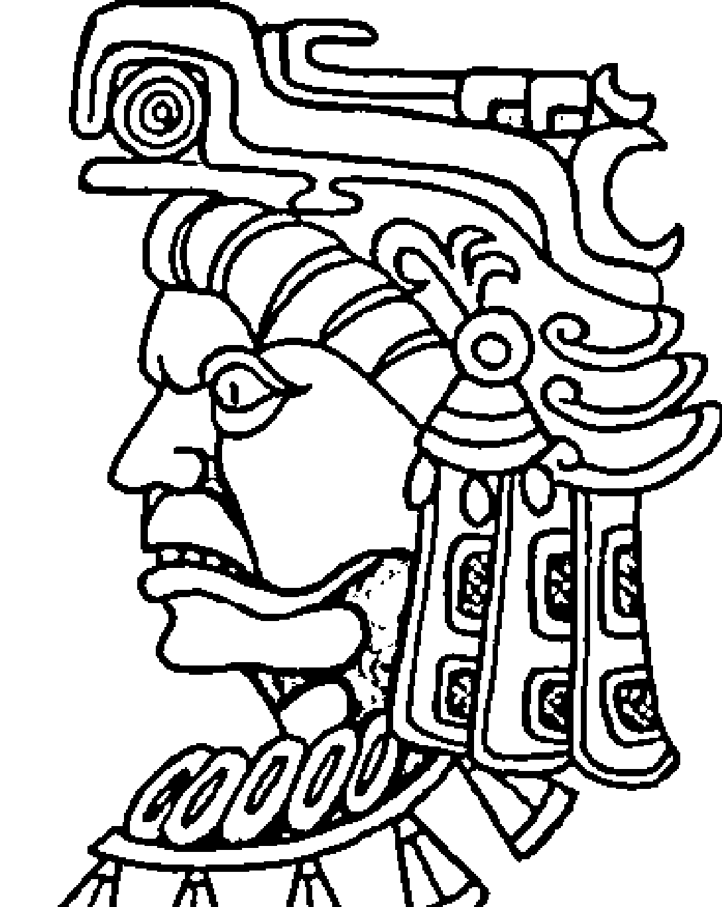

#### 暴风之鸟
苏美

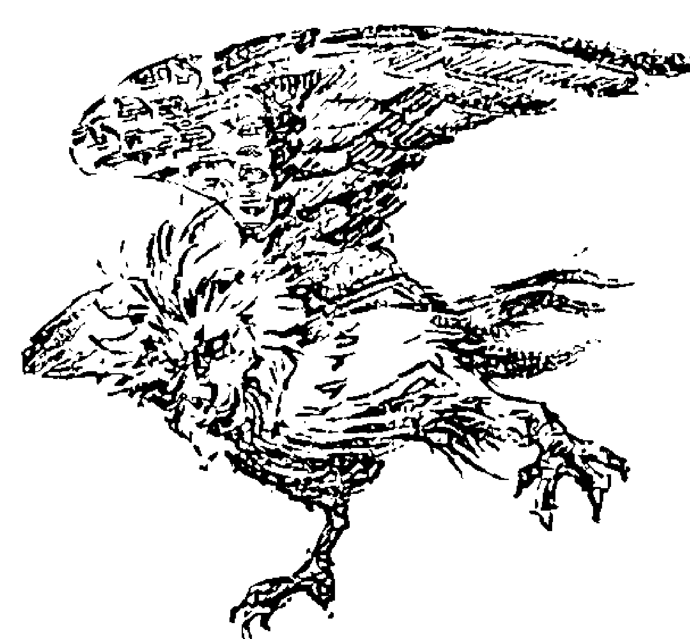

### 一神教

#### 希伯来（犹太教）

**Asmodaios**
阿斯摩代欧斯
伊朗神话中的艾什玛(Aešma)被犹太教吸收而成的恶魔。在拉比的文献中称他为“恶灵之首”。

**Asmodeus**
阿斯摩丢斯
即古代伊朗恶魔“*阿斯摩代欧斯”（Asmodaios），经希伯来人传播到欧洲。在拉比的文献中称他为“恶灵之首”。(→阿斯摩丢斯〈阿斯玛代〉Asmodeus〈Asmada〉)

**Azazel 〈Hebrew〉**
阿撒泻勒〈希伯来〉
希伯来恶魔。于《旧约圣经》〈利未记〉中也有登场。性格不明，与“恶魔”此字一样同被作为一般名词使用。(→阿撒泻勒 Azazel《失乐园》)

**Baal**
巴力
腓尼基神的巴力最初是只用来表示一个特定的神的名词。但是后来这个名词开始用来表示一般名词的“神”之后，就出现了无数的“巴力·~”了。

**Beelzebub 〈Hebrew〉**
别西卜〈希伯来〉
《旧约圣经》和拉比的文献中出现的“苍蝇王”，他被视为引起疾病的恶魔。(→别西卜 Beelzebub《失乐园》、别西卜 Beelzebub〈M.L.布尔顿〉)

**Behemoth**
贝西貘斯巨兽
他是旧约圣经中提到的怪物。看起来样子很吓人，但并不是什么邪恶的怪物。

**Belial 〈Hebrew〉**
彼列〈希伯来〉
在《旧约圣经》或《死海古卷》中提到的神明敌对者。(→彼列 Belial《失乐园》、彼列 Belial《雷蒙盖顿》(Lemegeton))

**Leviathan**
利维坦
这是希伯来神话中，受到蒂雅玛特(Tiamat)影响下产生的蛇怪，名字的意思是“盘绕起来的东西”。发音除了“利维坦”以外，也可念作“利拜雅桑”或“利未雅坦”(Liwyathan)、“隆卡”(Lotan)。

**Lilith**
莉莉丝
她是与亚当同时从土里造出来的第一个女人，亚当的第一个妻子。莉莉丝与亚当生了很多恶魔，后来她不愿听从亚当的命令因此离开他到红海去。

**Mazzikin**
玛列肯
犹太教经典《犹太法典》或《塔木德经》(Talmud) 中登场之邪灵。

**Molech Old Testament**
摩洛《旧约圣经》
《旧约圣经》〈利未记〉〈列王纪〉中所记载亚扪人 (约旦河东岸之民族) 的偶像神。(→*摩洛 Molech《失乐园》，摩洛 Moloch)

**Rahab**
拉哈伯
《旧约圣经》中出现的怪物，被神打倒。

**Samiel**
撒弥尔
即※撒末尔 (Sammael, Samael)。

**Sammael, Samael**
撒末尔
犹太密教喀巴拉 (Kabbala) 经典《光辉之书》中出现之堕落天使，被视作“夜晚的恐怖”，在《旧约圣经》伪经《以赛亚升天记》内被当作恶魔的指导人。然而在圣经的基本文献中并未登场。

**Satan《旧约圣经》†**
撒旦《旧约圣经》†
《旧约圣经》中的撒旦。本是意指“敌对者”(Adversary)的普通名词。稍后，撒旦以神的仆人天使的姿态出现，引诱人类为恶加以试练。(→撒旦 Satan《新约圣经》)

**Yamm**
亚姆
迦南神话中，巴力(Ba'al)的敌人，“海的王子，海流的支配者”。

#### 基督宗教

**Antichristos**
敌基督
《新约圣经》与后期犹太教启示思想中的概念、用语。在世界末日前出现的伪基督。(→撒旦 Satan〈中世纪欧洲〉、彼得大帝 Pyotor I Alekseyevich、马丁路德 Martin Luther)

**Baphomet**
巴弗灭 †
今日最为人所熟知的羊头恶魔。他名字的来源据说是由基督宗教的敌人穆罕默德 (Mohammed, 又作 Mahomet) 而来。

**Lucifer**
路西法
基督宗教中的叛乱天使、堕落天使之名，也叫做路西佛、路西非尔。其名为“金星”之意。被当作是撒旦的同义语。(→撒旦 Satan《新约圣经》)

**Martin Luther**
马丁路德 †
他是德国的宗教改革者 (1483-1546年)。被认为是后来一连串新教运动的始祖。因反对罗马教会，因此经常被他的教敌们骂做是“※敌基督”(Antichrist)、“恶魔”。

**参照栏外※大淫妇**
巴比伦的大淫妇 †
《新约圣经》的《启示录》中于世界末日时出现的女性。巴比伦是美索不达米亚的古城，被当作颓废与邪恶的象征。

**Satan〈Middle Ages〉**
撒旦〈中世纪欧洲〉†
欧洲中古世纪时代的魔王。自基督宗教的二元对立论中所生。

**Satan《新约圣经》**
撒旦《新约圣经》†
《新约圣经》的撒旦并不是奉神之命引诱人类为恶，而是自己到处作恶。撒旦是要被神攻击毁灭的存在。(→红龙 The Red Dragon、撒旦 Satan〈中世纪欧洲〉)

**The Red Dragon**
红龙 †
《新约圣经》〈启示录〉中登场的龙。此龙乃恶魔之首※路西法 (Lucifer)，也即撒旦。(→撒旦 Satan《新约圣经》)

### 魔法书 (Grimore)

| 左侧标题 | 右侧描述 |
| :--- | :--- |
| **Abigor**<br>亚必戈 | 《雷蒙盖顿》(Lemegeton) 72名恶魔之一，埃力格(Eligor)的别称。是《地狱辞典》中埃力格之名。 |
| **Agares**<br>阿加雷斯† | 《雷蒙盖顿》(Lemegeton) 中所记载72名恶魔之一。骑乘鳄鱼现身，授予人类语言相关知识，并司掌地震。别名“※阿加洛斯”(Agaros)。 |
| **Agaros**<br>阿加洛斯 | 《雷蒙盖顿》(Lemegeton) 中所记载72名恶魔之一，阿加雷斯(Agares)的别名。 |
| **Aini**<br>艾尼† | 《雷蒙盖顿》(Lemegeton) 中所记载72名恶魔之一。有蛇、猫、人三头，骑跨毒蛇而现。 |
| **Allocer**<br>安力瑟 | 《雷蒙盖顿》(Lemegeton) 72名恶魔之一，安洛先(Allocen)的别称。 |
| **Allocen**<br>安洛先† | 《雷蒙盖顿》(Lemegeton) 72名恶魔之一，为地狱之侯爵。拥有“※安洛瑟”(Alocer) “※安力瑟”(Allocer) “※安林恩”(Alloien)等别名。 |
| **Alloien**<br>安林恩 | 《雷蒙盖顿》(Lemegeton) 72名恶魔之一，安洛先(Allocen)的别名之一。 |
| **Alocer**<br>安洛瑟 | 《雷蒙盖顿》(Lemegeton) 72名恶魔之一，安洛先(Allocen)的别名之一。此外，《地狱辞典》中名为安洛先。 |
| **Amaimon**<br>亚迈蒙† | 仿启示文学《以诺书》所作之《伪以诺书》的目录中记载之恶魔，也被称作“※亚迈依蒙”(Amoymon) “※迈蒙”(Maimon) “※梅蒙”(Maymon)等名。(→玛门Mammon) |
| **Ambuscialas**<br>安布西亚斯 | 《雷蒙盖顿》(Lemegeton) 72名恶魔之一，安度西亚斯(Amduscias)之别名。 |
| **Amduscias**<br>安度西亚斯† | 《雷蒙盖顿》(Lemegeton) 72名恶魔之一，被认为是音乐家性格的恶魔，为地狱大公爵。别名“※安布西亚斯”(Ambuscialas)。 |
| **Amon**<br>亚蒙† | 《雷蒙盖顿》(Lemegeton) 72名恶魔之一，授予召唤者未来与过去的知识，以及情爱之秘。地狱侯爵。 |
| **Amoymon**<br>亚迈依蒙 | 亚迈蒙(Amaimon)的别名之一。 |
| **Amy**<br>亚米† | 《雷蒙盖顿》(Lemegeton) 72名恶魔之一，司掌占星术，能予人交换人类生命力的法术。 |
| **Andras**<br>安托士† | 《雷蒙盖顿》(Lemegeton) 72名恶魔之一，为地狱之侯爵。《地狱辞典》中，以地狱大公爵之身份介绍安托士。 |
| **Andrealphus**<br>安德雷斐斯† | 《雷蒙盖顿》(Lemegeton) 72名恶魔之一，为地狱之侯爵。能授予召唤者代数与几何的秘密。 |
| **Andromalius**<br>安杜马利乌士† | 《雷蒙盖顿》(Lemegeton) 72名恶魔之一，为地狱之公爵。与窃盗关系密切，拥有取回被窃之物、察明小偷真面目之力。 |
| **Ashtart**<br>阿斯塔特 | 《雷蒙盖顿》(Lemegeton) 中所记载72名恶魔之一，亚斯他录(Astaroth)的别名。 |
| **Ashtarte**<br>亚斯他特 | 《雷蒙盖顿》(Lemegeton) 中所记载72名恶魔之一，亚斯他录(Astaroth)的别名之一。 |
| **Asmodai**<br>阿斯摩代 | 《雷蒙盖顿》(Lemegeton) 中所记载 72 名恶魔之一，阿斯摩丢斯(Asmodeus)的不同的名字。《伪以诺书》的恶魔目录中也载有其名。 |
| **Asmodeus**<br>阿斯摩丢斯† | 源自于犹太神话的著名恶魔，于《托比书》中登场。以“※阿斯玛代”之别号记载于《雷蒙盖顿》(Lemegeton) 及《伪以诺书》恶魔目录中。 |
| **Astaroth**<br>亚斯他录† | 《雷蒙盖顿》(Lemegeton) 中所记载72名恶魔之一，其造型取自古巴比伦王国丰穰女神伊西塔 (Ishtar) 的传说与诸多解释，是位十分有名的恶魔。《伪以诺书》的恶魔目录中也载有其名，拥有许多别称。 |
| **Ayperos**<br>埃沛欧斯 | 《雷蒙盖顿》(Lemegeton) 中所记载72名恶魔之一。是恶魔因波斯(Ipos)的别名之一。 |
| **Ayporos**<br>埃波罗斯 | 《雷蒙盖顿》(Lemegeton) 中所记载72名恶魔之一。是恶魔因波斯(Ipos)另一别名。 |
| **Baal**<br>巴力† | 《雷蒙盖顿》(Lemegeton) 72 名恶魔之一，《伪以诺书》的恶魔目录中也载有其名。以腓尼基人崇拜的太阳神巴力(Ba'al)为蓝本。 |
| **Bael**<br>巴耶力 | 《雷蒙盖顿》(Lemegeton) 72名恶魔之一，巴力(Ba'al)的别名。被描述成恶魔当中最有力的一人，据说以腓尼基人崇拜的太阳神巴力为蓝本。 |
| **Balam**<br>巴拉姆† | 《雷蒙盖顿》(Lemegeton) 72 名恶魔之一，《伪以诺书》的恶魔目录中也载有其名。给予召唤者过去与未来的知识。别名 “※巴兰” (Balan)。 |
| **Barbas**<br>巴巴斯 | 《雷蒙盖顿》(Lemegeton) 72名恶魔之一，玛巴斯(Marbas)的别称。此外，《地狱辞典》中名为玛巴斯。 |
| **Barbatos**<br>巴巴妥司† | 《雷蒙盖顿》(Lemegeton) 72名恶魔之一，《伪以诺书》的恶魔目录中也载有其名。相传为堕落的力天使。 |
| **Bathin**<br>巴钦† | 《雷蒙盖顿》(Lemegeton) 72名恶魔之一，《伪以诺书》的恶魔目录中也载有其名。是路西法(Lucifer, ※路西勿罗 Luccifero)之亲信，贵为地狱大公。拥有许多别称。 |
| **Batym**<br>巴提姆 | 《雷蒙盖顿》(Lemegeton) 72名恶魔之一，巴钦(Bathin)的别称之一。《伪以诺书》的恶魔目录中也载有其名。 |
| **Bayemon**<br>拜耶蒙 | 《雷蒙盖顿》(Lemegeton) 72名恶魔之一，派蒙(Paimon)的别名。《伪以诺书》的恶魔目录中也载有其名。 |
| **Beal**<br>比亚珥 | 《雷蒙盖顿》(Lemegeton) 72名恶魔之一，比利土(Berith)的别名之一。《伪以诺书》的恶魔目录中也载有其名。 |
| **Beelzebub (M.L.Breton)**<br>别西卜 (M.L. 布尔顿)† | 画家M.L.布尔顿所绘的“苍蝇王”别西卜。(→巴力Ba'al、别西卜 Beelzebub〈希伯来〉) |
| **Beleth**<br>贝雷特† | 《雷蒙盖顿》(Lemegeton) 72名恶魔之一，讨厌被人召唤，被召唤时总是一幅生气的模样。《伪以诺书》的恶魔目录中也载有其名。 |
| **Beljeth**<br>表雷特 | 《雷蒙盖顿》(Lemegeton) 72名恶魔之一，贝雷特(Beleth)的别称之一。《伪以诺书》的恶魔目录中也载有其名。 |
| **Belial (Lemegeton)**<br>彼列《雷蒙盖顿》† | 《雷蒙盖顿》(Lemegeton) 72名恶魔之一，《伪以诺书》的恶魔目录中也载有其名。希伯来文意为“无价值”、“无赖”，后来演变成恶魔的名字。(→彼列 Belial《失乐园》、彼列 Belial〈希伯来〉) |
| **Bileth**<br>比雷斯 | 《雷蒙盖顿》(Lemegeton) 72 名恶魔之一，贝雷特(Beleth)的别称之一。《伪以诺书》的恶魔目录中也载有其名。 |
| **Bitru**<br>毕特鲁 | 《雷蒙盖顿》(Lemegeton) 72 名恶魔之一，西迪(Sytry)的别称。《伪以诺书》的恶魔目录中也载有其名。 |
| **Botfy**<br>伯菲 | 《雷蒙盖顿》(Lemegeton) 72 名恶魔之一，比利土(Berith)的别名之一。《伪以诺书》的恶魔目录中也载有其名。 |
| **Bolfri**<br>伯夫莱 | 《雷蒙盖顿》(Lemegeton) 72 名恶魔之一，比利土(Berith)的别名之一。《伪以诺书》的恶魔目录中也载有其名。 |
| **Botis**<br>波提斯 † | 《雷蒙盖顿》(Lemegeton) 72 名恶魔之一，常被认为是高位的恶魔，一般说来他是地狱的总裁，最低也还是个伯爵。《伪以诺书》的恶魔目录中也载有其名。 |
| **Buer**<br>布耶尔 † | 《雷蒙盖顿》(Lemegeton) 72 名恶魔之一，《伪以诺书》的恶魔目录中也载有其名。拥有伯爵称号的恶魔。与海星有关。 |
| **Bune**<br>布涅 † | 《雷蒙盖顿》(Lemegeton) 72 名恶魔之一，《伪以诺书》的恶魔目录中也载有其名。与死亡的关系很深，据说他知道能致人于死的咒语。 |
| **Byleth**<br>比雷特 | 《雷蒙盖顿》(Lemegeton) 72 名恶魔之一，贝雷特(Beleth)的别称之一。《伪以诺书》的恶魔目录中也载有其名。此外，《地狱辞典》中名为贝雷特。 |
| **Caacrinolas**<br>卡喀里诺拉斯 | 《雷蒙盖顿》(Lemegeton) 72 名恶魔之一，格刺希亚拉波斯(Glasyalabolas)的别名之一。《伪以诺书》的恶魔目录中也载有其名。此外，《地狱辞典》中名为格刺希亚拉波斯。 |
| **Caarucrinolaas**<br>卡厄喀里诺拉斯 | 《雷蒙盖顿》(Lemegeton) 72 名恶魔之一，格刺希亚拉波斯(Glasyalabolas)的别名之一。《伪以诺书》的恶魔目录中也载有其名。 |
| **Caim**<br>盖因 † | 《雷蒙盖顿》(Lemegeton) 72 名恶魔之一，相传为堕落的能天使。《伪以诺书》的目录中也载有其名。据说会授予召唤者一切动物与人类言语。 |
| **Camuel**<br>卡穆尔 † | 仿启示文学《以诺书》而成的《伪以诺书》目录中记载之恶魔。为东方之首长，比起恶魔，反而较似天使性质的灵体（鬼神）。 |
| **Caspiel**<br>加斯伯禄 † | 仿启示文学《以诺书》而成的《伪以诺书》目录中记载之恶魔。不太像是恶魔，反倒是灵体（鬼神）的色彩较浓。 |
| **Cassimolar**<br>卡西莫拉尔 | 《雷蒙盖顿》(Lemegeton) 72 名恶魔之一，格刺希亚拉波斯(Glasyalabolas)的别名之一。《伪以诺书》的恶魔目录中也载有其名。 |
| **Cerberus**<br>塞贝罗斯 | 《雷蒙盖顿》（*Lemegeton*）72 名恶魔之一，纳贝流士(Naberius)的别名之一。此外，《地狱辞典》中名为纳贝流士。 |
| **Cerebus**<br>塞贝罗斯 | 《雷蒙盖顿》（*Lemegeton*）72 名恶魔之一，纳贝流士(Naberius)的别名之一。 |
| **Chax**<br>恰克斯 | 《雷蒙盖顿》（*Lemegeton*）72 名恶魔之一，沙克斯(Shax)的别名之一。 |
| **Chomiel**<br>可弥尔 † | 启示文学《以诺书》的模仿作《伪以诺书》的目录中有记载其名。侍奉北方君王戴蒙瑞 (Demoriel)，为大侯爵。 |
| **Cimeries**<br>锡蒙力 † | 《雷蒙盖顿》（*Lemegeton*）72 名恶魔之一，《伪以诺书》的恶魔目录中也载有其名。为“地狱侯爵”。 |
| **Dantalion**<br>但他林 † | 《雷蒙盖顿》（*Lemegeton*）72 名恶魔之一，身份是恶魔公爵。能力为传授召唤者神秘的知识，或是隐藏在别人心中的秘密知识。 |
| **Decarabia**<br>单卡拉比 † | 《雷蒙盖顿》（*Lemegeton*）72 名恶魔之一，以五芒星形此等极为抽象的形态出现在召唤者面前。 |
| **Diriel**<br>迪里艾尔 † | 仿照启示文学《以诺书》写成的《伪以诺书》目录中列有其名。侍奉北方君王戴蒙瑞 (Demoriel)，身份为公爵。 |
| **Eligor**<br>埃力格 | 《雷蒙盖顿》（*Lemegeton*）72 名恶魔之一，以骑士之姿现于召唤者前，许多恶魔学者认为，同样以骑士姿态出现的 “※亚必戈” (Abigor) 是埃力格的别名。 |
| **Farix**<br>佛拉克斯 | 《雷蒙盖顿》（*Lemegeton*）72 名恶魔之一，摩拉克斯(Morax)的别称之一。 |
| **Flauros**<br>佛劳洛斯 † | 《雷蒙盖顿》（*Lemegeton*）72 名恶魔之一，外形为豹。通常被召唤来与其他魔法师召唤出的恶魔相对抗。(→欧赛 Ose) |
| **Focalor**<br>佛卡洛 † | 《雷蒙盖顿》（*Lemegeton*）72 名恶魔之一，《伪以诺书》的恶魔目录中也载有其名。别名 “※佛尔卡洛” (Forcalor)。(→威沛 Vepar) |
| **Foraii**<br>佛莱伊 | 《雷蒙盖顿》（*Lemegeton*）72 名恶魔之一，摩拉克斯(Morax)的别称之一。 |
| **Foras**<br>佛拉斯 † | 《雷蒙盖顿》（*Lemegeton*）72 名恶魔之一，以普通人的姿态现身。别名 “※佛卡斯” (Forcas)。(→斯托刺 Stolas) |
| **Forcalor**<br>佛尔卡洛 | 《雷蒙盖顿》（Lemegeton）72名恶魔之一，佛卡洛(Focalor)的别名。《伪以诺书》的恶魔目录中也载有其名。 |
| **Forcas**<br>佛卡斯 | 《雷蒙盖顿》（Lemegeton）72名恶魔之一，佛拉斯(Foras)的别名。此外，《地狱辞典》中名为佛拉斯。 |
| **Forneus**<br>佛钮司 | 《雷蒙盖顿》（Lemegeton）72名恶魔之一，可授予召唤者艺术、科学与语言学的知识。 |
| **Furcas**<br>弗尔卡斯 | 《雷蒙盖顿》（Lemegeton）72名恶魔之一，《伪以诺书》的恶魔目录中也载有其名。性格残忍，却非常博学。 |
| **Furfur**<br>弗尔弗尔 | 《雷蒙盖顿》（Lemegeton）72名恶魔之一。外形为长有燃烧蛇尾与巨大翅膀的鹿，能够呼唤闪电。 |
| **Gaap**<br>慨布 | 《雷蒙盖顿》（Lemegeton）72名恶魔之一，相传为堕落的能天使。《伪以诺书》的恶魔目录中也载有其名，别名“戈布”（Goap）、“塔布”（Tap）。 |
| **Gamigin**<br>加米基 | 《雷蒙盖顿》（Lemegeton）72名恶魔之一，加麦基(Gamygyn)的别名之一。《伪以诺书》的恶魔目录中也载有其名。 |
| **Gamygyn**<br>加麦基 | 《雷蒙盖顿》（Lemegeton）72名恶魔之一，能为召唤者呼唤亡灵。《伪以诺书》的恶魔目录中也载有其名。别名“加米基”（Gamigin）。 |
| **Glasha**<br>古拉夏 | 《雷蒙盖顿》（Lemegeton）72名恶魔之一，格刺希亚拉波斯（Glasyalabolas）的别名之一。《伪以诺书》的恶魔目录中也载有其名。 |
| **Glasyalabolas**<br>格刺希亚拉波斯 | 《雷蒙盖顿》（Lemegeton）72名恶魔之一，《伪以诺书》的恶魔目录中也载有其名。以拥有巨大翅膀的犬之姿态出现在召唤者面前。拥有许多别称。 |
| **Goap**<br>戈布 | 《雷蒙盖顿》（Lemegeton）72名恶魔之一，慨布(Gaap)的别名之一。《伪以诺书》的恶魔目录中也载有其名。 |
| **Gomory**<br>格莫瑞 | 《雷蒙盖顿》（Lemegeton）72名恶魔当中，唯一以女性姿态出现的恶魔。召唤者会为了得到女性的爱而召唤她。 |
| **Gulakya·labolas**<br>古拉奇亚·拉波刺 | 《雷蒙盖顿》（Lemegeton）72名恶魔之一，格刺希亚拉波斯（Glasyalabolas）的别名之一。《伪以诺书》的恶魔目录中也载有其名。 |
| **Gusayn**<br>哥赛因 | 《雷蒙盖顿》（Lemegeton）72名恶魔之一，古辛(Gusion)的别名之一。 |

#### 恶魔图鉴录 ▽ 一神教

**Bileth** (比雷斯) 《雷蒙盖顿》(Lemegeton) 72 名恶魔之一，贝雷特(Beleth)的别称之一。《伪以诺书》的恶魔目录中也载有其名。

**Bitru** (毕特鲁) 《雷蒙盖顿》(Lemegeton) 72 名恶魔之一，西迪(Sytry)的别称。《伪以诺书》的恶魔目录中也载有其名。

**Botfy** (伯菲) 《雷蒙盖顿》(Lemegeton) 72 名恶魔之一，比利土(Berith)的别名之一。《伪以诺书》的恶魔目录中也载有其名。

**Bolfri** (伯夫莱) 《雷蒙盖顿》(Lemegeton) 72 名恶魔之一，比利土(Berith)的别名之一。《伪以诺书》的恶魔目录中也载有其名。

**Botis** (波提斯 †) 《雷蒙盖顿》(Lemegeton) 72 名恶魔之一，常被认为是高位的恶魔，一般说来他是地狱的总裁，最低也还是个伯爵。《伪以诺书》的恶魔目录中也载有其名。

**Buer** (布耶尔 †) 《雷蒙盖顿》(Lemegeton) 72 名恶魔之一，《伪以诺书》的恶魔目录中也载有其名。拥有伯爵称号的恶魔。与海星有关。

**Bune** (布涅 †) 《雷蒙盖顿》(Lemegeton) 72 名恶魔之一，《伪以诺书》的恶魔目录中也载有其名。与死亡的关系很深，据说他知道能致人于死的咒语。

**Byleth** (比雷特) 《雷蒙盖顿》(Lemegeton) 72 名恶魔之一，贝雷特(Beleth)的别称之一。《伪以诺书》的恶魔目录中也载有其名。此外，《地狱辞典》中名为贝雷特。

**Caacrinolas** (卡喀里诺拉斯) 《雷蒙盖顿》(Lemegeton) 72 名恶魔之一，格刺希亚拉波斯(Glasyalabolas)的别名之一。《伪以诺书》的恶魔目录中也载有其名。此外，《地狱辞典》中名为格刺希亚拉波斯。

**Caarucrinolaas** (卡厄喀里诺拉斯) 《雷蒙盖顿》(Lemegeton) 72 名恶魔之一，格刺希亚拉波斯(Glasyalabolas)的别名之一。《伪以诺书》的恶魔目录中也载有其名。

**Caim** (盖因 †) 《雷蒙盖顿》(Lemegeton) 72 名恶魔之一，相传为堕落的能天使。《伪以诺书》的目录中也载有其名。据说会授予召唤者一切动物与人类言语。

**Camuel** (卡穆尔 †) 仿启示文学《以诺书》而成的《伪以诺书》目录中记载之恶魔。为东方之首长，比起恶魔，反而较似天使性质的灵体（鬼神）。

**Caspiel** (加斯伯禄 †) 仿启示文学《以诺书》而成的《伪以诺书》目录中记载之恶魔。不太像是恶魔，反倒是灵体（鬼神）的色彩较浓。

**Cassimolar** (卡西莫拉尔) 《雷蒙盖顿》(Lemegeton) 72 名恶魔之一，格刺希亚拉波斯(Glasyalabolas)的别名之一。《伪以诺书》的恶魔目录中也载有其名。

**Cerberus (Cerbere)** 猞拜罗斯（猞拜罗）：《雷蒙盖顿》（*Lemegeton*）72 名恶魔之一，纳贝流士(Naberius)的别名之一。此外，《地狱辞典》中名为纳贝流士。

**Cerebus** 塞贝罗斯：《雷蒙盖顿》（*Lemegeton*）72 名恶魔之一，纳贝流士(Naberius)的别名之一。

**Chax** 恰克斯：《雷蒙盖顿》（*Lemegeton*）72 名恶魔之一，沙克斯(Shax)的别名之一。

**Chomiel** 可弥尔 †：启示文学《以诺书》的模仿作《伪以诺书》的目录中有记载其名。侍奉北方君王戴蒙瑞 (Demoriel)，为大侯爵。

**Cimeries** 锡蒙力 †：《雷蒙盖顿》（*Lemegeton*）72 名恶魔之一，《伪以诺书》的恶魔目录中也载有其名。为“地狱侯爵”。

**Dantalion** 但他林 †：《雷蒙盖顿》（*Lemegeton*）72 名恶魔之一，身份是恶魔公爵。能力为传授召唤者神秘的知识，或是隐藏在别人心中的秘密知识。

**Decarabia** 单卡拉比 †：《雷蒙盖顿》（*Lemegeton*）72 名恶魔之一，以五芒星形此等极为抽象的形态出现在召唤者面前。

**Diriel** 迪里艾尔 †：仿照启示文学《以诺书》写成的《伪以诺书》目录中列有其名。侍奉北方君王戴蒙瑞 (Demoriel)，身份为公爵。

**Eligor** 埃力格：《雷蒙盖顿》（*Lemegeton*）72 名恶魔之一，以骑士之姿现于召唤者前，许多恶魔学者认为，同样以骑士姿态出现的 “※亚必戈” (Abigor) 是埃力格的别名。

**Farix** 佛拉克斯：《雷蒙盖顿》（*Lemegeton*）72 名恶魔之一，摩拉克斯(Morax)的别称之一。

**Flauros** 佛劳洛斯 †：《雷蒙盖顿》（*Lemegeton*）72 名恶魔之一，外形为豹。通常被召唤来与其他魔法师召唤出的恶魔相对抗。(→欧赛 Ose)

**Focalor** 佛卡洛 †：《雷蒙盖顿》（*Lemegeton*）72 名恶魔之一，《伪以诺书》的恶魔目录中也载有其名。别名 “※佛尔卡洛” (Forcalor)。(→威沛 Vepar)

**Foraii** 佛莱伊：《雷蒙盖顿》（*Lemegeton*）72 名恶魔之一，摩拉克斯(Morax)的别称之一。

**Foras** 佛拉斯 †：《雷蒙盖顿》（*Lemegeton*）72 名恶魔之一，以普通人的姿态现身。别名 “※佛卡斯” (Forcas)。(→斯托刺 Stolas)

**Forcalor** 佛尔卡洛：《雷蒙盖顿》（Lemegeton）72名恶魔之一，佛卡洛(Focalor)的别名。《伪以诺书》的恶魔目录中也载有其名。

**Forcas** 佛卡斯：《雷蒙盖顿》（Lemegeton）72名恶魔之一，佛拉斯(Foras)的别名。此外，《地狱辞典》中名为佛拉斯。

**Forneus** 佛钮司：《雷蒙盖顿》（Lemegeton）72名恶魔之一，可授予召唤者艺术、科学与语言学的知识。

**Furcas** 弗尔卡斯：《雷蒙盖顿》（Lemegeton）72名恶魔之一，《伪以诺书》的恶魔目录中也载有其名。性格残忍，却非常博学。

**Furfur** 弗尔弗尔：《雷蒙盖顿》（Lemegeton）72名恶魔之一。外形为长有燃烧蛇尾与巨大翅膀的鹿，能够呼唤闪电。

**Gaap** 慨布：《雷蒙盖顿》（Lemegeton）72名恶魔之一，相传为堕落的能天使。《伪以诺书》的恶魔目录中也载有其名，别名“戈布”（Goap）、“塔布”（Tap）。

**Gamigin** 加米基：《雷蒙盖顿》（Lemegeton）72名恶魔之一，加麦基(Gamygyn)的别名之一。《伪以诺书》的恶魔目录中也载有其名。

**Gamygyn** 加麦基：《雷蒙盖顿》（Lemegeton）72名恶魔之一，能为召唤者呼唤亡灵。《伪以诺书》的恶魔目录中也载有其名。别名“加米基”（Gamigin）。

**Glasha** 古拉夏：《雷蒙盖顿》（Lemegeton）72名恶魔之一，格刺希亚拉波斯（Glasyalabolas）的别名之一。《伪以诺书》的恶魔目录中也载有其名。

**Glasyalabolas** 格刺希亚拉波斯：《雷蒙盖顿》（Lemegeton）72名恶魔之一，《伪以诺书》的恶魔目录中也载有其名。以拥有巨大翅膀的犬之姿态出现在召唤者面前。拥有许多别称。

**Goap** 戈布：《雷蒙盖顿》（Lemegeton）72名恶魔之一，慨布(Gaap)的别名之一。《伪以诺书》的恶魔目录中也载有其名。

**Gomory** 格莫瑞：《雷蒙盖顿》（Lemegeton）72名恶魔当中，唯一以女性姿态出现的恶魔。召唤者会为了得到女性的爱而召唤她。

**Gulakya·labolas** 古拉奇亚·拉波刺：《雷蒙盖顿》（Lemegeton）72名恶魔之一，格刺希亚拉波斯（Glasyalabolas）的别名之一。《伪以诺书》的恶魔目录中也载有其名。

**Gusayn** 哥赛因：《雷蒙盖顿》（Lemegeton）72名恶魔之一，古辛(Gusion)的别名之一。

#### 古辛†
《雷蒙盖顿》（*Lemegeton*）72 名恶魔之一，能将对魔术师抱持敌意之人，转成善意。又名“哥赛因”（Gusayn）或“哥所因”（Gusoyn）。（别名包括：哥所因）

#### 哈艮地†
《雷蒙盖顿》（*Lemegeton*）72 名恶魔之一，将水变酒，酒变水，也能将普通的金属变成黄金。（别名包括：海艮地、哈格尼特。→撒共 Zagan）

#### 哈拜利
《雷蒙盖顿》（*Lemegeton*）72 名恶魔之一，艾尼(Aini)于《地狱辞典》之名。司掌火灾之地公爵，指挥恶魔军团第26团。

#### 哈帕斯†
《雷蒙盖顿》（*Lemegeton*）72 名恶魔之一，以鸽子的样子出现在召唤者的面前，个性十分好战，与战争之间有很深的关联性。别名是“哈法斯 (Halphas)”。（别名包括：哈法斯）

#### 因波斯†
《雷蒙盖顿》（*Lemegeton*）72 名恶魔之一，拥有未来的知识，会被欲知晓此类事物之人召唤而来。拥有许多别称。（别名包括：因悖思）

#### 凯鲁贝洛斯
《雷蒙盖顿》（*Lemegeton*）72 名恶魔之一，纳贝流士(Naberius)的别名之一。

#### 勒莱耶†
《雷蒙盖顿》（*Lemegeton*）72 名恶魔之一。手持弓箭，身穿绿色的猎装现身。似乎是与战争有关的恶魔。

#### 迈蒙
仿照启示文学《以诺书》写成的《伪以诺书》目录中列有其名。是亚迈蒙(Amaimon)的别名之一。

#### 玛列法尔
《雷蒙盖顿》（*Lemegeton*）72 名恶魔之一，华利弗(Valefor)的别名其一。《伪以诺书》的恶魔目录中也载有其名。此外，《地狱辞典》中名为华利弗。

#### 玛帕斯†
《雷蒙盖顿》(Lemegeton) 72名恶魔之一，拥建设营造的能力。一般说他是所罗门王营造都市时曾经担任建筑师帮忙的恶魔。（别名包括：玛法斯）

#### 玛巴斯†
《雷蒙盖顿》(Lemegeton) 72名恶魔之一，没什么个性的恶魔。因莎士比亚作品中出现的恶魔援引其人，知名度急速窜升。

#### 马可西亚斯†
《雷蒙盖顿》(Lemegeton) 72名恶魔之一，其姿态为有翼狼，嘴能吐火。《伪以诺书》的恶魔目录中列有其名。

#### 马尔钦姆
《雷蒙盖顿》(Lemegeton) 72名恶魔之一，巴钦(Bathin)的别称之一。《伪以诺书》的恶魔目录中也载有其名。此外，《地狱辞典》中名为巴钦。

#### 玛提姆
《雷蒙盖顿》(Lemegeton) 72名恶魔之一，巴钦(Bathin)的别称之一。《伪以诺书》的恶魔目录中也载有其名。

#### 梅蒙
仿启示文学《以诺书》所作《伪以诺书》的目录中记载之恶魔，亚迈蒙(Amaimon)的别名之一。

#### 摩拉克斯†
《雷蒙盖顿》(Lemegeton) 72名恶魔之一，拥有矿石、药草、占星术等知识。据说也可给予魔法师供人差遣的精灵。(→摩洛 Moloch)

#### 姆尔姆尔†
《雷蒙盖顿》(Lemegeton) 72名恶魔之一，《伪以诺书》的恶魔目录中也载有其名。据说在堕落前位列座天使。

#### 纳贝流士†
《雷蒙盖顿》(Lemegeton) 72名恶魔之一，教导召唤者逻辑学或修辞学，给予人恢复名誉或爱情的力量。具有许多别称。（别名包括：凯鲁贝洛斯）

#### 欧里亚斯†
《雷蒙盖顿》(Lemegeton) 72名恶魔之一，司管占星术的恶魔，让想了解此道者轻易理解繁复的占星术。

#### 欧若博司†
《雷蒙盖顿》(Lemegeton) 72名恶魔之一，能给予召唤他的魔术师威严与人望。

#### 欧赛†
《雷蒙盖顿》(Lemegeton) 72名恶魔之一，《伪以诺书》的恶魔目录中也载有其名。常被认为与豹关系密切。（别名包括：欧兹）

#### 派蒙†
《雷蒙盖顿》(Lemegeton) 72名恶魔之一，《伪以诺书》的恶魔目录中也载有其名。给予名誉以及艺术、科学的知识。

#### 菲尼克斯†
《雷蒙盖顿》(Lemegeton) 72名恶魔之一，其名源自阿拉伯神话中的不死鸟菲尼克斯，在传承的过程中逐渐转化而被视为恶魔。(→纳贝流士 Naberius)

#### 普罗喀尔†
《雷蒙盖顿》(Lemegeton) 72名恶魔之一，以天使的姿态现身。别名“普喀尔”(Pucel)。(→亚斯他录 Astaroth、因波斯 Ipos、华劣克 Valac)

#### 普喀尔
《雷蒙盖顿》(Lemegeton) 72名恶魔之一，普罗喀尔(Procel)的别名。

#### 普尔森†
《雷蒙盖顿》(Lemegeton) 72名恶魔之一。其姿态为手抓蛇、跨骑熊背上的狮头壮汉。

#### 莱姆
《雷蒙盖顿》(Lemegeton) 72名恶魔之一，劳姆(Raum)的别名。

#### 劳姆†
《雷蒙盖顿》(Lemegeton) 72名恶魔之一。能力非常多样化，其他《雷蒙盖顿》(Lemegeton)恶魔拥有的能力他多少都有一点。别名“莱姆”(Raim)。

#### 隆威
《地狱辞典》中记载的恶魔，为地狱19步兵团的指挥官。被认为是《雷蒙盖顿》(Lemegeton) 72名恶魔之一，罗诺比(Ronobe)此人。

#### 罗奈威
《雷蒙盖顿》(Lemegeton) 72名恶魔之一，罗诺比(Ronobe)的别名之一。

#### 罗诺比†
《雷蒙盖顿》(Lemegeton) 72名恶魔之一，地狱的侯爵兼伯爵，拥有许多别称。（别名包括：罗奈威、罗诺威、隆威）

#### 斯伯纳克†
《雷蒙盖顿》(Lemegeton) 72名恶魔之一，精通筑城术。也能给予召唤者军事方面的力量。拥有许多别名。(→拜恩 Vine)（别名包括：斯伯拉克、斯伯诺克、萨尔马克）

#### 塞列欧斯†
《雷蒙盖顿》(Lemegeton) 72名恶魔之一，具有让男女爱情萌芽的能力。别名“塞罗司”(Sallos)。（别名包括：札列欧斯）(→阿加雷斯Agares、齐博斯Zaebos)

#### 史寇克司
《雷蒙盖顿》(Lemegeton) 72名恶魔之一，沙克斯(Shax)的别名之一。此外，《地狱辞典》中名为沙克斯。

#### 系尔†
《雷蒙盖顿》(Lemegeton) 72名恶魔之一，以骑着有翼飞马，长发男性的姿态现身在召唤者的面前。

#### 赛沛
《雷蒙盖顿》(Lemegeton) 72名恶魔之一，威沛(Vepar)的别名。

#### 夏克斯
《雷蒙盖顿》(Lemegeton) 72名恶魔之一，沙克斯(Shax)的别名之一。

#### 沙克斯†
《雷蒙盖顿》(Lemegeton) 72名恶魔之一。如使役魔般供召唤者驱使，实际上却是满嘴谎言、又时常背叛的恶魔。拥有许多别称。（别名包括：史寇克司、夏克斯、沙恣）

#### 斯托刺†
《雷蒙盖顿》(Lemegeton) 72名恶魔之一，教导召唤者药草、石等医学效用，或是授予占星术等相关知识。(→西迪Sytry)

#### 西迪
《雷蒙盖顿》(Lemegeton) 72名恶魔之一。掌管情欲、热情。《伪以诺书》的恶魔目录中也载有其名。别名“毕特鲁”(Bitru)。

#### 塔布
《雷蒙盖顿》(Lemegeton) 72名恶魔之一，慨布(Gaap)的别名之一。《伪以诺书》的恶魔目录中也载有其名。此外，《地狱辞典》中名为慨布。

#### 华劣克†
《雷蒙盖顿》(Lemegeton) 72名恶魔之一，《伪以诺书》的恶魔目录中也记载其名。拥有天使外形，能支配爬虫类。（别名包括：沃劣克）(→普罗喀尔 Procel)

#### 华利弗†
《雷蒙盖顿》(Lemegeton) 72名恶魔之一，《伪以诺书》的恶魔目录中也载有其名。别名“玛列法尔”(Malephar)、“华拉法”(Valafar)。（别名包括：玛列法尔、华拉法）

| **Vapula** 瓦布拉 † | 《雷蒙盖顿》(Lemegeton) 72名恶魔之一，出自于圣经情节的想象。能增强魔法师的哲学与技术。(→撒共 Zagan) |
| :--- | :--- |
| **Vassago** 瓦沙克 † | 《雷蒙盖顿》(Lemegeton) 72名恶魔之一，渴求知识之人能召唤此魔。仅留姓名，性格特征不详。 |
| **Vepar** 威沛 † | 《雷蒙盖顿》(Lemegeton) 72名恶魔之一，与海事关系密切之恶魔，以人鱼形象出现于召唤者面前。别名“赛沛”(Separ)。 |
| **Vine** 拜恩 † | 《雷蒙盖顿》(Lemegeton) 72名恶魔之一，通晓世上一切秘密。拥有能力为告诉召唤自己的魔法师其他魔法师隐藏的真名。(→斯伯纳克 Sabnak) |
| **Volac** 沃劣克 | 《雷蒙盖顿》(Lemegeton) 72名恶魔之一，华劣克(Valac)的别称。《伪以诺书》的恶魔目录中也载有其名。此外，《地狱辞典》中名为华劣克。 |
| **Vual** 化勒 † | 《雷蒙盖顿》(Lemegeton) 72名恶魔之一，《伪以诺书》的恶魔目录中也载有其名。拥有“埃及恶灵”的不同的名字，别名“瓦尔”(Wall)。 |
| **Wall** 瓦尔 | 《雷蒙盖顿》(Lemegeton) 72名恶魔之一，化勒(Vual)的别名。《伪以诺书》的恶魔目录中也载有其名。此外，《地狱辞典》中名为化勒。 |
| **Zaebos** 齐博斯 | 记载于《地狱辞典》中，出处不明的恶魔。(→阿加雷斯 Agares、塞列欧斯 Saleos) |
| **Zagam** 撒共姆 | 《雷蒙盖顿》(Lemegeton) 72名恶魔之一，撒共(Zagan)的别名。此外，《地狱辞典》中名为撒共。 |
| **Zagan** 撒共 † | 《雷蒙盖顿》(Lemegeton) 72名恶魔之一，由圣经情节想象而成。别名“撒共姆”(Zagam)。(→瓦布拉 Vapula) |
| **Zaleos** 札列欧斯 | 《雷蒙盖顿》(Lemegeton) 72名恶魔之一，塞列欧斯(Saleos)的别名。 |
| **Zepar** 桀派 † | 《雷蒙盖顿》(Lemegeton) 72名恶魔之一，与男女之爱、热情、情欲等有关的恶魔。(→塞列欧斯 Saleos、西迪 Sytry) |

##### 《神曲》

#### 亚利几诺†
于地狱第8圈第5沟惩罚生前贪污和诈欺的亡灵的12名魔鬼所组集团“马纳勃郎西”(Malebranche)之一员。名字为“诱惑者”之意。

#### 巴巴利却†
于地狱第8圈第5沟的狱吏——“马纳勃郎西”(Malebranche)之一员。他名字的意思是“充满恶意者”。

#### 加惹索†
于地狱第8圈第5沟惩罚生前贪污和诈欺的亡灵的12名魔鬼所组集团“马纳勃郎西”(Malebranche)之一员。名字意为“唠叨者”。

#### 卑鄙的天使†
失去光辉的众天使。地狱的使者。也被叫做“骑墙派天使”。

#### 加卡比那†
于地狱第8圈第5沟惩罚生前贪污和诈欺的亡灵的12名魔鬼所组集团“马纳勃郎西”(Malebranche)之一员。其名意为“嘲笑恩宠者”。

#### 西里阿多†
被称为“马纳勃郎西(Malebrache)”的地狱狱卒之一。又有“獠牙猪”的别名。

#### 地狱王†
硕大无朋的恶魔之王。相当于基督宗教中的撒旦，《神曲》中将其等视同于别西卜(Beelzebub)。又名“狄斯”(Dis)、“地帝”(Dite)、“路西勿罗”(Luccifero)。(→撒旦Satan〈中世纪欧洲〉、别西卜Beelzebub〈希伯来〉)

#### 达其惹索†
于地狱第8圈第5沟的狱吏。12名魔鬼所组集团“马纳勃郎西”(Malebranche)之一员。他的名字有“残忍的龙”或“堕落的龙”之含意。

#### 发发累罗†
于地狱第8圈第5沟的狱吏，12名魔鬼所组集团“马纳勃郎西”(Malebranche)之一员。名字的意思是“中伤他人者”、“爱说人坏话者”。

#### 格拉非冈†
于地狱第8圈第5沟惩罚生前贪污和诈欺的亡灵的12名魔鬼所组集团“马纳勃郎西”(Malebranche)之一员。名字之意为“似犬者”。

#### 利比谷谷†
地狱第8圈第五环的狱吏，“马纳勃郎西(Malebranche)”中的一员。名字的意思是“坏心眼家伙”或者是“暴躁易怒”。

#### 马纳果达†
“马纳勃郎西”(Malebranche)的首领。马纳果达这名字是意大利文，意思是“恶尾”。于《神曲》三部作中的第一部“地狱篇”的第21篇登场。

#### 黑天使†
来自地狱的使者，又称“黑色的智天使(Cherbini)”或“恶天使”。

#### 路比冈德†
地狱第8圈第5沟狱吏“马纳勃郎西(Malebranche)”之一员。名字的意思是“气得满脸通红者”。

#### 司加密林†
是被称为“马纳勃郎西(Malebranche)”的地狱狱吏之一。其名意为“有毒者”。

##### 《失乐园》

#### 亚必迭†
天使。撒旦一党中唯一未参与反叛唯一神者。他的名字乃“神仆”之意。为炽天使。

#### 亚得米勒†
造反天使(恶魔)。他被设为《旧约圣经》〈列王纪〉中出现的西法瓦音人神灵之前身。

#### 混沌†
老迈灵魂。支配着上帝用来创造宇宙的混沌。混沌虽不遵从上帝，但也无力反抗。

#### 亚利†
造反天使(恶魔)。在描述大逆不道之天使·撒旦于天国进行叛乱的第6卷中登场。(→撒旦Satan《失乐园》)

#### 亚斯她录†
《失乐园》中登场的造反天使中的一个集团。亚斯他录表“女神们”之意。单数型为亚斯托勒(Astoreth)。(→巴林与亚斯他录Baalim&Ashtaroth)

#### 阿斯玛代†
造反天使(恶魔)。在第6卷中，他以指挥官身份登场，与造反天使亚得米勒(Adremelec)一同指挥造反天军的两翼。

| **英文名** | **说明** |
| :--- | :--- |
| **Asmodeus** *Paradise Lost* <br> 阿斯摩丢斯 《失乐园》 | 即造反天使（恶魔）阿斯玛代(Asmadai)。于圣经外典《托比传》(Tobit)中曾出现过，米尔顿把这名堕落天使当作是《托比传》中同名恶魔的前身。 |
| **Azazel** *Paradise Lost* <br> 阿撒泻勒 《失乐园》† | 造反天使（恶魔）。智天使 (Cherubim)。相貌堂堂高大颀长之天使，担任为撒旦掌旗之荣誉称号。 |
| **Baalim** <br> 巴林 † | 造反天使中的一个集团。巴林是“主人们”的意思，指的是一群男神。这个字的单数型是 Baal。 |
| **Beelzebub** *Paradise Lost* <br> 别西卜 《失乐园》† | 造反天使（恶魔）。撒旦的亲信同时也是最要好的朋友，也是有如他的分身一般的最忠实部下。被认为是智天使，但书中未替他定下阶级。（→撒旦 Satan 《失乐园》、别西卜 Beelzebub <希伯来>） |
| **Belial** *Paradise Lost* <br> 彼列 《失乐园》† | 造反天使（恶魔）。他被描写得犹如是造反天使之长——撒旦的小型版。（→撒旦 Satan 《失乐园》、彼列 Belial <希伯来>、彼列 Belial 《雷蒙盖顿》(Lemegeton)） |
| **Chemosh** <br> 基抹 † | 造反天使（恶魔）。据说是他是旧约圣经〈列王纪〉所记之异教偶像神基抹的前身。（→摩洛 Moloch） |
| **Dagon** <br> 大衮 † | 造反天使（恶魔）。被解释为非利士人 (Philistine) 所崇拜之异教神的前身。 |
| **Death** *Paradise Lost* <br> 〈死〉《失乐园》† | 异形存在。为造反天使撒旦与其女〈罪恶〉(Sin)所生。武器为蝎子鞭及百发百中的镖枪。（→撒旦 Satan 《失乐园》） |
| **Demogorgon** <br> 特摩高根 † | 灵体。混沌界 (chaos) 支配者混沌(Anarch)的臣子。次于奥迦斯与黑帝斯(Orcus & Hades)的第三廷臣。 |
| **Hades** <br> 黑帝斯 † | 灵体。臣属于混沌(Anarch)。黑帝斯原为罗马神话中之冥神。（→奥迦斯与黑帝斯 Orcus&Hades） |
| **Ionian** <br> 爱奥尼诸神 † | 一群造反天使（恶魔）。被解释为是希腊神话内泰坦神族(Titan)的前身。在《失乐园》中说他们是假冒神之名的恶魔集团。 |
| **Mammon** <br> 玛门 † | 造反天使（恶魔）。由米尔顿将《新约圣经》〈马太福音〉中代表“财利”的“玛门”这一名词拟人化而成。 |
| **Molech** *Paradise Lost* <br> 摩洛 《失乐园》 | 造反天使（恶魔）。摩洛(Moloch)的另一种拼法。 |
| **Moloch** <br> 摩洛 † | 造反天使（恶魔）。名字之意是“王”，有时也被称作“持杖的王者摩洛”。作者米尔顿特别凸显了他主战派军人的性格。 |

### 恶魔绅士录▽神教

#### Mulciber / 玛尔西巴

造反天使（恶魔）。擅长锻造工作的天使，同时也是个优秀的建筑师。玛尔西巴这个名字其实是赫菲斯托斯（Hephaestus）的意大利文说法。

#### Nisloch / 尼斯洛

造反天使（恶魔）。旧约圣经《列王纪》中登场的亚述（Assyria）偶像神之前身。“治权天使之长”。

#### Orcus / 奥迦斯

灵体。臣属于混沌(Anarch)。奥迦斯原为罗马神话中相当于黑帝斯（Hades）之冥神。（→奥迦斯与黑帝斯 Orcus & Hades）

#### Osiris / 奥赛洛斯

造反天使（恶魔）。在第1卷内他与埃及神灵埃西丝（Isis）、奥鲁斯（Horus）一同出现，自成一群。

#### Rimmon / 临门

造反天使（恶魔）。是司掌暴雨的叙利亚异教神临门之前身。

#### Satan《Paradise Lost》 / 撒旦《失乐园》

造反天使的首领。彻底败给神子后，自愿成为堕落、幽闭之地——地狱的支配者。

#### Sin / 《罪恶》

异形女妖。地狱守门人。她是从违逆唯一神及神子的天使撒旦（Satan）的左半身里诞生，诞生时全副武装。

#### Thammuz / 塔模斯

造反天使（恶魔）。又称“塔姆斯（Thamuz）”。据米尔顿描述，他是腓尼基（Phoenicia）男神的前身。

### 《浮士德》

#### Mephistopheles / 梅菲斯特

德国诗人、作家歌德的著作《浮士德》中登场之恶魔。

### 伊斯兰教

#### Baizak / 拜札克

伊斯兰教恶魔王易卜劣厮(Iblis)的女儿。（→红龙 TheRedDragon、撒旦 Satan 《新约圣经》）

### 恶魔绅士录▽神教

#### 一千零一夜的巨灵(Djinn)们†

《一千零一夜》(Arabian Nights)中登场的邪灵。※巨灵(Jinn)本是阿拉伯原生的妖怪，邪恶巨灵与恶魔的形象相混淆一齐使用。

#### 哈鲁特†

双人组堕落天使之一，在伊斯兰教圣典《可兰经》中说他们住在丧德之都巴比伦里，教导人类与恶魔妖术。(→哈鲁特与马鲁特 Harut wa Marut)

#### 易卜劣厮†

伊斯兰教中的恶魔王、堕落天使。相当于基督宗教中的“※路西法”(Lucifer)。(→伊斯兰教的恶魔 Shaitan)

#### 马朱者†

《新约圣经》《启示录》内提到的“歌革”与“玛各”中的“玛各”。《可兰经》中采用他是巨人族的说法。(→雅朱者与马朱者 Yadjadj wa Madjadj)

#### 马鲁特†

双人组堕落天使之一，在伊斯兰教圣典《可兰经》中说他们住在丧德之都巴比伦里，教导人类与恶魔妖术。(→哈鲁特与马鲁特 Harut wa Marut)

#### 伊斯兰教的恶魔†

受名为易卜劣厮(Iblis)的头目率领，违抗神明进行一切罪恶的恶魔。(→拜札克)

#### 雅朱者†

《新约圣经》《启示录》内提到的“歌革”与“玛各”中的“歌革”。《可兰经》中采用他是巨人族的说法。(→雅朱者与马朱者 Yadjadj wa Madjadj)

### 多神教

#### 中东

| 名称 | 描述 |
| :--- | :--- |
| Aesma 艾什玛† | 伊朗的恶魔，其名字意思是“愤怒的恶魔”。 |
| Agha 阿嘉斯 | 伊朗神话中的病魔。名字意思是“邪眼”。 |
| Ahriman 阿里曼† | 这是琐罗亚斯德教的恶神。其下以※六大恶魔为首，领有无数的恶魔，行无数的恶事。 |
| Aka Mana 阿卡玛纳 | 直译是“恶意”。被他所掌控的人将会失去分辨正邪善恶的能力。为※六大恶魔之一。 |
| Angra Mainyu 安格拉·曼纽† | 原本是琐罗亚斯德教中为这个世界带来死亡的破坏精灵，后来演变成阿里曼 (Ahriman)。 |
| Apaosha 阿帕奥沙† | 琐罗亚斯德教中带来旱灾的恶魔。 |
| Arimanius 阿里玛纽司 | 阿里曼众多的别名之一。根据罗马时代的思想家普卢塔克的说法，他相当于希腊神话中的阴间之神黑帝斯 (Hades)，据说是波斯博士 (Magi) 们祈求保佑的黑暗神。 |
| Asagu 雅撒格 | 这是苏美神话中的恶魔，据说能使井水干涸，大地溢满毒气。但原本是病魔，在阿卡德 (Akkad) 称作“雅撒库” (Asakku)。 |
| Asakku 雅撒库 | 阿卡德 (Akkad) 地方的病魔。相当于苏美 (Sumer) 的“※雅撒格” (Asagu)。 |
| Asto Vidatu 阿斯图·维达特† | 琐罗亚斯德教中的死之恶魔。因为对一切人类死亡乃避无可避之物，故阿斯图·维达特被视为强悍无比的恶魔。 |
| Asto Vidatu 阿斯图·维达兹 | 波斯的死神。名字意思“粉碎肉体者”。最初只是个小恶魔，但是后来演变成无人逃出其掌握的死神。中古世纪波斯的某些文献中，甚至说他是恶魔的统领。 (→阿斯图·维达特 Asto Vidatu) |
| Ays 艾司 | 这名字在亚美尼亚 (Armenia) 语言中代表着风的意思，但有时也表示躲在风中会使人疯狂的恶灵。 |
| Azi Dahaka 阿日·达哈卡† | 印度—雅利安人 (Indo-Aryan) 传说中的三头龙。据说是伊朗王国的篡位者。 |
| Bushasp 布沙斯普† | 这是琐罗亚斯德教的恶魔。为长了一双非常长手的女恶魔。会对人吐出催眠的气息，让人变成懒惰者。 |
| Dimme 狄梅 | 苏美 (Sumer) 的女恶魔。司掌产褥热 (puerperal fever) 与婴儿的疾病。相当于阿卡德神话中的“※拉玛什” (Lamastu)。 |
| Diwe 迪威 | 伊朗民间故事中的食人怪。长了数种动物的头，头上还有长角。 |
| Djall 加尔 | 这是阿拉伯语中代表“恶魔”的字。相当于拉丁文中的“diabolos” (恶魔)。 |
| Dreqi 得瑞其 | 阿拉伯语中代表“恶魔”的字。相当于拉丁文中的“draco”，与其说是恶魔，更近似于邪龙。 |
| Drug 德拉格 | 这原本是印度《吠陀经》(Veda) 中的恶魔，后来传入伊朗神话。为“虚伪的恶魔”。据说住在黑暗的洞穴里。 |
| Drujs 得鲁吉 | 六大恶魔之一。代表“虚伪”。后来这个名字成为女恶魔的总称。 |
| Edimmu 埃提姆† | 巴比伦神话中，住在地狱阿普斯 (Apsu) 与地上之间的国度“有去无回的国度”的死者灵魂。 |
| Ereshkigal 埃蕾什基伽儿† | 苏美神话中，在流过大地的甜水底下，有块满是干燥砂尘的土地，名叫“有去无回的土地”(库尔·努·吉，kur-nu-gi-a)，埃蕾什基伽儿乃支配该处的“死亡女主人”。 |
| Era 埃拉 | 这是巴比伦的瘟神。会给人带来瘟疫等种种不幸。 |
| Etemmu 耶提姆 | 巴比伦的死灵。四处游荡伤人。 |
| Galla 伽拉 | 苏美的地底恶魔。苏美植物神杜姆兹 (Dumuzi) 之所以死亡并被送入地府，全是由于伽拉的缘故。阿卡德语叫“※伽卢” (Gallu)。 |
| Gallu 伽卢 | 阿卡德 (Akkad) 的地下恶魔，相当于苏美 (Sumer) 的伽拉 (Galla)。 |
| Ganaagu Meinougu / 迦那格·梅纳格 | 直译就是“破坏灵”。这是恶神阿里曼（Ahriman）的别名之一。 |
| Gandarewa / 刚德瑞瓦 | 琐罗亚斯德教的经典《阿维斯陀》（Avesta）中的水魔。据说会吞掉一切善的事物。 |
| Illuyankas / 伊卢延卡† | 这是西台的恶龙或是蛇恶魔。 |
| Indra / 因陀罗 | 某一时期曾是印度神话中的主神，而在琐罗亚斯德教中则是恶魔的名字，据说是六大恶魔之一。 |
| Jahi / 贾西† | 琐罗亚斯德教的女恶魔。古称“贾希”，意为恶女。 |
| Jari / 桀利 | 西台人（Hittite）的疾病与瘟疫之神。一旦流行瘟疫，人们就会设法要安抚桀利。桀利另外还有一“弓之王”的外号，据说他会帮助众王作战。 |
| Jinn / 巨灵 | 阿拉伯的火焰精灵。不过同时他们也是随着热风带来疾病的恶魔。 |
| Kingu / 金古 | 他是蒂亚玛特（Tiamat）底下的司令官。众神杀了金古，从他的血创出了人类。 |
| Kunda / 昆达 | 酩酊大醉的恶魔。住在地狱的入口，还没喝灵酒豪马就已经醉醺醺的了。 |
| Lamassu / 拉玛苏 | 巴比伦神话中的人头牛身的恶魔。长有翅膀，为宫殿的守护者。 |
| Lamashtu / 拉玛什 | 阿卡德的女恶魔。司掌产褥热（puerperal fever）与婴儿的疾病。在画中，她长着巨大的乳房，喂乳给狗与猪，手里拿着螺贝与梳子。 1译注：一作“拉玛什图”（Lamashtu）。 |
| Mikal / 米卡尔 | 据说原是塞普勒斯岛上的神。为腓尼基的瘟疫与黑死病的神。 |
| Mot / 莫特† | 这是迦南的冥界之神，象征着“死”与“荒芜”。为迦南主神巴力（Ba'al）的敌人。 |
| Mulla / 谬拉 | 巴比伦神话中牡牛外形的恶魔。 |
| Namtar / 那姆塔 | 美索不达米亚的病魔。某部书说他像是“在黑暗中行走的黑死病”。 |
| Naonhaithya / 农哈夏 | 原本是印度神灵那沙提耶（Nasatya）。在琐罗亚斯德教中是恶魔。或说是六大恶魔之一。 |
| Nasu / 纳苏† | 琐罗亚斯德教的女恶魔，外形是苍蝇，爱栖息在尸体上，会散播传染病。 |
| Nintu / 宁图† | 巴比伦神话中的母蛇。为一半人半蛇的女恶魔，头有角左手抱着正在吸奶的婴孩。 |
| Pairikas / 帕依里卡 | 这是琐罗亚斯德教传说中的女恶魔，或说是巫婆。 |
| Pazuzu / 帕祖祖† | 这是美索不达米亚与亚述神话中的病魔。其配偶为同是病魔的拉玛什图（Lamashtu）。 |
| Rabartu / 拉巴图 | 巴比伦神话中的女恶魔，会在山林或沼泽彷徨漫步。为了防止她偷走小孩，欺负小孩，因此巴比伦人在小孩子身上挂上护身符以保平安。 |
| Rabisu / 拉比苏 | 这是美索不达米亚使人作噩梦的梦魇。 |
| Rila / 里拉 | 就是“※里鲁”（Rilu）。 |
| Rilu / 里鲁 | 巴比伦神话中的恶魔。外形为一少女，会诱惑男性，一旦目标男子爱上了她，就会把该男子永远地藏在深山里。也叫做“※里拉”（Rila）。 |
| Saitan / 色但 | 也就是阿拉伯的撒旦。但是在伊斯兰文化圈中，色但只是代表一般恶魔的普通名词，并不特指撒旦本身。（→撒旦Satan〈中世纪欧洲〉） |
| Sariuwa / 萨鲁瓦 | 六大恶魔之一。代表着无秩序。据说他在世界灭亡的时候会被灼热的融铁所灭。 |
| Sebettu / 色贝图 | 阿卡德语中对恶魔（Demon）的总称。色贝图有善有恶。当中有七个色贝图特别邪恶的据说是天空之神“安”（An）的子孙。² ²杨注：原书有错。Sebettu, Sebitti是阿卡德语中“七”的意思。色贝图是七个战士，他们是天空之神“安努”（Anu）的子孙，在埃拉神（Erra）的带领下隆行瘟疫，所以被视为恶魔。 |
| Sevendemons / 七恶灵† | 这是巴比伦神话中，住在地底之王埃阿（Ea）所居住的大海之下的七恶灵。 |
| Sheddu / 舍都 | 巴比伦神话中的恶魔，外形为一头牡牛。喜好暴力与破坏。为神殿的守护者。 |
| Shūtu / 舒兹 | 在古巴比伦中，风是恶魔造成的。据说南风就是由名为舒兹的有翼恶魔吹出来的。 |
| Sixdemons / 六大恶魔 | 琐罗亚斯德教说，这个世上有六大天使与六大恶魔。不过到底是哪六个恶魔则未有定说。(→※阿卡玛纳 AkaMana、※因陀罗 Indra、※萨里夏 Zairisha、※萨鲁瓦 Saruwa、※陶威 Taurvi、※塔洛马蒂、※得鲁吉、※农哈夏 Naonhaithya) |
| Taroumati / 塔洛马蒂 | ※六大恶魔之一。名字意思是“背教”的女恶魔。潜伏在人心之中。 |
| Taurvi / 陶威 | 意思是“热”。为※六大恶魔之一。他使植物枯干，生育毒草。 |
| The Demon of the South-West Wind / 西南风的恶魔 † | 巴比伦人认为风是恶魔吹出来的，而西南风恶魔是他们最害怕的。 |
| Tiamat / 蒂亚玛特 † | 美索不达米亚神话中一切事物（包含众神）的伟大母亲。 |
| Udd / 乌毒 | 古代美索不达米亚的恶魔。阿卡德语作乌图库（Utukku）。据说世上一切邪恶都是乌毒所为。 |
| Ullikummi / 乌利库梅 † | 古代小亚细亚东胡里特人的神话中，与神敌对的巨人。 |
| Ura / 尤拉 † | 巴比伦神话中活人之敌，病魔。 |
| Utukku / 乌图库 † | 此类精灵本是死者的灵魂埃提姆(Edimmu)。却因死时未行葬礼的怨恨，而带给生者痛苦以作为复仇。 |
| Zairisha / 萨里夏 | 意思是“饥渴”。※六大恶魔之一。他使植物枯干，生育毒草。 |
| Zu / 兹 † | 在美索不达米亚神话中，篡夺众神王权的怪鸟。祖狮头鸟身，为掌管暴风之神。 |

#### 非洲

- **艾伽母哈** AlgammuXa
  南非科伊科伊族的神话中的食人怪。眼睛长在脚指甲上面，所以要看东西时必须用手将脚举高才能看到他。

- **死†** Death
  东非乌干达 (Uganda) 神话中的怪物。躲在地底，伺机杀人。据说小孩子见到“死”的时候会因为太过可怕而大声地叫出来。

- **海·乌里** Hah-Ori
  南非科伊科伊族的神话中的怪物。只有一只手一只脚，身体也只有一半。但是会以惊人的速度追着人跑，甚至能一跳就跳上灌木之上。

- **柯罗莫度莫** Kholomodumo
  南非索特族的怪物。从时间的最初开始就已经存在，他吃了所有的人类，只有一名老婆婆幸免于难。老婆婆生了一对双胞胎，双胞胎杀了怪物，将肚内的人救了出来。

- **雷札** Reza
  非洲依拉族的灾厄之神。他躲在任何人的背后，不管是谁都不可能逃离雷札的掌握。

- **耶修** Yansan
  西非约尔巴族的精灵。负责在神愤怒的时候降灾予人。

#### 埃及

- **阿克法洛斯** Akephalos
  名字意思是“无头者”，为古埃及的恶魔。据说是斩首者变成的死灵。

- **阿米玛特** Amemait
  在埃及的地下世界中吞食有罪亡灵的女恶魔，头为雌鳄、上半身为狮、下半身为河马。就是阿米特(Ammit)。

- **阿米特†** Ammit
  鳄头女恶魔。也被叫做“※阿米玛特” (Amemait)。因其职务的缘故被称为“吞噬亡灵者”。

- **阿姆米特** Ammit
  在埃及的地下世界中，吞食罪人灵魂的女魔。长了母鳄鱼的头、狮子的上半身，以及河马的下半身。阿姆米特为阿米特(Ammit)的另一种念法。

- **阿努比斯†** Anubis
  豺狼头人身的丧葬神。有时也被描绘成一只狗。

- **阿波非斯 †** Apophis
  由水元素土元素构成的黑暗之蛇。身上颜色为黄与黑。也被以“骇人者”、“危险者”、“反叛者”、“不可招来者”等名称之。

- **巴比 †** Babi
  这是在《埃及亡灵书》(The Book of the Dead) 中提到的邪神，或说是黑暗的恶魔。外形是一只阴茎勃起的猩猩。

- **巴弗** Baflo
  埃及邪神巴比(Babi)在希腊的魔法书中的名字。

- **奈赫卜考** Nehebkau
  埃及的地下世界中折磨死者的恶魔。为一长了人的手脚的蛇。

- **奥赛洛斯** Osiris
  埃及死与复活之神，阴间的统治者。原本是谷物之神，与王权的理念结合后成为埃及人来世思想的中心。

- **利悉** Resheph
  原本是腓尼基的雷电与瘟疫之神。名字的意思同时代表了“火焰”与“瘟疫”。被认为与希腊神话中的阿波罗神为同一神。在埃及神话中他是一长有瞪羚（gazelle）头部的神。

- **塞凯尔 †** Sekar
  埃及的丧葬之神，同时也是地下世界之神。为一隼头男身神，但有时也被描写为完全人形。

- **塞特 †** Seth
  埃及的秩序破坏者。杀死其兄长奥赛洛斯 (Osiris)，与俄赛里斯之子荷鲁斯 (Horus) 对立，最终败北。

- **索贝克 †** Sobek
  埃及的恐怖之神。其形为一鳄鱼，或说为一鳄头男身之神。鳄鱼代表着阴险与贪婪的猎食者。

#### 希腊·罗马

- **阿耶罗** Aello
  这是鸟身女妖(Harpuia)其中之一，名字的意思是“奔驰的风”。

- **阿勒克托** Alekto
  为希腊复仇女神(Erinys)之一。意思是“无休无止者”。

- **阿洛伊代 †** Aloadai, Aloeidai, Aloadae (拉丁文: Aloades)
  乃是指称海神波赛顿的两个儿子“*俄托斯”(Otos) 与“*厄菲阿尔忒斯”(Ephialtes)。

- **艾奇德娜** Echidna
  希腊神话中上半身是美女，下半身是蛇的怪物。艾奇德娜这名字的意思就是“蛇”。生下许多知名的怪物，如三头兽盖美拉 (Chimera)、地狱犬 (Cerberus)、水蛇海德拉 (Hydra)、犬怪俄耳托斯 (Orthrues) 等。

- **厄菲阿尔忒斯** Ephialtes
  阿洛伊代 (Aloadai、Aloeidai、Aloadae (法文：Aloades)) 之一，曾向赫拉 (Hera) 求爱。

- **厄里倪厄斯** Erinyes
  希腊复仇女神(Erinys)的复数型。

- **复仇女神** Erinys
  希腊神话中的复仇三女神。相当于罗马神话中的复仇女神(Furiae)。为※阿勒克托 (Alekto)、麦格拉 (Megaira)、提西福涅 (Tisiphone) 三人构成，也用复数形“※厄里倪厄斯” (Erinyes) 称之。

- **欧美妮德斯** Eumenides
  意思是“充满善意的人们”。单数型则是“欧美妮斯” (Eumenis)。也就是指复仇女神(Erinys)。

- **复仇女神** Furiæ
  罗马的复仇女神。这是复仇女神(Erinys)的罗马拼法。

- **鸟身女妖** Harpuia
  一般认为她们是有翅膀的女性，或者是女首鸟身。名字的意思是“掠夺东西的女人”，由于鸟身女妖不只一只，因此通常以复数型的哈耳匹伊“※Harpuiai”来表示。

- **鸟身女妖** Harpuiai
  这是鸟身女妖(Harpuia)的复数型，鸟身女妖的数量不止只有一只。一般说是三人，不过也有其他说法说是只有两人，或说是共有四人。

- **克莱诺** Kelaino
  这是鸟身女妖(Harpuia)其中之一，名字意思是“黑女人”。

- **横死之神** Ker
  希腊的横死之神。音译克尔。其名拥有“斩断”、“破坏”等意味。据希腊诗人赫西奥德 (Hesiod) 的说法，为带来死亡厄运的女神。

- **克蕾丝** Keres
  横死之神(Ker)的复数型。

- **拉米亚** Lamia
  这是希腊神话中的怪物。会猎食小孩。

- **雷姆雷斯** Lemures
  死者之灵，据说会在5月9日与11日、13日拜访各家各户对人作祟。

- **利比蒂娜** Libitina
  罗马神话中司死亡与葬礼之女神。似乎是伊特拉里亚人 (Etruria, 意大利中西部古国名) 的起源之神。

#### 克尔特 (Celt)

-   **Megaira** 麦格拉：希腊神话中复仇女神(Erinys)之一。意思是“怀恨者”。

-   **Okypete** 奥克琵特：这是鸟身女妖(Harpuia)其中之一，名字意思是“飞得快的女人”。

-   **Orcus** 奥迦斯†：罗马的地底（冥界）之神、死神。同时冥府本身也称作奥迦斯 (Orcus)。 (→奥迦斯与黑帝斯 **Orcus&Hades**)

-   **Otus** 俄托斯：阿洛伊代 (Aloadai、Aloeidai、Aloadae (法文: Aloades)) 之一，曾向阿蒂蜜丝 (Artemis) 求爱。

-   **Podarge** 波达格：鸟身女妖(Harpuia)之一，名字意思是“快脚女”。

-   **Semnai Theai** 赛姆妮西：意思是“严峻的女神们”，即是复仇女神(Erinys)。

-   **Tisiphone** 提西福涅：希腊神话中复仇女神(Erinys)之一。意思是“血仇复仇者”。

-   **Titan** 泰坦神族†：泰坦神族指的是希腊神话中乌拉诺斯 (Uranos) 跟盖亚 (Gaia) 的所生的小孩，以及第三代的部分子孙。他们是宙斯 (Zeus) 成为众神之王前，支配整个世界的古老神灵。

-   **Badb** 芭德布†：这是克尔特的战争女神。别名是“黑乌鸦”或是“冠鸦”。 (→茉莉甘 **Morrigan**、玛哈 **Macha**)

-   **Balor** 巴洛尔†：这是克尔特神话中巨人弗摩尔(Fomor)族之王、恶神。拥有魇眼。

-   **Bres** 布雷斯†：克尔特神话中“达那神族”与巨人弗摩尔(Fomor)族人之间的混血儿。曾经当上神族之王，但是因背叛了神族而遭流放。

-   **Fomor** 弗摩尔†：克尔特岛族的神话中，“达那神族”的敌人。 (→英帝契 **Indich**、奥克托力蓝其 **Octriallach**、巴洛尔 **Balor**、布雷斯 **Bres**)

#### Indich 英帝契

爱尔兰岛巨人族——弗摩尔(Fomor)族之王，与“达那神族”交战的魔神。

#### Macha 玛哈

爱尔兰的克尔特神话中的战争女神。名字意思是“愤怒”。（→茉莉甘 Morrigan、芭德布 Badb）

#### Morrigan 茉莉甘

别名“茉莉格”，克尔特的战争女神。在后世的传说中，其形象逐渐转变为引诱英雄堕落，让王国毁灭的魔女。（→玛哈Macha、芭德布 Badb）

#### Octriallach 奥克托力蓝其

奥克托力蓝其为克尔特神话中登场的年轻族长。弗摩尔(Fomor)之王英帝契(Indich)之子。

#### Vivian 薇薇安

在英国的亚瑟王 (KingArthur) 传说中，出现过数名拥有神奇法力的妖精。薇薇安可为她们的代表。因赠与亚瑟王传说中的宝剑王者之剑(Excalibur)而广为人知。也被称作“妮穆” (Nimue)“妮妮安” (Niniane)。

#### 北欧

#### Alp 妖精

相当于欧洲传说中的妖精 (elf)。在基督宗教传入北欧后，妖精也被视为恶魔的一种。据说他们会使人得病。

#### Fenrisulfir 芬里尔狼

他是北欧神话中造成众神毁灭的元凶。他的父亲是擅长使奸计的邪神洛基(Loki)。“带来不幸的三兄妹”中的长子。（→撒旦Satan〈中世纪欧洲〉）

#### Garm 加尔姆

北欧神话中，以其嚎叫声宣告世界末日（Ragnarok）来临的魔犬。

#### Jormungand 约尔孟甘德

他为一怪物，是北欧神话中造成众神毁灭的原因之一。他的父亲是擅长使奸计的邪神洛基(Loki)。为“带来不幸的三兄妹”中的次子。也叫做“米德加尔德 (Midgard) 之蛇”。

#### Loki 洛基

他是北欧神话中的神，出身于诸神之敌的巨人族。因为受了基督宗教的影响，他的形象逐渐转变为像是撒旦 (Satan) 一般，变为万恶根源的拟人化。（→撒旦Satan〈中世纪欧洲〉）

#### Óðinn (Edda) 奥丁〈北欧神话〉

北欧神话主神。亚萨神族 (Aesir) 之王。虽然也是智能之神、诗艺之神。但其战争之神与死神的性质也不是常明显。（→奥丁 ódinn〈改宗后的北欧史诗〉）

#### Óðinn (Saga) 奥丁〈改宗后的北欧史诗〉

原本是北欧神话中身为诸神之王的奥丁，在基督宗教传入后被说成是反抗基督光辉的恶魔。（→奥丁 ódinn〈北欧神话〉）

Surtr 史尔特尔: 与众神敌对的炎之巨人们的国家，穆斯贝尔海姆 (Muspellheim) 之王。

#### 东欧·斯拉夫

-   -  **阿刺尔迪**: 俄国高加索山脉区的奥赛族人传说中的恶灵，据说会带来天花。不过他也有女性守护者之一面。在当地民谣中歌颂他为“生有羽毛者”。
-    **芭芭雅嘎**: 她是俄国童话中的老巫婆。又译作雅加婆婆。
-    **贝斯**: 俄罗斯的恶魔 (Demon 〈Russia〉) 的别名之一。
-    **波拉**: 阿尔巴尼亚民间故事中的蛇形恶魔。历时12年后会化为库希多拉 (Kulshedra)。
-    **布尔塔**: 住在波兰威吉兹城堡中的恶魔。会化为枭惩罚暴虐的小贵族。
-    **布刺**: 就是※波拉 Bolla，在阿尔巴尼亚南部波拉被叫做布刺。
-    **秋尔特**: 俄罗斯的恶魔(Demon 〈Russia〉)的别名之一。
-    **达勃各**: 东正教中以此字称呼俄罗斯神话中的神灵与恶魔。
-    **果戈里的恶魔**: 俄国作家果戈里作品中登场的恶魔。遵循传统俄罗斯的恶魔(Demon 〈Russia〉)形象，好赌博，经常整夜游玩。
-    **莱蒙托夫的恶魔**: 这是俄国作家莱蒙托夫 (Mikhail Yur'evich Lermontov) 的长篇诗《恶魔》中描述的堕天使。
-    **俄罗斯的恶魔**: 俄文中称恶魔为“※秋尔特”、“※贝斯”、“※加否”等。他们最喜欢酒与烟草、唱歌与跳舞、牌戏与猜谜，经常彻夜地玩耍。

-   ~~Diabel~~ 波兰的恶魔十
波兰的民间故事或口传文学中与恶魔相关的非常多。他们基本上与其他基督宗教的国度中述说的恶魔一样，不过多了点人情味，十分绅士且充满正义感。

-   ~~Divyaavon~~ 加否
俄罗斯的恶魔(Demon <Russia>)的别名之一。

-   ~~Fene~~ 弗涅
匈牙利的恶魔。会突然出现叫道：“弗涅要吃掉你了！”在匈牙利的某些地方则会把妖精叫做弗涅。

-   ~~Giltine~~ 奇尔汀
立陶宛的死亡女神。身着白衣出现于病患家中，会勒绞病患使其窒息。

-   ~~Guta~~ 顾他
匈牙利民间故事中登场之妖精。代表事物的丑陋面。

-   ~~Hapun~~ 恶魔哈普十
根据乌克兰地方基督宗教信徒的传统信仰，犹太恶魔哈普会于“赎罪日”（YomKippur）自犹太教会中带走一个人。

-   ~~Heros~~ 赫洛士
色雷斯（Thrace）地方之神灵。为骑马而来，征服怪物的神。另外，他也是广为人知的死神，在丧礼时立起的柱子上会刻有他的形象作为装饰。

-   ~~Kashchey~~ 卡西切
俄国民间故事中的恶魔。不死的科西切(Koshcei)的别名。

-   ~~Kas'yn~~ 圣卡西亚十
2月29日的圣者。在俄罗斯和乌克兰流传一个传说：“圣卡西亚是恐怖的圣人，只要被她双目凝视就会遭受灾难。”（→圣露西Lucie）

-   ~~Koshchei~~ 不死的科西切十
俄国民间故事中的不可思议人物。也叫做“*卡西切”。

-   ~~Kukuth~~ 库库丝
阿尔巴尼亚广为人知的疾病女恶魔。被认为是带来黑死病者。深为人们所惧。

-   ~~Kulshedra~~ 库希多拉十
阿尔巴尼亚（巴尔干半岛的南西部）民间故事里登场的恶魔，或是同一类。

-   ~~Ljubi~~ 璐莱比
阿尔巴尼亚民间故事中出现的女恶魔。拥有肥美的蔬菜园。能够带来旱灾，此时若不以处女作为活祭品旱灾便不会停止。

-   ~~Lucie~~ 圣露西十
捷克或斯洛伐克所信仰的圣女。据说如果有小孩子不听父母的话，就会把他们带到不知名的场所。（→圣卡西亚Kas'yn）

#### **Lucifer (Poland)**
波兰的路西法

他是波兰的恶魔王路西法。他将收买人魂、严惩罪人的任务交给自己的部下，而自己则专心负责恶魔之间的仲裁与调停。

#### **Mahr**
马尔

斯拉夫民间故事中拥有魔力的精怪。与妖精（elf）相仿。在捷克与南斯拉夫认为马尔是人类的怨灵。另外也被传说是一种吸血鬼。

#### **Orphidon**
奥尔菲顿

波兰的恶魔(Diabel)。心地善良的恶魔，一直在地狱里弹着吉他。

#### **Pyotr Alekseyevich**
彼得大帝 †

俄罗斯皇帝，在位期间 1682 年~1725 年。因为以强硬作风进行改革，因此招来反对的声浪（当然教会的相关者也非常反对他），因而被称作“※敌基督（Antichrist）”。

#### **Rokta**
洛奇塔

住在波兰的喀尔巴阡山（CarpathianMountains）里的恶魔。诚实守信会拔去作伪证者的舌头。

#### **Sabina**
莎比娜

波兰的女恶魔。因她轻浮毛躁把地狱弄得一团混乱故被送到地上，于是换成地上变为一片混乱。

#### **Sarkany**
萨坎尼

天候恶魔。有七个头颅，或说九个。居于地下，手持军刀与晨星。会乘坐雷云于空中飞行，能一眼将人变为石头。

#### **The little demon of flame**
火焰小恶魔

波兰的恶魔。身形矮小但擅长打架，不管是地狱里的那个恶魔都自叹不如。

#### **The old demon in Ivan the Fool**
《傻子伊凡》的老魔 †

俄国作家托尔斯泰（1828~1910）所作童话《傻子伊凡》中的老魔。（→《傻子伊凡》的三匹小恶魔）

#### **The three little demons in Ivan the Fool**
《傻子伊凡》的三匹小恶魔 †

俄国作家托尔斯泰（1828~1910）所作童话《傻子伊凡》中的三匹小恶魔。（→《傻子伊凡》的老魔）

#### **Velhias**
维尼厄斯

立陶宛地方的魔王。此字是由表示死者的“维立尼斯”一字而来。

#### **Velimate**
薇璐玛特

拉脱维亚的死者女王。其名意为“死者母亲”。身批雪白羊皮，在葬礼时接收死者。别名“卡布玛特”（Kapumate）。

#### **Vii**
威 †

俄国作家果戈里（NikolaiV.Gogol，1809~53年）之小说《女妖》（Vii）中登场之妖怪。

#### **Vodnik**
湿地溺客

斯拉夫民间传说中出现的水中恶魔。乃由未领洗的溺毙孩童所变成。会将人诱人水中使其溺毙。要安抚他们时必须献上活祭品。在波兰说是要献上鸡只。

#### 芬兰

**Hiisi** 席西 † 这是《卡勒瓦拉》（*Kalevala*）中的魔神。如果只限于人类世界的话，一切的邪恶都可以叫做“席西的～”。（→图奥尼与图奥奈达）

**Kalevanpojat** 卡勒瓦波吉特 名字之意为“卡勒瓦拉之子”。为巨人，会把肥沃土地变为满是石砾的不毛荒地，将森林化为沼泽。

**Kalma** 卡尔玛 死神、墓地支配者。他的名字是芬兰语中“尸臭”之意。

**Kippu Tyttö** 奇普泰托 冥府神图奥尼的女儿之一，疾病女神。（→图奥尼与图奥奈达 Tuoni&Tuonetar）

**Louhi** 路希 † 她是芬兰叙事诗《卡勒瓦拉》（*Kalevala*）中最了不起的英雄维那莫依宁（Vainamoinen）的敌人，是统御北国波约拉（Pohjola）的女王。

**Lovitar** 罗薇塔 † 她是冥府之王图奥尼的女儿中最坏心、最丑陋的一个。被认为是种种邪恶的元凶。（→图奥尼与图奥奈达、罗薇塔的孩子）

**9 children of Lovitar** 罗薇塔的孩子 † 这是罗薇塔（Lovitar）的孩子们。全部都是不可小看的疾病。听命于母亲去侵袭英雄维那莫依宁（Vainamoinen）的故乡维诺拉。

**Otso** 奥德索 † 叙事诗《卡勒瓦拉》（*Kalevala*）中出现的巨大魔熊。

**Surma** 苏尔玛 潜藏于※卡尔玛（Kalma）住处前的怪物，厄运的化身。会咬住经过的人，将其吞噬。

**The Bloodstained Son of Tuoni** 图奥尼的血腥儿子 他是冥府之神图奥尼的儿子。为了不让人逃离阴间，因此用锁链将竹筏连起来架在河上。（→图奥尼与图奥奈达 Tuoni&Tuonetar）

**Tuonetar** 图奥奈达 † 叙事诗《卡勒瓦拉》（*Kalevala*）中登场的冥府女王。（→图奥尼与图奥奈达 Tuoni&Tuonetar）

**Tuoni** 图奥尼 † 叙事诗《卡勒瓦拉》（*Kalevala*）中登场的冥府之王。（→图奥尼与图奥奈达 Tuoni&Tuonetar）

**Tursas** 图尔撒斯 害人水精。外表为恐怖怪物，回从海底跑到草地上纵火。

-   **Vetehinen** 威特辛恩
害人水精。住在大浪底部或海底黑泥的深处。

#### 西伯利亚

-   **Elik** 埃利刻 †
西伯利亚神话中的恶灵，为最初之人类也为死者之王。

-   **Karau** 卡拉厄 †
西伯利亚东北部科里亚克族 (Koryaks) 传说中的恶鬼。

-   **Keremet** 克雷梅特 †
西伯利亚的邪恶天使。

-   **Ou** 奥 †
西伯利亚民间传说中的恶魔。会授予年轻人化身动物之能力。

-   **Satan < Siberia >** 撒旦 < 西伯利亚 > †
东西伯利亚鄂温克族 (Evengki) 的撒旦。受到希腊东正教的影响，与原本的神话多少有点变质。(→撒旦 Satan 《新约圣经》)。

-   **Shiruto** 西鲁多 †
在西伯利亚的带来疾病之恶魔。

-   **The deity of forest** 森林神 †
他是西伯利亚的森林精灵。也被叫做森林神，或是森林恶魔。

-   **The deity of poverty < Siberia >** 穷神 < 西伯利亚 > †
这是西伯利亚的穷神，与日本的穷神不太一样。

#### 欧洲诸神话

-   **Befana** 贝法娜
北意大利隆冬时节的女恶魔。她虽会给人带来礼物，但却也会突然变成危险的恶魔。

Beira
贝拉 †
苏格兰传说中的众神之母，同时也是冬之女神。

Beng
班
吉普赛人以此字称呼恶魔。班时常找神明较量力量，但也经常败北。班住在森林中，会在入夜后离开森林行恶。

Bilwis
比威斯 †
比威斯原本是德国南部巴伐利亚（Bavaria）地方与奥地利一带的民间故事。原本是一种自然精灵，但是到了中古世纪末期开始被视为恶魔妖怪的一种。

Charontes
凯隆兹
伊特拉里亚的一群死之恶魔。被描述为手持铁锤的形象。其名为凯隆（Charun）的原由。

Charun
凯隆 †
根据居于古意大利地区的伊特拉里亚人传说，凯隆为居于地底的男恶魔。（→范丝 Vanth）

Culsu
考丝
伊特拉里亚的女恶魔。手持火把、剪刀立于地底入口处。相传会以手中剪刀剪断生命线。

Demon (Karuhamiu)
加鲁海姆的恶魔 †
奥地利的民间故事中，被工匠欺骗，作了白工的恶魔。

Dera Buranka
戴拉·布兰卡 †
奥地利的口传文学中登场的恶魔化身。身着黑天鹅绒的衣服，头上戴着插有大红羽毛的尖帽。

Drud
杜娅德
于德国南部和奥地利广为人知的恶魔；会诱人入睡再对人施以邪恶魔 法。一般认为若要从杜娅德手中保护自己，最好是佩带五芒星的护身符。

Druden
杜尔登
※杜娅德（Drud）的复数形。

Erge
厄基
在西班牙、巴斯克地方的民间故事中夺人性命之恶灵。

Green Lady
绿魔女 †
属于冬之女神贝拉(Beira)子孙的魔女。

Grendel
格兰戴尔 †
叙事诗《贝奥武夫》（Beowulf）里登场的怪物名称。个性残暴冷酷，经常徘徊在国境、荒野、沼地以及城堡周围，是个令人感到毛骨悚然的怪物。

Herensugue
赫瑞苏格
西班牙、巴斯克的地方传说中出现的邪恶精灵，外形为蛇。或说他有七个头，能于空中飞翔。

**Incubus 男夜魔 †** 噩梦的精灵，在拉丁语中有“骑在上方者”之意。女性外表的※女夜魔(Succubus)，在到了中世纪时被则认为是女性版男夜魔。

**Inguma 英格马** 西班牙、巴斯克地方的精灵，会进入人类家中勒人脖子。

**Mhoudern 姆欧迪尔 †** 这是奥地利传说中的幽灵军队。据说一到晚上就可以看见一大群的幽灵军队浮在空中数十米高飞驰通过十字路口。

**Pilwiz 皮威斯** 这是比威斯(Bilwis)在德国中部的叫法。

**Puck 帕克** 在德国或斯堪的那维亚半岛会使用这个字指称和哥布尔（Goblin）相同的妖精；但在英国则是把爱恶作剧的精灵叫做帕克。

**Strigae 斯忒律基** 罗马的似鸟恶魔，会搜掠孩童。一种传说他是由老妪所化。

**Succubus 女夜魔** 噩梦精灵男夜魔(Incubus)的女性版。

**The demon in fir 枞树中的恶魔 †** 这是奥地利的恶魔，被炼金术士帕拉塞尔苏斯（Paracelsus）关在枞树里。

**Toto 图尔托** 西班牙、巴斯克地方的民间传说中出现的恐怖恶灵。独眼，会诱拐年轻男女，之后再将他们的手脚撕下，贪婪地吃掉。

**Tuchulcha 图丘查** 伊特拉里亚的地下恶魔。头部与凯隆(Charun)相仿，但手臂为一群蛇。

**Vanth 范丝 †** 根据居于古意大利地区的伊特拉里亚人传说，范丝为居于地底的女恶魔。

**Yainbe Akka 亚皮艾嘉** 拉布兰人（Lapland）神话中登场的“死者老妪”。在地下的亡灵国度中照料亡者。

#### 印度

Aghasura或Aghashura 阿迦修罗† 阿迦修罗乃名为“阿迦”的阿修罗(Asura 或 Ashura)之意，据说他乃恶王庚斯 (Kansa) 手下将领。

Aghora 阿哥拉 此为湿婆(Siva或Shiva)的别名，意思是“无足畏惧者”。这是希望他收敛他破坏与杀戮的能力之名。

Ahi 阿悉 此名意思是“蛇”。为旱魔弗栗多(Vritra)之别名。冬天的拟人化。

Aksa 阿克刹 楞伽(※罗刹之都)的魔王拉瓦那(Ravana)的长子。为猴王哈奴曼所杀。

Alaksmi 阿罗乞什密† 与司掌福德的女神罗乞什密(Laksmi，即吉祥天)相对的女神，为罗乞什密之姐(不吉祥天)，形象为一骑驴丑陋老太婆。

Alambusa 阿罗母吡娑 ※罗刹娑(Raksasa，※罗刹)之一。在婆罗多(Bharata)之战中加入俱卢族阵营。在第一天时为迦多铎卡伽(Ghatotkacha)所败。

Alayudha 阿拉优达 ※罗刹娑(Raksasa，※罗刹)之一。他是在婆罗多(Bharata)之战中选择俱卢族阵营的婆迦修罗的兄弟。为迦多铎卡伽(Ghatotkacha)所败。

Andhaka 安陀加† 印度的暗黑神湿婆(Siva或Shiva)神之子。在一片黑暗中随着如雷巨响安陀加(黑暗)诞生于世。

Arbuda 阿普陀 婆罗门圣典《梨俱吠陀》中，与※因陀罗(Indra)对抗的邪蛇。与弗栗多(Vritra)同族。

Asura或Ashura 阿修罗† 印度神话中的魔族，众神之敌。佛教中汉字写为※阿修罗(Asyura)。阿修罗乃是总称拥有变身能力与法力的神格。在琐罗亚斯德教中阿修罗乃是善神。

Baka 拔迦 为一高强的※罗刹娑(Raksasa，※罗刹)，侵袭村庄要村民献出贡品与人肉。后来被怖军(Bhima)所杀。

Bali 伯利† 他是以善良著称的※达伊提耶(daitya)之王。※毗楼遮那(Virocana)的儿子，钵罗诃罗陀(Pralahda)的孙子。

他是：达伊提耶（Daitya）王伯利（Bali）的长男。拥有1000只手臂，是破坏神湿婆（Siva或Shiva）之友，同时也是全能神毗湿奴（Visnu或Vishnu）的敌人。

#### Bana 波诺

湿婆（Siva或Shiva）神众多称号之一，强调其最恐怖的一面。意思是恐怖的杀戮者。

#### Bhairava 跋伊罗婆

聚集在坟墓的幽鬼。为四天王底下的八部鬼众之一。（→※毗舍遮Pisaca）

#### Bhuta 浮陀

印度神话中有一种叫做※罗刹娑（Raksasa，※罗刹）的妖怪种族。在这些罗刹之中有一种叫做婆罗门罗刹的特殊罗刹，如他们的名字所示，他们的前世是个婆罗门。

#### Brahmaraksasa 婆罗门罗刹

湿婆神（Siva或Shiva）众多的别名之一。意思是“恶魔之王”。

#### Buiteshuvara 菩提商波罗

难敌（Duryodhana）的好友，为一※罗刹娑（Raksasa，※罗刹）之一。为了帮朋友报仇，他变身成为一婆罗门（Brahman）接近坚战王（Yudhishthira），但被识破而身亡。

#### Carvaka 查伐伽

巨人族。与众神对抗的恶魔。在历史上象征着南印的原住民。（→伯利Bali）

#### Daitya 达伊提耶

迦叶波（Kasyapa，生主之首，有21名妻子，为众神、动物、人类、魔族之父）与妻子之一的陀奴生下的33个恶名昭彰的恶魔。

#### Danaya 檀那婆

印度辛哈罗族（Singhalese）的像之女神。陀罗是牙的意思。在佛教的影响下，她的形象转变为会带来疾病与衰运的恶神（而且连性别也转变成男性神），人们举行戴面具跳舞的仪式来驱散他。

#### Darakadavara 陀罗·卡达伐罗

又称“※达湿由（Dasyu）”。达沙婆罗门教经典《黎俱吠陀》中的众神的敌人，也就是恶魔。达沙是“黑”的意思。

#### Dasa 达沙

达沙（Dasa）的别名。众神与人类的敌人，一邪恶种族。

#### Dasyu 达湿由

体形庞大的罗刹娑（Rashasa），有着驴子的外貌。

#### Dhenuka 达奴卡

突迦乃湿婆（Siva或Shiva）之妻“提毗”（Devi）众多别名的其中一个，此名字原本是一个欲打倒诸神征服世界的恶魔之名。

#### Durga 突迦

楞伽（Lanka，※罗刹之都）的魔王拉瓦那（Ravana）底下的将军。为罗刹之一。与罗摩（Rama）交战被杀而亡。

#### Dusana 毒刹那

#### Dvivida 茶毗维陀

外形为一巨猿，是一阿修罗（Asura或Ashura）。因为其友那罗伽（Naraka）为神所杀而怀恨在心，因此阻挠圣仙的修行，或者扰乱农田的收获。结果被巴拉德瓦（Balarama）所杀。

#### Ekacakra 耶迦凯卡那

仙人迦叶波（Kasyapa）与妻子陀奴（Danu）生的※檀那婆（Danava，一种恶魔）。

#### Gada 伽陀

毗湿奴神（Visnu或Vishnu）所杀之恶魔。技艺之神维娑瓦迦摩（Viswa-karman）以其骨制为棍棒献与毗湿奴。

#### Ganapati 伽那婆提

伽尼萨（Ganesa）之别名。原本是印度原住民之灾厄神与瘟神。

#### Ganesa 伽尼萨

本为印度原住民的灾厄神、瘟神。在佛教中又被叫做“※圣天”或“※欢喜天”。别名“※伽那婆提”（Ganapati）。

#### Ganesa 欢喜天

伽尼萨（Ganesa）在佛教中的名字。

#### Ganesa 大圣欢喜天

伽尼萨（Ganesa）在佛教中的名字。

#### Gopatisabha 迦帕提娑婆

黑天（Krsna）所杀之恶魔。也是湿婆（Siva或Shiva）的别名。

#### Hayagriva 诃耶揭哩婆

名字意思是“长有马颈者”。为一※达伊提耶（Daitya，恶鬼）偷取婆罗摩（Brahma）口中滑落的《吠陀》（Veda）。

#### Hara 诃罗

湿婆（Siva或Shiva）的众多称号之一。意思是于世界的末日时之“毁灭万物者”。

#### Hariti 鬼母

在日本以“鬼子母神”之名而广为人知的神格。在原本的印度神话中被称为“诃利底”，尽管诃利底的孩子如此众多，但她却是会攫取他人孩童而食的鬼魅。

#### Khara 迦剌

拉瓦那（Ravana）之弟。率兵攻打罗摩（Rama），第一次率14名※罗刹婆（Raksasa，※罗刹），第二次率一万四千名罗刹婆；但皆尽失败。

#### Hiranyakasipu 希罗尼耶格西布

为一※达伊提耶（Daitya），名字意思是“金衣人”。为希罗尼亚克夏（Hiranyaksa）的兄弟。

| Hiranyaksa | 希罗尼亚克夏† | 印度教经典之一《伐由往世书（VayuPurana）》中描写到的※达伊提耶（daitiya，一种恶鬼），名字的意思是“金眼人”（也有别的说法说他是阿修罗（Asura或Ashura）而不是达伊提耶）。 |
| --- | --- | --- |
| Indra | 因陀罗 | 某一时期曾是印度神话中的主神，而在琐罗亚斯德教中则是恶魔的名字，据说是※六大恶魔之一。 |
| Indrajit | 因陀罗耆特† | 印度的妖魔。楞伽（Lanka※罗刹之都）魔王拉瓦那（Ravana）之子。别名“※弥迦那陀”（Megha-nada）。因陀罗耆特一字乃“战胜※因陀罗（Indra）者”之意。 |
| Jambha | 吉婆 | 与※因陀罗（Indra）战斗而失败被杀的恶魔。因陀螺因此功绩而被叫做“吉婆毗底”（Jambha-bhedin）。 |
| Jara | 贾拉† | 身形巨大的※罗刹女（Raksasi）。在家中挂上贾拉的图画并予以祭拜，可防止其他恶鬼出没家中。 |
| Kabandha | 迦盘陀† | 居于丹达卡森林中的※罗刹娑（Raksasa※罗刹）。体大如山而无头，腹中生有大口内有齿无数。胸生双目两臂极长。 |
| Kaitabha | 吉陀婆† | 毗湿奴神（Visnu或Vishnu）于劫末沉睡不起时，从他耳中生出的恶魔。为一阿修罗（Asura或Ashura），又说是※达伊提耶（Daitya）或※坛那婆（Danavas）。 |
| Kala | 伽罗 | 此名意思是“时间”，为死神阎魔（Yama）之别名。 |
| Kala | 伽罗 | 湿婆神众多别名之一，表示司掌死亡的“时刻”。 |
| Kalanemi | 迦罗尼弥† | 楞伽（※罗刹之都）※罗刹娑（Raksasa，罗刹）王拉瓦那（Ravana）的伯父。 |
| Kali | 迦梨女神† | 身为湿婆神（Siva或Shiva）之妻的最高女神“提毗”（Devi）拥有诸多别名，迦梨女神即为别名之一。提毗又被称为“黑地母神”，迦梨女神则表现出她的性格中最可怕的部分。（→突迦Durga） |
| Khara | 迦剌 | 拉瓦那（Ravana）之弟。率兵攻打罗摩（Rama），第一次率14名※罗刹婆（Raksasa，※罗刹），第二次率一万四千名罗刹婆；但皆尽失败。 |
| Kirmira | 科密罗 | 一巨大※罗刹娑（Raksasa，※罗刹）之名。因妨碍般度（Pandu）的五王子而被五王子之一的怖军（Bhima）所杀。 |
| Kotavi | 底提† | 是众※达伊提耶的守护女神。为达伊提那王子波诺（Bana）之母，其名意为“裸女”。 |

#### Kṣaṇadacara 迦娑那陀切罗

恶灵。其名为“夜中盗动者”之意。

#### Kumbhakarna 鸠姆婆迦哩纳

楞伽（※罗刹之都）的罗刹王拉瓦那（Ravana）的弟弟。是※罗刹（Raksasa）毗湿罗婆（Visravas）与妻子※罗刹女（Raksasi）吉私尼（kesini）之子。

#### Kuvalayapida 库瓦罗叶吡陀

外形为一只巨大的象的恶魔。为摩图罗的恶王庚斯（Kansa）所饲养。想踏死英雄黑天（Krsna）却反遭其所杀。

#### Mada 摩陀

吉耶婆那（Chyavana）仙人藉由苦修所生出的阿修罗（Asura或Ashura）。其意思是“酩酊大醉者”。

#### Mandodari 曼度陀哩

阿修罗（Asura或Ashura）的建筑师玛耶之女。与魔王拉瓦那生下因陀罗耆特（Indrajit）。

#### Manibhadra 玛尼钵陀罗

财神俱毗罗（Kubera）的兄弟。为一※夜乞叉（Yaksa）。

#### Mara 《杂阿含经》的恶魔

于初期佛典经常登场之恶魔（魔罗Mara），妨碍释迦牟尼修行，但终究失败。

#### Mara 魔罗

这是佛教中妨害悉达多（GautamaSiddhartha）修行的恶魔。

#### Mari 摩哩

印度南部原住民达罗毗荼族（Dravida）的女神。当地视之为天花的女神，深深畏戒她。但其他地方则信奉她为雨之女神。

#### Maya 玛耶

阿修罗（Asura或Ashura）世界的建筑师。拉瓦那（Ravana）之妻曼度陀哩（Mandodari）之父。为了人类建设了般度（Pandavas）之城。

#### Megha-nada 弥迦那陀

也就是因陀罗耆特（Indrajit），“弥迦那陀”的意思是“雷鸣”。

#### Muka 穆伽

※乌普孙陀（Upasunda）之子，为※檀那婆（Danava，恶魔）。原本想杀了般度第三王子阿周那（Arjuna），却反被湿婆（Siva或Shiva）所杀。

#### Munda 穆恩陀

为突迦（Durga）所杀之恶魔。意思是“秃头者”。

#### Mundamaaraa 迦婆罗摩林

这是湿婆（Siva或Shiva）众多别名之一。住在坟地以骨灰涂抹在身上，名字意思是“带有一串颅骨者”。

#### Mura 穆罗

拥有五个头的※达伊提耶（Daitya），其下有7000个儿子。最后为黑天（Krsna）所杀。

#### Naga 那迦†

在亚利安人入侵以前，印度原住民所崇拜的蛇神。

#### Namuci 那牟质†

※檀那婆（Danava，一种恶魔）之一。

#### Naraka 那罗伽

印度教圣典《伐由往世书》（Vayu Purana）中登场的阿修罗（Asura或Ashura），为希罗尼亚克夏（Hiranyaksa）之子。

#### Nikasa 尼迦娑

拉瓦那（Ravana）之母，为※罗刹女（Raksasi）。不过另有一种传说拉瓦那之母为※普苏婆提迦达（Puspotkata）。

#### Nikumbha 尼空波†

叙事诗《罗摩衍那》（Ramayana）中，楞伽（※罗刹的都城）的魔王鸠姆婆迦哩纳（Kumbhakarna）的儿子就叫做尼空波，他是※罗刹婆（Raksasa，※罗刹）。罗刹王拉瓦那（Ravana）的弟弟。

#### Nikumbha 尼空波†

在与《罗摩衍那》并称的叙事诗《摩诃婆罗多》（Mahabharata）中登场。他是信仰毗湿奴神（Visnu或Vishnu）的罗刹王钵罗诃罗陀（Prahlada）的第三王子。

#### Nikumbha 尼空波†

在《摩诃婆罗多》中绑架了亚达瓦族（yadavas）的公主婆奴摩提的恶魔。

#### Nikumbhila 尼昆毗罗

楞伽（Lanka，※罗刹之都）的※罗刹婆（Raksasa，※罗刹）守护女神。据说是以人肉来祭拜此女神。

#### Nisumbha 尼苏姆婆

苏姆婆之兄弟。其名意为“杀戮者”。

#### Pancajana 盘伽遮那

外形为贝壳的恶魔。毗湿奴神由此恶魔之骨做出法螺贝。

#### Pari 婆哩

一种吃人魔。四天王之下的八部众之一。

#### Pisaca 毗舍遮

在《摩诃婆罗多》中绑架了亚达瓦族（yadavas）的公主婆奴摩提的恶魔。

#### Prakamba 婆罗昆巴

与黑天（Krsna）、罗摩（Rama）作战的阿修罗（Asura或Ashura），身材极为高大。后来被罗摩所杀。

#### Preta 薛荔多

已是死者但尚未成为祖灵者。也叫做“饿鬼”。栖息于尸体之上，出没于坟地周边的邪灵。据说只要与种姓制度（caste）最低阶的女性交合会变成薛荔多。

#### Puloman 补卢曼

※因陀罗（Indra）之妻舍质（Sachi）之父。为一※檀那婆（Danava，恶魔）。

#### Puspotkata 普苏婆提迦达

住在楞伽（※罗刹之都）的罗刹女。为拉瓦那（Ravana）与其弟鸠姆婆迦哩纳（Kumbhakarna）之母。

#### Putana 布陀那

魔王伯利（Bali）之女。欲吞下年幼时期的黑天（Krsna），却反被黑天杀死。

#### Rakasasa 罗刹娑

印度神话中的鬼神。梵文“Raksasa”的音译。传入佛教后写作※“罗刹”（Rakasasa）。印度尼西亚的爪哇则发音为“罗刹娑”。

#### Rakasasa 罗刹

就是※罗刹娑（Rakasasa）。传入佛教后以此名称之。

#### Raksasi 罗刹女

罗刹族的女性。

#### Ravana 罗波那

他是印度长篇叙事诗《罗摩衍那》（Ramayana）中，住在楞伽（罗刹的都城）的魔王。

#### Rudrani 楼陀罗尼

楼陀罗（Rudra，为暴风神）之妻。出现于森林深处，会带来疾病、死亡、与恐怖的残酷女神。

#### Sambara 商波罗

阿修罗（Asura或Ashura）之王，然而，古代印度婆罗门教圣典《梨俱吠陀》（RigVeda）中，商波罗并非阿修罗，而是掌管100多个都市的达丝尤（恶魔）之王。

#### Sambara 商波罗

阿修罗（Asura或Ashura）之一。希罗尼亚克夏（Hiranyaksa）之子（然而，希罗尼亚克夏却是达伊提耶〈恶鬼〉），擅长魔法。

#### Sani 娑尼

土星神。太阳神苏利耶（Surya）之子。因他为凶星，故有“库罗那楼切那”（Krura-lochana，有邪恶眼睛者）之别名。

#### Simhika 辛悉迦

为一※罗刹女（Raksasi），猴王哈奴曼与她战斗时，故意让她吞入腹中，后破其肚而出。

#### Sitala 湿陀罗

印度南部的天花女神。名字有“颤抖”或“发寒”的意思。

#### Siva或Shiva 湿婆

印度教的至高神之一，佛教中称为大自在天，与毗湿奴（Visnu，佛教中称为妙吡天）、婆罗摩（Brahma，佛教中称为大梵天或梵天）齐名。司掌破坏。

#### Sihuna 苏优那

※夜乞叉（Yaksa）。他因与图婆陀王（Drupada）之女悉迦帝尼（Sikhandini）交换性别而成为女性。

#### Sumbha 苏姆婆†

苏姆婆和※尼苏姆婆（Nisumbha）都是阿修罗（Asura或Ashura）的兄弟。其名皆意为“杀戮者”，兄弟俩非常的富有、拥有地上所有的财富。

#### Surpanakha 首哩薄那迦†

楞伽（※罗刹之都）魔王拉瓦那（Ravana）之妹，为一※罗刹女（Raksasi）。其名意为“爪如扇子般的女人”。

#### Taraka 陀罗迦

※达伊提耶（Daitya，恶鬼）之王。历经艰苦的修行后，获得婆罗摩（Brahma）的恩惠。为了打倒他，室犍陀（Skanda）因此出生。

#### Tataka 陀罗迦†

※达伊提耶（Daitya，恶鬼）之女。也有人说她是恶魔孙陀（Sunda）之女，或是※夜叉须吉图（Suketu）之女。

#### Trijata 提哩遮陀

当罗摩（Rama）之妻悉多（Sita）被抓到楞伽岛（Lanka，※罗刹之都）时，罗刹女提哩遮陀成为她的朋友来安慰她。

#### Trinavartha 陀哩那婆哩陀

变身成旋风，想要将还是婴孩的黑天抓走的恶魔，结果反而被黑天所杀。

#### Tunda 吞陀

被纳夫夏（Nahusha）杀掉的恶魔。

#### Upasunda 乌普孙陀

※达伊提耶（Daitya，恶鬼）之一。为孙陀（Sunda）的兄弟尼孙陀（Nisunda）之子。

#### Vajranabha 维羯罗尼婆

阿修罗（Asura或Ashura）之一。其女婆罗帕瓦提与黑天（Krsna）之子婆罗提优母纳成亲。

#### Vala 伐罗

婆罗门圣典《梨俱吠陀》中登场的恶魔，名字为“洞窟”之意。隐藏在水中。

#### Vatapi 伐陀毗†

※罗刹娑（Raksasa，※罗刹）之一。※毗婆罗吉提（Vipracitti）与※辛悉迦（Simhika）之子。欲谋害名为投山仙人之圣仙（rishi）但反被他吞噬。

#### Vibhisana 维毗沙纳†

楞伽（※罗刹之都）的※罗刹娑（Raksasa，即罗刹）之王——拉瓦那（Ravana）的弟弟。

- **Vipracitti 毗婆罗吉提**
仙人迦叶波（Kasyapa）与妻子陀奴（Danu）生的※檀那婆（Danava，恶魔）之首长。

- **Virocana 毗楼遮那**
钵罗诃罗陀（Pralahda）之子，伯利（Bali）之父，为达伊提耶之一。

- **Virudhaka 毗楼勒**
守护世界南方的※夜乞叉（Yaksa），佛教中称作增长天。

- **Virupaksa 毗卢跋迦娑**
守护西方的※夜乞叉（Yaksa）。于佛教中被称作“广目天”，居于须弥山第4层，以净天眼观望世界，专职守护西方。

- **Virupaksa 毗卢跋迦娑**
那罗伽（Naraka，阿修罗之一）的随从，也为阿修罗（Asura或Ashura）。

- **Virupaksa 毗卢跋迦娑**
迦叶波（Kasyapa，生主之首，有21名妻子，为众神、动物、人类、魔族之父）与妻子之一的陀奴生下了33名恶名昭彰的※檀那婆（Danavas，恶魔）之其中一名。

- **Virupaksa 毗卢跋迦娑**
楞伽（※罗刹之都）王拉瓦那（Ravana）所率领，与罗摩（Rama，拘萨罗国王子）交战的一位※罗刹婆（Raksasa，罗刹）。

- **Vritra 弗栗多**
古代印度的强悍魔怪。照婆罗门教圣典《梨俱吠陀》（Rig Veda）所记载，他乃是阻塞河川带来干旱的邪恶大蛇，或说是龙。被※因陀罗（Indra）击退。

- **Yaksa 夜乞叉**
原本是印度神话中之有能神族。在佛教中变成了“※夜叉”（Yaksa），与“※罗刹”（Raksasa）同为护法的鬼道。

- **Yaksa 夜叉**
就是“※夜乞叉”（Yaksa），传入佛教后以此为名。

- **Yaksi 夜叉女**
“※夜乞叉族”（Yaksa）的女性。有时也被视为财神俱毗罗（Kubera）之妻。

- **Yama 阎魔**
原本是印度的死神，后来随着时代演进，变成了地狱之王，在佛教中则成了属于天部的神。传到中国翻译作“阎魔”，再传到日本时则念作“enma”。

#### 印度尼西亚

Armbi 阿琳毗†
爪哇皮影戏的罗刹娑（Raksasa）之一。※罗刹娑（Rakasasa）公主。

Baka 巴卡王†
爪哇皮影戏的罗刹娑（Raksasa）其中之一。尖牙利嘴的※罗刹娑（Rakasasa）王。

Brahala 婆罗诃罗†
爪哇皮影戏的罗刹娑（Raksasa）之一，更正确地说，他是《摩诃婆罗多》（Mahabarata）中好人的军师库力苏诺，因为太过愤怒而变成的罗刹娑。

Candra bilawa 强多罗必罗瓦†
外表看来并不厉害。但是砍了一只会变两只，砍了两只会变四只，如此倍数增加，力量自然也增强，最后，不管什么样的对手都被它们杀死了。

Kalasrenggi 卡刺司雷基†
爪哇皮影戏的罗刹娑（Raksasa）之一。※罗刹娑（Rakasasa）王。

Lature Dano 罗图雷·达诺
住在印度尼西亚西部尼亚斯岛（Nias）的至高神之敌。带来疾病与死亡的存在。他的象征是红与黑、黑暗、蛇与月。

Raksasa 爪哇皮影戏的罗刹娑†
印度尼西亚爪哇岛上皮影戏中登场的※罗刹娑（Rakasasa）。印度尼西亚语的发音类似“罗刹娑娑”。

Randa 兰达†
印度尼西亚峇里岛上的舞蹈剧中登场之魔女。剧中可见印度教强烈的影响，取材自古代印度之叙事诗《摩诃婆罗多》（Mahabarata）之一节。

#### 中国

Aohen 傲狠
梼杌（Taochueh）的别名。人面虎身的狂暴恶兽。

Changyu 长右
洪水之兆（Theomenofflood）之一。形似长臂猿，有四耳，其声似人呻吟。

Channiao 鸺鸟†
为亡国之兆。长有黄色羽毛。（→鸱鸟·鹑鸟Tzuniao&Channiao）

Chiangshen-tachun 江君大神†
这是中国最长河川——长江之神。他向居住在流域一带的民众要求每年供奉两位女孩，要是拖延不从，则兴水患。后来被李冰打倒，水患得治。

Chiao 蛟†
蛟似蛇有四足，小头细颈，身体需数十人环抱，能吞人。

Chichung 跂踵
疫病之兆(The omen of plague)之一。于首阳山外围可见，乃似枭之鸟。猪尾独脚。

Chichkou 絮钩
疫病之兆(The omen of plague)之一。居东方之鸟，似鸭而鼠尾。

Chieniang-Jungwong 钱塘龙王†
钱塘龙王指的是流经中国中南部的钱塘江之水神。也是洞庭神君(Tungting-shenchun)——柳毅之妻的叔父。钱塘江之所以有名，主要是由于著名自然奇景——钱塘江大潮。

Chihchu 鸱鸺
鸱(Chu)的别名。形似鸱，因而得名。

Chihyu 蚩尤†
古代的恶神、战神、作乱之神。蚩尤是古代帝王之一，炎神神农氏的后裔。率魑魅魍魉及风伯雨师想要推翻黄帝。

Chinchiao-tawong 金角大王†
在《西游记》(1570年左右成书)登场的怪物。最后反被孙悟空(Sun-wukong)用自己的法宝葫芦给吸进去。(→金角大王·银角大王 Chinchiao-tawong&Yinchiao-tawong)

Chingwe&huangao 青鸾、黄鸷
鸾鸟·鹤鸟(Tzuniao&Channiao)的别名。象征亡国之兆的怪鸟。

Chiungchi 穷奇†
惩善劝恶的恶神。会食人，然他的饮食喜好十分奇特。闻人争吵他便前去吃食正确一方；见诚实之人则食其鼻。但另有传说说是驱赶恶灵之降魔神。

Chiungkuei 穷鬼
颛顼的不孝子。虽非恶神，但却是个怪人，明明身为天帝之子，却特意衣着破烂四处流浪，最终饿死在路旁。(→梼杌 Taochueh)

Chiutouniao 九头鸟
鬼车(Kueiche)的别名。招祸怪鸟。

Chiuying 九婴
一条名为“凶水”之河的河神。也称“九头怪”。后羿奉天帝之命将之除去。

Chiyu 狌狌
灾兆之一。形似兔，鸟嘴蛇尾。据说此怪一出现，就会起蝗灾。

鸱
据说只要鸱一现身，当地被流放的士人增多。士人即为君子，也就是官员、学者等人。故对此种阶层的人来说，鸱简直是灾难。别名“鸱鸺”(Chihchu)、“丹鸮朱鸟”(Hanchu)。

朱獳
其形似狐而有鱼鳍。因以叫声呼喊自己名字，故名称乃由其声而来。

烛龙
烛阴(Chuyin)的别名。人面蛇身之自然神。

猪八戒
就是猪悟能(Chu-wuneng)。于《西游记》(1570年左右成书)中登场。

猪悟能
明代神怪小说《西游记》(1570年左右成书)中的角色。在日本则是以别名“猪八戒”(Chu-pachich)较为人所知。

朱厌
兵乱之兆(The omen of war)之一。其模样似猴，白手朱足。只要此兽一出现，就会给当地带来战争。

烛阴
居于北方山中的人面蛇身之神。身躯赤红，长及千里。可说正是大自然的化身。

蜚
疫病之兆(The omen of plague)之一。居于东方太山，其状如牛。白首蛇尾而一目。行水则竭；行草则死。

肥遗
他是会带来旱灾的灾兆，外形是条蛇怪。居于中国的西方。(→干旱之兆The omen of drought)

封豨
于中国南方——也就是楚地作乱的大猪。其毛皮坚硬武器不可透入。后羿奉天帝之命将之捕获。

浮游
为反叛天帝的水神·共工(Kungkung)的臣子。

夫诸
洪水之兆(The omen of flood)之一。形似白鹿有四角。

兎傒
兵乱之兆(The omen of war)之一。外形像鸡但脸似人，会发出可怕的鸣叫声，这只怪鸟一旦出现，就表示即将天下大乱。

丹鸮朱鸟
一种传说为鸱(Chu)的正确名称。

- **Hsiangliu 相柳**：相柳是人面蛇身的怪物，而且还只是九头的大蛇。相柳会用这九颗头，很贪心地将九处地方的所有东西吃得一干二净。为共工(Kungkung)的臣子。
- **Hsiangyao 相繇**：即相柳(Hsiangliu)。为一九头的大蛇。
- **Hsiushe 修蛇**：修蛇是中国古代的怪物。蛇身硕大，有 180 米长，青头鸟身。后为后羿所讨伐。别名 “巴蛇” (Pashe)。
- **Hsiwang-mu 西王母**：据道教的说法，西王母为负责监督众神之女神。但根据古代传说则是司掌死于非命命运之怪。
- **Hsihao 虚耗**：为人招来灾祸的小鬼。唐玄宗在位年间 (712~756) 曾记载虚耗现身于宫中。后为钟馗所灭。
- **Hsun 鼓**：原名 “鼓”，中国古代自然神 · 烛阴(Chuyin)之子。与其父一样，为人面蛇身，或说是拥有青色的羽毛的人面马身之怪。
- **Huehuai 猬裹**：人祸之兆(The omen of man-made calamity)之一。形似人，背有猪鬣。只要一出现在县内，人民就要服徭役，紧接着就会发生叛乱。
- **Huangmei-tawong 黄眉大王**：《西游记》中的怪物。原本是侍奉弥勒菩萨的童子。偷了弥勒的能吸万物的袋子，让孙悟空(Sun-wukong)一行人陷入苦战，最后由弥勒菩萨收服。
- **Huangpao-kuai 黄袍怪**：《西游记》中登场的怪物。原本是天宫二十八宿之一的奎木狼。在地上作奸犯科，与孙悟空(Sun-wukong)一战之后被带回天庭。
- **Huenshin-mowong 混世魔王**：《西游记》(约1570年成书)中登场的怪物。是主角孙悟空(Sun-wukong)最初的敌人。原本是坎源山水脏洞之主，掌管山中小妖。
- **Huentuen 混沌**：也可写作 “混沌”。也被人特称为 “原始混沌”。人类畏惧混沌。对混沌象征的无形、无秩序感到厌恶。因此将混沌当作不论何时都可带来灾祸的元凶。
- **Hung-haierh 红孩儿**：《西游记》(1570年左右成书)中的妖魔。又称作 “圣婴大王”。牛魔王(Niu-mowong)与铁扇公主(Tiehshan-kungchu)的儿子。
- **Huotou 祸斗**：食火怪兽。原本祸斗乃用以称呼传说中居于中国辽阔南方的异民族。相传该族能食火炭。应是有此传说才将食火怪兽以祸斗称之。
- **Jayu 猃狾**：中国古代授人食之的怪物。也可写作 “狌狌” 或 “窫窳”。形象依文献之不同而在描述上各有所异。为名弓箭手后羿所杀。

| English Name | Chinese Name | Description |
|---|---|---|
| elayu | 搜擒 | 搜擒(elayu)的别名。 |
| elayu | 窫窳 | 窫窳(elayu)的别名。 |
| jchi | 鵸鵌 | 灾兆的一种。招火的怪鸟。据说见到这鸟的地方会发生大火灾。 |
| li | 依倚 | 水神，据说会引起水灾。也是厕所之神。 |
| jenmien-hsiao | 人面鸮 | 干旱之兆(The omen of drought)之一。外形状似猫头鹰，但是长了人头犬尾猴身。(→肥遗 Feii) |
| Keyu | 合窳 | 洪水之兆(The omen of flood)之一。人面猪身的怪物，黄身赤尾，声如幼子，食人。 |
| Kuei | 夔† | 中国古代灾害神，能引起暴风雨之怪物。据说其光如日月，其声如雷，此兽出入水则必起风雨。 |
| Kueiche | 鬼车† | 招祸怪鸟。别名“九头鸟”(Chiutouniao)。鬼车有十颈，但仅有九头，其无头之颈时常滴血。 |
| Kuhuoniao | 姑获鸟 | 为搜拐孩童之妖怪，成群，会招来灾祸。一种传说为鬼车(Kueiche)之别名。 |
| Kungkung | 共工† | 古代恶神·武神·乱神。共工乃古王炎帝神农氏之族人，为能起洪水之水神。 |
| li | 疬 | 疫病之兆(The omen of plague)之一。状如赤色针殷，居于荆山不易得见。 |
| lihi | 狸力 | 人祸之兆(The omen of man-made calamity)之一。状似豚，有距，声似狗鸣。地方见其姿，则当地多兴土木。 |
| Lingkan-tawong | 灵感大王 | 水神·雨神。《西游记》中的妖怪。其原形是观音菩萨所饲养之金鱼。为民降雨，但需以活人祭拜为条件，后为观音菩萨收伏。 |
| Lingling | 軨軨 | 洪水之兆(The omen of flood)之一。其状似牛，全身披有虎纹。 |

**Li-tsoche（李左车†）**：李左车是汉高祖刘邦的将军韩信（?-B.C.196年）的部下。清代怪异小说《聊斋志异》说他是雹神。

**Mengpo（孟婆）**：风神。天帝有女，其游水时必起风雨。此女即为孟婆，有时会招来强风，使舟艇翻覆。

**Nanshun（难训）**：梼杌(Taotueh)的别名。人面虎身之凶暴恶兽。所谓“难训”乃桀骜不驯难以教诲之意。

**9 sisters of sun（太阳九姐妹†）**：布朗（Bulang）族居住在中国云南省南部的山岳地带，在他们的口传故事中，这些灾害神是创造神顾米亚（Gumiya）的敌人。（→太阳九姐妹·月亮十兄弟9 sisters of sun·10 brothers of moon）

**Niu-mowong（牛魔王†）**：《西游记》（1570年左右成书）中的妖魔。别名“平天大圣（Pingtian-tasheng）”。与孙悟空(Sun-wukong)义结金兰的七魔王中的大哥。其原形为巨大白牛。

**Pa（魃†）**：所在地会变得一片干旱的旱神。原名为“女魃”。为黄帝的女儿。（→干旱之兆The omen of drought）

**Paoyu（薄鱼）**：干旱之兆(The omen of drought)之一。如鲤而仅有一目，居于东方之河。

**Pashe（巴蛇）**：为修蛇(Hsiushe)的别名。中国古代的怪物，巨大之蛇。

**Pifang（毕方†）**：是为会引起火灾的神鸟、怪鸟。是火神，也是木神。这个名字是从形容燃烧竹子或木材的时候发出的声音而来的。

**Pingtian-tasheng（平天大圣）**：牛魔王(Niu-mowong)的别名。明代神怪小说《西游记》（1570年左右成书）中的妖魔。

**Pipi（獱獭）**：干旱之兆(The omen of drought)之一。此怪物为有翼之狐。

**Qitian-tasheng（齐天大圣）**：就是孙悟空(Sun-wukong)。

**Raahon（拉宏†）**：这是住在中国与缅甸的疆界附近的阿昌族传说中，会将混乱与灾害带到世界上来的魔神。生于风与雷。后为天的创造神遮帕麻毒害而亡。

**Raikon（雷公†）**：这是住在中国西南方及越南、泰国、老挝等地的苗族传说中的灾害神。他引起大洪水，曾经一度毁灭了世界。

San-su-wu 三足乌†
日之精，又或传为驾日车者。原有十只，但其中九只被后羿射落。

Shanhuēi 山挥
暴风之兆(The omen of big wind)之一。人面犬身之怪物，疾走如风。见人则笑，善投物。

Sha-wuching 沙悟净†
《西游记》(约1570年成立) 中三藏法师的随从之一。又称作“沙和尚”。(→孙悟空 Sun-wukong、猪悟能 Chu-wuneng)

Shenjen 神人
兵乱之兆(The omen of war)之一。四川北部的熊山里有个叫做熊穴的洞穴，据说里面住了神人，这个洞穴夏天会开放，到了冬天则紧闭，但是如果那年的冬天也开放的话，该年必会有战祸。

Shihchi-niangniang 石矶娘娘†
为中国古代的法力高强的妖魔。在明朝神怪小说《封神演义》中以道士姿态登场。

Shihlang 狌狼
兵乱之兆(The omen of war)之一。其外表像狐狸，长有长耳白尾，一旦这只怪物出现就表示大战将起。

Shuimu-niangniang 水母娘娘†
为水神或水怪。曾令人间卷起滔天狂澜，使数十万生灵悉葬水底。

Suanyu 酸与
恐慌之兆(The omen of panic)之一。虽为鸟然其状如蛇，四翼六目三足。酸与之名源自此鸟的不祥啼声。

Sun-Ascetic 孙行者
就是孙悟空(Sun-wukong)。

Sun-wukong 孙悟空†
《西游记》(约公元1570年左右成书)主角。另有“孙行者”、“齐天大圣”等别名。(→沙悟净 Sha-wuching、猪悟能 Chu-wuneng)

Taē 大鹗†
征兆的一种，相传会带来战乱。相传只要有这种鸟出现的地方，不久之后必定会有惨烈的兵燹之灾。原本是名为“钦鵃”的神明。

Tafēng 大风†
中国古代的怪神。如名所示，大风的职掌是司风，并是一位会引起狂风的灾害神。也有人认为大风的真面目是协助蚩尤(Chihyu)叛乱的“风伯”。(→暴风之兆 The omen of big wind)

Tanshēng 担生†
此为可以掀起水患的大蛇之名。

Taochueh 梼杌†
人面虎身之凶暴恶兽。嘴有猪牙后有长尾，常于荒野中任意作乱，但谁也制止不了他。也称“难训” (Nanhsun) 或“傲狠” (Aohen)。

Taotie 饕餮
贪欲之化身、象征，为古代中国的恶神。一种传说为蚩尤（Chihyu）别名。

Tapeng-chinchihniao 大鹏金翅鸟
战国时代思想书《庄子》中提及的巨鸟、怪鸟。《西游记》中为狮驼洞的意图谋害三藏的妖怪，而《封神演义》中则是以羽翼仙之名与西岐军作战。

Tasui 大岁
也就是木星。被视为地上之君（=皇帝）的表征，在天上，则是象征天帝的星宿。但也正因其为帝王之星，若是作祟，其害也特别猛烈。

10 brothers of moon 月亮十兄弟
布朗（Bulang）族居住在中国云南省南部的山岳地带，在他们的口传故事中，这些灾害神是创造神顾米亚（Gumiya）的敌人。（→太阳九姊妹·月亮十兄弟 9 sisters of sun 10 brothers of moon）

The omen of big wind 暴风之兆
由对台风等强风的恐惧心理具像而成的怪物，指会刮起大风的恶神们。“山挥”（Shanhuei）、“闻獜（Wenlin）等等皆是。

The omen of drought 干旱之兆
干旱等自然灾害具像而成的恶神。除了形成旱魃此语语源的魃(Pa)以外，尚有“颙”（Yung）、“蜚鼠”（Tzushu）、“螟庸”（Tiaoyung）、“薄鱼”（Paoyu）、“獱獭”（Pipi）等怪物。

The omen of flood 洪水之兆
这些是能引起洪水，深受民众怨恨、害怕的恶神。有“铃铃”（Lingling）、“合窳”（Keyu）、“长右”（Changyu）、“夫诸”（Fuchu）等等。

The omen of man-made calamity 人祸之兆
统治者所课征的劳役，对人民而言有时并不下于自然的灾害。据说会带来这些人祸的征兆有“狌狌”、“狸力”、“莜莜”等怪物。

The omen of panic 恐慌之兆
这些是会使人陷入恐慌状态的恶神。古代社会中都市或村落的居民常为鸡毛蒜皮之事陷于恐慌。“酸与”（Suanyu）、“朱猻”（Chuju）、“雍和”（Yunghe）等等皆是。

The omen of plague 疫病之兆
被视作疫病流行前兆，深受人们畏惧的诸多怪物。有“蜚”（Fei）、“跂踵”（Chichung）、“絜鉤”（Chichkou）、“疬”（Li）等等。

The omen of war 兵乱之兆
人祸之最可以说就是战争，这些是会带来战乱之祸的怪物。“朱厌”、“狌狌”、“枭阳”、“神人”等等皆是。（→人祸之兆）

Tiaoyung 螟庸
干旱之兆(The omen of drought)之一。体形似蛇，有鱼鳍，出入有光。居于东方之河。

Tiehshan-kungchu 铁扇公主
出现在《西游记》（成书于公元1570年左右）中的妖怪。铁扇公主是翠云山芭蕉洞的女主人。其别名“罗刹女”广为人知。

Tienkou 天狗
月亮中的凶神。清代（1616-1912年）有祭祀天狗以避难趋吉之俗。

Tienkou / 天狗
为征兆的一种。赤红色之犬。据说此怪一出即有兵乱。但他也是仪式中用来避凶事的符咒。

Tufuchin-shen / 妒妇津神
水神。“津”指的是渡口。原本为一名为“段氏”之善妒妇人，若是美丽的女性欲渡河，善妒的段氏会突然掀起大浪。

Tsaochih / 凿齿
居于中国南方的沼泽地带的怪物。一种传说是巨人。尧下诏神射手后羿，命其前往讨伐。
3 译注：原文“黄帝”有误，应为“尧”

Tungting-shenchun / 洞庭神君
中国第二大的淡水湖——洞庭湖之水神。原名“柳毅”，本是名文弱书生但恰巧见到洞庭龙女遭难，出手相救，因而缔结缘分，最后与龙女结婚升天成神，接着继龙王之后当上了洞庭湖神。

Tuochieh 鼍洁
水神。于《西游记》中登场，西海龙王之甥。于黑水河作乱，与孙悟空(Sun-wukong)一战后，由龙王一族押回西海。

Tzuniao 鹪鸟
象征亡国之兆的怪鸟。长有青色羽毛。(→鹪鸟・鷤鸟 Tzuniao&Channiao)

Tzushu 蚀鼠
干旱之兆(The omen of drought)之一。怪鸟，其形似鸡体覆鼠毛。

Wenlin / 闻獜
暴风之兆(The omen of big wind)之一。其形似猪，身有黄毛，白头白尾。

Wuchihchi / 无支祁
为淮河之神，具有引起洪水，操控妖怪的能力。别名“巫支祁”。

Wuchihchi / 巫支祁
无支祁(Wuchihchi)的别名。淮河之神。

Wutung-shen / 五通神
为攫掠孩童之妖怪。家有美丽的女性，必定会遭到侵害。然而，和狐狸不同，五通神并无方法可驱逐，人民因此更为恐惧、厌恶。

Wu-wenhua / 邬文化
明代（1368~1644）神魔小说《封神演义》中出现的巨人。邬文化与袁洪一同对周军军营发动夜袭，造成25万人以上的死伤并杀害将士34人。

Yinchiao-tawong / 银角大王
在《西游记》(1570年左右成书)登场的怪物。与金角大王一同让三藏一行人吃尽苦头。(→金角大王・银角大王 Chinchiao-tawong&Yinchiao-tawong)

Yinghuo / 应祸
也就是鹪鸟・鷤鸟(Tzuniao&Channiao)，象征亡国之兆的怪鸟。

| 名称 | 描述 |
|------|------|
| Yuchiáng 禹强 | 居北海，既是海神也是风神，也是传播疾病的瘟神。是黄帝之孙。 |
| Yung 颛 | 干旱之兆(The omen of drought)之一。住在南方火山一带之鸟，人面四目，形似枭。 |
| Yungche 雍和 | 恐慌之兆之一。此兽形似猿而黄身赤目，其喙也为赤色。 |
| Yuyu 袁袁 | 人祸之兆(The omen of man-made calamity)之一。形似马而羊目，牛尾而四角。此兽一出，则多狡客（狡诈之人），地方大乱。 |

### 朝鲜半岛

| 名称 | 描述 |
|------|------|
| Buruke 布尔喀 | 韩国的火犬。他是卡马克那拉（天上的国度之一，意思是黑暗之国。）的猛兽。 |
| Pukeshe 不可杀 | 中古世纪的朝鲜，也就是高丽国时代的怪物。也称作“不可说”。无所不吃，特别好食金属，身体比铁还硬。将之投入火中则会烧的火红而暴跳狂乱。 |
| Tokebi 独脚鬼 | 韩国传说中的鬼神，类似日本传说中的鬼（Oni）。不过并不像日本的鬼那样凶恶，虽然是会恶作剧，但是并不至于杀害人畜。 |
| Yungkuei 踴鬼 | 为兆的一种。朝鲜半岛建国神话中登场的妖魔。于百济的义慈王（在位641-660年）的时代闯入宫中狂舞，并预言百济将会灭亡后消失无踪。 |

#### 日本

| 名称 | 描述 |
|------|------|
| Adachigahara-no-onibaba 安达原的妖婆 | 为居于安达原（位于福岛县二本松市东部，阿武隈川南岸）的妖婆。本为服侍公卿之老妪。别名“※黑冢鬼女”（Kuroduka-no-kijyo）。 |
| Akuroou 恶路王 | 于恒武天皇（781～806年在位）时代兴兵作乱的传说人物。为坂上田村麻吕所败。别名“大丈丸”。 |

- Akushirou Ishikawa 石川恶四郎 †：为相传住在广岛县的真定山中的妖怪首领。
- Amano yaku 天邪鬼 †：日本民间故事中出现的恶鬼。会模仿他人的外表或声音举止，或把人的言行举止变得相反，以借此对人作乱。
- Amanokagaseo-no-mikoto 天香香背男神 †：日本神话中的恶神。《记纪》⁴ 中唯一的星宿神，抵抗众神的攻击，终被诛杀。别名“※天津甕星神”（Amatsumikaboshi-no-mikoto）。
4 译注：指《古事记》与《日本书纪》。

- Amanozakoo-no-mikoto 天魔雄命：魔神。为显现素盏鸣神（Susanoo-no-mikoto，也写作须佐之男命）邪恶面的女神。一般认为她是生出天狗的神。
- Amatsumikaboshi-no-mikoto 天津甕星神：天香香背男神(Amanokagaseo-no-mikoto)的别名。日本神话中的恶神。
- Ananowatari-no-kami 穴渡神：恶神。原为吉备（冈山县与广岛县东部）一带原住民所信仰之古代神。后来为日本武尊（Yamatotakeru-no-mikoto）所灭。
- Arabaki-gami 荒吐神 †：日本关东以东、东北地区以南之原住民信仰的古代神。也可写作“※荒霸吐神”（Arabaki-gami）。
- Arabaki-gami 荒霸吐神：为荒吐神(Arabaki-gami)的另一汉字写法。日本关东以东、东北地区以南之原住民信仰的古代神。
- Asyura 阿修罗：原本是印度神话中的阿修罗(Asura 或 Ashura)随佛教传入中国与日本，同时也由梵文翻译成“阿修罗”的汉字。原为一好争斗的种族。在佛教中则是属于守护佛教八部众之一。
- Binbou-gami <Japan> 穷神 <日本> †：日本的民间故事中，住在人家里，并会带给该户贫穷厄运之神。(→穷神 <西伯利亚>)
- Daion-shin 大阴神：八将神(Hasshou-jin)中的土星之精。为大岁神的神妃，在她的方位上于女性相关的一切事物皆凶。
- Daisyougun 大将军：八将神(Hasshou-jin)中的金星之精。于迁徙结婚相关诸事为凶。
- Dakki 妲己：妖狐玉藻前(Tamamo-no-mae)在中国的名字。为一金毛白面之九尾狐狸。
- Emishi 虾夷：恶神，化外之神。实为反抗天皇统治的化外之民被视为妖怪者。

| 名称 | 描述 |
|------|------|
| Enma 阎魔 | 日本的地狱之王。原本是印度的阎魔（Yama）。传入中国之后翻译成“阎魔”两字，再传入日本之后改发音成“Enma”。(→阎魔 Yama) |
| Godaigo-tennou 后醍醐天皇 | 恶灵、魔王。南朝的第一代天皇（在位期间 1318-1339 年）。死后成为魔王，驱使其将领楠木正成扰乱世间。 |
| Gorouzaemon Sanmoto 山本五郎左卫门 † | 支配日本各种来自魔界生物的魔王之一。于江户时代 (1600 ~ 1867 年) 的妖怪物语《稻生物怪录》的最后登场。 |
| Gotoba-joukou 后鸟羽上皇 | 恶灵，大魔王。于承久之乱 (1221 年，承久三年) 中兵败被俘，被处以流放之刑。死后变为怨灵作祟。 |
| Hasshou-jin 八将神 † | 他们是日本的阴阳道思想中，会影响一年的吉凶方位的神灵。共有※大岁神 (Taisai-shin)、※大阴神 (Daion-shin)、※岁破神 (Saiha-shin)、※大将军 (Dai syougun)、※岁杀神 (Saisatsu-shin)、※岁刑神 (Saikei-shin)、※黄幡神 (Ouban-shin)、※豹尾神 (Hyubi-shin) 等八神。除此之外尚有※岁德神 (Saitoku-jin)。 |
| Hidari-gami 饥饿神 | 恶神，在山中带着饿鬼出现。一旦遇到此神会突然强烈感到饥饿感，以致身体动弹不得。 |
| Housou-gami 疱疮神 † | 疱疮是天花的旧称。在形形色色的传染病神中，特别为人所害怕的就是疱疮神。 |
| Hyoubi-shin 豹尾神 | 八将神 (Hasshou-jin) 当中的计都星之精。会极为凶猛且强力地作祟。 |
| Ibaraki-douji 茨木童子 † | 于京都朱雀大道南端之罗生门作乱的妖怪。也称作“※罗生门之鬼”。乃盘踞于大江山的酒吞童子 (Shuten-douji) 之弟子。 |
| Izanami-no-mikoto 伊邪那美命 † | 为日本人祖先之夫妇神中的女神。后来成为黄泉女王君临冥界。 |
| Kasane 累 † | 累是下总国羽生村（茨城县水海道市）的女子，性格容貌欠佳但却家财颇丰。后为其夫与右卫门所杀，变成怨灵对该族作祟。 |
| Kashiwanowatari-no-kami 柏渡神 | 恶神。原为难波 (Naniwa，即今日之大阪市) 的土著神，后来为日本武尊 (Yamatotakeru-no-mikoto) 所灭。 |
| Kayou-fujin 华阳夫人 | 传说中的妖狐——玉藻前 (Tamamo-no-mae) 在印度的名字。 |
| Kotan-daiou 巨旦大王 † | 别名 “※巨旦将来” (Kotan-syourai)。《金乌玉兔集》只园说话中论及的恶神之一。 |

- **Kotan-syourai (巨旦将来)**：为祸祟神巨旦大王(Kotan-daiou)的别名。后来他被称为金神（或是艮之金神 Ushitora-no-konjin）。
- **Kunitsu-kami (国津神)**：《记纪》神话中，相对于高天原（Takamagahara，神的世界）的众神，在地上出现的众神。或者是天津神的后裔，后来降到地上受当地人崇拜，成为该地的土著神。抑或各地方所崇拜的有力神灵。5译注：指《古事记》与《日本书纪》。6译注：天上的神。
- **Kuroduka-no-kijyo (黑冢鬼女)**：为安达原的妖婆(Adatigahara-no-onibaba)之别名。
- **Maou-son (魔王尊†)**：这是祀于日本京都鞍马山鞍马寺中之天狗头目。一种传说其为昆沙门天夜晚时的样子。
- **Masakado Taira (平将门†)**：日本中世纪史上最强大的恶灵之一。天庆2年（939年）时，自命“新皇”举兵造反，兵败而亡。会对自己触碰到自己首冢的人作祟。
- **Matara-jin (摩多罗神†)**：为佛教的守护神，由历代天皇主持的天台密教（日本佛教的密宗之一）的玄旨归命坛来负责祭祀。江户前期时被视为邪教而下令撤销。
- **Michizane Sugawara (菅原道真†)**：日本影响最大的怨灵。以学者出身的大臣而言，其升迁的速度快得令人吃惊，但最后被其政敌所陷害，流放到九州岛之太宰府，其后客死异乡。
- **Mishaguji-gami (御社具持神†)**：前身为大国主神(Ookuninushi-no-mikoto)之次男——建御名方神(Takeminakata-no-mikoto)。也念作 “※ Mishagudi-gami”。
- **Mishaguti-gami (御社具持神)**：御社具持神(Mishaguji-gami)的另一种发音法。
- **Momiji (红叶†)**：女妖。居于户隐（长野县北部），取得村人的信任后，显露女妖的本性，开始吃人肉，喝人血。
- **Myouchin (妙春†)**：妖狸。于江户时代的长篇传奇小说《南总里见八犬传》中登场。曾经授乳给失去双亲的幼犬八房（玉梓 Tamaazusa 转世而成的狗）。
- **O-Iwa (阿岩†)**：于“四谷怪谈”中登场的怨灵。遇人不淑，被夫婿所骗，后又遭抛弃。因而成为怨灵出来作祟。
- **O-Kiku (阿菊†)**：怪谈《番町皿屋敷》中的幽灵。女仆阿菊因不慎打破主人家里珍藏的盘子，最后投井自杀后变成的怨灵。
- **Ookuninushi-no-mikoto (大国主神†)**：日本神话中代表性的※国津神（Kunitsu-kami，土著神之总称）。因后与大物主神(Oomonononushi-no-mikoto)混同而继承大物主神的蛇神、祸祟神性质。

- 大物主神 (Oomonononushi-no-mikoto)：大国主神(Ookuninushi-no-mikoto)的异称之一。
- 阿露† (O-Tsuyu)：美丽的女鬼。身旁带着手持绘有牡丹之灯笼的女童。
- 黄幡神 (Ouban-shin)：八将神(Hasshou-jin)当中的罗喉星之精，据说他的方位对建筑为凶。
- 帕幽卡卡姆依† (Payokakamui)：爱奴族的瘟疫之神。但这只是他的任务，并非所愿。
- 百济王子† (Prince of Kudara)：于第 10 代・崇神天皇时（公元前 97~30 年）突然出现，四处为恶使人民为之困扰。又称“吉备冠者”、“祸又温罗”、“丑寅御前”。
- 罗生门之鬼 (Rasyoumon-no-oni)：也就是茨木童子(Ibaraki-douji)。
- 两面宿傩† (Ryoumiensukuna)：仁德天皇（第 16 代）的时代割据飞驒地方（岐阜县北部）的地方英雄。
- 岁破神 (Saiha-shin)：八将神(Hasshou-jin)中的木星之精，会带来受伤、刺破的凶相。
- 岁刑神 (Saikei-shin)：八将神(Hasshou-jin)中的水星之精，是掌管刑罚的神。
- 岁杀神 (Saisatsu-shin)：八将神(Hasshou-jin)中的金星之精，虽然他较※大将军(Daisyougan)弱，但是据说有毁败诸事物的力量。
- 早良亲王† (Sawara-shinnou)：日本屈指可数的怨灵。因藤原种继暗杀桓武天皇（为早良亲王之同母兄，在位 781-806 年）事件而受到连累，被流放到淡路（兵库县淡路岛），在路上因衰弱而死。
- 神野恶大夫 (Shinno-Akudayuu)：魔王。统治日本魔界的魔王之一。
- 酒吞童子† (Shuten-douji)：平安朝时代，盘踞京都西北大江山众鬼的首领。
- 须佐之男命† (Susanowo-no-mikoto)：日本神话中最强的荒事神（荒人神）、英雄神，同时也是海神。也可写作“素盏鸣神”。

- Sutoku-joukou 崇德上皇：祸崇神。第75代天皇（在位1123-1141年）。与其父鸟羽天皇对立，掀起保元之乱（1156年），兵败，后被流放赞岐（日本香川县），殁于该地。
- Taisai-shin 大岁神：八将神(Hasshou-jin)中的木星之精。于争斗为凶，但于创造或迁徙为吉。
- Takemikaduchi-no-mikoto 武甕槌神：在《记纪》7中称作“※建御雷之男神”（Takemikazuchi-no-mikoto）。为防塞神，也是海神。后来也包含了雷神的特质。
7 译注：指《古事记》与《日本书纪》。
- Takemikazuchi-no-mikoto 建御雷之男神：也就是《记纪》8神话中武甕槌神(takemikaduchi-no-mikoto)的名字。
8 译注：指《古事记》与《日本书纪》。
- Takeminakata-no-mikoto 建御名方神：诹访大社所祭祀之神。“让国”之际，他与众神的先锋建御雷之男神 (Takemikazuchi-no-mikoto) 比力气输了。据说后来成为祸崇神御社具持神(Mishaguji-gami)。
- Takiyasha-hime 泷夜叉姬：妖女，平将门(Masakado Taira)之女。操控大骷髅于世上作乱。
- Tamaazusa 玉梓：江户时代的长篇传奇小说《南总里见八犬传》（曲亭马琴著。1814-1842年刊）中登场的妖女。
- Tamamo-no-mae 玉藻前：根据御伽草子《玉藻前》的说法，这是只会毁灭朝廷的金毛白面之九尾妖狐。在印度称为“※华阳夫人”，在中国则称“※妲己”。
- Tenaga & Ashinaga 手长脚长：相关故事广泛流传于日本东北地方全境。手长的妖怪叫手长，腿长的妖怪叫腿长，它们通常是两只一起行动。
- Tokoyo-no-kami 常世神：皇极天皇时代（在位期间642-645）时，富士川周边突然出现的神。被视为邪神而避排除。其真面目是为毛毛虫。
- Toshitoku-jin 岁德神：八将神(Hasshou-jin)的八尊神之外还要再附加此神。此神的方位一整年都能带来吉相。
- Tsuchigumo 土蜘蛛：《土蜘蛛草子》中为一蜘蛛型的怪物，但原本是对古代没有顺服于天皇的土著豪族之蔑称。别名“※八握胫”（Yatsukahagi）。
- Uji-no-hashihime 宇治桥姬：嵯峨天皇（在位809～823年）时代，某公卿之女因忌妒欲狂投入宇治川中自杀。死后化为厉鬼于京都中作乱。
- Ushioni 牛鬼：妖怪。牛头妖体、或说是妖头牛身的凶恶怪物。

- Ushitora-no-konjin 艮之金神：主要受大本教等大正时代（1912～1926）以后成立之新兴宗教祭祀的神灵。依据大本教教理，此神即国常立神（Kunitokotati-no-kami，原初神，乃是宇宙创造者。
- Yagyou-san 夜行者：德岛县传说中的怪异神。以前当地人将节分（立春的前一天）晚上叫做夜行日，据说当晚是魑魅魍魉活动的日子。
- Yamata-no-woro chi 八俣远吕智：他与须佐之男命(Susanowo-no-mikoto)之间的死斗，可说是日本传说故事上最大的动作剧。恐怕是日本传说中最凶恶的蛇神・邪神。也可写作“※八岐大蛇”。
- Yamata-no-woro chi 八岐大蛇：八俣远吕智(Yamata-no-woro chi)的另一写法。
- Yasaburou-baba 弥三郎婆：女妖，操纵狼群的老太婆。
- Yato-no-kami 夜刀神：有角的蛇神。与其说是单一的神，不如说是一群的神。记载于《常陆国风土记》中。
- Yatsukahagi 八握胫：土蜘蛛(Tsuchigumo)的别名，为一妖怪。

#### 东洋诸神话（东亚）

- bDud 达得：在苯教（Bon，为佛教传入前西藏的本土萨满宗教）中是天上的精灵，不过在佛教传入后被当成恶魔。据说达得身躯漆黑，住在黑色城堡里。
- Buau 包：越南称在战争中死亡男子变成的幽灵为包，无头。
- Citi pati 悉提帕提：“坟场之主”。西藏佛教传说中住在坟场的恶魔。一般画作两只跳舞的骷髅。
- gNyan 酿：西藏民间故事中的恶灵，栖息于木石之中，将病痛与死亡带给人类。
- Reahu 乐阿夫：柬埔寨高棉人的神话中，想要吞掉太阳与月亮，结果追到天上去的黑暗恶魔。似乎受到印度神话中罗胡（Rahu）的影响。

| 名称 | 描述 |
| :--- | :--- |
| 斯里<br>（Shi?） | 苯教（Bon，为佛教传入前西藏的本土萨满宗教）中的恶魔。住在地底，会掳走小孩并食其血。 |
| 水中怪魔<br>（Themosterinwater?） | 栖息于越南孙罗河中，有时害人溺水，有时会令渔夫满载而归，任性妄为的怪物。据说喜好掳走年轻姑娘。 |
| 魔灵 †<br>（Brishman） | 范达—库钦族（Vanta-Kutchin）的传说中提到的精灵。是个会对人类恶作剧的精灵，因此并不受欢迎。 |
| 依皮屋普·因纽雅 †<br>（Ipiup Inua） | 爱斯基摩人伊果里克族传说中的吃人精灵。 |
| 伊亚<br>（Iya） | 美洲原住民苏族传说中的邪恶巨人。会一口吞掉人类与动物。而且他的呼气还会散播病菌，有时也会变身成风暴。 |
| 努莉雅尤克 †<br>（Nuliajuk） | 尼切里克族传说中出现的海兽之母。与依努依特（Inuit）人所害怕的海之女神赛德娜（Sedna）非常的相似。 |
| 欧克<br>（Oke） | 美洲原住民的阿根金族传说中的邪恶精灵。该族相信死亡的巫婆会变成欧克。 |
| 欧克威丝<br>（Okewis） | 就是※欧克。 |
| 史塔·奥<br>（Sta Au） | 美洲原住民的黑脚族传说中的邪恶精灵。该族认为，人的影子就是他的灵魂，而邪恶的精灵会在夜晚到来时出现在聚落附近偷袭人类。 |
| 塔威史卡拉 †<br>（Tawiscara） | 这是休伦印地安人（HuronIndan）及莫霍克印地安人（MohawkIndian）等，居住于美国五大湖附近的印地安人传说中的恶灵。 |
| 持鞭的精灵 †<br>（The Thrashing Spirit with Bearded Seal for Whip） | 这是爱斯基摩人中伊果里克族传说中的可怕精灵。据说他手持海豹以为鞭来鞭杀人类。 |
| 提耶荷索敌<br>（Tieholsodi） | 美洲印地安人那瓦荷族传说的水怪。过去曾经是人类的仇敌，不过现在对立的情形已经缓和许多。只是有时他还是会害人溺死。 |

### 玛雅 (Maya)

- **Ah Puch / 阿·普切**: 居于中美犹加敦半岛之玛雅人的死神。
- **Camazotz / 坎马卓兹**: 形为巨大蝙蝠杀人饮血的恶神。所谓的“坎马卓兹”应当是一种族的名称。
- **Hun Came / 胡·卡美**: 统治魔界西保巴 (Xibalba) 之王。与维科布·卡美 (Vucubcame) 为共同统治者。名字的意思是“一死”的意思。
- **Hunhau / 胡好**: 玛雅阴间的统治者。阿·普切(Ah Puch)的别名。
- **Itzam Cab Ain / 依札姆·喀布·艾因**: 于世界末日洪水淹没大地时出现的巨大鳄鱼，代表着大地与洪水的力量。注定要被众神所灭。
- **Ixchel / 伊希切尔**: 玛雅神话里，伊希切尔乃天界支配者伊札姆纳 (Itzamna) 之伴侣。为引发洪水或豪雨、对人类抱持恶意的女神。
- **Ixtab / 伊希塔布**: 玛雅人的自杀女神。
- **Kabrakan / 卡布拉坎**: 为拥有“翻山者”的称号之巨人。诸神之敌维科布·卡库伊科斯(Vucub Caquix)的次子。与其父同为孪生英雄所灭。
- **Vucub Came / 维科布·卡美**: 统治魔界西保巴 (Xibalba) 之王。与胡·卡美 (Hun Came) 为共同统治者。名字的意思是“七死”的意思。
- **Vucub Caquix / 维科布·卡库伊科斯**: 为众神的敌人。傲慢的巨人，其权势曾赫赫一时，但最后为孪生英雄所打倒。
- **Zipakna / 辛巴克那**: 众神的敌对者维科布·卡库伊科斯(Vucub Caquix)的长男。具有“造山者”的称号。与其父同为孪生英雄所灭。

### 阿兹特克 (Azteca)

- **Cipactli / 修提那特尔**: 巨大的鳄鱼。在阴间的深处等待吞噬死者的灵魂。
- **Coatlicue / 科亚特利库埃**: 吞噬一切生命的残酷大地女神。当生命到了尽头，她就会以其韧颚咬碎，使其归还大地。
- **Ispusteke / 伊斯普斯特克**: 这是一长有前后相反的鸡脚之阴间恶魔。以其爪子将死者灵魂撕裂。
- **Itzlacoliuhque / 依兹拉科里乌基**: 会带来冰冷与“死之寂静”的恶神。一般认为金星神是他的真面目，会为人世带来灾害。而有时他也被视为与混沌神泰兹卡特利波卡(Tezcatlipoca)为同一神。(→特拉威斯卡尔潘泰库特利 Tlahuixcalpantecuhtli)
- **Mextli / 密克斯特利**: 司掌死亡，带来战争与风暴。象征着月亮。
- **Mictlantecuhtli / 米克特兰泰库特利**: 这是阿兹特克的死神。统治接近绝对的“空无”的世界——米克特兰 (Mictlan) 之死神。受玛雅的阿·普切(Ah Puch)神的影响产生的神，为阿兹特克主要的四大神之一。
- **Nesyutepewa / 涅修特佩瓦**: 阴间的恶魔。遍撒灰尘，遮蔽死者的视线，使死者迷路。
- **Tezcatlipoca / 泰兹卡特利波卡**: 会给世界带来破坏与无秩序，任性妄为的混沌神。也被称作“魔王”。其力量有时甚至会凌驾善神。
- **Tlahuixcalpantecuhtli / 特拉威斯卡尔潘泰库特利**: 带给人类苦痛，司掌一切不幸的破坏神。为依兹拉科里乌基 (Itzlacoliuhque)之前身。
- **Tlaltecuhtli / 特拉尔泰库特利**: 巨大到不可思议之一两性兼具的鳄鱼。会吞掉一切事物。后来被众神撕裂，以其身体创造了世界。
- **Tlazolteotl / 特拉索尔泰奥特尔**: 中美的纳瓦特尔族人信仰中的爱之女神及玉米女神。但其名字乃“不洁的女神”之意，特别是与性的罪恶关系密切。
- **Tzitzimitl / 兹兹米特尔**: 不断地与太阳作战的女神。名为“黑暗的魔神”，图谋毁灭世界。

### 巫毒教 (Voodoo)

- **Baron Cimetiere / 墓地男爵**: 巫毒教中死神盖得(Ghede)之别名。
- **Baron La Croix / 十字架男爵**: 巫毒教中死神盖得(Ghede)之别名。
- **Baron Samedi / 星期日男爵**: 巫毒教中死神盖得(Ghede)之别名。
- **Ghede / 盖得**: 巫毒教中的死神。为一身形娇小的男子，头戴黑色圆顶礼帽、身着黑色燕尾服，戴着黑色的单边眼镜，站在“永远的十字路口”。

### 印加 (Inca)·秘鲁

- **Antyantyu / 安强茜**: 为会带来灾厄的恶灵之总称。
- **Camahueto / 卡码威特**: 外形是一巨大海马，以惊人的速度移动。一看见船就会无差别地攻击。
- **Chonchon / 飞头**: 会出现在迫近死亡的病人身旁之“长有大耳的巨大人头”。
- **Chiribito / 几力比罗**: 狐狸与蛇生下的怪物。
- **Kuero / 克耶罗**: 生有四颗大眼与无数的小眼之乌贼。会吞食入海的人类。
- **Sappo Feruso / 萨波·菲尔索**: 为一长有龟壳，放出荧光之蟾蜍。其眼神可以控制人心。
- **Serena / 色蕾娜**: 为一美丽少女姿态的恶魔。会出现在一切水源丰沛之处。据说见到她的人，不久一定会死亡。

### 中南美诸神话

| 名称       | 描述                                                                 |
|------------|----------------------------------------------------------------------|
| **瓦雷盆** | 牛头羊身之怪物。孕妇若是听到瓦雷盆的声音，或是见到他的样子，生出来的小孩就会有严重的缺陷。 |
| **克鲁非** | 这是住在智利或阿根廷的印地安人，阿劳诺族的神话中的怪物。拥有极为巨大的身躯。住在火山口，捕食年轻女性。 |
| **厄劣尔** | 阿根廷的布尔喀印地安人传说中的邪恶恶魔。会招来风暴、瘟疫与死亡，因此深受恐惧。 |
| **托卡卡米** | 中美洲威秋族的死神，与月之女神对立。 |

### 大洋洲 (Oceania)

| 名称                 | 描述                                           |
|----------------------|------------------------------------------------|
| **阿西法多摩亚纳**   | 为波里尼西亚的海魔。意思是“海蛇”。           |
| **阿列马塔卜卜托**   | 为波里尼西亚的海魔。意思是“小浪”。           |
| **阿列马塔洛洛亚**   | 为波里尼西亚的海魔。意思是“大浪”。           |
| **布烈其†**          | 西太平洋帛琉群岛中贝里琉岛 (Peleliu) 的民间传承中的恶神。 |
| **埃拉帝穆†**        | 西太平洋帛琉的贾拉左玛地方流传之有翼恶神。   |
| **哈乌美亚**         | 她是波里尼西亚的吃人女神。                   |

- **Kaia 凯亚**: 为新不列颠岛 (New Britain) 加赛尔半岛上的原住民信仰的恶魔。特别喜欢栖息在火山口的下方。原本是创世时期的造物主。但现在则是邪恶的恶魔，想要让一切事物都转往邪恶的方向。
- **Kalamunu 凯亚姆奴**: 巴布亚新几内亚 (Papua New Guinea) 的民间故事中登场的恶魔，少年在接受成年礼时，他会将少年吞下，再将他吐出来时表示该少年已经重生了。
- **Liomere 琉梅蕾**: 为密克罗尼西亚的卡洛林群岛的女幽灵。长有钢铁的长牙。
- **Masarai 马萨莱†**: 这是居住在新几内亚的阿拉贝许族中各氏族的精灵。
- **Matuku 玛图克†**: 波里尼西亚的食人巨人。
- **Mokoi 莫可伊†**: 莫可伊这个名字是“恶灵”的意思，是住在澳洲的原住民阿波吉尼族中的一部族姆伦金人（住在北澳）信仰中的恶灵。
- **Muruadurukuru 姆尔阿兹库尔†**: 这是西太平洋上的帛琉群岛中，贝里琉岛上叫做卡西亚斯的地方的恶神，是个食人者。
- **Muruaduru n Nheyangaru 姆尔阿兹·恩黑阳家尔†**: 这是住在西太平洋帛琉群岛中恩黑阳家尔地方的恶神。
- **Pahuanuiapitaalterai 帕夫努爱阿皮塔爱特莱†**: 波里尼西亚的海魔，特别是大溪地人更是怕他。
- **Pele 裴蕾†**: 夏威夷的司掌火山的破坏女神。
- **PuaTuTahii 普阿多塔西**: 为波里尼西亚的海魔。意思是“孑然独立的珊瑚礁”。
- **Tsumarangu 史马兰格†**: 流传在巴布亚新几内亚 (Papua New Guinea) 的拉包尔 (Rabaul) 附近的马丘皮特岛 (Matupiy Island) 上的恶灵。
- **Tu 图†**: 波里尼西亚的战神，名字有“对立”、“攻击”的意思。
- **Warutahanga 瓦达汉加†**: 美拉尼西亚的蛇女。
- **Whaitari 威塔莉†**: 波里尼西亚神话中的天界女神。威塔莉乃“雷”之意。此女神以人肉为食。

### 现代传说

#### 克苏鲁 (Cthulhu)

- **Ahtu 奥陀†**: 奈亚鲁法特(Nyarlathotep)乃被称为“持拥千面”之神，奥陀即他的化身之一。主要于非洲地方被信仰，甚至还随黑奴一起融入了巫毒教中。
- **Atlach-Nacha 阿图拉奇·纳采†**: 有若与人类的大小相近之躯体、粗圆足部的蜘蛛神。
- **Azathoth 阿撒托斯†**: 克苏鲁神话 (Cthulhu Mythos) 中的主神且是破坏神。
- **Bokrug 波克鲁格†**: 克苏鲁神话中鲜少提及的一尊邪神。名义上虽然是个神，但是更像是只拥有强大能力的奇妙生物。
- **Cthugha 库多古†**: 克苏鲁神话中的邪神之一。居住在离地球27光年的北落师门南鱼座α (Fomalhaut 〈α PsA〉) 的炎之邪神，是一团有生命的火焰。在破坏神众多的克苏鲁邪神当中，库多古是最具破坏性的邪神之一。
- **Cthulhu 克苏鲁†**: 克苏鲁神话中的主要邪神之一。其名称虽冠有神话之名，却非主神。在太古之时，从异界飞来地球。
- **Glaaki 葛拉奇†**: 克苏鲁神话中的邪神之一，椭圆形的身体上，长满无数金属棘刺，厚唇大口，三个眼睛分别位于嘴巴周围突出的肉棘前端。
- **Hastur 哈斯特†**: 主神之一。别名“难以名状之物”或“往来星间宇宙者”。最温和的样子是叫做“黄衣之王”(The King in Yellow)的化身。
- **Nyarlathotep 奈亚鲁法特†**: 在克苏鲁神话当中最接近“恶魔的概念”的，恐怕就是奈亚鲁法特了。别名也叫做”无形之神”，可以轻易地变成各种相貌。
- **“时间的影子” Quachil Uttaus†**: 于克苏鲁神话中登场的邪神之一。一旦被时间的影子碰触，人类会瞬间老化或死亡，物体则是仿佛经过数百年般腐朽崩坏，不管什么，最后都会变成一杯尘土。
- **The King in Yellow “黄衣之王”†**: 克苏鲁神话邪神哈斯特(Hastur)的化身之一。
- **Tsathoggua 札特瓜†**: 邪神之一。当他肚子饿的时候，不管是人类、其他生物，或是无形的婴灵，可说来者不拒。也被称为“佐特瓜 (Zothoquah)”、“索达瓜伊 (Sodagui)”。

#### 伊格鲁纳克†

伊果鲁纳克乃恶行与败德之神。但尽管如此，他却非亲自为之，而是喜爱让崇拜者施行恶事、于世上散布让精神堕落的方法。

#### 依格†

司掌克苏鲁神话诸蛇的神灵。于美洲中西部平原、姆大陆 (Mu)、古·扬 (K'n·yan) 等地受崇拜。据说也是阿兹特克蛇神魁札尔科亚特尔 (Quetzalcoatl) 的原形。

#### 作品虚构

- **勇者安蒙†**: 他是永井豪漫画《恶魔人》中的角色，简单讲就是恶魔族中的好人。原本是恶魔族的一员，后与主角不动明合体。
- **亚祖兰†**: 美国作家塔妮丝·李 (Tanith Lee) 的小说《平坦地球系列》(Flat Earth Series) 中登场的五个妖魔王之一。别名“黑暗公子”(Night's Master)。好用形象为一黑发白肤，有着会如石炭般燃烧生光的黝黑双目的男子。
- **克莉斯汀†**: 电影“克莉斯汀”(1993年) 里登场的1958年型 Plymouth Fury 车辆之名。这辆车被亡灵鲁贝附身。
- **强兹†**: 美国作家塔妮丝·李 (Tanith Lee) 的小说《平坦地球系列》(Flat Earth Series) 中登场的五个妖魔王之一。别名“惑乱公子 (Delusion's Master)”。他的右脸是年轻俊朗的男子。但是左脸却是布满皱纹的丑陋老者。
- **凯希梅特†**: 美国作家塔妮丝·李 (Tanith Lee) 的小说《平坦地球系列》(Flat Earth Series) 中登场的五个妖魔王之一。司掌“命运”，原本面目不可考，只知他喜好穿着肮脏褴褛的破衣。
- **马克士威的恶魔†**: 这是19世纪的科学家马克士威 (James Clerk Maxwell) 的假设中出现的恶魔。在微分子等级负责分别分子的假想生物。但因为不合热力学第二定律，因此一般认为不可能存在。
- **魔王撒旦†**: 永井豪的漫画《恶魔人》中最后的敌人。恶魔族的创造者，是恶魔族所信仰的神。
- **宇宙魔女†**: 美国女性作家 C.L.摩尔 (Catherine Lucille Moore, 1911~1987年) 的太空冒险《诺斯威斯特·史密斯》(Northwest Smith) 系列中登场的外星生物。其发似蛇一般蛊蛊欲动，被她头发缠住的话，身体会动弹不得。
- **乌戮穆†**: 美国作家塔妮丝·李 (Tanith Lee) 的小说《平坦地球系列》(Flat Earth Series) 中登场的五个妖魔王之一。别名“死之王”。他的外表高大消瘦肌肤黝黑，仿佛是由黑暗雕凿而成的人形。只有头发蓬松雪白，身上衣服一片洁白。
- **恶魔王赛农†**: 永井豪漫画《恶魔人》中登场的恶魔族之王。

#### 都市传说（即为Urban Legend）

- **Boogeyman 恶作剧精灵†**: 恐怖电影《月光光，心慌慌》（Halloween）（1978）中出现的杀人魔。原本是美国都市传说中的人物，父母经常以“如果你还不睡觉，小精灵就要来抓你了喔！”来吓小孩子，要他们赶快就寝。
- **Jack the Ripper 开膛手杰克†**: 英国史上第一位变态杀人犯。历史上真有其人，但是“开膛手杰克”之名却早先一步不胫而走。（→弹簧腿杰克 Spring-heel Jack）
- **Killer Clown 杀人小丑†**: 1960年代到1980年代出现在美国的连续杀人魔。（→开膛手杰克 Jack the Ripper、弹簧腿杰克 Spring-heel Jack）
- **Kuchisake-onna 裂嘴女†**: 1970末期到1980年流传于日本各地的女妖怪传说，典型的都市传说。
- **Men In Black 黑衣人†**: 这是在 UFO 悬疑小说中，必会登场的“黑衣人”，黑衣人全身上下穿着黑衣及黑帽，经常三人一组，乘着一部旧式黑色的BMW四处奔波。
- **Mothman 天蛾人†**: 1960年代到1980年代之间在全美各地出现的怪生物。（→杀人小丑 Killer Clown）
- **New Jersey Devil 纽泽西恶魔†**: 据说这是实存于美国纽泽西州的怪异生物。
- **Spring-heel Jack 弹簧腿杰克†**: 比有名的开膛手杰克（Jack the Ripper）的时代早了约十数年，有另一个杰克存在。跟开膛手一样也是史实事件，他到底是何方神圣，至今仍然不明。

##### 恶魔封土录

##### 恶魔观之沿革

恶魔是从何而来的呢？

直截了当地说，从人心里浮现的，便是恶魔。人类遭遇到自然的恶意、人的恶意（包括自己本身的）时，会向外寻找原因之所在。而这些原因，即成了邪恶精灵、恶神，终于到最后成了恶魔。

从自然恶意中产生出来的恶魔，其出现方式与神的产生方式相同。人类会认为眼前这些给人类带来无力感的自然界威胁，是在人类之上的某个存在造成的；这可以说就是神产生的原因，恶魔的前身——邪恶精灵的由来也是一样。一齐感受到自然恶意存在的人类，会认为：“之所以发生了这样的事，一定是因为有个对人类怀抱恶意的超越性存在的缘故。”这便是邪恶精灵产生的原因。

恶意不是单从自然界而来，更深切的恶意来自人自身对他人所抱持的想法。这种恶意乃是从人心中出现。在某种意义上，这种恶意是个更深刻的问题。

因为，人们同意这些外来的恶意是外部的事物所造成的。但人心中出现的恶意却不能归咎于外部的原因。等于说人其实就是恶的。特别是在自己对他人怀有恶意的时候；而这个恶意的源头就是自己。可人们对于这样的认知几乎难以忍受。因此，引诱人类向恶的存在体——恶魔，乃至于类似恶魔之物便变得不可或缺。如这一来，人们才可以把“恶”的原因视为是自身以外的存在所至，能够心安理得。

当然，相对的，“‘恶’会不会侵袭自己？”的不安便产生了，并折磨着人们。但是，人们却能因此而从“自己本身是不是恶？”这个深切的恐惧里逃开。

人类文化最初期的万物有灵论（Animism，认为万事万物身上普遍存有着“灵”anima之类的灵体，而诸般事物现象因此存在活动的世界观。是宗教原初的形态。）时代并没有恶魔存在，有的只是精灵而已。

那么，精灵是恶的吗？精灵并不是恶的，只是个可怕的东西。可怕的精灵和恶魔有什么不一样呢？其不同点就在于精灵本身并不包含善恶基准。也就是说，人会行善，也会作恶；同样的，精灵有行善的时候，同时也有作恶的时候。

当然，所谓的邪恶精灵也是存在的。只不过大半的精灵若是被好好敬拜着的话就会做好事，反之就会作怪。

再则，邪恶精灵确实是作恶多端没错，但并不是做一些会导致世界毁灭之类的恶事。他们只会做一些捣乱造物主的工作，或是让事物变得奇怪特异。而且阻扰人类不老不死，或缩减人类的寿命等，做一些对不是超自然存在的人类来说相当致命的事。

特别是在万物有灵的时代中，最重要的就是恶作剧精灵（Trickster）¹这种半神半人的存在。他们是恶作剧者，善意与恶意两者兼备的存在体。因此，他们在神和人类之间带来恩惠也带来灾厄。这类的存在体或许也明确地表示出了，自然恩惠和自然恶意两者尚未分化的情形。

即使在接下来的多神教时代里，恶魔也尚未登场。取而代之的是代表恶之一物的恶神登场了。在多数神共存的体系中，恶神会和雷神或战神等同时并列出现。

话虽如此，在多神教世界里的恶神只是相对性的存在。一般被视为善神的诸神，如稍微惹他们生气了，做一些像邪神一样让人们苦不堪言的事，可说是家常便饭。希腊神话的众神们，如果有看不顺眼的人类，就会视之如蝼蚁，以残酷手段对待。由此观之，其实也颇自然。

这就意味着众神里有善神，也有恶神。实际上，像印度尼西亚的慕伽林（Mecarin）²一样会给人带来疾病却也治病的例子就有好几个。巴比伦神话里，埃阿神（Ea）³的模样是“蛇头、粘液自鼻垂下，口水脏污。耳如皇冠鬣蜥，头上生螺状旋角，体为鱼，脚有爪”，居住在某大洋底下被七匹恶

1. 译注：于本项目中译作“恶作剧神”，此处为求语意连贯、稍稍变译。Trickster在神话或是民间传说中扮演着丑角的角色，有时给人带来智能有时也捣乱人间，可活化文化并同时再次确认社会关系。
2. 译注：一种据说会在干季换为雨季时散布疫病的恶神，但若加以祭祀也会收疫病。
3. 译注：智慧之神与水神。

魔（→七恶灵Seven demons）所眷顾。同样是巴比伦的天空之神阿努（Anu）则生出雨和黑暗的恶魔。

总之，多神教的众神如果能正确祀奉的话，便能得到守护；如果祀奉错误或忘记祀奉的话，同样是会作祟为祸。日本的神灵也是如此模式，即使是作怪的神，只消正确加以祭祀，也会对人加以保护，颇类似此种想法的逆向思考。

另外，多神教的众神们在很多的场合是有敌对神与种族的，比如说希腊神话里的泰坦神族（Titan），印度神话里的阿修罗（Asura或Ashura）或是※达伊提耶（Daitya，恶鬼）等等。他们这些敌对种族并非不能放入恶魔的分类里，根据神话内容，他们做了许许多多的恶行，也对神诸多挑衅。实际上，本书中有为数颇多的部分在介绍他们。但在本质上，他们只是敌人但并非是“恶”；他们之所以为恶，乃因他们是众神的敌人。

他们当中有大多数是某民族之神，而该民族刚好和后来成为支配民族的人相敌对。因此在后来的神话中他们被视为敌人，为了贬低他们的地位而视他们为恶。不论是谁，都会认为并主张自己所崇拜的神是正义，敌人所崇拜的神都是邪恶，而只有胜利的一方才能够留下历史记录。

在这种的前提下，比较有趣的例子，应该就属印度和波斯。印度的湿婆（Siva或Shiva）或是毗湿奴（Vishnu）等印度神提婆（Deva）⁴是属于正义的，阿修罗（Asura或Ashura）则是恶的。但在波斯，阿胡拉·玛兹达（Ahura Mazzdah，Ahura被简约成阿修罗Asura或Ashura）是正义的，但阿里曼（Ahriman）和德弗（Daeva）都是恶的。像这种分类依旧悬案未决，两者的记录都分别一直残存至今，可说是相当重要的例子。

照这样看来，从当时开始，对某个民族而言“恶魔崇拜即信仰”的观念是存在的。但那只是某一民族将其他部族崇拜的神定义成恶神而已。对于崇拜该神的民族来说并没有崇拜着恶魔的意识存在，只是单纯地崇拜着自己的正义之神。

比如，印度存在过崇拜魔罗（Mara）的仪式，这也是因为黑肤色的印度原住民在战争失败之后，他们所崇拜的神被称为魔罗的缘故。

顺带一提，说起日语当中（追根究底的话是中文）的“恶魔”这个词汇本身，自然不是西洋的恶魔这个词汇的语源。在佛教用语中魔罗是带恶的，意思是“恶的魔罗”，因此佛教里存在着恶魔这样的词汇。恶魔这个词汇被用在西洋的demon或devil的译语是相当后来的事。如此看来，书中出现阿修罗等等神的敌人及众多邪恶精灵，名为《恶魔词典》的本书，可说是正确地运用了这个词汇的真正含义了！如果本书取名为*Dictionary of Devils*，又将他们列入其中就大错特错了。

二神教也是多神教之一种，但它是以二神的对立为蓝图的宗教。初期的琐罗亚斯德教即是如此，在“善的阿胡拉·玛兹达”和“恶的阿里曼”不断地斗争中创造了宇宙。总之，世界初始便有阿胡拉·玛兹达和阿里曼的存在了。这一点和一神教有相当大的不同。

之后的琐罗亚斯德教在两边各聚集了众多神灵，以两大势力对立的形式转变成神数众多的状态。

但无论何者，“正义与邪恶的对立”的概念由此确立。正义的神无论发生何事仍为正义的神，恶神则总是恶神，众神的立场变得明确。必须特别说明的是，神话体系即因二神教的关系，演变成含有明确的“恶”之观念是一大特点。

至今为止的恶神在神话体系中原是不存在的，只有敌对民族的神被当成敌人而纳入神话当中。自然，琐罗亚斯德教的德弗（Daeva）也正是由采纳印度的提婆（Deva）而来。但是，神话的构造建立在善和恶的基础观念这一点上，琐罗亚斯德教可谓是划时代的创举，也带给之后出现的一神教极大影响。也就是说，至今的恶神因是敌人，所以是恶的；但在琐罗亚斯德教之后的恶魔则是因为是恶的，所以是敌人。

琐罗亚斯德教之前的神在某种意义上是矛盾的存在。“神为善”的主张和“神是全能的”主张是很明显的矛盾。如果神真是善的话，这个世界上就不应该有恶的存在。

多神教的时代，因为众神各司其职所以并非全能，而且也没有完全善的神存在，所以都还算不相矛盾。但是，因为一神教的出现，就非得解决“神为善且全能”的矛盾不可。

琐罗亚斯德教因为要将神视为完全善的，所以否定了神的全能性。神是完全善的，也接近全能。但因为完全恶且接近全能的阿里曼（Ahriman）也存在，所以世界变得不完美。

之后一神教出现时，可以看到各个宗教以不同的方法在解决这个问题。在犹太教里，唯一神耶和华是全能者，但却是嫉妒之神，有人认为耶和华可能由于对人类怀有恶意才会给人类施以许多严酷试炼。基督宗教的主，虽未对人类怀有如此恶意，但取而代之地创造出造反天使。伊斯兰教则认为，不完全不完美的是人类，是人的自由意志让世界变成恶。

在二神教诞生后、一神教诞生之前为止，飞跃式的一步不可或缺。这个飞跃即是“恶神并不是神”的看法。

在犹太教里，虽是一神教却也有其他许多神存在。在《旧约圣经》中，除上主以外也有数位神灵之名，只不过在犹太教的思想中这些神都是假神。总之就是在多神教世界中的一神教。

这是理所当然的。因为当时的世界乃多神教的世界，个别的城市有各自的守护神，将这些神统合起来之后的形式便产生多神教的神话；此乃当时宗教的基本思想。

在此，若要让一神教成立的话，即会出现“虽然存在多数的神，但我们的神才是真的神”此种说明。实际上，《旧约圣经》就是以此立场写成，而且被《旧约圣经》视为假神的这些存在在后来都成了恶魔（demon）。但在《旧约圣经》中，尚未有内敌“堕落天使”的出现，连撒旦（Satan）都是神忠实的天使，只是因为太过热心于职务而对人类严格了一点而已。撒旦是“敌对者”的意思，但在《旧约圣经》里的撒旦是身为“试炼人类的存在”的“人类的敌对者”，而不是“神的敌对者”。（→撒旦Satan《旧约圣经》）

再则，犹太教的神尚残有古代多神教之神所留下的浓厚色彩。神是嫉妒之神、若不正确祀奉便会遭到报复之类的思想，从万物有灵论时代一直延续不绝，就这样和降灾神的思想相连接。

基督宗教是以犹太教为前提而诞生的宗教，也就是说，基督宗教是在犹太人信仰犹太教（＝一神教）的前提下，为了要教导犹太人而创造出来的教理。

因此，基督宗教的神只有一个，这是不言自明的。已经没有必要去非难为数众多的假神了。也因此创造出成为内敌的堕落天使（devil）。
基督宗教原本应为犹太人专属之宗教，但是由于向犹太人以外的地区布教，故恶魔也必须具备有普遍性。
因为，将异教诸神纳入基督宗教理论中编组出来的恶体系里乃势不可免。因为这样一来教理内部包含着敌对者的基督宗教内，便没有存在其他诸神（恶神）的必要，因为这些恶神全都被吸收到恶魔这个内敌中。因此，这个教理无论带到存在着何种宗教的地域去也不会起矛盾。只消说：“这些全都是恶魔！”如此一刀两断地划分开就解决了。

实际上，因为基督宗教的缘故，有许多异教神因此被贬落为恶魔。像北欧的主神奥丁（Odin）等神，不知何时竟也被贬抑成恶魔中的一个。（→奥丁 Óððinn 〈北欧神话〉、奥丁 Óðinn 〈改宗后的北欧萨迦〉）
从此，世界转变成唯一神和无数的恶魔所存在的世界。

到了中世纪，这个倾向愈加强烈。为了要说明“理当全能且唯一存在的神，却无论经过多久都无法拯救世界”这个矛盾，于是恶魔的势力变得越来越强大。在某种意义上我们或许可以说，基督宗教已转变成神和恶魔这两大势力互相对立的二神教了。

不只是存于东方的异教神，包括希腊神话、罗马神话、北欧神话、克尔特（Celt）神话等神话里的诸神和妖精，都成为恶魔被基督宗教化了。
若是多神教，尚可将这些神收纳入善神的神话体系，但之所以一味地增加敌人数量，大概就要归咎于唯一神信仰里注定的排他主义了。

世界三大宗教之一的佛教因为采取多神论式的方法论，成功地将许多当地的神都纳入为神灵或天神。

从近代进入现代，人们从凝固坚定的信仰当中走向自由，因此恶魔的概念也开始变得自由，特别是在文学表现里更是明显可见。小说家们让这些恶魔以迄今未见的自由姿态在小说里登场。

也有将恶魔书写成反抗神的压迫的角色，被视为一种自由象征的小说。而且，将恶魔当作串场关键角色的小说也多得不胜枚举。

### 一神教的恶魔观

#### 希伯来（犹太教）

##### 希伯来的恶魔

信奉唯一绝对神的希伯来人，否定此神之外的权威及一切存在。对他们而言，神和神的使者之外的超自然性存在都是恶魔。

但是，对他们而言，“恶魔”也不是单一概念可以说清楚的。以这个名词所表现的存在体，大致可以分为两个种类。

一个是在沿革中已介绍过的“异教神”。这个种类的存在，是在希伯来人自埃及逃脱到迦南地的旅程中，因为和各地信仰着“土著神”的人民所接触而逐渐增加的。

不过，所罗门王时代（公元前1000年左右）渐趋势微时，交易大国的古代以色列王国内也认可异教信仰，也曾建筑了若干神殿。也就是说，虽是一时之间的信仰，却是同样承认其他神格存在的。

另外，第二种即是以“神的使者”存在的恶魔。这可以说是一种完全为了“神给人试炼时的道具”而存在的。我们可以在《旧约圣经》〈乔布记〉里看到这样的证明，撒旦和神亲密对话。当时的撒旦被允许和神直接对话，在天上的身份可以说相当高。

实际上在《旧约圣经》的时代，撒旦并不代表恶魔，而是用来区别各种异教的神，以“大敌”（Archenemy）表现的一种存在。

> （→撒旦 Satan 《旧约圣经》）

##### 日益增加的恶魔

受到希伯来民族的宗教观、神话观影响最大的莫过于犹太教了。对这些深信不移的他们，在往迦南地当中的旅程中（恐怕是为了要镇压试图阻止旅行的内部势力）恶魔之数越来越多，此点正如之前所述。
从神被贬为恶魔的例子当中最有名的，当属在之后被视同于撒旦的堕落天使※路西法（Lucifer）了吧！（→撒旦 Satan〈中世纪欧洲〉）
原来在迦南神话中他原是“晓之王子”沙哈鲁（Shaharu），同“夜之王子”沙利穆（Shalimmu）是双胞兄弟⁵。因觊觎天的王座兴起叛乱失败，而被放逐于天堂之外。
这个迦南地的传承在《旧约圣经》〈以赛亚书〉里写道：“明亮之星、早晨之子啊！你何竟从天坠落？”之后的英国诗人米尔顿（John Milton）在《失乐园》（Paradise Lost）里构筑出“撒旦＝路西法”的构图，从此被确定撒旦即路西法。（→撒旦 Satan《失乐园》）
但是，在〈以赛亚书〉里所记载的路西法一语，原是指曾企图灭亡以色列王国，却被希伯来人所逮捕的巴比伦王。也就是说，巴比伦王的死，被比喻成如“晓之王子”沙哈鲁的坠落一样。
后世被引误为正的这个说法，是从误读这一句之后才开始的。
希伯来人的恶魔于是因此而增加。

##### 典外文献·伪的恶魔

从巴比伦迫害开始的公元前六世纪离散异邦⁶（the Diaspora）时代，希伯来人便散落在世界各地。
此时犹太教正渐渐推广出去，在每块土地上以当地的文字记录下来的圣经被捏造改变，加入了土著神及土著传承的信仰，于是产生了误译及误释，也因此成了圣经变质的原因。
一世纪时，犹太教中存在着许多被区域化的圣经，为了有一本能成为基准教义的统一圣经，而以希腊文为主编纂了《七十人译本圣经》。此时，并未被收纳进希伯来文的圣典（正典）里，却被收纳在《七十人译本圣经》的部分便被称为“外典”（Apocrypha）。
而所谓的伪经（Pseudepigrapha）就是指那些采用《旧约圣经》的各书记名称、固有名称等，大约和《旧约圣经》同时代写成，被排出《七十人译本圣经》之外的那些作品。

这种伪典当中，视神秘主义为要书的就要属《衣索匹亚语版以诺书》。

这一书中描述了义人以诺蒙召，被传授了各样教义及知识之后升天的过程。

这个知识里，有一处描述监视着地上人类的天使们（Grigori）⁷堕落，因而被逐放于天堂之外的文章。

担任监视地上人类的角色的天使们，被人间的女子诱惑，明知这样是犯罪，却还是与人间女子发生了肉体关系。也因此，他们各自将自己所拥有的一些知识分给了人类。

因为这个关系，天使和人类之间诞生了巨人（Nephilim），天使们所带来的各样知识也就成了地上所有恶行的根源。

身高300肘（1350米）的巨人其智能不高，且性格粗暴，在地上行恶犯罪不断。

为此愤怒不已的神，于是将天使们逐放于天堂之外，并为了扫除巨人而泛滥洪水，这就是所谓的诺亚洪水。在这洪水之后，天使们被幽禁在天堂的第五天处，变成了“永不能眠者”。

如上所述，《衣索匹亚语版以诺书》里，看守的天使被视为堕落的天使，希伯来的传承中也就出现了完全相对的存在。

若根据此书，天使们本是为了在人间一扫诸多恶行，并让人们知道神的光威而下降的，但因被人间的女子诱惑，而将禁忌的知识都传给了人们。

在《旧约圣经》的〈创世纪〉里也记载着，地上的人类开始繁育，“神之子”们见人间女子美丽便将之纳为妻。这个在天使和人类之间所生下、称为半天使也不为过的存在，应该就是“巨人”，可被视为“远古的著名英雄”。

附带一提的是，因为戴维王所杀死的哥利亚（Goliath）是巨人，因此我们可以认为在诺亚洪水之后巨人的子孙仍残存了下来。

7. 译注：“神之子”、“监视者”的意思，可参照《以诺一书》六到八章。

#### □ 原始基督宗教的恶魔

耶稣基督开始进行讲道的当时，基本上在他的教导里，恶魔和犹太教的恶魔是同样的来源。
有一个说法是，耶稣基督是以死海畔为根据地的犹太教之一派——艾赛尼派（Essenes）⁸出身的教师（正确来说是“义师”）。若说其布教起始时的恶魔观和犹太教几近相同也不为过。
康士坦丁大帝（Constantinus）颁布“米兰敕令”（313年）时，基督宗教被认可为罗马帝国的公认宗教，尼西亚会议（Council of Nicaea，325年）上公认亚坦耐修派为教义，自此恶魔开始变质。
受到以意指“普遍性”的“Catholic”一词为名的亚坦耐修派影响后，本遭犹太教视为“异教神”、与基督宗教的神无交集的存在，就被和大敌撒旦连结在一起了。
再则，撒旦本身的存在意义也从原来的“诱惑者”、“带来神的试炼者”的神之道具（天使），转变成“与神敌对者”、“恶德的根源”。
而且，在《旧约圣经》的《以赛亚书》里记述道，撒旦被视为和“从天而降者”路西法一样，对神发起叛乱。
这个造反事件中，上述的“异教各神”被当成了造反天使，变成撒旦或路西法的手下部属一同叛乱。
由于后来从天堂被驱赶出来，因此成为天使只是一下子的事。
如此一来，便打破了异教神和《旧约圣经》《创世纪》里描述的“神创造一切”之间的矛盾，将唯一神以外的神纳入自己的神话或是教义中。
因为和撒旦扯上了关系，恶魔这个概念就变得越来越单纯，经过时代的演变已简化为“恶魔=撒旦”。
（→撒旦 Satan《旧约圣经》、撒旦 Satan《新约圣经》）

#### □ 新约外典

四世纪末，针对《新约圣经》也编纂了《七十人译书圣经》。此时，依循《七十人译旧约圣经》的惯例，旧约外典也含于其中。

意指外典的“Apocrypha”原意是指“被隐藏起来之物”，基督宗教若一统而组织起来的话，会变成含有“因含异端性而被隐藏起来之物”或是“被隐匿起源的异端之物”、“伪物”等意义的名词。

因为亚坦耐修派被指为正统，故《新约圣经》里没有伪典。不过，被指为外典的Apocrypha这个名词，在《七十人译新约圣经》的编纂之后，也被应用在意指旧约伪典。

新约外典碰触到有关恶魔的部分并不太多。

值得重视的，也不过只有《西彼拉（Sibulla）神谕》之类。但即使如此，仍有来自基督宗教外的神谕书，被当作灾厄后该行之对应礼仪的参考数据来使用。

另外，西彼拉是指于古代地中海沿岸地区一带各式各神谕地活动的女巫，并非指任一特定人物；同样地，被称为《西彼拉神谕》或是《西彼拉之书》的书籍指的也不是同一本书。被保管在罗马的《西比莅神谕》是在坎帕尼亚地区、拿波里附近的库马耶（地名）的西彼拉所作的，被认为是以希腊文、按六文诗的韵律而写成的。

#### □ 〈启示录〉

现今能看到的《新约圣经》中，大部分都将〈启示录〉收录在最后。或许是因为当中描写了最激烈也最绝望的状况，因此才被收录在最后。

关于这一点，因为该章已经有名到没有必要详加说明，便省去细节不谈。它乃是一篇讴歌“世界的再生和永福千年王国的到来”的书文。

〈启示录〉里，出现了“有十角七头，在十角上戴着十个冠冕”的“兽”。另外，身为“※敌基督”（Antichristos）的“巴比伦的大淫妇”，也被言明是属于恶魔的存在。

但是，如果读过一次便会知道，假设所谓的恶魔是“给人间带来恶害之物”，那么〈启示录〉里最大的恶魔，应该可以说是神和四个天使吧！因着神的命令而行动的四个天使吹号时，饥馑和旱灾遍临人间。而且，每个天使被神赋予了杀死四分之一人类的权力。如此一来，究竟谁是恶魔，不就清楚明白了吗？

#### 女巫审判

可称得上是近世纪基督宗教教会一大污点的女巫审判，是从异端审问所发展出来的。这意味着处理女巫的状况极为异常。

一个宗教必须统一其教理，如果这样的统一失败的话，这个宗教便会分裂。因此而分裂的例子有天主教和基督新教（现在虽有历史性和解的风潮，但分裂当时却互称彼此是恶魔，几乎要在欧洲全境掀起战争）。相反的，容许这种分裂产生的宗教便是佛教（当然，佛教里因为宗派之争而引起的流血惨案实属例外）。

为了避免这样的分裂，基督宗教里存在着所谓的大公会议，试图统一该教教理。而且对于统一教理的违背者加以审判，这审判便是异端审问。

也就是说，异端审问就是一个宗教的内部监察机制。因为将之适用于女巫审判，出现了异常结果。这一结果便是将信仰异教的人们任意视为异端而断罪。因此，他们所信仰的诸神也全被约化成基督宗教内部的恶魔，或是被视为是至今未为人知的恶魔。基督宗教的系统里，要将异教的神直接编入恶魔里是非常简单的一件事。

如此一来，即使进入近代，恶魔仍旧不断增加。

女巫审判里认为女巫和恶魔有关系，但这里的恶魔指的到底是什么东西呢？

从欧洲古代的母系社会连绵传承下来的丰穰神，多是身为大地母神的女神与身为她的丈夫或儿子（时为丈夫时为儿子的情况也有）的男神搭配。身为男丰收神的乃是植物神，也是充满精力的神。基督宗教教会所主张同女巫有关系的恶魔，指的可能便是这个男神。

这一类男神的最佳例子，要算是希腊神话里的戴欧尼修斯¹⁰（Dionysos）了。征服了赛伦诺斯（Silennus）或撒泰儿（Satyrs）等山野精灵，带着放荡的众女酒徒（Mainas）的戴欧尼修斯，此等形象对拘谨的基督宗教来说，或许被影射成了恶魔也说不定。

10. 译注：酒与丰穰之神。

认真说来，在古代宗教里，欧洲的母性崇拜里并不存在淫荡或者放浪的记录。而且受到基督宗教影响的他们，可以说根本没做过像这样胡搞的行为。

接二连三地拷问这些魔女们，甚至是拷问一些和魔女毫无干系的男女老少，并要挟他们说出谎言的自白，再处以残酷的火刑。要说在这场魔女审判里到底谁是恶魔的话，除了基督宗教教会之外别无他者了。

#### □ 宗教改革

随着基督新教徒的产生而来的便是宗教改革时代，这也可说是个恶魔嚣张跋扈的时代。说来，乃是因为天主教派（Catholic）和基督新教派这两派相互指责对方被恶魔所操控着，或非难对方是恶魔的关系。

根据德国的宗教改革者马丁路德（Martin Luther，1483～1546年）的说法，罗马教皇是※敌基督（Antichristos）、撒旦的化身，天主教会是恶魔的王国。于是，撒旦出现，并阻挠欲将基督宗教引回正途的马丁路德，马丁路德的身体状况不佳也是因为恶魔的缘故，想要外出传教却变成了坏天气也是恶魔的阴谋。男夜魔（Incubus）也是当然的存在，撒旦等恶魔的兴趣就是化身为俊俏的青年来诱惑女性。

马丁路德的《餐桌夜话》里有一节是这样写的。

> 今晨试着早起之后，恶魔便来了，对着我擅加议论。
“这种人真是十恶不赦的罪人啊！”他这样说。
我回答他。
“撒旦啊，你就说不出些更奇怪的话了吗？”

当然，行这种非难的并不是只有基督新教一方而已，反宗教改革的天主教方面也主张，说马丁路德因被恶魔附身才提倡狂妄思想。

若两者的主张皆正确的话，欧洲的那些神父和牧师合计起来就全都是恶魔或是被恶魔附身者了。
（→撒旦Satan《新约圣经》、撒旦Satan〈中世纪欧洲〉）## 魔法书（Grimoire）中的恶魔

##### “魔法书”（Grimoire）

被称为魔法书（Grimoire）的乃是一整群文书。魔法书表示了一种神话的产生并不只局限于古代的书物。人类自身的想象力或接触到他人想象力的冲击，都会产生崭新的想法，并形成一成串的创作连锁反应；魔法书便可说是这些创作现象的里程碑。是一种华丽的“几可乱真的里程碑”。传统魔法书的概念原是详细记载恶魔或天使的召唤方法。

##### 基本条件乃所描述恶魔的数量

据说一般魔法书的形式约是在15世纪末到16世纪时归纳出来的。对现代的我们而言，虽说只是在中世纪时代书写出来的作品，却十分能让人感受到其历史的分量。因为魔法书几乎都为当时的人所不信任，被人们自动否定；故编辑写作时会特别强调其中古文献及传统的部分。

魔法书的数量极多，从内容和格调当中可感受到作者的完美主义。从相当具有说服力的作品，到一些粗浅幼稚的作品，数量与歧异处均多。尽管程度有所不同，但无论每本书里都列举出相当多恶灵（可用demon称之为，为恶魔或天使之类的灵质存在）的名字、特征或能力，以及召唤时的约定事项等。数量似乎是基本的要件，如果未将魔法书里介绍的恶魔加以区隔的话，本书厚度大概会变成十倍。本书中被视为影响日后恶魔学甚深的一部，便是《雷蒙盖顿》（Lemegeton，又名The Lesser Key of Solomon《即所罗门之钥》），书中的第一部分〈哥耶提雅〉（Goetia）里，列举了七十二个恶魔加以介绍。

##### 《哥耶提雅》（Goetia）的恶魔

《雷蒙盖顿》是涵括于名为《所罗门文献》之书本群里的一部魔法书。在希伯来传说中，古代以色列王国国王所罗门可以自由支配、差遣恶魔。魔法书的大多数作者都说是所罗门，因此被镀上一层金的《雷蒙盖顿》自然也不例外。

《雷蒙盖顿》的最古版本为17世纪初之作品，这本书被认为是和其他的文献合订成为誊本的集大成之作，而此书主体似乎即为第一部的《哥耶提雅》。该部分介绍了著名的所罗门72只恶魔。“72”这一数字，应是和12宫图¹¹的72分角相对应而产生的；又因为《哥耶提雅》的版本不同，使得恶魔名字有些微差别，若全部举出，本书的恶魔数量可能会更多一些。这些恶魔之名，大部分和据说继承了启示文学作品《以诺 (Enoch) 书》¹²风格的《伪以诺书》之目录重复，因此本书当中介绍了一些未被登录在《哥耶提雅》中，却被记载在《伪以诺书》中的恶魔。

#### 《地狱辞典》

在现代，唤起大家对于恶魔之兴趣的起因，是一本相当知名、由一名法国记者杰克·亚宾·赛门·柯林 (Jacques-Albin-Simon Collin, 1794～1881年) 以德·普朗西 (Collin de Plancy) 之笔名所出版的《地狱辞典》一书。普朗西虽不是个对恶魔学有特别深厚造诣的人，却是个相当博学多闻之人，因受到对恶魔学有着深厚知识的作家让·维尔 (Jean Wierus〈Wier〉, 1515～88年) 的影响，所以也不完全是外行人。有人质疑用半调子知识所写的《地狱辞典》毕竟是无法被算是做近代魔法书的作品，更非难普朗西是个混淆恶魔学的人物，但说起来这些由魔法书而来的恶魔学传承作品，本来就是由编纂者各人天马行空的想象和自行解释的结果，所以只非难《地狱辞典》或许不合理。

普朗西在解说恶魔时虽用维尔的著作做主要资料，但全面来说有相当多的部分都加上了自己独特的解释。虽然《地狱辞典》初版刊行于1818年，但至今仍享有盛名的，该是在1863年刊行的第6版。新版里加上了550幅插画，最特别的要算是 M.L.布尔顿 (M.L.Breton) 这名画家以手工上色的彩色木版画。若说是这些恶魔肖像画决定了近代人脑中对于恶魔形象也不为过。但最好同时记得，因着这些插画而有名的几个恶魔，除了《地狱辞典》之外并无其他书籍谈及他们 (恶魔)。

#### 古典作品中的恶魔

##### 《神曲》

意大利诗人但丁（Dante Alighieri, 1265～1321年）的代表作《神曲》（Divina Commedia, 1307～1321年作），以代表着三位一体之奥义的基督宗教神圣数字“3”作为该作的基本架构。此长编叙事诗由〈地狱篇〉〈净界篇〉〈天堂篇〉这三篇构成，附上序篇一篇；三大篇中另各由33小篇构成（全部共100篇，总之是完全数）。主题是公元1300年35岁的但丁，以生者肉身之姿探访死者之国一周的旅程。

##### 《神曲》里的地狱王

《神曲》的三个世界里，“地狱”是惩罚重罪的地方，“净界”是洗清轻微罪恶的地方，而“天堂”则是无罪者同天使以及神居住的地方。净界的原本概念，由身为但丁死者之国导览，在《神曲》里登场的罗马诗人维其略（Publius Vergilius Maro, 公元前70～前19年）；以及古希腊哲学家柏拉图（Platon, 公元前428、427～公元前348、347年）两者所来。天主教于16世纪时已将净界概念纳为教义，成了死后的世界。但丁乃第一个对净界加以诸多着墨的诗人，他也因此成名。作者的分身——《神曲》中的但丁由维其略带领行经地狱和净界；而从净界的地上乐园到天堂的至高天为止，乃由永恒爱人佩雅特丽琪（Beatrice）导览；最后，神的世界由精拉神秘主义的圣伯纳德（San Bernardo, 1090～1153年）导览。

一般人最有兴趣且能读完的，应是描写地狱光景的〈地狱篇〉。《神曲》中的恶魔便是于这最初的一篇中登场。但丁没有将这些住在地狱的恶魔描写成诱惑人类朝向罪恶的存在，而是将恶魔描写地狱的功能，为惩罚罪人而在的存在。最具显眼的恶魔有三种类：在地狱像蚂蚁一样到处走来走去、常被译成“魔鬼”的“黑魔鬼”（※Malebranca）；带领现世罪人的灵魂到地狱去的可怕“黑色智天使”（黑天使Nelo Angelo）；地狱的最下层第九圈第四沟里，遭冰困禁的巨大“地狱王※路西勿罗（Lucifero）”（※狄斯Dis）。13

13. 译注：也指冥府之神。

但丁所描写的地狱王事实上并非他自己虚构的形象，应是受到11世纪文学作品《丹堤尔的幻想》里所出现的恶魔※路西法（Lucifer）的影响而来。

《丹堤尔的幻想》里的恶魔有着巨大身躯和野兽形貌，被用铁和青铜做成的锁链拘禁在地狱之底。《丹堤尔的幻想》里的路西法，是神最初的创造物且同时是背叛神者，会自口中喷出地狱的业火。作中的路西法可谓苛虐亡者的地狱拷问道具，其本身也是地狱囚犯之一。

《神曲》中登场的地狱王，显然承袭了《丹堤尔的幻想》里堕落天使的形象；只是被描绘成象征冰寒，而非象征炎热的存在。地狱王也因此成为产生一种独特庄严气氛的存在。

《神曲》的地狱最下层“犹大环”（Giudecca）是个像风洞一样之处；是个阴暗沉静，可以感受到某种美感的空间。被冰湖拘禁起来的地狱王已经完全失去力量，巨大而丑陋的样子虽然可怕，但早已无法再行任何恶事。在《神曲》里登场的其他卑小恶魔一样，地狱王只是为惩罚罪人而在的地狱机制，三张脸上的三张嘴分别咬着世界三大背叛者——犹大（Judas）、柏吕笃（Marcus Junius Brutus）、卡西何（Casius）的身体（犹大背叛耶稣基督，柏吕笃和卡西何则是暗杀罗马帝国创始者西泽的人物。表示背叛教会和帝国等最高权威的叛徒，会被地狱最高权威的地狱王所惩罚）。

《神曲》中的地狱王未曾说过一句话。身为人类难以想象、神界一居民的样本的地狱王，像博物馆中展示的远古生物塑像一样地呈现在但丁和读者的眼前。

##### 魔鬼们

除地狱王路西勿罗（Lucifero）以外，在《神曲》里登场的恶魔代表，就是黑色身体、黑色翅膀，有着锐齿利爪，同人等身大的“魔鬼”※马纳勃郎西（Malebranche）。这些恶魔们在〈地狱篇〉第8篇中第一次现身。恶魔们最初以超出1000名以上的集团形式现于但丁面前，欲阻止打算以生者肉身旅行地狱的但丁，关闭了地狱下层世界的地帝城的门。在第8篇中，说明着这些卑小的恶魔们是“和雨一般从天落下来的”，由此可知他们似乎是跟随地狱王背叛神的天使们，最后落得如此下场。

这些被称为“魔鬼”的恶魔们也和地狱王一样同为地狱的功能之一；代表的不是神曲中出现的稳重但丁，而是隐含着作者激动正义感即怒气的分身。在著作中的地狱里苛责现实中他所憎恶的意大利权势者。

##### 《失乐园》

英国诗人米尔顿 (John Milton, 1608~1674年) 的作品《失乐园》(Paradise Lost) 的初版乃作者晚年 1667年发表。这部作品以《旧约圣经》《创世纪》为题材，以荷马 (Homeros, 公元前8世纪左右的希腊诗人，代表作有《伊利亚特》和《奥德赛》) 时代即有的连绵承续叙事诗手法完成。在叙事诗不可或缺的英雄人物当中，占了特别重要位置的人物，便是造反天使的首领——撒旦。(→撒旦Satan《失乐园》)

##### 古老的英雄和崭新的英雄

按叙事诗一般手法，卓越尚武、智能优秀、勇气百倍的英雄一定会摆在主角之位。一般认为，米尔顿构想中的长篇叙事诗男主角，本是人类第一个男性——亚当。但是，背负着原罪被放逐于乐园之外的亚当，若成为传统叙事诗体裁中的主角，在读者心中实在是个难以同英雄印象相连结的人物。

而且，叙事诗中约定俗成的必须以完美结局 (Happy Ending) 作结；但《创世纪》里的亚当却是悲剧色彩较重的角色。为了将亚当写成叙事诗中的主角，米尔顿采用了一种新的英雄形象。因为要突显这种新英雄主义并与传统英雄明显区隔，便以传统叙事诗为背景。身为神的唯一子的圣子 (耶稣基督)、与具备王者风格的造反天使首领撒旦，便是传统的叙事诗主角。

虽然因为撒旦这个绝对恶的阴谋而堕落犯罪，但仍相信和神约定好的新救赎，背对乐园勇敢迈向荒野，心里充满希望——这才是米尔顿赋予叙事诗《失乐园》主角亚当的新英雄形象。为了要让“被放逐于乐园之外”的这个状况能依循叙事诗传统成为完美结局，《失乐园》亚当的心灵就不能沿用作为原型的《创世纪》亚当，必须要赋予其向善的志向。

但是，撒旦作为光耀新英雄亚当而出场的背景，属于传统 (或可说是旧式) 叙事诗里的主角，所拥有的英雄特质还是有着非常强大的说服力。这是个不争的事实。拥有威严、气度和王者特质的撒旦，乃是荷马及维其略所描写的英雄的直系子孙。

##### 悲剧的反叛者撒旦

一开始读到《失乐园》的人，大概都对造反天使的首领撒旦有着强烈的同情（怜悯或是共鸣）。《失乐园》里的撒旦被作者米尔顿赋予了美的属性；这在描述恶魔的手法上尚属破天荒的尝试。

当然，米尔顿并非恶魔的赞美者。因对国王查尔斯一世的宗教政策（镇压清教徒）怀有反感而放弃成为圣职者的米尔顿，生于一个富裕的清教徒（Puritan，改革派的新教徒）家庭；乃是一个为了要成为牧师而勤勉学习的人。《失乐园》里也一贯地将背叛神描述成无可原谅的大罪，丝毫不留余地。撒旦因背叛了神，于是失去了所有的荣光和运势，也几乎失去了他曾有的无与伦比的力量。米尔顿“背叛神即是绝对恶”的主张浸润在整部叙事诗里坚定不移。

不过，米尔顿同时也是个热爱叙事诗的诗人。米尔顿笔下的撒旦和古希腊三大悲剧诗人之一“埃斯库罗斯”（Aischulos，525B.C.~456B.C.），与在《被捆绑的普罗米修斯》里描写的英雄式反叛者普罗米修斯极为相似；在拥有悠久传统的旧式叙事诗架构支撑下，撒旦有着容易被读者理解的英雄个性。

虽然作品中说明了“人被撒旦诱惑堕落；撒旦自我堕落，两者差距甚大。”但是，跟在《失乐园》中登场的神、唯一子基督以及无玷天使比起来，我们人类仍具有和撒旦类似的感性。在浅读《失乐园》时，无可避免地我们会对撒旦怀有同感。而且，根据传统叙事诗中对主角的描写，撒旦具有各项王者应有的气度、美、武勇过人、孤独清高、悲哀等，种种让读者铭感在心的英雄资质。依据这些特质，作者本欲否定其正统性的《失乐园》撒旦反而强烈地吸引着读者。(→撒旦 Satan 《失乐园》)

##### 英雄（恶魔）们

《失乐园》中以首领撒旦为首，陆续有许许多多造反天使（恶魔）登场。虽然他们几乎全被描写成悖道者的性格，但在遵照传统叙事诗笔法的描绘，他们也带上了英雄式的光环。依登场人物之名一一被介绍出来的造反天使们，似乎就这样和在荷马的《伊利亚特》里登场的英雄们产生了形象重叠。

##### “梅菲斯特” (Mephistopheles) 的系谱

基督宗教的恶魔当中，最有名的当然是撒旦（＝※路西法Lucifer）。但，谁为次呢？大概不是亚司马提（Asmodeus），也非别西卜（Beelzebub），而应该是出现在歌德（Johann Wolfgang von Goethe）14的《浮士德》（Faust）里的恶魔——梅菲斯特吧！因为这个恶魔拥有耐人寻味的深刻历史，所以特设一单项说明。

- （→撒旦Satan《旧约圣经》、撒旦Satan《新约圣经》、别西卜Beelzebub《失乐园》、别西卜Beelzebub〈M.L.布尔顿〉、别西卜Beelzebub〈希伯来〉）

##### 史实

浮士德为一真实人物，是15~16世纪德国一个名气甚高的哲学家、炼金术者、占星术师。在德国各地迁移居住，同各地学者或学生都有来往。但是因为让人有浮夸不实的感觉，故被斥为魔术师或是诈欺师的状况也很多。同乡同时代的牧师马丁路德（宗教改革者）称呼浮士德为操弄妖术者，并说“这家伙和恶魔曾发誓结拜兄弟”。无论是好事坏事都算个有名的人物。

##### 通俗版本

因此在浮士德死后产生了许许多多不同的传说。传说中，他成了和恶魔订定契约的魔法师。当时正好古腾堡（Johannes Gutenberg）15确立了印刷术，因此德国在16世纪出版了很多适合民众娱乐的通俗文物。于这些书中浮士德博士和恶魔两人联袂在德国里四处流连，以魔法戏弄那些权势之人。在封建的德国，不受世间权威所囿的浮士德相当受到欢迎。只不过因为和恶魔订定了契约，最后因为契约日期已到而堕落地狱。

这一类的通俗版本当中，在1593年左右的戏曲里，和浮士德签约的恶魔的名字初次登场，叫做“梅佛斯特”（Mephostophiles），据说是个“下级恶魔”。

之后，这个名字变成了“梅菲斯特”(Mephistopheles)，意思是“浮士德的敌人”或是“光明之敌”。

##### 马洛的《浮士德博士悲剧史》

这种通俗版本在海外也被阅读着。结果在1588年左右，希腊就出现了浮士德剧的杰作，创作者是克利斯都夫·马洛 (Christopher Marlowe, 1564～1593年)，他是莎士比亚的前辈也是个演员、剧本家和品行不良的游民，因恋爱争风吃醋进行决斗而死。

马洛的《浮士德博士悲剧史》这部戏曲里，梅菲斯特¹⁶ (Mephistopheles) 以浮士德伙伴的身份登场。马洛是个相当擅长将一切事物描写得动人有力的人，因此马洛版的梅菲斯特比普通的通俗版本更惊悚。这个恶魔要求浮士德博士以血书写誓文，并授他以魔法书。契约日期到期，浮士德在要堕入地狱时变得惊恐无比，之后被拉入地狱里去。合唱团群唱挽歌。

##### 马洛以后的浮士德

马洛的名字在他死后很快便被人遗忘了，不过《浮士德博士悲剧史》被翻译成德文，带给德国本土的浮士德剧和人偶剧相当大的影响。德国的戏剧会出现丑角也可以说是因为受到《浮士德博士悲剧史》的影响。

不知不觉间，在浮士德剧当中梅菲斯特的地位变得越来越高。虽然最初是“下级恶魔”，但最后甚至却被赋予“贤能之魔”(Klugheiteufel) 的迥异姓名。不只如此，他还是在恶魔之中脚步最快、响应浮士德的召唤马上就出现的一个。

可说其速度之快 “和人类起心动念一样”。

18 世纪的德国文人莱辛 (Gotthold Ephraim Lessing) 所作浮士德剧的部分片段 (他为了要为论争做旁证，因而将部分片段以“友人旧稿”之名发表) 里的梅菲斯特 (Mephistopheles) 出现得更快。被求知欲给操控着的浮士德把地狱最快的七个恶魔叫唤出来，问问他们谁的速度最快。恶魔们纷纷回答：“我和风差不多快”、“我的速度和光差不多”、“和人类起心动念一样”……最后剩下来的梅菲斯特回答道“和人类由善转恶的速度差不多”，这个答案让浮士德初次感到满足。

##### 歌德的《浮士德》

19世纪的文豪歌德在年幼的时候相当喜欢看人偶剧演出的浮士德。他和前辈莱辛一样，向往若不为财富不为名、潜心追求知识的浮士德的形象，费时耗日地书写浮士德剧。歌德笔下的梅菲斯特，言语轻浮好嘲笑，个性鄙俗，见到高尚或看似高尚的事物就非得揶揄一番不可。在日语版里，森鸥外所翻译的梅菲斯特就充分地传达了这一面的特质。

##### 歌德以后的浮士德 ～文学时代～

歌德的《浮士德》受到相当好评，特别是受到文人们喜爱。不光只是贤者浮士德的苦恼、浮士德和葛丽卿（Gretchen）之间的悲恋受到欢迎，连梅菲斯特也获得相当多的支持。19世纪的俄罗斯诗人普希金（Aleksandr Sergeyevich Pushkin）模仿歌德《浮士德》中的一个场面写成幽默诙谐诗，让梅菲斯特尽兴地讲了许多废话、闲话。

从来，许多文人都对浮士德献上赞颂，此时的梅菲斯特（之类的东西）不断地不断地出现，以下就介绍当中几个重要的例子。

19世纪的俄罗斯文人屠格涅夫（Ivan Sergeevich Turgenev）在中篇《浮士德》中，或许创造出了世界上第一个女浮士德。其大纲如下：女孩薇拉（Vera）有一个魔术师祖父，母亲是一个相当严格的女性。祖父和父亲死后，薇拉由母亲一手拉拔大，在完全接触不到诗或小说这种“虚构物”的环境下教养而成。即使结婚生子到母亲过世之后，薇拉言行举止及风采容都丝毫未变，有些矫作的冷漠且年轻。德国留学回来的男性旧识（故事的叙述者）来拜访这样的她，读了《浮士德》之后说给她听。薇拉第一次对文学和感情开启了双眼，不知不觉间和说故事的人互相喜欢，但是一直苦恼于亡母的幻影苛责着自己而因此病倒，终于死去。

这个故事的梅菲斯特是说故事的那个人，还是薇拉的母亲呢？每个人读来心中的感觉大不相同吧！

20世纪的德国小说家汤马斯·曼（Thomas Mann）在长篇的《浮士德博士》里，描写了年轻且才华横溢的作曲家过分追求疯狂灵感，为此身染梅毒而一切破灭的故事。这个故事里扮演梅菲斯特这个角色的应该是梅毒螺旋菌 (Treponema pal- lidum) 吧！

##### 歌德以后的浮士德 ~ 影像时代 ~

20 世纪以后电影开始流行，甚至压倒诗和小说，浮士德和梅菲斯特也在此登场。

歌德的《浮士德》被翻拍成电影的作品并不多，只有德国版（1926年）和意大利版（1948年）。两部都完全舍弃掉《浮士德》的后半段故事，只对处理前半段的恋爱悲剧有着浓厚兴趣。

话虽如此，实际上出现浮士德和梅菲斯特这两个角色的电影却很多。

描述浮士德剧后台发生的怪事的作品；描述在纳粹的庇护之下因演出浮士德一角而名声大噪的演员心中苦恼的作品；或是描述舞台不在中世纪，而是移往歌德出生的十九世纪初的作品……

而在20世纪的日本，梅菲斯特这个角色活跃的地方几乎也全是影像作品，特别是漫画和小朋友的节目，在日本或许惯于将恶魔或是童话故事视为小孩子的玩意。

首先是水木茂 (Mizuki Shigeru) 的漫画《恶魔君》。以天才少年“恶魔君”为主角的漫画约略可分为两种版本问世。一个版本是不受世间伦理约束的天才少年・恶魔君为了要在此世界上创造出千年王国而征战；另一个版本是恶魔君为了打败恣意破坏世界的魔王和坏人而征战。后者的版本里登场的恶魔是“恶魔梅菲斯特”。恶魔君一喊着“耶罗姆、耶撒姆，我们提出要求！”（Eloim, Essaim, frugativi et appelavi）¹⁷，梅菲斯特就会出现。穿着有点肮脏的大衣和圆形高礼帽的恶魔梅菲斯特，拥有不可思议的力量，能解决任何奇怪的事件，但很小气，也很懒惰，所以不太理会这类的呼唤。万不得已的恶魔君只好吹起他拥有伟大魔力的“所罗门笛”让梅菲斯特头痛欲裂，强迫他跟随恶魔君一起征战。也制作成了电视连续剧（当然是第二个版本）。

在电视版里，恶魔梅菲斯特只要一说“妖术机关枪”，他的魔杖头就会发射出机关枪子弹，相信很多日本人都对这个魄力场景印象深刻。再者，这个电视版里登场的梅菲斯特两兄弟更令人充满了兴趣。哥哥梅尔费内西斯·梅菲斯特（吉田义夫饰演）在无论对谁都不能使用魔力的“湿婆女王神殿”，为了要救恶魔君在不得已之下使用了魔力，将诸岛和神殿一起炸碎，结果被地狱警察给逮捕。换阵上场的是弟弟修罗撒尔坦·摩梅特·梅菲斯特（潮健二饰演）。顺带一提的是，《恶魔君》也有动画版。

接着介绍的是特摄剧“Ultra Man”18。第33集“被严禁的一句话”里，来自梅菲斯特星的外星人登场。穿着燕尾服的宇宙人目的是征服地球。但是他不喜欢使用暴力，所以选了一个少年来代表地球人，请这位少年把地球让出来。

> > ‘把地球给你吧！’你只要说这一话就好了。

少年拒绝了恶魔的诱惑，结果少年的姐姐就突然变得巨大无比，眼神空洞，就好像魂魄被夺走了一样，开始在高楼大厦之间破坏起来。曾经企图侵略地球却战败的外星人出现在大街上的其他角落。

梅菲斯特星人是异星球来的客人，其行动就是要引诱人出卖自己的灵魂，此乃浮士德传说一直以来的古典恶魔模式。

如同这里写的梅菲斯特（Mephistopheles），前后共跨越约五个世纪仍持续活跃着。恐怕到第六个世纪的21世纪仍会有许多的梅菲斯特会被创作出来吧！

### 伊斯兰教

#### 伊斯兰教圈的恶魔

伊斯兰教继承了犹太教、基督宗教的脉络，因此伊斯兰教圈里的恶魔和犹太教、基督宗教圈里的恶魔相当类似。

下面是相似处：

- 违背神、施行一切邪恶。特别是诱惑神所钟爱的人类，让他们行恶。
- 有强大的魔力，使用妖术。特别是擅长让传染病流行散播。
- 能够随心所欲改变相貌，变成人或野兽。
- 拥戴堕落天使易卜劣厮（Iblis = ※路西法 Lucifer）为大头目。

反之，下面举出其中之相异点：

- 在基督宗教的民间传承中，地狱之王是撒旦（=路西法），加诸痛苦于罪人是恶魔的工作。另一方面，伊斯兰教的说法则是，地狱之王是马力克（Malik）¹⁹，予罪人痛苦则是天使的工作（→撒旦 Satan《新约圣经》）。
- 根据基督宗教一般的说法（特别是在米尔顿以后的说法），和恶魔王撒旦一起自天堕落的天使为数众多。另一方面，伊斯兰教则是认为，从天堕落的基本上只有恶魔王易卜劣厮一人而已，至于其他的恶魔是从哪里出现的尚无定论。（→撒旦 Satan〈中世纪欧洲〉）。
- 基督宗教里，妖精和恶魔在比较上有明显的不同。另一方面，在伊斯兰教里，※镇尼（Jinn，邪灵）和恶魔间的不同并没有明确地加以区别，一部分性恶的镇尼被称为和意指恶魔的名字——※色但（Saitan）一样。

同异处大概就是上述几点。

再则，阿拉伯语里一般都称呼恶魔为色但，即“撒旦”的地方腔调。基督宗教圈内部就像前述的一样，经过时代演变后恶魔=撒旦的概念日益坚固，由此观之，阿拉伯世界的恶魔，或许也可以说是这个概念的衍生结果。

19. 译注：地狱的管理者，也是地狱之火的管理者。

### 多神教的恶魔观

#### 中东 (Orient)

古代东方（西亚地区）是多神教世界，但同时也邻接产生祆教（又称拜火教）的俄罗斯，并且也是所有一神教先祖的犹太教之诞生地。基督宗教原形的犹太教也是在此地诞生。因此，身为多神教世界的同时，却处处都可以发现到许多恶魔群，而他们算是犹太教恶魔、基督宗教恶魔的祖先。

其中的一个民族——阿卡德（Akkad）人，在公元前3000年左右是相当繁盛的一族，人人都有着褐色肌肤。他们的神话几乎都没有遗留下来，《旧约圣经》的〈创世纪〉等，大部分都是从阿卡德神话里剽窃来的。洪水神话、巴比伦高塔、所多玛（Sodom）20或俄摩拉（Gomorrah）21等，在以石版形式残存下来的阿卡德文献上，几乎都原封不动悉数地揭载着这些事。

他们早已使用以七日为一周的历法，并称安息日22为沙巴度（Sabatu）。直至遥远的后世，人们称魔女集会为巫魔会（Sabbat）即是从沙巴度而来的。

阿卡德人的后继者巴比伦人（Babylonia）也属多神教的世界。巴比伦人最特别的一点在于：相当于恶魔首领的神也是众神先祖——母神蒂雅玛特（Tiamat）。

生出所有生物的母亲蒂雅玛特，也同时生出恶魔是没有什么好不可思议的。

20. 译注：位于死海南岸的古都。
21. 译注：与所多玛一起被上帝毁灭的罪恶城市。
22. 译注：从星期五日落为起点到星期六的日落为止。

但是马杜克（Marduk）23却将母神蒂雅玛特当成恶魔之母而杀害。腓尼基（Phoenicia）24的神叫做巴力（Ba'al）。本来巴力只是一尊神，后来变成表示“神”的代名词，命名为“巴力·～”的神便越来越多。到此为止一切尚平安无事，但是却因巴比伦邻接犹太的关系而招致许多麻烦。话虽如此，也是因为犹太方面非难巴力为伪神才会这样。而且，在犹太教的影响下产生的基督宗教也继承了这样的思想。并且因为基督宗教在欧洲广为流传的缘故，巴力就被视为伪神，且为恶魔首领之一。有名的苍蝇王别西卜（Beelzebub）本来的名字也是巴力西卜（Baal-zebul）（→别西卜 Beelzebub〈希伯来〉）。犹太人本身也是经过了很长一段的多神教时代，才走到现代的犹太教。恶魔或说堕落天使之一的阿撒泻勒，本来是和犹太的唯一神耶和华（Jehovah）并列，被认为是别的都市的其他神（→阿撒泻勒 Azazel〈希伯来〉）。

#### 埃及

在埃及，按“恶魔”字义来解释的话恶魔是不存在的。但是，责司“恶”的神是存在的。塞特（Seth）这等杀了哥哥之后篡夺王位的人，充分具有恶神的资格。

塞特是象征不毛沙漠、旱灾的神，是被视为和象征尼罗河、肥沃和生命的兄长神※奥赛洛斯（Osiris）对比的角色。塞特在埃及是最强大的破坏神，这意味着塞特有着足以和奥赛洛斯匹敌的伟大神格。不过，也有祀奉塞特的人。要问为什么的话，那是因为塞特也是横越沙漠的人们的守护者。

埃及的特征是拥有为数众多的死神。在非常重视丧葬仪式的埃及，包括小神、从属神等有无数的丧葬神。说来，连本来应是主神的欧西里斯，也在被塞特杀害之后成了冥界之神。

这是因为在埃及宗教中将死和复活视为重点的缘故。因此葬礼变得相当重要，丧葬神的数量也就日益增多。实际上，据说如果包括小神在内，丧葬神的数量多达数十尊之多。

希腊和罗马的神话是多神教世界的典型神话。众神基本上都被塑造成为正义的神，但同时也是既疯狂又残酷、如果不虔诚敬拜，就会蛮不在乎地四处作怪的存在。

比如说，处女神阿蒂蜜丝（Artemis）25把不小心看到她在水边洗沐浴的猎人变成一头鹿，并且让猎人养的狗将他啃噬杀害。天界的王妃赫拉（Hera）26则是为了要折磨丈夫宙斯（Zeus）外遇的对象而付出了相当大的努力。在特洛依战争时，奥林帕斯（Olympos）诸神更是分成希腊和特洛依两派，各自支持一方且形成代替两阵营出战的状态。

虽然希罗神话中恶魔是不存在的，但有神灵敌人泰坦神族（Titan）及巨人族存在。诸神的敌人没有被描写得太过邪恶，大概算得上是希腊神话的一个重要特征。

泰坦神族的族长乌拉诺斯（Uranos）确实有些残忍的一面，比如说他因畏惧宙斯之类的新神，而在他们出生之后马上将之吞食下肚。但是，将火赐给人类的普罗米修斯（Prometheus）等人却是泰坦神族，而且他们为人类做的事比诸神为人做的事要来得多（然而也因做了这些事被诸神惩罚）。

形态怪异的巨人们也是为数不少。但是与其说他们因做坏事而堕落地狱；不如说他们是因想得到能凌驾诸神的强大力量才被惩罚堕落地狱。

在其他多神教神话里，有着神灵血统的神之敌人颇多，希腊神话也不例外。宙斯打败的乌拉诺斯是泰坦神族之王，同时也是宙斯的父亲。巨人们也一样，同时是泰坦神族的后裔，有时也是诸神本身的后裔。

25. 译注：月神和狩猎女神，同时是诞生・多产之神，相当于罗马神话中的黛安娜Diana。
26. 译注：天神宙斯之妻，相当于罗马的Juno。

#### 克尔特 (Celt)

克尔特人是在许久以前即从中亚一代移往至欧洲的民族，在人种上来说属于印欧语系种族。去除西班牙、英国、爱尔兰等北欧国和地中海沿岸等地外，其文明范围包含了从东欧开始的大部分欧洲，对现代的西欧文明也留有相当大的影响。

不过，他们本身所拥有的神话，除了英国或爱尔兰等“海岛克尔特”区域的稍晚期传说之外，并没有以文字形式残存下来。因此，在除去海岛克尔特的克尔特神话体系（大陆克尔特）或是民间传承中，我们无法得知其中到底含有何种恶魔存在。

不过，大陆克尔特文化曾传播到与其相邻的希腊、罗马文明中，让克尔特文化的痕迹遗留了下来。甚至影响了在他们之后来到欧洲的日耳曼民族的文化。从中世纪欧洲传说中登场的妖精、小人或恶鬼等，可看出其原点是来自克尔特神话。当然这或许也可能是影响范围广及印度或波斯（伊朗）的印欧语系民族，原本就有的神话材料。

另一方面，在与克尔特文化距离久远的英国或爱尔兰神话中，却有描述得生动鲜明的近似恶魔的存在。此两地的神话富有浓厚克尔特文化色彩，并保留了克尔特的神话传说文献。

特别是在爱尔兰神话里，曾描述在克尔特众神来到爱尔兰来前支配此岛的巨人，他们也是神的敌人。这群名为弗摩尔（Fomor）的巨人有着狰狞外表和强大魔力，和克尔特众神展开了一场壮烈争战。结果他们被众神给歼灭。而这种可怕敌人的形象，其实乃世界各国的民族所共有；可以说这种观念里面其实含有一种对异民族的畏惧感（→英帝契 Indich）。

再者，克尔特民间传说中登场的魔女，也在中世纪到近代里被以各种形式口耳相传了下来。而且身为他们文明指导者的德鲁伊（Druid），则被基督宗教信徒视为妖术师，被当成是神的敌人而传流后世。

在印度，随着武士阶级的兴盛，为了对抗宗教指导阶层的婆罗门，拥有魔力的阿修罗（Asura或Ashura）被塑造成恶魔，而象征力量的湿婆（Siva或Shiva）、※因陀罗（Indra）则被视为神受到崇拜。从克尔特的德鲁伊在基督社会中被形塑为行使妖术者，印度的宗教斗争也与此有些类似；而从前者的背景中，可以找出和后者相通的要素。

总之，当某神话被其他神话给篡夺改变时，过去的宗教指导者所拥有的力量就会被视做是恶的魔力，而这些人全会被视为恶魔。在克尔特，也因为是如此才有“恶魔的诞生”。

#### 北欧

##### 拥有恶魔资质的神

古代北欧的亚萨神族（Aesir）诸神从初期开始，便被势力凌驾于他们之上的敌对种族给压迫着。据说被称为巨人族的敌对种族，是把山岳、冰河、火山爆发、暴雪这类自然的压倒性力量拟人化而成。可是在身具基督宗教恶魔观的现代人眼里看来，并不会觉得他们是十分邪恶的种族。还不如说是内含恶魔性质的神族。

##### 亡灵性质的神灵——奥丁

北欧神话的主神、亚萨神族之王奥丁是个具有多种相貌的存在，而且是个连一丝救世济人的温和气质也没有的神。

当奥丁在传承的过程中尚未具有神的高度威严前，古代日耳曼人的想象里，他只是于夜里刮起暴风的灵。一般说来“神秘”这个概念是指恐惧感和诱惑力浑然相融的状态，奥丁便可以说是此种“神秘”概念的一个拟人化存在。

奥丁拥有为数众多的别称，但这些称号几乎都同战争、魔法以及死亡相连结。这些证明奥丁身为神灵的种种强大能力，也是好战无餍且日复一日掠夺复仇的古北欧王侯、战士，所梦寐以求的克敌能力。倍受战士们赞颂的奥丁在传承中更是被附加了许多能力，并被塑造成毫无道理可言的智能者。但他的智能并不是给世间带来光明的慈爱，而是击溃敌人的军事谋略。奥丁为了在神界里集合亡灵兵士而激起人类世界的战争；是个阴晴不定、反复无常的同伴，不但阴险狡猾且会忽然背叛直到昨日自己眷顾的人。这样的奥丁形象酷似基督宗教里的恶魔。

北欧神话里非常有名的奸狡神灵就是洛基（Loki）。洛基在古代北欧并不是被当成神来崇拜的信仰对象。洛基被认为是传承神话的诗人们为了让故事能发展得更有趣而想象出来的人物。因他的性质本来仅是为了能让故事里的危机发生，所以洛基被设定成机敏过人，却老在古代神话中不停做些连自己都无法预料结果的天真恶作剧。但是，恐怕被基督宗教影响所生的变化加入洛基的神话传承中，让这个恶作剧神（trickster）完全变了样。最后甚至成了“北欧版的撒旦”。俊美容貌、变身能力、是促进世界毁灭的神、直至世界末日为止都被束缚地底的命运……这些洛基拥有的众多特征，基督宗教里的恶魔也同样拥有。（→撒旦 Satan《新约圣经》）

有趣的是，同拥有基督宗教恶魔特色的洛基极为相似的神，便是主神奥丁。两者间重迭的部分颇多，例如和巨人族之间关系匪浅、在古代北欧所忌讳的性别变异、随心所欲的变身能力等等。（→奥丁 óðinn〈北欧神话〉、奥丁 óðinn〈改宗后的北欧萨迦〉）

##### 变为恶魔的神

不停救赎人类与生俱来之原罪的深广慈爱、让人战栗的地狱光景、高过宇宙的无限唯一神、集神权柄于一身降生成人的圣子（耶稣基督）、无数的光辉天使大军。拥有前面这些形象的基督宗教，果然对人心具有压倒性的掌控能力。这个光辉灿烂的宗教到了北欧后，当地的土著神马上变成卑微渺小的存在。换而言之，相对于唯一神和基督，北欧诸神便被视为施行卑微反抗的恶魔。

将基督视作守护神，且努力让基督宗教扎根深化的挪威国王奥拉夫一世27（Olaf I，Olaf Tryggvesson，960年左右～1000年）和他的后继者奥拉夫二世28（Olaf Haraldsson，Olaf II〈圣王〉995～1030年），在歌颂这二者的史诗（Saga）中，过去的北欧主神奥丁以恶魔身份登场。奥丁所拥有的微寒氛围和深厚智能，与诱惑皈依基督者将信仰转向他者的恶魔相符。在描述此类故事的史诗里的奥丁，身为神却完全敌不过对方，被信仰基督宗教的国王们看穿了他的阴谋，且遭国王投来的祈祷文所击退。

27. 译注：Olaf I，俗称 Olaf Tryggvesson，960?～1000，挪威国王，努力使该国改信基督教。
28. 译注：Olaf II，俗称 Saint Olaf，995～1030，继任挪威国王，强制推行基督教，该国的主保圣人，纪念日7月29日。

另外，身为举世无双的豪杰且被农民所爱戴的北欧雷神托尔（Thor）也在被基督宗教化的史诗里，被描写成屡次对基督施以小报复的小恶魔。

### 东欧的基督宗教

#### □ 恶魔与妖精

人类无法不去想象在一切事物背后有着超自然存在。这些超自然存在被赋予了各式各样的名字。例如灵、神、精灵、妖怪、妖精。在一神教中，这类超自然的“灵”有一部分被称为恶魔，一部分被称为妖精。恶魔和妖精间的差别并无严密的规则。因此，在早期教会政策忠于教理的地方，所有的“灵”都称作恶魔；至于在那些主教不拘小节，说：“妖精是没有坏到要下地狱，却也没有善良到足以上天堂的灵魂”的土地上，大都把“灵”称做妖精。东欧各国的民间传说也反映出这样的情况。

#### ■ 斯拉夫的精灵们

住在东欧的斯拉夫人本来就相信着许多“灵”。居住树洞里的枭或是木叶枭形态的精灵，会出现在死期将近的人面前预言死亡。河川或沼地里有溺死女灵停驻其中，见到俊美的年轻人就会引他走入水中让他溺毙。南方国度的溺死女灵则会以姣好容貌和动听歌声将年轻人吸引至水中；而北国溺死女灵则是丑陋老婆，用力量将年轻人拉入水中。在炎炎夏日的正午黑麦田里，“正午之女”会出现。这个妖怪身材消瘦十分高大，长发扎成发辫垂坠而下。她会和在正午工作的农夫攀谈，并逼问他们一些问题，如果农夫们答不出来的话，她就会扭断农夫的脖子然后用大镰刀把头割下来。这类妖精或是妖怪们之后的命运，每个国家都不相同。粗略来说，这和该国人民是接受天主教教会（罗马）还是接受东方正教教会（君士坦丁堡，Constantinople）²⁹有相当大的关系；此事也大大左右了这些精怪的命运。

29. 译注：伊斯坦堡（Istanbul）之旧称，东罗马帝国首都。

#### □ 教会·口传文艺·恶魔

东欧诸国当中，波兰、捷克、匈牙利、克罗埃西亚、斯洛维尼亚等都受到天主教教会强烈的影响。

天主教教会对于根绝民间信仰或是风俗习惯等相当努力，但是东欧的天主教教会比东正教教会更要喜欢“斩草除根”。斯拉夫地区被认为是口传文化的宝库，但这当中有几个类别——比如英雄叙事诗或是葬礼的丧歌等，这些在东欧天主教文化圈里早就被根绝了。

随之而来的，出现在老婆婆的故事里的那些妖精、精灵或恶魔们，也渐渐为恶魔所取代了（或变得像是披着恶魔的皮一样）。

另一方面，俄罗斯、乌克兰、塞尔维亚、马其顿（Macedonia）³⁰、保加利亚、罗马尼亚等地都受到东方正教教会的强大影响。这些国家的民间传说里虽也掺混了基督宗教体系的恶魔；但不管怎么说，还是只有“特别邪恶的精灵”才被视为恶魔。

#### □ 东欧各国的恶魔

如此的结果是怎样？

举例来说，在天主教文化圈国家——波兰的民间传说里，出现的恶魔就比欧洲任何一个国家都要来得多。而他们虽然拥有超自然能力，但和其他国家的恶魔相比，并不是什么特别可怕的东西。有时还会同情贫穷人，甚至对不公正的审判发出不平之鸣。另一方面，则是和人类外形相似，被称作妖精或精灵的存在极为罕见；他们只被允许生存在波罗的海深处或大海彼方的遥远小岛一类的“遥远彼端”。

捷克或是匈牙利的民间传说里也同样出现正直且尊重契约的恶魔，而且有时还会遭到狡猾农夫的欺负计算。

一方面，在东方正教文化圈的国家，例如俄罗斯或是乌克兰的民间传说里，虽然恶魔也屡屡出现，但往往会同俄罗斯古有的精灵、魔女、妖术师等并肩登场。这些国家的恶魔会和溺死女灵结婚或者和魔女调情，有时还会叫来人类的助产婆来接生小孩。

30. 译注：在巴尔干半岛南部，横跨今日的希腊、保加利亚和前南斯拉夫。现为马其顿共和国。

而且，不管天主教文化圈还是东方正教文化圈，东欧各国的文人几乎都有恶魔爱好癖。像说到波兰就会令人想到《圣女约安娜》31（Matka Joanna od aniolow，伊瓦什凯维奇32）、《萨拉戈萨手稿》（Manuscrit trouve a Saragosse，杰波托奇33著）、《与恶魔的对话》（Talks With a Devil，科拉柯夫斯基34著）等。俄罗斯文豪对恶魔的喜爱不言可喻。然而，在这些作品里出现的恶魔姿态，从悲剧英雄、永远的背叛者，到人类最卑微渺小部分的代表，实际上有着各种不同的相貌，很难从中找出共通的特征。

但是，若问这个恶魔爱好癖是由何而来，却又无人能答。如要牵强附会地推论的话，或许可以说：是因为从远古以前便住在自己国家的各种“灵”，被以恶魔之名在民间流传，于是就从中被引出许许多多的不同想法了。

(→波兰的恶魔 Diabe、俄罗斯的恶魔 Demon〈Russia〉)

### 01 文明的冲突

印度神话是战斗的故事，而且也是发生在印度的各色文明的历史，以及战争的历史。从公元前3000年到前1500年左右，雅利安人(Ayran)35 (印欧民族的古名)越过兴都库什(Hindukush)山脉，远从中亚到印度来，这是现今印度历史的开端。但是印度在这之前就已存有担任印度河文明中心的德拉比达人(Dravidian)36；也有同这些德拉比达人争战、比德拉比达人更古老的原始民族在此生活。而且，各民族所有的神话在他们互相接触时也被连结了起来。有时是发生众神间的战争；有时则是众神的融合。

即使是在雅利安人定居于旁遮普37或恒河流域后，依旧有希腊人、

31. 译注：内容描述一被恶魔附身的修道院，神父和院里的修女之间的纠葛。
32. 译注：Jaroslaw Iwaszkiewicz, 1894～1984，被誉为波兰文学巨人的作家。
33. 译注：Jan Potocki，1761～1815，波兰诗人作家。
34. 译注：Leszek Kolakowski，1927生，波兰学者。
35. 译注：操原始印欧语的史前人类。
36. 译注：主要为居住在印度南部和锡兰北部的土人。
37. 译注：Punjab，印度西北部一地区，古代印度河文明的发祥地。原为英属印度的一个邦，1947年分属印度和巴基斯坦，意为“五河之地”。

### 古代印度神话里的恶魔

印度神话里的恶魔性质存在，包含了各色神灵的敌人；人类的敌人；还有住在远离人类村落居住的密林、深山、海洋里的精灵。

和众神敌对存在的恶魔被称做“阿修罗”（Asura或Ashura）或是“阿须罗”。阿修罗最初是神，记载着初期印度神话的圣典《吠陀》(Veda)里赋予他们水神这一重要的神格。另外，对同样是雅利安人的波斯人们来说，阿修罗被当做主神阿胡拉·玛兹达（Ahura·Mazda），成为他们信仰的对象。

但是随着时代变迁，雅利安人们也开始崇拜另一个神族提婆（Deva），阿修罗便开始被视为与提婆敌对的恶魔。或许，一方面是因为容易尊崇更接近自己民族性的提婆；另一方面，和信仰阿修罗的西方国波斯间交易或争战的历史，也影响了神话的缘故。

如果从众神性格这一角度来看，和自然神提婆拥有的强大能力及正直相对的，阿修罗乃是拥有智识和魔力的神格。托魔力之助，阿修罗可以和提婆平分秋色，有时比提婆更强，甚至可以赢过众神。神话里，恶魔·阿修罗和神·提婆，两者间永无止尽争战一直持续不休。

相对于阿修罗与众神为敌；魔族“罗刹娑”（Rakshasa）或“罗刹”则被描绘成人类之敌。他们有着狰狞可怕的相貌，一到夜晚就会出现在村落里袭击人类并且吃人。而且他们可以变化成各种模样，罗刹女（Raksasi）会幻化成美女诱惑人类男子，有时也会混入他们的家庭里。此种魔族形象被认为是从雅利安人之前的印度原住民而来的。从西边来的雅利安人，把南印度到东南亚以及大洋洲所居住的食人种族看作恶魔而加以畏惧。

阿修罗乃众神敌人，而罗刹是人类之敌，但他们的共通点是相传两者因可藉苦行而变得更强。当中也有一些罗刹因经历苦行而拥有令人畏惧的力量，进而向众神挑战。古代的印度叙事诗《罗摩衍那》（Ramayana）中的魔王罗波那（Ravana），或是在日本被称为昆沙门天的俱毗罗（Kubera）皆为其中代表。

印度神话里还有出现“夜乞叉”（Yaksa）或被称为“夜叉”（Yaksa）的精灵。他们住在远离村庄的森林或山岳、沼地里，拥有一个巨大的宝物；说不定这个宝物是在象征矿物或宝石这一类地下资源。他们经常守护着这一宝物，攻击那些前来盗宝的人们。

而由神变魔之例并非印度仅有。在雅利安人到来以前，也有土著宗教里的神被视为恶魔的例子。具有代表性的就是蛇神那迦（Naga），在神话的描写中他时而与众神争战，时而顺服众神。

### 宗教战争

就这样，随着时日变迁，当佛教或者耆那教这类新兴宗教在印度出现后，雅利安人侵入以后长年累月所培育出来的印度恶魔，也开始逐渐地改变当初的形象。

在佛教中，出现了当初妨碍释迦佛陀修行、施以诱惑的恶魔。此恶魔是一种象征，象征妨碍开悟的性欲、物欲等烦恼；和真的妖魔鬼怪相比，算是一种哲学性概念。但佛教势力越来越大，信者变得越来越多之后，也变得和至今为止所有的宗教一样，开始讲述一些关于众神的神话。或许可以说，这些神话是在面对深信既存宗教，也即婆罗门教的信徒时；从“有必要提供明了易懂世界观”和“有必要从同时代其他宗教吸引信徒”此两项需求中诞生的。

因此，因陀罗（Indra）或湿婆（Siva或Shiva）等神灵被吸纳进入佛教的世界观里。同时，在这之前被视为恶魔的阿修罗（Asura或Ashura）和罗刹（Raksasa）也变为拥有一个因守护佛教而倍受尊崇的地位。佛教否定了众神之间的争战，并将那些争战容纳作为真理的一部分，将其对应为开悟过程中的某个阶段。

佛教之后在印度虽日渐衰微，但这个世界观经中国传到西藏、日本，甚至扩展到了东南亚。而且，另一方面也因此将当地的土著神灵收纳进佛教里；而印度的恶魔形象也在这些区域传布了开来。比如日本的天狗就与印度神话中的精灵相似，像这种应该便可说是恶魔形象和佛教一同传进日本的例子！

另外，和佛教同时期出现的耆那教也和佛教一样，将印度神话里的诸神或恶魔都纳入自己的世界观中。耆那教中会以无头人像来表示一种世界观，恶魔就居于世界的左脚，分成好几个集团。

### 印度教的恶魔

和佛教向全世界推广一事相对的是印度对这类新兴宗教产生的反动。印度教在印度乃最大宗教，现在印度仍有许多人是印度教信徒。随着印度教让对于自古以来的印度神灵的信仰复活，同时也让本来担任恶魔角色的阿修罗（Asura 或 Ashura）或是夜乞叉（Yaksa）的地位重现。

甚至还进一步赋予主神湿婆和他的妻子雪山神女（Parvati）各式各样的化身，在这些化身当中添加了一些给人带来恐怖感的恶魔性面向。比如湿婆就拥有黑色姿态化身，和全力使出身为破坏神所有之破坏力量的化身；而雪山神女的另一姿态则是要求人身献祭此种血腥仪式的“黑色女神”迦梨女神（Kali）。

在印度，就像上述一样，有许多恶魔和众神争战，或是被纳入众神中；不单令人畏惧也为人信仰。印度的恶魔们不停以这种形态被传说下去。

中国是个历史悠久的国家。汉民族至今仍存的历史中，拥有世界各地的文明圈无可模拟的数量和正确性。

虽说历史是一种被创造出来的东西，但是黄河文明圈中历史的成立却出奇地早。有相当大的一个原因是在民族中出现了两个天才——孔子和司马迁。

但是，关于神话的成立和这一点便有所冲突。历史学家的资格是将事实正确地记录下来，这一点和神话的成立正好完全相反。司马迁（公元前145? ~? 年）等人，拒绝将传说诸帝王的相关传记收录到自己所著的《史记》（公元前91年左右著成）中。

而且，孔子（公元前551 ~ 前479年）这个人物更留下了“子不语怪力乱神”（不谈论无法用理性说明的不可思议的存在体或现象，出自《论语》“述而第七”）这种言论。因此成立了“知识分子不应和神秘主义扯上关系”的思想；这样的思想大大地阻碍了神话的系统化。

话虽如此，汉民族也并非没有所谓的创世神话。盘古这一神人将混沌的蛋推开而创造了天地；以“盘古开天辟地”的神话为首，数则神话流传后世。另外，也流传有若干在那个时代的神或是神秘英雄的事迹。

只是，中国的神话中“与神对立的邪神”并没有办法在早期产生。

一个原因是由于中国很早便已成立了历史，所以“神话时代”便无法长久持续下去。从神话的构造上来说，只要将新创造的故事补添连结到古代即可，但在中国从创世神话到历史英雄间的演变在早期就已成立完毕，根本没有挤进新神话的空隙。

关于传说、民间传说等方面，中国人也和其他民族一样不虞匮乏。但是分量在和漫长的历史相较下，实难称得上丰富。如前所述，因为知识分子嫌恶神秘主义，所以除了以口传的形式残留下来之外别无他法。

本来多多少少也有一些重视记录上述这类传说的人。杂家（诸子百家之一，九流之一流）这一派，是以记录该时之森罗万象为目的的学派；要说他们是百科全书的编纂者也可以。另外还有一派叫做小说家，和现在一般所说的小说作家不同，“小”在这里的意思是“无趣”之意，因为专记录一些无趣的话题（＝民间传说和奇谈一类）方才如此称呼。是一种歧视用语。

因为有了这些人，我们才能稍稍一窥中国从古代流传下来的神话传说。

### 道教

含有特定意图而将中国民间信仰系统化的乃是道教。

本来道教是“教导人身为人所应遵循之道”的意思。后来之所以会变成现在一般所说的宗教含义，是因为系统化后的民间信仰把“道”摆在宗教理论体系中心的关系。

民间信仰的系统化大约是从汉代末期（3世纪初）开始。太平道、五斗米道这些信仰集团的成立目的本是要救赎人们；而当时人们因汉末混乱而使得原来信仰——祖灵信仰（请参照次项“儒教”）——被破坏。他们的目标本是要彻底济世，给予信众医疗、精神上的救济、脱离贫困的。道教以此为衷成立了初期教团。

但是，随着乱世平息，教团连带着要扩大组织。为了要传教则必须要有一套足以救赎众人的宗教理念。从汉代传进中国文化圈的佛教本就是种哲学，也拥有救济人类的力量。而将祖灵信仰体系化的儒教（孔子的教诲），本来也是哲学而非宗教。道教教团极需一套足以和这些竞争对手抗衡的理念。

加上为了集中信众对教团的尊崇，也有必要将赋予神秘性的信仰对象明确化。

因此教团的指导者们便从外部导入了这些要素。

教理部分的哲学，以儒教的对抗势力——道家思想为中心。老子此人将道家的基础变成了系统化的道家思想；提倡人类回归自然、无为无欲。思想是“不刻意有所作为，也不刻意创造，任万物依其本性自然生长，去私欲而任自然”。而且，老子提倡身为人所应有的理想生活方式即是“道”，不只是人类，包罗万象全有“道”，顺从道而生存即是人类的理想。

这思想虽和现实社会完全背道驰且互不兼容；但在将这些思想高度、细密地理论化后，这个难解思想便带有浓厚神秘性。教团的指导者们便将这个“道”视为信仰理想并将之置于中心地位。

教团将“真人”摆在“道”信仰的最终极，这是和老子同系列的思想家庄子的学说。能够到达这个终极阶段的便是真人或是“至人”，这乃是仙人的始祖。也就是说，道教就此焕然一新地成为一个为得“道”而修行，以成仙为目标的宗教。

这个过程里所产生的副产物，即是成立了“人类以外的、自然界所存在的全部东西都可以得道”的思想。日后的传承和文学作品里，出现非人类修行而成的仙人就是因此而来的。

另一方面，应信仰的对象首先就是道家思想的先人。含有祖灵信仰的传统的中国人，习惯将实存的古人神格化。老子成为太上老君，而庄子成了南华仙人。

但光只有这样是不够的，他们将古人之中具有倾向道家思想的人，都陆续将化成仙人。还将儒教圣人、甚至是历史上的英雄都神格化，结果变成主张佛教也是和道教的源头相同。

### 儒教

接着我们将目光转移到儒教。儒教是以孔子为祖的儒家思想之别名。

儒家思想原有两面。一面是导正人类的生活方式，欲给社会赋予秩序的哲学思想；另一面则是现今汉民族民俗信仰的集大成。

对现代的日本人来说，这两者几乎可以说是天差地别的东西。但是对孔子和同时代的汉人来说却不是这样。

古代（春秋时代）的汉民族社会是依据同族支配而成立的。所谓的区域即是以巨大家族划分，国家也是如此。支撑此种支配方式的，就是汉族的民俗信仰——也即所谓的祖灵信仰。

只要少了先祖中的任何一人，便不会有今日的我存在，因此对于先祖（从双亲开始）的尊敬乃属必要。另外，即使是敌人，灭其全族这样的事情也属禁忌（taboo），因为敌人的祖灵会作祟。

孔子整理了祖灵信仰，并将之形成一体系。调查、发掘、整理了祭祀家族祖先、同族祖先、民族国家祖先的礼法，将这些制作完成成为一个庞大体系。据此确定国祖子孙——“王”的权威；并希冀赋予大至国家小到家族的社会秩序。

顺带一提的，对于孔子是神秘主义否定派的说法应该是误解。孔子是祖灵信仰的专家，只不过他对不加思索便谈论神、怪的非礼行为感到忧心。

孔子最尊重的当属为“天”。天乃司命神——掌管命运之神。只是，即使天存在却不具有人格，即使有意志却不会恣意而为。像这种神叫做非人格神。而天地间的法则成了神，神不因自身欲望而变更事物命运。天所决定的命运称为天命，绝不可逆。孔子也将自己视为“顺天命者”。

预先将天命告知人类的就是如“兆”一类之物。所谓的“兆”即是不易得见的特异生物；一般认为他们为了预言天灾而被遣至人间，或说是带来灾害。博学多闻的孔子精通“兆”的事，也可见于史书。这可以佐证孔子并非站在反神秘主义的立场。

之后，孔子的学派里出现了孟子这号人物，他认为王是“受天命而王天下”，若王不适任为支配者时，天将从王手中取回支配权，再授予新人天命。这被称为“易姓革命”。

孔子死后，儒教从哲学性的儒学中分化出来成为宗教性的儒教。这完全是因为误解了孔子所说的“子不语怪力乱神”一话才开始的（至于儒学的解说因为在此处并无相关，故不涉及）。

正因儒教本以祖灵信仰为基础，所以存有许多宗教性要素。因此在孔子死后，被尊祀为圣人成为信仰的对象。之后随着时代演进，天被赋予人格后也变成了信仰的对象。甚至，被孔子视为理想支配者而尊崇的上古帝王也被神格化，最后连古代神话的众神也都被祀奉。同时，同他们对立的反叛者们就成了邪神，为让邪神不要作怪而也一同祀奉他们。（再则，孔子的时代还没有“皇帝”一词。从孔子后过了700年，秦王政（始皇帝）一统天下时才取用了上古的皇、帝、王之称号，创造皇帝一称。）

直接将地上支配体制纳入神界乃是儒教神界中的一个特征。就像中国是以皇帝为首的一个庞大官僚国家一样，儒教的众神也从属于以天神为首的官僚机构，并于其中各司其职。而且中国透过名为“科举”的国家公务员考试，从民间拔擢有能力的官员（即使实际上并无卓越成效）；儒教神界里会也从死者中选出优秀人赋予神职。名武将或名政治家在死后马上会获得高阶神职（最有名的属《三国志》的关羽成了关圣帝君），即使是默默无闻的庶民，只要在地方上德高望重且广为人知，也会被当成该地的土地神。而决定死后是否为神的，通常是平民对该人的评价。

儒教这种民间信仰的面向，在稍后被道教所统合了。

### 志怪小说·神魔小说

之前已说过中国知识分子将“子不语怪力乱神”的态度视作准绳。但平民并未受到这个思想影响太深。关于这点，我们只要看了名为志怪或神魔一类的文学作品即可了解。

直至近代，中国在文化方面仍是世界中的一大先进区域。在平民教育一点上，由于方才提及之科举制度，所以是个教育普及最深的文化圈之一。还有一个很大原因是制纸、活字印刷等技术的发祥地也是中国；可以说书籍是与中国人生活相当密切的产物。

当然，对日常生活穷困的人们（这个阶层占了最大多数）来说读书是不太可能的。不过对生活堪称余裕的都市居民而言，文字并非那么遥不可及的东西。

此外，中国还有一种名为说书（讲谈）的娱乐。对不会读写的民众来说，说书人所说的故事乃是相当重要的娱乐。此类书内容之后刊行为来为以富裕民众为对象的书籍。这就是白话（俗话）文学。

这些适合民众的文学作品里，最受到欢迎的种类之一即是名为志怪小说、神魔小说的作品。

志怪和日本所说的怪谈很类似。把一些幽灵或妖怪出现的奇谈小说化的《聊斋志异》（1766年）便属其中代表。

另一方面，神魔小说就如同字面一般，是一些神明、仙人或是魔怪活跃书中的故事。《西游记》（1570年左右作成）、《封神演义》（明代作成）等都是当中的代表作，而同时期作成的《水浒传》、《三国演义》等书也可见到这些神魔小说的影响。

从这些小说可以了解当时民众的生活观点，这点十分珍贵。不过，本书所定义的“恶魔”却不常出现其中。志怪小说中活跃的是大多是以狐（狐仙、狐妖）为代表的动物灵，而且以害人为目的的幽灵也并不多。

至于神魔小说的话，虽然很想对各位说“里面确实出现了许多魔怪”，但即使在此类书中兼备“在人界行恶”、“为固有存在”两种条件的魔怪也并不多。魔怪也会为了特定目的（比如吃掉三藏法师等）闹事，或是和仙人之间互相争战。

其他的区域也是如此，要在唯一神信仰的基督宗教圈外，寻找适合“恶魔”定义的存在体似乎有些困难。

### 朝鲜半岛

和中华文明圈相连接地区的其中一个就是朝鲜半岛。

朝鲜半岛是个在历史上受到中国很大影响的国家。并不只在政治方面，还涉及了文明、文化、思想等所有层面。

朝鲜半岛的古代文献非常稀少。其中一部分是在日本侵略（丰臣秀吉的朝鲜征伐、日韩合并时的日本统治）时被带走的，但绝大部分的原因还是因为受到中国的影响。从古代到近代，朝鲜一贯奉行中华思想。也就是说，朝鲜在思想上承认中国这个宗主国的优势，并学习中国，想要成为中国。因此他们直到近代几乎都未曾拥有过独特的文化。因为拥有独特文化一事，便代表着离开中国而退化为蛮族。

例如，在朝鲜半岛史方面，可信赖的朝鲜文献约在12世纪开始出现，这些文献全部是以汉文（中文）所写成。当然，从古代开始即已有朝鲜半岛语这种语言；但是他们否定了文言体的朝鲜半岛语，而以中文来记录一切。没有遗留下任何关于古代·中世纪的文献，就是因为这个原因。

因此，神话或传说几乎也没有残留下来。特别是关于神话的部分，创世神话的片断和以“檀君神话”为代表的建国神话也只遗留下一小部分，这部分也被认为是在进入中世纪之后才作成的。“檀君神话”里记述着朝鲜被汉人子孙统治的事，显示出其受中华思想影响之深。

继承“檀君神话”的是百济（4世纪前半～660年）或新罗（365～935年）的建国神话，但是这些国家存在的时期和日本的邪马台国的时代相差不远；换而言之这大约是公元2世纪左右的事。别说是关于盘古开天辟地的神话，即便是与日本《古事记》等书相较，其内容也是属于相当晚期的东西。自然，就几乎没有恶魔一类的存在出场。

朝鲜半岛的传说或民间故事，都是以口传形式遗留下来；最近也在进行这类事物的发掘和整理。不过，也没有发现什么恶魔的踪迹。担任邪恶角色的皆是些动物妖怪或是以集团出现的妖魔。一般广为人知的朝鲜半岛的恶鬼是独脚鬼 (Tokebi)，但这并不是一个专有名词，而是一种像日本“山童”、“山精”一类的精怪，也即妖怪的一种。

#### 日本

#### 基督宗教传来前的日本恶魔

一开始首先要说明的是，本来日本是不存在“恶魔”这种概念的。至少没有身为“和神对立之恶者”的恶魔存在。

但是，日本神话里存在着一个描述着土著神——国津神 (Kunisukami) 们被天津神 (Amatsukami) (在天孙降临以前居于高天之原<众神所在地>，其后降至苇原中国<地上>的众神同其子孙) 当成恶者而加以驱赶的神话。与今日日本人有关，名为大和民族的渡来种族，征服了原初的日本人——绳文人这段历史事实，应当可用上面的神话来加以佐证。

在日本神话里，“暴虐恶神”之所以被描述成在早期地面人界跋扈嚣张，这只是因为朝廷和《记纪》（《古事记》和《日本书纪》）的编纂者要将此种侵略行为正当化罢了。

另外，以神武 (Jinmu) 为始的早期帝王们持续东征，平定了东国住民。而日本所谓的征夷大将军一职，便是意指此种征讨的总指挥。在历史上，征夷大将军一职，最后已失去了坂上田村麻吕 (758~811年) 镇压恶路王 (Akuroou) 之乱时的“镇压化外之民者”性质；沦落为仅有“幕府之长”、“武家社会顶峰”等虚名的职位。征夷大将军本是负责征服不顺从天津神帝王的国津神（＝原住民）的角色。

总之，不服从天津神的存在便会片面地被定为“恶”，或是敌人，而加以征服。

- 48. 译注：日本神话里住在地上的神之总称，相对于住在高天之原的天津神。
- 49. 译注：日本神话里住在天上的神之总称，相对于住在苇原中国的国津神。
- 50. 译注：《古事记》和《日本书纪》里记载的日本第一代天皇。

#### 来历不明的神

当朝廷东征最初告一段落时，佛教经中国传入了日本（538年）。但是这个在印度发祥的宗教，传来之后马上就和极度禁欲主义或稻荷 (Inari) 信仰相融合，大量加入了日本特有的要素。

而且甚至还出现了身份不明、来历不明的神。

比如被称为摩多罗神（Matara-jin）的神即是。

他是专司往生、和茶吉尼天（Dakiniten）相似的神，但并不是从中国、印度传来的神，也不是日本的神。

后来，虽然被延历寺第3代座主慈觉大师圆仁（794～864年）当作是从中国回来的路上所感知到的神，但究竟是否真为如此？他是从何处带出来的神灵？都无从得知。

只是，因奉此神为主的天台密教的秘密仪式——“玄旨归命坛” (Genshimimyodan) 具有浓厚的星辰信仰（对星星或是星座的信仰）色彩；故可推测此神应是属于同样拥有星辰信仰要素的道教，或阴阳道的系统。

另外，其他也有像是受到中国咒术——“巫蛊”强烈影响，名为常世神（Tokoyo-no-kami）的神灵。

这些神大多被秘密流传，而因为形迹可疑的缘故，到后世被视为淫祀邪教而受到弹压。

- 51. 译注：日语中“稻荷”是稻子的果实的意思，稻荷神也就是粮灵神、农耕神。演变到后来也有渔业、商业神等多样的信仰型态，至今仍是日本最普及的信仰之一。
- 52. 译注：传说中是印度佛教的女神之一，传至日本后被视为和稻荷神是一样的神。
- 53. 译注：天台宗的一种仪式。
- 54. 译注：公元六世纪时，中国的阴阳五行思想传入日本。然而，日本的阴阳道有别于最初中国的阴阳思想，还兼备占卜、祭祀、天文、历法等等应用，属于方术的一种。

### 主要神话、宗教之恶魔观 ▼ 多神教

#### 祇园民间故事

除了前面的神话神明和可疑神灵外，还有一些属于比较正统的，但应算作怪物一类的超自然存在。

他们被流传在京都祇园的民间故事中。

这类故事或许会因“祇园”一字而被认为是佛教民间故事的一种也说不定（祇园原是传说中是释迦说法时的印度僧院），但事实上这类故事是以从《金乌玉兔集55》（Kinugyokutoshu）为中心思想的阴阳道而来。更进一步地，祇园本身比起佛教来更靠近神道。

在阴阳寮（阴阳师所属的机构）被废止之后，土御门一族（即安倍一族）为了要残存下去，便以占据祇园的神职为手段，因此将祇园开始阴阳道化。

如此，原本就有影响到日本神话的道教或阴阳道要素，也变得更加浓厚了。

#### 鬼和妖怪

日本最具代表性的怪物要算是“鬼”56和“妖怪”。

这两者本都是些自然现象，非平地居民众的山野工作者或山中居民；对一般人来说，会把这些日常生活中的边缘人物当作与自己不同的存在。

他们被天津神（朝廷势力）塑造成恶者，且被夺走土地；于是逃入山林或大海这些平地居民不常履足之处。结果他们在人们心目中就成了偶尔现身的“非日常性存在”，也就是被当成了“物之怪者”（怪物）。

这些鬼或妖怪最初只是会引人注意之物，故在将他们绘为图画时也不会精细描绘。只是简单地把他们画成像是会走路的布袋，或是外表和普通人无啥差别的生物。但随着时代转变，他们便被怪物化、怪兽化了。

55. 译注：被视为是阴阳道的圣经，相传为阴阳师安倍晴明所著。
56. 译注：日本之“鬼”与中文惯称的鬼有所不同，日本的“鬼”较接近妖怪一类，此处为免与妖怪混淆而直接引用日文汉字。

承担这项任务的，是江户时代的町狩野57画师鸟山石燕 (1712~1788 年)。他将至今为止只以概念形式存在的妖怪或怪物用绘画具体表现出来（留有“图画百鬼夜行”等名画）。不过，据说生性诙谐的鸟山石燕，捏造了好几个妖怪，还在那些妖怪旁附上“自古即有”之类的说明。

妖怪被以绘画方式表现，取得怪物的性质后；妖怪也就此从“物怪”（要警戒留意之物）或自然灵的立场，转而变成鬼怪，或是必须要消灭的对象。

#### 幽灵、怨灵

在日本，名为“幽灵”或“怨灵”的灵体力量颇为强大。古时有平将门 (Masakado Taira) 或菅原道真 (Michizane Sugawara)；新的则有江户落语58的怪谈59。

但是，这股风潮是在进入元禄年间（1688~1704年）才兴起，时间上出人意料地晚。

宽政年间（1789~1801年）以后，戏剧小屋因夏季场次的入场客人渐渐变少，为了要聚集客源，于是开始上演《四谷怪谈》（1825年初演）。以此为滥觞，陆续地产生了幽灵怪谭或怨灵怪谭。

或说是因为处于和平时代的关系，这些故事的背景皆已不再是“征服地”或是“外来的入侵者”。而如果没有外敌的话，那便仅剩下内敌而已。

换句话说，在施行幕府制后，计划性地执行了交通开发或人口调查等事，结果让民众了解到世界上并没有未知的部分。

德川幕府一口气消灭了鬼或妖怪这些怪物。但在同时却也形成了一种结果：让人类造出的幽灵、怨灵这类怀有怨念的怪物解放于世。

这并非什么值得惊异的现象。在这世界上也有好几个这种因世界观的充实而唤起新土著妖怪的例子。德川幕府结束后，在明治政府成立前后，积极收摄西方文明、排除土俗幽怪一类迷信的时代，也曾掀起过一股前所未有的超自然神秘热潮。

57. 译注：日本传统绘画派别中的“狩野派”的最底层，于民间自营的画师称做町狩野。
58. 译注：落语是日本曲艺的一种，专讲滑稽故事，有点类似中国的单口相声。
59. 译注：落语的一种，在夏天讲述幽灵鬼怪故事时，会将照明弄暗，并有人扮幽灵鬼怪出现在观众席中，给观众带来恐怖感的一种落语表演方式。

#### 阿伊努⁶⁰神

那么，原本的（不是身为征服者的大和民族，而是和被征服的绳文人血脉相连的）日本人所意识到的神应该是怎么样的一种存在？

从世界历史的角度来看，即使遭到征服而被迫接受征服者文化，民族原有的宗教观或和众神相系的世界观，也并不会就此轻易消失不见。虽然有一些神会以“暴虐神”的形象被纳入征服者的神话中；不过和日常生活更加紧密连接的土著神——多是不会成为抵抗征服者的精神基础，因此被征服者疏忽的小神。他们虽不起眼，却会在日常生活的意识形态中存留下来。灶神和付丧神61（由因破旧被丢弃的用具所成之神），便是其中的典型。再则，像拔刺地藏王62的“针供养”，便是融合了征服者所带来的宗教后留下的产物。

这些被认为是日本人起初体验到的神灵之原形，从中可以看出阿伊努（主居北海道）或琉球（冲绳）的神。

阿伊努神是典型的自然精灵神，但和多神教的希腊神话里的众神一样，几乎没有恶神存在。虽然有危害人类的“坏家伙”，但其属性并非为神，而是依神明意志在行恶。神是种会为了工作或某种修行，在一定期间内（或是为了完成特定的目的）从神国来到人界的存在。山神、湖神之名，在某种意义上来说是像职称一般的名称，因此即使有的山神会加害人类，却也不会因此将山神和恶神连接在一起。

像这种没有固有名称的神，或相似的替代概念，或《记纪》众神的小故事或是民间传说中，到处都可以见到他们留下的痕迹。在此，并没有和所有神灵与人类（有时是动物或是自然物）敌对，绝对性的邪恶存在；更进一步，连恶魔的概念都是不存在的。就像开头所叙述过的一样，会出现恶神、恶魔、恶鬼的概念，是在大和民族的日本征服（除去抵抗不服朝廷统治的北关东以北居民的土地、虾夷地63和琉球不论）行动接近完成时的事。

60. 译注：日本北海道的原住民人种，阿伊努族。后因明治政府的统治政策，而破坏了其原有的文化传承及生活型态。
61. 译注：又写作九十九神，器物在经过长年累月之后变成妖怪。
62. 译注：东京丰岛区巢鸭地区的曹洞宗寺院——高岩寺，据说该寺的地藏王菩萨能灵验地拔除身上疾病。
63. 译注：明治时代以前，对日本北方的北海道、桦太、千岛的总称，特指北海道。

#### 主要神话、宗教之恶魔观 ▽ 多神教

#### 天邪鬼

如前述种种，基本上在日本古来的民间传承里恶魔是不存在的。但也有少数例外，比如“天邪鬼”（Amanojyaku）和“山姥”便是其中之二。

天邪鬼是日本最古老的恶鬼，同时也是最神秘的存在。有着能袭击小孩或老人并吃掉他们的能力，但并不拥有特别强大的力量。不如说他是有专行拐骗之事的小聪明，却没有什么力量的怪物。

关于天邪鬼的原形众说纷纭，一种传说是从住在山里的恶鬼、山姥、山童或山彦（Yamabiko）64所演变而来；另一种传说是中国的狐妖传说变形而来。以此两种说法最为有力。特别是山彦又擅长模仿天邪鬼，因这一特征和上述说法相符，故前一种传说最具说服力。另外，后来天邪鬼似乎也纳入了佛教的饿鬼形象，这一点也不难想见。

受到天邪鬼影响的其他恶鬼还有“河童”和“咯嗒咯嗒山狸”。虽然河童有嗜食人类屁股和肝脏、常做坏事或恶作剧、身具怪力、和水关系密切这些后新加的许多特征；但河童与人类之间的瓜葛却和天邪鬼很类似。

“咯嗒咯嗒山狸”中最古老版本的狸，会拐骗老婆婆，让身为自己敌人的老爷爷把她吃下去以进行复仇。而在东北地方流传的《瓜子姬》故事中，则是天邪鬼诱骗瓜子姬的养父母，把天邪鬼杀掉的瓜子姬给吃下肚。

河童的传说，大多最终会和人类间订立和平协议；而咯嗒咯嗒山狸则是因为兔子的缘故而遭受报应被溺死。无论哪一个故事，从故事构造上的成熟度到故事结局，都可确知这是佛教传来后才成立的民间故事。

#### 山姥

关于另一个日本的恶鬼——山姥，一般说法是：其乃是将山的恩惠和可怕加以拟人化，并和山中少数民族（推测是原种日本人，但也有一种传说是外渡来日之民。无论何者皆非大和民族）的形象复合后才产生的。

山姥形象更进一步被“悟”（Satori）65（能猜住在山中小屋里的男人心里所想之事）、“饥饿神”（Haru-gami，被他附身时会剧烈饥饿，甚至会无法起身动弹不得）、“雪女”（出现在下雪夜晚的女妖）、“山男”（住在山中的畸形人类）等妖怪所继承。在这，作为人与妖之分水岭的，仍是对“不顺服者”的恐怖感。但这些妖怪并非是大和民族为贬低其他民族才创造出来的；而是从一般民众（几乎都已和大和民族同化）的原初偏见以及由此而生的恐惧感形成。这点和“暴虐神”是不一样的。

山姥的恶行几乎可以集约成一个模式，就是吃人。有时是吃掉山里迷路的人；有时假造出庙宇将旅人吃掉；或甚至吃食自己的儿子。从这可看到原初的恐惧：即自己的死亡和肉体消失。从一点可以看出，山姥应是相当远古以前便存在的恶鬼。

初期的山姥本来并非仅会危害人类的恶鬼；山姥同时也会给人带来山中产物。有时山姥会给这些人的这些山林产物（主要是水果、木实或鸟兽等）；有时是领人到有这些物品的所在地去；或是这些东西会从被杀的山姥尸体长出。这是常可在丰穰或大地的女神身上看到，不分中外皆有的形象。补充说明，没有其他神灵会像丰穰神那样需要频繁地奉献供品。这是因为丰穰神同时也是需索肉体的神灵的缘故。

随着时代变迁，这些山林产物变成了直接意味着金银财宝的宝物。而在山姥被打倒之后，主人翁通常会得到这些宝物，然后返回乡里。再则，鬼（或是这类的怪物）拥有宝物这种事，无需引用桃太郎的例子也可以明白，这是古今中外皆然的普遍现象。

这样的山姥在和佛教思想的“鬼”融合后，除“安达原的妖婆”（Adachigahara-no-onibaba）、“三枚护身符66”等高度洗练的故事外，山姥已渐渐不在民间故事或是传说中出现了。

66. 译注：日本福岛县的地方传说，一个小和尚带着师父给的三枚护身符到山中玩耍，因贪拾栗子而被鬼婆引到家里去，最后用三枚护身符逃命的故事。

### 北美

北美美洲土著的宗教是在萨满信仰67（Shamanism）和万物有灵信仰（Animism）的阶段。因此，并无“与神对立而欲毁灭世界的恶魔”此种概念。

话虽如此，在他们的神话里，却出现了为数众多的邪恶存在。特别是以双胞胎、兄弟或是姊妹的形式，来描写善恶对立的神话为数颇多。但是大部分都是恶神这一方因为善神的智能或灵机敏捷而被无力化。

比如，约玛族的可可马特（Kokomat）和巴可塔尔（Bakotar）是双胞胎，巴可塔尔被善神可可马特欺骗而变成了瞎子。只不过，这样的对立并不一定就意味着善恶的对立。因为有神话中出现了两个感情不好的姊妹，但两者却都不是坏人的。不过也有包含恶魔观念的神话存在。这可能是受到在数百年前来到北美大陆的白人所带来的基督宗教影响的缘故。因受到基督宗教恶魔概念的影响，所以美国土著的神话中也采纳了恶魔。

可作为例证的，是美洲土著神话里马的存在。在西部剧里，“乘马来袭的印地安人”这种场景可谓不可或缺。但事实上美洲大陆原来是没有马的。所有的马都是欧洲人带进来的，之后因便利快速所以在美洲居民间广为流行开来。但是，在美洲土著的神话里，动物诞生的神话中，却有着马同时和海狸、水牛一起被创造出来的神话。这显示了：本来没有马的动物神话为了要强调马的重要，所以变成了含有马匹的神话。换而言之，神话是一种经常被持续创造的东西。

恶魔应该也是以同样的方式被采纳入美洲土著的神话里。

而且，也有一些因恶魔的捣乱而使神创造人类失败的神话。例如神捏塑人像要烧制，但因恶魔跑来而烧制失败；结果弄出了烧不够的白色人像和烧过头变黑的人像。这神话也被认为或许是在白人和黑人来了之后才成立的神话。

### 玛雅 (Maya) · 阿兹特克 (Aztec)

玛雅、阿兹特克这些古代文明是从墨西哥的犹加敦半岛 (Yucatan) ^68^ 起，横跨危地马拉、贝里斯、洪都拉斯，以及太平洋这端的哥斯达黎加，在这片广大土地上荣盛一时的文明。这些文明统称为“中美洲 (Mesoamerica) 文明”。

中美洲文明的宗教将世界以二元论划分。昼与夜、生与死、善与恶。若昼在伟大的太阳神统治下是安定与秩序的时间；那么夜就是魔神游荡的神秘时间。

只是，这样的对立概念并不一定完全是种敌对关系。倒不如说，这是一种相辅相成的共生关系。夜确实是封闭在黑暗中的危险时刻，但也是人们为了获得明日的活力而休息的时间，也是通灵人 (shaman) ^69^ 朝向灵的世界出发的神圣时刻。

因此，中美洲宗教里一名神灵通常同时交杂着善与恶的属性。最清楚明了的例子就是混沌神泰兹卡特利波卡 (Tezcatlipoca)，他基本上是个带来混乱和破坏的神。另一方面，也担任着打破停滞沉淀状况，为世界吹进一股崭新力量的角色。另外，他也有会令人会心一笑的小插曲：泰兹卡特利波卡有次达成在摔跤中打败自己的男人的心愿，而令那名男子的恋爱成功。

#### 无力量的魔神

那么，是不是完全没有“恶的存在”呢？其实不然。玛雅、阿兹特克文化中有类似基督宗教所说的“地狱”的地方，里面存在众多魔神。当中有不少会在地上徘徊。他们并不崇敬众神，若无旁人地四处胡闹，为人间带来灾害。他们并不似基督宗教里的“恶魔”那般狡猾，只是单纯炫耀着自身幼稚能力的存在。这些魔神们大多有共通的性格特征，那就是傲慢不逊和欲望强烈。在许多小故事中，他们曾是盛极一时的存在，但结果终因自身的性格而导致毁灭。巨大怪物维科布·卡库伊科斯 (Vucub Caquix) 一族也是如此，因英雄双胞胎的智能被灭亡。

### 人身祭献和基督宗教的到来

谈到中美洲宗教的话，不能避免的便是“人身祭献”。这种将牺牲者心脏摘取出来奉献给神的血腥仪式，确实存在于此地域内。这是为了要赋予守护世界的众神们活力的缘故。人身祭献若有任何怠慢的话，神力便会衰弱，世界也将沉没在黑暗中。

“人类对世界的存续而言乃是种必要存在”——中美洲人便是根据这种理论来确立人类自身的存在意义。

但他们的宗教体系也因从海的彼岸而来的征服者而被化为齑粉。原因便是西班牙人和基督宗教的到来（16世纪前半）。对基督宗教的传道士而言，当地的神就是“恶魔”，至于人身祭献更是“无药可救的邪教堕落仪式”。

因此便兴起一阵异端审判和偶像破坏、改宗换教的风暴。许多珍贵图文书被扔进火中，神像被砸碎。当时传教士所著的记录文献相当多，如西班牙出身的方济会会士狄亚哥（Diego de Landa）⁷⁰（1524、25～1579年）的《犹加敦事物记》（1566年左右）便是。当然，这只不过是些透过偏见（针对崇拜异教的原住民）滤镜观察而成的偏颇记录。这些作品当中，来到奴瓦艾斯番纳（Nueva Espana，于今日墨西哥）的西班牙方济会士班那狄诺·狄·撒赫根（Bernardino de Sahagon）（1499、1500～1590年）花了二十年的时间搜集数据写成一本叫做《奴瓦艾斯番纳事物总史》的详细大百科。但这本巨著因为教会压力而不幸被禁止发行（现在则是以《佛罗伦萨文书》之名字收录在意大利的图书馆里，是研究被征服以前的墨西哥不可或缺的史料）。

经过数百年，中美洲的“恶魔”们已成了遭人遗忘的存在。结果，即使中美洲人未奉献生命，世界也没有毁灭，人类也没有受到惩罚。而到了现在，索求鲜血（这是人类自己倾注的想法）的“恶魔”们，只在民间传说中默默保存着命脉。

### 大洋洲 (Oceania)

主张太平洋地区信仰以万物有灵论（animism）为主体的说法最为有力。恶作剧神（trickster，文化人类学上的分类是丑角）担任着神话形成的重要角色。

太平洋地区恶魔的特征，能举出来的大抵是居于海里的恶魔为多一项。对散居在太平洋各小岛上的人们来说，海是取得鱼贝类等惠泽之处，也同时是让船遭逢海难、会杀害人类的恐怖地方。

大溪地人传说中出现的帕夫努爱阿皮塔爱特莱（Pahuanuiapitaaite rai）就是住在深海里的恶魔。大多认为此类恶魔象征着船员们会遭遇的海洋风险（暴风雨、触礁搁浅或是鲨鱼）。另外，像新西兰原住民毛利人的鱼神塔格罗亚（Tangaroa）71 还会同章鱼恶魔罗葛·托姆·黑雷作战。

### 主要神话、宗教之恶魔观 ▼ 多神教

### 现代虚构的恶魔观

#### 小说

十九世纪初期，文学世界里出现了故事小说。

直至十九世纪初期为止，文学大都是以戏曲或私小说为主，而融合了这两种文学形式的故事小说也就此开始。

其中最初期的故事小说之一，便是英国的女作家玛丽·雪莱（Mary Wollstonecraft Shelley, 1797～1851年）的处女作《科学怪人》(Frankenstein, 1818年）。故事情节围绕所佛兰肯斯坦博士制造出来的人造人展开。

这本书的内容因无需多言故在此略过；由此可知故事小说在其发祥期开始，乃是以恐怖故事为主要分类。

而在故事小说的世界里，自然也有恶魔的存在。

小说里最具代表性的恶魔，首推H·P洛夫克莱夫特（Howard Phillips Lovecraft）<sup>72</sup>的第一本小说《大衮》（Dagon，1919年）中所言及的海神大衮。

原来腓尼基地区的土著神由于被犹太教、基督宗教取代，因此而遭完全遗忘；而洛夫克莱夫特让这些神以邪教神的身份重新复活。

此后，许多作家便积极挖掘那些被遗忘的神灵及传说，借此颠覆支配欧美宗教观、伦理观的一神教；或是单纯地将他们视作可怕的怪物、魔神，让他们复苏重现。

然而大多数作家不过仅是想找到“令人耳目一新的角色”，好用以取代已是陈腔滥调，甚至惹人发笑的基督宗教恶魔罢了。

72. 译注：1890～1937年，美国作家。

但洛夫克莱夫特（可能是在无意识的状态下）带头开始的“发掘神灵”题材，却大受读者及其他同业作家的欢迎。最后，这种把历经数世代变迁的既有古代神话解体、重新定义、再度构筑的神话，便被称为“克苏鲁神话”（Cthulhu Mythos）。

结果据说演变到后来，甚至有人潜入拥有初期版权的Arkham house出版社73公司内举行怪异仪式（“奈亚鲁法特协会”为一实际存在的魔术集团）；而只存在小说中的黑魔法书《死者之书》（*Necronomicon*）竟也出现在旧书店的图书目录中。

与洛夫克莱夫特有往来的艾格霍夫曼普莱斯（Edgar Hoffmann Price）74（为与洛夫克莱夫特共著《穿越银色钥匙之门》〈*Through the Gates of the Silver Key*〉的作家），据说也跟主宰神智学协会的俄国出身女性超自然神智学论者H·P布华斯奇（Helena Petrovna Blavatsky）75，有着不错的交情。

此外，由日本国书刊行会所发行《克苏鲁神话全集大系》之第二卷收录的<死灵秘法解说>的作者罗伯透纳（Robert Turner）76，也是位对英国的魔术集团（黄金黎明，the Golden Dawn77）的来龙去脉相当有研究的超自然神智学论者。

克苏鲁神话不过是恶魔、魔神于现代苏醒的一个例子罢了。有关克苏鲁神话的详细介绍，会于下一项目解说。

至于创作小说界里的其他恶魔，具代表性的还有奇幻小说先驱——托尔金（J.R.Tolkien）的《魔戒》（*The Lord of the rings*）里的索伦和炎魔。

构筑了现今奇幻小说基盘的作家托尔金，将至今模糊不清的“邪恶势力”描述得极为具体化、阶层化（虽说如此，在文艺复兴时所进行的阶级化其实含有对当时贵族阶级的讽刺）。

也即他创造出了“黑暗的合理化”。

#### 克苏鲁

针对属现代创作神话的克苏鲁神话，最近虽有日本人开始以非英语圈、非基督宗教圈作家的身份发表了相关作品，但其实在初期，克苏鲁神话是为西欧人（基督宗教徒）所写的惊悚小说。创始者的洛夫克拉夫特（Howard Phillips Lovecraft，1890年～1937年）以截然不同的恐怖感为目标而写出了克苏鲁神话的作品，同既有的各色恶魔故事及反基督宗教怪物（例如害怕十字架的吸血鬼德古拉，或是侵犯神之领域所制造出来的人造怪物科学怪人）此类老掉牙的惊悚故事截然不同。然而，由于洛夫克拉夫特本身受基督宗教文化（或者说是西欧人中心的世界观）影响极深，所以他描述的“恶魔”、“邪神”、“恐怖”等观念终究还是未超出基督宗教范畴。

也就是说，（尤其是初期的作品当中）要理解克苏鲁神话中的邪神，一定要留意其背景含有基督宗教的影子这一点，否则是无法理解作者想表达的真正“恐怖”意念的。

##### 克苏鲁神话中的“恶魔”奈亚鲁·哈特

克苏鲁神话的邪神当中，最符合“恶魔”之名的莫过于奈亚鲁·哈特（Nyarlathotep）。他之所以跟其他邪神不同，在于他喜欢人类的形态，且不仅止于使用语言与人们进行知性沟通，还诉诸于人类的欲望和感情，诱导人类自己走向毁灭和堕落的道路。这一点简直就跟基督宗教里的恶魔如出一辙。

实际上，奈亚鲁·哈特此种角色的形象源头之一，无可否认地跟基督宗教的恶魔有关。他喜欢的样子，是一个叫做“黑人”（BLACK MAN）的肤色黝黑之人。虽然脸部轮廓同白人一样，但是肤色却像黑檀。他这种形态也跟基督宗教恶魔所喜好的化身模样极为酷似。在克苏鲁神话作品中，也有说中世纪恶魔的真面目，就是奈亚鲁·哈特本身的部分。

从十一世纪到十九世纪，“恶魔”就在各种文学作品、小说、戏剧、民间故事中扮演要角或敌方角色。但这种情况又磨损了恶魔原本拥有的背德和恐怖形象。于是恶魔变得不再被当作是要惧怕的对象了。

换而言之，奈亚鲁·哈特可以说是在现代世界中回复了恶魔本质，东山再起的“恶魔”。

然而，恶魔本来就是违逆唯一神的反叛者，也可说是为了动摇唯一神信仰而诱惑信者的存在。也就是说，为了描述恶魔的存在，唯一神的存在便成了故事的前提。极端说来，有唯一神才会有恶魔，恶魔的力量也是永远无法超越唯一神的。

相对于此，对奈亚鲁·哈特而言，与他对等的善神也即唯一神乃是不存在的。（的确，奥古斯特·德雷斯（August William Derleth）⁷⁸虽然创造出与奈亚鲁·哈特相对的哈斯特（Hastur）和克苏鲁（Cthulhu）等邪神，但这种“相对”并非是像希腊四元素论的那种“对等”，也非是表示善恶等象征性的“对立”。且以诺典斯⁷⁹（Nodens）为代表的旧众神，也并非是与奈亚鲁·哈特对等的存在。）

也因此，奈亚鲁·哈特的力量几乎是无穷的，他的阴谋也大多能成功。于是乎从唯一神的枷锁中解放的“恶魔”回复了他本来的力量……这恶魔便是奈亚鲁·哈特。

##### 其他众恶魔

由于奈亚鲁·哈特被塑造成有庞大力量的“恶魔”，因他拥有的力量太过强大，所以其他被分类到“恶魔”派系的克苏鲁邪神的身影，相较之下就显得较薄弱了。

像伊果·鲁纳克（Y’golonac）会利用向人类鼓吹邪恶观念、使人们精神堕落的手段，之后再同化、吸收牺牲者。他虽也是身为“恶魔”系统之神，但由于其作恶对象多为个人，跟奈亚鲁·哈特比起来，他的阴谋伎俩就显得小巫见大巫了。再加上，伊果·鲁纳克带来的“堕落”和“恶德”，不过只属于基督宗教一元价值观（而且对此全无深切伦理考察之类的论证）中的肤浅部分；这也是让伊果·鲁纳克变得较微不足道的缘故。如先前所述，若奈亚鲁·哈特是从唯一神的威光中完全解放，并因此拥有庞大力量；相对地，伊果·鲁纳克只不过是在对唯一神所订定的道德规范进行反作用而已。

即使没有像伊果·鲁纳克这样拥有超自然力量的恶魔存在，一般来说，在克苏鲁神话世界中，道德的败坏或是精神的堕落，也常会让人的容貌慢慢变得怪异，最后完全变成怪物。这只不过是传统恶魔故事中“出卖灵魂者的穷途末路”的现代版。或许也可说是作家想用比较有说服力的方式，描写近代以后的基督宗教信徒或拥有其他世界观的人们，被神（=希望）抛弃而灵魂最后在黑暗中消失殆尽的恐怖感；这才如此设定。

然而，仔细想想，精神堕落、充满败德及颓废的“恶”会以异样形态出现的这种设定，实在是非常一厢情愿又不负责任的世界观。

到头来，变成书中只留下这种基本性、生理性的恐惧感：自己会因魔术或是邪神的影响而变为异形生物。

##### 克苏鲁神话里的邪神

克苏鲁神话里的邪神，都是现实世界中的邪神（不属基督宗教的神），或是为了虚构的神话故事而写出来的原创神灵。

属于前者的邪神，可以说只不过是中世纪基督宗教教会所宣扬过的事，在“邪神确实存在的”虚构世界里再度定义了一次罢了。然而，让那些神之所以成为邪神的前提——“善的唯一神”，却被设定为不存在；这也正是克苏鲁神话恐怖题材的绝妙之处。（至于德雷斯的一系列作品则是例外，于后再述。）

因为如这一来，既可由现实与作品世界的差距而产生幻惑感，同时又成功排除了中世纪基督宗教所有的独善的价值基准。

而属于后者的原创邪神，除了有着为了配合故事而创造出来的特征，且跟现实世界中的民族学邪神比起来，也多了些人工的感觉。

作家原创邪神的典型特征之一，就是邪神被信仰的原因。

在此试着略为分析克苏鲁神话里的邪神信仰，它大致可分为两种典型。信仰邪神的原因之一，就是信仰邪神的种族本身具备“邪恶”特性，因此才会信仰邪神。而借着信仰邪神以获得现世利益，则是另外一种信仰邪神的原因。

特别是在先前的邪神分类中所提到的原创邪神，其信仰形态（人类以外的怪物崇拜的情况除去不论）便大多是以现世利益为考虑。

这种为了“现世利益”而信仰邪神的理由固然容易理解，但其实在宗教学上其实相当稀有。特别是在自然产生的宗教当中，因现世利益而延续了信仰的情形实在非常少见。这种把获取现世利益作为信仰原因的情况，大多只存于有明确开山祖师的新兴宗教内。连追求力量和知识的魔术师们为获取利益都信仰邪神姑且另当别论；但未开发地区的无知民族，会为了利益去信仰邪神，实在是相当不自然的一件事。在原始民族的世界观里，神的存在本身就是自明之理。

举例来说：他们会为了祈求农作丰收而献祭给丰穰神；但若是发生接连不断的饥馑，也不会停止供奉或因此怀疑丰穰神的存在。

所以说，以现世利益为交换，要人对信仰、顺服自己，正是恶魔的特质。

恶魔拥有的这种特质，与自然产生的“神”不同，是人造性质十分浓厚的。恶魔这一存在是可以随叙述者所讲的内容而改变形象的“角色”，例如有时恶魔是展示唯一神力量的角色，有时是故事中的反派角色。本书提及的恶魔，之所以大多被以小插曲的方式介绍，多少也同他们是人工创造物一事有所关联。

因此，同样地，为了写作而被创造出来的克苏鲁邪神，也因此拥有许多与恶魔相近的性质，或许也可以说他们因此给了人一种自然的感觉。

无神的世界里的恶魔群——这正是克苏鲁邪神的写照。

##### 奥古斯特·德雷斯（August Derleth）的克苏鲁神话邪神

最后，再补述有关奥古斯特·德雷斯的神话观。德雷斯可算洛夫克拉夫特的弟子，他将洛夫克拉夫特及其他克苏鲁神话作家的作品出版，还将克苏鲁神话整理出合理的体系。

至目前为止，因系统过于繁杂，故而将德雷斯的神话作品（以及德雷斯所指导的其他作家之作品）视作例外，未去触及。在现代，德雷斯的神话观属于少数派，也常常被忽略；但若要论及有关神、恶魔、邪神的观点，就不可不提德雷斯神话。

在德雷斯神话的背后，有旧善神与克苏鲁邪神相互对立的架构。善神虽不是单一神，但在此也可看出基督宗教善恶二元论的深厚影响。这些所谓的旧善神群，跟基督宗教的唯一神耶和华一样，对人们有着无限的慈爱，且拥有将可恨众邪神暂时封印的强大力量。

像这种两大对立力量的存在，无庸置疑地必然会对作品有强大影响力。但若从惊悚小说的观点来看，惊悚程度便有相当程度的不同了。因为即便由于邪神的力量而遭遇危险，也说不定会有正义的一方出现解救，能令人安心。就个人层次而言或许有恐怖成分存在，但对全体人类来说，还是保障了未来的安全。

并且，二元对立的构造也局限了邪神们的力量；这也是让小说的恐怖减少几分的原因之一。

附带一提，德雷斯的神话作品，比起自己其他非神话故事的作品或是其他作家的作品，在小说整体的构造上有不少不完美的地方。这虽然跟神话观无关，但也不能否认这是德雷斯的世界观不受认同的远因之一。

而且，德雷斯还将克苏鲁神话的邪神限制到了既有的恶魔框架里，这也可说是他的败笔之一：从负面教材的意义来说，这不啻也提示了克苏鲁神话的吸引力和惊悚感的所在处。

最后，近年来由于以“反对克苏鲁神话=惊悚小说”为方针的作品增加，在这股潮流中，关于德雷斯的功过也被重新评价了。


若要举出20世纪最具代表性、最适合传播故事的媒体，漫画和电影可以说是最具说服力的媒介。

尤其是进入20世纪以后，广为大众所熟知的分格漫画，更成了日本足以向世人夸耀（暂且不论是否值得夸耀）的少数文化之一。

漫画和电影的共通点，除了同是20世纪里的新兴媒体以外，两者还同样是“大众消费产品”。

随着位于北半球诸国的经济发展以及教育水平提升，媒体本身也成了一种商品。也即，媒体里的故事叙述也成了一种商品、消费品。

当然，小说也具有这些共通特性，但娱乐性较强的漫画和电影在消费速度上还是比小说快得多。而且在漫画电影中，比起故事本身，角色本身的特色较受重视。而若以消费前提来说，短篇小说或许也可列为娱乐性较强的媒体之一。

再来就是这些媒体里的恶魔了。

#### 游戏

到了现代，恶魔的这种概念已被消费殆尽，可怕的形象完全地被减少中。计算机游戏的兴起，也是加速这种情形的原因之一。大多数在计算机游戏中出现的恶魔，就跟传统的、宗教里描述的一样，是大家所熟悉的反派角色。但玩家必须要具备相当的力量才能击退袭击而来的恶魔，这里就跟民间故事里所描写的不同，不会有正义之士出现解救，只能靠玩家自身加以击杀。游戏乃是娱乐。为了要能让玩家投入游戏，敌人的数量自然必须要到达一定水平。而若是能让这些敌人成为“卖点”，作出令人耳目一新、优秀引人的敌方角色，那就又更加理想。因为如此，就形成了计算机游戏中大量出现恶魔的情况。现今的计算机游戏界已经历了黎明期、成长期，呈现出高度成熟的状态。在游戏界中，也同其他业界一样，开始出现了“颠覆翻转”或“价值观相对化”的情形。

#### 都市传说

在19世纪中期，情报流通速度开始飞快加速，先进国家的教育水平也开始向上提升。从这时起，以往的恶魔传说以及其传承的故事化为一种流言蜚语，而这种谣言则被称为“都市传说”。

并且拜情报系统发达之赐，各种情报传播所需要的时间也渐渐缩短。然而，就算是在情报传播应会较为正确且快速的现代，却也可能由于传播时是透过了人们口耳相传或文字传递等传统方式，而使情报变质或被加油添醋的情况与往日相同，最后让讯息变得跟起初源起时截然不同；而这便形成了所谓的都市传说。

在最早期时出现的都市传说，有被叫做“两名杰克”的弹簧腿杰克（Spring-heel Jack）和开膛手杰克（Jack the Ripper）二人。这两个人都是实际上存在但真实身份不明的人物，也有物理证据可证实他们造成的事件。但是专门研究他们的研究家中，至今仍无一能确切指出他们的真面目为何。

这种便是以真实事件作为滥觞的都市传说。接下来就举出没有真实事件存在依据的都市传说例子来做比较。

25岁以上的日本人可能对1970年末期到1980年初，在日本引起话题的“裂嘴女”（Kuchisake-onna）还有印象吧？

有关裂嘴女的详细内容在此就不详述。在谣言发生当初，只被当成是小朋友（小学中年级到高年级）间流传的无聊传说。这种无凭无据传言多是从“我是听朋友的朋友说的”这类寻常话语开始的。在此希望大家了解的是，这位“朋友的朋友”事实上大多不存在。总之，（说难听些）只不过是有人在吹嘘从不存在的人那传来的话罢了。

然而，一旦说出口的话，便会经由人们接连传播下去，开始愈滚愈大。

不论是有多不真实的谣言，只要有许多人相信它是真的，在这种情况下这些传言便多半变得不再虚假。

都市传说便是从这种“谎话成真”的情况中产生的。

#### 摇滚音乐

要正确判断摇滚乐与恶魔是如何结合，是件极为困难之事。然而，除了摇滚乐不仅被视为恶魔音乐；即使时至今日，也常有摇滚乐手被基督宗教信徒告发的事件发生。

摇滚乐与恶魔性质事物的关系，可追溯至摇滚开始确立为一种音乐类型的时候。于1960年代大为活跃的披头四乐团，尽管在当时大人的眼里他们非常猥亵不正经，却还是风靡了全球的少男少女们。于是以披头四为代表的摇滚乐被当成了诱惑善良的基督宗教信徒的事物，也因此开始了将摇滚乐视为恶魔相关物的风潮。

摇滚乐乐手们于是顺水推舟，反过来利用了针对他们的反感。在披头四以后，摇滚乐不仅重视音乐性也变得开始重视视觉要素。于是某些特定乐团便使用了恶魔形象中的“酷”、“邪恶”成分。其中也出现了号称“会使用黑魔法”、“把身体卖给恶魔”的摇滚乐手。而当时的迷信风潮、嗑药、性滥交等嬉皮式的反道德行为也给了摇滚乐影响。因此或许也可以说摇滚乐代表了当时的年轻人，记录了当时的世相。

大多数的摇滚乐团虽都或多或少表现了恶魔的特质，最具代表性的则是1970年出道的“黑色安息日”（Black Sabbath）。他们的第一张专辑取名为“黑色安息日”，且还由公司的营销策略将发售日订为13日星期五；再加上令人惊悚的唱片封面、晦暗曲调、讴歌恶魔的歌词，于是立刻成为轰动话题。在他们采用黑暗形象为营销策略一炮而红后，也有好几个或认真或半开玩笑的乐团踏袭这种恶魔形象出道，甚至还确立了“恶魔摇滚”⁸⁰的音乐类型。

1970年代以后的摇滚乐出现了多样化的音乐类型，由有工学背景的乐手打出的电音或工业金属类型的音乐；有美术背景的乐手提出前卫摇滚或视觉系金属；以贫穷的劳动阶级的怒吼为背景的庞克乐等等，而以文学为背景的恶魔系乐团也渐渐地增加。

在这样的音乐风潮中，还曾出现抗议某恶魔系乐团公演的自治团体，以及认为儿子的自杀跟听了恶魔摇滚乐有关的家属遗族提出法律告诉等社会事件发生。乐团方面对于此，则是不以为意地在记者会上大啖活生生的蝙蝠；或在歌词中高唱洛夫克拉夫特之名；在唱片封面采用魔法阵或墓园；在演唱会舞台表演将裸女钉在十字架上的戏码，借此嘲弄社会对自己的批评，或借此把恶魔倾向更加变本加厉地表演出来。

进入1990年代，在以重低音、大音量为乐旨的重金属乐团中，也出现了恶魔歌词和恐怖电影气氛的音乐，而以视觉效果为卖点的黑死金属音乐也出现了。其中更出现了彻底反基督宗教的撒旦金属乐，将摇滚中的恶魔风潮变得更加细化、次文化化。

到了现在，将露骨恶魔形象当作卖点的乐团，几乎都无法变成主流市场的音乐。黑死金属或撒旦金属被当成欧洲音乐市场的次要音乐，不过仅被部分狂热歌迷接受而已。而事实上，玛莉莲·曼森（Marilyn Manson）、奥兹·奥斯朋（Ozzy Osbourne）、金属制品（Metallica）、潘多拉（Pantera）等当红乐团，至今还是被全美国的青少年监护人、热心基督宗教信徒，以及保守团体视为恶魔主义者而加以攻击。

摇滚乐果真是恶魔的音乐？或者是恶魔的形象已从摇滚乐中消失不见？这仍是我们在现阶段不得而知的事。

#### 主要参考文献

#### 总记

恶魔学大全　罗塞尔·霍普·罗宾斯（Russell Hope Robbins） 著 / 松田和也 译 / 青土社

恶魔学入门　J·查尔斯·沃勒（J. Charles Wall） 著 / 松本晴子 译 / 北宋社

恶魔的系谱　J·B·拉塞尔（J. B. Russell） 著 / 大泷启裕 译 / 青土社

恶魔的事典　弗雷德·盖廷斯（Fred Gettings） 著 / 大泷启裕 译 / 青土社

恶魔的历史　保罗·科拉兹（Paul Carus） 著 / 船木裕 译 / 青土社

幻兽辞典　豪尔赫·路易斯·博尔赫斯（Jorge Luis Borges），玛格丽塔·格雷罗（Margarita Guerrero） 著 / 柳濑尚纪 译 / 晶文社

幻想世界的住人们II　健部伸明 著 / 新纪元社 Truth In Fantasy

幻想动物事典　草野巧 著 / 渋谷ウジ 画 / 新纪元社 Truth In Fantasy 事典シリーズ2

神话　一人间的梦与真实―　亚历山大·埃利奥特（Alexander Elliot）等 著 / 大林太良，古田敦彦 译 / 讲谈社

神话的意象　约瑟夫·坎贝尔（Joseph Campbell） 著 / 青木义孝，中名生登美子，山下主一郎 译 / 大修馆书店

图说 天使与精灵的事典　罗斯玛丽·艾伦·吉利（Rosemary Ellen Guiley） 著 / 大出健 译 / 原书房

世界的妖怪们　日本民话的会，外国民话研究会 译 / 三弥井书店 世界民问文芸丛书别卷

妖怪魔神精灵的世界　山室静 执笔代表 / 自由国民社

宗教学辞典　小田伟一，堀一郎 监修 / 东京大学出版会

埃利亚德世界宗教事典　米尔恰·埃利亚德（Mircea Eliade），伊万·P·柯利亚诺（Ioan P. Culianu） 著 / 奥山伦明 译 / せりか书房

世界的神话　迈克尔·乔丹（Michael Jordan） 著 / 松浦俊辅等 译 / 青土社

世界宗教大事典　山折哲雄 监修 / 平凡社

世界神话辞典　亚瑟·科特雷尔（Arthur Cottrell） 著 / 左近司祥子，宫元启一，�户井厚子，伊藤克巳，山口拓梦，左近司彩子 译 / 柏书房

西洋神名事典　山北� 监修 / �叶滋明，桂令夫，佐藤俊之，司马炳�，秦野启，遥远志，田中天，牧山昌弘，山北笃 著 / 新纪元社 Truth In Fantasy 事典シリーズ4

魔法 ―其历史与真体―　K·塞尔格曼（K. Seligmann） 著 / 平田宽 译 / 平凡社 世界教养全集20

魔法事典　山北笃 编 / 新纪元社 Truth In Fantasy 事典シリーズ3

“魔”的世界　那谷敏郎 著 / 新潮社 新潮选书

魔女为何食人　大和岩雄 著 / 大和书房

民族衣装　奥古斯特·拉西内（Auguste Racinet） 著 / 马鲁社编辑部 编 / 马鲁社 马鲁カラー文库

平凡社大百科事典　平凡社

广辞苑 第四版　新村出 编 / 岩波书店

Dictionary of Gods and Goddesses, Devils and Demons　Manfred Lurker 著 / Routledge

Dictionary of Mythology Folklore and Symbols　Gertrude Jobes 著 / The Scarecrow press

Encyclopedia of Gods: Over 2500 Deities of the World　Michael Jordan 著 / Facts On File, Inc.

Larousse Encyclopedia of Mythology　Robert Graves 著 / Hamlyn Publishing Group Limited

Le Morte D'Arthur　Sir Thomas Malory 著 / Penguin Classics

⁸⁰ 译注：目前大多将黑色安息日视作黑死金属乐团一类，然因其出道甚早，发迹时音乐中所谓黑死金属之乐种尚未成熟，故其早期风格多是摇滚或近似金属风格之摇滚歌曲相混。

⁷⁸ 译注：1909～1971年，美国作家。

⁷⁹ 译注：被称为“巨大深渊支配者”的海神。

Man and his Gods encyclopedia of the world's religions　Geoffrey Parrinder 著 Hamlyn Publishing Group Limited

New Larousse Encyclopedia of Mythology　Robert Graves 著/Hamlyn Publishing Group Limited

Standard Dictionary of Folklore Mythology and Legend　Maria Leach 著/Harper and Row

The Encyclopedia of Ghosts and Spirits　Rosemary Ellen Guiley 著/Facts On File, Inc.

A History of Costume　Karl Kohler 著/Dover

#### 旧約/ユダヤ教/キリスト教関係

カラー版　西洋絵画の主題物語１　聖書編　諸川春樹 監修/諸川春樹,利倉　隆 著/美術出版社

キリスト教の神話伝説　ジョージ・エヴリ一　著/今井正浩 訳/青土社

ユダヤの神話伝説　デイヴィッド・ゴールドスタイン　著/秦　剛平 訳/青土社

旧約聖書外典(上下)　関根正雄 訳/講談社

新共同訳　旧約聖書　日本聖書協会

聖書外典偽典１　教文館

聖書外典偽典補遺２　教文館

聖書辞典　新教出版社

聖書人名録　−旧訳・新約の物語別人物ガイド−　草野　巧 著/新紀元社 Truth In Fantasy

聖書物語　山形孝夫 著/岩波書店　岩波ジュニア新書

カラー版　悪魔の美術と物語　利倉　隆 著/美術出版社

キリスト教シンボル図典　中森義宗,永井信一,小林　忠,青柳正規 監修/東信堂　世界美術双書別巻

怪物のルネサンス　伊藤　進 著/河出書房新社

新共同訳　新約聖書　日本聖書協会

新約聖書外典　荒井　献 訳/講談社

魔女と魔術の事典　ローズマリ・エレン・ギリ一　著/荒木正純,松田　英 監訳/原書房

Dictionary of Deities and Demons in the Bible　Brill Academic Publishers

#### グリモア/創作物語関係

悪魔の話　池内　紀 著/講談社　講談社現代新書

オカルトの図像学　フレッド・ケティイングズ 著/阿部秀典 訳/青土社

オカルトの事典　フレッド・ケティイングズ 著/松田幸雄 訳/青土社

地獄の辞典　コラン・ド・プランシー 著/床鍋剛彦 訳/講談社

Lemegeton;Clavicula Solomonis;or The Complete “Lesser”Key of Solomon The King

Nelson H.White 著/The Technology Group

神曲　ダンテ原作/ギュスターヴ・ドレ　挿画/谷口江里也 訳・構成/JICC出版局

神曲　ダンテ 著/平川祐弘 訳/河出書房新社

#### 主要参考文献

#### 但丁与失乐园

- 神曲(上)　ダンテ 著/山川丙三郎 訳/岩波書店　岩波文庫
- ダンテ　神曲　新生　ダンテ 著/野上素一 訳/筑摩書房　筑摩世界文学大系
- ダンテ　神曲　ダンテ 著/平川祐弘 訳/河出書房　世界文学全集
- ダンテの地獄を読む　平川祐弘 著/河出書房新社
- 悪魔　J・B・ラッセル 著/野村美紀子 訳/教文社
- 悪魔　ルーサー・リンク 著/高山　宏 訳/研究社
- 楽園の喪失　ミルトン 著/新井　明 訳/大修館書店
- 極楽浄土喪失　ミルトン 著/森谷峰雄 訳/風間書房
- 失楽園　ミルトン 著/平井正穂 訳/筑摩書房
- 失楽園(上下)　ミルトン 著/平井正穂 訳/岩波書店　岩波文庫
- ローマ軍の歴史　ピーター・コノリー,クリスティーヌ・ジョリエ 著/福井芳男,木村尚三郎 監訳東京書籍
- カラーイラスト世界の生活史26

#### イスラム教

- アラブの民話　久保儀明 訳/イネア・ブシュナク 編/青土社
- イスラム教　M・S・ゴードン 著/奥西峻介 訳/青土社
- イスラム幻想世界　桂　令夫 著/新紀元社 Truth In Fantasy
- イスラム事典　日本イスラム協会,鳩田寛平,板垣雄三,佐藤次高 監修/平凡社
- コーラン　藤本勝次 責任編集/中央公論社　中公バックス・世界の名著
- コーラン(上中下)　井筒俊彦 訳/岩波書店　岩波文庫
- バートン版　千夜一夜物語　1~8　大場正史 訳/河出書房新社.

#### オリエント

- ヴェーダ・アヴェスター　辻直四郎 編/筑摩書房　筑摩世界古典文学全集
- オリエント神話　ジョン・グレイ 著/森　雅子 訳/青土社
- ゾロアスター教の神秘思想　岡田明憲 著/講談社　講談社現代新書
- ゾロアスター教　一神々への賛歌一　岡田明憲 著/平河出版社
- ゾロアスター教の悪魔払い　岡田明憲 著/平河出版社
- 西アジア　上　尾形禎亮,佐藤次高 著/朝日新聞社　地域からの世界史7
- バビロニア・アッシリア・パレスチナの神話伝説　名著普及会　世界神話伝説体系5
- ペルシアの神話　一光と闘のたたかい一　岡田恵美子 編著/筑摩書房　世界の神話5
- ペルシア神話　ジョン・R・ヒネルズ 著/井本英一,奥西峻介 訳/青土社
- 王書　一ペルシア英雄叙事詩一　フェルドウスィー 著/黒柳恒男 編訳/平凡社　東洋文庫

#### エジプト

- エジプトの神々　J・チェルニー　著/吉成　薫,吉成美登里　訳/六興出版
- エジプトの神秘　リエシ・ラミ　著/田中義広　訳/平凡社　イメージの博物誌22
- エジプト神話　ヴェロニカ・イオンズ　著/酒井傅六　訳/青土社
- 図説　エジプトの神々事典　ステファヌ・ロッシーニ,リュト・シュマン=アンテルム　著/矢島文夫,吉田春美　訳/河出書房新社
- 図説　古代エジプトの動物　黒川哲朗　著/六興出版

#### ギリシア/ローマ

- ギリシア・ローマ神話辞典　高津春繁　著/岩波書店
- ギリシア神話　アポドーロス　著/高津春繁　著/岩波書店　岩波文庫
- 神統紀　ヘシオドス　著/萩川洋一　訳/岩波書店　岩波文庫
- ローマ神話　—西洋文化の源流から—　丹羽隆子　著/大修館書店

#### ケルト/北欧

- ケルトの神話　井村君江　著/筑摩書房　ちくま文庫
- ケルマン・ケルトの神話　トンヌラ・ロート・ギラン　著/清水　茂　訳/みすず書房
- 虚空の神々　健部伸明　著/新紀元社 Truth In Fantasy
- 北欧神話　K・クロスリイーホランド　著/山室　静,米原まり子　訳/青土社
- Celtic Myth and Legend　Charles Squire　著/Newcastle Publishing
- Celtic Mythology　Proinsias MacCana　著/松田幸雄　訳/青土社
- Mythologie Germanique　E.Tonnelat　著/清水　茂　訳/みすず書房

#### ロシア

- ロシアの神話　ギラン　著/小海永二　訳/青土社
- ロシアの妖怪たち　斎藤君子　著/大修館書店
- ロシア怪談集　沼野充義　編/河出書房新社　河出文庫
- ロシア民話の世界　藤沼　貴　編著/早稲田大学出版会
- イワノのばか　トルストイ　著/松谷さやか　訳/集英社　子どものたあの世界名作文学15
- ゴーゴリ全集1~7　河出書房新社
- スラヴのことわざ　栗原成郎　著/ナウカ
- デイカーニカ近郷夜話（上下）　ゴーゴリ　著/平井　繁　訳/岩波書店　岩波文庫
- プーシキン全集1~6　河出書房新社
- 狂人日記　他二編　ゴーゴリ　著/横田瑞穂　訳/岩波書店　岩波文庫
- 肖像画・馬車　ゴーゴリ　著/平井　繁　訳/岩波書店　岩波文庫
- 世界名詩集大成 12　ロシア　平凡社
- 片恋・ファウスト　ツルゲーネフ 著/米川正夫 訳/新潮社　新潮文庫
- 民話集　イワンのばか　他八編　トルストイ 著/中村白葉 訳/岩波書店　岩波文庫
- ロシア・ソ連を知る事典　川端,佐藤,中村,和田 監修/平凡社

#### 東欧の伝説

- 神と悪魔　―ギリシア正教の人間観―　高橋保行 著/角川書店　角川選書
- ポーランドの民話　吉上,直野他 訳 編/仮文社
- 世界むかし話・東欧　松岡亨子 訳編/ほるぷ出版
- 東欧を知る事典　伊東,直野,萩原,南塚 監修/平凡社

#### フィンランド

- カレワラ　―フィンランド国民叙事詩―(上下)　森本覚丹 訳/講談社　講談社学術文庫
- カレワラタリナ　―ハーヴィオ再話―　坂井玲子 訳/第三文明社　シェグルス文庫
- フィンランドの神話伝説　名著普及会　世界神話伝説体系 31
- ロシアの神話　ギラン 著/小海永二 訳/青土社

#### シベリア

- シベリアの神話伝説　名著普及会　世界神話伝説体系 10
- 東北アジアの神話・伝説　萩原眞子 著/東方書店
- モンゴルの神話・伝説　原山　煌 著/東方書店
- 図説　シャーマニズムの世界　ミハーホッパーツル 著/村井　翔 訳/青土社

#### 欧州諸神話

- オーストリアの伝説　名著普及会　世界神話伝説体系 25
- スコットランドの神話伝説　名著普及会　世界神話伝説体系 39
- ヨーロッパの神話伝説　ジャクリーン・シンプソン 著/橋本楨矩 訳/青土社
- エトルリア文明展　図録　肯柳正規 監修・翻訳/篠塚千恵子,石原　正,今井桜子 翻訳　朝日新聞東京本社文化企画局 編/石橋財団ブリヂストン美術館学芸部 編集協力/朝日新聞社

#### インド

- インド神話　ヴェロニカ・イオンズ 著/酒井傳六 訳/青土社
- インド神話伝説辞典　菅沼　晃 著/東京堂出版
- インド神話入門　長谷川明 著/新潮社　とんぼの本
- インドの神話　マツソン・ウルセル,ルイーズ・モラン 著/美和　穂 訳/みすず書房
- インドの民話　中島　健　訳/ラーマーマージャン　編/青土社
- インド民衆の文化誌　小西正捷　著/法政大学出版局
- パラモン　原始仏教　長尾雅人　著/中央公論社　世界の名著１
- マハーバーラタ(1~9)　山際素男　訳/三一書房
- マハーバーラタ(上中下)　C・ラージャーゴーパーラーチャリ　著/奈良　毅,田中絹玉　訳　第三文明社　しるす文庫
- ラーマーヤナ(1~2)　岩本　裕　訳/平凡社　東洋文庫
- ラーマーヤナ(上下)　河田清史　著/第三文明社
- リグ・ヴェーダ讃歌　辻直四郎　訳/岩波書店　岩波文庫
- もっと知りたいインドⅡ　臼田,押川,小谷　編/弘文堂
- 仏像図典　増補版　佐和隆研　編/吉川弘文館
- やさしい仏像入門　松原哲明,三木童心　著/新星出版社
- 密教曼荼羅　久保田悠羅＆F.E.A.R./新紀元社　Truth In Fantasy
- 新版　河童駒引考　石田英一郎　著/岩波書店　岩波文庫
- 南アジアを知る事典　辛島,前田他　監修/平凡社
- 仏教た見る世界観　定方　晟　著/第三文明社
- 仏尊の事典　関根俊一　編/学研　エソテリカ事典シリーズ
- 密教の仏たち　井ノ口泰淳,島越正道,頼富本宏　著/人文書院

#### インドネシア

- インドネシア・ベトナムの神話伝説　名著普及会　世界神話伝説体系１５
- インドネシアの民俗　リー・クーンチョイ　著/伊藤雄次　訳/サイマル出版会
- バリ島楽園紀行　渡部,伊藤,佐藤他　著/新潮社　とんほの本
- マハーバーラタの陰に　松本　亮　著/八幡山書房
- 東南アジアを知る事典　石井,荘谷,前田,土屋,池端　監修/平凡社
- 魔女ランダの島・バリ　板垣真理子　著/スリーエーネットワーク

#### 東洋全体

- 屍鬼二十五話　ーインド伝奇集ー　ソーマデーヴァ　著/上村勝彦　訳/平凡社　東洋文庫
- 大漢和辞典　諸橋轍次　著/大修館書店
- 東洋史大辞典　京大東洋史辞典編纂会　編/東京創元社
- 東洋歴史大辞典　池村　宏,矢野仁一他　編/臨川書店

#### 中国

- あの世の辞典　水木しげる　著/筑摩書房
- インド曼荼羅大陸 祭 丈夫 著/新紀元社 Truth In Fantasy
- タオの神々 真野隆也 著/新紀元社 Truth In Fantasy
- 山海経 —中国古代の神話世界— 高間三良 訳/平凡社 平凡社ライブラリー
- 完訳 封神演義 光栄
- 五雑組 謝 肇淛 著/岩城秀夫 訳/平凡社 東洋文庫
- 三国志 “中国の思想”刊行委員会 編訳/徳間書店
- 司馬遷 史記 “中国の思想”刊行委員会 編訳/徳間書店
- 史記 平凡社 中国古典文学大系
- 春秋左氏伝 平凡社 中国古典文学大系
- 書経・易経(抄) 平凡社 中国古典文学大系
- 水木しげるの憑物 水木しげる 著/学習研究社
- 水滸伝 平凡社 中国古典文学大系
- 西遊記 平凡社 中国古典文学大系
- 祖先崇拝のシンボリズム オームズ・ヘルマン 著/弘文堂
- 荘子 “中国の思想”刊行委員会 編訳/徳間書店
- 中国の神話伝説 袁珂 著/鈴木 博 訳/青土社
- 中国神話 関 一多 著/中島みどり 訳/平凡社 東洋文庫
- 中国神話・伝説大辞典 袁珂 著/鈴木 博 訳/大修館書店
- 中国魔物図鑑 K Z.和 著/光栄
- 道教の神々 崔 德忠 著/平河出版社
- 封神演義 安能 務 訳/講談社
- 平妖伝 平凡社 中国古典文学大系
- 抱朴子・列仙伝・神仙伝・山海経 平凡社 中国古典文学大系
- 妖怪 100 物語 水木しげる 著/小学館
- 老子・荘子・列子・孫子・呉子 平凡社 中国古典文学大系
- 老子・列子 “中国の思想”刊行委員会 編訳/徳間書店
- 六朝・唐・宋小説選 平凡社 中国古典文学大系
- 論語 “中国の思想”刊行委員会 編訳/徳間書店
- 淮南子・説苑(抄) 平凡社 中国古典文学大系
- 聊斎志異 平凡社 中国古典文学大系

#### 韓国

- 韓国神話 金 両基 著/青土社
- 水木しげるの読・世界妖怪事典 水木しげる/東京堂出版
- 日本“鬼”総覧 新人物往來社 歴史読本特別増刊・事典シリーズ

#### 日本

- 日本の神話・伝説　吉田敦彦,古川のり子 著/青土社
- 日本架空伝承人名事典　大隈和雄,西郷信綱,阪下圭八,服部幸雄,廣末　保,山本吉左右 編集委員平凡社
- 日本の神様読み解き事典　川口謙二　編著/柏書房
- 上代説話事典　大久間嘉一郎,乾　克己 編/雄山閣
- 里見八犬伝　粟本　蕪 著/講談社　少年少女古典文学館第22巻
- 土蜘蛛草子　天狗草子　大江山絵詞　小松茂美 編/中央公論社　続日本の絵巻26
- 風土記の世界　志田諄一 著/教育社　教育社歴史新書
- 疱瘡神　江戸時代の病いをあぐる民間信仰の研究ー　ハルトムート・O・ローテルムンド 著/岩波書店
- 歌舞伎名作事典　演劇出版社
- 仏像図典　増補版　佐和隆研 編/吉川弘文館
- 密教曼荼羅　久保田悠羅＆F.E.A.R./新紀元社 Truth In Fantasy
- 新版　世界人名辞典　日本編　佐藤直助,平田耿二 編/東京堂出版
- 別冊歴史読本　日本人物総覧〈歴史編〉　新人物往来社
- 資料　日本歴史図録　笹間良彦 編著/柏書房
- アイヌ　神々と生きる人々　藤村久和 著/福武書店
- アイヌの世界観　“ことば”から読む自然と宇宙　山田孝子 著/講談社
- アイヌの昔話　ひとつのサツポロ　萱野　茂 著/平凡社　平凡社ライブラリー20
- アイヌ文化の基礎知識　財団法人アイヌ民族博物館 監修/草風館
- カムイユカラと昔話　萱野　茂 著/小学館
- 古代の蝦夷（えみし）　工藤雅樹,佐々木利和 著/河出書房新社　歴史博物館シリーズ
- ちとせのウエペケシ　長見義三 著/響文社
- 火の神（アペフチカムイ）の懐たて　ある古老が語ったアイヌのコスモロジー　松居友 著/JICC出版局
- 金の小犬銀の小犬　県別ふるさとの民話6　北海道ー　日本児童文学者協会 監修/偕成社

#### 東洋諸神話

- インドネシア・ベトナムの神話伝説　名著普及会　世界神話伝説体系15
- チベットの秘宝展　図録　読売新聞社
- ラダック密教の旅　滝　雄一,佐藤　健 著/佼成出版社

#### 北米

- エスキモーの民話　ハワード・ノーマン 著/松田幸雄 訳/青土社
- カナダの土地と人々　島村博文 著/古今書院
- 北米インディアン生活誌　横須賀孝弘 監修/秋巻耿介 訳/C・ハミルトン 編/社会評論社
- Dictionary of Native American Mythology　Sam D.Gill & Irene F.Sullivan 著/Oxford University Press

#### 美国

- マヤ興亡　八杉佳穂 著/福武書店　Fukutake Books22
- マヤ文明　石田英一郎 著/中央公論社　中公新書
- マヤ文明　失われた都市を求めて　クロード・ボーデ,シドニー・ピカソ 著/落合一泰,阪田由美子 訳/創元社 “知の再発見”双書07
- マヤ文明の謎　青木暁夫 著/講談社　講談社現代新書
- 古代マヤ文明展　図録　朝日新聞社
- マヤ・インカ神話伝説集　松村武雄 編/社会思想社　現代教養文庫
- ポポル・ヴフ　A・シシーノス,林屋永吉 訳/中央公論社　中公文庫
- 図説　古代マヤ文明　寺崎秀一郎 著/河出書房新社　ふくろらの本
- ANCIENT MEXICO in the British Museum　British Museum Press
- アステカ文明の謎　―いけにえの祭り―　高山智博 著/講談社　講談社現代新書
- アステカ・マヤの神話　カール・タウベ 著/藤田美砂子 訳/丸善　丸善ブックス044
- マヤ・アステカの神話　アイリーン・ニコルソン 著/松田幸雄 訳/青土社
- Aztec and Maya Myths　Karl Taube 著/British Museum Press
- インカ帝国　―砂漠と高山の文明―　泉　靖一 著/岩波書店　岩波新書
- インカ帝国　太陽と黄金の民族　カルメン・ベルナン 著/大貫良夫,阪田由美子 訳/創元社 “知の再発見”双書06
- 図説　インカ帝国　フランクリン・ピース,増田義郎 共著/小学館
- ペルー・インカの神話　ハロルド・オスボーン 著/田中　樺 訳/青土社

#### オセアニア

- オーストラリア・ポリネシアの神話伝説　名著普及会　世界神話伝説体系21
- オセアニア神話　ロズリン・ポイニャント 著/豊田由貴夫 訳/青土社
- 精霊たちのメッセージ　―現代アボリジニの神話世界―　松山利夫 著/角川書店　角川選書
- ニューギニア　神と精霊のかたち　埼玉県城ヶ島市教育委員会 編/里文出版
- パプア・ニューギニアの民話　S・ストウクス,B・K・ウィルソン 著/沖田外喜治 訳/未来社
- パラオの神話伝説　土方久功 著/三一書房
- メラネシア・ミクロネシアの神話伝説　名著普及会　世界神話伝説体系22
- 神々のかたち　―仮面と神像―　サントリー美術館学芸課 編集/朝日新聞大阪本社企画部

#### アフリカ

- アフリカ神話　ジェフリー・パリンダー 著/松田幸雄 訳/青土社

#### SFイクシジョズ

デビルマン 1-5 永井 豪 &ダイナミックプロ 著/講談社 講談社漫画文庫

闇の公子 タニス・リー 著/浅葉英子 訳/早川書房 ハヤカワ文庫

死の王 タニス・リー 著/室住侶子 訳/早川書房 ハヤカワ文庫

大宇宙の魔女 C・L・ムーア 著/仁賀克雄 訳/早川書房 ハヤカワ文庫

熱夢の女王(上下) タニス・リー 著/浅葉英子 訳/早川書房 ハヤカワ文庫

惑乱の公子 タニス・リー 著/浅葉英子 訳/早川書房 ハヤカワ文庫

#### クトゥルフ

クトゥルー神話事典 東 雅夫 著/学習研究社 学研ホラーノベルズ

クトゥルフ・ハンドブック 山本 弘 著/ホビージャパン

クトゥルフの呼び声[ルールブック] サンディ・ピーターセン,リン・ウィリス 著/中山てい子 訳/ホビージャパン

クトゥルフモンスターガイド 1,2 サンディ・ピーターセン 著/中山てい子 訳/ホビージャパン

ラブクラフト全集 1-6 H.P.ラブクラフト 著/大滝啓裕他 訳/東京創元社 創元推理文庫

真ク・リトル・リトル神話大系 1-10 H.P.ラブクラフト,オーガスト・デーレス 著/大滝啓裕他 訳/国書刊行会

#### 都市伝説

モンスター UMAショック 並木伸一郎 著/竹書房 竹書房文庫

消えるヒッチハイカー ブルンヴァンの"都市伝説"コレクション 1 ジャン・ハロルド・ブルンヴァン 著/大月隆寬,菅谷裕子他 訳/新宿書房

世界の謎と不思議百科 ジョン&アン・スペンサー 著/金子 浩 訳/扶桑社 扶桑社ノンフィクション

## # 中文参考文献

#### ## 台湾书籍

- 《工作与时日 神话》赫西俄德著/H.G.Evelyn-White 英译/张竹明、蒋平转译/商务出版社
- 《山海经校注》袁柯校注/里仁出版社
- 《基督教典外文献——旧约篇》黄根春编/文艺出版社
- 《失落的文明 印加》沈小榆著/三联书店
- 《希腊罗马神话与传说》葛斯塔夫·舒维普著/齐霞飞译/志文出版社
- 《浮士德》歌德著/周学普译/志文出版社
- 《浮士德博士悲剧史》马娄著/郭锦秀译/桂冠出版社
- 《英汉宗教字典》邓肇明编/道声出版社
- 《宗教辞典》任继愈主编/博远出版社
- 《阿兹特克帝国》克兰狄能著/薛绚译/猫头鹰出版社
- 《神曲的故事-地狱篇》但丁著/王维克译/志文出版社
- 《神曲的故事-净界篇》但丁著/王维克译/志文出版社
- 《神曲的故事-天堂篇》但丁著/王维克译/志文出版社
- 《失乐园》密尔顿著/朱维之译/桂冠出版社
- 《北欧神话故事:消失已久的维京诸神传说》白莲欣著/好读
- 《埃及神话故事-解开古老埃及神话之谜》黄晨淳著/好读
- 《圣经》(新标点和合本)联合圣经公会
- 《追踪埃及诸神的脚印》欧力维·提亚诺著/罗苑韶译/麦田出版社
- 《希腊罗马神话故事》赫米尔敦著/宋碧云译/志文出版社
- 《古埃及探秘》Jean Vercoutter 著/吴岳添译/时报出版社
- 《希腊的诞生 灿烂的古典文明》Pierre Leveque 著/王鹏、陈祚敏译/时报出版社
- 《天使典》奥瑟亚著/千禧国际文化出版社
- 《女巫 撒旦的情人》Jean-Michel Sallmann 著/马振骋/时报出版社
- 《希伯来神话故事》程焱编/星光出版社
- 《波斯神话故事》程焱编/星光出版社
- 《埃及神话故事》程焱编/星光出版社
- 《印度神话故事》程焱编/星光出版社
- 《克尔特神话故事》程焱编/星光出版社
- 《北欧神话故事》程焱编/星光出版社
- 《神秘神学》狄奥尼修斯著/包利民译/汉语基督教文化研究所
- 《中国神话传说辞典》袁珂编著/华世出版社
- 《圣经大辞典》海丁氏著/上海广学会译/中央编译
- 《世界各民族神话大观》谢·亚·托卡斯夫等著/魏庆征译/国际文化出版公司
- 《印地安神话故事》萧风编译/宗教文化出版社
- 《印度神话故事》曾明编著/宗教文化出版社
- 《埃及神话故事》李永东编著/宗教文化出版社
- 《古代埃及神话》魏庆征编/北岳文艺、山西文艺出版社
- 《古代印度神话》魏庆征编/北岳文艺、山西文艺出版社
- 《古代伊朗神话》魏庆征编/北岳文艺、山西文艺出版社
- 《古代两河流域与西亚神话》魏庆征编/北岳文艺、山西文艺出版社
- 《东方神话传说第一卷——希伯来、波斯、伊朗神话传说》唐孟生编/北京大学出版社
- 《东方神话传说第二卷——西亚、北非古代神话传说》孙承熙编/北京大学出版社
- 《东方神话传说第三卷——非洲古代神话传说》李永彩编/北京大学出版社
- 《东方神话传说第六卷——东南亚古代神话传说(上)》张玉安编/北京大学出版社
- 《东方神话传说第七卷——东南亚古代神话传说(下)》张玉安编/北京大学出版社
- 《东方神话传说第八卷——东南亚古代神话传说》史习成编/北京大学出版社
- 《鬼神学词典》蒋梓骅等编/陕西人民出版社
- 《外国神话传说大词典》外国神话传说大词典编写组/中国国际广播出版社
- 《世界神话辞典》鲁刚主编/辽宁人民出版社
- 《神话辞典》M.H.鲍特文尼克等著/黄鸿森,温乃铮译/商务印书馆
- 《圣经百科辞典》梁工主编/辽宁人民出版社
- 《基督教词典》基督教词典编写组/北京语言学院出版社
- 《基督教文化百科全书》丁光训等编/济南出版社

## # 索引

- Abdiel 亚必迭 14,332

- Abigor 亚必戈 320

- Adachigahara-no-onibaba 安达原的妖婆 14,371

- Adramlec 亚得米勒 14,332

- Adrammelech 亚得米勒 14,332

- Aello 阿耶罗 342

- Aēšma 艾什玛 16,336

- Agares 阿加雷斯 16,320

- Agas 阿嘉斯 336

- Aghasura 或 Aghashura 阿迦修罗 16,353

- Aghora 阿哥拉 353

- Ah Puch 阿·普切 18,379

- Ahi 阿悉 353

- Ahriman 阿里曼 8,336

- Ahtu 奥陀 18,384

- Aigamuxa 艾伽母哈 341

- Aini 艾尼 20,320

- Aka Mana 阿卡玛纳 336

- Akephalos 阿克法洛斯 341

- Aksa 阿克刹 353

- Akuroou 恶路王 20,371

- Akushirou Ishikawa 石川恶四郎 20,372

- Alaksmi 阿罗乞什密 22,353

- Alambusa 阿罗母毗娑 353

- Alardi 阿刺尔迪 346

- Alayudha 阿拉优达 353

- Alekto 阿勒克托 342

- Alichino 亚利几诺 22,331

- Allocen 安洛先 22,330

- Aloadai、Aloeidai、Aloadae(法文：Aloades) 阿洛伊代 24,342

- Alocer 安洛瑟 320

- Alp 妖精 345

- Amaimon 亚迈蒙 24,320

- Amanojyaku 天邪鬼 24,372

- Amanokagaseo-no-mikoto 天香香背男神 26,372

- Amanozakoo-no-mikoto 天魔雄命 372

- Amatsumikaboshi-no-mikoto 天津瓮星神 372

- Amduscias 安度西亚斯 26,320

- Amemait 阿米马特 341

- Ammit 阿米特 26,341

- Ammit 阿姆米特 341

- Amon 亚蒙 28,320

- Amon the Brave 勇者安蒙 28,385

- Amy 亚米 28,321

- Ananowatari-no-kami 穴渡神 372

- Anarch 混沌 30,332

- Andhaka 安陀加 30,353

- Andras 安托士 30,321

- Andrealphus 安德雷斐斯 32,321

- Andromalius 安杜马利乌士 32,321

- Angru Mainyu 安格拉·曼纽 32,336

- Antichristos 敌基督 319

- Anubis 阿努比斯 34,341

- Aohen 傲狠 362

- Apaosha 阿帕奥沙 34,336

- Apophis 阿波非斯 34,342

- Arabaki-gami 荒吐神 36,372

- Arabaki-gami 荒霸吐神 372

- Arbuda 阿普陀 353

- Ariel 亚利 26,332

- Arimanius 阿里玛纽司 336

- Arimbi 阿琳吡 36,362

- Asagu 雅撒格 336

- Asakku 雅撒库 336

- Ashtaroth Paradise Lost 亚斯她录《失乐园》 46,332

- Ashtart 阿斯塔特 321

- Asmadai 阿斯玛代 38,322

- Asmodai 阿斯摩代 321

- Asmodaios 阿斯摩代欧斯 318

- Asmodeus(Hebrew) 阿斯摩丢斯(希伯来) 318

- Asmodeus Lemegeton 阿斯摩丢斯《雷蒙盖顿》 38,321

- Asmodeus Paradise Lost 阿斯摩丢斯《失乐园》 333

- Astaroth 亚斯她录 38,321

- Asto Vidatu 阿斯图·维达特 40,336

- Asto Vidatu 阿斯图·维达兹 336

- Asura 或 Ashura 阿修罗 40,353

- Asyura 阿修罗 372

- Atlach-Nacha 阿图拉奇·纳采 40,384

- Ayperos 埃沛欧斯 321

- Ays 艾司 336

- Azathoth 亚瑟特斯 42,384

- Azazel(Hebrew) 阿撒泻勒(希伯来) 42,318

- Azazel Paradise Lost 阿撒泻勒《失乐园》 42,333

- Azhrarn 亚祖兰 44,385

- Azi Dahaka 阿日·达哈卡 44,337

- Ba'al 巴力 44,318

- Baal 巴力 46,321

- Baalim 巴林 46,333

- Baalim & Ashtaroth 巴林与亚斯她录 46,333,332

- Baba Yaga 芭芭雅嘎 46,346

- Babi 巴比 48,342

- Badb 芭德布 48,344

- Bael 巴耶力 46,321

- Baizaku 拜札克 48

- Baka 王巴卡王 50,362

- Baka 王拔迦 353

- Balam 巴拉姆 50,321

- Balan 巴兰 322

- Bali 伯利 50,353

- Balor 巴罗尔 52,344

- Bana 波诺 52,353

- Baphomet 巴弗灭 52,319

- Barbaricca 巴巴利却 54,331

- Barbas 巴巴斯 322

- Barbason 巴百松 322

- Barbatos 巴巴妥司 54,322

- Bathin 巴钦 54,322

- Batym 巴提姆 322

- Bayemon 拜耶蒙 322

- bDud 达得 377

- Beelzebub(Hebrew) 别西卜(希伯来) 56,318

- Beelzebub (M.L.Breton) 别西卜 (M.L. 布尔顿) 56,322

- Beelzebub Paradise Lost 别西卜《失乐园》

- Befana 贝法娜 350

- Behemoth 贝西莫斯巨兽 58,318

- Beira 贝拉 58,351

- Beleth 贝雷特 58,322

- Belial(Hebrew) 彼列(希伯来) 60,318

- Belial(Lemegeton) 彼列《雷蒙盖顿》 60,322

- Belial Paradise Lost 彼列《失乐园》 60,333

- Beng 班 351

- Berith 比利土 62,322

- Bhuta 浮陀 354

- Bifrons 比夫龙 62,322

- Bilwis 比威斯 62,351

- Binbou-gami(Japan) 穷神(日本) 64,372

- Black men 黑衣人 184,

- Bokrug 波克鲁格 64,384

- Bolla 波拉 346

- Boogeyman 恶作剧精灵 64,386

- Boruta 布尔塔 346

- Botis 波提斯 66,323

- Brahala 婆罗诃罗 66,362

- Brahmaraksasa 婆罗门罗刹 66,354

- Bres 布雷斯 68,344

- Brushman 魔灵 68,378

- Buau 包 68,377

- Buer 布耶尔 70,323

- Bullar 布剌 346

- Bune 布涅 70,323

- Buruke 布尔喀 70,371

- Bururekki 布烈其 72,382

- Bushasp 布沙斯普 72,337

- Byleth 比雷特 323

- Caacrinolaas 卡喀里诺拉斯 323

- Cagnazzo 加惹索 72,331

- Caim 盖因 74,323

- Caitiff Choir Of Angels 卑鄙的天使 74,331

- Calcabrina 加卡比那 74,331

- Camazotz 坎马卓兹 76,379

- Camuel 卡穆尔 76,323

- Candrabilawa 强多罗必罗瓦 76,362

- Carvaka 查伐伽 354

- Caspiel 加斯伯禄 78,323

- Cerberus 舍拜罗斯 324

- Cerebus 克尔特贝罗斯 324

- Changyu 长右 362

- Channiao 詹鸟 362

- Charontes 克尔特隆兹 351

- Charun 克尔特隆 78,351

- Chemosh 基抹 78,333

- Cherufe 克鲁非 382

- Chiangshen-tachun 江君大神 80,363

- Chiao 蛟 80,363

- Chichung 跂踵 363

- Chiehkou 洁钩 363

- Chientang-Lungwong 钱塘龙王 80,363

- Chihchu 鸬鹚 363

- Chihyu 蚩尤 82,363

- Chinchiao-tawong 金角大王 82,363

- Chinchiao-tawong & Yinchiao-tawong 金角大王·银角大王 82,363

- Chingwen & Huangao 青盍·黄盍 363

- Chiungchi 穷奇 82,363

- Chiungkuei 穷鬼 363

- Chiutouniao 九头鸟 363

- Chiuying 九婴 363

- Chiyu 狻狳 363

- Chomiel 可弥尔 84,324

- Chonchon 飞头 84,381

- Christine 克莉斯汀 84,385

- Chu 鹘 86,364

- Chuju 朱獳 364

- Chulung 烛龙 364

- Chu-pachieh 猪八戒 364

- Chu-wuneng 猪悟能 86,364

- Chuyen 朱厌 364

- Chuyin 烛阴 86,364

- Chuz 强兹 88,385

- Cimeries 锡蒙力 86,324

- Ciriatto 西里阿多 88,331

- Citipati 悉提帕提 337

- Coatlicue 科亚特利库埃 90,380

- Cthugha 库多古 90,384

- Cthulhu 克苏鲁 90,384

- Culsu 考丝 351

## D

- Dabog 达勃各 346

- Dagon 大衮 92,333

- Daion-shin 大阴神 372

- Daisyougun 大将军 372

- Daitya 达伊提耶 354

- Dakki 妲己 372

- Dantalian 但他林 92,324

- Dara kadavara 陀罗·卡达伐罗 354

- Dasa 达沙 92,354

- Dasyu 达湿由 354

- Death(Africa) 死(非洲) 94,340

- Daeth Paradise Lost 死《失乐园》 94,333

- Decarabia 单卡拉比 94,324

- Demogorgon 特摩高根 96,333

- Demon(Gogol') 果戈里的恶魔 96,346

- Demon(karuhaimu) 加鲁海姆的恶魔 96,351

- Demon(Lermontov) 莱蒙托夫的恶魔 96,346

- Demon(Russia) 俄罗斯的恶魔 98,346

- Dera Buranka 戴控·布兰卡 98,351

- Dhenuka 达奴卡 100,354

- Diabel 波兰的恶魔 100,347

- Dimme 狄梅 337

- Diriel 迪里艾尔 100,324

- Dis 狄斯 102,331

- Dis 地狱王 102,331

- Dite 地狱王 102,331

- Dite 地帝 102,331

- Diwe 迪威 337

- Djall 加尔 337

- Djinn 一千零一夜的镇尼們 102,335

- Draghignazzo 达其惹索 102,331

- Dreqi 得瑞其 337

- Drud 杜娅德 351

- Druden 杜尔登 351

- Drug 德拉格 337

- Drujs 得鲁吉 337

- Durga 突迦 104,354

- Dusana 毒刹那 354
- Dvivida 茶毗维陀 354
- Echidna 艾奇德娜 104, 343
- Edimmu 埃提姆 104, 337
- Ekacakira 耶迦克尔特卡那 355
- Elel 厄劣尔 382
- Eligor 埃力格 106, 324
- Emishi 虾夷 372
- Enma 阎魔 373
- Ephialtes 厄菲阿尔忒斯 343
- Eratemu 艾拉帝穆 106, 382
- Ereshkigal 埃蕾什基伽儿 106, 337
- Erge 厄基 351
- Erinyes 厄里倪厄斯 343
- Erinys 复仇女神 108, 343
- Erlik 埃利刻 108, 350
- Erra 埃拉 337
- Etemmu 耶提姆 337
- Eumenides 欧美妮德斯 343
- Farax 佛拉克斯 324
- Farfarello 发发累罗 108, 331
- Fei 蜚 364
- Feii 肥遗 110, 364
- Fene 弗涅 347
- Fenghsi 封豨 364
- Fenrisúlfr 芬里尔狼 110, 345
- Flauros 佛劳洛斯 110, 324
- Focalor 佛卡洛 112, 324
- Fomor 弗摩尔 112, 324
- Foraii 佛莱伊 324
- Foras 佛拉斯 112, 324
- Forcas 佛卡斯 325
- Forneus 佛钮司 114, 325
- Fouyu 浮游 114, 364
- Fuchu 夫诸 364
- Fuhshi 凫傒 364
- Furcas 弗尔卡斯 114, 325
- Furfur 弗尔弗尔 116, 325
- Furiae 复仇女神 343
- Gaap 慨布 116, 325
- Gada 伽陀 355
- Galla 伽拉 337
- Gallu 伽卢 337
- Gamigin 加米基 325
- Gamygyn 加麦基 116, 325
- Ganapati 伽那婆提 355
- Gandarewa 刚德瑞瓦 338
- Ganesa 迦尼萨 118, 355
- Ganesa 欢喜天 355
- Ganesa 大圣欢喜天 355
- Garm 加尔姆 345
- Ghede 盖得 118, 381
- Giltine 奇尔汀 347
- Glaaki 葛拉奇 120, 384
- Glasyalabolas 格刺希亚拉波斯 120, 325
- gNyan 酿 377
- Godaigo-tennou 后醍醐天皇 373
- Gomory 格莫瑞 120, 325
- Gopatirsabha 迦帕提娑婆 355
- Gorouzaemon Sanmoto 山本五郎左卫门 120, 373
- Gotoba-joukou 后鸟羽上皇 373
- Grafficane 格拉非冈 122, 331
- Green Lady 绿魔女 122, 351
- Grendel 格兰戴尔 122, 351
- Gusayn 哥克尔特因 325
- Gusion 古辛 124, 326
- Guta 顾他 347
- Haagenti 海艮地 326
- Haborym 哈拜利 326
- Hades 黑帝斯 208, 333
- Hagenti 哈艮地 124, 326
- Hai Uri 海·乌里 340
- Halpas 哈帕斯 124, 326
- Halphas 哈法斯 326
- Hanchu 鹈鹕 364
- Hapun 恶魔哈普 126, 347
- Hariti 鬼母 126, 355
- Harpuia 鸟身女妖 126, 343
- Harpui ai 鸟身女妖 343
- Harut 哈鲁特 128, 335
- Harut wa Marut 哈鲁特与马鲁特 128, 335
- Hasshou-jin 八将神 128, 373
- Haster 哈斯特 128, 384
- Haumea 哈乌美亚 130, 382
- Hayagriva 诃耶羯哩婆 355
- Herensugue 赫瑞苏格 351
- Heros 赫洛士 347
- Hidar-gami 饥饿神 373
- Hiisi 席西 130, 349
- Hiranyakasipu 希罗尼耶格西布 130, 355
- Hiranyaksa 希罗尼亚克夏 132, 355
- Housou-gami 疱疮神 132, 373
- Hsiangliu 相柳 132, 365
- Hsiangyao 相繇 365
- Hsiushe 修蛇 134, 365
- Hsiwang-mu 西王母 134, 365
- Hsuhao 虚耗 134, 365
- Hsun 鹘 136, 365
- Huahuai 猾亵 365
- Huangmei-tawong 黄眉大王 365
- Huangpao-kuai 黄袍怪 365
- Huenshin-mowong 混世魔王 136, 365
- Huentuen 混沌 136, 365
- Hun Cam 胡·卡美 379
- Hung-haierh 红孩儿 138, 365
- Hunhau 胡好 379
- Huotou 祸斗 138, 365
- Hyoubi-shin 豹尾神 373
- Iayu 猰貐 138, 365
- Iayu 猰貐 366
- Iayu 窫窳 366
- Ibaraki-douji 茨木童子 140, 373
- Iblis 易卜劣斯 140, 335
- Ichi 猗即 366
- Li 依倚 366
- Illuyankas 伊卢延卡 140, 338
- Incubus 男夜魔 142, 352
- Indich 英帝契 142, 345
- Indra 因陀罗〈印度〉 355
- Indra 因陀罗〈琐罗亚斯德教〉 338
- Indrajit 因陀罗耆特 142, 355
- Inguma 英格马 352
- Ionian 爱奥尼诸神 144, 333
- Ipes 因悸思 326
- Ipiup Inua 依皮屋普·因纽雅 144, 378
- Ipos 因波斯 144, 326
- Itzam Cab Ain 依札姆·喀布·艾因 379
- Itzcololiuhque 依兹拉科里乌基 146, 380
- Ixchel 伊希切尔 146, 379
- Ixtab 伊希塔布 146, 379
- Iya 伊亚 378
- Izanami-no-mikoto 伊邪那美命 148, 373
- Jack the Ripper 开膛手杰克 148, 386
- Jahi 贾西 148, 338
- Jambha 吉婆 356
- Jara 贾拉 150, 356
- Jarri 桀利 338
- Jenmien-hsiao 人面鸮 366
- Jinn 巨灵 338
- Jormungand 约尔孟甘德 150, 345
- Kabandha 迦梨陀 150, 356
- Kabrakan 卡布拉坎 152, 379
- Kaia 克尔特亚 383
- Kaiamunu 克尔特亚姆奴 383
- Kaitabha 吉陀婆 152, 356
- Kala 伽罗〈阎魔〉 356
- Kala 伽罗〈湿婆〉 356
- Kalanemi 迦罗尼弥 152, 356
- Kalasrenggi 卡刺司雷基 154, 362
- Kalevanpojat 卡勒瓦波吉特 349
- Kali 迦梨女神 154, 356
- Kalma 卡尔玛 349
- Karau 卡拉厄 154, 350
- Kasane 累 156, 373
- Kashiwanowatari-no-kami 柏渡神 373
- Kas’yn 圣卡西亚 156, 347
- Kayou-fujin 华阳夫人 373
- Kelaino 克莱诺 343
- Ker 横死之神 156, 343
- Keremet 克雷梅特 158, 350
- Keres 克蕾丝 343
- Keshmet 凯希梅特 158, 385
- Keyu 合扇 366
- Khara 迦刺 356
- Kholomodumo 柯罗莫度莫 340
- Killer Crown 杀人小丑 158, 386
- Kingu 金古 338
- Kippu Tytto 奇普泰托 349
- Kirmira 科密罗 356
- Koshchei 不死的科西切 160, 347
- Kotan-daiou 巨旦大王 160, 343
- Kotan-syourai 巨旦将来 374
- Kotavi 底提 160, 356
- Ksanadacara 迦娑那陀切罗 356
- Kuchisake-onna 裂嘴女 162, 386
- Kuei 夔 162, 366
- Kueiche 鬼车 162, 366
- Kuhuoniao 姑获鸟 366
- Kukuth 库库丝 347
- Kulshedra 库希多拉 164, 347
- Kumbhakarna 鸠姆婆迦哩纳 164, 356
- Kungkung 共工 164, 366
- Kunitsu-kami 国津神 374
- Kuroduka-no-kijyo 黑塚鬼女 374
- Kuvalayapida 库瓦罗叶吡陀 356
- Lamassu 拉玛苏 338
- Lamastu 拉玛什 338
- Lamia 拉弥亚 166, 343
- Lature Dano 罗图雷·达诺 362
- Lemures 雷姆雷斯 343
- Lerajie 勒莱耶 166, 326
- Leviathan 利维坦 166, 318
- Li 狸 366
- Libiocco 利比谷谷 168, 331
- Libitina 利比蒂娜 343
- Lili 狸力 366
- Lilith 莉莉丝 168, 318
- Lingkan-tawong 灵感大王 366
- Lingling 玲铃 366
- Lioumere 琉梅蕾 383
- Li-tsuoche 李左车 168, 367
- Ljubi 璐莱比 347
- Loki 洛基 170, 345
- Louhi 路希 170, 349
- Loviatar 罗薇塔 170, 349
- Luccifero 地狱王 332
- Luccifero 路西勿罗 332
- Lucie 圣露西 172, 347
- Lucifer 路西法 319
- Lucifer(Poland) 波兰的路西弗 172, 348
- Macha 玛哈 172, 345
- Mada 摩陀 174, 357
- Madjadj 马朱者 335
- Mahr 马尔 348
- Malacoda 马纳果达 174, 332
- Malpas 玛帕斯 174, 327
- Malphas 玛法斯 327
- Mammon 玛门 176, 333
- Mandodari 曼度陀哩 357
- Manibhadra 玛尼钵陀罗 357
- Maou-son 魔王尊 176, 374
- Mara 《难阿含经》的恶魔 176, 357
- Mara 魔罗 178, 357
- Marbas 玛巴斯 178, 327
- Marchosias 马可西亚斯 178, 327
- Mari 摩哩 357
- Marthim 马尔钦姆 327
- Martin Luther 马丁路德 180, 319
- Marut 马鲁特 335
- Masakado Taira 平将门 180, 374
- Masarai 马萨莱 180, 383
- Matara-jin 摩多罗神 182, 374
- Matuku 玛图克 182, 383
- Maxwell's Demon 马克士威的恶魔 182, 385
- Maya 玛耶 357
- Mazzikin 玛列肯 318
- Megaira 麦格拉 344
- Men In Black 黑衣人 184, 386
- Mengpo 孟婆 367
- Mephistopheles 梅菲斯特 184, 334
- Mextli 密克斯特利 380
- Michizane Sugawara 菅原道真 184, 374
- Mictlantecuhtli 米克特兰泰库特利 186, 380
- Mikal 米卡尔 338
- Mishaguji-gami 御社具持神 186, 374
- Mishaguti-gami 御社具持神 374
- Mokoi 莫可伊 186, 383
- Molech Old Testament 摩洛《旧约圣经》 318
- Molech Paradise Lost 摩洛《旧约圣经》 333
- Moloch 摩洛 188, 333
- Momiji 红叶 188, 374
- Morax 摩拉克斯 188, 327
- Morrigan 摩莉甘 190, 345
- Mot 莫特 190, 338
- Mothman 天蛾人 190, 386
- Muka 穆伽 357
- Mulciber 玛尔西巴 192, 334
- Mulla 谬拉 338
- Munda 穆恩陀 357
- Muruaduru Nheyangaru 姆尔阿兹·恩黑阳家尔 194, 383
- Muruadurukuuru 姆尔阿兹库尔 194, 383
- Mououderu 姆欧迪尔 192, 353
- Mura 穆罗 357
- Murmur 姆尔姆尔 192, 327
- Myouchin 妙春 194, 374
- Mystery Babylon The Great The Mother of Prostitutes and of The Abominations of The Earth 巴比伦的大淫妇 196, 319
- Naberius 纳贝流士 196, 327
- Naga 那迦 196, 357
- Namuci 那牟质 198, 357
- Nanhsun 难训 367
- Naonhaithya 农哈夏 339
- Naraka 那罗伽 358
- Nasu 纳苏 198, 339
- Nehebkau 奈赫卜考 342
- Nelo Angelo 黑天使 198, 332
- New Jersey Devil 纽泽西恶魔 200, 386
- Nikasa 尼迦娑 358
- Nikumbha 尼空波 200, 358
- Nikumbhila 尼昆毗罗 358
- 9 children of Loviatar 罗薇塔的孩子 200, 349
- 9 sisters of sun 太阳九姊妹 200, 367
- 9 sisters of sun·10 brothers of moon 太阳九姊妹·月亮十兄弟 200, 367, 369
- Nintu 宁图 202, 339
- Nislóch 尼斯洛 202, 334
- Nisumbha 尼苏姆婆 358
- Niu-mowong 牛魔王 204, 367
- Nivatakavaca 尼婆托卡伐查 358

- Nutiaiuk 努莉雅尤克† ……… 204,378
- Nyarlathotep 奈亚鲁法特† …… 204,384
- Octriallach 奥克托力蓝其† …… 206,345
- o-Iwa 阿岩† ………………… 206,374
- Oke 欧克 …………………… 378
- Okewis 欧克威丝 ……………… 378
- o-Kiku 阿菊† ……………… 206,374
- Okypete 奥克琵特 ……………… 344
- Ookuninushi-no-mikoto 大国主神† 208,374
- Oomononushi-no-mikoto 大物主神† 208,375
- Orcus & Hades 奥迦斯与黑帝斯† … 208
- Orcus Paradise Lost 奥迦斯《失乐园》† 334
- Orcus〈Roman〉 奥迦斯〈罗马〉 … 210,344
- Orias 欧里亚斯† ……………… 210,327
- Orobas 欧若博司† …………… 210,327
- Orphidon 奥尔菲顿 ……………… 348
- Ose 欧克尔特† ……………… 212,327
- Osiris〈Egypt〉 奥西里斯〈埃及〉 … 342
- Osiris Paradise Lost 奥西里斯《失乐园》† ……………… 212,334
- Otos 俄托斯 ………………… 344
- Otso 奥德索† ……………… 212,349
- o-Tsuyu 阿露† ……………… 214,375
- Ou 奥† ………………… 214,350
- Ouban-shin 黄幡神 ……………… 375
- Oz 欧兹 ………………… 327
- Oeinn〈Edda〉 奥丁〈北欧神话〉† …214,345
- Oeinn〈Saga〉 奥丁〈改宗后的北欧萨迦〉† ……………… 216,345
- Pa 魑 ………………………… 216,367
- Pahuanuiapitaaiterai 帕夫努爱阿皮塔爱特莱 ………………………… 216,383
- Paimon 派蒙† ……………… 218,328
- Paymon 派蒙† ……………… 218,328
- Pairilas 帕依里卡 ……………… 218,339
- Pancajana 桑伽遮那 ……………… 358
- Pani 婆哩 ………………………… 358
- Paoyu 薄魚 ………………………… 367
- Pashe 巴蛇 ………………………… 367
- Payokakamui 帕幽卡卡姆依† … 218,375
- Pazuzu 帕祖祖† ……………… 220,339
- Pele 裴蕾† ………………… 220,383
- Phoenix 菲尼克斯† ……………… 220
- Pifang 毕方† ………………… 222,367
- Pilwiz 皮威斯 ………………………… 352
- Pingtian-tasheng 平天大圣 ………… 367
- Pipi 獭獭 ………………………… 367
- Pisaca 吡舍遮 ………………………… 358
- Podarge 波达格 ………………………… 340
- Prakamba 婆罗昆巴 ……………… 358
- Preta 薜荔多 ………………………… 358
- Prince of Kudara 百济王子† … 222,375
- Procel 普罗喀尔† ……………… 222,328
- Puck 波客 ………………………… 352
- Pukesha 不可杀 ………………………… 371
- Puloman 补卢曼 ………………………… 359
- Purson 普尔森† ……………… 224,328
- Puspotkata 普苏婆提迦达 ……………… 359
- Putana 布陀那 ………………………… 359
- Pyotr I Alekseyevich 彼得大帝† … 224,348
- Qitian-tasheng 齐天大圣 ……………… 367
- Quachil Uttaus 时间的影子 …… 224,384
- Raahon 拉宏† ……………… 226,367
- Raikou 雷公† ……………… 226,367
- Rabartu 拉巴图 …………………… 339
- Rabisu 拉比苏 …………………… 339
- Rahab 拉哈伯 …………………… 318
- Raksasa 爪哇皮影戏的罗刹婆† … 226,362
- Raksasa 罗刹婆 …………………… 359
- Raksasa 罗刹 …………………… 359
- Raksasi 罗刹女 …………………… 359
- Randa 兰达† ……………… 228,362
- Rasyoumon-no-oni 罗生门之鬼 …… 375
- Raum 劳姆† ……………… 228,328
- Ravana 罗波那† ……………… 228,359
- Reahu 乐阿夫 …………………… 377
- Resheph 利悉 ……………… 230,342
- Rila 里拉 …………………… 339
- Rilu 里鲁 …………………… 339
- Rimmon 临门† ……………… 230,334
- Rokita 洛奇塔 …………………… 348
- Romwe 隆威 …………………… 328
- Ronobe 罗诺比† ……………… 230,328
- Rubicante 路比冈德† …………… 232,332
- Rudrani 楼陀罗尼 …………………… 359
- Ryoumensukuna 两面宿傩 …… 232,375
- Sabina 莎比娜 …………………… 348
- Sabnak 斯伯纳克 ……………… 232,328
- Saiha-shin 岁破神 ……………… 375
- Saikei-shin 岁刑神 ……………… 375
- Saisatsu-shin 岁杀神 ……………… 375
- Saitan 色但 …………………… 339
- Saleos 克尔特列欧斯† ……… 234,329
- Salmac 萨尔马克 ……………… 329
- Sambara 商波罗† ……………… 234,359
- Samiel 撒弥尔 ……………… 319
- Sammael 撒末尔 ……………… 319
- Sani 娑尼 …………………… 359
- Santsu-wu 三足乌 ……………… 234,368
- Sarkany 萨坎尼 ……………… 348
- Satan(Middle Ages) 撒旦(中世纪欧洲)† ………………………… 236,319
- Satan New Testament 撒旦《新约圣经》† ………………………… 236,319
- Satan Old Testament 撒旦《旧约圣经》† ………………………… 236,319
- Satan Paradise Lost 撒旦《失乐园》† ………………………… 238,334
- Satan(Siberia) 撒旦(西伯利亚)† … 238,350
- Satan the Demiurge 魔王撒旦† … 238,385
- Sawara-shinnou 早良亲王† …… 240,375
- Scarmiglione 司加密林† ……… 240,332
- Scox 史寇克司 …………………… 329
- Sebettu 色贝图 …………………… 339
- Seere 系尔† ……………… 240,329
- Sekar 塞凯尔† ……………… 242,342
- Semnai Theai 赛姆妮西 ……………… 344
- Separ 赛沛 …………………… 329
- Seth 塞特† ……………… 242,342
- Seven demons 七恶灵 ………… 242,339
- Shaitan 伊斯兰教的恶魔 † ……… 244,335
- Shambleau 宇宙魔女 † ………… 244,385
- Shanhuei 山狸 ………………………… 368
- Sha-wuching 沙悟净 † ………… 244,368
- Shax 沙克斯 † ……………… 246,329
- Shedu 舍都 …………………………… 240
- Shenjen 神人 ………………………… 368
- Shihchi-niangniang 石记娘娘 † ……………………………… 246,368
- Shihlang 狻狼 ………………………… 368
- Shinno-Akudayuu 神野恶太夫 ……… 375
- Shueimu-niangniang 水母娘娘 † - 248,368
- Shuten-douji 酒吞童子 † ……… 248,375
- Shutu 舒兹 …………………………… 248,340
- Simhika 辛悉迦 ……………………… 359
- Sin 〈罪恶〉† ………………… 250,334
- Sitala 湿陀罗 † ……………… 250,359
- Siva 湿婆 …………………………… 250,359
- Sobek 索贝克 † ……………… 252,342
- Spring-heel Jack 弹簧腿杰克 †……252,386
- Sri 斯里 ……………………………… 378
- Sta Au 史塔·奥 ……………………… 378
- Sthuna 苏优那 ……………………… 360
- Stolas 斯托刺 † ……………… 252,329
- Strigae 斯忒律基 ………………… 352
- Suanyu 酸与 ………………………… 368
- Succubus 女夜魔 ………………… 352
- Sumbha 苏姆婆 † ……………… 254,360
- Sun-Ascetic 孙行者 ………………… 368
- Sun-wukong 孙悟空 ……………… 254,368
- Surma 苏尔玛 ……………………… 254,360
- Surpanakha 首哩薄那迦 † …… 254,360
- Surtr 史尔特尔 † ………………… 256,346
- Susanowo-no-mikoto 须佐之男命 † 256,375
- Sutoku-joukou 崇德上皇 † …… 256,376
- Sytry 西迪 † ………………………… 258,329
- Tae 大鹗 † ………………………… 258,368
- Tafeng 大风 † …………………… 258,268
- Taisai-shin 大岁神 ……………… 376
- Takemikaduchi-no-mikoto 武瓮槌神 † …………………………… 260,376
- Takemikazuchi-no-mikoto 建御雷之男神 † ………………………………… 376
- Takeminakata-no-mikoto 建御名方神 …………………………… 260,376
- Takiyasha-hime 沢夜叉姬 ………… 376
- Tamaazusa 玉梓 † ……………… 260,376
- Tamamo-no-mae 玉藻前 † …… 262,376
- Tansheng 担生 † ……………… 262,368
- Taochueh 梼杌 † ……………… 262,368
- Taotieh 饕餮 † ……………… 264,369
- Tap 塔布 …………………………… 329
- Tapeng-chinchiiniao 大鹏金翅鸟 … 369
- Taraka 陀罗迦 ……………………… 360
- Taraka 陀罗迦 † ……………… 264,360
- Tasuei 太岁 † …………………… 264,369
- Taurvi 陶威 ………………………… 340
- Tawiscara 塔威史卡拉 † …… 266,380
- 10 brothers of moon 月亮十兄弟… 200,369
- Tenaga & Ashinaga 手长脚长 † … 266,376
- Tezcatlipoca 泰兹卡特利波卡 † ..266,380
- Thammuz 塔模斯 † ……………… 268,334
- The deity of forest 森林神 † ……268,350
- The deity of poverty (Siberia) 穷神 (西伯利亚)† ………… 268,350
- The demon in fir 枞树中的恶魔† ………… 270,352
- The demon of southwest wind 西南风的恶魔 ………… 270,340
- The King in Yellow 黄衣之王† ……270,384
- The old demon in Ivan the Fool 《傻子伊凡》 恶魔† ………… 272,348
- The omen of big wind 暴风之兆† ………… 272,369
- The omen of drought 干旱之兆† ……272,369
- The omen of flood 洪水之兆† ……274,369
- The omen of man-made calamity 人祸之兆† ………… 274,369
- The omen of panic 恐慌之兆† ……274,369
- The omen of plague 疫病之兆†……276,369
- The omen of war 兵乱之兆† ……276,369
- The Red Dragon 红龙† ………… 276,319
- The Thrashing Spirit with Bearded Seal for a Whip 持鞭的精灵† ………… 278,378
- The three little demons in Ivan the Fool 《傻子伊凡》的三匹小恶魔† ……278,348
- Tiamat 蒂雅玛特† ………… 278,340
- Tiaoyung 彘猭 ………… 369
- Tieholtsodi 提耶荷索敌 ………… 378
- Tiehshan-kungchu 铁扇公主† ……280,369
- Tienkou 天狗(凶神) ………… 369
- Tienkou 天狗(征兆) ………… 370
- Tisiphone 提西福涅 ………… 344
- Titan 泰坦神族† ………… 280,344
- Tlahuixcalpantecuhtli 特拉威斯卡尔潘泰库特利† ………… 280,380
- Tlaltecuhltli 特拉尔泰库特利 ………… 380
- Tlazolteotl 特拉索尔泰奥特尔† ……282,380
- Tokakami 托卡卡米 ………… 382
- Tokebi 独脚鬼† ………… 282,371
- Tokoyo-no-kami 常世神† ……282,376
- Torto 图尔托 ………… 352
- Toshitoku-jin 岁德神 ………… 376
- Trijata 提哩遮陀 ………… 360
- Trinavartha 陀哩那婆哩陀 ………… 360
- Tsaochih 凿齿† ………… 284,370
- Tsathoggua 札特瓜† ………… 284,384
- Tsuchigumo 土蜘蛛† ………… 284,376
- Tsumarangu 史马兰格† ………… 286,383
- Tu 图† ………… 286,383
- Tuchulcha 图丘查 ………… 352
- Tufuchin-shen 妒妇津神† ……286,370
- Tunda 吞陀 ………… 360
- Tungting-shenchun 洞庭神君†……288,370
- Tuochieh 悫洁 ………… 370
- Tuonetar 图奥奈达† ………… 288,349
- Tuoni 图奥尼† ………… 288,349
- Tuoni & Tuonetar 图奥尼与图奥奈达† ………… 288,349
- Tursas 图尔撒斯 ………… 349
- Tzitzimitl 兹兹米特尔 ………… 380
- Tzushu 蚩鼠† ………… 370
- Tzuniao 鸷鸟† ………… 288,370
- Tzuniao & Channiao 鸷鸟·鶗鸟† ……288
- Udu 乌毒 ………… 340
- Uhlume 乌戮穆† ………… 290,385
- Uji-no-hashihime 宇治桥姬 † ··· 290,376
- Ullikummi 乌利库梅 † ··· 290,340
- Upasunda 乌普孙陀 ··· 360
- Ura 尤拉 † ··· 292,340
- Ushioni 牛鬼 ··· 376
- Ushitora-no-konjin 艮之金神 † ··· 292,377
- Utukku 乌图库 † ··· 292,340

## V

- Vajranabha 维羯罗尼婆 ··· 360
- Vala 伐罗 ··· 360
- Valac 华劣克 † ··· 294,329
- Valafar 华拉法 ··· 329
- Valefor 华利弗 † ··· 294,329
- Vanth 范丝 † ··· 294,352
- Vapula 瓦布拉 † ··· 296,330
- Vassago 瓦沙克 † ··· 296,330
- Vatapi 伐陀毗 † ··· 296,330
- Velnias 维尼厄斯 ··· 348
- Velu mate 薇璐玛特 ··· 348
- Vepar 威沛 † ··· 298,330
- Vetehinen 威特辛恩 ··· 350
- Vibhisana 维毗沙纳 † ··· 298,360
- Vii 威 † ··· 298,348
- Vine 拜恩 † ··· 300,330
- Vipracitti 吡婆罗吉提 ··· 361
- Virocana 吡楼遮那 ··· 361
- Virudhaka 吡楼勒 ··· 361
- Virupaksa 吡卢跛迦娑 † ··· 300,361
- Vitunda 吡吞陀 ··· 361
- Vivian 薇薇安 † ··· 300,345
- Vivindhaya 吡敏达耶 ··· 361
- Vodnik 涅地溺客 ··· 348
- Volac 沃劣克 ··· 330
- Vritra 弗栗多 † ··· 302,361
- Vual 化勒 † ··· 302,330
- Vucub Came 维科布·卡美 ··· 379
- Vucub Caquix 维科布·卡库伊科斯 † ··· 302,379

## W

- Wall 瓦尔 ··· 330
- Warutahanga 瓦达汉加 ··· 304,383
- Wenlin 闻麟 ··· 370
- Whaitari 威塔莉 † ··· 304,383
- Windigo 温敌哥 † ··· 304,379
- Wuchihchi 巫支祁 ··· 370
- Wuchihchi 无支祁 ··· 306,370
- Wutung-shen 五通神 † ··· 306,370
- Wu-wenhua 邬文化 † ··· 306,370

## Y

- Yadjadj 雅朱者 † ··· 308,335
- Yadjadj wa Madjadj 雅朱者与马朱者 † ··· 308,335
- Yagyou-san 夜行者 † ··· 308,377
- Yaksa 夜乞叉 ··· 361
- Yaksa 夜叉 ··· 361
- Yaksi 夜叉女 ··· 361
- Yama 阎魔 † ··· 308,361
- Yamata-no-worochi 八俣远吕智 † ··· 310,377
- Yamata-no-worochi 八岐大蛇 ··· 377
- Yambe Akka 亚皮艾嘉 ··· 352

Yamu 亚姆 † ………… 310,319

- Yasaburou-baba 弥三郎婆 † …… 310,377
- Yato-no-kami 夜刀神 † ………… 312,377
- Yatsukahagi 八握胫 ……………… 377
- Yatu 耶度 ……………………………… 361
- Y'golonac 伊果鲁纳克 † ……… 312,385
- Yig 依格 …………………………… 312,385
- Yinchiao-tawong 银角大王 † …… 82,370
- Yinghuo 应祸 † ……………………… 370
- Yuchiang 禹疆 † …………………… 314,371
- Yung 颛 ……………………………… 371
- Yunghe 雍和 ………………………… 371
- Yungkuei 踴鬼 ……………………… 371
- Yuyu 袯莜 …………………………… 371

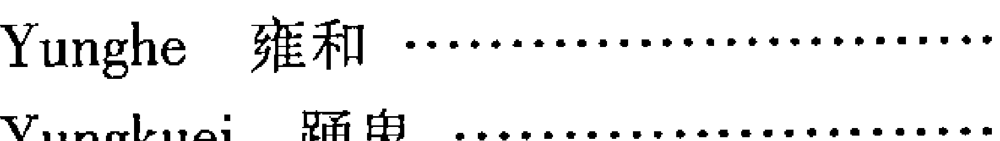

- Zaebos 齐博斯 …………………… 330
- Zagam 撒共姆 …………………… 330
- Zagan 撒共 † …………………… 314,330
- Zairisha 萨里夏 ………………… 340
- Zenon the Demon-lord 恶魔王克尔特农 † ……………………… 314,385
- Zepar 桀派 † …………………… 316,330
- Zipakna 辛巴克那 † …………… 316,379
- Zu 兹 ………………………… 316,340

## 恶魔事典

Dictionary of Demons and Devils

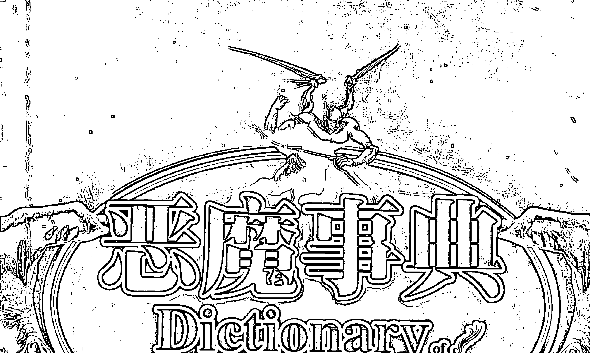

作者：(日)佐藤俊之
译者：高胤暁 刘子嘉 林哲逸
中文版监修：朱学恒 杨伯翰

详细图文介绍世界各地恶魔456名，收录恶魔条目890名以上。
详尽剖析了各宗教、各文化的破坏神与邪魔，历史地记述了恶魔的全貌。

## 俗话说，神魔不分家。有善神的地方必定就有恶魔。

所以，了解了神名以后，当然也不能错过了解恶魔！

本书详细介绍了众神之敌、坑害人类的邪恶存在——恶魔。

- “主项目456名”
- “恶魔绅士录890名以上”
- “主要神话、宗教的恶魔观”
- 希伯来
- 基督宗教
- 《雷蒙盖顿》
- 《伪以诺书》
- 《神曲》
- 《失乐园》
- 《浮士德》
- 伊斯兰教
- 中东
- 非洲
- 埃及
- 希腊
- 罗马
- 克尔特
- 北欧
- 东欧
- 斯拉夫
- 芬兰
- 中国
- 朝鲜
- 日本
- 北美
- 玛雅
- 阿兹特克
- 巫毒教
- 印加
- 秘鲁
- 大洋洲
- 克苏鲁
- 作品虚构
- 都市传说

```
ISBN 7-81036-951-2
9 787810 369510 >
ISBN 7-81036-951-2
B·32 定价：49.80元
```

## 图书在版编目（CIP）数据

恶魔事典/(日) 山北 笃, (日) 佐藤俊之著; 高胤暁, 刘子嘉, 林哲逸译, —汕头: 汕头大学出版社, 2006.6

(圣典系列)

ISBN 7-81036-951-2

Ⅰ. 恶… Ⅱ. ①山…②佐…③高…④刘…⑤林… Ⅲ. 鬼-简介-世界 Ⅳ. B933

中国版本图书馆CIP数据核字 (2006) 第061007号

AKUMA JITEN
By YAMAKITA Atsushi / SATO Toshiyuki / KATSURA Norio / SHIBA Heisuke / SHINNO Kei / TANAKA Takashi / HARUKA Toshi / MAKIYAMA Masahiro
Copyright © 2000 YAMAKITA Atsushi / SATO Toshiyuki / KATSURA Norio / SHIBA Heisuke / SHINNO Kei / TANAKA Takashi / HARUKA Toshi / MAKIYAMA Masahiro
Simplified Chinese edition copyright © 2006 SHANTOU UNIVERSITY PRESS
Originally published in Japan by Shinkigensha, Tokyo.
Chinese (in simplified character only) translation rights arranged with Shinkigensha, Japan through THE SAKAI AGENCY.
All rights reserved.

## 恶魔事典

- 监 修: (日) 山北 笃 佐藤俊之
- 作 者: (日) 桂令夫 佐藤俊之 司马炳介 栾野启 田中天 遥远志 牧山昌弘 山北笃
- 译 者: 高胤暁 刘子嘉 林哲逸
- 审 订: 朱学恒 杨伯瀚
- 责任编辑: 胡开祥 刘 芳 梁志英
- 责任校对: 廖醒梦
- 封面设计: 王 勇
- 责任技编: 姚健燕 李 行
- 出版发行: 汕头大学出版社 广东省汕头市汕头大学内 邮编 515063
- 电 话: 0754-2903126 0754-2904596
- 印 刷: 北京瑞哲印刷厂
- 开 本: 889×1194 1/24
- 印 张: 20
- 字 数: 615千字
- 版 次: 2006年7月第1版
- 印 次: 2006年7月第1次印刷
- 印 数: 10000册
- 定 价: 49.80元
- ISBN 7-81036-951-2/B·32

发行/广州发行中心 通讯邮购地址/广州市天河北路177号祥龙阁3005室 邮编 510620
电话/020-85250103 传真/020-85250103-6001
马新发行所/城邦 (马新) 出版集团 电话/603-9056 3833 传真/603-9056 2833
E-mail: citeckm@pd.jaring.my

版权所有，翻版必究
如发现印装质量问题，请与承印厂联系退换