# 所罗门的小钥匙

## 前言
G.H. Fra. D.D.C.F. 通过对《蔷薇十字》的神秘部分研究，将冗繁的希伯来文、拉丁文以及法文的古代手稿进行仔细的校对及编辑后，“Lemegeton”的第一册翻译终于完成了，可供符咒术的学习者参考。G.H. Fra.非常不高兴地屈服于四王子的攻击（显然是因为战争的影响），但是，从另一面来看，对翻译整理工作的结束是非常有利。一位非常能干的Scryer调查进入我们郁闷的Fra.家中证实了这个预言；我们的Fra.和他的《Hermetic Mul.》都不见了。只留下糟糕的邪恶老手S.V.A和H.的可怕形态，他们原本的身体已被司法官扣押。对于这一点，我们再也不能坐视不管；我们抽出时间商讨值班表及M.和Q.书，决定向诗人Aleister Crowley先生请教，他是《魔法知识》的熟练学者，也是名卡巴拉专家。一切都在隐秘中坦诚地进行，内容都已被记录：“他的主教职位让另一人占领。”以及：“Oculi Tetragammaton。”内容还涉及到：“Nomen Secundum referur ad Gebhurah; qui est Rex Bittul atque Corruptio Achurajim Patris et Matris hoc indigitatur。” 所以我们祝你快乐。

> Ex Deo Nascimur.
In Jesu Morimur.
Per S.S. Reviviscimus.

写自A山，C.C.1903 A.D.

## 初步的召唤
吾召唤汝，永生者。
汝，创造土地与天空者，
汝，创造白天与黑夜者，
汝，创造黑暗与光亮者，
汝，没人曾见过的 Osoronophris 艺术。
汝在公正与偏颇之间闪现光芒，
汝让世上有了两性之别，
汝带来种子和果实，
汝让人们相爱也彼此仇恨。

吾是 Mosheh，汝的先知，吾负责汝的神秘事物，Ishrael 的仪式；
汝用湿润和干燥滋润万物生长。
听吾诉说，吾是 Paphro Osoronophris 的天使，这是自 Ishrael 先知世代流传的真姓名。
听：
Ar:Thiao:Rhebet:Atheleberseth:
A:Blatha:Abeu:Ebeu:Phi:
Thtasoe:Ib:Thiao。
听吾诉说，让所有的灵听命于吾，这样，苍穹中、空气中的，地面上、地面下的，陆地上、深水里的灵；飞旋的空气及奔突的火焰的灵；主的每一咒语和指令都臣服于吾。

***

来吧，冥冥中威严的隐形的主！
Arogogorobrao:Sothou:
Modorio:Phalarthao:Doo:Ape.The Bornless One:
听吾说:略。

***

听吾说：
Roubriao:Mariodam:Balbnabaoth:Assalonai:Aphniao:I:Thoteth:Abrasar:Aeoou:Ischure。
伟大无上的主！
听吾说：略。

***

来吧！
Ma:Barraio:Joel:Kotha:
Atboribalo:Abraoth:
听吾说：略。

听吾说！
Aoth:Abaoth:Basum:Isak:
Sabaoth:Iao:
这是众神之王，
这是宇宙之王，
是他，让狂风也遁形，
是他，万物之王，喝令天下。

## 巫術の法則
出品

君主，统帅，救世主！
听吾说：略。

听吾说！

> Ieou:Pur:Iou:Pur:Iaot:Iaeo:Ioou:Abrasar:Do:Uu:Adonaie:Ede:Edu:
Angelos ton Theon:Aniaia Lai:Gaia:Ape:Diathanna Thorun.

+   吾就是主！无上的灵！有远见卓识，强壮，如不灭之火焰！
+   吾就是主！真理的所在！
+   吾就是主！不容忍恶魔存在于世界！
+   吾就是主！制造出雷电。
+   吾就是主！照耀地球上的生命。
+   吾就是主！口中吐出烈焰。
+   吾就是主！光芒四射。
+   吾就是主！世界的荣耀。

> “毒蛇缠心①”是吾的名字。

来吧，跟随吾，让所有灵体皈依吾，地底火焰的灵体；地面上、地面下的，陆地上、深水里的灵体；飞旋的空气及奔突的火焰的灵；神的每一咒语和指令都臣服于吾。

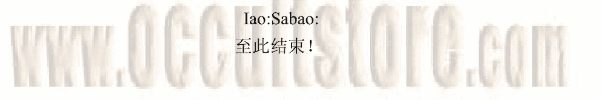

> ① The Heart Girt with a Serpent”

## Goetia
## The Lesser Key Of Solomon
## 仪式魔法的初步理论
聪明的魔法文学的学生会觉得这十分可笑——但这的确十分罕见——注意到批评的声音是源自菲利斯丁（Philistine）的学科。诚然，我们的童年被圣经与《一千零一夜》（Alf Laylah wa Laylah）的潜在影响渗入了我们的心灵，只有青春期能改变我们，成年之前的躁动容易让人粗略而轻率地推翻这两部作品对自己的影响，把两者视为对等，将它们视作是阐述民俗学与人类学观点的有趣书籍。

就算是当我们通过深度的研究发现圣经可能被用来宣扬卡巴拉（Qabalistic）的宇宙观和其重要性，我们通常会花很长时间对其姐妹篇进行相似的修复，即使我们是 Burton 真正版本的幸运持有者。

对我来说，还应再次将《一千零一夜》置于一个合适的类目。

我不担心否认所有“魔法”现象的客观真实度。如果它们是幻想，为何如同日常生活中的平凡事物一样真切？如果我们研究过 Herbert Spencer 的作品，就会发现某些引起的现象是有证据的。

这个现实是我们的基础。是什么原因使我在仪式的三角（triangle of Art）中看到了灵体？

心理学天才和专家也许会说：“是你的大脑在作祟。”

英国的孩子（受过教育）被教导宇宙存在于无尽的空间中；对于印度的孩子，空间（Akasa）的理论也一样。

对费希特（Fichte 德国哲学家，1762-1814）稍有了解的欧洲人知道他的理论：宇宙存在于自我意识中。印度和欧洲的印度教学习者都被告知杞塔撒（Chitakasa）与空间（Akasa）同在。杞塔撒（Chitakasa）存在于第三眼，印度教徒将头脑看作第三眼。假设有更广阔的空间，我们可以接受，但何必如此？

感官印象受大脑支配是普遍适用的原理，以“现象因大脑而生”的理论，幻象的存在就不难解释了，幻象是感官印象的一种形式，就像现实给人的印象一样。

可是，魔法现像是一系列“真实”现象的产物，即为魔法的作用。

## 巫術の法則
出品

它由以下元素组成：

+   (1) 视觉。环形、方形、三角形、船舶、灯火、长袍、器具等等。
+   (2) 声音。祈祷之声。
+   (3) 气味。芳香气息。
+   (4) 味觉。圣餐。
+   (5) 触觉。同“（1）视觉”组。
+   (6) 思想。以上各元素与它们的意义之间的联系。

这些不寻常的印象（1-5）在大脑中引起不寻常的变化。因此，它们的总合—思想，也不同凡响。思想对客观世界的反应也因此与众不同。

此时此地，魔法的操控和影响的真实性组成 我了解辩解是充分的，至于“影响”仅仅关系到在魔法师身上才能出现的现象；灵的现身及交谈；轻率可能造成的恶果——一旦误入迷途，就可能陷入癫狂或就此殒命。

但是，你可能会问：Goetia这本书中所描述的魔法是否奏效？如果是，可否对此做出一个合理的解释呢？

我很乐意。

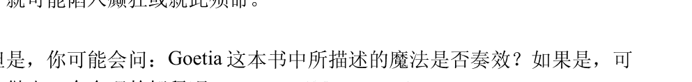

Goetia的灵体是大脑的一部分。

它们的封印则是通过视觉来刺激或调节大脑某处特殊部位。

恰当地共振神明需要建立在：

+   (1) 对大脑的全面控制。
+   (2) 对大脑的细节控制。
+   (3) 对大脑的部分控制。

香味有助于嗅觉。通常，香味作用广泛。香味则会通过卡巴拉公式来印刻字母表的字母，从而拼写出神名。

我无须赘述，智者自会知其全义。

我连同所罗门说：，

> “神灵斯梅俄瑞斯（Cimieries）教授逻辑。” 也就是说：我们大脑中控制激发和拓展逻辑思维能力的那一部分受到斯梅俄瑞斯之召唤的影响。这一说法是唯物的、理智的，独立于任何形式的等级制度之外。哲学已失去发言权。而科学也因为缺少一种合理而可行的研究方法举棋不定。

## 巫術の法則
出品

可惜，我们不能就此却步。所罗门保佑我们(1)耳聪目明，(2)一往无前，(3)与自然交融(4)拥有财富以及(5)治愈病痛……不经意中，我已拥有这五种力量。篇幅有限，不多解说。

+   (1) 从潜意识中得到信息。
+   (2) 这一条很有趣。优雅的行为方式与表面上粗陋的魔法仪式间有着强烈的对比。这种仪式掩盖了神圣的事实。“一往无前”指的是了解二元性制造的错觉，满怀激情。（哦！维特先生，魔法世界是面镜子，你看到的污秽恰是自我。）
+   (3) 仔细的自然学家可以听懂他长期观察的动物的声音。幼童也分得清一只猫是在“喵喵”还是在“咕噜”。这种能力可以大大发展。
+   (4) 促进交易和流通。
+   (5) 体质的失调可以纠正，大脑可控制受累的组织恢复正常。
+   (6) 对于其它的现象来说也是一样。没有真正的和必然的奇迹。我们的仪式魔法沉淀成为瞬间的心路历程。

我拥有我所需要的健康、财富和逻辑；寸金寸光阴。“路途峥嵘。”对我来说，这些实践是无谓的。但是为了不幸者，我愿意把它们带给世界，同时带来解释和道歉。我相信那些解释可使迄今持平庸的客观态度的迷途学生成功。而那些道歉让轻蔑的科学家印象深刻。

Boleskine House,
Foyers,N.B.

## 魔法的初步定义
魔法是最高级，最绝对而最神圣的自然哲学，尤以其众多著作和在理解事物内在的基础上的工作最为突出。因此总是采纳最有效的方法，继而取得意想不到的效果。魔法师是渊博而刻苦的探索家，对魔法的预期作用也胸有成竹，对平民来说真像是变戏法!

古人云，魔法实为虚无，但即使如此，却绝非毁谤，也不应成为藐视和嘲讽的目标，更令自然魔法与黑魔法泾渭分明。阿波罗尼亚斯·苔尼厄斯曾经精研自然魔法而卓有建树。费罗·赫布路斯说过，魔法学作为我们赖以理解自然之书的窗口是值得尊重的。在波斯人中只有掌握魔法者才可以握有令牌。

这种艺术时而从自然科学退化成黑魔法，从哲学畸变成巫术。究其原因，一些学习者滥用或不能驾驭这种高阶而神秘的艺术，又无法抵挡撒旦的引诱而成为了黑魔法和巫术的学徒。魔法掩藏于尘埃背后，孜孜以求者才称得上巫师。

罗斯克·克鲁森学会成员认为自己不应被称作魔法师而是哲学家，本应被看成被遗忘的批评家而是博学又有经验的医生，可以提供合理而又神奇的治疗。

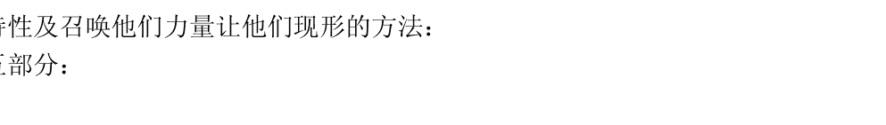

## 简介
本作品借鉴多本魔法学定理经典。四大法则和谐统一就像《雷蒙哥顿》（Lemegeton）一书中各章节的严格一致。

整个作品中围绕各定理的措辞行文并不晦涩，无须字句对照参考，可是不包括相对更古老的封印和图章。考虑到这一点，纯粹的现代释义并不完全可靠。

## CLAVICULA SALOMONIS REGIS,
这部作品包含了所有他所谈及过的灵的姓名、职务与阶级，另外还包含了这些灵的封印和特性及召唤他们力量让他们现形的方法：包括五部分：

+   1. 第一部分是邪灵之书，也称为 GOETIA，告诉你如何束缚这些灵，如何利用他们达到你的目的。
+   2. 第二部分是灵之书，其中所涉及的灵包括善与恶。这本书也被称为 THEURGIA-GOETIA，所有的 Aërial 灵。
+   3. 第三部分是关于灵操控行星时间，以及什么灵是属于每一角度，星座，星座中的行星。也被称作 PLAULINE 的艺术。
+   4. 这本书的第四部分被称作 ALMADEL 或所罗门,包含了哪些掌握了四个高等或星座的360度的灵。 在其中最后的两个灵是善的，用于神圣的追寻。这本书也被称为THEURGIA。
+   5. 第五部分是适合演说和祈祷的书，博学的所罗门就用它在寺庙的祭坛前进行祈祷。它被称为 NOVA 的艺术，它向所罗门揭示了神的圣洁天使的姓名是 MICHAEL（麦克尔）；他也从神的手中获得许多简短的记录，天使以雷声的形式向他宣读；没有这些记录，所罗门就无法拥有他的伟大知识，更无法在短时间内了解所有好与坏的学术科学。

## 完整的 LEMEGETON 或 CLAVICULA
现在这本书包含了所有所罗门所谈及的灵的姓名，请令及职务，每个灵都有它自己的封印和特性，召唤他们显现的方法：分为 5 本书/部分：

+   1. 第一本书/或部分是关于邪恶的灵，它也称为所罗门的 GOETIA。是以约束这些灵方法的力量来达成自己的目的，他也因此获得了伟大的名望。
+   2. 第二本书是关于把灵插入善与恶的本性，它也被冠名为 THEURGIA-GOETIA 之书，或称之为 Aërial 灵的魔法智慧。
+   3. 第三本书称之为 PAULINA 之艺术，涉及的灵被分派在十二黄道的 360 度的每个角度中；也同样存在于星座、星座中的行星及时间中。
+   4. 第四本书称为 ARS ALMADEL SALOMONIS 或者是 ALMADEL 艺术。是关于设置于高等四方的灵。
   书中提到的最后两个——PAULINE 之艺术和 ALMADEL 之艺术是与单一的善灵相联系，它的知识是用于追寻神圣的。这两本书也可以归类在所罗门的 THEURGIA 一书的第一和第二部下。
+   5. LEMEGETON 的第五本书是一本关于祈祷和演说的。所罗门用其智能讲它使用于寺庙的祭坛之上。关于此点的标题是 NOVA 的艺术，初见的艺术，和 NOTARIA 的艺术，NOTARY 的艺术。是由神的圣洁天使 MICHAEL（麦克尔）在雷与闪电中向他显露。他也因此获得了由神所写的的相关记录，没有它的话，我们伟大的国王永远也无法达到他伟大的智慧，也不会知道所有的事物、所有的科学及艺术，更何况善与恶。

## CLAVICULA SALOMONIS REGIS,
这部作品包含了所有他所谈过的灵的姓名、职务和请令，另外还包含了这些灵的封印和特性及召唤他们力量让他们现形的方法：包括五部分：

+   1. 一部分是邪灵之书，也称为 GOETIA，告诉你如何束缚这些灵，如何利用他们达到你的目的。
+   2. 二部分是灵之书，其中所涉及的灵包括善与恶。这本书也被称为 THEURGIA-GOETIA，所有的 Aërial 灵。
+   3. 第三部分是关于灵操控行星时间，以及什么灵是属于每一角度，星座，星座中的行星。也被称作 PLAULINE 的艺术。
+   4. 这本书的第四部分被称作 ALMADEL 或所罗门,包含了哪些掌握了四个高等或星座的360度的灵。在其中最后的两个灵是善的，用于神圣的追寻。这本书也被称为THEURGIA。
+   5. 第五部分是适合演说和祈祷的书，博学的所罗门就用它在寺庙的祭坛前进行祈祷。它被称为 NOVA 的艺术，它向所罗门揭示了神的圣洁天使的姓名是 MICHAEL（麦克尔）；他也从神的手中获得许多简短的记录，天使以雷声的形式向他宣读；没有这些记录，所罗门就无法拥有他的伟大知识，更无法在短时间内了解所有好与坏的学术科；这些记录称为 NOTARY ART。

## 邪灵之书
所罗门之匙包含了所有所罗门所谈及的灵名字，请令及职务，和每个灵所特有的封印及特性，召唤他们力量显现的方法：
分为4部分：

+   1. 部分是邪灵之书，也称为 *GOETIA*，告诉你如何束缚这些灵体，如何利用他们达到你的目的。
+   2. 二部分是灵体之书，其中所涉及的灵体包括善与恶。这本书也被称为 *THEURGIA-GOETIA*，所有的 *Aërial* 灵。
+   3. 第三部分是关于灵操控行星时间，以及哪些灵体是属于哪一一角度，星座，星座中的行星。也被称作 *PLAULINE* 的艺术。
+   4. 这本书的第四部分被称作 *ALMADEL* 或所罗门，包含了哪些掌握了四个高等或星座的360度的灵体。

在其中最后的两个灵体是善的，用于神圣的追寻。这本书也被称为*THEURGIA*。

所罗门将向你展示那些最神秘的事物。

现在，在 *LEMEGETON* 之书中包含了所有的所罗门王的艺术。虽然也有很多其它的书声称是他的作品，但是没有一本可以与其媲美，因为它包含了其所有。还有其它像 *HELISOL* 之书这类名字的书籍，但其实它们与这本 *LEMEGETON* 之书的最后部分 *NOVA* 的艺术或 *NOTARIA* 的艺术相同。

这些书最初是由一位犹太族的学者在耶路撒冷的一些占星术类书籍中发现，当时是希伯莱语，后由他翻译为希腊语，再是拉丁语。

## SHEMHAMPHORASH
1.）BAEL-第一位主要的灵体是一位统治东方的国王，称为BAEL。他可以使你隐身。他统治着超过 66 个恶魔军团，他会以多种形式出现，有时会是只猫，有时会是只蟾蜍，有时会是个人，也可能他会一次以多种形式出现。他的声音嘶哑。召唤他力量的时候，身上应该戴着LAMEN（一种魔法护身符），否则的话，他不会对你表达敬意。

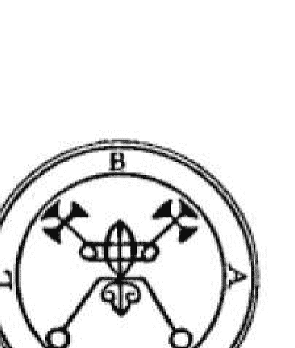

2.）AGARES-第二位灵体是位公爵，称为Agreas, 或Agares。他在东方的力量之下，以男性老年精灵骑坐在鳄鱼上，手上托着一只鹰，儒雅地出现在你面前。他让逃跑的人无法逃跑。他教授所有的语言。他也拥有毁灭精神上与物质上的尊严，还能导致地震。他是美德的守护者。有 31 个军团在他的统治之下。右边的是他的封印，召唤他时，应该带有这个LAMEN。

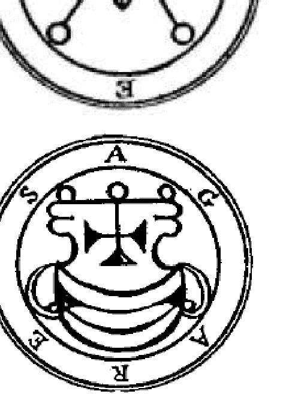

3.）VASSAGO－第三位灵体是位万能的王子，与 Agares 的特性差不多。他是 VASSAGO。这位灵体拥有善的本性，他的能力是告诉你事物的过去与未来，并发现事物的隐藏面。他统领 26 个灵魂军团，右图是他的封印。

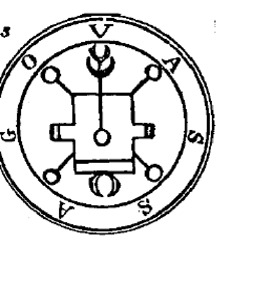

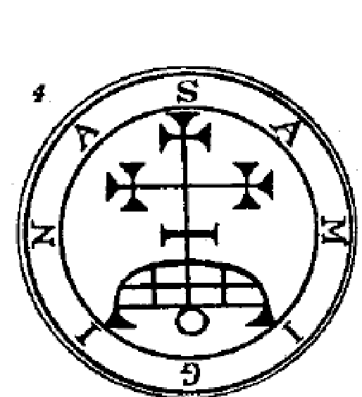

### 4.）SAMIGINA 或 GAMIGIN
第四位灵体是 Samigina, 一位伟大的侯爵。他以马或驴的形态出现，主人也可以要求他变为人形态。他的声音较为沙哑，统领着超过 30 个灵魂军队。他教授所有的自然科学，包括死于罪恶的死者之魂。左图为他的封印，魔法师在召唤之前应佩戴此LAMEN。

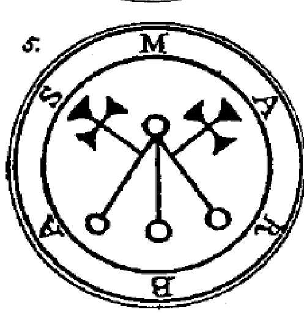

### 5.）MARBAS
第五位灵体是 Marbas。他是位伟大的统帅，最初以狮王形象出现，之后可以在主人的要求下变为人形态。他能回答万物的真理（事物的真相）。他能产生疾病并能治愈它们。此外，他能给予你医学的知识与智能；并能把人类改变为其它形态。他统领着 36 个灵魂军团。左图为他的封印，召唤前要像之前所说的那样佩戴它。

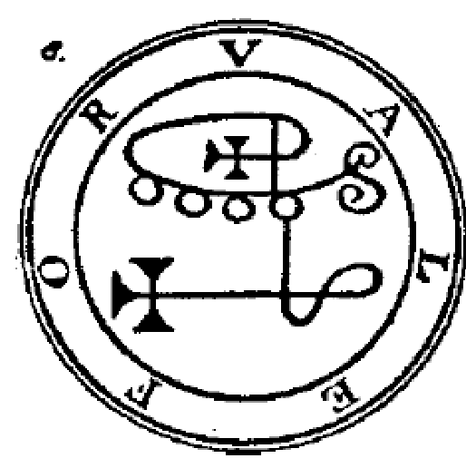

### 6.）VALEFOR
第六位灵体是 Valefor。他是位万能的公爵。以吼叫的狮身驴头形象出现。虽然他本质非常友好善心，但他非常习惯于偷窃。他统率 10 个灵魂军团。左图为他的封印。

## 7.) AMON—第七位灵体是 Amon。

他是位非常有能力的侯爵。他通常以口吐火焰的蛇尾狼的形态出现。但在魔法师的统治下，他会变为脸部十分不协调地带有犬牙的乌鸦头形人（简单地可理解为乌鸦头男人）。他能告诉你所有的过去与未来。他能导致朋友间的争斗与复合。他统领着40个灵魂军团。右图是你在召唤时应携带的LAMEN。

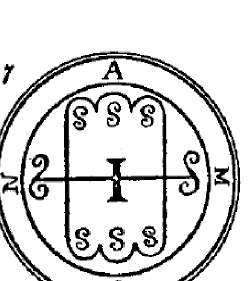

## 8.) BARBATOS—第八位灵体是 Barbatos。

他是位伟大的公爵。只有当太阳落在人马座的时候，会与四位高贵的国王与他们的骑兵一起出现。他能帮你理解鸟儿的歌唱，及其它生物的语言。他能挖掘魔法师的潜力。他是美德的守护者，他能感知事物的过去与未来。他能安慰朋友及其它力量所及之物。他统率着超过30个灵魂军团。

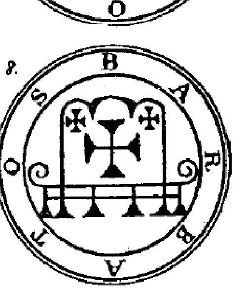

## 9.) PAIMON-第九位灵体是 Paimon

一位伟大的国王，非常顺从于撒旦。他会头戴耀眼的王冠坐在单峰骆驼上出现在你的面前(因为他曾是位高权重的灵魂主宰)。他的嗓音宏亮，第一次的出现伴随着他的嘶吼声。除非他愿意，否则他的语言会令普通魔法师难以理解。这位灵可以教授所有的科学和艺术及其它的神秘事物。他可以帮你理解地球，为什么水会有浮力什么是思想，它在哪里，及一切你想知道的知识。他可以使任何人屈服于魔法师之下。

他给予你好友，并能教授你所有的学术。
他观测西方。他属于控制编制的，旗下
有200个灵魂军团，其中的部分还是天
使编制队的，剩下的是属于当权者编制。
如果你只想要召唤 Paimon 一位灵体，那
么你必须得付出些东西给他；将会有
Labal 和 Abali 两位国王与其它属于当权
者编制的25队灵魂军团伴随他出现。那
些臣服于他的灵魂并不一直跟随他出现，
除非魔法师命令他们。这是他的封印。

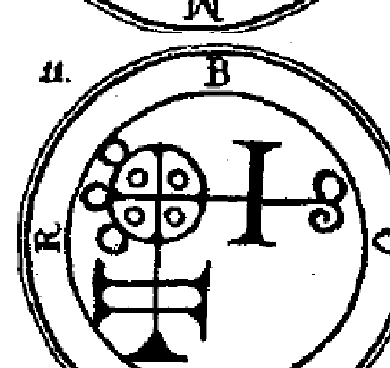

## 10.) BUER－第十位灵体是位伟大的统治者。

在晴天的时候，他以弓箭手的姿态出现，他教授道德、自然与逻辑艺术的哲学。他能治疗所有的疾病。他统领着50队灵魂军团。要使他服从于魔法师，必须在召唤他前佩戴他的LAMEN。

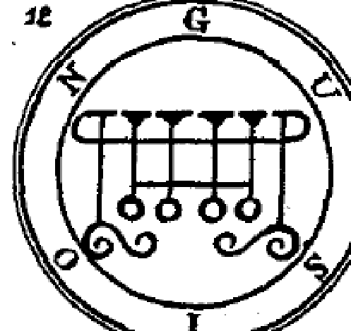

## 11.) GUSION－第十一位灵体是位伟大且强壮的伯爵，名为 Gusion。

他以 Xenopilus 的外貌出现。他能告诉你事物的过去，现在和未来。并能回答你问题的意义与解决方法。他能调和朋友间的矛盾，给予任何事物荣誉和尊严。图为他的召唤符，需像前文提及的那样佩戴。

### 12.) SITRI

第十二位灵体是 Sitri。他是位了不起的王子。第一次出现时是豹头 gryphon（希腊神话中的怪兽）翅。但在召唤后，会因魔法师的命令变为人形态，他能激起两性之间的爱并能使被咒者双方赤裸相见。他统领着60队灵魂军团。这是他的封印，需像前文提及的方式佩戴。

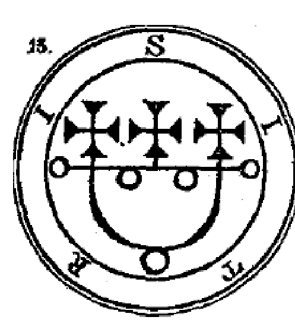

### 13.) BELETH

第十三位灵体是 Beleth（或 Bileth，又或 Bilet），他是位强大且可怕的王者。他出现时，骑在背有喇叭等多种乐器的白马上并演奏出音乐。他在第一次出现时，如果召唤方显示出其勇气，他会显得非常热烈兴奋。他手上一定会握着把榛树枝，沿南方向东方挥舞，随之呈现一三角形结界，然后可命令他进入结界并掌控灵魂力量。如果他没有进入结界，你要在他面前威胁他并复述你的结界及符咒，他就会服从你的命令，做你想要他做的事情。记住在命令他时，必须带有礼貌，因为他是位伟大的王者，在他的面前，你需像王与王子接见时一样地表达敬意，而你一定要一直在你的中指上佩戴一枚银环（用来保护其免受邪灵灼热的呼吸伤害，魔法之环的设计图案会在本书结尾处《魔法的圆》中有介绍）。这位灵体能引发男人及女人的爱，他属于力量编制，统领着85队灵魂军团。左图为他的封印。

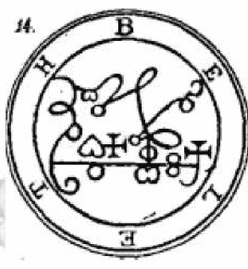

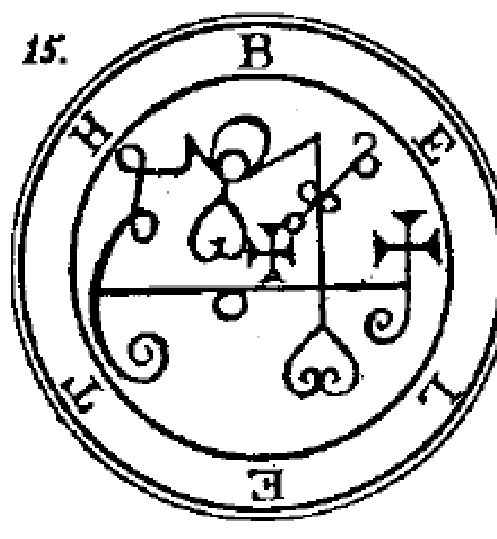

## 14.) LERAJE 或 LERAZKHA－第十四位灵体是 Leraje（或 Leraie）。

他是位强大的侯爵，以绿色弓服出现，并随身携带着箭和箭囊。他能引起战争和竞赛，被他的箭所伤的伤口会完全腐烂。他是名弓箭手，统领着 30 队灵魂军团，左图是他的封印。

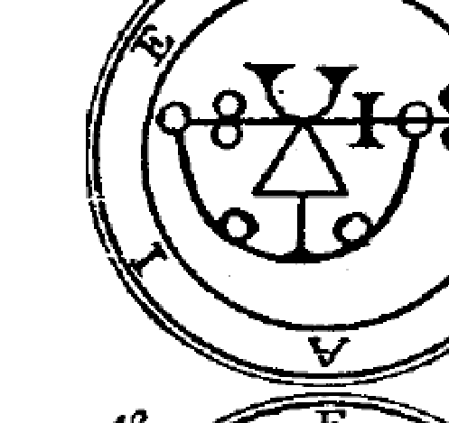

## 15.) ELIGOS － 第十五位灵体是 Eligos，一位伟大的公爵。

他以携有长枪，像带有一条毒蛇的优秀骑士姿态出现。他能发现隐藏的事物，洞悉未来、战争及如何让战士打仗。他能引起领主及伟人们的爱，统领着 60 队灵魂军团。左图是他的封印。

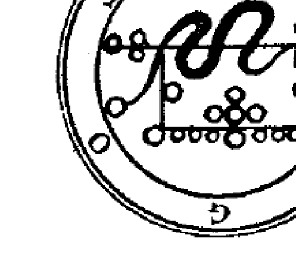

## 16.) ZEPAR – 第十六位灵体是 Zepar。

他是位伟大的公爵。他会穿着红色的衣服和盔甲，像个军人一样出现在你的面前。他的职务是让女人爱上男人，并让他们充满爱地走到一起。他也让他们不孕。这是他的封印。

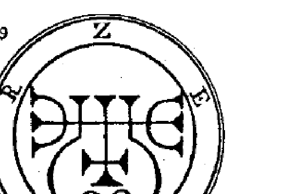

## 17.) BOTIS – 第十七位灵体是 Botis，他是位伟大的统领，也是位伯爵。

第一次出现的形态是一条丑恶的毒蛇，之后可在魔法师的命令下变为人形态（有明显的牙齿，有两只角，手上拿着一把锋利的剑）。他能告知事物的过去与未来，调解朋友与敌人之间的关系。他统领着超过 60 只灵魂军队。这是他的封印。

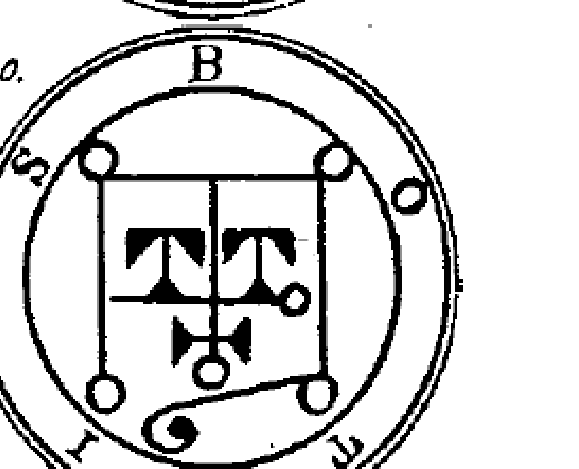

## 18.) BATHIN – 第十八位灵体是 Bathin。他是位强大的公爵。

他出现时的形态像一位有毒蛇尾巴的壮男坐在一苍白色的白马上。他拥有植物学与宝石的知识。他能把人从一个地方传送到另一个地方。他统领着超过 30 只灵魂军队。这是他的封印。

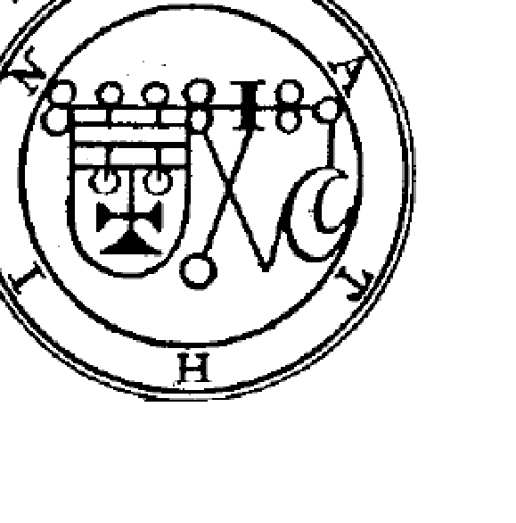

## 19.) SALLOS - 第十九位灵体是 Sallos（或 Saleos）。他是位伟大的伯爵。

出现时的形态像一英勇的战士骑在一鳄鱼上。他能引发男女之间的爱，统领着30只灵魂军队。这是他的封印。

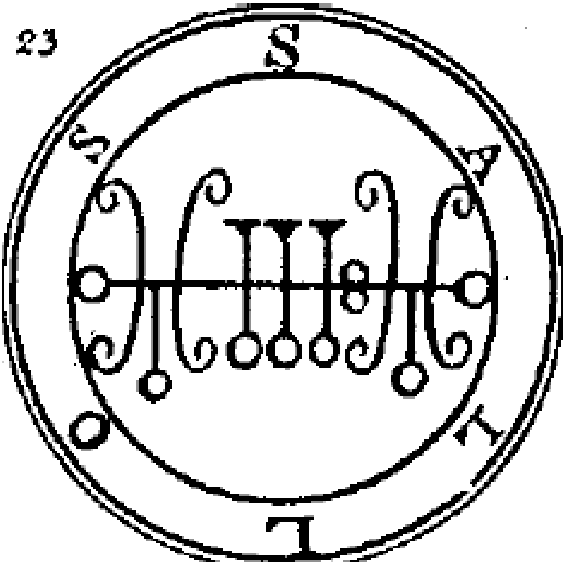

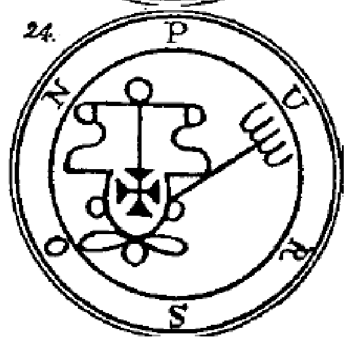

## 20.) PURSON-第二十位灵体是 Purson，一位伟大的国王。

他的外表像一个狮面人，骑在熊的身上，手上缠绕着一条凶猛的毒蛇出现。在他出现之前会发出很多喇叭声。他知晓万物隐藏的知识，能够发现宝藏，告知你万物的过去、现在和未来。他可以占据人类或 Aërial 的身体，能真诚地回答你地球上神秘及神圣事物的问题。他能为你带来密友。在他旗下有22只灵魂军队，其中部分为德编制和君王编制部队。这是他的封印。

## 21.) MARAX－第二十一位灵体是 Marax。他是位伟大的伯爵和统领。

他以牛面人身的外形出现。他的职务是让男人了解占星学及其它博大的科学。他同样也能带给你密友、智慧。并能让你了解草药及石头的属性。他统领着 30 只灵魂军队。这是他的封印。

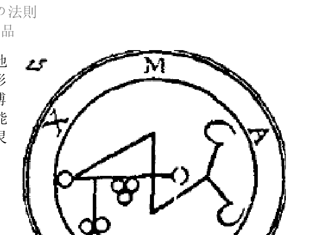

## 22.) IPOS－第二十二位灵体是 Ipos。他是位伯爵，也是位有权势的王子。

他出现时的形象是一位有鹅脚、兔尾，狮头的天使。他知晓事物的过去、现在和未来。他能使男人未婚或光棍。他统领着 36 只灵魂军队。这是他的封印。

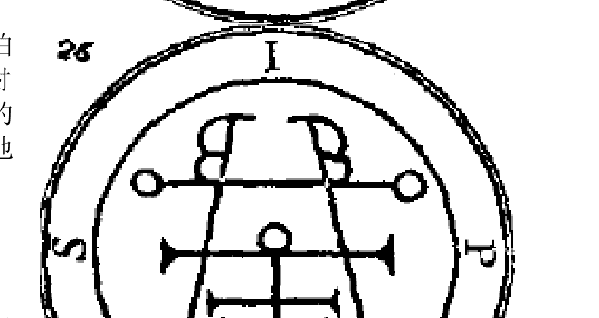

## 23.) AIM－第二十三位灵体是 Aim。他是位强大的公爵。

他出现时的外表是位拥有美男子身材但却有三只头的男子；第一只头像一条毒蛇头，第二只头又像前额有两颗星星的男人头，第三只头像小牛的。他骑在一条蛇上，手拿火把。他曾用它使城市、城堡和伟迹着火。它能赋予你各方面才能，并能回答你私人的问题。它统率着 26 只下等的灵魂军队；这是他的封印。

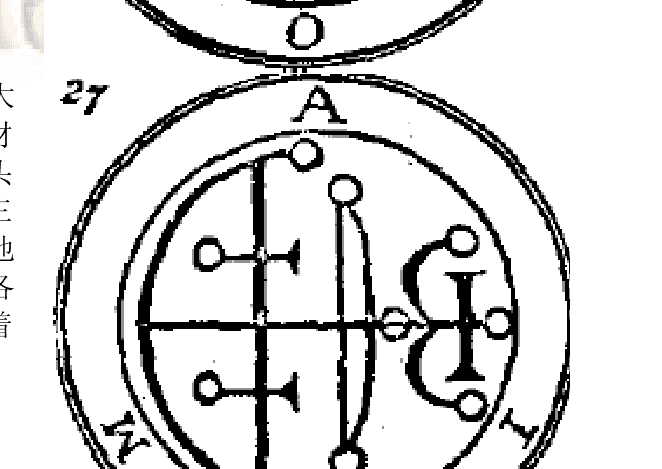

## 24.) NABERIUS—第二十四位灵体是 Naberius。他是位英勇的侯爵。

他以黑鹤形态出现。当他用沙哑的声音说话的时候，翅膀会拍动，并形成一个圆。他能让人熟悉所有的学术和科学，特别是口才。他能让你重拾失去的尊严和荣誉。他统率着 19 只灵魂军队。这是他的封印。

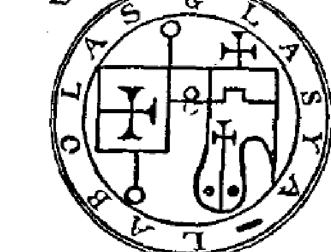

## 25.) GLASYA-LABOLAS—第二十五位灵体是 Glasya-Labolas。他是位强大的统领和侯爵。

他出现时的形态是像希神 Gryphon 相似的带翅膀的狗。他直接教授所有学术和科学，是引发流血事件及杀人的良师。他还能告知你所有事物的过去和未来。他可以使一个人隐形。他统领着 36 只灵魂军队。这是他的封印。

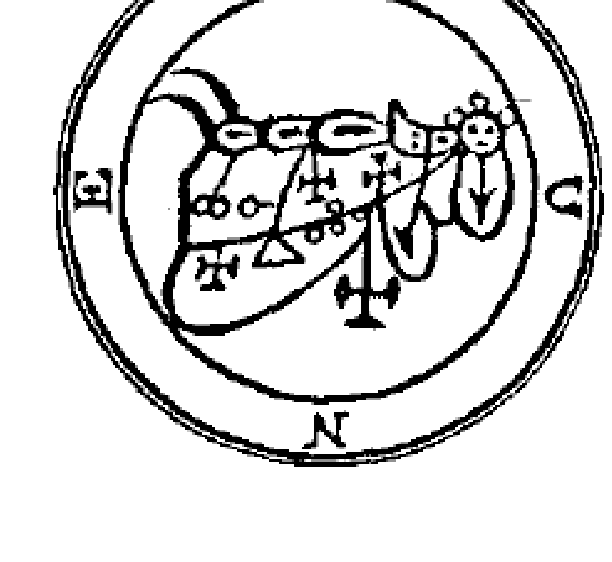

## 26.) BUNE, 或 BIME—第二十六位灵体是 Bune (Bime)。他是位伟大且强壮的公爵。

他出现时的形态是一只有三头（狗、gryphon、人）的龙。他的声音清晰且很高。他统治着死者的领土。他能命令他的部下聚集在你的坟墓上。他能使人富有，使人聪明、有天才。他能真实地回答你的问题。他统领着 30 只灵魂军队。这是他的封印，但他也有另外两个封印（如图 30、31）。后者最好。

## 27.) RONOVE—第二十七位灵体是 Ronove。他以一怪兽模样出现。

他善于教授口才，能给予你好的大臣及语言的知识，敌人或朋友的宠爱。他是位侯爵，也是位伟大的伯爵。有 19 只灵魂军队听命于他。这是他的封印。

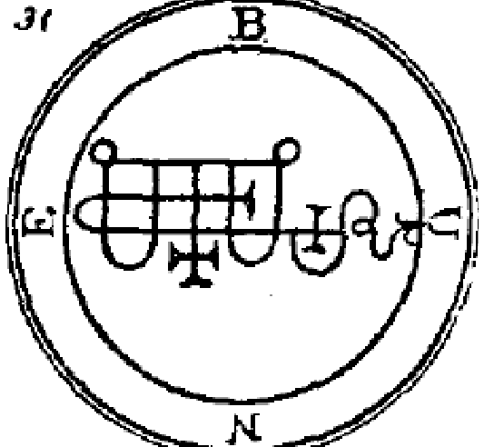

## 28.) BERITH—第二十八位灵体是 Berith。他是位强大且可怕的公爵。

人类还给予过他其它两个名字：Beale 或 Beal，和 Bofry 或 Bolfry。他出现时的外貌是位穿红衣的战士，头戴金色皇冠骑在一匹红色的马上。他给予过去、现在和未来真实的答案。如果你想召唤他，就得戴上和召唤第 13 位灵体 Beleth 一样的魔法之环。他可以把所有金属转化成金子。他可以让人获得尊严。他的声音轻柔而清晰。他统领着 26 只灵魂军队。这是他的封印。

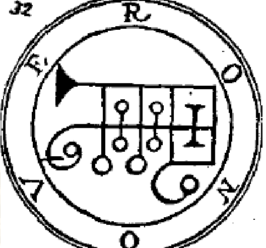

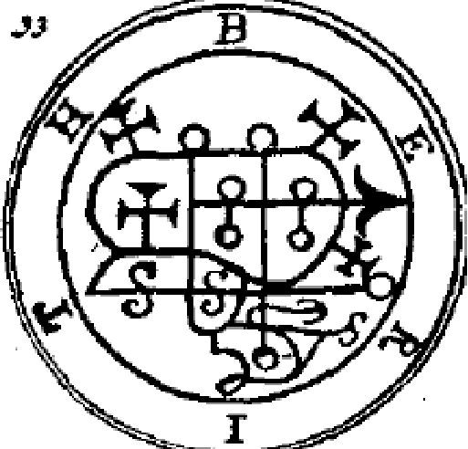

## 29.) ASTAROTH－第二十九位灵体是 Astaroth。他是位伟大且强大的公爵。

他出现时的形象是一位可怕的天使骑在一只像龙一样的阴间怪兽，右手拿着条毒蛇。你一定不能让他靠近你，否则你会被他呼出的火焰伤害。你需要用魔法之环保护你自己，把魔法之环举在靠近他的面前。他可以告诉你事物的过去、现在和未来，还能发现所有的秘密。他有可能会故意告诉你灵怎么会被打败，他又是怎样被打败的。他可以使人们完整地理解所有博大的科学知识。他统领着40只灵魂军队。这是他的封印。你必须以 Lamen 的形式将其佩戴在身上，否则他不会出现在你面前。

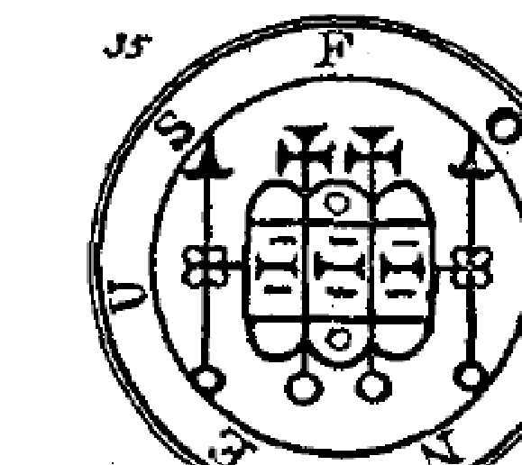

## 30.) FORNEUS － 第三十位灵体是 Forneus。他是位强大的侯爵。

他以海怪的形态出现。他能使人们极佳地理解修辞学。他能让人有好名字，理解其它语言。他能让一个人爱上其敌人或朋友。他统领着29只灵魂军队。其中部分是君主编制队的，也有一部分是天使编制队的。这是他的封印。

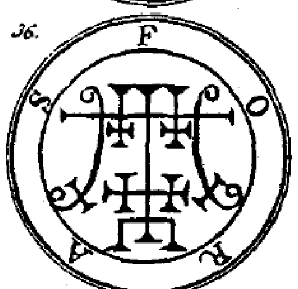

## 31.) FORAS－第三十一位灵体是 Foras。他是位伟大的统领。

他以一位强壮的男子形态出现。他能让人理解怎么样认知所有植物和宝石的功效。他教授逻辑和道德规范。你也可以让他使人隐形，活得更久，有雄辩之才。他能发现宝藏，失而复得已失去的物品。他统领着超过29只灵魂军队。这是他的封印。

## 32.) ASMODAY – 第三十二位灵体是 Asmoday 或 Asmodai。他是位伟大、强壮且强大的王者。

他出现时的形态是有三只头（公牛；人；公羊）。他还有一条蛇尾巴。他的嘴能吐出火焰。他的脚像鹅一样相连成网状。他骑在一头地狱龙上，背着一只有旗帜的长矛。他是在 AMAYMON 力量下的上等灵。当魔法师想要召唤他的时候，让他离开，行动时双脚站立并脱帽。这是为了以防 AMAYMON 欺骗他，称他行为已被暴露。一旦魔法师看见了前文所讲的形态，就要叫他的名字“你是 ASMODAY 吗？”他不会否定，很快他就会鞠躬下跪。他给予美德之戒；他教授算术、占星学、几何学及所有的手工艺学。他会应你的要求诚实地回答所有问题。他能让一个人无敌。他能向你展示隐藏宝藏的地方，并守护这个财宝。他是 AMAYMON 所统治的 72 位高等灵体军中间的一位。这是你必须在召唤时以 Lamen 形式佩戴在胸口的封印。

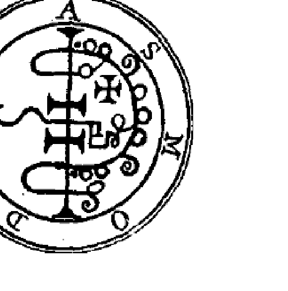

## 33.) GAAP – 第三十三位灵体是 Gaap。他是位伟大的统领，也是位强大的王子。

他在太阳靠南方的时候以人形态出现。如果出现一领路人，他会在四位伟大的王之前出现。他的职务是使人铁石心肠或无知；也同样能使人聪颖。他能让人产生爱或恨，他也能教导你如何献祭属于他的国王 AMAYMON 所支配的物品。他可以从其它魔法师手中释放你的好友，诚实且完整地回答你事物的过去、现在和未来。他能在魔法师的命令下迅速地反复携带多人从一个国度到另一个地方。他统领着 66 只灵魂军队，他隶属于当权者编制。这是他的封印，等。

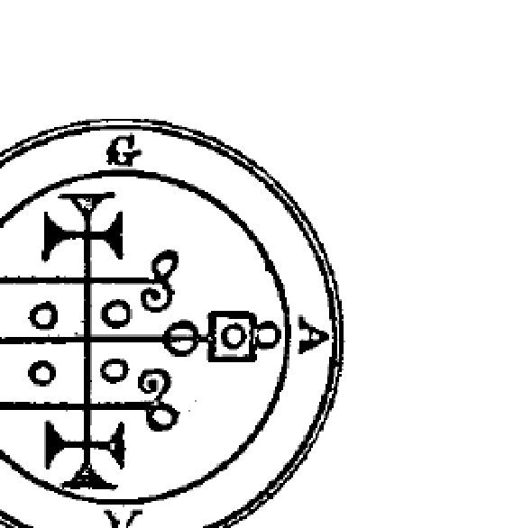

## 34.) FURFUR – 第三十四位灵体是 Furfur。他是位伟大且强大的伯爵。

他以一头有火焰尾巴的雄鹿形态出现。除非被强迫，否则他不会说出事情的真相。也可以画出一三角形。让他站在三角形中，他会将自己的变为天使形态。他的声音会因此变得嘶哑。他能有意地促使一个男人爱上一个女人。他能引发闪电和雷、风、暴风雨。他能给予神圣和神秘事物的真实答案。他统领着超过 26 只的灵魂军队。这是他的封印，等。

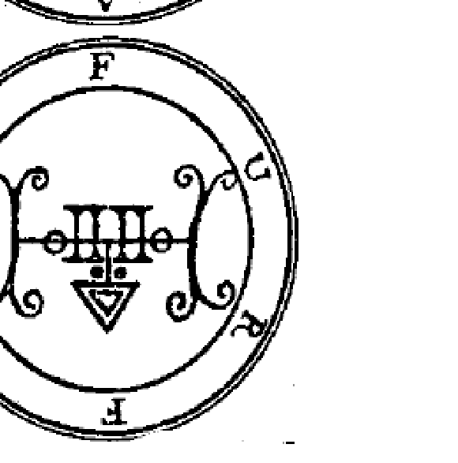

## 35.) MARCHOSIAS – 第三十五位灵体是 Marchosias。他是位伟大且强大的侯爵。

他第一次出现时的形态是一只狼（有希神 Gryphon 的翅膀，毒蛇的尾巴）【在 17 世纪的抄本上，因为字迹不清楚，所以也有可能出现时的形态是牛】。他的口中能吐出火焰。但是在一段时间后，随着召唤者的命令，他会变为人形态。他是位强大的战士。他是支配编制的。他统领着 30 只灵魂军队。他告诉他的首领谁是所罗门，他希望在 1200 年重新归位于第 7 把王座。这是他的封印，等。

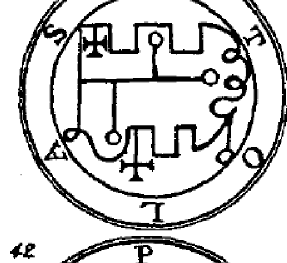

## 36.) STOLAS, 或 STOLOS – 第三十六位灵体是 Stolas，或称 Stolos。他是强大的王子。

他首先以强大乌鸦形态出现，再召唤后，会变为男人的映象形态。他教授占星学、草药与宝石的效用。他统领着 26 只灵魂军队；这是他的封印，等。

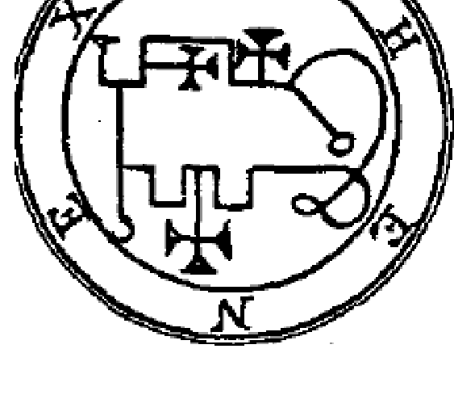

## 37.) PHENEX – 第三十七位灵体是 Phenex（或 Pheynix）。他是位伟大的侯爵。

以凤凰的形态出现，声音像个孩童。他在召唤者前会唱出许多美妙的高音，是因为他没有得到尊重，召唤者一定命令他变为人形态。他会应要求说出很多绝妙的科学知识。他是位非常了不起的诗人，他也非常乐意应要求吟诗作词。他也非常希望能在 1200 年或更久之后回到第七把王座，他也曾对所罗门提及此事。他统领着 20 只灵魂军队，这是他的封印，等。

## 38.) HALPHAS, 或 MALTHUS—第三十八位灵体是 Halphas 或 Malthous（Malthas）。

他是位伟大的伯爵，以信鸽形态出现。他的声音嘶哑。他的职务是建造碉堡，提供军火和武器，将战士送到指定地点。他统领着26只灵魂军队。这是他的封印，等。

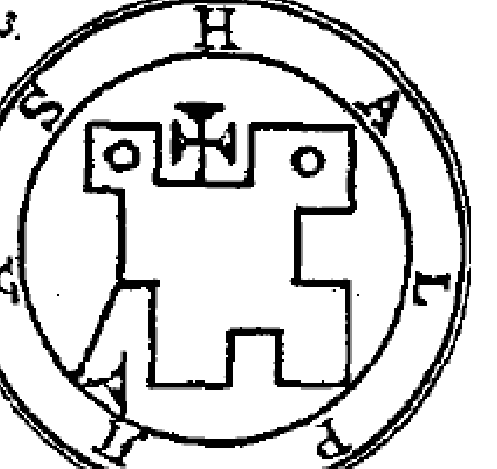

## 39.) MALPHAS—第三十九位灵体是 Malphas。

他先以乌鸦形态出现，但在召唤者的命令下会变为人形态，他拥有嘶哑的声音。他是位强大的统领。他能建造房子和高塔，他能告诉你敌人的愿望和想法，他能带给你好友。如果你给他祭品，他会非常乐意收下，但他会欺骗你。他统领着40只灵魂军队，这是他的封印，等。

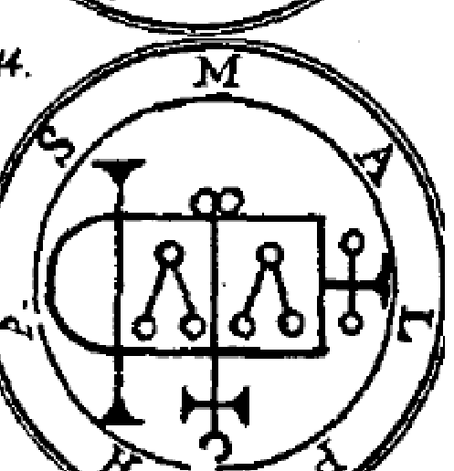

## 40.) RAUM—第四十位灵体是 Raum。

他是位伟大的伯爵；刚开始以乌鸦的形态出现，但在召唤者的命令下会变为人形态。他的职务是从国王的房间里偷出宝物，并能毁灭城市及人的尊严，告诉你事物的过去、现在和将来；他还能在朋友和敌人之中制造爱情。他属于王座编制。他统领着30只灵魂军队；这是他的封印，等。

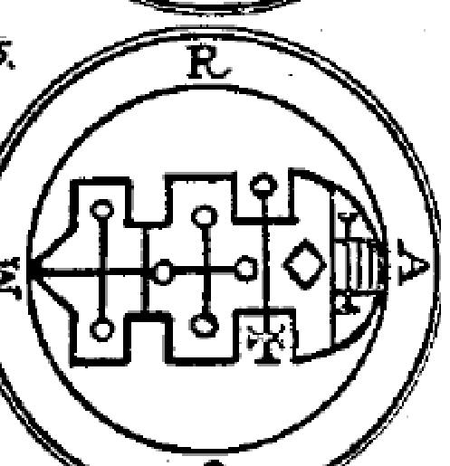### 41. FOCALOR
第四十一位灵体是 Focalor，或 Forcalor，或 Furcalor。他是位强大的公爵。他以带 Gryphon 翅膀的男子形象出现。他的职务是杀人，将人淹死于河中，也能让船翻倒，他拥有风及海的力量；但是他不会伤害被召唤者命令以外的人或物。他也希望能在 1000 年后回到第 7 王座中。他统领着 30 只灵魂军队，这是他的封印，等。

### 42. VEPAR
第四十二位灵体是 Vepar，或 Vephar。他是位强大的公爵，以美人鱼形态出现。他的职务是支配海域，操纵船只装载武器、盔甲和弹药等。他可以在召唤者的要求下，在海面上引起暴风雨，或让海面上出现许多船只。他也可以让人在三天内因伤口化脓死亡，让蠕虫在他们的体内繁殖。他统领着 29 只灵魂军队，这是他的封印，等。

### 43. SABNOCK
第四十三位灵体是 Sabnock，或 Savnok。他是位强大的侯爵。以武装过的狮脸战士骑在一匹彩色马上的形态出现。他的职务是建造高塔，城堡和城市，并能提供武装供给等。他也能让人因蠕虫及伤口的腐烂疼痛多天。他能应召唤者的要求赐予其好友。他统领着 50 只灵魂军队；这是他的封印，等。

### 44. SHAX
第四十四位灵体是 Shax，或 Shaz（或 Shass）。他是位侯爵，以信鸽的形态出现，声音嘶哑而微弱。他的职务是剥夺任何召唤者要求的男人或女人的视觉、听觉和理解力；并能从国王的房里偷走金钱，在随后的1200年内能携带着它们。他也能应召唤者的要求弄得马匹或其它物品。但是他一定要先进入三角结界，不然他会欺骗召唤者。他能发现所有隐藏的宝藏，不让它们被邪灵保管。他有时也能给你带来友好者。他统领着30只灵魂军队，这是他的封印，等。

### 45. VINE
第四十五位灵体是 Vine，或 Vinea。他是位伟大的国王，也是位伯爵；以狮面人骑在一匹黑马上，手拿毒蛇的形态出现。他的职务是发现隐藏、被施巫术或有魔力的事物，发现事物的现在、过去和未来。他能在召唤者的命令下建造塔，推倒石墙，让水产生暴风雨。他统领着36只灵魂军队。这是他的封印，等。

### 46. BIFRONS
第四十六位灵体是 Bifrons，或 Bifrous，或 Bifrovs。他是一位伯爵，以一头怪物的形态出现；但之后可因召唤者的命令变为人形态。他的职务是让一个人了解占星学、几何学及其它学术科学。他教授草药和宝石的效用。他能转变死尸，能将他们送进另一个地方；他也能点燃死者墓穴上方的蜡烛。他统领着6只灵魂军队。这是他的封印，召唤前需以 Lamen 形式佩戴在胸前。

### 47. UVALL, VUAL, 或 VOVAL
第四十七位灵体是 Vvall，或 Vual，或 Voval。他是位强大的公爵。第一次以单峰骆驼的形态出现，之后在召唤者的命令下转变为人形态。他的说话带着埃及人的口音，但不是很标准（科普特语）。他的职务是创造女人的爱情，告知事物的过去、现在和未来。他也能在朋友和敌人之间建立友情。他曾属于当权者或力量编制。他统领着37只灵魂军队，这是他的封印，等。

### 48. HAAGENTI
第四十八位灵体是 Haagenti。他是位统领，以强大的带有 Gryphon 翅膀的公牛形态出现，但会因得到召唤者的命令后转变为人形态。他的职务是让人聪明，教导他们各种事情；并能改变任何金属为黄金；能让葡萄酒和水双向转换。他统领着33只灵魂军队，这是他的封印，等。

### 49. CROCELL
第四十九位灵体是 Crocell，或称 Crokel。他以天使的形态出现。他是位强大的公爵，能告诉你神秘的隐藏事物。他教授几何学及渊博的科学。他可以在召唤者的命令下制造像急流一样的噪音。他是属于当权者或力量编制的。他统领着 48 只灵魂军队。这是他的封印，等。

### 50. FURCAS
第五十位灵体是 Furcas。他是位骑士，以残酷的长须老人骑在彩色马上，手持锋利的武器形象出现。他的职务是教授哲学、占星学、修辞学、逻辑学、手相术及火占卜。有 20 只灵魂军队在他的统领之下。这是他的封印，等。

### 51. BALAM
第五十一位灵体是 Balam 或 Balaam。他是位恐怖强大的王者。他出现时的形态有三只头（公牛，人，公羊），蛇尾，灼热的眼睛，他骑在一狂暴的熊上，手上停着一只苍鹰。他的声音嘶哑，能回答你事物的过去、现在和未来。他可以使多人隐形，也能赋予人机智。他统领着 40 只灵魂军队，这是他的封印，等。

### 52. ALLOCES
第五十二位灵体是 Alloces，或称 Alocas。他是名强大的公爵，以一名骑在战马上，手持利剑的战士形象出现。他的脸像狮子，颜色很红，拥有一双灼热的眼睛。他的声音非常嘶哑且宏亮。他的职务是教授占星学及所有渊博的科学知识。他能带给你友好者；他统领着36只灵魂军队。这是他的封印，等。

### 53. CAMIO 或 CAIM
第五十三位灵体是 Camio，或称 Caim。他是位伟大的统领，他首先以画眉鸟的形态出现，但之后会变为手持利剑的人形态。他看上去像是在燃烧中的灰烬或燃烧中的煤炭中回答问题。他是位不错的争辩者。他的职务是让人理解所有鸟鸣、牛鸣、犬吠及其它生物语言的含义；也同样能让人理解水的语言。他给予事物未来的答案。他是属于天使编制的，但现在他统领着超过30只灵魂军队。这是他的封印，你需佩戴它，等。

### 54. MURMUR，或 MURMUS
第五十四位灵体是 Murmur，或称 Murmus，又或 Murmux。他是位伟大的公爵，也是位伯爵；他以一名骑在 gryphon 怪兽上的战士形象出现，头上还戴着顶公爵帽。比他先出现的是他的部下，并发出很大的喇叭声。他的职务是正确地教授哲学知识，强迫亡魂出现在召唤者面前回答问题。他部分属于王座编制，部分属于天使编制。他现在统领着30只灵魂军队。这是他的封印，等。

### 55. OROBAS
第五十五位灵体是 Orobas。他是位伟大且强大的王子，首次以马的形态出现但之后在召唤者的命令下会变为人形态。他的职务是发现事物的过去，现在和未来。并能带给你尊严，荣耀和朋友及敌人的关切。他能回答你关于神学及世界上的创造物的问题。他非常忠于召唤者，不易被其它灵魂所诱惑。他统领着20只灵魂军队，这是他的封印，等。

### 56. GREMORY，或 GAMORI
第五十六位灵体是 Gremory，或称 Gamori。他是位强大的公爵，以腰间系着公爵夫人之冠的美丽女子，骑在一头大骆驼的形态出现。他的职务是告诉你万物的过去、现在和未来；以及藏宝藏的地点；引发老年或青年妇女的爱情。他统领着26只灵魂军队，这是他的封印，等。

### 57. OSE，或 VOSO
第五十七位灵体是 Oso，Ose，或称 Voso。他是位伟大的统领，先以豹子的形态出现，过几分钟后会变为人形态。他的职务是让一个人精通博大的科学，给予神学及神秘事物答案；也能根据召唤者的命令将一个人变为任何形态。他统领着30只灵魂军队，这是他的封印，等。

### 58. AMY，或 AVNAS
第五十八位灵体是 Amy，或称 Avnas。他是位伟大的统领，先以燃烧的火焰形态出现；但之后他会变为人形态。他的职务是让一个人完美地理解占星及其它科学知识。他能带给你好友，泄露给你已经被其它灵魂所占据财宝的相关信息。他统领着 36 只灵魂军队，这是他的封印，等。

### 59. ORIAX，或 ORIAS
第五十九位灵体是 Oriax，或 Orias。他是位伟大的侯爵，以有蛇尾的狮面人骑在一匹强壮的马上的形态出现；在他的左手上缠绕着两条发出咝咝声的毒蛇。他的职务是教授星星的知识，了解行宫及怎样理解他们的效用。他同样也能改造人，给予其尊严，荣耀，朋友及敌人的宠爱。他统领着 30 只灵魂军队，这是他的封印，等。

### 60. VAPULA，或 NAPHULA
第六十位灵体是 Vapula，或 Naphula。他是位强大的公爵；以有 Gryphon 翅膀的狮子形态出现。他的职务是让人理解手工学、专业学，哲学及其它科学知识。他统领着 36 只灵魂军队，这是他的封印。等。

### 61. ZAGAN
第六十一位灵体是 Zagan。他是位伟大的国王及统领，以有 Gryphon 翅膀的公牛形态出现，但过一会儿后他会变为人形态。他能赋予人们智慧。他能让酒变为水，血变为酒及让水变为酒。他能让所有经书变成可流通的货币。他甚至能治疗智障患者。他统领着 33 只灵魂军队，这是他的封印，等。

### 62. VOLAC，或 VALAK，或 VALU，或 VALAC
第六十二位灵体是 Volac，或 Valak，或 Valu。他是位伟大的公爵，以骑在双头龙身上的有天使翅膀的孩童形象出现。他的职务是告知隐藏事物的信息，哪里能发现毒蛇他会把它们带到你面前。他统领着 38 只灵魂军队，这是他的封印，等。

### 63. ANDRAS
第六十三位灵体是 Andras。他是位伟大的侯爵，以有乌鸦头的天使骑在一头狼身上的形态出现，他手中挥舞着散发出光芒的利剑。他的职务是播种不和谐的种子。如果召唤者没有注意，他会杀死他及他的同伴。他统领着 30 只灵魂军队，这是他的封印，等。

### 64. HAURES，或 HAURAS，或 HAVRES，或 FLAUROB
第六十四位灵体是 Haures，或称 Hauras，或 Havres，或 Flauros。他是位了不起的公爵，先以强大可怕的豹形态出现，但不久后，在召唤者的命令之下，他会变为人形态（拥有双撇发灼热火焰的眼睛及最令人生畏的面容）。他给予事物过去、现在和未来的信息，如果召唤者不命令他进入三角结界，他会对他撒谎，欺骗和诱导召唤者。在最后，他会告诉你世界万物的信息，及他和其它灵体如何被击倒。他能毁灭召唤者的敌人。他不被其它灵魂所诱骗，统治着36只灵魂军队，这是他的封印，等。

### 65. ANDREALPHUS
第六十五位灵体是 Andrealphus。他是位伟大的侯爵，以孔雀的形态出现，并发出很大的噪音。但之后他会变为人形态。他能非常好地教导几何学。他能使人非常狡猾。将所有事物赋予天文学和测量的定义。他能将一个人转变为类似小鸟一样的生物。他统领着30只灵体军队，这是他的封印，等。

### 66. CIMEJES，或 CIMEIES，或 KIMARIS
第六十六位灵体是 Cimejes，或称 Cimeies，或 Kimaris，他是位强大的侯爵，以一位英勇战士骑在一匹黑色良驹的形象出现。他统治所有在非洲的灵魂。他的职务是教导最标准的语法，逻辑，口才，发现遗失或隐藏的事物、宝藏。他统领着20只恶魔军队。这是他的封印，等。

### 67. AMDUSIAS，或 AMDUKIAS
第六十七位灵体是 Amdusias，或 Amdukias。他是位伟大的公爵，以麒麟形态出现，但在召唤者面前，他会变为人形态，发出喇叭等所有乐器的声音（但不是立即或很快的时间内）。他也能随召唤者的意愿将树木弯曲、倾斜。他能带给你极佳的友善者，他统领着29只灵魂军队，这是他的封印，等。

### 68. BELIAL
第六十八位灵体是 Belial。他是位伟大的王者，是在撒旦之后被创造出的。他以两位坐在火焰战车上的美丽天使形态出现。他的声音轻柔，告诉你他被杰出的人打倒的事情（在天使麦克尔和其它天堂天使之前的事）。他的职务是分配陈述员和参议员等。引发朋友和敌人的宠爱。他给予你极佳的朋友，统领着50只灵魂军队。注意：一定要给这位灵体祭品，否则他不会诚实地回答你的问题。但即便是那时他也未必会说出真话，除非他被神圣的力量强迫。右边为他的封印，等。

### 69. DECARABIA
第六十九位灵体是 Decarabia。他以五芒星中一颗星星形态出现，但之后，会因召唤者的命令变为人形态。他的职务是发现鸟和宝石的功用，让人变为与鸟相似的物种飞到召唤者面前，并让他们吃喝的行为像正常鸟一样。他统领着30只灵魂军队，他是位伟大的侯爵，这是他的封印，等。

### 70. SEERE，SEAR，或 SEIR
第七十位灵体是 Seere，Sear，或 Seir。他是位强大的王子，在 AMAYMON 之下的强者，东方的王者。他以骑在天马上的美男子形象出现。他的职务是来回行动；带来丰富的资源，反复携带你命令的物品。他能在眨眼间飞跃半个地球。他给予偷窃财宝及其它物品正确的联系。他有一颗中立的好质量，非常乐意做任何召唤者命令的事情。他统领着26只灵魂军队。这是他的封印，等。

### 71. DANTALION
第七十一位灵体是 Dantalion。他是位强大的公爵，以多面的（许多男人和女人的脸）男子形象出现；他的左手拿着一本书。他的职务是教授所有学术和科学；与任何一个神秘地商讨事物；他理解所有男人和女人的想法，可以随他的意愿改变他们。他能制造爱情，展示任何人的身体镜像。他统领着36只灵魂军队；这是他的封印，等。

### 72. ANDROMALIUS
第七十二位灵体是 Andromalius。他是位强大的伯爵，以一位手拿毒蛇的男人形象出现。他的职务是带回窃贼及被盗的货物；发现所有不道德的事情，及地下交易；惩罚所有心怀鬼胎的人及盗贼，并能发现隐藏的财宝。他统领着36只灵体军队。这是他的封印，等。

这72位强大的王者和王子及他们的军队，是所罗门王所关进一个铜制器皿的。其中 BELIAL，BILETH，ASMODAY 和 GAAP 是首领。所罗门之所以这样区分是因为他们的自尊心，他从来没有声称其它限定他们的原因。当他将他们束缚起来封印进器皿，他的神性力量追逐他们，使他们跌入巴比伦的深湖或深洞。而巴比伦的人们过于好奇，他们进入湖中，打开了器皿，希望里面藏有大笔财宝，但是，当他们打开它的时候，首灵立即释放出，他们的军队跟随其后；他们都回到了他们原来的地方，除了 BELIAL 进入了某件图像中。从此，他回答那些供奉他，将他视为神的信徒的问题。

## 观察资料
首先，你应该知道并观察你工作时的月龄。如所罗门所说，最佳的月龄是 2.4.6.8.10.12 或 14 月龄，其它日子并不适合。72 王的封印应该用金属制作。首灵要用太阳（金）；侯爵用月亮（银）；公爵用金星（铜）；主教用木星（锡）；骑士用土星（铅）；统领用水星（汞）；伯爵用金星（铜），和月亮（银）等等类似。这 72 位王是在 AMAYMON 力量之下的，CORSON，ZIMIMAY 或 ZIMINAIR 和 GAAP 是四位统领四方（或重要地点）的伟大国王。既是：东，西，北，南。除非在重要情况下，否则不易被召唤；但是被召唤后可能会派遣在他们力量和统治之下的灵，可以用下文提及的祈祷或咒语召唤。首领也许能在中午 9 点至 12 和 3 点至日落时被束缚；侯爵也许能在下午 3 点至晚上 9 点和 9 点至日出时被束缚；公爵也许能在日出至正午的晴天被束缚；教士也许能在一天中的任何一小时被束缚。骑士也许能在黎明至第二天日出或 4 点至日落时被束缚；统领可以在除了黎明和夜晚的任何时间被束缚，除非在他们之下的王已被召唤；伯爵能在一天中的任何小时被束缚，所以地点应在森林里，或其它人烟罕至又较安静的地方。

## 根据各自等级将72位GOETIA首领分类的列表

- （金封印）王－1. Bael；9. Paimon；13. Beleth；20. Purson；32. Asmoday；45. Vine；51. Balam；61. Zagan；68. Belial。
- （铜封印）公爵－2. Agares；6. Valefor；8. Barbatos；11. Gusion；15. Eligos；16. Zepar；18. Bathin；19. Sallos；23. Aim；26. Bune；28. Berith；29. Astaroth；41. Focalor；42. Vepar；47. Uvall；49. Crocell；52. Alloces；54. Murmur；56. Gremory；60. Naphula；64. Haures；67. Amdusias；71. Dantalion。
- （锡封印）王子和教士－3. Vassago；12. Sitri；22. Ipos；33. Gaap；36. Stolas；55. Orobas；70. Seere。
- （银封印）侯爵－4. Gamigin；7. Amon；14. Leraje；24. Naberius；27. Ronove；30. Forneus；35. Marchosias；37. Phenex；43. Sabnock；44. Shax；59. Oriax；63. Andras；65. Andrealphus；66. Kimaris；69. Decarabia。
- （铜及类银封印）伯爵－17. Botis；21. Marax；25. Glasya-Labolas；27. Ronove；34. Furfur；38. Malthas；40. Raum；45. Vine；46. Bifrons；72. Andromalius。
- （铅封印）骑士－50. Furcas。

注意－应该要知道上文的几位灵体有2个不同的等级头衔；如45. Vine既是王也是伯爵；25. Glasya-Labolas既是统领也是伯爵。“王子”和“教士”显然是可互换的术语。伯爵的封印也可能应该用铁制作，那些统领的封印应该用铜和银或银和水银的混合物来制作；另外在行星之中，火星是被排在列表之外的；七大行星的对应金属是：土星－铅；木星－锡；火星－铁；太阳－金；金星－铜；水星－汞及金属混合物；月亮－银。

在Rudd博士的手抄本（现存于英国博物馆）提供了这72位灵体的希伯来名字；但是我却发现手稿中有许多错误的地方。这本令人生疑的手稿虽然字体漂亮，但是包含了许多错误，特别是魔符上。这些希伯来名字请见下图（见图81至152）。

## After the Hebrew of Dr. Rudd.

| | | | | | |
|---|---|---|---|---|---|
| 1. Bael בעל Figure 81. | 2. Agares אגראס Figure 82. | 3. Vassago וסגו Figure 83. | 4. Gamigin גאמיגן Figure 84. | 5. Marbas מרבס Figure 85. | 6. Valefor ולאפון Figure 86. |
| 7. Amon אמון Figure 87. | 8. Barbatos ברבאטוס Figure 88. | 9. Paimon פיימון Figure 89. | 10. Buer בואר Figure 90. | 11. Gusion גוסיון Figure 91. | 12. Sitri סיטרי Figure 92. |
| 13. Beleth בלאת Figure 93. | 14. Leraje לראז Figure 94. | 15. Eligos אליגוס Figure 95. | 16. Zepar זפאר Figure 96. | 17. Botis בוטיס Figure 97. | 18. Bathin בתין Figure 98. |
| 19. Sallos סאלוס Figure 99. | 20. Purson 퍼슨 Figure 100. | 21. Marax מראקס Figure 101. | 22. Ipos איפוס Figure 102. | 23. Aim אים Figure 103. | 24. Naberius נברוס Figure 104. |
| 25. Glasya-Labolas גלסיה-לאבאלס Figure 105. | 26. Bune בים Figure 106. | 27. Ronove רנוב Figure 107. | 28. Berith ברית Figure 108. | 29. Astaroth אסטארות Figure 109. | 30. Forneus פורניאוס Figure 110. |
| 31. Foras פוראס Figure 111. | 32. Asmoday אסמודי Figure 112. | 33. Gaap גאפ Figure 113. | 34. Furfur פורفور Figure 114. | 35. Marchosias מרכוסיאס Figure 115. | 36. Stolas סטולס Figure 116. |
| 37. Phenex פניקס Figure 117. | 38. Malthas מלתס Figure 118. | 39. Malphas מלפאס Figure 119. | 40. Raum ראום Figure 120. | 41. Focalor פוקאלור Figure 121. | 42. Vepar וופר Figure 122. |
| 43. Sabnock סבנוק Figure 123. | 44. Shax שакс Figure 124. | 45. Vine ויין Figure 125. | 46. Bifrons ביפרונס Figure 126. | 47. Uvall אוול Figure 127. | 48. Haagenti האגנטי Figure 128. |
| 49. Crocell קרוסל Figure 129. | 50. Furcas פורקס Figure 130. | 51. Balam בלם Figure 131. | 52. Alloces אלוקס Figure 132. | 53. Camio קאמיו Figure 133. | 54. Murmur מורמוס Figure 134. |
| 55. Orobas אורובוס Figure 135. | 56. Gremory גאמורי Figure 136. | 57. Voso ובוסו Figure 137. | 58. Avnas אוונס Figure 138. | 59. Oriax אוריאקס Figure 139. | 60. Naphula נפולה Figure 140. |
| 61. Zagan זאגן Figure 141. | 62. Valu ולו Figure 142. | 63. Andras אנדרס Figure 143. | 64. Haures הורס Figure 144. | 65. Andrealphus אנדריאלפוס Figure 145. | 66. Kimaris קימאריס Figure 146. |
| 67. Amdusias אמדוסיאס Figure 147. | 68. Belial בליעל Figure 148. | 69. Decarabia דקראביה Figure 149. | 70. Seere סירה Figure 150. | 71. Dantalion דנטליאון Figure 151. | 72. Andromalius אנדרומליוס Figure 152. |

## 魔法的圆

这是所罗门王的魔法圆的形式，他用它来保护自己免受邪灵的怨恨。（见卷首插画，图153。）这个魔法的圆的直径有9英尺长，神名写在其周围，以EHYEH开始，LEVANAH月亮结束。

（颜色——在圆里面和外面交会的地方，也就是有希伯来名字写在其身体上的大毒蛇盘绕的地方是明亮的深黄色。在圆的中间写着“MASTER(魔法师)”的地方是红色。所有的名字和字母是黑色。在六芒星外的三角，写着字母A.D.O.N.A.I的地方，颜色是亮黄色，在中间T形的地方是蓝色或绿色。在五芒星外的圆，写着“Te, tra, gram, ma, ton,”的外三角形地方以亮黄色填充。在中间的T形交会处是红色。）

## 所罗门的魔法三角

这是所罗门用来命令邪灵的魔法三角。它离魔法的圆两英尺远，图形相交3英尺（见首页插画，图154）。注意这个三角形是指向灵魂所在的地方。三角的底部要靠近圆，顶点要指向灵魂。注意观察运行时的月龄。Anaphaxeton有时也可写成Anepheneton。

（颜色——三角的线条用黑色；Michael用黑色，背景是白色。三角之外的三个名字用红色书写；在中间的圆用深绿色填充。）

## 所罗门的六芒星

这个所罗门王的六芒星需要绘制在牛皮纸上。你要穿着白色外套，用纯白色的亚麻布包着它，当灵出现的时候向它展示，那么他们才会服从你的命令，变成人形态。

（颜色——圆、六芒星及在中间的T字形的轮廓用黑色；六芒星里的五个分别写着TE, TRA, GRAM, MA, TON的外三角形以亮黄色来填充，在中间的T十字形是红色，里面三个小的正方形是黑色。在三角形下方的魔符印记需用黑色书写，剩下的地方为白色。单词“Tetragrammaton”和“Tau”为黑色；ALPHA和Omega的字母AGLA为红色。）

## 所罗门的五芒星

这个五芒星图像需要用太阳或月亮（金或银）制作，是要戴在你的胸前；灵体的封印是画在其的另一面。它是用来保护你免受伤害，帮助命令灵体。

（颜色——圆和五芒星的轮廓是黑色。在五芒星内的名字和印记也是黑色。“Tetragrammaton”是红色字体。五芒星中间写着“Soluzen”的地方是绿色。五芒星外的天使写着“Abdia……Ballation, Halliza”的地方是绿色。）

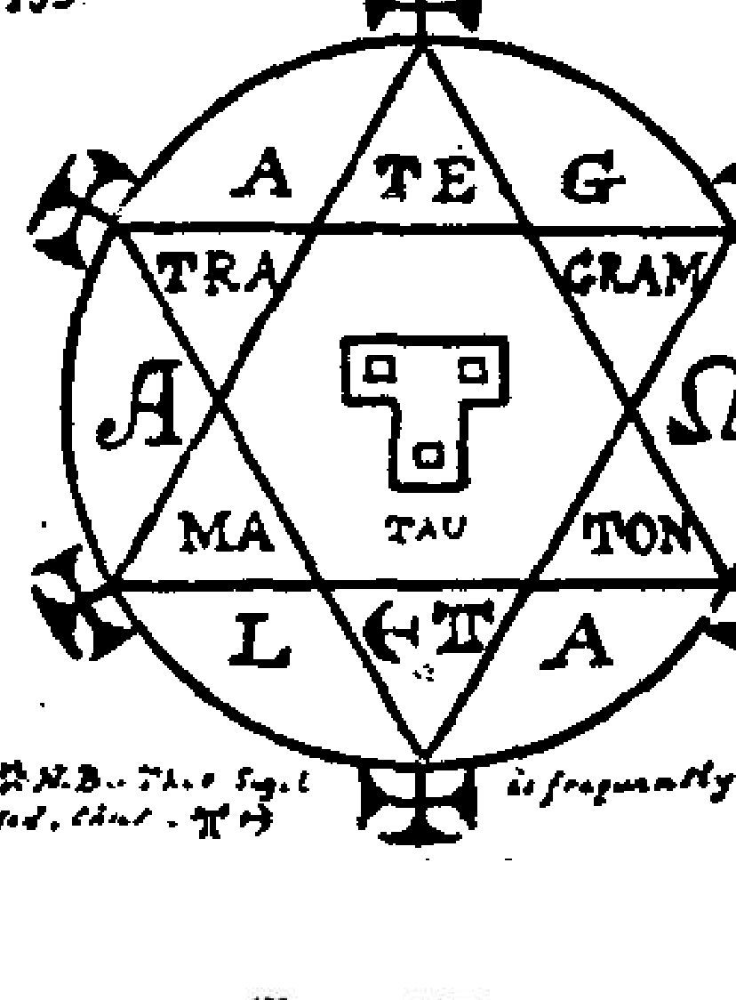

*N.B. The Sigil... sed, et, etc. → is frequently seen.

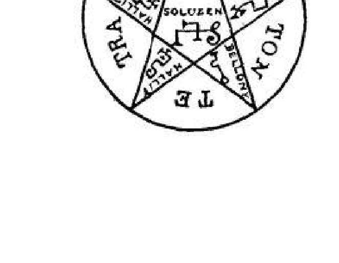

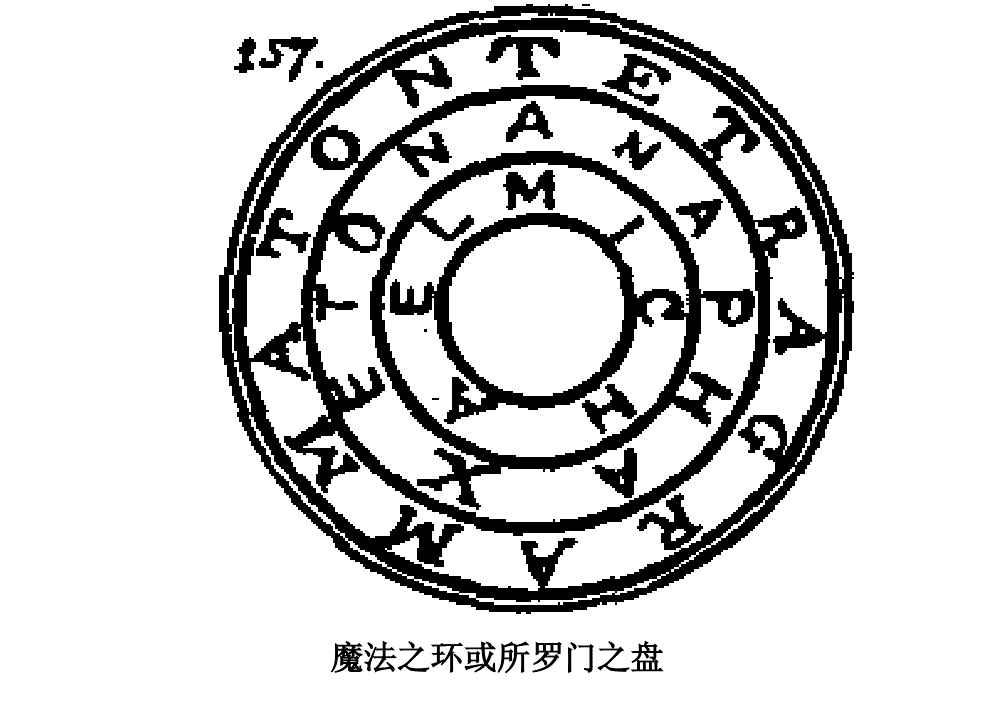

## 魔法之环或所罗门之盘

这个魔法之环，或所罗门之盘是由金或银制作。它是用来举在召唤者面前，用来免受邪灵的硫磺烟味及灼热的呼吸。

（颜色——亮黄色。字体，黑色。）

### 铜制瓮

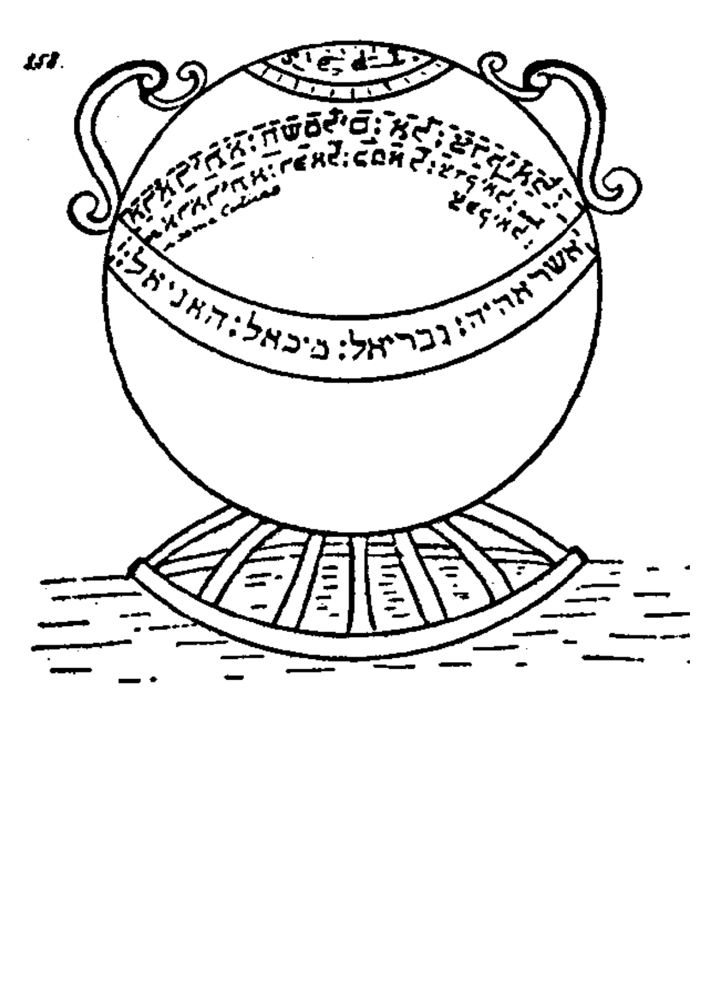

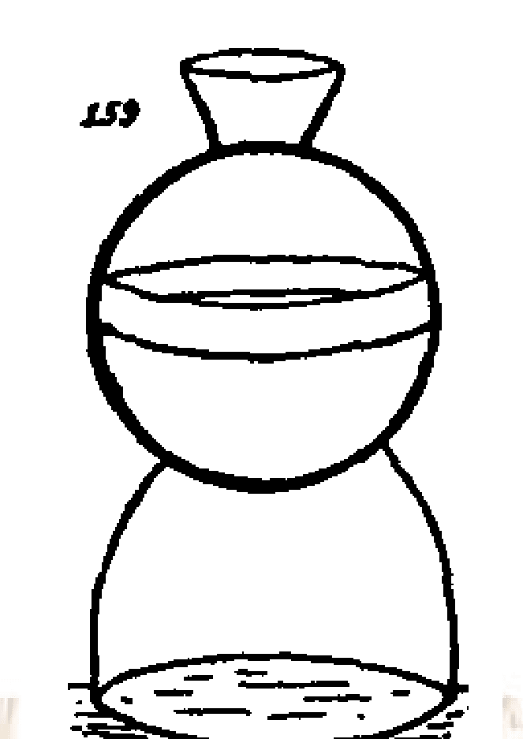

这个所罗门王的铜制器皿的确能收服邪灵。（见图158和159。）（不同的结构拥有不同的效用。图160的封印由黄铜制作，用来盖在器皿的顶端。所罗门王用它收服邪灵的神鬼传说可查阅“阿拉伯之夜”中的“渔夫与神灵”。然而，在这个神话故事中，只有一个神灵被黄铜器皿收服，顶端的封印是铅做的，而不是铜。神灵告诉渔夫他的名字是Sakhr，或Sacar。）

（颜色——青铜。字体——黑体红边。）

## 所罗门的神秘封印

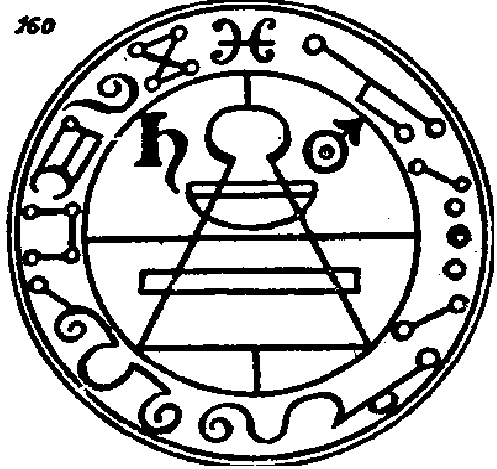

## 161

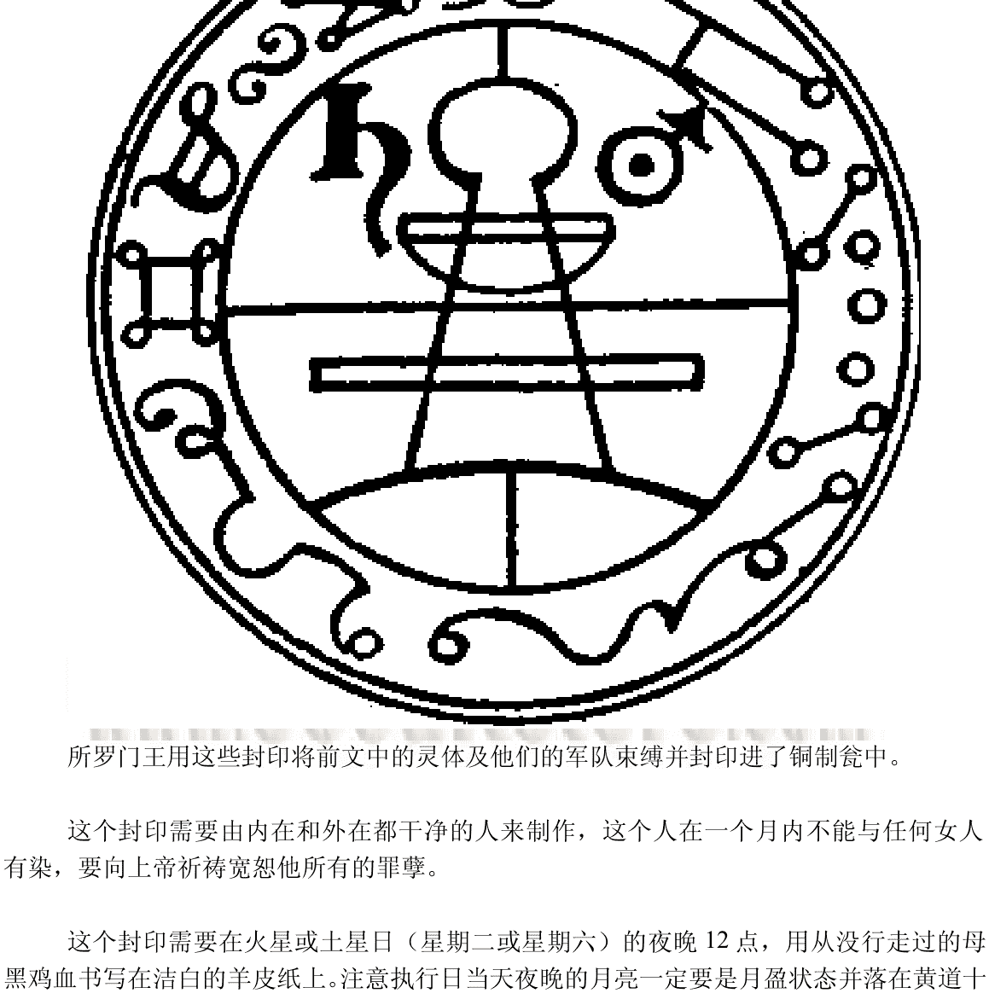

所罗门王用这些封印将前文中的灵体及他们的军队束缚并封印进了铜制瓮中。

这个封印需要由内在和外在都干净的人来制作，这个人在一个月内不能与任何女人有染，要向上帝祈祷宽恕他所有的罪孽。

这个封印需要在火星或土星日（星期二或星期六）的夜晚12点，用从没行走过的母黑鸡血书写在洁白的羊皮纸上。注意执行日当天夜晚的月亮一定要是月盈状态并落在黄道十二宫的处女宫上。在制作完成后，你应该用明矾烟熏它，随后在白天有太阳出现的时候，用雪松和芦荟暴晒它。

同样，这个所罗门王的封印能命令所有前文提及的在铜制瓮中的灵体，也用同一张封印封印他们。他因为它更加受到人民爱戴，在战役中获胜，任何武器、火焰或水都伤害不了他。这个至关重要的封印用来覆盖在器皿的顶口。

## 其它魔法必需品

其它魔法必需品有：一根节杖，一顶主教法冠，一件长的亚麻长袍，及其它有用途的衣服【在很多抄本中写的是“一根节杖或剑，一顶法冠或头饰。”“其它的衣服”并不只是指内衣，也可以是其它颜色的衣服。】当然，一条写着魔法圆上所有名字的3英寸宽的狮皮腰带也很重要。把熏香放在其盛放碟上，点燃它，让它净化仪式地点；在涂油礼上把你的太阳穴和眼皮上涂上油；将你自己洗个干净的澡。想要这么做的话，就要用戴维王的话述说：

### 沐浴时的礼赞

你用牛腾草净化我。哦，主！我应该变得洁净：你应该清洗我，我应该比雪还要洁白。

当你穿上衣服的时候，你应该说：衣服赐予爱慕之中。

> “By the figurative mystery of these holy vestures (or of this holy vestment) I will clothe me with the armour of salvation in the strength of the Most High, ANCHOR; AMACOR; AMIDES; THEODINIAS; ANITOR; that my desired end may be effected through Thy strength, O ADONAI! unto Whom the praise and glory will for ever and ever belong! Amen!”

> （“借着这些神圣衣服所带有的神秘色彩，我将用最高等的ANCHOR、AMACOR、AMIDES、THEODINIAS、ANITOR的力量穿上救赎的铠甲；我期待着结束能收到您力量的影响，哦，ADONAI！您永远被赞颂着，荣耀永远伴随着您！阿门！”）

在像所罗门推荐的那样，根据你的工作向神祈祷之后，这个仪式就完成了。

### 召唤前文中任何灵体的咒语

I DO invocate and conjure thee, O Spirit, N.30; and being with power armed from the SUPREME MAJESTY, I do strongly command thee, by BERALANENSIS, BALDACHIENSIS, PAUMACHIA, and APOLOGIAE SEDES; by the most Powerful Princes, Genii, Liachidee, and Ministers of the Tartarean Abode; and by the Chief Prince of the Seat of Apologia in the Ninth Legion, I do invoke thee, and by invocating conjure thee. And being armed with power from the SUPREME MAJESTY, I do strongly command thee, by Him Who spake and it was done, and unto whom all creatures be obedient. Also I, being made after the image of GOD, endued with power from GOD and created according unto His will, do exorcise thee by that most mighty and powerful name of GOD, EL, strong and wonderful; O thou Spirit N. And I command thee and Him who spake the Word and His FIAT was accomplished, and by all the names of God. Also by the names ADONAI, EL, ELOHIM, ELOHI, EHYEH, ASHER EHYEH, ZABAOTH, ELION, IAH, TETRAGRAMMATON, SHADDAI, LORD GOD MOST HIGH, I do exorcise thee and do powerfully command thee, O thou Spirit N., that thou dost forthwith appear unto me here before this Circle in a fair human shape, without any deformity or tortuosity. And by this ineffable name, TETRAGRAMMATON IEHOVAH, do I command thee, at the which being heard the elements are overthrown, the air is shaken, the sea runneth back, the fire is quenched, the earth trembleth, and all the hosts of the celestials, terrestrials, and infernals, do tremble together, and are troubled and confounded. Wherefore come thou, O Spirit N., forthwith, and without delay, from any or all parts of the world wherever thou mayest be, and make rational answers unto all things that I shall demand of thee. Come thou peaceably, visibly, and affably, now, and without delay, manifesting that which I shall desire. For thou art conjured by the name of the LIVING and TRUE GOD, HELIOREN, wherefore fulfil thou my commands, and persist thou therein unto the end, and according unto mine interest, visibly and affably speaking unto me with a voice clear and intelligible without any ambiguity.

（大致译文：我召唤你，哦 灵体，名字【填入希望召唤的灵体名字】；在至高无上的BERALANENSIS、BALDACHIENSIS、PAUMACHIA和APOLOGIAE SEDES的力量扶持之下，我强烈地命令你；以最强大的王子Genii，Liachidee和地狱大臣的力量；以在九军队中辩解文坐下大王子的力量，我召唤你。在万物膜拜者的至高无上的力量扶持之下，我强烈地命令你。我，神的创造物，神赐予我力量，根据他的意志创造，以无上El神之名召唤你；哦，灵体（名字）。我以神之名命令你和他，那位只需一声令下便能完成任务者。以ADONAI, EL, ELOHIM, ELOHI, EHYEH, ASHER EHYEH, ZABAOTH, ELION, IAH, TETRAGRAMMATON, SHADDAI，最高等的神，我召唤你，并强烈地命令你，哦灵体（名字），请立刻以人形态出现在这个圆中，请不要有任何残缺或扭曲。以TETRAGRAMMATON IEHOVAH（神名耶和华）的避讳之名，元素被击垮，天空在震撼，大海在倒退，火焰被熄灭，大地在颤栗，所有天上、陆地和地狱之主一同战栗，无法平静，陷入困惑。你因此而来，哦，你（名字），立刻，不要有任何迟疑，无论你在哪里，请理性地告诉我万物我将要求你。现在，平静、显然并殷勤地出现，不要有任何迟疑，照我所想的那样出现。你的力量被现存的真神HELIOREN所召唤，因此，你将履行我的命令并坚持到最后，根据我所关心的问题，诚实、清晰地回答我。）

不断地重复这段咒语，直到你感觉可以停止，如果灵体还没有出现，念出：

## 咒语第二段

I DO invocate, conjure, and command thee, O thou Spirit N., to appear and to show thyself visibly unto me before this Circle in fair and comely shape, without any deformity or tortuosity; by the name and in the name IAH and VAU, which Adam heard and spake; and by the name of GOD, AGLA, which Lot heard and was saved with his family; and by the name IOTH, which Jacob heard from the angel wrestling with him, and was delivered from the hand of Esau his brother; and by the name ANAPHAXETON which Aaron heard and spake and was made wise; and by the name ZABAOTH, which Moses named and all the rivers were turned into blood; and by the name ASHER EHYEH ORISTON, which Moses named, and all theI DO conjure thee, O thou Spirit N., by all the most glorious and efficacious names of the MOST GREAT AND INCOMPREHENSIBLE LORD GOD OF HOSTS, that thou comest quickly and without delay from all parts and places of the earth and world wherever thou mayest be, to make rational answers unto my demands, and that visibly and affably, speaking with a voice intelligible unto mine understanding as aforesaid. I conjure and constrain thee, O thou Spirit N., by all the names aforesaid; and in addition by these seven great names wherewith Solomon the Wise bound thee and thy companions in a Vessel of Brass, ADONAI, PREYAI or PRERAI, TETRAGRAMMATON, ANAPHAXETON or ANEPHENETON, INESSENFATOAL or INESSENFATALL, PATHTUMON or PATHATUMON, and ITEMON; that thou appearest here before this Circle to fulfil my will in all things that seem good unto me. And if thou be still so disobedient, and refusest still to come, I will in the power and by the power of the name of the SUPREME AND EVERLASTING LORD GOD WHO created both thee and me and all the world in six days, and what is contained therein, EIE, SARAYE, and by the power of this name PRIMEUMATON which commandeth the whole host of Heaven, curse thee, and deprive thee of thine office, joy, and place, and bind thee in the depths of the Bottomless Pit or Abyss, there to remain unto the Day of the Last Judgment. And I will bind thee in the Eternal Fire, and into the Lake of Flame and of Brimstone, unless thou comest quickly and appearest here before this Circle to do my will. Therefore, come thou! in and by the holy names ADONAI, ZABAOTH, ADONAI, AMIORAN. Come thou! for it is ADONAI who commandest thee.

（大致译文：借所有最显赫、最灵验的最伟大与无法理解的主的上帝，我召唤你，哦，灵体（名字），你一定要快速、毫不迟疑地从所有地球和世界的部分和地方，理性地响应我的请求，显然及殷勤地出现，用我可理解的语言回答我。我命令并束缚你，哦，灵体（名字），以之前所有述说过的名字；另加所罗门用来束缚你进铜制器皿中的七个名字：ADONAI, PREYAI 或 PRERAI, TETRAGRAMMATON, ANAPHAXETON 或 ANEPHENETON, INESSENFATOAL 或 INESSENFATALL, PATHTUMON 或 PATHATUMON 和 ITEMON；请你出现在这个圆之前，完成我的意志。如果你始终不予服从，拒绝前来此地，我将以在6天内创造你和我及其它万物的至高无上的神之主之名的力量，在里面包含着EIE，SARAYE，及以PRIMEUMATON的名字力量，他是天堂的主人，将会诅咒你，并剥夺你的职务、乐趣和地方，将你束缚在无底的深渊，直到末日的审判。而我将会以永恒之火束缚你，将你投入火焰及硫黄之海，除非你应我的意志，迅速出现在这个圆之前。因此，出现吧！以神圣ADONAI，ZABAOTH, ADONAI, AMIORAN之名。降临吧！这是ADONAI给你的命令。）

如果你已经进行到这里了，他还没有出现，你最好先确认他是否已被他的国王派去了其它地方，以至于无法降临；如果真是这样，就用后文召唤他的国王，让他派遣他。但如果他依然没有出现，那你就要确认他是否被地狱的锁链所束缚，以至他没有在他的国王管辖之下。如果真是这样，你还是想要召唤他的话，你必须要背诵常规咒语，我们将其称之为灵魂之链。

## 召唤国王

O THOU great, powerful, and mighty KING AMAIMON, who bearest rule by the power of the SUPREME GOD EL over all spirits both superior and inferior of the Infernal Orders in the Dominion of the East; I do invoke and command thee by the especial and true name of GOD; and by that God that Thou Worshippest; and by the Seal of thy creation; and by the most mighty and powerful name of GOD, IEHOVAH TETRAGRAMMATON who cast thee out of heaven with all other infernal spirits; and by all the most powerful and great names of GOD who created Heaven, and Earth, and Hell, and all things in them contained; and by their power and virtue; and by the name PRIMEUMATON who commandeth the whole host of Heaven; that thou mayest cause, enforce, and compel the Spirit N. to come unto me here before this Circle in a fair and comely shape, without harm unto me or unto any other creature, to answer truly and faithfully unto all my requests; so that I may accomplish my will and desire in knowing or obtaining any matter or thing which by office thou knowest is proper for him to perform or accomplish, through the power of GOD, EL, Who created and doth dispose of all things both celestial, aerial terrestrial, and infernal.

（大致译文：哦，你，伟大，强大，万能的王者AMAIMON，你以至高的神EL的力量统领着所有高等及低等东方领土上的地狱灵体；我用特殊的神的真名召唤并命令你；用你所信奉神的力量；以你的创造封印；以最强大万能的神IEHOVAH TETRAGRAMMATON之名，他曾将你及其它灵体从天堂驱逐；以最强大、最伟大的创造了天堂、地球和地狱及其内的万物的神之名；以他们的力量和美德；以统领着整个天堂之主的PRIMEUMATON之名；请你促成、强迫灵体（名字）以清晰的形态来到这个圆之前，不伤害我或者其它生物，诚实地回答我的请求；让我能完成我的意志和愿望。通过EL神的力量。）

在你召唤了2到3次国王之后，再用之前的咒文召唤你要的灵体，连续背诵几遍咒文，那他就会毫无疑问地出现。但是如果他还是没有出现，请在前文的咒文最后加入“灵魂之链”，那他就会被强迫出现，即使他之前被灵魂束缚着，锁链也一定会被打断，他会获得自由：

## 常规诅咒，灵魂之链，阻止所有反抗的灵魂

O THOU wicked and disobedient **spirit N.**, **because thou** hast rebelled, and hast not obeyed nor regarded my words which I have rehearsed; they being all glorious and incomprehensible names of the true GOD, the maker and creator of thee and of me, and of all the world; I DO by the power of these names the which no creature is able to resist, curse thee into the depth of the Bottomless Abyss, there to remain unto the Day of Doom in chains, and in fire and brimstone unquenchable, unless thou forthwith appear here before this Circle, in this triangle to do my will. And, therefore, come thou quickly and peaceably, in and by these names of GOD, ADONAI, ZABAOTH, ADONAI, AMIORAN; come thou! come thou! for it is the King of Kings, even ADONAI, who commandeth thee.

（大致译文：哦，你这个邪恶、不顺从的灵体（名字），因为你的反叛，无视我所复述的语言；他们是所有显赫和不易理解的真神姓名，是你和我及世间万物的制作者及创造者；我以这些无法令人抵抗的姓名力量诅咒你进入无底的深渊，被锁链捆绑，被火及硫黄折磨直到世界末日，除非你出现在这个圆之前，进入三角，完成我的意愿。因此，以ADONAI, ZABAOTH, ADONAI, AMIORAN之名，请你务必平静地、迅速地降临在我面前；降临吧，你！这是国王中的国王，ADONAI在命令你。）

当你进行到这步的时候，如果他还没有出现，那么就把他的封印写在羊皮纸上，放入一个坚固的黑色盒子里；并放入硫黄和阿魏（伞形科植物）等，让其发出难闻的臭味；然后，用铁丝将盒子捆绑起来，挂在你的剑尖上，把它举到木炭火上；对着它念出下文，它放的地方就是灵魂降临的地方：

## 火的召唤咒语

I CONJURE thee, O fire, by him who made thee and all other creatures for good in the world, that thou torment, burn, and consume this Spirit N., for everlasting. I condemn thee, thou Spirit N., because thou art disobedient and obeyest not my commandment, nor keepest the precepts of the LORD Thy GOD, neither wilt thou obey me nor mine invocations, having thereby called thee forth, I, who am the servant of the MOST HIGH AND IMPERIAL LORD GOD OF HOSTS, IEHOVAH, I who am dignified and fortified by His celestial power and **permission, and** yet thou comest not to answer these my **propositions** here made unto thee. For the which thine averseness and contempt thou art guilty of great disobedience and rebellion, and therefore shall I excommunicate thee, and destroy thy name and seal, the which I have enclosed in this box; and shall burn thee in the immortal fire and bury thee in immortal oblivion; unless thou immediately come and appear visibly and affably, friendly and courteously here unto me before this Circle, in this triangle, in a form comely and fair, and in no wise terrible, hurtful, or frightful to me or any other creature whatsoever upon the face of earth. And thou shalt make rational answers unto my requests, and perform all my desires in all things, that I shall make unto thee.

（大致译文：我命令你，哦，火焰，借创造你及其它生物的力量，燃烧吧，永久地折磨这个灵魂（名字）。我处罚你，灵魂（名字），因为你不顺从我的戒律，更不遵守你伟大神灵的规则，你既不遵从我，也不听从我的召唤，我是最高等主帝王神 IEHOVAH 的大臣，我得到了他的许可和他力量的扶持，但你还不现且回应我的命令。你的这种行为充满罪孽。因此，我逐出你，毁灭你的姓名和封印；我用永恒的火燃烧并埋葬你；除非你以清晰的形态立刻友好地、平静地现身于这个圆之前的三角中，而不对我及地球上其它生物作出任何可怕的，有害的事情。你应该理性地响应我的请求，履行我的愿望。）

如果他还是没出现，你应该说：

## 更强大的诅咒

Now O thou Spirit N., since thou art still pernicious and disobedient, and wilt not appear unto me to answer unto such things as I would have desired of thee, or would have been satisfied in; I do in the name, and by the power and dignity of the Omnipresent and Immortal Lord God of Hosts IEHOVAH TETRAGRAMMATON, the only creator of Heaven, and Earth, and Hell, and all that is therein, who is the marvellous Disposer of all things both visible and invisible, curse thee, and deprive thee of all thine office, joy, and place; and I do bind thee in the depths of the Bottomless Abyss there to remain until the Day of Judgment, I say into the Lake of Fire and Brimstone which is prepared for all rebellious, disobedient, obstinate, and pernicious spirits. Let all the company of Heaven curse thee! Let the sun, moon, and all the stars curse thee! Let the LIGHT and all the hosts of Heaven curse thee into the fire unquenchable, and into the torments unspeakable. And as thy name and seal contained in this box chained and bound up, shall be choken in sulphurous stinking substances, and burned in this material fire; so in the name IEHOVAH and by the power and dignity of these three names, TETRAGRAMMATON, ANAPHAXETON, and PRIMEUMATON, I do cast thee, O thou wicked and disobedient Spirit N., into the Lake of Fire which is prepared for the damned and accursed spirits, and there to remain unto the day of doom, and never more to be remembered before the face of GOD, who shall come to judge the quick, and the dead, and the world, by fire.

（大致译文：现在，你，灵魂（名字），因为你的行为仍旧有害、不予服从，不照我想出现在我面前，回答我的问题。我将以无所不在的不朽之主 IEHOVA TETRAGRAMMATON 之名，他是天堂、地球及地狱唯一的创造者，他将会诅咒你，剥夺你所有的职务，快乐和行为；而我将会将你束缚于无底的深渊直至世界末日，我说进入火焰和硫黄之湖，那里是所有背叛的、不服从的，倔强的灵魂归宿。让所有天堂的同伴诅咒你！让太阳，月亮，和所有的星星诅咒你！让光和所有天堂的主人诅咒你，让你遭受无法形容的痛苦之中。因为你的名字及封印被所在这个盒子里，你将会因硫黄的腐臭味窒息，被火焰灼伤；以耶和华之名，以 TETRAGRAMMATON, ANAPHAXETON 和 PRIMEUMATON 的力量和尊严，我向你施咒，你邪恶又不服从的灵魂（名字），准备进入被诅咒的火海吧，忍受其直至世界末日。）

然后，召唤师一定要把盒子放进火里，不久之后灵魂就会出现，一旦他出现，你就要熄灭火，点燃熏香，向他问好，友善地宽待他，把用亚麻布包裹着的五芒星向他展示，说道：

## 灵魂出现时的致辞

BEHOLD thy confusion if thou refusest to be obedient! Behold the Pentacle of Solomon which I have brought here before thy presence! Behold the person of the exorcist in the midst of the exorcism; him who is armed by GOD and without fear; him who potently invocateth thee and calleth thee forth unto appearance; even him, thy master, who is called OCTINIMOS. Wherefore make rational answer unto my demands, and prepare to be obedient unto thy master in the name of the Lord:

> > BATHAL OR VATHAT RUSHING UPON ABRAC!
> ABEOR COMING UPON ABERER!

> > (拉丁原文： “Bathal vel Vathat super Abrae ruens! Abeor veniens super Aberer!”)

（大致译文：请不要困惑，如果你拒绝服从，请看这个所罗门的五芒星，请注视这个召唤你的人；他没有恐惧，是神给予了他力量；他有效地召唤了你，将你的力量显现；甚至你的主人是OCTINIMOS。因此，诚实地回答我的问题，满足我的要求，准备以上帝之名服从你的主人。）

然后，他或他们就会服从于你，回答你的问题，履行你的意志。如果他或他们显得谦卑，你应该要背诵以下文字：

## 对灵魂的欢迎

WELCOME Spirit N., O most noble king^36 (or kings)! I say thou art welcome unto me, because I have called thee through Him who has created Heaven, and Earth, and Hell, and all that is in them contained, and because also thou hast obeyed. By that same power by the which I have called thee forth, I bind thee, that thou remain affably and visibly here before this Circle (or before this Circle and in this triangle) so constant and so long as I shall have occasion for thy presence; and not to depart without my license until thou hast duly and faithfully performed my will without any falsity.

（大致译文：欢迎你，灵体（名字），哦，最高贵的王者（们）！您太欢迎我了，我是通过创造天堂，大地和地狱的那位的无上力量召唤你的。以那个力量，我召唤你时的力量，我束缚你，那么你就可以在这个圆前保留清晰的形态；没有我的许可，请不要离开，直到你出色地完成了我给您的任务。）

然后，站在圆的中间，伸开你的手并做出命令姿势，说道：

> > “BY THE PENTACLE OF SOLOMON HAVE I CALLED THEE! GIVE UNTO ME A TRUE ANSWER!”（“以我召唤你的所罗门的五芒星！请给我真诚的回复！”）

然后，让召唤者陈述他的愿望和要求。

到召唤结束时，你应该用下文允许灵魂离开：

## 离开的许可

> > O THOU Spirit N., because thou hast diligently answered unto my demands, and hast been very ready and willing to come at my call, I do here license thee to depart unto thy proper place; without causing harm or danger unto man or beast. Depart, then, I say, and be thou very ready to come at my call, being duly exorcised and conjured by the sacred rites of magic. I charge thee to withdraw peaceably and quietly and the peace of god be ever continued between thee and me! AMEN!

> > （大致译文：哦，你，灵体（名字），因为你勤勉地响应了我的问题及要求，也非常乐意我对你的召唤，我在这里允许你离开，回到你原来的地方；不带任何对人、兽有害或危险的举动。离开吧，你非常完美地被神秘魔法典礼召唤并完成了你的任务。我命令你平静地撤退，你我之间的平和将永久！阿门！）

在你给予灵魂离开的许可之后，你不能离开圆直到他离开，然后，你要祈祷感谢神对你的祝福和帮助。

注意：你可以命令这些灵魂进入铜制器皿，方法就像你命令他们进入三角的一样，说：“你立刻出现在这个圆之前，在这个铜制器皿里，以清晰完整的形态，”等等，就像前文中的咒语一样。

## LEMEGETON 书中出现的某些名字的解说

- Eheieh Kether—万能的神，他的住所在天堂的最高处。
- Haioth—天堂里的伟大王者。
- Methratton—所有天使及天使长的神圣主人。
- Reschith—倾听你的大臣祈祷，他十分信任你。
- Hagalgalim—无论在什么时候，都能派遣神圣天使来帮助你。
- Iehovah—全能的神，无所不能的神。
- Hadonat—能命令天使去固定星星。
- Ophanim—能用来帮助你的大臣。
- Lophiel—能命令所有天空、水、火、土和地狱的灵魂。
- Moloth—帮助你达成荣耀。
- Elohim—与我们在一起的神。
- Binah—永远支持我们，无论现在还是将来。
- Aralim—在我们的事业中，我们的履行就像你手中的工具。
- Zabbathi (应该是 Shabbathii) —在你的手中，Sabaoth 的伟大之神。
- Hesel (应该是 Chesed) —你伟大的神，行星及天堂主人的统治者及创造者。
- Hasmalim (应该是 Chashmalim) —以你伟大的力量命令他们。
- Zelez (应该是 Zedeq) —出现并帮助我们，你可怜的大臣，无论是现在还是未来。
- Elohim Geber (应该是 Bibor) —最万能永恒的神。
- Seraphim—六翼天使的命令者。
Camael, Madim—帮助我们，保护我们远离危险。
Eloha—哦，万能的神！请与我们在一起。
Tetragrammaton—让你万能无穷尽的力量保护、守护我们。
Raphael—让圣洁的天使 Raphael 永远伺候我们。
Schemes（或 Shemesh）—帮助我们的工作。
Sabaoth—伟大的 Sabaoth 之神。
Netzah（或 Netzach）—能看见万物的神。
Elohim—愿神与我们永远同在。
Haniel—让你的神圣天使 Haniel 降临。
Sabaoth—哦，伟大的 Sabaoth 之神，请永远与我们同在。
Hodben（应该是简单的 Hod）—让你万能的力量永远守护我们。
Michael—Michael 是在你之下，天堂主人的将军。
Cochab—降临并驱逐所有邪恶和危险。
Sadai—你伟大的智能和知识之神。
Jesal（应该是 Iesod）—教导你可怜和最卑微的大臣。
Cherubim—智天使。
Gabriel—天使加百利，好消息的创造者和使者。
Levanah—他的出现能永远指引并支持我们。

## 五芒星上两个三角的解说

Alpha and Omega－你，哦，伟大的神，你是开始，也是结束。
Tetragrammaton－万能力量的神，请永远与我们同在，守护我们，让你圣洁的灵魂永远与我们同在。
Soluzen－我命令是，无论你的灵魂在何地，请降临于这个圆。
Halliza－以人形态出现。
Bellator（或 Ballaton）－以我们的母语与我们沟通。
Bellonoy（或 Bellony）－展示并发现所有的财宝，包括你知道的，或是你所保管的，将它迅速地传递给我们。
Hallii.Hra－回答所有的问题。

## 所罗门三角的解说

Anephezeton－所有天堂主人的伟大神。
Primeumaton－他是第一个也是最后一个让所有灵魂臣服于我们神，让灵魂在这个三角中束缚。
Michael－以圣洁天使麦克尔之名，直到我释放他。

（LEMEGETON 的第一卷就到此结束，这一卷称为 GOETIA。）

# Theurgia Goetia

### Lemegeton

- 一
- 二

# Theurgia Goetia

## 从这里开始讲述的是第二部书籍，被称为所罗门王的 Theurgia Goetia的艺术

下文将重点介绍主灵和他们下级的名字，封印或特征，这些封印会作为护身符让你佩戴在胸前，这样，灵体才会出现并听从你的命令。

灵体的职能都大同，一位灵体能做的事情，其它灵体也同样能完成，他们能发现并展示所有隐藏的事物，并在世界范围内取来&携带&做任何需要完成的事物或者包括任何四元素，火，空气，土或水&也包括国王或者任何人的秘密。这全都取决于你的意志。

他们是与生俱来的善与恶，也就是说，他们中一部分是善，另一部分就是恶，他们被他们的王子统领着，而每位王子都在罗盘的指针方向上存在住所，可参考给出的图片，因此，如果你想要召唤任何一位王子或者他们的大臣的话，你需要面对国王或王子寝宫的方向进行召唤，方向绝不能在仪式中搞错。每位王子都有各自的召唤咒语，都是同一形式，除了名字和灵体的地点你必须要改变，同样，灵体的封印也要改变。

关于衣服和其它数据都已在GOETIA之书中详述。

因为当国王找到他的国民后，要发现31位国王或王子以及他们的大臣和大臣们的图像印板就变得很容易。

见图表：

# Theurgia Goetia

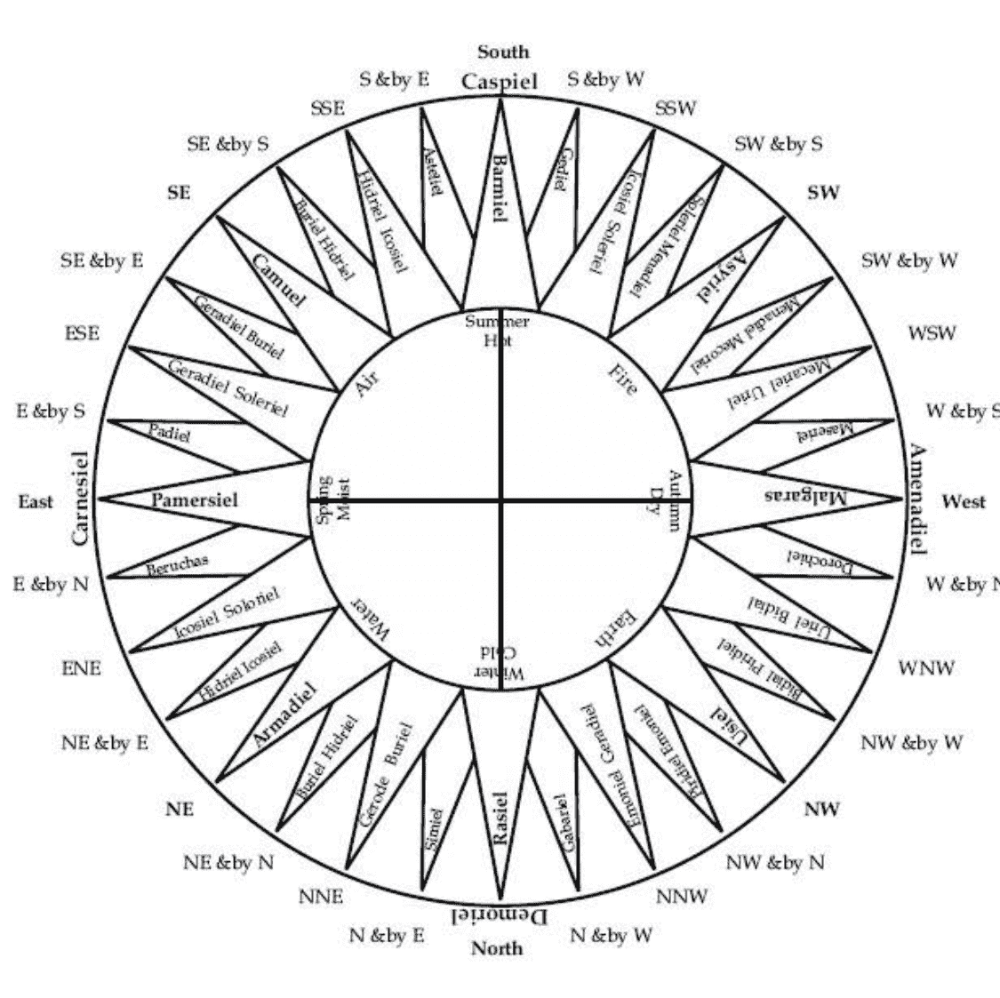

你可以观察到这张图上的20位国王有固定的寝宫，而且都在持续在同一点上，其它的国王寝宫则是移动变换的，有时在一个地方，有时则会在其它地方。

因此，当你想要召唤他们或者他们的大臣的时候，无论你面向哪一方都无关紧要。Carnesiel（卡那赛尔）是最具领导力的君主，统治着东方，他有1000位公爵和100位子公爵归他统领，此外还有500,000,000,000位在公爵之下的大臣，所以，本书中只会提及12位公爵和他们的封印，这些已足够实践了。

# Lemegeton: Clavicula Salomonis

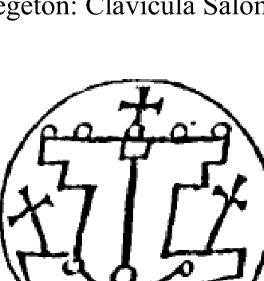

## Carnesiel（卡内塞尔）的封印

## 12 位公爵的封印

| 公爵名称 | 封印描述 |
| :--- | :--- |
| Orvich | 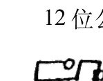 |
| Armany | 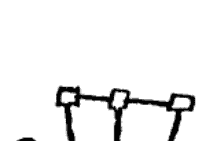 |
| Benoham | 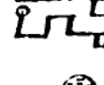 |
| Myrezyn | 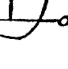 |
| Vadriel | 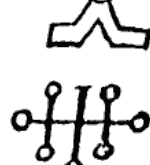 |
| Bucafas | 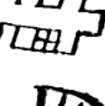 |
| Bedary | 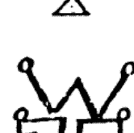 |
| Cumerzel | 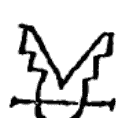 |
| Zabriel | 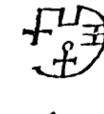 |
| Capriel | 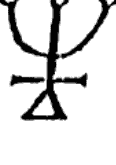 |
| Arifel | 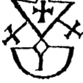 |
| Laphor | 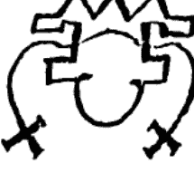 |

注意，无论你是白天还是夜晚召唤Carnesiel，都会有60,000,000,000,000侍奉左右，但是，当你召唤任何他的公爵时，永远也不会超过300名，并且有时甚至不会超过10名。

> 咒文(:) "I conjure thee O thou great mighty & potent Prince Carnesiel, &c." （我召唤汝，哦！伟大万能的王子Carnesiel啊！）

[完整的咒文详见本书最后一页.-- Ed.]

## Caspield（卡斯培尔）

Caspield是统领南方的主要君主，他拥有200位大公爵和300位子公爵，另有1,000,200,000,000位大臣灵体在他的统领之下。这12位公爵各有2660名部下侍奉其右，但是他们非常难以应付，而且脾气暴躁。

他公爵的封印：

- Chariel seal：对应的符号
- Temol seal：对应的符号
- Camorr seal：对应的符号
- Ariaiel seal：对应的符号
- Ambri seal：对应的符号
- Otiel seal：对应的符号
- Vusiel seal：对应的符号
- Maras seal：对应的符号
- Budarijm seal：对应的符号
- Larmol seal：对应的符号
- Geriel seal：对应的符号
- Camor seal：对应的符号

> The Conjuration: "I Conjure thee O thou Mighty & Potent Prince Caspiel, &c."

咒文："I conjure thee O thou great mighty & potent Prince Caspiel, &c."（我召唤汝，哦！伟大万能的王子Caspield啊！）

## Lemegeton: Clavicula Salomonis

## Amenadiel（阿门纳德尔）

Amenadiel 是西方伟大的统治者，他拥有 300 位大公爵和 500 位子公爵，更有 40,000,030,000,100,000 位大臣。我们在这里只介绍 12 位主要的公爵和他们的封印，因为这些已足够你练习。

注意：Amenadiel 可以在白天或夜晚召唤，但是他那些拥有 3000 位大臣的公爵需要在特定的时间才能召唤，如 Vadras，需要在每天刚开始的一个时辰内召唤，又如 Nadroc，需要在夜晚的最后一个时辰才能召唤，就这样又从 Vadras 开始。召唤北方王者 Demoriel（德门瑞尔）的公爵也是遵循同样的规则。

> 召唤咒文: "I conjure thee O thou great & mighty & potent prince Amenadiel, who is the Emperor & chief King ruling in the Dominion of the West, &c " (我召唤汝，哦！统治西方领土的王者，伟大万能的王子阿门纳德尔。。。)

# Theurgia Goetia

## Demoriel (德门瑞尔)

Demoriel 是北方伟大万能的王者，他统领着 400 位大公爵和 600 位子公爵，700,000,800,000,000,000 位大臣听命于他，因此，我们在此只提及他的 12 位主要的公爵和他们的封印。

注意：每位公爵有 1140 位大臣会想要随同出现，因此，当你召唤公爵的时候，你要比平常做的事更多，他有更多的伴随左右。

12位公爵的封印：

Armbiel seal

Cabarim seal

Burisiel seal

Mador seal

Dubilon seal

Churibal seal

Chomiel seal

Monandor seal

Diriel seal

Carnol seal

Moder seal

Dabrnos seal

> The Conjuration: "I Conjure thee O thou great & mighty & Potent Prince Demoriel, &c."

召唤咒文：“我召唤汝，哦！伟大万能的王子德门瑞尔。。。”

## Pamersiel（帕门塞尔）

Pamersiel 是在 Caneiel 之下统领东方的首席灵体，有千位灵体听命于他，我们应在白天小心地召唤他们，因为他们自恃甚高而难以应付，我们在此只提及其中的 11 位。

Madriel seal

Sotheans seal

Abrulges seal

Itules seal

Hamorphol seal

Itrasbiel seal

注意：这些灵体本质邪恶，他们非常虚伪，不要相信他们口中的任何秘密，但是，他们是帮助赶走黑暗恶魔的好手，要召唤 Pamersiel 或任何一个大臣，在去房屋最顶层之前，先制作卷一 GOETIA 之书中的圆，或者在一个空气流通性极佳的地方，因为这些灵体在这部分中是风属性的。你可以在一张称为所罗门的伟大图表的图片上放置一块 4 英寸直径的水晶石，召唤灵体进入其中。把他的封印佩戴在胸前和缠绕在你的腰上，这些在 GOETIA 之书中都有详细的说明，千万不能出错。图表的样式见下图，当你都准备好的时候，重复念诵咒文多次，毫无疑问，灵体一定会降临。

注意：同样的方法可以用于卷二中所有的灵体。

## Solomon 的图表

召唤咒文: "I conjure thee, O thou mighty & potent Prince Pamersiel who Ruleth as a King in the Dominion of the East, &c." （我召唤汝。哦！统领东方领土的国王，伟大万能的王子帕门塞尔。。。）

## Padiel（帕德尔）

东方王者的二当家，名位 Padiel，他统治东方和南方的国王，白天统领 10,000 位灵体，夜晚统领 200,000 位，更别提他有千位大臣在他之下，他们本性皆善，可令人信服，所罗门说他们并没有力量，但是他们的王子 Padiel 会给予他们力量，因此，我们在此不提及他们的名字，因为他们离开王子 Padiel 的身边就无法显现，就如在 Pamersiel 之前宣称的那样。

> 召唤咒文："I Conjure thee O thou mighty & Potent prince Padiel, who rules as chief prince in the Dominion or the East & By south, &c ".（我召唤汝，哦！东方和南方领土的首席王子，伟大万能的王子帕德尔。。。）

## Lemegeton: Clavicula Salomonis

## Camuel（卡谬）

东方国王的三当家名为卡谬。他在世界的东南方扮演着国王的角色，有数名灵体在他的掌管之下，我们因此只在本书中提及其中的10位，他们中有属于白天，也有属于夜晚的，他们每位都有10位大臣伴随左右，除了Camyel, Citgaras, Calym, Meras，因为他们都有100位侍奉左右，但是Tediol, Morio和Tugaros，他们一个大臣都没有。他们皆以美丽的样子出现，白天和黑夜都礼貌待人，他们的封印如下。

# Theurgia Goetia

## Camuel (卡谬)

属于夜晚的 Camuel 大臣的姓名和他们的封印：

Asniels seal

Moras seal

Calym's seal

(?) seal

Dobiels seal

Todiel seal

Moriel(s) seal

Nodars seal

Phaniels seal

Tuaros seal

召唤咒文: "I Conjure thee O thou mighty & Potent Prince, &c." (我召唤汝，哦！伟大万能的王子。。。)

## Lemegeton: Clavicula Salomonis

## Asteliel（阿斯特雷）

第四位灵体的名为 Asteliel，他在 Carnesiel 之下在南方如同国王一般，在东方，他拥有 10 位属于白天的主要的灵体和20 位属于夜晚的，他们在三位首席灵体之下，我们在此只提及其中的 8 位，每位有 20 位大臣听命于他，他们都非常友善、充满爱意、美丽，他们的封印如下。

- Mariol his seal
- Parniel seal
- Cubiel seal
- Otiel seal
- Charas seal
- Aratiel seal
- Aniel seal
- Othiel seal

# Theurgia Goetia

## Asteliel（阿斯特雷）

下面是属于夜晚的8位大臣的封印：

Sariel seal

Asahel seal

Aroam seal

Euriel seal

Chamos seal

Asphiel seal

Bufar seal

Melas seal

这些属于夜晚的灵体需要在夜晚召唤。

> 召唤咒文: "I conjure thee O thou Mighty & Potent Prince Asteliel &c." （我召唤汝，哦！伟大万能的王子阿斯特雷。。。）

## Lemegeton: Clavicula Salomonis

## Barmiel（巴梅尔）

第五位灵体名为Barmiel，他是在Caspiel之下的首席灵体，南方的帝王，他在Caspiel之下如国王一般统治着，有10位属于白天的公爵和20位属于夜晚的公爵随他意愿侍奉左右，他们本质非常善良，愿意去服从召唤者的意愿，我在此只提及8位属于白天和同样属于夜晚的灵体，他们的封印已足够练习。

> 注意：每位公爵拥有 20 位大臣侍奉，除了最后属于夜晚的四位，他们没有任何大臣。

在 Barmiel 之下的八位公爵的姓名和封印如下：## 巫術の法則
出品

# Theurgia Goetia

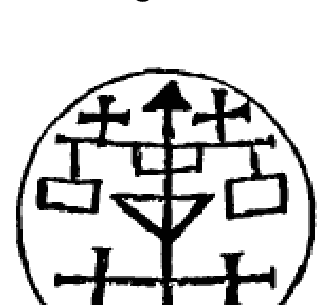

## Barmiel（巴梅尔）

在 Barmiel 之下的八位公爵的姓名和封印如下：

- **Berbis seal**：[封印符号图片描述：由多个三角形、矩形和曲线组成的复杂符号，底部有一个黑色三角形。]
- **Morcaza seal**：[封印符号图片描述：由矩形和勾形组成的符号，类似带钩的框架。]
- **Acereba seal**：[封印符号图片描述：中央为倒置的心形，两侧有箭头和圆形的符号。]
- **Ashib seal**：[封印符号图片描述：顶部为三个相连的圆圈，下方为类似城墙垛口的结构。]
- **Gabir seal**：[封印符号图片描述：中央有十字的圆圈，两侧有黑色菱形，底部有新月和点。]
- **Carnet seal**：[封印符号图片描述：倒置的三角形内部有圆圈和三角形，下方有横线和新月。]
- **Marques seal**：[封印符号图片描述：由多个阶梯状矩形和底部三个圆圈组成的复杂结构。]
- **Baabal seal**：[封印符号图片描述：顶部有十字和三角形，中央有U形，两侧有翼状结构。]

属于白天的灵体一定要在白天召唤，属于夜晚的一定要在夜晚召唤。

> 召唤咒文: *"I conjure thee O thou mighty & Potent Prince Barmiel, &c."* （我召唤汝，哦！伟大万能的王子 Barmiel。。。）

## 巫術の法則
出品

## Lemegeton: Clavicula Salomonis

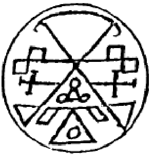

## Gediel（歌戴尔）

第六位灵体，在南方帝王之下的二当家名为 Gediel，他在南方如国王一般统治着，在西方，他拥有 20 位重要的灵体臣服于他，我在此只需提及其中的 8 位就足以让你练习。属于白天和同样属于夜晚的每位主要灵体拥有 20 位大臣伴随，当他们被召唤服务于你时，他们会非常充满爱意并谦恭地完成你的意愿，你必须在白天召唤属于白天的灵体，在夜晚召唤夜晚的灵体，他们的姓名和封印如下：

- Cotiel seal
- Sadiel seal
- Assaba seal
- Reciel seal

- Naras seal
- Agra seal
- Sabas seal
- Anael seal

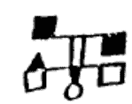

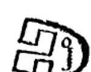

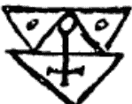

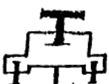

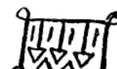

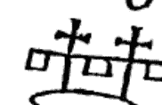

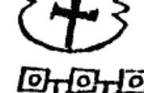

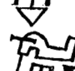

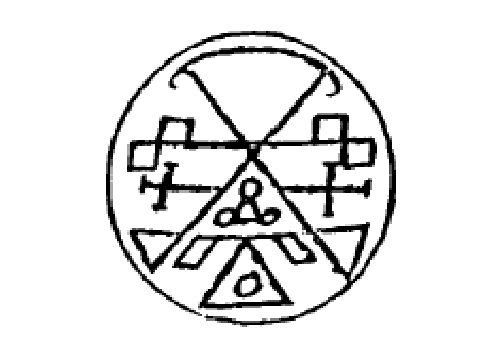

## Gediel（歌戴尔）

在 Gediel 之下需要在夜晚召唤的 8 位公爵的姓名和封印如下：

| Sariel seal | Cirecas seal |
|-------------|--------------|
| Araon seal  | Vriel seal   |
| Aglas seal  | Mishel seal  |
| Rantiel seal | Bariel seal |

召唤咒文: "I Conjure thee O thou Mighty & Potent Prince Gediel, &c."（我召唤汝，哦！伟大万能的王子 Gediel。。。）

## Lemegeton: Clavicula Salomonis

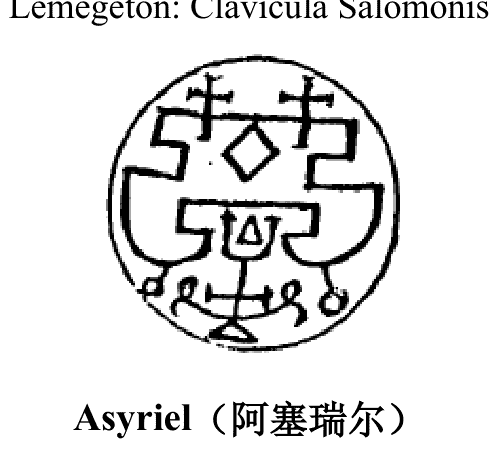

## Asyriel（阿塞瑞尔）

他统治世界的西南方，拥有 20 位大公爵伴随左右，更有数十位大臣听命于他们，我们只在此提及主要公爵的 8 位，他们属于白天同样属于夜晚，因为这些已足以练习，属于白天的前 4 位拥有 40 位大臣在他们之下，属于夜晚的前 4 位也同样如此，属于白天的最后 4 位，拥有 20 名属于夜晚的最后 4 位拥有 10 位。他们本质都是善良的，愿意服从汝，那些属于白天的需要在白天召唤，那些属于夜晚的，需要在夜晚，这些是他们的姓名和封印：

他的8位属于白天的公爵：

- Olitors seal
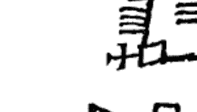

- Carga seal
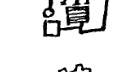

- Buniels seal
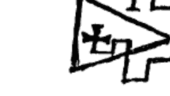

- Rabas seal
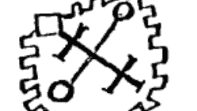

- Arisat seal

- Ariel seal
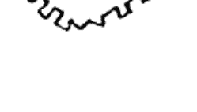

- Cuopiel seal

- Malugel seal

## 巫術の法則
出品

# Theurgia Goetia

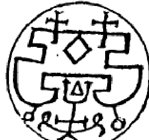

## Asyriel（阿塞瑞尔）

属于夜晚的8位公爵：

- 1. Amiel seal
- 2. Cusrel seal
- 3. Marott seal
- 4. Onuel seal
- 5. Buter seal
- 6. Aspiel seal
- 7. Fiascua seal
- 8. Hamas seal

> 召唤咒文: "I Conjure thee O thou Mighty & Potent Prince Asyriel, who rulest as a King, &c." （我召唤汝，哦！如国王一般统治的，伟大万能的王子阿塞瑞尔。。。）

## Lemegeton: Clavicula Salomonis

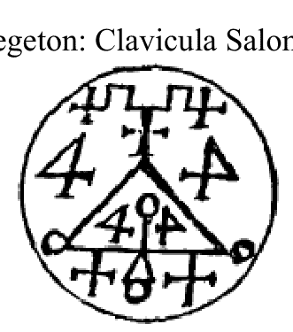

## Maseriel（马色瑞尔）

次序中的第八位，也是南方帝王之下的第 4 位名为 Maseriel，他在西方如国王一般统治着，在南方，他拥有大量的王子和大臣在他之下，听命于他。因此我们只提及主要灵体中的 12 位，这些已足以供你实践，他们本性善良愿意为你服务，那些属于白天的，需要在白天召唤，属于夜晚的，需要在夜间召唤，下面是他们的姓名和封印，每位灵体有 30 位大臣伴随左右。

属于白天的30位灵体如下：

| Left Column | Right Column |
|-------------|--------------|
| Mayhue his seal | Chares seal |
| Zeriel seal | Aliel seal |
| Azimel seal | Earviol seal |
| Assuel seal | Vescur seal |
| Roviel seal | Patiel seal |
| Atmot seal | Espoel seal |

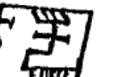

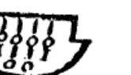
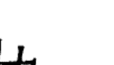
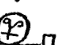
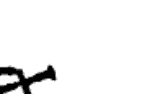
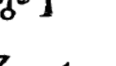
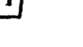
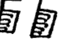

# Theurgia Goetia

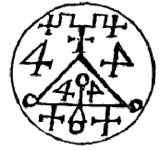

## Maseriel（马色瑞尔）

属于夜晚的灵体：

- Arach seal
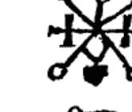
- Eliol seal
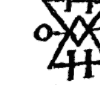
- Sarmiel seal

- Atriel seal
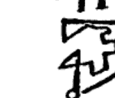
- Baras seal
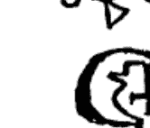
- Nogoiol seal
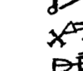
- Rabiel seal
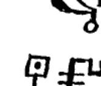
- Badiel seal
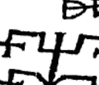
- Naras seal
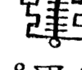
- Eras seal
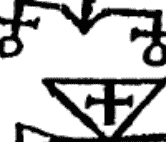
- Amoyr seal
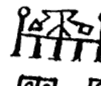
- Sdvar seal
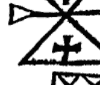

召唤咒文: "I Conjure thee O thou Mighty & Potent Prince Maseriel, who Ruleth as King, &c."（我召唤汝，哦！国王般的统治着，伟大万能的马色瑞尔。。。）

## Lemegeton: Clavicula Salomonis

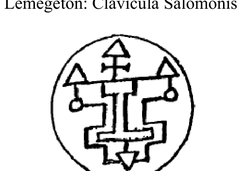

## Malgaras（马尔嘎啦斯）

次序中的第九位，也是西方帝王之下的第一位称为 Malgaras，他统治西方的领土，拥有 30 位公爵在他之下，他们中的每一个拥有 30 位大臣伴随左右，除了 Milie l, Barfas, Asper 和 Deiles，他们每位拥有 20 位大臣，Arois 和 Basiel 拥有 10 位，他们都十分彬彬有礼，愿意达成你的心愿，他们每次和他们的大臣一起两个两个出现，那些属于白天的，应该在白天召唤，那些属于夜晚的，应该在夜晚召唤，下面是他们的姓名和封印：

属于白天的 12 位公爵是：

- Carimiel seal
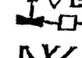
- Rabiell seal
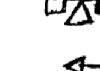
- Agor seal
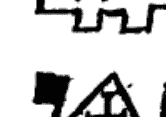
- Alisiel seal
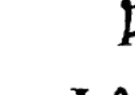
- Udiel seal
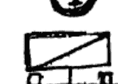
- Boras seal
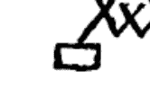
- Meliel seal
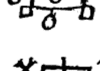
- Cabiel seal
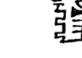
- Casiel his seal
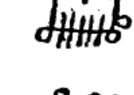
- Barfas seal
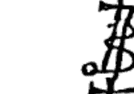
- Oriel seal
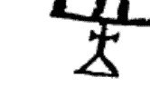
- Arois seal
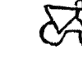

# Theurgia Goetia

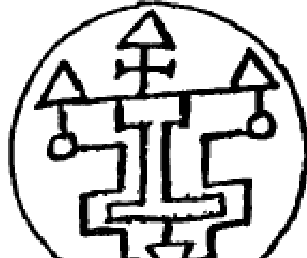

## Malgaras（马尔嘎啦斯）

下面是 12 位属于夜晚的公爵：

- Arac seal
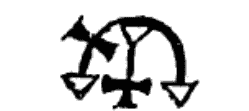
- Deilas seal
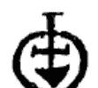
- Cubi seal
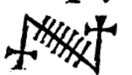
- Rabae seal
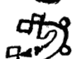
- Aspiel seal
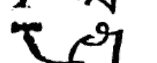
- Zamor seal
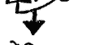
- Asper seal
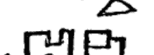
- Basiel seal
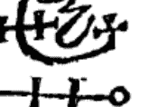
- Libiel seal
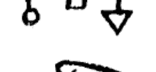
- Dodiel seal
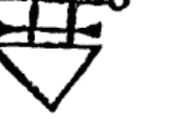
- Caron seal
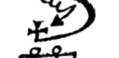
- Amiel seal
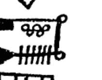

> 召唤咒文: "I Conjure thee O thou mighty & potent Prince Malgaras, &c." （我召唤汝，哦！伟大万能的王子马尔嘎啦斯。。。）

## Lemegeton: Clavicula Salomonis

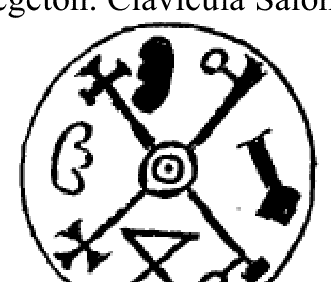

## Darochiel（达柔切尔）

他在次序中是第10位灵体，也是西方帝王之下的第二位，名为Dorochiel，他是位统治西方的伟大王子，在北方，他拥有40位公爵在白天和黑夜伴随左右，另有数不尽的大臣伴随着他，我们在此只提及其中的24位属于白天的主要的公爵，同样属于夜晚的，下面是他们的封印。注意这些中属于白天和夜晚的前12位公爵，每位有40位大臣伴随出现，属于白天的灵体需要在白天召唤，属于夜晚的灵体需要在夜晚召唤。在召唤时，要遵守行星的变化，属于白天的头两个需要在第一个行星时间召唤，接下去的两个就是第二个行星时间。他们的本质都很善良，愿意去服从你的命令，他们的名字和封印见下文。24位属于白天的公爵中，12位在正午前，12位在正午后。[注意：下面的顺序是垂直依次的]

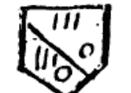

- Magael seal
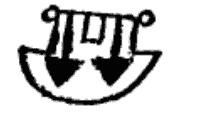
- Tubiel seal
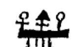
- Carciel seal
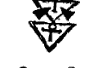
- Asphor seal
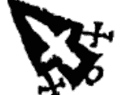
- Gudiel seal
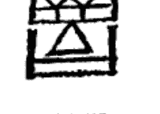
- Danael seal
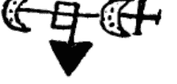
- Abriel seal
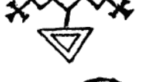
- Arlino seal
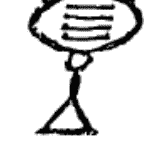
- Choriel seal
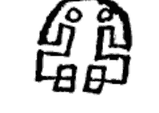
- Corua seal## Theurgia Goetia

下面是24位属于夜晚的灵体，12位在午夜前，12位在午夜后。

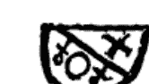
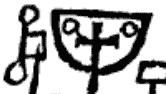
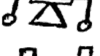
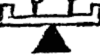
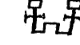
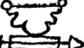
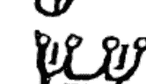
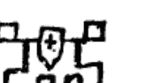
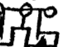
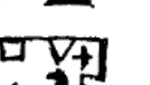
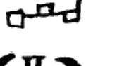
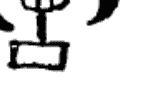
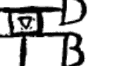
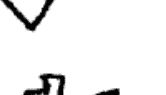

Budis seal
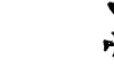

Paniel seal
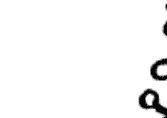

Narsiel seal
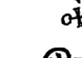

Abael seal
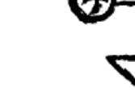

Momel seal
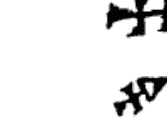

Curfas seal

Mosiel seal

Meroth seal

Pasiel seal

Liel seal
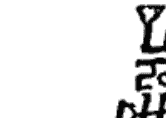

Aroziol seal
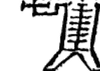

Chadriel seal
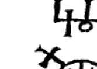

Gariel seal
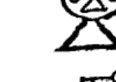

Maziel seal
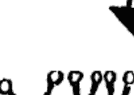

Cusijnd seal
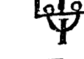

Lobiel seal
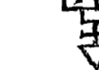

召唤咒文: "I Conjure thee, O thou mighty & Potent Prince Dorochiel, &c." （我召唤汝，哦！伟大万能的王子 Dorochiel。。。）

## Usiel（乌塞尔）

他是次序中的第 11 位灵体，也是帝王 Amenadiel 之下的第三，他的名字是 Usiel，一位如同国王般统治西北方的万能的王子，他拥有白天 40 位和夜间 40 位公爵伴随左右，我们在此只会提及其中的 14 位，因为这已足够你实践的了，属于白天的前 8 位拥有 40 位大臣，剩下的拥有 630 位，&属于夜晚的前 8 位每位拥有 40 位大臣&剩下的 4 位公爵拥有 20 位大臣，最后的两位公爵拥有 10 位，&他们非常服从，当他们被召唤的时候非常愿意现身，他们的力量非常适合用于发现或隐藏财宝，比所罗门所说的其它灵体更擅长此道，但你的财宝并不会被拿走，用羊皮纸制作 4 个封印，把财宝覆盖在上面，那么财宝就不会被发现或者拿走，灵体的名字和封印如下：

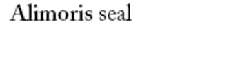
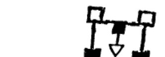
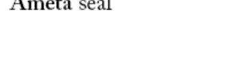
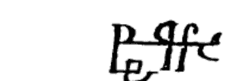
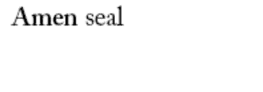
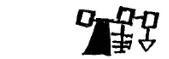
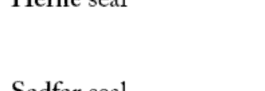
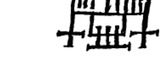

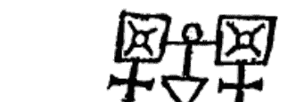

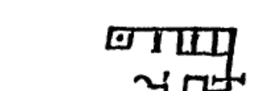

## Lemegeton: Clavicula Salomonis

接下来是属于夜晚的 14 位灵体：

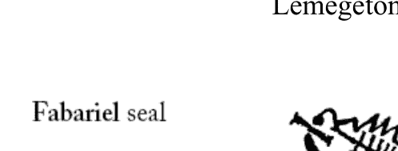
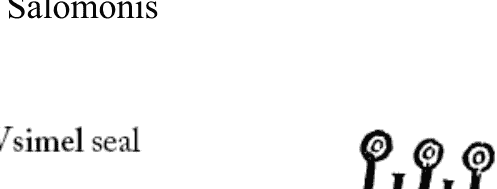
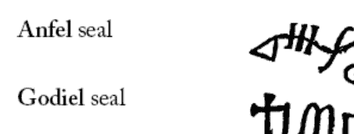
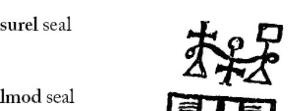
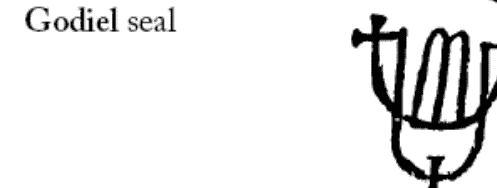
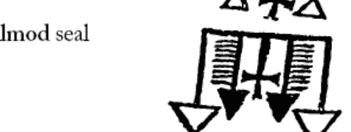
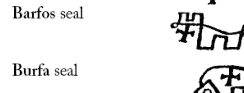
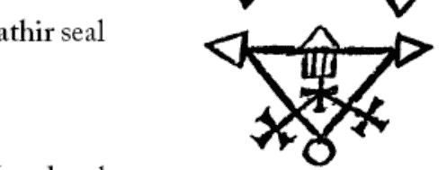
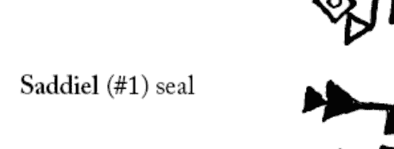
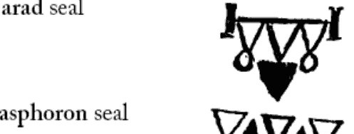
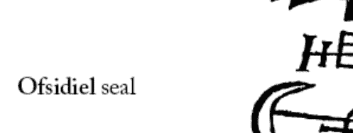
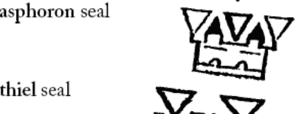
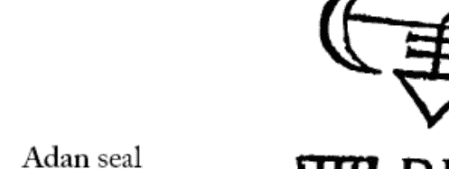
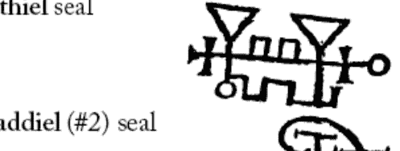
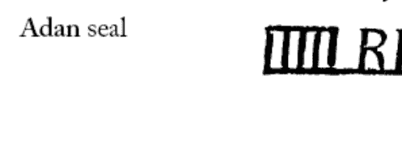
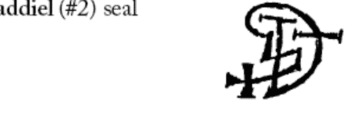

> 召唤咒文: "I Conjure thee O thou mighty & Potent Prince Usiel, &c." （我召唤汝，哦！伟大万能的王子乌塞尔。。。）

## Cabariel（卡百瑞尔）

他是次序中的第12位，也是西方帝王之下的第4位，他的名字是Cabariel，一位统治西方的万能的王子&在南方，他拥有50位公爵在白天伴随出现&在夜晚也一样；还有许多大臣伴随他们左右，我们只在此提及首要公爵中的10位，但他们的主人召唤他们时，他们每位会有50位大臣伴随出现，注意，属于白天的是非常善良的&愿意服从于他们的主人，&需要在白天召唤，&属于夜晚的，是非常邪恶的&不易服从的&如果可能的话，他们会欺骗你，&需要在夜间召唤，他们的姓名和封印如下：

他的10位属于白天的灵体如下：

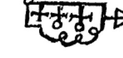
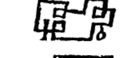
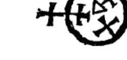
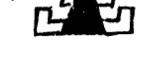
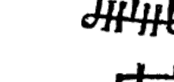
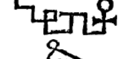

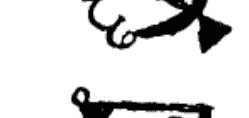

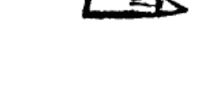

属于夜间的如下：

| 封印名称 | 符号描述 |
| :--- | :--- |
| Aforiel seal |  |
| Elijsam Seal |  |
| Aniel seal |  |
| Mador seal |  |
| Ugiel seal |  |
| Orijm seal |  |
| Morias His seal |  |
| Cazsul his seal |  |
| Dubiel his seal |  |
| Pandor his seal |  |

召唤咒文, "I Conjure thee O Thou mighty & Potent Prince &c," （我召唤汝，哦！伟大万能的王子。。。）

## Raysiel（瑞塞尔）

他是次序中的第 13 位，名为 Rasiel， 他在北方如国王般统治着； 白天拥有 50 位公爵，&晚上也同样多；他们每位拥有数字大臣；因其意愿伴随出席。因此，我们只在此提及主要公爵中的 16 位，他们中属于白天的拥有善良的本质&愿意服从； &但是属于夜间的 14 位本性邪恶，不易顺从。所有属于白天的公爵每位拥有 50 位大臣，除了最后的 6 个，他们每位拥有 30 位； &属于夜晚的前 8 位每位拥有 40 位大臣； 除了后 4 位，他们每位拥有 20 位大臣； 最后一位拥有 10 位大臣；下面是他们的名字和封印：

属于白天的 16 位：

Baciar his seal
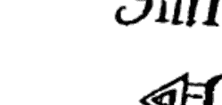

Dubarus his seal
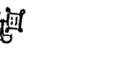

Thoac his seal
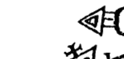

Armena his seal
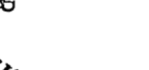

Sequiel his seal
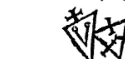

Alhadur his seal
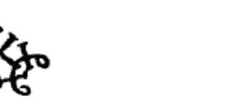

Sadar his seal
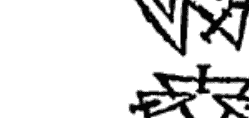

Chanael his seal
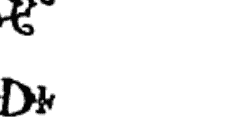

Teragh his seal
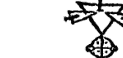

Fursiel his seal
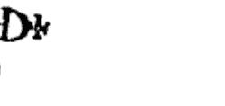

Astiell his seal

Betasiel his seal

Ramica his seal

Melcha his seal
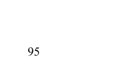

Tharas his seal
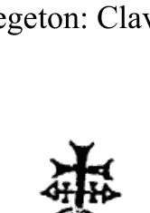

Vbiel his seal
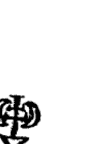

属于夜间的14位：

| 左列 | 右列 |
|------|------|
| Thariel his seal ![Thariel seal] | Quibda his seal ![Quibda seal] |
| Paras his seal ![Paras seal] | Belsay his seal ![Belsay seal] |
| Arayl his seal ![Arayl seal] | Morael his seal ![Morael seal] |
| Culmar his seal ![Culmar seal] | Sarach his seal ![Sarach seal] |
| Lazaba his seal ![Lazaba seal] | Arepach his seal ![Arepach seal] |
| Aleasy his seal ![Aleasy seal] | Lamas his seal ![Lamas seal] |
| Sebach his seal ![Sebach seal] | Thureal his seal ![Thureal seal] |

> 召唤咒文, "I Conjure thee O Thou mighty & Potent Prince &c." (我召唤汝，哦！伟大万能的王子。。。）

## Symiel (塞梅尔)

他是次序中第 14 位[但是北方帝王之下的第二位]名字是 Symiel，他在北方如国王般统治着；他拥有 10 位公爵在白天伴随他，在晚上有 1000 位；&他们每位都拥有一定数量的大臣，我们只在此提及白天的 10 位和晚上的 10 位；那些属于白天的灵体本性善良，不会不服从；但那些属于夜晚的灵体是反复易变，不会轻易现身。另外，白天的公爵拥有 720 位大臣因其主愿伴随出现；&属于夜晚中的 10 位拥有 790 位大臣因场合而出席；这 20 位的名字&封印&大臣的数量如下。

Symiel 之下属于白天的 10 位是：

- Asmiel; his seal, 60
- Larael; his seal, 60
- Chrubas; his seal, 100
- Achor; his seal, 60
- Vafros; his seal, 40
- Boniel; his seal, 90
- Malgron; his seal, 20
- Dagiel; his seal, 100
- Romiel; his seal, 80
- Musor; his seal, 110

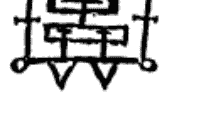
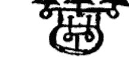

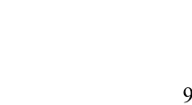

## Symiel（塞梅尔）

属于晚上的10位：

- Mafrus; his seal 70
- Marianu; his seal 100
- Apiel; his seal 30
- Narzad; his seal 20
- Curiel; his seal 40
- Murahe; his seal 30
- Molael; his seal 10
- Richel; his seal 120
- Arafes; his seal 50
- Malad; his seal 130

召唤咒文: "I Conjure thee O thou Mighty & Potent Prince; &c."（我召唤汝，哦！伟大万能的王子。。。）

# Theurgia Goetia

### Armadiel,（阿马德尔）

第 15 位次序中德灵体[也是北方帝王之下的第三位]名为 Armadiel，他在东北方如国王般统治着；他拥有很多公爵和大臣；因此，我只在此提及其中的 15 位首要的公爵，拥有 1260 位大臣伴随左右；这些公爵可在白天和夜晚召唤，同样分为 15 部分；太阳刚开始升起的时候是第一位灵体，&以此类推直至最后一位灵体&夜晚的最后一个部分；这些灵体都本性善良&愿意根据你的意愿完成所有事情；这些是他们的名字&封印：

- Alferiel, his seal [Seal symbol]
- Orariel; his seal [Seal symbol]
- Orin; his seal [Seal symbol]
- Samiel, his seal [Seal symbol]
- Massar; his seal [Seal symbol]
- Parabiel, his seal [Seal symbol]
- Asmael; his seal [Seal symbol]
- Iaziel, his seal [Seal symbol]
- Pandiel, his seal [Seal symbol]
- Carasiba, his seal [Seal symbol]
- Laiel; his seal [Seal symbol]
- Caluarnia; his seal [Seal symbol]
- Asbibiel; his seal [Seal symbol]
- Mafayr, his seal [Seal symbol]
- Oeniel; his seal [Seal symbol]

The Conjuration: "I Conjure thee O thou Mighty & Potent Prince Armadiel; &c."

召唤咒文：“我召唤汝，哦！伟大万能的 Armadiel。。。”

Lemegeton: Clavicula Salomonis

### Baruchas(巴如查斯)

第 16 位次序中的灵体（也是北方帝王的第 4 位）名为 Baruchas，他在东方如国王般统治着 &在北方，他拥有很多公爵和大臣；因此，我们只在此提及其中首要的 15 位公爵；他们属于白天和夜晚，拥有 7040 位大臣伴随他们出席；他们本性都很善良；也愿意服从；你需要用前文中所述说的对待 Armadiel 所需要的方法对待他们；他的公爵根据白天和夜晚分为 15 部分。

这就是 15 位公爵的名字和封印：

Buita (Quita); his seal

Baoxas; his seal

Sarael; his seal

Geriel; his seal

Melchon; his seal

Monael his seal

Cauayr; his seal

Chubor; his seal

Aboc; his seal

Lamael; his seal

Cartael; his seal

Dorael; his seal

Ianiel; his seal

Decaniel, his seal

Pharol; his seal

The Conjuration: "I Conjure thee O thou Mighty & Potent Prince Baruchas; &c."

## 流浪的王子

在这一部分，我们会帮助你了解在 AYRE 中流浪的&从不在同一地点停留的伟大万能的王子和他们的大臣。

### Geradiel的封印

最重要的灵体之一名为Geradiel，他拥有18150位大臣伴随左右；因为他没有公爵或王子；——因此，他是被单独召唤的；但是，当他被召唤时，数量众多的大臣会伴他出现，这或多或少会因为召唤的时间而有所不同。白天的2/1时辰[根据行星移动]和夜晚的2/2时辰召唤的话，会有470名大臣伴他出现；而在白天的2/2时辰和夜晚2/3时辰用于召唤的话，会有500位大臣伴他出现；在白天2/3时辰和夜晚2/4时辰用于召唤的，会有930位大臣伴他出现；白天2/4时辰和夜晚2/5时辰用于召唤的话，会有1560位大臣伴他出现；白天2.5个时辰和夜晚2.6时辰用于召唤的话，会有13710个大臣伴他出现；在2/6或白天的最后一个小时用于召唤的话，会有930位大臣伴他出现；在夜晚的头两个小时用于召唤的话，会有1560位大臣；他们本性都十分善良，愿意服从主人的意愿。

> 召唤咒文："I Conjure thee O thou Mighty and Potent prince Geradiel, who wandereth here and there in the Ayre; with thy servants; I Conjure ye Geradiel that thou, forthwith Appeare with thy Attendants in this first hour of the day -- here before Me in this Crystal Stone, --- [or here before this Circle], &c."。（我召唤汝，哦！和汝的大臣在AYRE中漂流至此，伟大万能的王子Geradiel；我召唤汝 Geradiel，立刻在第一时刻降临显现——在这个水晶石上。。。）

### Buriel（布瑞尔）的名字和封印

下一位流浪的王子名为Buriel；他有许多公爵和大臣，会因他的意愿伴随左右，他们本性都很邪恶；被其它灵体所憎恶；他们显现的模样恶心；&以毒蛇形象示人，纯洁的头部，声音像一个那嫩，他们需要在夜间行星时间内召唤[因为他们讨厌白天]，因此，我们只提及12位主要的公爵和12个夜间行星时间对应；他有880位大臣会在晚上伴随出现；他们的名字和封印如下、

12位公爵如下：

Merosiel his seal

Nedriel his seal

Almadiel; his seal

Futiel; his seal

Drusiel his seal

Cupriel; his seal

Carmiel his seal

Busiiel his seal

Drubiel his seal

Saruniel his seal

Nastros his seal

Casbriel his seal

> 召唤咒文；"I Conjure thee O thou Mighty and Potent prince Buriel, who wandereth here and there in the Ayre; with thy Dukes & other (of) thy servant Spirits; -- I Conjure thee Buriel that thou forthwith Appear with thy Attendent in this first hour of the night, here before me in this Crystal Stone [or here before this Circle] in a faire and Comely Shape, to do my will in all things that I shall desire of you; &c." （我召唤汝，哦！和您的公爵&大臣流浪至此的伟大万能的王子Buriel；——我召唤汝，Buriel，请汝以清晰的姿态在今夜第一时刻降临在这水晶石上，完成我的意愿。。。）

# Theurgia Goetia

### Hidriel（希德瑞尔）

第三位流浪的王子名为Hidriel，他拥有 100 位大公爵和 200 位子公爵，更别提数不尽的大臣数字；因此，我们在此只提及 12 位主要的公爵，他们有 1320 位大臣伴随出现；他们根据行星的移动在白天或夜晚进行召唤；从一天的白天或夜晚的第一个小时开始；如此进行，直到最后一个；他们会以大毒蛇的形态出现，头部洁白无暇；然而，他们非常恭谦，愿意遵从命令；他们喜水；大部分为土属性。。。他们的名字和封印如下：

| 名称 | 符号 |
|------|------|
| Morfatiel; his seal |  |
| Chalmoriel; his seal |  |
| Pesariel; his seal |  |
| Musuziel; his seal |  |
| Lameniel; his seal |  |
| Brackiel; his seal |  |
| Samiel; his seal |  |
| Dusiriel; his seal |  |
| Chamiel; his seal |  |
| Arbiel; his seal |  |
| Lusiel; his seal |  |
| Chariel his seal |  |

召唤咒文: "I Conjure thee O thou Mighty and Potent Prince; &c."（我召唤汝，哦！伟大万能的王子。。。）

## Lemegeton: Clavicula Salomonis

### Pirichiel（皮瑞丘尔）

第四位流浪的王子名为 Pirichiel；他没有王子和公爵，但是他拥有骑士；因此，我只在此提及最重要的 8 位；这些已足以实践；他有 2000 位大臣听命于他；他们需要根据行星的移动来召唤；他们本性皆善，乐意达成你的意愿－他们的名字和封印如下：

Damarsiel; his seal

Menaziel; his seal

Cardiel; his seal

Demediel; his seal

Almasor, his seal (or Almariel)

Hursiel; his seal

Nemariel; his seal

Cuprisiel; his seal

召唤咒文: "I Conjure thee; O thou Mighty & Potent Prince Pirichiel; who wandreth, &c."（我召唤汝，哦！流浪的，伟大万能的王子 Pirichiel 啊。。。）

# Theurgia Goetia

### Emoniel（艾蒙内尔）

第 5 位流浪的灵体名为 Emoniel，他拥有一百位王子和首席公爵，另外还有 20 位次级公爵和众多大臣，因此，我们只在此提及 12 位重要的王子或公爵，他们拥有 1320 位公爵和其它次级灵体伴随左右，他们的本性善良，愿意达成你的意愿。他们需要根据行星的状态在白天或夜晚进行召唤。他们大多数居住在森林中，他们的名字和封印如下：

- Ermeniel seal
- Vasenel seal
- Panuel seal
- Masinel seal
- Edriel seal
- Cruhiel seal
- Carnodiel seal
- Armisiel seal
- Dramiel seal
- Caspaniel seal
- Pandiel seal
- Musiniel seal

召唤咒文: "I Conjure thee O thou Mighty & Potent Prince Emoniel, who wanderest, &c."（我召唤汝，哦！流浪的，伟大万能的王子 Emoniel。。。）

# Lemegeton: Clavicula Salomonis

## Icosiel（伊克塞尔）

第6位流浪的王子名为 Icosiel，他拥有100位公爵和300位同伴以及其它更低等的灵体，因此，我们在此只选择讲述其中的15位主要的公爵用于实践。他们有2000多位大臣伴随出席，他们的本性善良，愿意听从你的命令，他们多数会在房屋中出现，因为他们乐于这样，他们需要在白天和夜晚的24小时内召唤，根据灵体的数目，将24小时分为15部分，从日出开始第一个灵体到第二天日落的最后一个灵体。他们的名字和封印如下：

- Machariel seal
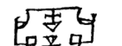

- Amodiel seal
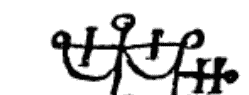

- Psichiel seal
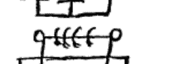

- Tianabriel seal
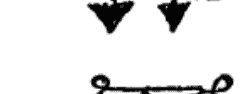

- Tlanatiel seal
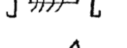

- Zachariel seal
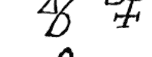

- Nathriel seal
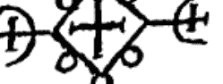

- Zosiel seal

- Athesiel seal
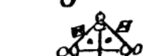

- Acapsiel seal
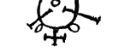

- Vrbaniel seal
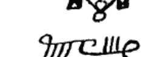

- Lerphiel seal
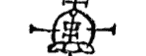

- Cumariel seal
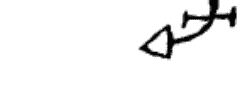

# Theurgia Goetia

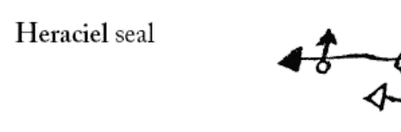

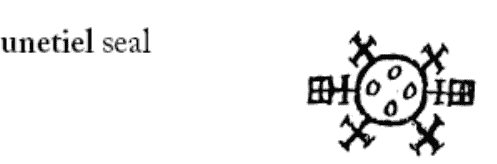

> 召唤咒文: "I Conjure thee O thou Mighty & Potent Prince Icosiel, &c."（我召唤汝，哦！伟大万能的王子Icosiel。。。）

## Soteriel（索特瑞尔）

第7位（在空中迷失的灵体）名为 Soteriel，在他统领下有200位公爵和200位同伴，他们每年更换居住地，他们都很善良，易于顺从，我们只在此提及其中的12位主要的公爵，前6位为一年，剩下的6位为接下来的一年，他们有1840位大臣伴随，可以根据行星移动在白天和夜晚召唤，他们的名字和封印如下：

- Inachiel seal
- Proxel seal
- Marucha seal
- Amodar seal
- Nadiusiel seal
- Cobusiel seal

- Amriel seal (Ainoel)
- Prasiel seal
- Axosiel seal
- Caroel seal
- Mursiel seal
- Penader seal

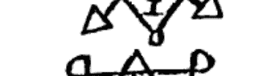

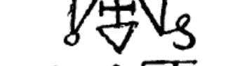

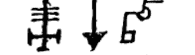

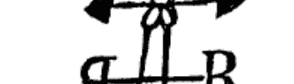

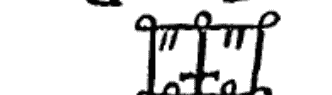

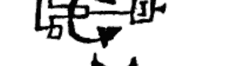

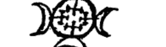

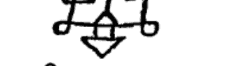

> 召唤咒文: "I Conjure thee O thou Mighty and Potent Prince, &c."（我召唤汝，哦！伟大万能的王子。。。）

## Menadiel（蒙娜德尔）

第8位流浪王子名为 Menadiel，他拥有20位公爵，一百位同伴，许多大臣，他们本性善良，非常顺从，我们在此提及其中的6位主要公爵和6位公爵之下的灵体，他们有300位大臣伴随，你必须要根据行星移动来进行召唤。他们的姓名和封印如下：

**The Dukes**

- Larmel, his seal
- Brassiel seal
- Chamor seal
- Benadiel seal
- Charsiel seal
- Samiel seal

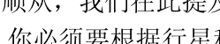

**The Under Dukes**

- Barchiel seal
- Armasiel seal
- Baruch seal
- Nedriel seal
- Curaijn seal
- Tharson seal

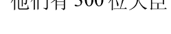

> 召唤咒文: "I Conjure thee O thou Mighty or Potent Prince [or Duke] Menadiel, &c."（我召唤汝，哦！伟大万能的王子[或公爵]Menadiel。。。）

## Macariel（马卡瑞尔）

第9位流浪的灵体名为 Macariel，他拥有40位公爵，还有更多低等的大臣伴随，因此，我们只在此提及12位主要的公爵，他们拥有400位大臣伴随，他们的本性善良，易于顺从召唤者，他们每次出现的形态不一，多数是以一条有洁白无暇头部的龙形态出现，这些公爵需要根据行星的移动在白天和夜晚召唤，他们的名字和封印如下：

- Chaniel seal：一个带有箭头和十字架的复杂几何图形。
- Drusiel seal：一个类似箭头的符号，末端有环。
- Andras seal：一个类似皇冠或三叉戟的符号，底部有三角形。
- Caroel seal：一个内部有十字架和两个圆圈的方形符号。
- Amadiel seal：一个圆形符号，内部有三个圆圈和一个向下的三角形。
- Remijel seal：一个带有交叉线和曲线的符号。
- Naustuel seal：一个带有横线和曲线的对称符号。

- Verpiel seal：一个类似梳子和箭头的组合符号。
- Germel seal：一个由交叉线和曲线组成的复杂符号。
- Thirsiel seal：一个椭圆形内部有复杂线条的符号。
- Burfiel seal：一个不规则多边形内部有符号的图形。
- Aromusij seal：一个碗状符号，下方有横线和两个类似‘H’的结构。

> 召唤咒文: "I Conjure thee O thou Mighty & Potent Prince Macariel who (Wandreth), &c."（我召唤汝，哦！伟大万能的王子Macariel。。。）

## Vriel（费瑞尔）

第10位流浪的灵体名为 Vriel，他拥有10位公爵，100位公爵之下的灵体，众多大臣伴随左右，他们的本性邪恶，不乐意服从，所作所为也非常虚伪，他们显现的形态是一条有洁白无瑕头部的毒蛇，我们只提及主要公爵的10位，他们有650位同伴和大臣伴随，他们的名字和封印如下：

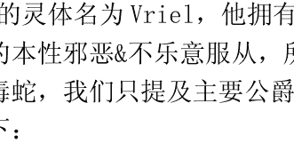

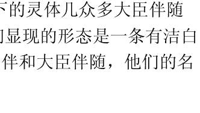

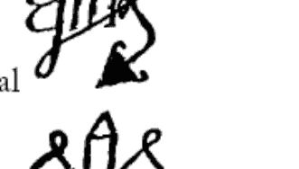

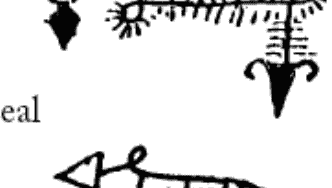

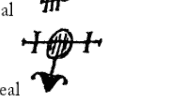

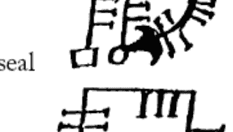

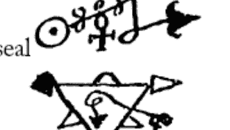

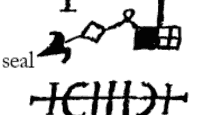

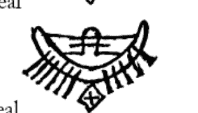

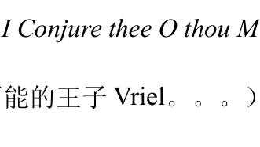

召唤咒文: "I Conjure thee O thou Mighty & Potent Prince Vriel, &c."（我召唤汝，哦！伟大万能的王子Vriel。。。）

## Bydiel（拜戴尔）

第11位也是最后一位灵体，流浪的王子名为 Bydiel，他有20位首席公爵和200位其它公爵，很多大臣听命于他，这些公爵每年的职责，地点会有变化，他们本性善良，愿意服从召唤者的命令，他们以美丽的人类形态出现，我们在此只提及其中的10位主要的公爵，他们有2400位大臣伴随出现，他们的名字和封印如下：

| 左列 | 右列 |
|------|------|
| Mudriel seal | Charobiel seal |
| Crucham seal | Andrucha seal |
| Bramsiel seal | Manasael seal |
| Armoniel seal | Persifiel seal |
| Lemoniel seal | Chremo seal |

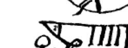

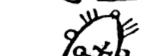

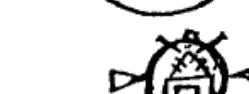

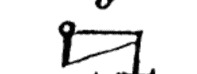

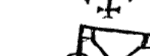

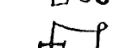

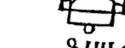

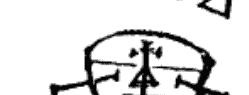

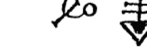

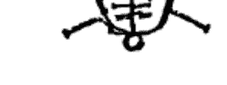

> 注意：见下文召唤咒文：

# Theurgia Goetia

### 适合各个等级的召唤咒文

### 流浪王子的召唤咒文：

> > "I Conjure thee O thou Mighty & Potent Prince Bydiel, who wanderest here & there in the Air, with thy Dukes & other (of) thy servants Spirits, I Conjure thee Bydiel that thou forthwith appear with thy Attendance (Attendants), in this first hour of the day, here before me in this Crystal Stone [or here before this Circle] in a fair and comely shape to do my will in all things that I shall desire of you..."

(大致译文：我召唤汝，哦！伟大万能的王子 Bydiel，您与您的公爵和大臣流浪至此，我召唤汝，Bydiel，请汝在此时此刻以清晰的姿态立刻出现在这水晶石前，依我所愿行事。。。注意咒文中的这个符号|*|，它意味着下文中召唤咒文中的公爵不是流浪的。)

### 统治罗盘一方的王子召唤咒文：

> > "I Conjure thee O thou Mighty & Potent Prince Pamersiel, who ruleth as (a) King in the Dominion of the East under the Great Emperor Carnatiel, I Conjure thee Pamersiel that you forthwith appear with thy attendents in this first hour of the day, here before me in this Crystal Stone [or here before this circle] in a fair & comely shape to (do) my will in all things that I shall desire of you..."

(大致译文：我召唤汝，哦！伟大万能的王子Pamersiel，您在Carnatiel帝王之下如国王一般统治着东方的领土，我在召唤汝，Pamersiel，请汝立刻显现在这水晶石前/上，遵从我的意志，完成我的心愿。。。)

### 四帝王的召唤咒文：

> > "I Conjure thee O thou great & Mighty & Potent Prince Carnatiel who is the the Emperor & Chief King Ruling in the Dominion of the East, I Conjure (thee) Carnatiel that thou forthwith appear..."

(大致译文：我召唤汝，哦！伟大万能的王子Carnatiel，您是统治东方的帝王和最主要的王国，我召唤汝，Carnatiel，请汝立刻显现。。。)

### 如何召唤流浪的公爵及其它没有流浪的公爵：

"I Conjure thee O thou Mighty & Potent Duke N, who wanderest here & there with thy Prince N, & other (of) his & thy servants in the Air, I Conjure thee N that thou forthwith appear.." & note this mark |^| & go on (from) there in the following Conjugation.

（大致译文：我召唤汝，哦！伟大万能的公爵(名字)，你流浪至此，与你的王子（名字），你的其它，你的大臣，我召唤汝，名字，请立刻现身。。。）

### 属于统治罗盘指针一方的王子的公爵（不流浪的）的召唤咒文：

"I Conjure thee O thou Mighty Duke N, Who rulest under the Prince or King N, in the Dominion of the East, I Conjure thee N, that thou appear forthwith alone or with thy servants, in this first [or second] hour of the day, here before me in this Crystal Stone [or before this Circle] in a fair & comely shape to do my will in all things that I shall desire or request of you. |*| I conjure & powerfully command you N by him that said the word & it was done & by all the holy & powerful names of God who is the only Creator of Heaven and Earth and Hell & what is Contained in them, Adonay, El, Elohim, Elohe, Elion, Escherchi, Zebaoth, Jah, Tetragrammaton Sadai, the only Lord God of hosts, that you forthwith appear unto me here in this Crystal Stone [or here before this Circle] in a fair & comely Human shape without hurt to me or any other Creature that the great God Jehovah hath Created & made, and come ye peaceably, visibly and affably without delay Manifesting what I desire, being conjured by the name of the Eternal Living true God Heliorin Tetragrammaton Anepheneton & fulfill my Commands & Persist unto the end, I conjure, Command & Constrain you Spirit N by Alpha & Omega & by the name Primeumaton which commandeth the Whole Host of heaven & by all these names which Moses named when he by the power of these names brought great plagues upon Pharaoh & all the people of Egypt; Zebaoth, Escherchie, Oriston, Elian, Adonay primeumaton, & by the name Schersieta Mathia which Joshua called upon the Sun stayed its course; & by the Hagioss & by the Seal of Adonay, & by Agla on Tetragrammaton to whom all creatures are obedient & by the dreadful Judgement of the most high God & by the holy Angels of heaven & by the mighty wisdom of the omnipotent God of hosts that you come from all parts of the world & make rational Answers to all things that I shall ask of you & come ye peaceably & visibly & affably speaking to me with a voice intelligible & to my understanding, therefore come ye, come ye, in the name of Adonay Zebaoth, Adonay Aamioram, come, why stay ye, hasten Adonay Saday the King of Kings Commands you." -----

（大致译文：我召唤汝，哦！伟大的公爵（名字），你在王子或国王（名字）之下统治着# 巫術的法则

东方的领土，我召唤汝，名字，请你立刻单独或与你的大臣现身，在今日第一（或第二）个时辰，以清晰的形态显現在这水晶石前/上，完成我的愿望。我召唤并强烈命令汝，名字，以创造天堂，地球和地狱的神圣强大的神之名，Adonay， El， Elohim， Elohe， Elion， Escerchi， Zebaoth， Jah， Tetragrammaton Sadai，他是唯一的真主，请你立刻以清晰的、不会加害于我或任何其它被神耶和华创造的生物的人类或其它动物形态，心平气和 & 殷勤地显现在这水晶之上/前，被永恒的真神 Heliorin Tetragrammaton Anepheneton 召唤吧！遵从我的意志，直到最后。我以阿尔法和奥米加及统领众天使的 Primeumaton 之名召唤并束缚你，摩西用这名字的力量给法老和埃及人民带来灾难； Zebaoth， Escerchie， Orison， Elian， Adonay Primeumaton 以乔舒亚在其课业中号召太阳的 Chersieta Mahia 之名，以 Hagios 和 Adonay 之封印和万物借服从的 Tetragrammaton 上的 Agla 和可怕的最高级神的审判和天堂神圣天使和来自世界各地的万能神灵的力量，请以给万物理性回答的姿态回答我，平静地出现吧，以能让我理解的语言与我对话，来吧，以 Adonay Zebaoth 之名出现吧，Adonay Aamioram 在此，你为何还不出现，国王中的国王 Adonay Saday 命令你。

当他出现的时候，向他展示封印和所罗门的五芒星，并说“看我这带到你面前的所罗门的五芒星。。。。”如在卷一 GOETIA 之中说述的那样结束召唤咒文，同样，如果你对灵体完成了许愿，那么就如卷一 GOETIA 中说述的那样，给予他离开的许可。

# 卷二 THEURGIA GOETIA 至此结束

## The Pauline Art

Lemegeton

## 从这里开始讲述所罗门王的 The Pauline Art

这本书分为两部分，第一位是白天和黑夜间时辰的天使，第二个是黄道带的天使。这些白天和夜晚的24位天使的特性每天都在改变，他们的职责因七星体而每天变化。如文中所述，天使 Samael（塞米尔）从日出开始统治着当天的第一个时辰，假设星期一的第一个时辰是属于月亮的，你就可以召唤 Samael（塞米尔）或任何他的公爵，他们在那一时辰的能力是做任何和月亮相关的事，但是，如果你在星期二太阳升起的第一个时辰召唤他们的话，那么，他们的能力就是和火星相关的。所以，相应的规则需要在每天第一小时被遵守，同样需要遵守每日掌管无论白天或黑夜时辰的天使和他们大臣们的规则。如要召唤天使或他们的大臣，需根据年日时来制作24天使封印，遵守制作时的法则。但是，就算是细小的错误也是不被允许的，你可以照着书本的范例顺序来做，他们适合在三月份的第十天召唤，曾在1641年（根据旧日历）的星期三被召唤出。要知道与七星体相联系的食物，我建议你阅读占星学的书籍，其中涉及有大量相关篇幅。

当封印根据指示完成后，把它放在实践用的图表上，在这图表的一部分上要注有星位神灵的符号，将你的手放在封印上，念诵在第三部分靠近文章结尾的咒文，只需要根据仪式时间而更改名字即可。

## 实践用图表

根据七星体制作香薰。

> 注意：当太阳经过白羊宫和天蝎宫的时候，♂是每日第一时辰的主星位。♀也同样，当太阳经过 ♉ & ♎ 的时候，它是每日第一时辰的主星位。

## 白天与黑夜的24小时

第一个时辰是被一位名为 Samael（塞米尔）的天使所掌管，他指挥着众多公爵和大臣，我们在此仅介绍8位其中的主要公爵，因为他们已足够用于实践，这些公爵有444位大臣臣服于他们，他们的名字分别是 Ameniel（暗门尼尔）， Charpon（薛鹏）， Darosiel（戴柔赛尔）， Monasiel（蒙奈赛尔）， Bruniel（布鲁米尔）， Nestoriel（纳斯托瑞尔）， Chremas（薛麦斯）， Meresyn（玛丽鑫）；要制作任何这8位公爵或他们首领 Samael（塞米尔）的封印，请按以下步骤，首先画出主星位的符号，再是月亮的符号，紧接着是其余星体的符号；再接下来就是在那个时辰攀登在12宫之上的字母符号，如同下图魔符所示，它是适用于1641年三月的第十天。

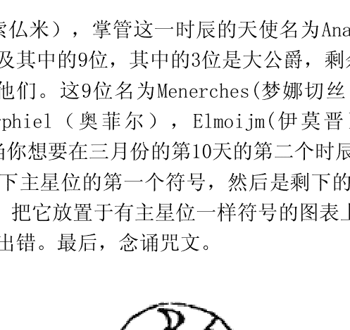

第二时辰名为 Sovormi（索化米），掌管这一时辰的天使名为 Anael（安娜尔），他有10位主要的公爵，我们会在此提及其中的9位，其中的3位是大公爵，剩余的6位是次于公爵的大臣。他们有330位大臣听命于他们。这9位名为 Menerches（梦娜切丝）， Sarchiel（塞砌尔）， Cardiel（卡迪尔）， Orphiel（奥菲尔）， Elmoijm（伊莫晋）， Ruosiel（柔赛尔）， Graniel（关尼基尔）。当你想要在三月份的第10天的第二个时辰工作的时候，在一张白纸或羊皮纸上画上封印，写下主星位的第一个符号，然后是剩下的星体符号和如魔符中所画的12宫符号。当它完成后，把它放置于有主星位一样符号的图表上。在接下来的步骤中都要遵守这一法则，绝对不能出错。最后，念诵咒文。

第三个时辰名为 Danlor（单乐），天使的名为 Veguaniel（弗瓜尼尔），他有20位大公爵，200位小公爵和众多大臣，我们因此只在此提及其中的4位大公爵和8位小公爵，他们有1700位大臣听命于他们。他们名字分别是：Ansmiel（安斯梅尔）， Persiel（褡璁尔）， Mirsiel（梅塞尔）， Zoetiel（佐伊特尔）， Drelmech（迪瑞迈池）， Sadimel（赛迪梅尔）， Comadiel（空麦蒂尔）， Gemary（杰梦瑞）， Xautiel（佐尔特尔）， Serviel（瑟维尔）， Euriel（尤瑞尔），这几位已足够实践。要像前文所说的制作恰当的封印，绝不能出错。然后念出咒文。

第四个时辰名为 Elechin（埃勒鑫），掌管这已时间的天使名为 Vahchmiel（佤魖魅尔），他拥有10位大公爵和100位小公爵，更不用说众多的大臣了。我在此只提及其中的5位大公爵和10位小公爵，他们均有155位大臣伴随出现。他们名字是 Ammiel（阿梅尔）， Larmiel（拉梅尔）， Martfiel（马飞尔）， Ormiel（奥米杰尔）， Zantiel（禅泰尔）， Emertiel（艾美泰尔）， Perniel（配梅尔）， Queriel（奎瑞尔）， Serubiel（塞茹贝尔）， Daniel（丹尼尔）， Fermiel（福美尔）， Thuzez（簇寨子）， Vaaesiel（瓦尔赛尔）， Zasviel（扎斯维尔）， Harmiel（哈梅尔），他们已足够你实践的了。根据前文所指导的那样制作封印，你绝不能出错。它的形状和时间等都需按找之前所指导的完成。然后，念出召唤咒文。

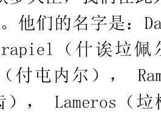

第五个时辰名为 Tealeach（提力持），掌管这一时间的天使名为 Sasquiel（赛思奎尔），他有10位大公爵，100位小公爵和众多大臣，我们在此只提及其中的5位大公爵和10位小公爵，他们有5550位大臣听命于他们。他们的名字是：Damiel（戴门儿）， Aramiel（阿伦梅尔）， Maroch（马骡持）， Serapiel（什诶垃佩尔）， Putrsiel（菩粹塞尔）， Jameriel（杰门瑞尔）， Futuniel（付屯内尔）， Ramesiel（垃梅塞尔）， Amisiel（阿米塞尔）， Omezach（奥美宰齿）， Lameros（垃梅柔斯）， Zathiel（扎瑟尔）， Fustiel（福斯特尔）， Bariel（吧瑞尔），他们已足以实践。然后，根据我给予的范例，制作一个对应时间的封印。当你制作完成后，把它放在我之前所告知的图表上并念诵召唤咒文。

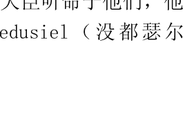

第六个时辰名为 Genphorim（秦佛林），掌管这一时间的天使名为 Samiel（塞梅尔），他有10位大公爵和100位小公爵，更不用说众多次等大臣了，我们因此只在此提及其中的5位大公爵和10位小公爵，他们有5550位大臣听命于他们，他们的名字分别是 Arnebiel（阿内呗尔）， Charuch（喀拉蚩）， Medusiel（没都瑟尔）， Nathmiel（纳斯梅尔）， Pemiel（配梅尔）， Jamiel（界梅尔）， Jenotriiel（姐诺粹尔）， Sameon（萨米翁）， Trasiel（粹瑟尔）， Zamion（债米昂）， Nedaber（内大贝）， Permon（陪蒙）， Brasiel（巴塞尔）， Comosiel（克莫塞尔）， Enader（艾纳得），这几位已足够供你实践的。然后，按要求制作封印，如之前所说的那张讲它放置于图表之上，记住，你绝不能出错。然后，念出召唤咒文。

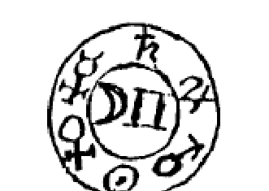

第七个时辰名为 Hemarim（贺梅韧），掌管这一时间的天使名为 Banyinel（班尼尔），他拥有10位主公爵和100位子小公爵，更不用说数量众多的大臣了。我们因此只在此提及其中的5位主公爵和10位小公爵，他们各有600位大臣听命于他们。他们的名字分别是：Abrasiel（阿巴斯诶尔）， Nestori（内斯托瑞）， Namiel（那梅尔）， Sagiel（赛决尔）， Harmiel（哈梅尔）， Naustrus（瑙斯图阿斯）， Varmay（瓦梅）， Thusrnas（萨死纳斯）， Crosiel（可塞尔）， Pastiel（帕斯瑞尔）， Venesiel（维泥塞尔）， Enarisn（艾那瑞）， Dusiel（杜塞尔）， Kathos（卡瑟噢斯），他们已足够你实践的了，然后，根据我你的范例制作封印。把它放置在图表之上，念出召唤咒文。

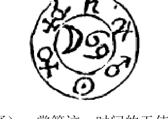

第八个时辰名为 Jenamin（杰娜冥），掌管这一时间的天使名为 Osmadiel（奥斯迈得尔），他拥有10位大公爵和100位小公爵，更不用说众多的大臣了，我们因此只在此提及其中的5位大公爵和10位小公爵，他们有3100位大臣听命于他们，他们已足以你实践。他们的名字是：Serfiel（瑟非尔）， Amatim（阿马丁）， Chroel（科尔）， Mesiel（媒塞尔）， Lantrhes（兰赤斯）， Demaros（单麻柔斯）， Janosiel（杰诺塞尔）， Larfuti（啦扶梯）， Vemael（瓦嘛尔）， Thribel（粹呗尔）， Mariel（嘛瑞尔）， Remasin（瑞嘛森）， Theoriel（瑟瑞噢瑞尔）， Framuin（伐谬恩）， Ermiel（艾梅尔）。然后，做一个第八个时辰的封印，可以参考下面的范图。放置在图表上，并念诵召唤咒文。

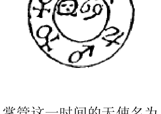

第九个时辰名为 Carron（卡伦），掌管这一时间的天使名为 Uvadriel（屋瓦德尔），他拥有众多公爵和大臣，因此每10位大公爵和100位小公爵有192980位大臣顺从臣服于他们，我们在此提及其中的5位大公爵和10位小公爵，他们拥有650位主要的大臣在这一时辰中随时待命。他们的名字是 Astromiel（阿斯托梅尔）， Charnis（查你斯）， Pamorij（怕莫瑞挤）， Damiel（达美尔）， Madriel（嘛的瑞尔）， Chromos（齿若莫斯）， Menos（蒙诺斯）， Brasiel（巴塞谈尔）， Nesarin（呢萨瑞恩）， Zoijmiel（佐剂梅尔）， Trubas（土吧斯）， Zarmiel（咋梅尔）， Lameson（啦们森）， Zasnoz（咋斯诺子）， Janediel（界内的尔），当你想要召唤他们的时候，根据要求制作一张封印，制作完成后，将它放置于图表上，并念出召唤咒文。

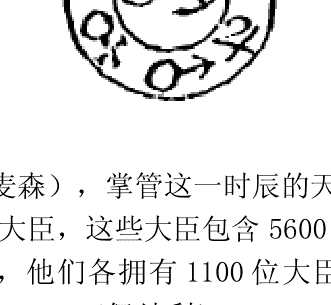

第10个时辰名为 Lamathon（雷麦森），掌管这一时辰的天使名为 Oriel（奥锐尔），他拥有众多公爵和许多依次序排列的大臣，这些大臣包含5600个灵魂，我们因此只在此提及其中的5位大公爵和10位小公爵，他们各拥有1100位大臣，他们的名字是 Armasi（阿嘛斯）， Darbiel（大呗尔）， Penal y（佩纳利）， Mefriel（梅妃瑞尔）， Choreb（克瑞布）， Lemur（勒姆厄）， Oymas（奥一嘛斯）， Charnij（卡内基）， Zazior（扎左厄）， Naveron（纳威若恩）， Zantros（删托斯）， Busiton（不斯顿）， Nameron（南么瑞恩）， Krunoti（苦诺体）， Alfrael（阿尔法尔）。当你想要在这一小时实践的时候，制作合适的封印。

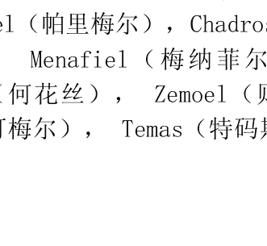

第十一个时辰的名字是 Manelohim（玛尼罗亨），掌管这一时间的天使名为 Bariel（巴瑞尔），他拥有众多公爵和大臣，他们分为10部分，包含了5600个灵魂，我只在此提及其中的5位大公爵和10位小公爵，他们各有1100位大臣，他们的名字是 Almarizel（阿尔嘛里则尔）， Parlimiel（帕里梅尔）， Chadros（卡多斯）， Turmiel（图美尔）， Lamiel（啦梅尔）， Menafiel（梅纳菲尔）， Demasor（德嘛瑟）， Omary（欧玛丽）， Hehuas（何花丝）， Zemoel（则穆尔）， Ahuas（阿化斯）， Perman（陪曼）， Comiel（可梅尔）， Temas（特码斯）， Lanifiel（兰尼菲尔），然后，按上文所述的方式实践。

每天的第十二个时辰名为 Nahalon（纳哈龙），掌管这一时间的天使名为 Beratiel（贝拉特尔），他拥有分为12个阶级的许多公爵和其它大臣，共包含3700个灵魂，我只在此提及其中的5位大公爵和10位小公爵，他们有1100位大臣。他们的名字是 Camaron（卡嘛伦）， Attrafrd（阿特啦夫里的）， Penatiel（拍恩纳特尔）， Demarec（的玛丽可）， Famaris（伐玛丽斯）， Pamiel（怕梅尔）， Nerostiel（内罗斯特尔）， Emarson（艾嘛森）， Uvirix（吾夫里可斯）， Sameron（萨么伦）， Edriel（艾的瑞尔）， Chorion（克里昂）， Romiel（罗梅尔）， Tenostiel（特诺特尔）， Uamary（瓦玛丽），然后，制作封印，按上文所述的那样去做。

晚上的第一个时辰名为 Omalhavien（奥玛海维恩），掌管这一时间的天使名为 Sabrachon（赛博重），他统率着分为10部分的1540位元元公爵和其它大臣，我只在此提及其中的5位大公爵和10位小公爵。他们的名字是 Domaros（多马骡斯）， Amerany（阿么兰尼）， Penoles（陪诺了斯）， Mordiol（莫地噢斯）， Nastul（纳斯图）， Ramasiel（啦嘛塞尔）， Omedriel（噢么德尔）， Frandedac（弗兰德达克）， Charsiel（卡瑟尔）， Darnason（大纳森）， Hayzoim（哈一左穆）， Enalon（艾纳伦）， Turtiel（土特尔）， Uvonel（吴房内尔）， Rimaliel（玉马雷）。他们拥有200位大臣。最后，准备好适于这一时辰的封印，按上文所提及的方法实践。

每个夜晚的第二个时辰名为 Ponazur（坡纳琾合），掌管这一时间的天使名为 Taktis（塔克啼斯），他有101550位大臣伺候左右，他们分为12个阶级。我们只在此提及其中的6位大公爵和12位小公爵。他们的名字是 Almodar（阿尔莫大）， Famoriel（伐莫瑞尔）， Nedros（内多斯）， Ormozin（欧莫磐）， Chabril（卡不里尔）， Praxiel（帕谢尔）， Parmaz（帕麻子）， Vomeroz（夫梅骡子）， Emariel（艾嘛瑞尔）， Fromezin（佛也玲）， Ramaziel（啦嘛则尔）， Granozy（挂诺资）， Gabrynoz（尬布易诺资）， Mezcoph（么可夫）， Tamariel（他嘛瑞尔）， Venomiel（维娜梅尔）， Janaziel（杰纳泽尔）， Zemizim（泽米玲）。他们拥有1320位大臣在这一时辰随时待命，完成他们的意愿。当你准备好你的封印的时候，按上文所指导的方式去实践。

每晚的第三个时辰名为 Guabrion（卦薄陵），掌管这一时间的天使名为 Sarquamech（塞夔门赤），他统率着101550位公爵和大臣，他们分为12个阶级，我们因此只在此讨论他们中的第一阶级的6位和第二阶级的12位，他们已足够你实践的。他们的名字是 Monarim（蒙那瑞恩）， Chrusiel（可露塞尔）， Penergoz（佩纳勾资）， Amriel（阿穆瑞尔）， Deminoz（戴米诺资）， Noztozoz（诺资托佐资）， Evamiel（艾瓦梅尔）， Sarmezyrs（赛麦伊斯）， Haylon（海轮）， Uvabriel（吾瓦布瑞尔）， Thurmytzol（瑟麦佐尔）， Fromzon（夫伦佐恩）， Vanoir（瓦诺）， Lemaron（勒马伦）， Almonayzod（阿尔蒙娜佐得）， Janishyel（杰尼十叶儿）， Mebrotzed（梅博泽德）， Zanthyozod（产斯噢佐德）。他们有1320位大臣听命于他们。当你想要实践的时候，制作适于时间的封印，按上文的方法施行。

每晚的第四个时辰名为 Ramersi（阮梅斯），掌管这一时间的天使名为 Jdfischa（杰迪菲斯卡）。他有101550位公爵和大臣听命于他，我们因此只在此提及其中的6位大公爵和12位第二阶级的灵体。他们的名字是 Armesiel（阿媒塞尔）， Iudoruan（露的瑞恩）， Manoij（曼诺基）， Lozor（罗佐）， Mael（马尔）， Phersiel（非瑟尔）， Remozyn（雷莫伊恩）， Raisiel（拉瑟尔）， Gemezin（杰梅苓）， Frosmiel（夫罗斯梅尔）， Haymayzod（海马依佐德）， Gapuviel（尬菩伪尔）， Jasphiel（杰瑟菲尔）， Lamodiel， Adroziel， Zodrel， Bromiel， Coreziel， Etnatriel。他们有7260位大臣听命于他们，当你有想要实践的愿望的时候，制作封印，按前文的方法施行。

### 夜晚的第五个时辰

夜晚的第五个时辰的名字是Sanayfor（塞纳-马恩省伊弗），掌管这一时辰的天使名为Abasdashon（阿巴斯达生）。他有101550位公爵和大臣听命于他，他们分为12个阶级，我们因此只在此提及12位属于第一和第二阶级的公爵。他们的名字是：
- Moniel（蒙内尔）
- Charaby（卡啦比）
- Appinel（阿平内尔）
- Dematron（帝麻罗恩）
- Necorin（内科林）
- Hameriel（哈梅瑞尔）
- Vulcamiel（福尔卡梅尔）
- Semelon（瑟么伦）
- Clemary（克勒玛丽）
- Veneseear（为内斯卡）
- Samerin（萨默林）
- Zantropis（禅托脾斯）
- chantuopisi（堪托比斯）
- Herphatzal（何珐扎尔）
- Chrymos（奇莫斯）
- Palrozin（帕尔罗苓）
- Namenet（那蒙特恩）
- Baymasos（呗嘛锁斯）
- Phaytiel（伐伊特尔）
- Neszomy（内斯佐米）
- Uvesalor（吾维萨勒）
- Carmax（卡玛斯）
- Vinariel（温纳瑞尔）
- Kralina（卡林那）
- Habalon（哈吧伦）

他们有2400位大臣听命于他们。最后，按照前文所说的方法，制作适于这时辰的封印，你绝不能出错。

### 夜晚的第六个时辰

夜晚的第六个时辰名为Thaasoron（萨索伦），掌管这一时间的天使名为Zaazenach（扎曾纳赤），他有101550位公爵和大臣听命于他，他们分为12个阶级，他们的名字是：
- Amonzij（阿蒙兹基）
- Menoyik（蒙诺伊克）
- Pronestix（菩罗内斯睇科斯）
- Ivamendor（伊娃蒙德）
- Chorahol（克拉合）
- Dramazod（都啦嘛佐的）
- Tubriel（杜博瑞尔）
- Humaziel（修嘛泽尔）
- Lenaziel（林那泽尔）
- Lamerotzod（啦蒙若佐）
- Xerphiel（谢福尔）
- Zeziel（泽泽尔）
- Pammon（潘蒙）
- Dracon（德拉肯）
- Gemetzol（杰蒙泽尔）
- Gnaviel（杰纳威尔）
- Rudozer（路德泽）
- Satmon（萨特蒙）

他们有2400位大臣臣服于他们，按上文所提及的方法施行。

### 每晚第七个时辰

每晚第七个时辰名为Venador（维纳德），掌管这一时间的天使名为Mendrion（门德瑞恩），他统率着101550位公爵和大臣，他们分为12个阶级，我们因此只在此提及其中的第一阶级的12位大公爵和第二阶级的公爵，他们已足以练习。他们的名字是：
- Mumiel（穆梅尔）
- Choriel（可瑞尔）
- Genaritzos（杰纳利佐斯）
- Poudroz（颇多兹）
- Memasiel（蒙么塞尔）
- Someriel（锁蒙瑞尔）
- Ventariel（范塔瑞尔）
- Zachariel（扎卡瑞尔）
- Dubraz（杜博兹）
- Marchiel（嘛赤尔）
- Jonadriel（乔纳德瑞尔）
- PomoniEL（朴眸媛尔）
- Rayziel（拉伊泽尔）
- Fornitzod（佛尼佐德）
- Amapion（阿嘛脾昂）
- Imonyel（伊蒙尔）
- Framoch（夫啦蒙赤）
- Machmag（麻赤玛格）

他们有1660位大臣听命于他们，当你想要实践的时候，制作适于此时辰的封印，按先前所说的方法施行即可。

### 第八个时辰

第八个时辰的名为Ximaim（西玛琳），掌管这一时间的天使名为Narcriel（娜塞瑞尔），他有分为12个阶级的101550位公爵和大臣听命于他，我们因此只在此提及其中的第一阶级的12位和第二阶级的6位，他们已足以练习。他们的名字是：
- Cambiell（坎贝尔）
- Nedarim（媛大林）
- Astrecon（阿斯特控）
- Marifiel（玛丽菲尔）
- Dramozin（德拉莫芩）
- Lustision（拉斯提讯）
- Amolzom（阿穆噢尔佐恩）
- Lemozar（勒姆噢扎）
- Xernisiel（谢尼懈尔）
- Kanorfiel（卡诺菲尔）
- Bufanotzod（不凡诺佐德）
- Jamodroz（杰莫多兹）
- Xanoriz（相诺里兹）
- Pastrion（帕斯托昂）
- Thomax（索马斯）
- Hobrazim（赫布拉芩）
- Zimeloz（玲么罗兹）
- Gramsiel（卦塞尔）

他们有20300位大臣听命于他们。当你想要执行仪式的时候，制作适于这一时辰的封印，按先前的方法施行。

### 第九个时辰

第九个时辰名为Zeschar（泽斯卡呵），掌管这一时间的天使名为Pamiel（帕米尔）。他有101550位公爵和大臣听命于他，我们因此只在此提及其中的18位大公爵。他们名为：
- Demnnameals（德那米尔斯）
- Adyapon（阿迪雅朋）
- Chermel（卡米尔）
- Fenadross（分那多斯）
- Vernasiel（伪嘛瑟尔）
- Crnary（可那瑞）
- Matiel（马特尔）
- Xenoroz（萨诺罗兹）
- Brandiel（布兰德尔）
- Evandiel（艾范德尔）
- Jamriel（加瑞尔）
- Befranzij（布夫垃兹基）
- Jachoroz（耶克鲁兹）
- Xanthir（散瑟）
- Armapi（阿麻比）
- Orucas（奥汝卡斯）
- Saraiel（萨拉厄尔）

他们拥有1320位大臣听命于他们。当你想要执行仪式的时候，制作合适的封印，按先前所说的方法施行。

### 第十个时辰

第十个时辰名为Malcho（麦稠），掌管这一时间的天使名为Iasgnarim（艾斯格纳瑞），他有100位大公爵和100位小公爵听命于他，更不用说更多的大臣了，我们因此只在此提及其中的6位：第一阶级中的三位和第二阶级的三位，他们有1628位大臣听命于他们。他们的名字是：
- Laphoriel（垃佛瑞尔）
- Emerziel（安莫泽尔）
- Nameroizod（南莫罗佐德）
- Chameray（卡伦穆卡瑞）
- Hazariel（哈扎瑞尔）
- Vramiel（弗拉梅尔）

最后，制作合适的封印，按要求施行。

### 夜晚的第十一个小时

夜晚的第十一个小时名为Alacho（奥寇），掌管这一时间的天使名为Dardariel（黛戴瑞尔），他有众多的公爵和大臣，我们只在此提及其中的14位大公爵和7位第二阶级的小公爵，他们拥有420位大臣听命于他们。他们本性善良，且遵循上帝的律法，他们的名字：
- Cardiel（卡德尔）
- Permon（陪蒙）
- Armiel（阿梅尔）
- Nastoriel（纳斯托瑞尔）
- Casmiros（卡斯梅罗斯）
- Damoriel（大漠瑞尔）
- Fumarel（夫嘛瑞尔）
- Masriel（马斯瑞尔）
- Hariaz（哈瑞阿兹）
- Damer（答麦）
- Alachus（阿拉切丝）
- Emeriel（艾梅瑞尔）
- Mavezoz（马维佐兹）
- Alaphar（阿拉法）
- Hemas（荷马斯）
- Druchas（德鲁恰斯）
- Carman（卡曼）
- Elamiz（艾拉米兹）
- Iatrzil（艾酊尔）
- Lamerly（兰梅里）
- Hamerytzod（哈梅佐的）

最后，制作适于这一时辰的封印，按要求施行。

### 夜晚的第十二个时辰

夜晚的第十二个时辰名为Xphan（埃克斯费安），掌管这一时间的天使名为Saraniel（塞阮德尔），他统率着众多的公爵和大臣，我们因此只在此提及其中的14位善良的大公爵和7位下一阶级的公爵，他们有420位大臣听命于他们。他们的名字是：
- Adomel
- Damasiel
- Ambriel
- Meriel（梅瑞尔）
- Denaryzod（德纳里佐德）
- Etharion（艾萨里昂）
- Kbriel（凯布里尔）
- Marachy（马拉赤）
- Chabrion（卡不里昂）
- Nestorel（乃斯托瑞）
- Zachriel（扎榨尔）
- Naveriel（纳威瑞尔）
- Damery（达美瑞）
- Namael（纳马尔）
- Hardiel（哈德尔）
- Nefrias（媛夫拉斯）
- Irmanotzod（伊曼诺特佐德）
- Gerdriel（杰的瑞尔）
- Dromiel（跋梅尔）
- Ladrotzod（垃多佐的）
- Melanas（梅垃纳斯）

当你想要实践的时候，制作适于这一时辰的封印，按要求施行。

## **召唤咒文**

最后，念出下面的召唤咒文：

O thou Mighty & potent Angel Samael, who rulest the first hour of the day, I the servant of the most high God, do Conjure & instruct thee in the name of the most high omnipotent & immortal God of Hosts Jehovah |*| Tetragrammaton & by the name & in the name of that God that you owe obedience to, & by the head of your Hierarchy & by the seal of mark you are known in power by, & by the 7 Angels that stands before the Throne of God, & by the 7 Planets & their seals & characters & by the Angel that ruleth the sign of the 12th. house which now ascends in thy first hour, that you would be so graciously pleased to gird up yourself together & by divine permission to move & come from all parts of the world wheresoever you be & show thyself visibly & plainly in this crystal stone to the light of mine eyes, speaking with a voice intelligible & to my understanding, & that you would be favorably pleased that I may have thy familiar friendship & constant society both now and at all times when I shall call thee forth to visible appearance, to inform & direct me in all things that shall seem good & lawful unto the Creator & thee, O thou great & powerful Angel Samael I invocate Adjure Command & most powerfully call you forth from your orders & places of residence to visible appearance in & through these great & mighty incomprehensible Signall & divine name of the great God who wast, is & ever shall be, Adonay Zebaoth, Adonay Amioram, Hagios Aglaon Tetragrammaton & by & in the name Primeumaton which commandeth the whole host of heaven, whose power & virtue is most Effectual for the calling you forth & command you to transmit your rays perfectly to my sight & voice to my ears, in & through this Celestial Stone, that I may plainly see you & perfectly hear you speak unto me, therefore move O thou mighty & blessed Angel Samael, & by his present name of the great God Jehovah, & by the Imperial Dignity thereof, descend & show your self visibly & perfectly in a pleasant & comely form before me in this Crystal Stone to the sight of mine eyes, speaking with a voice intelligible to apprehension, declaring & accomplishing all my desires that I shall ask or require of you, both herein & whatsoever truth or thing also that is just & lawful before the presence of Almighty God the Giver of all good gifts, unto whom I beg that he would be graciously pleased to bestow upon me, O thou servant of mercy Samael, be thou therefore friendly unto me & do for me, as the servant of the most high God, so far as God shall give you power to perform, whereunto I move you both in power & presence to appear, that I may sing with thee his holy Angel O-Napa-ta-man halle-le-la-jah, Amen.

> （大致译文：哦！掌管着白日的第一个时辰，且拥有强大力量的天使 Samael 啊，吾乃最高等的神灵之仆，吾在此以万能不朽的真神 Jehovah|*|Tetragrammaton 之名，以汝臣服的神之名，以汝阶级的领袖之名，以令汝知晓汝力量来源的封印之名 以站立于上帝王座前七天使及七星之名，与他们的封印及符号之名，以掌管 12 宫，现上升于第一时辰的天使的符号，吾召唤并命令汝，汝应愉快地准备好，让神圣的命令施予汝行动，无论汝在世界的何方，请降临此地，显现汝的身躯，令吾之双眼可在此水晶中清晰地看到汝，令吾之双耳能理解汝的智慧话语，以令汝了解吾所具备的不变的友谊之情，无论吾在何时召唤汝，汝应现身相见，指引吾，告知吾所有对创世者友好且合法的事物，哦！拥有强大力量的 Samael 啊！吾以汝阶级与寝宫中最强大的力量，严令汝，通过汝难以令凡人理解的符号和伟大的 Adonay Zebaoth, Adonay Amioram, Hagios Aglaon Tetragrammaton 的神圣之名，以统治整个天堂的 Primeumaton 之名，命令汝将汝之光芒完全映入这水晶石，让吾之眼与吾之耳能完全理解汝，请降临吧，噢！伟大，受主夫的天使 Samael 啊，以伟大的神灵 Jehovah（耶和华）之名，以帝王的尊严，降临吧，在这水晶石之前，以友好的姿态展示汝自己，让吾之眼可见，让吾之耳可见，在忠于伟大神灵的真理的条件下，完成吾将述说的意愿，噢！仁慈的 Samael 的仆人啊，友好地向吾靠近吧，吾作为最高等神灵的仆人，神灵将允许汝施予力量，吾命令汝现形，吾将对汝吟唱其圣洁天使 O-Napa-ta-man halle-le-la-jah，阿门。）

但是，在你召唤任何公爵之前，应当召唤统帅他的天使，咒文如下：

O thou mighty & potent Angel Samael, who by the decree of the most high King of Glory, Ruler & governor of this first hour of the day, I, the servant of the Highest, do desire & intreat you in & by these 3 great & potent names of God: Agla On Tetragrammaton, & by the power & virtue thereof, to assist & help me in my affaires & by your power & authority to send & cause to come & appear unto me, all or any of those Angels that I shall call by name that are residing under your government, to instruct, help aid and assist in all such matters or things according to their office as I shall desire or request of him or them & that they may do for me as for the servant of the Highest, Amen.

> （大致译文：“噢！汝强大的天使 Samael 啊，汝听从每日第一时辰的荣光，立法者和统治者的高等国王的法令， 吾，最高等神灵的仆人，以三个强大力量的神名：Agla On Tetragrammaton，及力量和美德之名，吾恳求汝，以汝之力量，帮助吾，协助吾完成事务，让那些吾将召唤的，属于汝统治之下的天使们，显现出形态，根据其职能，助吾一臂之力，完成作为高等神灵仆人的 吾之所愿，阿门。”）

然后，念出以下咒文：

> > "Thou mighty & potent Angel Ameniel, who is the first & principal Duke ruling by divine permission under the great & potent Angel Samael, who is the first great & mighty Angel ruling the first hour of the day, (I) the servant of the most high God do conjure & invocate thee in the name of the most Omnipotent & immortal Lord God of Hosts Jehovah |*|"

（大致译文：“强大的天使Ameniel啊，汝是掌管每日第一时辰的强大天使Samael统帅之下的第一位公爵，吾，最高等神灵的仆人，以最无上且不朽的真主Jehovah（耶和华）之名，召唤汝|*|” ……从这里开始重复前先的话，从Samael的召唤咒文中的|*|记号开始，当灵体降临时，对他表示欢迎，然后对他说出你的愿望，当你完成后，根据次序遣散他。）

## Pauline 之书的第一部分在此结束

## 从这里开始 Art of Pauline 的第二部分：

第二部分包括符号所代表的天使和各阶层天使的神秘名字，他们被称为人类的天使，因为在那些符号和阶级中，有人因其而生，他也因此从你出生的那一刻知晓你的存在，他或许知道统治他的天使的名字，他因而能掌握所有的艺术和科学，获得所有凡人所渴望的智能和知识。但是要注意，与火元素相联系的天使相较其它而言，更具知识，与水元素相关联的天使相较其它而言，更具知识，与土元素相关的天使相较其它天使而言，也更具知识，风元素的也是如此。要想知道如何辨别天使是与何种元素相关，需观察符号的性质。与白羊宫相关的本性会燥热，依此类推。但是，如果在某角度的行星呈上升状态，那么它的天使是符号和行星两者的本质，观察下列方法，你能找到你想要的。

## 星座、行星和它们的本质

| ♂ | ♃ | ☿ | ☾ | ☉ | ♃ | ♀ | ♂ | ♃ | ♄ | ♄ | ♃ |
|---|---|---|---|---|---|---|---|---|---|---|---|
| ♈ | ♉ | ♊ | ♋ | ♌ | ♍ | ♎ | ♏ | ♐ | ♑ | ♒ | ♓ |
| Fire | Earth | Air | Water | Fire | Earth | Air | Water | Fire | Earth | Air | Water |
| Aiel | Tual | Giel | Cael | OI | Viol | Jael | Sosol | Swaia-seh | Casu-iasah | Au-sim | Pasel |

这些是与12个黄道十二宫的星座相关联的12位天使，因为他们中的一些在自己降生时没有获得特殊阶级，所以，他们也许会利用这些天使，如果真是如此的话，它们必知道上升的星座。其它和黄道十二宫的每一个星座的每一个阶级相关的天使如下：

| 序号 | ♂ | ♀ | ♊ | ♋ | ♌ | ♍ | ♎ | ♏ | ♐ | ♑ | ♒ | ♓ |
|---|---|---|---|---|---|---|---|---|---|---|---|---|
| 1 | Bial | Letiel | Latiel | Sachiel | Mochiel | Coliel | Ibaich | Tolel | Taliel | Chahel | Chamel | Lachiel |
| 2 | Gosiel | Niyael | Naja el | Motiel | Satiel | Lonael | Eagiel | Joniel | Jamael | Tomael | Tosael | Nohiel |
| 3 | Hacl | Sachiel | Sachael | Stiel | Aiel | Nosael | Lahael | Cosiel | Casiel | Jaajah | Jaajah | Sanael |
| 4 | Ganiot | Gueliel | Gualiel | Sachiel | Mochiel | Sangiel | Uaviel | Laugael | Laugael | Casmel | Camiel | Gnasiel |
| 5 | Zaciot | Ponoel | Pamel | Moliel | Satiel | Knaphel | Saziel | Naphael | Naphadel | Lamajah | Lashiel | Pangael |
| 6 | Cognel | Toxisiel | Tzisiel | Aniel | Aniel | Patziel | Gnachiel | Satziel | Satziel | Naajah | Naajah | Tzophal |
| 7 | Taphael | Kingael | Kingael | Sasael | Masiel | Tzakiel | Gatiel | Gnakiel | Gnakiel | Sasaial | Samael | Kphiel |
| 8 | Hael | Raphoel | Raphiel | Magnael | Songael | Kriel | Tzajael | Poriel | Poriel | Gnamiel | Gnashiel | Ratziel |
| 9 | Caliel | Tozael | Gnetiel | Athiel | Aphiel | Rathiel | Rohiel | Tzathel | Tzaugel | Paajah | Paajah | Taraziel |
| 10 | Lariot | Gonhiel | Bahiel | Sobael | Motziel | Tangiel | Raliel | Kingiel | Kabiel | Tziel | Tzaniel | Mathiel |
| 11 | Nathel | Bori el | Gori el | Makel | Sokel | Gnabiel | Tavael | Robiel | Rogael | Kiniel | Kahiel | Bongael |
| 12 | Sagnel | Gothiel | Dathiel | Ariel | Ariel | Bagiel | Gnamel | Tagiel | Tadiel | Riajah | Raajah | Gobiel |
| 13 | Gabiel | Dagnel | Hogael | Sothiel | Mothiel | Godiel | Bangiel | Gnadiel | Gnahoel | Tashiel | Tamiel | Dagiel |
| 14 | Pegiel | Vabiel | Vabiel | Magnael | Sagel | Dahiel | Gophel | Bovael | Bovael | Gonamiel | Gonastiel | Hadiel |
| 15 | Gadiel | Zegiel | Zaguil | Abiel | Abiel | Hovael | Datziel | Goziel | Goziel | Baajah | Baajah | Vahasah |
| 16 | Khoel | Chadiel | Chadiel | Sagel | Magiel | Vaziel | Hokel | Dachiel | Dachiel | Cashiel | Gacniel | Zavael |
| 17 | Loviel | Tohiel | Tahoe l | Madiel | Sadiel | Zachiel | Varziel | Hophiel | Hophiel | Damiel | Dashiel | Chaziel |
| 18 | Hazael | Javiel | Javiel | Ahiel | Ahoel | Chotiel | Zethel | Vajael | Vajael | Haajah | Haajah | Tachael |
| 19 | Gociel | Chaziel | Chazael | Lavael | Mukiel | Tijel | Chongel | Zachiel | Zachiel | Vashiel | Vamiel | Jabael |
| 20 | Botiel | Bachiel | Bachael | Mazi el | Sazi el | Jochiel | Tobi el | Chabiel | Chabiel | Zannel | Zashiel | Cajoel |
| 21 | Giel | Gotiel | Gotiel | Achiel | Achiel | Cabiel | Jagiel | Tagiel | Tagiel | Chael | Chael | Bachiel |
| 22 | Dachael | Dajel | Dajoel | Sotiel | Matiel | Bagiel | Codiel | Jadiel | Jadiel | Tashiel | Tamiel | Gabael |
| 23 | Habiel | Hachael | Hachael | Majel | Goel | Gadiel | Bohel | Chael | Cahael | Jmojah | Jashiel | Dagiel |
| 24 | Vagel | Vabiel | Vabiel | Acha el | Acha el | Dahiel | Sael | Baviel | Baviel | Ci ajah | Ci ajah | Hodel |
| 25 | Zadiel | Zagiel | Zagiel | Sabiel | Mabiel | Hovael | Daziel | Gozael | Gozael | Boshael | Bomi el | Vahoiah |
| 26 | Chael | Chadiel | Chadiel | Magiel | Sagiel | Vasiel | Hochiel | Dachael | Dachael | Gamiel | Gashiel | Zavael |
| 27 | Tavael | Tohael | Tahiel | Adiel | Adiel | Zachiel | Vatiel | Hatiel | Hatiel | Daael | Daael | Chazael |
| 28 | Jozel | Javael | Daiel | Sahiel | Mahiel | Giotiel | Zael | Vagael | Vadael | Hoshael | Homiel | Tachiel |
| 29 | Chiel | Chaziel | Hoziel | Moviel | Savael | Tazael | Chochiel | Zachiel | Zahael | Vannel | Vashiel | Jalael |
| 30 | Heriel | Sachael | Vachael | Aziel | Aziol | Jachiel | Tohiel | Casiel | Chael | Zaajah | Zaajah | Caja el |

这些是星座的天使和他们的封印，共 12 个，每个星座一列。

这些是和 12 宫及 360 位先前提道的天使相关的 12 个封印。

## 巫術の法則
出品

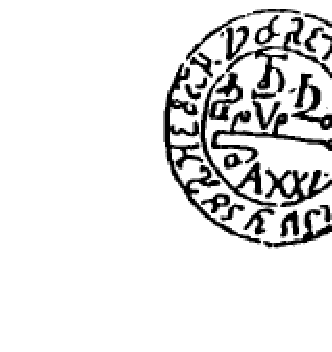

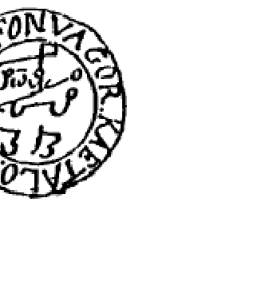

## ♈

当⊙在♂日进入♈的第1°的时候，将1盎司的♂与两打兰的☿和2微量的♀封印一起熔合，在♃与♈成9或10°的时候制作或完成它。

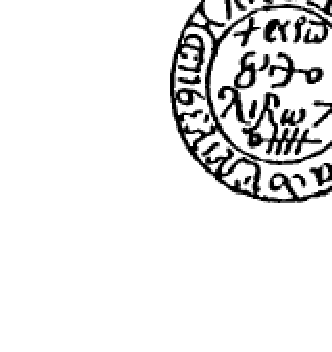

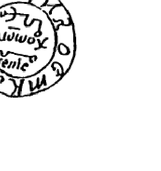

## ♉

当⊙移动到♉的时候，将♀1盎司和♃1打兰与☿2微量的封印熔合，制作并完成它。

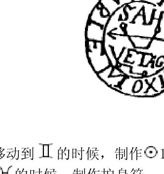

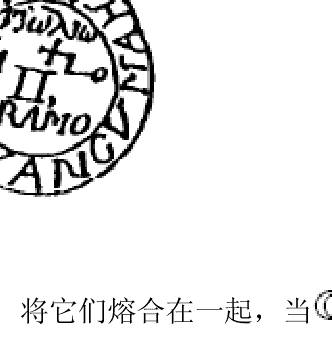

## ♊

当⊙移动到♊的时候，制作☿1盎司和♃1打兰的封印，将它们熔合在一起，当♃在♄或♅的时候，制作护身符。

## 巫術の法則
出品

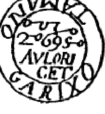

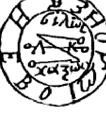

## ♋

当⊙在♋小时移动到♋的时候，制作♋的封印，她能产生正面的影响。

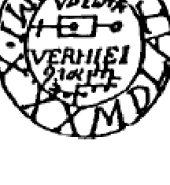

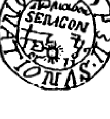

## ♒

当⊙移动到♒的时候，制作⊙的封印。然后，当♃在⚳的时候，雕刻第一张图，当♋到⚳的时候，雕刻另一边。不能将它靠近火源，除非它已熔化。

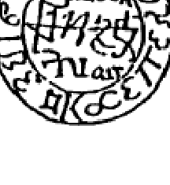

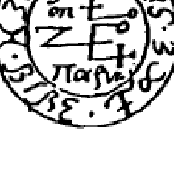

## ♑

当⊙移动到♑的时候，制作♀的封印1打兰，⊙的封印1盎司，♋的封印2打兰和♃的封印1微量，在⊙日的时候，熔合它们。当☿在其日相位良好之时，雕刻图中的文字和图像。

当⊙移动到⊓的时候，制作♀的封印，将其熔化并倒出。

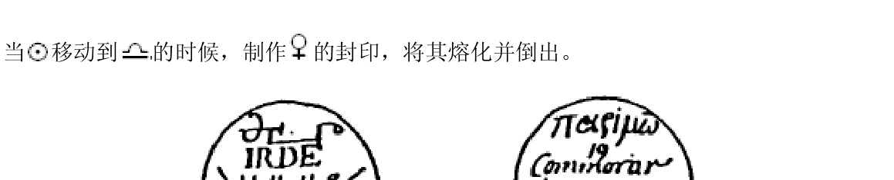

在♂日♂时，⊙移动到♏的时候，制作封印，并在这一时辰内，雕刻图片的前半部分，当⊙移动到Υ的时候，雕刻另一半。

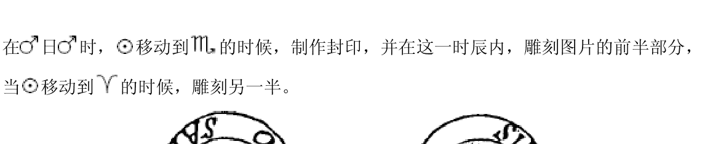

当♃在⊙时完全移动到♐的时候，在♃小时内雕刻它。这个封印需要悬挂在银制环形物上。

制作⊙的封印和一枚♀的环形物（戒指）。当⊙移动到♄的时候，在♃相位良好时，且在♄日♄时的时候，雕刻它。

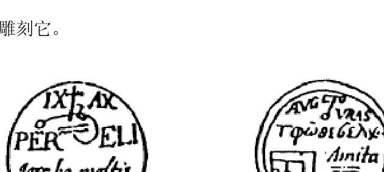

## ≋

在⊙进入 ≋ 的时候，制作1盎司的⊙封印，2打兰的♄封印和1打兰的♂封印，将它们熔合在一起，在♃在第九宫的时候，雕刻图中的文字和图片。

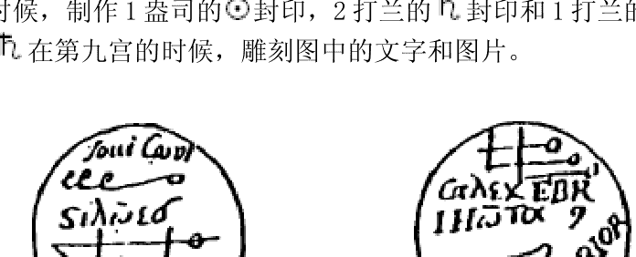

## ⋊

当⊙移动到⋊的时候，制作⊙ ♂ ♄ 和 ☿ 的封印，每个封印2打兰，和1微量的♃封印，将他们一起熔合，在⊙移动到⋊的同一小时，雕刻它。

如果你知道掌管星座和你降生度数的天使，备有属于那一星座和度数的封印的话，那么你就能理解他是属于哪一阶级的，我们将在下文中告知你。

- 第一，这些 genijis 中属于火领域的是 ♈ ♌ ♐，由朝向南方，上帝的信使之一的大天使 Michael 统治，因此，这些 genijis 需要在星期天的第一个小时和第八个小时及夜晚的第三和第十个小时被观察，让自己面向那个方向，他们以手持令牌的皇室骑在一头狮子或公鸡上的形象出现，他们大都形象清晰，被人认为是戴着皇冠的皇后，形象美艳动人。
- 第二，那些和 ♊ ♍ & ♑相关的是属于土领域，由有三位王子（Asaiel，Sochiel 和 Cassiel）听命于他的 Vriel 所统治。因此，和他相关的 geniji 和那些星座都需要在西方观察。他们出现时的样貌像穿着绿色或银色斗篷的国王，或者像小孩或女人在愉快地狩猎着，你可以在星期六白天的第一和第八个小时与夜间的第三和第十个小时观察到他们，在那几个小时内，你可以秘密地面向西方，说出你的愿望。
- 第三，那些和♊ ♎ & ♒相关的 genij 是属于风领域的，他们的掌管者是 Raphiel，他拥有两名王子，名为 Seraphiel 和 Miel。因此，这些和他相关的 genij 和那些星座需要向东面观察，在星期三白天的第一和第八小时，与夜间的第三和第十小时。他们可能以国王或穿着多彩外袍的俊美少年形象出现。
- 第四（也是最后的），那些和 ♋ ♏ & ♍ 相关的 genij 是属于水领域的，他们被 Gabriel（加百利）所掌管，他也同样有 Samael，Madiel 和 Mael 听命于他。因此，这些与 Gabriel 相关的 genij 和星座需要在星期一，面向北方，在白天的第一和第八小时，与夜晚的第三和第十小时观察。他们以穿着绿色和银色外袍的国王或像正在愉快打猎的小孩或妇女的形象示人。

所以，我们接下来还要学会根据每年的季节来观察天体星座，另外我们应当学会适时放松自己，因为，如果 genij 是属于 Igneal Hierarchy 的话，那想要在任何其它季节观察它是不可能的了，但是，当 ⊙ 移动到 ♈ ♎ & ♐ 这些星座的时候，它将显现出它的本质。如果它是属于土元素的 genij，它需要在 ⊙ 移动到 ♉ ♑ & ♑ 的时候观察，其它的也是如此。剩下的：那些属于火元素次序的，需要在夏季观察，那些属于土元素的，需要在秋季观察。属于气元素的需要在春季观察，而那些属于水元素的，需要在冬季观察。他们的能力是做任何对伟大主耶和华 Jehovah 忠诚的事，这也是对我们有益的，是关于我们生命或生物的守护，也对我们的邻里做有益的事。

现在，如果你希望看见你的 genij 的话，你需要做足准备。如果你的 Genij 是属于火元素的话，对他的传唤则需要用你的身体语言来进行，这样你才不会被任何火焰，武器或者枪伤害。当想要召唤的时候，你佩戴合适的封印，对他展示它，这样你就不会在任何情况下失去他的协助或保护了。但是，如果你的 genij 是 Aireal 的话，他能和解人的本性，促进双方的爱情和感情，导致国王和王子们的爱情欲望，秘密地增进婚姻的希望。因此，如果你足够真诚的话，在观察他之前，准备一个合适的封印，这样就能在观察之日之时向他展示，我们也能发觉奇异且神奇的效果。其它两个阶级也是如此。

当时机成熟之时，面向星座的方位，对神祈祷（他们对于你的设想不屑一顾，但适于应对手头的问题），找到他，然后，向他探讨智慧，完成你的义务，你就能看见你的 genij 了。接下来的问题是，因为你是刚开始进行交涉，需要点亮你的大脑，让那些在你记忆里混乱且黑暗的想法远离你，让它在瞬间充满神圣圣洁的知识。

下面是祈祷文，必须要在海岸边或面向 genij 所在方位的方向吟诵数遍，它是召唤 genij 进入水晶石的召唤文。注意，这篇祈祷文可根据吟诵者的思想变更，这里只是作为范例。

## 祈禱文

> “O thou great & blessed N my Angel Guardian, vouchsafe to descend from thy Holy mansion which is Celestial with thy holy influence & presence into this Crystal Stone, that I may behold thy glory & enjoy thy society, Aid & Assistance both now & forever hereafter, O thou that art higher than the 4th.heaven that knowest the secrets of *Elanel*, thou that ridest upon the wings of the wind & art mighty & potent in thy Celestial & supersublunary motion, do thou descend & be present I pray thee, I humbly desire & Intreat thee that if ever I have merited thy society or if any of my actions or intentions be real & pure & sanctified before thee, bring thy external presence hither & converse with me, one of thy submissive pupils, in & by the name of the great God *Jehovah*, whereunto the whole choir of heaven sings continually ***O Alappa-la-man Hallelujah***, Amen.

（大致译文：噢！吾伟大的天使守护者插入名字，请屈驾降临此地，显现于水晶石之中，让吾可仰望汝之荣光，拥入汝之友好之情，永远支持救助吾。噢！汝那高于四重天，通晓 Elanel（埃莲娜尔）秘密，腾驾于风和无尽智慧的本领，是汝之天国之最。降临与此吧！吾向汝祈祷，吾卑贱地渴求汝，哀求汝，让吾之真实，纯洁，神圣化的行为举止出现在汝跟前，让吾感受汝之友好，以伟大的神灵 Jehovah（耶和华）之名，请汝降临此地，与吾这一忠诚的追随者对话，向那个诗歌班不断吟唱 O Alappa-la-man Hallelujah（噢 阿拉帕拉曼 哈利路亚）的地方去吧，阿门。）

当你吟诵数遍后，你至少会在水晶石中看见奇怪的光或通道，你至少会看见你的天赋，然后，如先前所指导的，你需要友好地招待他，告诉他你的意愿，你想要做的事。

## Pauline 之书在此结束

## Ars Almadel

### Lemegeton

### 四

## 从这里开始讲述所罗门的艾美戴尔之术

所罗门用这项技艺从掌管世界四方的大天使处获得了大智慧：对你而言，你必须谨记四方代表西，东，北，南四个角落：它们分为 12 个部分；也就是说每个角落三部分。每个部分的天使都有其特有的美德和力量，我们将会在本书中详述。

要制作艾美戴尔（almadel），需要用纯净的白色石蜡；但是剩余部分的颜色必须适合四方。4寸正方形，外加6寸正方形，在四个角各一个洞，在其之间用新笔写上神的名字。这都要在太阳时间完成。在第一部分的东面写上 ADONAIJ, HELOMI, PINE。在第二部分的南面写上 HELION, HELOI, HELI. 在西面写上 JOD, HOD, AGLA 。在第四部分也就是北面写上 TETRAGRAMMATON, SHADAI, JAH。

在第一和其它部分之间画上所罗门的五芒星☆，在第一个方位之间写上 ANABONA，在艾美戴尔的中间画上六芒星✡符号，在其中再画上三角形，再是 HELL, HELION, ADONAIJ 的神名。将你的石蜡分成三部分：一部分用来制成艾美戴尔，另外两部分用来制作蜡烛。用同一块蜡制作用于艾美戴尔下起支撑作用的脚。

完成后，你需要使用纯金或纯银（最好是纯金）制作封印，在封印上要刻有 HELION, HELLUION, ADONAIJ。

记住第一个四方称为 Chora Orientis（卡拉守护者），或者 East Altitude（东方守护者）。要实践 Chora 的仪式需要在太阳时日施行。这些天使的能力是让所有事物增加收益，能促使动植物的产量，增加生育率，让不孕的妇人开枝散叶。

他们的名字是：ALIMIEL, GABRIEL, BARACHIEL, LEBES, HELISON。

注意不要向这些天使祈祷，因为他们属于四方。当你想要召唤他们的时候，将四根蜡烛放在烛台上，要小心别在仪式正式开始前点燃它们。

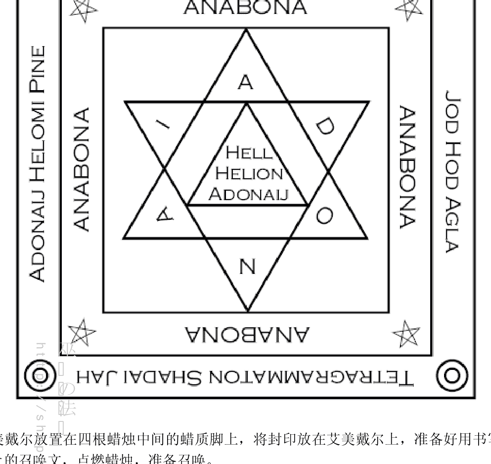

将艾美戴尔放置在四根蜡烛中间的蜡质脚上，将封印放在艾美戴尔上，准备好用书写在羊皮纸上的召唤文，点燃蜡烛，准备召唤。

当他出现的时候，他会以一名天使手持印有白色十字的旗帜姿态出现，他的身体被云朵缠绕，他的面部十分清晰明亮，头戴玫瑰编织的皇冠。

他会先腾云般地降临到艾美戴尔的刻字部分。

魔法师需准备好与艾美戴尔同色的土陶罐及其它设备，它是作为盆子的作用，在其中放入了热灰或热煤，但是不要放入太多，否则会使艾美戴尔的蜡融化。再放入三颗乳香脂磨成的粉，这样燃烧粉的烟熏就能通过艾美戴尔的洞向上飘。

天使闻到香味后，他会开始轻声说话，询问你的愿望，你为何召唤王子和四方的统治者。

然后，你必须这样回答他：吾愿吾所有的请求都能获准，吾的祈祷能实现；若神允可，用汝之力助吾实现（I desire that all my requests may be granted and what I pray for may be accomplished: for your office maketh it appear and declareth that such is to be fulfilled by you, if it please God,），加入你所请求的特别事物，谦逊地祈祷正义，你应该从他处得到的事物。

但是，如果他不立刻显现，你必须拿到金质封印，用蜡烛弄出三或四个印记，它如前文所述代表天使立刻显现。当天使离开后，你要让整个地方充满甜蜜、令人愉悦的味道，让这个味道长时间停留。注意金质封印会在所有四方的仪式中使用到。

属于第一个四方（Chora）的颜色是纯白；第二个卡拉的颜色是红玫瑰；第三个卡拉的颜色是绿色与白银色的混合；第四个卡拉的颜色是黑色混一点绿色或一个令人沮丧的颜色。

## 第二个卡拉或四方

注意其它三个卡拉的符号和王子能在货物和财富上发挥力量，可以任何人变富有或贫穷。第一个卡拉有能收益和肥沃力量，也有能减少和贫瘠的力量。如果任何人使用这些卡拉或四方的力量的话，他们必须以上述方法单独开工。

但不要祈祷任何违反神和他的律法的事物，要根据习俗或大自然趋势祈祷神所允许的。

所有使用的设备颜色需要与艾美戴尔的一致。

第二个卡拉王子的名字是：APHIRIZA, GENON, GERON, ARMON, GEREIMON。当你跪在艾美戴尔前做仪式的时候，穿着和其颜色一致的衣服，柜子中也要挂着颜色一致的衣服；因为神圣的仪式也会用到同样的颜色。

当仪式开始时，如上文所述，将陶制容器放在艾美戴尔下方，其中放入了火或热灰和三颗乳香脂磨成的粉。

当天使闻到香味时，他会面对着你，低声询问召唤者召唤卡拉王子的原因。

然后，你必须回答：吾愿吾所有的请求都能获准，吾的祈祷能实现：若神允可，用汝之力助吾实现 (I desire that my requests may be granted, and the contents thereof may be accomplished: for your office maketh it appear and declareth that such is to be done by you, if it please God).

你不必惊恐，但要谦逊诉说：吾向汝的能力自荐，吾向汝祈祷，，这一方的王子啊，让吾得偿所愿。（I recommend myself wholly to your office, and I pray unto you, Prince of this Altitude, that I may enjoy and obtain all things according to my wishes and desires.）然后你可以进一步在祈祷文中说明你心中的愿望，其它两个卡拉也是如此。

四方中的第二个天使出现的形象是一个年轻穿着红玫瑰色锦缎的孩童，头戴红花编织的皇冠。他红色的脸庞朝向天堂，周围散发出明亮耀眼的光束。

在他离开前，他会对召唤者说，我是你的朋友和兄弟。他的周围与他耀眼的光芒一起闪亮，只剩下令人愉悦的味道停留在召唤者的脑海中。

## 第三个卡拉或四方

在这一卡拉中，你必须做所有上文中前两个指导的事物。

在这一方的天使名为：ELIPHANIASAI, GELOMIROS, GEDOBONAI, TARANAVA 和 ELOMINA。

他们出现的形式是一个小孩或一个小妇人穿着绿色和银色的衣服，非常令人赏心悦目，头戴白色和彩色树叶编织的皇冠。他们脸庞看似有点下倾。

他们如其它的天使一样会对召唤者低语等，最后会留下令人愉快的香味。

## 第四个卡拉或四方

在这一卡拉中，你必须做所有上文中前两个指导的事物。

在这一方的天使名为：BARCAHIEL, GEDIEL, GEDIEL, DELIEL 和 CAPITIEL。他们以小男人或孩童（们）的形态出现，穿着混油深绿色的黑色衣服；他们的手中握着一只没有羽毛遮盖的鸟；他们的头部围绕着耀眼闪亮的多色光芒。他们离开后会留下甜蜜的香味，和其它几位的略有不同。

## 召唤天使的时刻

除了四方的王子，还有十二位，他们各司其职，每一位掌管每年的三十天。所以要召唤不是当月掌管者的天使是徒劳的，根据黄道带的十二个符号，每个卡拉或四方都有其限制的时间；太阳所到的符号，那么其所属天使就拥有统治权【即可被召唤】。

例如，假设我要召唤属于第一卡拉的五位中的两个第一位。那么就要选择三月的第一个星期天，当太阳进入白羊宫之后才能召唤。以此类推。

如果你想召唤属于第一卡拉的两个第二位的天使，那么要在四月的星期天当太阳进入金牛宫的时候进行召唤。

其它的四方也是如此。但是四方的名字甚至性格是分别根据天堂中的实质所形成的。

因为当天使听见他们所属的神名的时候，他们是以那个性格的德行所听见的。因此，要召唤任何天使或灵体前，要知道他们所属的神名才行。

遵循下文的召唤咒语形式：

## 召唤咒文

O thou great, blessed and glorious Angel of God (N), who rulest and is the chief governing Angel in the (number) Chora or Altitude. I am the servant of the Highest, the same your God ADONAIJ, HELOMI, AND PINE,1 whom you do obey, and is your distributor and disposer of all things both in heaven earth and hell, do invocate, conjure and entreat you (N) that thou forthwith appear in the virtue and power of the same God, ADONAIJ, HELOMI AND PINE; and I do command thee by him whom ye do obey, and is set over you as King in the divine power of God, that you forthwith descend from thy orders or place of abode to come unto me, and show thyself visibly here before me in this crystal stone, in thy own proper shape and glory, speaking with a voice intelligible to my understanding.

O thou mighty and powerful Angel (N), who art by the power of God ordained to govern all animals, vegetables and minerals, and to cause them and all creatures of God to spring increase and bring forth according to their kinds and natures: I, the servant of the Most High God whom you obey, do entreat and humbly beseech thee to come from your celestial mansion, and shew unto me all things I shall desire of you, so far as in office you may or can or is capable to perform, if God permit to the same.

O thou servant of mercy (N), I do humbly entreat and beseech thee by these holy and blessed names of your God ADONAIJ, HELLOMI, PINE; And I do also constrain you in and by this powerful name ANABONA, that you forthwith appear visibly and plainly in your own proper shape and glory in and through this crystal stone, that I may visibly see you, and audibly hear you speak unto me, and that I may have thy blessed and glorious angelic assistance, familiar friendship and constant society, community and instruction, both now and at all times, to inform and rightly instruct me in my ignorance and depraved intellect, judgement and understanding, and to assist me both herein and in all other truths also, through the Almighty ADONAIJ, King of Kings, the giver of all good gifts that his bountiful and fatherly mercy be graciously pleased to bestow upon me. Therefore, O thou blessed Angel (N), be friendly unto me, so far as God shall give you power and presence, to appear, that I may sing with his holy Angels. O Mappa Laman, Hallelujah. Amen.

大致译文：哦！伟大万众敬仰的神（名字）的天使啊，汝是（第几）卡拉或方的统治者和掌管型天使的首领。吾是最高等的仆人，也既是你所成服的ADONAIJ, HELOMI和PINE神的仆人，也是你在天堂、地球和地狱所有事物的传达者和处理者，吾在此召唤命令汝（名字），汝需立刻以神ADONAIJ, HELOMI和PINE的美德及力量显现。吾以汝成服的他之名命令汝，如神的神圣力量驾驭汝，汝应立刻从汝之寝宫降临此地见吾，以汝自己的形态和荣耀，清晰地展现在这个水晶石中，以能让吾理解的语言说话。
哦，强大万能的天使（名字，汝被神赐予统治所有动物，植物和矿物的力量，让所有神的造物展现繁殖并根据他们的种类和性质繁衍。吾，汝所成服的最高等神灵的仆人，恳求汝，卑微地祈求汝从汝的天国寝宫处降临此地，如果汝之力量允许，如果神允许，请向吾展现汝吾所祈求的万物。
哦，仁慈的（名字）仆人，吾以这些神圣受祝福的名字ADONAIJ, HELLOMI, PINE之名，谦恭地恳求汝。吾也以力量之名ANABONA约束汝，汝应立刻从汝之寝宫降临此地，通过水晶石展现汝清晰的姿态，让吾得到汝受祝福的和荣耀的天使协助，熟悉的友情和持续的交往，交流和指导，告知吾，纠正吾的无知和顽废的智力，判断力和理解力，通过万能的ADONAIJ，国王中的国王，万物的给予者，他宽大的胸襟和慈父般的慈悲照耀着吾

因此，哦，受祝福的天使（名字），对吾友善吧，神会给予汝力量和存在，展现吧，让吾能和它的圣洁天使一起歌唱。哦，妈帕 拉门，哈利路亚，阿门。

当他显现的时候，友善地对待他或他们；然后，询问关乎正义和律法，适于他能力范围的问题。你就能获得你所要的了。

所罗门王的艾美戴尔在此结束。

## The Ars Nova

### Lemegeton

### 五

## 介绍

Ars nova 作为 Lemegeton 之书的分卷一直有些质疑。在我的手稿（sloane 2731）的拷贝中，它是由一页纸所组成的。它只从艾美戴尔之术（Ars Almadel）结尾的“结束”相区分开。这本书中并没有新的名称。

我相信这本书名称的缺失——以及编码的错误——促使 新术（Ars Nova）以前的出版社和注释者让其两页的内容颠倒次序。使用公认顺序相反的位置将陈述内容以逻辑顺序插入，能澄清迷惑前任评注者围绕着 “伟大陈述”（Mighty Oration）的谜团。

Sloane2731 因几乎过度关心存放位置而撰写的。每张纸都没最大化地利用。内容使用的是草写小字。边缘非常窄，抄写者是以如今被成为 “landscape”（纸长的一边做顶和底）的方法书写，只是为了能在每行中挤入更多的词。整篇手稿中只有两页留有大约半页的空白，其中的一页就是新术（Ars Nova）。如果使用公认的顺序排版，空白之处就会毫无理由地出现在陈述内容的中间。而这个空白应该在文章的结尾部分才更为合理，也就是在雷蒙盖顿之书 (Lemegeton)的结尾，其中叙述了“魔法器具”：魔法的圆和三角，圆内的六芒星和围绕着它的五芒星。它列出了其中的神圣名字，加入了一小段祈祷，每行一个名字。这个列表占据了整个一页。我相信其中的祈祷文是需要在画神圣名字或图像的时候祈祷，或在之后仪式地点圣化仪式中祈祷使用。

在纸的相反一面有三个部分。第一个，几个希伯来字母和拉丁字母写的名字。后者并非希伯来文的字译——也就是说，只有部分是易读的。

第二部分是混合了前一部分中的拉丁单词的祈祷文。但是它实际上比那些删除的词更加合理：因为它是神将邪恶和生活在空气中的灵体禁闭在黄铜瓮中的祈祷文。这立刻让人联想到了在 Goetia 中的所罗门的黄铜瓮。它很可能是在使用力量或准备那个瓮的时候需要祈祷的文章。然而，这篇祈祷文中的圣名并没有在我的手稿拷贝中的瓮上，也不在克劳雷/马瑟（Crowley/Mathers）的版本中。很可能这部分是借用其它不是雷蒙哥顿之书（lemegeton）的文献；圣名的极端堕落可能会出现在其中。

将页数的次序颠倒后，最后的部分称为 “伟大陈述”（Mighty Oration）。奈尔森·怀特（Nelson White）苦思这个咒文，想知道魔法师是否应该将灵体如贼一般对待。其实有很简单的理由：它根本就不是雷蒙哥顿之书的内容。这个部分只是针对任何可能偷走这本书的人所下的诅咒而已。这种诅咒对于那个时期用手书写的书本而言是再正常不过的了；拷贝它们所花的时间和精力比我们现代大批量生产的要多得多。它的存在位置证实了页数应该颠倒的次序。

要注意雷蒙哥顿（Lemegeton）前言的描述（这一系列的Goetia卷），这一卷通常错误地取名为Ars Notoria。这本Notoria是分开的（也是更复杂的）作品，其中包含的内容（撇开其重要的插图不谈）包括了一份雷蒙哥顿（Lemegeton）拷贝之一的附录。

— 本杰明·罗伊（Benjamin Rowe）

## 第十层天的范围 (Primum Mobile)

- **Elohim.** 万能的神，他居住在最高层的天堂中
- **Hesed.** 天堂中最伟大的国王，他掌握所有的力量
- **Metatron.** 掌管众多圣洁的天使和天使长
- **Reshit.** 倾听信任汝的仆人的祈祷
- **Hagalgalim.** 让汝圣洁的天使在此时与永远听命帮助于吾。

## S. Z. (例如, 黄道带范围)

- **Iehovah.** 万能的神，倾听我的祈祷
- **Hadonat.** 掌管恒星之上的圣洁天使
- **Ophanim.** 助你仆人一臂之力
- **Iophiel.** 通过它就能掌控所有的空气，水，或，土，和地狱的灵体
- **Masloth.** 它能带给你荣耀和善良

## S. H.2

- **Iehovah.** 万能的神，倾听我的祈祷
- **Elohim.** 在我们身边的神
- **Binah.** 让我们变得坚强，支持我们
- **Aralim.** 我们所从事的事业就如同汝手中的乐器
- **Zabbathai** 在汝的手中，伟大的的Sabaoth神

**Hismael** 伟大的神，是植物和天堂阶层的统治者和创造者

**Hasmalim** 用汝万能的力量控制他们

**Zelez** 现在出现并帮助汝可怜的仆人

> > — K. S. 2

**Elohim Geber** 最万能永恒的真神

**Seraphim** 命令汝的六翼天使

**Camael, Madim** 在此刻照料我们，帮助我们，帮助我们远离危险

> > — S. ♂

**Eloha** 哦 万能的神！愿我们永远共存

**Tetragrammaton** 让汝万能的力量永远为守护存在

**Raphael** 愿汝神圣的天使拉斐尔（Raphael）在此刻及永远守护等待我们

**Schemhamphorash** 帮助我们的事业

> > — S. ☉

**Iehovah.** 万能的神，无所不能的神，倾听吾的祈祷

**Sabaoth.** 伟大的Sabaoth神

**Netzah** 洞悉一切的神

**Elohim.** 神啊，让汝现在及永远存在于此吧

**Haniel.** 让汝圣洁的天使Haniel降临，在此时此刻帮助我们

> > — S. ♀

**Elohim.** 哦 神！出现在我们面前吧，愿汝现在和将来永远与我们共存

**Sabaoth.** 哦 汝伟大的Sabaoth神，在此时此刻与永远和我们共存

**Hodben** 让汝万能的力量守护我们，无论现在或将来

**Michael.** 让在汝之下的米迦勒天堂阶层的将军

**Cochab.** 降临并驱逐所有邪恶和威胁

— S. ☿

**Sadai.** 所有智能和知识的伟大神

**Jesal** 指导汝可怜、最谦逊的仆人吧

**Cherubim.** 汝圣洁的小天使Cherubim:

**Gabriel.** 汝圣洁的天使加百利（*Gabriel*），好消息的送信者

**Levanah.** 现在和将来指导并支持我们

— S. ☾

## 羊皮纸中两个三角的解释

**Alpha & Omega** 哦，汝伟大的神，你们是开始和结尾

**Tetragrammaton** 汝万能的神，守护我们，愿汝圣洁的精神于我们永远共存

**Soluzen.** 吾命令汝，无论汝之精神领域在何方，降临此圆

**Halliza** 以人的形态显现

**Bellator** 以能让我们听清的母语说话

**Bellonoy (or Bellony)** 向我们展现并发现所有汝知晓的财宝，迅速悄悄将其运送此地

**Hally Fra** 回答我们的所有问题

## 所罗门三角的解释

**Anephezeton.** 汝所有天堂阶层的神

**Tetragrammaton.** 汝伟大的神，永远守护我们，愿汝圣洁的灵魂与我们共存

**Primeumaton.** 汝是开始与结束，愿所有的灵魂成服我们，愿所有骚扰此处的灵魂在此三角中束缚

**Michael.** 以伟大的天使米迦勒（Michael）之力，直至吾将其释放

## 新术（Ars Nova）的第二页

- Jodgea [太阳符号] Rosen Emolack [水星符号] Roson Subbartha [金星符号]
- Roson Eloham [地球符号] Skimoy Abomoth [火星符号] Rosen Elemoth [木星符号]
- Zadon [土星符号] Behoma Reson [天王星符号] Gamaliell [海王星符号] Mackhamasmack
- [冥王星符号] Baseh Zadon [北交点符号] Hinmore [南交点符号] Molock Ehaddon [福点符号]
- Molack Johiron & Michael

Jodgea, 吾谦逊地恳求汝 Rosen Emolack 汝 永恒的神Roson Subbartha 汝 万能且永恒的造物主 Roson Eloham 汝 与我们共存的神Skimoy Abomoth 束缚并让Rosen Elemoth Mackhamasmack禁食 在汝神圣的力量之下 那些邪恶且在空气中实生存的灵体 飞行灵体 Baseh Zadon 和气之灵体 和Hinnon Molock Ehaddon 之灵体 及所有隐藏财富的灵体 人类的骚扰者Molack与Molack Johinnon之灵体 以锁链锁在黄铜瓮中Michael与汝天使长Michael......

> > 原文： Jodgea, I humbly implore thee Rosen Emolack thou everlasting god Roson Subbartha thou omnipotent & everlasting Creator Roson Eloham thou god with us Skimoy Abomoth to bind & keep fast Rosen Elemoth Mackhamasmack by thy divine power those evil & airy spirits Baseh Zadon of the spirit of flyes & spirit of the air Hinnon & spirit of Hinnon Molock Ehaddon with all the spirits of hidden treasure & the disturbers of mankind Molack with the spirits of Molack Johinnon in chains in thy brazen urn Michael with thy Arch Angel Michael.....

## 伟大的陈述（The Mighty Oration）

By the most great & almighty power of Alpha & Omega, Jehovah & Emmanuel, and by him that divided the Red Sea & by that great power that turned all the waters & rivers of Egypt into blood & turned all the dust into flies & chains & by that great power that brought frogs all over the land of Egypt & entered into the King's Palace & chambers & by that great power that terrible thunder & lightning & hail stones mixt with fire, & sent locusts which did destroy all growing things in the whole land of Egypt, & by that great power that destroyed all the first born of the land of Egypt both of man & beast, & by that great power that divided the hard rock & rivers of water issued out of the sand of the wilderness, and by that great power that led the children of Israel into the land of Canaan & by that great power that destroyed Sonachoribs great host & by that great & almightypower of him that walked on the sea as on dry land, & by that almighty power that raised the dead Lazarus out of his grave, & by that almighty power of the blessed & holy & glorious trinity that did cast the Devil & all disobedient Angels out of heaven into hell that thou thief return immediately & restore the goods again which thou hast stolen away, therefore in & by the names of the Almighty God before rehearsed I charge thee, thou thief to restore the goods again immediately or else the wrath of God may fall upon thee & force thee to come immediately. Amen.

（大致译文：以最伟大万能的Alpha和Omega，Jehovah和Emmanuel的力量，以那强大的力量使红海分割；以那强大的力量使所有埃及的河水变为血海，尘土飞扬；以那强大的力量使埃及的大陆布满迷雾，直至国王的寝宫；以那强大的力量造成强烈的闪电与雷鸣，雹石与火焰；派遣蝗虫摧毁埃及所有生长的植物；以那强大的力量毁灭了所有埃及大地上人与野兽的长者；以那强大的力量劈开了岩石与河流；以那强大的力量使以色列（Israel）的孩童进入迦南（Canaan）的领土；以那强大的力量摧毁了Sonachoribs；以他那强大的力量，他能行走在海洋上；以那强大、受祝福、神圣、三位一体的力量，让已死亡的穷人从坟墓中跃起；以那强大、受祝福、神圣、三位一体的力量，他让恶魔和所有堕落的天使远离天堂进入低语，贼人盗走的物品需立刻归还，因此，在吾高声背诵之前，以万能的神之名，贼人应立刻归还偷走的货物，否则神的愤怒将降临于汝，命令汝立刻前来。阿门。）