# 手作芳疗喷雾魔法书

# 全方位灵性喷雾构成元素

## 物质成分篇

灵性喷雾的构成元素可分为两个层面——物质成分与无形能量。物质成分是实际加入喷雾中的材料，无形能量则是在制作过程中另行灌注的能量加持，人眼看不见，但是影响重大，可使效果更加提升。常见的物质成分包含精油、纯露、药草酊剂、花精和宝石酊；无形能量包括制作者的意图、肯定语句、神圣图腾、色彩等。

灵性喷雾的配方本身就是一种创作，能容许相当的自由度。这所有可添加的有形物质与无形能量就是你的调色盘，你可选择在一幅画中只简单用一种色调，也可以两、三、四、五、六、七种缤纷搭配。搭配得宜，会发挥协同作用，达到一大于二的加乘威力。相对来说，假如搭配不适宜，会相互抵减效果，变成一小于一。因此在配方时若对搭配不甚确定，宁可秉持简单至上，贪多不一定好。接下来将逐一介绍所有可运用在灵性喷雾中的材料。


# # 精油


精油是植物体经由蒸馏、压榨、脂吸、化学溶剂等方式萃取而得的高浓度芳香分子，不仅可处理身体问题，对情绪也大有裨益。当我们把这些芳香分子嗅吸入鼻腔，可直接刺激大脑边缘系统，达到改善情绪的功效——这是已经过科学证实的功效，不再赘言。

精油的香味强烈，适合作为灵性喷雾调香的主角。价格则依种类不同，也可以贵妇，可以平价，不过整体来说仍是喷雾中最吃成本的一味材料。灵性喷雾的制作成本通常多半是花在精油上面。

由于精油浓度甚高，能量表现强烈且稳定，只需少量便可收效。除了柑橘类之外，其余精油皆可保存数年以上，甚至无限期，在使用上相形便利。唯需注意，由于精油是高度浓缩的化学分子，具有药性，某些种类更具有毒性，在使用上有不少禁忌，举凡孕妇、孩童、高血压、气喘患者、肝肾病患、癫痫患者和癌症患者，皆需请教专业芳疗师方可使用。而无论是谁，都切勿使用过量。

事实上，灵性喷雾的定位并非是改善身体疾病，而是希望协助精神能量层面。这两者的处理方式并不相同。身体疾病需要较高量精油处理，但是精神层面只需微量就足矣，因此添加量不需一味求多。

精油的萃取程序复杂，所需设备昂贵，个人难以自制，所以取得途径通常还是透过向厂商购买。说到买精油，芳疗师可以用鼻子鉴别精油的纯度，外行人就没有这个本事，最怕买到假的、不纯的。其实精油品质有迹可循，以下是几种鉴别的方法。

#### 精油选购指南

#### 拉丁学名

植物种类多不胜数，例如光是薰衣草家族就有真正薰衣草、穗花薰衣草、醒目薰衣草等种类，如果全部都标示为“Lavender”，如何辨识买的是哪一种呢？有鉴于此，专业精油一定会标示拉丁学名，例如真正薰衣草的俗名是Lavender，学名则是Lavandula angustifolia，购买时认明学名才是正确。如果你看见精油瓶上没有学名，厂商的专业程度恐怕就大大不妙了。


精油瓶标签上应有拉丁学名和俗名并列。

#### 包装

纯精油最怕受光照变质，且会溶蚀塑胶，因此只能装在深色玻璃瓶或是铝瓶中。如果你看到精油用塑胶瓶装，或用透明玻璃瓶却没有遮光外包装，最聪明的作法就是拜拜再联络。


深色玻璃瓶可以避免精油光照变质。

# # 萃取方法

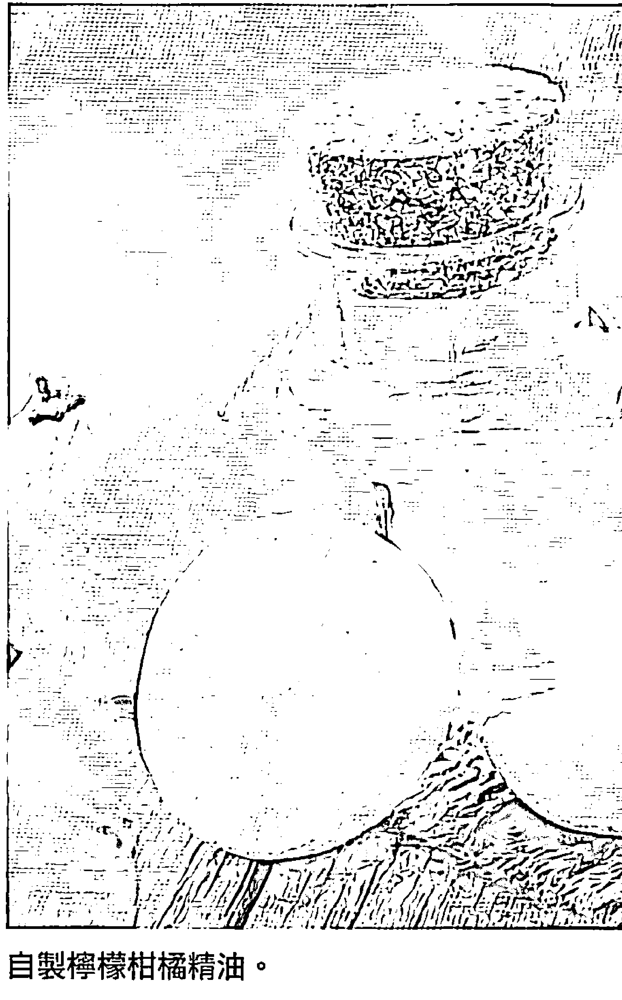

精油常见的萃取方法包括蒸馏法、压榨法、脂吸法、化学溶剂法和CO2萃取法。同种植物用不同萃取法取得的精油有所差异。以蒸馏、压榨和CO2萃取出来是传统上称呼的“精油”，脂吸法和化学溶剂法萃取出来的精油则因为会有2～3％化学残留物，因此另称为“原精”以做区分。

正统芳疗界偏好精油甚于原精。以制作灵性喷雾的角度来看，精油的能量频率应高于原精，宜优先选用。话说回来，原精并非一无是处，对于玫瑰、茉莉等“高贵很贵”的精油，原精的价格可亲许多，香气更趋近于植物本色，丰富讨喜。撇除化学残留和能量频率的美中不足，当口袋深度不够时，原精仍然可以成为救星。

此外，蒸馏法与压榨法也值得拿来比较。压榨法常见于柑橘类精油，市面上却也见得到蒸馏萃取的柑橘类精油，选购时不免令人茫然，究竟该怎么选择呢？一般认为压榨法未经高温，香气表现较佳，近似水果本身的气味，因此建议优先选用，可惜压榨法保存期限短，开封后建议半年内要用完。蒸馏法的香气较淡，品质较低，尽管保存期限可拉长到两年，仍然不受芳疗师青睐。（唯一的例外是莱姆，蒸馏的莱姆精油因为气味独特，去除光毒性，在市场上较受欢迎，但是站在能量的角度，我仍然会把压榨的莱姆列为优先选择。）

CO2萃取法是最新的科技。原理是当二氧化碳在高温高压的环境下，会变成液态，可溶出芳香分子，之后回复常温常压，二氧化碳就消散为气体，剩下的就是纯精油了。此法设备昂贵、操作危险性高，再者欧美芳疗界认为二氧化碳萃取对人体的长期影响还不明朗，因此尚未普及，不过一般认为其萃出的精油成分完整，品质上好，仍然值得运用在灵性喷雾中。

##### 产地

你知道吗？看似贵妇的精油，骨子里其实是农产品。农产品的品质跟栽种方式、培育环境、收成季节、产地都有关。我们且把自己想成上市场的主妇好了，要买高丽菜，平地跟梨山两款摆眼前，你当然知道梨山的比较清甜爽脆吧？要买三星葱，你毫不犹豫就挑宜兰的，不是吗？

同样的，精油也有一般认为的最佳产地。专业的厂商通常会揭露产地资讯。本书中我们无法罗列所有精油的推荐产地，所幸这世上有书店也有Google，购买前做一下功课，资讯取得并不困难。

值得一提的是，产地虽有影响，但是我们不必太执着。植物在不同环境都能演绎出超凡的生命力。好比奇异果原产地在中国，瞧它现在到纽西兰活得那么好，谁说不是出自特定产地的精油就一定不好呢？

#### 价格

精油的价格与萃油率至为相关。萃油率系指一定量的植物能萃出的精油比例，例如雪松萃油率高，只需一公斤就能萃出45克的精油；玫瑰萃油率低，蒸馏一公斤只能萃出几滴精油。若是想要萃出一瓶10ml的玫瑰精油，需要20～50公斤的玫瑰花瓣，由此可见精油不是白吃的午餐，需要大量植物才能萃取，价格自然需要处在一个合理区间，否则请试想，假使夜市卖一瓶标价500元的玫瑰精油，你认为500元买得到50公斤玫瑰花瓣吗？

话说回来，这并不是说贵就一定好。许多时候精油昂贵是与品牌塑造、通路、店租、人事、广告成本及目标客群有关。向精油产地的蒸馏厂购买，跟在百货公司买，后者的价格一定让前者看起来像是跳楼大拍卖，尽管品质可能无异，只是成本利润结构不同罢了。而我们制作一瓶100ml的灵性喷雾，大约要用掉1～5ml精油，说多不多，说少却也不少。我会建议舍弃高贵品牌，挑选CP值高的优质精油作为材料。

说到这边，相信你对精油选购已有概念，不过我仍然可以想像你想抓着我的肩膀说：“直接告诉我去哪里买比较快！”

没错，我了解，我早已准备好推荐厂商名单。选择的原则在此说明：第一，必须是台湾厂商，提供中文服务。第二，贩卖的必须是百分之百纯精油。第三，价格必须可亲。以下提供我常购买的几间厂商供参考。

-   芳疗家 http://www.aromahealer.net
    -   网路门市
    -   实体门市

若要问全台湾哪一间厂商的精油最适合做手作灵性喷雾，我毫不考虑就会将芳疗家列为首选。芳疗家代理法国Florihana有机精油品牌，产品皆为原装进口，能量表现优异，定价亲切合理，堪称CP值最高。实体店铺布置温馨，处处可见用心，即使不购买，光是来这边走一走也有心灵充电之效。

# [舒亚纯天然](http://www.pcstore.com.tw/tiya)

-   ☑ 网路门市
-   ☑ 实体门市

舒亚是全台湾精油种类最齐全的商家，实体店的现货品项有四百多种，皆由老板从全世界搜罗进口，价位平实得令人感动。经营态度更是不能不提，我有一次订购秘鲁圣木，竟接到老板亲自来电，通知秘鲁圣木刚到货，但是他试闻察觉品质有异，因此不能供货，愿立刻退费给我。这样的经营态度十分值得赞赏，令人肯定。

# [肯园](http://www.cango-shop.com)

-   ☑ 网路门市
-   ☑ 实体门市

肯园在台湾芳疗界占有龙头地位，多年来为台湾培育出无数芳疗人才，负责人温佑君出的书更是经典必读。肯园经营的“肯购网”贩售德国Oshadhi精油品牌，此牌种类众多，品质专业保证。尽管单价比起芳疗家或舒亚高约两倍，仍然比百货公司实惠。要是不曾闻过某种罕见精油，想要建立正确的“嗅觉资料库”，肯园是不会错的选择。

# [Muller's花言草语欧洲馆](http://www.friends-shop.com)

-   ☑ 网路门市
-   □ 实体门市

Muller's是真品平行输入德国Oshadhi精油和英国Eod精油。备货品项不一定，买不买得到要碰运气，不过运气好时确实能捡到便宜。此外，Muller's还输入许多欧洲保养品牌，让人一逛就难以抵挡熊熊的欲火。

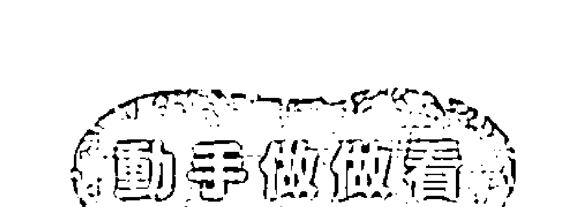

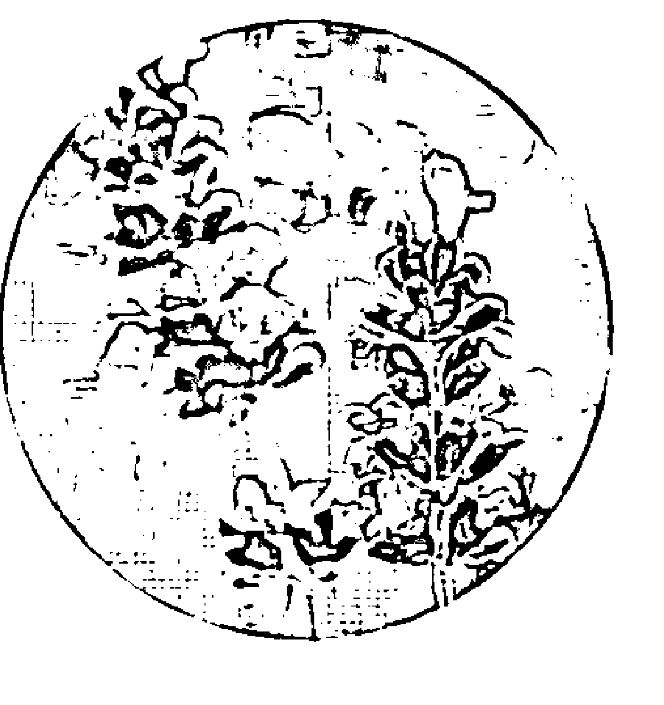

### 真正薰衣草舒缓精油喷雾

有多久没有滋养自己了呢？有多久没有好好照顾自己？薰衣草提醒我们，该是时候休息了。真正薰衣草（学名Lavandula angustifolia）是许多精油玩家第一瓶入手的精油，舒缓效果优越，相信不用多说。其能量表现偏向女性，像母亲，像家乡，如同宁静的田园，带来温柔的照拂。在疲累的一天后使用薰衣草精油，能减轻忧郁、释放压力。

薰衣草是天使香气之一，能协助召唤天使。花朵的蓝紫色与灵性有关连，常运用在提升直觉、灵性疗癒与能量纠结的释放，同时有温和的能量净化力。薰衣草常被绑成杖状，在净化仪式中搭配其他净化药草焚烧，在温和净化的同时，散发柔性的抚慰。

这款喷雾很适合在卧室或任何需要放松的时刻使用。在床头备上一瓶，是绝妙的主意。现在就来动手做吧，不用花你两分钟！

###### 材料

-   酒精度40%的伏特加酒（或药局售的75%杀菌酒精）49ml
-   真正薰衣草精油20滴
-   50ml消毒过的深色玻璃精油喷雾瓶一个

#### 作法

将酒倒入深色玻璃瓶中，滴入薰衣草精油，盖起喷头，充分摇晃即可。

###### 说明

本配方使用酒精作为精油溶解剂。酒精度越高，精油能溶解得越完全。40%伏特加一般无法完全溶解精油，会有粒子残留，颜色混浊；75%的残留粒子较少，颜色较清澈。无论何者，品质皆无虞，只要记得使用前摇匀即可。

#### 安全小叮咛

一旦你在喷雾中添加了精油，请切勿在小型密闭空间中喷洒过量。“精油过量会中毒”并非口号，我亲身认识朋友因为调配了浓度过高的精油，姊妹俩躺在床上干呕两天，痛苦不堪，不可不慎。一般而言，喷洒个人气场时，在头与两肩上方各喷一下即可。喷洒空间时，可在中央喷一下，四角各喷一下，如果空间大，则沿着四周喷洒。假如不确定是否喷洒过多，开个窗子比较保险。

### 纯露
之书

纯露是植物体中可溶于水的部分。将植物蒸馏之后，携带植物芳香分子的水蒸气冷却凝结，集中起来，上层较轻的油质就是精油，下层的液体就是纯露，主成分是有机酸、植物中的亲水分子及微量精油。

过去纯露一直被视为精油生产的副产品，现在芳疗界已注意到纯露的价值。与浓烈的精油相较，纯露香味似有若无，性质更温和安全，使用对象几无禁忌，因此即使是孕妇、幼童及重症患者，都可放心外喷。外喷恰好是纯露作用在精神能量层面最合适的方式。在灵性喷雾中添加纯露，可以略微增添嗅觉表现，并与精油或花精相辅相成。

纯露的能量表现不若精油那么强，气味会随时间变化，保存亦较不稳定，视种类通常仅能放一至两年，有些还只能放几个月，因此最好新鲜购买、新鲜使用，用不完时建议储存在冷藏室中，再使用时需先检查是否有悬浮物，如果有就舍弃不用吧。保存期限短是纯露最不方便的一点，然而在制作母婴及敏感体质适用的喷雾时，纯露仍是不可取代的主角。

纯露一般人难以自制，仍以购买为主要取得途径。推荐商家请参照前篇“精油选购指南”。

#### 药草酊剂

药草酊剂在东方有个俗又有力的称呼，就是“药酒”啦！可别因为它让你联想到电视广告而觉得它一点都不灵性，其实药酒是运用酒精萃取植物精华的古老智慧。西方最早可追溯到西元1000年的神圣罗马帝国时期，并在1400年成为欧洲民间普及的药草疗法，中国更是早在商朝就有药酒的记载。

为什么用酒？酒是由乙醇（俗称酒精）与水构成。乙醇是强力的溶剂，能溶解植物细胞，析出油质或蜡质之类难溶于水的分子，包括生物碱、糖苷、矿物质和芳香精油，更可以析出新鲜植物内的液体。水本身也是一种溶剂。因此，一旦药草浸泡到酒中，植物体中可溶于水和可溶于乙醇的分子都会析出，无形能量也一并保存进去，于是酊剂就成了既有物质实体，也有能量作用的灵性喷雾好材料。在灵性喷雾中添加药草酊剂，就等于添加了精油与水解分子。由于含有精油，酊剂的香味表现很不赖，往往比纯露更浓郁。

由于台湾精油市场畅旺，多数人应会以购买精油为主，不过酊剂在精油昂贵甚或完全买不到时，就是不二的解方。例如洋甘菊精油贵松松，买干燥洋甘菊来自制酊剂就廉宜多了；再例如市面上没有绿茶精油，任何人却都可以自制绿茶酊剂。

酊剂的能量表现视材料品质、浸泡比例及时间、选用的酒种及制作者的意图

而定。精雕细琢与粗滥制造之间，可以产生极大的落差。在最好的情况，可以达到媲美纯精油喷雾的能量强度，这样的酊剂本身就足以单独做为灵性喷雾了。最差的情况，能量表现软趴趴，枉费一场辛苦制作，倒不如直接买纯露来喷。

在欧美的自然疗法商店中，销售着如同超市般各式各样的酊剂。洋人认为酊剂是高浓度的植物萃取，两滴管酊剂的浓度等同240ml的花草茶，所以酊剂多半是装在滴管瓶中，一次两管、一天三次服用。

在灵性喷雾的运用上，我们则藉由外喷来调理心灵层面。外喷比内服相形安全。药酒药酒，毕竟是药，各地皆有误服出事的案例，因此除非你非常了解药草性质，否则请勿随意内服。台湾坊间可以买到一些瓶装药酒，然而不见得适合用在灵性喷雾，最好还是亲自动手做。做酊剂不比做菜难，在厨房就可完成，只需要一点耐心。如果你连等都不想等，不要紧，稍后也会提供懒人法与快速法，任君选用。

酊剂的制作成本跟精油一样，高低之间犹如天壤之别，好比餐厅上菜，可以料多扎实，也能偷工减料；可以山珍海味，也可以俗搁大碗。越是用昂贵的药草，浸泡比例越浓，成本就往上窜升。唯一能确定的是，自己做一定比外面买便宜多了。

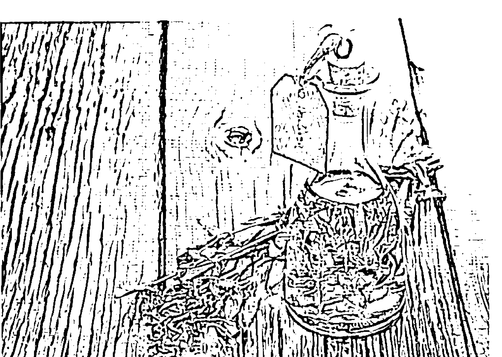

新鲜香蜂草浸泡酊剂。

#### 如何确知药草酊剂的心灵功效？

同种植物的精油、纯露和药酒，虽然萃取方式相异，化学组成大异其趣，能量作用的大方向倒是十分相似。薰衣草的精油能安眠，不会因为制成药酒就让你整晚睡不着。这对我们而言是好消息，欲理解酊剂的心灵作用，只要参照同植物精油、纯露，甚至花精与花草茶的功效介绍，就八九不离十了。

酊剂虽然没有随买随用的方便性，不过保存期限长。只要存于阴凉处，保存期两年起跳，酒精度高的可超过五年，我甚至听过有人的酊剂放十年都没坏，等于动手做一次就可以享用好几年，不是很棒吗？

#### 药草酊剂的制作

##### 药草

药草的花、叶、茎、木、根、果、种籽和树脂部位都可用来做酊剂，可以用新鲜的，也可用干燥的。来源更有野生、有机以及传统栽种之分。以品质而言，是新鲜优于干燥。以来源而论，是野生优于有机，有机优于传统栽种。

新鲜药草具有生命力，能量频率自然高于干燥药草。如果又是由大自然孕育而成的野生药草，更是不可多得。可惜新鲜野生药草取得大不易，有机农场是不错的替代方案，再退一步就是去传统农场，再不然，到花市买盆栽，虽然你可能要买不少盆才够。花店与超级市场提供另一种可能性，然而此时植物已非活体，且栽种过程中可能有施化肥、喷农药，品质稍有打折。

干燥药草则是最方便的选择。中药铺、花草茶店或手工皂材料行都可购得。虽说干燥后能量已降频，但是考量到现代人实在太难采到新鲜的野生药草，选用干燥药草是不得已的妥协，只要心中不要因为无法取得最高等级品而有罣碍，依然怀着爱与感谢来做，仍能发挥满意的功效。再说，如果灵性喷雾配方中已有精油、纯露或花精时，其实酊剂用干燥药草就够了。精油、纯露或花精大多出自新鲜植物，尤其花精一定是野生或有机的鲜采花朵，绝对能提供充足的高频灵性能量，此时便不必强求酊剂一定要用新鲜药草来做。

购买干燥药草时，如果可能，请买野生或有机的。在能量层面，野生的频率最高，有机次高，传统栽种就低多了——这条原则对灵性喷雾所有的植物材料都适用（化学层面有时有例外）。

干燥药草有整株、碎屑状与粉状的选择。整株能保存较久，但是需要切碎加工。碎屑状与粉状无需切碎，尤其粉状能在最短浸泡期中溶出最大量的有效成分，可大幅缩短等待期，最有效率。话说回来，粉状是否适合做酊剂稍有争论，原因一是药草一旦磨成粉后，药性会快速减弱，材料品质较难掌控，原因二是细粉较难滤除，需要格外耐心勤奋才能得到完全清澈的成品。当然，这两个障碍都有破解之道，前者只需跟店家要求新鲜一点的药草粉就好了，后者只消秉持“耐心勤奋”四字，突破两道过滤难关，我昵称为“拧毛巾”与“滤纸滴漏”，也就是第一道过滤需以拧毛巾姿势使出九牛二虎之力把细粉吸附的液体给挤出来，第二道需耐心等待咖啡滤纸缓慢滴漏，一旦通过这两关，必然清澈满意。

以我拿6g肉桂粉与30ml酒精做小量酊剂为例，第一道过滤以咖啡滤纸用手挤压，只花两分钟，挤出的20ml成品里仍有不少细粉，第二道用咖啡滤纸自然滴漏，就花了十分钟，才得到17ml纯净的成品。我也曾实验用500g秘鲁圣木粉大量制作，第一道挤完之后我就抖着手告诉自己：“下回一定要等有壮丁在的时候才进行。”第二道滴完后我心想：“下回一定要买多一点漏斗，分批进行。”究竟花了多久时间我已难以计算，只记得两道过滤大约花了半个晚上，到后来我决定拿本书在一边边读边等待。药草粉做酊剂如此“搞刚”，恐怕要令许多人闻之却步吧？别害怕，世上仍有懒人法：在第一道挤压后，静置一段时间，待细粉沉淀后，将上方清澈的部分倒出保存，再针对底部进行过滤，这样岂不甚妙？因此细粉并非不能用来做酊剂，只要自己了解其中利弊就好。

##### 干燥药草形式比一比

| 形式     | 优点                       | 缺点                                 |
|----------|----------------------------|--------------------------------------|
| 整株     | 能看出药草完整形体。利于保存。 | 需要切碎加工。                       |
| 碎屑状   | 通常无需加工。             | 无明显缺点。                         |
| 粉状     | 完全无需加工。能溶出最多有效成分。所需浸泡期最短。 | 有效成分可能已经氧化而削弱。过滤难度高。善后较麻烦。 |

##### 酒精度的选择

药草酊剂选用的酒种非常重要。**酒精度越高，所需浸泡时间越短，保存期限越长，越利于易溶于酒精的成分析出**。酒精度越低，越利于易溶于水的分子析出，相对需要增长浸泡时间，与缩短保存期限。

酊剂酒精度的最低标准是40%，低于这个数字就容易发霉。最高可以到95%。我曾经广搜西洋的酊剂制作教学，许多洋人建议用高一点的酒精度，有些老师干脆直接叫你去买酒精度95%的Everclear烈酒，除非买不到，才用次高的75%烈酒，不过这个做法并非没有反对声浪。其实酒精浓度不能完全一概而论。若要找到一个完美比例，我们不得不探讨到药草的精油和亲水分的比例，以及药草的含水量。

一般而言，**药草的精油含量高、含水量高，就需要高浓度酒精来浸泡**，因为酒精才能溶解精油，拉高酒精度也才能避免植物液析出以后会过度稀释酊剂的最终酒精度。反面来说，亲水分高高的药草和干燥药草就需要较多水分来溶解，酒精比例宜低。

西洋的酊剂制造业发达，已在药典中精细区分每种药草的最佳酒精比例，所幸我们不需要知道，因为药典中的酊剂是用来当内服药，才需在比例上斤斤计较。灵性喷雾只关乎灵性功效，酒精度只需了解个大方向、大原则即可。

总体来说，酒精度暂时可以“**干燥药草40～60%、新鲜药草60～80%、树脂类80～95%**”为通则。如果该种植物的精油含量高，就往范围的上限调整；如果确定亲水分多，可大胆往下限调整。不确定的时候，就取中间值，或干脆往上限靠拢，以取得便利性并延长保存期。如果新鲜药草中含有大量汁液，那更一定要往上限靠拢。以下提供简表做为更细致的参照。

## 酒精浓度vs.适用药草

| 酒精浓度         | 适用药草                 | 溶解成效                           | 浸泡期 | 保存期限     | 代表植物                                                                 |
|------------------|--------------------------|------------------------------------|--------|--------------|--------------------------------------------------------------------------|
| 20%              | 亲水分子多的干燥药草     | 利于溶出亲水分子                   | 最长   | 两年内       | 干燥绿茶、干燥甘草                                                       |
| 40%              | 精油含量高的干燥药草     | 利于溶出精油                       | 中     | 约两年       | 肉桂、人参、茴香籽                                                       |
| 60%~80%          | 大部分新鲜药草皆适用     | 可溶出大部分精油和新鲜植物液       | 短     | 两年至数年   | 新鲜薄荷叶、鸢尾花、北美圣草（Yerba Santa）、新鲜的姜                   |
| 90%~95%          | 树脂类                   | 几乎可完全溶出精油和新鲜植物液、不利于溶出亲水分子 | 最短   | 数年以上     | 没药树脂                                                                 |

到这边你一定想问，怎么判断药草是精油含量高还是亲水分子高呢？植物生长环境、嗅觉、味觉都可以做为观察重点。虽然不能一概而论，不过仍有几点指标可作为参考的大方向。

##### 精油含量高的指标

- 1. 市面常见该种精油，而且萃油率高，价格不贵。
- 2. 闻起来很香，甚至带来麻麻的感觉，搓碎时爆出浓香，如薄荷叶。
- 3. 植物喜干，生长在干燥地带。

##### 亲水分子高的指标

- 1. 常用来泡茶，却不易买到精油，即使买得到也爆贵。
- 2. 新鲜植物尝起来滑滑或黏糊糊的，感觉有许多水份或黏液，如紫罗兰。
- 3. 植物喜湿，生长在水边、潮湿地带，如柳树。

##### 酒种的选择：生命之水能量优，药用酒精最实惠

坊间常用米酒或高粱做药酒，要注意这两者的气味过重，并不适用于灵性喷雾。灵性喷雾的酒宜选没有特别气味的酒，或者闻起来香香的酒。前者以伏特加为代表，后者考虑琴酒。琴酒是加了杜松子去蒸馏的酒，杜松有强大的净化能力，照理说可为灵性喷雾加分，不过由于酒厂的配方往往不只有杜松子，还加了许多不为人知的独门香料，外人难以得知，为了避免干扰，我通常还是偏好成分精简、没有气味的伏特加。

伏特加我目前买过最实惠的是一瓶750ml卖250元，酒精度40％，超市就可以买到。现在问题来了，如果需要更高酒精度又没有气味的酒，恐怕就得去找酒商问，问到的结果恐怕令人大失所望，Everclear台湾买不到，另一款波兰生命之水有80％和96％，却不易取得，就算买到了，平均单价比伏特加高了快五倍，算一算做一瓶100ml的喷雾光是酒费就要150元，开始让你觉得有没有这个必要……

我曾被这个问题困扰许久，最后在药局找到答案。原来台湾街头巷尾都买得到95％酒精度的酒，它的名字就叫“药用酒精”。我曾亲自打电话获得菸酒公卖局确认，药用酒精虽然标示药用，其实是食用等级，主成分是甘蔗，作为外喷的品质是可以达标。尽管能量频率可能不如生命之水，可是如果碍于成本而不敢尽情喷用，却也失去了DIY灵性喷雾的意义。从这个角度来看，我们还是依据个人的经济状况，选择能够尽情喷洒的材料吧。

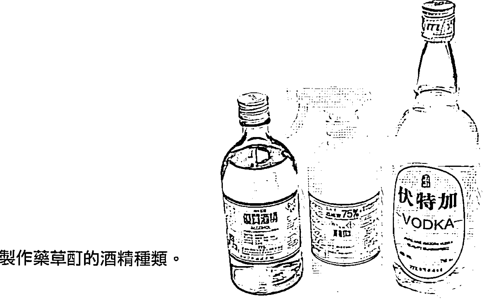

###### 蒸馏水及量测工具（选择性）

如果买不到完全符合需求的酒精度，可购买95%药用酒精，再添加蒸馏水稀释为任何浓度。

选择蒸馏水是因为这是最纯粹的水，完全不含生菌和矿物质，最能延长保存期限，且可避免后续材料混合后产生不可预期的交互作用。蒸馏水在药局皆可购得，价格不贵，与矿泉水相仿。

在不方便购买蒸馏水的情况下，可以用煮沸过的RO逆渗透水替代，如泰山纯水就是此类。至于进口的天然涌出矿泉水，具有能量频率最高的优势，却多少含有生菌及矿物质，如果不介意略微缩短保存期限或产生悬浮物，可以使用。再差一点的选择就是开水，唯请绝对不要使用自来水。

量测工具只是为了量测欲添加的蒸馏水量，可以简单使用量杯、量筒、量匙、药水刻度杯甚至奶瓶。使用前请先消毒。

###### 有盖玻璃罐一个

酊剂因为含有酒精，若用塑胶或金属做为容器，会溶出有害物质或产生交互作用，因此只能使用玻璃或瓷器。玻璃是透明的，容易观察内部情况，所以是为首选，价格也便宜。台湾很流行自行腌渍、做醋、做酒、做酵素，杂货店或卖场皆有售药酒罐、密封罐、酱菜罐之类的容器可以运用。容器宜选适当大小，如果太大，留过多空气在罐中，会增加氧化。盖子无论是用旋的或用塞的，只要能密封都好。酒精很容易挥发，你不会希望眼见酊剂越放越少的。

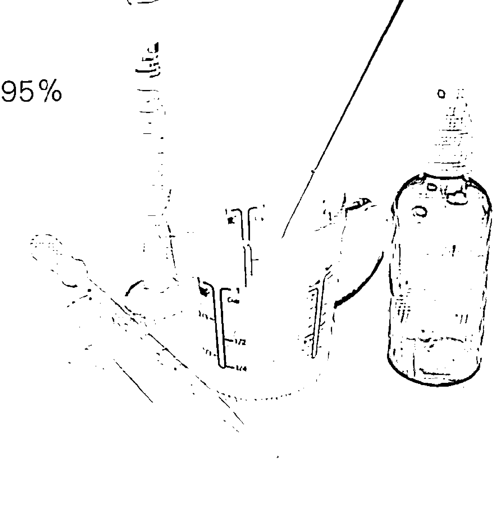

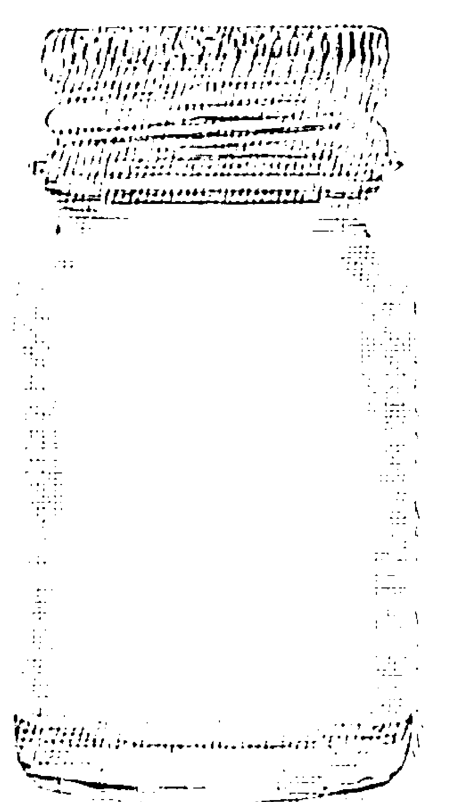

我在制作商业喷雾时，为了考虑到能量不要交互干扰，一个罐子只固定用来制作同一种药草的酊剂，绝不混用。然而这个要求对于居家DIY恐怕不切实际。居家DIY可以节约、方便、环保的方式达成，要回收吃过的果酱罐来使用并无不可。倘若在意能量干扰，可以在换做别种药草之前煮沸二十分钟即可避免——请只煮玻璃瓶，不是塑胶盖——要更讲究的话，水中加少许海盐，可协助能量还原。或者，曝晒阳光六小时，同样能协助能量还原。如果煮沸日晒两者并行，只需煮5分钟加日晒3小时，即已能消除九成以上的残余能量。

> > “玻璃罐如果是全新的，是否也需要消毒呢？”你也许会问。当然，如果可能的话，先清洗消毒是最好，煮沸或蒸汽二十分钟，或以用75％消毒酒精擦拭皆可。如果刚好要用消毒效力最好的70～80％酒精来做酊剂，那么不消毒也没关系。

###### 过滤布一条

酊剂浸泡完成之后，需滤除药草，而且还要像拧毛巾一样把药草里残余的酊剂挤出来。尤其干燥药草特别会吸水，不好好挤一挤，成品会少得令人欲哭无泪。

超市贩售的豆浆过滤袋、粿袋、卤包袋、药材袋、茶包袋都适用，棉布材质最佳，PET不织布材质较不理想，不过还是可以用。买之前记得看一下尺寸，买刚好够用的尺寸就好。过大的过滤袋会吸掉太多珍贵的酊剂，徒然增加耗损。此外，婴儿纱巾、纯棉手帕、纯棉束口袋也可以，有机棉更赞。最好使用全新品，二手品建议先清洗再使用。

这些过滤布买了之后可以直接使用。讲究一点请先用热水冲过，阴干之后再使用。再讲究一点，请一种酊剂配一个专用过滤袋，此过滤袋不做任何其他用途。我在制作瓶装阳光灵性喷雾时，是以这样的标准执行。不过，居家DIY可依个人情况决定严谨度。

###### 碎药草的工具（选择性）

如果药草买来时不是粉状或碎屑状，就需要人工碎成小块，增加接触面积，有助于成分溶出。使用的工具可以是剪刀、菜刀、磨豆机或高速果汁机。若是酒精度不在70～80%范围内时，我会事先将这些器械用75％酒精消毒。

虽然我偶而觉得，药草本身的菌恐怕不会比工具上的菌少，到底消不消毒工具有差吗？不过这是因为我是做来贩售，必须以最高规格对待。个人DIY的话，倒不一定得做到如此滴水不漏，读者可自行斟酌决定。

###### 咖啡滤纸（选择性）

有时药草虽然以过滤袋滤除过一次，还是会残留少许细粉沉淀物。虽不影响品质，看起来却有点碍眼，要送人的话更容易被误以为变质。此时可以用咖啡滤纸滤除。尽量买未漂白的，有机更佳。

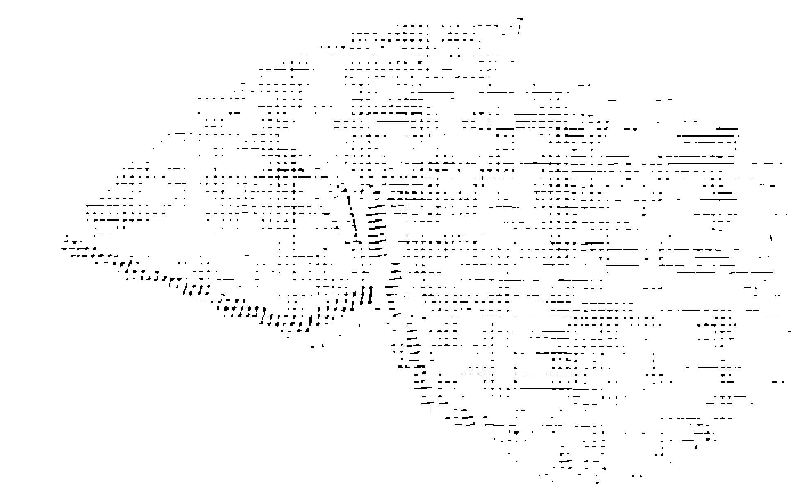

###### 塑胶手套一双（选择性）

塑胶手套用途有二，第一是在执行需要接触药草的工作时，如果不希望个人能量沾附到药草上的话，手套可以稍微阻绝（但不一定能完全阻绝）。第二是挤压过滤袋的时候，要是酒精度超过80％，或本身属于敏感肌肤，可防止肌肤受刺激。需注意手套材质不能易溶于酒精，乳胶不适合，超市贩售的手扒鸡手套可以。

###### 秤子（选择性）

秤子的用途单纯是为了量药草的重量，形式不拘，料理秤、弹簧秤、电子秤全都行。如果希望求取精确比例，以便未来复制出相同的成品，那么就需要秤一下。要是不在乎精确度，用目测法就可以了，就不需要秤子。

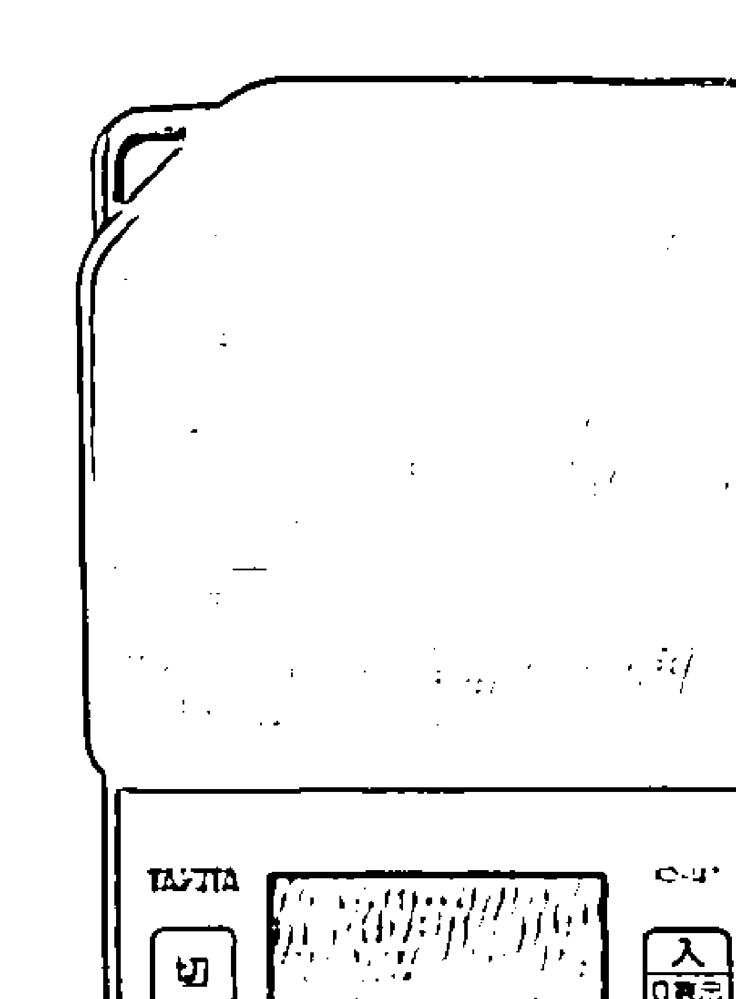

## 决定酒精浓度

### 步骤1 决定酒精度

首先依据药草的特性，来决定合适的酒精度数。

### 步骤2 调配酒精度数

如果你决定用95%药用酒精加水稀释到希望的酒精度，可简单参照下表调配。若已经购得刚好符合需求酒精度的酒，请省略此步骤。

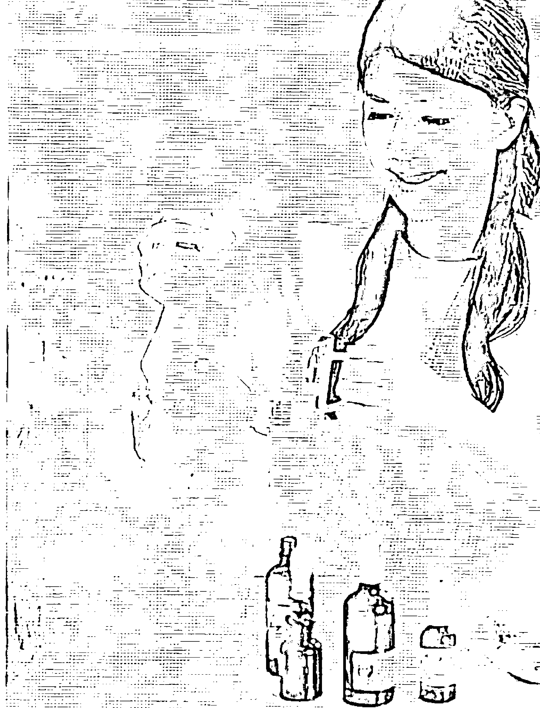

| 需求酒精度 | 药用酒精量 (ml) | 水量 (ml) |
|------------|-----------------|-----------|
| 90%        | 474             | 26        |
| 85%        | 447             | 53        |
| 80%        | 421             | 79        |
| 75%        | 395             | 105       |
| 70%        | 368             | 132       |
| 65%        | 342             | 158       |
| 60%        | 316             | 184       |
| 55%        | 289             | 211       |
| 50%        | 263             | 237       |
| 45%        | 237             | 263       |
| 40%        | 211             | 289       |

计算方式很简单，将需求量乘以需求酒精度，再除以95%，即得到需要的95%药用酒精量。例如假设想要用95%药用酒精调出100ml的80%酒精，算法如下：

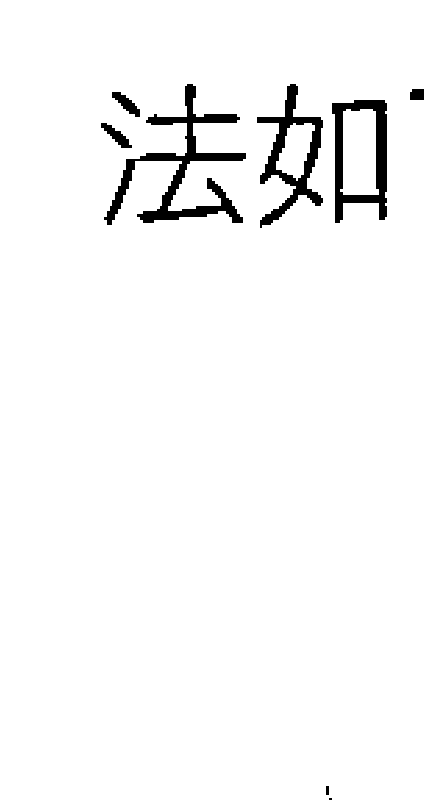

```
100ml × 80% ÷ 95% = 84ml
得需要84ml的药用酒精及16ml（100ml－84ml）的蒸馏水。
```

再练习一题，如果想要用95%酒精调出300ml的60%酒精呢？算法如下：

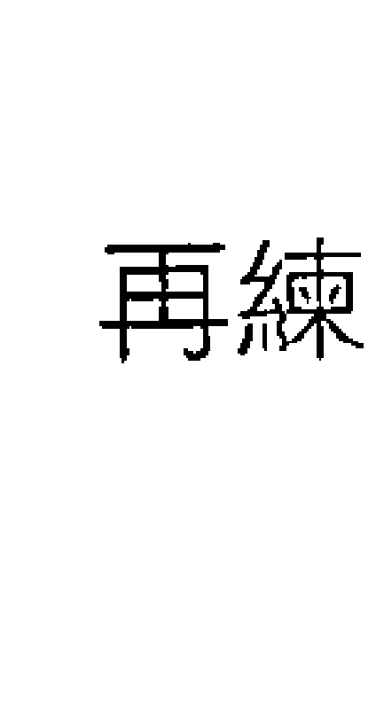

```
300 ml × 60% ÷ 95% = 189ml
得需要189ml的药用酒精及111ml（300ml－189ml）的蒸馏水。
```

如果您觉得这个算式还是过于复杂，有一种偷吃步速算法，就是把95%药用酒精视为100%纯酒精来计算。例如，如果要调出80%酒精100ml，就需要药用酒精80ml及蒸馏水20ml。此速算法虽然结果会产生细微差异，不过在酊剂制作中，这样的差异甚微，可以忽视。

其实，不只是95%酒精可以向下稀释，任何浓度的酒精都可以稀释成较低浓度的酒精，例如想把60%酒精调成40%酒精200ml，算法如下：

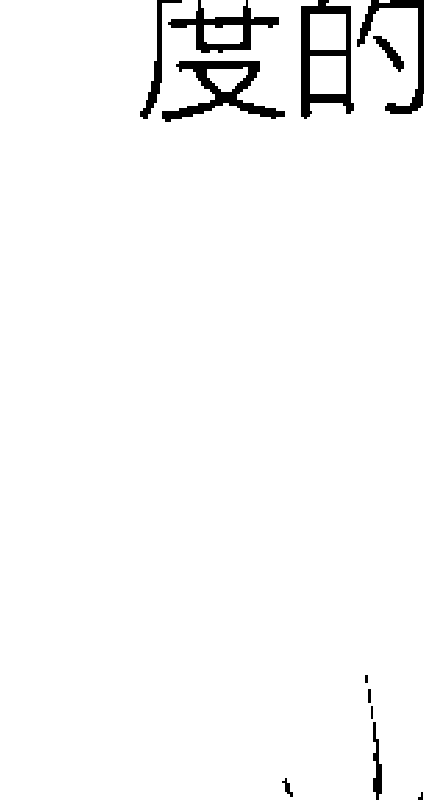

```
200ml × 40% ÷ 60% = 133ml
得需要133ml的60%酒精及67ml（200ml－133ml）的蒸馏水。
```

现在，你应该可以行遍江湖做酊剂了。

### 步骤3 量测药草与酒精量

药草与酒精的比例其实没有一定。西洋酊剂制作最普遍的大原则是新鲜药草与酒精1：2，干燥药草1：5。药草以重量计，酒精以体积计。例如，100g的新鲜药草，配酒精200ml；100g的干燥药草，配酒精500ml。

但是，这个通则依药草种类不同，可容许极大的落差。如果总是照着这个比例，制作蓬松质轻的药草时，你会发现这一大把药草根本塞不进玻璃瓶中；制作紧密沉重的树皮根部类时，又会感觉好像放太少。

实务上，新鲜药草比例从1：1到1：2都很常见，干燥药草大多落在1：4到1：6之间，但是1：2到1：10都属可能范围。越是纤细娇弱的花叶类，重量轻，不必秤很重就足够塞满玻璃罐，此时比例就会在1：2或1：3左右；越是密度高的植物，如树皮和根部，比例就会拉远。

以西洋制作内服酊剂的经验，据说超过1：7效果就显得微弱，仅有在做少数药力特别强的药草时，才会拉到1：10。相对来说，外喷的比例较自由，只要香气与能量达到满意的强度即可。在罐子容量内放多一点药草，香味浓度和效力会较高，但是若有预算限制，不在乎效果与气味稍弱时，拉到1：10也没有什么不可以。

居家DIY时，为了方便，又或者你没有秤子，可采用目测法。连秤重都不必了，将药草碎成适当大小后，新鲜药草放入半罐到整罐，干燥药草可以放半罐到四分之三罐，干燥根部甚至放三分之一罐就够。因为干燥药草浸泡酒精之后有可能会膨胀，尤其是根部尤然，所以需预留空间。

若您的反应看到这里的反应是：“太好了，做酊剂看起来好难，目测就是我的菜！”您可以直接跳到下一节阅读〈懒人制作法〉。

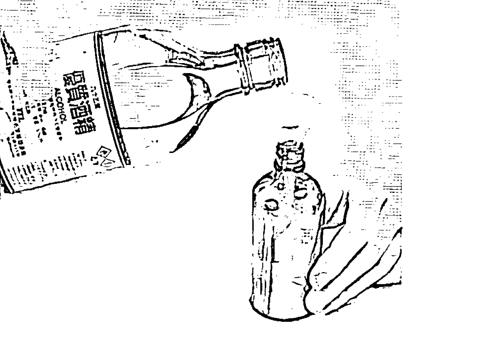## 步骤4 碎药草

若购买时已是粉状或碎屑状，请略过此步骤。

碎药草时若能戴上手套是最为理想，以避免制作者的能量沾附到药草。如果不介意这一点能量差异，或成品是完全自用，那么徒手制作也可以。

药草要碎成多小块才够？这完全是自由判断，主要看你愿意付出多少时间。碎成越小块，制作期可以缩越短，有效成分溶出率越高，浓度也可以越高（因为罐子塞得进更大量的药草）。但是若不介意这些，可略过这个步骤，把药草整株放进玻璃罐。

## 步骤5 装罐

先将药草放入玻璃罐，再倒入酒精至刚好盖过药草即可，因为此时某些药草可能会浮起来，或者吃空气，中途可停下来先用汤匙、筷子之类的工具搅拌，确认药草完全浸透，再继续倒满酒精。粉状药草尤其容易结块，需特别仔细搅拌。

严格来说，汤匙、筷子也是一种能量上的变数。若你像我一样希望做出来的酊剂尽可能纯净，可预留一两条该种植物的茎或枝来当筷子（如果有的话），如此能阻绝能量沾染的问题。

另需注意，最终的酒精添加量距离顶部仍要留个两公分左右的空隙，因为接下来我们会需要摇晃罐子，留有一点空气较能帮助晃动。再者，大部分密封罐的盖子是塑胶材质，虽然通常是耐酒精，不过长期这样接触高浓度酒精，多少仍会溶出，我们当然希望尽可能把塑胶溶出的可能性降到最低。

## 步骤6 标示

装罐后可别开心到忘了标示。请在罐子在上面标示植物名称与装罐日期，药草酒精比例如知道的话请一并标示上去。

## 步骤7 静置

酊剂装罐完成后，需彻底密封，存放于阴凉处静置。书柜是不错的选择。

静置的头两周内，需每天摇晃酊剂一次，协助成分析出。一天晃两次更佳，至少也要两天晃一次。

摇晃的频率并非铁律，这牵涉到植物的特性。越是纠结緻密，越需要晃动，然而我也曾做过细长条状的秘鲁圣木酊剂，每条圣木之间原就有充足空隙，晃动时我肉眼完全看不出来究竟有什么帮助。相对来说，花叶类就较需要晃动，晃动时可以明显看见有更多深色成分溶解出来。

倘若过程中发现药草吸走太多酒精，致使酒精水位变低，药草顶部暴露到空气中，有可能导致细菌滋生与霉变，此时建议重新添酒到刚好盖过药草的高度。

满两周过后，就不需要天天摇晃了，不过还是需继续静置一阵子。

总静置期需要多长？我遍查英文资料，答案分歧甚大。这跟药草品种、碎度与酒精度都有关。一个最常被提到的大通则就是六周，不过，短则四周，多则三个月，都在常被提及的可接受范围内。一般来说，四周对大部分药草已经足够，六周已很保险，通常不需放置超过三个月，六个月以上更是罕有必要。以前有种观念是药酒越陈越香，然而现代已有报道指出放置过久反而会增加霉变风险。

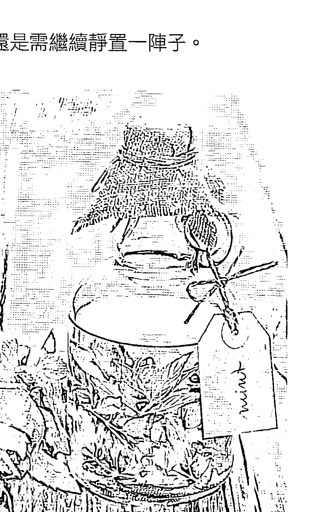

## 步骤8 初次过滤

过滤时，如果有准备塑胶手套，请先戴上。如果不在乎酊剂能量纯净度，且自认肤质强健的话，则可徒手操作，唯执行前请先以肥皂洗净双手。你可能需要先准备一个开口够大的玻璃或瓷容器来暂时盛装挤出的酊剂。可从家里的锅碗瓢盆来寻找，咖啡滤泡壶也很适合，请把酊剂挤压到里头。因为酊剂只会在容器里停留片刻，就不强求要为了过滤去特别买一个专用的新器具。

要有心理准备，这个步骤可能把厨房弄得脏兮兮。有些酊剂沾上衣服、家具会难以洗去，宜铺报纸、穿围裙，做好防护。如果不幸沾上家具，可用酒精清除，不过要留意有些家具接触到酒精可能褪色，不确定的话，可在不显眼处测试。

在添购材料、慢切细磨、静置多时、殷殷盼望这么久之后，收成的酊剂显得格外珍贵。到了这个阶段，每个人都不希望浪费一滴，尽量用力挤吧！要是家有壮丁，此时就能派他出马。没有的话，柠檬压榨器或马铃薯挤压器也能帮上大忙，只要记得使用前先消毒就好。

## 步骤9 第二道过滤（可省略）

过滤完一次，如果觉得不够干净，可以紧接着用咖啡滤纸进行第二道过滤。由于咖啡滤纸过滤十分耗时，尤其在大桶制作时，可能要花上个把钟头，因此若是肉眼观察认为残留物不明显，可以省略这个步骤。等静置一段时日后，假使沉淀物有积聚到外观难看或阻塞喷头的程度，到时才过滤也不迟。

## 步骤10 保存

过滤完成的酊剂，可倒回原本的玻璃罐长期保存（需先清洗消毒过），或依个人需求进行分装。阅读至此你应该已经能推论出来，最严谨的做法是所有会接触到酊剂的器具都先消毒，双手也需做好能量隔离或清洁，否则容易造成保存期限缩短及成品能量不纯净。这条原则在之后的花精、宝石酊及灵性喷雾制作都一体适用。

#### 动手做做看

##### 白鼠尾草酊剂净化喷雾

来自美国加州的白鼠尾草是印地安人在神圣仪式用来净化能量的神圣药草，因其强大的净化与保护效果闻名于世。想到要净化能量、驱邪除煞，中国人先想到艾草，美国人会想到白鼠尾草。在西洋净化药草中，白鼠尾草稳居畅销第一。

白鼠尾草通常绑成杖状，点火烟熏，烟熏到的地方，就能得到净化。可惜此法会生出强烈气味与烟雾，其气味可谓“吾之蜜糖，彼之砒霜”，故使用的场合颇有限制。那么，何不将它做成酊剂呢？酊剂的气味较温和，片刻便即消散，较不影响旁人。

###### 材料

- 白鼠尾草50g
- 酒精量：约250ml～500ml
- 建议酒精度：50%
- 建议药草酒精比例：1：5～1：10
- 静置期：约4～6周

#### 作法

白鼠尾草剪成小碎块，放入玻璃罐中。倒入酒精至刚好盖过白鼠尾草，稍微摇晃搅拌使所有白鼠尾草都浸湿后，再将剩余酒精尽数倒入，依正常酊剂制作方式进行后续步骤。西洋的商业白鼠尾草酊剂药草酒精比通常是1：5，不过因为白鼠尾草十分蓬松，需要剪很碎才有可能制作出1：5比例。如果懒得剪太碎，可以制作1：10比例，相当于50g白鼠尾草配500ml酒。

###### 说明

喷雾除了能净化个人、空间或物品的能量之外，其气息还能激发力量和勇气，稳定心绪，开启脐轮、喉轮和第三眼，使人更有勇气走向未知。当想得太多、思绪浮乱时，白鼠尾草能加以稳定，专注心智。

###### 购买指南

白鼠尾草的拉丁学名为Salvia apiana，跟一般花草茶的鼠尾草品种不同，购买前请认明。白鼠尾草的灵性净化效力更强，通常会出现在灵性商店中，上网以“白鼠尾草杖”关键字搜寻，不难购得。

白鼠尾草原纯为野生，由印地安人、背包客、家庭农工进入旷野采集来供应市场所需。近年来由于美国西部干旱，买气却始终强劲，导致濒危，因此现在越来越多人采取永续栽植的有机农法来栽种。买之前可以确认一下是野生还是有机。虽然野生能量高，然而曾有一位灵性老师告诉过我，即使是野生植物，在被人类滥砍滥伐后，能量也有可能低落，因此，为了环保着想，我也鼓励购买有机。

## # 小懒人制作法

上篇酊剂专业制作法是以精细严谨到锱铢必较的态度撰写而成，难免显得复杂。其实酊剂DIY可以超简单，看过以下四句话，就能做得有模有样了。

-   1. 新鲜药草放进玻璃罐至全满，或干燥药草放四分之三满。
-   2. 倒入酒精至满。新鲜药草用60%酒精度的酒，干燥药草用40%酒精度。
-   3. 玻璃罐密封后放到阴凉处不要管它。
-   4. 四周后拿出来过滤。

真的这么简单。连摇晃都省了，那些繁复计算与专业探讨都丢到一边去吧。

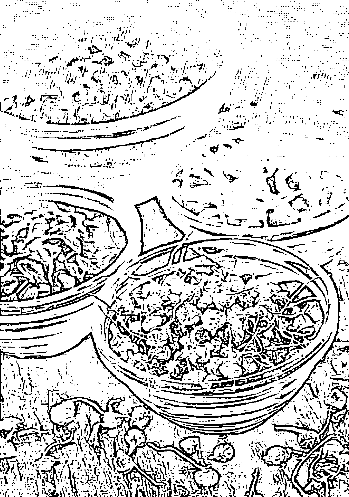

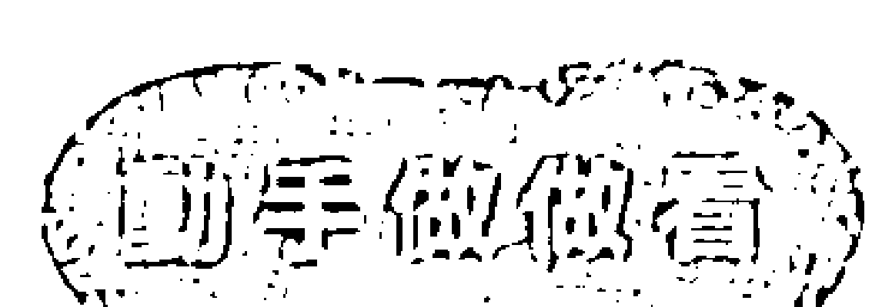

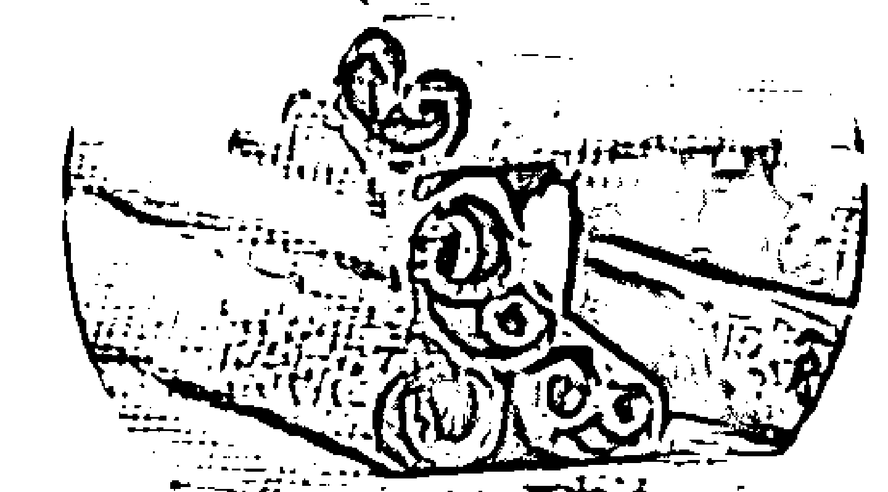

## # 肉桂酊剂防护喷雾

肉桂是世上历史最悠久的香料和药材，在东西方都耳熟能详。埃及人少了它，就少了做木乃伊的核心材料。中国人少了它，滷味马上少了一种滋味。西洋人少了它，苹果派就不是苹果派了。肉桂属温暖微甜的辛香，是圣诞节经典香氛，虽然各人对它的反应颇为极端，像我跟我先生，我是猛洒肉桂粉一边大呼幸福，我先生就是皱眉奔逃与它老死不相往来。

为什么我会对肉桂如此痴狂？也许因为体质虚寒。肉桂是热性药草，薰点起来像冬日的壁炉，对应占星学的太阳与火元素，能激励鼓舞、温暖活化、专注集中、勇气百倍，对事业运颇有助益。根据印度脉轮理论，肉桂可开启海底轮、脐轮和太阳神经丛。海底轮可激发活力、稳定和安全感，使人活在当下。脐轮是创造力的中心。太阳神经丛是个人意志的中心，开启后能坚定意志，达到目标。这些都有助事业成功。

爱情方面，肉桂可以打开心轮。心轮是爱的能量中心点，位于两乳之间。一旦打开，便能容许爱的接收和给予，因此肉桂有助于召唤爱情，同时找回爱自己的能力，消除悲伤，重拾快乐。男性使用肉桂，有助于增强性欲。

财运也属肉桂的服务范围，因为金钱跟爱情一样，广义来说都是一种能量形式。打开心轮，容许能量流动，就有利于金钱源源不绝而来。加上肉桂本身的火能量，能具体做出行动来追求成功。灵性层面上，肉桂属于“天使香气”，可召唤天使、提昇振频、增强灵视及保护气场。

###### 材料
- 肉桂棒或肉桂片适量
- 建议酒精度：60～75%
- 建议药草酒精比例：1：5
- 建议静置期：3～6周

#### 作法
肉桂碎成小块后，放入玻璃罐，倒入建议酒量，密封静置阴凉处三至六周，再取出滤渣即成。成品会是深褐色。

###### 说明
肉桂品种有分锡兰肉桂和中国肉桂，中国肉桂更阳刚，刺激性更强，犹如关公的大刀，劈邪留正，威镇八方。无论何种肉桂，孕妇及孩童都应咨询专业芳疗师方可使用。一般成人也宜循序渐进使用。

###### 购买指南
肉桂在合作社、食品行、中药行、咖啡行都能购得。价差不小，购买前可多加比较。

##### 快速制作法

相信吗？酊剂可以在三分钟内制成，不一定需要等六周。快速作法如下：

> 药草必须是干燥粉状，至少也要是碎屑状。如果买来时不是粉或碎屑，你可能需要用电动磨豆机或高速果汁机将它打碎。

> 药草粉和酒精液体混合之后，立即用力摇晃三分钟不停。

> 三分钟后，如果有时间，可继续静置数小时。如果没时间，可直接进行过滤。

快速制作法是急用的救星。粉状确保最高溶出效率，摇晃三分钟能已能溶出不少有效成分，静置数小时更好。这样做出的酊剂，喷起来香味浓度已能令人满意。

你也也许怀疑这样快速制作的品质是不是会打折？的确，求速度多少会以牺牲萃取率和能量强度为代价，这是不得不然的结果。酊剂制作，可以快马加鞭，也能慢工细活。我个人在制作商业喷雾时一律采用缓慢工法，不过，如果真的不想等，那么这个从权的办法也能发挥相当的威力。

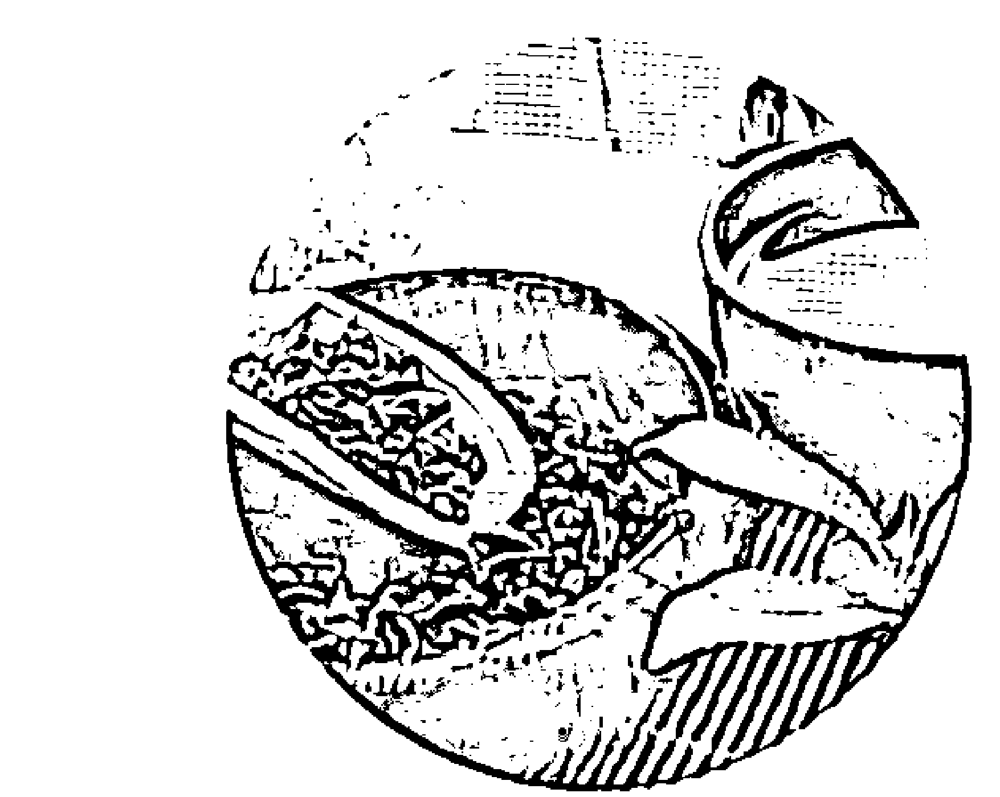

##### 绿茶清新喷雾

绿茶是深具东方味的茶饮，丰富的抗氧化物含量，是抗老与抗癌圣品，还能保健口腔健康。无奈绿茶属性较凉，含咖啡因，我从前曾有一天喝两保温杯绿茶的习惯，等到心悸手抖才发觉自己的体质并不适合。

绿茶的好处似乎都被饮用摄取光了，心灵作用在东方鲜少被提及，西洋魔法界倒是认为茶有温和的净化力和保护力。焚烧绿茶叶，可以提振勇气，带来好运。

绿茶虽然不像其他神圣药草一般有鲜明的作用方向，却是能量的润滑剂与稳定剂。任何喷雾只要以绿茶酊剂为基底，都能使能量更加稳定发挥。特别推荐在舒缓型的喷雾中添加，因为绿茶的香气就有温润缓和效果，想像你躺在碧绿色的茶园当中，一股微风送来茶香，没错，就是这个感觉。鲜绿的香气，男女通吃。夏日中喷洒，可不是一大乐事？

###### 材料
- 绿茶粉或绿茶细末适量
- 建议酒精度：40%
- 建议药草酒精比例：1：7（1：5～1：10皆可，亦即绿茶100g，酒精500～1000ml）

#### 作法
将绿茶粉放入玻璃罐，倒入建议酒量，立即封盖，用力摇晃三分钟不停，如果能再静置一小时更佳，而后倒出滤渣即成。

###### 说明
绿茶喷雾的气味并不浓郁，是酊剂界的小清新。药草酒精比拉到1：10会是淡雅芳香，如果希望浓郁一点，建议调1：5。

##### 艾草净化喷雾

艾草是无论东西方都广为运用的神圣药草。在东方称艾草，西方药草市场则常见学名 Artemisia Douglasiana的品种，通常译为“艾蒿”或“黑鼠尾草”，因为深色外观之故。

艾草除了最为人所知的净化驱邪功效之外，还是格外阴性温柔的女性药草，与月亮和金星连结，能协助冥想，有引梦之效，因此适合在睡前使用。相传只要将艾草放在枕头下，就有机会引发预知梦、使梦境清晰、协助记忆梦境，还能预防梦见亡灵。

在占卜时焚烧艾草，能促进直觉讯息流入，增加准确度。这个配方做出来的艾草喷雾是茶褐色，喷洒出来的气味比焚烧淡雅，片刻后就散去，无需担心气味缭绕不散。

###### 材料
- 艾草粉适量
- 建议酒精度：50~75%
- 建议药草酒精比为1：5，或目测艾草粉装到五分之四罐满

#### 作法
将艾草粉倒入玻璃罐，加入酒精并搅拌，直到艾草粉浸透，密封用力摇晃（或持续搅拌）至少三分钟，其后依个人喜好决定立即过滤或继续静置数小时，再依正常程序进行。

###### 说明
由于艾草粉非常会吸水，过滤挤压的程序不能偷懒。正常女性双手挤压的成果大约剩原本酒精量的三分之二，因此在制作前要把耗损量估算进去。艾草酊剂正常酒精度是50%，因为是快速制作，因此可以拉高到60%至75%。

大部分艾草粉买来不会是细粉状，更有可能是绒状，特别轻且蓬松，少量制作时，若没有一台精密微量秤，难以测得准确的药草酒精比例，因此可以采用目测法。我实测艾草粉装五分之四罐刚好是1：5的比例。需注意，某些艾草含有毒性成分侧柏酮，怀孕妇女不宜使用，一般人也应节制用量。

###### 购买指南
艾草在中药铺、药草行、手工皂材料行及网络皆有售，也可用艾草条，剪开之后里头就是艾绒。西洋艾蒿则较难购得，可用“黑鼠尾草杖”关键字上网搜寻，买来时通常是绑成杖状，可自行拆散使用。

## # 酊剂喷雾vs.烟熏净化

在研发瓶装阳光灵性喷雾的过程中，我不断思考，酊剂跟传统烟熏净化法相比，效用有何差异？究竟酊剂能取代烟熏净化到什么程度？

我的理解是，焚烧除了能释放出药草本身的力量之外，还有火元素的力量来加乘，效用强大是必然。更讲究的朋友，还会搭配鲍鱼壳和羽毛。如此一来，药草属地，鲍鱼壳属水，羽毛属风，再加上焚烧的火，四要素齐备，这不折不扣就成为一个完整的净化仪式。至于酊剂呢？诚然，喷雾的方便性是胜过烟熏净化，还能避免被旁人抗议的风险，随身携带好方便。至于效果，我却不认为大部分人能制作出超越烟熏净化强度的酊剂，其中最重要的原因就是心念，更精确来说，是制作者的意图。

烟熏净化仪式在开始之前就已经设下一个“我要彻底获得净化”的明确心愿，在这个瞬间，净化就已经启动。其后备齐工具，全神贯注将全身上下与房间四处细细薰过，沉浸在火的温度、药草气味与烟雾缭绕中，这些都加强了仪式经验。结束之后，开窗散去烟雾，视野立刻清晰，你会觉得经验一场大洗礼，之后也许气味还会萦绕个几天呢！

酊剂制作时，却少有人会抱持如此虔敬的心态。起码在阅读这本书之前，你可能并不知道，然后就会把做酊剂当成做酱菜，边切药草，边跟家人聊八卦。摇晃时，随随便便晃一晃，心里还嘀咕着好麻烦，要是边摇边跟男朋友吵架，铁定更糟。正是因为如此，我在本篇开头就提过，酊剂的能量表现落差甚大，除了用料制程各个环节的因素之外，制作者的意图至关重要。这一点，将在第二章〈制作者的意图〉中进一步说明。

现在你现在知道其中的關鍵了，这表示，从现在起你也能够做出专业级的酊剂了！

#### 花精

花精的原型其实就是晨间花朵上的露珠。早在西元十六世纪，就有欧洲炼金术士运用露珠的记载，中国清朝《本草备要》亦有提及露珠治病，不过当时因为露珠采集不易，未能充分普及。直到1930年代英国的Edward Bach医师创发了量产的方法，并发掘出三十八支对情绪特别有益的花精，这套疗愈系统才正式推展开来。

Bach医师的心肠极其仁慈。当他发展出三十八支情绪花精之后，完全没有想要拿去注册商标或申请专利。相反的，他将花精制程完整公开于世，希望所有需要的人都能亲手制作。后人遂依据Bach医师提供的制程，在全球各地加以扩展，至今市面上可购得的花精种类已不下数百种，效用从情绪平衡延伸到转化信念，乃至疏通脉轮、经络、气场等能量系统。

为了区隔Bach医师的三十八支花精与后人发现的新花精，Bach医师的花精遂被称为“Bach Flower Remedies”。在华文世界则因为厂商各自注册商标之故，名称繁多，包括贝曲花精、巴赫花精、Bach花精、巴哈花精及巴曲花精，其实皆指“Bach Flower Remedies”。下文中为求一致，我将用中国及香港最通用的译名“贝曲花精”来称呼这三十八支花精。

截至目前为止，台湾民众听到花精仍常以为它就是香香的精油，其实花精与精油就好比沙滩与大海，乍看相近，实有明显区别。如果说精油是植物的化学分子，花精就是无形能量。如果说精油是由身体层面切入作用，花精主要从精神层次进行运作。精油具有药性，花精极其温和，即使用错也无害。

花精不能处理生理问题，不过可以处理导致疾病的情绪因素，与罹疾所造成的情绪问题。身心原本就是交互影响，情绪不好，身体迟早会生病，生病之后情绪更加低落。所以，情绪若能获得改善，身体必然能获得某种层面上的帮助。因此，在灵性喷雾中加入花精，可以获得的好处多不胜数。

花精是所有材料中能量频率最高者，唯一缺点是没有香味，这恰好是它的优点。想要香味，添加精油、纯露或酊剂就可以达成目的，然而对希望不要有香味的人而言，花精的这个特性无可取代，顶多只有宝石酊可以匹敌。

花精的取得方式有两种：购买市售花精，或自制花精母酊液。这两者大相径庭。**市售花精便利，但是稀释至喷雾后能量有效期仅止于一至三周。唯有自制花精母酊液，才能保证能效维持数年。**

为什么会这样呢？在解释这个问题之前，我们不得不探讨到花精的“能量递减”效应。

## # 花精稀释的能量递减效应

根据Bach医师的著作记载，花精制作流程是先制作“母酊液”，再取出2滴母酊液稀释到30ml白兰地中成为“储存瓶”（即市售花精），消费者使用时可再取出2滴市售花精稀释到30ml的水中成为“调配瓶”，一天四次、一次四滴于舌下服用，如此只需两滴市售花精就可以使用三周，非常节俭。

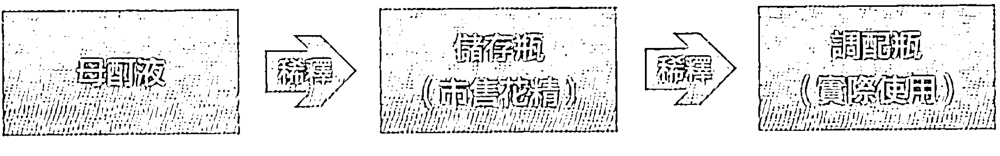

根据Bach医师的说法，“调配瓶”的效果跟“储存瓶”相同，不会因稀释而减弱。从1930年代以来，大家都是这样认为，也都是这样使用的。

然而，时序推到2007年，已有临床证据显示，储存瓶花精一旦稀释过后，效果将逐日递减。调配瓶约当第四天效果就减半，第八天就失效得差不多了。这个发现发表于李泓斌医师著作《图说巴哈花精》，随后立即有知名花精老师出面响应。

这个说法并非全球首见。不少欧美的灵性花精厂商早已告知顾客，高频花精稀释到水中，能量就会减弱，有时甚至是一稀释就立即减少45%的能量，因此为求最佳效果，应直接滴用，不可稀释。

我必须说，要公然说出花精稀释后会能量递减，是需要勇气的。这项发现颠覆了Bach医师被奉为圣经的指示，违背了官方说法，破坏了大众长年以来的认知。尤其我身为花精经销商的角色，要这样宣称，很有可能被指是希望增加花精用量、刺激销售，才这么说。更糟的是，恐被同业指为只有我经销的花精会递减，他们的不会。

然而，如果这是我们认知到的事实，就不能不让大众知道。

为了探求真相，我曾带一批花精去拍摄影动态气场摄录仪，仪器确实显示出稀释越久，效力越衰减。图中稀释六天的花精作用已与原始气场相差不远，作用偏弱，原液则明显可以将气场从橘黄光转变为蓝光。

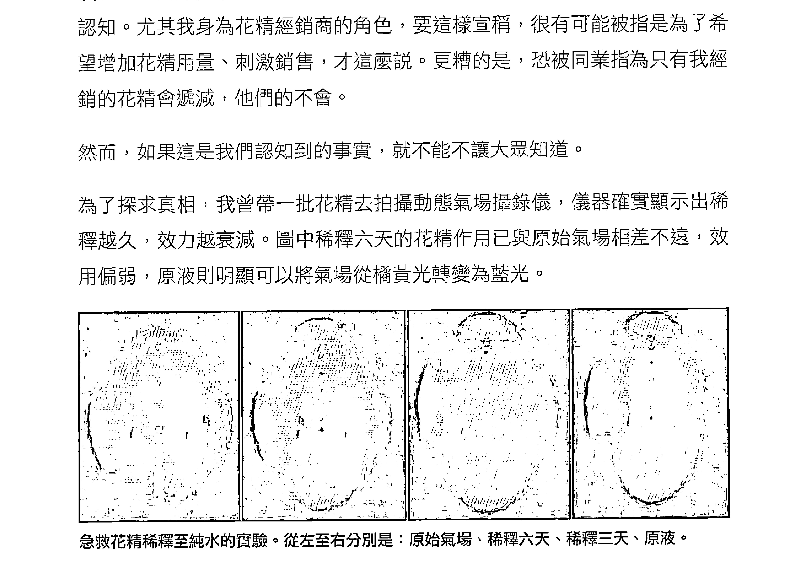我們使用不同品牌的花精做相同的測試，均獲得同樣的結論。

為了因應能量遞減，同時照顧顧客的荷包，起初我們以為如果調配瓶改以全酒調配，不摻一滴水，能量就不會遞減，所以我曾有一陣子建議客人這麼做。萬沒料到，我自己使用全酒調配瓶一陣子，還是明顯感覺效果變弱，令我非常疑惑。

我原本也以為，既然靈性噴霧是以酒精為基底，花精能量同樣只需買市售花精來注入，就能維持恆定。卻在研發的過程中赫然發現不是如此。

於是，我們也用氣場儀做了花精稀釋至酒中的測試，獲得以下的結果。

從左至右分別是：急救花精稀釋至水中三天、稀釋至40%酒中三天、原液。

氣場儀顯示稀釋至酒比稀釋到水更接近原液的表現，不過與原液仍有落差。在判讀數據中，原液明顯將測試者的脈輪能量帶得更高、氣場範圍更大，這告訴我們，稀釋到40%酒裡仍然會能量衰減。仔細思考，這似乎不是什麼不合理之事，40%酒精度表示有60%是水呀！

這使得靈性噴霧添加花精這碼子事，變成魚與熊掌不可兼得。要市售花精的方便，就得忍受超短的能量有效期。如果希望能量持久經年，就得想辦法製作母酊液了。

這兩種方法，本書中都會涵蓋，至於這中間的取捨，就留您自行決定了。

## 市售花精購買指南

若你決定使用最便利的市售花精來製作靈性噴霧，並了解如此將以能量有效期縮減作為代價，咱們就來了解如何選購花精吧。

## 購買貝曲花精

在購買貝曲花精時，我們自然希望買到依照Bach醫師古法製作而成的。需留意的是，儘管有不少廠商皆宣稱是依照Bach醫師古法製作，不同廠商做出來的仍不盡相同。如果有心了解花精選購的「眉角」，在購買時可注意以下幾個指標。

- 白蘭地酒精度

花精能量以酒精作為保存劑，酒精度越高，保存力越好。根據英國花精製造商協會的準則，認為酒精度要40%以上才能有效防止細菌滋長，因此貝曲花精的業界最高標準就是40%酒精度的有機白蘭地，保存長達十年。也有廠商使用27%葡萄酒，優點是入口比較不辣，保存年限通常標示五年。

- 製作地點

母酊液一定要在純淨的鄉野間製作，越是鳥不生蛋的地方越讚。因為花精是地水火風四要素齊備的療法，地是植物，水是泉水，火是太陽或爐火，風是空氣。空氣如果受到污染，風要素就無法齊備，花精品質多少會打折。

- 英國花精製商協會（BAFEP）認證

英國花精製商協會將花精視為食品，製程與標示皆有嚴格規範，選擇取得認證的廠商，衛生品質加一重保障。

### 花朵來源

野生最好，有機自栽可以接受。除此之外的花朵來源，包括傳統農場、花市、盆栽、花店等，專業花精製造商不會採用。

### 手工或機械生產

母酊液製作無法由機械代勞，一定是手工製作，不過，後續的裝瓶就可以由機械代勞了。通常小規模花精製造商會採取手工裝瓶，大規模量產的廠商，尤其是藥廠，較可能採用機械。你會想要花精是愛心手作，還是大批機械裝瓶呢？這或許屬於個人選擇，請依你的心之所向吧。

### 產地

貝曲花精發源於英國，考慮到植物在不同地域的變異性，英國應最接近Bach醫師選用植物的原始樣貌。以貝曲花精而言，我個人會優先考慮購買英國產。不過，植物是活的，繁衍到其他地域往往發展出新的獨特生命力。我認為花精產地沒有所謂好與壞，只要是純淨的地域孕育出的野生高頻率花朵，只要是抱著愛心做花精，全都可以帶來獨特的療癒力。

### 定價

花精製作不像精油，需要採收大量植物及投資昂貴器械。花精只需少量花朵和幾個鍋碗瓢盆，就可以手工量產，成本低廉。Bach醫師就是希望讓每個需要的人都能親手製作。

Bach醫師自然體諒不方便親手製作者，所以當年以超級佛心的低價供應花精。在1936年一瓶花精僅售8便士，郵資2便士。曾有英國花精專家以現今的幣值換算，現在郵資27便士，換算出花精只賣1.08英鎊，佛心無疑。

我也試以台灣的情況換算。Bach醫師賣一瓶花精是郵資的四倍價，現在台灣寄一瓶30ml花精的小包掛號郵資約40元，等於Bach醫師的花精只賣160元台幣，還是便宜。

如今花精已經商業化，價格攀高，在所難免，然而在英國當地說貴也沒貴到哪裡去，一瓶10ml花精大約落在台幣180元上下，各品牌價差不大。如果把英國物價考慮進去，這大約只是半餐飯的價格，絕對平價。

到了台灣，疊上運費與營業稅，經過代理商各自的商業策略，為價格再投下變數。由於定價策略多少反映了銷售者的心態，而銷售者的心態會進而影響花精品質，建議購買之前了解一下，選擇你能認同的代理商吧。

### 製作者的特質

儘管都是依照Bach醫師古法製成，花精的品質仍會因為製作者的特質產生差異。帶著愛心做出來的花精，跟帶著謀利之心做出來的，就是南轅北轍。因為如此，我在代理靈性產品時，總是盡可能去了解老闆的特質，因為老闆通常就是母酊製作者，影響絕對重大。

台灣的消費者要親眼見到製作者並不容易，建議從整體的企業形象與作風認識起，感受這個企業帶給你什麼感覺——你覺得舒服嗎？

## 貝曲花精台灣購買點

在台灣有經銷商且是依照Bach醫師古法製作的品牌有五：Ainswroths、Crystal Herbs、Di Leo、Healing Herbs和Nelson Bach。購買點如下：

| 品牌 | 購買點/網址 | 產地 | 備註 |
|---|---|---|---|
| Crystal Herbs貝曲花精 | 晶荷花精購物網 http://store.sunshineinbottles.com | 英國 | ☆英國花精製造商協會（BAFEP）認證 |
| Ainsworths巴赫花精 | 芳療家 http://www.aromahealer.net/ec/ | 英國 | ☆英國花精製造商協會（BAFEP）認證 |
| Healing Herbs巴哈花精 | 中永 http://www.aromahome.com.tw | 英國 | ☆英國花精製造商協會（BAFEP）認證 |
| Nelson Bach花精 | 好世家 http://www.aromahome.com.tw | 英國 | 供應20ml規格的花精。此外也新創了「急救花精加白栗」的睡眠複方花精。 |
| Di Leo巴赫花精 | 茉莉絲卡 http://www.moriska.com.tw | 義大利 | 定價親切，產品CP值高。除了38支單方，也出品以巴赫花精七種分類為基礎的複方花精。 |

Crystal Herbs花精是由英國靈媒Shimara Kumara女士創立於1980年代，以愛與關懷全程手工製作。除了貝曲花精之外，還有超過六百種的其他單複方花精及晶石能量精素，是全世界種類最龐大的花精品牌。台灣經銷商就是作者本人，希望以親切的價格供應台灣大眾。

Ainsworths是英國老牌的順勢療法製劑生產商，在1980年代因為受皇室指定為御用順勢製劑供應商而名聲鵲起，供應巴赫花精，價格合理。

Healing Herbs此牌創辦人Julian Barnard就是挺身訴訟將「Bach Flower Remedies」商標還於大眾的功臣。除了基本的三十八支巴哈花精，也研發糖球製劑，適合不能使用酒精的朋友。早期為手工，後來由於產量成長，已改為機械生產。

## 新種花精二三事

除了貝曲花精之外，還有無窮無盡的新種花精可以選用，是否一樣可以購買市售花精添加到噴霧裡呢？

我所理解的是，許多新種花精的振動頻率較貝曲花精更高、更偏向靈性層面，因此能量遞減更明顯。添加進靈性噴霧，能量即刻腰斬，就好像把剛切好的黑鮪魚生魚片拿去煮熟吃，任何老饕都會譴責這種暴殄天物的行為。所以，像這種靈性能量為訴求的新種花精，市售花精買來還是建議內服方能發揮最佳效果。若還是很想使用在靈性噴霧裡，還是有兩個途徑：第一，拿整瓶市售花精原液來噴，這會非常傷荷包。第二就剩自製母酊液一途了。

## 花精製作法

Bach醫師研創花精時，秉持「單純」原則，他對作法的說明確實簡單得不得了。對於他解說得未盡明白之處，英國花精業界後來有做了更深入的探討，歸納出一些業界普遍採行的作法。

其後，花精散佈到世界各地，每位製作者根據自身的認知與創意，衍生出各式各樣的新作法，例如依照順勢療法做稀釋震盪、變更配方滴數、製作樹精與水果精、結合水晶矩陣、灌注祝福意念、結合精油、配合星象、五行或色彩能量等，創意紛呈。不過，不管如何變化，通常仍以Bach醫師的作法為基礎，所以，先學會Bach醫師的作法總是不會錯。

本書所傳授的作法，〈Bach醫師原始版〉是Bach醫師的原文新譯，適合喜歡簡單的您。專業版則羅列當代英美業界對Bach花精的主流作法，抽絲剝繭探討每個環節，追求花精品質的極致。您將發現，兩個版本的要求相差千里。

以前我常以為奇怪，花精作法那麼簡單，為什麼真正出來做的人還是如此少數？等我親身參與才明白，做花精說簡單很簡單，說難很難，端看想要追求何種程度的能量表現。請繼續往下看吧。

### Bach醫師原始版

出自Edward Bach醫師1936年著作《The Twelve Healers and Other Remedies》

花精製作有兩種方法。

#### 日曬法

取一個薄玻璃碗，盛入可找到的最純淨的水至幾乎全滿，最好是鄰近的天然湧泉水。摘下花朵，立即放到水上，直到覆滿水面，然後放在明亮陽光下三到四小時，如果花朵呈現凋萎則縮短曝曬時間。接著細心撈起花朵，把水倒入瓶子裡到半滿，再倒入白蘭地至全滿作為保存劑。這瓶是儲存用（作者按：此即「母酊液」），不是用來直接服用。從這瓶取幾滴稀釋到另一個瓶子裡，才是治療病人用的，如此可使存量維持大量供應。

#### 以日曬法製成的20種花精

| 花精名稱 | 英文名稱 |
|---|---|
| 龍芽草 | Agrimony |
| 矢車菊 | Centaury |
| 水蕨 | Cerato |
| 菊苣 | Chicory |
| 鐵線蓮 | Clematis |
| 龍膽 | Gentian |
| 荊豆 | Gorse |
| 石楠 | Heather |
| 鳳仙花 | Impatiens |
| 溝酸漿 | Mimulus |
| 橡樹 | Oak |
| 橄欖 | Olive |
| 岩薔薇 | Rock Rose |
| 岩水 | Rock Water |
| 線球草 | Scleranthus |
| 野燕麥 | Wild Oat |
| 馬鞭草 | Vervain |
| 葡萄 | Vine |
| 水堇 | Water Violet |
| 白栗 | White Chestnut |

岩水。自古以來眾人皆知某些井水和泉水有療癒一些人的力量，這種井或泉因此馳名於世。任何這種已知有療癒力的泉水或井水，若仍維持天然狀態，未被人們的祭神行為所妨礙的話，可以使用。（作者按：岩水是在堅硬的岩石上流動的泉水，並非由花做成，因此嚴格來說不是「花精」，而是世上最早的「環境精素」。）

###### 煮沸法

其餘的花精是以煮沸來配製，如下：
採集的植物，稍後會描述，要在純淨的水中煮半小時，液體過濾後，倒入瓶中至半滿，放涼後，加滿白蘭地來防腐保存。
栗苞這個花精是在花苞綻放出葉之前從白栗樹上採摘而來。
其他花朵應該和小片的莖、花托和新鮮嫩葉一起採摘，如果有的話。
上述所有的花精，除了葡萄、橄欖、水蕨外，皆可在不列顛群島上找到自然生長的，雖然有些原生於中南歐洲到印度和西藏。

#### 說明

Bach醫師的說明精簡扼要。簡單來說，日照法就是摘花放在裝滿純淨泉水的玻璃碗的水面，曬太陽三至四小時，撈起花朵後，剩餘的水與白蘭地對半配製，就得到「母酊液」。煮沸法是花朵在裝有純淨泉水的鍋裡煮半個小時，放涼過濾後得到的水同樣與白蘭地對半配製得到「母酊液」——真的就這麼簡單！然而，實際製作之後，可能會碰到許多細節上的疑問，這些疑問便成了後人討論不休的話題。譬如，假使我們要做這三十八種以外的花，如何決定何種花用日照？何種花用煮沸？

#### 日照vs.煮沸

依Bach醫師的手稿，我們已經得知有二十種花精是以日照法製作，十八種是煮沸法。Bach醫師卻沒有說明原因。
有人說日照法是用在嬌弱的花朵，煮沸法適合比較堅韌的花種，這並無法解釋為何堅韌的橄榄會用日照，嬌弱的聖心百合卻要煮沸；也有人說是因為英國晴天少，為了方便才採用煮沸法，這也無法解釋為何Bach醫師改用煮沸法的那一年，恰好是英國晴天特別多的一年。

英國花精專家朱利安·柏納德（Julian Barnard）從另一個角度來看，認為陽光從上而下普照，和爐火從內而外煎熬，這兩種意象或許說明了此兩種作法適合的花精特性——日照法是陽光自上而下普照大地，煮沸法象徵由內而外的受苦煎熬，因此會用煮沸法的多半是適用於受苦煎熬者。雖然我們不知道這個推測是否正確，不過至少是一個思考的方向。

一般認為，日照法是最能完整保存花朵生命力的方法，因此是現今做新種花精最優先也最普遍採用的方法。煮沸法則較能保留花朵的物質分子，像茶一樣，通常是在無法獲得充分日照時，才會採用。

#### 器材準備

再來，購買器材時面對賣場中眼花撩亂的商品，你可能開始混亂了。玻璃碗印有彼得兔行不行？鍋子要多大？瓶子要什麼顏色？

光從Bach醫師的文字敘述，日照法需要薄玻璃碗、純淨水、瓶子和白蘭地。煮沸法需要煮鍋、過濾用具、瓶子和白蘭地。白蘭地依常規推定是40%酒精度以上水果來源的酒，Bach醫師並沒有說明為什麼選這種酒。對於其他用具的要求亦是付之闕如。這也成了後世花精製造商亟需釐清的議題。我們將在下一個章節中討論。

#### 花精品質

最後，也是最重要的問題——如何確保做出來的花精品質是最好的？曾有朋友說，他試著自製花精，做出來的就是不如廠商的效果好，到底是心理作用，還是花精製作真有什麼不傳之秘？據我所知，廠商的確有一些口耳相傳的神祕撇步，我會把我所知的都寫出來，請繼續往下看吧。

### 器材準備

###### 薄玻璃碗（日照法）

玻璃碗約250ml至500ml，大約就是飯碗至湯麵碗大小。太大，水量太多花朵太少，花精效能不彰。盡量薄材質，透光好，不要用可微波的耐熱玻璃。玻璃碗上不要有花紋或印字，以免帶入不必要的能量訊息。不要是四方形或其他奇形怪狀，因為形狀也有能量與意義，花朵天生是圓形，圓形的碗是絕配。能符合以上所有條件的完美好碗很難找，就盡量吧。

#### 鍋子（煮沸法）

鍋子必須有鍋蓋，直徑需15公分以上，才放得下枝條，但也不用太大，徒然浪費。有倒嘴設計更為方便。材質宜盡量天然，避免重金屬，建議使用無內層染料的陶瓷鍋或琺瑯鍋，不鏽鋼鍋次之，鋁鍋和鐵弗龍鍋禁止使用。玻璃鍋我尚未見花精製造者討論，因其性質安全無毒，常理推斷應可使用。

※以上的碗和鍋最好是製作花精專用，不做其他用途。

## 水

必須是天然湧泉水。Bach醫師說花叢附近的天然湧泉最好，當然台灣人碰到的狀況是方圓百里內根本找不到，此時瓶裝礦泉水也可以。由於台灣沒有可生飲品質的天然湧泉水，所謂的天然礦泉水其實都經過加工處理了，所以建議只使用進口的依雲（Evian）或富維克（Volvic）礦泉水。不可以用蒸餾水、海洋深層水、鹼性水、RO逆滲透水、開水、自來水或氣泡水。

#### 白蘭地

白蘭地在這邊是作為保存防腐劑。英國業界最高標準是40%酒精度有機白蘭地，保存達十年，能量表現好。酒精度低的酒成本也低，但是需以保存期限縮短作為代價，優點是滴於舌下時較不辛辣。

貝曲花精傳統上一定選用白蘭地，新種花精則可容許較多變化空間。業界最常用伏特加或麥酒，這兩種酒是穀麥來源，優點在於成分簡單純粹，無明顯氣味，價格平實，用於外噴可避免酒的氣味干擾，比白蘭地噴出來的味道好多了，唯請注意不要買到加味款。甚至有花精製作者認為伏特加的成分純粹，不同品牌水準統一，相較於白蘭地的成份複雜，不同品牌差異大，伏特加反而更適合做為花精的保存劑。

###### 剪刀

剪刀是為了剪取花朵。據說最上等的選擇是銀製剪刀或水晶刀。這兩種材質可減少植物體被剪斷的衝擊，並穩定花朵的生命力。只是這兩種工具市面罕見，並不強求一定要使用。一般的花剪或家用剪刀就足夠了。

###### 深色玻璃瓶

用來儲存母酊液的玻璃瓶必須是深色的，才有遮光保護力。附有滴管頭更方便日後取用。每曬一碗花至少會產出500ml至1000ml母酊液，因此可以準備一兩個500ml的平蓋玻璃瓶（如藥用酒精空瓶）和一個100ml滴管瓶，需要使用時再從大瓶分裝到小瓶裡。當然準備多個100ml附滴管頭的深色玻璃瓶也是可以。瓶子如果不是新的，必須清洗乾淨，並煮沸二十分鐘或日曬至少六個鐘頭，以消除能量附著。

###### 漏斗

用來分裝母酊液進瓶子。材質以玻璃最佳，不鏽鋼次之，塑膠最差。

#### 咖啡濾紙

裝瓶前用來濾除殘渣雜質用。請用無漂白款，有機更理想。

#### 標籤紙

貼於瓶外標示用，紙質不拘。顏色用白色最純粹，是萬用色，其他色彩則帶有不同的能量，也可以有意識地運用，例如粉紅花可以貼粉紅色的標籤，強化那種花朵的色彩能量。若以美觀為考量，紙膠帶是不錯的選擇。

#### 長柄剪刀與梯子（選擇性）

製作高大樹木的花精時，需要用到長柄花剪，甚至梯子。

#### 鑷子或筷子（選擇性）

撈起花朵時使用。原文書上總是說要準備不鏽鋼鑷子，不過我覺得這是因為他們沒有筷子，筷子對華人來說更好用。玻璃筷和不鏽鋼筷都可以採用，木頭筷因為有其他種植物的能量，較不建議。

不過，鑷子或筷子不見得需要準備，即使帶了也只是備用，因為我們有更好的選擇——同種植物的枝條。下文將進一步說明。

#### 露營爐具（選擇性）

用煮沸法時，如果備有爐具，就地烹煮，能得到最理想的成果。

### 準備工作

#### 研讀植物書

會自製花精的人雖然都喜歡植物，卻很少是植物學家。如果現在要去做鳳仙花花精，你會知道鳳仙花長在哪裡嗎？長什麼樣子？現在是不是花季？所以，無疑必須先做功課。

再者，花精製作雖然大方法相同，各種植物卻有些許差別，這些差別也會影響到品質。譬如有些植物有分公株母株，某些花精適合公株製作，某些適合主要採取母株。這些都必須事先瞭解。

目前最便於找到的資料是貝曲花精的三十八種植物，已經有人寫成專書，詳細載明每種植物的花季、生長地帶、外型特徵，以及製作時的注意事項，包括建議曝曬多久、該從哪裡下剪等。打算自製花精的朋友，建議可以購買英文專書《The Bach Flower Remedies-The Essence Within》（ISBN：9781874581826）。

製作的當天，必須帶上植物書，下剪前務必再三比對圖片，確定沒認錯，再進行製作。

#### 地點探勘

地點探勘要事先做，包括交通方式、車程多久以及花況如何。因為日照法有時間限制，千萬不要到了野外，才開始找你想要找的花。

如果地點是私人所有，需要經過主人的允許，不可偷採，這會對能量會產生極為負面的影響。

選擇的地點必須是完全天然無污染的The request was rejected because it was considered high risk器、四方形的晶石用四方形容器，依此類推。容器需先消毒。最講究的專業做法是一種容器只做一種寶石酊，不做其他用途，或者用作其他寶石酊時先用海鹽水煮二十分鐘（或日曬六小時以上），使容器能量還原。個人DIY無需如此嚴謹，家裡的鍋碗瓢盆、果醬罐、醬菜罐都可以運用，請依個人情況決定。

容器的尺寸沒有限制，但是可想而知，越大的容器需要越多晶石，製出的寶石酊強度才夠。請依個人喜好來決定。

## 水

天然湧出的礦泉水為佳，盡量不要經過人工過濾、煮沸處理。由於台灣出產的礦泉水幾乎皆需經過處理，最好的選擇應是進口的富維克（Volvic）或依雲（Evian）礦泉水。也有人喜歡用自行收集的雨水，但需確定附近沒有空氣污染或酸雨。有人認為蒸餾水可以用，這點有爭議，建議還是以天然湧泉水為優先選擇，不要用逆滲透水、自來水、海洋深層水。

### 晶石

非常重要！必須先確定選用的晶石是硬度高於四、不溶於水且無毒性，才能浸水製作。所有的水晶類都屬於這個分類。其餘硬度低於四、易溶於水、含重金屬或有毒的晶石必須使用「間接法」製作（此類晶石列表請見附錄）。

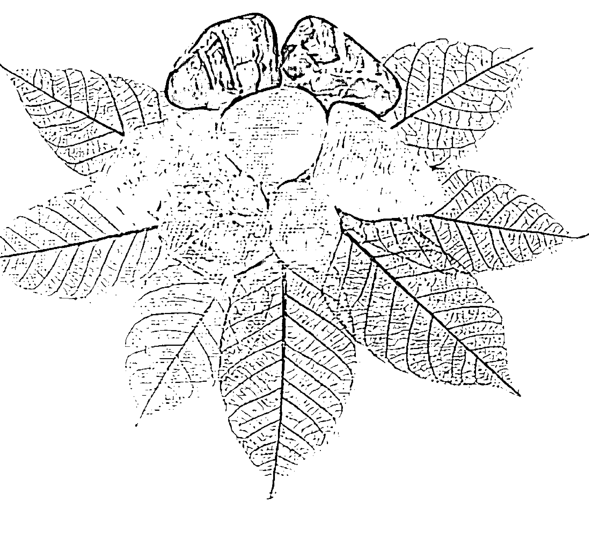

晶石的品質會直接影響寶石酊的品質，我們不能期待雜質甚多的晶石能做出特級寶石的能量。這點需有事先的認知。如果能夠，請使用你所擁有的最高品質晶石來製作吧。

當然，有些晶石價格甚昂，用價值動輒一部車的高等級晶石來做寶石酊，不是人人能夠，也不見得有那個必要。建議使用「滾石」以上等級即可，也就是可以放在口袋中的打磨過的純晶石。原礦較有溶出或脫屑的疑慮，做出的寶石酊不宜內服，噴霧倒還可以接受。碎石等級更差，太碎的話更有誤服可能，是次之的選擇。有鑲嵌、有穿線的，因為多了鑲嵌料與線料來干擾，不建議使用。

需要準備的晶石數量可多可少。目前尚沒有任何文獻規定幾克的晶石可以做出幾毫升的寶石酊。我見過有人把多顆滾石裝到滿至水面，或用一顆滾石做一大壺水，到底哪個才對？一般而言，一顆魚丸大的滾石對上一杯水是合理的。某些貴重寶石，如鑽石與珍珠，一小粒對一杯水也合情理，畢竟誰能擁有魚丸大的鑽石？只是需要明白，不同的比例，製出的能量強度自有不同。

## 有蓋深色玻璃瓶

用來儲存寶石酊。因為寶石酊含酒，不宜用金屬或塑膠材質，因此選用玻璃。深色能遮光，利於保存，市面常見為茶色或藍色，兩者都好。蓋子選滴管頭形式最方便日後取用。

## 漏斗或有嘴燒杯（選擇性）

方便裝瓶使用。玻璃材質最佳，不鏽鋼可以，塑膠較不理想，但還是可以使用。

##### 酒

酒在這邊做為能量保存劑。一般要酒精度40%以上。選擇酒的要領跟選擇花精用酒一樣，通常以40%以上的有機白蘭地、伏特加或麥酒為優。

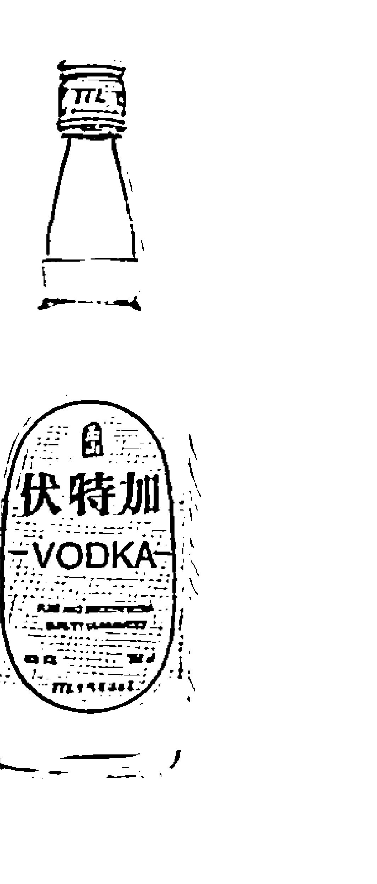

## 白水晶柱、白水晶金字塔（選擇性）

可以準備六個白水晶柱，和（或）一個白水晶金字塔，增強寶石酊的能量。

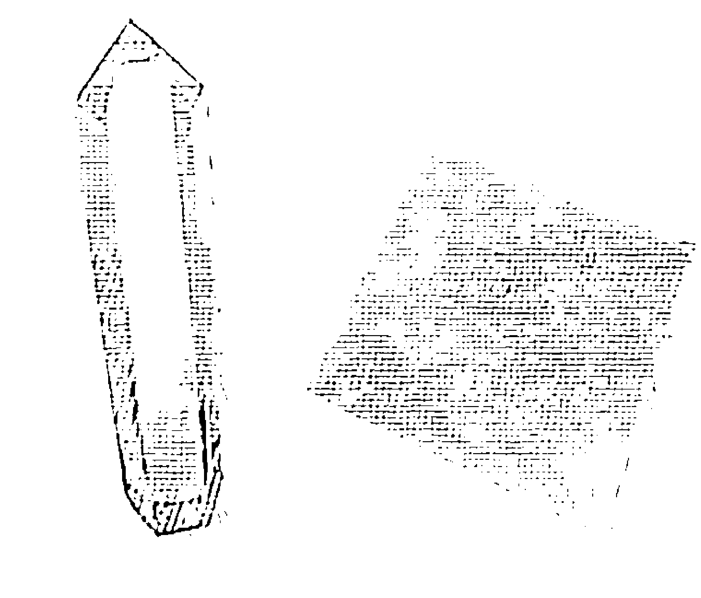

## 鑷子、筷子或湯匙（選擇性）

為了避免晶石吸收製作者的能量，造成寶石酊能量不純，建議使用工具來移動晶石。

## 保鮮膜、蓋子或白棉布（選擇性）

製作寶石酊的過程中，晶石需浸水日曬，期間可能有灰塵進入。找個東西蓋住可以保持水的清潔。保鮮膜是全透明，最能保持光照率，是最推薦的選擇。其次為白棉布。不透光的蓋子可以使用，只是會較為影響光照率。

## 墊布（選擇性）

晶石浸水日曬所在的處所，特別是放置的地面，對寶石酊的能量會有影響。放在草地上曬，會曬進草的能量；放在水泥地上曬，會曬進水泥的能量。如果不希望增加這些能量變數，可準備白棉布或白紙鋪在底部。

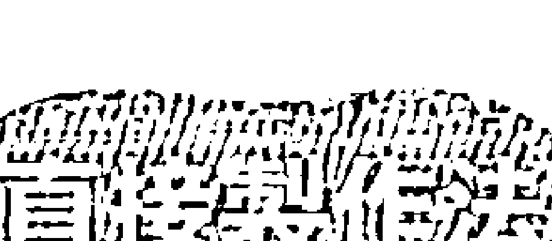

## 淨化晶石

晶石會吸收個人或環境的負面能量。在製作寶石酊之前，必須先將它充分淨化，才不會把負能量也送入寶石酊裡。

坊間的水晶水製作教學通常會說用來做水晶水的晶石不需要淨化，因為水和陽光就已經有淨化功能了，這並沒有錯，不過這是因為水晶水效期短，三天兩頭就需要做一次，如此三天兩頭就淨化一次，當然不必另行淨化。寶石酊情况却不同，我们可能两年才需要做一次，在做之前，晶石不晓得已经吸收多少负面能量，我们当然不希望未来两年都用到杂有负面能量的宝石酊啰。

## 晶石净化的方式如下：

##### 薰香法

以任何一种烟熏净化草杖的烟雾熏绕晶石，檀香或沉香之类的线香也可以。烟熏草杖中，鼠尾草类的净化力直接而强大，秘鲁圣木沈稳温雅，雪松细致高频，杜松排毒洁净，甜草辫或迷迭香一样可以选用，檀香沉香沈静心也很棒。净化方法是将烟雾熏绕晶石数分钟，或把晶石放在线香附近燃点三十分钟亦可。此法运用范围最广，适合所有的晶石。

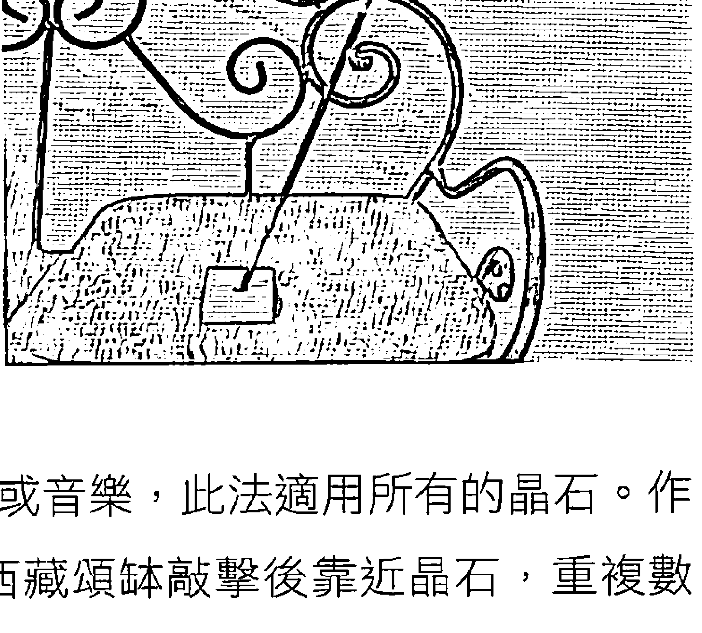

##### 音波法

音波可以净化晶石，包括音叉、西藏颂钵或音乐，此法适用所有的晶石。作法为：音叉敲击后以叉尖对准晶石，或西藏颂钵敲击后靠近晶石，重复数回，让直觉来带领，直到感觉彻底净化为止。或者将晶石放在音响前面，播放音乐半小时至一小时，必须是平和的宗教音乐、充满虫鸣鸟叫流水声的自然音乐、高频音律的新时代音乐或和谐旋律多的巴哈古典乐。需注意流行音乐无效，重金属与摇滚乐尤其不可。

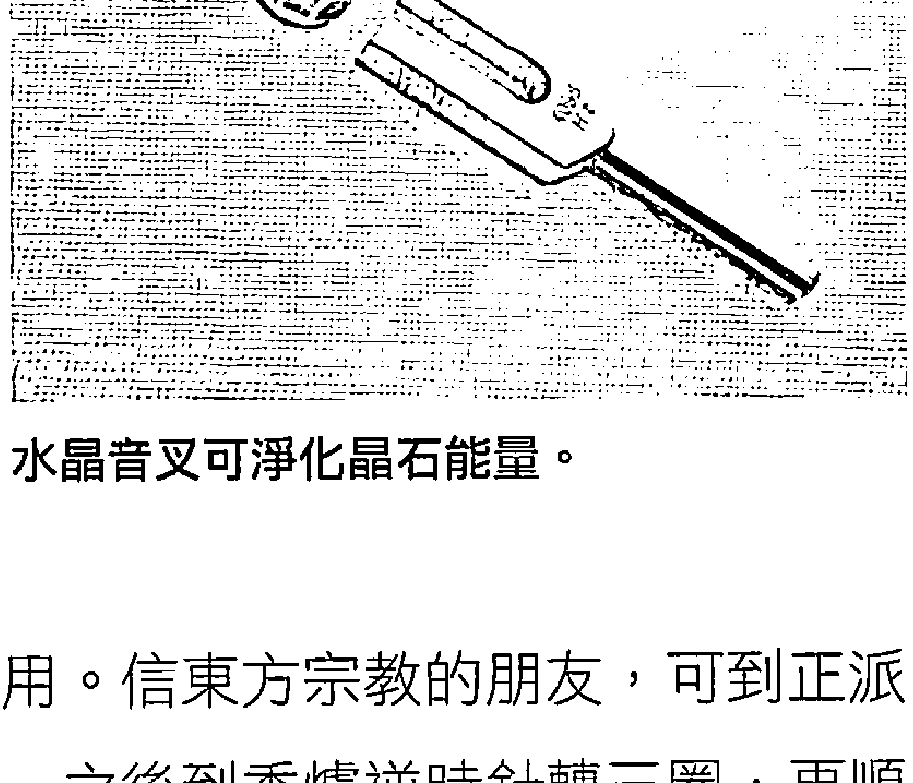

##### 宗教法

宗教法分东方与西方，几乎所有水晶都适用。信东方宗教的朋友，可到正派的寺庙掷筊请神明协助净化，获得允可后，之后到香炉逆时针转三圈，再顺時針轉三圈，之後將晶石握於手中感謝神明就好了。西方則是攜帶晶石去上教堂，祈請主幫忙淨化，聖樂與祈禱也有協助淨化的效果，如果晶石可以碰水，還可以沾點聖水。

##### 流水法

將晶石放在流水下沖洗十到二十分鐘。礦泉水最理想，純水、過濾水次之，不然自來水就將就著用，雖然有人認為自來水的氯會破壞晶石。請勿使用熱水，以免水晶碎裂。沖水時若能在心中觀想水晶的負面能量被沖刷走，效果更強。此法適合所有的水晶，但是易生鏽的金屬礦類及易溶於水的晶石不適用，包括孔雀石、方解石、螢石、透石膏、藍銅礦、沸石、雲母、天青石、沙漠玫瑰等，判斷的大原則是硬度低於五的晶石都宜謹慎確認。

##### 精油法

精油可以用來淨化晶石，方法有三：第一是把幾滴精油滴到100ml水中，將晶石浸泡在裡面五分鐘至數小時，或以棉布沾取此精油液來擦拭晶石，此法不適用不能碰水的晶石；第二是直接沾取一小滴精油原液來擦拭晶石，這樣除了淨化之外，還會將晶石附加精油的能量，因此最好選擇調性搭配的精油，譬如粉晶和玫瑰精油就很速配；第三個方法是把幾滴精油滴到薰香器具或一杯熱水中，把晶石握持在精油蒸汽中幾分鐘，此法最安全，適用所有的晶石。推薦使用淨化效果強的精油，例如白鼠尾草（學名Salvia apiana）、祕魯聖木（學名Bursera graveolens）、所有松科精油（特別是杜松）或檸檬，情緒治療用的晶石可以用薰衣草。

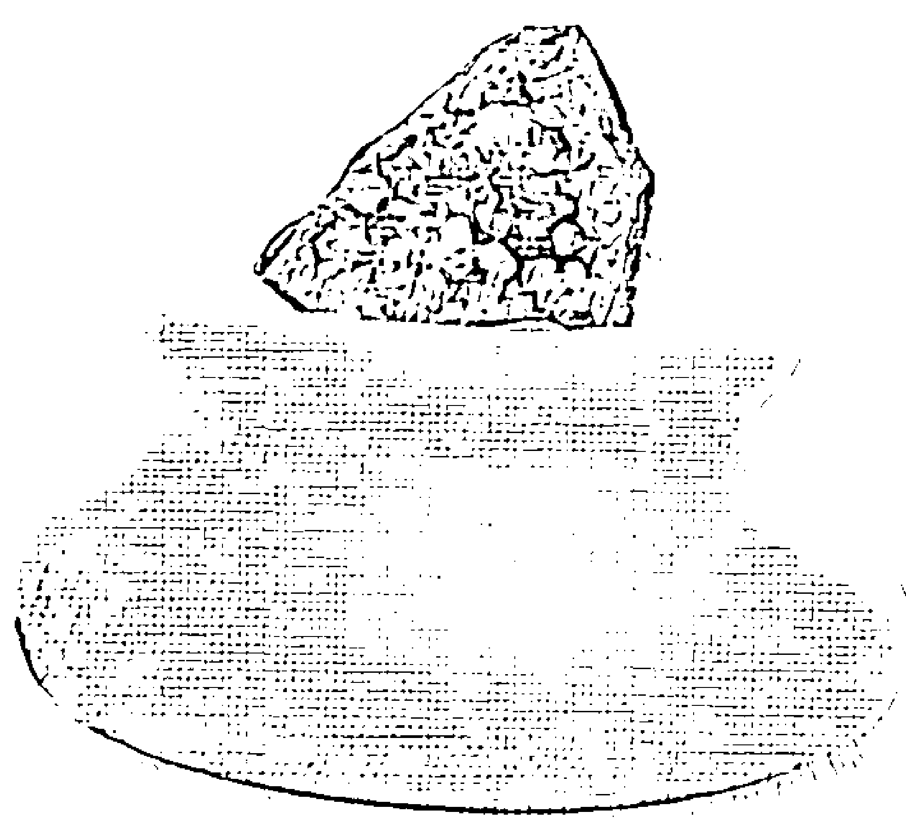

##### 日照法

日照法除了淨化，還有充能的效果，可加強晶石的能量。最好在中午左右的時分，將晶石放在日光直射處半小時至一小時即可。注意，某些有色晶石日曬過烈會褪色，請避免烈日直射，建議改選在日光溫和的時段、日陰處或甚至陰天進行，不然就改以別種方法淨化。會受日曬褪色的晶石包括任何有色水晶、紅寶石、翠玉、魚眼石、海藍寶、天青石、螢石、鋰輝石、黃玉、孔雀石、綠松石、紅瑪瑙、紅玉、虎眼石、鷹眼石、硨磲等。

##### 月照法

溫柔的月光可以為晶石充能。在月圓之夜或月圓前後一夜，將晶石放在戶外或窗台上照射月光一整晚。無雲之夜最好，不過據說即使是下雨也還是有效，只要小心別讓晶石被雨淋到。此法所有晶石都適用，特別適合陰性的、和心輪有關的晶石，例如月光石、拉長石或粉晶，通常任何綠色、紫色、藍色、粉紅色與白色的晶石也都適合。唯請留意，不適用日照法的晶石需在翌日中午前收回，以免受日曬褪色。

### 鹽水法

將晶石放到海水或1：10比例的海鹽水中完全浸泡一小時至一天，需要深層淨化時甚至可浸泡到七日，之後將吸收了負能量的鹽水丟棄，將晶石用清水清洗乾淨。海鹽必須是天然粗鹽，非精鹽。需注意，鹽水有侵蝕性，所有水晶都可以用此法淨化，但是有許多其他晶石不能適用，含金屬、有氣孔、含水（如蛋白石）、有穿線及任何不適合用流水法淨化的晶石都不可以。原則上要硬度七以上的晶石才有可能適用。如果不確定，請勿使用此法。鹽水是深度淨化法，淨化之後仍建議以日照或月照為晶石充能。

### 乾鹽法

將天然粗海鹽裝大約半碗，將晶石放在粗鹽上或埋在裡面數小時至數天，之後將晶石上的鹽清洗乾淨。使用過的鹽已經吸收晶石排出的能量，應予丟棄。仍須注意，任何不適用流水法和鹽水法的礦石，也不適用乾鹽法。乾鹽也是深度淨化法，做完後建議再以日照或月照充能。

##### 糙米法

同乾鹽法，將晶石放在半碗糙米上，或埋在裡頭數小時至數天，之後將晶石清潔乾淨並丟棄糙米。此法適合所有的晶石。

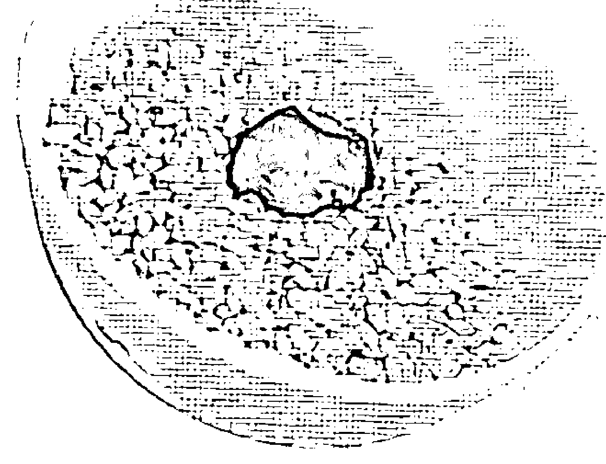

##### 晶簇法

三公斤以上的大型晶簇或晶洞，可以淨化較小的晶石，只要將小晶石放在晶簇上或晶洞中一晚即可。注意水晶簇的硬度是七，低於此硬度的晶石在取放時可能會被劃傷，宜特別留意，否則請避免以此法淨化。晶簇與晶洞也要記得定期淨化。

##### 碎晶法

大型晶簇或晶洞要價通常不斐，如果沒有的話，買一包白水晶碎石也可以。晶石放在白水晶碎石上面一晚即可。白水晶碎石也要記得定期淨化。

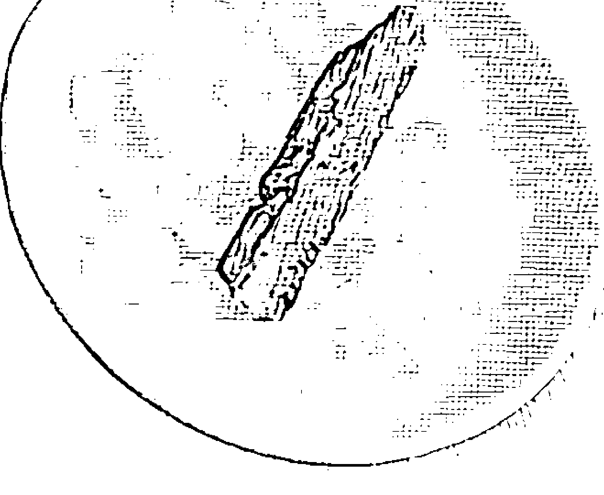

##### 埋土法

當晶石能量非常污濁時，土埋可強力淨化，等同於「歸零」或「格式化」。將晶石埋在靠近大樹根的土裡約二十四小時，晶石就能獲得深度淨化與充能。欲更徹底淨化，如前任主人是重病患者的話，可以埋上更久。

##### 念力法

有修持的朋友，可以純用念力來淨化水晶，方法相當多，包括祈請信奉的神明或天使協助淨化、觀想白光沖去晶石的負面能量、放射靈氣或擴大療癒能量等。練習越久、信心越強大者，施行此法的效果越強。未曾修持者則不見得會有效。

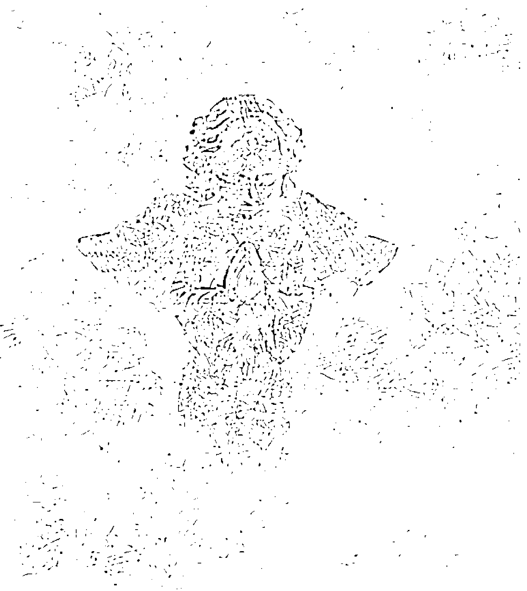

## 啟動晶石

當晶石淨化完畢，我們還需要啟動晶石，也就是告訴晶石它該怎麼幫助我們。晶石跟植物一樣，可以視為活體。明確地告訴晶石我們的願望，晶石更能朝我們希望的方向運作。

在研發瓶裝陽光靈性噴霧時，我曾考慮要寶石酊是要自製還是跟英國廠商購買，最終決定自己動手做，正是因為自製可以啟動晶石，使它朝我設定的方向來運作。

啟動晶石的程序不需要幾分鐘，但是需要堅定不移的念力。請先設定好希望這顆晶石發揮的效用。現在我們是要用它來做靈性噴霧，想想這瓶噴霧是想要達到什麼功效呢？

假設是增強勇氣好了。請先靜下心來，用慣用手或雙手握住已淨化好的晶石，來到胸口，明確說出希望晶石達到的效果。用慣用手是因為這是放射能量的手，若要用雙手握，建議慣用手在內、非慣用手在外，不過這屬於枝微末節，即使弄錯也還是會有作用。

說出來的啟動語可以是單字，如「勇氣」，也可以是整句，如「我請這顆水晶為了我的最高善幫助我找回內在的勇氣，謝謝」。我個人較偏好整句，因為訴求更加明確。

永遠都可以加上「為了我的（或大家的）最高善」，這句萬用的祈請語能確保即使設錯目的也不會造成傷害，因為許多時候我們的願望不見得是對自己最好的，開放讓最高的力量來帶領我們，使晶石永遠為我們的最高善服務。感謝也是必要的，真誠的感謝能提升振動頻率。

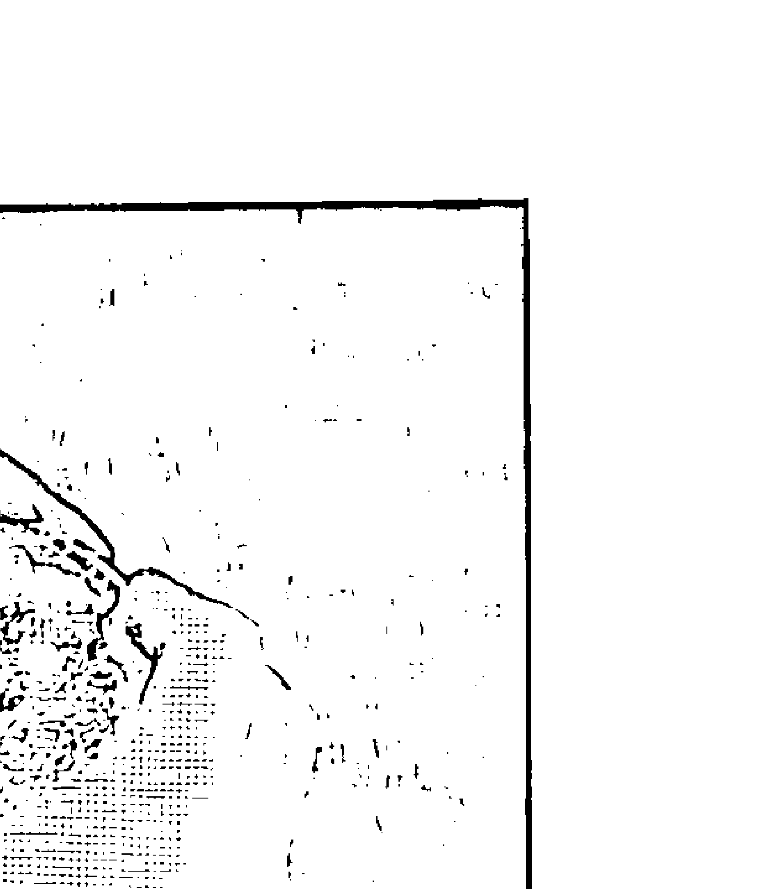

啟動水晶只能設定善的目的，如果是投機目的，像贏樂透，或犯罪害人的目的，或違反他人自由意志的願望，都無法運作。譬如我們可以設一個交男朋友的願望，卻不能指定特定的人當我們的男朋友，如果這是違反他的自由意志的話。

如果製作靈性噴霧要給許多人使用，甚至可以對晶石說一整段的啟動詞，例如說：「我請這顆水晶為了眾人的最高善，分享能量到寶石酊中，使所有用這批寶石酊做出來的靈性噴霧的使用者都能找回內在的勇氣，感謝。」

啟動詞是自由的，你可以自己的方式來說。

啟動詞可以多說幾次，直到你很確定這個意念已經灌注到晶石當中。

要啟動晶石，信心是最重要的。不只要用嘴巴說，要全心全意地說，要專心致志地說，要毫不懷疑地說。左手拿或右手拿，還是啟動詞要說幾次，都是其次。真正信心強大的人，即使不用手拿，啟動的力量依然威力無窮。

#### 日照／月照

接下來，請確認晶石可耐陽光、不溶於水也不含重金屬（易溶於水或有重金屬的晶石之製作方式請見下一章〈間接製作法〉）。確認後，將啟動完成的晶石放到裝有水的容器中。請注意自己的手指不要碰到水，最好也不要再碰到晶石了，建議使用湯匙或鑷子拿取晶石，杜絕能量干擾。

此容器置於日光直射處大約四小時，理想是早上至中午時段的日光，因為此段陽光漸強，結束時剛好完結在日光最強的時刻。日光強烈時可縮短時數，微弱時可延長。

日照時數並非一成不變。也有人喜歡曬十二個小時，或甚至曬二十四個小時，讓晶石獲得日月一周天的循環。你可依照直覺或個人喜好來決定。

會因日照而褪色的晶石，可放在日陰處，或改在日光溫和的時段或陰天進行，或採用月照法——在月圓之夜或月圓前後兩夜期間，找一個少雲的晚上，放在月光直射處一整晚，隔日早上收回。

如果有準備墊布，可以墊上。若有準備保鮮膜、蓋子或白棉布，可以蓋上去。如果有白水晶柱或白水晶金字塔，請把金字塔放在蓋子上（此時棉布或保鮮膜可能承受不住金字塔重量而不適用了），白水晶柱平均圍在容器周圍，柱尖對準容器中心。這樣的佈陣能強化能量。當然，如果您有學習其他的佈陣方法，都可以運用上去。

環境也是影響寶石酊品質的變數。如果能放到大自然或聖地日照，吸收天地精華，是最好不過了。

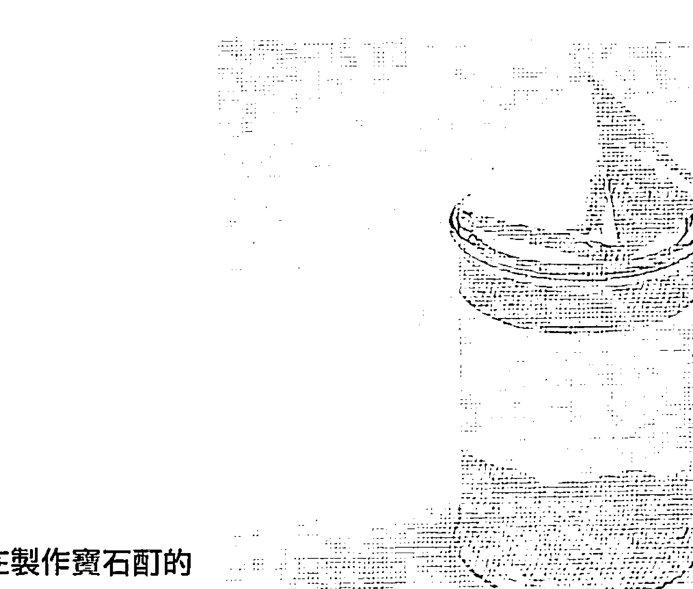

將白水晶金字塔蓋在製作寶石酊的容器上，強化能量。

#### 保存

曬畢的水晶水，請和酒以2：1的比例混合入深色玻璃瓶中。雖然坊間教學一般是比照花精發明者Bach醫師的作法，採用1：1比例，不過我認知到寶石酊取2：1更合適，亦即水晶水佔三分之二，酒佔三分之一。因為水晶能量較花精沉穩發明，可以使用較少保存劑，獲得更強的能量表現。

移除水晶時，再次提醒，請使用工具，不要用手指。水晶水與酒混合時可以不需精密測量，目測即可。

到此階段，恭喜，寶石酊製作完成！請存放於陰涼處，避免日照，避開大型電器兩米以上，或以鋁箔紙包覆，裝於金屬盒亦可。內服的寶石酊建議保存期限為一至兩年，外用的可以存放更久。只要不產生霉變或雜質，都可外用。只是站在能量的立場，兩年內用完，效果還是比較好。

## 間接製作法

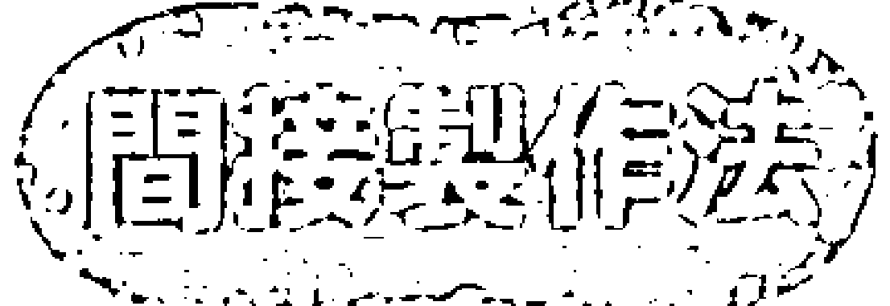

易溶於水或含重金屬的晶石不能放入水中，否則做出來的寶石酊將含有毒素。此時可用以下兩種方法製作。

### 雙重容器法

準備兩個尺寸不同的容器，將小容器放在大容器裡，晶石放在大容器裡，接觸到小容器的外壁，然後兩個容器都倒入水，進行日照或月照。此法晶石雖然放在小容器之外，能量頻率依然能傳導到小容器的水裡。由於是間接傳導，建議延長日照或月照的時數。

完成之後，丟棄大容器內的水，只使用小容器裡的水製作酊劑。

此法也可以反過來，將晶石放在小容器裡，製作完後倒掉小容器裡的水，只取用大容器裡的水。

對於不能碰水的晶石，裝晶石的那個容器就不要添水，只要確認晶石有碰觸到另一個容器的壁，能量方能傳導進去。

### 膠帶貼附法

另一個可能更簡單的方法是只準備一個玻璃容器，內部裝水，把晶石用透明膠帶貼附在玻璃容器的外側，其後依正常日照程序進行。

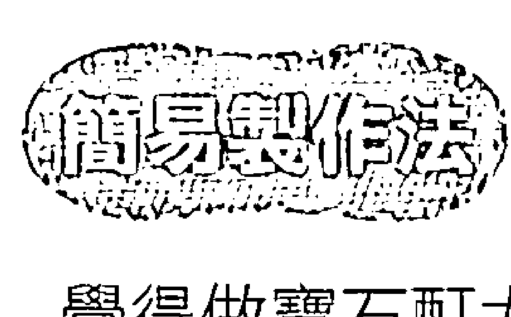

覺得做寶石酊太複雜了嗎？如果懶得分辦晶石能不能碰水、曬太陽，不想用麻煩的水晶佈陣法，不確定自己啟動晶石成不成功的話，請用以下提供的簡易法製作，任何晶石都適用，再簡單不過了。

1. 把晶石薰線香或薰精油幾分鐘淨化，沒有線香或精油時可放在室外日陰處幾小時淨化。
2. 準備一大一小玻璃容器，將小容器放在大容器內。
3. 將晶石放進大容器，碰觸到小容器的外壁。
4. 把礦泉水倒入小容器，放到室外陰影處六小時以上，或可受月光直射處一整夜。
5. 將小容器中的水與酒2：1混合裝入深色玻璃瓶裡面，即水佔三分之二，酒三分之一。
6. 恭喜完成寶石酊！

## 寶石酊使用法

寶石酊除了用來作為靈性噴霧的材料，還有許多種妙用，一起來探索吧！

### 靈性噴霧

寶石酊可獨立作為靈性噴霧，噴灑在個人氣場周圍或空間中。直接噴灑寶石酊或稀釋噴灑皆可，稀釋建議比例為每100ml水加16～20滴，需於調製三天內用完。如果是稀釋到40%酒精度的酒中，能量效期能延長到三至六個月。

### 內服法

寶石酊可內服，用量通常是一天二至四次，一次四至七滴。直接滴於舌下效果最顯著，稀釋在一湯匙水中服用亦可。敏感者可從一天兩次開始。紅橙色系的晶石較強烈，應從低量開始。藍紫色系的晶石較緩和，可偏向高用量。

### 敷貼法

可以敷貼在脈搏處、穴位或脈輪部位。寶石酊以2%比例稀釋到水中，也就是每100ml水約加40滴，以毛巾、手帕或紙巾沾取後敷貼。

##### 泡澡法

滴6至8滴到澡盆裡享受晶石能量浴。

### 淨化個人物品

寶石酊可以擦拭淨化個人物品。

##### 植物用法

可以澆花或噴灑於植物。澆花建議稀釋比例為每100ml水中加5至7滴寶石酊。噴灑建議為每100ml水中加5至10滴寶石酊，建議使用暖色系晶石，並在三天內用完。

### 保養品

可以加幾滴到保養品中使用。建議調製比例為1%至2%，也就是每10g保養品加2至4滴。請於三天內用完。

## Chapter 2

## 全方位靈性噴霧構成元素

## 無形能量的影響

靈性噴霧的製程中，無形能量的影響力，比你想像的巨大。

多年前曾有個朋友告訴我，他與友人一同買了某品牌的花精，回家後兩人連續做了幾晚惡夢，都覺得很奇怪。恰好他的友人有靈視力，感應之後說原來是花精的生產過程中有剝削勞工，勞工心懷怨念，就傳到了花精裡。

我當時聽了覺得不可思議。一部分感覺不無可能，另一部分又懷疑：「你們有證據嗎？」此事暫且在我心中擱著，悄悄地觀察著。

後來，我漸漸發現，不同品牌的花精的能量品質似乎跟領導者有莫大關係。例如我所代理的Crystal Herbs花精，領導人Catherine女士的個性溫柔敦厚，茹素多年，長期靜心。她兼容並蓄著一切，認為理性與感性兼具的中庸之道是最好。她期盼在大眾的福祉與團隊的豐盛中，取得漂亮的平衡點。Crystal Herbs花精似乎就像她一樣，充滿看似溫柔、實則堅毅的母性力量。

我也觀察到他牌的能量表現，有的起勢強勁，有的中規中矩，有的明亮中帶有雜訊，都與領導者的特質有著巧妙的呼應。這其中的關連，令我越發覺得神奇。

等我開始自製花精時，搜羅西洋資料來閱讀，才赫然發現原來「製作者的意圖」早就廣受討論了，一點都不是新鮮事。

# 製作意圖能量

我們可以肯定地說：即使製作程序一模一樣，不同人製作出來的花精，都會具備不同的品質。好比一位抱著愛與奉獻來製作花精的人，跟抱著營利之心來製作的，做出來的花精不會一樣；一位抱著平靜和諧情緒來製作花精的人，與抱著仇恨惱怒來製作的，做出來的花精也不會相同。

這樣的通則不僅會發生在花精，藥草酊劑、寶石酊劑乃至我們要做的靈性噴霧最終成品，全都會受到製作者的意圖影響。

因為這樣的理解，我在選擇代理產品時，總是戰戰兢兢，一定要親眼見到創辦人本人，見不到也至少要有些書信往來互動，讓我能夠了解他的想法理念，才能放心來引進。

因為這樣的理解，我在製作瓶裝陽光靈性噴霧時，從不忘提醒自己要抱持最和諧的情緒和最高善的意圖來製作。

印象最深刻的一次，是我正在切碎秘魯聖木打算做酊劑時，接到一封手機訊息。那封訊息捎來的壞消息，讓我當場想要痛哭失聲。當我發覺這洶湧如潮的情緒不可能忍住時，我做的第一件事就是把手上的聖木和刀具放下，脫下手套，躲到最遠的房間，才讓眼淚流下來，因為我不能讓壞情緒影響到酊劑的品質。直到過了一陣子，心情平復之後，我才回頭去製作。

製作者的心念會影響到成品的品質，這是怎麼都逃不掉的。無論是在製作酊劑、花精母酊液、寶石酊乃至最終靈性噴霧的過程中，若能以儀式性的虔敬態度來製作，抱持明確的目的，存著善良的動機，保持莫大的信心，最重要的是充滿愛！就像是日本茶道的精神，如此做出來的噴霧品質，絕對不是青青菜菜做出來的可以比擬。了解這一點並且身體力行之後，你我都有能力做出高品質的靈性噴霧。

## 意念灌注

製作者除了應當要以好情緒、善心與愛心來進行製作之外，更可以有意識地為靈性噴霧「加料」。製程中的任何材料與成品，皆可以用個人的意念來灌注加強它的屬性。

操作方法非常簡單，強烈的信心是唯一你所需要。假設你買了一瓶市售的玫瑰花精，你希望用這瓶玫瑰花精來製作「愛自己」靈性噴霧，你就可以在玫瑰花精裡灌注「愛自己」的能量。灌注方法跟啟動晶石很類似，雙手握持玫瑰花精到胸口兩乳之間，專心致志地說：「愛自己、愛自己、愛自己……」多說幾次，直到感覺這股能量銘印到花精裡頭，就完成了。

又或者你這瓶玫瑰花精不只想要拿來做「愛自己」噴霧，打算另有他用，在裡頭灌注「愛自己」就有點侷限花精的用途了，此時我們可以選擇將「愛自己」的能量灌注到靈性噴霧的成品裡，操作方式相同。

意念灌注還可以用祈請的方式。祈請任何你所信仰的天父、神明或天使，將你希望的某種能量灌注進去。需要請對管區喲！例如找觀世音求財就不太對。如果不確定的話，可以籠統說「財運天使」，這樣包準沒錯，祂們自會去運作。祈請之後，整個能量灌注過程也許只花幾分鐘，有時會持續一兩天。請將噴霧放在定點，暫勿移動。

此外，經咒的威力更是強大。無論是佛經、聖經、可蘭經，不管是中文、梵文、希伯來文，全都可以為靈性噴霧提昇能量，非常推薦使用。

意念灌注的成效因人而異。越是有修持、有信心，越能在其中灌注強大的能量。反之，如果您對自己沒信心，或根本不相信有神明存在，就不是很適合做意念灌注，建議改用其他方式為宜。

# 肯定語句

或許大多數人對虛無縹緲的意念灌注仍有存疑，使用工具感覺就扎實多了。我們可以在靈性噴霧及其材料灌注肯定語句或經文咒語。例如上篇所提的「愛自己」，我們可以在一張紙上寫下或印出「愛自己」三個字，將這張紙貼在瓶身上。至於貼附的方向，有人認為有字面應朝內，讓靈性噴霧「看見」這個字；也有人認為有字面應朝外，因為重點是字本身散發的能量，而非內外，當製作者能看見字的時候，他的意念也會增強灌注力量。這兩者其實無甚差異，端看自己相信哪個論點。如果不確定，不妨兩面都寫吧。
還有一個方法是把字條放在桌上，把靈性噴霧放在字上一段時間。如果可以，到靈性商店買個金字塔，能量增強效果更優。金字塔可以依照我們設定的意念來強化能量。把金字塔罩在噴霧與字條之上，心中存著「我要灌注某某能量到這瓶噴霧中」的明確意念，放至少一個小時，能放久一點更好。

新闻学中有句话说「一图胜千言」，这句话用在灵性喷雾一点也没错。图像力量不容忽视。将象征图腾运用到灵性喷雾或其材料上，能把能量品质提升到更高的层次。

所有象征图腾中，最丰富有力的大概是「神圣几何」了。世间万事万物皆有几何构造。神圣几何就是古今中外各宗教文化中反复出现的图样。这些图样跨越时间、空间、宗教与文化，有着无比精细完美的比例，里头蕴藏的智慧与力量不可小觑。举例来说，鹦鹉螺上的螺旋形，正是黄金比例。这螺旋形还出现在世界各地的建筑、宗教文物与服饰上，我们便可以认知它是一种神圣几何图形。

神圣几何的奥秘尚不是人类可以完全理解，每种神圣几何的精奥都足以写上一本书，有些甚至足以用好几本书来研究，已经超越本书的讨论范畴了。在这里我们只需知道神圣几何在灵性喷雾能够提供何种效益就好。

# 神聖幾何

### 生命之花

目前心靈界最流行的神聖幾何大概是「生命之花」了。生命之花是萬事萬物的創造來源，可以說是生命的基石，我們無法明確說出它的具體功效，因為它的奧祕包山包海，範圍浩瀚，幾乎可以運用在所有靈性噴霧上，堪稱萬用。任何靈性噴霧加上它，多少會有幫助。

### 麥塔統立方體

另一個與生命之花相關的神聖幾何是「麥塔統立方體」及其構成要素：「四面體」、「六面體」、「八面體」、「十二面體」以及「二十面體」，此五種形狀統稱為「柏拉圖多面體」。麥塔統立方體可以淨化，協助健康、財富與靈性成長的面向，運用範圍也甚廣。柏拉圖多面體與土、水、火、風及乙太要素對應。如果想要增強某個元素的特性，可以運用上去。

圖形 | 名稱 | 對應元素 | 脈輪位置 | 對應星座 | 作用
--- | --- | --- | --- | --- | ---
 | 四面體 | 火 | 生命的神聖火花 | 太陽神經叢 | 牡羊、獅子、射手 | 身體與靈性的平衡、穩定
 | 六面體 | 土 | 基礎結構 | 海底輪 | 金牛、處女、摩羯 | 與大地和大自然連結、減輕身體壓力、緩解焦慮
 | 八面體 | 風 | 思想、連結更高心智 | 心輪 | 水瓶、雙子、天秤 | 內省、慈悲、療癒、發現自己靈性的本質
 | 二十面體 | 水 | 生命之流情感 | 臍輪 | 雙魚、巨蟹、天蠍 | 激發創造力、順流、臣服、容許改變
 | 十二面體 | 乙太 | 圓滿宇宙 | 第三眼、頂輪、第八脈輪 |  | 靜心冥想、連結高我、提升意識、提升振動頻率

印度瑜珈理論的脈輪系統更是適合應用在靈性噴霧。如同中國人講的經絡穴位，脈輪是印度人發現的位於人體中軸的能量中心點，每一個脈輪各自掌管不同的範疇。我們生活中的大事小事，都可以找到脈輪來對應。

| 圖標 | 脈輪名稱 | 顏色 | 功能 | 位置 |
|------|----------|------|------|------|
| 頂輪圖標 | 頂輪 | 紫 | 智慧、靈性、開悟、接收宇宙真理、天人合一 | 頭頂百會穴 |
| 眉心輪圖標 | 眉心輪 | 靛 | 直覺、覺知、想像力、通靈力、「看」的能力 | 兩眉之間上一指 |
| 喉輪圖標 | 喉輪 | 藍 | 溝通、表達、口才 | 喉嚨底部 |
| 心輪圖標 | 心輪 | 綠 | 愛、同理心、原諒 | 胸口兩乳之間 |
| 太陽神經叢圖標 | 太陽神經叢 | 黃 | 意志、決心、個人力量 | 胃部 |
| 臍輪圖標 | 臍輪 | 橙 | 創造力、女性性慾、享樂 | 肚臍下三指 |
| 海底輪圖標 | 海底輪 | 紅 | 生存、穩定、接地、男性性慾 | 會陰 |

避邪保護是很熱門的主題。說到避邪圖騰，俗稱「大衛之星」的六角星是由一個正三角形和一個倒三角形組成，是最簡易可徒手繪製的保護圖騰。

美索不達文化流傳下來的「法蒂瑪之手（Hamsa）」在中東地區十分流行，雖然對華人而言陌生了點，然而它的保護效力比大衛之星更加卓越。到Google圖片輸入Hamsa，可找到一籮筐美麗的圖像。
又或者，基督教的十字架、土耳其的邪眼（Evil Eye）、埃及的安卡（Ankh）、西洋的獨角獸、中國的八卦、龍或麒麟，都可用作保護的象徵。

我將靈性噴霧視為自由美好的創作。尤其在象徵圖騰這一塊，能發揮的創意無限，譬如，有學過占星的朋友，何不將占星符號運用上去？如果想增強獅子座的領導力，就用獅子座符號；如果想學習金牛座的理財能力，就用金牛座符號。同樣的，每種行星也都有特定性質，譬如太陽發光發熱，水星理性思考，金星是愛與美，木星是幸運與拓展……如果覺得需要哪種特質，就可以運用上去。

| 行星 | 圖像 | 意義 |
|------|------|------|
| 太陽 | ☉ | 光與熱、勇氣、忠實、慷慨、王者之風 |
| 月亮 | ☽ | 女性特質、想像力、多產、夢境、潛意識 |
| 水星 | ☿ | 智力、理解力、學習力、溝通 |
| 金星 | ♀ | 愛與美、羅曼史、享受、溫柔、魅力、金錢觀 |
| 火星 | ♂ | 男子氣概、行動力、大膽 |
| 木星 | ♃ | 幸運、財富、榮耀、成功、擴展 |
| 土星 | ♄ | 紀律、限制、堅毅、成熟、智慧、苦行、學習的課題 |
| 天王星 | ♅ | 創新、流行、變化、特立獨行、革命、發明、新生活 |
| 海王星 | ♆ | 想像力、宗教、神秘、靈啟、信仰、無私、奉獻 |
| 冥王星 | ♇ | 轉化、揭開內在的黑暗、放手、毀滅與重生 |

# 易經圖像

易經六十四卦蘊含了萬事萬物。通曉易經的朋友，可以將易經能量灌注在靈性噴霧中。假使不熟易經，起碼見過太極圖。陰陽平衡的圖式，帶來和諧、剛柔並濟、中庸之道的特質。

### 其他圖像運用

若有學過塔羅牌、天使卡、奧修禪卡，又何嘗不能用呢？曼陀羅一樣棒。北歐如恩符文更是創意選擇。甚至於，動植物的圖像難道不能拿來使用嗎？獅子象徵熱情與領導，老鷹象徵眼界與自由，烏龜象徵恆心與長壽，海豚象徵純真與希望，獨角獸象徵純真，全都可以應用上去。

唯一需要確定的是所選用的圖騰有吻合到噴霧的性質，才能真正發揮功效。用錯了可是會扯後腿的。為噴霧選取一個適配的圖騰，是很有挑戰性也很好玩的部分。有些時候，你甚至可以先選好圖騰，再依據圖騰的意義，選配適合的植物與晶石材料。這樣的創作次序一樣有趣。

將象徵圖騰灌注到靈性噴霧的方式跟肯定語一樣簡易。將圖騰印出或繪出，圖面貼到噴霧瓶身上即可，或是將噴霧放在圖面上一小時至幾天。能罩上金字塔並作些意念灌注，效果更好。

## 色彩能量

色彩是非常直觀可運用於靈性噴霧的能量，可惜有執行上的難處。假設我們用色紙環繞噴霧瓶，雖能把色彩能量注入進去，可是只要色紙一移除，色彩能量就會迅速衰減，不出幾天，色彩能量就所剩無多了。

為了讓色彩能量持久，坊間的色彩能量產品通常不出兩種：第一，添加色素；第二，用彩色的瓶子裝。站在追求純淨無添加的立場，我們當然偏好彩色瓶子，然而彩色玻璃瓶難找，頂多找到茶、藍、綠三色而已。如此看來，唯一能純天然注入色彩能量又能長期維持效能的方法，就是自己動手做了。

### 材料準備

- 透明玻璃噴霧瓶
- 彩色玻璃紙 (文具店有售)
- 透明膠帶或白膠

#### 作法

將彩色玻璃紙裁剪成適當大小，貼於透明玻璃瓶身外。

這個DIY做起來不見得會多美觀，起碼它有效。只是需要注意一點，淺色的玻璃紙遮光效能弱，儲存時需留意，盡量避免日光照射。

到目前為止，你已知道如何購買到純正的精油、純露與市售花精，懂得自製藥草酊劑、花精母酊液與寶石酊，也知道無形能量灌注的方法。現在，該是把這些材料拼在一起的時候了！在開始之前，請了解，精油、純露、藥草酊劑、花精、寶石酊和無形能量灌注法，每一種都足以作為獨立的靈性噴霧。即使你沒有意願或時間製作配方繁複的專業級噴霧，上述任何一種噴霧簡單隨手做，都能勝任居家日用了。

如果有意願製作專業噴霧，更是一種甜蜜又有趣的挑戰。要將多種材料統合在一起，發揮一加一大於二的加乘效果，需徹底理解每種材料的特質，並展現絕妙的創意。說簡單，調製流程的確簡單；說難呢，這其中學問要研究透徹還真是路迢迢。本書的目的不是丟幾個制式配方出來，要你照本宣科地做，而是希望讀者真正了解靈性噴霧的配製原理，有能力創作出專屬自己的配方。所以，請別錯過本篇配製原理的重頭戲喔！

### 材料介紹

靈性噴霧的結構為基劑（酒或藥草酊劑）和主成分（精油、花精、寶石酊）。如果酒精濃度需要向下稀釋，還要加入稀釋劑（水，亦可用純露或水晶水）。當然，媲美「外掛」的無形能量也不可或缺。

規劃配方比例時，通常也依照這個順序。先決定基劑的酒精度，算出要添加多少基劑進去，剩餘空間便是主成分的發揮空間，如果主成分添夠後還有剩餘空間，再加稀釋劑補滿。無形能量則隨心所欲，想外掛多少，都可以外掛進去。

現在我們來一一認識這些材料，練習規劃配方比例吧。

### 基劑選擇與乙醇比例重要性

由於酒精卓越的精油溶解力和防腐保存力，使其成為當仁不讓的最佳噴霧基劑。藥草酊劑也是以酒為基底，因此也可做為基劑，單獨用或跟其他酒精混合使用皆可。

坊間常有用水加精油乳化劑的作法，因為精油乳化劑大多屬於化學來源添加物，且需另加防腐劑才能獲得滿意的保存期限，所以在此次不予採用。

酒的成份是乙醇（酒精）與水。乙醇的含量比例就是所謂的「酒精度」。在靈性噴霧配方中，噴霧總體的乙醇比例會直接影響到成品的外觀、刺激性與保存期限，可以說是靈性噴霧配方需要考慮的頭號因素。以下這條原則請務需牢記：

### 調製原則

乙醇比例越高，精油溶解力越強，成品越清澈，保存期限越久，刺激性越高。

### 成品的清澈度

靈性噴霧靠乙醇溶解精油。乙醇足量時，精油完全溶解，會呈現清澈透明貌，反之就會呈現乳白混濁貌。

顛覆一般人想像的是，清澈度與品質無絕對關係。建議居家自用可調製酒精度20%至40%，雖然會呈現乳白混濁貌，但是不影響品質，且刺激性較低，安全性較高，除了保存期限較短之外，沒有任何不好之處。

至於饋贈或商業用途，酒精度往往要80%比較像樣，因為常人見到香氛噴霧混濁或有沉澱物，第一個反應就是以為變質了，即使費唇舌解釋，對方也不見得會安心。為了避免這樣的困擾，不如一開始就製作全透明的吧。

### 乙醇的刺激性

話說回來，我不建議為獲美觀就一古腦地用95%藥用酒精調製，半滴水都不加。許多人拿到精油噴霧的第一個動作就是往手腕上噴，更嚇人的還有往臉上噴的。雖然大多數人可以接受75%消毒酒精噴上肌膚，然而酒精度高達95%時，刺激性甚強，肌膚敏感者會馬上感到痛辣。要是儲存不當，被幼兒拿到，恐會造成無可預料的傷害。為了使用者的安全著想，建議將酒精度控制在80%左右，不超過85%。最理想還是在保持噴霧液體清澈度的前提下，酒精比例能往下壓到75%最好。這需要做一些實驗。

假設你已調好了高乙醇比例的噴霧，假設85%好了，目前是全透明，想要試試看能不能把乙醇比例往下壓，實驗方法就是請一滴一滴慢慢加水進去。剛開始，水加進去，液體仍會維持透明，到了某個程度，液體就會開始變白了，此時請立刻停止加水，將加水量記錄下來，做個計算，就能得到這瓶噴霧能維持透明的最低乙醇比例。

假如發覺乙醇比例壓不下來，有可能是添加的精油量較高而無法完全溶解，可試著重新調製一瓶精油比例較低的噴霧，再做一次同樣的實驗。

### 乙醇比例高，保存期限長

噴霧的保存期限與氣溫、原料、製作衛生程度與保存條件都有關，清澈透明度也與滴入的精油比例和種類有莫大關聯。以下表格提供的是參考值，非絕對值。實務上在保存一段期間後，只要不出現奇怪的懸浮物或沉澱物，或氣味發生明顯不對勁，都可以放心使用。

| 乙醇比例 | 精油 | 液體（以精油2%計） | 保存期限 | 刺激性 | 應用範圍 |
|----------|------|-------------------|----------|--------|----------|
| 0-3% | 不溶解 | 油水分離 | 二至四週 | 無酒精刺激性 | 嬰幼兒適用。需用力搖勻使用。可以噴灑肌膚。 |
| 10% | 略微溶解 | 很乳白混濁 | 一個半至三個月 | 弱 | 嬰幼兒適用。需搖勻使用。乙醇10%以下可以噴灑非敏感肌膚。 |
| 20% | 部分溶解 | 略乳白混濁 | 六個月左右 | 弱 | 需搖勻使用。不建議噴灑肌膚。 |
| 45% | 大部分溶解 | 大致清澈 | 一年半 | 中（同消毒酒精） | 通常不需搖勻。不建議噴灑肌膚。 |
| 60-65% | 幾乎完全溶解至完全溶解 | 幾乎完全清澈 | 一年半以上 | 稍強 | 不需搖勻。不建議噴灑肌膚。 |
| 80%以上 | 幾乎完全溶解至完全溶解 | 幾乎完全清澈至完全清澈 | 兩年至五年 | 過強，不建議使用 | 不需搖勻。不可以噴灑肌膚。 |

### 如何計算乙醇比例？

要規劃乙醇比例，我們會需要做一點計算。假設希望用95%藥用酒精調製出100ml酒精比例80%的噴霧，需要用多少95%藥用酒精呢？

```
需要乙醇量：100ml × 80% = 80ml
乙醇反推酒的總量：80ml ÷ 95% = 84.21ml
```

由於小數點後的位數太過細微，難以量測，因此四捨五入，得到需要84ml的95%藥用酒精。剩餘的16ml（100ml-84ml）就是其他材料的添加空間了。

再練習一題。假設想要用75%殺菌酒精調製出100ml酒精比例40%的噴霧，需要加多少殺菌酒精呢？

```
需要乙醇量 100ml × 40% = 40ml
乙醇反推酒的總量 40ml ÷ 75% = 53.33ml
```

四捨五入得到需要加53ml的75%藥用酒精。剩餘47ml（100ml－53ml）為其他材料的添加空間。如果懶得計算，不用擔心，以下簡明對照表任君取用。

| 欲調配的噴霧成品乙醇比例 | 製作100ml噴霧所需添加量 | 其他材料添加量（精油、花精、寶石酊、純露、水晶水、水） |
| :--- | :--- | :--- |
| 85% | 89ml | 11ml |
| 80% | 84ml | 16ml |
| 75% | 79ml | 21ml |
| 70% | 74ml | 26ml |
| 60% | 63ml | 37ml |
| 50% | 53ml | 47ml |
| 40% | 42ml | 58ml |
| 30% | 32ml | 68ml |
| 20% | 21ml | 79ml |
| 10% | 11ml | 89ml |
| 60% | 80ml | 20ml |
| 50% | 67ml | 33ml |
| 40% | 53ml | 47ml |
| 30% | 40ml | 60ml |
| 20% | 27ml | 73ml |
| 10% | 13ml | 87ml |
| 20% | 50ml | 50ml |
| 10% | 25ml | 75ml |

## 藥草酊劑與酒精的比例計算

如果基劑想用酒精混合藥草酊劑，且兩者酒精度不同，此時就需將兩者的酒精度皆納入計算。

假設想要用95%藥用酒精調製出100ml乙醇比例80%的噴霧，其中20ml打算添加酒精度40%的藥草酊劑，如此還需要加多少藥用酒精呢？算法如下：

```
藥草酊劑含有乙醇量 20ml × 40% = 8ml
整瓶噴霧需要乙醇量 100ml × 80% = 80ml
兩者相減得出藥用酒精需含的乙醇量 80ml - 8ml = 72ml
反推出需添加的藥用酒精毫升數 72ml ÷ 95% = 75.79ml
```

四捨五入得需添加76ml的藥用酒精，加上原本打算添加的20ml藥草酊劑，剩餘的4ml（100ml－76ml－20ml）就是其他材料的添加空間了。

藥草酊劑在靈性噴霧整體占的比例並無限定，一瓶靈性噴霧中可以只加幾毫升酊劑，也可以全部以酊劑為基底。要加多還是加少，建議視整體配方而定。如果原本就打算在靈性噴霧中加入高量精油，還想要整瓶噴霧都以藥草酊劑為基底，這瓶噴霧肯定會過「飽」。要知道藥草酊劑本身就足以作為獨立的噴霧了，又有酊劑又加高量精油，就好像追求九十九分到一百分的極致一樣，雖然精神可嘉，CP值卻不划算。因此我會建議，如果精油要加多，藥草酊劑就可以少加或不加。加了藥草酊劑，精油比例就可以減少一些。

## 酒種的選擇

酒種的選用原則已在第一章〈藥草酊劑〉章節做過說明，在此不重複贅述。通常可使用酒精度40%的伏特加、80%或96%的波蘭生命之水、75%殺菌酒精或95%藥用酒精。

## 主成分：精油、花精、寶石酊

在確定基劑添加量後，剩餘的空間就是主成分的舞台了。表格為各項主成分的建議添加量，下文並將詳細說明調配思路。

| 主成分 | 每100ml噴霧成品建議添加量 |
| :--- | :--- |
| 精油 | 總計不超過5ml |
| 花精 | 每種7～16滴 |
| 寶石酊 | 每種16～20滴 |

註：1ml＝20滴

#### 精油

靈性噴霧噴灑在個人氣場與空間中，歸屬「室內噴霧」類別，精油添加0.5%就頗有感覺，2%即可得到滿意的香氣強度，4%就算很濃，至多不需超過5%，也就是每100ml噴霧成品添加不超過5ml精油。

在選配精油時，除了挑選配合希望調製的噴霧性質的精油，若能進一步了解調香原理，更能让香氣芬馥美麗。

香味有分前味，中味和後味。前味揮發最快，香氣最快出現、最快消散；中味揮發度中等；後味最持久，香氣最晚出現、維持最久。三者的調配比例眾說紛紜。有說前味應該最多，後味應該最少；有說中味應該最多；更有說後味應該最多，前味應該最少。我認為調香創作沒有一一定要孰多孰少，就像歌者有張清芳的高亢嘹亮，也有蔡琴的低沈韻味，高音低音都是好歌手。調香時只需稍微有點概念，前中後味都能加入最好，要是無法兼顧也不要緊，只要自己喜歡、親友喜歡，就是好香味。

| 階段 | 精油列表 |
| :--- | :--- |
| 前味 | 柑橘類、杉樹類、八角茴香、羅勒、尤加利、杜松、月桂葉、白松香、柑橘類、玫瑰草、薄荷、苦橙葉、鼠尾草、馬鞭草、檸檬香桃木、羅文莎葉、香茅 |
| 前至中味 | 花梨木、香桃木、甜茴香、薰衣草類、香蜂草 |
| 中味 | 黑胡椒、快樂鼠尾草、白鼠尾草、洋甘菊、絲柏、天竺葵、茉莉、檸檬草、蓮花、玫瑰、橙花、迷迭香、萱蔻、胡蘿蔔籽、白千層、肉桂、丁香、芫葵、蒔蘿、牛膝草、杜松子、卡奴卡、菩提花、馬鬱蘭、山雞椒、肉豆蔻、牛至／野馬鬱蘭、玫瑰、黑雲杉、茶樹、秘魯聖木、百里香、西洋薔草、紫羅蘭 |
| 中至後味 | 歐白芷、薑、永久花、依蘭 |
| 後味 | 雪松、橄欖香脂、乳香、沒藥、廣藿香、檀香、阿米香樹／西印度檀香、岩蘭草、秘魯香脂、安息香、橡樹苔、纈草 |
| 前中後味皆有可能 | 橙花 |

你現在應當已經知道，在靈性噴霧中添加花精能量的方法有兩種：添加市售花精，或添加自製的花精母酊液。你應當也已明白，市售花精一旦稀釋到靈性噴霧中，強度會逐日減弱，因此最好在調配一兩週內用畢，如果超過兩週還噴不完，最好重新添加。

以貝曲花精來說，無論是市售花精抑或母酊，Bach醫師的建議添加比例皆為每30ml酒中加2滴，不過，以靈性噴霧用途而言，如果情況允可，建議拉高到每100ml噴霧中，每種花精加16滴（或每50ml加8滴、每30ml加5滴），因為外噴使用不像內服那樣能完全吸收，大部分會漂浮在外頭，所以劑量加重一點，效果更佳。

由於能量遞減的限制，若能自製母酊液是最好了。母酊液加到靈性噴霧中，等於整瓶噴霧都變成市售花精，能量強度足，能量遞減的問題亦不復存在，可惜並非每個人都有時間心力製作母酊液。你也許會問：「市面上買不買得到母酊液呢？」很遺憾，通常是買不到。因為每2滴母酊液就能做出一瓶30ml市售花精，花精廠商正是以少量母酊液來維繫全年甚至數年的供貨命脈。要是母酊液用完了，需等到隔年花季才能再做，可想而知，賣母酊液會對廠商造成很大的麻煩與變數。我之所以能夠買到英國Crystal Herbs的花精母酊液來製作瓶裝陽光噴霧，是因為長年往來的深厚互信基礎。儘管如此，他們也只能非常限量供應，小小一瓶賣給我，叫我用完只能等明年了。

最後一個你可能會問的問題是：「如果靈性噴霧中添加市售花精或母酊液，兩者本身都含有20%至40%的乙醇，是不是也要把這些乙醇計算進整瓶噴霧的乙醇比例呢？」我的答案是「可以不用算」。個人少量製作，一瓶才加幾滴花精，計算不計算，不會感到不同。如果要算的話，通常是以1ml等於20滴來計算。實務上，滴管頭的大小會有影響，滴管頭大時可能會是1ml等於14滴，滴管頭小時1ml可能會有25滴。倘若把這些差異也考慮進去的話，未做就先昏了，所以我建議個人製作時就不需把花精的酒精度計算進去了。

### 寶石酊

寶石酊的添加比例業界尚無共識，我建議每100ml噴霧成品中每種寶石酊添加16-20滴即已足夠，可用等量新鮮水晶水代替。因為寶石酊和水晶水製作相對簡易，在容易取得的情況下，要增量並無不可。

上文已說明靈性噴霧酒精比例不宜超過85%的原因，所以你已理解，當使用95%酒精為基劑調製噴霧時，基劑加入、主成分加足後，如果還有剩餘空間，勢必得再添稀釋劑降低酒精度。稀釋劑有三種選項：水、純露或水晶水。後兩者也是有效成份。

## 水

水是最簡單、實惠且容易取得的一種稀釋劑，通常可採用以下幾種：

### 蒸餾水

靈性噴霧是一種化學實驗，將所有材料混合後，有時候會起預想不到的反應，產生沉澱物、懸浮物、泡沫等。為了減少這些可能，完全不含礦物質的蒸餾水是最佳選擇。藥局售的蒸餾水無菌、無礦物質，最不易起反應，且能獲得最長的保存期限。

### 礦泉水

礦泉水含礦物質也含生菌，起反應的機率較高，保存期較短，不過能量品質佳。建議使用未經加工的天然湧泉水，例如依雲（Evian）或富維克（Volvic），以追求最高能量表現。

### RO逆滲透水

RO逆滲透水是介於蒸餾水和礦泉水之間的選擇。起交互反應的可能性與保存期限在兩者之間。可以使用。泰山純水就屬此類。

### 開水

在不方便取得上述三種水的情況下，自來水煮沸得到的開水可以將就使用。開水不如蒸餾水純，也不如礦泉水能量好，不過用上去不見得會明顯察覺到差異，倒不失為個人DIY最節約方便的選擇。

如果將純露取代水，添加進靈性噴霧作為稀釋劑，可增添能量表現，並散發似有若無的清香。當製作的酒精比例低，例如嬰幼兒噴霧時，純露可以躍升為主角。由於純露的保存期限較短，添加時請注意期限。若添加到期限短的純露，會縮短靈性噴霧成品的保存期限。此外，純露的氣味隨時間變化較為明顯，這點也須事先認知。

如果有新鮮曬好且尚未加酒保存的水晶水，也可以取代水作為稀釋劑，使能量更飽滿。

## 無形能量

在前文中我們已經學習過幾種無形能量灌注法，包括製作者的意圖、意念灌注、肯定語句、神聖幾何和色彩。其中，製作者的意圖是無論如何一定會存在的，就算不想要有，也還是會有。與其要擺脫製作者的影響，執著於做出一瓶完全沒有人為能量影響的噴霧，還不如善用自身的意圖。

舉個例子，假設要做一瓶讀書用的考運噴霧，只需在製作時心存這個目標，你的意圖自然會發揮效用，使噴霧更往你希望的作用方向前進，這樣不是很好嗎？如果能全程懷著愛與祝福的心來做，那更讚了。

不要輕忽無形能量的影響。負面的能量灌注可以毀掉一瓶物質成分一等一的好噴霧，反之亦然。一瓶靈性噴霧中，如果製作者的意圖夠好，通常已經足夠。其餘額外的灌注，可視情況決定。

到目前為止，你已經認識各種材料，也知道將材料調配進靈性噴霧的比例與方法。現在，請拿出紙和筆，開始創作屬於自己的靈性噴霧吧！

### 決定主題

就像一本書需要有書名，靈性噴霧同樣要有個目的。是希望紓緩放鬆，還是提振激勵呢？是想要催情、求桃花，還是招財與擴展事業呢？想做個強力氣場淨化劑嗎？靈性噴霧能處理的範疇遠到地平線，發揮你的想像力吧！

### 決定乙醇比例

請依希望得到的成品透明度、保存期限與刺激性，決定適合的乙醇比例，據此計算出需要添加多少基劑。

### 決定香氣主成分：精油、純露與藥草酊劑

如果想要做瓶有香味的噴霧，香味會是這瓶噴霧最鮮明的第一印象，當香氣翩翩出場，你希望它是楊貴妃的濃妝豔抹，還是林黛玉的清秀脫俗？

愛好清秀風者，可只加純露就好，頂多再一抹藥草酊劑就足夠芬芳馥郁。如果希望朝濃豔風靠攏，你八成會想要以精油為主，甚至大把藥草酊劑一併催下去。

接下來，請想一想，是哪些藥草最能達到預期的功效呢？你要它為你擊鼓吶喊，還是為你做一場放鬆到不行的淋巴按摩？決定藥草後，你要用精油、純露還是藥草酊劑的形式將它添加進去？

要知道，精油、純露和藥草酊劑是可以互通的。如果買不到某精油，可以它的酊劑或純露替代，反之亦然。有些時候我們可能會想要三者都加，追求這個藥草的最全面表現，不過，這就像追求89分到99分的差別而已，為了些微之差，需要付出多加數倍的心力，所以，大部分時候我們也許會選擇同種藥草只以一種形式添加，比較省事。

在搭配時，請留意彼此之間的協調性。選用的材料太相似的，加乘效益不大。太相反的，互相削減力量。能找到彼此作用方向一致，又能互補不足的，最完美了。舉例來說，你想做個有助讀書的配方，選了能讓頭腦清晰的澳洲尤加利精油。假如再加藍膠尤加利，由於兩者性質如此相近，也許從原本的80分增加到82分而已，加分效益不大。還不如選個性質較遠，但是同樣有幫助讀書作用的精油，例如迷迭香。

如果不打算做有香味的噴霧，請直接進入下一個步驟。

### 決定能量成分：花精、寶石酊

在選擇花精和寶石酊時，請通盤考量。如果精油、純露或藥草酊劑已決定添加多達七種以上的話，建議花精與寶石酊最多各只加一兩種就夠，甚至不加也可以。配方原則並非多多益善，每多加一種進去，是會增益效果還是牽制，是最需要考量的重點。

如果不欲添加有香味的材料，打算純以花精和寶石酊配方的話，建議兩種合計不超過七種。種類過多，能量作用方向過於分散，恐如多頭馬車，效果不彰。

## 無形能量

除了「製作者的意圖」已經內建在靈性噴霧中，其餘的能量灌注通常是在最後決定，雖然順序倒過來一樣行得通。我們完全可以先決定神聖幾何或肯定語，再據此選擇適配的成份。

選擇灌注的無形能量時，同樣建議聚焦選擇一個主題就好，避免多頭馬車，搭配不當反而削弱了力量。

假設想加強考運好了。你已經在製作過程中設定希望此噴霧幫助考運，如此「製作者的意圖」已經在運作。接下來你還選了「文殊菩薩心咒」，用意念灌注進去，還同步搭配紙條和金字塔強化能量，這樣很好，就灌這一個能量，對大多數的靈性噴霧是足夠了。

如果還想灌第二種以上的能量，就要明白，每多灌一種，能量的變數就多一項，可能會對，也可能會錯。除非確定新灌的能量一定會加分，那就可以灌，但是若有一絲不確定，還是秉持單純原則為妙。

## 材料準備

- 基劑：酒或藥草酊劑
- 主成分（任選一至數種）：精油、花精、寶石酊
- 稀釋劑（選擇性）：水／純露／水晶水
- 噴瓶：深色玻璃精油噴霧瓶一個，最好消毒過。
- 倒液體工具：漏斗或有嘴燒杯，玻璃材質最佳。
- 測量工具：量杯、量筒、量匙、刻度滴管皆可。玻璃材質最佳。
- 過濾用品（選擇性）：咖啡濾紙，無漂白、有機更佳。
- 標示用品：便利貼、紙與膠帶或紙膠帶。

## 配製程序

### 步驟1 測量基劑

請測量這瓶噴霧需要的酒精或藥草酊劑的量，倒入玻璃噴霧瓶中。如果想要酒精混合藥草酊劑，就需要稍作考慮。如果其中一種的酒精度高且量較大，就先加入那一種，把酒精度低且量少的那一種視為稀釋劑，延到精油之後才添加。這個考量是為了協助下一個精油溶解的步驟，酒精度高且量多的基劑較能充分溶解精油。如果不幸一種酒精度高，另一種量比較大的話，或者你已經昏了的話，不妨直接將兩者混合倒入玻璃噴霧瓶，通常不會有妨礙。

### 步驟2 溶解精油（若不加精油，請略過）

將精油滴入裝有酒精或藥草酊劑的噴霧瓶中。每滴一種精油，就晃動瓶子，使精油充分溶解。

精油滴入的順序建議由濃至淡。稠狀的樹脂類最難溶解，最先加入，稀水狀的較易溶解，最後加入。不過，在精油量未達飽和的情況下，順序顛倒也無礙。

如果药草酊剂的酒精度比酒精低且添加量少，通常在此阶段倒入。花精与宝石酊也在此阶段滴入。三者的顺序并无限定，先加哪一项都可以。

此时喷雾瓶中应已加入预先算好的酒精量以及所有主成分了，现在只需把稀释剂加到满就可以了。请测量后倒入玻璃喷雾瓶。

请旋上喷头，充分摇晃，使所有材料混合完全。

灵性喷雾到此已初步制作完成。别忘了标示。建议至少要标示名称、成分与制作日期。强烈建议将配方滴数与比例也记录下来，日后才有可能重制出一模一样的作品，否则当制作出一瓶令人惊为天人的喷雾，却不知道怎么做出第二瓶时，捶胸顿足也来不及了。

喷雾完成后，如果仔细透过瓶身观看，顺利的话会是全透明，乙醇比例低时会是均匀的乳白状，都正常。然而，你也有可能会发现悬浮物、沉淀物或其他杂质，呈现透明微粒状、灰屑状、粉状、焦糖状、气泡状，或任何你想得到和想不到的样貌。如果有看到，不要紧，请静置四十八小时再观察一次，假如还是有，再决定是否进行过滤。

灵性喷雾是一种化学实验，成分之间产生交互作用是相当正常的事。杂质有时候是制作时就生成，也可能过了几天才长出。这不是品质问题，最主要的原因是某些精油本身含有无法彻底溶于酒精的物质，不管是用40%酒精还是95%酒精，不溶解就是不解溶。有时候即使是同一种精油，甲厂商出品的跟乙厂商做的反应就是不同，因此杂质的生成情况即使是神仙都无法事先预料。

请了解，杂质不影响品质。只要不阻塞喷头，都可以如常使用。如果不喜欢，用咖啡滤纸滤除即可。不需觉得这是失败，过滤在香水工业中是标准程序，一定得进行的呢。自用喷雾我倒是认为能免则免，因为耗时间与减损成品之故，我只有在杂质很明显且是供他人使用时，才会进行过滤。

## 步骤8 无形能量注入

现在可以依喜好灌注无形能量了，抱持仪式性的虔敬心情是很重要的喔！

在化妆品工业中，要在短时间内快速推估出产品的保存期限，往往会做“残酷测试”，把产品放在高温低温的极端环境，测试多久会变质。

个人的DIY当然难以用这样的方法测试，只能大略推估。先前在〈基剂：酒或药草酊剂〉的章节中，我们已经知道酒精比例对保存期限的影响巨大，那是一个大概的基准。不过，真正的保存期限还是要与其他成份共同推估较准确。一个通则是：以所有成分中保存期限最短的那一项材料为准。

例如你做出一瓶40%乙醇比例的喷雾，推估有六个月的保存期限，但是因为其中加了只剩两个月保存期限的纯露，这些纯露可能会缩短喷雾成品的保存期限到两个月至六个月之间。为求保险，建议标示两个月。因为台湾夏天高热，保存条件不一定良好，若是使用者不查，用了变质的喷雾，终究是不太好。我们可以口头告知使用者，最短效期是两个月，不过只要没有出现变质征兆，就还是可以继续使用。

灵性喷雾的材料中，最需留意的短效期材料是纯露与柑橘类精油。添加前宜确认保存期限。

以上是针对物质层面不变质的状态而言，另一方面还需考量能量层面的效力，花精尤须注意。因为花精是纯粹的能量，高频细致，因此是所有材料中最经不起稀释的，如果不是添加母酊液，而是用市售花精的话，理想能效是三到十日，最迟请在一至三周内用完，视乙醇比例而定。宝石酊的振动频率较沉稳，因此能效比花精稳定一些，可维持三至六个月。无形能量的能效期则视制作者的心念、信心及灌注方法，会有不小差异，因此难以一概而论。无论何者，当能效减弱时，可随时重新添加或灌注。

更详细的建议能效期限，请参阅下表。

| 形式 | 添加形式 | 灵性质量 | 乙醇比例 | 能效期限 |
| :--- | :--- | :--- | :--- | :--- |
| 花精 | 母酊液 | 优 | 0% | 一至两周 |
| 花精 | 母酊液 | 优 | 27% | 五年 |
| 花精 | 母酊液 | 优 | 40% | 十年 |
| 花精 | 市售花精（限贝曲花精，灵性能量花精不建议） | | 0% | 约一周，理想在三天内用完。 |
| 花精 | 市售花精（限贝曲花精，灵性能量花精不建议） | | 40% | 约两周，理想在五至七日内用完。 |
| 花精 | 市售花精（限贝曲花精，灵性能量花精不建议） | | 80% | 约三周，理想在十天内用完。 |
| 晶石 | 水晶水 | 优 | 40% | 约三至六个月。 |
| 晶石 | 宝石酊 | 次优 | 40% | 约三至六个月。 |

完成的灵性喷雾需保存于深色遮光容器中，储存于阴凉无日照处。

如果内含花精、水晶水或宝石酊，由于这些是纯粹的能量，不含任何物质实体，因此较为精致脆弱，易受环境能量影响，保存时最好避开电磁波，存放于距离冰箱、电视、微波炉等大型电器两米以上。如果无法办到，可以铝箔纸包覆或金属盒盛装，即可隔绝电磁波。

不过，有些人很紧张以为寄一两天的宅配也得包铝箔纸，或者打死不能跟手机放在同一个包包，那倒没有必要。电磁波的影响是缓慢渐进的，在电器旁放一阵子大约是从100%的能量逐渐衰减到99%、98%、97%……并不会瞬间降为0%，因此就算短时期放在电器旁边，也无需过于担忧。喷雾仍然会有效，只是距离刚制作完成的状态略微减弱罢了。

# 元气早安喷雾

每天早上都爬不起床吗？寒流的冬日早晨，缩在被窝里，感觉很blue吗？让这款早安喷雾帮你一把吧！

无形能量
太阳图像

###### 材料

-   1. 基剂：95%药用酒精80ml
-   2. 精油：甜橙40滴、柠檬20滴、胡椒薄荷20滴
-   3. 花精：鹅耳枥20滴
-   4. 稀释剂：水或黄水晶水15ml
-   5. 容器：100ml深色玻璃喷雾瓶一个

#### 作法

将酒精倒入喷雾瓶，加入精油，摇晃使充分溶解，再依序加入花精及稀释剂，旋起盖子摇匀后，将太阳图像贴在瓶身上。

###### 说明

甜橙如同太阳一般，用喜悦心情迎接新的一天。柠檬清新有劲。薄荷劲凉提神。鹅耳枥花精扫除星期一症候群。黄水晶增益明亮积极的能量。由于以挥发快的柑橘类精油为主，精油比例提升到4%。请放在床头，让早安喷雾伴你开展新的一天吧！

# Chapter 3

## 满足不同需求与困扰

## 心灵香气创作

## 20款

终于到了卷起袖子动手做的时刻了！在这个篇章中，我们将对生活中常见的主题进行心灵配方的创作。在创作之前，请了解，本篇的配方为了表达方便，已将规格统一，不过您绝对可以自行依据喜好调整，发挥创意，这才是创作的真谛。

行前说明

容量100ml
“心灵香氛篇”和“脉轮能量篇”中提供的配方比例是以做出100ml喷雾为基准，这个规格适合放在室内随手喷用。希望制作随身携带型喷雾的读者，请自行将材料减半为50ml即可。

“母婴温和篇”由于以花精为主成分，为保持能量有效性，因此以30ml为制作比例，尽可能新鲜使用。

精油比例2%
本篇精油比例统一为2%，相当于每100ml喷雾添加40滴精油，这已经能达到满意的香味浓度。您仍可依喜好调整。通常若以柑桔类精油为主，因为气味发散较快，价格也低，可提高比例；若主要添加树脂、根部或昂贵的花朵类精油，可减少比例。通常空间喷雾最适精油比例在1.5～3.5%之间，也就是每100ml喷雾加30至70滴。到4%就颇浓，最浓不需超过5%，也就是每100ml喷雾加100滴精油。

## 配方调整全自由

本篇每道配方都列出适配的精油、花精、酊剂、纯露、晶石及无形能量，看似洋洋洒洒，别担心，不用全部都加。篇中仅是将所有可能适用的材料全数罗列出来，以方便读者参考选用，要是真的什么都加，恐怕会变成一场灾难喔！

请容我再唠叨一次，这些材料每一项都足以单独作为灵性喷雾，三五种就能协力作用获得很理想的功效，最多七八种就很够了，再多的话，就需要更高段的药草与晶石专业知识来驾驭，不建议初学者尝试。

### 修行在个人

以下每篇列出的材料皆已精心挑选，有共同的作用方向，任意选配已能获得及格的功效，然而，真正要配出好作品，细腻的体察仍然不可或缺。请将每种药草与晶石视为独立的人，性格各自不同，我们必须去真正摸透它们，才能知道谁跟谁才是绝配。就好像要把一群来自天南地北的人聚集在一个团队里很简单，但是要他们能互补长短、合作无间，光听就知道颇有挑战性，不是吗？这就是创作最好玩的地方了。

## 气场净化

您是否在去过医院、丧礼、坟墓之后，感觉情绪低落？经过人潮川流不息的车站、机场或卖场之后，浑身烦躁，心情不佳？刚经历一串鸟事，见到讨厌的人，感觉气场需要一场大清理？如果以上答案有一个“是”，表示你具有敏感度，用气场净化喷雾洗个气场澡吧，会让你感觉更加舒服，浑身清洁溜溜。

无形能量

关键字：净化

-   肯定语：我的气场完美无暇。我接受神圣的净化。
-   象征图腾：紫焰、麦塔昶立方体、宝剑、白莲花。
-   大天使：米迦勒（Michael）、麦塔昶（Metatron）。

精油
建议添加量：任选一至数种总计40滴

#### 白鼠尾草 (Salvia apiana)
灵性圈最火红，首屈一指的强力气场清洁剂，驱邪除煞效果驰名于世，被北美印第安人誉为“鼠尾草之王”。心灵功效包括冷静、勇气与力量。

#### 秘鲁圣木 (Bursera graveolens)
早在印加古文明就已备受尊崇的神圣植物，净化效果优异，难得的是气味柔和雅致，颇有放松之效，且上能接天，下能接地，畅通第一二五六七脉轮，经常用于灵性仪式与静坐冥想中，能协助对个人天命的认知。

#### 杜松子 (Juniperus communis)
杜松子是芳疗界鼎鼎大名的杀菌剂，无论是对生理或心理。净化效果从旧约圣经时代就有记载。法国医院在二战时焚烧杜松来洁净空气，北美印第安人也早知杜松子的净化妙用，其香氛可冷静、纾压，却不致引来睡意。

#### 柠檬 (Citrus lemon)
喝过柠檬水排毒吗？你也许不知道，它也可以排心灵的毒。在西洋魔法中，柠檬可防护“邪恶之眼”的诅咒，免于因为小人因嫉妒而起的诅咒带来灾厄。柠檬轻盈爽快的香氛，提振身心，增强注意力，使人焕然一新，挣脱陈规，带来开心和希望。

#### 其他具有气场净化功能的精油
鼠尾草、雪松类、所有松科精油、神圣罗勒、岩兰草、肉桂、檀香、迷迭香、罗马／德国洋甘菊、艾草、龙艾、月桂、薰衣草、没药、茶树、莱姆、白千层类、芳樟、白桦木、甜茴香、丁香（阻止谣言）、尤加利（特别适用争吵之后的净化）。

#### 药草酊剂
建议添加量：任意

#### 抹草／茉草
民间常用避邪药草可解厄保平安，若无新鲜种植的可在中药行购买干燥的。

#### 其他具有气场净化作用的药草
斩艾／芙蓉、榕树、樟树、香茅、桃枝、北美圣草（Yerba Santa）、珂巴、白莲花、白玫瑰、龙血树脂，或任何上述精油植物也都可做成酊剂。

#### 花精
建议添加量：7～16滴／每种

#### 海棠／野酸苹果
海棠是可净化个人气场或环境空间的负面能量。它更大的贡献是对治任何形式的洁癖，使人接受自己身上的小缺陷，放下对环境整齐的吹毛求疵。

#### 宝石酊
建议添加量：16～20滴／每种

#### 白水晶
白水晶是万用的净化水晶，能转化负面能量，可跟所有药草与晶石搭配。

#### 其他具有气场净化功能的晶石
黑曜石、黑碧玺、黑玉、黑玛瑙、阿帕契之泪、茶晶、赤铁矿。

#### 稀释剂
水／以上任何一种晶石的水晶水／以上任何一种精油的纯露

## 保护结界

#### 使用时机
-   进入医院、灵堂、法院、殡仪、告别式等能量不好的场合前
-   进入车站、机场、卖场等人潮混杂的场所之前
-   清明扫墓前
-   鬼月防范
-   即将与有敌意者、整瓶者或气虚无度者会面之前

气场净化是亡羊补牢，如果预先知道自己即将进入能量不好的场合，自己又属敏感体质的话，能提前做好防护措施自然更周到。能量防护用在个人身上称为“能量护盾”或“防护罩”，可防止他人的负面情绪影响，就算在街头游行的枪林弹雨中也能处之泰然；用在环境空间则称为“保护结界”，可以阻隔负面能量甚或阿飘进入。咨询室中架设结界，能让个案更有安全感。

关键字：保护

肯定语：我的气场完美饱满。我在神圣的保护之下。除了光与爱的能量之外，我的气场能阻绝不必要的能量与投射。

象征图腾：Hamsa法蒂玛之手、十字架、邪眼 (Evil Eye)、安卡 (Ankh)、八卦、独角兽、龙、麒麟。

大天使：米迦勒 (Michael)。

净化与防护是一体两面。有防护功能的药草，通常兼具净化功能，两者重叠性甚高，不过，仍有某些药草特别长于防护这端的功能，请多认识它们吧。

最后一个有关气场保护的小提醒：“心存正念”仍是正本清源之道。越是恐惧，越会吸引不好的能量。相反的，相信自己身心灵强健，有能力从容自在处在任何环境中，自然无所畏惧。喷雾是为一种辅助工具，可是千万别让工具反客为主，以为少了它就不能出门喔。

精油
建议添加量：任选一至数种总计40滴

#### 欧白芷（Angelica archangelica）
欧白芷俗称“天使草”，拉丁字根就是“大天使”之意，是强大的保护药草，对应阳性火元素，能抵御负面能量并吸引正面能量，传统上常用于驱魔仪式及诅咒移除。灵性层面的功效包括提升频率，与高我、天使国度及更高的意识连接，开启心轮，消除因心轮阻塞导致的负面情绪，释放过往创伤，对海底轮、眉心轮和顶轮也有助益。生理上，欧白芷是数一数二的补气精油，能滋补元气，尤适合处在压力与疲累的人，还可助眠并引美梦。此油效果强力，少量使用即可。

#### 乳香（Boswellia carterii）
乳香在古埃及时期就被焚烧来崇敬太阳神，更是耶稣诞生时的礼物，已被人类运用了五千年。现代常用在仪式中，可清除负面能量，建立保护结界，提昇灵通力。用在个人气场时，净化与保护效果皆优。心灵功效包括缓和沈静、集中心神、释放压力和忧郁，能开启并流通七个脉轮的能量，特别是顶轮与眉心轮。市面上还有其他几种不同品种的乳香，都可以使用。

#### 大西洋雪松（Cedras atlantica）
松科精油皆能净化气场。虽说一般人会先想到杜松，其实雪松不遑多让。雪松在圣经中曾被提及四十次，能净化、保护、疗愈，让人获得安全感、爱与接受，使人心情平稳，仿佛禅定，达到既放松又集中地心灵境界，开启心轮与顶轮，“接地”效果也很卓越。

#### 其他具有保护结界功能的精油
-   白鼠尾草、鼠尾草、所有松类、秘鲁圣木、神圣罗勒、柠檬、迷迭香、丝柏、玫瑰（可弥封个人气场）、佛手柑（可弥封个人气场）、岩兰草、玫瑰天竺葵、快乐鼠尾草、广藿香、艾草、龙艾、百里香、罗勒、芸香、牛膝草、没药、茶树、白松香、康乃馨、白桦木、甜茴香、莲花、莳萝。

#### 药草酊剂
建议添加量：任意

#### 康乃馨
一看到就会联想到母亲节的康乃馨，在西洋被视为保护药草，最特别的地方是能保护卧床病人的健康。相传红色康乃馨能防止病人突然被死神带走，并恢复活力。白色康乃馨兼具保护与净化功效。

#### 大蒜
这不是开玩笑，大蒜除了驱吸血鬼之外，传统上真的有避邪保护效果。因为味道有点……点点点，请微量添加即可。

#### 其他具有保护结界功能的药草
-   北美圣草（Yerba Santa）
-   榕树
-   樟树
-   香茅
-   桃枝
-   水菖蒲
-   龙血
-   珂巴
-   圣约翰草
-   或任何上述精油植物也都可做成酊剂。

#### 花精
建议添加量：7～16滴／每种

#### 西洋蓍草（Yarrow）
西洋蓍草能强健气场，在自己与他人之间设立界线，防御心灵攻击以及各种不属于自己的负面情绪。伞状的外型，真的就是一把能量防护伞。白色适合修复气场破洞，粉红色适合对他人情绪特别敏感的人。

#### 白风铃草（White Bluebell）
您是否敏感、有同理心、容易受他人情绪影响？在人群中容易感到疲累、胃部不适、像被榨干？白风铃草能帮助这类善良的灵魂分辨自己与他人的情绪，就像过筛一样，让别人的情绪归别人吧。

#### 胡桃
胡桃是贝曲花精中的能量防护罩。坚硬的外壳，能保护心智不受影响，让自己能择善固执，不受旁人意见左右。在变动的时刻，胡桃可以协助适应。

#### 宝石酊
建议添加量：16～20滴／每种

#### 黑曜石
黑曜石是最著名的强力保护石，可清除气场上的污浊，形成气场保护盾，防御心灵攻击，阻绝敌意，隔离环境的负面能量。心灵功效包括提升自我控制力，在变动中提供支持保护、消除不良思想，提供稳定力，协助与大地之母连结，并提升灵通力。

#### 黑碧玺
与黑曜石相似，都是黑色保护石，两者性质相似，都能形成气场防护盾，防御各界的负面能量，不受爱抱怨者、小人、痴缠者的影响。据说黑碧玺还能防护电磁波和环境污染，消除对黑暗或幽闭的恐慌。

#### 其他具有保护结界功能的晶石
黑玛瑙、黑玉、赤铁矿、阿帕契之泪、茶晶、黑晶石、青金石、十字石。

#### 稀释剂
水／以上任何一种晶石的水晶水／以上任何一种精油的纯露## 財源廣進

- 有金錢匱乏感時
- 對自己的創造金錢能力沒信心時
- 祈求財運時
- 希望為辦公室或店面增添招財的氣場

覺得好缺錢嗎？好想中樂透嗎？覺得如果能賺到一大筆錢，就可以去旅行／享福／快樂／高枕無憂？我們從小被灌輸「沒錢萬萬不能」的思想，目睹有錢人擁有莫大的權力，最終難免身陷追逐金錢的劇碼，或以賺錢能力來衡量自己的價值。靈性噴霧不能幫你中樂透，但是可以幫助你獲得內在的豐足感。一旦內在感覺完滿，你將發現外界的豐盛無所不在。

## 無形能量

關鍵字：豐盛、富裕

肯定語：豐盛是我與生俱來的權力。我選擇富裕。我值得擁有金錢。我是金錢磁鐵。賺錢非常容易。

象徵圖騰：豐盛符號（SHEFA）、豐饒之角（Cornucopia）、西非豐盛符號（Bese Saka）、無限符號（Infinity）。

大天使：亞列爾（Ariel）。

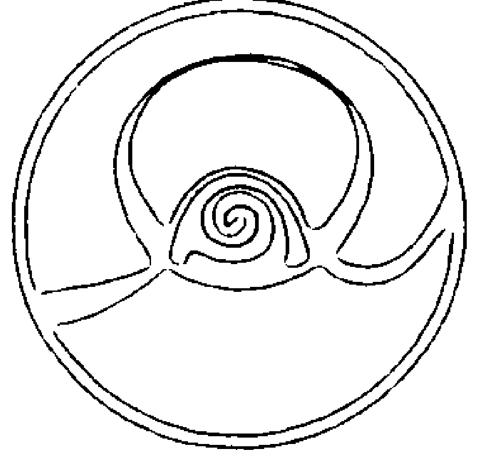

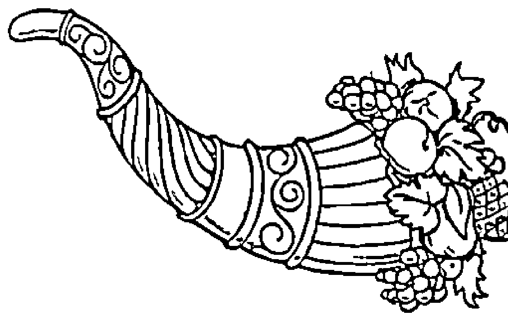

#### 精油

建議添加量：一至數種混合總計40滴

岩蘭草（Vetiveria zizanoides）
岩蘭草是首屈一指的招財精油，可吸引金錢、提昇成交率，還能防小偷，極適合用於店面。草根深植入土，說明了精油功效：非常接地、踏實、與大自然連結。嗅聞它苦苦甜甜的泥土香氣，能平衡中樞神經，放鬆鎮定，紓解緊張，平撫創傷，改善睡眠，因此被封為「寧靜之油」。更讚的是還可避邪、擺脫衰運、淨化保護氣場與空間，可謂心靈咖的萬用必敗款。此精油非常濃稠，添加量不必多。

薑（Zingiber officinalis）
想不到吧？天天出現在餐桌上的食材，居然是洋人眼中的招財藥草。薑的火性能提昇能量，對應掌管創造力的臍輪，也有益海底輪和太陽神經叢，使人樂觀積極，激發勇氣活力，提昇自信熱情，加速計畫進行，是能協助我們「築夢踏實」的藥草。當覺得虛弱無力、能量枯竭、陷入受害者情結時，薑的補氣作用能拉你一把。

肉荳蔻（Myristica fragrans）
招財有分招正財與招偏財，正財是正職收入，偏財是非正職收入，還有一種叫「橫財」，專指賭博或意外之財。肉荳蔻是招橫財運第一名的精油。如果您想要提升的是賭運，非肉荳蔻莫屬了。買彩券、賭博之前，別忘了用一用。

安息香＋肉桂＋羅勒
據說這三種合用是吸引顧客上門的魔法配方。羅勒增加專注積極度，肉桂讓你熱情衝衝衝，安息香在放鬆愉悅的同時仍能維持專注力。羅勒與肉桂都是在西方被視為追求成功的魔法藥草，無論是事業、財運或考運。這三者還全都有保護淨化的效力。

### 其他具有招財功能的精油

- 雪松
- 丁香花苞
- 羅馬洋甘菊
- 廣藿香
- 薄荷
- 大高良薑
- 乳香
- 百里香
- 蒔蘿（防止揮霍）
- 甜羅勒
- 神聖羅勒


## 藥草酊劑

建議添加量：任意

### 金銀花（Honeysuckle）

顧名思義，吉祥招財，坊間可以買到茶飲形式的乾燥藥草。金銀花能協助分辨事物真實的價值，澄澈心智、增強直覺力。甜甜的香味能使人心都變「甜」，使人變得慷慨自信，進而吸引貴人來相助，提升人際忠貞度。有趣的是，金銀花其實就是貝曲花精裡的「忍冬」。

#### 洋甘菊（Cammomile）

洋甘菊精油很貴，茶飲就實惠多了。洋甘菊能吸引金錢，特別是賭運。其舒緩、助眠及安定神經的效用，在金錢動盪時能平緩心緒。德國洋甘菊和羅馬洋甘菊兩種品種都可以用。

### 金盞花（Calendula）

金黃如太陽的花朵，是在花草茶店或手工皂原料行常見的身影，能協助我們贏得別人的讚賞與尊重，解決金錢官司困擾。金盞花更是賭運橫財的幸運草，傳說能引發預知夢，嗅聞入睡之後，假如做了幸運的夢，隔天就可衝去賭一把。

#### 多香果（Allspice）

俗稱「牙買加胡椒」的香料，香料店可以購得，也有精油的形式。雖然不常單獨做為招財成分，但是可以做為催化劑，可以刺激思緒，激發想出生財點子，是一種幸運藥草。

#### 紫苜蓿 (Alfalfa)

很驚訝吧？常出現在生菜沙拉裡的苜蓿芽，或是寵物店賣的兔子牧草，居然是招財藥草！苜蓿雖不足以獨立做為招財成分，卻是很好的催化劑，可與其他成分協同運作，特別能改善匱乏感。通常會用來招財的苜蓿品種是學名為Medicago sativa的「紫苜蓿」。

#### 花精

建議添加量：7～16滴／每種

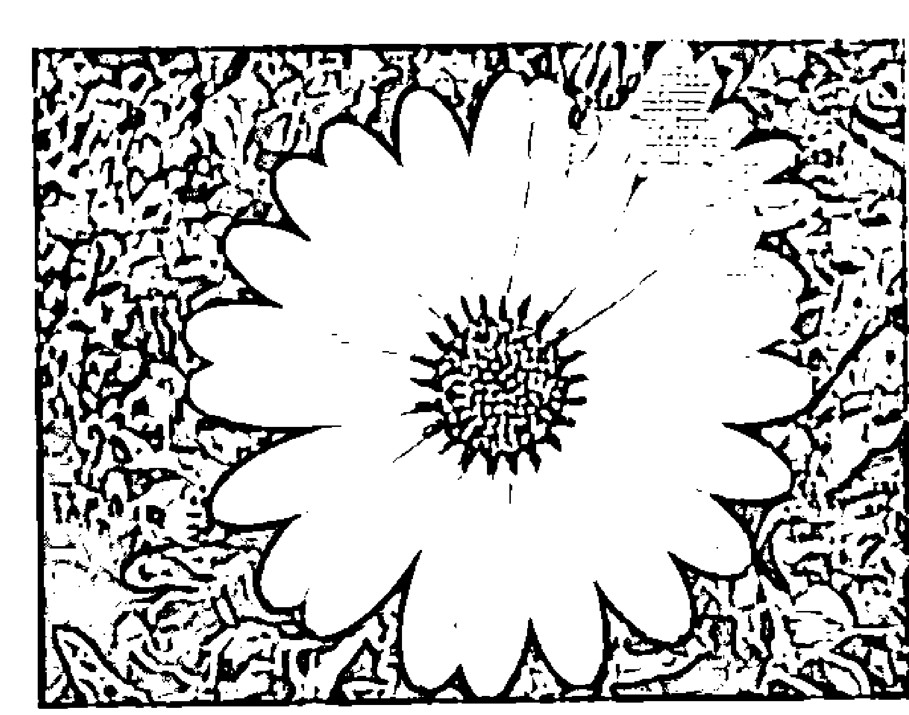

### 藍眼菊 (Osteospermum pluvialis)

藍眼菊是豐盛花精的關鍵元素，能幫助我們向宇宙的豐盛敞開。許多人陷於匱乏，是因為深埋的「我不值得」潛意識信念，不容許自己接受好東西。藍眼菊能讓我們發現內在的神聖，肯定自己值得接受一切最好的事物。可惜藍眼菊不適合台灣氣候，雖然可以買到盆栽，做出來的花精品質終究不如野生好，這是不得不然的妥協。製作時請選擇白花瓣、藍眼心的花種。

#### 冰山玫瑰 (Iceburg Rose)

財運與心輪接受的能力有關。越能容許自己去接受，就越能獲得豐盛。冰山玫瑰可清除因為過去痛苦經驗造成的心輪阻滯，消解防衛心態，適合感到孤立及無法開放接受美好事物的人。

## 寶石酊

建議添加量：16～20滴／每種

### 黃水晶

所有黃色系晶石都可招偏財，黃水晶是其中的首推水晶，特別有利於炒股、賭博等意外之財。黃色對應太陽神經叢，能增強自信，召喚成功。

#### 束菱玉

所有綠色系晶石都可以招正財，有助於正職事業的收入。西洋認為綠色是財富的顏色，也是心輪的顏色，心輪掌管接受的能力，要有錢當然要先學會接受囉。

### 其他具有招財功能的晶石

- 金髮晶
- 鈦金
- 紫黃晶
- 黃玉
- 黃鐵礦／愚人金
- 綠幽靈水晶
- 橄欖石
- 孔雀石
- 綠碧璽
- 葡萄石
- 琥珀

### 稀釋劑

水／以上任何一種晶石的水晶水／以上任何一種精油的純露

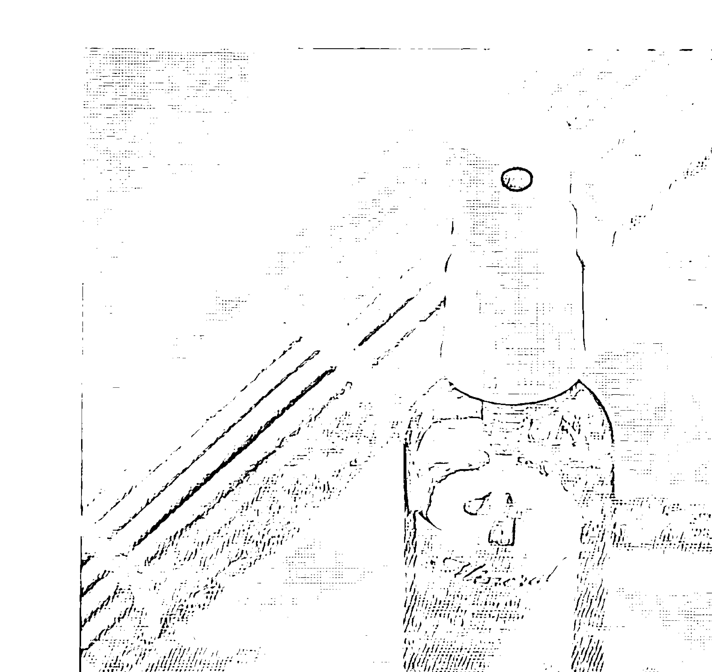

## 魚躍龍門

### 使用時機
- 1. 希望追求事業成功時
- 2. 準備考試與面試時
- 3. 希望增進熱情與主動積極

但凡活在這個物質世界上，就逃脫不了追求物質成功的道路。與其只是安於溫飽，不如相信自己值得擁有成功，將這一生活得淋漓盡致吧。這個配方與招財是一體兩面，大部分的招財材料都可應用在此配方裡。此配方主要在增進積極成功的心態，追求世俗的成功，讓競賽考試無往不利，對任何型態的事業都有幫助——職場運、官運、學業運，甚至家庭運，如果你是家庭主夫或主婦的話。

## 無形能量

關鍵字：成功、勝利

- 肯定語：我是成功磁鐵。不管我做什麼，都會成功。我值得擁有成功。
- 象徵符號：桂冠符號（laurel wreath）、北歐盧恩符文的太陽（Sowilo）。
- 大天使：成功天使Perpetiel。


桂冠


盧恩符文的太陽

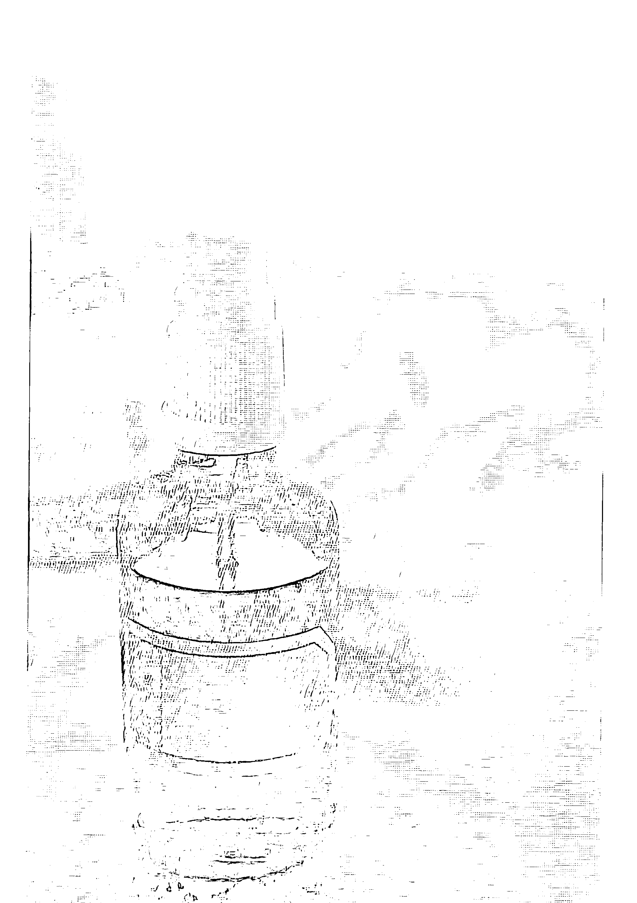

#### 精油

建議添加量：一至數種混合總計40滴

月桂 (laurus nobilis)

相傳仙女黛芙妮為了躲避阿波羅的追求，化成月桂樹，阿波羅遂將月桂戴到頭上。因為這個典故，在古希臘羅馬時期，成功的英雄會獲得桂冠加冕，月桂因而成為深植人心的成功象徵，堪稱全方位成功藥草。月桂的能量就像金色太陽，光明而積極。其他的靈性功能包括淨化、保護、增益療癒效果，睡前使用可引發有意義的夢。除精油形式外，也可製成藥草酊劑，乾燥月桂葉在超市賣場很方便購得。

### 其他具有事業成功功能的精油

- 薑
- 佛手柑
- 乳香
- 胡椒薄荷
- 迷迭香
- 鼠尾草（聰明才智方面的成功）
- 苦橙葉（協助突破現狀）
- 多香果（輔助催化劑）
- 荳蔻

## 藥草酊劑

建議添加量：任意

朱草根 (Alkanet Root)

在某些手工皂材料行可買到的朱草根粉，是紅色的天然染料。當成功需要時間醞釀時，朱草根可以加速事情進行的速度。

甘蔗

沒錯，在事業魔法中，當感覺處境艱苦時，加一點糖能讓處境變「甜」。也許不需要找真的甘蔗來做酊劑，可添加少許糖到噴霧中做為代表，黑糖、紅糖、冰糖、果糖，全都可以。

### 其他具有事業成功功能的酊劑

多香果（輔助催化劑），或任何上述精油植物也都可做成酊劑。

#### 花精

建議添加量：7～16滴／每種

歐白芷（Angelica）
提昇自信，增進對課題或問題根源的洞見與真知。增強對天使的吸引力，更能獲得天使的幫助。

其他具有事業成功功能的花精
落葉松（提昇自信）、龍膽（從挫折沮喪中重新站起來）、橄欖（消除疲累、提昇元氣）。

## 寶石酊

建議添加量：16～20滴／每種

鈦晶
內含金色絲狀的水晶，堪稱事業運與各類財運之王，可增強自信、明智、膽識、氣魄和行動力，與月桂堪稱絕配。

琥珀
金黃色的琥珀也有助於事業運，兼具提振精力與平緩冷靜之效，其他效用包括靈性保護、淨化、澄澈心智、增進心想事成力、釋放恐懼與壓力。

其他具有事業成功功能的晶石
黃水晶、火蛋白石、紅寶石、粉晶（廣結善緣、相信自己值得），以及所有招財晶石都可考慮，包括金髮晶、紫黃晶、黃玉、黃鐵礦／愚人金、綠幽靈水晶、橄欖石、東菱玉、孔雀石、綠碧璽、葡萄石等。

### 稀釋劑

水／以上任何一種晶石的水晶水／以上任何一種精油的純露

## 翰林學士

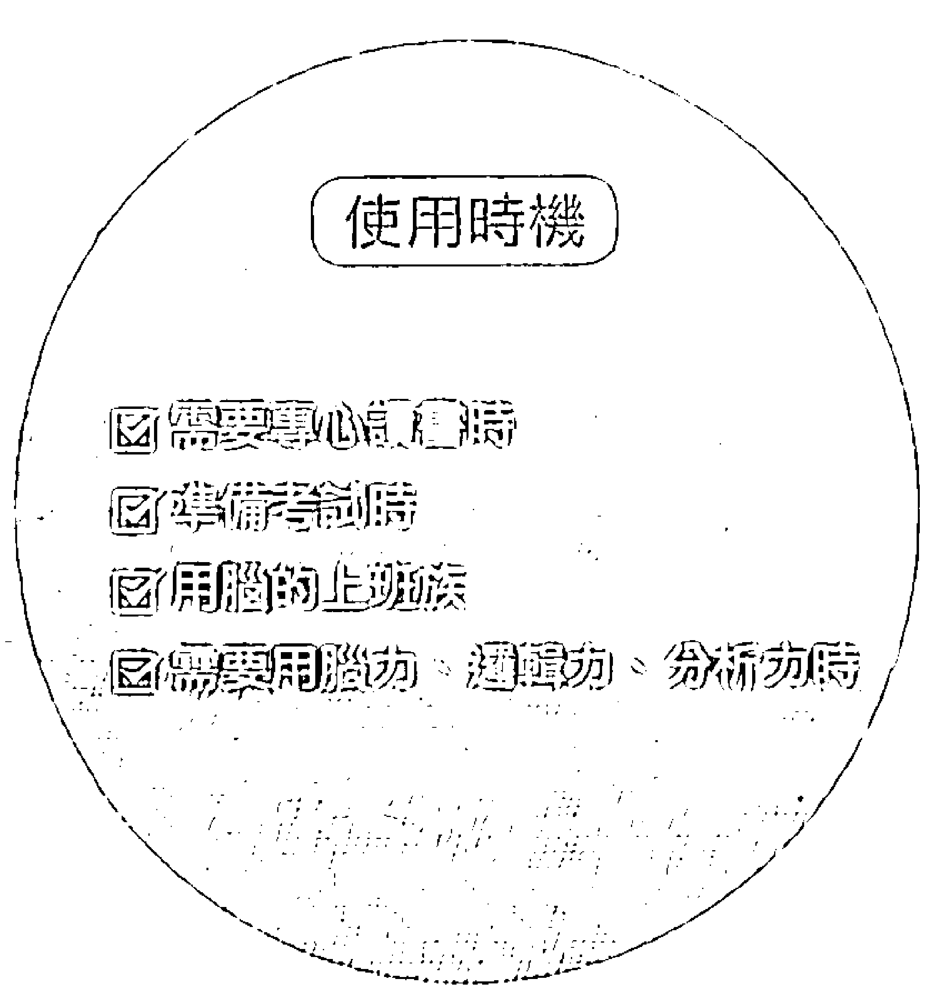

台灣人一生中至少會有十二年在學校度過。現在大學林立，讀到碩博士的比比皆是，算算在學校會待超過二十年。這是讀書專用配方，提升記憶力、專注力、左腦邏輯分析力，當然還要強化自信心，才能贏得考試。利腦的精油通常氣味與作用皆強烈，需少量調配。搭配柑橘類精油，可增加香氣討喜度，增進讀書的愉悅感，更重要的是自信心。

## 無形能量

關鍵字：金榜題名、專心

肯定語：我的頭腦敏捷，學習效率高，記憶力過人。不管準備什麼我都能專心致志。我享受讀書考試的過程。

象徵圖騰：文殊菩薩心咒、桂冠

大天使：約菲爾（Jophiel）

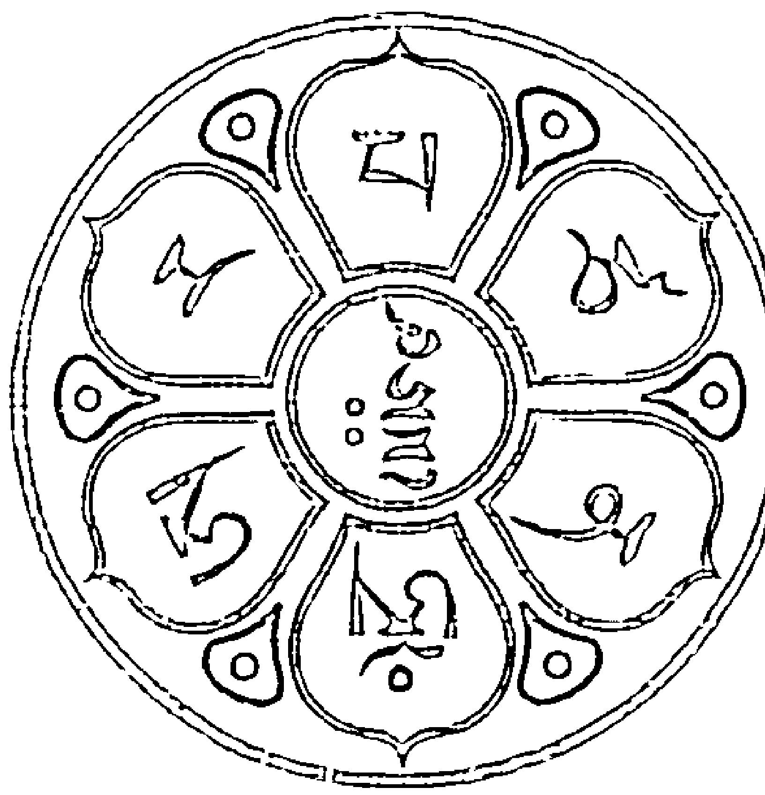

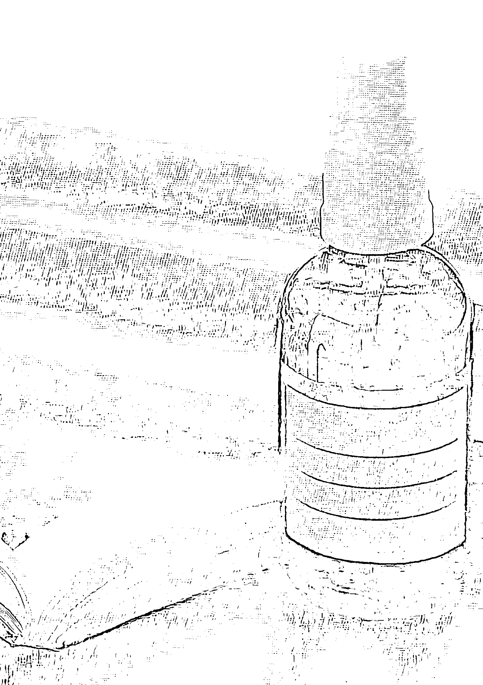


#### 精油

建議添加量：一至數種混合總計40滴

### 甜羅勒（Ocimum basilicum）

羅勒的拉丁字源意謂「香草之王」，對集中精神與專注力極有幫助，同時有溫和放鬆效果，可消除腦力疲勞，改善緊張、沮喪與焦慮，獲得面對難關的勇氣，對考試、事業運和財運都大有幫助。能量層面主要影響太陽神經叢，對其他所有脈輪也有幫助。印度品種神聖羅勒（Ocimum sanctum）的靈性功效更高，振奮效果更強，阿育吠陀醫學認為它能平衡所有脈輪，且是優異的淨化保護藥草，效果強烈，宜少量使用。

#### 迷迭香（Rosmarinus officinalis）

促進記憶力的首選精油，能激勵、振奮、專注，消除心智疲累，促進溝通表達力。氣場淨化與保護效果亦優，幾乎對每一個脈輪都有幫助。睡前少量使用，據說可幫助記憶夢境並防止惡夢。迷迭香是與太陽和火元素對應的陽性植物，充滿積極進取的精神，市售精油有幾種不同類型，建議優先選用桉油醇迷迭香（CT cineol），其次為樟腦迷迭香（CT camphor）。

#### 胡椒薄荷（Mentha piperita）

眾所皆知的提神精油。清涼的香氣，令人精神為之一振，疲憊一掃而空，清除腦中雜念，清晰思路，還能消除對未知的恐懼，特別適合開展新事物。薄荷的鮮綠色在洋人眼中正是典型的財富象徵。靈性方面，薄荷主要影響太陽神經叢，次要影響海底輪和眉心輪，有不錯的氣場淨化功效，稍微有保護效果，微量使用可以助眠並引夢。可用綠薄荷（Mantha spicata）替代。

#### 丁香花苞（Eugenia caryophyllata / Syzygium aromaticum）

丁香暖性激勵效力甚強，能幫助記憶、提振精神、清晰頭腦、消除委靡。靈性方面，丁香能釐清情緒困擾的根源，發現困境背後的意義。主要開啟海底輪。此為強效精油，請少量使用。

### 其他具有幫助讀書功能的精油

月桂（勝利成功）、佛手柑（光明自信）、檸檬（清晰頭腦）、葡萄柚（提振愉悅也利腦）、黑胡椒（溫暖激勵）、西伯利亞冷杉（堅忍耐力、支持、冷靜思緒、耐孤獨）、尤加利（振奮集中）、鼠尾草（增進記憶）、白鼠尾草（專注與增進記憶）、芫荽（增進記憶）、百里香類（提振警覺、增進記憶）。


## 藥草酊劑

建議添加量：任意

上述任何精油植物都可以製成酊劑。


#### 花精

建議添加量：7～16滴／每種

#### 勿忘我 (Forget me not)

如同花名暗示，可增進頭腦清明、思維清晰。消除負面的思想，協助回憶資訊。有助於所有精微能量體彼此溝通流動。消除情緒緊張與憂慮，也能減輕夢魘，並安穩不規律的睡眠習慣。靈性層面，勿忘我能調理氣場，增加頂輪和意識心的連結，特別能獲致冥想靜心的品質。

### 鵝耳櫸

明明不累，想到要唸書就渾身乏力，拖延懈怠？這種「心理疲累」就是鵝耳櫸的管區。使用鵝耳櫸，可以消除怠惰，提起讓讀書計畫如期進行的精神。

#### 胡桃

容易分心、受到外界影響時，胡桃能保護心智，就像罩上一頂安全帽一樣，無視外界風吹草動，繼續專心讀書。

#### 栗苞

考試時老是錯在同一個地方嗎？同一件事情就是學不起來嗎？諸如此類一錯再錯的情況，栗苞可以協助我們不再重蹈覆轍。

##### 白栗

若因腦中雜念甚多而無法專心讀書，白栗可以澄澈思緒，恢復腦袋的平靜。

### 鐵線蓮

假如對未來充滿過多幻想與憧憬，老是陷在白日夢中，恍神、嗜睡，鐵線蓮能協助我們回到當下。

### 滿酸漿

一想到考試就緊張害怕？滿酸漿能消除恐懼，面對壓力仍表現如常，獲得好成績。


## 寶石酊

建議添加量：16～20滴／每種

### 螢石

螢石大概是晶石界增進記憶力和專注力的第一名，能明晰心智，消除雜亂思緒，幫助吸收新資訊，提升學習力、組織力與決策力，同時減輕壓力、焦慮與恐懼，且有稍許淨化氣場力。螢石有多種顏色，請優先選用藍色或黃色。

### 其他具有幫助讀書功能的晶石

- 白水晶（清晰集中增記憶）
- 紫水晶（增智慧與讀書慾）
- 天青石（心靜專注、幫助吸收）


### 稀釋劑

水／以上任何一種晶石的水晶水／以上任何一種精油的純露

## 悲痛之藥

### 使用時機
- 失戀、情傷
- 面臨生離死別
- 遭到拋棄或背叛
- 任何心碎悲痛的情境
- 遇到重大轉變，需要「放手」時

生命中難免會遭逢心碎的情境，舉凡失戀或喪親，都足以名列重大創傷排行榜。此時最受衝擊的就是心輪，可能經歷悲傷、憤怒、孤單、失落等情緒起伏，因此選材以安撫為主，且大部分對應心輪。配方中乳香及所有木質類能幫助我們在愴痛風暴中穩下來深呼吸，花朵類及粉紅晶石安慰破碎的心，柑橘類重現光明與希望，黑色晶石穩定波濤洶湧的情緒。花精選擇性很多，請選擇最呼應使用者當下情況的種類。

## 無形能量

關鍵字：愛

肯定語：我釋放痛苦與悲傷，知道生命的一切自有其完美意義。

象徵圖騰：蝴蝶（如同梁祝故事，象徵蛻變、死亡與重生）、心輪符號。

大天使：愛瑟瑞爾（Azrael）協助在世者走過喪親之痛，並安撫所有經歷嚴重情感失落者。

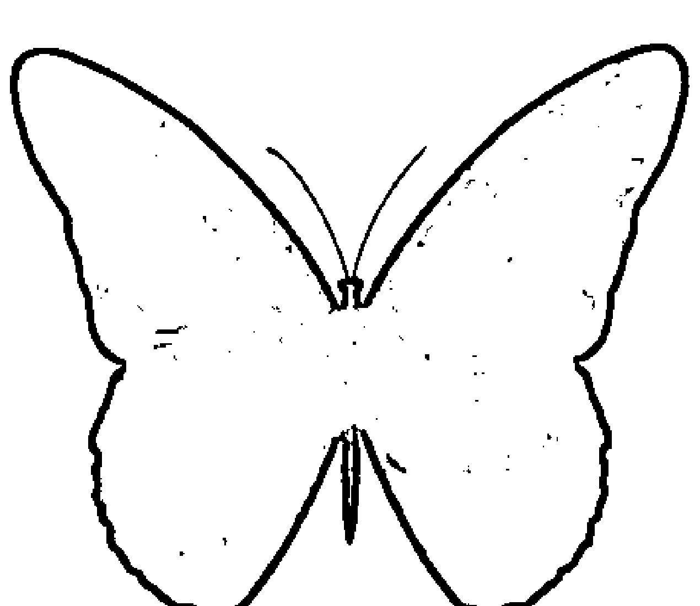

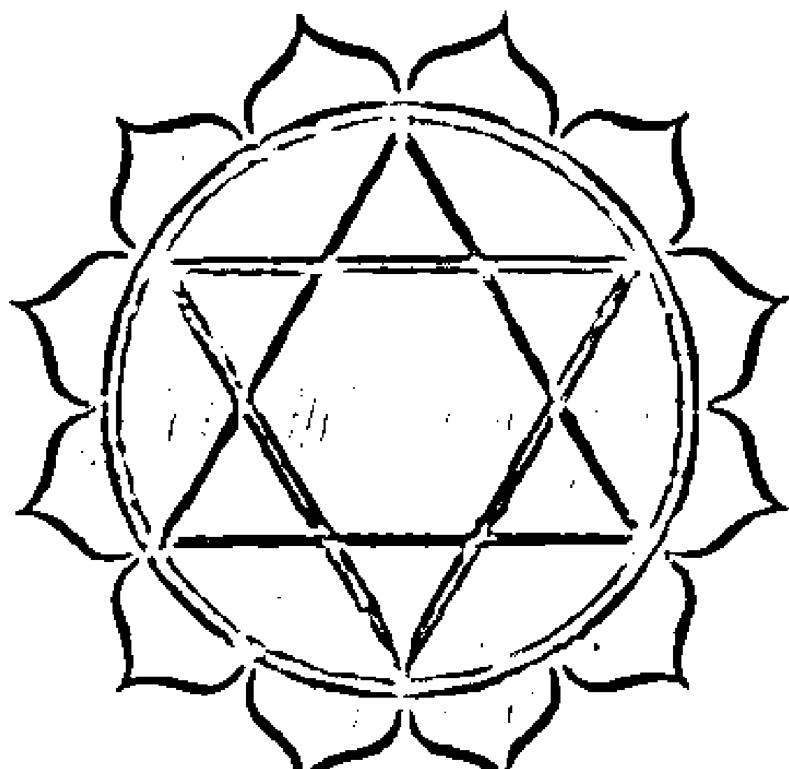

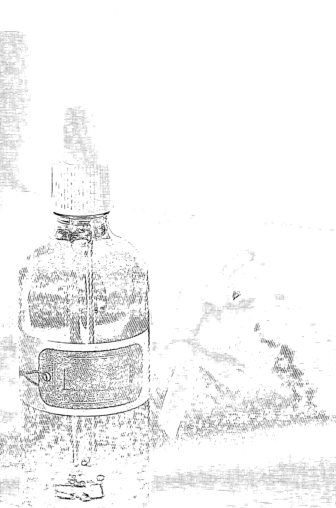

#### 精油

建議添加量：一至數種混合總計40滴

### 絲柏（Cypressus sempervirens）

在歐洲常種植於墓園的絲柏，古埃及時期就被用來做棺木，據說生在陰陽兩界之間，這一切都意謂著絲柏是面對生離死別的重要精油，能穩定心神，轉化憤怒與悲傷，去除生命的停滯，讓人生順流。絲柏的拉丁字根意謂「永生不死」，象徵靈魂永生。在任何人生的危機之中，絲柏穩定沈靜的能量都能提供莫大的幫助。此外也具氣場保護及接地功能。絲柏的脈輪對應眾說紛紜，大致以海底輪、臍輪、心輪和頂輪為主要影響脈輪。事實上，它對每一個脈輪都有幫助。

### 其他具有節哀功能的精油

- 大馬士革玫瑰（心輪精油之后，即使只加一滴都很有幫助）
- 香蜂草
- 乳香
- 檀香
- 橙花
- 菩提花
- 安息香
- 薰衣草
- 羅馬洋甘菊
- 橘／桔
- 甜馬鬱蘭
- 佛手柑（抗憂鬱）
- 永久花
- 大西洋雪松
- 天竺葵
- 岩蘭草

## 藥草酊劑

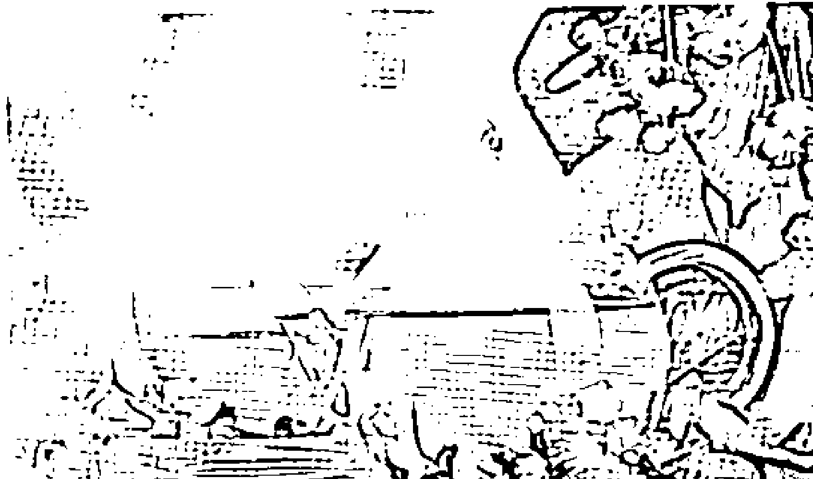

建議添加量：任意

#### 菩提花

菩提精油十分昂貴，乾燥花朵倒是容易在花草茶店購得。菩提花被譽為樹中之母，如母親慈愛的擁抱，蜂蜜似的花香，彷彿萬事都變甜了。安撫神經效果優越，滋養心輪，舒壓助眠，能平撫任何情緒波動。

#### 香蜂草（Melissa officinalis）

香蜂草精油價昂，所幸市面上買得到香蜂草茶，也買得到種子來自行栽植。香蜂草清新的檸檬香脂氣息，能提振能量，滋補心輪。在人生黑暗期時，香蜂草特別能消除憂鬱，安慰失落的創痛，重新向前走。

上述任何精油植物也都可以製成酊劑，特別推薦玫瑰、洋甘菊、雪松。

#### 花精

建議添加量：7～16滴／每種

荷包牡丹（Bleeding Heart）
帶來心的和諧寧靜，對兩人之間有不健康的情緒依附的人特別有幫助，也能消解過往因失去而造成的深埋痛苦。很適合失戀分手的情境。

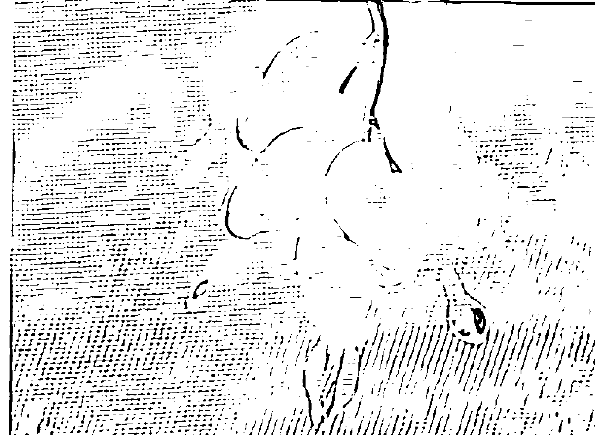

紅寶石玫瑰（Ruby Red Rose）
玫瑰花精對任何心輪與愛的議題都有幫助，紅寶石玫瑰能把滯留在心輪的痛苦和悲傷轉化為愛與慈悲。將能量振動提升至基督意識和代表原諒的紅寶石之光。

琉璃苣（Borage）
開啟並強健心輪，安撫情緒，因此能增進快樂、喜悅和勇氣，提振靈魂，祛除悲傷，對喪親情境很有幫助。

藍膠尤加利（Eucalyptus）
對喪親情境非常能提供支持。當親近的關係中有歧異，可帶來和解與原諒。平衡掌管慈悲的胸腺，強化乙太體和經絡系統。

雪花蓮（Snowdrop）
溫和消解喪親之慟，協助重拾希望與喜悅。

聖心百合

當事情來得突然，造成驚嚇時，聖心百合能舒緩震驚與悲痛，平撫創傷心情。若是情緒積壓起來，未做適當宣洩，對心理健康會造成負面影響，聖心百合可協助打開胸臆，釋放壓抑的沈痛。

胡桃

協助度過轉變期，適應不同以往的生活。

忍冬

如果沈溺在往日的美好，耗費許多時間在回憶，而無法向前看時，忍冬可以協助抽離過去，得以抬起腳步踏上人生新的一頁。

寶石酊

建議添加量：16～20滴／每種

阿帕契之淚
是黑曜石的一種，但是更加溫和，聞名於化解喪親悲痛的功能，能吸收負面情緒，黑色很有穩定之效。此外，悲痛期間氣場虛弱，阿帕契之淚可以加以保護，維持氣場健康。

其他具有化解悲痛功能的晶石
粉晶（療癒心輪，分手喪親都適用）、黑瑪瑙（類似阿帕契之淚，穩定情緒、淨化保護）、紫水晶（舒緩及靈性輔助）、月光石（冷靜、平撫情緒波動）、天使石（連結天使，療癒因失落造成的心理痛苦，懂得原諒）、藍銅礦（釋放過去，向前走）。

稀釋劑

水／以上任何一種晶石的水晶水／以上任何一種精油的純露

快樂泉源

你多久不曾感到快樂了呢？多久不曾發自真心的笑呢？孩童可以為一件微不足道的小事笑到癱地踢腳，成年人似乎失去了這樣的能力。每天早上醒來，你是沈重地拖起身子，還是快樂地跳起來迎接嶄新的一天呢？

本創作以綻放陽光的柑橘類精油為主。此類精油揮發快，添加量可以提高，搭配花朵類讓心花綻放。如果喜歡，再加微量香料類增添溫暖。

無形能量

關鍵字：快樂

肯定語：每一天，在各方面，我都越來越快樂。我值得擁有快樂。

象徵圖騰：
- 笑臉（smiley）
- 太陽
- 海豚。

精油

建議添加量：一至數種混合總計40滴

#### 甜橙 (Citrus sinensis)

如果世上有什麼味道叫「快樂」，非甜橙莫屬了。甜橙被譽為「快樂精油」，老少咸宜，其能量對應臍輪，間接協助太陽神經叢，可釋放自我批判、恐懼和沈重的思想，平衡情緒體，豐富創意，尤適合把自己逼得太緊的完美主義者。甜橙也是賴床救星，晨起嗅聞，喜悅自然來。

#### 葡萄柚 (Citrus paradisi)

葡萄柚輕快的香氣能釋放過往痛苦，鬆動任何負面情緒。有喚醒身心靈的效果，使頭腦清晰澄明，跳脫自我懷疑、自憐自厭的泥沼，學會愛自己，以更高更新的視野來看待人生的所有發生。對應與太陽神經叢。葡萄柚特別能改善飲食失調，因為貪食或厭食往往來自於自厭與缺乏愛。

#### 天竺葵 (Pelargonium graveolens)

手邊若沒有玫瑰精油，號稱「窮人的玫瑰」的天竺葵能夠幫上大忙。天竺葵據說是最能平衡陰陽的精油，香甜溫柔，使人更加接受自己、愛自己，擁抱內在小孩，平撫舊日傷痛。能量對應陰性、金星與天秤座，開啟喉輪和心輪，是「天使香氣」之一，能召喚天使，還能強健乙太體，因此氣場保護效果也不賴。

### 其他具有快樂功能的精油

- 檸檬、佛手柑、紅柑、玫瑰類（一兩滴就很有幫助）、茉莉類、依蘭、肉桂（與甜橙很速配）、薑、丁香花苞（強效，一兩滴即可）。

藥草酊劑

建議添加量：任意

以上任何精油植物都可以做成酊劑。

花精

建議添加量：7～16滴／每種

喬伊玫瑰（Just Joey Rose）所有的玫瑰都能滋養心輪，擁抱自己也擁抱別人。喬伊玫瑰特別適合想在生活中得到多一點歡樂和創造性的人，如英文花名所示——「就是快樂」。

百日菊（Zinnia）提升個人眼界，緩和緊張，重建幽默感，尤其對需要「笑」的人助益良多。

野玫瑰若生命全然喪失熱情，如行屍走肉，表面看似知命認命，實則是放棄一切，隨波逐流，消極冷漠，卻絲毫無意改變。野玫瑰能協助重燃熱忱與快樂。

## 寶石酊

建議添加量：16～20滴／每種

太陽石金黃色帶來太陽的能量，象徵光明與積極、權力與財富，能照亮一切黑暗，對冬季憂鬱頗有改善之效。對應太陽神經叢，能增進職場領導力。

其他具有增進快樂功能的晶石黃水晶、粉晶。

## 稀釋劑

水／以上任何一種晶石的水晶水／以上任何一種精油的純露

安眠入夢

人的一生中幾乎必有遭遇睡眠困擾的時候，輕則一兩天，重則許多年。與其依賴安眠藥，植物晶石的自然療方是更呵護身心的選擇，而且很有效。

失眠症候百百種，有難以入眠的，有眠淺易醒的，有因為外界壓力導致的，還有累到睡不著的。安眠配方難在對症下藥。對症了就一覺到天明，挑錯了反而可能更加清醒。多做些實驗，您會找到最速配的安眠麻吉。

此配方主要選擇鎮定、安神、放鬆類型的精油。孩子欠缺安全感類型的失眠適用薰衣草。有情感困擾、神經緊張擔憂、完美主義型的失眠適用橙花、苦橙葉或桔葉。現代社會壓力大，為了成就大事而腦子停不下來、過度焦慮緊繃者可用穗甘松、羅勒。操勞虛脫到睡不著的用歐白芷。根、樹脂、木質類精油可幫助淺眠多夢者穩定能量。花朵類可以安撫、放鬆，少量即可。柑橘類也很可以一試。

關鍵字：安眠
無形能量：太極

花精對失眠十分擅長，選擇重點在依據個人情況，選擇最對症的一兩種即可，通常不需超過三種。如果是調配純花精噴霧，那麼最多可用到七種。

晶石部分，黑色系晶石可以協助穩定能量，提供保護。藍色系平靜紛雜的思緒。白色系具有陰性、舒緩、安撫情緒的功效。紫色系也屬平靜功效。白紫色並用的協同作用不賴。最理想的安眠配方是量身訂做，精挑細選，一發中的。這或許不容易，但是絕對值得嘗試。

精油

建議添加量：一至數種混合總計40滴

真正薰衣草（Lavandula angustifolia）

說到助眠，一般人頭一個會想到的精油大概是薰衣草了。許多人不知道的是，薰衣草較適合欠缺安全感型的失眠。對西洋人而言，薰衣草就是家的味道，回到家當然有安全感，自能香甜入睡，不過對華人倒不見得會產生這樣的連結。甚至，使用過量反而會導致興奮，因此請不要貪多。靈性層面，薰衣草屬於風元素、水星藥草，紫色花朵對應頂輪，有氣場淨化保護力，和紫色系晶石相當搭配。能增強直覺力，是很不錯的冥想精油，不過在精神疲勞時不宜用它來冥想，容易睡著。

苦橙葉（Citrus aurantium）

被稱為「窮人的橙花」的苦橙葉，鎮定神經效果高，適合注重細節、過於嚴謹的神經緊張型失眠，對情感困擾導致的失眠效用亦高。能安撫憤怒、恐慌，減緩心跳與血壓，療癒精神痛苦與情緒創傷，有助於克服上癮症，也能協助害怕與別人接觸者向外突破，展現自信樂觀的自我。能量層面，苦橙葉從頂輪帶下平靜的能量，通過所有脈輪與神經系統，特別能幫助臍輪和心輪。

纈草（Valeriana Officinalis）

相信嗎？古希臘羅馬的醫生開纈草給失眠者！纈草在西方是廣為人知的安眠藥草，對中樞神經系統的平衡效果優異，減輕焦慮效果已獲科學證實，能消解自我苛責，防止惡夢。萃取部位在根部，因此能夠接地與穩定。能量方面，屬陰性、水元素，據說有扭轉逆境、反敗為勝的能力。唯一缺點是味道神似臭襪子，請少量調配。

其他具有助眠功能的精油

- 羅馬洋甘菊、馬鬱蘭、岩蘭草、快樂鼠尾草、橘、橙、橙花、桔葉、玫瑰類、檀香、依蘭、安息香、蛇麻草（適神經性失眠）、菩提花、佛手柑、茉莉、歐白芷（適操勞虛脫到睡不著）、穗甘松、羅勒類、肉荳蔻（微量）。

藥草酊劑

建議添加量：任意

上述任何精油植物也都可以製成酊劑。菩提花、洋甘菊、玫瑰可在花草茶店購得。

花精

建議添加量：單方每種7～16滴，複方每種20～28滴

- 白栗
適用於因思緒繁多導致失眠。此種失眠最典型的症狀是縈繞重複的思緒，翻來覆去想不停，導致多夢，容易在清晨醒來，醒來時腦中甚至還是縈繞著睡前的思緒。這是實務上最常用到的重要失眠花精。
- 鳳仙花
因急躁不安而失眠。此類型的人可能急著想睡，越急越是翻來覆去睡不著。
- 聖心百合
創傷後難以入睡，例如遭逢親人過世、車禍、意外等打擊，產生「創傷後症候群」，聖心百合花精可以安撫。
- 岩薔薇
因為夢魘困擾，睡不好，恐懼，容易驚醒。

急救花精（複方）

內含聖心百合、鳳仙花與岩薔薇這三種對睡眠有幫助的花精，適用於情緒興奮高漲而難以入眠。急救花精加白栗已經可以處理大多數的失眠狀況。

馬鞭草

馬鞭草人充滿理想抱負，因為過度熱衷於計畫或志業，導致緊繃、興奮、工作狂傾向，即使躺在床上也仍是繼續計畫著，當然難以入睡。

橡樹

橡樹類型的失眠是因為無法把白天的責任放下，總是想著有什麼事沒做完，甚至想拖著疲累的身軀爬起來繼續做，橡樹花精可以幫助我們放鬆，願意讓自己休息。

紅栗

如果是因為擔憂親愛的人而導致失眠，請用這一支花精。

龍芽草

此類型的失眠是內心痛苦折磨，卻想要壓抑。似乎睡前一定要喝酒或做些麻痺自己的事情，才睡得著。

勿忘我（Forget me not）

釋放情緒的緊張焦慮，減輕夢魘，安穩睡眠的不安。

西番蓮（Passion Flower）

協助建立安詳而自然的睡眠習慣。屬於較高頻的靈性花精，可強化與靈性體的連結。增強靈視能力。調頻到基督意識。更清晰地理解從更高意識接收到的訊息。活化慈悲心。

寶石酊

建議添加量：16～20滴／每種

鋰雲母

安定神經，平靜，舒緩情緒緊張、壓力、擔憂和恐懼，協助放鬆，消除不必要的強迫思想。對擔憂型的失眠格外有幫助。

月光石

月光石是非常陰性之石，舒緩力佳，是療癒情緒之石，對情緒平衡效果尤佳，因此特別適合處理情緒壓力導致的失眠。

赤鐵礦

赤鐵礦有陰陽平衡、平靜腦袋的效果，黑色有保護與接地的效果，因此對睡眠有幫助。不適合發炎者。

其他具有安眠效果的晶石

- 白紋石
- 紫水晶
- 黑碧璽（保護及穩定能量）
- 茶晶
- 紫龍晶（安神、消除恐懼及負面思想）
- 紫鋰輝石（緩解神經質、強迫症候）
- 蘇打石（使腦袋平靜）
- 海藍寶（平靜思緒）
- 透石膏。

稀釋劑

水／以上任何一種晶石的水晶水／以上任何一種精油的純露

閨房情趣

傳統上的催情精油包括茉莉、依蘭、玫瑰、檀香和快樂鼠尾草，帶有豐富的感官性。香料類刺激振奮、熱情渴望，亦屬催情的要角，少量使用即可。木質類和柑橘類雖不是傳統上認知的催情精油，不過木質類增加氣味深度及自信耐力特質，很適合男性，柑橘類則讓氣味香甜圓潤，增添歡樂、自信與遊戲性，不失為輔助加分。

關鍵字：享受、歡愉

象徵圖騰：女生用金星符號或維納斯女神。男人用火星符號。男女共用金火結合符號。

催情精油男女有别，男人需要振奮類，女人適合放鬆類，不過女人的複雜度往往出乎預料，因此仍須根據個人情況選擇最適合的配方。若想要調出同時兩人都適用的噴霧，就盡量選些對男女都有效的精油吧。

花精可處理面對親密關係的心理矛盾，當矛盾解除了，表現自然流暢。晶石以紅橙兩色為主軸，強化下兩輪的能量驅力。

#### 精油

建議添加量：一至數種混合總計40滴

### 男女皆宜推薦精油

- 摩洛哥茉莉、依蘭、晚香玉、檀香、廣藿香、快樂鼠尾草、香草、肉桂。

### 其他具有增進閨房情趣功能的精油

- 暹邏木（男）、冬季香薄荷（男）、歐白芷根（男）、大根老鸛草（男）、玫瑰類（女）、天竺葵（適女性性冷感）、橙花（女，緩解初次的緊張）、安息香、沒藥、岩蘭草、黑胡椒、薑、丁香、豆蔻、肉豆蔻（男）、甜茴香、洋茴香、藏茴香、八角茴香、羅勒類（增進性本能，男女皆可）、歐芹、芫荽、蒔蘿、龍腦或百里酚百里香、薰衣草（女性放鬆，對某些男性有助雄風）、檸檬馬鞭草、玫瑰草、花梨木、松類及雲杉類（增添氣味深度，適男性增強自信）、薄荷類（微量可添清新氣味）、柑橘類、沉香。

#### 花精

建議添加量：7～16滴／每種

- 落葉松（提升信心）、松樹（減輕對性愛的罪惡感）、海棠（緩解對性愛的骯髒感）。

### 寶石酊

建議添加量：16～20滴／每種

- 紅石榴石、紅虎眼石、紅寶石、紅碧玉、橙色瑪瑙、磷鋁石、彼得石（耐力，解除對性的心理矛盾）、茶晶（減輕性焦慮）、粉紅碧璽、粉晶（增進雙方的愛）。

斬斷癮頭

### 使用時機

- 想要戒除各種上癮症：煙癮、酒癮、性愛上癮等
- 想要解除各種狂熱傾向：工作狂、購物狂、蒐集狂
- 想要離開一段感情關係

你是不是每小時要看好幾次手機呢？人生中充滿各種上癮的可能。萬年不變如煙癮、酒癮、毒癮，現代新版如購物狂、蒐集癖、網路成癮。甚至，當社會普遍讚許的美德執迷過頭時，也會變成上癮傾向，譬如勤奮者變工作狂，愛乾淨者變強迫症，運動者變健身癖，愛美者變整容魔人。又或者感情或肉體的過度迷戀，難道就不算一種上癮？就連靈修冥想過度，也能淪為沉迷上癮。是該「斷捨離」的時候了。

無形能量

關鍵字：斷捨離

象徵圖騰：蛇杖（Caduceus）、鳳凰、美國戒酒標誌、飛出籠中的鳥。

精油

建議添加量：一至數種混合總計40滴

給予戒癮的動力

白珠樹、尤加利、黑胡椒、丁香花苞。

一般強迫傾向

乳香、安息香、檀香、岩蘭草、真正薰衣草、廣藿香、絲柏、玫瑰、天竺葵、依蘭、洋甘菊、永久花、香蜂草、檸檬、快樂鼠尾草、佛手柑、穗甘松、絲柏、橙類、橘類、月桂、薑、大高良薑。

慧劍斬情絲

印度藏茴香、雪松類、大高良薑、甜馬鬱蘭（享受單身，抑制性慾）。

購物癮：蒔蘿、甜茴香

貪食：葡萄柚、羅勒類。

舒緩戒煙酒期間的頭痛倦怠感：薄荷。

藥草酊劑

添加量：任意

以上任何精油植物皆可做成酊劑。

花精

建議添加量：7～16滴／每種

粟苞：給戒癮許多次都戒不掉，不斷重蹈覆轍的人。

龍芽草

給為了逃避面對內心痛苦而沉迷上癮者。

櫻桃李

緩解衝動行為。擔心自己忍不住衝動又破戒時使用。

海棠／野酸蘋果

給潔癖者，或因為成癮而覺得自己不潔者，並支持煙酒毒癮的身心排毒。

矢車菊

給容易因為不好意思拒絕別人而破戒者，以及戒癮意志薄弱者。

松樹

給因為戒不掉而內咎的自我苛責者。

落葉松或龍膽

對戒癮成功不抱信心時。前者是對自己整體的能力沒有信心，後者適用於因為先前戒癮失敗導致暫時信心低落。

岩薔薇

若戒癮過程中發生恐慌，岩薔薇可消解，並協助接地、回到當下。

甜栗

如果覺得自己試過許多方法都無法成功戒癮，彷彿被困在黑暗中，十分苦惱時，甜栗可點亮內心的燈。

聖心百合

若成癮行為是因為創傷或驚嚇導致，聖心百合可以療癒。

忍冬

擺脫過去，活在當下。特別適用因為留戀過去而導致的上癮行為。

胡桃

功能有二，一是擺脫過去，適應轉變。二是不受環境影響，堅定意志。因此可協助戒癮時期的轉變。

寶石酊

建議添加量：16～20滴／每種

紫水晶（打破成癮行為，減輕身心靈痛苦，對戒酒尤有幫助）、赤鐵礦（打破循環，釋放不想要的行為模式）、黑瑪瑙（給予轉變的力量，釋放恐懼與擔憂）、黑曜石（消解心理壓力、排毒）

禪定冥思

### 使用時機
- 靜心冥想時
- 做瑜伽、太極、氣功時
- 從事任何創作時
- 閱讀時
- 任何時刻希望讓心情平靜下來時
- 想要達到「專注放鬆」的心流體驗時

在繁忙的生活中，你是否忘了走進內心，回到那寧靜如水的禪定喜樂呢？禪定並不是純粹放鬆躺平，也不是專注思考。你是否曾經在閱讀、繪畫、寫作或演奏時，徹底融入那番美好，而渾然不覺時間流動？大約就是這種感覺。在心理學上，這稱為「心流經驗」，是一種既放鬆又專注的狀態，左右腦同步運行，向上接引更高的意識。在那個時候，靈感源源不絕。禪定冥思噴霧希望達到的就是這種狀態。

**關鍵字：禪定、靜心**

象徵圖騰：唵。

#### 精油

建議添加量：一至數種混合總計40滴

乳香、沒藥、檀香、欖香脂、廣藿香、岩蘭草、祕魯聖木、大西洋雪松、花梨木、杜松子、佛手柑、橘、橙、白鼠尾草、真正薰衣草、桉油醇迷迭香、歐白芷根、永久花、橙花、茉莉類、玫瑰類、蓮花。

### 藥草酊劑

添加量：任意

以上任何精油植物皆可做成酊劑。

#### 花精

建議添加量：7～16滴／每種

白栗
清除腦中不斷重複的雜念，獲得腦中的平靜。

荷花（Lotus）
是最靈性的花精，開啟頂輪與第三眼，接引更高的訊息，強烈推薦在冥想中使用。

### 寶石酊

建議添加量：16～20滴／每種

紫水晶（平靜緩和、提昇靈性、增進靈視）、海藍寶（清除雜念、自我覺察）、玉髓（清除雜念、專注）、螢石（清除雜念、專注）、玉（平穩寧靜）。

靜）、青金石（開啟第三眼、專注）、拉長石（深化冥想、提昇意識）、粉晶（開啟心輪、增進愛）、白水晶（清晰專注）、月光石（寧靜、融入潛意識、自我覺察）、茶晶（接地、穩定）

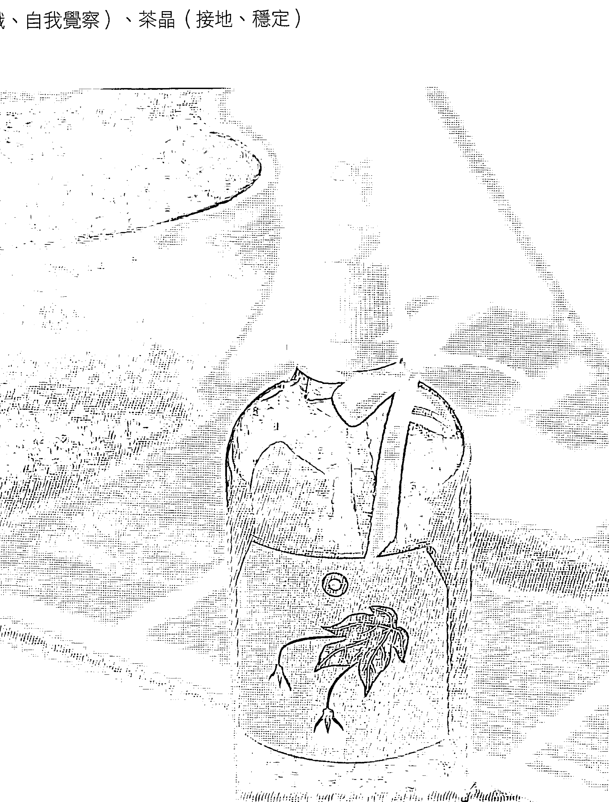

# 脈輪能量

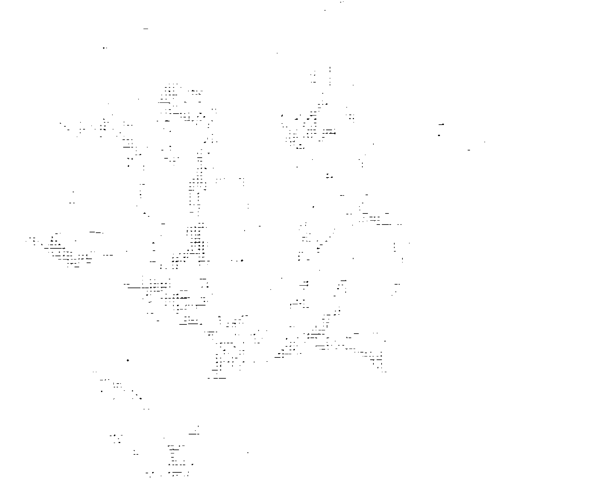

印度瑜伽的古老智慧發現人體中軸有七大能量中心點，如同輪狀渦旋一般，對身心靈康健有至關重大的影響。人人皆知要保養身體，卻不是每個人都知道脈輪也需要照顧。

身體是靈魂的載具。有健康的身體，才能實踐任何想在這個世界上實現的願景，而不受肉體所限。脈輪則是靈魂的器官，是靈魂與肉體的接點。脈輪通暢了，才能維持良好的心靈狀態，發揮正面的特質，實現自我價值，徹底落實天命。

藥草與晶石都是保養脈輪的好幫手。本章精選各脈輪適用的藥草與晶石，您只需輕輕鬆鬆照章選用，每個人都能創作專屬自己的脈輪配方。

需事先說明的是，許多精油對脈輪的幫助是整體性的，並非一種精油只影響一個脈輪，所以本章選出的精油可能跟坊間將精油和脈輪一對一對應的書籍有所出入。脈輪的能量實為互通，就像火車車廂的空氣，你不可能在一節車廂薰香而不影響到隔壁車廂。事實上，有不少精油能同時暢通多個脈輪的能量，本書是以這樣的思維來選取各脈輪適用的精油。譬如肉桂可開啟下面四個脈輪，就會在這四個配方都現身。透過這樣的安排，創作更加靈活。

花精選取的哲學也是一樣。雖然坊間已有將貝曲花精七大類分別與七脈輪對應的系統，但是其實花精與脈輪的對應並非一對一，同一種花精可能影響數個脈輪，像荊豆花精甚至是哪個脈輪有需要就去幫助哪個，因此在本書中我將重新梳理脈輪與花精的對應，挑選務實上真正合用的花精。

另外一個需事先提醒的觀念是，配方沒有能套用在每一個人身上的公式。即使是一種公認對某個脈輪有益的精油，也不見得對每個人的該處脈輪都有相等的幫助，因為每個人脈輪不通的狀況不同，適用不同的精油來處理。例如假使一個人的臍輪過旺而性慾高漲，使用具催情作用的檀香精油就不見得對他最好，儘管檀香是經典臍輪用油。

藥草與脈輪的世界浩瀚無垠，有待探索。本章的配方作為拋磚引玉，然而即使是配方中沒有列出的精油或花精，並不代表不能使用。就盡情去實驗，去遊戲吧！

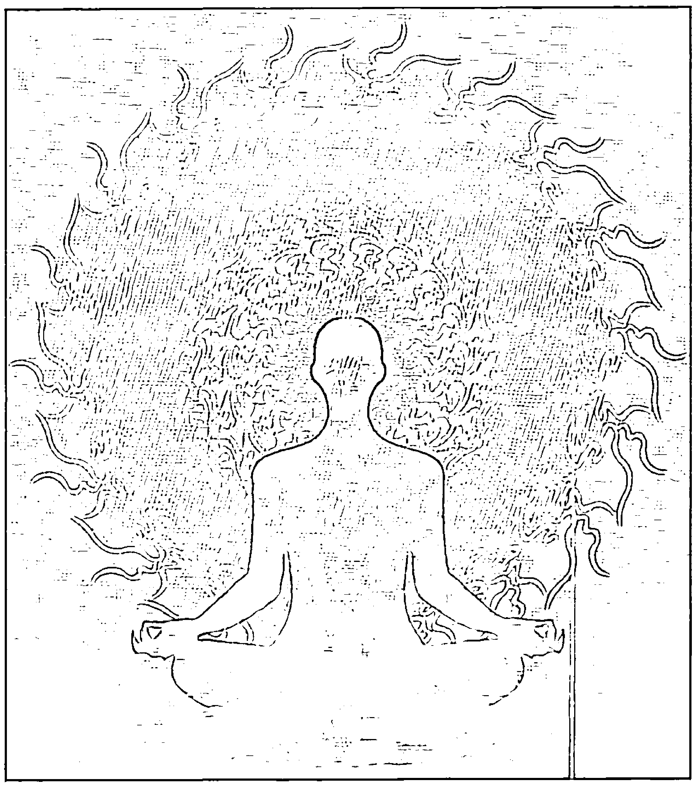

### 根植大地

使用時機

-   有生存方面的恐懼時，例如覺得自己人身不安全或無法面對威脅
-   經常恐慌、健忘、焦慮、渙散、做白日夢、不在當下
-   太「飄」，仿佛不是活在這個世界上
-   想多做少，缺乏行動力時
-   不信任生命時

海底輪位於脊椎底部會陰處，對應紅色和土元素，影響器官是骨骼、牙齒、指甲、血液、大腸、腎臟、腎上腺，主宰生存、穩定與安全感。當海底輪運作良好時，能獲得穩定感、安全感、活力與行動力，真正腳踏實地，活在當下。要保養好海底輪，「接地（Grounding）」是關鍵，或者說「連結大地之母」。

人體能量系統就像一棵大樹，根必須扎得深，與大地緊密連結，才有能力向上開枝散葉。現代人遠離自然，面對多工並進的生活，用腦過度，思緒散亂，能量往往卡在身體上半部，無法充分導回地面。欠缺大地之母的滋養，就像一棵根淺欲墜的樹，怎能不虛弱無力？

幸好，藥草與晶石都能協助平衡海底輪。所有的木質類與根類精油都有「接地」功能，溫暖、泥土味重、屬於後味的精油通常也有助海底輪，岩蘭草為最典型代表。花精首選能接地或消解生存恐懼的種類，請依個別情況選用。
晶石選紅色系滋養海底輪，可用黑色系加強接地。這樣的配置讓我們像大象一樣，每一步都踩得不能再穩。

關鍵字：安全與力量

象徵圖騰：海底輪

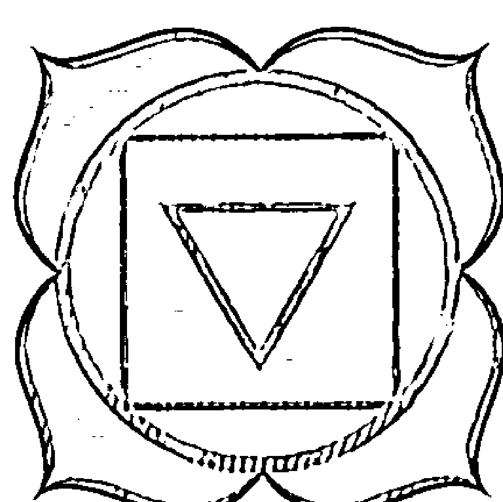

海底輪

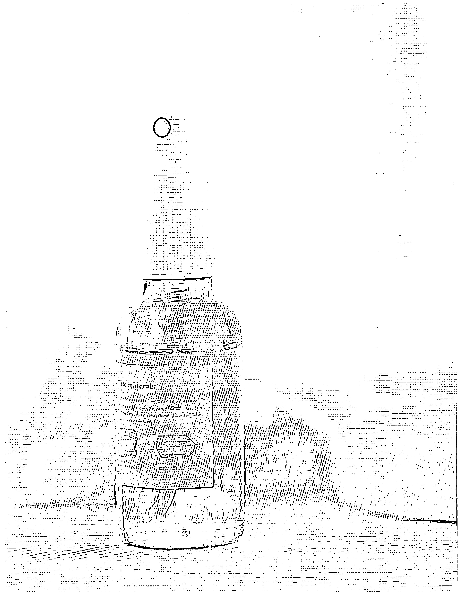

#### 精油

建議添加量：一至數種混合總計40滴

海底輪經典用油

-   岩蘭草

其他有助海底輪的精油

-   廣藿香、歐白芷根、沒藥、穗甘松、岩玫瑰、薑、安息香、乳香（連接頂輪與海底輪能量）、白松香、丁香花苞、絲柏、檀香（接地）、雪松類、祕魯聖木、黑雲杉、杜松、花梨木、肉桂類、胡蘿蔔籽、黑胡椒、大根老鸛草、欖香脂、快樂鼠尾草（協助思考過度而無法接地者）、依蘭、纈草。

## 藥草酊劑

建議添加量：任意

以上任何精油植物都可作為酊劑。

#### 花精

建議添加量：7～16滴／每種

千屈菜（Loosestrife）

千屈菜可平衡海底輪、臍輪和太陽神經叢，讓從頂輪和心輪流進來的靈啟、直覺和創意更加穩定流暢，更能落實於日常生活。經常茫然恍神或無法將直覺付諸行動的人，會發現這瓶花精特別有用。

聖約翰草（St. John's Wort）

聖約翰草轉化恐懼的高頻花精，無論是隱藏的、潛意識的、前世的還是非常明顯的，都可以藉由聖約翰草來紓解。這是非常強力的花精，對每個人都有幫助。

##### 野生虞美人 (Wild Poppy)

鮮紅色的野生虞美人與海底輪強烈對應，可清理海底輪的鬱結，啟動海底輪，協助根植大地，使能量基礎更穩固，是一款優秀的海底輪接地花精。

# 鐵線蓮

鐵線蓮能改善愛幻想、恍神、健忘、做白日夢、彷彿活在粉紅泡泡世界裡。鐵線蓮能協助拉回當下，扎根地球。

# 岩薔薇

岩薔薇對治與生存恐懼有關的強烈驚恐。當任何恐懼達到會「慌」、會「驚恐」的嚴重程度時，都要使用岩薔薇。被嚇得失魂時，可協助回到平衡並接地。

# 溝酸漿

溝酸漿可處理任何「可以名狀的恐懼」，包括怕被害、怕沒錢、怕失業、怕死，都屬於溝酸漿範圍。

# 白楊

白楊對治「莫名的恐懼」，這種恐懼通常與靈界或無形世界有關，是所謂的「敏感體質」適用的花精。

# 紅栗

紅栗專門處理「恐懼親愛的人發生不幸」的議題。會擔心親愛的人不幸，正是缺乏生命安全感的表現。

# 聖心百合

收驚。適用於因為驚嚇或創傷而魂飛天外的情形。對舊日創傷也適用。

# 櫻桃李

給海底輪能量過激者。協助控制海底輪能量，而不致於發生激烈的行為。

# 其他海底輪花精

-   荊豆（因長期受挫導致徹底憂鬱絕望、放棄嘗試）
-   忍冬（害怕放下過去就失去自我價值）
-   鵝耳櫪（消除懶散拖延，增進行動力）
-   橄欖（滋補元氣，獲得活力）
-   橡樹（回到現實看清自身的極限）
-   野玫瑰（拾回對人生的熱忱與志氣）
-   岩水（害怕無法達成自我要求，有一點接地功能）
-   線球草（害怕自己無法做出正確決定）
-   馬鞭草（害怕公義秩序被破壞或理想無法實現）
-   胡桃（安全感）
-   水堇（把孤高狀態拉回地面）
-   榆樹（消解因責任感過重而積聚在下三輪的負面情緒、協助接地）

# 寶石酊

建議添加量：16～20滴／每種

紅色系或黑色系晶石，例如紅寶石、紅石榴石、紅碧玉、黑曜石、黑碧璽、赤鐵礦等。

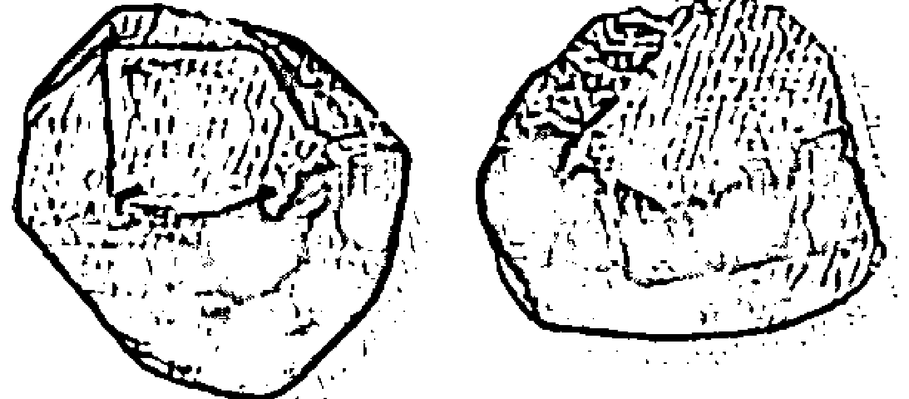

# 稀釋劑

水／以上任何一種晶石的水晶水／以上任何一種精油的純露

# 臍之創意

使用時機

-   缺乏靈感、創意枯竭時
-   性功能障礙、性冷感、性無能
-   創造力停滯，無法將想法落實
-   感官麻木，難以享受生活樂趣

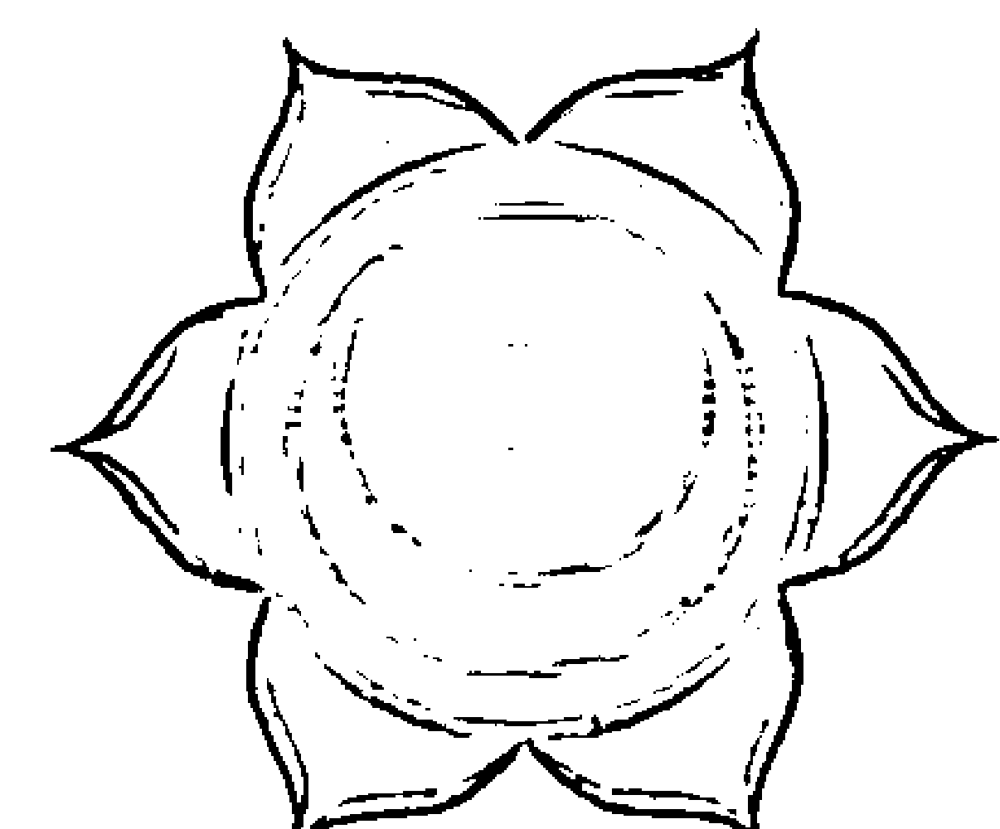

臍輪位於肚臍下約兩吋處，對應橘色與水元素，影響器官是女性生殖系統、泌尿系統、淋巴系統、腎臟、胰臟、腸。掌管性、生育與創造力。當運作良好時，性功能完好，創造力豐富，能充分在親密關係中表達情感，並享受感官的歡愉。

滿足感及感官歡愉的檀香是很典型的臍輪精油，性感的花朵類當然不可或缺，活潑快樂的柑橘類和刺激五感的香料類一樣不能少。

如果特別想要處理性愛的方面，請參照「閨房情趣」配方。

# 無形能量

關鍵字：創意、享受

象徵圖騰：臍輪

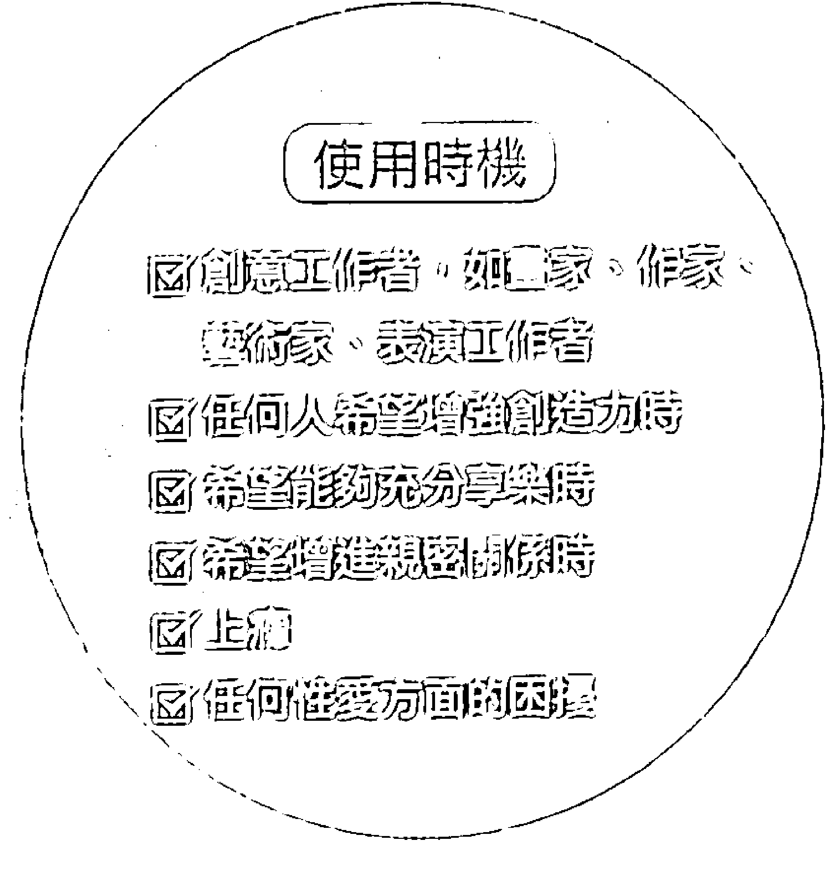

#### 精油

建議添加量：一至數種混合總計40滴

臍輪經典用油

-   檀香
-   貞節樹
-   快樂鼠尾草

其他有助臍輪的精油

-   沒藥
-   佛手柑
-   廣藿香
-   肉桂類
-   甜橙
-   苦橙葉
-   橘
-   花梨木
-   芫荽
-   玫瑰
-   玫瑰天竺葵
-   玫瑰草
-   茉莉類
-   依蘭
-   香蜂草
-   橙花
-   香草
-   荳蔻
-   黑胡椒
-   歐白芷根
-   暹羅木
-   穗甘松
-   多香果
-   丁香花苞
-   歐芹
-   洋茴香
-   甜茴香
-   冬季香薄荷
-   野馬鬱蘭
-   白松香
-   纈草
-   胡蘿蔔籽
-   香草
-   蛇麻草（降低男性性慾）


# 藥草酊劑

建議添加量：任意

巴西利（Parsley）

Parsley是西洋香菜，又稱「洋香菜」、「洋芫荽」或「巴西里」，精油通常叫「歐芹」，是在賣場調味料區常見的西餐調味料，正是對應臍輪的藥草。對應土元素、土星與金星（也有人將它對應風元素與水星），據說食用可以增進熱情與活力，提昇性慾和生殖力。

以上所有精油植物也可以做成酊劑。

#### 花精

建議添加量：7～16滴／每種

西葫蘆（Squash）

西葫蘆能平衡臍輪及臍輪相關的乙太能量場，恢復陰陽的自然平衡狀態，使人不會過度男性化或過度女性化，並消解憤怒和挫折的情緒，激發創意。

# 金盞花（Calendula）

開啟海底輪和臍輪。協助開放接收創造性的新思維、新願景、新想法，促進轉化與更高的覺知。

# 鸕耳欖

想到預定的計畫就提不起勁？星期一症候群嗎？對於肉體明明沒有操勞，心理卻疲累不堪的狀況，顯示海底輪與臍輪薄弱。鸕耳欖可以協助獲得實踐計畫的動力。

# 龍膽

龍膽對治受挫之後的沮喪。這種恐懼再度遭到失敗的情緒，程度稍遜於海底輪的生存恐懼，因此主要積聚在臍輪，龍膽可協助清除這種沮喪。

##### 白栗

臍輪是創造力的源頭，如果創造力過多，卻無法掌控，易導致思緒繁雜，強迫性思考。白栗適用這種情況，能平衡臍輪和眉心輪。

# 其他臍輪花精

-   荊豆（因長期受挫導致徹底憂鬱絕望、放棄嘗試）
-   胡桃（有益臍輪，獲得猶如處於母親子宮的安全感）
-   白楊（清除積聚在臍輪的恐懼能量）
-   榆樹（消解因責任感和壓力過重而積聚在下三輪的負面情緒能量）


# 寶石酊

建議添加量：16～20滴／每種

橙色的晶石，例如珊瑚、紅玉髓、火蛋白石、風信子石。

# 太陽自信

使用時機

-   自尊、自信低落時
-   意志薄弱，很難拒絕別人時
-   想追求成功與豐盛時
-   野心、攻擊性、控制欲、權力欲及自我膨脹過強時
-   經常感覺憤怒者

太陽神經叢又稱為「太陽輪」或「胃輪」，位於上腹部，對應金色、黃色與火元素，影響器官是肝、脾、胃、小腸、胰腺與自律神經系統。掌管個人意志。當運作良好時，能充分展現自信、意志力、自我控制和人我界線，卻不過分自我中心或展露野心與攻擊性，是追求世俗成功與豐盛的關鍵脈輪。

太陽神經叢用油通常能提昇自尊自信，有益消化功能。葡萄柚或各種檸檬系精油是最常見的選擇。某些花朵類雖然不是那麼常與太陽神經叢對應，不過花朵可增進自我形象或放鬆太陽神經叢的緊張，因此不妨適度添加。

# 無形能量

關鍵字：意志、自信

象徵圖騰：太陽神經叢

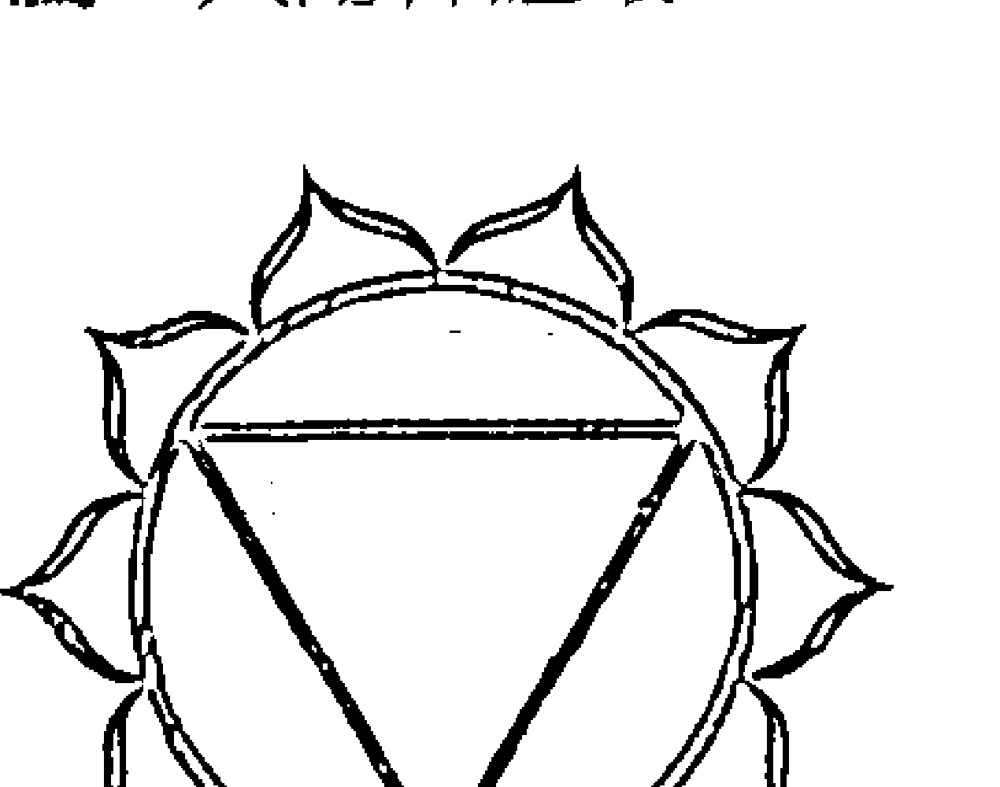

太陽神經叢

#### 精油

建議添加量：一至數種混合總計40滴

太陽神經叢經典用油

-   葡萄柚
-   檸檬

其他有助太陽神經叢的精油

-   黑胡椒
-   萊姆
-   檸檬香桃木
-   檸檬草
-   檸檬馬鞭草
-   檸檬香茅
-   檸檬尤加利
-   茴香類
-   芫荽
-   纈草
-   百里香類（不含龍腦百里香）
-   薄荷類
-   山雞椒
-   天竺葵類
-   肉桂類
-   薑
-   丁香花苞
-   杜松
-   苦橙葉
-   橙花
-   依蘭
-   迷迭香
-   茶樹
-   黑雲杉
-   歐洲赤松
-   喜瑪拉雅雪松
-   羅馬洋甘菊
-   蒔蘿
-   永久花（治無精打采、神經疲勞）
-   檀香
-   胡蘿蔔籽

# 藥草酊劑

建議添加量：任意

蒔蘿、蒔蘿子（Anethum graveolens）：冬季有時傳統市場買得到新鮮的整株蒔蘿，通常菜販會說那是「茴香菜」。超級市場的香料區有時也可買到乾燥蒔蘿子。無論是整株還是籽，都對太陽神經叢有益。蒔蘿精油並不容易買到，如果幸運在市場和蒔蘿相遇，不妨動手做新鮮酊劑吧。

以上所有精油植物也可以做成酊劑。

#### 花精

建議添加量：7～16滴／每種

西洋蓍草（Yarrow）

太陽神經叢是感受的中心，若是過於敏感，便容易受到別人的情緒影響，類似像別人的敵意一掃過來，胃部立刻揪緊的感受。西洋蓍草的花形就像個防護傘，能防禦任何來自他人的負面能量。

# 絲瓜（Luffa）

絲瓜花可強健乙太體，特別有助於難以與他人劃清能量界限的人。對於太內向、太外向及不守規矩的過動者也有幫助。

# 大萼金絲桃（Rose of Sharon）

是否曾經「氣到肚子痛」呢？太陽神經叢是感受中心，會受到負面感受的直接衝擊。大萼金絲桃能清理淨化太陽神經叢憤怒的能量，特別能消解因憤怒導致的胃部不適感。

##### 大蒜花（Garlic）

大蒜花對肝輪有卓越的幫助，並可提升理智體和情緒體的客觀中和，因此可同時清除恐懼和憤怒，對害怕面對自己的恐懼或憤怒者特別有幫助。

##### 毛茛（Buttercup）

毛茛能幫助您認知到——自我的價值來自內在，而不是來自別人的評價。適用於容易被他人評價影響而導致的自尊低落。

##### 洋甘菊（Chamomile）

調理太陽神經叢和理性體，緩解情緒緊張，帶來寧靜、安詳，消除憂慮。

# 溝酸漿

溝酸漿的人格類型是欠缺自信、害羞膽小、畏東畏西，不敢在人前表現自我，在眾人面前說話甚至會臉紅結巴，其實根源在於太陽神經叢虛弱。溝酸漿可協助用輕鬆的態度來看待原本感到害怕的事情。

# 其他太陽神經叢花精

-   榆樹（消解因責任感和壓力過重而積聚在下三輪的負面情緒能量）
-   荊豆（因長期受挫導致徹底憂鬱絕望、放棄嘗試）
-   菊苣（人際關係中過強的佔有欲與控制欲）
-   野玫瑰（給行屍走肉、聽天由命、內心空虛、隨波逐流者）


# 寶石酊

建議添加量：16～20滴／每種

金色或黃色系晶石，例如琥珀、黃玉、黃水晶、黃色虎眼石、黃色方解石、黃色電氣石等。

# 心輪之愛

使用時機

-   有任何關於「愛」的問題時
-   不夠愛自己，或覺得自己不值得被愛時
-   經歷重大的情感失落，例如被情傷、絕交、失戀、離婚、喪親等

心輪位於胸口兩乳之間，對應綠色和風元素，影響器官是心、肺、血液、雙手、肩膀與上背、胸腺，掌管愛與慈悲。當運作良好時，能充分展現愛與慈悲，愛自己也愛他人，能開放的給予和接受。

心輪精油大多屬花朵類，花朵與「愛」和「心」有強烈關連，正所謂心花綻放。許多木質類可協助肺功能，肉桂之類的香料能促進心臟血液循環功能，亦屬心輪範圍。心輪花精的種類繁多，因為心是如此重要的議題呀！

# 無形能量

關鍵字：愛

象徵圖騰：心輪

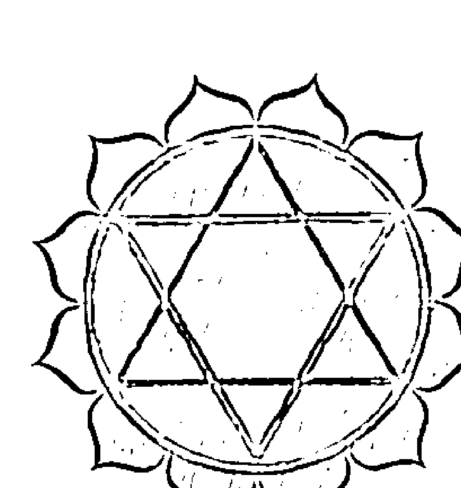

#### 精油

建議添加量：一至數種混合總計40滴

心輪經典用油

-   玫瑰類
-   香蜂草

其他有助心輪的精油

-   玫瑰草
-   橙花
-   茉莉類
-   依蘭
-   龍艾
-   永久花
-   天竺葵類
-   羅馬洋甘菊
-   野洋甘菊
-   安息香
-   秘魯香脂
-   佛手柑
-   橘／桔類
-   苦橙葉
-   桔葉
-   香草
-   胡蘿蔔籽
-   芳樟
-   月桂
-   杉樹類
-   絲柏
-   大西洋雪松
-   松紅梅
-   真正薰衣草
-   檀香
-   乳香
-   肉桂類
-   花梨木
-   香桃木類
-   胡蘿蔔籽

# 藥草酊劑

建議添加量：任意

北美聖草（Yerba Santa）

廣受印地安人尊崇的北美聖草，是陰性、土元素、對應土星的藥草，氣味宜人。除了常用在淨化與保護結界之外，更特別能守護病人，促進療癒，釋放積壓在心肺部位的情緒痛苦，讓我們能在靈性層面重新「呼吸」，對心輪功效卓著。

以上所有精油植物也可以做成酊劑。

#### 花精

建議添加量：7～16滴／每種

冬青

冬青帶來就是愛的能量，可消解任何強烈的黑暗情緒，憤怒、嫉妒、報復的念頭，這些當然唯有愛能夠化解，因此冬青是最典型的心輪花精，適用於任何強烈負面情緒。

# 楊柳

與冬青一體兩面。冬青是顯性的憤怒，會直接指著別人痛罵，楊柳是隱性的怨恨，放在肚子裡燜燒，這種燜燒只會以憤恨的表情與拐彎抹角的酸語若隱若現，特徵是覺得這個世界對他不公平，千錯萬錯都是別人的錯。

# 落葉松

落葉松是運用最廣的自信花精。自信看似是太陽神經叢議題，其實根源在心輪，因為不夠愛自己，才看不見自己的好，以為自己不值得受肯定。落葉松能幫助我們找回內心的那頭獅子，容許自己綻放天賦才華。

# 矢車菊

矢車菊適用於不敢說「不」、易受欺負的濫好人傾向。雖與太陽神經叢稍有關連，其實根源還是在於心。因為不夠愛自己，缺乏對自己的認同，導致不敢拒絕別人，用卑微的態度去獲取他人的認同。矢車菊花精可以協助這樣的人多愛自己一點。夠愛自己，便不需要藉由犧牲自己來取悅別人。

##### 菊苣

菊苣的標準言論是「我對你這麼好，你怎麼可以不愛我？」像這樣為自己的付出索求回報，屬於「有條件的愛」，當然屬於心輪課題。菊苣能協助我們把自私的愛轉化為無私的愛。

##### 石楠

石楠人喋喋不休，凡事只想到自己，說話內容淨是自己的事，背後的癥結其實是想要別人來解救他的孤寂。石楠可協助回歸內心，正視內心，而無需尋求外界的注意。

##### 忍冬

處理「沈溺過去」的狀態，給予「感激」的能量，讓我們能寬恕自己，感激自己，理解過去種種，讓自己從中體驗到寶貴的經驗，抽離過去往前走。

##### 玫瑰

所有的玫瑰花精都能開啟心輪，每種作用略有不同。英國Crystal Herbs出品十六種單方玫瑰花精，皆可選用。

## 其他心輪花精

- 荷包牡丹（解除情緒依附，消解過往因失去導致的深埋痛苦）
- 琉璃苣（祛除悲傷，適用喪親情境）
- 山毛樺（不寬容，好批評挑剔）
- 櫻桃李（衝動之下的自殘自傷行為）
- 海棠／野酸蘋果（自我厭惡不潔感、不接納自己外表的不完美）
- 荊豆（因長期受挫導致徹底憂鬱絕望、放棄嘗試）
- 葡萄（強勢、好命令）
- 龍膽（因為屢次受挫而逐漸喪失信心，失去與神連結的信任度）
- 芥末（突如其來的莫名沮喪）
- 橡樹（硬撐、不容許自己休息）
- 橄欖（心力交瘁）
- 松樹（自責、罪惡感，無法寬恕自己）
- 岩薔薇（驚恐失神後安撫心靈）
- 聖心百合（平撫創傷與驚嚇）
- 甜栗（屢試屢敗、苦惱折磨時，點燃心中的希望之光）


## 寶石酊

建議添加量：16～20滴／每種

粉紅色系及綠色系晶石。粉晶是最經典的心輪晶石，其餘粉紅色晶石還有菱錳礦、薔薇輝石、粉紅碧璽、紫鋰輝石等。綠色晶石有綠寶石、孔雀石、玉、東菱玉、橄欖石、綠玉髓、綠透輝石等。

# 喉輪之聲

### 使用時機

- 害羞、不敢表達意見
- 經常忍氣吞聲
- 經常說錯話，諸如口不擇言、八卦、說謊、好萊塢型體自己後悔的話
- 靠嘴巴吃飯者，如歌手、講師、政治人士
- 不需說話但很需要表達力的職業，例如作家與文字工作者

喉輪位於喉嚨基部，對應藍色，影響器官是喉部、氣管、食道、牙齒、頸肩和甲狀腺，掌管溝通。當運作良好時，溝通力強，能充分表達自我，說出真理。喉輪與心輪若皆啟動且連結，說出的話會是充滿愛的真理，不會傷害任何人。

對創作者而言，喉輪亦攸關重大。雖然臍輪是孕育點子的地方，光有點子仍不夠，還是需要喉輪將點子完整表達出來，因此臍輪與喉輪都需開啟，才能成就好作品。

## 無形能量

關鍵字：表達、溝通

象徵圖騰：喉輪

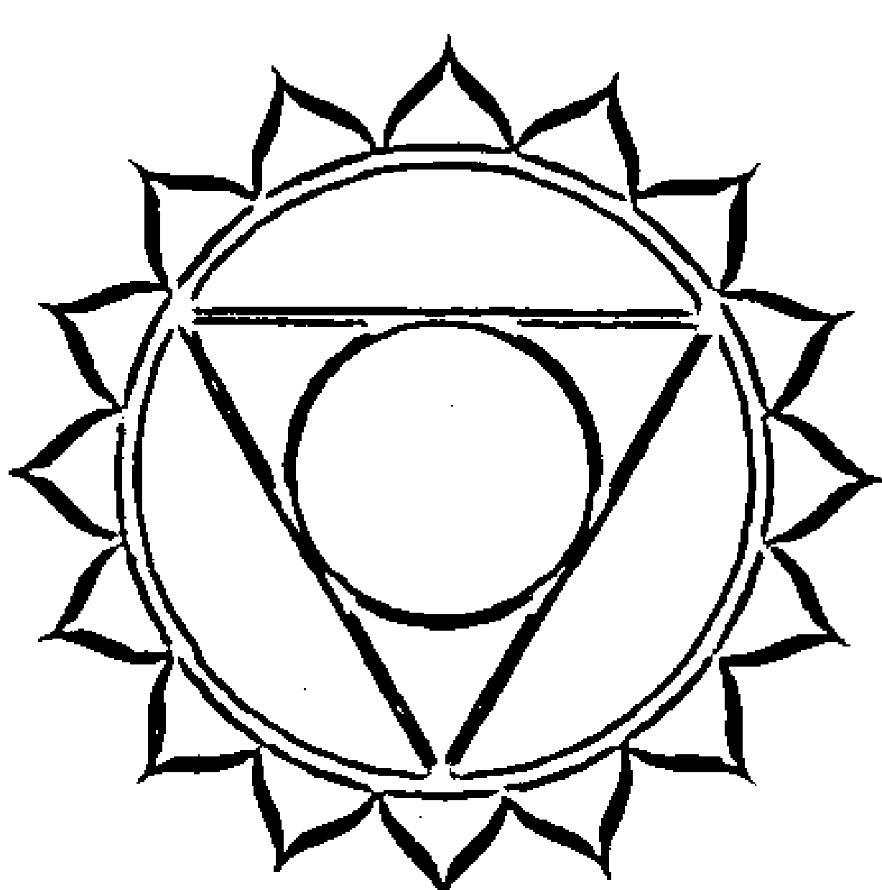

喉輪的力量超乎想像。革命志士能靠喉輪推翻一國政權。無奈華人文化往往壓抑，自孩提時期的教育就不提倡表達，尤其不能頂嘴，使得長大成人之後習於沉默與忍氣吞聲。為了維持人際和諧而不表達真實意見的結果，就是喉輪阻塞關閉。

所有呈現藍色的精油都是絕佳的喉輪用油，能幫助呼吸道的精油自然也歸屬在喉輪。

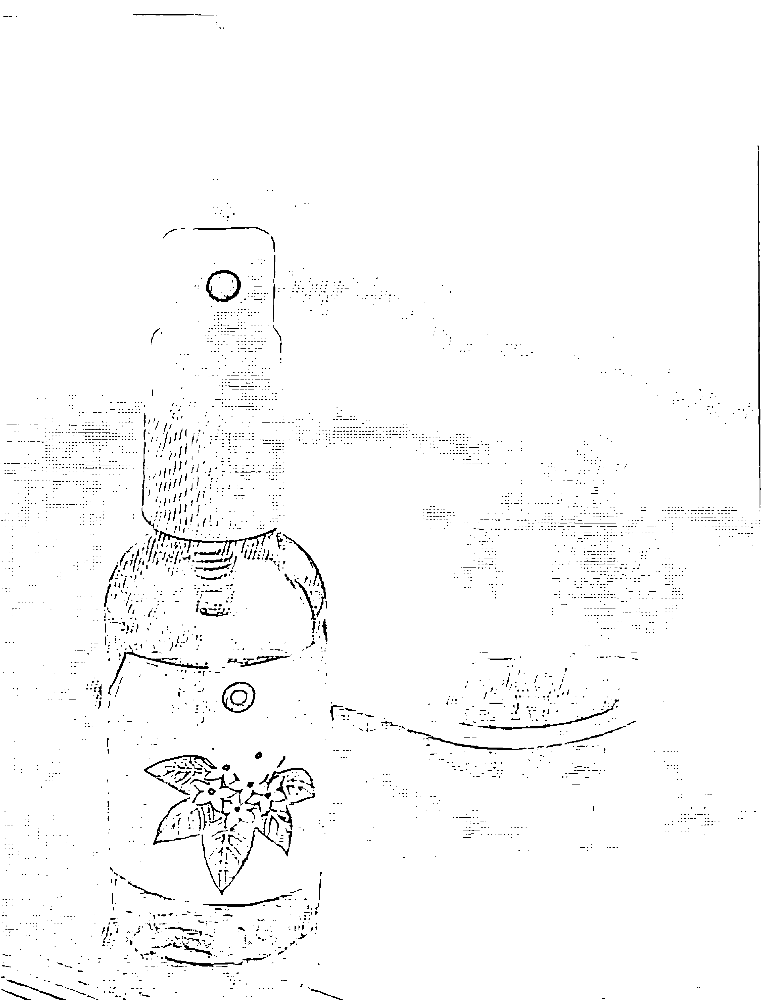

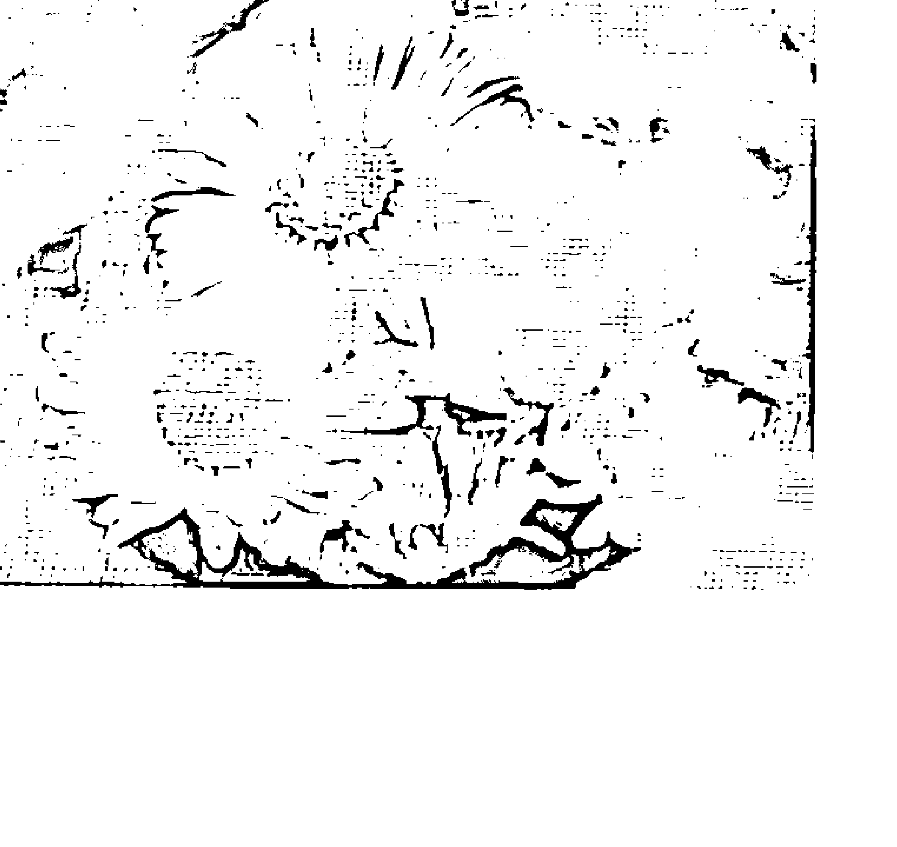

#### 精油

建議添加量：一至數種混合總計40滴

### 經典喉輪用油

洋甘菊類（尤其是德國洋甘菊）、尤加利類。

### 其他有助喉輪的精油

薄荷類、芳樟、卡奴卡、芳枸葉、茶樹、馬鬱蘭、土木香、白千層類、紅香桃木、綠香桃木、羅文莎葉、月桂、高地牛膝草、桉油醇迷迭香、豆蔻、薰衣草類（尤其是真實薰衣草以外的種類）、西洋蓍草、南木蒿、摩洛哥藍艾菊、絲柏類（尤其是藍絲柏）、天竺葵類（特別有助親密關係的溝通）、雲杉類、祕魯聖木、白鼠尾草、乳香（促進深呼吸）。

## 藥草酊劑

建議添加量：任意

以上所有精油植物也可以做成酊劑。

#### 花精

建議添加量：7～16滴／每種

### 藍鈴花（Bluebell）

開啟喉輪，清除阻礙創造表達的鬱結。對歌唱、朗誦和聲音治療師特別有幫助。

### 金魚草（Snapdragon）

強力開啟喉輪與相關的乙太體。對口語表達有困難的人特別有幫助。清除隱藏的情緒，包括挫折與憤怒。增強邏輯力。

##### 波斯菊（Cosmos）

連結暢通心輪和喉輪，提升自我表達力，能說出充滿愛的真理。也有助於清除情緒困擾。

### 龍芽草

因不敢表達內心的痛苦而強顏歡笑，甚至酗酒、縱情享樂，藉以逃避不去面對內心的折磨。龍芽草可協助這樣的人表達真實的自己。

### 其他喉輪花精

- 山毛櫸（好批評挑剔）
- 石楠（因寂寞而聒噪）
- 紅栗（因關心他人而顯得嘮叨）
- 葡萄（以強勢命令的方式說話）
- 菊苣（以「我對你這麼好，你怎麼可以如何如何」這種表達方式來討愛、爭寵）
- 芥末（在莫名沮喪時願意向人宣說，加速釋放憂鬱的過程）
- 荊豆（因長期受挫導致徹底憂鬱絕望、放棄溝通表達）
- 線球草（因害怕犯錯及不敢表達而優柔寡斷）
- 胡桃（當眾人持反對意見時，能堅定表達自己的志向，不受外界左右）。

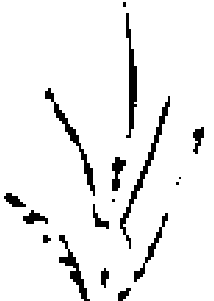

## 寶石酊

建議添加量：16～20滴／每種

藍色系晶石，例如藍寶石、青金石、海藍寶等、天青石、天使石、藍色方解石、藍紋瑪腦、藍色蘇打石、拉利瑪石等。

### 眉心智慧

### 使用時機

- 直覺力、想像力弱
- 聽不到自己內心的聲音、找不到人生的方向時
- 想要開發靈通力時
- 低落或焦慮時
- 思想困惑、迷信、愚昧、妄想、幻覺、學習力不佳、注意力缺乏等

眉心輪位在眉心上方約一指的凹陷處，對應靛色，影響器官是小腦、神經系統、賀爾蒙系統、眼耳鼻，掌管直覺、智慧、想像力。當運作良好時，能擁有優越的想像力、第六感直覺力、思考力與決策力。

眉心輪精油有許多樹脂類。許多樹脂能上通頂輪，下接大地，幾乎對每個脈輪都有通暢之效，本篇精選作用於眉心輪較為明顯的幾種。另外也選了不少淨化儀式用的藥草或葉片類，例如白鼠尾草、艾草、羅勒、月桂、薰衣草等，此類精油極適合冥想與激發靈通力，所以可歸屬眉心輪用油。木質類的高度能協助我們跳脫狹隘矮小的見識。至於花朵類雖然不常與眉心輪產生關聯，不過有幾種花朵傳統上也使用於冥想和增強靈視力，因此對眉心輪有幫助。

## 無形能量

關鍵字：智慧、直覺、洞見

象徵圖騰：眉心輪

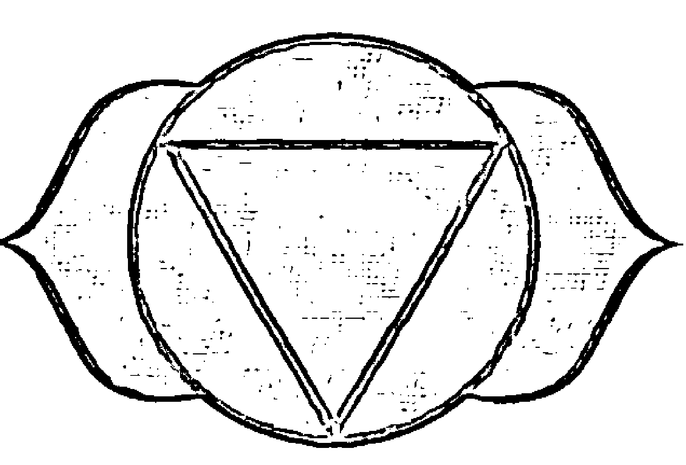

眉心輪

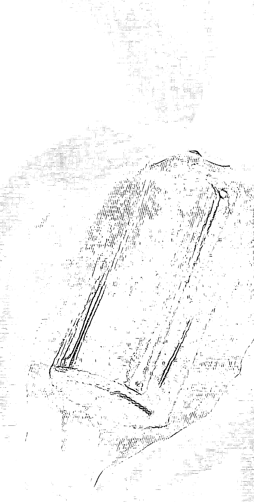

#### 精油

建議添加量：一至數種混合總計40滴

### 眉心輪經典用油

月桂、胡蘿蔔籽、白松香。

### 其他有助眉心輪的精油

- 白珠樹
- 檀香
- 欖香脂
- 廣藿香
- 鼠尾草類
- 迷迭香（樟腦、馬鞭草酮）
- 艾草類
- 羅勒類
- 黃樺
- 白千層類
- 祕魯聖木
- 雪松類
- 松類
- 歐洲冷杉
- 葡萄柚
- 肉豆蔻
- 馬鬱蘭
- 永久花
- 薰衣草類
- 橙花
- 菩提花
- 歐白芷
- 玫瑰類
- 藍蓮花
- 聖約翰草
- 紅香桃木
- 綠香桃木

## 藥草酊劑

建議添加量：任意

以上所有精油植物也可以做成酊劑。

#### 花精

建議添加量：7～16滴／每種

### 藍蓮花

蓮花無論品種，只要顏色帶藍，能量就與眉心輪有關。其精油罕見價昂，臺灣倒是常有種植，是自製花精的好起點。

### 星星鬱金香（Star Tulip）

刺激眉心輪，提昇靈性覺知力和靈性敏感度。對頂輪也有助益。

##### 薇碧安娜玫瑰（Rosa Webiana）

提升覺知和心靈能力，幫助開發心靈能力及學習在更高次元運作能量者。

##### 水田芥（Nasturtium）

擴展心智，消除僵硬、狹窄或強迫性的想法。使人對顏色的感知更敏銳，適合各類視覺設計相關的工作者。消除通靈或冥想後的疲憊。

### 矮牽牛花（Petunia）

能使思維更清晰、更冷靜，並協助連結高我，活絡理智體以使行為脫序更容易受矯正，特別是頑皮、幼稚、孩子氣的行為。

### 其他眉心輪花精

山毛櫸（老是看見別人忽略的地方而加以挑剔）、菊苣（被佔有或掌控慾的情緒淹沒，見不到事情真相）、水蕨（因不信任自身直覺而需要四處查資料或問人確認）、海棠／野酸蘋果（見樹不見林、執著細節卻忽略大局、只看得見自己的小瑕疵）、荊豆（因長期受挫導致徹底憂鬱絕望、放棄嘗試）、鳳仙花（因不明白萬萬事的定數都有完美安排導致窮趕急）、落葉松（不信任自身能力，看不見自己的好）、白栗（思緒繁亂想不停）、野燕麥（人生迷惘，不知道該選哪條路）、線球草（對瑣事優柔寡斷、不問人）、葡萄（強勢領導者，覺得別人沒有自己的智慧，只要照著他的命令做就好）、水堇（自認優越者無法體認到人無高下之分、人與人皆是一體）。

## 寶石酊

建議添加量：16～20滴／每種

藍紫色系晶石，如藍寶石、蛋白石、藍碧璽、紫水晶等。

# 頂輪開悟

## 使用時機

- 覺得精神空虛時
- 愚昧無明
- 猶如行屍走肉一般，不理解生命的意義
- 覺得非常孤立，與世界失去連結時
- 對重度憂鬱及嚴重慢性病者提供能量支持

頂輪位於頭頂的百會穴，對應紫色或白色，影響器官是腦、皮膚、神經中樞和松果腺，因此也影響著所有器官，掌管靈性開悟。當運作良好時，能夠看穿物質，進入靈性，接收到靈啟或宇宙真理，感到深層的喜樂、寧靜、幸福，富有人道精神或靈性信仰，放下小我，達到與萬事萬物合一的至高圓滿。頂輪精油大多屬於會在冥想中使用的高頻靈性精油，以樹脂、木質和花朵類為主。樹脂原就與靈性密不可分，較靈性的木質類能量運行大多能「頂天立地」，這兩者對上兩輪和下兩輪通常都有開通之效。花朵原本就是植物體中最高振動頻率的部位，與頂輪相關不是意外。

## 無形能量

關鍵字：開悟、合一

象徵圖騰：頂輪

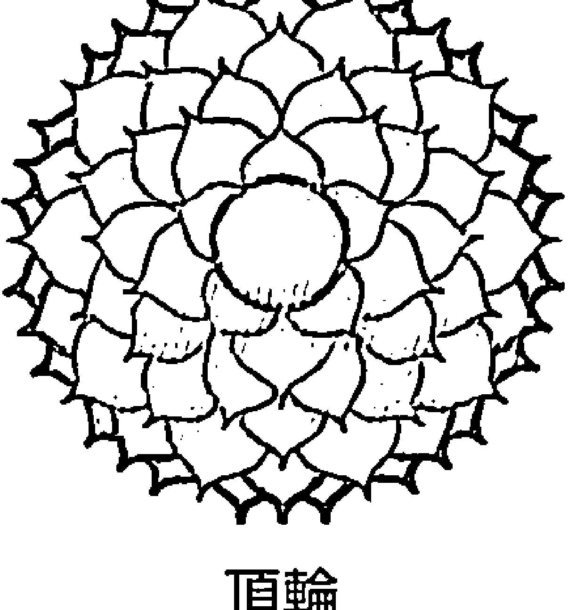

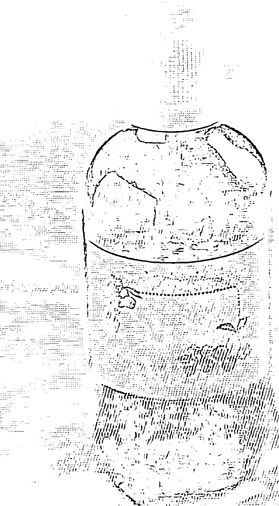


#### 精油

建議添加量：一至數種混合總計40滴

### 頂輪經典用油

- 蓮花
- 乳香
- 檀香

### 其他有助頂輪的精油

- 歐白芷
- 纈草
- 乳香
- 安息香
- 沒藥
- 檀香
- 白松香
- 欖香脂
- 秘魯香脂
- 廣藿香
- 秘魯聖木
- 絲柏
- 雲杉類
- 穗甘松
- 花梨木
- 香桃木
- 雪松類
- 真正薰衣草
- 聖約翰草
- 芫荽
- 橙花
- 玫瑰類
- 永久花
- 茉莉類
- 洋茴香
- 玉蘭類
- 晚香玉
- 紅花緬梔
- 紫羅蘭
- 水仙
- 洋茴香
- 小茴香
- 胡蘿蔔籽
- 蛇麻草


## 藥草酊劑

建議添加量：任意

##### 珂巴（Copal）

珂巴是一種早在馬雅文化就流傳下來的樹脂，帶著松枝或檸檬的細膩香味，能開啟頂輪並暢通連結所有脈輪，強健氣場，淨化保護，紓解壓力與沮喪。

以上所有精油植物也可以做成酊劑。


#### 花精

建議添加量：7～16滴／每種

##### 荷花（Lotus）

荷花是最經典的頂輪花精，可提升各個層面的覺知，協助所有脈輪、經絡和精微能量體平衡歸於中心，淨化乙太體，清理能量系統的鬱結，能挖掘並轉化埋藏的情緒，對有情緒失衡和強迫行為的人特別有益。

### 野胡蘿蔔花 (Queen Anne's Lace)

這種花精能增強靈視力和心電感應力，開啟頂輪與相關的乙太體，平靜理智體，提升在人生狀況中保持宏觀的能力，對眉心輪與頂輪都有幫助。

##### 薰衣草 (Lavender)

開啟頂輪，清理經絡。強化與高我的聯繫，使業障更容易清除，可消解前世業力所導致的人際衝突，對因為情緒問題而阻礙靈性成長的人特別有幫助。

### 紅繁縷花 (Pimpernel-Red)

協助亢達里尼能量向上通過七脈輪，與其他頂輪花精並用的協同效果優異。

### 其他頂輪花精

- 水蕨（不信任自身的智慧，四處找人或查資料確認）
- 荊豆（因長期受挫導致徹底憂鬱絕望、放棄嘗試）
- 橡樹（不倒翁或拼命三郎，給予自己過高期許，背負錯誤的責任感與使命感）
- 橄欖（身心俱疲時給予「平衡」並促進體內氣的流動）
- 松樹（消解儲藏在頂輪的自責和罪惡感）
- 岩薔薇（把嚇飛的神從頂輪拉回來）
- 馬鞭草（平衡過分發達的理想性思緒）
- 野燕麥（用平靜的心去面對人生道路的選擇）
- 楊柳（認為自己孤立無援，被世界遺棄，或世界待他不公）。

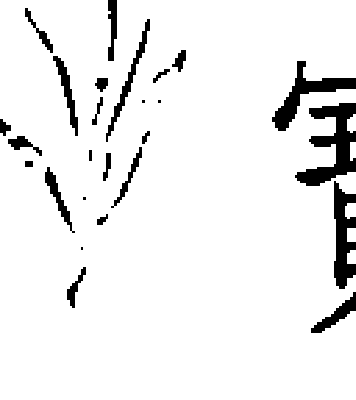

## 寶石酊

建議添加量：16～20滴／每種

白色與紫色晶石，例如鑽石、白水晶、水光水晶、月光石、透石膏、紫水晶、舒俱徠石等。

# 母嬰溫和篇

有許多精油是母婴不能使用的，能不能做媽媽寶寶專用配方呢？還是可以！本篇收錄母婴配方，以最溫和的貝曲花精和純露為主角，降低酒精比例，不分年齡都可放心使用。

### 迎接新生

適用年齡：0歲以上

迎接新生命是多麼喜悅的事。不過，請站在寶寶的角度想像一下。寶寶原本在溫暖黑暗的子宮裡，聽著媽媽的心跳，一瞬間就被擠壓到產道，進入一個充滿強光、冷空氣和嘈雜聲音的世界，還被打屁股！沒有錯，出生在某種層面上無疑屬於創傷事件，每個新生命多多少少都在這個過程中受到影響。

由於初生寶寶極為敏感，最適合用純貝曲花精噴霧來紓緩。這個配方對媽媽寶寶都適用。

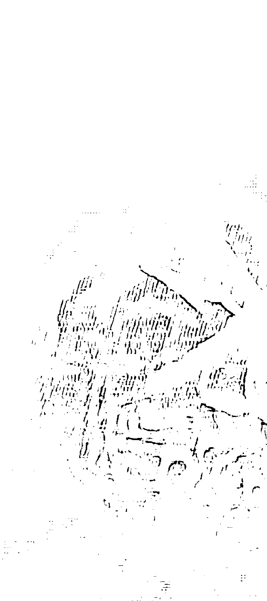

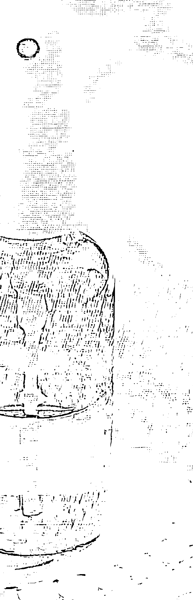

## 準備材料

- 聖心百合花精 (Star of Bethlehem): 聖心百合是出生必用的首選花精，能緩解任何驚嚇與創傷。由於創傷有延續性，建議持續使用一段時間。
- 岩薔薇花精 (Rock Rose): 岩薔薇特別適用生死有關的強烈恐懼。俗話說女人生產是一腳踏進鬼門關，因此岩薔薇是第二支必選的出生用花精。
- 羅馬洋甘菊純露 (選擇性): 羅馬洋甘菊溫和可喜，是最適合新生兒的純露，能安撫母嬰的情緒。

#### 作法

將這兩支市售花精各2～5滴滴入消毒過的噴霧瓶中，添水至30ml滿即可。

可依喜好加入少許羅馬洋甘菊純露增添香味，此時純露與水合計30ml。

#### 使用方式

噴灑於媽媽寶寶的氣場周圍，一天至少四次，越多次效果越佳。

#### 小提醒

由於使用市售花精製作且未加酒精保存，能量有效期為一週（三日內最理想）。效期過後建議重新製作。

## 夜啼收驚

適用年齡：3個月以上

夜啼是育兒期間難免會遇到的頭痛。寶寶不曉得做了什麼夢，半夜突然嚇哭，或者出門玩了一趟，就莫名哭個不停，讓大人摸不著頭腦。當遇到這種需要老人家說需要「收驚」的狀況時，新時代媽媽不妨嘗試新時代方法吧。此配方可從三個月一路用到幼稚園。

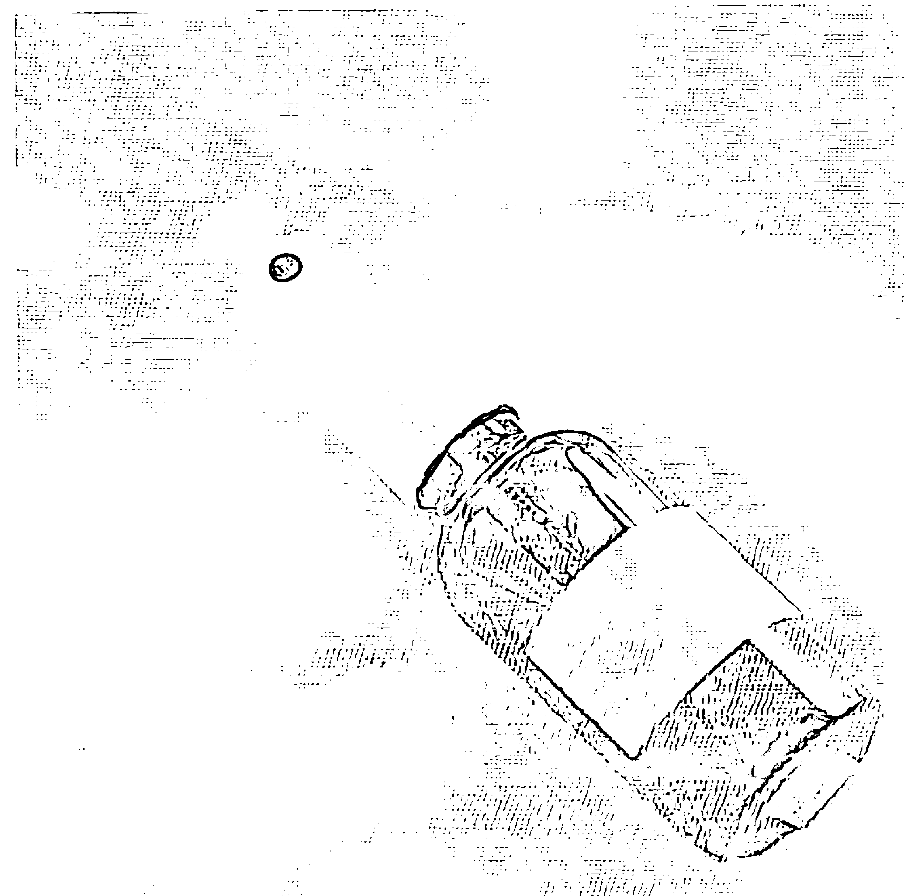

#### 花精材料

圣心百合
安抚惊吓。

岩蔷薇
消除惊恐。

铁线莲
回复神智。

*以上三种可用「急救花精」代替。

海棠／野酸苹果
温和净化气场。

胡桃
保护气场。

白杨
如果孩子疑似敏感体质，似乎看见了平常人看不见的东西，或说出「床下有个姐姐在跟我玩」这种令人毛骨悚然的话，白杨可以为敏感体质提供保护。

#### 纯露（选择性）

罗马洋甘菊（Anthemis nobilis）
情绪安抚。温和净化气场。

真正薰衣草（Lavendula angustifolia）
情绪安抚。温和净化保护气场。

## 精油（選擇性）

莳萝（Anethum graveolens）
镇静神经，平抚惊吓的情绪。

蓝西洋著草（Achillea millifoleum）
保护气场。

#### 作法

选用的花精每种2～5滴（急救花精要4～10滴）滴入消毒过的喷雾瓶中，添水或纯露至30ml即成。若加精油，最多总计加1滴。

#### 使用方式

喷洒于宝宝气场周围。若添加精油由于不含酒精助溶，喷洒前需用力摇匀。

#### 保存期限

花精的能量有效期为一週（三日内最理想），过期后请重新添加。纯露和精油可继续使用至约二至四週。

#### 小提醒

由于市售花精稀释至纯水后能量有效期会缩短至一週内，若不希望缩短，改用原液调配就可以如愿。方法是：将三种花精的原液等量混合，滴入一滴精油即可，完全不添加水或纯露。如此花精的能效期即可维持原本的五至十年，几乎不会过期，唯一缺点是比较花银两。

# 結語

靈性噴霧創作很好玩，有時能造就奇蹟神效，不過，在最後我想提醒讀者：任何靈性產品都不是萬靈丹。

心靈療癒工作者皆知，再強的療癒者都只能療癒當事人願意被療癒的部分，因為人有天賜的自由意志，但凡當事人不願意改變，不管再強的精油、花精還是水晶催下去，都是枉然。

尤其請不要希冀用靈性產品來取代醫療。靈性產品的作用層面在於情緒、脈輪、氣場等能量體，並不直接影響生理。雖然生理與心靈息息相關，然而靈性工作畢竟不像藥物或手術那樣能對肉體發揮即時救治的功效。所以，該請醫生出馬的時候，還是請醫生出馬吧。在醫療的同時，靈性工作可為極佳的輔助，提供能量層面的支持。

自製靈性噴霧有很大的意義在於對宇宙宣告：我願意覺察我的情緒並且改變。我願意吸引想要的事物。

當製作噴霧時，正已存有這樣的起心動念。為自己選配方時，是對自己的內心進行一次探索與覺察。最後淬鍊出一瓶能量精華，作為觸媒。每噴用一次就是對自己的內心提醒一次、宣告一次。這具有儀式性的象徵意義，讓我們拾回原有的正面信念與力量。

請務必了解，每個人天生都有內在的愛、智慧、力量與神聖，只是在紅塵的磨難之下，人們經常忘記了。療癒並不是給予當事人沒有的東西，而是喚回他本有的。因此，使用靈性噴霧時，要想著它喚起你原本的力量，而不是你依賴著這瓶噴霧。這中間有很大的不同。

本書提供的二十種創作主題，是作為拋磚引玉，然而在大自然的智慧中，我的所知仍渺小，也許過了不久以後，我會發現這些配方有好多需要修改，這也是隨著作者功力精進會發生的正常現象。如果你發現書中所言與你的認知有相抵觸，請追隨內心的感受。我相信，盡信書不如無書。請開放感官與心靈，去覺察，去感應，相信你的直覺。即使是同一種植物，每一批次產出的精油能量頻率都有所不同，都以獨特的方式影響人類。同樣的，即使是同一種晶石，每一顆的能量也都獨一無二，就像人類的雙胞胎也不可能一模一樣。因此，我建議各位保持開放性，接受任何組合的可能。

有一天，我在晶荷的同事為自己調了一瓶只有岩蘭草精油的接地噴霧，惡搞地命名為「黏在地上」，大家用得非常開心。真的，靈性噴霧唯一牢不可破的配方原則只有五個字——「只要我喜歡」。

這是最重要的事了。

## 【附录】
## 贝曲花精中英对照及新脉轮对应说明表

在过去，贝曲花精与脉轮的对应多是将贝曲七大类与七个脉轮配对，在当时的时空背景下，这样是合适且易于理解的，不过现在我们已经知道花精与脉轮不是一对一，而是一个花精可以影响多个脉轮，所以现在我们为脉轮重新做了更精细的对应与探讨，提供更适合现代花精使用者理解的新版对应。

要知道，Bach医师当时在研创这三十八支花精时，并未把脉轮列入考量，所有的对应都是后人所加诸。新版对应表或许适合近代大众对脉轮的认知，但也并非铁律。我认为人类对脉轮与人体能量系统尚未完全理解，一旦有更新的理解之后，不排除会有更新的版本出现，这都是乐见之事。

### 龙芽草 Agrimony
海底轮、喉轮
给饱受痛苦恐惧折磨，却隐藏起来，难以表达的人。

### 白杨 别名：火烧杨 Aspen
海底轮、脐轮
处理因敏感体质导致的莫名恐惧。
脐轮是次要的恐惧脉轮，掌管生殖系统、原生家庭与祖先，因此这类议题皆可考虑使用白杨。

### 山毛榉 Beech
心轮、喉轮主要，眉心轮次要
给心不够宽容，喜欢批评挑剔的人。
与眉心轮有关是因为这种人往往看到对方没注意到的地方，而加以挑剔。

### 矢车菊 Centaury
心轮主要，太阳神经丛次要
给不敢说不的滥好人。
因为不够爱自己，缺乏对自己的认同，因此不敢拒绝别人，用卑微的态度去获取他人的认同。症结在于需要被爱，才藉由牺牲获得别人的爱。太阳神经丛的意志薄弱是衍生出来的问题。

### 樱桃李 别名：樱花 Cherry Plum
心轮、海底轮
给即将抓狂失控，害怕自己冲动自伤或伤人者。
很多情况下，樱桃李保护自己的反应是出于恐惧被侵犯，这跟海底轮颇有关系。樱桃李可调整海底轮那股动能，而不致于做出激烈的行为。
樱桃李会因为暴怒冲动做出自残自伤的行为，暴怒本身就是伤害自我的行为。当你看见粉红色的樱花还会有这么冲动的情绪吗？倒不如把这个情绪转换成为愿意爱自己，并容许自己呈现出脆弱、需要爱的真实感觉。

### 铁线莲 Clematis
海底轮
协助恍神、健忘、爱幻想的人，找回自我，回到当下，与大地之母链接。接地效果佳。

### 海棠 别名：野生酸苹果 Crab Apple
心轮、眉心轮
适用于洁癖、自我肮脏不洁感、无法接受自己外表的瑕疵，及只着重细节却看不见大局者。协助看到原本看不到、不想看或因外在社会观感导致选择不去看到的东西，帮助爱自己，因此可回归心轮，认同自己。

### 水蕨 别名：紫金莲 Cerato
眉心轮主要，顶轮次要
给即使心中已有定见仍需要四处询问来确认的人。此种状态是因为看不见自己的神性，不相信自己与神圣的链接，才需要四处寻求权威、占卜、或查资料来确认。水蕨花精可开启自己与神圣源头的链接，重新认同自己接收直觉的能力，再度体认自己本身就是神性的一部分，无需透过外在的证明才能感到踏实。

### 菊苣 Chicory
心轮、眉心轮主要，太阳神经丛、喉轮次要
菊苣的爱是自私的，往往想要占有与控制，经常被自己的情绪淹没，见不到事情真相，或明明见到却不愿意去看。菊苣花精可协助用更全面的角度去看待事情，进而去理解背后带来的意义，用更宽恕的态度对待自己和周遭的人。菊苣一开始用喉轮来讨爱，等失望时，怨怼愤怒的情绪会往下积聚到太阳神经丛，因此喉轮与太阳神经丛为次要影响脉轮。

### 榆树 Elm
海底轮、脐轮、太阳神经丛
适用于因一时责任过重，担心自己负荷不来“强者的忧郁”。因过多责任感与压力，积累负面情绪能量下三轮。榆树花精可协助站得更稳，并接地。（所有大树的花精都有接地效果）

### 龙胆 别名：龙胆草 Gentian
适用因受挫而暂时心情沮丧、失去信心。由于恐惧再度遭到失败，这种恐惧比海底轮的生存恐惧稍轻，因此主要储存在脐轮。龙胆可协助获得不屈不挠的精神。

### 荆豆 别名：金雀花 Gorse
荆豆并非对治恐惧，而是绝望放弃，无所求了，反而可去对所有脉轮一视同仁地提供协助，哪个脉轮有需要就去帮助哪个。是很阳光的花精，提供金黄色的能量，协助用轻盈的态度看待这个生活。

### 石楠 Heather
适用因为寂寞而需要寻求别人注意，导致自我中心、喋喋不休的情形。可帮助拉回内心深处，正视内心，重新聚焦在自己身上，而无需外寻别人的注意与认同。

### 冬青 Holly
处理任何因为缺乏爱导致的强烈负面情绪，包括仇恨、嫉妒或报复。
冬青有强烈且非常坚韧的生命力，叶子看似尖锐，如同妈妈愿意无私去保护孩子，会长满刺都是因为爱。我们会变得像刺猬，都是因为需要爱。冬青提供的就是爱的能量，能打开心房，协助我们与圣爱连结。

### 忍冬 Honeysuckle
心轮、海底轮
给沉溺过去的人。
沉溺过去的人往往是害怕一旦放下过去，就丧失了存在世上的价值，过往的努力灰飞湮灭，才会想要紧紧抓住。忍冬可给予“感激”的品质，协助感激自己及过往的一切，让自己从中体验到宝贵的经验，并知道这些经验都将成为未来的养分，最重要的还是当下的创造。

### 鹅耳枥 Hornbee
海底轮、脐轮
给拖延懈怠，一想到将进行的计划就提不起劲，有“星期一症候群”者。
可为海底轮注入行动力，为脐轮注入热忱，因为脐轮是孕育生命之处，也算是生命力的源头。

### 凤仙花 Impatiens
眉心轮
使急性子的人获得“顺流”的品质。
眉心轮够有觉知的话，就会明白万事的定数都有完美安排，任何事情都在最完美时间的发生与完成，一旦洞彻这背后运行的原理，自然而然会顺流而行。

### 落叶松 Larch
心轮、眉心轮
给欠缺自信的人。欠缺自信根源在于对自己能力不认同，看不见及格的自我，不够爱自己，认为自己不值得被爱、被称赞，或拥有这样的天赋。落叶松使其愿意正视与生俱来的天赋，容许自己发挥资质，以更包容、更认同的心境来面对自己。

### 沟酸浆 别名：龙头花、黄色猴猴花、畏缩草 Mimulus
太阳神经丛、海底轮
处理一切可以名状的恐惧。这些恐惧主要是海底轮症状。
沟酸浆的人格类型是害羞胆小，不敢表现，不想被注意，也反应在太阳神经丛（及一点喉轮）。沟酸浆花精可协助这种人用轻松的态度，甚至是享受的态度来看待本来感到害怕的事情。

### 芥末 别名：芥子、芥子花 Mustard
心轮、喉轮
适用突如其来的莫名沮丧。芥末像强心针一样，聚焦地给心轮一股光明能量，并向上通畅喉轮。如同呛辣的芥末，使人愿意去向外分享感觉。因为这种莫名沮丧的状态下，若闷住压抑的话，往往演变成更深的情绪状态。芥末可给当事人勇气去与人分享他目前面临到的关卡，一旦说出来，向外求援，情绪便能更快释放。

### 橡树 Oak
海底轮、心轮、顶轮
给不倒翁、拼命三郎，责任感过强，硬撑着不停止的人。协助这种人接地，务实地看清身体的极限（海底轮），容许自己放松休息，放下重担，多爱自己一点（心轮），并放下对自己过高的期许，不要怀抱错误的使命感，或认为自己一定要看得高、看得远，有责任带领身边的人在身心灵方面都有提升（顶轮）。因为橡树人寻求的往往不只是安身立命而已，在那之后更重要的是心灵提升，就像把自己当成电影《阿凡达》那棵大树依娃一样，如此高的期许却可能造成身体无法负荷。

### 橄榄 Olive
海底轮、心轮、顶轮
给身心俱疲者“平衡”的品质。当心力交瘁时其实体内能量已然失衡，橄榄能维持体内能量运作的平衡，使气的流动顺畅，在该休息时就休息补气，在该动时可以气血活络地做事。

### 松树 Pine
顶轮主要、心轮次要
给怀抱自责及罪恶感的人。
自责与罪恶反映不爱自己（心轮），此种情绪通常也储存在顶轮。因为罪恶感是属于一种自我省思的能力，并非一般人习于利己或“这不是我的问题”等低频想法为出发点，这是以爱的出发点的情绪。松树能帮助我们洞彻到事出必有因，万事万物皆有神圣秩序，一切的发生都是完美，因此可以放下自我谴责了。这是比眉心轮更高一层的洞见，因此归属顶轮。

### 岩水 Rock Water
没有特定对应的脉轮
给自律过严而过度僵硬、无法享受生活者。
岩水并非植物生命体，但也属高频能量，没有特定对应的脉轮。如果硬要归属，大约关连海底轮多一点，因为岩水人经常担心自己无法达到自我要求，害怕自己无法发挥天赋、达到自己想要的目标，因此不断鞭策自己往前进。有一点接地功能。

### 红栗 Red Chestnut
喉轮、海底轮
给过度担忧别人的人。
红栗专门处理“担心别人”的议题，不单是亲朋好友，还包括自己重视的东西，例如宠物、爱车、物质上的财富。红栗状态经常是充满母性的悲天悯人者，红栗花精并非让他从此变得冷感，而是协助获得勇气，以中庸之道面对这种恐惧，并以更适当的方式来表达。
坊间经常将红栗称为“断脐花精”，并认为它是脐轮花精。其实断脐只是一种比喻，但集体意识可以创造实相，因此当大家因此认为它是脐轮花精，它就是脐轮花精，不过其实它最原始的作用仍在海底轮与喉轮。

### 岩蔷薇 别名：岩玫瑰 Rock Rose
心轮、海底轮、顶轮
给强烈惊恐者。
在受到极大惊吓，失神失魂后，岩蔷薇能安抚心轮，从顶轮把吓飞的神抓回来，并向下接地，使当事人恢复平衡。

### 线球草 别名：硬花草 Scleranthus
喉轮、海底轮
给对生活琐事犹豫不决、优柔寡断的人。
线球草的症结在于害怕自己做错决定（海底轮）以及不敢表达（喉轮）。所有决定都是一种表达，当我们在做决定时就是勇敢将内心感受表达出来并付诸实行。线球草能通畅喉轮能量，使我们更勇敢地将内心真实想法表达出来。线球草还能帮助我们认知到自己不管做出什么决定都是值得被爱的，不用害怕做出不好的决定会被否定，使我们能真诚做出让自己最舒适的决定，而不受外在环境所影响。

### 圣心百合 别名：伯利恒之星 Star of Bethlehem
心轮、海底轮
平抚惊吓与创伤。
圣心百合的能量既高频又沉稳，能稳定精气神。接地功能优异。

### 甜栗 别名：西洋栗 Sweet Chestnut
心轮
给不断努力却屡试屡败而苦恼折磨者。甜栗的痛苦往往来自于把重心放在外界，以为外在比内心更重要，一旦外在不如己意，就痛苦折磨。甜栗花精可以补充心轮能量，关照内心、滋养内心，点燃心中的那道光。

### 马鞭草 Vervain
海底轮、顶轮
给为了高远理想及社会公义而过度热衷者。马鞭草状态源自害怕公理秩序被破坏或无法达成理想，其言行举止出于恐惧，马鞭草花精能带来“平衡”与“中庸”的品质，平衡顶轮过度发达的思绪。马鞭草人经常喜欢说服别人，看似是喉轮过度发达，其实喉轮只是表面症状而已，症结仍在海底轮及顶轮。

### 葡萄 Vine
喉轮主要，眉心轮、心轮次要
给喜欢强势命令者。葡萄人的个性，说话与思考已经融为一体，近乎“心直口快”，想到什么就直接说，言语真诚反映内心。即使外表看来深思熟虑，沉稳非常，通常还是一有念头就会直接呈现（喉轮与心轮）。葡萄人本身聪明，因此容易与他人产生分别心（眉心轮），以为自己智慧较高，别人只要听他的话照做就好。此花精能协助用更尊重的态度去待人处世。

### 胡桃 别名：核桃 Walnut
海底轮、脐轮主要，喉轮、心轮次要
在变动的环境中提供保护。适应改变。胡桃能为海底轮与脐轮提供安全感，为心轮提供爱与喜悦。爱与喜悦是最有保护力的高频能量。当我们能够怀着爱与喜悦时，周遭的一切将难以影响我们。在外界纷扰或反对自己时，胡桃更可以协助坚定志向，勇敢将想法呈现出来。

### 水堇 别名：美洲赫顿草 Water Violet
海底轮主要，眉心轮次要
给孤高不群者。
水堇人能力优秀，自己也意识到这点，因此孤高不群。水堇花精带来“光的能量”，协助我们从眉心轮体认到人无高下之分，人人都有天赋与神性，并体认到一体性，人与人之间都有链接。海底轮作用是把孤高的状态拉回地面，无需高高在上。

### 白栗 White Chestnut
脐轮、眉心轮
给思绪繁多，不断重复而无法停止的人。
来自脐轮过度源源不绝的创造力，又无法善用眉心轮去控制这股能量，就造成思想上的无限回圈。白栗的性格富有创造力，如艺术家性格或浪漫份子，却无法好好掌控这股能力。在创作过程中使用白栗，可将脐轮的创造力导向希望运用的地方。

### 野燕麦 Wild Oat
顶轮、眉心轮
给迷惘、找不到人生方向的人。
提供“静心”的品质。野燕麦人多才多艺，却因为选择过多，反而无法确立人生方向。野燕麦花精可使漂浮的思绪沉淀下来，保持弹性，让自己如同野燕麦一般在各种天候之下都保持柔软身段，容许各式各样的可能性在身旁发生。用平静的心，而不是穷紧张的慌乱之心去面对各式选择，才能用更平稳的心去思索哪个方向才是最好的。每一条路都有它的意义与可能性存在，心情放松下来，才能客观感受到每个选择对我们的意义。适合这瓶花精的人需要较多时间去沉淀心境，需连续用一段时间才能呈现较明显的效果，搭配静心效果更佳。

### 野玫瑰 Wild Rose
太阳神经丛主要，海底轮次要
给凡事认命、随波逐流、行尸走肉、死寂无生趣的人。
野玫瑰状态的人通常是已努力一段时间后非常疲惫，透支了自己的能量与热忱，只想缩起来好好休息，到后来就沉溺其中，拾不回失去的热忱，形成过度放松的状态，犹如瘫痪一般。
野玫瑰花精可增加热忱和志气，虽然最后还是要靠内观真实的本心，才能寻回真正想走的道路。
野玫瑰最好搭配跟内观有关的花精协同作用，如野燕麦、线球草或甜栗，野玫瑰可辅助这些花精，使人获得充电。

### 杨柳 Willow
心轮主要、顶轮次要
给怨天尤人者。
杨柳人经常觉得自己孤立无援、被遗弃、不被爱或世界待他不公，杨柳花精能将光照进心中，并照亮周遭看似黑暗的环境，让他明白就算遭到困难，只要关照心中那股光明以及周遭愿意支持他的人，就能脱离这股自怨自艾的情绪。
一般认为杨柳人只会怪东怪西，不会反省自己，一旦他发觉自己是这么有能力，以及周遭原来有人愿意帮忙，就会发现自己原来很有力量，也愿意接受他人帮助，他将理解到一切都是自己创造出来的，就能为人生负起责任，脱离这股自怨自艾的情绪。

## 贝曲花精七大类
## 传统脉轮对应表

| 脉轮与类别 | 对应花精 |
| :--- | :--- |
| **海底轮**<br>沮丧绝望类 | - 海棠/野酸苹果<br>- 榆树<br>- 落叶松<br>- 松树<br>- 橡树<br>- 圣心百合<br>- 甜栗<br>- 杨柳 |
| **脐轮**<br>恐惧类 | - 白杨<br>- 樱桃李<br>- 沟酸浆<br>- 红栗<br>- 岩蔷薇 |
| **太阳神经丛**<br>茫然类 | - 水蕨<br>- 龙胆<br>- 荆豆<br>- 鹅耳枥<br>- 线球草<br>- 野燕麦 |
| **心轮**<br>对外界过于敏感类 | - 龙芽草<br>- 矢车菊<br>- 冬青<br>- 胡桃 |
| **喉轮**<br>太关注人类 | - 山毛榉<br>- 菊苣<br>- 岩水<br>- 马鞭草<br>- 葡萄 |
| **眉心轮**<br>不在当下类 | - 栗苞<br>- 铁线莲<br>- 忍冬<br>- 芥末<br>- 橄榄<br>- 白栗<br>- 野玫瑰 |
| **顶轮**<br>寂寞类 | - 石楠<br>- 凤仙花<br>- 水堇 |

## 禁用寶石直接製作法的晶石列表

含重金属或矿物

- 陽起石（Actinolite）
- 水砷鋅礦（Adamite）
- 阿霍石（Ajoite）
- 亞歷山大石／紫翠玉（Alexandrite）
- 天河石（Amazonite）
- 氯銅礦（Atacamite）
- 海藍寶（Aquamarine）
- 輝銻礦（Antimonite/Stibnite）
- 綠銅鋅礦（Auricalcite）
- 青金石（Lapis Lazuli）
- 藍銅礦（Azurite）
- 重晶石（Barite）
- 綠柱石（Beryl）
- 黑碧璽／黑色電氣石（Black Tourmaline）
- 堪薩斯神石／百吉石（Boji Stone）
- 水膽礬（Bronchantite）
- 水硅釩鈣石（Cavansite）
- 膽礬（Chalcantite）
- 矽孔雀石（Chrysocolla）
- 黃銅礦（Chalcopyrite / Peacock Stone）
- 纖蛇紋石／溫石棉（Chysotile）
- 辰砂／朱砂（Cinnabar）
- 銅（Copper）
- 砷鈣銅石（Conichalcite）
- 赤銅礦（Cuprite）
- 天青石（Celestite）
- 銅藍（Covellite）
- 青銅礦／綠銅礦／翠銅礦（Dioptase）
- 藍線石（Dumortierite）
- 螢石／氟石（Fluorite）
- 石榴石（Garnet）
- 矽鎳礦／暗鎳蛇紋石（Garnierite / Falcondoite）
- 堇青石（Iolite）
- 紫鋰輝石／孔賽石 (Kunzite)
- 拉長石 (Labradorite)
- 鋰雲母 (Lepidolite)
- 孔雀石 (Malachite)
- 白鐵礦 (Markasite)
- 雜鎂砷銅礦 (Mohawkite)
- 捷克隕石 (Moldavite)
- 月長石 (Moonstone)
- 摩根石 (Morganite)
- 祖母綠 (Emerald)
- 纖維狀彼得石 (Petersite / Pietersite)
- 葡萄石 (Prehnite)
- 硬錳礦 (Psilomelane)
- 黃鐵礦／愚人金 (Pyrite)
- 矽混合石 (Quantum Quattro Silica)
- 雄黃 (Realgar)
- 紅寶石 (Ruby)
- 藍寶石 (Sapphire)
- 菱鋅礦 (Smithsonite)
- 蘇打石 (Sodalite)
- 硫磺 (Sulfur)
- 太陽石 (Sunstone)
- 纖維狀蛇紋石 (Serpentine)
- 十字石 (Staurolite)
- 透石膏 (Selenite)
- 尖晶石 (Spinal)
- 輝沸石 (Stilbite)
- 舒俱徠石 (Sugilite)
- 坦桑石／丹泉石 (Tanzanite / Zoisite)
- 纖維狀虎眼石 (Tiger Eye)
- 托帕石／黃玉 (Topaz)
- 銅鈾雲母 (Torbenite)
- 碧璽／電氣石 (Tourmaline)
- 透閃石 (Tremolite)
- 綠松石／土耳其石 (Turquoise)
- 硼鈉方解石 (Ulexite)
- 釩鉛礦 (Vanadanite)
- 磷鋁石 (Variscite)
- 符山石／維蘇威石 (Vesuvianite)
- 矽化寶石 (Gem Silica)
- 彩鉬鉛礦／水鉛鉛礦 (Wulfenite)
- 銀星石 (Wavellite)
- 方鉛礦 (Galena/Galenite)
- 鋯石 (Zircon)
- 黝簾石 (Zoisite)
- 岩鹽 (Halite)
- 黑膽石／赤鐵礦 (Hematite)
- 磁鐵礦 (Magnetite)

## 瓶瓶罐罐購買點

**青山儀器行**
網站：bottles.com.tw
地址：台北市鄭州路31號
電話：（02）2558-7181
Email：service@bottles.com.tw

**龍洋容器**
網站：www.lybottle.com.tw
地址：台北市太原路139號
電話：（02）2552-3133
Email：loungyoungit@gmail.com

**精瓶館**
網站：露天拍賣「瓶之坊」
地址：台中市西屯區洛陽路103號
Email：bottles.shop@gmail.com
Line ID：bottles.shop

**宏星儀器**
線上購買：www.bottles-store.com.tw
地址：台中市北區中清路一段840號
電話：（04）2298-6707
Email：hs6955@bottles-store.com.tw

**光與玻璃瓶瓶罐罐**
網站：www.glasskd.com.tw
地址：高雄市三民區安寧街433號之1
電話：（07）312-7789
Email：s10552@chyp.com.tw

**晶荷花精購物網**
線上購買：store.sunshineinbottles.com
Email：info@crystalherbs.com.tw
倉庫自取地址：桃園區幸福路65號2樓（請先預約）

## 隐身城市里的芳疗花园

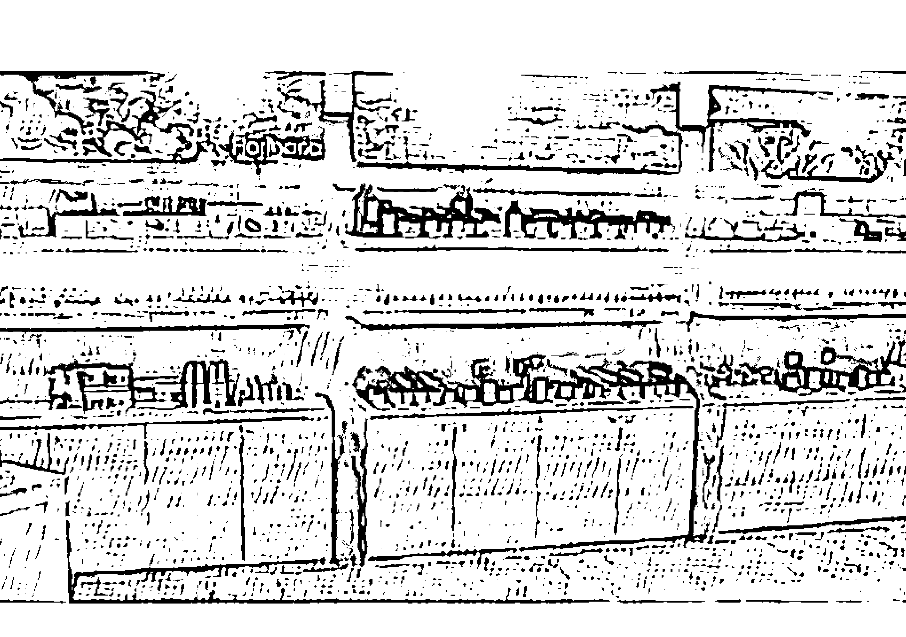

### 芳疗家

www.aromahealer.net

隐身巷内大楼的芳疗家，没有百货公司的华丽装潢，也没有销售员的紧迫盯人。店内络绎不绝的人潮，以及每位客人脸上放松的笑容，诉说了芳疗家受欢迎的程度。

芳疗家大概是精油族中无人不知的好伙伴。其所代理的法国精油品牌Florihana拥有自己的农场与庄园，是世界上少数真正有种植植物与蒸馏精油能力的芳疗品牌。从植物的栽种收成，精油的萃取检验，产品的包装运输皆亲力亲为，以求品质的稳定与管控，也是市面上少数通过欧美日多国有机认证的芳疗品牌。

台湾代理商芳疗家承袭与法国接轨的平实价格，让精油在台湾的价格不再高不可攀，帮助更多人有机会藉由大自然的植物能量，重新启动找回每个人自身的疗愈力量。

在我多次的消费经验中，已深刻体会到芳疗家服务态度好，出货速度快，价格超亲切，店面气氛佳，堪称零压力购物空间的范本。店内除了销售产品与提供芳疗咨询外，更提供一隅心灵休憩的宁静空间，让每位客人都能自由自在沉浸在天然植物的香气中，透过植物走进内心更加「认识自己」。

我曾经拿几家美国品牌精油和芳疗家精油给几位灵视能力者盲测鉴定。他们先前皆未听过这些品牌，最后竟有志一同说芳疗家的能量品质最优。具备如此高的CP值，芳疗家从此成为我逢人必推荐的私心最爱。

### 晶荷

store.sunshineinbottles.com

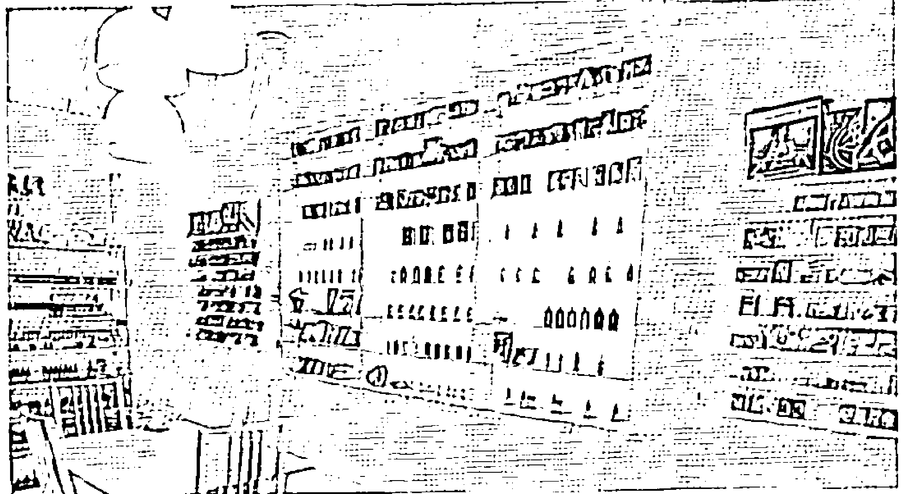

晶荷是一間專賣花精的溫馨企業，隱藏在偏僻民宅中，連電鈴都沒有。需從兩棟住屋之間一道不起眼的鐵梯爬上二樓，才會發覺裡頭別有洞天。

這就是晶荷的總部。在成立之初，沒人相信花精這麼小眾的產品能獨力養活一個人。十年後的今日，它不僅養活一個人，是養活一群人。

這一切的緣起，是因為我初接觸花精時，驚覺台灣與英國巨大的價差，不禁想：「會需要用到花精的人都是情緒受苦的人，怎能讓他們在經濟上再承受一道剝削？」因此發願要讓台灣人能平價購得優質花精。透過網路銷售精簡成本，翻譯、架站自己來，終能讓英國Crystal Herbs花精以盡可能趨近英國當地的價格，來到台灣花友的手中。

晶荷的服務哲學跟一般企業大不相同。員工從不會被要求慫恿客人消費，而是要找出真正能幫助客人的方法，即使那代表要阻止客人購買過多產品，因為晶荷圖的不是一時的銷售，而是真心的協助。

現在的晶荷一秉初衷，嚴選療癒好物，以親切合理的定價、溫柔貼心的服務，與台灣大眾分享。透過晶荷網站，你可以動動手指訂購花精、藥草、牌卡或各類療癒用品，也可以報名相關課程，預約諮詢服務。

當您親臨晶荷時，店內會點亮一盞燈，希望此間的燈光，能讓每位造訪者點亮心內的那盞燈。

## 什么是灵性喷雾？

花草树木和水晶矿石都是来自大自然的礼物，拥有独特的身心灵疗愈频率。

将植物蒸馏出化学分子便成「精油」与「纯露」，以浸水日照法萃取出能量就成「花精」，以酒精浸透就是「酊剂」。

就连水晶、宝石也可用类似的方式制作成「宝石酊」。

这些美好的能量，在经过妥善搭配之后，可以发挥一加一大于二的协同效果。

本书特色
市面上已有不少灵性喷雾产品，但是价格多半不便宜，颜色常常很鲜艳，成分制程还都不公开，但是你知道吗？DIY灵性喷雾一点都不难。
本书作者将钻研植物疗愈多年的宝贵经验完整公开，有了这本书，读者可以用最节约的预算做出各种对应自身需求的喷雾，而且再也不用担心添加物！
许多原本困扰你的问题，或许也能从中获得纾解与改善。

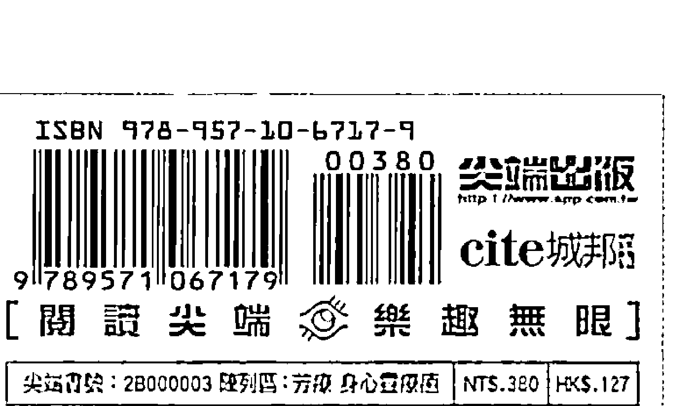