# 指引社公众号 2022.11

来源：[`mp.weixin.qq.com`](https://mp.weixin.qq.com)

# 疫情后 70%的人寻求转型，你的八字是否适合做互联网？

> 原文：[`mp.weixin.qq.com/s?__biz=MzI5NTQzMDUzMQ==&mid=2247483937&idx=1&sn=1d35a84798a4701f4cb17a22628ed636&chksm=ec52f2cddb257bdbd9aa6afeb3b437a5031255a7212a8f32254cee09d4f9c8db1fdb992b02c5&scene=27#wechat_redirect`](http://mp.weixin.qq.com/s?__biz=MzI5NTQzMDUzMQ==&mid=2247483937&idx=1&sn=1d35a84798a4701f4cb17a22628ed636&chksm=ec52f2cddb257bdbd9aa6afeb3b437a5031255a7212a8f32254cee09d4f9c8db1fdb992b02c5&scene=27#wechat_redirect)

最近新闻报道，受疫情影响，2020 年上半年全国网吧倒闭了 6487 家，没有倒下的线下实体店也一片萧条。而线上外卖、直播行业和电商物流等行业却异军突起，展现出勃勃生机，身边很多有条件的人开始寻求转型，投身到互联网行业。但是，是否所有人都适合转型做互联网行业呢？今天指引社将从八字的角度去看待这个问题，特别邀请了齐名振老师，以问答的形式，探讨一下哪些八字适合做互联网行业。

**指引社：**很多人可能还不太了解怎么从八字了解适合自己的行业，齐老师可否先讲解下？

**齐明振老师：**从八字了解适合自己的行业，其实就是根据喜用神和大运关系去看自身适合的行业方向。八字中喜用神是什么五行什么十神，配合原命局生克制化关系，最后就可以从这些方面确定从业方向了，这样选择行业，对自己有利，顺风顺水。另外，看大运，若今年是在自己人生比较好的大运内，也可以从事八字当中最旺五行的行业。比如八字金旺，但是大运走好，虽金是忌神，但是大运是好运，能够克制忌神，可以在五行为金的行业中有贵人帮扶，依然会有很好的发展。

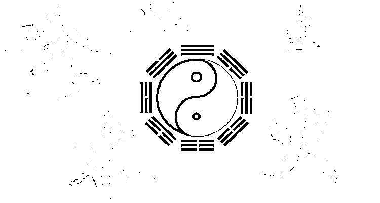

**指引社：**今天要探讨的是互联网行业，那是不是要先确定互联网行业属于五行中的哪个属性，才能和自己的喜用神对应上？

**齐明振老师：**是的，业内一般认为，网络是电流和热能的特征，所以互联网五行属火。最后得出的是，八字喜用神为火的人，并且天干透出丙丁火的人，而且丙丁火最好是食神伤官，那么就非常适合从事互联网行业。但是以上是用宏观来看的，实际上互联网行业，是一个统称，这个行业又划分了很多岗位，但是具体到微观的职业、工作岗位，我们可能要从另外一个维度来分析。

**指引社：**那请问齐老师怎么通过八字看适合的具体互联网岗位？

**齐明振老师：**宏观行业应选择自己的喜用神，而微观岗位应选择自己最旺的五行。譬如你最旺的五行为水，那么在互联网行业中对应做用户运营、电子商务经营，与各种流量、交易流水有关的职位，是非常合适的；如果你最旺的五行为木，那么你在互联网公司做人力资源是适合的；如果你最旺的五行为金，那么负责财务、投融资等相关职务会适合你。如果你最旺的五行为土，那么负责硬件或者基础设施运维，以稳定性压倒一切的职位较为适合你。如果你最旺的五行为火，喜用神也是火，这种专旺情况是会有的，那么做研发、产品、APP 前端的设计、开发、内容编辑等用户体验为指标的岗位，一定非你莫属。

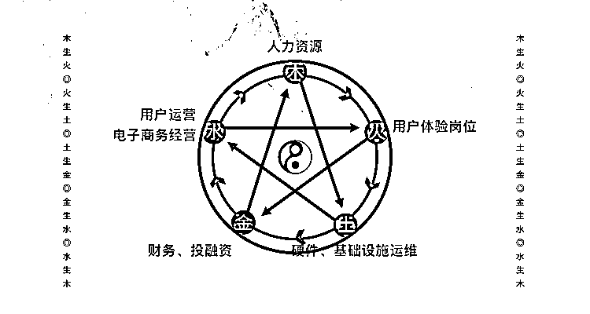

**指引社：**感谢齐老师，还有什么要分享给我们的吗？

**齐明振老师：**最后分享一下两个人的八字。马云：甲辰年，甲戌月，丁酉日。他的八字身弱，日元丁火生于墓库之地，幸好辰戌冲，墓库开门，伤官当财看，喜用火木。七岁零八个月行运，大运 1998 年戊寅年，阿里巴巴创立，现在做到了电商老大。马化腾：辛亥年，戊戌月，丁亥日。丁火日元生于戌土月，戌土为墓库，不得月令生扶，天干无比肩印星，故身弱极，没有时柱信息，所以不可定从格，八字喜用木火帮身。两位互联网大佬的喜用神皆为木火，这说明什么问题呢？留给各位细细品味，哈哈。

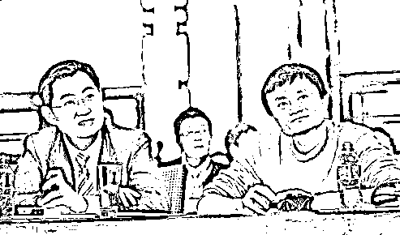

小编喜用神为火，顿时有点小激动。最后，非常感谢齐名振老师的分享，如果想了解清楚自己的八字，了解自己八字的喜用神，了解自己适合做什么行业，又或者想预测未来事业财运情况，可以找我们齐名振老师哦。我们下期见。

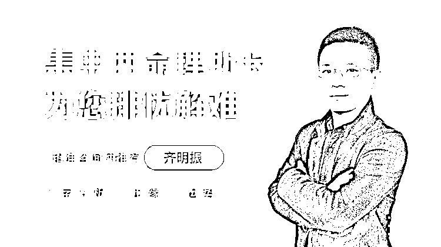

**齐明振老师介绍**

自小跟随父辈学习周易、风水，大学期间出于爱好在格林学院学习塔罗牌分析体系，博学多才，尤为擅长四柱八字断命和塔罗占卜，目前专职从事占卜工作已有八年。会根据客户实际情况灵活运用毕生所学解答其困扰，八字分析摒弃传统旺衰关系，从八字立像角度，对八字进行系统的五行分化，使自己解答的内容能够和客户产生共鸣，让客户对深奥的八字易学原理，从抽象转变为形象思维更加产生，这种信任度是八字预测学不是那么的神秘而是更加贴切于大众。

此文内容为指引社平台和署名老师原创，转载请说明出处，如果你有八字命理相关的问题，下载指引社 APP，跟老师一对一沟通吧！

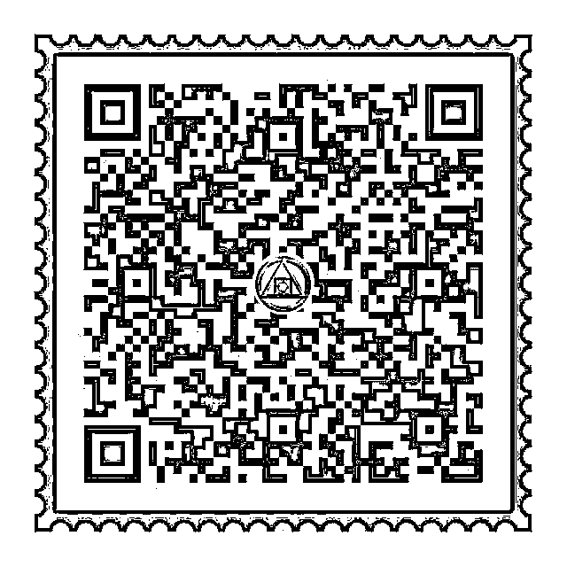

**识别二维码即可下载指引社 APP**

# 塔罗牌测试：和你分手后，他有没有后悔过？

> 原文：[`mp.weixin.qq.com/s?__biz=MzI5NTQzMDUzMQ==&mid=2247483937&idx=2&sn=4dabe633cd6222dd72476021f1711096&chksm=ec52f2cddb257bdbb76f02981c7a627c7b81d99eecebf0cdc84fe7f301e147af4b9b959d41c6&scene=27#wechat_redirect`](http://mp.weixin.qq.com/s?__biz=MzI5NTQzMDUzMQ==&mid=2247483937&idx=2&sn=4dabe633cd6222dd72476021f1711096&chksm=ec52f2cddb257bdbb76f02981c7a627c7b81d99eecebf0cdc84fe7f301e147af4b9b959d41c6&scene=27#wechat_redirect)

如果你问我，在一段感情当中，最美好的时期是什么时候？那一定是刚开始的热恋期。但是随着时间的推移，双方热情都会逐渐降下来，就会变成两种结局，分手或继续走下去修成正果。很多情侣都经历过分分合合，有的人分手后能很快释然，然后洒脱离开，有些人很执着，始终放不开。你想知道，**分手之后，他有没有后悔过呢**？今天就让塔罗来给我们解惑吧。来看看，他后悔了吗？

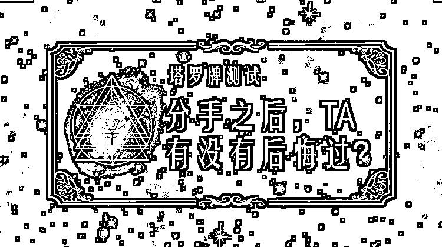

下面把你的注意力集中在你的感情上

然后凭自己的第一感觉选一张牌。

**记得是凭第一感觉，重复选无效哦~**

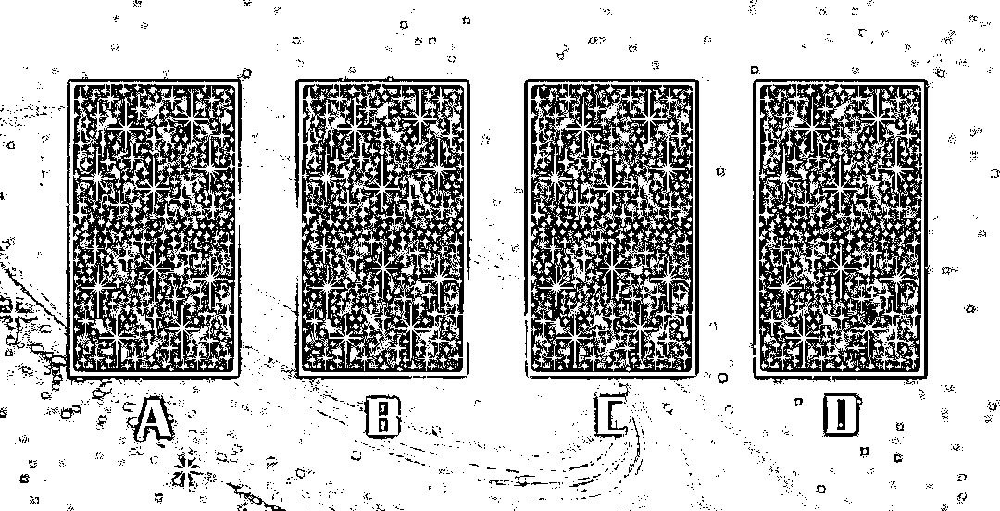

** 结果解析 **

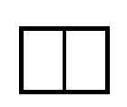

**A.皇帝**

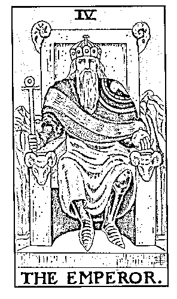

当你选择这张牌时，说明你的他可能是一个严谨、有些大男子主义、不苟言笑、很自律性的一个人。他是生活在当下的，他很在意自己的事业，比较务实，可能会是一个工作狂，他有很好的物质条件。但在感情中不是很懂表达，不够浪漫，有时显得有些木讷。

他没有忘记你，可能会在默默一人的时候想起你的好，他和你分手后有过后悔，只是他可能永远不会表达出来，也不会告诉你，他心里的想法。他只会在某些时候默默的想起你的好。他不会被感情左右，当然他也不允许自己被感情左右。

所以如果你也想他，其实可以尝试做朋友就挺好，恋人还是算了吧，毕竟爱情在他的生命中没那么重要。

**B.战车**

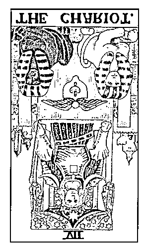

当你选择这张牌，可能他现在的个人状况不很好，他很情绪化，生活有一些停滞不前。他做什么事都没有热情，有些消极。

他现在依旧无法忘记你，很后悔和你分手。你们之前可能有着很深的感情，可能有过很多恩爱的时光，很让他怀念。所以，他还需要时间抚平他的情绪，他才能慢慢走出来。

此刻如果你也想他，也想和他复合，可以联系他，也许可以再续前缘。

**C.塔**

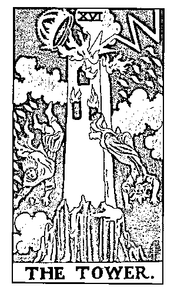

当你选择了这张牌，说明那是一段惊心动魄、心跳爆棚的感情。而且可能因为巨大的冲突或者事件导致你们的分手，你们已经没有办法必须走下去了，分手时也闹的非常的不愉快，现在的关系可能也很紧张。

两个人可能分手后都没有后悔过吧，反而会觉得分手是解脱。分手对你们来说，可能是最好的选择。长痛不如短痛，彼此祝福吧。

**D.女祭司**

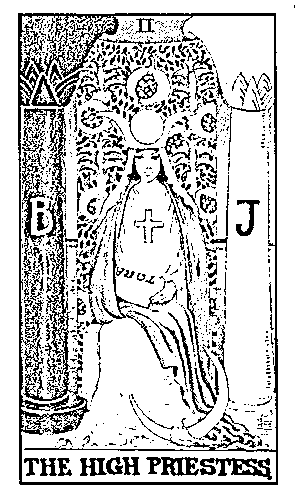

当你抽到了这张牌，你们两个人应该是深思熟虑之后决定分手的。二号牌女祭司通常代表着一段消极和反省的时光。所以此时你们可能近期都没有谈恋爱，都处在思考期。

对方会想你，但也只是想你，分手对方并不后悔，毕竟是思考很久才做的决定。

在这个思考期，你不需要去思考这段感情中的多孰是孰非，可以去想想你在这段感情中学习到了什么，那些地方需要提升，整理心情，等待下一个转角遇到爱。

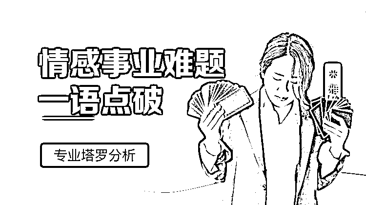

**米雅老师介绍**

职业塔罗师，国家认证心理咨询师，从业 4 年，积累塔罗咨询个案时长超过 2000 小时。拥有 Access Bars 导师、灵气疗愈师、土地环境疗愈师、国际认证催眠师等认证。擅长感应对方身心状态，分析事件走向和未来情感运势，针对性指导婚恋情感、复合助力、事业规划、自我成长、焦虑情绪疏导等问题。塔罗是一个工具，塔罗是一种技能，塔罗更是一种生活态度。我喜欢塔罗，好喜欢！如果恰好你也好喜欢塔罗，如果在这茫茫人海中遇到了我，交个朋友可好？

此文内容为指引社平台和署名老师原创，转载请说明出处，如果你有感情事业等相关的问题，下载指引社 APP，跟老师一对一沟通吧！

**识别二维码即可下载指引社 APP**

# 这几个星座，天生对异性有吸引力，还有爱情保鲜“异能”

> 原文：[`mp.weixin.qq.com/s?__biz=MzI5NTQzMDUzMQ==&mid=2247483937&idx=3&sn=1eadce8590254ba328458a6f78ae8797&chksm=ec52f2cddb257bdbc7458a6bfc66ca701cdd1f28135e768abb0f868c7c777528aba60cd2fde3&scene=27#wechat_redirect`](http://mp.weixin.qq.com/s?__biz=MzI5NTQzMDUzMQ==&mid=2247483937&idx=3&sn=1eadce8590254ba328458a6f78ae8797&chksm=ec52f2cddb257bdbc7458a6bfc66ca701cdd1f28135e768abb0f868c7c777528aba60cd2fde3&scene=27#wechat_redirect)

爱情分为几个时期，彼此了解期，然后是热恋期然后是矛盾期最后是稳定期，感情要慢慢的用心经营。所以，给爱情保鲜是很重要的，也是感情稳定的一个很重要的因素。在了解期，因为有着对彼此的吸引而进展迅猛，稳定期同样需要依赖对方的吸引达到保鲜的效果。所以说，在一段爱情里，保持对对方的吸引力，是十分重要的。

有几个星座，天生就自带魅力，在他们的身边，你会感受他们的魅力四射，因为他们的魅力总是那么的旺盛，而且他们就是有种让人难以抗拒的魅力。他们从小身边就围绕着不少的异性，一直深受异性的欢迎。那么下面来看看**哪几个星座天生自带吸引力，像拥有了爱情保鲜异能一样**。 

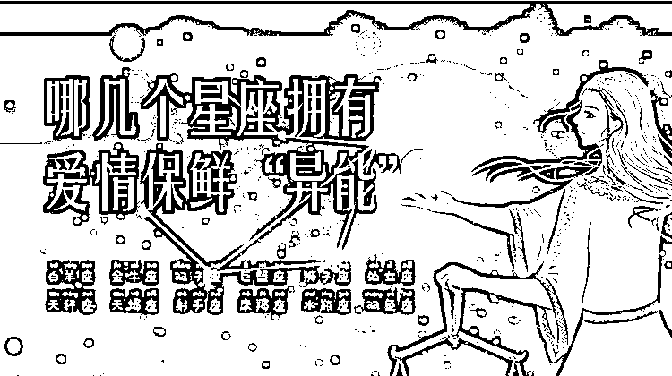

01 天蝎座

天蝎座的人就是自带吸引力，他们天生的傲娇高冷，和天蝎座的人刚在一起，会被他们这种天然的魅力所吸引。随着一起的时间慢慢的久了，你会发现天蝎座的人有很多的人格魅力，他们也很聪明，也会有很多的爱好，可以和你一起探索万千世界的各种趣事。他们喜欢上一个人肯定是全身心投入，眼中只有你一个，不感兴趣的人不会多看一眼，敢爱敢恨的她们做事说话都很直接不怕得罪别人，在感情中她们不喜欢暧昧不清，不喜欢的人就会果断拒绝，所以就是这样的天蝎座最让人难以自拔，最终一旦爱上了他们肯定就不愿意分开的。

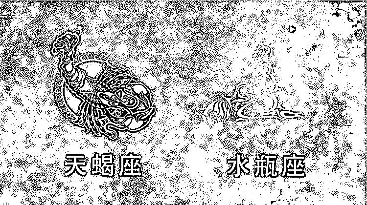

02 水瓶座

水瓶座的人会给人一个古灵精怪的感觉，而且水瓶座的人会有着不少的搞笑瞬间，和他们在一起总是能感觉，每时每刻都是幸福的开始。水瓶座的人是一个很善解人意的，他们会在你受到挫折和打击时，时刻陪在你身边，给予你鼓励和支持。水瓶座时刻都有喜欢冒险和好奇心，所以跟水瓶在一起每天都是新的冒险，不用担心日子过得平淡而失去爱情的保鲜。他们时而成熟时而小孩子脾气形成的反差萌，是最特别的，这样的魅力只有水瓶座具有的。综上，水瓶座的人也天生有着致命的吸引力，爱情保鲜异能爆棚！

03 摩羯座

摩羯座的人外柔内刚，在他们的认知里爱情是最最重要的，所以一旦他们遇到自己的真爱之后哪怕是全世界反对也会坚持在一起，他们一心只有爱，所以更容易保持长久的关系，而且是真心真意的感情相维持。这个星座的深情浓烈而明显，不会放任自己在乎关心的人远离自己，一旦付出真心就会待在对方身边不离不弃，另外摩羯座人相处越久彼此的情感越牢固也就越长情。摩羯座持续而浓烈的感情输出，就是他们最吸引的魅力所在，同时也是爱情“保鲜剂”。

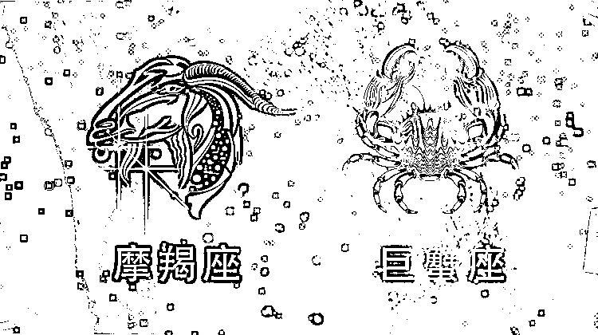

04 巨蟹座

巨蟹座的人很善良，又很温柔、很有爱心，喜欢帮助人，明知道做的事情自己是很吃亏的，只要觉得值得还是愿意无条件的付出。所以和巨蟹座的人在一起，你会感觉到巨蟹座的人有着不少的体贴感，你的内心会被巨蟹座彻底融化。正是这样，巨蟹座的人有着致命的吸引力，哪个人不想倒在巨蟹座的温柔乡中。而巨蟹最有吸引力的地方，那就是他能让身边的人感受到他的温暖。有些人总是感觉生活没有那么的顺遂，或许总是觉得自己没有得到一个人的关怀，要是遇到巨蟹座，最后都会被巨蟹的热情“暖化”！

在我看来，每个人都会遇到心动的人，但是能遇到一个持续吸引你的人，可真是难上加难。因为持续长久的爱情来之不易，所以得到了要珍惜。如果你有星座相关的问题，到指引社 APP 找老师提问吧。

此文内容为指引社平台原创，转载请说明出处，如果你有感情事业等相关的问题，下载指引社 APP，跟老师一对一沟通吧！

**识别二维码即可下载指引社 APP**

# 【新版预告】指引社 APP 全新改版准备上线啦

> 原文：[`mp.weixin.qq.com/s?__biz=MzI5NTQzMDUzMQ==&mid=2247483902&idx=1&sn=cc78937433424c8fde71f51251a868e2&chksm=ec52f112db2578044a9e1f8fb7bd633e3d39c008d06c86c6f66719a334d3a24f33b47465f5fa&scene=27#wechat_redirect`](http://mp.weixin.qq.com/s?__biz=MzI5NTQzMDUzMQ==&mid=2247483902&idx=1&sn=cc78937433424c8fde71f51251a868e2&chksm=ec52f112db2578044a9e1f8fb7bd633e3d39c008d06c86c6f66719a334d3a24f33b47465f5fa&scene=27#wechat_redirect)

◆◆指引社 APP 全新改版◆◆

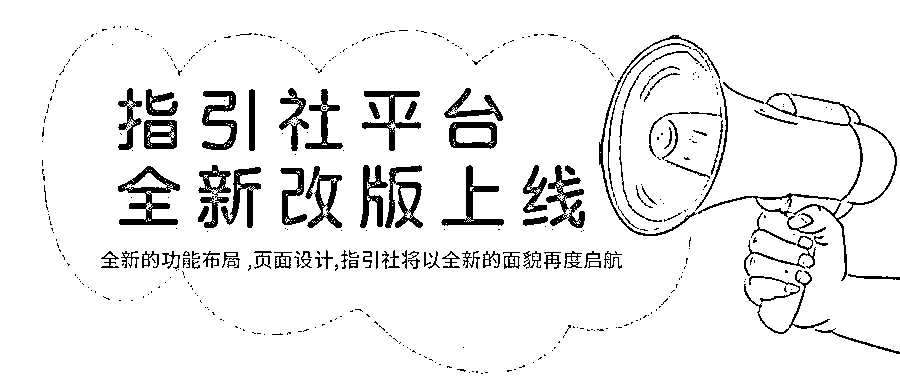

鉴于各位用户提出的诸多反馈和建议，我们日夜兼程进行改版，力求为各位送上一个更美观，体验更好的指引社 APP。

全新的功能布局，页面设计，指引社将以全新的面貌再度启航。

预计新版将在 8 月内推出，届时请留意公众号通知或 app 内更新推送。

◆◆界面全新改版◆◆

◆◆部分新功能预告◆◆

**1、一键登陆**

自动识别手机号，无需验证码一键注册登陆，实在是太方便了，再也不用担心不记得账号密码。如果获取不到手机号码，切换验证码登陆也是可以的哦！

**2、搜索、分类找老师**

我们新增了搜索框，输入老师名称快速找到老师，还可以输入关键词进行文章、测算等搜索。完善了咨询『 项目分类』，满足小伙伴们更多的需求。

**3、即时咨询**

新增即时咨询模块，老师在线即时咨询，无需预约等待，下单即可和在线老师们畅聊。

**4、咨询记录回看**

咨询记录支持回看啦，方便小伙伴回看和老师的对话，这样就不会忘记老师的叮嘱啦。

**5、提前沟通**

下单支付后，无需等到预约的时间即可以留言给老师，和老师提前沟通咨询内容。

**6、金币系统**

签到领金币，做任务领金币，各种金币玩法上线，金币兑换会越来越丰富起来，小伙伴们期待吧！

以上只是部分功能预告，更多的功能等着你来挖掘呢！如果你对我们 app 功能等有什么建议或反馈，可以在 app 意见反馈里提交或添加微信客服提交。收到好的建议，我们客服会给你发优惠券大礼包哈。

最后，文末小调查，来选择一下吧！

📹 /mp/newappmsgvote?action=show&__biz=MzI5NTQzMDUzMQ==&supervoteid=488329440#wechat_redirect

# 老板最爱的 4 个星座员工，看下你是不是其中一员？

> 原文：[`mp.weixin.qq.com/s?__biz=MzI5NTQzMDUzMQ==&mid=2247483902&idx=2&sn=6728006fb802fd6c13cdaa0a66a66ca4&chksm=ec52f112db2578047c393b06faaf405ca182f1376efcfa8e749285b562301fc9576a1d15efbe&scene=27#wechat_redirect`](http://mp.weixin.qq.com/s?__biz=MzI5NTQzMDUzMQ==&mid=2247483902&idx=2&sn=6728006fb802fd6c13cdaa0a66a66ca4&chksm=ec52f112db2578047c393b06faaf405ca182f1376efcfa8e749285b562301fc9576a1d15efbe&scene=27#wechat_redirect)

刚刚入职新公司，马上就要到自己的生日，因为和同事还不太相熟，所以也没有把自己生日的信息告诉别人。在生日那周前后，突然发现办公室里多了些花束，同事收到的快递也明显多了起来。并且在一个周末，我收到了同事生日聚会的邀请。原来几个同事生日相邻，他们选择在周末集体庆生。我立即觉得好神奇呀，身边最近过生日的如此之多，巧合吗？这个问题在不久终于有了答案。原来公司老板给 HR 下达过一个“秘密”指令，尽量招聘下面几个星座的人。老板是一个多次创业的精英，操作过多个成功盈利的项目，他对星座的研究很深入，同时对团队的建设非常有经验。他下达的招聘指令，肯定是有理有据的。今天我们就来了解一下，老板最爱要的员工星座都是哪些？有你吗？**老板最爱的星座之一：金牛座**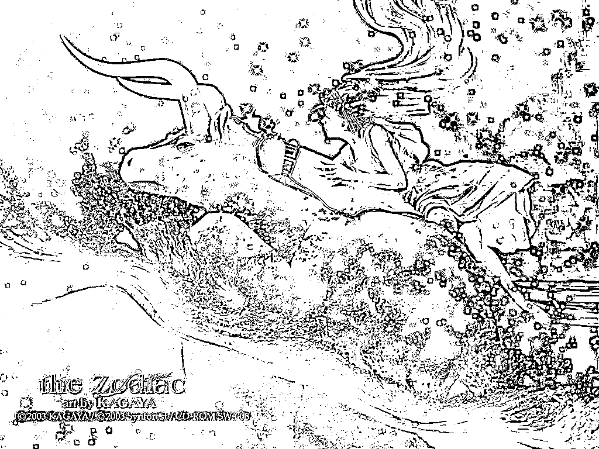金牛座踏实本分，为人低调内敛，但是办起事情踏实可靠，做任何事情都非常认真、负责，在工作中虽然话不多，但却是工作最努力的那个，表现力虽不如其他的员工那样优秀，但却一直用自己 的努力来证明自己。他们在工作岗位上一直是最兢兢业业、勤勤恳恳的存在，不论老板下达什么样的工作，金牛座一定会出色地完成。无论工作待金牛如何，金牛都待工作如初恋，任劳任怨，毫无怨言。这就是踏实肯干，又有责任心的金牛座。**老板最爱的星座之一：天蝎座**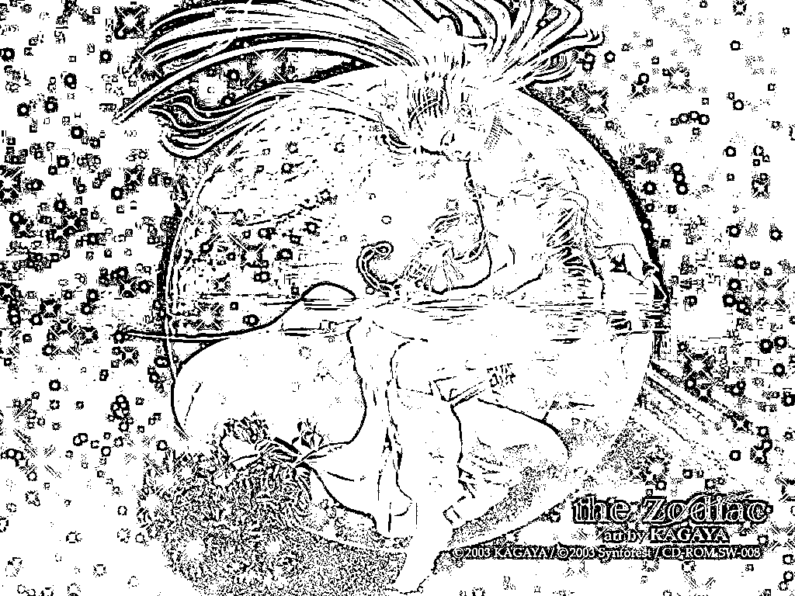天蝎有很强的原则性，极其自律，从不拖沓，执行力超强，他们从来只做有把握的事情，处事谨小慎微。看似冷酷无情的天蝎座，内心充满了热血，一个有志向、有抱负的青年，从不甘于平庸，总是抓住机会创造属于自己的辉煌。职场中的天蝎座一定能够成为一个出色的员工，不仅机智、冷静，还非常有想法，在工作中一个非常得力的助手与伙伴。**老板最爱的星座之一：摩羯座**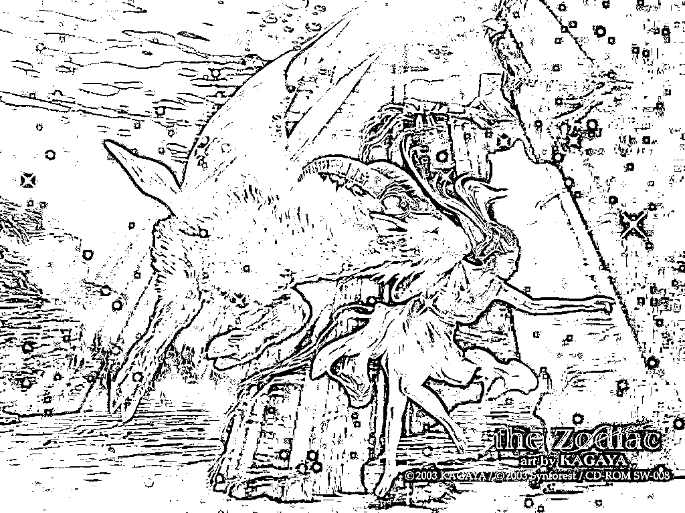摩羯座个性成熟稳重，为人处事严谨细致，凡事都尽可能做到没有遗憾。摩羯座一个木讷、不善言辞，但办起事情来是最稳妥、可靠的一个。摩羯座是一个有理想、有抱负，并且为之努力，坚持不懈的星座。摩羯座在工作中最能吃苦耐劳，别人付出一分的努力，摩羯座会付出十分的努力，是一个非常真实的工作狂，任何事情交给他也会放心，并且从不会出现拖泥带水。**老板最爱的星座之一：狮子座**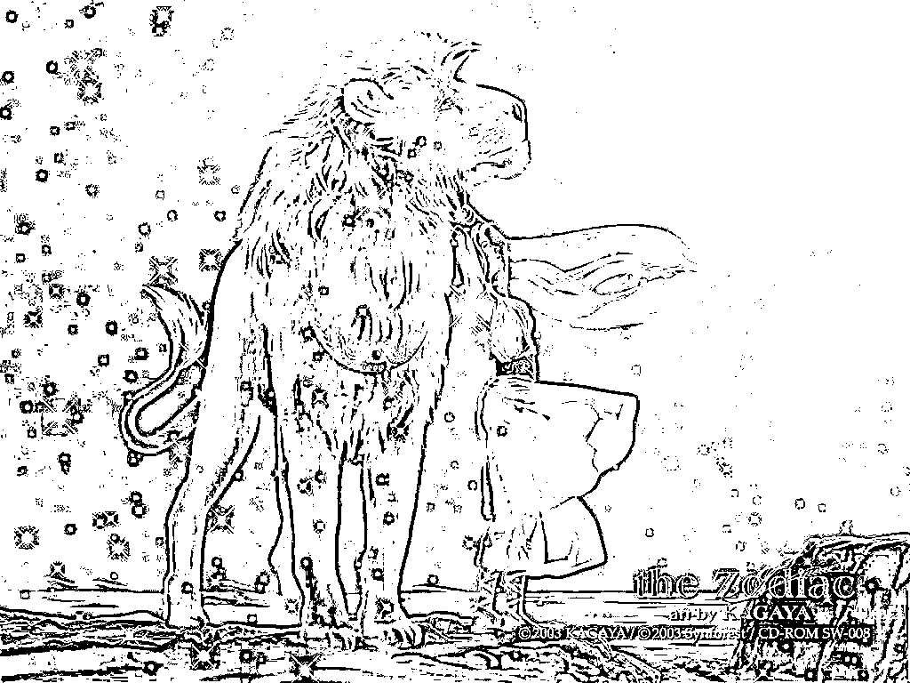狮子座拥有不服输的心理，越是困难的事，越想去尝试并征服。在工作上，狮子座遇到困难总是先想办法克服，从来不轻易放弃，老板交待的任务，总能完成得比其人人要好。狮子座还非常的听从老板的命令，只要一个电话，一份文件，狮子座便会立马开始行动，并且可以保证在不耽误时间的情况下完成，与同事之间的关系也处理得非常妥当。狮子座是实力派，更加希望用自己的实力去赢取老板的喜爱，而不是一昧的装样子。如果你是上面 4 个星座，那么恭喜你，老板们最喜欢这样的星座，但是不代表其他星座就不是老板们所需要的，说到底，会得到老板的青睐与重用，是你的工作能力和工作态度，努力提升自己，你会为之得到相应的回报。此文图片转自 KAGAYA，文字内容为【指引社】原创，转载请说明出处，如果你有星座塔罗相关的问题，下载指引社 APP，向星座塔罗大师一对一沟通吧！

**识别二维码即可下载指引社 APP**

# 八月遇贵人 即将好运到爆的四大星座

> 原文：[`mp.weixin.qq.com/s?__biz=MzI5NTQzMDUzMQ==&mid=2247483902&idx=3&sn=56a7d1b56aaaebb35b7278b0a943a84a&chksm=ec52f112db257804490498f6c3e2da4bd54c2acc756ce63e7c189033b14491dc42ba1cf2f3c7&scene=27#wechat_redirect`](http://mp.weixin.qq.com/s?__biz=MzI5NTQzMDUzMQ==&mid=2247483902&idx=3&sn=56a7d1b56aaaebb35b7278b0a943a84a&chksm=ec52f112db257804490498f6c3e2da4bd54c2acc756ce63e7c189033b14491dc42ba1cf2f3c7&scene=27#wechat_redirect)

2020 年已经过了一大半了，8 月份是狮子座的主场，狮子宝宝应该挺开心的当然呢，除了狮子座，还有其他几个星座的运势也不错的，因为得到“贵人”的帮助，要知道，我们单靠自己的话，很多时候我们都是很难做得好的，有贵人相助，那一切都不太样了。

下面我们来看看，究竟是哪几个星座将会得到贵人帮助，好运到爆呢。

狮子座：实力得到提升

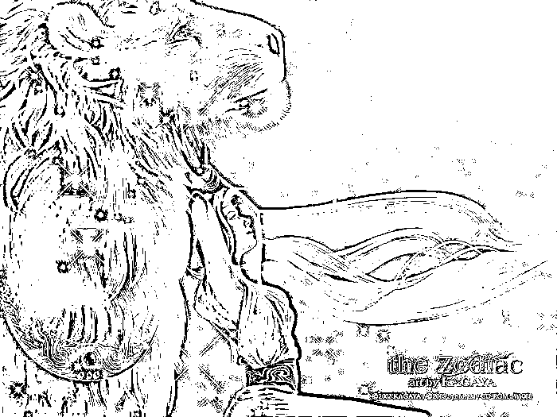

刚才已经剧透过狮子座了，狮子座的宝宝在之前一段时间的运气并没有想象中的那么好，虽然很勤快，但是学习能力有点欠缺，也正是因为这样，狮子座的宝宝之前一段日子过得有点劳累。但是，宝宝们不要担心，八月狮子座宝宝会得到贵人的帮助，宝宝们的脑袋会飞快转起来，很多事情都会有所突破，给自己多点信心，本命月来了，会好起来的哈。

巨蟹座：财运会提升

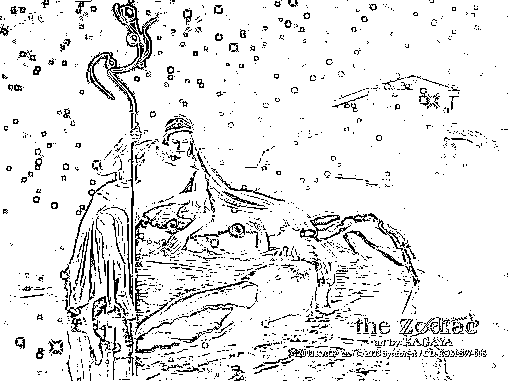

受疫情影响，前半年巨蟹座宝宝可谓是没有什么财运可言，但是 8 月开始，巨蟹座宝宝的财运开始慢慢变好，得到贵人的相助，财运气势如虹，事业有成生活甜美幸福，不但是运势高涨，而且同时又有财神的助阵，巨蟹座宝宝 8 月的财气大增好事不断惊喜连连。如果有在做投资的巨蟹宝宝，可能 8 月会赚不少钱哈哈。

金牛座：事业上巅峰

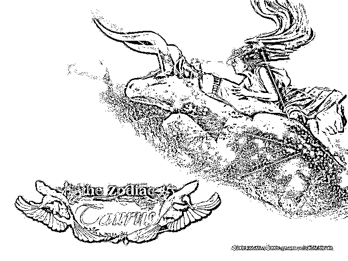

同样是疫情影响，金牛座宝宝事业上半年都多少有点不顺，但是这个将会在 8 月有好的起色，然后将在十月份事业迎来巅峰，为什么呀，就是因为他们有贵人的帮助。但是有一点要注意的是，金牛座宝宝面对自己手上的一切工作要有很认真热情的一个态度，要专注去做，这样才能搭上 8 月的好运顺风车，一切都会顺顺利利。

水瓶座：感情问题顺风顺水

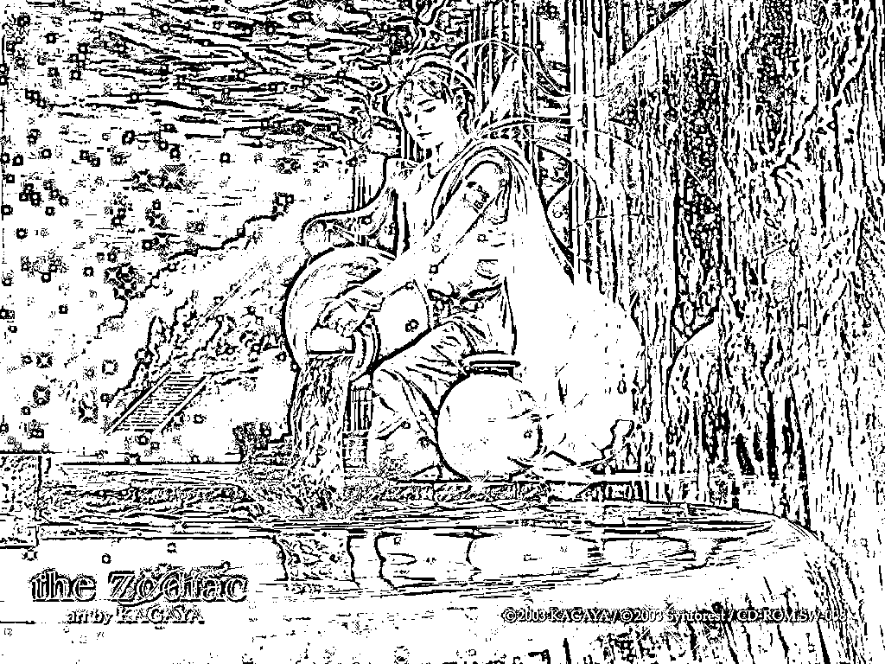

水瓶座的宝宝们在 8 月会遇到不少好事，之前遇到的感情问题，因为贵人的出现而开始迎刃而解，譬如，在对方的牵线帮助下，水瓶座宝宝会很幸运的得到喜欢的人的青睐，能够顺利的跟对方在一起。接着更是开始频繁的出现更加美好的事情，没错就是顺风顺水的所有的好事都一股脑的出现在你的眼前，宝宝们就好好享受这一切吧，那是你应得的！

以上就是八月好运到爆的四个星座，没有出现你的星座也请不要失去信心哦，运势是随时间变化的，可能其他星座宝宝下个月运势就好了呢。

此文图片转自 KAGAYA，文字内容为【指引社】原创，转载请说明出处，如果你有星座塔罗相关的问题，下载指引社 APP，向星座塔罗大师一对一沟通吧！

**识别二维码即可下载指引社 APP**

# 只看面相，教你三招快速识别渣男海王

> 原文：[`mp.weixin.qq.com/s?__biz=MzI5NTQzMDUzMQ==&mid=2247483902&idx=4&sn=fe89b8ef755cb1ef4b3ae4475af7c007&chksm=ec52f112db257804b0514cf80730b036d81d70699d9da3f2150a7091810ed1618f0fb87eced0&scene=27#wechat_redirect`](http://mp.weixin.qq.com/s?__biz=MzI5NTQzMDUzMQ==&mid=2247483902&idx=4&sn=fe89b8ef755cb1ef4b3ae4475af7c007&chksm=ec52f112db257804b0514cf80730b036d81d70699d9da3f2150a7091810ed1618f0fb87eced0&scene=27#wechat_redirect)

很多女生想不明白，为什么自己老是遇到渣男，自己全心全意付出，最后被欺骗被劈腿。每次对爱情充满幻想，却每次都是被现实打了脸。那为什么身边也有朋友遇到好男人呢？其实，渣男或好男人，可以从面相看出一点倪端。

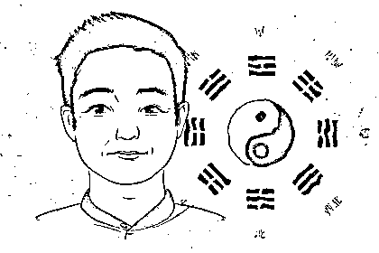

面相是古人通过大量的数据规律和概率考量，总结出来的具有较强指导性的识人学问。老祖宗传下来的东西还是比较好使的。下面，教你几招看快速识别渣男海王，从此远离渣男。

**一、看卧蚕**

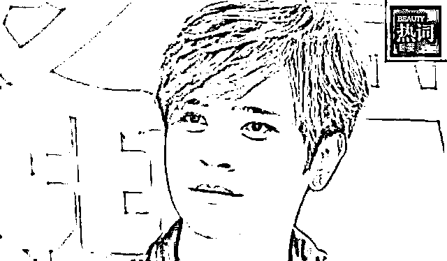

卧蚕是紧邻睫毛下缘一条约四到七毫米带状隆起物，看来好像一条蚕宝宝横卧在下睫毛的边缘，有些人笑起来才明显。卧蚕代表一个人的异性缘和子女运，眼下发窍于于肾，卧蚕饱满，肾好。但是饱满的黑卧蚕……你想下什么时候会发黑吧

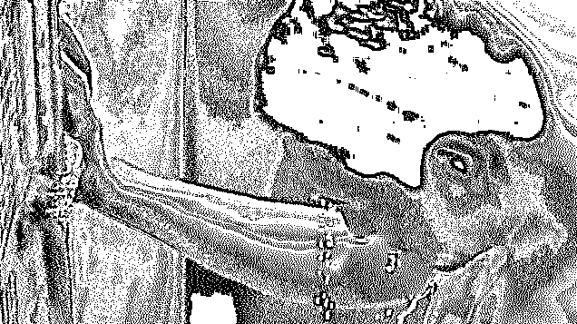

卧蚕发黑说明肾气消耗过多，很容易难以控制自己的欲望，如果一时没有控制住可能就会外出寻花问柳。所以，眼下发黑的男生要不得呀！

**二、看嘴巴**

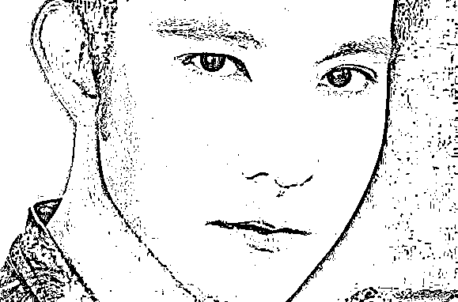

嘴巴代表人的情欲，上唇主情，下唇主欲，嘴唇太薄如刀削的男生，薄情，花言巧语，撒谎成性，很会哄女孩子，要不得。嘴唇厚长，而两边嘴角会往上翘而且棱角分明，就是桃花嘴。男人有这样的嘴型，很会哄女人，而且特别会使用花言巧语让女人醉心于他，也是非常花心。

嘴唇厚度适中，唇线清晰的男人，有情有义，说话有分寸，为人比较靠谱。这样的男人通常也喜欢吃，喜欢做饭，所以啊，好男人都在菜市场里。

**三、看奸门**

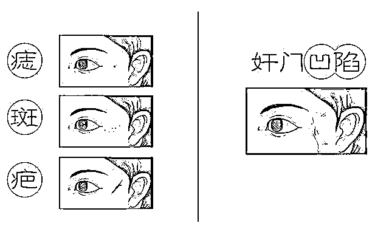

奸门又称夫妻宫，位于眼尾部位，在眼睛左右两侧的位置，关系男女情感。男性的奸门，左边为妻位，右边为感情位。

奸门发黑、奸门有痣、奸门皮肤粗糙、奸门有痘印痘坑、奸门有疤、奸门凹陷都是不好的现象，感情多变，容易出渣男。

另外，奸门也是俗称的鱼尾，所以鱼尾纹比较明显比较发散，是很招桃花的面相，鱼尾纹又深有多的人，纵欲好色，常流连于花草丛中不能自拔，婚姻易于分离。

最后，姑娘们如果通过以上几点也识别不出渣男，可以到指引社 APP 咨询一下我们的老师，预测一下便知道是不是你的白马王子了。祝你早日找到好男人，收获美好的爱情。

**此文图片来源网络，文字内容为【指引社】原创，转载请说明出处。**

**识别二维码即可下载指引社 APP**

# 入门：基础油篇①

> 原文：[`mp.weixin.qq.com/s?__biz=MzI5NTQzMDUzMQ==&mid=2247483849&idx=1&sn=4a307c209902f2ba041ff3be5ce53a90&chksm=ec52f125db257833ceb55f5ded20a7706babbf2da7ad8b96234d65a8d748005dafb108658cbc&scene=27#wechat_redirect`](http://mp.weixin.qq.com/s?__biz=MzI5NTQzMDUzMQ==&mid=2247483849&idx=1&sn=4a307c209902f2ba041ff3be5ce53a90&chksm=ec52f125db257833ceb55f5ded20a7706babbf2da7ad8b96234d65a8d748005dafb108658cbc&scene=27#wechat_redirect)

关注指引社，一起让“玄学”成为“学术”

从今天开始我们来同步认识下基础油，其实这个应该放前面讲的，然后我给忘了，这个系列开始慢慢补吧。不要觉得稀释草药油的基础油不重要，虽然怎样都可以了，NoNoNo ～基础油也许是植物萃取的，有自己独特的功效，就好比我要组合一个抗忧郁的方子，用圣约翰草浸泡油一定比甜杏仁油好用。但是我要用在脸部了，安抚敏感柔嫩的皮肤，甜杏仁油又一定比圣约翰草浸泡油好用。

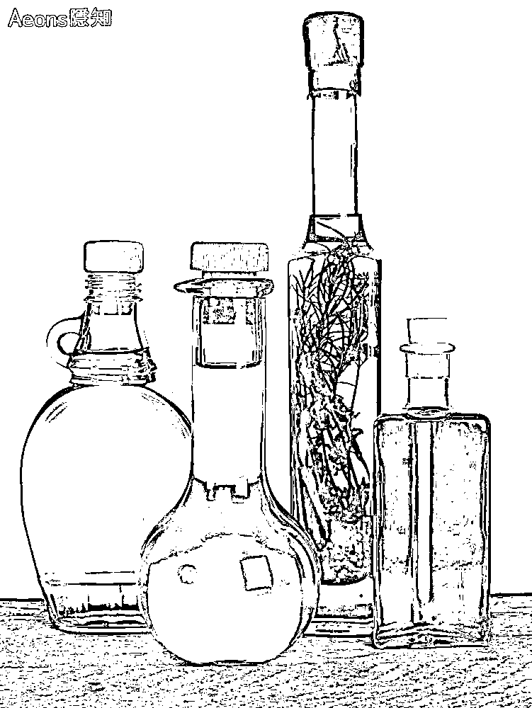

植物油听起来就很油，是不是长痘痘就不能用？

天然植物油总是因为带个油字就被人误解，觉得用起来一定油腻腻，而且会堵住皮肤，拜托了，又没叫你油炸你自己，你要用多少才会堵住啊？？包括很多保养品牌搞的什么“无油保养”我也只能呵呵了，你们要别加矿物油我也就谢天谢地了。

很多人对油的刻板印象大概来自什么动物油脂或是带有反式脂肪酸的高温精炼油。它们含有饱和脂肪酸，胆固醇，会堆积在人体内。就算是天然植物，经过高温处理后或者加上一些乱七八糟的化学萃取手法，也会让很好的脂肪酸变成反式脂肪酸与自由基。

举个栗子：葡萄籽油，通常它的原料来自于酿酒处理过后的副产品，原料挺多的，但是萃油率只有百分之十五，冷压的话好像成本有点高。于是商业生产上几乎都用溶剂萃取，这样就不可避免有溶剂残留，而且还有股臭味，哎呀～这下怎么办呢，机智的商人们立刻想到了在制作过程中又加入其它的化学物质，然后加热到一百二十度，持续加热二十分钟以上，还可以增加萃油量。当当当当～然后反式脂肪酸就降生啦～完全没有营养价值了哟～（摊手）所以现在相对难买到冷压葡萄籽油。

所以真正好油应该是冷压（低于六十度），不使用化学方式得到的。在萃取的过程中才能留住它珍贵的营养成分，不过这样的话，它的保质期会很短，开封后在一两个月内要使用完（某些稳定的可以时间长一点）

我们食用天然冷压的植物油，可以带走血液中不好的脂肪酸，并且还可以用来保养皮肤，它可以清

清除粉刺，保水，并且留下一层天然的保护膜。

我发誓，你用对了是不会长痘痘堵塞毛孔的。

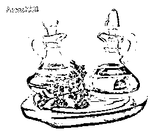

什么是饱和脂肪酸和不饱和脂肪酸？

我们的生活中见到的猪油，牛油，就是饱和脂肪酸，因为性质稳定，经常会凝结成固体。除了动物油脂外，还有会用到的，可可脂，椰子油，雪亚脂（乳木果脂）

虽然说是过量摄入会发胖增加患心血管疾病的风险，但是在我看来，也比反式脂肪好得多。而且用在皮肤上也是很舒服的（猪油牛油就算了）

饱和和不饱和，区别他们主要看化学式的“双键数”（我化学很渣，强行理解下，你们凑合看）

没有双键的通常就叫饱和脂肪酸，有的就是不饱和脂肪酸。还有，有一个双键的是单元不饱和脂肪酸，两个以上的是多元不饱和脂肪酸。根据第一个双键的位置，又分别有欧米伽 3 欧米伽 6 欧米伽 9。（就是首先出现的双键是在炭链第几位置上。）双键数量越多的，活性越大，代表它越不饱和，并且更更加容易变质。（敲黑板，保质期看这里）

不饱和脂肪酸

单元不饱和脂肪酸

欧米伽 9

是不用担心会缺乏这玩意儿的，因为人体可以自己合成，代表成分是油酸，代表油脂是橄榄油，芝麻油。这两样是三大出名的修行者用油其中两个，都具有很好的“吸附，排毒”功效。用起来是有点厚重，油的感觉，延伸性能强，所以用来按摩是很不错的（吸收太快的油脂会一下子干掉，按摩时会摩擦皮肤导致不舒服的感觉）

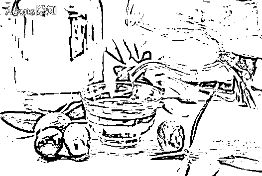

多元不饱和脂肪酸

这个是人体不能自己合成的，所以可以通过口服来补充，能激励消化，促进荷尔蒙分泌强化免疫，减轻炎症，对皮肤也很好。

欧米伽 3 

对大脑和视力比较好，而且还能降低发炎反应，镇定情绪，预防心血管疾病，主要的代表成分①：α—次亚麻油酸（南瓜籽油）

②：二十碳五烯酸，二十二碳六烯酸（常见于海洋动物的脂肪，比如深海鱼油）

欧米伽 6 代表成分有

①：亚麻酸油

清爽好吸收，因为它接近我们的皮脂，如果要加快吸收速度，它是不错的媒介，代表油脂是大麻籽油，黑种草油，葵花籽油

②：伽玛—次亚麻酸油（GLA）

可以转变为前列腺素 E1，降低发炎，缓解炎症，也能缓解情绪性皮肤问题。

代表油脂是月见草油，琉璃苣油。

*：只有在天然的植物油中，会存在许多脂肪伴随物，比如胡萝卜素，矿物质，维生素 E，卵磷脂等，它们是检验油脂质量的关键，同时有不可替代的疗愈功能，能整体提升油脂的功能。

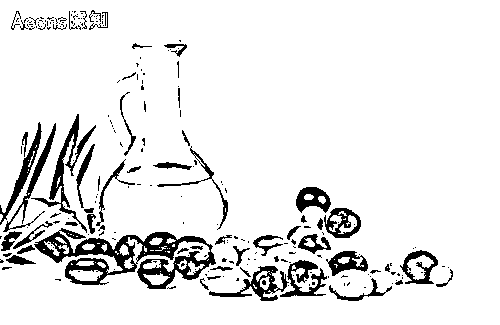

植物油越香越好？

很遗憾这个是错的，我承认市面上的芝麻油很香，闻着就流口水。但是你知道吗，为了增加芝麻的出油率，制造商把它们无情的炒过了，并且高温压榨，这样制作出来的芝麻油。。。真的很香！但是我叫你把它涂脸上你干吗？所以冷压芝麻油是颜色比较浅的，黑不溜秋的一定不是真冷压，并且冷压的气味清香，没有那么浓的芝麻味。（拿一把生芝麻，一把炒芝麻，你吃一下）

还有就是价格问题

太便宜的你别以为商家有良心，说不定是商家哄你玩，（不排除价格高的是商家艺高人胆大）

所以唯一能做的就是 

①：靠我们机智的大脑去分辨，当然也需要经验累积

②：选择有良心的商家

③：大佬买啥我跟着蹭（划掉）

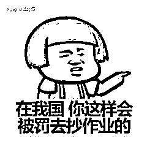

PS：市面上，造假最多的植物油是什么？？

除了形形色色的橄榄油之外，在芳疗界最恐怖的造假莫过于。。。

甜杏仁油里居然有苦杏仁，或者说市面上 99%买到的都是苦杏仁榨的油。（天啦噜）

让我回想下甄嬛传里安陵容怎么死的

苦杏仁成分在高温下会转变成氫氰酸，（敲黑板）剧毒！

所以～一定要买冷压，还有，除非厂家十分可靠，不要口服

虽然甜杏仁油口服好处很多，但是如果你不确定你买到的会不会是苦杏仁榨的。。。劝你不要想不开。

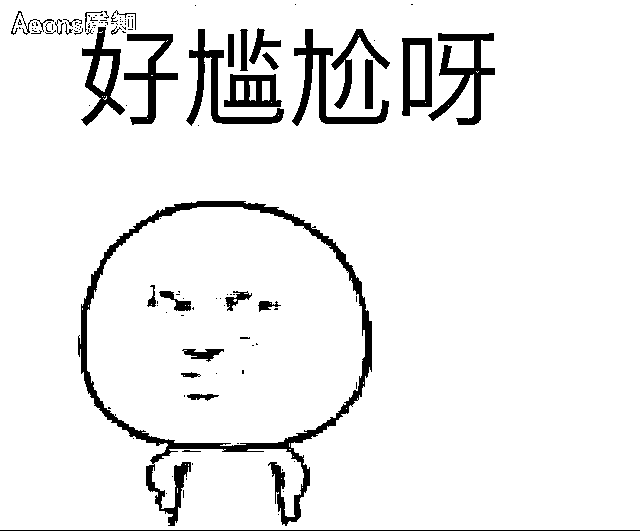

别看了，没了

挥爪

**慎小七**

芳香草药·专栏食用指南

慎小七，指引社矿灵学院管理，医学世家出身，芳疗师，常年调香爱好者跟实践者，草药专家。

本系列为慎小七原创出品，涉及芳香、草药等专业知识。

**【本文随机推】**

**点击你感兴趣的关键词**

**随机给你一篇历史文章**

**[草药：回春篇](http://mp.weixin.qq.com/s?__biz=MzI5NTQzMDUzMQ==&mid=2247483839&idx=6&sn=1aab2cb30c990dfe983625d9f1cb1f8e&chksm=ec52f153db2578451733810dd9f1fdeb1ea54e6cdaeee27b55867c333693226a9f20fb748529&scene=21#wechat_redirect) 丨 [草药：科属篇](http://mp.weixin.qq.com/s?__biz=MzI5NTQzMDUzMQ==&mid=2247483802&idx=5&sn=00d6b1ff98a485a2369c3e4d1fcdfaaa&chksm=ec52f176db257860c80cfee6ebdd4bc1d88948a3c59659b6041d81d9ab28f35278670b920054&scene=21#wechat_redirect) 丨[调香的专业与情趣](http://mp.weixin.qq.com/s?__biz=MzI5NTQzMDUzMQ==&mid=2247483727&idx=1&sn=b520fd6be2298b9e24c5f10235d73ab0&chksm=ec52f1a3db2578b5cd4d683fa5a10e9ad3fb00994b1bbd1c0eb3ce9e8111046b113f013968b9&scene=21#wechat_redirect)**

长按右边这个二维码

关注指引社

让学术嗨起来(｡･∀･)ﾉﾞ

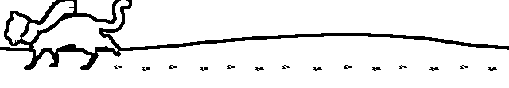

点击“阅读原文”，去和原贴互动~

# 译丨跟 Papus 學塔羅《第九课·魔术师》

> 原文：[`mp.weixin.qq.com/s?__biz=MzI5NTQzMDUzMQ==&mid=2247483849&idx=2&sn=59bc24f420b781a0d017f818636b0da3&chksm=ec52f125db257833048b8d2d7c57c098791d49bc549e3980caf6ec284d4b89a34587a98eab54&scene=27#wechat_redirect`](http://mp.weixin.qq.com/s?__biz=MzI5NTQzMDUzMQ==&mid=2247483849&idx=2&sn=59bc24f420b781a0d017f818636b0da3&chksm=ec52f125db257833048b8d2d7c57c098791d49bc549e3980caf6ec284d4b89a34587a98eab54&scene=27#wechat_redirect)

关注指引社，一起让“玄学”成为“学术”

# **【多图预警】关键词：塔罗，卡巴拉，上帝之名，符号学，灵数学。**

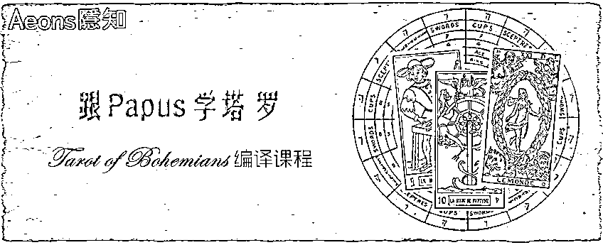

Papus（1865-1916，西语音译“帕普斯”）是金色曙光早期代表人物之一。他继承并发展了艾利法斯·里维（Eliphas Levi）将塔罗卡巴拉化的道路，并用神学辩证法和灵数学重释马赛塔罗的符号，建立了基于赫尔墨斯-卡巴拉的塔罗宇宙论。他的理论对于金色曙光后期的塔罗学者韦特、克劳利等人都有着重要的影响。本系列编译自 Papus 在塔罗方面的代表作《Tarot of Bohemians》。

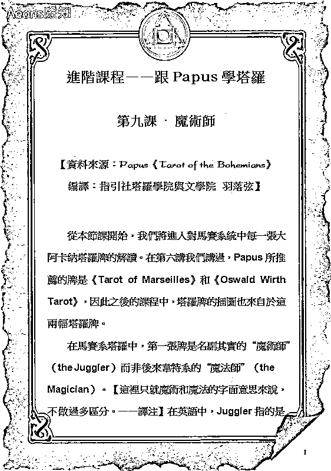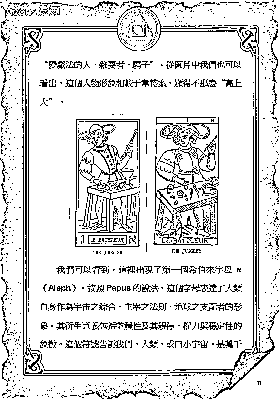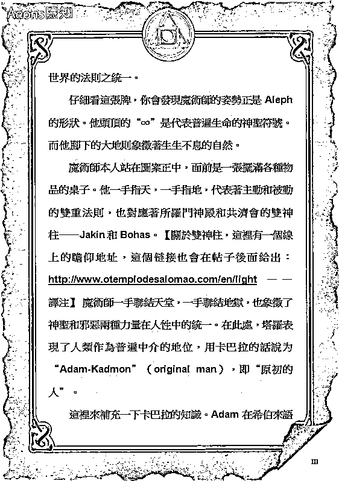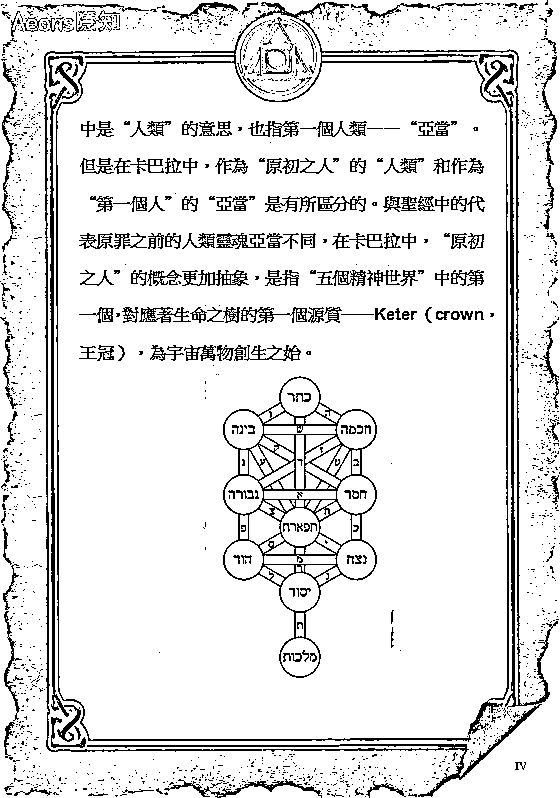 

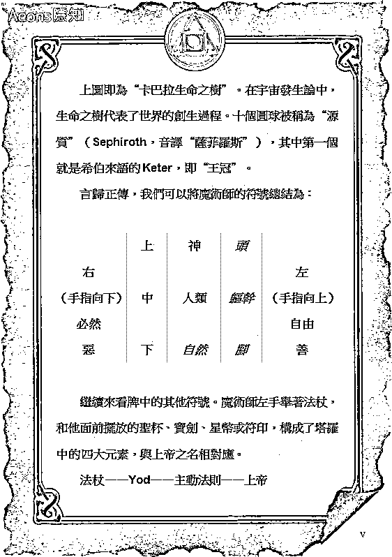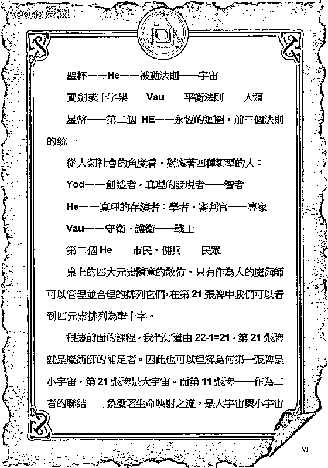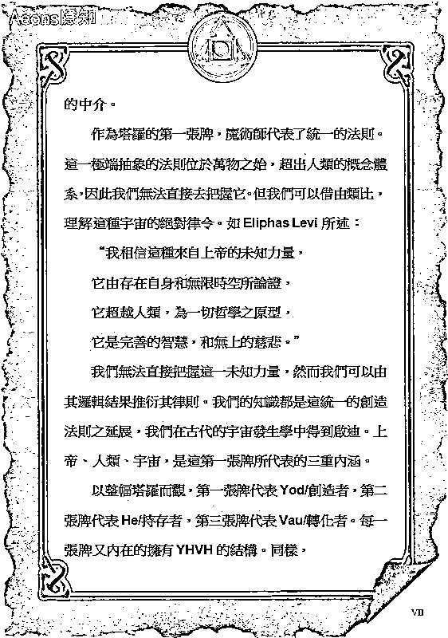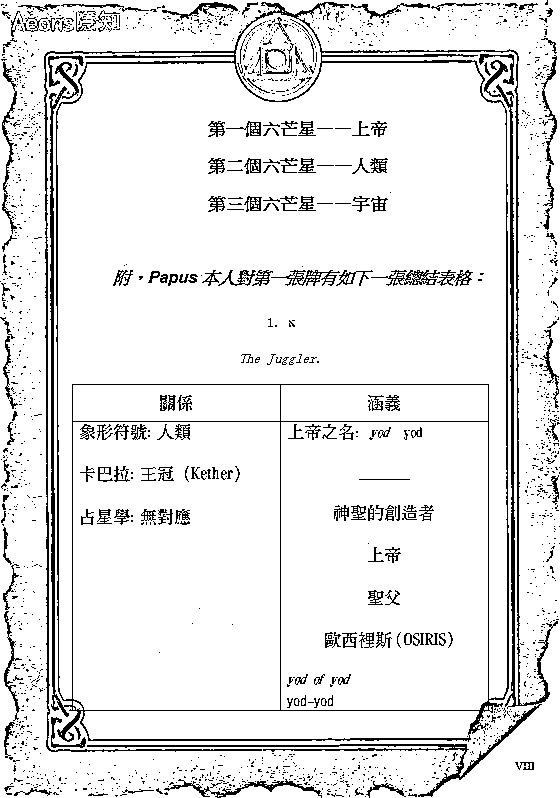 

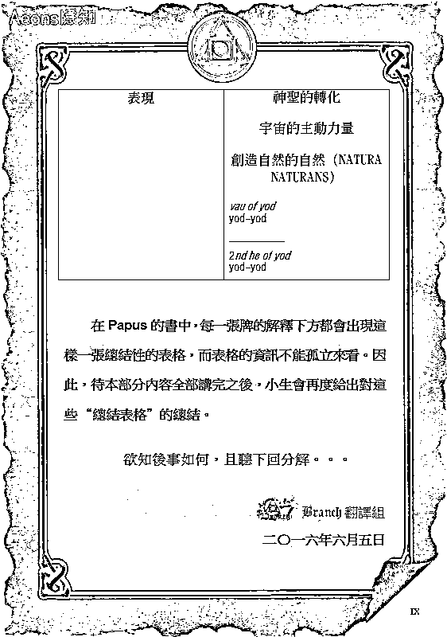 

**【本文随机推】**

**点击你感兴趣的关键词**

**给你一篇历史文章**

[**跟 Papus 学塔罗第四课**](http://mp.weixin.qq.com/s?__biz=MzI5NTQzMDUzMQ==&mid=2247483829&idx=5&sn=472a678b06a5b0f8fba53036d01b859b&chksm=ec52f159db25784f75d0ee36023b74fb42c313c7ec82ce9560153a9a7c08232711c2bcc87711&scene=21#wechat_redirect)** 丨 [跟 papus 学塔罗第五课](http://mp.weixin.qq.com/s?__biz=MzI5NTQzMDUzMQ==&mid=2247483839&idx=8&sn=dab133970f83162371ba2ada06659942&chksm=ec52f153db257845e6950cb276c6cdb702dfe23ddfcc2e5e1c8e7ed818f7f48e2a5aff9705f5&scene=21#wechat_redirect)**

长按右边这个二维码

关注指引社

让学术嗨起来(｡･∀･)ﾉﾞ

点击“阅读原文”，去和原贴互动~

# 编辑自留地丨稍微改了个版

> 原文：[`mp.weixin.qq.com/s?__biz=MzI5NTQzMDUzMQ==&mid=2247483849&idx=3&sn=131c147e00e3b16c899d17d7ba66a197&chksm=ec52f125db257833037b347ae6fe0d50987d1d082edb35bf1f4a9b84d8bdb45106f4b149b185&scene=27#wechat_redirect`](http://mp.weixin.qq.com/s?__biz=MzI5NTQzMDUzMQ==&mid=2247483849&idx=3&sn=131c147e00e3b16c899d17d7ba66a197&chksm=ec52f125db257833037b347ae6fe0d50987d1d082edb35bf1f4a9b84d8bdb45106f4b149b185&scene=27#wechat_redirect)

大家吼，是的，这个公众号不是纯 AI，是活人在运营的。

比如说我，是个如假包换的大活人。 

反正看的人也不多，所以我就决定留个栏目，用来放飞自我，和之后拉动作者们一起来放飞自我。

没错，你也是可以跟活人互动的。

所以，你们的留言，**都是有活人看的。**

这回想说两个事儿，

**1、微信做了些小小的改版。**

（1）换了引导。把之前那个土土的动效，换成了成套的猫咪！

没办法，我寄己不会作图，所以只能借用秀米的模板。这个模板还是略萌的有没有！

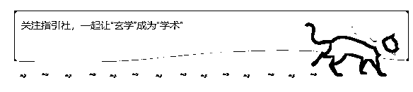

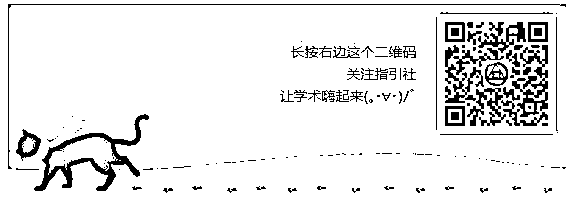

（2）自定义菜单微调了下。

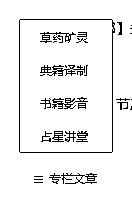

单独做了几个文章页面（累死我了）

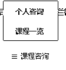

课程和咨询拆开了，可以直接跳到 App（我不管就是想抱怨下真的挺累的）

**2、关于前两天的大量推文。**

作为一个服务号，一个月只有 4 次的推送限额。

以前我都一周发一次，或者特别忙就不发了。

然鹅，上个月，我，猝不及防地住院了。

在经历了每天天没亮，就被护士小姐姐举着针叫醒，和没有 wifi 的早睡早起吃不饱喝不饱的日子后。

我出院了。且 2 月底时，发现公众号还能推几次。

嗯，于是就发生了前几天，每天推了七八篇文章的事情……

有新粉丝吐槽这事儿来着，所以我想好好解释下。

以后还是会周更（毕竟日更的工作量，对一个人来说太残酷了。）

更新的精致程度看心情（排版看脸，阅读原文放不放看网速，头图反正我是不会直接做了哼唧）但肯定会保证原文的稳定输出。

如果觉得看着费劲，可以去 App 上跟大家互动~App 上的更新是比较稳定的。

如果想跟小编互动，或者有什么悄悄话、有什么疑问，也可以留言。

我应该会直接截图丢给作者们看。

就酱。

匿了吧。

另外，本来打算做个新的菜单，然鹅我看了看工作量，决定先好好休两天假，再看心情搞了。

嗯。

再见。

下次也许就是另一个作者来吐槽了。建议抱有期待。

………………………………………………………………

你居然看到这里了？

那我就再说点小八卦。本次推的这两篇，

慎小七，七爷，爱好是抢沙发。连自己的文都不放过。去 App 的话，你会看到所有的文章下，都有七爷势如猛虎的沙发阵营。

而羽落弦，翻译组的组长，就读于一个我所仰望的专业——哲学。且还是个博士后。

翻译组内常年吹水，日常冒头催更，脾气灰常好。且性别始终不明（我面基过很多年了所以我当然是造的哦呵呵）

提供了大量的历史资料，塔罗的资深学术党。

嗯，不过你们也知道了，这些不做营销的学术党，始终就在学术上登峰造极，在社交平台上不咋活跃了囧。向研究人员表示致敬。

这回真的写完了。

下次见。

# 印蒿：再和我爱一次（回春篇）④

> 原文：[`mp.weixin.qq.com/s?__biz=MzI5NTQzMDUzMQ==&mid=2247483840&idx=1&sn=5ee5f80e9f7ca95ff21bf5fc16e397e2&chksm=ec52f12cdb25783a0baa87ec7df71ba5fafd41776c1036862e22ef8a8b50a5d7a8ec81590868&scene=27#wechat_redirect`](http://mp.weixin.qq.com/s?__biz=MzI5NTQzMDUzMQ==&mid=2247483840&idx=1&sn=5ee5f80e9f7ca95ff21bf5fc16e397e2&chksm=ec52f12cdb25783a0baa87ec7df71ba5fafd41776c1036862e22ef8a8b50a5d7a8ec81590868&scene=27#wechat_redirect)

关注指引社，一起让“玄学”成为“学术”

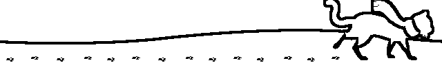

哈啰～大家好呀～这个年过的怎么样捏，有木有长肉三斤嬲，（不可能只有我一个人这样）这周我们来继续回春的话题，介绍一个价格可爱又好用的。

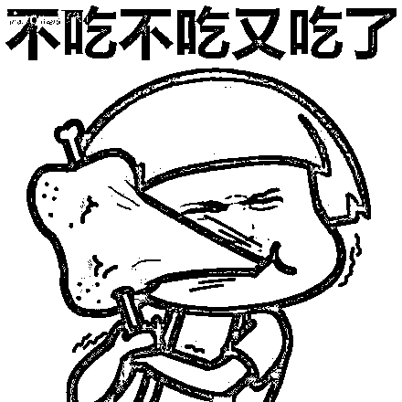

印蒿 Artemisia pallens 再和我爱一次

产自印度，在蒸馏檀香的淡季，就会蒸馏它来增加收入。

我很喜欢印蒿的气味，甜甜的，像草莓酒发酵的感觉。

在印度，它是印度教中重要植物之一，教徒把花献给湿婆神。但是精油是用叶片蒸馏的，主要成分是倍半萜酮（印蒿酮），倍半萜烯（大根老鹤草烯），苯基酯类（肉桂酸甲酯）。在生理属性上有很好的消解黏液，抗菌消炎的功能，主要能处理呼吸系统和生殖泌尿的感染，止痛，抗痉挛。

印蒿是属于菊科艾属的，同样菊科艾属的还有龙艾（就是茵陈草，也叫蛇蒿）还有艾草（不过拿来蒸馏的不是我们传统的中国艾草，是同属不同种的品种。）所有的菊科艾属植物都具有亲和女性的特征，很适合女性使用的，可以缓解痛经，调节经量。

对应的心灵疗愈能力，是回春，回春就是它的典型标签。它可以让人有再度坠入爱河，寻找第二春的勇气。不管有多大的年龄，或者曾经被爱所伤，变的防备重重再不敢相信爱情的“爱无能”，使用它都可以带来春的气息，让人拥有复苏的勇气。同时大多数人对它气味的偏爱，更是为它在回春界稳固了地位，使用后有种位醺的感觉，感觉能让人放掉我执，暂时忘却忧虑。有着“心上开花，陶醉”的感觉。

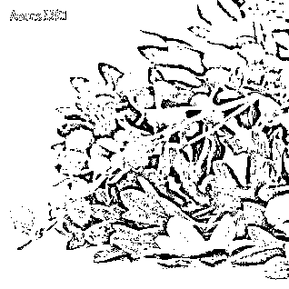

“我愿是满山的杜鹃，只为一次无憾的春天

我愿是繁星 捨给一个夏天的夜晚

我愿是千万条江河，流向唯一的海洋

我愿是那月，为你 再一次圆满”

用这首情诗来表达印蒿的心声再好不过，它是浪漫的感官恋爱专家，一切的氛围仿佛被拿捏的恰到好处，感官恋爱泛滥便成了沉迷爱欲，但作为专家的它总是那么从容，优雅而不会显得“色欲难禁”

我们都想要有印蒿一样的伴侣，它总是让人心动，每一句情话都是含情脉脉的，它给你一场美梦，就算是终将走向现实的坟墓，也可以抱着那回忆取暖。

印蒿说，我怎么甘心谢幕，趁这春光大好，像年轻时一样，勇敢的恋爱吧。

曾经处理的案例中，有过几个因情伤而留下阴影的，先在配方中少量添加印蒿，绝对不做一次性搞多了，这个道理很简单。就像人家正因为单身伤感着，你去撒狗粮，有点儿自尊的都想咬死你。先瞅准时机，然后开始少量添加，适应后，再瞅准时机，放大剂量，就好比能放下旧爱了，这时候撒点儿狗粮，可以激励对方再次有心去恋爱。

年龄大一些的人使用它也很好，它对皮肤也能起到回春作用，更不用说心灵了。

“我的婚姻结局是美满和谐的却再无幸福可言”

一位以处理两性关系而出名的芳疗师，有分享过一些很有意思的案例。曾经有一个求助者跟他说了上面这句话，求助者告诉他，他有一个越来越没有情趣的妻子，曾经他们关系很好，恋爱时浪漫幸福，婚后也过的很好，直到有了孩子。

孩子的降生让他感觉生活无趣，物质上并没有什么困难之处，而妻子变了，总是给他压力，他能体量妻子也不容易，操持着家中的家务，还要照顾小孩子。

他最不能忍受的是，他的妻子渐渐的失去了“性趣”总感觉妻子在敷衍自己，这一点都开始让他怀疑自己，怀疑自己是不是有问题？有天晚上他准备了惊喜，却被妻子骂了一顿，他感觉受到了羞辱，于是大吵一架。（据说是因为花瓣撒的到处都是，然后被妻子埋怨又要收拾很久）

随后他坦言，自己曾在冲动时想过要离婚，但看着不到三岁的小孩，实在不想这样下去，他希望能和妻子回到恋爱的感觉。

后来芳疗师宽慰他许久，最后的配方中也是重用了晚香玉加印蒿，甜橙加快乐鼠尾草。等气味讨喜又能让人好好愉快享受的。我曾经有问过，对方妻子是个操心太多，过度注重思绪的人，用印蒿，甜橙这些是不是太肤浅，有些直接了，然后他告诉我，所以要加晚香玉，快乐鼠尾草等，让它比较扑朔迷离。

后面也可以在替换主方中选用酚类，比如多香果，含的是丁香酚，气味春光乍泄

现在我们来深度剖析下印蒿的成分。

重要成分是印蒿酮，珍贵的大分子，决定它的力量有大地的感觉，像舞女华丽的脚饰，帖在地面翩翩起舞，流利翻飞。

有香甜的水果气味而且具有强大的细胞再生力，当之无愧的回春。而且还能清除各种黏液。

大根老鹤草烯

这个成分是从松油萜转变来的，有 A 到 E 五种类型，草药油里主要出现的是 A B D 这三种。我们在介绍依兰时有提到过的，气味是烟草加一点糖果加一点点药草的感觉。主要是有费洛蒙效应，能催情。

肉桂酸甲酯

草莓味的来源，所以我觉得它闻起来有草莓酒的气味，主要是能安抚心灵空虚，是苏刚达的代表成分之一。

使用印蒿时多半也会让人产生绚烂多彩而快乐的梦境，会让你觉得这个夜晚睡的很棒。我用印蒿陪伴入睡的话总是梦到“白马王子”可惜就是梦醒太快（遗憾脸）。还有就是很漂亮的梦境，总是和童话的感觉相关，比如大大的糖果乐园，果汁河，和很多奇怪的动物，精灵之类的去冒险。我强烈建议你们用油一定要记录梦境，那代表着它的钥匙对应打开着你的某个锁，这个事情我们以后会在其它帖子里详细的说，额，或者可能在课程上讲，哎呀啦～到时候再看

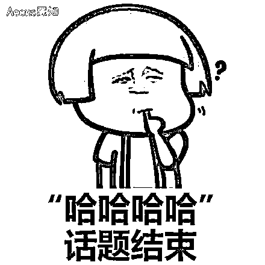

好了帖子结束了，挥爪

声明: 该文章版权归指引社和作者所有, 转载请保留此行([`www.geaving.com/article/view/id/182`](http://www.geaving.com/article/view/id/182))

长按右边这个二维码

关注指引社

让学术嗨起来(｡･∀･)ﾉﾞ

# 芳香植物的两把钥匙（科属篇）8

> 原文：[`mp.weixin.qq.com/s?__biz=MzI5NTQzMDUzMQ==&mid=2247483840&idx=2&sn=dc5fa8794be614566b8cea65849b2878&chksm=ec52f12cdb25783a05b5fe15e175c263a9331a63604f1e54bbb71a8cd162ea21ff8661b946af&scene=27#wechat_redirect`](http://mp.weixin.qq.com/s?__biz=MzI5NTQzMDUzMQ==&mid=2247483840&idx=2&sn=dc5fa8794be614566b8cea65849b2878&chksm=ec52f12cdb25783a05b5fe15e175c263a9331a63604f1e54bbb71a8cd162ea21ff8661b946af&scene=27#wechat_redirect)

关注指引社，一起让“玄学”成为“学术”

哈啰大家好～今天我们将进入科属篇的最后一篇，准确说是最后一个大纲，除此之外还有一些比较重要的植物我会另列出来介绍，比如花朵类的植物。

最后一篇我们来学习

败酱草科：Valerianaceae

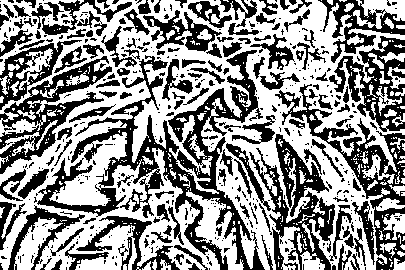

跟它的名字一样，气味非常难闻，不过，它的花长的很可爱的。据说猫咪老鼠会很喜欢它的气味，有时候装了这种植物的瓶子，猫咪闻到了会去舔。想吸猫的可以去试试，但是要当心，你周围的人闻到了会不会打你。

把植物看做是人的话，花朵其实是对应着生殖器的，某种意义上来说，花朵类的草药油确实都能关爱生殖器区域。而根部就相当于头和脖子那些地方了。败酱草科的草药油基本都是根部萃取的，可想而知能够平衡神经系统的紊乱，强力助眠，尤其是对于压力，思绪混乱引起的失眠。根部深埋于地下，其作用也有向下，往下拉的趋势，其草药油具有很好的宁心安神的作用。

“逃避虽然不好，但是却很有用”

有时候我们都需要一个可以喘息的小空间，败酱草科那么奇特。有可爱的外表却散发那么“疏远”的气味，都说它是很表里不一的植物。就像一些表里不一的人，大概是“脸上笑嘻嘻，心里 mmp”的感觉。即使心理有那么大的意见，那么强烈的排斥，为了寻求和谐，为了生活，也只能一忍再忍。大家都有难以诉说的苦恼，压力，背负着无形的各种责任。我们不能像个傻大姐一样活在这个社会上，长期下来，感觉自己总有一天会崩溃掉。

败酱科的温柔不是单纯的给予支持，也不是当头棒喝，或者让人一下子发泄出来。其实有时候，我们只需要一个安全的，稳定的，属于自己的小小空间来喘息一下。

败酱草科的气味就像是能标志地盘的信号，在这里面，你是绝对安全的。它的疗效往往是一夜睡眠的事。

睡眠的重要其实不用我说的，但要提的是，引发失眠的原因很多，并不是所有人用败酱草科来强行催眠一下就可以了。它一直是属于压箱底的重角。也是实在没有头绪，或者遇到棘手问题时的暂时救星。

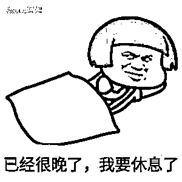

有时候遇到求助者心因复杂，心态要崩，有按下葫芦起来瓢的趋势时，什么都不用做了，就让他好好睡觉吧！往往这种情况，患者也失眠了不短的时间，一般的助眠起不到好的作用时，就会用到败酱草科。

在面对实际操作时，不管你要给你的求助者开怎样的方，都会考虑到睡眠这一块，这样往往会让效果更佳。就像中医不管开什么方子，总会顾着脾胃。

败酱草科的常用植物有，穗甘松，甘松，缬草，印度缬草。

这里只介绍两种

穗甘松：原谅这世间的谎言与背叛

Nardostachys jatamansi

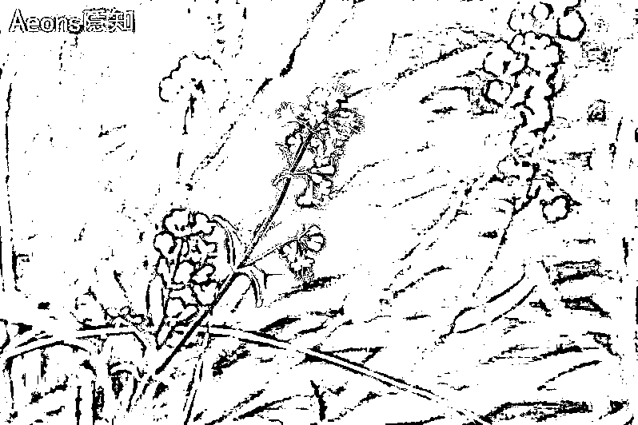

圣经里曾出现过它，名为玛利亚的妇人用真哪达香膏（jatamansi）涂抹耶稣的双腿，真那达就是穗甘松，据说这种香膏很贵的，犹大想把它卖了能赚钱，然后耶稣说他早已看穿了一切，但是依旧选择原谅。他看着玛利亚拿香膏给他涂抹，对犹大说：且由她去吧，因为常有穷人与你们同在，只是你们不常有我

当时我觉得耶稣很高傲，后来才知道，这句话中穷人指物质，而他指精神，就是说人总是因为面对物质的难题，而忽略了精神的重要。

真那达就是穿越了物质与精神

在摆脱物质，而去追求灵性的道路上，也同样会遇到物质的难题啊，所以只有宽恕了“犹大”才能超越这苦难。

金钱，情爱，背叛，谎言。人总是一不小心就胶着其中。

红楼梦中，总是形容那些中年妇女“鱼眼睛”

你们去看看鱼眼睛是什么样的，

死气沉沉，毫无灵性。为什么会说中年妇女是鱼眼睛呢，我仔细想过这个问题。那个年代的女子，一旦嫁人了就是泼出去的水，特别是远嫁的女儿，经历了与母亲，与家庭的彻底分离。一旦到了夫家，女子就变得无依无靠。夫家的人怎么可能就那么一辈子对着你好，男人通常又有三妻四妾，沾花惹草，而女人就一下子变得无依无靠，还得忍气吞声，孝敬公婆，孝敬子女，孝敬丈夫。那么自己后半生唯一可靠的不是儿子就是金钱，特别是金钱。长期下来就熬的双眼死板，如“鱼眼睛”

除了对物质的渴求以外，人还容易纠结在人际中，比如情，不管是友情，爱情一旦遭遇背叛，谎言，就容易放不下。耿耿于怀到最后，是没有放过自己，一个那样背叛你的人会有多内疚，多伤心惭愧吗？背叛和谎言，总是有目的的，达到那个目的，恐怕对方早就甘之如饴，哪里还管你多么难受。会忏悔一下早就是多年之后，劲头过了或者自己不得好报为之感到不值了。

穗甘松不是用了就能把所有烦恼消除，而是在苦难中超脱，它是灵性的植物，这也是一条值得追寻的灵性之路。

在草药油的成分里，最重要的是倍半萜烯，倍半萜烯的代言词就是原谅。所以穗甘松也是重要的原谅油。

除此之外还有倍半萜酮（缬草酮）倍半萜醛（缬草醛）

这两样是它助眠力量的来源，同时缬草酮还能改善情绪引起的心律失常，心慌。还能有助于太阳轮的平衡。

除此之外还有倍半萜醇，看看它的成分，都是大分子，倍半萜类，代表着与自我联结，同时也代表着草药油质地浓稠，作用也能迅速往下走。建议使用时用在高位置，比如胸口，脖子，眉心等地方。

缬草：我该去面对

Valeriana officinalis

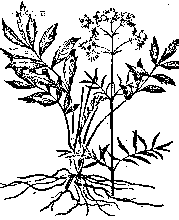

气味超级难闻，不过比起穗甘松，它的助眠能力更强，你把它稀释后涂身上能吸猫。

除了能助眠，还能改善小儿多动症，可以给熊孩子弄点儿，能安静不少，还能治疗恐慌症，安慰胆子小的人。

代表成分是倍半萜酮，（缬草酮）看这个成分就知道，酮类都是能针对大脑的成分，所以起助眠效果不

言而喻。还有倍半萜醛（缬草醛）

还有倍半萜烯（β～丁香油烃）这个成分的代言词是维权。 它能让人不再忍气吞声，而懂得保护自己，维护自己。

除了能让人安定，缬草还有让人面对一切的勇气，不管是光彩的还是黑暗，这力量大概来自于它安定心神的作用，只有这样，才能让人平静的接受一切。

印度缬草：Valeriana wallichii

这玩意儿经常在仪式和咒术的场合试用，拿来焚香的，能滋补神经，用多了人会变的有点呆。

没了，挥爪～！

声明: 该文章版权归指引社和作者所有, 转载请保留此行([`www.geaving.com/article/view/id/173`](http://www.geaving.com/article/view/id/173))

长按右边这个二维码

关注指引社

让学术嗨起来(｡･∀･)ﾉﾞ

# 跟 Papus 學塔羅《第七课·希伯来字母表》

> 原文：[`mp.weixin.qq.com/s?__biz=MzI5NTQzMDUzMQ==&mid=2247483840&idx=3&sn=86d3a3ed6fcdb9aaa19c14711a066ee1&chksm=ec52f12cdb25783a29c6085e5aa180b3fb652e0c21637310b7a5228c2a9b3cb7e56ac714a6a7&scene=27#wechat_redirect`](http://mp.weixin.qq.com/s?__biz=MzI5NTQzMDUzMQ==&mid=2247483840&idx=3&sn=86d3a3ed6fcdb9aaa19c14711a066ee1&chksm=ec52f12cdb25783a29c6085e5aa180b3fb652e0c21637310b7a5228c2a9b3cb7e56ac714a6a7&scene=27#wechat_redirect)

关注指引社，一起让“玄学”成为“学术” 

# 【多图预警】关键词：塔罗，卡巴拉，上帝之名，希伯来语。 

Papus（1865-1916，西语音译“帕普斯”）是金色曙光早期代表人物之一。他继承并发展了艾利法斯·里维（Eliphas Levi）将塔罗卡巴拉化的道路，并用神学辩证法和灵数学重释马赛塔罗的符号，建立了基于赫尔墨斯-卡巴拉的塔罗宇宙论。他的理论对于金色曙光后期的塔罗学者韦特、克劳利等人都有着重要的影响。本系列编译自 Papus 在塔罗方面的代表作《Tarot of Bohemians》。

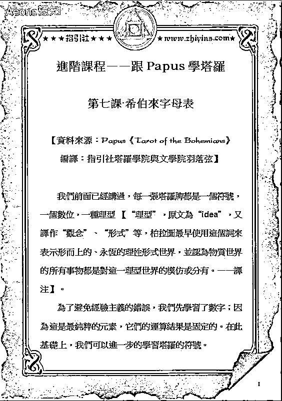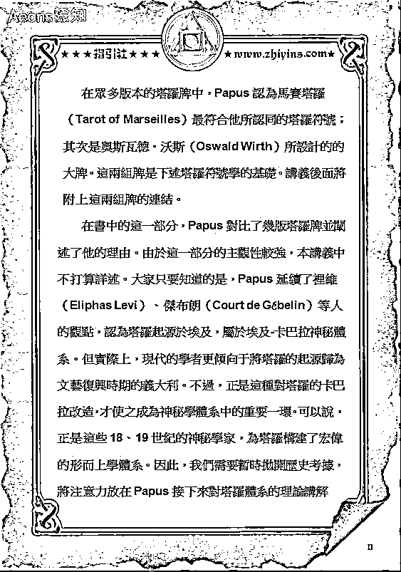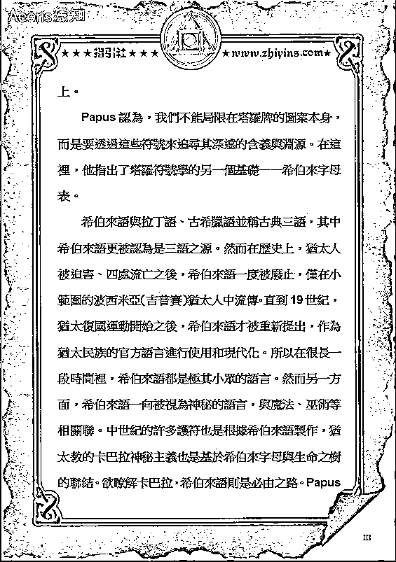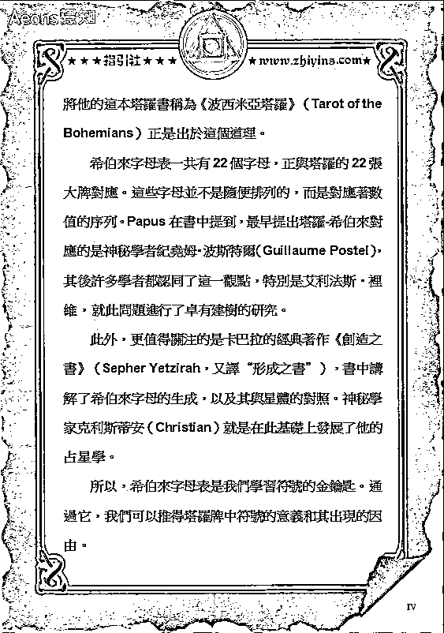 

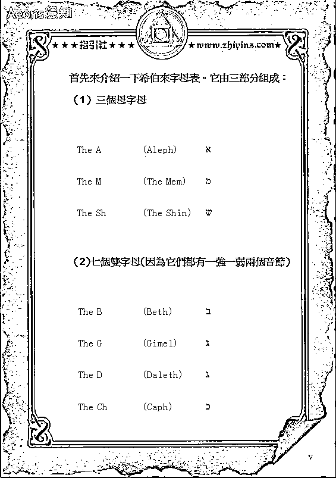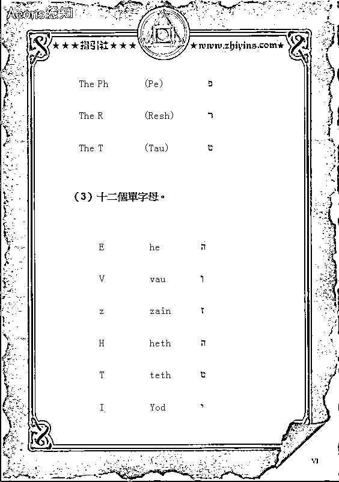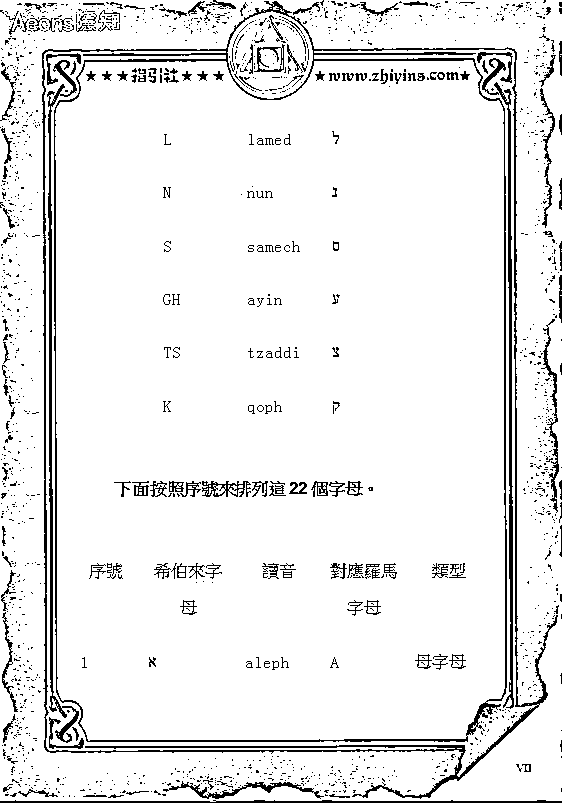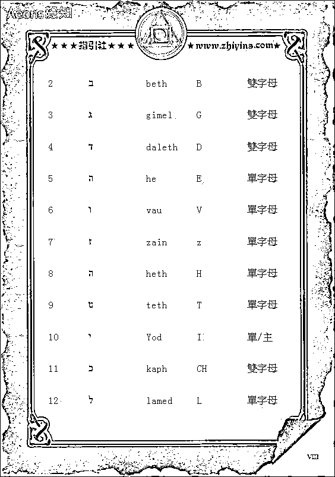

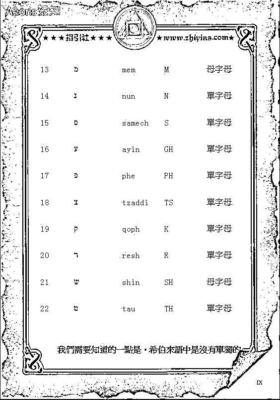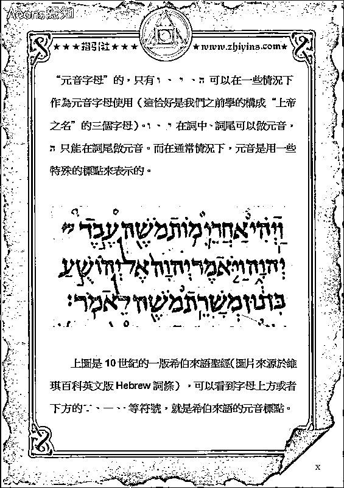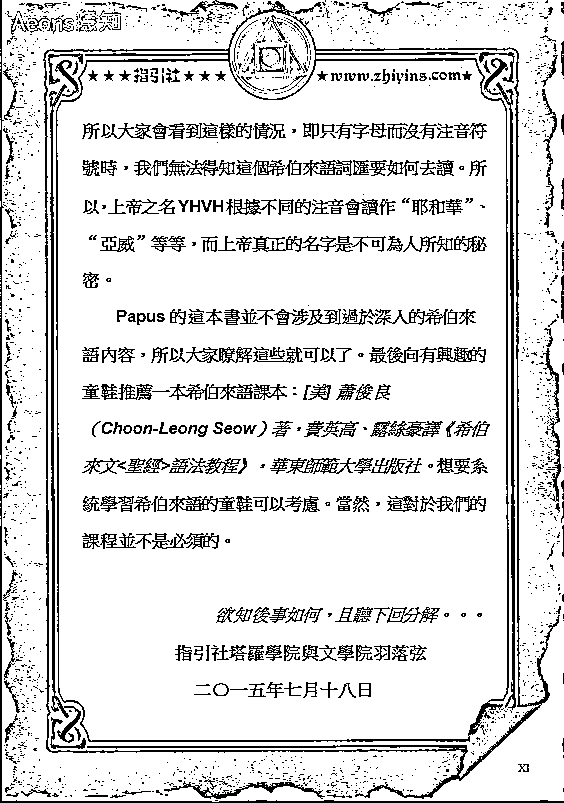

声明: 该文章版权归指引社和作者所有, 转载请保留此行([`www.geaving.com/article/view/id/156`](http://www.geaving.com/article/view/id/156))

长按右边这个二维码

关注指引社

让学术嗨起来(｡･∀･)ﾉﾞ

# 欧洲赤松：我就是不服输（超级英雄篇）①

> 原文：[`mp.weixin.qq.com/s?__biz=MzI5NTQzMDUzMQ==&mid=2247483840&idx=4&sn=0ac960cb4512049ba5122ee03f2c0346&chksm=ec52f12cdb25783aca1aed2d062abc1326737f8b2486401ca81fe79b8ead569baba21fc3ccbc&scene=27#wechat_redirect`](http://mp.weixin.qq.com/s?__biz=MzI5NTQzMDUzMQ==&mid=2247483840&idx=4&sn=0ac960cb4512049ba5122ee03f2c0346&chksm=ec52f12cdb25783aca1aed2d062abc1326737f8b2486401ca81fe79b8ead569baba21fc3ccbc&scene=27#wechat_redirect)

关注指引社，一起让“玄学”成为“学术”

嗯。。。告诉大家一个不幸的消息，催情篇计划可能不能实行了，因为内容会比较开车，被否决掉了（撒花）但是没关系，我们还有其它番外，（我打算在番外篇把每种来具体撸一遍）看看这篇文章的番外名字，“英雄”。之前的回春篇可能比较女性化，而英雄篇，普遍能量性质有种刚猛的男性感觉，但也不是说女性不能用，普遍都试用各种玻璃心，宅男，或者阴柔的男性。好了～话也不多说了，正式进入“我的超级英雄”篇

说起像英雄一样的芳香植物，我首先想到的是欧洲赤松。

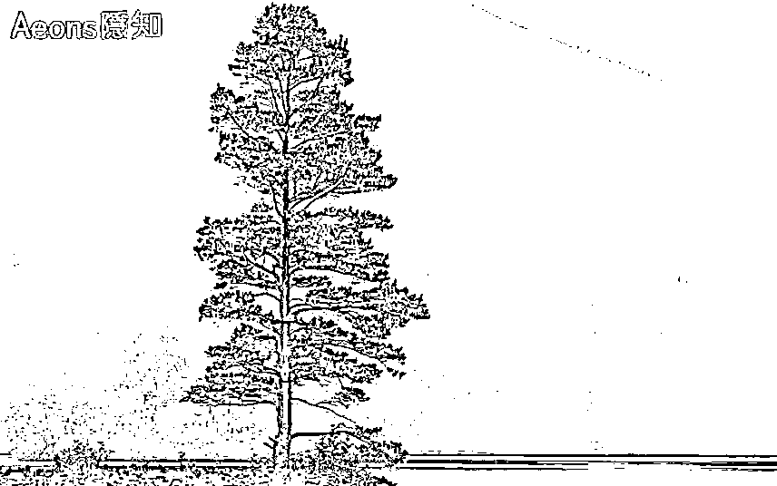

生长在地中海型气候区的山区时，生长的感觉就是乱长。常用的别名还有，里加松，苏格兰松，挪威松。植物最大的特征就是赤褐色的鳞状树皮，开花时会喷放迷雾（卧槽有毒）（开玩笑的，是花粉）biu～的一下喷出去，到处飞，加上这个植物是很耐寒的，所以繁殖力倍儿强。广泛分布于欧美北部与西伯利亚等环境恶劣的地方。

它具有很强的阳性力量，北非与西亚的信仰中，会焚烧它的枝条来代表对太阳神的崇拜，能净化能量。虽然我是没干过这样的时，但每当我使用欧洲赤松时，太阳的力量深深感染着我。冬季时晒不到太阳，倍感沉闷，而香料类，柑橘属的都用腻了，那么就选择欧洲赤松吧，搭配柠檬香茅，让香气跳跃起来，给予人振奋之力，鼓励我们走出去。

欧洲赤松：Pinus sylvestris

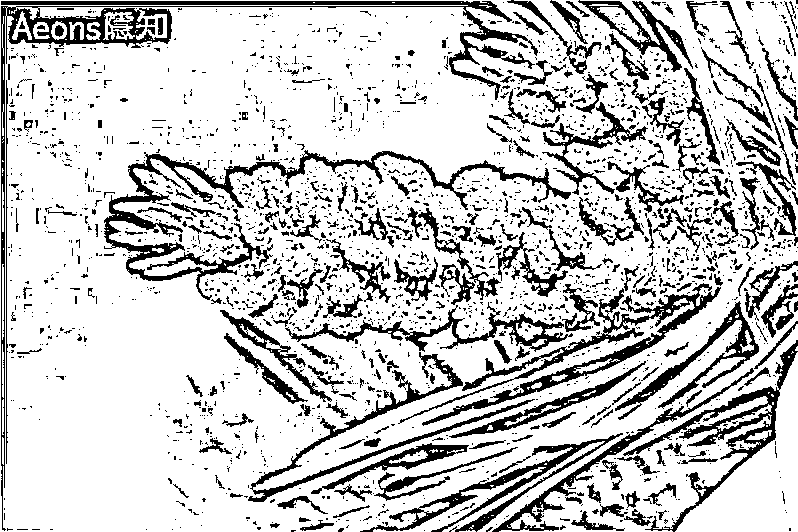

让我们来强行解释下它的拉丁学名，Pinus 在克尔特语中意思是山区，一般欧洲赤松也不长平地上的，（人工种植除外）。sylvestris 是指它野生，想想我之前说的山区乱长，你就明白了。

如果你发现学名后面多了个 L，它是发现者命名人的名字缩写，L 是指林奈。

要注意的是，某些进口商，把所有萃取精油的松树油，都统称松树油，不过一般来说是指欧洲冷杉，所以要仔细辨认拉丁学名。

欧洲赤松的力量像扎根的钉子，像血气方刚的年轻战士，像紧握的拳头。是英雄篇章的代表。当然，英雄有很多种，斗志昂扬的英雄也许会有人觉得肤浅，但不可否认我那么偏爱它，哈哈，如果看到这里你觉得有点失望了，不要灰心，后面我们会讲到黑暗骑士类型的它。

它还有合作共生的特性，因为能够很好的利用环境，与周围的物种和平共处，并且惠及他人。其广大林地不仅给小动物安全感，还能给苔藓，真菌，地衣植物依附，与这些植物共生也可以增加它吸收土壤中微量元素和养分的能力，从而保证它在艰苦的环境中生存下来。

它带给我们力量，但不是匹夫之勇，而是与艰苦环境相互适应，共存，从而利己利它的活下去。

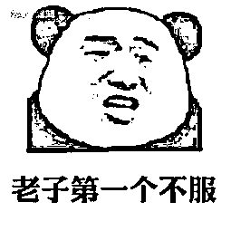

欧洲赤松的代表成分是单萜烯（α-松油萜，β—松油萜，柠檬烯）70%以上，酯类（乙酸龙脑酯），单萜醇（龙脑）

我们来深度剖析一下

这两种松油萜都与意志力，抗压力，战斗力相关，能够增强肾上腺素，但是它们是比较慢热的，你需要长期修炼，大概六个月以上，才能有脱胎换骨之感。

除此之外，它们还能抗关节炎，有类似可体松作用，α氧化后就有鉄锈味（氧化后变成藏茴香酮），这也是欧洲赤松锈味的主要来源。

柠檬烯，这里是指左旋柠檬烯，木质气味，像松节油，功效是能抗自由基，抗菌，抗感染，促进交感神经兴奋，降低食欲。

乙酸龙脑酯，普遍存在于松，杉，柏木质类精油里，能够帮助深呼吸，有点像森林浴的感觉。

龙脑，它氧化后就是樟脑，主要是对应生殖器的，增强性功能，还能解热，祛痰，改善胸闷。气味闻起来清凉，带一点甜感（我没吃，只是说闻起来）

按照整体来看，欧洲赤松的力量对应着基底轮，腹轮，心轮，太阳轮。虽然单萜烯占了很高的比例，但是它的力量并不那么上扬。先去心轮，然后再由心轮往下降，比较敏感的人会感觉到。力量的分布参考我上面顺序。从生理层面来讲，它可以激励肾上腺和性腺，具有类可体松的消炎的属性，缓解支气管炎，过敏性鼻炎，风湿关节炎（划重点）

风湿性关节炎使用时最佳搭档一定要是添加芳香白珠，发作时加上它，效果很好。

它适合宅男

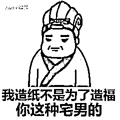

想法很多，又不愿意走出去，可能还有点不够自信。使用欧洲赤松搭配柠檬香茅，涂抹双脚，用热水浸泡，能给人行动力，做实事。也可以选择欧洲赤松搭配黑胡椒，丁香，白千层等涂抹太阳轮，让心手相连，并强化自信。

适合缺乏“父亲力量”的人，这样人看起来过于阴柔，甚至有点玻璃心，使用欧洲赤松时也要注意，先从小剂量开始，因为有比较高的比例出现排斥反应。

适合快要被困难打倒的人，饱受困顿折磨，只需绝处逢生。（已经被打倒，萎靡不振的请去选择黑云杉）这时候我们需要让自己的灵魂强壮起来，用欧洲赤松搭配柠檬薄荷，它能带来创造力，绝处逢生也需要开动脑筋来拯救自己。再加上马郁兰，能给予勇气，也能让人量力而为。反过来看看，马郁兰加上柠檬薄荷也能有温柔放松的功效，不会让本来就筋疲力尽的神经绷太紧快要断掉。

“我好像可有可无”

有过这样的案例，求助者是一名家庭妇女，婚姻似乎是很美满的，家庭也没有什么矛盾。但是就是过的太顺利了，当家庭主妇太久，感觉不到自己的价值。在头脑里积累了很多的杂念，感觉没有自己，这个家也不会差到哪儿去。

我刚开始在面对这种问题时是有点不知道怎么办的，还在笑话自己是不是得开助眠方了，但对方很乐意与我倾诉自己的苦难，也就没急着打发人走。听她说了将近一个小时，我大概才懂了，那种失去自我价值的感觉，并不是无病呻吟。长期做家庭主妇，丈夫在外面努力赚钱养家，对妻子也十分体贴，家里也请了保姆，也愿意承担起小孩生活的细节。作为女人她幸福到了极点，但作为家庭的一员，她感觉自己毫无责任，现在就算出去工作，也觉得自己难以适应。于是灵魂越来越疲惫，软弱，如果没心没肺也就罢了，偏偏还老是自省，问自己“良心不会痛吗”

于是我就在配方中将欧洲赤松作为主角，因为它有着势不可挡的阳性之火，突破内心的阴霾，并且强化内心，带来有支撑感，帮助表达。能很好的改善“可有可无”的咸鱼感，疲软感。

欧洲赤松能够强化男性机能，（长期用）。仔细体会就能发现它那股耐力，和冲劲。加上其善于繁殖的特性，更是能贴合这方面。（心理和生理作用各占一半）

好了，帖子结束（挥爪，撒花）

声明: 该文章版权归指引社和作者所有, 转载请保留此行([`www.geaving.com/article/view/id/185`](http://www.geaving.com/article/view/id/185))

长按右边这个二维码

关注指引社

让学术嗨起来(｡･∀･)ﾉﾞ

# 跟 Papus 學塔羅《第八课·三位一体》

> 原文：[`mp.weixin.qq.com/s?__biz=MzI5NTQzMDUzMQ==&mid=2247483840&idx=5&sn=0710c7ae3cc152800cede16d14915da7&chksm=ec52f12cdb25783a62ebe19ea4e8b77e0ce4a3c23c5d6b7e9203f013071ffafac30cc7439954&scene=27#wechat_redirect`](http://mp.weixin.qq.com/s?__biz=MzI5NTQzMDUzMQ==&mid=2247483840&idx=5&sn=0710c7ae3cc152800cede16d14915da7&chksm=ec52f12cdb25783a62ebe19ea4e8b77e0ce4a3c23c5d6b7e9203f013071ffafac30cc7439954&scene=27#wechat_redirect)

关注指引社，一起让“玄学”成为“学术”

# 【多图预警】关键词：塔罗，卡巴拉，上帝之名，符号学，灵数学，辩证法。

Papus（1865-1916，西语音译“帕普斯”）是金色曙光早期代表人物之一。他继承并发展了艾利法斯·里维（Eliphas Levi）将塔罗卡巴拉化的道路，并用神学辩证法和灵数学重释马赛塔罗的符号，建立了基于赫尔墨斯-卡巴拉的塔罗宇宙论。他的理论对于金色曙光后期的塔罗学者韦特、克劳利等人都有着重要的影响。本系列编译自 Papus 在塔罗方面的代表作《Tarot of Bohemians》。

 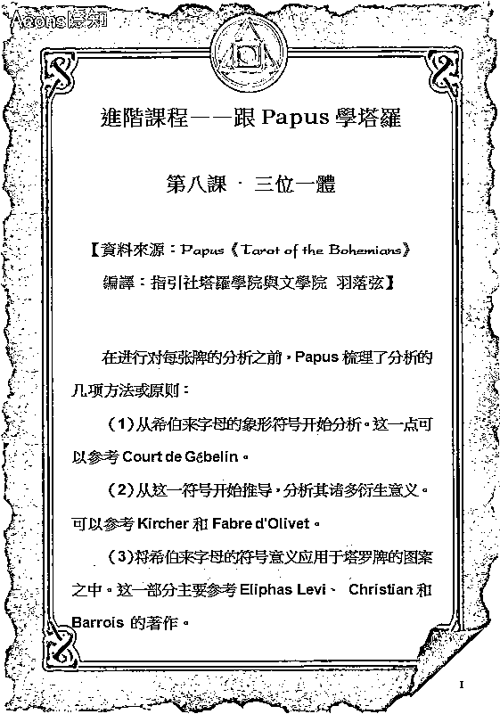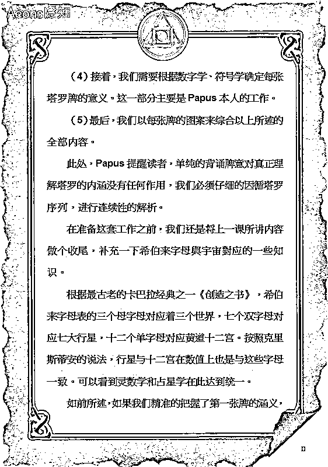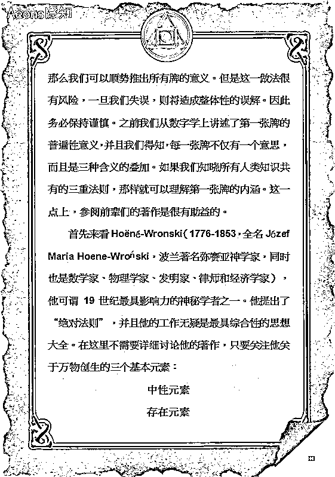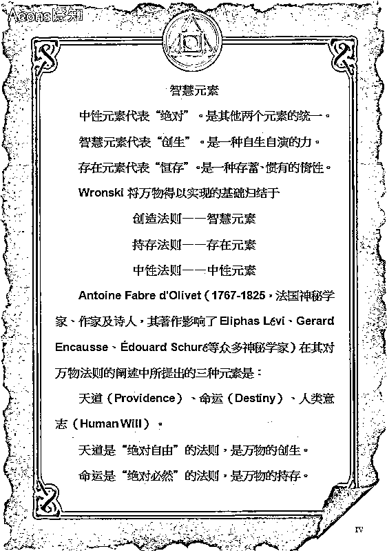

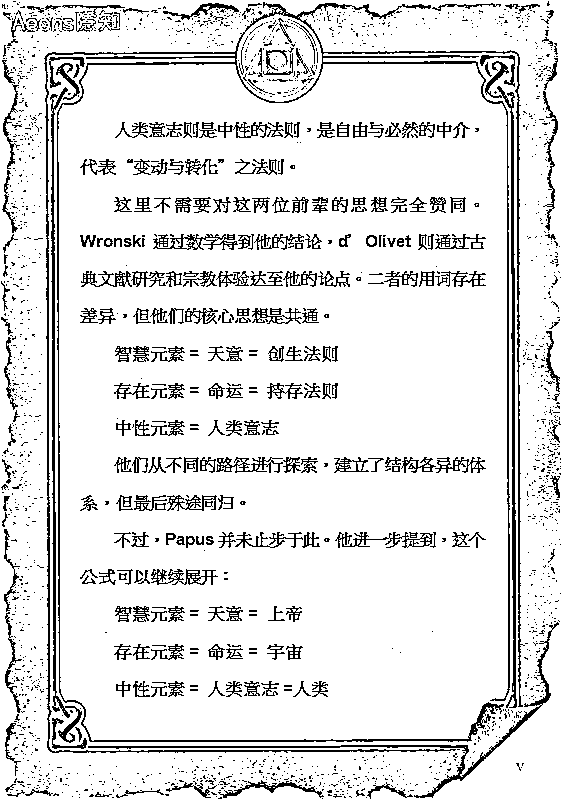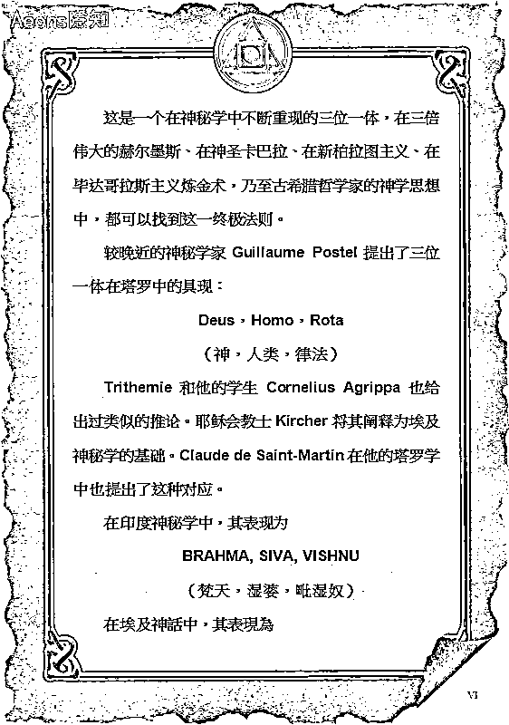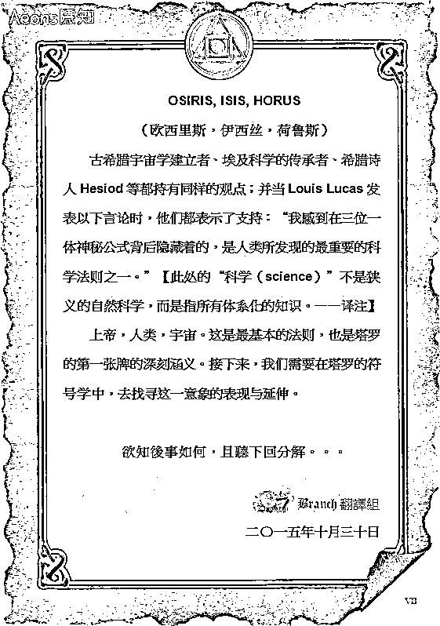

勘误：第 V 页的“天意”应为“天道”，即上文的 Providence。

以及必须说明一句：Papus 对三位一体的解释是赫尔墨斯卡巴拉一派，绝非基督教正统解释。此等务必区分。

声明: 该文章版权归指引社和作者所有, 转载请保留此行([`www.geaving.com/article/view/id/157`](http://www.geaving.com/article/view/id/157))

长按右边这个二维码

关注指引社

让学术嗨起来(｡･∀･)ﾉﾞ

# 你了解恶魔吗？——卡巴拉中关于恶魔的十种哲学观

> 原文：[`mp.weixin.qq.com/s?__biz=MzI5NTQzMDUzMQ==&mid=2247483840&idx=6&sn=e7e2f986a7e3387fd5c0d82168f8bbf4&chksm=ec52f12cdb25783aa3672096137251ea323677a116e391dca5eda2d88b57d18689645f42e539&scene=27#wechat_redirect`](http://mp.weixin.qq.com/s?__biz=MzI5NTQzMDUzMQ==&mid=2247483840&idx=6&sn=e7e2f986a7e3387fd5c0d82168f8bbf4&chksm=ec52f12cdb25783aa3672096137251ea323677a116e391dca5eda2d88b57d18689645f42e539&scene=27#wechat_redirect)

关注指引社，一起让“玄学”成为“学术”

编译 | 阿克

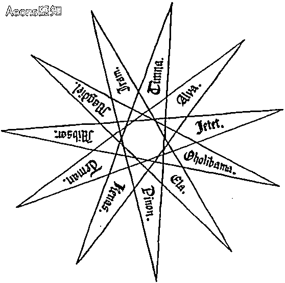

无论在宗教还是精神探索中，恶魔都是一个重要的主题。在不同的宗教中的恶魔具有不同的特性，甚至在同一个教派中，对恶魔的观点也会有极端的相悖情况出现。

在卡巴拉学者的眼中，恶魔有着不同的起源和象征意义：有人认为恶魔是一种独立的邪恶力量，也有人认为恶魔是神的一部分；有人认为恶魔有其存在意义，也有人认为恶魔的并无存在的价值；有人以严格二元论的角度去看待恶魔，认为善与恶是并存的，是万物的基础。在灵知主义与新柏拉图主义的视角下，恶魔通常象征着低等的物质层级，然而同时也有恶魔是仅次于神的一种精神存在的说法。在卡巴拉中，恶魔的形象经常变化万千，充满争议。

以下是一些关于恶魔的主流哲学观，分成五大类，每一类都具有两个二元相对的分支：

1、a）存在的恶魔

      b）非存在的恶魔

2、a）作为必要存在的恶魔

      b）非必要存在的恶魔

3、a）二元哲学观下的恶魔

      b）一元哲学观下的恶魔

4、a）作为物质形态的恶魔

      b）作为精神形态的恶魔

5、a）个人性的恶魔

      b）非个人性的恶魔

以上关于恶魔的观点在每一类别中总是呈对立状态；譬如，恶魔通常被视为敌人，然而同时亦有观点认为恶魔是善恶对立中不可或缺的一环。这些不同的观点往往是二律背反的，接下来就来逐个分析一下以上关于恶魔的十种不同观点。

1a）存在的恶魔

此观点下的恶魔通常被认为是一种独立的存在——恶魔寄寓在其自身中，是一种纯粹的恶魔形态。以祆教为例，阿胡拉·玛兹达象征着光与善，而安格拉·曼纽则象征着暗与恶。这种对立隐喻了一种二元论，即恶魔是善的对立面：恶魔一般被认为是独立的，却又是成对的因素中的一部分。在卡巴拉中，恶魔被视为神原始的一面。

1b）非存在的恶魔

此观点中的恶魔被视为非独立的一种存在，负面的恶魔被看作是善的缺失。精神的世界或神的层级被视为代表着真善美，柏拉图主义、新柏拉图主义和其他神秘主义的观点认为，恶魔并不因为具体的恶魔而存在，而是因为善的缺失才存在。负面的恶魔并非是绝对的存在，而是一种与善相对的存在。

2a）作为必要存在的恶魔

此种观点建立在一种思想的基础上——善只有因为恶存在，才荣升为善。这种观点可以被阐释为：当且仅当恶存在时，善才相对具有善的性质。在神秘主义中，这是一种相对较为罕见的观念：人同时具备善恶两种特质，并拥有可以自主抉择其一的自由意志。

2b）非必要存在的恶魔

此种观点认为，恶魔没有任何存在价值，同时亦不具备任何功能。人生存的任务就是与恶魔做斗争，而善在这种挣扎中提供了协助。非必要存在的恶魔自身并不存在，只代表着一种虚无的情形：恶魔只隐喻着善的缺失，不具备任何意义。

3a）二元哲学观下的恶魔

这种观点描述了两种独立的力量：善与恶。在伊朗的宗教（即祆教）中，通常有着一种二元的世界观，这种观点是一种关于神正论的简单的解答。一般而言，基督教徒很难将上帝的善与其力量完满地联系在一起，而琐罗亚斯德教则通过牺牲神的部分力量，使神绝对的善加以保留。二元论坚持一种纯粹而极端的恶的存在，进而给予人类一个清晰的恶魔形象。

3b）一元哲学观下的恶魔

此观点认为善与恶是同一种力量的两面，既代表着客观现实中的善与恶，同时亦是两种相对的抽象观点。善恶是一体的，一切都具备公平性；人既会做出正确的事，同时也会做出一些错误的事。某些观点认为恶魔其实是神的一部分，诸如在犹太教中，恶魔被认为存在于唯一的上帝之中。

4a）作为物质形态的恶魔

此观点来源于灵知主义，与柏拉图主义和新柏拉图主义有很多相似之处。最高的神性与精神的层级被认为与纯粹的美德相关联，如真善美和正义；物质与其处于对立面，并且与恶魔相关。神性的光辉被禁锢在物质中，仅当人类自物质中解放，这些光辉才会随之释放出来。此观点通常与禁欲主义相呼应，对人的身体抱持一种负面的观念。

4b）作为精神形态的恶魔

在这种观点中，恶魔被认为是超脱于物质的存在。物质的世界同时包括了恶的领域与善的领域，恶魔作为一种精神本质存在于神之中，或者是一种独立的邪恶力量。

5a）个人性的恶魔

此观点建立在存在着某种力量驱使人实施恶劣行为的基础上。这种观点并不代表某些抽象的、独立于人外的自然法则，而是暗示着某种存在于人性之中的力量。这些邪恶的驱动力被认为与人性中善的一面相对立，对人性中的恶魔的信仰通常被与一些宗教和原始巫术联系起来。另外，很多卡巴拉学者猜想，恶魔是一种实际呈现于 Satan、Samael、Lilith 和其他邪恶存在中的特质。

5b）非个人性的恶魔

此观点认为，人的邪恶体验契合一种完全抽象的规则，在哲学和神秘主义中经常能遇到关于非个人的恶魔性的描述。恶魔是人类在某种特定情境下的行为，或是某种被误用的宇宙力量。在恶魔的背后不存在自由意志的驱动，它仅作为一种非个人性的自然法则或是一种灾难而存在着。

以上是五种两两相对的恶魔哲学观。此外还有一种观点，即恶魔同时也可被视为一种必要的破坏性本质，与创造和创生的力量相对。在这种观点中，善与恶需要保持足够的平衡方能共生。

声明: 该文章版权归指引社和作者所有, 转载请保留此行([`www.geaving.com/article/view/id/180`](http://www.geaving.com/article/view/id/180))

长按右边这个二维码

关注指引社

让学术嗨起来(｡･∀･)ﾉﾞ

# 【魔法问题 Q&A】一些可能会有用的小常识——念诵咒语可以使用翻译过来的中文吗？

> 原文：[`mp.weixin.qq.com/s?__biz=MzI5NTQzMDUzMQ==&mid=2247483840&idx=7&sn=3268972fe942aac29e2a88e3ce343732&chksm=ec52f12cdb25783a169f47082d637d139d85805ac12b7e8597a3dff3c359da001ae834554992&scene=27#wechat_redirect`](http://mp.weixin.qq.com/s?__biz=MzI5NTQzMDUzMQ==&mid=2247483840&idx=7&sn=3268972fe942aac29e2a88e3ce343732&chksm=ec52f12cdb25783a169f47082d637d139d85805ac12b7e8597a3dff3c359da001ae834554992&scene=27#wechat_redirect)

关注指引社，一起让“玄学”成为“学术”

原创 | 阿克

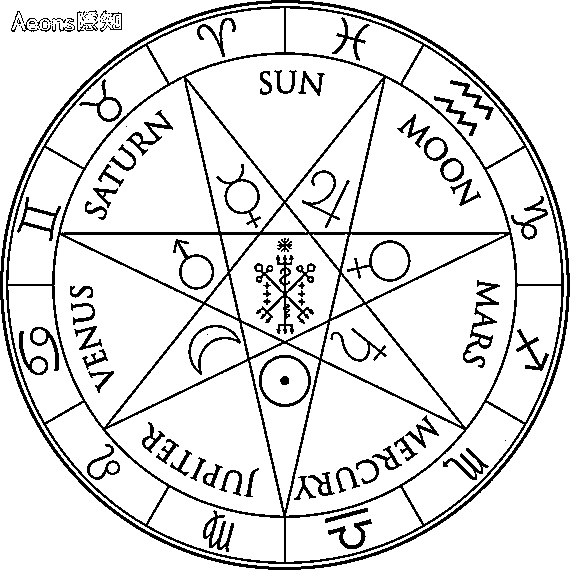

问：念诵西方的祷文或咒语的时候可以使用翻译过来的中文吗？

答：理论上可以，然而需要根据不同情况酌情运用。

关于在魔法仪式中究竟使用何种语言较为恰当，在著名的魔法典籍《The Sacred Magic of Abramelin the Mage》中，曾经较为详细地论述了这个问题。

《The Sacred Magic of Abramelin the Mage》最早由 Abra-Melin 的追随者，犹太人亚伯拉罕以希伯来文所发表。在他的手稿中，亚伯拉罕强调了一点：

“I repeat then: Let each one speak his own language, because thus understanding what it is that ye are demanding of the Lord, ye will obtain all grace. ”

（大意为：魔法的施行者应当在仪式中使用自己的母语，因为我们了解它的确切含义，清楚地知道我们此刻是在向主祈求，进而可以令我们获得最大的福祉。）

他又说：

“You should perform the conjuration in your mother tongue, or in a language that you well understand, and conjure the spirits by the authority of and their obedience to the holy patriarchs, rehearsing unto them examples of their ruin and fall, of the sentence which God hath pronounced against them, and of their obligation unto servitude…”

（大意为：你需要用你的母语来进行魔法，或者使用一种你较为擅长的语言，这么做可以令你的咒语充满令神灵顺服的力量。）

如上所述，在此书中，亚伯拉罕多次强调了在魔法中使用母语的优势。故而，依照他的观点，在魔法仪式中是可以使用翻译后的中文的。

然而，此书后来的编辑者 Mathers 并不同意亚伯拉罕的这一观点，并在前言中直接把他给怼了。

1898 年，英国神秘学者 S. Liddell MacGregor Mathers 将此书编辑出版，并为此书写下了一篇较长的简介作为前言。

在这篇简介中和书中的附注中，他多次对亚伯拉罕的母语说提出了反驳：

“The next point worthy of notice is what Abraham urges regarding the preferability of employing one's mother tongue both in prayer and evocation; his chief reason being the absolute necessity of comprehending utterly and thoroughly with the whole soul and heart, that which the lips are formulating. While fully admitting the necessity of this, I yet wish to state some reasons in favour of the employment of a language other than one's own. Chief, and first, that it aids the mind to conceive the higher aspect of the operation; when a different language and one looked upon as sacred is employed, and the phrases in which do not therefore suggest matters of ordinary life. Next, that Hebrew, Chaldee, Egyptian, Greek, Latin, etc., if properly pronounced are more sonorous in vibration than most modern languages, and from that circumstance can suggest greater solemnity. Also that the farther a magical operation is removed from the commonplace, the better. But I perfectly agree with Abraham, that it is before all things imperative that the operator should thoroughly comprehend the import of his prayer or conjuration. Furthermore the words in these ancient languages imply "formulas of correspondences" with more ease than those of the modern ones.”

（大意为：亚伯拉罕所提出的在魔法操作中母语为上的论点，是以对内容理解和对操作的全身心投入为优先考虑的。我非常赞同这一点，然而我还是要表达我的想法，即在魔法中使用其他语言的效果更胜于母语一筹。首先，这么做对施法者更加有利，因一门看起来更加神圣的语言会让人远离母语的鸡毛蒜皮，不易令人联想到日常生活的琐碎。其次，希伯来语、迦勒底语、埃及语、希腊语和拉丁语等古代语言较之现代语言显然更加华丽，可以在仪式中营造一种庄严感。并且，魔法的操作距离日常生活越远越好。我支持亚伯拉罕的观点，但这建立在输出的祷文和咒语能够完全被理解和贯通的基础上。另外，古代语言更能与魔力建立共鸣，比使用现代语言更加优胜。）

他又说：

“Yet, notwithstanding, it is well in a sacred magical operation to employ a language which does not to our minds convey so much the commonplace ideas of everyday life, so as the better to exalt our thoughts. But, as Abraham says, we should before all things understand what we are repeating.”

（大意为：在神圣的魔法仪式中，所使用的语言最好不要夹杂着日常生活的印记，这样会令我们的思维更为集中和纯粹。）

还有：

“Yet the advantage of its being in a language which you do not immediately associate with the things of everyday life is great, *provided always that you understand the words and repeat them and pronounce them correctly.”*

（大意为：一门与日常生活相距甚远、不会令人立刻联想到现实生活的语言是最佳选择，只要你理解它的含义，并能正确地发音。）

从以上亚伯拉罕和 Mathers 的各自发言中，我们可以发现，虽然他们意见相悖，但并非完全矛盾。Mathers 肯定了亚伯拉罕对使用母语的建议，也从另一个角度给出了自己的劝谏：在魔法操作中，使用自己的母语，即翻译后的语言，是可行的；然而这必须建立在对原始文本全面的理解之上。

提罢前人的论点，接下来从我本人的角度上再补充几句。

作为翻译过一些魔法相关资料的译者，我个人认为：原始文本显然胜于翻译过来的中文。

翻译讲究信、达、雅，然而这三点很多时候是无法兼顾的。很多外文的语境无法套用到中文里来，很多词汇和用法也很难找到对应的中文。魔法是以天人感应为基础的，祷文或咒语作为操作中的一种语言媒介是比较重要的一环，如果表达的词不达意或者干脆远离原意胡扯一通，显然是比较不靠谱的。

譬如我目前正在翻译的 wicca 教程（[`www.geaving.com/article/view/id/163`](http://www.geaving.com/article/view/id/163)），其中很多祷文就很难翻译周全。在咨询了很多人、检索了许多资料的基础上，我本人几乎绞尽脑汁也没琢磨出来不是特别二逼的译法。故而我在译文中添加了备注，请操作者直接按照英文原文念诵，因为以英文在我国的普及率和此书英文原版的简单程度，对很多人而言并不造成理解和发音上的太大影响。这也是我建议各位使用原始文本的主要原因之一。

另外，在 Heinrich Cornelius Agrippa 的《Occult Philosophy》中，曾提过：希伯来语中寄寓着远远超过其他语言的神秘力量。很多护符、魔法圆、古代典籍中都会使用大量的希伯来文字，已是神秘学圈人士必修的外语之一。故而建议各位，平时尽可以学习一些魔法中常用的古代语言，无需过度深入钻研，掌握发音和基础理解即可，对各位今后的神秘学之路无疑大有裨益。

总而言之，在魔法仪式中使用中文译文是理论上可行的，但需要确保译文的可信度。然而，在掌握和理解魔法典籍的原始语言的基础上，使用原文显然是上选。

长按右边这个二维码

关注指引社

让学术嗨起来(｡･∀･)ﾉﾞ

# 【道家哲学系列】何谓道（道可道，非常道）

> 原文：[`mp.weixin.qq.com/s?__biz=MzI5NTQzMDUzMQ==&mid=2247483840&idx=8&sn=d87f3889ba0690ecff7139481fc7df11&chksm=ec52f12cdb25783ab7be1a3efe2388c4f8ac1bbdcd769a0c53c0f4c58d6ce9cbc9b9d910d351&scene=27#wechat_redirect`](http://mp.weixin.qq.com/s?__biz=MzI5NTQzMDUzMQ==&mid=2247483840&idx=8&sn=d87f3889ba0690ecff7139481fc7df11&chksm=ec52f12cdb25783ab7be1a3efe2388c4f8ac1bbdcd769a0c53c0f4c58d6ce9cbc9b9d910d351&scene=27#wechat_redirect)

关注指引社，一起让“玄学”成为“学术”

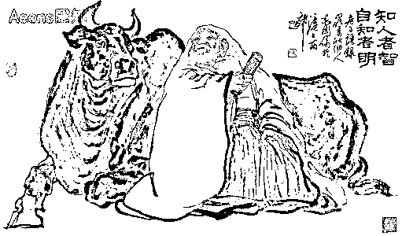

道家哲学流传，或者说道德经问世之后，“道究竟是什么”这一问题一直以来就颇具争议。

千百年来，各门各派，各执一词，谁都说服不了谁，以至于最后，“道”这个词甚至被神秘化，很多人开始认为，道是无法用语言表明的。

说“道是无法用语言表明的”，当然有它的道理，不过不考虑场合和具体情况就随随便便就把这句话作为一个定论，这是不可取的。

《道德经》道经开篇一句就是“道可道，非常道”，这句话在北宋以前，主要有三种不同的诠释，而且各自有各自的道理。

但是在这里，这三种诠释我一种都不想例举，因为就目前而言，探究这些后人是出于何种原因而对老子的这句话做出这样的诠释，既费功夫，也不会有太多的好处。既然“道”是老子提出的，那我们不如来仔细分析一下老子到底要传达什么。

首先我们可以判断一下，从老子主观的角度来看，他是想定性地告诉我们，道是无法用语言表明的吗？

答案是否定的。

首先，从“道可道，非常道”的语言逻辑来看，他前三个字是“道可道”，这句话已经给道定性，说的是“道是可以用语言表明的”，而“非常道”是对“道可道”的后续补充。观点论述和男女朋友吵架不同，不存在“但是之前都是废话”这种说法。如果老子要表明道是不能用语言表明的，那么，他的这句话就应该改写成“道不可道，（可道）非常道”。

其次，道德经洋洋洒洒写了差不多五千多字，句句在理，字字玑珠，如果是为了告诉大家道不可道，老子有病才写那么多字，直接“道不可道，自己悟去”就完了。

所以老子写道德经的目的，不在道可不可道上。

其实，说到这里，我就不得不提一下现代人读书的两个通病了，第一个是只求文章字面，而不看文字背后作者想要表达的真意，虽然和这篇文章的主题没太多关系，但这种看书习惯也会很大程度上造就出直男癌、键盘侠和单身狗，而另一个毛病是断章取义，从一大篇文章里摘出一两句话，就想轻易地了解这两句话的内涵，或者从话里得到一些好处，却不知道结合上下文，这种阅读习惯则会造就高考语文低分。

道德经的道经第一章是“道可道，非常道”，而第二章，是“有无相生，难易相成，长短相形，高下相倾，音声相和，前后相随”，其实第二章的这句话，就很好地解释了道可不可道的问题，也是我说不能不考虑场合就把“道是无法用语言表明的”当成定论的原因所在。

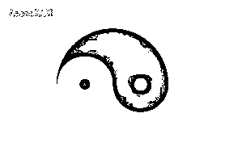

有无，难易，长短，高下都是有参照的，因为需要参照物，那参照物变了，这些东西也会跟着变。

60 分作为及格线，80 分就是良好，就算高分，把及格线调到 90 分，80 分就是不及格，就是低分。

而道能不能用语言表明，也同样是要一个参照的。

这句话里的表明究竟是怎样一个程度算表明？如果你说，一个人跟随便一个人说一句话，这个人就能瞬间茅塞顿开，感悟宇宙真理，得道升仙了这叫道能用语言表明，那 OK，我拿人头跟你担保，道是不能用语言表明的。

如果你说，是一个人给另一个人说明方向，顺着所指的方向去思考，去实践去感悟，最后可以得道，这样叫道能用语言表明，那么，我认为，道就是能用语言表明的。

除此之外，能不能表明也要看对谁表明，和要表明对象的境遇、品性有关。就好像你和儒教的弟子说舍生取义，人家或许会愿意听，但如果你和老庄的弟子说这些，人家恐怕理都不理你。有的人你说一句他就心知意会了，有的人你说得苦口婆心，人家也只把你当神经病。

说了那么多，可能有人会问：“你说了这么多，但我还是不明白，道究竟是什么，你说的那些难道不都是废话吗？”

但我想说的是，“道究竟是什么”，并不是一个好问题，或者说有价值的问题。

因为在探究道是什么之前，你首先要自己确立一个不变的参照。这个参照便是尺子，每个人的参照不同，所以测得的道也不同，但并不是说你测得的道是这样的，别人测得的和你不一样就是错的。

比如以我的参照来回答“道是什么”的话，我会告你，“道只是个幻象”。

也许有人听了这个回答，会说：“不，道是生命，是自然，是律法，是时空，是爱，是场，是统御万物的至高无上的概念。”

也许吧，可是生命、自然，律法，是空，爱、场，乃至统御万物的至高无上的概念，这些难道就不是幻象了吗？

长按右边这个二维码

关注指引社

让学术嗨起来(｡･∀･)ﾉﾞ

# 依兰：仙女是不会老的（回春篇）①

> 原文：[`mp.weixin.qq.com/s?__biz=MzI5NTQzMDUzMQ==&mid=2247483839&idx=1&sn=5866b9dd0887da96612952baba281951&chksm=ec52f153db2578459658c2d49702a83876de671b43528e5958773c31217089c120eb3f5f6fcd&scene=27#wechat_redirect`](http://mp.weixin.qq.com/s?__biz=MzI5NTQzMDUzMQ==&mid=2247483839&idx=1&sn=5866b9dd0887da96612952baba281951&chksm=ec52f153db2578459658c2d49702a83876de671b43528e5958773c31217089c120eb3f5f6fcd&scene=27#wechat_redirect)

关注指引社，一起让“玄学”成为“学术” 

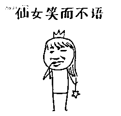

如何延缓衰老？如何让自己永远十八岁？这似乎看上去是一个挺难做到的事情，然而，这真的是一个挺挺难的事情（日常摸鱼）今天这一篇番外介绍几款身心回春的常用草药，它们即好用，又价格相对可爱。

依兰：Ylang Ylang

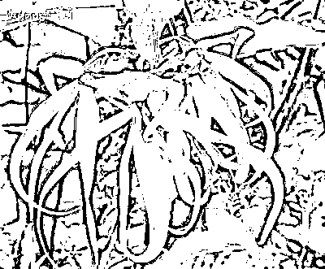

它在芳香草药中是十分重要的角色，本来打算在后面的科属篇花朵类类里来说，但是花朵类当中有太多重要角色，还是把它单独提出来讲。

众所周知，花朵类的油品价格一向高昂，很多人无奈只能选择使用溶剂萃取的原精，但是溶剂萃取的和蒸馏的油品是两个不同概念，它们的作用是无法相对取代的。简单的总结一下就是蒸馏的大多数在心灵治愈上有不可撼动的地位，原精大多数对应身体层面，那么神秘配方中使用的油品究竟使用哪种萃取手法呢？（皱眉）那就相当多了，有的甚至会使用原植物，来发挥更加完整又强大的力量。

依兰，花朵类中价格相当可爱的植物，廉价并不代表它效果也“廉价”，因为效果卓越价格可爱使它又不可撼动的地位，每个治疗师的箱子里总备着那么一两支依兰。

它特别亲和女性，但不代表男性就无法使用，而我所要讲的关于依兰的回春，是更偏向女性。

依兰主要产地在科摩罗岛和马达加斯加。俗名叫香水树。从它的俗称我们就可以知道，它气味层次丰富，并且好闻，否则也不会叫做香水树。实际上可萃取精油的花有黄色粉红色和紫色三种，但是用黄色的萃取的最好，当然现在也都是用黄色。花朵长的张牙舞爪的，一看就个性鲜明。依兰在护发方面也有独特的效果，它可以平衡头皮的油脂分泌，长期使用头发还会变得很有光泽有韧性，其气味芳香，用来洗头也会让人心情愉悦。具体使用方法就是选择无硅油洗发水，最好是无香型，每次洗头时滴上两滴依兰油，混合均匀后洗头。也可以在后续的护发油里添加。十九世纪时，它还是马卡发油的成分之一。

依兰的蒸馏过程十分特殊，在市面上我们可以买到特级依兰，一级，二级，三级（康纳加）这是什么意思呢？

因为依兰属于多分子精油，气味层次十分丰富，所以要采用三段式蒸馏。头一回蒸馏出来的是特级依兰（也有人单独还分出超特级依兰），因为小分子，会在这时候跑出来（如单萜烯，酯类）气味最甜美，适合挑剔的调香师和护肤品类添加。后面的蒸馏程序就会蒸馏出依兰中的大分子（倍半萜类）虽然后面的依兰油气味不那么细腻好闻，但是具有重要的身心平衡的功效。所以我们在购买时，应当购买“完全依兰” 就是将所有阶段得到的依兰油混合起来的产物，其质量更接近原植物，气味最丰富，疗效更加全面。（如果有哪个做芳疗的告诉你特级依兰最好，请扇他熊脸）

今天我们只讲讲依兰的回春

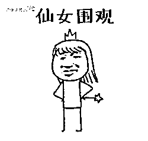

这要从它的代表成分说起，排在首位的是倍半萜烯 主要是大根老鹤草烯和金合欢烯。

大根老鹤草烯不存在于特级依兰里面，所以光是这一点，就足以说明特级依兰并不是最佳选择。它不同的双键位置可分为 A-E 五种类型，草药油里出现的是 A B D 三种。

大根老鹤草烯的气味有种甜花香家一点药香和烟草的感觉，它具有费洛蒙效应，还能增强为恋爱中的行动力。比如说：在心照不宣的互相暗恋，或者暧昧不清的感觉时，使用含有大根老鹤草烯的草药油，就相当于给干柴点火，除此之外还有增加浪漫气息，坦诚相见的感觉。没错，它是出名的催情成分，但朕不想说的那么色情，（不是这个词有问题，是观众容易想歪了）催情的意思不是想的那么肤浅，是指由心的关爱别人，关爱自己（这个很重要）然后能坦诚心声，加上一点浪漫氛围的感觉。（最能让人动情）

其实在大根老鹤草烯的代表草药不是依兰，毕竟我们在特意寻找它来使用时，往往第一个想到的是一枝黄花，（关于它，以后在催情番外篇会特地说到，今天就不多说了）

依兰的重要是多分子的协调。

除了大根老鹤草烯，倍半萜烯里的另一个是金合欢烯

听到合欢这两个字大概就想得到它关于男欢女爱的感觉了。金合欢烯有两种，一种是α—金合欢烯，另一种β-金合欢烯。而依兰里的是α，它的气味很好闻，有点像苹果。而β闻起来一股很奇怪的感觉，有点像塑料。

α-金合欢烯具有维护能量场，促进能量场沟通的作用，也就是说在与他人，集体的相处时，它能让你更加顺畅沟通，并且不会过度消耗，在人际关系型游刃有余，其实这方面有个和它作用有点类似的成分，是水茴香萜，但是水茴香萜是强悍于促进融入而消耗有余，没有维护能量场的功能。所以常常把它两一块儿使用再添加其它的平衡成分，可让效果翻倍。还有就是，金合欢烯其实更偏向于亲密性关系，比如，恋人，亲子，或者朋友圈子，或者说在一个圈子里希望吸引别人，有偏向于男欢女爱的感觉。我上面说的促进亲子关系是指β-金合欢烯。而水茴香萜偏向于在工作圈子里，或者刚进入陌生人圈子的融入，还是那句话，把它两加起来就有扩大作用范围，增强效果的感觉。

除此之外还有个比较重要的成分，是金合欢醇，它比较偏向女性化，气味神秘妩媚。用在女生身上会让人感觉成熟，性感而不艳俗，而且还很有个性的感觉，还能抚平悲伤，特别适合夜晚使用，对抗夜里涌上心头的寂寞伤感。

我们把依兰的重要成分单独拆开来看了，那么现在回到整体来说。

它还有一个重要作用

就是促进身心联结 

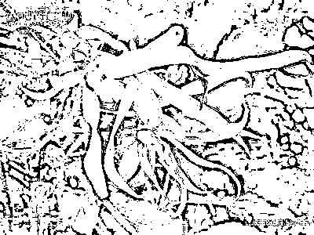

我记得看过的一个挺有名的治疗师案例，严肃刻板的上司去她家中做客，在吸闻依兰油后身心舒畅，与她“把饭言欢”说起了自己身边许许多多有趣的事，笑的之幸福灿烂（总感觉迷之尴尬）。这似乎也能和上面说到的吐露心声有关，但这只是身心合一在这个案例出现了“开怀一笑”的反应，我见过有其他案例使用后出现哭诉的场景，吐露的心声是其开朗的人格面具下的所有委屈。

依兰，它不是个能讨所有人喜欢的草药油，其实大多数人在刚接触它时表现的是对它的厌恶，觉得它气味浓烈，闻了想吐。我自己刚接触时，就给她的气味打上了色情的标签，我觉得闻起来有股神秘的异国情调，确实能有种让人动情的感觉，然后冲到脑子上就觉得闷。买的第一瓶完全依兰油就闲置半年。

半年后的某一天，跟风和别人玩精油卡，我抽到的是依兰。确认抽到的卡牌后就要使用三天，并且写一篇报告，我拿出依兰油，这次倒是没那么鲁莽对着瓶口就开干，我把它稀释到百分之二，然后涂抹在手心吸闻。我才觉得原来是我错了，它其实一点也不闷人，也不色情，当时的感觉是我对着瓶口吸闻带来的不良使用习惯后果。它牵引的是衷心之爱，是从心底散发的关爱感觉，我觉得她尤其适合更年期女性回春，因为不光在心灵上能直接滋补枯竭的心轮，她还能调节血压，打开自我的感官知觉，还可以改善焦虑。（我妈脾气暴躁，我有给她使用过依兰，直接添加在护肤品中，反正之后我的挨打频率明显降低）。

它还能滋养成熟，干燥的肌肤。那三天我尝试了很多个组合，感觉真有意思，依兰加上西伯利亚冷杉，我嗅出了寒风中傲骨那种感觉，依兰加橘，如同可爱活泼的美少女，依兰加苦橙叶也是一对绝配，特别是拯救那种质量不是很好的苦橙叶，那种苦橙叶气味有点沙苦感觉，我只能说它是，真-苦橙叶。甚至不客气一点说就是。。。额。。。酸秀才的感觉，闻起来也是惨兮兮的，加上依兰就变了，成了风流才子的感觉，当然也得看比例，依兰用 0.5，苦橙叶一滴，会有这种感觉，如果一比一，就有点女性化，更像是一个成熟的女人在讲过去那让人感慨的遗憾恋情。如果是少量依兰加上青柠檬（可以再加半滴杜松果），就像是一个刚从运动场上下来的美少年。（自己歪歪）

好了～没啦！但是价格可爱回春番外还没更完，下一篇见

**慎小七**

芳香草药·专栏食用指南

慎小七，指引社矿灵学院管理，医学世家出身，芳疗师，常年调香爱好者跟实践者，草药专家。

本系列为慎小七原创出品，涉及芳香、草药等专业知识。

长按右边这个二维码

关注指引社

让学术嗨起来(｡･∀･)ﾉﾞ

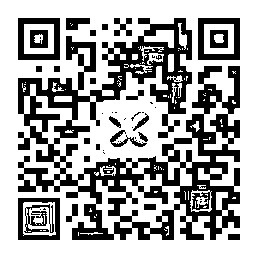

# 译丨《真正的巫术》第一章：元素-魔法的基石-练习五：建立神圣空间

> 原文：[`mp.weixin.qq.com/s?__biz=MzI5NTQzMDUzMQ==&mid=2247483839&idx=2&sn=614c006b34c26b8493eaab1442868d09&chksm=ec52f153db25784554340487de0d79234a700c6ef391318fa41f6aac2020e6e4d0a5c69210a6&scene=27#wechat_redirect`](http://mp.weixin.qq.com/s?__biz=MzI5NTQzMDUzMQ==&mid=2247483839&idx=2&sn=614c006b34c26b8493eaab1442868d09&chksm=ec52f153db25784554340487de0d79234a700c6ef391318fa41f6aac2020e6e4d0a5c69210a6&scene=27#wechat_redirect)

关注指引社，一起让“玄学”成为“学术” 

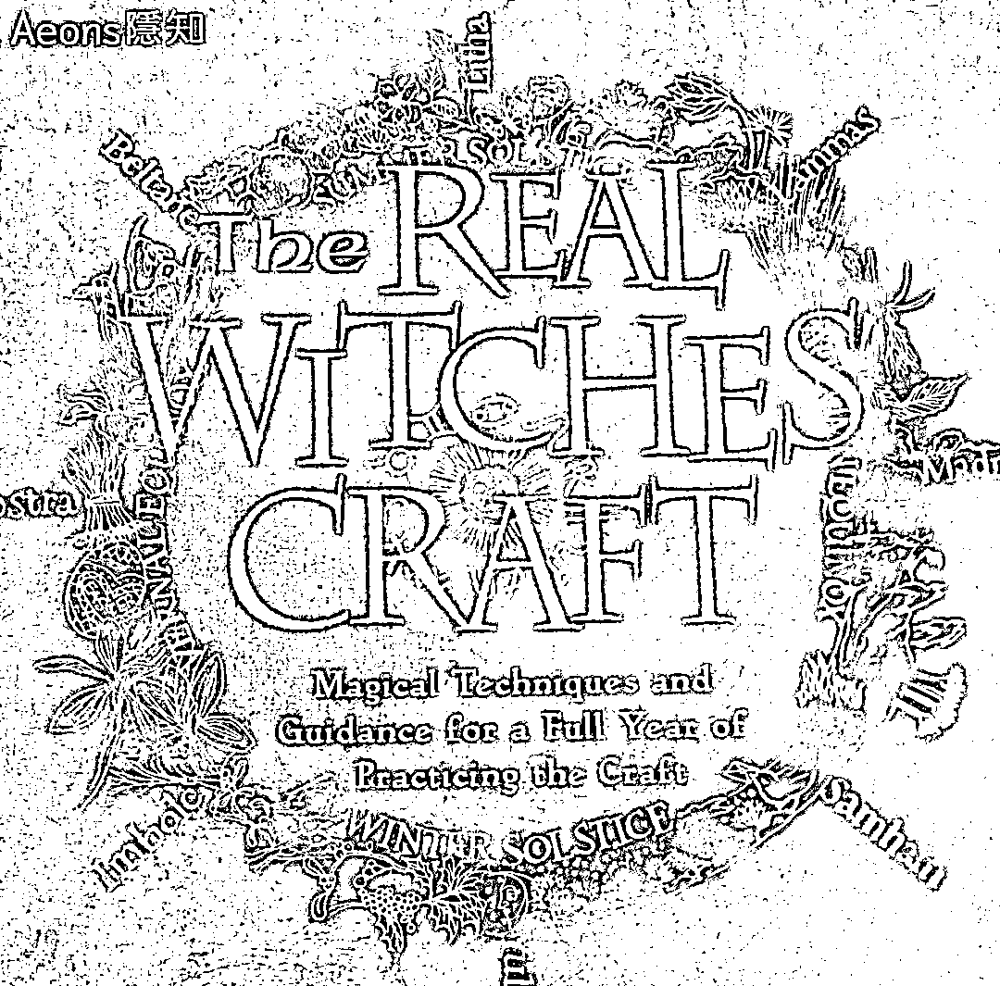

*【译者手记。——最近受友人所托，读了十几本古典魔法相关的书，大多数的画风都比较猎奇，或偏理论性居多。如果诸位想脚踏实地掌握一点实用的魔法技术，本系列 Wicca 译文或将是你的一个较好选择。p.s.以上硬广仅供参考，译者拒负任何责任】*

平日里，稍微留意一下环绕在你身边的那些事物，并思考：哪些元素与之存在关联？不要用研究的眼光打量它们，这么做会令元素们不安，并破坏你与它们之间的联结；与此同时，你需要思考元素是如何影响你与这些事物之间的互动的。譬如，当你向某个风元素类型的人寻求帮助的时候，你最好能给他们一个合理的理由让他们对你伸出援手；而如果是水元素型的人，你则需要用感情去打动他们。其余以此类推。当你依照以上方式实验时，在之前和之后都请记得做笔记，检查你采取的相应策略是否有效，并且有助于提升你的能力。

当然，元素的影响对象并不仅限于人类；这世上的任何事物都与元素有所关联。切记，它们不仅与每日的时刻有关，与四季有关，还与不同的年龄有关。因此，在你所做的任何一件事中，你都可以感觉到并运用之。当你需要计划某些事情的时候，你可以召唤风元素；相应地，如果你需要休息，你可以将土元素的影响力施加到你的生活中来。

在魔法中，元素是魔法圆、法术和咒语的基石。魔法圆建立了我们的神圣空间，扮演了类似于其他信仰中的教堂或是寺庙的角色，但它并不仅仅是一个魔法作业的空间。它为发生在其中的法术提供了直接的帮助，并使法术达到特定的目的。它为一切魔法工作提供了一个保护的空间，阻拦其他事物的侵入，譬如你的敌人或是令你分心的事物。它储存着我们所唤起的魔法能量，直到我们将其释放，令能量注入我们的目标。总而言之，它能够确实地将我们身边五种元素的能量与我们自身的能量结合起来。

### 创造神圣空间

不论你是独立从事魔法作业，还是群组性研究，学习如何用相对正规的方式创造一个神圣的空间、及了解其工作原理都是值得你最先着手的。首先，无论这个空间位于室内或是室外，都需要被清理干净，以便你能够在其中自如活动，不至于磕断腿或者撞成脑残。这个空间无需过大，但至少足够宽敞舒适，足以容纳在其中活动的人和一些可能会用到的魔法道具。传统的魔法圆直径约在九英尺左右（≈2.74 米），但你或许没有足够的空间来实现它。这个空间内一般包含一个祭坛，可以是一个简单的桌子或者一小片平面，供你放置一些会用到的物品。如果你的空间设置在室内，祭坛上需要摆放一些象征每种元素的物品：熏香代表风元素，蜡烛代表火元素，碟子代表水元素，盐代表土元素。女神和其他神祇可以用图片、蜡烛或其他事物来呈现。视觉上的联系在群组作业中比在独立作业中显然更为重要，因为所有的人都必须在同一时间内灌注注意力在同一件物品上。如果你的魔法作业需要集中在蜡烛、护身符或是其他实体上，则这些物品也需要被事先放置在祭坛上，以免被你遗忘在神圣空间之外，中途打断你的作业。

首先，站在此空间内的东边，面朝东方，在你的脑海中如之前所练习的，召唤出风元素的图像，并说（注：请直接诵读英语部分，中文部分仅诠释大致含义之用）：

“I call upon the Element of Air, to join with me here in the Circle.”

【我呼唤风元素，令其与我同在。】

当你确切地感知到风元素的存在时，说：

“Blessed be.”

【就酱。】

然后移动至空间内的南边，重复刚才的祷词，并将风元素置换成火元素。其后是西边，对应水元素，北边则对应土元素。在一些群组仪式中，以上的话语需要伴随绘制每种元素的召唤五芒星。保持面朝北方，呼唤女神与其他神祇，说：

“I do call upon the Goddess and the God to join with me in these my rites.”

【我呼唤众神祇与我同在。】

观想祂们由北方向你而来，抵达你的身旁。当你感知到祂们的存在时，说：

“Blessed be.”

【就酱。】

如果你有喜欢的神祇形象，可以命名并显化之，在此后的课程中将有关于此点的详细说明。最后，移动至空间（即魔法圆）内的东北方，用你较为有力的一只手的食指沿着魔法圆的边缘外侧，在空气中画一个圈。在你这么做的时候，想象一道带电的蓝色光圈逐渐变成一个笼罩在空间外的光球，并说：

“I do cast this Circle as a place of containment and protection. A place between the worlds and a time outside of time.”

【我令此空间容纳我并保护我——一个时空之外的独立空间。】

确保这句话与你画圈的动作同时开始，且同时结束，并说：

“Blessed be.”

【就酱。】

需要注意的是：在创造此空间及在其中作业时，你的动作方向均需要沿顺时针进行。

至此，你的神圣空间的建立已经完成了，接下来请开始你的魔法表演——通常情况下包括能量的积聚、咒语或法术，以及为庆祝仪式而祭祀的酒与糕点——在此后的课程中均有详细指导。在每次魔法作业的结束时刻，你需要解散魔法元素，并感谢女神和其他神祇们。

再一次，从空间的东边开始，面朝东方，在你的脑海中如之前所练习的，召唤出风元素的图像，并说：

“I give thanks to the Element of Air, for joining with me here in the Circle. Hale and farewell.”

【感谢风元素对我的助力。88 了您老一路走好。】

如之前练习过的一样，让风元素的图像消逝，当你觉得它已经消弭隐去之时，说：

“Blessed be.”

【就酱。】

然后移动至空间内的南边，重复刚才的过程，并将风元素替换成火元素。接下来在西边送别水元素，在北边则是土元素。在一些群组仪式中，以上的话语需要伴随绘制每种元素的驱逐五芒星。保持面朝北方，呼唤女神与其他神祇，说：

“I give thanks to the Goddess and the God for being present here with me in these my Rites. Hale and farewell.”

【感谢众神祇赏脸协助我的魔法仪式。88 一路走好。】

观想祂们向北方回归而去，说：

“Blessed be.”

【就酱。】

最后，移动至空间（即魔法圆）内的东北方，用你较为有力的一只手的食指沿着魔法圆的边缘外侧，在空气中画一个圈。这一次想象那个带电的蓝色光球褪色并消散，并说：

“I remove this Circle and return this place as it was before.”

【我解除这个空间，使其回归平静。】

确保这句话与你画圈的动作同时开始，且同时结束，并说：

“Blessed be.”

【就酱。】

此后你仍可以踏入这片空间，将家具或其他物品摆放至原先位置。最后，摄入一些食物和水，使你达到“着陆”状态，并在日记中做出记录。当一些效果开始浮现之后，离开这片空间。

持续学习和练习以上的方法。即使你在此后的魔法作业中可能会选择一些更为随意的方式，建立神圣空间依然是一个较好的选择。虽然很显然，不是所有的咒语都能在你有充分的时间和空间建立一个正式的魔法圆之后实施。

某些时刻你可能会进行紧急的魔法作业，尤其当你出门在外或独自一人时，你将很难拥有一个整洁的环境，也无法在熙攘的公共场合里念诵祷文，除非你不介意去安定医院走一圈。在此类场合中，你可以在脑海中完成全部的仪式，召唤每一个元素，请求众神祇庇佑，绘制魔法空间，无需任何动作或大声说出来。以上在此后的课程中亦会有详细说明。

* * *

【译者注：在原文中，作者提到众神祇时，用的都是 the Goddess and the God。众所周知，在 Wicca 中，女神向来扮演的是较为重要的角色，故而大部分翻译为“女神和其他神祇”，配合原文以凸显女神的地位。】

声明: 该文章版权归指引社和作者所有, 转载请保留此行([`www.geaving.com/article/view/id/163`](http://www.geaving.com/article/view/id/163))

长按右边这个二维码

关注指引社

让学术嗨起来(｡･∀･)ﾉﾞ

# 译丨《真正的巫术》第一章：元素-魔法的基石-练习六：元素在日常生活中的妙用

> 原文：[`mp.weixin.qq.com/s?__biz=MzI5NTQzMDUzMQ==&mid=2247483839&idx=3&sn=8a1af00f2f7d13bf1746a8db68bb9428&chksm=ec52f153db2578456f5f6f540ad81b96983b08927dd1f66b2e4d9c99277b5007a4002308bf4e&scene=27#wechat_redirect`](http://mp.weixin.qq.com/s?__biz=MzI5NTQzMDUzMQ==&mid=2247483839&idx=3&sn=8a1af00f2f7d13bf1746a8db68bb9428&chksm=ec52f153db2578456f5f6f540ad81b96983b08927dd1f66b2e4d9c99277b5007a4002308bf4e&scene=27#wechat_redirect)

关注指引社，一起让“玄学”成为“学术”

练习元素的正式祷文。记得在召唤结束时解散它们，即使你认为自己召唤失败了。你肯定不乐意有残余的元素能量在你周围晃来晃去。

我曾听说过一些未能及时遣散元素的案例，残留的水元素令施术者在洗澡的时候遭遇水管破裂的惨剧，而残留的火元素则令施术者家里的电路出现问题，等等。

除此之外，仅练习召唤元素的心灵图像，并对比使用祷文召唤时的体验。试图向你的心灵图像注入与使用复杂的祷文同等的能量，并记录下使用不同方式时的体验。

你练习得越多，一切就会越加容易，直到你对四种元素操作自如，随叫随到。这不仅能令你有效地在任何时间与地点运用魔法，亦能令你在日常生活中平衡自身的能量。

你我之中的大部分人都会遇到被某种情绪充斥头脑的时刻，譬如一场家庭战争会令我们勃然大怒、失望或心烦意乱，以上所有的负面情绪都不利于你做事；或者路上某些人的胡乱驾驶会令你暴跳如雷，而你绝不想将这种愤怒带回家里。

当我们无法保持平衡时，可以尝试将这些情绪放在一边，用正常的态度面对身边的人，而不是迁怒于他们。

为了做到这一点，一个较好的方法是花费一点时间召唤并驱散元素们。当然，你可能会需要一些私密时刻去完成这个方式，而一个公厕的隔间就能提供给你一个平静的领域！

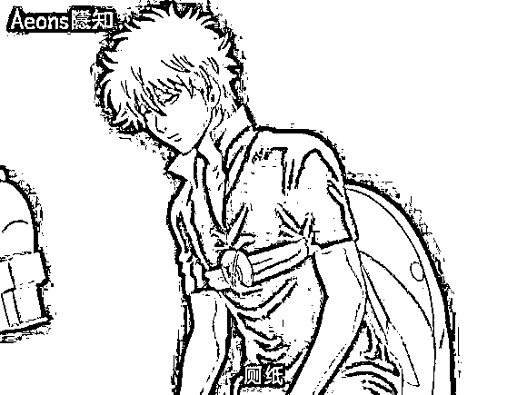

* * *

【译者注：本篇由于原文篇幅所限，字数不多，属于一点关于日常生活的 tips。但由于相邻的前后两节篇幅均过长，无法合并放出，望读者见谅。】

声明: 该文章版权归指引社和作者所有, 转载请保留此行([`www.geaving.com/article/view/id/164`](http://www.geaving.com/article/view/id/164))

长按右边这个二维码

关注指引社

让学术嗨起来(｡･∀･)ﾉﾞ

# 喂，起来修仙了（针叶类小结）

> 原文：[`mp.weixin.qq.com/s?__biz=MzI5NTQzMDUzMQ==&mid=2247483839&idx=4&sn=a9b892b04c102f1426e75a235cc22bf2&chksm=ec52f153db257845655c9738d1ca376036019c7b3ab759cf1b6102a6a1f63f588ec30ff643ec&scene=27#wechat_redirect`](http://mp.weixin.qq.com/s?__biz=MzI5NTQzMDUzMQ==&mid=2247483839&idx=4&sn=a9b892b04c102f1426e75a235cc22bf2&chksm=ec52f153db257845655c9738d1ca376036019c7b3ab759cf1b6102a6a1f63f588ec30ff643ec&scene=27#wechat_redirect)

关注指引社，一起让“玄学”成为“学术”

前面我们学习了很多科属了，但是只讲了异，未详细讲讲它们的相同之处，今天挑两个代表性，松科，柏科来说一说（它们是针叶树）。至于其他的嘛～有空我就拿出来详细说，没空你们就自己努力。

针叶树：松科，柏科。能量的关键词是 直接，内敛，支撑力（支持力）

它把阴阳聚于一体，体质阴而用于阳。人们敬仰它们坚毅不凋的阳性，欣赏它们沉稳长寿，如大地母亲的阴性。在心灵倦怠而虚弱时，往往免疫力也会下降，这时人们使用针叶树油可以提振免疫，又能内敛精神，正所谓一举两得。

它的结构明确集中，能够强化精神力，也可以帮助突破眼前的迷茫，跳脱低俗的眼界。当我们遇到重大抉择而又不知所措的时候，可以使用针叶树。当我们遇到大的困难时，也可以使用针叶树，不光能帮助理清杂乱的思绪，开拓眼界，而且它还具有强大的支持力，能让人坚定步伐，坚定心中信念。人生如同攀岩，它陪你一步一步的迈向更高处。

对于神秘学爱好者，它也是重要的灵性植物。

首先，不管是真—修仙党，还是假—修仙党它都适合。熬夜的假—修仙党，可以使用它，帮助在熬夜时，补充能量，减少熬夜后遗症，且不会影响睡眠，因为它能量内敛，体阴（补充）用阳（支持力）

，且有良好的促进排毒功效（对肝脏好）。

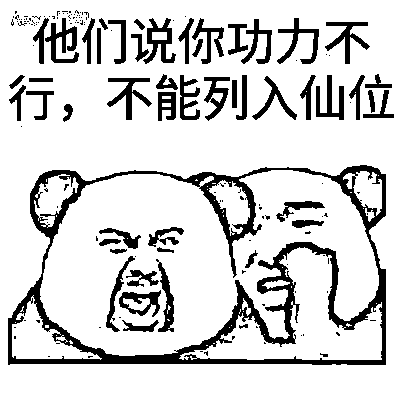

对于真修仙党，能在修行时使用，直接强化精神力，再多想一点，那么做仪式时使用也是十分合适的，即可以加强精神力，又可以净化能量场，再多说一点，土象星座和淋巴型体质也同样适合。

关于引梦：的确，针叶树都有十分好用的引梦能力，虽然单独来看，有些差异，但总体来讲的话（懒的每个单独说）都有让灵魂清澈的功能。以雪松和杜松为代表，其中雪松能量如水，代表着溶解，融合。更能贴近潜意识层面，大多数人使用后反应梦境与水有关，能提升知觉，警觉性，能帮助注意力均匀分散的使用。

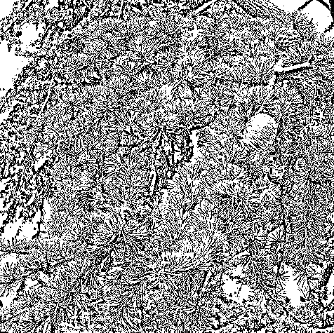

而杜松力量对应着净化，（也有一部分水的含义，但更加活跃，偏阳，就如同阳光照射流动的小溪）

刚开始一段时间，梦境可能更加隐晦，混乱，使用时大多数的人调整反映会比较理解，如情绪敏感，甚至失控，出疹子。

但长期使用下来，可一扫身心的阴暗毒素。因杜松力量更加阳性一些，其净化力，支持力也表现的更加明显。

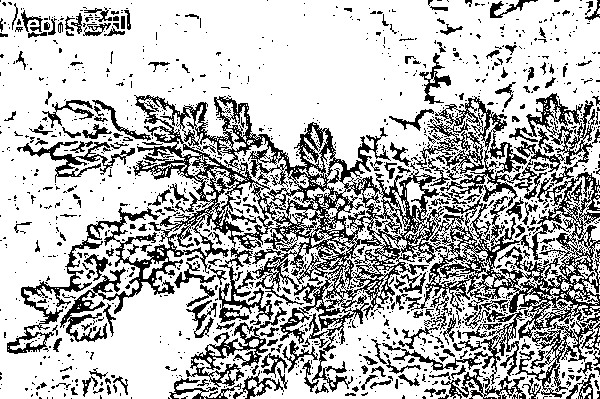

* * *

针叶树油的代表化学类型是单萜烯，分子小，跑的块，看起来如同两匹马并行，闻起来直达脑门的感觉。体质敏感的人可以多去试试，体验下它的能量走向，你会获得关于它更完整清晰的信息。

它的疗效主要是：补气，消炎，抗感染

补气：使用针叶树油你会明显的感觉神清气爽，森呼吸一样，如同行走在林间，让人呼吸深长，可添加土类其它草药油，增强这种感受，当然，这是浪漫的一点的说法。以现代观念看，补气是补强神经传导物质（Neuro-Transmitter）它是体内的沟通信使，把信息传递给受体，然后我们的细胞就开始不同的工作。想想如果信使生病了，状态不好，就没办法传递信息，身体系统的沟通受阻就会产生障碍。针叶树油就给信使加油打气送便当送药。让它更好的工作

消炎：它不是直接作用在患处，而是影响神经传导物质，激发体内产生类似可体松的消炎物质，从而唤醒自身的消炎力

针叶树油的抗感染力也是同样的道理，有一个特别的好处，在处理感冒问题时，吸入它不会让黏膜干化，而桃金娘科就有这个问题，所以在处理感冒后干咳的问题时，避免使用桃金娘科，会让喉咙更干，可以选择针叶树油

没了～就酱

**慎小七**

芳香草药·专栏食用指南

慎小七，指引社矿灵学院管理，医学世家出身，芳疗师，常年调香爱好者跟实践者，草药专家。

本系列为慎小七原创出品，涉及芳香、草药等专业知识。

长按右边这个二维码

关注指引社

让学术嗨起来(｡･∀･)ﾉﾞ

# 离奇时髦的神秘学防骗指南【八卦篇】

> 原文：[`mp.weixin.qq.com/s?__biz=MzI5NTQzMDUzMQ==&mid=2247483839&idx=5&sn=9d9eef9142097c0b1268118bbf537622&chksm=ec52f153db25784591c02f4fd8e3ff5cceadbfba8ed05eb457c4a0c59736672527b80048456e&scene=27#wechat_redirect`](http://mp.weixin.qq.com/s?__biz=MzI5NTQzMDUzMQ==&mid=2247483839&idx=5&sn=9d9eef9142097c0b1268118bbf537622&chksm=ec52f153db25784591c02f4fd8e3ff5cceadbfba8ed05eb457c4a0c59736672527b80048456e&scene=27#wechat_redirect)

关注指引社，一起让“玄学”成为“学术”

大家好，好久不见，我是右夜鸣。

去年闲得没事，在网上搜索指引社，然后搜到了一些奇怪的东西。

一个打着指引社旗号的 qq 群里面在大力推广一些奇怪的业务，什么抓鬼，风水阴阳宅，占卜诅咒下蛊……然后收费还贵得吓人。

然后我一看群主昵称，很眼熟，这不是指引某版主吗？但是 qq 号码对不上呀。

当时我就怀疑有人冒名顶替，于是凑上去问了一下，结果那孩子当场自爆了，性别、年龄没一个回答正确的……

其实神秘学圈子就那么大，人就那么点，所以基本上一些传说、段子，乃至谣言都是围绕着那么零星几个“人物”，或是“群体”。

圈子里的很多寻常事件，由于信息的不对等，在大部分圈外人事的眼中都会显得十分神秘诱人的，再加上有心人的可刻意利用和影视作品的影响……最后越传越离奇。

就跟南千秋的“头儿传说”是一回事。

也许你会发现某个群里整天嚷嚷着要新人爆照的二货，其实是个传说中的占卜师，而你以前认识的很多大师甚至捆到一起都不够他打的。

也许你会发现，外面人眼里的某个所谓的大佬，其实就是你隔壁群里被人拿着不锈钢做的横笛按在地上狂揍的中二少年。

也许你会发现，小说动画电影里面写得很牛逼的 XXX 功法，你隔壁的群的某个道士就会，然后他学会了之后却依然是一个整天窝在家里死宅，没事买买手办看看番，完了上淘宝订些甜点，搜一波死宅周边，再搞件娃衣什么的。

也许你会发现，被某些人吹得天花乱坠的神秘学组织早十多年前就解散了，也许你会发现，号称有多牛逼多牛逼的门派抗日战争的时候人就差不多死完了。

所以，不要再想着某某某修真门派隐世不出，或是东方有什么古老绝学早已失传，又或者只要得到 xxx 功法就能叱咤群雄了。

时代，已经变了啊！睁大你们的眼睛看清楚！

修真门派都是有备案的！法脉传承都是有迹可循的！古老绝学失传的只有极少数，大多数传承都在，只是人们一边抱怨失传，一边又没耐心去学习和了解，至于你们所谓的 XXX 功法，因为国内的版权意识低下，加上某度一些厚颜无耻的骚操作，现在网上基本上都能找得到。

但就算把那些的功法放在大多数人面前，大多数人也不学，也不信，非要觉得这不是功法，别处另有功法。

对于一些东西的原理，明明已经有很清楚的解释了，一切人却偏要自作聪明，去寻求一些所谓的“现代化的”，“科学的”解释方法。

比如我见过最可笑的就是，符咒其实是电路板，魔法阵其实是特斯拉线圈。

然后偏偏这么脑残的言论，就硬是有一堆人愿意去信。

也许这就是所谓的时髦吧。

但是作为一名理论物理专业毕业的理科生，我只想秉着科学求真的态度对他们说一句：“你们九年制义务教育的所有科目都是体育老师教的吗？”

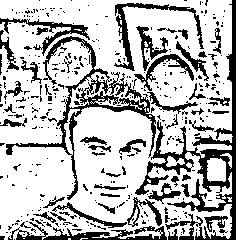

是的，二十一世纪的科技高速发展为神秘学造就了一个很尴尬的局面，过去大多数法术神通的效果都已经可以用科技手段代替了，科学造就生活便利的同时，其思维方式也在一次又一次地冲击着神秘学的方方面面。

现代化的分工合作使得神秘学，甚至其他一些学科研究所需的资源分散集中在不同人的手里。

在古代，一个人获得功法之后可以去荒郊野地找他练功所需的东西。

但是现在不行，首先你钻进原始森林就会被护林员或者什么国家机关逮住，被当地人抓起来，就算你运气好混进去，找到了自己需要的东西，也很可能发现那东西淘宝有卖。

其实功法也好，资源也好，在这个时代，你所需要的这一切东西都是来自人的，人和人之间的关系，和人有关的情报，才是这个时代的我们需要慎重处理，并且，也是最有价值的东西。

在这个时代，一本绝世功法的价值甚至比不上商场的打折券，加上全球化文化的冲击和一些历史断层，会导致我们对功法解读出错，这时候，前辈的修行经验，练习经验也就无疑要比功法本身值钱很多。

很多东西的来历、基本概念和练习方法你都能百度到，但是实际应用和细节处理上就离不开人了。

另外，除了某些专门技艺之外，很多东西，尤其是像“魔法”、“巫术”这种概念宽泛的东西的学习并不是单独一个老师就能完全传授给你的。

所以除非是出家修行，否则我并不是十分推荐那种到处拜师的行为，因为个人修行不到家，即使师父有真本事也不敢轻易传授，而如果修行到家了，自然会有机缘让你更上一层楼。

所以与其追逐那些奇奇怪怪的功法，或者在所谓的大师大佬身后当跟屁虫，希望他们能施舍些什么东西给我们。

倒不如自家多学习多思考，顺带研究一下那些大师、大佬们的黑历史，看看他们是怎么成长起来的已做参考。

神秘学圈子也是由人组成的，人才是关键。

相信我，这真的不是因为我的八卦之魂熊熊燃烧，其实我这是为了好好学习天天向上。而且，其实挖白历史也是可以的，但我觉对大部分新人而言，黑历史会更有吸引力。

所以凡是有缘来到神秘学圈的朋友们，请尽情地去挖圈子里的黑历史和八卦吧。

比如某大佬的性别，某版主的年龄，圣甲虫在中国认证了几位读牌人，轮回之树是谁，古典之死是谁，和现在的社长有什么关系，为什么指引社提倡废除黑魔法和诅咒术，百度文库里那篇中二得要死的《指引社组织结构（必读）》是怎么回事……

反正能挖的八卦多得要死，但是我不会轻易告诉你们，毕竟八卦这东西要自己努力挖出来才有趣，挖出这些八卦之后你们就能看到这个圈子和蔼可亲的一面，被一些智障骗的时候你也能因为瞬间出戏而躲过一劫。

相信我，我是右夜鸣，我用自己的节操做担保，我真的不是来搞事的。写这个八卦篇完全是为了预防新人上当受骗，并不是我本人渴求更多的黑历史，真的是一片良苦用心啊！

所以啊，我并没有期待有谁能在这篇文章下面爆出更多的黑历史，真的，比黄金还真，你们要相信我！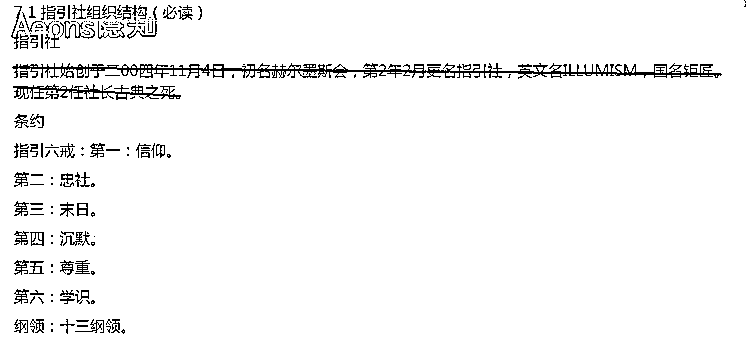

长按右边这个二维码

关注指引社

让学术嗨起来(｡･∀･)ﾉﾞ

# 月桂：我就是这么直（回春篇）②

> 原文：[`mp.weixin.qq.com/s?__biz=MzI5NTQzMDUzMQ==&mid=2247483839&idx=6&sn=1aab2cb30c990dfe983625d9f1cb1f8e&chksm=ec52f153db2578451733810dd9f1fdeb1ea54e6cdaeee27b55867c333693226a9f20fb748529&scene=27#wechat_redirect`](http://mp.weixin.qq.com/s?__biz=MzI5NTQzMDUzMQ==&mid=2247483839&idx=6&sn=1aab2cb30c990dfe983625d9f1cb1f8e&chksm=ec52f153db2578451733810dd9f1fdeb1ea54e6cdaeee27b55867c333693226a9f20fb748529&scene=27#wechat_redirect)

关注指引社，一起让“玄学”成为“学术”

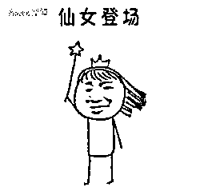

今天我们接着回春的第二篇，还是介绍一个价格可爱又十分好用的植物，它就是月桂（不是桂花）。

月桂油萃取自叶片，所以按大类来看，它具有叶片的性格。

我们在了解一种草药油，植物的时候首先要先从大的方向来下手，对它有一个大方向的把握。就像我们用人，识人，在大街上那么多人从你眼前走过去，第一眼你并不觉得这人有什么样的能力，而交往越深你就会觉得这个人不一般，这就叫深交便觉不平凡。当然，你会发现他的好，也会知道他的缺点，人有偏性，植物也有它的偏性，我们不可避免，我们也要用它的偏。就像人也有缺点，但这并不妨碍他在某一方面的出色。

那么我们首先回顾一下月桂它的性格，别告诉我你们不知道，月桂是樟科植物，在樟科里我说过，它们的关键词就是“直”

不管是性格，目光，还是作用都有一个直字。

今天我们从叶片类来看一看月桂的另一些性格特点，这同样可以指代一类人的性格，在芳香占卜透析人格时常用到。

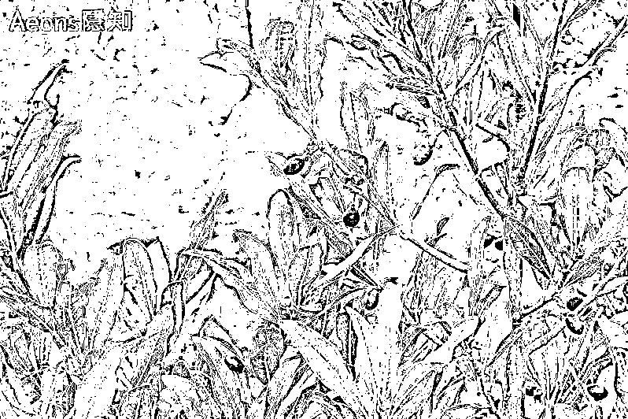

叶片类性格分成了三大类，是一个过渡的三段式过程，第一阶段是青春正茂，第二阶段是平和发展，第三阶段是枯萎凋零。代表了逐渐黑化，三种不同的性格特色。

首先青春正茂：眼光高，见识深远，富有创造力灵感，且新颖专注，能洞悉人心，而且善解人意，

待人亲切又充满活力。

这类人乐于学习，孜孜不倦，想要探索这个世界更深层次的奥秘，可以说三种叶片类性格的人都有同样的目标，那就是“拓展”，不管是它们自认为，还是本身特质，在脑子里对自己根深蒂固的印象都是高瞻远瞩的智慧型，可以说这也是它们希望达成的自我目标。

青春正茂的叶片类人认为，知识是他们不可缺少的营养品，他们有着敏锐的触角，但是学习一样东西时却不会喜新厌旧，乐于深层次的研究，深层次的专于一件事却不会影响他们去拓展新的视野。而且他们看待一件事情时，目光不会局限于小的地方，而是会以整体的目光看待一件事情，脑子里总是激荡着各种新的想法，分分钟制造好些原创理论。

叶片有着旺盛的好奇心，且有了不起的直觉，在研究的道路上善于不走寻常路，往往有出其不意的全新理论。（这种人跪求来学草药）

善于洞察人心，他们的眼光总是直直的，仿佛一眼就能把人看到底，善于透过人性幽微的地方。

平和发展叶片：个性独立，善于内省，想象力丰富，成熟大方，有活力，敏感，善于革新，有时会走极端，忧郁。

这类人有点“秀才气”不善于争斗什么，会有一点退缩，兴趣广泛（像一个网络），却也游刃有余。喜欢从各种新知识里抓出一些东西，重新组合成独立的法则。他们善于思考，有时候思考的太多，忘记了需要脚踏实地，有时冒出的新鲜想法在外人看来如同怪调。

他们是独立的，喜欢独居，情绪敏感，常常自省，这样的生活方式有时会让他们容易沾染“忧郁”

在政治方面是不折不扣的“理想主义者”若生在革命时期，他们很有可能成为极端革命主义者，在自己的理想里甚至飞蛾扑火。

在知识的海洋里遨游的叶片，加上容易极端的个性，有时会走入迷宫甚至死胡同，这是 他们特别要小心的事，当心与现实脱节，还有就是当心避世心理会害了他们。

枯萎凋零的叶片：过于敏感多心，甚至草木皆兵，毒舌，执迷不悟，（加起来就是死鸭子嘴硬）喜欢批评别人，容易受威胁，轻蔑，对人充满敌意，性格压抑，强迫行为。

这个时候的叶片就走入了一个极端状况，避世，拒绝和别人交心，总是高呼失败主义论。一个人躲起来郁郁寡欢，怀疑人生，久而久之变成了又臭又硬的石头，原本丰富的想象力会给他们营造一种心理幻境，这幻境会困住他们。在知识的领悟也有一种执迷心态，宁可忽略事实也不推翻理论。

极端的敏感情绪甚至会让他们有一种受害者倾向，总是觉得有人要害朕，草木皆兵。他们会把自己摆在高高的位置，心理认为，现在的孤独就是“高处不胜寒”，大概是心理幻想着这就是“超脱尘世的王者巅峰”了，所以总是以高高在上的心理去批评别人，毒舌，也轻蔑别人。

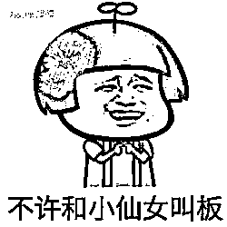

学习月桂时，从植物，到人，再从人到植物。我们可以看到，月桂的特质，也是那样灵活，新颖的拓展性质，正如原植物那样充满生命力，勇于追求，勇于接触新鲜事物。但是这只是它的一部分特质，是所有叶片类油的共通特质

现在我们把范围再缩小一点，缩小到萃取自叶片的樟科植物，加上樟科的直来直去又热切投入红尘的性格特征，月桂在拓展，灵活，专注，旺盛的好奇心之上又增加了作用直接，赋有热情，生命力的青春气息，樟科植物生命力顽强，富有韧性。日本广島原子弹爆炸后，长出的第一种植物就是樟树，它能带给人，置之死地而后生的希望，能全方位的振奋心轮，身体机能的回春。

月桂的气味，在我看来，闻着感觉十分美好，气味有微熏的感觉。我很喜欢使用它，每次使用它都感觉有春天的气息，有的治疗师认为月桂有烈日之势，如七月的太阳。其实我不以为然，我一直认为它是“少火”如春季，或者春夏之交。如果要把月桂放在烈日里来诠释，那么你让肉桂很难堪啊，肉桂放哪儿？你能说肉桂和月桂是一个感觉吗？？毕竟月桂代表成分是桉油醇，而肉桂，不管是锡兰还是中国肉桂，都有大量的芳香醛，其力量对应着热血沸腾一词。

代表成分氧化物，（1，8—桉油醇）单萜烯（松油萜） 酯类（乙酸萜品酯） 酚类（丁香酚，虽然少但是很重要）

那么接下来，我们就进入正题

月桂：Laurus nobilis

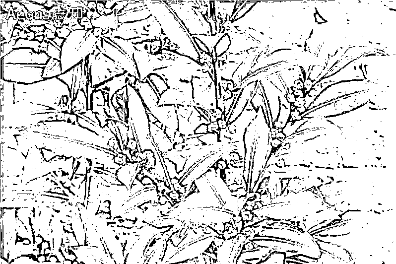

首先从上述化学类型来进行分析

桉油醇，它的能量特质就是迅速，而准确，如箭出命靶。

它的能量特征是典型的风属性，而这风为疾风。气味闻起来清爽锐利，是风就有沟通，传递信息的作用，在神秘配方中，典型携带桉油醇的植物常被用来促进与神灵的交流。因其特性快速，还可用于增强净化力上。

在月桂中，正是因为有桉油醇的存在，才可以体现它作用直接而迅速的一面。

桉油醇的主要功效是抗菌（革兰氏阳性菌），抗癌，祛痰（能干化黏膜），促进血液循环，激励单核白细胞生成等。

松油萜：它是松科精油的代表成分来着，其特色是可以增强肾上腺素，能激发战斗意志，还能增强抗压力。不过在抗压这一点上其效果是比较缓慢的，带有松科特色，松科本就是生长缓慢，所以使用个半年，你就能感受到明显的效果。除此之外，它还能帮助人稳定，当然这也是松科的特色。在这里和其它成分搭配起来，其作用还是指向回春，毕竟人老了才会失去战斗意志，无心寻求第二春。

乙酸萜品酯：这个成分有α，β，y（这是伽玛）三种。其中α最常见，气味甜美（我认为的），没有毒性，常在腌制品里当做辛香气味的来源。

其作用特色是能够增强自我意志，适合那些自我容易受到它人影响的人，能够坚定心中信念，给人卷土重来的勇气。

生理疗愈上对应腹轮，擅长处理腹部问题。

丁香酚：因为最早是在丁香里发现它，所以才有了这个名字，它也是丁香花苞的代表成分，在月桂叶里存在少，但是却有十分重要的特色。起气味辣而带有一点锐利燃烧的金属感觉

在酚类中它十分温和了，公认酚类的特质都如同火焰，而它最能体现“少火”特质，它对应的疗效是能给人以活力，点燃生命温暖的火苗。

其实我是这样认为，有时候一团熊熊燃烧的火焰，反而会让人感觉枯竭，太快烧光。而一团小小的火面，更好让人接近，反而更觉其温暖生机。如果把一团烈火放在一个人体内，固然能救一个从里到外都寒冷如暴风雪侵袭的人，能救急是没错，但长期下去会让水来不及生成，干枯。而一团小小的火苗，能温熙人体，给人生机，让人温暖而不会太热，让一切固结的流动起来，给枯竭的心灵补充能量，这叫“少火生气”。

现在我们讲目光回到月桂的整体上来

在西方国家，月桂也代表着胜利和荣耀，如“桂冠诗人” “桂冠酒

“ 希腊罗马神话中，太阳神阿波罗想追求少女戴芙妮，但她不领情，极力逃避被追求，最终逃到水边变成一株月桂树，之后阿波罗总佩戴着月桂叶以为纪念。太阳神代表最有能量，月桂则集他宠爱于一身，因此自古被地中海区人们视为元气、胜利、成功的化身，常用来荣耀各行业中最光芒万丈者，或历经艰困挑战者，例如奥运选手的荣冠最早是用月桂叶编成，现代则轮流用橄榄叶等不同植物做叶冠。月桂的性格比橄榄桀骜不驯些。”

月桂油，从整体来看特别适合那些如枯木之人，经历过太多人情冷暖，世事沧桑，身体和心灵机能退化，更年期，（或者无法接受自己更年期事实而耿耿于怀之人）或者是有心灵过早衰老的人。

它能增强意志力，让人更有韧性，更加自信，并且能打开感官知觉，让人身心焕新，对一切事物保持好奇心，更加勇于探索，并给人新鲜活力。

生理上它能平衡自主神经，改善淋巴阻塞，消炎抗病毒。

ps：月桂中还有几个会用到的，首先是以丁香酚为代表成分的西印度月桂（Pimenta dioica） 它的化学类型很多，通通统称西印度月桂，比如还有西印度茴香月桂，以醚类为主，西印度柠檬月桂，以醛类为主。

没了，挥爪～

**慎小七**

芳香草药·专栏食用指南

慎小七，指引社矿灵学院管理，医学世家出身，芳疗师，常年调香爱好者跟实践者，草药专家。

本系列为慎小七原创出品，涉及芳香、草药等专业知识。

长按右边这个二维码

关注指引社

让学术嗨起来(｡･∀･)ﾉﾞ

# 译丨占星与塔罗牌对应到底有什么用

> 原文：[`mp.weixin.qq.com/s?__biz=MzI5NTQzMDUzMQ==&mid=2247483839&idx=7&sn=0acfd27b7acbfa72c8adeb639c603435&chksm=ec52f153db257845b26f280e6c102103a02e09c3afd6a04c14778b4703cf8139fc11a2b8d64b&scene=27#wechat_redirect`](http://mp.weixin.qq.com/s?__biz=MzI5NTQzMDUzMQ==&mid=2247483839&idx=7&sn=0acfd27b7acbfa72c8adeb639c603435&chksm=ec52f153db257845b26f280e6c102103a02e09c3afd6a04c14778b4703cf8139fc11a2b8d64b&scene=27#wechat_redirect)

关注指引社，一起让“玄学”成为“学术”

编译自 [`www.keen.com/articles/tarot/astrological-correspondences-minor-arcana-how-they-enrich-reading`](https://www.keen.com/articles/tarot/astrological-correspondences-minor-arcana-how-they-enrich-reading)

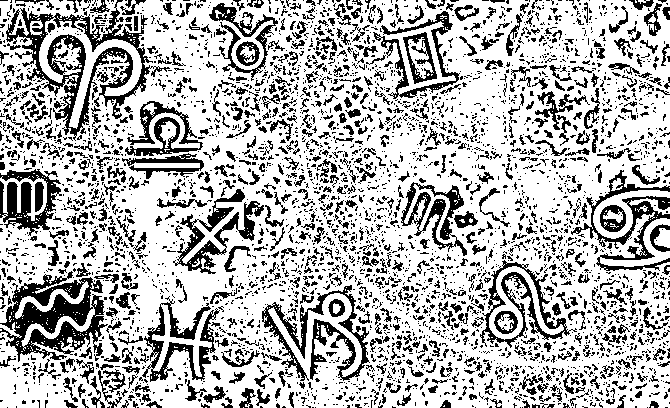

     作为一枚兼搞塔罗的占星师，占星与小阿卡纳的对应不仅很有道理，更让我读牌非常厉害。如果你还不怎么具备占星知识，学习一个，让塔罗原型与行星和星座相得益彰，再也没有你解不了的牌，6 到飞起～

对应从哪儿来？

      塔罗历史悠久，从很多不同文化中的纸牌游戏发展而来；占星更古老，遍布欧亚大陆，也是塔罗起源的重要因素之一，但这两个系统并不十分契合。

      我所知的占星塔罗对应是 19 世纪 80 年代晚期，英国的金色曙光协会搞出来的。这群神秘学者秘密结社，致力于秘术研究，成员包括阿莱斯特 克劳利（设计出透特塔罗的那位），亚瑟 E. 韦特（设计出莱德韦特塔罗那位）。这些学者将星盘的每十度对应到一张塔罗小牌（一号牌和宫廷牌除外），给每张牌又附加了一层含义。

怎样应用到解牌中去？      

      理解对应关系的助益是多方面的。比如，牌阵里有张牌在这个位置的意思比较谜，或者这张牌对于这个问题，解读无处下手，结合占星对应就能找回灵感，知道占星上的原型意义，就可以把这些关联到问题中去。对应也能更精确体现牌是怎么反应问题的。

      举个例子。这周我为一位女士抽的三张牌牌阵就应用到了占星对应。她问的是她青春期的儿子吸毒的事，想知道明明是那么一个好孩子，怎么开始每天吸大麻了。我们用了过去－现在－未来牌阵。

      过去：宝剑三逆位。这张牌表示他一度沉浸在悲痛中，心碎成渣渣，但只是自己默默承受；他不愿表现出悲哀，不堪重负，于是用毒品来掩饰痛苦。宝剑三对应土星天秤，以此进一步阐释牌意，他的心痛与吸毒的根源有关（天秤座），因为他对这段关系执着，或害怕深陷其中（土星）。

     现在：权杖十。这张牌告诉我，尽管与吸毒原因有关的伤心事已经过去一段时间了，这些感觉仍然是心头的重担，也许他觉得自己也担有一定责任。土星射手提示他不再能那么随心所欲，或他限制了对方的自由；也可以是他对另一方的看法，或对爱情／友谊的观点正在动摇。

     未来：圆盘九。起初我很难把这张牌与前两张的情况联系起来，于是想到占星，对应金星处女，难题迎刃而解。金星处女意味着独自一人疗愈，花时间发展智慧、判断力，找到平衡。我问这位女士有没有想办法干预儿子吸毒，她说她有朋友建议去野外集训营 (boot camp，比较像军训) ，她儿子去了，还挺有效。我说，根据这张牌，他可能需要更温和些的方式，让他能发展自己的智慧，比如找治疗师或咨询师，让他说出困扰的心事，也许对他更有帮助。

       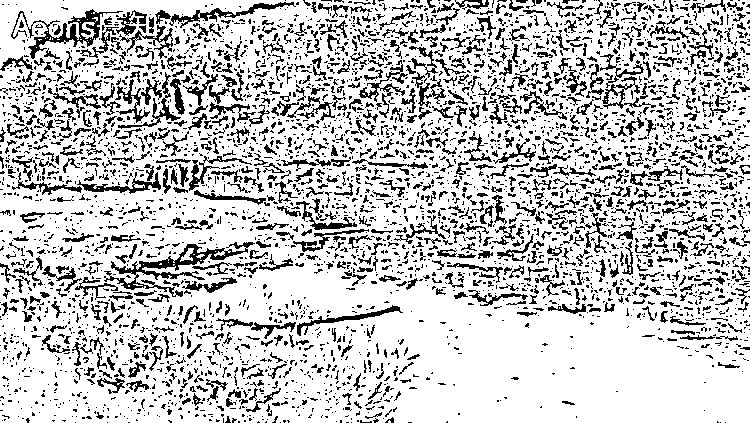

      过了几周，她反馈说她问了儿子需不需要帮助，他终于说了，要。他们一起找了咨询师，这位咨询师正巧也在少年野外拓展训练营做督导。这正完美体现了圆盘九的寓意。咨询数周后，他终于告诉他母亲，他把同学肚子搞大了，还偷了他母亲的钱给她做流产。他很崩溃，觉得都是他的错，也十分耻辱。野外拓展让他在自然中长时间孤身一人，从这些试炼中领悟到了智慧，能够换个角度看待堕胎的选择，原谅自己，获得力量。

      圆盘九是帮助客户儿子找到正确疗法的关键，了解金星处女的深层含义决定了他之后的治疗，对这张牌的其它解读恐怕都不会有这么好的效果。

      你也可以将对应应用到解牌中去，体会下释义角度微妙的不同帮你找到解读方向，使你读牌更加精准。

长按右边这个二维码

关注指引社

让学术嗨起来(｡･∀･)ﾉﾞ

# 译丨跟 Papus 學塔羅《第五课·大牌与小牌的对应》

> 原文：[`mp.weixin.qq.com/s?__biz=MzI5NTQzMDUzMQ==&mid=2247483839&idx=8&sn=dab133970f83162371ba2ada06659942&chksm=ec52f153db257845e6950cb276c6cdb702dfe23ddfcc2e5e1c8e7ed818f7f48e2a5aff9705f5&scene=27#wechat_redirect`](http://mp.weixin.qq.com/s?__biz=MzI5NTQzMDUzMQ==&mid=2247483839&idx=8&sn=dab133970f83162371ba2ada06659942&chksm=ec52f153db257845e6950cb276c6cdb702dfe23ddfcc2e5e1c8e7ed818f7f48e2a5aff9705f5&scene=27#wechat_redirect)

关注指引社，一起让“玄学”成为“学术” 

**【多图预警】关键词：塔罗，卡巴拉，上帝之名，符号学，灵数学。** 

Papus（1865-1916，西语音译“帕普斯”）是金色曙光早期代表人物之一。他继承并发展了艾利法斯·里维（Eliphas Levi）将塔罗卡巴拉化的道路，并用神学辩证法和灵数学重释马赛塔罗的符号，建立了基于赫尔墨斯-卡巴拉的塔罗宇宙论。他的理论对于金色曙光后期的塔罗学者韦特、克劳利等人都有着重要的影响。本系列编译自 Papus 在塔罗方面的代表作《Tarot of Bohemians》。

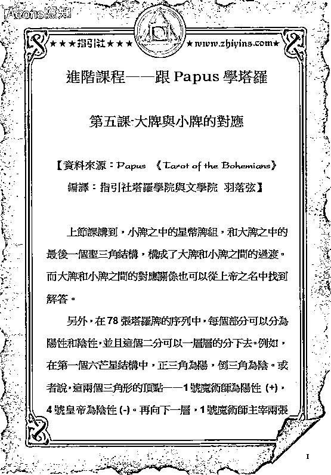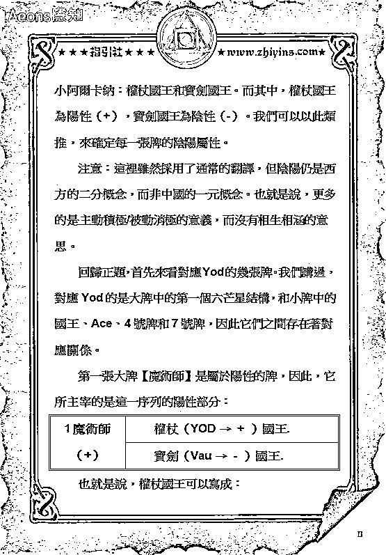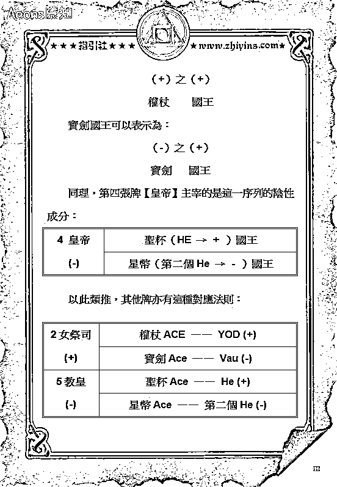 

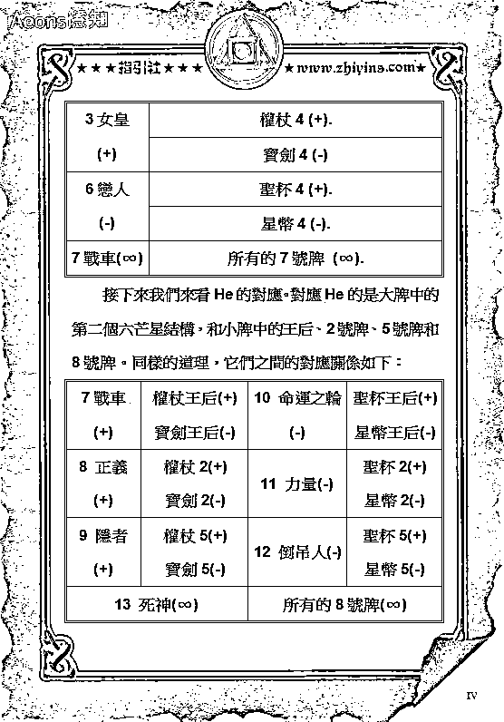 

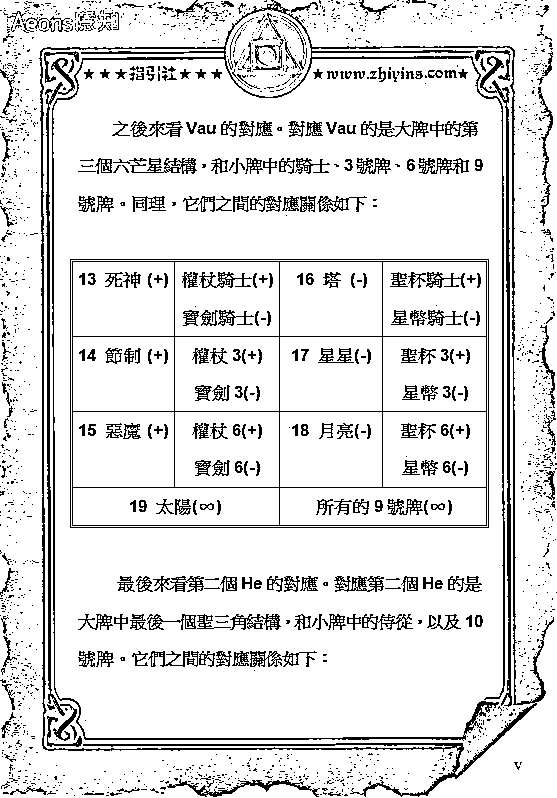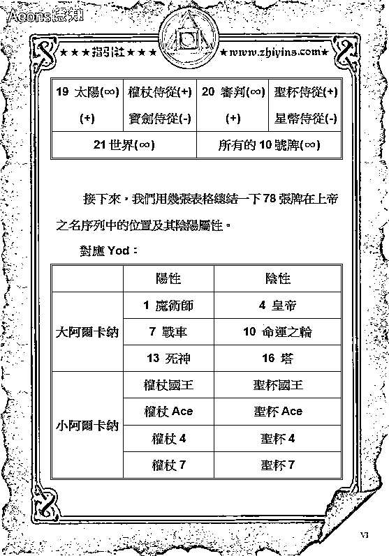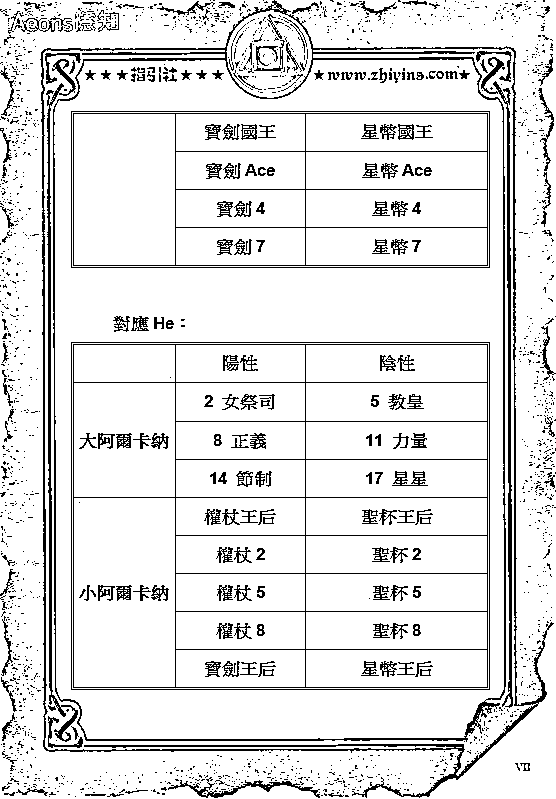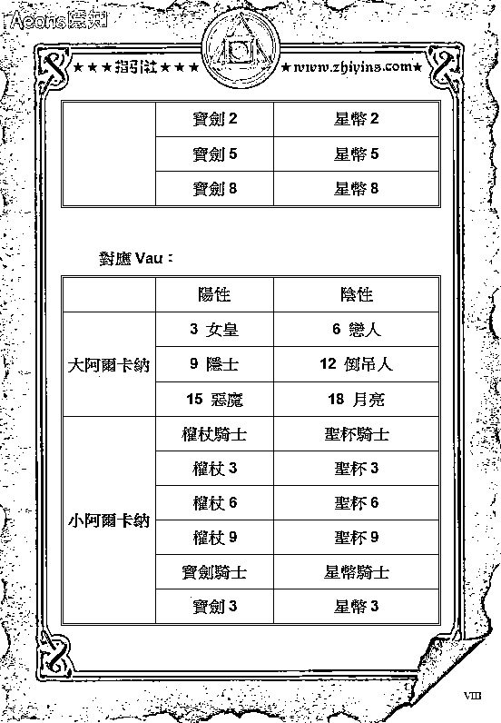 

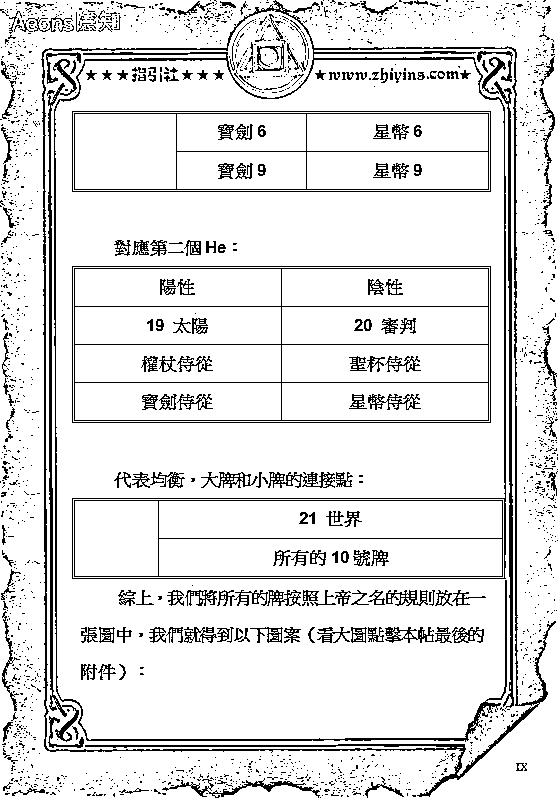 

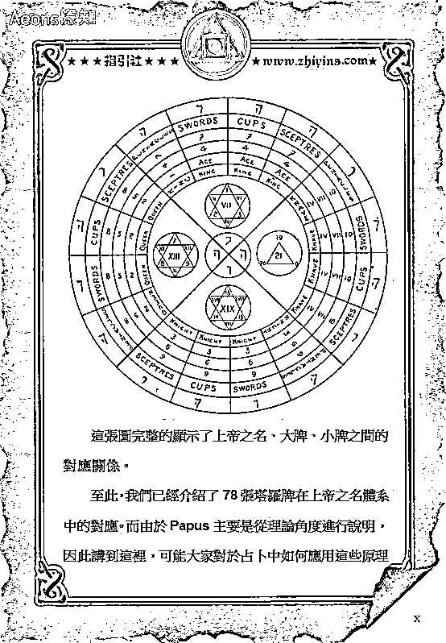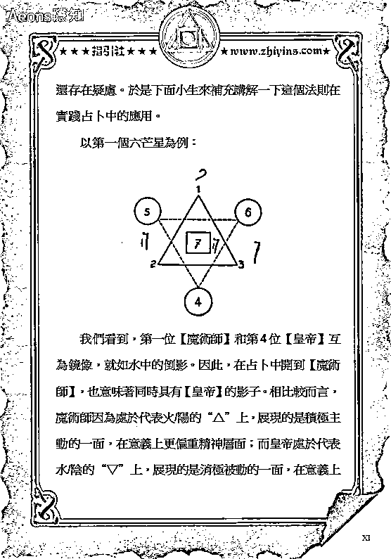 

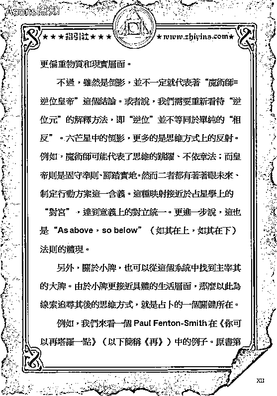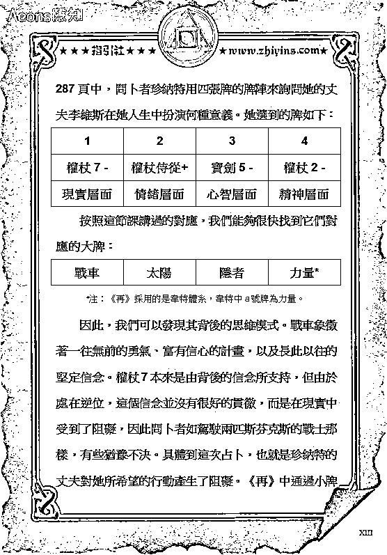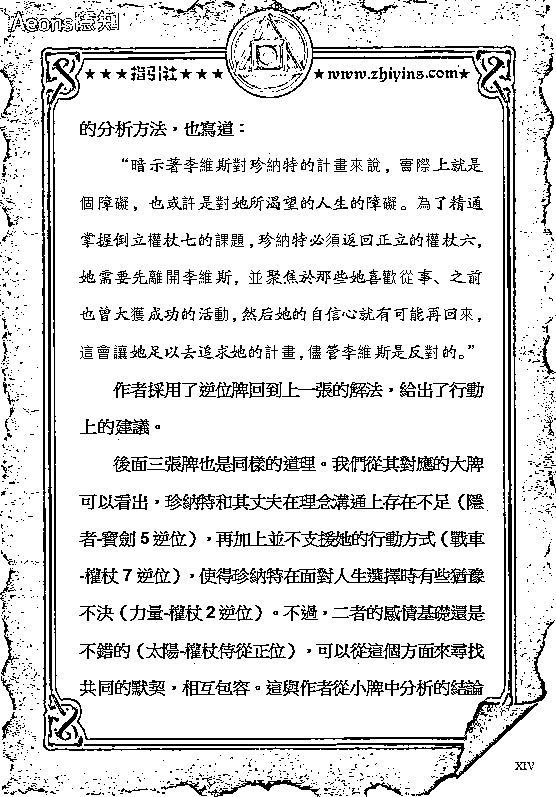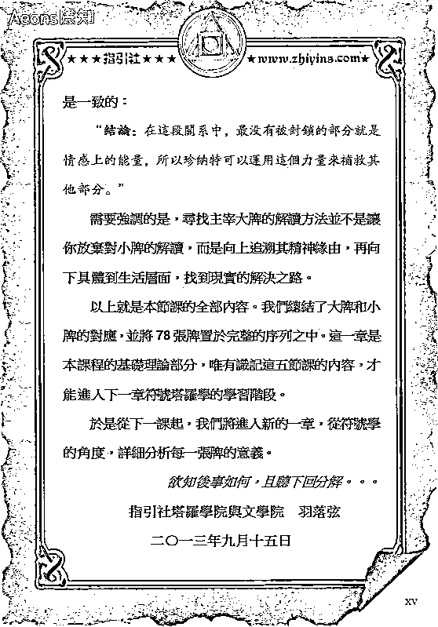 

勘误与说明：

本书翻译开坑较早，学识尚不充分，故采用的是台版通常的译法；但如今看来，有些译名实际上是不准确的。如文中出现的一对范畴【positive - 阳（+），negative - 阴】是西方概念，没有中文里相生相涵的意思。相应的，本文中的 Equilibrium 翻译为“均衡”，符号为无穷（∞），需与【active - 积极&主动，passive - 消极&被动，neuter/median - 中性】相区分。这些术语在今后的翻译中会进行翻新与修正。（不会弃坑哒~！）

长按右边这个二维码

关注指引社

让学术嗨起来(｡･∀･)ﾉﾞ

# 离奇时髦的神秘学防骗指南【转世篇】

> 原文：[`mp.weixin.qq.com/s?__biz=MzI5NTQzMDUzMQ==&mid=2247483829&idx=1&sn=c2a70d63d562f9ab017f0987303aa414&chksm=ec52f159db25784f9c18ac157af592d42de2b650f84d69e38818b8be339a1d17ec6a8fc03727&scene=27#wechat_redirect`](http://mp.weixin.qq.com/s?__biz=MzI5NTQzMDUzMQ==&mid=2247483829&idx=1&sn=c2a70d63d562f9ab017f0987303aa414&chksm=ec52f159db25784f9c18ac157af592d42de2b650f84d69e38818b8be339a1d17ec6a8fc03727&scene=27#wechat_redirect)

**记得点蓝字关注，与好内容相遇**

修行不问前世，因为前世之前还有前世，累世因果不是一生一世能偿还清楚的。

这辈子的事情尚且搞不定的时候，哪还有功夫去管上辈子？

大家好，我是右夜鸣。又到了离奇时髦的防骗指南时间，这一期要讲的是转世篇。

姑且抛开那些中二病和骗子不提。先来看一看，实际上的“转世”究竟是怎样一个概念。

所谓的“转世”是炼守识神，将识神修得不失本性，临终的时候再投生于同类而再世。

简单点来说，就是你把自己的意识思维（识神）练就得很强大，然后识神随缘流转，再从娘胎里出来的时候，能有你临终时的记忆和思维方式。

这种转世究竟算不算再活一世，说实话是很值得争议的。我举一个例子来说，我们现在在一个人还没有死的情况下，再用各种手段创造出一个和他有着同样思维和记忆的人出来（假设做得到的话）。

那么很显然，这两个人并非同一个人。而识神转世无非是做了这种操作。

所以也理所当然地会产生很多尴尬的状况，比如你上辈子是个男的，你也觉得自己是个男的，然后投胎成了妹子，上厕所的时候下意识地想要站着撒尿，每个月掉一次血完全遭不住，身体状况、感受，荷尔蒙分泌都跟“前世”差很多，情绪也变得难以掌控了……结果往往不是精神错乱疯掉，就是被思维方式被身体同化。

嘛，可能这就是变身文为什么会分为变百和变嫁两大派系吧（望天）。

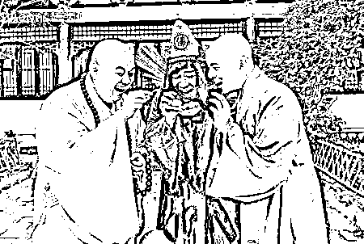

像这样的转世者，再换几次身体之后，识神因为不同身体的影响就很难保持本性，最后不是泯灭就是搞不清自己是谁了，这也就是为什么会有转世修不过三世的说法了。

当然了，这种识神转世手段既然出现了就意味着，或许处于某些特殊状态，特殊情况下的人会需要它。

我不知道究竟是什么样的人，会在哪种状况下需要用它达成何种目的。也不知道他们用了这种方法究竟是解一时之急，还是在饮鸩止渴。

毕竟个人有个人的缘分，也有选择自己道路和未来的权力，只要他有最后自己吞下这些选择造就的结果的觉悟。

除此之外，我对转世本身毫无兴趣，不认为它值得人羡慕或者向往，因为这种转世之术也跟大多数的法术一样，只是某种程度的欺骗和幻象。

人可以用谎言和欺骗去达成目的，但是谎言本身却没有价值。

这种所谓的转世，在某些藏传佛教中极为常见，造就的产物也就是我们常听到的“活佛”和“灵童”了。

首先需要明确一个概念，活佛不是佛。

就像愚人金不是金子。

很多像一个定语+某个名词组成的新词，往往都跟原本的“某个名词”有着本质的区别。

这种词要么是不明缘由的外人为了表达尊敬而给人戴的高帽子，要么就是某些识破其神秘面纱的人对伪物和愚者的嘲弄。

佛代表的是觉者，这个字是人从弗，在古文中会和“拂”字互用，在《说文广义》里有这样的解释：“佛，见不明也，读与“拂”同，义亦相通。见不明，则必相违戾。礼记“献鸟者佛其首”，谓拂戾之也。或读如“弼”，大抵与“拂”互用。浮屠氏译为“觉也”，为其师之尊称，则见性不明而拂人之理，已自暴之矣。汤义仍谓一部语录止一翻字法门，盖见及此。”

而活佛，原意是“转世者”。

“活佛”这个词是不可不扣汉地造词，本身没什么意义的高帽子。用久之后大家忘了本义，只看字面意思，然后就跟佛混淆在一起，觉得活佛是活着的佛，或者佛的转世者。这很可笑，但有时候又让人觉得理所当然。

当然，藏传佛教的转世是受国家法律的约束和保护的，具体的法律条文大家可以自己去百度上搜。

。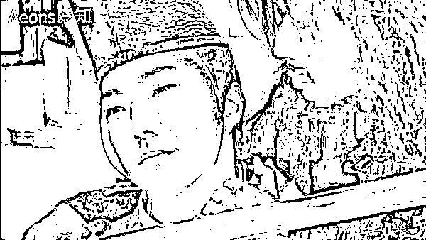

但是在这个利益至上信仰缺失的时代，会有很多人开始借着神、仙、佛的名义出来骗人，或是自欺欺人。

这些人里有很多只是单纯的骗子，但也不乏一些真的能给你露一两手的人出现，比如某些黑户转世者自居为“佛”什么的。

因为点滴修行经验，触及了人的知识盲区，或者意外地捅中了 G 点。普通人很难区别他们的真伪，以至于有人因此一棍子打死，矫枉过正，开始毁佛谤道，指摘神仙。

但这还不是最糟糕的。最糟糕的应当是以一己私念，自昧本心，把一顶又一顶的高帽子塞给别人的人。

比如把转世者称为活佛，这就是一个很好的例子。

他们会把不是修行者的人强名为法师、修士，把不是神佛的人强称为神仙、佛祖，把一些凡俗之人描绘得过于强大非凡。

这种例子不仅存在于神秘学和宗教圈，其实在各种领域都会出现。

比如语言学，一些人会把仅能说句“hello，hi”的人称为“英语牛人”。

在器乐领域，一些人会把能弹两手代码的人说成是“XX 大神”。

把能扯几句量子力学术语的蠢货称为物理学专家，把稍微能打一点的称作“武林高手”。

把一部稍微用心做一点的动画称为“创世神作”。

然后，一部分人甚至会真觉得这些因为他们的无知而捧起来的大神天下无敌，吊打全宇宙。

但是我举双手双脚跟你保证，这种吹捧无论是对你本人，还是对你吹捧的对象都没有任何的好处，顶多是给人招黑，把人捧杀罢了。

除此之外，这种过度吹捧还会造成很多好玩的现象，我们下一期节目（划掉）文章，就会告诉大家看穿这些虚名的方法。

在这个黑暗蒙昧的领域，能够照亮我们前行道路的，其实只剩我们熊熊燃烧的八卦之魂了。

没错，因为这期话题太过阴暗，所以下一期会是【八卦篇】，敬请期待。

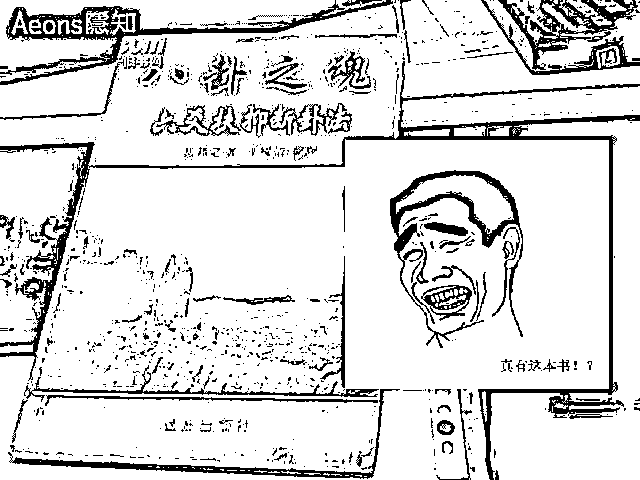

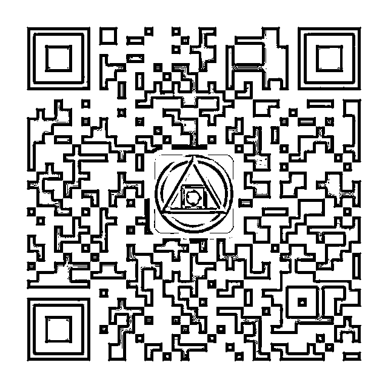

排版｜指引社

文案｜指引社

指引社，致力于让“神秘学”走向大众，不再“神秘”。杜绝神棍，欢迎撩或聊

长按二维码关注我们

点击“阅读原文”，去指引社看原贴

# 芳香植物的两把钥匙（科属篇）⑦

> 原文：[`mp.weixin.qq.com/s?__biz=MzI5NTQzMDUzMQ==&mid=2247483829&idx=2&sn=dc7c487f5dd392f8a9ba86e0fbe052ad&chksm=ec52f159db25784f37350154cd0456ca058f1afcaeef236c45136ce1a8fff4512faeb20d6ba6&scene=27#wechat_redirect`](http://mp.weixin.qq.com/s?__biz=MzI5NTQzMDUzMQ==&mid=2247483829&idx=2&sn=dc7c487f5dd392f8a9ba86e0fbe052ad&chksm=ec52f159db25784f37350154cd0456ca058f1afcaeef236c45136ce1a8fff4512faeb20d6ba6&scene=27#wechat_redirect)

**记得点蓝字关注，与好内容相遇**

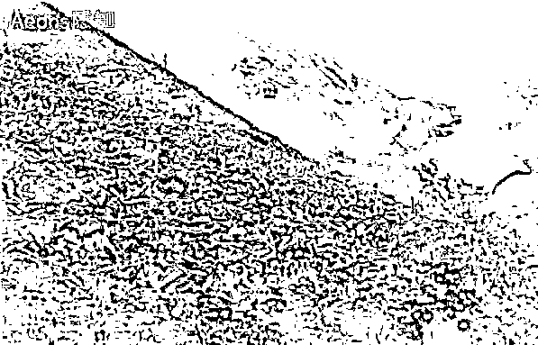

啦啦啦～这周我们继续上周的话题呀，上周说到特别重要的杜鹃花科，大家还记得咩～它的总论我们上次说了，记住两个关键字，一个是耐力，一个是内省，当然里面还有一个净化功能，它是建立在自省之上的。。。

一个一个来说，首先是

芳香白珠 Gaultheria fragrantissima

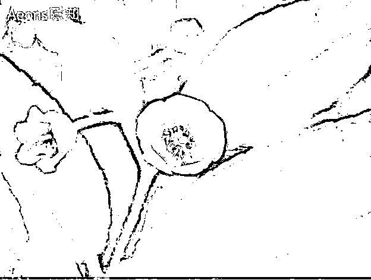

我们俗称它为冬青，相信大家满熟悉的，回去找找父母，爷爷奶奶用的消肿止痛的帖膏喷雾，闻一闻，大多数都有冬青，它的气味辨识度很高。

冬青的精油含有百分之八十的水杨酸甲酯，其能量与基底轮密切相关，最擅长治疗肌肉，关节特别是下肢问题，比如关节炎，风湿痛，急性背痛。它是处理紧急问题的能手，因为其能量强大快去犹如闪电。正是因为这样，导致很多治疗师一遇到这些问题就把它搬出来用，刚开始觉得很好用，但是到了后来效果减弱，甚至到了真正该用的时候反而让人失望。

在这里，就这个问题，我还得多说两句，不管是同行，还是新入门的人，都得把一句“留有余地”放在心上。我们不管是说话做事，还是在治疗的时候都不要把话说的太满，把事做的太全。在刚接触到这个案例的时候，你第一次上手把药用的很猛，治好了是你的功劳，没治好，你再想着还能用啥？你想不到了。我们搬重物，先用七分力，试探一下，心里有个底，那么我下次该用多大力就用多大力了。“满招损，谦受益”就是这个道理。

好了，下面接着说冬青。在魔药配方中，经常代表着阳性力量，男性。虽然我们前面说长期使用会感觉其能量减弱，但是并不代表完全不能长期使用。可以降低剂量，和其它不同成分搭配在一起，通常来说，方子越复杂，成分越多，越不容易产生反应减弱的情况。但是相对的，其作用也越慢热，在这种情况下，若想要提高见效速度就只能加大剂量，或提高浓度，但并不是所有的，加大剂量和提高浓度就能更快起效，因其影响原因复杂，甚至有的如果加大剂量，提高浓度会产生毒性。

冬青低浓度使用可以增强耐力，提高抗压能力，它能让自身能量收放自如，不会过度消耗。

曾经做过一个案例，中年遭受了重大打击。

该案例在半年内经历了丧妻，破产，又膝下无子，父母早已离去，孜然一身。好在还有几个可靠的朋友，不忍看到他封闭自我，甚至想要一死了之，带着他到处看心理医生，经过治疗后情况比较稳定。但是任然心里“不得劲儿”后来找到做辅助治疗的芳疗师，她便把这个案例和我这个“小盆友”分享，让我来开方，她来辅助。

我用的方里主打的就是很经典的一个组合，摩洛哥玫瑰加芳香白珠。这个组合我记得第一次看到是在另一位颇有名气的治疗师的案例资料里，写了洋洋洒洒的好几篇案例论述，我将它很仔细的读了三遍，对其中的“涅槃”二字深有感触。看完后就开始琢磨方子，终于接触到了那么教科书式的案例，能有用武之地。

除了主打是摩洛哥玫瑰，冬青。还用了穗甘松，晚香玉，欧洲赤松，花梨木等，作为辅助，整个流程走下来效果是很不错的，可惜当时我没有留下更完整的资料，也没有负责到底，后来因为种种变故，这个案例还是交还给前辈做后续处理，因此这个心病到了后面还会出现怎样变化，做了哪些处理我也就不得而知。

除了上述功能之外，冬青还能让身体和心灵知觉变强。

特别适合比较木讷的人，比如像不懂得体贴另一半，动不动就“多喝点儿热水”“你怎么又生气了？”那种人也很适合，还包括身体知觉能力差，还自以为自己一直棒棒哒那种。在处理这个问题的时候，和银合欢，黑胡椒，依兰，鸢尾根，波罗尼花等一起使用效果更佳。

冬青也有不少的使用禁忌，①：除非特殊情况，浓度最好不要超过 2%，其效果强烈，0.5%就可以发挥止痛效果，剂量高了也会刺激皮肤（一般来说，如果是想要治疗心理问题，剂量低反而更有效） ②：很多治疗师会认为冬青能减肥，麻烦就此打住，它能提高运动机能，能帮你激发耐力，动力，但你要是用了还是不动，还跑去投诉说减肥无效，那我只能说活该治疗师倒霉。 ③：可能导致出血和呼吸困难，大姨妈拜访时也请停用。④：血友病也要避免使用（可能会导致较难凝血，或者没出血）so 也要避免和抗凝血剂同时使用。

髯花杜鹃 Rhododendron anthopogon

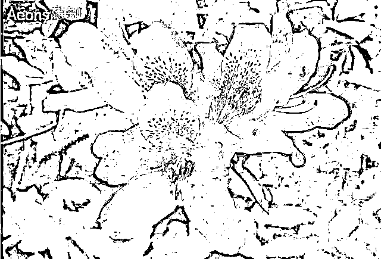

如果说冬青在魔药中代表了阳性力量，那么髯花杜鹃就代表了阴性力量，它是十分经典的柔和力量代表。在修仙方中，我坚持要用髯花杜鹃而不用冬青，就是因为冬青略猛烈，而且有一丝消耗和掠夺的杀伐之气，而髯花杜鹃则如红袖添香般温和滋补。而它们其实都是与耐力相关，但！冬青脾气更加直来直去，适合应急，其力量棱角分明，而髯花杜鹃是属于柔弱的耐力，它能让固结的流动起来，它能把你原有的力量很好的分配运用。不仅能增加身心的耐受力还能增加应变能力。当你需要面对很多事的时候，你就要很快的转换身份，那么髯花杜鹃就是很好的选择。

它适合身心固结，想要找回阴柔能量的人，比如女强人甚至女汉子，一个人生活久了，大概就不需要男人了，什么时候我自己都可以搞定，多个男人就如同增加负担？哪天突然想回归小女人，觉得有点儿无所适从，早就忘了被宠爱的感觉，身心固结的像冰。

还适合饱经风霜的人，使用它同样可以让人心中的死水流动起来，而且还能增强耐力和适应力，在社会上摸爬滚打，觉得精疲力尽，被磨损的严重，这个时候就需要它来帮你修一修，修一修才能更好的出发。（使用髯花杜鹃加柑橘属，再加岩兰草，和榄香脂，金盏花是不错的选择，基础油建议使用圣约翰草或者金盏花浸泡油）

上面说的是蒸馏的髯花杜鹃，还有一个特殊成员是杜鹃花原精，有关它的资料并不多，但据经验总结，它主要针对的是“思念”

不管是思念家乡，独在异乡之人，还是思念离开人世的亲人，或者远在天边的恋人，只要是思念而成的心病，它都能治疗。不过，它同样是作用强大的那种草药油，我个人建议，如果不是特别强烈，难以控制，或者在意之人刚刚离开，急需要摆脱阴影之外，不要轻易使用。

它主要成分是苯基酯，气味更加浓厚，处理上述问题时可以搭配冬青，依兰，土鲁香脂，秘鲁香脂，水仙，摩洛哥茉莉，苏刚达，罗勒，大良高姜。（苯甲酸苄酯，肉桂酸甲酯，水杨酸甲酯）其他的还要啥其它种类要看具体情况选择。

格陵兰喇叭茶

Ledum groenlandicum

貌美植物，长的晶莹剔透，一束一束的。生长在摄氏零下 40 度的酷寒极圈区，还得和圈内其它长的高的植物争夺阳光，必须得有超强的耐力才能存活下来，不仅如此，它还很卑微，老是被其他动物当做点心，还得忍受其它大型动物的践踏，真的是让人觉得心疼的植物。

其成分是单萜烯加三种倍半萜烯，能增加自我知觉的梦里，加上其植物十分有韧性，所以很适合觉得自己活的卑微的人，比如刚毕业觉得无所适从，每天干着莫名其妙甚至跑腿工作的人。又或者在集体中自惭形愧，觉得不被重视的人，又或者遭受过校园暴力，产生心理阴影，甚至是童年造成过暴力对待，被欺压，产生了无法释怀的梦魇的人。（还有那种因为心理阴影而变得性格暴戾的人）

它有排除心理阴影的魔力，很多人说是对应着它净化的能力，的确格陵兰喇叭茶有净化力，能帮助身体层面的排毒，特别是格陵兰喇叭茶纯露，密集饮用二十一天，能有很好的排毒功效，不过相对的可能出现比较剧烈的排毒反应，：嗜睡，起疹子（主要是沿着肝经），头晕，长痘痘等

格陵兰喇叭茶的排除阴影的能力我们更认为是源于激发内省的能力，它更倾向于和内在的小孩和解，选择自己放过自己，自己关爱自己。

别看了，没了

排版｜指引社

文案｜指引社

指引社，致力于让“神秘学”走向大众，不再“神秘”。杜绝神棍，欢迎撩或聊

长按二维码关注我们

点击“阅读原文”，去指引社看原贴

# 从神秘学起家的时尚大牌——Dior，2018 年再次推出塔罗元素系列

> 原文：[`mp.weixin.qq.com/s?__biz=MzI5NTQzMDUzMQ==&mid=2247483829&idx=3&sn=6327dac93e108dc30e52da9807d2007c&chksm=ec52f159db25784f6348e0722c1e10f829d2446c60e9ce4237534c58e78a44ab55a1b80411d3&scene=27#wechat_redirect`](http://mp.weixin.qq.com/s?__biz=MzI5NTQzMDUzMQ==&mid=2247483829&idx=3&sn=6327dac93e108dc30e52da9807d2007c&chksm=ec52f159db25784f6348e0722c1e10f829d2446c60e9ce4237534c58e78a44ab55a1b80411d3&scene=27#wechat_redirect)

**记得点蓝字关注，与好内容相遇**

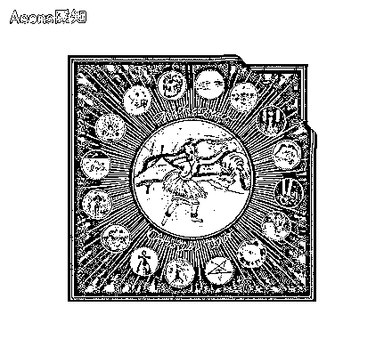 

许多人知道 Dior 这个品牌，都是通过经久不衰的戴妃包和真我香水等经典产品而了解的。但很少有人知道，这个宇宙一线大牌的创始人 Christian Dior，是一位极度痴迷占卜术的“迷信”之人；就连 Dior 这个品牌，也是通过一次塔罗占卜才决定创立的。

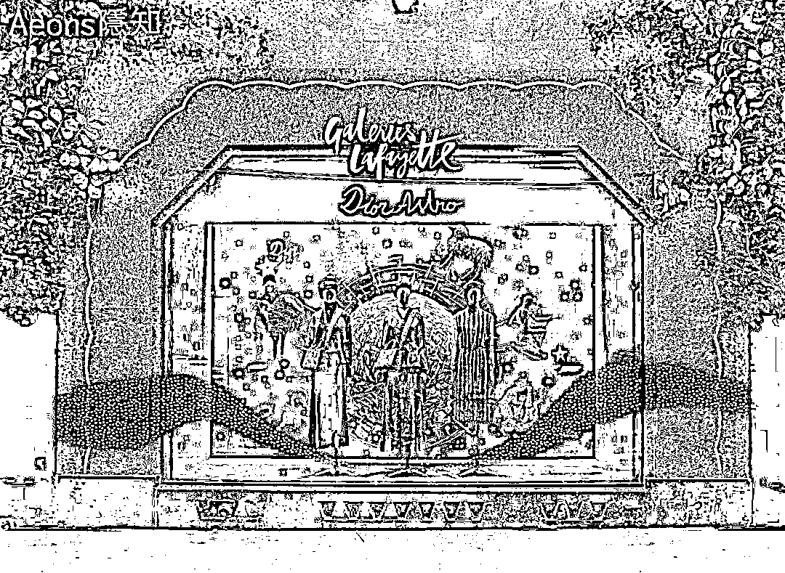

Christian Dior 幼年时曾在格兰维尔的主保瞻礼节上遇到一位女占卜师。她预言：女性将成为 Christian Dior 未来的财富来源，而他会因此而远行。这个预言后来应验了。在他 41 岁的时候，在占卜师 Delahaye 女士的建议和在圣·奥诺雷街拾到的一颗幸运星的推动下，Christian Dior 创立了此后蜚声国际的奢侈品牌：Dior。

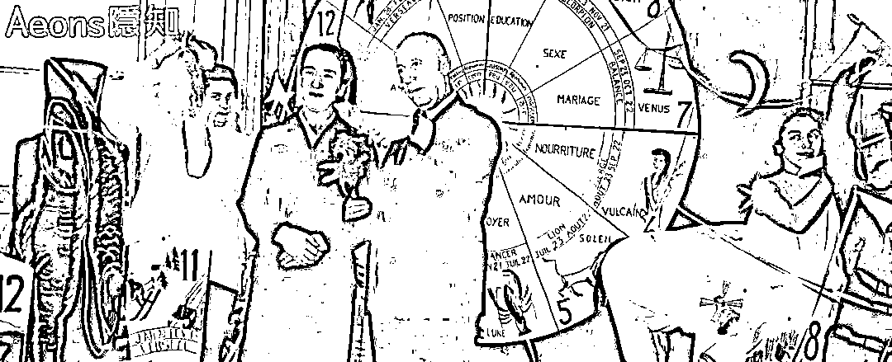

Delahaye 女士是 Christian Dior 重要的朋友和指引者。她曾在 1944 年至 1945 年间持续预言 Christian Dior 的妹妹将平安自集中营归来。事实上，在二战结束时，这位小妹妹奇迹般地自几百万受害者中生还，从 Ravensbrück 集中营返回祖国。

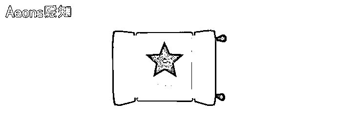

这颗著名的五角星是 Christian Dior 的重要幸运物之一。Christian Dior 亦总是随身携带一些幸运物品，包括一串由星标、桃心以及其他图案组成的吊饰。

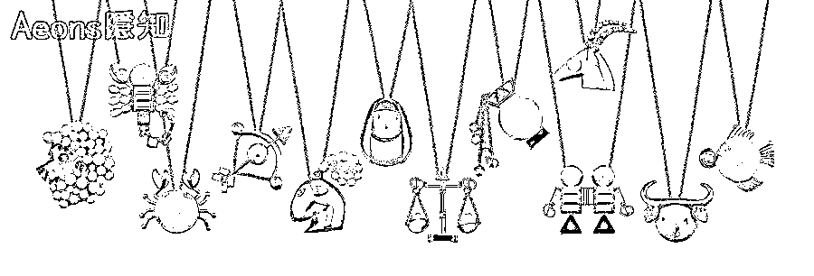

Christian Dior 笃信命运及征象，占星术便是他的爱好之一。

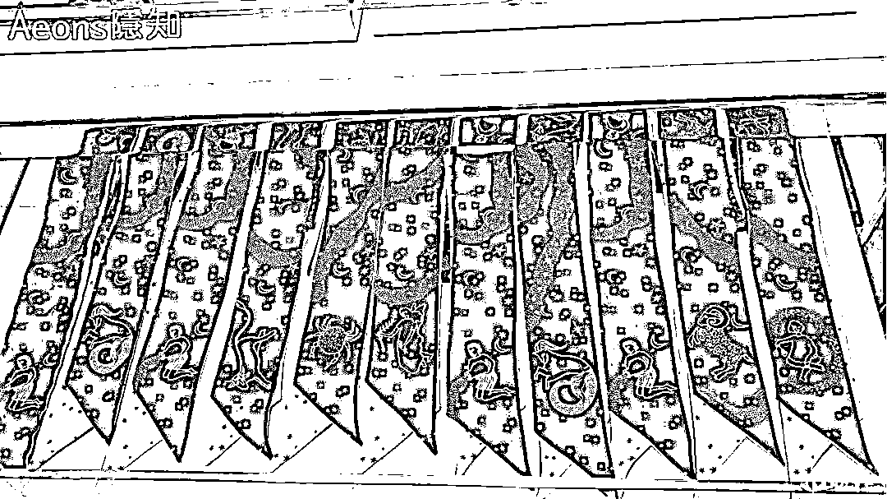 

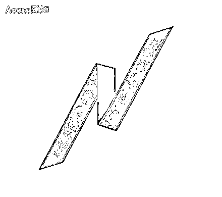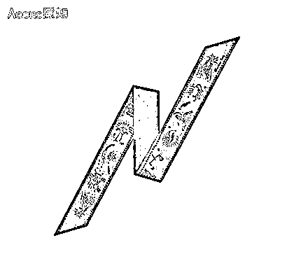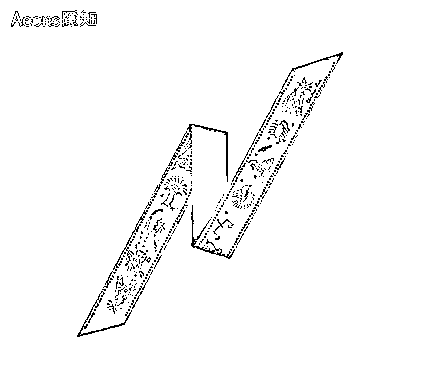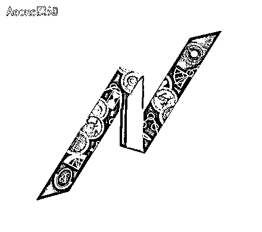 

继近年来 Dior 推出星座系列之后，2018 年春夏又再次推出塔罗系列。 

塔罗系列丝巾，灵感源自 Vicki Noble 和 Karen Vogel 设计的“Motherpeace Tarot”塔罗牌。价格：RMB3000 左右

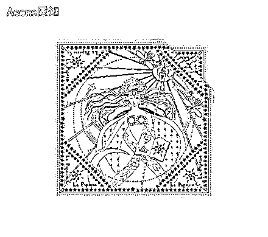

女祭司

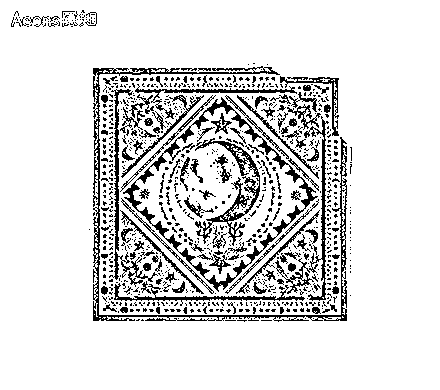

月亮

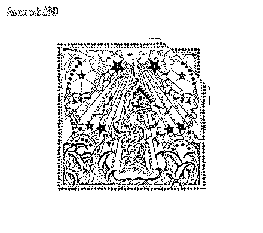

高塔

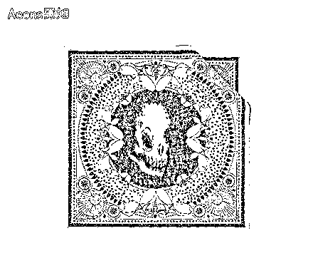

隐士

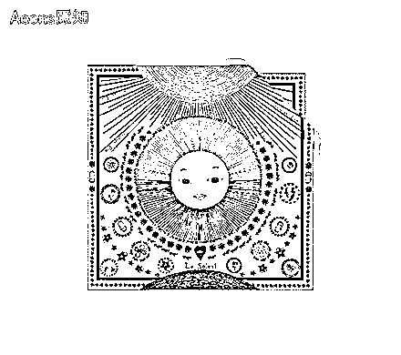

太阳

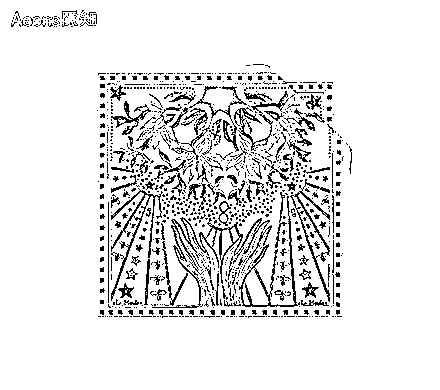

世界

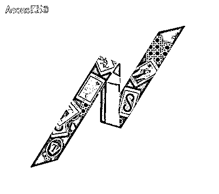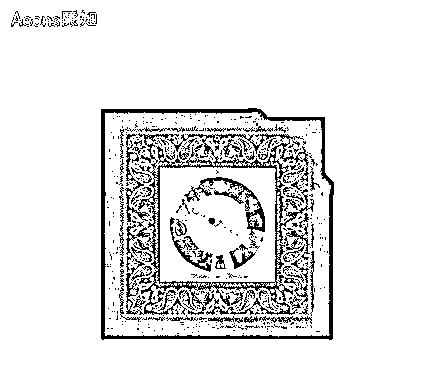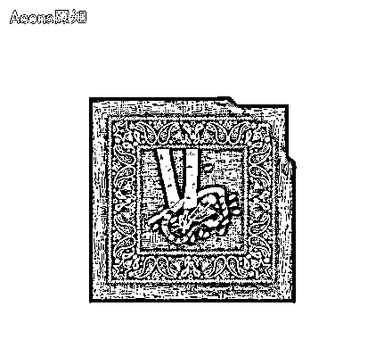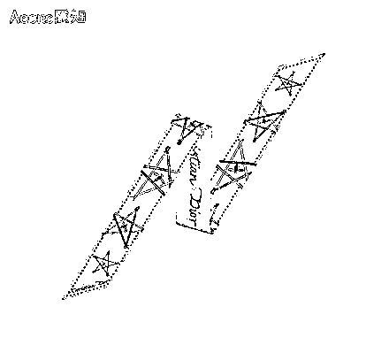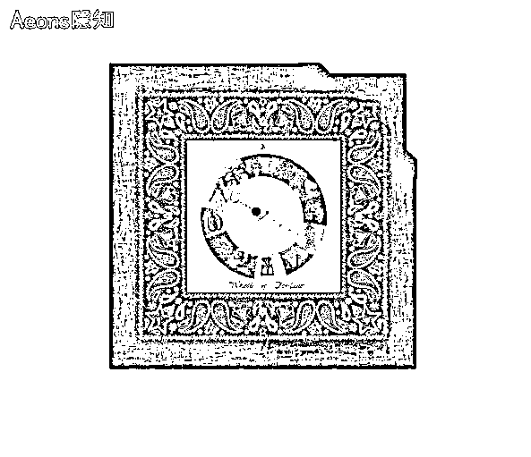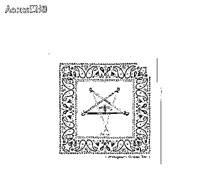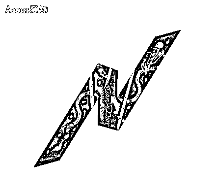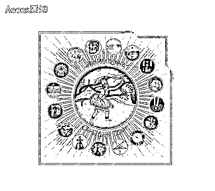  

结合了神秘学元素和时尚的最新款 Dior 丝巾，你喜欢哪一条？

排版｜指引社

文案｜指引社

指引社，致力于让“神秘学”走向大众，不再“神秘”。杜绝神棍，欢迎撩或聊

长按二维码关注我们

点击“阅读原文”，去指引社看原贴

# 芳海寻兰，一双美玉

> 原文：[`mp.weixin.qq.com/s?__biz=MzI5NTQzMDUzMQ==&mid=2247483829&idx=4&sn=71d651a812f6c54f8c05f5e54fa74ff0&chksm=ec52f159db25784fbcec4189f5c6a39e30cc6f97d1cf6a8543bb1dec830839e8437b2ddc75bc&scene=27#wechat_redirect`](http://mp.weixin.qq.com/s?__biz=MzI5NTQzMDUzMQ==&mid=2247483829&idx=4&sn=71d651a812f6c54f8c05f5e54fa74ff0&chksm=ec52f159db25784fbcec4189f5c6a39e30cc6f97d1cf6a8543bb1dec830839e8437b2ddc75bc&scene=27#wechat_redirect)

**记得点蓝字关注，与好内容相遇**

今天来更个番外篇吧，科属篇我都更腻了，还是不定时的介绍些有意思的植物，今天嘛～～就说一对性格迥异的姐妹好了，白玉兰与黄玉兰。

白玉兰：不可亵玩

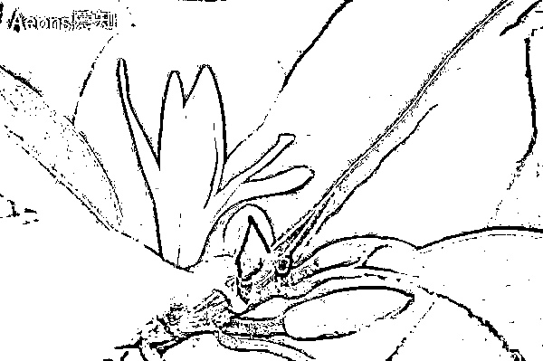

先从妹妹说起吧，白玉兰和黄玉兰是同属不同种的植物，原精的成分是十分相似的，但是白玉兰的吲哚含量少，气味含蓄，属于暗香浮动的类型，植物比黄玉兰更加娇气，不似黄玉兰多子多福。树形高大挺拔，花看起来很娇弱，躲在枝叶后，惹人怜爱，远远的挂在枝头散发芳香。

白玉兰如同一位娇弱又自尊心很强的少女，你可以窥得她的眼泪，惹人怜爱，但当你想要伸出援手，却还是会被推开。她是生长在红尘中的，却颇有才情，又心高气傲，所以长在那高高的树枝上，躲在繁茂的枝叶见。寻寻觅觅能找那洁白娇小的身影，你把它摘下来放在房间里，闻的人头晕，不适，因她只可远观，不可亵玩。

与她保持着距离，你在树下，她在那高高的枝头间，就像在那大雨的清晨间落下芬芳，抚慰着行人冒雨而行的苦恼。那天，那时，在树下邂逅白玉兰，在成长的道路上，拾花而怜，孤芳自赏。

白玉兰，它是孤傲的，也是不愿沾惹红尘淤泥的。远远的闻上去那香味有一丝冷，又有一股禁欲，镇定的气息。

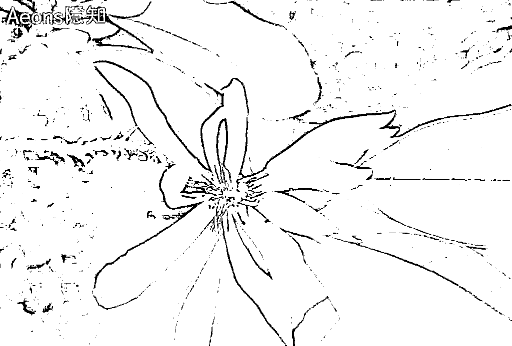

它十分适合洗脱身上的风尘，平定内心的暗流汹涌。有时候我们会迫切的想要得到什么，想要一口气攻上山顶，走上人生巅峰。我们可能太缺乏耐心，身体里的能量躁动着，快要爆炸，急需要发泄出去，可能会情绪失控，可能会选择用运动去发泄，甚至性欲亢进。

白玉兰十分适合这样的人使用，她就具有那样冷静平复的功效，能帮人把能量的波浪安定下来，让人清楚的思考，决定下一步改做什么，也能防止各种冲动，或者有暴力倾向，甚至有自我毁灭的想法的人。

除此之外，她还适合内心不平衡的人。身处于大团体，大公司，或者庞大家族人，总会难免有各种攀比，不平衡的心理状态。这并不代表自己什么小心眼，世界上的君子没有那么多，这样的人渴求得到他人的认同关怀，无奈大千世界，优秀的人太多，可能会出现心理不平衡，迫切的想要提高自己的能力层次。嫉妒，自卑，强烈需要力量的愿望，纠葛在一起，越是挣扎，越是深陷其中。这个时候，白玉兰搭配松科柏科加上广藿香，岩兰草，之类稳定力量强的草药，就是不错的选择。

在很多神秘的方子中，白玉兰也是挽救恋情危机的重要组成，更适合冷战阶段，魔力含义为距离美。常和有关唤醒爱情美好回忆的草药搭配使用，如迷迭香，米契尔胡椒薄荷，再加上消除两性关系中的负面阴影的草药，如香草，安息香，秘鲁香脂。冷战结束后，关系有所缓和时，把白玉兰替换为直接促进二人关系的草药油，选择很多，如，完全依兰，吐鲁香脂，小茴香，一枝黄花，大根老鹤草。等

黄玉兰：不管是荣耀还是痛苦都会过去的

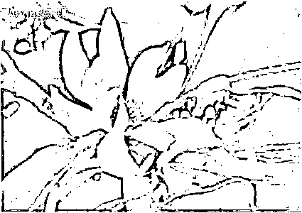

黄玉兰不同于白玉兰的孤洁，她更加亲近人，也是属于比较好移植，愿意开枝散叶的树种，它带着很浓重的母性色彩，但是并非一味的溺爱。她是姐姐，是母亲，是温良贤淑的妻子，也是款款柔情的红颜知己。

黄玉兰经常被用在治疗挫败感上，人生的旅途每个人都不会走的太顺利，总会有磕磕绊绊的时候，阴天大雨的日子里特别需要他人的陪伴。但每个人都有自己的地狱，似乎大家都那么累那么忙，挫败感上更增一分寂寞，仿佛冬天来的那么早，又格外的冷。黄玉兰的确有这样陪伴安抚的功效，它使人放得下，看得开，还能让人从不同的角度看问题，事情好像永远都坏不到哪儿去，总会有解决的方法，温柔之中更增一份洒脱之味。

不像松科的那样眼界高远，她更能让人明白，走出当前的困局，似乎更贴近普通大众，亲民。

不像柏科那样，超脱世俗，立于生死之外，穿透了物质层面，如恒古永恒的时间。她的洒脱，立足于红尘之中，绝不会那样的飘渺，好比说一句“我饿了”，松科说：如果能发明什么东西让人以后不需要靠吃饭就能保持身体健康多好？柏科说：修仙的人不需要吃饭。黄玉兰说：你现在能解决饥饿的方法有很多，比如。。。。。（略）

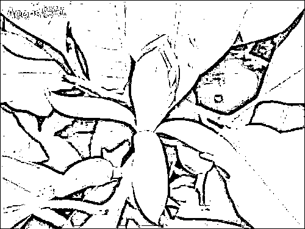

黄玉兰是一种晚熟的花，长到十五岁才会开花，可见每一朵花都积攒了多少能量。晚熟，不代表它迟钝，有人说晚开的话更美，更香，虽然不一定对，但这句话多么温馨，说出来都那么包容和深情。

的确，黄玉兰花期长，生命力又饱满，花香浓郁，它迟来，步伐那么缓和，所以多珍惜自己的生命，要慢慢的释放，常伴左右。

她的能量对应着腹轮和心轮，能让两轮的能量更好的流通，加起来就是由心之爱，从心，灵魂的相融很自然的过度到肉体的交融。

她也与“从前”相关，不管是从前的荣耀，还是从前的失败，阴影，都会过去，它适合总是与从前纠缠不清的人。不管是一段曾经的光辉岁月，执着于其中，无法接纳新事物，还是过去那段刻骨而失败的爱情纠缠心中无法释怀等等，黄玉兰都能叫人以不同的眼光去看待那些种种过去，放下执念，转身拥抱明天。

在神秘的配方中，其寓意真爱圆满，常常用于祝福真正的爱情有美好结局，常与玫瑰，贞节树，合欢，等一起使用

也代表斩断纠缠不清的，有关过去孽缘，寓意重新开始。常与藏茴香，莳萝籽，薄荷尤加利等一起使用

用在婚姻中的求子阶段，寓意又可变化为“枝繁叶茂”常与，大根老鹤草，快乐鼠尾草，西印度月桂，印蒿等搭配使用

没了～挥爪

排版｜指引社

文案｜指引社

指引社，致力于让“神秘学”走向大众，不再“神秘”。杜绝神棍，欢迎撩或聊

长按二维码关注我们

点击“阅读原文”，去指引社看原贴

# 跟 Papus 学塔罗《第四课 · 大阿尔卡纳》

> 原文：[`mp.weixin.qq.com/s?__biz=MzI5NTQzMDUzMQ==&mid=2247483829&idx=5&sn=472a678b06a5b0f8fba53036d01b859b&chksm=ec52f159db25784f75d0ee36023b74fb42c313c7ec82ce9560153a9a7c08232711c2bcc87711&scene=27#wechat_redirect`](http://mp.weixin.qq.com/s?__biz=MzI5NTQzMDUzMQ==&mid=2247483829&idx=5&sn=472a678b06a5b0f8fba53036d01b859b&chksm=ec52f159db25784f75d0ee36023b74fb42c313c7ec82ce9560153a9a7c08232711c2bcc87711&scene=27#wechat_redirect)

**记得点蓝字关注，与好内容相遇**

# 【多图预警】关键词：塔罗，卡巴拉，符号学，灵数学。

Papus（1865-1916，西语音译“帕普斯”）是金色曙光早期代表人物之一。他继承并发展了艾利法斯·里维（Eliphas Levi）将塔罗卡巴拉化的道路，并用神学辩证法和灵数学重释马赛塔罗的符号，建立了基于赫尔墨斯-卡巴拉的塔罗宇宙论。他的理论对于金色曙光后期的塔罗学者韦特、克劳利等人都有着重要的影响。本系列编译自 Papus 在塔罗方面的代表作《Tarot of Bohemians》。

 

# 咳咳，必须说明一点，很多人跟我提过，希望把这一系列摘成文字版的贴出来，但素！这本书图片实在是多得要了亲命了！！QwQ 第三节试了一下，工程量实在太大，有这个功夫我都可以再翻译一课了。。。所以希望和大家的意见折中一下，现有已经制作成稿纸版的就不再改了；今后制作新课的时候我会尽量改成文字版+贴图。望大家体谅~【180°鞠躬】

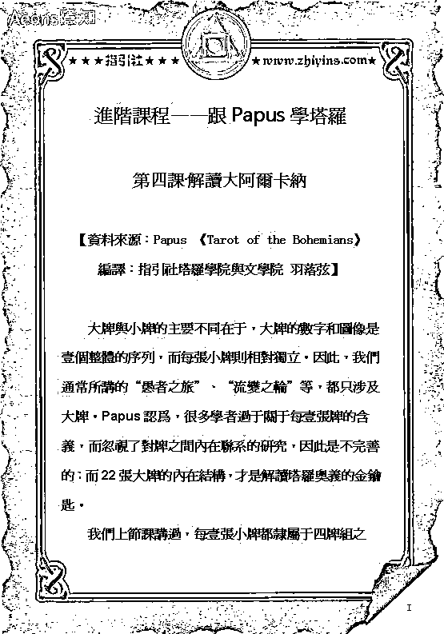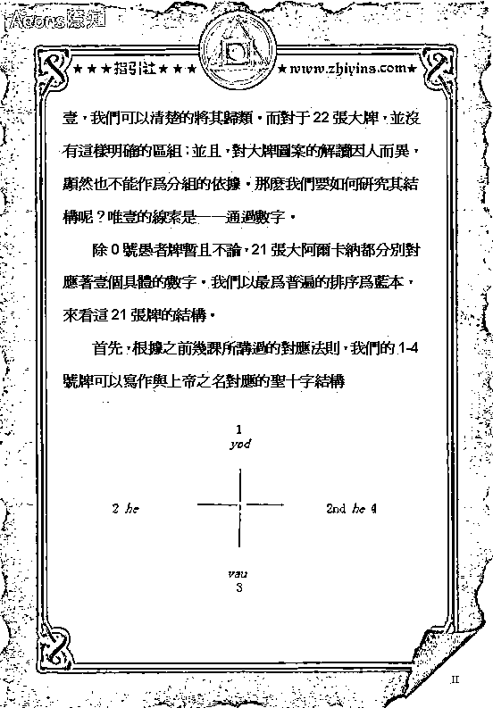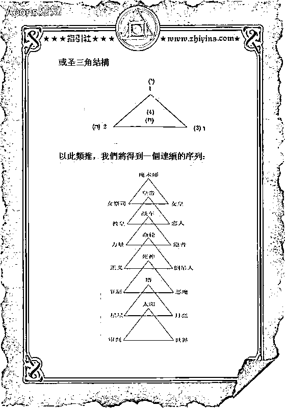 

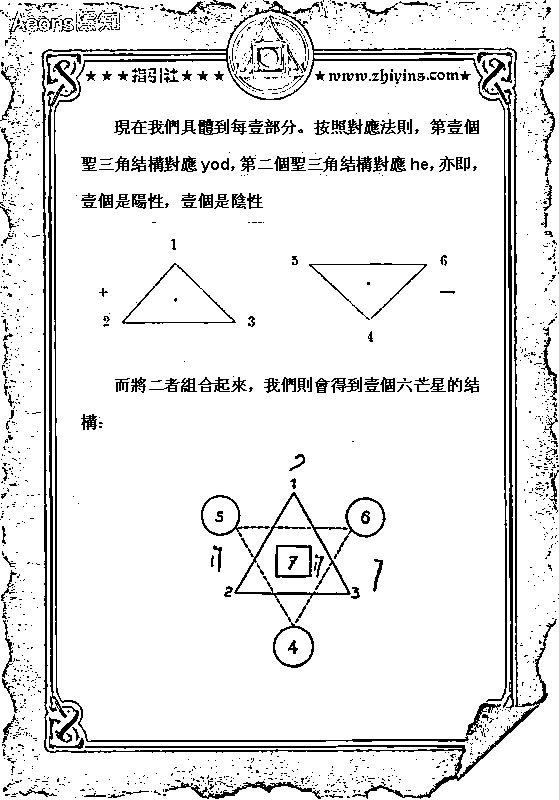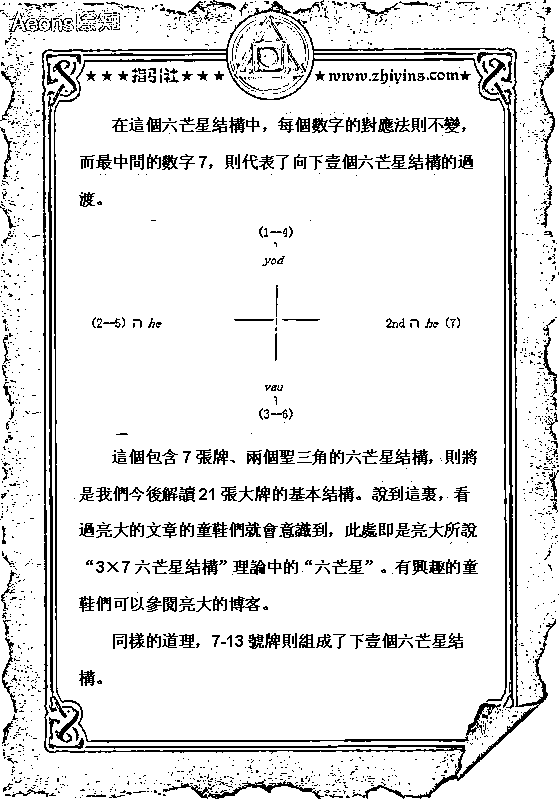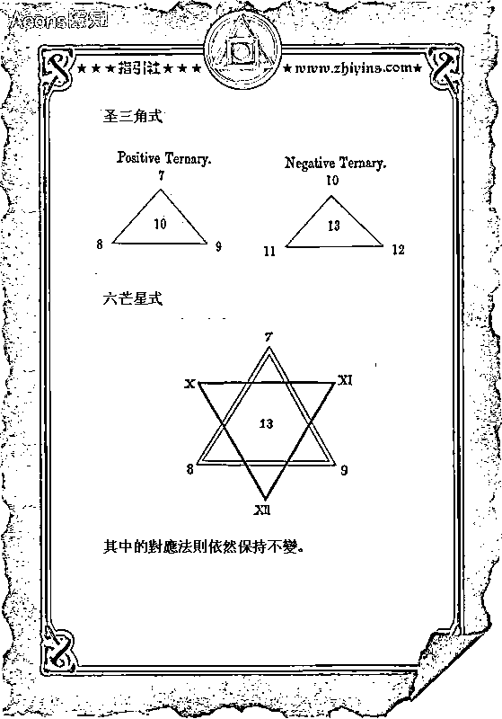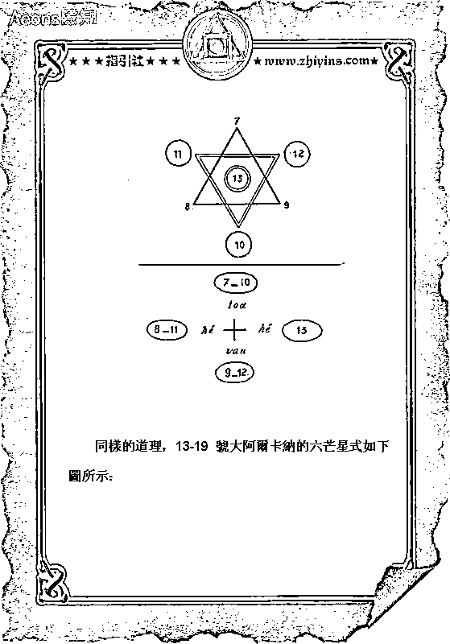 

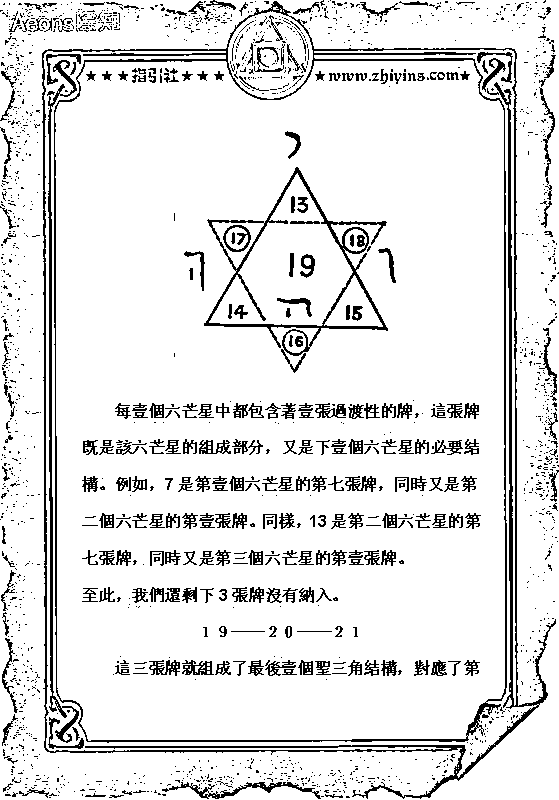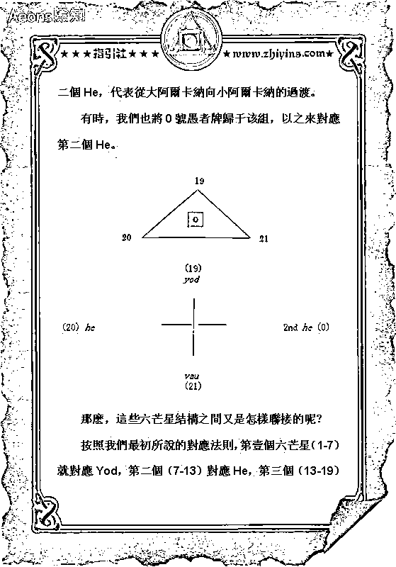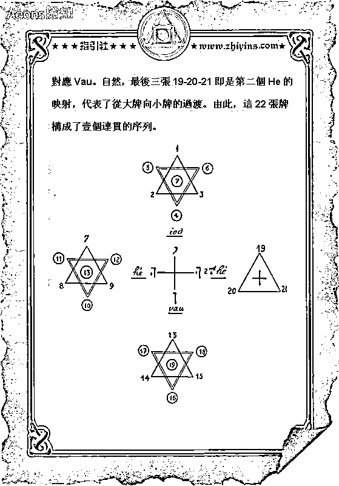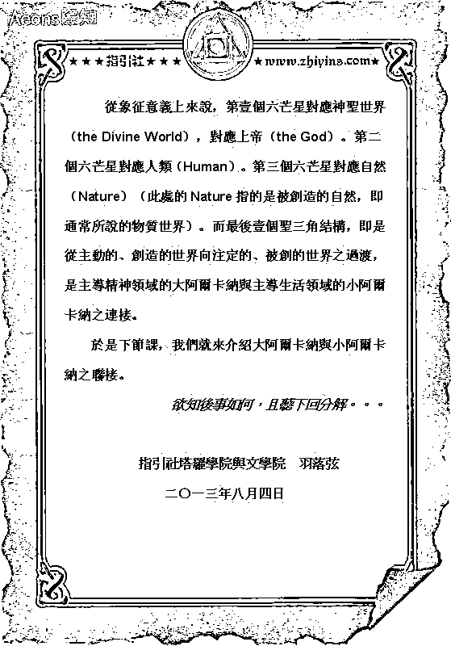 

论坛讨论地址：

[`www.imslr.com/thread-28350-1-1.html`](http://www.imslr.com/thread-28350-1-1.html)

# 芳香植物的两把钥匙（前言）

> 原文：[`mp.weixin.qq.com/s?__biz=MzI5NTQzMDUzMQ==&mid=2247483829&idx=6&sn=059ed11f214792623c56b6fb02c5aad8&chksm=ec52f159db25784fce0c76698be8f67fee084bb0b0aa1adb3572fa2fe7d94ea94d9a8ca53dc1&scene=27#wechat_redirect`](http://mp.weixin.qq.com/s?__biz=MzI5NTQzMDUzMQ==&mid=2247483829&idx=6&sn=059ed11f214792623c56b6fb02c5aad8&chksm=ec52f159db25784fce0c76698be8f67fee084bb0b0aa1adb3572fa2fe7d94ea94d9a8ca53dc1&scene=27#wechat_redirect)

嗨喽～大家好，我是你们可爱哒矿灵版主慎小七，（日常拖字数）前面钥匙系列科属篇更了那么多章节，我却忘了写前言，（就是给新手的话）的确在正式开始学习之前，我应该明确的告诉你们，这这趟学习旅程中，我们应该做些什么，有哪些需要注意的，怎样可以提高我们的学习效率？

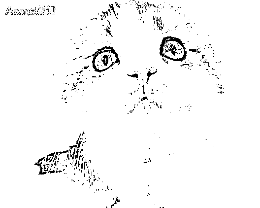

首先问问自己，为什么要学习草药？学了草药后，在生活中我们能得到什么好处，在神秘学领域我们能发挥怎样的作用？？？

也许你并不感兴趣，你看我的帖子只是因为纯粹没得看了，无聊而已（冷漠脸），然后学会了草药后也就是跟我一样在指引社做苦力。。。

No！这都不是我要说的，（日常丧能量）

学习草药，你能切实的帮助你身边的人，也许是帮助他们走出心灵困境，也许是保养身体，辅助治疗一些疾病，在神秘学领域你可以成为大佬们的最佳辅助，不管是做仪式，祈福，修行，占卜，还是其他的，我们都可以给他们打辅助。除此之外，你可以售卖自己的产品，帮助自己的修行，也可以选择授课，或者在这里接着做苦力。。。

你热爱大自然吗？在你静下心来时，可有好好感受过周围的环境多么妙不可言。我们似乎是一个独立的个体，但我们听到的声音，闻到的气味，接触到的人，无时不刻不在与我们产生共振。试着静下来，让自己放空，想象自己是一个透明的容器，那些声音，光线都从我们的体内穿过，在体内游走。当我这样做时，会十分渴望摆脱这个躯体，纯粹以精神体的形式去和世间万物融在一起，我开始思考人与人，人与自然，我们都应该联结在一起。

你已经有这个意识时便会寻找一种方式，体会这美妙的联结，你会不会和我一样选择亲近自然与植物？通过这种治愈力去促进联结？在大自然面前，我永远是那个渴望被治愈的“病人”

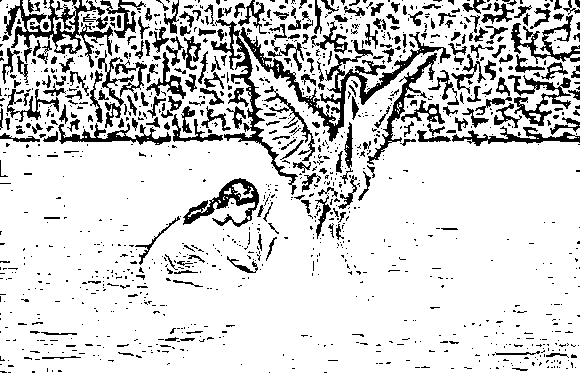

我们学习草药的目标，都不一样，不管你心中的目标是什么，但我要告诉你，学习它有四个阶段

①：充分熟悉草药，并且会搭配就合适的方子

②：与自我联结

③：与他人联结

④：创造“独立空间”

前三个并非是一个绝对进阶式排列，可以有不同的体验顺序，而且都是终身课题，最后一个是最高目标，也是最棒的体验，从而不可能一步登天。

①充分熟悉草药，并且会搭配合适的方子。

每个人都有自己的个性，自己的喜好和厌恶，那么植物也是。我们不仅要掌握它们的作用和禁忌，更要深入的解析植物人格。这样才能将它应用在合适的“心灵疗愈”过程中。也能更好的为其选择组方搭档。

深入了解植物的个性也能帮助自己与大自然对话，只有学着走进世界万物的心灵世界，才会成为一个有灵气的治疗师。

②：与自我联结

我们要深入探索自己，让自己身体和能量像“水”一样流动起来。内外，上下，紧紧相连。在为他人治疗的时候，要让自己“干净”“清澈”，才能有出色的理解力，治愈力。

在治疗的过程中，我们用双手去抚触对方，用双手为对方调制产品，这是一种身体与能量的接触。如果我们自己的情况都是一团糟，那不配说是在帮助别人。同时我们身体的能量也影响着草药油。

一瓶草药油分成几份给不同的人把玩，一段时间后每个人手上的草药油会呈现不同的气味，其能量也发生了改变。我们的能量与它们沟通着，相互影响着。在治疗时又与求助者沟通着，所以在治疗过程时要避免带着负面情绪

③：与他人联结

有人说，人类最美好的优点，就是共情。看到他人遭受苦难，我们会心疼，难过，敏感的人阅读文字时也会流泪。如果想要有出色的疗愈力，就药学会与他人联结，并且产生真正的共情。

去感受他人内心的情感，不管是快乐还是悲伤

你学会感同身受，就明白对方需要什么。快乐时陪他一起欢笑，悲伤时给予一个拥抱。为他配制最适合适合使用的方子。植物也是有独特个性的，开朗如小太阳的甜橙照顾突发情绪但天性开朗乐观的人。更增一份细致的苦橙更能关爱情绪敏感，泪腺发达，内心千折百回的人

有的人不愿与他人联结，打着修行的旗号拒绝过度的情绪体验。

的确，刚开始你会觉得自己仿佛在过度消耗，我们的确要提防这个问题。所以才会有那么多治疗师专用的方子，既促进能量场沟通，又维护自己的能量场防止过度消耗。

其实这个问题不必过度担心，当你体验了许多情绪时，内心便是“百炼成钢”的状态，这个时候再去联结他人，你就能冷静的看待一切问题，并能做出最合适的处理方式。你仿佛学会了“读心”只需要交谈一会儿，你便懂对方的需求。合适的方子也是信手拈来。不过要提醒的是，我们不是配个方子就行了，在治疗前的充分沟通和了解是十分重要的。

首先，沟通能安抚对方的负面情绪，语言的重要和沟通的艺术还请你们自己去体会。但一定不要忘记，共情。

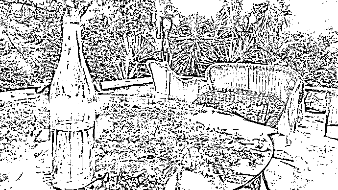

其次，多沟通也能防止误判。不要把自己当成个算命的，一眼洞穿了对方的里里外外，即使你真的很牛逼的做到了，也不要得意洋洋的站在救世主的角度，对你的求助者进行说教，和自以为是的帮助。尊重二字希望你时刻放在心中。

若遇到处理不了的问题，不要死撑，及时转给其它治疗师才是明智的选择。

④创造独立的空间

什么叫独立的空间？在这个空间里你体验到与现实空间不一样的氛围。如：使用针叶油时，你闭上眼睛，感觉自己仿佛深处清晨的林间。用了带有某种熟悉气味的草药油，那段时间仿佛回到了过去的时光。这些体验就是所谓的“独立空间”

但我们不仅是要自己体验到这种逼真的感受，也要让对方也体验到。这一步需要刻苦和频繁的练习。关于治疗师的训练，以后我再详细讲。

这一步不仅考验对草药的熟悉程度，配制水平，联结能力等还有就是治疗师本身的能力。所以是最难的层次。

最后还有一些话想要说

不要吝啬

我知道有些草药油很贵，但是该用的时候就用，其实每次也用不了多少，加上算算你收的费用，有点良心 OK?

不要买和使用假货

我知道草药油是个坑，有时候不小心就买到假货，买回来了不用是不是有点亏？拜托了，假货有什么作用，还会玷污嗅觉好吧？拿来香薰？？No～别这么干，污染环境的，还会让自己不舒服。那么假货能拿来做什么？

多拍点照片拿去投诉厂家，然后忍着心痛扔了吧。

有的治疗师会贪便宜买假货来用，呸！这样的人不配做称为治疗师，见一个打一个，绝不手软，还有那些卖假货的，就是它们败坏了这个圈子里的风气。

不要让你的求助者乱吃

我知道有些圈子里的人，把草药油吹成神药，鼓励大家多吃点儿，这样做的好处恐怕就是，大家吃的快，能多买点儿，甚至连孕妇儿童都不放过。这个问题我也有认真思考，我还是觉得它们的产品是经过稀释了的，不能说假，确实不是假货，但这个浓度乱吃不可能不出问题。因为我遇到过乱吃的求助者，拿到手放在杯子里用力晃，然后喝了，最后晚上胃灼痛。

所以我们应该禁止他们乱吃，而且如果你的水平不到位也不要瞎%*乱开口服方。如果遇到了非要作死乱吃的求助者怎么办？拉黑他

不要以为贵的就是最好的

这句话写给未来的治疗师和所有求助者。

有的时候遇上很壕的求助者，上来就要最贵的方子，说自己不差钱，虽然这种人我希望给我来一打，但是我还是要忍痛强调下，每种草药油都有不可替代的作用。

不要见啥治啥

所有的问题我们都要寻找它的根源，不然你就算治好了当前问题，以后也会变症丛生。当然，如果是当前问题比较严重，也要先缓解当前的痛苦，把一些根源的问题和后续治疗方案清楚明白的告知你的求助者，征求他的意见，决定是否要继续治疗。

不要以为自己多了不起但也不要妄自菲薄

超出治疗范围的问题及时转交给其它治疗师或者寻求其它治疗途径，不要死撑，或者拍着胸脯觉得自己啥都可以做到。但是也不要过分看轻自己，我们都会成为很好的辅助，草药有自己独特的治疗系统，独特的魅力

最后，用一句圈子里流行的话结尾

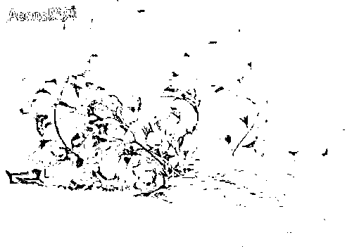

愿你的灵魂清澈而充满芳香

# 快乐鼠尾草：不准不幸福（回春篇）③

> 原文：[`mp.weixin.qq.com/s?__biz=MzI5NTQzMDUzMQ==&mid=2247483829&idx=7&sn=9faee41630b8d2b52fc77ce5260879e1&chksm=ec52f159db25784f04b91d88c40f4974aa283916af349919709c111e8d3ca5c77338e429bdb8&scene=27#wechat_redirect`](http://mp.weixin.qq.com/s?__biz=MzI5NTQzMDUzMQ==&mid=2247483829&idx=7&sn=9faee41630b8d2b52fc77ce5260879e1&chksm=ec52f159db25784f04b91d88c40f4974aa283916af349919709c111e8d3ca5c77338e429bdb8&scene=27#wechat_redirect)

今天我们来认识一个我三倍喜爱的植物，我一直认为它能给人带来幸福，因此把它列入回春篇。

说起鼠尾草，神秘学爱好者并不陌生，也有称作白鼠尾草的，气味芳香利脑，燃烧它，可以有很好的净化作用。不过要区别一下的是，我们今天要介绍的是快乐鼠尾草，而不是大家熟悉的鼠尾草（Salvia officinalis）。鼠尾草的代表成分是单萜酮，快乐鼠尾草则是以酯类为主。而且传统芳疗认为其具有一定程度的神经毒性，所以传统的英系芳疗禁用。而快乐鼠尾草在他们眼里则是得天独厚的植物。

通常人们认为，快乐鼠尾草对女性十分有益，比其鼠尾草治疗妇科问题的作用，它也同样能做到，并且不具备毒性。

在德国，人们把快乐鼠尾草称作“麝香鼠尾草”，以前的一些不法商人将快乐鼠尾草放入酒中，拿去卖给酒鬼，冒充高级的麝香葡萄酒。在我学习芳疗的时候，老师曾再三警告，如果有使用快乐鼠尾草则不能饮酒，大概是前后四个小时。因为酒加上快乐鼠尾草就会产生严重的醉酒反应。有可能会引发梦魇，第二天也会让人十分难受。

它还有一个十分美丽的名字，叫做清澈之眼（Clear eye）来源于，以前的欧洲人，把它的种子收集浸泡后，用汁液来治疗眼睛的一些小毛病。

我十分钟爱使用快乐鼠尾草，尤其是情绪低落的夜晚，睡前，滴上一滴在卫生纸上，放在枕头边，能给人带来绚丽多彩的梦境，有时候我甚至会笑醒。不过不用担心，不到十秒就又睡着了，因为它也具有安抚作用，所以不用害怕兴奋到睡不着觉。

若是心中有纠葛缠绕，而导致情绪低落，心烦意乱的睡不着时，单独试用似乎效果就不那么出众，我们用快乐鼠尾草搭配罗马洋甘菊，穗甘松，岩兰草等合并使用。

废话不多说，让我们一起来了解幸福的秘密

快乐鼠尾草：Salvia sclarea

它的主要产地是在，法国和俄罗斯，，蒸馏时使用全株药草。很明显，快乐鼠尾草是唇形科植物，还记得我们讲到唇形科时主要说了什么吗？唇形科的繁殖特色在快乐鼠尾草身上是十分贴切的，它对应着腹轮，而且十分擅长处理两性关系问题。它灵活，适应力强，而且是“十分有计划的植物”所以也适合精打细算感觉有生存压力的人。

关于快乐鼠尾草，一直有一个谣言，说它是女性植物，也就是说亲和女性，女性专用。其实并不是这么回事，它对女性机能有十分好的平衡作用，但对于某些男性，比如活的比较“西装革履”的男性也同样适合，特别是在处理一些两性关系的时候。比如冷战期，倦怠期，被生活压力所迫，没有兴趣“偷闲”，一天到晚为了经济问题，外在压力而争吵的。

快乐鼠尾草其实和薰衣草一样作用全面而多元，唇形科的一把手是薰衣草，那么二把手迷迭香，三弟快乐鼠尾草。

它能够抗痉挛，能够治疗哮喘（可并用薰衣草，马郁兰，乳香，丝柏等），经期小腹急痛，肌肉的酸痛，爱抽筋的人也可以日常使用它保养。能够调经，调理内分泌。日常的女性保养。还能很好的放松人体。

需要注意的是，乳腺癌患者和癌症病人禁止使用。

快乐鼠尾草的代表成分是罕见的双醇（快乐鼠尾草醇），这个成分的多少也左右了它的品质，所以在选购时一定要睁大眼睛看化学报告哦。快乐鼠尾草醇能让人有一种深层次放松的感觉，并且能产生一点迷醉感，因为是罕见的大分子，其作用直达下二轮。（相比下，轻清的分子会更加往上走）加上其中的含硫化合物，其气味有一种接近生物本能的感觉。会产生身体层面或者生理层面的梦境，当然也和其中的酯类（乙酸沉香酯）有关。乙酸沉香酯有十分出众的安抚能力，所有不用担心睡不着。也是薰衣草甜美气味的来源，但是快乐鼠尾草的气味和薰衣草不一样，有人说是有坚果味加药草味，我个人觉得是丝袜奶茶味的。

快乐鼠尾草适合艺术工作者，更年期，文艺青年，中二病，脑力劳动者，键盘侠，僵硬中老年人，过度理性思考，西装革履的现代人。

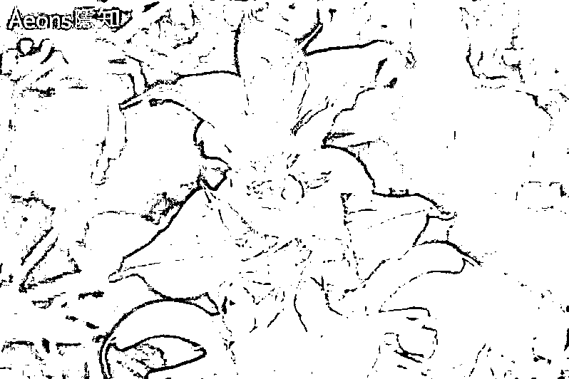

它能够激发灵感与头脑中的想法，并能帮助抓稳一闪而过的灵感，所以适合文艺青年，艺术工作者。

除此之外，很多这些脑力劳动者又容易出现燥郁的倾向，快乐鼠尾草同样可以调理这方面问题。

中二病和脑力劳动者都容易有头大身小的感觉，同时也会有体质虚弱的问题，然后一部分发展成中二，常常脑洞大开，又信以为真，身子是轻飘飘的，不能稳定在地面，这是比较负面的发展，或者少部分脑力劳动者也有中二的情况。而快乐鼠尾草是统一身心的重要用油之一，力量还是来源于罕见的大分子和含硫化合物的生物本能。

然后还有一些飘飘的人变成了键盘侠，网上大侠，现实的老鼠，身心矛盾着，又无法回归原始的身体存在快乐鼠尾草同时也能处理这种问题。

其具有特殊的回春功效，主要是针对着激活和填充干枯的心轮和调节腹轮而言，能力最佳的表现还是在倦怠期的二人关系上，所以在应对更年期的问题上，也有如此奇特的表现。

什么叫做僵硬的中老年，说到处理这个问题上，也涉及到快乐鼠尾草的回春。人年纪大了后，就不容易接受新的事物。对于很多缺乏幸福感的现代中老年，大概是要操心的事儿太多，不是每个人说放下就放下。所以也会导致心轮能量快速消耗和封闭，幸福感也会随之降低，幸福感的缺乏又同时引发心灵黑白症，就是看到的世界那么灰暗现实，内心也有根紧绷的弦。这样的人才是真的老了，这个时候就需要快乐鼠尾草并用零陵香豆（香草），大西洋雪松（永久花）玫瑰，等让固结的身心流动起来，重新注入青春的力量。

过度理性思考的现代人，通常是西装革履的，缺乏身体感知，我听说问题严重的时候，“zuo 爱”还得安排下时间，提前准备个啥，拒绝突如其来的兴趣，还会觉得对方唐突，没考虑安排。使用快乐鼠尾草能帮助找回身体感知，可以合用咖喱叶，晚香玉，口红水仙等。这里特别推荐晚香玉，能给大脑偷得半日闲。

在神经疲劳或者感到不安，思维也变得十分混乱时，或者情绪严重低落了，把快乐鼠尾草滴在浴缸里，用它泡澡也是不错的选择，虽然它是很温和了，不过还是建议稀释一下，可以使用全脂牛奶，那样味道会很好。

快乐鼠尾草虽然有出色的放松能力，但不会让感官变得迟钝，而会让感官变得更加敏锐。这力量来源于它让身心合一的能力。这一点上延伸一下还能增加直觉，不过这个知觉主要是来自基底轮的生物本能知觉。能增加灵感，这个主要来自于喜悦幸福与放松迷醉的感受。

如果你想要的是来自高位置的直觉，有关于自然联结，灵性体验，可以改用鼠尾草。如果你渴望绚烂而新奇的，超脱凡尘的灵感，甚至与神灵有关的灵感，可以并用艾草。

好啦～没啦～挥爪

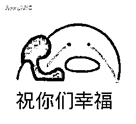

# 跟 Papus 學塔羅《第六节·塔罗符号学预备 》

> 原文：[`mp.weixin.qq.com/s?__biz=MzI5NTQzMDUzMQ==&mid=2247483829&idx=8&sn=b1f0790930bf3fbf3b05422acd1a8d61&chksm=ec52f159db25784ff2594cc77946f2ef15fb44d240b301df690f7f800bb064c402c758675d37&scene=27#wechat_redirect`](http://mp.weixin.qq.com/s?__biz=MzI5NTQzMDUzMQ==&mid=2247483829&idx=8&sn=b1f0790930bf3fbf3b05422acd1a8d61&chksm=ec52f159db25784ff2594cc77946f2ef15fb44d240b301df690f7f800bb064c402c758675d37&scene=27#wechat_redirect)

# 【多图预警】关键词：塔罗，卡巴拉，上帝之名，符号学，灵数学。 

Papus（1865-1916，西语音译“帕普斯”）是金色曙光早期代表人物之一。他继承并发展了艾利法斯·里维（Eliphas Levi）将塔罗卡巴拉化的道路，并用神学辩证法和灵数学重释马赛塔罗的符号，建立了基于赫尔墨斯-卡巴拉的塔罗宇宙论。他的理论对于金色曙光后期的塔罗学者韦特、克劳利等人都有着重要的影响。本系列编译自 Papus 在塔罗方面的代表作《Tarot of Bohemians》。

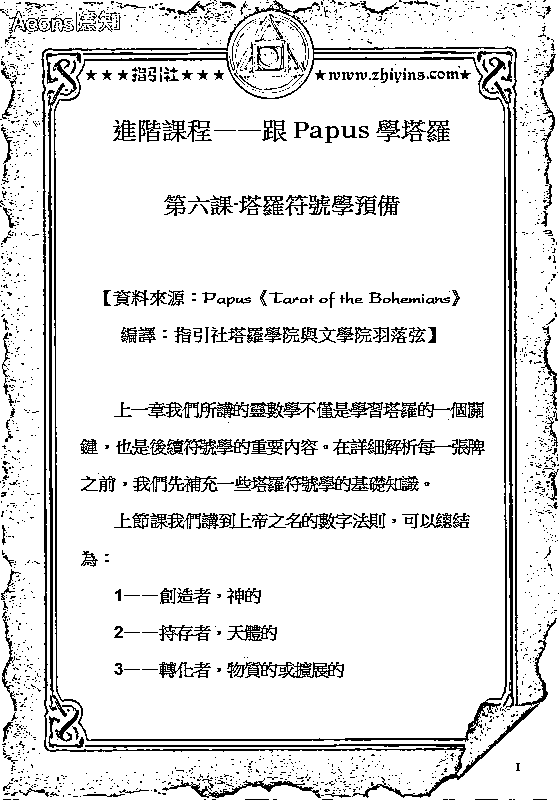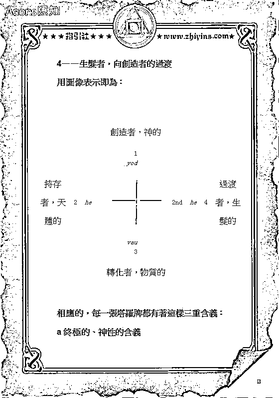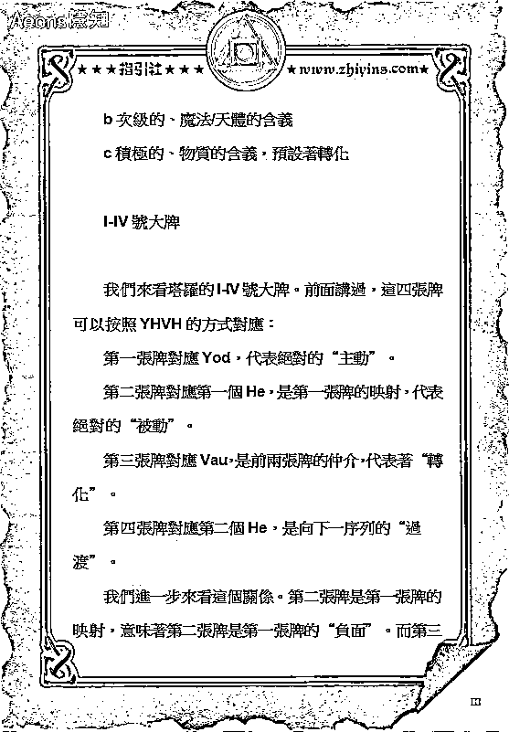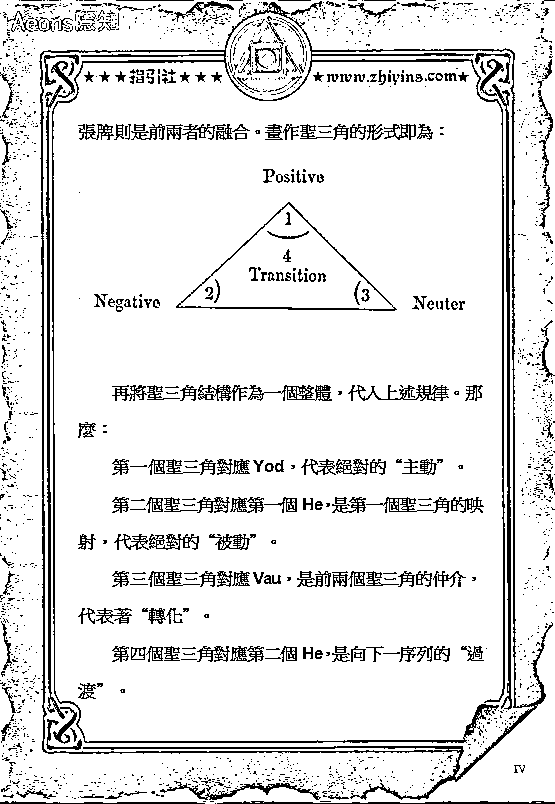

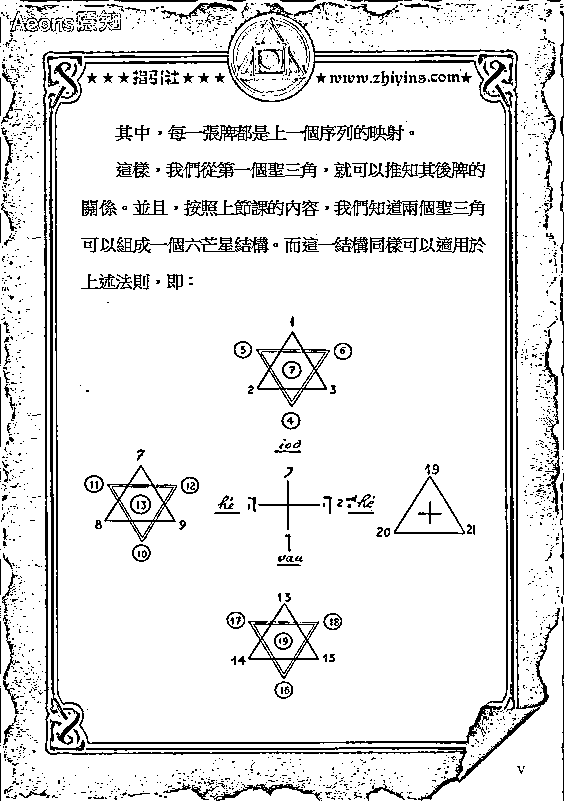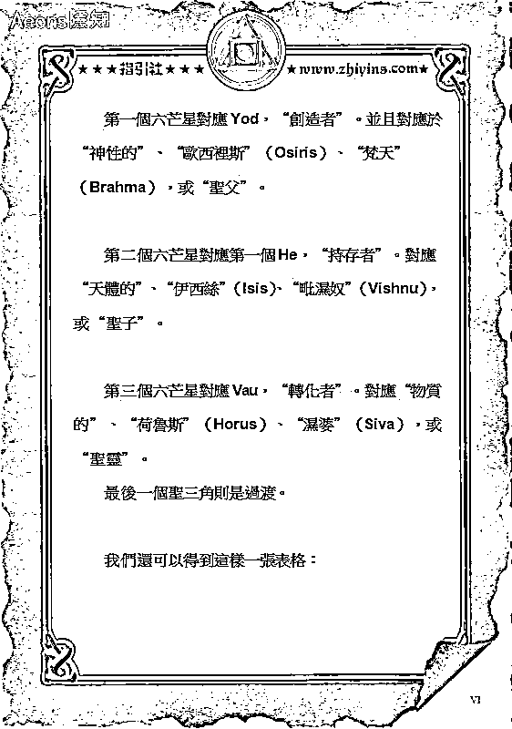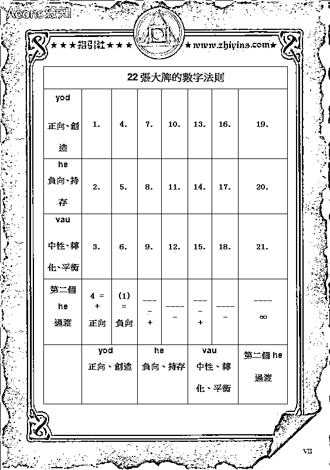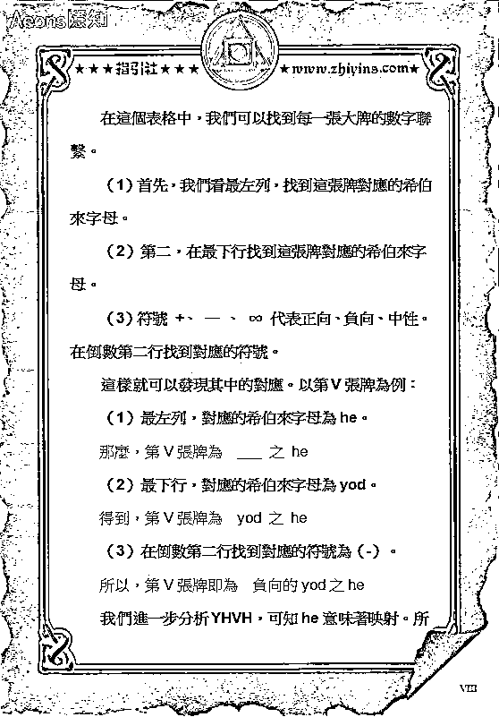

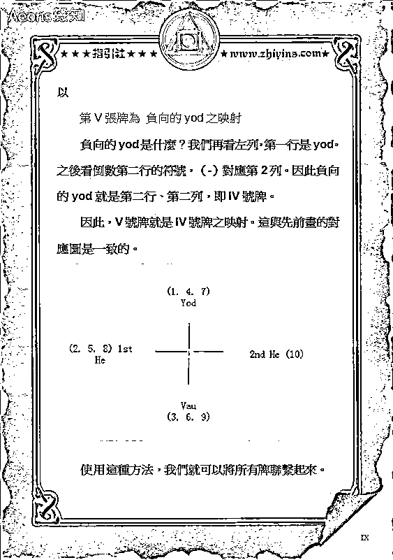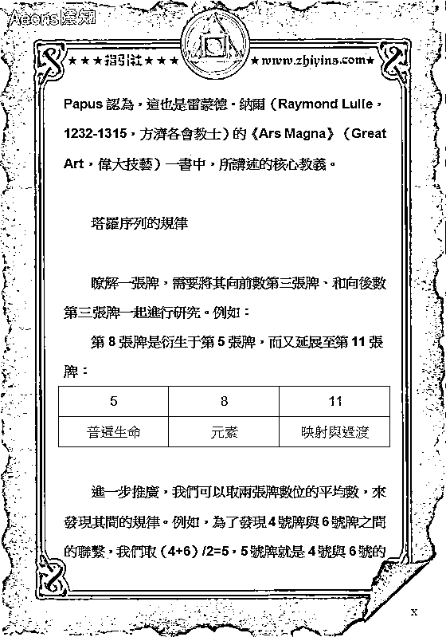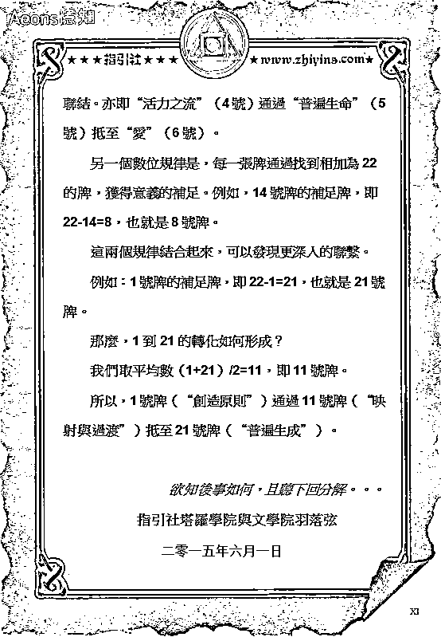

声明: 该文章版权归指引社和作者所有, 转载请保留此行([`www.geaving.com/article/view/id/155`](http://www.geaving.com/article/view/id/155))

# 塔罗防骗指北

> 原文：[`mp.weixin.qq.com/s?__biz=MzI5NTQzMDUzMQ==&mid=2247483811&idx=1&sn=39ee2e0c3bcc8d193524ce09430df4de&chksm=ec52f14fdb257859f5a1eb590ab7994a618cd7b30d6c2af2b3bea1f5a737dbaf691c7b766e1b&scene=27#wechat_redirect`](http://mp.weixin.qq.com/s?__biz=MzI5NTQzMDUzMQ==&mid=2247483811&idx=1&sn=39ee2e0c3bcc8d193524ce09430df4de&chksm=ec52f14fdb257859f5a1eb590ab7994a618cd7b30d6c2af2b3bea1f5a737dbaf691c7b766e1b&scene=27#wechat_redirect)

**记得点蓝字关注，与好内容相遇**

  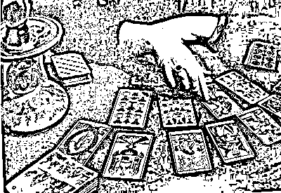       

影视作品为了增加神秘惊悚氛围，或给故事营造出宿命感，经常会安排一个谜之巫婆，褪色泛黄磨损的纸牌，戴满戒指骨节嶙峋的手，颤抖着缓缓翻过牌，果不其然，是一张“死亡”！问卜者愕然，恼羞成怒拂袖而去。然，第二天清晨在小水沟发现了他的尸体……

这样的桥段层出不穷，对于搞塔罗的人来说，可看的也就只有这个巫婆用的是哪套牌，解的对不对（当然不对，又不是塔罗电影），这个场景构图和色调怎么样，截几张图，以后拍照做参考……

然俄，很多人从影视或文学作品（包括二次元）入了塔罗的坑，难免被编剧们的想象力感染，衍生出很多浪漫（不切实际）的幻想，并进一步添油加醋造出一套套理论……比如“牌灵”神马的……想象力丰富，用来设计美美的或是萌萌的牌面是很好的，但无视历史事实、思想背景瞎编乱造就很恼人了。就算是国外，也有不少中二成分满满的书，以及课程……于是鄙人整理了 AT 站 (Aeclectic Tarot) 的 30 层高楼贴

http://www.tarotforum.net/showthread.php?t=85841

把各地盛行的关于塔罗的迷信整理出来，以后见到了记得绕着走，或者去调戏这么说的人～

如果，你想学会塔罗占卜，或想从塔罗着手深入了解西方神秘学文化知识，以下这些说法，无论说的人有多酷炫，有多少副牌，跟多少个大师学习过，去过多少个国家，开的课学费有多贵，写了多少书，

**都不要信好吗，**

**不要信好吗，**

**好吗？**

**忽悠大仙们**

**常用：**神奇、禁忌、养牌……

**故弄玄虚步骤：**

       －牌得是别人（巫师、吉普赛人什么的）赠予你的，买的不好

      －不要入别人用过的二手牌，二手牌上残余的前任能量会严重影响你的操作

      －不能让别人碰你的牌

      －要进行仪式，与纸牌建立起羁绊

      －要用特定的洗牌仪式才能让它“发挥奇效”

      －牌必须要用某种特定颜色的绸缎包裹起来／放在木盒里

      －必须要把牌放在枕头下面，晚上在睡梦中与牌沟通交流

      －解牌只能在周日

      －不能给自己解牌，会死

      －给自己解牌只能在周日

      －抽到死亡牌就会死

      －塔罗起源在埃及

      －塔罗是吉普赛人发明的，只有吉普赛人才算得准

      －牌灵，牌灵会显灵

      －塔罗师和撒旦／魔鬼的勾当，搞塔罗会把灵魂出卖给魔鬼

      －只有异教徒／巫师才玩塔罗，塔罗是魔鬼的画儿书，基督徒不能搞塔罗。

      －塔罗只有女人能用

      －搞塔罗会与右手君相伴终生

      －牌不用了要烧掉／埋掉

      －不能让太阳直射塔罗牌，牌的能量会消失

      －太阳能净化牌的能量

      －不能有一副以上的牌用于解牌

      －怀孕不能读牌

      －经期不能解牌

      －经期读牌更准

      －月圆／新月时读牌更准  

      －要用左手洗牌／切牌／摊牌，否则不准  

      －操作过程中身体部位不能交叉

      －读牌会折寿

      －解牌太多会精神失常

      －克劳利阴魂不散，用透特塔罗的话克劳利会来找你

      －克劳利搞撒旦崇拜，透特塔罗十分邪恶

      －只有马赛塔罗是正宗的塔罗，其他之后的都是邪道，都不准的

      －如果把好几套塔罗放一堆，它们会互相撕起来

      －如今的塔罗牌意都是非常正能量的～不用担心被负能量干扰～

      －解牌一定要收取报酬，否则你的能量会流失

      －解牌一定不要收取报酬，否则灵性天赋会被夺去

      －你得是什么什么神秘学说圈的权威人物才能解得一手好牌

      －你得通灵才能解得一手好牌

      －只有真人面对面才能解得对

      －学习塔罗只能上超超超贵的大师课程／只能看书／只能读随牌附赠的小册子自己悟去……

**都是忽悠人的！！！**

禁忌多和解牌实力强一点关系也没有，只会看起来很麻烦而已。很多说法不仅不能自圆其说，甚至还相互矛盾，比如，要是解牌需要那么多道具，这不能那不能的，这么不便携，吉普赛人才不会用啊～（摊手）

      学习塔罗和学习任何一门学科、技艺一样，多看多问，自己多琢磨。在占卜之前，首先是个文化体系。理解牌意、符号乃至用法，需要想象力，但开脑洞也要讲道理。如果某些心理暗示能让你读牌更准，自己用着开心就好。

      宣扬这些说法的，可以说是 real 非蠢即骗钱了。还请各位认真学习的朋友多光顾本站论坛，不仅有看不完的学习资料，有趣的干货贴，还有非常有爱的讨论，与小伙伴们一起徜徉在知识（以及脑洞，是的，专门有文苑区，是脑洞的一方沃土）的星辰大海。祝各位愉快～

排版｜指引社

文案｜指引社

指引社，致力于让“神秘学”走向大众，不再“神秘”。杜绝神棍，欢迎撩或聊

长按二维码关注我们

# 离奇时髦的神秘学防骗指南【黑魔法与诅咒篇】

> 原文：[`mp.weixin.qq.com/s?__biz=MzI5NTQzMDUzMQ==&mid=2247483811&idx=2&sn=bf034b6d6e4c09d0359a105f2fda5542&chksm=ec52f14fdb2578594872fe1af29654998edbd78529637ea25b252a3346016953cce44955be70&scene=27#wechat_redirect`](http://mp.weixin.qq.com/s?__biz=MzI5NTQzMDUzMQ==&mid=2247483811&idx=2&sn=bf034b6d6e4c09d0359a105f2fda5542&chksm=ec52f14fdb2578594872fe1af29654998edbd78529637ea25b252a3346016953cce44955be70&scene=27#wechat_redirect)

大家好，我是右夜鸣，又到了一周一次的离奇时髦的神秘学防骗指南时间了。

这一系列的前四篇【缘起篇】、【邪教篇】、【转世篇】，以及【八卦篇】大致给大家描绘了一下神秘学圈的概况，算是热身运动。

我不知道大家看得开不开心，不过接下来，我们的正餐才刚准备登场。

我会对我接触过的各种相关的神秘学概念进行简单易懂的介绍，我当然不觉得你们可以通过我一篇千百來字的文章就能掌握什么高超的神秘学技艺，不过我能举双手双脚保证，在领会我文章的真意之后，肯定只有你们骗别人，没别人骗你的份了。

那么，废话少说，我们赶紧进入第一个篇章，黑魔法与诅咒篇。

在开始这个话题之前，我首先想给大家展示一段小说中的对话。

> “我只是想说，香鱼是人或式神烤的，都一样嘛。”
> 
> “哪里一样？”
> 
> “博雅，你听好，如果香鱼是我叫人烤的，你不会觉得不可思议吧？”
> 
> “没错。”
> 
> “那如果是我叫式神烤的，也没什么不可思议的呀。”
> 
> “唔……”
> 
> “真正不可思议的其实不是这种事。没下命令，换句话说，没施任何咒术，香鱼却自动烤熟了，这才是真正不可思议的事。
> 
> 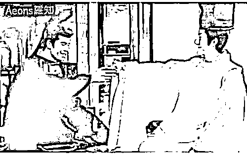

上面这段对话出自梦枕貘的小说《阴阳师》第三卷的第一节，源博雅注意到安倍晴明家里没有佣人，鱼却不用晴明亲自动手就能烤熟，他因为好奇而发问，并引出了一系列的对话。

我指摘取了文章中的一小段，对这本小说有兴趣的话，大家当然可以自己去看原文。

至于我将这一段对话陈列于此的原因其实很简单，就是想告诉大家一个事实，用诅咒和黑魔法伤害别人，其实跟拿刀砍人或者雇凶杀人是没有任何区别的。

当然，可能有人会说，国家法律会因为你拿刀砍人或者雇凶杀人而把你丢进监狱或者执行枪决，但绝不会说因为你在一个月黑风高的夜晚在十字路口把一只黑母鸡一刀劈成两半从而导致某人的暴毙而给你任何处罚。

对此，我只想说，Tooyoung，Sometimes naïve…

伤害人就是伤害人，做出这种行为之后，道德层面会有道德层面的审判，社会层面会有社会层面的审判，你的诅咒术涉及的现实世界之外的领域也会给予相应的反馈，而并不单单是法律层面的问题。

其实我一直很好奇一个问题，为什么黑魔法爱好者们觉得能避开法律的追责就万事大吉了，就不怕坏事做多了，从哪里跳出来一个大佬单手把你摁死吗？

对现代魔法（巫术）有一定了解的话，就应该知道，威卡教中有一条守则叫三倍偿还定律，这条定律的大致内容也就是说一个人对别人做什么，就会得到三倍的偿还，假如对别人做好事，就会得到三倍的好事作为偿还，假如对别人做恶事，就会得到三倍的恶事作为偿还。

这条定律被引申到黑魔法和诅咒层面，于是就产生了下咒的人会被被诅咒的人更惨……这种说法，变成了诅咒的三倍反噬定律，然而又因为各种原因变成了十倍反噬，二十倍反噬，甚至还有更夸张的说法。

当然了，也有很多威卡教徒对三倍偿还守则不屑一顾，觉得这玩意只是纯粹的精神上鼓励人多做好事少做坏事，甚至还有人觉得它违反了物理法则。

然后，后来又有了诅咒只有失败的时候会遭到反噬这种说法。

嘛，其实这几种说法都有各自的道理，但请容我先对那些轻视三倍法则的威卡教徒进行一番鄙视，是无知限制了他们的想象力。

威卡教的三倍守则，实际上指的是三个不同层面的偿还，即对别人的行为会在能量、心智，以及灵性这三方面得到偿还。

能量这方面其实是很好解释的，从力的相互左右来说，用多大的力量去打人自身则也要承受这股力量，还有赠人玫瑰手有余香……大致是这么个意思。

心智方面，就是做坏事思想会变得越来越坏，做好事思想会变得越来越好。

至于灵性，它就像一面镜子，好事使它变得明亮洁净，坏事使它晦暗蒙尘，而包括占卜也好，各种修行的初步感知也好都要和灵性有关的，所以占卜师给人乱占乱解会导致他占得越来越不准，古时候仗着神通逞能的家伙会越变越弱，最后都扑街了。

当然，有的人会问，难道那些坏人不是坏事做得越多，反倒变得越强，所以才不停做坏事的吗？

实际上的确会存在一些因为做坏事而变“强”的存在，不过这种强只是一种假象，而且往往只是从能量或者显化层面来说的。

打个比方，就是一个坏人从别人手里抢走了 1000 单位的能量，因为灵性蒙尘，这 1000 能量在他手里只能发挥出相当于 100 能量的效果，但就算这样，他看上去也会比只有 10 能量的好人强大一点，但是只有 10 能量的好人其实未必不能把这 10 能量发挥出 1000 的效果。

而且这种坏人的强大也只是暂时的，如果他继续堕落下去，这种能量的使用效率会变得越来越低，为了填补缺口就需要去掠夺更多的东西，然后造成一个难以想象的恶性循环。

也有另一种情况，就是使用 10 单位的能量，使之达成 10 单位的效果需要一个时间来演化，但如果你在一次性投入 1000 单位的能量，就能迅速得到 10 能量所能得到的效果。

这种情况最好的例子是佛牌，也就是古曼童，养小鬼。一个佛牌会让人飞黄腾达一阵，但是在这之后，那个人会变得比原来更惨更倒霉，然后为了填补缺口，再去请更多的佛牌，也是个恶性循环……

反正就是饮鸩止渴，不学也罢。

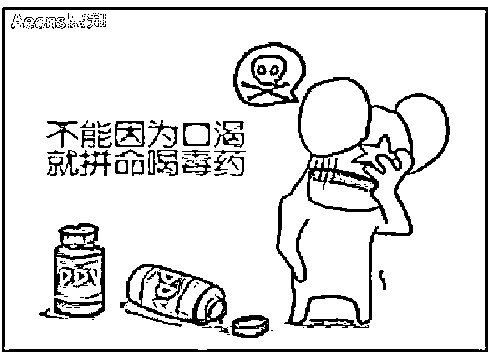

现在话归正题，我们继续来谈诅咒。

其实之前也说过诅咒是分很多种类，其中之一，比较常见的是通过精神暗示给诅咒对象脑海里植入某种思讯，借助它本人的心灵能量，让这种思讯慢慢显化。

是不是听起来离奇又时髦？

但是实际上，这种暗示类的诅咒就是这么回事，你找到你的诅咒对象，每天看到他的时候都用关爱智障……啊，不，我是说怜悯的，方法看一个将死之人的目光看着他，时不时嘴里发出一声叹息：“唉，你活不了多久了啊。”

如果到了这个地步，人家还没有因为觉得你是一个神经病而把你拎起来打一顿的话，肯定会问你：“为什么我快死了。”

然后这时候你再摇摇头，一脸无奈地欲言又止，留下他自己脑补去。

这样，诅咒的种子就种下了，之后不定期地提醒一下对方，让他时刻记住自己快死了，就当是给种子浇水了。如果能说服周围的人陪你一起演这出戏还不穿帮，那效果会更好。

这样天长日久，等哪天你的诅咒对象想清楚自己到底为什么会死的时候，他就真的得死了。

这种方法其实也不仅仅局限于诅咒，你也可以试试给你的施咒对象植入“你欠我一百块钱”，或者“你爱着我”之类的暗示。

当然，如果你能有让这种暗示生根发芽的演技的话，我觉得你已经可以去拿奥斯卡的小金人了。

而现实中遇到的往往是三流的暗示对上容易上当的傻子。

我觉得在这种东西上栽上一两次也算不了什么，毕竟人有失手马有失蹄，但如果能在这上面不停地栽跟头……我觉得那人一定是故意的，那么请回过头去参照一下邪教篇。

当然了，诅咒肯定也包含另一种情况，即运用了某种神秘力量，比如召唤恶魔啊，或者别的什么乱七八糟的灵体，那这种情况就很好玩了。

首先这些灵体上辈子又没挖你祖坟，所以肯定不会做亏本买卖，所以明白你的险恶用心之后，在你身上收取足够伤害对方的力量之后再顺带收点利息肯定是没话说的，毕竟在坏人的世界黑吃黑是常识嘛，或者觉得你更好欺负，直接调转矛头也是可能的，一定程度上还会波及你身边的人，比如父母、恋人，朋友。

像这种情况如果细说，其实也能说出一个大长篇出来，但我实在没兴趣在“黑心邪灵收你几成利息才会导致你受十倍反噬”，或者“邪灵看你不爽决定把你干掉引起的所谓的诅咒失败会有反噬”之类的智障问题上多费口舌。

如果看一个人不爽，我建议你直接捏拳头揍他，或者去某星际解说的直播间里刷十个火箭要他奶对方一口。

至于诅咒和黑魔法这么不靠谱的玩意，我觉得在当今社会已经完全没有必要了。

我见过关于诅咒最可笑的一个例子就是，某巫师拉了十个小伙伴扛诅咒反噬，结果那十个人都已经缺胳膊断腿了，那个诅咒对象却还活得好好的。

在我看来，能拉到十个人，明明过去把人揍一顿就屁事没有了。

喜欢黑魔法和诅咒的，就像那些不懂得衡量事情利弊，进而一直做着亏本买卖的九流商人。

那姿态真的是一点都不帅……

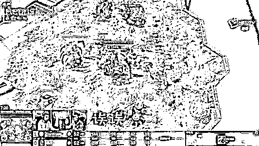

排版｜指引社

文案｜指引社

指引社，致力于让“神秘学”走向大众，不再“神秘”。杜绝神棍，欢迎撩或聊

长按二维码关注我们

# 欧文·戴维斯的魔法书书单 TOP10——一位魔法史研究专家心目中的经典魔法著作

> 原文：[`mp.weixin.qq.com/s?__biz=MzI5NTQzMDUzMQ==&mid=2247483811&idx=3&sn=9d13d571478d3c03fdd6cb0a69b01720&chksm=ec52f14fdb257859c24a8fdbb74662ca761c00f218ae095e6dfaf7024b5f8fb47d2e09d57d2d&scene=27#wechat_redirect`](http://mp.weixin.qq.com/s?__biz=MzI5NTQzMDUzMQ==&mid=2247483811&idx=3&sn=9d13d571478d3c03fdd6cb0a69b01720&chksm=ec52f14fdb257859c24a8fdbb74662ca761c00f218ae095e6dfaf7024b5f8fb47d2e09d57d2d&scene=27#wechat_redirect)

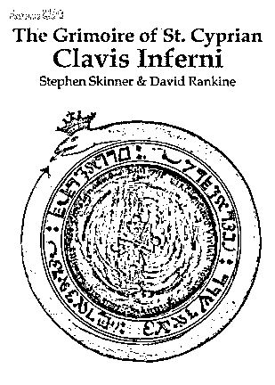

【译者注：本文译自网络，原文地址在文末。如果有问题请直接向原作者投诉，译者拒负任何责任。】

“魔法书指的是一些囊括了咒语、魔法、自然秘密和古老智慧的书。它们的源头可追溯至蒙昧初开的年代，并与犹太教、基督教和伊斯兰教等宗教伴生存活下来。随着科技的发展，借了印刷术和欧洲殖民者的东风传播开来。”

欧文·戴维斯是英国 Hertfordshire 大学的社会历史学教授，曾撰写过大量关于魔法、巫术与鬼魂的著作。前段时间牛津大学出版社印行了他的最新作品，也是第一本关于起源自远东的咒语书的历史研究书籍。以下是这位专业人士甄选出的十大魔法典籍，这些书由于各自的原因闻名于史册，大部分均为我们所熟知：

1\. The Sixth and Seventh Books of Moses

这是一部较为现代的魔法书，以手稿的形式流通于 18 世纪，影响的广度一时无匹。通过移居宾夕法尼亚州的荷兰后裔，这本书从德国传到了美洲，一度经廉价出版物的热潮传播，为非裔美国人所吸纳。这本充斥着伪希伯来神秘符号、魔法仪式和祷文的摩西智慧书成为了拉斯特法里教（起源于非洲牙买加的一个基督教分支）的纲领，引导了西非的一些宗教运动，并同样风靡了战后的德国。

【译者注：这本书的由来自然是延续圣经中《摩西五经》（《创世记》、《出埃及记》、《利未记》、《民数记》、《申命记》）而来。除了六七这两本拉大旗作虎皮的佚名作品，比较出名的还有后人狗尾续貂的《Eighth, Ninth, and Tenth Books of Moses》，其中第八卷更为有名一些。】

2\. The Clavicule of Solomon

此书乃是所有魔法书的老祖宗。署名为所罗门王的许多魔法书自公元后最初的几个世纪就开始流传于地中海东部地区。15 世纪时西方数以百计的科学家和神职人员几乎人手一本。与其同时，反对之声渐起，一些人谴责这本书是异教的产物，很多神职人员遂转入地下，秘密研读此书。其中的一部分人怀有极大的野心，想从这架智慧者中的战斗机里获得更多智慧点数；另一些则到处寻找宝藏妄图中饱私囊，并试图击败那些宝藏的守护灵们。

【译者注：这本书应该比前一本还知名，所罗门王的一堆烂大街的钥匙。现存的最早的魔法论文集，历史或许还能往前再推一千年。】

3\. Petit Albert

这本《小阿尔伯特》（注：本书是法文写就，英译名 Little Albert）是 18 世纪初印刷革命带来的魔法书泡沫时代的象征物。魔法知识的阀门一旦被打开，一个魔法复兴的全新启蒙时代随即到来，本书的名字作为此时代最大的影响力代表之一，很快便威名远扬，蜚声法国本土及其海外殖民地。本书囊括许多家务事方面的实践指导，包括摸鱼、治病及光荣之手（小偷专用护身符，可使人隐形）的制作方式等，实乃居家旅行杀人越货之常备。

【译者注：本书作者在前言中信誓旦旦，绝不写些鸡零狗碎家长里短随处可见的内容，随后正文第一部分通篇都在咣咣打脸，极富节奏感。译者读书不多，迄今为止还没见过内容如此猥琐接地气的魔法典籍，作者在世时一定是位不世出的妇科圣手兼农林畜牧专家。本书的书名应来自 Albertus Parvus Lucius。与此相对的还有一本《Le Grand Albert》（大阿尔伯特），也是著名的魔法书，很难说哪本更出名一点，只不过这本书的名字或源自于 Albertus Magnus (1200?-1280)，一位天主教的主教。】

4\. The Book of St Cyprian

一本标榜为传说中的圣 Cyprian（同名的还有一位真实存在的）所著的魔法书，于 18 世纪晚期流行于斯堪的纳维亚地区，其西班牙语和葡萄牙语版本中还包括了一串藏宝地的名单和寻宝方式。在 20 世纪早期，此书的一些版本开始在南美地区冒头，如今从墨西哥的街头巷尾到安第斯山脉上面的草药摊子，满大街都能买得到此书的翻版。

【译者注：……我看的显然不是西班牙或葡萄牙语版本。寻宝图在哪呢？？？？ps 历史上的 St Cyprian 有两个人，据说连出生月份都一样，经常被人搞混。】

5\. Dragon rouge

与《Petit Albert》（参照上面 No.3）相似，这本书也是 18 世纪法国廉价魔法书大爆发时代的产物。尽管出版于下一个世纪，但它其实是《The Grand grimoire》的版本之一——一本更早时期也名声更烂的魔法书，囊括了许多恶魔召唤的内容。这本书流窜得比想象的范围要广，并在法国于加勒比地区的殖民地发扬光大。

【译者注：《Dragon rouge》=《The Grand Grimoire》=《the Red Dragon》，而且这本黑魔法书实际上是好几部分拼接而成，画风跟名字一样各种杂乱无章。这本书的写作风格模仿了所罗门和洪诺留的书，但基调更加黑暗和中二。其中一部分类似于 Petit Albert，各种家居 tips，还有中乐透的魔法。】

6\. The Book of Honorius

托归于其名下的魔法书所赐，洪诺留臭名昭著的程度在中世纪仅次于所罗门。虽然此人在魔法史中岿然不动地占据了很大的一个篇章，然而并无证据证明，在古代魔法师中真的有洪诺留这么一号人物，一些所谓的他的手稿也证明了这一点。通过各种祷文，本书讲述了很多关于天堂、地狱和炼狱的场景，以及各方面的科学知识，是一本非常便利的手册。

【译者注：这位假托的洪诺留，其人设原是一位教皇。中世纪的异教徒为了反抗基督教的迫害，奇招突起，故意捏造了这么一号人，请来一把赝品尚方宝剑，为自己教派的魔法典籍保驾护航，改头换面暗度陈仓，可谓是用心良苦。】

7\. The Fourth Book of Occult Philosophy

本书作者——Cornelius Agrippa 是 16 世纪最有影响力的神秘哲学家，这套《神秘哲学四书》中前三本已确认是他的作品，但对不知道是打哪冒出来的第四本他本人也是一脸懵逼（虽然那时候他已经挂了）。这本打着阿格里帕旗号的作品因为涉及恶魔召唤，严重地黑了他一把，尤其是当巫师审判在欧洲横行的时候，阿格里帕于九泉之下昏倒在厕所里。

【译者注：这套书最后一本应为后人跟风所撰，实际上第四本书的画风似乎确实与前三本有所不同，阿格里帕的弟子也曾鄙视过这第四本书的水准太过辣鸡，配不上他牛逼哄哄的师尊。本书洋洋洒洒上千页，堪称一部归纳较为详尽的魔法辞典，是一本较为全面的案头工具书。ps 这套书编撰于作者的中二时期，据说年迈时他对自己曾经的黑历史悔不当初。在中世纪这种因为一时中二误入歧途老年羞愧而死的情况很普遍，不知道在我们这个时代会不会也这样。】

8\. The Magus

本书出版于 1801 年，作者是英国神秘学者 Francis Barrett。这本书实际上是对 17 世纪的神秘科学的重新编纂，从阿格里帕的《神秘四书》英文版里借鉴了大量内容，虽然在当时搞得比较失败，但后来却借着 19 世纪晚期的神秘复兴浪潮诈了尸，成为当时的魔法经典。到了 20 世纪早期，这本上梁不正下梁歪的书又被美国的神秘学爱好者给抄了，并命名为《伟大的魔法，印度魔法与东印度神秘学》，在美国和加勒比地区售卖。

【译者注：作者没少四处借鉴，这本书也 copy 了《The Heptameron》，读的时候真是各种似曾相识。不过这本书内容还是比较丰富的，也难怪有人会抄。】

9\. The Necronomicon

一部胡诌生造出来的伪典，来自于 20 世纪早期大名鼎鼎的恐怖奇幻小说家 H.P.洛夫克拉夫特，假托为一位 8 世纪的也门疯诗人所著。尽管这只是脱胎自小说的虚构典籍，然而此后经年，许多本自称为真品的《死灵之书》如雨后春笋一般浩浩荡荡冒出，扰人视听。如今，此搅 X 棍的巨大影响力令其已经有充分的资格跻身于此榜了。

【译者注：爱手艺不愧是狮子男，狮子带领的一群绵羊战斗力已非同小可，何况领的是一群触手怪。克苏鲁影响力所向披靡，硬是在这种学术向书单里横插了一杠子。此书中有很多硬拗出来的符号和文字系统，对克苏鲁系列有兴趣的可以看看。】

10\. Book of Shadows

这本书被放在书单的最后，但并不意味着这本书的地位不重要。这是一本关于现代巫术 Wicca（1940 年建立的异教徒的宗教）的文稿，作者是退休的公务员、民俗学家、共济会员兼神秘学研究者 Gerald Gardner。他声称他从一个神秘的巫师团体那里收到一份古老的手稿的抄本，而此团体是某以生殖崇拜为核心的古老宗教最后残余的一脉，曾遭受过基督教政权的长期迫害。尽管这事听起来好像一部绘声绘色的狗血肥皂剧，但它最终也获得了公众的承认。

【译者注：这书单论内容确实比较经典，对 Wicca 许多仪式的讲解巨细靡遗，即便只是作为文化研究的素材，也值得参考。然而很多细节较为黄暴，连 SM 都有，画风颇为辣眼。】

* * *

【附原文地址：[`www.theguardian.com/books/2009/apr/08/history`](https://www.theguardian.com/books/2009/apr/08/history)】

排版｜指引社

文案｜指引社

指引社，致力于让“神秘学”走向大众，不再“神秘”。杜绝神棍，欢迎撩或聊

长按二维码关注我们

# 【占星七书】关于白羊座的古典概念

> 原文：[`mp.weixin.qq.com/s?__biz=MzI5NTQzMDUzMQ==&mid=2247483811&idx=4&sn=9da591637b0c48f3ce3b6b3460ad24f9&chksm=ec52f14fdb25785991f4b7dddb9143e7f03d89e023045765a8a2ecd146f64f8b183d2477d786&scene=27#wechat_redirect`](http://mp.weixin.qq.com/s?__biz=MzI5NTQzMDUzMQ==&mid=2247483811&idx=4&sn=9da591637b0c48f3ce3b6b3460ad24f9&chksm=ec52f14fdb25785991f4b7dddb9143e7f03d89e023045765a8a2ecd146f64f8b183d2477d786&scene=27#wechat_redirect)

本文摘自古代西班牙的犹太学者 Abraham Ibn Ezra（ אַבְרָהָם אִבְּן עֶזְרָא or ראב"ע）c.1092-c.1167 所著的：占星七书《Libre dels judicis de les estelles》，该书收藏了作者生前的七部占星名著，现收藏于埃斯科里亚尔皇家图书馆内，收藏文本为加泰罗尼亚语。

作者介绍：

拉比亚伯拉罕.伊本.埃兹拉，亦被称为“伊本.埃兹拉”，“以斯拉”，“犹太人亚伯拉罕”，Abendre 或 Avenara。中世纪欧洲公认的“智者”，“伟大的人”，“值得称颂的人”，出生于 1092 年的 Tudela，去世于 1167 年的卡斯提亚王国，是一个非常卓越的安达卢西-犹太智者。

几乎被视作是全能之人，他的成就体现在其诗歌，哲学，语法学，卡巴拉，医疗，数学，跟天文占星学等多个领域。伊本埃兹拉同时也是一个非常出名的旅行家；后由于穆瓦希德王朝的进攻，不得不于 1140 年离开安达卢斯前往北非，埃及，以色列，意大利，法国和英国，直到最后回归西班牙。

译者：晴海（北夜玄武）

# 白羊座

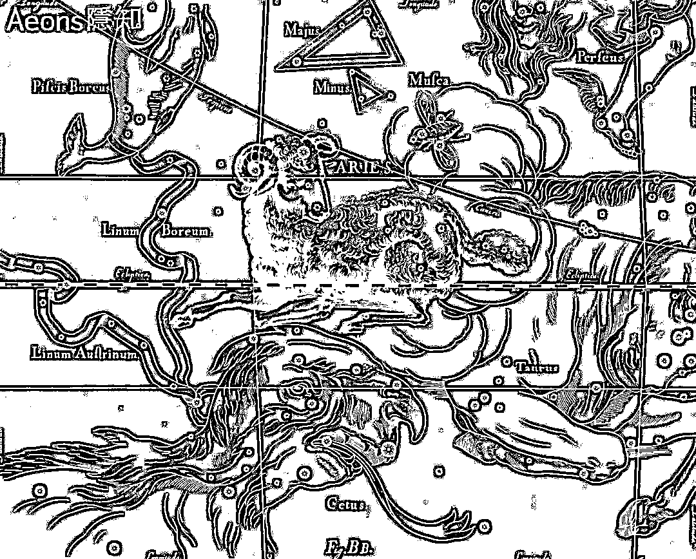

“第一个星座是白羊座。它是火元素星座，阳性，昼间星座，东方星座，主导星座（起始星座）。步伐短暂且是斜上升星座。它联系着“暂时性”的特征。是一个好星座，同时可以带给我们关于雷电的信息。

当太阳落在它的起始位置时，将意味着风和雨。星座的中段是温和的而尾部是炙热的，灼烧的。如果年主星落在南边，意味着湿热的气候，如果落在北边，则意味着寒冷。

这个星座统御所有有蹄子的动物，或是所有双色，双型的东西。音量中等，来自东方的风火之君，其热量适中。

主宰血液跟甜味；红色与黄色。

在动物里 ，象征绵羊，以及所有有蹄子的。在金属里，象征黄金跟白银，铁跟铜。

在七个地理气候区中，它主宰第三种气候，巴比伦地区全境，波斯，和巴勒斯坦。同样也主宰荒原跟牧场，所有有火的地方。山寨中的盗匪头领，有很多房梁的屋子。根据托勒密，它也主宰祷告间跟法庭。

##### 古人认为它主宰的字母是 Alef（א）跟 Nun（נ）。

它的年份是 15 年，月份为 15 个月，日子 37 天半，时辰是 4 个小时。

上升落在白羊座的人的身体是很匀称的，长脸，大眼睛，喜欢俯视，脖子粗，耳朵软，头发浓密且带卷，腿瘦而软。言语美丽，说的多，贪吃且易怒。热爱正义，但声音不大。

如果月亮或福点与某凶星同落于这个星座，预示着天花，麻风病，耳聋或谢顶。

上升落在第一个面的人，黄发，肚子小，精瘦，在脚上或左肘附近有胎记，多喜欢结交嫉恶如仇的朋友。

上升落在第二个面的人，脸部皮肤较暗，长的好看，身体匀称，但是什么事都会让他生气，不过过去的也快。心气很高，明断善恶，有好的教条。但敌人会很多。

上升落在第三个面的人，皮肤泛红或者泛黄，不喜欢与人结交。

在人体中，这个星座主管：头部，脸部，眼睫毛，和耳朵。

这个星座的疾病是：痛风，以及听觉，鼻子，牙齿或眼睛方面的疾病，溃疡跟雀斑。

根据古埃及人的说法，如果土星落在上升，而上升又是白羊座的话，就会造成胸部疾病；木星在这里会造成心脏疾病，火星是头部疾病，太阳引发肾脏疾病；金星则是脚步疾病，水星是腿部疾病，月亮则是足踝。

这个星座主管正直的，自由派的，善战的，跑遍世界的君主。

这个星座是火星的宫殿，而 19°则是太阳的荣耀之地。是金星的嫉妒之宫；而 25°则是水星的臣服之所。这些是以 1148 年为标准的位置。

这个星座的三分主分别是：第一个是太阳；第二个是木星；如果盘主出生在夜间，则木星是第一个，第二个是太阳。而土星总是陪伴着它们，不论昼夜。第一个面的面主是火星；第二个是太阳，而第三个是木星。

其界主为以下：最初的六度归木星；之后的六度是金星；之后的八度是水星；然后 5 度火星，5 度土星。

其九分主分别是：火星-金星-水星-月亮-太阳-水星-金星-火星-木星。

其十二分主分别是：火星-金星-水星-月亮-太阳-水星-金星-火星-木星-土星-土星-木星。

明亮与黑暗的度数分别是：头 3°为中性，之后 5°黑暗，之后 8°中性，之后 4°明亮，4°黑暗，5°明亮，1°黑暗。

阳性与阴性的度数分别是：头 7°为阳性，之后 7°阴性，之后 8°阳性（这里不足 30°，因此可能是作者这边的遗漏）

陷阱度数为：6°，11°，17°，13°

喜悦跟荣耀的度数为：19°

在这个星座可以看到一颗恒星，被称作是“长河的尽头”，在我们这个时代位于 16°。（双鱼座η，Al Pherg），南纬 13°，一等星，其特征为金星木星的结合。

声明: 该文章版权归指引社和作者所有, 转载请保留此行([`www.geaving.com/article/view/id/191`](http://www.geaving.com/article/view/id/191))

排版｜指引社

文案｜指引社

指引社，致力于让“神秘学”走向大众，不再“神秘”。杜绝神棍，欢迎撩或聊

长按二维码关注我们

# 小编絮叨：节后补漏更新，专栏待补通知

> 原文：[`mp.weixin.qq.com/s?__biz=MzI5NTQzMDUzMQ==&mid=2247483811&idx=5&sn=edf27c8e96bc079d9523d29618b433d4&chksm=ec52f14fdb257859b924f4758616a27e1647d1bbedd40e4eff5426cff1999f58124a9a275508&scene=27#wechat_redirect`](http://mp.weixin.qq.com/s?__biz=MzI5NTQzMDUzMQ==&mid=2247483811&idx=5&sn=edf27c8e96bc079d9523d29618b433d4&chksm=ec52f14fdb257859b924f4758616a27e1647d1bbedd40e4eff5426cff1999f58124a9a275508&scene=27#wechat_redirect)

节前，辛勤的小编咔嚓一下就住院了。

于是拖了一大大大大大大堆文没有推。

这次先补几个防骗，和（很久不更新日理万机的）晴海的星座文。

投票也暂缓。

先给大伙解解馋。

小七的草药专栏，和魔法翻译的专栏，将会在之后按照次序陆续更新。

（这俩都太辛勤了……）

可能更在推送里，

更可能更在专栏里。

建议大家直接从自定义菜单中，寻找专栏，自行观看。

代表指引社的管理层和原创者们，爱你们哟

笔芯。

排版｜指引社

文案｜指引社

指引社，致力于让“神秘学”走向大众，不再“神秘”。杜绝神棍，欢迎撩或聊

长按二维码关注我们

# 芳香植物的两把钥匙（科属篇）⑤

> 原文：[`mp.weixin.qq.com/s?__biz=MzI5NTQzMDUzMQ==&mid=2247483802&idx=1&sn=7eea4d277685db881b98bca97d231cfb&chksm=ec52f176db257860b94e578c6e65a985eb7df1a7a1b50070d62ae63649ce55d6f105f5ce97af&scene=27#wechat_redirect`](http://mp.weixin.qq.com/s?__biz=MzI5NTQzMDUzMQ==&mid=2247483802&idx=1&sn=7eea4d277685db881b98bca97d231cfb&chksm=ec52f176db257860b94e578c6e65a985eb7df1a7a1b50070d62ae63649ce55d6f105f5ce97af&scene=27#wechat_redirect)

**记得点蓝字关注，与好内容相遇**

啦啦啦～18 了，又是一个新哒开始，大家新年好呀～今年也让我们愉快的来学习吧～～（尽量把字数拖的多一点）

今天～我们还是来继续之前的科属篇话题

先来看看

禾本科 Poaceae

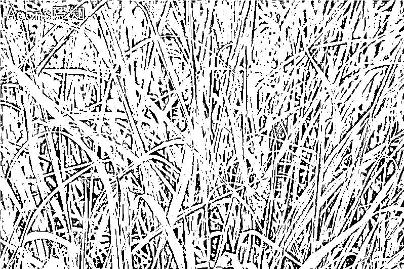

禾本科大家都很熟悉吧～长的跟野草似的，但是能吃，好吃。。只要菜多我能吃两碗，完了还能再强塞一碗，没错～～我说的是饭啦～

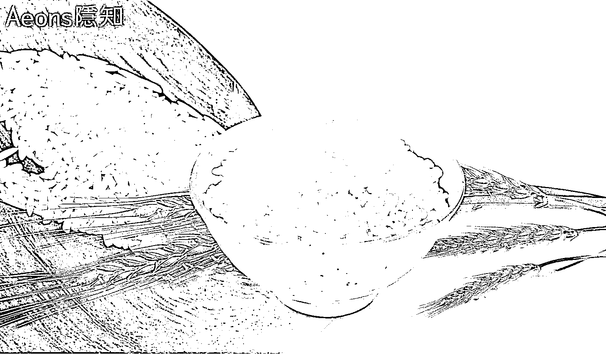

稻米，小麦，荞麦，小米这些都是禾本科植物。它们毫不起眼却十分柔韧，不容易断裂，也不怕蹂躏。

因此其能量对应着我们身体的骨骼，肌肉等。能促进我们身体的联接。除此之外，禾本科的植物还亲和生殖泌尿系统，亲和基底轮和腹轮。

禾本科的植物似乎看起来并没有什么了不起，我刚接触时也因其廉价，易得常对其嗤之以鼻，转而追求高贵的花朵，小众类。曾经我以为最能打动我的就是百合，玫瑰之类的“贵妇”。有段时间，我的灾难可谓是接二连三，生活变得乱糟糟的，干脆我就什么也不想做，躲在家里破罐破摔，以为床以下皆是地狱，被子以外站满魔鬼。

将近三天不起床，吃着外卖用着花朵类，企图让自己好受一些，然而效果不佳，我都快感受不到一点生命的热情了。后面花朵类快被我用光，剩下的别人送的禾本科还有不少。一直觉得它净化效果还是不错的，便拿起来用，做成了清洁喷雾打算来打扫下房间好了。记得当时用了大量的柠檬香茅，强烈的气味简直赶都赶不走的样子，气味和柠檬很像，却比柠檬更加开放，颇有激烈的感觉。后面我把它剂量放低了，用起来却又觉得有很好的镇定效果，顿时对禾本科产生了浓厚的兴趣，开始尝试着各种搭配。最后使用禾本科搭配樟科加一点杜鹃花科，治疗我这种咸鱼还是很有效的。

它能给你强大耐力，越挫越勇的力量，同时杜鹃花科也有类似功效，下篇再具体介绍，前面讲过樟科的重燃热情，和它们也相得益彰。

它的体现的力量不是外在补给，而是很原始的，贯穿在你身体和灵魂之中的，类似一种本能的“求生”和“韧性”。生活里有那么多不如意，大家都是钢铁之身，总有跟我一样破罐破摔的时候，你可以一直自欺欺人，躲起来不去面对，过着任自逍遥的日子，嘴上说着生死之外无大事。好好想想，真正的逍遥不是假意忘记，而是坦然面对得与失。

也许我是没那么逍遥坦然的心态了，因为总有些事需要我去面对，当感觉没有力量，开始心灰意冷时，甚至没开始就觉得做不到时，使用禾本科吧，它能激发你身体里原始生猛的能量，再猛烈的兽我都拿来骑在身下。

当重重困难阻碍，无力再顽抗时，使用禾本科吧，它能激发你的勇气，给你耐力，我还能再战三百回合。

除此之外，禾本科还能促进血液循环，强化韧带，修复肌肉，消除乳酸堆积，是热爱运动，闲不下来，喜欢旅行到处跑，或者说体力劳动者必备，再往下想想，过于不爱运动，天天宅着不动，没有活力的家伙也很适合，使用它能让这类人更有活力。

江湖传言，柠檬香茅具有招财效果，后根据我的考察，它说的招财主要针对开店的，能刺激人消费，快速消费店铺搭配芸香科效果更佳，如果是需要谈话，接待，顾客待的时间比较长的，搭配花朵类或木质类，和少量脂类效果更好，除此之外还有很好的净化效果。

禾本科常用植物有柠檬香茅，爪哇香茅，玫瑰草，蜂香薄荷，岩兰草。

来说说岩兰草

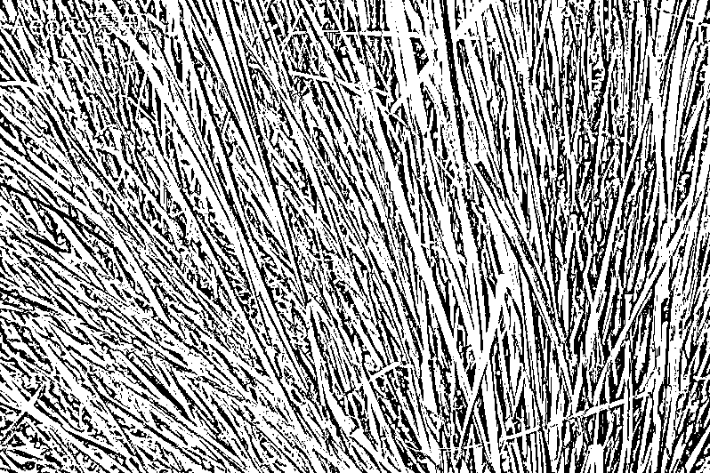

它是治疗师常用种类，首先一个功效就是维持能量平衡，防止过度消耗，经常接待客户，或者帮人做仪式的可以常备。

除了上面说的，它还能消除深层的恐惧，这个功能绝对是奇特的。参考下岩兰草的生长，它原生潮湿河岸边，有强大的抓地力，生命力旺盛，还有强大代谢功能，生长在污染的环境中时它可以改变土质，正呼应着它的适应力和净化的功能，再加上其抓地力，让它更具有大地能量。所以净化更新力加大地的沉稳能量，再加上良好适应力使其能帮助消除深层的恐惧。岩兰草富含三种倍半萜类分子，也因此有镇静油的称呼，三种倍半萜类分子同时也释放深层恐惧，这种恐惧可能是说不清道不明的，有人还会说自己天生的缺乏安全感。它的来源往前可追溯到尚在母体之中时，往后一点可能是刚出生时，再靠后就是童年时不好的经验，阴影。

使用岩兰草油，获得深层的宁静，唤醒内心的大地能量，能让人舒适而安全，不再担心自己的柔弱和不安全感让自己“手不能提肩不能抗”

姜科 Zingiberaceae

2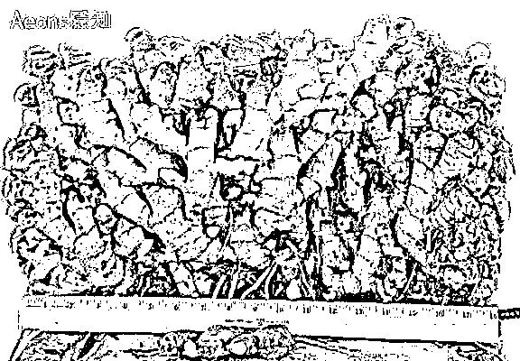

此类植物具有肥大的地下根茎，种植时就很耗费地力，其力量对应着基底轮，有的扎根大地的感觉。

是最能治疗“无所依靠”而引起的心理问题的种类。特别是背井离乡，前往大城市求生的人，在加班到夜晚时，独自走在街道上，有人和我说，感觉自己像飘在人群里的鬼。

姜科能给人扎根的能量，同时还具有很好的滋养力量，特别是强烈的感觉自己漂泊无根的人，使用它能带来良好效果，我说的漂泊无根不仅是旅途奔波，还有心灵的无所依靠，前者搭配首选芸香科，禾本科，杜鹃科，后者搭配首选樟科，花朵类，豆科，柏科。

姜科擅长处理的身体问题是消化系统的毛病除此之外还能促进循环

姜科常用植物有姜，大良高姜，泰国蔘姜，豆蔻，姜黄。

特地说一下姜黄

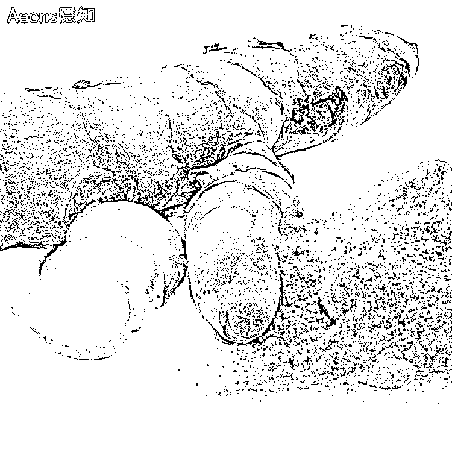

它具有很好大身心净化的功能，单用就很好，用基底油稀释后直接涂抹，或者加上浴盐来洗澡，剂量可用到百分之五到百分之七，在做仪式之前或者积累的负能量太多，快压垮时使用效果超好。

别看啦，没了，挥爪

**慎小七**

芳香草药·专栏食用指南

慎小七，指引社矿灵学院管理，医学世家出身，芳疗师，常年调香爱好者跟实践者，草药专家。

本系列为慎小七原创出品，涉及芳香、草药等专业知识。

排版｜指引社·阿烬

文案｜指引社·慎小七

指引社，致力于让“神秘学”走向大众，不再“神秘”。杜绝神棍，欢迎撩或聊

长按二维码关注我们

点击“阅读原文”，去指引社看原贴

# 波拉克巨巨谈倒吊人——塔罗中最重要的牌

> 原文：[`mp.weixin.qq.com/s?__biz=MzI5NTQzMDUzMQ==&mid=2247483802&idx=2&sn=d733297d28512e5d409c323b5c80e987&chksm=ec52f176db257860fe5196c9a87c6c30bdb18203885c5b47e82e2762ca41a7967e7ba2068b98&scene=27#wechat_redirect`](http://mp.weixin.qq.com/s?__biz=MzI5NTQzMDUzMQ==&mid=2247483802&idx=2&sn=d733297d28512e5d409c323b5c80e987&chksm=ec52f176db257860fe5196c9a87c6c30bdb18203885c5b47e82e2762ca41a7967e7ba2068b98&scene=27#wechat_redirect)

**记得点蓝字关注，与好内容相遇**

  一则很有名的故事：两千多年前，拉比们开会决定把哪本书编入希伯来圣经。托拉经（摩西五书）和其他一些经文理所应当入选了，但像《箴言》、《传道书》之类的“传述”怎么办呢？这时，长老中一位非官方领导，Akiva ben Joseph 拉比为雅歌打 call，众人哗然，雅歌可是赤果果的工口诗！Akiva 表示，雅歌是圣经的一部分，它描绘了上帝对他的子民以色列深沉的爱，也就使它成为圣经最重要的经文。

        Akiva 是我的偶像，我就想象塔罗中出现相同的情形，一群塔罗师开会决定哪些牌面是大牌。他们的关注点都在魔法师，世界，而我举手提议倒吊人，人们震惊了。有人说这幅图表现受难，被钉住无法移动，有人说这幅图源自意大利酷刑。等争论渐弱，我说：“倒吊人不仅属于大牌，更是其中最重要的一张牌。如果你不懂倒吊人，你就不懂塔罗！”众人哑口无言服得不行。但这是为什么呢？

        让我们从头说起。讲真，意大利人处刑叛徒，有时就是把人倒过来放置。在文艺复兴时期意大利，如果人们不喜欢当地领导，就把他的讽刺漫画形象倒着画在墙上，单脚倒悬姿势时常出现。很多意大利牌里这张牌就叫“叛徒”，因痛苦全身扭曲，手臂展开并弯曲作飘摇状。有的图里还有钱币从口袋中掉下来，暗指叛徒中的战斗机——加略人犹大。

                                               维斯康蒂 ｜ 马赛

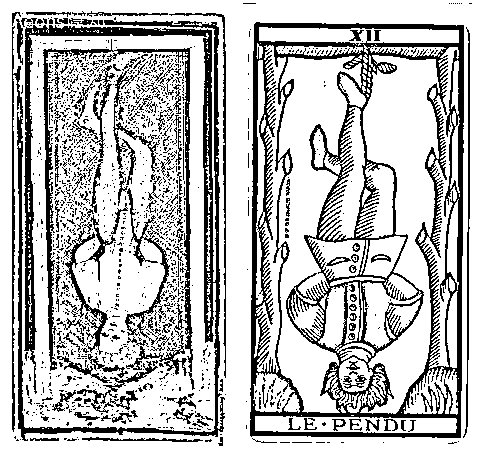

       然而，已知最早的 1450 年维斯康蒂-斯福尔扎版 (Visconti-Sforza)塔罗中的倒吊人是一位形象优雅的年轻人，两手置于背后，面色平静。也许这画的维斯康蒂人对手的讽刺画，但牌面显露出的是平和，而非痛苦。

        欧洲密学中流砥柱——法国马赛塔罗，将这张牌称作 Le Pendu，意为“被绞死的人”。最早的版本（Jean Noblet, 1650）画面里的人欢天喜地，莫名有点像 Harpo Marx（美国喜剧演员）。而在 20 世纪出版的塔罗牌，特别是莱德韦特塔罗，及之后克劳利和哈瑞斯的透特塔罗，倒吊人呈现出了更深刻的含义。透特的倒吊人，脚吊在生命之符（即 Ankh）上，身后是一片几何图案，像是对存在的测量。

        莱德韦特版的倒吊人更贴近真实生活。如同维斯康蒂版，牌面上是漂亮的年轻人，看不出在受苦，而脸上洋溢着圣光。塔罗里冒圣光的仅此一张，爱、节制、审判里的天使都只有光环，而不是这种超凡的炽光。

                                                 韦特 ｜ 透特

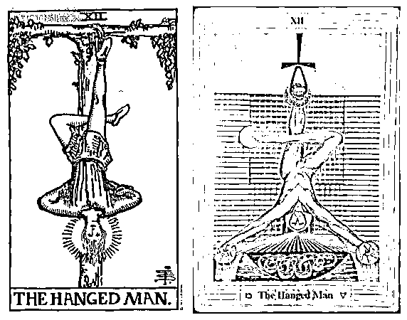

       记得一开始，我愕然地发现很多人将这张牌看作是一张痛苦的牌，心想他们怎么看不出欢喜呢？这张牌对我来说意味着依附，而不是监禁。他倒挂的原因之一因为这张牌对应数字 12，是 21 倒着写，也就是意味着，倒吊人预示了最后一张牌：世界。如果你把倒吊人反过来，放在世界牌旁边对照着看，就会发现他们的相似之处。

        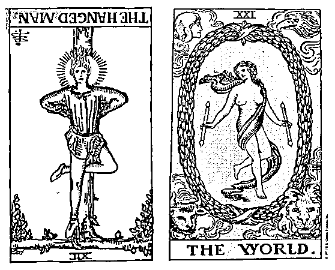

        倒吊人也代表窥见世界神秘时得到的灵性启蒙。要受到启蒙，只能放下自我 (ego)，将自己附与宇宙之树上，这棵树扎根在起源之海，枝桠延伸至天界。我自己设计的闪耀部落塔罗 (Shining Tribe Tarot) 把倒吊男画成倒吊女，她的长发像光垂落至黑暗的水域，在她上方，星星散布在树叶之间。我有意把画面弄得好玩一点，这样人们就不会只觉得她在受难。太阳月亮像玩具一样挂在树枝上，一个天使掠过，正在送信。

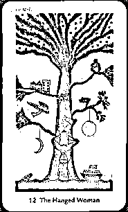 

        如果能颠覆“人顶天立地，别于其它存在”的固有观念，便能体会到 12 号牌的喜悦。其实所有人都曾以倒吊人的形式生存，只是不记得了。婴儿出生时头先出来，那么胚胎必须先倒悬在子宫里。

        大阿卡纳有愚人（本来没有编号），加上 1-21 号牌。把 21 张牌排成三行，每行 7 张，也就有了 7 排。每行的第五张上中下分别是 5 号教皇，12 号倒吊人，19 号太阳。倒吊人就成了一种桥梁，脚连着教皇的领域，即传统，面向着灵魂灿烂的光芒。

（完）

原文地址（再贴一遍）：[`www.biddytarot.com/hanged-man-rachel-pollack/`](https://www.biddytarot.com/hanged-man-rachel-pollack/)

顺便……Rachel Pollack 的闪耀部落塔罗还挺萌的 (°∀°)ﾉ

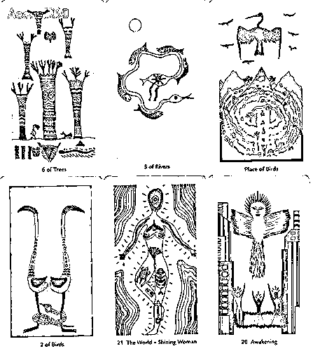

排版｜指引社

文案｜指引社

指引社，致力于让“神秘学”走向大众，不再“神秘”。杜绝神棍，欢迎撩或聊

长按二维码关注我们

点击“阅读原文”，去指引社看原贴

# 翻译丨《中世纪魔法》 第 2.7 课 犹太的魔法观念

> 原文：[`mp.weixin.qq.com/s?__biz=MzI5NTQzMDUzMQ==&mid=2247483802&idx=3&sn=15d39cf3f3fbc12ac29678e21e9ea981&chksm=ec52f176db257860572cb0aafceda78ec51b4e0ed3e04bd28812ce03caa12d1403d6058a297b&scene=27#wechat_redirect`](http://mp.weixin.qq.com/s?__biz=MzI5NTQzMDUzMQ==&mid=2247483802&idx=3&sn=15d39cf3f3fbc12ac29678e21e9ea981&chksm=ec52f176db257860572cb0aafceda78ec51b4e0ed3e04bd28812ce03caa12d1403d6058a297b&scene=27#wechat_redirect)

**记得点蓝字关注，与好内容相遇**

巴塞罗那大学公开课《中世纪的魔法》

慕课出品 · 指引社 BRANCH 字幕组翻译

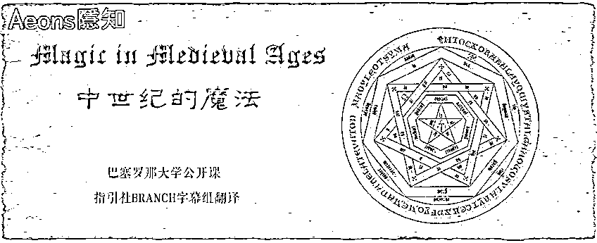 

第二单元 魔法与异端

第七课（选修课 II） 犹太的魔法观念

    又见面啦！在这第二单元的最后一课中，我们将尝试总结目前学界对中世纪犹太魔法观念的理解。提醒一下，本课和上一节都是选修内容，你可以直接跳过。如果你仅对基督教感兴趣的话就请关掉吧，当然，我可不希望你这么做哦。

言归正传，正如上节所见，尽管宗教的教育是体制化的，对于专业科学知识却是需要通过导师传授。那么魔法知识又如何？ 

    事实是，魔法在中世纪的犹太文献中很少被提到。圣经明确禁止魔法实践。然而，魔药、护身符、治愈术却在中世纪犹太人中广受欢迎。魔法文献的内容主要是关于占卜的，涉及到对梦境的诠释、流行的巫医和制作护符的魔术式。总结中世纪犹太魔法观是相当困难的，因为对于这个问题目前尚未有太多研究。魔法专著的作者是匿名的，并且这些书非常稀有。但可以肯定的是，东西方的犹太人都相信魔法。很少有专著批判魔法，即使有，也是处在非常边缘的地位。不像同一时间基督教的杰出著者们对魔法口诛笔伐，这里没有出现对魔法的批判风潮。

    但另一方面，我们也没有找到支持魔法的文献。事实上，我们必须区分魔法信仰和魔法实践。魔法实践，以及流行的巫医，根本不在学者们争论的范围之内，而被认为是另一门科学学科。但是很难把魔法与其他领域的专业知识区分开来，例如天文学和医学。作为药草、食物和其他物质的结合，魔法实践就是一种医学的替代品。根据犹太人的说法，圣经上讲要禁止魔法，禁止的只是非自然的魔法，亦即那些妄图影响宇宙力量的黑魔法。这和那些将自然魔法和黑魔法相区分的基督教著者非常一致，不是吗？

    尽管通常来说，一些书册包含了召唤天使和魔鬼以控制他人的魔术式，但并不意味着这些仪式被实际操作过。如我们在上节课所见，在宗教教育体系和魔法教育之间最重要的差异在于，魔法教学不是通过口授进行的。没有专门从事魔法教育的导师。但我们知道有一些中世纪犹太法师，即被称作 mekhashef（男）或 mekhashefah（女）的人，他们大多是掌握某种魔法知识的人，他们使用魔法帮助自己或帮助他人。在某种意义上，他们是有偿的魔法工作者。

    说起来，关于犹太魔法你最想知道的大概是卡巴拉，对不对？什么是卡巴拉呢？这个概念已经被新世纪运动的各种杂谈所混淆，因此有必要来简要地解释一下。

    卡巴拉是一种对圣经进行神秘主义阐释的古老的犹太传统。起初是通过口授和包括密码在内的秘传方式流传，其影响力在中世纪晚期到达顶峰，并仍影响着当下的一些犹太教运动，如哈西德派。卡巴拉的目的在于理解上帝与其造物，这些仅通过理性的方式是不能够完全达到的，而要通过冥想和阅读《托拉》获得启示。卡巴拉尝试将成文的法律转化为主宰宇宙的内在律法。这可不是件小事儿，对吧？经由此，犹太教成为展现上帝与宇宙秘密的神秘学符号体系。这也是卡巴拉学者们通过各种方式去尝试理解的体系。不过，卡巴拉远不止这些。请允许我在这里卖个关子。

    卡巴拉同时也被称作神智诠释学。即，一套通过灵魂的迷狂、直觉或特殊的个体关系以获得上帝知识的哲学。口授律法中最隐秘且玄奥的部分，即《密西拿》，如上节所述，在卡巴拉中也有重要位置。它被称作实践卡巴拉，不过，它与卡巴拉的隐秘知识部分截然不同。实践卡巴拉指的就是魔法，特别是召唤指引灵魂的守护天使之魔法。此外还有通过操纵与排列具有隐秘意义的上帝、天使或魔鬼之名，来影响物理和精神世界，或加速弥赛亚时代降临的魔法。这也不是小事哦。

    在此，记载希伯来字母隐含创造之力的书典——《创造之书》【译注：此处直译英文，但更常见的译法是《形成之书》。例如在卡巴拉四界中，Beriah 是创造(creation)界，Yetzirah 是形成(formation)界。】是最为重要的角色。如你所见，这是一个非常复杂且高深的知识领域，超出了大多数人的理解能力。事实上，就连拉比也要到 40 岁才被允许涉足这个神秘领域。也就是说，在穷尽一生的学习之后，才有资格去研究。

    如果你达到合适的年龄，并渴望把握其中奥秘，请记住，关键点不是年龄的问题，而是知识背景的问题。你还需要继续花费数十年的时间去博览哲学和宗教每个阶段的知识，走过中世纪犹太学者上下求索的学海长征。

下个单元再见！

-------------------------

视频&字幕百度盘下载、课程索引：

[`www.imslr.com/thread-48335-1-1.html`](http://www.imslr.com/thread-48335-1-1.html)

排版｜指引社

文案｜指引社

指引社，致力于让“神秘学”走向大众，不再“神秘”。杜绝神棍，欢迎撩或聊

长按二维码关注我们

点击“阅读原文”，去指引社看原贴

# 第一幅神秘学塔罗的前世今生

> 原文：[`mp.weixin.qq.com/s?__biz=MzI5NTQzMDUzMQ==&mid=2247483802&idx=4&sn=c6ffe2c164f87da0d62fd72c8c757560&chksm=ec52f176db257860f4f0f733b5295d43208862c533caf63f904487299e37296c38f3a080ecb1&scene=27#wechat_redirect`](http://mp.weixin.qq.com/s?__biz=MzI5NTQzMDUzMQ==&mid=2247483802&idx=4&sn=c6ffe2c164f87da0d62fd72c8c757560&chksm=ec52f176db257860f4f0f733b5295d43208862c533caf63f904487299e37296c38f3a080ecb1&scene=27#wechat_redirect)

**记得点蓝字关注，与好内容相遇**

摘要：根据史料记载，塔罗牌在 14 世纪的意大利就已大量出现。这些早期的塔罗可以统称为“古塔罗”，它们没有标准的形式，有的是用作占卜，有的用作游戏，还有的是作为艺术品以供欣赏。而真正意义上作为神秘学媒介而使用的塔罗牌，则开始于 18 世纪的法国。第一位职业塔罗师，亦是第一幅神秘学塔罗的创作者——Etteilla（法语音译“艾特雅”，1738-1791）就是我们今天故事的主角了。艾特雅所创作的塔罗牌是什么样子？今天市面上能够买到的艾特雅塔罗牌中，哪一幅最接近他的原作？下面请跟随在下，一起走近这第一幅神秘学塔罗的前世今生。 

文章分类：塔罗历史学 

太长不看版：（1）艾特雅一共创作过两副占卜纸牌，一副是在今天被称为“神谕卡”类型的“小艾特雅牌”（Petit Etteilla），共三十三张。另一幅就是真正意义上的塔罗牌，即“大艾特雅牌”（Grand Etteilla），共七十八张。通常所说的第一幅神秘学塔罗牌，指的就是大艾特雅牌。

（2）现今市面上能买到的塔罗牌中，最接近原始大艾特雅牌的是 Grimaud 出版的“大艾特雅塔罗牌”（Grand Etteilla Tarot）。

好了，对历史不感兴趣的朋友们看到这里就 OK 了。但如果你觉得不满足，那么就继续来看下文（十分枯燥的）历史梳理吧。现在关闭还来得及。

* * *

艾特雅（Etteilla，1738-1791），原名 Jean-Baptiste Alliette，后将自己的名字翻过来写作 Etteilla。启蒙主义时代的法国神秘学家，神秘学塔罗的先驱，第一位职业塔罗师。也是第一位将元素理论和占星学融入塔罗学的人。

1770 年左右，艾特雅创作了“小艾特雅牌”（Petit Etteilla），这副牌是基于法国的游戏纸牌“皮科”（piquet）所创造。piquet 牌共有 32 张，包括国王（K）、王后（Q）、杰克（J）、Ace 和数字 7-10。艾特雅在 piquet 的基础上添加了第 33 张牌（即“艾特雅牌”）作为指示牌。这副牌相当于我们今天所说的“神谕卡”。

不过，我们更加关注的是他的塔罗牌。与塔罗牌的三大体系“马赛系”、“韦特系”、“透特系”类似，艾特雅牌也有可以被称作“艾特雅系”的一个系统。小生曾经在《塔罗师的魔法世界》一文中提到的“不懂几何者勿入此门”的那一副牌，正是艾特雅系塔罗牌的代表。而对于塔罗历史学的研究者们来说，艾特雅系塔罗牌有着更加明确的分类：

1、大艾特雅（Grand Etteilla）

大艾特雅牌创造于 1788 年（另说 1789 年），是第一幅占卜专用的神秘学塔罗牌。这是艾特雅本人的作品。塔罗历史学家 Detlef Hoffman 和 Erika Kroppenstedt 将这副牌标记为“大艾特雅 1 号”（Grand Etteilla I，以下简称 GE1）。

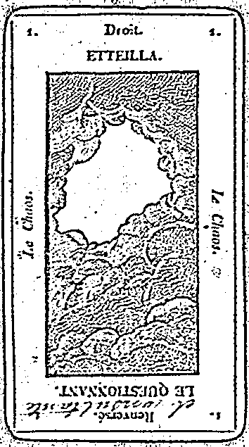

GE1 的 1 号牌。这一张牌的名字就叫艾特雅，是作为男性指示牌使用。

这副牌的特点是，正位逆位都印有占卜关键词。很多关键词也源自他的小艾特雅牌。不过，艾特雅和他的学生为每张牌写了不止一个关键词，还有许多同义词。在 Grimaud 出版 GE1 时，他修改了一些关键词。修改版的关键词也算在同义词库中。

相较于小艾特雅的第 33 号指示牌，GE1 则有两张指示牌——1 号男性指示牌（Etteilla/Male Questioner），和 8 号女性指示牌（Etteilla/Female Questioner）——替代了马赛体系中的 II 号女祭司和 V 号教皇。

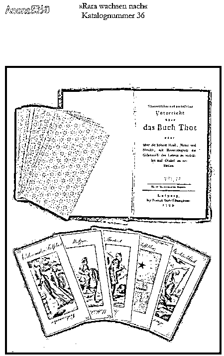

1973 年的德文版 GE1。

GE1 的一个变种于 1838 年由 Simon Bloquel 出版，设计方案是基于艾特雅学生的一副卡牌。其与 GE1 只有些许不同。Detlef Hoffman 和 Erika Kroppenstedt 将这副牌标记为“大艾特雅 2 号”（Grand Etteilla II，以下简称 GE2）。

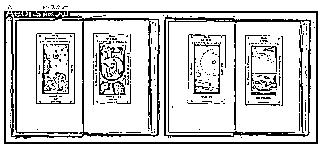

早期曾以书页形式出版的 GE2。 

GE2 还有 1890 年左右由 Z.Lismon 发行的一个版本，部分图案有所不同。这副牌被称作 Lismon Etteilla Tarot，也有一些差异较小的变种。 

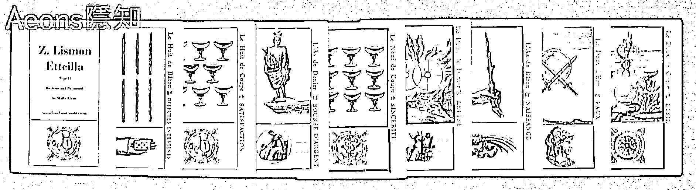

作为 GE2 类型的 Lismon Etteilla Tarot。

需要提醒一点：虽然艾特雅认同塔罗的埃及起源说，但大艾特雅牌（包括 1 号和 2 号）的图案设计相比于古埃及，更确切的说依然是欧洲风格。

2、埃及塔罗：圣女的神谕（Tarot Egyptien：Grand Jeu de l'Oracle des Dames）

Grand Jeu de l'Oracle des Dames 出版于 1865 年（也有说 1870 或 1880 年左右）。Detlef Hoffman 和 Erika Kroppenstedt 将这副牌标记为“大艾特雅 3 号”（Grand Etteilla III，以下简称 GE3）。这副牌具有新哥特式的风格，与艾特雅自己设计的塔罗牌有很大区别。

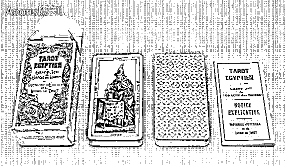

GE3 板式的埃及塔罗。出版方：hdegarmeaux。

3、公主塔罗（Jeu de la Princesse Tarot）

Jeu de la Princesse Tarot 是约 1843 年由 Lorambert 设计。这副牌采用了大艾特雅的结构，但是不同于 GE1、2、3，其使用了古埃及的主题图案。Dusserre 在 1876、1983 年出版过该版式的塔罗牌。1996 年，圣甲虫公司（Lo Scarabeo）出版了这副牌的一个变种，名为“神秘古典塔罗”（Esoteric Ancient Tarots）。

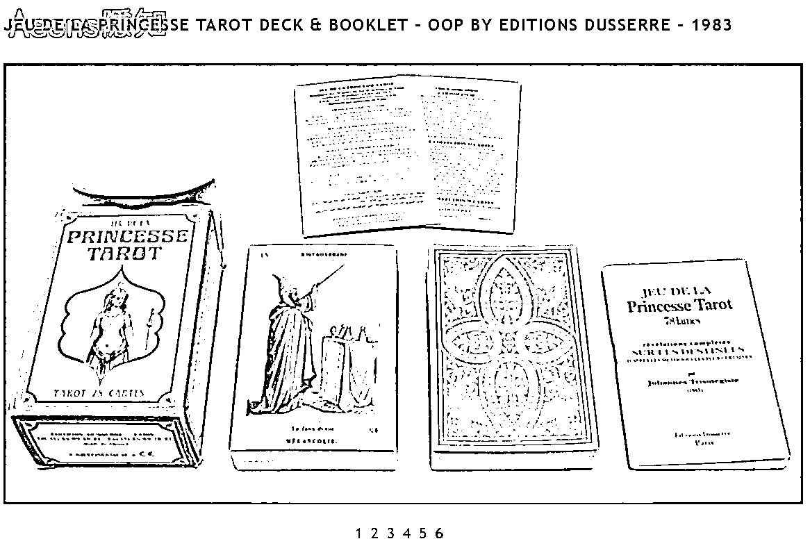

1983 年版的公主塔罗。

4、19 世纪艾特雅风格的俄罗斯塔罗

上述几种牌的数字牌都没有人物或风景图案设计。在 James W. Revak 的网站上，他记述了一副出现在 19 世纪的俄罗斯塔罗牌，它的出处不明，有着类似 GE3 的设计，但数字牌拥有图案。

* * *

有了这个分类，我们就可以对艾特雅系塔罗牌进行归类了。上面提到的一些早期牌也有再版，下面我只对目前在售且较流行的三套艾特雅系塔罗牌进行分析。

1、Grimaud 版“大艾特雅塔罗”，Grand Etteilla Tarot：

出版年代：1969 年，1982 年等。如正文所述，是基于 GE1 的版式。

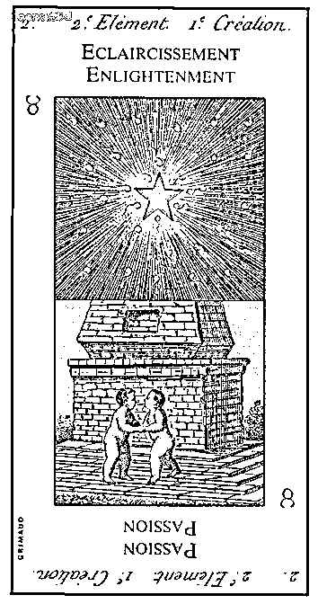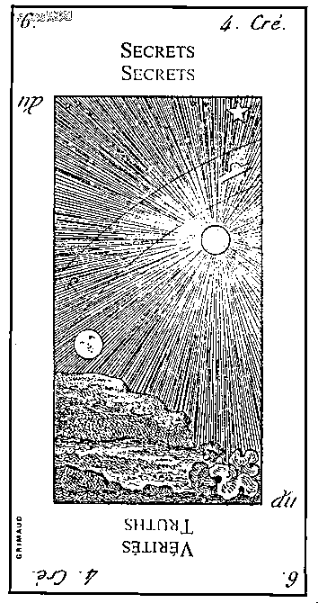

2、圣甲虫版的“艾特雅透特塔罗”，《The Book of Thoth (Etteilla Tarot)》：

美亚介绍是对圣女神谕牌的重置版（Reproduction of the Great Game of the Oracle of Dames）。

从图案也可以看出，这副牌是基于 GE3 的板式。

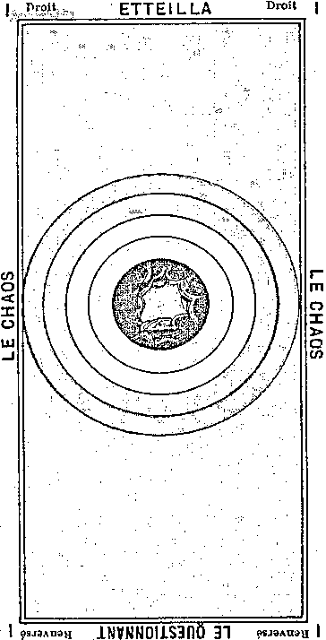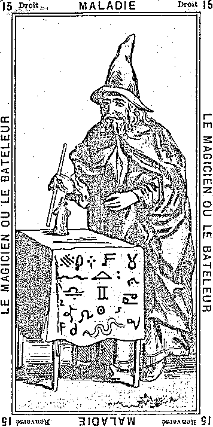

3、圣甲虫版的“神秘古典塔罗”，Esoteric Ancient Tarots：

又名“The Etteilla Esoteric Tarot deck”，如正文所述，是基于公主塔罗。

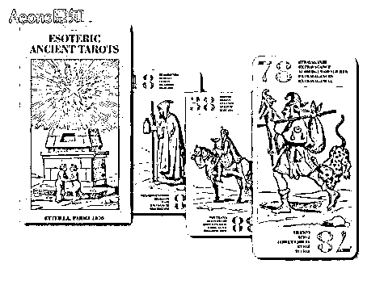

好了，讲到这里，相信大家就会挑选艾特雅系塔罗牌了。这是一套与马赛、韦特、透特三大体系都截然不同的神秘学系统，因此对于现在的学者来说，上手可能会有些困难。然而艾特雅牌的设计的确是充满了魅（shu）力（xue），作为收藏也是不错的选择哟。

版面所限，更多的图片我会发在论坛的帖子中，感兴趣或想要讨论的朋友请戳：[`www.imslr.com/thread-48445-1-1.html`](http://www.imslr.com/thread-48445-1-1.html)

羽落弦 敬上

二〇一八年一月十日

---------

主体翻译自：

[`www.tarotpedia.com/wiki/Etteilla_Pattern`](http://www.tarotpedia.com/wiki/Etteilla_Pattern)

其他参考：

[`autorbis.net/etteilla-alliette`](http://autorbis.net/etteilla-alliette)

[`a.trionfi.eu/WWPCM/decks07/d05365/d05365.htm`](http://a.trionfi.eu/WWPCM/decks07/d05365/d05365.htm)

[`forum.tarothistory.com/viewtopic.php?f=11&t=827&p=11761&hilit=Etteilla#p11761`](http://forum.tarothistory.com/viewtopic.php?f=11&t=827&p=11761&hilit=Etteilla#p11761)

[`www.christies.com/lotfinder/Lot/grand-etteilla-ii-tarot-bound-in-a-4740232-details.aspx`](http://www.christies.com/lotfinder/Lot/grand-etteilla-ii-tarot-bound-in-a-4740232-details.aspx)

[`www.thegamecrafter.com/games/lismon-etteilla-tarot`](https://www.thegamecrafter.com/games/lismon-etteilla-tarot)

声明: 该文章版权归指引社和作者所有, 转载请保留此行([`www.geaving.com/article/view/id/144`](http://www.geaving.com/article/view/id/144))

排版｜指引社

文案｜指引社

指引社，致力于让“神秘学”走向大众，不再“神秘”。杜绝神棍，欢迎撩或聊

长按二维码关注我们

点击“阅读原文”，去指引社看原贴

# 芳香植物的两把钥匙（科属篇）⑥

> 原文：[`mp.weixin.qq.com/s?__biz=MzI5NTQzMDUzMQ==&mid=2247483802&idx=5&sn=00d6b1ff98a485a2369c3e4d1fcdfaaa&chksm=ec52f176db257860c80cfee6ebdd4bc1d88948a3c59659b6041d81d9ab28f35278670b920054&scene=27#wechat_redirect`](http://mp.weixin.qq.com/s?__biz=MzI5NTQzMDUzMQ==&mid=2247483802&idx=5&sn=00d6b1ff98a485a2369c3e4d1fcdfaaa&chksm=ec52f176db257860c80cfee6ebdd4bc1d88948a3c59659b6041d81d9ab28f35278670b920054&scene=27#wechat_redirect)

**记得点蓝字关注，与好内容相遇**

啊～又到了更贴的日期，拖稿综合征发作的我十分痛苦的来更贴了

今天我们首先来学习马鞭草科

马鞭草科 Verbenaceae

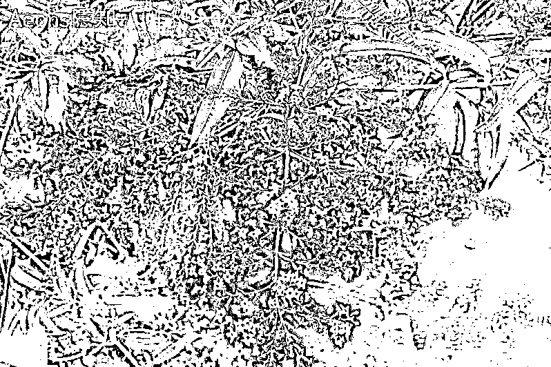

如同它的名字一样，它长的很像马鞭，象征着鞭策。除此之外，马鞭草科的植物还有调控欲望的能力，首先是适合控制欲过于强烈的人，它能让人懂得放手，让心灵的能量重新流动起来。有时候太想掌控权力，太具有侵略性，让心灵被冻结起来，成了一颗钉子，一块尖锐的冰锥，扎根在权力与欲望之中，长期下去自身也被其腐蚀。

长期浸泡在这腐败的环境中，为求自保，也为更能快速的爬，把自己层层的包装起来，似乎没人看的见你内心真实的样子了，你成了权力与欲望的狂热分子。

什么时候开始，脸变得僵硬，不是绷的如一块钢板，就是每天标准式的微笑，午夜梦回，却在担心着失去如今拥有的一切。

马鞭草科很适合上述的这种情况，它能一层一层的剥开防备，直击心灵深处，唤醒那最微弱的温柔。平衡和节制欲望，还能带来无线的生机，给这类人使用时最好的搭配是摩洛哥千叶玫瑰，心花层层绽放，吐露真情。

除此之外还适合因心灵空虚，转而放纵肉体欲望的人，或者在两性关系或者家庭关系中总想严密把控的人群。还适合内心自卑而表现的外表防备心过重，或者自我膨胀，看起来似乎强悍精明的人。因为它能穿透防备，给心灵深处带去无线生机，让真情流露。

介绍一下马鞭草科重要植物

柠檬马鞭草

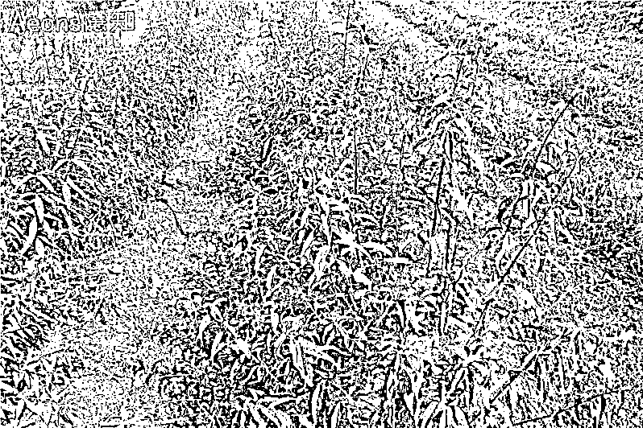

这个植物，接触神秘学的人应该并不陌生，它常常出现在一些魔药配方中，巫术盛行的时候，它是爱情灵药中的重要一员，传说可以让爱情死灰复燃，将柠檬马鞭草悬挂在门口，还可以赶走恶灵。

实际上，此恶灵并不来自于外界，它是说我们内心的魔鬼，让人想要把控一切，为权力，为掌控而疯狂的魔鬼。通常这种情况则源于内心的的不安全感，自卑情节等。总是担心自己没有足够的资源，所以才迫切的想要得到资源，让周围的一切都成为自己可利用的资源。而使用柠檬马鞭草，就能穿过心灵的层层防卫，让心灵的能量，那些固结的创造力，想象力流动起来，让别人觉得处处有资源，便不再担心。

同时它能治疗抑郁症，和佛手柑，真正薰衣草，罗马洋甘菊，搭配起来能有强大的协同作用，使用够能平复心中的不安，让人开朗起来。

柠檬马鞭草虽然价格昂贵，但是却只要一点点就能有强大效果。

值得注意的是，其保质期较短，原植物拿来煮茶都得快点用完，我隔了两个星期再用都是香气大失。

其气味清甜，我认为是带柠檬味植物中最好闻的，山鸡椒比柠檬香茅好闻，因为柠檬香茅还是有股草味，而山鸡椒却始终很清香，而柠檬马鞭草比山鸡椒好闻，气味饱满有有股花香，不过含有微量的呋喃香豆素，略有光敏性。

其功效主要体现在心理层面，但在生理层面也有良好的镇静和抗感染的功效。

下面来说说女性之友

贞节树

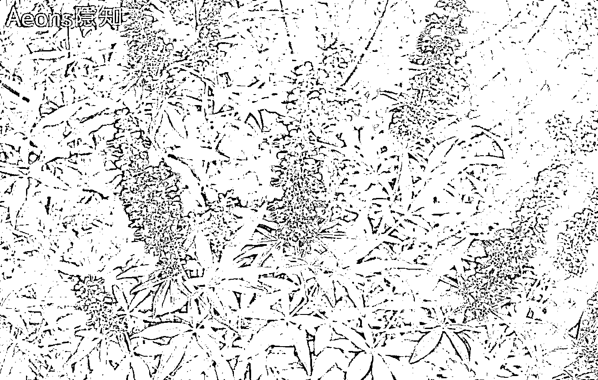

首先我们来望文生义一下，没错，和贞节牌坊一个意思，她和控制性欲有关。

古罗马时期，很多妇女会食用贞节树的果实，还会把它的叶子铺在床上，因为丈夫外出打仗，深闺寂寞啊，为了维持贞节，所以她们会这样做。

上述内容并不能说明它是女性之友，其作用当中最突出的是，尽管很多草药油具有影响雌激素的作用但它是少数能直接影响黄体酮的。

黄体酮能维持分泌性良好的子宫内膜，还能减少痛经，抗沮丧。

女性特别容易心情郁闷，按中医来讲，女子以肝为先天，以血为用，然而女性常常容易失血。比如来大姨妈啊，生孩子，哺乳啊。所以血常不许，不足以养肝，肝又是“将军之官”脾气暴躁，导致女性常常心情郁闷（这个时候就要买买买）所以（敲黑板）这个时候男性就该让着我们，而不是试图通过讲道理来说服女性，有本事你们也每个月流血去呀～

所以，减少大姨妈的折磨和抗沮丧气是十分重要的事情。除此之外，它还能减轻经期水肿

综上所述，贞洁树对治的女性问题就是，经前症候群和更年期综合征。

黄体酮，从女性三十岁之后就开始流失，四十岁后流失的速度和程度都比雌激素要厉害，使用贞洁树，它不是直接的补充黄体酮，而是影响脑下腺，间接的去调节黄体酮，使它可雌激素达成平衡。

我们可以把贞洁树油，一滴，和一勺月见草油混合，每天早晨空腹口服，也可以来大姨妈前一周用它来按摩腹部，都对女性有良好的保养作用。（禁止和人工荷尔蒙一起使用）

对应的心理作用就是调节女性过度的性欲，额，或者过于冷淡？（其它芳疗师反应有用，我没用过，因为能催情的草药油太多了，但是想想它对应的根本问题，应该比直接催情更有长期效用，不过再想想也是废话，性冷淡基本都和生理功能问题有关系，用了贞洁树调理好了自然就没问题了，话说我这个括号里内容是不是太多了）

马鞭草科还有一个常用成员

马缨丹

貌美植物，有很好的抗病毒功效，不过使用后会有比较强烈的好转反应，其他的不用多说，虽然是比较常用植物，不过很难买到草药油，就不多介绍了。

杜鹃花科 Ericaceae

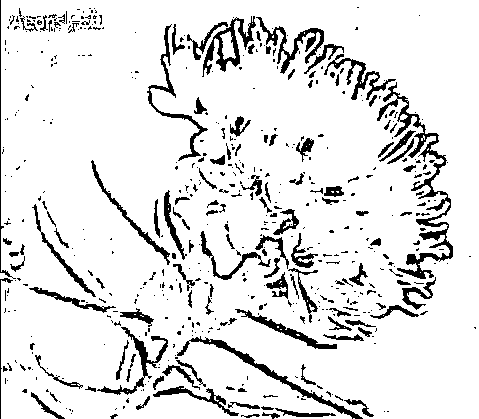

其植物品种多，分布广，城市绿植常见。

这个科的植物对我们来说很重要，它具有十分独特的疗愈特色，是强化耐力和身心净化最重要的科属比起松科的缓慢，它几乎能立竿见影，比起橄榄科的超凡入圣，让平凡人不那么容易接受，它更能亲民，比起柏科的流动性净化，它速度更快，在使用柏科净化时加入它，能让净化能量跑遍全身每一个角落，来一个上上下下里里外外的彻底大扫除。

除此之外，杜鹃科植物更有让人脱胎换骨的作用，特别是在遭受人生重大打击之时，（比如家庭剧变）此时用杜鹃花科搭配花朵类是绝佳的原则，能助凤凰涅槃。

在对人世失去眷恋时，甚至想“极端避世”时，使用杜鹃花科，也能有力挽狂澜之力，搭配樟科，和豆科，是极佳选择

杜鹃花科的力量站在两极之段，既可清理蒙尘之心，有净化之力，又可带人入世，顽强的站在红尘之中。作为常见的城市绿植，它们不也是这样，在忍受着沙尘，也开出灿烂的花朵。

它的力量关键词就是耐力和自省。（敲黑板）

常用植物就是髯花杜鹃，芳香白珠，和格陵兰喇叭茶，这三种都很重要，下一篇我会详细说明，对了，除此之外还有黄桦，不过，近年由于原料工厂混掺人工合成的水杨酸甲酯情况太严重，质量普遍不堪入目，所以直接改用芳香白珠比较好（如果是魔药配方则不可替代）

本周就先到这里吧～挥爪

排版｜指引社

文案｜指引社

指引社，致力于让“神秘学”走向大众，不再“神秘”。杜绝神棍，欢迎撩或聊

长按二维码关注我们

点击“阅读原文”，去指引社看原贴

# 2018 星座运势-总运

> 原文：[`mp.weixin.qq.com/s?__biz=MzI5NTQzMDUzMQ==&mid=2247483793&idx=1&sn=6c169d9d5d3eaf574bd525cddfadc9a2&chksm=ec52f17ddb25786bf6e15f822d63ad8a0703cd444c421313dd086c09fb81cea54b63b5332d11&scene=27#wechat_redirect`](http://mp.weixin.qq.com/s?__biz=MzI5NTQzMDUzMQ==&mid=2247483793&idx=1&sn=6c169d9d5d3eaf574bd525cddfadc9a2&chksm=ec52f17ddb25786bf6e15f822d63ad8a0703cd444c421313dd086c09fb81cea54b63b5332d11&scene=27#wechat_redirect)

**记得点蓝字关注，与好内容相遇**

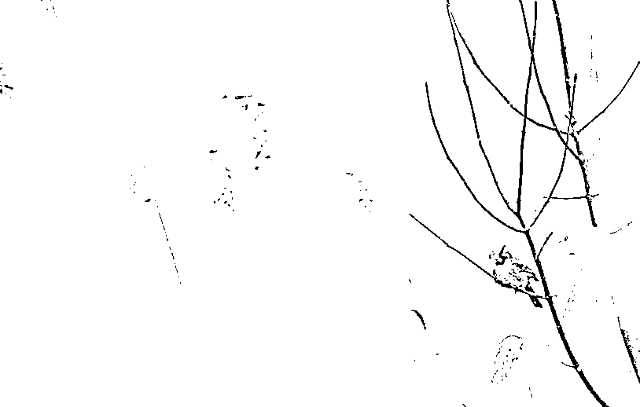

**日**

**一**

**二**

**三**

**四**

**五**

**六**

1

元旦  

2

3

4

5

小寒

6

7

8

9

10

11

12

13

14

15

16

17

18

19

20

大寒

21

22

23

24

腊八节

25

26

27

28

29

30

31

时间对珍惜它的人格外宽容

我们生命里总会遇到许多人，总会有那么一个人把你变成极其好的你，总觉得你从还没出生就认识他了，从遇到他的那天开始就是命运的转折点，自此踏碎凌霄，沧海变桑田

身处 2018 年，每个人都像被上了发条一样，目标明确，越是信念坚定的人，越有希望在这一年收获理想。不可避免的就是人与人之间的冲突，利益必然带来损失，一个阶级的人，一个集团的人会在利益的影响下，收起勾心斗角，向着更大的利益迈进。

2018 年里的每个人又像是发了疯一样的追求完美，仿佛每个人都得了强迫症，不满意就不要，凑合一下那是什么鬼理念，这样疯狂的想法会出现在每个人的脑海里。竞争的激烈不是一星半点，整体行业都是欣欣向荣，果然是人为财死鸟为食亡~

2018 年是一个教育业的好年份，从培训到留学都可以好好捞上一笔。

2018 年人人都有机会和老外搭上那么一两句话，能说到哪个份上，得看你自己了。

大部分星座的人，2018 年都要和买卖房屋结下不解之缘。

2018 年比较让人忧心的是两点，但是从本源来看，还是一点，小到情侣口角，大到国与国，所有人都会对自己的观点极度自信，谁都不愿意退让，从而引发无数的战争，随着时间的推移，会进入白热化的状态，箭在弦上，一触即发。

奉劝所有喜欢玩“一哭二闹三上吊”的父母，你们还是省了这份心吧，一切随缘，注定了没有的就不要强求了，强迫，逼迫只会换来更糟糕的结局。

撇开正常恋爱模式，2018 年还可以带上这样的属性，关键词一，贵圈真乱，关键词二，冷宫复宠。

2018 年最苦逼的莫过于那些看似体面的相关工作人员，需要你们操心的事情太多，好好回报我们这些纳税人为你们支付的工资吧。

2018 年是个旅游年。

2018 年对于那些喜欢旅游的人来说，可谓是无穷的灾难，虽然你们可以因为自己的努力而去到很多地方，但是无奈的是，想要好好欣赏是不可能的，因为随时随地有让你们爆发的对象存在，毕竟不是那么多人懂得什么叫公德，什么叫心灵的旅游，何况 2018 年就是大家都喜欢到处跑，大大增加了你们吐血的概率。除此以外，建议你们不要携带贵重物品前往景点，当然，如果你是想要更新换代，却苦于没有借口的话，不如拿来做个“慈善”吧。

2018 年建议大家还是崇尚绿色低碳环保吧，毕竟我们的地球只有一个。

2018 年会出现各种奇葩的新兴宗教，哲学理论也有人大肆宣讲，身心灵学科得以胡乱发展，信与不信，各占半壁江山，口水战会持续很久很久，相信头疼的人会不少。

2018 年很多人会觉得婚姻弊大于利，也同时对亲眷关系产生排斥。

（向上滑动启阅）

**星座运势**

牧羊年运详解：http://www.geaving.com/article/view/id/129

金牛年运详解：http://www.geaving.com/article/view/id/130

双子年运详解：http://www.geaving.com/article/view/id/131

巨蟹年运详解：http://www.geaving.com/article/view/id/132

狮子年运详解：http://www.geaving.com/article/view/id/133

处女年运详解：http://www.geaving.com/article/view/id/134

天秤年运详解：http://www.geaving.com/article/view/id/135

天蝎年运详解：http://www.geaving.com/article/view/id/136

射手年运详解：http://www.geaving.com/article/view/id/137

摩羯年运详解：http://www.geaving.com/article/view/id/138

水瓶年运详解：http://www.geaving.com/article/view/id/139

双鱼年运详解：http://www.geaving.com/article/view/id/140

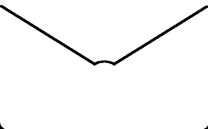

排版｜指引社·阿烬

文案｜指引社·心之灵

指引社，致力于让“神秘学”走向大众，不再“神秘”。杜绝神棍，欢迎撩或聊

长按二维码关注我们

点击“阅读原文”，去指引社互动

# 芳香植物的两把钥匙（科属篇）④

> 原文：[`mp.weixin.qq.com/s?__biz=MzI5NTQzMDUzMQ==&mid=2247483793&idx=2&sn=3193086b923721f27ae9c840f0fe292f&chksm=ec52f17ddb25786b554124f554369c32a5fdc19b372a0e30bbff1778f1711ed99ecab7936365&scene=27#wechat_redirect`](http://mp.weixin.qq.com/s?__biz=MzI5NTQzMDUzMQ==&mid=2247483793&idx=2&sn=3193086b923721f27ae9c840f0fe292f&chksm=ec52f17ddb25786b554124f554369c32a5fdc19b372a0e30bbff1778f1711ed99ecab7936365&scene=27#wechat_redirect)

指引社

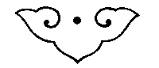

拖更果然很快乐！

这一章节我们首先来介绍一个常伴左右的科属

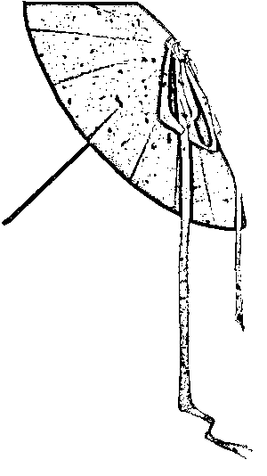

**芸香科**

**Rutaceae**

芸香科大家最熟悉的就是柑橘属，不知道你们是不是和我一样喜欢吃它们呢，剥开一个橘子皮，肉眼可见飘出的“一阵青烟”那个就是它的精油了。

有时候坐时间比较长的客车，两三个小时，刚开始还好，坐到后面一个小时简直想死。

不仅屁股痛，而且心头烦闷，出汗，感觉有股火纠结在胸口，这个时候车上某位乘客拿出一个橘子，剥开吃，我闻到这股气味顿觉舒畅很多，从此后搭车必备芸香科精油。

在芸香科里，除了柑橘，还有一些特殊香气的食材，比如花椒，吴茱萸，布枯。这里还是重点介绍柑橘属

柑橘属果叶果皮含油量十分丰富，甚至对着光肉眼可见，所以萃油率很高，价格可爱，我们也可以自己动手挤压，然后过滤，就可以得到其精油（冷压的最好）

芸香科都喜欢烈日烤照的气候，呼应着它鲜明开朗的性格，每一个橙子都像一个温暖得小太阳，所以在药学属性上，多半可以去阴湿。

值得注意的是其中的佛手柑，它身世神秘，兼具阳光和优雅，如一位绅士。其化学成分奇特，以乙酸沉香酯为代表，这就是在说，它多了一些花香感。

柑橘属除了果皮可以萃取精油以外，还有叶子和花也能萃取，不过花朵类就偏于昂贵了，一些好的橙叶油，气味是很接近橙花的。我们的鼻子是鉴别油品好坏的重要标准，苦橙叶现在最常见的植物来源地是巴拉圭，个人不推荐这个地方的，因为光照，环境那些都不理想，加上采收人员手法暴力，写个地方出产的苦橙叶气味闻起来像酸秀才，带一股“沙苦味”

还有一些所谓顶级的苦橙叶油是把叶子里夹带花朵来蒸馏，所以价格比起叶子油更高一些，我也有买到过，个人感受还好吧，但是还是觉得该用花就用花，该用叶就用叶，这些未免有点莫名其妙了。

**芸香**

橙油

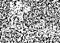

Orange

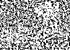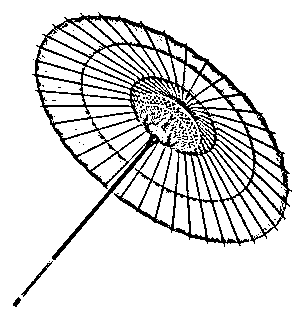

芸香科都有强大的太阳之力，能一扫心中阴霾忧郁，适合那些焦躁，忧郁，或者处于人生低谷，日常丧能量成瘾的人。

如果你想要单纯的抗忧郁，可以选用橙油，它分苦橙和甜橙，甜橙气味更加圆润一点，像小孩子，而苦橙多了一份阅历，如青年，它两对于心灵疗愈方面作用单一而执着，没别的，就是让你快乐。

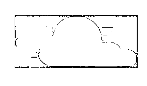

而从叶子里萃取的油，就有多了一点抗压能力了，特别是能改善冬季忧郁症，配合快乐鼠尾草，肉桂，肉豆蔻可以有效治疗这个问题，除此之外它还能照顾失眠问题，当然这方面并不突出，但是个很好用的辅助。说到它我顺便谈一下关于苦橙叶在护肤方面的作用，要记住了，它不适合久留，而更好用的方式是添加在洁面产品中，能去痘，控油，另皮肤细致。

若是长途旅行，或异地生存，建议可以多用红橘油， 它是个十分安全的朋友，而且能安抚疲劳，激发创意，促进与环境的融入， 同时亲和太阳轮，能够很温柔而全面的照顾你的小情绪和你的消化道。

重点才不是上述内容，重点是，它能安抚你强烈的环境不和谐情绪！

身处异地，白天忙碌着挣扎求生，仿佛身体被掏空，夜间拖着疲惫的身体回到住处，只有把自己关在一个小小的空间才觉得安全，我好想就这么哪儿也不去，我拒绝与周围其他人的交往，我不想出这个门，它是我唯一的保护伞，反正我就是无法适应这个复杂的环境，我不是其中一员，他们拒绝我，我也拒绝他们。

每当夜深人静的时候，我打开电视，才觉得不那么孤单，这个社会怎么了，到处都是个人小小的空间，我独自推着行李来到这个城市前是满怀信心的与家人告别，告别我安全的小天地，待的时间越长仿佛越容易回忆其刚来时的落寞与恐惧，其实它没有消失，不过是被压抑在你心底。总有那么一些时刻，好想回家，那个时候才发现自己多脆弱，多幼稚，多孤独

红橘油温暖的气味能很好的安抚这种带着焦虑的孤单感觉，我总是觉得它好像能给你一个朋友般分身的感觉，除此之外还能给太阳轮直接补充一定的能量，身处异地的“水土不服”身心症状它都能很好的处理。最后也能促进与环境的融入，所以它并不是纯保护，封闭的能量，而时比较开放的。

橘，除了它的果皮，还有橘叶也能萃取，橘叶萃取的精油拥有强力镇静，抗痉挛的效果，同时也能处理压力症候群。我喜欢把它和橘油一起用，再加上一些帮助入眠的油，就是很好的改善焦虑性失眠，孤独症失眠的方子

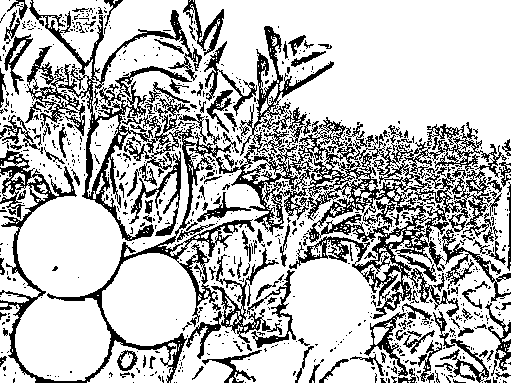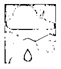

**葡 萄 柚**

快乐酒神

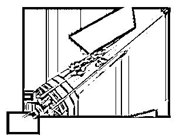

葡萄柚的气味甜的让人发醉，其柠檬稀是柑橘属中最多的，效果强劲，很适合处理心因性导致的肥胖，比如有的人心情沮丧就暴饮暴食。

除此之外它还适合处理倒时差的问题，也十分适合异地水土不服，但是要注意区别的是，它适合刚落地的分离孤独之苦，还有身体不服气，也能快速为大脑加油，而前面说到的橘，更适合一段时间後的突然情绪爆发，或者长期低落问题。

葡萄柚有白葡萄柚和粉红葡萄柚。

白葡萄柚气味活泼清雅，粉红葡萄柚略沉稳一点，特别适用于促进淋巴循环。

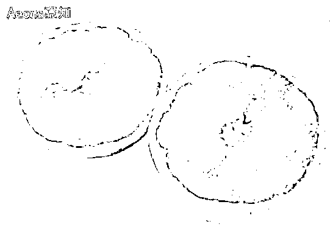

**莱 姆**

吟游诗人

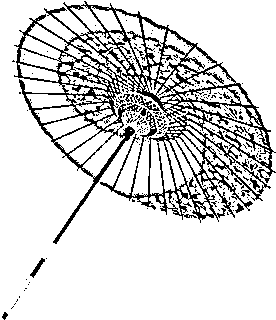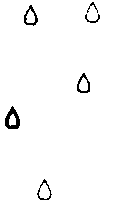

如一位的吟游诗人，即能欣赏世俗保持好奇心，又能以幽默的态度游走于世间黑暗角落。它最能帮助那些有苦说不出，憋的心中难受，阴暗面逐渐增大，快要吞噬心中光明的人。能让人保持幽默感，又能苦中作乐，在安抚心轮的配方中加一点莱姆油，能让干枯的心轮“开出花朵”

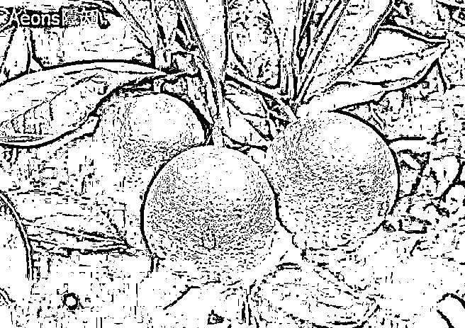

**柠 檬**

严肃的教师

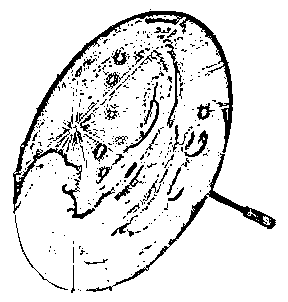

听到我这样说是不是觉得有点奇怪呢？柠檬就是这样，对此整个柑橘属，甚至芸香科，就属它气味最“收敛”，说道这个方面，就算是佛手柑，也是有一股放松优雅游刃有余的感觉。而柠檬得力量就算是“不外泻，强化”所以在更多保护性，强化性的配方中会添加柠檬，用在环境中它对应着更新，净化，驱逐。

在很多驱赶噩梦的香薰中就会使用到柠檬

对于身体的使用，它可以调理肝功能，处理肝肾失调问题，提升免疫力，美白皮肤。

在心灵方面可以镇静神经，强化心灵，使心灵威而刚，又不会失去变通

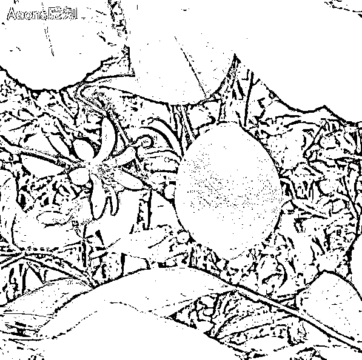

**豆 科**

Fabaceae

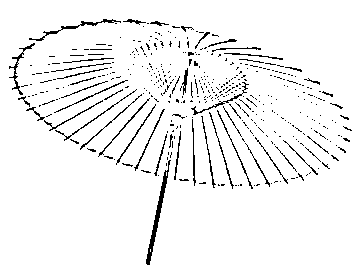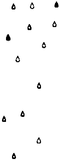

豆科植物的特色就是它看起来是一条长长的荚果，象征着丰饶。

其具有羽状复叶，像一对美丽的翅膀，象征着轻盈，其绝大部分植物具有根瘤菌，把大气中的氮固定在地下，可以增加土壤的肥沃度，很具有“利它性”的感觉，因为这样做可以让附近得植物生长茂盛，所以说它有大地之母的能量。

之前我们有讲到过孩童之眼的问题，这里就再多说两句，它是绝佳的心轮用油，可同时解决心血管问题和心轮能量问题，也就是说具有生理和心灵的双重意义。

豆科用到的植物并不多，大概就是零陵香豆，银合欢，古巴香脂，鹰爪豆，秘鲁香脂，香脂果豆木。

这里就介绍下我三倍喜爱的：

**零陵香豆**

它的气味像是坚果加焦糖的感觉，初闻便已沉醉在其中，有一股温暖的光笼罩在我心中，那一瞬间我原谅了所有的不堪，污浊。

我们常说穗甘松是出名的原谅油，但真正在调配一个原谅方子时，常常是零陵香豆和穗甘松一比一的搭配，再次量的永久花。所以我一定要给它鸣不平，零陵香豆是必不可少的原谅成分，加上其气味大好于穗甘松，所以我是三倍喜爱于它。

除了上述作用以外，它还特别适合两类人，

一是应酬过度，人到中年，二是用脑过度，常觉灵感枯竭，所以在艺术家用油中也常是不可或缺的角色，当然这种事是不传秘诀（偷笑）

上述两种人常常会有失眠，长期腰酸背痛，甚至心血管疾病，零陵香豆也能很好的处理这方面的生理问题。过量似乎可能麻痹心脏，所以剂量要注意，不能疯狂使用（价格也不便宜啊，少啰嗦两句）

曾经出过一个失恋方，其中零陵香豆尽管用量很少，但也是很重要的角色，具体配方思想就是用水象草药油带入心轮草药油，把温暖和安抚力直送心灵深层的伤痛处。

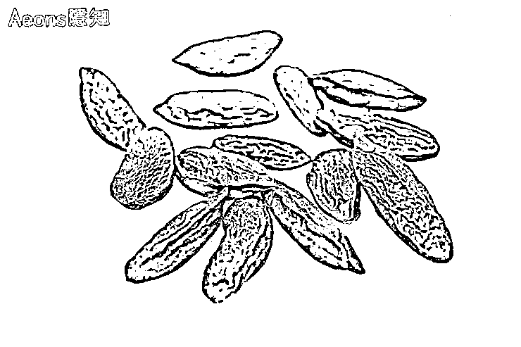

**慎小七**

芳香草药·专栏食用指南

慎小七，指引社矿灵学院管理，医学世家出身，芳疗师，常年调香爱好者跟实践者，草药专家。

本系列为慎小七原创出品，涉及芳香、草药等专业知识。

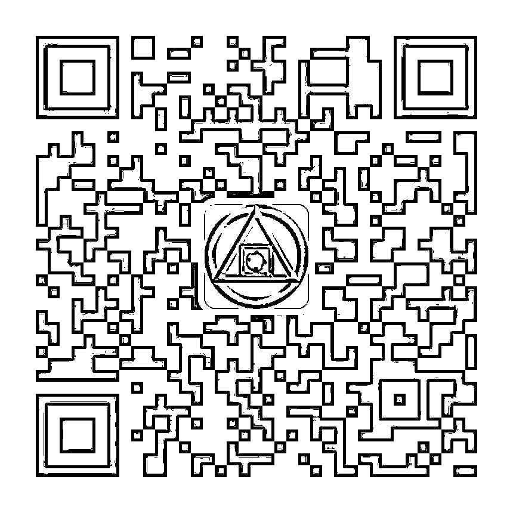

排版｜指引社

文案｜指引社

指引社，致力于让“神秘学”走向大众，不再“神秘”。杜绝神棍，欢迎撩或聊

长按二维码关注我们

点击“阅读原文”，去指引社看原贴

# 重发，碎碎念和运势菜单。

> 原文：[`mp.weixin.qq.com/s?__biz=MzI5NTQzMDUzMQ==&mid=2247483793&idx=3&sn=471f2d0e73e191dd777097e60856227a&chksm=ec52f17ddb25786bf2528d687a1add0e15133bde127be1485bd7960130296b9dd0d8745ce050&scene=27#wechat_redirect`](http://mp.weixin.qq.com/s?__biz=MzI5NTQzMDUzMQ==&mid=2247483793&idx=3&sn=471f2d0e73e191dd777097e60856227a&chksm=ec52f17ddb25786bf2528d687a1add0e15133bde127be1485bd7960130296b9dd0d8745ce050&scene=27#wechat_redirect)

**先说福利：**

2018 的运势菜单，关注公众号后，直接右下点击“新年运势”查看。

**再说吐槽：**

我声情并茂地排了一堆文章，写了一篇新年祝福。

然后被微信公众平台的后台 bug 卡了。

然后，心态崩了。

先在所有的群发作了一番，毕竟是连续加班一个月，今天终于 12 点（短暂地）加完班，等到凌晨四点可以改方案了……

结果花了一小时弄好的新年首推，就这么毁了。

但，心态崩归崩，看着心之灵高产的 13 篇，总觉得咬咬牙，还是再来一遍吧。

**新版内容：**

原先排了五六篇文，对不住大家，只放一早就排好的小七的文，和总运吧。

**曾经的碎碎念：**

其实上一版写了很多。

包括指引社的人，或者这个圈子的人，

为什么大都不出名，为什么大家还在高产，为什么有人离去有人来，

为什么写写星座口水文明明可以很赚钱，但这些国内第一批第二批搞神秘学的人，

曾经有些尝试过写星座口水文，然后又一脸清高+呆板地，研究自己的课题去了。

就好像微信后台会 Bug，你做了多少努力，大家看不到，就是看不到。

主流大众永远喜欢轻松的东西，

而流行的星座塔罗，又给他们深刻了“一步登天”的幻想。

圈子是个很奇怪的东西。

商业和学术，似乎总有着不可逾越的矛盾。仿佛鱼与熊掌。

一些人越是想要它不再神秘，想要将它作为“文化”去推广，

另一些人，就越是害怕，要努力夸大一切，要让自己能够有钱可赚。

作为一个“长大了”的人，商业的世界，我看了很多。

曾经我很气，气这些人，一边哭穷，一边又做不到卖自己。

但转过头想想，这些性格都有缺陷、讲课都是干货但太干了很枯燥的人，

这些专注学术的人，这些有自己坚持的人，

这些一言不合直接做了个 App 出来烧的人，

这些在指引社、在神秘学圈子里，贡献了国内的第一批资料，做了那些娱乐营销的初期土壤，最后消失在茫茫人海里，和娱乐至死的市场里。

赚钱从不可耻。

他们都想赚钱。

只是做不到。

也不知道怎么做。

在这个圈子里，我见过一些人，在手机像素还很差的年代里，让台湾的朋友，一页一页把书籍拍过来，努力分辨着文字手打全书，只是为了内部学习。群里规定不许外传。

而另一些人，拿内部学习用的书去盈利了，去宣扬自己了，原作者无辜被传播盗版。

有些人十年如一日，始终花着家底买原著，一点点翻译。他们表达能力有时候让我发指，但好像也没什么不对。

另一些人，枪手加出版社润色堆出口水书，一路段子手带闪电，飞黄腾达。也没什么不对，大家的路线不一样。低不下身段，赚不到钱，也怨不得谁。

但这里日复一日的矛盾，这十年间经历过鼎盛，有社刊，有周边，有不断出现的水贴要删，有初入圈子的中二病小白们要教育，有定期定点的课程。

经历过衰亡，时不时的 404 not found，流散掉的人们，要努力花钱花技术找回来的论坛。

直至 BBS 都衰亡了，有一些人仍旧还在。

论坛连中二病小朋友都不再出现了，有一些人时不时会回来。

有人不再中二，开始被生活所磨砺。

有一些人仍旧顶着神秘学的旗号，在捞钱的道路上一去不复返，赚钱不可耻，但底线也明显早就没了。

有人仍旧坚持着那些很固执很不可理喻的梦想，和自己的学术，坚持和社会规则碰撞着。

有人想明白要科普得先活着，开始想办法赚钱，但太干货又学不会注水，就总也是勉强维持生计，一边眼红营销党，一边继续很笨拙地做着很多东西。

2017 了，感谢你们仍旧在，感谢你们会回来。

看到的人可能并不多，但这一次，公号私用的我，

想说的很多，也不再顾忌“规则”地真的做了。

即便微信崩了，但我还是很开心。

2018，希望我开始冲破规则。

希望那些没长大的小孩，这里仍是你们的乐土。

但同时，也希望你们真的能靠自己的爱好，赚到钱。

2018，感谢你们在。

2018，感谢你们来。

# 占星师的魔法世界

> 原文：[`mp.weixin.qq.com/s?__biz=MzI5NTQzMDUzMQ==&mid=2247483776&idx=1&sn=d9650e0a5e753e73a210d04f009591d3&chksm=ec52f16cdb25787ac3f33efd58366c6288bf8d22121846e7e80f9486fe8166c73521e5b62a9c&scene=27#wechat_redirect`](http://mp.weixin.qq.com/s?__biz=MzI5NTQzMDUzMQ==&mid=2247483776&idx=1&sn=d9650e0a5e753e73a210d04f009591d3&chksm=ec52f16cdb25787ac3f33efd58366c6288bf8d22121846e7e80f9486fe8166c73521e5b62a9c&scene=27#wechat_redirect)

**记得点蓝字关注，与好内容相遇**

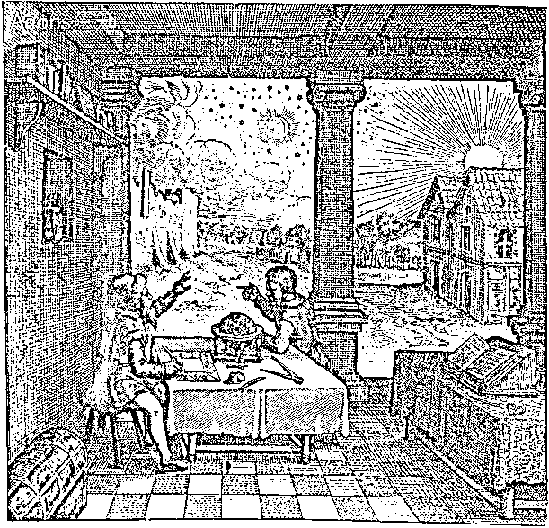

zhiyinshe

云汉

也许每一个学习西方神秘学的人，都或多或少会有一颗研究魔法的中二心，像我这种大中二更是不会例外。确实在我最一开始对神秘学感兴趣时，抓住我眼球的并不是占星，而是魔法，但是在进行了长期的暗中观察之后，相当怀疑的我还是选择了看起来更靠谱，也更容易得到更多中文资源的占星学。当时未尝没有曲线救国，将占星作为一个跳板的意思，正如 Robert Zoller 坦言占星最终为他打开了魔法的大门，它也同样为我开启了这个奇妙领域的大门。

下面是我 16 年的一篇旧文，目的是为了给读者简要介绍传统占星魔法（Astrological Magic）的大概轮廓。当然，占星魔法不过是魔法庞大体系中一个颇具特色的分支而已，其他的魔法体系可能非常紧密的联系到占星，也可能对它漠不关心。本质上来说，占星与魔法仍然是两个学科，但是对我来说，观察它们的交会之处是尤其有趣的。

**占星与魔法**

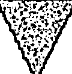

占星是一门古老又充满魅力的艺术，正如古德·波那提（Guido Bonatti）所言：“就这门学科而言，我们必然不局限于认知现在的事物，还将回溯起过去的事物，并预知未来的事物......”（Bonatti on Basic Astrology Treatise 1 Chapter 3）。

占星学让我们得以一瞥现在、过去和未来，还有什么比这更神奇呢？确实，我们经常把神奇而不可思议的事情称为魔法（magic），来表达对它的惊叹，从这个角度而言，占星确实可以被称为一种“魔法”。

但这不是我今天主要谈论的主题。我们需要知道，魔法不仅是一种对神奇事物形容，它也是一种真实存在的西方秘密传统。在古代的世界中，占星和魔法经常相互伴生，例如在《神秘哲学三书》（Three Books of Occult Philosophy）中，阿格里帕（Agrippa）告诉我们：

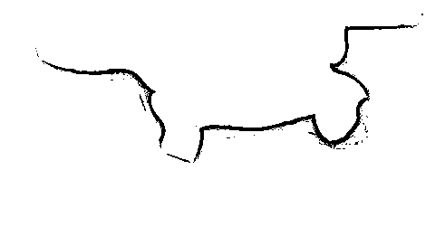

因此，任何渴望学习这些能力的人，如果他不能精通自然的哲学（在其中事物的特性被发觉，万物的神秘性能被揭露），不熟练于数学，和星辰的相位与图形（由此决定了万物崇高的美德和性能），也没有学习神学（在其中展露非物质的实质，分配并管理所有的事物），他将不可能理解魔法的原理。

——Three Books of Occult Philosophy

但是到了现代，不仅古典占星和古典魔法的技巧与理念遗失，它们之间的关联也变得不再明显。这既发生在占星师的身上，也发生在魔法的体系中。现代的占星师基本没有涉及到魔法的操作（甚至不相信魔法），而魔法师虽保留了一些占星的象征与世界观，但是不再进行星盘的解读。时至今日，随着占星和魔法复古潮流发展，我想我们有必要再次检视占星和魔法之间遗失的关联。

**占星的魔法**

但是魔法究竟是什么？魔法可以做到什么？占星的魔法和其他魔法有何不同？占星魔法又该怎样操作呢？这个主题涉及到太多太多的问题，请恕我在这里无法一一探讨。加之如果要详细地描述这些方面，未免太过冗长和枯燥。下面就让我援引一段小故事，给各位一个有关占星魔法的印象。这个故事和著名的中世纪占星师古德·波那提（Guido Bonatti）有关，摘译自詹姆斯·赫歇尔·霍尔登（James Herschel Holden）所著的《天宫图占星史》（A History of Horoscopic Astrology）：

由于怜悯一位经常和他下棋的穷苦的药剂师，古德给了他一个蜡质的帆船图像，告诉他将其藏在秘密之处的箱子中，他就会变得富有。但是如果他离开它，他就会再次变得穷困。确实，这个人变得富有了，但是他开始担心这个图像涉及到巫术的操作。

所以，在他正变得富有之时，他决定救赎自己的灵魂，并向牧师坦白了图像的事情，牧师命令他将其毁掉。接着，正如波那提所说的那样，他很快失去了所有的财富。

之后他祈求古德为他制作另一个图像，但是波那提咒骂他，并说这个图像并非邪术（magic），而是从天象（constellations）得来的美德，并且这样的天象在 50 年内都不会再出现了。

——A History of Horoscopic Astrology

这实际上就是一个与魔法密切有关的行为，在特定的天象下制作一个图像（形象），然后天体的力量就会依附于其上，使这个图像具有某种德性或效力。这是一个典型的“符咒”制作的流程，由于在这个体系的魔法中，选择一个恰当的天象非常重要，因此它和择日占星不可分割，也有人称这种行为实际上就是择日占星的一种分支。

但是这个故事明显更加“占星”，虽然它听起来也很神奇，但是本质上没有什么看起来“玄妙深奥”的步骤，也相对来说没太多魔法的元素参杂其中。因此虽然它体现了占星符咒魔法的大原则，但是可能不太典型。下面我摘译另一个有关于占星魔法的故事，这个故事记载于著名的魔典《贤者之书》（Picatrix）中：

我曾读过一本书，名为《科学的分割者与秘密的启示者》（The Divider of Sciences and Revealer of Secrets），在其中记录过这样一件事。我对你讲一个看上去可信赖的故事，它在 Foracen 的大陆被讲述，是来自于印度的一些东西，并从那引进到这门科学中，但是当书中争论可疑的事情时，它被怀疑是否属于这门科学。虽然它说，这是很清楚被证明的。

在那片大陆上，有一个女孩，每个人都认为她们非常美丽。一个人说，他可以使她来到我的居所。我请求他使其如他允诺一样前来，我这么做有两个原因，既是为了恋爱也是为了知识，也是因为我渴望这个女孩；我请求他在我面前进行操作。他立刻通过悬挂星盘并找到太阳的地平纬度，确定了上升点并排布十二宫。他发现火星主管的白羊座是上升的，而金星主管的天秤座在第七宫。我询问他这是什么含义，他说上升和七宫与我的请求是相一致的。火星和金星位于星盘中它们所在的位置，他解释说，当它们以三分相注视彼此，我的意图就可以被达成。他发现它们之间的相位将会在四十天达到完美，他告诉我在从这天开始的前述四十天中，我询问我的问题，我就会实际上获得我的渴望。

他立刻取了一小块钻石，细细地把它磨成粉末，并将它与等量的氨草胶（gum ammoniac）混合，他用这个混合物以我的肖像制作了一个图像。他也取了干无花果（sycamore）并将其细细地磨成粉末，将其与蜡相混合，用这个制作了一个漂亮女孩的图像，并以类似于她的衣物装饰它。然后他拿了一个新的水壶，在其中放了七根棍状物或棒状物（也就是，桃金娘、柳树、石榴、苹果、杨树、西克莫无花果树和月桂的细枝），并将这些安置在水壶中间，四个在下三个在上，交叉摆放。

然后他将以我名字制作的图像放入，然后将女孩的图像放入同一个水壶。当他这么做的时候，他注意到金星会与火星对分相，并且此时火星会被吉星加强。他将水壶密封，并且每天的某个小时开启它一次，在其中它放入上述的事物。在四十天的最后，当上升主星以三分相注视着七宫主星时，他再一次打开了水罐，将图像放入，以使它们注视着彼此，也就是说，面对面的。然后他将水壶密封好给我，埋藏在时常有火焰的灶台之下，让我说一个来自于印度的单词，他将其解释给我并告知我，就如我将会在下面解释那样。

然后，当操作完成时，他拿出水壶并打开它，将图像取出。然后上述的那女孩来到了我的房屋门前，她和我待了十天的时间。在十天的末尾，他告诉我我应该做上述的事情。“当我对你的允诺完成时”，他说：“我认为我们更好的做法是释放这个女孩，并将其恢复至自由无恙”。我因善意赞同了，并取出被埋藏的两个图像。然后取磨成粉的贞节树（chaste tree），将其与蜡混合，他用它制作蜡烛，并在灶台上燃烧它。

当它们被完全的燃烧后，他从它们埋藏之处取出图像，将它们彼此分离，将它们其中一个抛向一个方向，另一个抛向其他方向，说出另一个我将会在下面教授的单词。他做所有的这些，以将他的知识展示给我。当这被完成时，我看到女孩的记忆消失，她目瞪口呆的站起来像是梦游的人。她然后对我说：“你想要对我说什么吗？”并逃之夭夭，离开了这栋房屋。

我们可以发现，这个故事的叙述明显更加神奇和详细，也更像是一种魔法。它不仅涉及到星盘的建立和时间的挑选，还有一些看起来更加玄秘的步骤，比如在水壶中放入枝条、制作两人的图像、诉说某种特定的词汇、燃烧蜡烛等等。对我们而言尤其有趣的是，这个操作体现出一些“卜卦占星”的倾向。在魔法师听到此人的允诺和请求后，就以此刻建立星盘，接着取 1 宫主和 7 宫主成相的时间来执行操作，这实际上是卜卦占星的理念。我们如果阅读相关的典籍，就会发现占星魔法虽然和择日占星关联最紧密，但是与本命占星、卜卦占星和世俗占星也是有所牵涉的。

例如塔比特·伊本·昆拉（Thabit Ibn Qurra）就在他的《图像之书》（De Imaginibus）中叙述了很多与卜卦占星有关的操作。但是一般这些操作所需的卜卦盘都具有某些限定条件，例如要符合有效性，并且不能出现与目的相违逆的征象等等。在《贤者之书》中，我们也可以常常见到一些与其他占星技巧有关的魔法操作。

**现代魔法的占星实践**

至此，我虽然没有正面回答什么是占星魔法以及它能做到什么，但是想必大多数人已经对此有了一些印象。不过也可能有人对这些并没有实感，因为看起来它们的年代有些久远，更像是一些故事，真实的程度让人生疑。下面，我便摘译现代占星魔法实践者克里斯多夫·沃诺克（Christopher Warnock）的一个实践案例，来见证占星魔法的效用，这个魔法的基本思路取自于《图像之书》的第一章：

这是用于驱逐蝎子的图像。如果你渴望这么做，在天蝎座升起时开始操作，用铜、锡、铅、银、金等材料制作一个蝎子图像，材料随你喜欢。在上面雕刻上升星座和其主星的名字，你进行操作那天的时主星的名字，月亮的名字；使月亮位于天蝎座。

尽你所能使上升不幸，使上升主星不幸，如果你能做到的话，就将其放在死亡之宫（8 宫），尽你所能使上升主星不幸，或让其在 4 宫或 7 宫合相凶星。

克里斯多夫·沃诺克的实践，抑制老鼠的符咒：

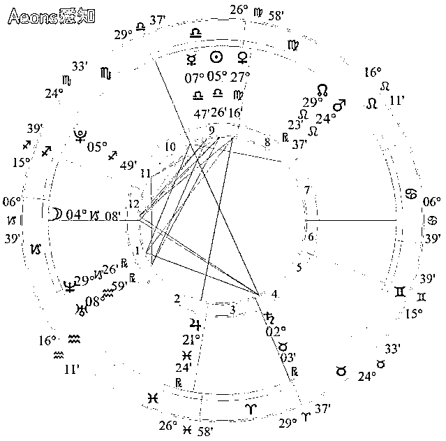

我的第一个任务是为星盘确定恰当的上升：也就是老鼠的上升。阿尔比鲁尼（Al-Biruni）说摩羯座主管“爬行动物”。这可以由老鼠的自然主星进行确认。著名的英国占星师威廉姆·利里（William Lilly）说土星主管老鼠，以及“所有不洁生育的爬行生物，无论是土地、水流还是废墟中”。因为我们认为老鼠是害兽，它们可以被恰当描述为联系到腐败的爬行动物，所以土星主管的星座会是一个合适的上升。摩羯座被视为一个兽性星座，被羊/鱼的形象代表，而不是水瓶座那样的人形，它也是一个土象星座，代表靠近地面或门槛的低洼黑暗的位置，将土星主管的星座作为老鼠的上升似乎是最为恰当的。因为摩羯座（至少部分）由哺乳动物代表，因此它比天蝎座更加优先，天蝎座是治虫魔法的自然选择，尤其是带针刺的昆虫。

我们希望使月亮在我们选择的摩羯座上升。我挑选了 1998 年 9 月 28 日下午 2:29，地点 Washington, D.C.的时间，并获得了上图的星盘。再次重申，这是为了使月亮在摩羯座上升。17 世纪的英国占星师 William Ramesey 说：“因此（在任何目的良好的择日中）月亮...不应该位于上升...”月亮因为在其失势星座，受克严重。上升星座摩羯座的主星土星是大凶星，逆行并合相 4 宫头，这是代表墓穴和“事物终结”的宫位。金星是上升的宫神星，也即是在上升点具有最大尊贵的行星，因为落陷和日光下而受克。它距离 8 宫差 2 度，实际上它和上升主星土星都没有位于 8 宫。金星也是土星的定位星。象征死亡的 8 宫主太阳落陷。金星和太阳都四分相月亮与上升点。太阳入四分相月亮且无接纳，使这个相位是尤其凶险的。

我在纸的左侧绘制了老鼠的图像。我写下了上升摩羯座的符号，上升主星的符号，月亮的主星土星的符号，日主星和时主星的符号，月亮的符号。我然后到房子的四个角，收集四个角的土，放在这张纸上。我紧紧将纸折叠，然后将其放在中央墙一个近便的开口中，尽量靠近房屋中心，说：“这是老鼠的坟墓，它不会进入这房屋之中，老鼠滚开吧”。恰好在那一天老鼠被陷阱抓到了。

对于我们而言，了解占星魔法可能是很有意义的，正如托勒密占星百言中所说的那样：“一个有技巧的人，当他意识到星曜的性质时，将能避免它们的许多影响，并在影响发生之前做好准备”。而在《贤者之书》中，似乎对这个格言进行了一些细微的修改，可以更好地表达我们对占星魔法应持有的态度：“若占星师了解星曜和其活动，并理解它们的影响，那么就可以制止并对抗很多星曜及其性质的影响。他可以使那些屈从星曜的事物，在接收星曜的影响之前，受到他的影响。”

旧文搬运完毕，下面我推荐一些学习这一类魔法的书目资源。

**书籍推荐**

**推荐 1：原始文献部分**

原始文献推荐

**1**

**Picatrix**

这是一本必要的魔法著作，对于想要学习传统占星魔法的人来说更加不可或缺。我阅读的是其英文译本，就英译本来说，存在有两个翻译版本，第一个英译本由衔尾蛇出版社（Ouroboros Press）出版，是由 Hashem Atallah 从阿拉伯文翻译成英文。第二个版本是 John Michael Greer 和 Christopher Warnock 根据 David Pingree 的拉丁文校勘本翻译而来。两个译本有所不同，后者在占星术语上会更为规范一些。我曾根据英译本翻译过 Picatrix 的第一册，有共享到网上，本社晴海君也有根据西班牙文的版本翻译这本书。

**2**

**De Imaginibus**

著名的拜星教大佬 Thabit Ibn Qurra 的作品，由 John Michael Greer 翻译出版，Christopher Warnock 对其进行评注，第一版书名为 Astral High Magic，这本文献非常短，主要是思路或套路上的启发，建议配合 Picatrix 第一册第五章一并食用。

**3**

**Three Books of Occult Philosophy**

如果学习传统的魔典魔法，这本书是绕不开的经典（当然它不仅仅只涵盖占星魔法），其中第一册探讨自然魔法、第二册是天体魔法、第三册是仪式魔法。这本书我也有部分的翻译放在网络上，具体可自行搜索。

**4**

**Three Books on Life**

文艺复兴时期著名的哲学家 Marsilio Ficino 的著作，他也是 Corpus Hermetica 的翻译者。这册书无疑是经典，不过我还没有时间仔细拜读，就不多说。

**5**

**Book of The Treasure of Alexander**

我对这本书读的实际上不是很仔细，个人认为就占星魔法而言，它的参考价值也许比较有限，但是仍然包含了一些有趣的信息。

**推荐 2：现代推荐书籍**

以下三本都是 John Michael Greer 和 Christopher Warnock 的作品。

**1**

**Secrets of Planetary Magic**

主要讲述行星魔法，短小简明，适合入门，操作上也进行了现代化，没有太大的难度，有占星基础更佳。

**2**

**Mansions of the Moon**

对占星魔法中月宿魔法的收集和整理，优点同上。

**3**

**Secrets of Planetary Ritual**

内容是与行星仪式有关的，基本上是 Picatrix 中的段落摘译，所以没有太大的必要阅读，不过作者有在附录有附加一些更短的行星祷文，可以参考。

**4**

**Celestial Magic**

这本书是 Nigel Jackson 的作品，虽然我对这本书的推荐力度其实相对并不太大，但某种程度上来说，他可以说是 Christopher Warnock 的先驱，基于 Picatrix 的传统材料创作出了一套仪式流程。Mansions of the Moon 中的第二个月宿仪式就是来自于这个作者。同时他也是一个画家，这些书籍中的行星、月宿的图像符咒，都是他的手笔。

**推荐 3：**

**其他参考书籍**

以下是与占星魔法的主题有些相关但我不太推荐的书籍，或与我在这里介绍的魔法体系不太相同的书籍。

**1**

推荐列表

1.Advanced Planetary Magic 作者：Jason Miller 

2.Astrological Magic 作者：Benjamin N. Dykes & Jayne B. Gibson（中译《占星魔法学》，已出版）

3.Stellar Magic 作者：Payam Nabarz 

4.Practical Planetary Magick 作者：David Rankine & Sorita d’Este 

5.Planetary Magick 作者：Melita Denning & Osborne Philips

**推荐 4：待推荐书籍**

下面是我个人比较看好，但还未阅读太多、了解太多的书籍。

**1**

**待推荐**

1.The Starry Rubric

 Alexander Cummins 的作品，粗略翻过一些前面的部分，似乎是偏向历史学术类的，就前面的画风来说应该比较靠谱。待评。

2.The Celestial Art

我记得目前本书好像还未出版，在预售中。这是一本不同作者文章编辑成书的文集，作者阵容豪华，有占星界的 Demetra George、 Lee Lehman 和 Benjamin Dykes 等，魔法圈的 John Michael Greer、Jason Miller 等。待评。

排版｜指引社

文案｜指引社

指引社，致力于让“神秘学”走向大众，不再“神秘”。杜绝神棍，欢迎撩或聊

长按二维码关注我们

点击“阅读原文”，去指引社看原贴

# Twin Peaks 背后的神秘学 I：当时我就震惊了，FBI 探员用颇瓦法超度临死嫌犯

> 原文：[`mp.weixin.qq.com/s?__biz=MzI5NTQzMDUzMQ==&mid=2247483776&idx=2&sn=2a7e84d4e29482e3bc82f21aaa718f08&chksm=ec52f16cdb25787a26dcd3eabc30b711ae2eb47dda255912e12114300d05b20dc163b5618ee7&scene=27#wechat_redirect`](http://mp.weixin.qq.com/s?__biz=MzI5NTQzMDUzMQ==&mid=2247483776&idx=2&sn=2a7e84d4e29482e3bc82f21aaa718f08&chksm=ec52f16cdb25787a26dcd3eabc30b711ae2eb47dda255912e12114300d05b20dc163b5618ee7&scene=27#wechat_redirect)

**记得点蓝字关注，与好内容相遇**

（少量剧透，介意慎入。）

《双峰》第二季，Leland 在囚室中“自杀”，死在赶来救援的 cooper 探员怀中。作为一个大写的悲剧，Leland 的结局是一幕意外又伤情的高潮，不过相对剧情的波折反转，cooper 的临终祈祷更加亮眼：

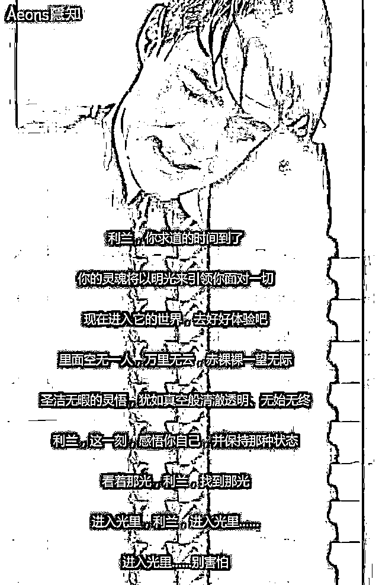

图中是修改后的台词，原字幕组的翻译有些错误，比如 light 译为“明灯”，而实际上它指的是“光”。

正常情况，一部美国片在此处应有“愿上帝宽恕你的灵魂……愿你进入天堂……”之类的祈祷，然而 cooper 讲的什么鬼？无论 light 翻译成“明灯”还是“光”，对一般人来说，这段话都是不知所云的，所以字幕组翻译错误也情有可原——反正大卫-林奇总是让人看不懂。

然而作为佛教徒，这段台词还是很让我震惊的，想不到有朝一日能在电视剧上看到破瓦法超度的“广告”，而且还是在 1990 年的美剧中，虽然之前的剧情已经有各种烘托铺垫——天使般的 FBI 探员，有着让人惊叹的美貌德，做瑜伽，练冥想，用所谓的“西藏梦境瑜珈”寻找凶手……想想同时期的国内，还只有《西游记》、《少林寺》这些似是而非的“佛教背景墙”影视。

cooper 台词原文：

Leland, the time has come for you to seek the path. Your soul has set you face-to-face with the clear light, and you are now about to experience it in all its reality, wherein all things are like the void and cloudless sky, and the naked, spotless intellect is like a transparent vacuum, without circumference or center. Leland, in this moment, know yourself, and abide in that state… Look to the light, Leland. Find the light.In to the light.

《西藏死亡书》中的基本颇瓦法：

尊贵的某某（称呼其名），现在，你求道的时候到了。你的气息就要停止了。你的上师已经助你入观明光了；你就要在中阴境界中体验它在实相之中的境相了：其中一切万物皆如无云的晴空，而无遮无瑕的智性，则如一种没有周边或中心的透明真空。当此之时，你应赶快了知自己，并安住此一境界之中。我此时也在助你证入其中。

颇瓦法（phowa），又名往生法或迁识法，意思是“意识的迁移”，是一种密宗的禅定修行法。它的原则是在某人/动物死亡的那一刻，以观想的方式，修行者把他/它的意识射出肉体，与佛的智慧心结合，进入莲花生大士所谓“本觉的虚空中”（即为成佛），或转生到自己想去的时空（通常是佛或菩萨的某个净土中）。在死亡时，这个法门可以由自己来修，也可以由具格上师或良好的修行者替自己修。

破瓦法是一款优秀的修行外挂，版本众多，绿色小巧，随时随地可以使用，不管有没有皈依、灌顶、接传承，总有一版适合你。

为什么说是外挂呢？因为颇瓦法有一个美名，“不修成佛往生法”，相对于需要修三大阿僧祇劫的法门或自力法门，修颇瓦法解脱需要自己花费的时间精力几乎可以忽略不计。

颇瓦法既可以成就自己的解脱，也能帮助他人（动物）解脱，同时产生很多美好的缘起，实为人生必备之外挂。

**注意事项**

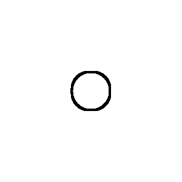

虽然颇瓦法版本众多、人人可修，**但警告必须写在前面：除了在自己肉体即将死亡的时候，否则不能在无师指导的情况下对自己修习颇瓦！**如果这样迁移出自己的意识，则等同于自杀，是非常严重的罪过。独自一人修习颇瓦法的时候，只能是为他人（动物）而修。

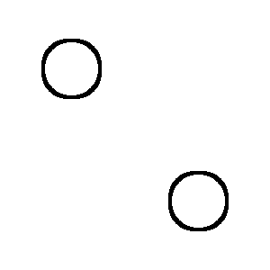

修成颇瓦法：不需要太多的知识或深度的证悟，只需要恭敬心、慈悲心、专一的观想，和深深的感觉佛菩萨的示现。学生接受教法，然后修持，一直到成就的征象出现为止。这

些征象包括：头顶痒或痛、出现明澈或黄色的液体，头顶周围有发胀或柔软的感觉，甚至头顶打开一个小洞，传统上可以用一根草插入小洞里，以测验或衡量修行的成功度。有时候，透过颇瓦法的加持，一般人也可以有强大的视觉经验，会瞥见佛土的安详和光，也会看到阿弥陀佛，这些都是类似濒死经验的情形。

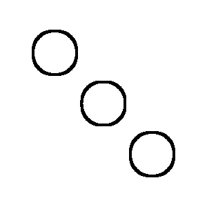

修颇瓦法的障碍：因为任何不好的心态，或甚至是对财物生起最微细的渴望，都将是死亡来临时修颇瓦法的障碍，所以修习时尽量保持平静和聚精会神，不要让任何最微小的恶念或欲望所主宰。在西藏，人们相信如果在临终者的房间还有任何由动物的皮或毛所做成的东西时，颇瓦法就很难修成功。最后，因为烟，或任何一种药，都具有阻塞中脉的效果，也会使颇瓦法更难修。

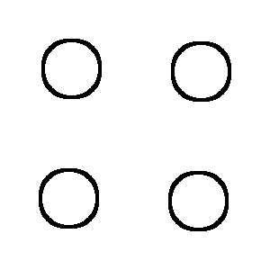

为他人（动物）修颇瓦：“即使是个大坏蛋”，如果有一位已经证悟和法力强大的上师，能够将他临终时的意识转换进入佛土，他也是可以获得解脱的。即使是临终者没有功德和修行，而上师也无法完全成功地为他转换意识时，上师仍然能够改变临终者的未来，颇瓦法能够帮助他转生善道。**不过，成功的颇瓦法，需要有完美的条件。**

颇瓦法能够帮助恶业极重的人，但条件必须是他和上师之间具有亲密和清净的缘，对于教法有信心，以及诚心请求净化。在西藏，所谓的理想环境，是由家人请来许多喇嘛，反复修颇瓦法，一直到瑞相出现为止。

他们也许要连续修上好几个小时，好几百遍或甚至一整天。有些临终者也许只要一、二次颇瓦法就可以出现瑞相，其他人可能修一整天都不够。不用说，**这种情形与临终者的业关系甚大**。

由修行人帮临终者修颇瓦法所产生的瑞相包括：一撮头发从顶轮附近掉落，看到一股热气从顶轮生起。在有些极罕见的例子里，上师或修行的法力非常大，当他们在念颇瓦真言时，房间里的每一个人都会晕过去，或者当死者的意识被强力推出时，会有一片头盖骨冲天飞去。

**最后献上索甲仁波切在《西藏生死书》中教授和推广的基本颇瓦法：**

（向上滑动启阅）

**《西藏生死书》**

**::: 寻找精神上的修持 :::**

如果你临终的亲友熟悉某种禅修法，就鼓励他尽可能安住在禅定中，当死亡接近时，你要跟他一起修禅定。如果临终者完全能够接受修行的观念，就帮助他寻找一个合适而简单的法门，尽可能常跟他一起修，同时，当死亡已经接近时，温和地重复提醒他这个法门。

在这个关键时刻，你的帮助须具有想象力及创意，因为很多事情都靠它：在死亡之前或当下，如果人们能够找到可以全心修持的法门，就可以改变整个临终的气氛。精神修行的法门有许多层面，运用你的洞察力和敏感度去发现与他最有缘的法门，这个法门可以是宽恕、净化、奉献，或感受光或爱现前。在帮助他的过程中，首先全心全意地祈祷他的修行能够成功，为他祈祷能够获得修持那种法门的一切精力和信仰。我发现人们即使在最终的死亡阶段，都可以藉着在他心中已经结缘的一句祷词、真言或一个简单的观想，在修行上获得惊人的进步。 

史提芬·雷温( Stephen Levine )提到他为一个癌症末期女病人提供咨商的故事。这位临终者虽然对耶稣具有自然的恭敬心，但因为她已经离开教会，所以感到失落。他们一起探讨如何才能够加强那种信仰和恭敬。她终于了解最能够帮助她恢复与耶稣基督的缘，以及在去世时找到信赖和信心的方法，就是持续念这句祷词：“主耶稣基督，请怜悯我。”念这句祷词打开了她的心，她开始觉得基督永远与她同在。 

**::: 基本颇瓦法 :::**

我发现颇瓦法是关怀临终者最重要和最强有力的法门，受到相当多人衷心的喜欢。藏文中的颇瓦(phowa)，意思是意识的转换。目前已经传遍全世界，包括澳洲、美国和欧洲等地。由于它的力量，上千人获得庄严去世的机会。我很高兴把颇瓦法的心要介绍给任何想修的人。  

颇瓦法是每一个人都可以修的法门；它简单易修，也是我们能够为自己的死亡预做准备的重要法门，我常常教学生藉着颇瓦法帮助临终或已经死亡的亲友。 

（向上滑动启阅）

**修习部分：**

**::: 修习一 :::**

首先，采取让你觉得舒服的姿势坐下来，或者躺下来都可以。 

然后，把心找回来，静下来，并完全放轻松。 

（1）在你面前的上方，启请你所信仰的任何真理的化身，化作灿烂的光芒。选择你觉得亲近的任何神明或圣人；如果你是佛教徒，启请你觉得有缘的佛；如果你是基督教徒，一心感受神、圣灵、耶稣或圣母玛利亚活生生地示现。如果你觉得与任何精神人物都没有缘，只须想象有一个纯金黄光的形体出现在你面前的上方。要点在于你要把所观想的对象或示现，认为是一切诸佛、圣人、上师和觉者的真理、智慧和慈悲的化身。不必担心你无法很清晰地观想他们，只要你心中觉得他们已经出现，相信他们真实存在就可以了。 

（2）然后，集中心意和心灵在你所启请的圣者示现上，如此祈祷： 

透过你的慈悲、加持和指导，

透过从你身上流出的光的力量：

愿我的一切恶业、烦恼、无明和业障得以清净消除，

愿我所思所行的一切伤害已被宽恕，

愿我成就这个深奥的颇瓦法修行，死时安详美好，

透过我死亡的胜利，愿我得以利益一切众生。

（3）现在想象你所启请的光，深深被你的祷词所感动，回报给你爱心的微笑，从他的心中流露出爱和慈悲的光。当这些光接触和穿透你的全身时，洗濯和净化你的一切苦因、恶业、烦恼和业障。你看到也感觉到全身都沉浸在光中。 

（4）现在你已经被光完全净化和治愈 ，想象你的业报身完全溶入光中。 

（5）你现在的光身升入天空，与圣者的祥光密不可分地结合在一起。 

（6）维持与光结合的状态，越久越好。 

**::: 修习二 :::**

（1）以更简单的方式来修颇瓦法。开始时如前述，静静地坐下，然后启请真理的化身出现。 

（2）想象你的意识在你心中，像个光球、流星一般的从你心中射出，飞入你面前的真理化身的心中。 

（3）它溶化之后，与真理的化身合而为一。 

透过这种修习，把你的心投入佛或觉者的智慧心中，这有如把你的灵魂溶入神里面。顶果钦哲仁波切说，这就像把一粒小石头投进湖中；想象它沉入水里，越来越深。想象透过加持，你的心被转化进入这位觉者化身的智慧心中。 

**::: 修习三 :::**

最精要的颇瓦法修习就是：把你的心，跟清净示现身的智慧心结合在一起。想象：“我的心和佛的心是合而为一的。” 

在这三种方法中，选择其中一种你觉得比较舒服或在当时对你最有吸引力的方法。有时候，最有力的法门可能是最简单的法门。不管你选择哪一种法门，最重要的是现在就要花时间去熟悉它。否则，你怎么有信心在你或别人即将去世时懂得修法呢？我的上师蒋扬钦哲仁波切写道：“如果你能够常常以这种方法来观想和修习，临终的时候修起来就比较容易。” 

事实上，你必须把颇瓦法修到纯熟的程度，让它变成一种自然的反射，变成你的第二天性。如果你看过《甘地》这部电影，就可以知道当他被刺杀时，他立即叫出“兰姆……兰姆！”在印度教里，兰姆是神的圣名。请记住我们不会知道我们将怎么死，也不会知道我们是否有时间从容回忆任何一种法门。譬如，我们在高速公路上，以一百英哩的时速与卡车相撞，我们哪来时间选择呢？当时不会有一秒钟的时间去思考颇瓦法怎么修。我们不是熟悉颇瓦法，就是不熟悉。有一个简单的方法可以测验：当你面临重要的情境或危机时刻，譬如地震或做梦时，你的直觉反应是什么 ？你是否立刻想到颇瓦法呢？如果是，你的修法有多稳定，你的信心有多强呢？ 

我记得有一个美国学生，有一天她骑马出去，被马甩下来，她的脚缠住马镫，她被马拖着在路上跑。当时她被吓得脑筋一片空白，虽然她想尽办法要回忆某种法门，可是一点用也没。她被吓坏了。这次惊吓帮助她了解必须熟练法门让它成为她的第二天性。这是她必须学习的课程；事实上，也是我们大家必须学习的课程。尽你最大的能力，精进修持颇瓦法，一直到你能肯定你将以它来反应任何不可预见的事件为止。这保证不管死亡何时到来，你都成竹在胸。 

**::: 利用颇瓦法来帮助临终者 :::**

我们怎么利用颇瓦法来帮助临终者呢？  

修法原则和次序完全相同，唯一的差别是你要观想佛或神明就在临终者的头上： 

想象光芒倾注在他的身上，净化他整个人，然后他溶化成光，与示现身完全结合。 

在你亲爱的人生病时，为他修全程的颇瓦法；特别是（也是最重要的）在他呼出最后一口气时，或在呼吸停止后身体被搬动或干扰之前。如果临终者知道你要替他修这个法门，而且也知道它的道理，必然会成为启示和安详的大泉源。 

静静坐在临终者旁边，在佛陀、基督或圣母玛利亚像前，供上一根蜡烛或一盏灯。然后，为他们修颇瓦法。你可以静静地修，临终者甚至不必知道；如果他能够接受就跟他一起修，也为他说明怎么修。 

人们常问我：“如果我临终的亲友是基督教徒，而我是佛教徒，有没有什么冲突呢？”怎么会有冲突？我告诉他们：你是在启请真理，基督和佛陀都是真理的慈悲化身，只是以不同方式显现来帮助众生而已。 

我向医生和护士强烈建议，他们也可以替临终病人修颇瓦法。如果照顾临终者的人，也能够修颇瓦法，那么医院的气氛将会改变得多好呢！我记得小时候，桑腾去世时，我的上师和其他僧人都在为他修法。那是多么强而有力和崇高啊！我最深的祈祷是：每个人在去世的当时，都能够拥有和他相同的福报和安详。 

我从传统西藏为临终者修习的法门中，特别整理出这个基本的颇瓦法，它涵盖了所有最重要的原则。因此，它不仅是为临终者而修的颇瓦法，也可以用来净化和治疗；它对于活人和病人都一样重要。如果这个人有治愈的希望，它可以帮助治疗；如果这个人即将过世，它可以帮助他，安然地离开人世；如果这个人已经死去，它可以继续净化他的心识。 

如果你不确定病重的亲友是否可以活过来，那么每次你探视他时，就可以为他修颇瓦法。回家之后，再修一次。修得越多，你临终的亲友就可以被净化得越多。你没有把握可以再见到你的朋友，或者当他去世时，你是否会在场。因此，每次探视时，就可以修颇瓦法做结束，就当作准备一般；而且在空暇时，继续修。 

排版｜指引社

文案｜指引社

指引社，致力于让“神秘学”走向大众，不再“神秘”。杜绝神棍，欢迎撩或聊

长按二维码关注我们

点击“阅读原文”，去指引社看原贴

# 实用通灵技巧教程之一——如何运用心灵能力影响并控制他人及如何防御（下）

> 原文：[`mp.weixin.qq.com/s?__biz=MzI5NTQzMDUzMQ==&mid=2247483776&idx=3&sn=f0a1975ede42dedaa1a0b521591aed11&chksm=ec52f16cdb25787a02bbb589d5e2b04824fb898d55abb80aa15c5ce3d1c437fc2cddb809c905&scene=27#wechat_redirect`](http://mp.weixin.qq.com/s?__biz=MzI5NTQzMDUzMQ==&mid=2247483776&idx=3&sn=f0a1975ede42dedaa1a0b521591aed11&chksm=ec52f16cdb25787a02bbb589d5e2b04824fb898d55abb80aa15c5ce3d1c437fc2cddb809c905&scene=27#wechat_redirect)

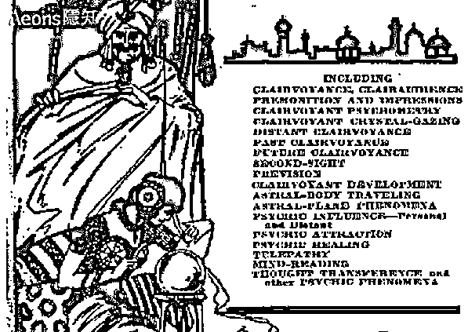

本教程中的防护技能——心灵防御——不仅适用于通灵人士的常规自我防护，在日常生活中亦十分宝贵有用，因广义的心灵攻击包罗万千，从老鼠会的忽悠洗脑到他人对你的嘲笑讽刺，从老板的刻意威慑辱骂到竞争对手对你的各种打压，都是我们生活中容易遇到的、会对自己心灵留下较大阴影和后遗症的情况。很多性格脆弱敏感（这种人亦多数具有通灵潜质）的人尤其会成为此类负面事件的受害者，有些人会因此影响到未来很长一段时期的生活，甚至留下终身的阴影。这种人一般会被大众评价为心理素质较差，其实正是由于其心灵防御能力不够强大所致。今天写下此篇，亦是希望这些因他人的恶意而受害的普通人能够借此保护自己，拥有不被干扰及更加平和的人生。

在之前讲到的“心灵攻击”部分中，我们将会发现，其核心要点是强烈而正向的自我主张，这加强了这种攻击力量的效果。故而循此理，当我们采取防御的时候，可以将这个过程反转，即：你需要否定这种施加在你身上的力量，并运用强力的想象，令这种力量所形成的心灵图像在你的脑海中消融殆尽。在脑海中时刻牢记这个方法，它将会保护你免受他人的打击；它会中和掉你身上来自任何人的能量，但只能在你自己的身上实现，而不能将它彻底从攻击你的人心中消除。你可以轻松消掉对方对你的影响，不仅在你受到心灵攻击的当时，也可以使你增加对这种攻击的免疫力。你将为自己套上一套牢固的防护盔甲，令其他人很难影响到你。

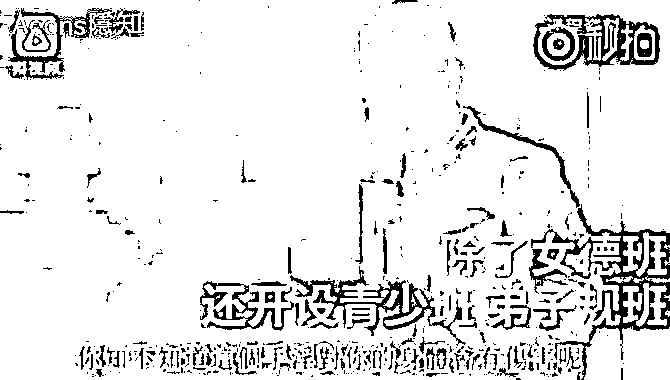

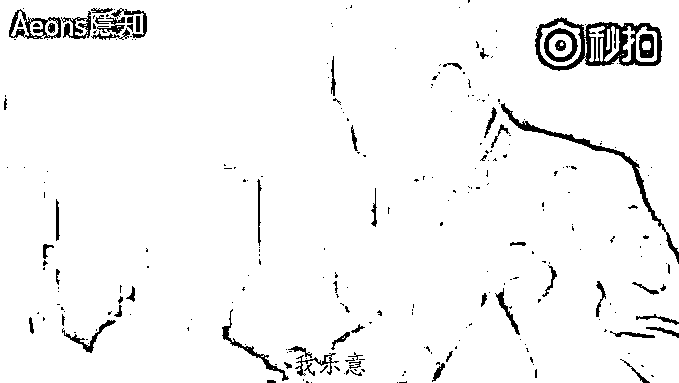

正向和有力地表示“我拒绝！”将使你拥有一副神秘而强大的防御盾牌。无论你对培养自身的通灵能力是否有兴趣，都至少需要学习一些保护自己的措施。本教程中的练习部分将使你建立足够的自信，活跃你沉睡的通灵潜能，并且熟练运用以上提到的进攻&防御的心灵武器。切记：只有纯熟的练习方能令你掌握它们，你需要像锻炼肌肉一样训练自己。

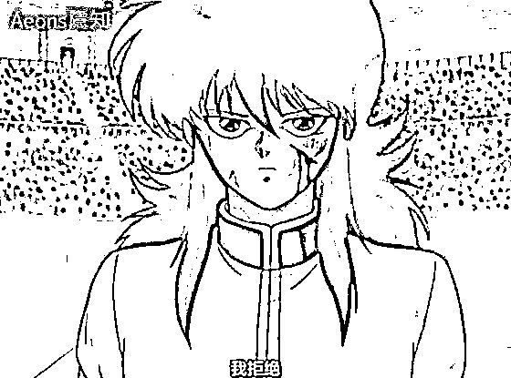

最开始的时候你可以在自己身上尝试练习：你需要一面能反映出你的影像的较大的镜子，对着镜中所映出的你自己，以认真严肃的态度来练习，将你希望施加在他人身上的影响先尝试使用在你自己身上。当然，在这个过程中，你需要运用到心灵图像：

“看着我！”

“立刻到我身边来！”

“全心全意地将注意力放在我身上！”

“过来！”

“走开——立刻从老子身边滚犊子！”

“你喜欢我——你喜欢我喜欢得要死！”

“你畏惧我！”

“你意图取悦我！”

“你同意我的主张！”

“你会执行我吩咐你的事！”

你可以对他人施以任何命令，认真对镜练习可以使你熟练掌握此技能。

当你将你的感受融入语言当中，会令你的话语变得有力，进而成为真正的命令，而不是恳求或者呼吁。

* * *

本篇完。下一章将放出本教程最终的七大系统性练习，敬请期待。

# 塔罗师的魔法世界

> 原文：[`mp.weixin.qq.com/s?__biz=MzI5NTQzMDUzMQ==&mid=2247483776&idx=4&sn=fa7d1392f457f35ac6566fb5ba519c34&chksm=ec52f16cdb25787afb82a9874b6f04fc1b69b4308b1778a5966136064ca6e617479861f20166&scene=27#wechat_redirect`](http://mp.weixin.qq.com/s?__biz=MzI5NTQzMDUzMQ==&mid=2247483776&idx=4&sn=fa7d1392f457f35ac6566fb5ba519c34&chksm=ec52f16cdb25787afb82a9874b6f04fc1b69b4308b1778a5966136064ca6e617479861f20166&scene=27#wechat_redirect)

 前天云汉君发了一篇[《占星师的魔法世界》](http://www.geaving.com/article/view/id/117)，同是中二病患者作为应和，也来写写塔罗师和魔法的那些事儿吧！然而中二之魂一燃起来就收不住了，写的有点多……感谢耐心收看 _(:3)∠)_ 

太长不看版：（1）塔罗有魔法吗？有！但是和中世纪的星符魔法等有着本质不同，主要是艾利法斯·里维（Eliphas Levi）和阿莱斯特·克劳利（Aleister Crowley）的【现代魔法】体系。

（2）塔罗的魔法地位是现代魔法奠基人 Levi 钦定的。[-1s]

（3）金色曙光真乃 Levi 的迷弟团。[你这是中二之魂还是八卦之魂……]

* * *

塔罗也有魔法吗？相比着占星这个源自古希腊的老前辈，塔罗确实是 too young！虽然杰布朗（Court de Gébelin）心心念念地把塔罗追溯到埃及，但从韦特起，就批判了他乱认祖宗的毛病，将塔罗起源定位于文艺复兴。

那么问题就来了，文艺复兴可是魔法流行的时代呀，塔罗有没有受到影响呢？

答案是肯定的。作为文艺复兴时代的产物，塔罗的图案非常明显地呈现了魔法、炼金、占星、哲学、神话和宗教等方面的主题。Gébelin 之所以会错认祖宗，也绝对不是毫无依据的胡乱猜测。相反，他从马赛塔罗牌的符号中，认出了众多图像隐喻的来源。

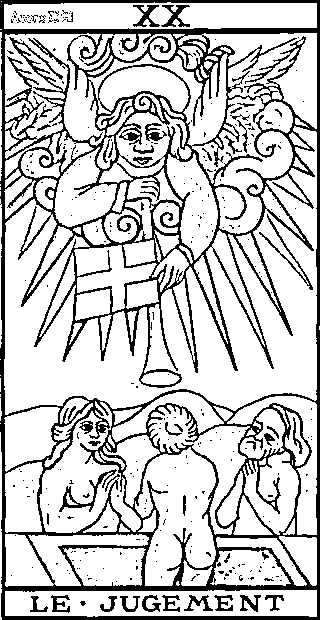

图 1. 马赛塔罗的审判牌，但凡了解一些西方历史的人都能认出其中的宗教或神学元素。但是对于其他的牌，你知道它们都隐含了怎样的典故么？

其实，这种追源古埃及的想法在当时非常普遍，引用皮埃尔·阿多思想史著作《伊西丝的面纱》中的一段话：

> “在共济会的神话中，[埃及神]伊西丝形象逐渐扮演了最重要的角色。在 18 世纪的最后十年，埃及秘仪风靡一时，‘埃及狂热’相当流行。……由于变得类似于耶和华，伊西丝成了一个不具名的神。伊西丝拒绝说出自己的名字，拒绝被揭开面纱。她隐藏自己不是通过隐藏任何具体自然现象的原因，而是通过让自己成为无法参透的绝对奥秘或谜，成为不具名的神，不论她是存在还是超越了存在。”
> 
> ——皮埃尔·阿多《伊西丝的面纱》，张卜天老师译本，P295-297

而塔罗牌，恰恰与伊西丝的精神暗合——由图像而非文字来记述，将神秘的符号通过艺术的形式糅合到精巧的画面之中。若非 Gébelin 这样的神秘学大师，可能很多人只是把她当作了装饰的图片。这也是为何大家（不论是否支持他的埃及起源说）都推崇 Gébelin 的阐释，将头戴面纱的伊西丝作为塔罗的 2 号牌——女祭司所对应的神祇。

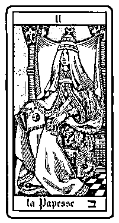

图 2\. Oswald Wirth 塔罗牌的女祭司，谁说马赛系塔罗符号少？

> “女祭司被赋予权威和劝导者的身份，坐在伊西丝神殿的门廊，位于两根神柱中间。……女祭司头戴三重冠，脚下是一拱新月。斗篷半掩，透明的面纱遮住脸庞，她胸前有一个太阳十字架，膝上摊开一本书册。这联系到带着无垢面纱的自然女神伊西丝。半掩的经卷表示智慧被隐藏起来，而她只向真诚的学者透露卡巴拉和神秘学的真理。”
> 
> ——帕普斯《波西米亚塔罗》

同时，以图像传承理念的做法，正是与文艺复兴的炼金术一脉相承。无怪乎塔罗这个后起之秀，能够在 19 世纪的欧洲飞速发展，成为和占星、魔法、巫术等相并肩的一大体系。

最早画出塔罗牌的人是如何设想的，我们不得而知。但可以肯定的是，经过 Gébelin 的提醒，再加上著名神秘学家 Etteilla、Eliphas Levi、Paul Christian 等人的打磨，塔罗再也不是单纯的街头占卜工具，而成为了打开真理之门的钥匙。

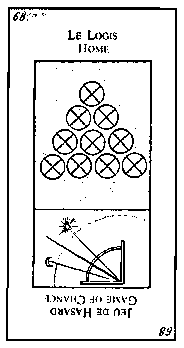

图 3\. 艾特雅设计的一副塔罗牌（Etteilla Tarot），简直是柏拉图学院的真传，分分钟告诉你什么叫做“不懂几何者勿入此门”……

 艾利法斯·里维，这个名字想必大家并不陌生，作为现代魔法的奠基人，他对于塔罗的魔法阐释，无疑对后世有着重大的影响。Levi 部分地批判了 Gébelin 的思想，不认为塔罗是古埃及的“透特之书”。不过，你们觉得 Levi 大佬会为塔罗正本清源定位到文艺复兴吗？Naïve！大佬的思维岂是我们这群凡夫俗子可以参透的？Levi 直接把塔罗定义为了比摩西更加久远的“赫尔墨斯之书”……

嗯，大佬你开心就好。

不扯这些了，我们来看看 Levi 对塔罗做了什么：

1、受到 Gébelin 的启发，将塔罗大牌与 22 个希伯来字母对应。

2、将 1-10 的数字牌与生命之树的十个源质（Sephiroth）对应。

3、将四牌组与上帝之名（Tetragrammaton）对应。

是不是有点熟悉？懂得仪式魔法的人应该能看出来了，这简直在某种意义上，是对塔罗附魔啊！召唤天使有木有？爬树有木有？作为现代魔法的奠基人，Levi 这波操作是直接将塔罗奠进了他的现代魔法之基中。经过 Levi 大佬开光，塔罗无可置疑地成为了现代魔法的重要容具。

> “普遍流传的魔法传统认为，谁拥有了‘所罗门之匙’，谁就能够与所有层阶的灵体沟通，甚至命令自然之力的服从。这些钥匙，常常被遗失又失而复得，它们正是那印刻 72 圣名的符咒，和 32 条象形文字的奥义之路，并通过——塔罗，重见天日。”
> 
> ——Eliphas Levi《The History of Magic》，A.E. Waite 英译本

当然，这里必须澄清一下。塔罗魔法和占星魔法有个重要的不同，就是占星魔法中既有可以追溯到中世纪的古典魔法，也有后来发展的现代魔法；而塔罗魔法是从 Levi 这里开始的，自然是只有现代魔法部分。古典魔法和现代魔法的区别很多，简单引用一段 JohnMichael Greer 和 Christopher Warnock 给 Picatrix 写的译者序：

> “Picatrix 连篇记载了供中世纪魔法师们惯常使用的魔法传统，但其中的绝大部分对于当下大多神秘主义者来说，都是陌生的；在这些魔法背后的哲学体系更是如此。饱学现代神秘学的读者们可能会惊讶地发现，当下流行的魔力概念，即魔法师意志激活想象中的形式的作用，在 Picatrix 中全然未见。诸如此类无需意外，因为上述概念作为魔法传统，是艾利法斯·里维（Eliphas Levi）在 1854 年《高级魔法的教义与仪式》（Dogme et Ritual de la Haute Magie）中引入的，其哲学背景来自阿瑟·叔本华（Arthur Schopenhauer），而非之前的任何魔法教义。
> 
>  “而 Picatrix 来自更加古老的世界，其魔法观念的基础——魔法的本质、宇宙的概念等——与今日的神秘学传承相比，几乎在你能够想象到的任何方面都千差万别。在 Picatrix 的魔法中，魔力的来源在于大宇宙而非小宇宙；即魔力是源于宇宙，而非魔法师。浩瀚的创造之流由上帝所激发，沿着存在的层级流溢而下。神性被恒星与行星所映射，犹如光线在移动的晶体中曲折穿行，凝聚了被增益或衰减——取决于星体之间复杂的几何关系——之后的力量，投射到地球上。魔法师知晓如何在魔力之流最为强盛的时间去捕捉它，将其能量灌注于适合的物质体中，并小心选取特定的目标去应用它。”

简单粗暴的总结一下就是，Picatrix 中的魔力来源在于大宇宙，而 Levi 的现代魔法则非常强调小宇宙，特别是人类意志（Will）的作用。这一点在 Levi 的后继者克劳利那里更是发展到极致。因此你会看到：

"Magic is the science of love." --Papus

“魔法是爱的学问。”——帕普斯

“ Do what thou wilt shall be the whole of the Law.”--Crowley

“遵从汝之意志，即为全部律法。”——克劳利

所以说，你觉得塔罗师的魔法世界，和云汉酱描述的占星师的魔法世界好像不太一样？那就对了~！现代魔法是对古典魔法的继承，更是对古典魔法的改造。这背后有着非常深刻的德国哲学的影响，在此就不多说了。

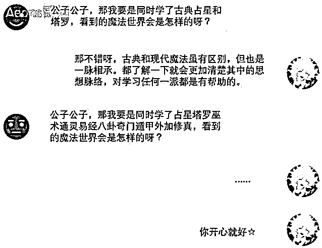

言归正传，Levi 之后，有一个重要的秘密结社是塔罗学习者不可不知的——金色曙光赫尔墨斯隐修会。正是这个结社，将塔罗进一步地改造为了宇宙奥义的记录者，成为参悟赫尔墨斯卡巴拉的秘密之书。塔罗是金色曙光的必修课，这部分是由于其创设人 Mathers、Westcott 等人对塔罗思想的继承。例如，在 Mathers 书写的小册子《论塔罗》（On Tarot）中：

> “我个人认为——也是第一个这样认为的——塔罗一词来自于埃及象形文字“târu”和“ergo”，前者意为“寻求答案”或“请教”，后者则是“被请教的人”。这样说是有依据的，因为“Tarot”可以分为“Taro”和“t”两部分，而末尾字母 t 很可能就是埃及象形文字中表示女性的收尾词。于是塔罗的意义集中在“Taro”这四个字母上。如果将其重新排列，我们就能发现一些有趣释义：TORA（希伯来语）=律法（Law）；TROA（希伯来语）=大门（Gate）；ROTA（拉丁语）=轮子（wheel）；ORAT（拉丁语）=讲述、争论、恳求（it speaks, argues, or entreats）；TAOR（埃及语）= 黑暗之神 Täur；ATOR（埃及语）=维纳斯的埃及称谓 Athor。Lumley 先生还告诉我，古波斯语中有一个词“tarisk”，意为“寻找答案”。”
> 
> ——S.L.MacGregor Mathers《The Tarot——Its Occult Significance，Use in Fortune-Telling，and Method of Play，Etc》

可见，金色曙光初创之时，是沿着 Gébelin、Levi 的路线进行的。他们把塔罗视作赫尔墨斯卡巴拉的代表，因此他们所设计的塔罗牌与原始的马赛系塔罗有着重要的区别。如果说马赛塔罗是文艺复兴时期各种观念的混合，那么金色曙光体系，则为塔罗灌注了卡巴拉和 Levi 现代魔法的要素。

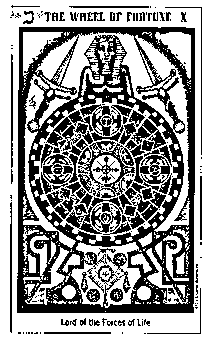

图 4.Godfrey Dowson 依据金色曙光体系设计的 The Hermetic Tarot，简直就是神秘学符号教科书……

因此，也许最初的马赛塔罗牌尚没有明显的魔法意义。但经过金色曙光改造的塔罗牌，则正式脱离了街头占卜的小道具身份，成为了记载神秘学智慧的容具。金色曙光的著名神秘学家们，将自己的理论凝聚在重新设计的塔罗牌中，将其作为探寻宇宙真理、攀爬生命之树的媒介。

其中最为重要、也最为大家所熟知的两位代表人——阿瑟·爱德华·韦特、阿莱斯特·克劳利，他们互为死敌，创立了两套针锋相对的塔罗牌：韦特塔罗和透特塔罗。二人的思想虽然异路殊途，但都将塔罗视作高层智慧的象征。

现在，韦特塔罗已经成为了最流行的塔罗牌。因其图案明晰、易于上手而被各国塔罗师喜爱。韦特本人在《塔罗图钥》中，十分清醒地批判了塔罗的埃及起源说；但是他认同埃及智慧的重要价值。因此，他和帕梅拉·史密斯（Pamela Colman Smith）女士合作设计的韦特塔罗中，也突出了伊西丝等埃及元素。

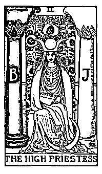

图 5. 仔细分析下韦特塔罗里的这堆符号，就觉得他还是有点口嫌体正直的（x）

前段时间看到了一个《塔罗图钥》的中译版，编辑者说韦特“众所周知他对占卜没兴趣”“牌意他也是抄各种当时的坊间牌意”，这实际上是非常不准确的（小生强烈怀疑他没读到“以上牌意都是不正确的”这句话……）。首先，韦特（包括这里提到的其他人）的确认为塔罗牌不仅仅是个占卜工具，但他们并不反对塔罗牌占卜；相反，帕普斯、梅瑟斯、韦特等人都对流传下来的纸牌占卜术有详细记录。第二，对于坊间牌意，韦特恰恰是十分反对的。在《塔罗图钥》中，他就批判了帕普斯《波西米亚塔罗》中的部分牌意（栗子可以去看我之前写的对月亮牌的分析），认为那些单纯的看图说话是误解了牌的本意。对塔罗牌的解读不能只看图面意义，而应当放在 78 张牌的整体思想体系中去理解。尤其是 22 张大牌，它们构成了一个完整的神学结构。

但是相比于其他人，韦特的确显得过于清醒。他承认塔罗大牌具有重要的神秘学意义，但是否认了一切附加在它上面的过度阐释。他批判 Gebelin 的埃及起源说，批判 Levi 的赫尔墨斯传承说，批判 Papus 的灵数学对应体系，甚至认为小牌除了占卜没有别的高层含义；但他依然在自己的塔罗牌设计中表现出对这些前辈的敬意和赞许。可以说，虽然他对于塔罗牌的解释是相当“科学”而不“魔法”的；然而即使如此，韦特依然是一位神秘学家。

> “我不认为塔罗为使用图画来传达秘密教义的做法设定了范本，而被赫尔墨斯主义者们继承；但显然，塔罗可能是这种艺术的最早形式。它最为包罗万象，因为不论是它的分属还是别的，都不可能是任何一门神秘学的子科目；它不是炼金术、卡巴拉、占星术或仪式魔法的分支；但是，如我所说，它是以普遍类型来代表宇宙观念的一种方式，如果它真的在某处代表了秘密教义，那么这个教义存在于这些类型的组合之中。”
> 
> ——韦特《The Pictorial Key to the Tarot》

到了晚期，韦特与金色曙光决裂，他于 1926 年撰写了《The Great Symbols of the Tarot》，否认塔罗牌与希伯来字母之间的联系。并在某位大诗人的影响下，转向塔罗与凯尔特神话的研究。嘛，这就是另一个故事啦。

下面我们再来看堪称压轴人物的阿莱斯特·克劳利。相比韦特，他可是“魔法”多了。这个自视为 Levi 转世、粉丝三千树敌三万的奇人，发展了 Levi 的现代魔法观，并创立了自己的 Thelema 教派。他的思想影响了混沌魔法、现代巫术、反卡巴拉等各种现代流派。且不说是否认同他的理论，客观来讲，他绝对是神秘学历史上不可忽视的人物。

克劳利认为，作为一个魔法师，虽然可能通过灵视灵听直接获得启示，但与高层智慧体的沟通则需要精细的准备。因此占卜术对于魔法师来说是必要的。而他所推崇的占卜术，最好是具有数学形式的符号与象征，因为这样才不会因为语言问题产生歧义。所以对他来说主要的占卜术就是：占星术、地占术、塔罗、卡巴拉、易经（没错，但这是他改造过的易经）。而塔罗与卡巴拉是放在一起的，因为二者的理论基础是共同的：生命之树。（见克劳利的《Liber ABA》）

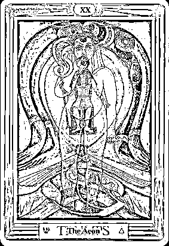

图 6. 透特塔罗第二十号大牌——新纪元（Aeon，嘛，也是咱们论坛的英文名；虽然论坛英文名并不是从这里来的，咳咳……）

在克劳利晚年，他写下了凝集他的塔罗理念的《透特之书》。在他眼中，塔罗是破解宇宙奥秘的钥匙，是他魔法观念的具现。通过透特塔罗，读者能够更好地了解他的魔法世界。例如他将传统的“审判”改为“新纪元”，就是指代他所说的“荷鲁斯新纪元”取代“欧西里斯纪元”，甚至在某种意义上，也是他用现代魔法取代古典魔法的一种表现。

当然，对于古典魔法和现代魔法之争，就不是这篇文章的讨论范围了。小生仅在此梳理塔罗学中的魔法观念，不进行主观评价（以小生现在的能力，根本不足以进行评价）。从古典魔法 VS 现代魔法、古占 VS 现占之中，甚至能看到古希腊哲学、中世纪哲学与德国 19 世纪古典哲学的斗争。不同理论之间的激烈碰撞未尝不是神秘学学习之路上的一道风景。孰为真理？真理是否唯一？抑或者，我们真的能够知道答案吗？先不要轻易地下结论。在此，小生只好尊奉维特根斯坦的金玉良言：“对不可言说之事，保持缄默。”

-----------------------------------------------------------------------------------

最后，仿照云汉酱的格式，也来列个塔罗相关的魔法书： 

## 1、原始文献

·Antoine Court de Gébelin：

塔罗学的第一篇论文就是出自他的《原始世界》（Le Monde Primitif），这本书暂时没找到英译本，所以小生没有仔细读过。其中第八章是关于塔罗的那两篇文章，倒是有很多译本，英译可以搜《The Game of Tarots》。一篇是他自己写的《Du Jeu desTarots》，另一篇是署名叫 M. Le C. de M. 的神秘作者（据说是 Louis Raphaël Lucrèce de Fayolle）写的《Recherchessur les Tarots, et sur la Divination par les Cartes des Tarots》。正是这两篇文章将塔罗定义为“透特之书”。

·Eliphas Levi：

重头戏来了！Levi 可谓是现代魔法的奠基人。他的魔法著作见《The Magical Ritual of the Sanctum Regnum》、《TheRitual of Transcendental Magic》。

此外，理论部分还有韦特翻译的《The History of Magic》，克劳利翻译的《The Key of the Mysteries》。金色曙光不愧是 Levi 的迷弟团……

·S.L. MacGregor Mathers：

金色曙光的创立人之一。他的《The Tarot》我有翻译六篇中的四篇，感兴趣可以看看。他也是个翻译家，魔法方面最重要的就是他对《Abramelin》（或者叫 The Sacred Magic）、《所罗门的大钥匙》（Greater Key of Solomon）、《所罗门的小钥匙》（The Lesser Key of Solomon - Goetia）的翻译整理。小钥匙版本中，可以找到克劳利后来的增益本，亦即克劳利在他译本基础上增加了自己的魔法解释。所以说别看这些书是古典魔法的，但指不定是六经注我还是我注六经……

·Aleister Crowley：

克劳利是 Levi 的继承者。他的魔法部分主要在《Liber ABA》，或者叫《Magick》（ABA 是这本书在克劳利图书大厦里的编号）。怎么说呢，克劳利是个不太爱说人话的，别说咱们了，当时哈瑞斯夫人给他画透特塔罗的时候都被绕晕过好几次……所以说他的书慢慢读，不要捉鸡。。。

从塔罗入手会相对容易一点，毕竟是钥匙。见他的《透特之书》，也就是《The Bookof Thoth——A Short Essay on the Tarot of the Egyptians》。

·Arthur Edward Waite：

相比较魔法，韦特对于炼金术的研究更多。他也是个翻译家，除了上面提到的 Levi 的魔法史，他还翻译了帕拉赛尔苏斯的一些作品，见《Hermetic And Alchemical Writings Of Paracelsus》。对于金色曙光的这群人来说，塔罗、魔法、炼金术等等，都是归于赫尔墨斯卡巴拉的。对卡巴拉感兴趣的可以读一读他的《The Doctrine and Literature of the Kabalah》和《Hermetic Museum》。

## 2、现代研究

由于韦特相对不那么“魔法”，所以现代研究主要是针对克劳利透特塔罗的。这里列举两本。

Hyatt & DuQuette《Sex Magic, Tantra & Tarot》。

杜奎特这个名字，参加塔罗学院这次读书会的都不陌生了。他是克劳利的迷弟，研究克劳利理论数十载，当然不止包括了透特塔罗，也包括了克劳利的魔法。

James Eshelmen《The Mystical and Magical System of the A∴A∴》。

这里提到的 A∴A∴是克劳利脱离金色曙光之后组建的银星会社，A∴A∴是拉丁文缩写，并且还是玄之又玄……我是说，“秘密的秘密”的缩写。从名字就很有克劳利特色的组织。本书就是关于它的魔法体系研究。

## 3、其他参考书籍：

以下是与塔罗魔法的主题相关，但不是马赛/韦特/透特塔罗体系的。

Chic & Sandra Tabatha Cicero《Tarot Talismans - Invoke the Angels of the Tarot》。

Chic Cicero 和 Isreal Regardie 在 1977 年重新组建了金色曙光的一个现代机构。他们用的牌叫做 The New Golden Dawn Ritual Tarot，力图还原 Mathers 的最初设计。他们还有很多本关于塔罗仪式魔法的书，感兴趣的可以去找找。

Donald Michael Kraig《Tarot & Magic》。

这本书是云汉那篇文章提到的 John Michael Greer 写的前言，质量应该有保障。

他用的牌包括同样是上述两位 Cicero 设计的 Golden Dawn Magical Tarot、普及韦特、透特，和 LindaFalorio 设计的 The Shadow Tarot。

*不太推荐的书：*

Janina Renee《Tarot Spells》。

这个就有点太“现代”了。其中的魔法是本着“新世纪”的精神来的。当然这里不是要黑 New Age，只是不得不说，New Age 对于魔法的态度就有点太过随意了。。

我们知道*在中世纪的古典魔法师看来，Levi 的现代魔法就已经够离经叛道了，克劳利的魔法就要上天了，至于新世纪。。。。*估计连克劳利都得拔出魔杖插他鼻孔，Picatrix 的作者更是棺材板都压不住了。。所以说这种类型的就仁者见仁智者见智吧。

## 4、待推荐书籍

下面是我个人比较看好，但还未阅读太多、了解太多的书籍。（这句话是抄云汉的）嗯，因为小生比较喜欢看思想演变和历史考据，所以关注点比较奇葩，大家参考参考就好。（这句话是自己写的）

Joshua Gunn《Modern Occult Rhetoric：Mass Media and the Drama of Secrecy inthe Twentieth Century》

这个作者的姓是不是要翻译成…（不对！）关于塔罗和魔法的文化研究，看上去蛮有趣的。等看完了再来汇报。

Helen Farley《A Cultural History of Tarot——From Entertainment to Esotericism》

这个是历史研究为主了，关注塔罗是如何从不起眼的纸牌升级为宇宙之书的。其中也写了显然是被我漏掉了的金色曙光的另一位大佬，你们注意到是谁了吗？不吊胃口了，就是韦特那段稍微提到的“某位大诗人”——叶芝！他完全被韦特和克劳利掩盖了……他是首个将塔罗与凯尔特神话联系的人，虽然这也没什么 X 用。。咳咳，总之还是很好奇的。以及塔罗和诺贝尔文学奖的联系可不止这一位，说不定哪天我还会写篇*《想得诺贝尔文学奖？先来学学塔罗》*神马的。。（@村上春树（喂））

以上仅供参考，欢迎批评指教！

论坛讨论地址：[`www.imslr.com/thread-47965-1-1.html`](http://www.imslr.com/thread-47965-1-1.html)

# 实用通灵技巧教程之一——如何运用心灵能力影响并控制他人及如何防御（中）

> 原文：[`mp.weixin.qq.com/s?__biz=MzI5NTQzMDUzMQ==&mid=2247483776&idx=5&sn=d474ff758ae9fd87344f2cf052cd6c08&chksm=ec52f16cdb25787a3e7182b52d73f5b51e3f142f593222dfb609c15785f446b813debc94f614&scene=27#wechat_redirect`](http://mp.weixin.qq.com/s?__biz=MzI5NTQzMDUzMQ==&mid=2247483776&idx=5&sn=d474ff758ae9fd87344f2cf052cd6c08&chksm=ec52f16cdb25787a3e7182b52d73f5b51e3f142f593222dfb609c15785f446b813debc94f614&scene=27#wechat_redirect)

（接上篇：[`www.geaving.com/article/view/id/100`](http://www.geaving.com/article/view/id/100)）

在你将这种心灵能量运用在影响他人之前，你需要为自己培养一种十分确信并坚定不移的心态；你需要以对他人施加影响的相同方式，为自己施加这种信念：你首先需要强烈地念想之，进而令其清晰地图像化，最后将全部注意力贯注其中。

此刻，我设想你已经充满了正向的、强烈的意念，并极度地渴求着你所欲之事。接下来你需要想象你周身被一种坚信不疑的意念波动所萦绕，保护你不被他人的心灵力量所侵扰，继而将你个人的心灵力量施加在你希望链接并影响的特定对象身上。你需要专注地念想，才能维持脑海中的心灵图像，同时，告知你的心灵向正确的方向发送能量。在对你的心灵下命令的同时，你需要设想事情此刻已经按照你的想象如期完成了；不要使用“将要”之类的修辞，一定要想“它已经是了”。接下来会展示一段示范性的心灵咒语，当然别忘了，在心中默诵这段话的同时你需要集中注意力并念想心灵图像：

“我被强烈的、确定的、动态的意识波动所萦绕，这令我在面对他人时变得强大，并令对方脆弱。他们感受到我的心灵力量并畏缩，在当下我是无敌的王者，并且能够显示我的力量。我的气场创造了滴水不漏的意念波动场，影响着每一个我意欲影响的人。我的心灵力量是极其强大而有力的！”

接下来的一步，是如何将这种力量正确地施加在他人身上。当对方在你面前显得不堪一击的时候，你可以非常轻松简单地压制他；但当对方的心灵力量跟你接近的时候，你务必要确信你的力量比对方要强，并且占据上风。你需要用大量的心灵咒语和图像来强化你的力量，如：

“我比他强。”“他比我弱很多。”“他已经感受到我的气场并且准备投降了。”“他无法影响到我一根毫毛，我却能轻松击倒他。”“我的能量已经开始影响他了！”这些话语本身无足轻重，重要的是它们背后隐藏的能量会给予对方强大的影响。

接下来你可以开始将能量施加在他人或者对方的心灵力量上了。注意，当我说“攻击”的时候，并不是要你对他人发动战争，或是伤害他人——这是截然不同的两码子事。我所说的战斗，指的是两人之间时间或长或短的心灵能力对抗。在这个心灵的战场上，往往有一方会取得胜利，而另一方则会落败。胜利女神往往会青睐那些首先击出致命一击的人，这也是此类心灵博弈的最佳策略。

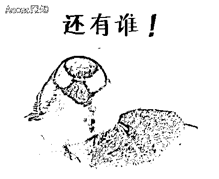

一位英国医师曾描述过这种这种心灵能量的互相争斗：“意志力的争斗，亦即对他人施加命令的力量，一直以来经常会被人们所谈论。究竟是什么机制使这种意志力能够作用在他人身上呢？究竟是什么原因使我们能够接纳并采信某人的建议，却拒绝掉其他人的相同意见呢？是意志的力量作为话语背后的机制在暗中影响着我们吗？正是如此！那些强制性地令我们接纳他们想法的人跟其他人相比并没有什么更大的力量，然而我们仍然如同遵循了某种潜在的要求一般去行事；我们拒绝某些人的建议，却认同了其他人的相同观点。当某人劝诫道：‘你不能这么做。’我们或许仍然会一意孤行，即使此人的地位会令我们后悔拒绝其建议；而当另外的某人说了同样的话，‘你不能这么做’的时候，我们会倾向于接受，并不会藐视其意见并以身试法。这种抉择的结果并不是出于恐惧也不是因为受到挟持，这完全取决于给予建议的人的人格力量或者是意志力；这种人格力量基本上与个体的智力、道德品质、善恶观毫无关系，它是一种很难被定量的存在，虽然它蕴含一定尺度的能量。或许有一些人很有能力，或是智商很高，但往往只有那些能够提炼出内在的心灵力量的人才能够使用很少的力量去使他人服从自己。意志力的作用是普世的，它出现在在律师和客户之间、医生与病人之间、银行家与借贷者之间，顾客和推销员之间。能够使销售员巧妙地劝诱顾客去购买本来毫无兴趣及并不满意的商品的并不是圆滑的手腕，虽然这也是成功销售的因素之一。当两个人相遇时——无论是在商业谈判中，或是生活的其他关系中，甚至是恋爱，都会出现持续的意志斗争，这种现象十分普遍，并且很难被人意识到，尤其当身处此段过程之中时，即所谓的当局者迷。在长期的亲密关系中很难发现究竟是哪一方才处于掌控的地位，那些表面上看起来拥有更强大人格的人实际上往往会屈服于另一方，就如同那句谚语一样：赛跑未必快者赢，打仗未必强者胜。在乔治·艾略特的小说《米德尔马契》中，角色之一利德盖特堪称是优秀品质的集合体，却完全地被肤浅、自私又苛刻的罗莎蒙德所掌控。他并不缺乏意志力，甚至远超于其他人，然而在他的婚姻中他却最终被来自他那心胸狭隘的另一半的激烈压制所打倒。他们之间的意念对抗是一个强大而温暖的天性与另一个刻薄自私的天性的缠斗，就如同一只有力的人类手掌在与一个钢铁锻造的按钮对峙；手被硌得青肿，然而按钮依然纹丝不动。”

你绝不能默认每个与你产生心灵斗争的对手都能意识到这一点。对方或许能察觉出某些争斗正发生在水面之下，却并不懂心灵力量的法则和原理，故而会在过程中一直处于被蒙蔽的状态。当在此类关系中不存在严重的问题时，这里有一个小技巧可以帮助你练习如何掌握你的心灵力量并树立自信。我可以告诉你原理并加以指点，但你必须自行实践，才能一点一滴地吸收归为己用。

当你与其他人以心灵力量对峙时，专注地（但不要凶狠地）凝视对方，并对他发送强力的意念波：“我比你强大，我会赢！”并同时建立心灵图像，想象你已经击倒他并取得胜利。在脑海中维持这种图像和念想：“我的意念波动比你的有力，我正在打倒你！”然后继续想象以下的图像和念想：“你已经变弱并缴枪了，你被打倒了！”以下是一个非常有力的心灵武器：“我的意念波正在瓦解你的武装，我已经把你的力量逐层打破，投降吧，现在投降，我命令你！”

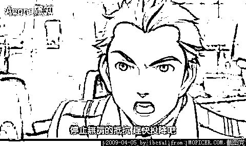

# 卜卦占星书籍 案例分享： Sara 孩子的健康状况

> 原文：[`mp.weixin.qq.com/s?__biz=MzI5NTQzMDUzMQ==&mid=2247483776&idx=6&sn=7df619a03127b087f3665de9c8f5704d&chksm=ec52f16cdb25787a3314fcb0aab494da38ee99266a3c8156713fb4447ea7cf970df5aa46c764&scene=27#wechat_redirect`](http://mp.weixin.qq.com/s?__biz=MzI5NTQzMDUzMQ==&mid=2247483776&idx=6&sn=7df619a03127b087f3665de9c8f5704d&chksm=ec52f16cdb25787a3314fcb0aab494da38ee99266a3c8156713fb4447ea7cf970df5aa46c764&scene=27#wechat_redirect)

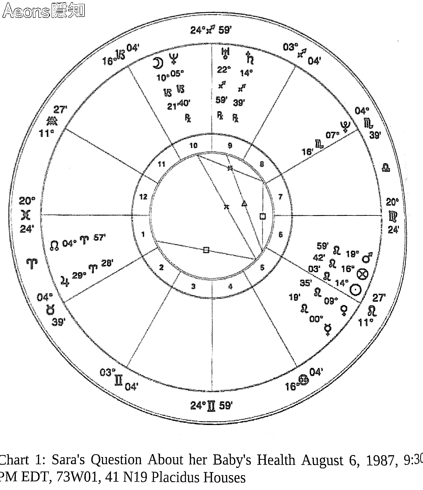

这是《Plain&Simple》中的第一个带盘案例。

前景提要：

作者的朋友 Sara 怀孕了，在此之前，Sara 怀过孕，但发生过流产。

所以这一次，Sara 再度怀孕，对自己宝宝的健康状况非常担忧，找到了作者。

在 Sara 第一次表示担心时，作者认为 Sara 过于神经质了。但在 Sara 的一再要求下，作者答应使用卜卦，看一下宝宝的健康状况。于是，这个盘子就诞生了。

在这个盘子里，作者的思路如下：

1.先取有关宫位和行星：

问卜者孩子的健康，5 宫的 6 宫，取第 10 宫代表。

木星在白羊座的 29°28′，第 1 宫。

与此同时，月亮作为 5 宫主，代表孩子。

2.看各个宫位的状况：

看看孩子本身：5 宫内有水星，在狮子座 0°19′

看看孩子的健康：10 宫内，海王星逆行在摩羯 5°40′（阿烬注：卜卦是否要是用三王星，不同的作者方法及理论不同，建议见仁见智）

10 宫内，月亮在 10°21′

3.来看看重点行星的状况：

水星与木星刚刚在形成一个标准的 90°相位后，开始出相位，

虽然木星在 1 宫，看似蛮强势的，但有两个拖后腿的点：

① 木星在白羊的末度，即将进入下一宫位。一切都面临着变动。

②逆行的海王星。

但要判定一个信息，仅仅靠一个糟糕的相位，是远远不够的。

我们来看看月亮。孩子本身的象征星。

月亮的位置，也许相对积极一些。

但月亮此时没有任何行星相位。

而月亮离开本星座前，最后的一次相位，是与木星的刑相。

孩子本身似乎不是很乐观，作者查看了第 8 宫。

baby’s house，作者认为这可以代表子宫。孩子所在的环境。

8 宫，冥王在天蝎座，本身象征了死亡。

水星即将和冥王星，形成一个刑相位。

而 8 宫主火星，正在逼近 6 宫，月亮即将和火星，形成一个 150 度的相位。

从主要征象，到次要征象，似乎没有任何乐观的因素在。

最终，Sara 去医院检查。

在水星与木星形成精准 90 度那天，孩子已然胎死腹中。

原文时间轴：

July 29：Sonogram shows a healthy fetus.

August 5:Sara feels "different"about the state of her body and worries something with the pregnancy.

August 6:Horary chart is unfavorable for the health of the fetus. 

August 12:Repeat sonogram shows no fetal heartbeat.Fetus has been dead about a week.

注：本书作者推荐 Koch 和 Regiomontanus 分宫制，本盘为普拉西度分宫制。

# 第 9 期推送调查：指引社的发展，需要你的建议哦~

> 原文：[`mp.weixin.qq.com/s?__biz=MzI5NTQzMDUzMQ==&mid=2247483776&idx=7&sn=c2ac71dadcc8a4b687b24f9e7fd906ee&chksm=ec52f16cdb25787aff00704f36f944186778a8330970ad6769375ec335632a22a6568bc8601e&scene=27#wechat_redirect`](http://mp.weixin.qq.com/s?__biz=MzI5NTQzMDUzMQ==&mid=2247483776&idx=7&sn=c2ac71dadcc8a4b687b24f9e7fd906ee&chksm=ec52f16cdb25787aff00704f36f944186778a8330970ad6769375ec335632a22a6568bc8601e&scene=27#wechat_redirect)

**记得点蓝字关注，与好内容相遇**

指引社公众号的每篇文章，都是从每周发布的、或论坛的精品旧文中精选。

每期推送的最后一条，都会放出投票。

选择你喜欢的文章，也可以选择你下期想要看的内容。

指引社公众号初露头角，之后也许会成长为你喜欢的样子。

感谢你的支持。我们会继续努力哒~

📹 /mp/newappmsgvote?action=show&__biz=MzI5NTQzMDUzMQ==&supervoteid=478080419#wechat_redirect

# 芳香植物的两把钥匙（科属篇）③

> 原文：[`mp.weixin.qq.com/s?__biz=MzI5NTQzMDUzMQ==&mid=2247483764&idx=1&sn=dbc2372edaa2132113c4a82846dfd017&chksm=ec52f198db25788e92388c6ef95b193cd0e9a71866011f3628760e352c4cfbcb6c962ec6665e&scene=27#wechat_redirect`](http://mp.weixin.qq.com/s?__biz=MzI5NTQzMDUzMQ==&mid=2247483764&idx=1&sn=dbc2372edaa2132113c4a82846dfd017&chksm=ec52f198db25788e92388c6ef95b193cd0e9a71866011f3628760e352c4cfbcb6c962ec6665e&scene=27#wechat_redirect)

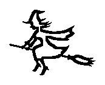

**记得点蓝字关注，与好内容相遇**

坐了冷板凳的小七依旧倔强的更新，这周就更两个科属好了。

唇形科 Lamiaceae

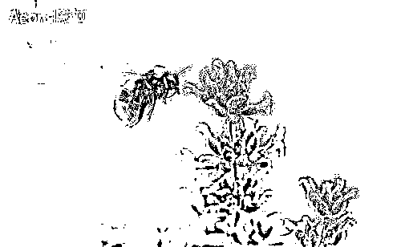

就像它的名字一样，唇形科植物很好辨认，花朵像张开的嘴唇。它们这种姿态可以让蜜蜂为了吸到花蜜而把头伸入，这个时候花朵的雄蕊可以趁机接触蜜蜂，把花粉粘在蜜蜂身上，增加授粉，所以我们可以知道，唇形科是植物的繁殖能力是很强哒～也不枉费它们长那么“性感”了，同时正是因为繁殖能力强，所以变种概率也是非常大的。

唇形科植物喜好干燥环境，阳光强烈，和碱性土壤，石灰岩地带。想想薰衣草，也是有点儿“贱贱的”感觉了，野地薰衣草看上去如同一堆杂草。

植株适应力极强，能直接生长出适应当地特性的化学类型油。正是因为这个特性，所以它是很适合那些需要快速适应环境，或者是追求攀升的人。其灵活性也可以让一成不变，略微顽固的人，“敞开心胸”，去接纳世界的精彩。也可以让害怕改变的人，勇于踏出改变的第一步。呐～为什么我说是第一步而不是勇于改变呢，因为啊～唇形科作用是很迅速直接的，但是缺乏“耐力”，所以它可以做速战速决，短时间内的任务，长时计划则需要考虑其它类型搭配。

唇形科的植物大家其实都很熟悉的，这可是一个大家族，有我们熟悉的各种薰衣草，各种鼠尾草，各种百里香，各种迷迭香，各种薄荷，各种罗勒，各种马郁兰，除了这些还有牛膝草，香蜂草，广藿香岩爱草

挑重点说一下，大家熟悉的我就不再重复。

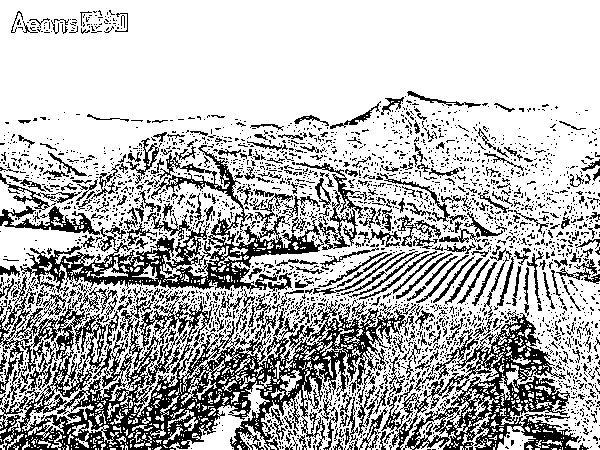

薰衣草家族常用到的有：真正薰衣草，（高地薰衣草，克什米尔薰衣草）。醒目薰衣草（超级醒目薰衣草，葛洛索醒目薰衣草，亚碧拉薰衣草）。穗花薰衣草，头状薰衣草。薰衣草我就不多说了，大家很熟悉的

说说鼠尾草家族吧，有：快乐鼠尾草，鼠尾草（狭长叶鼠尾草，三裂叶鼠尾草，薰衣鼠尾草）

快乐鼠尾草是多分子型，疗效多元全面，和薰衣草一样是属于能提升整体效能的油（重点）我说一下它和鼠尾草的区别，总是有人把它们搞混，鼠尾草是以单萜酮为主，而快乐鼠尾草是以酯类为主，首先气味上就有很大的差别，快乐鼠尾草安抚力更好，对女性机能有很好的调理效果，更有温暖的感觉，其气味带坚果和草药感觉，个人觉得稀释后像丝袜奶茶。。。其中快乐鼠尾草里的快乐鼠尾草醇的多少则决定了它的质量如何。此外它亲和基底轮，腹轮。

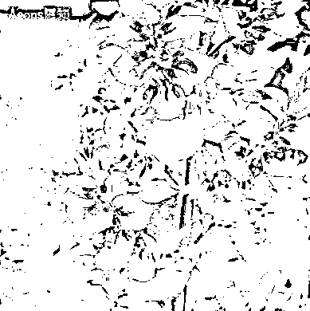

而鼠尾草酮类高，更适用脑部，亲和顶轮，当然同时也亲和基底轮腹轮。但是我要说的是，它利脑真的超好用。有的芳疗师总是在说关于鼠尾草的神经毒性，我只提醒一下，避开剂量谈毒性就等于耍流氓，不过孕妇，幼儿，癫痫不能使用，还有就是绝对不要长期，单独的使用。

狭长叶鼠尾草，主要成分是单萜烯与倍半萜烯，强力止咳，提振免疫力，还有就是亲和生殖泌尿系统，安抚紧张压力。

三狭叶鼠尾草主要成分是氧化物，单萜烯，使用起来很安全，能治疗生殖泌尿感染，镇定头脑（过度活跃）

薰衣鼠尾草主要成分氧化物，还有单萜酮。对呼吸系统很好，同时利脑，也能促进细胞更新。

接着就是百里香家族，种类也是很多的，常用的有：沉香醇百里香，侧柏醇百里香（百里酚百里香，牻牛儿醇百里香，柠檬百里香，龙脑百里香，野地百里香，冬季百里香）熏陆香百里香。

这里直说一下关于侧柏醇百里香，它的主要作用就是加强免疫系统，疗效强大但是很温和，可以和沉香醇百里香搭配起来用，因为沉香醇百里香首先是最温和的，其次可以作为长期提振免疫系统的材料。如果但用侧柏醇百里香，似乎耐力不够？单用沉香醇百里香似乎效果又不够惊喜？所以把它们搭配起来简直天衣无缝。

再有，侧柏醇百里香能够全面提升肝机能，肝脏没有痛觉神经，一般它不喊疼，一旦喊疼可是出现大问题了。我一般是一年保养一次肝脏，用侧柏醇百里香搭配其它的能柔和肝脏的草药油，春季使用三个月。

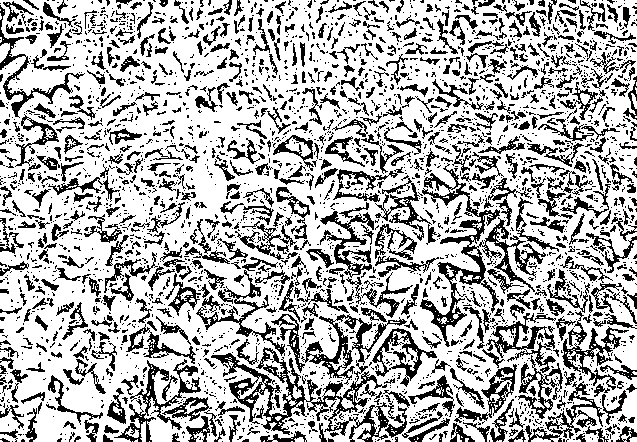

迷迭香家族里常用到的是樟脑迷迭香，桉油醇迷迭香，马鞭草酮迷迭香。

其中樟脑迷迭香是最常见的，如果你买到了品种不明（标签上没有说明）的迷迭香油，几乎有百分之九十的可能就是樟脑迷迭香了

马鞭草酮迷迭香是最少见的类型，具有微量的酮类。

桉油醇迷迭香十分的温和，幼儿都可以使用

薄荷家族里常用的有：胡椒薄荷（密契尔胡椒薄荷，美洲野薄荷）柠檬薄荷，绿薄荷（娜娜薄荷）

没什么好说的，薄荷是最广为熟知的，大概吃过绿箭的人都知道它是什么类型的植物，今天给它一点水，以后它还你一大片绿茵

罗勒家族里常用的有：甜罗勒，热带罗勒，神圣罗勒，柠檬罗勒，辣罗勒

上述种类是指其化学类型的不同，其中甜罗勒是最常使用的，主要成分是沉香醇，也叫沉香醇罗勒。安全性高，婴幼儿可使用，并且有良好助眠功效。

最后聊一聊我最近的新宠，香蜂草

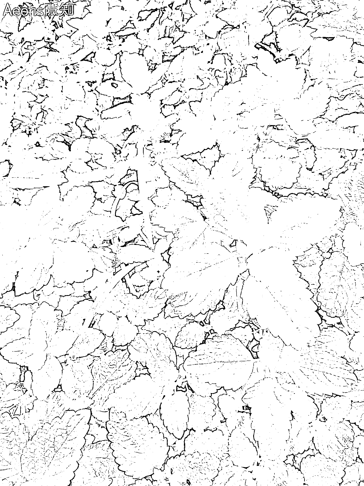

就像它的名字一样，你可以明白蜜蜂很喜欢它，闻起来有股蜂蜜掺柠檬的感觉。我最近才发现它多么好用，不过价格确实也不便宜，特别是难以买到好的或者也难买到真货。

以前我还在想，明明不是什么稀有植物为什么价格不菲，后来才明白，因为它水份多，所以在提取时非常耗材，萃取难度几乎居榜首，因此价格可以媲美花朵类

而且造假率非常高，经常有人往里面掺大量的柠檬香茅。

我曾经也买到过假的香蜂草，拿来后十分失望，因此觉得可能自己没那个境界体会到传说中香蜂草的好，后来得到一瓶浓度百分之五的复方嘉尔莫罗香油（中世纪嘉尔莫罗修道院研制配方，具有极好的镇静效果）那段时间正好有点情绪忧郁，就使用了一夜，那时候我才知道香蜂草不可代替的好，才知道我之前拿到的货有问题。用后不禁感慨，怪不得总有人说香蜂草是治疗各种精神疾病的首选药草，怪不得中世纪炼金术士帕拉塞尔苏斯那么喜欢它，称赞它，并将它发扬成“万用油”

很多售卖香蜂草油的人也许都不知道他自己手上的是假货，也曾有人赠送过我他自己售卖的香蜂草油，因为我用过真货，所以才能立马分辨出他送我的有问题，不过这时候就很尴尬了～

香蜂草选购也是个大坑，需要谨慎挑选，不然买回来假货是真的很划不来，因为其价格昂贵

伞型科 Apiaceae

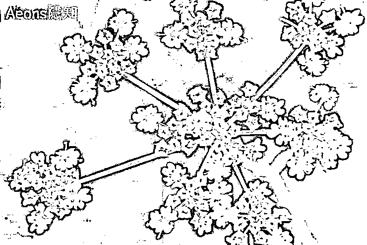

伞型科的植物长的就像一把伞，仔细看又像星团。这个形状正呼应了它的保护力量和连通“天地”的力量。除此之外还能帮助人们恢复小宇宙的平衡

伞型科植物的能量对应着本我轮（第三脉轮）能调节太阳神经纵

这个地方对应着消化系统。我们的消化系统是十分敏感的地方，它是人类的第二大脑，十分容易收到情绪影响。

有的人一紧张就拉肚子，一生气也会拉肚子或者便秘。平时不够自信的人就会更容易受到影响。似乎你心灵所有的垃圾都倾倒给了消化系统，这里的肠道曲曲绕绕，也是最能藏污纳垢的地方。（腹部最具坤性，柔软而敏感，也如大地，生化万物，接纳一切的污垢）

伞型科植物能治疗消化系统疾病，同时也能保养消化系统，补充本我轮能量，其能量特性之一就是“为你撑伞”具有保护特性

能帮助清楚毒素，具有强大的排毒作用。使用后可能会长痘痘，出疹子，不过这些情况都是正常的，可以暂停一段时间再使用（并没有什么卵用，下次用还会出现）或者降低剂量，过一段时间就会好转。

伞型科还可以强化神经系统连接，帮助提高免疫力

适合生殖力低下人群，比如月经紊乱，排卵不正常或者激素分泌异常

伞型科里常见的，最庞大的家族就是各种茴香

常用的有小茴香，茴香，洋茴香，八角茴香，阿密茴，藏茴香，印度藏茴香，海茴香，甜茴香

其中比较出名的就是“爱情灵药”藏茴香

还有印度医学常用的印度藏茴香，它能够增强“火能量”改善虚弱无力的情况，促进性欲

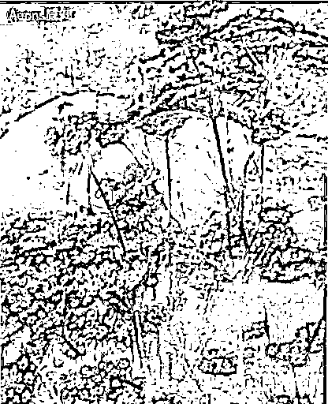

最后来说说谜之汗液味的小茴香

有的人说它稀释后像女性汗液气味，有的人说像男性体味。

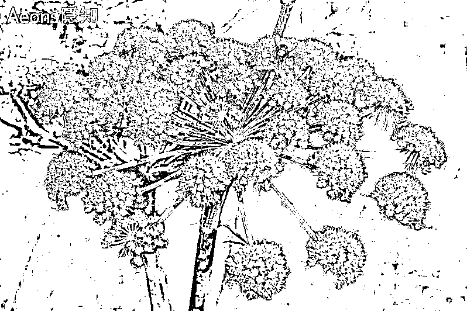

我自己试过很多的不同厂家的小茴香油，根据我的经验来看吧，厂家不一样但是都差不多，如果嗅觉不敏感基本一个味道，然后捏～个人觉得整体来说还是比较像男性体味，（浓度为百分之 1.5 的时候）。如果小茴香配上红桔，加上一点特级依兰，稀释到百分之一到百分之二有一种很性感的女性体味。

小茴香加黑胡椒有很好的暖胃催情作用，也可以搭配锡兰肉桂和胡椒薄荷，或者肉豆蔻也是很好的选择。

**慎小七**

芳香草药·专栏食用指南

慎小七，指引社矿灵学院管理，医学世家出身，芳疗师，常年调香爱好者跟实践者，草药专家。

本系列为慎小七原创出品，涉及芳香、草药等专业知识。

排版｜指引社

文案｜指引社

指引社，致力于让“神秘学”走向大众，不再“神秘”。杜绝神棍，欢迎撩或聊

长按二维码关注我们

点击“阅读原文”，去指引社看原贴

# 学习易学应该了解的一些基本常识（二）

> 原文：[`mp.weixin.qq.com/s?__biz=MzI5NTQzMDUzMQ==&mid=2247483764&idx=2&sn=ae14bb0739181122dfbd283557ed594c&chksm=ec52f198db25788e2267d8f2452fb6087762270758d47200b8361370b1db578e1cb579900322&scene=27#wechat_redirect`](http://mp.weixin.qq.com/s?__biz=MzI5NTQzMDUzMQ==&mid=2247483764&idx=2&sn=ae14bb0739181122dfbd283557ed594c&chksm=ec52f198db25788e2267d8f2452fb6087762270758d47200b8361370b1db578e1cb579900322&scene=27#wechat_redirect)

**记得点蓝字关注，与好内容相遇**

 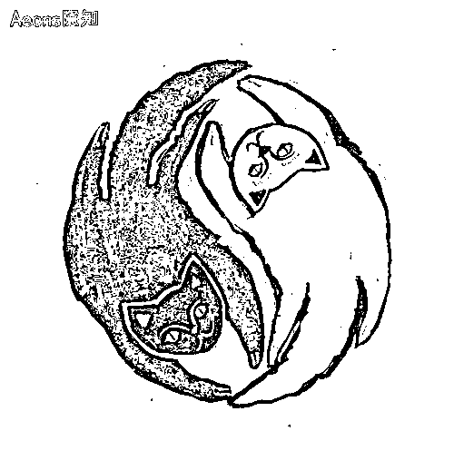

20、简易的筮法

焚香、斋戒、沐浴，面向北方，尽量制造一个虔诚宁静的环境，心里想着要占卜的事；

准备三枚硬币，抛出；

一个正面，两个背面，少阴，记作“- -”；

一个背面，两个正面，少阳，记作“—”；

三个正面，老阴，记作“X”；

三个背面，老阳，记作“O”；

连续抛六次，从下往上画卦；

画出变卦后的“之卦”

21、简易的解卦

没有变爻，查阅本卦卦辞；

有一个变爻，查阅本卦变爻的爻辞；

有两个变爻，查阅本卦变爻的爻辞，阳主过去，阴主未来，同阴同阳则以上爻为主；

有三个变爻，查阅本卦和之卦的卦辞；

有四个变爻，查阅本卦未变爻的爻辞，阳主过去，阴主未来，同阴同阳则以下爻为主

有五个变爻，查阅之卦未变爻的爻辞；

六爻皆变，查阅之卦的卦辞。

方法虽然简单，但却要求有一定的文言和文化基础，以及想象力。

22、太极图

宋朝以前，有名无图，今天流行的太极图、河图洛书等多出自陈抟、周敦颐等宋儒。

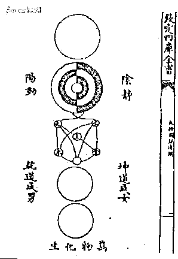

周敦颐太极图

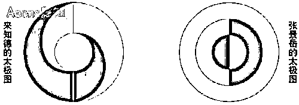

来氏太极图

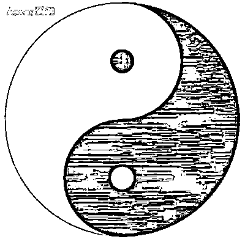

先天太极图

23、河图洛书

奇数为阳，偶数为阴，一、六属水，在北方；二、七属火，在南方；三、八属木，在东方，四、九属金，在西方，五、十属土，在中央。

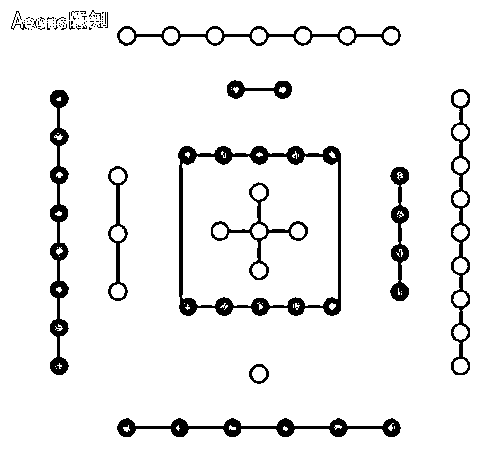

戴九履一，左三右七，二四为肩，六八为足，以五居中，纵、横、斜的方向三个数加起来都等于十五。

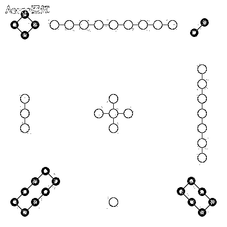

24、先天八卦

《说卦传》：“天地定位，山泽通气，雷风相薄，水火不相射，八卦相错。”

乾、兑卦属金，振、巽卦属木，坎卦属水，离卦属火，坤、艮卦属土。

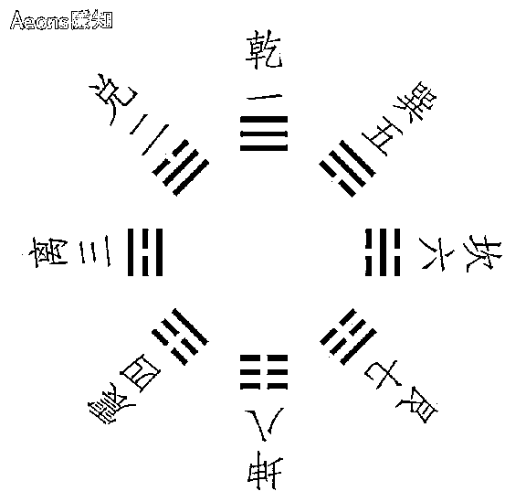

25、后天八卦

《说卦传》：“帝出乎震，齐乎巽，相见乎离，致役乎坤，说言乎兑，战乎乾，劳乎坎，成言乎艮。”方位是左东右西上南下北，从东方震卦开始顺时针排列八卦。

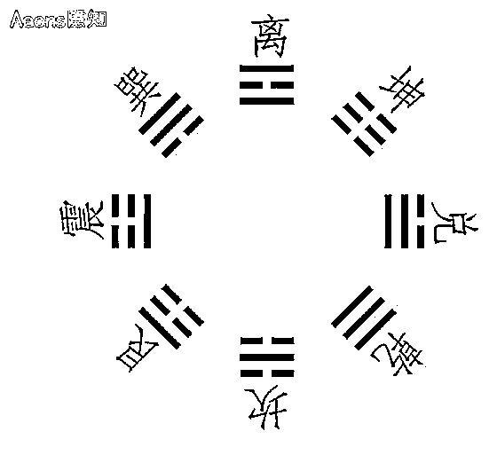

26、十二辟卦

六十四卦中的十二卦（复、临、泰、大壮、夬、乾、姤、 遯、否、观、剥、坤。），配合十二地支，象征阴阳消长周期。

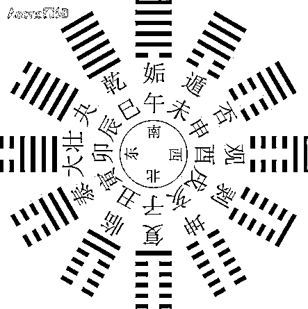

27、二十四方位图

出自古法，用八卦配合天干地支，与阴阳风水相关

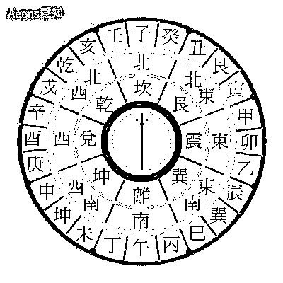

易经本质是占卜之书，经过儒家道家的阐发，也构建出比较系统的哲学和文化体系，对中国传统文化的影响很大，作为中国人，信与不信，了解一定的易学常识，以及易学发展史，很有必要。

排版｜指引社

文案｜指引社

指引社，致力于让“神秘学”走向大众，不再“神秘”。杜绝神棍，欢迎撩或聊

长按二维码关注我们

点击“阅读原文”，去指引社看原贴

# 翻译丨赫尔墨斯卡巴拉

> 原文：[`mp.weixin.qq.com/s?__biz=MzI5NTQzMDUzMQ==&mid=2247483764&idx=3&sn=382c8e9a6ca8dc69fcd33dc387d20023&chksm=ec52f198db25788ec1ce8548429cf868e0c3d1e18f5e32be4f46b6ffcd65394fcc82c819b542&scene=27#wechat_redirect`](http://mp.weixin.qq.com/s?__biz=MzI5NTQzMDUzMQ==&mid=2247483764&idx=3&sn=382c8e9a6ca8dc69fcd33dc387d20023&chksm=ec52f198db25788ec1ce8548429cf868e0c3d1e18f5e32be4f46b6ffcd65394fcc82c819b542&scene=27#wechat_redirect)

**记得点蓝字关注，与好内容相遇**

赫尔墨斯卡巴拉

**Hermetic Qabalah**

**原文：英文维基 Hermetic Qabalah 词条**

**翻译：羽落弦**

　　赫尔墨斯卡巴拉（“卡巴拉”来自希伯来语“קַבָּלָה”，意为“接受”或“阐释”）是西方传统神秘学与秘传体系中的一支。诸如金色曙光、泰勒玛等魔法结社，和圣殿建构者、玫瑰十字会等神秘信仰结社，都是以其为哲学基础和理论框架而建立。并且，赫尔墨斯卡巴拉还是新异教主义、威卡和新世纪运动的思想先驱。[1]也是提丰隐修会（Typhonian Order）等左手宗教派的反卡巴拉（Qliphothic Qabala）理论的基础。

　　神秘主义的赫尔墨斯卡巴拉与基督卡巴拉主义在文艺复兴时代出现并结合，成为现代众多基督教秘契学说、非基督或反基督学派思想的组成部分。它影响深远，尤为明显地表现在：犹太卡巴拉、西方占星术、炼金术、异教信仰——特别是对埃及神和希腊-罗马神的崇拜（后者正是冠名“赫尔墨斯”的缘由）、新柏拉图主义、诺斯替主义、约翰·迪和爱德华·凯利的以诺天使魔法体系、赫尔墨斯主义、塔罗学的教义和符号之中。赫尔墨斯卡巴拉与犹太卡巴拉不同，是一个更加海纳百川的体系，但它与犹太卡巴拉共用着许多概念。

**1、教义**

1.1 神的概念

　　赫尔墨斯卡巴拉的首要教义就是对神之本质的解释。其与现存的一神论信仰有着重大区别；特别是，其中不存在一神论中所表述的神祇与人类的严格划分。[2]赫尔墨斯卡巴拉持有新柏拉图式的观念，即，包括物质创造过程在内的显现的宇宙，是由神性的逐级流溢所产生。[3]

　　流溢的发源有三个预备阶段，这些阶段先于世界的显现。第一个阶段是纯粹的虚无，即 Ain（אין，“nothing”，空无）；第二个阶段是 Ain 的“收缩”，即 Ain Suph（אין סוף，“withoutlimit, infinite”，无限）；第三阶段则是由 Ain Suph 的运动产生，即 Ain Suph Aur（אין סוף אור，“Limitless light”，无限之光），正是从这个原初的光亮开始，第一次创造的流溢启动了。[4]

1.2 赫尔墨斯卡巴拉的源质

　　由 Ain Suph Aur 发出的创造之流有 10 个层次，称作“源质”（Sephiroth，סְפִירוֹת；单数形式为 Sephirah，סְפִירָה）。赫尔墨斯卡巴拉对它们的解释与犹太卡巴拉略有不同。[5]

　　从 Ain Suph Aur 凝聚出第一个源质 Kether。Kether 又逐层流溢出其他源质。即：Kether(1), Chokhmah (2), Binah (3), Daath, Chesed (4), Geburah (5),Tiphareth (6), Netzach (7), Hod (8), Yesod (9),Malkuth (10)。其中，Daath 没有编号，因为它被认为是 Binah 的一部分，或者是一个隐藏的源质。[6]

　　每个源质都是神性能量（常被描述为“神性之光”）的流溢，从非显现之源，通过 Kether，逐层显现。[7]这个圣光之流被描画为生命之树上的闪电，依次串起所有源质。

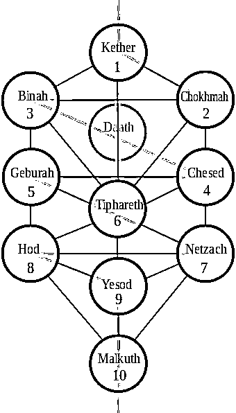

图 1.生命之树上的闪电与路径

　　每个源质都是神性能量的结点，世界的各个领域都被划分为十份，分别地归属于它们。这种领域的分配可以帮助卡巴拉主义者理解每个源质的特性。将各领域分由每个源质掌管的做法，也是赫尔墨斯卡巴拉对神之本质的一种阐释方式。例如源质 Hod 所分属的领域包括：荣耀、完美的智能、塔罗的四张 8 号数字牌、水星、埃及神透特、大天使米迦勒、罗马神墨丘利、炼金元素汞。[8][9]这背后的普遍原则在于，通过对其所有分属领域的冥想，卡巴拉主义者能获得对该源质特性的理解，包括其所有的对应。

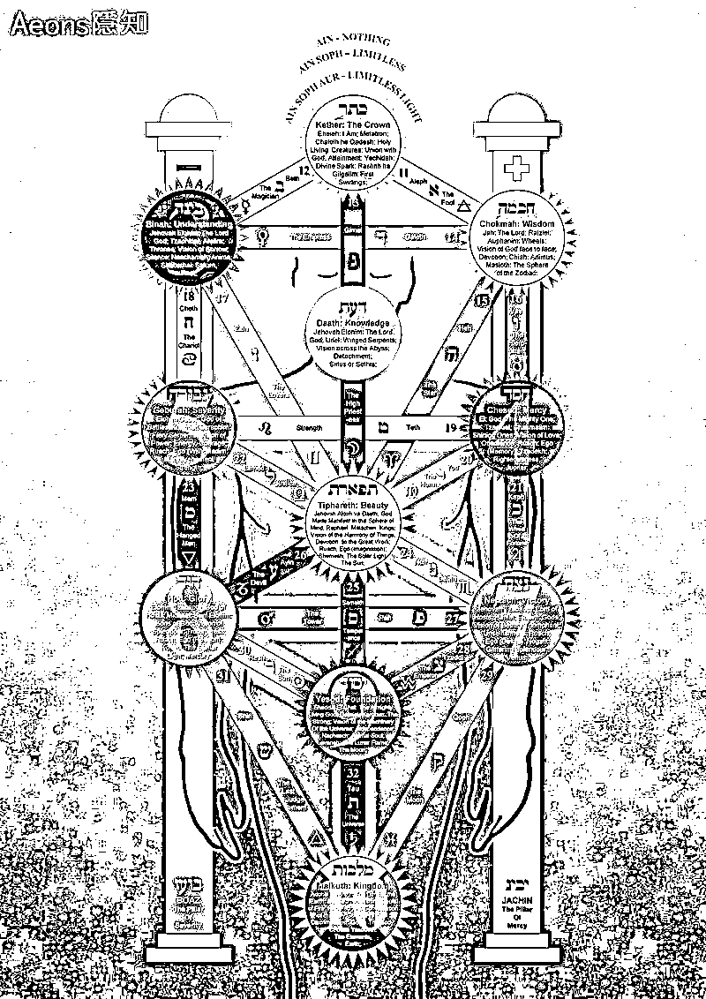

图 2\. 圣光从仆隐修会（Servants of the Light）的赫尔墨斯卡巴拉生命之树

1.3 塔罗与生命之树

　　赫尔墨斯卡巴拉主义者们认为塔罗牌是生命之树的钥匙。21 张编号的大牌加上愚者（0 号）牌，通常被称作“大阿尔卡纳”或“大秘仪”，对应了 22 个希伯来字母和生命之树的 22 条路径；四牌组中的 Ace 到 10 号数字牌分别对应四个卡巴拉世界中的十大源质；16 张宫廷牌则对应四个世界中的四大元素。[10][11][12]源质描述的是神之本质，它们之间的路径则是理解神的通道。[13]

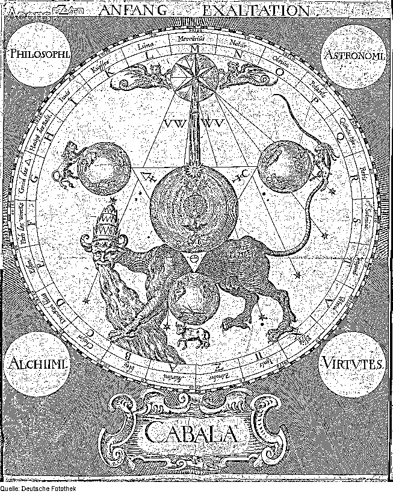

图 3. 卡巴拉、炼金术、占星术及其他赫尔墨斯主义神秘学说的融合体系，来自一份 1616 年的德国文献

**2 历史**

2.1 赫尔墨斯主义者对卡巴拉起源的看法

　　传统的理解是，犹太卡巴拉思想是从犹太教内部产生，其表达术语则可能融汇了中世纪的犹太新柏拉图主义。当下的犹太神秘主义研究则重新评价了由革舜·肖勒姆（Gershom Scholem）提出的、认为中世纪卡巴拉新教义融汇了较早的一派犹太诺斯替主义的观点。[14]与此相应的是摩西·爱迪尔（Moshe Idel）的观点，他提出了一种从早期犹太神秘主义不断发展为卡巴拉的连续思想史。[15]而针锋相对的是赫尔墨斯主义者们，他们认为卡巴拉思想有着截然不同的起源。一些学者反对卡巴拉思想源自闪米克/犹太神秘主义或古埃及诺斯替主义，而认为其来自根植在古希腊和印欧文化的西方传统，并在晚些时候才被犹太神秘学所吸收。[16]

　　如果按照他们的说法，尽管使用了犹太希伯来的语言书写，“赫尔墨斯卡巴拉”才是最初的卡巴拉，早于基督卡巴拉和犹太卡巴拉。因为在基督教取代异教成为主流的那段历史时期，犹太神秘主义者们是可以不受质疑地将希伯来灵数系统和生命之树整合到他们自己的理论之中的；而相反，由于这套理论类似于前基督时期的泛神论崇拜，基督教学者若如此做，则将受到迫害。故直至文艺复兴时期，基督学者才从犹太教那里重新拾起这种智慧。

2.2 文艺复兴时期的神秘主义

　　至少早在 15 世纪，乔瓦尼·皮科·德拉·米兰多拉（Giovanni Pico della Mirandola）将柏拉图主义、新柏拉图主义、亚里士多德主义、赫尔墨斯主义和卡巴拉结合起来形成一套综合宇宙论的时候，犹太卡巴拉思想就进入了赫尔墨斯传统。[17]德国魔法师、秘契作者、神学家、占星师、炼金术士海因里希·阿格里帕（Heinrich Cornelius Agrippa，1486–1535）撰写了影响卓著的《神秘哲学三书》（Three Books of Occult Philosophy），将卡巴拉融入西方魔法的理论与实践之中。并深刻影响了文艺复兴时期对仪式魔法与基督教义之间关系的看法。之后，皮科的赫尔墨斯综合理论被耶稣会牧师、赫尔墨斯主义者、博学家亚他那修·基切尔（Athanasius Kircher）进一步地发展。他在 1652 年的书著中就此问题进行扩展，并将更多元素——如俄尔普斯主义、埃及神话等——融汇到这一综合之中。[18]

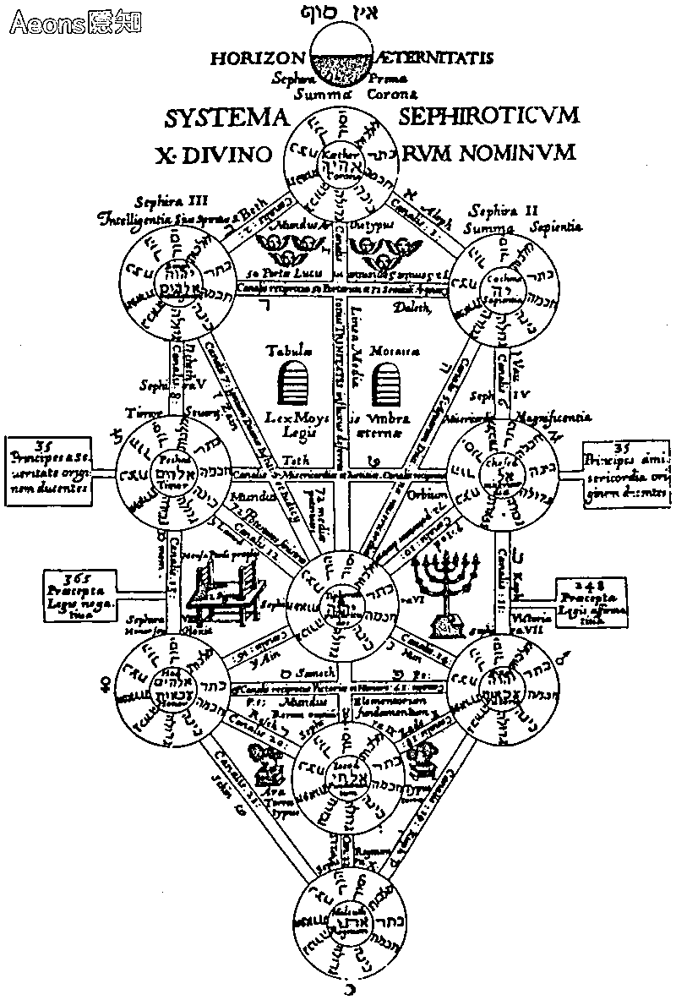

图 4. “基切尔之树”：亚他那修·基切尔在 1652 年对生命之树的描绘。该版本是基于 Philippe d'Aquin 的 1625 年版本。目前，基切尔之树仍是赫尔墨斯卡巴拉主义者对生命之树的源质与路径最为常用的排布。

2.3 启蒙主义时期的秘契结社

　　赫尔墨斯主义不再被基督教会支持之后，就立刻转入地下，众多赫尔墨斯主义的兄弟会如雨后春笋般建立起来。伴随着启蒙主义时代的理性高扬，和对主流信仰的怀疑主义，世俗-神学的基督卡巴拉传统衰退，秘传-神秘学的赫尔墨斯卡巴拉则在西方神秘学传承之中盛行。由于非犹太的卡巴拉主义不像犹太卡巴拉主流观念那样对魔法怀疑审慎，它很快成为了西方神秘学、魔法和占卜术的核心教义。

　　玫瑰十字和共济会的秘契主义分支，都在其入会启蒙中渐进地传授着宗教哲学、卡巴拉，和神圣魔法。他们的秘传教义，以及由严格的内部专家层领导外层会员的会社结构，成为现代秘契组织的基本设置。

2.4 十九世纪的魔法复兴

　　启蒙主义运动之后的浪漫主义思潮，激发了人们对神秘主义的兴趣，而赫尔墨斯卡巴拉就是其中的热点之一。弗朗西斯·博内特（Francis Barrett）的仪式魔法手册《魔法师》（The Magus，1801）起初鲜有人知，但因影响了法国的魔法热爱者艾利法斯·里维（Eliphas Levi），变得受人瞩目。他用奇幻色彩的文学语言描绘了召唤魔法，并提出卡巴拉实际上是所谓白魔法和黑魔法二者的同义词。里维的创新之处在于，将希伯来字母对应到塔罗牌，由此建立了西方魔法和犹太秘契学说之间的联系；而后者自此成为西方魔法学的基础。里维对金色曙光赫尔墨斯研修会的魔法观有着至关重要的影响。通过受他影响的神秘学者们（包括自认是里维转世的阿莱斯特·克劳利）的推崇，里维被尊为 20 世纪魔法复兴的关键奠基人之一。

2.5 金色曙光赫尔墨斯隐修会

　　金色曙光赫尔墨斯隐修会广泛地发展了赫尔墨斯卡巴拉理论。[19]其中，对卡巴拉理论的融合包括了将十个源质与希腊和埃及神更加紧密地关联，并延伸到其他思想体系，如约翰·迪（John Dee）的以诺天使魔法学，和一些来自东方（主要是印度教和佛教）的观念。这些思想也展现在他们共济会或玫瑰十字式的组织构架中。

　　经历金色曙光而后组建了自己的魔法会社的阿莱斯特·克劳利，是最广为人知的赫尔墨斯魔法（他更偏好用 Magick 而非 Magic 来指代魔法）代表人。[20]他的《777 之书》（Liber777）是这种泛化的赫尔墨斯学说的典型代表。《777 之书》包含了一系列表格，将各种仪式魔法、东西方宗教与代表十大源质的 32 个数字和 22 条卡巴拉生命之树路径相对应。该书也清晰地呈现了赫尔墨斯卡巴拉的泛神论本质，例如你会在表格中看到，源质 Chesed（דסח，“仁慈”）广泛对应着木星、伊西丝、蓝色（王后色谱）【克劳利将色彩分为国王、王后、皇帝、女皇四类色谱——译注】、波塞冬、梵天，和紫水晶。

2.6 金色曙光之后

　　克劳利发布了许多金色曙光的仪式，并通过不同方式的修正，将其与他自己的“新纪元”（New Aeon）魔法理论结合起来。而后，以撒莱尔·芮嘉迪（Israel Regardie）编撰了这些仪式更加传统的内容，并以书籍形式出版。[21]

　　阿尔法至欧米伽隐修会（Alphaet Omega，金色曙光的分支组织）的初级会员迪奥·弗芩（Dion Fortune），组建了内在之光隐修会（Fraternity of the Inner Light）并撰写了重要书著《神秘卡巴拉》（The Mystical Qabalah）。这本书被认为是对现代赫尔墨斯卡巴拉理论最佳的概论性书籍之一。[22][23]

　　美国神秘学者保罗·福斯特·凯斯（Paul Foster Case，1884–1954）撰写了数本卓有影响的关于神秘塔罗和卡巴拉的书籍。他所组建的内殿建构者（Builders of the Adytum，B.O.T.A）神秘学派，亦是基于金色曙光赫尔墨斯隐修会和共济会的蓝屋体系，并在后来由安·戴维斯（Ann Davies）予以扩张。BOTA 传授内容包括秘契心理学、神秘塔罗学、赫尔墨斯卡巴拉、占星术和冥想。

　　帕特·扎勒斯基（Pat Zalewski）是杰克·泰勒（Jack Taylor）的学生，罗伯特·费肯（Robert Felkin）的徒孙。当费肯移居到新西兰之后，泰勒在那里加入了他的金色曙光学派。扎勒斯基也撰写了数量众多的赫尔墨斯卡巴拉和金色曙光传承的书著。

　　萨缪尔·昂·沃尔（Sameal Aun Weor）也有许多重要作品讨论卡巴拉与其他信仰体系，例如埃及信仰、异教、中美洲信仰等等。这些内容总结在他的作品《塔罗与卡巴拉奥秘中的启蒙路径》（The Initiatic Path in the Arcana of Tarot and Kabbalah）之中。

－－－－－－－－－－－

**论坛讨论地址**：http://www.imslr.com/thread-47939-1-1.html

欢迎各位卡巴拉研究者批评指教~！

排版｜指引社

文案｜指引社

指引社，致力于让“神秘学”走向大众，不再“神秘”。杜绝神棍，欢迎撩或聊

长按二维码关注我们

点击“阅读原文”，去指引社看原贴

# 翻译丨《中世纪魔法》 第 2.6 课 东方的犹太社区

> 原文：[`mp.weixin.qq.com/s?__biz=MzI5NTQzMDUzMQ==&mid=2247483764&idx=4&sn=d1b459b4370f823b3563b73dbb5cc3c1&chksm=ec52f198db25788e1a20f407d6b7ab6b20be2935ee12879362ca32ccc933b8f06a20ced9d1b8&scene=27#wechat_redirect`](http://mp.weixin.qq.com/s?__biz=MzI5NTQzMDUzMQ==&mid=2247483764&idx=4&sn=d1b459b4370f823b3563b73dbb5cc3c1&chksm=ec52f198db25788e1a20f407d6b7ab6b20be2935ee12879362ca32ccc933b8f06a20ced9d1b8&scene=27#wechat_redirect)

**记得点蓝字关注，与好内容相遇**

**巴塞罗那大学公开课《中世纪的魔法》**

慕课出品 · 指引社 BRANCH 字幕组翻译

 

**第二单元 魔法与异端**

**第六课（选修 I） 东方的犹太社区**

你们好，欢迎回到中世纪的圣玛丽亚大教堂，这个奇迹之地。如果你在看这个视频，意味着你对中世纪的其他宗教如何看待魔法产生了好奇。诚然如我之前所承诺的，我们将在此学习这些内容。这个单元所包含的两个辅修课程将会带领你走进近东犹太社区的生活，并了解他们的魔法概念。

但首先需要了解的是，这些人是谁？在这种总被当作外乡人对待的环境中，他们是如何生存的？在中世纪，犹太社区分散在欧洲、亚洲和北非的各个国家中。在所有这些地方，他们都是少数派。并且他们的合法性直接取决于周围的主导群体的宗教与政治法令。例如，生活在欧洲基督教国家的犹太人遵从基督教的君主法令和教会统治。而生活在伊斯兰地区的犹太人则遵从伊斯兰教的法令及统治。在接下来的几分钟，我们将集中关注后者，尤其是在宗教教育体系内的犹太人。强调这一点极为重要，因为在下一节课我们将讲到犹太魔法的两种完全不同的教学方式。

东方的犹太人被“吉玛”制度保护和约束，【译注：东方指的是欧洲以东，主要是伊斯兰地区。】“吉玛”是穆斯林和非穆斯林之间的保护协议，它允许后者生活在伊斯兰地区，但与此同时又限制了他们的生活方式。非穆斯林遵循特殊的税收制度。他们的服装必须明显区别于穆斯林，并且他们不能建造朝拜中心。非穆斯林男性不得娶穆斯林女性为妻。对起诉穆斯林的案件中，非穆斯林的证词不被采纳；非穆斯林也不能拥有穆斯林奴隶，或继承穆斯林的遗产。当然，改宗是严格禁止的。不过也有好的方面，他们的存在被容忍，他们具有法律权利和进行犹太教活动的自由，他们可以选择自己的领导人、维持繁荣的商业贸易，以及从事专业活动。多亏了在社区、宗教和专业上的独立，犹太教才得以幸存。更重要的是，受伊斯兰环境影响，犹太文化甚至在很多领域繁荣发展，例如诗歌、医药、哲学、数学和天文学。很多作品是由希伯来语著述，还有许多用的是希伯来字母拼注的阿拉伯语，即所谓犹太-阿拉伯语系统。

犹太人的孩子们是如何接受教育的呢？毫无疑问，犹太会堂是其中关键。对于每个中世纪的犹太人来说，人生中最重大的事件皆是在这个礼拜仪式和社区活动的中心举行。犹太会堂承担举行集会的功能，并由管理者组织，以保证犹太社区的生存。和其他人类团体一样，社区的生存要从对孩子的教育开始抓起。宗教教育完全依赖拉比，他是“阿伽马”（即全体犹太社区）的宗教代表。同时，拉比负责管理犹太会堂、研习圣殿（即希伯来语“贝斯米拉什”）的活动和各种社区服务。社区管理者根据道德高尚、信仰虔诚，和圣经理解专业性的标准来选举拉比，拉比负责对孩子的教育。

事实上在犹太历史中，宗教教育一直是被关注的核心问题，并且在大部分最重要的犹太经典中，都有对教育制度的详细设计。教给犹太儿童的第一本教材是《塔纳赫》。【译注：即《希伯来圣经》。】希伯来圣经大部分是被基督教作为旧约圣经的内容。其中包括《摩西五经》，即《托拉》。【译注：“托拉”意为律法，因此也被称作《律法书》。】如果你有基督教背景，你会更加熟悉这个词。从教化的角度，将《托拉》作为基础教材是明智之选。因为它包含历史、神话、信仰、文学和希伯来语言，同时能够使孩子们对上帝意志和上帝对犹太人历史的介入得到了解，例如犹太人选择与上帝建立契约之事。其它对儿童教育尤为重要的典籍首先要数《密西拿》，《密西拿》是由上帝教给摩西，再从摩西传给约书亚，如此以往流传下来的口授经典，并在基督纪元的第二个世纪末以文字编纂记录。《密西拿》制定了犹太社区的生活规范，包括最小的细节。第二个重要的文献是《塔木德》，这是公元 3 世纪以来，历代著名学者对《托拉》的注释。

按要求，犹太经典的教育将持续到 18 岁。一个人学到得越多，他在共同体中所获得的尊重越多。至少在理论上，犹太人有较高的文化水平；事实亦然，中世纪犹太人的平均文化水平的确在同期其他宗教群体之上。并且，对女孩的教育在数量以及质量上也同样突出，女性被赋予接受同等教育的权利。例如在 12 世纪的埃及，盲人男性被认为是教导女孩最合适的人选。由于不能够看到她们，师生之间的互动不会产生绯闻，甚至一些女性也成为了教师。这些经典不仅培育心智，而且塑造个性、树立生活规范与伦理准则。犹太人将大部分时间投入会堂和研习圣殿的学习活动，尤其是在周六和其他假日。因此，犹太会堂可以说是两千多年来犹太教育制度的基石。在中世纪，无论社区多么贫穷，研习圣殿和犹太会堂都是教书育人的两大基地。尽管父母承担着基础教育的责任，他们也会雇佣私人导师。在中世纪，犹太人中很少出现文盲。

不过，最高等的宗教教育则是财力富足的人才能获得。大部分犹太人不清楚《塔木德》的细节，毋需说其他专著了。然而，科学研究则是另一回事。【译注：这里的“科学”同样是广义的科学。】拉比并不负责这方面的教育，因此学生必须另寻高明。如同很多专业领域，科学导师通常是相关学科的卓有声望的专家，招收学生并且教育他们。

那么，在教育体系中，魔法的地位如何？它是与其他科学一同教授的吗？它是否如同我们在基督教内部所见的那样，对宗教当局构成威胁？恐怕要等下一节课来回答这些问题了。

下期再会！

-------------------------

**视频&字幕百度盘下载、课程索引：**

http://www.imslr.com/thread-35021-1-1.html

**【↑↑↑ 这个帖子都没人回复，大家是不是对犹太魔法不感兴趣……_(:3」∠)_**

排版｜指引社

文案｜指引社

指引社，致力于让“神秘学”走向大众，不再“神秘”。杜绝神棍，欢迎撩或聊

长按二维码关注我们

点击“阅读原文”，去指引社看原贴

# 第 8 期推送调查：指引社的发展，需要你的建议哦~

> 原文：[`mp.weixin.qq.com/s?__biz=MzI5NTQzMDUzMQ==&mid=2247483764&idx=5&sn=5bf1c4c14a471c416d7f0a76c7835b15&chksm=ec52f198db25788ec330815a156e10abbaa3fd71324abc66a804d4349d54613763bd47e3c670&scene=27#wechat_redirect`](http://mp.weixin.qq.com/s?__biz=MzI5NTQzMDUzMQ==&mid=2247483764&idx=5&sn=5bf1c4c14a471c416d7f0a76c7835b15&chksm=ec52f198db25788ec330815a156e10abbaa3fd71324abc66a804d4349d54613763bd47e3c670&scene=27#wechat_redirect)

**记得点蓝字关注，与好内容相遇**

指引社公众号的每篇文章，都是从每周发布的、或论坛的精品旧文中精选。

每期推送的最后一条，都会放出投票。

选择你喜欢的文章，也可以选择你下期想要看的内容。

指引社公众号初露头角，之后也许会成长为你喜欢的样子。

感谢你的支持。我们会继续努力哒~

📹 /mp/newappmsgvote?action=show&__biz=MzI5NTQzMDUzMQ==&supervoteid=477898523#wechat_redirect

排版｜指引社

文案｜指引社

指引社，致力于让“神秘学”走向大众，不再“神秘”。杜绝神棍，欢迎撩或聊

长按二维码关注我们

# 离奇时髦的神秘学防骗指南【邪教篇】

> 原文：[`mp.weixin.qq.com/s?__biz=MzI5NTQzMDUzMQ==&mid=2247483757&idx=1&sn=19913805f3ff2e76b4bb1c07e968ca7e&chksm=ec52f181db257897564482e7721f3920908905b2953918c59f49771999d6fc4c021ed5ba90c5&scene=27#wechat_redirect`](http://mp.weixin.qq.com/s?__biz=MzI5NTQzMDUzMQ==&mid=2247483757&idx=1&sn=19913805f3ff2e76b4bb1c07e968ca7e&chksm=ec52f181db257897564482e7721f3920908905b2953918c59f49771999d6fc4c021ed5ba90c5&scene=27#wechat_redirect)

**记得点蓝字关注，与好内容相遇**

大家好，我是右夜鸣，今年十六岁。

xxx 是神秘学高手，我前世是多牛逼多牛逼的神仙，我的魔法毁天灭地，我和一大群妖怪谈笑风生，我把鬼魂去头蘸酸辣酱吃鸡肉味嘎嘣脆，我是异世界的魔王，我是 xxxx 的传人，我祖上是 xxx，我能教你成仙——三个月金丹交钱还能送元婴，跟着我混能洗清罪恶，还能命走桃花，我这里有一块开了光的红领巾，就卖十块钱，信仰圣光吧，我是天使……

在过去混迹神秘学圈子的七、八年，时常能看到一些圈子里的新人小白，跟着来路不明的，上面这种画风的脑残走上歪路。

有些人半途醒悟，迷途知返，而另外一些则是越走越歪。

虽然以旁观者的身份来看，谁都会觉得这些东西又搞笑又傻逼，但等它们真地降临到自己身上的时候，还是有很多小白会上当受骗，或者因为其他各种各样的原因身陷其中。

因为这种事情见得多了，所以说到神秘学防骗的话，我第一瞬间就会想起这种有组织有纪律的行骗行为——也就是邪教。

当然，说是邪教，但是这个词在这篇文章里并不仅仅是指那些已经被法律界定为邪教了的犯罪组织。

在神秘学领域中有很多骗局并不会直接对当事人造成经济上的损害，还有一些靠各种手段存在于灰色地带的人和事界定起来很麻烦，大家今后慢慢体会即可。

虽然对于邪教这种东西我是有很多地方想要吐槽的，不过评价方面的话，归根结底就是一句话——“猛兽总是独行，牛羊才成群结队”。

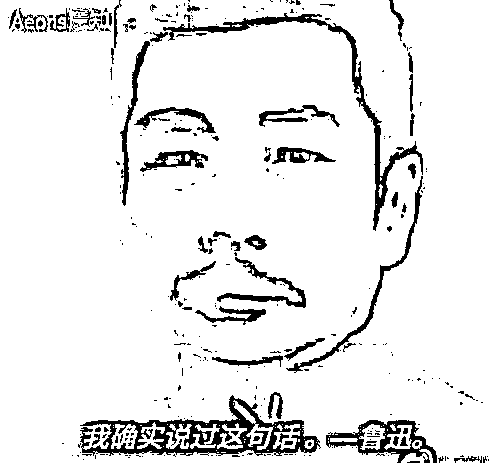

邪教说到底就是一群没什么本事还要跳出来瞎逼逼，逼逼完了还要强行问你要点钱的家伙。

但凡他们有一点能耐，都会选择慎言微行，夹着尾巴做人。

如果有很大的能耐，那他们就不是邪教了。

正因为无知才会肆无忌惮，正因为无力才会各种颠倒行事。

但偏偏就是这些无知愚蠢的邪教，却往往能把很多人吓唬住。

有些人明明想要脱离这些邪教组织的控制，却又反反覆覆地被拉回了深渊。

前几天看到指引社阿克老师那篇有关心灵技巧的文章之后我也是感慨良多。

很多时候，一个人想要离开邪教，却还身陷其中的人就是因为心智层面的防御太过薄弱，在心灵对弈上输给了那些邪教徒。

在本篇文章中也会提到一些相关方面的问题，但如果想知道具体的理论解释的话，可以去看阿克老师的文章。

记得在这个防骗指南的上一篇，缘起篇里，我提到过说，有的人是把魔法、占卜视作了一步登天的神器，又或者受了小说和电影的影响，来追求一片绚丽的光影。

有人会觉得，拥有这种认知的人不就是单纯的小白、中二病吗？

他们进入神秘学圈子并不会带来什么危害，既不会整天想着去诅咒别人，也不会给圈子里的其他人添太多麻烦，那是不是没太大关系？

可事实上，这是一个很明显的心灵破绽，而且这种破绽也很容易被别有用心的人抓到。

比如把魔法这种自己所知甚少的东西过于神化，认为自己学会魔法之后就能出任 ceo，迎娶白富美，从此走上人生巅峰，可以对别人为所欲为了的人。

有这样想法的人，内心否认自己至今为止的人生，把自己以及和自己相似的大众归类于平凡、弱小，而且无力的一类。

而他的愿望正是把自己从平凡的大众中分离出来，成为特殊的、强大的存在。并且把这种特殊、强大寄希望于某种他还不曾了解的东西。

所以，他会觉得这个世界上拥有一种未知的力量，这种力量可以以压倒性的优势，轻而易举地毁灭他现在所拥有的一切，主宰每一个人的人生。

对他来说，这种认知是合理的。因为只有在这种“合理的认知”下，他的愿望才有可能实现，把那种未知的力量据为己有就可以了。

然后，就在他沉浸在如此美梦之中的时候，邪教徒出现了，通过信息不对等，或者一些无聊的把戏，以及没什么根据的传言，让那个人误以为这个邪教徒或他组织里的某个人拥有了这种“未知的力量”。

然后，之后的事情就顺理成章了。

因为想要那种力量，他会对邪教恋恋不舍。

因为恐惧那种力量，他会对邪教惟命是从。

因为在他的认知中，拥有这种力量可以对人为所欲为，所以无论邪教怎么对他，那也都是合理的。

更可怕的是，因为他认为周围的大多数人和他一样是弱小的凡人，所以他会坚信没有人能帮得了他。

当然，实际上邪教徒并没有那么强大的能力。可能有一些邪教徒的确和某些灵体，或者鬼魂存在联系。

可那又怎么样？这些存在并不是我们想象中，或者恐怖电影里演得那么可怕的。

先不说这些灵体拥有自己的脾气和性格未必对邪教徒言听计从。

再加上，灵体、鬼魂和现实世界的联系微弱，影响力有限，这点从它们没有形体、无法轻易显现这点就可以看出来。

如果没有合适的因缘，它们甚至连让你感知到它们存在的能力都没有。

它们只有在特定的场合，特定的情况下才能够影响到你，为此邪教徒需要做很多准备工作，包括用语言和道具的诱导挑起你的各种情绪，通过场景的预先布置对你进行心理暗示，利用媒介降低显现的难度，甚至用一些具备致幻能力的药物加以辅助，甚至请好托演一些蹩脚的戏码增加对方的可信度之类。

但如果你要让一个灵体跑到大街上当场杀一个人什么的，那还是省省吧。

相比之下，想要害你的邪教徒们可能会更倾向于给你发一个 T 的带颜色种子，在你尽情纵欲之后再让那些鬼魂进入你的梦境，吸取你的精气，让你连续做上半年的春梦最后力竭而死什么的。

如果你已经决定了要做一个遵纪守法的好公民。那你把 qq、微信群一退，拒绝对方的文件传输，然后房门一关……然后就屁事没有了。

而且如果真有邪教徒能收集一个 T 的种子，大概人家就是不搞邪教，某些绅士也会挤破脑袋去找他们。

所以从这点可以看出，很多邪教徒的本事甚至还不如一个老司机。

更何况，如今就连这种还保留着一两手绝活的积极努力型邪教徒都已经很少见了。

整天都是些萌二和智障，跑来跟你说她那里有从地摊上淘来的五块一串的手串，里面封印着一只九尾妖狐，决定 500 块卖给你。

或者自称是什么什么法师，从菜市场买几斤鱼虾丢河里就功德无量。

拿着几句佛经道经里面摘出来的句子瞎解释一通，然后就敢腆着脸说自己精通佛学，是什么什么法师，什么什么法王的。

每次看到这种逼格已经低到地核了的不法组织出来到处行骗，然后还偏偏有很多人信以为真的时候，我就真地是不得不感慨，这个世道变了。

数年前，在我出道神秘学圈子之前，百度贴吧“学魔法”吧里那个骗我去练元素魔法的“魔王”都还知道让人练练静坐，再扯扯召唤、契约、星体投射。

那时候伪装成佛教出来混的，还要跟人扯扯佛门五戒，而不是提起一卡车鳄龟就往河里丢。

就连当年指引社的中二少年诅咒人的时候都还知道去楼下肯德基买个香辣鸡翅，把吃剩的骨头拿来做仪式道具。

结果现在人就只会跑来跟你说“我要诅咒你了，你好好留心一下，这几天身边有什么不好的事情发生”——这种明显到不能再明显的心理暗示了。

搞得我都感到不好意思，想顾及一下对方的面子，假装瑟瑟发抖，然后第二天故意睡过头，故意上班迟到，故意被领导骂一顿，然后再跑回来加回对方的 qq 跟对方说一声：“哇，我今天超倒霉，你的诅咒好厉害啊！”

为什么我这个被诅咒的要演得比你们这些个下咒的人还卖力啊！

没本事不是你的错，但做事不走心就是你的不对了啊！

简直就是世风日下，人心不古！

食屎啦（中指）！

好了，总之所谓的邪教徒，就是这种画风了，根本没什么好怕的，对不对？

所以今后，当你发现自己身陷邪教的时候，还请你会想起在下的这篇文章，然后坚定起自己退教保智商的决心。

在这种时候，如果你自己的意志不坚定，这些臭不要脸的就会不停地跑来烦你。

甚至会人会假装很了不起地威胁你说要把你怎样怎样，要把你家人怎样怎样。

但是咬人的狗不叫，当一个邪教徒斜眼 45 度角，故作阴狠地从牙缝里崩出：“退教，由得你吗？”的时候。

请务必抄起拖把糊他脸上，然后用力吸口气，告诉他：“由得！”

然后借他一身胆他都不敢嚣张。

所以邪教什么的就该一脚踹开让他们自生自灭。

什么脑残玩意？真是越写越生气！都快怒火攻心了！

最后，不得不在文末提一句的是——对付邪教徒的方法并不能用来对付民间高利贷和讨债公司，麻烦千万不要看过这篇文章之后随随便便跑去借个三点五个亿。最后还不出钱被浇成水泥棍沉到海底的锅我不背！

排版｜指引社

文案｜指引社

指引社，致力于让“神秘学”走向大众，不再“神秘”。杜绝神棍，欢迎撩或聊

长按二维码关注我们

点击“阅读原文”，去指引社看原贴

# 芳香植物的两把钥匙（科属篇）②

> 原文：[`mp.weixin.qq.com/s?__biz=MzI5NTQzMDUzMQ==&mid=2247483757&idx=2&sn=44a639ad399cf37a30110b7935656c52&chksm=ec52f181db25789749d44907f752ca594730ff312a2c96829400a314ac506b071b28ee721754&scene=27#wechat_redirect`](http://mp.weixin.qq.com/s?__biz=MzI5NTQzMDUzMQ==&mid=2247483757&idx=2&sn=44a639ad399cf37a30110b7935656c52&chksm=ec52f181db25789749d44907f752ca594730ff312a2c96829400a314ac506b071b28ee721754&scene=27#wechat_redirect)

**记得点蓝字关注，与好内容相遇**

樟科 Lauraceae

高大的树木却有十分迷人的香甜气味，其中最有代表性的就是芳樟和月桂。并不同于前面的那三个科的出尘清新，樟科如热切的投身于红尘的人，非小家碧玉的秀气典雅，也不是烟花世俗那样风流艳艳，她像现代的高中女生，个性直率又天真热情，玲珑剔透的水晶心加上一股子坚韧，甜中微微透辣却又不失含蓄

如果一定要简单的总结下樟科究竟是个什么感觉，我想可以总结一下用四个字概括  

“少阳之火” 

它仿佛充满了生命力，又不会烧的过快，少阳之火就是这样，小小的，暖暖的

樟科植物是青春之树，同时也是见效快的品种，适合体质虚弱，易受风寒的人。因为它个性直率温暖，同时也能帮助心灵脆弱容易被负面情绪影响的人，帮人从内而外“提振”一番。樟科中我最常用到的是月桂，煮饭时加一点月桂做成“香桂饭”风味独特。

月桂的好，有些人怕是一辈子也体会不了，因为爱它的人会非常爱，而另外一些人厌恶到极点。它的滋味是又甜又麻，闻过后有一种“微熏”的感觉，仿佛刚刚小酌一杯。

樟科大多数为热性，都带有温通止痛的功效，处理“寒淤，风湿”的疼痛效果很好

它能唤醒人对生命的热情，我总是有没来由的心灰意冷，有些个案也有和我相似的情况。见到这种人是，我是忍不住的心疼担心对方

因为我能明白那种无助。没有缘由，对这个世界的一切失去了兴趣，有时候甚至情绪跌落到了谷底，稍微好一点的表现为“厌世”，拒绝与他人交往。严重的表现为对自己的厌恶，对外发的话还算好的，怕的就是对自己发泄，讨厌自己，总是深深地自责，有时候会表现为“自虐”

如果你也有类似的的情况，我只想对你说我爱你，每个人都是美丽而独特的，在你的身边总有人默默爱你。

樟科加豆科是治疗这类情绪问题尤佳选择，樟科点燃生命之火，给予人“热烈”的力量，豆科又是绝佳的心轮用油。与其它的心轮用油不同，豆科同时能给予人一双“孩童之眼”想一想在小孩子清澈的眼里，这个世界是怎样的？这个世界的一切都是新奇的，值得我去冒险！

虽然花朵类也是安抚心轮的绝佳用油，但是在这里豆科确实更好的选择，原因除了“孩童之眼”外还有两个，它的气味独特，甜中有暖还有一些个性。樟科如果是“我就是这么直”豆科可以说是

“我永远都是我”

还有一个原因就是豆科更有沉稳的“大地之母的力量”这个在以后的化学分类里会详细说明

情绪出了问题，大多数也会出现免疫力下降，樟科也有出色的抗菌里，提升免疫力同时对呼吸系统和生殖系统也十分亲和

ps：特殊植物，莎罗白樟，祛除邪灵

桃金娘科 Myrtaceae

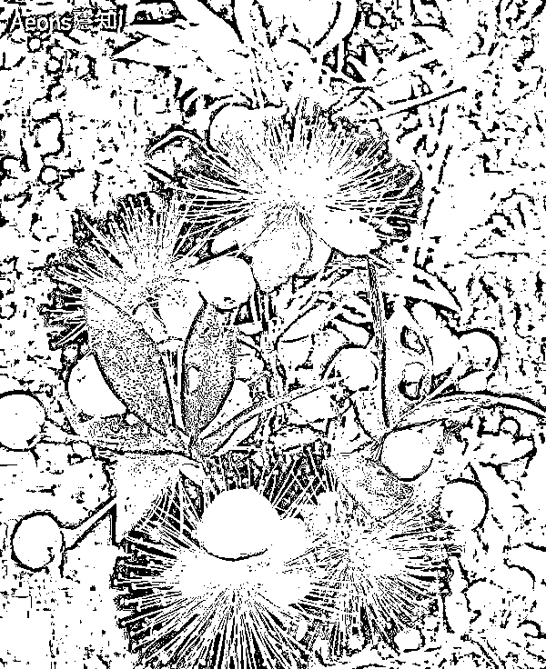

阳性能量强大的木本植物，个性却很“羞涩”最让人难忘的就是它长如睫毛的雄蕊

它是少数能在森林大火中存活的植物，含有高挥发精油，起火时火势迅速向上烧而不会损害植物根部

桃金娘科油是一种具有“生存意志”的草药油。它帮助心中的“创伤”愈合，前面讲樟科也能救人情绪于“危难”而桃金娘科与樟科的区别在哪里呢？它帮助的遭遇重大变故后的人，同时也能帮助“灾后”适应新环境，以一种宽容，平和的心境再出发

其植物生长速度快，适应力强，不管是在高咸度土壤还是高湿度土壤，它都能顽强存活

桃金娘科中我最长用的是细籽属的松红梅（马奴卡）。香桃木属的香桃木，还有名声在外的白千层属茶树

茶树杀菌的名声在外，导致好多人抱有过高的期望去买来用，结果大失所望，其实它更擅长的是防患于未然。在捕风捉影的阶段就用，因为它最主要的，最重要的功效就是强化免疫系统

桃金娘科含大量氧化物，醛类的成分，十分适合用于处理肌肉关节的问题，但是正是如此，它也容易刺激皮肤（只是大部分的，不排除有很温和的，如松红梅，茶树）

桃金娘科中最显眼的就是尤加利。各种尤加利！！！

拿来提取精油的种类多的让新人们头晕眼花，如蓝胶尤加利，澳洲尤加利，史密斯尤加利，史泰格尤加利，薄荷尤加利，多苞叶尤加利，柠檬尤加利。。。我的天呐～反正我自己不是很感冒尤加利，但是不可否认它的好

其中最美的是蓝胶尤加利，在阳光照耀下折射出独特的蓝色光

最温和的是史密斯尤加利，给老人儿童处理呼吸道时必备，且不会影响睡眠

气味最好闻的是史泰格尤加利，带柑橘为，高比例的柠檬烯，还有橙花醛，牻牛儿醛，与乙酸牻牛儿醛，与乙酸牻牛儿酯。平衡中枢神经系统，安抚情绪又让人保持清醒

成分最独特的一对儿是薄荷尤加利和多苞叶尤加利。代表成分居然是单萜酮？为什么说它们是一对儿捏？一个有大刀斩情丝的气魄，一个是直击灵魂的细腻温柔，都亲和基底轮

最飘逸出尘：柠檬尤加利，如君子坦坦荡荡

菊科：Asteraceae

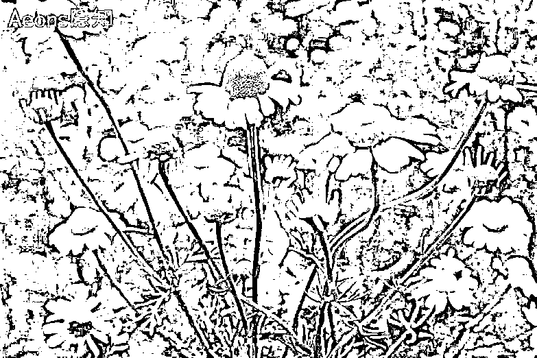

它们都是一大家子出现，层层叠叠的一圈又一圈，象征着极强的凝聚力。若把它们分开来看，你会发现菊科植物都那么娇小，不像玫瑰牡丹，花中雍容艳丽的角色，一出现就碾压众花。

菊科更似婴儿气质，或者说有点儿“萝莉”的感觉，天生就具有让人“怜爱”它的本事。也正是因为它的娇弱，所以才需要集结家人同伴一起“围炉”

很奇特是。虽然娇弱却具有太阳的能量，摘下一朵洋甘菊，中心管状花呈球形半突起，像一个小小的太阳，呃。。。也挺像蛋黄，莫名的觉得它好吃？

它的能量也呼应着小太阳这个外号，能祛除阴邪，湿气，霉菌。

除此之外，其家族特性强大，很适合拿来处理家人之间的心结，也有同行反应能很好的安抚童年阴影再激发而造成的情绪不安和社会融入障碍。这个观点我自己是尚未验证，也不敢说就一定有用，不过这个案例可以分享一下，先说这不是我接手的案例

2015 年冬季，接手治疗一位 23 岁女性，在转到她那里治疗之前是由另一位芳疗师治疗过的，忧郁头一位在治疗过程中可能“越了界”触动了某些不能，或者不想再搅翻的，关于过去的“淤泥”

据案例自己描述，她寻求治疗是希望改善“焦虑失眠”（其实是由于不安全感造成的）。失眠时间长达四五年，（断断续续，偶能不间断的整夜睡眠）经常做噩梦。白天头晕头痛，时而想吐，久坐一起身就是两眼一黑。。。（略）严重时甚至有幻听，安眠药是各种各样换着吃，各种中药也吃，但就是效果鸡肋。在上一个治疗师那里寻求帮助后确实有段时间好转，能入睡了，可惜好景不长，转而出现各种噩梦（关于童年黑暗经历）白天也是心悸，胸闷，情绪更加低落，身上出疹子（略）前去质问对方，对方表示就是要这样把心理的阴暗面通通挖出来。。。（略）

案例觉得自己实在承受不了这样的压力，于是转而另寻良医。

听了案例的陈述后她使用了能强力助眠的草药油，结果很有意思。一周后案例反馈，用了后困的很早，但是后半夜却还是伴随着噩梦醒来，心慌持续一阵，确实比平时睡的久，但是白天更累，更困。接受反馈后她追加一瓶日用提神方给案例。三天后案例再次反馈，说自己仿佛对提神方产生了依赖，不用的话觉得自己会被透支。这时候她觉得自己可能得把重心放在后半夜失眠问题，得追其根源，转而深究这个案例的“噩梦底层”经过一番谈话后，终于小心翼翼的从对方哪里套除了一些有价值的线索（有时候面对不肯敞开心扉的案例真的很累，说一句留十句）关于“童年阴影”

于是她决定不再使用强力助眠，换成了菊科加带有流动性的，水意向的草药油（微量）来把菊科的安抚力引入更深的层次（解：带有流动性水意象的草药油在对应这种情况绝不可多用，因为它能促进深层次自我沟通，若量大一点会搅翻潜意识，很明显这个案例再承受不起，于是在这里出现这种草药油只是起到一个“媒介”作用，将主力引入，做“开锁”意）

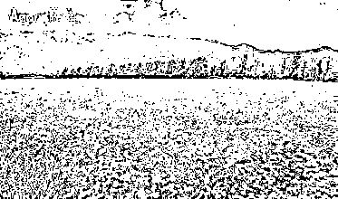

果然，后续治疗是十分成功的

给我们总结一下经验：猛药并不是适合所有人的。之前的芳疗师出发点是好的，却忽略了案例本身需要，让对方有种某些隐私遭到了侵犯的感觉，反而给自己惹了麻烦？

其次，她没有考虑个案目前的承受能力，根本经不住她那样的折腾，我们的治疗原则是尊重对方，然后在对方的同意下，采取“发时治标，平时治本”的手段。

最后处于自保的目的。她也不该去多管闲事

好了，最后再补充一下，菊科还有一些重要功效，如消炎（不同属擅长消炎的地方不一样）菊科多半还是有高浓度酮类成分，适合神经系统使用

补充一点，它的气味不是大众认为的好闻，我个人觉得稀释后有种熟透的苹果加青草的气味

文：慎小七，未经允许转载，我会画个圈圈诅咒你哟～

排版｜指引社

文案｜指引社

指引社，致力于让“神秘学”走向大众，不再“神秘”。杜绝神棍，欢迎撩或聊

长按二维码关注我们

点击“阅读原文”，去指引社看原贴

# 警告！不要得罪这些小心眼的星座！

> 原文：[`mp.weixin.qq.com/s?__biz=MzI5NTQzMDUzMQ==&mid=2247483757&idx=3&sn=15c5a6add118af6adc3ac0e923b17ecf&chksm=ec52f181db257897634bed49554a7aeec82031a140adfa7ac0d430cba2f7ca2166e32d45f658&scene=27#wechat_redirect`](http://mp.weixin.qq.com/s?__biz=MzI5NTQzMDUzMQ==&mid=2247483757&idx=3&sn=15c5a6add118af6adc3ac0e923b17ecf&chksm=ec52f181db257897634bed49554a7aeec82031a140adfa7ac0d430cba2f7ca2166e32d45f658&scene=27#wechat_redirect)

**记得点蓝字关注，与好内容相遇**

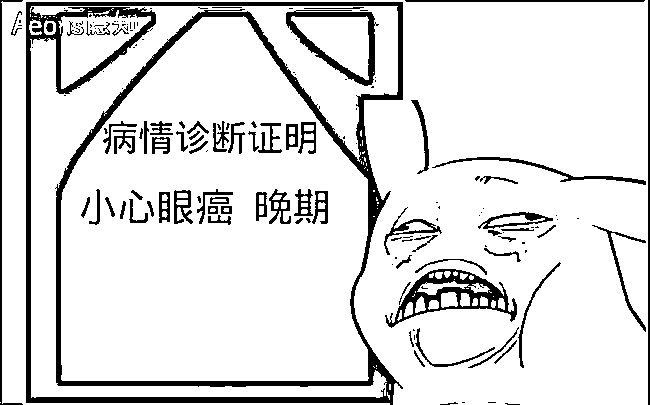

小心眼的人有多可怕？

也许你无意中的一句话，就能让他记恨你一辈子，时时刻刻找机会挖坑给你、破坏你的好事、没完没了翻旧账、不断充满负能量地絮絮叨叨……

宁可得罪君子，也不得罪小人，说的就是这些小心眼的人。

那么、怎么才能避开这些会走路的地雷呢……？

对那些星盘中有行星、尤其是个人行星落在以下这些星座的人，你要小心啦！

第五名 金牛座

金牛是出了名的老实木讷的星座，为人有些笨拙，说白了，就是死脑筋。

而且作为土象星座，他们还很重视利益，加上容易钻牛角尖，这就导致他们总是陷在利益纠葛里出不来。

金牛的想法是直的，一根筋的，一旦感觉到自己在某方面吃了亏，就会一头扎进去死活看不开……“为什么升职的机会给了他而不是我呢？”“为什么他的那块蛋糕比我的大呢？”“都是同级，为什么别人的奖金比我高呢？”

这么一纠结……再加上金牛本来是非常单纯的生物……就会不知不觉地往阴谋论方面去胡思乱想了。

觉得别人都是厚黑学高手……只有自己是小白兔……自己获得的利益不如别人，一定是被别人坑啦！

都是坏人！

虽然会脑内小剧场各种被害妄想，但老实的金牛并不会因此而做出对别人不利的举动，顶多窝在角落里阴郁地叨叨罢了。

虽然这种叨叨会持续很长很长很长时间……有可能是一辈子吧……

第四名 水瓶座

风向的人都是灵活而不容易在意争执的人吗？水瓶也许不是哦……

身为固定星座，又是土星守护的星座，这个风向有一点现实和顽固……

如果说金牛是在“利益”上格外小心眼，那么水瓶就是在“才智”上不肯让人了。

接触过水瓶的人都知道，很多水瓶特别喜欢跟人辩论，芝麻大点的小事非要争个高低不成，一定要自己的逻辑和知识碾压了别人才爽。

但实际上，他们可能只是单纯喜欢抬杠罢了……

平时比较沉默，但打起口水仗的时候毫不让人，会为了无聊的嘴皮子输赢力争到底。

他们也很在意自己的形象和成就，说白了，比较重视来源自才智的虚名。

这样的人一旦在自己得意的领域吃了瘪，他们也是会记仇一辈子的唷……

比如牛顿攻讦了莱布尼茨一辈子……各种滥用权力和粉丝打压攻击……到死也没放过人家……

好可怕……

第三名 狮子座

嗯？狮子不是最宽容大量的王者吗？怎么也会小心眼呢？

然而实际上，狮子一旦小心眼的话，后果是非常非常可怕的……

就像前面提到的，金牛在意利益，水瓶在意才智，狮子呢？当然是在意面子啦！

如果哪个不长眼的脑子进了水，当众打了狮子的脸……

不好意思……那你就等着收尸吧……

跟金牛的角落里絮叨、水瓶的奋起对喷不同，狮子可能不会当场暴跳如雷，但回家后绝对是会暴跳如雷，不跳个三五天是不可能的。

顺带一提，如果事情不能及时解决的话……也就是如果不能立刻得到对方低三下四卑躬屈膝五花大绑负荆请罪的郑重道歉的话……三五天也消不了气的。

但是狮子有一点好，就是如果你道了歉，及时撸平了狮子的毛，那么 ta 就会消掉大半的气，并且选择不与你计较。

甚至他们还会反省哩！觉得自己是不是脾气太大、太不大度了。

所以说狮子是多么可爱的一个星座喔……不要欺负狮子啦……

不过如果某些人惹了狮子却又不肯道歉或者毫无诚意的话……

发疯的狮子也会追着你咬喔！

第二名 天蝎座

好多人都误解了天蝎座，其实天蝎座并不是最小心眼的哦。

天蝎座的小心眼就在于他们睚眦必报的性格。反过来说，如果没有惹到他们，一般就没有什么可担心的啦。

虽然他们的报复手段非常恐怖……恐怖度真的是第一没跑啊。

天蝎的某些做派还是比较光明正大的，毕竟是黑暗的王者，他们跟狮子也有很多共同之处，很多天蝎虽然渴望胜利，但自尊心很强，喜欢靠实力去打拼。

他们不介意玩些小手段，会开外挂，会利用一些东西，但主要还是重视自身实力啦。

虽然他们嫉妒心很强，好胜心也很强，不过一般不会因此而攻击别人。

只要你挡路挡得不是特别厉害，跟他们关系又好的话……天蝎对朋友一般还是比较仗义的。

但这个星座天生自带某种探测光环，他们对恶意分外的敏感……

一旦你对他们做了什么不好的事……他们立刻就能察觉出你的不良心思来，并且毫不留情地视你为敌人，你就等着被各种明枪暗箭扎成刺猬吧。

而且这些会持续一辈子的哦……天蝎会连幼儿园时候的仇都记得清清楚楚的……一有机会，绝不放过……

错杀一条街也不放过一个……

所以说……是哪个不长眼的，会得罪到天蝎啊……

第一名 巨蟹座

嗯这个才是十二星座的小心眼之冠啦。

作为水象星座里的基本宫，比起被动的固定宫天蝎和慈悲的变动宫双鱼，巨蟹的社会性显然更强一些。

也就是会更重视利益、物质和财富，跟金牛类似，会比较介意这些方面的纠葛。

而且巨蟹比起火星和冥王守护的天蝎，战斗力要弱一些，跟木星和海王守护的双鱼比起来，身段又显然不够柔软和富于变通。

再加上巨蟹是月亮守护的，自然分外地敏感和缺乏安全感。

这样就导致……有时候你可能都没意识到自己说了什么或者做了什么，就已经伤害到了巨蟹啦。

实在是有点防不胜防……

巨蟹最小心眼的地方就是哪怕鸡毛蒜皮的小事也能被他们记痕，然后跟你计较很久很久……

如果是前面提到的利益冲突，那就更不得了啦……

而且巨蟹跟天蝎不同，他们一般不善于跟人正面起冲突，换句话就是说……比较擅长背后阴人啦。

故而很多人会莫名其妙就得罪巨蟹……然后莫名其妙发现被人整……然后想破头也想不通究竟是怎么回事。

虽然手段远不如天蝎，但巨蟹的小心眼 buff 触发概率实在太大了……

反正诸位都今后小心吧……

最后给大家一点福利：怎么避免得罪这些小心眼的家伙呢？

首先金牛最好对付啦。因为他们一般是自己胡思乱想的嘛……所以有条件的话找机会跟他们谈谈，跟他们说通了就可以了。

或者让给他们一点好处，收买一下人心，金牛还是相当单纯的，很好解决啦。

水瓶就稍微麻烦一些了，那种不依不饶的劲儿真是相当烦人啊。

建议是不要在口舌或者学术问题上跟他争高低，他说什么就顺着他，把话题带过去是最好的。

就算水瓶是错的……这种概率其实还不小……只要心里想着：管他对错随他去吧……忍过去就好了。

然后离他远远的……或者阴险一点，挑唆他去跟其他人斗嘴，分散他的注意力……也是可以的。

狮子比金牛还好对付一点，他们忘性大，又有自省功能，只要你马屁拍的好，撸毛撸得顺，道歉道得诚恳又勤快！是的勤快！然后你就会被大赦天下了。

赶紧跪谢皇恩浩荡吧。

ps：千万、千万不要伤了他们的面子，其他其实都好说哦。

天蝎的话也好对付，他们很少主动攻击别人，所以只要你不手贱去招惹他们，就不会有事。

只要以诚相待，打好关系，就更可以放心了。

不过天蝎中有一些人人品较差，也许会有攻击倾向，要小心喔。

最后是小心眼之王巨蟹啦。

对这位……实在是没什么好说的。

离得远点吧……

距离产生美……

就酱……

排版｜指引社

文案｜指引社

指引社，致力于让“神秘学”走向大众，不再“神秘”。杜绝神棍，欢迎撩或聊

长按二维码关注我们

点击“阅读原文”，去指引社看原贴

# 翻译丨谁是夜之女王？

> 原文：[`mp.weixin.qq.com/s?__biz=MzI5NTQzMDUzMQ==&mid=2247483757&idx=4&sn=3e922e251650103ddedb92f5caf2438d&chksm=ec52f181db2578978c3ca9688fb1ded2b76351e48acc9efdce16d4bdb298a6a50ca658cb0485&scene=27#wechat_redirect`](http://mp.weixin.qq.com/s?__biz=MzI5NTQzMDUzMQ==&mid=2247483757&idx=4&sn=3e922e251650103ddedb92f5caf2438d&chksm=ec52f181db2578978c3ca9688fb1ded2b76351e48acc9efdce16d4bdb298a6a50ca658cb0485&scene=27#wechat_redirect)

**记得点蓝字关注，与好内容相遇**

作者：Joshua J. Mark 

翻译：O IRKALLA

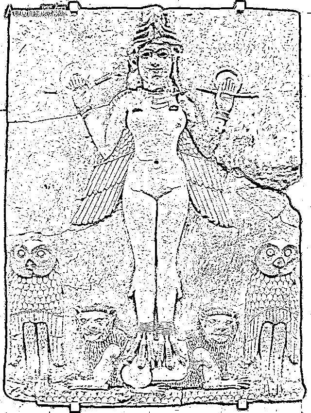

　　夜之女王（也称为 Burney Relief 伯尼浮雕）是一块高浮雕的红陶板，高 49.5 厘米，宽 37 厘米，厚 4.8 厘米。描绘了一个长着翅膀的裸体女性，站在两个狮子背上，并由两只猫头鹰相伴左右。它起源于美索不达米亚南部（现代伊拉克），最有可能产自巴比伦的汉穆拉比时期（公元前 1792~1750 年），因为它与著名的汉穆拉比石碑有着相同的工艺和技术特点。  

　　浮雕中描绘的女性被认为是一位女神，因为她戴着角神的头饰，手举神圣的“棒环”标志，长着翅膀，双腿逐渐变细成鸟爪（似乎抓住了狮子的后背），小腿肚上还长出了悬爪。陶板的底部延伸出一个山脉的主题，象征着高原地区。尽管学者们普遍认为她可能是 Inanna（Ishtar）、Lilith、Ereshkigal 三者之一，但一直没有定论。

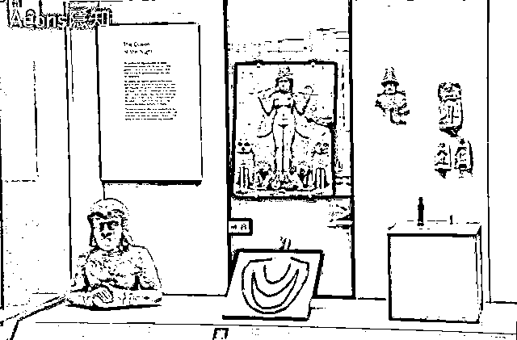

夜之女王，现今收藏于大英博物馆 56 号展馆

　　最初，浮雕只是被一个叙利亚文物交易商所拥有，这件文物没有经过考古发掘，只是在 1924 年从伊拉克简单的运走了，所以它的起源和背景都是未知的，如何到达伦敦也是未知的。

　　1933 年，浮雕放在大英博物馆进行分析检测，然而博物馆在 1935 年却拒绝购买，把它转手给伦敦古董商悉尼·伯尼 Sidney Burney，于是被称为“伯尼浮雕”。1936 年，伯尼浮雕在《伦敦新闻画报》高调亮相，引起了公众注意。除了在一战期间任职英国陆军上尉，以及作为伦敦古董商协会主席，人们对 Sydney Burney 也所知甚少。刚买来时，陶板是三块碎片，所幸修复后发现它基本上是完整的。

　　2003 年，作为 250 周年庆典的一部分，大英博物馆又以 150 万英镑的高价购回浮雕，并更名为“夜之女王”。由于浮雕原作是黑色背景和深色颜料，以及向下的翅膀、爪脚等图像符号，研究人员将女神的形象与冥界联系起来。因此，“夜之女王”只是一个猜测的称呼，人们无法知晓它最初的制作意图。

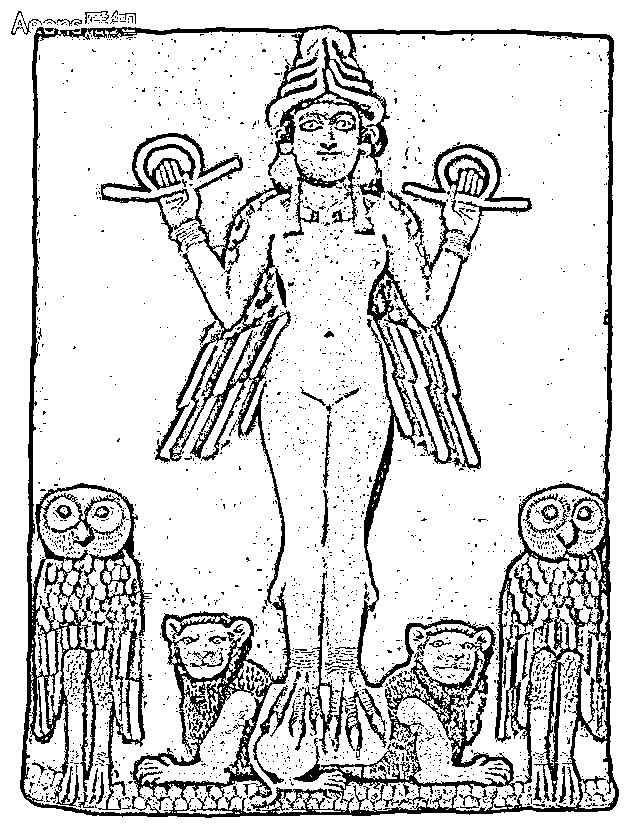

重制的夜之女王

　　浮雕是用粘土制成的，并加入用来粘合材料、防止开裂的谷壳。这件作品是在炉窑中烧制而成，而不是日晒而成的，这说明了它的重要性，因为只有最重要的艺术品和建筑才会用这种方法制作。由于美索不达米亚南部木材稀少，因此不会轻易烧制陶土物品。

　　大英博物馆的 Dominique Collon 博士解释说，浮雕是由相当坚硬的粘土制成，将其折叠并推入特殊形状的模具中，压制成板块。女王的塑像是板块不可分割的一部分，而不是后来加上的。干燥后，将板块从模具中取出，雕刻细节，打磨表面，有些平滑的表面存留至今，尤其是在女王的肚脐附近。最后用刀修整板块的边缘，放入炉窑烧制。（15）

　　出炉冷却后，浮雕被涂上黑色背景，女神和猫头鹰涂上红色，狮子有黑白相间的鬃毛。棒环标志、项链和头饰都是金子。尽管已经磨损严重，但是原本的颜料痕迹至今仍然存在。

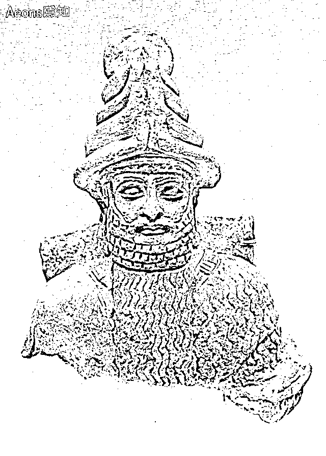

乌尔之神

　　对比“夜之女王”和“乌尔之神”的浮雕，两者在技巧上的相似之处是如此惊人，以至于人们推测它们产自苏美尔的乌尔城。Collon 博士说：‘乌尔之神’在质量、工艺和图像细节方面，与‘夜之女王’十分接近，可能来自同一个作坊，可能是在乌尔，1922 年到 1934 年在那里发掘出了大量的古巴比伦遗迹。（20）

　　由于美索不达米亚盛行神圣妓院，历史学家 Thorkild Jacobsen 认为，这块浮雕应该是妓院中神殿的一部分。Collon 博士指出：“如果是这样，它肯定是一个非常高级的场所，正如这件作品的特殊品质所表现的。”（22）她进一步解释，这块陶板应该是挂在泥砖墙上，大概是在一个围墙里，当泥砖墙倒塌的时候，烧制过的陶板会保存得相对完好。这件浮雕已经存在了三千多年的事实说明，它被埋入地下的时间相当早，因此免于侵蚀和破坏。

### 夜之女王的身份

　　夜之女王的身份，是这件浮雕最引人入胜的话题，如上所述，夜之女王有三位候选人：Inanna，Lilith，Ereshkigal。裸体女性的主题在美索不达米亚非常流行，历史学家杰 Jeremy Black 指出：

　　“手工制作的裸体女性粘土雕像，史前时代就已经出现在美索不达米亚，色彩鲜艳又实用。用陶器或石器模具压制的裸体女性雕像，最早出现在公元前 2000 年初，虽然是用于促进生育，但她们不太可能代表某一位普遍的母神。”（144）

### Inanna？

　　Inanna 可能是最适合雕刻在陶板上的，因为她象征着丰产和性爱（包括战争），但在这里还有些疑问。

　　同意 Inanna 作为夜之女王的一个问题是，她并不是一位普遍公认的母神。恩努萨尔格 Ninhursaga 才是众神之母，被人们视为伟大的母亲女神。

　　另一个问题来自这幅作品的象征含义。虽然 Inanna 的象征符号与狮子有联系，但是与猫头鹰没有联系。头饰和棒环的符号适合 Inanna，项链可能也适合，但是翅膀、爪脚、悬爪则与她无关。

　　认为 Inanna 是夜之女王的学者 Thorkild Jacobsen 提出了一些论据：

1，狮子是 Inanna 的一个标志。

2，狮子脚下的山脉，象征了 Inanna 的故乡——美索不达米亚东部的山顶。

3，Inanna 下降至冥界时带着同款棒环，而项链代表了妓女的身份。

4，翅膀、鸟爪和猫头鹰，展示了 Inanna 作为猫头鹰女神和妓女庇护神的一面。

　　然而，Collon 博士否认这些说法，她指出 Inanna 是“与一只狮子相关，但不是两只”，关于棒环标志和项链的论据是打折扣的，因为它们“可能适用于任何女神”（42）。

　　Collon 博士还指出，“1936 年首次公布的夜之女王的照片上写着：Ishtar……苏美尔人的爱情女神，搭配的猫头鹰却有问题”（43）。Ishtar 是 Inanna 后期的别名，虽然猫头鹰在女神的相关故事中有提及，但它从来不是女神画像的一部分。此外，任何古代艺术品都没有正面描绘过 Inanna，而经常是侧面描绘。

　　陶板底部的山脉象征，也同样适用于 Ereshkigal 或 Lilith。

### Lilith？

　　Lilith 是一个魔鬼，而不是一个女神。尽管魔鬼 Lilith 与猫头鹰之间有一些联系，但并不是浮雕上描绘的这种猫头鹰。

　　此外，Lilith 来自希伯来传统，而不是美索不达米亚。Lilith 对应的美索不达米亚女魔被称为 lilitu 莉莉图。lilitu 和魔鬼 ardat lili 的危险之处在于引诱和摧毁男性。同类的男性恶魔 lilu 则以女性为食，特别威胁孕妇和刚刚分娩的婴儿。

　　《伯尼浮雕：Inanna，Ishtar 或者 Lilith？》一文解释了 Lilith 作为夜之女王的一种可能性：

　　“Rafael Patai（人种志学者）在《希伯来女神》1990 年第三版指出：苏美尔史诗《吉尔伽美什》中讲到，魔鬼 Lilith 被 Gilgamesh 击败之前，在幼发拉底河岸的胡鲁普树上建造了房屋（Inanna 圣洁的胡鲁普树被恶毒的灵魂侵入）。Patai 随后描述了伯尼浮雕：‘与上述史诗同时代的巴比伦红陶浮雕，展示了 Lilith 以何种形态出现在人们眼中：她苗条，有型，美丽，裸体，长着翅膀和猫头鹰脚。她笔直站在两个背向横卧的狮子身上，两侧是猫头鹰。她戴着一顶由几对触角点缀的帽子，手握棒环。显然，这不再是一个卑鄙的妖魔，而是一个驯服野兽的女神，正如浮雕上的猫头鹰所展示的那样，统治着黑夜。’”

　　即便如此，夜之女王的浮雕，拥有这样高超的技巧和细节的刻画，用来展现 lilitu 的可能性是极低的。根据希伯来传说，Lilith 是第一个由上帝制造的女人，她拒绝服从亚当的性要求而飞走，从而背叛上帝和他的人类计划。从那之后，她被认为游荡于荒野，而且像 lilitu 一样，捕食毫无防备的男人。无论在哪种传统中，lilitu 都不够资格被描绘在类似夜之女王的陶板上。Black 博士指出：“邪恶的神灵和魔鬼在艺术中很少被描绘，可能是大众认为他们的形象会危害到人类。”（62）。

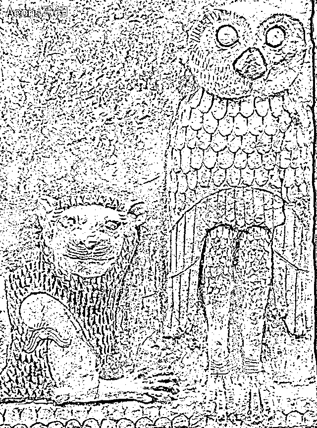

浮雕细节：猫头鹰，狮子，山脉

### Ereshkigal？

　　夜之女王的第三个竞争者，是 Inanna 的姐姐 Ereshkigal，伟大下界的女王，她名字的含义是“Lady of the Great Place 大地夫人”，关联到死亡之地，而这块浮雕似乎也有很多线索暗示了 Ereshkigal 才是夜之女王的最佳人选。

　　向下指向的翅膀，是整个美索不达米亚用来表示与冥界相关的神性或精神，而夜之女王正是这种翅膀。

　　Ereshkigal 的冥界宫殿 Ganzir，被认为位于东部山脉，可能就是陶板底部描绘的山脉。对于 Ganzir 和冥界，Collon 博士写道：“这是一个黑暗的地方，死者赤身裸体，或像鸟一样披着翅膀。没有任何喝的东西，只有灰尘可以吃。无论他们在生活中取得了什么，唯一的判决就是由 Ereshkigal 宣布的死亡。”

　　Inanna 下降冥界的故事中，Ereshkigal 被描绘为裸体的，“身体甚至没有一块遮羞的亚麻布，头发像韭菜一样绕在头上”（Wolkstein 和 Kramer，65），而夜之女王也是裸体的。

　　此外，与 Inanna 通常的侧面描绘不同，女王是正面描绘的。Collon 博士写道：

　　”作为一个女神，Ereshkigal 有权得到角神头饰和棒环。她的面貌是静止和不变的，作为“命中注定”的地下女王，她就是最终审判：所以她很可能有权利得到两个棒环标志。“（44）

　　同样的，女王所站立的狮子，可能代表了 Ereshkigal 至高无上的生死大权——哪怕是对最强大的生物；猫头鹰与黑暗的联系，也可能与死者的土地有关。

　　至此，所有夜之女王的象征符号似乎都表明了它是 Ereshkigal 的神像。但正如 Collon 博士所说，“仍然无法确认与 Ereshkigal 的关系，因为她没有已知的画像，与死亡的关联使她成为了一个不受欢迎的主题。”（45）

　　由于没有已知的 Ereshkigal 的肖像来对比夜之女王，所以女王的身份仍然是一个谜。

参考资料：

*   [The Burney Relief: Inanna, Ishtar, or Lilith?](http://analogicalplanet.com/Pages/ContentPages/Sidebars/BurneyRelief.html)

*   [Black, J & Green, A, *Gods, Demons and Symbols of Ancient Mesopotamia* (University of Texas Press, 1992).](https://www.ancient.eu/books/0292707940/)

*   [Collon, D, *The Queen of the Night* (British Museum:Objects in Focus, 2005).](https://www.ancient.eu/books/1578632846/)

*   [Leick, G, *The A to Z of Mesopotamia* (Scarecrow Press, 2010).](https://www.ancient.eu/books/0810875772/)

*   [Wolkstein, D. & Kramer, S. N, *Inanna, Queen of Heaven and Earth* (Harper Perennial, 1983).](https://www.ancient.eu/books/0060908548/)

*   文章来源：

Mark, J. J. (2014, February 19). The Queen of the Night. *Ancient History Encyclopedia*. Retrieved from [`www.ancient.eu/article/658/`](https://www.ancient.eu/article/658/)

正文有少量增补资料及修改

排版｜指引社

文案｜指引社

指引社，致力于让“神秘学”走向大众，不再“神秘”。杜绝神棍，欢迎撩或聊

长按二维码关注我们

点击“阅读原文”，去指引社看原贴

# 翻译丨《中世纪魔法》第 2.5 课 死灵术——当魔鬼吟诵拉丁文

> 原文：[`mp.weixin.qq.com/s?__biz=MzI5NTQzMDUzMQ==&mid=2247483757&idx=5&sn=41178557e43edfb4e8c07dac91625284&chksm=ec52f181db257897dc9442a5be985cc0a7a83aeddc68da2699d6115b23ddb71de0ea2be9d4f7&scene=27#wechat_redirect`](http://mp.weixin.qq.com/s?__biz=MzI5NTQzMDUzMQ==&mid=2247483757&idx=5&sn=41178557e43edfb4e8c07dac91625284&chksm=ec52f181db257897dc9442a5be985cc0a7a83aeddc68da2699d6115b23ddb71de0ea2be9d4f7&scene=27#wechat_redirect)

**记得点蓝字关注，与好内容相遇**

巴塞罗那大学公开课《中世纪的魔法》

慕课出品 · 指引社 BRANCH 字幕组翻译

 

第二单元 魔法与异端

第五课 死灵术——当魔鬼吟诵拉丁文

    大家好！欢迎收看本单元最后一节必修课程，是不是有些意犹未尽？若你想知道更多魔法与宗教之间关系的知识，你可以继续学习选修视频中的犹太教魔法观。

    坦率的说，我们今天要讨论的是魔鬼。是不是很酷？而下一个单元，你会学习到巫师、术士的各方面内容，以及在中世纪末和现代早期，以莫须有的罪名对女性为主的成百上千人的残酷迫害。不过在这里，我所谈论的这种魔法，却几乎是专属于男性的。为何如此？且听我从头道来。

    死灵术，字面意义就是：“通过死者占卜”。这一词来源于古希腊语"nekros"（死尸）和"manteia"（预言或占卜）。至少在其最初的意义上是如此。死灵法师或对死者的灵魂施法以预言未来，或以亡魂为武器，或迫使其揭示隐藏信息。但是复生死者对一个视复活为其核心符号的宗教来说是很成问题的，因为只有通过上帝的力量，人才能起死回生或者复活他人。（还记得圣经中拉撒路的故事吗？）【译注：出自《新约·约翰福音》，拉撒路因没有得到耶稣的及时救治而病死，但耶稣预言其会复活，他也果然在四天后复活】是故，基督教作者将这种法术斥为魔鬼之道，它们披着逝者的外表带来各种灾祸。由此引申，“死灵术”这个术语开始被用来指称魔鬼的法术，这也成为中世纪晚期该词最普遍的用法。我们看到中世纪的神学家们对于各种魔法中究竟有多大程度的魔鬼涉入怀着不同看法，但他们毫无异议的认为，死灵术之本质是邪恶的。死灵法师怀着强烈的召唤魔鬼的意愿。那么，死灵术又是怎样实施的呢？

    令人难以置信的是，死灵法师主要是牧师，亦即，通常说来，是懂得拉丁文的他们。请注意这里的所有格的性别：“他们”。正如你所料，拉丁文即便不是专属，也差不多都是教授给男性的，并且在当时仅有很少的男性掌握。更确切的说，牧师通常是被任命的，至少低级别的牧师如此。他们排列于教会的最底层。无论如何，死灵术只能从书籍中学得，若要达到目的，就必须用非常精确的复杂咒语。

    上一课简要提到的审判官，尼古拉斯·爱莫洛奇在 1376 年左右所写的《审判指导》中，将法术等同于异端，这样就正当化了他插手魔法事务的行为。他写道，他从死灵法师手里没收了涉及死灵术的书籍，并且迅速公开焚毁。这些书，以及来自那些不幸被审判员查到的死灵法师的招供，让尼古拉斯与其同僚们发现了大量误入歧途的牧师所进行的行为。他们给画像施洗、识记魔鬼的名字并将其与圣徒和天使的名字混淆以误导祷告者、焚烧几类动物的尸体，最糟糕的是，他们明确地崇拜魔鬼。死灵法师向魔鬼卑屈，崇拜它们并承诺效忠以换取回报。不过一如既往，在处理来自审判员的材料时，鉴于他们不那么可靠，我们务必万分小心。换句话说，在逼供下吐出的言辞能有几分真实呢？这些坦白的可靠性不如记载相关仪式与论述的手稿。这里说的手稿不是反对死灵术的人撰写的资料，而是那些写给死灵法师的成熟作品。

    借助魔鬼的目的数不胜数，对应每种目的特定施法方式也各有千秋。大多数目的是为了影响他人的心灵和身体。例如让某人爱上自己、以某种方式伤害某人、或者迫使某人做某事。还有制造幻象、起死回生、凭空造物、发掘将来和过去的秘密等。不用说，这些目的没有一个是宗教人士应当追求的。这种魔法通常需要魔法圈、咒语、祭祀的牺牲品，所有这些都非常复杂且需要一定的技巧和训练。

    不过正如你在介绍单元和上一节课程所见，讨论乃至考虑先人们的这些魔法实践的所谓效力都不是我们这些历史学家的研究目的。但如果某些论题对历史学特别是中世纪历史卓有意义，那么其对魔法史的研究也是非常重要的。在分析死灵术历史的过程中，最有意思的问题是，不论它的实施者还是诋毁者，都认为它是对更深层知识的探索。死灵术本身及对它的谴责，都表明中世纪社会对于仪式和仪式误用所产生的力量深信不疑。在特殊的行为之中，特定的言辞按照规定顺序吟诵，就可以产生邪恶的力量；正如正统宗教里合适的祷告者与圣礼仪式的作用类似。如果就此认为中世纪的人非常幼稚，那就大错特错了。一边是死灵法师，这群最富教养的、唯一能够接触如此复杂的知识的人群；另一边是神学家和审判员，唯一可以觉察到这些威胁的人群。我们正是继承了他们所构建的概念，并仍然重视着传承自他们的各种仪式。想想看吧，我们依然会忌讳在梯子下穿行；或者另一方面，我们也依然信仰祷告的力量。

那么，下个单元再会！

-------------------------

视频&字幕百度盘下载、论坛讨论：

[`www.imslr.com/thread-34941-1-1.html`](http://www.imslr.com/thread-34941-1-1.html)

排版｜指引社

文案｜指引社

指引社，致力于让“神秘学”走向大众，不再“神秘”。杜绝神棍，欢迎撩或聊

长按二维码关注我们

点击“阅读原文”，去指引社看原贴

# 第 7 期推送调查：指引社的发展，需要你的建议哦~

> 原文：[`mp.weixin.qq.com/s?__biz=MzI5NTQzMDUzMQ==&mid=2247483757&idx=6&sn=721ce6028594584f8356ca11c053707c&chksm=ec52f181db25789741b455e9007a0bce248627a8936accfe9fe89e115996e92561f2bd4181f2&scene=27#wechat_redirect`](http://mp.weixin.qq.com/s?__biz=MzI5NTQzMDUzMQ==&mid=2247483757&idx=6&sn=721ce6028594584f8356ca11c053707c&chksm=ec52f181db25789741b455e9007a0bce248627a8936accfe9fe89e115996e92561f2bd4181f2&scene=27#wechat_redirect)

**记得点蓝字关注，与好内容相遇**

指引社公众号的每篇文章，都是从每周发布的、或论坛的精品旧文中精选。

每期推送的最后一条，都会放出投票。

选择你喜欢的文章，也可以选择你下期想要看的内容。

指引社公众号初露头角，之后也许会成长为你喜欢的样子。

感谢你的支持。我们会继续努力哒~

📹 /mp/newappmsgvote?action=show&__biz=MzI5NTQzMDUzMQ==&supervoteid=477735838#wechat_redirect

排版｜指引社

文案｜指引社

指引社，致力于让“神秘学”走向大众，不再“神秘”。杜绝神棍，欢迎撩或聊

长按二维码关注我们

# 离奇时髦的神秘学防骗指南【缘起篇】

> 原文：[`mp.weixin.qq.com/s?__biz=MzI5NTQzMDUzMQ==&mid=2247483748&idx=1&sn=927bde1c8fa2ff43beb9ccb5fbaa40c6&chksm=ec52f188db25789e1ea97a488287cac2914a317eb94477c771e9d9e4f8b4a5d3e8eb88677400&scene=27#wechat_redirect`](http://mp.weixin.qq.com/s?__biz=MzI5NTQzMDUzMQ==&mid=2247483748&idx=1&sn=927bde1c8fa2ff43beb9ccb5fbaa40c6&chksm=ec52f188db25789e1ea97a488287cac2914a317eb94477c771e9d9e4f8b4a5d3e8eb88677400&scene=27#wechat_redirect)

**记得点蓝字关注，与好内容相遇**

大家好，我是右夜鸣，永远的十六岁。

作为一条在神秘学圈子里泡了快六、七年的老咸鱼，我年少轻狂的时候也接触过各种不靠谱，或者被错误或盲目使用的东西，什么元素魔法啊，仪式魔法啊，诅咒术啊，卡巴拉啊，如尼文字啊，矿灵，塔罗占卜，芳香治疗，星体投射，丹道，甚至养小鬼，各种通灵游戏，以及其他一些乱七八糟的东西。

以今天的我的角度来看，经历那么多东西之后的我还能活成一个人样，简直就是个奇迹。

仔细想想，在科技高速发展，文化娱乐产业异常发达的 21 世纪，人类对现实世界之外的种种事物及现象不是过于轻视就是将它们过度神秘化并高度推崇，缺乏对一些事物的正确认知，也遗忘了对于一些现象的正确应对方法。不少心怀不轨之徒，正是钻了这个空子，故意拿一些已有的知识，把它们用时髦、高端的术语瞎几把包装一番，然后拿它们出来坑蒙拐骗。

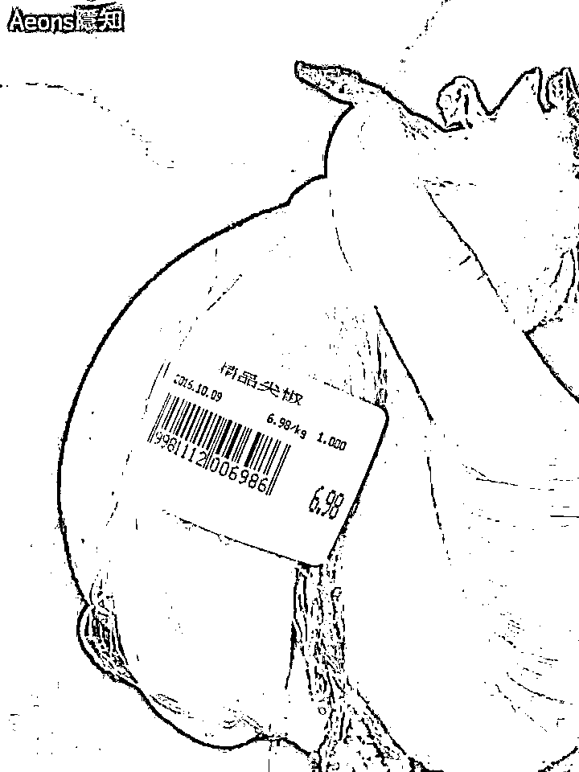

如何防范这些看起来时髦又高大上的神秘学骗局？

我给出的答案是，提高自己的姿势，变得比那些骗子更加时髦和高大上就好了。

骗子能骗得了乡下来的土老冒，但难道还能骗得了坐在咖啡店里优雅地喝着 82 年可乐的城里人吗？

不可能的。

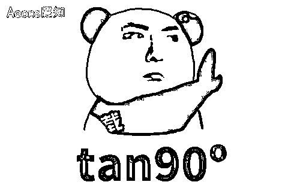

当一个骗子企图用蹩脚的演技和智障一样的理论体系欺骗你的时候，如果你能轻易地看穿他话语中的漏洞，顺带还能用自己丰富的知识帮他完善一下他那套仿佛从垃圾堆里捡来的，完全经不起推敲的理论的话，骗子自然就骗不了你了。

奶奶曾经说过，知道真相的人是不会被谎言所蒙蔽的。

我认为奶奶说得很有道理，所以决定借由自身经历写下这篇离奇而又时髦的神秘学防骗指南。

在神秘学圈子里拥有师承的各位大佬跟着自家师父混就行了，这篇文章完全可以一笑而过。

当然，如果你觉得自己师父不靠谱……那也是你自己认的师父。

总之，这是一篇针对可怜无助又惹人疼爱的神秘学萌新的指南，有师父的大佬们就别给我随便往外跳啦，赶紧抱着你家师父回老家结婚去吧（掀桌）！

茶~

好了，现在回归正题。

每年都有萌新怀着无限的希冀和幻想进入神秘学相关的圈子，而这些圈子和其他所有的圈子一样，好坏参半，鱼龙混杂。

为了让刚入坑的萌新能在这个圈子里肆意遨游，而不会至于掉进火坑，圈子里的大佬们可谓是费尽了心思。

科普贴发了一遍又一遍，劝说的方法换了一种又一种，结果还是有无数新人前赴后继地往火坑里跳。

也许也是时候追溯一下问题的源头了。

这是一个有关于缘起的问题。

你究竟是为了什么才来到这个圈子里的呢？

有的人进圈是为了寻求诅咒、黑魔法，这些能伤害他人却又不会被追究责任的手段。

有的人是在别的领域失意，想在神秘学的圈子里找个精神依靠。

也有的人是把魔法、占卜视作了一步登天的神器，又或者受了小说和电影的影响，来追求一片绚丽的光影。

如果有人真是因为这些理由而进入神秘学的圈子的，那么，这就是他们有关于神秘学的缘起了。

缘起就好像一颗种子，会在你的命运之田里生根发芽，慢慢长大，然后最终，结出累累硕果。

并且种瓜得瓜种豆得豆，有什么样的缘起，就会生出什么样的果。

对于第一种人，害人者终害己，想要伤害他人自己又逃脱惩罚，那是不可能的事。诅咒大多数利用的都是心理暗示，当然其中也不乏一些借用了非人力量的仪式魔法，但那些都是伤敌一千自损八百的方法。

从我个人的角度来看，诅咒和黑魔法之类的东西根本没有学习的必要。首先操作麻烦，然后从代价和收益的角度来看，也远不如抡起拳头砸在自己讨厌的人脸上来得划算。

使用诅咒和黑魔法，也许你把自己的命搭上了，也只能给对方造成一点轻微伤。

可能有人会说，我就是死也想伤害那个人，可问题是，如果你连死都不怕，为什么不凭着这种不惧死亡的勇气去寻找更好的解决问题的方法呢？

对于第二种人，也许你不擅长现实中的一切相关事物，却偏偏在现实之外的地方有着惊人的天赋。

我并不否认这种可能性，就好像有的人天生不擅长数学，却能够出口成章，吟诗作赋。但造成你失败的原因究竟是天赋的问题，还是努力不足，只有本人心里清楚。

至于最后一种，我并不反对你们去追求那种神奇和绚丽。我只想说魔法也好，神秘学也好，并不是你们想象得那样的，在追求一件东西的时候你首先要学会正视它，想清楚自己真正想要的是什么，然后再以你的真心去求取，否则你是无法如愿以偿的。

就好像你把玫瑰当成了石头，到处问人要石头，那么又怎么能获得真正的玫瑰呢？

神秘学并不是逃避问题的借口，也不是允许我们为所欲为的自由港，不能因为我们对它所知甚少就打着它的幌子任性妄为。

我相信很多时候那些刚接触神秘学的新人已经隐隐约约地意识到自己身上存在的问题了，可就是为了自己的那一点私心对这些问题视而不见听而不闻。

但是正是这种视而不见和听而不闻，却会让那些问题像滚雪球一样越变越大，最后给自己带来灾难和厄运。

对于任何一个学科或者领域，最初去接触它的方式都是至关重要的。一个错误的入门姿势在未来需要花费成倍的时间和精力去拨乱反正。

所以，在了解这个圈子里存在的各种离奇骗局之前，我建议所有的新人先静下心来好好考虑一下自己来这里的理由，如果自觉这个理由是有问题的话，还是先反省一下，摆正自己的心态，然后，一定能看到完全不一样的风景。

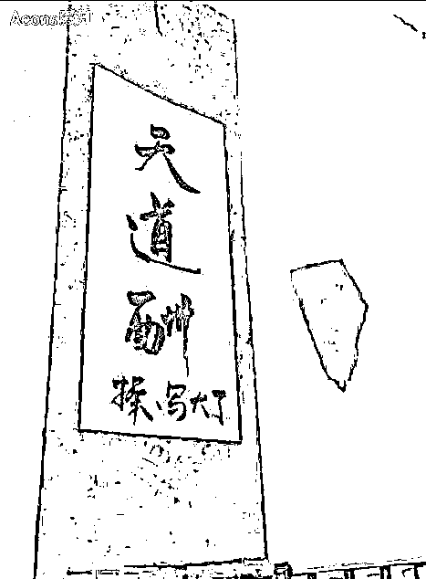

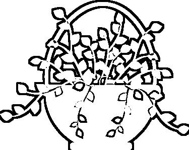

本文文字原创，图片来源于网络

如需转载，还请著名

点击“阅读原文”，去指引社看原贴

# 芳香植物的两把钥匙（科属篇）①

> 原文：[`mp.weixin.qq.com/s?__biz=MzI5NTQzMDUzMQ==&mid=2247483748&idx=2&sn=40ac8c4c370eef12b485e953327c553e&chksm=ec52f188db25789ee505c48ee4fb666e1926deee2cc6926b9fe4091cad4eef4e15778a6605e8&scene=27#wechat_redirect`](http://mp.weixin.qq.com/s?__biz=MzI5NTQzMDUzMQ==&mid=2247483748&idx=2&sn=40ac8c4c370eef12b485e953327c553e&chksm=ec52f188db25789ee505c48ee4fb666e1926deee2cc6926b9fe4091cad4eef4e15778a6605e8&scene=27#wechat_redirect)

**记得点蓝字关注，与好内容相遇**

小七的碎碎念

从这周开始更这个系列的入门帖，我尽力每周准时啊～不准时也别抱怨，小姐姐就是这么傲娇。

上个帖子说了自主学习的问题，那么我也是要带头的，如果有觉得自己和我实力相当的盆友可以联系我，我们可以一起组队学习～

如果围观我的帖子的盆友中有谁对我的说法有反对意见（拿经验说事）欢迎指正。

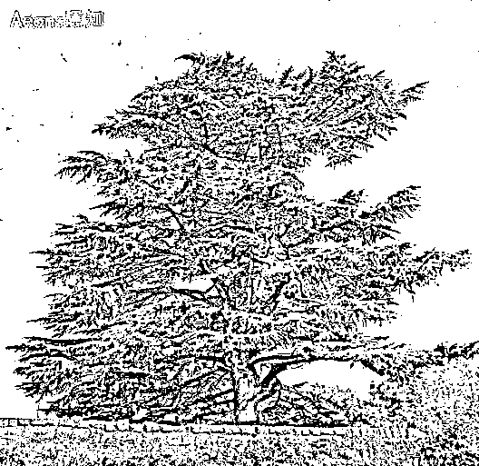

松科 Pinaceae

松科树木高大，常青，沉稳。如修行之人，带着一股子“仙气”其力量让人高瞻远瞩，跳脱凡俗而不拘泥于小节。它的长寿呼应着“耐力”，能带给人正面的阳性力量或许有点霸气，但决不是暴动的感觉。

如果你是一位有点“娇弱”的男孩子，而你又想摆脱这种状况，使用松科油吧，它们提升肾上腺素（关于这点在以后的化学分类里会详细介绍）涂抹背部能带给你阳刚如父亲般的支持，让人抬头做自己。

如果你容易冲动，常为了一点小事而陷入纠扯不清的争执，事后还耿耿于怀无法平静。执着于眼前让你无法跳脱局限，看不到更远的地方，使用松科油吧，涂抹小腹部和眉心，你能得到“宁静深远”的支持。高大的松用沉稳的双臂高高的托起你，去看到更远，更美的风景

如果你是一个容易半途而废的人，做事总是无法坚持到底，似乎感觉自己“心有余而力不足”？好像总有莫名其妙的事在分散你的经历，让你无法坚持到底。或者有时候觉得明明什么也没做却那么累，是不是我们都提前衰老了？

用松科油吧，坚持涂抹腹部能带给你强大耐力，它不像火熊熊燃烧，却像能渐渐深入大地的根，缓慢而又沉稳，帮你提高抗压能力

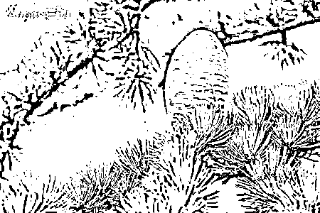

如果你饱受污浊空气摧残，每天浸淫在各种废气里，开始下降的免疫力让你忧心不已，似乎肺已经在叫惨了？“森呼吸”听起来很美好却难以实现？使用松科油，它能缓慢有效的对付呼吸系统的毛病

松科，它温和慢热，耐力和阳性两个词道尽了它的个性。老人，小孩子，均可享受，刺激性小，可长期使用（坚持六个月能有脱胎换骨之效）

松科中我最爱大西洋雪松和西伯利亚冷杉，价格可爱，功效卓越

大西洋雪松颇有君子感觉，气味优雅带着一点神秘冷感

西伯利亚冷杉，我发痘时常常使用，做成液体涂抹剂与薰衣草搭配，去闭口痘痘同时还能消炎杀菌。其气味清冷，夏季，初秋熏香让人暂时忘却室外炎热

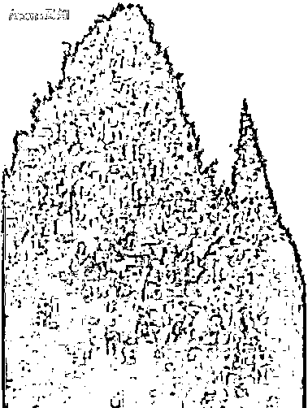

柏科 Cupressaceae

高大而具有神性的树种，它的高大仅次于松科，人们常将它砍下作为建造庙宇，宫殿的材料。

通常来说，那些生长速度快的年轻树木，不适合拿来作宫殿庙宇的建筑材料，而使用沉稳的柏是最理想的。

它具有特殊的香气，木质坚硬

它有许多独特的倍半萜烯类成分，气味比松科更加迷人，追求心灵精神超脱的人们，在打坐冥想时使用它能促进内在的沟通，身与心的连接。柏科仿佛穿越时空而来，灵动又不失稳重，仿佛身披岁月为衣而身心不老。

在傍晚时焚烧柏科油，我听见它喃喃诵经之音，映在我心上，眼里的是千年的时光，波澜不惊

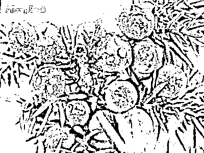

它为神秘主义而生，一点一滴全凝结着古老而深远的智慧，我尤爱丝柏，如森林逐鹿。尤爱杜松，刚毅温柔

适合身心皆需排毒的人，在红尘中摸爬滚打多年，我们似乎早已忘记所谓“初心”“赤子之心”。身心都中毒已深，何时竟变成了自己当面最厌恶的模样？这时应使用柏科加芸香科来唤回初心，洗去污渍。要脱胎换骨需有痛割脓疮的决心

让思考更深远，更有智慧：适合思想流于肤浅，苦于“摸不到门路”总是无法看到本质的人。比起松科的“高瞻远瞩，立于人群之上”柏科的感觉是“大智若愚，隐于红尘之中”

松科对应着眼界的维度，是“纵向的力量”而柏科对应着“思想的深入，”是带着“穿心透肺”的智慧

清除情绪，能量的污垢，特别适合用来“净化一切”我爱用它来做“大扫除”

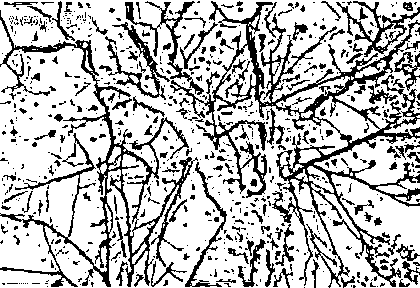

橄榄科 Burseraceae

橄榄科也是出名的灵性科属，其中鼎鼎有名的就是乳香和没药，植物其貌不扬，长成了一副饱受折磨的苦难的样子。如一位经历红军长征有幸存活的的老人，其形佝偻却精神饱满，骨子里透着男儿的坚韧刚强

喜欢生长在干旱的砂质土中，饱经风沙方可长成。割开树皮后会流出树脂。

有人说它是“耶稣的眼泪”承载着世间一切苦难，细细品来竟如茶叶般回了一丝微甜，这世间也从来没有无尽的折磨与泪水

其力量对应着额轮与顶轮常被用在宗教仪式上，额轮也就是宽恕轮，让人放下，原谅，才能让力量透达顶轮，达到“世界与我合为一体”的境界

除了在精神上的层次具有特殊意义之外，在我们的身体层面它也有不可替代的作用

适合于轻熟和熟龄肌肤，它能帮助回春，抚平细小皱纹，同时也能平复因年龄渐长而心有所憾而导致的情绪问题，能让人在岁月的沉淀下如酒一般越陈越香。帮助熟女们发现自己独特的魅力

其力量本具有“年长者的智慧”也同时适用于年轻气盛，内心浮躁的青年

它善于“疗伤”一是能应对皮肤的伤口。当我们割开树皮时，树流出树脂帮助自己愈合伤口，就是它自身的“疗愈手段”同样对应在人身上，也能处理皮肤伤口问题，同时能消炎

二能愈合心灵伤口，橄榄科植物所承受的痛苦远超出我们的想象，那样的环境都没能阻止它的成长，可见其生命力顽强。

它能促进呼吸顺畅，这是很显而易见的好处，人们偏爱焚烧橄榄科植物，其气味清香带有穿透力，和一种神性，不知不觉内心就平静了，呼吸也加深了，自然就改善了呼吸功能

它同时具有活血化瘀的功能，对付瘀血，黑眼圈也是非常好用的。

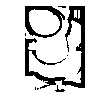

文章最后给大家放个福利

今天的帖介绍了有名的三大“神秘气质”科属，不知道你们是不是很有兴趣，跃跃欲试了呢？在本帖下留言，版主随机抽选 1 位送一点顶级油给你们试用，鼓励大家亲近自然，亲近植物。（邮费自理）

**慎小七**

芳香草药·专栏食用指南

慎小七，指引社矿灵学院管理，医学世家出身，芳疗师，常年调香爱好者跟实践者，草药专家。

本系列为慎小七原创出品，涉及芳香、草药等专业知识。

排版｜指引社·阿烬

文案｜指引社·慎小七

指引社，致力于让“神秘学”走向大众，不再“神秘”。杜绝神棍，欢迎撩或聊

长按二维码关注我们

点击“阅读原文”，去指引社看原贴

# 大佬是怎样炼成的

> 原文：[`mp.weixin.qq.com/s?__biz=MzI5NTQzMDUzMQ==&mid=2247483748&idx=3&sn=866e26bef5034ebee41898c5f8932b0f&chksm=ec52f188db25789e2353a0071f24bb08fee06718606bda6f0be91ed6fd1277a9284aa08320db&scene=27#wechat_redirect`](http://mp.weixin.qq.com/s?__biz=MzI5NTQzMDUzMQ==&mid=2247483748&idx=3&sn=866e26bef5034ebee41898c5f8932b0f&chksm=ec52f188db25789e2353a0071f24bb08fee06718606bda6f0be91ed6fd1277a9284aa08320db&scene=27#wechat_redirect)

**记得点蓝字关注，与好内容相遇**

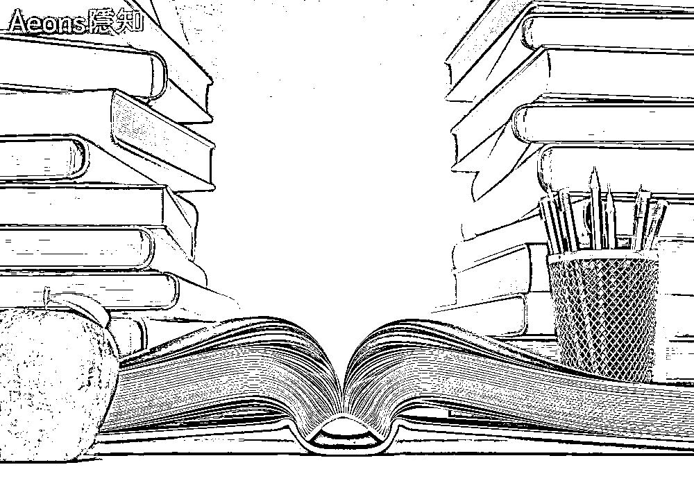

这篇文章是给指引社的新人们看的，大佬们有空的话可以一阅，没空可以忽略

在我还是一个新人的时候也特别羡慕那些大佬们，为什么他们就有那么丰富的知识，人家那个脑子究竟是怎么长的？自觉虚度多少年光阴。

说实话现在指引社的学习氛围似乎不怎么浓了，我后来指引社，也听许多人讲过这里以前如何的热闹，感慨万千，可惜无缘一睹当年风采。

思索良久想写一篇这样的，关于自主学习的帖子，给想要在这个“冷板凳”领域取得一些成就的新人。

自主学习究竟有什么意义？在农业经济时代，7-14 岁接受的教育足以应付其后 40 年的工作和生活。在工业经济时代，人们求学的时间拓展为 5-22 岁。再反观当下时代，一头拓展到胎教，另一头拓到死为止。学习，已经是一个终身的需要

我给大家讲一个故事。钱伟长与华罗庚，他们是同一年进入清华大学的。钱伟长他的叔叔就是钱穆，父亲是钱挚，这两个人都是十分有名的国学大师，所以 1931 年，他考入清华大学，文科成绩非常好。朱自清先生希望他能在文科方面好好用功，很不巧的是第二天 918 事件发生了，当时年轻人开始崇尚学理科，要理科救国。钱伟长申请转到物理系，找到了当时的物理系主任吴有训，吴有训先生觉得他底子差，于是只告诉他，给你一年时间，你自学物理系基础课，如果每门课超过七十分以上，我就同意你转，于是他开始加班加点的学习，终于 1932 年转入物理系。他每天早上起来非常早，一起来就开始学习，但是有个很有意思的现象，他发现对面的教室里，很早也有人了，他就在想，难道有人比我还爱学习？？于是他第二天早上起的更早，过去一看，对面的人还是到了，于是不服气了，他就不断的把时间往前提啊，后来他们就比，看谁早。若干年后他才知道，那个人就是华罗庚。华罗庚也是个靠自学成才的人，也很厉害啊，数学界的大佬，一个初中生破格成为清华的正教授。这两个人就可以告诉我们，自主学习对一个人有多么的重要了

齐莫曼认为，应该从学习动机，内容，方法，时间，过程，环境，结果等七个维度界定自主学习

*如果

①学习的动机是内在的，或自我激发的

②学习的内容是自己选择的

③学习的方法是有计划的或经过练习达到自动化的

④学习的时间是定时而有效的

⑤学习时能够对学习过程作出自我监控

⑥能够主动营造有利于学习的物质和社会环境

最后，能够对学习的结果做出自我总结和评价

那么：他的学习就是充分自主的

通过观察周围我们可以看到大家的一些侧面做的不是很好，比如通常班级里学习成绩最好的两个同学叫做“鸡犬不闻，老死不相往来”，只有竞争关系，没有合作关系，所以这是一个短板

总结前面，给自主学习下一个定义就是：一般是指个体自觉主动地确定学习目标，制定学习计划，选择学习方法，利用学习资源，监控学习过程，评价学习结果的过程或能力，这就是个高水平的自主学习者

想想看我们平时是“吾日三省吾身”还是“脚踩西瓜皮，滑到哪儿算哪儿？”

自主学习能力的获得途径有哪些呢？

①直接教学

通常老师上课会影响学生的自主学习能力，特别是那种一节课拉到底的，学生哪里还有自主学习能力？都养成了一种张嘴等饭吃的惰性，所以在学习的过程中要以问题为基础的学习

②观察学习

我们可以观察别人是怎么学习的，比如在图书馆，这就是一个很好的学习地方

③学习实验

尝试不同的学习方法，直到找到最适合自己的学习方法

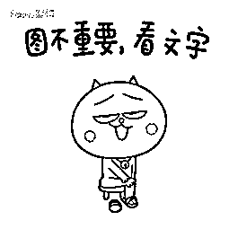

在培养自主学习的能力时，通常会经历四个阶段

①观察或反思阶段

观察别人，反思自己。一个不觉得自己的学习有什么问题的人，他是不会有效的调整自己的学习方式的。一个对别人的学习结果不关注的人，他不会观察别人的学习方式

②观察别人后就进入“模仿，尝试阶段”

③自我控制阶段

这是最难的的阶段，要学会自己管自己，与自己的懒惰和坏习惯做斗争

④长期坚持后就习惯了，到了“自觉，习惯化”阶段

这个时候就不大需要意识的控制，它就会成为你有效学习的重要推手

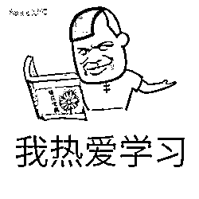

我们讲自主学习，也是需要很多条件来满足的

首先说说内在条件

①能学：自主学习必须以一定的心理发展水平为基础（元认知发展水平）比如一个很小很小的小孩，你叫他好好坐着学习，可能吗？如果他做到了那还真是很可怕，因为太小的小孩子元认知能力没有发展起来。so，一般来讲，我们能够自主的安排自己的学习计划，要到小学三年级之后，但是真正成熟的自主学习，它的养成要到初中二年级之后。小学三年级是元认知的萌芽阶段（元认知管自我调控）而初中二年级是自我意识迅速发展，逐渐走向成熟的一个阶段

②想学：自主学习必须以内在的学习动机为前提

想想什么叫做“不用扬鞭自奋蹄”内在动机作用

③会学：自主学习必须掌握一定的学习策略做保障

这里有一个弱方式和强方式的说法，弱方式一般是指你的一些习惯，强方式指解决某些问题的具体步骤

④坚持学，这个是说意志力的问题，自主学习还必须以意志控制为条件

外部条件

①老师或者其它成人的教育知道

要注意不是学习包办就是好的，这样反而没有自主学习的能力，都等着别人来讲

②家庭原因

过去很多家里有几个小孩，小点儿的孩子就和大的孩子学

③同伴榜样与支持

有的相处促进，有的互相扯后腿

④学习资源的可利用性

现在有句话叫做“再苦不能苦孩子，再穷不能穷教育”，强调的就是资源问题

⑤文化因素

有个很有趣的事实，就是，一个地方贫穷落后，小孩的自主学习水平却还高一些

前面说了那么多简单总结一下，重点

首先你要有一个学习的“小团体”大家一起学，其次能自己掌握的就自己学，然后即使有未完成的也别让别人包办，而是拿出问题，放在小团体里集体讨论，最后大家如果“江郎才尽”了，就去请教大佬，或者你的老师

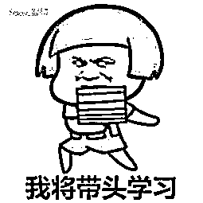

好了这篇帖子结束了，挥爪～

排版｜指引社·阿烬

文案｜指引社·慎小七

指引社，致力于让“神秘学”走向大众，不再“神秘”。杜绝神棍，欢迎撩或聊

长按二维码关注我们

点击“阅读原文”，去指引社看原贴

# 《中世纪魔法》第 2.4 课 一位不那么邪恶的审判员

> 原文：[`mp.weixin.qq.com/s?__biz=MzI5NTQzMDUzMQ==&mid=2247483748&idx=4&sn=87968d31dc94e009c4debbc475fa9bf0&chksm=ec52f188db25789eb21eef2c1f2dff0d0d8633a0b14e91a1c4412fac03767cc85fd1621dee8d&scene=27#wechat_redirect`](http://mp.weixin.qq.com/s?__biz=MzI5NTQzMDUzMQ==&mid=2247483748&idx=4&sn=87968d31dc94e009c4debbc475fa9bf0&chksm=ec52f188db25789eb21eef2c1f2dff0d0d8633a0b14e91a1c4412fac03767cc85fd1621dee8d&scene=27#wechat_redirect)

**记得点蓝字关注，与好内容相遇**

巴塞罗那大学公开课《中世纪的魔法》

慕课出品 · 指引社 BRANCH 字幕组翻译

 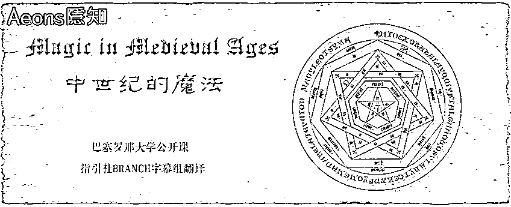

第二单元 魔法与异端

第四课   一位不那么邪恶的审判员

【这个判官不太冷（喂）】

 大家好，别来无恙？很高兴我们又见面了。 

　　还记得上节课么，我们介绍了审判员的形象，并且讨论了这些神职人员是如何成为自十三世纪以来宗教迫害的代言人。很多审判员是通过留下的文件被我们所知，这些文件也使得他们在历史上声名狼藉。其中一些人你也许听说过：如 1334 年成为教皇本笃七世的雅克·福涅尔、14 世纪后半期阿拉贡国王的大审判官尼古拉斯·埃梅里齐、或托奇马达的托马斯——15 世纪末宗教法庭的审判长，审判员的多数恶名都可以归咎于这个黑暗角色。尽管事实上，他并不严格属于我们上节课所定义的中世纪审判员。今天，我们将会跟随其中一位人物，他在 20 世纪晚期因一本书和一部电影而闻名遐迩。

如果你读过翁贝托·埃科的小说《玫瑰之名》【强烈推荐！译林版作《玫瑰的名字》——译注】或者看过这部电影（如果没看过，还等什么？），你肯定记得邪恶的纪伯纳，那个多明我会的审判员，他是拷问与处刑两位背负冤罪的修道士、一个被指控为女巫的无辜女孩的关键人物；他是一个可恶的狂热信徒，以教会职权公报私仇，并且毫无顾忌地使用严刑逼供。好吧，毕竟纪伯纳是多明我会的成员，他担任了很多年审判员的角色。并且他在这个故事发生的 14 世纪初期依然活跃。但是，他与这个故事的相关之处也就仅限于此了，剩下的细节全都是虚构的。尽管这样的历史剧华美动人，另一方面也滋长了对审判员的各种偏见。当然我不是要为审判员辩护，只是作为历史研究者，我们应当努力去试图理解古人的行为，无论这些行为如今看来是多么可怕。只有了理解背后的缘由，才能明白他们的所做所想。而纪伯纳，毫无疑问是将心思与行动付诸于他与许多同僚认定的、围绕在中世纪晚期的教会周围的敌人与威胁上。 

纪博纳出生在 1261 年左右，在 20 岁之前加入了多明我会，1307 年于法国图卢兹被任命为审判官，在任近 18 年。在他任职期间，他审判了将近 600 人，其中大概 40 名男女（约占 10%）向教会认罪，烧死在火刑柱上。1331 年，他在床上寿终正寝，享年 70 岁。他曾经写过几本书，其中最重要的毫无疑问是《异端审判实践》（对邪恶异端的审判指导），这是最有名的审判指南之一，因为其读者正是他的审判员同僚。书籍由拉丁文写成，共分为五册，记述了纪伯纳作为审判者的亲身经历。他的目的就是收集各种异端团体的信息以便将他们揭露，其中有：清洁派、瓦勒度派、贝格派、伪使徒派，等等。但对这次课及本单元而言，更重要的还是——巫师。 

正如之前所说，在教皇亚历山大四世之后，千里眼和巫师不会被送上法庭审判，除非他们涉及异端思想与活动。但到了 14 世纪 20 年代，教皇若望二十二世将所有种类的巫师无差别地划归于审判员的司法权之下。从那时起，召唤魔鬼的人、崇拜魔鬼的人、和魔鬼做交易的人、为其铸造蜡像的人，和亵渎圣礼的人都被当作异端处理。纪伯纳所关注的又是哪些魔法师呢？指南书中，他设计了一份问卷以便使每个审判员都能从那些费尽心思隐匿罪行的嫌犯身上获得事实。 

　　他写道：“瘟神与巫师，千里眼与魔鬼召唤师在不同的省份和地区，有着众多的不同形态，这些与迷信的人们的大量虚构和空虚的想象紧密相关，他们被灵魂的谬误和魔鬼的教义所引诱。”这些人的行为必须被审问。他们知道什么？他们又听说了什么？他们在儿童身上施法了吗？他们帮助不孕女子怀孕了吗？他们给别人吃了什么？头发？指甲？他们预言过未来吗？他们通过附魔给人治病吗？诸如此类。但纪伯纳最为关心的，是那些出于魔法目的、对正统基督教实践及仪式的亵渎行为。这些仪式使用圣体或圣油，模仿圣礼的步骤。例如，对一个以真人为原型的蜡像进行洗礼，然后用针扎以伤害此人。他同样感兴趣的是，巫术师们是从哪里获得这些方法、在多大程度上相信这些、以及什么人会来寻求此类帮助。他警告他的同僚们：“你要深入彻底的审问，铭记每个人的特质和条件，因为没有哪种审问方法适用于所有人。应当用一种方式审问男性，另一种方式审问女性。”

　    现在，我们聊到了极为有趣的地方。因为在 14 世纪早期，巫术涉及了男女双方。而且事实上，还有一种只与男性有关的特殊魔法——死灵术。这将是我们下个视频讨论的内容，也是本单元最后一节必修课。最后且同样重要的是关于魔鬼的话题，以及中世纪那些十分繁复的、召唤魔鬼为其所用的方式。你一定不愿错过，对吧？

文案｜指引社·羽落弦

翻译｜指引社·羽落弦

指引社，致力于让“神秘学”走向大众，不再“神秘”。杜绝神棍，欢迎撩或聊

长按二维码关注我们

点击“阅读原文”，去指引社看原贴

# 实用通灵技巧教程之一

> 原文：[`mp.weixin.qq.com/s?__biz=MzI5NTQzMDUzMQ==&mid=2247483748&idx=5&sn=0a5a644b60b48a4b2907fbcf23b655f7&chksm=ec52f188db25789e94626cbf3eb9d70c77f848916a05b0ca25d18d9fa570f14f65ee3bd27f24&scene=27#wechat_redirect`](http://mp.weixin.qq.com/s?__biz=MzI5NTQzMDUzMQ==&mid=2247483748&idx=5&sn=0a5a644b60b48a4b2907fbcf23b655f7&chksm=ec52f188db25789e94626cbf3eb9d70c77f848916a05b0ca25d18d9fa570f14f65ee3bd27f24&scene=27#wechat_redirect)

**记得点蓝字关注，与好内容相遇**

本篇部分内容编译自某些外版通灵书籍。在本篇教程中，由于篇幅问题，内容将被分为上中下及练习篇四部分：上篇也就是本篇，将为你解说心灵能量的定义，掌握其三大核心法则；中篇会指导你如何使用这种力量去影响他人；下篇则会讲解如何防御这种心灵攻击，保护自己不受伤害。在练习篇中，将给出关于本篇的完整的指导练习（尝试着一步一步将这种心灵控制力运用在他人身上），使你完全掌握这种非常实用的能力。

接下来是教程正文部分，首先来了解一下心灵影响的定义。

我们可对他人所实施的心灵影响分为大约三类：

1）个人影响：一个人被来自他人的心灵能量所影响；2）远程影响：当施加能力的人与被施加者之间隔着相当的距离时；3）间接影响：并非针对某个特殊人物的心灵影响，无意中使不同人被卷入思想波动中。

今天在这里我们主要说的是第一种：个人影响。这种影响包括很多种形式，从最为强力的控制（譬如催眠术）到仅仅是最轻微的影响，但其中隐藏的内核都是明显一致的。在历史上有很多伟人，诸如亚历山大大帝、拿破仑或是凯撒，都曾经使用过这些手段，令他人顺从于其意志。所有伟大的领导者都拥有这种强劲的能力，能够极大地影响到他人的心智，诸如演说家、传道者、政治家以及其他类似的能人。这种能够掌控和影响他人的能力的唯一特征，便是其强大的心灵能量。

若想学习这种能够驾驭他人的力量，你需要深刻记住并实行三条基本法则：

1、强烈的欲望；

2、清晰的心灵成像；

3、集中力。

分别对应着以上的三条法则，第一步你首先需要在头脑中充满强烈的意愿，成为一个对事物保持正面乐观态度的人；尝试将一种明确的影响施加给你所接触的人，尤其是那些你希望能够影响的人。你必须令这种欲念之火在心中熊熊燃烧，直到这种渴望进化到有如肉体的饥渴一般的程度，如同想要呼吸、想要活着一般地强烈地去渴求。你亦会发现，那些实现了自己梦想的伟人都胸怀极为强烈的欲念；在这种炽烈的欲火和愿景中，蕴含着极为强劲的心灵能量——我们平日里将其中的一些称为强大的意志力。

第二步，是在你的脑中形成一幅清晰的、确定的、动态的心灵图像，将你想要施加在他人身上的想法或感觉明确地描绘出来。如果你想要施加的是一种想法，你需要将你的想象转换成一幅清楚而强力的图画，给它所蕴藏的力量赋予准确的指导纲领。如果你想要施加的是一种感受，那么你需要将它添加到你的想象中去，如果你希望令某人去做某事，或者希望对方按你所想的方式去做事，你需要想象他如同你所希望一样在行事。借助对这种想象的描摹和修饰，你将能够精准地将意愿施于他人。图像越清晰和强力，所蕴含的能量就越大。

第三步，你需要集中力去实行你对他人的心灵引导。你必须学习能够集中极大的注意力，使你的想法能够在脑海中清晰而有力地呈现出来，如同暗夜中有且仅有唯一一颗极为明亮的星一般突出和明显。这样做可将你全部的力量充进你的心灵或是超自然能量之中，并将其灌注进你所希望实施的想法中。集中力可以使力量如同经放大镜所集中的太阳光线，可以轻易灼烧物体；或是经奔腾于管道而形成的水的湍流，可以赋予物体强烈的冲击。模糊的想法也具有力量，但显然相对要弱很多，而集中全力的念想则能够冲破很多阻碍，铺就坦途直达目的。

务必要牢记以上的三条法则，可以令你的心灵能量增加三倍护持：1、强烈的欲念；2、清晰的心灵图像；3、集中注意力。你的心灵影响力的成效，取决于你在这三条法则上投注了多少心力，在任何形式的心灵影响力中都是一样，从直接的到间接的，从个人的到普遍的，从现场的到远程的。

本篇完。在下一篇中，你将学会本教程的核心实践技巧，敬请关注

排版｜指引社·阿烬

文案｜指引社·阿克

指引社，致力于让“神秘学”走向大众，不再“神秘”。杜绝神棍，欢迎撩或聊

长按二维码关注我们

点击“阅读原文”，去指引社看原贴

# 第 6 期推送调查：指引社的发展，需要你的建议哦~

> 原文：[`mp.weixin.qq.com/s?__biz=MzI5NTQzMDUzMQ==&mid=2247483748&idx=6&sn=d30940a704547fb314748b0cae97dbcb&chksm=ec52f188db25789ecc97e5a0a042267993c5091f84104588383e3db4ee0cd29cef556fa17e09&scene=27#wechat_redirect`](http://mp.weixin.qq.com/s?__biz=MzI5NTQzMDUzMQ==&mid=2247483748&idx=6&sn=d30940a704547fb314748b0cae97dbcb&chksm=ec52f188db25789ecc97e5a0a042267993c5091f84104588383e3db4ee0cd29cef556fa17e09&scene=27#wechat_redirect)

**记得点蓝字关注，与好内容相遇**

指引社公众号的每篇文章，都是从每周发布的、或论坛的精品旧文中精选。

每期推送的最后一条，都会放出投票。

选择你喜欢的文章，也可以选择你下期想要看的内容。

指引社公众号初露头角，之后也许会成长为你喜欢的样子。

感谢你的支持。我们会继续努力哒~

📹 /mp/newappmsgvote?action=show&__biz=MzI5NTQzMDUzMQ==&supervoteid=477637869#wechat_redirect

上期投票结果回顾：

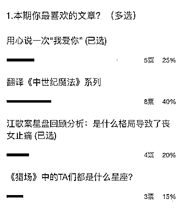

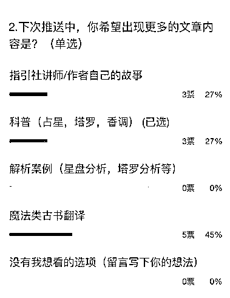

# 用心说一次“我爱你”

> 原文：[`mp.weixin.qq.com/s?__biz=MzI5NTQzMDUzMQ==&mid=2247483738&idx=1&sn=ce887608c1ce19eb9e332cf2a67bfb1d&chksm=ec52f1b6db2578a0ebdcd0ddc899f968529778bf8d2372304c1d730ec27762f36f597e04fe2b&scene=27#wechat_redirect`](http://mp.weixin.qq.com/s?__biz=MzI5NTQzMDUzMQ==&mid=2247483738&idx=1&sn=ce887608c1ce19eb9e332cf2a67bfb1d&chksm=ec52f1b6db2578a0ebdcd0ddc899f968529778bf8d2372304c1d730ec27762f36f597e04fe2b&scene=27#wechat_redirect)

**记得点蓝字关注，与好内容相遇**

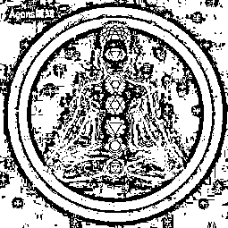

它位于我们胸膛的中央，对应着心脏，胸腺。

心脏对于人体的重要性相信大家都是知道的，

如同梵文名称的 ANAH 的意思——

“不受干扰的”运转，并且持续终身。

心脏泵动血液供给全身，这个过程在正常情况下应是流畅无阻的。

若是能量在传输系统中被阻塞，将会导致健康问题。在心脏的后面就是胸腺，它是人体防御机制的主要器官，并且修复感染带来的损害，与心脏一样，它的工作也应该是始终持续并且“不受干扰”的。

**梵文名称：ANAHAT**

心轮

然而心轮对于我们的意义并非只有上面的生理意义而已，同时还具有心理意义。在中医当中，心为君主之官，神明出焉。

“君主”这个词就说明了它具有至高无上的“地位”，并具有统领的作用，有“任物”的功能。

意思就是有了“心”我们才能产生各种思维活动。当然现代医学指出“任物”的功能是由脑实现的，情绪的产生与脑有关，这个就是后话了。

除了上述以外，在五行之中心属火，为阳中之阳，有一点很有意思，在无形中还有：水土木金，而这些东西皆为“向下”的，而只有“火”是炎上。

而肝，脾，肺，肾，这几个字，都带有肉字部，而只有“心”它没有这个偏旁，是为“无形”

这一切似乎都在告诉我们心的特殊，讲到它这个无，就要说到《老子》云：“天下万物生于有，有生于无”有固然重要，但有却从无中来，所以在道家思想中很重视无为，故云：道常无为而无不为。

“主不明则十二官危”，这句话很值得我们思考。我经常见到有些人，要么平时就不生病，一得病净是棘手的毛病。而还有些人，平时小病不断，却没有什么大毛病，以前觉得有些想不通，现在放在这句话里来思考便是恍然大悟，如此简单。一个国家遇上了昏君则天下大乱，十二官危，这个君主被蒙蔽了，它便分不清好坏。

也就是免疫系统的渎职，任由细菌病毒的放肆，久而久之，到了最后一根稻草压垮骆驼的时候——病来如山倒。

而君主明则，免疫系统敏感，无所不见，无所不察。

说到情绪相关的时候，似乎很多词语都与它脱不开关系，比如“痛心，开心，伤心，愤怒，忧愁，思念，悲伤”这些都带了“心”而心轮能量平衡的时候，则代表着无条件的爱，博爱，关怀，无欲望的爱，等意义。

心轮太张则爱成了有条件的爱，带占有欲的爱。太闭则变得小心谨慎，害怕被拒绝，一旦投入则无法自拔，失去的时候就会变得不能接受。

上面介绍了心轮及其相关，下面就来说说在平衡心轮，养护心脏中最常用的几种草药油

意大利永久花

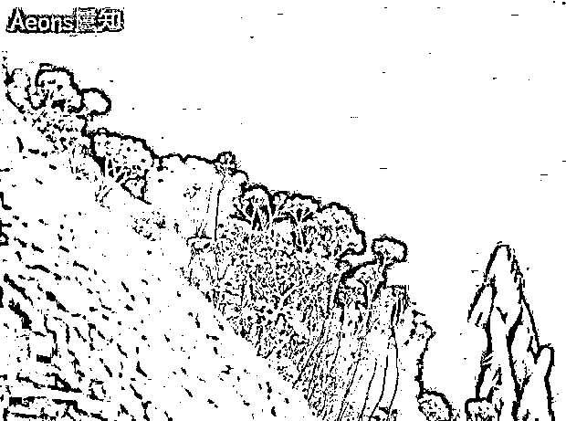

永久花被称为永不凋谢的花，同时也是能量最强大的全能疗愈草药油之一。原产于地中海沿岸一带，其含有独特的意大利双酮（italidiones）它具有单萜酮的一切优点，但却没有神经毒性。

**其能量特点就是溶解，能溶解血块，治疗身体内外的瘀血，也能溶解心中块垒，让人直面最深重的恐惧与哀伤**。在芳疗中，圣约翰草油的抗忧郁功效出众，与永久花是最佳搭档，除此之外还有善于处理“鲜血淋漓”的情况的岩玫瑰也是它的好友。

**临终关怀时也常用到永久花，人最大的恐惧莫过于面对死亡，而永久花却有“永恒”的姿态，仿佛它从不在意死亡，或者说死亡也无法带走它的美丽。**

「Helichrysum italicum」**在枝头开成了永恒的模样。金色的耀眼花朵，如太阳能穿透一切黑暗，给生命将走到尽头之人带去一缕芬芳。**

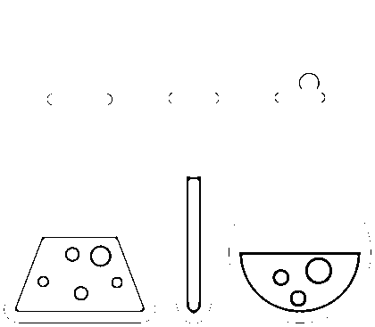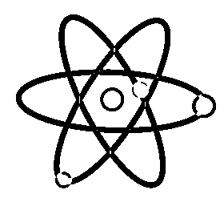

杜松果

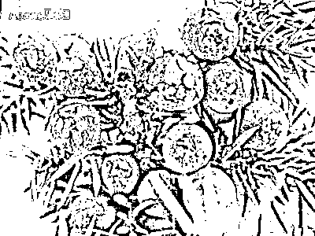

杜松果油具有“深层排毒”的功效，特别是与月桂同用时，这种效果常常是爆发性的，它同时也带有“火星”的力量，**代表着不可动摇的决心，信心，以及爆发力。**

含有单萜酮，倍半萜酮，在溶解黏液时也具备排水的功能，**原生于欧洲，味苦，能“收敛阳气，固阳”，在芳疗中它代表着“保护”“净化”**

「Juniperus communis」除了能净化身体以外，也能净化心灵，**并将“污秽排出”，这里所说的保护，是指自我保护。**

玫瑰

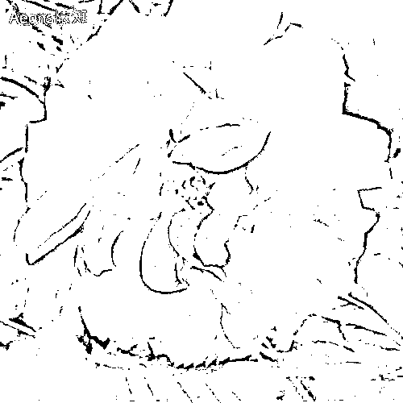

这个草药油在之前的帖子已经说过了，这里就简要提一下。

**它的作用主要集中在心脏**，特别是是这个带红色的大马士革玫瑰，**很适合女性的使用，当然这不代表男性不能使用。**

「Rosa damascene」玫瑰搭配白珠树时，**能让人在“忍痛”之下“感受爱”**

穗甘松

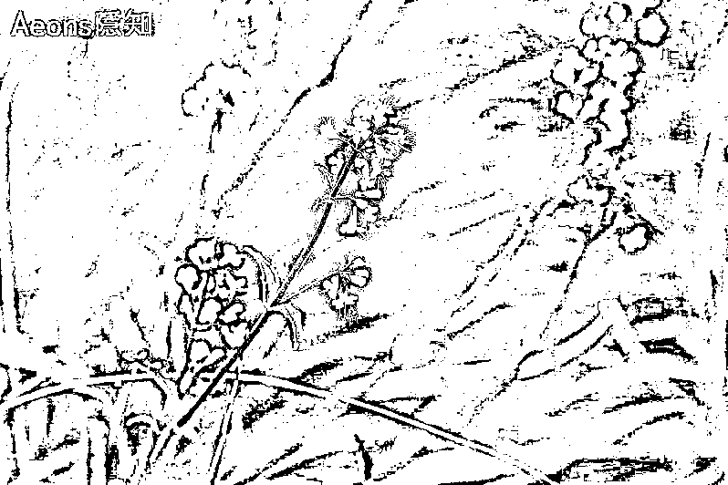

《约翰福音第十二章第三节》记载，马利亚以真哪达香膏（即穗甘松）礼敬地涂抹耶稣，犹大看了很有意见：「不该如此浪费！应该把香膏卖钱去救济穷人。」耶稣回答：「且由她去吧！因为常有穷人与你们同在，只是你们不常有我。]

在这里，耶稣口中的“穷人”指的是“物质”，而“我”是指“精神”，香膏则具穿透两者的力量。

**耶稣的回答则是说，“人在一生中总是要面对物质的难题，就容易忽略了精神的重要性”**

在穗甘松中含有倍半萜烯，它代表着宽恕与原谅的力量，能平衡心轮燥动的能量，**当人的眼光变得狭隘，纠结与小事不放，或因为遭遇背叛，变故等重大事件而难以入眠时，它总能发挥良好的功效。**

「Nardostachys jatamansi」原谅所有的背叛与谎言。**它能助人超脱物质，获得精神上的力量。**

**慎小七**

芳香草药·专栏食用指南

慎小七，指引社矿灵学院管理，医学世家出身，芳疗师，常年调香爱好者跟实践者，草药专家。

本系列为慎小七原创出品，涉及芳香、草药等专业知识。

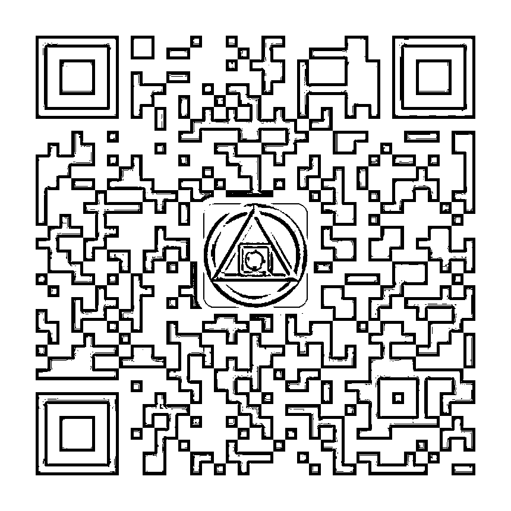

文案｜指引社·慎小七

排版｜指引社·阿烬

指引社，致力于让“神秘学”走向大众，不再“神秘”。杜绝神棍，欢迎撩或聊

长按二维码关注我们

点击“阅读原文”，去指引社看原贴

# 翻译丨《中世纪魔法》第 2.2 课 自然魔法的兴衰

> 原文：[`mp.weixin.qq.com/s?__biz=MzI5NTQzMDUzMQ==&mid=2247483738&idx=2&sn=b48494c30bd51155517ca25251135280&chksm=ec52f1b6db2578a0681100341393642845496542f4bd9f6c2aa3d3e2d16c37e3ce58e7e89b99&scene=27#wechat_redirect`](http://mp.weixin.qq.com/s?__biz=MzI5NTQzMDUzMQ==&mid=2247483738&idx=2&sn=b48494c30bd51155517ca25251135280&chksm=ec52f1b6db2578a0681100341393642845496542f4bd9f6c2aa3d3e2d16c37e3ce58e7e89b99&scene=27#wechat_redirect)

**记得点蓝字关注，与好内容相遇**

### 巴塞罗那大学公开课《中世纪的魔法》

慕课出品 · 指引社 BRANCH 字幕组翻译

 

第二单元 魔法与异端

第二课 自然魔法的兴衰

　　又见面了！上节课我们讲到，早期基督教将魔法视为魔鬼介入人类生活的结果。直到 12 世纪，这个理念在神学家中都广为流传。

　　魔法有很多种类，塞尔维亚的伊西多尔追随罗马学者瓦罗，将魔法分为：地占术、水占术、风占术和火占术（亦即用土、水、风和火的占卜法）；以及通过观察鸟类、内脏、恒星与行星（即占星术）的占卜；还有咒术及其它。这种分类法也一直沿用到 12 世纪。

　　而 13 世纪则发生了一些变化。首先，部分作者开始将自然魔法与黑魔法相对立。这些作者包括卓有影响的巴黎主教奥弗涅的威廉，以及著名的大阿尔伯特（亦称圣·大阿尔伯特，他恰好也是当前实验科学的守护圣徒）。影响 13 世纪神学家的第二个改变是一种新知识的诞生，这种知识包括科学的占星术和炼金术。【译注：此处的“科学”做广义理解。】本课程后面的一个单元会着重介绍这些学科。简而言之，这种新知识宣称自己是古典哲学与科学的继承者，并且是更严谨和更先进的方式。从早期基督教会学院中分离出的大学，【译注：中世纪的大学渐成为独立于宗教的知识权力中心。】以及阿拉伯哲学的输入和随之重新引入的亚里士多德哲学与科学，【译注：亚里士多德的书籍因战乱一度遗失，13 世纪随阿拉伯哲学再度传入欧洲，并引起了大辩论。】极大地影响了这个时期的欧洲人，尤其是知识分子。

　　但其实，12 世纪的占星师和炼金术士并不把自己视作魔法师。虽然他们的反对者指责其为魔法师，他们更愿意将自己视作自然魔法的实践者。这种情况大约持续到中世纪结束。然而，即使在那之前，许多人仍然认为所有的魔法毫无疑问都是邪恶的，而当他们讨论自然的神秘力量时，他们不使用“魔法”这个词。托马斯·阿奎那（即圣阿奎那，他正是学者们的守护圣徒）相信自然的神秘力量是由恒星和行星的运动造成，但他保留“魔法”这个词来指称魔鬼介入的情况。他在《反异教大全》一书中讨论了这些问题。可以这么说，在他看来，大多数魔法最终都会有魔鬼的介入。所以，尽管魔法师似乎只是观察星轨、使用草药，但他们还是必须与某些理性存在体相沟通，以获得帮助来完成各种事情。这种帮助是通过提供给他们知识来进行，通常是超越人类理解的知识。施咒、祈灵、奇特的力量等等显然都与超自然的存在体有关，这些存在体必定是邪恶的，即，魔鬼。

　　如果说早期基督教已经警告过祈求魔鬼的危害，当对魔法的恐惧几乎成为了中世纪末期的一大困扰，教会人员的关心和规劝更是不断增强。不过，过度强调魔鬼的力量是一种冒险的做法。神学家要怎样解释魔鬼拥有改变生物或预见未来的力量，又不至于侵犯到上帝的权威？但另一方面，低估魔鬼的影响同样也很危险。最后的结果是，在中世纪末期，几乎所有类型的魔法都被视作与魔鬼有关。包括符文、咒语、体式等所有根植于大众流俗的东西都被指责为迷信。一如我们在上个单元所说。

　　中世纪晚期，迷信被认为是哪怕不直接涉及魔鬼，也是由魔鬼所激发的，因此皆为罪行。一些最初是异教习俗、后来被视作自然魔法的现象，例如水井和泉水的仪式、献祭、诅咒，甚至草药，很快也被归咎于魔鬼。实施这些的男女也会被立刻质疑。整个中世纪，无论是世俗的还是教会的机构，都在不断地立法以反对魔法。上节课我们也谈到了其中的一些法律。

　　对魔法的处罚是各式各样的，但世俗法通常是针对魔法造成的伤害，教会法则更关心是否违背上帝。不过，基督教牧师和世俗机构在抵制魔法方面并没有取得太大的成果，当方济各教会与多名我教会成为 13 世纪传教士的主流之时，谴责魔法仍然是他们布道中最常见的主题之一。例如，意大利方济各会传教士，锡耶纳的伯纳迪诺，也是被封圣的一位修士，他在这个方面的工作无疑是非常努力，因此被封为传教领域的守护圣徒。

　　总之，尽管反对魔法的法律在整个中世纪基本相同，13 世纪却发展出了最有效的迫害与告发魔法信徒的方法——中世纪的审判员。其首要目的就是迫害异教徒，并为即将来临的大运动建立了基础。

　　我们下节课见！

翻译｜指引社·羽落弦

排版｜指引社·阿烬

指引社，致力于让“神秘学”走向大众，不再“神秘”。杜绝神棍，欢迎撩或聊

长按二维码关注我们

视频&字幕百度盘下载、课程索引

# 翻译丨《中世纪魔法》第 2.3 课 大迫害

> 原文：[`mp.weixin.qq.com/s?__biz=MzI5NTQzMDUzMQ==&mid=2247483738&idx=3&sn=fc5c29ee3b9f425d33d9c28c3c0d5e5e&chksm=ec52f1b6db2578a0446cd9b929757727e1e3f2f431ad811a7405f5b889d6700ff8594a083cd0&scene=27#wechat_redirect`](http://mp.weixin.qq.com/s?__biz=MzI5NTQzMDUzMQ==&mid=2247483738&idx=3&sn=fc5c29ee3b9f425d33d9c28c3c0d5e5e&chksm=ec52f1b6db2578a0446cd9b929757727e1e3f2f431ad811a7405f5b889d6700ff8594a083cd0&scene=27#wechat_redirect)

**记得点蓝字关注，与好内容相遇**

巴塞罗那大学公开课《中世纪的魔法》

慕课出品 · 指引社 BRANCH 字幕组翻译

 

第二单元    魔法与异端

第三课 大迫害

  大家好！欢迎回到魔法世界！

    在前两个视频中，我们讲解了中世纪的教会是如何普遍地把魔法视为一种威胁。从早期基督教作者，到中世纪晚期的神学家，教会人士都不断警告自然魔法与黑魔法的危害。魔法及其实施者逐渐沦为可疑分子和宗教迫害的目标。上节课我们也看到了，教会法与世俗律法实际上对于劝阻旧习俗和危险召唤活动几乎不起作用。而到了十三世纪，一个新的角色即将登上历史舞台，宗教迫害也借助其更有效的新武器而盛行于世——异端审判会。

通常认为，13 世纪 30 年代是所谓异端审判会的奠基时期。然而在中世纪，异端审判绝非一个体系坚实的制度，至少从 13 世纪到中世纪末，异端审判更确切的说是由那些煞费苦心、致力于做出卓越成绩的个人来主导的；他们就是——异端审判员。他们的主要目的就是迫害异端。也就是基督徒中的异端。这一点很重要，因为审判员对犹太教徒和穆斯林是没有审判权的。所以这里的异端，指的是背弃教义、脱离教皇和主教官方指引的基督徒们。 

    因这项工作，审判员可以享受一些特权。他们直属于教皇，并有权以审判会的身份行事，依据职权，仅对一句流言蜚语就能采取行动。审判开庭之前会有一段宽限期，在此期间，他们鼓励嫌疑人告发别人和主动认罪。在此之后，审判过程将秘密进行。别处不被认可的目击者在此被接受（比如孩子或罪犯），并且被告没有上诉的权利。

    而审判员最终是如何决定魔法实施者的罪名的？（他们将这些人叫做“巫师”）关键点就在于，洗礼之时基督徒会发誓断绝与撒旦及其附庸的关系；因而重寻撒旦之力就意味着背弃对基督教的信仰。严格地说，这种行为甚至将被认定为再次堕落【初次堕落指的是伊甸园之事——译注】，如字面所示，就是继亚当与夏娃之后的第二次堕落（初次堕落使得每个人出生就带有原罪），对这种堕落的惩罚十分明确，即绑在柱子上施予可怕的火刑。

    这种情况可能导致审判员轻易地偏离了主要目的，例如，教皇亚历山大四世在 13 世纪 60 年代时声明，除非魔法和异教确切相关，否则应留给当地政府处理。然而一些审判员反驳道，所有的魔法都是异端，因为魔法的本质就是邪恶的。异端不仅存在于一个人的信念中，也可以在这个人的行动中体现出来。在此基础上，教皇约翰二十二世于 14 世纪早期，指示审判员开展了对死灵法师和其他巫师的迫害。中世纪晚期——特别是 14 世纪——的很多审判，就是直接针对涉嫌死灵术的牧师的。我们将在这一单元最后一节必修课中讨论。

    如果现在，让你来描述一位中世纪的审判员，你大概会想到具有某些施虐狂特质的形象。但实际上，中世纪的审判员是最初且最虔诚的信仰者；他们反对施虐，他们的第一要务是甄别、揭露、根绝任何威胁到基督教的事或人。火刑柱从不是他们的第一选择,谨慎的审议优先于每一个判决；而通常说的迫害则是专横、无差别和不依程序的。我并不是说，被审判员指控巫术罪是什么最好的情况，但审判确实提供了一些其他自发的“诉讼”所完全没有的保障。

    尽管如此，那些臭名昭著的涉及到魔鬼的审判似乎在某种程度上反对着上述言论。例如，圣女贞德，或圣殿骑士团的案子；除了其他罪名，他们还被指控崇拜头颅和猫妖。不过这一切都有着强大的政治谋划，以及远非宗教热忱的动机。这些巨大的动因推动着事件发展，而撒旦不过是一个方便的替罪羊。纵欲、同性恋、乱伦、血浴和召唤恶魔等罪名，是现代时期猎巫运动最常用的指控。

   十分讽刺的是，这些罪名是非常古老的，在中世纪开端，它们是被用来指控一个尤其异端且危险的教派，而这一教派最终却彻底且永久的改变了世界的面貌，它即是——基督教。

    下节课，我们将跟随一位著名审判员的脚步，看他是如何与恶魔永不停歇的斗争。我们将会了解到他对魔法的一些看法，也会看到被带上法庭的那些最不可思议的巫师。千万不要错过！

-------------------------

翻译｜指引社·羽落弦

排版｜指引社·阿烬

指引社，致力于让“神秘学”走向大众，不再“神秘”。杜绝神棍，欢迎撩或聊

长按二维码关注我们

视频&字幕百度盘下载、课程索引

# 江歌案星盘回顾分析：是什么格局导致了丧女之痛？

> 原文：[`mp.weixin.qq.com/s?__biz=MzI5NTQzMDUzMQ==&mid=2247483738&idx=4&sn=9321a6917a419ff09a31d10b5ecf2091&chksm=ec52f1b6db2578a0c9a14a05460992bc9bfe29c0bbe98b7ce01ab2c08fb4543fc129fd11e6fb&scene=27#wechat_redirect`](http://mp.weixin.qq.com/s?__biz=MzI5NTQzMDUzMQ==&mid=2247483738&idx=4&sn=9321a6917a419ff09a31d10b5ecf2091&chksm=ec52f1b6db2578a0c9a14a05460992bc9bfe29c0bbe98b7ce01ab2c08fb4543fc129fd11e6fb&scene=27#wechat_redirect)

**记得点蓝字关注，与好内容相遇**

愿逝者安息，生者节哀！也愿道义沦丧者多加反省，罪行的实施者受到法律的严惩！

让我们为一位伤心欲绝的母亲祈愿……

 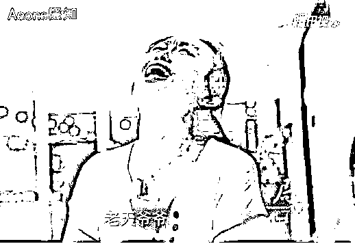

#### 近来，一桩一年前的杀人案被翻出来火爆网络，那就是留日学生江歌被害案，被害案的当事人刘鑫也与江母在案发后第一次见面，场面一度失控。

#### 案子的大致情况跟过程，相信大家这几天在网上都已经耳熟能详，2016 年 11 月 3 日晚间，留日女学生江歌陪同躲避男友的闺蜜回到宿舍，却被闺蜜前男友堵截在门口，其闺蜜刘鑫期间进到了房间里，而江歌与男生则在走廊发生了争执，之后刘鑫在门内听到一声惨叫，却不敢开门查看，直到警察到达，才将被锐气严重划伤喉管的江歌送往急救，但抢救无效，最终江歌死亡。

#### 整件事情疑点很多，刘鑫在案发后并没有联系江母，甚至没有跟江歌家人见过面，导致网络上的道德声讨日益发酵，直到最后才敢站出来面对江母跟记者们。

#### 个人曾经关注过不少跟死亡谋杀有关的星盘案例，诸如：彭程程案；祁可欣案；赖曾裕童案等….这次的事件本想关注一下江歌本人的星盘，无奈网络信息搜索能力有限，只知道她 1992 年出生，无从研究。后听说江母正在上诉，内心真心希望她能上诉成功，因此便翻出了江母的出生日期，虽然具体时间不明确，但是或许可以从单纯行星之间的关系看到一些端倪，做一些简单分析。

#### 以下是江歌母亲的星盘：

#### 主要出生资料是日期跟地点，具体时间未知，根据星团的星体进行了粗略矫正，约莫是上午 9 点到 10 点左右，但考虑到判断的准确度，笔者会尽量只围绕星体间的关系进行阐述。

####  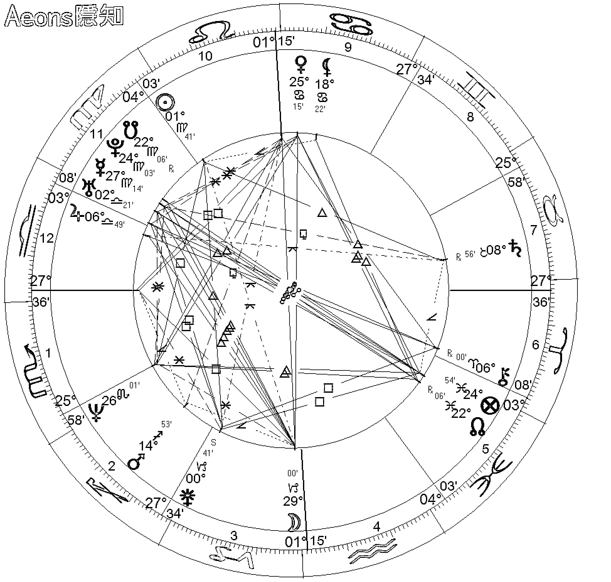

#### 从星盘里我们先看看是什么行星引发了这一系列根本让她淬不及防的巨大变故？

#### 首先这个案件是关于爱女的死亡，那么金星作为原始的“女儿”象征，就不得不先观察。

#### 乍一看，金星的状态还可以，连接着一个巨大的风筝相位，同时跟月亮有冲突，月亮失势，似乎隐约已经在告诉我们，盘主作为“母亲”的经历并不顺利，而其诱发点则是金星“女儿”。

#### 金星介入的这个“和谐相位”集合，其实并不和谐。首先金星跟海王三分相，往好了想可以是她的艺术细胞什么的，但是也完全可以意味着女儿的遇害，或丧女之痛。【海王星代表丧失跟痛苦】

#### 而这个三分相完美地呈现了它的【被动】特征，也就是，任何和谐相位都具备的特征：顺势发生，无从抵抗。在女儿被杀的时候，作为母亲，她完全无法阻止事件的发生，甚至女儿身边当时也没有任何人出面阻拦凶手，这再次告诉我们三分相有时候也可以很可怕。但毫无疑问这之后，她女儿的事件就被推上了大众媒体的风口浪尖【海王星】。

#### 然而，最引起我注意的其实不是金星海王，而是与它们各自出现六分相的那个星团（Stellium），也就是下图这个点：

#### 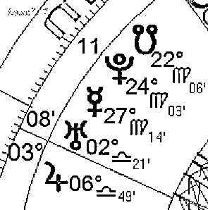

#### 星团的力量往往是并行爆发的，同时汇聚着所有形成这个星团星体们的力量。它们一同向我们展示着金星与海王星互相联动的“推动者们”，就像是原本顺畅的水流中突然又顺势涌入一股更猛烈的洪流一样，展现着整件事情的各种修饰词：南交点（终结），冥王星（死亡），水星（朋友同学），天王星（突发情况），木星（国外），大家是不是感觉这些词很眼熟？是的，整个星团汇聚了整件事情的始末，一旦被触发，就会导致整个风正相位的联动发生，猛烈程度不亚于洪水。

#### 这里我们看出：不是所有的风筝相位都是好事儿。 

#### 星团中木星跟天王最有可能是第五宫子女宫的代表星，也是这五个点里面最有可能成为子女意涵的星体，因此我给出的生时调整是在 9 点到 10 点左右，也就是第五宫落在水瓶座或双鱼座的时候，这样就意味着天王或木星在本命盘落在 12 宫内，代表【子女的丧失】，而如果按照 10 点来算，第五宫双鱼座，就更容易有子女带来的伤痛。而这个星团也会因此具有更多事件相关的证词。同时木星天王冲凯龙，凯龙白羊座，其女会在头部附近受到创伤。 

#### 这个大风筝的尾部，是我们熟知的北交点，俗称灵（宿）魂（命）的目（事）标（件）。北交如果按照 10 点算，就是落在子女宫，亦即宿命发生于子女之上。 

#### 但不管宫位如何，单是这个聚焦的大风筝就已经告诉我们很多了。下面让我们看看 2016 年 11 月 3 日当天的天象跟她星盘的对比，是否有什么行运迹象说明事件的爆发呢？当然是有的。

####  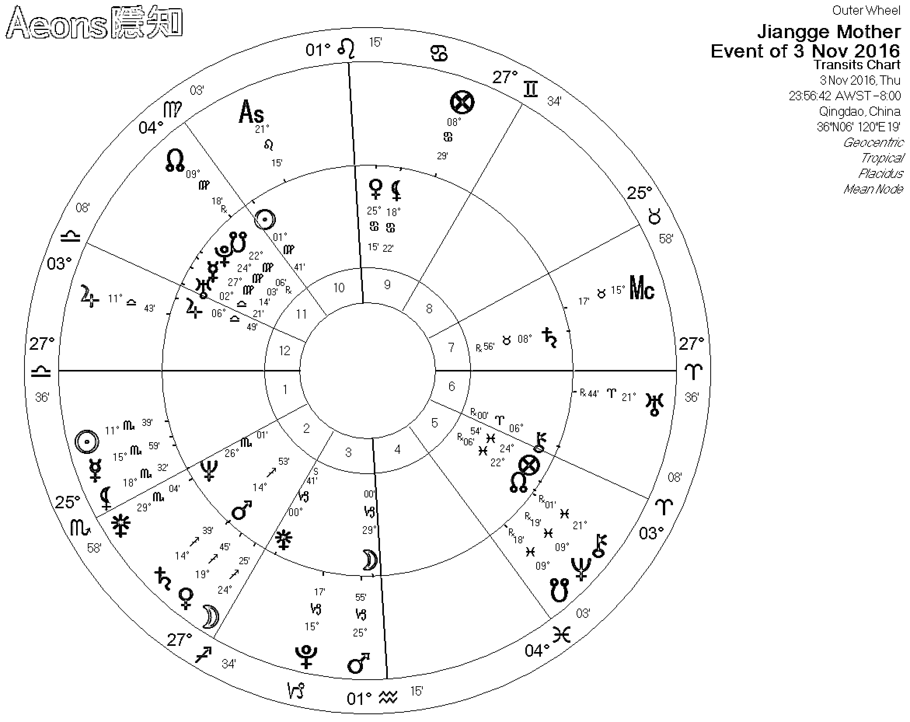

#### .那一天的行运火星（冲突暴力事件）在摩羯座 25°，正冲江母的出生金星（女儿）于巨蟹座 25°，一度不差的精准对冲！

#### · 行运的海王（丧失），凯龙（伤痛），南交点（终结），此刻都汇聚在子女宫（如果具体时间推断没错的话）

#### · 行运木星在天枰 11°，12 宫，刑克行运冥王星第三宫，木星如果是第五宫主，这里就清晰明了，12 宫（丧失），冥王第三宫刑克（死于外地）。

#### · 而木星合了之前说的这个星团，触发了整个大风筝的爆发。

#### · 凯龙星合了出生北交，这是人生必然经历的伤痛，而这颗凯龙星在 1 年间都不会离开北交点很远，所以这个伤痛会持续发酵，但最后的结局一定是向着江母的，因为凯龙星马上要合福点了，而福点的主宰星木星，落在天枰座，意味着这场伤痛的结局是司法上的胜利。这也是木星排在星团最末尾的表示。

#### 所以综上所述，江母的人生中，【女儿的悲剧】将会是整个人生的交点议题，还有一个原因则是因为她的【盘主星】，恰好就是代表女儿的金星。 

####  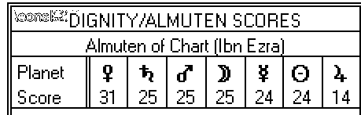

#### 但星盘中也隐约预示着她最终的胜利，这一点也让人松了一口气……

#### 下一期我将为大家分析一下刘鑫的星盘，因为作为曾经的闺蜜，在江歌为她受了 10 多刀以后，其反应令人感到不解甚至愤慨，或许星盘可以给出一些相关的暗示吧。

翻译｜指引社

排版｜指引社

指引社，致力于让“神秘学”走向大众，不再“神秘”。杜绝神棍，欢迎撩或聊

长按二维码关注我们

查看原文，与作者互动

# 《猎场》中的 TA 们都是什么星座？

> 原文：[`mp.weixin.qq.com/s?__biz=MzI5NTQzMDUzMQ==&mid=2247483738&idx=5&sn=a2954230c3cd4735808635aec1383d7e&chksm=ec52f1b6db2578a096c1525cdb3a57bd9cefb014c0cdeacf7ea314728c1050a08c674a8518d0&scene=27#wechat_redirect`](http://mp.weixin.qq.com/s?__biz=MzI5NTQzMDUzMQ==&mid=2247483738&idx=5&sn=a2954230c3cd4735808635aec1383d7e&chksm=ec52f1b6db2578a096c1525cdb3a57bd9cefb014c0cdeacf7ea314728c1050a08c674a8518d0&scene=27#wechat_redirect)

## 电视剧《猎场》最近正在热播中，看了这么久，你觉得电视中的几个主要人物都是什么星座的呢？

## 今天就让我们来八一八： 

# 1.郑秋冬：双子座（饰演者：胡歌）

## 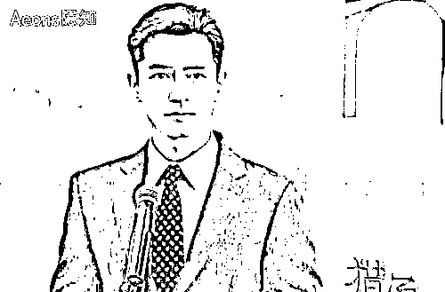胡歌本人是处女座，他的片子里都少不了或多或少的本色演出，包括《琅琊榜》《伪装者》什么的；郑秋冬是个早期因为贪图眼前利益而误入歧途，之后经过牢狱之灾才开始决定重新做人的类型。郑秋冬明显不是处女座的，因为处女座人一般都不太喜欢在大众面前演讲，处女座人一般都很腼腆，更喜欢在背后默默劳作。但是，郑秋冬的水星特质却出奇地显眼，他在一开场就扮演传销头子的角色，演讲能力，传达信息的能力，鼓动大众的能力可谓是一流。

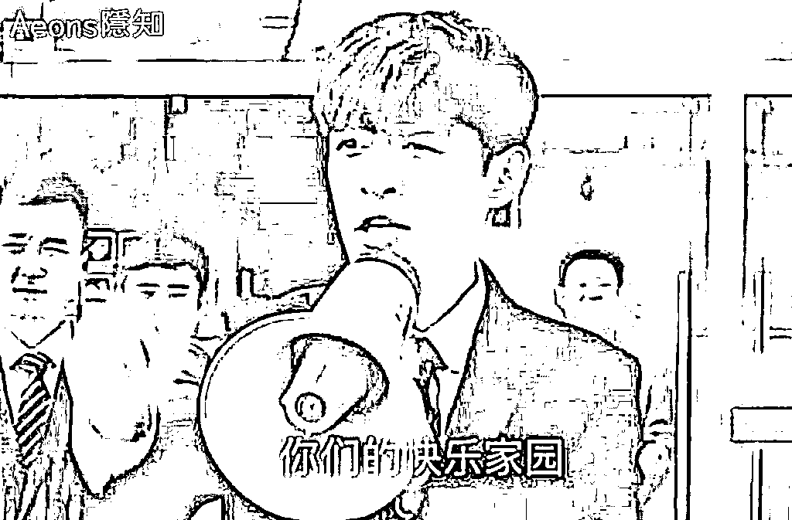

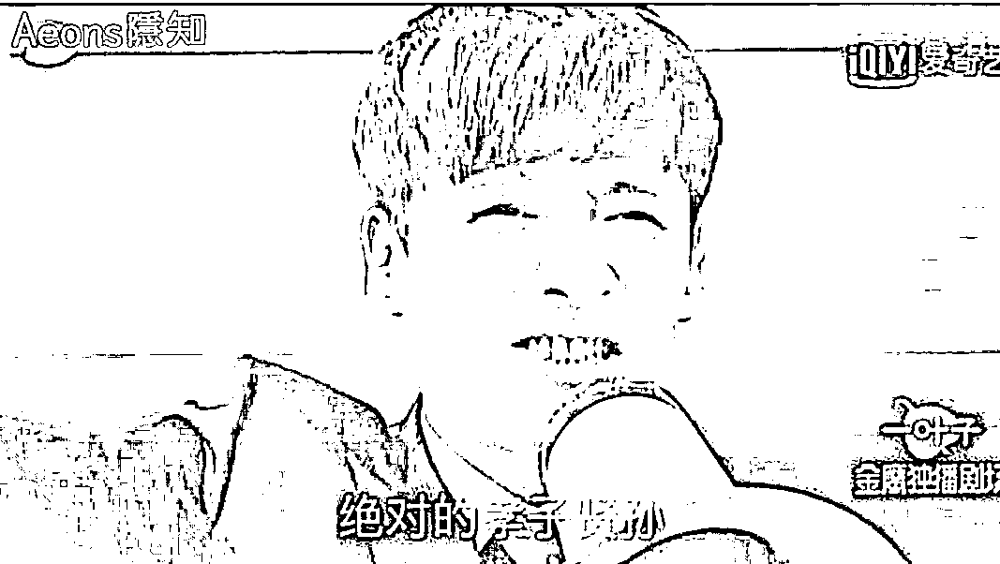

## 什么星座能把这种能力表达为一种天赋？毫无疑问，当然是水星主宰的另一个星座：双子座。早期的郑秋冬有着双子座的很多特征：灵活的头脑，优秀的口才，做买卖的天赋，为了眼前利益铤而走险的躁动，他曾经去尼泊尔花了一整年盗卖虫草，结果全部被海关没收；他身陷传销组织，却在里面凭着口才平步青云，直到最后被捕；

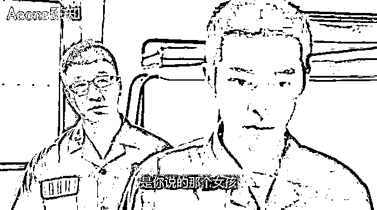

## 他善于收集信息的本事，不排斥造假跟欺骗的行为，哪怕是坐牢出狱后，他还试图造假身份来开始一个新的人生，其结果当然是纸里包不住火。他看不见长久信誉的重要性，以及人格的两面性。

## 他虽然一开始给人一种人为财死鸟为食亡的急功近利形象。

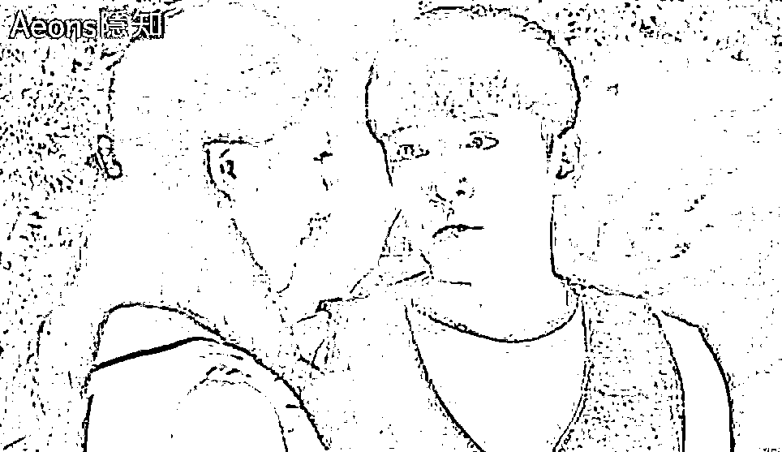

## 所有的双子男都会有这么一个不为人知的一面，胡歌同作为水星类的人，可以说将郑秋冬演绎得入木三分。

## 后来的郑秋冬理解到了【诚信】的重要性，并且决定在此之上重塑人生。向我们展示的，是一个屡经挫折逐渐成熟起来的双子座，他体现出的是社会性，跟社会道德意识，虽然他再次被诱入了盗取银行数据的大坑，但这一次，他做出了正确的选择，勇敢地拒绝了即将到手的几十万，从而获得了高度的好评。

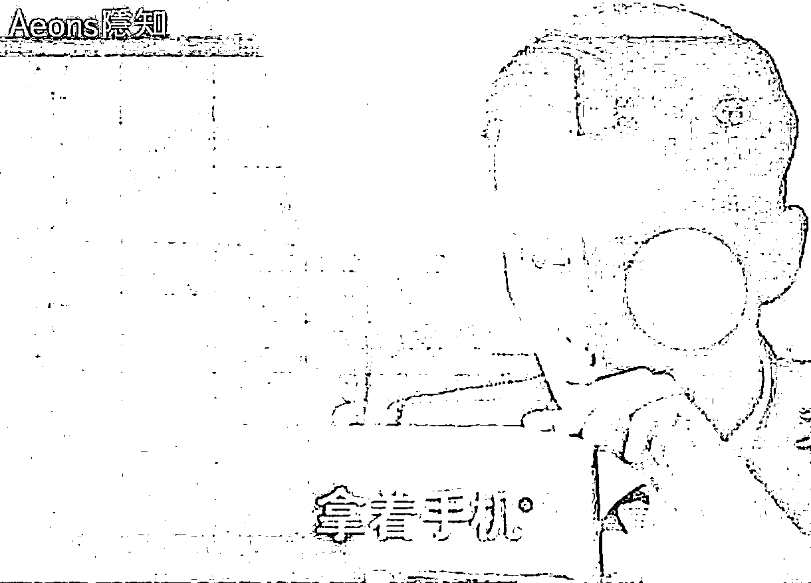

## 每一个双子座的人生中都会走错这么几次，但是作为变动星座的他们，懂得怎么放下先前的错误理念，更懂得怎么重新开始。

# 2.罗伊人：双鱼座（饰演者：菅韧姿）

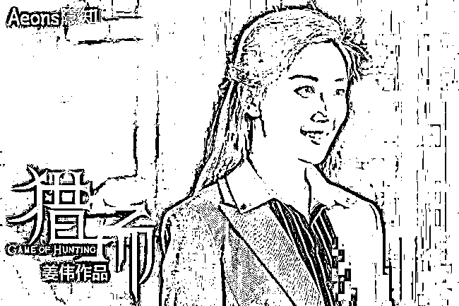

## 罗伊人作为女一，其扮演者菅韧姿是个颇具气质的天枰座，这个可以从她在表演中的高雅气质看出来，不管是平民身份，还是大公司老总身份，她都一直保持着优雅，保持着仙气。这当然是天枰座女生的本质特性之一，但罗伊人却是个不折不扣的【双鱼座】。

## 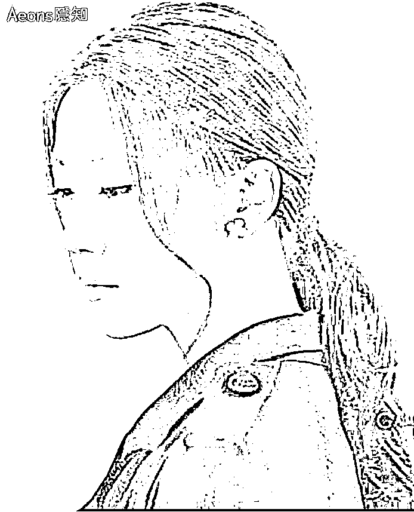

## 罗伊人有着很强的文艺女青年气质，同时对感情却有着很强的念旧性跟依赖性，这是水元素星座的共性，只可惜命苦，第一个老公死了，第二个男友是郑秋冬，郑被抓入狱；再靠着老干部登上国企老总的位置，接着老干部就下马了；再后来又跟救了她的喜剧男走到了一起，然后最后估计又是跟胡歌在一起了。

## 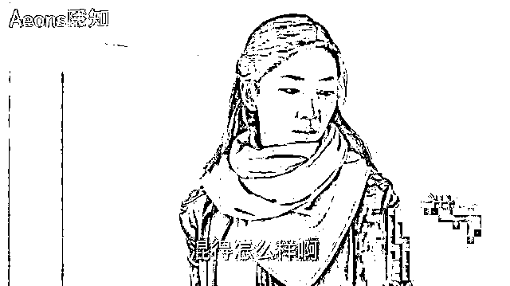

## 这一连串看下来，你可能会觉得她的感情世界是游移不定的，她对每个人似乎都能付出真情，但是每个人都负了她。罗伊人的眼神中总是透着“悲春伤秋”，对她来说，人生似乎就像是一首唱不完的忧伤诗篇。就像那首反反复复出现在剧中的《一场恋爱》，她跟郑秋冬大学时期一起听的歌，歌中充斥着说这个双鱼座女生内心那数不尽的怀念。

## 她跟郑秋冬的感情最长久，但是分分合合，总是走不到一起去。她对过去有着很深的念想，但每次都因为各种原因不得不放弃。

## 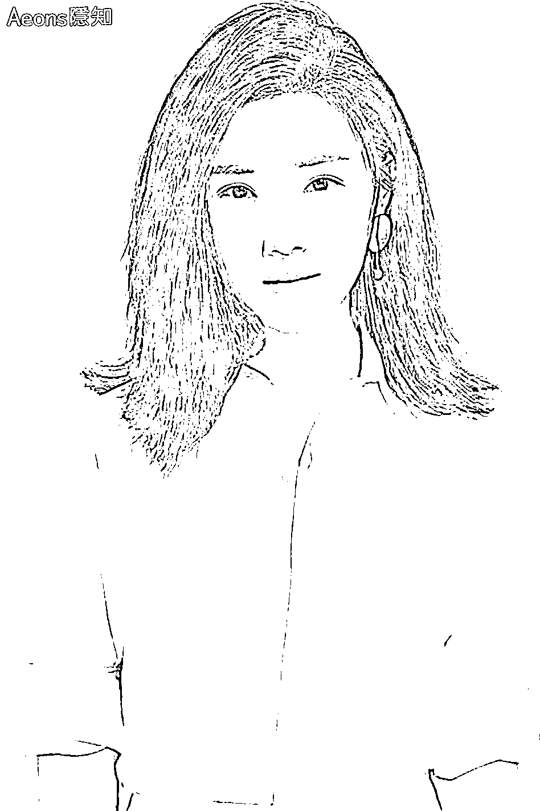

## 双鱼座的女生都是长情的，深情的，她们的美，往往是灵性的，内在的。但是有时候她们的依赖性会很强，在感情的世界里找不到北，这往往就容易让她们陷入一种被动的牺牲者境地。

## 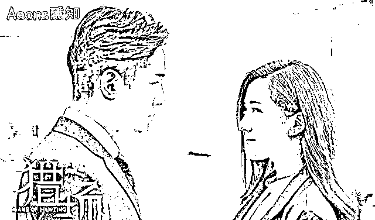

## “错错错，莫莫莫”，也许是双鱼座女生情感世界的最好写照，每个双鱼座的女生在人生的感情经历中，都会经历许许多多的错误跟错过，她们在乎的是内心最深处的感受，为了这种感受，她们可以付出自己的一切，所以有时候她们的二人关系变幻莫测，一切都凭感觉。但是，最终是谁给自己的感觉最深最长久，那这个人就一定是她的最终归宿。

# 3.熊青春：狮子座（饰演者：万茜） 

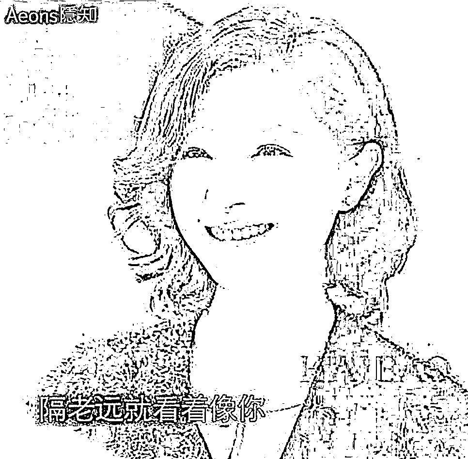

## 熊青春，这个名字先不吐槽….作为女二，她给人的感觉就像是一团太阳，干练的小卷发，月牙弯的笑眼，人称“小妖精“。她搞笑，率真，快乐，她有着所有狮子座都有的宽放的心胸跟霸道，他也有着所有狮子座都有的固执和表演能力。

## 刚出场的时候她就凭借出色的演技敲诈了男主 20 万，但毕竟狮子座人喜欢光明正大，所以她钱还没拿到就声明：“这是借的，会还的”。

## 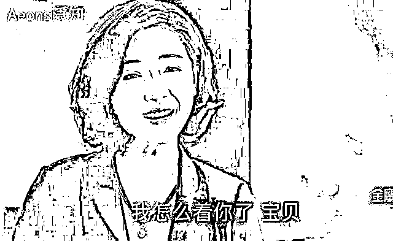

## 熊青春对郑秋冬的好感是毫不掩饰的，直截了当的，女追男对她来说要好过一万遍的矫情。她第一次拥抱郑秋冬的那一段还把我感动了一大把呢。

## 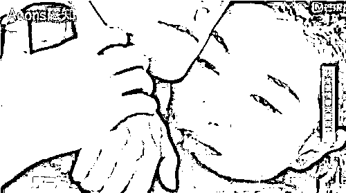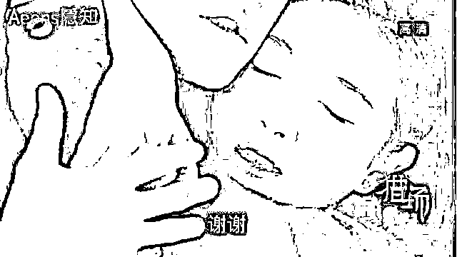

## 熊青春有着非常标准的火元素星座人设，她早期的人设很逗逼，完全不管不顾，但是她豁达明理，处久了你会发现她私下里脾气也大，也会吃醋，也固执，但是她更懂得享受二人世界的快乐。 

## 狮子座的女生从来都敢爱敢恨，但作为固定星座的她们，也都是属于长情的类型。于是，虽然跟郑秋冬都快结婚了，前男友的出现跟旧情却让她做出了狠心的抉择。

## 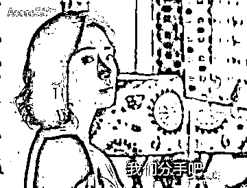

## 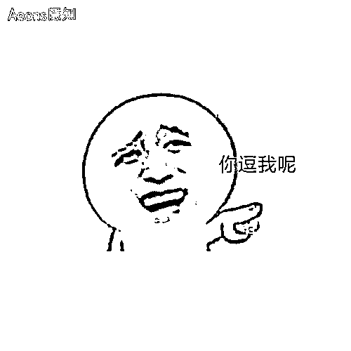

## 有时候狮子女的抉择跟行为可能会显得自私，让人不解，而且是雷打不动的固执，作为火元素星座的她们，也很容易凭着一股情绪跟冲动做事儿，所以，原谅她吧，狮子座的人也会流泪，毕竟快乐只是给人看的，苦水都是自己吞的。

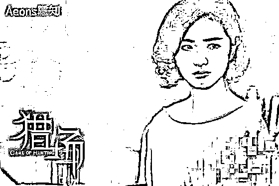

# 4.钟淮兰：天蝎座（饰演者：周放） 

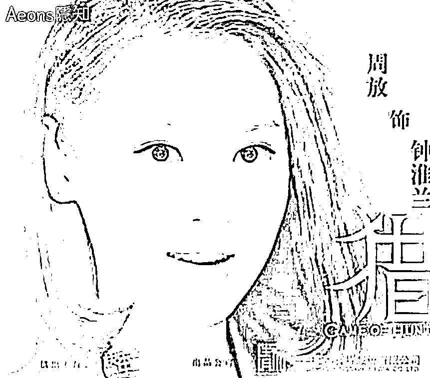

钟律师的戏份其实不多，但是却很出彩。她对自己闺蜜罗伊人的情义当真是演的入木三分。她也是个爱憎分明的人，但是她却没有半点逗逼。钟淮兰的所有出现场合中，她的聚焦点只放在罗伊人身上。天蝎女都是专一的，这不单单是说对感情，也可以对友情，她们喜欢深刻的关系，深入的交流，深度的体会。对于她来说，罗伊人似乎就是她的世界。她的一切喜怒哀乐几乎都关联着这位挚友。

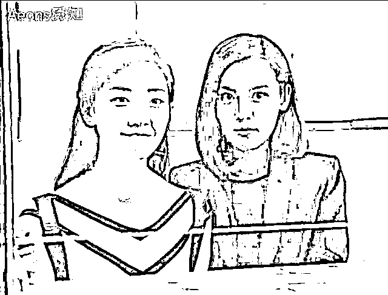

## 天蝎女很讲义气，对于自己关怀的人，她们会有很强的护犊子的心情，任何伤害自己人的人，对她们来说都是恶人。为了她们心心念念的人，哪怕是朋友，她们也可以做到常人做不到的一切，需要她们战斗的时候，她们会为你战斗，需要她们闭嘴的时候，她们也会将一切埋入内心的坟墓。她们的行为永远都充满着决断力，而背后的动机，却是一份深刻的感情。

## 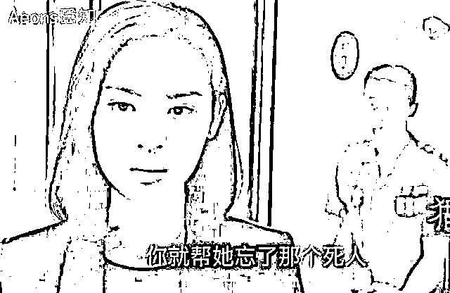

## 天蝎座的女生不苟言笑，洞察力深，办事干练，竞争能力很强，往往可以成为独立的女强人。她们不喜欢太肤浅的东西，笑点跟泪点也都很高。但她们都会是说一不二的人，维护着感情世界的那份已经不多见的真诚。

## 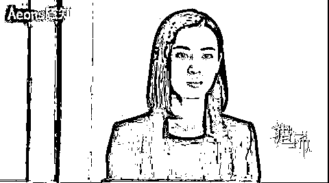

## 5.贾伊玫：？？？（饰演者：章龄之） 

## 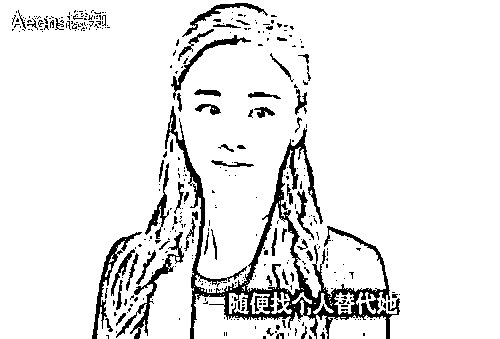

## 作为未来女三，这不都还没什么戏份儿么，我怎么可能知道她什么星座的！目前来看心机很深，崇尚权贵，大家大可一起猜猜她的星座啊？

## 至于有人问我孙红雷饰演的角色什么星座……

## 你逗我呢！他一共才出来了两集！

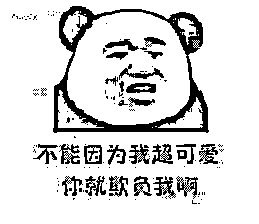

声明: 该文章版权归指引社和作者所有, 转载请保留此行([`www.geaving.com/article/view/id/95`](http://www.geaving.com/article/view/id/95))

# 第 5 期推送调查：指引社的发展，需要你的建议哦~

> 原文：[`mp.weixin.qq.com/s?__biz=MzI5NTQzMDUzMQ==&mid=2247483738&idx=6&sn=e34e526f649af6465acf42a37c018b5d&chksm=ec52f1b6db2578a005a82563682d0039cd97e68a08b1b2202a38639c0cc1af58258275fd815a&scene=27#wechat_redirect`](http://mp.weixin.qq.com/s?__biz=MzI5NTQzMDUzMQ==&mid=2247483738&idx=6&sn=e34e526f649af6465acf42a37c018b5d&chksm=ec52f1b6db2578a005a82563682d0039cd97e68a08b1b2202a38639c0cc1af58258275fd815a&scene=27#wechat_redirect)

**记得点蓝字关注，与好内容相遇**

指引社公众号的每篇文章，都是从每周发布的、或论坛的精品旧文中精选。

每期推送的最后一条，都会放出投票。

选择你喜欢的文章，也可以选择你下期想要看的内容。

指引社公众号初露头角，之后也许会成长为你喜欢的样子。

感谢你的支持。我们会继续努力哒~

📹 /mp/newappmsgvote?action=show&__biz=MzI5NTQzMDUzMQ==&supervoteid=477390150#wechat_redirect

上期分割线

上期投票结果回顾：

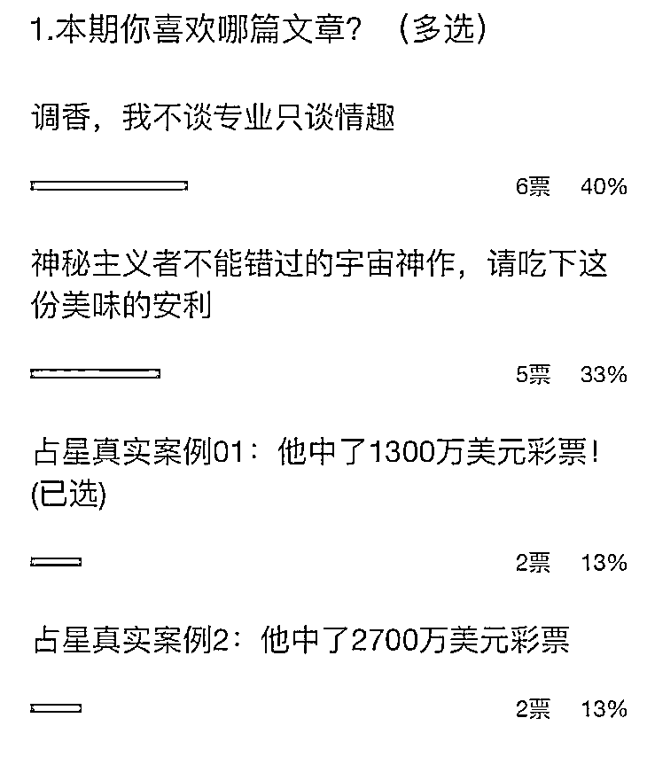

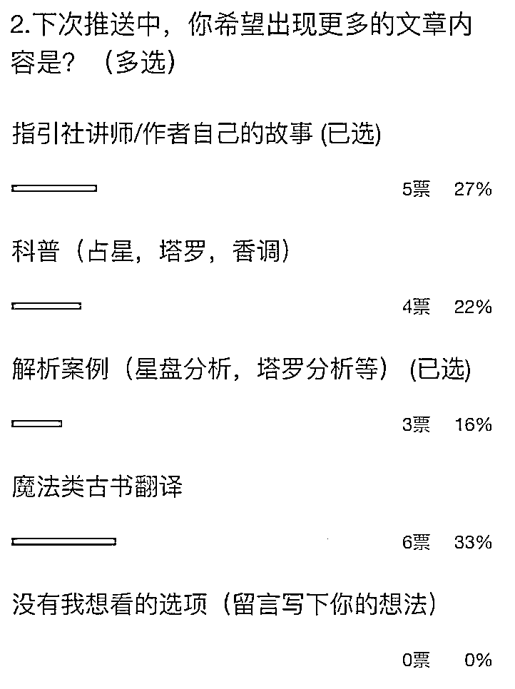

# 调香，我不谈专业只谈情趣

> 原文：[`mp.weixin.qq.com/s?__biz=MzI5NTQzMDUzMQ==&mid=2247483727&idx=1&sn=b520fd6be2298b9e24c5f10235d73ab0&chksm=ec52f1a3db2578b5cd4d683fa5a10e9ad3fb00994b1bbd1c0eb3ce9e8111046b113f013968b9&scene=27#wechat_redirect`](http://mp.weixin.qq.com/s?__biz=MzI5NTQzMDUzMQ==&mid=2247483727&idx=1&sn=b520fd6be2298b9e24c5f10235d73ab0&chksm=ec52f1a3db2578b5cd4d683fa5a10e9ad3fb00994b1bbd1c0eb3ce9e8111046b113f013968b9&scene=27#wechat_redirect)

**记得点蓝字关注，与好内容相遇**

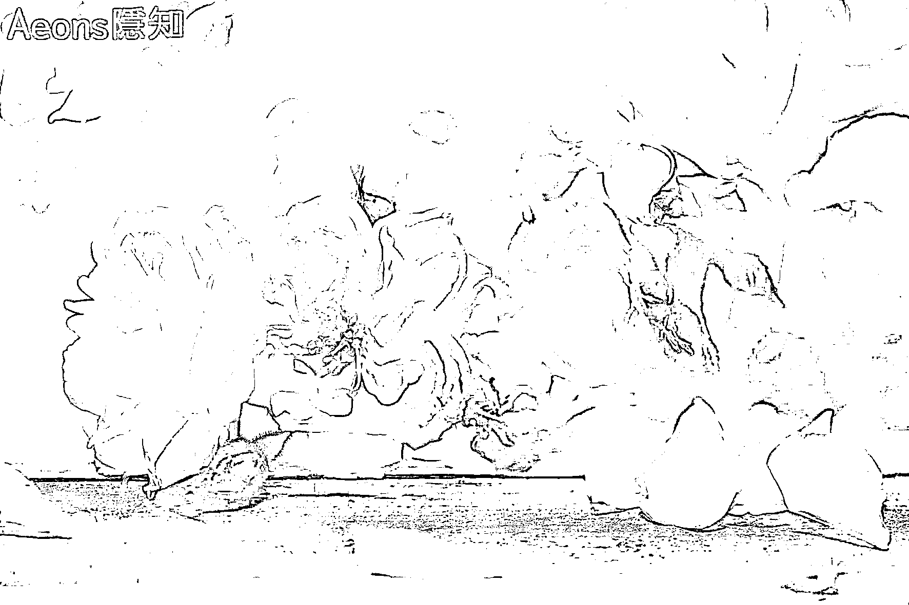

刚接触调香时我觉得调香师都是很“浪漫”的人，在他们的手底下各种气味融为一体，让人痴迷。就像我以前也曾幻想芳疗师，住在森林里，有自己风格的工作室，每天就调调油，活的像个小仙女一样。

直到我开始学习调香的专业知识，老师讲的化学知识当真是给我泼了一盆冷水，让我回想起了初学芳疗时被各种化学分类折磨，痛苦不堪的往事。于是上完基础课程后我就放弃了，说实话基础课上学了些什么我至今都不敢去想，甚至从那以后我开始害怕调香这两个字。

半年后我开始学习各种手作，每当要考虑给作品加香时我总是小心翼翼的，生怕无知的双手和大脑做错什么。

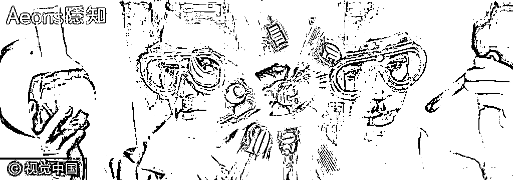

有一天一位前辈对我说，香气的好坏是由心而定，你觉得好，它就是成功的。

突然我开始觉得自己很可笑，又很可怜，很羡慕初入调香这个大坑的新手，总是有勇气去实验自己的各种香气幻想，也许我们一生都该做这样的“新手”，保持这种“勇气”

专业的调香可以说是科学的艺术，涉及到的方面很广，包括

包括

**日用香精调配**

比如香水，化妆品，洗涤用品，香皂，熏香，空气清新剂等。

**食用香精的调配**

比如食品香精，烟用，药用，饲料）  

还有包括塑料用品，

橡胶用品，

人造皮革，

纸张用品等等 

专业的调香香料采用的范围也很广，包括

**动物性天然香料**

分泌物排泄物

**植物性天然香料**

精油，

浸膏，

酊剂，

净油，

香脂等。

**单离香料**

利用物理或化学的方法，从天然香料中分离出来的单体化合物

**合成香料**

通过化学合成，或化学单离方法制取的香料，比如按碳原子骨架分出五种类型，萜烯类，芳香族类，脂肪族类，含氮、含硫、杂环和稠环类，合成麝香类

专业路线显然是不太适合我了，但不代表我再也不会接触调香，后来我在手作课上学到了天然调香这个概念

它是指使用天然的香料（有时候也会使用少量天然单离香料）来进行香气搭配，比起专业调香的复杂晦涩，天然调香就显得平易近人的多。

天然调香它是自然的艺术，现代的天然调香因少量使用单体香料，可以说是人工与天然的互补了。

当我第一次自己成功的制作出酊剂，浸泡油，香膏。

当我第一次拥有了自己的滚珠香水，那种难以言说的复杂感受仿佛为我打开了新世界的大门。

现代香水按照香料做分类，

大致可以分为

花香调（floral）

东方香调（oriental）

柑苔香调（chyper）

馥奇香调（fougere）

木质香调（woody）

绿意香调（green）

柑橘香调（citrus）

辛香调（spicy）

皮革香调（leather）

海洋香调（oceanic）

**东方香调**

是起源于阿拉伯半岛的一种香气浓重又甜美的香调，

是由苔香，木香，辛香结合香荚兰和香膏的甜味，

调入琥珀，灵猫香和麝香韵调的香料。

再配上玫瑰，茉莉的花香，此外还有用贵重的木香作为主题，突出花香的香气，再用清香来修饰的半东方型，比如鸦片香水。

**馥气香调**

非花香香气的典型香型，带有明显的黑香豆和苔香，

且伴有草木香。香精配方通常大量的使用薰衣草油、香豆素等，

所以馥奇香整体香气清香，淡雅，刚毅，带有藻类气息和薰衣草花香。

那么作为一个刚入门的新手来说，首先要做的就是熟悉单种天然香料的气味（前提其你买到的是真的香料），你要牢牢记住它的气味色彩，还有气味变化，最好花三天的时间来单独体验每一种气味，要有意识的去记录你的体验感觉。不仅在学调香时我会这样做，学芳疗时也是从单个单个的体验开始的。天然的香料不仅有复杂变化的气味，还兼有着各种身体疗效，我们使用它们调香，不仅可以取悦鼻子，还可以取悦身体。（当然这都是后话了，新手根本不必考虑那么多，否则会畏手畏脚）

我们熟悉了各种香气之后，可以开始尝试自己亲手萃取气味了，方法很多，以后我会一个一个来介绍，这里说一个最简单的浸泡方法。

浸泡法就是直接把香料浸泡在溶剂里（纯水，甘油，植物油，矿物油～指的是白油，乙醇，乙烷等）。将芳香物质溶解出来就可以了。如果要萃取单宁酸等水溶性的成分，那么用水，甘油，或者乙醇，想要萃取芳香物质等油溶成分用植物油，乙醇或者乙烷，都想要的话就单用乙醇。

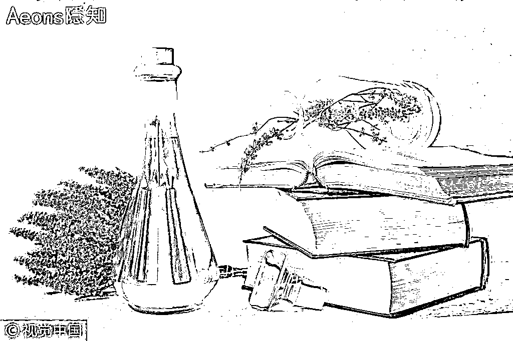

萃取前把材料要处理好，比如坚硬的材料要碾碎，新鲜材料要阴干（不阴干会发霉），阴干后剪去没有气味的部分，然后切碎，帮助香气比较好被萃取出来。

用油萃取时要选用比较不容易变质，无味无色又稳定的油，比如分馏椰子油，矿物油

选择一个干燥的带盖玻璃瓶，把材料放入瓶子中约四分之三的满，然后加入油品，刚好淹没材料为止，旋紧瓶盖摆放大概一个月（天气好的时候拿出去晒太阳），然后用纱布过滤，过滤后的油品再次加入材料，这个过程可以反复几次，以增强浓度。

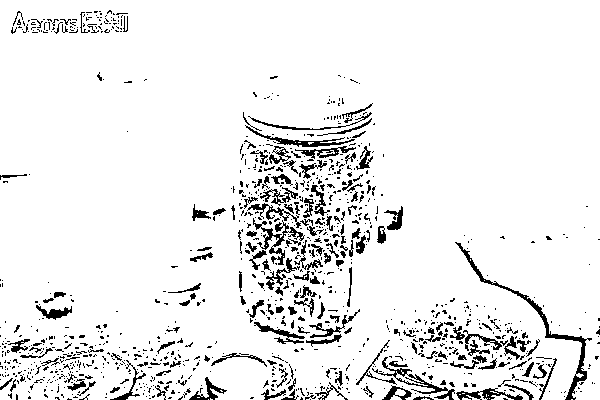

用矿物油萃取的香油不能直接使用在皮肤上，而是要拿来制作乙醇萃取液

方法就是直接把乙醇倒入矿物油萃取液中，然后旋紧瓶盖，剧烈摇晃，静置几十分钟后可见分层（乙醇密度比油低）此时矿物油中的香气成分已经融入乙醇中了，再把乙醇分离出来就可以了。

浸泡法还可以用酒精来制作酊剂

可直接用 95%的纯酒精制作，方法如上，不用日晒。直接反复更换材料。得到的酊剂可以制作凝香体（用乙烷与酊剂以液对方式萃取）方法如同上述的乙醇萃取矿物香气。香气成分融入乙烷之后，用不超过摄氏 60 度的低温加热方法蒸发，得到的就是凝香体，如果萃取的材料植物腊，色素等杂质含量少，那么它就是原精

同样乙烷也可以浸泡材料，方法和乙醇一样，得到的是乙烷萃取液，用酒精灯隔水加热后得到的就是原精

**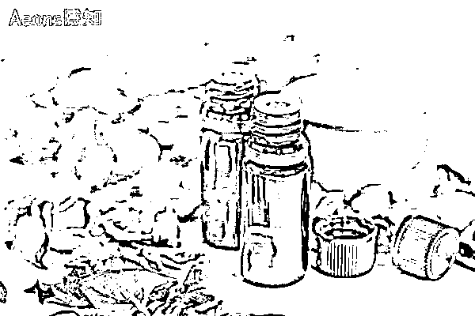**

在学会自己萃取香气后就可以开始尝试简单的气味组合，通常是两至三种的气味相似或者互补的组合，你需要掌握一些简单的组合法则和累积组合经验。熟悉了这些之后要做的不是急着去创香，而是多去闻闻其它大佬的天然香水作品，去模仿他们，叫你完全复制出来是不可能的，但是你可以去模仿那种感觉，很多大佬会把前中后调的主诉气味写出来，你可以进行参考，在模仿感觉的时候你就可以在前中后调的主诉上加入自己的创意来自由发挥了～

以上就是本帖的全部内容了～下帖再见啦～

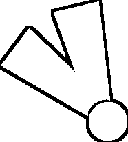

**慎小七**

芳香草药·专栏食用指南

慎小七，指引社矿灵学院管理，医学世家出身，芳疗师，常年调香爱好者跟实践者，草药专家。

本系列为慎小七原创出品，涉及芳香、草药等专业知识。

文案｜指引社·慎小七

排版｜指引社·阿烬

指引社，致力于让“神秘学”走向大众，不再“神秘”。杜绝神棍，欢迎撩或聊

长按二维码关注我们

点击“阅读原文”，去指引社看原贴

本文首发于指引社论坛，

文内图片素材皆来源于网络。

文章内容纯属娱乐。

# 神秘主义者不能错过的宇宙神作，请吃下这份美味的安利

> 原文：[`mp.weixin.qq.com/s?__biz=MzI5NTQzMDUzMQ==&mid=2247483727&idx=2&sn=dc2f2789b8491fba7a19eed14b869b53&chksm=ec52f1a3db2578b5ed39e8dcf12d8feecf899c9bb7a0db32b10d3ca08196f0af1bc2eda1c6c0&scene=27#wechat_redirect`](http://mp.weixin.qq.com/s?__biz=MzI5NTQzMDUzMQ==&mid=2247483727&idx=2&sn=dc2f2789b8491fba7a19eed14b869b53&chksm=ec52f1a3db2578b5ed39e8dcf12d8feecf899c9bb7a0db32b10d3ca08196f0af1bc2eda1c6c0&scene=27#wechat_redirect)

**记得点蓝字关注，与好内容相遇**

### 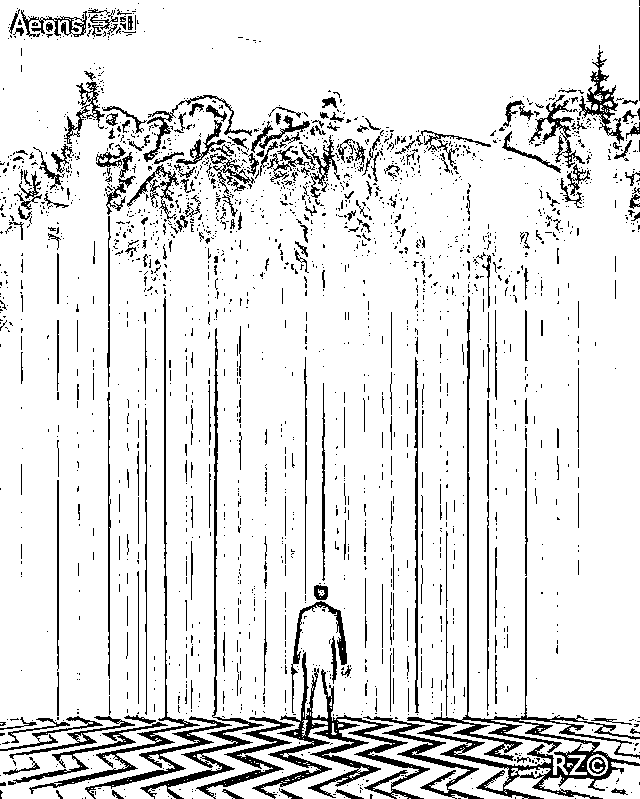

### 　　《Twin Peaks 双峰》是一场美国式的神秘主义盛宴。

### 　　在这里，有上古邪神和外星人，天使和魔鬼，科学家和魔法师，附体和异能，了不起的 FBI 和各种危险的神经病，然而你却很难发现他们；有西方的魔法，东方的修行，穿越时空和异次元，追寻永恒的哲学问题，但是你看不到任何炫酷的闪光特效；有印第安传说，共济会秘闻，UFO 探索史，虚虚实实，在谣言和真相的边缘游走，玩味着你的洞察力。

### 　　与哈利-波特那个充满想象和激情的魔法世界相反，《双峰》的表达更接近《女巫布莱尔》，一个诡异、阴郁、难以理解的神秘世界，建立在平淡的现实和深沉的隐喻上。类似日常生活的经验，通过那些你习以为常、甚至单调无趣的感官语言，大量被忽视的信息碎片遗失了，又在灵光一闪的不经意间重组，形成复杂多面或模糊不明的解读，例如梦。

### 　　这种表面写实、内里空灵的事物，通常是两面不讨好的，例如量子神秘主义，例如朱清时。当你试图把看似矛盾的两面结合起来时，站在两面的人们总会随着各自的习气排斥对方，同时排斥这种结合。他们已经习惯了待在自己的安全区域，很难理解矛盾的两面在本质上是统一的。

### 　　所以《双峰》一直很小众，尽管它收服了很多奖项，尽管它有很高的艺术魅力，然而喜欢它的人中有很多反感它的神秘倾向，神秘主义者也未必会喜欢它的表现手法。

### 　　和大卫-林奇的其它影视作品一样，《双峰》受到最多的诟病是“看不懂”和“节奏慢”，尤其是第 3 季。

### 　　《双峰》的故事很简单，前两季的剧情可以总结为：谁杀害了我们美丽的校花？第 3 季的剧情则是：怎么摆平凶手？然而林奇有着天才般无以伦比的叙事手法，只描绘事实，不告之真相，随后开心的看着观众各种盲人摸象。

### 　　有人说林奇就是为了让人看不懂而看不懂，然后再加入一些有迹可寻的暗示，忽悠观众反复看，研究出各种解读。

### 　　事实证明，这只是又笨又懒的小人之心。

### 　　从林奇的经典电影《穆赫兰道》中我们已经领教过，女神闹米混乱的梦境下藏着一位多么厉害的弗洛伊德。和《穆赫兰道》一样，《双峰》不仅是意识的，也是结构的，还是逻辑的。

### 　　作为一部悬疑侦探剧，庞大而错综复杂的多线悬念设计，如同海面下的冰山，足以让任何喜欢推理的人沉溺其中。各种线索的拼图解读，已经成为欣赏《双峰》的一个流派，每播出一集，都会引发潮水般的热烈讨论，大家搜罗最新的线索，推理事件逻辑。群众的力量是巨大的，哪怕像《双峰》第 3 季伏线千里暗器丛生，甚至在某些集使用镜像结构来建立对称的剧情，需要两三个播放器同步播放才能看到的互补对仗，都会被群众雪亮的眼睛发现。

### 　　1990 年，《双峰》第 1 季播出后意外的大受欢迎，虽然为了照顾收视率，作为主创的林奇在第二季失去了主创权，无法控制剧情走向“逐渐变味”和“面临毁灭”（林奇语），但它还是成为了当代美剧模式的开创者，改变了之前美剧产业不健全的部分，建立了一套可供后世借鉴的完整系统。自此，《双峰》一直被模仿，从未被超越。

### 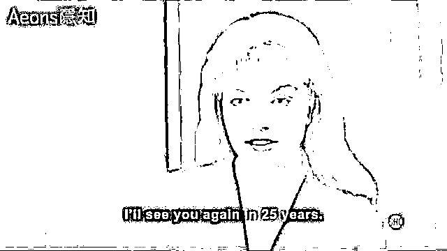

#### “25 年后再见”，第 2 季结尾时女主讲出这句神秘的台词，于是第 3 季就真的在 25 年后见了……

### 　　2017 年，当 25 年之约到来时，《双峰》第 3 季任性回归。

### 　　取得全部剧集主创权的大卫-林奇，已经是终身成就奖的七旬老顽童，深谙影视传达逻辑和类型预期的化石级高手。

### 　　收视率算什么？David Lynch doesn't care what you think. 

### 　　复仇的时间到了（对好莱坞电影工业）。《双峰》这个美剧模式的变革者，在自己曾经开创的模式中又以叛逆者的身份再次登场。

### 　　第 3 季出现了大量先锋艺术手法的实验影像片段，林奇的个人风格也发挥到了极致，展现了氛围大师的各种绝活，这大概是美剧史上最丧病、最震撼的超现实主义作品，其中第 8 集用了 20 多分钟致（chao）敬（yue）《太空漫游 2001》，地球人已经拦不住林奇飞向宇宙了~

### 　　在视觉表现上，前两季怀旧的 50 年代暖色调，变为科技时代的阴冷暗黑调，故意的梅里爱（Georges Méliès）式五毛特效丢你一脸，带着无生命的僵硬和反自然的诡异，cult 感爆棚。

### 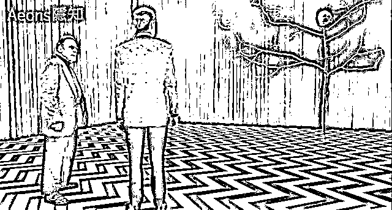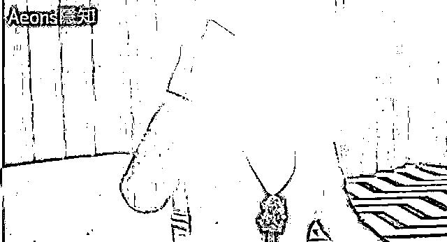

### 　　配乐和音效，没有了技术条件限制，更加的精致和瘆人。

### 　　叙事和意境，更加卡夫卡，甚至林奇客串的 FBI 局长办公室里都挂着卡夫卡的肖像。

### 　　“在悬念的逐渐升温中又包含了极度耐心”的慢节奏和长镜头，有时会慢到令人怀疑人生，像失去了时间长度的噩梦，在其中你行动困难，言语吃力，焦虑四伏，却不明所以。

### 　　最让人不安的是，梦境和现实逐渐模糊了边界，被压抑的无意识恐惧在黑暗处蠢蠢欲动，隐藏在平常生活下的古怪事物开始显露……一切变得越来越紧张……突然梦醒了，一切都恢复“正常”……然后又一个梦开始了……如此轮回不断……

### 　　然而现实世界的真相不正是这样吗？JUST A FEELING。这就是林奇通过影像艺术传达的真理，也是他费尽苦心营造氛围的目的。恰好可以对比佛洛依德所说的，“人并不是自己房子的主人”，而是主体完成“自我认同”、缝合“他者的凝视”之类的“场所”。

### 　　没有哪部美剧，能像《双峰》第 3 季这样完全抛开市场和受众因素，如此任性地描绘一个唯心的世界。它又一次颠覆了电视剧的制作模式，在看重收视和收益的美剧圈，大概会成为只能膜拜而不能模仿的传奇。

### 　　或许在某个安静的夜晚，你可以准备好热咖啡和甜甜圈，打开《双峰》，进入林奇的梦中，然后像他所说的，“当我们醒来，发现这是个梦，我们才能明白自己是谁。”

* * *

### 双峰系列的观赏顺序：

### 双峰第一季（1990 电视剧）→

### 双峰第二季（1990 电视剧）→

### 双峰：与火同行（1992 电影）→

### 双峰：遗失的碎片（2014 花絮电影）→

### 双峰第三季（2017 电视剧）→

### 双峰：神秘史（2017 小说）→

### 双峰：最终档案（2017 小说）

### 可选补充资料：

### 劳拉的秘密日记（1990 年小说）

### 库珀前传（1991 年小说）

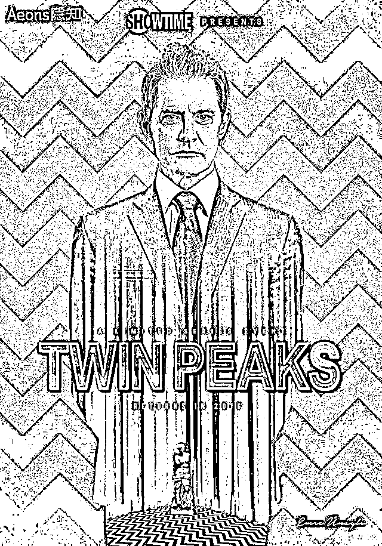

本文首发于指引社论坛，

文内图片素材皆来源于网络。

文章内容纯属娱乐。

点击“阅读原文”，去指引社看原贴

> 原文：[`mp.weixin.qq.com/s?__biz=MzI5NTQzMDUzMQ==&mid=2247483727&idx=3&sn=adefd0a6d8b8f11eb7ae687007cb3103&chksm=ec52f1a3db2578b5174ea797f043250a815733e09ce8a9b993baaaece4d7eb2a59017853a7b9&scene=27#wechat_redirect`](http://mp.weixin.qq.com/s?__biz=MzI5NTQzMDUzMQ==&mid=2247483727&idx=3&sn=adefd0a6d8b8f11eb7ae687007cb3103&chksm=ec52f1a3db2578b5174ea797f043250a815733e09ce8a9b993baaaece4d7eb2a59017853a7b9&scene=27#wechat_redirect)

None

# 占星真实案例 2：他中了 2700 万美元彩票

> 原文：[`mp.weixin.qq.com/s?__biz=MzI5NTQzMDUzMQ==&mid=2247483727&idx=4&sn=d273496dcbadcdf53545559222d4745c&chksm=ec52f1a3db2578b555181f9fe495d47ddfcdecdc7e54d03493b6fac16f0f0eee02f82cce5ae9&scene=27#wechat_redirect`](http://mp.weixin.qq.com/s?__biz=MzI5NTQzMDUzMQ==&mid=2247483727&idx=4&sn=d273496dcbadcdf53545559222d4745c&chksm=ec52f1a3db2578b555181f9fe495d47ddfcdecdc7e54d03493b6fac16f0f0eee02f82cce5ae9&scene=27#wechat_redirect)

**记得点蓝字关注，与好内容相遇**

译者 | 阿克

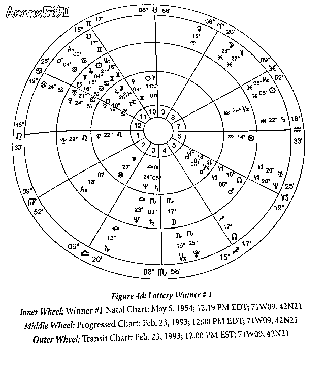

此人的本命盘上有个明显的“百万富翁相位”，木星三合海王星（120 度）；同时，他的木星合了月亮，加上与海王的连结，构成了一个令盘主富得流油的配置。这个百万富翁相位暗示着富裕和奢侈的生活方式，此中月亮的存在则强调了幸运、利益与成功。这个配置亦令人拥有和谐的家庭生活。当形成正面相位时，海王意味着事情处于更为轻松喜悦的状况。而本命盘中那些与发光体相关的相位暗示着盘主在中奖之前就已有贵人鼎力相助，令其做起事来得心应手，游刃有余。

盘主上升落在狮子座，命主星太阳高悬在盘中并有着良好的相位，暗示着此人的人生中将有一次极高的飞跃。落在金牛座的太阳意味着财物的获取，而在火星三合的助力下，盘主拥有强大的生存意志与竞争心，保证其在人生中可为自己取得所需的事物。那些拥有此相位的人经常能赢，尤其是在各种竞赛或辩论中。

盘主的 5 宫头落在射手座，木星作为 5 宫的宫主星掌管着赌博与投机，故而木海三分相位也暗示了盘主能够通过投机获得钱财的潜力。盘主的火星亦落在 5 宫摩羯座，六合了土星，同样也显示了钱财通过赌博而来。落于 5 宫的北交点亦显示了通过 5 宫所象征的活动获取钱财的潜质。而盘中的日土三合也强调了这一点。

从出生盘的容许度来看，盘主的木星近似于与土星成三分相，并且是处于入相位的状态。这个配置提供了能够令盘主终生获得财富的潜质。大约在出生后三十七天的时候（等同于盘主生命的第三十七年），推进的木星与本命盘土星粗略呈三分相位，这个推进的相位将一直持续到盘主 46 岁。

Howard（本案例的盘主）彩票中奖是在他的 39 岁，他推进的木星恰好在容许度内与本命土星呈三分相位。与此同时，推进的火星亦与本命土星呈六分相。由于火星在他本命 5 宫内是一个重要征象，故而此配置强烈地提升了他的运气。

盘主推进盘的上升点宫主星是水星，并正与本命太阳成六分相。这个相位再次建立了以上二者的联系（本命盘中日水合相），增加了他获得终生财富的机会，并暗示了商业上的成功。一些与律师或代理机构的相关的事件将会带来利益。

盘主推进的月亮落在天蝎座，亦影射着与财产相关的事件。且推进的月亮正与推进的上升点和本命盘北交点各呈六分相，而后两者则互呈三分相，预示着丰厚的收入。

这里还有一些精彩的行运相位。行运的土星与本命盘上的百万富翁相位（木海三合）成三分相，提升了盘主获得终生财富的机会。行运的冥王星三合推进的金星，象征着积聚的资产与资源。这些相位昭示了复数的幸运象征，而最显著的时间点指示者则是行运的太阳。在盘主赢得彩票的当日，行运的太阳与推运盘的火星呈六分相，与推进的木星和本命土星各呈三分相，而以上三颗行星正是盘主本命盘中通过风险获得利益的重要象征。

# 第 4 期推送调查：指引社的发展，需要你的建议哦~

> 原文：[`mp.weixin.qq.com/s?__biz=MzI5NTQzMDUzMQ==&mid=2247483727&idx=5&sn=a13ec688cbb7852554a2484fca944871&chksm=ec52f1a3db2578b5ea7c30b0f8da574c20a60f8e7428e56dd00f5a731464f715c0f0638633ea&scene=27#wechat_redirect`](http://mp.weixin.qq.com/s?__biz=MzI5NTQzMDUzMQ==&mid=2247483727&idx=5&sn=a13ec688cbb7852554a2484fca944871&chksm=ec52f1a3db2578b5ea7c30b0f8da574c20a60f8e7428e56dd00f5a731464f715c0f0638633ea&scene=27#wechat_redirect)

**记得点蓝字关注，与好内容相遇**

指引社公众号的每篇文章，都是从每周发布的、或论坛的精品旧文中精选。

每期推送的最后一条，都会放出投票。

选择你喜欢的文章，也可以选择你下期想要看的内容。

指引社公众号初露头角，之后也许会成长为你喜欢的样子。

感谢你的支持。我们会继续努力哒~

📹 /mp/newappmsgvote?action=show&__biz=MzI5NTQzMDUzMQ==&supervoteid=477196291#wechat_redirect

# 大双子特朗普来了：双子座的“精分”可以有多分？

> 原文：[`mp.weixin.qq.com/s?__biz=MzI5NTQzMDUzMQ==&mid=2247483720&idx=1&sn=f521f9a2bc65627fe473a12a2612a171&chksm=ec52f1a4db2578b2314b3247bf30f1887f85be6fe3c86933f77d8d6dd09fbf91b76f1fdf8430&scene=27#wechat_redirect`](http://mp.weixin.qq.com/s?__biz=MzI5NTQzMDUzMQ==&mid=2247483720&idx=1&sn=f521f9a2bc65627fe473a12a2612a171&chksm=ec52f1a4db2578b2314b3247bf30f1887f85be6fe3c86933f77d8d6dd09fbf91b76f1fdf8430&scene=27#wechat_redirect)

**再不点蓝字关注，就要错过好内容啦**

我们是谁？

双子座！

我们要什么？

啥都要！

什么时候要？

现在要！

11 月 8 号到 10 号，史上第一位推特治国的总统，即将出现在中国！

大众几乎不关注政治，但提到特朗普，所有人都仿佛看到了一个八卦明星……

因为这位总统，全世界都向美国投去同情的目光。

而对“总统”这么正经的两个字，从来都没啥兴趣的我国人民，对这位红遍天下的总统，仿佛憋了一肚子的段子……

开（wan）创（huai）了社交平台治国的特朗普，为毛那么精分！

因为他就是 12 星座中最精分、最跳跃、最不着调的**双子座**呀！

特朗普可能是“**双子座**”这种生物的代表，正打算用他们的精分占领地球！

欢迎大家来到动物世界，看看双子星人的特色，随时鉴双，随地避难！

01

爱好广泛，还学得超快

仔细看看你身边的双子座，可能很多时候，你都觉得他们超！有！才！

我们先来看看本次的样本：特朗普，美国总统。

同时他也是：政治家，商人，作家，主持人

总统当然可以是政治家！

各国领导人，当然也都涉猎广泛，随随便便挑个人出来，都可以是思想家军事家还出过各种书！

但……

但是…………

你见过谁家总统是主持人的！主！持！人！

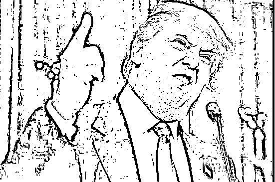

作为一个表情包生产大户，特朗普即便当总统，也没停止过自己的娱乐生涯和地产生意！

你以为他会的多，因为他是总统？

不，我迅速扫描了身边的双子座们……

我大学时期是学外语的，作为一个外语学渣，至今印象深刻的是，某个双子学霸同学，他不仅外语牛逼……且……还会 N 门外语。

然后，我发现，他会说相声，在学校里开演出的那种。

然后，我发现，他还会唱歌，参加某好声音的海选结果还入选的那种。

然后的然后，丫还会看八字！看八字！！！毕业后工作太无聊，于是自己去开了个国学工作室的那种……

至于其他的双子座们，干广告的会几门外语，一点都不奇怪。

干房地产的业余当程序员，好像也没什么不对。

某个珠宝设计博士，自己去开了个 Java 工作室，貌似也没什么不对……

嗯……这个充斥了天才的世界，对我们这些踏实努力挣辛苦钱的人，还会好么……

02

根本停不下来

作为一个娱！乐！节！目！的主持人，特朗普的口才不用多说了。

然后，让他一炮成名的“推特治国”，那是连国务院和外交部都拦不住的表达欲啊！

快别奢求你身边的双子座闭嘴了！

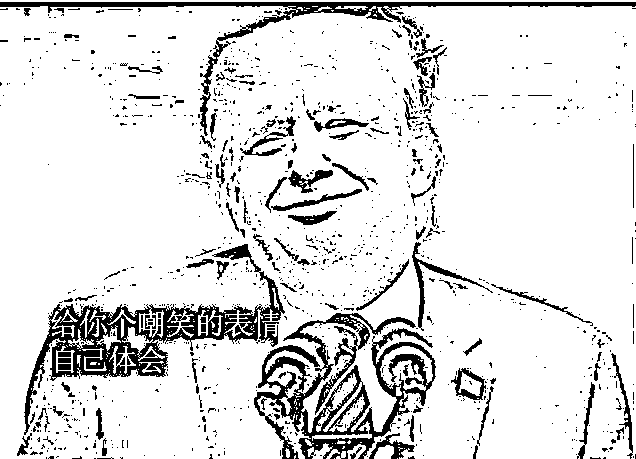

特朗普只是万千双子座中的一个，我看着身边的双子座同事，再次顺手把我的充电线打了个蝴蝶结，

感觉这个双子座活跃的世界，对我真的是太不友好了！

03

多情又专情

“花心大萝卜！去死去死！”

豆瓣的双子座去死去死小组早就火到一线，

而双子座一向自诩专情，毕竟他们谈恋爱的时候，真的很专情。

来看看咱们的世界红人——特朗普先生专情的婚姻

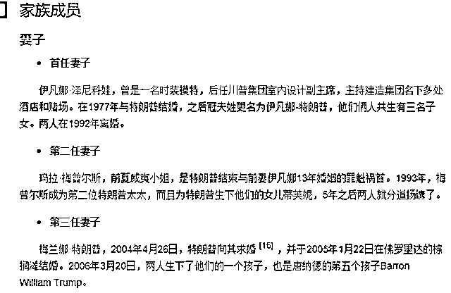

嗯，没错，对“每。一。段。感情”都很专情。

┓( ´∀` )┏感情来的快去得快就像龙卷风，没感情的关系，谁要一直耗下去啊！

身边的双子座们，不乏三年感情五年起步的，但……

无趣的感情，他们分分钟就忘给你看！

04

逼格和自黑两不误

已经是世界第一大国的总统了，按理说，即便不是端庄高贵，也多少会想办法收拢收拢舆论吧？

特朗普：屁咧。

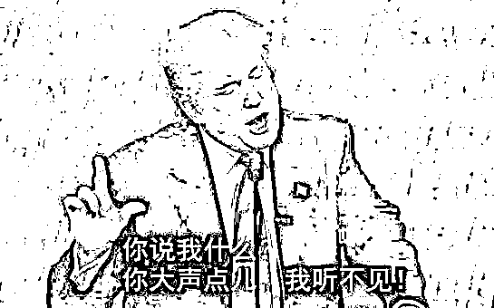

这个拥有纽约市最值钱的公寓，地产遍布美国的大双子座，

还用自己的名字开了大学命名了杂志同事顺便还开了酒吧。

动不动入选《时代》年度人物，动不动上个《时代周刊》年度人物，即便不当总统，这货的逼格也一点不低。

然而，作为一个 Diss 全世界，也被全世界（和自己的人民）Diss 的总统，特朗普的自黑功力也算是登峰造极（虽然不知道是不是故意的）

或者，把“自黑”换个说法——任性！

随便参加个什么竞选，如果大差距输给竞争对手，直接不露面。

被美国的各类综艺黑成一坨，发个推特嘴炮一下了事。

而特朗普的表情包，更是成为了小编的库存大户。

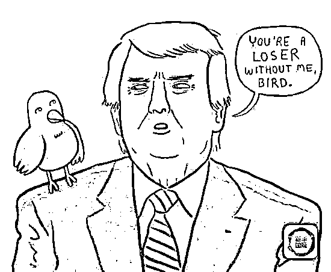

总之，今天，中国人民欢迎你！

中国人民的表情包库，更加欢迎你！

另外：

别忘了问问

你身边的双子座

**他们是否也有个**

**“推特治国”的理想？**

排版｜指引社·阿烬

文案｜指引社·

指引社，致力于让“神秘学”走向大众，不再“神秘”。杜绝神棍，欢迎撩或聊

长按二维码关注我们

点击“阅读原文”，去指引社看原贴

本文首发于指引社论坛，

文内图片素材皆来源于网络。

文章内容纯属娱乐。

# 《权力的游戏》中猜猜 TA 们的星座？

> 原文：[`mp.weixin.qq.com/s?__biz=MzI5NTQzMDUzMQ==&mid=2247483720&idx=2&sn=6f0535d4023c71e4b2ab11af100c6497&chksm=ec52f1a4db2578b2f7c7f3dc4ecd59cd7ead3ed232db9dbd5cc69c8131b6f143cfdd8ab78a11&scene=27#wechat_redirect`](http://mp.weixin.qq.com/s?__biz=MzI5NTQzMDUzMQ==&mid=2247483720&idx=2&sn=6f0535d4023c71e4b2ab11af100c6497&chksm=ec52f1a4db2578b2f7c7f3dc4ecd59cd7ead3ed232db9dbd5cc69c8131b6f143cfdd8ab78a11&scene=27#wechat_redirect)

**再不点蓝字关注，就要错过好内容啦**

美剧《权力的游戏》上映了已经七季，好评如潮，其中的每一个人物都刻画的栩栩如生，千姿百态，那么在这堆人物中，你看得出他们是什么星座的吗？

白羊座：艾丽娅

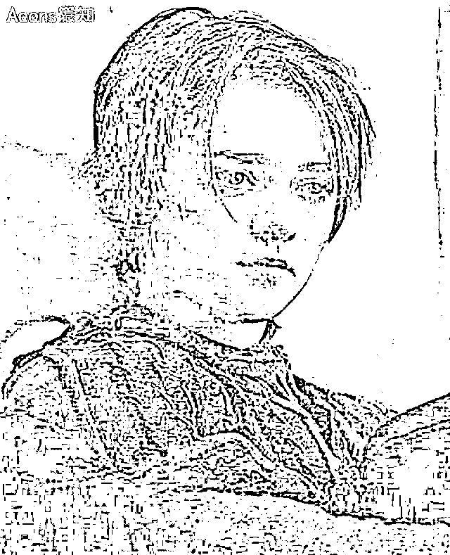

**外号：二丫**

二丫从小有着男孩子的脾气，开朗，讲义气。从小就爱舞刀弄剑，跟其它女孩子截然不同，她的梦想是当个女骑士，而她的经历了一个很与众不同的生存经历，不依附于别人，不依赖于别人，不通过玩弄权利而谋生，也没有成为过任何人的领袖，她是一个独立的生存者，就像所有的白羊座一样，她有着自强不息的精神，有着相当艰苦的求生环境（在无面者那里），但她一次又一次的拼斗，胜出，最终成就了一个人消灭一整个家族的传说。但就算如此，她依然直率，毫无遮掩，对半死不活的猎狗见死不救，转身走人（白羊座刑克巨蟹座）。

这就是经典的白羊精神！

金牛座：波隆

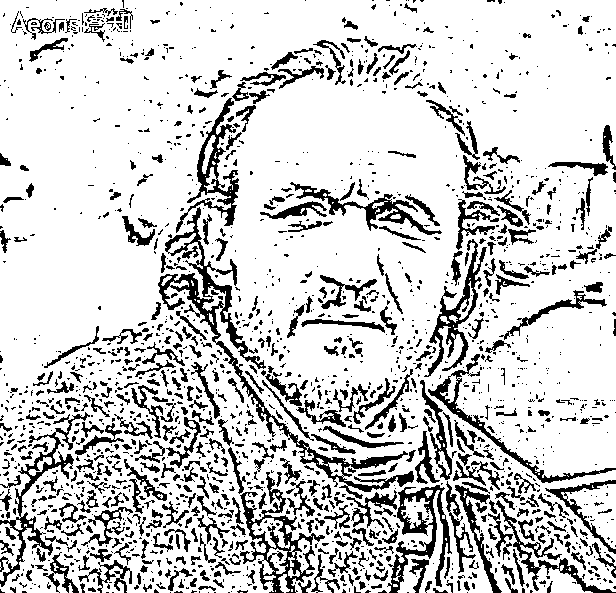

**博隆**

雇佣兵出身的波隆是个非常务实的人，他懂得享受生活，而且他的人生目的也很明确：“我要金子，要好吃的，要女人，要城堡“，你只要给他钱，只要份量够，波隆就会愿意为你做事，他的人生理念就是这么简单，有利益的事情，就是我要做的，没有利益的事情嘛，除非你真的跟我是好基友（比如詹姆）

双子座：提里昂

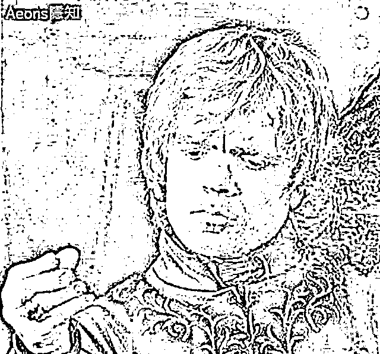

外号：小恶魔

从第一季开始，提里昂的亮点，除了身子矮以外，当然就是他的才智了，他的理解能力，辩才，都是一流的，他喜欢看书，有学识，爱调侃。不过，虽然是个社交跟行政能人，但提里昂的内在却跟大部分双子座一样是内心孤独的，他的家人鄙视他，看不起他，以他为耻辱（就是因为长的矮）；他从来没遇到过一个真正爱着自己的人，唯一的一个还成了自己父亲的恋人….他好不容易漂洋过海来做漂亮女王的私人助理，结果第七季结尾龙妈跟雪诺上床了…..他有着双子座的两面性，你最认为他不可能干出什么激动的事情时，他居然把他爸射死在了马桶上…….小恶魔，他有时候真的需要自己一个人静一静…..

巨蟹座：桑铎·格雷冈

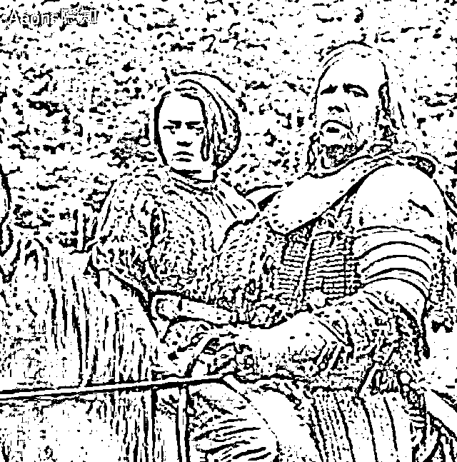

外号：猎狗

狗叔啊狗叔！虽然半边脑袋秃得满满朋克风格，但是看久了还是有点帅帅的是波~

毫无疑问猎狗是巨蟹座啊！这一路带孩子的风格….保护欲极强，有着来自童年的创伤，内在里是个很温柔的大叔呢~虽然他本人肯定会否认着点，但骨子里的这股言不由衷很巨蟹的有木有！！

狮子座：詹姆.兰尼斯特

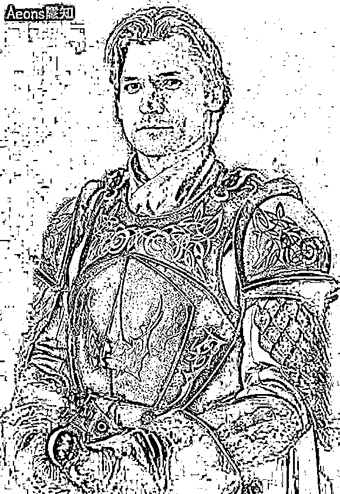

外号：弑君者

詹姆是个复杂的人，一出场就是个一身金色御林铁卫铠甲，一头帅气的金发，活脱脱金太阳一个，风流风趣又不失战斗能力跟勇气。但偏偏是这个人，杀死了疯王，背负了弑君者的骂名；偏偏是这个人亲手将熊孩子布兰推下了高塔；詹姆的行事作风，理念很简单，就是保护自己想要保护的，行使自己觉得应该行使的事情。其实从头到尾，没有人能够真正驾驭他，他骨子里透露着一股“自己说了算”的胆识，就连最后瑟后让魔山拔刀架在他的脖子上，他也义无反顾地转头就走，毫不畏惧。狮子座是勇敢的，他的勇气让他为了保护君临的人民而奋起弑君，狮子座是一诺千金的，他的一诺千金让他宁可背叛瑟后也要率军北上加入更伟大的战斗。狮子座是痛恨出丑的，为了遮丑他也残忍地将布兰推下了塔楼。但每一个狮子座的心中，都想要成就一个“英雄”，最终，詹姆选择去做一个英雄该做的事情，而不是变成任何人的傀儡。

处女座：佩提尔.贝里席

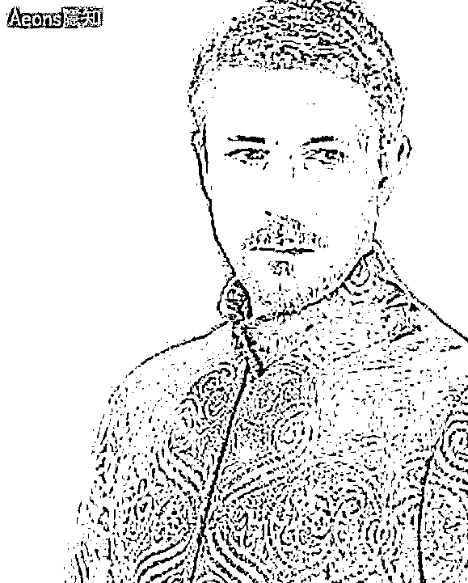

外号：小指头

精打细算的佩提尔，不但有着处女男的样貌，处女男的人生，还有着处女男的职业跟天赋。他有着很强的草根精神，本就来自卑微的阶层，但是却又非常努力地向着自己的目标前进，他站在你面前的第一印象永远是“服务精神”，文质彬彬，总是扮演者某某人下属或者随从的角色，不过这个随从却很危险，他不喜欢高调，却可以把每一件事的细节把握到极致，操控到极致。他的人生就是在不断地算计，正应了他的原始职业“财务大臣”，谁叫人家处女座适合的两大职业之一就是会计呢。佩提尔有着很强的水星特征，脑子敏锐，言辞犀利，计划周详，如果不是后来遇到了开了挂的布兰，他估计还可以再拖个一季。虽然小指头的信念是“混乱就是阶梯”，但这恰恰说明他本人的思绪从来没有混乱过，而且他跟所有处女男一样，有着相当详细的，现实的奋斗目标。做事处处都带着强烈的“目的性”。

天枰座：布莱尼

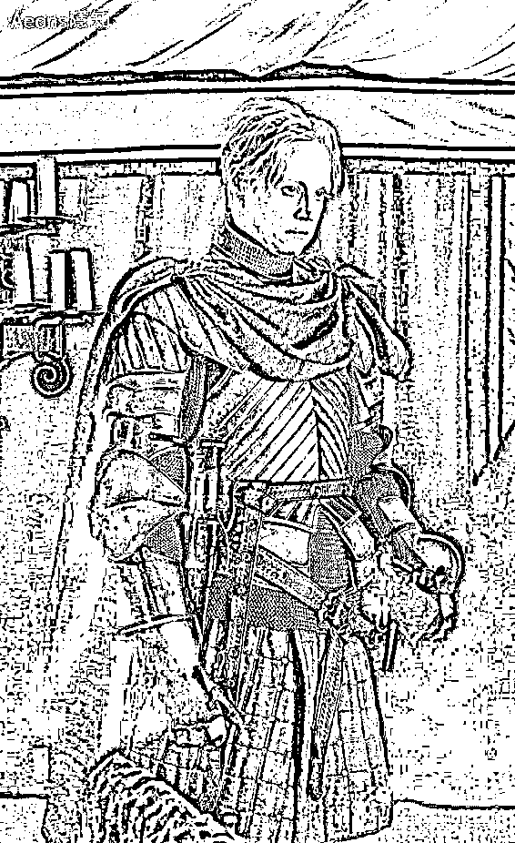

外号：美人

大个头的布莱尼说实话并不美，但人家是“心灵美”萝卜。她是个坚守骑士之道的人，有时候让人觉得有点迂腐，她心中有着一个理想的社会道德指标跟审视标准，而且这种标准在外人看来会显得有点理想得做作。但纵使如此，她依然坚守着自己的信念跟道德判定，用自己的剑在残酷的现实世界寻找着一条通往理想的道路。天枰座的人，并不都是表面美丽，和谐，风雅的。有时候他们也很理想主义，做一个“好人”对他们来说是那么的重要，所以选择“政/治正确”往往是他们在社会中的路线。面对威胁到自己理想跟理念的人，他们有时候也会选择举起“正义“之剑，斩断任何低下的兽欲跟天性。所以天枰座是黄道上少数的几个”器皿“星座，平衡完美且不具备人类的动物特征。永远都在向往着那个或许存在或许不存在的“理想国”。所以她还跟猎狗打了一架（天枰座刑克巨蟹座）

天蝎座：瑟曦

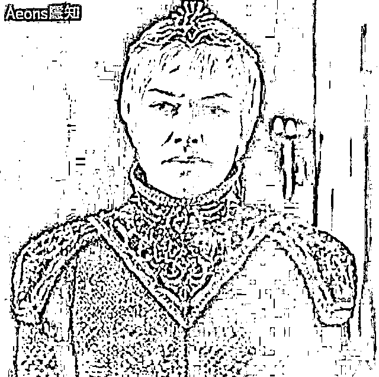

外号：孩子他妈

瑟希有着蛇蝎般的心态，伤害她的人都要受到同等甚至更多的伤害。她对一件事的执念可以很持久，她常年活在痛苦之中，却有能力在表面上轻描淡写不动声色。强硬的政治手腕有时候让人觉得更像是情绪用事。瑟希是个好母亲，她的情感依托，是她的孩子们。而当她的孩子们全都被杀以后，她的愤恨彻底盲目了她的理性，似乎在她的脑海里，复仇变成了唯一有意义的事情，届时，全世界都成了她的敌人，这种深刻又极端的情感表达，很多时候会表现在她的话语里，你会看到有时候说着说着，她就开始用词狠辣，甚至做出咬牙切齿的表情，然而，她的表面依然冷静，轻描淡写间就可以送她的敌人去死，这才是真正的大天蝎啊！

所以她跟詹姆相爱相杀（天蝎座跟狮子座经常相爱相杀）

射手座：山姆.威尔

外号：倒便盆的大学士

山姆有着射手座的天生乐观，在一个充满了肃杀，勾心斗角，随时死猪脚的小说里，他是唯一一个开心地活了 7 季还娶妻生子毫发无损的家伙，他有着射手座天生的好运（因为据说他就是作者本人的缩影），哪怕是在面对异鬼的时候都可以以手无缚鸡之力莫名地杀死对方….山姆跟所有射手座一样，有着对学识跟智慧的强烈渴求，他的梦想就是成为一个博学的大学士，他是个很胖但是很上进的骚年，也一直都是雪诺身边最忠实的伴侣（…..），他就像木星一样，默默守护在你背后，关键时刻出来穿插个重要剧情，天生的 GM 高照啊有木有！

摩羯座：囧恩.雪诺

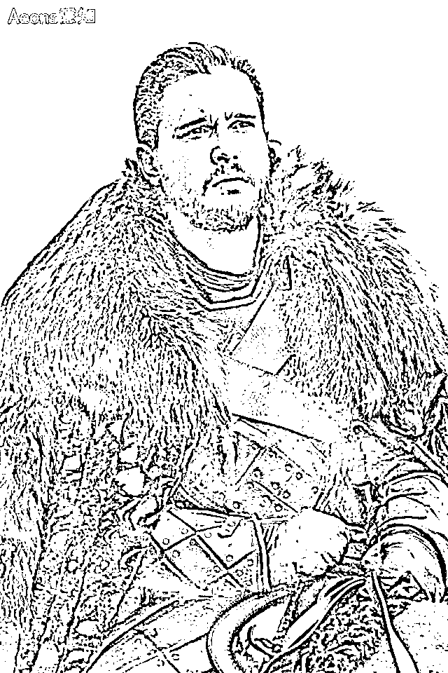

外号：什么都不知道雪诺

摩羯座的雪诺跟所有摩羯座一样，天生苦逼。他确实什么都不知道，不知道自己是谁生的，不知道自己的未来在哪里，不知道自己怎么就被杀了，也不知道怎么滴就复活的，他不知道女朋友怎么就挂了，不知道怎么就赢了私生子之战，也不知道自己怎么就当上北境之王，不过，他做到了……..他天生“励志”，一路行来苦逼程度从他那张脸上就可以一目了然，雪诺是个不折不扣的摩羯：对承诺的坚守，对事情的认真，不懂变通，务实，愿意吃苦，面对任何困难都可以用一张囧脸赢刃而上，而且一步步从一个被流放的私生子爬了 7 季，终于攀上了可能是未来维斯洛特唯一国王的高峰，这种历程，只有两种人能做到，一种是土星主宰的摩羯座，另一种嘛，当然还是土星主宰的水瓶座啦~！比如：龙妈！

水瓶座：丹妮丽丝

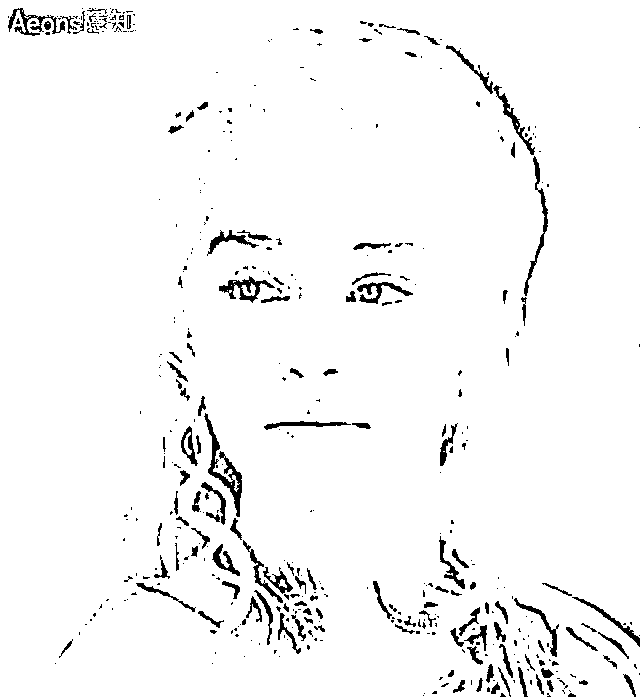

外号：龙妈

很显然作为冰与火之歌的“火”，龙妈活了 7 季并且成为维斯洛特可能的未来女王的这条路可不是白爬的，作为天王星主宰的星座，龙妈是全剧唯一一个“一言不合就突然上天飞”的人。作为天王星的代言人，龙妈顶着一头亮丽的银发（雷光闪闪）。

龙妈是水瓶座的社会脸谱，有着超乎寻常的解放奴隶的能力，超乎寻常的和谐洗脑能力，超乎寻常的“当领导”能力，超乎寻常的嘴炮能力。

但在统治者的位置上却很多时候缺乏情感跟血性，甚至有时候给人一种冰冷的天王星感觉，她的水瓶座理念中更多的是“人应该如何如何“（比如，你应该给我下跪，因为我的头衔比你多；我们应该烧死他们，因为他们不听我的；他不听我的，那就是不听我人民的。），这种把自己的话都当做替人民说话的作风是水瓶座的专利，不然就不会有“人类主义“星座的头衔啦！

所以她跟雪诺合体了（本来就是土星一家人，现在还一起上了个床…）

双鱼座：布兰登.史塔克

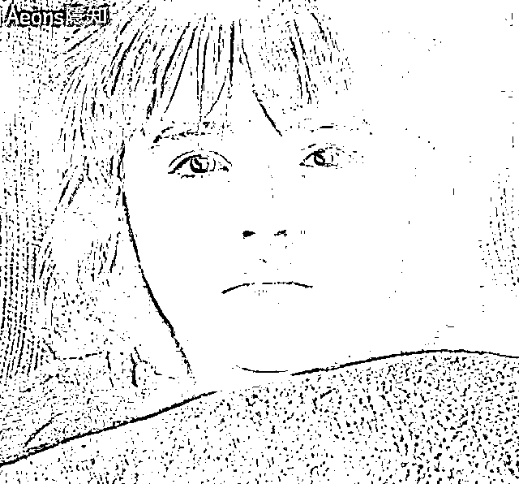

外号：开了挂

神棍

布兰登的整个历史就是一场梦，是的，他从第一季就开始做梦，试问还有哪个人能跟双鱼座比做梦！？就算你做梦做的很多，但是试问有哪个人能跟双鱼座比神棍？布兰不但做了梦，他还成了神棍，从头到尾，布兰都有一半活在另一个星球….他有着很强的受害者经历，是的，恭喜他获得了第一集的“全剧第一个受害者”的头衔（仅限主角），他不但有着双鱼座的受害者经历，还有着双鱼座的残障经历，然后他开始做梦，依靠别人的保护跟拖拽总算到达了绝境长城外，布兰老早就开始面对各种超自然物，所以他也成为了不折不扣的神棍候选人。布兰每次开口，都会让你有种“我在哪儿，我是谁”的感觉，他那种超然物外，显然是全剧仅有的。他的故事无非就是在告诉我们，双鱼座也可以拯救世界，是的。

所以布兰干掉了小指头（真的是双鱼座冲处女）

听了这么多，你是不是也有点跃跃欲试啊？

是不是也觉得这些星座很好猜啊？

那么下面问题来了，

有一个人的星座你肯定猜不出来~

不信的话你就猜猜“夜王”是啥星座的呀~

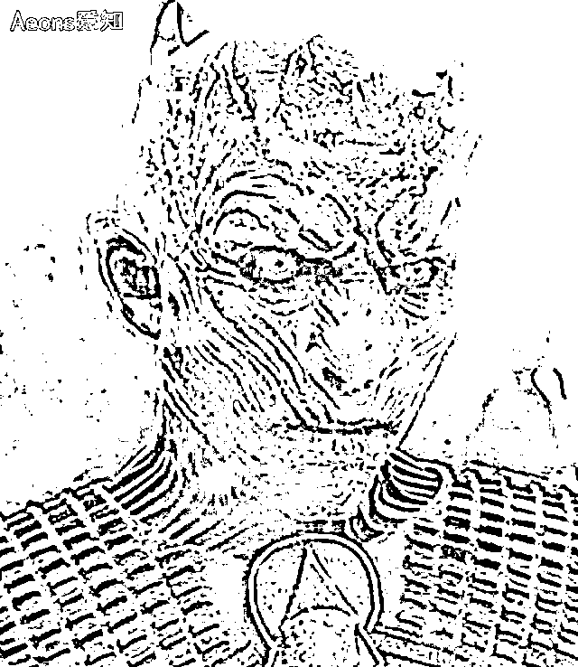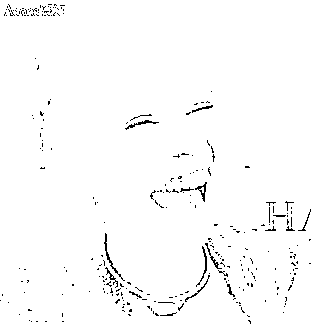

排版｜指引社·阿烬

文案｜指引社·哈鲁比酱

指引社，致力于让“神秘学”走向大众，不再“神秘”。杜绝神棍，欢迎撩或聊

长按二维码关注我们

点击“阅读原文”，去指引社看原贴

# 平时所说的“哥特体”，竟然不是真正的哥特文字？

> 原文：[`mp.weixin.qq.com/s?__biz=MzI5NTQzMDUzMQ==&mid=2247483720&idx=3&sn=ce1b16ad1ce735c00f64cc5ca0295b8a&chksm=ec52f1a4db2578b20d13f3c97acf7e3fdeb030f196b23cd009dbe65a786024444006e94ca130&scene=27#wechat_redirect`](http://mp.weixin.qq.com/s?__biz=MzI5NTQzMDUzMQ==&mid=2247483720&idx=3&sn=ce1b16ad1ce735c00f64cc5ca0295b8a&chksm=ec52f1a4db2578b20d13f3c97acf7e3fdeb030f196b23cd009dbe65a786024444006e94ca130&scene=27#wechat_redirect)

**再不点蓝字关注，就要错过好内容啦**

问

平时经常提到的哥特体，是哥特人所使用的书写文字吗？

完全不是。我们本篇将要讲解的真正的哥特文字，与日常所说的哥特体有极大的区别。

答

小知识

哥特体又称为“黑色字母（blackletters）”，指的主要是一种装饰性的书写字体，其实是一种书法的形式。

哥特体出现于中世纪的西欧，从公元 1150 年一直延续到 17 世纪，之后被用于丹麦语的书写中直至 1875 年，再其后直到 20 世纪之前，又作为德语的书写方式而活跃着。

哥特体常常被错误地与古英语联系起来，而实际上古英语（或盎格鲁-萨克逊语）的出现要较哥特体早好几个世纪。

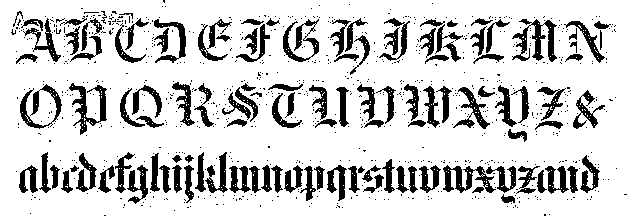

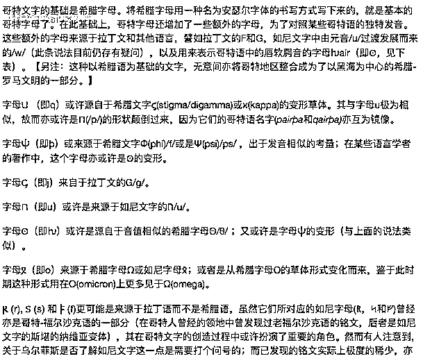

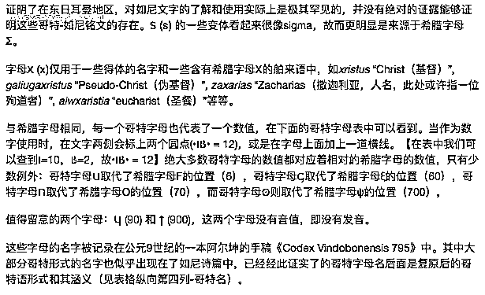

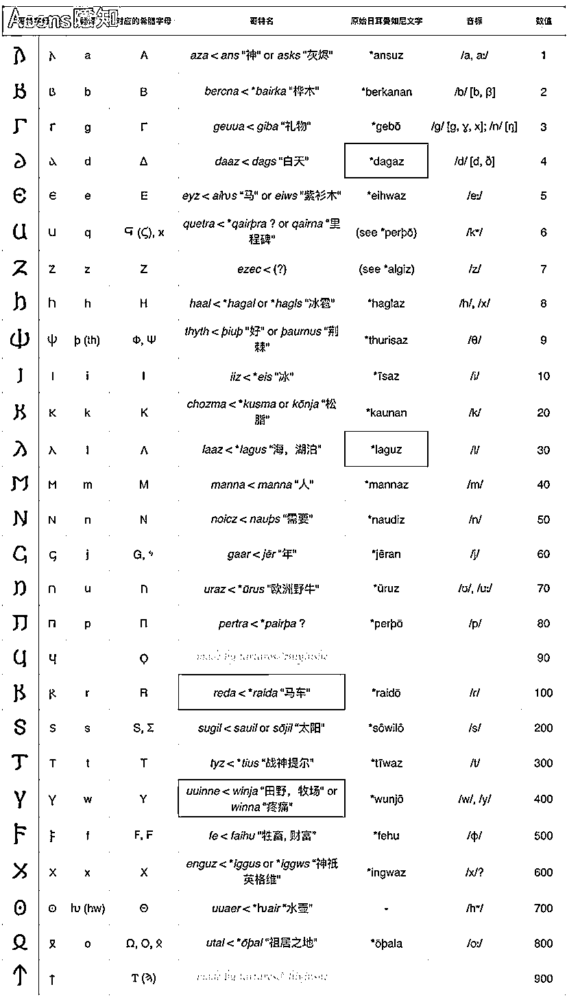

而真正的哥特文字是由公元四世纪的一位名为乌尔菲斯(c. 311–383)的哥特人所创造的，最初的目的是为了将《圣经》翻译成哥特语。

这位乌尔菲斯是当时的一位主教或者传道士，他拥有希腊人的血统，是卡帕多西亚地区希腊人的后裔，他的名字 Ulfilas 是由哥特语 Wulfila 转换成拉丁语而成的，意为“狼崽子”。

在文字的创造过程中，他似乎有意地避开了早期如尼文字的一些用法，所以这些文字很有可能与异教徒的信仰和习俗紧密相连。

注 1：星号*所标注的词语，在复原后的哥特语料库中找不到对应。

注 2：用问号？所标注的音标表示对此发音存有疑问。

注 3：欧洲野牛是一种已经绝种的生物。

注 4：“神祇英格维”指的是丰饶之神弗雷。Yngvi 是 Freyr 早期的称呼。

文案｜指引社·阿克

排版｜指引社·阿烬

指引社，致力于让“神秘学”走向大众，不再“神秘”。杜绝神棍，欢迎撩或聊

长按二维码关注我们

点击“阅读原文”，去指引社看原贴

# 你没有跟着长大而来，却仍在那个地方徘徊|天底的世界

> 原文：[`mp.weixin.qq.com/s?__biz=MzI5NTQzMDUzMQ==&mid=2247483720&idx=4&sn=313d34def3f728cba534cbe2f03b5b7f&chksm=ec52f1a4db2578b26d54fe70e7708c38bb5e21c46f8a1650a1b1a5cd404f0d497a47bf321b37&scene=27#wechat_redirect`](http://mp.weixin.qq.com/s?__biz=MzI5NTQzMDUzMQ==&mid=2247483720&idx=4&sn=313d34def3f728cba534cbe2f03b5b7f&chksm=ec52f1a4db2578b26d54fe70e7708c38bb5e21c46f8a1650a1b1a5cd404f0d497a47bf321b37&scene=27#wechat_redirect)

**再不点蓝字关注，就要错过好内容啦**

高

高挂着的**中天**，在众人瞩目的位置发光发热，用“我”作为一切句子的开头。

放下了所有的争端，暂避开土星这个严肃长者的规则，当我坐在深夜里，无由来地突然痛哭。

在四宫宫头，仿佛有一扇没锁却紧闭的门，有什么微弱的声音，在三宫到四宫这段模糊不清的通道里，用力却无声地徘徊。

我的天底，它并非深不见底

在星盘的最底端，世界最黑暗的深处，4 宫的宫头，有个叫做天底的地方。

它的关键词：过去，起源，童年。

在星盘上，它是这样的

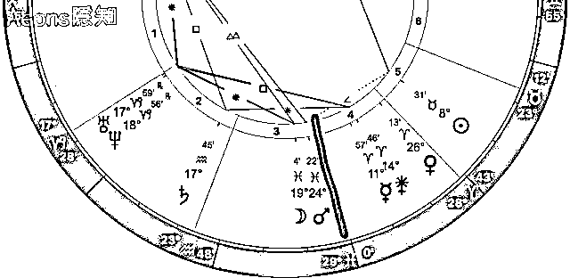

它是每个人星盘第 4 宫的宫头，在 3 宫与 4 宫之间，一个看上去小小的区域。

它是你的过去，它是你的家庭，是你的下意识，更是你那些“没由来”的“由”。

 

比如，天底双鱼

我的月亮和火星，也在双鱼。

而我的日常，几乎被公认为一个“能忍”“干练”“有趣”的“工作狂”。上升射手和中天处女，似乎奠定了很多理性且开朗的基调。

可当我微笑面对一切，当我几乎忘却了父母的样子，当我在北漂的日子里，

熬着熬着夜，讲着荤段子，脸上的眼泪，一下子就不可收拾。

在那里，我看到了一个自己。

**幼小的我**，被酗酒的父亲拎起来扔出去的我。

**委屈的我**，在朋友惨去的消息面前失去感觉竟然微笑的我。

**还有更小更小的我**，那些在雪地里疯跑，在深夜的阳台上揪着头发，不让自己哭出声的我。

……

它不断重演着所有我不愿回忆的一切，那些“弱小”或“幼稚”带过的经历。

**那是我，被努力遗忘的“我”**

我曾最终与父母断绝关系，拉上行李箱和 300 块离家出走，至今生活终于安稳，仿佛过去只是“吃过的苦”

朋友的事不再怎么提及，仿佛从此世间生死都是自然，对死亡新闻甚至可以嗤笑“炒作”。

交了很多朋友，有了立足的本事，难过时强行拉人喝酒扯淡，工作委屈时大骂客户不是东西，一切都仿佛强大起来，伴随着我的成长。

但我终于被压力压垮，在每个梦醒时分，瞬间消失的空虚和悲伤，它们都不只是梦境，也不是“后遗症”。**它们是天底的那个小孩。**

我，所谓的那些“决断”“改变”“成长”，只不过是最简单地方法，拿起名为“成长”的刀，不是打磨与融合，**而是一刀砍下那个自己。**

将它留在那里，让它永远徘徊不出那个狭窄黑暗的通道。做一个永远也做不醒的噩梦，无边无际，望着我越发远去的影子：你是不是难过了？还记得我吗？

你 4 宫的小孩，可曾跟着“长大”而来?

天底**白羊**的人，总有冲动逃离家庭，强烈的扩张欲望，带着抵抗而来。

天底**金牛**的人，似乎有一种收藏家的天赋，在金星的庇护之下，几乎能够成为令人艳羡的存在。

天底**双子**的人，可能会有重组家庭，对知识总有一种迷之渴求。

天底**巨蟹**，或许独立性强，总会离家，但对一切“传统”的东西，有一种近乎执着的保护欲。

……

无论是天底狮子，那些让你引以为傲的强人父母，

还是天底处女，不稳定的家庭带来的斤斤计较，人们走过天底时，似乎总是愿意砍掉那个“小孩”，丢在那里，独自向前行进去。

 

曾有人分享过一个盘子，是位阿姨。

她天底巨蟹，天王在 4 宫有些显眼。

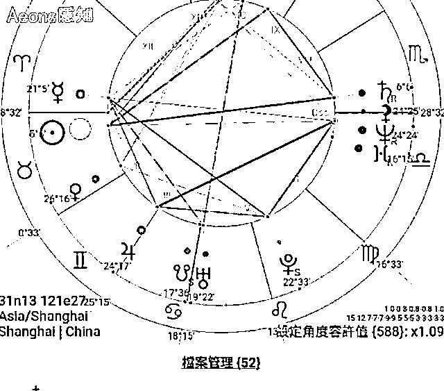

或许从旁人、从她丈夫孩子的眼里，她是“闹腾”的——20 岁就出国，为了自由离开家，结婚离婚，吵吵闹闹。

从世俗的评价里，她是“作”的。

但，她想要的，**不过是“抗争”**

合天底的天王，合天底的南交点。她在抗争，她对儿女的感情是有的，但她是“怕”的。

自己建立的家庭，都在动荡，自己寻求的自由，都并不一如向往。

当“爱”可能成为一种束缚，我曾大胆地猜，也许阿姨她……

**巨蟹那里有个小孩。**

它在徘徊，看着头顶远远的中天摩羯。

它如此执着，它如此眷恋感情，

它重复着家庭与感情的责任，它一次次被伤害，一次次抱紧怀里柔软的月亮。

但自始至终，它都在这个黑暗无边的通道里徘徊。

**不敢走出，不曾走出，不再走出。**

或许，阿姨疯狂地想要避开的那个小孩，

有一天。。。也许能回到她这里来？

你那扇不敢开启的门，是怎样的形状？

也许是原生家庭，也许是你最想舍弃的那个自己。

但还记得你突然的暴躁、突然的伤心、突然地反应模式，都是哪里来的吗？

**打开你的星盘，看看第四宫的宫头。**

它与中天的众望之处完全相反，它是你心里最不能触碰的柔软。

**你的天底**，

**它在哪个星座？这个星座的守护星是谁？**

**守护星又去了第几宫？**

**这个星座，是否让你想起一些，你一直否认的“自我”？**

天底那里，有个小孩，你曾经丢下它，为的是更坚硬更强大地闯入土星的世界。

但别忘了，它一直都在。

**等你有一天，愿意接它出来。**

我愿意等你回复你的天底，

我也愿意——

我是说如果可以，

去那个最黑的地方， 

接它走出来。

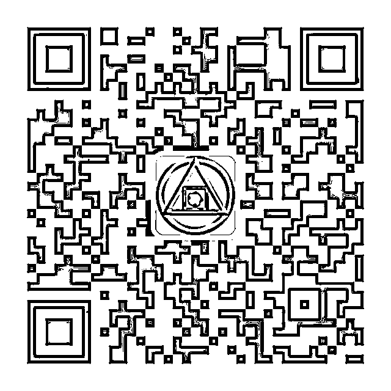

排版｜指引社·阿烬

文案｜指引社·阿烬

指引社，致力于让“神秘学”走向科普，杜绝神棍。

长按二维码关注我们

文章头图来自于游戏《地狱边境》截图

# 第 3 期推送调查：指引社的发展，需要你的建议哦~

> 原文：[`mp.weixin.qq.com/s?__biz=MzI5NTQzMDUzMQ==&mid=2247483720&idx=5&sn=c97652d698b5f7067bfc82d41bc42e2c&chksm=ec52f1a4db2578b2a68b0d249b037b8d0372a1599541025a4b216591dae5e1008313a2e722ce&scene=27#wechat_redirect`](http://mp.weixin.qq.com/s?__biz=MzI5NTQzMDUzMQ==&mid=2247483720&idx=5&sn=c97652d698b5f7067bfc82d41bc42e2c&chksm=ec52f1a4db2578b2a68b0d249b037b8d0372a1599541025a4b216591dae5e1008313a2e722ce&scene=27#wechat_redirect)

指引社公众号的每篇文章，都是从每周发布的、或论坛的精品旧文中精选。

推送的第 3 期起，每期推送的最后一条，都会放出投票。

选择你喜欢的文章，也可以选择你下期想要看的内容。

指引社公众号初露头角，之后也许会成长为你喜欢的样子。

感谢你的支持。我们会继续努力哒~

📹 /mp/newappmsgvote?action=show&__biz=MzI5NTQzMDUzMQ==&supervoteid=477057932#wechat_redirect

# 【星说影音】<被嫌弃的松子一生> | 双鱼的两张脸

> 原文：[`mp.weixin.qq.com/s?__biz=MzI5NTQzMDUzMQ==&mid=2247483709&idx=1&sn=eccd9bfc44694272ab6b4d7ae51637e1&chksm=ec52f1d1db2578c755d1a90732c972b0b06f1152a3efce18153d69213766e6da6eb2736dffd8&scene=27#wechat_redirect`](http://mp.weixin.qq.com/s?__biz=MzI5NTQzMDUzMQ==&mid=2247483709&idx=1&sn=eccd9bfc44694272ab6b4d7ae51637e1&chksm=ec52f1d1db2578c755d1a90732c972b0b06f1152a3efce18153d69213766e6da6eb2736dffd8&scene=27#wechat_redirect)

点击上方“指引社”可以订阅哟

爱情以及生活远没有那么崇高， 

只是有很多人，在把愚昧夸大成宽容和勇敢，

用来给所谓的信仰殉葬。

生まれて、すみません。

生而在世，我很抱歉。

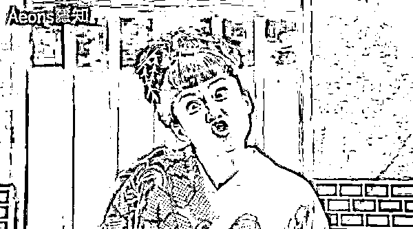

**《被嫌弃的松子的一生》**

**双鱼的两张脸**

“

**童话有两张脸，外面是信仰，里面是幻想。**

家中有久病的妹妹。即便她是个温柔的小姑娘。

但父亲的目光总在妹妹身上，且似乎总也高兴不起来。

当一个鬼脸，无意中得到了父亲的笑颜，此刻的松子可能不会知道，未来的一生，她即便是被男人抛弃、被社会抛弃，也只剩下来这个鬼脸一样的存在。

**这是童话的开始，也是松子最初的信仰。**

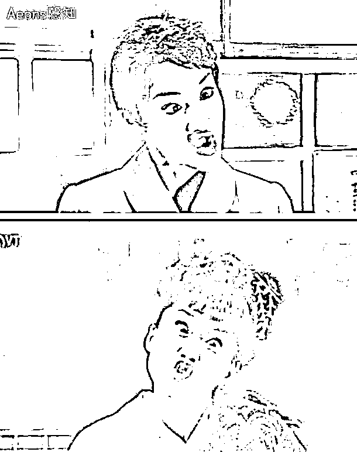

双鱼的守护星，在发现三王星之前，曾经是**木星**。

这颗代表了扩张、幸运、乐观与信仰的行星，似乎与**童话神话**，总有着千丝万缕的关系。

《被嫌弃的松子一生》大部分时间，充满了奇幻的**童话色彩**——

暖红的色调，时不时出现的鬼脸，

即便是在坐牢、杀人、被暴力的情节里，

也都是大片大片的星空，过度绚丽的童谣 BGM。

但大家都明白，这部有着木星色泽的电影下，掩盖不住的，是铺面而来的海王星潮水，将人淹没在茫茫大海里，无边无际。

海王星与土星正好相反，**是对自我的否定**。

海王星是**全盘否认土星能量的真实性**。

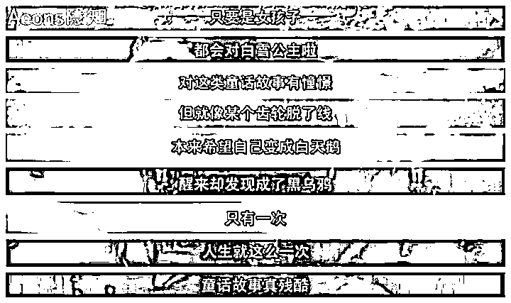

无论童话多么美好，当木星信仰式的乐观无限扩张，随着渐渐长大，发现周边的环境不可控。

直到企图控制，有了这样的经验，就有了区别心。

知道不受控制，缺乏控制能力的事实。希望融入这个世界以后，希望**把世界变为自己的一部分**。

木星的扩张，是“融会贯通”。但松子的执着，是想要强行把世界过成童话，**是”为****了融合，我将献祭自我“的殉葬**。

作为三王星之一，海王星的力量，远比木星来得持久、却来得透彻。

海王星所谓的完美世界，是超越物质现实之外的。它是**“自我的否定者”**。现实总会冰冷，但它想跨过土星的一切。

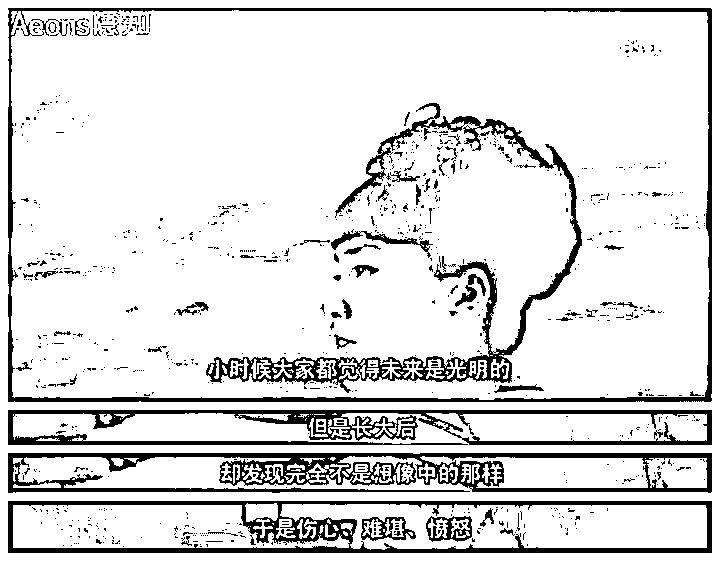

代表行星是海王星，避开直接冲突的方式，是典型的**逃避主义**。

对于父亲的漠视，松子不是以“我”的身份去安抚，而是用做鬼脸，强行扮丑，博取父亲一笑。

在之后的生命中，她数次重复着这种泯灭自我的“扮丑”，**越发卑贱地乞求爱。**

·被误会偷盗，那么为了（并不领情的）学生，顶包背罪被开除。

·被有严重暴力倾向的作家男友殴打，男友自杀后被男友的对手作家包养，再被抛弃。

·遇到了那个改变她一生的混混学生，被他殴打为他赚钱，等他入狱等他出狱，最终被揍一拳然后抛弃

……

…………

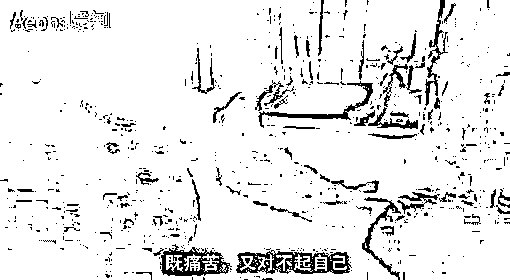

痛苦绝望的一生中，松子怀着纯真无限的信念，从没有“挑剔”，从没有“放弃”。

**只要有人要她，她就继续扑火。**

仿佛一座永远敞开的渣男回收站。

“

**牺牲的可以是烈士，但你只是受害者。**

但，松子，真的爱那些渣男吗？

可能，更多的时候，

**海王星笼罩的疑似爱情，根本就没有爱的存在。**

松子等一系列海王星人，所爱的不过是“殉葬”的感觉。

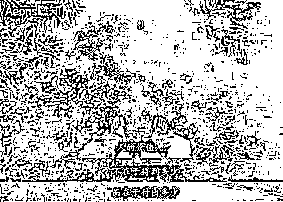

因为曾经缺乏了爱，所以便加倍地去乞求爱。恨不得每时每刻都有人关注她、认可她、赞美她。

当人们提及双鱼座，就不由得会提到海王星的特质：**牺牲精神。**

它们没有边界地去牺牲，牺牲的人叫做烈士，也可以叫做受害者。

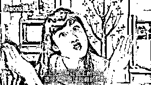

但烈士为了精神上的目标牺牲，**受害者却没有精神上的目标。**

什么都可以是救命稻草，毫无保留地，热烈地去投入，

火星金星月亮，

只要是有的，全都拿出来。

**只要是对方有一点不喜欢的，就全部毁灭掉。**

海王星波及到一段关系后，在局内的人，会无法搞清身份。

总是喜欢在别人身上投影一些不符合他人现实的能量。

他们寻求的是最净化和最精致化的东西。渴望去除不完美的部分。

**可能更精纯，也可能更假。**

**宁愿千百次地被欺骗，千百次遭鄙夷，也不愿要一分一秒的寂寞。**

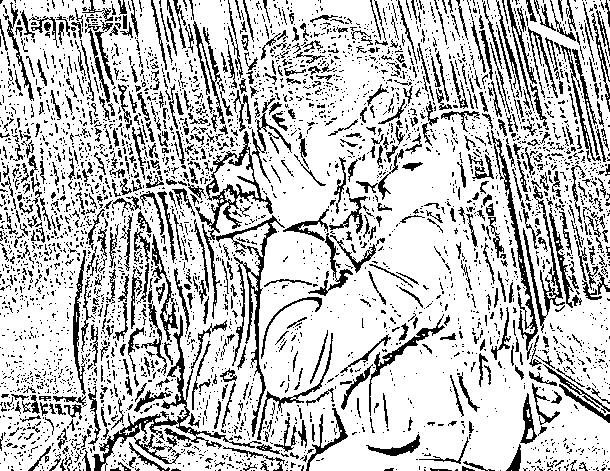

所以，松子的付出热烈且浓墨重彩。

为了那个家暴的混混，她对想把自己拉走的朋友大吼，说**“即便是下地狱，我也愿意!”**

杀了一个用她钱养女人的渣男，她跳楼未遂。

仅仅是在入狱前，遇到了一个并不熟悉的理发师，她在监狱中努力锻炼，努力多学习一些。

让那名狱警不解，也同样让不了解海王星能量的人不解——

她一直幻想着，**那个从未来监狱探望过她的理发师，**多年后会在监狱外等她。

但当松子真的走出监狱，走到理发师的门前，那个男人带着妻子孩子一脸乐观。

如此执着的人，没有任何争吵大闹。

她的海王星决定了，她会在这一刻放手——**我什么都不会争取。**

仅仅一个微笑，转身离去。

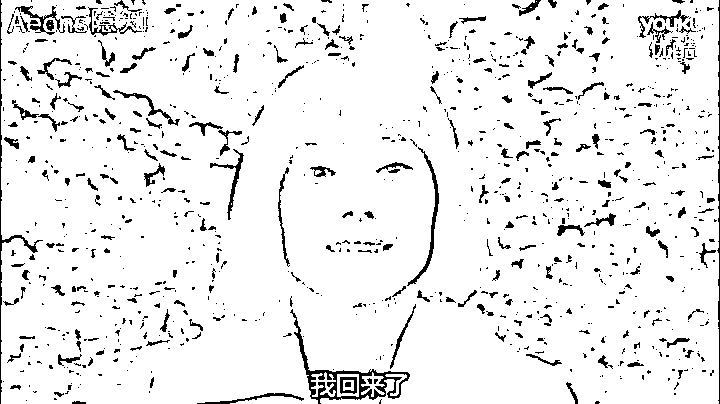

“

**毒药，是弱者的武器。**

在占星中，海王星也代表着**毒品、致幻剂、酒精。**

一切混沌不清的东西都在这里，和海王星的避世法则如出一辙。

而毒药的定义，并非只是化学的实体毒药，

**它可以是一切让人堕落、让人放纵到底的东西。**

等待了几年的人出狱后，将松子暴揍后逃离。

妹妹去世，父亲去世，似乎与事件的牵绊纷纷褪去，

童年的那些“开始”已经消失，但一切都无法回头。

松子开始了海王星式的避世。仍旧怀着最初的童话梦想，仍旧记得家边上的那条河。

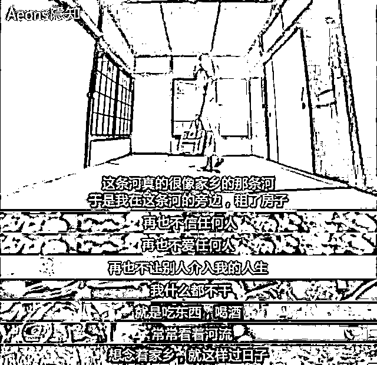

海王星没有秩序，它是一切秩序诞生以前的混沌。

海王星的人有一种自信缺失。

**最堕落绝望的人，就会企图逃避人生，**沉醉于酒精毒品。

一个肥肥胖胖的松子，躺在屋子里的垃圾堆上，做着各式各样的白日梦。

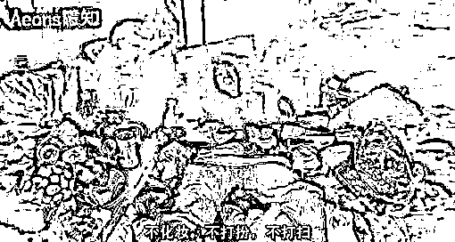

即便是在垃圾堆上，当松子看到了电视里的偶像男团，仍旧会再次燃起希望。

她不断给偶像写着信，牺牲掉生活中的一切。

但从那些渣男开始，她所**期待的东西越来越缥缈无踪**，也就**越来越不可能有回声**。

日复一日地得不到回信，日复一日地老去。

她在海王星的无边世界里彷徨，

对所有能够摸到的稻草甚至腐石泥沙，都要拿到怀抱里用力体味，

**即便不断溺水，仍旧不愿意寻找边界。**

小时候的鬼脸，父亲的严厉，终于成为了老师时被误解的“不抵抗”。

作家男友的自杀，作家男友竞争对手的抛弃，应征脱衣女郎，杀人入狱。

对美发师的眷恋和放手，对唯一好友的感恩与离去。

当她终于在这个夜里，站在星河之下，在那条与童年相似的河流边。

她捡起那张被丢弃的名片，那是她下一个希望——**回到正常世界的希望。**

也许这一刻，电影即将步入尾声。

我们都仿佛看到海王星的大海，逐渐出现泊岸。

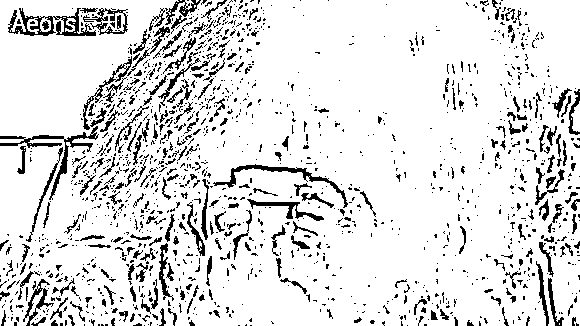

而电影，却也在这一刻，为松子的生命画上句号。

**荒唐的句号。**

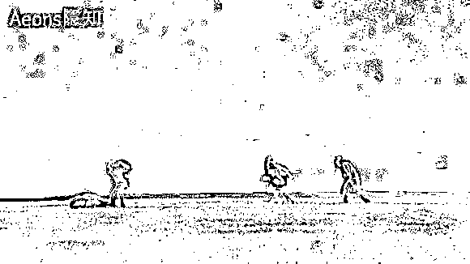

被几个夜间打棒球的小孩，用球棍殴打。

**这是松子生命的结局。**

哦对，差点忘了。

**海王星的世界，哪里来得边界**，

又怎么可能有真正的对岸。

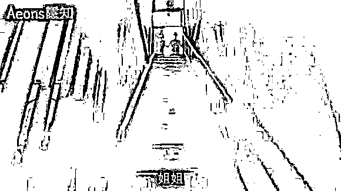

在结尾，各个时期的松子一晃而过。

她所经历的一切，那些大篇歌舞所穿插的世界，在此慢慢走向终结。

**木星的色彩回归而来，抬头处有一扇门**，

是松子的妹妹，在走廊尽头。

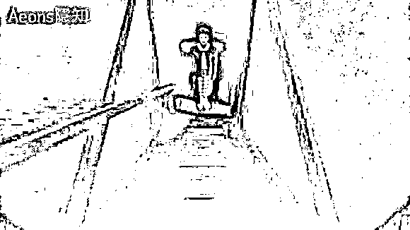

在那里，真正的木星世界，或许在等你。

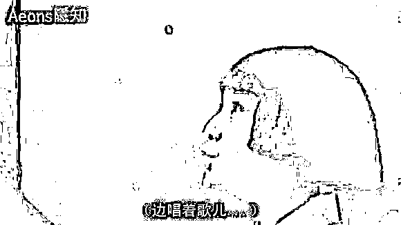

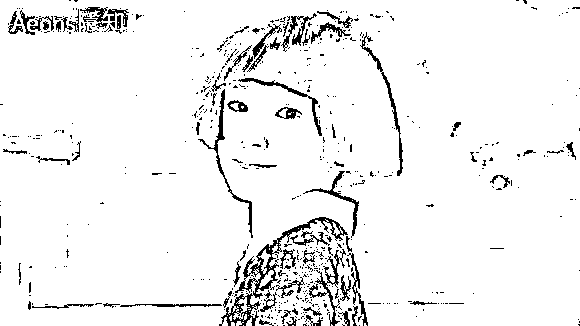

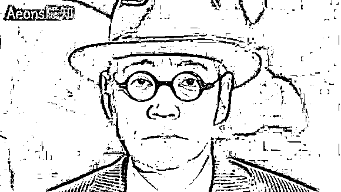

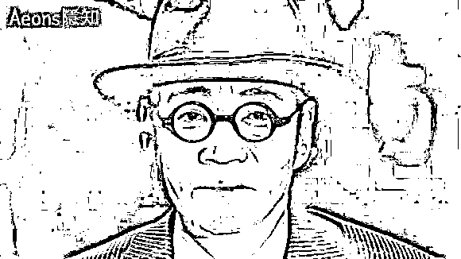

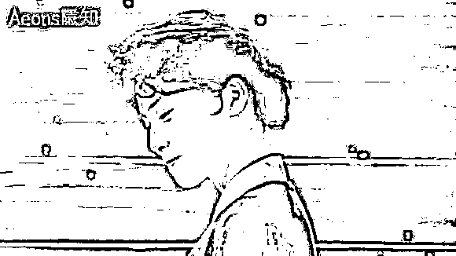

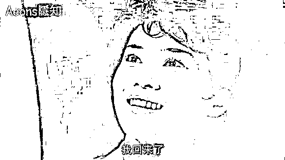

欢迎你

回到童话的开始

**和童话的尽头**

©指引社 

**长按下方二维码下载指引社 App**

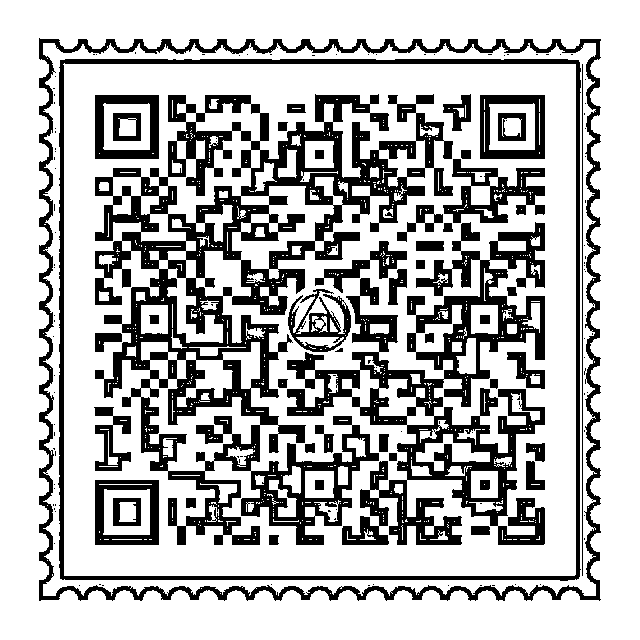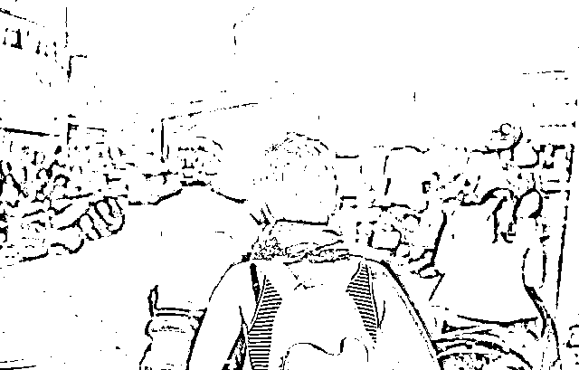

每一次的感想

都愿与你同在

点击“阅读原文”，去指引社看原贴

# 精神的启蒙：深入黑暗世界

> 原文：[`mp.weixin.qq.com/s?__biz=MzI5NTQzMDUzMQ==&mid=2247483709&idx=2&sn=379c5fa053c867472671c701dffacb85&chksm=ec52f1d1db2578c7f3c091628647c745b1a1ccdb259114d4951e329edd4536a571e13bb27147&scene=27#wechat_redirect`](http://mp.weixin.qq.com/s?__biz=MzI5NTQzMDUzMQ==&mid=2247483709&idx=2&sn=379c5fa053c867472671c701dffacb85&chksm=ec52f1d1db2578c7f3c091628647c745b1a1ccdb259114d4951e329edd4536a571e13bb27147&scene=27#wechat_redirect)

向上滑动阅览-参考文献

古代有许多众所周知的神话

描绘了女英雄或英雄进入冥界的故事。

这其中最意味深长的一个，大概是苏美尔女神 Inanna，听从召唤进入冥界旅行的传说。  

Inanna 下降的故事，后来也被描述为巴比伦女神 Ishtar 的下降，不过 Ishtar 的故事只有 145 行。

而 Inanna 下降的原始故事则有 415 行。

这种差异归因于父权制，它从公元前二千年开始逐渐削弱了女神的力量和意义。  

Inanna 下降冥界，既是一个迷人的故事，也是精神启蒙的重要原型。

精神的启蒙：深入黑暗世界（节选）

作者：Dan Sewell Ward

版权所有 1992 Dan Sewell Ward 

翻译：O IRKALLA

摘要

古老的苏美尔神话中，女神 Inanna 降入冥界的传说隐含了一系列深刻的心理和时代信息。本文讨论了神话中各种成分的基本心理学解释，包括更高的自我概念，放弃旧的价值观和事物，以及最终赋予权力的自愿下降。还考虑了现代人以“深入黑暗世界”作为精神启蒙的一种形式：即寻求智慧和成长、抛弃幻想。  

*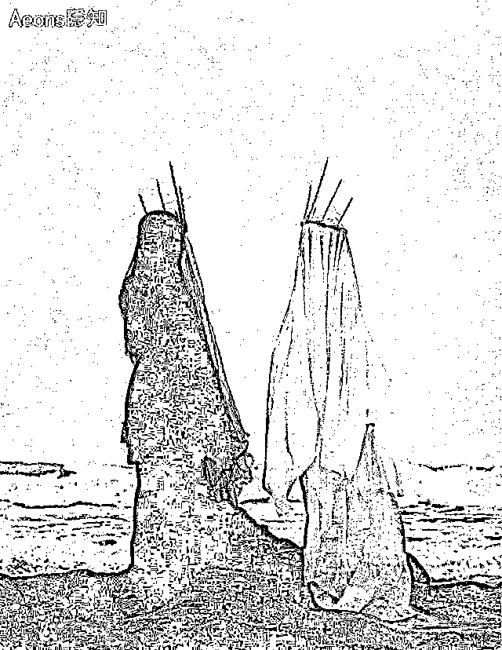*

Inanna，天地之王

Inanna 的神话可能是在公元前 1900 年至公元前 3500 年间创建的，尽管它们可能早已创建[1]。在初期创作中，它们可能是前·父权制的神话，但是被书写下来时，这些神话显示出了父权制的侵袭，Inanna 逐渐被夺权，并最终失去了地位。  

尽管如此，Inanna 仍表现出了超越单纯母性的女性的多面化符号形象，是一个完整的典范。她是谷物、生育、秩序、战争、爱情、天地、愈合、情感、“无数职业女性”的女神。作为战争女神，她比 Athena 雅典娜和 Artemis 阿尔特弥斯更强大；作为性爱女神，比 Aphrodite 阿芙罗狄蒂特更外向。她最终以许多名字（Ishtar 伊斯塔尔，Isis 伊西斯，Neith 内斯，Metis 梅蒂斯，Astarte 阿斯塔特等）而闻名，但是后来的每一位女神都被描述为拥有更少的力量，或者在许多属性中都不那么全面。她曾经拥有的大部分力量，如“鲜活，俏皮，激情性欲的女性；强大，独立，固执任性的女性；雄心勃勃，华丽，多面的女性。”[2]即使在苏美尔时代也已经被父权制侵蚀。  

Inanna 的神话是一个关于成长的过程。在关于 Inanna 的许多故事和赞美诗中，有四个特别值得注意：

第一个例子涉及她获得王位和床，象征着她的女王和女权，她的主权和性。在这个过程中，她放弃了原始的、贪婪的、人性的方面，为了得到王位和床位，她没有承认和表达出恐惧和欲望。

第二个神话中，Inanna 从智慧之神 Enki 那里获得了文明的特质，转而赋予给她的城市乌鲁克，并最终赋予给人类。以这种方式，表现出她的力量和才能，并成为名副其实的女性保护人。

第三个神话中，Inanna 把牧羊人 Dumuzi 作为伴侣，并让他做王，而自己也成为母亲，生下两个儿子。 

这三个神话集体代表了人类发展的四个阶段中的三个阶段：建立个性，亲密互动，一对一地参与外部世俗世界（这三个阶段也对应于金牛座上升星象图的前三个象限）。

然而，在第四阶段\象限，我们每个人都将进入神秘的、形而上学的领域，在这个世界中，我们遇到了对自我身份及其普遍联系的终极认知。       

正是在第四个神话中，这位女神进入冥界，超越了平凡，自愿地进行了最后的旅程，通过接受自己的黑暗面而成为一个完整体。   

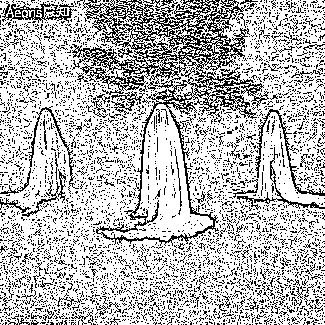

Inanna 的下降

Inanna 最重要的神话，始于女神“侧耳倾听伟大的下界”。她放弃了自己的七个崇拜城市的神庙，事实上代表着放弃了所有的天地荣耀，并且开始准备“没有旅行者返回\不归之路”的旅程。她聚集了自我的七个文明属性，把它们变成王冠、珠宝、王袍之类的女性魅力展现，作为自己的保护装备。她指示忠实的仆人 Ninshubur，如果自己没有返回该怎么办——去找她的长辈们，敦促他们不要让自己的女儿死亡。       

到达冥界的门外时，她宣称自己是“天之女王，在去往东方的路上”，冥界的守门人 Neti 表示怀疑：“如果你真的是 Inanna，天之女王，在去往东方的路上，为什么你的心会引导你走上不归之路？”于是 Inanna 回答说，自己是为姐姐 Ereshkigal 而下降冥界，并且出席姐夫 Gugalanna 的葬礼。Neti 仍然不能确定，他让 Inanna 等着，自己去通报冥界女王。 

Neti 找到冥界女王 Ereshkigal，告诉她光辉灿烂的 Inanna 等在宫殿门口，还告诉她 Inanna 已经准备好了自己拥有的七个自我属性。Ereshkigal 很生气，反复思考后告诉 Neti：把冥界的七道门锁起来，再一道接一道的打开，让 Inanna 进来，每经过一道门就移除她的一件服饰，让神圣的天界女祭司卑微低下。

Neti 按照吩咐，锁上了冥界的七道门，然后招呼 Inanna 进来。在每一个门口，Neti 都移除掉 Inanna 的一件服饰，从王冠开始，然后是青金石珠耳环、双股串珠项链、名为“来吧，男人来吧”的胸甲、金腰带、手中的青金石测量杆和线，最后是她的衣服。每一次 Inanna 问：“为什么要这样做？”Neti 都回答说：“安静，Inanna，冥界的规则是完美而无可质疑的。”

最后，Inanna 赤身裸体，卑微低下的进入冥界女王的宫殿。Ereshkigal 端坐在她的王座，面对着 Inanna。Annuna，冥界的法官们，环绕着 Inanna 并对她作出宣判。接着 Ereshkigal 把 Inanna 固定在死亡之眼上（死亡之眼，传说中 Ereshkigal 拥有可以冻结生命的眼神），对她怒语相加，对她内疚哭泣，然后击打她。Inanna 变成了尸体。一块腐烂的肉。挂在墙壁的钩子上。       

三个昼夜后，Inanna 没有回来，她的忠实仆人 Ninshubur 开始为她哀悼，在公众场所为她击鼓，并来到 Inanna 的祖父、父母的神庙祈求救援，但他们都生气的拒绝了。

最后，Ninshubur 来到 Inanna 的外公 Enki 的神庙祈求救援。Enki 对 Inanna 的行为感到困扰和悲伤。他从自己的指甲下挖出一些污垢，把污垢变成了中性的生物：kurgarra 和 galatur。他把生命之食交给 kurgarra，把生命之水交给 galatur，指示他们如何像苍蝇一样进入冥界。在那里，他们将会看到冥界女王 Ereshkigal，如同分娩的女人一般痛哭和抽搐。Enki 告诉他们，当她为自己的内在和外在哭泣时，他们就给予相同的回应，这样就能请求她——而她也愿意，回馈一份礼物，但他们只能要求挂在墙上的尸体作为礼物，然后洒上生命之食和生命之水，Inanna 就会复活升天。  

kurgarra 和 galatur 按照吩咐，像苍蝇一样滑过冥界大门的门缝，进入了女王的宫殿。Ereshkigal 正在痛苦呻吟，如同分娩的女人一般。当她哭泣着她的内在，她的外在，她的腹部，她的背，她的心……kurgarra 和 galatur 都回应和同情了她的痛苦。女王停下来看着他们，问他们是谁，为什么会同她一起呻吟、抱怨和叹息。然后她提供了祝福和礼物：先是水之礼物，让河水充盈；然后是粮食的礼物，丰收的田地。但他们都拒绝了。女王问他们想要什么，他们只想要挂在墙上的尸体。

女王把尸体赐给了他们。kurgarra 将生命之食洒在尸体上，galage 将生命之水洒在尸体上。Inanna 复活了。而当她从冥界上升时，法官 Annuna 抓住了她，她必须找一个替死鬼。

于是冥界的魔鬼 galla，被指派陪同 Inanna 一起寻找替死鬼。他们先后遇到了 Ninshubur、Inanna 的两个儿子，三人都穿着脏麻衣哀悼她的死亡，并对她五体投地施礼，所以 Inanna 拒绝他们做替死鬼。当他们来到乌鲁克，看到 Inanna 的丈夫 Dumuzi 坐在他华丽的宝座上，穿着最好的衣服，没有表现出一丝悲伤，Inanna 就让 galla 把他带走了。        

Dumuzi 求助天神 Utu 帮自己逃脱魔鬼，先变成一条蛇，又变成瞪羚。Dumuzi 的妹妹 Geshtinanna，试图保护她的兄弟，即使受到酷刑也没有招供。最后，Dumuzi 被一个朋友背叛了，那个朋友接受了水和谷物的礼物贿赂。           

Geshtinanna 为哥哥哀悼，并愿意分享他的命运。Inanna 因为这样的悲伤和自我牺牲而感动，最终干预并裁决了 Dumuzi 和 Geshtinanna 的命运：每年各半年时间，两人轮流待在阴间和阳世。Inanna 使他们永生不朽。这个神话结束于对 Ereshkigal 的歌唱和赞美。  

解释

Inanna 降入冥界是一个非常深邃的神话，超越了创世神话的象征意义，它解释了季节的成因（Dumuzi 和 Geshtianna 在冥界中轮流半年时间）和王权的建立。因为这个神话描述了她在成为女王、妻子、母亲、并取得了伟大的英雄壮举后的演变，下降实际上象征了她的灵性启蒙。

例如，在神话中，她放弃了女祭司职务和七个崇拜城市的神庙，从而放弃了在世俗世界中的地位和权力。她放弃了天地，放弃了地上的财产和一切在平凡生活中被视为有价值的事物。自愿放弃世俗的价值观，是进行任何一种灵魂旅程的必要条件，也是对任何一个想要追寻这种启蒙之路的人的基本要求。  

同时，她认识到有必要保护自己，不能在没有准备的情况下“静静地进入那个黑暗的夜晚”。她用那些能带来最佳帮助的文明属性来装饰自己，因此当它们从冥界的七个门口被移除时，就显得极为重要。

她还指示忠实的仆人如果自己不回来该怎么办。“忠实的仆人”Ninshubur，是神话的关键组成部分，她被认为是 Inanna 的女仆或总管。在 Inanna 和智慧之神 Enki 的神话中，Ninshubur 来解救 Inanna，避开了凶猛的使者，以阻止 Inanna 把文明属性带入到人性。Inanna 把她描述为：“曾经的东方女王，现在 Uruk 圣庙的忠实仆人。水不曾触碰你的手，水不曾触碰你的脚。给我忠言的苏克棚（sukkah，是犹太人在庆祝住棚节期间所住的临时棚屋），为我战斗的卫士。”           

Ninshubur 似乎没有属于自己的生活，没有超出她服务能力的特异属性。也没有自我，她只需精准有力地执行 Inanna 指派的任何事务。佩雷拉（Perera [2]）将她描述为一个“女人最深刻的自我反思模范、祭司职能，在灵魂受到严重威胁时，对自我指令的简单执行体。”“她似乎代表了灵魂下降时仍然待在地上的一小部分自我，心灵中仍有意识和运作的方面，可以看到下面和上面的情况，对灵魂的命运保持感知和关照。”

Ninshubur 这个名字的含义就是“东方女王（Queen of the East）”。值得注意的是，Inanna 在冥界门外宣称自己“在前往东方的道路上（on her way to the East）”。这个短语存活在现代共济会中，一个候选人在入会仪式上首先要宣称自己正在前往东方的道路上（on his way to the East）。在此之前他会被警告说：他永远不会从自己的追求中返回；在此之后，他进入内在，开始的严峻的考验（Ordeal），这是真正的入会仪式。显然，Inanna 也在类似的追求中。  

Ninshubur 做为顾问和战士、做为手脚不曾触碰过水的人（水象征情感）、曾经的东方女王、Inanna 的忠实仆人，拥有 Inanna 的高级自我的所有属性。而从 Inanna 的观点来看，面对启蒙的严酷考验（进入冥界），还有什么是比一个人的高级自我更好的保护措施？事实也证明，是 Inanna 的高级自我介入并最终挽救了她的生命。           

冥界女王 Ereshkigal，可以看做是 Inanna 被忽视的黑暗面，天之女王的那些无情的、缺少关爱的、自我放纵的、本能的部分，充满愤怒、贪婪、绝望的孤独。Ereshkigal 有一种渴望是获得性满足，一个以前没能得到满足的渴望。佩雷拉[2]将她描述为“自相矛盾，即是船只又是船桩。她是所有人的昆达里尼根源——一种惰性的、卷曲睡眠的意识能量。她是潜在生命静止栖息的地方——但处在分娩的痛苦中；在所有语言及其区别之下，而不是判断和行动之下。”“她有一种能力：原始的愤怒。她充满了愤怒、贪欲，害怕失败，甚至害怕自私。”

Ereshkigal 对 Inanna 的反应是可以理解的，因为 Inanna 的光辉、荣耀、过往的活动，某种程度来说是建立在 Ereshkigal 的损失上。因此，她的反应先是愤怒，其次是兴奋的破坏，痛苦，最后是感激和慷慨。

面对一个不受欢迎的拜访者，她最初的反应是无意识反抗的混乱防御。

【“她派自己的守门人处理入侵者，让一名男性来保卫她……这让人联想到一副混乱防卫的复仇女神形象，愤怒、贪婪、敌意满满，是不可避免的冥界典型特性，也是无意识对不速之客的反抗。”[2]】

很多关联表明，Ereshkigal 即 Lilith 的黑暗面，无情地摧毁“所有不是我们真性情、或不适合的生活道路

【她不会通过揭示它是什么来引导我们达成目标，而是消除它不是的一切。Lilith 的黑暗面关闭了我们面临的所有错误之门……黑色 Lilith 将接受我们真正的个性，不是在分离的层面上，而是在我们的本质上。当我们真正承认和表达真实的自我时，就不会伪造自己以便被别人接受。[3]】” 

Inanna 下降的七个阶段，冥界的七道门，可以被认为是早期的“七面之舞（莎乐美之七面纱舞）”，在其中我们放弃了对生活的根本幻想。在 Inanna 的例子中，她每一次被移除服饰都是一个象征性的损失，分别代表了昆达利尼脉轮的失去。例如：      

王冠——她的神性，她与天堂的联系，顶轮。

青金石珠耳环——她的神力感官和法力表现，第三只眼，眉心轮。

双链珠项链——她迷人的光芒，喉轮。

名为“来吧，男人来吧”的胸甲——她的情感心脏，心轮。

金腰带——她的自我，腹腔神经丛，太阳轮/脐轮。

手中的青金石测量杆和线——生殖层面的意志，脐轮/生殖轮。

衣服：王袍和腰布——她的性别角色，海底轮。  

Inanna 为下降做的最初准备是放弃了世俗财产和地位，但这还不够，下降到冥界需要付出更多。  

进入冥界后，判决宣告 Inanna 败诉（外部世界给每个人的反对票都是不可避免的判决），愤怒和内疚砸过来，她的身体被自己的黑暗面击伤了，结束了启蒙的第一个决定性阶段，她“变成了尸体，一块腐烂的肉，挂在墙壁的钩子上。”这暗示着——没有了我们精心准备出来的自己，我们就是一块死肉！ 

但是，Inanna 还能依靠高级自我和神圣的干预。

三个昼夜之后（三个夜晚，传统上被视为“黑月亮”时期，源自 Inanna 被认为是“月亮的第一个女儿”），Ninshubur 公开哀悼，为 Inanna 击鼓、绕行神庙、穿麻衣，撕扯自己的眼睛、嘴巴和大腿，并来到 Inanna 的祖父、父母的神庙祈求救援

【Ninshubur 哭着说，他们不会让自己那明亮的白银被灰尘覆盖，不会让自己那珍贵的青金石碎成石头，不会让自己那香草黄杨木被砍成木头】。

但是他们都因为 Inanna 走上了和自己方向不同的道路而生气。在经典的父权制反应下，他们回答说，Inanna“得到了应得的东西”，他们不会为了拯救她而违反冥界的规则。

在 Inanna 的外祖父、智慧之神 Enki 那里，Ninshubur 得到了完全不同的回应。Enki 明白 Inanna 所承担的旅程的价值，同情她的困难，明白她对人类的重要性。他动之以情，即兴创造了当下需要的东西。       

Enki 明白冥界的属性，它由嫉妒而痛苦的 Ereshkigal 所统治。然而，他也有力量进行创造和推动。从指甲下的污垢里，他创造了 kurgarra 和 galatur——无性别的本能化生物，创造者赋予他们作为专业哀悼者的艺术与同情的才能，能够反映出孤独的冥界女王的情绪。“他们是谦卑的、非英雄属性的生物，没有定义，甚至需要被分开定义，没有任何关于‘自我需要’的意识。这些小小的无性生物，象征了从黑暗女神那里获得祝福所必需的态度。”[2] 

当 kurgarra 和 galatur 到达时，像苍蝇（最低等的生物）那样滑入冥界门缝。Ereshkigal 呻吟着，“如同分娩的女人一般哭泣”，分娩隐喻了重生的痛苦，她需要重生 ，从“女性的夜间形态——强大的、肆虐的、性欲的、以及由于生活中遭受否定拒绝而累积的重重伤口——而且只能在身体的结合中寻求安慰。”[1] 而这种“分娩”或“呼唤”，可能正是 Inanna 在伟大的上界听到并回应过的。Ereshkigal 抱怨着她的内在和外在，Inanna 的死亡使她几乎无法承受，因为 Inanna 就是她自己的另一面。

kurgarra 和 galatur 陪同 Ereshkigal 一起呻吟，用关爱的附和声安抚她的痛苦，并在她的苦难中肯定她。Enki 知道，抱怨是黑暗女神的一种声音，是表达生活的一种方式，能够有效深入女性的灵魂。这种抱怨并不是要求缓解问题，而只是简单地陈述事物，像她们感觉到的那样——敏感和脆弱的存在。不必用禁欲式英雄的超我视角来判定这种抱怨是愚蠢的和消极的，而应该把它看做独立存在的事实——“事情就是这样。”痛苦本来就被看作是崇拜的一部分。

 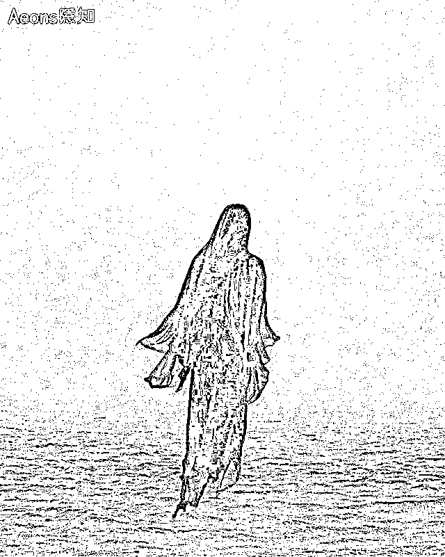

kurgarra 和 galatur 在她的痛苦中给予的关心，让女王很受触动，她开放了自己，并赠与了肥沃和丰产的礼物。然而，按照 Enki 的指示，kurgarra 和 galatur 拒绝了，并且请求女王赐予“她最想赐予但又最难赐予的礼物”：他们请求她释怀一部分的痛苦，以及释怀她那些包含在爱情女神中的绝望和愤怒——他们要 Inanna 腐烂的尸体。当 Ereshkigal 能够释怀她的仇恨，以及她的部分痛苦时，kurgarra 和 galatur 将生命的食物和水洒在 Inanna 的尸体上，女神重生了。

然而从冥界上升时，遇到了困难。法官 Anunna（又名 Anunnaki）必须维持冥界的规则，但也必须处理 Inanna 在冥界中重生的事实，这是一个特例。他们的策略是告诉 Inanna，她必须找一个替死鬼顶替自己的位置。本质上讲，Inanna 不允许再次忘记被忽视和被遗弃的姐妹，做为自己的一部分的 Ereshkigal。沃尔克斯坦[1]（Wolkstein）认为，这个由伟大上界（意识）创造的，联通到伟大下界（无意识）的通道，必须保持开放。因此，冥界的魔鬼 galla，那些“不能被贿赂者”，陪着 Inanna 一起离开冥界。  

Inanna 恢复了生命的元气，但却被魔鬼包围着。她的出现是令人厌恶的，因为她必须向别人索要自己的生存。任何从隐蔽中走出的人，准备贯彻自己的立场时，都会有同样可怕的特征。而每个懂得变革和生存需要祭品的人，都是最恐慌的逃避者。

即便处于魔鬼状态下，Inanna 也明白 Ninshubur 和两个儿子对自己的关心和付出，不愿让他们做替死鬼。而那个做为大地之王的配偶却悠然生活着，像没有发生任何事情一样。当 Inanna 冒险进入未知领域进行终极追求时，Dumuzi 已经把注意力转向了大地上的成就，越来越喜爱他的王位了，既没有为自己丢失的妻子哭泣，也没有在她回家时跑来迎接。此外，Dumuzi 既然敢和女神建立亲密关系，也就必须做好准备承担代价。

【Dumuzi 是合乎逻辑的候选人，因为只有她最爱的配偶才能等同于 Inanna。】

他不愿做替罪羊的逃跑企图，背叛了他的需要，“他需要自己下降到冥界，找到一个他能无条件接受和平等互敬的内在女性，并建立关系。”[2] 

Dumuzi 试图逃避命运时，首先变成了一条蛇，蛇是智慧的象征：（衔尾蛇）圆环中没有死亡，生命周而复始。

【“Utu，太阳神，作为对 Ereshkigal 的平衡，像 Enki 一样，不在家长式的标志性模式下，不是对手方，而是作为女性化的补充存在。太阳神和黑暗女神是神秘圣殿的支柱，具有智慧的转化作用。在这个神话中我们没有找到稳定的解决办法，除了深刻的智慧，没有任何解决办法。”[2]】

Dumuzi 也求助于妹妹 Geshtianna。Dumuzi 虽然是国王，但缺乏对他人的理解和同情、奉献和归属感，所以他求助于妹妹的女性智慧，Geshtianna 最终奉献了自我。 

*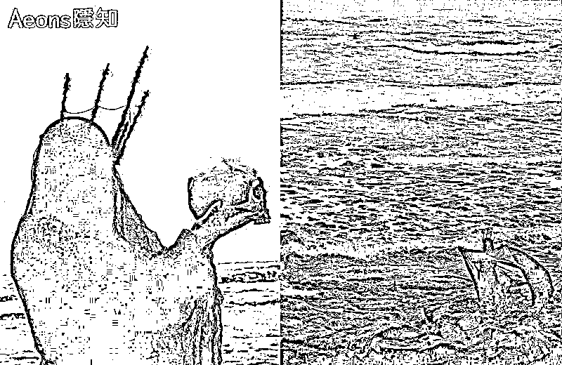*

Geshtianna 甘愿忍受酷刑，保护她的兄弟，随后又在冥界中分享他的命运。这并不是耶稣那种为所有人的罪而死的伟大姿态，而是一种更加个人化和深刻的女性化行为。她的行为是出于爱和悲伤，尽自己的所能，赎回即将失去的兄弟。她不逃避命运，而且无论怎样都不去诋毁。因此，Geshtinanna 结束了替罪羊模式，让自己遵从女神的光明面和黑暗面，成为“整个启蒙过程的结果和代表”。[2]

【Geshtianna，名字意为“天堂之藤”，在神话中被认为是一个“智慧的女人”。出于为人类服务的角度，她尽其所能的赎回了一个即将没入冥界的人。“她默认了自己的牺牲……即不逃避命运，也不像 Gilgamesh（吉尔伽美什）和父权制那样诋毁命运女神。她是自愿的，在这个勇敢、清醒的默认下，她选择面对冥界来终止替罪羊的模式。”[2]】 

【随着光环的消失，Dumuzi 在大地上不再受欢迎，Inanna、Dumuzi 的母亲和妹妹为他的命运而哭泣。虽然 Inanna 故意否定了自己心爱的伴侣，但是，“地球生命的本质以及女神本身，阻止了她有一个不死的单身伴侣的可能性。”[2]】  

【Geshtianna 的奉献，使 Inanna 女性化的两面相遇了：激情和同情，意志和感觉。这是她在大地上的姐妹，Geshtianna 的存在，完成了 Inanna 地上的旅程，使她和 Dumuzi 重新建立联系，从另一个角度说，和所有的生命重新建立联系。】

【在阿拉利 Arali，去往伟大下界路途上的一个停留处，Inanna 裁定兄妹两人轮流在冥界中度过半年。Dumuzi 也因此与复合的女神 Inanna-Ereshkigal 结婚，体验到了所有的女人，对爱情女神和死亡女神有了同样的了解。】

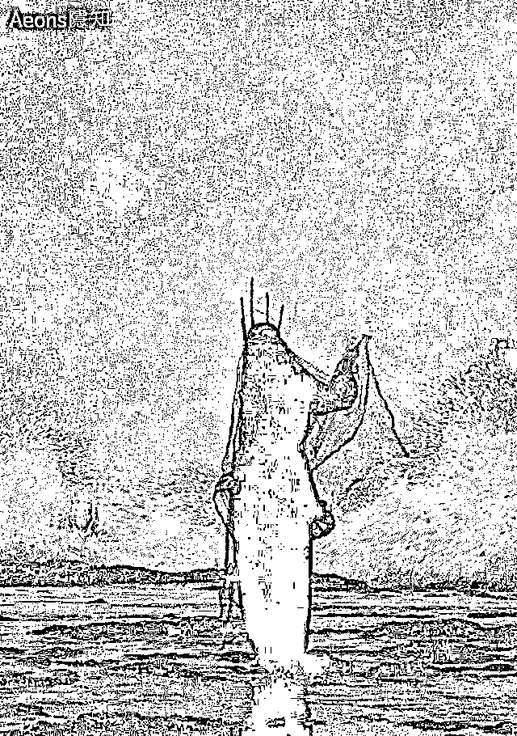

下降的原因

在苏美尔语中，耳朵和智慧是同一个词。

【例如智慧之神 Enki，据说他的耳朵是“敞开”的，拥有未过滤的接受性。】

因此，当 Inanna 侧耳倾听伟大的下界时，意味着她正在寻求智慧和理解。到达冥界门外时，她说自己正在前往东方，这是她进入启蒙考验的标志。佩雷拉（Perera）认为，Inanna 的下降故事“是进入奥秘的启蒙过程”“Inanna 向我们展现了这种方式，她首先献祭自己，用深邃的女性智慧来赎罪。她下降，屈服，死亡，这种开放性的行为，是人类灵魂面对超越个人的经验时，所应有的本质。它不是被动的，而是积极的接受意愿。”这就允许另一个人对她施加影响。     

Inanna 下降冥界的原因，也有“因为……我的姐姐 Ereshkigal”，这个征象表明，Inanna 有可能听到了自己被否定的、阴暗的那一面的痛苦和愤怒，并且愿意承认遗弃和内疚的感觉。这就是 Inanna 面对自己黑暗面的意义，也是接近现实中黑暗力量和无意识的一种方式，一个慢慢剥离开自我认同和防御机制的过程。[2]  

在早期的神话中，Huluppu 树，作为青少年的 Inanna，曾经受到过 Lilith 的惊吓，Lilith 是 Inanna 忽视的、受伤的、汹涌的性欲一面。强大的 Lilith 不得不被送走，Inanna 的生命探索能力才得以发展。但现在这些特性必须获得重生，也许它们就是 Inanna 在伟大的上界听到并回应的那些 Ereshkigal 的痛苦或“呼唤”。

【“Inanna 挑战她的平等，获得如同她所忍受的痛苦一般的下降，也许还会索取同样的力量和智慧。”[2]】 

Inanna 下降的另一个原因，是为了出席天堂公牛 Gugalanna 的葬礼。从这种仪式中获得的经验和认知是强有力的，这可能也是她下降的一部分动机。对于 Inanna 来说这是特别的真理，因为 Gugalanna 像她一样浮躁和情感激进。他们在重生之前，必须对旧习惯有死亡意识。正如 Pluto，罗马神话中的冥王，在占星学中象征着死亡和重生——先要死掉，才能重生。

最后，在审查 Inanna 下降的原因时，我们可以考虑佩雷拉[2]的观点：“Inanna 的苦难，受辱，蒙羞，鞭打和死亡，她下降的地位，她在冥界‘被钉上十字架’，以及她的复活，都预示着基督式的激情，也许是已知的第一个‘为了挽回大地的荒芜（例如冬季）而牺牲’的神圣原型。（但是）Inanna 牺牲自己不是为了人类的罪，而是为了地球上生命循环的需要，她更关心生命本身，而非善恶。”

作为心理工具的下降到冥想

根据佩雷拉[2]的说法，“所有的下降都能进入不同层次的意识，提高生命的创造力。所有这些都意味着痛苦，所有这些都可以提供精神启蒙。冥想、梦、积极的想象力属于下降的方式，沮丧、焦虑症、迷幻药的经历也一样。”

这种下降的原则，是放下幻想和老朽的世俗生活模式。Ereshkigal 的境界就像印度教女神 Kali 那无分别的火焰一样，结合时间和痛苦，在得到新的生命前，磨除所有的分别和自我。这是对伦理之上的自然法则的信奉，承认生命的无常和轮回。Inanna 仍然可以给她的配偶一份主动的爱和关怀的拥抱 (Inanna 式)，随即后退，失去兴趣，一人独处，甚至无情(Ereshkigal 式)。这种做法并非病态。

重要的一点是，要明白 Hades 和冥界不能等同于基督教的地狱。希腊神 Hades 作为冥界的统治者，被称为“好东西的提供者”，是财富之神，经常用聚宝盆或丰饶之角来描绘他。在埃米利斯（Eleusis），Demeter 的艾琉西斯之谜的遗址（Eleusian Mysteries，后来希腊人自家的仪式化下降）发现的一段铭文中，下降到冥想的最终结果被赞美道：“祝福之神赠予我们的秘密真的很美：死亡对凡人不是灾难，而是祝福。”[3]      

能够做到不去关心与外界相关的事情、与集体组织及其模范相关的事情，最初可能是非常令人恐惧的，因为这不能被你想要解放自己的集体所接受。但是，这种放下、不去关心的行为，可以提供一种全新的觉知，Enki 式的创造性视角反应了当下的需要、新的模式和永无休止的探索。

【这种观点可能是激进、危险的创新，但并非是邪恶的。这也可能会让人感到怪异或丑陋，“因为它剪除了我们的防御，剪除了为获得集体的谅解而承受的牺牲，也剪除了寻求安全归属的期望……破坏和转变成一个全新的东西，是现实循环的一部分。这些认知通常是人们难以接受的，但是知道这些基本现实，一名女性就可以不再试图讨好父母和阿尼玛斯 animus，省得在无关紧要的地方跌入谷底。”[2]】

【“男性成长过程的主要区别产生在后半生，大多数男人一旦在童年时期释放了自我、接受了世俗文化观，就没有必要再进入被压抑的深渊，因为他们得到了外部世界的支持，而且没有内在的不和谐。渐渐地，由于没有足够的获得广泛认可的男性样本，可供组织起来形成男性自我成长的范例，而英雄式的理想自我也被认为是不够充分的，越来越多的男人被迫以不同的方式与自己的深渊联系，通过挑战自我下降来让自己恢复被压抑的本能和形象。” [2]】

【“不能与内在的美杜莎和平共处的男人，会将女人的性感看作是吸引他们着迷的东西，也看做是他们自我毁灭的根源。当他们试图通过摧毁怪物来保护自己免受其可怕的威胁时，他们会无意识地激发出自己生活中的美杜莎女人，阉割他们的身心进行报复。一个渴望与女性的 Lilith 性感建立良好关系的男人，必须使自己下降到无意识层面，倾听和同情被他斩首的美杜莎的痛苦，治愈她被拒绝的伤口，然后全身而退，返回地面世界。当英雄正式与母亲分离后，他必须与自己内心的黑暗女性重新建立一种爱的连接。如果他做不到这一点，就会被困在一个具有破坏性的两性关系网中。”[3]】

最终，下降到黑暗、进行精神启蒙之旅的目的，是为了自我赋权。做好自我的准备，依靠神的帮助，走下悬崖，开始“ 愚人的旅程 ”。移除心灵的朽木，要知道现代物质生活的价值观都是错觉。无论是在冥界七道门前移除我们的生活、我们最基本的身份，还是在日常生活中非戏剧性的基础上处理同样性质的死亡和重生，我们都要让自己深入心灵，在底部找到纯金和启示。当一个人没有什么可失去的时候，当别人没有什么能损害到你的时候，甚至不再畏惧死亡，那就是把这些可能性变为无限、一个人可以真正赋权的时候。   

参考文献：

[1]  Wolkstein, D. and Kramer, S.N., Inanna, Queen of Heaven and Earth; Her Stories and Hymns from Sumer, Harper and Row, New York, 1983.

[2]  Perera, S.B., Descent to the Goddess; A Way of Initiation for Women, Inner City Books, Toronto, Canada, 1981.

[3]  George, D., Mysteries of the Dark Moon; The Healing Power of the Dark Goddess,  Harper San Francisco, Harper Collins Publishers, New York, 1992.

[4]  Robbins, T., Skinny Legs and All, Bantam Books, New York, 1990.

翻译｜指引社·翎人

排版｜指引社·阿烬

指引社，致力于让“神秘学”走向大众，不再“神秘”。杜绝神棍，欢迎撩或聊

长按二维码关注我们

点击“阅读原文”，去指引社看原贴

# 指引社公众号-食用指南

> 原文：[`mp.weixin.qq.com/s?__biz=MzI5NTQzMDUzMQ==&mid=2247483709&idx=3&sn=102da7a6997d227d30b6d163c154bb3f&chksm=ec52f1d1db2578c73855b0a0161b1762002a7415fc0ceb0523b82e09f52b5e18bfcb018f306c&scene=27#wechat_redirect`](http://mp.weixin.qq.com/s?__biz=MzI5NTQzMDUzMQ==&mid=2247483709&idx=3&sn=102da7a6997d227d30b6d163c154bb3f&chksm=ec52f1d1db2578c73855b0a0161b1762002a7415fc0ceb0523b82e09f52b5e18bfcb018f306c&scene=27#wechat_redirect)

点击蓝字关注这个神奇的公众号～

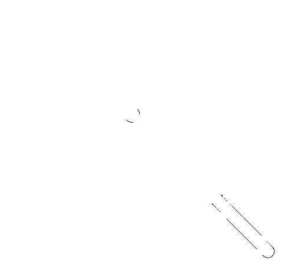

玩

法

前

言

大家好！指引社 App 上线期间，社长每天都焦头烂额地守着后台，生怕有 Bug

于是，作为公众号的小编，我欢脱地产生了一种“老板不在家老子使劲儿浪”的心态。

公众号建立之初，有很多不完善的地方，还请大家多多指教，欢迎提意见。

（开心就回复你，不开心就……默默改正……然后不回复你……）

本篇是第一个玩法指南，后续会进行诸多更新，还请大家多多指教哟~~~~~~~~

卖萌给你看(๑•ᴗ•๑)

公众号简介

精选指引社论坛，App 上的历史文章，每周会进行不定期推送。

有深度的专业知识翻译，也有非常适合小白们的趣味文章~

也许……还会有小编恶意卖萌，或者抖黑料的内容……也说不定……

一定要关注公众号哟~以后我一定给你们很好看！的文章！！！！

欢

迎

关

注

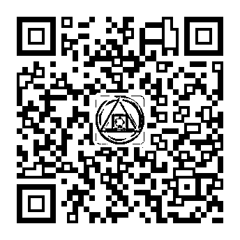

长按关注

每周涨姿势

版权问题

翻译类的文章，会著名原作者。如对原文原书甘心去，还请多多支持正版。

翻译后的汉语文字，版权归译者所有。如转载，还请联系译者（每篇结尾会放上原文链接，可直接给译者发站内私信）

原创文章，版权归作者所有，还请与作者联系。

下载 App

本公众号内容，都由 App 中精选而来。

可扫描下方二维码，关注 App

# Picatrix 导读『1』：一本魔法书的历程

> 原文：[`mp.weixin.qq.com/s?__biz=MzI5NTQzMDUzMQ==&mid=2247483674&idx=1&sn=ecab6ae6bf190969a9ee61bef1b682bd&chksm=ec52f1f6db2578e074926588c217f8105482ba3f50a276e4fc92ccb14489f1347a303d52aa35&scene=27#wechat_redirect`](http://mp.weixin.qq.com/s?__biz=MzI5NTQzMDUzMQ==&mid=2247483674&idx=1&sn=ecab6ae6bf190969a9ee61bef1b682bd&chksm=ec52f1f6db2578e074926588c217f8105482ba3f50a276e4fc92ccb14489f1347a303d52aa35&scene=27#wechat_redirect)

Picatrix  导读  

**作为中世纪最重要的魔法书，Picatrix 讲了什么？它是不是克苏鲁《死灵之书》的原型？Picatrix 中的魔法能否在当下使用？让我们跟随英译者 Greer 和 Warnock 的脚步，走近这本神奇的魔法书——Picatrix。**

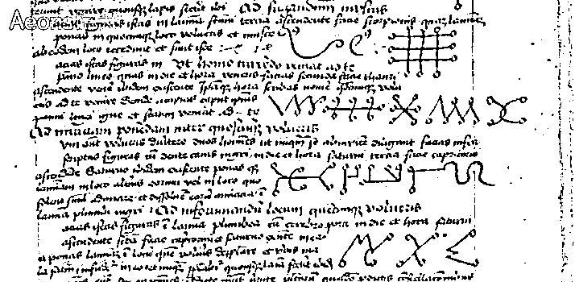

**Picatrix：一本魔法书的历程**

**——英文版译者前言**

**英译者（本篇）：JohnMichael Greer & Christopher Warnock**

**中文翻译：羽落弦**

**在这个标榜“古典”的广告语满天飞的时代，想要介绍一本真正古典的神秘学著作非常困难；而你现在所拿到的这本书，只能用这个词语来形容。Picatrix 成书于公元 9 世纪的北非或者西班牙，由一位匿名的阿拉伯法师撰写，并因著名的苏菲派学者 al-Majriti 而盛行一时。它最初的名字是“Ghayat al-Hakim”，即“贤者的目标”。**

**和其他许多阿拉伯神秘主义著作一样，这本书最终传入到欧洲，并在卡斯提尔国王、智者阿方索执政的 1256 年被翻译为西班牙语和拉丁语，获得了新的名字“Picatrix”。当代的学者们不能确定这个名字的含义。看上去最有说服力的一个版本是，这个名字是对希腊词源“Buqratis”的阿拉伯语音译再转回拉丁语所得；虽然没有确切证据，其可能指代的是希腊化的埃及神、主司沉默与神秘的哈尔奎迪斯（Harpocrates）。而拉丁版本则将这一疑团解释得更加神秘，声称 Picatrix 就是这本书作者的名字。**

**Picatrix 对西方魔法传统的影响不可小觑。中世纪晚期大部分重要的神秘学者们都引用过它，或者从其他作者手中借阅过它。例如，以《赫尔墨斯文集》（Corpus Hermeticum）译本启动了文艺复兴时期的神秘学复苏的翻译者——马尔西利奥·菲奇诺（Marsilio Ficino），就以本书为借鉴，撰写了他开创性的作品《生命三书》（Three Books on Life）。海因里希·科尼利厄斯·阿格里帕（Heinrich Cornelius Agrippa）的《神秘哲学三书》（Three Books of Occult Philosophy）更是受到了 Picatrix 的重要影响。16、17 世纪引领英国神秘复兴的领军人物西蒙·福尔曼（Simon Forman）、伊莱亚斯·阿什莫尔（Elias Ashmole）、威廉·利里（William Lilly）也将这本书作为魔法研究的首要资料。然而，随着文艺复兴时代的结束和主导了 17 世纪的科学唯物主义的兴起，Picatrix 从人们的视线中消隐；甚至在 19 世纪中叶西方世界的魔法学复兴运动中，这本书仍然被人们遗忘。如今，研究这本西方神秘学主要著作的人更是少之又少。**

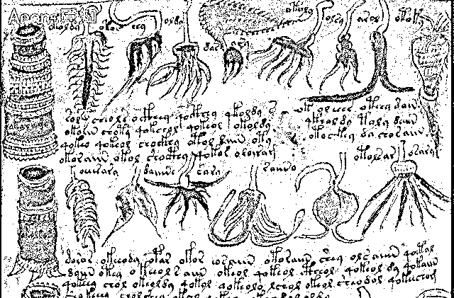

1

# **历史背景中的 Picatrix**

**快到万圣节啦**

**想要理解为何 Picatrix 会在当时造成重大影响，又为何被当代的人们彻底遗忘，则需要全面地去了解这部非凡的著作。Picatrix 与其后一个年代的魔法书不同，它不是单纯的魔法配方或仪式的集合。虽然包含着许多对魔法流程的详细指导，但它的核心旨趣却是哲学的。可以说，这本书是在当时印度以西的国家中，最为重要的魔法哲学论著之一，上承 4 世纪杨布里科斯（Iamblichus）的《论奥秘》（On the Mysteries）、下启 16 世纪阿格里帕的《神秘哲学三书》。**

**与杨布里科斯和阿格里帕著作的理论背景一样，Picatrix 的魔法哲学建立在新柏拉图主义之上；并辅之以杨布里科斯之后、新达尔文主义魔法观中影响深远的占星神秘学，使本书的理论体系更加丰富。这一点也和阿格里帕一致。作为新柏拉图主义者，Picatrix 的作者和大部分读者都持有这样一种观念：世界是存在物的等级序列，神性的影响从顶点逐级流溢。魔法师的工作就是去把握神性流溢的各种路径，并在其力量最强之处实施魔法。**

**Picatrix 不仅仅是对魔法哲学的讨论，还包括了大量的神秘学实践知识，这些知识收集自成书前两个世纪中的阿拉伯神秘学者们。其中大部分是新柏拉图主义的秘术实践，和美索不达米亚的星体魔法。还有的内容与古埃及魔法实践密切相关，以及一些从印度传承的法术。其收录的魔法技艺之多，是中世纪其他魔法书无可比拟的。**

**此外，Picatrix 中的许多魔法采用了一种在少数其他书籍中也可见到的特殊方式。这种方式似乎被定名为拉丁文献中对魔法最常用的称呼：“nigromantia”。其字面意思是“黑魔法”（black divination），就像是现代间谍小说中对阴谋破坏和“黑色行动”的称呼。在中世纪，作为主要占卜方法的占星术通常被神学家们视作获取信息的合法的、可接受的手段；而对那些精妙的神性之流更加积极的利用，就会被正统人士认为是不可取的——但这恰恰是 Picatrix 的主题。它所教导的“黑魔法”主要是根据星象选择确切的日子来制作符咒（talisman），这样，符咒就会具有或善或恶的力量。与后来的那些魔典不同，这种工艺需要较少的仪式，并且只是对神名与言灵的有限利用；它们的魔力来源于上天。**

**Picatrix 的受众与其他许多中世纪神秘文献的读者也有区别，其匿名的作者反复强调，这本书只是为了当时的一小批特定专家所作。拉丁文献将这些特定的专家称作“sapiens”，我们在译本中将其翻译为“贤者”（sage）。但是，这里有另外一个英文单词可能更加符合作者想要指称的那群人：“魔法师”（wizard）。**

**人们常常会忘记，诸如梅林等传奇形象，或者小说中的类似角色，如托尔金（J.R.R.Tolkien）笔下的灰袍甘道夫，实际上来源于中世纪的一种真实现象：自由写作的神秘学者们，他们的学识建议与魔法力量同样有用，他们致力于成为——偶尔也会被提拔为——国王的智谋团。Picatrix 的作者在第四卷第五章合宜地列举了成为贤者的资质，包括对以下知识的熟练掌握：农业、航海、政策；军事；“帮助大众的教育技能”——语法、语言学、法律、修辞学、写作和经济学；四门传统的数学学科——算术、几何、天文、音乐；逻辑学——主要是亚里士多德的逻辑学作品；医学；自然科学以及形而上学——亚里士多德的在这两个领域的作品也被特别地列出。**

**在现代的视角看来，这些严苛的课程训练似乎与专业魔法师的工作毫不相干。然而在中世纪和文艺复兴时期的世界观中，这种训练却是必须的。不论是在市井之间依靠卜卦艰难维生，还是在皇家庭院养尊处优，魔法师的主要工作都是向雇主提供明智的建议。这种建议的源泉来自于占星术或其他占卜实践，如地占术；但也来自于对那些经历了罗马帝国的衰落而幸存于当时的知识宝库的广识博览。**

**当然，中世纪或文艺复兴的人们没有在诸如占星术等的神秘学，和诸如数学等被工业时代视作不证自明的实践科学之间划分界限。一如阿瑟·洛夫乔伊（Arthur Lovejoy）多年前卓有见解的著作《存在巨链》（The Great Chain of Being）中所述，中世纪和文艺复兴的人们认为宇宙是一个整体，世间万物通过神的流溢普遍联系，从天上的神之王座，到物质世界的最底层。所有技艺与科学在宇宙中都有它们的特定位置，人类知识的每一个分支，不论高低贵贱，都彼此投射出独特的光辉。因此，中世纪的智者，或曰魔法师，广揽所有人类知识，并运用它们为其雇主提供明智的建议，来应对艰难甚至是残酷的世间挑战。**

**（未完待续）**

**下节预告：Picatrix 与《死灵之书》**

欢迎下载指引社 APP

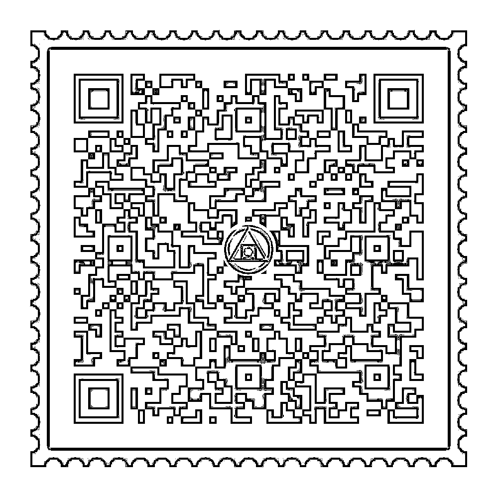

# 你会是什么味道？香气诉说入门

> 原文：[`mp.weixin.qq.com/s?__biz=MzI5NTQzMDUzMQ==&mid=2247483674&idx=2&sn=880b5ee58482342bf59bb006e5c78e8e&chksm=ec52f1f6db2578e0053b7f962b34037e253149efa35c0d81f747ee3cbdc643499ac2ccd2a9ca&scene=27#wechat_redirect`](http://mp.weixin.qq.com/s?__biz=MzI5NTQzMDUzMQ==&mid=2247483674&idx=2&sn=880b5ee58482342bf59bb006e5c78e8e&chksm=ec52f1f6db2578e0053b7f962b34037e253149efa35c0d81f747ee3cbdc643499ac2ccd2a9ca&scene=27#wechat_redirect)

**你会是什么味道？香气诉说入门**

**作者：慎小七**

**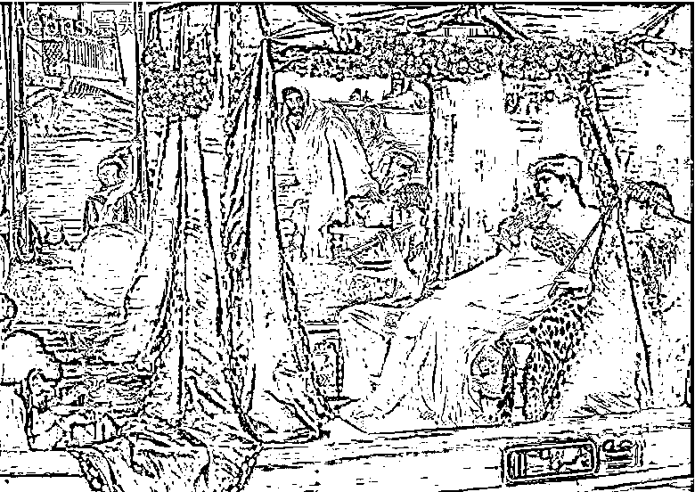**

**调香，顾名思义，它不像我们的草药油，把治愈功能放在了第一位，而是把香气的体验放在了第一位，再兼顾各种疗效。比如安神啦～释放悲伤啦～催情啦～利脑醒神等等。调香时我们可以把香赋予各种形态，香粉，香水，液体熏香，香丸 ，线香等。比较简单大众化的制作方法就是液体熏香和香水了，更具有趣味性，入门快，实用度高。当然想把它做好，做出特色来还是很考验人的，所以也仅仅是入门快，门槛低。**

**调香不是你把所有美好的气味搁在一起****“百花齐放”就行了，那样做出来的香只会让你大失所望。气味也不是越多越好，现在很多著名调香师都不再一味的去增加，复杂化自己的配方，而是去做“减法”注重气味的“留白”。前面说“百花齐放”的问题，就在告诉你气味，过于“美好的”气味叠加过于“美好的”气味就会造成竞争一般的效果，会让你的香不知所云，就像几大名角同台唱戏 ，你不让我我不让你，观众不知道该去看谁，又好比一个故事里主线太多，变得莫名其妙，又毫无个性，仿佛是东抄西抄，拼凑而来。**

**我们调香就好比“开方”一定要分出君臣佐使这样的关系，还要从气味挥发速度，香气个性上考虑出前后中调，理清故事情节 ，主线（就是主要诉说的内容，情感等）是什么。然后再谈论它的兼备功效是什么？想清楚了这些再开始选择材料。我们在选择材料时其实大可不必去害怕选择一些气味不好掌控的香料，比如有特殊气味的欧白芷，胡萝卜籽等。**

**我曾经指导过一个姑娘，我去帮她品香时发现，她总是调出“乖乖型”的香，我想可能是她这个人太乖乖女了，害怕出错，害怕调出“离经叛道”的味道，使她手下的香太过平庸，无法彰显植物本来的个性。我们在调香时不能把植物只当做是植物，想想某些植物，比如乳香，没药，它们生活在那么荒凉艰苦的环境下，从伤口凝聚香气，它们的个性怎么可能会和娇弱的香花一个样？调香就是让它们在一个瓶子里和谐相处，又不压抑其本性，让它们从高中低（前中后调）完美的唱出自己的声音，为品香人展现一篇或壮观或凄美或喜剧的故事。**

****

**在构思你的一片“巨作”时，我建议大家先闭上眼睛，冥想，在脑海里绘出你要表达的景观，构思好了后把它写出来，有时候的灵感只是一闪而过，你要快速的把它记录下来，完成了这些准备步骤之后，我们才能开始选择材料简单的罗列一些给大家作为参考：**

**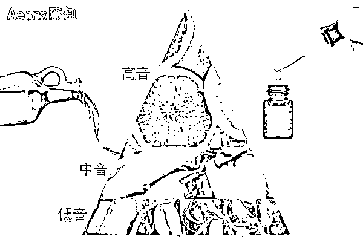** 

**前调植物**

**柠檬，青柠，佛手柑，甜橙，血橙，红桔 ，柠檬香茅，绿薄荷，绿薄荷，娜娜薄荷，柠檬薄荷，茶树，绿花白千层，白千层，澳洲尤加利，蓝胶尤加利，各种迷迭香等等 **

**我们可以说所有的柑橘属，和含有高氧化物的植物都是前调，当然也有着植物不光可以说是前调高音植物，也同时是中调植物，比如快乐鼠尾草，除了本身原因还要看植物种植方面的雨水阳光土壤气候之类的变化，也可以造成某些化学分子比例的改变，让它的音阶发生了变化。我把它说出来仅仅是一个参考，最重要的标准是你的鼻子，还有品香人的鼻子，有的人会对特殊气味敏感。我拿同一瓶香给两个人闻，其中一个人先闻到柑橘属气味，而另一个人却先闻到了后调的印度广藿香味道，即使广藿香我只作为定香剂，点睛之笔，很少量的使用，他依然是先闻到了它的气味，所以总结一下，每个人的标准是多多少少会有差别的。**

**前调的植物味道通常是开朗性的 ，在整个香当中都是先声夺人的感觉，性质活泼，且容易受到亲赖，是“小太阳”类型，新入门的朋友们最好从柑橘属开始尝试，学习如何搭配前调，柑橘属也最容易近人的，包容性也相对更大，一般来说不管你怎么搭配也不会轻易远离“及格线”。**

**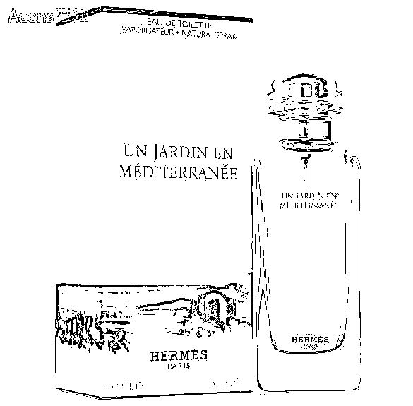**

**爱马仕的“地中海花园”就是使用了柑橘属作为前调，奠定其清新花果香为主调，花果香为主调是最受年轻女孩喜欢的，让人想起那个令人怀念的夏天，青春洋溢的气味。**

**中调植物**

**快乐鼠尾草，薰衣草，依兰，花梨木，苦橙叶，甜罗勒，各种玫瑰，黑胡椒，各种洋甘菊，橙花，丝柏，玫瑰草，阿曼绿乳 等等**

**它的味道常常在中间出现，也就是前调挥发一两分钟后渐渐清晰起来，整个香当中中调可以说是最重要的，它是你整个故事的主线，所以中调一定是最“浓墨重彩”的。个人经验觉得，中调只要搭配好了，整个故事不会差，中调通常也是我花心思最多的地方，我调香的时候会最先构思我的中调，在我的配方中， 中调就是“君” 前调就是“臣” 冲锋在前的感觉，后调就是“佐使”负责增强留香，调和诸香，有时负责点睛之笔的作用。**

**后调香料**

**各种岩兰草（香根草）， 大西洋雪松，各种檀香，永久花，没药，索马里乳香，胡萝卜籽，麝香，各种琥珀，愈创木，各种广藿香等等**

**它们通常都是大分子且分子类型多的植物，挥发的最慢，有时候单独上炉熏需要把温度调高，它们也不怕温度高，出香慢，但是香力相当持久，是马拉松式的耐力型性格。在为成熟稳重，或者绅士的男性调香时，我们可以刻意的去强调后调，加大它的用量。**

**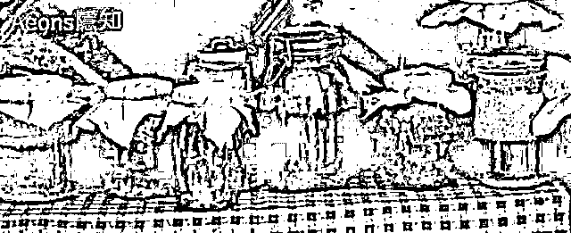**

**调香切忌死板照搬教条，一个好的调香师应该是运用灵活多变的，调香是一门艺术，也是一种情趣审美的品味体现。所以要求调香师有良好的嗅觉审美，不过你也不用想那么严重，嗅觉审美也是可以慢慢培养的，虽然我们也需要一点点天赋，但是也要记住，没人会苛刻的要求自己一定要成为一个多么了不起的调香师，调香可以作为你陶冶情操的手段，可以让你的生活更加丰富多彩。前面在说刻意强调后调的问题，那么如果加多了后调，就要适当减少前调中调，因为香气的空间展示型是有限的，这里还要注意加多了后调后有个香气留白的问题。这时就在中调的使用中选用留香比较久 而且个性鲜明，好争香竞争的植物，还要辅以柔和的且带有后调色彩气味去奠定香中稳重的部分 免得竞争香气太浓艳而显得气味有些轻浮浓重。这样即可以用争香的味道托够后调挥发出来的时间 又可以用后调和柔和的气味反过来去修饰前中的过于强烈的感觉。举个简单的栗子～**

**茉莉（阿拉伯茉莉和天星茉莉半对半）加檀香（迈索尔檀香和澳洲檀香半对半）加乳香（绿乳和索马里乳香半对半）**

**这个方子里用阿拉伯茉莉和天星茉莉做了前中调。阿拉伯茉莉就是我们所熟悉的茉莉气味，也就是小花茉莉，别看它花看起来娇弱，其实气味是很阳刚的类型，在香气治疗中很适合缺乏自信的人，它同时也对应腹轮，帮助人收拾焦虑和恐惧心态。适合男性和不够自信的女性使用，天星茉莉气味更柔和，有温暖的栀子花香，是茉莉家族中最受调香师青睐的品种，把它和阿拉伯茉莉搭配在一起，可以平衡阿拉伯茉莉过于清幽的感觉 ，阿拉伯茉莉也可以反过来防止天星茉莉过于女性化。**

**再说说乳香这一组，阿曼乳香气味清晰，有乳香中最带有前调色彩的这一说法，它有一点点柠檬味或者说柑橘味，用它可以弥补前调的空缺感，而且在后面的索马里乳香前调带苦味，阿曼绿乳也可以弥补这个不足。索马里乳香留香比阿曼乳香更久，可以帮助阿曼乳香留香，而且索马里乳香能够更好的引出檀香的木质气味，帮助檀香挥发。**

**现在就来讨论下檀香这组最重要的搭配。檀香气味别致，很适合男性使用，好多人焚香也最爱檀香，但是有一个问题要注意，纯檀香如果单独熏香很容易让人上火，燥火（如果你天天单独熏没有这种感觉可能是用了不纯的，或者质量不过关的）这个时候我就要搭配乳香了（也可以搭配其他的）乳香除了引出它的木质气味 ，也可以防止它引起燥火。我选用澳洲檀香和迈索尔檀香两种，原因嘛～迈索尔檀香有一点臊味，用澳洲檀香来冲淡这个感觉。澳洲檀香新鲜木质味比较重，是很阳光的味道，但气味又过于的飘，所以用迈索尔檀香的稳重气味拉住它。**

**此香静心凝神，让内心专注而不紧张，让人充满自信，而不自负。**

**上面我们讲了前后中调的分类方法，你也许还是一头雾水的感觉。没关系，～我们来讲一种更赋有诗意的分类，香气类型分类：**

****

**果香类：**

**葡萄柚，柠檬，日本柚，甜橙，血橙，佛手柑，莱姆等柑橘属家族，还有一些不是柑橘属的比如香蜂草，山鸡椒，印蒿，柠檬马鞭草，柠檬香茅等。**

**后面这几种植物虽然不是柑橘属，但是其气味有明显的果类味道，所以不要那么死板啦～分类不是靠出身，而是靠鼻子的感觉。**

**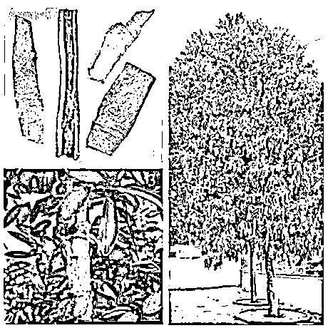** 

**香料类：**

**各种罗勒，各种茴香，各种迷迭香，黑胡椒，各种肉桂，包括肉桂叶， 辣椒，丁香等等**

**这些都是在菜谱中可以常简单的东西，可能有些人都不太理解它们如何能调香？其实啊～我是觉得香料类的用好了，会有一种异国情调的感觉，神秘而妩媚，而且好多香料类都有催情的功效，可让人放松而温暖，也很适合在冬季使用香料类最大的优点就是熟悉感，在开店做香生意的时候，运用一些有熟悉感的香料，调出合适的情境香，就会让人有宾至如归的感觉，可以增加客流量哦～比如我就见到有人用果类搭配香料类，这两种都具备大家很熟悉的香气，绝大多数情况下没有人会对它们产生排斥感。在沉闷，缺少阳光照射的冬季，人们很容易患上季节性忧郁症，使用果类加香料类可以很好的治疗这种情绪性疾病。**

**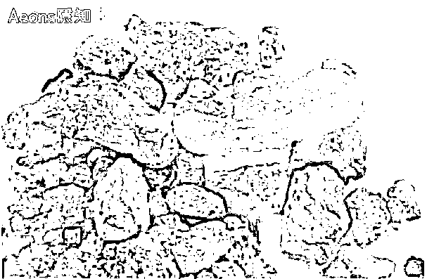**

**木质树脂类：**

**黑云杉，大西洋雪松，维吉尼亚雪松，喜马拉雅雪松，落叶松，欧洲冷杉，花梨木，安息香，各种乳香，各种没药，各种檀香，各种琥珀，等等**

**这类香会给大家带来“森呼吸”的感觉，而且伴有空旷感和年代感。**

**试想你如精灵般居住森林空旷地带，与日月星辰 ，鸟兽为伍，与天地自然仿佛融为一体。偶尔翻起过去的老照片，仿佛自己活了太多太多年，如同翻起了早已被尘埃封印的过去，万千思绪涌上心头。这就是木质和树脂类给人的感觉，是不是很有诗意又伴有说不出来的孤独感？因为它们擅长帮你翻开“过去的老照片”释放情绪，释放孤独。我来简单的讲一个过去的事情吧。**

**去年我去参加一个芳疗师的讲座班 ，就是只上一节课的那种。讲的就是释放情绪的内容。有一个环节，让我们只选一种香吸闻。当时我选了我并不喜欢的真正薰衣草，原因嘛～有一种说法是真正薰衣草代表了母亲感。我大概是因为跟我的母亲很矛盾，所以平时不是很能接受薰衣草的感觉，有一点又爱又恨的滋味。我当时闻着觉得它的味道渐渐的甜美起来，刚闻出头绪，旁边的阿姨一下子哭了出来。。。当时立刻打断了我的很多想法，然后我看见她拿的是一瓶檀香，哭的泪流面满，无法控制的感觉。然后她事后告诉我们，那一瞬间想起了很多过往的事，有快乐的，有抱憾的，还有很多再也追不上的人，还有手机里永远不会再打来的电话号码。**

**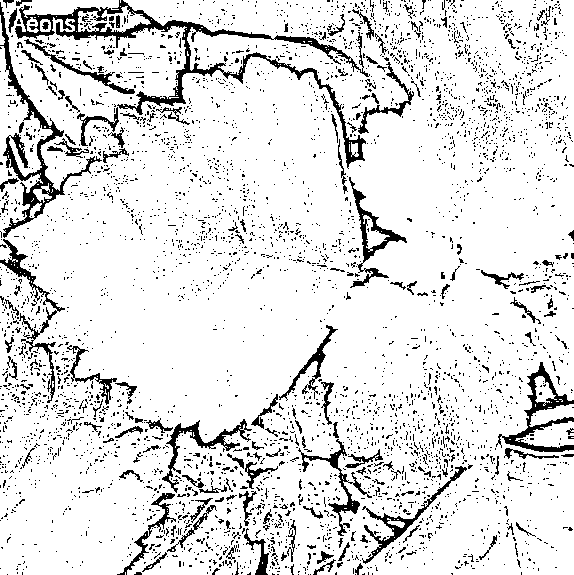**

**草药类：**

**樟脑， 芹菜籽，马郁兰，快乐鼠尾草，艾草，高地牛膝草，牛膝草，胡萝卜籽，欧芹，莳萝，鼠尾草，广藿香 ，欧白芷，圆叶当归，中国当归等等**

**这一类就是我们中国人理解的那种草药味，有的闻起来如同中药。有时候帮别人调草药油时，对方不太接受闻起来香香的感觉。可能是香香的感觉无法给他特殊的“安全感” 对方觉得自己就是得了什么“毛病” 必须用药来治疗，香香的会显得很不靠谱。这个时候就使用草药类气味的调和味道。**

**那么草药类气味的香料在调香中究竟该如何运用？**

**比如这个胡萝卜籽，气味强悍，又很爱捣乱，稍不注意就会影响整瓶香的气味走向，额。。仿佛一颗耗子屎坏了整锅粥？？？这一类草药香料通常可以帮助彰显个性，调和诸料的作用。比如说，甜橙柠檬加薰衣草固然好闻但毫无新意，这时候加上胡萝卜籽这个调皮鬼整个香气就被赋予个性，“活”了起来，让人印象深刻。**

**再说，广藿香，我个人很喜欢使用它，一个整体温暖香方里，末尾加上一点点广藿香，就会有“神秘的东方气息” 需要注意的是，在使用这类香料时一定要预先稀释到百分之五十甚至更低的浓度。加的时候不怕你加少了，少了可以慢慢添加，就怕你加多了，直接“坏了整锅粥”。**

**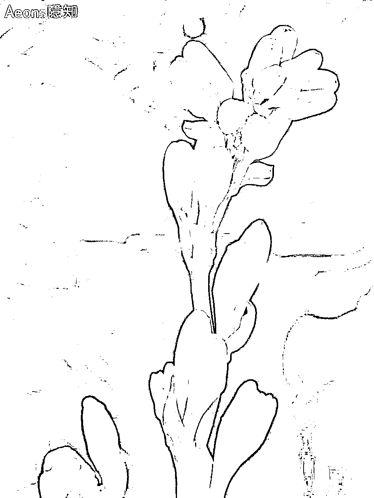**

**花香类：**

**各种熏衣草，各种天竺葵，各种玫瑰，各种茉莉，各种橙花，桂花，红 白花缅栀 晚香玉，各种玉兰……**

**这种类型的香料实在太多了，气味甜美舒适，平衡心轮能量，让人温暖而放松，最重要的是气味讨喜（当然也不排除某类奇葩，气味带有距离感，只可远观的类型 ，比如白玉兰）。缺点就是一个字，贵！它的贵虽然不是突出类，（比如琥珀，便宜的两百多一毫升，最贵的超级金琥珀一千八一毫升）但是是整体的贵，贵的平衡。价格浮动不大，如果你看见有一家卖的花朵类价格差异大，比其它家便宜很多，不用怀疑，有问题。**

**当然这些也分溶剂萃取和蒸馏，蒸馏的很少能买到，价格高很多。我也不推荐调香时使用蒸馏，一个原因是成本高（调香时疗效放在第二位） 第二个原因是难买到好的。第三个原因是，好的原精香气还原度非常高。原精在调香方面的缺点是气味层次不明显 **

**这里一定要说的是，即使花香类贵，也不要使用廉价的香精，因为人工的香精绝对无法合成真正的花朵气味，植物的成分如此复杂，香精合成的气味一闻起来就很廉价难闻。除了某些特殊气味使用香精 比如皮革味。**

****

**异国情调类：**

**各种依兰，紫罗兰。蓝莲花。各种广藿香等**

**这类通常也有点睛之笔的作用，也可以很好的调和其它香料，这里重点说一下依兰。**

**依兰分了很多等级，在调香中绝大多数调香师推荐特级依兰，其气味最甜美更有“酒不醉人人自醉的”感觉。但是好多第一次接触依兰的人并不喜欢它的味道，觉得气味让人眩晕，浓艳，甚至色情感。我的建议是充分稀释，稀释低了你就会觉得它很好闻，很甜美，神秘的气味，如午夜绽放的带着露水的妩媚花朵，热情奔放。还有就是完全依兰，这种依兰的味道像一个彩色的大棒棒糖，我通常用它来调童心唤醒的香料方，加一点香草仿佛一个大型游乐场出现买眼前，完全依兰的后调有一点粗糙的青草味，有一点“草莽匹夫”的感觉，所以在后调的定香中要注意一下，你可以这样想 ：中调的后调就是后调的前调～**

**最后说几句，想要调好香你就要去了解每种香料的脾气秉性，最简单直接的办法就是去闻每一种气味，不要以为闻一下就行了，刚开始要每天闻。好的香料，每一种都有自己的前调中调和后调，不要以为它就是单纯的一成不变的气味。闻上几天，写写体验，这些经验都是一点一点积攒起来的，失败 n 次都是正常的。某些调香大师有时失败个几百次甚至上千次都是不足挂齿的，我们只闻到令人惊叹的经典到永不过时的香水，香料，却看不到人家闻香闻到醉香的时候（ps： 醉香是指闻天然香料闻多了头晕恶心甚至有宿醉感）～感兴趣的同学快入坑吧。**

**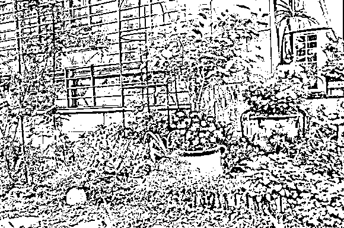**

# 占星学基础课：第一阶

> 原文：[`mp.weixin.qq.com/s?__biz=MzI5NTQzMDUzMQ==&mid=2247483674&idx=3&sn=01b44c7a9a93fbbbe1cd0b910605c62a&chksm=ec52f1f6db2578e0f9aa07f6ff3b3faa383cd39569ee6155e84b0535ff462824eed1f3b7b01e&scene=27#wechat_redirect`](http://mp.weixin.qq.com/s?__biz=MzI5NTQzMDUzMQ==&mid=2247483674&idx=3&sn=01b44c7a9a93fbbbe1cd0b910605c62a&chksm=ec52f1f6db2578e0f9aa07f6ff3b3faa383cd39569ee6155e84b0535ff462824eed1f3b7b01e&scene=27#wechat_redirect)

**占星学基础课：第一阶**

**讲师：晴海**

**开始时间：2017-11-01 19:00**

**价格：￥1200 元 / 12 课时**

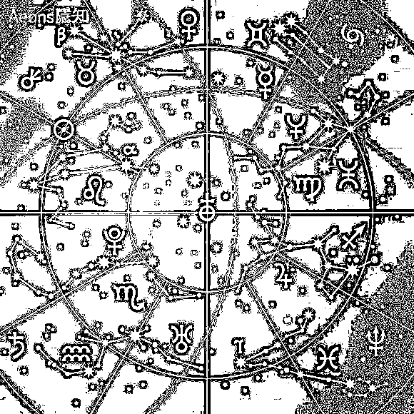

**课程介绍：**

**晴海老师的占星基础课程分三个阶段，旨在手把手教会学员们进行本命星盘解读，让我们深层次地从人生的不同面向去了解自我，他人，以及两者间的互动。规划安排自己的人生之路，领悟每个人灵魂的目标，性格的架构，兴趣跟爱好，天赋的不同以及人生的功课。老师将会把自身超过 16 年的占星经验倾囊相授。**

**第一阶课程为《占星基础系列课程》的入门部分，聚焦在占星学的最基本原理，历史脉络，学派划分，宇宙结构学基础，以及行星含义的精解等。面向一切零基础学员，结束后学员们将拥有一次半价复听的机会。**

**全部三阶连报优惠价格为 4198 元，教你彻底掌握对本命盘的剖析。**

**以下是系列课程全三阶的内容：**

**【第一阶】1200 元/12 课时**

**✪占星学简介**

**   占星简史**

**   占星学派**

**   占星的根本意义及其存在的分歧**

**✪占星的基本工具——星盘：**

**星盘介绍与基本符号认知**

**✪基础宇宙结构学**

**✪行星含义精解 I：内行星：太阳、月亮、水星、金星、火星**

**✪行星含义精解 II：外行星：木星、土星、天王星、海王星、冥王星**

**【第二阶】1600 元/10 课时**

**✪占星四元素精解**

**✪黄道十二星座精解**

**✪十二地理宫位含义详解**

**✪认识相位及其含义**

**数率、相位的概念**

**主要传统相位及其含义**

**【第三阶】1800 元/8 课时**

**✪解读本命盘**

**   读盘具体流程**

**   详细解盘实例分析及运用  **

**✪飞星定位的运用**

**   星盘关键钥匙的寻找**

**✪对深层次心理问题及性格的判断**

**✪其他解盘中的注意事项**

**晴海老师介绍：**

**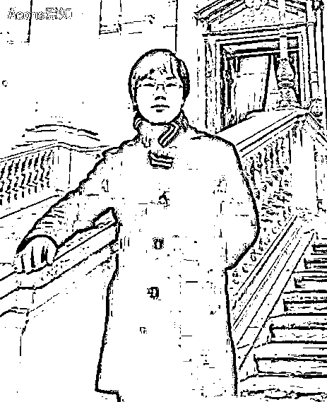**

*   **西班牙伊比利亚占星学派占星师**

*   **西班牙 UCLA 占星学院教师认证**

*   **Beni 占星工作室创始人**

*   **西班牙坎塔布里亚占星协会成员**

*   **心理占星分析师**

*   **预测占星分析师**

*   **国家二级心理咨询师**

**研习占星超过 16 年，曾师从国际知名占星学泰斗 Liz Greene 的高徒:西班牙心理占星学派占星师 Jose Ignacio Fernandez 研习"心理占星学";从 2003 年起，先后参加数届西班牙欧洲占星大会，结交了一批欧洲知名占星师作为良师益友。**

**后师从西班牙伊比利亚占星学派 U.C.L.A.学院创始人,著名古典占星师 Tito Macia，以及阿根廷古希腊占星专家 E.Gramaglia 研习古典占星。**

**曾数度成为西班牙神秘学研讨会(S.D.E)的座上宾。**

**2007 年开始在网络翻译大量占星学文献**

**2015 年创立 Beni 占星工作室，开始在国内授课。**

**目前还致力于以咨询，翻译，授课的形式将最专业的西方占星文化带入国内。咨询超过上千例，数年教学经验，涉猎领域甚广，风格严谨朴素，认真负责。**

**欢迎大家踊跃报名参加~**

# 魔法力量的钥匙藏在哪里？

> 原文：[`mp.weixin.qq.com/s?__biz=MzI5NTQzMDUzMQ==&mid=2247483669&idx=1&sn=5c770ae05f680fc8b58262e80f0d6699&chksm=ec52f1f9db2578efd0651c8b830f47aee102870e5d5e4a43626e7291b521ca5c3ca0b8cc18b4&scene=27#wechat_redirect`](http://mp.weixin.qq.com/s?__biz=MzI5NTQzMDUzMQ==&mid=2247483669&idx=1&sn=5c770ae05f680fc8b58262e80f0d6699&chksm=ec52f1f9db2578efd0651c8b830f47aee102870e5d5e4a43626e7291b521ca5c3ca0b8cc18b4&scene=27#wechat_redirect)

# **魔法力量的钥匙藏在哪里？**

作者：云汉 

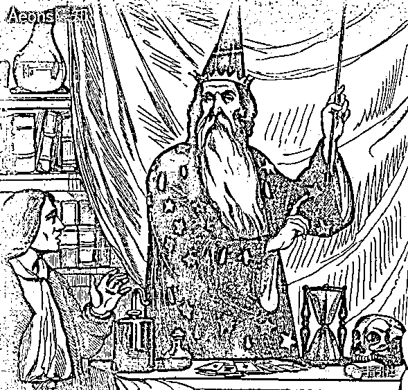

# **0.魔法？**

魔法可能是西方神秘学里最引人遐想的主题之一了，或许是对它寄托了太多的幻想，使得魔法在网络上很多人的口中变得不现实起来。有人觉得它必然伴随着某些超自然的现象，还有人将某些本是奇幻作品的设定信以为真，还有人对魔法嗤之以鼻，认为它是根本不存在的。

那么魔法究竟是什么？魔法又是如何运作的呢？难道像小说里写的那样，依靠精神力对外界游离元素的操控吗？依靠与自然精灵或恶魔定下契约吗？又或者是依靠某些魔法师体内积蓄的“魔力”或“法力”呢？

不管是询问魔法是什么，又或是探究魔法如何运作的，都不是一个三言两语就能说明白的问题，完整说清楚这个问题不可避免要花上大量的篇幅，并且很可能超出了我个人的能力所及（毕竟我是一个麻瓜）。因此我在这里就按照我个人目前的理解，来简单谈一谈这些主题。我绝不声称我的观点是绝对完整和正确的，但最起码并非是未经思考和虚构的。

# **1.魔法是什么**

这是一个很基本的问题，但是也是一个很难得到共识的问题，不论是魔法师还是学者，都在这个问题上有截然不同的见解。在《寻求哲人石》中，作者这样描述炼金术： 

形象一点说，炼金术好比是一个错综复杂、万象俱现的寺庙群，数百年间难以计数的建筑大师都在这里留下了他们的杰作。恰如古埃及的寺庙建筑，它们展现的绝不是某个建筑师一个人的构想和美学观念，而是世界的整体，是生生不息的生命以及生命的成长演化。

魔法也是同样的，当走进魔法的建筑群落中，我们可以看到很多古老美妙的建筑，它们似乎存在着某些潜在的共通性，但是看起来又各有各的风貌。我们可以说，这些（魔法）无非就是华美的砖石建筑，但是这种定义对于我们来说是显然不够的。当我们问到“魔法是什么”的时候，我们并不是知道它们是“一个建筑物”就心满意足了，我们更想知道它是一种什么样的建筑物？更吸引我们的是它们的形制、历史、结构和美学观念。

这也就是说，只是给出“魔法是一种造成改变的技巧”这样的定义，是不能让人满意的，想要了解魔法是什么，我们非得亲身接触各类魔法才行。我们要做的是走入建筑群落中，亲身鉴赏和感受这些建筑的风貌，我认为这才是解决这个问题最好的方法。

但是为了能使本篇文章的讨论继续进行下去，我就先在这里给出一个我个人修改的魔法的定义（最初基于克劳利对魔法的定义）：魔法是一种依靠与不可见的力量或存在的交涉，在内在和外在产生某些所意图的改变，或达成某些追求的科学与艺术。这个定义看起来有一点点复杂，起码比克劳利常被引用的原始定义长一些，但是仍然留下了很多问题。比如说，不可见的力量或存在是什么？内在和外在的改变具体指什么？科学和艺术有什么样的含义？魔法怎么样达成这些改变或目标，方法是什么？而回答了这些问题之后，又会引出更多的问题。

不过我们就暂时在这里停住，免得陷入永无休止的问题中，现在转向一个看起来有些不太相干的主题——这个世界究竟是什么样的？

# **2.认识这个世界**

我并不是说，我已经理解了这个世界的真相，一般如果我见到这么声称的人，第一反应都是碰到了中二病。实际上，与其说“认识这个世界”，不如说“认识魔法师们眼中的世界”。也就是说，魔法师们到底是怎么看待这个世界的，凭什么他们认为自己有可能在这个世界中实现自己的魔法呢？我并不在这里判断魔法师们的世界观是真实的或是错误的，但从现实的情况来看，在这些世界观下他们所施行的魔法确实是卓有成效的。

在*Three Books of Occult Philosophy*第一章的开篇，就点明了这个世界的结构：

须知， 世界具有三重存在， 也就是元素的世界、 天体的世界与智慧的世界。

这是一种文艺复兴时期常见的世界观，元素的世界也被称为凡尘的（Terrestrial）、物质的（Physical ）、自然的（Natural）或月下的（Sub-lunary）。换句话说，这是我们日常生活的世界，我们依靠五感接触的世界，凡是我们所见的、所听的、所接触的，不论延伸到多么遥远和多么细微，多么庞大或多么渺小，都是在元素世界之中。

第二个世界是天体的世界，这一世界是众星体的世界，古人们认为，它们在元素的世界之上，由第五元素或更纯净稀薄的物质构成，环绕着我们的地球，同时也影响支配着它的方方面面，占星术也就是通过观察它们对元素世界的影响来进行预测的。需要注意的是，“在元素的世界之上”不仅仅是字面意义上的空间距离，它还有一种精神方面或非物质方面的暗示，也就是说，暗示星体的世界是一种非物质的，更加抽象和不可直接感知的世界。

正如*Robert Zoller*所说：

中世纪占星基于一种宇宙论的模型之上，这种天文的模型也是灵魂的模型。

这一世界观在现今已经部分得到了动摇，因为科学技术的发展，不仅将地心说推翻了，也将它们“由更纯净稀薄的物质构成”这个观点推翻了。但是它们的非物质的内涵仍然得到了保留，我们仍然认为，存在着一种更抽象的天体世界，它是非物质的和难以感受的，在元素世界“之上”统辖着它的各种活动。

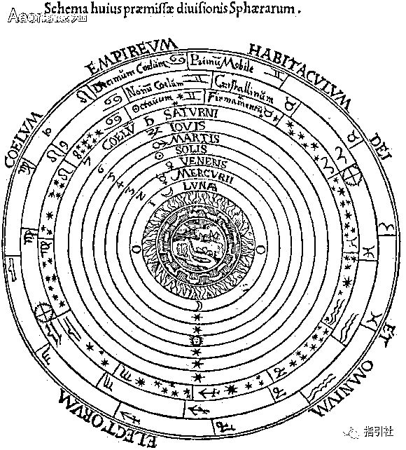

最后一个世界是智慧的世界，或称天外的（Supercelestial ）世界或神的世界，有时也被称为至高天（Empyrean），这是最接近造物主的领域，也是众天使所在的领域，这个世界是极为微妙和抽象的，也是物质的感官完全不可感受到的。

我们可以看到，从最低的物质世界，到最高的神性世界，甚至到至高的造物主，构成了一种层次分明和井然有序的世界观（这三个领域还存在着更细致的次分，不过我就不在这里展开）。元素的世界受到天体的统辖，天体又受到神性世界中诸天使或智慧体的管理。

这一切正如《圣经》所言：

诗篇 19:1　高天陈述天主的光荣，穹苍宣扬他手的化工。

在*Finding God in the World*中，*Catherine Noble Beyer*说：

按照阿格里帕所说，天体魔法应用数学或数字的力量，或直接涉及到星辰和行星，以及推动它们的智慧体......通过自然的过程，天体领域将德性附加到尘世。然而，这些富有影响力的行星也拥有灵魂或智慧，或被这样的存在所引导......

这样，就构成了一种元素、天体、智慧世界紧密相连的链条，世界上的一切都处在这个链条之中，当这链条的某一个环节出现了变化，其他部分也必然会体现出这种变化。在*Three Books of Occult Philosophy*将这个过程比喻成绳索：

这是自然的环带与连续，所有上级的美德都以一种漫长而持续的序列流过所有下级存在，甚至将它的光散布到最末的事物，且下级存在通过它们的上级，抵达那万物的至高。因此，下级事物相继与它们的上级结合，从它们源头的第一因中产生的影响，就如同一条伸展的绳索，抵达至万物的最低处。如果绳索的一端被触动，整条绳索都会立刻摇动，这种触动会回响至另一端。在下级产生运动时，上级也会迁动，一者回应于另一者，就如同琉特琴上调好的琴弦。

这种世界的有序结构，也就是对《翠玉录》中第一条格言的详细阐述，这也是被魔法师们奉为至理的箴言：

> 一切在上者皆同于在下者，在下者亦同于在上者，以达成那太一的奇迹。

# **3.参与到世界中的魔法师们**

当得知了这个世界的结构之后，魔法师要做的就是基于这种认识，主动参与到这种上下一致的链条之中。他可以通过链条的下端（自然世界）逐步上溯到天体、智慧的世界，乃至于回归到造物主本身。也可以通过与天体、智慧等更高世界的交涉，推动元素世界产生自己想要的变化。这些过程，也就是魔法发生的过程。

Catherine Noble Beyer 说：

> 对于世界和其中对应的研究，是自然、数学和神学的哲学家们的任务，而魔法将这三种哲学结合，来实际应用这些知识。

自然、数学和神学的哲学在 Agrippa 那里分别对应了元素、天体与智慧的世界。因此，魔法即是利用对这三个世界和其中互联对应的知识，主动参与其中或对其施加影响，来产生自己想要的结果。而因为这些交涉的手段和目标不同，就可以产生不同的魔法，比如只使用自然材料本身性质的就是自然魔法（Natural Magic）、依靠天体力量的即是行星魔法（Planetary Magic）或占星魔法（Astrological Magic）、涉及到恶魔的就是召魔（Goetia）、与天使或众神共同工作的也就是通神（Theurgy），等等。Lon Milo DuQuette 在*The Key to Solomon's Key*中说：

> 在某种程度上，外在的内省也是西方魔法传统的基石。但是魔法师的目标是有点大胆的，或者更加富有个人挑战性的。魔法师敢于将他本身视为指挥灵性存在的神圣链条重要且必不可少的一个环节——不仅仅是观察者和等待救援的受害者，而是一个重要的参与者，一个造物的伟大蓝图中与神合作的年幼者。

# **4.现代魔法的模型**

现代魔法师们不一定选择坚持这种传统的世界划分，他们很可能有很不同的划分方法。但是基本的精神都是一致的，不论选择什么样的划分，都是承认有一个或多个更高且不可见的世界在物质世界之上，并且可以对其施加影响。

一种现代流行的划分是把整个世界分为五层，分别为物质层、以太层、星光层、心智层和精神层，在*Circles of Power*中，有这样的一个图示：

# 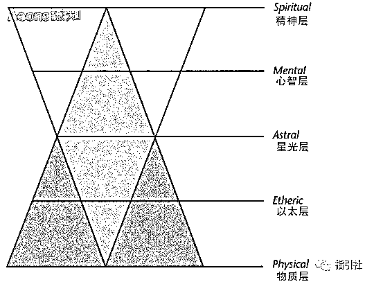

一般情况下，我们认为很多魔法最初是在星光层中发生的，并通过以太层的传导，最终到达物质层，从而产生一些我们可以观察到的影响。而在星光层及以太层中存在着某些精微的物质或材料，凭借操纵它们，就可以产生魔法的影响。例如在*Techniques of High Magic*中，Francis King 和 Stephen Skinner 说：

> 对于实践性魔法的目的来说，星光界（Yetzirah）是最具重要性的，因为通过对其基础质料的操作（这被很多神秘学者称为星光质[Astral Light]，并与威尔海姆·赖希[Wilhelm Reich]的生命能量具有相似之处），神秘学者相信他们可被允许去发挥影响以操纵稠密的物质，并产生自我与他人意识上的改变。

星光质是 Eliphas Levi 和其他十九世纪的神秘学家们谈到的一种事物，是具有星辰影响力的物质，他们认为所有的魔法操作都要基于这些物质才能发生，魔法就是操纵星光质的技巧。在当代，则有很多魔法师都将星光质视为星体层的一种微妙的物质，甚至是以太层的微妙物质。这些微妙的物质有一个你可能听起来更熟悉的名字——能量。所以需要注意的是，魔法中的能量和物理学中的能量是两个概念，属于典型的同名不同意。

那么现代魔法师凭借什么手段操纵这些能量来完成魔法呢？答案就是意志力和想象力，通过意志力的引导和想象力创造的形象，魔法师们认为可以借此操纵这些非物质层面的能量。Frater U.D.在*Practical Sigil Magic*中总结说：

> 西方魔法已知依靠着两根支柱，也即是意志力和想象力。

除此之外，基于新发展出的能量的概念，魔法中也出现了各种关于能量性质的学说与讨论，不过限于篇幅，我就不在这个主题上进行太多的延伸了。

# **5.通往魔法的路**

综上所述，我认为魔法正是基于对世界的理解，以期利用某些力量或存在，达成改变和追求的一种手段。魔法力量的关键正是隐藏在魔法师对于整个世界的理解中，同时也是对于各个不同世界和层面互相对应的理解。这种对应产生贯通整个世界的关联和交感，在传统的环境下，这种交感有时被称为事物之间的“爱”。正如 Johannes Trithemius 所说：

> 学习思考知识，而知识产生爱，爱产生相似，相似产生群结，群结产生权能，权能产生优势，优势产生力量，力量造就奇迹。这是通往魔法成就目标的唯一之途，神的魔法和自然魔法皆为如此。

        （以上个人观点仅供参考，具体内容请以实物为准。）

**欢迎下载指引社 APP：**

# 【星说影音】《Kill Bill》丨我爱你，用恨的方式

> 原文：[`mp.weixin.qq.com/s?__biz=MzI5NTQzMDUzMQ==&mid=2247483669&idx=2&sn=8ba1a8efb1229688982cadabc669ec83&chksm=ec52f1f9db2578ef644f610cf71a088d696360eb5dbce5c234a50c51ed663f4245dc763b5000&scene=27#wechat_redirect`](http://mp.weixin.qq.com/s?__biz=MzI5NTQzMDUzMQ==&mid=2247483669&idx=2&sn=8ba1a8efb1229688982cadabc669ec83&chksm=ec52f1f9db2578ef644f610cf71a088d696360eb5dbce5c234a50c51ed663f4245dc763b5000&scene=27#wechat_redirect)

# 【星说影音】《Kill Bill》丨我爱你，用恨的方式

作者：[逆の蝶](http://www.geaving.com/user/view/id/4550) 

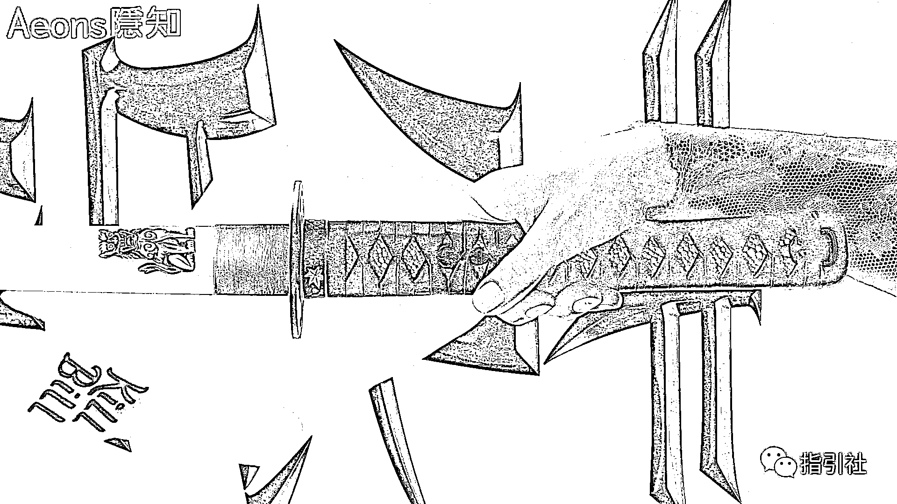

向死而生的行星里，怎么会有爱情这东西？

看见《Kill Bill》中的冥王星。

它不是激情，它是地狱。  

# 它只是有火星的声音，让你短暂享受着金星加持的高潮。

提起 Kill Bill，不止一个人曾说过——“我更喜欢第一部的快意恩仇。” 

以火星形式来表达的金星—— 

动作戏眼花缭乱，畅快淋漓，充斥了昆汀式的高潮迭起。

肾上腺素的刺激之下，总能满足人那些暴戾的本能。

乍看之下，半藏刀光飞舞的血腥画面，似乎与沉默黑暗的冥王星几乎没有什么关系。

除了火冥冲的杀伐，但这一切，也不过是昆汀以金星式的动作戏，给你“过把瘾”

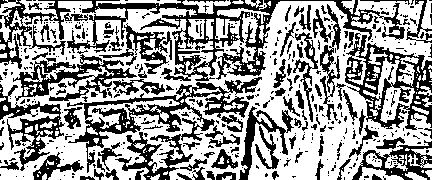

但，当两部《Kill Bill》贯穿起来，离开了金星的粉饰，剥去了电影滤镜的妆容。 

让人痛快的高潮渐渐平息，“复仇”的内核被毫不留情地剥落下来。 

她衣衫褴褛、近镜头中粗糙的皮肤和清晰的毛孔，是高潮之外的真实，更是故事的真相。

“第二部的感觉没那么畅快，不是很喜欢。” 

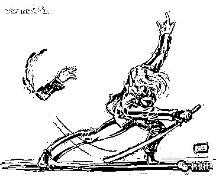

黑白的叙事，平平无奇的小镇，平和的婚礼，简单的婚纱和平底的拖鞋，节奏慢到想要快进，偶遇故人的叙旧，看似是告别爱人、重新开始生活的吻。

女主腹部凸起，有点摇晃的步伐，母性十足，镜头里充斥着金星与月亮，尤其是她微微隆起的腹部。

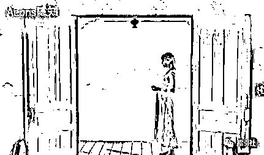

还记得这短暂的温和滤镜么？

短短几秒钟之后，随着几声枪响，

哪怕只是仅仅触碰了一下，冥王星也会将金星吞没。

彻底地、毫不留情地，肃清。

 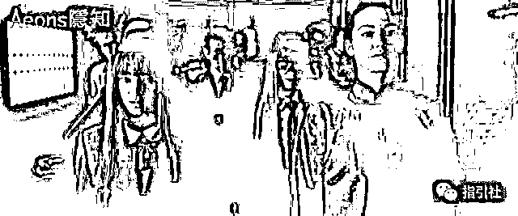 

第二部将故事的脉络捋清，一切事情的起因和结果都在推进。

在冥王的世界里，没有什么快意恩仇。一旦触及了它的力量，那么你所能期待的，只是毁灭那一刻的解脱。

这里没有激情，这里只有幽冥地府。

# 向死而生的路没有武器

# 只有血肉之躯

冥王星的原力驱动，平平无奇的生活，你不想看清、也抑制不住的毁灭力。

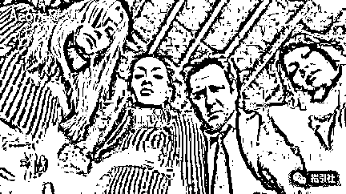

脑袋上被开了一枪，在医院躺了四年后，睁开眼便被世界毫不留情打了一巴掌—— 

清醒的情境下，没有安抚没有平静，甚至连片刻的空白都没有。

四年中的第 N 次，被看守人员廉价“出租”给第 N 个猥琐男泄欲使用。腹中孩子早已没了踪影。 

从这一刻起，冥王星的力量慢慢苏醒。

如果不选择灭亡，那么请你，向死而生。

四年没有活动过的肌肉，本只能够任人宰割，

可没有武器，那就用牙齿咬烂猥琐男的舌头。

腿部肌肉僵硬，那就爬到停车场。

  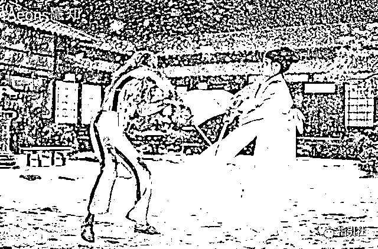

重伤后被埋进棺材，那就用右手，用人类特有的脆弱皮肉——在木板上敲烂皮肉，暴露出血液之下最坚硬的骨骼，拿它的力量敲碎死亡。 

爬出棺材，呛着土爬出坟墓。土层中骤然伸出一只手，昭告着死亡与再生的那一刹那。

与其他电影的女主不同，这里的主角，在所有向死而生的刹那，从未有人递出过武器。

毕竟，

再生是与死亡的告别，没有人为你天生铸造武器，

你拥有的，唯独血肉之躯。

# 因为爱情，怎么会有怜悯？

冥王星不会以克制的方式对待任何人。

如果说 Kill Bill 第二部的最大特色，大概就是，金火的动作表达元素变少，而金冥的元素更加深刻了。 

他走进她婚礼的现场，和她安宁地对话。

在她披上头纱的那一刻接受她的吻，礼貌地问着新娘家属的座位。

然后， 

对着在场所有人——包括她的丈夫，包括她本人， 

开了枪。 

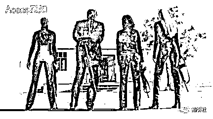

“你知道吗，五年前，若要我列出一份名单，列举永远不可能发生的事情，你拿枪指着我脑袋补上一枪结束我的苦难这绝对是名单上的第一名，我错了，对吧？” 

“你不止没死，还要结婚了，嫁给一个王八蛋，而且你还怀孕了。我反应过度了。”

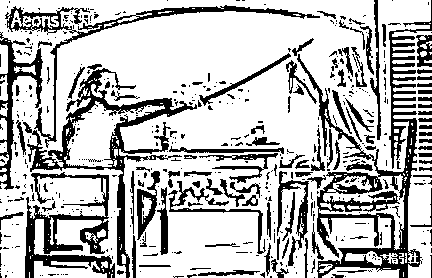

“反应过度” 

五年前，将死亡干净利落丢给所有人，五年后的团聚，将“反应过度”轻而易举地丢给对方。 

也不难理解女主的不冷静。

Kiddo 的一切，似乎都是出于爱—— 

因为爱你，所以我为你做杀手，杀人不眨眼。

因为怀孕了，我想要孩子出生在清白的世界，所以逃走。

但冥王的爱情，哪里来得怜悯？

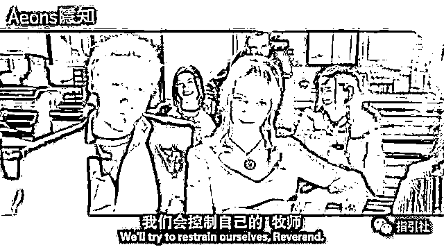

Bill 的说辞中，满是金星被冥王所沾染的影子—— 

感到背叛 

“你没死却让我以为自己心爱的人死了” 

理所应当的占有欲

“我是个杀人魔，你心里有数，伤了杀人魔的心，要付出很大的代价，你已经付出一部分的代价了”

爱与恨近乎变态的纠结矛盾

“你是个大好人，你是我最喜欢的人，但偶尔也有时候你实在是讨厌极了”

所以他在没彻底搞清楚情况的状态下，可以直接来个血洗婚礼。

他们之间没有信任。最初的相互背叛，即便是重新见面，Kiddo 发现女儿还活着，一切似乎可以拥有一个 Happy Ending 的走向时，当女儿睡着，关上门的海滩上，仍旧需要一枪药剂，才能够勉强互相吐露真相。

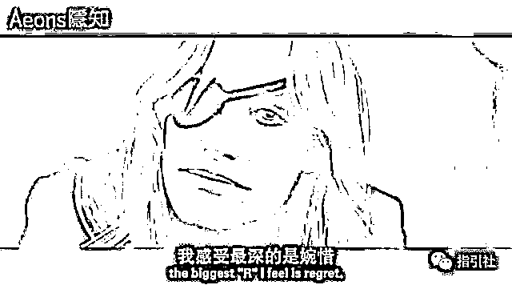 

Bill 是错的吗？ 

冥王式的人，我们总觉得他们是罪人。

它不需要水星的理智，不会听你碎碎念每件事情的缘由。

不会让相比起来无足轻重的月亮影响了进程。

但是从占星学来讲，他们只是毁灭力量的代言人。

这是每个人内在固有的、必然的东西。

“你生来就是杀手，如果让你过平凡人的生活，你会安心吗？” 

“不会” 

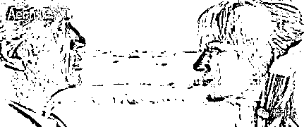

两把半藏刀交错。

即便看上去生活已经可以走入日常，但她从地狱里爬出来，冥王星的烙印难以抹去。就好像 BB 的金鱼，有些事一旦做了，就再也无法回头了。 

他又何尝不是呢？

有些爱，有些金星，最终只能够走向冥王星的结局。

用，恨的方式。

彻底的净化，是利落地毁灭

时间总会行进，行星们冰冷地遵循着周期，终于出了相位。

冥王的考验与引力，在地底最深处、效应越来越远。但经过的一切，都被净化地彻彻底底，仿佛一切从未发生过、连纪念的影子也毫不留情、像扫除一粒灰尘。

冥王星的关键词中，有一个是“净化” 

别误会，这的确不是木星那种宗教式的净化。所有的爱恨情仇，所有的自我与他人，所有你能体会到的月亮、愁肠百结过的金星，甚至是你适应与终于得到收获的土星——它全部会净化掉。 

一路杀下来，不怀怜悯，最后杀掉 Bill，生活上的一切，似乎就这样抹了个干净。 

对他的爱，对他的恨都埋入风里，新生活中毫不知情的女儿，贯穿整部电影却终于没了踪影的半藏刀…… 

Kiddo 最终宽恕了 Bill 吗？ 

不，这世上哪有什么宽恕。所有的东西，到最后都是冥王一扫而过的空荡荡。

“白茫茫一片大地真干净” 

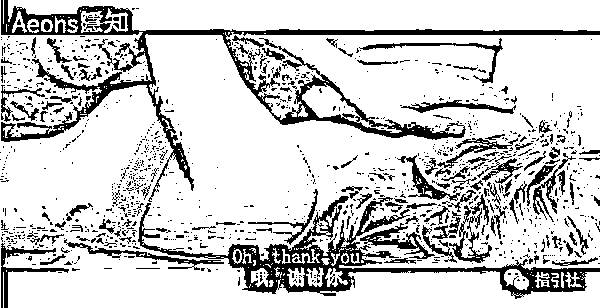 

难过的是，人类身上总会留下烙印，但冥王星的力量难以诉说，迸发的情绪混杂而来。

就像她最后躺在浴室里，不知要哭还是要笑，悲喜混杂决堤。

而表面的生活仍在继续，冥王星回到地底。

想要保护的一切就在薄薄的门外，对着晴天看着动画片，笑得天真无邪。

你所记忆的苦楚，它们也不过是脑皮层的一些回路，最轻的水面也会波澜不惊。

对着被冥王星净化的世界，上气不接下气，感觉整个肉体都哭不出的那些情绪——唯有不断重复着“Thank you” 

 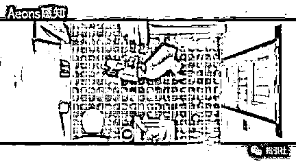 

但人们总是容易忘记，冥王星的行进有多慢，就有多沉重。

它总会在那里，沉在你的生活里，等着你不小心地下一次触碰，

一如 Kiddo，生来是杀手，她所幻想的平静生活，真的可以继续吗？ 

一如每个看着 Kill Bill，看着最后的镜头也莫名想要哭一下的人们。

你的泪腺尽头，冥王星的影子，在讲什么？

本期互动:

你的冥王星，给你留下的烙印，

你还记得吗？

说说你的冥王星故事吧。

# 占星沙龙：神秘的月亮跟你的情绪管理

> 原文：[`mp.weixin.qq.com/s?__biz=MzI5NTQzMDUzMQ==&mid=2247483669&idx=3&sn=dd1da84fa1aa6ae982df874309fe6a97&chksm=ec52f1f9db2578ef5e4fe852a3c32bc21e8e78d8df9446e16d8e05b68ca77c938fdb574242ec&scene=27#wechat_redirect`](http://mp.weixin.qq.com/s?__biz=MzI5NTQzMDUzMQ==&mid=2247483669&idx=3&sn=dd1da84fa1aa6ae982df874309fe6a97&chksm=ec52f1f9db2578ef5e4fe852a3c32bc21e8e78d8df9446e16d8e05b68ca77c938fdb574242ec&scene=27#wechat_redirect)

**晴海老师的占星沙龙：**

【深度心理占星专题】神秘的月亮跟你的情绪管理

讲师：晴海

开始时间：2017-10-27 19:30

价格：￥90 元 / 1.5 小时

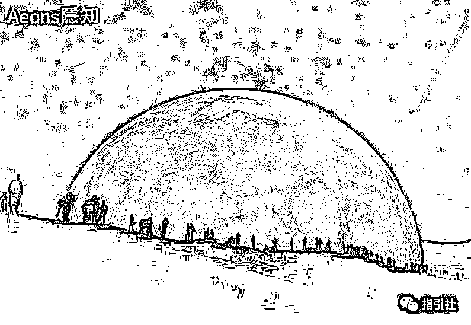

众所周知，作为夜空之主，月亮在占星体系中有着很强的象征影响力，她的符号跟太阳一样古老，甚至有过之而无不及。你或许知道月亮代表的含义，因为你或许读过一些基础的占星书，或者认识塔罗牌对月亮的理解。比如你可能知道她代表情绪世界，也可能知道她代表母亲，也知道她代表动物跟水，潜意识跟镜子。

但是你知道“为什么”吗？为什么母亲≈镜子？为什么情绪≈动物？她跟孕育有关却又为什么代表着死亡？对于月亮的理解你到达了一个什么样深度呢？在心理学的世界里，每一个古老的神话都有它背后最基本的心理动机，这种动机，昭示着一种“秩序”，外在的，也是内在的。占星学所研究的，其实就是“秩序”，它并不是为了展现命运对我们的束缚而存在的，而是为了昭显 Cosmos 的智慧，秩序女神的智慧，帮助我们在混沌的世界中寻找光明。

本月 27 日晚上 19 点 30， 晴海老师将为大家带来一期跟月亮相关的精美沙龙，手把手带你从符号的体系里追溯远古的智慧跟秩序的演化，并且为你分析不同星座月亮对这些人的内在影响，以及，怎么管理那些看似不可控的“个人情绪面”。

**本次沙龙为专题小讲，小收一些茶水费~~**

晴海老师介绍：

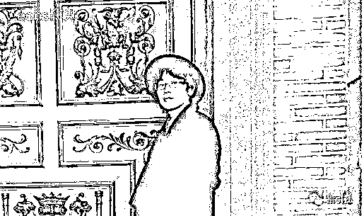

*   西班牙伊比利亚占星学派占星师

*   西班牙 UCLA 占星学院教师认证

*   Beni 占星工作室创始人

*   西班牙坎塔布里亚占星协会成员

*   心理占星分析师

*   预测占星分析师

*   国家二级心理咨询师

研习占星超过 16 年，曾师从国际知名占星学泰斗 LizGreene 的高徒:西班牙心理占星学派占星师 Jose IgnacioFernandez 研习"心理占星学";从 2003 年起，先后参加数届西班牙欧洲占星大会，结交了一批欧洲知名占星师作为良师益友。

后师从西班牙伊比利亚占星学派 U.C.L.A.学院创始人,著名古典占星师 TitoMacia，以及阿根廷古希腊占星专家 E.Gramaglia 研习古典占星。

曾数度成为西班牙神秘学研讨会(S.D.E)的座上宾。

2007 年开始在网络翻译大量占星学文献

2015 年创立 Beni 占星工作室，开始在国内授课。

目前还致力于以咨询，翻译，授课的形式将最专业的西方占星文化带入国内。咨询超过上千例，数年教学经验，涉猎领域甚广，风格严谨朴素，认真负责。

以下是一些老师教学的照片：

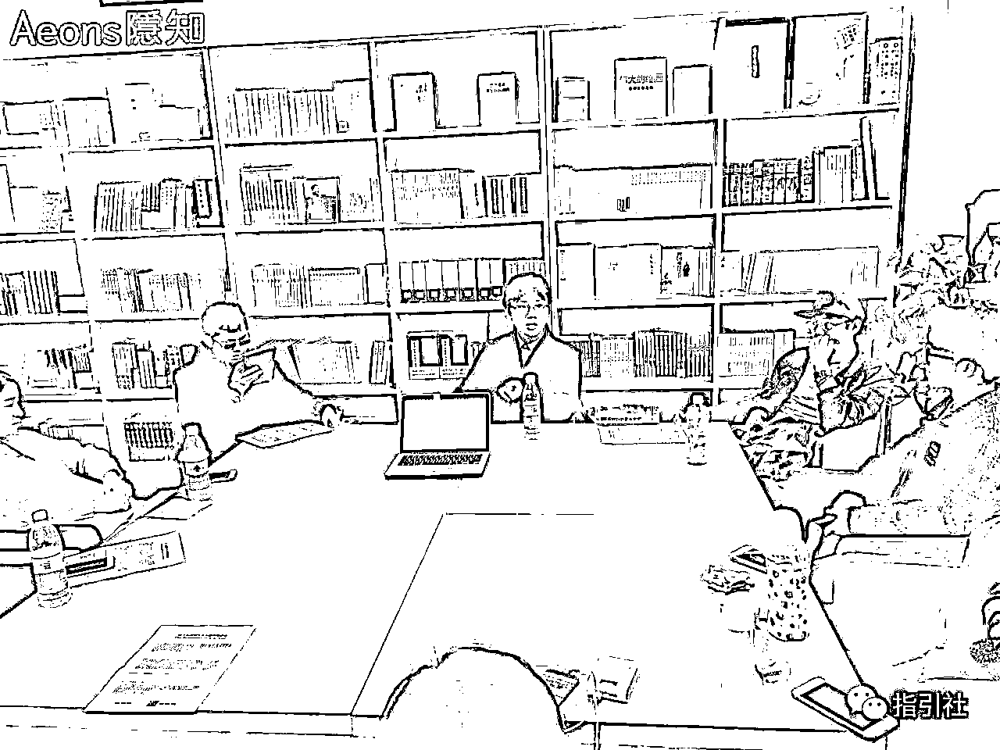

**面授课程实拍：**

**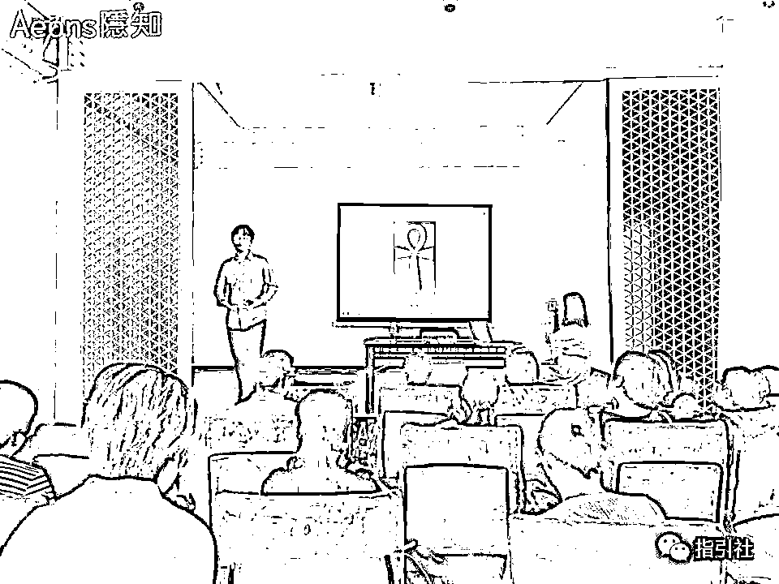**

**占星基础课程讲演：    **

 **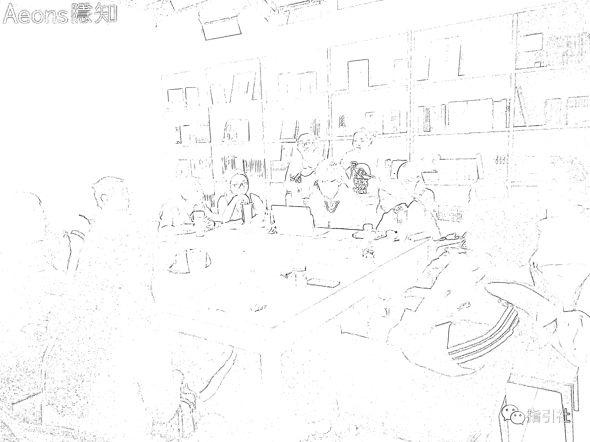**

**报名请参见指引社官网、微信公众号及 APP         **  

# 秘契主義 • Esotericism

> 原文：[`mp.weixin.qq.com/s?__biz=MzI5NTQzMDUzMQ==&mid=2247483661&idx=1&sn=3dac2156fdde69075fa9d691ddc1c04b&chksm=ec52f1e1db2578f778e733aed4da771b129f6d74c90cd1eb978cfcfb55e12c282494b2c27627&scene=27#wechat_redirect`](http://mp.weixin.qq.com/s?__biz=MzI5NTQzMDUzMQ==&mid=2247483661&idx=1&sn=3dac2156fdde69075fa9d691ddc1c04b&chksm=ec52f1e1db2578f778e733aed4da771b129f6d74c90cd1eb978cfcfb55e12c282494b2c27627&scene=27#wechat_redirect)

**秘契主義 • Esotericism**

**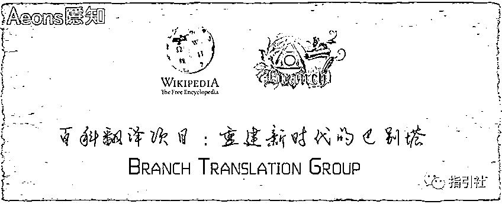**

【指引社塔羅學院 Branch 翻譯組出品】

原文：英文版 wikipedia [Esotericism]詞條

翻譯——Nemo； 

校正——羽落弦；

後期——落音

* * *

秘契主义（esotericism 或 esoterism），意为隐秘的观点或信仰，亦即，仅为获得启示或志趣超凡的少数群体所保存与理解的知识。这一词汇源自希腊语比较级形式“内部的、隐秘的” （ἐσώτερος，esôteros），或其形容词“最隐秘的”（σωτερικός，esô- terikos)。

这一术语亦可指对秘传宗教运动和哲学的学术研究。或指坚持独特的信仰、实践、经验，与世间主流且教条的制度化传统宗教与哲学相区别的一些流派。

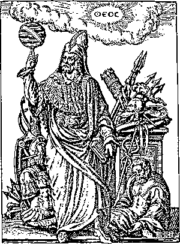

(三倍伟大的赫尔墨斯)

例如：炼金术、人智学（Anthroposophy）、占星学、早期基督教神秘主义、“第四道”教派（The Fourth Way）、密宗（Tantra）、共济会、诺斯替主义（Gnosticism）、赫尔墨斯主义（Hermetism）、“卡莉十面”教派（Mahavidya）, “左手宗”（Vamachara，印度的非正统教派之一。——译注），卡巴拉，魔法，催眠术、新柏拉图主义、灵数学、永恒主义（Perennialism）、玫瑰十字会、“山达基”教派（Scientology，1953 年美国人 L.RonHubbard 所创的新教派。——译注）、苏菲主义（Sufism）、斯威登堡神秘哲学（Swedenborgianism）、降灵术（Spiritualism）、道教、阿拉维派（Alawites，伊斯兰教什叶派分支。——译注）、雅各布•波墨（Jacob Böhme）及其追随者的神智学（Theosophy），以及海伦娜•布拉瓦斯基（HelenaBlavatsky）引领的新神智学运动等。

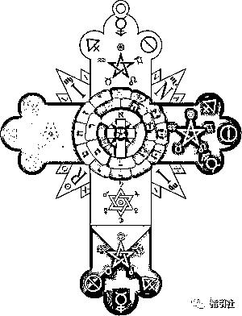

(金色曙光的玫瑰十字徽章)

尽管秘契主义指的是在各种哲学、历史和宗教文献中探索隐义和象征，他们所使用的有些文献却恰恰是主流宗教的核心文本；比如《圣经》和《托拉》（Torah）就是常用的秘教数据。

1.词源

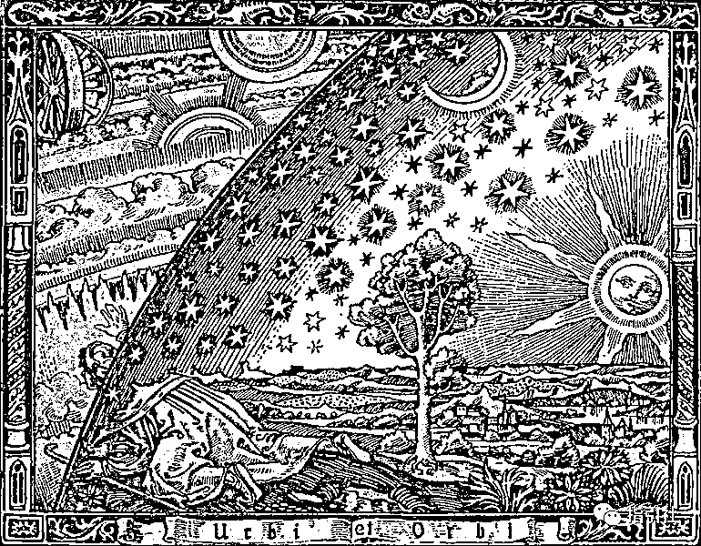

(1888 年弗拉马里翁雕刻画的彩色版)

该词源于希腊语比较级形式 “内部的、隐秘的” （ἐσώτερος，esôteros），或其形容词“最隐秘的”（σωτερικός，esô- terikos)。这两个词都含有词根ἔσω (esô)，即“在里面的”（within）,因而都与内在、启示或神秘主义相关，是有关神圣范畴的概念。其反义词为“外在的”（exoteric）或“世俗的”（profane）。

柏拉图在《对话录：阿尔喀比亚德篇》（约公元前 390 年）中用 ta esô表达“内在物”，在《对话录：泰阿泰德篇》（约公元前 360 年）用 ta exô表达“外在物”。亚里士多德在他自己的作品中沿用了这种用法。而形容词 esôterikos 首次出现可能是在萨莫萨塔的路西安 (Lucian ofSamosata)的《生命拍卖》(The Auction ofLives)一书第 26 篇，该书约成于公元 166 年。

英文“esoteric”一词首次出现则是在 1660 年，托马斯•斯坦利（Thomas Stanley）在其著作《哲学史》（History ofPhilosophy）中，用该词描述了毕达哥拉斯的神秘学派。即，毕达哥拉斯派分为“圈外者（exoteric）”（培训中的人）和“圈内者（esoteric）”（认可加入圈“内”的人）。1828 年，雅克•马特（Jacques Matter）将“esoterism”一词引入法语。1835 年，该词首次收录于《牛津英语大辞典》（Oxford EnglishDictionary，OED）。19 世纪 50 年代，该词经由艾利法斯•里维（Eliphas Levi）大力传播[9]。19 世纪 80 年代，通过神智学者阿弗雷德•西内特（Alfred Sinnett）的作品，该词在现代英语中广为流传。

2. 定义

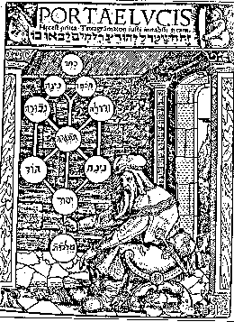

(卡巴拉生命之树)

究竟是何种共同特点将这些纷杂的流派统归于学术上的“秘契主义”，各界存在着不同理解。其中最具影响力的要数安东•费弗勒（Antoine Faivre）的观点。他的定义建立在秘契思潮的四个主要特征上：

（1）有联系可见或不可见的宇宙万物的“对应理论”；

（2）主张自然是一个有生命的整体，由神祇或生命能量统摄；

（3）依靠中介要素（如符号、仪式、天使、幻想）以获取灵性上的知识；

（4）以及当获得这种知识时，将得到人格与灵性层面的转化。

除此之外，还有两个非固有的特征。第一，秘契学者常认为不同宗教传统实际上是彼此一致的：最好的例子是《古神学》（priscatheologia）或《永恒的哲学》（philosophia perennis）中的理论。其次，秘契主义有时会提及灵性知识的秘密传递途径，即大师带领学徒的方式。当然，需要说明的是，费弗勒的定义只是对于何为该术语最佳应用的一种解释，而事实上还存在着许多不同的理解。

“永恒主义”或“传统主义”（traditionalist）学派代表有法国人勒内•吉诺（René Guénon，1886-1951）, 印度人阿南•马拉斯瓦米（AnandaCoomaraswamy ，1877-1947），瑞士人弗里乔夫•舒文（Frithjof Schuon，1907-1998），还有意大利人尤利乌斯•艾沃拉（Julius Evola，1898-1974），伊朗人赛义德•纳赛尔（SeyyedHosseinNasr，1933- ）等，这些人同为世俗学者兼秘契学者。他们认为永恒的秘传经典是先于人类而存在。

“我们认为它（秘传的起源）是在北极附近，这个极点既不在西方也不在东方。经典只是在后来的时代才进入其他的地区，成为西方或者东方的传统。我们认为这个起源在北欧，甚至更加靠近北极，《吠陀》等神圣典籍都证明了这一点。”

在永恒主义者看来，“秘契主义”指的是位于所有宗教传统之上的那个“超越性基础”的形而上学概念，这个“基础”是所有宗教信仰最终将汇集的一点。

“我们的出发点是，现实中的确存在着许多不同的信仰，并且彼此相斥。这可能是由于其中某个信仰正确而其他皆错；或者，所有这些信仰都是错误的。但实际上，真正的原因是，这些看似不同的信仰其实都是正确的，它们并不如教条所示彼此互斥，而是存在着一个内在的共同真理。这个共同的真理就是我们的形而上学基础，或者用我们的术语，即‘永恒主义哲学’。”

其次，秘契传统可经由“启蒙”而觉知。

“启蒙是获得灵性知识的必由之路。由于灵性知识必须通过正规的、传统的组织得以传授，因此个人在组织之外必须对启蒙之道保持缄默。需要解释的是，这里所说的‘正规’是要有别于那些伪启蒙团体；那种团体徒有浮夸和外显的表像，而对灵性知识一无所知，毫无传道的能力。”

3．历史

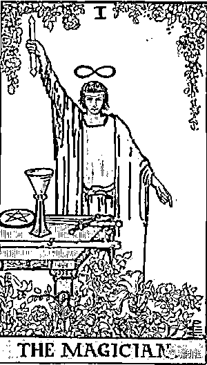

(莱特韦特-魔术师)

所谓秘契主义并不是一个单一的历史传统，而是包罗万象、交错纵横，许多相关的事件、人物常常彼此独立，因此单独某个部分的历史都无力涵盖所有。编写秘契主义的历史，则需确定研究的角度是根据其字面（非学术）意义，还是根据其学术意义。

一些历史可考宗教组织也强调秘传或神秘知识，因此字面意义上的确是隐秘的，但在学术意义上不称其为秘契运动。例如，罗马帝国有若干神秘宗教强调启蒙，基督教也因受洗仪式可称作是秘教。然而它们在学术意义上皆非秘契主义。

另一方面，“诺斯替主义”（Gnosticism）和“诺斯”（Gnosis）所指称的一系列追求不传之秘（诺斯）的宗教运动，以及远古传承的“赫尔墨斯主义”（Hermeticism，或 Hermetism），则是学术意义上秘契主义的先驱。

非西方系统在秘契主义中也占据一席之地。伊斯玛仪派（Ismaili）穆斯林也着重区分内在和外在。他们认为，灵性解放即是从“秘契”中获得“光”（Nur），即追求精神启蒙的过程。该教派亦有诸多特征与费弗勒所定义的秘契主义相一致，例如其认为，在人类和神祇之间存在一个中介的灵性位阶。佛教中的秘契主义主要体现在密宗一支，其主张通过内在修行领略佛陀的教诲，并使用符号、密文、手势或手印等。学徒在进阶时要经过正规的启蒙仪式，并且不得对尚无资质者谈论高阶仪式的内容。

下面来主要介绍西方的秘契主义。为区分传承自近古、欧洲中世纪的秘契流派，与伊斯兰、犹太流派等相似的派别，常用“西方秘契主义”这一术语来指称前者。

学术意义上，西方秘契主义根源于近古时期和中世纪，主要发展阶段以文艺复兴为始，在一定程度上是复兴古典知识的成果。意大利文艺复兴时期的学者，例如将志趣转向古典时代的费齐诺（Ficino） 、米兰多拉的皮科（Picodella Mirandola）等人，翻译了新柏拉图主义的古典文献，以及曾被认为是前摩西传统的赫尔墨斯主义（Hermeticism）著作。古典学术复兴运动的另一支发展出了秘契思想的综合学说，即占星学和炼金学。除了古典文献，秘契主义的第二大思想源泉是卡巴拉神秘主义。约翰内斯•罗伊希林（Johannes Reuchlin）等人将卡巴拉的一些思想从犹太文本中提炼出来，加以改编并安装到基督教的理论框架之中。意大利文艺复兴时期的学者之外，还有一支主流由帕拉赛尔苏斯（Paracelsus，即炼金学的集大成者霍恩海姆。——译注）开创，他结合了炼金学和占星学及其他相关秘契理论，融会为复杂的思想体系。

十七世纪早期，秘契主义的主要代表为基督教神智学和玫瑰十字会。一个世纪之后，秘契思想出现在共济会（Freemasonry）的各种理念当中。十八世纪末到十九世纪初，催眠术（Mesmerism）大行其道。十九世纪，秘契思想还出现在受浪漫主义影响的哲学、文学和科学，以及神智学和法国著名的神秘主义（occultism）浪潮中。

十九世纪下半叶，秘契主义的代表是勃拉瓦茨基（H. P. Blavatsky）的神智学，注意此处并不是上文提到的基督教神智学（二者英文同为 Theosophy，但含义不同。——译注）。在二十世纪，神智学被安妮•比桑特（Annie Besant）和查尔斯•韦布斯特•里德比特（Charles WebsterLeadbeater）等人进一步发展，艾丽斯•贝利（Alice Bailey），鲁道夫•施坦纳（Rudolf Steiner）等人也影响了这一时期的后神智学运动的一些组织，如“山巅灯塔”会社（TheSummitLighthouse）等。后神智－人智学运动是神秘学、基督教思想、新柏拉图主义与神智学中的西方秘契思想相结合的产物。人智学由鲁道夫•施坦纳于二十世纪早期创立，包括了秘契主义色彩的教育学、农学和医学理论。

其他较为著名的秘契理论还有戈齐夫（G. I. Gurdjieff）和乌斯宾斯基（P. D. Ouspensky）的学说等。

神智学也被认为对那些较为非制度化的玄术组织产生了重要影响，如“英灵仪式”（AscendedMasterActivities）、新世纪运动（New Age）等。

最后，卡尔•古斯塔夫•荣格（Karl GustavJung）可谓是秘契主义的代表。他的作品涉及了许多如炼金术等秘契理论，并在其共时性理论中，将“普遍对应”的概念改造成现代的精神分析（心理学）术语。

4. 方法

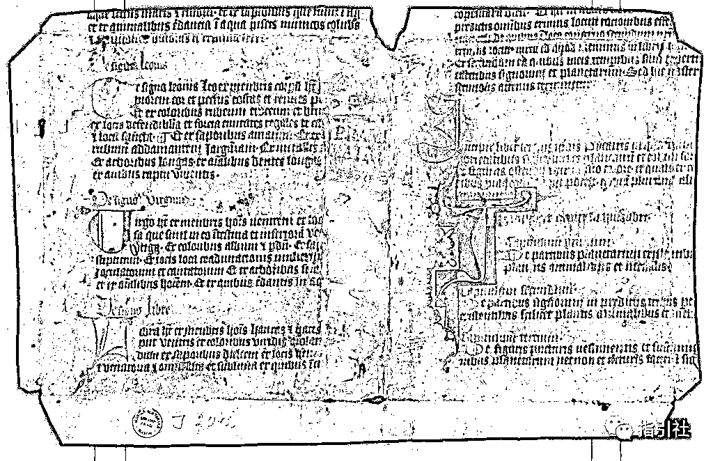

(中世纪魔法书《Picatrix》拉丁文版残页，现存斯洛伐克国家图书馆)

沃特•恒格拉夫（Wouter J.Hanegraaff）是阿姆斯特丹大学（UniversiteitvanAmsterdam，UvA）秘术哲学思潮史（History ofHermetic Philosphy and RelatedCurrents）的教授（1999 年）。这所大学是世界上第一个创立完整西方秘契主义研究与教学体系的教育机构。他也是欧洲西方秘契主义研究会（EuropeanSocietyfor the Study of Western Esotericism）的会长。他的方法论核心在于其所称“经验主义”视角，即基于丰富的史料，采取开放且尽量中立无偏见的立场进行研究。他将“宗教”立场和他的“经验”立场鲜明地区分开来：

“不同于宗教哲学的‘第一原则’（即不加批判的预设某些原则成立——译注），经验主义的研究必须基于方法上的怀疑主义，并充分认识到宗教现象的历史性。经验主义视角对于新兴学术领域的秘契主义研究非常适用。”

其次，恒格拉夫教授遵循宗教研究中对“主位观”和“客位观”的区别。主位观，即以炼金术士或通神论者的视角看待炼金术士或通神论者，客位观则是以历史学家和研究者的视角批判地看待他们。秘契主义研究需要的是主位观的数据，和客位观的解读。

“要在该学科中保持学术合法性，就需要主位观和客位观的区分。主位观代表信奉者的观点。研究者在重建这种主位视角时需要共情，尽量排除个人成见。然而对于宗教的学术探讨则需要客位观的立场。即学者用自己的术语，建立和信奉者不同的学术理论。”

法属西印度群岛大学（Uiversity oftheFrench West Indies）的彼得•利法尔博士（Pierre A. Riffard）探索了秘契主义者（炼金术士、魔术师、玫瑰十字会成员、人智学者等）自身所应用的研究方法。并考察了其中的一些重要程序：

（1）神话起源。秘契者的教义或实践可追溯到相当久远的过去，如他们认为赫尔墨斯存在于不可考的太古时代。

（2）宇宙周期。如加斯顿•吉欧杰（Gaston Georgel）认为“宇宙遵循着 540, 1080, 2160 年的循环周期”。

（3）道统（The chains ofinitiation）。 一些玫瑰十字会员将弗朗西斯培根 （Francis Bacon）尊为门派先师，并认为玫瑰十字会起源于图特摩斯三世（Thutmosis III）时代。

（4）秘密宗卷。秘契学者的信仰多基于常人不可知、非信徒不可阅的密卷；如神智学的《德基安之书》（The Book ofDzyan）等。

（5）灵性解读。秘契主义者赋予一些看上去极端亵渎的文本（这里指的是非基督的“异教”文本——译注）以神秘学含义，如炼金术士从希腊罗马神话中探寻炼金奥义。

（6）魔法用途。一本书可以用作护身符、占卜用具等。如早期基督教中“列圣显灵”（SortesSanctorum）的占卜方式，即为随机选取《圣经》一段，作为对未来的解读。

密歇根州立大学教授阿瑟•沃斯罗伊斯博士（Arthur Versluis）将其称为“共情经验主义”的方法视为西方秘契主义研究中最恰当的进路。

“尽管我坚信秘契主义研究中编史学的重要性（并因此我的学术论著也都坚实地基于历史学方法），但对于如此复杂多元的思想、传统以及最重要的经验，编史学本身是不足够的。秘契主义固有的多维本质和多样的表现形式，远非纯粹历史材料所能传达。至少，秘契主义的研究，尤其是其中的神秘主义（mysticism），需要在一定程度上进行想象性的参与。”

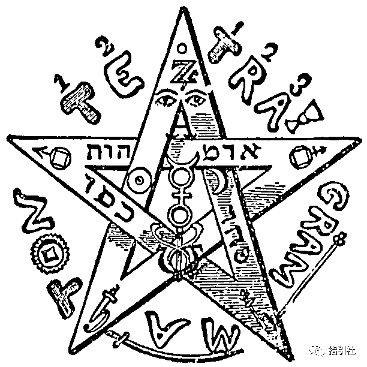

(魔法师艾利法斯·里维的五芒星)

具体讨论、注释索引详见论坛：

[`www.imslr.com/thread-33290-1-1.html`](http://www.imslr.com/thread-33290-1-1.html)

