## 探测棒的千古奥秘

## St. Royal College
天使神秘学院

- 专业占卜预测机构
- 神秘学培训机构
- 水晶能量研究中心
- 官方淘宝：http://strc.taobao.com
- 官方微博：http://weibo.com/715104687
- 新书发布QQ群：659338717
- 购买更多好书请联系院长大天使

大天使
天使神秘学院 院长
QQ：715104687
手机/微信：13641926204

微信公众平台：strc2011

## 前言

如果，各位朋友最近在台湾各处的山上、山下、湖边、海边、田野、树林内，甚至在各个街头巷尾之间的街道上，看到有人手里拿着一根棒子，神情肃穆，又屏气凝神、神秘兮兮地走啊，走啊，还不时会停下来四处张望，又好像在跟它的棒子在说话……千万不要怕，不要紧张，这个人没有发疯，也没有中邪，也许看起来是有点古怪的样子啦，他只是在“探测”（Dowsing）而已啦！

“探测”（Dowsing）在台湾还比较少听到，但在国外却是已经流传了将近年万了的东西和技术，奇怪，东西文化中此项未交流到吗？

先不管，“Dowse”这个字在字典的直译义上，有“占卜”、“魔占”的意思，是有那么一点点那么魔法、法术的味道存在。不过，为了不吓着台湾清纯又可爱的朋友们，称它为“探测”会是一个比较中性的名字。而探测中所使用的棒子（Dowsing Rod），顺理成章就是叫做“探测棒”啰！

那探测什么呢？

哇，那范围可广哩！只要您想得到的，即使眼睛看不到也无妨，探测棒都能为您找出来。

最多的是用在找寻地下水源，如地下水流、泉水等，才可以在上凿井取用。再用来找寻地底下的矿藏，如金矿、银矿、煤矿、石油、宝石等等。应用相同原理呢，也可以拓展开来找寻地下管线，如水管、油管、瓦斯管等等，及其破裂渗漏处；或侦测地下电缆，或不正常、有害的辐射源。在战事中呢，可运用来找寻敌军坑道及地雷；在刑事侦查中，可以协助追查嫌犯、肉票、失物；在风水中，又可以协助探查“龙穴”……。

> “哇，这是什么东西？这么神奇！这么好用！”
>
> “贵不贵？怎么用？哪里买？如何做？一般人能用吗？”

慢着，慢着，这些问题正是本书要讨论的主题。请您耐心看下去，一切的答案均在书中了。

## 目录

- ※ 大水晶的话
- ※ 前言
- 第一章 探测棒的故事........... 1
- 第二章 探测棒的案例........... 7
- 第三章 探测的工具........... 25
- 第四章 探测的基本原理........... 47
- 第五章 探测棒的训练........... 60
- 第六章 特殊探测法........... 78
- 第七章 对探测棒的期许........... 97
- 第八章 经常问答集锦........... 112

## 第一章 探测棒的故事

是的，探测棒的确不是什么新奇的玩意，它可能和人类的历史一样久远哦。

在中东利比亚（Libya）的东南方处，有一先民住过的洞穴，叫“塔西尼安查”（Tassili-N-Ajjer），洞里就有一幅壁画，显示一群人正拿着一些分叉的树枝，在做探测地下物的工作。而据考古学家估计，这大概是在西元前 8000 年前的作品。乖乖，据今是整整一万年呢！

翻开旧约圣经，看到出埃及记中的第十七章的“磐石出水”，众人在向摩西讨水喝，没得喝就抱怨。耶和华指示摩西拿著他那根“杖”，去击打磐石，磐石便会有水流出来，供大众及牲口饮用。摩西照做了，水也流出来了。以后，这个地方就被叫作“玛撒”，含有“试探”之意。后人就穿凿附会，有没有可能摩西的那一根“杖”，就是“探测棒”之意呢？

在 16 世纪的德国，有一位住在波希米亚省（Bohemia）北边的医生，叫乔治（Georgius Agricola）的，他看到矿工们在探矿、采矿的情形，非常有趣、又神奇，就利用闲暇的时间，将他所见所闻全数记录下来，并在 1546 年出了一本“De Re Metallica”（On Metals，金属之上）的书。书中是巨细靡遗地记载了每一个探矿、采矿的细节及动作，当然少不了探测棒的制做与使用方式。这本类似百科全书般的采矿书，后来被矿工们当成“圣经”般看待；也真的是如同圣经所受到的待遇一般，被用铁链锁在教堂中，而由教士来念给这些不识字的矿工们来听。

后来，有些优秀的矿工（探测工）们，就被聘请到英国去协助探勘兹蒙（Devon）及康威尔（Cornwall）底下的锡矿。英明的伊丽莎白女皇一世（1533-1603）还多多鼓励欧陆上的矿工们来到英伦岛上，为她们发掘所有地底下的矿物资源，以富国强国。伊丽莎白女皇一世在位的 46 年间（1558-1603），堪称是英国历史上最光荣的时期之一。

奇怪的是，在 16、17 世纪的欧洲教会对探测棒非常感冒，一直要以巫术、恶魔来诬陷它。连马丁·路德（1483-1546）这么一位伟大的人物，也认为探测棒是一种“道德上罪恶”（Mortal Sin），使用探测棒是一种破坏神的诫律的行为。偏偏，马丁·路德正是矿工的儿子，他应该非常清楚矿工们如何使用探测棒的情形啊！

也许有其他的原因吧，咱们稍后再论。但是探测棒曾经在欧洲大陆上销声匿迹了好长一段时间，一直到 18 世纪，当新移民来到北美新大陆时，才再度被大量使用，因为急于找寻新的灌溉水源，也供应人口及牲口的使用。

这期间又出了一位不错的人物，叫阿贝（Abbe De Vallemont），他在当时也是宗教界的著名领袖之一，但他很反对魔鬼、撒旦、地狱等的说法，算是颇有主见、也敢言的教会人士！他在 1725 年所出的一本书中，也有详细说明探测棒的用法，他认为是有一种肉眼所看不见的“微粒子”（Corpuscles），从人、棒、物中互相连结起来；书中的插画，并用“烟雾”来代表这些微粒子，也画出他们彼此连结、交换的情形。阿贝的想法，实在是超越他当时的时代三百多年之久！

探测棒可以说是在美国被发扬光大的！就如前所述，新移民没有包袱，不必担心教会的钳制，而且，也有实际上的需要嘛。在新大陆中，能找到水源，就是找到命脉；能找到金矿，就是发财。任何东西只要能够协助达到这些目的，都是好的！这也是些很实际的需求啊。

全美国，所有的州，所有的城镇，都有为数不少的“探测师”（Dowser）。但全国性的组织是一直到 1961 年才成立的，叫“美国探测师学会”（The American Society Of Dowsers）。

美国的主要移民来源——英国，也有一个组织，叫“英国探测师学会”（The British Society Of Dowsers），是在 1933 年成立的。

这些学会的会员都非常优秀，他们非常乐意把他们亲身的经验给分享出来。多年来，已指导过成千上万的学生了。同时，若受邀为人探测水源的话，通常是在一种“No Water, No Pay”的基础上，就是找不到水就免付钱啦。您看是不是非常公道？同时，学会中的优秀成员也常常受邀为警方、调查单位协助办案，没有报酬、没有功劳、甚至不准说出来，您看是不是真的无名英雄呢？

任何人上了网际网路，到任何一个英文的搜寻站，只要打入“Dowsing”这个字，就可以看到他们的网站，并分享他们的资讯。

探测棒迟到民国七十年几年 (1980) 以后，才传进台湾的。但不是大规模的、全面性的，而是很秘密的、很少部份的人才知道的。

这也是我们后来才得知的消息啦。

即是，当我们在推广、介绍探测棒之时，遇到几位老前辈级的、大师级的地理风水师也来探询。但是，奇怪的，还没介绍，他们就已经很熟练地用开了。问问价格多少？连工、带料、加上毛利，几百块钱一支而已，不到一千块。只见他们摇头叹息道，他们以前在拜师学艺时，这个东西叫作“寻龙咒”、“探龙针”，是用来找寻龙穴之用的，老师告诉他们这是美国的什么特殊合金材料做成的，非常珍贵、难得、又敏锐的，一支才卖他们十几万而已！

哇，十几万？民国七十年几年在内湖区东湖路上的公寓房子，一间才一百万上下而已。十几万的代价可以用来自备款订一间公寓了！

这也很典型是中国式、台湾式的心态啦，师父怕徒弟强过自己，处处留一手，“盖步”啦。同时，也尽量压榨、利用徒弟，“压到底”，占尽一切好处。这都是我们中华文化在古代发达，现在却式微的原因，不管显学或是玄学、神秘学，都是如此。私心作崇，谁能有办法呢？

嘿嘿，假如有人问我“台湾的探测师学会什么时候成立啊”？真的是“莫宰羊”，不知道呢！或许这本书会是个开始，期待有热心人士会再登高一呼吧！把好东西，好学问分享给大众，也算是功德一件哦！希望不要再有“暗杠”的事情发生，没有人会利用这种美好的学问来发这种“黑心财”、“狠心财”。

曾听到一位前卫的新潮女性朋友说到，保险套是这个世界最伟大的发明，使她可以免除怀孕的麻烦、性病的恐惧，可以完全快乐地享受性爱的生活。

乍听之下，好像有道理。但对我们这种几近半和尚生活的人，似乎感受不到保险套的好处，连吹气球也不好用啊。所以我反对称这个东西是个伟大的发明。爽只爽到那些爱玩的人而已，又没有造福全民，是吧？

我认为这世界上最伟大的发明，应该是自来水的供应系统。假如没有了这个系统，我们生活上的舒适度、便捷度，一定会减少一百倍以上，退回到古早人的生活方式，哦，那很苦耶！

想想，从我们一早起来，刷牙、漱口、洗脸、洗澡、洗衣服、洗米、洗菜、烧开水、冲厕所的.....一个人要消耗多少水呀？一家四、五口的简单小家庭又要消耗多少水呀？假如没有自来水，就得自己到河边、井边去提，水又那么重，是不是一件苦差事？而且要经年累月地提哟！

偶尔因为台风等天灾，停水个一、二天就很受不了了。有人在外岛当兵时，一天就只配给一个脸盆的水，怎么过？岸勤作业搬完水泥后，身上都结满水泥块了，却不能洗澡，怎么办？

看看，所有伟大的古代文明都是在大河旁孕育而成的，所有村落、城镇，也都是在河流汇聚处而成的，水对人的生活如此重要，自来水系统的确比保险套伟大多了。

当古时候在没水的地区，又该如何去判断哪里有水？哪里可以挖井下去？嘿嘿，挖洞可不是那么好玩的哟，十几、二十公尺，甚至三十、五十公尺地挖下去，是会要命的呢！同时，费用也非常地昂贵，贵的让您不能试试看。一定要有，没有就完蛋了。

所以，懂得判断地底下哪里有水的人，应该更伟大！应该送他一打保险套。而能协助探测水源的探测棒，就不须要也套上个保险套了吧？

## 第二章 探测棒的案例

### <案例一>

在 16 世纪末的法国地区，出了一位优秀的女性探测师叫玛汀（Martine De Bertereau）的。她的先生叫布索雷男爵（Baron De Beausoleil Et Dauffenbach），是一位出色的采矿专家。玛汀也许是天赋异禀吧，她从她先生那边学得如何使用探测棒的技巧，然而她探测的结果却比当时的任何人都要精确。她不只是找矿物厉害，找水源也是一流的！尤其在 1629 年发现的查图矿泉水（Chateau-Tierry），更使她声名大噪，并正式成为法国政府的矿业顾问，实在很厉害。

在这么古老的年代里面，女人家其实是没什么地位的，一般认为女人家应该是乖乖小绵羊，应该留在家中洗衣、烧饭、带小孩，怎能抛头露面，又出来与人争长计短的，何况还抢尽男人们的锋头？在这种时代背景因素下，埋下了一个不幸的因素在。

男爵夫人玛汀似乎没有感觉到这类的因素。她聪明过人，能流利地说着三种语言；又精力充沛，酷爱旅行，不仅跑遍了全欧洲，甚至在那么交通不发达的年代，还搭船渡过大西洋，来到南美洲的玻利维亚（Bolivia），爬到安地斯山脉（Andes）上面去探勘金矿。

以这么旺盛的活动力及极为精准的探测能力，当然也为她及男爵争取了更多的声名及财富。然而，男爵和男爵夫人在这些财富及声名的背后，都忽略了“红眼睛的人”、“嫉妒的人”正在罗织他们使用巫术、魔法的罪状。是啊，地底下那么多的宝物，为什么就您男爵夫妇找得到，别人就找不到？这个意思也可以说，为什么您发财，我就没发财？这些“尢ㄟ肚仔”、“赤眼眶”的人，终于在 1627 年发难，将男爵夫妇逮捕入狱。

布索雷男爵极力为自己辩护，并否认了一切有关巫术方面的指控，也获得了法庭的无罪开释。但是，他们所有的探测工具、矿物样本、地图、研究报告、及一大笔的钱，就从未被归还。

男爵夫妇看法国已经待不下去了，夫妇俩就移居德国。由于技术在身，本事好，他们还能够过得蛮充裕的，颇为优沃的贵族生活。

但不晓得是不是过得太舒服了，没事找事，男爵他突然“ㄒㄧㄠˇ ㄎㄨ”，骚屁股起来，出了一本书叫“La Rest Itution De Pluton”的，书中又详尽描述了玛汀夫人及其所使用的探测工具等等。好死不死，正好落入死对头们要加害他们的口实和藉口。两夫妇就在 1640 年再度被捕入狱，其后待过不同的监狱，最后两佬都死于监狱之内。

### <案例二>

地点同样在法国，时间来到 17 世纪末期。

当时，有一位优秀的探测师叫“艾马”（Jacques Aymar）的，他以善于追踪罪犯而在国内享有名气，报章杂志上常常登有他的优良事迹。但一直到 1692 年，他 29 岁的那一年，破获了一件酒商夫妇被害的刑案，才声名大噪，全欧洲都知道他的名字。

1692 年法国里昂市（Lyon）发生了一件谋杀案，一对经营酒品的夫妇被人发现惨死于自家地下室的酒窖之内，行凶手法非常残暴，但是却没有丝毫的线索可供追查。王室的检察官，迫于上级、社会舆论的压力，却苦无进展，万般无奈之下，不得不请来当时已小有名气的艾马兄来协助追查。

艾马使用的是分支状的树枝来当他的探测工具的。他首先告知警方，刑案在地下室的确切发生地点，然后带领大家上来，来到街上，一路追踪下去。此时，艾马的后面跟着一堆警察，警察的后面又跟着一大堆好奇围观的群众，大家一起在街上缓缓前进。这景象一定很有趣、很好玩吧！

探测棒所指引的这一条路，带引大家来到城门，而这城门到了晚上就都是封闭的。他们不得不暂时先休息，等隔天城门开了，再继续追踪。

隔天，艾马就领着三位警察，越过城门，继续追踪。他们沿着一条小河一直走，一直走，直到来到一个园丁所住的小茅屋，发现里面有一个空酒瓶，探测棒对它反应激烈。同时，在探测屋内其他部份时，发觉对那桌子、及其中的三张椅子也反应激烈。艾马告诉警察，应该是有三个人，而且在此屋中停留相当的一段时间，足够他们三人喝完这瓶酒。

警方询问园丁的二个幼童，也确认了此点。

艾马带着警察继续追踪下去。这个探测棒指引他们来到附近的一个叫做布卡里（Beau Caire）的小镇上，直指着镇上唯一的拘留所。随行的警方就要求所方将最近逮捕到的犯人集中，以供他们查验。总共有十三个嫌犯，一字排开，接受测试。艾马的探测棒对其中一个驼子有所反应，而这个驼子是在一个小时前才被关进来的而已。艾马告诉警方说，这个驼子只是个从犯而已，尚不是主犯。

这个驼子当然否认了一切，说他没有杀人，没有参与犯罪……可是，稍后被酒商的邻人指认出来了，说他在案发前曾经出现在附近，因为是驼子，所以印象深刻。

驼子被这种突如其来的指认吓了一跳，原本以为神不知、鬼不觉呢。这个驼子的脑筋也是弯弯曲曲，他故意在小镇的地方犯点小错，被关了起来，满以为就可躲过警方的追缉。没想到还是被追查到，还被指认出来，这是两条命的谋杀案呢！面对死罪的指控，驼子不得不坦诚招供，以避免死路一条。

原来，驼子只是个下人，他替另外两个人工作。作案时，他并未动手，他只是协助搬运从被害人那边偷来的金银珠宝等等。这点，又证实了早先艾马的推断。

原来一筹莫展的检察官，此时龙心大喜，大大地奖赏鼓励了艾马一番。随后，又加派了几位弓箭手，请艾马继续追下去，看能不能把真凶给缉拿到案。

### <案例三>

在 19 世纪的英国也出现了一位令人敬佩的探测师，叫“约翰·穆林”（John Mullin）（1838～1894）。他会来从事探测师的工作呢，也是一番巧合。

在他 21 岁那年，1859 年，来到格劳斯特郡（Gloucester-Shire）这个地方，帮忙地主约翰·奥尔爵士（John Ould）来盖他的大庄园。而在同时，一位远住在康威尔（Cornwall）的探测师，也被邀请到庄园来，为他们找寻新的水源，以便钻井。庄主奥尔爵士也很好玩，他不仅自己看那探测师看得有趣，也叫所有的家人、工作人员一起来看。等探测师探好，在地上做好记号，奥尔爵士怂恿他的女儿也去试试看。这小女生听话，反正也好玩嘛，依样画葫芦地在比试。当来到相同地点，也有反应了，而且反应之大，让她把探测棒给甩到一旁了。小女生吓着了，就再也不玩了。

他们在这个标好记号的地方打井，果然也找到满意的水质和出水量。

奥尔爵士真的很鲜，他大概越想越好玩，怎么会那么神奇呢？地底下的东西又看不到，凭着一支分叉的树枝就能把它找出来，是不是很不可思议？又是什么样的人、什么样的体质，具有这样的本事呢？想不出个道理来，再试试看吧！随着，马上全员集合，把庄园上的所有人员都召集起来，共约有 150 人吧，要一个一个试，看看还有谁是具有探测的潜能的。

等轮到年轻的穆林时，哎，也有反应哦，而反应之强，啪的一声，把树枝状的探测棒都撕裂了。穆林是不会像小女生被吓着了，他只是觉得有趣，很好玩。而且，在同事中被称作“探测师”，让他有点飘飘然的感觉，有点暗爽吧。因为探测师这个头衔带有一点神秘的味道，好像他可以做一些别人做不到的事，他可以知道别人所不知道的自然界的奥秘。别人对待探测师，好像有点又敬又畏的感觉。他自己当时只觉得好玩，还未想到日后要以此天赋维生呢。

直到稍后，庄园主人奥尔爵士又想在田庄的另外一边开个井，就选派穆林前去探测。这位老实的穆林果然不负众望，很快地就找到了一个合适的点，挖掘下去 25 公尺深的地方，水就冒出来了，每个小时约有二佰加仑的出水量。哇，这次成功的探测事件，让大家把他当成一个真正的探测师看待，赢得许多掌声及喝采。不过，老实的穆林终究十分小心和谨慎，他没有被这些掌声给冲昏头，仍然乖乖地干着他泥水匠的工作。一直到 1882 年，44 岁的时候，才出来开设自己的生意，专门帮人家找水源及掘井。

穆林是个忠厚又老实的人，他替人找水源及掘井，通常是在一种“No Water No Pay”的基础之下进行，就是没水就免付钱啦。当然就容易赢得客人们的信任与托付。终其一生，到 1894 年去世为止，共发现了五千多处水源。他的儿子小穆林(H.W. Mullins) 克绍箕裘，继承父业，也是帮人探勘水源及掘井，也是相当厉害，不过还是差了他父亲一点点。

在穆林的一生当中，果真还有许多传奇故事。他也非常习惯于别人对他的怀疑与有心测试，也从不把这些放在心上，对自己具有无比坚定的信心。

有一回，一位国会议员芬奇·海顿 (Finch Hatton)，同时也是「灵魂研究学会」(Society For Psychical Research) 的一名会员，就把穆林带到家里做测试。

海顿知道他家厨房后那块草地下，埋有一根排水管，就故意带着穆林与他的探测棒走过那块草皮。奇怪，怎么没反应？海顿心中还在怀疑着而已，突然回想起穆林曾经告诉过他，他的探测棒对着静止不动的水没有反应。一念至此，海顿即命令仆人将水龙头打开。那边才打开而已，就听到这边的穆林在叫说「有了！有了！」穆林就在地上做个记号。

海顿觉得有意思，建议再做进一步测试，就问穆林「敢不敢让我将您蒙着眼睛，再试一次看看？」

「可以是可以」，老实的穆林回答道，「只要您议员大人不要将我引到池子边、或水塘边就好。」是啊，不要捉弄人，跌个落汤鸡吧。

海顿就将他双眼蒙上，带着他走回边界，又故意绕了绕，不让他凭感觉来定出方位。好，就放牛吃草，让穆林自个儿去找吧。

后来，据海顿先生自己说的，他看穆林在那草地上走呀走呀，来到就比原来定点只差一英呎远的地方，还是背对着它哦。忽然，穆林就转过身来，感应到了，就出声确认「找到了！找到了！」跟原来所定下的那个点，分毫不差，完完全全，就是这里！

还有一回，在绍斯区 (Sussex) 的瓦汉村 (Warnham Lodge)，住着一位超级铁齿亨利·海本爵士 (Henry Harben)。这位老兄认为自己是受过高等教育的人士，同时又是社会中颇有名望的绅士名流，打从心里就不把探测术等的伎俩看在眼里，自视颇高，带有典型英国绅士那种如鸵鸟般的自尊，与如孔雀般的骄傲吧。

但骄傲的人也是要用水呀，他的田庄里也需要更多的水源来供应灌溉、牲口的饮水等等。海本爵士打了二口井，空空如也，什么水也没有。再来，用了一种所谓的「最新科学方式」再凿一口井，一样是「损龟」，没有啦。

打井、探矿这种事很有意思哟，它不容许您来「试试看」、或「打打看」哦，一打就是得花钱，一试就是得花钱。而埋藏在地底下的东西，只有天晓得是在哪个位置、多少深度，人的眼睛是看不到的。海本爵士为此已经花了一千英镑。这在19世纪末应该是相当大的一笔数目吧。

尽管心不甘、情不愿，海本爵士也不愿与自己的钱过意不去，就听从朋友的建议吧，召唤穆林来为他庄园探测水源。贵族的面子是有点放不下啦，但找不到水就不用付钱，试试看吧。

不过，这海本爵士的肚子里也是有好几个拐的人。他为了不让穆林得到任何有关瓦汉村的任何讯息，他亲自跑到火车站去接他，而且技巧地隔绝他人与穆林接触、攀谈。存心就是想看看穆林能变出什么花样。或许呢，他那贵族的骄傲心，还可以有个台阶下。

穆林就和海本爵士在他们农庄附近开始探测，一路走来，穆林的探测棒有点反应，他说是一条小条的地下河流而已，不太满意，但还是做了记号。他再往高一点的地方试去，也在两个地方再画下了记号。然后，他在农庄附近的土地上测试，并在有可能出水的地方都标上记号。

固执、铁齿的海本一心要试要到底是真或是假，就把穆林所有标上记号的地方，全部开挖了。然后，结果也证明穆林是完全正确的，所有他标示的地方全部都有出水。海本爵士鸡嘴变鸭嘴，不得不承认穆林和他的探测棒的确厉害！令他心服口服。

随后，海本的一位好朋友，也是地质学家，来参访穆林的杰作。他查看了附近的地理环境，包括山形、水文等等，不得不佩服，并以一句「超自然」(Supernatural) 来总结他的报告。

在穆林去世后的日子里，他的小儿子小穆林也遇到一次有趣的经验。

曾经，老穆林被卓别林先生召唤前去为他找水。当然，老穆林没有漏气，很快地找到了，也放了个标志在上面，还仔细地告诉卓别林先生说水流是个怎么走向来的，最好的挖掘点是在篱笆的另外一边，会有很好的出水量……然而，后来不晓得什么原因，这口井没有开挖，那个标志也不见了。

后来，这个田庄的人又想挖井了，再度请人来，这次请到的是小穆林。小穆林也是很小心、很仔细地四处探测，最后决定在篱笆边的一个点开挖。挖呀，挖呀，当掘开表土层后，小穆林竟然发现到他父亲老穆林在八年前于此所放置的那块标志。哇，这真神奇！也可见是父子俩「英雄所见略同」啦。

## 案例四

再一个案例也很有意思。

18世纪初，1713年，在德国弗来堡 (Freiberg) 有一位矿工叫汉斯·沃夫 (Hans Wolff)。他也可以来做探测的工作，只是他不必其他的工具，他只用他的右手当探测棒。

当要探测时，他只要把右手握拳，右手臂伸直，就可以开始去探测了。当他接近他所要探测的矿脉时，他的右手就会开始颤抖；当他直接站在矿脉的顶端之时，他的全身都会摇摆，并且颤抖。他的身体反应，代表了探测棒的反应。

这种反应最教旁人不解，因为汉斯老兄本身就是一位铁矿的矿坑工人，如果他的反应是如此激烈，那么他又是如何能安心工作呢？

汉斯的回答很妙，但就切中要点，「我只要不去想它就好了！」

换句讲话，汉斯只要不要有那个念头，说「我要找矿脉！我要找矿坑！」那么，汉斯的身体就不会有反应，而且可以安心在任何环境下工作。

再翻回来讲，当汉斯要找矿脉、矿坑时，就是要带上那个意念，「我要找矿脉！我要找矿坑！」那么，只要他接近适当地点时，感应就产生了。

这个案例颇值得我们深思哦！

## 案例五

在1952年时，有一位英国上校哈瑞·葛莱登 (Harry Grattan)，奉命到德国的蒙城 (Mochen Gladbach) 去建筑一处英军的总部基地，届时将有将近9000名官兵驻扎在此。这也意谓着说，这个营区每天至少要能够供应出750,000加仑的水，才够官兵们使用。而当地的水源又明显地不足，要用购买的又太贵了。何况，当地德国人所使用的水又多含碱太高，水质又硬，实在不适合使用。只有当地一些比较有钱的人，他们在自己产业上挖井取出的水还软一点，还能使用。

哈瑞上校接受随行地质专家的建议，也自行凿井看看。但试掘了几处，空空如也，什么东西也没有。再来，逼急了，哈瑞上校再也不管自己曾经受过的工程、电机方面训练，他想到他自己以前也玩过探测棒这类的东西，就决定再用来试试。反正，也不会有所损失嘛，说不定另辟蹊径才有生路，因为现代科技似乎也帮不了他呀。

哈瑞上校发觉他还能够拿着探测棒来试，还有，不管是坐上车、或骑在马背上，他也照样能够使用探测棒。这实在太棒了，因为他所要探测的区域足足有三十平方英里之大，接近有八十平方公里。用走路的话，那肯定是会累死人了，也不经济呀。哈瑞上校是内行人，他还懂得用 地图探测法 (Map Dowsing) 先去预测一番，再实地探勘，省时、省力、又省钱。

后来，在这个营区不同地点所掘的井水，质与量都相当不错，总计一下，一天约可产出一百万加仑的水啦！而且，直到四十多年后的二十世纪末，仍然是水源滚滚！

## 案例六

在1967年10月13的美国纽约时报，刊出了一道头版新闻，「探测棒能侦测出敌人的坑道」。这条新闻在报道美国的海军陆战队，如何将旧衣架的铁丝剪裁成L型的探测棒，并如何利用二支探测棒的变化来侦测到北越敌军的地下坑道。

原来，先是有一位土地测量师，同时也是探测师的美国人，名字叫路易斯·马塔西亚 (Louis Matacia)，他向美国军方建议，他愿意将自己的技术免费教给军方，希望对美国的子弟兵们在越南中的丛林战争中有所助益。(看吧，人家的气度果真不一样！)

当时，美国军方也是对越南的战事伤透脑筋。为了遏止北越的入侵，他们所能制造出来的任何高科技武器，都已经出笼，但是北越就来坑道战法，一切都转入地下，不与美军正面冲突，哇，这下子就没辄了。再来，就利用他们对地形的了解特性，昼伏夜出，神出鬼没，你来我跑，你走我又来，骚扰性、恐怖性、破坏性的游击战法，紧绷美军的神经，拖延、消耗战法，好多年轻美军都被逼疯了。

战争是最实际了。什么办法有效，就用什么办法。如果高科技帮不了忙，土方法、原始方法、魔法也成，只要有效最重要。军方也派出人员，来对马塔西亚的方法做检验。似乎可行哦，就让他到越南去了，并把这些方法教给海军陆战队的第二大队，第五联队。但当马塔西亚刚刚抵达教授给这些美国大兵时，似乎人们都不大相信它，还戏称这些探测棒为「马塔西亚的方向舵」、「马塔西亚的风向鸡」等等。

当时，美军军方在战地里有发行一个叫「观察家」的周刊。在1967年3月13日的一篇报道中，就提到一位二等兵唐·史坦纳 (Don R. Steiner) 成功运用探测棒找到北越地道的消息。这也是史坦纳有史以来第一次使探测棒哦，首度出击就奏效！

原来当他们那一班出巡执行侦搜任务时，想到刚学到的把戏，不妨试试看。当史坦纳接近一间越南民房时，哎，手上两支探测棒有反应哦，而且向内靠近。嗯，这个屋子可疑，搜！结果屋内还有秘密坑道，还通到一个小型的弹药库，而弹药库的正上方，也正是史坦纳刚刚测出有反应的地方。

这个消息，这项成就，就这样给报道出来了。

在越战期间，美军是否有利用探测棒来寻找地雷，这点无报道。不过想来，应不太实际，因为当科技已非常发达，有所谓的「金属探测器」发明了，针对金属的磁性来搜寻地底下的地雷可以又快又准。

不过在第一次世界大战 (1914～1918) 之后，一位阿贝宝利 (Abbe Bouly) 的，的确用探测棒来协助发掘地雷，并予清除，最主要的是帮助到战后被蹂躏区域的清理与重建。阿贝的探测棒很灵，清除了不少的地雷，偶尔呢，他还能感觉出地底下的这一颗地雷是属于同盟国的呢，还是属于协约国的。很妙吧？

## 案例七

这是在当代的瑞士，也是世界有名的大制药厂，罗德药厂 (Hoffmann-la Roche)。是的，他们也使用探测棒。

每当人们质疑该公司，说你们这么大、这么先进科技的公司，也用探测棒这种古老的东西吗？

该公司的发言人，也是首席探测师，彼得·垂威尔博士 (Peter Treadwell) 就会很得意地回答到，「是的，我们是使用探测棒，这东西现在已经能有合理的科学解释了，使用探测棒帮我们节省了许多不必要的开销，这是非常划算的！」

彼得博士是使用一个大型的环箍，铝制的探测棒。他说这样比较轻，从事探测时也比较不会累，该公司在全世界各地建厂时，都有用探测棒来测量过当地的土地情形。同时，据罗德药厂自身的内部杂志「Roche-Zeitung」所言，该公司在全世界各地寻找水源的努力当中，可以说是百分之百成功的。

事实上，许多世界级的大公司也都有专业探测师的编制，如 RCA，Bristol-Myers，及杜邦 (Du Pont) 所属的加拿大工业公司 (Canadian Industries) 等等。

许多政府也聘有专职的官方探测师。比如英属哥伦比亚就聘有一位爱弗琳·潘玫瑰小姐 (M.S. Evelyn Penrose)，而这位小姐也同时为英国、及澳洲政府工作。印度政府也曾经聘有一位宝森少校 (Major W.N. Pogson) 当他们的专职寻水员。1941～1946年间，斯里兰卡也聘有一位挪拉·米兰 (Norah Millen) 的探测师。

军队里也有不少这样的案例哦。

第一次世界大战期间，澳洲的远征军在加里波里 (Galliboli) 就曾使用探测师来找水源。

当英国远征军受困于高热与严重缺水时，一位自告奋勇的赛帕·凯利 (Sapper S. Kelley) 就用探测棒来找水，共开了32口井，足足可以供应十万名部队每天的用水量。

在1930年时，义军在土耳其战役中也曾使用探测师来找水喝。

第二次世界大战时，当时在北非摩洛哥的德军将所有的井都破坏了，巴顿将军 (General Patton) 也曾请探测师重新找过水源。

法国国家科学学院 (Academie Des Science In France) 宣称，对探测棒的原理是尚无法完全确认，但它的效用却是毋庸置疑的。

荷兰国家研究委员会 (The Dutch National Research Council) 所属的物理科技研究所 (The Institute Of Technical Physics) 也对探测棒的效用予以肯定。

美国国家太空科学总署 (NASA) 也曾研究过探测棒的功用，也是予以正面的评价。

1953年时，联合国教科文组织 (UNESCO) 底下的一组欧洲顶尖科学家，在一篇研究报告下的结论，承认到「探测棒的功用是确实不容怀疑的！」

从上述这么多的实际案例中，我们也可以了解到几点启示：

-   一、当「需要」产生的时候，几乎是人人都可以成为一个探测师的。
-   二、一般人都有能力来做一些基础探测的，等经验丰富了，技巧纯熟了，每个人可能会从不同的专精领域去发展。如男爵夫人冯汀找金矿最行，艾马寻人、追踪刑事案件最在行，穆林就专门找水，马塔西亚、史坦纳擅找地下坑道，阿贝宝利就特别容易找到地雷。
-   三、人的天份需要发掘出来。穆林的老板约翰·奥尔爵士很好玩，一下子就叫150人来试验，发掘了自己的女儿和穆林的天份。这种大规模的测验，实在好过于小小的几个个案测试，也不容易失之偏颇。学校、军队、公司、机关、团体、社团等大型组织，不妨也如法泡制，看看单位里谁是最有天份的呢？
-   四、单纯的心，正向的态度，与集中的精神。越是出色的探测师，似乎也都越是谦逊、淳朴、单纯，且在探测进行中都能保持一个正向的态度，不受旁人的怀疑眼光或心态干扰。集中的精神即调正的频率 (Tune In)。铁矿工人汉斯·沃夫即是个很好例子，集中精神就有感应，不管它了，就没有感觉。
-   五、探测的作用，其实是身体的感应，再外向作用反应到棒子的振动，摆幅上。铁矿工人汉斯是个例子，他的感应这么强烈，甚至可以不必再依靠任何一根棒子。老资的汉斯、穆林、艾玛，身为女生的冯汀、奥尔爵士的女儿，傻傻的陆战队二等兵菜鸟史坦纳，都是属于单纯的头脑、敏感的体质，或者也可说他们的气脉开通，对外气的感应特别好。
-   六、人们对无知的事物有莫名的恐惧。摸不到的事物容易怀疑、惧怕，就会与之将巫术、魔法联想在一起。
-   七、能者容易招嫉、招妒，惹人眼红，甚至遭害。布索雷男爵及其夫人玛汀是个最明显的例子。艾马后来也未得到应有的赞誉，反因流言太多，让法国政府下令禁止再使用探测棒办案。所以，真正的一个优秀的探测师应该要了解谦逊的美德，懂得进退之道，明哲以保身。比如说协助警方办案，成功后要归诸警方的英明领导，不能夸说自己的探测功夫厉害，不能抢功、掠美、占人风采。不然，哪一天若有什么小小闪失的话，人家马上会对您落井下石的。千万记得，这世间到底「尢、肚的人」比较多啦。

## 第三章 探测的工具

哈，这一章是最简单的，也是最好玩的。

如同我们在不同的书籍上所一直强调的，最先进的工具，通常也是最原始的工具；最有效的工具，通常也是最简单的工具。最简单的工具，也是意味着最便宜的工具。还有，最简单的工具，也就是最容易做的，也就是最不会故障的。

典型的 V 字棒，若是底下再多那么「一根」，就是 Y 字棒了。

希望大众在这里，不仅仅是「看」而已，最好呢，还能够亲手做，这样才能发觉探测棒好玩、有意思的地方。

-   1. Y 字棒 (或称 V 字棒)
    这当然是以它的外形来称呼的啰，而这个最常见的当然就是在树枝上了。
    住在都会区的朋友们，趁放假到乡下、郊外走走，应该是到处垂手可得的。提醒一点的是，不要在国家公园的保护区内乱折花木，以免受罚或吃上官司。住在乡间的朋友们应没问题啦，台湾的丘陵地上到处有的相思木、柳树或果树树枝，就都非常好用了。
    通常，找到直径约有一指粗的大小，就够了。再粗，怕会太重，举不动，不然就容易累；再细，又怕太细嫩，容易折断。而长度约在40～50公分左右，就行了。
    记得采新鲜的树枝，才有足够的韧度与弹性。
    补充一下，这只是个通常的直径和长度，不是定律哦。请各位先生、小姐，依您自己的身高、腕力、掌握的舒适度来试试看。这不必多花钱的嘛，多采几个试试看。没有「定律」哦，最适合您拿的，顺手的，能拿的久而不疲劳的，就是最好的。身高150的也不必要和身高180的比吧？他有所长，我有所短，好用最要紧吧？
    O.K. 这不是浪费，而是为了实际可行。所采下来的 Y 字型树枝，不能是旧的、老的、干的、枯的，这样的的话弹性不够，容易一下子就折断了。最好是每次想去探测前，再去采新鲜树枝，才能有足够的韧度与弹性。
    拿的时候，二手手掌向上，握住分叉出来的两端，将手肘贴近身体。您可以感受到树枝被微微扳开的感觉，您的双臂和树枝都在一种微妙的张力与平衡当中。有这种感觉的话，姿势就正确了。
    再来，看您想要寻找什么，就集中精神来想着它，然后散步开来去寻找吧。一旦遇到时，这个Y字型探测棒就会有所反应，会有被往下拉扯的感觉，不然就是不自主地会有往上反弹的反应。有些还会被打到头呢！试试看，若有所担心的话，不妨戴个安全帽去做一趟「探测棒之旅」。
    要撑着这么大的一支树枝，要去做几个小时、或半天、一天的探测工作，老实讲，也不轻松呐。所以，总有聪明的懒人想出新点子，新方法，新的代替品。是的，不是只有树枝才可以用，细细、长长、又轻巧的铜线，最适合长时间把持，又不会累。
    虽然被人家讥笑咱们缠线的技术很烂，但是能够在Y字棒前固定，不就够用了吗？
    几乎是任何长长、细细、轻轻的东西，都可以达到相同目的。
    曾经，还有人拿鲸鱼骨这个材质来用，这是最夸张的。而现在最方便的东西呢，无非是铁丝、铜条、铝棒等，甚至，连塑胶、玻璃纤维等，也都可以派上用场。这些东西往往从旧的日用品，如晒衣架、电视天线、雨伞骨等等，就可以做成了。所以说嘛，这些都是最简单、最便宜的工具，不必多花什么钱的。
    笔者个人的喜好，喜欢在Y字型的金属架前端，再绑上一小截的白水晶柱。它给我的感觉很好，探测时敏感度更佳，若有反应，也是非常灵敏。

## 2. L 型棒（或称天使棒，Angel Rod）

嘿嘿，这个最好玩。要去偷妈妈的晒衣架啰。小心哦，千万不要去偷到隔壁家的，尤其更要小心别偷到人家的内衣裤，不然，哇，那可是跳到黄河里也洗不清了。

看着图一，从 A 点和 B 点的地方予以截断。

图二，再将短的一端，由 B 点扳到 B'点，就成了。是不是非常简单？

做一支还不够，最好是做二支。嘿嘿，当双枪侠。

您可以直接用手就握在短的那一端。注意，不要太松，也不要太紧，适可而已。要容许它能自由转动，才可以做出反应，给我们适当的指示。

有些人喜欢用手掌去掌握，有些人喜欢加个木把，或套块布，或干脆将用旧的原子笔笔管套进去，嗄，这样就可以非常嗄嗄叫了！

图二的长度也是一个参考值而已哦，不是规定，没有定律，完全看个人的习惯及喜好而定。有些“幼秀”的女生，用着 15×5 公分这么小巧的探测棒，就很厉害了；有些比较夸张的人，喜欢用上 100×20 公分左右的巨型探测棒，才叫过瘾。同样地，“公妈随人摆”，喜欢、好用，就可以了。

这种 L 型棒，也叫天使棒的，是外国人应用最广的一型，大概是容易做，轻巧，又敏感吧。许多在玩水晶的、探测气场、修炼灵气的人，都懂得使用它。

就是这样握下去，不要太紧，也不要太松，让铁棒能在掌心中自由转动为宜。

加上支原子笔的空笔管，就更好一手掌握了。

女生、小朋友们可以使用“幼秀型”的，小支的。

通常，都是一手握一支，两手平举到胸前，真像双枪侠。平常时，要拿着这样来练习平稳的走路，不能走的歪七扭八，还没碰要标的物、走到目标区，就甩得如“花枝乱颤”一般，那就没有办法测了，是不？所以，这一点得多多练习，就当作模特儿在训练雅姿，走台步，玩探测棒还兼着培养气质，看，多棒！

正常时，二支探测棒是彼此互相平行着的。

待接近目标区时，就会有反应。一种是向内靠拢，等站上目标区后，二支会交叉重叠；另一种反应则是向外分开，站在目标区后，会像华西街小姐的双腿一样，开开开。而这些反应都是自发性的哦，不是由人为控制的。这点也要妥善分辨清楚的。

正常时，双枪侠的两支枪口都是平行的，向着前方的。

站上目标区后，双枪就会交叉，作出反应。

这是另一种反应，“开开开”。

在国内外有许多灵修人士，他们就是用天使棒在测量学生、患者的气场范围大小，也包括量测冥想者气场范围的扩大或缩小程度。

有许多人偏爱 L 型的探测棒，认为它轻巧灵敏，最适合初学者。可是笔者觉得它太灵敏了，反而不太好控制，需要更多的练习，从 Y 字棒还比较好下手。当然每个人的觉受、经验都不一样，朋友们何不自行试试看哪一种对您比较好下手？

## 3. 改良型 L 棒

因为改良了，这是目前全世界探测师使用最多，流行最广的一项探测工具。

握把加粗加大了，容易掌握；同时，水平基座也改良了，它能自由旋转，不必担心拳头、虎口上的控制不良。

整个都是铜做的，稍有点重量，不必害怕轻微的风吹影响，整体仍保持相当灵巧。

螺帽处可以松开及锁紧，借此可以装卸探针，也可以调整探针的长短比例。一般人以放置在 1/3～1/4 处为最多，同样，没有定律，每个人必须依他自己使用的经验及喜好，来调整出他个人最适当的比例。

探针尾，这是个贴心的设计，可以旋转打开的。一来，方便探针的装卸，二来，可以在这有限的空间里面塞一些“标的物的信息”。如找金矿，就塞些金粉；如找银矿，就塞些银粉；如果找人，就看有无该人的毛发、指甲、或穿过衣服的碎屑，等等。如此，可方便将“频率”调正 (Tune In)，寻找效果更佳。

在前一次与后一次的标的物找寻当中，有绝对必要将探针尾里面的“信息物”清除干净。同时，也要将整支探测棒抖一抖、甩一甩，以清除信息；若是能如同水晶矿石般的“消磁”一下，如用水冲一冲，用香薰一薰，则清洁将更彻底。

有关改良型 L-棒的使用方式，还有一个比较完整、仔细的训练步骤，我们将在第五章再来详细介绍。

## 4. 一字棒

记得前面提过，探测的一个基本原理，就是人体感应到外在的信息了，产生了反应，这种反应在体内是极为细微精微的，甚至是意识层所难以察觉的；但当这种信息反应外向传达达到了探测棒，探测棒就会摇摆、振动等等。

一字棒是最没有学问的，就是一根长长的棒子、树枝、竹竿，还能有什么神奇学问可言呢？然而，这就是上述道理的最好发挥、最佳解释。您身体上的任何轻微感应、振动，传到棒子的另一头时，就可以看到“振幅”相当大的动作了。

这种一字棒呢，短的可以在 50、60 公分左右，长的可以到 120、130 公分去，一般在 100 公分左右也就很够看了，也很够用了。因为，不是让您拿来当拐杖用的，探测时，您手到拿在细的一端，再把粗的一端水平向前伸去，二端的水平基准不应有超过10公分以上的落差。这么样的撑着，有个张力 (Tension) 在维持着，一找到目标区、探测物，当然会立刻有显著的反应。

只是，说的常比唱的好听，想想看，挺着一支长达一公尺的树枝走在田野上，累不累人啊？是可以用双手举，两手都握在末端，一手在前，一手在后。相同地，一样非常累人的，一般人能撑个20~30分就不错了。若想到有几甲地、或几个山头要去测，怕不累昏了？

教课、演讲时用的指示棒，也可以替代一字棒用，也更轻盈，但人就要变得更警觉一些。

指示棒前来加支水晶柱，让其更敏感。

所以，又有懒人想出了聪明办法。首先，他们用中空较轻的竹竿取代了实心较重的木杆；接着，用钓鱼竿来取代竹竿；最后，人们发觉废弃了的汽车收音机天线杆、电视机的铝制天线等，都是又轻、又好用，又可长期重复使用，而且几乎不用花到什么钱，就可以使用来发掘地底下无限宝藏的功用，天底下还有什么的投资比这个更划算的呢？

有一次，出于好玩啦，用些铜条缠绕着一支小手指粗细的水晶柱，发觉也可以当探测棒用，也很轻巧灵敏哦。后来，看到国外也有人用，只是是小小支的，约在 10~15 公分上下，叫“Aura Meter”，用来测气场的，也是蛮好玩的。

## 5. 灵摆 (Pendulum)

在许多书里面，也把灵摆当成探测工具的一种，并与各式的探测棒视为同类一并讨论。基本理论是一样啦，不过形状上可就大相径庭了。

灵摆，也有人称作“摆锤”的，这是由一个稍有点重量的东西，再加上一条长约 15~20 公分的绳子所构成的物件。这个“东西”呢，可以是一块切磨漂亮的水晶、一块雕琢过的木头，一颗子弹头、一件珠宝饰物，也可以简单到就是随手所拔下来的戒指，再穿上一根长头发，也可以造出一件摆锤供测试用。

在西洋中的灵修人士，不管是探测师、治疗师、灵媒、算命师、占卜者、魔法师、心理治疗师、或水晶大师等等，几乎人手都有好几个灵摆，而且人人几乎都是使用灵摆的高手。这是必备的工具，也是必须要会的工具。因为它是如此地简单，却又确实。

一般，人们将灵摆悬空握着，顺时钟旋转时规划为正的，是的，积极的；逆时钟旋转时则规划为反的，否定的，消极的。若不转，通常是该人太紧张、或太执着，请其放松、运动一下再来试，效果就出来。

> 水晶制成的灵摆最是敏感！

由此而生的正反、是非、对错，犹如电脑中的二进位法，就可以对各项问题予以测试，并寻求解答。即使再复杂的问题，甚至包括不同时间、不同空间的问题，也可以依此循序一一求出解答。

由于灵摆相当敏感，许多治疗师也用之来为患者测气、侦查病灶、检查体内负能量等等，应用非常广泛。

由于灵摆的运用可以相当地广泛与深入，可以说是相当地专业啦，我们已经有“神光中的灵摆”一书来专门介绍它，还望有心专研究神秘学的朋友们，能够再多予参考参考。

看完了此章，想必读者老大您也该起来运动一下，看是要亲手来做一支探测棒呢，还是上街去买一支，该开始跟我们一起玩了。不然，再下去的章节，您会觉得没有参与感，没有成就感。嘿嘿，真正的宝贵经验才要上场而已呢！

双尖锥形的灵摆样子，是最典型的了。

这些都是笔者最钟爱的水晶灵摆。

## 第四章 探测的基本原理

我们之前一再提过，探测棒的原理与灵摆的原理相同，都是将人体的感应外向化，形之于棒、杆、摆的动作而已。所以，虽然已在“神光中的灵摆”一书介绍过，但为了顾及此书的完整性，及有朋友或从未看过上一本书，而从此书第一次接触到探测棒的，还是不能偷懒，再介绍一次，不然牛皮就再也吹不下去了。

基本上，时间已来到 20 世纪末了，近百年来所有的重大科学发现与知识，如今似乎成了国中生、高中生的普通常识。因此，我们只须将大家所知道的点，再予连结、串联起来，就容易得到一个立体的、全方位的认知。我们就不必浪费时间、篇幅于引证和阐述方面了。

首先，要了解这个世界的光，除了肉眼可见的“可见光”范围外，还有极为宽广、众多的“不可见光”存在，包括长波方面的红外线、电视波、收音机波、电子波等，还有短波方面的紫外线、X 光、伽玛射线、宇宙射线等等。而尚未由人测出的各种光波射线，还不知有多少哩！

看不到不代表不存在哟，人的肉眼光官功能其实是极为有限的，用来探索宇宙实相常常成为障碍，反倒不是助益。

光，既是带有能量的一种粒子、光束，它同时也可以以“波”的形态存在。此“波”非彼“波”哟，是“Wave”。所以这些“光波”也常常带有电与磁的作用。

科学家在一直研究所有物质构成的基本单位，从二、三千年前的水、空气、火等的观念，一直进步，细胞、原素、分子、原子、电子、质子、中子，至今进入夸克、次夸克的领域。当小到这么个单位时，其实就是以光、粒子、能量、波动、振动的型态存在啰。所有物质皆是相同的粒子所构成，“众生平等”、“佛性如一”，只是每个的排列组合、浓淡厚薄不一样而已。而且，每一种东西，都有它独到的频率与波动。

人，也不例外。只是人的构造、组合更复杂。人的“气”里面，还包含着他的“识”——这个“识”包含有能去感觉，能被感觉的成份，也包含着他累世累劫来的记忆，只可惜绝大部份的人们都不晓得他有如此珍贵、庞大的一个资料库、记忆体。这里面可能包含着自宇宙大爆炸以来的各种信息哦。

还有，物质界是一个非常沉重、凝重 (Heavy) 的组合，包括人也是。但是，若有机会把一个人分解到像夸克这么小的粒子时，以一个人的质量而言，已经足够充斥到整个银河系了。也就是说，一个人的“识”，几乎可以扩大充满 (Expand) 到整个银河系；所以，若是将“识”缩小集中在太阳系、地球上，应该绝对不是问题的问题吧？古人不也讲过，“心”这个东西，“放之弥六合”，“收则退藏于密”，就是在讲“气”、讲“识”这个东西啦。

所以，就有心理学家说话啦，人们的意识就像是海上的冰山一样，在海平面上的部份，就像表层意识，在海平面下的，就像潜意识；而前者只能仅仅占有全部意识体的十分之一、或百分之一不到，很难测量的。人的一个行为模式，甚至是整个人生，受到潜意识的影响反而更为深远！

我们人通常能觉知到的地方，叫“意识”、“表层意识”，在海平面（觉知线）以下的，也有人分下意识、潜意识等等，我觉得通通称作“深层意识”比较简单易懂。不然，佛教里面也有不同的分法，眼、耳、鼻、舌、身五识后，“意”是第六识，“末那识”是第七识，“阿赖耶识”是第八识......这都是人为的分法，有道理，可以帮助了解学习，但不必死死记住这些分际或名词。因为，这本来就是一整体，而且不同的层次彼此会流动、串联、显现。您根本不必去担心哪一个想法是从哪一层、哪一识上来的，根本是同一家嘛！

有时候啊，许多心理学家或法师，就是喜欢把一些东西理论化、条理化、系统化，美其名叫“逻辑”，实则是“僵尸化”了。一个活活的生命体，一个兴味盎然的学问，再就给“僵化”、“撑死”了。或许，这样才能到大学中去开课、领钟点费，也难怪大学中难得见到一些能量洋溢、生命力旺盛、鲜蹦活跳的“人样”。好，废话不说。真正的生命科学不在大学里，也不在庙宇中，它只在一个真正用心生活的人当中。

话说冰山这个比喻，还不是很恰当，因为它没有“根”，它和它的“源头”(Resource) 没有联结。再看下图，用海中的岛屿，可能就比较好来比喻。

从海平面及空中来看，每个岛屿似乎是独立的、分开的、不相干的。但若从海底来看，则每座岛屿的底部是远远大于它露出海平面的部分，而且每座岛屿是根植于地球的，而且，这个土地的联结，也说明每座岛屿都是出自同一根源，也是彼此联结的，绝对不是海面上所看到的样子是分开的、独立的、不相干的。

但若用海岛来比喻人的意识，又似乎是不适当的，不够的。我们把图五颠倒过来看，把土地换作是向上的、无限宽广的天空，这样就非常接近了。

人的意识，也是向上无限延伸、无限扩展出去的，而在虚空中的某处，众生、万物的意识是接触到相同根源的，而且是互相联结的。人，在地球表面上看起来是单独的、分开的、不相干的，但是天知道，您我每一个人的意识却在遥远的某处是相连的，是一体的，是关系密切的，而且是您泥中有我，我泥有您……最最重要的是，大家的意识相通，而且是绝对平等。

这个道理真的只有“天知道”，您要称祂作“天”、“神”、“集体潜意识”、“宇宙意识”、“上帝”、“万能的主宰”、“自然”、“存在”、“梵天”……或任何您认为是又尊贵、又高贵的名称，悉听尊便。

只要记得，不要受到封神榜、西游记的影响，错以为“那个东西”是个人形、有人格、有脾气、有喜恶的东西。不是的，不能“拟人化”错待祂了，一般的民间宗教、民间信仰，对此的认知偏差太多、太大了。

看图七，这是一个比较接近的推论了。

回想一下，从图四到图七的推论，是不是教人对人的意识能有比较好的，比较正确的认知了呢？

我们再往前推论。

假如有一个人能够打破表层意识与深层意识层之间的藩篱，那么他是不是即刻可以采取到所有与宇宙意识相关连的讯息？

这个人是不是就是所谓的“开悟”？

这个人是不是就是一个“觉者”？一个“佛”了？

嘿嘿，不要把佛想太高、想太远了，古今中外、上天下海就把“佛”字许给 悉达多。乔达摩（释迦牟尼佛） 一个人。佛也是人做的，佛字的根本意义就是一个觉者，一个觉悟的人。除了 释迦牟尼佛 之外，古今中外也有非常多的人成佛啊，也就是“成道”。

也许是 释迦牟尼佛 太伟大了，因为他出色的教法，使得二仟伍佰多年来的佛门弟子得以开悟、成道的，不计其数。人们是如此深深敬佩、爱戴着 佛陀 ，所以不忍把这个字再许给别人。但请各位记得，“佛”绝对不是远在西天而已，这是在每个人身上都有可能发生的事呀！佛法不离世间觉，每个人都是“因地”上的佛，一个还不知道自己是佛的佛。

众生开悟的机会，比现行的法律制度还平等；众生成佛的机率，比乐透奖券还高。

人，只要勇敢地跨过意识的藩篱，就成功了。

所有的开悟，都是百分之一百的，没有打折的 50%、80%。若是有所打折，那一定不是真的开悟，只是“以为开悟”、“推想开悟”。开悟的人有没有神通倒还不一定，但一定彻晓宇宙中的大智慧则是肯定的。

佛陀在 金刚经 中有一段很美妙的说明：

> > “如一恒河中所有沙，有如是沙等恒河，是诸恒河所有沙数佛世界”，“尔所国土中，所有众生，若干种心，如来悉知。”

就是说，像恒河中里所有的沙那么多，而每一颗沙再代表一条恒河的沙的数量，而所有的恒河、所有的沙数再总和起来，每一颗砂就代表一个佛的世界。而在这么多的世界里，所有的众生心中在想什么，脑中在要什么，我如来佛可是全部都知道的啦！

如来佛说他自己是“真语者、实语者，如语者、不诳语者，不异语者”，就是不会“唬烂”的啦，他在上面讲的话也应该是真的。

所以，除了说他的意识已通达宇宙意识之外，又能做什么较好的解释呢？

再来，我们要做另一个方向的解释。

请看到图八。假设有一个池塘，原本宁静无波，丢下一颗小石子以后，就会向四面八方激起阵阵的涟漪，并扩大影响到整个池塘。

事实上，位在池塘中的任何一个点，都无法置身事外，无法躲避到影响之外，是不是？

假如，我们拦截住其中“涟漪”的任何一个“波段”，从其行进的方向、速率、强度，是不是可以逆着追算回去原来石子落水的那个点？即事件的发生中心。甚至包括落水的时间、## 圖八

石子的大小、重量、對水面的影響等等。當然，這牽涉到比較複雜的計算，但還是可以計算、可以推測的，不是毫無頭緒的，也不是船過水無痕的。

雷達的偵測，不也和這樣的道理很相似？只是它是用電波，速度快多了，而我們是用水波來比擬，一樣道理。

從水面上看，池塘好像是平面的二度空間，實際上是三度空間的，池塘也有深度，震動波也會影響到池子底下的每一件東西。

用池塘來比喻我們的生活環境，不也是挺像的？只是，我們人的居住環境會更複雜。

肉眼所及，好像是三度空間，實則是多度的時空所錯綜複雜交織而成的。

這個空間內，不僅有水、空氣、電波，還有前面所說的各項長波、短波等，甚至還包含科學家目前所還未能發現的各種光波粒子。有夠複雜吧？

不管什麼波，在這個空間內所發生的大小事件，一定會發出它特定的頻率和波動，而且會漸漸擴大影響到整個空間的事物。這個「空間」，就不僅僅是池塘而已，也不僅僅是我家的客廳或閣樓而已，它可以代表整個虛空，整個宇宙。

這個意思也就是說，即使我都不出門、不上街、不看電視，躲在家中浴室的馬桶上在便便、嗯嗯時，遙遠的千百萬光年外的一顆星星爆炸了，它的震動波還是會影響到我；即使我的意識層沒有覺知到，只是在聽著「井！井！」的聲音，但它仍然會記錄到我的潛意識 (深層意識) 當中。

宇宙發生的任何一件事情，其實跟每件事物也都是有相關連的。這個世界，是沒有所謂的「單一事件」啊！每個人、事、物，都是息息相關的。

再看圖九，又回到大池塘來了。

此時，我們可以一次拋下三顆大小不等的石子，再讓它激起大小不一的漣漪。

這三顆石子是代表「多」的意思，我們的生活空間中，何嘗只會發生三件事情呢？但是三件和三萬件事同時發生，道理也相同啦。

當這些漣漪在互相交錯、互相干涉，假設我們能請到急凍人，請他發功即刻將池塘凍結起來，嘿嘿，就變成一塊大塊的「枝仔冰」了。想吃一口嗎？不管您咬下一塊、或敲下一塊，慢著，還不要吞下去。

拿過來，用雷射光來照射它。雷射光具有高度平行的特性，當穿透這塊透明的冰塊、還包含有不同漣漪波紋在上面的冰塊，很有意思的，跟圖九池塘那全面的波紋的相同影像會再度重新顯現出來。

更有意思的是，您拿著池塘中任何一部份所敲下來的冰塊，再用雷射光照射，您都可以得到與剛結凍時一模一樣的波紋。

## 圖九

這也是 20 世紀中對宇宙實相的一個重要發現，科學家稱作「雷射全息影像理論」(Hologram)。

在這個例子中，即使把池塘中的冰塊打破，碎成千萬塊，但只要取得其中任何一小塊，用適當的方法（如雷射光照射），仍然可以還原池塘冰塊波紋的原貌。也就說明，群體雖由個體所組合構成，但每一個個體也包含了群體的完整訊息。就像每一塊碎冰塊，它就包含了所有波的干涉波紋在裡頭啊。

把這個理論擴充一下，在這個宇宙中所發生的大小事物不也同樣記錄在我們的深層意識中？何獨是人呢？任何一顆石頭、一棵樹木、一片花草，也都記錄著宇宙中的各種事物。

所以，道在哪裡呢？道在天地之中，道在您我心中，道也在屎尿之中。

> 「鬱鬱黃花，青青翠竹」，無不是法身嗎？

耶穌教人看「一沙一世界」，奧修從一根小草中也可以看透宇宙真理，佛陀就教人「心內求法」，不必心神外馳，落於外道，反而背離真理。

事實的確如此，一個人只要向他自己的深層意識尋去，就可以發掘出宇宙人生的最終真理，根本無須向外索求的。注意喲，佛陀是不會「嚎哨」的哦！

在過去的日子裡，這些道理的各個環節未被聯貫起來，所缺乏的部份不是被視為「神話」，就是「迷信」，其實只是當時的科技水準還未能了解到那邊而已。這些成道者都超乎了當時的科學知識所能理解的範疇；即使至今，也還有很大部分是我們所不了解的。

探測棒和靈擺也都是相同情形。它們是把我們深層意識中的訊息明顯化、外向化地表達出來而已。它們的道理，如前所述，跟魔法、巫術絲毫沒有牽連。可憐有好多優秀的探測師死得好冤枉哦！

至於使用探測棒，為什麼有些人靈，有些人不靈呢？

中國話說「心誠則靈」，耶穌說「信者得救」，強調的是思想上的「誠」與「信」。用科學化的說法，就是要將頻率調正 (Tune In) 啦。就像聽收音機一樣，您要把頻率調到適當的波段上，就可以聽到您要聽的電台了。

這道理是如此地簡單易行，只要相信就行，所以，都是像小孩、女人家、老實人家容易得到宗教上的感應，也容易將探測棒運用的神靈活現。

那些自我太強的，垃圾知識累積太多的，自以為聰明的，容懷疑別人的，沒有單純信念的人，通常無法得到宗教上的真髓，探測棒也耍不開。在他們手中，木棒還是木棒，銅棒還銅棒，連自己也感覺像一根棒子。

不過，不要灰心，也不要失意喪志。這些事情如果不能即刻發生，那他們還是可以透過學習，一步一步地，慢慢地，來學到它，做到它。

話說回來，這個也是本書問世的一個主要目的呀！

## 第五章 探測棒的訓練

平心而論，探測棒的困難度比靈擺的還高，一般人想要第一次抓起來，就像靈擺一樣玩開來了，並不簡單。絕大部份的人甚至不曉得探測棒應該是如何運作的。所以需要訓練訓練！

哦，V 字型、Y 字型、一字型的探測棒還算是比較好捉摸的；比較難駕馭的，卻是最好用的，當屬改良型的 L 棒。而改良型 L 棒也是流傳最廣的一型，所以，本章的訓練討論也是針對此型的而言，而這種型的一旦能夠熟悉上手，其他型的就根本不不成問題了，而此型的功能也最多。

### 1. 平常多靜心。

這是基礎功夫，是所有神秘學的「共法」——必修課程啦，沒有最基本的一點靜與定的能耐，是根本無法窺其門道，也無從掌握其訣竅的。

平常就要多靜心，在玩探測棒之前，更要靜心。

當然，我們不敢，也不能要求每位朋友都先變成氣功高手、或靈修高人再來玩探測棒，那時也不必依賴探測棒了呀。只要有基本的一點靜，就可以了。

圖十，提供了一個靜心的小技巧，請大家跟著做。

- (1) 觀想自己是一支空心的管子。从头盖骨一直下来，贯穿身体，直达到身体下端会阴部份（前阴与后阴交会处），都是中空的。不管是采坐姿、立姿、跪姿，这都是很好做的。

- (2) 观想从无限遥远的太空当中，接受能量，并从头（管子上端）灌下，充满全身。

- (3) 觀想從自己身體的底部（會陰處，管子下端），能量流出，並直達地心的深處。

- (4) 只要您有夠專心，必然可以感受到能量在體內的流動、循環。此時，就放輕鬆，好好享受身在能量之海的感覺。

這個功法的目的呢，一個在於幫人體增加能量，促進循環，開通氣脈；第二，在於能更方便地接受來自天地之間的各項訊息。所以，不只平常要做，探測前更要好好地做。

為什麼有的人玩的開，有的卻玩不開？奧爾爵士雖然召喚了 150 人來試驗，發現了她的女兒、穆林有探測的天份，而其他的 148 人呢？難道就沒天份，不能探測嗎？

不！關鍵就是在此。大部份的人，因為塵勞煩憂，氣脈多已堵塞，不像女生、小孩、老實古意人那麼暢通，變成一種封閉的系統，所以無法接收外在的訊息，無法感應靈敏。

假如，您能夠靜心，補充能量，促進循環，把氣脈再度打通，與天地間的能量取得聯結，那麼人人要成為穆林、艾馬、瑪汀都是可能的。甚至，因為有了正知正見，知其然，更知其所以然，成就可能會比他們更大！

要這樣開通氣脈很難嗎？

一點兒也不困難。平常人，少則一週左右，多的話在一、二個月之內，只要照著前述法靜心觀想，一定會開的啦！也一定有用啦！

有些特例，如原本就是开著的人，那就不须太多练习了；而有些人一直练不开，那可能阻塞太多，须再配合其他的功法来锻炼。特例的问题就不多讨论，留待给专业的气功师或禅师们，再予个案辅导。

### 2. 水平練習

由于改良型 L 棒的基座非常的灵活，稍稍的偏斜一点点，指针就会转过去了。这个时候，根本还没开始探测，什么气啦、能量啦、感应啦，都还没上来，指针会不停地转动，纯粹是因为人的手没有握好，没有保持水平的原因，不必疑神疑鬼。

标准的握法是，手肘靠着身子，前臂向前平伸，手掌将把抓稳了，来做个水平練習。

手把拿穩了，但不要死命掐緊哦，輕輕地將指針指向前端，下垂一點點，讓重心會傾向前面，這樣就可以拿的平穩了。

這樣子拿著，在家中的客廳、走道、前後陽台、廚房四處散散步，走一走。一邊走，還能讓探測棒保持穩定。多多練習，直到能自然走動，又能保持探測棒水平穩定，而不會覺得勉強為止。

建議給自己一個禮拜的時間來作練習吧。

### 3. 鎖定練習

- (1) 將指針指向前方，心中下令「鎖定」，然後以自己的臀部為軸心，左轉過去，右轉過來，轉來轉去，而指針還能固定指向前方，這就成功了。但仍要多多練習，讓它變得自然，不會費力。

- (2) 看準家中任一項家俱、花瓶、或盆栽，當成假想目標。好，先背對著它，舉著探測棒慢慢迴身轉過來，記得以臀部當軸心在轉，比較穩重。當探針指到目標時，心中再下令「鎖定」，就讓指針固定在這個方向。同時，身體可以繼續迴旋，而讓指針仍能鎖定，不會跳開。還是多多練習，直到變得輕鬆、自然為止。

- (3) 請在地板上劃一道線，或放個記號。退回幾公尺之外，再拿著探測棒緩緩向前行進。心中想著，等到跨上這條界限後，手中的探測棒就會突然反應，並會 180° 地迴旋轉向我。心中想，手上的動作也配合地做它，直到熟練為止。也是多練習，直到非常自然，讓意識層不覺得費力、負擔為止。

第 3 項的這種「鎖定練習」，實際上也就是在對我們自己潛意識中的一種「格式化」、「規格化」的作用，設定程式下去，有遊戲的規則與標準，以後才不會亂甩亂跳的。

也是給自己一個禮拜的時間來熟悉它、運用它、練習它吧。儘量多練習，讓這些動作、反應變成一種很自然的習慣動作、反射動作，就會深深「烙」進我們的潛意識當中。等到真正開始探測時，您心理上就不會有沈重的負擔，而能輕鬆、愉快、又迅速地達成目的。

### 4. 固定目標找尋練習

當有了上述的一些基礎練習後，應當就可以來做一些找尋「看不見的東西」的搜尋了。

比方說，我們來到朋友的家中，或到了一個新的環境，不曉得房子外面是怎麼樣的。想找行道樹、電線桿、路燈、消防栓、或最近的一家便利商店、餐廳、酒店、卡拉 OK？可以，請靜下心來，摒氣凝神，專心想著您要找的目標，請探測棒要鎖定這個方向，然後以臀部為中心，輕輕地做 360° 的旋轉，直到探測棒指示到一個確定方向，並鎖定它，為止。

再來，試著去證實它！走出去，找找看，有沒有？若有的話，恭喜您！初步的功夫學成了。

假若沒有的話，別氣餒，第一次而已嘛。可能是技術上，或心態上要做些修正，稍後會再討論。國父革命都還要經歷十次的失敗，探測棒這種東西只是好玩而已，連「挫折」都算不上哪！

### 5. 不確定目標找尋練習

這是比較高級的用法囉，但也別怕，我們還是從簡單的、輕鬆的、容易的開始做起。

> 「小狗走失了，它會在哪裡？」

> 「阿公到青年公園去運動，有急事找他，從何找起？」

> 「阿雄說他把車停在停車場內，可是這個停車場像足球場那麼大，我要如何找到我的車呢？」

別急，先做幾個深呼吸，把心情放鬆下來。

不管您要找的是小狗、阿公、還是愛車，先將它（他）的形象在腦海中觀想出來吧。閉起眼睛，您又好像能感覺到它（他）一樣。

您的意識，就是您的氣場、能量場。

再來，就觀想將您的氣場擴大、擴大、再擴大。擴大超過房子，擴大超過整條街，擴大超過整個區、擴大超過整個城市、整個國家、整個地球......甚至到無限大。但以目前的例子而言，整個區、整個城市已很夠用了。

小心哦，在做這個的同時，千萬不要預設立場、預留答案哦，一定要保持完全的開放，與接受的態度哦。

如此，頻率才有可能接的上，探測棒的指針才會指出正確的方向。

注意，我們的意識表層，頭腦，自我 (EGO)，是個自以為聰明、又喋喋不休、「碎碎唸」的傢伙，它總會給您一些看似合理的解释或答案，藉機要接管您全付身心的控制權。如果，您一旦屈從它，就與真理錯身而過了。

堅持開放、接受的一種心態，直到指針它自動運轉，並鎖定在那個方向，才是正確答案。

同樣地，如果找小狗、阿公、愛車是這樣的方式，那麼找逃犯、綁匪、肉票等等，也是相同的方法。

## 6. 開始追尋

當方向確定之後，我們就要開始去追它囉！

先不要太緊張、或太激動，還是要保持在那個「靜心的狀態」與「擴張的意識」，把那個「感覺」抓住了，穩穩地來，才不會讓「頻道」錯開了。

因為這些目標是活動的，可能會隨時變換位置及方向的，行進中，我們也要隨時調整到新方位去。跟著「感覺」走，是非常重要的。

待走進目標區，或經過目標物時，就會像在鎖定練習當中的反應一樣，指針會做一個 180° 的大迴旋，提醒我們，警告我們，「到了！到了！」或是「找到了！找到了！」也有可能會是其他種反應，如抖動不已，或旋轉不已，就是跟平常的狀態不一樣就是了。主要也就在提醒您注意就對了。

萬一，在行進的追查途中，那種「感覺」突然沒了，也別急。大部份的人都不習慣這種持續性的「警覺」啦，先將探測棒放下來，甩甩手，扭扭脖子，做做體操，或請旁人幫您按摩，輕鬆一下，讓神經、肌肉都能和緩一下。喝喝茶，嚼嚼口香糖，都是不錯的放鬆方式。再來，再重新集中精神，重新觀想，重新出發。

放心啦，即使找不到也不會有人去怪您的啦！千萬不要給自己壓力。壓力越大，意識會越受到壓縮，反而更不靈敏了。在靈性的世界裡，只有完全的放鬆，事情才有可能成就。這是一個完全不同的思考模式，希望大家都能謹記在心。

比方在刑事案件的追查中，尤其要注意放鬆。不妨，請當事人換個角度來思考，就比較放的開。

為什麼要用探測棒來追拿逃犯呢？是不是其他的線索都沒了？那麼，找不到的話，算是「應該的」，找到的話，算是「撿到的」。能夠這樣子想的話，有這麼樣的心理準備的話，事情成功的機率反而更大！

## 7. 訊息鎖定

前面說到，大部份的人都不習慣長時間保持警覺的狀態，也就不容易長時間鎖定被追蹤人、事、物的訊息頻率。這明顯地是一項缺陷！而且是教人難為情的缺陷——擔心自己定力不夠。

請回頭看一下圖三，改良型 L 棒的探針尾。這個尾端的螺帽可以鬆下，可以容許塞下一點點的東西，如金沙、毛髮、指甲、衣物碎屑、土壤，或任何與被追尋物有所關連的東西。一點點即可，主要是協助探測師來調正他的「頻率」，讓他可以長時間保持在正確的頻道上，才不會錯過了目標物。

請不要覺得奇怪，好像在搞茅山法術、還是巫毒術似的，連毛髮、指甲、穿過的衣物都用上來了，請勿誤會啊！

看過前章，應了解「全息律」的道理，也知道這些東西裡含有當事人的「能量訊息」，我們就是要靠這點訊息來辦事的呀！除了這些東西以外，當事人所使用過的東西，如茶杯、鋼筆、牙刷，或當事人的相片也成，或親手寫過的隻字片語都行，都有助於追查。當這些東西比較大時，不能塞在探測棒的小洞中，就讓探測師帶在身上吧。這對追查的過程都有絕對正面的效用！

只是，不要過度注意在此，反而分心了。意識能量才是決定成敗的重要關鍵！

## 8. 是非設定

通常，我們要問一些事情的是與非、對與錯、好與壞，多用靈擺，而少用探測棒。然而探測棒也能夠予以代勞。

我們也是在練習的階段，或剛剛買來的階段，就須先以「程式化」設定一下。

拿穩拿平了，再來問一些我們已事先知道答案的問題，如「我是不是天大空？」「小明是不是男生？」「今天天氣好嗎？」之類的，導引探針向右旋轉，就是順時鐘方向，來表示對，是，好，可以，正面的，積極的，善良的，有益的，等等。

再來，再問一些我們明顯知道不是的問題，如「唐明皇是不是女生？」「地球是不是方的？」「烏龜會不會飛？」並導引探針向左旋轉，就是逆時鐘方向，來表示錯，非，壞，不可以，負面的，不良的，有害的，等等。

事先先格式化設定好了，以後遇到不知答案的問題，儘管心平氣和地問出來，看指針是往哪個方向旋轉，就是它所給您的答案了。

基本上，這和靈擺一樣好玩，一樣有趣，也一樣準確。只是使用習慣上的些許不一樣罷了。

所有探測棒的技術訓練，都在上面的敘述當中了。

看起來不多，但卻是許多人仟佰年來的經驗結晶哦。不要看它簡單，它不是光用看的，或光用理解的，它是要實地下去練習操作的。

再來討論一些重要的「心理建設」，相信更可以幫助所有的探測師來完全掌握探測的技巧。

### 先說正面的部份：

- ◎一定要多練習

不是每個人都有像艾馬、穆林一樣的天份的，一摸到就會，但多練習，這是開發自身的潛能，而且一次會比一次好。

- ◎ 能在私下自己练习最好

可以摒除各种外在的干扰因素，保持一个安静的心与头脑，进步更快。

- ◎ 要练到一次能用两手掌屋两支探测棒

这是需要点工夫了，但最主要是为了「平衡」的好，才不会为了单手有所偏差时，而不自觉。这也可以随时检查自我的心态、意识是否在最平衡的状态。

- ◎ 探测棒要尽可能地随身携带

这道理很像水晶灵摆一样，要「养」它，让彼此的气、能量互相涵养、交流，才能够「人棒合一」，默契十足，正确度才高！

- ◎ 各人要有各人的探测棒

这不是「龟毛」，也不是自私，而是探测棒本就跟着每一个个人的「特定频率」在反应著的，我们要「养」它，就是让此频率能有一贯性，而不要有太多闲杂人等的频率掺杂其中。注意，看到别人的随身灵摆及探测棒一定要小心敬重，不可乱碰触。

- ◎ 要完全相信探测棒

一方面是心诚则灵，一方面也是在信任您自己的潜意识。若这之间有渗入怀疑或不信任的成份，则整个运作方式就会不一样了。

- ◎ 一定要有耐心

耐心是項美德，也是個心性的磨練。靈性的世界裡沒有麥當勞的，也沒有速成的。耐心的等待中，能量才能漸漸累積，因緣才會俱足，事情才會發生。

- ◎ 對探測棒存有感恩心

這也是對自己的潛意識存有感恩心，也是對整個存在存有的感恩心。感恩它所帶來的答案，感恩它所給我們的指示！

- ◎ 加入當地的探測棒學會或社團

目前可能還沒有，但時勢所趨，慢慢會有的。儘可能的多多閱讀各種相關資料，多多聽取前輩的經驗，多多觀摩別人的實際操方式。很多時候，這種「混」法就像耳濡目染一樣，會比自己在暗自摸索、閉門造車進步太多、太快了。

- ◎ 在各方面不斷地探測

大到總統選舉，小到明天約會穿什麼衣服，都可以問探測棒。將它溶入生活中，則它會越用越靈，越跟您密切結合，越跟您息息相關。

幾個重要的「不要」，這對探測師也是個很重要的心理建設：

- ◎ 不要作公開示範

群眾的心理是複雜且矛盾的，看到他們不懂的東西一定會懷...疑，「會不會是騙人的？」若示範有效，「是不是巧合的？」若無效，則更是嘲笑、訕笑不已。這些群眾的不良能量，都會影響探測師的操作的。記得這是個人的一種心靈作用，不得讓他人的心靈力量來影響您。這不是作秀用的哦；能夠作秀用的，肯定也不是真實的！

- 不要讓有懷疑心的朋友影響您，也不要試圖去說服他們來相信您

有許多人當朋友是很可愛，也很好相處，但不要期待他會和我們在各方面都十分契合。假如他不了解心靈方面的運作情形，也不想去了解，那就適可而止，陪他喝喝茶、打打屁就行，不必浪費時間和精神去說服誰、或影響誰。人，擁有對自己單純信念的全然信任，事情才容易成就，不是一向如此嗎？

- 不要搶功

若探測棒有所作用，幫助了某些狀況、某些人，記得，您只是一支中空的竹子，您只是在讓能量流動而已，所有的功勞都歸給其他人。如果您一旦自滿、驕傲起來，則能量就會凍結，管道會封閉，就再也不靈了。探測師一定要有謙虛的美德。如果，您都能探得天下所有奧秘的解答了，又何必在乎別人的掌聲呢？尤其當您所配合的單位是屬於軍、警、特、調等時，更要小心不要搶功，以免衍生更多困擾。

- 相同的問題不要一問再問

所有的問題，都以第一次所獲得的答案為準；再第二次、第三次以後，容易有自我主觀意見滲入，就不準了。這與靈擺、易經卜卦相同。寧可在事前，多收斂心神，誠意正心，慎重一點，一次就決定；不要事後再試、再測，絕對沒有正確答案的。

## ◎ 不要讓太小的小孩玩它

一是尖尖的探針可能會傷到眼睛，二是太小的小孩尚無定性，也玩不出什麼結果啦。

但若是到了二、三年級以上的小朋友，則可鼓勵去多玩它。因為他們氣脈未封閉，可能會是一個絕佳的探測師哦。試試看嘛！

## ◎ 不要過份

不要過份貪心，也不要過份勞累。正確答案出來，見好就收；推過頭，超出自己能力、體力、平衡力的範圍，就會產生偏差。自己的狀況，自己最了解。累了，倦了，疲了，不要怕難為情，直說無妨，下次再來過。不然，幫忙會變成幫倒忙呢！

幾乎，所有的要點都包括在此了，希望大家對此章好好看，好好思量，並好好做。不出數週，一定可以出現一位出色，甚至是偉大的探測師。讓我們大家拭目以待吧！

最後，如果您書都看了，一切要領也都懂了，一切的程式規劃也照做了，結果探測棒都還是不動（雖然這是個很少發生的狀況），怎麼辦呢？別急，免緊張啦，這八成是當事人「用意過深」，意念太強，太固執、太執著，以至於能量無法流動，探測棒就不轉了，靈擺也會轉不動。

沒事沒事，沒有什麼大不了的，先休息一下，去散散步，去洗洗臉，去喝口茶，去撒個尿，再回來玩它，肯定玩得動的啦。就是輕鬆一下而已嘛！

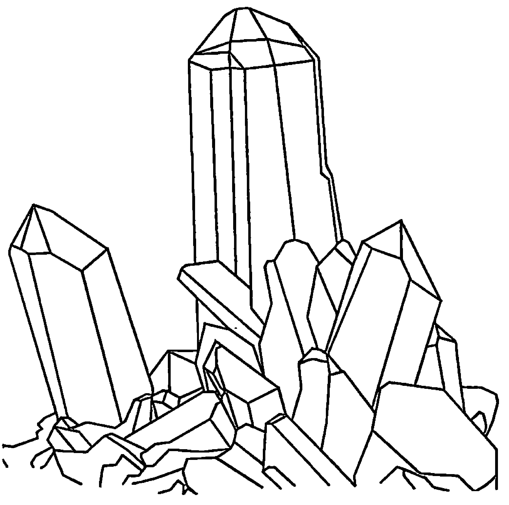

# 第六章 特殊探测法

## 1. 越野測試法

基本上，探测棒是比较适合在室外、野外使用，而灵摆是比较适合室内用的。

所以，若是外面有一片土地等待我们去探勘，而且大小还适中，比如说一个足球场大小到三、四个足球场大小，都还好，一个上午、或一个下午就走的完的。若是几十甲的土地，或连着好几个山头，这得先用「地图测试法」预先量测过后，再来实地探测的好，省时、省力，免得拖老命！

看到图十一，假设有一块土地等着我们去探测，先找

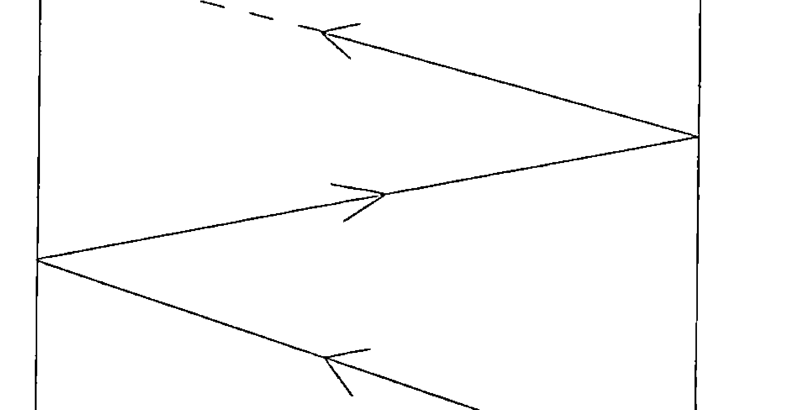

圖十一

了個角落當出發點，然後以「Z」字形的走法，斜向前進，到了邊，再斜線走向另一邊；到了邊，再斜線走向另一邊。迂迴前進，直到盡頭。這樣子的走法，容易讓我們得到對該土地的一個「快速，大概」的認識，既不會太繁瑣，也不會太草率。這之間，若埋有什麼特殊的東西，通常就都容易被發現了。

誠然，還是會有疏漏之處。如果，第一趟走完，沒有任何發現，那麼走到原出發點的對角線上，如圖十二所示，再以「Z」字形走回來。如此，絕大部份的面就都可以涵蓋到了。

在野外時，狀況會比較多，因地制宜，自己得運用些智慧去克服它。比如風太大，就避一會兒，或改天再測；地面崎嶇不平，高低落差大，自己得小心安全；台灣地區丘陵多、水塘多，也是得小心別栽進去了。隨身最好戴有帽子或斗笠、雨

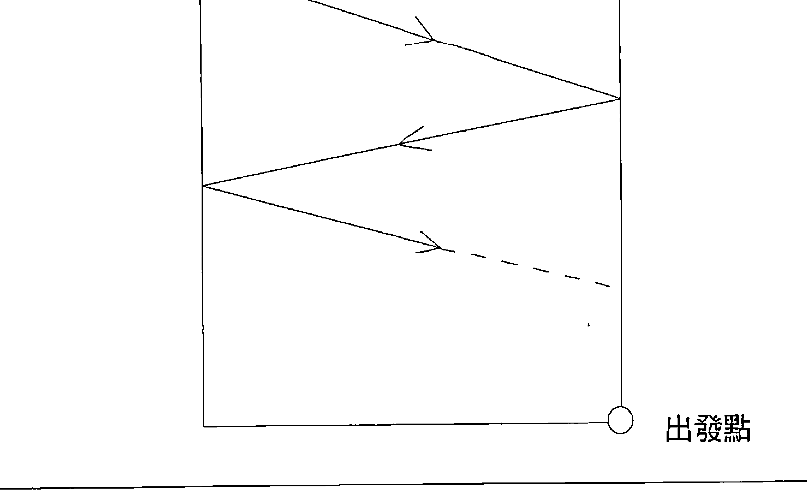

伞、雨衣的，以遮阳、避雨。不要宝藏还没找到，自己先中暑倒了，那才真是不划算呢！

## 2. 地下水流测定法

当我们找到了一个地下水源的出处，这只是一个单点而已。或许，为了各种原因，有人想了解这水流的流向，有人想再多凿一个井，或想找篱笆内、围墙内、自己领土内的一个点，我们还得去做进一步的探测。但是，并不须重头来，前面的工夫没有白费。

看到图十三。A 点是原先的发现点，我们以此为中心点，向外做同心圆的走向探测。圆与圆之间，可以彼此相距个 5～10 公尺，依实际状况需要而定。

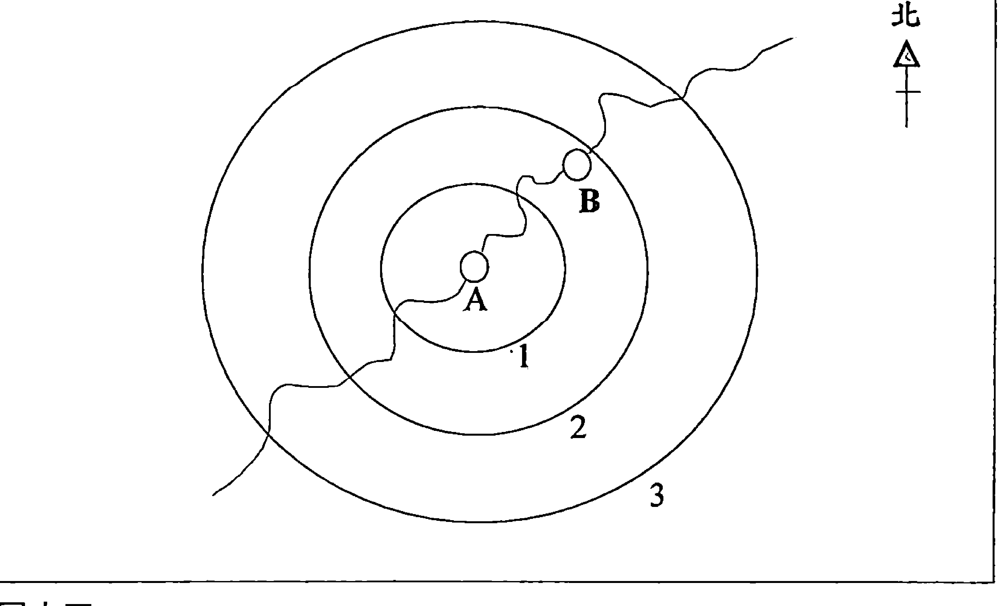

图十三

假設，我們在第二圈就探到 B 點上面有水源反應，標示下來，就是 B 點。儘管真實的地下水流會像圖中的曲線般。彎彎曲地走，但 A 與 B 連結起來後，它的一個大致走向會是「東北一西南」向沒錯。往這兩個方向尋去，找到水源的機率就會比其他方向來的大，是不？

當然，這個不是百分之一百的，尤其在地形上若有重大改變，如巨石、丘陵等的，方向會有可能做 180° 的重大改變的。不過，這些都是特例，特例不能代表通例。而且，即使只有 30%、50%的準確率，也強過完全在黑暗中摸索、碰運氣式的吧？

這只是一個思考方式，參考原則。日後在許多實際的案例中，就可以根據此原則來演變、活用。

## 3. **數值確定法**

這是最不可思議的一點，也是最神奇的一點！或許，我們無法用科學知識去理解它，但它的確是如此運作著的。我們一一介紹吧！

所有探測師的方法，就是「問」探測棒，而探測棒就會回答您。從我們的心裡問，從腦中問，或乾脆嘴巴中大聲講出來，再耐心等候，探測棒就會有反應。

是啊，來到了一個可能的出水點，可是要掘下去多深才能出水呢？是 10 公尺、還是 100 公尺？這之間的開鑿成本可是有天壤之別唷！

又，若開挖下去，相同的成本，但是每分鐘出產 10 加侖或每分鐘出產 100 加侖的收益，也是大不相同。這若是要等到挖好了才發現的話，不就太慢了？水的話還好說，石油的輸贏就更大了。幾乎全世界的各大石油公司都聘有探測師，這實在是最划算的編制。

在「問」的當時，探測師心中要先有個單位，西方人常以「10 英呎」當一個單位，問到一個大概之後，再以「1 英呎」當單位在問。這樣就可以得到一個很接近的數值了。在台灣呢，可以依每個人不同的習慣，用「10 台尺」或「1 公尺」來問都可以，能讓自己得到正確答案最重要。

每一種探測棒的反應方式不太一樣，我們先以 Y 型棒來說明。

### 1. Y型棒

當來到一個點，已經可以確定這邊有水源了，可是是在地底下多深的地方呢？一樣握住撐著的探測棒，問它「探測棒啊探測棒，這個水在地底下有多深呢？」心中想著「10 台尺」這個單位。耐心等 Y 型棒的回答，它會被拉扯往下點一次，就是 10 台尺，點二次，就是 20 台尺，依次類推。記得共是幾台尺。

好，假設得到的值是 30 台尺吧。我們還要進一步問探測棒，「是 30 好幾台尺啊？」此時，心中就想著 1 台尺的單位，再看探測棒點幾次頭，比如說 8 次，哎，那就應該是在地底下 38 台尺深的地方可以挖到水源。

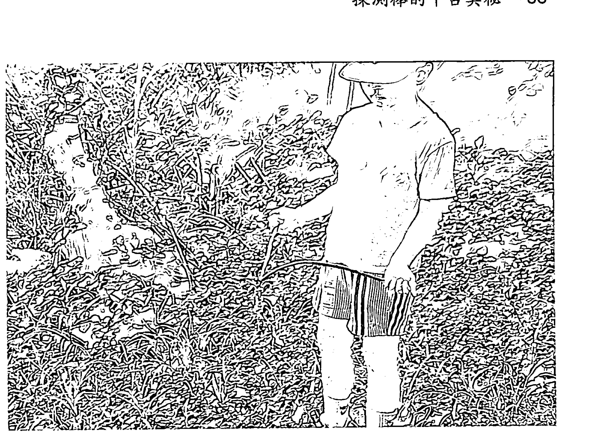

到了定点之后，还可以问深度喔。

再来，可以依相同的方法来问探测棒，看看每分钟的出水量是几公升、或几加仑，再来决定是否有开采价值。

相類似的問話方式，就不再列舉了。

### 2. 一字棒

這個東西，我們提過。握著細的那端，將整支棒子平舉在定點上面。再來，開始問它問題。

注意尾端 (粗的那端)，若有反應，它是以跳動的方式在反應。很好玩，也很有趣，許多人因此稱它作「跳動棒」，其來有自。

### 3. 靈擺

當來到定點之時，靈擺也可以用上場了，因為沒有要大面積的移動嘛。

將靈擺懸空在定點上，在靜止的狀態下，就問它問題，再耐心等候它開始旋轉，轉幾圈，就是幾個單位，這就是它的回答方式。

小心注意，它在剛啟動、或要結束之時，多會有幾圈小的空轉，這種空轉在手中沒有「勁道」的感覺，要有「勁道」的感覺，才能計入單位中。這一點比較難以說明，只有靠多練習、多體會，才能抓住那個感覺。請各位朋友多多原諒囉！

### 4. 改良型 L 棒

此時，用一支就夠了。先靜心冥想一下，確定我們是在「人棒合一」的狀況下，然後提出問題。

問完後，心中開始默數，10 台尺、20 台尺、30 台尺、40 台尺、50 台尺......直到 L 棒向右轉一下。嘿嘿，L 型棒比較斯文，就是輕輕轉一下，偏一下，就到了。

再來，再問是 51 台尺、52 台尺、53 台尺......直到 L 棒再向右轉一下，這就是正確答案。

出水量也是可以以相同方法來問，反應亦同。

話說回來，其實各種探測工具的反應都是大同小異啦，一個通，其他都通。只是不同的反應方式，讓我們覺得有趣罷了。每個人可以依您最習慣、最擅長的工具，來求得最佳的答案。

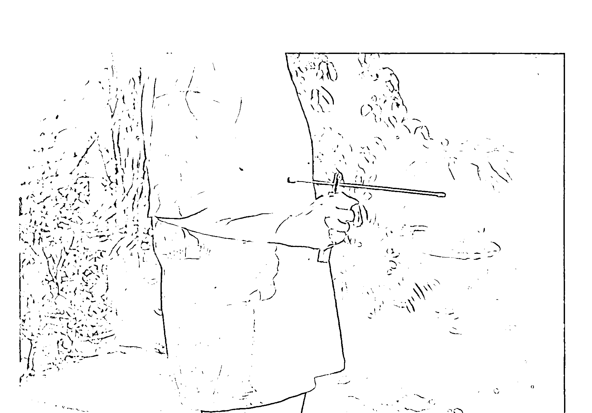

L 棒是以右轉、左轉來回答問題的。

這種反應方式的確實教不知情的外人大覺訝異，同樣是問問題？「和棒子溝通？」是不是我們頭腦也壞掉跟棒子一樣？其實，這也是和潛意識溝通後，外向所表現出來的一些振動而已。嘿嘿，本來就教外人搞不懂了，棒子若真靈的話，難怪會和妖術、魔法聯想在一起。

筆者個人認為，在數值探測方面是比較困難一點啦，應是由更有經驗的人士、資深的探測師，才能夠探的準確。也有些人，他不必問探測棒，他從初初所探得的探測棒反應強弱程度，心中就有個譜了。這些也都是經驗的累積啦。

「將相本無種，男兒當自強」，極少人是天縱英才啦，大家的經驗還不是靠一步一步的累積呢？只要有耐心，有恆心、有毅力，相信各位朋友也一定會成為一個專業的探測師！

## 4. 地圖探測法

在 2 號書「神光中的靈擺」當中，我們也介紹了幾種不同的地圖探測法，在此書中呢，就不能炒冷飯。要用探測棒來探測。而要使用到地圖時，想必都是在一個比較大的區域範圍當中，或是找水、找礦、找人，或是任何會移動的目標，而探測師卻不容易、或不方便一一走過的，所以要藉用地圖。

當事人親手繪製的地圖最好，因為所帶有的訊息最為強烈。

手繪圖的比例尺可能不會十分精確，但只要相關位置正確，明顯的地標、地物正確，妨礙不會很多。探測棒是追蹤訊息，不會苛求地圖太多。

若有找到專業繪製的地形圖當然很好，但是就擔心那特定的訊息、頻率沒有了。此時，探測師也要做一點觀想，類似第五章第 5 點的「不確定目標找尋練習」。

首先把圖攤開，北方在上置於桌上，探測師也是坐著面向北方，方向一致。然後，觀想該地的感覺，有山陵、有河流、有湖泊、有森林、有鐵路、有高樓、有教堂，等等的感覺，將此感覺注入地圖當中。那麼，這是一張「活」的地圖，帶有訊息、能量的地圖了。

记得，地图不要摆太低或太高，这样容易影响探测师手中的探测棒，无法保持水平稳定。高矮适中，在手肘的高度最好。

还有，所有的专业地图都会画有坐标的。如果是自己手绘的，或别人带来的，探测师可以自行为它划上去。就像是图十四的模样，简单吧？

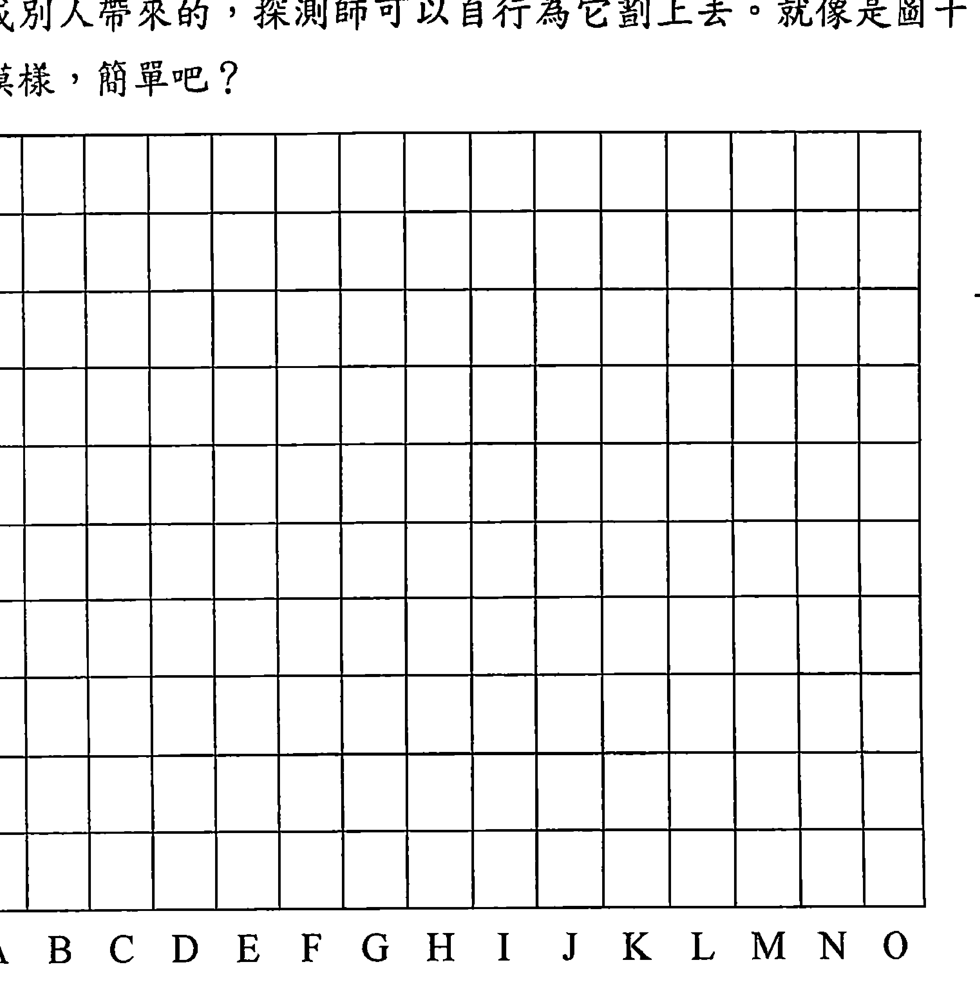

再来，进入紧要关头，探测师必须开始专心观想您所要找的东西，并锁定这个频率。找人的话，看能不能找到他（她）所穿过的衣物、使用过的物品，找矿物的话就找来一块相同的样本，握在手中，这样更能将频率锁住及固定。

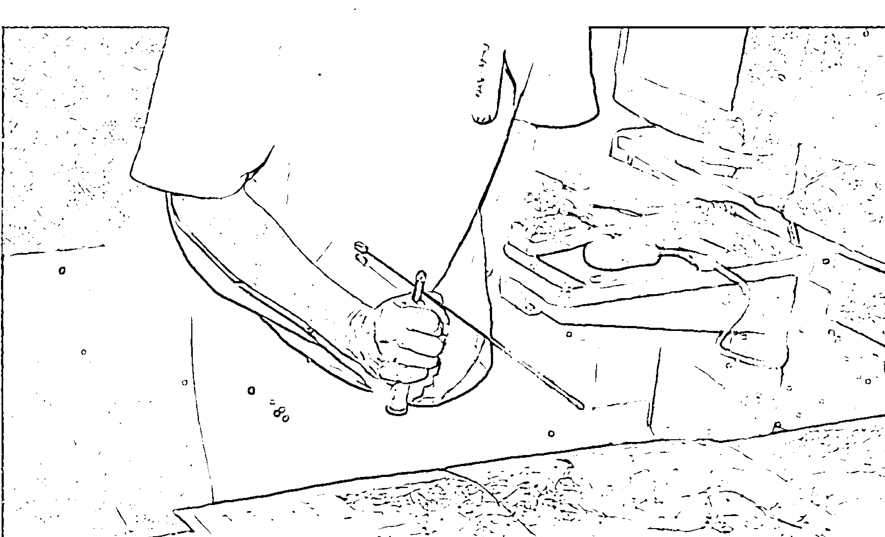

地圖置於桌面，高低要適中，才方便探測用。

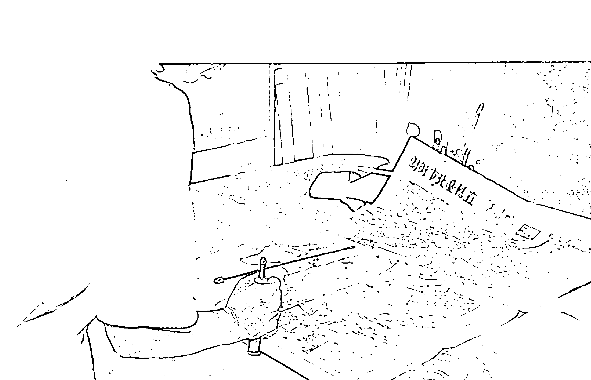

注意看，探測棒到了哪一行、哪一列會有所反應。

从底下的英文坐标开始。看是由左而右，或由右而左，都可以。水平稳握着咱L型改良棒，缓慢通过，心中要想着锁定搜寻目标；一路通过，看到指针有锁定在哪个方位，嗳，那个就对了。比方说是H行好了。

再来，来到侧面的数字列。如法泡制，由左而右或由右而左皆行，水平稳定，缓慢通过，心中仍想着搜寻目标，一到目标区就会锁定，这个就对了。比方说是第5列好了。

那么，我们要找的目标物应该就在H5的这块区域之内。

如果H5所涵盖的面积不是很大，那么我们可以马上出发去做实地搜寻。但若比例尺一换算下来，是整个中山区或内湖区那么大，哇，那要跑死了，那么，我们可以用影印机放大影印，将H5尽可能地放大，然后再如同图十四一样地打入坐标线，标定英文坐标、数字坐标，前面的游戏，再玩一遍，就可以找出更精准的区域了。

如果，您的地图够准、够细，还想找出在哪一条街、那一栋大厦、哪一层楼，也可以。

请准备一支铅笔、一支镊子、或是一支缝衣针也行，只要能够握住，又有一头是尖尖的，可以用來指到定点上的，就行了。

我们在这个特定区域内，一条街、一条街找。左手将针指在那街上了，再问探测棒「×××是不是在这里？」右转的话，就是有；左转，或没反应，就是没有。

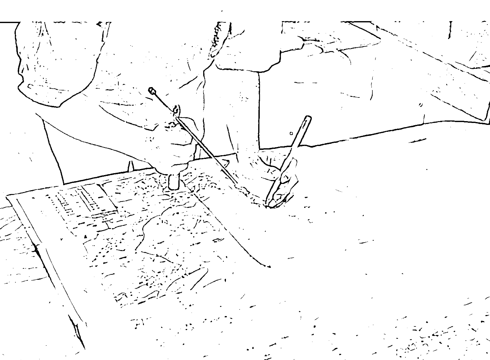

利用針刺法，深入找到每一個定點。

一條街、一條街問下去。

一棟樓、一棟樓問下去。

一層樓、一層樓問下去。

要找到正確答案並不難，難的是探測師要很有耐心，而且全程要保持在靜心狀態，頻率能固定，才不會「突柴」出狀況。這是個工夫哪，要靠長期的靜心修養，才會有如此的穩定性。

如果找不到，也千萬不要氣餒。地圖探測法好比是個「買空賣空」的做法，是向虛空中索取答案的做法，並不簡單哪。這一招不是每一個人都可以玩的很好的，每一個人火候也都不一樣。找不到，是應該的；找到的話，是撿到的。不要讓自己有心理壓力，就當它是「一場遊戲一場夢」，而遊戲最好玩的地方則在於「過程」，而不是結果。

對了，在這個遊戲當中，如果是尋人的話，尤其是刑事案件中在追緝逃犯或肉票時，也有可能出現「都沒反應」的情形。亦即在地圖上的行或列，都沒有該員的訊息，探測棒都無反應。此時，應該退一步路，思考一下更根本的問題，再問問探測棒。

> >「×××是活的，還是死了？」活的請向右轉，死了請向左轉。

> >「×××還在國內嗎？還是已出境了？」還在國內請向右轉，出境了請向左轉。

問這麼一些的根本問題，有助於釐清一些狀況，讓我們更好把握。

即使在確定已死亡，那麼可進一步探測追蹤，看屍體會在何處。死人和活人的頻率不一樣，若一直還以為他是活的，探測棒將會沒反應。探測師若在根本問題上搞清楚後，心中、腦中有準備，要找的是一具已死亡的屍體，那麼感應就會來了。

即令有嫌犯逃出國了，也可以進一步探測追蹤，看看是逃往哪一國，也有助於日後的持續緝捕呀。

當探測師在探測時，可以不必那麼「死忠」，抓著探測棒就把探測棒用到底，抓著靈擺就把靈擺用到底。不必如此啊。

稳定的心情保持不變，但手上工具是可以變動的，可以交互使用，效果更棒！

據筆者個人的經驗感覺 (不一定適用在每一個人身上哦)，探測棒比較適合戶外的、大方向的、概略的、原則性的，而靈擺則適合戶內的、細微的、精密的、微妙的。若兩者能交互使用，則更是可以嘎嘎叫，所向無敵的！不過，還是得尊重每個人的使用習慣，您用的順手的，永遠是最好的！

再提醒一次，在找尋一個人和另一個人之間，或在一件事情和另外一件事情之間，記得把探測棒或靈擺抖一抖，甩一甩，或消磁一下，消除之前的訊息之後，再注入新一個人或新一件事情的訊息，那麼再去探測。效果會更好，也不會有互相干擾的情形發生。

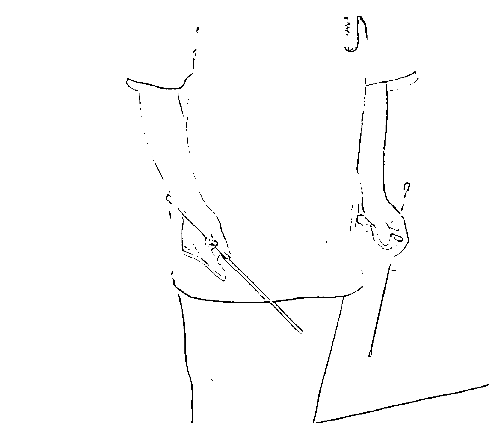

抖一抖，甩一甩，就是探測棒的消磁。

嘿嘿，探測師是個很高尚的行業，很尊貴的頭銜，這不是出賣勞力的粗工哦，而是要用到很精微細緻的心靈能量，所以也累的快。一過了精神上、心靈上的高峰狀態，就放下去休息吧。這裡的休息不是指睡覺，而是去打打球、跑跑步，運動運動一下。從事心靈活動的人，更應注重運動，對促進體內能量的新陳代謝，健康循環，都有非常棒的作用。

## 5. 意向及程度表

這是一個靈擺、探測棒都可以共用的表，朋友們可以自行影印下來，或是另畫一張，帶到公司、學校、或朋友聚會的地方來玩，很有意思的。

這一次的探測，不在於找人，找水、追蹤什麼，而是純粹與我們潛意識的對話，探詢我們所不了解的事物，而其內容可以包羅萬象，無奇不有，自己可以設計問卷。

先看到圖十五，是個半圓形扇形的圖表，從中剖為兩半，當0，是中性的。向右轉，順時鐘方向，0～100，代表正向的，好的，積極的，善良的不同程度。向左轉，逆時鐘方向，由0～100，代表負向的，壞的，消極的，不良的不同程度。

好了，可以來玩了。

探測師最好要經過我們第五章的訓練。若否，也一定要盡量地誠意正心，擰氣凝神，心情莊重，卻不緊張。問問題以「二分法」為主，儘量簡單、明白、扼要，「Yes 或 No」的方式，不要拉里拉雜地，一句話裡面有正反好幾個意思、好幾個問句。記得潛意識都是以直線式的思考方式在處理資訊、回答問題的。

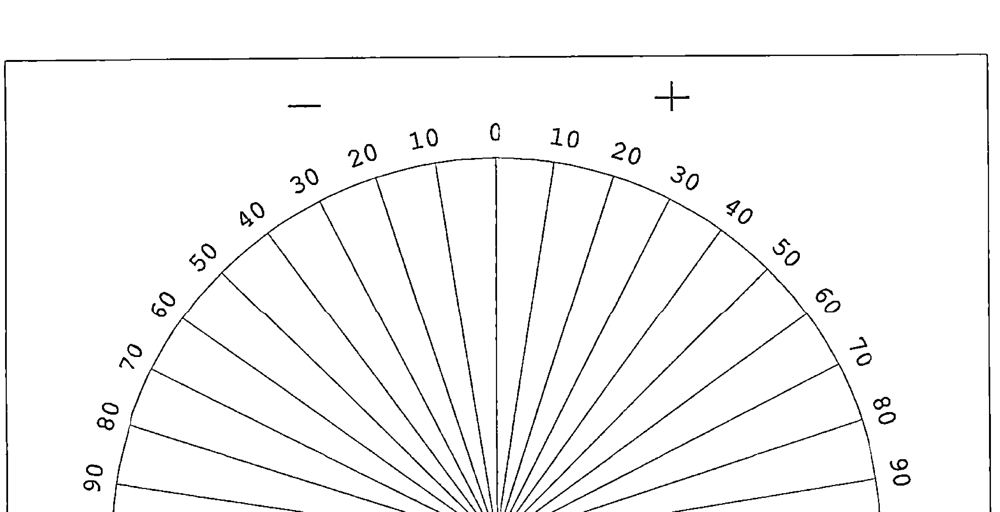

圖十五、意向及程度表

> > 「這個新工作對我好嗎？」

問完了，就耐心等答案，看探測棒是偏向右邊，還是偏向左邊。再看它所指到的程度比率上，就知道有多好，或是有多壞。

> > 「我的新主管對我的印象如何？」

> > 「某某客人有無購買意願？」

> > 「蔡花花有沒有可能當我的女朋友？」

「我會不會被賦予某項新任務？」

「我會不會被派往新駐地？」

「我會不會昇職？」

「我有沒有可能發財？」

幾乎是任何問題都可以問，除了有一些與我們個人關係太過密切，容易造成情緒上的衝動、激動、「抓狂」，那就不要問，或是請別人幫您問，才可能得到客觀、正確的答案。

比如一個醋意重，疑心病也重，偏偏又十分依賴她老公的太太，就不太適合去問「我老公在外面有沒有女人？」之類的問題。

一個財務負擔很重的先生，又有房貸，又要養子女，又要養父母，已經喘不過氣來了，也不要去問「我會不會被公司裁員？」之類的問題。都太傷感情了。

請別人代問，平靜地接受這種答案，再來思考如何因應，應是比較健康的一種做法。

當使用靈擺時，您可能可以做兩段式的祈求。

1.  在是與非、對與錯、好與壞時，您可以期待靈擺將會做轉圈圈的動作，右轉或左轉，不一定。
2.  當您想了解程度時，先下令請靈擺停止轉動，並以擺盪方式來指示您程度的情形。您也可以得到答案。

最後，在結束本章之前，要提醒各位朋友非常重要的一點，任何從靈性世界祈求得來的答案，包括靈擺、探測棒、卜卦、命相、通靈等等，都必須在物質界中通過檢驗，才能夠當真。筆者個人也絕對不同意把您一生的事業、或終生的幸福，透過這種方式來決定。台灣俗語「也要神，也要人」，有了大方向，有了指示，也要人本的思想發揮出來去作為、去成就、去檢驗、去分判。我們推廣靈性，卻痛斥迷信。希望各位不要混淆了。

終究，這只是一場遊戲而已，沒有所謂輸贏得失，好玩就是了。

用好玩的心，用遊戲的態度，才能得到探測棒的真髓！

（圖片：國外專業探測師的行頭，是不是很壯觀、很派頭？像不像電影裡面職業殺手的行頭？）

## 第七章 對探測棒的期許

非常奇怪，在中西文化這麼密切的交往中，為什麼獨獨漏了「探測棒」這項工具、這項技術，沒被引進國內，而且發揚光大呢？是因緣際會呢，還是陰錯陽差？

偶爾，在翻譯的書籍上看到了幾頁，也有一次在電視上看到幾秒鐘的畫面，但是都如雪爪鴻泥，一縱即逝，沒有深入的介紹，一般人也不會有深刻的印象，如船過水無痕。台灣人，或是任何講華文的華人，若是錯過這種簡單，又有極大效用的探測工具的話，難免會是人生上的一大遺憾；也是文化交流史上的一大遺憾！

尤有甚者，知識份子在此項目上交了白卷，就會讓別有用心的江湖術士有了可乘之機。他們會利用群眾無知又盲從的心理，灌輸神話與迷信的思想，然後從中謀取不法暴利。而且得了便宜還賣乖，賺了黑心錢，還要人家稱他「大師」，如前所述。

但是，若社會上有出現這種怪現象，社會上的知識份子、中堅份子，一定難逃其咎。為什麼呢？您不肯正面地去面對它、去研究它，把它真實的道理教出來，講出來嘛，所以別人才能上下其手啊。假如大家都能夠正視它，研究它，了解探測棒之間實無奧密可言，任何人都可以經由循序漸進的練習，來達到一定的準確度，那些壞人就無法用來欺騙世人了，不是嗎？

誠然，我們也毋須要去攻擊別人，批評別人，完全沒有必要的。

> >如同奧修所言，只要將光帶進，黑暗就消失了。論語也云，「君子之德風，小人之德草，草上之風必偃。」

所以，我們也很希望台灣能夠和美國、英國一樣，也有類似「探測棒學會」之類的組織能夠成立，而且在每個城市、每個鄉鎮都能夠有分支機構成立；在每個學校，每個必要的機關、團體、公司行號，也能夠有相同的社團成立。則這些人士，必能為我們的家鄉、社會、國家帶來莫大的助益！

有了這類的學會及社團，當然不是以營利為主！而是以「教育訓練」、「推廣運用」為主。應該容許可以適度收費，但以支應器材添購、場地維持、講師費、通訊費、會務運轉等就夠了，所以應該可以以很低廉的費用，訓練出很多的探測師。

這種學會及社團，平常以教育訓練及推廣運用為主，到了假期、寒暑假，則可推出類似「尋寶」、「野外探險」的休閒趣味活動，維繫會員間彼此的情感，並且有助大家交換心得，老鳥提攜菜鳥，菜鳥也增益老鳥。平常大家站在社會上不同的崗位，安居樂業，遇有狀況，大家再出力幫忙（不一定要出門哦），這豈不是美事一樁？

自來水公司不是常常抱怨水管老舊、漏水太多，不知不覺中錢都虧在這裡。前一陣子，在高雄區還挖出清朝道光年間所埋設的自來水水管，真箇兒老古董！聽說自來水公司有請專人，用特殊的儀器在「聽」地底下有否漏水的聲音，不知效果如何。若是自來水公司能和全省的探測棒協會、及所有的探測師合作，以「發現有獎」的方式來做，我想一定可以有趣又有效！一定是經濟實惠又划算的。

「初學者的探測術」一書作者理查·偉伯斯特 (Richard Webster) 就很妙。有一次，他搬去的新房子內，水管漏水了，但不知是哪裡漏水。那水管從街道邊接來，經過花園的水泥地，再接上廚房，一段路蠻長。那水管工人說要全部挖開，才能找到漏水的地方，才能修補。理查一聽，嚇了一跳，那可是大工事呢！這下子不花他個二千、三千美金，還擺不平呢！怎麼辦？

還好，自己是個有經驗的探測師，先叫師傅一旁抽根煙、喝個咖啡，休息一下。他則拿著兩根 L 型探測棒，來回探測了一番，確定了有問題的地方，做個記號，請師傅往這邊先挖下去看看。嘿嘿，果然一挖就中「實果」，就是這裡破洞在漏水啦。師傅換了一截水管，半個多小時就收工，只收一百多塊美金，他也高興，可以趕赴下一家，不必耗時耗力全部開挖。最高興的當然是理查，省了一大筆錢呢！而它的 L 型探測棒，從晒衣架改製過來的，平均造價不到美金兩毛五分錢。划算吧？

這個故事教我們聯想起另一則笑話。

美國的石油公司，近來一直為油管阻塞，油源不順而頗傷腦筋。為了解決這個問題，特地從二千公里外請了一位專家來幫忙解問題。這個專家來到之後，前看看，後看看，嗯，就是這裡了，拿起榔頭敲一下，說「好了！」果然問題解決了，油管不再阻塞了。

一個禮拜後，這家公司收到帳單了，上面列著：

> 「敲一下，$10 美金；」嗯，還好，「知道在哪裡敲一下，$9,990 美金，總計 $10,000 美金」

看了這個主管差點昏倒。

這個笑話本來是要突顯「知道如何做」(Know-How) 的重要，敲一下的人工只要 10 美金，「知道在哪裡敲一下」才是真正的學問、經驗所在，所以要收費高一點，美金$9,990 元。

這個換作在現實的生活中，對石油公司來講，也是划算的。假設他們的油路不順，無法運輸原油，那一天的損失可能會從幾拾萬美金到幾佰萬美金不等。花一萬塊美金，請來一位真正的專家，幾分鐘內就解決了他們自己無法解決的問題，怎麼算也都划算啊！

記得才在不久前，1998 年 (民 87) 初，中油的輸油管線在桃園某處爆裂開來，漏出的原油污染了整個魚塭、菜園，後來，不曉得賠了幾佰萬、上千萬才擺平這件事故。

是的，隨便一件事故，您所要賠上的代價都會是非常慘重的。假如，能有專人能夠於事前防範的話，不令事故發生，那豈不太棒了？不僅僅是省錢哦，連帶的民心士氣、社會安全都有保障，百姓也才不會常常為了公安事故而心驚膽跳，主管機關也不致為此而焦頭爛額。

高雄縣的儲油槽爆炸事故，那完全是人為疏失，防不勝防。另外，在北中南也發生好幾個地下的瓦斯管線破裂，瓦斯外漏，而引起氣爆的事故。整個社會為此種事故所付出的代價，不是非常地高昂嗎？若能防範於未然，豈不是很好嗎？

如果這些公司自己有編制的探測師，來巡邏檢測，負責安全維護，那就挺好的了。但是，若是居民住戶自己能夠警覺，自己能夠學得探測棒的技術，自己來檢查，想到就來檢測一番，一天就巡它個三回，不是更能保障自己一家大小的安全嗎？靠自己總是比較快啦，靠別人哦，那就好像把命根子交在他人手中一樣。

去年，1997 (民 86 年) 發生藝人白冰冰之女白曉燕被綁票案。看到警方在媒體上公開喊話，就知道他們一點線索也沒有，一籌莫展。看到警方到某地包抄、抓要犯時，總會跟有電視台的攝影記者，唉，一定又沒了。消息已先曝光，攝影燈光又強烈照射，連螢火蟲也抓不到，何況是槍擊要犯呢？只有一些身著防彈背心的警員在跳來跳去，煞有介事地拿槍在比劃比劃，鏡頭前的作秀實在太過份了。或許，就是向民眾透露出一些訊息，「我們有在辦案，我們有在追哦！」只是不曉得目標在哪裡。

警界高層也是有問題，抓不到方向，不知如何使力、出力，只是把所有的警員趕出去搜山、搜空屋，動不動就來個地毯式搜索，而且三天一小搜，五天一大搜，弄得兵疲馬頓，怨聲載道。出嘴的人只是動動嘴皮子，基層的人可是要跑斷腿呀！無怪乎軍警界都會流傳一句話，「將帥無能，累死三軍」。某位苦幹實幹的高階警官，他的勤勞負責，確無話說，但終因不得要領，沒有方法，而黯然下台。

這也好像是在某些公司裡，生意越是不好，那老闆在看員工就是越不順眼。尤其那些應跑外面的業務員，怎麼總是在辦公室內翹二郎腿呢？越看越氣，公司生意不好都是因為您們偷懶、不爭氣，吆喝著全部趕出去。不在辦公室裡，您就以為他們會去做事嗎？只是換到電影院、茶室去摸魚鬼混罷了。但這就是老闆們的心態，佔高位者的心態。於事無補，徒增自己及部屬的困擾而已。

我一直深深地認為，軍、警、特、調等情治單位，應該有他們自己編制內的探測師才對。他們都是那麼大的單位，動不動都是十萬、八萬大軍的，裡面臥虎藏龍，人才那麼優秀，怕找不到幾個對探測棒有特殊天份的人嗎？奧爾爵士都能放開心胸，從 150 人當中發掘出像穆林一樣那麼有天份的人才，從我們的軍、警比例中要找出一營的人才來，都是有可能的。

假如警方自己有人懂得探測術，也會使用靈擺、探測棒的，那不是更好辦事嗎？關起門來，光是地圖探測法就足以找出個究竟了，再出門追查，怕什麼欽命要犯不會手到擒來？而其中最大的好處是「自己人」，自己人就不怕漏氣，沒有面子問題。反正已經一籌莫展了嘛，反正也沒有其他任何線索了嘛，千軍萬馬都已派上山去了，台北縣市各地的地皮也翻動過好幾次了，那麼就讓幾個探測師來試試看，又有何妨？反正，也不多花一毛錢，也不妨礙任何人，這也不是什麼巫術、妖術、通靈術，沒有迷信，這只是人體科學、氣場科學的驗證吧。當然也有可能失誤、誤差的，但已經也沒什麼可以再損失了呀？僥倖能夠奏效成功的話，老話一句，就像「撿到的」，那豈不是大功一件？

就像白案中的要犯陳進興，這已是抱著必死決心的悍匪囉。在他逃亡半年多的日子裡，仍然不停地犯案，打家劫舍，強姦民女，對當時的台灣社會造成極大震撼，連零售店的商家生意，也倍受影響。警方還刻意隱瞞案情哦，據陳進興被捕後自己供述，至少也有 20～30 件強姦案，多的自己也記不清了。若是在未逮捕前，每犯案一次，就公佈一次，每犯案一次，就再公佈一次，怕不整個社會就都掀過來？但話說回來，若能早一天逮捕，不就可以減少一些被害人嗎？只要能早一天將他逮捕歸案，就可以減少一些無辜的受害民眾。面對這種悍匪，不管是基於義憤、正義感、慈悲心，實在都應該及早繩之於法的。而只要能夠逮到他，任何手段方法都是可以用的，也是可以被容許的。

是啊，警方辦案技巧中，也有所謂的臥底、監聽的，像這種這麼卑鄙、下流的手段都可以用了，為什麼不用探測棒呢？探測棒還比較光明正大呢！

在白曉燕被綁架的消息傳出，生死未卜之際，從電視機上可以看到，立刻有許多自稱可以卜卦、算命、通靈、神算的什麼大師、仙姑的，就聚集一大堆在白冰冰家門口。嘴巴說是好心啦，要提供協助啦，實則是看清了這兒是鎂光燈的焦點，要趁機曝曝光，上上電視、報紙、媒體，打打知名度，萬一瞎貓碰上死耗子給說中了，那就一炮而紅。說不中也沒關係，台灣人很健忘的，過幾天，再換另外一個事故現場，再重施故技。想想，在那段時間內，白冰冰她家門口像不像廟會、市集一般？連攤販都過來擺攤子了，是不是太誇張了？事後也證明，所有的通靈、名嘴、神算，全部損龜。他們的心態就是如此而已。

警方若是有「自己人」，就沒有這些顧慮了。不必擔心被哪位仙姑、或大師給算計了，也不必害怕不知不覺中為哪位通靈人背書了。「自己人」，自己知道是怎麼一回事，如何運作方法，一切好說！

假如以後有探測師協會成立，也有優秀的探測師可以與警方合作辦案，也請將此一案例謹記在心，以免產生不必要的困擾。對自己，及對以後的探測師們，也都不會產生不良的影響。

請記得，一個優秀的探測師絕對是非常重視自己的修養的，也絕對是一個非常謙虛的人。如果不是呢，那這個人肯定不會是個好的探測師！

記得我們所做的觀想訓練嗎？首先就是要把我們自己變成一支中空的竹子，因為是中空的竹子，能量才能在其間流動啊，才能接受到天地間的訊息，探測才能夠準確。

這種觀想，這種訓練，可不是白搞的呀！一位能真實做到的探測師，即使回復到他正常的生活、工作中，他依然可以保持這種中空、謙沖為懷的態度。是啊，這個訊息本來就存在於天地之間，我們個人只是傳遞訊息的一個媒介而已啊，有什麼好自豪、自驕、自傲的？此點，請永遠不要忘記。

在和警方合作辦案時，若沒有進展，只能說自己的功夫還不到家，靜、定的功夫都還不夠，所以無法接收或鎖定任何訊息。千萬不能怪這、怪那，一下子說路不平，一下子說風太大，胡亂「牽拖」只會讓人家更看不起而已。倒不如坐下來，閉起眼，自己仔細檢討一下，懺悔一番，看是哪個細節、哪個環扣沒有做好，再來改進。這樣子，即使不成功，也可獲得人家的基本尊重。

倘若，僥倖成功了。也請不要大叫、大跳，四處喧揚，以為功勞都是您的。不行，不能這樣做。

探測師所要的是什麼呢？無非是在茫茫的天地之間，找尋那為人所不知的解答。找到後，這個解答本身就是您的獎賞 (Reward)，就是您的滿足感，成就感。千萬不要再去爭奪世俗間的功勞、名聲、利益，千萬不要。反而，若有一絲一毫的功勞、名聲、利益的話，一定得全數歸諸於「英勇的警方」、「英明的長官」，絕對忌諱獨佔，知道嗎？

軍、警、特、調多是公家單位，吃公家飯的，他們的人生目標無非是昇官、晉職，而這些無非要靠破案立功，旁人只是插花的，何苦跟他們搶功呢？這些人呢，說豪爽也是挺豪爽的，但卯起來後，也是很衝的。與這些人合作交往，記得「侍君如侍虎」，好的話，一切正常，威力十足；不好的話，小心老虎回頭反噬，那怎麼死的都不知道。不要說我沒有警告在先哦！

再說明白一點，探測師也算是半個修行人哦。要修的好，才能探的準，修不好，就探不準了。而修行人非常重要的人生操守就是，「功成不居」、「功成身退」。

軍警特調若能有自己編制內的探測師的話，那很好，而學術界呢，也有必要，尤其要是在考古方面，或有地質探勘、或國家資源探勘等等，包括海底古沈船的搜尋，都可以先帶來一個正確方向，再去做細部探查。這樣可以省錢、省事、省力，何樂而不為呢？

尤其，學術界本身是搞研究的，分一點時間、精神來研究探測棒的原理與應用，相信可以更有所獲。還有，在學校內也是學生、教職員眾多，也是可以做個普查，找出特別有天份的同學、老師，再加以專門訓練，相信對國家社會的貢獻也很大。

一向以來，學界要從事研究，最大的問題常常是經費的來源。而如何以最少的錢來做最多的事，達成最經濟的運用，也是許多計劃領導人最重視的事。探測棒的東西不需要再向國科會申請預算吧？然而，探測棒卻是可以運用最廣的工具之一。

再說到佛教的僧侶，更是應該發心來研究一下探測棒的原理與運用，而僧侶們一定可以用的比任何人更好！為什麼呢？就因為是僧侶，他們是專業的修行人，他們的靜定功夫一定比一般人更好，所以他們一定可以做的更好！

而且，僧侶們也應該做。嘿嘿，先不要拿戒律來擋，佛教的戒律最多了，停了幾仟年，這個也不能做，那個也不能做，也不曉得變通、通融一下。時代在變，潮流在變，僧侶們的頭腦也該變一變。不然，就請聽聽一些地下電台、基層民眾的聲音，批評的聲浪很大哦。這幾拾年來吃掉最多民間供養的，當屬佛教僧侶，但是不是相對地為民間做最多事呢？卻也不盡然。

一般平民百姓有事情找佛教僧侶，又拜又叩又送紅包供養後，看風水？不會。算命？不會。擇日？不懂。改運？不通。治病？不會。收驚？不行。解煞？沒有。制厄？不懂。卡陰？更是完全不會。如果全部以「阿彌陀佛」來回答、來應付，也是可以啦，平民百姓也會很尊重您，但退下之後，自然會去找民間宗教的宮啦，壇啦，這些還不見得是正統道教啊，許多人只是通靈人、或是外靈來附身，如此而已。

如果，正信的佛教僧侶們無法解決一般民眾的疑難雜症、人生疾苦，又何能責任怪他們去尋找像是宋七力、洪道子、妙天等外道尋求解答呢？如果這個社會上「迷信」的人還那麼多，那可見這些「正信」的人努力還不夠，是不是？

佛教不是教人「一切法門誓願學」、「無量眾生誓願渡」嗎？您沒有足夠的善巧方便來渡眾，卻只是用各種擋箭牌來做推托之詞，如何能安心享受供養呢？又如何是個大乘佛教的慈悲心呢？

記得在「神光中的靈擺」一書中，我們討論過通靈與外靈來附身的問題。基本上，我們是不大贊同這種做法，也不鼓勵啦，然而這在台灣的民間宗教裡卻是一個極為普遍的現象。所謂極為普遍，就是各位朋友們走在台北街頭，或走在台灣省其他各縣市，就可以看到三步一小廟的、五步一大宮者。這些地方，既不像佛苑，也不像道觀，裡面的神祇更是五花八門，各路英雄好漢都有。從釋迦牟尼佛、觀世音菩薩到齊天大聖、三太子，從太上老君、王母娘娘，到媽祖婆、大道公、土地公。少則一、二十尊，多則上百尊神像，齊聚一堂，共享香火。這裡還真的是五教合一，眾生平等，民間多以「宮壇」稱之，官方則以「神壇」稱之。

話說每年的報紙上總會出現幾條新聞，說是神棍詐財騙色等等，因此一般知識份子、社會的中產階級就極少涉足，也多不了解，總以為這是不良場所。其實，那也是極少數的不良份子、神棍的偏差行為，一粒老鼠屎壞了一鍋粥，一竿子打翻了一條船，所造成大家的不良印象。經筆者實際走訪，真正在為人「辦事」，解答迷津困惑者，還是佔大多數；而且長時間、長年為民眾服務，卻只是「隨喜功德」而已，並不在以此謀利、賺錢。而其穿著呢，也極為簡單、樸素，就像早期台灣農村裡的粗布褐衣形狀。雖然不現出家相，但其生活實與僧侶一樣簡樸。

是的，有極大多數的民眾遇有人生疑惑，或有事情不解的，就是到此來求助。小嬰孩不好養啦，小朋友不讀書啦，女兒嫁不出去，兒子事業不順，老公有外遇，老婆愛打牌，以至於要看人生運程、家中風水、開大門、安神位、超渡亡魂、解縛陰靈附身、化沖、制煞、解厄……全都一手包了。真的是一站吃到飽，而且便宜又大碗。難怪台灣基層社會的民眾，其生活就與廟會活動息息相關了。

這是不是一個很有趣、又很奇特的現象？台灣人民心中有疑惑，卻不找心理醫師，不循正規途徑，卻是求教於神壇、通靈人士、算命仙、或求神問卜的。先不要扣上大帽批評說這是迷信，這個「通靈的世界」還不是絕大數人所能了解體會的，而它的存在，的確為千千萬萬的善良百姓解決了問題，安撫了人心。如果，有人想胡亂扣上帽子，並加以打壓、制止，那台灣基層社會可能會整個掀過來唷。這點請不要忽視了。

所以，所有高層的知識份子們、正信宗教的僧侶們就要思考一下了，是不是您們提供給民眾的服務還不夠多，不夠好，不夠切合人們的實際需要？不要怪人家愚昧、無知、迷信哦，基層的民眾只有一顆簡單的心，能幫助他們解決問題的就相信他，如此而已。

當然啦，我們不是叫每個人下來通靈、乩童的，這才叫「濟世」，不是的。這些事情已經有人做了，而且做的很好，就讓他們繼續做吧。這個好像是醫院裡的急診室一樣，專門在救急症的。在病症消除後，要進一步的復原健康，要導回內在的自心修行、自性開發，就要正信的僧侶們伸手來救、來渡了。

在康復的過程中，難免還會有一些小問題、小雜症；即使是僧侶本身在開悟、成佛之前，也還難免有些問題和狀況哩！此時，當然不宜再搞通靈的把戲囉，但若藉助探測棒，靈擺來解答別人及自己內心的困難疑惑，卻是實際可行的變通方法。

## 探測棒的千古奧秘

這個已如前說了，沒有迷信，不是巫術、妖術，它只是讓我們自己在靜心狀態下，與自己的潛意識，與人類所共通的宇宙意識互相溝通而已。它是非常科學的，也是符合佛法理論的，而且絕對安全，沒有通靈的危險，更不會有碟仙、錢仙那種請神容易送神難的後遺症。任何人，包括僧侶，來使用靈擺、探測棒等的技術，都是正大光明、合情合理、具科學精神、切合人心的！

在台灣，有一些得道的高僧、長老，他們能夠一眼看穿人心，一語說中心事，並為許多人排憂解困，所以也能夠積聚了許多信眾。而問題就是，得道的高僧數量極少，而有困難疑惑的民眾極多，明顯的不平衡，也不能滿足實際需要。還有，大家對老和尚都非常敬重，有時候一些心裡的秘密問題反而不敢提出來，怕羞、怕被笑話了。所以，有必要授權給一些較年輕的、較熱心的僧侶來為民眾服務解答，一方面可以減輕老和尚的負擔，一方面也切合實際需求。女眾們面對同是女眾的師尼們，有一些話也比較敢講出來；男眾們對年紀接近一些的師父們，有些問題也才敢問。而年輕尚未得道、沒有神通的這些師父們，儘管可以大膽使用靈擺、探測棒沒關係，因為儘管尚未得道，經過幾年的專修以來，那靜心、定力總是比一般世俗人等好太多了。由師父們所操盤得出的答案，一定更客觀，更正確！

從師父們的寬大袖子中，拿出個靈擺、或探測棒，會不會顯得有點突兀？哈哈，這是剛開始啦，還沒看習慣而已，看多了就沒事了。朋友們有沒有在街上看到過和尚穿著僧袍騎著摩托車呢？

## 第八章 經常問答集錦

### 1. 什麼是探測術？

探測術 (Dowsing)，簡單地說，這是自從古人類流傳下來的一門探索未知事物的技術。它可以利用一些簡單的擺錘 (Pendulum，靈擺)、或 V、Y 字形的樹枝、或是 L 型的鐵線、或棒，所構成的簡單工具，在靜心狀態 (冥想狀態、氣功狀態) 中與天地之間的氣息相通，並從工具的反應當中，獲得正確的解答。這是一項技術，也可稱做是一項藝術，因為它需要相當的技巧，準確度也非常高，然而，人與人之間的差異卻非常大，有些人就應用不來。因此，自古以來，探測棒也與神秘現象、神秘事件牽連在一起。但是，自古以來，因為探測棒的運用，的確為人類帶來許許多多的便利及財富。

### 2. 探測要使用什麼工具？

最簡單的，用一條線綁上任何一個重物，所形成的擺錘 (Pendulum，現稱靈擺)，就是一個最簡單的工具了。地上撿到的一隻棒子、樹枝、木棍、竹竿、釣魚竿、舊的電視機或收音機天線等，也可以做成一枝探測棒。還有，從舊的曬衣架、鐵絲、銅線等，也可以自行彎曲製造出 L 型的探測棒。生活中有許多的東西都可以用點巧思來運用，自己設計、使用，能夠順手的最重要了。並沒有什麼規則或律法說一定要使用什麼才對。

有些更高明的探測師，可能連任何工具也不需要了，憑他的直覺力就成了。這和許多卜卦的師父相同，所謂「善易者不卜」，易經都熟透了，世態炎涼也看太多了，許多事情一看就透，就知道來龍去脈，何必再算、再卜呢？工具只是一個憑藉，若能直透核心，則工具也可以免了。歷史上也記錄著幾個特殊的人物可以用身體直接探測，而不須任何工具。像第二章，案例四，所提到的 18 世紀德國人漢斯·沃夫 (Hans Wolff)，就是一個典型不需要任何工具，而能夠以自身的敏感度來探測鐵礦的奇人。在 1963 年，在南非也有一位 12 歲的小男孩，名字叫彼得 (Pieter Van Jaarsveld)，就因為能夠直接目視地下的水流，而在國際中聲名大噪。在他看來，地下的水流就好像「閃爍著綠色的月光」一般。他最大的困難是在於不能理解，為什麼別人看不見？他覺得是非常的自然，簡單，與正常呀。因此，他常被人稱作「戴有 X 光眼睛的男孩」。

### 3. 這些工具可以自己做嗎？或是一下子要外面買的？外面買的會不會比較好？

當然可以自己做呀！而且，我們還最鼓勵朋友們自己動手做了。因為這樣，比較有成就感，也比較有情感，用起來必然的會更有感應嘛！何況，技術上一點也不困難，比做風箏、或做遙控飛機的，都簡單多了。

但如果您想要一些漂亮的，精緻的，有派頭的，嗯，用買的也可以呀。有些廠商把它設計的很好，很漂亮，經久又耐用，售價也便宜適中。這都是可以考慮的，沒有什麼不妥的。但若是有人要再把探測棒一枝幾十萬的賣給您，可就千萬別再當傻瓜了。寧可把這些錢拿去捐給慈濟或聖安娜之家的，還比較划算呢。

### 4. 什麼樣的人可以探測？

基本上，是任何人都可以探測的。一個人只要健康、正常，沒有偏見，就都可以來探測的呀。一些七、八歲到十來歲的小朋友，哈，幾乎是天生的探測師，因為氣脈都還開著嘛。成年人當中，據國外的資料顯示，每 25 個成年人當中，約有 2-5 個天份特優的人，只要經過適當的指導，幾乎可以立即上手探測開來。而其他的人呢，只要多一點點練習，也都是可以的。所有的人都可以探測，這似乎也是我們的基本人權呦。

### 5. 又什麼樣的人不適合探測？

基本上是沒有這樣的人啦，只是要多花一點時間練習而已。而一些特別固執的人，特別執著的個性，或懷疑心很強，不容易相信別人的人，不容易建立宗教信仰的人，學習起來會是比較慢一點。還有氣脈不通的人，他的探測棒感應也會不理想，因為能量不容易流動，沒有交流。氣脈不通的人，可能皮膚的顏色也會偏黑、偏灰，容易生病。像是這類的朋友，反而更應該來玩探測棒，練習放鬆您自己，練習讓自己的能量流動起來，練習靜心。您的探測棒將會變成您的一項指標。如果它能動了，能指了，又很準了，這就表示您的氣脈開了，能量開始流動了，心情也放輕鬆了，不再是固執、執著的個性，人際關係也一定能夠改善，生活會變得更加美好。這是必然的道理嘛，試試看也就知道了。

### 6. 探測技術好學嗎？一般要多久？

打大哥大等，那您再來學探測棒的話，您會覺得好像是在吃滷肉飯一樣簡單，台灣話說的「去又一款」的，美國話說「Piece of Cake」，都是非常簡單的意思。

以靈擺而言，幾乎是現學現會。而探測棒呢，就多個幾個小時的練習吧。那個改良型的 L 棒，因為非常靈巧，要小心控制，多個一、二個禮拜來熟悉它也是有必要的。

每個人所需要的時間並不一定，從幾個小時到幾個禮拜都有，多練習總不會錯的。所以，建議大家把它當成一種好玩的遊戲，就不會枯燥、無聊，而是興味盎然，有時候也有可能是頗有利潤、斬獲的喲。

### 7. 學習探測棒需要去拜師嗎？

基本上是不需要。尤其若是要您再交上一大筆錢的，那就更不需要了。看了本書的詳細提示，最主要的是自己的練習，不一定要再去拜師學藝。但是，假若以後有中性的探測棒學會成立，有良好的師資，收費不會「蓋離譜」，請各位朋友倒是可以來交流交流，交換一下經驗，也聽一聽別人的心得，這是很好的。但這不是拜師哦，沒那麼嚴重啦。輕鬆才玩的開來嘛！又不是什麼武林秘笈、蓋世神功的！不要受到武俠小說的影響。

### 8. 探測棒是如何運作的？

基本上，這是由人體的腦波、氣場來感應外在世界的不同波長及頻率，由身體能量體的微妙反應，反應在外向的探測棒上的擺動上面，從而來判斷一件事情的是非、好壞、對錯、吉凶、禍福，或一個人、一件物的狀況或所在處。

這樣講起來，太過文縐縐的，也不太好理解。簡單的說，就是我們的人體也是一個有機的能量體，對發生在世界上的任何事物，也都會有相對的感應。只是太過於精微細緻，以致於大部分的人都沒有覺知到。利用探測棒或靈擺，只是將這種微妙的震動，外向的外放出來，讓其震動作用在探測棒上或靈擺上，如此而已。能量體會指揮控制肉體，肉體會影響探測棒等物體，一層次一層次的來，就變成我們看的來，也看的懂的指示囉。

### 9. 如何知道自己有沒有探測的天份？

這是最簡單的問題，就來試試看就知道了嘛，何必用猜的？自己做幾個工具來試，怕麻煩的就到淳賀來玩一玩，那老闆和善的很，買不買沒關係，不會趕人出去的。老闆有空的話，還會自己親身下來玩，教給客人們，常常玩的興起，還忘了做生意呢。

### 10. 我該從哪一項探測工具開始使用？

這也是要試，每個人玩的順手的東西不一樣。但是，有許多人玩靈擺就非常好上手，一抓上來，就可以做不錯的擺動和測試。您也可以試試看從這裡下手。

一項玩的開來了，有信心了，再來玩其他項目的探測棒，如 Y 型棒或 L 型棒的。玩這種東西不會玩物喪志的，免驚啦，反而可以精益求精，越玩越精，越玩越厲害。就像刀子越磨越利，頭腦越用越精明一樣。

### 11. 探測棒只能用來找水嗎？

當然不只如此而已！大才不能小用，關刀可不只是用來殺雞的而已。

找水，只是探測棒眾多功用之一而已，它還可以用來找石油，瓦斯，天然氣，金屬礦藏，輻射源，地下坑道，地雷，古蹟，遺址，獵物，尋人，失物……等等，等等。這些都還只是借用來說的例子而已，相同的事物，同理可證，都可以適用的。請朋友們自己要發揮想像力，自己設計問題，自己來試試看，嘿嘿，很快您也能發現自己的獨門秘方，獨步功夫，而百試不爽！這下不就發了？像在台灣，很多人就用在找風水、地穴的，也有不少人用在一個禮拜兩次的「數字遊戲」的，也有人用在股票市場、外匯市場、期貨市場的，這些都是非常實在的運用，且真假好壞利判，馬上見分曉。

但是，以筆者的立場而言，奉勸各位不要用到這個方面來。一來，這是個非常靈性的物品，用在世俗的情事上，總是不搭調。二來，當用在投資、投機的事業上，得失心就非常重，早晚出問題的。倒不是探測棒、靈擺的問題，而是自身心態上的調適問題。筆者從來還沒見過一個不貪心的投機客！越投越深入，越玩越大，輸贏越大，得失越大，靜心就越難把握，出紕漏只是早晚的事而已。我們一直強調，探測棒只是好玩的工具而已，甚至就當它是一個玩具，就是要讓您有一個輕鬆、遊戲的心情來玩它，這樣才容易把持靜心的品質，才容易得到正確答案。魚與熊掌，難以兼得呀！

探測棒要靈，一定要從愛和喜悅的心來出發，最後也要回歸到感恩與分享的心態上來。絕對不能有掠奪及壟佔的行為。這不是口號，這是前人實踐出來的真理！

### 12. 有沒有任何關於探測棒的科學研究？

有，而且還有很多。

像荷蘭的國家研究委員會物理科技中心（The Institute of Technical Physics of the Dutch National Research Council），法國的科學學院（Academie des Sciences），美國太空科學總署（NASA），聯合國的教科文組織（UNESCO, United Nations Educational Scientific & Cultural Organization）等等，都有對探測棒進行過研究，並予正面的積極評價和肯定。但是在台灣本島內，就沒有聽說過了。希望有機會還會有有心人士來予以好好研究！

### 13. 探測棒是否可以用來探測風水？

當然可以，而且非常好用。事實上，探測棒被引進國內的首度運用上，就是被運用在風水上的「點穴」之用，也就是俗話所稱的「點龍穴」。探測棒在台灣的第一個名字就是叫做「尋龍尺」，或稱「探龍針」的。也只有五術風水界的人啊，才會肯花幾十萬的來買這種東西。

所有使用的要領均與找水相同，找到之後，探測棒也是會有所反應。從中，我們就可以找到一個能量最理想，最好的點了。中國人相信，把祖先的屍骨埋在風水好的地方，也是能量場好的地方，將會有庇蔭子孫的功效。從前有些人當成迷信，但從「全息論」來看，所有家族的成員，只要有血源關係的，彼此的能量訊息也溝通的。所以，祖先的屍骨受到好能量的薰陶，子孫一定會受益！這個道理幾千年來一直興盛不衰，而且到處可以找到許多鮮明的例子。比如 1998(民 87)年初，台北縣政府還舉辦一個「龍穴大展」，把目前台灣省的名人、巨賈、高官，及他們先人的風水做一個比較，嘿嘿，比例還很高的喲。只是，沒有百分之百的啦，因為上帝很公平，「風水輪流轉」，河流、山脈、道路、工程……都是一直在變的，地球上連「地磁」都曾改變過了，意即南北極的位置也曾經變動過啦。一處好風水，並不代表世世代代，千千萬萬年也都是好風水啦。但能夠發個一代、兩代，也是很過癮的，是不？

先看好山形、地勢，起於哪裡，終結於哪裡，在哪裡盤結形成環抱，或在哪裡和哪座的山脈又形成對應，等等。大部分的因素考量妥當，再來就做細部的探查。此時，探測棒就要派上用場了。就在一定的範圍內，找出能量場最強，探針反應最活躍的地方，就對了。當然，實地作業會是比較複雜一點，考量因素也會更多一點，但基本上不出這個模式。

想想，要是能夠找出一個龍穴，讓您的後代發的像王永慶、張榮發一樣的，花個幾十萬，其實也不算什麼啦，是不是？

假如有修行人懂得用探測棒來找一個好風水，好地理，來當他的修練道場，哈哈，那修行的速度一定會更快、更好。個人一直以為中國的四大名山，為何能高人輩出呢？一定是這些地方的能量場特別好，前人成道了，有一個好的能量慣性，後人也容易成道。所謂「天下名山僧占盡」，就是也占個好風水來修行嘛。

先總統蔣介石也是來這一套的，看看在台灣四處的風景名勝古蹟，大風水，大地理，都要放著他的光頭銅像。這也是占風水喲。只是他都請他的大內高手在看的，大概不用探測棒吧。

### 14. 是什麼使得探測棒在動的？

這也騙不過明眼人，因為眼睛所看到的就是，探測師的手在動，所以棒子會動嘛。沒錯，這也是個事實。就肉眼所看到的，的確是如此。

但是肉眼看不到的就是，人體的氣，物體的氣，空氣中的氣，以及這所有的氣的交流狀況。這些氣都會影響著探測師的潛意識，潛意識會影響著他的肉體動作，肉體動作就會影響著探針的方向和擺動。您若問探測師本人，或是您自己就親身下來試試看，您就會了解，我沒有要動啊，它會自己動作。您是可以影響它，可以控制它沒錯，但是您若是要求得正確解答及方向，還是放任它來自由運作才好。

這看起來好像很神秘，難以理解，其實這也是探測棒迷人之處。您要親身來玩它，試它，而不能只是看它，不接觸它，那麼您肯定會錯過人生一項最美妙的事情了。

### 15. 哪些人最應該使用探測棒的？

一般人只要對未知的事物有所疑惑，就應該可以來使用探測棒了。而有一些人，他們更常常需要面對各種未知的事物，比如說警察、軍人、調查人員、情報人員、偵探、採礦人員、氣象預報員、法師、僧侶、神職人員、水管、油管、及瓦斯管的維修人員、醫生、護理人員、氣功師、靈療師、靈媒、考古學家、心理諮詢師、神秘學家……等等，太多太多了，不勝枚舉。個人自己可以看著辦啊，遇到人生困難，不知從何尋得解答，就借用探測棒來替自己看一看、測一測吧！

### 16. 探測棒是不是一種迷信啊？

當然不是！探測棒和最先進的量子力學有密不可分的關係在，它曾經超過它當時時代的科學知識所能能夠了解的範疇，所以被當時的人們視為「不可知」、「不可說」、「難以理喻」，甚至被打為巫術、妖法、魔術、通靈等等，背負了好幾百年的黑鍋。其實，探測棒是所有研究神秘學裡面的一項最科學的工具！許多的科學家也都曾經研究過它，如牛頓、愛因斯坦等，並且從中獲益良多。

其實，探測棒曾經礙著了誰呢？是招誰、惹誰呢？台灣話說「洗臉礙著鼻」，或是此之謂吧。探測棒應該說是替人類服務最廣，功用最大，找尋財富最多的一項寶貝工具呢！原來就是太好用了，中古歐洲的平民百姓遇到任何的疑難雜症，就來問探測棒，並尋得最佳解答。這個太好用了嘛，而且又非常便宜，省事，絕對不麻煩。好了，大家就不再上教堂了，有事也不再去問教士們，捐獻就少了，教士們就緊張了。所以，握有政教大權的教會就以巫術等的子虛烏有罪名來控訴它，使用者及持有者，均被當成巫婆或巫公來查辦，殺的殺，燒的燒，風聲鶴唳，草木皆兵，一時在歐洲銷聲匿跡了幾百年。直到新移民踏上了美洲新大陸，脫離了舊社會及教會的控制，又迫於要找出新的水源、礦藏，以維持生計，才又漸漸恢復使用探測棒。中古歐洲的教會實在是聲名狼籍，假借神權，實行愚民統治，本身卻極端的腐化與無能，讓整個歐洲都處在黑暗時代當中。

好家在，這裡不是歐洲，現在也是新時代了，希望不會再有類似情形發生了。迷信，通常只是個人的一種態度，與事實的真假無關。人類也曾經相信天圓地方、地球是宇宙中心這些理論長達千年之久，直到真理被發現才改過。希望，二十世紀以來的各種新的科學發現及理論，能夠為探測棒做一個最好的註腳！

### 17. 使用探測棒應該有什麼樣的心態？

- 先說正面的：
(1) 要完全的相信探測棒。
(2) 要有耐心。
(3) 要對所獲得的答案有感恩的心。
(4) 要對任何答案均能保持客觀的態度。

- 再說反面的：
(1) 不要心存懷疑，抱著試試看的態度。
(2) 不要讓別人的懷疑心、訕笑態度來影響您。
(3) 不要讓理所當然的答案來影響探測棒的運作。
(4) 不要公開作秀、炫耀。
(5) 不要貪心。

### 18. 我是不是可以把我的一切都交付給探測棒呢？包括我的婚姻、職業、穿衣、吃飯、選菜、交友、旅遊等等的？

聽起來，好像是探測棒的忠實信徒，好像非常合我們的意似的。其實不然。

這樣又似乎是有一點過份了，太過於執著，就是走火入魔。連吃飯、穿衣這麼簡單的事也要用探測棒，那個人所受的教育，所培養的人格，所學的教育，又算什麼？哇，比沒受教育的人更差了。如果連終身大事的婚姻、行業等，也要依賴探測棒，那又不是太冒險、太草率了嗎？

我們不是說探測棒不好，探測棒不準，但是在玩玩之後，還是得回到「人本」的基準點上來考量一切事物。比如簡單的事就隨自己喜歡嘛，這樣生活才會充滿驚奇和歡喜呀。重大的事情，只是拿它來當參考，何苦用自己一生的幸福來當賭注？用人本的態度，來度量靈性的訊息，生活才不會產生偏差。希望這個嚴謹的態度，也可以供給所有喜好探測棒的朋友們做一個很好的參考。

### 19. 小孩子可以玩探測棒嗎？

可以，小朋友們幾乎都是天生的探測棒能手！只要能教他們把水平訓練做好，幾乎一下子就能上手了，而且要找什麼東西都很快，很準；問什麼問題，也有很令人驚奇又滿意的答案。一般，從七、八歲到十來歲的小朋友，狀況最好；而七歲以下的小朋友，因人而異，早熟一點的，有定性一點的，就玩的好；有些還楞楞的，傻傻的，就不要讓他玩，以免探測棒尖尖的探針會刺傷眼睛的。

如果您家中有一個年齡適中的小朋友，建議您替他準備一支他個人專用的探測棒，並且帶他四處去玩，四處去探測，您將會發現他會是你們家中進步最快的一員，而且成績還可能會是最好的！這種訓練對他的一生幫助都會很大。日後在人生漫長路上，遇有任何疑惑、困難，偏偏家人又不在身邊的時候，探測棒就會是一個很好的參考工具呢。高段的探測師，還可以用此來和已往生的親友們來溝通呢。人，是永遠不會孤獨的，也永遠不會寂寞的。

### 20. 有沒有什麼是阻止探知真相的障礙呢？

沒有。唯一的障礙，是人們的心，其餘沒有。

事實如此，使用探測棒，其實原動力就是在我們的心力。如果我們有一個寬廣的心胸，無限的包容性，那根本是無邊無量、無所邊際的，任何事情的真相都可以探得的。所以，唯一的限制，就在您自己心量的大小，是您自己在限制自己而已。

有些書及個人，會提到「有些問題不應該問、不適合問」，我個人並不以為然。那是人為的判斷，或許是和道德有關吧。如果你們只是想追求真理，那麼就不要擔心太多的羈絆。

The request was rejected because it was considered high risk