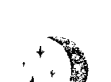
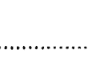
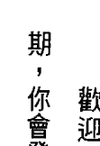
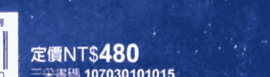

新月許願

MOONOLOGY

加速心想事成的月亮奇蹟

> Working with the Magic of Lunar Cycles

星星教授 安格斯 作家/創意人 李欣頻 星座專家 瑪法達老師 一致推薦

雅思敏·伯蘭 Yasmin Boland／著 舒霧／譯

# St. Royal College

## 天使神秘学院

- 专业占卜预测机构
- 神秘学培训机构
- 水晶能量研究中心
- 神秘学资料库
- 官方淘宝：http://strc.taobao.com
- 读书交流QQ群：
  占星塔罗占卜师交流群：814594478（加入密码：PDF）
  神秘学其他综合群：659338717（加入密码：PDF）

使用手机淘宝扫一扫，获取更多好书

淘宝按店铺名搜索：天使神秘学院

微信公众平台：strc2011

# 制作说明：

本书由《天使神秘学院》出重金从台湾购入的原版书籍扫描制作完成。为达到最好阅读效果，特地把原版书全部切开后，再经由专业扫描设备高精度扫描完成，并经过一张张的PS后期处理最终成书，其间花费大量的人力、物力以及时间，只为能给大家提供经济并优质的神秘学学习资料而努力。

本学院强力谴责某些机构和个人，把本学院花心血制作完成的电子书籍，包装后直接放在自家淘宝网上低价倾销的行为，以谋取不劳而获的经济利益。如果长此以往最终将无人愿意再为大家花心思制作电子书，那以后可能大家再无新书可读。

为让大家以后能够读到更多的好书，也为了本学院的良性发展。本学院恳请大家尽量做到如下几点：

- 尽量在本学院的网站购买电子书籍。
- 请勿用技术手段把电子书内的水印及加密去掉。
- 在收到电子书后小范围传阅即可，千万不要公开传播，更别挂到淘宝网上低价销售。

同时为答谢广大支持者，学院电子书将做如下调整：

- 学院会把一些早已收回制作成本的电子书折价销售。
- 最新制作的电子书籍会开放打印功能，大家购买后有条件的可自行打印成书。

天使神秘学院
2018年1月

### 新月許願

# MOONOLOGY

## ◆ 加速心想事成的月亮奇蹟 ◆

雅思敏·伯蘭 Yasmin Boland／著

舒靈／譯

獻給奧莉薇亞和路易斯——

我對你們的愛遠及月球和無涯的宇宙！

> 讓人生成功的秘訣，首先要有成功的深切欲望，然後深信一定會成功，並在意識中保持清晰明確的意象，觀想其逐步完成，沒有絲毫的懷疑或不信的念頭。
> ——摘自梵泓基金會創建者，艾琳·卡帝 (Eileen Caddy, founder of Findhorn)

# Part 1

# 月亮的神奇力量

# 目錄

- 如何查詢自己的星座命盤？ 3
- 如何查詢新月及滿月時間？ 4
- 前言 15
- 與月亮同步 22
- 許一個夢想 22
- 月亮的十大知識 25
- 與月亮同步就能實現夢想 27

# Part 2

讓新月創造夢想人生

# Chapter 2

配合月相週期改變人生 30
陰曆月 30
月相運用指南 33
常見問題：月亮與月相 46

# Chapter 3

新月許願 58
新月許願的秘訣 59
新月許願的步驟 73
常見問題：新月許願 85

# Part 3

滿月祈福

# Chapter 4
善用新月計劃人生

十二星座為新月增添特殊力量 91
新月落在十二星座的運勢指南 93

# Chapter 5
善用新月預測未來

星座、上升星座和宮位 124
新月落在十二宮位的運勢指南 129
常見問題：新月 205

# Chapter 6
滿月的寬恕與感恩

感恩可以增強成功機率 220
滿月的寬恕與感恩 212
寬恕才能傳遞正向頻率 213

# Part 4

## 常日的月亮啟動覺醒的生活

### Chapter 7

善用滿月找到人生的平衡點 222
滿月落在十二星座的運勢指南 222

### Chapter 8

善用滿月預測未來 242
滿月落在十二宮位的運勢指南 242
常見問題：滿月 278

### Chapter 9

常日的月亮在哪裡？ 282
常日的月亮在十二星座的運勢指南 283

## Chapter 10 常日的月亮對個人的影響

常日的月亮在十二宮位的運勢指南
常見問題：常日的月亮
結語
附錄一 進階預測技巧
附錄二 宮位和星座的快速參考指南
附錄三 獲得更多能量的輔助方法
附錄四 滿月的各種名稱
附錄五 弦月對星座及宮位的影響
參考資料
使用許可

# 前言

> 自盤古開荒以來，月亮是地球最古老的殿堂，持有無數祈禱者許願的力量，……這種鐘聲能將人帶進母親的懷抱，讓身體和靈魂都能靜靜地飲用。
——摘自月相週期網（Mooncircles），
丹娜・葛哈特（Dama Gerhardt）

你相信月亮可以成為幫你創造夢想人生絕佳又簡單的宇宙計時器嗎？過去十幾年來我的網站（www.moonology.com）寫了許多新月許願的事情，這個方法對我和成千上萬名讀者都很有效。當你開始運用本書的知識和方法，就能幫你實現夢想。你可以成為強大的新月許願者。要利用月亮創造夢想人生，只要注意月相週期，並了解實現夢想的基本原理就可以了。

如果你曾涉獵如何實現夢想的領域，卻發現到目前為止都不成功，也許多本書的資訊能補足你過去缺少的環節，同時教你如何利用月亮的能量為願望和夢想充電。

利用月相週期當作宇宙計時器，可以大幅提升許願成功的機率，讓我們成為意識覺醒的創造者和用心經營的許願者。

你不需要是占星學家也能做得到，即使你不相信占星學也無所謂，你也不需要懂什麼數學或天文學。藉月亮許願真的很簡單，不需要知道太多理由和原因。月亮就高掛在天上，幾乎每天晚上都能看得到。我們跟月亮相通，月亮也跟地球相通，你只需要知道這一點就可以開始了。

網友寫信告訴我，他們善用新月許願成功實現了許多目標。我希望能將成功秘訣也傳授給各位讀者。

你將會學到如何許願，還有新月許願成功的原因，以及滿月時如何配合

# 本書使用方法

並協助新月許願（在滿月時所做的事情會為兩週後的新月許願帶來好處）。

你也會學到如何根據月亮在每個黃道星座時善用新月和滿月，以及如何降低個人星座命盤受到新月和滿月的影響，並且利用這個資訊預測往後幾週的運勢。

Part 1 介紹如何與月亮同步，包括八大月相的概述。了解每個月相特定的韻律，以及在每個月相期間的重要事項，對人生大有益處。學會配合月亮的韻律舞動之後，就會發現人生過得特別順利，就像你解開了某種密碼一般。

Part 2 要討論新月，也就是新月許願。如何許願？為什麼會成功？前文已告訴你為什麼這輩子每隔四週都要修習這種方法的原因。

了解新月落在哪一個黃道星座，就能開始運用每個月相的主題和能量。

我會教你用非常簡單迅速的方式找出每個月的新月落在個人星座命盤的什麼位置，即使你完全不懂占星學也可以。

哪個位置。每個月新月啟動星座命盤的那個位置稱為宮位，我會教你如何預測結果。

我也會教你如何藉由聯繫大天使和女神，利用新月改善人生、加強脈輪等。重點是可以利用新月當作計時器來創造、計畫和預測人生。

# Part 3 著重在滿月。

滿月除了美麗又能發出無盡的月光之外，還會增強情緒、人生中的拉鋸戰、高潮和釋放負能量的機會。在這個部分中，我會教你善用每個月的滿月能量。我們也會來看滿月時寬恕和感恩的力量，以及這個方式如何加強你新月許願的力量。

此外，你將會了解如何運用滿月所在的星座來協助你過更覺醒的生活，跟宇宙同步合一。你也會學到如何找出每個月的滿月位在你個人命盤的哪一個位置，還有這對你有什麼意義。

# Part 4 如果你成了勤快的追月族

就會好奇月亮在哪裡。這部分能幫你了解常日的月亮對你的意義，知道每天的月亮有什麼能量，以及如何使用。我也會陸續介紹依新月和滿月的情況出現的月蝕，還有月交點。當月蝕強烈衝擊你的命盤時，可能是人生的轉捩點（相信我，我就親眼見過）。還會

教你如何製作十二個月的月相計劃表，就能配合月相運用現實和月亮的魔力提升自己。因此在一年當中，你人生中需要注意的每一個部分幾乎都能照顧到。本書盡量以最簡單的方式呈現，為了讓你更方便使用，適當的地方會插入我的網站連結，以便找到相關資訊並下載表格。上船吧！我們要出發去月球了！

# Foreword
前言

# Part 1

# 月亮的神奇力量

很多相信許願的人都不知道，在新月時開啟實現夢想的程序能大幅強化我們完成夢想的機會。

# Chapter 1
與月亮同步

### 許一個夢想

首先讓我來告訴你們，我最喜愛的新月許願故事。這得回溯到我十三或十四歲在澳洲塔斯馬尼亞州霍巴特市的成長期間。萬一你們沒聽過這個地方，塔斯馬尼亞州是位在世界最底端的一座島，在澳洲本島的南邊。介於南極洲和這座島之間的只有一堆洶湧的海浪和冰冷的空氣。相信我，我很了解：因為我去那裡航行過！

我當時最大的夢想就是離開塔斯馬尼亞島，搬到法國的巴黎去住。我在房間的牆上貼滿了巴黎的照片，閱讀法文詩集，聽法國音樂。我學會煮的第一道菜是法式鹹派，因為，喔，因為它是法國菜嘛！有一次我甚至還買了一包法

## Chapter 1 與月亮同步

國牌高盧人香菸，不是為了抽菸，而是像燒香那樣在房間裡點燃它，讓我幻想自己是一個巴黎女孩，坐在昏暗的拉丁季餐館（Latin Quarter cafe）聆聽爵士樂。（可惜，我媽聞到了菸味就往壞處想，結果我就惹上一堆麻煩。）快轉到多年以後，我成了一位合格的記者，因為我朋友到澳洲度假時交給我他公寓的鑰匙，所以我就到巴黎住了一週。那當然不是我第一次到我的夢想城市旅行，但那是我長大成人後第一次造訪，也是第一次獨自一人前去。結果，我抵達巴黎的當天晚上剛好是新月，所以，我很自然就立刻到艾菲爾塔去做我的新月許願。我認為那高大的尖塔應該是將我的願望送達天界的最佳導體，事實證明確實如此。我那天許的願望是我想在巴黎待久一點，遠超過我預定的一週。我是一個單身的自由作家，這表示我帶著筆電到哪裡工作都可以，只要能上網就行，而且我也有適用的護照。既然我現在已經來到巴黎了，周遭都是我喜愛的事物，那我為什麼還要離開？許完願之後，我走回我朋友的公寓。黃昏時分，我走在巴黎美麗的街道時，腦中出現一個聲音清楚地說道：「對，我現在住在這裡了！」

「哈！」我心想道：「我會這麼想真的很奇怪！」然而，後來發生的事情正是如此。隔天，我看到一張手寫的廣告單，說巴黎某個極為高雅的地段有一間公寓要出租，正好離我暫住的地方很近。我去見了這位迷人的房東（後來才發現她是一位東歐的公主），她帶我參觀了公寓。那裡很完美，唯一的「缺點」是，屋主的丈夫在廚房裡有一間攝影暗房，他們夫妻想要不定時進出這裡。為了這個原因，租金是這個黃金地段平常價碼的一半，地點就在聖米歇爾大道旁邊。更順利的是，屋主和她的丈夫都能說一口完美的英文，所以我跟他們溝通毫無障礙，（我大學程度的法文還有待加強）。他們說要把公寓租給我，我當然立刻就用法語說：「好啊！」所以，後來我就在巴黎住了兩年半。這麼說，光是許願要住在巴黎就能如願嗎？那也不盡然，其實我不但夢想要住在那裡，而且我還為此做了一些事情（學習法文和造訪巴黎）。此外，我也在艾菲爾塔下許願才能讓夢想成真。我要說的重點是，我們總是忍不住想要實現夢想，夢想（擔心）會搞砸人生嗎？那你很可能會搞砸。夢想住在巴黎？那你也可能會做到。我對巴黎的夢想創造了我的現實人生。

我簽下租約的幾個小時後，在餐館遇到的一位陌生人對我說：「妳創造了一個奇蹟！」顯然一個外國人要搬到巴黎和找到租屋並不容易，更別說要在這麼高雅的地段以這種合理的價格租到公寓了。

### 月亮的十大知識

在我繼續往下說之前，這裡有一些關於天文學／占星學的重要論據，知道這些很有用，這樣才能把下列的論據加入觀點中：

- 一、月亮距離地球三十八萬四千四百公里（二十三萬八千八百五十五英里），月亮的半徑是一千七百三十七公里（一千零七十九英里）。
- 二、阿波羅十一號的太空人終於在一九六九年成功登陸月球，其中兩人是巴茲・奧爾德林（Buzz Aldrin）和尼爾・阿姆斯壯（Neil Armstrong）。後來阿波羅號又陸續出了五次任務，每次大約花三天

一切都進行得天衣無縫：幾乎就像是我許願讓它成真的。活在我夢想的世界中，感覺就是那麼自然……當一切感覺很自然時，魔法就會發生。

時間抵達月球。但二〇〇六年美國太空總署的新視野號太空探測船前往冥王星途經月球時，不到九個小時就到月球了。不過，那是瞬間飛過，不用減速準備降落的情況下。

- 三、一般估計月球的年齡大約是四十五億兩千七百萬歲，跟地球的年齡差不多。
- 四、關於月球起源最受歡迎的科學論據，據說當新生的地球撞擊到一個跟火星般大的行星，殘骸被拋到軌道上因此形成了月球。
- 五、月亮繞著地球運行，地球繞著太陽運行。
- 六、月亮大約花三十天繞過所有黃道十二星座，在每個星座大約停留兩天多一點。
- 七、每個月有一個新月，兩週後會出現一個滿月。所以新月出現的兩週後就會有滿月，然後再過兩週又是新月，如此依序出現。
- 八、占星學家用「太陰月 lunation」來談論一個新月或滿月。所以，比如說，我們可能會說下個「太陰月」是滿月在牡羊宮。
- 九、在占星學裡，關於月亮法則中最重要的事情是：情緒、食物、家。

## Chapter 1 與月亮同步

### 與月亮同步就能實現夢想

但對我們的目的來說，以占星學的說法，更重要的是下列這些與月亮有關連的事物：感覺、情緒、母親、子女教養、記憶、陰柔、女神、女巫、女人、童年、週期、營養品、傳統、習慣、敏感度、心情、變動、潛意識、感受性、家庭生活、公眾、餵養、培育、家庭、需求，以及其他。
- 十、月亮繞行地球時會啟動這些行星，因此是絕佳的星象計時器。潛意識。
庭、直覺、母親、需求、乳房、滋養、陰柔、過去、根基、安全和

當你逐漸熟練本書中的方法，我相信你很快就會發現，接通月亮的力量有多強大——藉著在新月時許願，以及滿月時釋放和寬恕（後續會談到這兩者的細節過程）。你也會發現，配合新月和滿月所在的黃道星座來操作的效果有多不可思議，了解新月或滿月如何影響你個人命盤的知識有多美妙。過一段時

間之後，你很可能會開始倒數計日，等著下一個新月或滿月的到來。

如果你正在靈修的道路上，接通月亮將是純然的魔法。其一，月亮本身就是在提醒我們，人生中除了日常生活事務之外還有很多其他的東西。我是說，只要看一下就知道！月亮似乎是漂浮在天空中的發光體。即使是用肉眼看，月亮也很美。（如果你不曾用望遠鏡看月亮的話，我鄭重推薦，那真是名符其實的棒透了。）

年年月月看著月亮能讓你感應到她的週期和韻律，能幫你記得我們是浩瀚宇宙的一部分，是宇宙的孩子。我們是星塵，我們的人生中還有遠比忙著通勤上班，在公司跟別人競爭升遷機會這些俗事更有意義的事。

在通往覺悟的旅程中，我們是魔法的創造者。我們跟太空和天堂，以及浩瀚宇宙是一體的，即使我們無法清楚看到天堂的一切，也沒辦法花太多時間思索大自然，接通月亮能幫我們跟神性重新取得聯繫，也是跟我們的神聖自性和宇宙取得聯繫。

當你跟月亮的週期同步運轉時，你就開始跟宇宙和大自然同步了。我們二十一世紀的人似乎很容易跟大自然脫節。當然，不是每個人都住在城市裡好

## Chapter 1 與月亮同步

幾個小時都待在人工照明的房間裡，或是在電腦前，但我們有很多人都這樣不是嗎？到戶外跟大自然接觸，凝望神秘的月亮是真正的療癒。你可以從附近的公園或自家庭院看月亮。如果你沒有庭院，那就試著在車道上看。如果你沒有庭院也沒有車道的話，你也可以在街道上或是從窗口看月亮。我記得以前第一次有機會每天晚上看著月亮慢慢變圓，是在泰國一間海灘小屋度假的時候，月亮在夜空中的景象真是一大奇觀。

## Chapter 2 配合月相週期改變人生

### 陰曆月

雖然月亮出現這些月相時，看似在天空中變化形狀，從新月到眉月，從上弦月到滿月，然後又慢慢變回新月。事實上，這是因為她跟太陽和地球的相對位置不斷變化的緣故。

與月亮同步最重要的是要隨時覺察月亮在當月週期的哪個位置。讓我們盡可能以最普通的方式，透過跟隨月亮經過八個月相階段開始修習，很可能會改變你的一生喔！你很可能已經知道八種月相中至少兩種的名稱，也就是滿月和新月，其他月相如下。

## Chapter 2 配合月相週期改變人生

這裡有一點技術性的東西……試著用這個方式思考：月亮繞著地球運轉，地球繞著太陽運轉，月相是因地球、月亮和太陽彼此之間的角度變化所產生的結果。從我們在地球上的觀點來看，月亮繞著地球運轉時，月亮和太陽之間的角度造成不同程度的月亮被「照亮」。所以有時候會看到月亮的臉整個被照亮（滿月），有時候月亮看起來又像「半月」（又稱弦月）。很多很多個月以前，人們注意到月相週期性地重複光照變化，就給每一個月相階段不同的名稱。我們也從研究中得知不同的月相會帶給我們不同的能量，就把這種智慧記載到占星學裡。下圖顯示月亮在二十九天半的週期變化。請注意圖中顯示的角度是我們從地球到太陽，以及地球到月亮的關係所畫出的線向軌跡。零度是新月，等月亮繞著地球轉到一百八十度時就是滿月。

知道下列這些資訊也有幫助：
- 漸盈月期是指新月變成滿月，在天空中越變越大。
- 虧缺月期是從滿月變回新月，每天晚上越變越小。
- 可以根據中國哲學的陰陽概念思考月亮的盈缺。新月是最陰的時候，## 八種月相

地球和月亮一起沿著運行軌道繞著太陽轉動。

- 上弦月（半月）
- 盈凸月
- 眉月
- 滿月（望月）
- 新月（朔月）
- 殘月
- 下弦月
- 虧凸月

### 月相運用指南

幾百年來，傳統和民俗宣稱每個月相都有「適合」從事的活動。美國作家丹尼·洛海爾（Dane Rudhyar）在一九六七年出版了極有影響力的《月相遇期》（The Lunation Cycle），書中探討本命盤中太陽和月亮的關係是了解個性的重大關鍵。認真的新月許願者都應該看看這本書。

多年來，我發展了一套運用每個月相能量的方法。例如，決定我們在每一個月相時該做和不該做哪些事，尤其是針對實現夢想方面。我的方法部分是根據洛海爾的理論，加上一些常識、傳統民俗的智慧和我個人的經驗。

理想上來說，我們可以運用每個月相。然而，大部分的人都是在人生困頓時才會想到月亮正處於哪一個月相。即使如此也無妨，重點是要了解每個月相適合做哪些事情。越與月亮同步，人生就會過得越順暢。

我的網站（www.moonology.com）有顯示每天的月相，你可以上網查詢，也可以訂閱我的電子報（www.moonologybook.com/dailymessage），把月相資訊直接寄到你的電子信箱。

#### 新月期

為你未來的夢想播種

從殘月後第一天開始到第三天半結束

**關鍵字：**
- 清白的紀錄
- 潛力
- 夢想

新月期算是月相週期中最令人興奮的時刻。事情在醞釀時，感覺像是很安靜的時刻，但事實上這是否能否開始實現夢想的時候，是要展望、計畫、找時間許願的時候。創造需要時間。在新月期經常覆誦真言¹「我是有福的」很有幫助。

新月期，太空會傳來一些想法，我們必須決定想要鎖定哪個點子。任何事都可能發生。此時一定要思考你想要什麼，而非不想要什麼。靜坐深思你的夢想，讓你跟高我²達成共識，邁向夢想的指引。

我強烈推薦此時找人幫你按摩，或是來場火辣的性愛，甚至是洗個熱水澡也好，只要是能提醒你活在這個身體裡的任何事情都好。你打算以這個身體得到什麼體驗？

如果你真的很想成為用心的許願者，你應該在新月期時撥出時間，把夢想寫下來或畫出來。對大多數人來說，寫下來的效果很好，但我個人認為畫出來，甚至隨便塗鴉更好。為夢想或願望畫一些有創意的圖畫，表示正在觀想夢想或願望成真的畫面，表示你已經開始相信自己已經在實現夢想或願望了。常言道：「只要相信，就能實現。」（詳見 Part 2）

不要擔心自己不會畫圖，也可以選擇寫下來，不過在寫的時候記得要在心中想像它、感覺它。套句韋恩・戴爾博士（Wayne Dyer）的話，「想像已經達成願望的感覺，用身體去感覺那種喜悅。誦讀出聲的力量也很大。如果你正確運用月相週期，就能大幅加快實現夢想的速度。（詳見 Part 2）*

1. 真言（mantra）是一個字句或一個聲音，在靜坐時重複默念或誦讀出聲。你可以在網路上找到一些真言，或是跟靜坐老師學習，最著名的真言是「Om」（發音似歐嗯）。
2. 高我（higher self）就是人內在的神聖意識，全知的智慧來源，引領人生的方向。

#### 眉月期

##### 探索你的夢想

**關鍵字：** 勇氣、向前邁進、信心

眉月期是讓夢想綻放和繁茂的時候，如果聽起來太詩意，那就把自己和夢想像成一朵花正在綻放的樣子。月亮從隱形轉向圓滿的力量，跟你的夢想是一樣的。你現在或許無法看見將會實現什麼夢想，但不久之後就會開始顯現，就像上弦月在天空中展現銀色的光芒一般。

繼續想像你要什麼，花點時間回去重看你在新月期許下的願望清單（詳見 Part 2），誦讀出聲，思索它，觀想它，這些願望是不是開始感覺像真的了？如果沒有的話，再誦讀一遍，再次觀想，再去感受願望實現後的感覺。許願和設立目標是一種很強大的起點。如果真的想要改變人生，就必須保持這種憧憬。

眉月期是保持信心和生出勇氣的時候。如果你想要某樣東西，你就得去追求它。有時候需要有膽量去追求想要的東西，即便可能會激起害怕失敗的恐懼。如果你一直在為這個問題掙扎不已，那你需要在眉月時加倍努力，不要在尚未開始追求就放棄了。

#### 上弦月期

這是投入承諾的時刻

在新月後第七天開始到第十天半結束

**關鍵字：** 挑戰、自信、承諾

上弦月期是月亮從新月到滿月間的過程，看起來像「半月」。在月亮週期的這個時刻，你可能會開始懷疑自己能否實現夢想。也許你的決心或承諾遭受考驗？此時可能會碰到某種危機或困難，正好讓你更加努力追求夢想。此時會發生這種事情，在占星學上的理由是，月亮剛離得夠遠，不會跟太陽相沖，這個角度稱為直角，據說會造成需要搔抓的癢處！換句話說，此時出現的問題需要採取行動。

如果你心裡知道，你對這個舊夢想已經不再癡迷，或不想繼續完成，那就幫你自己一個忙，放下吧！小我可能會執著它，但你可以放下。如果你對正在努力的夢想仍然興致勃勃，就要加倍努力。有時候需要一點逆境來提醒我們，我們對某個事情是很認真的。此時回去重讀你在新月時的許願清單很重要。重新去感覺它，重新觀想它，重新想像它。

#### 盈凸月期

##### 保持在原定軌道

**關鍵字：** 轉圜、磨練、調整

當月亮越來越接近盈滿，就是需要耐力的時候。不要放棄，不要讓小我或恐懼破壞計畫。對人生要教你的功課保持開放的態度。如果你知道需要一些改變來達成目標，那現在就做出改變。盈凸月是指「凸起」，很貼切地形容這個月相，但願人生感覺像凸起飽脹的月亮，充滿了潛力。

這是複習計畫的最佳時刻，你的夢想現在很可能會需要一點轉圜餘地。花點時間去回想你的點子，看看有哪些進展順利，感覺哪些可能快沒力了。不管你在計畫什麼，都要增加一點衝勁。不過，要是你現在才想到新的計畫怎麼辦？沒問題，現在其實也是開始新計畫的好時機。

此時期最重要的是不要失去耐性，如同《老子》所說：

> 「民之從事，常於幾成而敗之。慎終如始，則無敗事。」

意即人常在快要成功時反而失敗。面對事情結束時，能像開始時那麼謹慎，就不會招致失敗了。

盈凸月期也適合恢復以前的好習慣或常規，雖然離新月已經過了將近兩週，但我們還是處在月相週期逐漸盈滿的月相中，因此推薦重新開始做一些新的事情。

#### 滿月期

##### 決定成敗的關鍵時刻！

**關鍵字：** 結果、寬恕、感恩

在新月過後第十五天開始到第十八天半結束

滿月是月週期的高峰，我們本能地知道這時事情應該有頭緒了。如果你的其中一個願望會實現，那很可能會在這個時候出現結果。或者，你可能會得到強烈的提示，它正在醞釀之中。有些願望比較花時間，檢查你的情緒導航系統——你現在對這些夢想的感覺如何？建議要有鼓舞自己的感覺。對你想要的願望儘可能去想最好的事情，良好的感覺，想自己有多好的福氣。

如果你對月亮特別敏感，此時你可能會特別興奮、緊張和焦慮，這是因為以某種程度來說，這是你生理週期的高峰，你的願望若尚未實現的話，那就得再等等了。這個週期的部分屬至陽，能量外放，感情也會顯露出來。藉由滿月期釋放和放下。如果有些事情進展得不太順利，那就為它祈福，並感恩人生中所有的好事。

同時回顧過去這個月當中，看看哪些人事物傷害了你，不過這不是譴責的時候，而是寬恕的時刻。一旦寬恕，就能消除業障，便能脫離那個處境。因為大自然厭惡真空狀態，你需要拿別的東西來取代釋放的東西。重點是要利用月相週期的高峰來放下過往和往前邁進。寬恕是我們給自己最重大的禮物。因為當我們寬恕時，我們就能往前邁進。寬恕過去四週（或是任何時候）曾經傷害過你的人事物，是你能為自己做的最健康的事情——這是在排毒，淨化得越乾淨，兩週後在新月期就越能播更多的種子。等你透過寬恕消除任何不滿之後，用感恩心來填滿它。滿月時是情緒浮出檯面要我們處理的時候。當你釋放完對某人或某事的不安感或未解決的問題時，想著你感恩的人或事，藉此專注在美好的感覺上。（更多關於滿月寬恕和感恩的內容詳見 Part 3）

#### 虧凸月期

好好呼吸

在滿月後第三天半開始到第七天結束

**關鍵字：** 放鬆、接納、重整

過了情緒激動的滿月期後，難免會有陷入萎靡的情況。如果事情進展得不是很順利，那接下來怎麼辦？花了那麼多精力之後，你可能會想在這個時期稍微放鬆一下。如果你的情況是這樣的話，那就好好放鬆吧！你會發現越能順應月相週期，人生就會過得越輕鬆順利。

不過，這不是開始新計畫的時候，而是放鬆自己、重整精力的時候。你越能接受「如是」，你的心理健康就會越好。而且，你越能放下，往後成功的機會就越大。

這也是跟他人分享智慧的好時機。你學到了什麼？可以跟人分享嗎？過去幾週，你的智慧和經驗有了成長。現在是你跟人分享所學的時候。

我們算是處於「虧缺」的月相中，月亮每天晚上會越變越小，直到新月期完全消失為止，好像從某一邊的人生走到另一邊，穿過滿月的這道門便可以看到另一邊有什麼。接受你現前的處境，試著在這個時期放鬆自己。如果你在新月到滿月這段期間很努力在實現夢想，你現在應該休息一下。

#### 下弦月期

你知道什麼？

在滿月後第七天開始到第十天半結束

**關鍵字：** 重新評估、平衡、信任

下弦月期可能有點怪，是在令人驚奇的滿月和充滿潛力的新月之間的中途點。某種程度來說，過去幾週來沒有實現的夢想已經消失在太空之中。現在是重新調整自己的時候，雖然下弦月期可能會感覺疲倦，但不能停下來，也無法安享勝利成果。此時會有緊繃感，因為自我本位的太陽和情緒化的月亮間產生銳角。

#### 殘月期

##### 釋放

在滿月後第十天半開始，持續到新月開始為止

**關鍵字：**
- 療癒
- 撫慰
- 臣服

我們可能不想放下，卻必須這麼做。調適是必要的。我們必須給新的事物開路，感覺代表新事物的新月會在一週後出現。下弦月就跟上弦月一樣，看起來像半月形。此時出現的任何衝突都值得拿出來檢討，自問你在這個月時所碰到的挑戰是在傳達什麼訊息？這時可能需要改變航道，放棄舊航向。

這個月週期的情況可能會像十字路口，回頭看看，你走了多遠。你達成的目標是否值得嘉獎鼓勵？那就給自己一點鼓勵吧！接下來要往何處去呢？這時可能要決定你想帶什麼樣的事物到不久後的新月，想拋下哪些東西。

這也是打破習慣的好時機，你正處在一個轉捩點，「你想轉往哪個方向？」你想繼續舊的計畫或是做出新的計畫？

「殘月」（balsamic）這個字來自 balsam，意指任何療癒或撫慰的事物。月相週期的最後這個部分（在新月前）主要就是強調這個。從希望和夢想轉移到潛力爆發期：了解到什麼可行、什麼不可行，然後接受、寬恕和臣服，現在來到療癒和撫慰的時候。如果你過覺醒的生活，想跟月相同步，這是在自己寬鬆點的時候。開始思考你的夢想，讓希望引導你、激勵你。記住任何事情都有可能實現，輕鬆地活著，好好呼吸。最好的用功方式之一是，誦讀梵文的真言 Om Namo Narayani（嗡南無那拉亞尼），意思是「我臣服於神」，這個神對我們每個人都有計畫，我們都是由這個神變現出來的，所以現在臣服於神。說來容易做來難，但只要不停地誦讀 Om Namo Narayani，要求你的靈魂臣服，就有可能辦到。這個月的週期要結束了，現在真的是放下過去、往前邁進的時候，也是休養和療癒的時候。讓自己休息一下，做點白日夢，做大一點的夢想，任由想像力自由奔馳，對自己微笑。再次強調，這是終止任何不良習慣的好時機，也是結束不適合你的人際關係或感情關係的時候。如果你跟某人發生了衝突，但你還想維持這段關係，這也是消解不愉快的好時機。

### 總結

- 月亮可當作有魔法的宇宙計時器來協助你創造完美人生。
- 與月亮同步能讓我們接近其週期和諧律。
- 月亮有八大月相，新月和滿月是月相週期的高峰。
- 新月是將願望和目標傳送給宇宙的時刻。
- 滿月期是最情緒化的時候，因為月亮跟情緒息息相關。

### 常見問題：月亮與月相

以占星學來說，新月或滿月代表什麼意思？

我個人的理論是，新月是人類覺得有點惶恐的時候，因為情況即將有變，很多人不太喜歡改變。而且，以原始的層次來說，看不到月亮的時候，心理的某個部分會害怕，而在新月時是看不到月亮的。

又大又圓的滿月被視為每月週期中的高潮。來到週期高峰時，月亮看起來似乎會膨大。高峰過後，就是放下、釋放和往前邁進的時候了，因為月亮會變得越來越瘦小，直到短暫消失為止。（新月會跟著太陽升起降落。）

如先前提到的，以占星學上來說，月亮跟感情（還有其他的東西）有關，所以隨著月亮變圓，我們的情緒也會增強，在象徵意義上是說得通的。

因此，在月相週期高峰，也就是滿月期，我們多少會有點發狂。另外你還需要知道：

- 新月是晦暗和隱密的，而且跟女巫有關；一切都跟隱密和掩藏的神秘事物有關。
- 滿月跟圓潤、滿脹、絕美和明亮的女神有關。

#### 望月的習俗是從何時開始？

許多歷史學家相信，望月的習俗剛開始是因為古代的祖先需要隨季節變化工作而發展出來的結果。在組織化的農業出現以前，人們想要預測天氣冷熱，乾燥或多雨。他們得計算潮汐何時起落，某些植物或花朵何時會開花或結果，諸如此類的事。這是學習如何配合地球運作的過程之一。很快地，早期的人類學到他們可以利用太陽和月亮反覆的週期作為預測未來的起點。根據人類學家找到的符號記載，人類在兩萬五千年前就已經在注意新月和滿月了。

#### 什麼是月入空亡（月亮無相位）？

回答問題之前，先說明一點關於占星學的基本知識。占星學家研究星球的活動，表示我們在研究星球彼此之間形成的角度或「相位」。舉例來說，兩個行星在三百六十度的星座盤上形成九十度角，就稱之為「四分相」，這是相沖的角度或相位，可能會出現一些需要處理的難題。兩個行星呈現六十度角，稱為六合相（較吉利的相位）；天體相距一百二十度稱為三分相（吉利的相位），而零度（兩個行星同一時間出現在同一地點時）稱為合相（有可能往左或右，視情形而定）。兩個行星位在一百八十度時，它們是相對的，也是一種挑戰的相位。

也就是說，月入空亡（月亮無相位）有三大定義：

1.  月亮在進入下一個黃道星座之前，沒有跟任何行星產生角度相位。
2.  月亮在運行路線的三十度內，沒有跟任何行星形成確切的相位。
3.  月亮在十度內的運行軌道上沒有形成確切的相位。

第一個定義是最廣泛使用的，你應該考慮用這個。據說，在月入空亡時期開始的任何事情都不會有結果。這絕對不是開創新事業或計劃婚禮的時候，而應該自然無為，例如打坐或練瑜伽。注意，在你的星座本命盤上有月入空亡跟這個情況不同，這個問題已經超出本書討論的範圍。

#### 「我的」月亮在哪裡？

每個人在自己的星座本命盤上都有一個月亮，但這個主題牽涉的範圍太大，無法在此詳述。我的另一本書《占星學》（Astrology）有討論個人月亮的意義。

#### 什麼是界外月？

如果你成為真正狂熱的追月族，你會想知道什麼是界外月，這是偉大的已故包洛夫人（K.T. Boehler），又稱「偏斜夫人」發起的。我有幸在她二〇〇四年過世前透過網路跟她聯繫：她是很有能啟發人心的女士，我永遠懷念她教我的一切。

實際上，當月亮的斜角（天球赤道的北點或南點的傾斜角度）超出北緯座標23°28'，或南緯座標23°28'，據說就算界外月，使它具有魔法。這種界外月是隨機出現、不受拘束、先進、自由和毫無界限的。只受它的膽識和天資所限。

#### 什麼是超級月亮？

超級月亮是新月或滿月幾乎跟近地點重疊時，近地點也就是月亮在每月的運行軌道中最靠近地球的一點。每年會有四到六個超級月亮，如果影響到個人本命盤上的月亮，所產生的衝擊會更大。

#### 什麼是重大的月亮停變期？

重大的月亮停變期是當月亮南北緯度達到傾斜二十八度的極限時。上一次的月亮停變期是發生在二〇〇六年，下一次會出現在二〇二四年到二〇二五年間。

#### 什麼是藍月？

「偶爾在藍月的時候」，每本關於月亮的書籍若不提到藍月就不完整了。通常在春分和秋分或春至和冬至之間或有三個滿月，不過有時候一季裡面會有四個滿月。當這種情況發生時，那個季節的第四個滿月就稱為藍月。以這個定義來說，下一個藍色月亮將會出現在二〇一九年五月十八日。

這是關於藍月的原始定義，但另一個說法是：在一個陰曆月中出現兩個滿月，第二個滿月就稱為藍月，這種情況就遠比前面的那個定義更常發生了。

這兩種定義中的藍月在占星學上都沒有什麼特別重要的意義。

有時候也會在同一個星座中有連續兩個滿月，但這些不算是藍月；然而，這是難得會出現的情況，這在占星學上可能更有意義。這就好像在你的命盤上出現雙倍的影響力要「你採取行動」。

#### 何時最適合做......

如果你不希望頭髮太快長回來的話，殘月時是剪髮的最佳時機，也適合修剪指甲、拔除雜草和除去不要的植物。考慮在即將到來的新月時要在園子裡播那些種子（關於園藝，建議查詢下列網站：www.gardeningbythemoon.com）。殘月期也適合動手術，比較不會失血，而且不久後的新月也會加強痊癒力。

#### 日月蝕是怎麼形成的？

新月月蝕是一種日蝕，滿月月蝕是一種月蝕。將來有一天我想寫一本關於日蝕月蝕的書，因為我覺得它們很令人興奮。但是，現在你應該知道，如果新月月蝕或滿月月蝕出現在你命盤中的某一區，那你會得到平常新月和滿月很多額外的影響力！

日月蝕會打開我們命盤被啟動的那一區另一種未來的通道。要不要穿越這些通道全看我們自己。宇宙會換擋，改變速度，不管我們是否準備妥當，都會被某些事件推回適當的人生軌道中。

在古早以前，人類很怕日蝕和月蝕。天空會變黑，狗會開始嚎叫，人也會恐懼，這些都是可以理解的。後來，不管碰到什麼壞事，人都會怪罪到日蝕月蝕期間「那個天空變黑的危險日子」。

現在我們可以預測日月蝕何時會發生，所以沒有人會驚訝了。現代大部分的占星學家把日月蝕看成即將起變化的前兆。把它想成這樣：你來到地球是為了做某件事。基本上，你的靈魂帶有某種任務，你的人生有一個目的。然而，人很容易去聽小我，而不去聽靈魂的聲音。

我們很容易因人生（和愛情）分心和走偏，然後不知不覺就偏離了應走的道路。通常這時會感覺人生過得很艱難，我們知道這個生活不是我們應該過的方式。我們被困在毒化的感情關係中，或被工作弄得精疲力竭，我們並沒有順應天命！

問題是，有時候小我對突如其來的轉變很不滿，在日月蝕期間碰到的事件可能非常艱難，然而，這些通常都會得到好的結果。（想輕鬆度過日月蝕難關的方式就是不要執著於過去。）

## Part 2
## 讓新月創造夢想人生

當你想實現夢想時，運用新月能量是成功的關鍵。雖然理論上來說，只要有正確的目標和承諾，你可以在任何時候任何地方許願，不過配合月亮的能量來做你的「許願工作」將能為你的夢想大幅充電。

## Chapter 3
### 新月許願

現在來到最令人興奮的部分：新月許願。本質上來說，新月許願是每月提醒我們一次，更了解自己的夢想和目標是什麼，然後寫下來或畫出來。我喜歡把這個過程稱為「新月許願」。然而，有些人覺得許願這個想法有點虛無飄渺，寧願說是「設立目標」，聽起來比較像大人做的正事。

以我個人來說，我覺得許願和設立目標很不同，但其實能夠相輔相成。我喜歡在月初為當月許願和設立目標，我也喜歡新月許諾這個觀念。

你想怎樣形容你的新月許願並不重要，隨你自己決定，最重要的是，你對它有良好的感覺，你也會去做。不過，如先前所說，我比較喜歡「許願」這個概念。

### 新月許願的秘訣

許願或設立目標的秘訣是要確保它是發自你的內心，你感覺到這些事情好像已經發生了一般。再讀一遍，許願或設立目標的秘訣是要確保它是發自你的內心，你感覺到這些事情好像已經發生了一般。

很多人不了解這一點，我們可以重複說肯定語，讓觀想的力量擴展到無限大，但如果我們不是發自內心，感覺好像已經獲得我們希求的事物，那我們只是在浪費時間。除了這點至關緊要，讓許願成功的其他關鍵還有：

- 假裝到已經成真為止。換句話說，假裝你的夢想已經成真，感受夢想實現後的感覺，沉醉在那種感覺中。
- 想你要什麼，不要去想你不要什麼。這是黃金守則，照做就是了。
- 把你想要的事物寫下來或畫出來，把你不想要的事物全忘掉。

人通常不知道自己的力量有多強大，等到開始與月亮同步，運用月相週期後，我們的力量會變得驚人的明顯。也許新月許願最重要的事情是在你知道你想要什麼之前無法得到你想要什麼。

當真正清楚知道自己想要什麼時，加上宇宙的協助，夢想自然唾手可得。事實上，我們在每月新月時許願或設立目標時，就是要非常清楚自己想要什麼。就像寫下購物清單能幫助我們採購那樣，把「我們想要的事物」寫在願望清單上，也能幫助我們實現夢想。

### 假如我不知道自己想要什麼怎麼辦？

答案是「深入自性本我」。詢問宇宙、上帝、你的大天使和指導靈或任何能幫助你的神靈，尋求祂們的指引，讓你進入清明的本我。問自己：「我想要什麼？」在日常生活中經常重複問自己這個問題，或是在靜坐前後問這個問題。持之以恆，答案自然就會出現：仔細注意有哪些訊息、思想和點子傳進來。如果覺得自己一個人做不到的話，那就祈求新的靈性導師進入你的生活。

### 新月許願的黃金守則

在我告訴你如何做新月許願之前，我想分享我多年來發展出來的黃金守則：這些守則對我和我教過的千千萬萬人都很管用。我不敢明確的說，如果你不遵守這些「要做和不要做」的守則，你就無法實現願望，但你會發現，這個概念主要是為你自己和他人許願好事能成。

#### 許願任何你想要的事物

只要你相信你可以得到，那它就會是你的。

#### 一次許願一小步

不管你的願望有多瘋狂都沒關係，只要你能相信，你就能辦到。不過以這種情況來說，我發現一次朝夢想邁進一小步會有好處。比如說，在我的新月許願和設立目標的工作坊中，我邀請學員跟大家分享他們的願望，偶爾有個失業的人會寫：「我希望擁有一棟房子。」或「我希望贏得大樂透。」

在第一個例子當中，我會建議這位學員說：「首先許願找到一個工作，這樣你才能賺錢買房子。」在第二個例子當中，我會說：「喔，你是可以許願贏得大樂透，但我相信在你心底，你還是會懷疑這不太可能會發生，你也知道贏得樂透的機率有多低。換個方式來說，找到工作的機率就大多了。不過，話說回來，你還是可以同時許願找到一個工作和贏得樂透！」

我們來看一下類似的「物質」願望。想像你的夢想是擁有一輛全新的賓士，但現在你手頭的現金不多。要從一貧如洗到擁有賓士是很難跨越的一大步：不是不可能，但卻很棘手。記住，新月許願的其中一個秘訣是相信你許願的事物或設下的目標是可能達成的。所以在這個例子當中，我們可以把這個願望拆成幾個小步驟：

- 從一貧如洗
- 到擁有腳踏車
- 到擁有便宜的二手車
- 再到擁有二手賓士
- 最後到擁有全新的賓士

我的重點是，要達成這個夢想得花時間，還得經過好幾個新月。從一貧如洗到擁有全新賓士的過程中，需要做一些實際的事情，而且不能跳過這些過程。講白了，許願時，你是在變現出一種東西，這就是魔法，但除非你天賦異稟，我們還是無法推翻物理定律。而且我們也會受限於自己能否相信這是可能辦到的。

藉新月許願來實現夢想時，你可能會碰到很接近但尚未成功的情況，你不該忽視它。許願要擁有一輛嶄新的賓士後，隔天就在你的信箱裡收到賓士車的宣傳單。對，這是一種徵兆，表示你正逐漸接近夢想。或者，有一位朋友請你在他們度假期間幫忙「照看」他們的賓士。你也算更接近夢想了。在這個旅程中，耐心和信心是絕對必要的。

可是你一開始真的該許願要一輛賓士（或其他有形的物品）嗎？有人可能會反駁，許願要「物質的東西」，一輛車或鄉下一棟房子，或任何這類的東西都是虛妄的、貪婪的，只會浪費許願的力量而已。任何超級有錢的人都會告訴你，擁有物質的東西不一定能帶來快樂。當然，你得到一台五十吋的平板電視可能會開心好幾天，但之後它很可能就變成一件普通的家電而已。

以長遠來看，擁有物質的東西不會讓我們快樂。或許你是經常宅在家裡的人，再也沒有比週五晚上跟你的貓或愛人、親人或孩子坐在沙發上看電影更快樂的事了，那麼許願要一台大螢幕的電視來看可以嗎？

只要你體認到擁有一「物質的東西」並不能讓我們快樂，那你可以許願要任何東西，不用管那些反對者的意見。然而，話說回來，這也是事實，比方說，當我們許願要一台大電視時，我們真正想要的是看電視時的那種感覺。對有些人來說，可能是努力工作賺錢買到一台電視的感覺是值得的，或者我們想要的是跟家人度過快樂時光那種美好的感覺。

如果你已經知道你想要的是讓自己有更多美好的感覺，比方說，增加自我價值感，或是享受跟家人在家中的快樂時光，那就許願要那種感覺，而不是許願要一樣「物品」。

你檢視每月的新月許願時，也可以做一點自我分析。你想要某個事物的動機是什麼？這是你想追求的感覺嗎？或者是你只是想填補一個缺口？理想上來說，你應該讓自己的願望成為生活樂趣的延伸，換句話說，是讓你感覺更快樂的附件。

結論是：可以許願要一棟巨大華美的豪宅來娛樂家人和朋友嗎？當然可以：只要這是你真正想要的就可以。只要你許這個願望是因為你真的很喜歡這個想法，因為它能使你快樂。

不過，如果你許願要這棟豪宅的動機是因為嫉妒別人，想跟別人一樣擁有豪宅，那樣就不太好。首先，嫉妒是不健康的，所以要在這方面下功夫。其次，嫉妒會阻礙感恩心，我們需要感恩才能實現夢想。最重要的是，當你許願要任何事物時，要感恩已經擁有的事物，後續會再詳述。

#### 不要許願得到某個特定的人

許願得到別人的伴侶可以嗎？例如，想擁別人的女朋友、男朋友或配偶。簡單的答案是：不行。可以許願要某個單身無伴侶的人嗎？可以，你當然可以許願要他們注意到你，但最後，你必須記得，我們每個人都有自由意志，所以你無法用新月許願讓某個人進入你的人生。他們必須自己想來才行。

有個可能的情況是，如果你投入夠多的精力，許願有機會遇到某個特定的人，然後有意邀請他們跟你約會（並確實執行）。不過，這也得看對方願不願意答應。你了解我的意思嗎？

### 新月許願 加速心想事成的月亮奇蹟

許願跟李奧納多·狄卡皮歐、小賈斯汀或是珍妮佛·勞倫斯做朋友可以嗎？可以，只要你真的相信這是可能的，只要你跟他們之間的距離不是太遙遠，否則很可能只是浪費時間，浪費一個新月願望而已。

#### 不要許願改變某人

或許很令人難過，但新月許願無法用魔法把蟾蜍變成白馬王子或白雪公主。在你開始實現夢想的旅程之前了解這一點真的很重要。你無法將典型的魅力壞男孩變成乖乖牌的天使。同樣的道理也適用在「壞女孩」或「危險的女孩」身上。新月許願無法干涉別人的自由意志。

如果你處在虐待暴力的感情關係中，這個守則就更加適用。與其許願要你的伴侶改變，不如許願讓自己有勇氣離開他。基本上，你無法改變別人，他們必須要願意改變自己，這是我們經常忽略的老生常談。

#### 要相信自己值得擁有願望

開始每月的新月許願後，有一個要經常問自己的重要問題：「我值得擁有許願的事物嗎？」這是可悲的事實，許多人在成長期間沒有獲得父母的支持，因此長大之後常會懷疑自己是否有權得到任何事物。問自己下列問題。情緒上：你相信自己值得擁有願望清單上的完美友誼或感情關係嗎？財務上：你相信錢財是不好的嗎？（如果是的話，你當然無法吸引錢財來找你。）

#### 運用目標和欲望的法則

配合新月許願，就是在啟動新世紀導師德巴克·喬普拉（Deepak Chopra）所說的目標和欲望的法則，這句話說明了「未來是由現在所創造的」。

很多人可能會反對占星學，但就連他們也會同意德巴克·喬普拉的觀點。新月真的是很棒的標誌，就像鐘錶一樣每月提醒一次要校準我們的欲望和企圖心。

### 靜坐冥想

當你依照接下來的指南進行新月許願時，你會發現靜坐是這個過程中不可缺少的最後步驟。我想先解釋一下，為什麼靜坐這麼重要？原因很簡單：當我們在做新月許願時，我們是讓夢想成真。要清楚知道我們想要什麼，有效的表達出來，這樣的力量是很強大的。
把自己想成一台收音機：當你許願時，願望就像從你身上發出來的收音機無線電波，當你許願時，就是要用這個方式讓宇宙知道你想要什麼（宇宙是很慈悲的，而且會站在你這邊支持你！）當你許完願後靜坐，你發出去的訊號會更清楚，因為靜坐會消除煩惱焦慮，讓你更快樂，甚至將你的大腦重新組成正面積極的模式。如果你想要證據的話，那就繼續往下讀：
2011年哈佛大學附設麻州綜合醫院做了一項研究，發現靜坐真的能改變大腦的形態。經過八週時間，參與研究的成員平均每天花二十七分鐘靜坐，研究結束之後，核磁共振顯像顯示，這些參與者的大腦在海馬區的灰色物質密度增加了，海馬區掌管學習、記憶、自我覺察、慈悲和反省能力。
參與成員也回報說壓力減輕，跟杏仁體中灰色物質密度減少有關，杏仁體是大腦掌管焦慮和壓力的區域。

## Chapter 3 新月許願

但跟新月許願有什麼關係？我們越能放鬆，壓力越少，就越能實現願望。光是一個月靜坐一次做新月許願，然後照樣過忙碌的生活是不夠的。或許你會覺得這很令人驚訝？然而你的內心深處在某種程度上，會買這本書是因為你知道自己需要得到這個資訊。

過一種和諧的人生，盡可能跟其他人和諧共處是獲得夢想人生的方式。

你會驚奇地發現，當你開始跟神性本我溝通之後，會開始發生奇妙的事情，因為你在靜坐時基本上就是在跟神我溝通。

可以說，你的神性本我是仍然跟天堂連結的那部分。你可能讀過這句話，我們是「多維度空間的生命體」。這是因為我們雖然處在第三維度空間，但仍跟我們的「高我」連結，而高我是位在較高的維度空間。我們越能接通神性本我或高我越好，這樣我們就越能將欲求的事物變現到這個物質世界。

話雖如此，如果你不靜坐的話，你的新月許願會有效嗎？也許吧！不過這個過程可能感覺會沒那麼順利。而且，靜坐能幫你找出你真正想要的事物，不會隨便許願。

#### 10個步驟輕鬆靜坐冥想

如果初學打坐的話，這裡有個簡單的方法可以加入新月許願的程序。如果你比較喜歡用引導靜坐的方式，可以在我的網站（www.moonologybook.com/meditation）找到免費的引導靜坐錄音檔，也可以在 YouTube 上搜尋關於靜坐的影片，或詢問有打坐的朋友。

世上有很多種靜坐的方式，這裡分享的是能真正幫助你實現夢想的簡單步驟。

每天按照下列的步驟做一到兩次，每次十五分鐘。

- 一、關掉你的手機，找個舒適又安靜的地方坐下來。
- 二、閉上眼睛，開始注意呼吸的起伏。
- 三、聆聽房間內的任何聲音，然後再回來注意聽自己的呼吸聲。
- 四、聆聽戶外的任何聲音，然後再回來注意聽自己的呼吸聲。
- 五、對任何生起的雜念保持了分明，然後再回來注意聽自己的呼吸聲。
- 六、覆誦真言，默唸或誦讀出聲都可以。
- 七、做完第一到六的步驟十五分鐘後，想著你真心感恩的人或事。
- 八、問自己：「我想要什麼？」再看看心中會出現什麼念頭。
- 九、睜開眼睛，摩擦雙手，把手放在臉上或胸口上。

### 放下對願望的「執著」

在你做新月許願之前，最後一件要注意的是：雖然清楚的知道你真正想要什麼很重要，但矛盾的是，你不該對你的夢想太過執著。因為你猜怎麼樣，宇宙可能有比你心中的夢想更好的主意。

你是否曾注意到過，人生中有時候你很想要X，但卻發生了Y這件事，令人意外的是，Y比X更好，結果一切都是最好的安排？當宇宙有更好的主意時就會發生這種事！這也是為什麼當我們許完願之後，我們就放下對這些願望的執著，說類似這樣的句子：給我最好的，否則什麼都不要。這樣說是要告訴宇宙，這雖然是你想要的，不過，前提是除非這是最好的安排。

做完新月許願之後，我總是會誦讀 Om Namo Narayani（嗡南無那拉亞尼），這句話是梵文，意思是「我臣服於神」。或者，更確切地說是「我臣服於神性之母」（畢竟，母親是眾所皆知最好的）。做完新月許願之後，在靜坐時，或靜坐後，你可以誦讀 Om Namo Narayani，或在心中默念，甚至可以寫在新月許願或目標清單中。另一個我個人偏愛的句子是：以完美的方式，為我實現這個夢想，或者給我其他更好的。當我們確認自己想要某個事物，然後用這種方式放下對它的執著，我們的願望會傳送到宇宙中，好事或更好的事物會傳回來。放下執著當然不限於在新月期間，你每天都可以這麼做。我們對人事物越不執著，人生就會過得越順利。當我們對某個人或某件事特別執著時，就會產生一種能量的錨，把我綁住。放下這個欲望，就能放下這個錨。同時也要記住，迫切的想要某個事物，通常反而會把它趕走。下意識裡，當我們渴望某人或某事時，我們會不斷地肯定我們沒有它的事實。我們越肯定這件事，就越無法擁有它！這就是吸引力法則的作用。

這到底是怎麼一回事？我們一方面在做新月許願，另一方面又要放下所有的欲望？沒錯，我相信我們能創造自己的現實世界，我們在這個物質世界中其中一個挑戰是要創造。不過，我相信有更高的力量在引導我們，權力高於我們，不管稱它為我們的高我、造物主、宇宙、本源或上帝都一樣。
只要我們對宇宙傳達極為清楚的願望，能夠完整有力的想像，事情就會依照我們的意願發生。不管實際發生什麼事，對我們都是最好的安排。
很難每一次都涵蓋所有的基礎層面，宇宙的確以神秘的方式運作。我誦讀 Om Namo Narayani 是表示肯定地明白，神性之母真的知道什麼事情對我們最好。這樣做一半是交出責任，一半是臣服，臣服表示信任未來發生的事情都是最好的安排。

## Chapter 3 新月許願
### 新月許願的步驟

儘快在每次新月之後（理想上是在新月後八小時內，但只要在三天內就可以了），按照下面詳細描述的步驟。想查詢新月的時間，請參考我的網站：www.timeanddate.com/moon/phases。

### 進行新月許願的步驟

- 一、花一點時間去感恩你人生中所有的好事，然後想想讓你最快樂的人物和場合。寫下讓你快樂的五到十個人的名字或事情，或者你過去一個月來很感謝的人事物。向名單上的所有人傳達愛心。
- 二、播放美好的靈性音樂（參考第三四八頁的推薦清單）。點支蠟燭或焚炷香，平靜並專心地做幾次淨化的深呼吸。
- 三、決定未來四週你想許的十大願望或目標，你想做得多精確或多模糊都沒關係，同時要決定，為了讓你的願望成真，你能承諾去做什麼事情。如果你喜歡的話，可以上我的網站（www.moonologybook.com/NMworksheet），登錄之後就能使用表格，寫下你的願望清單。你也能找到在這個步驟中協助你的錄音檔。
- 四、在一張紙上寫下或畫出你的前十大願望。你可以用一般的藍色或黑色原子筆或鋼筆，也可以用彩色筆或鉛筆。你在這個過程中投資越多的精力，得到的結果就會越好。
- 五、逐一看出你的願望。這是最重要的步驟，觀想每個願望已經成真的情況。用你的想像力確實看到它成真，然後試著想像當這個願望成真時，你會有什麼感覺。記住這種感覺：這是產生魔法的力量。想像你感覺到的愉悅，在你的想像中看到它發生——真正看到它。用你的身體去感覺這個結果，去體會你的願望成真時的感覺。那種感覺是不是很好？
- 六、想出一句能支持願望的肯定語，並且寫下來。例如，如果你的願望是得到愛情，你可以寫「我戀愛了！」；如果你想轉換工作跑道，可以寫「我熱愛我的新工作！」。花點時間寫下你的肯定語。
- 七、查看你清單上的每個願望，然後根據它成真的可能性打分數，滿分是一百分。對自己要很誠實，你給每個願望打的分數差不多就是它會成真的可能性百分比。如果你給某個願望打六十分的話，它就有百分之六十會成真的機會；如果你打的分數低於五十分的話，你就得針對這些願望特別加強信心。
- 八、逐一思考你的願望，你打算如何讓它成真。例如，如果你想找工作，第一步就是要四處去打聽，或上網去看就業廣告。如果你想找到伴侶的話，第一步就是答應朋友的邀請出去參加聚會。
- 九、靜坐十五分鐘。把你的夢想傳給宇宙。你可以照我上述的方式靜坐，或者到我的網站（www.moonologybook.com/meditation）使用免費的引導靜坐錄音檔。
- 十、以放下對願望的執著結束靜坐，可以誦讀：給我最好的，否則什麼都不要！或是誦讀 Oṃ Namo Nārāyaṇī（嗡 南無 那拉亞尼）。或者用愉快和自信的口吻說：以完美的方式，為我實現這個夢想，或是給我其他更好的事物。感覺它好像已經發生了，或者至少要強烈地盼望它發生，萬歲！
- 十一、接下來這週開始進行，很清楚的知道你已經對宇宙表達了你的願望。盡可能去做每件能幫你實現夢想的事情。
- 十二、在下一個新月時，回顧前一個月的願望清單，再讀一遍，看看有哪一個願望成真了，然後感謝宇宙。如果有一兩個願望顯然離成真很遙遠，那就考慮修改它。你清單上的哪一個願望快要實現了？

### 總結

- 寫下你這個月的前十大願望。
- 用你的身體去觀想和感覺願望。寫下支持願望的肯定語。
- 寫下你打算做哪些事情讓每個願望成真。
- 靜坐，然後放下對願望的執著，說：給我最好的，否則什麼都不要！
- 加上，或者誦讀 Om Namo Narayani。

### 專注，專注，專注

真的很想要某個事物嗎？那就每天一次或兩次，每次至少花六十八秒鐘全神貫注地觀想和感覺它，這樣你一定會開始創造它。這件事情真正有效的方式是，重複寫下肯定語，有點像以前學童被迫抄寫句子一樣，把你的肯定語寫個幾十遍。

### 新月許願的範例

一有機會就將肯定語的起首改成「我是／我正在……」。請注意：「我是／我正在……」是用在肯定語中一個特別有力的句子。下面一些提示是幫你將願望／觀想／肯定語／目標各個階段串連在一起。

> 我曾做過這個練習，有一次度假的班機因為我們計畫要去的那個國家出現天災被取消了，起先有人通知我們，我們不具退錢的資格，所以我就花了整整一個小時，不停地寫著下列這個句子：「我好高興，我們得到班機和旅館的全額退費！」結果我們真的得到班機和旅館的全額退費。在每月最重要的新月嘗試抄寫肯定語，能幫助你在這最重要的六十八秒中保持全神貫注。抄寫時，想像自己正在告訴你的朋友。

#### 範例一：想要一輛新車

你的願望可能是：「我希望擁有一輛新車。」你可以加上車種名稱或其他的細節，例如顏色或電動車窗，手排或自排。

你的觀想可能是：

-   看到自己駕駛著新車，或許打開了車窗，聽著收音機，任何能讓你興奮的事情都可以。
-   如果你想要新車是為了開車載你的小孩，那就觀想看見他們面帶笑容、乖乖地坐在後座。
-   有些事情會讓人有良好的感覺，比方說，用你的新車送某人去機場，或到某間店去接一位朋友。

你的肯定語可能是：

-   「我找到了完美的車！」
-   「我正在開著我這輛超棒的新車！」
-   「我熱愛我的新車！」

你的企圖或承諾可能是：

-   「我打算問朋友，他們知不知道有誰要賣車。」
-   「我打算要上網去看汽車廣告。」
-   「我承諾要每週存一點錢來付跟新車有關的東西，例如保險費。」

記住，真正體會願望已經實現的感覺很重要。

你是不是開始了解新月許願是如何運作了的呢？

## Chapter 3 新月許願

#### 範例二：想要一個愛人

你的願望可能是：

-   「我希望能找到一個新的愛人或伴侶」，或者
-   「我希望有更多交往對象讓我選擇」，或者
-   「我希望找到一個丈夫或妻子。」

你的觀想可能是：

-   看到你跟你的愛人一起約會，你的身體有什麼樣的感覺？
-   想像你跟你的愛人走進結婚禮堂（如果結婚很吸引你的話）。
-   注意你在能量上和精神上的感覺，品味喜悅和戀愛的感覺。

你的肯定語可能是：

-   「我找到了伴侶，好興奮！」
-   「我正在跟我的愛人談戀愛！」
-   「我正跟完美的伴侶在一起。」

你的企圖或承諾可能是：

-   （此列表项在原文中未显示具体内容，通常与“肯定语”或“观想”相关，故此处省略具体列表项，仅保留引导句。）

#### 範例三：想減重

你的願望可能是：

-   「我打算要好好照顧身體，這樣才能讓我自己有良好的感覺。」
-   「我承諾要多出門走走，或上網，以便增加找到伴侶的機會。」
-   「我打算每天花幾分鐘觀想自己快樂地在新愛人的懷抱中。」
-   「我希望減掉X公斤。」
-   「我希望能穿S號的洋裝。」
-   「我希望能將體能保持在最佳狀態。」

你的觀想可能是：

-   看到你自己穿著理想尺寸的洋裝。
-   想像你穿著最愛穿的衣服跟朋友一起出去。
-   注意你在能量上和精神上的感覺，多麼輕盈敏捷。

你的企圖或承諾可能是：

-   「我承諾要吃得健康一點。」
-   「我打算每餐吃少一點。」
-   「我打算每天至少運動二十分鐘。」

你的肯定語可能是：

-   「我減了 X 公斤，好興奮。」
-   「我愛死我的新身材了！」
-   「我現在擁有自己最完美的尺寸！」

#### 範例四：想在工作上有成就

你的願望可能是：

-   「我希望找到一個能開啟我事業的實習工作。」
-   「我希望找到一個很棒的新工作。」

你的觀想可能是：

-   看見自己在面試工作時，表現得充滿自信。
-   想像自己踏進理想公司的大門。
-   看到自己在理想的工作崗位上做事。
-   注意你在能量上和精神上的感覺。品味喜悦和熱情。

你的肯定語可能是：

-   「我找到了工作，好興奮！」
-   「我熱愛我的新工作！」
-   「我在新工作崗位上做得得心應手。」

你的企圖或承諾可能是：

-   「我打算到就業網站上去找吸引我的工作職位。」
-   「我會努力寫好履歷，添購衣服，在面试时给人好印象。」
-   「我打算先研究某间公司，然后再去那里应征工作。」
-   「我承诺每天要花几分钟观想自己在我选择的公司上班。」

## 常见问题：新月许愿

### 事后该怎么处理我的愿望清单？

随你高兴，真的！然而，其中一派的说法是，一旦我们写下愿望清单后，就该烧掉它。我满喜欢这个戏剧化的观念的。而且，据说烧掉它之后，

身心灵重点：

-   在你心中想它。
-   用你的身体去感觉它。
-   用你的灵魂陶醉其中。

把它的能量释放到宇宙中，愿望就可以成真。对我来说，在能量层次上，这似乎非常合理。

我在前面「放下对愿望的执着」中，并未提到要烧掉愿望清单。如果你决定要烧掉愿望清单，那就在厨房的水槽裡进行，才不会不小心把房子给烧了！你也可以撕掉愿望清单，达到让你许完愿之后就忘记它的效果。

不过，我自己是把愿望写在记事本裡，因为我喜欢留下证据。再也没有比几週、几个月，甚至几年后在记事本裡发现旧的新月愿望更有趣的事了，到时可以看看有几个愿望成真了。

### 我可以替别人许愿吗？

可以，不过你要记住两件事。第一，你为什么不帮自己许愿？在你的人生中，你真的没有任何事情想为自己创造或改善的吗？你觉得自己不值得获得你的愿望吗？需要先回答这些问题才行。能想到别人是很好，但想到我们自己也很重要。其次，如果这不是他们自己想要的愿望，我们也无法改变它，也不该尝试改变。当然，如果你和朋友说好了，你要为其中一人或为你们两个人许同样的愿望，那就会加大愿望的力量。

#### 我的願望沒有成真，該怎麼辦？

如果你一直许愿要某个事物，你的愿望就是没有实现，你在那方面似乎也没什么进展，这时候就该考虑，这个事物是不是不适合你。有一次我收到一位读者寄来的电子邮件，他说，他许愿要他喜欢的人爱上他超过一年，但她还是不感兴趣。以他的例子来说，我认为他应该重新考虑。

有些事情本是不该拥有的，所以我们才会在许完愿之后说，给我最好的，否则什么都不要，或说 Om Namo Narayani，我们信任宇宙会真心为我们的利益着想。

有一次我去应征自以为是我真正想要的工作 — 在一间收入颇高的杂志社。同时我也应征了另一份管理网站的工作，可是薪资低了很多。当时我诵读 Om Namo Narayani，结果得到了管理网站的工作并且做了好几年，而那间杂志社过没多久就收起来了。

#### 我應該要寫「我想要……」還是「我希望……」？

你可以依你感觉对的方式来描述，这里没什么秘诀让你一定会做对。最重要的是，清楚的了解你想要什么，当你了解这点之后，你就已经完成一半了。之后最重要的是，写下你的愿望，去体会愿望成真时的感觉，一个月后再回来检视，看看你的愿望进展得如何了。

### 我可以跟别人一起许愿吗？

可以，你可以跟别人一起许愿。事实上，这是一种很棒的方式，因为群体的能量会加强实现愿望的力量。我经常在新月后的当天晚上，在我身处的那个城市里举办新月许愿之夜。你可以在我的网站上找到详细的资讯 www.moonology.com。

你也可以举办新月许愿派对，在新月后的那天晚上，邀请一个或几个朋友一起跟着上述的新月许愿步骤，用彩色笔和铅笔制作愿望清单会更漂亮（注意，新月可能会发生在早上、中午或晚上，而许愿的最佳时间是新月一过就尽快许愿）。

### 我的星座会影响许愿吗？

会，有一件你可能没考虑过的事情是，你个人的星座会影响你实现愿望的能力。如果你已经是个占星学家，或是占星学学生，值得注意的是，你命盘中有什么东西，还有你在某个转换期发生的事情，当然也会影响你在新月时许愿的能力。

举例来说，如果你的太阳中有沮丧的土星，有可能会使你对创造自己的梦想人生比较没自信。所有的占星学家都知道，土星会带来很多负面和自我怀疑的影响力。然而土星也会建立某种真实又持久的东西，记住这点。同时也要努力转变你命盘中所有的领域，为了实现愿望，要将它变成正面的。

### 我住在北半球或南半球会有差吗？

没关系，不过月亮看起来可能会不一样，根据你所在的地区，看起来可能会朝向不同的方向，不论你在哪里，新月就是新月，这是许愿的最佳时机！

## 4 善用新月计划人生

所以你现在知道如何在新月的时候许愿了，这将会改变你的一生。不过，在这个月相周期中还有更奇妙的事情要做！你也可以每个月调准到新月的能量，这样就能在宇宙流中得到更多的好处。换句话说，你可以运用天界的能量许愿。

### 十二星座为新月增添特殊力量

每个新月落入某个黄道星座，因此吸取这个星座的特质时，每个新月都会有特定的“风味”。举例来说，双子星座是很多话的星座，所以当月亮落在双子座时，它的氛围就是比较多话。新月位在双子座时，正是我们要特别注意自己说的话、善加倾听、如何有效地表达讯息这些事情的最佳时机。

同样的，新月位在处女座时，会有特别爱整洁的感觉（处女座很喜欢清扫整洁）。这时候是整理东西的好时机。新月落在摩羯座的时候是处理事业和野心的最佳时机（摩羯座是很有野心的星座）。后续会有新月在每个星座的完整指南，但基本上你只需要了解，每个星座会带来让我们使用的能量。调准到这些能量是“更觉醒生活”的一部分：能够觉察能量会使我们跟宇宙相通。下个区块是给你们一些比较专业者的详细资讯，如果你不想读的话，也可以跳过。

### 新月經過十二星座

新月是在太阳和月亮同一时间在黄道带的同一个角度时出现，太阳经过一个星座需要一个月的时间，十二个月就会经过十二个星座。相形之下，速度较快的月亮只需要约28天就能绕完一圈，因此每个月都会有一个新月，并经过不同的星座。

> 花两天多一点的时间就能经过一个星座，一个月可以经过全部十二个星座。你不需要拥有深度的占星学知识也能找到月亮在哪一个星座，可以参考我的网站：www.moonologybook.com/moondates 或下列网站：www.timeanddate.com/moon/phases，如果你喜欢追踪占星学家，在脸书新闻快报上也有。

下面的指南是新月在每个星座时要做的五大要事。如果你想藉新月计划人生，你会发现你的人生可以顺势而为。请注意，这个指南中的忠告适用所有人，不管我们个人的星座是什么都一样。理由是，这是一种月相，在这里例子当中是指新月落在某个特定的星座，因此会有它自己的特色，不管我们属于哪个星座或哪个上升星座都一样。重点是要接通全部十二个新月，对人生中几乎每一个层面都能运用魔法：新月与吸引力法则和企图心是最佳的伙伴。

同时也要注意，在所有的案例中，可以将下列的新月资讯运用到日蚀，也称为新月月蚀。解释得更详尽些，可以想像新月位在牡羊座时，表示这是一年当中让我们用功加强勇气的好时机，让我们变得更勇敢，不会太胆小。然而，新月月蚀在牡羊座表示，这不仅是一个好主意，而是绝佳的好主意，甚至可以说是至关紧要的！月蚀就像给新月打了强化剂，当它们经过你命盘上的星座和宫位时绝对值得跟随（我们稍后会有更详细的讨论）。请注意以下显示的新月日期只是概估，每年的新月日期都会稍有不同。

### 新月（或日蚀）在牡羊座

#### 一、采取行动

新月落在牡羊宫表示新月周期的开始，因为牡羊座是黄道带的第一个星座。做梦的时间已经结束，该是采取行动的时候了。你有一份空白的纪录让你做新月许愿：如果你过去对许愿有点散漫的话，这时候是该回归正轨了。

#### 二、做好十二个月的计划

这是为今年度做计划的好时机，如果你不是单身的话，那就自己做一个计划，跟你的伴侣一起做另一个计划，为事业做一个计划也无伤大雅。牡羊座的能量是很冲动的，所以你可能会认为这时做计划精力似乎太旺盛了点。不过，配合一点纪律，任何事情都是可能的。热情和积极的牡羊座能量能为你的计划注入绝佳的动力和决心。

##### 三、要勇敢

如果你一直很胆小，需要勇气帮你面对你需要面对的事情，包括你的愿望清单，牡羊座跟勇敢的火星相通，牡羊座新月周围的能量正反映出这点。决定你在人生中可以更勇敢一点，那就在這方面下功夫。牡羊座不会太过大胆，不会盲目地横冲直撞，也不会因为担心后果而变得过于谨慎。如果你想在人生中增加一点这种冲劲的话，现在正是采用它的好时机。

#### 四、好好玩乐！

你有够多的玩乐吗？够随兴吗？想想看，如果答案是「没有」的话，那就在未来的几周中，找时间去玩乐一下。牡羊座是黄道带里的小孩，现在是提醒自己跟你内在的小孩取得联系的好时机。

#### 五、关注自己

这也是多关注自己，专注在你的需求上，你想去哪里之类的时候。如果你只给自己、你的衣橱和你的网站一年美化一次，那现在就是最好的时机。传统上，牡羊座是「开始」的星座，不只是因为它是黄道带的小孩：它充满精力和活力，因为它正准备冲出起点的大门，绝不会担心跑得太快。它只会「去做」，要采取行动的事！

### 新月（或日蚀）在金牛座

#### 一、财务规划

新月在金牛座时，其中一个最明显，或许也是最有用的事情是，仔细审视你的财务状况。每年这个时候就要把重心放在规划金钱、财产和所有物的事情上。除非你把钱当成肮脏的东西，否则金钱真的不是脏字，所以仔细看看你现在的财务状况如何，还有到年底时你想变得怎么样，你能否每周拨一笔钱来增加那个存款数字？

#### 二、爱自己

在这段时间要努力的其中一个大问题是自我价值观。想想看你重视自己的哪些价值，以及你大多重视哪些部分的价值。如果你不重视自己的话，这样别人也有理由不重视你。写下一张你最重视的前五大要事。你现在的生活方式能否让你专注在这些事情上？如果不能的话，你能做什么来改变现状？提示：答案绝不是「不能做什么」。

##### 三、感官享受

这也是放松的好时机。金牛座有时候可能是干劲十足的公牛，但精力多好得看这只牛在田野里嚼着反刍的食物，享受着背上温暖的太阳时有多满足。利用新月在金牛座的时候，仔细审视你的人生。问你自己：「怎样才能让我的人生过得更美好？」你能否在生活中找到一种感官享受？金牛座新月是很重视感官享受的，所以利用这个月来宠爱你自己和你的感官。享受按摩、吃好一点、睡晚一点。金牛座的特点是要让你的身体舒服，美妙的肉体和感官享受包括味觉、触觉和嗅觉的享受。

#### 四、性格检查

你太固执或太懒惰？每年问一次这些问题是很合理的，新月位在通常固执又懒惰的金牛座时，正是询问这些问题的好时机。或许你不够懒惰？若是这样的话，请看第二点。

#### 五、坚持不懈

第四点的反面是，虽然金牛座的能量有点懒惰（记住，我们命盘中都有一些金牛座的性格），但也耐心和脚踏实地。不管你现在想改善什么，不管是在私人或事业方面，这个金牛座新月是要你稍微放慢脚步的星座，慢慢的肯定地往目标前进。坚持不懈是这个月的座右铭，也要做个可靠的人。

### ♉ 新月（或日蚀）在双子座
界于五月下旬和六月下旬之间

#### 一、沟通

想想看你跟你最重要的人沟通得好不好，双子座是跟这个主题关系最密切的星座，新月落在双子座是自我省察的好时机。
举例来说，你对自己的感觉是否诚实？你是否不停地抱怨，纳闷为什么你的「要求」都得不到你想要的回应？

#### 二、静坐

想想你的心理状态，你是否就像大多数人一样，觉得你的脑子总是飞驰个不停，那么你这个月的新月许愿可能是答应自己，要让脑子暂时休息。如我先前解释的那样，静坐是放松大脑最好的方式。即使是在最忙碌的一天，你也可以找时间静坐一下。

##### 三、社交

扪心自问人生中的社交转轮是否有良好的润滑剂？双子座是很会调情的星座（而且我们的命盘中多少都有双子座的特性）。比方说，你去参加派对时，你的交际能力如何？或者当你碰到一群聒噪的妈妈们，或在工作场合，除了跟他们交际之外，别无选择的时候，你社交的能力如何？这正是磨练你轻松闲聊能力的好时机。真的，如果你还不太擅长闲话家常，这时能在这方面下功夫的话，人生会轻松很多。

##### 四、探望兄弟姊妹

跟你的兄弟姊妹或邻居聚一聚，这样说可能有点肤浅，但如果你一年只做这么一次的话，那就选在新月在双子座时做，起码你们还能保持联络。如果你跟兄弟姊妹处得不是很好，现在正是改变的时候。刚开始做一些双子座会做的事情，藉着聊天或写信给你的兄弟姊妹当成和解的第一步。

#### 五、多读点书

读书也跟双子座有强烈的关系，列出你的阅读清单。你对什么题材真正感兴趣？你有在追求自己喜欢的事物吗？逛网站或看电视很容易就消磨掉你人生多年的时光。一年至少做一次，在双子座新月时，为你自己列出一张阅读清单。订购一些书，把书摆在最明显的地方，然后慢慢地读完它们，你的生活将会得到回馈。

### ♋ 新月（或日蚀）在巨蟹座
界于六月下旬和七月下旬之间

#### 一、家庭时间

跟父母联络。巨蟹座的能量是关于住家和家人，对巨蟹座而言，再也没有比这些更重要的事情了。如果你最近没有花足够的时间陪伴家人，那就跟他们联络一下（如果你的亲人不是住在附近，或者没有亲人，让你感觉像亲人的，人也算）。尤其如果你和家人的关系有点紧张的话，利用这个新月来解决这个问题，毕竟，人生太短暂了！

##### 二、消除不安全感

坦诚面对自己，不管你人生中是否曾经遭遇过不安全感、恐惧或占有欲，请想像一下巨蟹座的象征是螃蟹。它是一种有坚硬外壳保护柔软脆弱内在的小生物。这就是巨蟹座的特质，而且我们每个人都有自我保护的特质。这个月问你自己，你是不是因为担忧而变得刚硬。找出并放下这些保护墙，你会觉得好过一些。此外，查看你是否太情绪化，静坐对这方面也有帮助。

##### 三、培育

接触你性格中关爱和培育的一面。巨蟹座的能力是温暖又舒心的：想像当你心情沮丧时，有位白发苍苍的老奶奶抱紧你，她泡的热茶或热巧克力让你的心情好多了。巨蟹座的能量不只是这样，但这是最大的一部分。这个月可以许诺要好好照顾你自己，也要照顾别人，尤其是小孩。

#### 四、重新检讨你的目标

巨蟹座也是最有动力和坚韧的一个星座，也许是因为这种爱心和培育的性格让人比较能进入这个世界并获得成就。所以这个月，回去重新检讨你今年的目标。巨蟹座新月大概是在年中的时候出现，所以想想看你距离年初时设定的目标有多远，想想看有哪些事情需要做调整，哪些要持续下去（或者需要导回正轨）。

##### 五、泡澡

巨蟹座新月时要做的最棒的事情之一是，洗个舒心的热水澡，最好在无毒的烛光下洗澡。（如果你还不知道很多室内蜡烛会造成怎样的健康风险，那就要上网去查一下！）据说泡热水澡能模拟再造子宫中的环境，难怪有这么多人喜欢泡澡。以我个人来说，我有很多好点子都是在泡澡时想出来的。巨蟹座是属水的星座，所以这时做任何跟水有关的事情都很好。如果你运气好，刚好住在水池、河流、小溪或海洋附近，那就下水去玩玩吧！利用水来放松自己，放松之后通常都会变得更聪明。

### ♌ 新月（或日蚀）在狮子座
界于七月下旬和八月下旬之间

#### 一、爱现

狮子座新月是庆祝人生的最棒的时候，不管我们是什么星座都可以好好享受它。狮子座的能量是大方、风趣、宽容，甚至有点爱现。但你猜怎么样，我们## Chapter 4 善用新月計劃人生

每個人命盤中都有獅子座的特質，而這個月你命盤中的這部分被啟動了。正如歐普拉·溫弗瑞（Oprah Winfrey）所說的：『我們越是禮讚慶祝我們的人生，我們就越需要更多的禮讚和慶祝。』這也是度假的好時機，所以開始夢想你下一個度假的地方吧！

- 二、調情

獅子座的能量也跟調情的樂趣有關，對這點你永遠不嫌老！獅子座新月出現後，你很可能會感覺到空氣中有美好的氛圍。不管你是跟所愛的人一起，或是想尋找一點刺激，或單身準備要找對象交往，趁這時找回性感，享受一個浪漫的夜晚：與人共度美酒佳餚的晚宴；如果你還單身的話，那就跟朋友共享美酒晚宴，只是為了找點樂趣。

- 三、創意

有太多人完全忽略了他們的創意，每個人都有創意天賦，有的人發揮在藝術上，有的人應用在廚藝或工藝上，或是幻想美好的度假行程，甚至是創作

- 四、愛自己

先對別人好一點，多付出一點，打開心胸。獅子座常因自誇引來很多批評。其中一件最重要的、對我們有益的事情就是愛自己。利用新月的力量回去接觸你最棒的優點。這不一定是自傲，這是自愛，而且愛絕不是傲慢。這個月可以學習改善你的自信和領導能力。

- 五、放縱自己

寵愛你愛的人，放縱自己，多享受一點！獅子座代表明亮熱情的太陽。新月在獅子座時，就是要去散散步、聊聊天、跳跳舞，記得你是個熱情的小光點，能給這個世界帶來很多東西。將你的光芒隱藏起來也得不到獎品對吧？

### ♍ 新月（或日蝕）在處女座

界於八月下旬和九月下旬之間

- 一、列出目錄清單

多注意細節，為你的人生列出一張目錄清單，找出哪些可行，哪些不可行。處女座是出了名的挑剔，說得太貼切了！處女座的形象讓人想起以前用敏銳的辨識力篩選小麥和粗糲，那時代的農業技術都是靠人工來篩選的。所以利用這個月的新月能量，仔細思考你的人生中有哪些需要做改變的，尤其要特別注意你的日常習慣。

- 二、為人服務

如果你正在修行新時代之道，你們一定聽過許多老師提醒我們，為別人服務時所做的工作會有最好的成果。處女座主要是服務他人，所以利用這個用來思考一下，你是否有為人服務。尤其要想想在工作場所中的事情，你能夠怎樣幫助他人？給人一個小小的微笑也能引來很多功德果報。減輕同事的工作負

- 三、保持健康

處女座有強烈的另類健康觀念，新月在處女座是思考你的飲食和日常習慣的最佳時機。很多書本都有寫到關於早上和晚上日常習慣的重要性，所以你的日常習慣怎麼樣？處女座很擅長培養新的習慣，所以這個月開始培養一些有益身心的好習慣，例如早上或晚上做瑜伽、每天靜坐、早餐喝營養豐富的果汁、晚上早點睡之類的習慣，看看你能堅持多久。

- 四、避免吹毛求疵

你是不是太過挑剔？利用這個新月落在挑剔至極的處女座來改善這點。比方說，愛和批評是無法相容的，所以確定不要讓自己養成愛挑親人和愛人毛病的習慣，也不要對自己吹毛求疵！盡力做好是一回事，但要求完美又是另一回事。不要對自己太嚴厲，照一個處女座會做的方式去做就可以了。

- 五、井然有序

處女座就像我們「團結」的這部分特質，換句話說，就是有組織和準時的這部分。所以新月在處女座時適合處理應付帳單、文件歸檔、整理家務。

#### 新月（或日蝕）在天秤座

界於九月下旬和十月下旬之間

- 一、打好人際關係

你跟他人相處的關係好不好？天秤座是合作關係的星座，所以利用這個月來問自己，你跟生命中重要的人相處得怎麼樣？與人相處和睦和一點談判技巧對你會很有用處，所以如果你的生活中缺少這些東西，那就趁機把這些找回來。天秤座的能量是關於付出和接受，但大部分是付出。重點放在對方，而不是你自己。當你面對朋友、情人、伴侶、同事，甚至是分手後的男女朋友或夫妻，你跟他們相處的情形怎麼樣？

- 二、合作关系

合作关系在这个月的新月特别受到重视，如果你的婚姻关系或事业伙伴关系需要加强的话，这时可能会出现一些问题，正好让你趁机解决。天秤座是很擅长社交和外交的，所以趁着这个新月落在这个可爱迷人的星座时，把这些特质引出来。

- 三、谈判

新月在天秤座是谈判或对你不满意的事务重新协商的最佳时机。天秤座天生喜欢追求平衡感。想办法找到彼此间的平衡点，找一天把「我同意」当成你的座右铭，看看会发生什么事。

- 四、保持亮丽的外表

天秤座很优雅、很爱美，所以如果为了过更美丽和精致的生活需要平衡一些事务，趁天秤座新月能量支持你的时候，利用这个月采取行动。我不是故意要说得很肤浅，但我们在世上展现的形象能说明很多个人特质。天秤座很愛美，你對自己是否有良好的感覺？那藝術呢？你人生中是否有一點藝術感讓生活更美？如果沒有的話，那就找點藝術感吧！

- 五、找回自己的身分認同

仔細考慮你是否表現得太過依賴？比方說，太過依賴別人給你快樂。天秤座是合作關係，但有時候「在一起」的部分似乎太超過了。你是否失去自己的身分認同，成為別人的附屬？如果是的話，現在正是改變的最佳時機。

### ♏ 新月（或日蝕）在天蠍座

界於十月下旬和十一月下旬之間

- 一、性感一點

新月在天蠍座的能量是很性感的，這是因為天蠍座是不畏懼黑暗面的星座，或者不畏懼在無意中展現自己。當然，人們忘記自我、不擔心自己外表的時候，正是性吸引力效果最好的時候。我們有很多人在成長期間會聽到别人說，性是骯髒的東西，但天蠍座是不怕髒，願意放下身段，露出淫蕩笑容的星座，而且我們每個人都有天蠍座的能量。

- 二、聰明投資

新月在天蠍座時也會碰到共有財務關係，換句話說，是你的金錢跟別人合作或有交集的地方。一些明顯的例子包括你的薪水、信用卡、債務和房貸，遺囑和遺產等等。如果你想開始或結束一段財務合作關係，現在正是時候（不過，滿月在天蠍座時更適合結束合作關係）。

- 三、取得內在的和解

占有慾和嫉妒心也是天蠍座的能量。你現在正經歷這類的感覺嗎？比方說，跟某人有一場權力鬥爭？這又跟天蠍座的黑暗面有關。不要排斥你自己的這部分，而是要利用新月經過天蠍座時的能量跟它和解。你越不去壓抑它，它就越不會給你製造麻煩。不過，這並不是你有權隨心所欲變成嫉妒發狂的野獸！而是知道你有這些感受，用一種對大家都很安全的方式來處理它。

- 四、用心呼吸

有這種天蠍座強烈的感覺，當你聽到新月在天蠍座時，正是加強你的性關係或感情關係的時候，就不會感到驚訝了。只是不要讓你對某人的吸引力變得過於癲狂就好了，不管是友情或愛情都一樣。對某人或某事有點癡迷很有趣，但也可能太過癲狂。仔細觀察你的行為，如果你知道自己太衝動，那就善意的處理它。新月在天蠍座時許下的承諾通常有強烈的持續力。

- 五、放下怨恨

這也是放下情緒包袱和怨恨的時候，這些東西是有毒的，而且具有破壞力，新月在天蠍座時正是面對它們真實面目的時刻。這段時間處理懷疑、愧疚和抱負的念頭也會比較容易。人生短暫，好好解決這些情緒，而且惡業的力量太沉重，哦，對了，業力也是屬於天蠍座的。記住，這個新月是「轉彎」的時期。每年一次在你這方面下功夫。

### 新月（或日蚀）在射手座

界於十一月下旬和十二月下旬之間

- 一、度假去

旅行，或任何讓你感覺自由放鬆的事情都可以，這些是你現在可以期望的最好玩的事。如果你覺得被生活囚禁，需要離開一段時間，那就利用新月在熱愛自由和流浪的射手座時的力量，預訂一個旅遊，或直接出遊。射手座知道事情一定會變好，有時候我們只是需要一點看事情的新觀點，然後就會知道我們的生活有多幸福。

- 二、學習

學習也是這個月值得追求的事情，有時候學習感覺像沉重的包袱，但其實它能帶來自由，因為它能為我們打開更多機會之門，進而能帶來更多金錢，因此等於更多自由，至少獲得某種程度的自由。

- 三、尋找人生的意義

偉大的宇宙探索也會在這個月出現，換句話說，這時是探索人生意義的時候。你要怎麼做？射手座是人生哲學的守護者。新月在這個星座時是檢查你的心胸是否太過狹窄的好時機。

- 四、歡笑

找樂子和冒險也都屬於新月在射手座時的特質。如果人生變得有點一成不變，自問你是否有付出夠多的努力。我不是建議你在兩座雙子星塔之間走高空繩索，而是利用新月在射手座時的能量引進某種運轉「幸運之輪」的動力到你的生命中。這時不只是很可能會有過度的行為，而且還會受到鼓勵。在事情的另一面，要知道射手座會碰觸到法律問題。射手座新月會為任何正在進行的鬥爭帶來新的能量。

- 五、感恩

要知道你是有福的！射手座能為我們帶來不同的觀點。如果你一直在抱怨或專注在負面的事情上，那就趁這段時間做改變。正如我在印度的老師說的：「生活的秘訣就是知道你是有福的，並帶著這樣的認知過活。」

#### 新月（或日蝕）在摩羯座

界於十二月下旬和一月下旬之間

- 一、計畫

這時可能是年底，但摩羯座非常喜歡計畫。利用這段時間仔細思考明年想達到什麼目標。對，這本書都是在講計畫和把計畫寫下來，因為這些是成功實現願望的主要秘訣！摩羯座知道你得用緩慢穩定的腳步邁向目標，所以檢查看看進展如何。

- 二、要有野心

這也是目標明確和野心勃勃的時候。想想看，你想因什麼事成名。摩羯座不是懶散的：它知道努力工作才是達到長程目標的方式。你的思維是不是太過僵化？利用新月在摩羯座的這段期間，答應自己你會用成熟、有歷練和策略性的思維取代僵化的思想。如果你渴望得到社會地位或在你這一行中得到認可，這個新月正是在這方面下功夫的時候，不管這對你有什麼意義都沒關係。

- 三、友善一點

這時要注意的一件事情是，摩羯座的能量（跟嚴肅的土星有關）可能蠻冷漠的，這段時期利用在你周圍的善意氛圍，以及新月在摩羯座的能量，讓別人知道他們對你有多重要。許下你打算兌現的承諾，讓別人知道你會為這個承諾長期付出努力。

- 四、交出控制權

要避免掌控過嚴，摩羯座在許多方面是很嚴厲的星座。就像其他星座一樣，我們的命盤中也有這種特質。如果你知道你有不肯妥協的傾向，利用摩羯座新月，做個計畫，看你要如何改變這點，因為沒有人喜歡被別人控制。

- 五、建立傳統

在一年中的這個時候建立新傳統是很棒的事情，不管跟聖誕節有沒有關係都無妨。想想你的名聲如何，這時也值得改進它。同時也建議在此時想想你的老闆，或你的員工。這些感覺好像是年底很自然會做的事情，但新月在摩羯座時做這些事效果最好，那就更值得做了。

#### 新月（或日蝕）在水瓶座

界於一月下旬和二月下旬之間

注意新月在水瓶座正好是中國的農曆新年

- 一、不執著

在這個新月時要釋放和放下執著（請看 Part 3）。水瓶座是最不執著的星座，人們對水瓶座很不解，因為它雖然是裝水的容器，但它卻是屬水的星座，因此容易活在自己的幻想之中。這當然是缺點，但整體來說，我們命盤中擁有水瓶座的地方也是我們可以學習務實的地方，這樣才不會過度情緒化，或過度被感覺牽著走，有時候需要一點理智。

- 二、真實做自己

利用新月在水瓶座時間自己，是否有給自己做真實自我、獨特自我的空間。水瓶座跟其他人一樣不在乎傳統，情人節會在水瓶座期間是很有道理的，因為當人們看到別人真實的自我，包括所有怪異的一面時會墜入愛河。

- 三、新發明

如果你感覺被某人或某事難倒的話，利用新月在水瓶座的期間想出一個新點子、新的發明或解決之道。水瓶座的能量屬於向前看，接下來會發生什麼事。這是一個很前衛的星座，同時也支配科技和時代的進步。如果你陷入一成不變的常規裡，這時正是察覺和改變的時候。讓自己像水瓶座的能量一樣，不要太在乎社會規範。（要在合理範圍內，小心不要傷害到别人！）

- 四、多做善事

如果你一年只捐款一次，就選在新月在水瓶座的時候捐款吧！水瓶座是一種想改善全人類的能量，這是我們大家應當盡一份心力的時候。

- 五、多聯絡

這個月要多交際，水瓶座是很風趣的星座，似乎比較適合跟一群人交際，比較不適合一對一，因為這樣，它是一種人道主義的星座。所以，當新月在水瓶座時，正是聯絡朋友和社交圈的最佳時機。水瓶座喜歡為了共同理想跟人聚在一起，所以可去尋找適合你的團體。

### ╳ 新月（或日蝕）在雙魚座

界於二月下旬和三月下旬之間

- 一、夢想

迷人的夢幻之地就是雙魚座！這是夢想、神祕事物和悲憫心的故鄉。想想看你此時正在想什麼，想想你在夢想什麼。你有把想像力用在好事上嗎？用在吸引你想要的事物上嗎？這個新月是你可以學習釋放恐懼的時候。

- 二、面對恐懼

新月在雙魚座也掌管秘密，有時候是謊言。這是關於我們不想對自己或對別人承認的事情。在這個新月時把你的各種恐懼列舉出來，你會發現這樣能讓自己擺脫一些恐懼。這些沒骨氣的小東西經常在面對困難時，朝反方向逃跑，現在正是釋放恐懼的時候。

- 三、連接宇宙能量

因為當雙魚座的能量很強的時候，周圍會充滿許多神秘的能量，這時是修習直覺能力的絕佳時機。把你直覺想到的事情寫下來，看看它們會透露出什麼訊息。用塔羅牌或大天使牌測試一下結果，看你的直覺是否屬實。

- 四、療癒

如果你的情緒或精神受到痛苦的折磨，當新月來到雙魚座時，會特別容易接收到療癒的能量。這個星座跟海王星有強烈的關係，海王星有能力將飄渺虛無的想法變成白日夢，我們也知道，多虧了吸引力法則，白日夢也能成真。如果你需要靈性上的療癒，那就去找一個治療師，或請朋友推薦治療師給你，也可以列出一張清單，看哪些事情需要「獲得療癒」，等這些事情發生後，若已得到療癒，就打個勾。

- 五、臣服

注意雙魚座是愛做夢的，所以把你這個月的夢想寫下來。你想要什麼？你幻想什麼事情？是性幻想還是其他的東西？尋找極樂，向宇宙臣服，相信現在發生的事情正是你想要的。高度推薦新月在雙魚座時，多練瑜伽和其他靈修活動。這是接近你的高我的時候：這部分的你知道，你跟每個地方的每個生命都是緊密相連的。

## 善用新月预测未来

人们喜爱占星学的其中一個原因是，它能帮你预测未来。新月也可能做到这点，只要看新月落在哪一个宫位（你的星象命盘上分成十二个区域，每一个区域即是所谓的宫位，这十二个宫位分别支配你人生中的不同领域）。事实上，新月可做为很棒的人生指南和预测指标。它可以给你下列的点子：

- 预测未来的这个月的运势。
- 在未来的这个月当中，你可以将重心放在哪里，甚至应该放在哪里。
- 对你来说，何时比较清除旧账，重新开始。
- 未来四周应该做什么。
- 未来四周的主题是什么。

## 星座、上升星座和宫位

你必須先知道你的星座（也就是太陽星座）或是上升星座，才能利用新月預測未來運勢。請在下表尋找你的生日。注意，如果你的生日接近兩個星座的轉換期，那你得重新檢查你的星座，因為太陽進入不同星座的時間每年都會有兩三天的差異。請參考我的網站（www.moonologybook.com/freechart）。

| 星座 | 生日 |
|------|------|
| 牡羊座 | 3月21日到4月19日 |
| 金牛座 | 4月20日到5月20日 |
| 雙子座 | 5月21日到6月20日 |
| 巨蟹座 | 6月21日到7月22日 |
| 獅子座 | 7月23日到8月22日 |
| 處女座 | 8月23日到9月22日 |
| 天秤座 | 9月23日到10月22日 |
| 天蠍座 | 10月23日到11月21日 |
| 射手座 | 11月22日到12月21日 |
| 摩羯座 | 12月22日到1月19日 |
| 水瓶座 | 1月20日到2月18日 |
| 雙魚座 | 2月19日到3月20日 |

## Chapter 5 善用新月預測未來

如果你想直接翻到後面你自己的星座，那也沒關係。你還是可以每個月跟著新月，對每個新月後的四週運勢得到合理準確的預測。然而，使用你的上升星座將會給你更精確的預測。你的上升星座是你的星座命盤中最私人的一點，因為它是根據你出生的時間、日期和地點來計算的。換句話說，有人在同一時刻出生，但卻生在地球的另一端（甚至只是幾英里外），上升星座的細節也不會跟你一樣。

如果你知道你出生時大概是幾點幾分，你就可以用下一頁的表格來「估測或估計」你的上升星座（也稱為你的星位）。你真正的上升星座若不是這個星座，就是在表格中最接近你生日時辰的星座。用你出生地的時間來計算，如果你出生在夏季時間，或「日光節約時間」，你在使用這張表格之前，得將你的出生時間減掉一小時。

要找到你最可能的上升星座，請看下表中第一列的時間欄位，先找到包含你出生時辰的兩個小時，然後對照第一欄的星座來找出你自己的星座。現在看時間這一欄，再到你的星座下面找到跟出生時辰相應的欄位。這個欄位就很可能是你的上升星座。

不過這個表格是假設每天的日出時間是六點，如果你正好知道或者找到當時日出的時間，比如說是六點三十五分，那你就得在每一區的時間表加上三十五分。如果要查詢更準確的結果請參考我的網站（www.moonologybook.com/freechart）。

| 星座 | 上午4點到上午6點 | 上午2點到上午4點 | 午夜12點到上午2點 | 晚上10點到午夜12點 | 晚上8點到晚上10點 | 晚上6點到晚上8點 | 下午4點到晚上6點 | 下午2點到下午4點 | 中午12點到下午2點 | 上午10點到中午12點 | 上午8點到上午10點 | 上午6點到上午8點 |
| :--- | :--- | :--- | :--- | :--- | :--- | :--- | :--- | :--- | :--- | :--- | :--- | :--- |
| 牡羊座 | 牡羊座 | 雙魚座 | 水瓶座 | 摩羯座 | 射手座 | 天蠍座 | 天秤座 | 處女座 | 獅子座 | 巨蟹座 | 雙子座 | 金牛座 |
| 金牛座 | 金牛座 | 牡羊座 | 雙魚座 | 水瓶座 | 摩羯座 | 射手座 | 天蠍座 | 天秤座 | 處女座 | 獅子座 | 巨蟹座 | 雙子座 |
| 雙子座 | 雙子座 | 金牛座 | 牡羊座 | 雙魚座 | 水瓶座 | 摩羯座 | 射手座 | 天蠍座 | 天秤座 | 處女座 | 獅子座 | 巨蟹座 |
| 巨蟹座 | 巨蟹座 | 雙子座 | 金牛座 | 牡羊座 | 雙魚座 | 水瓶座 | 摩羯座 | 射手座 | 天蠍座 | 天秤座 | 處女座 | 獅子座 |
| 獅子座 | 獅子座 | 巨蟹座 | 雙子座 | 金牛座 | 牡羊座 | 雙魚座 | 水瓶座 | 摩羯座 | 射手座 | 天蠍座 | 天秤座 | 處女座 |
| 處女座 | 處女座 | 獅子座 | 巨蟹座 | 雙子座 | 金牛座 | 牡羊座 | 雙魚座 | 水瓶座 | 摩羯座 | 射手座 | 天蠍座 | 天秤座 |

| 時間 | 對應星座 |
|------|----------|
| 上午6點到上午8點 | 天蠍座 |
| 上午8點到上午10點 | 射手座 |
| 上午10點到中午12點 | 摩羯座 |
| 中午12點到下午2點 | 水瓶座 |
| 下午2點到下午4點 | 雙魚座 |
| 下午4點到下午6點 | 牡羊座 |
| 晚上6點到晚上8點 | 金牛座 |
| 晚上8點到晚上10點 | 雙子座 |
| 晚上10點到午夜12點 | 巨蟹座 |
| 午夜12點到上午2點 | 獅子座 |
| 上午2點到上午4點 | 處女座 |
| 上午4點到上午6點 | 天秤座 |

| 時間 | 對應星座 |
|------|----------|
| 上午6點到上午8點 | 射手座 |
| 上午8點到上午10點 | 摩羯座 |
| 上午10點到中午12點 | 水瓶座 |
| 中午12點到下午2點 | 雙魚座 |
| 下午2點到下午4點 | 牡羊座 |
| 下午4點到下午6點 | 金牛座 |
| 晚上6點到晚上8點 | 雙子座 |
| 晚上8點到晚上10點 | 巨蟹座 |
| 晚上10點到午夜12點 | 獅子座 |
| 午夜12點到上午2點 | 處女座 |
| 上午2點到上午4點 | 天秤座 |
| 上午4點到上午6點 | 天蠍座 |

| 時間 | 對應星座 |
|------|----------|
| 上午6點到上午8點 | 摩羯座 |
| 上午8點到上午10點 | 水瓶座 |
| 上午10點到中午12點 | 雙魚座 |
| 中午12點到下午2點 | 牡羊座 |
| 下午2點到下午4點 | 金牛座 |
| 下午4點到下午6點 | 雙子座 |
| 晚上6點到晚上8點 | 巨蟹座 |
| 晚上8點到晚上10點 | 獅子座 |
| 晚上10點到午夜12點 | 處女座 |
| 午夜12點到上午2點 | 天秤座 |
| 上午2點到上午4點 | 天蠍座 |
| 上午4點到上午6點 | 射手座 |

| 時間 | 對應星座 |
|------|----------|
| 上午6點到上午8點 | 水瓶座 |
| 上午8點到上午10點 | 雙魚座 |
| 上午10點到中午12點 | 牡羊座 |
| 中午12點到下午2點 | 金牛座 |
| 下午2點到下午4點 | 雙子座 |
| 下午4點到下午6點 | 巨蟹座 |
| 晚上6點到晚上8點 | 獅子座 |
| 晚上8點到晚上10點 | 處女座 |
| 晚上10點到午夜12點 | 天秤座 |
| 午夜12點到上午2點 | 天蠍座 |
| 上午2點到上午4點 | 射手座 |
| 上午4點到上午6點 | 摩羯座 |

| 時間 | 對應星座 |
|------|----------|
| 上午6點到上午8點 | 雙魚座 |
| 上午8點到上午10點 | 牡羊座 |
| 上午10點到中午12點 | 金牛座 |
| 中午12點到下午2點 | 雙子座 |
| 下午2點到下午4點 | 巨蟹座 |
| 下午4點到下午6點 | 獅子座 |
| 晚上6點到晚上8點 | 處女座 |
| 晚上8點到晚上10點 | 天秤座 |
| 晚上10點到午夜12點 | 天蠍座 |
| 午夜12點到上午2點 | 射手座 |
| 上午2點到上午4點 | 摩羯座 |
| 上午4點到上午6點 | 水瓶座 |

| 時間 | 對應星座 |
|------|----------|
| 上午6點到上午8點 | 牡羊座 |
| 上午8點到上午10點 | 金牛座 |
| 上午10點到中午12點 | 雙子座 |
| 中午12點到下午2點 | 巨蟹座 |
| 下午2點到下午4點 | 獅子座 |
| 下午4點到下午6點 | 處女座 |
| 晚上6點到晚上8點 | 天秤座 |
| 晚上8點到晚上10點 | 天蠍座 |
| 晚上10點到午夜12點 | 射手座 |
| 午夜12點到上午2點 | 摩羯座 |
| 上午2點到上午4點 | 水瓶座 |
| 上午4點到上午6點 | 雙魚座 |

### 找出新月在哪個宮位

現在你有了星座和上升星座，差不多已經準備好去發掘新月（當然還有滿月、弦月和常日的月亮）對你個人有什麼意義。但首先你需要使用第一三三二頁的表格，找出每個月新月會啟動你個人的哪一個宮位。以下舉例說明如何使用這個表格：

- 如果你是金牛座，或上升金牛座，新月在天蠍座時是在你的第七宮。
- 如果你是雙魚座，或上升雙魚座，新月在水瓶座時是在你的第十二宮。
- 如果你是射手座，或上升射手座，新月在天秤座時是在你的第十一宮。

有興趣深入了解占星學的人，請看附錄一列出的十二個宮位和它們所代表的含意。否則只要繼續往下讀，後面自然會透露所有的細節。

### 新月落在十二宮位的運勢指南

下面是讓你從今往後在每個新月出現時都能適用的指南。首先找出新月在哪一個星座，歡迎參考我的網站（www.moonology.com），然後再參考第一三二頁的表格，找出新月所在宮位的意義。這個指南可以預示：

- 每個新月可能給你帶來什麼樣的問題。
- 預測每個新月和接下來四周的運勢。
- 我建議在每個新月時要許什麼願望。
- 我建議在每個新月要觀想什麼。
- 在每個新月和接下來的四周，要記在心裡的想法。
- 每個新月傳達的主要訊息。
- 幫助你日常靜坐修行的方法。
- 每個新月時要做的儀式。
- 每個新月過後的四周要做什麼事，以便獲得最大的能量。
- 每個新月時要說的三大肯定語。
- 這個指南也提供了我所謂的宇宙額外補給的資訊：
- 精油：我會解釋每個新月適用哪幾種精油。
- 每個新月的數字命理學能量：要尋找什麼數字。
- 三維度和五維度脈輪：我會建議在每個新月和接下來的四周要用功加強的脈輪。
- 真言：我列出了幾個在新月和接下來的四周要誦讀的最佳真言，這些真言能加強當月的脈輪。
- 女神和大天使：學習哪些女神和大天使能引導每一個新月。
- 宇宙法則：在每個新月和接下來的四周，思索這些法則。
- 天堂之光：找出哪一種光跟哪一個新月有關，還有要怎麼使用它。
- 更多能量資訊請參考附錄三。

## Chapter 5 善用新月預測未來

要查詢個人化的每月運勢，請參訪我的網站（www.newmooninfosheets.com）。

| 你的星座或上升星座 | 牡羊座 | 金牛座 | 雙子座 | 巨蟹座 | 獅子座 | 處女座 | 天秤座 | 天蠍座 | 射手座 | 摩羯座 | 水瓶座 | 雙魚座 |
|--------------------|--------|--------|--------|--------|--------|--------|--------|--------|--------|--------|--------|--------|
| 新月在天秤座是在   | 第七宮 | 第六宮 | 第五宮 | 第四宮 | 第三宮 | 第二宮 | 第一宮 | 第十二宮 | 第十一宮 | 第十宮 | 第九宮 | 第八宮 |
| 新月在天蠍座是在   | 第八宮 | 第七宮 | 第六宮 | 第五宮 | 第四宮 | 第三宮 | 第二宮 | 第一宮 | 第十二宮 | 第十一宮 | 第十宮 | 第九宮 |
| 新月在射手座是在   | 第九宮 | 第八宮 | 第七宮 | 第六宮 | 第五宮 | 第四宮 | 第三宮 | 第二宮 | 第一宮 | 第十二宮 | 第十一宮 | 第十宮 |
| 新月在摩羯座是在   | 第十宮 | 第九宮 | 第八宮 | 第七宮 | 第六宮 | 第五宮 | 第四宮 | 第三宮 | 第二宮 | 第一宮 | 第十二宮 | 第十一宮 |
| 新月在水瓶座是在   | 第十一宮 | 第十宮 | 第九宮 | 第八宮 | 第七宮 | 第六宮 | 第五宮 | 第四宮 | 第三宮 | 第二宮 | 第一宮 | 第十二宮 |
| 新月在雙魚座是在   | 第十二宮 | 第十一宮 | 第十宮 | 第九宮 | 第八宮 | 第七宮 | 第六宮 | 第五宮 | 第四宮 | 第三宮 | 第二宮 | 第一宮 |

| 你的星座或上升星座 | 雙魚座 | 水瓶座 | 摩羯座 | 射手座 | 天蠍座 | 天秤座 | 處女座 | 獅子座 | 巨蟹座 | 雙子座 | 金牛座 | 牡羊座 |
|--------------------|--------|--------|--------|--------|--------|--------|--------|--------|--------|--------|--------|--------|
| 新月在牡羊座是在   | 第二宮 | 第三宮 | 第四宮 | 第五宮 | 第六宮 | 第七宮 | 第八宮 | 第九宮 | 第十宮 | 第十一宮 | 第十二宮 | 第一宮 |
| 新月在金牛座是在   | 第三宮 | 第四宮 | 第五宮 | 第六宮 | 第七宮 | 第八宮 | 第九宮 | 第十宮 | 第十一宮 | 第十二宮 | 第一宮 | 第二宮 |
| 新月在雙子座是在   | 第四宮 | 第五宮 | 第六宮 | 第七宮 | 第八宮 | 第九宮 | 第十宮 | 第十一宮 | 第十二宮 | 第一宮 | 第二宮 | 第三宮 |
| 新月在巨蟹座是在   | 第五宮 | 第六宮 | 第七宮 | 第八宮 | 第九宮 | 第十宮 | 第十一宮 | 第十二宮 | 第一宮 | 第二宮 | 第三宮 | 第四宮 |
| 新月在獅子座是在   | 第六宮 | 第七宮 | 第八宮 | 第九宮 | 第十宮 | 第十一宮 | 第十二宮 | 第一宮 | 第二宮 | 第三宮 | 第四宮 | 第五宮 |
| 新月在處女座是在   | 第七宮 | 第八宮 | 第九宮 | 第十宮 | 第十一宮 | 第十二宮 | 第一宮 | 第二宮 | 第三宮 | 第四宮 | 第五宮 | 第六宮 |

## > **新月或日蝕在第一宮（形象）**

- **這是關於**：你對世人展現出來的形象。
- **期待**：有機會改變別人或世界看待你的方式。
- **許願**：勇氣、新的開始、更好的形象和自我定向。
- **觀想**：你自己、你按自己喜歡的方式呈現自我。
- **要記在心裡的想法**：這是我嶄新的十二月週期的開始，我必須有始有終。
- **訊息**：這個新月是最令人興奮的月相之一，因為它代表永遠在變化又奇妙迷人的你！現在是改善自己和提升自己的時候，你個人的外貌應該是這個月的首要任務，你可以稍微虛榮一點。把自己塑造成你夢想中的體型，仔細檢視你展現出來的形象。這樣說聽起來可能很膚淺，但為你的外貌感到自豪，清楚覺察外表所傳送出去的訊息是成功的關鍵。

你想打扮成什麼樣子都沒關係，但這個月不妨好好考慮一下。這個新月週期也會給你每年一次清理衣櫥的機會，剪一個精美絕倫的髮型，換一張全新的名片，或是替你的網站改頭換面。基本上，這是關於你想對世人展現出什麼樣的自己。

這個月你會很受歡迎，所以可接受別人的邀請，享受別人的殷勤。這也是一年當中最適合展開各種新計畫的時候。這個月你會成為焦點，受到眾人矚目。讓這個月成為你上傳自拍照的月份，如果你需要加強對外貌的自信，這個新月將會支持你。

##### 靜坐

開始靜坐時，誦讀下列句子：「我要讓自己成長和改變。」

##### 儀式

做完新月許願之後，進行下列儀式：站在鏡子前面，對鏡中的自己送個飛吻並說：「我愛你！」

##### 適合做的事情

1. 用「嶄新的你」讓朋友大吃一驚。
2. 丟掉所有舊的化妝品，重新開始。
3. 這是結婚或認識新朋友的好時機。
4. 這是搬家的好時機。
5. 花錢給某樣東西換個鮮豔的色彩。
6. 美容或臉部按摩。
7. 做視力檢查。

##### 三大肯定語

在這個新月和接下來的四週中，每天重複一句或全部三句肯定語：

1. 「今天是我下半輩子的第一天！」
2. 「我為自己的外貌感到自豪。」
3. 「我很勇敢。」

## 精油

在你開啟新的旅程時，歐白芷實（angelica seed）能減輕任何疑惑，增加自我覺察和正面能量。在這個新月和接下來的四周，在你的浴缸或香爐機內使用歐白芷實，或擦在身上都可以。

##### 數字命理學能量

這個月的數字是一，表示這是比平常多考慮自己的時候。你的夢想和目標是什麼？集中心力，清楚的知道你正在全新的十二個新月週期的起點。忘記過去，專注在你現在想要什麼，你希望為自己創造什麼樣的未來。

##### 真言

這個月要唸的真言是 Ram，每天默唸或誦讀出聲：在你洗澡時唸，靜坐前或靜坐後唸，或是你感覺對的任何時候都可以唸。這個真言可以強化本月的脈輪。

### 三維度脈輪

藉新月在你的第一宮時開始你的新的月週期，接通你的能量中心：你的太陽神經叢脈輪（Solar Plexus chakra）又稱太陽輪（Manipura Chakra）。第一宮是你發光的源頭，這部分的命盤會向世界展現你是什麼樣的人。

當新月在你的命盤中移動時，你想在未來的十二個月創造什麼？列出一張清單。太陽輪是黃色，位在你的肚臍上方和胸骨下端之間。它掌管權力、自由和控制。

##### 五維度脈輪

位在你的腳下、黑色與白色的地球之星是本月的脈輪，你這輩子能達成的一切都儲存在這裡，將這個脈輪的根基打好，會讓你感覺舒適自在，幫助你這輩子在地球出生需要發揮的潛力。

##### 引導的大天使

大天使亞列爾（Ariel）是聖魔法和奇蹟創造的天使代表，亞列爾提醒我們，如果我們以孩童般的純真看待人生，任何事都可能發生。這樣做可能會產生奇蹟，連結大天使亞列爾只要說出亞列爾的名字並祈求幫助：

> 「最親愛的大天使亞列爾，請您陪我度過這個月，我將展開人生中重要的新週期。藉著您的幫助和引導，我會在人生所有領域中發揮全部的潛力。感謝您！」

##### 引導的女神

雅典娜（Athena）是威力強大的女神，她能幫助你開始新的企畫。她是女神和保護神，祈請雅典娜給你勇氣進行新的企畫：她無所畏懼。想連結雅典娜，只要說出她的名字並祈求幫助：

> 「最親愛的雅典娜，請你陪我度過這個月，我想要更勇敢更大膽地追求夢想。藉著您的幫助和引導，我會在這個領域發揮全部的潜力。感謝您！」

##### 宇宙的法則

這個月的法則是天人合一的法則，這表示我們跟每個地方的每個生命都是緊密相連的，我們所想、所做和所說的每件事情對我們和全人類都有影響力，對我們周遭的世界和宇宙都會有累積效應。

##### 天堂之光

這個月的天堂之光是第一道光，由揚升大師艾爾摩亞（Ascended Master El Morya）掌管，大師曼努·阿拉·戈比（Manu Allah Gobi）監督。這道光是紅色，所以這個月你在靜坐時，將紅色帶到心中，這第一道光將會在你開啟新的月週期時幫助你。

#### 新月或日蝕在第二宮（金錢、財產和價值）

這是關於你的金錢、財產和你的才能等資產。

這個月的焦點是金錢和財產。

##### 許願

財富豐足、增加自信、你真正想要的「東西」。

##### 觀想

觀想你自己跟親愛的人幸福快樂地住在理想中的家。

在新月或日蝕的周期時穩固你需要的一切：祈求勇氣、自信、內在力量、英勇、熱情、動力和熱誠。祈求讓你的意志跟造物者的意志和神聖計劃合一。

##### 要記在心裡的想法

我的人生穩定嗎？如果不是，我需要採取什麼行動才能讓人生穩定？

##### 訊息

這個新月能幫助你在財務上重頭開始。這時要記住你自己的優點和偉大。它會給你重新審視資產的特別機會，我說的不只是銀行裡的資產。更深的含意是，你能為這個世界提供什麼？只要你重視自己的價值，別人也會跟著做。它也會要你審視並努力改善自我價值和自信。愛你自己，這樣絕不會錯。這時要考慮收入、財務和預算。你要怎樣在這些領域中獲得某種程度的穩定？這個新月會幫助你在人生的這部分下功夫。相信你自己是第一步，你給自己的評價越高，別人給你的評價也會越高。我在這裡說的不是自吹自擂：而是深深的相信自己，把財務管理當成這個月的首要目標。想想你真正重視的是什麼，想想你要給這個世界提供什麼。

##### 靜坐

開始靜坐時，誦讀下列句子：

> 我相信自己及我能為世界做的一切。

##### 儀式

在你做完新月許願之後，給自己開一張支票，金額是你這個月想收到的數字。

##### 適合做的事情

1. 開戶存款。
2. 繳付帳單、稅單和債務等。
3. 如果事情太多太複雜的話，就委託會計師。
4. 展現才能。
5. 做肩頸按摩。
6. 買瓶昂貴的頸部乳液。
7. 到鄉間做愛。

##### 三大肯定語

在這個新月和接下來的四週中，每天重複一句或全部三句肯定語：

1. 「我很快樂、健康、富有，而且有智慧！」
2. 「感謝你，宇宙，感謝你提供我所需的一切！」
3. 「我值得這一切！」

## 精油

緩解你對金錢的恐懼感最好的精油是伊蘭（ylang ylang），它是很能讓人放鬆的精油，當你有金錢上的焦慮感時，這正是你需要的精油。深呼吸，記住，金錢是一種會回應我們情緒的能量。

##### 數字命理學能量

這個月的數字是二，提醒你要愛自己，停止一直拿自己跟別人比較的行為。不管你是男性或女性，這時應接觸你的陰柔面。

##### 真言

這個月要用的真言是Lam。每天默唸或誦讀出聲：在你洗澡時唸，靜坐前或靜坐後唸，或是你感覺對的任何時候都可以唸。這個真言可以強化本月的脈輪。

### 三維度脈輪

在根輪（Root chakra），也稱海底輪（Muladha ra）上下功夫。這個月要觀想雙腿的頂端有一個旋轉的紅色光，幫你緩解因擔心物質需求無法得到滿足的恐懼感。

##### 五維度脈輪

這個脈輪是儲存對安全和生存有關的恐懼感。一旦這個脈輪得到平衡，錢財就會開始更自由地流動，然後就可以裝潢我們的巢穴了。

這個根輪的顏色是散發歡樂的白金色：想像一個孩子毫不在乎世事，快樂地玩耍、歡笑，你可以讓心靈進入這種感覺。觀想你雙腿頂端的周圍有閃亮的白金色，就能啟動這個脈輪。你會比以前更容易得到物質需求。

##### 引導的大天使

跟所有的大天使一樣，大天使夏彌爾（Chamuel）能協助你要求的任何事情，但祂掌管的「特別項目」是幫助人類一生所追求的感情關係、友誼、合適的工作和內心的平靜。要聯繫大天使夏彌爾只要說出祂的名字並祈求幫助：

> 「最親愛的大天使夏彌爾，請陪我度過這個月，幫我找到人生方向。藉著您的幫助和引導，我會在人生所有領域中發揮全部的潛力。感謝您！」

##### 引導的女神

阿邦燈夏女神（Abundantia）在古羅馬神話中是象徵豐盛和繁榮的神聖化身，最常描述的模樣是拿著一個裝滿花果穀穗的容器，代表源源不絕的豐收、運氣、財富、成功和無窮的機會。她名字的涵意是「豐盛」或「源源不絕的財富」。如果你有任何財務上的困難，她絕對是能幫你得到富裕的女神。

##### 宇宙的法則

這個月要思考的法則是振動法則，也就是說宇宙中已知的一切事物都會振動。它以圓環模式移動和行進。同樣的，我們的思想、語言、感覺和欲望也都會振動。透過唱歌、跳舞、唸誦、美麗的音樂或靜坐能幫助我們跟宇宙的振動合一。

##### 天堂之光

第二道光是藍色，由揚升大師約書亞（Joshua）掌管，聖主梅翠亞（Christ Lord Maitreya）監督。這道光能穩固智慧泉源，據說能幫助凡人提升靈性。如果你想用功提升靈性成長，這個月在靜坐時要經常將藍色帶到心中。

#### 新月或日蝕在第三宮（溝通）

這是關於溝通——聆聽和談話。你的溝通技巧和花時間跟兄弟姊妹相處。

- 期待：一個非常忙碌的月份！
- 許願：清楚表達自己，還有把你的訊息傳達出去的能力。
- 觀想：擁抱某人，知道你以關愛的方式表達自己的觀點。

##### 要記在心裡的想法

你是否有說真話？如果沒有的話，你為什麼要掩飾真相？這個月要探索這個概念，對自己和他人要非常的誠實（當然不要太殘酷）。

##### 訊息

現在是磨練你溝通能力的時候，你傳達訊息的能力好不好？如果你想要別人有權給你的東西，你是否有自信去要求（不管是透過談話或電子郵件）？清楚表達自己的意思和你的慾望真的很重要，不要指望別人很了解你，能猜出你的想法。這個月的新月能讓你在書寫和談話溝通上，給你重新開始的機會。也表示一段忙碌的時間即將開始，有許多短程旅行，或者會花較多時間跟兄弟姊妹相處。

##### 靜坐

> 「我閱讀、聆聽和學習，當我有壓力時，我會深呼吸。」

##### 儀式

開始靜坐時，誦讀下列句子：

##### 適合做的事情

- 一、上一堂大眾演講課。
- 二、閱讀堆積已久的書籍。
- 三、去一趟短途旅行。
- 四、找時間跟兄弟姊妹相處。
- 五、學習一種外國語言。
- 六、認真傾聽別人說話。
- 七、寫你拖了很久沒寫的信。

誦讀真言 HUE 強化喉輪。

##### 三大肯定語

在這個新月和接下來的四週中，每天重複一句或全部三句肯定語：

- 一、「我能清楚、友善和無畏地表達自己的想法。」
- 二、「我會以跟說話一樣多的注意力聆聽他人。」
- 三、「我跟兄弟姊妹的關係越來越好。」

## 精油

佛手柑是能有效潤滑溝通之輪的精油，在這個新月和接下來的四週使用它，放進浴缸、香薰器，或擦在身上都可以。

##### 數字命理學能量

藉這個月的數字三來增加一點生活樂趣，三是關於創意和表達。這個數字的能量是享受人生的方式，當完整表達自己時，人生就會一帆風順。

##### 真言

這個月要用的真言是Hub。每天默唸或誦讀出聲：在你洗澡時唸，靜坐前或靜坐後唸，或是你感覺對的任何時候都可以唸。這個真言可以強化本月的脈輪。

### 三維度脈輪

在喉輪上用功，這個月要觀想旋轉的天藍色光芒在你的喉嚨底部。如果我們想創造自己的夢想人生，碰到要實現夢想的事情，表達能力跟這個脈輪緊密相連，你的語言文字是魔法棒，你會透過這個脈輪表達意志，而你的意志會影響你的人生。你的意志力有多強呢？這是本月份要修習的重點。

##### 五維度脈輪

在第五維度空間裡，生殖輪是精美、柔亮的珍珠粉紅，它會散發出卓越的愛。你能透過這個脈輪表達性慾的愛，當你接通這個脈輪之後，你會更明智地選擇愛情伴侶，或是跟目前的伴侶改善性生活。

##### 引導的大天使

大天使薩基爾（Zadkiel）是慈悲與寬恕的天使，來自內心真誠的寬恕，祂也是記憶天使。要跟大天使薩基爾聯繫，只要點一根蠟燭，說出薩基爾的名字並祈求幫助：

> 「最親愛的大天使薩基爾，請陪我度過這個月，讓我能更開放和坦誠地跟每個人表達自己。藉著您的幫助和引導，我會在溝通上發揮全部的潛力。感謝您！」

##### 引導的女神

薩拉斯瓦蒂（Saraswati）是印度辯才與智慧的女神，也是將語言帶到這個世界的女神。不管你是想寫文章、談話或演講，都可以請薩拉斯瓦蒂幫忙。這部分的命盤啟動時，就是仔細思考自己表達能力的時候，不論是私事或工作。要跟薩拉斯瓦蒂聯繫，只要說出她的名字並祈求幫助。

##### 宇宙的法則

這個月要關注的是行動法則。如果你有很多希望和夢想卻什麼也不做時會怎麼樣？很可能什麼也不會發生。必須啟動宇宙的行動法則，我們才能將夢想中的人生在這世間變現出來。你是否有採取行動？你要怎麼做才能更接近你的夢想？

##### 天堂之光

第三道黃色光是由瑟若佩斯貝大師（Serapis Bey）掌管，由聖哲曼大師（Mahachohan Saint Germain）監督。這道光能穩固心智的力量變現成現實的力量，帶來清明的心智。在這個月相遇期以黃色光圍繞自己能提醒你讓光進入你的生活中，讓這道光以知識的型態進入敞開的心。

#### 新月日蝕在第四宮（家庭）

這是關於家和家人，你生長的地方、家在哪裡、家庭對你的意義。

- 期待：可能會出現跟家和家人有關的問題。
- 許願：一個快樂健全的家庭生活。
- 觀想：跟家人或讓你感覺像家人的朋友一起出遊，或在家裡度過完美的一天。

##### 要記在心裡的想法

你的家，你生長的地方，你歸屬的地方。

##### 訊息

「家」對你的意義是什麼？不管你的答案是什麼，它會給你強烈的暗示，接下來的四周你人生中的這部分會成為焦點。

## Chapter 5 善用新月預測未來

新月在你命盤中的這一區通常代表重新開始跟家有關的事物，它可能是指搬家、有人搬進你家或搬出去，大掃除、整修或重新裝潢住家。當新月來到你命盤的這一區時，會出現跟家人有關的事情，你可能得花更多的時間處理你爸媽的事情。

##### 靜坐

開始靜坐時，誦讀下列句子：「我知道自己的歸屬在哪裡。」

##### 儀式

畫一张家人的圖畫（或是讓你感覺像家人的朋友）。不需要任何畫圖的天份：畫簡單的線條人形圖樣就可以了。然後在他們身旁畫出一個大大的愛心圖案，逐一傳送愛心給他們。

##### 適合做的事情

- 1. 辦一場庭院拍賣會。
- 2. 擁抱父母。
- 3. 整理相簿。
- 4. 招待朋友來家裡。
- 5. 整修或重新裝潢住家，好讓你在家中感覺更舒適。
- 6. 賣房子，換地點，甚至換個國家居住。
- 7. 詢問你的祖父母有關家族的歷史。

##### 三大肯定語

在這個新月和接下來的四週中，每天重複一句或全部三句肯定語：

- 一、「我愛我的家人，我的家人也愛我。」
- 二、「我很安全，一切都很平安。」路易絲·賀（Louise Hay）著名的肯定語很適合用在這裡。
- 三、「我愛我的家！」（記住，肯定語會變成現實，去體會你對住家的愛，這樣你才會更接近那種感覺，即使你不是很喜歡你現在的住家也沒關係。）

## 精油

廣藿香（Patchouli）能提振精神和催情，對心靈有正面影響的效果。它能減輕憂鬱和提升免疫系統。把它放進香薰器中，在家裡增加情調。

# # 數字命理學能量

這個月的數字是四，關於組織、實際和高效率。把它想像成支撐世界的四大棟樑，掌管紀律、強大、可靠和穩定。

# # 真言

這個月要用的真言是Oh。每天默唸或誦讀出聲：在你洗澡時唸，靜坐前或靜坐後唸，或是你感覺對的任何時候都可以唸。這個真言可以強化本月的脈輪。

# # 三維度脈輪

在三眼輪（又稱眉心輪）上用功，這個月要觀想旋轉的靛藍色光在你的眉心。如果你利用這個月相遇期來加強它的話，你的直覺力會明顯增強。直覺力對我們每個人的私人生涯和職業生涯都有幫助。

# # 五維度脈輪

生殖輪是溫暖迷人的橘色。當這個脈輪運轉順暢時，你會發現別人會深受你的吸引。如果你感覺自己的日子過得不是很順遂，或者生活過得不是很和諧，就要在這個脈輪上多下功夫。想像它在你的肚臍上旋轉，發出美麗的橘色光芒。

##### 引導的大天使

大天使加百列（Gabriel）跟家人、懷孕和養育孩子有強烈的關係，祂帶領希望求子的父母受孕。當你有小孩之後，你會學到有關養兒育女之道，以及伴隨而來的驚奇和挑戰，大天使加百列會幫助所有祈求祂幫助的人。要聯繫大天使加百列只要點一根蠟燭，說出加百列的名字並祈求幫助：

> 「最親愛的大天使加百列，請陪我度過這個月，讓我能努力改善私人生活和跟家人的關係，還有「在這裡加入其他適合的事情」。藉著您的幫助和引導，我會發揮全部的潛力。感謝您！」

如果有需要的話，你也可以請大天使加百列協助你有關家裡的問題。

##### 引導的女神

如果你在追求某人或某事，如果你想忘記拘謹的形式，自由的做自己和追求你的目標，如果你需要更獨立，或者你覺得自己最近太黏人的話，都可以跟狩獵和巫術女神黛安娜（Diana）說。如果你有教養子女的問題，或最近用父母般過多的關愛讓朋友或家人覺得快窒息的話，也可以尋求她的幫助。要跟黛安娜聯繫，只要說出她的名字並祈求幫助。

##### 宇宙的法則

一致性法則提醒我們，我們的內在生活會反映在外在生活上，就像這個原理：如其在上，如其在下，如其在內，如其在外。所以我們的人生、我們的世界、我們的現實就是內心情境的一面鏡子。如果外在的現實世界一片混亂、不快樂或不滿意，這是內心世界直接反映出來的現象。

##### 天堂之光

第四道光是由威尼斯的保羅大師（Paul the Venetian）掌管，由聖哲曼大師監督。太空中有祥和、平靜、平衡和和諧等著你來將它們牽引過來。這道光是綠色，所以當你靜坐時，專注在這個顏色上，祈求聖哲曼大師幫助你。這道光也能帶來藝術性的創造力，幫你表達靈魂渴求的創意，展露出你個人的內在美，它也是淨化之光。

#### 新月或日蝕在第五宮（玩樂）

這是關於創造力、孩子和愛情，也許是一種，也許是全部三種。

- 期待：玩樂和歡笑，陪孩子、創意靈感。
- 許願：記住人生是一場遊戲。
- 觀想：跟你愛的人共度美好時光。
- 要記在心裡的想法：我們可以讓人生充滿樂趣。

##### 訊息

你命盤的這一區會啟動這三大領域：創意、孩子、性慾的愛情（跟認真的愛情不同）。

任何跟創意有關的事情，如果你有點藝術家的傾向，接下來的四周會給你一個加強技巧的絕佳機會。

現在可能會出現任何跟性慾愛情有關的事，也可能有新萌芽的愛情，如果你充分利用這個月的新月，想在生活中注入一點情趣的話，舊的愛情也會有全新的感覺。

不管是你自己的孩子或別人的孩子，當新月來到你的第五宮時，通常會發生重大問題。

##### 靜坐

開始靜坐時，誦讀下列句子：「我內在的小孩會得到一顆球。」

##### 儀式

大笑一兩分鐘，別擔心這樣做很傻氣，照做就對了！

##### 適合做的事情

- 一、去學肚皮舞，這是很煽情挑逗的舞蹈，最能表現第五宮的意義。
- 二、給（你自己或別人）孩子做個玩具。
- 三、找個愛人。
- 四、帶你的愛人來一場冒險。
- 五、寫一篇簡短的故事，畫一張圖畫，任何感覺有創意的事情都可以。
- 六、做一些你覺得好玩的事情，例如開趴。

##### 三大肯定語

在這個新月和接下來的四週中，每天重複一句或全部三句肯定語：

- 一、「生活是甜美的！」
- 二、「我現在要放我內在的小孩出來玩樂！」
- 三、「我是個有創意的生命體，我的靈思泉湧。」

## 精油

肉桂是比較不為人知的精油，它具有催情效果，對第五宮掌管的事情很有用。它還能控制血糖，換句話說，如果你的第五宮過於瘋狂，玩過頭了，這個精油能幫你調整這些事。據說它也是一種能讓人快樂的精油，而第五宮掌管的都是有關玩樂的事。

##### 數字命理學能量

這個月的數字是五，五屬於獨立，它始終在行動中，很需要變化，很像小孩子。孩子也屬於第五宮，所以這個月要擁抱你的小孩，或是擁抱你內心的小孩。

##### 真言

這個月要用的真言是 Vam。每天默唸或誦讀出聲：在你洗澡時唸，靜坐前或靜坐後唸，或是你感覺對的任何時候都可以唸。這個真言可以強化本月的脈輪。

### 三維度脈輪

這個月的三維度脈輪是腹輪，也稱生殖輪。這個脈輪跟食物、性愛有關，很適合你命盤中充滿玩樂的這一區。這個脈輪跟你了解自己想要什麼的能力有關，什麼能幫助你享受人生，什麼會讓你有良好的感覺。它也跟你是否願意去感受你的情緒，讓自己度過一段好時光有關，這個脈輪的顏色是橘色。

##### 五維度脈輪

太陽輪最迷人的特點是金色中帶有七色彩虹的光，這個光能吸收你周圍的負能量並轉化它。它能強化你對自己的信心，讓你活出自我的潛能。當你相信自己時，就比較能成為有智慧的人。

##### 引導的大天使

大天使拉吉爾（Raziel）會教人奧秘的知識，祂能幫我們了解深奧的靈性象徵、過去世、解夢、神聖的幾何學之類的東西。想想塔羅牌中的太陽，你就能了解為什麼大天使拉吉爾和第五宮能相互合作，將光明和理解帶到充滿困惑或誤解的地方。要跟大天使拉吉爾聯繫只要點一根蠟燭，說出祂的名字並祈求幫助：

> 「最親愛的大天使拉吉爾，請陪我度過這個月，讓我能盡量綻放光芒。藉著您的幫助和引導，我會發揮全部的潛力。感謝您！」

如果你住家的事務需要幫助的話，也可以祈求大天使拉吉爾。

##### 引導的女神

如果你願意見到人生的真相，不用擔心別人是否認可，大膽地追求夢想的話，那就跟太陽女神梅杜莎（Medusa）談談。如果你願意無懼於踩到別人的腳趾，將你的光芒照射到這個世界，也可跟梅杜莎談。要跟梅杜莎聯繫，只要說出她的名字並祈求幫助。

##### 宇宙的法則

這個月的法則是因果法則。接受所有事情的發生都是有原因的，有因必有果。換個方式來說，沒有任何事情會無緣無故發生。每一個行為（包括我們的思想）都會產生反應或後果。『種什麼因就得什麼果。』這對你有什麼意義？注意這個月發生了什麼事，問你自己『為什麼？』

##### 天堂之光

第五道橘色光由赫萊瑞恩大師（Hilarion）掌管，由聖哲曼大師監督。這道光跟揚升和靈性成長過程有密切的關係。也跟靈魂的啟動和進化有關，能協助更高階的科學，也能加強靈魂跟我們在這第三維度生活中一切的整合能力。

#### 新月或日蝕在第六宮（工作和健康）

這是關於日常工作和健康習慣。

- 期待：改變日常習慣或工作內容的機會。
- 許願：幫助他人的機會。
- 觀想：看到自己適應健全的新習慣或是保持現有的好習慣。
- 要記在心裡的想法：健康的身體，健全的心靈。第六宮啟動後真的跟連結有關，這時要在連結的事上下功夫。這是一年一次清理身心系統的機會，以便獲得更乾淨、更精瘦的好處。

##### 訊息

第六宮啟動的是身心健康，如果你過去沒有好好照顧自己，這時可能會出現一些問題爭取你的注意力，讓你面對需要處理的問題。

這是加入健身房或重拾鬆懈的運動習慣的絕佳機會，這也是重新開始跟健康有關事務的好機會，比如說，戒菸或改變飲食習慣。

而且你的日常工作習慣也會被放在顯微鏡底下仔細檢視。記得新月是跟開始有關，所以把這個月當作你未來十二個月要怎麼做的指標。

##### 靜坐

開始靜坐時，誦讀下列句子：「我的健康是這個月要關注的第一大事。」

##### 儀式

查看你的行事曆和接下來一週的行程，為它祈福。

##### 適合做的事情

- 一、更新健身房的會員卡，或開始去健身房。不喜歡健身房嗎？那就要求自己每天去散步或做瑜伽，任何能讓你動起來的事情都可以。
- 二、想想你的飲食習慣，你不去安排，它是不會自己處理的。
- 三、這個宮位也掌管為他人服務，所以這個月要多去幫助別人。
- 四、跟主管討論任何在工作上讓你關切的事情。
- 五、看一本跟正面思考有關的書。
- 六、一整個月都吃健康的午餐或晚餐，沒有一天例外。
- 七、學習靜坐。

##### 三大肯定語

- 一、「我做事一天比一天更有條理了。」
- 二、「我為美好的一天做了美好的服務。」
- 三、「我的健康是我的第一要務，我恢復好習慣了。」

## 精油

如果你難以表達自己的看法，或是覺得平常容易跟人起摩擦，試著在喉嚨底部或是手腕上抹一點茶樹精油，也可以放在洗澡水裡或滴到香薰器裡。

##### 數字命理學能量

這個月的數字是六，六是一到九中最和諧的數字，代表家、家庭和愛，而且具有愛心和關愛的特質。六也代表禮讓、養育、保護和教導，所以一般來說跟家人、為人父母有密切的關係，特別是為人父母。

##### 真言

這個月要用的真言是HEAL，每天默唸或誦讀出聲：在你洗澡時唸，靜坐前或靜坐後唸，或是你感覺對的任何時候都可以唸。這個真言可以強化本月的脈輪。

### 三維度脈輪

因為它跟處女座有關，因此這個月跟水星、喉輪有關：如果你依序在每一個宮位時修習不同的脈輪，這會是你第二次在這個脈輪上用功。喉輪跟溝通和意志力，還有跟學習在人生中得到你想要的事物有關。藉著觀想旋轉的天藍色光在你的喉嚨底部修習這個脈輪。請大天使協助你加強溝通技巧。

##### 五維度脈輪

揚升的時機到時，心輪會幫助你轉換到五維度空間，這純白的脈輪是你感覺和表達愛的地方。不過你可能會預期它跟下一宮（第七宮）有關，如果你想一年內在全部十二個五維度脈輪下功夫的話，這個月是在心輪上用功的時機。但其實任何時候都是修習的好時機。

##### 引導的大天使

大天使梅塔特隆（Metatron）是曾在人間轉世為先知的兩位大天使之一，另一位是雙魚座大天使聖德芬（Sandalphon）。大天使梅塔特隆在人間的身分是以諾，也就是《以諾書》（The Book Of Enoch）的作者。現在世人稱大天使梅塔特隆為「上帝的書寫員」，祂是教導奧秘知識的老師，是在卡巴拉生命之樹的第一位大天使，祂會幫助剛踏上靈修之路的新人。大天使梅塔特隆會幫助孩子發掘、增強和保留他們的靈性天賦。當你要做療癒或淨化能量時，梅塔特隆也會協同你的第六宮幫助你。要跟大天使梅塔特隆聯繫只要點一根蠟燭，說出祂的名字並祈求幫助：「最親愛的大天使梅塔特隆，請陪我度過這個月，讓我努力淨化我生命中的所有領域。藉著您的幫助和引導，我會發揮全部的潛力。感謝您！」

##### 引導的女神

克瑞斯（Ceres）是羅馬神話中的豐收女神，她也是生育和母性關係的女神。採收莊稼是很辛苦的工作，你的命盤中這一區正是要你努力工作的時候。命盤中的這一區也掌管我們的健康，所以如果你有健康上的問題，飲食上需要一些指引，可以跟克瑞斯女神說。關於生育上的問題也可以跟她說。

##### 宇宙的法則

這個月要思維的法則是補償法則，有趣的是，這是拿破崙·希爾（Napoleon Hill）的黃金定律（最早期被認可為個人成功專家之一）。不管我們做什麼，它都會回報到我們身上。種什麼因得什麼果，或者如希爾說的：「當你開始付出的時候，你很快就會開始回收。這個永恆的補償法則會平衡宇宙中的萬事萬物。」

##### 天堂之光

第六道光是靛青色，由蘭托大師（Master Lanto）掌管，聖哲曼大師監督，這是很純淨的奉獻之光。這時要接受造物者的能量真的存在你人間的肉體和現實中。這是一種很有啟蒙的能量，當你看見心中的神性時，就能讓你更密切的連結這個神性。小小的獻供儀式，像是燃香或練瑜伽能加強你的連結。

#### 新月或日蝕在第七宮（感情）

這是關於愛情和婚姻、人際關係、生意夥伴關係、貴賓、朋友和敵人。

- 期待：跟愛情和人際關係有關的問題會出現，希望能獲得解決。
- 許願：跟認識的人都有良好的關係。
- 觀想：看到自己跟所愛的人或起衝突的人面對面，掌心對掌心。
- 要記在心裡的想法：「我是你，你是我，我們都是一體的。」即使第七宮是屬於最重要的親密關係和人際關係，還是要利用這個月深思這個概念，隱藏在我執和差異底下的我們，其實都是一體的，我們跟世界各地的所有生命都是緊密相連的。

##### 訊息

這個月要整理你的親密關係和人際關係。這個新月期間你的摯愛（過去、現在和未來可能的摯愛）是關注的焦點，現在正是思考你所有的感情關係的時候。如果已有親密伴侶，要如何讓關係變新鮮？你還需要放下過去嗎？你對……## Chapter 5 善用新月預測未來

你愛人的技巧有多少自信？如果你目前沒在談戀愛，又沒幸運地認識到合適的新朋友，現在正是跟網友或跟親友介紹的人約會的時候。如果你無法放下過去，這時就打個電話給前任伴侶（如果感覺對的話）聊聊天或做個了結。看你這時是否能跟你（過去或現在）的情人好好談談，因為第七宮是關於平衡、合作和做正確的事情。

##### 靜坐

開始靜坐時，誦讀下列句子：「我會做我需要做的事情，以便讓我對愛情更有自信。」

##### 儀式

寫一張字條或電子郵件給你愛的人。

##### 適合做的事情

- 一、瀏覽你的舊情書，至少丟掉一些。
- 二、如果你還單身，鼓起勇氣試試網路交友。
- 三、詢問父母對保持親密關係的看法。
- 四、對你的伴侶重新許諾。
- 五、如果你曾經傷害過以前的情人，向他們坦承自己的過錯並且道歉。
- 六、列出一張清單，寫出你想在伴侶身上找到的一些特質。
- 七、如果你已經有伴侶了，那就幫朋友作媒。

##### 三大肯定語

- 一、「我愛你，我也愛我。」
- 二、「我是很容易相處的人，我所有的人際關係都很和睦。」
- 三、「我不會因過去的事情困擾，我現在的感情關係和人際關係都會自行解決。」

## 精油

推薦茉莉花精油來打開心輪，它也是能讓你更潔淨神聖的美妙精油。你可以滴幾滴在心輪上，就在胸口雙乳之間，或者滴到洗澡水或薰香器裡，用在靜坐時特別適合。

##### 數字命理學能量

這個月的數字是七，屬於探索者、思想家和需要為自己尋找真相的人。當你處在這個週期時，會在私人和事業上，在你所有的人際關係和所有場合中尋找真相。如果你懷疑事情不像表面那樣，那就趁這個週期去調查清楚。

##### 真言

這個月要用的真言是Yam，每天默唸或誦讀出聲：在你洗澡時唸，靜坐前或靜坐後唸，或是你感覺對的任何時候都可以唸。這個真言可以強化本月的脈輪。

### 三維度脈輪

這個月的脈輪是心輪，因為第七宮是屬於跟他人的關係。通常是指跟情人或前任伴侶的關係，但也可能是指被我們視為敵人，而非友人的關係。不管是什麼情況，在靜坐時專注在心輪上，把它想像成絕美發亮的翡翠綠旋轉圓盤。打開你的心輪，打開你的心去愛人。

##### 五維度脈輪

這個月要修習五維度的寶藍色喉輪，同時也要在最重要的人際關係中用功。你可以安心地說出事實，人們會本能地知道，你告訴他們的是你心中的話，這樣能改善你的人際關係。

##### 引導的大天使

大天使約菲爾（Jophiel）是美的天使，當你在思維第七宮的事物時，她是最適合指導你的完美大天使，因為她會幫助我們透過關愛的眼神去看他人。還有什麼事情可以改善？如果你在人際關係上需要幫助就跟大天使約菲爾談。要聯繫她只要點一根蠟燭，說出約菲爾的名字並請求幫助：

> 「最親愛的大天使約菲爾，請陪我度過這個月。藉著您的幫助和引導，我在私人和事業上的人際關係都能發揮全部的潛力。感謝您！」

##### 引導的女神

拉希米（Lakshmi）是印度愛、美和財富的女神，她的名字「拉希米」來自梵文的「Lakshya」意指目的或目標，任何想要在物質和精神層面上尋求財富和豐足的人都可以找她。這個月可以印出她的圖片，跟她對話。

##### 宇宙的法則

這個月要關注的宇宙法則是大家最熟悉的：吸引力法則。當然，它會提醒我們，同類相吸。它會讓我們了解，來到我們生命中的事件和人際關係都是我們自己創造的。每個思想、感覺、語言和行動都會啟動吸引力法則，製造出吸引同類的能量：不管是正面或負面的能量都一樣。

##### 天堂之光

第七道光是由波夏夫人（Lady Portia）掌管，由聖哲曼大師監督。這道光很重要，因為它是著名的蛻變紫色火焰的家。這道光對我們相當重要，因為它能提升意識，穩定新世紀的覺醒。有人稱它為「覺醒之光」。當第七宮被啟動時，晚上睡覺前觀想紫色光。

#### 新月或日蝕在第八宮（性愛和共有財產）

這是關於別人的錢財，及其如何和你的錢財合併。

- 期待：在你的財務或性生活注入新鮮感的機會。
- 許願：更多的錢！更好的性生活！克服恐懼。

##### 觀想

錢財的部分，如果你有更多的話，你想做什麼？至於性生活的部分，就自由發揮吧！

##### 要記在心裡的想法

現在是處理現金狀況的時候，看看你對這件事情感覺如何。你有自信能保持常規嗎？你能如期支付即將到期的帳單嗎？如果不行的話，那你現在要怎麼才能改變現狀？

##### 訊息

這也是尋求理財忠告的絕佳時機，或是參加一場週末研討會，幫你更了解基本的理財知識。第八宮啟動時，也需要處理深沉、陰暗，也許有點變態的性生活。如果你有親密關係的問題，需要在此下功夫，那就在這個月處理它。

##### 靜坐

開始靜坐時，誦讀下列句子：「我會認真處理金錢問題。」

## Chapter 5 善用新月預測未來

##### 儀式

穿上你衣櫥內最性感的服裝上街去走走。

##### 適合做的事情

- 1. 付清貸款（或申請貸款）。
- 2. 開戶存款。
- 3. 取消一張負擔不起的信用卡。
- 4. 要求加薪（不過只有在你認為可能獲准的情況下才要求）。
- 5. 如果合適的話，申請房屋重新貸款。
- 6. 跟你的伴侶說淫蕩的話。
- 7. 嘗試沒做過的性愛姿勢。

##### 三大肯定語

在這個新月和接下來的四週中，每天重複一句或全部三句肯定語：

- 1. 我在物質上的需求都照顧得很周到。
- 2. 我所有的財務需求都會獲得滿足。
- 3. 我的性生活很棒很健康。

## 精油

沒藥能幫我們打開心胸接受禮物。當你使用它時，確定你已經準備好接受禮物了。

##### 數字命理學能量

這個月的數字是八，代表財富豐足、有保障，也代表業力——一種什麼因得什麼果。因為第八宮是屬於共同財富、誠實做買賣。這個月要反省你是否準備好要為金錢做一些事情。這也是一個很有靈性的數字。

##### 真言

這個月要用的真言是 Vau，每天默唸或誦讀出聲：在你洗澡時唸，靜坐前或靜坐後唸，或是你感覺對的任何時候都可以唸。這個真言可以強化本月的脈輪。

### 三維度脈輪

腹輪，又稱生殖輪，掌管創造力、食物和性。想像一個旋轉的橘色圓盤在下腹部，就在肚臍和大腿頂部之間，讓它保持良好運作。

##### 五維度脈輪

你的第三眼是你能看到萬物的能力，它也能幫你看穿遮蔽人生帷幕的和虛假的謊言，包括恐懼。這個五維度脈輪清澈透明，帶點淺綠色的色調。在這個週期中，修習你的三眼輪，你將會開始看見這個維度以外的事物，感覺自己的本體是電光聚成的。

##### 引導的大天使

大天使耶利米爾（Jeremiel）是七大核心天使之一，祂主要的角色是幫助剛跨界的生命回顧一生。耶利米爾會護持和指導剛過世的人，在他們回顧生前的每個行為如何影響他人，在這一生中學到了什麼。但你不需要等到過世後才跟耶利米爾一起做人生回顧，因為這位大天使也會幫助在世的人檢視人生中的一切。你只需要請祂在這件事上幫助你，耶利米爾是勇猛無畏的。

##### 引導的女神

面對害怕的事物是這個週期的重頭戲，藍色的印度女神卡麗（Kali）有駭人的面孔，戰鬥的姿態和頭骨，可以在這方面幫助我們。請卡麗幫你將有負面影響力的人逐出你的生命，釋放局限的思維或恐懼。卡麗能幫助我們脫離小我思維。據說她也是能讓靈魂從無盡的生死輪迴中解脫的女神。

### 宇宙的法则

這個月能量恆變法則會提醒我們，每個人都有力量改變自己的生活環境。我們只需要擺脫恐懼和局限的思維：尤其是對自己和對他人的負面思想。可透過做瑜伽、念誦經咒和靜坐來提升振動頻率：高振動頻率能轉化低振動頻率，純淨的性能量是絕佳的轉化器。

##### 天堂之光

第八道光是海泡般的水綠色或水藍色，由納達夫人（Lady Nada）掌管。這道光能帶來深度的靈性淨化，並提升我們的靈魂。這道光跟第八宮搭配效果極佳，我們命盤中的這一區可能儲存了我們感覺自己「不純淨」的東西。要提升我們的振動頻率就得療癒和淨化自己。第八道光是由第四、七和五道光構成，再加上一點白色光。

## 新月或日蚀在第九宫（格局）

這是關於冒險、旅行和個人成長。

- 期待：有關旅行、學習、網路、出版和宇宙大探索的事可能會有新鮮又刺激的發展。
- 許願：看到生命中的大格局，因此激起感恩的心。
- 觀想：自己身在最想去度假的地方。

##### 要記在心裡的想法

我們都是具有神性的生命體，第九宮跟靈性追求有濃厚的關係，而且第九宮的木星也一樣。你在下面的內容中也會看到，傳統上跟第九宮有關的脈輪也跟神性有關，也就是頂輪，它是能讓我們連結天界的脈輪。

##### 訊息

你命盤中被新月照亮的這一區是由木星掌管的，也是指擴展的行星。所以不管你想藉學習或旅行，或跟有豐富旅行經驗的人談話，或透過個人成長課程來擴增你的心智，這時會有機會擴大你的視野。這個週期也掌管你的信念和信仰。如果你知道自己很僵化，或許執著於小時候學到的觀念，而不會產生自己的想法，這時可能會有人過來幫你或強迫你重新思考你的人生觀。這也是打破常規，獲得多一點自由的好時機。

##### 靜坐

開始靜坐時，誦讀下列句子：「人生是一場冒險，我熱愛冒險，所以這個月我將——」。

##### 儀式

決定下次旅行的地點，在牆上貼一張那裡的圖片激勵自己。

##### 適合做的事情

- 一、尋找一個探索世界的方式。
- 二、閱讀你知道應該讀的書籍。
- 三、参加个人成长课程。
- 四、许愿让一位新的灵性导师出现。
- 五、思考你相信什么，不相信什么。
- 六、结交一个住在世界另一端的网友或笔友。
- 七、发表你写的文章。

### 三大肯定语

在这个新月和接下来的四周中，每天重复一句或全部三句肯定语：

- 一、「我知道我是有福的。」
- 二、「人生是一场冒险！」
- 三、「这个世界任我遨游，实现梦想！」

## 精油

檀香木在东方是极为神圣的香木，而第九宫也是特别神圣的领域。这时也很适合灵修觉悟，让自己跟灵魂的目标一致。这些是属于第九宫最重要的议题，檀香在任何时候都是协助静坐的好帮手。

##### 數字命理學能量

這個月的數字是九，代表理想主義，同時具有正面和負面的特質。身為理想主義者可以幫助我們讓世界變得更好，它表示相信一種更高形式的存在。然而，理想主義太強也會產生問題。在這個週期中，檢視你理想主義的程度多高。九是最寬容、也是意識最強的數字。這個月就關注這些特質。

##### 真言

這個月要用的真言是 Ah，每天默唸或誦讀出聲：在你洗澡時唸，靜坐前或靜坐後唸，或是你感覺對的任何時候都可以唸。這個真言可以強化本月的脈輪。

### 三維度脈輪

這個月要專注的脈輪是頂輪，顏色是紫色，位在頭頂上。頂輪讓我們連結神性，是我們宇宙意識的位置，換句話說，這部分的我們知道我們是神的一部分，知道我們是擁有人類經歷的靈體，我們跟神性的美德和慈愛都是一體的。要刺激這個脈輪，想像頭頂上有一個旋轉的紫色圓盤。

##### 五維度脈輪

在第五維度空間裡，頂輪被看成帶點金色調的透明清澈的顏色，這是千瓣蓮花的脈輪，當它綻放時，會顯露出宇宙的奧秘和我們跟所有生命的連繫。

##### 引導的大天使

對大天使拉貴爾（Raguel）來說，人生是一場派對，因為祂是所有大天使中最愛社交的。拉貴爾的名字表示「友誼之神」，祂關心每個人的和睦與和諧。大天使拉貴爾也能幫忙解決衝突。要連結大天使，只要點一根蠟燭，說出拉貴爾的名字並祈求幫助：

> 「最親愛的大天使拉貴爾，請陪我度過這個月，我將活出圓滿的人生。藉著您的幫助，我能發揮全部的潛力，看到大格局。感謝您！」

### 指導的女神

福爾圖娜（Fortuna）是命運和機緣女神。根據古老的拉丁文諺語所說，福爾圖娜是幸運女神，眷顧願意冒險之人。在這個週期中，你有想要的東西，感覺需要冒一點風險才能得到它，你可祈求女神福爾圖娜的幫助。如果你想去旅行或學習，你也可以跟這位女神說，她會幫助你，可請她給你一點好運。

##### 宇宙的法則

相對法則提醒我們，所有的事情都是相對的，每件事情只是「如是」，某些事情你永遠無法做得跟別人一樣好，你也會有自己特殊的專長，不要拿自己跟別人做比較。在這個週期中，如果你只是自己跟自己比較的話，注意你有什麼感覺。只要能了解這個觀念，除非你拿它跟別的東西做比較，任何事情都沒有好壞、冷熱或黑白之分，這樣你就能了解相對法則了。

##### 天堂之光

第九道光是藍綠色，是知識寶藏的守護者，它能協助靈魂的擴展。它掌管穩固我們愛人時感覺到的快樂，不管是浪漫的愛情、親密關係，或朋友之愛。愛能讓我們接近覺悟，增進第八道光的淨化工作。它是由第一和第二道光，以及白光所組成。

## Chapter 5 善用新月預測未來

#### 新月或日蝕在第十宮（事業）

這是關於你的事業和名聲。期待在事業上得到出頭的機會。許願透過你的工作幫助別人。觀想像自己發表演說，在你的工作領域中成為專家。要記在心裡的想法想在這個世界上留下好成績，或因某事而成名都是好的。不管你的野心是想當個好父母或好朋友，或者想做一些更「顯赫」的事情，把目標訂得高一點沒關係。

##### 訊息

對重視事業的人來說，這個新月是很重要的。這是開新公司的好時機，你過去在公司上所做的努力也會在這時候得到回報，如果你一直很努力工作的話，這時可能會有升遷的機會。即使你沒有真的得到升遷，這個月你的努力也很可能獲得認可。現在也是思考你的未來，你想要什麼的好時機。你是否正朝達成目的、野心、目標的正確方向前進？如果不是的話，你有什麼辦法改變它？

##### 靜坐

開始靜坐時，誦讀下列句子：「努力將為我帶來長期的成功。」

##### 儀式

把你理想工作的內容寫下來，在這個月的每一天都讀上幾遍。

##### 適合做的事情

- 一、跟主管談談你的工作表現。
- 二、幫助同事改變一種陳腐的舊習慣。
- 三、檢查你沒有對身分地位太過狂熱。
- 四、盡可能在接近新月期間開新公司或發展新事業。
- 五、帶著自信去申請新工作。
- 六、若是你努力的成果，就接受應得的功績。
- 七、規劃你在事業上下一個最好的對策。

##### 三大肯定語

在這個新月和接下來的四週中，每天重複一句或全部三句肯定語：

- 一、「我一定會成功！」
- 二、「成功的感覺真棒！」
- 三、「我喜歡看到我的計畫成功！」

## 精油

月桂精油很適合在這個週期中使用（放在洗澡水中或薰香器中）。在你努力工作時，它能幫助你更專注，因為它有益於集中注意力。它也能激勵你並加強自信心。

##### 數字命理學能量

這個月的數字是十，十的阿拉伯數字可分成一跟零，兩個數字相等於一，提醒你能成為首屈一指的人物。這個數字也會提醒你，單獨工作，為自己工作是好事。然而，如果你在職場上太像獨行俠，那就利用這個新月的影響力做點改變。

##### 真言

這個月要用的真言是 Ram，每天默唸或誦讀出聲：在你洗澡時唸，靜坐前或靜坐後唸，或是你感覺對的任何時候都可以唸。這個真言可以強化本月的脈輪。

### 三維度脈輪

太陽輪是這個月要關注的脈輪，這是你命盤中能讓你發光發亮的另一區。你命盤中的這一區掌管你的事業和野心。世人將因此認識你，它也跟你的社交地位和大眾形象有關。

##### 五維度脈輪

你會感覺到這個白色微光的業力輪在你的頭頂上方靠後一點。當它正確旋轉時，你會感覺到內在的平靜與安定。它也能幫我們打開接收神性的靈感。這個脈輪另一個美妙的特質是，即使生活混亂或工作壓力很大的時候，它也能帶給我們平靜。靜坐對這個脈輪很有幫助。

##### 引導的大天使

大天使愛瑟瑞爾（Azrael）會溫柔地療癒任何形式的悲痛。如果你以前有過事業上的問題（老實說，誰沒有呢？），那就請大天使愛瑟瑞爾幫你療癒傷痛。這個月的新月經過你的第十宮時，你若能拋下越多的情緒包袱，明年的這個時候，你的事業將會越順利。要聯繫大天使愛瑟瑞爾，只要點一根蠟燭，說出愛瑟瑞爾的名字並祈求幫助：

> 「最親愛的大天使愛瑟瑞爾，請陪我度過這個月，我會努力達成在這世間的野心。藉著您的幫助，我能在事業上發揮所有的潛力。感謝您！」

##### 引導的女神

朱諾（Juno）是掌管時間和承諾的女神，當你做出承諾時，不管是在私人或事業上，你也會確實執行，那你就能讓自己走上成功的捷徑。朱諾在這件事上可以幫助你，這聽起來可能是宇宙中最具性別歧視的才能，但在充滿殘缺的世界裡，認識女神朱諾是值得的。這也適用在你的私人生活上，比方說，你知道親密關係需要經營和努力，你也願意付出精力，願意做你答應要做的事情。這個月在你的承諾上下功夫。

##### 宇宙的法則

這個月的法則是兩極法則。在地球上或人世間所有的事情都有對立的兩極。兩極代表一個事物的兩個極端，或是一個幅度範圍中兩個相對的末端。所以，舉例來說，溫度的範圍是從熱到冷，溫度計會上下移動，從高溫到低溫，會有開或關，有裡面或外面。如果你不滿意當前的處境，那就搬到你想要去的地方。專注在你想的事物，而不要專注在你不想要的東西上。

##### 天堂之光

這個月的光是結合第一、第二和第四道光，珍珠金色光。由安卓米達大師和夫人（Lady and Master Andromeda）掌管，由聖光長（Divine Director of the Rays）監督。幫助我們的靈魂跟造物主結合統一。也讓人類以自己追求的方式改變自己。

#### 新月或日蝕在第十一宮（朋友）

這是關於

- 期待：美夢成真，或是友誼深厚的機會。
- 許願：你想許什麼願都可以！
- 觀想：你夢想成真的時候，許多朋友都圍繞在你身邊。

##### 要記在心裡的想法

不需要獨自過生活，如果你的靈性生活提升到讓你讀到這本書，你就能走到外面去交朋友。第十一宮給心靈帶來這句話：「沒有人是一座孤島。」

##### 訊息

這個月你有兩個要關注的重點，第一個是你的希望和夢想。據說當太陽經過你的第十一宮時，也就是現在，你許願的力量會變得特別強大。換句話說，這時對你許願的事情要特別謹慎，因為你可能會如願。另一個要關注的重點是，你的朋友和社交網，你歸屬的團體。你在現在這些團體中是否有足夠的自信？你是否得到了你需要的事物？如果沒有的話，你想怎樣改變它？這時很可能會有新朋友進入你的人生。

##### 靜坐

開始靜坐時，誦讀下列句子：「對人親切的人每次都能找到親切的人。」

##### 儀式

在你的場所開派對，這是個有效的儀式，以覺醒的心去做。

##### 適合做的事情

- 1. 報名一直想參加的晚間課程。
- 2. 請朋友介紹在他們的朋友之中你從沒見過的人給你認識。
- 3. 這個月每天晚上對星星祈禱。
- 4. 介紹一位童年玩伴給你現在的朋友認識。
- 5. 跟你幾乎每天見到面卻沒說過話的人打招呼。
- 6. 感謝最好的朋友願意陪伴你。

##### 三大肯定語

在這個新月和接下來的四週中，每天重複一句或全部三句肯定語：

- 「我跟世界各地所有的生命都是一體的。」
- 「我愛我的朋友們，我的朋友們也愛我。」
- 「我的夢想現在已經以完美的方式實現了。」

## 精油

在乳香精油中發現的化合物，能跨越血腦障壁，並為松果體補充氧。這個在我們腦中的松果體被法國的哲學家勒內·笛卡兒（Rene Descartes）稱為「我們靈魂的所在地」，有些人相信這裡就是大家所謂的「第三眼」。

##### 數字命理學能量

這個月的數字是十一，也是所有數字中力量最強大的數字之一。它代表你知道什麼是對的，該做什麼，你的人生該往何處。這個數字表示擁有一切或失去一切僅在一線之間。這個月多注意十一這個數字，追求你人生中最高的目標。數字十一把世界看成處處都是機會，毫不畏懼地追求。

##### 真言

這個月要用的真言是 Om，每天默念或誦讀出聲：在你洗澡時念，靜坐前或靜坐後念，或是你感覺對的任何時候都可以念。這個真言可以強化本月的脈輪。

### 三維度脈輪

當我們開始許願時，如同第十一宮所顯示，記住直覺告訴我們的話很重要。如果我們私底下已經認為可能得不到夢想中的事物，那我們就無法得到它。這個月的脈輪是三眼輪，它是通往直覺和超感應很有用的能量入口和通道。這個月做這個的練習，觀想看到它在你的兩眉之間旋轉：它是非常美妙又振奮人心的靛青色。

##### 五維度脈輪

我們這個月要關注的脈輪是紫紅色的靈魂之星（Soul Star chakra），儲存祖先和家族業力的地方。如果在這個脈輪下功夫的話，就能脫離業力的循環。靈魂之星鼓勵靈性成長，甚至鼓勵揚升。放下雜念並讓自己充滿神性之光，觀想這個脈輪在你的頭頂上方完美的旋轉。

##### 引導的大天使

啟蒙人的大天使烏列爾（Uriel）就像有智慧的老者，總是在教導身邊的人（想像星際大戰裡面的尤達大師，想將全部所學傳授給他身邊的人）。想跟大天使烏列爾聯繫，只要點一根蠟燭，說出烏列爾的名字並祈求幫助：

> >「最親愛的大天使烏列爾，請陪我度過這個月，探索友誼和人際關係。藉著您的幫助，在我作為社區一份子時能發揮所有的潛力。感謝您！」

##### 引導的女神

愛西絲（Isis）是兼容並蓄又極為有名的女神，聽取富人、貴族、好人和純潔少女的禱告，但她也是奴隸、罪人、藝術家和受壓迫者的朋友。她了解人間疾苦，無論何時，無論祈求何事，她都是絕佳的女神。如果你需要擴展視野，可以尋求她的幫助。只要點一根蠟燭，向她傾訴即可。

##### 宇宙的法則

律動法則提醒我們，世間的一切都以某種特定的律動在移動，建立了地球上所有生命的律動：季節、潮汐、月相、女性的月經週期、人類發展的階段等。《秘典卡巴萊恩：失落的赫米斯7大宇宙法則》（The Kybalion）書中解釋：『我們在自身發現的這些令人困惑的情緒遷流，各種感覺和其他惱人又令人費解的變化都跟宇宙法則有關。』赫米提克大師們受到占星學之父赫米斯·崔斯莫吉斯堤斯（Hermes Trismegistus）的啟發，建議我們藉著研究和了解這個法則，就能掌控這些「令人困惑」的情緒和心情。

##### 天堂之光

粉紅橘色的第十一道光結合了第一、二和第五道光；它由觀音菩薩掌管，由聖光長監督。它讓靈魂跟神性結合的過程更圓滿，教導以愛的力量變現出物質，幫助我們連結神性之愛和智慧，它能平衡男性和女性兩極的特質。

#### 新月或日蝕在第十二宮（秘密）

這是關於 你的秘密和最私密的自我。

期待 在這幾週的某一段時間，你會想遠離塵世，離群索居。

許願

內在的平靜。

觀想

自己身在一個宇宙的粉紅泡沫中，跟宇宙合而為一。

##### 要記在心裡的想法

可以花點時間靜坐和冥想，自從賜予萬物生命的太陽落入你的星座至今已經一年了。這時你可能感覺精力衰落，利用這個月來處理過去十二月來所發生的事，並思考你未來的一年想要什麼，下個月太陽會經過你的宮位（你的上升星座），回到你的第一宮。

##### 訊息

你知道讀占星書寫到像「信任你的夢想」這種令人毛骨悚然的句子時的感覺嗎？

當新月落入你的第十二宮，它會為你命盤中跟夢想、秘密和詭異事物有關的這一區補充能量。這一區啟動後，將影響你不會告訴別人的私密面，它跟你的秘密自我、陰暗面和潛意識自我有關。

這時要信任你的夢想，因為新月進入這一區時，能讓很多值得調查的事物浮出檯面，這一區被啟動就表示所有詭異的事情也被啟動，正是瑜伽、靜坐以及接觸靈性面的好時機。瑜伽是讓身體運動，但瑜伽和靜坐也能讓心平靜下來，讓你更接近「核心自我」。如果你不了解這是什麼意思，嘗試過靜坐或瑜伽課程，就會明白了。這是另一個週期的結束，所以放下在你人生中不再適用的事物，以便騰出空間給下一個週期。

##### 靜坐

##### 儀式

列出恐懼清單，然後燒掉它。

##### 適合做的事情

- 嘗試瑜伽修行者會做的動作，把自己的身體扭成像椒鹽脆餅一樣。
- 暫別瘋狂的社交活動。
- 把手機放在床邊，一醒來就用手機將夢想口述錄音下來。
- 面對一項你最懼怕的事情，思考它從何處來，以便處理它。

## Chapter 5 善用新月預測未來

##### 三大肯定語

- 在這個新月和接下來的四週中，每天重複一句或全部三句肯定語：
- 一、「拒絕別人沒關係。」
- 二、「內在平靜是我關注的事。」
- 三、「我現在要釋放我的恐懼。」
- 五、信任自己的直覺。
- 六、買一張適用於靜坐的音樂CD，這個月每天都要使用它。
- 七、將心聲寫成詩句。
- 八、跟人分享你的一個秘密。

## 精油

第十二宮跟恐懼和其他負面的事物有關，薰衣草是對治任何恐懼、沮喪、焦慮或緊張的強效精油。當新月啟動你的第十二宮，正是努力處理這類問題的好時機。

##### 數字命理學能量

這個月的數字是12／3，這是智慧的象徵。現在太陽和月亮已經經過命盤中的全部十二宮位，從十二個月前週期開始到現在，你進步了很多。12／3這個數字跟塔羅牌中的皇后和倒吊人有關。你在這個新月週期不適合衝動地營試新計劃，反而要靜靜地等待它過去。休養生息和恢復生機，下個月才是開啟新旅程的時機。

##### 真言

這個月要用的真言是 Af，每天默念或誦讀出聲：在你洗澡時念，靜坐前或靜坐後念，或是你感覺對的任何時候都可以念。這個真言可以強化本月的脈輪。

### 三維度脈輪

這個月的脈輪是紫色的頂輪，位在頭頂，是你跟天地聯繫的點。正如第十二宮跟靈性和神秘的事物有關，它是宇宙意識的位置，是讓我們連結神性智慧和恩典的頻道或通道，神性的資訊會透過它輸入。這是信任、靈感和快樂的中心。靜坐冥想時，看到它在頭頂上宛如紫色的王冠般旋轉。

##### 五維度脈輪

星系門戶脈輪（The Stellar Gateway）是美麗的金橘色，位在你的靈氣能量場頂端，它就像一個杯狀物體從阿卡西紀錄 (Akashic records) 中過濾出天堂之愛和神性的關鍵密碼。打開這個脈輪就能接收來自天堂的光，並讓這個天堂之光從你身上散發出來。這是我們跟宇宙本源連結的專線。

##### 引導的大天使

聖德芬大天使 (Sandalphon) 的能量是輕柔溫和的，祂傳給你的訊息像溫柔的低語，如果你不注意聽的話，很容易錯過。如果你跟聖德芬談話，祈求幫助的話，要特別注意你可能聽到的有意義的歌，那些歌詞可能有聖德芬要你聽到的天使訊息。要跟聖德芬大天使聯繫，只要點一根蠟燭，說出聖德芬的名字

> > 「最親愛的大天使聖德芬，這個月請陪我回顧過去十二個月來發生的事。藉著您的幫助，我能發揮所有的潛力。感謝您！」

##### 引導的女神

觀音是最著名的女神之一，以慈悲哀憫著稱。在某些文化裡，她代表完美的女人。據說她為了救渡眾生放棄涅槃。觀音具有女神和聖母的能量。

##### 宇宙的法則

根據陰陽法則，每件事物、每個人和每種情況都具有陽性和陰性的能量特質。萬物創造時就是這樣發生的，在動物的國度裡，陰陽法則以性別呈現，但它的意義遠超過這點：它包括所有陰陽的概念。宇宙是在陰陽法則下誕生的。要真正了解你自己，掌握宇宙，你的生命必須同時擁有陰性和陽性的能量，不管你的性別是男是女都一樣，然後你才能跟上天一起創造萬物。

##### 天堂之光

第十二道光由帕拉斯·雅典娜（Pallas Athena）掌管，由聖光長和聖主梅翠雅監督。這道金色光能穩固基督的意識，也稱為大中樞太陽（The Great Central Sun），它結合所有色光加上白光，是一種很棒的金色光。

### 總結

- 配合能為夢想和願望強力充電的新月來實現夢想。
- 新月在所有十二星座時所代表的含意。

## Chapter 5 善用新月預測未來

- 新月在所有十二宮對你個人的含意。

### 常見問題：新月

#### 我一定要配合星座或宮位來許願嗎？

你不需要配合新月位在哪一個星座或宮位來做你的新月許願：你每個月想要許什麼願望都可以。然而，理想上，有幾個願望你會想配合星座或宮位來許願，因為這些願望會得到強力充電。而且，這樣做表示一年之後，人生中需要關注的每一個部分都已經許願或設立目標，因為你的命盤中已涵蓋人生中的每一個領域。

#### 我有屬於個人的新月嗎？

當轉移中的月亮經過你的太陽時，你個人的新月每個月會出現一次。這會在新月位在你的星座或太陽星座兩天多一點的時間內發生。這時你情緒化的時間可能會比平常更多，尤其是如果你是水象星座的時候更是如此（巨蟹座、天蠍座或雙魚座）。不過，總體來說，這是很好的個人指標。檢視你自己和你的新月許願，看看你是否在實現夢想的正軌中。

想知道你個人的新月何時發生，你需要注意常日的月亮（請看第四部）。你知道當它進入你出生的星座時——比方說，如果你是獅子座，那就是進入獅子座，如果你是魔羯座，就是進入魔羯座時，依此類推——然後在接下來的兩天多一點的時間裡，你就會體驗到你個人的新月。

#### 一個宮位會有超過一個新月嗎？

十二宮的每個宮位中通常有一個新月，一年只有一次會落入你的第一宮，一年一次落入你的第二宮，依此類推。當你在兩個月之間的空檔中得到罕見的兩個新月落入同一個宮位，這是有理由的。你若不是被引導要多關注你生命中的這部分並做改變，不然就是得到第二個機會讓你在生命中的這部分做得更好一點，多下點功夫。

#### 有特別適合許願的新月嗎？

每年新月落入第十一宮（也是希望和願望的宮位）會讓新月許願的力量特別強大。如果新月月蝕剛好發生在第十一宮，力量會變成四倍大。至於時機的問題，每個月做新月許願，等新月落入你的第十一宮時，你也自然也會許願。然而，我相信準備充分總是好的，所以這裡有一個快速指南，告訴你哪一個新月是最適合許願的超強新月。因此，好好管理特別重要。只要確定每次碰到超強新月時你都會許願。如果不知道自己的上升星座，可以使用你的星座就好。（如果許願時手邊沒有下表，只要記住是從你的星座或上升星座往回數第二個新月即可。）

#### 找出你的超強許願新月

| 星座或上升星座 | 對應超強新月 |
| :--- | :--- |
| 牡羊座或上升牡羊座 | 水瓶座新月 |
| 金牛座或上升金牛座 | 雙魚座新月 |
| 雙子座或上升雙子座 | 牡羊座新月 |
| 巨蟹座或上升巨蟹座 | 金牛座新月 |
| 獅子座或上升獅子座 | 雙子座新月 |
| 處女座或上升處女座 | 巨蟹座新月 |
| 天秤座或上升天秤座 | 獅子座新月 |
| 天蠍座或上升天蠍座 | 處女座新月 |
| 射手座或上升射手座 | 天秤座新月 |
| 摩羯座或上升摩羯座 | 天蠍座新月 |
| 水瓶座或上升水瓶座 | 射手座新月 |
| 雙魚座或上升雙魚座 | 摩羯座新月 |

#### 假如新月或滿月發生在生日會怎麼樣？

新月在你的生日出現是宇宙傳給你的重大訊號，表示不久的將來會有令人興奮的發展和改變。就好像宇宙給你注入一劑龐大的新能量。記住，如果新月發生在你的生日或生日前一天，這個新月等於在你的太陽上，也就是跟你出生那天太陽落在的同一個位置。

這是令人興奮的大事，你要好好利用未來的十二個月。如果新月月蝕出現在你的生日，所有的事情會變成三倍強，就像打了強化劑一樣！

## Part 3

## 滿月祈福

滿月是月週期的巔峰，這是做內在功課強力有效的時機——可做內省、療癒、排除阻礙和擺脫過去：這些都是我們每個人需要經常做的事情。

## Chapter 6 滿月的寬恕與感恩

滿月通常被認為是月相週期的結束。當然，月相週期其實永遠不會「結束」，至少到今天為止沒有。應該說，月亮永遠在盈缺中。滿月也被視為每月的月相週期裡的「巔峰」。能量不斷累積，累積到滿月時就……砰！某種宇宙的月相徵兆後會出現一些滿月的瘋狂。滿月時我們會被要求（被迫）去處理一些「事情」。

正如我剛才提到的那樣，這就是有些人在滿月時會變得有點「瘋狂」的原因。

滿月是關於巔峰和釋放舊有事物：放下因煩惱或負面事件產生的低能量，並改變你可能不小心養成的不良習慣模式。這時要釋放有毒的思想、習慣和行為方式，當然還包括有毒的人。

這是高潮期，是放下過去和清除舊帳的時間，這時我們應該要擺脫不想要的東西：內疚、恐懼、失望、嫉妒，任何會產生不良後果的事物。

### 寬恕才能傳遞正向頻率

滿月也是做內在功課強力有效的時機——做內省、療癒、排除阻礙和擺脫過去。當月亮盈滿時，它是最明亮的，它能將光芒投射到我們內心深處通常連自己也不願意見到的黑暗面。

滿月也會在我們心中產生某種拉鋸戰，太陽在我們命盤中的一邊，而月亮正好在另一邊。我們看到有些事情失去了平衡，想把它們導回和諧的情況。

太努力工作嗎？滿月會提醒我們多注意我們的事業生活。花太多錢了嗎？滿月時會出現一些事件提醒我們，要掌控好收支。付出太多了嗎？這時滿月會讓我們想起也該為付出索取回報，諸如此類的。

為了透過新月許願實現我們的夢想，知道這點很重要，我們需要釋放對別人的怨恨和不滿。只有這樣做才會成功，滿月也是練習寬恕與感恩的理想時機。我們可以利用滿月來處理下列的情緒：

- 負面情緒
- 恐懼
- 煩惱
- 爭吵
- 失望
- 令人激動的事
- 做錯事

為了處理這些情緒（釋放伴隨這些事情所產生的業力），我們必須寬恕。這可能表示寬恕自己，或寬恕別人。聽起來很困難是嗎？不見得。

想像你在地球出生之前，在你轉世之前，你簽了好幾張靈魂協議書。你知道你這輩子想要讓靈魂成長，所以你跟其他的靈魂簽了「為彼此做一些事」的協議，這些事情可能會冒犯你所有的神經，甚至可能把你逼到極限，但主要是為了教你成長。

所以，當某人讓你真的很氣憤，冒犯到你所有的神經，開始測試你時，想像他們是曾經跟你簽下靈魂契約的人。看看這些讓你氣憤煩惱的事情教了你什麼，把它看成事先設計好要讓你成長的事情，而不是讓人心煩苦惱的事情。

## 滿月的寬恕與感恩

了解嗎？學會這個課題後，你就能往前邁進了。

如果我們接受自己來這個星球是為了進化成長，以便日後不用再繼續輪迴轉世，或許我們會更努力去處理所面對的問題。讓你很惱怒的朋友其實是你的老師，對你無理的陌生人呢？也是你的老師。在學校裡對你很惡劣，讓你感覺很糟的老師呢？你的老師。你的情人，前任伴侶，「離開你的那個人？」是你的老師。你的孩子呢？也是你的老師。

所以，每月一次在滿月期間，花一點時間跟我們的老師們「結清舊帳」。寬恕他們因為跟我們簽了靈魂契約所做的事情，不管他們知不知道都一樣。總之，大部分的人都想盡力做好，所以我們為此也要給他們一點功勞。

怨恨只會產生痛苦，痛苦是有毒的。正如佛陀說過的（有人把這些話歸功於藏傳佛教法師佩瑪·丘卓（Pema Chodron）…

> > 「心懷怨恨就像自己喝毒藥，卻期望別人被毒死。」

### 滿月時間

歡迎到我的網站 (www.moonologybook.com/moondates) 查看未來的滿月日期，你會發現滿月發生的時間並不一定都是在晚上，比方說，有時候是在早上十點或在下午三點發生，可以說任何時間都有可能。你做滿月寬恕儀式的最佳時間是滿月的前一天晚上，而不是滿月過後的那天晚上。

### 寬恕別人

有人可能會反駁說，憤怒總比感覺無助和絕望的好。然而，應該只把憤怒當成恢復健康的墊腳石，也就是說，最終是要恢復到心中不再對某人有怨恨不滿的想法為止。

有時候你可以寬恕和忘記，有時候你只能寬恕卻無法忘記，有時候你可

只是再重複一遍：寬恕別人並表示他們所做的事情是對的，這表示你已處理過它，現在可以往前邁進了。當我們在生某人的氣時，我們極度憤怒，痛苦或心智扭曲時，就開始關閉自己的各項功能。我們發出去的訊號更偏向我們的憤怒，別的訊號都傳不出去了。這些訊號對我們未來如何展開人生有強烈的衝擊力。記住，根據吸引力法則，同類會吸引同類。所以當我們生氣時會發出不好的振動頻率。當我們寬恕時，就會發出更清淨、更純潔、更快樂的頻率，而且當我們這麼做時，就更容易實現夢想了。

### 滿月的寬恕儀式

滿月前夕（請看前一頁「滿月時間」）安靜地坐十分鐘，在心中原諒那些讓你產生怨恨或憤怒情緒的人。如果有人老是冒犯你的神經或讓你很生氣，那就請他們原諒你生出這種不好的感覺，傳送愛心給他們，然後做下列的事情：

#### 一、做幾次深沉、淨化的呼吸。呼吸的同時釋放任何壓力、憂慮或在意的事情。

#### 二、現在想想一個習慣，一種思考模式，或一個想法，或你想釋放的某種不快樂感，可能不只一種。把它寫在一張紙上「抒發」你的負面情緒，需要寫多少就寫多少。

#### 三、接下來，想那個令你不愉快的人。你可以回想童年時，有人對你做出不好的事情，你至今仍未寬恕他們。在同一張紙上寫下他們的名字，也寫下他們所做的事情。你需要寫多少就寫多少，這樣你就製作了一張寬恕清單。

#### 四、閉上眼睛，輪流觀想每一個人，在腦海中看到他們在粉紅氣泡中（粉紅色是愛的顏色之一）。看到他們對你微笑，在你們兩人之間製造一種良好的感覺，默念或出聲說：「我原諒你。」，然後讓在氣泡中的人往上飄走。

#### 五、現在，念誦下列的滿月寬恕和消業障的方法：

「在輝煌的滿月下，我寬恕每件事、每個人、每個體驗，以及需要被寬恕的過去或最近的記憶。我堅決要寬恕每一個人，我也寬恕自己過去生出怨恨或憤怒情緒的人。如果有人老是冒犯你的神經或讓你很生氣，那就請他們原諒你生出這種不好的感覺，傳送愛心給他們，然後做下列的事情：

去犯下的錯誤。宇宙是愛，我得到諒解，只受愛的管轄。愛正在調整我的人生。瞭解到這點後，我活在祥和之中。

> 「我將愛和療癒帶進我所有的思想、信念和人際關係中。我學會我的課題後就繼續前進。我把靈魂的碎片召喚出來，交給滿月淨化，再請它們回來跟我會合。我傳送愛給自己，給所有時空中我認識的每一個人和每個認識我的人。在這輝煌的滿月中，我痊癒了。我的人生痊癒了，就是這樣，隨它去吧！」

#### 六、站在水槽前，或是不會讓屋子起火的地方，把你的寬恕清單燒掉。這個儀式會將能量釋放到太空中，將它轉化成愛。

### 感恩儀式

心懷感恩的時候，實現夢想的能量會超強。心懷感恩能關閉小我，因為小我可能會在你實現夢想時產生疑慮。以下就是進行這個儀式的步驟：

- 一、花一點時間至少想三個讓你真正感恩的人物、地點、情況或事物，體會感恩的感覺，用你的身體真正去感覺它！
- 二、列出讓你感恩的人事物清單。

### 感恩可以增強成功機率

前述儀式中寫下寬恕清單是在釋放怨恨，所以你需要用別的東西來取代它。感恩是取代怨恨的理想特質，它能增加你的振動頻率，讓你更快樂；你的振動頻率越高越純淨，兩週後新月來臨時，你就更能實現夢想。

## 滿月的寬恕與感恩

- 三、寫完感恩清單後就燒掉它。在滿月的這段時間，你只想放下這些。
- 四、最後，你感覺對的話，再誦讀下列真言：『我知道我是有福的，我的人生就活在這個認知中。』

## Chapter 7 善用滿月找到人生的平衡點

修習滿月的寬恕和感恩相關的儀式是個好主意，但對特別狂熱的追月族來說，滿月的時候還要做很多的事情。就像新月一樣，每個月的滿月會落在不同的黃道星座。這時你已知道，每個星座會產生不同的振動，讓我們在不同主題的領域中下功夫。你可以利用滿月時增強的情緒問自己一些嚴肅的問題！

### 滿月落在十二星座的運勢指南

不管我們個人的星座是什麼都一樣。原因是因為這是一種月相，在這個例子中是指滿月，當滿月落在某個特定的星座時，不管我們是哪個星座或上升星座，這個月相會有它自己獨特的風味特質。

使用指南之前，可先到我的網站（www.moonologybook.com/moondates）查看下次滿月的日期，以及這個滿月會落在哪個星座，然後繼續閱讀運用滿月的能量所需要知道的全部內容。

這個指南包括下列資訊：
- 在滿月時間自己的五大問題。
- 根據它落在哪一個星座，了解每個滿月所代表的訊息。
- 你生命中需要找到平衡的部分，注意，滿月時，太陽和月亮正好在天空中相對的位置，這會產生緊張感，引出一些需要處理的問題。
- 它也會要求你在滿月的前一晚做「滿月的寬恕儀式」來修習寬恕的課題，做「感恩儀式」來修習感恩。

跟新月經過各個星座時一樣，下列關於滿月在各星座的資訊也適用在月蝕，或稱滿月月蝕在各星座。再次重複，在心裡記住每個滿月的主題，當滿月剛好也是月蝕的時候，它的力量會加倍強大。而且要記得在前一章中提到過的寬恕和感恩的儀式在月蝕時也會特別強大。這樣想好了：月蝕會特別加強月相的能量，滿月很強，滿月月蝕的能量更強！

## ♈ 滿月（或月蝕）在牡羊座

這個滿月對牡羊座、雙子座、獅子座、天秤座、射手座和水瓶座的人特別好，但對其他人就比較艱難。

這個能量是……

火爆和急躁。

##### 五大問題
- 一、我這個月是不是很急躁、很自私和愛吵架？
- 二、我這個月是不是反應太快或太衝動？
- 三、我是不是很性急、很直率或太愛跟人競爭？
- 四、我有沒有忽略別人的細膩感受？
- 五、我的玩樂夠多嗎？

##### 訊息
人生不是賽跑或競爭。

##### 找出平衡點
你的需要和你重要的人或好友的需要。

##### 寬恕
進行「滿月的寬恕儀式」，寫下寬恕清單，然後燒掉它。

##### 感恩
進行「感恩儀式」，寫下感恩清單，然後燒掉它。

#### 滿月（或月蝕）在金牛座

這個滿月對金牛座、巨蟹座、處女座、天蠍座、摩羯座和雙魚座特別好，但對其他人就比較艱難。

這個能量是……

樸實和穩定。

##### 五大問題
- 一、我這個月是否太過懶惰或過度放縱自己嗎？
- 二、我是不是太過執著於金錢或地位的象徵？
- 三、我有固執、嫉妒或占有慾強嗎？
- 四、我是不是太常藉吃東西來紓壓？
- 五、我有做夠多的運動嗎？

##### 訊息
讓你的人生再度充滿活力。

##### 寬恕
找出平衡點：你所有的感覺和你實際能為人生做什麼樣的改變。

##### 感恩
進行「滿月的寬恕儀式」，寫下寬恕清單，然後燒掉它。進行「感恩儀式」，寫下感恩清單，然後燒掉它。

## ♊ 滿月（或月蝕）在雙子座

這個滿月對牡羊座、雙子座、獅子座、天秤座、射手座和水瓶座特別好，但對其他人就比較艱難。

這個能量是……能變和多變。

##### 五大問題
- 一、我這個月有話太多、膚淺或輕浮嗎？
- 二、我有掩蓋別人的感覺嗎？
- 三、我有沒有太快改變主意或太浮躁嗎？
- 四、我是不是太常狡辯？
- 五、我有讀夠多書來擴展智識嗎？

##### 訊息
放慢速度，對人真誠一點。

##### 找出平衡點
想要知道所有的事情就得花時間去認真學習。

##### 寬恕
進行「滿月的寬恕儀式」，寫下寬恕清單，然後燒掉它。

##### 感恩
進行「感恩儀式」，寫下感恩清單，然後燒掉它。

#### 滿月（或月蝕）在巨蟹座

這個滿月對金牛座、巨蟹座、處女座、天蠍座、摩羯座和雙魚座特別好，但對其他人就比較艱難。

這個能量是……

依賴性，可能很黏人。

##### 五大問題
- 一、我這個月是否有不安感、黏人和乏味嗎？
- 二、我是不是常常旁敲側擊，而不直接說出我想要的事物？
- 三、我是不是繃著臉、情緒化、胡思亂想或喜歡控制人？
- 四、我是不是經常隱藏真實想法，甚至可能有點多疑？
- 五、我有花夠多時間陪伴家人，或陪伴感覺像家人般的朋友嗎？

##### 訊息
對自己有自信一點。

##### 找出平衡點
你想要有所成就和在家裡過有品質的生活。

##### 寬恕
進行「滿月的寬恕儀式」，寫下寬恕清單，然後燒掉它。

##### 感恩
進行「感恩儀式」，寫下感恩清單，然後燒掉它。

#### 滿月（或月蝕）在獅子座

這個滿月對牡羊座、雙子座、獅子座、天秤座、射手座和水瓶座特別好，但對其他人就比較困難。

明亮和驕傲，可能太驕傲了！

##### 五大問題
- 一、我有太自我為中心、太自負或太驕傲嗎？
- 二、我有把身邊的人當成手下看待嗎？
- 三、我有傲慢、虛榮、愛出風頭或愛炫耀自己嗎？
- 四、我有常用有創意的方式表達自己嗎？
- 五、我對自己有足夠的自愛嗎？

##### 訊息
獅子座滿月是接觸謙卑的好時機。

##### 找到平衡點
你朋友的需要和你的需要。

##### 寬恕
進行「滿月的寬恕儀式」，寫下寬恕清單，然後燒掉它。

##### 感恩
進行「感恩儀式」，寫下感恩清單，然後燒掉它。

#### 滿月（或月蝕）在處女座

這個滿月對金牛座、巨蟹座、處女座、天蠍座、摩羯座和雙魚座特別好，但對其他人就比較艱難。

這個能量是……

愛挑惕和焦慮的。

##### 五大問題
- 一、我對自己或別人有過於挑惕、吹毛求疵或愛批判嗎？
- 二、我有謙卑到低估自己的程度嗎？
- 三、我這個月有做夠多服務他人的事嗎？
- 四、我有沒有太過憂慮和太常抱怨，因此引來負能量？
- 五、我這個月對細節有投入夠多的注意力嗎？

##### 訊息
記得樂於助人的重要性。

##### 找出平衡點
腳踏實地和允許自己做夢。

##### 寬恕
進行「滿月的寬恕儀式」，寫下寬恕清單，然後燒掉它。

##### 感恩
進行「感恩儀式」，寫下感恩清單，然後燒掉它。

#### 滿月（或月蝕）在天秤座

這個滿月對牡羊座、雙子座、獅子座、天秤座、射手座和水瓶座特別好，但對其他人就比較艱難。

這個能量是……

專注在人際關係和夥伴關係上。

##### 五大問題
- 一、我有太在意外表嗎？
- 二、我是不是太為別人著想，反而忽略了自己的需求？
- 三、我是不是太容易受人影響、太好騙或無法為自己做決定？
- 四、我是不是透過別人來過自己的人生？
- 五、我有花夠多時間美化我的人生嗎？

> 提醒自己去看人生中的美好。

##### 找出平衡點
你的需求和你想讓別人快樂的需要。

##### 寬恕
進行「滿月的寬恕儀式」，寫下寬恕清單，然後燒掉它。

##### 感恩
進行「感恩儀式」，寫下感恩清單，然後燒掉它。

## ♏ 滿月（或月蝕）在天蠍座

這個能量是……可能蠻強烈的！這個滿月對金牛座、巨蟹座、處女座、天蠍座、摩羯座和雙魚座特別好，但對其他人就比較艱難。

##### 五大問題
- 一、我有充滿嫉妒心、報復心、多疑，或者做出有毒的思想行為嗎？
- 二、我是否活在恐懼中而不是喜樂中？
- 三、我是否懷有憂悶和黑暗的思想：專注在負面的，而非正面的事物？
- 四、我是否會殘酷或狡猾？
- 五、我有得到足以讓我有良好感覺的性生活嗎？（當然，有些人是完全不需要性生活的！）

##### 訊息
這是將「性感帶回來」的好時機。

##### 找到平衡點
感情過度強烈和太過懶散知足。

##### 寬恕
進行「滿月的寬恕儀式」，寫下寬恕清單，然後燒掉它。

##### 感恩
進行「感恩儀式」，寫下感恩清單，然後燒掉它。

#### 滿月（或月蝕）在射手座

這個滿月對牡羊座、雙子座、獅子座、天秤座、射手座和水瓶座特別好，但對其他人就比較艱難。

這個能量是……

玩樂，也可能會引起許多令人鬆口氣的事情。

##### 五大問題
- 一、我是否太過輕率，或鬆懈到漫不經心，甚至不負責任的程度？
- 二、我是否因為允許自己不專心和煩悶無聊而做出讓自己失望的事情？
- 三、我是否過於自信到傲慢的程度，或是太過嘮叨？
- 四、我是不是害怕做承諾，以致危害自己？
- 五、我是否能看到較大的格局？

##### 訊息
人生是一場冒險，不要停滯不前！

##### 找到平衡點
說出心裡話和說得太多。

##### 寬恕
進行「滿月的寬恕儀式」，寫下寬恕清單，然後燒掉它。

##### 感恩
進行「感恩儀式」，寫下感恩清單，然後燒掉它。

#### 滿月（或月蝕）在摩羯座

這個滿月對金牛座、巨蟹座、處女座、天蠍座、摩羯座和雙魚座特別好，但對其他人就比較艱難。

這個能量是……

壓抑和順從。

##### 五大問題
- 一、我是不是野心強到冷酷無情的地步？
- 二、我是不是沉迷工作到危害私人生活的程度？
- 三、我是不是頑固剛強、過於實際，或者對他人太過嚴厲？
- 四、我是否讓自己的理智支配心靈嗎？
- 五、我對自己的人生有做夠的規劃嗎？或是太多規劃？

##### 訊息
消除想控制所有事物和所有人的欲望。

##### 找出平衡點
工作和家庭的要求。

##### 寬恕
進行「滿月的寬恕儀式」，寫下寬恕清單，然後燒掉它。

##### 感恩
進行「感恩儀式」，寫下感恩清單，然後燒掉它。

#### 滿月（或月蝕）在水瓶座

這個滿月對牡羊座、雙子座、獅子座、天秤座、射手座和水瓶座特別好，但對其他人就比較艱難。

這個能量是……迎接改變和進步。

##### 五大問題
- 一、我是不是過於實際到失去浪漫生活的地步？
- 二、我在生活中是不是使用過多的理智，過少的心靈？
- 三、我是不是只想按照自己的方式做事？
- 四、我是不是太努力去交朋友，而且是為了錯誤的理由？
- 五、我這個月有讓自己往前邁進嗎？

##### 訊息
現在是擺脫執著和放下過去的時候，真的。

## ♓ 滿月（或月蝕）在雙魚座

這個能量是……

懷念往事，有點渴求過去。

##### 五大問題
- 一、我是不是愛做夢到沒辦法把事情做完，還犯了一些愚蠢的錯誤？
- 二、我是不是過度敏感，太容易受傷？
- 三、我是不是表現得像犧牲自我的烈士，或者太容易受人指使？
- 四、我有每天靜坐嗎？如果沒有的話，為什麼？
- 五、我有接通自己的直覺嗎？有追隨我的夢想和直覺嗎？

##### 訊息
這是一個超級神祕的月亮，連結你內在的超感能力。

##### 找出平衡點
你對內在平靜的需求和所有的責任義務。

##### 寬恕
進行「滿月的寬恕儀式」，寫下寬恕清單，然後燒掉它。

##### 感恩
進行「感恩儀式」，寫下感恩清單，然後燒掉它。

這個滿月對金牛座、巨蟹座、處女座、天蠍座、摩羯座和雙魚座特別好，但對其他人就比較艱難。

## Chapter 8 善用滿月預測未來

當你知道自己的上升星座（www.moonologybook.com/freechart），找出這個滿月落在哪個宮位並且找到屬於你的宮位，查看每個滿月落入的宮位時對你個人的意義。

### 滿月落在十二宮位的運勢指南

這個指南包括下列資訊：
- 根據滿月落在哪一宮時，每個滿月代表的訊息。
- 滿月時可能會造成情緒化，所以每個宮位都會有一個情緒示警。
- 跟滿月在每個星座時一樣，運用在滿月落入每一宮所帶來的兩種相反的能量很重要，需要平衡這兩種能量。

#### 滿月或月蝕在第一宮（形象）

- 滿月時要釋放對你不再有利的任何事，知道滿月落在哪一宮，可以當成需要釋放哪種能量的指引。
- 滿月時，太陽和月亮處在相對的位置可能會產生拉鋸戰。知道滿月橫跨在哪兩宮能幫助你預見到這點。
- 在滿月時要唸的真言。
- 在滿月時要說的肯定語。

**未來兩週**
預期你的私人和事業生活會好轉。

**情緒示警**
滿月會使你對外表產生強烈的感覺，在親密關係或人際關係中帶來壓力和緊張感，有可能是很大的轉捩點。

##### 訊息
關心別人是好事，聽起來當然像是勇敢的事，但每年一次，滿月照亮你的第一宮時會提醒你，你也需要關心你自己。

很多人願意多付出少收回報，雖然這聽起來很棒，但其實會擾亂我們生活的順暢。滿月落在你的第一宮時要記得，當別人提議要幫助你時，如何說「好」，當你需要幫助向人開口卻得不到幫助時要怎麼辦。在這個週期你可能會感覺特別情緒化，但很多事情需要你來處理，所以不要逃避。

##### 釋放苦惱
你的外表。這聽起來可能很膚淺，但令人驚訝的是，感覺我們太胖、太瘦或太怎麼樣會對我們的人生產生負面的影響，阻止我們到外面去發揮所有的潛能。在你自己身上用功，至少找出一或兩點你知道自己很迷人的部分，不管別人對你的外表有什麼觀感都無所謂。

專注在你喜愛的事物上，好好發揮，並樂在其中。這是一個很重要又很私密的滿月。利用它來發展出你想帶到未來十二個月生命週期的事物，還有你想要擺脫什麼事和遠離什麼人。這可能是很情緒化的時期。

##### 可能出現的拉鋸戰
你的需求和你身邊最重要人物的需求。

##### 找出平衡點
你的情人、伴侶或前任伴侶，或在你生命中算是重要人物的任何人和你自己之間的平衡點。你可能會體會到你太過關心別人，這時應該要把注意力放在自己身上一陣子。或者正好相反，你可能會發覺到你的行為有點自私，需要多花點時間和注意力在別人身上。這是關於兩人之間的問題，跟六個月後滿月落在第七宮的情形很像。這是你每年有兩次做調整的機會。

##### 寬恕
你自己。

##### 感恩
列出感恩清單，然後燒掉它。

##### 真言
這個月使用 Ram 這個真言。每天默唸或誦讀出聲：當你在洗澡時，靜坐前或靜坐後或你感覺對的任何時候都可以。

##### 肯定語
滿月的晚上說這句肯定語：
> 「我度過難關了！」

#### 滿月或月蝕在第二宮（金錢、財產和價值）

**未來兩週**
碰到任何財務狀況時都要深呼吸和冷靜下來，專心找出解決之道。

**情緒示警**
這個滿月會讓你對財務保障、穩定和自我價值帶來強烈的感覺。

##### 訊息
這個滿月會提醒你需要平衡你為自己的財務所做的事情和你為別人做的事情。你要考慮你的收入和債務問題。思考你的自我價值和你認為你有什麼價值，還有別人願意為你付出多少，通常這得看你在合理的範圍內要求多少。
如果你打算採購大批的物品，這時正是好時機。如果你一直讓別人控制你，因為他們在財務上有支配你的權力，當滿月落在你的第二宮時，正是你擺脫控制的時候。這個滿月也會提醒你，你需要處理你的親密關係，不要因為世間的俗事而忽略它。

##### 釋放苦惱
金錢，第二宮主要是指金錢、財產和所有物。這段時間可能會有金錢的高峰期或結尾。如果你最近因為金錢的事情擔驚受怕，利用這個滿月用功，藉相關的肯定語來釋放它。你這時可以進入更好的財務週期，其中一件要特別注意的是，你的自信會影響你能吸引多少金錢。

##### 可能出現的拉鋸戰
你自己的錢和別人付給你或欠你的錢。

##### 找出平衡點
關於付出和接受的任何問題。如果你想自己賺錢，而不是受僱於人，這是你規劃脫離策略或切斷聯繫的好時機。如果你一直太過關心別人或依賴別人，現在是將你的注意力拉回自己處境的好時機。這時也適合讓你思考宇宙資源是很豐富的這個概念，資源足夠分給每一個人，你值得擁有富足的人生。

##### 寬恕
你自己和你需要寬恕的任何人，寬恕別人在出現金錢問題的時候對你所做的事。

##### 感恩
列出感恩清單。

##### 真言
這個月使用 Lam 這個真言。每天默唸或誦讀出聲：當你在洗澡時，靜坐前或靜坐後或你感覺對的任何時候都可以。

##### 肯定語
滿月的晚上說這句肯定語：「我所有的需求都獲得滿足，這些都是我應得的！」

#### 滿月或月蝕在第三宮（溝通）

**未來兩週**
你可以多多表達自己的看法。

**情緒示警**
滿月會帶來對兄弟姊妹和鄰居強烈的感覺。並讓你思考你是否應該要坦誠面對自己的感覺。

##### 訊息
夢想要遠離塵世沒關係，你可能會決定跟一兩個親近的人去看看外面的世界（或者至少到附近的鄉下去走走），但還有一些瑣事要處理怎麼辦？這個滿月會提醒你家裡還有很多事情要做：一些需要處理的事情，還有待辦清單上事項還在等你完成。

這也是上天在提醒你，你真的需要多表達自己。如果你對自己的感覺不是很坦誠的話，現在正是開始說出你心裡話的時候：不管你是跟人面對面談話、在臉書、電子郵件或在推特上都一樣。跟兄弟姊妹的糾紛這時會火熱化，也能在此時獲得解決。

##### 釋放苦惱
溝通、你的兄弟姊妹和鄰居。要特別小心，不要讓爭吵擴大到失控的地步。對某些人來說，這個滿月會透露出一些訊息，有些由來已久的問題或疑問需要獲得解決。

這段時間要小心寫在紙上、電子郵件、簡訊、社交媒體或任何地方的文字。情緒容易激動，所以，不要按了傳送鍵之後後悔。這時也會出現跟兄弟姊妹和鄰居的問題，很多問題都能用寬恕來解決。記住，你說出來的話通常都比你想表達的意思少。

##### 可能出現的拉鋸戰
你現在的處境和你想要的處境。

##### 找出平衡點
你自己的後院和外面廣大的世界。這個滿月也會啟動某種關於法律問題的發展或決定。遠方的友人或親戚可能會更接近，也會有外地出差或國外的工作機會出現。你想去哪裡發展？這裡還是那裡？

##### 寬恕
寬恕你說過的任何負面話語，寬恕你的鄰居和手足讓你不愉快的事情。

##### 感恩
列出感恩清單。

##### 真言
這個月使用 HEH 這個真言。每天默唸或誦讀出聲：當你在洗澡時，靜坐前或靜坐後或你感覺對的任何時候都可以。

##### 肯定語
滿月的晚上說這句肯定語：「當我懷著愛心表達自己時，生命會帶給我所需的一切。」

#### 滿月或月蝕在第四宮（家庭）

**未來兩週**
多注意你家人和你自己對個人空間和私人時間的需要。

##### 情緒示警

訊息 這個滿月可能會帶來對家人強烈的情緒——祝福他們。

為了達成個人的目標拼命工作聽起來像是一件好事，但每件事情都有合適的時間和地點。這個滿月落在你的第四宮時，在這個週期中，一些星球（尤其是太陽和月亮）暗示你需要找到外在目標和內在需求之間的平衡點。或許你的家人需要你多花點時間陪他們，或許你只是需要一點時間讓腦袋淨空，什麼也不想。檢視你跟家人的關係，確定每件事情都跟你想要的一樣順暢。如果不是的話，這個時候就投入一些精力到你人生的這個部分。

##### 釋放苦惱

你的私人生活、家庭、家人。可能會出現跟你家人有關的問題，所以要做好心理準備。不過，不要害怕，不如當作解決任何不愉快的機會。家庭成員是跟我們有宿世因緣的人，任何跟他們有關的問題都能幫助我們成長。

這個滿月也是讓我們對住家做改變的時候，如果你不確定要怎麼處理住家的問題，或者你稱為家的地方，那就靜坐冥想一下，請你的大天使、女神和指導靈指引你。

這時關於家的問題和計劃也能獲得解決。

##### 可能出現的拉鋸戰

你想在事業上達到的成就，以及你在家裡需要做的事情。

##### 找出平衡點

你個人的生活和你的事業。也許你是一個非常積極上進的人，因為長時間工作而忘了自己的私生活，忽略了伴侶或朋友，或者，也許你是一位居家型的人，但知道你能貢獻更多給這個世界；不管怎麼樣，這是你找到平衡點的時候。野心和家庭可以合作無間：事業成功讓你寵愛所愛的人，你想讓家人過好日子的慾望也能激發你對事業的野心。

##### 寬恕

寬恕你自己跟家人或室友過去的不愉快，讓家成為和諧的庇護所。

##### 感恩

列出感恩清單。

##### 真言

這個月使用 OH 這個真言。每天默唸或誦讀出聲：當你在洗澡時，靜坐前或靜坐後或你感覺對的任何時候都可以。

##### 肯定語

滿月的晚上說這句肯定語：「我很安全和穩定。」

#### 滿月或月蝕在第五宮（玩樂）

##### 未來兩週

檢查你是否有夠多的玩樂，玩樂對我們有好處。

##### 情緒示警

這個滿月會帶來有關孩子（你自己的或別人的孩子）、愛情生活或是目前正在做的創意企劃的強烈感覺。

##### 訊息

滿月落在表達自我的第五宮時，通常你的命盤和你的生活上會出現很多情緒。你可能會想發洩情緒，或許是因為你覺得悲傷，或許只是因為你有很多情緒需要宣洩。

對有些人來說，這是關於孩子（你自己的或別人的孩子）帶來的喜悅。
對其他人來說，可能是將情緒宣洩到我們正在做的創意企劃中。在這種情況下，你需要在你自己和朋友之間找到一個平衡點，不要完全忽視他們。這是你未來一個月的挑戰。

##### 釋放苦惱

給自己一點休息的時間，你過去幾週可能工作得很辛苦，但現在你可能感覺到需要照顧一下周遭的朋友們。可以的話，做點改變，讓這個滿月期當作你的社交時間，最樂在其中的人會是你。
這時跟孩子（你自己的或別人的孩子）有關的問題會達到高峰，如果你的創意企劃正做得如火如荼，這正是完成最後階段或徹底完成的好時機。

##### 可能出現的拉鋸戰

你朋友們的需求和你自己的需求。自我表達是這個月要關注的重點，還有孩子和創意企劃也一樣。

##### 找出平衡點

你滿足了你歸屬的團體和社交圈多少要求和你多常成為眾人的焦點，當你自己、說出自己的想法，讓世界知道你能貢獻些什麼。做大多數人做的事情感覺很安全，但這時要對世界展現出你是什麼樣的人。如果有段戀情在這時候結束，這正是結束感情的正確時機。這時開始的親密關係可能會跟月亮一樣圓缺不定，充滿情緒的起伏。

##### 寬恕

任何拖累你的人，感覺自己不是好父母或是把人生看得太嚴肅的時候也要寬恕自己。

##### 感恩

列出感恩清單。

##### 真言

這個月使用 Va 這個真言。每天默唸或誦讀出聲：當你在洗澡時，靜坐前或靜坐後或你感覺對的任何時候都可以。

##### 肯定語

滿月的晚上說這句肯定語：
「我是個很有創意的人！」

#### 滿月或月蝕在第六宮（工作和健康）

##### 未來兩週

找一種能將寧靜帶進你生活中的方式。

##### 情緒示警

這個滿月會讓你對每天工作謀生的事情產生強烈的情緒，也可能會對健康產生恐懼（很可能是無中生有）。

##### 訊息

如果你是「幸運的人」之一，比方說，你是自由工作者，這個滿月會讓你看到自己真實的一面，因而看見自己的優缺點，然後決定要如何改善自己的缺點。

##### 釋放苦惱

你需要改掉的習慣。你命盤中的這部分是關於你日常生活中的節奏，如果你對現在做事的方式，生活狀態，早上或晚上的日常作息不滿意的話，這個滿月就是調整的時候，改掉舊習慣，以不同的方式重新開始。尤其是任何不健康，甚至是有害的壞習慣，都應該要改掉，例如喝水不足，或是酒喝太多，或沒有做夠多的運動，吃太多或吃太少。日常習慣會影響我們的健康，你的第六宮就是關於習慣和健康。顧好你的習慣，自然就會健康。

這個滿月的重點是關於你的日常生活，你的生活方式健康嗎？你有出門去做運動嗎？你是不是很久以前就已經改掉了抽菸和太常聚會玩樂的壞習慣？如果沒有的話，這個滿月是重新開始好好照顧自己的習慣：包括身、心、靈方面。這個滿月，日常習慣是你的朋友。在工作上，最好緩慢穩定地前進。

##### 可能出現的拉鋸戰

處理現實世界的事務和盡你的責任義務的需求，以及你想找一點安靜時間休息的需求。

##### 找出平衡點

你的日常瑣事和神秘的宇宙。你沒看錯，我們大部分人都有一些日常瑣事，需要做的事情，需要盡的責任，無法回避的義務，然後是喜樂、祥和、休息、靜坐、沉思和偉大的空無或空隙。宇宙中這個神秘的「地方」可以讓我們「自然無為」地待在那裡。滿月落在第六宮時，我高度推薦開始每天靜坐或做瑜伽的習慣對平衡這些事情很有幫助。

##### 寬恕

你每天見到的人做出一些惹怒你的小動作，而你的某些行為舉止很可能也讓對方反感。寬恕自己任何不健康的壞習慣，改變後就不要再惦念此事了。

##### 感恩

列出感恩清單。

##### 真言

這個月使用 HAN 這個真言。每天默唸或誦讀出聲：當你在洗澡時，靜坐前或靜坐後或你感覺對的任何時候都可以。

##### 肯定語

滿月的晚上說這句肯定語：「我非常健康！」

#### 滿月或月蝕在第七宮（感情）

##### 未來兩週

預期會有感情問題出現。

##### 情緒示警

這個滿月會給你的愛情生活帶來強烈的感覺。

##### 訊息

這個滿月暗示你應該稍微退讓一點。現在是對你的另一半（你的配偶或重要的人）投資情緒能量的時候，或是該讓其他人進入你的生活（生意夥伴、朋友，甚至是你的對手）。在適當的時候只想到自己沒關係，但現在應該是為別人著想的時候。

起碼當別人需要你的關注時，應該找到一個平衡點。這個滿月也會帶來終結，所以如果你正好要結束一段友誼或感情，此時正是結束事情的好時機，這是天意。

##### 釋放苦惱

愛情和親密關係。這可能表示你現在或是過去的愛情關係。以業力的層次來說，親密關係的重點似乎是讓我們人類透過他人來學習人生的功課。老是冒犯我們的人比一般人更能教導我們了解自己，如何處理自己的事情。

因此許多美好的感情有時都會出現激烈的衝突。這是因為兩個靈魂在成長，透過艱難的時刻學習愛人。滿月在第七宮時也是讓我們決定是否切斷「已超過期限」的感情關係的時候，這樣也沒關係。有些人是因為某個理由或某個季節才會出現在我們身邊。

##### 可能出現的拉鋸戰

你自己的需要和你的伴侶、主管、好朋友或重要人物的需要。

##### 找出平衡點

為自己著想和為別人著想。情緒化的滿月落在你的第七宮時會將聚光燈打在你的感情關係上，讓你看清楚關係中的好與壞。這是一個檢視和重新評估的好時機。如果你是單身，這可能是遇見新人的好時機，但請記住，這時開始的關係可能充滿強烈的情緒。

##### 寬恕

任何人和每個不是你的人，然後寬恕你認為在任何感情關係中所犯的「錯誤」。（不管你相不相信，世上真的沒有所謂的錯誤：每件事情的發生都是有原因的，每件事情都很完美，並照它應走的方向發展。）

##### 感恩

列出感恩清單。

##### 真言

這個月使用 Yam 這個真言。每天默唸或誦讀出聲：當你在洗澡時，靜坐前或靜坐後或你感覺對的任何時候都可以。

##### 肯定語

滿月的晚上說這句肯定語：「我是被愛的，我也會愛人，我是可愛的！」

#### 滿月或月蝕在第八宮（性愛和共有財產）

##### 未來兩週

整理你對性和金錢的感覺。

##### 情緒示警

這個滿月會讓你對性生活和財務產生強烈的感覺。

##### 訊息

這個滿月是關於如何在人生中的付出和接受之間找到平衡點。如果你知道自己在其中一相做得太過，這個滿月很可能是糾正和平衡的好時機。問題是，當我們付出太多，不懂得接受時，這樣會擾亂掌管自由流動的自然法則。如果你抗拒不肯接納，宇宙要怎樣給你豐富的好東西？

##### 釋放苦惱

這個滿月也是處理實際財務問題的好時機，像是付清債務和結清個人帳單等等。花點心思整理或裝潢臥室也很好。

任何會阻礙你、拖累你或阻止你過你想要的生活的事情。第八宮是掌管死亡和重生，再創造和轉化。這可能是命盤中令人害怕的區域：畢竟它是掌管死亡和稅務的地方。你命盤中這一區被啟動時，就可能會出現這類的問題。
不過，別擔心，這個滿月每年只會出現一次，你自然不用每年都得處理這種沉重的問題。不如把這個滿月當成讓個人轉化的機會。它也跟金錢有關：下面會再詳加探討。

##### 可能出現的拉鋸戰

你的金錢和你的錢跟別人接觸的地方。

##### 找到平衡點

你認為自己值多少和你努力工作實際獲得的酬勞。這是關於自我價值和別人評估你的價值，也是關於你自己當老闆獲得的財務收入和依賴別人付你酬勞的收入——薪水、債務之類的事情。
你命盤的這一區被啟動時，獲得意外之財和遺產也不無可能。這一區也包括性愛，可能會出現關於性和性能力的問題。這樣也很好，因為正是處理這類問題的好時機，以後就不用再為它煩惱了。

##### 寬恕

曾經冒犯你、傷害你或打破禁忌的任何人。此外也要寬恕你自己造成的任何金錢問題，不要再責備自己。

##### 感恩

列出感恩清單。

##### 真言

這個滿月使用 Vam 這個真言。每天默唸或誦讀出聲：當你在洗澡時，靜坐前或靜坐後或你感覺對的任何時候都可以。

##### 肯定語

滿月的晚上說這句肯定語：
「我擺脫了過去，我成長了！」

#### 滿月或月蝕在第九宮（格局）

##### 未來兩週

處理跟學習、旅行和宇宙大探索有關的擔憂。

##### 情緒示警

這個滿月會讓你對人生何去何從產生強烈的情緒：你的人生哲學。

##### 訊息

個人成長、宗教、哲學、出版、網路、旅行和學習，當滿月落在第九宮會放大這些問題。坦誠面對自己：你是不是太過煩惱最近的問題或工作上的瑣碎細節？有時候，只是一點拖延戰術，我們只要後退一步去看大格局，看看我們身在何處，想去何處。

你的人生和心智是在擴大或變得更狹窄？如果你不再具有冒險精神的話，那你只能怪自己。這正是嘗試超越日常生活範圍，找尋新事物的好時機。

##### 釋放苦惱

總是認為別處的草更綠。這個滿月表示你應該去看人生中較大的格局。

你可能正處在困境中，納悶人生是不是就這個樣子。花點時間去看更廣大的視野，希望這樣做能讓你了解自己多有福報。這也是讓你思考是不是要遠離一切或是留在原地的時候，如果你離開的話，那裡的草會更綠嗎？如果你留在家鄉，說不定從國外來的某人可能會吸引你的注意力。而且這時一些法律問題可能會自行解決，或者至少會浮出檯面。

##### 可能出現的拉鋸戰

留在原地和想去別處。掙扎著要留在家鄉或去外地。

##### 找到平衡點

你的想法和信念。這是讓你放下恐懼和局限想法的機會，並接受某種偉大未知的力量遠超過我們所有人的力量。如果你在第九宮新月時經歷到「靈魂的黑暗期」，以宇宙的法則來說，值得安慰的是至少你的時機是完美的。這是讓靈性成長和更了解周遭世界的機會，打開心胸接受新的觀念。

##### 寬恕

心胸狹窄的人，或者如果你心胸狹窄的話也要寬恕自己。

##### 感恩

列出感恩清單。

##### 真言

這個滿月使用 AH 這個真言。每天默唸或誦讀出聲：當你在洗澡時，靜坐前或靜坐後或你感覺對的任何時候都可以。

##### 肯定語

滿月的晚上說這句肯定語：「我知道我是有福的！」

#### 滿月或月蝕在第十宮（事業）

##### 未來兩週

處理跟工作有關的問題。

##### 情緒示警

這個滿月會讓你對事業和職場軌道產生強烈的感覺。

##### 訊息

如果你一直在隱藏自己，經常保持低調的話，要小心了。強烈建議你要走出陰影，回到聚光燈下。雖然你很想懶散地窩在家裡，但滿月落在第十宮時會告訴你，這時應該要投注一些情緒和精力在你的事業上。即使最近工作令你感到厭煩也別放棄，對某些人來說，職場的處境或工作事件會在這時結束。別緊張，記住，宇宙厭惡真空，新的事物很快就會進來取代它的位置。

你願意為自己的目標奉獻多少精力？這可能是你在職場上展露鋒芒的時候。當滿月落入第十宮，也就是事業區，你好像成為職場中引人注目的焦點，不管你是否準備好。對我們某些人來說，可能是因為某一項大案子就要獲得成果了，希望你辛勤的工作能得到讚賞。

另一方面，如果某個案子或工作即將結束了，至少可以欣慰是發生在神聖的好時機。這也是自問對事業有何觀感的時刻，下一步你想要怎麼做？

##### 釋放苦惱

你的工作量和它如何衝擊你的家庭生活。

##### 找到平衡點

你的職業抱負和你的家庭責任。這個滿月要求你在事業和家庭之間找到平衡。也許你需要加班，但也要確保留出時間給家人。或者，你可能需要減少工作時間，以處理家庭事務。無論如何，這是一個檢視你的優先事項並做出必要調整的時候。

##### 寬恕

在工作上可能冒犯你的人，或者你自己在職場上可能犯下的錯誤。寬恕自己可能感受到的任何職業上的失望。

##### 感恩

列出感恩清單。

##### 真言

這個滿月使用 I am 這個真言。每天默唸或誦讀出聲：當你在洗澡時，靜坐前或靜坐後或你感覺對的任何時候都可以。

##### 肯定語

滿月的晚上說這句肯定語：
「我以完美的方式，擁有完美的工作；我付出完美的服務，得到完美的報酬！」

這句肯定語摘自玄學家弗洛倫斯·斯科維爾·希（Florence Scovel Shinn）的《如何玩生命的遊戲》（The Game of Life and How to Play It）。

#### 滿月或月蝕在第十一宮（朋友）

##### 未來兩週

處理跟朋友間任何的不愉快。

##### 情緒示警

這個滿月會為友誼和未完成的夢想帶來強烈的感覺。

##### 訊息

你會很想把注意力投注在自己身上或自己的樂趣上。或許你是個很有創意的人，熱愛表達自己。為什麼不呢？畢竟，人生是要讓人生活和玩樂的。然而，這個月的滿月落在你的第十一宮會提醒你，你需要在放縱自己和記得你生活中的人也需要一些關注之間找到平衡。不管你現在為別人都能做什麼都能得到額外的業力積分。這個月也很適合建立人際網路。

你的夢想是什麼？你認識能幫你達成這個夢想的人嗎？這個滿月溫暖柔和的光芒會照亮你的願望。這些願望對你有用嗎？你有得到你夢想中的事物嗎？如果沒有的話，你認為是什麼原因？奇怪的是，實際上有時候我們就是知道自己得不到只在口頭上說說的願望，有時候我們直覺知道某些事情永遠不會發生。或許是因為我們不再想要以前渴望的東西了。滿月在第十一宮是釋放這類事情到宇宙的最佳時機。

第十一宮也跟朋友、人際關係有極大的關係。你現在跟朋友間的關係如何？你跟他們在一起時快樂嗎？你想交新朋友嗎？這段時間會出現跟朋友有關的問題，在處理這些問題前，先深呼吸一下。在這個滿月結束的友誼絕對是最恰當的時機。

##### 釋放苦惱

你一直渴望的事物。有哪些夢想沒有實現？哪些友誼讓你煩惱？

##### 可能出現在拉鋸戰

你是什麼樣的人和你的朋友們是什麼樣的人。

##### 找到平衡點

你需要給自己的東西和你需要為你朋友們做的事或給朋友的東西。第十一宮是掌管你所屬的社團、團體和社交網絡。滿月落在這裡的時候，很可能會有一段友誼需要你的關注。

你在這群朋友中有盡到自己的本分嗎？或者有人引起別人的抱怨？你覺得別人可以努力成為更好的朋友嗎？這個滿月會提醒你，你得在社交圈、人際網絡和團體需求和自己的需求之間找到平衡。

##### 寬恕

在你人生中的某個時期曾經傷害過你的朋友；寬恕你自己在這段友誼中自覺做過或沒做到的事情。

##### 感恩

寫你的感恩清單。

##### 真言

這個滿月使用 O3 這個真言。每天默唸或誦讀出聲：當你在洗澡時，靜坐前或靜坐後或你感覺對的任何時候都可以。

##### 肯定語

滿月的晚上說這句肯定語：
「我是個絕佳的朋友，也會吸引絕佳的朋友！」
或是
「我的夢想和願望現在都實現了！」

#### 滿月或月蝕在第十二宮（秘密）

##### 未來兩週

找時間休息。

##### 情緒示警

對私密的自我產生強烈的感覺。

##### 訊息

最近的生活可能非常忙碌，沒人會怪你想休息。滿月落在你的第十二宮會讓你很想休假。對大多數的人來說，這個滿月剛好碰到你覺得有點憂鬱的時候，但其實很可能只是因為處理日常生活中的各種勞心費力的事情讓你感到疲累。找個時間休息一下，靜坐或練瑜伽，你需要在工作和休息之間找到平衡。

第十二宮滿月最糟的事情是，它會逼你正視你哪些行為舉止可能對自己有害。第十二宮滿月最好的事情是，它會逼你正視你哪些行為舉止可能對自己有害。

可惜第十二宮被視為自我毀滅的宮位。每個人都有第十二宮，都有一些部分其實是自己最糟的敵人。好消息是，當滿月落入第十二宮，正是辨識哪些是具有毀滅性行為的絕佳機會，檢視那個行為是什麼情形，然後放下它。

##### 釋放苦惱

你不想談論的事情。寬恕別人對你做過的事情，寬恕你自己在公開場合或私底下對自己或對別人做過的事情。

##### 可能出現的拉鋸戰

每天為了維持生活必須做的事情和你對內心寧靜的需要。

##### 找到平衡點

你在日常生活中身為人的責任和你私底下神秘、纖細，甚至有點陰暗的一面。對某些人來說，這是我們認為應該隱藏的一面，對其他人來說，這是別人（可能是父母）叫我們要隱藏的部分。不管我們喜不喜歡，這個滿月都會引起強烈的感覺。

我們可能會發現自己在認錯，因為這是具有自我毀滅的第十二宮，不表達自己的感受是自我毀滅或自我破壞的絕佳方式。如果你喜歡參加靜修營的話，當你碰到個人每年一次滿月落在第十二宮時正是閉關靜修的好時機。這是做內在功課和探索靈性的時刻。有時候，這個滿月會引起或顯露出一個大秘密。每年這個時期不要對自己太苛刻：這是情緒最強烈的滿月之一，下個滿月會輕鬆一點。

##### 寬恕

你覺得令人羞恥的事情。其實沒有什麼好羞恥的：我們都在成長。寬恕那些曾經傷害過你的人。

##### 感恩

列出感恩清單。

##### 真言

這個滿月使用 Ah 這個真言。每天默唸或誦讀出聲：當你在洗澡時，靜坐前或靜坐後或你感覺對的任何時候都可以。

##### 肯定語

滿月的晚上說這句肯定語：
『我可以擁有高品質的『自我』時間。』

### 總結

- 為什麼滿月是寬恕他人和自我的好時機，為什麼寬恕對實現夢想至關緊要。
- 為什麼感恩這麼重要，它如何取代你在滿月時釋放的負面思想。
- 滿月經過所有十二星座時的意義。
- 滿月經過所有十二宮位時的意義。

### 常見問題：滿月

要是我不想寬恕某人怎麼辦？

有一次一位讀者寫信給我說，她不想寬恕虐待過她的前夫。以某種程度來說，這是可以理解的，然而，這並不能幫助她邁向未來的人生。重點是，寬恕某人並不表示他們所做的事情是對的，而是說，這樣能將你從這件事情中解放出來。

## Chapter 8 善用滿月預測未來

放出來，好讓你能進入人生中的下一個階段。否則，以某種程度來說，過去的那個人仍存在你現在的人生中，仍有能力繼續控制你。

#### 我可以在滿月時許願嗎？

你在新月和滿月時都可以許願。不過，理論上來說，滿月是月週期的巔峰，接下來是屬於放鬆和放下的日子。理想上來說，如果你在新月時許願，接下來的兩週（慢慢迎向滿月的時間）比較具有動力，這時正好是努力工作實現夢想的時期。然而，我相信在滿月時許願總比完全不清楚你的願望來得好。

#### 要是滿月剛好出現在我的生日時會怎麼樣？

滿月或滿月月蝕出現在你的生日表示未來的一年將會出現某種轉捩點。這時可能是要在你自己和你為別人付出多少時間這兩者間找到平衡點。需要處理情緒問題，這一年要特別清楚地覺察，你是否能妥善處理自己的感覺。

## Part 4

### 常日的月亮啟動覺醒的生活

每天知道月亮在哪裡能指引你，如果你決定要運用月相變化啟動覺醒的生活，有些活動和人生中的某些領域最好不要去做，或是只在特定的時間去探索。

## Chapter 9

### 常日的月亮在哪裡？

我們已經談過新月和滿月了，那常日的月亮呢？新月是發生在太陽和月亮同一時間位在同一地點，滿月是當太陽和月亮位在黃道帶相對的位置上。

那常日的月亮呢？這是指月亮在平日任何一天的時候。

記住，月亮每個月會經過全部十二星座和十二宮位。

在我的網站（[www.moonology.com](http://www.moonology.com)）可以查到每天的月亮落在什麼位置。網路上也有很多月相程式可以使用，或是到 [www.astrowin.org](http://www.astrowin.org) 等網站下載免費軟體。或者詢問懂占星學的朋友。

- 火象：牡羊座、獅子座和射手座。
- 土象：金牛座、處女座和摩羯座。
- 風象：雙子座、天秤座和水瓶座。

### 常日的月亮在十二星座的運勢指南

代表情緒的月亮落在火象星座時，表示會產生更激烈的情緒。記住，月亮在黃道星座的變化表示情緒的變化。你可能會想知道其他地方的月相是不是一樣，月相在全世界都會同時改變。

然後只要把你知道的有關星座的知識應用到月相上即可。比方說，牡羊座在常日月亮的能量跟牡羊座在新月的能量是很類似的。下列「月相日期」指南中描述常日的月亮在黃道帶十二星座中的每一個星座的能量，也描述那一天

#### 各種屬性的特性：

- 水象：巨蟹座、天蠍座和雙魚座。
- 火象：激烈、衝動、熱情。
- 土象：踏實、實際、沉穩。
- 風象：多話、輕浮、知性。
- 水象：情緒化、超感、神秘。

## ♈ 常日的月亮在牡羊座

月亮在牡羊座時，情緒可能會升高，畢竟牡羊座是由憤怒和戰爭的火星掌管。如果你容易受月相的能量影響，就要特別注意了，免得不小心跟人起口角。做幾次深呼吸後，提醒自己，牡羊座月亮不是讓你失去冷靜的藉口。最好是利用牡羊座的能量把事情做好。牡羊座月相的日子充滿衝動的能量，很容易被這股能量驅動。或許我們也可以將這股能量轉到更有建設性的事情上，容易變得熱情洋溢。這天儘量不要為小事衝動，而且很適合靜坐，因為當月亮落在牡羊座時，每個人都需要額外的禪定功夫。

適合……

在生活中全速衝刺。

不適合……

安靜的反省自己。

##### 要......
加快速度。
##### 不要......
跟人吵架或打架。

## ♉ 常日的月亮在金牛座

這是很迷人的月相，月亮和金牛座真的很相配，兩者都帶有一點「食物」的元素：月亮掌管食物，金牛座熱愛食物。如果你需要注意體重，這個月要小心不要吃太多，不過如果你不需要注意體重，那就好好享受吧！這個月相是掌管官能享受和放鬆，盡量不要做令人不愉快的事情。去做按摩，或是整天懶洋洋地跟情人或貓咪躺在床上喝茶最理想不過了。這樣的日子不要太急躁。話雖如此，如果你今天有很多事情要做的話，金牛座緩慢沉穩、埋頭苦幹的性格會幫助、支持你。如果你的目標是想增加金錢收入的話，富足的金牛座月相也是讓你努力觀想和做計畫的好時機。

- 適合……放鬆和摟抱，吃喝和曬太陽。
- 不適合……做不愉快的差事。
- 要……放縱你的感官，享受令人舒適的事物。
- 不要……固執。

## Ⅱ 常日的月亮在雙子座

感覺日子似乎過得很快，因為月亮位在多變的雙子座。如果你不是已經工作過量的話，這可能是好事，不過如果你的事情已經很多了，這可能令人有點茫然。當然這是忙碌的日子，聽起來可能會像常日的月亮在牡羊座時的情形，但其實是不同的：常日的月亮在牡羊座是屬於行動，而雙子座月相比較偏向心理的能量，跟很多人聊天，不停地活動。
如果你今天需要上台報告的話，月亮會支持你。同樣的，雙子座月相的日子很適合舉辦社交聚會，因為每個人都會變得特別愛聊天，能給社交輪軸加點潤滑劑。今天的談話可能對很多事情都具有意義，是個好聞的日子。

- 適合：社交、想事情、讀書、聊天，通常會讓你嘗試一些新的溝通技巧。
- 不適合：長時間入定不動——有太多事情要做，太多地方要去。
- 要：打電話給好朋友、兄弟姊妹、父母，任何在「常用聯絡人」名單上的人。
- 不要：在社交媒體上聊太多，免得讓自己尷尬或丟臉。你知道什麼時候該住嘴，所以該住嘴時就住嘴。

## ♋ 常日的月亮在巨蟹座

經過幾天緊張刺激的日子，當月亮進入愛家的巨蟹座時，世界終於可以喘口氣了。這是可以躲進家人懷抱的日子，或者，至少可以待在家裡。融入柔和舒適的氣氛，突然間，家庭生活在呼喚你了，這是裝飾住家的時候。

如果家裡有點亂的話，就整理一下家務，打掃、清潔，做點刷洗的工作。邀請朋友或家人過來享受一顿美食。（巨蟹座熱愛食物！）如果你發現自己受到巨蟹座有點不安的氣氛影響，那就跟自己談談，月亮在巨蟹座的日子是努力去除疑惑和恐懼的絕佳時機。不要躲到岩石底下，想辦法解決讓你憂心的事情。這也是讓別人看到你柔軟脆弱一面的時候，不要太剛強。

適合……
- 烘烤糕點、待在家裡，舒適放鬆，花點時間陪親愛的人。
- 構思一個充滿活力的計畫：巨蟹座也是很有創業精神的。

不適合……
- 疏遠、冷漠和情緒冷淡。

## ♌ 常日的月亮在獅子座

多多展現自己！獅子座是最愛做秀的星座。當月亮走到獅子座時，你可以確定某個地方有某個人在轉頭看你。如果你需要自信讓你做某件事的話，月亮在獅子座的日子就是絕佳的起點。

獅子座月相也是很有創意和充滿藝術氣息，要讓全世界知道你「有什麼才藝」。月亮在獅子座的日子，不要把你的光芒隱藏起來，以免浪費好能量。今天也很適合炫耀，配合獅子座月亮的氣氛，找些好玩又有趣的事情來做吧。

- 要……花時間陪你喜歡的小孩，好客一點，休息一下。
- 不要……除非你非去不可，不要逼自己去不想去的地方。
- 適合……參加派對，胡鬧搞怪、逗大家笑、做令人驚嘆的事。
- 不適合……像退縮羞怯的紫羅蘭。
- 要……把你最好的一面表現出來。
- 不要……假裝謙虛，反正今天也沒人會相信。

#### 常日的月亮在處女座

好吧！經過兩天多一點的獅子座的瘋狂日子之後，也許現在該冷靜下來了。處女座月亮會戴上單片眼鏡，仔細檢查桌上的所有東西都是正確的，為了讓生活保持在應走的軌道上，它會開始做該做的事情。處女座月亮是儲存資糧、盤算數字，了解自己在生活中是什麼處境的好時機。你想在哪方面做得更有效率？或者讓全面性的功能都變得更好？在處女座月亮的日子開始這些事情最理想。這時也很適合思考你的飲食和平常的健康習慣，如果你感覺需要治療某種病痛，輔助療法是良好的起點（但如果疼痛持續的話，還是要去看醫生）。
- **適合**：改掉成癮的壞習慣、調整生活作息、創造新的生活習慣。
- **不適合**：做瘋狂的事、魯莽行事或其他愚蠢的事情（不過跟親愛的人做點怪異的傻事沒關係）。
- **不要**：太挑剔和吹毛求疵。
- **要**：多幫助人。

#### 常日的月亮在天秤座

這個月相有點類似月亮在第七宮的情況，如果木星跟火星成一直線呢？

天秤座是屬於合伙關係和人際關係的星座，月亮在這個星座時是轉向浪漫事物和生意合夥關係的好時機。你是否有做到同等的付出和接納？你需要對你看上眼的某人採取行動嗎？

這也是跟你曾經愛過又失去的前任伴侶講和的好日子。天秤座喜歡談判，因此如果於公於私有需要達成協議的事情，每件事情都很平均，比如說，不會有土星撞冥王星這種事情發生，這是開啟對話的好日子。當然也是談情說愛的好日子，適合對所愛的人表達愛意，也強烈推薦去喝酒吃飯。

- 適合……愛情和各種合作關係。
- 不適合……獨處。
- 要……準備達成協議。
- 不要……讓你的理智主宰你的心靈。

## ♏ 常日的月亮在天蠍座

重點是天蠍座是很棒的星座，我們每個人命盤中的某處都有天蠍座，但它也是我們的陰暗面。當月亮來到天蠍座，會帶來一些天蠍座的能量，表示它跟蠍子一樣有刺，因此在天蠍座月相的日子要多加小心。跟向來脾氣不好或有點惡毒的人接觸更要格外小心，如果你知道自己的尾巴有點多刺，今天最好多靜坐冥想。這時會出現不愉快的小事和些微的嫉妒，提醒我們是正在進化的人類。好消息是，天蠍座是轉化的能量，如果使用的話，天蠍座月相的日子其實會帶來巨大的衝擊，可能是物質或生理或心理上的衝擊。

- 適合……：調查神秘事件、追根究底查明真相、對你愛慕的人有點癡迷。
- 不適合……：太過癡迷、培養壞習慣或愛管閒事。
- 注意聆聽。
- 不要……順從自己的陰暗面。
- 要……

#### 常日的月亮在射手座

如果很想發洩鬱悶情緒和放縱自己，今天很適合。射手座月相的日子適合把事情盡可能擴展到極致，它的能量跟木星有關，喜歡過度，幾乎什麼事情都做得太超過。當然，魚與熊掌兼得是要付出代價的。今天要小心不能把謹慎拋到腦後，有冒險精神是一回事，但太過莽撞又是另外一回事。
這也是夢想將來要出書（或是直接寫書），或者思考旅行的點子或學習的好日子。這也是看大格局的好時機，這麼做真的能幫我們找到看事情的觀點，讓我們生起重要的感恩心，感謝所有發生在我們身上的好事。

- 適合……玩樂、擲骰子、冒點風險、踏出第一步、有冒險精神。
- 不適合……控制事情、抑制你的熱情、局限你的能力。
- 要……採取行動——好運偏愛射手座。
- 不要……太過謹慎。

## Chapter 9 常日的月亮在哪裡？

#### 常日的月亮在魔羯座

需要讓自己振作起來嗎？想整理思緒嗎？要思考計畫嗎？摩羯座月相的日子會支持你。摩羯座是最有秩序和最有野心的星座，當月亮落入摩羯座，理性和策略是這天的重點，最適合將生活導回正軌。想想你去過的地方、你想去的地方和你想在這個世界留下什麼樣的功績？

這是跟主管的關係或你身為老闆要當心的時候，表現得成熟和有遠見是成功的關鍵。要聰明但不要太嚴肅，適合擬定未來幾個月的目標計畫（也是提前做好每月計畫的好日子）。不過，不要讓這一切榨乾你的樂趣。

- 適合……追求事業目標。
- 不適合……懶散度日。
- 要……利用這些日子帶你回到通往成功的道路。
- 不要……忘了找樂子。

#### 常日的月亮在水瓶座

水瓶座月相的日子有點緊張煩躁的感覺，感覺需要開始更進步一點，多思考未來。水瓶座掌管現代化和進步。當月亮在水瓶座時，現有的事情可能進展得很好，這也是反抗或不再墨守成規的好日子。水瓶座的能量喜歡擺脫框架過日子。如果你出現這種現象，你會發現這個宇宙（或者該說是月亮）會支持你做最瘋狂、最棒的自己。

這也是跟朋友聚會的好日子，如果是為了慈善舉辦的聚會就更好了。水瓶座喜歡為大眾做好事，跟越多人一起做善事越好。就算沒有善事可做，這仍然是聚會的好日子。

- 適合……許願。
- 不適合……以老舊的方式做事；阻礙進步。
- 要……思想前衛一點，先進一點，只要先進一點就對了。
- 不要……如果你太過坦率，人們覺得受到冒犯，不要覺得太驚訝。

## ♓ 常日的月亮在雙魚座

在雙魚座月相美好的日子，感覺人生如夢似幻，充滿浪漫情懷，好像每個小時都輕鬆愉快地度過，似乎沒有人會太過匆忙。這時可以寫詩和讀詩，靜坐冥想也可以更深入，靈魂知己會出現、相聚或重聚。「感性」是這天最佳的寫照。

雙魚座月相的日子有哪些讓人不喜歡的事？有些人會有成癮的問題。自憐、失落感，以及感覺像烈士的感覺比較常會發生在雙魚座月相的日子。不過這是一種平衡：就像雙魚座月相的日子可能會因藥物和酒精改變現狀，也可以藉靈修連結神性來改變自己，或者因為跟某人在一起讓你感覺好像看到了上帝或女神。

適合......
- 游泳、做白日夢、泡澡。

不適合......
- 耗腦力或體力的工作、爭吵、太過實際。

- 要……做點小夢想或大夢想。
- 不要……期望不用努力就能美夢成真。

## Chapter 10 常日的月亮對個人的影響

現在要來看常日的月亮經過每一宮的影響。月亮移動如此快速，影響力也極為快速，所以不得不說，月亮對你個人的生活不會有巨大的影響力。然而，當你學了占星學之後，追蹤月亮在星盤上的活動是很有趣的事情。如果你決定要配合月相來做功課，更覺醒地過生活，建議你在月亮經過你的十二宮位時，每天按照每個宮位做特定的事情。要查出月亮在你命盤中的哪一宮，首先找出它位在哪一個星座。你可以在我的網站上（www.moonology.com）查出每天月亮所在的位置，然後參考第一三二頁的表格。

### 常日的月亮在十二宮位的運勢指南

#### 常日的月亮在第一宮

這一天適合出門讓人看看媽媽給你的外貌。如果你對自己的外貌不是很滿意的話，這就是美化自己的好時機——或許是換個新髮型或買新衣服。這時也要注意這個月相是主宰感覺情緒，當她經過你命盤的「前門」（第一宮）時，你可能會比平常更情緒化。

每個人偶爾難免都要處理自己的情緒，月亮在第一宮時就是處理情緒的最佳時機。同時也要注意這個月相可能會讓你的上升星座特質更強烈，所以如果你的上升星座很喜歡往外跑的話，例如牡羊座或獅子座，你可能會比平常更愛「往外跑」。相反的，像是處女座和巨蟹座這種比較內向的星座，可能會想更低調一點。

#### 常日的月亮在第二宮

今天會對金錢生出一些情緒，金錢、房地產和所有物都是這個月相要討論的主題。如果你需要處理這類的問題，小心不要讓情緒影響你。如果你感覺自己的財務狀況很混亂的話，要對自己坦承原因出自哪裡。

你要怎麼做才能讓你對自己的資金流動更滿意（像是少花點錢，省一點，找個理財顧問或跟你個人的銀行專員談談）？常日的月亮在第二宮也會出現自信問題，在你繼續過大膽的生活時，最好跟貪圖富貴的自己達成協議。

#### 常日的月亮在第三宮

希望你會喜歡有意義和充滿感性的對話，因為月亮經過掌管溝通的第三宮時，很可能就會出現這樣的談話。這天可能是很忙碌的一天，有很多雜事要做，要跟很多人會面。做好心理準備，全心全意去面對這些人。

今天可能有些人會很想對你吐露心事，或者是你想向人吐露心事。跟兄弟姊妹或鄰居的互動也是重點，有時候只是碰到一些似乎不太重要的小問題，不過如果有需要的話，這個月相也能幫助你解決問題。只要在你說出心裡話時保持冷靜即可。

今天也是寫一封溫馨感人的信件或電子郵件的好日子。

#### 常日的月亮在第四宮

如果你今天可以在家度過的話，那就待在家裡。月亮來到你命盤的這一區時，非常適合待在家裡，這一區在黃道帶最下面，有點隱密和私密的地方。所以獨處是很好的事情，跟朋友或家人在一起也不錯，不過最好是在家裡，能在你家更好。

今天首要的能量是關於家和家人、居家問題和住家內要做的瑣事。烹飪也很棒：煮東西給大家吃，滋養他們和你自己。第四宮的能量也適合檢視自己當前的處境，鼓勵做一些自省的工作。

#### 常日的月亮在第五宮

現在是擺脫憂鬱，重回社會的時候，月亮進入第五宮會讓你想要好好玩樂，開派對、度假、做自己的嗜好。如果可以的話，安排跟朋友出去玩，或做熱鬧點的事情。好好享受是這一天的重點。如果有小孩的話，也很適合陪伴孩子。如果你沒有小孩，陪別人的小孩也可以。孩子知道如何用大人已經遺忘的方式玩樂，月亮位在你的第五宮時，跟懂得放聲大笑的小孩在一起是最好的方式。同樣的，做一些有創意的事情也很好。只要能讓你充滿活力的事情都可以。這個月相也很適合談戀愛，所以如果你有喜歡的人，或是吸引你的人，那就跟他們聯絡一下！帶他們出去，或是讓他們帶你出去，感受一下這種迷人的感覺。

#### 常日的月亮在第六宮

你比較不擔心別人能為你做什麼，而是擔心你能為他人做什麼。你要怎樣奉獻自己？別人需要什麼？你要怎樣幫他們得到所需的東西？即使你大部分的時候都只想到自己，當月亮來到第六宮，你有機會做一些不求回報的事情，以便積累一些善業。

這時也很適合想想自己的健康狀況，如果你有不良習慣，利用月亮在第六宮時重新回到健康的生活習慣。這個月相會支持你的決定，這時可能是最有效率的時候，你可以趁機做很多事，所以不要懈怠。今天也是整理東西的好日子。

#### 常日的月亮在第七宮

常日的月亮在第七宮時，愛情和浪漫（哦，還有敵人！）是關注的焦點。這是你跟重要的人一對一談話的時候，找出他們想要什麼，他們是什麼樣的人，也讓他們認識真正的你。月亮在第七宮是以人際關係為主，其中包括愛情，如果你已婚或有正在交往的人，這個月相會帶來一個要求你們放慢步調、認真看待彼此的問題（在這個忙碌的世界，我們很容易忽略這件事），如果有愛的話，好好去感覺愛。如果你還單身，這是把心思放在可能的感情關係上，或是去認識新的對象。第七宮也包括非愛情的夥伴關係，像是生意上的關係。這也是增加職業關係人脈的好日子。

#### 常日的月亮在第八宮

如果你要預定一個時間跟伴侶享受性愛的話，那麼月亮在第八宮時是好選擇。坦白說，這可能表示你一個月頂多只有兩天可以有性生活，不過如果你正處在需要預定行程的情況，一個月兩次總比沒有好。第八宮是神祕的區域，很適合性愛。

希望當月亮來到第七宮時有讓你們兩人親近一點，現在這個月相能讓你們更深入的了解對方。第八宮也包括共有的財產，換句話說，是你的錢財跟別人的錢財交集之處，像是薪水、借貸或債務，現在會出現跟這些錢財有關的問題。重點提示：冷靜處理，這時也是深入的內在功課的好日子。

#### 常日的月亮在第九宮

當月亮進入第九宮，正是逃離的機會。遠離一切，甚至想過另一個人的生活。這個月亮會提醒你更大的遠景。事實上，這是一個廣大的世界，如果你無法用自己的雙腳走到那裡，至少你可以找個方式把它帶到你面前。這可能是透過跟旅遊經驗豐富的朋友聊天，或是去異國風的餐廳吃飯，或是坐在沙發上看一個異國情調的電視節目或電影，享受旅遊的感覺。這個觀念是要擴展你的視野，看看外面的世界。因為第九宮也掌管法律問題，有時候可能會出現法律問題，或問題在此時獲得解決。今天要想辦法擴展你的視野，對某些人來說，旅遊或學習是最好的方式。

#### 常日的月亮在第十宮

你有什麼野心？你現在能合理的達成什麼目標？未來希望能獲得什麼成就？當月亮來到你的第十宮時，要將心思轉到你對自己的事業觀感如何。如果本來很順利的話，這時會變得更好。甚至會獲得別人的賞識，不過如果你的事業現在不是很順利，而你又想更覺醒地過生活、更接近你的夢想的話，第十宮的月亮很可能會帶來讓你不得不處理的問題和情緒。你可能得面對權威性的人物，又或者你是那個「地位較高」的人，記得對人好一點！這時出現的問題是讓你在這個世上留下功績的好機會。至少會給你如何做的提示，用心去觀察。

#### 常日的月亮在第十一宮

該出去跟你最喜歡的人聚聚了，當月亮進入第十一宮，朋友們和你歸屬的任何團體是關注焦點，社交網、運動俱樂部、瑜伽班等。身為大團體中的一份子，你現在能在其中獲得成長的潛力，確定你的付出和收穫一樣多。此時也比較能享受社交生活，除此之外，你很可能有一些額外的才能可以貢獻給團體。如果你現在需要情緒上的支持，月亮來到第十一宮時，你比較可能會得到情緒的支持。此時可能會有一群女人圍在身邊，而且你的夢想和願望也會成為焦點。你還想要過去想要的事物嗎？你又要如何得到它呢？

#### 常日的月亮在第十二宮

如果可以的話，就去靜修，遠離塵囂俗世。當月亮進入最深最私密的一區時，你很可能會想要一些獨處的時間。竭盡所能找時間獨處！這是你應得的，你也力爭取了，得到獨處時間會讓你感覺更好。當月亮觸動這一區時，今天最吸引人的特質是有點神祕或隱密的東西。請注意當月亮經過你的上升星座的這幾天，過去隱藏的東西可能會顯露出來。月亮在第十二宮時，是回顧過去這個月來的種種、思考自己的行為和無意識的模式或舉止的理想時機。你在下一個月週期有什麼想改變的事情嗎？

### 本章總結

- 就像新月和滿月一樣，常日的月亮也有特殊力量，端看位在哪個星座。
- 常日的月亮所在的星座會為當日的能量帶來某種特質。
- 常日的月亮所在的宮位會為個人帶來特定的影響力。

### 常見問題：常日的月亮

> > 可以將『宇宙額外補給』應用在常日的月亮嗎？

當然可以！而且我個人非常推薦。先查出常日的月亮啟動了哪一個脈輪（你命盤上的宮位），在你靜坐時專注在這個脈輪上，誦讀跟宮位相應的真言。如果每天持續進行的話，你會開始感覺到強烈和正面的影響力。（關於 Chapter 5 提到的宇宙額外能量，請參考附錄三）

#### 哪個常日的月亮特別適合愛情？

月亮在天秤座算是特別適合愛情，因為天秤座是夥伴關係的星座。不過，找出你的「愛情日」的最好方法，注意月亮在何時啟動你的第七宮，也就是你的愛情區。首先你需要知道你的上升星座，請參考我的網站（www.moonologybook.com/freechart）。

等你查到上升星座之後，可以找出哪一宮掌管你的愛情區（請看下列表格）。當月亮位在那個星座時，就啟動了你的愛情區，很可能是最適合談戀愛的好日子，或者會感覺到這時需要處理某個重要的人際關係。

#### 找出你的超強許願新月

| 牡羊座或上升牡羊座 | 金牛座或上升金牛座 | 雙子座或上升雙子座 | 巨蟹座或上升巨蟹座 | 獅子座或上升獅子座 |
| :--- | :--- | :--- | :--- | :--- |
| 天秤座 | 天蠍座 | 射手座 | 摩羯座 | 水瓶座 |

#### 常日的月亮所在的星座剛好是我的生日有關係嗎？

有，就跟占星學家會在你的生日時排命盤下算你未來一年的運勢一樣，據說這是太陽回歸命盤。常日的月亮所在的星座位在這個命盤（比方說，這個星座在你的生日），就是在你生日後未來十二個月裡，這個月相對你的影響很大。多留意它，然後注意當月亮位在那個星座時，你有什麼感覺？這幾天你可能會比較情緒化，但也會有美好的感覺。

| 雙魚座或上升雙魚座 | 水瓶座或上升水瓶座 | 摩羯座或上升摩羯座 | 射手座或上升射手座 | 天蠍座或上升天蠍座 | 天秤座或上升天秤座 | 處女座或上升處女座 |
|---|---|---|---|---|---|---|
| 處女座 | 獅子座 | 巨蟹座 | 雙子座 | 金牛座 | 牡羊座 | 雙魚座 |

# Chapter 10

# 常日的月亮對個人的影響

#### 常日的月亮剛好落在我的星座會怎麼樣？

這表示你會得到，或者在未來兩天多一點的時間裡會得到你個人的新月。月亮會在一個月的期間經過命盤中的所有星座。如果你是處女座（例如你的太陽星座是處女座），那麼當月亮位在處女座時，我們知道這個月亮正經過你出生時太陽所在的位置。太陽和月亮位在同一個時間和同一個位置時，你就會得到一個新月。以這個例子來說，這是一個由天空中的月亮和你個人的太陽所形成的個人的新月。這是一個復原的好時機，但對你來說，也可能是一個情緒的熱點。

# 結語

你現在已經得到足以成為月相占星學家所需要的知識，了解天空中迷人的一切。月亮雖然神秘，但只要花時間了解月相週期，那麼可以肯定的是——你的人生一定可以改變。正如在本書開頭所說，我親眼看到自己的人生產生變化，過去多年來也有無數讀者寫信分享他們的人生遭遇。運用月相的重點是，清楚你想要什麼，並在新月的時候寫下來、說出來，或畫出來。然後在滿月的時候清空所有的不愉快，讓心中重新填滿對人生中所有好事的感恩之心。此外，每個月花點時間查看新月或滿月落在哪個星座，然後參考本書的指南，善用月相，同時也要注意新月或滿月落在哪個宮位。遇到重要事件時，檢查一下月亮的位置。善用月相週期，能讓人生會過得更順暢。配合月相變化過生活吧！

# 附錄一：進階預測技巧

這個資訊是給已經學過占星學的人，或是不怕嘗試新事物的讀者。

## 一、年度計畫表

製作年度計畫表很容易也很有趣，這個表格會清楚顯示未來十二個月的新月或滿月會在哪個宮位。如果還不知道自己的上升星座的話，可參考我的網站（[www.moonologybook.com/risingssign](http://www.moonologybook.com/risingssign)）。

先在九點鐘的位置寫下你的上升星座在哪個宮位，然後以逆時針方向依序填上所有的星座（請參考附錄二的星座列表）。

然後到我的網站（[www.moonologybook.com/moondates](http://www.moonologybook.com/moondates)）查看並填寫未來十二個月中新浪會出現的日期。開始把下一個新月寫下來，然後繼續把未來十二個新月日期填完。檢查一下，新浪所在的星座跟你的上升星座一樣時，應該會回到九點鐘的位置。記得要以逆時鐘方向規劃，而且要檢查是否有兩個新月出現在同一個月。參考 Chapter 4，看看新月在每一宮對你的意義。下表即新月年度計畫表的空白表格，你可以在直接使用或是複印使用，也可以到我的網站下載英文表格：www.moonologybook.com/Houseschart。

| 8 | 7 | 6 | 5 | 4 | 3 | 2 | 1 |
|---|---|---|---|---|---|---|---|
|   |   |   |   |   |   |   |   |
| 性、金錢、共同資源、債務 | 愛情、重要人物、夥伴關係、人際關係 | 慣例、服務、日常工作、義務 | 愛情、孩子、創意、調情 | 住家和家人 | 溝通、兄弟姊妹、鄰居 | 金錢、財產、所有物、自我價值 | 形象、外貌、自我 |

| 新月星座 | 日期 | 你應該專注的重點 |
| :--- | :--- | :--- |
| 金牛座 | 4/26/2017 | 形象、外貌、自我 |
| 雙子座 | 5/17/2017 | 金錢、財產、所有物、自我價值 |
| 巨蟹座 | 6/24/2017 | 溝通、兄弟姊妹、鄰居 |
| 獅子座 | 7/23 或 8/21/2017 | 住家和家人 |
| 處女座 | 9/20/2017 | 愛情、孩子、創意、調情 |
| 天秤座 | 10/19/2017 | 慣例、服務、日常工作、義務 |

下表範例是假設在倫敦出生，且上升星座金牛座，為二〇一七到二〇一八年所填寫的新月年度計畫表。

| 9 | 10 | 11 | 12 |
| :--- | :--- | :--- | :--- |
| 旅行、宗教、高等教育、學習、大格局 | 事業、野心、成就、地位 | 朋友、社交網、願望 | 心靈領悟、自我破壞、恐懼、自我犧牲 |

## 二、善用月回歸圖預測未來一個月的運勢

月回歸圖是一種很簡單的技巧，如果你想多學一點占星學知識的話，值得去研究一下。月回歸圖會給你一個簡明的印象，讓你知道未來一個月會發生什麼事。月回歸圖是指月亮回到其出生圖在星盤的同一位置。你可以把月回歸圖當成單獨的圖表來看，或是拿它來比照你自己的命盤圖表。星位、宮主星、月亮、月亮所在的宮位和月亮所在的宮主星起點都有關係。你需要像是太陽火（Solar Fire）這類的進階軟體才能製作月回歸圖，或者你也可以到這個網站上去找找看 www.astro.com。

| 7 | 8 | 9 | 10 | 11 | 12 |
|---|---|---|---|---|---|
| 天蠍座 | 射手座 | 摩羯座 | 水瓶座 | 雙魚座 | 牡羊座 |
| 11/18/2017 | 12/18/2017 | 1/17/2018 | 2/15/2018 | 3/17/2018 | 4/16/2018 |
| 愛情、重要人物、夥伴關係、人際關係 | 性、金錢、共同資源、債務 | 旅行、宗教、高等教育、學習、大格局 | 事業、野心、成就、地位 | 朋友、社交網、願望 | 心靈領悟、自我破壞、恐懼、自我犧牲 |

## 三、星球和角度

如果你知道你星球的角度，可能會想知道，如果新月或滿月落在這個星球代表什麼意義。舉例來說，如果新月是在巨蟹二十七，你的金星在落在巨蟹二十七附近，絕對有某種涵義。

以通用法則來說，如果它是新月，表示有關的事情會重新開始。比如說，新月在你的金星表示，像是金錢和豐足這類的事情會重新開始。你可能會想看金星位在哪一宮，還有金星掌管你命盤中的哪一宮。如果是滿月位在你的其中一個星球上，那可以預期會有某種高潮，或是拉鋸戰。

想知道更多嗎？我會在下一本書《占星學》(Astrology) 討論這個主題。

## 四、月交點

月交點是指月亮的軌道經過黃道帶，天空中一條想像的線標示太陽每年運行的路線。使用這些交點是很棒的預測方式，不管北交點位在哪一個宮位，就是找到幸福和成就的地方，不管南交點位在哪個宮位，可能會受到它的吸引，甚至感覺被迫留下來。不過你需要努力離開南交點宮位，朝北交點前進。你可以藉著觀察自己的行為模式做到這點。

當你的……

北交點在第一宮／南交點在第七宮

你可能對擁有親密關係的想法極度著迷，但站穩腳步會讓你更快樂。

北交點在第二宮／南交點在第八宮

所有深奧和陰暗的主題和禁忌活動可能會很吸引你，但腳踏實地理好自己的財務會讓你更快樂。

北交點在第三宮／南交點在第九宮

你可能很享受自己的聲音和胡扯，但透過真正與他人的溝通才能讓你找到快樂。

北交點在第四宮／南交點在第十宮

你的事業可能會引誘你，使你感覺它是世上最重要的東西，但家庭和家人才會帶給你快樂。

北交點在第五宮／南交點在第十一宮

你可能非常喜歡跟朋友在一起，嚮往自由的感覺，但現在有創意的表達自己才會讓你快樂。

北交點在第六宮／南交點在第十二宮

逃離自己的生活這種想法可能是很令人愉悅的白日夢，但現在認真工作，做該做的事情才能真正讓你完成夢想。

北交點在第七宮／南交點在第一宮

你在親密關係中能獲得很多東西，沒錯，有些事情可能會觸怒你，但可把它看成讓你個性成長的機會。

北交點在第八宮／南交點在第二宮

雖然你現在可能會感覺不得不擔憂財務上的事情，但你現在最需要的是一個適當的成人老式性愛。

北交點在第九宮／南交點在第三宮

輕鬆的閒聊和無意義的瞎扯，感覺可能是比較容易的選項，但真相才能讓你自由。

北交點在第十宮／南交點在第四宮

將家人擺在第一位可能是很棒的生活座右銘，只是現在不適合，如果你想要有所成就的話，宇宙會鼓勵你專心投入事業。

北交點在第十一宮／南交點在第五宮

你知道你很迷戀的那個人，想讓那個人成為你的戀愛對象嗎？最好還是讓他或她當你的朋友就好。

北交點在第十二宮／南交點在第六宮

想讓生活像鐘錶般不停運作似乎很重要，但最重要的是內心的寧靜。

### 二〇一七到二〇二六年的月交點日期

下列表格是依據英國時間，世界各地的時間可能會相差一天。

| 日期 | 月交點 |
| :--- | :--- |
| 二〇一七年五月九號 | 北交點進入獅子座，南交點進入水瓶座 |
| 二〇一八年十一月六號 | 北交點進入巨蟹座，南交點進入摩羯座 |
| 二〇二〇年五月五號 | 北交點進入雙子座，南交點進入射手座 |
| 二〇二二年一月十八號 | 北交點進入金牛座，南交點進入天蠍座 |
| 二〇二三年七月十七號 | 北交點進入牡羊座，南交點進入天秤座 |
| 二〇二五年一月十二號 | 北交點進入雙魚座，南交點進入處女座 |
| 二〇二六年七月二十七號 | 北交點進入水瓶座，南交點進入獅子座 |

# 附錄二：宮位和星座的快速參考指南

## 十二宮位及其意義

下表是十二宮位的關鍵字，每一宮都掌管人生中的某一部分。

| 第六宮 | 第五宮 | 第四宮 | 第三宮 | 第二宮 | 第一宮 |
| :--- | :--- | :--- | :--- | :--- | :--- |
| 掌管生理、心理和健康，你的日常工作和健康習慣。 | 關於愛情、創意和孩子（你自己的孩子和別人的孩子）。 | 關於家、家人和所有跟家有關的事物，你的私人生活。 | 掌管溝通技巧的宮位，也包括短程旅行、兄弟姊妹和鄰居。 | 掌管財產和所有物，也包括你的價值和自信心。 | 掌管面對他人時，你的形象和別人看待你的方式。 |

| 第七宮 | 第八宮 | 第九宮 | 第十宮 | 第十一宮 | 第十二宮 |
| :--- | :--- | :--- | :--- | :--- | :--- |
| 關於婚姻、所愛的人、前任伴侶、你認定的敵人、承諾和重要人物。 | 關於任何的「禁忌」，像是性愛、死亡和稅金。還有別人的金錢和共同的理財投資。 | 掌管大格局、擴展視野、讀書、旅行，以及宇宙大探索。 | 掌管野心、事業和人生目標，就是你獲得名聲的專業生活。 | 希望和願望的宮位，掌管朋友、人際關係和社交圈。 | 最深沉、最敏感的宮位，掌管恐懼和靈性：隱密的東西。 |

## 十二星座及其意義

假如還不熟悉每個星座的主題和特性，請參考下表。新月（也包括常日月亮、滿月和弦月）落在十二黃道星座時會啟動下列的主題：

| 星座 | 主題 |
| :--- | :--- |
| 牡羊座 | 開始、勇敢、大膽、隨興。 |
| 金牛座 | 感官享受、樸實、實際。 |
| 雙子座 | 溝通、旅行、鄰居、兄弟姊妹。 |
| 巨蟹座 | 家和家人、居家生活、隱私。 |
| 獅子座 | 玩樂、創意、孩子（你自己的或別人的孩子），調情。 |
| 處女座 | 為他人服務、義務、日常工作生活、健康、小動物。 |
| 天秤座 | 你、其他重要的人、愛人、重要人物、敵人、平衡、和諧、婚姻、人際關係。 |
| 天蠍座 | 性、死亡、任何禁忌、嫉妒、重生、稅金、別人的金錢。 |
| 射手座 | 旅行、學習、自由、宇宙大探索、宗教、高等教育。 |
| 摩羯座 | 工作、野心、事業、你留下功績的地方。 |
| 水瓶座 | 朋友、社交網、群體、慾求的事物、希望和夢想。 |
| 雙魚座 | 你心中最深沉、最陰暗和最細微的部分、靈性、恐懼、習俗。 |

# 附錄三：獲得更多能量的輔助方法

如果你想將新月許願的事從基礎再提高一個層次，並做更實際的運用，你可以參照這個指南。我依照宮位和脈輪設計出精油、真言之類的指南，你可以配合每個新月時間使用，你也可以在滿月和常日的月亮時使用。以下是有關各種宇宙額外補給的概要描述和使用方法。

## 精油

我建議在每個新月時使用特定的精油是因為它們很管用，除此之外，精油還包含許多深奧難解的訊息。如果你發現自己想要或是渴求某種精油，卻不知道為什麼，這表示你的靈魂或高我需要它幫助你提升某一個領域。要常常聆聽你的需求，請注意表格中會選擇這些精油，是因為它們能幫助你處理那個宮位被啟動時可能會引發的問題。擦在身上或泡澡時，一定要將精油加上其他油類稀釋後再使用。

## 新月的數字命理學能量

我在指南中包括每一宮位的數字，好讓你可以運用1到12/3的數字。不像一般的數字命理學，這些數字本身沒有什麼意義，不過我鼓勵你們在心裡記住當月的數字，注意它何時出現在你面前，尤其是重複出現的模式。這個徵象是要你注意周遭所發生事情，要你更覺醒地生活，檢查你的動機，思考當前問題會朝哪個方向發展。

## 脈輪

脈輪是身體的能量中心，通常肉眼是看不見的，不過多加練習的話，就可能看見或感覺到脈輪。脈輪是我們地球上的生命和身體跟宇宙的一種能量連結。注意你的脈輪很重要，不管你是每天的靜坐時間（你可以在 YouTube 上找到很多關於淨化脈輪的靜坐法），或是用本書中建議的念咒和觀想法在脈輪上用功。當脈輪平衡之後，身體自然會健康。不健康的生活方式，在室內或電視機前面待太久，太多汙染、藥物和酒精是使你的脈輪無法順暢運轉的幾種原因。

要改善脈輪健康，每個月在靜坐時專注在某一個脈輪上，觀想它和想像它在指南中所描述的顏色中旋轉。我在指南中有提到兩種類型的脈輪……三維度脈輪和五維度脈輪。

### 三維度脈輪

三維度有七個主要的脈輪和十二個星座，所以有些脈輪自然會重複。有很多方法可以讓脈輪和你的命盤產生互動，我很煩惱，到底要選用哪一種方式。有人把太陽歸為生殖輪，火星歸為太陽輪，有人又剛好相反。後來我決定把火星歸為生殖輪，因為跟性有關，太陽歸為太陽輪是因為，嗯，它是太陽。

五维度脉轮
你们当中也想修习五维度脉轮的人可继续读下去，这些脉轮是从三维度脉轮进化而来的。当我们透过静坐冥想、祷告和觉醒的生活提高振动频率时，我们就会启动这些高层次的脉轮，它们会强化我们跟宇宙源头的连结。它们跟宫位并没有特别的关系，但最常用的有十二个脉轮。这表示我们可以在每个月的新月时用功，并在十二个月期间逐一修习这些脉轮。

有时候三维度脉轮和五维度脉轮是一样的，但不是每次都一样。你只要每个月查一下，根据当月的新月来决定这个月要修习哪一个脉轮。修习的时，正如我先前说过的，重点是要修习所有的脉轮和宫位。而，如果你觉得这样不适合你的话，你也可以将前面说的这两种脉轮倒过来。这样在十二个月当中，所有的脉轮都修习到了（有些脉轮还修习了两次）。然，对我而言，最重要的是在月亮经过十二个宫位时，轮流注意一个脉轮，轮，对吧？

真言
在新月指南中显示的真言（满月在每一个宫位的指南中也有），是根据星盘中行星与每一个宫位的关系来选的。诵读这些真言能让相关的脉轮进入健康平衡的状态，因此能提升你的振动频率。你的振动频率越高，你的人生就会越顺利。真言是其中一种最强大的「宇宙额外补给」。你可能会觉得这些真言很奇怪，但它们都是相当知名的、神圣梵文的咒音，而且已经使用数千年了。

候，用你的心眼看着它在书中所描述的颜色中顺畅地旋转。如果它不是在「正确」的颜色中旋转，那就想像加入那个颜色。举例来说，你可以将橘色倒进生殖轮中，也可以将绿色的液体或添加一些绿色、草绿色或翡翠到心轮里。只要在你的心眼中想像，这样真的很管用，而且是很重要的练习！

指导的女神
女神是住在比我们更高层次空间中神圣的女性能量体，如我在第一部中所解释的，月亮跟典型的女神能量有强烈的关系，所以你可能会想在每个月的新月时连结不同的女神。我选择的女神代表那个新月为你启动的那个宫位。认识各个女神能让你增加许多丰富的体验，只要按照指南中的指示，说出她们的名字，也可以上网去研究一下，看你能找到什么其他的信息。

指导的大天使
大天使是上帝或女神的信使，根据新月启动的宫位决定当月要向哪位大天使祷告，但其实你可以随时跟任何一位大天使祈祷，选择跟你的能量最有共鸣的大天使是最好的方式。

然而，如果你选择依据新月经过命盘的周期，你将会连结十五位大天使，只有好处，没有坏处。Chapter 5 提到的大天使是摘自朵琳·芙秋（Doreen Virtue）和我在二〇一四年共同出版的《天使占星学：连结十二星座大天使，显化幸福生命蓝图》（Angel Astrology 101: Discover the Angels Connected with Your Birth Chart）。然而，与其将大天使对应星座，不如以大天使来对应宫位。

十二个宇宙法则
十二个宇宙法则主宰地球上的生命，据说有史以来就已经为人所知了。如果你了解这些宇宙法则，你可以让人生为你实现你想要的任何事物。这就像拿到了开启宇宙功能的钥匙一般。

指南中提到的十二个宇宙法则是依现代和古书中所提出的次序，并不是根据当月启动的宫位而选择的。目的是在十二个月期间逐一修习每一个法则。

只要在每个月指南中的宇宙法则思索这个概念即可。

十二道天堂之光
这是本书中最玄奥的概念，十二道天堂之光是一种极为高频率的概念，据说我们只能以高我去思索时，才能了解它们和它们赋予的礼物。据说这些光是从本源或造物主发出的电能频率组成的。要修习这十二道光的第一步是学习它们的颜色和意义，然后用心冥想。

据说如果我们用心修习这些光，它们所代表的意义有一天会突然间变得清晰明朗起来。在这段过渡期间，只要冥想这些光会提升我们的振动频率即可。在Chapter 5中，这些光是以传统的顺序排列的，好让我们能在十二个月的时间逐一修习它们。也就是说，跟这些天堂之光一起提到的扬升大师们，虽然我们的肉眼看不见这些高等生灵，但祂们始终都在帮助地球上的人类。如果你对这些很感兴趣的话，可把这个资讯当作学习的跳板，继续深入研究。

附录四：满月的各种名称
如果你想追随满月，下面列出跟月历、四季相应的传统名称。这些名称最早是从一五〇八年的《牧羊人历书》开始记载（可以在我的网站找到满月的时间 www.moonology.com）。这些名称源自英国，后来跟着传教士和早期的移民一起带进美国，根据泽尔·雷文哈特（Oberon Zell-Ravenheart）所著的《魔法师学徒的魔法书》，这些名称后来跟美国原住民对每月满月的名称混在一起了。这些名称并不属于占星学，却很吸引人，即使这些名称背后的理由很平凡，还是很有意思。

满月的名称：北半球

| 一月 | 二月 | 三月 | 四月 | 五月 | 六月 | 七月 | 八月 | 九月 |
|------|------|------|------|------|------|------|------|------|
| 圣诞节后月、狼月、狐月 | 雪月、饿月 | 虫月、乌鸦月 | 粉红月、草生月 | 花月、玉米栽种月 | 玫瑰月、花月、草莓月 | 雷月、公鹿月 | 鳟鱼月 | 丰收月 |
| 狼或狐狸会在这个满月嚎叫，没错，也是圣诞节后的第一个满月。 | 称雪月是因为二月是英国雪最多的月份；称饿月是因为严酷的天气更难打猎。 | 雪融化之后，虫会再度出现，乌鸦又会开始啼叫。 | 粉红月是来自野生的草夹竹桃植物通常在四月开出粉红色的花朵。草生月这个名字也象征春天。 | 很多花朵都在五月盛开，这也是种玉米的月份。 | 这时候可以采收成熟的草莓，玫瑰和其他花朵继续绽放。 | 美国新英格兰区频频出现雷雨因此得到此名雷月。称公鹿月是因为小公鹿这个月会开始长鹿角。 | 这样命名是因为每年这个期间会出现大量的鳟鱼。 | 这样命名是因为它很接近秋分。 |

上述名称虽符合英、美的季节和气候，但在纽、澳和南半球却刚好相反，因此下表是根据网路搜索的资料所列出的名称，摘自网站http://tinyurl.com/z99hfm3，和我自己创造的名称。

| 月份 | 名称 |
|------|------|
| 一月 | 夏月 |
| 二月 | 热月 |
| 三月 | 凉月 |
| 四月 | 雨月 |
| 五月 | 鲜月 |
| 六月 | 中月 |

| 月份 | 名称 |
|------|------|
| 七月 | 雪月 |
| 八月 | 风月 |
| 九月 | 福月 |
| 十月 | 袋鼠月 |
| 十一月 | 奔跑月 |
| 十二月 | 年底月 |

| 月份 | 名称 | 描述 |
|------|------|------|
| 十月 | 猎人月 | 这是外出打猎，为冬天储备粮食的月份。 |
| 十一月 | 霜月或海狸月 | 这是设捕海狸陷阱的最后一个月，也是开始下霜的时候。 |
| 十二月 | 圣诞节前月或冷月 | 圣诞节前的月亮，温度开始明显下降。 |

满月名称：北半球或南半球

| 秋分过后 | 夏至过后 | 春分过后 | 冬至过后 |
| --- | --- | --- | --- |
| 丰收月或猎人月 | 水果月或丰收月 | 玫瑰月、花月或草莓月 | 枫糖月、乌鸦月或大斋月 |
| 猎人月、霜月或海狸月 | 绿玉米月或谷月 | 栽种月或牛奶月 | 雪月、恶月或狼月 |
| 圣诞节前月或长夜月 | 雷月或饲草月 | 草月或蛋月 | 老月或圣诞节后月 |

最后，下表名称在南北半球都适用，摘自网站 www.earthsky.org。

附录五：弦月对星座及宫位的影响
新月和满月的确得到所有的宣传和关注，但弦月也很有趣。一个月有两个弦月，一次是渐圆的上弦月，出现在新月和满月之间的那一周，另一次是渐缺的下弦月，发生在满月和新月之间的那一周。

弦月是跟太阳产生九十度角（也称为直角）时产生的。弦月很恼人，有时候会产生需要及时做回应的小危机。弦月最令人恼火的是，它会引发需要处理的问题。好处是，弦月会引发需要处理的问题！这样了解了吗？

它的影响力通常很快，然而，也会给这一周添加某种「风味」，你会觉得或多或少都受到天上的星象变化和你当时的命盘影响。尽量不要太担心你读到的东西，答案是不管发生什么事，只要去处理它就好。

上弦月在第一宫／牡羊宫
如果有人阻碍你成功，保持心情平稳地处理它。

下弦月在第一宫／牡羊宫
如果你得处理私人生活上的问题，或许能一次解决最好。

上弦月在第二宫／金牛宫
如果出现跟金钱有关的事件（尤其是跟朋友相关的），答案是用正面的自我价值来应对。

下弦月在第二宫／金牛宫
这时该放下对财务的担忧，在你的生活中多找点乐趣。

上弦月在第三宫／双子宫
如果这一周有人对你说了些刻薄的话，那就祝福他们。建议做正面激励自己的对话。

下弦月在第三宫／双子宫
这是藉谈话解决工作上冲突的好日子。好好照顾自己的身体。

上弦月在第四宫／巨蟹宫
如果有人想扯你后腿（尤其是在私人生活上），大胆一点，相信你自己。

下弦月在第四宫／巨蟹宫
这是解决跟伴侣或前任伴侣问题的好时机，你可能很快就能重新开始。

上弦月在第五宫／狮子宫
这是让宇宙知道你能在金钱上表现出负责任态度的好时机，你可以吧？

下弦月在第五宫／狮子宫
若运气好的话，这天你会因为某些好理由感觉到一种兴奋的气氛。

上弦月在第六宫／处女宫
这是学习跟平常见到的人表达自己的好时机，这些课程在等着你。

下弦月在第六宫／处女宫
你这一周需要处理的责任义务可能会阻碍真正想要做的事……抱歉！

上弦月在第七宫／天秤座
这一周是处理关于家和私人生活中任何问题的好时机，尤其是跟你的伴侣或前任伴侣之间的问题。

下弦月在第七宫／天秤宫
如果你跟你私人或事业上的伴侣尚未找到平衡点的话，这一周可以更努力一点。

上弦月在第八宫／天蝎宫
如果有跟小孩、亲密伴侣或创意企划相关的金钱问题，这正是处理它们的好时机。

下弦月在第八宫／天蝎宫
如果你和朋友出现跟金钱或性有关的问题，那就去解决它。

上弦月在第九宫／射手宫
你虽然有很棒的点子，但需要付出努力才能有效执行它。

下弦月在第九宫／射手宫
检视你人生当前的处境可能会产生恐惧感，但最好还是去面对它。

上弦月在第十宫／魔羯宫
如果你在家中或职场上跟人起争执，现在该放下它了，发挥你的个人魅力解决纷争吧！

下弦月在第十宫／魔羯宫
你想有出色的表现，无聊的工作可能是在牡蛎内磨练珍珠的砂砾。

上弦月在第十一宫／水瓶宫
这正是看你能否放下跟性或金钱，或这两者的问题，往前迈进的时候。

下弦月在第十一宫／水瓶宫
如果你能加强自信，你对金钱方面的愿望比较可能会实现。

上弦月在第十二宫／双鱼宫
你这时越能看到大格局，就越快能赶走恼人的恐惧。

下弦月在第十二宫／双鱼宫
这一周解决你心中恐惧最好的方式，可能是跟人谈论它。

参考资料
音乐
下列清单是我非常推荐给寻求灵性音乐的人。可以在进行新月许愿或满月宽恕、感恩仪式时播放，或任何时候播放都可以。

- 艾多和乔（Edo and Jo）唱的 Kirtan Alive! — www.edoandjo.com/shop
- 马克·华特森（Mark Watson）— 到他的网站去看看他所有的音乐 www.angeleartmusic.com
- 迪娃·普莫和米顿（Deva Premal and Miten）— www.devapremalmiten.com
- 妮琳珍·寇尔（Nirinjan Kaur）— www.facebook.com/nirinjankaur
- 葛鲁南·辛恩（Gurunam Singh）— www.gurunamsingh.com
- 米拉拜·塞巴（Mirabai Ceiba）— www.mirabaiceiba.com

网站
[www.moonology.com](http://www.moonology.com)
请到我的网站去查看月亮正在哪个星座，下一个新月的日期、当日月亮的讯息和其他资讯。

[www.timeanddate.com/moon/phases](http://www.timeanddate.com/moon/phases)
这是关于新月、弦月和满月时间和日期的绝佳网站。

使用许可
书中提到的满月宽恕和消除业障的方法是受凯瑟琳·庞德（Catherine Ponder）和已故的查尔斯·菲尔默（Charles Fillmore）作品的启发，经凯瑟琳·庞德的许可重印。特别要感谢朵琳·芙秋允许我使用一些我们共同著作的《天使占星学：连结十二星座大天使，显化幸福生命蓝图》中的资料。

### Spirit 15

## 新月许愿
## 加速心想事成的月亮奇迹

作者 | 雅思敏·伯兰 (Yasmin Boland)　译者 | 舒灵
企划主编 | 张芳瑜　特约编辑 | 高继吟
美术主编 | 蓝秀婷　封面设计 | 张惠嬨　内页排版 | 陈佩君
行销经理 | 张育珊　行銷企划 | 刘哲均、蒋羽筑

发行人 | 张辉明　总编辑 | 曾雅菁　发行所 | 三采文化股份有限公司
地址 | 台北市内湖区瑞光路513巷33号8楼
传讯 | TEL:8797-1234　FAX:8797-1688　网址 | www.suncolor.com.tw
邮政划拨 | 帐号：14319060　户名：三采文化股份有限公司
本版发行 | 2018年8月31日　定价 | NT$480

MOONOLOGY
Copyright © 2016 by Yasmin Boland
Originally published in 2016 by Hay House Inc. USA
Traditional Chinese edition © 2018 by Sun Color Culture Co., Ltd.
This edition published by arrangement with Hay House Inc. USA through Bardon-Chinese Media Agency.
博达著作权代理有限公司
All rights reserved.

著作权所有，本图文非经同意不得转载，如发现书页有装订错误或损坏事情，请寄至本公司调换。All rights reserved.
本书所刊载之商品文字或图片仅为说明辅助之用，非做为商标之使用，原商品商标之智慧财产权为原权利人所有。

——向宇宙下订单的最佳时机——
引领全球百万元心想事成的月亮奇迹
当宇宙主动给予帮助时，梦想将离你越来越近。月亮绕着地球公转，每当经过一个星座就会启动相对应的能量，因此若能在对的时间向月亮许愿，便能与月亮的神奇力量连结，大大提升愿望实现的机率。善用月亮魔法，即便没有占星学的相关知识也能轻易做到。

◆ 新月许愿的黄金法则 ◆
许什么愿？
何时许愿？
如何许愿？

新月与12 星座／12 宫位 － 创造自己无限的梦想未来
- ◆ 哪些愿望在不同星座的新月中能更有效实现？
- ◆ 如何搭配自己的星座命盘增强愿望实现力？
- ◆ 生日当天刚好碰上新月会产生什么力量？

满月与12 星座／12 宫位 － 清除障碍和疗愈的大好时机
- ◆ 如何利用满月扫除负能量、摆脱过往的阻碍与枷锁？
- ◆ 如何配合满月获取自我平衡与感知、回归和谐？
- ◆ 不同星座在满月时是否会有运势好坏的差别？
- ★ 每日的月亮能量 － 和宇宙同步过生活
- ★ 打造专属梦想人生的计划表

> “雅思敏可能是当今最具权威的月亮占星家。”——国际知名占星专家 乔纳森·凯纳 (Jonathan Cainer)

