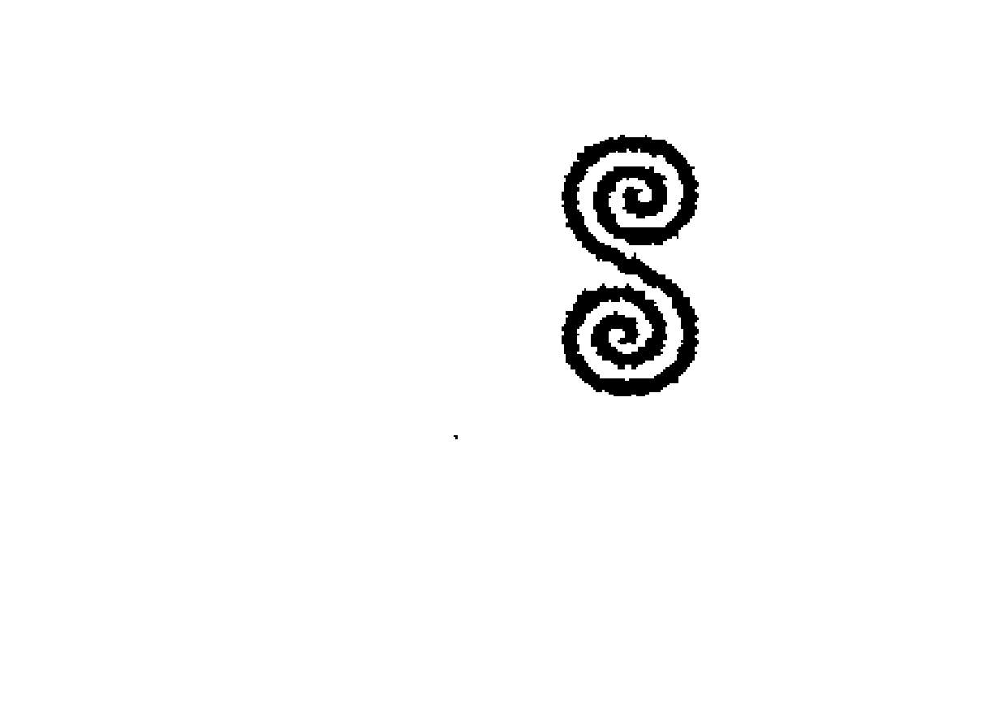

# 水系魔法

# 各方推薦

> 《水系魔法》是一本與水元素合作的優秀入門書，對於有經驗的修行者來說，它也是一本優秀的參考書，涵蓋最重要的事物，從神明到植物、神話與水相關聯的聖域。朵西的沐浴和洗滌法將會出現在我的配方書中。大力推薦。
——黛博拉．馬丁 (Deborah J. Martin)
《綠色女巫的櫥櫃》 (A Green Witch’s Cupboard) 作者

> 在這本增強力量的著作裡，莉莉絲．朵西讓水的魔法元素活躍重生。《水系魔法》深入探究，揭露這個難以捉摸的水元素的奧祕，以強而有力的洞見談論水元素的歷史和關聯。要期待可以得到這些書頁裡大量實務做法的啟發，包括能量水、神聖沐浴、夢境詮譯、神奇的地板清洗等許多用法。我大力推薦本書給試圖與水元素建立密切關係的任何人。
——艾絲翠．泰勒 (Astrea Taylor)
《直覺巫術》 (Intuitive Witchcraft) 作者

> 這次了不起的深入探究元素魔法等於是為莉莉絲．朵西已然耀眼的書目增添光彩啊！透過植物、水晶、貝殼、神聖水域，《水系魔法》將會帶領你下潛至歷史和魔法的神祕深淵，帶著你安全地上岸，向你生命中的這股大自然力量致敬。莉莉絲讓全書充滿來自世界各地的故事，她描繪了水魔法美麗多樣的畫面，那將會使你大大敞開，迎向你曾經只敢想像的人們和地方。

> 詩意而美麗，抒情而喚起人心，這本書讓我們一天邂逅許多許多次的水元素看起來新穎而迷人，宛如玫瑰花瓣上的第一滴露水……《水系魔法》是一本令人愉悅的手冊，記載了肯定是水元素的神話、魔法、雄偉的每一個要點。別讓這本書的大小愚弄了你。從製作配方和儀式，到傳說和魔法的屬性，水元素神聖且攸關生命，而這本小書則是水元素知識的發電廠。
——佩姬．范德貝克（Paige Vanderbeck）
《肥肥女權女巫播客》（*The Fat Feminist Witch Podcast*）主持人暨《綠色巫術》（*Green Witchcraft*）作者

> 太讚了！如果你是魔法修習者，期待深化你與水的連結，這就是適合你的著作。此外，本書也徹底探索水在種種傳統中的神奇效用，而且就實做水魔法而言，它是方便的參考指南，效用雙倍……我很愛這本書……莉莉絲探索了各種傳統和實務做法，而且在這個過程中，針對水魔法創作出這本終極之書。
——卡崔娜．芮斯博德（Katrina Rasbold）
《唸咒召喚術的轉折點》（*Crossroads of Conjure*）、《能量魔法》（*Energy Magic*）、《神聖的巫術》（*The Sacred Art of Brujeria*）作者

> 太讚了！如果你是魔法修習者，期待深化你與水的連結，這就是適合你的著作。此外，本書也徹底探索水在種種傳統中的神奇效用，而且就實做水魔法而言，它是方便的參考指南，效用雙倍……我很愛這本書……莉莉絲探索了各種傳統和實務做法，而且在這個過程中，針對水魔法創作出這本終極之書。
——傑森．曼基（Jason Mankey）
《女巫的年輪》（*Witch’s Wheel of the Year*）作者

## 自然魔法系列總論

### 魔法工作的基石

好幾世紀以來，透過許多祕傳的實務做法，元素們一直是魔法工作的基石。無論是占星學或現代巫術，這四大元素都在更廣大的多維靈性架構範圍內創造出邊界和結構。它們強調概念，使概念變得更加淺顯易懂。

確切地說，「土」（earth）是我們行走其上的地面，它是岩石、泥漿、山脈。「土」也是我們的身體以及今生的物質顯化，它是我們的中心和我們的穩定。

「火」（fire）是壁爐裡的火焰，它是蠟燭、營火、太陽。「火」既可以溫暖，也可以毀滅。它有力量轉化和煽動，它的火焰是我們的熱情和我們繼續前進的意志。

「水」（water）是來自天空的雨，它是人世間的海洋和湖泊、令人欣慰的沐浴、早晨的露水。「水」是我們的血液和汗水，以及我們的記憶，它統治我們的情緒，顯化成為眼淚。

「風」（air）在我們周圍，它是我們的呼吸、我們聽見的聲音、觸碰我們臉龐的風。「風」攜帶種子和花粉、警告人的氣味和令人愉悅的氣味、文化的歌謠。「風」是我們的聲音、我們的念頭、我們的點子。

雖然每一種祕傳系統以不同的方式應用這些基本概念，但四大元素都在幫忙建構實務做法，逐漸產生對自我的更加理解。對現代女巫來說，四大元素往往表現在她們的魔法工具裡；舉例來說，高腳酒杯可能是水，五角星形可能是土。對信仰巫術的威卡派（Wicca）教徒來說，比較具體的是，四大元素幫忙升起魔法圈，讓保護區得到力量的加持。在塔羅牌中，四大元素流經數字牌的象徵性意象；而在占星學中，每一個元素由三個星座代表。對其他人來說，四大元素為每天的靜心、觀想、法術施作或生命功課提供靈性指引。有人可能會問道：「我需要什麼元素才能度過今天呢？」

本書是一套特殊書系的第一本，這套書系深入探討元素的象徵意義和魔法效用。每一本聚焦在一個元素，涵蓋與該元素相關聯的每一樣東西，從靈性聖域和神明，到實用的法術和儀式。對於想要將自己包裹在元素實務做法中的女巫來說，或是對於需要每一種元素資源的某人而言，本書和同一書系的姊妹作品，將會提供你需要的每一樣東西。

「巫術的元素」（Elements of Witchcraft）書系中的每一本著作，是由來自全球的四位不同作者所撰寫，這顯示，領略深奧莫測的四大元素涉及多麼的廣泛和深入，以及該如何讓那個概念為你自己的魔法和靈性需求運作。

加入我們，一起深入探索四大元素的魔法效用吧。

——海瑟.葛林（Heather Greene）
水、風、火、土四大元素魔法系列主編

### 作者序

### 神聖的水元素能量

「水」構成我們星球的大部分，也構成我們身體的大部分。水的力量是清新提神的、清潔淨化的、強健有力的、宏偉崇高的，就在我們身邊。人類需要水；沒有水，我們根本活不下去。人們可以沒有愛仍舊活得很愉快，但是沒有水卻不行。當檢視水在某個神聖背景中的角色時，這點尤其真實。

就實質上和比喻上而言，人類是出生在水中的。因為快樂地漂浮在羊膜囊之中，我們的起源是黑暗的至福。然後生命以大量的可能性開始，每一個人都航行在自己獨一無二的航道上。每一個水的顯化都可以揭露出它自己的魔法和奧秘。有好幾世紀以來一直被用於賜福和療癒的神聖水井；深沉而劇烈的海洋；容許通過和轉化的河流；雨水、瀑布、暴風雨、古代的冰構成的冰河——全都有它們自己特殊的能量和力量。

本書將會幫助我們發現一個人可以樂受和利用這些神聖水域的所有方法，它將會檢視從古至今水的神聖魔法，而且更重要的是水的歷史，甚至是許多水的故事。

水的力量無法仿效，它似乎很近，然而又很遠。剛開始撰寫本書時，我有點不解為什麼宇宙帶領我朝這個水的方向前進，我一直身兼數職——紐奧良巫毒女祭司、學者、電影製作人、奧里莎（Orisha，西非約魯巴人[ Yoruba ]對「神靈」的稱呼）信徒，甚至有時候是愛的女巫——但是認為我是水系女巫的人少之又少。在我的星象圖裡並沒有那麼多的水元素，而且老實說，我甚至不那麼喜歡游泳。然而，仔細深思，更多的訊息被揭露出來。許多紐奧良的巫毒宗教以密西西比河的「阿許」（ashe，神聖能量）為中心。不知多少次，我站在她的河岸上，獻上歌曲、舞蹈、祈禱、禮物，向她的強大魔法致敬。紐奧良的「靈」（spirit）們與密西西比河河水之間的連結，正是我的紀錄片《水體：巫毒身分與出神形態》（Bodies of Water: Voodoo Identity and Tranceformation）的主題，那是我在二〇〇五年卡崔娜颶風到來前不久創作的作品。

我感覺與水的能量深深連結的另一方面是，我是奧湘（Oshun）奧里莎的信徒。在非洲傳統宗教中，奧湘代表河川的「阿許」（神聖能量），她被視為愛、婚姻、金錢、美、舞蹈等等的奧里莎。非洲傳統宗教，時常在他人只會看見巧合的地方看見特殊的重要性。這些圍繞著河水的神奇時刻，在我今生一直屢見不鮮。記得許多年前，我第一次在紐奧良參加聖約翰前夕（St. John's Eve）慶典。我起得很早（我時常早起），而且覺得需要在密西西比河畔留些祭品給奧湘。我匆匆忙忙地來到最近的露天市場，買了些柳橙和蜂蜜作為獻給她的祭品。我踏上河濱台階，往前走，準備將採買的物品留下來，品嚐著蜂蜜，同時將柳橙放在河水邊。當我開始唱歌和祈禱，有另外兩位修行人加入，一位是「雷格拉路庫米」（La Regla Lucumi，即「聖特利亞教」[Santeria]，譯註：「聖特利亞教」是十九世紀末在古巴發展起來的宗教，融合了西非傳統的約魯巴宗教、羅馬天主教基督教的形式、以及「唯靈論」）祭司，一位女子是該教信徒。我以前從沒見過這兩人，當我看見他們開始留下祭品且從河水接收賜福時，我感覺真正被奧湘親吻了。當天稍晚，我參加了在巫毒教神殿（Voodoo Spiritual Temple）舉行的聖約翰前夕慶典。隨後是一場為當地社群舉行的美麗典禮，於是我很榮幸從此開始今天仍舊過著的生活。

水可以幫助我們揭露事物，雖然有些事物是開心的，但其他事物使你想起當初它們為什麼被隱藏起來。我憶起遙遠過去的另一次，當時我已經去到河邊，將祭品留給奧湘。這次我是去拜訪維吉尼亞州的朋友，他剛好是一位「巴巴拉沃」（Babalawo），也就是「伊法」（Ifá，譯註：西非約魯巴人的宗教和占卜系統）祭司。他帶我去到當地的詹姆士河（James River），為的是留下祭品並與奧湘的神聖能量交流。我去的時候眼中含淚，心情沉重，沉思著當時浪漫關係中的麻煩。當我涉水進入河中，彎腰留下我的祭品時，我在腳邊發現了一條死魚。顯然，我甚至還沒有開口詢問，那些力量就回應了。在我的人生中，曾經有許多其他意義重大的時候，無論我是否喜歡真實的答案，水都回答了我的祈禱。

水在每一個層面與情緒相關聯，因此這些往往很難處理。它們可以像發怒的大雷雨一樣兇悍和激烈，或是像靜止的池塘一樣寧靜而溫和。接觸到一個人真實的情緒和感覺可能是十分棘手的，但是水的魔法可以幫助我們盡可能平靜而有效地做到這點。

當我開始撰寫本書時，感覺有點像在接近水。水的力量和魔法是令人敬畏的主題。老實說，我向外看，看遍各個地方、各種動物、等於是水的美，感覺到眼前這趟旅程有點嚇人。有些時候，撰寫水似乎像是一個關於人類生存的複雜難題，努力定義水的範圍。水是不斷變化的元素，沒有人真正知道它的深度，若要歸類，水是滑溜溜的東西。有許多個漫長而無眠的夜晚，但是隨著我的研究和決心，開始宛如為這些書頁增添光彩的瀑布與河川一樣流動，下筆就變得流暢許多。

我誠摯地希望，在這些書頁裡，你找到談論水系魔法的著作應該存在且需要存在的每一樣東西。希望水的崇高清明引導你踏上你的道路。

## 第1部

## 水系魔法的神話與歷史

### 1 貫穿古今和所有文化的水

沒有新鮮的水源，人類無法存活太久。自從有文明以來，人一直定居在水邊，有助於他們存活和興旺。許多這些有水的地點都已經發展成為大型城市，至今仍是人口眾多的中心。大馬士革可以說是世界上持續有人類居住的最古老城市。顯然，水決定這個地方的選址和特性。1

當我們注意早期的神話和創世故事時，有一個明確的共通性——也就是，一切事物都是從水創造出來的。接下來則是來自許多不同傳統和宗教的故事和神奇用法，以實例闡明水對生命本身是多麼的重要。

### 古代的蘇美人

在古代的蘇美（Sumeria，譯註：在目前發現的西亞美索不達米亞文明中，蘇美是最早的文明體系），有一則回溯到大約西元前三千年的神話，說到具體化現原初海洋的女神娜姆（Nammu），她生出了地與天。《埃努瑪．埃利什》（Enuma Elish）是古代美索不達米亞的創世神話，說到眾男神和眾女神以及地球本身的誕生。雖然這本著作的確切撰寫日期不詳，但學者們將原文寫成的日期訂在西元前第九世紀或更早。2《埃努瑪．埃利什》講述了世界的開始，當時地球上有的只是一漩渦的水。這水是由男神亞普素（Apsu）代表的淡水以及女神提阿瑪特（Tiamat）代表的苦澀鹹水構成。他們分開，然後又一起回來，創造陸地和生命。

### 回教徒

在伊斯蘭的傳統中，水被視為地球上一切生命的源頭和起源。《古蘭經》（Quran）說到，蒙福之水如雨水般落下，為莊稼施肥，幫助作物生長，甚至是水如何被視為阿拉的力量與莊嚴的象徵。

### 印度人

《梨俱吠陀》（Rig Veda）記載了印度的創世讚美詩，提到渾混之初，一切都是水。在傳統中，水不但有賜福的作用，也有淨化的作用。3

### 美洲原住民

許多美洲原住民傳說，說世界開始的位置在水裡或水邊。

### 易洛魁聯盟

易洛魁聯盟（Iroquoise）是由六個部落構成，四千多年來，他們居住在紐約州西部與北美洲安大略省的土地上。易洛魁聯盟的創世故事開始於人類居住在高高的天空中，因為這個時候，土地還不存在。事情是這樣的，一位酋長的女兒生病了。大家不知道該怎麼治療，直到有一天，他們收到社群裡一位長者的忠告。長者告訴他們，他們需要深挖某一棵聖樹的根，才能找到解決方案。眾人們一起挖掘，直到挖出一個大坑。然而，就在他們剛剛完成這事的時候，那棵樹和酋長的女兒卻雙雙掉進坑裡，掉進下方的空間。

那個空間裡是一片巨大的海，住著兩隻天鵝。當女孩和那棵樹碰撞到海水時，一聲霹靂，雷鳴炸裂。兩隻天鵝頗為好奇，游過去一探究竟。牠們試圖拯救女孩，但卻不知道該如何拯救。為了找出該怎麼做，牠們求助於大海龜。萬物中最有智慧的大海龜解釋，這些從天空掉下來的禮物是個吉兆。牠對懂得聆聽的萬物解釋，他們需要找到那棵樹、樹的根以及附著在根上的泥土。大海龜告訴大家，有了這囪泥土，大家就可以建造一座島嶼，讓酋長的女兒可以住在島上。世界上的生物們開始尋找，唯一成功找到的生物是蟾蜍。蟾蜍搜尋了海洋的深處，直到終於找到那棵樹為止。牠吞下一口土壤，然後回到海面上。當牠到達海面時，牠將那口泥土吐出來，接著便去世了。然後那口土壤開始擴散，因為它是魔力的，不久便有一塊巨大的土地讓女孩可以居住。

不幸的是，這片土地裡的每一樣東西都非常黑暗。大海龜對此也有解決方案。牠要求所有正在挖掘的動物——地鼠、松鼠等等——開始挖掘天空中的坑洞，讓天空中的光下來。酋長的女兒接著成為這片新土地的一切事物的母親。有人說，當她從天空掉進海水裡時，她懷孕了。

### 奎查恩族

奎查恩（Quechan）族又稱尤馬（Yuma），是北美原住民，居住在科羅拉多河谷。奎查恩族的創世故事始於黑暗和水，因為混沌之初，有的只是黑暗和水。那水是狂暴的，它創造了一個向上伸展的泡沫，於是創造了天空。從那水中，出現了造物主，是雙生靈，叫做巴克塔尔（Bakotahl）与科科马特（Kokomaht）。据说巴克塔尔是邪恶的，而科科马特是良善的。浮到水面的那趟旅程期间，科科马特一直闭着眼睛。当巴克塔尔从水中上升时，他对他的双生兄弟大吼，试图查探他的兄弟在上升到水面期间，到底是一直睁着眼睛还是闭着眼睛。科科马特知道他的双生兄弟是邪恶的，所以他回答，他一直睁着眼睛。他的双生兄弟采纳了他的建议，但是在浮到水面期间一直睁着眼睛导致他失明。巴克塔尔的名字意思就是「盲人」。⁴

然后这对双胞胎开始建立神圣的方向。科科马特在水面上朝每一个方向走出四步，创造了北、南、东、西。接下来，巴克塔尔希望轮到他创造，于是开始创造人类。他开始用黏土创造人类，但是人类遭到严峻的挑战，缺脚或缺手指头。科科马特嘲笑这些创作，决定亲自完成这份工作。他很快地制作了一个十分完整的男人和一个十分完整的女人。这激怒了他的双胞胎兄弟，于是送来暴风雨。科科马特也很生气，重踏双脚——取决于一个人支持这则故事的哪一个版本——这次跺脚造成大地震动，要么将巴克塔尔的创作送入海洋中，创作在海洋中变成了水鸟，要么只是终结了暴风雨。不管怎样，那些暴风雨留下了疾病和不适。科科马特的人类不久开始成倍增长，填满那块土地，造就了人世间的所有种族，在这个新世界中，有一只青蛙。这只青蛙妒忌和憎恨科科马特，不久便密谋害死科科马特。这只青蛙挖空科科马特双脚底下的土地，当科科马特陷落下去时，青蛙偷走了他的气息。科科马特去世了，他最后的行为教导人们关于死亡的转化。

### 纳瓦霍族

纳瓦霍（Navaho）是北美原住民的大族群之一。传统上，他们一直居住在美国西南部的土地上，根据纳瓦霍族的说法，人类今天居住的世界叫做「第五世界」。第一世界只包含一个男人、一个女人、一只郊狼。这个世界相当黑暗，而且很小。所以他们很快地攀登进入第二世界，那里有来自太阳和月亮的光。据说在这个世界中，太阳试图与世界上的第一个女人交配。女人拒绝了，而郊狼建议他们向上行进到据说美丽又奇妙的第三世界。当他们到达第三世界时，迎接他们的是那里的山地人。山地人警告他们有大水蛇（有些故事说是水獭）提霍尔擦蒂（Tieholtsodi）。警告郊狼某事等于就是要他去完成那件事，因为那是郊狼的本性。郊狼动身，偷走了提霍尔擦蒂的孩子们，提霍尔擦蒂大怒，在各地送出了大洪水。东方的水是黑色的，南方的水是蓝色的，西方的水是黄色的，北方的水是白色的。这许多颜色的水全都开始上升。

山地人来找第一个男人和第一个女人，询问该如何应付这些洪水。他们答道，设法让山脉长高，种植芦苇，才能爬上去，有希望逃离洪水。第一个男人、第一个女人、以及所有其他人和动物们向上爬进芦苇里，直到芦苇长得非常高，高到他们抵达第四世界。第一个到达第四世界的是蝗虫。当蝗虫抵达时，他看见四只鸟，颜色分别是黑、蓝、黄、白。鸟儿们问蝗虫，他在那里做什么。他们提出好几项测验，如果蝗虫通过测验，他们就允许蝗虫留下来。最后一项是挥动斧头竞赛，期间，他们击中蝗虫的脸部，于是飞走了。洪水开始退去，除了南方的水。第一个男人和第一个女人被留下来，居住在一座小岛上。他们生育繁殖，不久就有许多的男人和女人。然而，郊狼还带着提霍尔擦蒂的孩子们，而且因为这样，洪水现在持续上升，淹没了这个第四世界。再一次，大家把山脉堆高，种植了芦苇；这一次，海狸爬上去，考察第五世界。他说第五世界是潮湿的，而人们跟着来到第五世界，再一次，定居在大海中间的一座小岛上。大家乞求郊狼将提霍尔擦蒂的孩子们还回去，郊狼照办了。现在大家全都可以在这个第五世界里展开自己的生活。他们做的第一件事情是，着手移除过多的水；据说为了排掉这些水，他们召唤恶灵，而且他们的请求得到了回应。水被排掉了，而且在这个过程中，科罗拉多河形成了。5

### 克里族

克里（Cree）族是北美大原住民部落之一。他们的土地包括从哈德逊湾与詹姆士湾（James Bay）东岸，向西远达加拿大境内的艾伯塔（Alberta）和大奴湖（Great Slave Lake）。

有许多关于大洪水的神话。下述这一则来自克里族。一名男子听说大洪水即将到来，所以他开始建造木筏。他才刚开始，大洪水便升起。他很快地与他的狗一起爬上木筏。洪水将木筏高高举起，举到树木间。这时候，狗告诉它的主人，如果想要活下去，就必须把它扔到木筏外。男人很爱他的狗，不想这么做，但是狗恳求说，那是唯一的方法，而且再次说道，它的主人必须将它扔进水里，然后留在木筏上七天，直到水退去为止。虽然这么做很困难，但是男子还是将狗扔了出去。

七天后，水开始消失。就在水几乎全退去时，男子看见几十个湿漉漉的人们正在求救。当他靠近他们时，发现他们是在洪水中死去的The request was rejected because it was considered high risk## 2 神話中的水妖與水鄉

水可以握有許多強大的奧秘和珍寶；有些這類東西以海怪和海中生物的形式出現。大部分這些生物是令人畏懼且比人類還大的，而且透過他們講述水的危險和可怕的力量。傳統上，這些是經過時間考驗的故事，說給孩子和其他人聽，主要是要確保他們尊敬、小心、謹慎地對待身邊的水。

在本章中，你將會找到關於從阿什蕾（ashray，又名asrai）到水寧芙（water nymph，譯註：nymph，希臘神話中的次要女神）的每一樣東西。有些水怪似乎來自某人最狂野的夢想，不然就是最糟糕的惡夢。本章後半則專門探討神話中的水鄉，主要談到已沉沒的城市，乃至失落的大陸，有機會好好檢視被埋葬在底下的東西。

### 神話中的水妖

### 阿什蕾（Ashrays）

這些蘇格蘭生物據說是半透明的，無法在陸地上生存。有些人相信他們是仙子（或「俊美族」[fair folk，因為他們偏愛這個稱呼）。他們呈現年輕男人或女人的外貌，生活在水中。此外，他們是完全晝伏夜出的，如果接觸到陽光，據說可以很快地溶化成一攤水。

### 貝克黑斯騰

bäckahästen這個字，粗略翻譯是「溪馬」（brook horse）。這些神祕的馬來自德國和斯堪地那維亞傳統，據說居住在溪與河之中，誘惑路人進入水裡。

### 本耶普

本耶普（bunyip）是神話中的水怪，出現在澳洲原住民的故事中，相當嚇人。據說，牠的家建在澳洲的沼澤、小溪、河床、水坑。本耶普被描述成具侵略性，毛很長，非常喜愛人肉（尤其是年輕女人和小孩子的肉）。彷彿牠陰森的外貌還不夠似的，這隻嚇人的怪獸還被認為擁有莫大的神奇力量。在某些故事中，本耶普據說是地球上邪惡的本源。

### 切西

類似尼斯湖水怪，切西（Chessie）是海怪，據說住在美國的切薩皮克灣（Chesapeake Bay）。多年來有過好幾次目睹切西的報導，而在一九八二年，一對夫婦甚至用視頻捕捉到切西。據說很像大海蛇，背上有隆起。

### 佛西格里姆

在斯堪地那維亞國家，有些人把「佛西格里姆」（Fossie Grim，也叫Fossegrim）看作英俊的水精靈，據說他用悅耳的小提琴聲將人們引誘到某座有水的墳墓。其他人則支持，這是有裨益的能量，可以給予祝福。佛西格里姆據說是瀑布的一部分，瀑布是他們的神聖空間。他們的外貌化成金髮年輕人的形相，雙腳則合併成為瀑布基部的水泡。除了小提琴，他們據說擅長彈奏豎琴，而冀望精通豎琴的人們可以將祭品留在水邊。

### 滾帶落

滾帶落（grindylow）有長長、細細的手臂，長長、骨感的手指頭。據悉滾帶落用這些嚇人的四肢，將小孩子和其他人向下拉到水底深淵。牠們出現在來自英國蘭開夏和約克夏的神話和民間故事。就連大受歡迎的《哈利波特》系列故事裡也有一隻滾帶落，也因此將這個民間傳說的怪獸介紹給全新的一代。

### 馬頭魚尾怪

在希臘神話中，馬頭魚尾怪（hippocamp）是一種可怕的海中生物，有一個馬頭以及一條魚或海豚的尾巴。一隊馬頭魚尾怪據說有幸拉拽海神波賽頓（Poseidon）的戰車。

### 邪惡的珍妮

這個可怕的人物，從英國的民間故事和傳說來到我們面前。這個令人毛骨悚然的海鬼婆潛伏在湖泊和池塘底部，據說會拉著不疑有他的孩子，直到孩子死亡為止。有時候，她被看作是仙子，她的大部分故事起源於十九世紀。有些類似的故事講的是佩格．鮑勒（Peg Powler），她是綠皮膚的水女巫，也來自英格蘭和附近地區。有些人說，邪惡的珍妮（Jenny Greenteeth）尤其喜愛居住在浮萍覆蓋的湖泊。事實上，在某些地區，浮萍的俗名就是邪惡的珍妮。

### 河童

河童出現在日本神話中，被視為水中的小妖精或吸血鬼。他們據說跟九或十歲的孩子一般大小，然而卻異常強健。有些河童的報導說，他們看起來有點像猴子。根據各種流傳的說法，他們是令人害怕的，而且佔據湖泊、河川、溪流、海洋。河童據說會攻擊家畜和馬匹，從牠們的肛門吸血。假使你遇見河童，務必有禮貌、舉止得宜，獻上一根刻了你的名字的小黃瓜給牠，可能也有幫助。

### 凱爾派

凱爾特（Celt）傳說的水馬叫做「凱爾派」（Kelpie）。牠們居住在淡水湖、河川、溪流附近，有能力選擇什麼時候變身就變身，就跟許多變形師一樣，牠們可以運用這個能力誘惑人類。不管怎樣，可以藉由牠們頭髮上的殘餘海草認出牠們。

### 克拉肯

克拉肯（kraken）來自冰島和挪威的陸地，牠是惡名昭彰的巨型章魚。最早看見這種海怪的時間可以追溯到十三世紀。從那時起，牠一直是文學作品和電影銀幕的明星。克拉肯出現在赫爾曼·梅爾維爾（Herman Melville）、朱爾·凡爾納（Jules Verne）甚至洛夫克拉夫特（H. P. Lovecraft）的作品中。牠八成是最令人難忘的，因為一九八一年電影《諸神恩仇錄》（Clash of the Titans）中的台詞：「放掉海怪克拉肯（release the kraken）。」kraken這個字本身的意思是「不健康的動物」，當然名副其實，因為牠們全身覆蓋著觸手、尖刺、吸盤。

一八五一年，在一封赫爾曼·梅爾維爾寫給納撒尼爾·霍桑（Nathaniel Hawthorne）的書信中，梅爾維爾寫到：

> 閣下，我們的成長何時完成啊？只要還有更多的事要做，就一事無成啊。所以，現在，且讓我們把《白鯨記》（Moby Dick）新增至我們的祝福，然後從那裡開始跨步。利維坦並不是最大的魚類；我還聽過克拉肯。

### 利維坦

利維坦（Leviathan）是空前巨大的海蛇。牠出現在《聖經舊約》中，甚至在那之前，牠出現在美索不達米亞的神話中以及來自古代烏加里特（Ugarit，譯註：烏加里特是古代的國際港都，位於北敘利亞地中海沿岸，該城的興盛期約為西元前一四五○至西元前一二○○年）的一首「迦南」（Canaan）詩中。利維坦時常被描寫成一條大蛇或水龍，但是在古代的匈牙利，也有傳說把牠描繪成鯨。人人都說，牠是怪物，因此是危險的野獸。

> 《欽定版聖經》約伯書中說道：
>
> 你能用魚鉤釣上水怪（leviathan）麼？能用繩子壓下牠的舌頭麼……從牠口中發出燃著的燈，與飛進的火花；從牠鼻孔冒出煙來，如燒開的鍋，煮開的釜。牠的氣點著煤炭，有火鍄從他口中而出。

有些早期卡巴拉學家（Kabbalist，譯註：卡巴拉Kabbalah是與猶太哲學有關的思想，用來解釋永恆的造物主與有限的宇宙之間的關係）將利維坦和牠的配偶的故事，等同於撒麥爾與莉莉絲，八成是因為利維坦被描述成一條大蛇。

### 羅蕾萊

羅蕾萊（Lorelei）又拼做Loreley，這個名字既是矗立在萊茵河上方的一塊礁石的名字，也是神話中大海精靈的名字。在某些故事中，她被稱為萊茵河的少女或女王，她可以被描述成慈眉善目或變化莫測，就跟萊茵河本身一樣。她最早出現在文獻中是在十八世紀中葉。她後來聲名大噪是在一八○一年，當時德國作家布倫塔諾（Brentano）用他的《在萊茵河邊的巴哈拉赫城》（Zu Bacharach am Rheine）詳述了羅蕾萊的傳說。

### 人魚族

人魚族（mermaids, mermen, merfolk）曾經存在了幾千年，他們是非洲、印尼、歐洲、澳洲、紐西蘭、亞洲、美洲的神聖故事和神話的要角。記錄這些最早期水中人類的某些證據可以回溯到西元前二○○年左右，與早期巴比倫人的「歐恩斯」（Oannes，譯註：巴比倫人的海神）有關。歐恩斯據說擁有完整的魚的身體，但也有人的頭顱和雙腳。在他與人類接觸的過程中，他給予人類偉大的知識，幫助人類建立住處以及採集食物和資源。據說他每夜返回大海睡覺。

最受歡迎的人魚故事之一，源自斯堪地那維亞或德國，叫做「艾格妮絲與人魚」（Agnes and the Merman）。故事原創的時間不詳，但其中有如下的句子：

> 艾格妮絲走上峭壁的邊緣，
> 一隻雄性人魚從深處一躍而上。——哈哈。

艾格妮絲被這位人魚逮到，帶到水域之下，在那裡生了七個人魚兒子。一天，人魚同意讓艾格妮絲回到陸地上教堂，但是艾格妮絲沒有再回來。這則故事在哥本哈根以一系列雕塑名垂千古，叫做「艾格妮絲與人魚們」。

然而，最有名的人魚故事卻是《小美人魚》（The Little Mermaid），由安徒生於一八三七年寫成。內容取自早期的民間傳說和神話，例如「艾格妮絲與人魚」以及一八一一年由穆特.福開（Freidrich de la Motte Fouque）撰寫的「渦堤孩」（Undiné）。在《小美人魚》的故事中，小美人魚拯救了溺水的王子，將他安全地帶到陸地上。她很想要回到王子身邊，活在陸地上。為了完成這事，她必須與海女巫達成協議，交出她美妙的聲音。安徒生在這裡呈現出海女巫這個代表人物，說道：

> 海女巫的家坐落在奇怪的森林裡，周圍半植物、半動物的灌木叢環繞。它們看起來像蠕動的蛇，有好幾百顆頭顱以及黏滑、像蠕蟲一樣的手指。如果那些手指頭抓到什麼，它們絕不會放手。

另一個條件是，為了保有她的靈魂（或是得到一個靈魂），她必須讓王子瘋狂地愛上她。小美人魚的努力是錯綜複雜的，而且大部分是徒勞的，因此她的人魚姊妹們慫恿她殺了王子。她無法這麼做，於是投身大海，在海裡，她被提升到永恆不朽的界域。

哥倫布報告說，他在一四九二年的旅程中看見美人魚，而在一六一四年，約翰.史密斯（John Smith）船長做過類似的報導。據說蘇格蘭有美人魚從大海升起，告訴人們關於艾蒿（mugwort）等等的療癒力量。在爪哇，有美人魚女神羅勒.基都爾（Loro Kidul，又名Nyai Roro Kidul），人稱無垠大海的新娘。大部分的神話說，這位女神出生便是被邪惡的後母或嫉妒的妻子詛咒的公主，因此得了痲瘋或另一種皮膚病。因為這個疾病，她逃進森林裡，在那裡，她聽見精靈的聲音告訴她說，如果她投身大海，就可以重拾從前的美貌。一旦身在大海中，她被提升到女王和女神的層級。據說綠色是她的顏色，而印尼境內的旅人都被告誡不要穿綠色，因為她可能會被召喚來，帶領旅人到大海跟她一起生活。當地的人們都非常尊敬她的遺產；事實上，在爪哇帕拉布漢拉圖（Pelabuhan Ratu）的薩穆德拉海灘飯店（Samudra Beach Hotel），甚至有一間為她永久保留的房間，該飯店的三〇八號房是為她永久保留的，用她最愛的綠色和金色裝潢，滿是茉莉花香。如果你想要親自看看這間房間，飯店開放這間房間供獲准來賓靜心冥想。

在我的家鄉紐約布魯克林，任何地方都有的「美人魚遊行」（Mermaid Parade）八成是最有名的美人魚展。幾千人穿著他們最漂亮的人魚裝，遊行穿過康尼島（Coney Island）海灘附近的街道。它允許人們炫耀他們來自大海且潮濕而狂野的真諦。

### 水澤仙女、寧芙、小精靈

在希臘和羅馬神話中，我們找到水澤仙女（naiad）、寧芙（nymph）、小精靈（sprite）的參考文獻。他們被視為其他世界的存有，特別與有水的場所（例如噴泉、水井、溪流）相關聯。不過，在陸地或水中都可以找到寧芙。

### 海仙女

海仙女（Nereids）是海寧芙，在文學和神話中化為不朽。她們據說是涅柔斯（Nereus）與朵勒絲（Doris）的五十個女兒，而且在希臘歷史的宗教思想中是很重要的構成要素。海仙女早在西元前四世紀就出現在藝術之中，經常被表現成騎著海豚之類的海中生物。有些理論家，例如巴林傑（Barringer），假定海仙女是作為旅程的隱喻，尤其是婚姻和死亡的旅程。

### 尼斯湖水怪

尼斯湖水怪（Nessie或Loch Ness Monster）可以說是最惡名昭彰的海中生物。儘管證據不足，但是曾經有一千多次目擊這隻水中生物居住在蘇格蘭的尼斯湖（Loch Ness）裡。有些人相信，尼斯湖水怪是鰻魚或某種史前爬蟲類。

### 露莎卡

露莎卡（Rusalka）是透過斯拉夫神話來到我們面前的女鬼。她們通常是水之少女，類似海妖和美人魚，目標是把人逼到水裡溺死。

### 席拉

席拉（Scylla）這個字用來描述一種神話的生物，也用來描述這種生物居住的地點。那個地方通常被認為是狹窄的美西納（Messina）海峽，介於卡拉布里亞（Calabria）與西西里（Sicily）之間。海峽另一邊據說居住著危險的野獸卡律布狄斯（Charybdis）。「介於席拉與卡律布狄斯之間」的說法來自這些故事，意謂著一個人困陷在兩個非常困難的危險之間。根據某些人的說法，被描述成犬科野獸的席拉是赫卡特（Hecate）的女兒。在阿波羅多洛斯（Apollodorus）、阿波羅尼厄斯（Apollonius）、奧維德（Ovid）、荷馬的古典文學裡都描述過她。在奧維德筆下，席拉是被某位善妒的對手毒殺在海裡的水寧芙。這次毒殺造成席拉陰森的轉化。在古典藝術中，畫家特納（J. M. W. Turner）、約翰．威廉．瓦特豪斯（John William Waterhouse）、阿戈斯蒂諾．卡拉齊（Agostino Carracci）等等，都描述過席拉。

### 賽爾基

賽爾基（Selkie）是凱爾特神話最受歡迎的存有之一。他們是許多民間故事、書籍、遊戲甚至某些影片的要角，賽爾基是變形師，最常呈現海豹的形相。他們據說居住在水下的洞穴，在奧克尼群島（Orkney Islands）和雪特蘭群島（Shetland Islands）周圍的水域。賽爾基跟本書中描述的許多生物不一樣，他們被認為是有裨益的存有，在與人類互動的過程中是有幫助的。有些傳說聲稱，他們是溺斃者的靈魂，而其他人則將他們視為從天國墜落的天使，但是太純淨，不適合地獄。賽爾基據說可以選擇人類作情人。哭泣同時掉七滴眼淚到大海裡被認為是呼喚他們的一種方式，如果賽爾基找到愛，他們往往做出拋棄海豹皮的決定，然後住在陸地上。

### 女海妖

在海上可以聽見一首醉人的歌曲，它是女海妖（siren）之歌。但是這些生物到底是什麼呢？取決於她們被發現的地點和時間，女海妖可以是人類或其他世界的生物；她們可能會引誘你，導致你的死亡，或是給予你得永生的甜美之吻。

這些女海妖的故事和目擊事件出現在世界各地。在中美洲和南美洲，「哭泣的女人」叫做「拉羅若娜」（La Llorona），偶爾也出現在水面上。尤其在墨西哥，有一則女人的故事，說她的孩子溺死在湖泊裡，而現在她出現在那座湖泊裡，引誘戀人們走向她，然後邊笑邊雙雙沉入水裡，去到致命的深淵。

最早期的女海妖藝術代表之一，是收藏在大英博物館的「女海妖花瓶」Siren Vase。這只希臘花瓶可以追溯至大約西元前四八○年，描繪奧德修斯（Odysseus）的船經過眾海妖。這些海妖是有翅膀的生物，有女性的頭顱。

十三世紀時，諾曼第文員威廉（Guillaume le Clerc de Normandie）在他的《幻獸誌與寶石匠》（Bestiaries and Lapidaries）之中寫到這些生靈：

> 女海妖是模樣古怪的妖怪，因為腰部以上，它是世界上最美麗的東西，形成女人的樣子，身體的其餘部分卻像魚或鳥。她的歌聲如此甜蜜和優美，凡是在海上航行的人們，一聽到那歌聲，就無法不朝她駛去。那音樂令人陶醉出神，他們在船上睡著了，於是喊都沒喊，便被女海妖殺死了。

### 泰坦

根據希臘神話的說法，在眾神們存在之前，泰坦（Titan）們就是神了。一切造物全都歸功於他們。泰坦由六個姊妹和六個兄弟組成，姊妹們叫做希婭（Thea）、麗婭（Rhea）、賽彌絲（Themis）、恩涅摩希妮（Mnemosyne）、菲比（Phoebe）、泰希絲（Tethys），兄弟們叫做歐開諾斯（Oceanus，淡水男神）、基厄斯（Coeus）、伊珀里翁（Hyperion）、伊阿珀托斯（Iapetus）、克里厄斯（Crius）、克洛諾斯（Cronus），他們是天與地的子女。在這些眾神之中，有兩位（即：菲比與賽彌絲）據說擁有預言的天賦，被認為是神諭。

### 安瑟姬拉

這條有角的水蛇來自印第安拉科塔族（Lakota）神話。據說她是巨大的，有亮晶晶的鱗片、斑點，以及背上一路閃閃發光的冠毛。直視這條蛇據說會導致失明，最終死亡。一則有關水的故事說道，她從原初之水升起，使陸地泛濫成災，雷鳥（Thunderbird）採取行動，報復這場毀滅，牠召集有閃電的大風暴，使大水乾涸，將安瑟姬拉（Un cegila）送上死路。

### 水找到它自己的方法

水找到它自己的方法，進入地球上幾乎每一個文化的創世故事和神話。在某些創世故事和神話中，水一開始就在那裡，而在其他創世故事和神話中，有人警告它最後一定會在那裡。這些故事說到水的力量、美、至高無上的潛能。它們舉例說明存在水的深處的重要功課。因為這些文化的共通性，水的普世魔法變得清晰明確。

### 註釋

1.  註1: Nasser O. Rabbat, “Damascus,” Encyclopedia Brittanica, 最後修正時間：二〇一九年十一月二十八日, https://www.brittanica.com/place/Damascus。
2.  註2: King, Enuma Elish, LXXII。
3.  註3: Webster, Cowell, and Wilson, Rig-Veda-Sanhith, 44。
4.  註4: Bierlein, Parallel Myth, ebook location 1134。
5.  註5: Bierlein, Parallel Myth, ebook location 1891。
6.  註6: Bierlein, Parallel Myth, ebook location 893。
7.  註7: De Veer, “Myth Sequences from the Kojiki”。
8.  註8: Finkel, The Ark Before the Flood, 84。
9.  註9: The Holy Bible (King James Version), Genesis 6-7。
10. 註10: “Water and the Community of Life,” Maryknoll Office for Global Concerns, 二〇一九年九月一日第一次存取, https://maryknollogc.org/statements/water-and-community-life。
11. 註11: Martin, Baross, et al, “Hydrothermal Vents and the Origin of Life”。
12. 註12: Douglas, DNA Nanoscience, 339。
13. 註13: Bedau and Cleland, The Nature of Life, 331。
14. 註14: Amao, Healing Without Medicine, 1。
15. 註15: Blavatsky, The Secret Doctrine, 68。
16. 註16: Budge, The Book of the Dead, 109。
17. 註17: 貝克黑斯騰段落中的註記，已融入正文處理。
18. 註18: 切西段落中的註記，已融入正文處理。
19. 註19: 邪惡的珍妮段落中的註記，已融入正文處理。
20. 註20: 河童段落中的註記，已融入正文處理。
21. 註21: 克拉肯段落中的註記，已融入正文處理。
22. 註22: 克拉肯段落中的註記，已融入正文處理。
23. 註23: 利維坦段落中的註記，已融入正文處理。
24. 註24: 羅蕾萊段落中的註記，已融入正文處理。
25. 註25: 人魚族段落中的註記，已融入正文處理。
26. 註26: 人魚族段落中的註記，已融入正文處理。
27. 註27: 人魚族段落中的註記，已融入正文處理。
28. 註28: 人魚族段落中的註記，已融入正文處理。
29. 註29: 海仙女段落中的註記，已融入正文處理。
30. 註30: 席拉段落中的註記，已融入正文處理。
31. 註31: 女海妖段落中的註記，已融入正文處理。

## 佛地艾諾伊

佛地艾諾伊（Vodianoi）據說是有綠髭鬚的老男人，全身覆蓋著毛髮、鱗片、黏液。佛地艾諾伊源自斯拉夫，他們據說住在水面下的沉船內。

## 神話中的水鄉

水是威力非常強大的，也難怪有許多與神話有關的地方與水元素有複雜的連結。有神奇的療癒小島，以及沉沒的城市，乃至水面下的大陸。個個內含自己的魔法、傳說、深度奧祕。

## 亞特蘭提斯

這個著名失落文明的起源，可以追溯到柏拉圖以及他寫成於西元前三六〇年左右的對話錄《蒂邁歐篇》（Timaeus）和《克里底亞篇》（Critias）。這座城市據說是一處樂園，滿是精巧的建築物，地質寶藏、珍奇的植物群和動物群。那裡的社會變得貪婪而腐敗，眾神們送來一場場猛烈的大火和地震，那之後，它沉入大海的深處。雖然現在並沒有權威的科學家相信這個地方確實存在過，但它確實充當一則煞費苦心的警世寓言，告訴人們，如果太過失控，可能會發生什麼事。在柏拉圖的作品中，亞特蘭提斯被看作是雅典的對照，當時的雅典城據說是用謙遜、邏輯、科學統治的。

## 阿瓦隆

阿瓦隆（Avalon）據說是「湖中妖女」（Lady of the Lake）的家，曾經為凱爾特神話增添了好幾世紀的光彩。第一位在文學中提到這座神話島的，是蒙茅斯的傑佛瑞（Geoffrey of Monmouth）在他的《不列顛諸王史》（Historia Regum Britanniae，又名History of the Kings of Britain）之中，成書年代可以追溯到西元一一三六年。阿瓦隆又名「蘋果島」（the Isle of Apples）或「玻璃島」（the Isle of Glass）。這個地點據說擁有莫大的療癒力量。住在那裡的人們，壽命十分長，而且時間在這個地方據說是以不同的方式運作。它與死者有特殊的連結，據說也是傳奇的摩根勒菲（Morgan le Fay，譯註：亞瑟王傳奇中的邪惡女巫）的家。有些學者認為，「玻璃島」這個名字可能是依據英格蘭境內的真實地點「格拉斯頓柏立」（Glastonbury）。

## 列穆尼亞

這座沉沒的大陸，最初是在一八六四年因為英國動物學家菲利普·斯克萊特（Philip L. Sclater）而得名。斯克萊特用這個字來描述他想像與非洲、亞洲、馬達加斯加地區相連的沉沒陸塊。斯克萊特提議，列穆尼亞（Lemuria）要為散布在這整個地區的外來動物物種負責，例如狐猴。然而，其他學者則指出，列穆尼亞之名源自羅馬「列穆勒斯」（Lemures）節，列穆勒斯節是古代為亡靈舉辦的節慶。這些死者是令人生畏的，據說會吞噬生者的靈魂。列穆勒斯節在五月九、十一、十三日，節慶的宗旨是要將負面能量扔出去。現代的新時代和玄祕修習法，祭起了這個地點的旗幟，大聲疾呼它是許多古代知識和資訊的源頭。對他們來說，這地方是烏托邦，有豐富的動物、植物、神聖智慧。許多人相信，這是跟「姆大陸」（Mu）、乃至亞特蘭提斯同樣傳奇的地點。那裡的人們據說擁有非凡的心靈力量和能力。這些信念延續到使用特殊的列穆尼亞石英晶體，又名「列穆尼亞種子水晶」或「星星種子」，它們被視為能夠傳授古代列穆尼亞人的知識，也可以用來接通更高界域，以及重新校正和重新平衡脈輪。

關於列穆尼亞這個「失落的大陸」，有趣的是，最近科學家——包括南非金山大學（University of Whitwatersrand）的路易士．艾許瓦爾（Lewis Ashwal）教授，找到了一塊大陸大約在同一地點的證據。這個火山熔岩覆蓋的陸塊，被發現在人氣鼎盛的模里西斯島底下，因此被命名為「模里夏」（Mauritia）。³²

水在許多方面代表未知。它可以是充滿神奇的生物乃至神話中的地方。個人可以留下來，追逐尼斯湖水怪之類的水龍，或是搜尋列穆尼亞之類失落的地方。這個水的未知是闔限的空間，一個介於兩者之間的地方，在那裡，事物並不總是它們看起來的樣子。

- 註17 : Eason, Fabulous Creatures, 146。
- 註18 : Boffey, “Chessie Back in the Swim Again”。
- 註19 : Vickery, “Lemna Minor and Jenny Greenteeth”。
- 註20 : Eiichirô, “The ‘Kappa’ Legend”。
- 註21 : Newton, Hidden Animals, 83。
- 註22 : Parker, Herman Melville, 865。
- 註23 : The Holy Bible (King James Version), Job 41。
- 註24 : Mustard, “Siren-Mermaid”。
- 註25 : Waugh, “The Folklore of the Merlo​lk”。
- 註26 : Mortensen, “The Little Mermaid: Icon and Disneyfication”。
- 註27 : Sarah Hines-Stephens, retold from Hans Christian Andersen, The Littler Mermaid and Other Stories, 19。
- 註28 : Banse, “Mermaids”。
- 註29 : Barringer, “Europa and the Nereids: Wedding or Funeral?”
- 註30 : “Between Scylla and Charybdis,” Encyclopedia Britannica，最後修正二○一九年六月十日，https://www.britannica.com/topic/Scylla-and-Charybdis。
- 註31 : Warner, The Library of the World’s Best Literature。
- 註32 : Wits University, “Researchers confirm the existence of a ‘lost continent’ under Mauritius,” https://phys.org/news/2017-01-lost-continent-mauritius.html。

### 3 只要有水，就有水神

有許多神明將各種不同形式的水都劃歸他們的領地。神明為湖泊、溪流、水井、河川、海洋，以及介於其間的水的每一種顯化而存在。他們的對應能量可以是熱的或冷的、有蒸氣的乃至神奇夢幻的。有些神明屬於某個有水的特定地點，例如「水媽咪」（Mami Wata）等其他神明，則代表水本身的神聖能量。

## 水女神、神明、奧里莎

就跟水本身一樣，水女神、神明、奧里莎為世界的每一個角落增添光彩。對許多人來說，關於水，有某種天生的女性特質。這些屬於水的神聖女子來自世界的每一個部分。每一個都有其特殊的本性，而我將在這裡全力以赴，檢視她們的神聖的水的力量。

## 阿布諾巴

阿布諾巴（Abnoba）有許多為人所知的名字：Avnova、Dianae Abnobae、Dea Abnoba、Abna、Abnova。她是水女神，領域是流經德國境內黑森林區的神聖水域。歷史上，這裡曾被視為擁有莫大魔法和奧秘的地方。我曾經造訪那裡，完全同意這個說法。有些人說，她的名字的起源可能類似於「雅芳」（Avon）這個字，兩者的意思都是「河流」。

## 安柏芮拉

安柏芮拉（Amberella）來自立陶宛，是海洋女神。她將來自大海的琥珀禮物賜給向她致敬的人們，據說可以幫忙解決愛、生育能力、金錢的課題。

## 安菲特里忒

安菲特里忒（Amphitrite）是希臘女神，因統治海洋而聞名，據說是波賽頓的配偶，居住在大海下方的洞穴裡。

## 安娜希塔

安娜希塔（Anahita）是波斯女神，掌管生育能力與女性的奧秘。據說她坐在一輛戰車裡，被四匹分別代表雨、風、雲、雨夾雪的不同馬匹拉著。她與湖泊、河川、所有的水域相關聯，尤其管轄有魔力的出生之水。希臘萬神殿將她與阿芙蘿黛蒂聯想在一起，然而她也與伊什塔爾（Ishtar）、阿斯塔蒂（Astarte）、雅典娜、阿娜特（Anat）有所連結。她的名字大略翻譯的意思是「完美無瑕的那一位」。

## 阿芙蘿黛蒂

阿芙蘿黛蒂（Aphrodite）是最常被視為愛和欲望的希臘女神。在羅馬的萬神殿裡，與她對應的是維納斯。據說她掌管美、藝術、歡愉、感性、生育能力。她出生的神話故事很有意思。據說，在她父親男神烏拉諾斯（Ouranus）被去勢之後，她從海中升起，完全成形。aphrodisiac（春藥）這個字就來自她的名字，因為她有力量針對每一個層面施魔法。她的動物靈同伴通常是鴿子。

## 阿塔南希

被譽為「天女」（Sky Woman），擁有Ataensic、Ata-en-sic、Atae ntsic、Atahensic、Ataensiq、Aataentsic等等名字的這位女神，從北美原住民休倫族（Huron）和易洛魁聯盟來到我們面前。她的神話說，她從天空中的一個洞掉下來，被海鳥們救了，安置在一隻海龜的背上，送到她現在的住家海龜島（Turtle Island）。據說她與婚姻、生育能力、傳統女性手藝和創作相關聯。

## 白潭姬

白潭姬（Bai Tanki）是印度女神，她的悲劇形成一則極端的神話故事。據說年輕時，許多男人想要強暴她，她向魔法求助，冀望魔法前來拯救她。在此，靠性愛傳播的疾病誕生了。當攻擊者想要對她施暴，對方的陰莖就會染病；儘管如此，一個邪惡的人還是成功了。她的疼痛和悲傷促使她變形成為一條河流，將這些疾病散佈到世界各地。

## 貝兒芭

與伊莉厄絲（Eoryus）、蘇伊勒絲（Suirus）合稱「三姊妹」，統治愛爾蘭境內東南方的河川。確切地說，貝兒芭（Berba）據說是芭洛河（Barrow River）的女神。

## 波安

又名「白乳牛」（White Cow），這位神明是居住在愛爾蘭境內波因河（Boyne River）的女神。這條河流坐落在神聖的紐格蘭奇（Newgrange）、諾斯（Knowth）、道斯（Dowth）古墓附近，是力量與奧秘的源頭。就跟女神希南（Sinann）一樣，波安（Boann）測試水的邊界，遇見了水的死亡。據說她在那裡打破了關於神聖水井的禁忌，深入檢查所謂神聖的水。波安據說是詩人、創意、生育能力、知識、神性靈感的保護神。波安是「達南神族」（Tuatha dé Danann）德爾貝斯（Delbáeth）的女兒。

## 布麗姬

在凱爾特族的古代語言中，「布麗姬」（Brigit）這個名字可以約略翻譯成「火熱的一位」，這提到她與神聖火焰的連結。然而，她也與具療效的水和泉水有關聯，她也是預言、壁爐、詩人、助產士、船員、旅人，乃至亡命者的守護神。許多不同的動物受到她強而有力的庇護，尤其是羔羊、蜜蜂、乳牛、蛇，還有貓頭鷹。

## 查兒奇烏特莉奎

這位神明來自古代的墨西哥，時間甚至可以追溯至阿茲特人（Aztec）佔領本區以前。她是年輕而性感的女神，流動的水是她的領域。她有力量賜予延續生命的水，也有力量泛濫淹沒、製造毀滅。她的名字的大意是「綠裙子的淑女」（lady of the green skirt），而且提到她與玉石的連結。她時常被描述成穿著綠色和藍色等水的顏色，頭髮上有睡蓮，據說還戴著兩端有大蛇的藍色鼻環。查兒奇烏特莉奎（Chalcihuitlicue）與水的連結是明顯的，因為據說她帶來傾盆大雨和危險的漩渦，造成大地泛濫幾十年，然而據說她也赦免人類，將他們轉化成魚類，如此才能存活下去。她的水域據說是必要的，帶來淨化與療癒。她也時常與蛇有關聯，而且被視為孩子和漁夫的保護者。

## 科文提娜（Coventina）

古代的羅馬女神，據說她管轄英國境內哈德良長城（Hadrian's Wall）附近的那座聖泉。該遺址的挖掘發現了這位女神的兩尊雕像，她被描繪成一位拿著水罐或大水杯的水寧芙。

## 娥皇

這位中國女神與湘江有關。相傳她投身江中，化身為水仙女神。

## 艾吉莉

拼作Erzulie或Ezili，嚴格來說並不是女神，而是來自海地巫毒教和紐奧良巫毒教萬神殿的「羅瓦」（lwa，譯註：神靈）。更複雜的是，不只有一位艾吉莉，而是有許多艾吉莉。每一位艾吉莉都在傳統中佔有自己獨特的空間，據說統治著每年在海地境內的索度（Saut-d'Eau）舉行的儀式浴。

## 艾吉莉·丹托

這個艾吉莉很兇悍。她被視為強大的母親，保護她的孩子們，也確保他們正確地生活。艾吉莉·丹托（Erzulie Danto）被看作是勤奮工作的，通常以紅色和藍色為榮。獻給這位海地「羅瓦」的慣常祭品多不勝數。最值得注意的是，她喜歡銀色鍊條、項鍊、珠寶、蘭姆酒、可可酒、香水、紅酒、不帶濾嘴的香菸、深色皮膚的娃娃、小匕首。她的「維維」（Veve，儀式圖形）時常以這把匕首刺入心臟為特色。

## 艾吉莉·芙蕾妲·達荷美

這個海地「羅瓦」時常被視為代表人類如雨落下的淚水。艾吉莉·芙蕾妲·達荷美（Erzulie Freda Dahomey）希望人們表現得更好、變得更好。這位「羅瓦」與「七苦聖母」（Mater Dolorosa）融合，她最愛的顏色據說是粉紅色和淺藍色，而她的儀式編號通常是七。至於祭品，她喜愛收到甜甜的香檳和酥皮點心。獻給她的「維維」（儀式圖形），邊緣經常有模仿蕾絲的捲曲或波形褶邊。

## 恆河女神甘迦

甘迦（Ganga）是恆河的印度教女神。據說，她的一半住在河裡，另一半住在銀河系。據說，她可以洗去所有過去和現在的業力，可以滌罪、療癒，為一個人的身體和靈魂增添能量。

## 伊德米莉

伊德米莉（Idemili）是奈及利亞境內伊德米莉河（Idemili River）的神明。據說她可以為分娩中的婦女、母親、嬰兒提供保護，而且會極力保護她們。她被歸類為伊博人（Igbo）的神明，也與蛇和巨蛇有關聯，其中許多蛇都是在她的河流中發現的。有許多供奉她的神龕，她是該地區最受歡迎的水神之一。

## 愛希絲

愛希絲（Isis）是最受歡迎的女神之一。她受到崇敬已有大約四千五百年（起源日期可以追溯到西元前二七○○至二五○○年之間）。她既是女神，也是皇后，對她的敬拜始於埃及，尤其是尼羅河谷。愛希絲是母親女神，代表所有母性的和女性的事物。她的神聖領域是其中一種美、愛、豐盛、婚姻、生育能力、療癒、月亮的力量、來世的奧秘。愛希絲女神的力量以許多名字被大眾所熟知：阿賽特（Aset）、阿絲特（Ast）、烏瑟特（Usert）、伊賽特（Eset）只是其中幾個。紫水晶（Amethyst）、血石（bloodstone）、珊瑚、祖母綠、青金石（lapis lazuli）、月光石（moonstone）、紅寶石、土耳其石（turquoise）是與她有關的水晶和寶石。愛希絲的神聖動物是貓頭鷹、獅子、蠍子、貓、獅身女怪。她最神聖的象徵是生命之符（ankh）；這類似於用血石為她製作的儀式護身符，叫做「愛希絲結」（Isis knot）。

## 萊朗古兒

這位澳大利亞原住民女神，在他們的創世神話中占有顯著的地位。她是一條彩虹色的大蛇，代表雨水和海水。萊朗古兒（Julunggul）具有顯化成為閃電風暴的能力。

## 萊芮（Jurate）

這位女神據說是立陶宛民間故事中的美人魚女王。她因不斷哭泣產生珍貴琥珀眼淚而知名。她的主要角色是療癒。

## 萊特娜

萊特娜（Juturna）是古羅馬女神，據說曾經是泉水、噴泉、水井、河川的守護神。她的慶祝日叫做「萊特娜節」（Juturnalia），是一月十一日。她出現在維吉爾（Virgil）、奧維德以及其他古典作家的作品中。萊特娜因與不朽和療癒（她的聖水可以授予此二者）連結而為大眾所熟知。

## 克托（Keto）

這位希臘女神，又名Ceto，據說是海怪女王。

## 柯莉根

就跟在這裡描述的許多水神一樣，柯莉根（Korrigan）很危險。據說她們每晚跳舞，吸引受害者，然後再淹死對方。她們最常出現在凱爾特人的傳說中，尤其是不列塔尼的傳說。

## 庫墨珀勒亞

在希臘萬神殿中，庫墨珀勒亞（Kymopoleia或拼作Cymopoleia）是一位住在海裡的寧芙，她嫁給了風暴巨人布里阿柔斯（Briareos），據說統治風暴期間發生的巨浪。

## 拉賽靈

在海地巫毒宗教裡，有一位名為La Sirenn（或Lasirene）的「羅瓦」。她的領域是大海。拉賽靈（La Sirenn）據說是阿格維（Agwe）的妻子。拉賽靈經常被描繪成美人魚，以唱真實和謊言的歌曲而聞名。獻給她的祭品有珠寶（常是鑽石和珍珠）、鏡子、梳子、甜的水果、酒精飲料。她的某些「維維」（神聖圖形），以美人魚為特色。

## 水媽咪

這裡列出的許多女神，對她們的特定位置以及流經那裡的神聖的水都有統治權。水媽咪（Mami Wata）的情況並不是這樣。這位非洲神明代表所有的水。哪裡有水，水媽咪便燦爛榮耀地在那裡。藝術圖像經常把水媽咪表現成美人魚，而且是一條雙尾美人魚。人們將她比作其他代表水的「奧里莎」或「羅瓦」。奧湘奧里莎確實是河川的「阿許」（神聖能量），但水媽咪是所有水的神聖能量，包括河川在內。在貝南，有幾個團體以他們的做法向水媽咪致敬。也有好幾個人讓自己與水媽咪契合相應，這些人通常與水和靈媒的深奧能力有特殊的連結。

## 妈祖

妈祖是中国最受欢迎的神明之一，仅次于观音。有超过一千座寺庙供奉这位水手和捕鱼人的女神。妈祖又称天后、天妃、圣母，名字本身可以大致翻译成「奶奶」。再一次，古代的女性与水之间存有这份连结。敬拜妈祖可以回溯至大约西元一千年。此外，她在现代仍旧受到敬拜，甚至在一九九二年首次出现在邮票上。对妈祖的敬拜已经广泛流传，而且她不只出现在中国，也出现在日本、台湾、亚洲其他地区，甚至是欧洲和美洲。每一个地方的妈祖都略有不同，呈现出当地人们和居住地方独一无二的特性。
相传，妈祖是名副其实的少女，神奇而沉默，名叫林默娘，出生在湄州。小时候，她拥有惊人的力量，据说曾经与水灵接触过，水灵赋予她特殊的力量，能够拯救在海上遇险的人们。据说她还能够治愈病人、为缺水的庄稼带来雨水、赶走恶魔。她英年早逝（二十七、八岁时），却持续拥有信徒，而且声望成倍增长。她后来成为政府认可的女神。有人认为，此举旨在帮助地方政府控制围绕着敬拜她的某些能量，将其转化，达成政府自己的目的。

## 米利暗

《圣经》中提过米利暗（Miriam），她是摩西的姊姊、伟大的女先知。据说是她带领女子们在芦苇海中翩翩起舞。今天，许多女权主义者开始从事她的事业，在周六夜晚对她歌唱，作为敬拜的一部分。传说，有一口水井跟随米利暗穿过旷野，一解人们的口渴，而且这口水井还养大了对疗愈有用的药草。

## **摩莉根**

摩莉根（Morrigan）是與烏妮厄絲河（River Unius）有關聯的愛爾蘭河流女神。她有時候被描繪成單一的女神，其他時候則被描繪成三重女神。她的名字意思是「偉大的幽靈女王」。她被視為一名戰士，強大的武器是魔法。歷史曾經將她與拉彌亞（Lamia）連結在一起，拉彌亞是令人害怕的夜魔們，也與古代女神莉莉絲相關。她的圖騰鳥是烏鴉，與魔法、死亡、神秘事物有關聯。

## **南社（Nanshe）**

這位蘇美女神，又名Nanse或Nance，統治占卜以及社會正義。據說她擅長詮釋夢境和訊息。在據信可以追溯到大約西元前二一○○年的《南社讚歌》（A Hymn to Nance）中。³³她是永生不死的，她的敬拜中心在雷加什（Lagash），位置在今天伊拉克東南部。

## **奥巴**

奥巴（Obba），又名Oba，是奈及利亞境內與奧約（Oyo）州和奧孫（Osun）州同名河流的奧里莎。她出現在「伊法」的萬神殿和「雷格拉路庫米」的宗教中。據說她是權戈（Changó）的妻子之一。關於她的「帕塔奇」（patakí，神聖教育故事）有無數個版本，其中最著名的故事涉及一次指控（無論是真實的或假想的），據說她因此割下自己的雙耳，餵給丈夫吃。此舉帶來了莫大的悲傷和不信任。

## **奥洛昆**

奥洛昆（Olokun）是出現在非洲傳統宗教中的深海奥里莎。關於奥洛昆，據說「沒有人知道海洋底部是什麼」，而奥洛昆是這些黑暗The request was rejected because it was considered high risk如果你沒有看見任何人，那就做一次深呼吸，然後，雙眼仍舊閉著，低頭探向你的雙手，研究接下來的旅程。這將會幫助你在空間中為自己定好方位。請記住，如果你感到不舒服，隨時可以自由返回到你進來的那扇門，與我一起返回到這個空間。你想要繼續嗎？（給對方時間回答；如果對方說想要返回，則前進到下方的「回程」說明）

如果你準備就緒了，就朝著你被呼喚前去的任何方向走幾步，再次環顧四周，你看見什麼呢？（給對方時間回答）

如果有那裡的人，而且你覺得接近對方很舒服，請向前邁進，恭敬地自我介紹，有回應嗎？回應是什麼呢？ 詢問是否有任何給你的信息，詢問是否有什麼是對方希望你知道的。

感謝對方花時間陪你，當你準備就緒時，你將會開始返回到你穿過之後來到這裡的那扇門，你準備好了嗎？（給對方時間回答）

## 回程

看見你自己朝著你穿過之後來到這裡的那扇門走去，緩慢而有目的地前進。留意你在回程上看到的東西。當你抵達那扇門的時候，如果有必要，打開門，走過去，你將會看見同一座樓梯，就是你走下來的那一座。這一次，你將會從踏上第一級開始。走上去，返回到這個存在層次。踏上第二級，然後第三級。向上走到第四級。繼續向上走到第五級、六級、七級。向上移動到第八級，然後第九級。感覺自己即將回到這個界域。向上到第十級、十一級、十二級、十三級。向上爬到第十四級、十五級、十六級；繼續向上。來到第十七級、十八級、十九級，然後最後是第二十級。你現在和我一起回到這個空間中。當你感覺舒服時，睜開眼睛。
你現在可以開始思考你在旅程上學到了什麼。做筆記，或是以其他方式在日誌或「陰影之書」（Book of shadows）中記錄這趟體驗，那可能會有所幫助。

有許多掌管水的男神和女神。當面對奧里莎、羅瓦、非洲傳統宗教時，我的最佳建議是，始終遵循傳統路線，得到指引，甚至可能得到來自某位合格教師的啟蒙。每一個人的靈性道路都是獨一無二的，而老師將會幫助你成功地通過特定的迂迴曲折。請記住，要尊重古老的系統。

許多不同的文化，都有以各種形相掌管水的男神和女神。有些神明統治某一特定的水鄉，而諸如「水媽咪」這類的神明則代表著各種形式的水，無論那些形式的水可能在哪裡。每一位神明都有自己的特殊喜好，以及使自己為人所知的崇敬方式。要花時間恭敬地探索他們的世界，你將會得到回報。

> 註33：Maxwell-Hyslop, “The Goddess Nanše”。

### 4 造訪各地的魔力水域

談論神聖的水時，絕對有必要討論世界各地的某些水之聖域。許多是世界遺產保護區，因其擁有的美麗、雄偉、重要性而受到保護。如果你夠幸運，有機會親自造訪這些聖域，我極力推薦。它將會賜予你直接的連結，允許你以真正神性的方式接通水的賜福。即使你無法到一或多個這些聖域朝聖，請考慮在你的社區裡以你自己的方式向神聖的水致敬。這將有助於增強你個人的力量，強化你與地靈們的連結。

### 世界各地的水之聖域

### 巴斯

英格蘭巴斯（Bath）境內的神聖之水一千多年來一直是朝聖和療癒的名勝。當地溫泉的使用可以追溯到新石器時代。早期的不列顛群島居民和後來的羅馬人都利用這些溫泉。

該地區的主泉在攝氏四十九度的溫暖溫度下噴出大約二十五萬加侖的水。正是在這裡，古代的羅馬人和英國人尋求與女神和死者交流。這裡的水被視為通向另一個世界的強大門戶。這裡也是早期定居的地點，該地的第一座神殿是供奉女神蘇莉絲。

隨著羅馬人的到來，蘇莉絲女神很快地與羅馬人的女神密涅瓦結合在一起。除了之前討論過的蘇莉絲密涅瓦雕像的頭部之外，蘇莉絲密涅瓦神廟還有一座巨大的神殿，有鑲板描繪巴克斯（Bacchus）、朱彼特、海克力士。那裡的泉水絕對是獻祭的場所，而且已從該遺址出土的羅馬硬幣超過一萬兩千枚。特別有意思的是，已經在那裡發現了一百三十多塊小板子，上面寫著詛咒，其中大部分的字詞是乞求蘇莉絲密涅瓦懲罰那些對不起他們的人。那裡的神廟和聖域似乎在西元第四或五世紀左右被廢棄了，可能是因為被水淹沒。西元七世紀左右，後來在該遺址上建造了一座基督教修道院。巴斯城本身，包括溫泉浴場和蘇莉絲密涅瓦神廟的遺跡，現在以聯合國教科文組織世界遺產的身分受到保護，每年吸引大約三十萬名遊客。

### 聖約翰河區

在「南方召喚術」（Southern Conjure）與胡毒教裡，聖約翰河區（Bayou St. John）被譽為強大魔法的地點。就算不是全世界最知名的河區，聖約翰河區無疑也是路易斯安那州最知名的河區。在一七〇〇年代，它是一條六公里長的水道，開始於密西西比河以北大約三公里的地方，蜿蜒穿過沼澤，連結到龐恰特雷恩湖（Lake Ponchartrain）。當時該地區的原住民使用它，後來短時間成為一條航運通道。然而，它最知名的卻是巫毒。有許多關於傳說中的巫毒教女王瑪麗·拉馮（Marie Laveau），在那裡舉行典禮和儀式的報導。據說就是在這裡，拉馮曾經舉行過好幾場神聖的聖約翰前夕賜福。這些活動今天仍舊在那裡繼續著，聖約翰前夕時，群眾們聚集，在水邊接收他們的賜福。

### 波因河

這條河坐落在愛爾蘭紐格蘭奇的墓葬通道旁邊，這些墓地甚至比埃及的金字塔還要古老。它們與冬至的太陽完全對齊，讓我們看見居住在此區的古人的許多魔法和力量。波因河（Boyne River）在這些墳墓周圍流動，造訪期間，你很可能會穿過這些墓地，看見它們的力量與莊嚴。

### 布姫之井

凱爾特女神布麗姬是統治火與水的神明。隨著時間的推移，她已經與基督教的聖布麗姬（St. Brigid）融合在一起。在英國和愛爾蘭境內，有幾百口水井被認為是獻給這個神聖女性顯化的聖井，這些水井據說是奇蹟般的治癒和賜福的地點。

### 聖杯井

大不列顛有許多神聖的水井，但最熱門的水井之一，無疑是位於格拉斯頓伯里（Glastonbury）的聖杯井（Chalice Well）。它長期以來一直具有神奇的意義，但據說也是「最後晚餐」（Last Supper）的杯子被清洗（或埋葬，取決於故事如何被講述）的勝地，造成那些水等同於基督的血。多年來，它已經成為一處知名的聖所，每年吸引無數的訪客。

### 恆河

恆河是世界上最神聖的水域之一，發源於喜馬拉雅山，流經兩千四百多公里，注入印度洋。在印度傳統中，大家都知道它代表女神恆河母親，在印地語（Hindi）中稱作「甘迦瑪」（Ganga Ma）。對信徒們來說，恆河是滌罪之源，可以沖洗掉他們的煩惱。眾所周知的是，它也可以幫助死者實現「摩克夏」（moksha，「解脫」之意，是一種超越重生週期的靈性開悟）。火葬在恆河岸上執行。如果你想要在你的法術和實作中囊括恆河的水，就跟全球的許多神聖水域一樣，有人在線上銷售來自恆河的水。

不幸的是，曾經如此神聖的景象也被污染了。恆河在沿途被數百萬人使用，已經成為毒性的來源。在我行文至此時，一直有人努力清理恆河，但仍舊面臨資金不足窘境。

### 廣勝寺

位於中國山西省臨汾市洪洞縣，這個地點有中國僅存的幾座水神廟之一。廣勝寺供奉水神「明應王」和他的十一名侍從，裝飾著人們祈雨的壁畫。

### 伊博登陸

飛行的伊博人（Ibo或Igbo）的故事流傳了好幾代。幾乎是自從非洲裔美國人以奴隸身分抵達美國時，就有人告訴他們了。這則故事是抵抗運動之一，講述奴隸們如何成群地離開，走進水中，然後飛回非洲。這些神話不僅與超自然的力量有關，而且與選擇自殺而不是屈從於壓迫和奴役有關。實際的伊博登陸（Ibo Landing）位於喬治亞州的鄧巴溪（Dumbar Creek）。一八○三年，正是在這裡，一群伊博奴隸從奴隸船上來，邊走邊唱歌，在鄧巴溪中死去。某些報導指稱，大約八十名奴隸失蹤，而被找到的屍體只有十多具，這使人們相信，無論是使用魔法，還是實事求是，奴隸們可能是逃跑了。這則故事在保羅. 馬歇爾（Paule Marshall）、托妮. 莫里森（Toni Morrison）、牙買加. 金凱德（Jamica Kincaid）等黑人作家的作品中被重述。當地人聲稱，你仍然可以聽見那些哭聲，感覺到這些奴隸在鄧巴溪邊。儘管結局不幸，但是許多人認為，這是在美國土地上第一次真正的「自由行進」（Freedom March）舉動。

### 晉祠

這處聖域可以追溯到西元前十一世紀，位於中國山西省太原市西南方大約二十五公里處，在懸甕山麓，晉祠泉所在之地。遺址上的最大建築是聖母殿，供奉晉祠諸泉的靈。遺址上還有其他幾座與水有關的建築物，包括一座八角蓮池和「難老泉」。儘管經歷各種天氣，那裡的溫泉仍舊持續冒泡。

### 約旦河

約旦河位於敘利亞與黎巴嫩之間的邊界，幾千年來一直被認為是神聖的。有考古證據顯示，該遺址是一座神廟的所在地，神廟從西元前第三世紀左右開始供奉希臘神明潘（Pan），持續幾近七百年。聖殿所在位於戈蘭高地（Golan Heights），包含一座位於深谷上方的巨型天然洞穴，約旦河的支流之一便從深谷流出。還有一座人造洞穴，題有「潘神與諸寧芙洞窟」（Cave of Pan and the Nymphs）的字樣。隨著時間的推移，該遺址開始在基督教中具有重要意義，約旦河被定為施洗約翰（John the Baptist）為耶穌基督施洗的地方。正是在這裡，人們相信，「聖靈」轉化成一隻鴿子並出現。有證據顯示，就連在中世紀時期，這裡每年也有幾千名朝聖者來訪。即使在今天，它仍舊被認為是基督教的頂級聖域之一。人們持續來到那裡朝聖，將之視為朝訪的「聖地」（Holy Land）之一，不僅在神聖水域中沐浴而且飲用神聖的水。

### 拉姆拉錯

這座湖泊位於拉薩東南方，被認為是西藏境內最神聖的湖泊。拉姆拉錯（Lake Lhamo Latso）也叫做「神諭湖」，從一五〇九年第二任達賴喇嘛開始，它就一直是這些聖人接收異象和信息的地方。該遺址位於一座布滿經幡的狹窄山谷盡頭，包含一張達賴喇嘛出席時所坐的寶座。然而，來到這裡的不只是這些聖人；每年都有幾個人來到本區朝聖，在齋戒和祈禱之後，他們希望親自接收未來的異象。

### 瑪旁雍錯

位於西藏境內的這座湖泊，被認為是佛教、印度教、耆那教（Jainism）和苯教（Bön，西藏本土民間宗教）信徒的聖湖。幾乎關於這個地方的每一樣東西都是神奇的。它是世界上最大的淡水湖之一，但是周圍的土地幾乎就像沙漠。我的一位閨蜜今年剛剛去那裡朝聖，形容那次經驗真正難以置信。沐浴在那裡的水中，據說有助於進入天堂。遊客們順時針繞湖走一圈，停在沿途的神聖地點沐浴和祈禱。

### 馬沙邦湖（Lake Mashapang）

位於美國康乃狄克州的這座湖泊，現在俗稱「加德納湖」（Gardner Lake），有它自己的美人魚傳說。傳說大致如此：這片土地曾經是乾旱的，人民是浪費的，由沒有智慧聽取謀士意見的女王統治。一位被稱為女先知的特別女性敦促人民做出改變。人民不聽，於是「大靈」（Great Spirit）淹沒了這片土地。除了女先知，所有居民都死了，唯一剩下的是湖泊，就在社區曾經矗立的地方。有報導說，漁民和其他人在湖上聽見神秘的音樂。

### 白恰特雷恩湖

這座美國路易斯安那州的湖泊，占地約一千公里。世界上最長的橋梁「堤道」（the Causeway）是它的特色，將紐奧良連結到湖水的另一邊。龐恰特雷恩湖（Lake Pontchartrain）據說是巫毒教女王瑪麗．拉馮的儀式地點。在那裡，她舉行了當時報紙和雜誌上報導的不那麼秘密的儀式。甚至有人說她在一八八○年代差點淹死在這座湖泊裡。造訪該地區的任何人，都可以看見這座湖泊的力量與莊嚴。

### 懷奧湖

這座湖泊坐落在海平面四千公尺以上，位於夏威夷島的茂納凱亞火山（Mauna Kea）山頂上。有史以來，當地人便認定這個地點是聖域，也是雪女神懷奧（Waiau）的住所。許多人到懷奧湖（Lake Waiau）一遊，親眼見證月亮印在懷奧湖水的神奇倒影。許多年來，這座位在熔岩床上的心形湖泊被認為是無底的；但现在知道它大約是三公尺深。

### 尼斯湖

尼斯湖是蘇格蘭傳奇的材料。它是惡名昭彰且已經成為國際傳奇的蘇格蘭怪獸「尼斯湖水怪」的家園。尼斯湖實際上是英國境內最大的淡水湖，橫渡幾近三十七公里，水深大約兩百四十三公尺。從當地可以追溯到西元五百年的皮特克人（Pict）立石雕刻上，甚至可以看見傳說尼斯湖水怪住在那裡的故事。就連基督教的歷史也與尼斯湖交織在一起，因為據說聖高隆（St. Columba）來到這個地區，運用上帝的力量正面對抗「水怪」。基督教的報導說，水怪再也沒有出現過，但是當地傳聞卻有另外一種說法。

### 盧爾德

這處位於法國的聖域，主要被視為基督徒尋求治癒的朝聖地。當地的聖泉是全世界最受歡迎的聖泉之一，每年有六百多萬的遊客來訪。自一八五八年以來，它已經是經由天主教會證實的至少六十九件奇蹟或治癒的發生地。據說聖母在這裡向伯爾納德．蘇比魯（Bernadette Soubirous，譯註：一八四四年至一八七九年，露德鎮一位磨坊工人的女兒。一九三三年，教宗庇護十一世宣布蘇比魯為天主教會的聖人）顯現了十八次，而且就是那個時候，奇蹟開始了。露德鎮（Lourdes）一直是許多電影的主題，最著名的是珍妮佛．瓊絲（Jennifer Jones）主演的《伯爾納德之歌》（The Song of Bernadette，一九四三年）。多年來，這處聖域已經變得非常商業化，許多人把它比作迪士尼樂園。對於想要體驗露德鎮的水卻不想朝聖的人們來說，這種水很容易透過線上來源取得。

### 瑪侖井（Mardron Well）

這口療癒井位於英格蘭康瓦耳郡（Cornwall）。傳統規定，從這裡接收賜福時，你必須面對太陽。這個地點也因療癒而聞名，習慣上讓孩子們在水中浸泡三遍，以此治癒孩子的所有疾病和不適。

### 密西西比河

密西西比河始終是魔法的景點。它的蜿蜒旅程的最後一站是紐奧良市。對於一直為這座新月城市增添光彩的代代巫毒教女王而言，這條河被視為神聖的地方。瑪麗．拉馮據說曾在那裡舉行典禮，就連今天，來自紐奧良巫毒教神殿的巫毒教女祭司米莉安．查馬尼（Miriam Chamani），也曾經因為在那裡舉行儀式並留下祭品而聞名。

### 尼加拉大瀑布

每次造訪尼加拉大瀑布時，我都對它的巨大規模和神奇魔力留下深刻的印象。依據你走哪一條路接近它而定，你可能會看見一條看起來相當正常的河流，卻完全不知道沿那條路而下等待你的是什麼。它被當地的原住民視為是聖域。今天，它仍舊是世界上最受歡迎的旅遊勝地之一。

### 尼羅河

世界上最長的河流是尼羅河，它向北流過六千六百多公里，注入地中海，沿途流經坦尚尼亞、蒲隆地、盧安達、剛果民主共和國、肯亞、烏干達、南蘇丹、衣索匹亞、蘇丹、埃及的部分地區。大約西元前五千五百年，古埃及人在尼羅河附近定居，他們相信這條河是來自眾神的禮物。歐西里斯是埃及的死者之神，而他的死在象徵意義上與尼羅河的泛濫和上漲有關聯。尼羅河泛濫是一個必不可少的過程，負責為周邊地區施肥。在這個地區，墳墓傳統上位於尼羅河西側，因為那是太陽每天落下的地方。

### 奧霍卡連特

這些溫泉位於美國新墨西哥州境內，在聖塔菲以北大約八十公里處。奧霍卡連特（Ojo Caliente）被認為是原住民祖尼人（Zuni）的聖泉，他們在舞蹈儀式中利用這裡的水，為莊稼帶來雨水和豐收。這些溫泉也受到許多其他當地部落的珍視，幾千年來一直被認為是療癒和回春的強大地點。

### 奧孫河

奈及利亞境內的奧孫河（Osun River）被視為奧孫（Osun）奧里莎的故鄉。它被位於奧紹博市（Osogbo）郊區的奧孫聖林（Osun Sacred Grove）環繞，奧孫聖林已被聯合國教科文組織列為世界遺產。每年七月和八月期間，這地區是奧孫節慶的根據地，慶祝奧孫奧里莎以及與她同名的聖河。這片土地也是奧孫河沿岸神聖宮殿和禮拜場所的所在地。

### 匹兹堡諸河流 (Pittburgh Rivers)

聖域就是你打造出來的，雖然許多人未必認為匹茲堡是水之聖域，但是該地區的魔法修習者談到，這座城市因為建立在三條河之上，因此擁有自己獨一無二的能量。這三條河流是阿勒格尼河（Alleg heny）、莫農加希拉河（Monongahela）、俄亥俄河。三條河流匯聚在當地人稱之為「匯聚點」（the point）的地方，這裡經常舉行祭祀和神聖的典禮。

妃特．曼恩．蒂伊（Phat Man Dee）是一位有異教傾向的泛靈性猶太人。她是爵士歌手、樂隊領隊、聲樂導師，來自美國賓州的匹茲堡，莫農加希拉河和阿勒格尼河兩條河在那裡匯合，形成偉大的俄亥俄河。第四條河在地底下流動，而該地區所有爵士樂的流動都來自那條地下河。匹茲堡的本地表演者妃特．曼恩．蒂伊，寫了下述這首詩，談到那裡有魔力的水域。

### 有魔力的水域

> 濕氣滲入這個世界的裂隙
將內在的「靈」形之於外
深陷在被遺忘的過去甚至還知會未來
攜帶來自很久以前的訊息
而那些漂浮在水面上的人們相信
他們已經重新創造了這些

但是「靈」知道，水記住一切
流下來的，沖回去的，轉圈圈的，包括
順時針轉，逆時針轉
四季流逝，歲月消失在被遺忘的記憶中
隨著每一次潮汐沖上河岸
在泥濘的榮耀中滋養未來的世代

水是生命。Mni Wiconi*。

——妃特．曼恩．蒂伊

* 譯註：印第安拉科塔語〔Lakota〕，即「水是生命」。

### 西溪洗心瀑布

這座十七公尺高的著名瀑布在芬蘭境內，曾經世世代代被認為是聖域，而且至今仍是該地區最受歡迎的旅遊景點之一。這個名字的大致意思是「啟蒙認識到神聖」，傳統上被用來作為獻上祭品以確保成功狩獵的地方，後來被基督徒改成洗禮的地點。這個過程始於一六四八年，當時路德教派牧師埃賽亞斯．費爾曼．曼斯維蒂（Esaias Fellman Mansveti）讓當地的薩米人（Sami）大規模皈依基督教。夏季時，這座瀑布一天二十四小時沐浴在陽光之中。

## 南尼女王的大鍋

牙買加的南尼女王（Queen Nanny），在人們的記憶中既是戰士又是女王。據說南尼女王逃脫了殘忍的俘虜者，與她的兄弟們一起在牙買加的藍山為有色人種建立了一處自由聚落。從一七二八年至一七四○年，南尼女王領導了後來被稱為「向風馬龍」（Windward Maroons）的團體。據說在南尼的嚴厲指揮下，他們設法解放了近千名的奴隸。她運用她的軍事技能以及「奧比巫術」（Obeah）才能，成功地完成了她的征戰。她的神聖景點之一，據說是牙買加波特蘭（Portland）境內的南尼瀑布（Nanny Falls）。據傳這裡的水擁有非凡的療癒力量，在戰鬥前，南尼女王和她的戰士們會為了強化而造訪這裡。今天，人們到這個地區朝聖，能夠親自體驗到有魔力的水域。

人們記憶中的南尼女王，是強大的領袖和一股不容小覷的真正力量。有許多南尼生平的報導。有人說她是奴隸，有人說她甚至可能有自己的奴隸。然而，無可辯駁的是，她是牙買加的英雄，非常可能奉行某種源自非洲的傳統宗教，叫做「奧比巫術」。大部分歷史偏愛遺忘她與非洲療癒方法和魔法的連結。

## 萊茵河谷

這處遺址於二〇〇二年加入聯合國教科文組織世界遺產，據說是本前面討論過的傳說水妖羅蕾萊的領地。人稱「女水妖」（nixie）的水中神話生物，也被認為住在那裡，而且傳說天氣好的時候，你可以看見她們在河邊梳著長長的金髮。

## 斯諾誇爾米瀑布

美國華盛頓州境內的這座神聖瀑布，每年有一百多萬人造訪。雖然這個地點八成因為它是熱門經典電視劇《雙峰》（Twin Peaks）的開場特色之一而聞名於世，但它實際上是幾千年來一直備受當地原住民崇敬的聖域。對斯諾誇爾米（Snoqualmie）人來說，這個地點甚至是他們的創世故事中的要角。傳說，這裡是世界的混亂轉化成為秩序的地方。來自瀑布的薄霧，據說將祈禱直接上傳給造物主，這處聖域也是當地原住民舉行葬禮和悼念儀式的地方。

## 烏魯班巴河

烏魯班巴河（Urubamba River）與附近的馬丘比丘遺址，長久以來一直被人們視為聖域。坐落在烏魯班巴河附近的是「坦波瑪查」（Tambomachay），某些人稱之為「印加浴場」（Bath of the Inca），令人想起著名的英國巴斯浴場。據說坦波瑪查是一處你可以儀式性地清理身體和心智的地方。所有這些遺址最近都成為靈性朝聖的熱門旅遊景點。

## 旺阿努伊河

紐西蘭原住民毛利人擁有一條他們崇敬了八百多年的祖傳河流，叫做「旺阿努伊河」（Whanganui River），這是紐西蘭境內最長的通航河流。根據毛利人的說法，他們稱作「塔尼瓦」（taniwha）的靈之守護者居住在這條河裡。二〇一七年三月二十日當天，紐西蘭議會承認，毛利人一直堅持的「旺阿努伊河是有生命的存有」，並將這條納入法律之中。因此，旺阿努伊河被授予與人類個人相同的權利、權力、義務、責任。希望這將會賦予它許多權利和保護，使其免於自一八〇〇年代歐洲殖民到來以後，一直飽受的污染和剝蝕。

## 所在地區的聖域

這份水之聖域清單絕不是完整的，請盡你所能在你自己的地區找到水之聖域，並以適當的方式向它們致敬。

- 考慮將你的儀式工具帶到現場。當你到達那裡時，可以用那裡的水來淨化和賜福給這些工具。要始終畢恭畢敬，如果你的工具被難聞的材料覆蓋了，不妨考慮取一些當地的水，將水放入桶中，藉此清洗你的物品。完成後，你可以將水棄置在離水源很遠的地方。
- 帶一只容器來收集少量你在那裡找到的水，然後可以將水帶回家，在需要的時候使用。請務必畢恭畢敬，遵守當地的習俗和法律，且始終因為你要拿的東西而留下一份祭品。
- 在現場舉行個人賜福儀式。在神聖的水的邊緣賜予你一次獨特的機會，可以在現場淨化你自己和其他人。要特別注意賜福給你的雙手，這麼一來，你所觸碰到的每一樣東西都會受到那水的力量影響，對你的雙腳和頭部做同樣的事。
- 好好研究與該地點和可能居住在那裡的神明相關的傳統歌曲和祈禱。準備好在現場表演或朗誦。這些聖域裡包含的水是古老的，找出它在過去如何受到敬重，將會幫助你汲取它的神聖能量和力量。

＊ ＊ ＊ ＊

## 神秘的尼加拉水域

以下是巫醫烏圖（Witchdoctor Utu）關於神聖空間和儀式的客座來稿。巫醫烏圖是《召喚「摩西媽媽」哈莉特．塔布曼以及地下鐵路的諸靈們》（Conjuring Harriet 'Mama Moses' Tubman and the Spirits of the Underground Railroad）的作者，龍儀式鼓手（Dragon Ritual Drummers）、尼加拉巫毒神社（Niagara Voodoo Shrine）的創辦人，以及紐奧良巫毒教神殿的成員。自二○○○年以來，烏圖一直在加拿大和美國的異教徒（Pagan）和唸咒召喚（Conjure）活動中，積極地表現和表演。

水一直是我的生命的一部分。我出生在蘇格蘭的一座島嶼上，童年時移居到多倫多境內安大略湖湖岸地帶長大，二十歲時搬到尼加拉半島（Niagara Peninsula）。這座半島被兩大湖泊以及連結兩大湖泊的浩瀚尼加拉河（Niagara River）所環繞。尼加拉瀑布其實是三座不同的瀑布：馬蹄瀑布（Horseshoe Falls）、美國瀑布（American Falls）、新娘面紗瀑布（Bridal Veil Falls），它們是由伊利湖注入安大略湖所構成，然後安大略湖經由聖勞倫斯海道（St. Lawrence Seaway）流出去，注入大西洋。

很難將尼加拉大瀑布與它所連結的任何一座湖泊分隔開，它是一支永恆運動的大型神聖舞蹈，不停地改變著景觀且支配著好幾個外圍地區的當地天氣。為了全面了解尼加拉的神聖奧祕，我們必須將這座北美洲境內最大的瀑布視為「門路」（the doorway）。

「尼加拉」（niagara）這個字，來自曾經居住在該地區的原住民「翁吉阿拉」（Onguiaahra），這個字同時也是他們的瀑布的名字，意思是「海峽」以及「雷鳴的水域」。瀑布及其洞穴是神話的巨角蛇、風神、雷神、閃電神的家，也是比真人大的人形魔法師和食人石頭巨人的住所。尼加拉瀑布是一座大瀑布，更準確地說就像是神殿的一處裂口，是神聖的賜福和魔法的獨特混合，也是一支至今仍令人毛骨悚然的馬戲團。尼加拉瀑布的水域，是真正結合大自然渾沌與原始力量的水域。

今天，當人們想到尼加拉瀑布時，許多人八成想到它擁有全球蜜月之都的稱號，事實上，旅遊業確實促成了這點，而且已經持續了一百多年。任何瀑布，尤其是像尼加拉這麼大的瀑布，都會在空氣中以負離子的形式產生正能量，因此，在它始終臨在、延伸到天空的薄霧中，存在著著名的神秘和療癒品質。薄霧本身被神化成為「霧中少女」，其中一位翁吉阿拉少女以幽靈的形式顯化，在庇佑新婚夫婦的同時，也使人們迷惑了好幾百年。

這位生命中的霧中少女是誰呢？根據原住民的傳說，那是一種犧牲，無論是自願的還是被選中的，她都是古代人類的一員，早在歐洲人來到本區之前，人們就用獨木舟向瀑布的神明獻祭，幫忙阻止瘟疫。之後每年都舉行這個儀式，最終將裝滿水果和鮮花的獨木舟送過瀑布作為象徵性的犧牲。那就是你看到的尼加拉瀑布：生與死、喜劇與悲劇之間的平衡，不斷地歡慶。

尼加拉瀑布的霧氣，可以改變一個人的靈性能量——只要在瀑布的邊緣，乃至靠近瀑布，它就是一股流經這個區域的水流。說到水流，它正是尼古拉．特斯拉（Nicola Tesla，譯註：一八五六年至一九四三年，美籍塞爾維亞裔發明家、物理學家、機械工程師、電機工程師、化學家、未來學家。被認為是電力商業化的重要推動者，且因設計了現代交流電力系統而廣為人知）來到尼加拉瀑布前，並在不只一個層面體認到它獨一無二的屬性和品質。特斯拉負責開發利用尼加拉瀑布動力的水力發電技術，當特斯拉加入尼加拉不斷壯大的萬神殿時，他的肖像便永垂不朽，伴隨著美洲原住民和第一民族（First Nations，譯註：數個加拿大境內民族的通稱，指的是當地的北美原住民及其子孫）的傳說，以及雕像和牌匾中的維多利亞時代敢死隊員。

尼加拉瀑布較不被關注的面向之一，是它不著痕跡但可以觸知的憂鬱感，源自於經常在那裡發生的大量死亡和悲劇。尼加拉瀑布是個疑雲罩頂的地方，有時候，幾百人會在短短幾年內選擇在尼加拉瀑布結束自己的生命。因為承繼始於霧中少女的遺產，從全球各地來此朝聖的某些人也跟著那麼做。這替尼加拉增添了令人毛骨悚然的歷史，此外還有不得不且持續以不怕死的絕技挑戰瀑布威力的人類，試圖以水桶和其他精巧裝置以及走鋼索（聊舉幾例）征服它，然而並不是人人都能勝利凱歸。

尼加拉瀑布本質上是地球上的一個靈能點（power point），乃是「尼加拉海峽」（the strait）的巨大能量構成的一條「雷伊線」（ley line，譯註：又稱「靈脈」、「地脈」，意指在各種歷史建築和著名地標之間繪製的直線）。它是一九八七年「和諧匯聚」（Harmonic Convergence）期間的聚集地點之一，與尼加拉瀑布一起獲選為靈能點的還有巨石陣（Stonehenge）、金字塔、富士山、沙斯塔山（Mount Shasta）。

尼加拉的水域，無論是尼加拉河的源頭或河口，還是兩座相連的湖泊，也有一條隱秘的水蛇，在某些人眼中，這是曾經受到古代居民崇敬的巨大角蛇仍舊顯化的一面。這條角蛇有許多名字，取決於多年來居住在尼加拉瀑布的土著民族。對某些人而言，牠是慈善的，在需要的時候幫助人類，而對其他人來說，牠是邪惡的存在體，憎恨人類，試圖毒害尼加拉的水域，把人們拖下去直至溺斃為止。

在許多方面，尼加拉瀑布定義一條神聖水道的許多複雜性，以及那裡的水元素是什麼：神祕、原始、美麗、嚇人、不分青紅皂白、慷慨、肥沃。它給予、拿取、滋養生命，它為神明、靈、奧祕提供住處。然而，對我來說，儘管從原住民到外來客，它有許多層的遺產和靈性奧祕，但有一個真正引起共鳴的面向，那就是「門路」，也就是尼加拉海峽。尼加拉神聖水域的奧祕是獨一無二的織錦，而它最容易被忽視的面向之一就是，延續其作為門戶的遺產：一條通向自由的門路。當他們在「地下鐵路」（Underground Railroad，譯註：十九世紀美國秘密路線網絡和避難所，用來幫助非裔奴隸逃往自由州和加拿大）上邁出自我解放的最後幾步時，那份自由來到充分感受到且全然活出那份奧秘的人們面前。

尼加拉河正是隱藏在非裔美國人聖歌之中的「約旦河」，而《聖經》中的「應許之地」和「迦南」，則是從美國望向尼加拉河對岸的加拿大。這是因為哈莉特．塔布曼（Harriet Tubman）而聲名大噪的路線，她喬裝成「摩西媽媽」（Mama Moses），帶領許多人邁向自由，越過古老的尼加拉河吊橋，將她的人民帶到應許之地迦南。在許多方面，這使得尼加拉河成為聖水的化身（在「地下鐵路」的另一條路線上，底特律河也是邁向自由的過境點和最終水道，因此它也分享著約旦河的奧祕）。

河川和溪流繼續擔任淨化的地方，洗掉我們不再需要的東西，以求被重生出來，因此，難怪河川和溪流是洗禮和靈性通過儀式的場所。在我曾經受教育和被訓練的傳統中，使用活水是最有效的。因為它們的水流，河川和溪流是獨一無二的，即使水流很溫和，仍然帶走我們可以沖洗掉的負擔和事物。河川或溪流也是讓不再需要的咒語內容和魔法消散的地方。它們可以幫忙逆轉實際上不利於我們的魔法，因為水流和水的生命力，將魔法帶走並制伏我們散布或放置在河中的任何東西。如果水被用來遏制燃料棒進行核分裂，那麼水也可以針對我們可能需要獻給它的「施咒法」做到同樣的事。

尼加拉瀑布當然為許多靈性需求服務。在白人制定的邊界兩側，原住民的遺產因國家而有所不同。瀑布的動力被用來為北美東海岸大部分地區提供水力發電。它是全球的旅遊目的地，為的是慶祝愛情和完婚。它是新時代選定的地點，吸引靈性遊客和求道者期待與它的正能量交流，儘管就在那裡底下，有著許多人喪生的明顯黑暗和死亡。基於種種原因，這裡有為數眾多的超自然熱點，一八一二年戰爭期間，它是廣大而殘酷的戰役的戰場，因為即使是那個時候，這裡也是官方的邊界。但貫穿它的是「尼加拉海峽」，一片移動的地方，介於兩大湖泊之間，流向大西洋，那是兩個國家之間以及通向許多靈界的門路。

就跟大部分的河川一樣，尼加拉河因為商業而有人定居，無論是該區的原住民，還是很久以後才到來的殖民者。許許多多的城市、工廠、聚落被建在河岸上是有原因的，而在這個摩登時代，人們無法理解那個原因。不管我們住在哪裡，身為靈性修行人和女巫，我們可以利用甚至最溫和的河流，就像特斯拉對尼加拉所做的，只是在某個有魔力的層面做到這點。身為解讀師和靈性顧問，我時常提出各種配方給人們，幫助他們繁榮、創業等等，而這些人經常跟我一樣，住在河邊、溪邊、湖畔。這是一種魔法的變形，適合將個人的創造力個性化，有時候，我在靈性諮詢期間，建議它作為一種簡單的方法，可以利用任何當地的溪流、河川或湖泊活生生的生命力，增強一個人在當地的力量。

——巫醫鳥圖

## 向當地的水道致敬

無論你附近有什麼水道，無論是大河、大湖、小溪，還是一系列池塘，很可能你的聚落，就是因為它們和它們提供的東西而建立在那裡。回到北美洲的殖民前時代，那勢必包含狩獵和捕魚。但是殖民者有其他想法，於是建造了磨坊、碼頭、工廠，導致巨大的破壞和污染。無論如何，當地的水道是活生生的生命力，每一個都有自己的性格和特性。

你可以站在任何當地水道的邊緣，向它致敬並呼喚它的名字，無論是古老的原住民名字，還是很久以後才被賦予的名字。那就是它的名字，你可以大聲說出來——說出它的名字，然後自我介紹。

告訴那水，你珍惜它的生命力，以及所有居住在它沿岸、與它一起生活的魚、甲殼類、昆蟲、鳥類、動物。

對它幾乎肯定有某種程度的污染狀態表示同情。身為靈性工作者，這是很重要的事，要讓那水知道，我們同理且珍惜它的生命的一切。

你可以隨身攜帶一些淡水，帶著你的愛和感恩將淡水倒入那水中，作為奠酒。你還可以獻上一些鮮花，無論是購買的還是沿途採摘的，同樣作為送給那水的禮物。

你也可以在河邊放幾枚硬幣，酬謝它的恩惠；少許硬幣無傷，而在你尋求的互惠中，象徵性的姿態將神奇地大有幫助。

告訴那水，你向它致敬。在這些摩登時代，曾經依水而建的產業如今幾於是稀缺的，許久以前的能量現在宛如鬼魅般，但卻依然可以被好好利用。

請求它的運行和豐盛能量滿足你的需求。同樣地，你可以獻上魚或鳥會喜歡的小塊麵包或食物，再次對它的生命獻上糧食和感恩。

當你感覺到你已經與那水交流、溝通過了，用小容器收集一些水，帶回家，塗抹你家的門檻，乃至你的住宅內部。你可以根據眼前的目的，用它與其他原料一起創造某種洗滌液。因為這麼做，你用現在已經蒙福且受到敬重的水噴灑你的領域，你的領域被賦予力量，醒悟到要為你和你的工作帶來水的繁榮力量。

要將偶爾或定期造訪所在當地的河川、溪流、湖泊或池塘，納入你的行程中，與它連繫，呼喚它的名字，與它的生命力和生活在其中的事物交流。以此方式，你將更好地利用居住地的力量，繼續進行將水元素召喚到你面前的傳統和女巫工作。當你與住家附近的水道密切合作時，你的魔法的繁榮和運行肯定會增加，誠如互古以來女巫們一直在做的事。

神聖的水就在我們身邊。每一滴都包含它自己的魔法。有些正在療癒，有些提供回到過去、可能甚至是邁向未來的鑰匙。那些水可以用來賜福，甚至可以用作通向其他界域的通道。探索附近和遠處的聖域，將會幫助你接觸到整個星球上所有水的輝煌顯化。這應該要帶著正念和恭敬完成。不僅要考慮你可以從這個空間拿走什麼，而且要考慮你為它帶來什麼。

## 第2部 水系魔法的涵盖范围

### 5 魔法中的水元素

水顯化成為一種元素，在我們自己裡面，也在我們的環境中。它以無數種方式，結合火、風、土等其他元素一同起作用。水與火結合產生蒸汽。水與風結合產生水氣和濕氣。水與土結合形成泥漿。每一種結合都有其獨特的療癒和轉化特性。蒸汽浴是全世界許多地方的傳統療癒程序，而水氣已知是治療呼吸障礙的醫學方法。泥漿也是歷史悠久的療癒技術，以泥漿浴和泥漿療法的形式，人們在水療中心裡為此付出昂貴的代價。

在魔法中，水往往以下述標誌符號標明，它象徵杯子、聖杯或其他可以盛水的容器：▽。

### 向水元素致敬

若要向你體內和身邊的水元素致敬，你可以在身體和靈性上完成許多簡單的事。

- 喝水。我知道這聽起來很基本，但實際上很少有人一天攝入建議的水量。每當我在日夜忙碌期間感覺到有點備受挑戰時，我會快速地自我檢查，於是發現，我時常因為忘記喝下足夠的水，讓事情對我來說變得比較困難。
- 洗澡。洗澡是很容易的方式，讓你甚至無須離家就可以沉浸在這種元素的力量與莊嚴之中。不妨考慮使用本書介紹的某些儀式浴，或是想出你自己的儀式浴。
- 游泳。漂浮、游泳、潛水或以其他方式將自己浸入水中，因為將它顯化在大自然中，等於是直接連結到這種神性元素。
- 將水放在你的祭壇或神龕上，尤其要記得提供水給你的祖先。在我看來，有趣的是，許多不同的靈性傳統都採用這個信念。在名為「伊法」的非洲傳統宗教中，祭品往往僅由一杯水構成。甚至有一句諺語說：「獻祭水的人將會有休息的時間。」記得要獻水給你的祖先們，以及將水放在家中的其他神龕上，這將會確保你獲得內在亟需的平靜。

水提醒我們保持繼續前進——然而，在巫術中指定方向時，水通常與西方有關。代表水的顏色是藍色，有時候是灰色。在那個方向，大鍋、鏡子、聖杯、實際的水，都被用作水元素的工具。在某些傳統中，這也是祖先、死者、其他世界的存有的方向。因為這種與已離世者的連結，許多威卡教（Wicca，譯註：新興、多神論、以巫術為基礎的宗教，盛行於英國和美國）圈子，以吟誦和召喚水元素開始他們的儀式。

## 水祭壇與神龕

水祭壇和神龕可以是一般的祭壇和神龕，也可以是為了向特定的男神、女神或水系存在體致敬而特別創造的。祭壇被設置成特定魔法運作的臨時空間，而神龕則被創建成一處固定的地方，可以敬拜和集中你的靈性能量。仔細思考你的祭壇或神龕要坐落在哪裡，因為它應該要被放置在你可以與它互動而不受外在影響的地方。如果沒有固定的地方容納你的祭壇或神龕，不妨考慮製作一座比較方便攜帶的小型祭壇或神龕。這可以在一只小盒子或錫罐中完成，不用時蓋好收起來。

通常，一般的水祭壇或神龕會以藍色祭壇布為特色，代表水元素。我喜歡使用棉或絲之類的天然布料。如果你要製作某位男神或女神特有的布料，可能會想要納入使用某些常見基本圖案或象徵符號的布料。舉例來說，如果你要設置一個向某位海神致敬的空間，可以使用包含海浪或海鳥圖像的布料。無論你使用什麼布，它將會成為你的祭壇或神龕的基底。接下來，你將要開始收集實際的元素物品。

顯然，你納入的最重要特色將是實際的水，可以盛在盤子、碗、聖杯、瓶子，或你希望的任何其他容器之中。仔細地選擇容器的材料，顯然木碗的反應與玻璃碗或金屬碗不同，這只器皿將會裝盛實際的水。許多女巫選擇納入泉水、來自蒙福的河川或水井的神聖之水、海洋水，或他們發現對自己意義非凡的任何其他類型的水。你也可能想要考慮增加一座噴泉。好幾年前，當時我在處理悲慟和憤怒的情緒時遇到困難，購買了一座由孔雀石、土耳其石、板岩、矽孔雀石構成的大型噴泉，它幫助我探索並接受一部分這些感覺，而且確實讓整個空間變得愉快許多。眾所周知，落下的水（例如瀑布和噴泉中的水）據悉可以產生負離子，負離子據說可以提供生命力和能量。

為了讓你的空間可以最有效地運轉，你將需要同時有代表其他元素的物品。你可以增加一根藍色蠟燭，插在裝滿水的燭台裡，甚至可以使用將水主題的草本和油品，添加到蠟之中的蠟燭。如果你在蠟燭已經製作好之後才添加這些，請適量添加，因為過多可能會導致蠟燭過度冒煙，乃至燃燒過旺。你可以使用獻給水女神或男神的調合香，或者只是使用某些水系草本在一塊木炭上燃燒，以此代表風元素。土元素可以運用來自海岸地帶的沙子或泥土的形式，存在於這個空間中。另外，你可以在神龕上放些例如土耳其石或月光石之類的水系水晶。你的想像力的範圍愈大，你就愈不受限。我知道有一個戶外活動空間，特色是一座水神殿，它是由一艘升級改造的小船製成的，船身漆上藍色的漩渦，裝飾了海星、貝殼、其他來自大海的物品。

另一項可以考慮增加的有用特色是，水元素蠟像或雕像，這可能是你正在關注的水女神或男神、海豚或鴨子等愛好水的動物、美人魚或賽爾基（selkie）之類的神話生物，或者只是與水有關的任何東西。在創造這類空間時，最好是由你的靈性導師以及你的直覺引導。曾經有過這樣的實例，在我走過時，物品確實落在我的神龕上或附近。另外，也有其他時候，東西很難被納入，於是我發現它們被打翻或放錯位置。許多年前，我收到了一則很好的建言，當時一位朋友告訴我，要標記你的雕像確切放在什麼位置，因為有時候，在沒有任何外力幫忙的情況下，它們似乎會移動和變換位置。外面有許多美麗的商業雕像和藝術品，或是你可以隨意創作自己的藝術品。只要設法確保，當你在你的神聖空間中與它互動時，它能夠贏得你的注意力，使你好好聚焦。

請盡最大努力定期打掃和維護你的神聖空間。為了達到最佳效果，它應該要得到最大的照顧和重視。使用某些有魔力的水，作為定期清掃空間和為空間賜福的一部分，這始終是個好主意。

# 水的类型大不同

水就是水——或者它是水吗？有泉水、圣水、雨水、河水、暴雨水、冰川水、海洋水、瀑布水、池塘水、井水等等。水可以是固态、液态或气态，经常改变其特性。这些特定水域中的每一种水，都会产生自己独一无二的神奇能量。

请注意：如果没有留下某种祭品，就收集不到水。魔法是根据某套交换系统运转的，你必须付出什么，才能达到什么。取水时，我时常留下钱币、烈酒、食物、鲜花等祭品。最好将你的神圣的水收集到一只玻璃罐或玻璃瓶内，务必在瓶罐上标明水的类型、日期、月相、天气条件（暴风雨、下雪或恰当的任何东西）。

露水：虽然很难收集，但是露水非常适合用于爱情魔法，或是作为献给小仙子或仙灵世界的祭品。

冰川水：来自冰川的水，可以用来提供你清明的魔法以及与古人的连结。

飓风水：这显然是一种类型非常特别的暴雨水，它是极端的力气和力量之一。飓风带来快速而突然的改变。此时收集的水除了用于正义和保护外，也可以用于改变。在「雷格拉路库米」宗教中，飓风是奥雅（Oya）奥里莎的领域。

湖水：这种水据说带来平静、和平、喜悦，它也有益于自我反思和自我评估相关的运作。

# 海洋水：

海洋水跟其他水域一样，呈现当地的能量。大西洋的振动与太平洋和其他海洋的振动大不相同。显然，从你所在附近的水源取得水会是最容易的。在雷格拉路库米宗教中，海洋水是常见的祭品，献给叶玛雅奥里莎。

# 池塘水：

这种水可用于创造机会、自我发现、放松。

# 雨水：

雨水是最适合用于魔法的其中一种水。许多女巫认为五月的雨水是最好的，因为在这个时候收集水，它具有贝尔丹火焰节（Beltane）的特性。据说这是地球庆祝土地肥沃、新颖、重生、成功的时候，这种水可以用于赐福、净化、繁荣、爱的运转，以及几乎每一种其他类型的魔法。

# 雪水：

雪可以代表圣洁和改变，而雪水则可以在魔法中用于同样的目的。冬至耶鲁节（Yule，十二月二十一日）是收集雪的好时机，因为它将会充满一年中那个时候的魔法能量。

# 泉水：

泉水深受周围地方灵的影响，它会呈现泉水所在地的独特特性，无论所在地是山脉、森林还是其他地方。然而，泉水通常与新奇和慷慨赠予有关联。有许多神圣的泉水，例如巴斯、露德镇以及全球其他地方的泉水。

# 暴雨水：

暴雨水挟带强大的力道从天而降。许多时候，它伴随着雷鸣、闪电、狂风。传统巫术告诉我们，暴雨水可以用来强化法术和实作，它也可以用于保护、激励、重生。比较阴暗的一面是，有些人将这种水用于施魔法害人、诅咒和报复工作。

# 沼泽水

沼泽水有自己的特性。往往与藻类、淤泥甚至泥浆混合在一起，它可能是有恶臭、难闻的。魔法修习者经常使用这种类型的水，来处理束缚、驱逐、施魔法害人、诅咒的法术，以及涉及报复的魔法。

# 城市水

城市水跟所有的水一样，具有受所在环境影响的独特能量，但那并不意味着城市水没有魔力。城市水游遍一座城市的街道和隧道，拥有一段蜿蜒且有目的的旅程。如果你住在城市环境之中，这种水携带你所住地方的精神能量，它经常来自城市附近的某条大河或某大水体。巴黎的自来水有一部分来自塞纳河，伦敦也一样，一部分自来水来自泰晤士河。然后这些河流的独特性，将会对你的法术和实作产生能量上的影响。因为城市的自来水经过城市的富人和穷人，所以你可以在魔法中运用它获得成功和繁荣，也可以用于诅咒和施魔法害人（虽然我不提倡这些类型的法术，但我当然理解人们为什么使用它们）。

# 瀑布水

来自瀑布的水使人返老还童，它创造出一种与众不同的新意与能量。

# 井水

井水在魔法中很有用，可以赋予愿望、疗愈、连结到其他世界的存有。

神圣的水在许多不同的文化中占有特殊的地位。在「南方召唤术」中，水是旅行和转化的载具。在佛教中，水是四大元素之一，用于净化、涤罪、神圣献祭。它代表清明以及生存的流动。

# 水与脉轮的关系

水与本我轮（sacral chakra）有关，本我轮是七大脉轮中的第二个。这个脉轮叫做「斯瓦迪斯他那」（Svadhisthana），位于下腹部。它和你与你自己以及你与他人的关系相关联，它是创造力与喜乐的活动中心。「斯瓦迪斯他那」可以翻译成「个人的住所」或「内在的住所」，性欲和快感也受这个脉轮支配。这个脉轮的颜色是橙色，与这个颜色的蜡烛一起静心，有助于启动和疗愈这个脉轮。这个脉轮的真言是「vam」（音类似「梵」）这个字。据说念诵这个字可以帮助一个人疗愈，摆脱糟糕的自我形相或关系和性行为的困境。

# 水是风水的神圣元素之一

风水是中国的「撒泥占卜」（geomancy）系统，它决定物品的布置，以此提升能量、促进成功。风水（feng shui）这个词翻译成「风和水」。水是风水中的五大神圣元素之一，有助于将自由和流动吸引到你的空间中。水据说可以决定地位、财富、繁荣。显然，你可以在你自己的环境中体现水，运用实际的水以一座喷泉或一瓶水的形式，运用蓝色、有鱼或展现水或海洋生物的某种艺术表现。然而，风水的重点在于平衡，所以如果你的生命中存有不平衡，务必确保水不会在你的住家中主导那个领域。堪舆系统是告知风水的工具，堪舆是风水系统的名称，它识别环境的自然能量。堪舆体认到水的配置不仅在你的住家中，也在外在的环境中。这些年来，我上过几次风水课，咨询过几次风水，如果你想要认真地将这些实务做法融入自己家中，强烈建议你向专业人士学习。

# 占星术中的水

水元素连结到巨蟹座、天蝎座、双鱼座等占星术的水象星座，这些星座的人据说具有梦幻的、流动的、水的天性，使他们容易被自己的深层情绪和感觉所引导。以太阳星座而言，每一个星座的影响日期大致如下：

- 巨蟹座：六月二十一日至七月二十一日
- 天蝎座：十月二十一日至十一月二十一日
- 双鱼座：二月二十一日至三月二十一日

每一个星座都与不同的动物和守护星相关联，也有自己的标志符号。巨蟹座被认为是螃蟹的星座，由月亮守护。天蝎座往往以蝎子、龙虾或小龙虾作为象征，是由火星守护。最后，双鱼座是鱼的星座，由海王星守护，它也时常与月亮有关。在占星著作中，这些星座由下述图像表示：

- 巨蟹座：♋
- 天蝎座：♏
- 双鱼座：♓

不同的关联反映出每一个水象星座的不同特征，以下是与每一个水象星座有关的关键词：

- 巨蟹座：有爱心、谨慎、保护、哺育、喜怒无常
- 天蝎座：热情、有磁性、强势、有城府、妒忌
- 双鱼座：有慈悲心、灵性、直觉、理想主义、逃避现实

# 塔罗牌中的水

当人们想到元素的水魔法时，往往会想到塔罗牌和圣杯牌组。圣杯传统上是与水对应的塔罗牌组。大多数的塔罗牌学者会告诉你，圣杯主要与情绪相关，尤其与爱相关。如果你注意看圣杯牌组的物质特征，显化在侍者、骑士、皇后、国王，那么这些牌卡往往代表皮肤较为白皙、金发、有蓝眼睛或绿眼睛的人。除了个人的身体特征外，这些牌卡还可以简单地代表正在谈论的那个人的星座。举例来说，「圣杯皇后」可以代表成熟的、金发的女性，或是出生时的太阳星在水象星座的成熟女性。

# 圣杯一

就跟所有的塔罗牌组一样，圣杯从一开始。排名第一的「圣杯一」（Ace of Cups），最常显示单一只杯子或圣杯。曾经有人说，这代表基督教中最有名的「圣杯」（Holy Grail），据说曾经是耶稣在「最后晚餐」时饮用的杯子。圣杯也在亚瑟王传说中占有重要的地位，据传是握有通向青春永驻和幸福快乐的钥匙。圣杯一在许多方面象征这份充足的快乐和喜悦。它所包含的水，曾被比作女巫的大锅和「青春之泉」（Fountain of Youth）的内容，据悉握有无限的潜力，就跟水元素本身一样。^34

除了圣杯牌之外，还有几张王牌（大阿尔克纳 [ major arcana ] 牌）与水有关。如果你注意看经典的骑士伟特（Rider-Waite）塔罗牌，它充满牌卡的传统符号。在许多其他套牌里和塔罗牌诠释的过程中，这些符号得到呼应。水元素是死神、节制、星星、月亮、审判牌中最显著的特色。

# 死神

死神（Death）牌编号十三，无疑是整副牌中最强大的牌卡之一。小时候，我看了许多糟糕的电视节目；这张牌总是出现在有老套灵异人士的场景中，而且悲剧肯定随之到来。事实上，死神牌未必意谓着真正的死亡，而是完全的转化。在这张牌中见到的水并不是显著的特色，它主要在远方。这使得水在场，但不是立即的课题。许多套牌将这张牌视为远离困难，在每一个层面改变。我曾经听说这张牌被称为不愿意或不受欢迎的改变，这是一种有趣的看牌方式。许多人都害怕改变，即使改变是宇宙中唯一不变的。一切事物最终死亡或得到转化，而且无论转好或变坏，每一个人都必须与它和平共处。改变无法停止，地球上的潮汐或水流也无法停止。

# 节制

在骑士伟特塔罗牌中，节制（Temperance）牌紧跟在死神牌之后，编号十四。它的水以池塘或水池的形式，如实地出现在正面和中央，而且在两只圣杯之间倒来倒去。节制是关于平衡，就像水在两只杯子之间倒来倒去。在托特（Thoth）塔罗牌中，克劳利（Crowley）谈到将珍珠溶解在酒中，作为这张牌的冥想能量的一部分。有时候，这张牌的别名是「艺术」（Art）。

# 星星

在我看来，星星（Star）牌是最美丽的牌卡之一，无论是就其意象还是意义而言，据说代表天命、希望、知识、愿景、疗愈、平静、超越、转化、灵感。这张牌卡可以被视为宇宙中的指路明灯，让你看见通向梦想的道路。

## 月亮

在塔罗牌中，月亮（Moon）代表看不见和隐藏的事物。就跟水本身一样，月亮牌经常代表深层的情绪和感觉。这张牌的传统意象，通常是两只狗或胡狼以及一只螃蟹、小龙虾或龙虾从水里爬出来。有些人推理，狗的形相与狼或胡狼的形相形成鲜明的对比，代表我们无意识本性的温驯面和狂野面。在这里，你看见所有三个水象星座，螃蟹（巨蟹座）、小龙虾或龙虾（天蝎座）、月亮（双鱼座），均出现在这张牌中。

在某些塔罗牌中，这张牌的特点是从天而降的水。这水可以被看作是雨水或眼泪，有些人把它看作月亮的拉力，将水从海中提起。众所周知，月亮可以控制潮汐，对水具有极其强大的影响力。

## 审判

审判（Judgement）是塔罗牌的最后一张牌，编号二十，在这里强调终结性的概念。传统上，它的特色是天使加百列（Gabriel）吹小号的形相。据说天使加百列有助于沟通和保护。这张牌中的水宁静而和平，据悉，它在深层代表回归和更新以及再生。这里也有改变，但这次是完整、全新的开始，奠基于你过去的行为和工作。

## 总之，就是水

以下文章来自爱丽森．艾格斯顿（Alyson G. Eggleston）博士，她是一位住在南卡罗来纳州查尔斯顿（Charleston）的语言学家兼作家，有两只猫科动物作伴。她着迷于人类的语言，大部分工作，都聚焦在语言对我们的思维和解决问题能力的影响。她还热衷于将语言作为一种接近的工具，乐于为年轻人提供达致成功和培养识别能力所需要的工具。

# 水：生命、运行、能量

当你听见或说出八成是你用母语传达的第一批单字时，如果这些是浮现脑海的概念，那麽关于这个珍贵、神秘的物质的历史和语言根源，你就走对路了。早期古英语（西元六○○年至一○六六年）的单字形式，为学者们提供了水的起源的线索。这个概念主要用于复词（compound phrase），被写成uaeter或uuaeter³⁵，直到由于现在英格兰东南部的语言接触和冲突造成声音改变发生，才形成看起来比较熟悉的中古英语形式：water和vater。

这只是透过印欧语系的日耳曼语分支，来到我们面前的故事，印欧语系是一套相关的语言网，将欧洲、印度、中亚部分地区所说的语言，连结到一种单一的史前母语，也就是「原始印欧语系」（Proto-Indo-European）。威廉．琼斯爵士（Sir William Jones）和弗兰茨．博普（Franz Bopp）³⁶等语言学家和文献学者，最早提出有凝聚力的证据，证明梵语、希泰语（Hittite）、拉丁语、波斯语、德语、希腊语、爱尔兰语，就地方和时间而言是不同的语言，然而事实上，全都是相关的。这就是有趣的地方：当我们调查口语之间可能的家族连接时³⁷，识别所有文化需要或使用的普世概念的字词，往往是语言学家的首要目标——而「水（water）」就符合条件。「水」是普世的需求和资源，被列在「斯瓦迪士核心词列表」（Swadesh 100）之中，这是美国语言学家莫里斯．斯瓦迪士（Morris Swadesh），在针对北美原住民语言及其使用者进行实地考察期间，被收集成普世概念的词汇列表。

英语中的「水」（water）与泰希语中的uiten-和uítar，共享相同的泛印欧语系基础38，形成一套家族系列，在时间上至少可以追溯到三千五百年前，且连结欧洲西北边缘与安纳托利亚（Anatolia，译註：又名小亚细亚，是亚洲西南部的半岛，介于黑海与地中海之间）帝国的语言。没有详细说明随着时间推移的声音改变模式，梵语udan、希腊语ὕδωρ、古教会斯拉夫语（Old Church Slavonic）vodan、爱尔兰语uisce，全都是经过重建的「原始印欧语系」母亲形式*wódr的女儿。39拉丁语unda（意思是「波浪」）是另一个相关的后裔形式，但这个形式编码水在运动中的概念。在像「undulate」（起浪）之类的字中，你可以更容易地识别unda字根。

正如说话者可以强调水的运动和方向一样，他们时常将涉及水的参考资料编码成一种烈酒，《牛津英语词典》（Oxford English Dictionary）描述，这种词源模式普遍存在于欧洲语言中。我们从Uisce衍生出「威士忌」（whiskey），vodan是「伏特加」（vodka）的字根，而拉丁语aqua vitae，意思是「生命之水」，这些都是蒸馏酒的印欧字形。

所以请记住，当你噘起双唇、要求解渴的物质时，你的嘴正在产生一种声音模式，几千年来，这种模式几乎没有什么改变。其他说印欧语言的人也跟你现在一样，正在发出类似的回声，发出同一个字：water（水）。

爱丽森．艾格斯顿

对一切有生命的事物来说，水元素是生死攸关的。在魔法方面，它帮助我们疗愈、触及我们的情绪和他人的情绪、旅行、转化。充分探索和了解水元素以及与其相关的一切，它的真实力量和终极潜力就可以被揭开。

1. 註34 : Nichols, Jung and Tarot, 1–7。
2. 註35 : “water, n.” OED Online, Oxford University Press, December 2019, www.oed.com/view/Entry/226109。二〇二〇年一月六日存取。
3. 註36 : B. W. Fortson, Indo-European Language and Culture: An Introduction. Wiley, 2011。网络版 Blackwell Textbooks in Linguistics。
4. 註37 : M. Swadesh, “Lexicostatistic Dating of Prehistoric Ethnic Contacts,” Proceedings American Philosophical Society 96, (1952), 452–463。
5. 註38 : T. Olander, P. Widmer, and G. Keydana, “Indo-European Accent and Ablaut,” Museum Tusculanum Press, University of Copenhagen, 2013。网络版 Copenhagen Studies in Indo-European。
6. 註39 : 当语言学家提出重建的字与字根的原始形式时，星号 (*) 用于区别经过历史证明的形式与书面形式。

# 6 水系属性的药草与植物

水系植物性药材和水系植物，以若干不同的方式相关联。首先，有与月亮相关或是与水系星座巨蟹、双鱼、天蝎相关的草本。然后有代表这个元素的草本和植物，因为它们在水中或水多的条件和环境中生长茁壮。最后，有些人认为某些植物性药材是水生植物，因为它们结出特别多汁的果实或汁液。下述清单相当广泛，但绝不是鉅细靡遗的。只要有可能，请随意将你自己最爱的水系草本增加到你的轮换表之中。

请注意：有些人在摄入这些原料、乃至将它们用在皮肤上时，可能会产生负面反应。面对不熟悉的材料，请咨询医疗专业人员且格外小心使用。

# 芦荟

不起眼的芦荟（学名Aloe barbadensis）已经成为现代疗愈的标准植物。在美国，它既可以局部使用，也可以用作饮料或补充剂（不过，芦荟在某种程度上是有毒的，因此请谨慎食用）。芦荟由九六%的水构成，因此它出现在我们的水系植物名单上也就不足为奇了。有证据显示，芦荟被用作药草已有两千多年历史。在家中放置一株活的芦荟植物，据说可以保护你的空间免于事故和其他不幸事件。在非洲的某些地区，芦荟被挂在门窗附近，为的是避开邪恶之眼（evil eye，译註：民间文化中存在的一种迷信力量：由他人的妒忌或厌恶而生，可带来运气或伤病）。芦荟是维纳斯与阿芙罗黛蒂的圣物，可以在你的祭坛或神龛上当作祭品献给她们。在魔法上，芦荟也可以用于为爱与美运作。

## 苹果树

苹果（学名Malus domestica）是献给赫尔（Hel）、赫卡特、莉莉丝、死亡圣神（Santa Muerte）、权戈的传统祭品。你可以在你的神奇法术和实作中，使用苹果的果实、花朵甚至树皮。苹果受金星和木星的影响，你可以配合这些行星使用苹果。我始终把苹果视为天生具有魔力的。在《圣经》中，苹果被视为代表知识。如果你将一颗苹果水平切开，它会露出一颗五芒星，这是巫术中高度珍视的元素符号。这种强而有力的水果，用于祈求爱情、浪漫、热情、占卜、心灵连结、疗愈的魔法。

## 白蜡木

白蜡（ash，学名Fraxinus americana）是周围最神奇的树木之一。长久以来，它一直是制作魔杖和扫帚等灵性工具和创作的首选木材。白蜡木据说可以给予保护、实力、力量、通灵的梦、繁荣、好运。白蜡树本身据说会吸引闪电，所以暴风雨时不要躲在白蜡树底下。据信，白蜡树的螺旋形芽体模仿宇宙的生命螺旋。它是古埃及人和德鲁伊教僧侣（Druid，译註：古德鲁伊教是在基督教统领英国之前，在古英国凯尔特文化中占有统治地位的宗教组织）的圣树。早期北欧神话告诉我们，白蜡树被称为「世界之树」（Yggdrasil），它是连结九个世界的生命之树。

## 基列香脂

基列香脂（balm of Gilead，学名Cammiphora opobalsamum或Populus candicans），根据《圣经》传说，莎巴女王（Queen of Sheba）将这种植物赠送给所罗门王 (King Solomon)。花或油形式的基列香脂，是胡毒法术中的常备原料。歌曲《基列有香脂》(There Is a Balm in Gilead) 是传统的非裔美国人灵歌，可以追溯到一八〇〇年代。这首歌的起源并不完全清楚，但是许多不同的版本都说，这种香脂可以用来治癒一个人的灵魂。在魔法上，这种植物不仅可以用於疗癒和与爱有关的问题，还可以用於祝圣、赐福、涤罪。

# 月桂树

厨房巫术和胡毒教中，经常用到月桂叶 (bay，学名Laurus nobilis)。你可以用几片月桂叶写下爱人的名字，放在口袋里随身携带；或者，你可以用几片月桂叶写下仇敌的名字，然后烧掉月桂叶，移除对方对你的人生的影响。月桂树是一种常见的室内盆栽植物，在家中种植月桂树，据说可以防止小偷和意外事故，它被认为是奥芭塔拉 (Obatala) 和巴巴鲁艾耶 (Babaluaiye) 奥里莎的圣物。

# 药鼠李

这种小树有几种不同的品种，原产于亚洲、欧洲、北美洲和北非。许多人视之为讨厌的植物，因为它可能具有侵略性。在魔法上，它是用於保护作业的植物，据说可以排斥负面性、恶魔、毒药、邪恶之眼。传统上，在门窗上悬挂药鼠李 (buckthorn，学名Rhamnus cathartica) 树枝可以达到这个目的，它也用於移除障碍、实现你最深切的心愿。

# 牛蒡

牛蒡 (学名Arctium lappa) 这种植物，又名蝙蝠草 (bat weed)、遮光布、乞丐的纽扣和爱情叶（love leaves）。长久以来人们都说，随身携带牛蒡根是力量和实力的一大来源，它也具有好几种药用特性，即使在今天，也被草药师广泛使用。因此，它也用于疗愈以及净化和保护的魔法。

## 菖蒲
菖蒲（calamus，学名Acorus calamus）的常见名称有甜旗（sweet flag）、甜草（sweet grass）、甜灯心草（sweet rush）、桃金娘草（myrtle grass）、格拉顿（gladden）。菖蒲喜爱生长在水边，而那也是它与水元素相关的原因。菖蒲可以用于控制和支配的魔法，以及保护、好运、疗愈、实力的魔法。菖蒲被用作奥湘与奥修西（Ochosi）奥里莎的祭品。

## 猫薄荷
了解猫的人都知道，猫薄荷（catnip，学名Nepeta cataria）可以是猫宠物的消遣性药物。因此，它是芭丝特（Bast）以及芙蕾雅（Freya）和阿芙萝黛蒂的圣物。猫薄荷主要用作爱情草本，它被用作引诱剂，在法术中发挥作用，将爱和激情带到你的床上。可以将猫薄荷加到洗涤、沐浴、油配方之中，可以大大发挥上述效用。

## 德国洋甘菊
德国洋甘菊（German Chamomile，学名Matricaria recutita），这种植物与仙女魔法有关联，据悉可以带来放松、安静、和平的睡眠、好运、保护、温和的爱。

椰子油和椰子肉是许多厨房里的常见材料。椰子（学名Cocos nucifera）也有许多神奇的用途，可以用于带来涤罪、净化、赐福。在雷格拉路库米宗教中，椰子往往是仪式洗涤法当中的原料，时常建议人们在刚剖开的新鲜椰子水中沐浴。椰子据说是叶玛雅与艾蕾古阿（Eleggua）奥里莎的圣物。

### 款冬
这种植物是菊科的一员，自然地生长在欧洲和亚洲。数千年来，这种草本的药用属性一直备受赞誉，用于治疗咳嗽和风寒。在魔法上，在圣烛节（Imbolc）与贝尔丹火焰节期间，款冬（coltsfoot，学名Tussilago farfara）被用来为祭坛和神龛增添光彩。你可能希望在你的仪式和法术中使用款冬，祈求和平、爱、平静、与心灵界域的连结。

### 紫草
琉璃苣（borage）家族的一员，有超过三十五种不同的植物俗称“紫草”（comfrey，Symphytum属）。这种草本最流行的用途是用于旅行和保护魔法。几十年来，我一直确保在行李中纳入一小片紫草，确保行李不会丢失。除此之外，紫草还有助于保护和接地工程。有些人的皮肤接触紫草会起反应，所以第一次接触新种紫草时，务必小心谨慎。

### 黄瓜
这种常见的蔬菜已经栽培了三千多年。黄瓜（学名Cucumis sativus）由大约九六%的水构成，难怪它出现在我们的水系植物清单上。在魔法上，它据说可以促进爱、性欲、疗愈。将黄瓜片放在眼睛上据说有助于改善心灵视界。

## 柏木
柏木（cypress，学名Cupressus sempervirens）是在水中茁壮成长的植物之一，通常在沼泽和有水的地区繁衍，据说可以带来疗愈、保护、财富、成功的赐福。它可以用作献给赫卡特、希拉（Hera）、雅典娜、阿芙萝黛蒂、阿斯塔蒂、奥雅、叶玛雅、娜娜布鲁库（Nana Buruku）的神圣祭品。

## 接骨木或接骨木莓
接骨木或接骨木莓（Elder或Elderberry，Sambucus属），这种植物有超过二十五种不同的品种，但是“黑接骨木”在美国最为普遍。就跟在此列出的许多水系植物一样，已知它在靠近湖滨或溪边等有水的环境里生长得最好。这种植物长久以来一直用于疗愈。来自接骨木花或接骨木莓汁的商用调配止咳糖浆和滋补品随处可见，据传可以帮忙处理发烧、流感、咳嗽，也可以增强免疫系统。

古代的德鲁伊教僧侣非常重视接骨木，接骨木是他们的欧甘字母（Ogham）占卜系统中使用的植物之一。在那套系统中，接骨木由五条线和字母“R”描绘。在那里，据说它可以代表生命的轮回，生与死、这个世界与下个世界之间永远存在的相互作用。然而，不只是不列颠群岛使用这种神奇的植物，它也被链接到早期的日耳曼、斯堪地那维亚乃至基督教的概念。有人称它为犹大（Judas）树，还说这是那位恶棍使徒选择上吊的地方。

有许多民间信仰和迷信围绕着这种植物。一则传说指出，某些强大的女巫拥有变形成为这些植物的能力，为的是避免被看见。树枝被砍断时流出的接骨木汁液，据说是女巫们的血液。因此，砍断这种树是非常倒霉的，要事先询问详细的权限。接骨木制成的魔杖据说拥有消除负面性的力量，因此是制作仪式工具的绝佳木材。人们也用接骨木制作珠子项链和乐器，有助于保护以及链接到仙灵界。

德鲁伊教僧侣指定这棵树属于第十三个月，也就是介于十一月和十二月之间的时间，刚好包含冬至耶鲁节。凡是还依附着接骨木的晚期莓果，都可以用来制作威力强大的灵丹妙药或葡萄酒，在冬至耶鲁节期间，喝醉据说会带来其他世界的预言和讯息。大量的接骨木是有毒的，所以请不要自行尝试这种植物。六月二十四日当天庆祝的圣约翰前夕也是吉祥的时间，可以收集这些莓果，用于法术和实作，保护你免于不幸和伤害，也给予你莫大的赐福。可以用接骨木制作一副等臂十字架，系上红绳，然后可以将这悬挂在门窗上，防止伤害进到屋内。接骨木也是用来悼念死者以及与死者沟通的植物。在许多国家境内，人们在坟墓上种植小小的接骨木幼枝，帮助死者找到通向幸福来世的道路。

接骨木被认为是献给赫尔、维纳斯、希尔德（Hilde）女神的恰当祭品。在用于直觉、繁荣、保护、疗愈、智慧、判断、重生、转化、去除厄运和不祥之物、驱逐、驱邪的魔咒和仪式方面，接骨木是有价值的成分。

## 桉树
桉树（Eucalyptus，学名Eucalyptus globulus），这是那些已经切入一般实务做法的疗愈草本之一。你甚至可以购买内含这种神奇成分的止咳滴剂。除了它的疗愈能力之外，已知桉树可以促进全神贯注、聚焦、清明、平衡、占卜、心灵能力。你也可以在魔法的实作中，用它来帮忙缓解焦虑和恐慌发作。它被认为是奥芭塔拉与巴巴鲁艾耶奥里莎的圣物。

### 栀子花
这些白花据说象征爱、奉献、圣洁、灵性连结。维多利亚时代的花语说，栀子花（学名Gardenia jasminoides）代表秘密的恋爱事件。如果你很惊讶你家门口有栀子花，那么你的秘密爱慕者已经前来呼唤了。由于栀子花与爱情魔法的连结，它们时常用于婚礼花束和布置。你可以在沐浴、地板清洗、仪式用油之中使用栀子花油，或是将实际的花放在祭坛或神龛上。它被认为是爱希丝、赫卡特、阿芙萝黛蒂、观音、奥芭塔拉的圣物。这种水元素植物有许多用途，可以很容易地在家种植，无论是在室内还是户外。

### 吊石楠
帚石楠（heather，学名Calluna vulgaris），这种植物，也称作“ling”或“苏格兰石楠”（Scotch heather），生长在欧洲、亚洲、格陵兰岛、北美洲。传统上，它一直被用来制作扫帚、刷子、篮子，甚至被用作建筑材料，在苏格兰高地地区打造小型建筑物。它的植物学名称Calluna来自希腊字kalluno，意思是“扫除”。因此，小束帚石楠可以绑在一起制成扫帚或鞭子，跟你的仪式用水和洗涤液一起派上用场。著名作家罗伯特·路易斯·史蒂文森（Robert Louis Stevenson）在他的颂诗《石楠花麦酒》（Heather Ale）中写道：

> 从娇美的帚石楠花，
> 他们酿造往昔的酒，
> 甜味远胜于蜂蜜，
> 烈度高过葡萄酒。

显然，好几个世纪以来，人们一直重视这种怡人花朵的好处。在你的魔法中，它可以用用于祈求好运、成功、自我控制、保护、涤罪、倾慕、热情、实现愿望。帚石楠据说特别受仙女们珍视，可以作为祭品送给她们。有些人甚至相信，帚石楠打开我们的世界与仙灵世界之间的大门。它也被认为是爱希丝、希栢利（Cybele）、维纳斯、艾蕾古阿的圣物。在爱尔兰境内，香和帚石楠祭品被用于带来与已故之人的交流。白色帚石楠被认为特别吉祥。

## 風信子
風信子（学名Hyacinthus orientalis）是春天最芳香怡人的花朵之一。可以的话，我愿意每天沐浴在它的芬芳中。它们开的花以绝对灿烂的颜色排列——蓝、紫、粉红、白、黄色。在魔法上，它们有助于心智的喜悦、快乐、恬静、和平，摆脱压迫、移除负面性，它是叶玛雅奥里莎的圣物。

## 鳶尾
有大约三百种不同种类的鸢尾。鸢尾（Iris属）被认为受月亮支配，因此对占卜和其他心灵工作非常有用，据说带来信心、勇气、莫大的智慧。使用的通常是鸢尾的根，叫做“香根鸢尾”（orris root）。在花园里种植鸢尾时，请记住它们在潮湿的土壤中茁壮成长，尤其是在盛开的时候。在希腊的万神殿里，伊丽丝（Iris）是掌管彩虹和大海的女神。她担任各世界之间的信使，乘着彩虹传递重要的字词和信息。因为这点，鸢尾现在依旧在魔法上用于沟通交流，尤其是在发送爱的讯息时。此外，鸢尾用于爱、浪漫、保护、心灵力量、占卜。它们作为祭品献给艾吉莉·芙蕾妲·达荷美，也献给希拉、阿芙萝黛蒂、维纳斯。（参见“香根鸢尾”）

### 爱尔兰苔藓
爱尔兰苔藓（Irish Moss，学名Chondrus crispus）不是苔藓，而是藻类或海草。爱尔兰苔藓是周围水分最多的植物之一。历史上，它一直被用于酿造，常见于与大西洋接壤的所有土地上。这种植物的魔法用途，包括赌运、保护、旅行安全、经营成功。它被用作献给布丽姬、阿芙萝黛蒂、布丽姬妈妈（Maman Brigitte）的祭品。

### 常春藤
常春藤（学名Hedera属）是世界大部分地区常见的庭园植物。虽然有几个不同的种类属于这个名称，但是英文的 ivy 被归类为Hedera helix，是最受欢迎的物种之一。已知常春藤是有毒的，所以不要摄取这种植物。这种植物深深植根于魔法，它是亚莉阿德妮（Ariadne）、阿丽安萝德（Arianrhod）、阿缇蜜丝（Artemis）、巴克斯、戴奥尼修斯（Dionysis）、欧西里斯的圣物。

常春藤是诗人与艺术家的最爱，一八六二年，克里斯蒂娜·罗塞蒂（Christina Rossetti）写下了下述关于常春藤的字句：

> 哦，玫瑰代表青春的红晕，
> 而月桂代表完美的壮年；
> 但为我折一根常春藤枝
> 在我临终之前慢慢变老。

在大部分地区，常春藤在室内和户外都很容易生长。在自家周围种植常春藤据说有助于保持每一个层面的安全。据说，如果常春藤在你的宅邸上茁壮成长，你就会成功兴旺。除了成功之外，常春藤在祈求忠诚、关系、生育能力、保护、健康的魔法方面也很有用。由于它能够在许多不同的环境中茁壮成长，因此可以教导我们坚持不懈的价值，也可以用于提升你的法术的速度和成效。

### 茉莉
大约有两百种不同物种的植物以茉莉（学名：素馨[Jasminum]属）的名字为人们所熟知。它的名字起源于波斯语，大略翻译是“来自神的礼物”。这种植物在占卜、心灵连结、喜悦、快乐、疗愈、爱、丰盛的魔法中非常有用，据说可以帮忙刺激和疗愈心轮。茉莉被认为是安亚（Aine）、阿芙罗黛蒂、芭丝特、黛安娜、赫卡特、伊什塔尔、维纳斯、奥伦拉（Orunla）的圣物。茉莉花据说是被月亮守护的，有时候被赋予这个诗意的名字：“树丛上的月光”（moonlight on the grove）。

### 檸檬
柠檬（学名Citrus limonum）是朱诺（Juno）、露娜（Luna）、叶玛雅的圣物。民间魔法告诉我们，要在餐桌旁的每一把椅子底下放一片柠檬，才能保持宾客之间的和平。这种植物的汁液、叶子或果实都可以使用。在你的魔法咒术和制作配方中，柠檬可以帮助给予爱、浪漫、喜悦、和平、保护、涤罪的赐福。

### 檸檬香蜂草
柠檬香蜂草（lemon balm，学名*Melissa officinalis*），这种令人愉快的草本自古以来就有人使用，它是阿缇蜜丝和叶玛亚的圣物，有许多神奇的用途。你可以将它添加到祈求实力、冷静、智慧、爱、热情、喜悦的法术和仪式之中。

## 甘草
甘草根是许多药物和糕点糖果的原料，有时候甚至用于为烟草调味。对于怀孕、哺乳期或患有心脏病的人们来说，甘草（licorice，学名*Glycyrrhiza glabra*）是禁用的。跟往常一样，摄取之前先咨询一下内科医师。甘草用于命令、强制、操控的法术，然而，这些运作往往产生有问题的结果，因此务必谨慎操作。在魔法上，它也被用于为热情、爱运作，以及与死者互动。在希腊、西班牙、意大利、伊拉克、叙利亚、俄罗斯乃至中国，都可以找到这种植物恣意生长。幸运的是，你也可以在家中种植它。播种前，务必彻底浸泡种子，这么做将会帮助它们更快速、更有效地发芽。

## 歐丁香
成长过程中，欧丁香（lilac，学名*Syringa vulgaris*）是少数经常出现在我家的鲜花之一。它是我祖母的最爱，尽管祖母脾气暴躁，却时常因为欧丁香怡人的气味而平静下来。欧丁香芳香的花朵也受到许多类型的蝴蝶喜爱，以及奥湘和叶玛雅奥里莎、还有墓地“罗瓦”布丽姬妈妈的喜爱。欧丁香据说拥有将鬼赶出你的住宅的能力，以及带来保护和正能量的能力。欧丁香也可以用于占卜和撷取前世的知识。

## 百合
有一日百合（daylily）、睡莲、马蹄莲（calla lily），仅举几例。每一种百合（学名：Lilium属）都显化出自己独一无二的魔法类型。一日百合据闻有助于分娩和养育，当你设法忘记你的烦恼和忧心时，一日百合也很有用。百合通常与圣母玛利亚以及希拉、朱诺、维纳斯、奥芭塔拉、奥湘有关。你可以在你的魔咒和仪式中使用它们，可以赋予热情、生育能力、爱、分娩、进步、发展、希望、信仰、更新、忆起。在与死者沟通的仪式中，百合也是有助益的。

### 半邊蓮
它的小花特别得到仙女们的喜爱。半边莲（lobelia，学名Lobelia erinus或Lobelia inflata）用于爱情、浪漫、保护、净化、天气魔法的运作。将半边莲朝即将到来的风暴方向扔去，可以改变风暴的路径。

### 蓮
莲（学名Nelumbo nucifera）用于占卜、静心、疗愈、保护的运作，它也用作祭品，献给海洋之神叶玛雅、河流之神奥湘以及女神爱希丝。

### 異株蕁麻
异株荨麻（nettle，学名Urtica dioica），也称为烧榛子（burn hazel）、烧杂草（burn weed）或魔鬼的玩具（devil's plaything），是一种因它的刺而闻名的植物。异株荨麻用于破除魔法、移除厄运、保护、驱邪。

### 香根鳶尾
这是在法术和实作中很流行的原料，它的另一个名称是“女王根”（Queen Elizabeth root）。香根鸢尾（orris root，学名Iris germanica 和 Iris pallida）主要用于爱情、浪漫、心的疗愈、保护。你也可以用它结合心轮。它是献给艾蕾古阿与奥伦拉奥里莎的传统祭品。

## 西番蓮
顾名思义，这些花用于带来热情、爱、感官愉悦。在这个分类中，有许多植物都拥有这个名字。它们据说可以移除负面性和疾病，同时将你的能量调整到更高的振动和心灵知识。西番莲（passionflower，Passiflora属）也被用作献给权戈奥里莎的祭品。

## 桃
大部分的厨房女巫都熟悉美味的桃子（学名Prunus persica）。考古证据告诉我们，从大约西元前两千年开始，就有人吃桃子了。它们在中国文化中尤其珍贵，据说被赋予生命力。桃的花、木、果实都被用于魔法。桃木用来制作魔杖和探测棒（dowsing rod，译注：又称“寻龙尺”），而吃桃子据说可以营造出爱的氛围。桃被认为是阿芙萝黛蒂、芙蕾亚、哈索尔（Hathor）、维纳斯、奥湘的圣物。它们被用于祈求浪漫、激情、感官追求、生育能力、长寿、满足欲望。

## 長春花
巫师紫（Sorcerer’s violet）是这种精致宝藏的另一个名称，长久以来，它一直是女巫们的最爱。长春花（periwinkle，学名Catharanthus roseus）可以赋予和平、恬静、和谐、金钱、成功、爱、热情、心灵知识。民间传说：失去孩子的父母应该把长春花种在孩子的坟墓上，帮助孩子疗愈并保持美好的回忆。

### 缅栀花
缅栀花（plumeria，学名Plumeria rubra）的香味是我的最爱。自十七世纪以来，香水业一直在使用缅栀花。缅栀花又名鸡蛋花（frangipani），据说它有助于刺激顶轮，打开对其他世界的接受能力。在魔法上，它可以使一个人敞开来迎接感性，吸引爱，提升自信，注入内在的和平。

### 罂粟籽
罂粟（poppy seed，Papaveraceae属）用于欢愉、成功、占卜、疗愈、悼念死者，以及隐身的法术，它们也用于迷惑和战胜成瘾的法术。反讽的是，罂粟也是制造鸦片和海洛因等成瘾药物的主要原料。这种精致美丽的花朵和种子，被用来向赫卡特、阿芙萝黛蒂、许普诺斯（Hypnos）、狄蜜特（Demeter）、波瑟芬妮（Persephone）、维纳斯、妮克丝（Nyx）致敬。

### 石榴
石榴（pomegranate，学名Punica granatum）与女神波瑟芬妮以及她的冥界故事相关。透过这则黑暗与光明的故事，石榴因此恶名昭彰。石榴也可能是其他史诗冒险的主角：某些理论家认为，伊甸园内的水果其实是石榴，不是苹果。这种水果用于祈求丰饶、繁荣、丰盛、金钱、保护、占卜、知识、智慧的魔咒和仪式中。一些魔法修习者甚至在仪式和配方中，使用石榴汁代替血液，被视为阿斯塔蒂、波瑟芬妮、塞克美特（Sekhmet）等女神们的圣物。

### 玫瑰
玫瑰（*Rosa*属）在几乎所有文化中都是爱情的代表。就连非魔法人士也用玫瑰来象征彼此的爱，增强他们的浪漫追求。玫瑰可以当作祭品献给奥湘、叶玛雅、庞芭、姬拉（Pomba Gira）、阿多尼斯（Adonis）、芙蕾亚、哈索尔、赫卡特、狄蜜特、爱希丝、死亡圣神，以及许多其他神性的显化。除了爱，玫瑰也可以用于你的占卜、心灵连结、疗愈、幸运、保护、涤罪等等的仪式和法术施作中。犹太和伊斯兰的民间传说，都讲述了玫瑰揭示真相的能力，所以你也可能希望基于这个目的而考虑使用玫瑰。

制作一克玫瑰油需要两千多朵玫瑰，因此玫瑰油非常珍贵且价格昂贵。我经常在我的仪式性沐浴和洗涤法之中使用玫瑰水，作为替代方案。甚至很容易从美食商店和零售商那里取得食品级玫瑰，可以用于你的厨房女巫创作。即使玫瑰并不被认为是厨房里的传统原料，但我喜欢尽可能地用玫瑰入菜，我发现它为食物和所有吃它的人带来一份充满爱意的和谐。玫瑰花和花瓣也为你的祭坛和神龛增添美丽。

## 耶利哥薔薇
耶利哥蔷薇（*Rose of Jericho*，学名*Selaginella lepidophylla* 或 *Anastatica hierochuntica*）的神奇力量在于，将它放入水中，它会复活。耶利哥蔷薇也被称作复活植物，擅长更新已经死亡或停滞的事物。这可能是你的财务、生意、爱情、关系或健康相关的课题。

## 藥用鼠尾草
有一千多种植物被称作鼠尾草。药用鼠尾草（*sage*，学名*Salvia officinalis*，*common sage*）是最常用于烹饪的一种，也可以应用在各种魔法。白鼠尾草（*Salvia apiana*）也用于神圣的目的。孕妇和哺乳期的母親應該要注意，鼠尾草可以減少乳汁分泌。⁴²最近，鼠尾草已經成為最有人氣的女巫草本之一。鼠尾草據說在與第三眼、頂輪、本我輪合作時頗有助益。在魔法上，你可以將鼠尾草用於法術和實作之中，以此移除負面性、趕走惡夢、獲得清明、移除小我陷阱、讓自己在宇宙裡歸於中心、吸引金錢。幾乎沒有什麼是鼠尾草做不到的。它是女神布麗姬與赫卡特、男神宙斯與朱彼特、奧里莎奧芭塔拉與艾蕾古阿的聖物。

## 檀香

檀香（學名*Santalum album*）是一種木材，在魔法中用於保護、滌罪、心靈連結、成功、喜悅、療癒。檀香在世界各地都有人使用，而且在印度、中國、西藏、埃及及其他地方，已經成為儀式流程的一部分。檀香被認為是受月亮支配的植物，因此你可以基於這個目的在你的占星咒語中使用它。檀香也是獻給芙蕾亞、莉莉絲、維納斯等女神以及奧雅、權戈、葉瑪雅等奧里莎的合適祭品。最受歡迎的檀香用法是，燃燒檀香樹脂或香；事實上，在印度教寺廟中，檀香的煙是淨化儀式工具和物品的常用方法，在那裡，它叫做 chandan（即「檀香」）。檀香的煙據說也有助於靜心冥想和專注聚焦，因此時常添加到其他混合物中，以提高其效力。

不幸的是，這是一種目前面臨威脅的草本，尤其是印度檀香，已遭過度採伐，正瀕臨滅絕。請警覺且負責任地購買你的魔法用品。

## 留蘭香

在西班牙文化中，留蘭香（spearmint，學名*Mentha spicata*）被稱作yerba buena，意思是「好草本」。而留蘭香確實是好草本，因為它用於保護、剛毅、愛、清明、心靈知識、療癒、靈性淨化。顧名思義，它是薄荷家族的一員，名字源自於葉子形狀像小小的矛。也有許多法術用留蘭香來消除負面性和壞能量。留蘭香被獻給阿芙蘿黛蒂、普路托（Pluto）、葉瑪雅、艾蕾古阿、權戈。

## 香豌豆

香豌豆花是維多利亞式花園內的標準配置，今天仍舊大受歡迎。香豌豆花有許多顏色：粉紅、紅、白、堇菜紫或紫色。它們原產於地中海區，但在其他地區也很容易培育。香豌豆（sweet pea，學名*Lathyrus odoratus*）被用於友誼、愛情、親情、移除不想要的防禦等法術和實作中。在花語中，香豌豆據說意謂著「再見」。習慣上，香豌豆是獻給奧湘奧里莎的祭品。

## 菊蔞

菊蔞（tansy，學名*Tanacetum vulgare*）是菊科（Daisy）的一員，據說可以同時驅除害蟲且促進健康和療癒。菊蔞也被稱作「仙女鈕扣」（fairy button）或「苦痛鈕扣」（bitter button），傳統上被用作喪葬草本，用於為死者做準備。菊蔞內含一種叫做「側柏酮」（thujone）的有毒化學物質，所以切勿食用，在你的魔法中使用它時，請小心翼翼。由於菊蔞與死亡相關聯，因此也被說是促進不朽和長壽的草本。菊蔞主要用於保護一個人安全，免於疾病和不適，而由菊蔞製作的煙燻火堆，往往用來淨化和保護住家。同樣地，大枝菊蔞被綁在門窗上也是基於同樣的目的。當菊蔞種在你家附近時，據說可以趕走風暴和閃電。菊蔞據聞是聖母瑪利亞的聖物。

## 普通百里香

普通百里香（thyme，學名*Thymus vulgaris*）是常見的烹飪草本，也有許多魔法的應用。在法術和儀式中，普通百里香可以用於療癒、忠誠、親情、愛情、浪漫、勇氣、占卜、心靈力量、法律問題、悲慟、保護等方面，已經在世界許多不同的地區使用了好幾個世紀。在古埃及，被用作死者的草本，常被囊括在喪禮和葬儀之中，而在古羅馬，政治家和軍事領袖食用它，為的是防止中毒。在維多利亞時代的英格蘭，種植普通百里香被認為意味著仙女們的臨在。

## 零陵香豆

這些怡人的豆子，原產於中美洲和南美洲的某種開花樹木的產物。使用零陵香豆（tonka beans，學名*Dipteryx odorata*），作為烹飪材料最近重新流行起來。歷史上，在製作香草精時，零陵香豆被作為一種十分珍貴的原料，直到一九五四年才被禁止。零陵香豆是有毒的，但那並沒有阻止人們繼續將它們用作法術和藥劑中不可食用的成分。這些幸運的豆子是頗有人氣的胡毒物品，用於顯化你最大的欲求和心願。當用於祈求愛情、浪漫、伴侶關係的法術時，零陵香豆特別有效。

## 纈草

纈草（valerian，學名*Valeriana officinalis*），最常使用的是這種植物的根，它的另一個名稱是「汪達爾根」（vandal root）。它的氣味強烈而獨特，在法術施作中常是麝香或其他動物成分的替代品。它可以用於祈求療癒、和諧、實力、睡眠、平靜、將壞情境轉變成好情境等工作。纈草根也用作獻給阿芙蘿黛蒂、赫莎（Hertha）、維納斯的祭品。

## 香草

就跟所有其他蘭花一樣，香草植物是由金星守護。它因擁有美麗、清明、溝通、療癒、愛、喜悅、心靈知識、賦權、能量等神奇特性而聞名。香草（vanilla，學名*Vanilla planifolia*）在古墨西哥文化中備受珍視，被用作珍貴的美容助劑和春藥。它被認為是獻給莉莉絲、赫卡特、奧湘、艾蕾古阿的神聖祭品。

## 香堇菜

我們很幸運，香堇菜（violet，學名*Viola odorata*）在世界許多地方都瘋狂地生長。這種花有五百多種不同的種類，大部分的顏色是白、黃或熟悉的紫色。這些小小的寶藏，據說可以在愛情、欲望、簡單、寧靜、和平、好運等方面賦予成功。古希臘人據說用這些花來促進平靜的睡眠和美好的夢境。在花語中，香堇菜的意思是「忠誠」，它們與仙女和孩童有關聯。香堇菜是可食用的，因此可以為你的廚房女巫創作錦上添花。

## 柳樹

巫術與柳樹（willow，學名：Salix屬）是密不可分的。女巫的掃帚傳統上是由柳枝製成的，也可以用柳枝製成魔杖。柳樹在水邊長得很好，在湖濱與河邊茂盛茁壯。樹枝據說也可以製作很好的探測棒，具有找到水和隱藏物體的能力。它是凱爾特歐甘字母中使用的植物之一，代表第五個月。柳樹被認為是阿緹蜜絲、布麗姬、凱莉德雯（Cerridwen）、黛安娜、赫卡特、波瑟芬妮、露娜、寶琳娜（Selena）、布麗姬媽媽的聖物。柳樹與月亮相關，據說可以神奇地促進通靈夢、占卜、同理心、施魔法、星光旅行、悲慟、療癒。已知柳樹也可以提供溫和、平靜、充滿愛的氛圍。活性成分水楊酸（salicylic acid），長久以來一直用於製造阿斯匹靈，因此即使是傳統醫學也承認這種植物的療癒價值。

## 依蘭

依蘭（Ylang-ylang，學名*Cananga odorata*）人稱「花中之花」，這種強大的植物，因為替你的魔法帶來強烈的熱情、真正的愛、平靜、成功、遠見、機會、喜悅、不可抗拒的品質而聞名，它可以用作獻給阿蕾古阿和奧湘的祭品。

這份清單只是一個開始。它應該被視為強大的基礎，適用於你的水系魔法中的眾多草本和植物性藥物。不妨考慮將它們納入你的魔法花園中，當作祭品留在你的祭壇上或大自然中，或是將它們併入你的魔咒和配方之中。

- 註40：Stevenson, Ballads, 67–68。
- 註41：Gifford, The Wisdom of Trees, 109。
- 註42：Simpson, “4 Things That Can Decrease Your Milk Supply”。

### 7 水系屬性的水晶與礦石

水系水晶、寶石、貝殼，可以為你的水系祭壇或神龕增添美麗。它們也可作為佩戴的珠寶，用於製作水晶陣，添加到藥物或魔法袋（mojo bag）之中，放在口袋裡帶著走，放在枕頭底下，或以任何其他方式使用，將它們的能量和影響帶進你的生命中。水系水晶，將有助於賦予你的魔法扎根接地或泥土的能量。

### 曾經是液體的水晶與寶石

有些水晶和寶石與水有關，因為它們曾經是液體形式，琥珀就是一例。其他寶石因為是藍色而使它們與水有關聯。一些水晶最終與水有所連結，因為它們是在水中形成的。儘管如此，並不是每一顆水晶在水中都無往不利，甚至可能在水中是有毒的，所以將水晶放入飲料或浴缸之前，請先檢查一下。

### 變石

這種水晶是一種綠柱石（beryl），據說在許多層面都有幫助，帶來喜悅、創意、直覺、心靈能力，有助於慾望的顯化。它是現存最堅硬的寶石之一。變石被認為非常罕見，某些時候，它比鑽石還要昂貴。我有一位朋友非常幸運，他在某次房地產拍賣時找到一些變石（Alexanderite）。變石最初是以著名的俄羅斯王子亞歷山大二世（Alexander II）的名字命名的，因為變石是在一八三○年這位王子生日當天發現的。攜帶這塊寶石，據說可以吸引極大的好運以及與神性的直接連結。

### 琥珀

琥珀（Amber）其實不是石頭，而是植物樹脂的硬化形式。你可能得到有植物乃至昆蟲，被困在樹脂中且之後隨著時間而冷凍的琥珀。與黑煤玉（jet）結合時，琥珀被視為女巫的寶石。在魔法中，琥珀可以用來獲得智慧、療癒、長壽、保護、滌罪、美和愛，可以在與你的本我輪互動時使用。許多人將琥珀用作保護孩童的療癒符咒，尤其是在孩子長牙時（要小心別讓寶寶吃了琥珀）。琥珀被認為是女神芙蕾亞與奧湘奧里莎的聖物。

### 紫水晶

紫水晶（Amethyst）據說可以幫助你與更高界域連結，也在每一個情境中賦予你洞見。有遠見的達文西相信紫水晶可以增強智能，它也有助於賦予心智清明、靈性連結、快樂幸福、浪漫、自愛、自我覺察。

### 藍銅礦

一看到這顆充滿生氣、人稱「藍銅礦」（Azurite）的藍色水晶，你就可以看見它的魔力。藍銅礦因為它的深藍顏色而得名，很可能這是許多人將它與水元素相關聯的原因。藍銅礦據說有助於直覺、清明、洞見、靜心、恬靜、和平、情緒療癒、星光旅行。儘管它與水相關聯，但你應該讓這塊石頭遠離水，因為它遇水有解體的傾向，可以用於結合頂輪、喉輪、心輪。

### 綠柱石

綠柱石（Beryl）實際上是一個寶石家族，包括海藍寶石（aquamarine）、變石、祖母綠、摩根石（morganite）、紅綠柱石（bixbite）等等。四千多年來，它一直備受珍視，視之為療癒、希望、幸福、關係和諧的來源。就跟許多水系水晶一樣，它被用來驅除惡魔和惡靈。

### 藍色方解石

方解石的所有顯化，據說都有助於靈性、情緒、物質身體的成長，可以用於提升創造力、希望、勇氣、成功、視界、心靈知識。藍色方解石（Blue Calcite）可以用來與喉輪和頂輪一起運作。這顆寶石將會協助各個層面的溝通。將一顆藍色方解石放在你的枕頭或床底下，可以帶來預言的夢以及記住夢境的能力。還有一種在家中或工作場所保留一顆藍色方解石的習俗，可以防止小偷竊取你的財產。

### 藍玉髓

這種石頭在靜心冥想時特別有幫助，據說可以賦予心智、身體、靈的和諧。已知玉髓還可以幫助溝通、憶起前世、啟動喉輪。有些人還建議，將藍玉髓（Blue Chalcedony）給孩童，可以幫助緩解焦慮、恐懼、神經質。藍玉髓產於印度、土耳其、巴西、馬達加斯加。

### 矽孔雀石

最常見的矽孔雀石（Chrysocolla）是帶綠的亮藍色，但是矽孔雀石也顯化成棕色或黑色。其形相絢麗多彩，因此這是一顆在各個層面都能遂行溝通的石頭。它幫助一個人說出自己的真理，對療癒和刺激喉輪尤其有好處。努力平衡喉輪和心輪時，不妨使用它達致清明而有愛的連結和溝通。在美國境內，矽孔雀石產於賓州、猶他州、新墨西哥州、亞利桑那州。經常發現矽孔雀時與石英、孔雀石（malachite）以及其他水晶混合在一起。

### 珊瑚

珊瑚是這份清單上少數真正來自海洋的東西之一。有許多不同類型的珊瑚，每一種都攜帶自己的特殊屬性。有紅色、棕色、藍色、黑色的珊瑚。

### 祖母綠

身為綠柱石家族的另一個成員，祖母綠（Emerald）是流行的珠寶和裝飾寶石。被視為獻給克瑞斯（Ceres）、愛希絲、毘濕奴等神明的特殊寶石。埃及神托特（Thoth）據說擁有祖母綠寶石板，揭示偉大的魔法智慧與奧祕。祖母綠也被稱作真理之石，據說也可以帶來好運、心靈視界以及從情緒創傷和分手中得到治癒。因為它連結到心輪，所以許多人將祖母綠視為愛情和伴侶關係的寶石。有些人甚至相信，如果祖母綠突然變色了，表示你的伴侶已經不忠或不誠實。在許多方面，這顆半寶石的重點都在於平衡，包括你自己內在的平衡以及關係中與他人的平衡。

### 綠色方解石

方解石時常與水有關聯，而綠色方解石（Green Calcite）是其中一類。它幫助療癒焦慮、神經質、心智失衡。綠色方解石還有助於擺脫不再有用的事物，以及戰勝信任課題。佩戴它可以幫助療癒，但是綠色方解石必須時常在靈性上得到淨化。

### 玉石

玉有許多不同的顏色，但綠色是最常連結到水元素的顏色。玉在各個層面代表愛：神聖之愛、自愛、浪漫之愛等等。它與女神觀音有關，而觀音是愛與慈悲的燈塔。玉也被視為非常幸運的石頭，帶來清明和洞見。

### 黑煤玉

黑煤玉 (Jet) 因其完全轉化負面情境的獨特能力而備受珍視。它的操作像能量過濾器，擁有保護和滌罪的能力。你甚至可以使用黑煤玉來掃除，以其能量清理其他寶石。

### 青金石

一般而言，青金石 (Lapis Lazuli) 是最流行的魔法石之一，而且特別能與水合作，用於愛、療癒、心靈力量、連結。

### 月光石

月光石 (Moonstone) 直接受水和月亮的支配。眾所周知，它是一塊可以給予愛、快樂、喜悅的石頭，而且敞開你的心智，迎接意外之喜和洞見。佩戴月光石或將它放在枕頭底下時，可以為你不安的情緒帶來平靜和療癒。

### 珍珠母

被稱作「珍珠母」(Mother-of-Pearl) 的這些石頭，實際上是由珍珠貝和鮑魚殼的內襯製成的。在許多不同的文化中，它們都備受珍視，而且已被利用了好幾千年。在埃及的金字塔中甚至挖掘出珍珠母製品。在古代，羅馬人攜帶小小的珍珠，為的是確保水上旅行順遂。今天珍珠母仍舊被用於帶來繁榮、聚焦、滌罪、保護、連結到更高界域。珍珠母也被用於驅逐和蛻變負能量，它用於珠寶中，可以製作鈕扣等配件，也可以鑲嵌在家具中。

### 黑曜石

黑曜石 (Obsidian) 這種石頭是由熔化的火山熔岩製成的，熔岩極速冷卻，於是凝固成晶體。最常見的形相是黑色，但也可以是彩虹色或藍色、綠色、棕色，或是帶銀色或金色光澤。就跟水元素一樣，據悉可以揭露隱藏的東西。也可以移除負面性、抑鬱、不必要的障礙，治癒難熬的情緒。黑曜石連結到黃道十二宮的天蠍座。

### 蛋白石

所有蛋白石 (Opal) 都具有水的特性，但是「玻璃水蛋白石」(hyalite water opal) 與水元素尤其有關聯。蛋白石與希望、喜悅、幸運相關，也被譽為洞見和心靈連結的放大器。

### 珍珠

珍珠比任何其他寶石和水晶，都更加屬於這份水系寶石和水晶清單。珍珠實際上是石頭，在海生軟體動物內部生長。成長的過程中，我被教導珍珠可以代表好運，也可以代表壞運。這些小小的寶藏已經被珍視了數千年。珍珠與水和月亮都有連結，據說可以為佩戴者帶來繁榮、幸運、愛。許多傳說都談到珍珠的力量，其中最著名的神話之一告訴我們，珍珠是由牡蠣吞下的雨滴形成的。有些人甚至相信它們來自《聖經》中夏娃的眼淚——她被迫離開伊甸園時哭泣的眼淚。

### 貴橄欖石

我始終認為，貴橄欖石（Peridot）的獨特顏色是一種奇怪的綠色。這顆石頭的名字來自希臘語 peridona，意思是「豐盛」，據說也是對抗邪惡之眼的強大符咒。幾千年來，它一直備受珍視，因為它的美麗，以及可以帶來成功、清明、友誼、愛、保護。據說拿破崙皇帝也將貴橄欖石製成的珠寶送給約瑟芬，象徵他不朽的愛和奉獻。

### 河瑪瑙

河瑪瑙（River Agate）有許多不同類型的瑪瑙，而且許多是以它們被發現的河流和其他水體命名的。有「薩凡納河仙境瑪瑙」（Savannah River Fairyland Agate）、「蘇必略湖瑪瑙」（Lake Superior Agate）、「洞溪瑪瑙」（Cave Creek Agate）、「中國湖羽狀瑪瑙」（China Lake Plume Agate），僅舉幾例。瑪瑙據說可以促進和諧、關係、愛、幸運、成功。

### 河石

在地質上，這種石頭與石灰石有關。它在世界各地蘊藏都很豐富，幾乎在任何地方都找得到。河石（Riverstone）據說可以幫助提升運氣、成功、幸福，以及療癒難熬的情緒狀態，促進你生命中快速而必要的改變。佩戴河石，可以使一個人的心智與身體在深邃的層次上返老還童。

### 薔薇石英

薔薇石英（Rose Quartz）是常用於接通個人和神聖的愛、友誼、療癒的水晶。薔薇石英常被稱為「心石」（heart stone），幾千年來一直備受珍視，視之為愛的護身符。它與水有關聯，可以用於接通情緒。薔薇石英可以用作儀式的祭品，獻給芙蕾亞、葉瑪雅、維納斯、愛希絲、哈索爾以及好幾位其他神明。這種古老的水晶，受到許多女神的珍視，被用於接觸神聖女性的所有面向。

### 紅紋瑪瑙

紅紋瑪瑙（Sardonyx）水晶，產於俄羅斯、印度、巴西以及亞洲部分地區，它營造出歡悅、樂觀、勇氣的氛圍。

### 方鈉石

這是另一種發現與水有關的藍色石頭。對權力說真話時，方鈉石（Sodalite）是最好用的寶石之一，據說可以連結你的思想與你的感受。它有時候被誤認成青金石（青金石內含金色斑點和亮點）。重視這種石頭的不只是西方文化，它也用於「風水」中，代表水元素，有助於事物移動和轉化。

### 舒俱徠石

舒俱徠石（Sugilite）於一九四四年才在日本被發現，而後基於許多不同的原因，迅速竄紅。它是偉大的水晶，可以統一心與腦，幫助療癒心輪和頂輪，清理它們，讓它們重新校正對齊。

### 黃玉

黃玉（Topaz，藍色）水晶據說可以帶來好運、智能、美麗、療癒、自愛、長壽。有些人稱之為「作家的石頭」，因為認為可以移除作家的障礙和培養創造力，據悉可以刺激喉輪和第三眼脈輪。

## 碧玺

這種石頭可以在美國、巴西、斯里蘭卡、奈及利亞、肯亞、阿富汗找到。嘗試轉化行不通的情境時，碧璽（Tourmaline，藍色）是最好用的寶石之一。許多人習慣看見黑碧璽（Black Tourmaline），但碧璽也有令人驚嘆的藍色。藍色碧璽，又名「藍綠碧璽」（indicolite），有助於提升一個人的意識，幫助保護並賜福於個人。這種碧璽與喉輪互動效果尤其好。可以用來成為更好的溝通者，包括在靈界和世俗世界。這顆石頭很適合連結靈的生生世世與前世回憶，據說也可以帶來財富和成功，也可以提升記憶力。

## 土耳其石

因為強烈的藍色，許多人將土耳其石（Turquoise）與水聯想在一起。事實上，它是由水穿過銅和鋁的沉積物創造出來的。在魔法上，土耳其石據說可以賦予療癒、喜悅、幸運、長壽。土耳其石在許多不同的文化中都非常珍貴，包括美洲原住民、埃及人等等。土耳其石的英文名本身來自法語，意思是「土耳其的」。

## 神聖的貝殼

任何關於水系魔法的綜合性書籍，都必須談論貝殼。它們就像水的能量的固態顯化，是來自壯麗大海的真正禮物。許多人收集貝殼，甚至有專賣貝殼的商店。不同的貝殼顯然攜帶不同的訊息和意義。

有許多方法可以將你最喜愛的貝殼融入你的魔法。貝殼可以直接放在你的儀式用祭壇或神龕上，當作燭台、香爐、盛水的容器、以及許多其他方式。它們可以單獨使用，也可以在水晶陣中與水晶們合作，水晶陣利用神聖幾何學的力量。儀式浴以及地板清洗法，也是在魔法中使用貝殼的絕佳方法，要確保在使用前將它們徹底沖洗乾淨。

本書中有許多包含貝殼的法術和藥劑，但請隨意運用你的直覺，在「靈」推動你的時候，精心製作你自己的法術和藥劑。占卜的時候，貝殼也可以成為有用的附加用品。在非洲傳統的「伊法」宗教中，寶螺殼（cowrie shell）被用於占卜。如果你非常渴求，也可以用貝殼製作自己的符文集。使用相對一致的物品且定期用海水清洗，祈求達致最佳結果。另一個有用的想法是，只用貝殼本身製作你自己的占卜集。讓自己熟悉貝殼的基本屬性後，將它們放入一只袋子；然後你可以隔袋摸取貝殼，這有助於找到指引和洞見，明白你的特定情境。其實，如何在你的魔法的各個面向，使用這些水系寶藏，你自己的想像力是你唯一的限制。

## 蛤殼

這些貝殼往往用於祈求愛、浪漫、保護、滌罪的法術。我祖母來自新英格蘭，因此我曾經在那裡度過許多時光。這個地區的原住民非常珍視蛤殼（Clam Shell），也就是他們常說的「貝殼串珠」（wampum）。雖然歷史錯誤地教導我們，說貝殼串珠被當作金錢，但它其實是用作珠寶，被創作成非常珍貴的珠子以及代表地位和權力的裝飾品。你可以將這些添加到你的魔法中，不但當作祭品獻給當地的靈，而且有助於解開你自己獨一無二的力量。

## 海扇殼

海扇殼（Cockle Shell），流行短語「溫暖我宛如海扇的心扉」(warms the cockles of my heart)，給了我們一條線索，即這種貝殼用於愛情魔法，也有助於友誼、情緒療癒、和諧的運作。

## 海螺殼

海螺殼（Conch Shell）用其神聖的聲音製造魔法。有些人認為海螺殼是最早的樂器，它們的聲音低沉而威嚴，迴盪著來源深處的深沉力量。它們強而有力的音樂，預示著非常特殊的某事開始了。

我見過這些貝殼被用在紐奧良巫毒教和海地巫毒教的傳統中。據說它們象徵好運、繁榮、生育能力、成功、誕生、婚禮、重生。在某些地區，它們被留在珍愛的墳墓上，就跟鮮花一樣。

海螺的複雜螺旋形據說象徵無限。在佛教中，海螺殼是八種吉祥符號之一，代表著傳遍世界各地的佛法名聲。在印度，海螺在史詩和宗教中也十分醒目。據說可以代表權力和權威，而且用於驅逐負面性、防止災難、驅除毒物。在印度，它被用作樂器，也是聖水的容器。

## 寶螺殼

在古埃及，寶螺殼（Cowrie Shell）被視為偉大的魔法工具。某些文化相信，他們的特殊魔法來自他們半睜著眼酷似寶螺殼。其他群體則看見寶螺殼與女性生殖器之間的相似處，因此寶螺殼成為生育和成功的象徵。非洲傳統宗教體認到，這些蒙福的貝殼是「伊法」的神聖工具。寶螺殼用於通靈解讀和賜福。寶螺殼吸引洞見和財務繁榮。也可以邊許願邊將寶螺殼扔進溪流或海洋等流動的水體中。扔掉寶螺殼，然後離開，不要回顧。

## 帽貝

大體而言，帽貝（Limpet）據說可以賦予自信、勇氣、實力，以便完成你的目標。鎖孔帽貝（Keyhole limpet，學名Fissurelildae）屬海螺科，錐形殼上有一個小孔是其特色。就跟之前討論過的有孔石頭一樣，這個孔似乎擁有巨大的魔力，可以連結到其他世界，解開你可能遇到的困難和問題。

## 鸚鵡螺殼

因為鸚鵡螺殼（Nautilus Shell）這些生物始終在長大，所以這種殼可以用於祈求更新和生長的運作。

## 牡蠣殼

牡蠣殼（Oyster Shell）常用於涉及滿月的儀式和法術，這些可能是祈求浪漫、愛、幸運、成功、療癒等等。似乎大部分關於牡蠣的傳說，都與牠們內含的珍珠很類似。

## 沙錢

被女神蝕刻在每一個沙錢（Sand Dollar）上的是一顆五角星，讓人聯想到女巫的五芒星。它們甚至被稱作「女巫石」，用於祈求智慧、療癒、必要的成長、釋放過時的想法和模式的法術。

## 扇貝殼

扇貝殼（Scallop Shell）適合涉及運動和旅遊的法術。在《聖經》中，這些貝殼與聖雅各（St. James）有關，代表人類的雙重特性。物質和精神在這裡都被帶到前台。聖雅各是長途跋涉的旅人，最終成為西班牙的主保聖人。今天信徒們仍然走過「聖地牙哥之路」（Camino de Santiago），意思是「聖雅各之路」。據說信徒們帶著扇貝殼示意他們的靈性之旅。

## 海螺

海螺（Whelk，屬「峨螺科」Buccinidae）這種貝殼在某種情況下，用於控制和力量的法術，它還有助於為你的人生帶來穩定。

# 寶石水製作法

製作寶石水最近蔚為風潮，你甚至可以取得專為這個目的設計的特殊瓶子。你不見得需要特殊的瓶子，但一定需要一些基本的物品才能夠開始。寶石水並不複雜，就只是將寶石置於水中而已。因為這麼做，水被注入了那顆水晶的力量和能量，然後這水可以用於賜福、沐浴、洗滌。

有許多水晶不可以放入水中，有些是因為它們會解體，有些則是因為結果會有毒。

水晶魔藥瓶已經屢見不鮮，這些瓶子的風格包括，石頭與水分隔開，或是將石頭嵌入水中。如果你需要使用無法直接放入水中的石頭，那麼將石頭完全分隔開的魔藥瓶可能是有用的。我甚至見過裡面有水晶的吸管。隨意實驗這些，依照情況使用一些你最愛的石頭。

以下是不應該直接放入水中的水晶清單，這份清單絕不是鉅細靡遺的，請自行研究且謹慎行事，尤其如果你正在考慮製作可以飲用的水。

## 不應該被放入水中的水晶

| 陽起石 (Actinolite) | 水砷鋅礦 (Adamite) | 斜紅碲礦 (Ajoite) |
| :--- | :--- | :--- |
| 變石 (Alexandrite) | 天河石 (Amazonite) | 氯銅礦 (Atacamite) |
| 綠銅鋅礦 (Aurichalcite) | 藍銅礦 (Azurite) | 綠柱石 (Beryl)（包括 海藍寶石 [aquamarine]、紅綠柱石 [bixbite]、祖母綠 [emerald]、無色綠柱石 [goshenite]、摩根石 [morganite]） |
| 黑碧璽 (Black Tourmaline) | 百吉石 (Boji Stone) | 水膽礬 (Brochantite) |
| 水矽釩鈣石 (Cavansite) | 方解石 (Calcite) | 紅玉髓 (Carnelian) |
| 天青石 (Celestite) | 膽礬 (Chalcanthite) | 黃銅礦 (Chalcopyrite) |
| 矽孔雀石 (Chrysocolla) | 朱砂 (Cinnabar) | 砷鈣銅石 (Conichalcite) |
| 銅 (Copper) | 銅藍 (Covellite) | 沙漠玫瑰石 (Desert Rose) |
| 透視石 (Dioptase) | 藍線石 (Dumortierite) | 綠玻隕石 (Moldavite) |
| 月光石 (Moonstone) | 摩根石 (Morganite) | 蛋白石 (Opal) |
| 珍珠 (Pearl) | 彼得石 (Pietersite) | 祖母綠 (Emerald) |
| 方鉛礦 (Galena) | 石榴石 (Garnet)（包括 鐵鋁榴石 [almandine]、鈣鋁榴石 [hessonite]、玫瑰榴石 [rhodolite]、錳鋁榴石 [spessartine]、鈣鉻榴石 [uvarovite]） | 矽孔雀石 (Gem Silica) |
| 石鹽 (Halite) | 赤鐵礦 (Hematite) | 堇青石 (Iolite) |
| 紫鋰輝石 (Kunzite) | 拉長石 (Labradorite) | 青金石 (Lapis Lazuli) |
| 鋰雲母 (Lepidolite) | 磁鐵礦 (Magnetite) | 孔雀石 (Malachite) |
| 白鐵礦 (Marcasite) | 雲母 (Mica) | 砷銅礦 (Mohawkite) |
| 葡萄石 (Prehnite) | 硬錳礦 (Psilomelane) | 黃鐵礦 (Pyrite) |
| 雄黃 (Realgar) | 紅寶石 (Ruby) | 藍寶石 (Sapphire) |
| 銅鈾雲母 (Torbernite) | 碧璽 (Tourmaline) | 透閃石 (Tremolite) |
| 土耳其石 (Turquoise) | 釩鉛礦 (Vanadinite) | 銀星石 (Wavelite) |
| 透石膏 (Selenite) | 蛇紋石 (Serpentine) | 菱鋅礦 (Smithsonite) |
| 方鈉石 (Sodalite) | 尖晶石 (Spinel) | 十字石 (Staurolite) |
| 輝銻礦 (Stibnite) | 輝沸石 (Stilbite) | 舒俱來石 (Sugilite) |
| 硫磺 (Sulfur) | 太陽石 (Sunstone) | 坦桑石 (Tanzanite) |
| 虎眼石 (Tiger Eye) | 黃玉 (Topaz) | 鉬鉛礦 (Wulfenite) |
| 綠簾花崗石 (Unakite) | 鋯石 (Zircon) | 黝簾石 (Zoisite) |

水晶和貝殼是強大的元件，可以新增至你的魔法水運作中。由於它們的性質，它們為你正在做的一切帶來一種固化的「土」能量。正如這份清單所示，有各式各樣的石頭和貝殼可以選擇，每一種都有它們個別怡人的魔法和特性。好好把玩它們，考慮將它們放在口袋裡隨身攜帶，乃至把它們放在枕頭底下，讓它們可以庇佑你的夢。

### 8 水系動物指導靈

動物指導靈（animal guide），可以出現在夢境、清醒時的異象或現實之中，幫助你學習重要的靈性課程，賜予你重要的訊息。牠們可以幫助我們導航我們的人生。有許多方法可以識別我們世界裡的這些特殊存有。可能是你一直對某種動物有特殊的親和力，這可能就是你的守護動物之一。可能是你看見某隻動物，無論是牠親自現身，還是表現在其他地方，而這可能正在對你指出，牠是你的指導靈之一。重要的是要記住，這些連結不能被強迫，而是出現在適當的時間，提醒我們耐心和恭敬的重要性。

有些人透過旅程實作（journey work）或仔細觀察人生中的事件，來發現自己的動物指導靈。有些人透過占卜或與某位老師或靈異人士合作，來找到自己的動物指導靈。注意這些特殊的動物，以及牠們如何出現在你生活中，因為牠們可能會為你的靈性旅程帶來重要的訊息。人們有許多不同的方式查看自己的動物指導靈。動物指導靈可以是魔寵（familiar）、靈獸乃至守護者（patronus，借用《哈利·波特》的說法），但是無論你怎麼稱呼牠們，牠們都會竭其所能地協助你。有人說，牠們來自你的祖先或至高無上的存有或存有們，不管怎樣，要善待牠們，你將會得到莫大的回報。

## 水系動物指導靈

### 鰐魚

關於鱷魚是靈獸的許多信息，是混合在一起的。已知鱷魚會挖自己的鱷魚洞，這讓它們即使在周圍的土地乾燥時，也可以保存必要的水。牠們也用樹葉和泥漿建造自己的住家，使牠們顯得既勤奮又足智多謀。作為指導靈，據說牠們教導你重視知識、啟蒙、療癒、保護你自己。

鱷魚有壯觀的交配表演，被稱作「水舞」（water dance）。雄性將身體降低到水面之下，然後從自己的內部深處發出強烈的低吼。牠們的身體抖動，水面像美麗的噴泉一樣冒著泡。這吸引該區的任何雌性鱷魚，且防止其他雄性鱷魚挑戰牠們。

在印度神話中，男神伐樓拿騎在鱷魚的背上。鱷魚據說有驚人的聽力，甚至可以在牠們的孩子孵化前，聽見孩子在殼內的聲音。在古埃及，鱷魚神叫做索貝克（Sobek），負責保護、權力、繁殖。還負責稱量死者的靈魂。如果你覺得與鱷魚有連結，牠們可能正在設法用勇氣、魔法、力氣、速度、彈性或古老的力量幫助你。

### 海狸

這種動物以其建築物而聞名。海狸是策略和工程大師，牠們不斷地努力改善和維護自己的家園和社區工程。如果海狸出現在你的生命中，不妨好好考慮你對你的住家、家庭、社區的貢獻。評估一下你在實現目標方面取得的進展，而且要確保相應地平衡你的時間和注意力。儘管海狸很勤奮，但牠卻是所有嚙齒動物中體型最大的，有些人會把牠視為有害的動物。經常有海狸來訪的人，可能也有敵人，務必留意身邊人的意圖。

### 螃蟹

螃蟹是身邊最不尋常的動物之一。螃蟹以殼為家，因此這種動物可以象徵性地提醒我們，住家和家人是多麼的重要。螃蟹跟其他動物不一樣，牠橫著走。橫向運動強調，有時候，前進的道路並不總是筆直的。與螃蟹有連結的人可能會發現，自己必須找到新鮮而有趣的方法來解決生活中的困境。如果你注意看塔羅牌的象徵意義，就會再次看見那隻螃蟹，這一次在塔羅牌上要贏過「月亮」。螃蟹也是巨蟹座（六月二十一日至七月二十二日）的象徵。太陽星座在巨蟹的人，往往模仿螃蟹的某些特徵，那就是：伶俐、適應性、敏感性。

### 鶴

這隻水鳥象徵正義、創造、恢復、保護、保密。鶴在亞洲文化中尤其受人尊敬，經常與松樹和太陽一起出現。在凱爾特人的傳統中，這隻鳥與死亡和冥界相應。

### 海豚

跟這份清單上大部分的動物不一樣，海豚是哺乳動物。古希臘人將海豚視為神聖的使者。牠們有一套複雜的聲納系統引導牠們。生活中有海豚的人內外都很和諧，他們是關切保護的、聰明的、童心未泯的。

### 鴨子

鴨子本身有一種特殊的水魔法。牠們是大多數地點最常見的水禽，而且所有品種的鴨子據悉都會游泳。這些禽類據說與心靈能量、星光界、情緒相連。如果鴨子對你來說是夢境元素或有意義的動物，請仔細想想讓你感到舒適的人們、地方、事物。這個舒適課題是鴨子魔法的核心。人們甚至用鴨子的羽毛製作枕頭和褥墊。鴨子在古埃及和中國備受珍視，就跟今天一樣。要特別注意你遇到的鴨子的顏色和類型，因為那可以幫助你更好地理解鴨子的訊息。北歐女神修芬（Sjofn）據說有兩隻鴨子陪伴。

### 儒艮

由於水污染和沿海過度開發，威脅到牠們的食物供給和棲息地，儒艮（dugong）被列為瀕危動物。牠們分布在澳大利亞和東非的沿海水域。儒艮和牠們的表親海牛經常被誤認成人魚。身為動物指導靈，已知牠們代表清明的視界以及對和平與恬靜的需求。已知儒艮是溫和而友善的，可以召喚牠們前來幫忙培養你自己內在的這些特質。

### 青蛙

青蛙愛水，不要將牠們與棲息在旱地的蟾蜍混為一談。青蛙從卵到會游泳的小蝌蚪，再到能跳躍的成年青蛙。牠們讓我們看見，當轉化發生時，可以展開的成功和力量。青蛙是兩棲動物（amphibian），這個字源自於意思是「雙重生命」的字根。牠們棲息在陸地和水中。這是閾限（或中介）空間概念的回歸（已知魔法可以發生在這個空間中）。身為指導靈，已知牠們代表魔法、溝通、繁殖力、心靈能力。在古埃及，青蛙被認為是哈迪特（Hadit）的聖物，哈迪特又名赫克特（Heqet），他幫助愛希絲使歐西里斯復活，讓她可以懷上荷魯斯。

### 海鷗

由於海鷗的天性使然，有些人將海鷗視為麻煩的鳥。被稱為「清道夫」（scavenger）的海鷗，會利用每一個機會找到食物和資源。牠們被認為是統治大海和風的北歐男神尼約德（Njord）的聖鳥。海鷗據說也是葉瑪雅奧里莎的心愛動物。海鷗是嫺熟的溝通者，牠們運用複雜的呼叫和姿勢系統將訊息傳過去。這些鳥出現在你的生命中，可能意謂著，你需要注意你和你身旁的人們正在說什麼。這可能也是信號，表示在某些情境中你需要發言，才能讓你的意見被知道。

### 蒼鷺

蒼鷺（heron）作為圖騰可能意謂著，你會盡力開發自立自強和良好的邊界。撰寫這本書的時候，我經常想到蒼鷺。我今生見過不少蒼鷺，在我寫下這些文字之前，我設法在布魯克林市中心顯化一隻蒼鷺——當然是動物標本。我剛下車，牠正在等電梯。帶牠來的那名男子完全擋住了電梯門——我提過這關於邊界嗎？蒼鷺是涉禽。牠們在淺水區和沼澤地繁衍生息。牠們是這個中介空間的主人，牠們具體化現精確與聚焦的能力。牠們的身體適應了這些沼澤地。蒼鷺有細長的腿、細長的脖子、尖尖的鳥嘴。

### 河馬

埃及的象形文字用河馬象徵實力與活力。在賽斯（Seth）與荷魯斯戰鬥的神話故事中，他們倆都變形成為河馬。此外，埃及神話還為我們帶來女神塔維蕾特（Taweret），她擁有河馬的身體，以及部分的鱷魚和獅子。塔維蕾特被視為母親女神，是女性的保護者，掌管生育力、分娩、母性。河馬本身被視為善良而溫和的母親，儘管牠們在游泳方面有困難，但是卻在水中分娩，在淺水保護區，寶寶在那裡可以免受水流侵襲。塔維蕾特並不是唯一與河馬有關聯的埃及神明，還有芮蕾特（Reret）、赫潔特（Hedjet）、伊佩特（Ipet）。在奈及利亞境內，河馬常被描繪在面具和其他儀式用品上，以此向水靈奧托波（Otobo）致敬，有些人甚至將河馬視為奧湘奧里莎的象徵。

### 翠鳥

最近我很開心出席加拿大境內的一場活動。場地非常莊嚴，當我演講時，身後是一片令人驚嘆的湖泊。演講完畢時，許多與會者都上來告訴我，那隻美麗的翠鳥（kingfisher）在我身後出現了好幾次。翠鳥被認為是莫大的保護、繁榮、和平的象徵。在希臘傳說中，哈爾西翁（Halcyone）是一種顯眼的翠鳥，牠們是「太平日子」（halcyone days）這個說法的來源，意思是陽光明媚的日子和平靜的水面。翠鳥也連結到木星，如果你覺得這種動物有訊息給你，它可能是一則好運的訊息。

### 潛鳥

潛鳥（loon）在陸地上不是一種非常優雅的鳥，牠是游泳高手。這種鳥經常在水中。牠的獨特叫聲是牠最容易識別的特徵。牠們的某些叫聲像哀嚎，其他則像笑聲。某些迷信說，這個叫聲是死亡的預兆，而其他人則相信它只是即將下雨的徵兆。

潛鳥是呼吸作業的大師，據說也可以幫助你療癒夢境和「意識的變異狀態」（altered state of consciousness）。如果你覺得潛鳥在你的靈性生命中占有一席之地，那麼異象和訊息據說具有重要的意義。

### 海牛

海牛在我心中有著特殊的地位。牠們緩慢而溫和的存在方式取悅我且激勵我。幾年前，我正經歷著生命中的艱難時期，決定去一趟佛羅里達州，跟海牛們一起游泳。儘管牠們的體型很大，但牠們卻是我曾經見識過最可愛、最善良的動物之一。平均而言，海牛的體重高達四百公斤，其中一隻最大的海牛開始向我游來時，我不確定該如何行動。當牠靠近時，牠用雙臂圈住我，給了我一個只能形容是擁抱的動作。

這些動物的天性溫暖而溫和，牠們敦促你培養自己的這些特質。很久以前，牠們常被誤認成是人魚。牠們也移動得非常緩慢而優雅，因此提醒我們要慢慢來，記得自己的目的。海牛是釋放和必要改變的象徵，也是學習如何信任身邊人的象徵。將海牛視為神聖動物的人，常被視為獨來獨往的人，世界對他們來說可能太龐雜了，有時候他們需要休息和恢復。

### 章魚

這種動物總是在移動。牠主要停留在海洋的最底部，使牠們成為最接地氣的海洋動物之一。章魚非常擅長在必要的時候改變顏色和偽裝自己。如果不成功，牠們可能會為了逃脫而將墨水噴在自身周圍。如果這些是你認識牠們的原因，這可能是一個課題，你需要隱藏自己，才能避開困難，或是聲東擊西，才能擺脫麻煩。

### 水獺

水獺絕對是水系生物。牠們總是把家建在水邊，而且游泳速度比大部分的魚都快。水獺愛玩。如果你有水獺作為指導靈，你往往把某個情境做到最好，然後需要找時間盡情享受。

### 豹鰨鹈鹕的特点是他们的育儿袋和长喙，他们用这个来捕捉食物，而不是储存食物。鹈鹕是最心情愉快的鸟类之一。这两种特质都帮助我们了解足智多谋和弹性的好处。他们告诉我们，不要因为挑战或感知到劣势而气馁。鹈鹕也被视为无私的鸟类，他们的存在可能会敦促你，将时间花在自我照顾和个人享受上。

## 企鹅

尽管企鹅是鸟类，但实际上并不会飞。不过，他们的移动速度确实快得令人难以置信，一小时可以游四十公里。企鹅据说是星光旅行和梦境作业的帮手。由于他们亮丽的外表，因此有些人认为，企鹅出现在你的生命中，可能是你应该穿着优雅或考虑这么做的信标。已知企鹅可以跃出水面、上跳至一.八公尺的高空中，且双脚直接着陆。当你需要安全地远离某个情境时，企鹅可能会出现在你的生命中。另外，他们可能会在那里提醒你，该是放手一搏的时候了。就跟这份清单上的某些动物一样，已知企鹅的配偶是终生的，所以如果这种动物不断出现，连接到你的关系，那么可能时候到了，该要做出承诺并将事情带到更深的层次。皇帝企鹅的独特之处在于，雌企鹅下蛋之后，雄企鹅会照顾那些蛋。

## 海马

海马非常优雅。唯有雄性海马才能生下宝宝，这使得他们在动物王国中独一无二。他们可以指出情绪以及责任的重要性。

## 海狮

海狮是棕色的，以大声嚎叫出名，而且用鳍状肢在陆地上行走。北美西北海岸的原住民，时常将海狮与丰盛和财富联想在一起。北海狮（steller sea lion）与澳大利亚海狮，都在濒危物种名单上。请尽你所能帮助这些美丽的生物。

## 海豹

海豹没有可见的耳廓，他们靠摆动腹部在陆地上移动。爱玩且富于想象的海豹，敦促你在自己的生命中培养这些特质。海豹在水中更自在。在凯尔特和斯堪地纳维亚国家境内，海豹在民间传说中特色显著，是变形师（通常称为“塞尔基”，见“塞尔基”，第二章神话中的水兽部分）。

海豹与海狮之间有许多类似之处。如果这些动物出现在你的梦境、异象或物质世界中，请尽力记下你看见的是哪一种海狮或海豹。有许多不同的类型，而每一种都携带自己独特的讯息。若要发现他们对你的特殊意义，请在牠们出现时好好观察。

## 鲨鱼

许多人，包括我自己，都是在大众媒体中吓人的鲨鱼影像陪伴下长大的。然而，研究鲨鱼的人士描绘了一幅非常不一样的画面，说鲨鱼是相对和平的动物。鲨鱼魔法是关于安全、领导力、进步、自信。鲨鱼拥有非凡的嗅觉，可以帮助你在必要的时候嗅出危险或机会。佩戴鲨鱼牙是力气和阳刚能量的象征，据说还有助于保护人免于溺水。

在夏威夷的原住民文化中，鲨鱼常被视为是“奥玛库阿”（auma kua，也就是“奉若神明的祖先灵”）。即使在今天，有些人仍旧敬重这份连结，在出海时，特别花心力喂养他们的“奥玛库阿”。与一个人的“奥玛库阿”的正向关系，据说既可以保护这人安全，免于伤害，也可以帮助这人找到许多可以捕获的鱼。

## 海星

形状使海星显得相当神奇。身为指导灵，牠们敦促你信任自己，在面对困难时，运用你的传统知识和直觉。

## 魟鱼

魟鱼（stingray）拥有天然感应器，可以在危险逼近时发出信号通知牠。如果这种动物正在让你认识牠，那可能表示要格外注意你的第六感和直觉。

## 天鹅

所有水禽中体型最大的天鹅，既威严又优雅。天鹅可以帮助我们发现自己的内在美。诚如安徒生在一八四三年所写的经典故事《丑小鸭》（The Ugly Duckling）一样，美的重点在于感知。如果你感觉被天鹅吸引，天鹅是你的动物图腾，牠们将会帮助你与心灵知识、先见之明、洞见连结。在印度教中，天鹅被认为是一种特别蒙福的鸟，被形容是鸟中之王。有人说天鹅是创意人士、诗人、有识之士、发明家的动物。

## 海龟

海龟与陆龟的差别在于，牠们总是在水里和水的周围安家。有许多神话和传说围绕着海龟。在印度教的宇宙学中，地球据说坐在四头大象的背上，而大象们站在一只巨型海龟的壳上。许多美洲原住民的神话也说，地球坐在一只巨型海龟的背上，而北美经常被称作“海龟岛”（Turtle Island）。大家都知道海龟的寿命很长，可以帮助我们重新设想我们与时间的关系。

## 海象

海象的医药和魔法，据说 是滋养以及关于保护、放松、安逸。与本章中的任何其他动物相较，海象是真正关于顺流而行。这种动物在陆地上缓慢地移动，但是在水中却自在得不得了。牠们用整个身体游泳，然而却只能在浅水区潜水，而且一次只能在水面之下停留半小时。海象成群狩猎和旅行，而且非常保护牠们的幼崽。海象可以漂浮在海洋里，也可以睡在海洋里。海象据说 是又名“维”（Ve）的北欧男神海尼尔（Hoenir）的圣兽。

## 鲸

鲸是许多不同文化的古老创造象征。有一位叫做“拉巴连内”（La Baliene）的海地巫毒教“罗瓦”，有时候被视为鲸；有些人把她想像成“艾吉莉”的一个面向。鲸是世界上最大的哺乳动物。牠们帮助我们了解我们内在的深度和力量。鲸的能量可能意谓着，你非常深刻地感觉事物。许多原住民对鲸有着特殊的崇敬之情。 独角鲸（narwal 或 narwhale）也是一种鲸，牠嘴里常有一根可以生长到三公尺长的大牙突出。有些人将牠们与独角兽联想在一起，而独角鲸也确实是大海的独角兽。独角鲸是十分神奇又神秘的动物。据说牠们是变形怪，敦促你看见你生命中的表象与现实之间的差异。独角鲸不喜欢被圈养，所以想想，在你自己的生命中，有哪些方面你可能感到防备或被囚禁在笼子里。 蓝鲸、长须鲸（fin whale）、白鲸（beluga whale）全都在濒危物种名单上，请尽你所能帮助这些深海的雄伟巨兽。

### 动物指导灵冥想

加强与你的动物指导灵的连结，可以帮助你在人生的各个面向获得理解和方向。先找一个可以静心冥想的空间，尽最大努力关闭所有电子设备，确保你能够不受干扰地度过一段时间。收集好所有品项，做一次深呼吸，让头脑平静下来，藉此让自己准备好。

-   **品项：**
    - 蓝布
    - 蓝色茶灯蜡烛（tealight candle）
    - 玻璃烛台
    - 水（这应该在性质上与你即将连结的动物相符；举例来说，如果你的动物在大海里安家，那就使用海水）
    - 你的动物的照片或其他艺术表现形式
    - 水系水晶或贝壳
    - 属水的香（你可以使用代表巨蟹座、双鱼座或天蝎座的香，或由本书中讨论过的某种水生植物性药物制成的香）

取一些水擦拭你的桌子或神圣空间。铺好蓝布，将你选择的动物的表现形式放在中央，将玻璃烛台放在它前面。在烛台底部倒入少量的水，然后加上蜡烛。点燃蜡烛和香，用左手握住水晶或贝壳。专注聚焦在你的动物表现形式上。如果你觉得想要闭上眼睛，那就闭上眼睛。密切注意脑海中浮现的想法、图像或讯息。告诉你的动物，你想要感谢他们的帮忙。告诉他们，你会尽你所能帮助他们。在你的蜡烛和香燃尽之后，你的冥想就完成了。收集好作业后的残余物，以某种生态方式处理它们。趁记忆犹新，尽可能快速地将你的想法和经历记录在笔记本或“心魔之书”中。

动物指导灵可以帮忙指挥你踏上你的魔法之路。牠们可以如实地出现在你的生命中或你的梦境和旅程实作中，藉此做到这点。仔细注意牠们要告诉你什么。你建立的连结不必宏伟——甚至像找到一根羽毛或听见一声嚎叫这样的小事，在你与动物指导灵的连结中也可能有意义。

## 第3部

## 9 用于自我疗愈与空间净化

所有的水都是有魔力的，但是某些水的魔力胜过其他水。本书已经探讨了自然而然发生的水的几个不同面向，现在将深入探究水的配方和法术，让你可以为自己赐福和创造。在我多年的魔法实务中，我发现，在你可以创造的法术中，水是最容易的法术之一。在水经过配制之后，你可以多种方式使用它们，例如喷洒、地板清洗、沐浴。你可能希望根据当天星期几来协调你的工作与行星的关联。

周一（Monday）是由月亮守护且以月亮（Moon）命名的。在这一天施作魔法有助于心灵能量和能力、情绪、女神连结。火星是周二的守护星。这一天被视为与力量、勇气、耐力起共鸣。周三对应水星。这是连结到沟通、创造力、改变法术的好时机。木星连结到周四。许多北欧魔法师认为这是索尔（Thor）的日子，代表在生意、金钱、丰盛、疗愈方面的成功。周五是维纳斯日，是赢得浪漫、爱、生育、喜悦的日子。土星（Saturn）是周六的守护星，也是周六（Saturday）名字的由来。据说对处理保护、打扫、清理、驱逐的魔法是有裨益的。周日由离我们最近的恒星太阳守护，已知它可以为你的魔法带来成功、荣誉、名声。

| 星期 | 守护星 | 最适合 |
|------|--------|--------|
| 周一 | 月亮   | 心灵能量、情绪、女神连结 |
| 周二 | 火星   | 力量、勇气、耐力 |
| 周三 | 水星   | 沟通、创造力、改变 |
| 周四 | 木星   | 生意、金钱、丰盛、疗愈 |
| 周五 | 金星   | 浪漫、爱、生育、喜悦 |
| 周六 | 土星   | 保护、打扫、清理、驱逐 |
| 周日 | 太阳   | 成功、荣誉、名声 |

### 有魔力的水

### 日月蚀水

日月蚀魔法是一种强大而有效力的东西。太阳和月亮的能量凝聚一小段时间，于是你的魔法工作将因此而受益。虽然能够看见日月蚀是令人兴奋的事件，但是你不需要看见这个事件就可以利用它的力量。如果日月蚀的情况出现，这是收集和收获雨水、露水、暴雨水乃至雪的大好时机。然而，即使此时你没有机会从天上取水，还是可以运用这些代表太阳和月亮特质混合的能量，为自己的水增添能量。它们代表事物的逆转，这对你个人的魔法情境（事物被卡住了或朝着困难方向发展）可能是有用的。制造这种水，类似于制作太阳水或月亮水的方式。在日月蚀事件前后至少持续二十四小时，将一罐泉水或自来水，放在户外太阳和月亮光线将会接触到的地方，然后这水就可以使用了。

### 佛罗里达水

这个名字和你所相信的恰恰相反——佛罗里达水（Florida Water）不是来自美国佛罗里达州的水。它是一种已经使用了两百多年的古龙水，可以提供多用途的赐福和成功。南美萨满、非洲疗愈师乃至我的西西里曾祖母普洛薇丹莎（Providenza）都使用它，可以当作香水或以任何多种其他变换的方式涂抹在身上。原始配方不得而知，但似乎暗藏柠檬、薰衣草、佛手柑。佛罗里达水是一种柑橘为基底的甜味混合物，非常令人愉悦。许多人选择使用它，就像使用鼠尾草烟熏或石英晶体来清理空间，并放大正在发生的不管什么魔法。在我的纽奥良巫毒教传统中，佛罗里达水被用作世界之间的门户。它既是归于中心的，又是将你与无形连结起来的方式。通常它涂抹在双手、双脚、后颈，确保以正确的能量和心态，将你引导到正确的方向。佛罗里达水也可以添加到你的仪式浴和地板清洗中。

最知名的商业制剂，是由Murray & Lanman公司制造的。两个多世纪以来，他们一直以同样的方式制作佛罗里达水，这是我最喜欢的配方。不过，许多现代的魔法修习者选择自己制作，而你也可以按照下述说明自行制作。我偏爱在这个制作配方中使用精油，而不是新鲜或干燥草本，因为那么一来，你就可以省去必须过滤混合物的麻烦，或是避免冒着最终产品里出现大块碎片的风险。如果有可能，请始终在你的制作配方之中使用纯精油，这将确保你最终生产出高质量的产品。这个特别的制作配方，最好在满月前夕创建，那将允许你捕捉到当时升高的能量。

**材料：**

- 1杯伏特加
- 3大匙玫瑰水
- 9滴佛手柑油
- 9滴橙花油
- 6滴鼠尾草油
- 6滴薰衣草油
- 6滴迷迭香油
- 6滴柠檬油
- 3滴肉桂油
- 3滴丁香油

收集好所有材料。首先将伏特加倒进玻璃瓶内。接下来，加入玫瑰水。盖上瓶盖，摇匀，现在加入佛手柑、橙花、鼠尾草、薰衣草、迷迭香、柠檬、肉桂、丁香油，再次盖上瓶子并摇匀。接下来，如果有可能，将你的瓶子拿到户外，在土里挖个洞，把你的瓶子埋起来过夜。早上，来到户外，把这瓶混合液挖出来；现在它可以使用了。每次使用前摇匀。这个配方中的酒精量应该足以保存这瓶混合液，但请不时检查，确保它没有变质。如果你无法将混合液埋在地下，那就找一只水桶和一袋盆栽土。将玻璃瓶放置在水桶底部，盖上泥土。将水桶放在户外或有月光的窗台上过夜，然后它就可以使用了。

### 圣水

大多数情况下，人们希望从当地教会取得圣水。这往往可以免费或靠少许捐献取得。我了解许多人与天主教会有些情有可原的问题，所以无论如何，如果你想要自制圣水，尽管动手做。你可能也会考虑使用来自另一个宗教的神圣之水，例如，来自恒河的印度教水或类似的东西。

-   **材料：**
    - 泉水或来自圣域的水
    - 石英晶体
    - 来自你的传统的祈祷词和祝福语

自制圣水时，要让你自己的实务做法成为你的向导。或许你想去到一口神圣的水井边，用一段对女神的祈祷来为那水增添能量。增加一块石英晶体，将有助于放大那水的能量，使其调频对准更高的振动。你的祝福语将由直觉和你认为神圣的事物所引导。

### 月亮水

简而言之，月亮水就是被月亮加持过的水。你可以利用满月或新月的能量，为你的水增添能量。通常，满月被认为是显化魔法的最强大时间，而新月则是施展祈求成长和机会的法术和实作的好时机。你可以将装满水的瓶子、碗或圣杯，放置在月亮光线能够接触到的地方（户外或窗台上），藉此以魔法为你的水增添能量。至于这个过程，你可以使用泉水、自来水、雨水或你选择的任何其他类型的水。月亮，就跟水元素一样，据说支配情绪和心灵力量。以这种方式为你的水添加能量，将会使这些水在你的法术和实作中更有效力。

### 玫瑰水

玫瑰水是一种甜美清新的元素，用于许多不同类型的法术和药剂。它可以用于产生爱、浪漫、疗愈、心灵能量、保护的运作。它也是一种美容产品，可以用作保湿剂、爽肤水、护发素、肌肤和面部喷雾，甚至用作烹饪的材料。玫瑰水是很容易购得的商业制剂，坦白说，这是最容易取得它的方法。然而，你可能希望做出你自己的制作配方。从没有伤痕的新鲜有机花瓣开始，白色花瓣据说可以营造出疗愈和平静的氛围，而红色或粉红色花朵据说可以激发热情和浪漫。据此选择你需要的花。

-   **材料：**
    - 有盖的大型搪瓷或陶瓷平底深锅
    - 可以放入平底深锅的小碗
    - 小砖块或平坦的岩石
    - 泉水
    - 1公升或更多的玫瑰花瓣
    - 15块冰块
    - 玻璃瓶或玻璃罐

收集好所有材料。将砖块或岩石放在锅底，将碗放在砖块或岩石上。用玫瑰花瓣围绕砖块，确保砖块依旧稳如泰山。将泉水倒入锅中，直到玫瑰花瓣刚好被盖过为止。接下来，将锅盖倒置，扣在平底深锅上，封紧。加热平底深锅，直到水开始徐徐沸腾。然后一次将一块冰块放在盖子上。倒扣的锅盖将会容纳融化的冰。当第一块冰块融化了，再加入下一块冰块，重复这个动作，不要让锅底的水全部蒸发掉。大约十分钟后，你已经收集到大部分可用的玫瑰水，所以将平底深锅轻轻地移离热源，让它完全冷却。如果一切顺利，你的碗里应该装满了玫瑰水。拿好这碗水，小心翼翼地将它倒进你的玻璃瓶或玻璃罐内。它现在可以用在你的魔法中了。

### 太阳水

这种水从太阳接收祝福，拥有赋予喜悦、疗愈、成功的力量。将装满泉水的瓶子、碗或圣杯，放在太阳光线能够赐福给它的地方，就可以制造这种水。放置在太阳光底下至少三小时，然后就可以使用了。

### 战争水

战争水（又名火星水）有几种不同的制作配方。长期以来，它一直是胡毒教和民间魔法修习者的最爱，用于保护和移除负面性和障碍。基本上，战争水是加了铁的水。它最初用于治疗贫血和其他疾病。战争水也可以用于发动你自己的心灵战争的过程。这被认为是非常强大的配方，而这在道德上可能是很棘手的，所以请谨慎行事。心灵战争和攻击总是有后果的，有些人甚至相信，它会多次回到你身上。制作战争水是一个简单的过程，但确实需要一些时间。传统说，要在周二开始这个过程，周二是火星和战争能量的圣日。

-   **材料：**
    - 21根水泥钉（iron-cut nail或masonry nail）
    - 1公升玻璃罐
    - ½杯暴雨水
    - ½杯自来水
    - 一小撮黑盐
    - 几只小玻璃瓶（有无均可）

将铁钉放入玻璃罐内，再将上述两种水混合在一起。用暴雨水和自来水将玻璃罐装到半满。接下来，加入黑盐。盖上玻璃罐，大力摇晃三分钟。将盖子松开但仍盖着，让空气可以逸出。将玻璃罐放在阴暗的角落，最好放在不会被打扰的凉爽地方。七天后，检查一下。如果上面没有长霉菌或脏污，就加入更多的水。如果看起来稀奇古怪，就丢弃混合液，重新开始。加入更多水之后，彻底摇匀，将盖子松松地盖回玻璃罐上，放回阴暗的角落。再等七天，再次检查。如果看起来像真正生锈的水，没有霉菌或生长物，现在就可以使用了。将需要的量过滤出来，剩下的留着以后用。一旦开始这个过程，你只要在水开始变少时，加入更多的水到玻璃罐内即可。有些魔法修习者手里拿着焖了多年的战争水罐。使用这个配方的一个传统方法是，将战争水放入一只小玻璃瓶内，然后将瓶子扔在敌人家门口（所以玻璃瓶摔破了）或行经的路径上，然后转身，不要回顾。请记住，如果你使用此法，可能会有法律上的后果。

### 柳水

这种水用于疗愈，也用于悼念祖先。自古以来，柳树的树皮和各种富含水杨酸盐的其他植物，就被用来缓解疼痛和疗愈。一八九七年，拜耳公司（Bayer Company）开始在某化合物里使用水杨酸盐，然后公司开始将该化合物作为阿斯匹灵出售。⁴³且说下述配方不可以摄取，但可以用作洗涤、沐浴，或喷洒在自己身上或住家周围，以此减轻负面性、疼痛、压力，也可以用作祭品，或用来擦拭墓碑或陵墓，悼念伟大的死者。

-   **材料：**
    - 1杯泉水
    - 1杯雨水
    - ¼盎司白柳树皮
    - 3滴薰衣草油
    - 滤网
    - 平底深锅
    - 玻璃瓶或玻璃罐

收集好所有材料，放在你的工作用祭坛或神龛上。将平底深锅放在炉灶上，小火加热。接着加入上述两种水，当水开始徐徐沸腾时，再加入白柳树皮。煮十五分钟，然后离开火源，让混合液完全冷却。过滤，倒入玻璃瓶或玻璃罐中，然后加入薰衣草油。盖上瓶盖或罐盖并摇匀。现在可以使用了。将玻璃瓶或玻璃罐的内容物加入一整浴缸的水中。在七到十天内使用该混合液，如果开始发霉或令人不快，务必尽快丢弃。

### 水的替代品

我曾经在我的部落格Voodoo Universe（巫毒宇宙）上写过一篇名为「火：没有替代品」（Fire: There Is No Substitute）的贴文——嗯，水元素的情况更是如此。人类没有水就活不下去，而且在魔法上，它携带着它自己无与伦比的特殊能量。

总的来说，我认为任何魔法领域的替代品都有点问题。我知道，读到这里，你们好几个人八成想要认真地跟我吵一架。根据我的经验，魔法过程的一部分，是寻找稀有和奇特的材料，那可能需要旅行到陌生且令人兴奋的地方。这是训练和旅程的一部分，寻找是魔法不可或缺的一部分。

对与水有关的草本或水晶而言，的确有一些替代品可以取替。许多人推荐迷迭香，作为大部分与保护和移除负面性有关的草本的替代品，而薰衣草常被用来取代与成长和成功有关的草本。不幸的是，对于寻求获得某些类型的水才能执行法术或实作的人们来说，这可能让事情变得困难重重。幸好，透过线上资源，几乎每一种类型的水都可以买到。

即使你找不到现成的来源，不妨跟别人谈谈——也许某位亲戚或邻居可能正要旅行到某个可以为你取得一些海洋水或河水的地方。我曾经给出的某些最佳魔法建议是，“交个朋友”。否则，请考虑执行你能够取得必要材料的另一种法术或实作。

虽然除了实际的水，你可能无法用任何东西代替水，但是水的确具有独一无二的特性，一旦你已经拥有某些水，就能够制造更多的水。举例来说，如果你有一些雨水或河水，而你需要特定的量才能执行某项法术或实作，但你有的量不够，那么你可以单纯地加入一些泉水，乃至自来水。新创造的水，在能量上仍然具有与原来的水相同的特性，不过被略为稀释了。我觉得有趣的是，科学中也存在着类似的## 聖浴是可獨自完成的最神聖事情

水據說攜帶它接觸過的每一樣東西的微小痕跡。有些人曾經利用這點論證：水實際上有它自己的特殊記憶。

運用「聖浴」（sacred bath）是一個人可以完成的最神聖事情之一。讓自己沉浸在轉化的水中，可以使你在各個層面改變自己的天命。聖浴和浴鹽可以使用各種不同的原料精心製作，下述將介紹幾個有特色的製作配方。雖然許多不同的傳統都有歷史悠久、精心製作這些沐浴的配方，但不要害怕製作一些屬於你自己的配方。它甚至不需要浴缸，雖然並不理想，但魔法浴也可以在洗滌盆乃至大容器中進行。

將你的儀式浴缸想成個人的大鍋，而你即將讓自己沉浸其中。雖然在傳統意義上，你不會把自己給煮了，但是你將會醞釀出一個全新的現實。有些人確實容易過敏，因此在浸入浴缸之前，務必測試你的皮膚對混合液的反應。

從簡易問自己幾個重要的問題開始。最重要的是，你為什麼要洗這個澡？你的重點是什麼？在此為每一種沐浴提供通用指南，但你一定還是希望為自己將這次沐浴個人化。也許你想要添加你最愛且代表你自己或你的星座的水晶或油品，這可以幫助你更好地調頻你個人的能量場，對準這次實作。在你的法術施作中，有一個明確的焦點，是你 可以做到的最重要事情之一。你要將哪些其他元素或元件加入你的沐浴中呢？你想要在浴室內或浴缸周圍設置水晶陣嗎？你要加入香還是蠟燭呢？魔法往往根據增加的原則運作，為你的儀式浴增加額外的東西，很可能會提高你成功的機會。

認真開始之前，務必準備好浴室和浴缸。它們應該在物質上和靈性上都是乾淨的。此外，你的沐浴時間應該不受外界干擾。你還應該考慮一下確切何時要洗澡。雖然這裡列出的好些配方最好在滿月或新月期間準備，但你還是需要準確地決定什麼時間該洗這個澡。一天中的每一個小時都有行星支配，你可能需要將這些列入考量。你可以諮詢專業占星師或在線上搜尋，找出這些答案。為你的沐浴或法術，選擇最有可能幫助你作業的行星相應時間，你將再次大大提高成功的機會。舉例來說，如果你在金星守護期間洗這個澡，將有助於為你的生命帶來愛和浪漫的沐浴。一週中的不同日子，也攜帶著自己獨一無二的能量。由於這本書聚焦在水系魔法，我一開始就會先說，週一傳統上是與水和月亮相關聯的日子。在這一天洗澡，將會加強你與水元素的個人和靈性連結。

### 星座浴

這些沐浴法是用與水象星座雙魚、天蠍、巨蟹相關聯的草本和油品製作的。當你想要吸引這些星座的特質，或是在你自己的占星圖中凸顯這些特定星座的落點時，就可以運用這些沐浴法。

### 雙魚浴

雙魚座（二月十九日至三月二十日），據說充滿創造力、想像力、善良、慈悲、心靈知識、洞見、浪漫。最好在滿月前一天晚上製作這個配方。

- 材料：
  - 3滴薰衣草油
  - 3滴沒藥油
  - ¼杯接骨木莓汁
  - 2杯自來水
  - 1杯泉水
  - 1杯海洋水
  - 大玻璃瓶或玻璃罐

在一只大玻璃瓶或玻璃罐內結合所有原料，搖勻，讓所有元素結合在一起。將玻璃罐放在滿月的光線將會觸及並賜福給它的戶外或窗台上過夜。早上，這個沐浴液就可以使用了。如果你不打算立即使用，請將它放入冰箱。為了達到最佳效果，要在二十四小時內使用。

### 天蠍浴

天蠍座（十月二十三日至十一月二十一日），因其神秘的複雜性而惡名昭彰。它是莫大的熱情、能量、智慧、心靈能力的星座。往往，這個星座與在深邃而強大的層面轉化相關聯。

- 材料：
  - 3滴廣藿香油
  - 3滴乳香油
  - 6滴迷迭香油
  - 1茶匙香草精
  - 1/2杯石榴汁
  - 1杯泉水
  - 1/2杯雨水
  - 大玻璃瓶或玻璃罐

將所有原料加入大玻璃瓶或玻璃罐，大力搖晃直至充分結合為止。將玻璃罐放在滿月的光線將會觸及並賜福給它的戶外或窗台上過夜。早上，沐浴液就可以使用了。將玻璃罐的內容物加入滿滿一浴缸的水中。如果不打算立即使用，請將它放入冰箱。為了達到最佳效果，要在二十四小時內使用。

### 巨蟹座

巨蟹座（六月二十一日至七月二十二日），重視家庭和家人高於一切。它是莫大的情緒、養育、關懷、敏感、智能、心靈力量的星座。巨蟹座出生的人，洞見和直覺是他們的超能力之一，你可以利用這次沐浴來強調和聚焦在這些天賦禮物。

- 材料：
  - 3滴金銀花油
  - 6滴茉莉油
  - 6滴檀香油
  - 1/4杯檸檬汁
  - 1杯泉水
  - 1杯河水
  - 大玻璃瓶或玻璃罐

將油、果汁、水均倒入大玻璃瓶或玻璃罐中，大力搖晃，直到充分結合為止。將玻璃罐放在滿月的光線將會觸及並賜福給它的戶外或窗台上過夜。早上，沐浴液就可以使用了。如果你不打算立即使用，請將它放入冰箱。為了達到最佳效果，要在二十四小時內使用。

### 療癒浴

療癒浴歷史悠久，藉由使用一些怪異的原料，很容易基於療癒的目的精心製作自己的儀式浴。這裡有幾種不同的製作方法，請隨意使用任何或所有這些配方，先測試，確保你的皮膚不會因為這些原料而過敏。

### 全方位神仙美饌浴

在幾種民間魔法傳統和非洲傳統宗教中，運用茂盛地生長在最近自家的草本和植物，製作療癒和保護沐浴液是屢見不鮮的做法。這些可以是栽培植物，甚至是雜草。記得有一次，我正在研究來自古巴的不同傳統賜福浴時，偶然發現了一種被簡單地列為「神仙美饌」（ambrosia）的成分。這事發生在網路時代之前，所以在學術圖書館內大量搜尋之後，我找到了一個交叉參照，列出了這種草本有個通用名稱叫「臭草」（stinkweed）。一個人的臭草，顯然是另一個人的仙草。生長在一個人附近的草本，背後包含的哲理是：一個人周圍的土、水、其他元素，提供了當事人提高生活品質需要的所有魔法。建議每個人至少嘗試一次這種類型的沐浴，讓自己調頻對準周圍的神聖能量。

- 材料：
  - 2杯從你家附近收集到的新鮮草本、雜草、植物
  - 1杯新鮮羅勒
  - 1夸脫泉水
  - 大玻璃罐
  - 一塊粗棉布
  - 10滴檀香油
  - 10滴柯巴脂油（copal oil）
  - 1杯佛羅里達水（商業配方或由本書所列製作方法製成的配方）
  - 1顆白水晶

將上述草本放入玻璃罐中，用泉水完全覆蓋，把蓋子鬆鬆地蓋在玻璃罐上，將玻璃罐放在陽光可以在接下來的二十四至三十六小時觸及和賜福給它的戶外或窗台上。把玻璃罐帶回室內，放在你的工作用祭壇上。用粗棉布將所有草本和植物從水中濾出。然後你可以處置這些草本，最好的地方是在樹林裡的一棵大樹底下做這事。取出剩餘的液體，加入檀香油和柯巴脂油、佛羅里達水、白水晶。這個沐浴液現在可以使用了。七天後，應丟棄任何尚未使用的部分。

### 苦痘浴

在許多非洲傳統宗教中，某些草本被認為是甜的，某些則被認為是苦的。苦味草本據說可以治癒疾病，移除所有不好的氛圍，清除所有障礙。這個配方包含幾種這些植物，以及旨在促進健康的其他植物。在新月期間使用這個沐浴液，有助於療癒。

- 材料：
  - ¼杯羅勒葉
  - ¼杯鼠尾草葉
  - ¼杯香芹葉
  - 天然布袋
  - 1杯泉水
  - 1杯自來水
  - 1杯聖水
  - 大碗
  - 6滴桉樹油

首先收集好所有材料，放在你的工作用祭壇或神龕上，為的是賜福給所有材料。將羅勒、鼠尾草、香芹葉放入布袋中，在平底深鍋內加熱上述的水，直到水開始徐徐沸騰。離開火源。將布袋放入大碗中，小心翼翼地將熱水倒在上面，因為你正在製作泡製的草藥。加入桉樹油。這個混合液應該用乾淨的天然布料覆蓋並放置過夜。早上，取出草藥袋並丟棄。這個沐浴液現在可以使用了。為了達到最佳效果，請在二十四小時內使用混合液。

### 情緒療癒浴

也許你正在療癒失落或功能失調的過去，無論如何，這個沐浴法都會幫助你療癒難熬的情緒狀態。水是情緒和轉化的元素，而這個沐浴法直接說明這點。這個沐浴法最好在滿月期間創造，但是在你情緒低落時，要根據需要經常使用，而且要牢記，始終尋求治療抑鬱症的專業幫助和支持，而且要記住，你並不孤單。

- 材料：
  - 大玻璃罐
  - 1杯泉水
  - 1顆檸檬，切成薄片
  - 一把新鮮的香堇菜花
  - 3滴牛膝草油（hyssop oil）
  - 6滴薰衣草油
  - 6滴佛手柑油
  - 3滴迷迭香油
  - 粗棉布用於過濾
  - 1杯佛羅里達水（商業配方或由本書所列製作方法製成的配方）

收集好所有材料，放在你的工作用祭壇或神龕上。將泉水加入玻璃罐中。接下來加入檸檬片和香堇菜花。現在加入牛膝草、薰衣草、佛手柑、迷迭香油。將罐子鬆鬆地蓋好，然後放在戶外或有陽光的窗台上二十四小時，讓太陽光線有機會加熱和賜福給罐中的混合物。接下來，打開玻璃罐，用粗棉布過濾混合物。加入佛羅里達水。這個混合液現在可以使用了，在接下來的二十一天內使用可以達到最佳效果。

### 神奇的浴鹽

浴鹽是一種比較悠久的神奇手工藝。與水浴法不同的是，你可以在需要浴鹽時提前做好。由於基底主要是由海鹽構成，因此這類沐浴法最適合用於靈性淨化和移除負面性。我喜歡用精油結合鹽而不是草本，因為這樣可以省去清理或過濾混合物的麻煩，也才不會堵塞排水管。

### _拯救我海鹽混合液_

這種混合液內含油和鹽，旨在向大海的女神們致敬。

- 材料：
  - 1杯海鹽
  - 大玻璃罐
  - 7滴檀香油
  - 7滴留蘭香油
  - 7滴高良薑油 (galangal oil)
  - 7滴沒藥油

將所有必要的材料，放在你的工作用祭壇或神龕上。將海鹽倒入玻璃罐内，接下来加入檀香、留兰香、高良姜、沒藥油。將玻璃罐的蓋子蓋好，用力搖晃。將玻璃罐放在月亮的光線可以觸及它並賜福給它的地方過夜，它現在可以使用了。將三大匙或以上的混合液加入你的沐浴水中，爬進浴缸裡，然後放鬆，在浸泡期間聚焦在大海的女神們。

### 大口愛浴鹽

這個吸引愛情和浪漫的傳統配方，最適合在滿月前夕製作，重點應該是吸引可能最好的愛給你。它應該是概括性的，不是針對任何特定的個人。

- 材料：
  - 1杯喜馬拉雅粉紅色海鹽
  - 大玻璃罐
  - 6滴玫瑰油
  - 6滴橙花油
  - 6滴琥珀油
  - 1小塊月光石

收集好所有材料，放在你的工作用祭壇或神龕上。將海鹽放入玻璃罐內。接著加入玫瑰油、橙花油、琥珀油，一次一種，最後加入月光石，搖勻，將罐子放在月亮的光線可以觸及它並賜福給它的戶外或窗台上過夜，它現在可以使用了。將兩大匙混合液加入滿滿的沐浴水中（將月光石留在玻璃罐內）。使用完整個混合液之後，要拿出那塊月光石，扔進例如河川或溪流等流動的水體中。

### 完整療癒浴鹽

當你需要療癒時，務必尋求傳統醫療的幫助，單靠魔法永遠無法替代這點。話雖如此，下述浴鹽內含療癒油和鹽，可以幫助你走上健康之路。

- 材料：
  - 1杯海鹽
  - 大玻璃罐
  - 6滴桉樹油
  - 6滴迷迭香油
  - 6滴薰衣草油
  - 6滴檀香油
  - 3滴柏木油

找好所有材料，放在你的工作用祭壇或神龕上。將海鹽倒入玻璃罐內。然後將桉樹、迷迭香、薰衣草、檀香、柏木油加入罐中，一次一種，每加入一種，便搖勻混合液。將玻璃罐的蓋子蓋好，留在月亮的光線可以觸及它並賜福給它的戶外或窗台上過夜，它現在可以使用了。將三大匙混合物加入滿滿的沐浴水中，在你可以忍受的範圍內，水溫盡可能溫熱。進浴缸內浸泡，聚焦在一直煩擾你的所有疾病，將這些疾病透過你的肌膚浸泡出來，最終沿著水管流掉，要根據需要時常重複這個沐浴。

### 神聖的地板清洗法

草本地板清洗法，是非洲傳統宗教的中流砥柱。在許多方面，它們就像是遍布你整個住家的儀式浴。利用這些洗滌法，你將能夠在你的空間中，為所有進你家門的人營造正向的氣氛。最好使用專用水桶進行這些地板清洗工作。除非另有說明，否則建議使用氨水、松木等產品或其他傳統清潔產品，對你的空間進行常規的清潔，隨後再採用你的靈性淨化配方。如果你沒有時間用雙手、雙膝跪地的老式好方法清洗地板，你可能希望改而將這些清洗液放入噴霧瓶中，然後以噴霧的方式使用。

### 保鑰地板清洗法

身為有靈性的人，保護是你可以完成的最重要工作之一。

### 成功致勝地板清洗法

在胡毒教和許多非洲傳統宗教的變形宗教中，這是很常見的配方。它的設計是要快速地移除阻礙你前進的所有障礙和困難。隨之而來的往往是某種用來打開通向成功之路的洗滌法。

- 材料：
  - 4公升泉水
  - 大玻璃碗或搪瓷碗
  - 1小塊征服者約翰根（High John the Conqueror root）
  - 6滴迷迭香油
  - 6滴辣薄荷油
  - 6滴檸檬油
  - 6滴乳香油

將泉水加入碗中，然後加入征服者約翰根以及上述油品。把碗留在戶外或窗台上，讓新月的光線可以賜福給它。早上，當你將它帶入室內時，它已準備好要清洗你的住家和儀式空間。如果還有剩，可以選擇將它保存在一只瓶子裡，直到下一次新月再用完。當你用完所有的混合液時，把征服者約翰根拿出來，放在十字路口或是兩條或多條道路交會的任何地方，然後頭也不回地轉身離開。

### 雙重可逆式地板清洗法

如果你覺得周圍有許多負面性，一個合乎邏輯的解決方案是：將那能量送回源頭。雙重可逆式的蠟燭、油、地板清洗劑，在俗稱「聖特利亞教」的「雷格拉路庫米」傳統中是非常受歡迎的。

- 材料：
  - 3杯泉水
  - 1杯自來水
  - 1杯佛羅里達水
  - 水桶
  - 9滴迷迭香油
  - 9滴芸香油
  - 9滴檀香油
  - 一小把海鹽

收集好所有材料，放在你的儀式空間內，將上述水倒入水桶中。接下來，加入迷迭香、芸香、檀香油，然後加入海鹽。逆時針攪拌，直到混合液充分結合為止。現在可以用它來清洗地板、窗戶、角落、牆壁。如果你睡眠一直有問題，不妨嘗試清洗床底下。全部完成後，將任何尚未使用的混合液沖入馬桶。

### 藍絲絨地板沖洗法

這個配方，旨在使你的整個環境留下和平與保護的氣氛。它就像一張強大的心靈毯，可以覆蓋你的空間。

- **材料：**
  - 4公升泉水
  - 4公升自來水
  - 19公升的水桶
  - ¼杯檸檬汁
  - ¼杯洗衣用上藍劑（laundry bluing，或9顆洗衣用上藍小球）

安排好所有材料，放在你的工作用祭壇上或前方。將上述水倒入水桶中，然後加入檸檬汁和洗衣用上藍劑，攪拌均勻。用這個混合液清洗地板，特別注意角落和門檻。清洗完畢後，將任何剩餘的水處理。

### 療癒地板清洗法

療癒地板清洗法，可用於預防疾病或幫助治癒可能存在的疾病。根據需要經常使用，可以保持你自己和住家健康。

### 治百病地板清洗法

這是一個偉大的多用途療癒配方，可以用於預防或治療。

- 材料：
  - 大砂鍋
  - 1夸脫泉水
  - 1杯剛剛磨碎的椰子
  - 1杯迷迭香葉
  - 1杯桉樹葉
  - 9滴檀香油
  - 用來過濾的粗棉布或細棉布

把砂鍋放在爐子上。用中火加熱泉水，直到開始徐徐沸騰。加入椰子、迷迭香葉、桉樹葉、檀香油。把火調小，文火慢煮二十分鐘，然後離開火源。當混合物冷卻了，過濾並丟棄草本和椰子。取出剩餘的液體，加到平時清洗地板的水中。用這樣的混合液澈底清洗門口、地板、窗戶。清洗完畢後，在戶外處理掉任何剩餘的洗滌水。

### 療癒水地板清洗法

這個製作配方包括許多不同種類的水，可以幫忙精心打造一個療癒空間。可能需要許多努力才能找到所有必要的材料，但是那將會非常值得。隨意在你家的地板上以及你家內外的門窗上使用這個清洗法，它也可以好好清洗淨化你的儀式工具和水晶。

- 材料：
  - 1杯聖水
  - 1杯泉水
  - 1杯自來水
  - 1杯玫瑰水
  - 1杯海洋水
  - 6滴檀香油
  - 6滴沒藥油
  - 6滴茉莉油
  - 1顆檸檬的皮
  - 大玻璃罐

在大玻璃罐內結合所有原料，搖勻，將玻璃罐置於戶外或窗台上二十四小時，讓太陽和月亮的光線都可以賜福給它並為它增添能量。然後你可以使用這個混合液清潔家中的各個空間，七天內使用。根據需要重複。

精心製作自己的魔法水、洗滌液、沐浴液需要付出個人努力和一些行動。一旦你釐清想要聚焦在哪些部分，就能夠看見這些水的寶藏，如何在你人生的各個領域帶來正向的改變。為了達到最佳效果，你應該在自己身上和周圍環境（例如你的住家、院子、辦公室等等），使用這些水、沐浴液、洗滌液。

> 註43 : Bethard, Lotions, Potions, and Deadly Elixirs, 129。

## 10 用於問卜、占卜與解夢

占卜和夢境本來就是水汪汪的，它們深沉、難以捉摸，而且神秘。藉由呼喚水的元素力量，我們可以獲得真正的洞見和理解。在夢中，水的顯化方式與在清醒生活中一樣多。可以有河流穿越，可以在瀑布裡跳舞，可以有海洋航行。每一個都告訴我們一些不同的事，描述發生在我們生活中情境。水也可以用來幫忙理解透過占卜傳來的訊息。例如水井凝視等奠基於水的「凝視占卜」（scrying），像塔羅牌之類以水的意象為特色的工具，以及可以用來預知未來或找到真正的水的探測棒和擺錘。

在將近八千年的整段歷史中，探測棒一直被用來發現事物，尤其是水，那個過程叫做「棍卜」（rhabdomancy），起源並不清楚。不管怎樣，它已經被帝國、政府、軍方成功地用於找到必要的水源。這些棍棒據說象徵埃及法老的權杖，乃至波賽頓的三叉戟，而權力和性慾的陽具崇拜含意也顯而易見。據說莎巴女王、所羅門王、埃及艷后、馬可波羅都曾經用過探測棒。在十九世紀，許多人基於各種目的操練探測術（dowsing）。然而，今天的共同信念，已將探測術歸類為不是奠基於傳統科學的心靈過程。在歷史的某刻某處，探測術變成依附於魔法。在西班牙宗教裁判所（Spanish Inquisition，譯註：一四七八年成立，隸屬於西班牙王室）期間，探測術被認為是「占水術」（water witching），可以判處死刑。天主教會一再譴責探測術，而馬丁．路德則宣布它是彌天大罪。儘管如此，這些方法今天依舊繼續存在。

### 水在夢境和旅程實作中的象徵意義

有時候，水有訊息要告訴我們。它做到這點的方法之一是：出現在我的夢境或旅程實作中，幫助我們找到自己的路。顯然，每一個夢境都有其個人的意義，但是有一些詮釋象徵意義的通則是可以遵循的。

佛洛伊德在他的《夢的解析》（Interpretation of Dreams，一九一三年）中寫了不少關於水的一般性和特定性。一百多年後，其中某些部分似乎有點基本。是的當然，如果你的毯子在半夜掉落了，你可能會感覺好像正在滑入水中；如果你在現實生活中口渴，你可能會夢見解了這份口渴；或者夢中的水可能只是代表你需要去洗手間。佛洛伊德還斷言，漂浮或游過狹窄通道的夢境，可能代表在子宮內或出生過程。另外，還有榮格（我個人偏愛佛洛伊德）在他對夢境象徵和原型表述的分析中得到的結論。榮格的人生有一半以上的時間是靠水生活的。他認為，水是「集體無意識」（the collective unconscious）的象徵。榮格將夢中的水與女性能量相呼應。

要特別注意你如何互動，對於存在你夢中的水有何感覺，這可以解開夢的獨特訊息。水與潛力有關，你對這份潛力如何反應可能為你帶來洞見。

#### 湖泊

根據佛教禪宗的說法，湖泊可以象徵靜心和頭腦。一般而言，夢見湖泊代表你的人生，尤其是你的情緒狀態。如果湖面平靜，你正在體驗內在的和平，如果湖是動盪的，可能有某些課題或情緒障礙。

## 海洋

在許多方面，在夢中看見或靠近海洋可以象徵未知。要注意你在做夢時，聯想到這個地點的感覺；如果感覺是騷動的，而且你感覺到焦慮或恐懼，那麼可能你對於某樣隱藏的東西被發現感到緊張不安。

## 雨水

夢中的雨水可能表示傷心或悲慟。然而，雨水也暗示豐饒，它可能意謂著新的豐盛和成功進入你的人生。該反問自己的問題是，夢中雨水到底有多強。你被困在極端的暴風雨中嗎？還是那雨只是不著痕跡的背景？

## 河流

河流可以高低起伏，也可以平靜無波。根據你在夢境空間中面對的是哪一種，訊息可能會有所不同。在許多方面，河流都是運輸路線，在夢中看見一條河流，可能意謂著即將搬家或你即將啟程做某種旅行。如果在夢中，你記得正在跨越一條河，這可能意謂著你正面臨著生命中的挑戰或變遷，你將能夠成功地導航前進。一條河水清澈的河流，可能象徵在你人生中的快樂和滿意，而乾涸的河床，可能意謂著你感到不滿或在某方面被欺騙了。佛洛伊德將河流等同於一個人生命中的父親形象。榮格相信，夢境中的河流，也可以代表永無止境的自我發現之旅，以及與你的天命合而為一。

## 泉水

夢中的泉水可能象徵新奇和機會。或者，你的膀胱可能有問題。有時候，夢可能是相當字面意義的。

### 暴風雨

夢見暴風雨，可能意謂著你很難表達自己的情緒，它們也可能意謂著道路上的障礙或延遲。

### 沼澤

沼澤是介於兩者之間的地方。大多數情況下，沼澤的特點是積水。夢見自己在沼澤中，可能意謂著你被困在目前的情境中。停滯的水也可能表示你的感覺和行為不真誠。

### 瀑布

夢境中的瀑布，據說代表莫大的喜悅、豐盛、生命力。它們也可能象徵需要休息和再次充電，或許甚至是需要休假。

### 心靈能量的導管——探測棒

探測棒不只是為了找水，它們對占卜也非常有幫助，它們使你能夠覺察到空氣中的不同能量和氣流。作為心靈能量的導管，它們對某些人非常有效。你可以使用一根或兩根探測棒來占卜。傳統上，探測棒是由榛樹或柳樹的枝條製成，而今天的探測棒常是銅製的。有趣的是，要注意，銅和柳樹都特別與水元素有關聯，這些材料將會允許心靈能量最出色地流動。

對於使用探測棒，我的最佳建議是，先設置你的儀式祭壇或工作區，務必包含代表每一個元素的儀式用品。雙手輕輕地握住探測棒。有時候，開始之前先用力甩甩雙手會有所幫助。接下來，盡最大努力摒除腦海中無關緊要的想法。燒些檀香或其他用於聚焦和靜心的香有助於這點。然後開始大聲說出你的意圖。你可以請求探測棒向你展示——來自他們的「肯定答覆」會是什麼樣子。探測棒可能會聚在一起、比較分開、快速旋轉或保持靜止。密切注意探測棒帶給你的線索。
接下來，請求探測棒向你展示「否定答案」會是什麼樣子。再一次，密切注意它們的運動。當你觀察到這兩種期望不同的狀態時，就準備好要開始了。詢問探測棒，這一次，它們能否為你帶來你的問題的答案。如果答案是否定的，就將探測棒收好，稍後再試。如果答案是肯定的，你可以大聲詢問你的第一個問題。這應該是一個簡單的問題，可以很容易用「是」或「否」回答。

### 測試成功率的擺錘

也可以用擺錘來探測。如果你剛剛開始，兩種方法都試一試，看看哪一種對你最有效。擺錘和探測棒，都可以用各式各樣的材料製成。很可能你偏愛特定的材料或方法，勝過其他。也可能某些方法對你來說比較成功。剛開始時，建議定期使用它們詢問簡單的問題，例如「我今天會被雨淋到嗎？」用探測工具測試你的成功率。這將幫助你更加了解，當你用這個方法解決比較嚴重的問題時，將會發生什麼事。

### 蠟與水凝視占卜

水可以符合你將它放入的任何容器的形狀。這使得它非常適合「占卜」和「凝視占卜」（scrying）。凝視占卜是一種占卜；也稱作「窺視」（peeping），它允許頭腦透過形狀和符號看見訊息和資訊。「水凝視占卜」（water scrying）是一種水占術（hydromancy），或是用水占卜。你也可以將祭品投入水中，藉此用水占卜。傳統上認為，如果你的祭品沉入水底，你的願望就會實現。

水可以向我們揭露事物，這個事實在整個歷史和民間傳說都可以見到。就連像巴斯這樣的古老遺址，也被用作與死者和來世溝通的地方。在古希臘，有一座狄蜜特的神殿，在那裡，訪客可以將一面鏡子降低至泉水中，以此確定病人的健康狀況。那面鏡子據說可以顯示那人是生是死。亞里斯多德寫過關於西西里島的一座噴泉，在那裡，訪客將紙條投入水中。如果紙條浮在水面上，紙條上的字句據說就會成真。

在許多方面，實質上和比喻上，水都可以起到鏡子的作用。無論是好是壞，水提供一個映像——雖然是被扭曲的映像。它使我們能夠看見事物，感覺到原本無法接近的事物。在這些映像中，可以看見轉化的魔法。鏡子是門戶，就跟水一樣。人們可以找到通向神祕地方的道路，在那裡，事物並不總是就像它們看起來的樣子。

最容易的水凝視占卜法是，找來一只深色的碗或容器，裝滿水。人們最常用泉水，但請隨意用自來水、海洋水、河水，或你感覺被吸引去使用的不管什麼水都行。用月亮的能量，整夜為你的水增添能量可能會有所幫助。你甚至可以為這個過程購買特殊的黑水，它的深暗顏色，來自死亡的有機物進行生物分解後產生的富里酸（fulvic acid）。它內含額外的礦物質和電解質。歸根結柢，你可以使用許多不同的東西來做凝視占卜。我知道有些人用白開水加入墨水，甚至一位美髮師朋友可以從你的洗髮精泡沫告知未來。

然後，當你準備就緒時，盡力摒除雜念，進入靜心冥想的狀態，凝視著水。有些人偏愛聚焦在碗底，其他人則說訊息來自水面之下。兩種方法都試試，看看哪一種方法最適合你。你看見的象徵符號，可以用與茶葉解讀或夢境詮釋相同的方法來解釋，但是最終由你負責那些圖像在你眼裡意謂著什麼。

如果你很難做到，事先調暗燈光或做些旅程實作可能會有所幫助。不要急於求成，最有價值的嘗試需要時間和努力。無論如何，務必記下你看見的內容，因為其中含義可能不會立即顯而易見，反而可能選擇在未來幾天或幾週逐漸展開。水可以單獨用作凝視占卜或占卜的工具，也可以額外加入蠟乃至金屬一起使用。

## 紫水晶凝視占卜碗

紫水晶是最常用於心靈力量和連結的寶石之一，這使得它成為自然而然的選擇，可以用在你的水凝視占卜碗中。

-   材料：
- 黑色天然織布（最好是絲綢或棉布）
- 1只黑色或深藍色的小碗，陶瓷或玻璃製都行
- 4根有燭台的小型白色蠟燭
- 4滴檀香油
- 1面小鏡子
- 1塊小小的紫水晶
- 1杯泉水或井水
- 火柴或打火機

準備一個可以進行凝視占卜的特殊地方，首先確保你的區域是乾淨的，然後鋪上黑色天然織布。將碗直接放在布的中央。將蠟燭置於燭台上，按四個方向（分別代表土、風、火、水）各別放好。在每一根蠟燭上滴一滴檀香油。在碗底放上鏡子，然後將紫水晶放在鏡子上。拉上窗簾或闔上遮光板，關掉燈，黑暗有助於這個過程；有些人甚至選擇戴著面紗，幫助預言訊息的傳達。點燃蠟燭。慢慢地將水倒入碗中。現在盡力摒除雜念。你可能希望說一段禱詞、祝福或陳述你的意圖，然後凝視著水。

### 蠟凝視占卜

人們也用蠟在水中進行占卜，以此獲得答案和洞見。這是另一種類型的凝視占卜，你將從你在蠟中看見的內容取得信息。如果你想要親自嘗試，這裡有幾點基本說明。

材料：
| 材料 |
|------|
| 深色的凝視占卜淺碗（玻璃或陶瓷） |
| 1杯水（月亮水、井水、河水，效果都很好） |
| 1根白色的錐狀蠟燭 |
| 火柴 |
| 紙 |
| 防火的碗、菸灰缸或碟子 |

調暗燈光，拉上室內的窗簾。收集好所有品項，放在你的祭壇或神龕上。將碗放在你的空間的中央。把你的所有問題寫在紙上。當你陳述你的問題或默默地聚焦在問題上時，點燃蠟燭且小心翼翼地將蠟滴入水中（儘量不要讓火焰和蠟燒傷你自己或其他任何東西）。讓蠟燭的蠟滴入水中，直到它開始形成一個或多個形狀，然後熄滅蠟燭，將蠟燭放在防火碟中。接下來，需要花多少時間冥想和研究已經形成的形狀，就花多少時間，將你的印象記錄在那張紙上。如果你想要詢問其他問題，請移除已在水中成形的蠟燭，然後重新開始前述程序。要確保你已經記下所有問題和收到的答覆，然後將所有剩餘的蠟扔進垃圾桶，將剩餘的水倒在戶外的一棵大樹底下。如果你需要更多關於你目前找到的形狀的信息，不妨考慮查閱關於夢境象徵或茶葉解讀的書籍，你在書裡發現的關於信號和形狀的詮釋，將會在過程中對你有所幫助。

### 茶葉解讀

Tasseomancy，通常稱作「茶葉解讀」（tea leaf reading），是另一種用水與占卜連結的方式。這是一門古老的藝術，起源於中世紀的凝視占卜實務。跟凝視占卜很類似，在喝完茶之後，解讀留在杯裡的殘茶形狀和符號，用以告知未來。這種做法也可以用咖啡來完成，但是比較不流行。為了達到最佳效果，你必須從茶壺和一些散茶開始。茶必須攪拌、浸泡，然後倒入杯中。提問者可以詢問，找出關於某個特定課題的信息，或者只是經由葉子大致了解未來的樣子。喝茶的時候，求道者可以聚焦在水的本質。
在韓略特-若（K. Henriott-Jauw）的《茶與茶葉占卜》（Tea & Tasseomancy）中，她談到咕嚕咕嚕地喝茶，寫道：「它像大海的潮流一樣流進我的嘴裡。我想到了海洋以及她與所有海岸的連結。」^46^ 喝完茶後，將杯子倒過來放在茶托上。然後順時針轉動杯子三遍。拿起杯子——現在你準備好要凝視占卜你在那裡看到的東西了。你看到的任何形狀、圖形或符號都與你的問題有關。你必須盡力敞開你的頭腦，允許知道那些訊息。就跟任何優質的占卜系統一樣，如果你準備好要開始與這個系統合作，就必須練習。實驗不同的混合茶和茶杯，看看哪些提供最有效的結果。

## 有孔石

有孔石（holey stone）是已被水磨損的岩石，慢慢地形成一個洞。雖然傳統說，你應該要隨機找到那顆石頭，魔法才能發揮效用，但是有好幾個地方可以找找，那將會提高你的命中率。這些岩石自然而然地出現在英格蘭南部、丹麥、德國、荷蘭、加拿大、美國，甚至是埃及境內。

有孔石又名巫婆石（hag stone）、女巫石（witch stone）、奧丁石（Odin stone）、毒蛇石（adder stone）、仙女石（fairy stone）以及其他名稱，據說它們攜帶特殊的力量。在民間魔法和胡毒教中，它們長期被用於各種情境。

有孔石通常用於魔法，以及與祖先和死者相關的作業中。它們可以用於遠離不想要的能量。你可以在口袋裡放一塊巫婆石、掛一塊在床邊，或塞一塊在門檻底下，藉此遠離不想要的能量。如果你打算長時間使用這類石頭，務必定定期用泉水沖洗它們（如果有可能，趁著滿月期間），才能確保它們保有最大效力。你也可以將它們作為祭品留在祖先的祭壇上，以此確保唯有最有助益的死者才能前來利用這個空間。

這些石頭在世界各地都有自己的民間傳說。某些傳統將它們視為進入其他界域的探視器，它們可以用於凝視占卜，要麼單獨使用，要麼放入一碗水中。

這些石頭可以直接佩戴在你個人身上或掛在門口和窗戶上，幫助避開負面性和邪惡之眼。在某些地方，這些甚至被稱作「六角石」（hex stone），可以用來捕捉或捕獲發送給你的任何不祥之物。因此，這種保護魔法不只對人們有用，對家畜等動物、建築物甚至海上面臨危險的船隻也有用。

最著名的有孔石之一是托爾門石（Tolmen Stone），這塊石頭坐落在英格蘭的達特穆爾國家公園（Dartmoor National Park），是許多傳說的素材。在凱爾特語中，Tolmen這個字經過分解，tol的意思是「洞」，而maen意思是「石頭」。它位於北提因河（North Teign River）的邊緣附近。據說早期的德魯伊僧侶將這塊石頭用於滌罪淨化和水賜福。這塊石頭有一個大約一公尺的開口，凡是穿過它的人據說可以治癒關節炎和痛風等風濕性疾病。不管是否是巧合，英國的這個地區是世界上我最喜愛的地方之一。我有幸在年幼時候體驗過它的魔力，從那時開始，就被迷住了。如果你有機會造訪這裡，我極力推薦它。

在蘇格蘭的奧克尼島上，也有一些著名的有孔石，人稱「奧克尼立石」（Orkney Standing Stones）。在傳統的「扣手」（handfasting，

> 譯註：扣手是傳統的做法，用以定義未經授權的婚禮、訂婚。意指通過握手或聯手兌現承諾

）或結婚典禮中，在其中一塊有孔大石前，情侶們伸手穿過石頭互握，宣誓奉獻、愛、忠誠。如果他們違背這些承諾，據說將面臨來自今世和來世的報應。

不只是凱爾特民間傳說以這些有孔的寶藏為特色，在義大利的魔法中據說也具有特殊的意義。在這個地區，這些有孔的寶藏也被視為通往仙靈界的門戶，據說可以吸引仙女們，讓她們遵照你的吩咐。在義大利境內，這些神聖的石頭，據說是黛安娜女神的最愛。

這些令人驚歎的石頭又名「毒蛇石」，這個事實指向有孔石神話的另一部分。有些人相信，這些石頭的孔洞不是水造成的，而是蛇造成的。有傳說表示，這是一條蛇的啃咬造成的，其他人則聲稱，它是一群蛇聯合起來的傑作。後一種理論得到這些岩石的威爾斯蓋爾語（Welsh Gaelic）名稱「Glain Neidr」（有孔的玻璃珠）的進一步支持，它同時意謂著大蛇的石頭、大蛇的玻璃、德魯伊教僧侶的蛋。在重大節日貝爾丹火焰節當天，蛇據說會聚集起來，形成一個中心有洞的球。就連古代歷史學家普林尼（Pliny），在他的《自然史》（Natural History）中也提到了這些蛇蛋，他說：

> 德魯伊教僧侶們告訴我們，大蛇發出嘶嘶聲，將這些蛋噴射到空中……而且某個人必須準備好，用斗篷接住它們，以免它們觸及地面；他們還說，他必須立即騎馬逃跑，因為大蛇們肯定會追趕他，直到某條河形成他們之間的障礙為止。他們說，對其真實性的檢驗是，它漂浮著，抵抗溪流的水流，即使它被鑲嵌在金子裡。但是，由於它是魔術師靈巧狡猾地掩飾他們的騙局的手法，他們假裝這些蛋只能在某個有月亮的日子被拿走；彷彿，它完全取決於人類的意志，可以讓月亮和蛇符合這個操作的時刻。⁴⁷

無論你選擇以哪一種方式使用有孔石，很明顯，它們都深刻且實質地受到創造它們的水影響。這就好像水創造了一個魔法可以發生的門戶。

## 懸掛式有孔石平安符

在發現有孔石的幾乎每一個地方，有孔石都被用來製作護身符和避邪物。最常見的一種涉及鑰匙的使用。如果你想要為自己製作一個，請見以下說明。傳統上，這是用九顆有孔石完成的，但是如有必要，你可以少用幾顆。正如我提過的，隨機找到的石頭擁有最大的力量。盡力找到盡可能多的有孔石。英國倫敦的自然史博物館（Natural History Museum）收藏了一個與這很類似且可以追溯到一八○○年代的平安符。

-   品項：
- 1把古董鑰匙
- 1或多顆有孔石
- 1杯泉水
- 1杯海洋水
- 1碼紅色細繩或絲帶

這項實作最好在戶外或水槽上方完成。首先用左手握住鑰匙和石頭，將泉水和海洋水倒在鑰匙和有孔石上。接下來，在絲帶的頂部做一個環，繫好。然後將絲帶的另一端繞在石頭上，穿過石頭的洞孔至少三次。然後將絲帶打結。如果有其他有孔石，重複這些動作，然後將鑰匙繫在絲帶上並剪掉多餘的絲帶。現在，平安符已經準備好，可以掛在你的門口或窗戶附近，幫助保護和淨化你的家。

## 有水的水晶陣

水晶陣最近非常流行。你可以使用陣形為你的神聖的水和混合液增添能量，也可以選擇用被水影響的水晶創建水晶陣。

## 水系水晶陣

如果你喜歡，可以製作一個基本的水晶陣，在靈性上為你的塔羅牌、符文、探測棒或其他占卜工具增添能量。

-   品項：
- 石英晶體寶石靈藥（quartz crystal gem exlixir）
- 藍色或白色天然織布
- 玻璃燭台
- 藍色小蠟燭
- 火柴或打火機
- 占卜工具（塔羅牌、符文、探測棒或類似的東西）
- 2塊藍色藍晶石柱
- 2塊藍銅礦

用一些寶石靈藥輕輕擦拭你即將進行工作的空間。用上述織布蓋住空間。將燭台放在織布中央。滴幾滴寶石靈藥在燭台底部，然後將蠟燭放上去，點亮蠟燭。將你的牌卡、符文或其他占卜工具，放在你與蠟燭之間。在布的上面，與蠟燭和你的工具成一直線的地方，放置一塊藍晶石柱。在它的正對面，也就是你前方的布上，放置另一塊藍晶石柱，與另一塊面對面。在布的最左邊和最右邊角落，形成四點十字的地方，放置兩塊藍銅礦。當蠟燭燃燒時，坐在這個空間前方，將你的能量聚焦在你的占卜工具上。如果你喜歡，可以朗誦力量聖歌或真言，待到蠟燭熄滅為止。這事完成後，你的占卜工具重新得到能量加持，準備好再次使用。你可以在感覺需要的時候重複這個陣形。

## 塔羅牌

雖然我不建議真正弄濕你的套牌，但是在進行不同類型的水占卜魔法時，你可能會在許多方面使用塔羅牌。正如我在第五章概述過的，聖杯牌組，以及其他單張牌（例如月亮牌），對這類元素工作非常重要，而且與水有關聯。以下有幾個例子：

代表你真正欲望的塔羅牌卡，可以用作你的水元素祭壇或神龕的一部分。你可以使用複製品、一張實際的牌或一張舊牌。當我有一副經常使用的套牌時，我時常讓它「退休」，再把牌拆開來這樣使用。

你可以夜間在枕頭底下放置一張重要的聖杯牌，為的是在夢中接收洞見。這張牌可能是你在解讀時一直反覆出現的，或是可以代表你希望在生命中得到的情境。務必準備好筆記本和筆，醒來時就可以記下你得知的訊息。這是一個很讚的定期練習，尤其如果你才剛剛開始與塔羅牌合作。

代表你正在關注的那張塔羅牌的油品和草本，可以被製作成調合香或油。然後你可以塗抹這樣的香或油，調節一整天的能量。在這整本書中，有幾種油品製作配方可以喚起水的能量。我最近整理我的魔法抽屜，發現了一包舊的「聖杯十」（Ten of Cups）香。燒這種香可以為家庭帶來莫大的喜悅、快樂、成功，相當於這張牌卡代表的所有好處。這個方法也可以用於「聖杯一」、「聖杯二」，或你正在設法連結的任何其他聖杯牌。如果你找不到現成的這些調合香，不妨考慮用玫瑰香或茉莉香代替。

水可以在占卜和夢境中扮演強而有力的角色。它可以讓我們更好地了解自己，以及在整個存在過程中要被通過的複雜情境。當水出現在夢中時，幾乎就像是一個微妙的謎題被呈現給我們的無意識自我。一旦經過解碼，這些訊息可以帶來莫大的洞見，讓人明白在我們清醒生活中是怎麼一回事。用水以及像塔羅牌或探測棒之類的東西占卜，也是同樣的道理。

-   註44：Freud, *Interpretation of Dreams*, 100–244。  
註45：Jung, *Dreams*, 145。  
註46：Henriott-Jauw, *Tea & Tasseomancy*, 16。  
註47：Pliny (the Elder), *The Natural History of Pliny*, 389。

## 11 用於愛情、財富與保護能量

真正的水以其最常見的形式，用於幾乎所有類型的魔法。然而，身為元素，水也對應於特定類型的魔法，例如愛、療癒、記憶、祖先等等。我們在本書中看到的許多跨文化神明，也對這些領域有所影響。我談過擁有偉大愛情魔法的奧里莎奧湘和女神阿芙蘿黛蒂，以及除了取水放在祖先祭壇和神龕上之外，在非洲傳統宗教中，祖先們還時常被視為透過水來傳遞訊息。

在本章中，我將與你分享一些我最喜愛且聚焦在不只這些領域的法術和實作。每一個法術和實作中，可能包含或不包含真正的水。請設法留意，魔法的重點，在於敞開你自己迎接最佳的可能性，以及讓自己與你真正的天命連成一氣。要確保你讓自己可以應對這些情境，而不是把自己拴在某一特定的結果上。

### 愛的魔法

愛可以是難以捉摸的愉悅。從前，當我坐下來為某人做心靈解讀時，我時常會問：「這是關於愛嗎？」根據我的經驗，比起人生的任何其他領域，這是人們最想要了解的主題。許多人因為愛的課題而求助魔法。在許多方面，愛的魔法讓世界運轉起來——我甚至寫了一本關於愛的魔法的著作。

然而，談到法術施作時，執行任何類型的愛情法術，可能都是有問題的。為愛運作執行，並不是像你在大眾傳媒上看到的那樣。大多在多數情況下，最好全神貫注在你對自己的愛，以及吸引對的伴侶和朋友來到你面前。它的重點並不是要改變或干擾某人的意志，而是關於讓自己與你周遭的愛的力量契合相應。

個人必須在道德上負起責任，主要聚焦在，敞開來迎接對他們來說可能最佳的愛的情境。專注於改變特定的人，很可能造成負面的結果。

## 夢中情人魔法油

材料：
- 1/4盎司甜杏仁油
- 小玻璃瓶
- 3滴百里香油
- 3滴檀香油
- 3顆蘋果籽

收集好所有材料，放在你的工作用祭壇或神龕上。將甜杏仁油放入玻璃瓶內，加入百里香油和檀香油，然後加入蘋果籽。蓋上玻璃瓶，然後輕輕地將玻璃瓶拋向空中再接住，這將會神奇且象徵性地將它送進無形的界域並賜福給它。接下來，做一個小小的測試，確保你的皮膚不會對這些油品產生不良的反應。當你準備好要繼續時，只要在準備上床睡覺之前，在你的手腕、腳底、頸背塗上少量的油。務必在床邊放好紙和筆，這樣一醒來就可以記錄你的夢境。根據你在夢境空間中能夠連結的難易度而定，你可能需要重複這個法術二到三次，直至你接收到清晰的視界為止。

## 灰灰袋

灰灰袋（gris-gris bag，發音為gree-gree）類似於醫藥袋或「魔力袋」（mojo bag），它可以放在你的口袋裡或身上其他地方，幫忙帶來正向的改變。為了達到最佳效果，請每天隨身攜帶，直到你覺得它的工作已經完成為止。

材料：
- 1茶匙乾燥的紅玫瑰花瓣
- 3滴茉莉油
- 3滴依蘭油
- 小玻璃碗或陶瓷碗
- 攪拌用勺子
- 1只由天然織品製成的紅色袋子
- 1小塊薔薇石英晶體

收集好所有材料，放在你的工作用祭壇或神龕上。將玫瑰花瓣和油品放入碗中，順時針方向攪拌，直到每一樣東西都混合均勻。將混合物放入袋中，加入薔薇石英晶體。袋子置於雙手中，快速地來回摩擦，用你的能量為它增添能量。現在這個袋子已經好了，可以放在你的口袋裡，幫助吸引愛來到你面前。

### 愛情浴

沐浴是一種流行的愛情魔法，誰都可以做。洗個愛情浴，意謂著你能夠讓自己沉浸在草本、油、水，以及其他可以幫助你顯化你的情慾的魔法中。投入這類魔法時，務必謹記道德考量。請把你的焦點指向所有相關人等的至善。這麼一來，無論事情如何展開，才可以確保最佳結果。

### 百里香愛情浴

這個沐浴法最好在一夜激情之前使用，它將會幫助顯化你最深切的情慾，加強你與伴侶或伴侶們的關係。它將有助於改善氣氛，為愛的連結搭建舞台。

材料：
- 2杯泉水
- 2杯自來水
- 大型平底深鍋
- 1/2杯乾燥百里香葉
- 1/2杯乾燥玫瑰花瓣
- 1/2杯乾燥西番蓮花
- 粗棉布
- 大玻璃瓶或玻璃罐

收集好所有材料，在爐子上用中火加熱上述兩種水。當水開始徐徐沸騰時，讓水離開火源，加入乾燥百里香、玫瑰、西番蓮花，靜置一小時或直到混合物冷卻為止。用粗棉布過濾混合物，倒入玻璃瓶或玻璃罐內。在玻璃罐或玻璃瓶裝滿後，記得蓋上蓋子。你可以立即使用這個沐浴液，或是最多保存七天就應該丟棄。

### 奧湘浴（Oshún Bath）

在非洲傳統宗教中，經常為這位受歡迎的奧里莎洗奧湘浴。她在「雷格拉路庫米」宗教中備受崇敬，在「伊法」教裡以「奧孫」（Osun）之名受到崇敬，而在「坎東布雷」教中則以「奧克森」（Oxum）的名字受到崇敬。奧湘與愛情和財富的連結，使她成為許多人最喜愛的奧里莎，在這些領域遇到困難時，可以求助於她。與奧里莎合作時，我的最佳建議是，始終遵循傳統路線，從合格的老師那裡獲得指引。也就是說，洗奧湘浴可以有助於將自己的個人能量與奧湘奧里莎的能量連成一氣。

材料：
- ½杯玫瑰水
- ½杯佛羅里達水
- ½杯河水
- 玻璃瓶或玻璃罐
- 5滴肉桂油
- 5滴肉莧蔻（nutmeg）油
- 5滴琥珀油
- 5滴橙油
- 5滴依蘭油

将所有材料收集好，放在你的工作用祭坛或神龛上。将上述水倒入玻璃罐内，然后加入上述油品，将玻璃瓶或玻璃罐的盖子盖上。播放奥湘的仪式音乐或圣歌，或用你自己选择的一段祝福，为混合液增添能量。现在混合液准备好了，可以用在沐浴中了。务必在五天内使用。

### 怡人迪克西爱情浴

这种流行的胡毒配方有许多不同的变形。几乎就像是南方炎热的天气，或是所谓的「迪克西兰爵士乐」（Dixieland，译注：又名「热爵士乐」或「传统爵士乐」，是相对早期的爵士乐类型，源自于美国路易斯安那州纽奥良），就跟那里的其他一切一样，比较煽情、比较甜蜜、比较缓慢。这种混合物使用美国南部的常见植物，为你带来梦幻般的浪漫爱情连结。记住要聚焦在为你的生命带来可能最美好的爱情，不要聚焦在某个特定的人。

材料：
- 1杯泉水
- 硬陶制或陶瓷制平底深锅
- 3大匙干燥木槿花（hibiscus flower）
- 过滤用粗棉布
- 玻璃瓶或玻璃罐
- 6滴栀子花油
- 6滴茉莉油
- 6滴玉蘭油
- 6滴金銀花油

在平底深鍋中加熱上述泉水。加熱到徐徐沸騰，然後加入木槿花。離開火源，讓混合物完全冷卻。接下來，用粗棉布過濾混合物，將混合液倒入玻璃瓶或玻璃罐內。現在加入梔子花、茉莉、玉蘭花、金銀花油，一次加入一種油，每次加入後便搖勻。為了替這個混合液增添能量，你需要將它埋起來過夜。你可以在你家院子裡做這事，如果有院子的話；否則，找一只大花盆或水桶，將混合液放在底部，用泥土覆蓋好。掩埋十二至二十四小時後，挖出來，把玻璃瓶或玻璃罐清乾淨，這樣就可以使用了。務必在五天內使用該混合液。凡是沒用掉的，都可以倒在戶外的地上，最好倒在一棵大樹的基部。

### 強力熱情浴

無論愛戀關係處於哪一個階段，保持充滿熱情和感性的能量，對於最終成功至關重要。它允許在深層的物質層面連結，而這個配方將會幫助那些時刻盡可能地熱情滿滿。只要你渴求，就可以經常洗這個澡，你將會對結果大為驚訝。

材料：
- 小塊薔薇石英
- 玻璃瓶或玻璃罐
- 1杯玫瑰水
- 1杯泉水
- 6滴依蘭油
- 6滴廣藿香油
- 6滴晚香玉油（tuberose oil）
- 6滴琥珀油
- 3滴肉桂油

將所有材料收集好，放在你的儀式祭壇或神龕上。將薔薇石英放入玻璃瓶或玻璃罐中。加入上述兩種水，然後加入依蘭、廣藿香、晚香玉、琥珀、肉桂油。將玻璃瓶或玻璃罐蓋好，用力搖晃。然後將它留在你的祭壇或神龕上過夜。如果你有一個水元素或精靈專用的空間，這會是一個留下它的好地方。在祭壇或神龕上過了一夜之後，它就可以使用了。請在三天內使用該混合液，如果三天不到就變得令人不快，則將它丟棄。

### 可愛的內外在沐浴

這款沐浴中的材料，旨在幫助實現最重要的一種愛，那就是：自愛。這可能聽起來像陳腔濫調，但是所有愛的核心都是以自愛為基礎。如果你不真正知道如何愛自己、敬重自己、欣賞自己，那麼你與他人的互動就會困難許多。這個沐浴法將會幫助你歡喜自己的神性自我（divine self），同時移除掉你的念頭和環境中的負面性和自我懷疑。

材料：
- 1杯泉水
- 大玻璃罐
- 1顆小紫水晶
- 6滴佛手柑油
- 6滴茉莉油
- 6滴乳香油

收集好所有材料，放在你的儀式祭壇或神龕上，將上述水倒入玻璃罐內，然後加入紫水晶以及佛手柑、茉莉、乳香油。搖晃直到混合液結合為止，然後將混合液放在你的祭壇或神龕上過夜。在祭壇或神龕上過了一夜之後，它就可以使用了。下一次沐浴時，就用掉混合液。為了達到最佳效果，請在三天內使用，這期間，混合液的能量還是有效的。當你在浴缸內的時候，聚焦在對你擁有的一切事物心存感激。針對你擁有的喜樂靜心冥想，同時讓所有無關緊要的擔憂和壓力向下沖刷到水管裡。完成後，拿出紫水晶，將它埋在十字路口或兩條或多條道路交會的任何地方轉身，不要回顧。

### 靈之地版清洗法

在我的住家裡為愛、喜悅、友誼創造地板清洗，是我最喜愛的事情之一。如今的世界可能會令我們疲憊不堪，而運用這些地板清洗法，我可以確保，對所有進入我家的人來說，我的家是一個令人愉悅的地方。

### 基本的愛之地權清洗法

材料：
- 1杯玫瑰水
- 1杯泉水
- 大玻璃罐
- 6滴金銀花油
- 6滴梔子花油
- 6滴蓮花油 (lotus oil)
- 6滴洋甘菊油

將所有材料收集好，放在你的儀式祭壇或神龕上。將上述水倒入玻璃罐內，然後加入上述油品。將玻璃罐的蓋子蓋好，搖勻，讓水與油好好結合。將玻璃罐輕輕地拋向空中並接住；這將允許混合液躍入神性的世界。現在混合液可以使用了，將它全部加入一桶溫暖的自來水中，徹底清洗你的空間。

### 愛我幸福的家地板清洗法

根據需要經常使用這個配方。它幫助你將煩惱留在家門口，確保你的住家散發光芒，成為宛如喜悅的空間。

材料：
- 6滴雞蛋花油
- 6滴琥珀油
- 6滴沒藥油
- 2杯泉水
- 1杯雨水
- 1杯玫瑰水
- 大玻璃瓶或玻璃罐

將所有材料收集好，再將上述油和水加入玻璃瓶或玻璃罐內，蓋好並用力搖晃。深深地吸氣，然後將你的氣息吐出來，吐到玻璃罐上，用你的能量為它增添能量且賜福給它。現在混合液可以使用了，大量使用，七天後丟棄任何尚未使用的混合液。

### 浪漫玫瑰地板清洗法

這種混合液最好在上弦月期間製作。滿月前几天是理想的，因為混合液將會利用這段時間的強大能量，提供令人愉悅的浪漫氛圍。

材料：
- 1杯玫瑰水
- 1杯泉水
- 1杯佛羅里達水
- 玻璃瓶或玻璃罐
- 6滴玫瑰油
- 6滴晚香玉油
- 6滴梔子花油

將所有材料收集好，放在你的工作用祭壇或神龕上。將上述水倒入玻璃罐或玻璃瓶內，然後加入上述各種油品。蓋好瓶蓋或罐蓋，搖勻，同時聚焦在將浪漫和愛帶入你的生命中。接下來，你要將混合液留在戶外或月亮光線可以觸及它的窗台上過夜。現在你可以用它當作地板清洗劑了，七天後丟棄尚未使用完的混合液。

### 火熱的夜胡薔地板清洗法

這種清洗法最適合用在臥室內，尤其是你的床底下，它將喚起熱情的愛的氛圍。

材料：
- 1杯自來水
- 4公升的泉水，分次用
- 陶瓷或玻璃平底深鍋
- 1大匙乾燥廣藿香
- 1大匙乾燥木槿花
- 13顆杜松子
- 天然布袋
- 3滴依蘭油
- 3滴薑油
- 乾淨的水桶

收集好所有材料。將一杯自來水以及一杯泉水加入平底深鍋中，在爐子上用小火加熱。隨著溫度升高，將乾燥的廣藿香、木槿花、杜松子放入布袋內。將布袋放入鍋內水中，徐徐沸騰十分鐘。離開火源。讓混合物完全冷卻。冷卻後，加入依蘭油和薑油。接下來將剩餘的泉水倒入水桶裡。從另外一個水中取出布袋，將裡頭的草本丟棄在大樹底下或你家的堆肥堆中，然後將剩下的水加入水桶裡。現在你可以將它用作地板清洗液，特別注意床底下的區域。如果床底下有地毯，那就將混合液倒入噴霧瓶中，輕輕噴灑。

### 慈悲法術

慈悲雖然是必要的，但是如今很少被談到。個人可能深陷在自己生活中的日常考驗和磨難，忘記體認到其他人可能正在遭遇的困難。

### 甜言蜜语法術蜂蜜

以下法術是我最喜歡的法術之一。它幫助你對他人產生慈悲心，友善地對他們說話。讓這個法術顯得與眾不同的一件事情是，它的原意就是可以食用的。

材料：
- 1茶匙橙花蜂蜜
- 1撮乾燥薰衣草
- 小玻璃碗或陶瓷碗

將所有材料在碗中結合。混合均勻，順時針攪拌。每當你需要說出慈悲和善意的話語時，將一根手指伸入混合物中，放少量在你的舌頭上。

### 鏡子鏡子慈悲施咒法

最需要慈悲和善意對待的就是你自己。這項魔法運作旨在幫助你變得溫柔、有慈悲心、接納你自己。

材料：
- 一面大到可以看到你整張臉的鏡子
- 1入白色茶燈蠟燭
- 1滴茉莉油
- 1滴檸檬油
- 1座燭台
- 1小塊土耳其石

將所有材料收集好，放在你的工作用祭壇或神龕上。將鏡子放在可以看見自己的臉的位置。將上述油品放在茶燈蠟燭上。將茶燈蠟燭放在燭台裡，點燃茶燈蠟燭。現在將土耳其石握在一手中，照著鏡子，說出以下的話：

> 我給予我自己慈悲與和平的禮物。
> 恐懼將會消失，負面想法將會止息。
> 我將沐浴在喜悅至福的平靜中，
> 而且要善待自己，我一定會做到這點。

重複三遍這些話。熄滅蠟燭，將它丟棄在垃圾桶裡。你现在可以將土耳其石放在口袋裡或枕頭底下過夜。完成這事後，將土耳其石埋入土中。

### 記憶法術

在許多方面，記憶就像水元素。記憶可以是神祕而難以捉摸的，而且總是讓自己變形，以此回應承載著它的容器。作為人類，比較具挑戰性的事情之一是，年齡愈大，記憶就愈有可能變成一個課題，以下法術將會幫助你改善記憶力。

### 增強記憶灰灰袋

精心製作這款灰灰或魔力袋，為的是幫助你在最艱難的處境底下記住事情。

材料：
- 玻璃碗或陶瓷碗
- 1茶匙迷迭香，乾燥的
- 1茶匙五指草（five finger grass），乾燥的
- 1整片月桂葉，乾燥的
- 1小撮頭髮（你可以剪掉一縷頭髮，也可以用刷子或梳子梳下一些頭髮）
- 攪拌用勺子
- 天然布製成的藍色小袋子
- 1小塊藍銅礦

收集好所有材料，放在你的工作用祭壇或神龕上。把碗放在你的空間的中央，加入上述草本和你的頭髮。用勺子混合均勻，順時針方向攪拌，然後將混合物放入藍色小袋子中。加入藍銅礦。接下來，將袋子放在可以二十四小時得到日月光輝加持的戶外或窗台上，然後就可以使用了。盡可能時常將它放在口袋裡帶著走，幫助實現你的記憶目標。

### 找到擺錘法術

我的女兒妮姬（Nia）很小的時候，她不是問「你在找什麼？」而是問：「你找到什麼了？」最終，你找到的東西才是有價值的。這個法術將會幫助你為擺錘增添能量，協助你找到丟失的東西。

材料：
- 1入白色茶燈蠟燭
- 1座燭台
- 1滴沒藥油
- 1條石英晶體擺錘
- 1大匙咖啡粉
- 1大匙鼠尾草粉
- 小玻璃碗或陶瓷碗
- 攪拌用勺子
- 3枚硬幣

收集好所有材料，放在你的工作用祭壇或神龕上。將蠟燭放在燭台裡，置於桌子中央。在蠟燭上滴一滴沒藥油，將擺錘放置在你與蠟燭之間的空間，用勺子在碗裡混合咖啡粉和鼠尾草。接下來，用這種混合物在你的擺錘和蠟燭周圍做一個圓圈。點燃蠟燭，將硬幣放在圓圈內。盡力摒除雜念，在蠟燭燃燒的同時將你的能量聚焦在蠟燭上。當蠟燭燒完時，把硬幣收集好，帶到戶外，將它們扔到最近的十字路口，或兩條道路直接交會的地方。轉身，不要回顧。接下來，返回到你的空間，將你的擺錘從圓圈中取出。你現在可以使用它來找到丟失的物品。用你的慣用手握住它，密切注意擺錘指示的方向。這將會指引你找到你正在尋找的不管什麼東西。你可以直接在家中做這事，或是用地圖在更大的區域操作。

### 療癒法術

在現代醫學和魔法中，水長久以來一直被用於促進療癒。水也與靈性療癒有關聯。以下法術將會幫助改善你身體和住家的健康和療癒。必要時，請尋求專業醫生的意見。請記住，法術永遠替代不了傳統醫学。

### 療癒秋葵濃湯食譜

Gumbo是西非字，實際上意思是「秋葵」。秋葵濃湯是紐奧良的標準飲食。這份食譜內含傳統的療癒草本以及秋葵，據說可以賦予身體健康，以及免於負面性的保護。

材料：
- ½杯培根油
- 1杯麵粉
- 1大顆紅洋蔥，切碎
- 1杯芹菜，切碎
- 3枚蒜瓣，剁碎
- 1大顆青椒，切碎
- 1大顆紅椒，切碎
- 450公克法式辣燻腸，切丁
- 6杯牛肉高湯
- 6杯蔬菜高湯
- ½茶匙鹽（加更多鹽調味也行）
- ½茶匙黑胡椒
- 1大匙紅糖
- 2大匙辣醬
- 1茶匙煙燻紅椒粉
- 1茶匙克里奧爾綜合調味料（Creole seasoning）
- 2大匙洋蔥粉
- 3小片完整的月桂葉
- ½茶匙新鮮百里香，從莖上拔下來的
- 1大匙新鮮羅勒，剁碎
- 1大匙新鮮香芹，剁碎
- 350公克罐裝燉番茄
- 170公克番茄醬
- 2茶匙秋葵濃湯費里粉 (gumbo file)
- 2大匙奶油
- 4杯秋葵，切片
- 2大匙白醋
- 450公克蟹肉塊
- 1.1公斤生蝦，去殼，去腸線

一開始先調製「奶油炒麵糊」。把培根油放入大型平底深鍋內，小火加熱，一次一些地攪打麵粉。不斷攪拌混合物，持續大約十五分鐘或直到它開始變成濃濃的棕色為止。不要忘記繼續攪拌，因為這種混合物很容易焦掉。離開火源，然後加入洋蔥、芹菜、蒜、青椒和紅椒、香腸。回到小火加熱，文火慢煮約十分鐘，或是一直燉到蔬菜開始變軟。離開爐子，靜置一旁。

接下來，在一只大湯鍋中，用中火加熱牛肉和蔬菜高湯直至沸騰。加入少量麵糊，不斷攪拌。將火調小至徐徐沸騰，加入鹽、黑胡椒、紅糖、辣醬和其餘香料（秋葵濃湯費里粉除外）、燉番茄和番茄醬。煮六十分鐘，偶爾攪拌，然後加入秋葵濃湯費里粉，以及額外的鹽和胡椒調味。

與此同時，在另一只平底鍋中，用奶油煮秋葵十五分鐘，然後瀝乾，加入正在慢燉的湯鍋中。接下來加入白醋，螃蟹、蝦。再煮四十五至六十分鐘。拿掉整片的月桂葉，上桌時淋在熱熱的白米飯上，好好分享。

### 健康家用撒粉

我喜歡製作撒粉，它們讓你可以將一丁點的魔法送進房間的每一個角落，乃至整棟房子。這個配方包含三種簡單的原料，有助於營造健康和療癒的氛圍。

材料：
- 1大匙黑鹽
- 1茶匙肉桂
- 1茶匙百里香
- 玻璃或陶瓷碗
- 攪拌用勺子

在碗裡結合所有原料。用勺子攪拌均勻。現在捏一小撮，然後順時針方向移動，撒進你房間的各個角落。每隔幾週或每當你認為有必要時，就洗掉，再撒一次。

### 雨和天氣魔法

老實說，天氣魔法是較難執行的類型之一，它涉及干擾大自然的自然防禦、回應、模式。如果你打算這麼做，顯然有道德和實際的顧慮。就像老歌《天降財神》（Pennies from Heaven）告訴我們的，如果我們想要陽光，就必須有陣雨。地球的平衡必須維持住。為此，我在這裡囊括了兩種不同的法術：一種用於在必要時允許下雨，另一種用於暫時阻止降雨。

### 造雨

借你的能量為某個地區帶來雨水，這項實作才是有用的，幫得上忙。此法特別適用於在乾旱或火災的情境中設法協助。

材料：
- 1朵乾燥的耶利哥薔薇
- 大玻璃碗
- 1杯雨水
- 1杯泉水
- 3滴蔗衣草油
- 3滴柏木油

將所有材料收集好，放在你的工作用祭壇或神龕上。將耶利哥薔薇置於玻璃碗的中央。當你倒入水和油的同時，觀想水正在進入你正在設法幫忙的地區。將耶利哥薔薇留在碗中三天三夜，隨著水的蒸發，在必要時加入更多的泉水。然後從碗中取出耶利哥薔薇，將它埋在某個水體附近，轉身，不要回顧。

### 防雨水晶阵法术

這是一個簡單的水晶陣法術，你可以用它來使某個位置暫時免受雨天或其他恶劣天气的影响。

材料：
- 1茶匙盐
- 4颗红玉髓
- 柯巴脂香

在空间的四个角落各放一撮盐，在四个角落各放一颗红玉髓在这盐上。点燃柯巴脂香，逆时针走过这个空间，然后调换，拿着香顺时针走一圈。如果香还在烧，请将其放在空间中央的某个耐热表面上，让它逐渐烧完。当你完成牵制天气的需求时，拿走红玉髓，将它们扔进某个移动的水体中。

### 跨越法术

通往来世的旅程，以及到达那里之后出现的旅程，在民间传说和神话里往往被描绘成具有在水之下的特性。有句话说，水可以举起所有的船，在某种程度上它也可以举起所有的灵魂，把它们带到需要去的地方。因此，水作为一种元素，与跨越到灵界一直有关联。以下有一些法术和实作，在面对今生的生命时可以派上用场。

### 跨越油

死亡很可能是任何人必须面对的最困难挑战。当某人处于生命的最後階段時，使用這種油可以提供自在和舒適。

材料：
- 3滴沒藥油
- 3滴萊姆油
- 3滴迷迭香油
- 3滴佛手柑油
- 1茶匙甜杏仁油
- 玻璃瓶

將所有材料一起加入玻璃瓶內。雙手摩擦玻璃瓶，為玻璃瓶增添能量，然後將玻璃瓶埋起來過夜。早上就可以使用了。它可以少量用於塗抹蠟燭，或是滴在棉球上，放在生病的人附近。

### 祖先液明作祟

材料：
- 3滴沒藥油
- 3滴薰衣草油
- 3滴檀香油
- 2杯泉水
- 玻璃碗

在碗裡結合所有原料。拿一塊乾淨的布，用這種混合液清洗床底下的區域。那天夜裡，把你要給祖先的訊息寫出來，請求找到你正在尋找的東西。幾個例子可能如下：我還不知道但對我很重要的祖先的名字有哪些？我可以在哪裡找到關於我的祖先的必要信息呢？我摯愛的祖先現在希望我知道什麼呢？把你的問題放在枕頭底下。確保附近要有紙和筆，當你醒來時，寫下腦海中的任何姓名或信息。追蹤你發現的信息。

### 保護浴

保護魔法，是任何人可以為自己和自己的空間完成的最重要事情之一。水時常用於保護魔法。夜晚（白天也一樣）往往是黑暗的，充滿恐怖驚駭。

### 征服者約翰浴

Ipomoea jalapa是征服者約翰根的植物學名稱，它起源於墨西哥的哈拉帕（Xalapa），在那裡茁壯成長。征服者約翰根是許多家庭花園中常見的牽牛花的親戚。在胡毒教與南方召喚術中，這個配方通常用於保護，避開敵人和危險。

材料：
- 1只瓶子或罐子
- ½杯泉水
- ¼杯聖水
- 1小根約翰根，磨碎
- 6滴香根草油（vetivert oil）
- 6滴萊姆油
- 6滴檸檬油
- 6滴佛手柑油

將所有材料收集好，放在你的工作用祭壇或神龕上。將泉水和聖水裝滿瓶子或罐子，接下來加入磨碎的約翰根以及香根草、萊姆、檸檬、佛手柑油，將罐子或瓶子蓋子蓋好。搖勻，然後雙手迅速摩擦瓶罐，為瓶罐增添能量。現在可以使用了。再次搖晃，將兩大匙混合物加入一整盆浴缸中（如果擔心堵塞浴缸，可先用粗棉布過濾配方）。每晚重複洗這個澡，直到所有的混合液用完為止。

### 四賊保衛浴

這個沐浴法的主要原料是「四賊醋」（Four Thieves Vinegar），也叫「馬賽醋」（Vinegar Marseilles）。幾個世紀以來，這種醋一直是療癒和保護法術的主要成分。甚至有人說，十五世紀時，紅衣主教沃爾西（Cardinal Wolsey）曾經使用它。48最好在下弦月期間製作這個配方，它的能量將有助於移除環境中任何不必要的影響並保護你。

材料：
- 1杯泉水
- ½杯蘋果醋
- 大玻璃罐
- 3滴普通鼠尾草油
- 3滴薰衣草油
- 3滴丁香油
- 3滴百里香油

將所有材料收集好，放在你的工作用祭壇上。將泉水和醋倒入玻璃罐內。接下來，加入油。搖勻玻璃罐，讓所有元素結合。然後鬆開蓋子，將混合液放在太陽和月亮的光線可以為它增添能量的戶外或窗台上。留在那裡二十四小時，然後將它帶回室內，再次搖勻。現在可以使用了。為了達到最佳效果，將二至三大匙混合液加入一整盆浴缸中。接下來一週，視需要重複。七天後，丟棄任何尚未使用的混合液。

### 豐盛清洗法

努力工作是無可替代的，但有時候需要一點點推動，才能使我們的努力既成功又有利可圖。以下是可以幫助你實現這點的法術。

### 金錢米清洗法

金錢米往往是由胡毒教修行者製作的，為的是吸引金錢和生意。就這個方法而言，你必須先製作好一批金錢米，然後在你的清洗配方中使用它。

材料：
- ½杯茉莉香米
- 3滴綠色食用色素
- 1大匙聖水
- 1大匙肉桂粉
- 1大匙鐵屑
- 1茶匙金色金蔥粉（gold glitter）
- 碎鈔票
- 玻璃罐
- 水桶
- 1夸脫泉水
- 6滴柏木油
- 紙巾

若要製作金錢米，將茉莉香米、食用色素、聖水、肉桂、鐵屑、金色金蔥粉、碎紙鈔、玻璃罐收集好，放在你的工作用祭壇或儀式空間。將聖水和食用色素倒入玻璃罐內。搖勻。接下來，加入茉莉香米，攪拌至結合在一起為止，然後加入肉桂粉、鐵屑、金蔥粉、碎紙鈔。將玻璃罐蓋子蓋好，搖勻。接下來，將米倒出來，鋪在紙巾上，留置在陽光充足的窗戶下，直至完全乾燥為止，這通常需要二十四至四十八小時。現在你可以將米收好，放回罐子裡儲存。

若要施行這個金錢米地板清洗法，拿起水桶，加入泉水。接下來加入柏木油並攪拌，使之結合，現在加入三大匙金錢米，清洗液現在可以使用了。如果你擁有一家企業，務必擦拭你的收銀機，否則，請全神貫注在你的地板和窗戶。

有許多不同的法術，可以為你的生命帶來正向的改變和轉化，這裡的法術可以用作指導方針，幫助你透過水元素醒悟到種種可能性。

> > 註48 : Cooley, A Cyclopædia, 773。

## 12 用於祈福與好運

各個時期的文化，都在典禮和儀式中用水來慶祝季節和時間的流逝。在現代文化中，神奇的「年輪」已經成為指南，代表自從有男人和女人開始，已經發生的季節、節日、慶典的變換。每一個季節和節日都有自己特殊的儀式和典禮，以及它與水元素的關係。每一個時期都有採集、增添能量、製作儀式水的特殊技巧，本章將會詳細介紹。但是首先，我要指出其他三個水儀式和節日傳統，然後分享一個專為貝爾丹火焰節安息日設計的水儀式。

### 洗禮儀式

水最早的靈性用途之一是洗禮。古代的阿茲特克人，使用一種水洗禮來庇佑新生嬰兒，而在印度錫克教徒的宗教中，有一種稱作「阿姆里特．桑斯卡」（Amrit Sanskar）的洗禮儀式。這主要是年輕人進入成年期的啟蒙儀式。它象徵對錫克教的承諾，而在這個時候，他們被賦予新的名字。這個典禮的一部分是喝糖水，代表謙遜、貞潔、甜蜜。在猶太教的信仰中，皈依猶太教的人被賜予「浸禮」（mikveh），可以滌罪和賜福。

基督教也有精心設計的洗禮儀式，旨在重生、滌罪、保護進入基督教信仰的個人。它據說可以將上帝的恩典直接賦予個人。在海地的巫毒教中，有一種水賜福，叫做「拉維帖特」（Lave Tet）。這個詞的字面意思是「洗頭」，在這個典禮完成後，一個人已被迎入傳統，現在，神聖的力量「羅瓦」認得這人了。類似的典禮發生在「雷格拉路庫米」（又名「聖特利亞」教）之中，叫做「羅加西翁」（Rogaciòn）（「祈禱」之意）。

### 賜予好運的潑水節

在中國、泰國和柬埔寨，水是潑水節的主要焦點。這個詞在泰語中的意思是「移動」，而這個活動慶祝是在太陽和季節的移動。這個活動的一個顯著特色是潑水，有時候看起來像是巨型打水仗。這些儀式的一部分涉及儀式性的清洗雕像，以及向所有家庭成員、聖人、在前一年可能曾經不被尊重的長輩致歉。

潑的水據說可以庇佑且賜予好運和豐盛。學者程千（Cheng Qian，音譯）曾經追蹤潑水的習俗，回溯到發生在印度境內的印度河沐浴。他說，潑水是為了祈求神明賜予豐盛和成功。⁴⁹這個慶祝活動在四月舉行，那時太陽在白羊座。

## 奇蹟的索度瀑布

每年七月十四至十六日，成千上萬的巫毒教修行者前往名為「索度」（Saut-d’Eau）的瀑布，做神聖的朝聖之旅，在克雷奧爾語（Kreyol）中，這座瀑布叫做「索多」（Sodo）。索度位於海地太子港北方，強大的沐浴儀式確實是值得一看的景象。一八四三年七月十六日當天，以及一八八一年的同一天，聖母瑪利亞出現在瀑布附近的棕櫚樹。從那時候開始，它便因為是奇蹟的發生地而聞名。⁵⁰那棵樹後來被一位天主教神父移走，企圖壓制那個信念，但徒勞無功。從那時候開始，這個地點一直是尋求療癒、賜福、重新開始的人們的目的地。

## 安息日的水

巫術有八個安息日或節日，慶祝「年輪」的轉動：

- 貝爾丹火焰節（Beltane，五月一日）是繁殖力、新開始、喜悅的時間。
- 夏至利塔節（Litha，六月二十一日）是一年中白天最長的日子，歡慶成長和幸福是焦點。
- 豐收節（Lughnasadh/Lammas，八月一日當天或前後）傳統上是慶祝第一次收穫、以及希望、恐懼和生命週期（包括死亡）的時間。
- 秋分馬布節（Mabon，九月二十一日當天或前後）是慶祝收割完畢。
- 薩溫節（Samhain，十月三十一日）是悼念祖先的日子；對某些人來說，它標示新年的開始。
- 冬至耶魯節（Yule，十二月二十一日）是一年中白天最短的日子，也被視為成長、回春、重生的時間。
- 聖燭節（Candlemas/Imbolc，二月一日和二日）是淨化和滌罪的時間。
- 春分奧斯塔拉節（Ostara，三月二十一日）是平衡和更新的時間。這一天，白天和黑夜的時間等長。

在上述每一個節日的慶祝活動中，水元素都占有特殊的地位。以下是每一個安息日以及它們與水的關係，以及在那些特定時間收集的水如何用於魔法和施咒術。

## 貝爾丹火焰節的水

貝爾丹火焰節（Beltane Water）是慶祝重振生命和繁殖力。五月期間收集的雨水，據說充滿貝爾丹的能量，帶來成功、生產力、喜悅的額外賜福。貝爾丹的實際日子，據說是收集雨水和晨露的好時機。據說，如果你用這種水洗臉，就可以得到健康和美容的好處。用這種水洗頭，可以賦予來年成功的特殊賜福。貝爾丹是一個能量滿滿且生氣勃勃的時間，我時常施魔法來捕捉它，然後在接下來的一整年好好使用。

## 夏至利塔節的水

在許多群體中，「利塔節」（Litha Water）據說是與水元素相關聯的安息日。與本節中的其他水一樣，這將被注入時間的精神。利塔節發生在夏至期間，是關於平衡，尤其是水元素與火元素之間的平衡，與水和火兩者相關的祝福出現在這個時候。在紐奧良巫毒宗教中，這個節日與聖約翰前夕相連結，後者發生在大約同一時間，致力於用儀式水祝福和悼念那些之前來過的人們。

## 豐收節的水

豐收節是一個跨季度的安息日，標明夏至與秋分之間的時間點。傳統上，這是一個向凱爾特男神魯格（Lugh）致敬的節日。它是盡情享用第一批水果和主辦比賽的時候。我已故的朋友，作家阿列克謝．康德拉季耶夫（Alexei Kondratiev）告訴我，他曾經在紐約市參加過豐收節水槍和氣球大戰，作為他慶祝這個安息日的一部分。有些修行者將豐收節視為火與水相遇的時候。雖然這個節日本身並不是由水主導，但你可以找到有創意的方法，將水融入你的慶祝活動中。lammas這個字來自「麵包」的字根。在此期間，按慣例會烤麵包，當然用水作為一種原料，可以與你的靈性家人和社群分享。

## 秋分馬布節的水

許多方面，秋分馬布節（Mabor Water）是一個不受重視的安息日，它慶祝每年這個時候達成的收穫和平衡。涼爽的空氣和假期即將到來。在這個時候收集的水是另一種收穫。現在是獎勵的時候了，而這種水可以用於你的魔咒和配方之中，幫助你最終獲得你一直非常努力爭取的獎勵。

## 薩溫節的水

薩溫節是一年中最強大的時間之一，這個世界與來世之間的心靈面紗很薄，幾乎一切皆有可能。十月三十一日之前和之後的日子，是收集水並用月亮和今年這時候的能量為水增添能量的絕佳時機。薩溫節是悼念死者和已逝之人的特殊時刻。我發現在這個時候參觀墓地特別有裨益，包括我的祖先的墓地和離家近的墓地。從那裡的水龍頭收集水同時留下祭品，始終是個好主意。

## 冬至耶魯節的水

取決於你居住在什麼地方，耶魯節是收集水的絕佳時機，可能甚至是以雪的形式為水增添能量，灌注一年中這個時候的心靈賜福。耶魯節是慶祝冬至，一年中最長的夜晚。對女巫和異教徒來說，這是擁抱黑暗同時為光明的回歸欣喜的時候。基督徒選擇這個時間，慶祝耶誕節和基督的誕生並非巧合。人們經常將假期安排在傳統節慶前後，幫助他們利用慶祝活動賺錢。歷史讓我們看見，耶魯節已經成為團結、家庭、盛宴的時刻。

## 聖燭節的水

聖燭節是慶祝和感恩壁爐和住家的跨季度安息日，被認為是女神布麗姬的神聖時間。在這個時候收集的水，可以用於療癒和清明的法術與儀式。

## 春分奧斯塔拉的水

奧斯塔拉（Ostara Water）傳統上在春分期間慶祝，發生在北半球的三月二十日至二十一日左右。在世界的這個部分，這是覺醒的時間，也是平衡的時間，這時候，白天和黑夜等長。在德國境內，這一天有收集奧斯塔拉水（或復活節水）的習俗。傳統上，這種水要在太陽升起之前的凌晨收集。被派去收集水的通常是未婚女子或少女。在前去水井或溪流的路上，她不可以與任何人說話或互動，如果這麼做，賜福就會被玷污。如果她設法完成收集水的工作，然後將水灑在她的愛人身上，據說兩人的婚禮很快就會舉行。此外，這種水據說含有特殊的療癒能量。它被賜給兒童和動物，庇佑和保護他們，而且也被認為對眼睛特別有療效。某些地方也利用這個時候用鮮花和花環裝飾他們的水井。

## 貝爾丹火焰節的水賜福和更新儀式

貝爾丹火焰節是開始和更新的時間，這個儀式將有助於為某個空間和其中的人賜福及增添能量，可以結合傳統的五朔柱（maypole），也可以單獨完成。最好五個人或更多人一起執行。你將需要有人代表每一個元素，也需要有人帶領這個儀式。

品項：
- 藍色天然織布
- 大玻璃碗
- 大型藍色藍晶石或藍銅礦
- 1根藍色許願蠟燭
- 4入藍色茶燈蠟燭
- 幾座玻璃燭台
- 火柴或打火機
- 佛羅里達水
- 泉水
- 雨水
- 聖水
- 茉莉香
- 白花（最好是菊花或雛菊）
- 幾個海貝

將藍色織布放在一張小桌子上，或放在你的儀式空間中央的地面上。將碗放在布的中央。把你的水晶放在碗的前方。在碗的後方，將你的藍色許願蠟燭放在一座燭台上。在北、東、南、西四區各放置一個加了燭台的茶燈蠟燭，將火柴或打火機也放在桌子上。

儀式即將開始，請與會者圍成圈，給每人一個海貝。儀式開始，先演奏波浪鼓、雨棒或吟唱你自己選擇的水系聖歌。儀式領導人點香，說出以下的話：

> > 水構成我們身體的大部分和地球的大部分。
> 它療癒、賜福、滋養、維持、更新。
> 水總是尋求水平面，符合它選擇的形狀。
> 當我們進行這個儀式的時候，
> 我希望每一個人都聚焦在自己生活中水的力量。
> 帶著時間賦予我們的新奇和慷慨贈予，
> 想想前方的挑戰，以及我們將如何超越它們，
> 尋求經過更新的活力和喜悅。

儀式領導人接著將香放在祭壇上，說出以下句子，而每一區跟著複誦：

- 水淨化我。
- 水使我靜止。
- 水充滿我。
- 應當稱頌。

代表北區的人點燃北區蠟燭，然後拿起泉水加入碗裡，複誦上述四句。

代表東區的人點燃東區蠟燭，然後拿起雨水加入碗裡，複誦上述四句。

代表南區的人點燃南區蠟燭，然後拿起佛羅里達水加入碗裡，複誦上述四句。

代表西區的人點燃西區蠟燭，然後拿起聖水加入碗裡，複誦上述四句。

接下來，儀式領導人拿起鮮花，將它們浸入碗中。儀式領導人沿順時針方向走，用鮮花將碗中的水輕輕地灑在圓圈內與會者的雙腳上，也灑在他們面前的地面上。儀式領導人和其他與會者複誦上述四句。

繞圓圈的行程完成之後，儀式領導人說道：

> > 在這場儀式開始時，我們都得到一個貝殼。
> 現在，從北方開始，我希望大家默默地站出來，
> 將你的貝殼放進碗裡剩下的水中。
> 這是要象徵我們今天正在經歷的重生和更新。

等每一個人都完成了這件事。然後儀式領導人說道：

> > 這個儀式結束之後，我們會將這些貝殼歸還到水中。有沒有人自願帶它們去到海洋或湖泊？（等待有人自願）我們感謝今天加入我們的所有人，我們感謝地球，最重要的是，我們感謝水。現在，這與你們可能到過的其他圈子不同。我們不關閉它，我們讓它敞開著；這樣就可以繼續傳達我們全都共享的這段經驗的賜福和慷慨贈予。
> 應當稱頌。

與會者現在將材料收集好，把剩餘的水倒在戶外的土地上。如果這是五朔柱典禮的一部分，請將它倒出去，倒在五朔柱的基部附近。熄滅蠟燭，把鮮花留在可以自然分解的土地上。

水不僅在我們的日常生活中佔有顯著的地位，它在全年的許多神聖節慶和假日中也佔據舞台的中心位置。在中國和泰國有潑水節，神聖的潑水和祝福是樂趣之所在。在海地境內的七月中旬，成千上萬的人們來到一座神聖的瀑布和一處被尊崇了一百五十多年的賜福地點。然後有凱爾特人的「年輪」，其中每一個節日都有自己特殊的水和儀式，慶祝季節的神聖轉變。

> > 註49：Komlosy, “Procession and Water Splashing,” 351-73。

> > 註50：Davidson and Gitlitz, Pilgrimage, 580。

## 結語

> 治癒東西的是鹽水：
汗水、眼淚或大海
——伊莎.丁尼森（Isak Dinesan）51

雖然水不見得可以治療每一樣東西，但它確實可以為許許多多的事物提供解決方案和慰藉。我發現上述這句引文如實地激勵人心，作者是白列森.菲尼克男爵夫人（Baroness Blixen-Finecke）凱倫.克莉斯登絲.丁尼森（Karen Christence Dinesan），筆名伊莎.丁尼森。儘管我畢生住在湖泊、河川、溪流、海洋附近，但是在撰寫和研究這本水系著作期間，我還是學到相當多。《水系魔法》已經幫助我以許多不同的方式看見和體驗到水，而我希望它為你達到同樣的效果。水一直提醒我，可能有喜悅的眼淚以及悲傷的眼淚。有沐浴可以卸下驚恐，帶來驚人的難以置信。那些可能性是無限的，因為水的特性是無限的。

水在我們身邊，它在我們的身體內和環境中，幫助我們以各種方式存活下去且茁壯成長。接觸各種令人驚嘆的神聖之水，是你可以做到最有靈性的事情之一。這本書已經全面介紹了水的所有大、小顯化形式。

透過本書記錄的聖域——尼加拉大瀑布、奧孫河、南尼女王的大鍋等等——你可以直接探索水。這些遺址呈現當地的特色，也呈現在那裡禮拜的神奇人們的特性。如果你足夠幸運，你將能夠或近或遠地體驗到這些遺址。然而，即使現在不可能，你也會知道神聖的水就跟自家的水龍頭一樣近。當你清洗雙手或注滿浴缸且沉浸在水的愉悅中，要好好感受它。雖然人體大約六○％是水，但我們的大腦和心臟中的水卻超過七○％。水不只是在我們身邊，它在我們體內，在最基本的各個層面。

水作為元素，代表你的情緒、你的希望、你的真實視界。它占據靈感與轉化之間的空間，那是其他元素辦不到的。我們可以運用這種能量順流而行，探索自己的神性天命的層次。你的未來可能會有起伏的時候，但是有了這裡的草本、水晶、法術、儀式建言，你一定能夠平順地駕馭這一切。

希望本書激勵你可以盡力而為，幫助努力保存和保護水資源。全世界許許多多的水域正在被污染且光彩盡失，而體認到水的魔法的一部分等於是領悟到，它們也遇到了麻煩，需要我們幫忙。

願你擁有最美好的水的賜福！

> 隨你走哪一條路，十之八九都會把你引向一座溪谷，令你站在一條溪流的深潭邊。潭裡有魔法。讓最心不在焉的人們陷入最深邃的遐想中——那人雙腿站立，邁開雙腳前行，他必然領你來到水邊……是的，眾所周知，靜心與水始終結合在一起。

——赫爾曼·梅爾維爾（Herman Melville）《白鯨記》（Moby Dick）> 註51 : Dinesen, Seven Gothic Tales, 39。

## 致謝

非常感謝且深愛之女祭司米莉安.查馬尼（Miriam Chamani）、格羅絲.曼波.波妮.德芙林（Gros Mambo Bonnie Devlin）、歐春.歐路卡莉.阿拉耶（Ochun Olukari Al'aye）、歐格貝.迪（Ogbe Di）、妮姬.朵西（Nia Dorsey）與艾莉姬.朵西（Aria Dorsey）、葛莉絲.巴特博（Grace Buterbaugh）、愛麗絲.利卡托（Alice Licato）、普魯迪.朵西（Prudy Dorsey）、伊蒂絲.利卡托（Edith Licato）、艾弗烈.利卡托（Alfred Licato）、蘇珊（Susan）、克里斯欽（Christian）、希歐娜（Siona）、米克勒（Michele）、文森（Vincent）、維多莉亞（Victoria）、蒂什（Tish）、梅爾（Mel）、朵特（Dot）、格倫（Glenn）、馬克（Mark）、阿曼妲（Amanda）、克莉絲汀娜（Christina）、溫達菲爾（Windafire）、特赫龍（Tehron）、雷克斯.佩爾格（Lex Pelger）、因迪歌（Indigo）、艾咪（Emi）、蕾諾拉.斯百瑟（Lennora Spicer）、芮貝卡.斯比里特（Rebeca Spirit）、布魯斯.貝克（Bruce Baker）、山姆.維斯尼克（Sam Visnic）和以斯拉.維斯尼克（Ezra Visnic）、利亞姆.納多（Liam Nadeau）、菲妮克絲.普里索（Phoenyx Precil）、絲嘉麗.普里索（Scarlett Precil）、莉娃.妮莉.普里索（Riva Nyri Precil）、貝拉薇雅（Bellavia）、凱恩.米賽利（Cayne Miceli）、小露娜（Little Luna）、班恩.維斯頓（Ben Wisdom）、凱西.柯倫（Casey Coreen）、荷赫.羅貝茲（Jorge Lopez）、菲倪克絲.柯芬-威廉斯（Phoenix Coffin-Williams）、黛博拉.馬丁（Deborah J. Martin）、妃特.曼恩.蒂伊（Phat Man Dee）、米蓋爾.薩格（Miguel Sague）、愛麗森.艾格斯頓（Allyson G. Eggleston）、蘇.伊利（Sue Ely）、瑪麗.卡佩羅（Mary Cappello）、克蕾奧米莉.哈里斯（Cleomili Harris）、胡利歐.吉恩（Julio Jean）、傑森.曼基（Jason Mankey）、麗希.特里勃（Lisi Tribble）、喬伊.韋德梅迪克（Joy Wedmedyk）、森恩.埃利亞斯（Sen Elias）、麗莎.夏普（Risa Sharpe）、艾迪生.史密斯（Addison Smith）、路易斯.馬蒂尼（Louis Martinie）、海瑟.基倫（Heather Killen）、亞瑟.利普-博內維茨（Arthur Lipp-Bonewits）、傑森.溫斯雷德（Jason Winslade）、史賓賽.亞當斯（Spencer Adams）、湯姆.施奈德（Tom Schneider）、弗里基.道頓（Freakee Dalton）、戴蒙.布雷德利（Damon Bradley）、克里斯.卡利（Chris Cary）、米克爾.斯克里布納（Mychael Scribner）、凱文.佩爾林（Kevin Pelrine）、德文.韓特（Devin Hunter）、德文.佩森（Devin Person）、約翰.德賴弗（John Driver）、瑪歌特.艾德勒（Margot Adler）、弗蘭希絲.丹尼（Frances Denny）、克里斯蒂娜.埃斯特拉斯-歐提茲（Cristina Esteras-Ortiz）、海瑟.葛林（Heather Greene）、布魯斯.「桑皮」.巴尼斯（Bruce ‘Sunpie’ Barnes）、巫醫烏圖（Witchdoctor Utu）、龍儀式鼓手（Dragon Ritual Drummers）、約翰博士（Dr. John ，又名麥克.瑞本納克［Mac Rebennack］），以及我敬愛的所有祖先們。你們一直愛我、支持我、拯救我，次數一定多過你們所知道的；我的心永遠屬於你們。

## 附錄：水系魔法關鍵字綜合對照表

| 類別 | 對應 |
|------|------|
| 關鍵字 | 愛、情緒、記憶、感覺 |
| 方向 | 西方 |
| 季節 | 秋天 |
| 一天中的時間 | 傍晚 |
| 星座 | 巨蟹、天蠍、雙魚 |
| 行星 | 月亮、金星、海王星、冥王星 |
| 塔羅牌 | 聖杯牌組、死神、節制、星星、月亮、審判 |
| 脈輪 | 本我輪、心輪 |
| 工具 | 聖杯、大鍋、杯、碗 |
| 香 | 玫瑰、梔子花、桉樹、茉莉、鼠尾草 |
| 元素精靈 | 水女神昂丁（undine）們、美人魚 |
| 顏色 | 藍、銀、薰衣草紫 |
| 寶石 | 海藍寶、星光藍寶石（詳見第七章） |
| 植物 | 愛水的植物、玫瑰、洋甘菊（詳見第六章） |
| 樹木 | 楊柳、蘋果樹、白蠟樹、棕櫚、月桂樹、柏樹、桃樹 |
| 自然地物 | 貝殼、珍珠、珊瑚、水、血 |
| 動物 | 所有水居動物（詳見第八章） |
| 神明 | 努特、奧湘、艾吉莉、阿芙蘿黛蒂、愛希絲（詳見第三章） |
| 五感 | 味覺 |
| 象徵符號 | 波浪以及雙魚、天蠍、或巨蟹的星座符號 |
| 盧恩符文 | 拉古茲（Laguz，「水」或「湖」之意） |
| 大天使 | 拉斐爾（Raphael） |
| 魔法功課 | 勇敢於 |

## 參考文獻

Abimbola, Wande. *Ifa Will Mend Our Broken World*. Roxbury, MA: AIM Books, 1997.

Alexander, Skye. *Find Your Goddess*. Avon, MA: Adams Media, 2018.

Amao, Albert. *Healing Without Medicine*. Wheaton, IL: Quest Books, 2014.

Austern, Linda, and Inna Naroditskaya, eds. *Music of the Sirens*. Bloomington, IN: Indiana University Press, 2006.

Banse, Karl. “Mermaids: Their Biology, Culture, and Demise.” *Limnology and Oceanography* 35, no. 1 (1990): 148–53, www.jstor.org/stable/2837348.

Barakat, Robert A. “Wailing Women of Folklore.” *The Journal of American Folklore* 82, no. 325 (1969): 270–272.

Bartlett, Sarah. *The Key to Crystals: From Healing to Divination—Advice and Exercises to Unlock Your Mystical Potential*. Beverly, MA: Fair Winds Press, 2015.

Barringer, Judith M. “Europa and the Nereids: Wedding or Funeral?” *American Journal of Archaeology* 95, no. 4 (1991): 657–667.

Bedau, Mark A., and Carol E. Cleland. *The Nature of Life: Classical and Contemporary Perspectives from Philosophy and Science*. Cambridge: Cambridge University Press, 2010.

Berlin, Andrea M. “The Archaeology of Ritual: The Sanctuary of Pan at Banias/Caesarea Philippi.” *Bulletin of the American Schools of Oriental Research*, no. 315 (1999): 27–45.

Bethard, Wayne. *Lotions, Potions, and Deadly Elixirs: Frontier Medicine in America*. Lanham, MD: Taylor Trade Publishers, 2004.

Bierlein, J. F. *Parallel Myths*. New York: Ballantine Wellspring, 2010.

Blavatsky, H. P. *The Secret Doctrine*. London: The Theosophical Society, 1893.

Boffey, Phillip M. “Chessie Back in the Swim Again.” *New York Times*, September 4, 1984, https://www.nytimes.com/1984/09/04/us/chessie-back-in-the-swim-again.html.

Bradley, Ian. *Water: A Spiritual History*. London: Bloomsbury Publishing, 2012.

Budge, Sir Ernest Alfred Wallis. *The Book of the Dead: Translation*. London: Kegan Paul, Trench, Trubner & Co. Ltd., 1898.

Burl, A. *The Stone Circles of the British Isles*. London, England: Yale University Press, 1976.

Buxton, Richard. *Imaginary Greece: The Contexts of Mythology*. Cambridge: Cambridge University Press, 1994.

Chamberlain, Gary. “From Holy Water to Holy Waters.” *Water Resources IMPACT* 14, no. 2 (2012): 6–9.

Cooley, Arnold James. *A Cyclopædia of Practical Receipts and Collateral Information in the Arts, Manufacturers, and Trades, including Medicine, Pharmacy, and Domestic Economy*. London: John Churchill, 1845.

Davidson, Linda Kay, and David M. Gitlitz. *Pilgrimage: From the Ganges to Graceland—An Encyclopedia*. Santa Barbara, CA: ABC-CLIO, 2000.

Deren, Maya. *Divine Horseman*. London, New York: Thames and Hudson, 1953.

De Veer, Henrietta. “Myth Sequences from the ‘Kojiki’: A Structural Study.” *Japanese Journal of Religious Studies* 3, no. 2/3 (1976): 175–214, www.jstor.org/stable/30233106.

Dinesen, Isak. *Seven Gothic Tales, Introduction by Dorothy Canfield, Short Story: The Deluge at Norderney*. New York: Harrison Smith and Robert Haas, 1934.

Dorsey, Lilith. *The African-American Ritual Cookbook*. Self-published, 1998.

———. *Love Magic: Over 250 Spells and Potions for Getting It, Keeping It, and Making It Last*. Newburyport, MA: Weiser, 2016.

———. *Voodoo and Afro-Caribbean Paganism*. New York: Citadel, 2005.

Douglas, Kenneth. *DNA Nanoscience: From Prebiotic Origins to Emerging Nanotechnology*. Boca Raton, FL: CRC Press, 2017.

Drewal, Henry John. *Mami Wata: Arts for Water Spirits in Africa and Its Diaspora*. Los Angeles: Fowler Museum at UCLA, 2008.

Dunham, Katherine. *Dances of Haiti*. Los Angeles: University of California Center for Afro-American Studies, 1983.

———. *Island Possessed*. Garden City, NY: Doubleday, 1969.

Dušanić, Slobodan. “Plato’s Atlantis.” *L’Antiquité Classique* 51 (1982): 25–52.

Eason, Cassandra. *Fabulous Creatures, Mythical Monsters, and Animal Power Symbols: A Handbook*. Westport, CT: Greenwood Press, 2007.

Eiichirô, Ishida. “The ‘Kappa’ Legend: A Comparative Ethnological Study on the Japanese Water-Spirit ‘Kappa’ and Its Habit of Trying to Lure Horses into the Water.” *Folklore Studies* 9 (1950): i–11.

Eliade, Mircea. *The Sacred and the Profane: The Nature of Religion*. San Diego, CA: Harvest Books, 1968.

Finkel, Irving. *The Ark Before the Flood*. New York: Doubleday, 2014.

Freud, Sigmund. *Interpretation of Dreams*. New York: Macmillan and Company, 1913.

Garry, Jane, and Hasan El-Shamy, eds. *Archetypes and Motifs in Folklore and Literature: A Handbook*. New York: Routledge Press, 2004.

Gifford, Jane. *The Wisdom of Trees*. New York: Sterling, 2006.

Hall, Linda B. “Visions of the Feminine: The Dual Goddesses of Ancient Mexico.” *Southwest Review* 63, no. 2 (1978): 133–142.

Henriott-Jauw, K. *Tea & Tasseomancy*. Self-published, 2016.

Hines-Stephens, Sarah. *The Little Mermaid and Other Stories*. Retold from Hans Christian Andersen. New York: Scholastic, 2002.

Jung, C. G. *Dreams*. London: Routledge, 2002.

King, Leonard W. *Enuma Elish: The Seven Tablets of Creation*. New York: Cosimo, 2007, LXXII.

Komlosy, Anouska. “Procession and Water Splashing: Expressions of Locality and Nationality during Dai New Year in Xishuangbanna.” *The Journal of the Royal Anthropological Institute* 10, no. 2 (2004): 351–73, www.jstor.org/stable/3804155.

Kramer, Samuel Noah. “Enki and His Inferiority Complex.” *Orientalia* 39, no. 1 (1970): 103–110.

Link, Margaret Schevill. “From the Desk of Washington Matthews.” *The Journal of American Folklore* 73, no. 290 (1960): 317–325.

Martin, W., J. Baross, and D. Kelley, et al. “Hydrothermal Vents and the Origin of Life.” *Nat Rev Microbiol* 6, 805–814 (2008), doi:10.1038/nrmicro1991.

Maxwell-Hyslop, K. R. “The Goddess Nanše: An Attempt to Identify Her Representation.” *Iraq* 54 (1992): 79–82, doi:10.2307/4200355.

McDaniel, Lorna. “The Flying Africans: Extent and Strength of the Myth in the Americas.” *Nieuwe West-Indische Gids/New West Indian Guide* 64, no. 1/2 (1990): 28–40.

Melville, Herman. *Moby Dick*. New Bedford: Spinner, 2002.

Mickaharic, Draja. *A Century of Spells*. San Francisco: Red Wheel/ Weiser, 1990.

Miller, Tracy G. “Water Sprites and Ancestor Spirits: Reading the Architecture of Jinci.” *The Art Bulletin* 86, no. 1 (2004): 6–30.

Mojsov, Bojana. *Osiris: Death and Afterlife of a God*. Hoboken, NJ: Wiley-Blackwell, 2005.

Mortensen, Finn Hauberg. “The Little Mermaid: Icon and Disneyfication.” *Scandinavian Studies* 80, no. 4 (2008): 437–54, www.jstor.org/stable/40920822.

Mustard, Wilfred P. “Siren-Mermaid.” *Modern Language Notes* 23, no. 1 (1908): 21–24, doi:10.2307/2916861.

Nevadomsky, Joseph, and Norma Rosen. “The Initiation of a Priestess: Performance and Imagery in Olokun Ritual.” *TDR* 32, no. 2 (1988): 186–20.

Newton, Michael. *Hidden Animals: A Field Guide to Batsquatch, Chupacabra, and Other Elusive Creatures*. Santa Barbara: Greenwood Press, 2009.

Nichols, Sallie. *Jung and Tarot*. San Francisco: Red Wheel/Weiser, 1984.

Parker, Hershel. *Herman Melville: 1819–1851*. Baltimore: John Hopkins University Press, 1996.

Pliny the Elder. *The Natural History of Pliny, Volume 5*. London: Henry G. Bohn, 1856.

Regan, Kelly. *Field Guide to Dreams*. Philadelphia, PA: Quirk Books, 2006.

Ruitenbeek, Klaas. "Mazu, the Patroness of Sailors, in Chinese Pictorial Art." *Artibus Asiae* 58, no. 3/4 (1999): 281–329.

Scales, Helen. *Poseidon’s Steed: The Story of Seahorses, From Myth to Reality*. New York, NY: Penguin Books, 2009.

Simpson, Alicia C. "4 Things That Can Decrease Your Milk Supply," *Parents*, accessed December 24, 2019, https://www.parents.com/baby/breastfeeding/basics/things-that-can-decrease-milk-supply/.

Stevenson, Robert Louis. *Ballads*. Aukland: The Floating Press, 2009.

St. Teresa of Avila. *The Interior Castle*. New York: Benziger Brothers, 1914.

Soyinka, Wole. *Myth, Literature, and the African World*. Cambridge: Cambridge University Press, 1976.

Stein, Diane. *Pendulums and the Light: Communication with the Goddess*. Berkeley, CA: Crossing Press, 2004.

Tollefson, Kenneth D., and Martin L. Abbott. “From Fish Weir to Waterfall.” *American Indian Quarterly* 17, no. 2 (1993): 209–225.

Vajpeyi, Raghavendra. “Varuna Hymns and the Origin of Monarchy.” *Proceedings of the Indian History Congress* 33 (1971): 50–57.

Valerio, Valeri. *Kingship and Sacrifice: Ritual and Society in Ancient Hawaii.* Chicago: University of Chicago Press, 1985.

Verner, Gary R. *Sacred Wells: A Study in the History, Meaning, and Mythology of Holy Wells & Waters.* New York: Algora, 2009.

Vickery, Roy. “Lemna Minor and Jenny Greenteeth.” *Folklore* 94, no. 2 (1983): 247–50, www.jstor.org/stable/1260499.

Warner, C. D. et al., comp. *The Library of the World’s Best Literature. An Anthology in Thirty Volumes.* 1917. https://www.bartleby.com/library/prose/713.html.

Waugh, Arthur. “The Folklore of the Merfolk.” *Folklore* 71, no. 2 (1960): 73–84.

Webster, William Frederick, Edward B. (Edward Byles) Cowell, and H. H. (Horace Hayman) Wilson. *Rig-Veda-Sanhitá: A Collection of Ancient Hindu Hymns, Volume 1.* London: N. Trübner and Company, 1866.

Woods, Mecca. *Astrology for Happiness and Success.* Avon, MA: Adams Media, 2018.

> > 在恩典的狀態下，靈魂像一口清澈的水井，
>
> 從中流出的只是最清澈晶瑩的溪流。
>
> ——亞維拉的德蘭 ( St. Teresa of Avila )
