## 炼金术入门

罗伯特·巴特利特 著

埃罗 译

## H. 天使神秘学院

- 专业占卜预测机构
- 神秘学培训机构
- 水晶能量研究中心
- 神秘学资料库
- 官方微信：strcdts
- 微信公众平台：strc2011
- 读书交流QQ群：
  占星塔罗占卜师交流群：814594478（加入密码：PDF）
  神秘学其他综合群：659338717（加入密码：PDF）

微信号：strcdts
天使神秘学院

天使神秘学院 院长QQ：715104687

微信公众平台：strc2011

## 警告：小朋友！不要在家中尝试

实验室炼金在本质上是危险的。最好有正式的实验室操作训练。在食用任何植物酊剂前，最好先咨询有执照的医生。你要先熟悉下当地法律法规，再依此行动。

尽可能读更多关于炼金术的书籍。尽可能从有资质的老师那里学习。最重要的是，先知道理论，再尝试实践。

这本书仅用于资讯目的。作者和出版方不会为滥用或误用此书信息负责。

## 目录

- 介绍：可实践炼金 3
- 第一章：炼金简史 7
- 第二章：炼金理论 16
- 第三章：占星与炼金 30
- 第四章：实验室炼金的介绍 35
- 第五章：炼金过程 43
- 第六章：植物炼金 69
- 第七章：水的工作 85
- 第八章：回归火焰 106
- 第九章：卡巴拉和炼金术 115
- 第十章：矿物与金属工作的介绍 123
- 第十一章：Via Humida 126
- 第十二章：关于矿物 136
- 第十三章：Via Humida 第二部分 146
- 第十四章：Via Sicca 156
- 第十五章：锑 176
- 第十六章：金属的种子 192
- 第十七章：贤者之石 198
- 结束语 214
- 附录 218

## 介绍

### 可实践炼金术

当我们提到“炼金术”的时候，多数人认为它是将铅变成金的方法，而且是不被认同的。

可是在荣格之后有一些心理学家告诉我们，那个有着很棒图像的炼金术其实只是个比喻——也就是说，炼金术是一个描述精神重组过程的寓言。许多人认为这是炼金术士谜题的新的，正确的解释。它完全是心理上的。

然而，如果我们观察炼金术士们的生活，我们发现他们其实是有做一些实验室工作，和现代被称为化学的事情很像。

炼金术被许多古代的大师们称作为是一种“天上的农作。”我喜欢这个定义。

有意思的 是，一度被称为神圣艺术或科学的炼金术，已经默默无闻了，貌似只有少数人记得它曾是现代化学的初始开端。然而，炼金术是每个西方秘传传统以及许多艺术与科学的根源，包括医学与药理学。炼金术被称为“所有科学与智慧的母亲。”

简单地来说，炼金术是与生命，意识，以及其进化有关的神秘科学与古代艺术。

现代有很多人将炼金术这个词与许多“新世纪”工具关联起来（比如，炼金按摩或炼金催眠），因为炼金术是关于将渺小的变成伟大的转变。

在后面的几章，我们将探索炼金术——真正的炼金术。这意味着我们将探索可实践的实验室炼金。我们在这里描述其历史，理论，以及简单的实践，以让每个人都可以以古代的传统方式来准备草药与矿物质精华。

我是谁？这些信息有是哪里来的？我从十二岁的时候就已经开始研究炼金术了。在那之前，我就已经有了某种形式的实验室了。

在 1974 年，我在帕拉塞尔苏斯研究协会，即 PRS（后来更名为帕拉塞尔苏斯大学，在盐湖城附近）开始大量研究炼金术。课程是由艾伯特·雷德尔教授的，他以 Frater Albertus 的名字为人熟知。

Frater Albertus 是二十世纪可实践炼金术领域中最为人所知的。他也在德国，瑞士，新西兰，以及澳大利亚教课。

课程的地点是在一间较小的，由一间学生宿舍，一间教室，以及一间实验室构成的大学。班级规模限于十二名学生，与外界接触是不被鼓励的（没有无线电，电视，电话，或报纸），所以学生可以完全沉浸在学习中。它是一所神秘学学校。

周一到周六上午九点到下午五点上课（还有连续不断的家庭作业，以及实验作业），每年上两周，总共七年。在每年两周的课程结束后，学生会被给予作业以准备来年的课程。

到 1976 年的时候，我准备回到大学，完成我在化学上的学历，以希望某日在帕拉实验室（Paralab）工作。帕拉实验室是 PRS 的商业分支，那时将很快开张。

帕拉实验室提供一系列根据炼金规则准备的植物与矿物用品，用于研究与替代医疗保健。

在 1979 年毕业之后，我被命名为帕拉实验室的主任炼金师，直到它在 1983 年关门时一直是那个职务。Frater Albertus 在 1984 年去世。

从那之后，我一直是名职业炼金师，多年以来一直自己做案子。受雇为研究与分析化学师，让我能够通过对很多产品的化学实验收集最先进的分析数据，如果要开始回答一些关于现代科学的问题，就会需要这些资料。

Frater Albertus 对于炼金术有个很简单的解释。他说炼金术是关于进化与“提升共振频率”的。要理解这点，就需要正确理解自然的律法，以及对于神秘学的一些认识。

在这里教授的知识是几世纪以来通过口传传统，以及之后必要的晦涩寓言与象征流传下来的永恒智慧。它被称为赫尔墨斯哲学（也被译为秘传哲理）。这个哲学的名字是源自其发明者赫尔墨斯 特里斯梅季塔斯——他是埃及神透特的希腊名，是智慧之神，以及所有科学与魔法的发明者。古代的贤者通常将自己认作是“赫尔墨斯之子”或“智慧之子。”

在最早的炼金术描述与通过光/灵/火的影响改变物质相关。它是被灵体安排的物质变质。

一般都会认可，埃及是炼金术的发源地（就像在西方世界所知的），我们将从那里开始探索。

## 第一章

## 炼金简史

炼金术的起源已经遗失在历史中了，我们不得不提出假设：

- 神将它授予亚当，之后又授予了摩西
- 堕天使将它授予女性，以交换性服务
- 它是亚特兰蒂斯所留下的技术
- 外星人教给我们祖先的

无论真正的起源是什么，在有记录的历史文献中，它作为密契传统已存在了上千年了。

神秘和魔法弥漫着一切古埃及的东西。自始至终，埃及被称为神权国家，被一位非常强大的祭司制度统治。祭司制度被分为各种等级，每种都有着明确的职责——比如抄写与天文研究。其中有一种祭司和我们特别有关，他与材料的工作方式可在今天被称为炼金术。这些祭司通常是承担着守秘的誓言的，练习冶金术，制陶术，医术，木乃伊术，以及酿酒术，等等。

研究在宇宙中的力量是祭司的首要职责。他们将这些力量称为“Neteru”，这也是我们“自然”这个词的来源。Neteru 是自然的力量。

从保留下来的少量作品中可以看出，那些祭司是非常有技巧的治疗者，他们具有材料科学，他们为何具有这些本领，对我们还是个秘密。但这种科学一直都有两部分——一种是精神/灵性的，一种是肉体的。例如，医药的准备包括伴随特定言语，咒语或仪式。在为病人开药房的时候，会指导病人背诵咒语或祈祷文。做这些事的时间也同样重要。

在埃及神秘中，人类由各种灵性与精神的部件，以及肉体部件组成，它们每种都有其恰当的“药。”

这些秘密的科学随着时间进步，各种奇迹般的治疗油，给予生命的药剂，以及仿造金子的故事甚至留存到了至今。

当古代墓地的盗墓贼窃取法老的墓穴时，这些珍贵的油是首先被偷走的。它们被认为是与金子同样珍贵的，而且易于携带和出售。偷来的金子很重，而且必须要先融化才能卖出。

当亚历山大帝在大约公元前 300 年抵达埃及的时候，他爱上了整个文化，埃及人也敞开双臂欢迎他。这开始了埃及历史上所谓的希腊-埃及或托勒密时代。希腊人将埃及称为 *Khem* 或 *Khmet*。这在字面上的意思是“黑色的土地”，指的是尼罗河每年洪水肥沃的黑色土壤。埃及的秘密科学知识到了希腊就被称为 *Khemia* “黑色艺术”，产生了一代又一代的希腊炼金术士。

在埃及，亚历山大发起了建筑与复原运动，包括建立了一座以他命名的城市——亚历山大市 (Alexandria)。亚历山大市的大图书馆是非常传奇的。它被估计罗纳了关于已知世界将近一百万卷的书籍。学者从各处汇入亚历山大市，它成为了想法与哲学的熔炉。正是这里，赫尔墨斯哲学及炼金术凝聚成了一条灵修道路，其秘密仅对在誓言之下的启蒙者展现。

在大约公元前 30 年的时候，罗马军队扫遍了世界，埃及托勒密王朝最后的城市落入了罗马人的统治。在这个暴动的年代中，大图书馆中的一大部分都被火焰毁掉了。起初罗马人是容忍埃及的方式的。事实上，伊西斯的崇拜在罗马世界是有得到流传的，甚至在罗马自身都有伊西斯的神殿。随着早期的罗马皇帝变成基督徒的时候，这种程度的容忍就不在了。

公元 290 年，戴克里先帝担心由埃及造金技术生产的金子会流入，干扰罗马经济，也担心有人会收集足够财富，形成一支足够抵抗罗马的军队。从而，戴克里先通过了一条关于毁掉所有关于制造金子与宝石的文献与材料的法令。这项命令被严格执行。

大量资料以及大图书馆所剩下的都被毫无例外地摧毁了。在公元 325 年，罗马正是地称为基督教国，狄奥多西帝在 391 年令异教是违法的，可被惩以死刑，并命令毁掉异教神殿。在当时那么大的罗马世界，你要买是一名基督徒，要买就是被流放或杀掉的。

很多信奉赫尔墨斯哲学的逃离了国家，向东到没有被罗马占领的阿拉伯之地移民。早期的波斯阿里发对炼金术士及转移到那的技术非常友好，即便有那么一点谨慎。正是在这里，阿拉伯文的前缀 Al 加到了希腊文的 Khemia，产生了 Al-Kemia，最后成了 Alchemy（炼金术）。

在早期基督罗马，科学追求在那几世纪变得静止。

随着罗马帝国的落败，“文明世界”堕入混沌。从而开始了“黑暗纪元。”

公元 800 年，从伊斯兰入侵开始，炼金术的知识主要通过 Ibn Sinna（也被称为阿维森纳 Avicenna，著名伊斯兰医学家）的作品开始散布到西方欧洲。他形成了一种医学体系, 流行了几世纪。另一位是 Abu Musa Jabir ibn Hayaan。Jabir 有着加密式的写作风格，设计于隐藏炼金秘密。正是从他的名字中，我们获得了 Gibberish 这个词。他们收集许多古代埃及与希腊的炼金术作品，并将它们翻译成阿拉伯语，之后又在欧洲被译成拉丁语。

在中世纪欧洲，炼金术变得很时尚。在那个时刻，各地的国王与统治者都听过关于炼金术的奇迹，特别是将铅变成金子的故事。炼金术，作为一种制造金子的方式，变得成为有钱人及穷人的追求。有些人会假装知道炼金术士秘密并进行诈骗。许多蠢蛋为了获得取之不尽的财富而损失了一生的积蓄。

正因如此，炼金术获得了一个坏名声，人们在不知道真正炼金术的情况下，变得对它不信任了。然后，在大约1310年的时候，教皇约翰二十二世颁布了一份禁止炼金术的法令，特别是关于制造金子的，对于那些交易炼金的人处于重型罚款。

在1404年，英格兰国王亨利四世宣布一项法案，宣称制造金子是犯法的。到了十五世纪，印刷机的发明使知识对大众更加触手可及。关于炼金术的文章变得十分流行，开始大量生产。

帕拉塞尔苏斯（原名菲利普斯·奥里欧勒斯·德奥弗拉斯特·博姆巴斯茨·冯·霍恩海姆，出生于1493年的瑞士）发起了炼金文化的变革，他被认作是现代化学及制药医学的父亲之一。帕拉塞尔苏斯作为一名受到尊敬的内科医师及大学讲师，他也熟练各种关于赫尔墨斯哲学的技术。帕拉塞尔苏斯不断地展现了以炼金术准备的药品的力量与效果。

他向他的同事们强调要仔细看待作为医学的炼金术，它比目前制药工艺学能够产生的更加深远。他与那个年代的医学专业人员很不相同，因为他的观点与意见被教会非常怀疑。因此，某些人认为帕拉塞尔苏斯在1541年是被人谋杀的。然而，他的想法与作品并没有被人忽视。这是一个非常扭曲的讽刺，这些反而帮助了炼金术时代的终结，开始了我们现在所知的化学。

帕拉塞尔苏斯的作品将炼金术的观点从冶金的追求回到了其原来的意图——肉体与灵魂的医药，将人引向完美的健康，以及对自然神秘的启蒙。帕拉塞尔苏斯根据赫尔墨斯规则认识到人类的肉体与神秘学构造。

到了十七世纪，不断成长的宗教自由激起了一波对所有神秘事物的兴趣。炼金术文献变得比以前更加可得，学者公开将自身认作为玫瑰十字成员，熟练者或炼金术士。除了可实践工作，炼金术灵性的一面对许多人产生兴趣。

罗伯特·波义耳（另一位“现代化学之父”）以及艾萨克·牛顿在这个年代研究炼金术。牛顿完全沉浸在其中，产生了大量的作品。事实上，比起物理学家或数学家，他更认同自己是名炼金学家。他的记录表明他在金属质变的炼金技术上已经很接近了。

波义耳也是一名热情的学生，试图解释许多甚至在他那个年代非常难解的炼金概念。他是名一丝不苟的实验者，意识到对于物质哲学与非哲学之间的区别。

在他非常有影响力的书《怀疑论的化学家》中，波义耳质疑元素的数字与性质，质疑更加组织化的命名法。他的化学洞察大部分都被误解为用生机论的化学来支持物理事实。它是一个更机械的世界观的开端，持续到了二十世纪。

在 1660 年左右，查尔斯二世签署了皇家协会的第一宪章，对于炼金术的研究很快变成了被认可的正式科学。

美国也有其炼金学者，包括很多州的州长。宾夕法尼亚有一些团体带来了大量早期的德国炼金文献。

到了 1800 年, 炼金术的实践在外在世界已基本上绝迹, 以支持其仍旧年轻的衍生系——化学。炼金术在各种地下的“秘密团体”中幸存了下来, 这些秘密团体也开始在十九世纪某期变得流行了起来。

在 1900 年早期，H.斯宾塞 路易斯从那些在欧洲的联系人处获得了组建玫瑰十字神秘组织的许可, 这个组织也以 AMORC 为名。在他们教授的众多事物中, 实验室炼金术是经过早期的玫瑰十字传递下来的。

在 1940 年早期，这些课程中的其中一位优秀生就是阿尔伯特 雷德尔。Frater Albertus 继续自己教授这些课程, 然后开始脱离组织, 在 1960 年建立了帕拉塞尔苏斯研究协会, 最后在 90 年代早期获得了帕拉塞尔苏大学的办学认可。

随着 Frater Albertus 在 1984 年去世，在炼金术的教学中似乎有了空洞，缺乏学生可以交换信息的中心。到了 90 年代早期，经过数位 PRS 学生的努力，与法国的一个组织建立的联系，自然哲者组织（PON）被建立，以新鲜的想法填补了空洞，继续了炼金术的研究。PON 在九十年代末被关闭了。现在我们有了互联网——新的“亚历山大图书馆”。我们发现化学毫无拘束地成长了起来，绕了一个圆，重新发现了赫尔墨斯哲学。

## 第二章

## 炼金理论

### 赫尔墨斯第一律法——一切由一而生

或许被各个世纪熟练者所认可的，对于炼金理论最简明的阐述是著名的“赫尔墨斯特里斯梅季塔斯的翡翠石板。”传说它先于圣经中描述的洪水，内容是由透特亲自雕刻在一块炼金产生的翡翠石板上的。

> VERBA SECRETORUM HERMETIS

的确，下面是什么，那上面就是什么；在上面的就像在下面的一样：以完成美妙的工作。正如一切都是从唯一中诞生的，以其思想创造的结合之语与意志，万物的存在都欠这个以自然命令的结合，可被那个思想的改编进化。

其父亲是太阳，其母亲是月亮；风将它带入其子宫；其奶娘是大地。这是在世界上所有完美事物之父。当它再度变成大地的时候，其力量是最完美的。将大地与火焰分离，将不可见的从显而易见的中分离，但都是仔细地，以为大的判断力与技巧来这么做的。

它从大地升向天堂，再次下降，向着大地新生，从而让自身吸收进上与下的力量。从而，整个世界的光辉都会是你的，所有的黑暗将逃离你。

这是所有力量最强大的，所有力量的力量，因为它克服了所有灵性的事物，能穿透所有固体。因而世界就这样被创造了起来，罕见的组合与许多种奇迹受到锻造。

因而我被称为赫尔墨斯特里斯梅季塔斯，掌握整个世界智慧的三个部分。我要对炼金艺术，太阳工作，的杰作要说的就此结束。

炼金术士们一直劝告他们的学生，“在尝试实践之前，要先知道理论。” 他们说，“你必须游走在自然之书中，以理解我们的艺术。”

“生命与物质的炼金概念在于当前科学界对其认识的反极。科学试图发现物质是如何创造生命的。炼金术士认为生命创造了物质。

炼金术认为在起源，那有着意识。意识是绝对¹所需要的。

为了要满足这个需要，意识创造了生命，为了要进化，生命创造了物质。”

1. 译者按，这里的“绝对”是哲学术语。你可以将它以神和神圣来理解，后文有补充。

——珍·杜彼（PON 研讨会 1992）

炼金术是绝对退化到物质，再继发地进化回其来源的探索，被描述为 Ouroborus（蛇咬着其自己的尾巴）。有句非常老的谚语是说，“一切是思想的。宇宙是精神的。”

一切或唯一是实质的现实（例如站在现实下支撑它的）。这也是基本真理。这个一切是超越一切能够真正命名它的理解力或能力的，所以我们用象征来称呼它——一切，绝对，神圣，灵体，力量，唯一。无论你选择哪个，它只是一个我们用于交流的象征。它或许最好被描述为无限的活着的思想。

> “仅通过精神创造，一切才能显现宇宙，并保持一切。因为一旦使用物质或作用于它，那它就会分离，一切就不是一切了。”

——KYBALION

我们所称为“物质”的仅是我们感官所能理解的一切的一部分而已。它仅是一个我们用于在我们的有限的感官内标注一切的显现的标签。一切都是连接在一起的，仅被它们的共振频率分离开。

我们每一个人都一个独特复杂的波形，虽然我们也分享着许多同样的“谐波。”就像指纹，我们都是独特的，但却都是关联的。现代科学利用这个特点，根据它们在可见光，红外线，微波等之下的光谱反射形态的共振性质来辨识材料。

- 爱因斯坦曾经说过，“一切皆是能量，超越它的就是神圣。”

我们活在能量的巨大海洋之中，一切可见与不可见的皆是其一部分。炼金术士将这个能量称为天火， Prima Materia, 第一物质，混沌，以及许多其他名字。一切皆是来自一的，这是赫尔墨斯的第一律法。

### 赫尔墨斯的第二律法——极性

一反映在自身上创造了朝向极性的第一步——一分成更微小的灵性化能量，以及致密的物质能量；一分成灵与物质。现在我们可将它称为能量与物质，都是一样的。

赫尔墨斯的第二律法是极性的律法。

早期对自然的观察之一是万物有其极性——日/夜，男/女，热/冷，湿/干。一分成主动与被动的模式，以主动能量构成生命的能量，以被动能量构成物质的能量。想象一下正弦波的图像——两个对立的能量，但却是一个波形。

1730 年的一本名为《荷马的黄金链》的书受到许多世代的炼金术士的认可，它将主动能量称为“天硝石”，将被动能量称为“天盐”。我们将这些称为“挥发的”与“固定的”。这两个一的模式也表现着与生俱来的极性。

## 四种元素

生命的能量（硝石）通过火与气运行。它们两个在自然中都是主动的，但火是两者中最主动的。这些是挥发性能量。物质的能量（盐）通过水与土元素运行。这些是固定的能量——水在这两者中更主动。

这些“元素”与物体中同名的毫无关系。事实上，它们指的是能量状态，每个都有其独特的特性。在早公元前 500 年，古者就将它们称为四元素，并将它们认作是自然运行的本质，由这些构成：

火元素与辐射，扩张，热，以及光的品质有关——古代认为是热与冷的性质。在心理学上，火与潜意识思想相关。

气元素与穿透，扩散，可移动相关——湿与热的性质。在心理学上的，气也代表自我意识的思想。

水元素与凉爽，收缩，易变性或改变性相关——湿与冷的性质。水是潜意识思想的完美代表。

土元素与稳定，休息，惰性，力量，以及固性相关——干与冷的性质。在人类经济中，这是肉体。

## 亚里士多德的元素

现代科学认同存在“四种基础的力量”，它们统治着我们宇宙一切的活动，但是，它们被名字来称呼，“强核力，弱核力，电磁力，以及引力，”它们分别与古代的四元素品质相关。

这些性质，及它们的混合物形成了通过炼金术的“三大要素”运转的媒介。它们的着装是我们诠释为物质的现实。

## 三大要素

三大要素指的是硫，汞和盐的炼金规则。这些名字指的不是我们通常会和它们关联起来的事物，比如食盐或温度计里的汞。它们描述的是在自然中活跃的力量的哲学规则。

炼金的盐或一个东西的身体，提供硫和汞能够在其中作用的母体。它是一个被动的媒介，处女地，服从于水和土的固定能量。盐是被潜意识的精神与直觉力量影响的，其状态也影响物质的各种状态。

炼金的硫，或一个东西的灵魂，引导火与气的挥发规则，表达意识，智力，以及“真正意志”或个人之火。

炼金的汞，或一个东西的灵体，是生命力量，主宰气与水的元素，反映智力，直觉，以及精神能量。它形成硫磺的高等力量与作为盐的物质的低等身体之间的连接或桥。在神话中，墨丘里（汞，水星，墨丘里神在英文里都是同一个词——译者注）是众神世界与凡人世界（即物理世界）之间的信使。

天硝石的能量通常与昆达里尼的力量等同相待。根据印度哲学，昆达里尼是我们内在的灵性力量。在炼金上，这指的是人类的秘火。天盐的能量与被我们呼吸的空气和所食的食物中携带的 *Prana* 力量/生命能量相同。Prana是分布在整个宇宙中的原始能量，据说用于保持物理生命与存在。它运行在直觉与无意识层面上，也受到宇宙周期与其他自然现象的影响。

昆达里尼/硝石的功能是通过提升我们的意识，打开感知更广的视窗，而增加我们真正自我与真正意志的意识。在作用的最底层上，这是自我中心的自我，在其至高层面上，我们变得意识到我们神圣的本质。

唤醒这个内在的秘火会使我们对自然如何运作的感知发生改变，更能理解自然的神秘。这是释放本质知识的直接体验。肉体也会改变，功能会得到进化，在灵性与物理层面上得到新的平衡点。

炼金过程旨在煽这个火……“小心地，以强大的判断力与技巧这么做。”在实验室炼金术中，肉体，灵魂，以及灵的三大要素是最重要的，因为它们提供给我们操纵元素的方式。许多炼金术士表明即便对于最熟练的艺术家，原始元素也过于难以捉摸，只有自然可以在那种程度上操作。三大要素是元素的果实，即便是在物理层面上，也是人类可以操控的。正如波兰的炼金术士迈克尔·桑迪沃格大约1600年在他的《新化学之光》中写道的：

> 四元素产生的物质的三大规则是依以下方式的：自然，其力量是依据神的意志的，从一开始就被规定的，四元素应当不间断地互相作用，所以，在她的命令下，火开始作用于气，产生了硫；气作用于水，产生了汞；水，作用于土，产生了盐。
> 唯独土没有什么是其作用的，不产生任何，但是，它成为这些规则的奶娘或子宫。

总的来说：

盐代表身体或媒介，从而允许其他两个要素的表现。它是固定性，团结性，以及聚焦性的规则——物质基础或母体。

硫代表灵魂，即意识。它是非常炙热的规则，明亮的。一个昆达里尼灵性化的阳性面。一个东西的特色。真正的颜色。智力。神圣的闪光。

汞，代表灵——生命力量，有生气的灵体，气, Prana。它是昆达里尼灵性化的阴性面。纯粹的能量。它桥接气与水元素，灵性世界与物质世界，挥发与固定。

正是硫（意识）引导着生命力量通过身体。引导更多的生命力量通过更精炼的身体或媒介是自然的过程与进化。炼金工作旨在创造与强化无法腐败的灵性身体，肉体只是其镜像。

## 三个王国——植物，动物，矿物

对于炼金术士而言，万物都是活着的，由身体，灵魂与灵（盐，硫与汞）构成。无论是植物王国，动物王国，还是矿物王国，都是这样。植物世界与动物直接充满了活着的生物就是个最显著的证明。

矿物世界通常被认为是非活着的，因为我们仅能理解碳基的生命，但对于炼金术士而言，矿物世界也是像前面两个王国一样充满生命与意识的。炼金的过程抵达这三个王国，以让其目标达到最高程度的完美。

在炼金术中，万物都是在进化的，但被认为是被曝露在能量波下的，也被卷入事件中，从而受到尚未成熟或过度成熟到超越特定程度的物质（可腐败物质）的阻碍与污染。从而，生命的能量受到弱化，本应生命能量占主导的时候却是物质能量占主导。

炼金术士认为，通过理解自然的律法，以技艺运用它们，那就能移除进化波中的阻碍，从而让生命能量占主导，提升目标至完美。

自然是最伟大的炼金术士。她有所有的世界去完成像交响曲一般不断在我们周围展开的进化过程。炼金术士寻求帮助这个进化，利用自然自身的律法与方式。在实验室中，炼金术士可以展示自然的律法，并加速这个过程。

## 神圣的周期

对自然早期的观察显露她是以周期运行的，一切都存在节律。共振是一个周期性的事件，本质是循环的。我们所见到的一切，我们所知道的一切都是共振，正因如此，事物之间建立某种协调。

早期，人们必须要观察星空以了解自然的节奏。如果你想要帮助进化的过程，那你就必须要与自然的律法保持一致。你不应到外面，在雪地里种生菜。在实验室也是如此，炼金术士应当等待明确的时间来执行操作，以捕捉力量的势头。在园艺与炼金工作中都有这类关联。

## 第三章

## 占星与炼金

如上同下

占星是与赫尔墨斯哲学紧密关联的，能提供炼金技艺的很多实践指引。

自然的力量在所有现实的层面（盐，硫与汞）上都有其反映。

人类是无法与他宏观环境分离的微观。

太阳意志被认为是所有生命的来源，以及我们系统中的光源。太阳向外辐射；行星吸收它们所需的，再辐射过剩的光。星星也发挥它们的能量，参与到这项个不断的相互作用中。

这形成能量复杂的相互作用。它们抵达我们的行星，形成占星研究的基础。在射电天文学中的进步已经向我们展现了，我们是不断受到许多行星与行星的能量“指纹”的。

在实践中，万物都被认作是它们自然周期的产物。例如，药用植物是需要与那个植物所需的正确时间来采摘。

当植物运作在实验室中的时候，每个阶段的运作都应当与星相保持协调。有这样一句话，没有占星的知识，那真正的炼金药物就无法生产。

每种疾病都貌似是共振上的不协调或与我们特殊的波形或区块不和谐。利用对应的系统，炼金药品寻求恢复我们真我的协调。

从古代传统到现代科学研究，我们了解了药草对器官系统具有生理效果。药草，就像它们会影响的器官，被认为是在特定行星或星座的影响下的。

每颗行星星球体具有独特的能量表现与和其关联的信号品质，比如颜色，音调，身体部分，疾病，医疗效果，草药，石头与金属。例如，金星据说是金属铜及蓍草的“统治者”，也影响人类的肾脏。

这个统治性是被称为亲密度的双向作用，随着它们影响我们的世界，引用行星力量，这个世界的事物会会显现这些行星能量不同的品质。我们现今可将这种“亲密度”描述为共鸣。从而，下方的每个东西都具有与上方的行星能量共鸣的特有波形。

在神秘学的人类解剖学中，这些行星代表通常指的是我们的“内在之星”。

在可实践炼金术中，星相的时机用于辅助在三种层面（盐，硫与汞）上的各种工作面。

在植物的操作中，月相是非常重要的。

月盈的状态适合通过循环或蒸馏来浓缩一个要素。它的磁性影响吸引物质上升——挥发化，升华化与灵性化它们。月亏适合通过蒸馏，提取或煅烧等来从不纯净中分离纯净。就像垂死的月光，我们的物质受到死亡的发酵与腐败，释放其精华，从而分离纯净与不纯净。

占星术帮助收集对我们目标物质有影响的力量。通过诸如结晶化试验，以及毛细管动态的研究，我们知道了存在物理力量的因素；但是，我们也需要捕捉微妙的灵性面。我们的物质目标是收集与保持能量的磁铁。

### 出生图的重要性

我们个人出生时的星盘能让我们了解自己的能量信号，以及它是如何受到其他包括物质的能量形态的影响。对出生图的详细检查需要时间，但它能揭露一个人的本质。

要用这个系统，第一个需要知道的是个人的行星与星座，它们的能量，以及所掌管的事物。通过发展对这些事物之间亲密度与它们彼此之间的互相作用的理解，我们就能够修正导致疾病的能量不平衡，并强化我们内在的特殊能量，以达到肉体与灵性的增加。

每个人在出生时都有属于一个星座，它们的能量印记在人们身上，使人具有特别的性情，以及器官弱点。

利用行星能量进行治疗的方式有不少。最简单的方法是根据行星统治权，利用个人的行星能量支持身体的器官，系统或功能，或者使用它们抵制紊乱。

另一个方法可进行治疗的行星系统涉及更深入的出生图与整个自我的研究，而不仅仅是根据症状与疾病进行治疗。它能提供更深，更长久的平衡与健康。在这个方式中，个人的出身信息需要被检查，行星的关联也需要决定。

这个概念的背后是出生时间，行星能量是锁在物理物质中的，具有先决的反应，它们的影响与能量在生物的每个阶层上都有刻印。各个宫在出生图中的统治权会揭露各种类型的个人品质，比如强处，弱处，疾病与健康的倾向，以及对某种治疗类型的亲密性。

行星能量也可故意地在肉体，思想或灵性层面上产生特定效果。每种行星影响可被实验，依次使用制造肉体与灵性的平衡。

在炼金工作中，出生/死亡/重生的规律通常是以各种形态重复发生在目标上的。例如，在蒸馏中，我们的液体经过隐形的阶段，再浓缩，以进化的形态显现。炼金术士将这个过程比作死亡，访问灵性世界，然后在物理层上重生。类似地，在重新结晶化的过程中，我们的物质溶解成媒介，变得纯净，然后以进化的形态再次出现。在占星上，出生表展现宇宙在个人出生时的刻印。所以，在我们物质重生的那些阶段中，存在着天堂的刻印。在这些数次的重生过程中，通过重复加强独特的行星力量，我们的目标变得对那个力量极化。

## 第四章

## 实验室炼金的介绍

> “所以理论需要伴随实践，因为后者是前者的结果。只有通过实验室练习才会令人掌握，因为如果无法通过理论来控制，那又何苦实践呢。前者的精确纠正后者的奇特。学生们应该令自己注意它所有的概念。”
> ——美嘉凤对《Mutus Liber》的评注

在可实践炼金术中，只有一个事物，我们所感知到的其他的都是那个“一”的变化。“一”穿上四元素的外衣带来了硫，汞与盐的三大要素。炼金术士的工作正式分离，净化，与重组这些规则，直到它们成为完美的比例，并彼此和谐。

炼金的一切都是关于将事物带入完美的伟大状态。

> “其元素产生的一切都是分成三种的，也即是盐，硫与汞。学习限于这三种的形态。一种是液态，这是汞的形态；一种是油态，这是硫的形态；一种是碱，这是盐的形态。”
> ——帕拉塞尔苏斯

### Spagyrics

三大哲学要素即便是在物理层上也有镜像，通过与它们性质协调的独特形态显现。可实践炼金术士寻求在物理上将这三种要素从物质中分离出来，净化它们，重组它们——这个过程被帕拉塞尔苏斯称为 Spagyrics。Spagyric（发音为 “si4pa1jie4rui2ke1”）这个词源自希腊文，意思是 “分离与重新结合。”

在一般的 Spagyrics 过程中，主要有三个组成部分：

- 1. （三大要素的）分离
- 2. 净化
- 3. 回流蒸馏（即重组）

学会在炼金上准备这些植物是实验室炼金典型的开始点。它提供发展技巧与理解所涉及的技艺与科学的经验，能让你这一过程中获得非常强大的药方。

这些对植物的首次实验引向“小循环”，即植物之石（这会“大循环”所产生的贤者之石很相似。）

在我们谈论简单的方法之前，我想要更详细地描述下过程，因为我认为这样能更令你理解三大要素的分离过程。假设我们选择太阳统治的迷迭香作为实验用品。

在经过太阳与月亮的处理后，我们收集一些新鲜的迷迭香，小心地剪下来，将它放进一只玻璃瓶内，加入少量水作为粘液。我们让它浸一段时间，然后蒸汽进入植物混合液，升起的热蒸汽在用于冷却的冷凝器中被捕捉到。这个蒸馏物包含蒸汽中的水，浮在水表面上的会形成一层油——迷迭香的精油。

我们收集这个油。它是三大要素中的第一个，代表那个植物的炼金的硫。这个油是硫的灵性规则（植物的灵魂或角色）的媒介。

留在玻璃瓶中的迷迭香变为水状的糊，我们让它发酵。在发酵的过程中，植物“死亡”，“断气了”——也就是说，生命力分离进了水的媒介。在发酵之后，我们能从中蒸馏出挥发性液体，古人将此称为炼金的汞。这个挥发性液体的主要成分是酒精，携带植物的灵——生命力。今日，我们仍然可以在贩酒店购买到“灵”，这是这个名字的来源地。

记住，这些物理物质是在自然中灵性力量的镜像。包含生命力的酒精作为在这个领域中它的身体。酒精不是灵，而仅是在植物世界中灵的一个媒介，一个聚焦点。

我们现在就完成了三大要素的分离，油作为硫，酒精作为汞，还有仍然保留在被提取的迷迭香残留物中的盐。

下一个过程是对我们分离要素的净化。汞和硫要重复蒸馏几次，直到它们在物理层面与灵性层面上高度精致。

要获得盐，干燥被提取过的植物，再燃烧成灰。这能够净化累积的不纯净，以及在生长环境中保护植物的结构成分。它们的目的已完成，不再需要它们的服务了。我们将获得的白灰色的灰溶于水中，过滤，液体再被蒸发，就留下了净化的白色晶体盐。这代表炼金的盐，植物的真正身体。这样，三大要素的分离与净化就完成了，我们开始最终的 spagyric 过程——重组。

在类似于重生的过程中，变成粉末的盐与它的硫混合，在加入了其生命力量，汞，之后被唤醒。在这个消化阶段之后，我们的“炼金药”就完成了。炼金术士们认为这种准备能让活着的药物升华与进化，表达出植物的真正治疗潜力，不仅是在肉体上的，而且是在灵魂与灵性层面上的。

> “当灵与身体结合在一起的时候，你就可以用它们做非常美妙的事，因为它们比之前要强一百倍，因为在灵魂与身体的合并之后，就存在了荣耀化的身体，与一副伟大的炼金药剂。用它，你就可以实施奇迹。”
> ——艾萨克·荷兰（大约 1480 年）

### 简单的方法

现在让我们来说简单的方法。每个人都可以做，你家里可能有大部分材料。

在王国中的汞是普遍的。使我有生气的生命力量是与在你们每一个中的是同样的。我们从一颗植物中提取的灵与任何其他发酵植物中所提取的是基本相同的。从而，我们可以很轻易地从附近的贩酒店中获得我们第一个要素。（他们卖灵）。

理想地，我们可以买爱薇可利尔（西洋谷物酒），它有 95%的酒精（但这取决于你在哪个州）。你也可以买 100 度伏特加，也就是 50%的酒精，这适合作为首次操作的媒介，但我们也可以用任何烈酒，只要是可饮用的。不要用甲醇的酒精。

每个王国的汞都对那个王国的硫有亲密性。

所以，在开始时，将你想要操作的植物磨成细粉。将粉倒入罐子里（可以是罐头瓶），再将你的酒精盖到粉末上，大约一到两根手指的宽度。用保鲜膜或塑料袋盖在罐子上，用皮筋或绳子扎紧。（这样就能防止与金属的顶部接触。）

将密封的罐头放到温暖的地方，防止阳光直接照射。热水器的顶端是个好地方。把它放在那里两个星期，记住每天都要摇晃均匀。在两个礼拜之后，你会发现酒变成深色了。我们要收集这个汁，最好的方法是找另一个罐头，将尼龙袜套在那个罐头里，让第一个罐头的整个内容物倒入第二个罐头中。戴上橡胶手套，挤尼龙袜，尽可能地挤出液体，然后封住罐头，让它沉淀。这个提取的液体混合着汞与那颗植物的硫。

将提取的植物残留倒在耐火的盘子里，放到户外。点燃植物，让其烧成灰。将灰研磨成细粉，倒回碟子里。然后将它放到煤气炉上或烤箱里，让其灰白色烤到尽可能的白。这个灰包含植物的盐规则。

乘灰尚温的时候研磨它，然后加入你早期从植物中提取的。再次密封罐子，将其放在温暖的地方至少一周。每天都要均匀地摇匀罐子。

等到时间到了，用咖啡滤纸过滤液体，将其收集于干净的玻璃瓶内，保持至少四十八小时，再看是否存在任何不溶物。将澄清的液体倒入滴瓶备用。现在我们就有了简单的 spagyric 炼金剂，包含以升华形态呈现的植物的三大要素，能在各种阶层上表现出植物真正的，最强大的治疗潜力。

记住，在这三个操作中，如果我们能够以有意识的意图来操作，并创造一个神圣的工作地点的话，那结果会更加有效。我们也要尽可能地遵循植物在星相上的的时机。

如果你在占星上很有研究，那你就可以选择进行各种操作最好的时间。或许在早期实验中最简单的方法是注意我们之前提到过的月相，看它是月盈还是月缺，还有要在掌管植物的行星日进行操作（最好是在接着日出的一小时内）。

### 创造七个基础

我们在此的建议是创造被称为“七个基础”的。利用刚刚描述的 Spagyric 方法，你可以创造七瓶炼金剂——一周七日，每天一瓶。

你的太阳植物炼金剂在周日制作，月亮植物炼金剂在周一制作，以此类推。以少量的水和酒是好的开始。这会开始缓缓地协调肉体的每个系统，在各个阶层上开始重新平衡并转变。参考附录中的植物，及它们的统治行星的信息。

你的的确是你所吃的。使用这七个基础一段时间，它们精炼的，灵性化的物质会变成你的一部分，你依次也会变得更精炼与灵性化。

据说艺术家的态度，而不是过程自身，是使炼金术成为“神圣艺术”的关键。这个态度与能量转移到所作用的物质上，影响操作的结果。能量以更高贵的状态从炼金剂中再次在我们内在释放。

你是转变为纯金的铅。就像任何新技巧的训练一样，我们从最简单的开始，随着我们的经验增加，逐渐向更复杂的操作进行。我们必须要从某处开始，这些简单的过程是自我转变的开始。

## 第五章
## 炼金过程

我想要说下 Spagyric、炼金术、化学之间的不同。

在化学中，我们选择特定的材料，让它们经历一个过程来获得特定的结果。无论我混合它，还是你混合它，结果都是相同的。在炼金术中，这就不是一直如此了。有一些微妙的事情会影响最终结果。

化学家所工作的材料是经过化合与净化的，炼金术士将这个过程称为非哲学的，而所产生的材料仅是死掉的身体。那么，什么是哲学的呢？要让你的材料在哲学上生产就意味着你必须遵循炼金哲学，意识到你所操作的是材料的生命力量、意识以及身体。重申一次，你意图的品质会影响目标的生命品质，就像对家里的植物与宠物一样。

用在实验室炼金的步骤力求捕捉并保存在合适媒介中的精髓直到它们的物质同型中。

在 1600 到 1700 年之间，炼金术与新的化学发生了一段转变期。正是在这段时间，我们发现了一些书明确地描述了用在炼金术中的过程。

那时的药剂师熟练这种过程，利用它们合成一些药物。这个药剂学的分支在那时以 Spagyrics 之名被人所知，多数与植物的准备有关。Spagyric 的准备变得广泛流行了起来，但因为其过长的时间与劳动，在发展的化学工业更便宜、更快的替代品下，它们逐渐消失了。

某些作者认为 Spagyrics 是对植物的工作，而炼金是对金属的工作。事实上，炼金是作用在所有阶层上的全面过程。而 Spagyric 过程是两者的基础，此外，炼金旨在促进物质的进化。在实践上，Spagyrics 引向对身体强大的药物。任何遵循方法的人都能创造 Spagyric 药物。在它的过程中不对操作者思想状态有强烈的要求。

炼金术旨在生产对生物的灵魂和灵以及身体的药物，而且操作者对所操作的物质有很强烈的连接。意识的恰当状态对于炼金的成功与否有强的关联性。例如，你一旦净化你的要素到了一定程度，它们会变得易受周围精神印象的影响——无论是好的还是坏的。这也是为什么炼金术工作需要隐秘。通常在某个时期只有艺术家允许观看或处理物质。这些过程与材料可以引向深层的其他意识领域的接触，从而给炼金学家带来直接的知识。这类知识无法书写，因为辞藻太过有限了。它是智力与直觉的结合，也就是炼金学家所说的太阳与月亮的结合。

炼金术不仅是你在实验室做的事情。它是引向启发的灵性之路。它可以被想成是由人类自我意识引导的心理生理的转变。

炼金术的伟大工作或 *Magum Opus* 引向炼金术士自身的灵性与肉体重生。

哲学家们认同过程需要由阶段组成，这些阶段需要不断地重复在物质上，直到达完美。这些阶段或操作代表自然运作中的主动规则，无论是我们对植物的工作，还是我们自身的肉体与精神的。炼金术士的工作不仅是需要你不断去重复做同样事的“大扫除”或“排毒”，而是真正的、持久的净化。

伟大工作的一部分应当是炼金术士自身的转变，在这个过程中，我们“内在的星星”的共振活跃受到更改，以让共振中的低频率受到转变与升华，或提升。

通过内在星星进行的力量转变具有三层结果。它引向灵性启发。因为维持人体形态与功能的化学与电子能量的完美组合与协调，它让炼金术士有焕发的健康。最后，这个过程开启了休眠在人体内的力量，使其活跃。

> 帕拉塞尔苏斯说过，“如果你没有先转变你自己，那你无法转变任何。”

人类自身是赫尔墨斯艺术的主要目标。要创造在自身之外的贤者之石，就要先完成操作的第一部分，也就是缓慢地转变操作者自身，使自己变成活着的石头。只有在那时候，炼金术士才会具有必要的技巧，与对力量的知识，才能去完成具有切实转变其他身体的力量的物质。

对于占星学与可实践卡巴拉的研究给予了工具，使我们在看似无关联的概念与材料之间建立联系，以及在人类中秘火的灵性能量提升的技巧。这些是炼金术士纪律的必要部分。将外在行为从炼金术士在实验中与搭建灵性与物理领域桥梁的内在联系分离出来，那就是普通的化学了。

### Ora Et Labora

炼金格言“Ora Et Labora”（祈祷与工作）是炼金术士工作的指导方针。英文中实验室“Laboratory”就是源自它。我们所工作的实验室是神殿。

实验室工作能给予我们完成这项伟大工作的强大工具。酊剂与炼金药的创造是纠正我们自身硫、汞与盐不平衡的第一步。但，也有许多增加它们力量与效果的方法。有些很简单；有些需要更多的时间与精力。

每个过程教授并提供对自然运作的洞察。然而，在我们接触这个主题之前，我们需要理解实验室炼金的方式。许多人认为要开始炼金工作，就必须要具有你自己的化学设备。这是不正确的。你可以使用家里普遍的工具来作为你自己的炼金工具，就像我们在准备“七个基础”中所做的那样。随着你继续工作，你会发现所需要材料在被需要时总会让你找到。

在实验室中，火是我们转变的主要工具。因此，炼金术被称为伏尔甘的工作（伏尔甘是众神的铁匠），古代的大师们将自己称为火的哲学者。贤者们认同对火的控制是在炼金工作中的关键。

在不久以前，我们并没有像现在这样有温度控制系统，在更久以前，连个温度计都没有。但是，炼金术士们仍然能够实施微妙的蒸馏法，以及用煤和炭来维持材料的灼热。任何用过木材炉或篝火（甚至烤肉架）的人，必定会钦佩花一个月或更久的时间用煤炉来维持坩埚赤热状态的奉献与勤奋。

### 火的四种程度

炼金术文献中提到过很多火的等级。某些是物理的，某些是灵性规则的代表。最常提到的是天火、中央火、秘火以及元素或普通火。我们会逐渐了解这些各种火。我们先从最低等的火开始，也就是我们最熟悉的普通火。

在实践层面上，古人在通常被称为火的四个程度的加热等级系统来使用普通火。

第一程度的火是 Balneum Marie 即玛丽的沐浴。某些人认为这是被名为玛丽（先知）的犹太熟练者在大约公元500 年开发出来的。另一些人认为它不是源自女人的名字，而是来自单词“mare”，指的是海洋。它基本上就是个双烧水壶。需要被加热的物质的容纳瓶浸在另一个水的容器里，再被火炉加热。这样的话，目标物质就不会热过 100°C，从而不会烧到脆弱的成分。作为例子，酒精在水的沐浴中精馏。

第二程度的火是 Balneum Cinerus 即灰的沐浴。在这个过程中，物质被放进灰的坑中，再被继续加热。灰有一种隔热的品质，能让温度超过沸水，但依然均匀地分散在容器上。

第三程度的火被称为 Balneum Arena 即沙的沐浴。它的装配就和水的沐浴一样，但能够保持比水火灰更高的热度。许多沸点比水高的油和物质可以沙的沐浴来进行加热与蒸馏。它能提供均匀的温度，避免发生局部过热。沙的沐浴不仅能提供相当高的温度，它还能避免让容器因温度过高而变形。

第四程度是 Balneum Ignis 即火焰的沐浴。这是你的火炉用裸火能达到的最高热度。这个热度被用于 calcinations、fusions 等。

在现代我们有很多优势，比如电加热或煤气加热，可以很容易地进行长时间的加热。总的来说，从最低的温度开始来进行操作，尽量避免不均匀的过热。你总是可以按需要增加温度的。

### 炼金操作

我们在早先提过，炼金的操作代表着自然在所有显示阶层上操作的规则。贤者通常指出元素的超自然操作知识也是成功的另一个关键。要理解为什么某个操作要用在实验上，并用在哪里。我们会慢慢地讲解炼金的元素概念。

#### 蒸馏

我想要谈一下某些在实验室炼金中很普遍的操作，希望能够减轻对它们的恐惧。首先要谈的是蒸馏的过程。我们都有做过，只不过你未必认出它是这样的一个过程。你把锅子放在炉子上煮，然后过一会儿回头来看看，打开盖子，液体蒸发。这个被蒸发的液体就是从锅子里的内容物蒸馏出来的。你对着一面冷的玻璃窗呼气，它会凝聚 liquid drops。这就是蒸馏。

最早对于蒸馏的描述是在煮着的锅子上面挂着羊毛絮，再从羊毛中收集蒸馏液。

> “现在要说到艺术了，我应当从蒸馏开始说起，它是后期的发明，非常棒的事，值得被人称颂，但它绝不是平民百姓，以及无技巧的人可以使用的。因为他们会污染并破坏好的东西。不过有技巧的艺术家就不会。这项令人钦佩的艺术教授如何制造灵，和升华的大体（gross bodies），如何浓缩，使灵成为大体。如何引入植物，矿物，石头和珠宝隐藏在宝箱中的力量。如何使它们更纯净，更薄，更尊贵，使它们不满足于自己普通的状态，从而提升它们到天堂的高度中。”
> ——让·巴普蒂斯特·戴卜 迫塔 1600

掌握蒸馏技巧可以让你在炼金术上走很远。在以前，许多家庭都有制作药剂、甜酒以及护肤品的蒸馏设备。

蒸馏有很多种类型——简单的、部分的、蒸汽的、真空的、太阳的等等。在化学中，我们用这个过程分离以净化不同的液体。在炼金中，我们另外利用这个过程来升华或进化我们的物质（就像我们之前提到过的那样），镜像物质状态之间的生命、死亡以及重生的循环。

如果你没有足够的预算，或者不想购买化学玻璃器皿，那就去一趟二手店，靠你的巧手来提供简单的蒸馏设备。就最简单的来说，要蒸馏一个含有液体的罐子需要放进一个更大的罐子，然后密封住，置于一个晒得到太阳的位置。蒸馏液会在大罐子的内壁上形成，流到罐头底部。这个方法可能不是最有效率，也不适用所有蒸馏，但却是对任何想要实验的人而言最简单的。在很多古老的文献中都有将这种蒸馏描述为太阳蒸馏法。

在植物炼金中，最常用的蒸馏是在硫与汞的准备中。我们在先前描述了从植物中蒸汽蒸馏出精油的方法。蒸汽被注入植物/水的混合液中，精油被蒸汽带走，在蒸馏水中形成一层油。我们也可以简单地蒸馏植物/水的混合物，在蒸馏物的顶层收集油。收集的油可以与水混合，再次蒸馏，将其带入更高等的净化程度。

在植物炼金中，酒精的蒸馏或许是最寻常的操作了，这种蒸馏需要重复进行六到十二次，以使其足够纯净。这个过程被称为精馏。然而，我们无法仅通过蒸馏就生产出100%的酒精，无论我们重复多少次都没用。我们能做到的最好结果是95%，除非我们用一些新方法。通常会使用诸如碳酸钾或氧化钙（生石灰）的干燥剂。这种材料不适合用在酒精中，但适用于水中。在多数情况下，重复蒸馏不是那么地为了纯度，而是为了提升或灵性化那个物质。

#### 消化

这在实践炼金术中是最为普遍的操作了，它仅是让材料在在一个恒温的温度下温育一段时间。时长会根据所需的情况变化，温度可能需要逐渐地在消化的过中增加，但是这个过程主要是让物质有一个加热的环境以让其内在反应，或者说就是让它慢慢地像孵蛋一样成熟。整个艺术是一项受控制的消化过程。你可以构建一个简单的消化室，将一个灯泡放进用于野营的大号塑料冰盒里。仅通过调整灯泡的瓦数就可以控制所需的温度。

一根简单的室内/室外温度计就可以用于监控温度，对于植物工作来说，需要大概90到140华氏度。许多操作者喜欢用铝箔纸包裹罐子，以阻止亮光。

#### 提取

提取指的是从不纯净中分离出纯净的方法。正如所有这些基础的操作，有很多种方法能达到目的。

总的来说，提取的方法都会利用提取媒介来影响分离。当你在泡茶的时候，水就是提取媒介。记住，王国中的汞与那个王国的硫有着亲密性。在植物提取中，我们将酒精用作植物汞的媒介，以提取出那颗植物的硫。所产生的汁液被称为酊剂。它包含那颗植物的汞与硫。被提取的植物残留包含盐，我们需要通过培烧法获取它。

影响植物酊剂提取的方法主要有三种。第一种被称为浸渍（maceration）。我们用这个方法制作七个基础。

将提取媒介（也被称为溶剂或溶媒）倒在需要被提取的物质上，直到媒介比物质高出两根手指的宽度。紧紧地密封住，摇匀。将它放到一个温暖的地方消化，要记得每天摇匀它。提取阶段在某些操作中可能是几小时到超过一年以上时间。在这个过程之后，仅需要将残留物从酊剂中过滤出来即可。

第二种提取方法能让我们用更高的火而没有挥发成分的损失。这个方法被称为回流提取。需要被提取的物质放在烧瓶里，被提取媒介覆盖。然后将一个冷凝器接在烧瓶的顶端，再对烧瓶进行加热，这样在不超过冷凝器前三分之一之前就会发生冷凝。这个不间断地加热几天后，不会有液体会损失。等物质冷却之后，再过滤获得提取物与固态残留。这个方法对诸如根、树皮和木材之类更硬的材料适用。

第三种提取方法被称为索氏提取法，是德国化学家弗朗兹 索格利特之名命名的。索格利特在 1879 年发明了一种特殊的玻璃装置，能够从材料中提取脂肪物质。这个装置被称为索氏提取器，价格不怎么便宜。在这个方法中，需要被提取的物质置于一个被称为“滤筒”的过滤纸杯中，再插入提取器的瓶子里。提取媒介从烧瓶的底部加入，再进行加热。有溶解性的蒸汽从边管上升入冷凝器中，它在那里再次将变为液体，滴入提取瓶与滤纸筒中。提取瓶内的溶剂不断增加，直到它抵达虹吸管的顶端，再被吸回烧瓶中。这个循环不断重复，直到提取完成，提取瓶内的溶剂不再有颜色。这个提取物或酊剂从烧瓶中获得，被提取后的残留可从滤纸筒中获得。通常同样的溶剂需要对几个被填满的滤纸筒进行提取，才能获得一瓶浓缩的酊剂。

#### 发酵

发酵在炼金中是一个非常重要的过程。在这个过程中，材料的生命精华释放到我们能够捕捉的新媒介中。在植物炼金中，最好是用植物自己的汞，而不是源自诸如谷物酒精的其他来源。虽然一个王国中的汞都是相同的，但要在这个非常纯化的形态中隔离出它是非常困难的。每种酒精都带有一点它被蒸馏出的植物汞。在众多植物炼金开始的工作以及一般使用中，源自葡萄酒的酒是非常适合的；然而，对于一些更进阶的工作而言，最好是从那个需要工作的植物中获得酒精。

酿酒自身就是门艺术，我们无法在这里细说。你可以在网上挖掘这方面的知识，我们仅在这里说一下它对于炼金工作的指导方针。最理想的是不添加不源自植物的物质，也就是不要加酵母、糖以及不是植物自身提供的营养添加剂。一般的步骤是将新鲜或干燥的植物放入可被密封的大容器中。如果你用的植物材料是已经为了收集硫而蒸馏过的，那植物的天然酵母会是不活跃的，所以你要加入一些没有被蒸过的植物。用足够的水覆盖植物，大概是固态量的五到十倍，然后均匀地搅拌它。然后，将容器盖好，但要留意个小孔，让一小根管子从顶部穿出，放入一个小的水容器中。这被称为发酵锁。发酵是厌氧的，也是说它需要不与空气接触来进行，然而，如果没有空气进入，那碳酸气就会鼓泡地把管子吹出来。发酵需要数日或数周来完成，所以要将容器放到大约30摄氏度的温暖地方，观察鼓泡的停止。当鼓泡与发泡行为停止了的时候，将液体滤出，密封待用。你可以立刻进行蒸馏以获得汞，或让“酒”先成熟一点。

记住把植物残留留着，以为获得盐的培烧之用，也要留着你蒸馏出汞的液体。这个液体被蒸发成像厚蜂蜜一样的稠度，再用于培烧，以获得植物硫的盐（在谈到培烧的部分再细说）。

在实践中，你会发现偏离理想，你要对貌似拒绝轻易发酵的植物加一点葡萄酒酵母和糖。

如果你发觉必定要加入酵母来发酵，那就试着在温水中加入少量皮上还要保留着白色粉层的红葡萄。摇匀一会儿，再倒出水。这些水现在就包含一些葡萄酵母了，把它们加入你想要发酵的植物/水混合物中。这会启发发酵过程。

#### 升华

升华这个词指的是物质的稀疏。虽然，它在炼金术中通常是用在液态或固态物质上的，不过它最常指的是在固体上的行为。在炼金术中，你会遇到一些可以通过升华来净化的固体。这些物质在不经过液态的情况下从固态转变为气态，当蒸汽与冷面接触后再回到固态。

在炼金上，身体打开，更优秀的部分上升。它们以更高贵的形态被冷凝的表面捕捉。最显著的要属众多的氨基盐。陶瓷勺皿对此很好用。在一个勺皿的底下放上一层需要被升华的物质，然后再盖上第二个反过来的勺皿。温和地加热底部，升华物质就可在上层表面收集。最终的升华温度取决于你要升华的物质，范围可从接近室温到完全的红火。

升华是你的冰块在冷冻室里放太久就会消失，并形成冷冻干燥物质基础的原因。

#### 循环

循环指的是为了进化你的物质，在炼金术中持续蒸馏的过程。其最简单的形式是，将你的目标（假设七基础之一）置于一个像长酒瓶一般的高瓶子中，然后温和地对其底部加热，而允许其顶部保持冷。这样的话，液体会向上蒸馏，接触到瓶子上部分冷的表面，并冷凝；再流下变回液体。让一个物质循环一个月或更久，在这个过程中让其经历许多生与死的循环并进化，并不是什么不寻常的事情。

这是增强你的炼金剂的效果，从简单的 Spagyric 准备踏上真正的炼金准备的另一个简单方法。循环驱使物质的进化朝向更完美的状态。在高酒瓶内仅加入三到四盎司的量，放在温的加热垫上就行了。

#### 培烧

培烧（Calcination）这个名字源自 calx 这个词，calx 是一个古老的术语，意思是石灰（氧化钙），它是一种白色的粉状物。当有什么是需要培烧的，那我们通常就用火来产生白灰，将各种挥发性成分烧掉，揭露最本质的矿物成分——盐。

在火炉上将草药烧成灰是非常简单的，但有几个问题。首先，会出现烟和味道，肯定会引起你邻居的注意，令你其他的居家成员唉声叹气。除非你有个优秀的通风厨，不然这肯定要在户外完成。其次，某些物质是无法达到非常白的。我们可以用一个简单的方法，它名为沥滤法，我们可以用它来获得纯净形态的盐。

当用酒精提取了你的草药之后，过滤出的植物残留放入抗热的盘子上。（金属盘就可以，但要避免用铝的。）将它拿到户外，置于一块石块或其他抗火的支撑物上。然后用一根点燃的火柴地燃它。让草药燃烧，时不时的搅拌它，让它尽可能地燃烧。它会变成黑色的，如果你幸运，它会自己培烧成灰色的。小的丙烷露营炉子就足以用于炼金术中的许多操作了。

一旦植物变成灰色的灰的时候，研磨它，继续培烧它，让其变得淡灰色。持续地培烧与研磨会让你最终获得非常淡灰色的接近白色的灰。要加速这个过程，我们可以将淡灰色的灰与十到二十倍的水混合。摇匀它。然后均匀地加热到接近沸点，再过滤，收集液体。将液体倒入一个碗中，让它在温热的加热下蒸发。留下的是白色的结晶化物体，收集它，仔细研磨并保持干燥。这被称为盐的盐。留在滤器中的物质（没有在水中溶解的）被称为 *Caput Mortuum*，即死头，也被称为 *Terra Damnata*，即糟土，通常是要被扔掉的。

我们可以从植物中获得另一种盐。在工作中，你会注意到有许多植物无法制作出许多挥发油，也即是炼金的硫。它们据说有的是固定的硫。对于这些，我们可以用发酵液（在除去我们的汞，酒精之后）或者植物的酒精提取液，蒸发它，让它变成厚的像蜂蜜一般的凝聚物，再焙烧它。它会很快变成黑色，持续焙烧就可能让其变成灰色的，不过一般是不会变的。

可是我们可以用一些小花招来应对这个问题。研磨黑色的物质，然后用蒸馏水或者更好的所收集的植物的 *phlegm*（粘液）来弄湿它，使它饱和就够了。让它静置一晚，然后以温热再次焙烧它。你会注意到它变得更谈了。重复几次这个打湿与焙烧的过程，你会逐渐地把它变成非常淡的灰色，甚至是白色。这现在就可以用之前用过的水来过滤了，过滤。以及结晶化它。这会给予我们硫的盐，也就是那颗植物的硫的灵性规则的磁体。

在多数情况下，你会发现长时间缓慢的培烧会比短时间的猛烈方法更好。

#### SOLVE et COAGULA

这是古代用于升华物质的方式。在植物工作中，它被用在我们收集的盐之上，以化学的观点来看，它是一个简单的重新结晶化过程。在这个过程中，我们盐被溶解成水，过滤，再次蒸发变干。从炼金的观点来看，我们将物质经历出生，死亡，以及重生的循环。

液态的物质特别容易受到星相影响（特别是月亮的），我们以此来刻印或加大在我们目标中的行星力量。利用蒸馏水或特别准备的水重复 SOLVE et COAGULA 过程数次并不是不寻常的，尤其像特别准备的水在其制作过程中已经捕捉了特定行星影响了。随着每次循环，目标变得更加强效。

这个水的最佳来源是通过蒸馏与精馏酒精而获得的被称为 Phlegm 的物质。Phlegm 是通过在移除酒精后继续蒸馏发酵液直到它成为像蜂蜜般厚的硫的盐获得的。在那个过程中蒸馏出的水就被称为 Phlegm，它被认为是净化源自它的身体的盐最佳的溶剂；所以将它保存在一边，直到需要时再拿出来。

正如火是灵性能量（硝石）净化的活化物，水是物质能量（盐）的活化物。

在实验室炼金中只有一些是普遍的操作，它们是依次与行星或十二宫的星座关联的，必须在它们的影响下实施。

要知道还有内在炼金，它也影响操作者。如果我们有意识地将自身与目标物质关联起来，那这些操作可以在它们的进行过程中变得是非常强效的转变性冥想。例如，在我们植物物质的培烧过程中，我们烧掉植物的挥发性结构成分，这些成分曾经是保护植物生长环境，确保其在生命过程中的繁殖。随着它作为为炼金术士服务的进化的炼金药剂进入新的生命阶段，这些成分就变得不必要了。相似地，在我们的精神中，我们已经累积了各种戴着我们个性面具（某些好的某些坏的）的短暂成分，已经完成了它们的目的，不再被需要了。

有很多事物是我们选择完全忘记，被我们塞在无意识之中的，它需要我们大量的精力来隐藏它们（不过它们有着时不时冒出来的习惯），做这些事情的能量最好还是用在别处。

在我们的人生中我们都经历过“电椅”，这些我们想要隐藏的事物确实冒了出来。或者我们有更灾难性的事件将我们的生活弄得一团糟，我们不得不在深层面决定什么是我们生活中最本质的。这就是我们个人的培烧。

我们可以有意识地将这些事拉出来，检查它们，从中学习，拔出它们因为不错误的信念扎在我们身上的根，并前进。这种有意识地培烧连接着能量的精神，让我们能够释放这个能量，将我们自己转变为真我。

每项炼金操作也是如此。每项操作对应着将我们引向更进化生物的内在过程。通常它不是简单的或舒服的事。这也是为什么它被称为伟大工作。但最终，使我们保持沉重的铅会转变为无法腐蚀的灵性金子。

实验室炼金的过程不管我们自身在所有阶层上都有一种奇怪的工作方式。随着我们对物质工作，它也作用在我们身上。

#### 十二宫与炼金操作

在各个阶段中，我们的物质必须要经历取决于工作的特殊主体被艺术变得完美。炼金术认可十二种最为普遍的炼金操作，它们每种分别对应十二宫的星座。当月亮在某个星座时，对应的炼金操作就要实施。换句话来说，掌管将被操作物质状态的能量被认为是最佳的，或至少是活跃的。

通常的操作以及十二宫星座如下表所示：

| 行星 | 星座 | 元素 | 品质 | 操作 |
|------|------|------|------|------|
| 火星+ | 白羊 | 火 | 本位 | 消化 |
| 金星- | 金牛 | 土 | 固定 | 固定 |
| 水星+/- | 双子 | 气 | 变动 | 蒸馏 |
| 月亮+/- | 巨蟹 | 水 | 本位 | 分离 |
| 太阳+/- | 狮子 | 火 | 固定 | 培烧 |
| 水星- | 处女 | 土 | 变动 | 冷凝 |
| 金星+ | 天秤 | 气 | 本位 | 升华 |
| 火星- | 天蝎 | 水 | 固定 | 分解 |
| 木星+ | 人马 | 火 | 变动 | 焚化 |
| 土星- | 魔羯 | 气 | 本位 | 发酵 |
| 土星+ | 水瓶 | 气 | 固定 | 繁殖 |
| 木星- | 双鱼 | 水 | 变动 | 投射 |

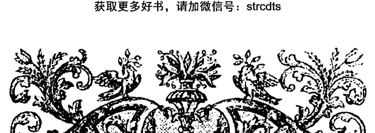

## 第六章

## 植物炼金

现在，我们已经到了要真正运用这些过程准备各种 Spagyric 与炼金产物的时候了。我们所描述的“七基础”的准备是炼金之路上的前奏或第一步。在炼金之路上有各种方式可以令我们获得三大要素，以及许多准备方式。它们每种都具有独特的药物与启蒙性力量。我们已经谈论过了酊剂与炼金剂了，现在我们来探索下其他几种多彩的名字，以及惊人的力量效果。

### Magisteries（治病及变形的物质或媒介）

生产植物 Magisteries 的过程有多种变化。这个方法源自帕拉塞尔苏斯。它相当的简单，仅需要蒸馏的设备，一些新鲜的草药，以及一点 190 度的酒精。我们可以从被行星统治的不同植物中提炼出七个 magisteries，就像七基础一样。

过程需要一系列的消化与蒸馏，使三要素挥发，接着一次最终的循环。方式如下：

取一根新鲜的植物，剪成几段。将它放入一个容器中，再将酒精倒入其中，直到其中的植物被覆盖。所用的酒精应当是精馏酒精，但也可使用任何可饮用的烈酒。密封它，让它在 40°C 的环境下消化一个月。然后，然后取出物质，将其在水浴中蒸馏直到它变干。（小心别烧到它。）将这个蒸馏物（其现在包含着植物液以及你一开始加入的酒精）倒在一些新鲜的植物上，让其再次在 40°C 下消化一个月。将它再次蒸馏，收集已增加量的蒸馏物。

重复这个消化新鲜药草的过程一个月，直到蒸馏的量是原先使用酒精的五倍。如果我们开始时使用 100ml 的酒精，那我们最后总共就会有 500ml。将这一最终的蒸馏物循环一个月，在每次之后 Magistery 会聚集在一起，形成像油一般的滴液，根据植物性质，不是沉入底部就是浮在表面上。用滴管收集这些，滴入小瓶子中，密封好。

帕拉塞尔苏斯说过，这个 Magistery 的一部分具有与对应的干燥植物两百倍的品质（也就是 1/2 盎司=100 盎司）。

### Ens

帕拉塞尔苏斯将这项工作称为 “Paramirim,” 描述了造成人类疾病的五种根源的力量。这些力量被他命名为 **Ens**（或复数形式 **Entia**）是能量上的影响，灵性却包含着物理层面的原因。

所谓的 **Ens** 酊剂被众多人认为是在灵性阶层上有效的，被许多人认为是最强大的 Spagyric 药剂，可用于纠正我们自身的不平衡，比起七基础能更强大地将我们带入肉体与灵性健康的状态。

某位现代操作者写道：

> > “Ens 能显现其来源植物最高等的原始美德。因为炼金术没有仪式套路，没有会所，或除了工作自身之外的发展方法，所以据说这个秘传形式的所有启蒙都是内在的。我们启蒙自己进行工作，工作启蒙我们进入更高等（以及深层）的意识阶层。
> > 
> > Spagyric 酊剂的性质，尤其是 Ens 的，是清楚我们精神组成与构架的阻塞，与在瑜伽中被称为 Naidis 或针灸中的经络腧穴类似。这个能量脉络允许在致密的物质世界与微妙的灵性世界之间交换信息。”
> ——马克·斯塔维希《可实践植物炼金》，1998年

最简单的 Ens 酊剂是从植物中提炼的，就像我们的七基础或 Magistery，它们可以根据每周的七颗统治行星来制作。

ENS 酊剂的准备仅比我们简单的 Spagyric 炼金剂稍微复杂一点，但是它们的效果是更加成熟与强效的。这项工作的实践经验对于我们未来在矿石领域方面的工作会有帮助。

### 准备 ENS 酊剂

准备材料与之前描述用于制作七基础的相同。酒精必须是烈酒，不低于 95%。另外，需要 1 到 2 磅的碳酸钾，以及像用于烘焙的大玻璃盘。

碳酸钾可以在化学供应商店里购买到，你也可以在制陶供应商那里找到，通常如果是它的另一名字“珍珠灰”的话，那价格会低廉一点。在以前，碳酸钾是以“鞑靼之盐（Salt of Tartar）”而闻名的。

如果你高兴的话，你可以用传统的方式来收集碳酸钾，从木灰（特别是橡木，葡萄藤，以及蕨）中沥滤出它。每次壁炉或木材炉烧完你都可以有事做了。把它们从炉中铲出来，装进大的塑料桶中。灌入干净的水（自来水可用），搅拌，再让其沉淀。然后，将顶部干净的液体倒出，过滤以及蒸发掉水。要小心，因为它的腐蚀性强，会烧伤皮肤，会对眼睛造成严重的伤害。它就像碱液（实际上就是碱液），以前就是这样做肥皂的。

在水蒸发掉了之后，它就是结晶化的物体了，颜色偏白。你可以将它放入烤炉中，让它变得更白。在夜晚将它放到户外，做一点防灰和防雨的防护措施，直到第二天早晨再拿进来。连续几晚这么做，你会发现它的大部分因为吸收了空气中的湿度而变成液体了。这被称为潮解。

收集这些液体到一个干净的盘子中，再蒸发掉水分。这样你就有了粗糙的碳酸钾。你可以煅烧它，再将它溶解于水中，再结晶化几次来让它变得更纯。

这需要时间与耐心，但它是免费的，而且最终成品可被反复使用。一段时间后，你会获得可被用于各种不同炼金工作的相当大量的材料，以及许多操纵盐的宝贵经验。

在一个玻璃盘中布上一层薄的碳酸钾，不能超过一英寸厚（2.54 厘米）。在操作时应当小心避免直接接触碳酸钾，无论它是干燥的还是液态。所以，在处理过碳酸钾之后，要确保彻底清洗双手，避免任何污染，特别是会被造成严重损伤的双眼。因为碳酸钾的腐蚀性足够刻蚀玻璃器皿的一面，所以不要使用任何你重视的器皿。它很有可能会被毁掉。

将盘子置于它能够接触到夜晚空气的地方。随着碳酸钾液化（变得潮解），它会吸收空气中携带的水分。这个湿气被说是宇宙之火或生命力量的媒介，其最适合在春季和夏初获得。关于此，我们在后面还有更多的要说，暂时先放一放。将聚积的液体收集到干净的容器中。这个液体被称为 *Tartar Per Deliquium* 之油。

当收集了几盎司的液体之后，你就开始提炼了。最好在开始使用液体之前，先将它经过棉花球或玻璃绒过滤。滤纸会吸收大量液体，倾向于因为液体的腐蚀性能而烂掉。

将两盎司细磨的植物倒入一个干净干燥的罐头中，再将你已经收集并过滤的液体倒进去。当统治植物的行星在其最强大位置时开始这项操作，这会辅助你的工作。倒入的液体要足够盖住植物的顶端，直到它变成完全的液化块。罐头的大小也要让你有足够的空间可以摇晃它，并可以用够紧的塑料盖子密封它。

让它消化一到两周，并阶段性地摇晃它。液体会在这个步骤之后变得颜色更加深。用尼龙袜小心挤压混合物，将液体挤入干净的容器中。要记住使用手套，以及防护镜。

现在，将同等量的烈酒（至少 95%）倒入其中，每日摇晃，因为更轻的酒精会浮在上面，所以要确保两种液体混合。如果两种液体不分离，那它就意味着植物中有过多的水或酒精。缓慢地加入固态干燥的碳酸钾去吸收过量的水。如果分离不发生，那么你就不得不重新开始。

浮在顶部的酒精提取物会是在消化之后移出的 Ens 酊剂。在数日之后，酒精会变得深色。在大约两周（或更久）之后，你可以小心地将酒精酊剂从鞑靼之油（植物层）的顶部吸取。让它沉淀一两天，然后再过滤使用。

在这段时期将其置于冰箱内是有帮助的，因为包含溶解的碳酸钾的任何水都会倾向于更容易结晶化。两种液体之间应当尽可能地分离。要记住将鞑靼之油为将来使用而保留。它可被干燥，培烧，以及再次使用。

总的来说，根据当日植物的统治行星，在酒瓶或水瓶里滴入五到十滴的 Ens 酊剂。它会对饮用者的能量体或星灵体上产生效果，并增强那颗植物品种的药效。记录其对于肉体的效果，以及对习惯思绪和情绪模式的影响。

### *Primum Ens Melissa*

或许最著名的Ens提取物要属Primum Ens Melissa了。帕拉塞尔苏斯对Melissa（蜜蜂花）有高度的赞美，说它是很容易取得的修复Quintessence。

弗兰兹·哈特曼经常引用法国路易十四世的医师Lesebure对其的使用案例，在他写于1685年的《化学指导》中描述了被他见证的实验。

> > 我的密友之一准备了Primum Ens Melissae，他对于它的好奇心使他无法入睡，他想要亲眼见证这个秘药的效果，见证其他人对它性质的描述是否属实。于是他就做了实验，首先是对他自己，然后再对一位七旬的老妇仆人，之后再是对关在他家里的老母鸡。首先他在每个日出的早晨饮用加入这个药剂的白酒，在连续饮用了十四天之后，他的手指甲与脚趾甲开始掉落，但没有任何疼痛。他没有继续进行实验的勇气，但给了老仆人同样的药剂。她连续十天饮用了同样的配方，之后她就像从前那样开始来月经了。她对此十分惊奇，因为她不知道自己是有在用药，她变得害怕，拒绝进行实验。于是，我的朋友将谷物对那个白酒浸泡，给予老母鸡吃，到了第六天的时候，老母鸡开始掉毛了，并持续掉毛直到变成裸鸡了。大约两周之后，新的羽毛开始生长，而且颜色非常美丽；它的鸡冠再次立了起来，而且她又开始产蛋了。”

### 植物之石

植物之石的准备被称为 *Opus Minor*，小工作或小循环（与 *Magnum Opus*——贤者之石的伟大工作产生对比。）

在创造在植物王国中的“石头”时，我们需求的是那颗植物元素以它们最升华形态的平衡，也就代表了那种植物的真正 *Quintessence*。

石头的效果是非常强大的，不仅是在物理层面，在能量层面上也是如此。就像 Ens 酊剂，植物之石被认为具有启蒙的性质，通过打开在我们“内在星星”之间的能量流动来将我们带入自然操作的意识之中。它们也标志着炼金术士对于植物领域和气自身低等性质的精通。

创造植物之石是需要一些时间的。它最起码需要一年或更久，而且如果你开始时的材料不足的话，那你最终只会得到小量的。对你选择使用的植物计划十到五十磅。选择的植物最好是能让你容易收集大量精油的，并能在煅烧之后提供丰富的盐。

我们即将描述的方法提供制造石头基础的操作。有各种变化的版本，你使用的确切过程将是你独有的。它虽然被称为小工作，但它需要很多精力的投入，下面这个方法是最容易成功的。

这项工作的第一部分是你三大要素的分离与净化。理想的情况是，你蒸馏出精油，再发酵植物，蒸馏出酒精，接着重复的再蒸馏直到获得非常纯净的产品。对剩下的植物残留物培烧，通过沥滤获得盐。这样你就有了盐的盐了。

发酵后和除去酒精后剩下的液体也要被蒸发与培烧。这样就有了硫的盐，当然也可以通过沥滤我们之前提到过的培烧残留来获得它。

可通过将盐置于夜晚的户外潮解来加强太阳之火。将盐留在太阳底下晒干。这样的话，随着它们重新结晶化，会锁住更多的太阳能量。

将盐拿到室内，研磨细致，再将它们倒入派热克斯玻璃盘上。将盘子置于烤箱中，温度设置成两百到三百摄氏度。用老艺术家的话来说，对盐烘烤会促使它们“毛孔”打开。

将仍然温热的盐取出烤箱，倒入温暖的研钵中。仔细磨盐。将盐均匀地倒入小瓶中。倒入足够的精油，使它们饱和。密封瓶子，置于40摄氏度的保温箱中。盐应当在那不被打扰一星期。

在一星期后的恰当时间里检查盐，看它们是否吸收了所有的油，如果是的话，就再加一点。当留在你盐之上的油与你一星期前灌入的同样多的时候，那就说明盐已经饱和了。

就像对油的操作一样，你开始加入酒精。重复工程，直到没有酒精能够再被盐吸入了。当完成这一步的时候，你的石头就已经完成了第一程度了。

你可以研磨它并对残留物温和地蒸馏与培烧来增加你石头的美德。再次研磨盐，再次蒸馏加入了新鲜油与酒精的它们。你可以重复这个过程数次，直到你最终获得强效的药剂。

你可以让你的石头置于保温箱中消化六个月至一年，以让其成熟。如果它变得干掉了，那就继续加同等量的新鲜油和酒精，保持其湿润。如果恰当完成的话，物质会凝结成坚硬的石头，它能从浸渍的草药中分离出要素，仅需要将其与草药/水混合物浸在一起即可。植物的盐，硫，以及汞会像是浮在水面上的一层一样聚集在一起，它们可以被收集起来待用，而不需要进一步的准备。石头在使用后可以无恙收回待用。这种石头的用法完全没有作为“circulatum”那般有效率，这也是我们接下来要研究的主题。如果没有完全成熟的话，那石头就会在水的沉浸中破碎。亲眼发现自己数月的工作毁于一旦是很残忍的事情。许多操作者都不敢做这个实验，仅将石头用作强效的药物。

如果将石头作为药用，那小量就要加入水或酒中。其效果与石头的行星统治者有关，可以打开其独特领域的感知大门，提供对我们已经讨论过的各种领域持久的洞察。其对于总体健康的效果可以说是非常强大，压倒性的。这也是为什么艺术家们将七基础作为初步净化的原因。

### Circulatum Minus

所谓的 circulatum 其实是植物之石的液体版，它是植物提取物的强大溶剂。准备它最简明的描述源自 Baron Urbigerus 在 1690 年出版的《Cirulatum Minus Urbigeranum》。

就像植物之石，circulatum 的准备取决于源自植物的三要素的结合。以及在它们重组之前的净化。

在实践中，因为 circulatum 最终的量取决于盐的盐，硫的盐加在一起的总量，所以需要相当大量的盐的盐，以及硫的盐。

加在一起的盐完全饱和着精油，在 40 摄氏度消化几周。在消化期间可能需要额外的油，整体应当时常搅拌，直到它变得完全像厚蜂蜜一样。Circulatum 与植物之石不同，它需要使用过量的挥发性成分；也就是说，挥发成分的量总是比固态的盐要多。

Urbigerus 推荐在这个混合物中加入沥青的硫 (Bituminous Sulfur)，以帮助盐的挥发，这也是这项准备的关键。

沥青的硫源自那颗植物或其他具有更丰富成分的树脂。Urbigerus 推荐苦配巴香脂 (Copaivian Balsam)，但也可以使用包括松木，雪松，紫杉，以及加拿大香脂。加入足够加厚物质的量，使盐溶解成像蜂蜜一般。在树脂中的有机酸会帮助挥发盐，以让它们可在之后与酒精一起蒸馏。

在消化了一段时间之后，加入精馏过的酒精，大约你物质的量的六到八倍，密封，让其在 40 摄氏度消化两周至一个月。

现在，将烧瓶加在蒸馏火车中，温和地再次蒸馏像蜂蜜一般的物质。小心不要将火焰推得太高，驱赶硫，或烧到物质。

将所有清澈的蒸馏物倒回在烧瓶中的物质，密封并再次消化两周。在这之后，再次蒸馏。这个过程被称为循环，需要重复七道十二次才能完成准备。

最终的蒸馏物应当是清澈的，有一种与原来的酒精非常不同的刺鼻味道。这就是 *Circulatum*。

在使用中，*circulatum* 通常是倒在新鲜、仔细研磨的植物上，并摇匀。取决于植物油的量与性质，液体可能会变得乳液般。提炼的植物残留会沉到底部，乳状的部分会与油液合并浮在表面。这个油液包含植物的要素，包括它的盐，所以要小心收集它，留作待用。从残留中可复得 *circulatum*，温和地蒸馏以为其他提炼使用。据说它的力量会随着使用次数而增强。

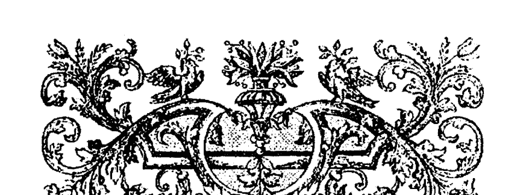

## 第七章

### 水的工作

实践炼金作为一项实验艺术与科学，提供了一种探索自然工作的方式，以及获得这些运作的一手知识。以前的大师通常被称为化学哲学家，他们理解所有造物的本质结合。通过在实验室中探索这些物质，他们变得理解超越物理显现之外的领域。

除了贤者之石的任务之外，还有许多有趣的路径可被探索，每一条都随着我们学习与自然工作而互相照亮彼此。

炼金学家给自然提供恰当的物质与条件，而自然也很愉快地给他们带来它们的果实。

> “自然与艺术必须辅助彼此以完美工作；艺术在玻璃之外操作，自然则在其内。”
——F. la Fontain 《关于自然的世界之盐的古怪警句》 1797

### 挥发与固态溶剂

我们之前谈到过一分为挥发/灵性面与固态/物质面。硫展现出挥发面的火与气的性质，而盐展现出固定的水与地的性质。汞在两个世界中都有运作，可以是固定或挥发性质的。

在实践层面上，我们利用汞来提取或分离物质的要素，这可以用固定或挥发性的溶剂。总的来说，挥发性的溶剂比水蒸发得更快。固定的溶剂比水蒸发得要慢，但是在炼金中，它们对于我们目标物质的行为展现着它们真正的不同。

在植物炼金中，我们用酒精作为我们挥发性的溶剂来使用，产生被称为非固定的酊剂。如果我们用醋来提取植物，那我们就会获得固定的酊剂，因为我们用的是固定的溶剂——醋。

在酿酒过程中，植物死亡，其灵进入诸如酒精的水媒介中。如果我们不去管它，那酒就会随着酒变成固定灵的醋而进入第二次死亡。这两个灵，一个是固定的，一个是挥发的，它们是在植物与矿物领域实践炼金术的核心。

在药效上，挥发或非固定的炼金剂的效果具有温暖性，能量活化性，以及协调性，而固定的炼金剂具有冷却与收缩性。非固定的酊剂据说对于急性疾病更具效果，而固定的酊剂对于慢性疾病效果更好。

> > 非固定的药剂治疗非固定的疾病，根本上固定的非挥发药剂驱逐不通过排泄移动粪便的固定疾病，而是通过发汗以及其他方式。
>
> ——艾萨克·牛顿《Keynes Ms.64》

### 水的工作

某些我们可以做的实验是在植物与矿物世界界限之间的。

一个是在实验室工作中将盐作为能量“磁铁”来使用。另一个是水自身的工作，我们将先描述这一个。

水是一个非常奇怪的造物。它是唯一一个在我们行星上在我们所能体验到的正常温度与压力范围内，同时作为固态，液态与气态存在。

正如在之前提到过的，太阳贯穿我们整个太阳系辐射生命能量。这个生命的世界之火正是炼金术士的秘火之一。随着这个灵性的火焰冲击我们的大气，它在空气中浓缩，并被空气携带。正因为空气充满着湿度，世界之火进一步浓缩，形成了水。水聚集在一起，它又开始变成了雨。

这个充斥着秘火的水（世界之汞）注定在击落到大地时被特定的王国使用。如果它落到了植物上，那它就注定被植物王国使用。如果它被人类或动物接触到或喝掉了，那它就注定是要到动物王国的，如果它落到大地上，那它就注定是要矿物王国的。

《荷马的黄金链》对这一工程提供了最易懂的描述之一。文中描述世界之火产生“一种隐形且非常非物质的湿度”进行温和的发酵以产生世界的酸——“最灵性非物质的硝石世界之灵（Spiritus mundi）。”随着这个世界之酸进入大气，它会变得更加物质，与碱性（被动规则）相会，变化为如天然的硝石那般固定的了。

在现代实践炼金中，氢元素是与火对应的，氮与气对应，氧与水对应，碳与土元素对应。其他在周期表中各自周期的物质元素也分享着这些性质。

氢是世界上最丰富的元素，真正的第一物质，火最初的携带者，而氮是任何元素中最具氧化状态的，被认为是“凝结物质。”

这两者形成火与气的团体，它们被古人称为碱（Alkali，NH3，氨），后来成为了铵（NH4）的盐。

大气成分的第二组是“酸硫”组，即火/气/水组 (H₂/N₂/O₂)，硫起源于它们。酸硫 (HNO₃) 加入了水元素之后就成了氨。

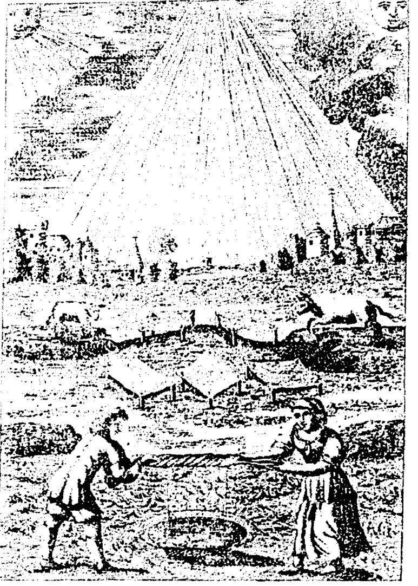

### 源自 Mutus Liber

世界的灵（赋予表现的碱）是在铵（NH₄）的辐射内的。这通常被称为氯化铵，作为雨，雪，露水，冰雹落在大地上。它作为露水盐或硝酸铵（NH₄NO₃）被携带在水中，每吨雨大约0.5到4克。

在《荷马的黄金链》中提到的实践工作包含捕捉自然的世界种子，决定这个种子，以及仅使用雨水来播种它至终极的完美。

我们从收集雨水开始。这项操作很特别。首先，它最好是在春季当太阳在白羊宫，金牛宫，或双子宫的时候，而且最好是雷阵雨，因为闪电固定空气中更多的氮。其次，雨不应当接触到金属，大地或植物或动物（包括人类接触）。

操作很容易完成，将塑料桌布固定好，让其将雨水引向一只用于捕捉雨水的瓶子或塑料桶。（这有利于过滤所有收集的水。）用布料盖好容器，这样既可以遮掉灰尘，又可以令水呼吸。

将其置于温暖的地方（30°到 40°C）发酵至少一个月，越久越好。有些人会等一年甚至更久。在最后，你会看见白色的偏褐色的棉絮状物体浮在水中。这就是世界的 *Gur*，即自然的种子。

将所有的水（包括 *Gur*）倒入蒸馏设备中，温和地蒸馏出其第一个四分之一量。将这瓶蒸馏物标记为水的火和气。提升温度继续蒸馏掉大部分水，但不要太干。将这一蒸馏物标记为水的水。剩下的残留物放在盘子中，让其慢慢地在太阳下晒干，标记为水的土，其包含世界的 *Gur*。

文章继续描述指导，通过各种火，气和水比例来湿润土，以生成在 *Gur* 中的矿物，植物或动物生命。它被认为是世界的种子，可被注定以任何明确形态生长至成熟。

自然的一切来自种子。

> > 炼金术通常被描述为“天上的农业。”

#### 七重或 4×3 蒸馏法

另一个普遍用于分离水元素的方法被称为七重或 4×3 蒸馏。

发酵过的水首先温和地蒸馏成四份同等的量。第一份被蒸馏的标记为水的火。第二份标记为水的气。再接着水元素的是土。同样的，蒸馏在变干之前应停止，残留物晒干，标记为 *Gur*。

现在，依次将收集的四份蒸馏成三份，依次是硫，汞和盐。例如，火的部分置于温和的加热中。三份中的第一份被蒸馏的是水的火的硫，三份中的第二份是水的火的汞。剩下的第三份被标记为水的火的盐。

在这个过程最后，你会有十二份，分别代表四元素的身体，灵魂，以及灵。

正如之前的操作，这十二份可以各种比例混合以湿润 *Gur*。它们源自水的每一份被认为是具有各自独特的药效，以及总数为十二，分别具有占星上的对应。

这些对应是恰当源自每个元素的本位，固定与变动星座的。本位与炙热的硫相联，变动与汞的媒介性质相联，固定与盐的规则相联。例如，我们的水的火被蒸馏成下面这三部分的：

水的火的硫——白羊宫

水的火的汞——人马座

水的火的盐——狮子宫

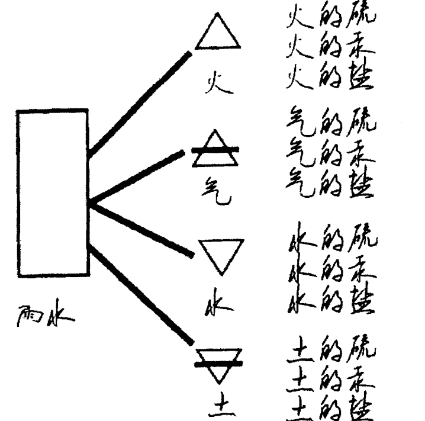

它被认为对于这些水实验的恰当操控，可以令人生长并复制金属金，就像是植物种子生产那样。虽然，它并不普遍所知，但炼金术士们将矿物领域理解为它具有自己的种子形态，就像植物与动物王国具有它们独特的种子形态一样。我们之后再来讨论下这一点。

对于水的各种工作可以令人更加了解自然的运作，能够引向非常奇妙的结果。其工作自身需要一些在蒸馏上的精力，因为起初需要相当大量的雨水，但其在本质上是“安全”的炼金工作（使用过程中不含有毒物质），而且是任何人可用的。

#### 盐

一条相关的操作线（捕捉世界的火成为有形的形态）是盐的工作。利用所选择盐的特定性质，我们能够捕捉并凝聚这个重要的世界之火，为我们的炼金工作进化我们的物质与我们自身。这些盐形成许多在炼金文献中提到的秘火的基础。它们在操作中作为影响规则的分离或结合的催化剂。

> > “古人们的秘密在于盐。有磁性的盐会吸引并捕捉气，星灵灵体，世界的种子。其中世界的种子一旦凝聚，会给予萌发的力量，根据其包含的母体被引导。” ——珍·杜碧斯 (PON 研讨会 1992)

有若干矿物与金属盐从很久以前就和炼金艺术有着关联。十五世纪的炼金术士艾萨克·荷兰将贤者之手描述为在炼金工作中重要盐的集合。这些盐包含了硝石（硝酸钾），卤砂（氯化铵），硫酸（铜或硫酸铁），明矾（硫酸铝钾），以及普通的盐（氯化钠）。

通过对它们恰当的组合和操纵，任何事物都能够产生其灵性化的精髓。

荷兰将它们描述为解锁物质的钥匙。在他对巴兹尔·瓦伦丁的《锑的凯旋战车》的评价中，特奥多·克林说道：

> “盐是钥匙；它们能打开藏有宝藏的箱子，但你必须要确定拿的是真正的钥匙；否则的话，你会弄坏锁，无法打开箱子。”

等我们到后面讨论矿物与金属工作的时候，我们会更深层次地运用到盐。对于这些捕捉天火的初始操作而言，我们将谈论到几种普通的盐，以及它们是如何被运用在这一过程中的。在每种情况中，在空气中被运用的潮解正是盐的能力。

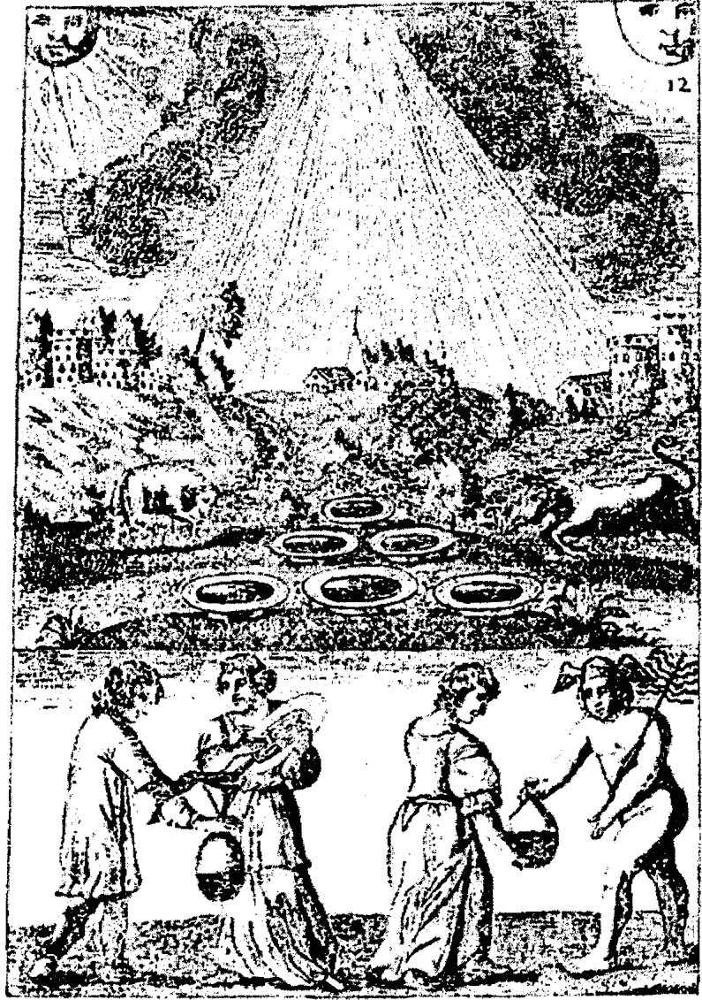

> “只有少数人知道如何提取太阳或月亮的光线。使这个水从天堂降落的方法真的是非常神奇的；正是在石头中包含着中央的水，也就是仅有的唯一，与天水相同的事物，但秘密在于了解如何制造一块磁石来吸引，拥抱，以及结合这个星灵的 Quintessence 到它自身中。”
——《秘传的胜利》1723 年

#### 鞑靼的盐

当我们在谈论创造 *Ens* 酊剂的时候谈论过它。鞑靼的盐是源自红酒鞑靼（酒石）或植物灰烬的培烧的碳酸钾，为众多工作提供了非常容易获得的开始材料。

在烘培盘子上均匀地撒上薄薄的一层(1/4到1/2英寸)盐。将盐盘置于户外，做出对雨和灰尘的防护，但要让其接触到空气。在后半夜做这个事，直到早上六点或七点。在太阳在白羊宫，金牛宫或双子宫的春季完成它更好，因为具有丰富力量的世界之火会更多。

盐会因为吸收加载了凝聚的世界之火（秘火）的空气湿度而潮解，或变得液化。这个液体被称为 *Tartar per Deliquem* 之油，被用于 *Ens* 提取中。要记住，这个液体是非常腐蚀性的，会烧坏皮肤，特别是眼睛，所以要特别小心。

它的另一个用法是温和地蒸馏液体到干燥。干净，水一般的蒸馏物被称为天使之水，它可被用于植物盐的再结晶。这个加载着秘火的液体会随着它们结晶化而陷入盐的结晶母体，从而使它们再生。这种力量的转移类型一直发生在液态中，从而炼金术士强调溶解是工作中最重要的阶段。挥发变为固定，固定变为挥发。干燥的碳酸钾会被复原，再次使用。

液体蒸馏物也在植物提取中有用。它被认为是取决于植物世界的，因为在植物灰烬中有广泛的盐，从而对植物领域的所有工作有用。就像钾盐被认为携带着植物的火，钠盐携带着动物世界的火。这些元素在周期表中属于氢（火元素）的同一周期中，但是在更加致密化的层面上。

我们可以在上述实验中使用普通的盐以获取加载着动物之火的水。盐（NaCl）不会潮解，但会吸收大量的湿度。要使用干燥纯粹的海盐，这就有没有被增加过其他成分。这对于在动物领域中的工作会有更小的产量，但更强效。

#### 露水盐

另一种通常以同种方式工作的盐，也在之前提前过，是叫露水盐，或天堂般的露水盐。它可源自收集的露水或雨水（特别是在雷雨中收集的），但这一过程很长，很麻烦。盐自身是硝酸铵的。露水盐是高度潮解的，被认为特别决定了矿物领域，但它是世界性质的。有时，你可以在园艺商店里发现这种盐作为肥料出售，但它变得越来越难找到了，因为它可被用于制成临时的炸弹。

在这个盐中的确有很多火！它可以通过混合硝酸和氢氧化铵直到它变得中性再结晶化来获得。通过潮解来溶解乙基几次来使其再生。对这个盐也要小心，它是强效的氧化剂，可点燃各种燃料。

蒸馏这个盐，当它在干点之前停止液化。形成的水晶可被重复使用。这个蒸馏物可在矿物工作中代替蒸馏水进行各项操作。

蒸馏物加载着矿物之火，这个火可被传输到我们的目标以使它恢复生气。铜盐也携带着矿物之火，因为铜在周期表中是1B族的一部分，从而与在氢下的元素有关，它们都携带火。

#### 锑的黄油

在这一类目中我们要提到的最后一种盐是三氯化锑，它也被称为锑的黄油。因为这属于矿物工作，所以我们在这里仅说及它的使用。这种的盐的准备和使用是非常难的，也比之前讨论过的盐更加危险。当准备它的时候，它具有黄油的颜色和质感，从而有了它的名字。然而，它是有毒的，非常腐蚀，所以它需要实施者具有一定的技巧和耐心才能安全使用。

锑的黄油对空气的湿度具有贪婪的胃口，即便是在炎热的夏天也会潮解。从它蒸馏出来的水被认为携带真正的世界之火，也就是可被用于三个王国任一的操作中。

### 水的元气

某些操作者会结合上述方式生产出一种再造的水，它被称为水的元气。它是水的进化形态，具有惊奇的药效。

通过盐的潮解获得的水加载着火，被认为是阳性/硫/太阳面的，而雨或雪水被认为代表着天水的阴性/汞/月亮面。

收集到的大量雨水（阴性）是被蒸馏的天使之水（阳性）“受孕”的，然后需要进行至少一个月的发酵。在发酵之后，再利用之前描述过的4×3蒸馏水分离水。

一旦获得水的十二个部分，重组的过程就可以开始了。从火元素开始，同等量的硫，汞和盐部分结合在一起，再让其循环数日。让其冷却下来，再放在一边等待日后使用。对每种剩下的元素进行同样的操作，直到你获得了重组形态的四元素。

现在，从这些元素中抽出同等量让其循环一周到一个月，温度要大约 40°C。注意到我们不在这项准备中运用 *Gur* 了吗。最终的天水被称为水的元气或第一存在，可被在任何领域中为提取作为溶剂或单独作为治疗水使用。

元气（Archaeus）代表世界的汞，可通过在准备期间调整四元素的相对比例来决定它为三领域的哪个领域操作。水的四元素应当在每个元气中呈现，但不是像我们上述中所作那样等量。如果是土元素占主导的，那么元气就会被注定为金属领域而用。如果土和气的元素占主导，那么元气就会被注定用于矿物领域。水和气的主导会被注定用于植物领域，而火和气的主导会注定用于动物领域。混合物如之前那般循环，那它们就准备好被使用了。

我们收集到的干燥的 *Gur* 倒入一个烧瓶中，再用元气来湿化/使受孕。盖上烧瓶，令其消化。（植物工作大约 40°C，矿物/金属工作则是大约 90°C。）随着 *Gur* 变干持续湿润它。

如果你准备注定用于植物领域的元气的话，那你应当会在一些时间之后看见原始植物生命出现。保持它的湿润。一旦这个植物看上去死掉了的时候，培烧材料，在新鲜的 *Gur* 上加入灰。现在开始再次用元气吸取 *Gur* 的过程。在一段时间之后，新的，更进化的植物生命会出现。这整个操作可依你高兴不断重复，以观察植物生命的进化过程。

如果你准备的元气是注定用于矿物领域的话，那湿润的 *Gur* 起初会变得像沙子一样，经历各种颜色。如果比例是对的，那它被认为你甚至会开发出一些金和银的谷粒。

这些水的操作通常是长期的。它们起初需要投入一些精力，以及消化的长时间。就像是在培育一颗稀有的兰花一样，可能需要你尝试数次才会成功。它们的确会提供一些对炼金工作的有趣体验和洞察，“自然是借助艺术的。”

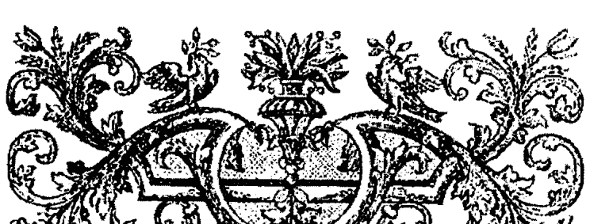

## 第八章

## 回归火焰

让我们再来谈一下火，之前只谈论了普通的水，现在我们再谈一下火在炼金文献中呈现的更能量的一面。自然具有它的挥发度和固定度。炼金术其实完全是关于在各种面中的火。

> > “火是主要的药剂，整个的艺术。它是四元素的首个元素。”
> > ——奥林比奥道罗斯，大约公元 500 年

“尽管火焰在元素月下厨房有着多样性，但是，它们都是来自同根源的。这个火焰是在根源中，也是关于根源的——我的意思是说，它在万物的中央，无论是可见的还是不可见的。它在水中，土中，及气中，它是矿物，植物，野兽；它在人类中，在星星中，也在天使中，但它最初是在神自身之中；因为他是热与火的来源，在阳光的特定潮流下从他处诞生了造物的其余部分。

> ——约翰·迪博士《玫瑰十字秘密》，彼得·斯马特复印版，伦敦 1712 年。（原始版存于大英博物馆，Herleian Mss 6485）

在其最灵性的形态中，火是一个唯一的事物，不被分割的光，万物都从它起源。火是能量，能量是物质。最灵性的火被各方称为天火，天堂，世界之火，星灵之金，神圣意志，等等。它被描述为是火焰最纯净的等级；不燃烧，但是温和的；不可见，仅通过对其的操作被了解。

它是火焰所有其他形态的来源，它对我们可见的代表是太阳。

记住，“太阳的背后还有个太阳”，即是凝聚我们可见星星的灵性来源。天火被认为是有两个主要的面，世界的，与独个的。世界之火散布在世界各处，激起在身体内的活动。它温暖并保存万物的胚芽。它发展出独个的火。

独个的火（也被命名为内在之火，中央的太阳或中央的火）与它的胚芽植入在每个混合物之中。除非它被激起，否则不会大幅度活跃。从而，它就像它的父亲太阳对大宇宙的作为一样。

这是隐藏在万物中的神圣闪光，天火的映像。它被称为 Quintessence，是由四元素完美平衡形成的“物质最纯净与固定的部分。”这个在元素相对力量间的和谐带到了一个全新，升华的状态，也就是 Quintessence，即第五元素。它的活动是煮解与成熟的。它促使元素蒸发并稀薄化成为更新之火。

迈克尔·闪迪弗格斯（Michael Sendivogius）在他的作品《新炼金之光》（1608）将它称为种子：

> > “种子是万物的炼金剂或 Quintessence，是它们最完美的煮解与煎剂。又或者是硫的膏，它和金属中的根本的水分相同。”
> > “四元素以它们不间断的行为向大地投射种子，令种子在那里消化，在那里进行生殖的行动。”
> > “这是大地万物的源头。”
> > “四元素的产物，种子，从大地中心向各个方向被投射，根据不同地方的性质，产生不同的事物。”

随着天火开始凝结或浓缩，它形成了“一种不可见最难以察觉的湿气”，也就是气元素。这个蒸浓的过程持续，气元素冷凝成了水元素，然后水元素冷凝成了土元素。陷在其中的火元素（中央之火）现在开始反应，以反方向推动这个过程。土挥发，称为变厚的水。水挥发，成为蒸汽，气变得稀薄，成为火元素，然后它被天火更新，新的循环开始。

我们在这里谈论的是神秘学元素：而不是我们呼吸的气或喝的水。这个火的永恒循环通常被称为自然的喷泉。

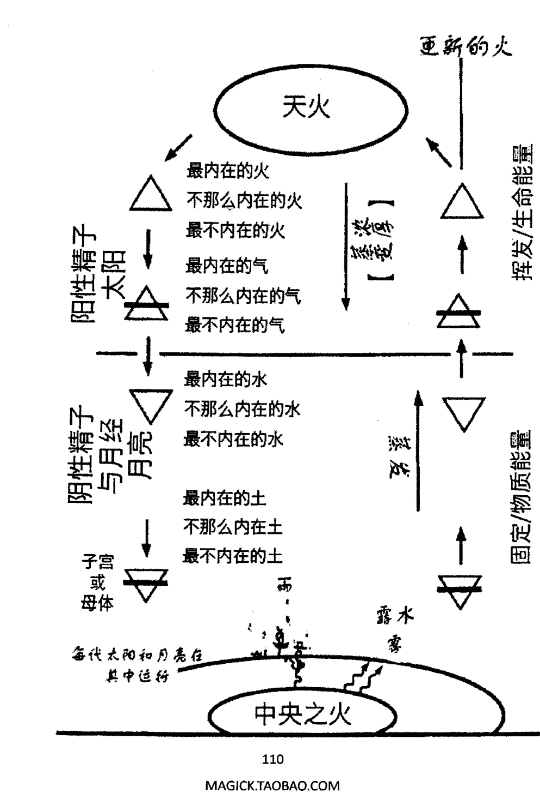

“从而火和气下降成为水，使它们受孕。水处理了它们最厚的部分，给予了土的诞生。土从而变得过度加载或饱和，过剩的土和水再次挥发，被火向上升华（内在之火或中央之火），成为蒸汽，从而神的上升与下降所植入的世界之火是自然伟大且唯一的中介。”

“土自身是一种凝聚的或固定的天火，而这个火是挥发化的土。”

——《荷马的黄金链》

这个“灵性或天火”的循环是从最至高的阶层（卡巴拉的 Atziluth 世界）到其最致密与凝聚的物理形态（卡巴拉的 Assiah 世界），然后再回到至高点，它是自然中主动中介的过程。

在实验室中，炼金术跟随自然的运作来进行操作；挥发化物质的土的部分（比如在植物工作中获取的盐和下等油），以及捕捉或固定更以太形态的火（比如在植物汞和植物的挥发精油）。挥发与固定的材料被结合在一起并循环，创造了新的固有在原始物质中的火，并升华平衡了它。

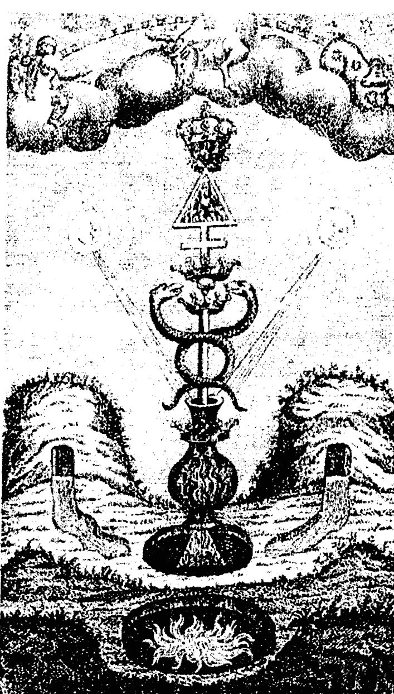

## After The Hermetical Triumph, 1723

### 恰当媒介

现代科学会认同，在自然中能量从来不会就那么消失。它是在从一个形态到另一个传输的恒定状态。

> “你从一个极端到另一个极端间的移动是需要恰当媒介的。” 
>
> ——《荷马的黄金链》

为了要从一个元素阶层移动到另一个，就必须要有恰当的媒介。要让土变成火，你就必须经历水和气。

一个元素是其他邻居的导体，一个元素溶解并灵性化另一个。从而，一个元素是另一个的磁石，溶剂，挥发，冷凝，凝固，以及固定规则。

从而，如果你想要让天堂或火与土结合，或者将火转变成土的话，首先将它和与其最近的挥发媒介结合，它们会立刻结合在一起。当完成了这步之后，给予它们作为气和土之间的媒介水，它们也会结合在一起；再加上土，从而你就可以将火与土结合在一起了；反之亦然，用水将土变为水，再将它变为气，再用气将气变为火。”
>
> ——《荷马的黄金链》

能量的循环通常被指为元素的轮流，形成了炼金过程中重要的钥匙，物质的精华根据它来提取，净化，提升到其最至高的状态。随着每次的轮流，物质的四元素会达到伟大的平衡与纯度。当获得完美的协调之时，我们就有了物质的 Quintessence。道路并不是圆形的，而更像是螺旋型的，升华物质，将元素引向平衡的中心，物质的极点。

> “当你绕着四边形走了一圈，那么就会找到所有的秘密。”
>
> 瑞普利 1480年

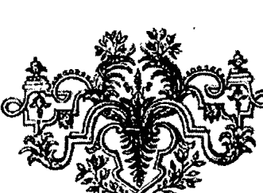

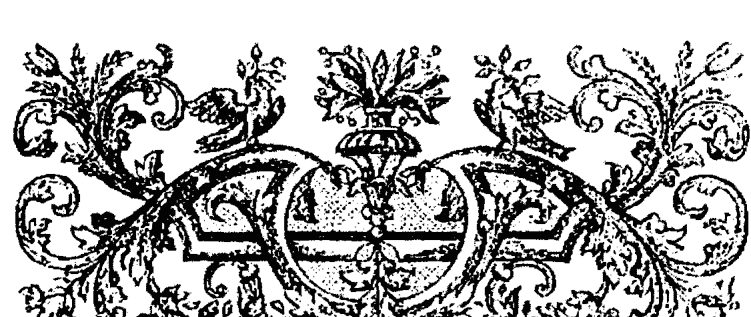

## 第九章

## 卡巴拉与炼金术

我们将在在这里引入另一个概念，来谈论下卡巴拉。希望它能引起你的注意，就像占星学，它自身也是门学问。事实上，炼金术，占星学，以及卡巴拉形成了赫尔墨斯艺术的三大柱子。

> “现在，如果你不理解如何使用卡巴拉以及古老的占星术，那你就不是被神选择使用 Spagyric 艺术，或被自然学则使用 Vulcan 的工作，或被创造张口谈论炼金艺术的……”
>
> ——帕拉塞尔苏斯《贤者的酊剂》

> “卡巴拉是一个可用于解释所有存在于物理与超物理阶层上事物，及创造过程的方法，而且是对它们的完整研究。让你理解在被创造的与创造之源之间的关联，自然的运作机制，以及各种世界与空间时间。”
>
> ——珍·杜彼（PON讲座，1992年）

卡巴拉这个词的词根是来自希伯来语 Qibel,意思是“接受。”这里接受的是指神秘学或关于自然秘密的口传传统。

对于炼金术士而言，卡巴拉提供了一个道路的象征代表，代表着宇宙创造及沿着同一道路归一的过程。

卡巴拉一直使个人能利用它直接灵性次元，而不需要祭司的干预。在古代，它给予了宗教与哲学自由，被许多人视作近乎异端。炼金术士将卡巴拉的象征框架作为他们揭露与隐秘特定工作的秘密语言来使用。

### 生命之树

卡巴拉在象征上是以生命之树的形态被代表的。树上有着十颗中心或领域，它们被称为塞菲罗斯（Sephroth），在它们之间连接着二十二条路径。加在一起，它们被认为构成了秘密智慧的三十二条道路。中心是以三根柱子来排列的。左边的柱子被称为严厉之柱，代表一的阴性面。这根柱子包含三颗塞菲罗斯——名为 Binah（理解），Geurah（严厉）和 Hod（光辉）。它们分别与土星，火星，及水星的行星能量对应。

在右边的柱子被称为仁慈之柱，代表一的阳性面。在这颗柱子上包含了三颗塞菲罗斯——Chokmah（智慧），Chesed（仁慈）及 Netzach（胜利）。它们分别与黄道带，木星和金星对应。

中间的那根柱子被称为平衡之柱，代表阳性与阴性柱子之间的平衡。它包含四颗塞菲罗斯——Kether（王冠），Tiphareth（美丽），Yesod（基础），以及 Malkuth（王国）。它们是与未分裂的光（Undivided Light），太阳，月亮，以及地球或物理世界相关的。

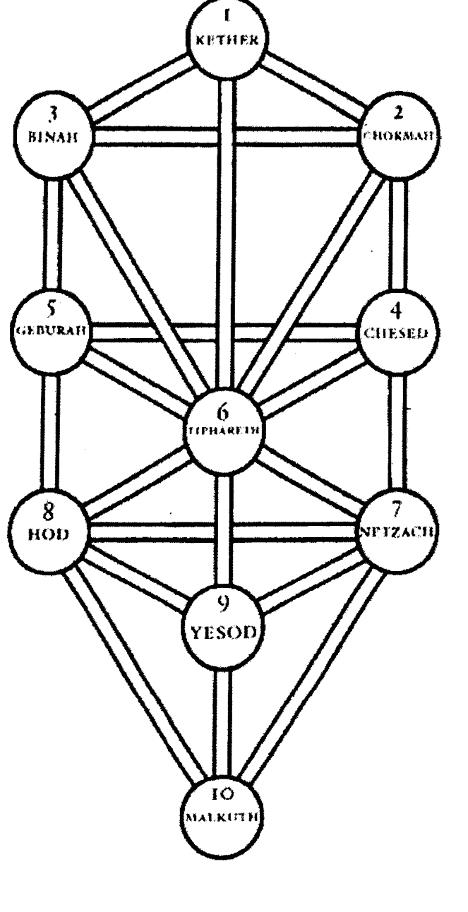

### 生命之树

卡巴拉的一个试图需要四颗这样的树，每棵树代表宇宙的一个世界，它们垂直并排，所以一棵树的 Malkuth 诞生下一棵树的 Kether（和四元素的顺序一样——火，气，水，及土）。为了方便表达，四颗树通常凝聚成一棵树分别作为四个世界的代表。

### 四个世界

卡巴拉区分四个主要的阶层或存在的世界，从最稀疏的灵性领域到最致密的物理现实。虽然将它们想象成分开的阶层更容易理解，但它们实际上是彼此互相叠加的，形成一的连续统一体。对四个世界简短的总结如下：

- **Atziluth:** 代表原型世界，火焰，纯粹的神性，超意识，灵性世界，超俗三角（由 Kether, Chokmah 及 Binah 构成）。
- **Briah:** 代表创造世界，气，大天使的，自觉意识，精神世界，Chesed, Geburah, Tiphareth, Netzach, 及 Hod 的领域。
- **Yetzirah:** 代表形成世界，水，天使，潜意识，星灵世界，Yesod 的领域。
- **Assiah:** 代表物质世界，土，人类，身体，物理世界，Malkuth 的领域。

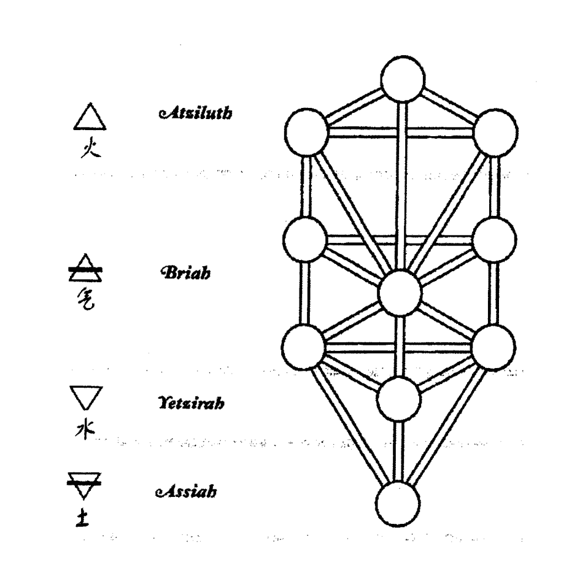

卡巴拉的世界观是和能量与散发有关的。世界从单一的源点散发成我们所感知到的一切——光，物质，甚至空间与时间。这个纯粹能量的凝结逐渐地提供物质的幻觉。卡巴拉的研究是能量来源，区域或这个能量的传输区域，以及这个也就是自然的能量的行为的研究。下方的是上方的镜像。

就像是在炼金世界观中的，卡巴拉将造物过程描述为逐渐增加的能量致密程度；从最稀薄的，即火元素，到最致密的，即土元素。在这片增加/减少致密度的海洋中诞生了代表独特意识阶层的塞菲罗斯，通常被指为存在的领域。

每个世界是在它之前或之后的更致密或更稀疏的镜像。每颗塞菲罗斯是在它之前领域的镜像，但有着其自身独特的特性，就像行星吸收太阳并辐射过剩的，有着不同的颜色。仅那些中柱的领域有着平衡的性质，以及总地协调或反射所有创造能量的能力。

可实践卡巴拉形成了一个操作的系统，它基于被生命之树揭露的互相连接与关系。就像在占星上的行星具有各种与它们关联的对应一样，它们的互相连接与关系也展现在树的结构中。通过对这些对应的恰当运用，收集与引导能量为在任何存在阶层上的炼金所用就是可能的了——逐渐地凝聚天火到物理显现。

这是炼金术士的精神与灵性练习对目标付诸实践，最终将其冷凝成物理现实的地方。

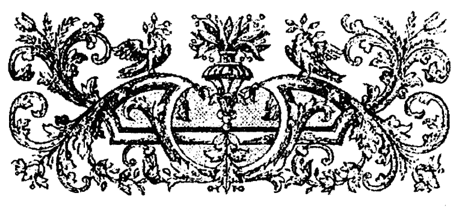

## 第十章

## 矿物与金属工作的介绍

随着我们进入矿物与金属工作，我们必须强烈地告诫你在实践之前必须要先了解理论。植物工作使我们准备好矿物工作，但植物对于失误和意外是更加可饶恕的。如果没有恰当的技巧，以及基于经历的警惕感，那么特定的矿物工作类型是非常致命的。

在矿物金属工作中，我们所操作的材料是在结晶状态下的。它们是一的最致密形态。锁在结晶母体内的生命力量是非常纯粹及强大的。我仅需要通过我们目前的科技就能知道结晶材料的力量有多强大，从硅片到核能。

植物炼金剂是强大的工具。你可花费一生的时间探索它们的潜能；但是，最强大的炼金药剂从来都是在矿物世界中的。

矿物炼金的基础和植物工作的相同——三要素的分离与净化。方法是相似的，只是倾向于时间更长，更复杂，以及更高的温度。

就像植物工作中一样，在矿物领域中运用的过程也在内在上作用于我们。因为工作复杂性的增加，你与你的目标形成更强的连接。许多操作者在矿物工作的某些强烈操作中有过神圣空间或力量领域的体验。

就像一位以前的大师所说的，“有很多条道路指向同一效果。”同样地，在矿物工作以及完成调制贤者之石的伟大工作也具有很多方式。

这些过程通常被分为两种模式：所谓的干的方式，以及湿的方式。某些大师认为不存在真正干的方式，因为液态对于在物质中天和生命力量的转变是至关重要的。

操作方式的基本不同点如下：

*Via Humida*——即湿的方式，通过发酵与升华来分离三要素，或用远足发酵过程产生的溶媒 (*Menstruum*) 来提取它们，并决定那个特殊物质的王国。

*Via Sicca*——即干的方式，通过对准备材料的培烧，融合，升华，混汞，以及干蒸馏来分离。在混合过程中会发生从媒介到媒介的灵性规则转移。

我们先从 *Via Humida*（湿的方式）了解矿物工作，以对矿物领域的要素提取与净化。

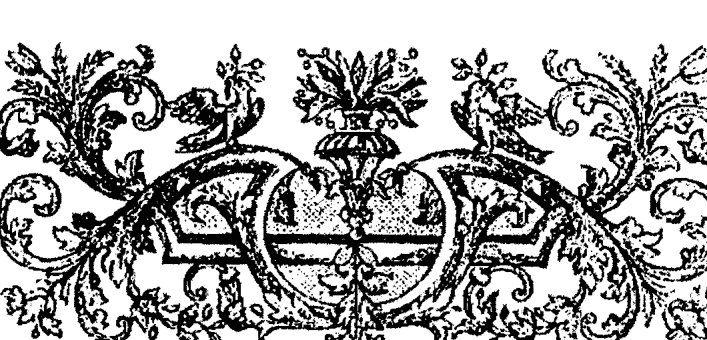

## 第十一章 Via Humida

### Menstruums

在湿的工作中，分离要素最佳的溶剂是那个王国的汞。
在植物工作中，我们用来提取或分离三要素的是植物的汞。
对于矿物与金属工作，我们也以同样的方式选择手中正确的溶剂类型。

炼金术士将这些各种溶剂称为它们的 *Menstruums* (或复数 *Menstrua*)。它们不是现代概念里溶剂的意思。它们多数都需要数月的准备，事实上，它们通常是需要根据月亮状态来准备的。它与月亮的连接在一部分上解释了 Menstruum 这个词的由来。

另外，它们被认为充满着重要的生命力量，可将那个世界之火转移到操作的目标上——甚至是使材料再生化。就像 menstruum 孕育并形成胎儿一样，炼金术士的 Menstrua 具有一种滋养性的力量，能带来炼金之子或活着的药剂。

在某些文献中，特殊的 menstruum 可能指的是秘火，它能激化目标的溶解或分离，而不需要外在之火。

在实验室炼金中，水，酒精，醋，丙酮，乙醚是最常用的溶剂。它们形成强大 Menstruums 广泛的开始材料，在植物与矿物工作中都很有用。

酒与醋是植物王国中挥发与固定的灵，它们提供了我们在植物工作中所需的所有溶解力量。它们的组合形成了一个我们将要探讨的，在矿物工作中有一组效溶剂中的第一种 menstruum。

#### 植物根本 Menstruum

植物根本 Menstruum (Vegetable Radical Menstruum) 在本质上是一种属于植物工作的液态植物之石，即 Circulatum，但它也可有效作用于矿物上。其准备是通过挥发与固定植物灵之间的结合而完成。

理想的是我们从大量红酒开始操作。其中一半的量置于一边让其变酸，成为醋（固定的灵）。另一半用于蒸馏以获得酒精（挥发的灵）。所有剩下的残留物（残渣）要收集在一起，以提炼盐。

酒需要精馏六到七遍以获得烈酒。醋需要先通过冷冻来浓缩，之后再蒸馏。为此，你可以在塑料瓶里灌一半醋，再冷藏它。将它从冰箱里取出，将它倒插在玻璃罐头上。在三十分钟左右之后，浓缩的醋就差不多解冻了，慢慢地滴进罐头里，在塑料瓶里留下一块冰块。丢弃冰块，再冰冻醋，重复解冻/冰冻的循环三遍。

现在蒸馏浓缩的醋，但要丢弃一开始的1/4到1/3，因为它主要是水。蒸馏到接近干，收集蒸馏物。这就是固定的灵。

将所有从酒和醋操作中剩下的固态物混合在一起，焙烧它们。然后，滤沥出盐，结晶化几次。让盐在结晶化之间潮解一会儿。

随着盐的工作进行，你可以将同等量的酒和醋在一只大玻璃容器中混合在一起，密封它，让它经历一个月亮周期的循环。

在月底的时候，在冷却的液体中慢慢地加上干燥，粉状的盐。再次密封容器，让他再经历一个月亮周期的循环。在第二个周期结束后，小心地蒸馏整个混合物到干燥。

将剩下的盐与蒸馏物混合，再密封它，让它循环一个周期。重复七到十二遍这个循环，在最后的一次蒸馏中，Menstruum 就会准备好了。Menstruun 应当完全蒸馏，不留下任何残留物。这个液体包含与挥发植物盐结合的乙酸乙酯，可以很容易地从植物中提取要素。它可被用于提取众多矿物和金属物件，比如铁和铜。

#### Kerkring Menstruum

下一个我们将谈论的准备被称为*Kerkring Menstruum*，即哲学之酒。这个准备是源自荷兰内科医师，阿多诺·科林（Theodor Kerkring），他在他对巴兹尔·瓦伦丁的《锑的凯旋战车》中有评注到它。

这是通过植物灵被准备好的盐接触而被磁化或决定在矿物领域中活动的例子。

在这个Menstruum中，我们使用的是盐氯化铵（NH4Cl）。所有挥发的铵盐在炼金中都是很宝贵的，不止矿物如此，植物与动物也包含氯化铵。这些盐很容易升华，如果没有被捕捉的话，它们会不被看见地蒸发掉。

氯化铵的在炼金历史中的起源很难找到。它在数世纪以来是通过动物粪便，以及有角动物的角中获得，所以它有个名字是*Hartsborn*或*Hartsborn*之灵。

有些证据表明在古埃及阿蒙（Amun）神殿的祭司通过升华煤烟来获得它。产出物包含挥发的铵盐，被称为阿蒙之盐，之后就变成了Sal Ammoniac。

Menstruum的准备从氯化铵的升华开始（在这项准备中可以用商业产品）。就像我们之前说过的，这步可以用陶瓷锅在电磁炉或煤气上加热完成。在首次的升华之后，升华的结晶会有披上一层淡黄色。收集它们，然后再次升华。

升华物会变得更加桔黄色，甚至某些部分发红。收集它们，第三次升华。在这第三次升华之后，结晶会变得非常橘黄至红黄，就已准备好待用了。将它们储存在玻璃容器中，密封它，不使其接触湿气。

接下来，我们需要的是非常强的酒精，至少要 95%，而且最好是用红酒的。

当我们准备好了这两个成分后，在新月下，以四份氯化铵和十份酒精的比例混合它们。

将它们密封在玻璃容器中，让其在大约 40°C 下消化至少一个月。

在消化之后，将这个物质温和地蒸馏至接近干燥。收集蒸馏物，再次蒸馏两遍。最终的蒸馏物就是 *Kekring Menstruum*。将它密封在玻璃容器中待用。收集并保留蒸馏剩下的所有残留物。它们还可可用在酒精上几次。

### Alkahest

Alkahest 这个名字是源自帕拉塞尔苏斯的，这种溶剂不仅可以提取活着的金属的硫和汞，也可用于提取已死亡即溶掉的金属。Alkahest 被认为是万能溶剂。

每种 Alkahest 自身具有显著的治疗力量。准备它有很多种方式。我们将在此谈论其中的两种。

#### Tartar Alkahest

对于麸靼的 *Alkahest* 而言，我们从源自酒桶里也被称为酒石的粗燥麸靼操作。将麸靼粉碎成 1/8 至 1/4 英寸的颗粒，将它们倒入蒸馏容器中。用温火开始蒸馏，再逐渐增加温度。首先来到接受容器中的会是被称为 Phlegm(粘液)的水，再慢慢地或全部停下。增加热度，换一个新的有冰浴冷却的接受容器。

很快，整个装置会充满厚的白色蒸汽，在接受容器中会形成一种透明黄色般的液体，接着是黑色有恶臭味的油滴了下来。

现在换水浴来温和地蒸馏。Tartar Alkahest 会作为一种清澈的液体蒸馏出来。仍然会有黑色的有恶臭味的油蒸馏出来，它是粗燥的鞑靼之硫。这个油具有对疾病有助益的名声，涉及妨碍血小板的建立，但它必须要通过蒸馏精炼后方可使用。

Alkahest 对于多数金属的提取都很有效，甚至是金和银——因为它们元素的完美蒸浓，所以很难被打开。这个 alkahest 也可用于提取融化或精炼金属的硫。在这种情况下，Alkahest 借出它炼金的生命，以复苏化酊剂，但无法重新获得做其他使用了。

如果提取的是活着的矿物，那么 Alkahest 就可通过温和的蒸馏再次取得，并能再次使用。事实上，它被认为会随着频繁的使用而变得更强。在这个六五中留下的油性残留物被溶解成精馏过的酒灵，允许其存活下去。使用时轻轻倒出透明的液体酊剂。

#### 尿液或硝石 Alkahest

你没看错。尿液——“被多数人轻视，但被智者看重。”在尿液中藏着众多秘密。

从尿液中我们可以轻易获得在哲学状态的挥发的铵盐 ——也就是说，是活着的。

收集尿液需要一些准备，因为我们希望获得的仅是最佳的。排毒饮食，限制盐的食入至少数日，然后在收集阶段仅喝水或红酒。

将尿液收集在玻璃容器中，密封它，让它在一个温暖地方腐败一个月或更久。这项操作涉及的臭味的确可以把它划分为户外活动。

将腐败的尿液慢慢地蒸馏至干。将蒸馏液倒回剩下的干燥物（caput mortuum），再次将其消化一个月。蒸馏并重复对余渣回流蒸馏第三次。

在最后的蒸馏中，收集清澈的蒸馏液，这就是尿液的灵或尿液的 Alkahest。随着这个最后的蒸馏结束，你可以温和地增加热度，你会看见一种白色的升华形态出现在玻璃的上部分。收集这个升华物，留作待用。它是尿液的挥发盐，也被称为凡·赫尔蒙特的 Alkahest。炼金术士凡 赫尔蒙特 (J.B. Van Helmont) 是帕拉塞尔苏斯作品后期的学生，因使用这个盐进行奇迹的治疗而出名。这些盐的一部分会在蒸馏过程中蒸过去，包含在 Alkahest 中。

Alkahest 与 Kerkering Menstruum 类似，但是它更加强，因为它是源自或者的 Sal Ammoniac，从而可以复苏化一个目标。Kerkering Menstruum 不能这么做，是因为我们用的是普通的 Sal Ammoniac。

> “这个灵，通过精馏就可以变的非常纯净，及内在，他会如火焰般燃烧，溶解金子与珍石。”
>
> ——弗兰西·J《蒸馏的艺术》

## 第十二章
关于矿物

在我们继续谈论湿的方式之前，让我们先消化一下，谈论下我们的目标物质，矿物领域的产物。就像我们需要收集与准备植物一样，对矿物也是如此。

根据我们准备目标的方式，以及对 menstruums 的选择，在矿物与金属领域中有很多有用的材料。

## 准备矿石

在炼金的观点中，从大地中新鲜收集的矿物与金属矿石的状态是自然活着的形态，比起任何商业化学替代品是更好的选择。

现在，通常人们不会认为石头和矿物是活着的，但对于炼金术士而言，矿物领域就像自然的其他两个王国一样是充满生命的。矿物是活着的。它们生长，进化，产生种子，就像植物和动物一样；但是它们的整个过程是非常缓慢的。

> > “金属的身体是它们灵的住宅。当它们的地面物质被一定程度变薄，延伸，及净化；迄今为止休眠的生命与火焰会被激活显现：因为居住在金属中的生命是隐藏着的，就像它之前那样是休眠着的……它也无法发挥其力量或展现自身，除非身体首先被溶解了，成为它们激活的来源。最终被带到这种程度，通过它们丰富的内在之光，它们的属性与其他不完美的身体交流着。”
> 
> ——在玛格丽特·阿特伍德《赫尔墨斯哲学与炼金术》中引用并脚注的《赫尔墨斯特里斯梅季塔斯的金色文献》

矿物领域的物种就像植物与动物世界中的那么多。我们看见的矿物与金属是众多不同形态的。某些形态更容易找到和操作，以提供每种行星类别的要素。

金属的氧化物，碳酸盐，硫化物，以及硫酸盐是作为刚出大地中挖掘出的最常被推荐的来源。

下面这个表格指出每种行星下最常用的金属矿石

| 行星 | 常见来源 |
|------|----------|
| 土星 | 方铅矿，白铅矿 |
| 木星 | 锡石 |
| 火星 | 黄铁矿 |
| 太阳 | 自然金，砂金 |
| 金星 | 孔雀石，蓝铜矿，自然铜 |
| 水星 | 朱砂 |
| 月亮 | 辉银矿，角银矿 |

总的来说，开始时计划使用五到十磅的原始矿物，但这取决于矿物的品质。取出你选择工作的矿石，用手从周围的石头里尽可能地选出高等级的材料。

用一块布料或帆布包好收集的材料，这样可以在你用榔头敲击它的时候石块到处乱飞。清除敲出来的不纯净的东西，再继续敲，然后研磨至细粉。四英寸的铁管帽装在四到六英寸的铁管子可以很好地作为敲击矿石的敲击棒。

很坚硬的石头通常要加热到很热再扔进水里几次来使它们变成粉末。

多数矿物都有一部分我们需要移除掉的不纯净的部分。首先它们是更加挥发性的金属，包含砷，汞，镉，硒，锌，以及游离硫磺。将研成粉末的矿石放在户外以大约 90℃ 烧烤一到两天把这些驱赶掉。在烧烤过程中，要时不时地搅拌材料。

在这之后，你可以慢慢地将温度提升到大约 250℃ 进行一天，去除砷最后的踪迹。不必我多言，这些不是你想要呼吸进肺的东西，所以空气一定要流通。

许多以氧化物形态的矿石都可以用 menstruum 来提取。金属氧化物被称为那个金属的灰。要准备它们，研磨好的矿石粉以高温慢慢地培烧，研磨，再培烧。硫化的矿石通常可以通过这步来培烧出硫，以氧替代，形成氧化物。

碳酸盐矿物很容易培烧成氧化物。它们在酸的溶液中很容易被溶解，形成那个酸的盐。这能使在用准备好的 menstruum 提取之前有很多净化的可能。用强醋生产金属的醋酸盐通常是更理想的，这方面会在后面解释。

矿物的提取就和在植物工作中的一样，将 menstruum 覆盖在目标上，密封好后，放在一个大概 90℃ 的温暖地方让其消化。

在消化了可能数月之后，menstruum 会变色或成为酊剂。过滤这个酊剂，温和地蒸馏掉大部分的 menstruum。（为未来提取而留下。）然后让残留物温和地蒸发到成为油或树脂般的稠度。

收集残留物，提取它成为少量的烈酒。让酒精提取物沉淀一到两周，然后倒出液体清澈的部分待用。

某些操作者会进一步操作，将酒精提取物蒸发，溶解残留物，使其成为小量的乙醚。让乙醚提取物沉淀，倒出，及蒸发。最后的残留物再次用酒精被提取，温和地蒸馏。收集蒸馏物待用，它包含金属最为挥发的精华。

这额外的步骤能帮助清除任何可能通过提取而携带的金属盐，让我们能更进步净化金属的硫。

### 金属油

> > “金属的硫是从金属自身中提取出来的像油一般的物质，能给人类的健康赋予多项美德。”
> 
> ——帕拉塞尔苏斯

如果我们小心地跟随贤者准备各种金属的油和炼金剂的指示来进行，那我们的确就能获得他们所描述的产品，这增加了我们的信心，敢根据它们的描述来使用它们。

对源自矿物世界的油的药用具有很长的历史，某些记录甚至近乎奇迹。然而，就像我们之前提到的，植物世界比起矿物领域是更加容许错误的。

如果你并不完全理解金属工作的原理和实践，你认为的“铁或铜的酊剂”实际上可能是有毒金属盐的溶剂，而不是真的金属的炼金硫。

许多操作者将金属认作是催化剂，它作用于溶剂上使其改变特性。真实的金属并不存在于最终的产品中。

金属工作仍就是自然运作的宝贵课程，其可感知到的结果展现了操作者的进步。

取决于提取的目标和方法，从金属中可获得许多不同的油。为了满足你的好奇心，我们在下方会谈到一些在医学上及精神层面上使用金属油的药效报道。这些是选自老文献中提取物的使用，以及现代工作者的报告，所以不应当视作医嘱。

锑之油——虽然锑并不是七个古代金属之一，但其在炼金中的使用却有很长的历史，我们会在之后详细地谈论它。许多炼金术士认为它是血液净化最佳的油。锑的挥发油被认为能帮助恢复青春。依据准备的方法，锑的油能够通过排泄和发汗排掉身体的毒素。

贯穿几世纪以来，有许多锑的油治愈癌症和麻风病的报道。锑的油被认为是一种近乎全效的药剂。它有一种具有特色的渗透火焰，能够与其他行星药剂协作，强效地传送给其目标。从而，它通常被称为凯旋的战车。

金之油被认为是最高等级的药剂。它作为心脏的补药能强化血液循环。它在总体上能强化所有系统，它也擅长血液净化和再生。它是真的万能药剂，通常在古代被称为可饮用的金子，价格高昂。

金之油被成功用于治疗风湿病，关节炎，癌症，梅毒，尿毒症，以及多发性硬化。在精神上它对于虚弱的意志有好处，能加强野心，勇气，生命力和创造力。

最少的金之油能强化任何其他植物或矿物炼金剂。

银之油对于大脑，小脑，神经系统，记忆和情绪有效。它可被用于治疗癫痫，忧郁症，狂躁症，以及情绪创伤。它能影响潜意识和梦境。它有助于理解某人隐藏的过去。

它能帮助移除恐惧和精神阻塞。它能加强个人的通灵敏感度，以及想象力。

水银之油对于神经系统，呼吸系统，以及肝脏非常强效。它被用于治疗皮肤问题，安抚神经，哮喘，以及县官的呼吸问题。它能促进感官意识，活跃知觉。它也能用于说话问题，和其他交流技巧困难。

铜之油对于治疗肝脏，甲状腺和生殖器官的疾病非常有效。它能稳定血压，净化身体血液传播的炎症。它也能用于治疗白血病和癌症。它能强化通灵敏感度，以及对异性的吸引力。

铁之油是一个对于整个身体的强效再生药剂。它能强化和净化血液，快速地治疗伤口，刀伤和擦伤。它被用于治疗胆囊，胰腺，出血的溃疡，以及总体上的溃疡。它也被认为能强化个人的自然本能。它能额外提升能量，特别是当与太阳植物混合的时候。事实上它被认为能激活大部分其他植物的潜能。

锡之油对于影响肝脏和肺的问题很有用。它能平衡身体储存和使用糖的方式。它被认为具有发汗，驱虫和止痉挛的性质。在精神方面，它能影响对于生长和财富的态度，给某人轻松愉快的展望。

铅之油对于影响骨骼，身体肌肉萎缩，以及脾脏问题特别有效。它被用于治疗急性铅中毒，贫血，以及神经病。它被认为能增加稳健，耐心和大度。

## 第十三章
## Via Humida: 第二部分

我们现在继续谈论 Via Humida 的方式，不过是以不同的，更有效的，涉及金属醋酸盐的方法。

从最终的 menstruum 开始，我们将开始谈论湿的方式，它被称为根醋(Radical Vinegar)。这个液体能打开获得哲学要素，以及调制贤者之石的道路。

### 根醋

这是创造一种非常浓缩的醋，也就是加载着矿物之火的方法。

根醋能够打开多数矿物和金属领域。开始材料很容易找到——铜线和红酒醋。松松地将铜线卷成球，加热数次到变红，以让它氧化成黑色。将脆弱的物体放进玻璃容器中，倒入已经通过冷冻浓缩过的酒醋。密封容器，让其消化，每日摇晃它。在一段时间后，液体会变成深翠绿色。

将液体轻轻倒入另一个容器中，置于一边待用。重复加热铜线的步骤，用新鲜的醋提取它数次。收集所有的提取液，过滤它进一只陶瓷皿中。温和地蒸发液体，收集形成的深绿色醋酸铜结晶。这些可以用雨水再结晶化，进一步净化它们。

将干燥的结晶压碎，然后放入一个强大的蒸馏装置中。

将冷却的接受器放进去，首先慢慢地加热，再逐渐地升温到 400°到 500°C。蒸馏液是非常浓缩的醋酸，可能会有一点蓝绿色。这就是根醋。它自身就有打开众多矿物金属物质的能力，在金属醋酸盐的准备中展现了其最大的效用，我们可以在这个过程中分离出金属的贤者之汞。

### 贤者之汞

某些炼金术士将它认作是醋酸盐之路（The Acetate Path）。它源自的炼金过程是在数个世纪中被严守秘密的，引向秘酒熟练者之灵的准备。

醋酸盐工作的概念是让植物生命转移到金属中，以加速器进化。

在一般的过程中，矿物或金属矿石作为氧化物或碳酸盐来准备，之后再用源自酒或更好的根醋的活着的醋来转变成醋酸盐。

在隔离与净化之后，再将金属醋酸盐进行干燥的蒸馏。也就是说，先慢慢地蒸馏结晶自身，然后再将温度逐渐地调整到 400°到 700°C。

这个蒸馏的产物是挥发性的灵（哲学的汞），一种油（被称为狮子血的金属的硫），水一般的 phlegm（粘液），以及之后可用来提取盐的固态的残留物（通常被称为黑狮）。

在大约 1450 年，英国的炼金术士乔治 瑞普利将这个蒸馏液称为祝福之液（Menstruum Foetens），说它包含三种物质：

- 1. *Aqua Ardens*——它像酒之灵一般燃烧。
- 2. 被称为 *Lac Virginum*（处女之奶）的稠的白色液体。
- 3. 被称为 Sanguis Leonis（狮之血）的血红色油。

他进一步称述道，所有的化学秘密都在这 *Menstruum Foetens* 中。

艾萨克 荷兰在《Opus Saturni》（土星的工作）中有对醋酸铅的工作进行描述。他以已经纯净的醋酸铅（净化了的土星）开始工作。同样的准备方法可用于其他矿物与金属醋酸盐：

> > “我的孩子，你可否记得我命你观察净化土星的另一半，它在石盆里，倒入一瓶或更多蒸馏过的酒醋，把顶盖放置在上面，再次在浴中蒸馏醋，顶盖必须要有洞，能在物质上灌入新鲜的醋，从它再次提取醋，再次灌入新鲜的醋，再次提取它；这个灌入与提取的过程需要持续进行，直到醋像它灌入时的那般强劲，这样就足够了，说明物质其中的醋之灵已经饱和了；然后，将盆子取出浴盆，取走顶盖，将物质取出，把它放进一个耐火的厚玻璃中，改好盖头，把它置于灰皿中，再把它放到火炉上，先开小火，逐渐增加温度，直到你的物质变成像血一般的红色，像油一般稠，像糖一般天，有着天堂般的味道，那么就让它保持那个温度，持续让它蒸馏，当它变得松垮了，那么就增加你的火焰，直到玻璃开始发光，持续这个热度，直到都蒸馏完了，再让它自己冷却，把接收器拿掉，在与蜡接近的时候停下，将物质取出玻璃，用铁的研钵和铁杵将它研至粉末；再在石头上用蒸馏好的醋研磨它，将研磨成细分的物质放入罐子里，灌入优质的蒸馏过的醋，灌满这两部分，，将罐子置于浴盆中，盖上盖头，蒸馏掉醋，再次灌入新鲜的醋，再次蒸馏掉它：从而让醋就像当它首次灌入时那边烈，再放它冷却，将物质取出浴盆，取走盖头，将物质取出罐头，置于更强耐热的圆形玻璃上，就像你之前做过的，将它置于有筛过的灰的灰皿上，盖上盖头，和接收器的橡皮圈，再蒸馏它，起初用小火，再逐渐增加热度，直到物质像之前一样变得像血一般红，像油一般稠；直到无法再蒸馏时停火，让它自己冷却，移除盖头，打破玻璃管，取出物质，再次研磨，在石头上用蒸馏过的醋再次研磨它，再次把它倒入石头罐子中，灌入新鲜的醋，把它置于浴盆中，加上盖子，从中蒸馏出醋，就像之前教的那样灌入醋，蒸馏出像灌入前那边烈的醋。

> 重复这个浴盆中的蒸馏过程，直到物质没有醋的灵在其中了，然后取出它，置于玻璃罐头中，在灰中蒸馏出能够蒸馏出的，直到物质变成红色的油，那么你就有了最高贵的天堂之水了，把它倒在所有固定的石头上，可以完美石头；这是方法之一。天堂之水就是这么蒸馏出的，古人把它称为清澈的醋，为了隐秘其名。”

我们选择工作的金属或矿石是需要转变成其醋酸盐的形态，在这结晶的状态蒸馏的。在蒸馏的过程中，随着温度提升，湿度开始收集到接收器中。它大部分是水，是与结晶的醋酸盐（所谓的结晶化之水）相关的。收集这个水，留作待用。这被称为 *Phlegm*，用于在之后提取盐。随着温度增加，phlegm 会停止再被蒸馏。接上一个新的接收器，继续加热。很快你就会看见一种稠的，重的，白色气体蒸馏到另一边，在接收器中形成一种金色的液体，所以要让接收器保持冷却，否则这个灵会被蒸发。最后的蒸馏温度可以是在400°到 700°C 之间，到这个时候，你会注意到血红色的油开始蒸馏出，仪器中出现浓厚的白色蒸汽，仿佛是由粉末构成的一般。这个液体看似像红酒一般红，它被称为 *Menstruum Foetens*（秘密的酒之灵）。 温和地蒸馏这个液体会产生一种清澈的，非常挥发的液体，它包含金属的哲学之汞，以及包含金属哲学之硫的深红色液体。它们被称作红色和白色的酒。 挥发的液体（即哲学之汞）需要通过蒸馏净化几次。这个液体多数包含着丙酮，以及一些油中更挥发的成分。事实上，这是 1900 年代之前工业制造丙酮的方式。这一点即便是 1850 年也很明显，一位名为 C.A.贝克的医生调查过这个准备方法。贝克用挥发的灵成功治疗过感冒，神经疾病，风湿病，头痛，发烧，以及麻痹。它将这个挥发的灵命名为 *Spiritus Aceti Oleosus*，因为不像商业产品，它是以古老的方式准备的，仍然包含一些挥发油。贝克认为这些以太之油是药效的根本，催促他的同事医生也使用这种宝贵的药剂。

红色的液体（即红色之酒）也需要通过温和的蒸馏来净化。首先，清澈的酸性 phlegm 会被蒸馏出来。剩下的稠的血红色油可以通过更高的温度来蒸馏，更常的方法是将它溶解于酒精之中。清澈带一点颜色的液体轻轻倒出待用。这些油与从植物中提取的精油类似，它们的化学组成也一样复杂。醋酸盐蒸馏液产生的固态残留物通常是移除并培烧的，然后再结合 phlegm 进行提取，并结晶化以获得盐。

铅的蒸馏残留很有意思，因为它基本上是由铅金属微粒构成，在空气下暴露会很快使其氧化。它经常会自己点燃，变得像是红色的热碳一样，自己燃成灰烬。

任何特定金属的纯粹盐可用作身体；即便是“死掉”的商业盐也可用我们之前在植物工作中的做法，用汞和硫使其恢复生气。

荷兰描述过一项操作，它需要三十到三十二周的时间来制作可靠的铅的药剂或石头，对此，他的说法是：

> > “孩子啊，有些人有诸如瘘管，癌症，狼，或邪恶的胆汁或洞的外在疾病。无论它们是什么，给他一碗麦粥的量喝两天之前教过的温酒。所有与本性对抗的都会远离整个身体。”

> > “如果当事人在九天内连续每日服用一碗麦粥的量，那我告诉你，他的身体会变得像是那九天在天堂上每日吃水果一般，使他变得白皙，精力充沛，及青春。从而，用温酒每周服用这个一碗麦粥量的石头，那你就会获得健康，直到神指定你死亡的时间。”

《蒸馏的艺术》中的插图展现了醋酸工作基础的设计。在火炉上的蒸馏器中装有醋酸，然后蒸馏通过冷却系统流入接收器，利用一桶冰水，将它从这个接收器引向第二个接收器，它用于捕捉更挥发的灵。

某些艺术家认为贤者之汞是源自金属的；而矿物生产出的是 Alkahest。

## 第十四章
## Via Sicca

干的方式被认为速度更快，但它的危险性更大，需要技巧的要求更高。这些工作中很多都需要大火，有毒的材料，以及熔盐或金属，以及操作时的敏锐。

某些艺术家用高溶解温度和腐蚀性盐混合物来避免干方式猛烈的操作。

> “当金属仍在矿物形态中的时候，火焰是它们的生命，而熔化的火焰是他们的死亡。” Sendivogius 这么说过。

材料的死亡，它的腐败，是从身体的监狱中释放灵性成分的关键。湿或干的方式中的窍门在于在精华蒸发前捕捉它们到更恰当的媒介。

> > “要掌握隐形的元素，要通过物质对应吸引它们，通过灵的活着的力量来控制，净化和转变它们，这是真正的炼金术。”
> 
> ——帕拉塞尔苏斯

在固态中，身体是受到大地力量的影响，世界之火被囚禁于身体之中。干的方式能创造矿物和金属身体的大门，释放它们被囚禁的 Quintessence。

这些操作多数涉及金属汞的混合，材料的融合；因为生命和灵性能量是在液态中传递的，但如果没有被磁铁或恰当的媒介捕捉的话，它们会逃离。

### 贤者之手

炼金之硫和汞是通过“贤者之手”释放和捕捉的。

在实验室炼金中，有不少矿物盐可用作解锁矿物和金属精华。艾萨克·荷兰将它们成为贤者之手。这五种盐作为打开材料的钥匙行动。它们可以用多种不同的方式组合与准备，以解锁任何金属或矿物，让其灵性精华可被合适的媒介提取。

> “以盐的力量，整个炼金艺术在于对它们的准备。”

### 贤者之手

### 硝石

在手上第一个盐就是硝石，荷兰将它称为盐的国王，及王冠。它是手上的拇指。

> > “他是磨坊，任何经过的东西都必须被研磨。”

现代我们将它称为硝酸钾（KNO3），它是强大的氧化剂——火药中的主要成分。

在以前，硝石是通过特殊准备而获得的，涉及成堆的分解植物和动物粪便，木灰,及松散土壤。包含氮的成分分解，形成与在植物灰中的钾盐反应的硝酸，再形成硝酸钾。这都需要一些时间，至少一到三年，所以有许多不同的硝石床可以在任何时刻进行收割。

在收割时，那对东西需要用水沥滤，蒸发水获得结晶的硝石，再通过数次的重新结晶化净化。

现今商品化的碳酸钾通常是通过其他化学处理工厂的废物品生产的，它不被认为是哲学的。

这对于其他我们谈论过的盐也是如此。在使用之前，它们必须先经过复苏化，也就是用火焰充能。

在硝石的情况中，它应当先用雨水重新结晶化数次，至少让它在每次的结晶化之间吸收空气湿度。更好的窍门是经历雨水重新结晶化之后，再溶解于新鲜尿液中重新结晶化商业产品。

“硝石是星星重组化的灵魂，在其中的是金属的本质。硝石是星星的身体，它中央之火或硫被称为太阳。”
——LaFontain, F.《自然的世界之盐的奇妙警句》1797

#### 硫酸盐

硫酸盐是手上的食指，六角星。

现今这个名字通常指的是蓝色的晶体盐，硫酸铜；要么就是绿色晶体的硫酸铁，但是，也存在着其他硫酸盐。至少在公元前 600 年就有着使用这些材料的记录。

这个矿物是在靠近硫化矿矿床附近发现的，比如黄铁矿，水在那里沥滤风化矿石。某些古老的文献将这个盐称作墨色物质（Atrament），将它用作墨水和皮革的黑化媒介，而其他文献将它称为白铁矿的浸出液，暗示它是如何准备的。（白铁矿是硫化矿。）

硫酸盐易溶于水，所以它们重新结晶化的净化很容易。

虽然会花点时间，但你可以自己生产硫酸盐。收集（至少）十到二十磅的黄铁矿（FeS），将它研成粉末。在大的平底铁托盘上平铺粉末，然后温和地烤它，再用雨水喷洒，再干燥。

在数月的时间内重复这个人工降雨过程数次。现在将降雨过的矿物放进容器中，用水充分清洗它。留下所有冲洗的水，继续对剩下的矿物进行降雨。

将冲洗的水倒或过滤入一个大口的浅碗中，让它蒸发。可以滴入几滴浓缩的硫酸，以延迟溶液的空气氧化。很快你就会看到美丽的宝石绿的晶体形成，收集它们，保存在空气密闭的容器中。

这些绿色的晶体可用雨水重新结晶化来净化，使其转变为非常像玻璃，透明的硫酸亚铁（FeSO₄·7H₂O）晶体。事实上，硫酸盐（vitriol）这个名字源自拉丁文 vitrum，意思就是玻璃。

众多古代的作者歌唱着对硫酸盐效用的赞美。巴兹尔·瓦伦丁将它称为真正的矿物盐，它包含红色与白色的灵。

如果仅蒸馏硫酸盐，那会先蒸馏出一种清澈的液体（白色的灵），带有强烈的二氧化硫的味道。保持它紧紧的密封，随着溶解的二氧化硫氧化形成一种温和的硫酸溶剂，令人窒息的味道会消失。

因为热量会增加到很高，最终会升起更加粘性的，红色的液体，它就是含有铁精华（红色灵）的浓缩硫酸。

#### Sal Ammoniac

我们在 Kerkring Menstruum 的准备中遇到过这种盐。Sal Ammoniac（卤砂）是中指上的手之星星。

“万物的灵就是 Sal Ammoniac。”
“Sal Ammoniac 可以结合敌对的万物，它们无法被混合，但在之后，它们能够混合并结合。”
——艾萨克 荷兰 《Opera Vegetabilis》

这个盐的美妙之处在于其易于升华，而且在这个过程中，它会从固态直接改变成盐酸和氨的气化形态，之后又作为固态在冷却的表面上重新结合。正是这个极度腐蚀性空气为提取而打开了众多的金属。

当矿物或金属矿石与 Sal Ammoniac 混合并升华的时候，它们更内在的部分会卷入这蒸汽中，存于这升华物中，净化与打开。

为了说明，这里有个银的酊剂准备方法，它是源自二十世纪炼金术士 Fulcanelli 的：

我们开始时需要角银矿的角银，它主要由氯化银构成。纯银金属溶于硝酸中，再用海盐的溶剂沉淀也可用于这项实验中。用水清洗沉淀物（也就是氯化银），再干燥它。接下来，与比它三倍多的 Sal Ammoniac（卤砂）混合，再一起研磨。

现在，温和地升华粉末，收集所有蒸馏出的东西。用雨水溶解蒸馏物，让它沉淀。你会看见红至棕色的固态物沉至底部。这个固态物含有月之硫。轻轻倒出清澈的液体，留作待用。用雨水清洗数次固态物，再将它置于盘子中变干燥。收集所有变为粉末干燥的固态物，再用精馏过的红酒酒精（95%或更高）提取它一个月。所产生的清澈，金色的酒精提取物就是银的酊剂，它包含可使用的月之硫。

你可以蒸发之前从固态物倒出的液体重新获取 Sal Ammoniac 为之后使用。

#### 矾

在无名指上的灯笼就是矾。确切的说，矾就是一种硫酸盐，它是钾与铝的双硫酸盐 KAl(SO₄)₂，但因为从古时候它就是个多才多艺的矿物，所以它后来就有了自己的类别。它被用于清洁与空气净化，染料的媒染剂，用于准备皮革，以及作为收敛剂和止血剂用于愈合伤口。

因为矾的熔点低（92.5°C），所以它通常用于辅助其他盐和矿体的熔化。在更高的温度下，矾会释放大量的硫氧化物，以促进硫酸的产生。

因为矾易溶于水的特性，所以它很容易通过重新结晶化来净化。

最佳的本土来源是明矾石，将其研磨并烧烤，再溶于水中。在过筛之后，蒸发水获得矾的晶体。

#### 盐

在小指上的钥匙就是盐。这是普通的盐，氯化钠（NaCl），作为海盐获得或开采自大地的被称为 Sal Gemma。

#### 盐的固定灵

恰当准备盐的话，它自身具有着强大的治疗力量。这种准备被荷兰称为盐的固定灵。

用研钵将海盐磨成细粉，再用源自白酒的蒸馏醋溶解它。过滤溶液到一只大碗中，温和地加热蒸发液体。

很快在液体表面上会形成一层外壳或皮。用漏勺小心地收集它，留作待用。荷兰将它称作为盐的 Spiritus。随着它的形成，持续收集它，直到液体量过少。再次用醋溶解剩下的，蒸发和收集 Spiritus。将所有的 Spiritus 收集在一起，留作待用。在这个阶段它还不是固定的。

留在碗里的残留物被称为盐的 Corpora。同样的净化方法也可用在其他盐上。荷兰说道：

“要先将 spiritus 与 corpus 分离出来，我们才能与任何盐工作。就像你从普通盐的 corpora 中分离出 spiritus 那样，你可以从所有其他物质的 corpora 中分离出 spiritus。”

要固定盐的 spiritus，我们必须先用雨水重新结晶化它数次。

干燥晶体，用研钵研磨它们，再加入大约是盐总重量 1/10 的 Sal Ammoniac。灌入高的烧瓶中，密封它，让它消化至少一个月。

取出盐，温和地弄干，再密封在玻璃容器中待用。这就是固定的 Spiritus Salis，它被认为具有奇迹般的治疗性质。

### 溶解水和矿物酸

各种盐的普遍用法之一就是 Aqua Fortis（强水）的准备。

以高温蒸馏盐的混合物，这样会产生诸如硫酸，硝酸和盐酸之类的矿物酸。所产生的强水可用于矿物体的准备和净化中。

例如，我们可以结合同等量的硝酸和硫酸盐，加入 1/3 量的矾，再以大约 800°C 蒸馏它们。这会产生（大约 20%的固体重量）大约 50%浓缩度 HNO₃ 的硝酸溶液。

硫酸盐可以单独被蒸馏，也可以和矾一起来产生硫酸。浓缩的硫酸盐会和普通的盐反应产生氢氯酸。

Aqua Regia 是水之王，会有这个名字就是因为它强到足够溶解金子——金属之王。它通常通过三份氢氯酸和一份硝酸混合而成，但在以前，它必须要通过混合和蒸馏盐才能准备。例如，我们可以混合两份硝石和一份 Sal Ammoniac（卤砂），以高温蒸馏它们，继而形成 Aqua Regia。

另一个配方是混合四份硫酸盐，六份硝石和一份明矾，再蒸馏它们。在溶液中加入 Sal Ammoniac，它会溶解金，银和硫磺。

盐也可以以干的形态和许多材料混合，影响它们的溶解度。反应一般要更久，从而它不像浓缩的矿物酸那般猛烈。

例如，将作为粉末的硝石和 Sal Ammoniac 混合，再加上需要溶解的金属。几滴雨就能帮助发生反应。这个混合物会慢慢地产生 Aqua Regia，并溶解金属。并不是所有的混合物都会反应得很慢，所以起先要先以少量来试试。关于它的一个壮观的例子就是，四份 Sal Ammoniac，一份露水盐，以及四份粉末的锌的混合物。在少量的粉末堆上滴入几滴雨水就会引发很快的反应，发出火焰。

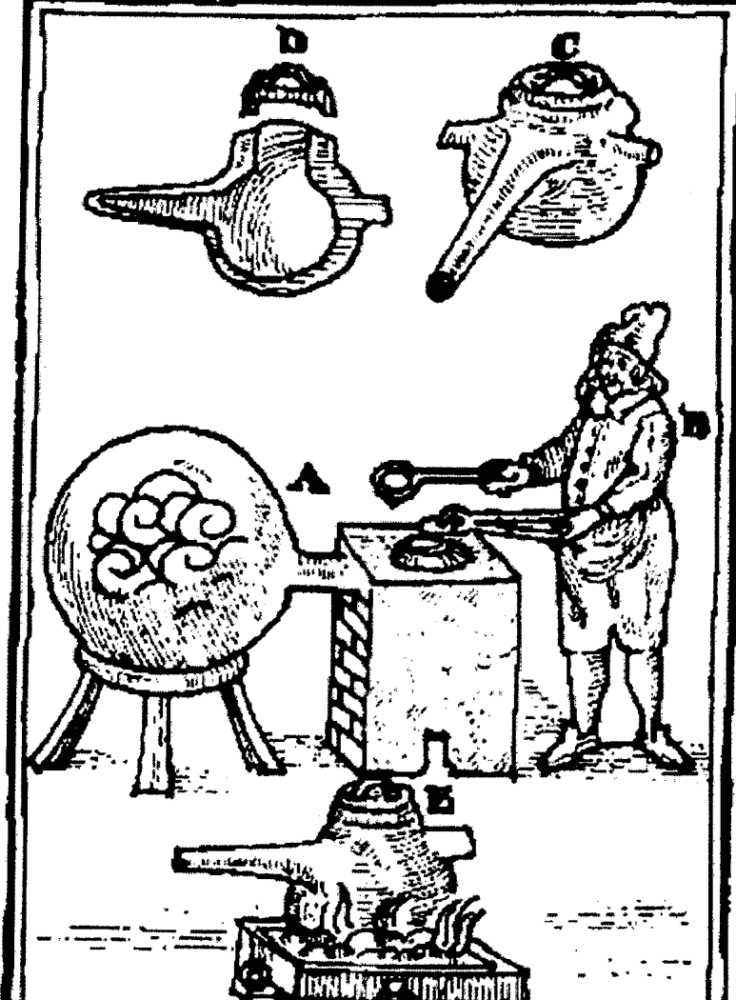

### 摘自《蒸馏的艺术》

在上图插画中描绘的装置可通过慢慢加上几勺盐来蒸馏“强水”。

### 干的 menstruum

在干的方法中用的盐是作为干的溶媒（Dry Menstrua）。就像湿的提取方式中的液态的 menstrua 一样，它保持着植物和矿物工作中的要素，干的方法通过选择好的盐进行高温熔化，能达成矿物或金属的完全液化状态。这种技术源自玻璃制造和制陶的远古艺术。

除了在手上的那些盐之外，还有我们的老朋友麸靼之盐，以及相关的碳酸钠（泡碱）；这两种盐都在玻璃和陶器中广泛使用，因为它们相对低的熔点（大约 900°C），以及能溶解众多矿物体的能力。它们通常被称为碱碳酸钠或单单的碱。

固定的麸靼之盐（K₂CO₃）被认为能“在熔化时穿透任何金属，降低它们硫磺的部分。”

炼金术士乔治·斯塔基在他的书《挥发碱的艺术》中提到过一个过程，在其中“不完美的矿灰”与碱混合在一起，以提取其硫磺。

如果你有之前提过的 Ens 酊剂制作经验，那这项操作会令你感到熟悉，但它是被改编成适于矿物和金属体的。

我们提过麸靼的盐和溶解液的腐蚀性。在混合盐中这种腐蚀性是被大大强化的，不然怎能有快速液化矿物和金属的力量呢。

加热一只大的瓷坩埚，熔合麸靼的盐，直到它半满。当它被熔化了之后，慢慢地加入你研磨成粉末的矿石（通常以氧化物的形态，但不一直如此），让它溶合。用铁棒偶尔搅拌它。

持续按比例加入矿石粉末，以及麸靼的盐，让物质保持完全溶合。我们现在有两个选择，让物质在锅子里冷却，之后再打破它，或是将熔合的液体倒在平滑的抗热表面上。

收集固化的物质，乘其仍然热的时候研磨它。我们在这里又有了几个选择——让粉末物质潮解；就像是在制作 Ens 酊剂中的那样，用 Kerkring Menstruum 提取金属的硫。第二个方法是用雨水溶解物体，让固体沉淀。收集并干燥固体，然后再用准备好的 menstruum 提取。

最后的提取物包含金属的硫，如果在提取中有用到 Alkahest，它也会以新鲜之火复苏。

这项操作有点湿和干，但它能帮助展现所涉及方法的某些潜能。

### YSOPAICA

另一项有点难解的宝贵操作被称为 Ysopaica——用火将物体洗白的艺术。它并不属于湿或干的方法，更类似于是净化植物或矿物来源的辅助方法。

帕拉塞尔苏斯在他的作品中有提到过这个过程，后期是帕拉塞尔苏斯工作追随者的鲁道夫·格劳伯也对它称赞有佳。

Ysopaica 的根源来自古代神殿的烧祭品，物质最纯净的精华被认为会通过火焰的行为散发到天堂中。阿尔伯特会友通常说道 “最精华的不是被火焰破坏，而是被它净化。”

格劳伯在他的书 《De Purgatorio Philosophorum》（大约 1650 年）中写道：

“火焰仅能毁灭像它自身的，比如易燃的硫，但它不会毁灭不易燃的汞，不会破坏，燃烧或消灭它，火焰仅会改良并升华它。因为万物的汞用火焰净化最佳，因为它的不易燃性质，它会被驱走，而又一直会被找到。”

“植物，动物和矿物在燃烧之灵的帮助下，不仅酒，而且谷物，蜂蜜，果实，树叶或草，都可能会被高度净化，被制成最高级的药剂。”

实践方法相当简单，基本上由植物，动物或矿物目标的酒精提取物构成，在冷却穹顶或类似的冷却装备下点燃酒精，它会捕捉升起的热蒸汽，再冷凝它们。

“这个酒的灵会被烧掉，从而最纯净精华盐的汞会被释放，随着火焰烧到接收器，phlegm 会在蒸汽浴中从蒸馏物分离出，被捕捉到接收器里。”

举个简单的例子，我们可以用红酒蒸馏出酒精，再精馏数次。剩下的红酒液体蒸发成像蜂蜜般厚稠的残留液。再将这个蜂蜜以高温蒸馏获得黑色的臭油，在这个不纯净，恶臭的心态中锁着治疗的力量。

在精馏过的葡萄蒸馏酒中溶解黑油，再在冷凝热蒸汽的冷却室下点燃它。所产生的蒸馏液可通过温和的蒸馏取得少量的挥发固体，格劳伯将其称为目标的不燃性汞，它是个强效的药剂。

“这个方法可用于所有恶臭，不纯净，植物，动物，以及易燃的矿物目标上，它们会被洗至最高的纯净等级，可用于伟大的事物中。”

在矿物和金属工作中，就像上面描述的那样用盐来处理目标，用诸如 Kerkring Menstruum 的媒介来提取它，再将所产生的提取液在冷凝室下燃烧。所产生的蒸馏液可通过温和的蒸馏取得挥发的盐。

“以同样的方式，我们可以通过酒精火焰的帮助，从铁，铜，锑，和硫中提取酊剂，让它们成熟至最可爱，好闻，不可燃的药剂。”

这个方法产生的结果通常比较少量，但在效果上是非常强大的。

“学会用火来准备药剂；因为无法被火焰伤害或丧失的，必须要被净化，成为高品质。”

“通过哲学上的涤罪之火清洗东西的艺术是哲学，物理和炼金中的头项技巧。” ——格劳伯《De Purgatorio Philosophorum》

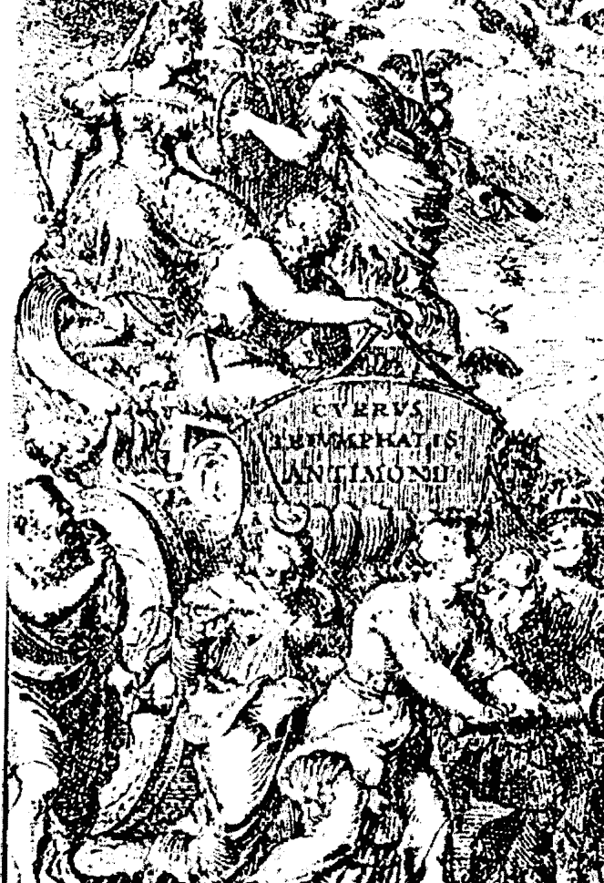

巴兹尔·瓦伦丁《锑的凯旋战车》的卷头插画

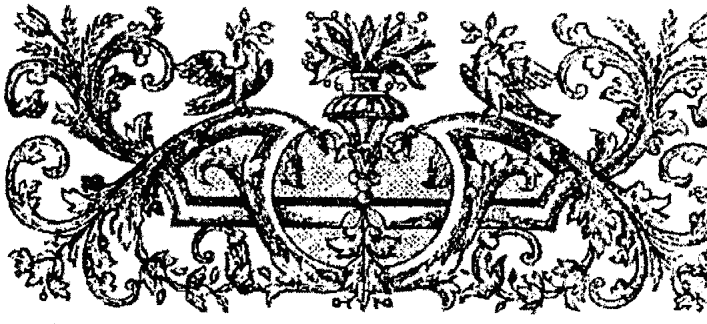

## 第十五章

## 锑

很多人认为，一旦你踏上了炼金之路，那很多奇怪的事通常会以巧合（或同时）的形式发生，给你提供下一步所需的信息和资料。

这对我和锑而言的确如此。我刚从关于锑的 PRS 课程回来，对于要开始工作的事心痒难耐。在一个月内发生一连串奇怪的事件，我发现自己之前根本不知道存在的地的锑矿工作，而且它仅离我家十六英里。不用说，我很快就有了许多 10:12 所需的所有刚采矿得到的锑。

锑在炼金中一直有着特殊的地位。它从非常远古的时候就被人所知了，其他锑的名字是 Mestem, Asinat, Simmi 以及从中得到元素符号的 Stibium。锑被认为是一种有毒的金属，与砷非常相似。对于这个材料的痴迷导致了很多听过它治疗效果的人死亡和诈骗案。受到这些刺激的国会在 1566 年开始在之后的大约一百年里禁止了它的药用。

锑被认为是 Malkuth 的矿石。地球是其行星主宰。它包含所有其他行星的射线，正因为如此，它被认为是不朽的。它的灵是对地球领域固定的。

“古人们知道锑的存在，对它隐藏的药用价值赞美有加。在中世纪，被巴兹尔·瓦伦丁和‘现代医药之父’重新发现的这些美德导致了很多人对它感兴趣。他们都发现锑有着非凡的治疗效果，写了关于它的大量文章。瓦伦丁将锑称为最佳的血液净化剂。他声称用它治愈了许多疾病，包括癌症。这些声称在大约两百五十年之后被荷兰的科林医生证实，他在他的医疗实践中有使用锑的酊剂。”
——阿尔伯特会友

在锑中隐藏的强大力量通常在炼金图像中被描绘成一条黑龙，一条有毒的蛇，一匹狼，或是顶着一个十字架的球体。

许多关于准备锑的权威文献是来自于巴兹尔·瓦伦丁的《锑的凯旋战车》，这本书在大约 1600 年首次出现，不过很多人认为它的年代应该要两百到三百年更早。

### 锑的矿石

到目前为止，锑最常的来源是被称为辉锑矿（Sb₂S₃ 三硫化二锑）的硫化矿。当老的文献中提到锑的时候，它们通常指的是这个硫化矿，当谈到金属锑的时候，他们把它命名为 *Regulus*（小国王）。

辉锑矿通常有着砷，汞，铋，铅以及未化合的硫，所以在使用前应当先烧烤矿石，以尽可能剔除这些不纯净的部分。从 90°C 温和地烧烤它一天，然后逐渐将温度增加到 250°C。

某些人认为这是这些普遍的不纯净使矿物赢得了 *Anti Monos*（不孤单）的名字，从而我们有了它现代的名字锑（Antimony）。

长时间慢慢地焙烧能去除所有的硫，产生一种非常亮灰色的白色氧化锑，适于众多工作。这个焙烧比烧烤的温度要高很多，但要保持在 520°C 之下，否则会开始溶化。之后，随着硫被蒸发掉，矿石会看上更淡，温度则可以增加。用铁棒搅拌粉末一会儿，辅助氧化。氧化锑在这些温度中容易挥发，所以要确保不能过久，温度过高。这是户外工作，要么就要在通风橱里弄。

#### 橘红硫氧化锑矿

锑的奇怪特性之一就是取决于其环境，它会作为酸或者碱性物质。他们将次称为两性的（amphoteric）。

利用这个特性，净化辉锑矿就成了可能，即便它是低等级的矿石，也可以通过化学过程操作。这个净化的结果会造成被称橘红硫氧化锑（Kermes）的红棕色的粉末，以源自昆虫的颜色染料命名。

在化学上，它被认为是锑的硫氧化物。

准备方法是简单的，但会涉及一些像腐烂鸡蛋的恶臭味，所以这要在户外或通风橱进行。

从将矿石研磨成粉末开始。然后置于一边，直到我们需要它。现在准备一剂强烈的碱液，将碱水（氢氧化钠）加入雨水中。20到30%的溶剂就可以。随着碱水溶解，它会变得很烫，所以要慢慢加入，避免沸腾。你也要做出眼镜和手的防护措施。

将研成粉末的辉锑矿加入仍然热的碱溶液，并用非金属的棒子进行搅拌。所加入的矿粉量取决于它的品质，但最好加的量要比使用的碱液重量多。我们可以对这个碱液沥滤数次，取出所有的锑。你也可以接近沸点地加热溶液，以加速辉锑矿的溶解。

在一小时的消化后，让溶液沉淀一会儿，再通过一团玻璃绒过滤它。这个溶液是非常腐蚀的，会直接吃透过滤纸。你可以从水族馆供应商那买到玻璃绒（或玻璃丝）。

所产生的溶液将是深金黄色的。缓慢地将10到30%醋酸灌入这个溶液中，直到溶液的pH值是七或中性。

这是之前提到过的有味道的部分。大量硫化氢释放可是非常有毒的，所以肯定要在户外逆风进行。

随着加入醋酸，你会开始看见一种红棕色的固体形成，落在底部。这就是硫氧化锑矿。

让固体沉淀，再轻轻倒出顶部的清澈液体，放在一边待用。这个液体包含多数的醋酸钠，这可以获得在醋酸盐工作中使用。它之前与锑的关联使其更加珍贵。

用雨水将仍然潮湿的硫氧化锑清洗数遍，这可以通过灌入其十到二十倍的雨水量，让其沉淀，再倒出，并重复这个过程来完成。把湿的固体放在盆子里干燥。

所产生的红棕色粉末，硫氧化锑，现在就净化了，没有之前和锑矿关联的众多不纯，包括氧化铝和二氧化硅母体。在化学上，粉末代表三硫化二锑和三氧化锑的复杂混合物。

诸如氢氧化钾，麸靼之盐，甚至液氨也可用作溶解辉锑矿。通过改变浓度，以及混合酸和碱溶液的顺序，就像颗粒大小会不同一样，所制造的粉末会有从淡黄色到亮桔色到猩红色的变化。

因为硫氧化锑更好的纯度，它更容易焙烧成淡色的氧化物粉末。

#### 锑玻璃

另一个锑的性质就是它是一个玻璃样板。古代的玻璃和陶瓷工艺品早就见证了这项知识。

玻璃的准备从辉锑矿或硫氧化锑焙烧成氧化物开始。这个转变成氧化物的过程不需要太严厉，因为需要少量的硫磺来帮助形成玻璃。如果你溶化纯粹的氧化锑，那你会看见一个美丽的桔黄色液体，但当它铸型和冷却之后，它会恢复成一种不透明的黄白色结晶体。混合在锑氧化物中的硫化锑会促进烈红色，黄色和桔黄色的透明玻璃形成。磨成细粉的氧化锑/硫化锑在瓷坩埚混合，以大约700°到1000°C，有时甚至升到1300°C加热。加上少量的原始辉锑矿粉末来获得深宝石红色的玻璃。某些人会用硼砂作为焊剂，但这在以后移除它的时候会造成问题。事实上，某些人认为硼砂和铝会造成目标炼金上的死亡，不惜任何代价避免使用它们。

当锅子1/3满，完全熔化的时候，拿一根细铁棒插进去，再抽出来。观察粘附在棒子上的玻璃，如果它已经透明的了，那就它就准备好了。如果它是有纹理的，那就继续加热。然而，熔合过程不能做太久，因为材料会在整个过程中挥发。

当熔化液准备好的时候，用钳子快速地将液体灌进一只铜质平底盘子里。它应当是透明的，有一点黄到深红色的色彩，不过通过变更比例和温度，它是可以变成其他颜色的，甚至是绿色和蓝色。许多人偏爱用这个玻璃作为提取锑的硫的原材料。

在用准备好的 menstruums 提取之前，玻璃必须要研磨成细粉。

### 锑的醋

辉锑矿是少数与酿酒发酵相似的矿物，只是所需温度更高。所产生的液体名为锑的醋或纯粹的锑的固定灵，它几乎是矿物世界通用的 menstruum，也是内用和外用强效的药剂。

将数磅的辉锑矿研磨成细粉。以大约 90℃ 烧烤粉末一天，以剔除砷，汞，以及任何可能存在的游离硫磺。在冷却了矿石之后，根据重量混合三份的它和七份的蒸馏雨水。密封在一个烧瓶中，以 40°到 50℃ 消化。频繁地摇匀它。这部分需要一点时间，可能需要一年或更久才能有发酵的产生。

随着锑的灵进入水中，你可能会发现液体变得更加粘，像肥皂或泡沫。这是矿石已经被打开的迹象。现在将材料烧瓶和蒸馏火车连起来。以 80°C 开始慢慢蒸馏，再慢慢升温到 400°C 三天。

让装置完全冷却。你应当会在玻璃器具的玻璃壁上看见黄色到红色的升华物，或者作为外壳在辉锑矿残留物的上方。再对残留物进行蒸馏，冲洗所有壁上的升华物。再重复这个蒸馏两次。最后蒸馏产生的液体就是锑的醋。

它在这个形态中仍然是弱的溶液，但它自身有着极佳的治疗品质。巴兹尔说它会让所有毒素排出身体。

我们可以通过蒸馏浓缩这个固定的灵，它会在短时间内从金子中提取硫。最佳的方法是通过 4×3 蒸馏获得十二个部分。这个分离会打开其他药用的潜能，但我们现在的兴趣是在醋的浓缩上。“醋”这个名字运用在这个液体上是因为它发酵的起源，以及其酸的性质，虽然它不是醋酸或硫酸，但在浓缩后的 pH 值能达到一。对每个十二个部分进行 pH 测量，将最酸的那些混合在一起。

蒸馏这混合液成四个等量，测试 pH。继续蒸馏，测试和混合的过程，直到你分离出的蒸馏物 pH 值是一。这就是浓缩的锑的醋。产量通常很少，但在药效上非常强大，它作为 menstruum 可以基本上提取所有矿物领域的要素。

### 锑的油

从锑中获得油的方法有多种，这些油的性质会根据准备方法不同而有变化。

其中最重要，最有价值的之一就是固定的红油。

从培烧辉锑矿或硫氧化锑成氧化物形态开始。将氧化物研磨成细粉，制成锑的玻璃。再研磨这个玻璃，用强烈的醋液或更好的根醋来提取。让提取过程以 40°C 持续几周，并在这个过程中时不时摇动一下，特别是在起初的几天里，否则它会坍塌成一块厚块。在这些时间之后，溶液会变成金色至深红色。过滤提取液，用新鲜的醋重复过程。

结合所有提取液，过滤它到蒸馏容器中。温和地蒸馏液体，直到它变稠，再加一点水溶解残留物，继续蒸馏。

重复这个用水清洗的过程，移除尽可能多的酸。这个清洗也可用酒精来做。在这个情况中，乙酸乙酯会形成，很容易蒸馏出，所以清洗会更快。

所产生的残留物会作为金棕色，粘性树脂。

将树脂置于恰当大小的蒸馏容器中，就像在醋酸盐工作中的那样进行蒸馏。血红色的油会蒸馏过来，将它们溶于酒精中仔细收集起来。用酒精清洗任何粘附在玻璃壁上的油，将所有的液体混合在一个容器中。密封并让它沉淀数天，再轻轻倒出透明着色的提取物待用。这个固定的锑酊剂具有现代医学没有认识到的强效治疗效果。

### 星锑

锑最后的准备是所谓的星锑 (Star Regulus of Antimony)。

这项准备被认为是高级的炼金工作，因为它有涉及危险，需要操作者具有成熟的实验室技巧。许多古代贤者以非常含蓄的方式描述这项操作。

某些写得最清楚的文章是来自名人的，比如 Eiraneus Philalethes, 尼古拉·弗拉梅尔，甚至艾萨克·牛顿。

事实上，这条路通常被指为弗拉梅尔之路。完成之后，它能引向贤者之石的调制，代表着以干的方式实验室炼金工作的巅峰。

锑块 (Regulus of Antimony) 一直用于指从其矿石中分解出的金属锑。当它被恰当地准备和净化之后，你会发现在金属的表面上有星星的图案。金属自身是非常易碎的，可以很容易磨成粉末。隐藏在这星锑之中的是锑的灵。

> “在锑中的是汞 (在金属渣中)，硫磺 (在红色的中) 和盐 (在沉到底部的黑色土中)，这三者纠正，分离，最终以艺术的恰当方式结合在一起，从而发达不含毒的固定，给予实施者接触火焰之石的机会。”
> ——艾萨克·牛顿

生产锑块最普遍的方法是从辉锑矿或硫氧锑矿开始操作。

艾萨克·牛顿建议两份辉锑矿，一份铁屑，四份烧过的酒石（tartar）。混合物在锅中混合，让其慢慢地冷却。

在表面形成的熔渣或矿渣很容易被榔头敲碎。保留下第一批矿石变成金属的矿渣，它包含金之种子。

在锅子底部的金属或锑块可能会显现一点星星符号，但通常需要另外通过硝石来研磨和混合来净化出星星。

在过程中运用铁能将辉锑矿中的硫带出来，产生硫化铁，剩下作为金属自由的锑沉在底部。

其他生产锑块的方法包括在混合物中使用硝石，例如，十二份的辉锑矿，五份的铁渣，六份的硝石，以及九份原始的酒石。即便是小铁钉也可以在这个过程中代替铁渣。

加上原始的酒石据说能增加在第一遍混合过程中金之种子在矿渣中的产出。

确切的比例取决于你开始时用的辉锑矿品质。

警告：加上硝石的混合物基本上是火药的一种形态，而你会把它置于很热的锅子中。慢慢地加上材料，否则你会很快发现为什么古人把这个过程称之为爆炸。

一旦获得锑块，将它研磨，与比它两倍重的硝石混合，然后再在锅里熔化，以净化它。为了要让金属内获得星星的品质，这个净化过程就需要重复数遍。所产生的星锑（*Star Regulus of Antimony*）也被称为尚武的锑块（*Martial Regulus*），因为在它的生产过程中有用到铁。

锑块自身具有治疗力量。用松节油灵（spirit of turpentine）提取研成粉末的金属会变成深红色。

移除松节油会产生一种油，它会溶于酒的灵芝中，可用于所有的肺病。这被称为锑的香油。

围绕着锑块最大的兴趣是它固定的灵，即汞，可转移到其他金属中，使它们重新获得生气，唤醒它们原动力。这条道路能引向贤者之石的调制。

这条路的接触方式之一是，尚武的铁块与两倍的纯银和少量铜铸在一起，产生月亮金星的锑块（*Luna Venusian Regulus*），它有着美丽的紫色。

再将锑块与净化过的金属汞混汞，进行清洗和蒸馏。混汞和蒸馏需要重复七到十遍，这个过程被指为让老鹰飞翔。锑块和汞金属的混汞不会很容易，所以要加入银来吸收锑的固定灵，并转移它到汞中。

所以，银通常被称为戴安娜的鸽子，作为锑生命力量转移到汞中的媒介。留在回嘴中的银的残留被称为戴安娜已死的鸽子，将它清洁掉，再次使用。随着每次混汞和蒸馏的循环，金属汞变得更加生命化，最终被称为富有生气的汞，它包含金属领域的原动力。金属种子被播种的地方正是肥沃的田园。

净化过的金属金播种到这个富有生气的汞中，并令它消化一段长时间。物质会经历一个黑阶段，然后逐渐变白，最终变红成为酵素（又称红石），可通过使用新鲜的富有生气的汞来增加它。

红石形成人类和金属的万能药的基础。虽然它具有将次等金属转变成金子的力量，但必须要通过被称为蜡化（Inceration）的过程进一步处理，才能使它专用于那个目的。在这个过程之后，它服务于转变金属，不能作为药用。

使用星锑的另一个方法是不适合金属汞来调制石头，通过在关闭的容易中用 menstruum 长时间的消化来集合锑块和金子，这里用的 menstruum 与源自尿液 alkahest 相似。

你也同样会观察到黑色变成白色，再变成红色的过程。

在这个情况中，锑块被称为汞，或者我们的月亮，而金子被称为太阳或硫。液态的 menstruum 也通常被指为汞来混淆你，或者被称为秘火。结合矛盾金属的是催化剂。从而你经常看到某些图片上的炼金工作会有太阳和月亮被汞结合的景象。

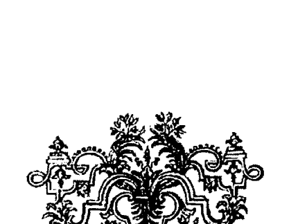

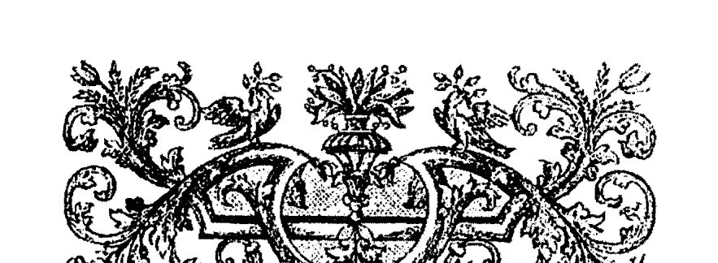

## 第十六章

## 金属的种子

> “物质仅仅是蒸汽而已，它被上级的星星通过土元素被萃取，就像是被宏观的恒星蒸馏一般；恒星进行热的灌入，任何气的硫属性降临在下级上，从而行动与运行，在这些金属和矿物中在灵性和隐性上被植入特定的力量和美德，它在烟熏之后将自身溶解在大地中，进入特定的水之中，所有的金属都从那金属的水质中生成，达到它们的完美；从而要根据获得支配的三大规则对这个或那个金属或矿物进行操作。”
> ——巴兹尔·瓦伦丁《锑的凯旋战车》

现今，矿物领域的产物不被认为具有种子或者是来自种子，但在炼金工作中，这被认为是艺术的大秘密。迈克尔·闪迪弗格斯在他的《新化学之光》中说道：

> 自然不是可见的，虽然她可见地行动；她是挥发的灵，以物理的形态显现自己，她的存在是以神的意志的。
> 
> 她是一，产出不同的事物，但仅通过中介种子的方式。
> 
> 自然实施她的精子需要。自然对种子作用。

闪迪弗格斯在上面所指的种子也就是一个东西的 Quintessence——其最完美的消化和煎煮或根本的湿度。他进一步陈述，认为仅有一颗种子，它们的不同仅是因为地点（子宫）的不同和煮沸（coction）的程度而引起的，但它是在金子里完美成熟的。

在大约 1650 年出版的《化学文选》中对其有这样的描述：

> 金属的种子是智者的儿子们称他们的汞的，用于和水银区别，因为它们作为金属的根本湿度很相似。当明智而谨慎地提取它，不含腐蚀或稀释，包含在其中的是种子般的品质，其完美的成熟仅存在与金子中；在其他金属中它是粗燥未加工的，就像尚未变绿的果实，没有受到足够的太阳加热和元素的行为而消化。我们观察到那个根本的湿度中包含着种子，这是真的；然而，它不是种子，而仅是生命规则漂浮的精液，对眼睛可见。

> “虽然种子是所有被创造之物最荣耀的，然而子宫是它的生命，它造成封闭的谷粒或精液腐败，带出生命原子的冻结物，通过其自体的温暖营养并刺激它的生长。”

盐或身体决定了火或种子在物理世界中以有特色的方式燃烧。盐就是子宫，其中的硫性质和汞性质结合在一起产生了活着的化学之子，天火所化身于其中。

万物以自身性质产生种子，所以贤者通常提醒我们，恰当的种子给予恰当的母体是艺术家的工作，自然再接受，很愉快地将物质结果。贤者告诉我们，我们不会通过种小麦种子得到狗，也不会通过母鸡的鸡蛋得到牛，所以不要指望不用金属种子就能得到任何金属。

那么我们该从哪里找到金属种子呢？《化学文选》中很直接地告诉我们，金属的种子自然要在它们的矿石中找到。那么，最令人渴求的种子就是金的种子，因为金包含最完美的天火镜像。

> “你所寻求的石头，我们认为应当仅是金子，将其尽可能地带到最高的完美，尽管它是坚固小巧的身体，但通过艺术的方向和自然的操作，使叮叮声的灵永远也不会消失。”
> ——菲勒里息斯

就像炼金术士描述众多的火焰程度一样，他们也描述了众多金子的程度，我们必须要鉴别我们谈论的是什么金。

> “因为你所希望的是属于我们哲学的理论和实践，所以我会告诉你，根据贤者们，共有三种金子。”
> 
> “第一种是星灵金，其中央是太阳，其射线同时对在它之下的天堂之体们传递着它和它的光。它是火的物质，太阳细胞的持续散发，在永恒的流入与流出之中，因为太阳和星星的运动，充斥着整个宇宙。在大地上天堂的无限中，这个金子是穿透着一切的，在其内脏总，我们持续呼吸着这个星灵之金，太阳粒子穿透我们的身体，并不停地从它们中呼出。”
> 
> “第二种是元素金，即是元素及所有被它们构成的物质的最纯净，最固定的部分；所以这三个属类的每个子月亮的中心都包含一粒珍贵的元素金。”
> 
> “第三种是个漂亮的金属，其亮度和不可变更的完美给予其价值，使其被所有人类认为是所有邪恶的至高解药和生活的所需，是伟大和人类力量的唯一源泉。”
> ——《赫尔墨斯的胜利》

另一篇描述星灵金的早期文章是这样写的：

> “它是世界的流动，活着的，贯穿所有自然，也就是所有生命延伸；它是所有生物最内在的，其本质无法被腐败，弥散在无限的空间中。太阳和行星仅是这世界规则的凝聚状态，通过它们跳动的心脏散发着它们的富饶，将它们传递到低等世界的形态，以及所有生物，通过它们自己的中心来作用，在完美的道路上驱使那些形态到更高的状态。这个灵可以通过以就像它从星星和地球交流的同样方式获得。这个活着的规则中的形态变得固定，变得完美和永恒。从而，贤者之石是终极的，可用它来制造，使挥发的东西变成固定的。”——约翰尼斯·特里特米乌斯

> “贤者的金子完全是第二种的金子；因为当这个金子被完美培烧，通过 Magistry 升华到它所需要雪的净度和洁白的时候，它是星灵金的自然交响曲，它变成真正的磁石，向它自身吸引并凝聚大量的星灵金和太阳粒子，从在太阳和月亮中心中它们做出的持续散发中接收，正因如此它接近成为贤者活着的金子。”——《赫尔墨斯的胜利》

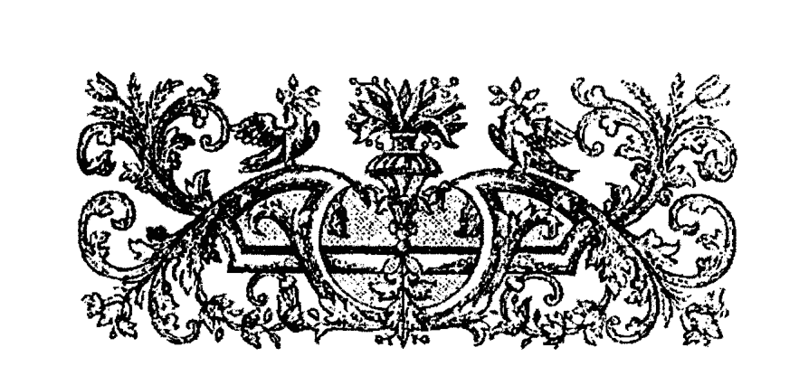

## 第十七章

## 贤者之石

根据赫尔墨斯传统，贤者之石是以巨大的结晶物质形态呈现的，它被认为与压成细粉的玻璃相似，有着深红至藏红色。

它没有味道，不易燃，然而却很容易被烛火溶掉，很容易溶解于水或酒中。制造它的材料很丰富，任何人都能有。

这个石头被认为具有治疗一切疾病的力量，能恢复青春，将其他金属转变为金子。

以前的熟练者不断地向我们保证它的物理现实。据报导在几家欧洲的博物馆里有展示炼金制造的金子。即便截至于我们目前时间，也有成功转变的报道。

在接近十九世纪末的时候，炼金转变被认为是个死问题。“元素是不可变化的。”然后又到了放射现象的发现，以及元素的变化在事实上是自然发生的。

在1960年，当科学家通过用高能量粒子轰炸水银池形成了少量金子的消息传出时，炼金术士的梦成了现实。

在1970年到1980年，法国生物化学家路易斯科夫霖揭露了在活着的系统中作为自然过程的元素转变可能性，将其命名为生物转化（Biological Transmutations）。

现今冷聚变仍然存在争议，量子物理告诉我们观察者在物质世界中有着影响。炼金术的承诺看似远不是死胡同。

炼金术士的完美与进化是其真正的目标。我们提过你必须要成为活着的石头，才能制造出有形的石头。

它的制造过程所需的必要技巧以及其进行的方式会随着炼金术士自身发展的展开向他显露。实际的物理石头被认为是他是否成功的最终试炼或证明，不过在那个阶段，基础金属转变为金子就变得不那么重要了。

如果石头落入了错误的人的手里，那会对世界经济有着灾难的影响，因为它可以被复制，不仅是量，而且其转变的力量也是，一盎司的金能造出一万盎司的金，将上千万正在鬼门关的人治愈。

就像克里斯多夫·格拉泽在大约 1650 年的炼金文献中所写道的——当你口袋里有着能造出千万盎司金子的潜能时，你走在街上会感到安全吗？过去，有不少人被关进监狱并折磨，要求揭露冶金的秘密。你认为现代会有不同吗？

某些人认为这就是为什么炼金术被熟练者那么秘密地守着。怎么回事呢？“有力量，即有责任，以及引发大后果的能力。”

> “从而贤者说他们的物质是在万物之中的，然而选择的这种目标是有着更加丰富与凝聚的世界之灵，而且更容易获得。”
> ——《荷马的黄金链》

### 神圣的辰砂

我们提过两种调制贤者之石的常用方式，也就是通过醋酸铅的湿方法，以及通过星锑的干方法。

最后一个我们将讨论的方法通常被称为神圣辰砂方法。我把它留在最后，是因为它是一个非常危险的操作，需要用到非常有毒的金属水银，而水银是非常难处理的，会很快污染一个区域，很难清理干净。

某些炼金术士索性完全避免运用金属水银，就是因为他们自身和周围的危险。金属水银的运用在中国和印度炼金术中也有所完善。

你在小工作中所发展出来的所有实验室技巧会在这些大工作中起到作用，避免失误。不止一位炼金术士在这项工作中丢掉了性命，所以要特别小心，先知理论，方可实践。

金属水银或普通水银是一个非常奇妙的东西，常温下是液体，像银一样明亮，像金一样重。它仿佛准备好变成任何其他金属一般。轻微的震动就能使它颤动一段时间。它看似是活的。

古人将它称作似银的生命 (Argent Vive)，或快银 (Quicksilver)，不仅因为它一直移动得很快，也很容易颤动着 (quickened) 生命。液态时的水银依旧受到周围灵性能量的强烈影响。

水银工作背后的基础概念是，水银扮演着女性角色，而金子则是男性，它们恰当的结合会产生炼金之子 (贤者之石) 的诞生。

当然不是任何水银和金子就能行的，它们需要哲学的准备。在工作开始前，水银必须要被净化。然后用世界之火对净化过的水银充能，以唤醒它固有的力量。恢复生气的水银再在温度的控制下，以恰当比例和准备好的金子消化，直到它经历过黑色，白色，最终变为红色的阶段，即红石。这方面和前面提过的星锑相同。

> “金是炼金剂真正的酵母。在水银 menstruum (女性) 和太阳/金子 (男性) 之间会发生结合。女性被认为会吸出精子（即金子的‘种子’）。贵金属的种子会使水银想其自身一样单独经历消化。”
> ——Lintaut《黎明之友》大约 1700 年

### 金属水银的净化

我们可以在化学商店里买到高度纯净的水银（三次蒸馏），但以老方式自己净化还是个不错的选择。目的不在于把水银变得有多纯净，而是在炼金上升华它，打开能接受新生命的身体。

因此，用雨水仔细清洗你的水银，再用鹿皮或其他薄的柔软皮革挤压它。

现在对干燥了的水银撒上海盐，覆盖满它。用研钵及研杵完全混合它们。根据水银的不纯净度，盐可能会变深色，甚至是黑色。用雨水洗这脏掉的盐，重复一两遍清洗过程。水银会留有盐的一部分内在精华，这对于剩下的过程很重要。

### 水银的复苏

复苏指的是在物质以太外壳内添加以太精华或规则，并唤醒其固有美德。

复苏水银有多种方式。我们在谈论火焰之路和星锑的时候已经提及了最流行的方法。

最简单的方法是用净化过的水银和天然金。用诸如在河流中淘金获得的金块或砂金的天然金。再将金子用盐和醋研磨成糊状物。洗掉盐，让金子干燥。

对二十九份净化过的水银加入 1¼ 份的金粉，并将它们研磨成流体汞合金。用水清洗汞合金，直到它变得干净和明亮。用纸巾擦表面至干，再将干燥了的汞合金置于高的牢固的玻璃容器中，密封好它。让这个物质在大约 40℃ 消化三个月。在三个月后，将温度增加到 60℃，再继续消化另外三个月。

> “这个行为会激起隐藏在水银中的力量，它会完全围绕着贵金属，逐渐溶解它，释放它的力量到溶解的 menstruum 中。”
> 
> “水银开始获得贵金属的内在种子,从而变得复苏。”
> ——Lintaut《黎明之友》大约 1700 年

这六个月消化后所产生的就是复苏的水银。确保制出足够的量，因为石头加量与加大的后期操作需要它。这个复苏的方法需要一些时间（六个月），但是对危险物质的接触得以降到最低。

最后一个我们将要讨论的水银复苏方法是神圣的辰砂。这个过程需要非常小心，因为它是非常危险的，但被认为是复苏金属水银和生产贤者之石最强大的方式。

我们从用盐和醋来净化金属水银开始，方法如上。在研钵里混合水银和同等量的天然硫，将它们很好地研磨在一起。在这个过程中，物质会变成黑色，形成硫化汞。用放大镜仔细地检查物质。应当不会有细小的水银残留珠。如果有的话，加上额外的硫来研磨。

所产生的黑色物质是辰砂的粗糙形态，也就是水银的硫化矿。我们可以就用这个黑色的辰砂来继续操作，或者我们通过升华来强化它，获得美丽的橙黄色辰砂，也就是最好的，但更难，更危险。

现在，将辰砂（黑色或橙色的）与等量的铁屑混合，置于坚韧的曲颈瓶中蒸馏。就像是星锑一样，铁会吸收辰砂中的硫。金属水银会被释放，开始蒸馏过去。某些操作者建议用50/50的星锑混合物和铁屑。在这两种情况中，从铁自身获得的内在精华才是关键。

> > “红的，太阳的，铁（或星锑中的对应）的硫规则作用在水银上，随着每次操作增加力量。” ——Lintaut《黎明之友》1700

蒸馏的出口引向水的容器，水银蒸汽在那里冷凝成明亮闪耀的金属水银池。反应可能会变得非常强烈，所以要小心加热，需要坚韧的容器和恰当的排风。

实施汞合金蒸馏有个简单的方法，就是用从五金店买的铁管建造一个小的曲颈瓶，在它周围铺上碳球，在户外点燃火焰。出口也是要浸在水容器中，继续金属水银的蒸馏。当蒸馏停止的时候，确保将曲颈瓶的出口从水中抽出，否则冷却中的曲颈瓶会创造的真空，将水吸入装置中，造成严重后果，例如，爆炸。

收集所有蒸馏出的水银，用鹿皮挤干，这样第一周期或鹰就结束了。用新鲜的天然硫制造辰砂，再用铁进行蒸馏的过程需要对这个水银重复，直到七只鹰飞起来。

水银并不会在这个过程中变得更加纯净，而是其硫的内在以太外壳和汞规则得以激活。在最后的鹰之后，将水银自身蒸馏两次。这会导致复苏的水银。

> “正是这施过肥的母体让你可以种植你的谷物。”

### 炼金的 Rebis

一旦我们通过上面的方法或星锑的方法获得了复苏的水银，下一步就是要形成所谓的 Rebis，令相对方结合。

取四份复苏的水银，小心地与细磨的金粉在玻璃研钵中汞齐化。用水清洗汞合金，直到它干净与明亮，再用布吸干。

将弄干净的汞合金置于长颈玻璃容器中，填满它的三分之一。玻璃容器应当要坚固，能够很好地密封。

现在，以大约 50℃ 加热整个容器与容纳物，并快速地密封它，让它冷却一点。在以前，这里就会用到赫尔墨斯封印，加热容器的颈部，让它熔化密封。现代的工艺能够让连接处足够密不透风。

现在让密封的容器在 40°到 50℃ 消化。在加热了三个月后，物质会开始变黑，最终变成黑色。这被称为 Nigredo 阶段（黑色阶段）。

一旦物质完全变黑，温和地将温度加热到大约 60°到 65℃，并继续消化。在两到三个月之后，物质的表面会变成一种色晕，与孔雀尾巴相似，这也是熟练者对这一阶段的名称。随着消化持续，物质的颜色会逐渐变淡，标志着 Albedo（变白）阶段的开始。

大约需要九个月或更久才能令物质完全变白。当这发生的时候，在几个月的过程中，将温度慢慢升到 130℃。

白色会逐渐变成黄色，最终随着时间变成红色。这就是石头的 Rubedo（红色）阶段。一旦达到这个程度，物质应当以大约 200℃ 继续消化两个月，以变成熟。

允许物质慢慢冷却，再打破容器，取出物质，它就是第一程度的红石。

### 蜡化

为了要影响金属转变，红石必须要经历进一步地处理。一旦这发生了，那石头就不能再用作药用，仅能用于转变的目的。

最后的一步处理被称为蜡化（Inceration），意思是指制造像蜡一样的东西。蜡化能增加石头的溶性，和穿透金属的能力。

研磨一部分红石成粉末，再用比它重六倍的复苏的水银汞齐化它。用雨水清洗汞合金数次，再用布弄干。

用鹿皮挤压干燥的汞合金，将被鹿皮挤压出的水银置于一边待用。

收集在鹿皮内的柔软汞合金，就像前面那样置于高的玻璃容器中。

现在将物质以就像准备红石的四个温度消化三个月，(例如，40，65，130，200°C)。

在消化结束时，打破容器，取出物质，它现在就会像蜡一样容易熔化，且完全不会发烟。

以这种方式准备的红石现在就适于投影在金属上了。

#### 红石的量化

在第一程度的红石被认为具有以 1 比 10 转变金属的能力。石头的力量可在量化的过程中增加十倍。这个过程和准备原始的红石过程很相似，只是需要的时间更短。

取一份第一程度的红石，与十分复苏的水银汞齐化。

用雨水清洗汞合金，再弄干。

将干净的汞合金置于高的玻璃容器中，像之前那样密封它。现在开始加热和消化的过程，从 40°C 开始。

物质会经历相同的颜色变化（比如黑色，白色，以及最终的红色），但时间会更短。像之前那样根据颜色变化增加温度。

在达到红色阶段时，将物质冷却，从容器中取出。它的力量现在能够以一份作用在一百份金属上。

如果我们将这个红石再次进行量化的过程，那一份就能作用于一千份金属，以此类推。

要注意的是，在石头用于金属转变之前，它必须先经过蜡化的处理，无论它是什么程度。

某些人认为石头量化的次数超过七次的话是很危险的，据说它会变得发光，然后整个变得不稳定，有可能会发生灾难性结果。

#### 投影

石头最后的测试，以及操作者正确操作的证明，就是金属的转变。

投影是用于描述通过将完美过的太阳药剂投影在熔化的金属之上，来添加它，导致其转变。

取决于石头的品质和量化，要影响各种金属的转变，它所需的量可能会更多或更少。例如，如果一份的石头足够作用于一百份的纯银上，那么同样的那一份可能仅能影响十份更加粗糙的金属，比如锡或铅。

银是次于金的贵金属，通常用于决定红石影响转变力量的强度。

假设我们的红石被量化到了一比一百金属的强度。取一百份纯银金属，在锅子里熔化它们。当它完全被熔化的时候，取一份蜡化的红石，将它制成数个小球或丸子。慢慢地在锅子中一次加入一个球，直到你把一份都加进去了。

随着金属成熟和进化，保持两小时不断的熔化。

在两小时结束后，让物质慢慢地冷却，再从锅子中打破它。

现在，重新熔化金属，将制成锭。所有的银都应当变成了24K金。对金属进行分析可能会发现有没有改变的银，所以石头的强度可以决定在，假定180比1，而不是200比1。

相反，一部分的金属可能要和额外的纯银熔化在一起，表明它的转变强度比预期的更强，假定300比1。

这个对石头力量的评估可以让你决定影响金属转变需要的恰当的量，而不浪费这最珍贵的药剂。

伊丽莎白一世时代的学者/医师约翰 迪和他的炼金同事爱德华·凯利，被认为对此得到了惨痛的教训。

当有了一定量的红石之后，他们开始各种转变实验，但在事后发现石头的力量比预期的更强。不幸的事，等他们意识到它的时候，已经用完了一半的石头。

### 结束语

其他我遇到的化学家通常问我，“炼金和化学像吗？”对此我通常会回答，“不，一点都不。”

炼金和化学在几世纪前就已经分开了，分得也很彻底。随着时间，实验室炼金以新的术语和现代化学发展中的科学目标变得更加模糊。多数现今的化学家根本不知道炼金术是关于什么的。这个课题有着中世纪的污名，有更多的可能等待挖掘。

现代科学已经在自然探索中前进了很久了，但它依然不是无所不知的。在二十世纪的转变中，科学在四大基础力量的影响之下，发现了物质的三大构建模块（质子，中子和电子）。之后，基础的粒子自身又被发现具有更小的粒子，而这些更小的粒子之中又有着更小的粒子。貌似不断会有新的发现，但我们已经抵达了可分性的界限，它变成了数据和可能性的纠缠。有趣的是，意识的力量开始显现自身，观察者称了关键问题。在这个物质的量子能级上，现代科学认识到大脑的影响。它也认识到在时间和空间中的各种样式，就像层，级，或存在的领域。它开始听上去有点像是格柏会说的话。『译者注：根据我的调查，这里的格柏应当指的是八世纪阿拉伯炼金术师 Jabir Ibn Hayyan。』

我们之前提到科学兜了一个圈子回到古代神秘学院所教授的东西。

即便是现代的医学也开始认识到人类的能量体结构，比如针灸经络。

可实践炼金术被那些对这项技艺完全无实践经验的人贴上了坏名声和欺诈的标签。

在古代艺术中依然隐藏着不少秘密，等待着被实践艺术家挖掘。就像以 Magophon 为名的炼金术师说过的，“学生必须要自己实施才能理解所有的概念。”

要光亮起来，你就必须进行操作。大自然会做她自己该做的事。

著名的神秘学作家伊斯雷尔·瑞格德在1938年出版过一本书叫做《贤者之石》，他在里面以神秘和心理学的观点来阐述炼金术。到后来，他在帕拉塞尔苏斯研究协会成为了 Frater Albertus 的学生，令他打开眼见。在他同一本书的第二版中，他对于实验室炼金有这些话要说：

> “我过了很久才意识到实验室炼金不是心理精神上的。我在那里所见证到的并在那之后得以重复进行的，足以令我直截了当地说，单单在炼金术的神秘学诠释上面，我给古代贤者和哲学家们丢脸了。”

仅有那唯一的事物，天火，我们必须要在自我发现的旅程中扮演自己的角色。伟大工作是关于遵循自然，并帮助自然的展开的。天火通常被指为神圣的意志。我们自身的意志是这个引发所有创造的火的反映。

发现我们真正的意志或目的，并履行那个目的是炼金术师最高的成就，也是对自然的服务。

> “炼金的秘密在此：操纵物质和能量，以产生现代科学家所谓的‘力量场’。这个场作用在观察者身上，将其置于世界的特权位置。他可以从这个位置接触到平常被时间和空间，能量无物质，对我们隐藏的现实。这就是我们所谓的‘伟大工作’。”
——Fulcanelli

## 附录

### 表一

| 行星 | 金属 | 器官 | 工作日 |
|---|---|---|---|
| 太阳 | 金 | 心脏 | 星期日 |
| 月亮 | 银 | 大脑 | 星期一 |
| 火星 | 铁 | 胆 | 星期二 |
| 水星 | 水银 | 肺 | 星期三 |
| 木星 | 锡 | 肝 | 星期四 |
| 金星 | 铜 | 肾 | 星期五 |
| 土星 | 铅 | 脾 | 星期六 |

### 植物与行星

这个表是普通植物和它们行星支配者的简选。多数关联是来自16世纪植物学家尼古拉斯卡尔佩珀的《Compleat Herbal》，这本书被以前和现代的大量炼金学家视作经典。

- 太阳: 当归, 月桂, 洋甘菊, 白屈菜, 小米草, 杜松, 万寿菊, 迷迭香, 芸香, 圣约翰草, 茅膏菜, 胡桃
- 月亮: 繁缕, 猪殃殃, 水田芥, 黄瓜, 生菜, 睡莲, 阴地蕨, 桂竹香, 柳木
- 水星: 野胡萝卜, 香菜, 莳萝, 榛子, 哭薄荷, 薰衣草, 百合, 甘草, 马郁兰, 燕麦, 欧芹, 欧洲防风草, 香薄荷, 金银花, 缬草
- 金星: 牛蒡, 楼斗菜, 款冬, 雏菊, 刺芹, 小白菊, 玄参, 秋麒麟草, 药蜀葵, 薄荷, 益母草, 艾蒿, 猫薄荷, 除蚤薄荷车前草, 蔓长春花, 罂粟, 马齿苋, 报春花, 草莓, 蓍草
- 火星: 夏枯草，伏牛花，罗勒，大蒜，龙胆草，山楂，啤酒花，荨麻，洋葱，萝卜，大黄，烟草，苦艾
- 木星: 蜜蜂花，覆盆子，紫草，山萝卜，委陵菜，蒲公英，阔叶野草，菊苣，牛膝草，石莲花，草木犀，橡木，玫瑰
- 土星: 苋属，大麦，玉米，甜菜，聚合草，菟丝草，榆木，紫堇，问荆，冬青，常春藤，毛蕊花，龙葵，荠菜，黑刺李，鹿蹄草，紫杉