# 物質、心智、性靈煉金實作導引
## 靠煉金術原則轉變性靈自我
## 煉金術新手指南

## THE BEGINNER'S GUIDE TO ALCHEMY

> 亞馬遜4.7星 至高好評！

莎拉·登 著

羅琳琪——譯

> 第一本煉金術 實作專書！

福利公告：

凡在【天使神秘学院】购买任何电子资料赠送实体书，详情请咨询店铺客服！
备注：如客服不知道这活动你可能进了盗版店铺！
赠书活动仅在以下正版店铺购买有效哦！

## 【天使神秘学院】淘宝店

手机淘宝扫以下二维码

1、打开手机淘宝：搜索“天使神秘学院”
2、点击“店铺”按钮就是

## 【天使神秘学院】微店

手机微信扫以下二维码

用手机微信扫码进店

制作说明：

本书由《天使神秘学院》出重金从台湾购入的原版书籍扫描制作完成。为达到最好阅读效果，特地把书全部切开后，再经由专业扫描设备高精度扫描完成，并经过一张张的PS后期处理最终成书，其间花费大量的人力、物力以及时间，只为能给大家提供经济并优质的神秘学学习资料而努力。

本学院强力谴责某些机构和个人，把本学院花心血制作完成的电子书籍，包装后直接放在自家网上低价倾销的行为，以谋取不劳而获的经济利益。如果长此以往最终将无人愿意再为大家花心思制作电子书，那以后可能大家再无新书可读。

为让大家以后能够读到更多的好书，也为了本学院的良性发展。本学院恳请大家尽量做到如下几点：

- 尽量在天使神秘学院的官方网站购买电子书籍。
  官网访问地址：http://www.ac2011.cn
  短网址：ac2011.cn
  网址含义：(Archangel College 成立时间：2011年)

  手机微信购买
  请扫以下二维码

  手机淘宝等购买
  请扫以下二维码

  加店长微信号
  请扫以下二维码

- 在收到电子书后小范围传阅即可，千万不要公开传播，更别挂到网上低价销售。

同时为答谢广大支持者，学院电子书将做如下调整：

- 学院会把一些早已收回制作成本的电子书折价销售。
- 最新制作的电子书籍会开放打印功能，大家购买后有条件的可自行打印成书。

物質、心智、性靈煉金實作導引
靠煉金術原則轉變性靈自我

## 煉金術
新手指南

## THE BEGINNER'S GUIDE
TO ALCHEMY

莎拉·登 著

## 目 錄

## 導論

# 第一部分

### 煉金術的基礎....11

第一章 何謂煉金術....13

第二章 煉金術與四大元素....37

第三章 煉金術的大功業....55

## 第二部分

### 宏微萬物裡的煉金術....81

第四章 煉金術與行星....83

第五章 煉金術的軸心....103

結語 120 · 學習資源 123 ·

術語表 126 · 謝辭 131

## 導論

歡迎來到奇妙的煉金術世界！即將跟你分享我多年來在這奇異領域中所累積的知識，實在讓我非常開心。這些充滿洞見與驚奇的知識徹底改變了我看待世界的方式。

我對煉金術的嗜好，始於某次從俄亥俄州開車到緬因州的長途旅程。我請同樣熱愛奇幻的朋友梅爾推薦有聲書讓我在路上聽，她興奮地告訴我：「黛博拉·哈克妮斯的《魔法覺醒》妳一定會很喜歡！」於是，我就這樣掉入煉金術的世界，展開我最愛的一段奇幻戀情。

從一份被下咒的煉金術手抄本，到多位實行煉金術的角色，整個三部曲都圍繞在煉金術這個主題。我完完全全著迷了，用了幾個通宵把這本書讀完之後，我希望能更深入認識煉金術這門怪異又神秘的藝術。

煉金術最初會吸引我，是因為它在魔法與科學、不可知與可知之間試圖達成平衡。煉金術結合了物質、實際的追求（像是把鉛變成黃金）以及性靈、心神的追求（自我的轉變）。這種物理與形上的結合可能會被錯誤地詮釋為一種巫術，但是對煉金術士而言，這純粹是他們看待世界的方法。他們知道，自己可以經由煉金術的轉變原理來改變自己和周遭世界。其實，這個論點跟今日的醫學和科學原理沒有那麼不同。

煉金術士是他們那個時代的神秘主義者，努力把自己低階的靈魂和思想轉變成最至高神聖的形態。煉金術士為未知事物保留空間，創造一套詮釋、理解周遭世界的方法。基本上，煉金術士可以說創造了自己的宗教。

煉金術跟從古至今的許多傳統一樣，從未真正消失過。更準確地說，它只是隨著時代演變。很多現代科學領域的創始故事，都找得到煉金術的痕跡。從化學、量子力學到心理學和文學，煉金術的原理早已滲入當今社會的方方面面。

你手中的這本書結合了煉金術的歷史、原理、趣事、人物檔案和獨一無二的實驗與練習，希望可以為你帶來一趟容易消化、好玩有趣的煉金術之旅，將這古老藝術形式背後的深奧概念與象徵符號加以解密。「第一部分：煉金術的基礎」會談到煉金術的一些基本概念，包括元素所扮演的角色及「大功業」的入門介紹。「第二部分：宏觀萬物裡的煉金術」則會探討宇宙及更多東西，檢視煉金術歷久彌新的各種樣貌。另外，透過一些省思實驗和在家就能安全操作的練習，你自己也將成為可靠的煉金術士！

鑽研煉金術、現在又寫了有關煉金術的書，讓我對這個世界和我們在世界上的定位越來越感到好奇。做菜時，我會忍不住思考食物經歷的各個轉變階段，先是從土壤裡摘採、在炒鍋中產生變化，最後來到餐盤上。當我思索自己在這美妙的世界處於什麼樣的位置時，會想到那些相信所有宗教同出一源的煉金術士。煉金術士相信，我們這一生的大功業就是要讓自己和周遭世界變得更好。無論這是你第一次聽說煉金術，或者你已經在煉金術的熔爐涉獵頗深，研究煉金術都能把你變成一個更有好奇心、更懂得思考、更愛問問題的人。

歡迎加入這場冒險！

# 第一部分 ——

### 煉金術的基礎

- 在第一個部分，我們要進行煉金術的基本介紹
- 從精確的定義和最初的起源，一路講到煉金術最主要的三個層次（物質、心智、性靈）。

我們將了解每一個元素的重要性，還有這些元素如何帶來第一物質、哲人之石和大功業等煉金術概念。接著，我們會把前面學到的東西結合起來，探索大功業的三階段。親愛的學徒，恭喜你踏上旅程的第一步！

获取更多好书，请加微信号: strcdts

官网: http://www.ac2011.cn

## 第一章

### 何謂煉金術

在第一章，我們將建構、探索煉金術的骨幹。我們要定義煉金術，深入其古埃及的根源，並討論煉金術最重要的三個面向：物質（實際的實驗操作）、性靈（煉金術神秘主義的面向）和心智（心理學家如何採用煉金術的自我轉變概念，以實用的方式改變心理習慣）。最後，我們會了解煉金術最重要的根本原理之一：神祕的轉變七階段。

### 炼金术的起源

那么，炼金术到底是什么？「炼金术是转变的艺术。」就这样！但，请继续往下读，因为这只是个开端。

炼金术的目标是往更好的方向（无论是真正的黄金或黄金般的心灵）改变。将普通的卑金属转变成其精华（例如铅变成金）的过程，既是一种真正的炼金术实验，也是改造灵魂与思想的地图。炼金术士力求将一切事物转变成它们最高的形式，进而改变该事物的生命历程。这就是炼金术的根本：发掘一切的本质。

「炼金术」（alchemy）一词（以及「化学」（chemistry））是来自古埃及语的「khem」，讲的是尼罗河岸常发生的自然转变现象。每年，尼罗河都会氾滥，把「khem」这种肥沃的黑土沉积下来，是古埃及农业不可或缺的一环。有关炼金术的书籍，早在两千年前的埃及、中国、美索不达米亚和印度就出现了。

到了西元300年，炼金术的基本原则就已建构得很完善，影响了亚里士多德的哲学和中国的道教等各种思想。炼金术的影响力之所以如此广大，大多归功于建立在亚历山卓的古埃及图书馆，因为那里收藏了所有重要的炼金术文献，是古代世界的炼金术士和学者极想朝圣之地。若非阿拉伯人控制了连同亚历山卓在内的埃及领土，把古埃及和希腊炼金术前人所著的作品加以翻译、扩充，那些文献有可能就此消失在这世上。阿拉伯炼金术士完成了许多重要的炼金术发现，如炼金术中硫和汞的概念。

在中世纪初期，阿拉伯文化经由西班牙和义大利南部跟欧洲有了接触，包括炼金术在内的阿拉伯思想和发明也跟着传入。阿拉伯的炼金术文献被翻译成拉丁文，这门学问迅速传遍整个中世纪欧洲。针对人们对炼金术展现的兴趣，教会不怎么高兴，因为在炼金术士眼里可以改造灵魂的实验，从教会的观点来看太像魔法了。炼金术士尽可能使用基督教的语言和象征符号来隐藏、包装自己的实验，但这些努力不总是能说服教会。就连今日，炼金术士仍常被错误地描写成像梅林一样的古怪巫师。不过，这样的联想也有几分道理，因为炼金术有很大一部分确实是游走在未知和已知、形上和物理之间。

到了1595年，物质（以实验为主的）炼金术渐渐跟较虚无缥缈、力求改变自我心智与性灵的炼金术分开。在整个十七世纪，化学开始兴起，到了十八世纪便已完全取代炼金术。炼金术被扫到一旁，贬低成催生化学的伪科学，而非已经存在千年的复杂哲学体系。

多亏了心理学家卡尔·荣格，形上层面的炼金术在二十世纪重新获得注目。炼金术士对于心理转变的认识为荣格治疗病患的方法带来灵感。今天，荣格心理学带动了现代的心智炼金术。

在接下来的章节，我将深入介绍今日炼金术的三个主要类型：心智、性灵与物质，从各自的脉络加以定义。

### 认识托特

在埃及传说中，托特常被描绘成鹮首人身、手持书简，且是跟古埃及人分享炼金术奥秘的神祇。书简象征托特为埃及所带来最棒的礼物：书写的知识。抄写员的角色对古埃及人来说极为神秘重要，因此当中有很多人甚至被认为是巫师。

文字跟魔法之间的关联，使得托特演变成智慧和巫术之神。古埃及人相信，托特启动了世界的创造，并能同时存在于每个地方。除了炼金术，托特也被认为是其他许多学科领域——数学、农学、医学、宗教和魔法——的创始者，而且据说是《翠玉录》（The Emerald Tablet）这个炼金术伟大文献的作者。这份文献囊括了托特对于炼金术的密契思想，日后影响了牛顿和培根等人。

后来，古希腊人把托特跟他们的使者神祇赫密士联想在一起。中世纪的炼金术士后来称他为赫密士·崔斯墨图（Hermes Trismegistus），意思是「三重伟大的赫密士」，指涉真正的炼金术转变会出现在三个层次：物质、性和心智。

### 炼金术的不同面向

说到炼金术士，你的脑中可能会浮现一个长髯老人的身影，在城堡的地牢中受到沸滚的魔药和神秘的粉末所围绕，日日夜夜努力把铅变成黄金。把铅变成黄金无疑是炼金术谜团的一部分，有几位传奇炼金术士据说甚至真的成功创造了黄金，但是炼金术绝对不只如此。世界各地的炼金术士曾做过各种怪异的实验。例如，中国的炼金术士便是火药的发明者。

幸好，对那些不想在自家厨房制造爆裂物的我们来说，炼金术不只有这样。炼金术中发生的转变（或称蜕变）可以是物理的（像是那位把铅变成黄金的胡子朋友）或形上的（跟灵魂或心神有关）。我们的周遭无时无刻都在发生变化。炼金术士相信，光是承认变化无所不在就能让一个人开始看见宇宙的本质，也就是他们所谓的「一心」（One Mind）。

物质（显明）炼金术的根本，是使用元素（气、火、水、土）转变真实的物质。炼金术士想出了各式各样的实验，包括在试管内创造黄金树（哲人之树）及燃烧以铅为主的粉末来创造黄金火（黑龙）。只要稍微深入一点，就会知道把铅变成黄金只是个开端。

炼金术士也同样致力于改造自我，因为据说唯有拥有纯洁灵魂的炼金术士能成功将较低下的金属蜕变成更高等的金属。

在性灵（隐密）炼金术中，把铅变成黄金的步骤则是用来将如铅一般不纯洁的灵魂转变成如黄金般获得启蒙的心灵。跟典型的教义研读或祷告不同，性灵炼金术讲求的是精炼自己较低下的部分（如恐惧、疑虑和自我憎恨），展露最真实启蒙的自我，类似达到涅槃的状态。

性灵炼金术改变的是灵魂，心智炼金术则要改变思想。钻研心智炼金术可以协助一个人摆脱常态的心理习惯，如早上一醒来就检查手机。在心智炼金术中，你会采取容易执行的小转变，慢慢将心理变成一个友善、乐于接受的空间，充满善解人意的想法。

蒸馏器（alembic），物质炼金术历久不衰的器具。

#### 炼金术应用
#### 制作可食用的薰衣草酊剂

透过这个实验，你会制造一款含有薰衣草精华的可食用酊剂，同时验证炼金术最重要的真理之一：物质转变是永久不变的。

- **材料**
  - 薰衣草花110克（或55克干燥的薰衣草）
  - 100标准酒度的伏特加、白兰地或兰姆酒（或食品等级的植物甘油）440克
- **工具**
  - 量秤
  - 1夸特大小的玻璃保鲜容器
  - 细密筛网或咖啡滤纸
  - 食物处理机或果汁机（非必要）
  - 阳光普照的窗台

1. 用磅秤量出薰衣草（约网球大小），接着使用食物调理机、果汁机或刀子把薰衣草切得越碎越好。
2. 将薰衣草放入保鲜容器。如果你希望为酊剂增添炼金术效用，请在满月期间进行步骤三。
3. 把酒精或植物甘油倒入，淹没薰衣草五公分左右。结合一点心智炼金术，在一张小纸条上写下你在生活中希望净化或放下的事物，然后放进酊剂里。别忘了，如果希望转变成功，也必须实践性和心智炼金术。
4. 盖上盖子，摇一摇，把容器放在阳光普照的窗边。
5. 连续两到六周，一天摇晃容器一两次。观察薰衣草渐渐分解，转变成全新的物质。
6. 理想的时间过去后，将酊剂过滤。假如你在满月期间进行步骤三，请再等待满月时期进行这个步骤，为酊剂增添效用。
7. 使用细密筛网或咖啡滤纸再过滤一次。
8. 观察滤掉的黑色物质，想想薰衣草原本的样子。如果你有写下希望释放的事物，也一并想想该事物发生了什么转变。
9. 将酊剂存放在暗色玻璃容器内，或放入透明玻璃容器，存放在阴凉处。务必标注日期和内容物。

用途：酒精酊剂并不会变质，但你使用的若是植物甘油，则应在两到三年内使用完毕。这款酊剂百分之百可食用，可以加在任何料理中。倒几滴在水瓶中，或是用来按摩太阳穴，有助舒缓头痛和焦虑，或促进平静放松的睡眠。

在接下来的三个小节，我将进一步深入这三种类型的炼金术，着重强调如何即刻把这些不同的面向实行在自己的生活中。

#### 物質煉金術

物質煉金術講的是煉金術實際發生在實驗室裡的那些元素。物質煉金術最重要的實驗之一，就是把較低下的金屬轉變成更高尚的金屬。

在煉金術的世界，只要成功完成轉變的七階段，就能實現任何物質的轉變。現在，你只需要知道這些階段的目標是要將任何物質精煉成最純粹的狀態。

這個純化物質的過程被稱作大功業，最終可以創造出哲人之石。根據傳說，哲人之石是一種能把任何東西轉變成最高形態的實體物質。要創造出哲人之石，煉金術士必須融合所有對立的元素（氣、火、水、土）。我在第二章會深入談論這些元素，現在你只要知道煉金術跟這類互相對立的事物之融合有關即可。

你可能會想，物質煉金術早已被化學所取代。物質煉金術後來雖然造就現代化學，但化學依然虧欠煉金術一大筆恩情。一些目前已知最早的實驗器材，便是早期的煉金術士所研發的，今天的化學家仍會使用。

西元200年左右，猶太女人瑪利亞（Maria Prophetissa, or Mary the Jewess）發明了許多不同的煉金術儀器，三臂蒸餾器（tribikos）就是其中一例。三臂蒸餾器是一種有著雙重內壁的容器，可協助蒐集、蒸餾加熱過的物質。今天，全世界的化學實驗室仍在使用現代版的三臂蒸餾器。

除了煉金術帶給化學的貢獻，有些學者依然有在實行物質煉金術，像是歷史與科學教授勞倫斯・普林西普（Lawrence Principe）。普林西普會窩在小小的大學實驗室裡，試圖解開煉金術士使用古怪符號和難解文字記錄下來的實驗，以更好地了解數世紀以前的煉金術士。

### 馴服煉金術之龍
#### 冥想練習

材料
- 蠟燭
- 火柴或打火機
- 安靜的空間

找一個不受打擾的安靜空間。採取舒適的坐姿，讓脊柱挺直，比方說坐在椅子上雙腳著地，背部有所支撐。深呼吸數次，鼻進口出，直到感覺身心都安定下來。留意自己浮現的念頭，但允許它們如溪水中的落葉般緩緩漂走。

將蠟燭放在面前。點燃蠟燭，象徵你即將跟煉金術之龍一起進行充滿活躍精力的一件事。閉上眼睛或注視燭火。

以有意識地吐氣排出空氣、被動吸氣填滿胸腔的方式開始呼吸。大約一秒鐘吸吐一個週期（在昆達里尼瑜伽中，此調息法稱為「龍息」或「火息」）。進行數分鐘的時間。

回到正常的呼吸狀態。閉上眼睛，感受身體充斥著煉金術之龍的能量。花一點點時間確立決心處理某個私人或文化混沌能量（像是完成某項任務或志願推動某個政治運動）的意圖。

吹熄蠟燭。

#### 炼金术应用

#### 运用心智炼金术，将无力转变为力量

找一个不受打扰的安静舒适空间。

闭上眼睛，进行几次深沉、集中的呼吸。

回想最近一次让你感到无力的时刻，例如上司在工作上刁难你，或者你来不及报名一个让你很期待的课程。当下的你在哪里？有什么感受？在脑海里重播这个时刻，就像你在观看电影的某一幕。

把力量传送过去这个受伤的你。拥抱自己，给自己一块假想的巧克力。在那一刻，有什么事情可以让你好过一点？现在想像自己做那件事。

想像一圈闪闪发光的纯白光芒将你包围，烧去那些无力感。看着光芒越来越亮，吞噬所有负面情绪。

看着这个散发光芒、美丽的自己。将这幅景象吸入。

人生中难免有失望，但这些事不能定义你这个人。这些都只是生命的一部分，这些经历无法定义你。

张开双眼，知道自己已经足够了。

还有国际炼金术公会（International Alchemy Guild，IAG）这个组织，是作家兼现代炼金术士的丹尼斯・威廉・豪克（Dennis William Hauck）在1998年创立的。IAG 成立的目的是为了教育、支持今天那些对物质炼金术有兴趣的人。根据 IAG 的统计，现在拥有执照的炼金术士比过去还要多。

不过，纵使你还没准备好要参加一个获得认可的炼金术士训练课程，物质炼金术仍有很多宝藏可以挖掘。物质转换充斥着我们的身体和生活。看看一张老相片，注意自己的样貌因年纪增长经历了哪些变化；观察菠菜在炒锅中变得鲜绿。这些日常变化都是物质炼金术的表现。花点时间承认这些变化的存在，便是了解炼金术的根本原则“变化无所不在”最简单的方式。

### 性灵炼金术

在炼金术里，转变唯有发生在现实的所有层次才得以维持：物质、性灵和心智。所以，现在你已经对物质炼金术有了扎实的认识，就让我们来探索性灵炼金术。

性灵炼金术的根源是精神和灵魂的转变。有一点很重要，那就是对炼金术士来说，精神与灵魂是不同的。在炼金术里，精神会不断朝更好的方向迈进，跟红国王这个至为重要的象征有关；灵魂寻求的则是当下的知足，跟同样重要的白王后这个象征有关。就好像物质炼金术中，互相对立的元素力量必须结合在一起，性灵炼金术也是同样的道理，灵魂和精神这两股对立的力量定要互相结合，才能变成我们最至高的“黄金”自我。红国王与白王后的合一 是炼金术转变中最关键的阶段。他们的合一被称作“神圣婚姻”（第三章会提到更多）。

在实验室进行的物质炼金术跟性灵炼金术是相辅相成的，因为炼金术士努力把铅变成黄金的同时，也得努力转变自己的性灵。就好比瑜伽是转变性灵的实际做法，炼金术也是如此。

性灵炼金术不同于祷告时所做的请求、冥想时内在的沉静或其他类型的宗教实践。在炼金术里，带动性灵转变的是一个人的意志（可称为“火”）。你是唯一能够改变自己的人。你拥有做到这点的炼金术工具，但是要不要掌握、应用这些工具却是由你决定。

把自己不朽不灭的本质转化成最至高的状态，是极严苛的一项工作，在东西方的炼金术里都与龙的象征有关。在物质炼金术中，炼金术之龙跟一种神秘、无 defining 的物质“哲学之汞”有关。哲学之汞和一般的汞或水银不一样。物质炼金术是世界的原始能量。任何物质要真正地转变（无论是金属铅或自我的性灵），不能没有炼金术之龙，也就是不能不驾驭世界的能量。

在性灵炼金术里，跟炼金术之龙合作就是要转变混沌的能量，而这个过程发生在私人层次以及更广大的文化层次上。所有的事件都提早十分钟抵达，不要总是迟到，便是在私人层次上转变混沌能量的一个例子。在文化层次上，混沌能量的转变可以是指处理较大的文化议题，像是战争或贫穷。比方说，想在私人生活中对付贫穷这个文化上的混沌，你可以一个星期在赈济厨房帮忙一天。察觉到生活中的混沌后，我们唯一的选择是接受它，驾驭这些混沌，迈向更好的境界。不是要打败炼金术之龙的混沌，而是要学习在混沌中安稳沉静，尽我们所能驾驭混沌的能量。别被文化混沌的规模所吓阻，就不付出个人的心力，因为每个人都有带来改变的能力。

#### 炼金术应用

#### 跟你的炼金术之龙合作：

##### 日记练习

##### 工具

笔。日记本

首先，回想这一整天、一星期或一个月以来，你的世界感觉混沌不安的时刻。先点出那个时刻就好。在心里注记：“事情此刻感觉有点混沌。”做这件事时不要带任何成见。

找一个安静安全的空间，让你可以思考书写，不受打扰。

列出过去这一天、一星期或一个月以来，你能记得的所有混沌时刻。检视这份清单。有没有看到相似之处？你是否总是在担心迟到？留意是什么样的情况带来混沌的感覚。事情感觉充满混沌，是在你睡不饱的时候吗？还是睡太多的时候？或是在喝了酒之后？

想一个容易实践的小行动，从下个星期开始履行，减少混沌的状况，像是：每天晚上同一时间就寝；就寝后就把手机收起来；以气泡水取代鸡尾酒。

一个星期后，回想实践那个小行动的感覚是什么。混沌有没有少一点？如果不小心恢复旧习，也别对自己太苛刻。重点在于开始察觉、开始转变。与其痛斥自己一顿，不如尝试明天做得更好。

习惯需要一个月左右才能养成，所以假如这个容易实践的小行动有助减少生活中的混沌，那就继续下去！假如它让生活更混沌，就选择其他行动来实践。

炼金术之龙经常被描写成“衔尾蛇”这个古老的象征符号，也就是一条吞食自己尾巴的龙或蛇。对炼金术士来说，衔尾蛇代表能量其实既没有被创造、也没有被摧毁，仅是经过了转变。炼金术士相信，我们每个人都有能力转变性灵的自我，差别只在有没有去做。

### 心智炼金术

炼金术士认为，转变若要持久，个人的心智也得发生改变，这就是心智炼金术。炼金术的第三种形式讲求的是转变自己的身份认同，最终明白身份认同（或自我意识）是不可知的。

心智炼金术跟瑞士精神分析学家卡尔・荣格有密切的关联。他认为炼金术是解锁人类潜意识的钥匙，并会运用它来转变病患的心理。荣格将自己对于潜意识在一生中经历的转变和演化所具备的认识，归功于炼金术。事实上，荣格收藏的原始炼金术文献数量，在全欧洲名列前茅。

心智炼金术所要进行的核心工作，就是打破身份认同中僵化的部分，而这僵化的部分就称为“盐”。在物质炼金术中，盐是一种固体；在心智炼金术中，盐是对真实自我的局限认识。所有的小孩都是艺术家，对于唱歌或展示自己创作的艺术作品丝毫不害臊。但当我们长大了，就会被教导要专注在更“有用”或“有利”的事情上。你认识多少人，想到画画或上台表演就感到怯懦？你曾不曾听过自己或他人说：“噢，不行啦，这个我做不到。”这就暗示了盐的存在，也就是对自己的认同拥有某种局限的想法。

为了打破这些人格上的盐，就一定要再回头探索宇宙的第一物质。我会在第二章更深入说明第一物质，现在先简短地定义之：第一物质是世界混沌、原始，以龙做为象征的能量，也是一切的本质。这有点类似印度教的“婆罗门”概念或物理学的弦理论。印度教所谓的婆罗门是指属于一切源头的永恒能量，而量子力学的弦理论讲的则是最基本的物质粒子是如何互动的。

但是，我们要怎么驾驭第一物质这个概念，来转变人格中的盐？入门其实非常简单：寻找新体验。开始写日记、看场电影、跳伞、约会，做一件吓破胆的事。每当你想要说“不，我做不到”的时候，就去做那件事。

我们来说说“看场电影”为什么也称得上是心智炼金术。你有没有看过一场让你完全崩坏、事后无法好好说出一句话的电影？有那种感覚，就表示你的身份认同或盐出现裂痕了。在这种原始开放的状态中，你才能接触第一物质，感受到一切事物的相互连结。当你拥有越来越多这样的认同破裂体验，你会对以下这个观念感到越来越自在：身份认同不是固定不变的，我们全都来自同一个根源，也就是炼金术士所谓的第一物质。

### 其他形式的炼金术

虽然物质、性和心智炼金术构成了炼金术的三个基本类型，但其实还有其他的形式。

首先，我们来谈谈艺术炼金术。自从炼金术开始存在以来，艺术就跟炼金术密不可分，特别是视觉艺术。染料、颜料、珠宝制造、雕塑和香水全都得好好感谢炼金术士的功劳。不少当代艺术家都把自己视为现代的炼金术士，创作出来的作品会随着时间出现转变。

当代艺术家妃丝・斯庞斯勒（Faith Sponsler）的创作时常会经历化学反应，变成全新的东西。例如，她的橡胶版画因为浸过铁，在泡过绿茶后会变成非常深的颜色。

处理胶卷所会经历的化学变化，使炼金术进入摄影和电影制片的领域。摄影师马修・塞塔（Matthew Cetta）在“摄影炼金术”（Photogenic Alchemy）这个系列作品中，便拥抱了摄影与炼金术之间的关联，运用安眠药、水管疏通剂等媒介冲洗底片。我们会在第五章深入探讨艺术与炼金术之间的连结，现在只需要知道一件事：两者的连结可大了！

#### 炼金术应用

#### 打破你的盐：

##### 日记练习

##### 工具

- 笔・日记本

找一个舒适安静的空间，让你可以不带成见地省思。

想一些可以助你突破自我的挑战，如跳伞或请朋友替你安排一场约会。在日记本写下几个类似的例子。假如你知道事情会顺利完成，你会怎么做？假如你知道他会打给你，你会不会把自己的电话号码给那个帅气的吉他手？假如你知道跳伞会改变你的人生，你会不会跳下去？

把其中一个挑战圈起来，并在这星期完成它！这必须是一件让你害怕、将你逼到极限的事情。你也可以说服朋友跟你一起去做，这样你才有动力履行对自己的承诺。

完成挑战后，回想事情进行得如何。你当下有什么感覚？试着不去期待某个特定的理想结果。例如，想想把电话号码给陌生人的感覚是什么，而不去期待对方会不会打来。

给自己一些宠溺的奖赏（一片黑巧克力？）之后，再选一个挑战！拥有一点省思充电的时间很重要，但是继续找一些挑战你的事情来做也很重要。

看哪，你在打破自己的盐了！

性和心智炼金术给予很多电影工作者和故事创作人灵感，去创造关于个人和性灵转变的故事。例如，炼金术便启发了乔瑟夫・坎伯（Joseph Campbell）的英雄旅程概念，而英雄旅程的概念又进而启发了科幻经典《星际大战》（第五章会讲到更多）。

社会炼金术追求的则是关系的转变。这里所说的包括人际关系（朋友和爱人之间）的转变以及社会的转变（例如终结贫穷或奴役）。这个词本身在上个世纪开始兴起，跟二十世纪的许多社会运动都有密切相关。

跟心智炼金术不同但很有关系的另一个类型是心理学炼金术。心智和心理学炼金术虽然都受到卡尔・荣格很大的影响，但是后者比较强调炼金术的原则如何持续影响心理学。人格测验和原型都有运用到炼金术的原则，而这两者也都源于荣格的心智理论，取自炼金术。

有一件事要特别注意，那就是过去的炼金术士不会像今天的我们一样，区分不同炼金术类型的细微差异。对他们而言，任一种转变形式都是炼金术的形式，因为所有转变皆源自第一物质。炼金术讲的纯粹只是如何回归到第一物质所代表的最至高、“黄金”的状态。对炼金术士来说，转变是发生在心理治疗师的沙发上、艺术家的工作室还是整个大社会并不重要，那都是同样的东西。

### 炼金术的七阶段

炼金术士发现，任何转变都需经历七个阶段，无论是物质、性灵或心智的转变。炼金术士是非常神秘的一群人，常常使用令人匪夷所思的符号和譬喻来描写这七阶段。这在十六世纪特别普遍，因为当时炼金术士有可能被当成巫师和异端，绑在木棍上活活烧死。在木棍上被烧死当然也算是一种转变，但是炼金术士可不想体验。

这七阶段共同构成所谓的大功业，只要正确遵循，就能把任何物质净化、精炼成最崇高的形式。成功完成七个阶段，炼金术士便能达成哲人之石，也就是可将任何事物转变成其至高、“黄金”形态的关键。

炼金术士将这七阶段分成黑（Nigredo）、白（Albedo）、红（Rubedo）等三大阶段。我会在第三章更详细说明这三大阶段，现在我们只要先大概认识一下这七阶段即可。

#### 第一阶段：黑化阶段的煅烧

在物质炼金术中，煅烧（calcination）是指用火焰或是某种酸或具腐蚀性的化学物质等“液态之火”来燃烧一个物质，直到它被烧成灰烬。这个词原本的意思就是“透过燃烧幻化成骨”。

在心智和性灵炼金术中，煅烧的发生不是我们的意志可以决定的。当人生把我们击垮时，就会发生煅烧，像是驾照考取失败或第一次分手等。让这些失落将我们击倒很容易。在后面的阶段就会看到，要怎么从灰烬中重生才是最困难的。

#### ◇ 第二阶段：黑化阶段的溶解 ◇

在物质炼金术中，溶解（dissolution）是指用一种液体溶剂来分解煅烧后产生的灰烬。这个过程是长生不老药（elixir）一词的由来，源自阿拉伯文的“al-iksir”，意为“来自灰烬”。

在心智和性灵炼金术中，溶解讲求的是打破所有的盐，也就是偷偷溜进我们潜意识里的预设想法。在溶解的过程中，我们要正视自己的阴影、黑暗面，审问那些不知不觉间进入我们头脑的潜意识讯息，无论这些讯息很简单——诸如一些有问题的偏见——或者是更复杂一点的东西。

#### ◇ 第三阶段：白化阶段的分离 ◇

在物质炼金术中，分离（separation）这个过程会把溶解和煅烧后遗留下来的废物摒除，获取物质精华的部分。要完成分离的阶段，通常会使用滤网或滤纸过滤溶解阶段的液体。

在心智和性灵炼金术中，分离是指客观检视你的人格和性灵自我，将不再能为你带来益处的部分摒除。如此一来，少了自我意识和人格中的表象层面，你会看见真实的自己。

### ◇ 第四阶段：白化阶段的结合 ◇

在物质炼金术中，结合（conjunction）是指用分离后取出的净化过的物体创造出截然不同的新物质。炼金术士把这样东西称作“结合之子”。若无法创造出这个新物质，就表示在分离阶段中撷取出来的物体有受到污染，炼金术士的实验宣告失败。

在心智和性灵炼金术中，结合阶段会把自我当中互相对立的部分结合起来，创造出全新的人格或性灵自我。在心智炼金术中，这指的是意识和潜意识头脑的结合；在性灵炼金术中，这指的是精神和灵魂的结合。这同时也是神圣婚姻圆房的时候，会创造出结合之子（也就是新创造出来的物质）的胚胎。

#### 第五阶段：红化阶段的发酵

在物质炼金术中，发酵（fermentation）是指在结合阶段孕育出来的“小孩”使用发酵细菌以控制好的小火（跟煅烧过程使用的直火不同）进行发酵成熟的过程。发酵会使结合阶段的胚胎慢慢成长，透过细菌的引入活化该物质，使它有了新的形态。

在性和心智炼金术中，发酵阶段象征了新生命被注入头脑与性灵自我的那一刻。潜心钻研新的宗教实践、冥想或规律的运动，都算是其中一种表现形式。发酵指的是任何为生活带来外在火花的事物。不需要仰赖他人，自己就能完成的事情是最好的。毕竟，爱上自己比爱上新的情人或朋友还要更可靠。

#### 第六阶段：红化阶段的蒸馏

在物质炼金术中，蒸馏（distillation）会藉由蒸发或再蒸馏（反复净化液体中的物质）净化已发酵完成的物质，使其仅存精华。

在性和心智炼金术中，蒸馏阶段要你反复释放空间、接纳新的见解，接着根据这些见解努力净化自我。心理治疗便是一个蒸馏的绝佳例子。心理治疗师会帮助客户进行突破，再将这些突破重新整合到他们的头脑和性灵自我。

#### ◆ 第七阶段：红化阶段的凝聚 ◆

在物质炼金术中，凝聚（coagulation）是炼金术转变的最后一个阶段，把在蒸馏阶段中精炼出来的精华变成固态。这时候，结合之子会诞生，所有的努力都将在物理和形上的层次化做实体。这一刻，肉体变成形上的，性和心智有了实体。

在性和心智炼金术中，凝聚是指性和心智的物理呈现，类似身体周遭发出的光芒。在这个转变阶段，所有的元素和现实层次（物质、性和心智）都将合一。

## 进入元素的世界

看！你已经通过炼金术的基本考核。以下是几个重点回顾：

- 炼金术是转变的艺术。
- 炼金术源自两千年前的古埃及。
- 炼金术士相信，现实分为三个层次——物质、心智和性灵。转变必须发生在所有的层次上才算有效。
- 物质炼金术是炼金术在实验室里进行的实用部分。
- 性灵炼金术要转变的是灵魂与精神。
- 心智炼金术要转变的是头脑思想。
- 炼金术转变分为七个阶段。

在下一章，我们一起深入了解四大元素（气、火、水、土）如何影响这七个阶段和整个炼金术。

### 第二章 炼金术与四大元素

古代的哲学家相信，气、火、水、土这四个元素组成了世界的基石。在炼金术的领域中，这些元素是由第一物质这个存在于万物的原始、混沌、纯净能量所创造出来的。若用炼金术的角度思考，唯有结合这四个元素才能够产生真正的转变。少了这些元素，炼金术转变不可能发生。

#### 四大元素

在炼金术中，元素是性灵精华、第一物质的表现形式。但是，第一物质充满混沌且毫无架构，而元素则明显有组织许多。苏格拉底之前的古希腊哲学家，是最早开始在神话的框架以外检视自然世界组织方式的人。西元前六世纪，泰利斯（Thales）首先提出水这个元素是大自然的基础原料；五十年后，阿那克西美尼（Anaximenes）把气加了进来；接着又过五十年，色诺芬尼（Xenophanes）加进土元素；西元前五世纪，赫拉克利特（Heraclitus）将火带入这个组合。不久，恩培多克勒（Empedocles）把前人的理论统合起来，形成四大元素——“永恒元素”的学说。他认为，改变来自元素的结合或重新排列。柏拉图后来将元素称作“理型”，为一切事物提供形态。亚里斯多德认为，每个元素都会表现四种属性（热、干、湿、冷）其中的两种，他也加入了第五种元素“乙太”。亚里斯多德表示，乙太是天上世界或神之领域的基石。在炼金术里，这第五个元素是某种崇高力量的火花。第五元素是为永远未知的事物保留空间的方式；然而，炼金术士的任务就是要在实验中捕捉这不可知的精华。不过，为了本书的目的，我们将聚焦在这个世界的四个元素。

四大元素引发了物质、性灵与心智炼金术所有的转变。在物质炼金术里，这些元素是七阶段中每一个阶段的核心；在性灵与心智炼金术里，这些元素代表了性灵自我和头脑互相对立的层面，必须透过成功的转变合而为一。所有的元素都跟净化有关，会用来净化炼金术中的心神、灵魂与实际的物质。

##### ◇ 水 ◇

泰利斯最初把水视为一种元素时，认为水是世界的基础原料。其实，全球各地的创世神话都有说到世界的原始之水。炼金术士相信，他们在做的事，是上帝创造世界的缩影。基督教在中世纪的欧洲兴起，而中世纪的炼金术士会把自己的炼金过程跟创世纪里上帝在创造世界之前在水面上行走的段落连结在一起。

水在溶解和蒸馏阶段也扮演重要角色，因为这两个阶段都会使用液态溶剂来净化转变中的物质。本质上来说，水这个元素宛如在为该物质“施洗”。在溶解阶段，这指的是死亡、自我意识、放下自我的洗礼；在蒸馏阶段，这是新生命的洗礼，因为结合之子“诞生”了。

在性和心智炼金术中，水的属性被用来净化头脑或性灵自我。泡个很久的澡、在大海里游泳或花点时间看雨，都算是其中一种形式，可以让自己在过程中真正感到被洁净。把水引入灵魂和心智，意谓轻轻洗去各种预设立场或悬念。

#### 全球各地的煉金術

##### 煉金術士與四大元素

所有的煉金術士都跟四大元素有密切的關係，但是對亞歷山卓的煉金術士克麗奧佩脫拉（Kleopatra）與希帕提亞（Hypatia，如圖所示）以及文藝復興時期的帕拉塞爾蘇斯（Paracelsus）來說，這段關係猶如維持一輩子的婚姻。

克麗奧佩脫拉跟猶太女人瑪利亞同時代，她發明了蒸餾器，幫助煉金術士在蒸餾期間淨化物質。克麗奧佩脫拉所寫的東西只有留下片斷，但是僅存的一點內容講到了元素的重要性，特別是水。

希帕提亞（西元370-415年）大部分寫的東西也都已經亡佚，但是我們知道她改良了克麗奧佩脫拉的蒸餾器，發明了自己的設備來協助蒸餾。她發明了一個可以測量水位的裝置，還有一個用來測量液體重力的刻度濕度計（比重計）。

希帕提亞有一個數學家兼天文學家的父親，在成為亞歷山卓大學的數學和哲學教授之前，她曾四處遊歷。她是個廣受喜愛的教授，政府官員也時常徵詢她的意見，但她最後卻得到悽慘的下場。

因為她是異教徒，所以被一群狂暴的基督徒僧侶剝了皮，大卸八塊。當代的許多學者把她的死看做一個革新時代的結束，足以證明她有多優秀。

在文藝復興時期，煉金術士帕拉塞爾蘇斯使用元素改造了醫學界。跟羅姆人一起浪跡歐洲時，他從產婆那裡學到了很多民俗醫學。他認為，大自然是真正的藥房，只要加以研究大自然和自然中的元素，就能找到有效的治療方法。帕拉塞爾蘇斯雖然是個浪子，卻發明了嗎啡的前身「鴉片酒」以及至今仍被使用的製藥法。

被認為是現代醫學之父的古希臘醫生希波克拉底（460–370 BCE）相信，元素也存在於我們的體內，並指出了四種體液。他把水跟黏液連結起來：黏液指的是體內清澈的液體，而黏液多的人具有情緒化、有彈性、內向、冷靜等特質。亞里斯多德也將這類人跟水這個屬性濕冷的元素產生連結。精神分析學家卡爾・榮格則在發展人格原型時沿用了希波克拉底和亞里斯多德的元素概念。

如同煉金術的一切，水必須跟其他三個對立元素結合，最後一個凝聚階段才有辦法成功。

◇ 火 ◇

在煉金術裡，火被視為最重要的元素，因為它一直在變化。就像赫拉克利特認為的那樣，火是這句古語的化身：「唯一的恆常就是變化。」煉金術士把火區分成四類。第一類是基火，也就是我們都很熟悉的一般的火，如燭火、瓦斯爐的火、營火；第二類是天火，是神聖意志那團光明燦爛的白火，「上帝的火」；第三類是中火，介於天火和基火之間，是創造之火；最後，第四類是秘火，也就是煉金術實驗（性靈和心智煉金術的內在實驗及物質煉金術的外在實驗）會使用到的火。秘火是生命之火、第五元素，也是前面提過讓所有轉變成為可能的內在火花。

火跟七階段當中的很多階段有關，尤其是煅燒和發酵。煅燒是第一個階段，啟動所有的煉金術轉變，並用火將物質化為灰燼，如同阻礙會給我們的生活帶來火花。在發酵這個階段中，火的供給穩定，讓物質慢慢出現新的形式。這個受到調控的熱源，讓人可以深入自我（例如透過寫日記、心理治療或冥想的管道）、找到最真實的自己。

在心智和性靈煉金術中，火指的是生命中我們主動尋找或者不請自來、因而改變我們的事件。劇烈變化的人生時刻（像是親朋好友的離世或自然災害）以及自行控制的轉變（透過心理治療探詢自我靈魂或是閱讀勵志書籍），都算是生活中的火。

希波克拉底把火跟膽固醇組成的黃膽汁連結起來：這是消化作用的副產物，而黃膽汁多的人傾向精力充沛、充滿熱忱、動力十足、易怒。亞里斯多德認為這些人既熱又乾。

◇ 氣 ◇

在煉金術裡，氣和土被視為是次於水和火的元素。氣是「看不見的事物之海」。阿那克西美尼把氣捧作「生命之息」，認為這是一切事物的泉源，跟泰利斯對水的看法類似。

氣在蒸餾這個階段扮演了很重要的角色，因為物質會反覆經歷蒸發的過程。蒸餾時，物質在滾沸後冒出蒸氣，接著又凝結成液體。煉金術士會不斷地讓物質沸騰、凝結，因此蒸餾可能持續好幾個月的時間。由於蒸餾是煉金術當中的形成階段，因此這也是牽涉到許多元素的階段。前面便曾說過，水元素也在蒸餾階段扮演重要的角色。

在性靈和心智煉金術中，氣跟其他元素一樣，可以淨化頭腦和性靈的自我，差別就在於方式不同。空氣會蒸發，上昇到比較重的元素之上。因此，這個漂浮在其他元素之上的特質，讓氣元素跟想像、創意與思考產生了關聯。開車時打開車窗、到戶外走走感受微風吹拂，都是使用氣淨化心靈的方式。頭腦和性靈自我彷彿漂浮在現實之上（例如當你在思索外太空的廣大無垠、聆聽強大的布道或是使用迷幻藥時）的那些時刻，也可以算是。

希波克拉底把氣跟血液連結起來：血液會將氧氣輸送到全身，而血液多的人通常猶豫不決、樂觀、好奇、聰慧。亞里斯多德把氣元素跟熱和濕兩種屬性連結在一起，創造出一個可以平衡氣的思考與水的同理的人。亞里斯多德認為氣是水元素的濕屬性和火元素的熱屬性兩者的結合。

◇ 土 ◇

土也是次要元素。色诺芬尼是第一个将土（和水）当作万物基石之一的人。色诺芬尼钻研化石，假定这个世界是在极湿（水）和极干（土）之间摆荡，唯有当这两者处于和谐状态，才有可能出现生命。

土元素跟任何会产生固体或盐的炼金术转变过程有关，在分离和结合这两个阶段特别重要。分离阶段会将不纯净的固体（土）从物质的精华抽取出来；结合阶段会透过火、水、气的结合产生新的固体（土）。

在性灵和心智炼金术中，移除不纯净的盐可以净化头脑和性灵自我（分离阶段），最终创造出新的纯净固体（结合阶段）。土有稳定能量、使其达到中和的能力。例如，如果感到无力招架，可以躺在地上，让负面能量遁入大地。

希波克拉底把土跟黑胆汁（即体内废物）连结起来：拥有这种体液的人很实际、稳扎稳打、自信十足。以亚里斯多德的话来说，这类人又冷又干，因为他们土跟水元素的冷属性和火元素的干属性有关。

#### 認識第一物質

談論元素，便不能不談那使萬物成為可能、混沌的宇宙「龍」之能量——第一物質，以及已經創造出來及尚未創造出來的事物之間的灰色地帶。第一物質也是一種物質，是宇宙的本質。因此，第一物質有雙重定義：既是宇宙的能量，也是萬物的初始物質。

這聽起來似乎有些矛盾。一樣東西怎麼可能同時是宇宙的能量，又是構成宇宙的物質呢？對煉金術士來說，所有物質都有能量。

前蘇格拉底哲學家把不同的元素視為宇宙的基本物質，但是第一物質的概念其實要等到同為前蘇格拉底哲學家的阿那克薩哥拉（Anaxagoras，某種程度上來說，恩培多克勒也是）提出相關理論後才開始成形。恩培多克勒雖然主張宇宙間有一股凝聚的力量，但阿那克薩哥拉卻是首次提及第一物質，將它稱為「努斯」（nous）。阿那克薩哥拉把努斯看作無所不在、無所不能、永恆不滅的。他認為，努斯近似主宰一切轉變的神聖心智，同時也是宇宙的真實物質，被他稱作「萬物之中最輕薄者」。

萬物皆源自第一物質，它是四大元素、哲人之石，所有金屬以及宇宙間其他一切的來源。煉金術之所以能夠把鉛轉變成黃金，是因為所有金屬都源自同樣的第一物質。這個理論跟藉由質子的增減把一個物質轉變成另一個物質的現代化學其實相去不遠。

第一物質被認為是所有物質的「內在星星」。中世紀的煉金術士將第一物質跟靈魂畫上等號，把任何物質變完美，就是在把自己的靈魂變完美。

而讓靈魂臻至完美的最終工具，就只有哲人之石。

#### 歷史上的煉金術士

##### 弗氏夫妻與哲人之石

尼古拉·弗拉梅爾 (Nicolas Flamel，如圖所示)在 1330 年生於巴黎郊外，跟比自己年紀還大、還要富裕的妻子佩蕾內爾 (Perenelle) 一起經營小書攤。

某天晚上，尼古拉夢到一個天使給了他一本煉金術書籍，裡面寫到製作傳說中哲人之石的方法。1357年，真的有一名男子出現，把夢裡的那本書賣給了尼古拉！這本神祕的書籍充滿難以破解的煉金術圖像和文字，弗氏夫妻只能勉強看出這是以某種古老的希伯來文字寫成。終於，在西班牙遊歷兩年之後，尼古拉找到一個年邁的猶太醫生梅特·康什 (Maitre Canches)，他知道這本書是一個傳奇的卡巴拉文本。多虧有了康什，尼古拉和佩蕾內爾才有辦法解讀這本書。1382年的一月，尼古拉寫到他跟佩蕾內爾已經創造出哲人之石。

文獻顯示，弗氏夫妻不僅對教會和慈善機構做出大筆捐獻，壽命也比正常人還長。佩蕾內爾死於 1397 年 (有些資料更把她的卒年推到 1414 年)，尼古拉則死於 1416 到 1418 年之間。根據某些文獻，他們甚至有可能還活著，在印度過著遁世的生活。

在他們 (應該是) 過世了之後，他們的家被搜遍，但卻沒有人找到那顆哲人之石。弗氏夫妻有可能把石頭研磨成紅色粉末或是加以摧毀了，因為他們知道它蘊藏的能力對全人類而言過於危險。

弗氏夫妻的故事雖然參雜了很多傳說，但我們確實知道，尼古拉和佩蕾內爾是煉金術士，而且尼古拉曾寫到自己創造出哲人之石的事情。我們知道這對夫妻累積並捐獻了大筆財富，尼古拉的墳上還刻有煉金術的圖畫。

#### 認識哲人之石

人之石聽起來似乎有點耳熟，全拜J·K·羅琳寫的系列小說所賜。沒錯，《哈利波特》第一集提到的魔法石跟煉金術士不眠不休想要達成的東西是一樣的。

煉金術士為何如此渴望創造出哲人之石？煉金術士相信，這顆石頭可以把任何卑下的東西變成其最為至高的形式。有了哲人之石的幫助，煉金術士就能達成把鉛變成黃金的目標。黃金是煉金術實驗最純淨的終極成果，而哲人之石本質上則是煉金術的「偷吃步」招數。它是轉變成功的活性劑。根據傳說的敘述，哲人之石是紅色的，形狀不規則，被視為終極的淨化劑。因此，除了可以隨時隨地變出黃金，這顆石頭還能淨化人體，讓持有者永生不死。誰不想要呢？

對煉金術士來說，哲人之石擁有雙重形態。他們相信這是一個真實的物質，同時也認為這是能使心智靈魂獲得啟蒙的知識。哲人之石是萬物的總和：所有的元素、所有的性別，所有的現實層次。它是一切相反事物的組織與結合——煉金術士真的很強調「對立」。

爬梳煉金術手稿時，你會找到各種對立的存在。煉金術裡有對雌雄同體的描繪，代表著對立的結合，跟哲人之石一樣。雌雄同體是男性也是女性，是黝黑也是白皙，是所有對立元素的融合。

> > 對立的結合
> M·邁爾（M. Maier），《亞特蘭妲逃亡》（Atalanta fugiens），奧本海姆，1618年。
> 這幅插圖描繪了對立互相結合這個煉金術的核心概念。一男一女在一個方形裡，方形的四邊代表四大元素；框住方形的三角形象徵身體、精神和靈魂的結合。

#### 歷史上的炼金术士

##### 炼金术里的女性

牛顿和尼古拉·弗拉梅尔都是史上知名的男性炼金术士，但我们也应该向女士们表达一下敬意！

关于十七世纪的法国炼金术士玛丽·默德拉克，我们所知甚少，只知道她在1666年出版了炼金术手册《替妇女写的简易化学》(Charitable and Easy Chemistry for Women)，是说到女性炼金术士就会提到的主题之一。通常，我们对女性炼金术士的认识都只来自她们的著作。默德拉克在书中告诉读者，自己因身为女性而曾犹豫是否该出版这本书，但是最终决定放手去做，认为「脑袋不分性别」。书中超过三百页的内容讨论到炼金术的原则、仪器、医药、动物、金属，最后一个章节更聚焦在化妆品上。这本书在她的年代很受欢迎，出版过多个版本和译本。

義大利的伊莎貝拉·科特斯也是一個只能透過她的著作來了解的煉金術士。她在 1561 年出版《伊莎貝拉·科特斯夫人的秘密》（The Secrets of Signora Isabella Cortese），十分受歡迎，是基礎煉金術的指南。

科特斯寫到，人類想要了解、完善、甚至超越自然是很正常的。她的書收錄了各式各樣以大功業和哲人之石為目標的煉金術實驗，另有一些專門針對女性的實驗（如產後修復），是這類秘密之書常見的內容：女性為其他婦女寫這些關於女性議題的書。雖然如此，科特斯的書由於包含大量的煉金術奧秘，所以特別不一樣。

還好，克莉絲汀娜六歲便登基成為瑞典女王，因此我們對她的煉金術活動所知甚多，也知道宗教、數學、煉金術和哲學全都令她深感興趣。

她在 1656 年進行了我們已知的第一個煉金術實驗，並邀請知名煉金術士朱塞佩·弗朗切斯科·鮑瑞（Giuseppe Francesco Borri）跟她一起嘗試創造出哲人之石，但他們似乎沒有成功。除了鮑瑞，克莉絲汀娜的宮廷還有不少煉金術士，包括帕拉塞爾蘇斯的追隨者。

#### 實踐大功業

有人比弗氏夫妻更能做為大功業的示範人物了，因為在煉金術裡，大功業最終會創造出哲人之石。大功業最初從第一物質開始，呈現卑金屬的形式。接著，此卑金屬會受到淨化、提煉，留下精華。在物質煉金術裡，這個精華就是黃金。在心智和性靈煉金術裡，這個提煉過後的精華指的是獲得啟蒙的頭腦和性靈自我。要創造這個純粹至高的形態（無論是黃金或獲得啟蒙的心智），只能透過對立的結合。

煉金術的兩個根本對立物是硫和汞。西元八世紀，阿拉伯煉金術士賈比爾・伊本・哈揚（Jabir ibn Hayyan，西元722/723-815年，中世紀歐洲人將他的名字寫成 Geber）首次提出金屬是以不同比例的硫和汞所組成且會受到硫和汞純度所影響的論點。他也相信，行星的排列方式在不同金屬的創造上扮演了重要的角色（第四章將提到更多）。

賈比爾認為，要創造黃金，就必須平衡、淨化卑金屬當中的硫和汞。平衡的概念成為煉金術士嘗試將鉛變成金的依據：假如能平衡並淨化鉛當中的硫和汞，結果就會是黃金。賈比爾花了大半輩子試圖創造出哲人之石，為中世紀煉金術士設下先例，追隨他的腳步。

煉金術士認為汞具有主動、熱和火的屬性，把汞跟紅國王和索爾這兩個象徵連結在一起；另一方面，硫被認為具有被動、水和濕的屬性，跟白王后和露娜這兩個象徵有關。將這兩個對立的力量加以結合，就會創造出廣用溶劑（備受誇讚的哲人之石）。傳統上，汞跟精神有關、硫跟靈魂有關。某些有所抵觸的煉金術文獻會把這些關聯顛倒，將汞配給知足的靈魂，硫配給圖強的精神。這樣的矛盾更證實了兩股力量之間複雜的交互作用。

煉金術士相信，人也是硫和汞所組成的，真正的淨化來自我們內心兩股對立力量的結合。很多思想體系都相信兩種對立力量的存在，像是中國的陰陽思想及南美洲安地斯原住民的「亞南丁」（yanantin，意為「互補的對立」）概念。煉金術士向來明白，這些力量是有程度地存在，因此一個人不可能「全硫」，也不可能「全汞」。我們一定兩者都包含。

心智和性靈煉金術的大功業是要結合這些對立的力量，在一個人的人格和性靈自我之內達到硫和汞的平衡。在今天這個商品化的世界，我們大部分的人可能都會發現自己比較偏汞——比較主動、圖強，需要培養更多知足的硫屬性。如果看電視放鬆能做到這點，那就看電視放鬆；如果冥想能做到這點，那就冥想。去做對你有用的事情。煉金術士都很注重實際成效。

在第三章，我們將深入探討大功業和它的三大階段，但在這之前，你可以透過一些簡單的日記練習認識自己內在的硫和汞面向。

#### 你偏硫还是偏汞？

##### 日記練習

##### 工具
筆・日記本

找一個不受打擾的安靜舒適空間。
閉上眼睛，進行幾次平靜心情的呼吸。眼睛閉著，回想自己偏汞的面向——你的火焰、你的目標。有什麼會讓你充滿活力？在你的靈魂深處，你想要什麼？張開眼睛，寫下汞對你而言、在你的生活中是什麼樣子。
再次閉上眼睛，回想自己偏硫的面向——你的知足、你的水。有什麼會讓你回到當下？你如何溫柔對待自己？張開眼睛，寫下你偏硫的面向。

閱讀你所寫下的東西。你的硫和汞面向有沒有失衡的狀況？你比較容易想到自己的目標還是放鬆的方式？你比較知足還是圖強？要平衡自己的兩個面向，你可以怎麼做？答案可以是多泡澡或寫下待辦事項這麼簡單。
在接下來數週，看看你是否能採取一個步驟（一個就好！）來平衡這兩個面向，接著，重複這個練習，看看針對上面這些問題所寫的答案有沒有不一樣。

#### 元素之外的煉金術

現在，你已經知道元素在煉金術的領域有多重要，也知道它們（跟其他所有物質一樣）源自第一物質，並在大功業互相結合，創造出哲人之石。在第三章，我們將進一步認識大功業，特別聚焦在煉金術轉變的三大階段：黑化、白化和紅化。準備好更深入煉金術的古怪世界吧！

### 第三章 煉金術的大功業

古代的哲學家相信，氣、火、水、土這四個元素組成了世界的基石。在煉金術的領域中，這些元素是由第一物質這個存在於萬物的原始、混沌、純淨能量所創造出來的。若用煉金術的角度思考，唯有結合這四個元素才能夠產生真正的轉變。少了這些元素，煉金術轉變不可能發生。

#### 展開大功業

大功業囊括了所有類型的煉金術轉變，包含性靈自我、頭腦與物質世界的淨化。在煉金術裡，大功業指的是對哲人之石的求得。根據煉金術傳說，哲人之石真的是一顆石頭（如果尼古拉和佩蕾內爾·弗拉梅爾的話可信，它的外觀是紅色，且未經拋磨），但同時也是淨化萬物的方法。哲人之石是一種廣用溶劑，可將任何物質溶成液體、做為長生不老藥、淨化老化的身體，把鉛變成黃金。總而言之，這是煉金術的頂峰。

大功業顧名思義，是一件功業。它是對完美的追尋。前面已經學過，大功業講求對立事物的結合：硫和汞、男和女、四大元素、內在與物質的功課。哲人之石便是這個結合的產物。結合所有對立的力量，哲人之石會轉變回第一物質，也就是世界的根本基石。煉金術士相信，大功業從第一物質開始，也從第一物質結束。這個觀念體現在銜尾蛇這個象徵符號：蛇（或龍）頭吞食自己的尾巴，代表每一個結束都會帶來新的開端。

一個東西在它的開端結束，這聽起來似乎有違直覺，但這種對於時間和物質的循環認知其實很多文化中都找得到。根據印度教的婆羅門哲學，我們全都源自第一物質（也就是婆羅門），並會全部回歸到第一物質；舊約聖經也告訴我們，我們「本是塵土，仍要歸回塵土」。

幸好，煉金術士做了研究，把這個棘手的過程加以分解。他們發現，轉變必須經過黑化、白化和紅化三大階段，而這三個以顏色區分的大階段又可再細分成煉金術轉變的七階段。黑、白、紅各階段都會淨化物質，但是是以截然不同的方式。

#### 認識大功業的三階段

我們來探索每一個階段如何能夠促成大功業。在黑化階段，物質首先會被燒成灰燼，接著被進一步淨化成液體溶液，因而化作最基本的形態；在白化階段，物質會跟較低下的部分分離，接著轉變成全新的形態；在紅化階段，發酵細菌使物質「復活」，淨化程度超越黑化和白化階段，最後達到最為至高的形態。

如果你開始留意，就會發覺黑、白、紅這三個階段每天都在身邊發生，諸如為了製作沙拉清洗生菜，或是辭掉厭惡的工作，找到一個喜愛的。

我們來看看後面這個例子。在決定辭職之前，你必須經歷榮格所謂的「靈魂的黑夜」，承認現在這份工作已經不再適合你。這就是黑化階段。接著，辭職後，你必須找出自己接下來想做什麼。這就是白化階段。然後，你會獲得一些外在的「火花」，可能是在因緣際會下，有人主動聯繫你，要給你工作機會，或是上網剛好看見一個完美的工作職缺。不管這個火花以什麼形式出現，你會深入了解，最後找到正確的道路。這就是紅化階段。

就像煉金術的其他一切，這三個顏色和它們的順序是有意義的。煉金術士會把黑色跟物質的「煤灰」（也就是不純淨的東西）聯想在一起。傳統上，這個顏色也跟死亡和腐敗有關。這個關聯特別有力，因為腐敗會將不潔淨的東西重新變回原始物質。黑色也會出現在物質煉金術中，因為當卑金屬一起熔化之後，成果就是一種黑色合金。

另一方面，白色是黑色的相反。在白化階段，黑化階段的「煤灰」會遭摒棄。在基督教和其他某些宗教裡，白色與純潔、天真、甚至上帝有關，因為上帝會以白鴿的形態呈現。

> 金属的折磨
S·崔斯莫辛(S. Trismosin)：《日之燦》(Splendor solis)，伦敦，十六世纪。
图中，国王将尸首肢解，分离纯净和不纯净的部分，只带走纯净、金黄的头颅，其余必须摒弃。

在某些特定的炼金术实验期间，也会自然出现白色。第一阶段的黑色合金若先是跟银、接着跟汞一起加热，得到的合金就会由黑转白，也就是白化。

到了最后一个红化阶段，才是神圣火花为实验物质注入新生命的时候。在这个阶段，物质总算成功发挥它最大的潜能。红色是生命的颜色、血的颜色。汤玛斯·阿奎那(Thomas Aquinas)把红色跟爱联想在一起，而这样的联想再次证实对立事物在神圣婚姻里的结合。曾有好几个世纪，被视为白色相反色的是红色，不是黑色。这样一想，红色就像黑色的回归，好比大功业的开始和结束都是第一物质。毕竟，人生不就是一条庞大的衔尾蛇？我们本是尘土，仍要归回尘土。

在实验室里，第二阶段得到的白色合金会跟硫与汞这两股对立力量相结合，颜色因此变成红色，所以弗氏夫妻才据说获得了红色的哲人之石。

炼金术士是出了名的会保密，因此大功业的三大阶段不是那么容易厘清。幸好，我既不是培根、也不是贾比尔，本章接下来的篇幅就来好好分解黑化、白化与红化这几个阶段。

#### 黑化阶段

黑化是性灵自我、心智或物质不纯净的部分揭露出来的阶段。在黑化阶段，我们会面对自己的阴影，也就是我们喜欢假装不存在的那些部分。炼金术士认为黑化是大功业最时间密集的阶段，把这时候的感觉比喻成被无法穿透的黑雲所籠罩。烏雲最濃密時，你不知道自己身在何方、在做什麼。接著，在你感覺全然迷失的時候，雲散了，你終於獲得轉變，進入白化階段。人生感覺最陰暗的時刻，就是真正的轉變發生的時刻。在煉金術裡，我們在黑化階段忍受一切的絕望、焦慮和憂鬱，因為我們知道，這些最後都會帶領我們通往白化階段。

煉金術士把黑化定義為「治死」，跟中世紀的一個神學概念有關。黑化就像一個人的自我經歷了一次死亡，所有的物質、意識、身分認同和性靈自我都分解成精華的部分。煉金術士把黑化視為「金屬的折磨」，透過燃燒、鈣化和腐敗，讓物質多餘的部分消失，只留下精華。

黑化的煉金術符號為烏鴉。在希臘神話中，太陽神阿波羅聽傳信鴉說自己的愛人柯蘿妮絲有了另一個情夫，一氣之下把牠從白色變成黑色的。阿波羅在盛怒之下，派姊姊阿提米絲把柯蘿妮絲殺了。柯蘿妮絲的屍首在柴堆上進行火化時，阿波羅從她的子宮內帶走兩人的兒子，也就是後來的英雄醫神阿斯克勒庇俄斯。在煉金術士看來，這個神話講的是「不純潔」的柯蘿妮絲被燒成灰燼，留下純潔的孩子阿斯克勒庇俄斯，就跟黑化階段發生的現象一樣。

##### ◆ 物質煉金術 ◆

黑化可以細分成兩個不同的煉金術轉變階段：煅燒和溶解。在物質煉金術裡，煅燒的火焰會把物質化作灰燼。這是大功業會使用到的最高溫的火焰，煉金術士稱為「喝水的龍」。在煅燒的過程中，容易揮發的水被逐出物質，使它變成固態，也就是鹽。有些煉金術士會在煅燒時用上酸性或是具腐蝕性的化學物質等「液態火」。

##### 黑色太陽

S·崔斯莫辛 (S. Trismosin)，《日之燦》(Splendor solis)，倫敦，十六世紀。這幅中世紀晚期插圖裡的黑色太陽，象徵的是煉金術的黑化階段。黑色太陽必須燒去不純潔的東西，淨化留下的事物。

在黑化的第二个阶段「溶解」，灰燼會被溶在液態溶劑中。猶太女人瑪利亞的三臂蒸餾器和克麗奧佩脫拉的蒸餾器都在這個過程（以及蒸餾階段）當中扮演很重要的角色。

##### ◆ 性靈煉金術 ◆

在性靈煉金術裡，黑化講求的是移除靈魂和精神不純淨的部分。十六世紀的十字若望（John of the Cross）撰有神秘文本《黑夜》（The Dark Night），描述性靈自我必須熬過黑暗，才能受到淨化，與上帝結合。舊約聖經的約伯記也有提到黑化所必須經歷的淨化過程。撒旦用盡一切手段要讓約伯離棄上帝，害他失去了僕人、錢財，甚至是孩子。但，約伯堅守住自己內心的純潔和對上帝的信仰，因此上帝最後把他失去的一切歸還，並給了他更多。

東方宗教也存在類似的黑化概念。釋迦牟尼自願放棄所有身外之物，在菩提樹下悟道；在日本的密宗裡，山伏會住在山頂、遠離塵世，尋找最純淨的自我。一個人有時候很可怕。當我們長時間全然獨自一人，沒有手機或其他干擾，就會被迫去面對我們常常想隱藏的那些自我的面向。雪兒・史翠德（Cheryl Strayed）等登山家都分享過在長達數個月的健行旅程中所感受到的強烈孤獨感是如何淨化了自我。退隱山林的舉動，就像鍛燒的火焰。突然，你和你最糟糕的邪念之間再無阻隔。

性靈層面的黑化指的是克服自己最黑暗的情緒。傳統上，情感被認為是源自性靈自我，而思想則源自頭腦，因此跟心智煉金術有關。我們每一個人都背負著沉重的情感包袱。在黑化階段，你必須在情感出現時與之共處。不要試圖想通困難的情緒，只要與之共處即可。承認自己擁有負面情緒，你就會發現情感包袱開始變輕了一點。純粹跟任何浮現的負面能量共處，就可以把它燒掉，顯露較純淨真實的自我。

##### ◇ 心智炼金术 ◇

在心智炼金术里，黑化是把脑中那些有害的思维模式全数崩解的过程；这些思维通常是在你毫不知情的状况下，悄悄溜进你的头脑的。这个时候，你要好好盘问你从媒体、教育体系、外在力量或是亲朋好友随口告诉你的事情那里吸收的各种预设想法。在所有的事物上，我们都曾被灌输一些故事，像是女孩子应该留什么样的发型、某某战争是哪一方引起的。文化就像雨天，你只要一出门，就注定会淋湿。文化和历史总是在我们身上倾倒各式各样的偏见，而黑化阶段就是要让你摆脱那些错误的信念，让你的心智成为自己的，不受任何外在影响的束缚。

荣格把黑化想成“灵魂的黑夜”，也就是自我意识和身份认同分解的时期。这是我们跟自己的阴影、自己的黑暗面相遇的时候。在心智炼金术的煅烧阶段，心智会跟着其本身的内容物一起经历高温。我们会被迫熬过自己的每一个邪念、宁可没有的偏见、不公正的预设立场，直到最后这些都荡然无存。你有没有开始感觉到，炼金术士为什么把这看做最艰难的转变阶段？谁会想要面对自己所有的肮脏龌龊？

有件事要特别注意，那就是经历黑化过程并不会移除黑暗，而是揭露了内在的黑暗之光。黑化结合了心智与性灵自我的黑暗与光明。这里的目标不是要征服阴影，是要接受阴影就是自己的一部分。

心智的煅烧面向的是有意识的头脑，而心智的溶解则是面向潜意识的头脑。这个时候，我们要认识自己的梦境、白日梦、幻觉等潜意识浮现的东西。在黑化阶段，有意识和潜意识头脑里的“煤灰”都必须移除。

假如物质、性灵和心智的黑化都成功完成了，就可以准备进行下一个阶段：白化。

#### 炼金术应用

###### 个人的黑化：

####### 冥想练习

##### 工具

一杯水

我们要在这个练习运用心智炼金术将自我怀疑转变成自我肯定。

在透明玻璃杯里装满净化过的饮用水，最好可以选择一个对你有特殊意义、不是每天使用的杯子。

找一个不受打扰的舒适安静空间。采取自在的坐姿，让脊柱挺直。

将这杯水放在面前。

进行几次平静心情的呼吸。把注意力放在这杯水上。思绪飘走时，温柔地把注意力拉回水杯。

感觉头脑安定下来了，便将所有的负面念头注入这杯水：无力、自我怀疑、焦虑的感受。想像这杯水变得浓黑。

拿起杯子，同时想像所有的负面能量变成最真实、最纯净的状态。喝下整杯水，让水洗过全身。感受水把负面能量转为自我肯定、希望以及知道自己已经足够的想法。

微笑。

#### ◇ 白化阶段 ◇

在白化阶段，纯净与不纯净的东西会被分开，转变成全新的化合物。在黑化阶段移除不纯净的部分，展现了心智、性灵自我以及一切物质固有的双重性质。在炼金术里，被动、似水的硫（白王后）与主动、如火的汞（红国王）便是这个双重特性的象征。在白化的第二个阶段“结合”，这些对立的力量会重新结合起来。白化阶段是白王后和红国王圆房、怀上炼金术之子的时候。

白化阶段指的是把熬过黑化阶段的受尽磨难的自我或物质温柔地取出，洗掉所有阴影。同样地，这不是说要把阴影除掉，而是欢迎阴影进入蒸馏过、最纯粹的自我（比方说，接受自己常常做任何事都会迟几分钟的这个事实）。若说黑化是黎明来临前最黑暗的时刻，白化就是太阳的第一道光芒出现的时候。

炼金术士把白化和罗马的黎明女神奥萝拉联想在一起，因为祂会从黑化的“乌云”之中现身。十四世纪晚期的一个文本《黎明升起》（Aurora consurgens）就使用譬喻描述黑化带来的抑郁状态到了尽头，伴随白化象征的早晨而来的启蒙出现开端；十六世纪的炼金术手稿《日之燦》则有象征黑化的黑色太阳，在白化阶段转变成黎明升起的朝阳。

##### ◇ 物质炼金术 ◇

在物质炼金术里，白化包含炼金术转变七阶段的其中两个：分离与结合。分离指的是将溶解阶段的液体过滤后提取出物质纯粹精华的步骤。

古埃及人每年都会在尼罗河畔亲眼见证一场自然界的分离。每当湖泊干涸，古埃及炼金术士就会注意到河床上残留一种白色的盐，他们称为泡碱（natron）。这种白色化合物是炼金术的第二大阶段被称作白化的另一个原因。在分离阶段，炼金术士常会使用到滤网或滤纸，刮除、过筛、沉淀等分离技巧也会用上。

结合阶段是在分离阶段之后完成净化的物质出现新形态的时期。炼金术士会把分离后留下来的物质跟一种催化剂或酸混合在一起，只有产生全新的化合物，白化才算成功。无法创造出新的化合物，就表示炼金术士必须重来，因为黑化后有一些瑕疵没有遭到剔除。

结合如果成功，炼金术士会将成果称作结合之子或炼金术之子。这个孩子常被认为是雌雄同体，象征白化阶段对立事物的合一。孩子是红国王与白王后神圣婚姻的结晶，我将在本章稍后详细说明神圣婚姻这个概念。

##### ◆ 性灵炼金术 ◆

在性灵炼金术中，白化代表人们在濒死经验所看见的那一道光。这是今生与来世的中间阶段，是灵魂和精神受到净化的时候。别忘了，灵魂是内在那股稳定知足的力量，以白王后为象征；精神是内在那股发愤图强、充满活力的力量，以红国王为象征。

如果黑化阶段有成功，灵魂和精神就会受到洁淨，情感包袱不再压迫着你，因为你已经在黑化阶段接受了自己的阴影。此时，在白化阶段，灵魂和精神的光会开始发亮，你会感觉比较满足，可以在努力朝目标迈进的同时，保有对自己的同情心与轻松自在。你不会过度要求某些结果不放。

在朝向更好的境界迈进的自己以及只想活在此时此刻的自己之间，你懂得取得平衡。

在性灵的黑化阶段，你要与负面情绪共处，加以解决。在性灵的分離阶段，你必须放下、摒弃阴影给你的成见；在性灵的结合阶段，你要结合灵魂与精神，使之转变成新的性灵自我。这是心的功课，因为心是身体的情感中枢。若能成功结合灵魂与精神，你就会感觉心打开了。用东方传统来说，白化相当于清洁你的心轮，把自己打开迎接更高智慧的领域。

基督教炼金术士把性灵层面的结合阶段比喻成十字架钉刑，因为精神和灵魂在这时期被钉在（也就是出现新形态）下界（俗世）和上界（神域）之间。十字架钉刑表示对立力量结合在一起之后，产生净化过的新形态。上下结合的概念可回溯到托特以及据说是他所写的古老炼金术文本《翠玉录》。

### ## ◆ 心智炼金术 ◆

在心智炼金术中，白化指的是更进一步清洗掉黑化过程显露出来的那些预设想法与偏见。藉由白化阶段持续进行的净化过程，心智会出现更高的新形态。在黑化阶段，你辛辛苦苦揭发了意识和潜意识里的各种偏见，完成必要的功课。你已经跟自己的阴影面对面，看见了内在的黑暗之光。

在心智的分离阶段，你必须进行筛选，知道自己人格的哪些部分和哪些预设立场是纯净的，哪些不是。你所抱持的信念，有哪些真的是你自己的想法？你有哪些习惯是有益的，让你感觉很好？你可以放弃哪些思维模式？当你因为把晚餐烤焦了而苛责自己时，心想：“我真是白痴。”你真的希望这样跟自我对话吗？好好思考这些时刻，留意你会愿意允许哪些思想进入自己的脑中，又有哪些思想是你希望放下的。放下成见，这就是白化阶段的功课。

结合自己所有的对立面，形成新的心智或人格，会发生在接下来的心智结合阶段。要如何创造新的心智？选择你愿意让头脑的空间被占据的那些想法。这是新的身份认同成形的时候；这个身份认同不再是以你从社会上接收的预设思维为基础，而是能够真实反映你这个人。

在白化阶段的尾声，你可能会发现你的预设思维和偏见所剩无几。你会倾向提出疑问，知道有些观念其实并不正确。此时的你只是炼金术之子的胚胎，所以你应该像个孩子，单纯去体验生命，不带任何意见或假定。

这并不简单。结合之子常常都在挣扎，你会发现在进入红化阶段之前，仍有更多不纯净的部分（更多偏见、更多负面情绪、更多成见）需要处理。或者，你会发现你的新心态无法熬过难搞上司或陪审义务等日常大小事的考验。不要因此灰心沮丧。炼金术转变是一个过程，而且还很有难度。光是努力朝最棒、最崇高的自我迈进，就会带来很多奖赏了。

#### ◇ 紅化階段 ◇

紅化階段延續了白化階段的淨化工作；白化與紅化常被視為同一個過程的夥伴。紅化階段接續了白化階段展開的作業，這體現在「白王后跟白化」以及「紅國王跟紅化」之間的關聯。從古至今的煉金術插圖中時常找得到兩者手牽著手或舉高煉金術儀器的描繪，進一步強調他們所代表的兩個階段是互相配合的。

有時，煉金術士會在白化和紅化中間再加一個階段「黃化」。這個短暫的黃化階段指的是物質變成黃色或金色的時刻。這個短暫的變化告訴煉金術士，他的方向沒有錯，只要繼續努力，就可以成功將卑金屬轉變為黃金。一般來說，煉金術士認為紅化階段便包含了黃化，因此我在這裡也採取相同的立場。

到了紅化階段，你很有可能已經相當疲憊，因為你忍過了黑化階段的折磨，又經歷了白化階段徹底的淨化。因此，紅化階段是從某個成功點燃物質／自我的外在火花開始，就好比啟動一輛汽車那樣。火在這時候也扮演了重要的角色。在黑化階段，溶解所用到的水是跟在鍛燒所需要的火之後；在紅化階段，水同樣跟在火之後。發酵階段的火花過後，物質會進一步在水中淨化。最後，假使一切都按照計畫進行，就會來到紅化的終極階段，產出黃金、成就哲人之石。

##### ◆ 物質煉金術 ◆

紅化包含煉金術的最後三個階段：發酵、蒸餾和凝聚。發酵講的是結合階段的「胚胎」開始帶著新生命成熟、加快。在實驗室裡，發酵是指把發酵細菌加進物質，點燃物質內在的新生命。火溫和地加熱物質，以確保細菌可以大展身手。

經歷了黑化和白化之後，物質在紅化的第一階段其實會開始腐敗。物質自然地腐敗，透過所謂腐臭的過程啟動發酵階段。這個腐敗的時刻有時候被稱作孔雀之尾，因為此時會有彩虹般的燦爛色彩出現。煉金術士把這視為任何不潔淨部分的終極死亡。

發酵會用到火，而蒸餾則又重新在物質當中引入水和氣。在蒸餾階段，物質會反覆蒸發和凝結。這個過程會再次使用上克麗奧佩脫拉的蒸餾器和希帕提亞的濕度計，可進一步淨化物質。

煉金術轉變的最後一個階段「凝聚」，是物質出現最至高形態的時候。哲人之石在此時完成，在其他六個階段提煉出來的淨化過的精華，也有了實質。虛成為真。

## # 全球各地的炼金术

### ## 大功业永不止息

物质（显开）炼金术跟性灵及心智（隐闭）炼金术一直都是结为连理的。会有这样的结合，我们要感谢最早开始书写炼金术文本的潘诺波利斯的佐西默斯（Zosimos of Panopolis）。佐西默斯毕生致力于完成大功业，无论是在实验室或是自己的人生皆然。

佐西默斯是生活在西元三世纪末、四世纪初的诺斯底神秘主义炼金术士，在著作中写到铅转变成黄金的大功业，并与学生提欧西贝亚（Theosebeia）一起努力在实验室实现大功业。

身为诺斯底主义者，佐西默斯会将物质炼金术跟位于心智和性灵炼金术核心的神秘主义原则连结在一起。

诺斯底主义者和炼金术士一样，相信一切万物与生俱来皆有神性。炼金术追求的就是发掘所有物质的内在神性。

佐西默斯除了在实验室里跟提欧西贝亚共同合作，也很努力净化自己的性灵自我和心智。他是第一个在物质炼金术之外，还以性灵自我和心智的净化来定义大功业的炼金术士；这两者的结合是炼金术的中心思想。佐西默斯以及在他之后的许多炼金术士都认为，炼金术士必须要先净化自我，才能把世俗物质转变成真实神圣的形态。

### ## ♦ 性靈煉金術 ♦

性靈煉金術的紅化階段涉及到靈魂和精神的至高淨化。

性靈的發酵階段會先從短暫的腐敗開始，將性靈自我剩餘的最後一點情感包袱加以淨化（記住，煉金術士認為情感源自性靈自我、思想源自心智頭腦，在思考性和心智煉金術時，這個區別十分重要）。接著，一個新的火花重新賦予性靈發酵期間的性靈自我活力。這個火花可能是任何事物，像是閱讀東方哲學或進行心理治療。無論火花以什麼樣的形式呈現，一定是能讓你的靈魂和精神充滿生氣的外在因子。

發酵是跟神性密切相關的一個過程。許多文化都會敬拜跟發酵有關的神祇，像是古希臘的酒神巴克斯，以及波羅的海神話中啟動發酵過程的神祇魯古提斯。最常見的發酵活動是糖發酵成酒精的過程。古人相信，葡萄、穀物、蜂蜜等用來製造酒的原料，其真正的精華就是酒精，因此英文的「spirit」除了指「精神」，也有「酒精」之意。例如，用來製造伏特加的小麥可以藉由發酵過程顯露它真正的精華，也就是它的「精神」。

在性靈的蒸餾階段，水和氣會緩和發酵之火。蒸餾同時也會持續溫和地淨化性靈自我。這時，你需要外在的火花。你可能真的把心理治療師的話聽進去了，或者你閱讀的東方哲學書有什麼東西觸動了你。通常，在蒸餾階段，你會了解到一切事物之間的相互關聯性有多大。

最後，在性靈的凝聚階段，靈魂與精神會出現形體。無形變有形。這可能是純白光芒形成的光圈，也可能是基督教顯示聖人身分的光環。

### ## ♦ 心智煉金術 ♦

在心智煉金術中，紅化階段的巔峰是一個受到啟蒙的純潔頭腦。

發酵之初的腐敗過程會讓內心殘存的任何負面想法死去。黑化階段後仍存在的任何偏見，都在腐敗期間自然分解、消失。這些存活到最後的偏見...見是最難放下的，通常需要你真正接受、甚至明白一些難以理解的概念，例如死亡。

接著，心智的發酵會開始如火如荼地進行。神聖的意象或幻象可能會從性靈自我升起，浮現在腦海中。這些神聖幻象代表心智與精神／靈魂在紅化階段有了結合：你必須讓想法和情感合而為一。

在心智的蒸餾階段，人格與身分認同會被洗淨一空。你會反覆地、溫柔地將思考的腦袋沐浴在蒸餾階段的水裡，讓思想褪去。接近蒸餾階段尾聲，心智會變得安靜，並且完全處於當下。想到未來，你不再焦慮；想到過去，你不再懊悔。你很知足地活在當下。

在凝聚階段，淨化過的心智與性靈自我融合，產生了形體。這個有形的形式會變成一個光環或光圈，稱作「終極物質」，也就是心智與性靈的哲人之石。它是不變的，一旦形成，就沒有任何外在事件能偷走這神聖的光。就像基督教的聖人和佛教的佛陀不可能失去自己的神聖或涅槃狀態，只要心智與性靈自我的凝聚階段成功了，你也不會失去自己的光。

#### 神聖婚姻

煉金術轉變的轉折點發生在使對立力量合而為一、結為連理的神聖婚姻，而這就發生在白化尾聲、紅化起始的結合階段。對立力量的聯合會產生一個全新的化合物，稱作結合之子或煉金術之子。結合階段期間，這個孩子只是一個胚胎，需要更進一步成熟，才能順利在紅化尾聲誕生在這個世界上。

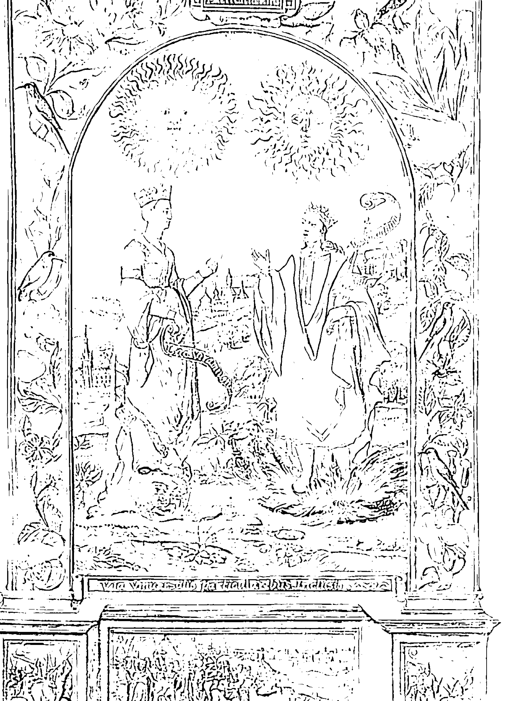

Vita Vitae Iuventutis Perpetua Perpetualis, Perpetualis Perpetua, Perpetua Perpetualis.

#### 神聖婚姻

> S·崔斯莫辛（S. Trismosin），《日之燿》（Splendor solis），倫敦，十六世紀。
在這幅插圖裡，白王后與紅國王即將執起彼此的手，象徵神聖婚姻。白王后站在月亮上，紅國王站在太陽的烈焰上。兩人與月亮／黑夜、太陽／白晝之間的關係點出這是對立事物的聯姻、對立力量的結合。

神聖婚姻象徵著白王后與紅國王的結合。白王后是靈魂；跟白化階段有關；知足；月亮和水是她的象徵；是硫。紅國王是精神；活力充沛，努力邁向目標和自我進步；跟太陽、火和紅化階段有關；是汞，也就是煉金術中硫的相反物質。

對立事物向來令煉金術士著迷。有文字記載的歷史雖然很多時候都否定女性能量，煉金術士卻一直都承認白王后的重要性。畢竟，只有當白王后的女性能量跟紅國王的男性能量獲得平衡，產生煉金術之子，才有可能完成大功業。

前面曾經提過，煉金術之子是雌雄同體。因此，他經常被描繪成擁有兩顆頭——男人和女人的頭——以及兩個性別的生殖器。煉金術之子的另一個別稱為「瑞彼斯」（rebis），源自拉丁文的「res bina」，意思是「雙重事物」。英文的雌雄同體一詞「hermaphrodite」本身就是來自希臘神話的愛之女神「阿芙蘿黛蒂」（Aphrodite）以及身為男性的眾神信使「赫密士」（Hermes）；赫密士即羅馬神話當中的墨丘利（Mercury），也就是汞的英文的由來。

你可能會問：「汞不是跟男性有關？」「妳不是說白王后是硫？」是的。但，還記得我在第二章說過，煉金術士有時會自相矛盾，把精神跟女性連結在一起、靈魂跟男性連結在一起？這裡也是如此。這兩股對立力量是無法命名的，所以將其中一個稱作女性、另一個稱作男性，說到底其實是會帶來侷限而且不準確的。

#### 物質煉金術

煉金術有個十分有趣卻鮮為人知的現象，那就是煉金術士常會跟異性一起合作。尼古拉·弗拉梅爾跟自己的妻子佩蕾內爾一同實驗；阿拉伯的煉金術士佐西默斯跟自己的學生（可能也是他的妹妹）提歐西貝亞共同合作；十七世紀的煉金術士托馬斯·沃恩（Thomas Vaughan）也跟自己的妻子瑞貝卡一起工作；瑞典的克莉絲汀娜女王跟數名男性煉金術士合作，包括朱塞佩·弗朗切斯科·鮑瑞。這些夥伴關係都是煉金術士在實驗室裡連蒸餾器都還沒用上之前，使神聖婚姻具象化的方式。

從化學的角度來看，物質煉金術的神聖婚姻體現在結合階段創造出來的全新化合物。這是火、水、氣三元素結合後產生新的「地」化合物的階段。除了大功業，還有很多不同的煉金術實驗支持這個概念，相信結合對立事物可創造出全新的物質。記住，煉金術士會在實驗室做各種事，不光只是嘗試實現大功業、創造哲人之石而已。他們有著各式各樣的瘋狂實驗！

例如，有一個八世紀的實驗便結合鹽和硫酸，要創造硝基鹽酸這種可以溶解金和鉑的液體。賈比爾研發了這個實驗，並將得到的橘黃色液體稱作「王水」。在現代化學的年代，結合兩個物質可創造出新的化合物是常識，但是在中世紀，這樣的煉金術實驗可能招來巫術的指控，甚至害你被綁在木樁上燒死，不管你的發現有多麼了不起。

#### 性靈煉金術

在性靈煉金術裡，神聖婚姻指的是靈魂與精神的結合。煉金術士把這想成是一種內在聯姻，甚至說這是兩個自我的亂倫通婚。可以想見，天主教會並不喜歡這種說法（中世紀的教會把煉金術斥為異端是有原因的，因為煉金術從很多方面來看確實像個獨立的宗教）。然而，性靈煉金術強調的是，這是發憤圖強、充滿活力的精神與相對知足、活在當下的靈魂兩者的結合。

可以想像得出來，這樣的結合並不容易。沒有人可以一直努力朝目標邁進，同時又活在當下。這樣人會瘋掉的。所以，要怎麼調和這兩者？要如何結合發憤圖強的精神和活在當下的靈魂？

在煉金術裡，一切都跟平衡有關。我們得平衡自我當中這兩個必要的部分。當你感到充滿壓力或焦慮時，很有可能表示你的靈魂和精神失衡了。精神和靈魂如果確實結了婚，你會朝目標邁進，但不會去追逐之。

心智和頭腦很喜歡想到遙遠的未來，而焦慮和壓力通常就是來自這裡。但，說到目標，其實有小步驟可以採取，讓你慢慢往那個未來移動。不要因為想買房而感到壓力；想想你可以採取什麼小步驟，讓自己準備好買一間房子，像是把財務整頓好。你會發現，完成小目標給你的感覺就跟實現崇高的大目標一樣美好。把注意力放在容易達成的小目標上，你會發現自己更能活在當下、壓力也沒這麼大。小目標的存在表示你有跟圖強的精神合作，同時也有給予自己更多空間，跟靈魂一起知足地活在當下。

#### 心智煉金術

心智煉金術的神聖婚姻指的是意識和潛意識頭腦的完美結合。榮格認為，這樣的結合會帶來完整，他稱作原型的「自性」。榮格死前出版的最後一本書《結合的奧秘》（Mystery of the Conjunction）講的就是神聖婚姻。榮格將潛意識的頭腦跟白王后畫上等號，有意識的頭腦跟紅國王畫上等號。

榮格認為，透過神聖婚姻結合有意識和潛意識的頭腦，可以帶來幻覺和栩栩如生的夢。榮格把自己對神聖婚姻的幻象描述成狂喜、美麗、不受時間妨礙的。榮格的幻覺讓他的身分認同褪去，使他可以完全處於當下。

現代心理學家把神聖婚姻視為一種「巔峰經歷」。此時，宇宙的統一性變得清楚明白，你也放下了自己的身分認同。這個概念最初是由心理學家亞伯拉罕・馬斯洛提出，馬斯洛的巔峰經歷跟榮格的心智神聖婚姻相似，兩者都超脫時間、超脫實體、極為叫人滿足欣喜。在心智煉金術裡，有意識和潛意識的結合會帶來巔峰經歷的快樂與滿足感。

但是，要如何結合意識頭腦和潛意識頭腦？就像在黑化階段一樣，你要移除「煤灰」，也就是通常來自社會和周遭世界的那些不必要的假定和信念。這樣做會把先前屬於潛意識的帶到有意識的頭腦裡，合併這兩者。你也必須接受自我或自己潛意識的某些層面是不會改變的。你永遠不可能完全理解死亡或記得自己的誕生。你必須為不可知的事物保留空間。

#### 偉大又精妙的煉金術

你現在對大功業的三階段有了很好的底子，旅程已經順利展開！回顧前面的章節內容，我們已經談了好多。在第一章，我們提及煉金術超過兩千年的歷史，認識煉金術的三個主要面向（物質、性靈和心智）；在第二章，我們講到有關元素的一切，包括元素的由來和代表意涵以及元素的根源「第一物質」和元素結合後的產物「哲人之石」；在第三章，我們深入探討大功業的三大階段以及神聖婚姻的重要性。

第一部分的基礎打好了，現在可以準備學習進階煉金術。在第二部分，我們將探索煉金術與一切宏偉（像是行星和宇宙）和微妙（煉金術對現代科學、藝術和文學等各領域所造成的影響）事物的關聯，看看煉金術是如何影響我們的日常生活，一直到今天。

#### 宏微观物理的炼金术

现在，我们可以来探讨炼金术在各个领域中的应用了。我们将谈到炼金术士如何配合行星和宇宙，把实验进行的时机跟宇宙的运行天衣无缝地搭配起来。接着，我们会检视炼金术的原则如何在今日持续影响化学、心理学、艺术和文学领域。只要我们花点时间寻觅，就能发现炼金术无所不在。

### 第四章

#### 炼金术与行星

从古至今，人类总是会抬头仰望着星空，思考自己在宇宙间的位置。古代苏美人所留下的陶板便有月亮与行星的每日观测纪录，而古巴比伦人也记录了很多我们至今仍会惊叹不已的天文现象，例如哈雷彗星和日月蚀。

炼金术与占星术自从在古代兴起后，就一直都有密切的连结。在炼金术的领域里，几乎所有的物理和形上层面都能对应到七大主宰行星。元素、金属、一星期当中的每一天以及人体各部位，皆与特定行星相呼应。同样地，炼金术士认为炼金术的转变七阶段也跟古代和中世纪占星术的七大行星拥有对应关系。

#### 3. MITTEL: CONIVNCTION

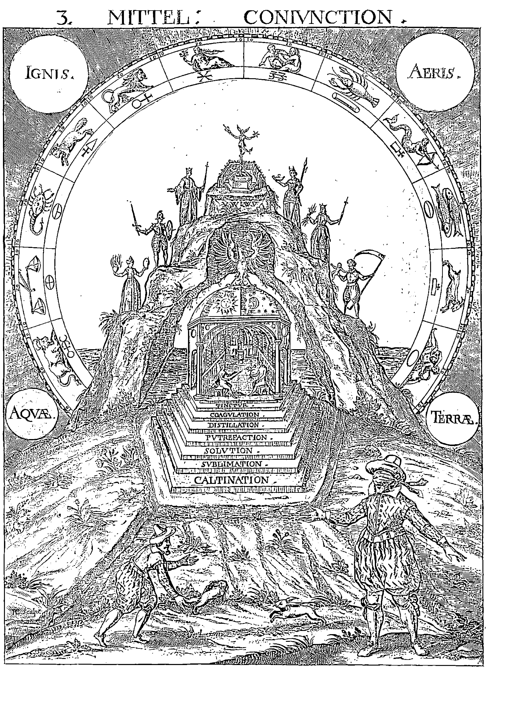

IGNIS

AERIS

AQVA

TERRA

1. TINCTVR
2. COAGVLATION
3. DISTILLATION
4. PVTREFACTION
5. SOLVTION
6. SVBLIMATION
7. CALCINATION

#### 攀爬行星之梯

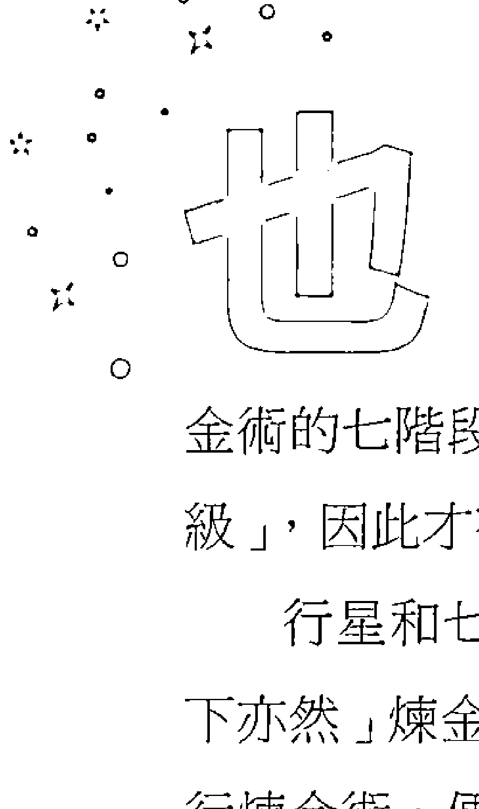

可以把大功業比喻成是在攀爬七大行星的梯子。這是一個往物理和形上的完美境界不斷攀升的意象，把七大主宰行星（土星、木星、火星、金星、水星、月亮和太陽）對應到煉金術的七階段。在實現大功業的過程中，煉金術士會通過各個行星的「梯級」，因此才有「行星之梯」的概念產生。

行星和七階段之間的關聯體現在托特古老的教誨裡：「天上如是，地下亦然」煉金術士認為，他們的實驗室就是宇宙的微觀版本。煉金術士實行煉金術，便是與上帝同心協力，在實驗室裡努力模仿上帝的完美。

除了相信每一顆行星都跟轉變七階段的其中之一呼應，煉金術士也相信，每一顆行星可對應到煉金術七金屬（鉛、錫、鐵、銅、汞、銀、金）當中的一個。因此，攀爬行星之梯也反映了從鉛（土星）到金（太陽）的轉變進程。

> > **行星之梯**
> S·米歇尔斯帕彻（S. Michelspacher），《卡巴拉》（Cabala），奥格斯堡，1616年。
> 
> 圖中的煉金術士被蒙著眼，什麼也不知道，必須摸索找到煉金術轉變的七個階梯才行。圖像中央描繪的圓頂象徵對立事物的結合，最終帶來鳳凰這個至高純潔的象徵，停在圓頂之上。圓頂周圍的小丘上站著跟每一顆行星相呼應的各個神祇，圍繞整個圖像的則是黃道十二宮與四大元素，在成功的轉變上扮演關鍵的角色。

上界的宇宙和下界的個人之間的連結不只侷限在物質煉金術的層次。古代的天文學家和煉金術士把人體看做自成一格的宇宙縮小版，認為我們全都是用跟宇宙相同的物質所組成，而科學家和天文學家現在的確也證實了這個想法是對的。我們（包括狗貓及地球上其他的一切有機體）的體內全都含有來自四十五億年前爆炸的星星的碳、氮和氧原子。

在心智和性靈煉金術裡，攀爬行星之梯代表從低下的土星爬升到完美的太陽。在西元二世紀的亞歷山卓，身為早期基督教學者、苦修者、神學家的俄利根（Origenes）首次提出行星之梯的概念。他寫到一把有七個門的天梯，一個人的精神要通過每一道門，才能通往神聖的完美。

個人和宇宙之間的對照是占星術的基本原則。如果你會閱讀星座運勢，就表示你相信「行星的運行會影響我們」的這個煉金術概念。煉金術無法跟天文學分割，古代的天文學也無法跟占星術分割。要等到十七世紀，化學和天文學這些嚴苛的「硬」科學才跟神秘的煉金術和占星術分離開來。

不過，有一點必須要釐清，那就是行星之梯是煉金術獨有的概念。占星術跟古代的其他形上領域一樣，關注的是上界的神域如何影響下界的凡人。因此，英國王室的占星家可能會這樣警告：「噢，受人尊敬的國王！水星逆行即將發生，現在或許不是入侵法國的好時機。」然而，煉金術士看行星，看見的是一條通向完美的路徑。煉金術士感興趣的不是每日的星座運勢，而是如何達成終身完美。所以，英國的煉金術士可能會這樣建議國王：「噢，國王！在滿月時喝下此藥，祈求上帝治癒你的疾病吧。」是不是跟建議別攻打法國不太一樣？

你可能已經發現，行星之梯所列出的行星數跟我們今天所知的不同。是的，行星之梯少了幾顆重要的行星（不好意思了，天王星和海王星），還收錄了不是行星的太陽和月亮。煉金術士和古代天文學家之所以將就在這七個行星的原因，純粹是因為他們只看得見這些行星。天王星到了1781年才被發現，接著又再過八十年以上，我們才注意到可憐的海王星在夜空中飄蕩。太陽和月亮會被收錄在梯子裡，也是因為人們看得到它們。

古代的煉金術士和天文學家觀察到，月亮會逐一通過每個行星，就好像月亮每二十八天就會攀爬行星之梯一次，因此煉金術士便發展出這樣的概念。另外，梯子上行星的排列順序被認為與行星的亮度有關，所以是從最暗的土星開始，一直到最亮的太陽。這個亮度理論跟煉金術轉變相呼應，從黑化的黑暗過渡到紅化階段的內在光芒、「最明亮」的黃金。

本章餘下的內容將針對梯子上的每顆行星、其關聯和代表以及跟煉金術過程的關係進行說明。

#### 土星

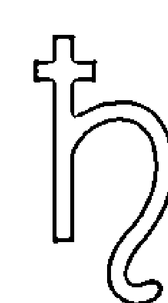

在煉金術裡，土星雖然位於行星之梯最低的一級，但是可別因此看扁這顆行星。土星是轉變的起始點，擁有和第一物質相同的雙重性，既是原始物質，也是轉變必要的能量，並且是所有行星當中最高貴、最具帝王風範的，跟卑金屬鉛有關。

煉金術士把土星視為「黑色太陽」，是梯子頂端那顆太陽的倒映。因此，梯子是從太陽開始、從太陽結束。土星和太陽之間的關聯，就像轉變是從第一物質開始、第一物質結束那樣，是以銜尾蛇為象徵的概念。

土星跟黑色以及黑化的第一個階段「鍛燒」有關。

煉金術士也相信，不同的行星與不同的身體部位有所關聯，因為我們的身體反映了宇宙的結構。土星跟脾臟、牙齒和骨骼有關，而這些都是被看做存在核心的部位。脾臟被認為是脾氣不好、「低下」情緒的所在，如惡意和憤怒；牙齒和骨骼則提供骨架讓身體可以建造其他部位。

從占星術的角度來說，土星跟摩羯座和水瓶座有關。摩羯座穩定、可靠、實際，屬於土象星座，擅長把自己的世界維持得井然有序。另一方面，風象星座的水瓶座則是獨立、聰明、友善、熱愛旅行的，會透過宗教、心理治療、冥想等管道尋找帶來轉變的體驗。想想第一物質的雙重性，摩羯座其實就像宇宙間那個真實可觸的原始物質，水瓶座則反映出第一物質的轉變能量。換句話說，土星就跟煉金術的一切一樣，是對立事物的產物。

神話裡的土星也有這樣的雙重性，不是有一雙翅膀的時間之神，就是一個即將從王位上摔落的邪惡老國王。在希臘神話中，土星是克洛諾斯（Cronus），必須衰敗才能讓兒子宙斯登上寶座。好巧不巧，宙斯正是梯子的下一級「木星」的代表神。

#### 木星

木星位於梯子的第二級，跟金屬錫和煉金術的溶解階段有關。土星在鍛燒階段猛烈地燃燒，把純潔和不純潔的部分加以分離，而木星則是完成任務的冷靜裁判。木星是溶解階段會用到的水，輕柔地安撫、淨化；它也是使熬過土星無情鍛燒、受盡折磨的靈魂重新獲得能量的精神。

古人認為木星是最討喜的行星。古代的巴比倫人相信，木星在天上佔據一個受人尊崇的位置，因為它在夜空中時而得見、時而不得見。古希臘人認為，木星為宇宙帶來秩序，因為它好像會照著自己的規則在空中「遊蕩」，跟其他看起來固定不變的星星不一樣。

在占星術裡，木星主宰射手座，也就是那位手持弓箭的半人馬和充滿智慧的領袖。除了傳統上認定的聰明才智，射手座還超越了土星實用知識的那種智能，擁有木星深沉的性靈知覺。敏感的水象星座雙魚座也受到木星支配。身為溶解的行星，木星保有同理與同情的空間，用水洗去鍛燒過程中未燒毀的任何不純潔。

有關薩圖恩（土星）和朱庇特（木星）的神話證實到頭來，朱庇特還是那位較好、較「純潔」的領袖。朱庇特在希臘神話即是眾神之王宙斯。前一任的國王薩圖恩（希臘神話的克洛諾斯）因為懼怕自己的孩子會篡位，所以把他們全部吞噬。朱庇特被母親所救，最後迫使父親把兄弟姊妹全數吐出來。煉金術士把這個神話故事跟溶解階段聯想在一起，因為溶解淨化了煅燒的灰燼，就像朱庇特清空父親肚子裡的手足。

木星也跟肝臟有關，因為肝臟負責淨化身體、排出毒素，跟溶解階段一樣。

#### 火星

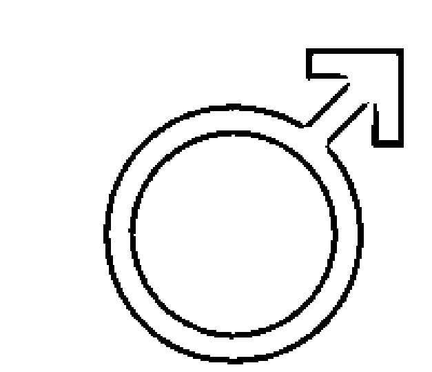

火星位於行星之梯的第三級。跟火星配對的金屬是鐵，十分相稱，因為鐵沉積物正是火星呈現紅色的原因(詭異的是，以前的煉金術士不可能知道這點才對)。火星表面覆滿了氧化鐵，也就是俗稱的鐵鏽。此外，火星也跟戰爭和暴力有關，而鐵常常是製作刀劍和盔甲所使用的金屬。

火星跟煉金術的分離階段有關。這是把純淨的部分從不純淨的部分擷取出來的階段，而火星(帶有愛征戰的粗暴性格)就是啟動分離過程的那股能量衝動。

火星跟紅國王畫上等號。在煉金術裡，火星(紅國王)與金星(白王后)圓房後，孕育出煉金術之子，或稱結合之子。

從前面已經可以看出，白、紅兩大階段密切相關，如果思考一下煉金術士的行星之梯，兩者的關聯性會更加清楚。若以行星之梯為依據，會發現紅國王與白王后圓房的時刻不只一個，而是兩個。第一次是在火星和金星之間的白化階段，第二次是在太陽與月亮之間的紅化階段(稍後會提到更多)。

火星擁有紅國王的每一個傳統特性：活力充沛、威力強大、發憤圖強。火星是精神，關乎物質的持有，尤其是為了生存必備的東西。

在占星術裡，火星主宰牡羊座。火象星座的牡羊座十分活躍、好勝、果決、奇特，是黃道十二宮的第一個星座，被認為是太陽在三月(火星的月份)進入牡羊座時帶來湧泉的那股能量。火星也跟天蠍座的情緒化衝力和生产力有关，但是跟牡羊座相比影响程度较轻。火星虽然主要是跟红国王有关，但也带有一丝白王后的知足。

在罗马神话里，玛尔斯(火星)是战神，也是维纳斯(金星)的爱侣。玛尔斯仿佛患有过动症，从来无法静下来，总是在盼望下一场战斗。在希腊和罗马神话里，维纳斯得不断让他冷静下来，让他跟其他奥林帕斯神和平共处。

火星跟胆囊有关，因为古人认为把这个器官跟勇猛大胆的行为联想在一起。胆汁的英文「gall」就有鲁莽、勇敢的行为之意。听起来是不是很像在描述火星？

#### 金星

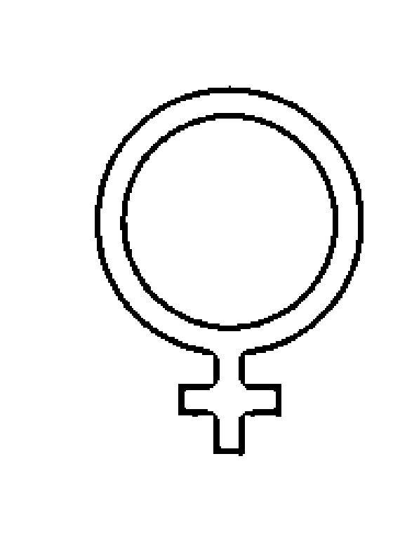

金星位于行星之梯的第四级。跟金星有所关联的金属是铜。铜是一种延展性极高的金属，自从西元前九千年就有被使用，非常适合用来制作珠宝和工具。炼金术士把铜描述成「金属中的妓女」，因为它很容易跟其他金属结合。常跟金星联想在一起的黄铜，便混合了铜和锌；铜锡混合的青铜在青铜时代为人类带来革命性的转变，因为它比在那之前所知的任何金属都还要耐用。金星掌管爱和性，因此创造新的金属非常符合它的属性。

炼金术士把金星跟结合阶段连结在一起。这是炼金术最重要的阶段之一，标志着红国王与白王后的圆房。两者结合的副产物，就是结合之子的胚胎。

金星拥有许多跟白王后有关的特质：善于接纳、充满魅力，是一个温和的存在。金星代表结合的其中一方——白王后，但同时也是结合本身，因为金星无论白昼或黑夜，都会出现在天空中。跟前面提过的「瑞彼斯」一样，金星也是一种双重事物，白天活力充沛又图强，夜晚善于接纳又知足。

#### 神圣婚姻的合一，或称交配

《哲人的玫瑰园》(Rosarium philosophorum)，1550年。
图中，红国王与白王后正在进行圆房。水中的月亮和太阳象征神圣婚姻是对立行星的结合。

#### ◇ CONIVNCTIO SIVE Coitus. ◇

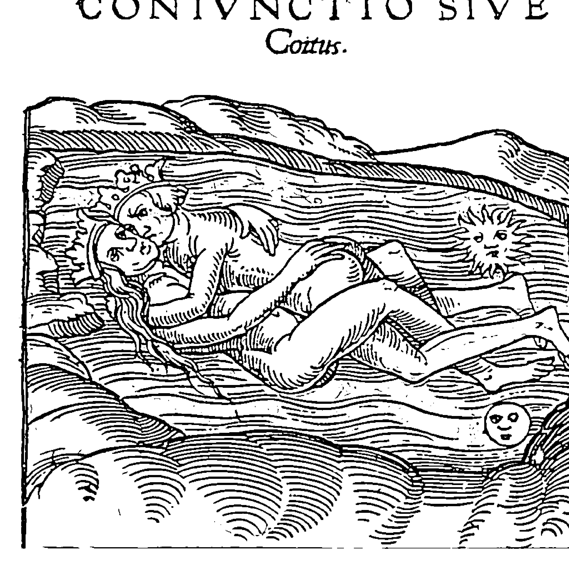

足。某方面而言，她既是男性，也是女性，就像火星有一小部分跟白王后有关，因为它掌管水象星座的天蝎座。
在占星术里，金星分配到的是金牛座和天秤座。土象的金牛座目的性强，会去得到自己想要的。他们性感、有耐心、忠诚，可靠。天秤座想找寻伴侣关系，他们是公正的裁判、心思浪漫、努力勤奋。他们通常都很可靠、配合度高、亲切优雅，喜欢美的事物。天秤座和金牛座都会寻觅伴侣关系，朝和谐与平衡迈进，就跟金星一样。
在神话里，维纳斯（希腊人称为阿芙罗黛蒂）是爱与美的女神。她是众神的铁匠兀儿肯的妻子，也是玛尔斯的爱侣，因此在炼金术里占有一席之地。由于能平息玛尔斯鲁莽的行为，维纳斯除了性器官，也跟肾脏有关联。古人相信，肾脏负责控制一个人的性情，可缓解储存在胆囊（跟火星有关的器官)的偏差行径。除了炼金术之子和性器官，维纳斯也代表了白王后善于接纳的知足性格及肾脏。

英文的雌雄同体一词「hermaphrodite」来自另一则希腊神话故事，提到阿芙萝黛蒂跟赫密士生下一个取名为「Hermaphroditus」的孩子。好巧不巧，赫密士(即水星墨丘利)就是行星之梯的下一颗行星。所以，在她之上的赫密士和在她之下的玛尔斯都是她的爱侣，使她成为一个性观念十分开放的女神！

#### ◇ 水星 ◇

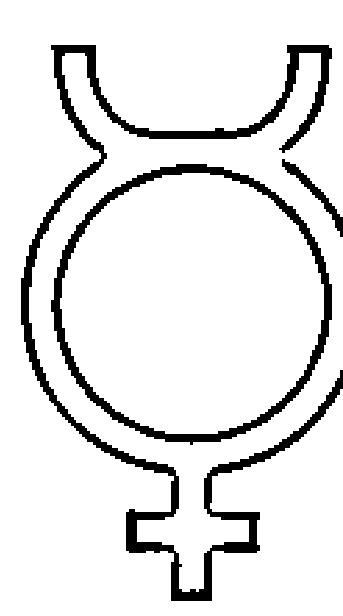

行星之梯的第五级是水星。水星是太阳系里最靠近太阳、公转速度最快的行星。炼金术士把水星的代表金属称作水银 (quicksilver)，今天的人则称之为汞(mercury)。汞的名称就来自这颗行星。

水银在室温下为液体，其最常见的形态为银色液态；水星在天空中的轨迹颇为飘忽不定，看起来好像在太阳四周来回摆荡。因此，炼金术士把这颗行星不规律的轨迹跟水银容易喷溅、在实验里难以控制的特性联想在一起，水银渐渐地就跟水星的英文名称画上了等号，获得了汞这个称呼。

水星跟金星一样，体现了炼金术之子的双重性。水星只在天空从夜晚转换成白昼或白昼转换成夜晚之际看得见，也就是可以在日出或日落的前后观测得到。日出和日落都结合了夜与昼，是天空表现出物质内在双重性的时刻。

汞也有展现瑞彼斯的双重性。炼金术士相信这种金属可以让人长生不死，但它其实也可能致命。汞存在于生死的双重性之间，古代的中国炼金术士便曾因此得到惨痛的教训。

中国史上第一位皇帝秦始皇生重病时，秦朝的炼金术士自以为知道怎么办，给了皇帝一帖汞制成的药方，认定那是长生不老药。然而，事情并没有如预期般发展，汞和玉的混合物最后害死了皇帝。

生死的双重性也让水星跟炼金术的发酵阶段产生了关联，因为此阶段温和的火源不是帮助结合之子成熟，就是使它成为死胎。

在占星术里，水星主宰双子座和处女座。双子座是双胞胎，象征自我的双重性；处女座则是熬过发酵之火的纯洁自我。

神话里的墨丘利是代表旅行、沟通与知性的信使之神。希腊人叫他赫密士，埃及人叫他托特。墨丘利是炼金术的守护神，他带领灵魂前往地下世界，回归到最初的形态——第一物质。

水星跟肺部有关，在发酵阶段为炼金术的转变过程吹入新生命的气息。肺部跟炼金术实验室里让火持续燃烧的风箱有关。

水星也跟下一梯级的月亮有关，因为两者都有坑坑洼洼的表面。

#### ◇ 月星 ◇

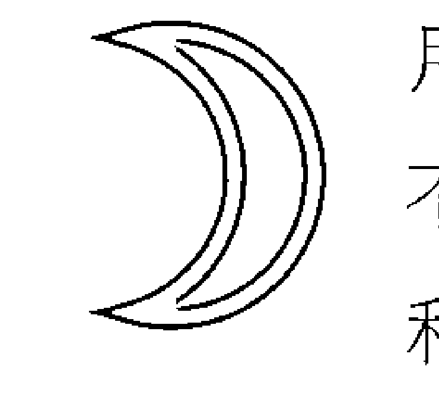

月亮位于梯子的第六级。跟金星一样，月亮也跟白王后有关。

不过，金星和火星的结合属于肉体、性爱方面的合一，而月亮和太阳之间的结合则是较为崇高的精神与灵魂的合一。白王后又称作「露娜」（Luna，拉丁文的「月亮」），经常被描绘成踩在月亮之上。人们认为月亮是太阳的妹妹，因此两者的结合属于乱伦，象征我们内在对立力量的统一。别怕，炼金术士认同的只有譬喻性的乱伦。

人们认为月亮主宰着潜意识和知足的灵魂。许多文化在播种和收成作物时，依循的是一年十三个月的农历历法，并将月亮跟肥沃及对地球、自我的滋养联想在一起。

月亮跟银有关。这个金属至少从西元前四千纪就被用来制作钱币和珠宝。炼金术士很早就把银跟月亮联想在一起了，因为两者拥有类似的光泽。银的反射本质也跟月亮对潮汐的影响有关。月亮好像可以跟大自然和谐相处，达到完美的平衡，而这正是炼金术士希望得到的结果。

炼金术士把月亮跟炼金术的蒸馏阶段联想在一起。在这个透过水和气来净化物质与自我的温和过程中，物质会慢慢接近凝聚阶段的终极形态。月亮跟富饶的关联相当于炼金术士轻柔地滋养物质与自我，使其通往至高形态。

月亮影响所有的星座，每隔二十八天左右就会通过十二星座一次。诞生时刻月亮在天空中的位置会决定你的感情生活，像是什么样的情人最适合你。

神话学里的月亮有诸多化身。古代苏美人的魔法与神秘艺术之神「辛」负责掌管月亮；希腊人的泰坦神塞勒涅、处女狩猎女神阿提米丝以及巫术女神黑卡蒂全都掌管月亮。希腊神话众多的月亮女神反映了月亮的重要性，也显示出它无法只用单一的样貌呈现。月亮就像水，时而可以定义，时而无法定义。这一点再次凸显月亮和金星的差异。金星只跟一个女神有关，月亮却有众多面貌（真实的月亮如此，神话的月亮亦是如此）。月亮是可变动的，就像灵魂，金星则比较局限于单一的形态。

月亮除了跟子宫有关，也跟大脑相关，因为这是人类智识的所在位置，也跟心脏及掌管心脏的太阳有着密切的关联。

#### ◆ 太阳 ◆

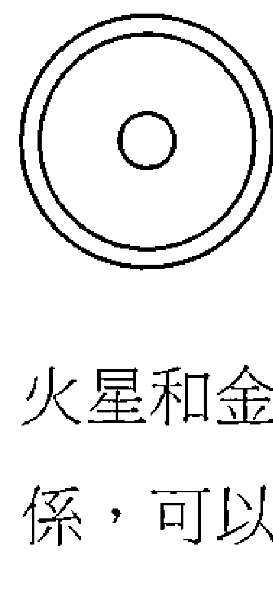

太阳是月亮的伴侣，也是行星之梯最高的一级。太阳是所有星体当中最明亮的，因此跟物质的最高形式有关。月亮比金星更要接近真实的白王后，太阳也比火星更要接近真实的红国王。
火星和金星的结合是性爱方面的，月亮和太阳的结合是一种性灵的伴侣关系，可以产生哲人之石——另一个跟太阳有关的炼金术概念。金星既是白王后，也是炼金术之子。同样地，太阳同时是月亮的伴侣、红国王，以及太阳和月亮的结晶：哲人之石。

从地球往上看，太阳和月亮似乎大小差不多，所以月亮可以遮蔽太阳。在炼金术士看来，两者相似的大小是太阳与月亮有所链接的另一个证明。事实上，炼金术士认为日全蚀象征太阳和月亮的神圣婚姻。

太阳跟最崇高的金属黄金有关。自西元前五千纪末期古埃及人最先开始用它来装饰珠宝后，黄金就一直是一种贵金属。其延展性极高，而且不会氧化变色。黄金的化学符号 Au 源自「Aurora」一词，意思是「闪耀的黎明」，指涉黄金灿烂闪耀的外观。

炼金术士把太阳跟凝聚阶段联想在一起，亦即实体变成形上、形上变成实体的时刻。凝聚阶段表示回归到第一物质，也就是衔尾蛇的尾巴进入嘴巴的交点。

如同月亮，出生时太阳在天空中的位置会决定你的生活表现出哪一个星座。太阳花一年的时间通过十二星座。你诞生时太阳所处的位置，代表了你的独特性和个性，以及除却从社会上接收的所有偏见后你的真实样貌。

在神话里，太阳既是月亮的哥哥，也是月亮的爱人，再次强调炼金术的神圣婚姻属于乱伦，表示一个人内在的对立事物进行了联姻。在埃及，太阳跟月亮女神伊西斯的丈夫欧西里斯有关；在希腊，太阳跟月亮一样有众多化身。月亮女神塞勒涅的哥哥泰坦神海利欧斯是太阳，阿提米丝的兄弟（前希腊化时代的文献说他还是她的丈夫）阿波罗也跟太阳有关。但，阿提米丝和阿波罗都不曾结婚，因为他们的结合是性灵层次的，不是肉体层次。

太阳跟心脏有关，而这也是所有器官当中最首要、最纯净的。人们认为心脏能产出生命所需的热，而此热只有大脑（跟月亮有关）可协助冷却。

#### 探索炼金术宇宙表

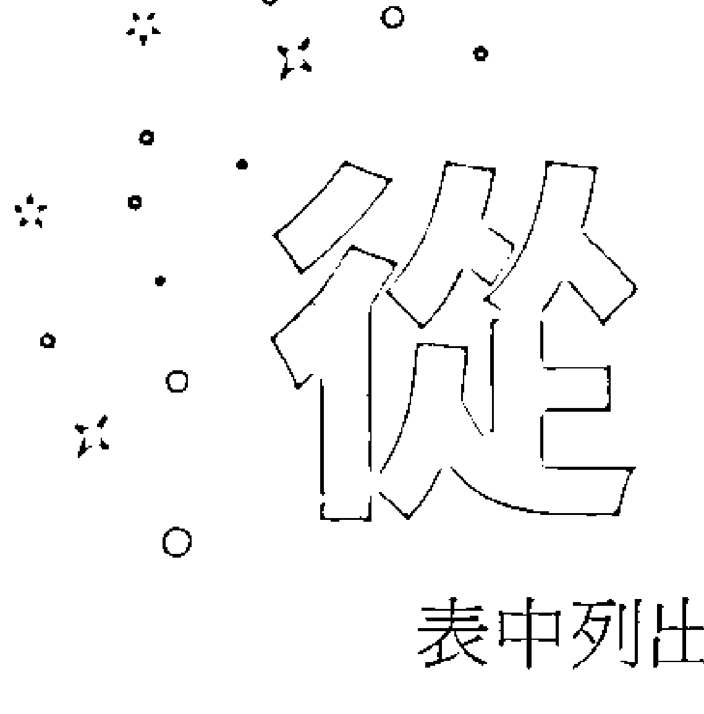

前文可以看出，炼金术士运用宏伟宇宙的方式有很多种。为了把一切条理化，后面附了一个表格，统整了各种行星的对应事物。

表中列出了行星、炼金术的阶段和概念、金属、星座、实体象征、颜色、搭配元素和星期。我已经在前面做了很多说明，但在这里，你可以找到更多关联。

炼金术士相信，不同的金属可净化身体不同的内在运作。还记得吗？炼金术士认为，我们每个人体内都蕴藏一座小宇宙。这就是为何他们会把不同的行星跟不同的器官联想在一起。

行星的代表色可能来自某个炼金术阶段会出现的特定颜色，或纯粹是可以跟该行星联想在一起的颜色。例如，太阳的代表色是紫色，因为紫色是最具有帝王风范也最昂贵的颜料。行星的代表元素也是一样。月亮跟水元素有关，因为它主宰潮汐。

行星的名称也会影响星期，因为我们的历法主要是承袭自罗马人。

炼金术士可以利用这些各式各样的关联来扩充自己的工作。例如，他们可能会选在星期六展开煅烧，或者在金牛座出现在空中时，启动结合阶段。如果想要把自己的阴影写出来，像在黑化过程中那样剔除「煤灰」，或许可以穿黑色的，让自己跟土星和炼金术的煅烧阶段产生关联。总之，发挥你的创意！这里没有错的答案。

#### 炼金术宇宙表

| 行星 | 炼金术阶段 | 炼金术概念 | 金属 | 星座 |
|:---:|:---|:---|:---:|:---:|
| ♄ 土星 | 1 煅烧 | 第一物质， 第32页 | 铅 | ♑♒ 摩羯、水瓶 |
| ♃ 木星 | 2 溶解 | —— | 锡 | ♐♓ 射手、双鱼 |
| ♂ 火星 | 3 分离 | 红国王，第63页 | 铁 | ♈♏ 牡羊、天蝎 |
| ♀ 金星 | 4 结合 | 白王后， 第63页；瑞彼斯 | 铜／黄铜 | ♉♎ 金牛、天秤 |
| ☿ 水星 | 5 发酵 | 炼金术之子的 胚胎，第63页 | 汞 | ♊♍ 双子、处女 |
| ☽ 月亮 | 6 蒸馏 | 白王后，第63页 | 银 | ☋ 所有星座，特别 是巨蟹 |
| ☉ 太阳 | 7 凝聚 | 红国王第63页； 哲人之石， 第35页 | 金 | ♌ 所有星座，特别 是狮子 |

| 星期 | 器官 | 颜色 | 特质 | 元素 |
|---|---|---|---|---|
| 星期六 | 脾脏、牙齿、骨骼 | ● 黑 | 黑暗；仁心 | — |
| 星期四 | 肝脏 | 黄 | 慷慨；正义 | △ 气 |
| 星期二 | 胆囊 | ● 红 | 活跃；阳刚 | 🔥 火 |
| 星期五 | 肾脏、性器官 | 白 | 阴柔；富饶；爱 | ▽ 土 |
| 星期三 | 肺部 | ● 蓝 | 能言善道；雌雄同体；头脑 | △ 气 |
| 星期一 | 大脑、子宫 | ● 绿 | 夜晚；净化；灵魂 | ≋ 水 |
| 星期日 | 心脏 | ● 紫 | 真实自我；能量；精神 | 🔥 火 |

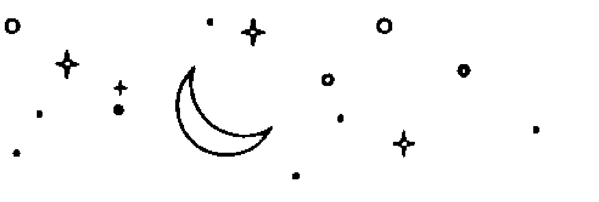

#### 炼金术应用

#### 你的阴影自我：

##### 日记练习

##### 工具

#### 笔。日记本

回想这一整天的「阴影」自我。今天有哪些时刻特别困难、充满考验？过去这一星期呢？过去这一年？这指的是你对自己的行为或反应不怎么自豪的时刻。

找一个安静安全的空间，让你可以思考书写。理想的时间为夜间，这样就能在一天即将结束时进行回顾。

写下脑海中特别鲜明的困难或考验时刻，或是反复出现的难点。思索当下是什么情况导致这个时刻发生。你有什么感觉？你那一刻害怕什么？你觉得被评断吗？这样的感受是真实的，还是你自认为的？这个时刻跟你的过去有什么链接？这个时刻是否触发了什么？试着快速地书写，不带任何成见，用意识流的方式捕捉浮现的想法。设定十分钟的书写时间。

时间到了之后，深吸一大口气。双手放在心上，想像双手烧掉跟那次经历有关的一切负面能量。想像双手净化你的身体、灵魂和心智，把那次经历除去。

写一封能让那个时刻的你比较好过的信给自己。告诉自己，你过去对于这起事件所拥有的感受是完全正常的。允许自己下一次做出不同的反应，可以承认内心的感受，但你不再需要凭感觉做出行动。

日后，每当你又感觉到那些情绪或是同样的经历又出现时，就重读这封信。明白自己的情绪是正常的，然后深呼吸，把情绪放下。对自己好一点；这并不容易！

#### 接近轴心

这一章，我们涵盖各种伟大及精妙的层面，认识了行星之梯、行星与古典神话之间的对照，还有好多好多炼金术士眼中的宇宙奥秘！你也得到了一个深入发掘阴影自我并加以记录的机会，通过炼金术的视野探索自己遇到事情会做出的行为与反应。

现在，我们除了一窥炼金术的悠久历史，还要看看炼金术的影响力如何延伸到一般人认定的界限之外。你很快就会发现，从文学到艺术到心理方面，炼金术触及的领域之多，可能是你意想不到的。

### 第五章

#### 炼金术的轴心

炼金术让我们察觉每天生活周遭发生的变化，古往今来的炼金术士则教导我们，改变是人生唯一的常数。以炼金术的方式思考，我们就能把转变引导到让自己和周遭世界变得更好的方向。

炼金术是许多现代科学和创意领域的轴点，同时也是一个宗教、一种为化学铺路的伪科学、一张提供某种思维来思考心理、艺术和创意实践的说故事地图。因此，炼金术才存在于化学、心理学、艺术和文学等众多迥然各异的学门核心。

#### 炼金术与化学

世纪晚期，炼金术开始变质。中世纪的统治者找上炼金术士，不再是为了得到性灵成长的知识，而是为了创造黄金来还债或填满金库。中欧的邦国官方纪录显示，君王曾指派宫廷炼金术士制作大量黄金来强化王国经济，对黄金制造的执念也在十六世纪达到巅峰。巴黎、科隆、维也纳、布拉格等中世纪城市都盖了实验室给炼金术士，唯一的目标就是要制造黄金。哈布斯堡皇帝鲁道夫二世雇用众多「黄金厨师」，甚至还跟身为炼金术士与天文学家的第谷・布拉赫（Tycho Brahe）在专门为他而建的炼金术实验室里一起工作。

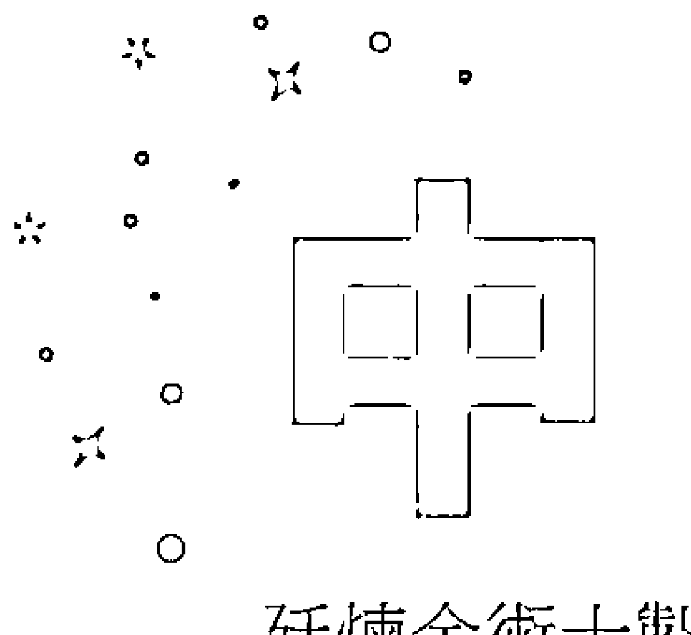

你应该想像得出来，这种黄金执念限缩了炼金术真正的广度。炼金术大师历经长时间的学徒和训练期间，自然跟那些只想为了贪婪王室制造黄金的炼金术士理念不合。这些对黄金极为渴求的炼金术士受高尚的欧洲王室所雇，贬低了炼金术的每一个层面，使得欧洲不再信任这些为黄金痴狂的炼金术士，并嘲笑他们是「炼金江湖术士」，因为他们时常透过骗术让雇用者相信他们成功炼出了黄金。真正的炼金术大师跟这些江湖术士被混为一谈，不加区分，导致整个炼金术成了一场骗局。跟莎士比亚同时代的班・强生在1610年所写的喜剧《炼金术士》便嘲弄了这些江湖术士一番；对炼金江湖术士的不苟同是如此普及，害炼金术遭受整个英国的讥笑。

> **炼金术士和他的助手在实验室**
J・P・勒霸（J. P. Le Bas）仿 D・特尼尔兹（D. Teniers）的版画，十七世纪晚期到十八世纪初期，巴黎。

图中描绘了一位炼金江湖术士在熔炉旁工作、试图（很可惜最后未能）创造黄金的情景。炼金江湖术士总是努力制造更多黄金给皇室金库，玷污了对炼金术认识更为精妙的真正的炼金术大师。

到了十六世纪晚期，那些认为炼金术不只有炼金的真正炼金术士已经被迫将自己的身分藏匿起来。他们的隐退跟炼金江湖术士无关——他们让一般大众对于炼金术的哲学原则充满困惑。怪的是，这些江湖术士有时会被叫做「化学家」，他们做的事情则被称为「化学」。

##### 历史上的炼金术士

#### 阿尔伯特·爱因斯坦

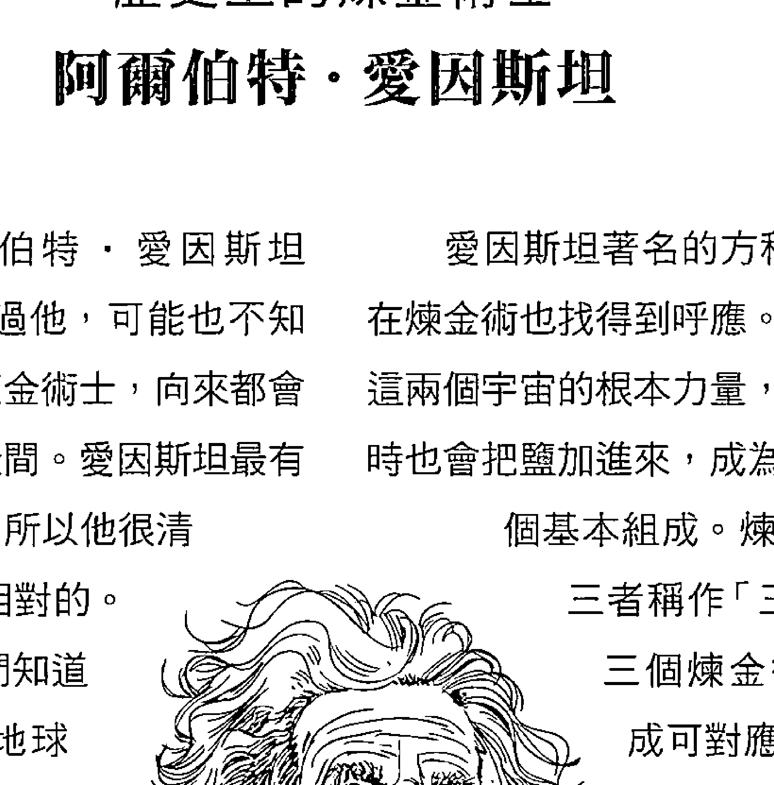

有听过阿尔伯特·爱因斯坦吗？就算你有听过他，可能也不知道他是一个现代炼金术士，向来都会为未知事物保留空间。爱因斯坦最有名的就是相对论，所以他很清楚时间与空间是相对的。
这就是为什么我们知道外太空的时间跟地球上的时间不同，特别是时间对光的影响。
炼金术士对天体和时间的循环本质十分着迷，跟爱因斯坦的相对论有不少相似之处。就像爱因斯坦，炼金术士明白万物都有双重本质。在炼金术里，所有化合物都含有一些硫和一些汞，两者的比例让化合物做出不同的行为。另一个雷同的地方是，炼金术士知道光是可变的。炼金术里有黑暗之光，也有明亮之光。

爱因斯坦著名的方程式 E = mc² 在炼金术也找得到呼应。除了硫和汞这两个宇宙的根本力量，炼金术士有时也会把盐加进来，成为宇宙的第三个基本组成。炼金术士把这三者称作「三精华」。这三个炼金术的根本组成可对应到爱因斯坦的质量与能量相等方程式，汞是能量（E）、硫是光速（c）、盐是质量（m）。
炼金术士跟爱因斯坦一样，知道能量与质量之间存在着根本上的关系，所以炼金术士才会认为第一物质既是一种物质，也是世界的原始能量。炼金术士虽然没有像爱因斯坦那样把这种关系化为方程式，但他们明白这三股力量是彼此相对存在的。

在这个混乱的情势下，炼金术让位给化学。用最简单的方式来说，化学是物质炼金术，但却背离了支持性灵自我和心智转变的隐密炼金术信奉的指导原则。早在1597年，同时身兼化学家和炼金术士的德国人安德烈亚斯·利巴菲乌斯（Andreas Libavius）就在著作《炼金术》（Alchymia）中首度将化学与炼金术加以区隔。罗伯特·波以耳（Robert Boyle）出版于1661年的著作《怀疑派化学家》（The Sceptical Chymist）终结了亚里斯多德的四大元素理论，播下了今日周期表元素的种子。还要再过一百年左右，法国贵族安万一罗伦·拉瓦节（Antoine-Laurent Lavoisier）才会在1778年找出氧气；接着再过将近一世纪，俄国化学家迪米崔·门得列夫（Dmitri Mendeleev）在1869年制定了元素周期表。到了十八世纪晚期，化学已经越来越有声望。随着神秘性灵的炼金术根源不复存在，科学方法、研究期刊、对新的化学化合物的寻觅等开始定义化学这个领域。

启蒙时代的化学家虽然很努力把这两个领域完全分离，化学依旧充斥着炼金术。炼金术士天生爱提问的性格和细心书写的专着，也都是化学的核心。玛丽·默德拉克和伊莎贝拉·科特斯着作里详尽的配方显示，炼金术士为科学方法奠定了基础。她们的炼金术步骤经过测试，真实可靠，只要照实遵循，就能够制作出一模一样的香水或药方。

此外，今天的化学家仍会使用各种炼金术的仪器设备，有些维持原始形式，有些经过改良。希帕提亚的湿度计、犹太女人玛利亚的三臂蒸馏器、烧瓶与测量用具的设计、将银矿石从铅当中提炼出来的灰吹法等，至今依然在使用。

化学和炼金术两者的目标也很类似。今天的化学家就跟炼金术的先人一样，还在努力创造现代的长生不老药。这种药跟弗拉梅尔粗糙的红石长得不一样；全球各地的化学实验室都致力于找出自己的延年益寿灵丹妙药。化学家总是不断地在创新，要发掘改善、延长生命的新方法，像是改善人类的记忆力以及调制出新的奇迹药物。化学家亚历山大·弗莱明（Alexander弗莱明就是一个很好的例子。他在1928年观察到霉菌抑制了培养皿中细菌的生长，是化学界一项重大的突破，后来以盘尼西林的形式拯救了许多生命。现代的化学家虽然不是要找到某一种有办法对抗死亡的万灵丹，但这个领域的一些分支确实是想找出延长人类生命的方式。今日的化学发现跟很久很久以前的炼金术发现虽然很不一样，两者却都是源自人类改善、完善生命的同一股冲动。

除了化学，量子力学也得好好感谢炼金术。二十世纪著名的物理学家沃尔夫冈・泡利是提出“量子力学”这个词的人，并且跟卡尔・荣格互有书信往来。跟荣格交换与炼金术有关的信件时，泡利发现，物理学家的心理状态有可能影响实验，甚至造成仪器失灵。我觉得这听起来完全就像心智炼金术。

泡利一生都在找寻一套统一的万物论，而这便成了现代量子力学的大事业。量子力学家已经成功捕捉第一物质，并将铅蜕变成黄金。在1980年代，美国劳伦斯伯克利国家实验室的核能科学家在粒子加速器及很多很多能量的帮助下，成功把一种相当于铅的元素铋转变成非常少量的金。量子力学家致力于要理解这个世界贯彻始终的那一个性灵原则，也就是史蒂芬・霍金所说的“万物论”。弦理论等概念大量出现，但要证实任何一个都还是很棘手。这好像是在说，我们必须在凡事讲求证据的世界重新发掘炼金术的性灵基础，替未知事物保留一点空间。今天的科学家或许可以从炼金术士身上学到一两件事。

#### 炼金术与心理学

像出生于奥地利的物理学家沃尔夫冈・泡利一样，瑞士的精神分析学家卡尔・荣格也创立了一个受到炼金术影响的新学科：分析心理学。十八世纪晚期化学兴起之后，炼金术便大抵受到遗忘。炼金术繁复的象征符号系统对启蒙时期的化学家来说，似乎没有什么启发。事实上，那些复杂的符号只是让人觉得炼金术士有点疯疯癫癫的，可能吸入太多实验过程释放的浓烟。启蒙时期的化学家大概不怎么明白，炼金术士画那些金星和水星究竟要做什么。于是，他们干脆把炼金术丢进历史的垃圾桶。在维多利亚时期，只有对中世纪着迷不已的玄秘学爱好者才略知炼金术的一二。

到了二十世纪中叶，泡利和荣格都对自己的研究感到幻灭，开始转向炼金术寻求启发。如同前面所说的，泡利后来成为量子力学之父，而荣格则奠定了现代心理学的基础。

就像之前探讨过的，心智炼金术定义了炼金术士理解心智的方式。不过，炼金术也有影响今天的心理学，而这大部分是荣格的功劳。不要因为这条模糊的界线而感到过于困惑。心理学是一个研究人类心理的独立科学领域，虽然有受到炼金术影响，却不是源自炼金术。心智炼金术和心理学有时候被称作“心理炼金术”的差别，类似物质炼金术和化学之间的差别。

那么，炼金术究竟是怎么影响心理学的？这要从哪里说起才好！

西格蒙德・弗洛伊德常被认为是现代心理学之父，今天这种坐在椅子上跟有执照的心理治疗师把问题谈开的心理治疗模式，大多是由他建立起来的。但是，说到心理学的起源，第二个主角莫过于荣格。有好几年，荣格依循弗洛伊德的思想，强调患者的童年和性欲如何塑造他们的行为。

后来，荣格脱离弗洛伊德，认为人们不只受到婴儿时期的自己和性这两件事影响而已。他最初在1940年代开始研究炼金术，把这门学问从历史的垃圾桶翻出来。对荣格来说，炼金术开启了一种观看世界的新方式，为他在梦境分析、人格类型、潜意识和原型方面的理解铺路。

在《心理学与炼金术》一书，荣格谈到一名病患的梦境融入了炼金术符号，虽然那位病患对炼金术根本一无所知！荣格做出的结论是，该病患肯定是进入了社会的集体潜意识。荣格相信，炼金术士用自己的象征符号和语言构思一个集体的梦，而这套体系至今仍深埋在人类共同的潜意识当中。

很多西方人会在佛教、印度教等东方宗教中寻找性灵或神秘主义的框架，但荣格主张炼金术是更好的选择，因为它已经成为西方思想的核心部分一千年了。

跟许多现代心理学家一样，荣格相信自我的根本双重性，而这也是炼金术的中心原则。就像炼金术，荣格认为这个双重性必须经过协调一致，才能达到个人成长，也就是他所谓的“个体化”。荣格和炼金术士都相信通用象征的重要性，例如炼金术的水星或荣格的捣蛋鬼皆是。荣格把这些固着的心理意象称为原型。跟黑化阶段很像，荣格相信个人成长唯有通过思考自己的阴影——即人格的负面层面，有时会以荣格归纳出来的原型呈现出来——才能达成。从很多方面来看，荣格就好比二十世纪的炼金术翻译家，以容易理解又有用的方式，为心理学家和全世界解开它那神秘难懂的象征体系。

心理学家依然继续承袭荣格的理论。心理学家凯瑟琳・库克・布里格斯和伊莎贝尔・布里格斯・迈尔斯在发展迈尔斯－布里格斯人格测试时，便参考了荣格的自我双重性理论；在这个理论中，荣格使用阿尼玛／内向类似炼金术的硫及阿尼玛斯／外向炼金术的汞等词表达这样的双重性。

集体潜意识这个概念不只出现在心理学，社会学、媒体研究等领域也都有加以研究；荣格的原型概念则影响了从考古学到《星际大战》的各种事物。在心理学的领域之外，荣格容易理解的炼金术诠释将曾受到遗忘的炼金术艺术再次引进现代社会。

##### 雅各与天使摔角

拉普尔特仿古斯塔夫・多雷《插图圣经》的版画，十九世纪。

雅各与天使代表人格互相对立征战的两边，也就是阴影／潜意识的自我及已知／有意识的自我。两方一定要和谐共处，但这并不容易。

#### 炼金术应用

##### 荣格的炼金术梦境分析

##### 日记练习

##### 工具

笔 · 日记本

早上刚醒来，把还记得的昨晚所做的梦写在日志本上。试着在下床之前完成这件事，免得梦境的细节从逐渐苏醒的脑海中溜走。

晚间，回顾你所写的东西，把重点突出的地方划线，像是三眼犬或草丛中的蛇。

有时候，我们的梦很明显是受到上床睡觉之前在想、在读、在看的东西所触发，像是你看了自己最爱的电视剧，其中一个角色在梦里便成了你的朋友。尽量别管这类有清楚源头的细节，而是去找不寻常的地方。

想想梦里出现的任何炼金术符号或隐喻。你有看见一个红皮肤的人吗？或是一条龙？荣格相信，炼金术就潜藏在西方人的集体潜意识里。

思考这些特定的梦境细节可能表示什么或为你带来什么。现在，你对炼金术已有足够的认识，可以开始像卡尔・荣格那样分析自己的梦。红皮肤的人是不是表示你走在正确的道路上，已经进入红化阶段？那条蛇是不是表示时间的循环性，就好比炼金术的衔尾蛇象征？

答案不分对错！把解梦当作一种墨迹测验，你所察觉到的意义比任何“正解”都还要重要。梦境哪有什么正解呢？好好享受解梦的乐趣吧！你可能会对自己发现的东西感到吃惊也不一定。

#### 炼金术与化学

> 很同意作家保罗・金斯诺斯所说的——我觉得我们很想念魔法。我们很想念相信自己的心智强大到能改变周遭世界的那种信念。

炼金术是一种魔法，因为相信心智可以带来真实、物质方面的改变而存在。在试图把铅转变成黄金的过程中，炼金术士会根据当下的任务捏塑自己的意志，同时也改造自己的现实。

作家都相信同一件事。他们把自己的意志转变成文字，藉此创造出截然不同的世界，让读者存在其中。当J・K・罗琳在写《哈利波特：神秘的魔法石》时，她顺着故事塑造自己的意志，把脑中所见带到页面上，造就一个在读者的想像中更加真实的世界。

从一开始，炼金术就一直跟书写密切相关。托特最先将书写的知识带给古埃及人，而书写播下的种子又盛放成数学、炼金术、天文学、医学、法律、哲学等各种领域。一切都源自书写。

书写时常创造秩序。它在书页上创造了我们自己的倒影，他人也能从这倒影看见他们自己。每当我们在一个角色中看见自己，就证明了我们所有人其实都是互有关联的。于是我们知道，我们全都来自同样的源头，而这就是第一物质和衔尾蛇的概念。我们全都来自宇宙的同一个物质，最终也都会回到那个源头。

在北欧神话中，阿斯嘉特众神祇的主神奥丁跟托特十分类似。奥丁想从掌管命运的诺伦三女神那里得到具有魔力的日耳曼字母和占卜工具“卢恩文”，于是便头下脚上吊在树上，用矛刺自己，做为诺伦三女神的祭品。幸好，奥丁是神，可承受这样的伤口一阵子。自残九天后，诺伦三女神总算赋予奥丁书写的知识。对北欧人和古埃及人而言，书写是神赐的礼物，值得你一边倒吊，一边血流如注。

除了书写，炼金术也存在于故事里。经过黑化、白化与红化的这段从低下到启蒙的内在之旅，也反映在一些最古老的故事当中。在《奥德赛》里，奥德修斯必须要经历煅烧之火，通过一个又一个的严峻考验，最后才能回到家乡伊萨卡；在美索不达米亚文明的《吉尔伽美什史诗》中，众神想要吉尔伽美什的朋友恩奇都的命，吉尔伽美什在想方设法保住他性命的过程中，明白死亡是无法抗拒的；就连在奥丁的故事里，我们也看到他必须自愿牺牲自我，才能获得知识或启蒙。所有的故事讲的都是转变，而炼金术就是转变的艺术，两者不可避免地会交融在一起。

文学教授乔瑟夫・坎伯便特别点出了故事与炼金术之间的关系。坎伯受到卡尔・荣格的影响，认为所有的神话都是同一个原型故事的变化版本，他称为“单一神话”。他在1949年出版的著作《千面英雄》里把这个原型单一神话叫作“英雄旅程”。就像炼金术的转变过程，坎伯把英雄旅程分成三个阶段：启程、启蒙与回归。如同黑化阶段，启程讲的是卸下以前的自己，英雄得抛开已知的事物，接受“历险的呼唤”；就跟白化阶段一样，启蒙表示英雄踏上了旅程，拥抱自己的英雄身份，他一定要面对“试炼的道路”，最终达成某个旅程的目标相当于结合阶段；接着是红化或回归阶段，英雄会带着旅程中得到的知识回到家乡，他必须平衡内在的双重性，变成“两个世界的主宰”，最后才能实现“活着的自由”。

坎伯和炼金术士都相信英雄旅程的概念，只是使用不同的文字加以表达。如同前面探索过的，炼金术士相信所有物质都含有一个神圣永恒的精华，只需要净化该物质或自我，此神圣性就会被赋予实体。再想想衔尾蛇。在炼金术里，我们所有人都在同一个地方开始与结束，唯一的差别是我们在路上得到的知识。坎伯的英雄旅程也遵循相同的路径。英雄务必在同一个地方开始与结束，同时明白自己其实一直都有做到这点的能力。

坎伯的理论后来影响了电影制作人、作家及运用各种媒体说故事的人。撰写《星际大战》时，乔治・卢卡斯希望创造一个现代神话，在路克・天行者的故事里便使用坎伯的原型。从《简爱》和《白鲸记》到史蒂芬・金和迪士尼，坎伯的理论皆可适用。

切入故事与书写的核心，你就会发现炼金术那颗生气蓬勃跳动的心。从古埃及到北欧神话，书写、魔法和炼金术一直密不可分，因为这三者全都围绕着转变的艺术。

#### 炼金术与艺术

炼金术和艺术之间的历史相当悠久。物质炼金术的成就，促使艺术创作发展出新的形式。炼金术士进行众多实验后研发出来的化合物和方法，古往今来的艺术家都有加以运用。炼金术协助发展了油彩、雕塑使用的合金、玻璃工艺技巧，以及摄影所曾用上的化学物质等。

就跟启蒙时代以前的许多学科领域一样，炼金术和艺术之间重叠之处很多。许多炼金术士同时也是艺术家，许多艺术家同时也是炼金术士，不受到我们今天有时过于僵化的区别所限制。法兰德斯画家扬・范艾克就被同为画家的乔尔乔・瓦萨里描述成“喜爱炼金术的人”。范艾克总是在实验室进行实验，运用炼金术的技巧调制出最完美的油与色料混合物。范艾克因为大大改善了油画，还经常被误以为是油彩的发明者。

##### 历史上的炼金术士

##### 浪漫主义与玛丽・雪莱

无数作家都曾受到炼金术的启发，特别是塞缪尔・泰勒・柯勒律治、约翰・济慈和玛丽・雪莱等浪漫主义作家。

玛丽・雪莱在着手创作《科学怪人》不久，造访了知名炼金术士康拉德・迪佩尔工作的弗兰肯斯坦城堡。当地的传说甚至声称，迪佩尔会用人类的尸体进行实验，就跟雪莱笔下的主人翁弗兰肯斯坦博士一样。雪莱有可能听过这些传闻，不仅借用“弗兰肯斯坦”这个名称给故事主角，还从令人毛骨悚然的城堡怪谈当中获得了灵感。

雪莱的《科学怪人》里的主题跟其他浪漫主义同侪的作品一样，都有受到炼金术的影响。这部作品力图缩短化学与崇高／性灵层面之间的距离，正是炼金术士所关心的事情。学者伊莉莎白・布罗修斯指出，弗兰肯斯坦的怪物为它的创造者招致极大的恐惧，乃至弗兰肯斯坦博士被推向“更高的自觉”。

好比铅变成黄金这个物质层次的蜕变理论上是要创造一个“黄金”的自我，弗兰肯斯坦的怪物也启发了创造者，只是方式截然不同。炼金术士的实验创造出物质较高的形态，弗兰肯斯坦的成果则是一个可怕的怪物。弗兰肯斯坦的怪物是通过恐惧和敬畏启发这位博士，翻转了炼金术，把启蒙蜕变为永恒的恐怖文学。

跟范艾克一样，身为画家和发明家的李奥纳多・达文西也有实验炼金术。他的导师、身为意大利金匠、雕塑家和画家的安德烈・德尔・委罗基奥就是个出名的炼金术士。达文西自己不太能坦然接受炼金术士这个称号，因为江湖术士这时候早已败坏炼金术的名声。然而，他的私人日记收录了多笔有关炼金术实验的条目，其中有一些提到了化合物的混合，并把化合物称为水星、金星和木星。用相关的行星来代指金属本身，是非常明显的炼金术做法。达文西甚至有写到赫密士・崔斯墨图一词，也就是中世纪用来称呼托特的名字。学者林恩・皮克奈特与克莱夫・普林斯在两人的著作《杜林裹尸布》里写到，达文西可能是运用了自己的炼金术知识，创造出被认为曾包裹耶稣尸身的神圣杜林裹尸布。这块布印了一个人脸，他们推测可能是全世界的第一张照片。

除了物质炼金术和实验，炼金术丰富的象征语言也为许多中世纪和文艺复兴时期的艺术家带来灵感。除了指导达文西，安德烈・德尔・委罗基奥也有指导年轻的山德罗・菲力佩皮，也就是后来在画作中融入各种炼金术符号的画家波提且利。

拿波提且利的《春》为例，图中被鲜花点缀的女神是芙萝拉，她的额头中央摆了一朵紫罗兰，而紫罗兰跟红化阶段及发生在该阶段的生死双重性有所关联。芙萝拉身旁的是宁芙仙女克洛莉丝，她在嫁给三月风神泽费罗斯后，化身成女神芙萝拉。因此，波提且利其实是在描绘克洛莉丝变成芙萝拉的转变过程。另外，就怕你没注意到，他在芙萝拉的额头上画了紫罗兰，是要象征克洛莉丝之死带来芙萝拉之生。

炼金术丰富的象征符号还启发了多位文艺复兴艺术家，包括贝利尼、提香、乔久内和波希。著名的德国艺术家阿尔布雷希特・杜勒替埃及炼金术文本《象形文字》绘制插图，便描绘了太阳、月亮与蛇王巴西利斯克。别忘了，在炼金术里，太阳和月亮代表了世界的两个根本力量：汞太阳和硫月亮，而巴西利斯克则象征衔尾蛇以及物质与时间永恒又循环的本质。

炼金术士会使用丰富的符号语言为自己的实验加密。因此，有一些美丽的炼金术手稿充满了雌雄同体和神圣婚姻的图像，如十四世纪晚期的《黎明升起》。炼金术手稿里的象征符号不仅启发了文艺复兴的艺术家，也为后世的艺术家带来影响。

炼金术深深吸引十八世纪晚期的诗人和艺术家威廉・布莱克。帕拉塞尔苏斯和身为神秘主义者与炼金术士的雅各・波墨都是布莱克的导师和朋友。布莱克认为，历史上的每一个重要时期是透过重新开始研究炼金术而获得力量。事实上，布莱克自己对炼金术的兴趣后来就启发了十九世纪的浪漫主义者，像是玛丽・雪莱。

##### 巴西利斯克

在炼金术里，巴西利斯克的公鸡头和爬虫类尾巴象征着各种双重性的结合统一。有时候，这也是炼金术之龙的另一种描绘。

布莱克的诗与画富含炼金术的象征符号。在他的著作《天堂与地狱的婚姻》中，天使在恶魔面前发生转变，先是变成蓝色，再变成黄色、粉白色，反映炼金术实验的过程会出现的颜色：黑／蓝、黄、白及红。布莱克最后一本、篇幅也最长的预言书《耶路撒冷：巨大阿尔比恩的发散》充斥着炼金术的象征。在第一章，洛斯这个角色在熔炉旁孜孜不倦地工作，要把男和女分离开来。到了最后一章，一切都变得既真实又虚幻，万物在圣体内合而为一，就像凝聚阶段般。

炼金术也持续启发了许多当代艺术家。洛杉矶的艺术家克里斯多福・乌立克的超现实画作便包含一幅《炼金术士》，而他设计的排油烟机装置也绘有麦克・迈尔1617年所著的《亚特兰妲逃亡》等中世纪炼金术文本当中的图像；芝加哥的艺术家卡蕾娜・卡拉斯创作的绘画蕴涵黑化阶段、熔炉及其他的炼金术符号，灵感源自荣格、炼金术和同样受到炼金术丰富的象征符号所启发的超现实主义画家，如萨尔瓦多・达利。

艺术创作总是跟转变有关。无论转变的是画布、故事或自己的心灵，当我们勤奋地想把周遭世界和自我变得更好，便都会受到炼金术的影响。

#### 绪论

##### 拥抱内心的炼金术士

应该道一声恭喜：恭喜你，亲爱的朋友，你已完成炼金术之旅的这一部分，看看你学到了多少！你学到了托特和炼金术的古埃及源头；你学到了炼金术三大分支；你认识了四大元素及它们在炼金术转变中扮演的角色；你明白什么是大功业，还有炼金术在更广大的宇宙间扮演的角色；你也知道了炼金术的原则是如何影响从量子力学到《星际大战》的一切事物。我们都忘了读完一本书也是一件值得称赞的成就。做得好，朋友，给自己一个赞美吧。

第一次从黛博拉・哈克尼斯的《魔法觉醒》学到炼金术时，我花了很久的时间才终于愿意试着定义炼金术。有着美丽难懂的中世纪手稿、深奥难解的由来的炼金术，本就不喜欢被定义。我希望透过这本书，你可以有一个更清晰的开头。

但是请让我告诉你，要学的还有好多好多。从荣格的书写到中国的炼金术士葛洪，炼金术融合了数千年的人类知识，留下珍贵的秘密宝库。衔尾蛇也好，弗氏夫妻也罢，不管是什么让你对这本书产生兴趣，就让你的好奇心驱使你前往下一段炼金术的冒险之旅。

研究、书写炼金术提醒了我现实错综复杂的网络。沃尔夫冈・泡利与卡尔・荣格都是在当时的研究无法给予他们任何灵感的时候找上炼金术的。看看古代炼金术士的智慧，可以让我们获益良多。谁知道呢？说不定我们会像泡利和荣格那样开创新领域，或者采用更细微的方式观看我们周遭的世界及其转变。

早在科學家探索弦理論或原子之前，煉金術士直覺地明白這個世界共享同樣的基本物質。他們知道萬物本就存在雙重性與神聖性。這種觀看周遭世界的方式很美、很真，我們每一個人都可以採納。

我們經常忘記這個世界變化的速度有多快，而我們的生活也總會跟著改變。煉金術士掌握了這永恆的變化原則來轉變世界、自己的心智，甚至是自己的靈魂和精神。煉金術士驚嘆這個宇宙、調製各種藥物，努力讓自我變得更好。我認為現代世界缺乏煉金術士的驚異與好奇之心。所以，親愛的煉金術士，好好去感受驚奇，保持好奇心，駕馭這個不斷變化的世界吧！

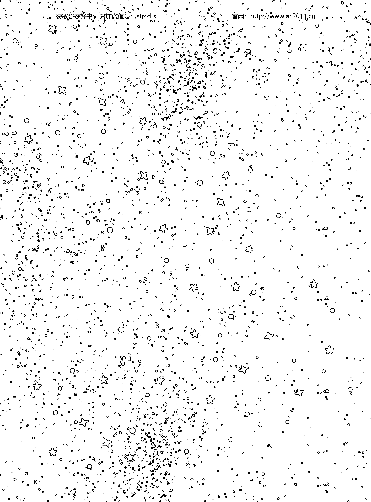

#### 學習資源

##### 書籍

《煉金術與神秘主義》（Alchemy & Mysticism），亞歷山大・魯布（Alexander Roob）著

藝術史學者亞歷山大・魯布編纂了這本關於煉金術圖像和繪畫的全面指南，雖然內容有點難懂，但是高品質的彩色照片還是讓它非常值得入手。赫密士博物館出品。

《藝術中的占星、魔法與煉金術》（Astrology, Magic, and Alchemy in Art），瑪蒂爾德・巴蒂斯提尼（Matilde Battistini）著

這本由藝術評論家瑪蒂爾德・巴蒂斯提尼所寫的書非常美麗，是個很棒、容易理解的參考書，可以輕鬆翻到特定的條目。此書特別詳盡地描述了行星之梯的每一顆行星。

《化學唱詩班：煉金術的歷史》（The Chemical Choir: A History of Alchemy），P・G・馬克斯威爾－史都華（P. G. Maxwell-Stuart）著

如果你是歷史迷，史學家 P・G・馬克斯威爾－史都華寫的這本書完整地描述了煉金術從開端一直到二十世紀的歷史。

《翠玉錄：自我轉變煉金術》（The Emerald Tablet: Alchemy for Personal Transformation），丹尼斯・威廉・豪克（Dennis William Hauck）著

這本容易入門的指南說明了如何將古代典籍《翠玉錄》應用在個人的轉變上。

《魔法與煉金術百科大全》（The Encyclopedia of Magic and Alchemy），蘿絲瑪麗・古利（Rosemary Guiley）著
市面上最棒的煉金術百科。蘿絲瑪麗・古利做了很多研究，文字易懂。

《煉金術的奧秘》（The Secrets of Alchemy），勞倫斯・M・普林西普（Lawrence M. Principe）著
史學家兼煉金術權威專家勞倫斯・M・普林西普的書以學術的眼光看待煉金術的歷史及其對現代社會的影響。普林西普甚至收錄了一些他解密出來的著名煉金術實驗配方，包括「銻玻璃」和「哲人之樹」。

##### 網站

AlchemyLab.com
這個網站大概是最棒的煉金術線上資源了，容易理解、介面友善，附有煉金術術語辭典、歷史概要及更多可以去翻翻看的好書。一定要探索主頁的「月亮與太陽路徑」頁面。

AlchemyStudy.com
如果你想藉由線上課程進一步深入認識煉金術，這個很棒的網站有數個模組可供選擇，全都是由國際煉金術公會認證的煉金術士教授。

Levity.com/alchemy
這個網站什麼都有：煉金術手稿全文、圖片、歷史，甚至還有煉金術詩歌。

TheGreatCourses.com/professors/Lawrence-m-principe
如果你喜歡《煉金術的奧秘》這本書，或是單純比較喜歡課程的版本，一定要看看劳伦斯·M·普林西普在 Great Courses 上教授的模组「科学与宗教」（Science and Religion）及「科学史：古代到 1700 年」（History of Science: Antiquity to 1700）。Great Courses 是学习任何领域的绝佳资源。

##### 公会和组织

###### 國際煉金術公會（International Alchemy Guild，IAG）

国际炼金术公会在 1970 年代创立，但是根源可以追溯到十六世纪的奥地利炼金术士威廉·冯·罗森堡（Wilhelm von Rosenberg）。公会时常举办活动、出版通讯和文章，并且跟 AlchemyStudy.com 有密切关系，以促进今日的炼金术教育。公会会员一年 40 美元、三年 95 美元（学生三年只要 50 美元）。

###### 加利福尼亚整合学院（California Institute of Integral Studies，CIIS）

加利福尼亚整合学院成立于 1968 年，是一所私立的非营利大学，提供心理学、哲学、宗教、女性性灵、文化人类学等学科的学士、研究所与线上课程。

##### 其他

###### Art History Babes 播客节目的「Alchemy and Art」单集

这集播客的來賓為當代藝術家兼煉金術士妃絲·斯麗斯勒，內容有趣、資訊豐富，是從藝術史角度切入的進入煉金術世界的第一步。

##### 參考資料

所有的参考资料都是按照章节和正文提及的顺序排列；也就是说，参考资料是以时间顺序、而非字母顺序排列。

##### 術語表

大師：知道煉金術一切奧祕的人。

煉金術之子：結合階段創造出來的新物質，象徵紅國王與白王后神聖婚姻的雌雄同體結晶，又稱作哲人之子、雌雄同體、瑞彼斯。

煉金術之龍：轉變必需的世界原始能量，跟神秘、無法定義的哲學之汞（和普通的汞不一樣）有關。

煉金術：轉變的藝術，可以指實驗室裡或自我內心進行的轉變。

雌雄同體：煉金術常見的描繪，象徵在結合階段對立事物的結合。

蒸餾器：煉金術士在蒸餾和溶解階段用來淨化物質的器皿。

藝術煉金術：藝術與煉金術交會形成的領域；創造藝術時使用煉金術的概念和方法。

黑化階段：大功業的第一階段，也是性靈自我、心智和物質當中不純潔的部分被辨識出來的時候；被認為是大功業最時間密集的階段。

煅燒：煉金術七階段的第一個階段，也是黑化階段的一部分。使用火焰或是某種酸或具腐蝕性的化學物質等「液態之火」來燃燒一個物質，直到燒成灰燼；這個詞本身的意思就是「透過燃燒幻化成骨」。

攀爬行星之梯：攀爬行星之梯是用來說明大功業這個概念的一種方式，表示往物理和形上的完美境界不斷攀升，因為七大主宰行星（土星、木星、火星、金星、水星、月亮和太陽）對應了煉金術的轉變七階段。

凝聚：煉金術七階段的最後一個階段，也是紅化階段的一部分。蒸餾階段精煉出來的精華此時變成固態；結合之子誕生，所有的努力都將在物理和形上的層次化做實體；這一刻，肉體變成形上的，性靈和心智有了實體；凝聚成功的成果是哲人之石。

集體潛意識：榮格認為我們全都擁有源自古老記憶的潛意識，這就是為何他的病患雖然完全不懂煉金術，夢境中卻會出現特定的煉金術象徵。

**結合**：煉金術七階段的第四個階段，也是白化階段的一部分。用分離後取出的淨化過的物體創造出全新物質，稱作結合之子、煉金術之子或瑞彼斯（拉丁文「雙重事物」之意）。

**溶解**：煉金術七階段的第二個階段，也是黑化階段的一部分。鍛燒後產生的灰燼此時溶解在一種液體溶劑中。

**蒸餾**：煉金術七階段的第六個階段，也是紅化階段的一部分。藉由蒸發或再蒸餾（反覆淨化液體中的物質）進一步淨化物質。

**《翠玉錄》**：傳說中收錄了托特密契思想的古老文獻，被認為在遭摧毀之前收藏在亞歷山卓圖書館；目前已知最早提及《翠玉錄》的，是六世紀的阿拉伯語著作《智者巴利納斯談導因之書》（Book of Balinas the Wise on Causes）。

**隱閉煉金術**：內在煉金術，包括心智和性靈煉金術，尤其是後者。

**顯開煉金術**：物質煉金術的另一個名稱。

**發酵**：煉金術七階段的第五個階段，也是紅化階段的一部分。在結合階段孕育出來的「小孩」使用發酵細菌以控制好的小火（跟鍛燒過程使用的直火不同）進行成熟。

**第一物質**：世界混沌原始的能量、萬物的必需物質。

**弗氏夫妻**：十四世紀時據說創造了哲人之石的煉金術士尼古拉與佩蕾內爾。

**大功業**：透過七階段淨化、精煉任何物質，使其轉變成最崇高的形式。

**希帕提亞**：（西元370-415年）希帕提亞是亞歷山卓的煉金術士，除了改良克麗奧佩脫拉的蒸餾器，還發明了一種測量水位的裝置以及測量液體重力的刻度濕度計（比重計）。

**賈比爾·伊本·哈揚**：（西元 722/723-815 年）賈比爾是阿拉伯煉金術士，中世紀歐洲人將他的名字寫成 Geber。他首次提出金屬是根據不同比例的硫和汞創造出來且會受到兩者純度所影響的論點。

**克麗奧佩脫拉**：在西元三世紀發明蒸餾器的亞歷山卓煉金術士。

**露娜**：月亮的另一個名稱，行星之梯倒數第二顆行星，跟白王后有關。

**猶太女人瑪利亞**：在西元三世紀發明三臂蒸餾器的亞歷山卓煉金術士。

-   **心智煉金術**：藉由煉金術原則轉變心智的藝術，首次由瑞士精神分析學家卡爾・榮格概念化。
-   **汞**：宇宙間兩股根本力量的其中之一，跟硫對立；在賈比爾首次提出之後，煉金術士便相信，所有物質都含有硫和汞，而最純淨的物質（像是黃金）則是達到了兩者的完美平衡；汞通常跟紅國王發憤圖強的能量畫上等號。
-   **一心**：在煉金術裡，一心是宇宙的精華或能量。
-   **銜尾蛇**：表示能量既沒有被創造、也沒有被摧毀，僅是經過了轉變的煉金術象徵；這個符號看起來就像一條吞食自己尾巴的龍或蛇。
-   **帕拉塞爾蘇斯**：使用元素改造了醫學界的文藝復興煉金術士德奧弗拉斯特・菲利普斯・奧里略・博姆巴斯特・馮・霍恩海姆（Theophrastus Philippus Aurelius Bombastus von Hohenheim）的綽號。
-   **哲人之石**：七階段和大功業的成果，可以將任何東西轉變成最至高、「黃金」的形態；廣用溶劑及長生不老藥。
-   **哲學之汞**：跟煉金術之龍有關，是世界的原始能量；不要跟真正的汞搞混。
-   **物質煉金術**：針對實際物質使用氣、火、水、土四大元素所進行的轉變；以實驗室為根本的煉金術實驗；又稱作顯開煉金術。
-   **煉金江湖術士**：一種貶抑稱呼，指稱中世紀晚期那些只追求黃金、通常不是真正煉金術大師的煉金術士。
-   **腐臭**：在黑化和白化階段啟動了發酵階段後，物質自然腐敗的現象，有時會產生彩虹般的燦爛色彩，稱作孔雀之尾。
-   **心理學煉金術**：指涉煉金術原則持續影響心理學領域。
-   **水銀**：實際的汞（會讓人中毒後抓狂的那種汞）的另一個名稱。
-   **第五元素**：第五元素類似於亞里斯多德提出的第五種元素乙太，是天上世界或神之領域的基石、某種崇高力量的火花；本質上是不可知的。
-   **紅國王**：跟精神的圖強能量、紅化階段和硫有關的煉金術象徵；具有主動、似火又充滿精力的特性。
**红化阶段：** 炼金术转变的最后一个阶段，也就是创造出哲人石的时候；包含发酵、蒸馏和凝聚三阶段。
**神圣婚姻：** 红国王与白王后在结合阶段的结合。
**盐：** 任何僵化的形式——在物质炼金术中，盐是一种固体；在心智炼金术中，盐是我们对自我的侷限认知。
**分离：** 炼金术七阶段的第三个阶段，也是白化阶段的一部分。黑化阶段过后的物质经过过滤，取得精华的部分。
**炼金术七阶段：** 任何炼金术转变（无论是物质、性灵或心智层次）必经的七个阶段——煅烧、溶解、分离、结合、发酵、蒸馏和凝聚。
**社会炼金术：** 以关系的转变为基础的一种炼金术形式；包括人际关系的转变（朋友和爱人之间）以及社会的转变（例如终结贫穷或奴役）。
**索尔：** 太阳的另一个名称，行星之梯最后一颗行星，跟红国王有关。
**灵魂：** 性灵自我知足且活在当下的那一面，跟白王后有关。
**性灵炼金术：** 藉由炼金术原则转变性灵自我（灵魂和精神）的艺术，又称作隐闭炼金术。
**精神：** 性灵自我发愤图强、活力充沛、寻求自我精进的那一面，跟红国王有关。
**硫：** 宇宙间两股根本力量的其中之一，跟汞对立；在贾比尔首次提出之后，炼金术士便相信，所有物质都含有硫和汞，而最纯净的物质（像是黄金）则是达到了两者的完美平衡；硫通常跟被动、知足、白王后画上等号。
**托特：** 埃及的文字之神，被认为是许多学科领域的创始者，包括炼金术、数学、农学、医学、宗教、魔法等；常被描绘成鹮（埃及一种高大的涉禽）首人身、手持书简；希腊人称他为赫密士，中世纪的人称他为赫密士・崔斯墨图，意思是「三重伟大的赫密士」。
**蜕变：** 炼金术中表示转变的另一个高级用字，特别是指金属的转变。
**三精华：** 宇宙的三个基本组成——硫、汞、盐。
**三臂蒸馏器**：一种有着双重内壁的容器，可协助蒐集、蒸馏加热过的物质；今天仍在使用；犹太女人玛利亚所发明。
**终极物质**：当物质产生光环或光圈的时候；即心智与性灵的哲人之石。
**白化阶段**：大功业的第二个阶段，也就是纯净的物质跟不纯净的部分分开，转变成全新化合物的时候。
**白王后**：跟灵魂的知足能量、白化阶段和汞有关的炼金术象徵；具有似水、被动又稳定的特性。
**黄化阶段**：大功业的第四个阶段，有时会放在白化和红化阶段之间；指的是物质变成黄色或金色的时刻，表示炼金术士走在将卑金属转变为黄金的正确道路上。
**潘诺波利斯的佐西默斯**：生活在西元三世纪末、四世纪初的诺斯底神秘主义炼金术士；曾写到关于铅转变成黄金的物质炼金术大功业，并与学生提欧西贝亚一起努力在实验室实现之；第一个真正用性灵自我的净化来定义大功业的炼金术士。

##### 謝辭

媽媽，謝謝妳，在我相信自己做得到這件事之前，妳就相信我了。爸爸，謝謝你總是說我很令你驕傲，老是跟朋友誇耀你的女兒出書了。沙辛，謝謝你用室友的冒險事蹟和美劇《我們的辦公室》的典故轉移我的注意力。布羅哈，謝謝你對某領域著迷的那一面，真希望我們有更多時間可以聊聊。給（另一個）媽媽，謝謝妳的鼓勵，也謝謝妳總是提醒我家在哪裡。謝謝大薩爾、克里斯叔叔、崔栩阿姨、貝絲阿姨、吉兒阿姨、比爾叔叔、我的兩位麥克叔叔；溫蒂、尼克、米契爾以及整個馬德爾／貝瑞／蓋斯家族；凱蒂、安娜貝絲、克里斯、賽門、山姆和傑克；睿、奶奶、爺爺、喬叔叔——我知道你們全都會喜歡這本書的。我好幸運能擁有你們這些家人，我好愛你們所有人。

謝謝我的編輯傑西·艾倫給我那麼多鼓勵的評語（我全部都有留存起來），沒有你，這本書不會存在。謝謝蘇珊·海恩斯及整個卡利斯托家族邀請我加入，能成為你們的作者群之一，我覺得無限感恩。

謝謝瑪琳娜·加爾佩里納和 Gizmodo 的團隊發表了我第一篇有關煉金術的文章，狂熱煉金術的我覺得你們都超讚的！

謝謝我學生時期的每一個導師。史考特·寇爾伯，謝謝你回應我的問題，叫我放膽去做。謝謝那些啟發我、讓我對中世紀的一切事物產生熱情的教授專家：莫·帕雷萊斯博士、安德魯·羅米格博士、瑪莎·達娜·魯斯特博士。謝謝席德·奇波拉、班·史坦菲德、克里斯·狄亞茲、達雷爾·霍姆斯、茱莉亞·葛里芬、史帝夫·韋斯克夫博士等人！我好幸運能當你們的學生。謝謝你們教我思考。

給我所有的朋友(沒有特定順序): 艾莉、路克、V、瑞曲、馬特、丹、蜜雪兒、山姆、露西、凱亞拉、梅爾、凱蒂、奧布瑞、艾琳、亞莉阿德妮、薩摩、艾瑪、葛蕾絲、蘿拉·R、蘿拉·H、艾蜜莉、茱莉亞、蜂巢一群。在我提到這瘋狂的書籍提案時大喊「太棒了！」的那些人，謝謝你們，你們不知道這對我的意義有多重大。

謝謝那些藝術家、說書人與販節者，尤其是黛博拉·哈克妮斯（是妳讓我踏上煉金術的冒險之旅）、莎拉·J·馬斯、多利·阿爾德頓、伊莉莎白·吉兒伯特、薩繆爾·D·亨特、Dobama／Southern Rep／紐約戲劇工作坊／劇作家地平線／The Public 等戲劇展演場地、李察·林克雷特、凱特·布蘭旗和克麗絲塔·蒂皮特。

謝謝現在正睡昏在我床上、一副「妳怎麼還不睡，人類？」的表情的查特斯以及我所有的毛小孩。

最要感謝的，是你，親愛的讀者。這本書沒有你就不會存在。謝謝你的好奇與驚嘆的心！好好施展你的身手！

##### 作者簡介

莎拉・鄧是一位作家、中世紀專家、演員和製造者，目前居住於紐奧良。她曾為 BUST、Gizmodo、io9、AV Club、the MarySue、Stage & Candor、Film Daily 等平台寫過關於哥吉拉、女性主義、中世紀和煉金術等各種主題的內容。她曾在全美各地的地方劇院演出，包括紐約。她擁有紐約大學迦勒汀個人學習學院 (Gallatin School of Individualized Study) 的協力說故事學士學位，輔修中世紀與文藝復興研究。現在，出去好好大顯身手吧！你可以的。

The Beginner's Guide to Alchemy

by Sarah Durn
Copyright © 2020 by Rockridge Press, Emeryville, California
Shutterstock/Morphart Creation, p.5; iStock/ilbusca, p.7; Shutterstock/Kristina Vor, p.11; Shutterstock/Natata, p.28, 104; ART Collection/Alamy, p.33; Topham Partners LLP/Alamy, p.34, 72, 79; The History Collection/Alamy, p.36; The Reading Room/Alamy, top left p.37; FALKEN-STEINFOTO/Alamy, bottom right p.37; Historic Images/Alamy, p.46; The Picture Art Collection/Alamy, p.49; Classic Collection/Alamy, p.54; Art Collection 2/Alamy, p.62; Welcome Collection, p.92; Shutterstock/Naci Yavuz, p.94; Art Heri-tage/Alamy, p.98; Shuterstock/Artur Balytski, p.106, Creative Market/Pixejoo, cover and all other art.
Author photo courtesy of © Evlin Lake.
First Published in English by Rockridge Press, an imprint of Callisto Media, Inc.
Chinese complex translation copyright © Maple House Cultural Publishing,2021
Published by arrangement with Callisto Media, Inc.
through LEE's Literary Agency

## 煉金術新手指南

-   出版／楓樹林出版事業有限公司
- 地址／新北市板橋區信義路163巷3號10樓
- 郵政劃撥／19907596 楓書坊文化出版社
- 網址／www.maplebook.com.tw
- 電話／02-2957-6096
- 傳真／02-2957-6435
- 作者／莎拉・鄧
- 譯者／羅亞琪
- 企劃編輯／陳依萱
- 校對／閻若婷
- 港澳經銷／泛華發行代理有限公司
- 定價／420元
- 初版日期／2021年12月
- ISBN／9789865572860