# 秘义之光公众号文章 2022.10

来源：[`mp.weixin.qq.com`](https://mp.weixin.qq.com)

# 希腊神祗·阿波罗

> 原文：[`mp.weixin.qq.com/s?__biz=MzAxMjY0NTYxOA==&mid=208067547&idx=1&sn=57ffba83fffa99675418ace9ac8e9d52&chksm=123cde46254b57501eeb87401a7047771675b37257d233aae3428a9299b03b04551f31436f46&scene=27#wechat_redirect`](http://mp.weixin.qq.com/s?__biz=MzAxMjY0NTYxOA==&mid=208067547&idx=1&sn=57ffba83fffa99675418ace9ac8e9d52&chksm=123cde46254b57501eeb87401a7047771675b37257d233aae3428a9299b03b04551f31436f46&scene=27#wechat_redirect)

**这里是第一次做推送的麓麓(づ￣3￣)づ╭** 

**由于作者本人是走的文学路线，大部分内容比较具有小白科普向，不能说很专业，若有任何建议请直接回复公众号，麓麓酱会统一收集然后逼迫作者改进的√**

----------------------------------------------------------

希腊神祗·阿波罗

阿波罗是第三代十二主神之一，全名为福玻斯·阿波罗（Phoebus Apollo），又称福玻斯（希腊语：Φοίβος，意为“闪耀者”，现代希腊语转读为菲比斯。）

阿波罗的父亲是宙斯，而母亲是黑暗女神勒托，他是和阿尔忒弥斯一起诞生的私生子，相传最先出来的是姐姐阿尔忒弥斯，然后在阿尔忒弥斯的帮助下，才将阿波罗给接生了出来。

虽然阿波罗的母亲是黑暗女神勒托，但是阿波罗本身却是代表着光明的神明，从不说谎，光明磊落，在其身上找不到黑暗，也称真理之神。与此同时，阿波罗也是艺术之神，相传他最喜爱的乐器，是金色的竖琴。

阿波罗的典型形象是右手拿七弦的里拉琴，左手拿象征太阳的金球，象征着艺术与光明。

虽然说是艺术之神，但是阿波罗主要是在音乐方面的神明，在不少的画作中常会有弹奏着金色的竖琴的阿波罗的形象出现，也有画作中以阿波罗的演奏为核心，四周环绕着各种生物，如同老虎与兔子，他们明明狩猎者与猎物的关系，却因为阿波罗的音乐可以和平共处，以此来演示出阿波罗对于音乐的技艺的高超。

提起阿波罗就不得不说起阿波罗的神殿。

阿波罗的神殿在德尔斐，希腊神话中，德尔斐是世界的中心。因此在“*Adyton*”内竖立着一个锥形石柱，称为翁法洛斯（意指“大地肚脐”），由两个金质的老鹰支撑，象征着这一地位。传说宙斯曾经于相反方向放出两只苍鹰来测量大地，而它们相遇的地点正是德尔斐。

在神话传说中，这是阿波罗本人继创建了提洛（Delos）的神庙之后一手创办的。当他来到德尔斐的时候，这里由一条巨蟒“皮同”（Python）看守，它是盖娅（大地）所生，守护着一个属于忒弥斯的神谕。阿波罗希望用自己的神谕来指导人们，因而用弓射杀了皮同，将圣地取而代之。

阿波罗神谕仪式

德尔斐的圣地实际上是“神谕性的”，在这里神的话语通过皮媞亚（德尔斐的女预言者）下达到凡人。这个女祭司传统上是一个未受过教育的年轻处女（后期演变成了一个老年妇女，但仍著少女的服饰），她坐在一个三脚架上，这个架子支在产生神谕的沟壑（ἄδυτον / Adyton）中，下面就是产生天然气的裂缝。皮提娅手持着一个“*phiale*”（用于浇祭用的扁盘子）以及一支月桂（阿波罗的神树）。

对神谕的咨询最初是年度性的，在德尔斐历的“Bysius”这个月（公历二月至三月之间）的第七天开始举办阿波罗节。随后演变成一年内（传说中）阿波罗在当地居住的九个月中每个月的七号都举行仪式，这天起名为“*polyphthoos*”（许多问题的日子）。

在问询前有一些仪式需要履行，它们由女预言者在两个祭司的配合下完成。后者终生服务于神庙，下面辖有五个操持仪式的“*hosioi*”（神圣的人）以及两个男预言者，其中一个辅佐皮提娅，将她的预言翻译成常人所能理解的语言。神的语言通常被转译成韵文，采用六音步诗行（hexameter）。

每年，当阿波罗离开的时候自然没有神谕，这造成每年神谕重开的时候总是有无数的信徒等候。因此神庙的祭司有权安排参加仪式的优先权（Προμαντεία /promanteia）。参加者先向神献上适当的礼物，然后由祭司向一头山羊身上泼上一些冷水，如果它不因此而战栗则被认为是不祥之兆，仪式将不会进行；而如果朝拜者被接受，山羊将被进献，而他可以进入神殿向女预言者提出问题，当然，这个问题被回答与否就取决于神的旨意了。

德尔斐的阿波罗神殿中，神谕仪式只持续九个月，在九个月后，也就是寒冬的时候，阿波罗会离开德尔斐圣地去往极北之地自我洁净，因此在德尔斐他的位置就被狄俄倪索斯所取代。

常见误区

现在经常称阿波罗是太阳神，这是错误的。

阿波罗是光明的神明，希腊人本身并没有崇拜太阳和月球的习惯，在希腊神话中，阿尔忒弥斯虽然是月亮女神，但是并不是希腊人对月球本身的崇拜，而是类似于对“黑暗中的光明”的一种崇拜。作为阿波罗的双胞胎姐姐，阿尔忒弥斯也可以算是光明之神，尤其是夜晚的白月之光，将其光明之神的一面体现了出来。

在希腊神话中，太阳之神另有其人

赫利俄斯（希腊语：Ήλιος）是古希腊神话中的太阳神，他是提坦神许珀里翁之子，黎明女神厄俄斯和月亮女神塞勒涅的兄弟。

赫利俄斯每日都会乘四马金车在天空中奔驰，从东到西，晨出晚没，用光明普照世界。

关于阿波罗的别名。

福玻斯（希腊语：Φοίβος）在希腊神话中，是阿波罗作为太阳神时的一个别名。在希腊语中，Φοίβος的字面意思是“发光的，灿烂的”。不要把他与恐惧之神福波斯（Φόϐος）的名字弄混。

现代研究者认为，福玻斯被当做阿波罗的别名也是后来才出现的事情，很可能是在阿波罗作为奥林波斯系神祇排挤掉了古老的提坦女神福柏之后。^([1])福柏的名字（Φοίβη）与福玻斯非常近似。

在罗马神话中，福玻斯（拉丁语：Phoebus）也是用来指太阳神，但不一定是指阿波罗。

参考文献：

《欧洲神话》(希望出版社) ISBN 978-7-5379-3828-0

《魔法师大全 - TheWitch Book》(重庆出版集团) ISBN 978-7-229-02260-0

（英文）Sir WilliamSmith, *Oraculum*, *Dictionary of Greek and RomanAntiquities*, C. Little, and J. Brown, Boston, 1870;

（法文）Georges Roux, *Delphes, son oracle et ses dieux*,éd. Belles Lettres, Paris, 1976;

（法文）Ouvragecollectif, *Guide de Delphes*,2 volumes (I. « Le site », II. « Le musée »), éd. DeBoccard, Paris, 1991;

（英文）H. W. Parke andD.E.W. Wormell, *The DelphicOracle*, Basil Blackwell, 1956;

Plutarch's *Moralia*. Vol. 5;

（英文）J. Z. de Boer,J. R. Hale and J. Chanton, *NewEvidence for the Geological Origins of the Ancient Delphic Oracle (Greece)*,in*Geology*, Vol. 29, No. 8, pages 707-711; 2001.

# 影片推荐《夜魔侠》

> 原文：[`mp.weixin.qq.com/s?__biz=MzAxMjY0NTYxOA==&mid=208104332&idx=1&sn=ead5010481b8484fe8643a08814726bc&chksm=123d6e11254ae707538f761c5e9f93eda3d7719fc8ad0500e354854766ce242ba469c4703aa7&scene=27#wechat_redirect`](http://mp.weixin.qq.com/s?__biz=MzAxMjY0NTYxOA==&mid=208104332&idx=1&sn=ead5010481b8484fe8643a08814726bc&chksm=123d6e11254ae707538f761c5e9f93eda3d7719fc8ad0500e354854766ce242ba469c4703aa7&scene=27#wechat_redirect)

**正义是看不见的，但是他能被听见。**

**——《夜魔侠》**

偶然看到的夜魔侠预告，今天便找了时间看完了。

确实是一个不错的片子。

很多人给它的评价并不好，但是这却是我喜欢的类型。

夜魔侠，他出生与成长，甚至是工作都是在一个叫做地狱厨房的地方，纽约的一个角落里面，像星城一样充满罪恶。

而他也不像是传统的英雄，虽然和传统的英雄一样因为亲人被黑暗杀死所以才想要寻求正义，和大部分的桥段类似，他因为受到了辐射物质所以失去了双眼，但是他其他的感官却因此而特别灵敏。

但是和其他传统英雄不一样的是，他在整个超级英雄的定位中并不是蝙蝠侠，而类似于猫女，不是绿箭而类似于金丝雀。

等等，好像用 DC 的角色来解释漫威有点不对。

他是一个街头英雄。

他不想是钢铁侠一样觉得整个城市都是自己的，又或者是美队那种每个人都知道，并且将其当成英雄模板的存在。

在电影中一个桥段将这点显示得尤为突出。

当时夜魔侠刚好把一个类似于流氓一样的角色打入附近的一个公寓楼里面的时候，一个小女孩哭着说“不要伤害我”的时候，他一定是被现实刺激到，不断地在说“我不是坏人”。

他为了继承他父亲打拳击的时候所穿的斗篷，将自己的战袍做成了恶魔的样子。而在黑夜中出现的恶魔，只会让人产生恐惧。

他不需要在蜘蛛侠里面，一直在大屏幕中诋毁着蜘蛛侠的 JJJ，就足以让人觉得害怕。

Daredevil。

无畏于邪恶的人，又或者用中文的翻译来解释成夜晚的恶魔。都足以用来形容这个在夜晚行动的盲人英雄。

在这里我不想太过于去介绍这个电影的内容，也不想和其他人一样去分析武导，剧情，等一系列的东西。

这是一个十二年前的电影，若是和现在的电影来比的话，要说不足依旧是有的。但即使是跨越了十二年的时间再去看这个故事，也会被不少细节触动。

正常画面和夜魔侠视线中的画面相互交错的时候，完美的向观众们展现出来了一个有着超凡感知的盲人的“视觉”。那个视觉是没有光的，完全是依靠声音构造产生。

而这一点也完美的为之后夜魔侠的弱点埋下了伏笔。

爆炸时的震动让他的感知出现了偏差，以至于没有保护到自己喜欢的女孩子的父亲。在大教堂里面和靶眼战斗的时候，响动的钟声和被靶眼恶意敲响的管风琴，都对依靠其他感官而战斗的夜魔侠造成了巨大的伤害。

他并没有小蜘蛛那样变异的感官能力，也没有注射了血清的美队那样的自愈能力，更加不像是钢铁侠那样的有钱技术宅。

他是一个律师，在白天只为真正无辜的人辩护，即使不能得到多少报酬。

他是夜魔侠，在晚上为了正义而战斗，只是为了保护那些无辜的人。即使遍体鳞伤，所有亲人都离他而去。

即使这样他也只为了心中的正义，只做着对的事情。

大概也正是因为这份感情，才会让美国队长亲自过来将其招募，虽然本人是拒绝了的。

而说到这里也不得不说起他的律师同伴，帮助他在法院上为自己的委托人辩护的朋友。

如果说夜魔侠是一个都市传说一样的超级英雄的话，那么他的律师朋友就像是生活中的大多数人。他一直在劝导着夜魔侠接受更加高薪的工作，看起来似乎是有些势利，还有一点恶作剧，但他从未抛弃过夜魔侠。

他知道自己的朋友在做正确的事情，虽然他对这种正确有些不满，也想要更多的报酬，就像每个人一样。但他心中依旧有着那份正义，即使不明显，但这份正义将他吸引向了做着正确的事情的夜魔侠。

最后虽然说着不愿意，但他还是帮助夜魔侠解决了一个又一个几乎没有什么酬劳的案子。

也许哪一天，他正视了自己心中的那一份小小的正义感的时候，当他把他的那份正义感展现出来的时候，即使没有夜魔侠那样的体术能力，他也能够成为另一种意义上的 super hero。

# A Brtef History of Wicca

> 原文：[`mp.weixin.qq.com/s?__biz=MzAxMjY0NTYxOA==&mid=208138037&idx=1&sn=8c2c4e29227efeb711260ffaca4153ac&chksm=123deaa8254a63beacf30e636b905cc867778045780f4657189ec9197ecaa7af3c4deace7db8&scene=27#wechat_redirect`](http://mp.weixin.qq.com/s?__biz=MzAxMjY0NTYxOA==&mid=208138037&idx=1&sn=8c2c4e29227efeb711260ffaca4153ac&chksm=123deaa8254a63beacf30e636b905cc867778045780f4657189ec9197ecaa7af3c4deace7db8&scene=27#wechat_redirect)

一个简短的 WICCA 历史——

作者：Sally Morningstar 和 Peter Mills

自然的女神

在古老的过去每个部族都有自己的治疗师、智者、萨满以及懂草药的人，不一定是我们现在所定义的女巫。比方说，旧英格兰的地方话称这类人为“狡猾的人”或“幸运桥梁”，意大利称为”雄辩家”，古罗马则称之为“咒术师”。更早些的时候，民间的智者可能了解的更多以及多变的名词。在古代这方面的表达是非常暧昧的，但这也是我们追溯巫术起源的必经之路。

自然界的生产力对我们的祖先至关重要。如若农作物欠收，或牲牧数量下降，或者没有新生婴儿出生，部落就会灭亡。生育就是生命自身的延续，永远不会被断绝。因此，繁衍和母亲的形象抽象的组合成了大地母亲的形象。旧石器时期人们所雕刻的精美形象和女神，至今仍被 WICCA 所崇拜。在巫术中这些雕像被称为“*Venuses*（维纳斯的变形）”，作为宗教信仰其至少存在了近三万年之久，也许更久。

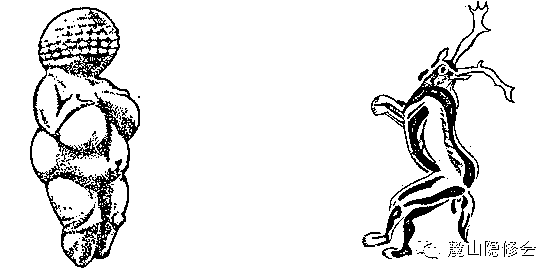

这个维纳斯雕像于欧洲发现 这幅“（*The Sorcerer*）巫师”壁画至少有两万年之久

大约有三千年

一个男性配偶的形象或称女神的“丈夫”也被发现年代相近，完整的头顶上长有鹿角说明他不仅仅象征人类，也代表了整个自然和动物的世界。在法国一个名为“*Les Trois Freres*”的山洞壁画上有这样一个例子。洞穴中的有一副“（*TheSorcerer*）巫师”外表是马尾人身的直立形象，这幅壁画被认为存了在两万年。当农业产量达到要求，这些神就被赋予了更多的含义，成为了庄稼和丰收的神灵，雨水和太阳的神灵，羊群和牧场的神灵，大地果实与四季的神灵。

武士贵族阶层和神的诞生

这些金属被发现是青铜时期之处的产物，这是一个时代的人们开始倾向于心术不正。拥有锋利青铜武器的那些人支配了其他的人群。酋长和国王建立军队进一步扩展他们的权利，因此在社会中催生出了一种新秩序——武士贵族。埃及神庙里明星的饰带，尼尼微和巴比伦的泥板，印度的吠陀经和奥义书以及希伯来卷轴塔木德因为那是构成圣经的基础，记录了一系列的侵略、屠杀、战争、战利品以及入侵时留下的金属。

这段时期的暴动和血腥造成了文化剧变，上帝被创造于中东，这是旧约中最著名的记录。在男权主导之时国王掀起战争，为此需要一个强大的男神，因为在他们的世界中造物主是男性。只有儿子，而非女儿，能够将基因遗传给下一代。为确保每个孩子都为其父亲所生，不可能怀疑血统，男人为获得性事的主导权而征服了女人。所有领域上都有一个男神徘徊，女人被严苛的法律约束以保障男性主体的权利，其他人不得触碰属于其他男子的女人并使其怀孕，违反者严惩不贷。在律法书中曾有描述，通奸的女人要被石头砸死。根据伊斯兰法律，这些天的通奸者要面临死刑。根据武士阶层的宗教信仰要求，女人成了男子的所有财产。古代还有更多慈悲的教义。然而，人类的古老宗教，最根本的创造者还是女性，也根本没有从大地上消失：它变成了已知的巫术。

第一次治疗

纵观人类历史，从偏远的时代到现代，每个部落、村庄和社区都有一个“智者”，不论其是男是女；“巫医”就是指识得草药的男人和女人；能够和恶魔、鬼魂沟通且能治愈疾病和病痛。在后来的许多个世纪，这些人被统称为“witch”，他们所掌握的技艺被称为“witchcraft（巫技）”。这些人的存在就是对纯粹科学不能提供人类社会所有需求的最好证明。

民间巫师和萨满普遍谴责官方宗教，不愿意与他人分享权力。不管宗教取得什么力量；它都小心翼翼的宣布有关自己神奇的奇迹的发生。如果治疗确实靠谱，这就会成为一次奇迹并未宗教带来荣耀；倘若治疗是从谁那里借来的力量，这种行为就被称之为与“邪灵”打交道，因为这不能为信仰带来点缀。

（译者：就以划线的这句话，让我提供一个新思路，不要再听信异教徒的一面之词了。这句话很好的表明了，当今 wicca 有心替代一神教为主流教派的野心。事实上民间巫师在中世纪治病，教会并不反对，只要不用上帝的名义召唤，中世纪的猎巫运动是贵族们假托教会口谕，自己主演的一场闹剧。）

如植物；浆果；根；水果；叶子；草药以及水晶，这些所有关于自然事物的知识，以及使用魔法驱使邪灵的本领，曾是传说中的智慧。当自然女神和角神被人所崇拜时，智者具有了最伟大的荣耀。治疗对象面向全体阶层，包括身体和精神，这是他们在社区内最重要的技能——因为它只涉及自然的部分——医生被认为最崇拜自然女神和角神的人群。

历史证据

第一次世界大战后，一位杰出的考古学和人类学的专家 Dr. Margaret Alice
Murray（1863-1963）从埃及考察返回后，被巫术研究所吸引。她从历史和人类学的角度来研究它。在 1912 年她出版了一本非常有影响力的书《*The Witch-Cult in Western* *Europe*——西欧的巫术宗教》。这些书使得巫术重新被人们关注。

Dr. Margaret 晚年时首次提出普遍称为巫术的系统学说，实际上这和基督教之前时期的生产力有关，且在被基督教敌视并转为地下活动前自然宗教广泛普及，现在仍为我们的古老民俗传统存活着。打个比方，在五朔节围绕花柱跳舞是异教祈求得到丰饶的仪式。一个遗留就是对古老宗教的最好证明，且这些传统在萨克逊人、诺曼第人和中世纪天主教中仍占据重要地位。这些古老的教堂里都是一些各种人物的装饰性雕像，其中很多是风姿卓越的女人的雕像，大小从 6 英寸到 2 英尺高，这些异教徒的形象就是史前宗教崇拜自然女神的巫师们。凯尔特的 Sheela-na-gig 就是被考古学家们所称的“sheelas”，在爱尔兰有超过 70 英尺的以及英格兰有超过 23 英尺的，其中大多数集中在基督教的教堂。再举个保留下来的例子，十一世纪英国剑桥郡的 Whittlesford 教堂，在那里面的雕像中也有男性和女性配成一对的，其中一个形象是男子的身体动物的头所组成的，可能代表了角神。

在 BrianBranston 写的《*The Lost Gods of England* 》一书中他摘录道：“Therecan be little doubt that we have in the sheela the actual representation of theGreat Goddess Earth Mother on English soil  毫无疑问，在说英语的地区，我们将 sheela 视作伟大的大地之母”他继续补充：“What maybe surprising is that the 'idol' should so clearly retain characteristicswhich go back to the figurines of the Stone Age 令人吃惊的是这些雕像如同石器时期一般，偶像的特质保留的非常明显”他本人也作出重要申明：“That thecult of the Great Goddess did not end with the Middle Ages but stillflourishes today is indicated by the resurgence of 'white' witchcraft, 'wicca',in Great Britain... there are certain modern wiccan rites which aretraditional with roots going back to the Middle East of at least 2500years ago...在英国，伟大的女神崇拜并没有随着中世纪而结束，如今巫术、维卡再度复兴并兴盛……现在的一些维卡仪式，其传统可以追溯到两千五百年以前的中东”。

聪明的异教徒

天主教义，像全新的重要的思想，在 Londinium Augusta（伦敦）的港口和交易中心扎了根。在乡下，旧教仍继续生存。甚至今天，乡下人也保留着稀奇的传统、习俗、老思想以及生活方式。这种城市和乡村的分裂在过去更明显，且拉丁语对于村民来说如同 pagani（异族文化）一般，他们的信仰于生活方式远比城里人更古老和坚定。

罗马撤军后，英格兰进入了一个新的混乱时期称为“DarkAges 黑暗时代”，鲜有相关文献。这时基督教在英国基本绝迹，且草药学与医学的知识很大程度上被乡下懂得医术的聪明人保护流传下来。后来罗马教会又派遣一批传教士去岛上对异教徒传教并重新恢复他们的教堂。逐渐的，本土宗教先是被排斥，而后彻底取缔了。所有信仰异教的人都变得危险，古老的传统开始意识到秘密。因国家和宗教的迫害，异教徒开始转入地下在偏远安全的地点聚会。

在盎格鲁—撒克逊，他们的语言来自于早期日耳曼语而不是我们所认为的英语，有一个称号为异教追随者，他们有部分理念是治疗术和自然魔法的实践。这些名字就是 wicca，现在发音为“wikka”（男性崇拜者称为 wicca，女性崇拜者称为 wicce）。但在盎格鲁—撒克逊正确的发音是“witcha”，这个词更现代的版本是“witch”。

wicca 的出现

1736 年英格兰法律上诉对巫术的禁令，但法典比并没有完全禁止它。法典只是站在教内人士的角度废除了触犯戒律的苗头，并官方的否认巫师在超自然和魔法上的能力，越来越接近科学推理。反倒是，为了维护法律对伪称一批人是巫师，巫术的指控比以往更甚。因此，为了减轻巫术的“罪行”便宣布凡有人宣称魔法便是欺诈。凡事恰到好处是真正作为一位巫师的定义，不论男女，任何人观察旧教的地母女神、天父男神与想象古老的角神，在信仰基督教之前的旧教，就是关于巫师的实践。

然而，不论巫术的本质是什么，即使在天主教堂给人们洗脑灌输几个世纪，也没有任何律法和议会可以消除旧教教义的实践行为。在 1736 年之后很长一段时间里，女巫事件仍时有发生，有时还会杀死这些人。

经过 1800 年后，美国的老百姓更愿意接受医生的治疗，而不是民间赤脚医生的草药，以至于 1847 年美国医学协会成立，有效的消除了非正规行业者任何形式的制药行为。这种替代药物治疗的方式，使得接下来的 60 年里几乎看不到任何卖药郎的身影，只存在于美洲原住民以及一些民间传统了。

英国的情况很大程度上是类似的。1854 年对议会提交的医疗改革法案旨在废除草药，除非那个人在英国医学协会有正式的注册。有个反对该法案的联合起义并让这个法案失效，从而使得草药的用法得以流传至今。

某种意义上这是种好的思想，因为这禁止了任何人乱用权力，但另一方面意味着巫师的治疗在社会上的形象变得越来越阴暗负面，以至于不得不将数百年来的巫术实践雪藏。从这些黑暗时代可怕的迫害中，wicca 作为我们已知的实践重新灭而复兴。然而，直到今天“wicth”仍然被贴着负面的标签。然而，凡事恰到好处是真正作为一位巫师的定义，不论男女，任何人观察旧教的地母女神、天父男神与想象古老的角神，在信仰基督教之前的旧教，就是关于巫师的实践。

Wicca 复兴

现代巫术被人所关注依赖这两个人：Dr. Margaret Murray 他的书受欢迎程度前面我们已经提过了，另一个就是 Gerald Gardner。许多人都对这些知识的传播有重大贡献，但这两个人仍然重要。

Gerald·Brosseau·Gardner——杰拉尔·布罗索·加德纳（1884—1964）曾对他在东方遇到的部落和宗教有着浓厚的兴趣。据说，加德纳是隶属于汉普郡新森林的一个集会成员。这可能是一个 wicca 集会，是过去某一个古老教派幸存下来的团体。人们认为加德纳于 1939 年通过一个叫 Dorothy Clutterbuck 的女人开始接触巫术。

加德纳也和圣奥尔本斯附近一个现存的女巫集会有关，其高级祭司名为 Charles (发音 Charlie) Cardell。1940 年加德纳出版了一本名为《HighMagic's Aid》的巫术书，但由于自称巫师在当时是犯罪行为，这种高度准确的书被写成了小说的形式。

第二次世界大战后为符合新成立的联合国组织的“世界人权宪章”，英国被迫废除有关 1736 年对巫术做出的行为。这个法律限制在公开出版的书籍上写自己的巫术实践。

1954 年后加德纳出版了他最具影响力的书籍，《*Witchcraft Today* 》在他的坚持下，尽管几个世纪巫术都遭到了迫害，巫师仍然遍及全国。他收到了许多爱好者的来信，以及许多通过加德纳学习巫术的人们和他的女祭司——thelate Doreen Valiente——后来他们建立了自己的集会。再后来几年中，全国各地都有这么一群巫师。

然而，在加德纳之前许多不同的巫术传统都没有被关注到。有观点认为，在新森林的巫术集会中，加德纳被父母告知，他必须保持一些他们的仪式和传统。这不可能证明。然而，加德纳和他的追随者以古老的异教巫术为来源，形成了自己体系的各种巫术，他用古盎格鲁—撒克逊语“witchcraft”来称呼 wicca。

这是完全可能的，因为传统集会在加德纳之前就申明过他们的仪式内容。在 1960 年 Alex Sanders 和他的妻子一起成立了集会，并用他本人的名字来命名。Sanders 的体系参考了其他分支的很多内容，如 Qabbalah(一个古老的希伯来神秘学体系)并加入了很多犹太教和基督教的“words of powe 力量语言”在书页的边缘。还有 Dianic wicca，他们的名字来源于 Diana 戴安娜，这个名字在许多古籍中称为巫术女神，大部分都是女性为主导的集会，且不太有人承认她们。在巫术的宗教里没有很大的分歧，如 wicca，而一神教中如新教和天主教则并非如此。所有的巫师都称自己的传统是技艺的分支，且可以从历史的追溯中溯源到主流，他们的根源深埋在史前的大地中。

# 金逆与小公举们不得不说的故事

> 原文：[`mp.weixin.qq.com/s?__biz=MzAxMjY0NTYxOA==&mid=208998116&idx=1&sn=e0e03fddc01d5677fc10f863cd6f9005&chksm=122f0b792558826faa638c9e9b6b2cfa704c71829a84e93bce880e4f0ee2d1637c62bb000025&scene=27#wechat_redirect`](http://mp.weixin.qq.com/s?__biz=MzAxMjY0NTYxOA==&mid=208998116&idx=1&sn=e0e03fddc01d5677fc10f863cd6f9005&chksm=122f0b792558826faa638c9e9b6b2cfa704c71829a84e93bce880e4f0ee2d1637c62bb000025&scene=27#wechat_redirect)

我的空间和盆友圈这两天被金逆刷屏了，作为一名占星湿，我觉得我有必要说两句。
（顺便开脑洞）

在古典占星的传统里，星曜顺行是正常状态，因此，逆行就会被考虑成星曜凶险的状态了。
但是！这一星象的变化是对整个地球都作用的，为什么全世界只有你在叫苦连天？！
今天就由我，带大家简单地从推运法的角度切入，正确的看待星曜逆行。

期不期待～有没有很崇拜我
咳咳。。。划掉上一行字。。。

推运手法多种多样，例如法达星限（Firdaria），小限法（Profection），返照法（Return），推进法（Progression/Direction），流年法（Transit），日弧法（Solar Arc Direction），Aphesis 等，而今天我们重点来说一说法达星限，返照法，和流年法。

法达星限和小限法都是一种时主（Time Lords）系统，其主要原理，就是将人的一生中不同的时间段分配给不同的星曜主宰，某一时间段的主宰得以指示相关事件的发生。法达星限使用大运和小运，即在一个时间段内，一颗星曜将作为大运主宰其大致运势，再把这一时间段细分，每一小运主宰一个更短的时间段，原则上应兼顾两颗星曜，但实际运用时，论断会偏向小运星的使用。而小限法则是采用轮宫的方式，每一年分配一个宫位。在实际使用这两种方法论断时，除了考量法达小运和小限宫主星，宫内星的先天星性，还要考量星曜的接纳互容，以及合相，甚至是紧密相位，以确定事件的具体情况。
具体计算和使用方法在此不一一赘述。

法达星限搭配返照法是推运常用手段。返照法中，常用的是太阳返照（Solar Return）和月亮返照（Lunar Return）。从人出生的那一刻起开始计算，太阳不停运转回到出生时刻的位置，就被称为太阳返照，太阳返照时的天象制成的星盘，就是太阳返照图。太阳返照图主宰了下一次太阳返照前盘主的运势。而月亮返照同理，月亮返照图主宰了下一次月亮返照前盘主的运势。太阳返照的周期大约是一年，月亮返照的周期大约是一个月，因此太阳返照常常用于年运预测，而月亮返照常常用于月运预测。通过对比返照图相对于本命盘中类似的结构（紧密相位，接纳，互容等），尤其是日月的结构，来预测事件的发生，是一种十分有效率的方法。

而流年法，则是通过本命盘与即时天象盘的双盘（Bi-wheel）对照来分析即时天象对本命盘的引动关系，大部分情况下每一个引动都会使对应事件发生。

法达星限和返照法常常用来确定事件发生的时间段，而流年法则用于确定事件发生的时间点。星曜逆行时，若时间段内法达星限的小运星在本命盘中引动该星曜，或是小运星和为其所引动的星曜在日月返照中与日月互动，亦或是在流年法中推进并引动本命星曜，相对应的事件则会变得极易发生。因此，星曜逆行引起的事故需因人而异地判断。

举个栗子～

假如我现在进入了金星小运，而金星在我的本命盘里合相木星，刚好木星主宰第二宫。
木星象征富贵，钱财，上流社会，说白了就是土（豪）星。他除了象征有钱，还可以象征大手大脚的花钱。
木星：劳资就是有钱任性。
此时木星被法达的金星引动，金星的先天星性象征女性，美丽，艺术；而逆行可以象征回归，返程。于是，发动占星湿酷炫的脑补技能，金逆会使前任回头，引动木星，那就快大手大脚地在前任身上花钱！（求事后心理阴影面积）

同时，法达的引动并不仅限于合相，还有接纳互容和紧密相位，这种引动结构若是反应在日月返照中，也就是日月返照中出现了相似地接纳互容和紧密相位，那么恭喜你，桃花劫无误......

再举个栗子～

在上一个栗子中，我的木星被引动。假如现在我打开月亮返照图，当我看到在月亮返照图中最重要的月亮时，我发现我的月亮精确成相木星并被接纳，同时定位金星；而同时，我的木星又落入主宰短期恋爱和享受的第五宫。
木星除了象征大手大脚地花钱，还可以象征生 zhi 力，当木星落入第五宫，再加上和逆行金星的互动，哇塞，来自前任的桃花劫无误......

然后我们再举个栗子！！！

假如现在我已经有了对象，我又一次打开月亮返照图，我发现在月亮返照图里，我的金星逆行精确成相五宫主；同时，五宫主失势，金星入庙，又被木星接纳；他们都和月亮精确成相。
如此一来，现任的力量不足，前任反而强势，加之金星被木星接纳，五宫主没有出现这样的结构，很有可能出现和现任分手前任再上任的剧情，哇塞，这是何等的桃花劫......

如果在流年法或是返照法中，又出现了金木共同作用引动其他星曜，那么事情就变得更有趣了哦呵呵。这个引动若是牵涉到第三方乃至第四方因素，那么必定是要变成琼瑶剧情；若是没有，那么根据引动星曜的星性和相位等因素，即可评估事件发生时间和性质，进一步推导事件的美（狗）妙（血）剧情。

是不是听起来就很赞！！？

这个故事告诉我们，不要有点破事就叨逼叨刷屏，我们要实事求是的分析～有点破事就怪金逆，你 tm 以为你是小公举啊？

# 【古典占星】你是个没朋友的人嘛～

> 原文：[`mp.weixin.qq.com/s?__biz=MzAxMjY0NTYxOA==&mid=209682466&idx=1&sn=e1ff630a644f7cb6a85c042fceb86141&chksm=122585bf25520ca9c9b713291f06b17343474f7f0175b6b7ee09033c946d756c7d2d7eeecc88&scene=27#wechat_redirect`](http://mp.weixin.qq.com/s?__biz=MzAxMjY0NTYxOA==&mid=209682466&idx=1&sn=e1ff630a644f7cb6a85c042fceb86141&chksm=122585bf25520ca9c9b713291f06b17343474f7f0175b6b7ee09033c946d756c7d2d7eeecc88&scene=27#wechat_redirect)

今天教大家如何从古典本命占星的角度看是否没朋友～

你是个没朋友的人吗～～～

没错我就是要打现代占星的脸，没错我就是要开炮，不爽欢迎来撕～

尽管我会适当注释但是阅读并应用本文仍然需要古典占星功底，小白慎入-。-

本文的古典占星论法来自意大利古典占星师 Guido Bonatti

Liber Astronomiae, Translated by Benjamin N. Dykes, PhD.

Treatise 9: On Nativties

中世纪占星一般使用阿卡比特制的分宫，所以大家注意一下哦～但博纳提也是偏早的占星师，所以一些论法也不排除使用整宫制，也就是先天十二宫（星座）后天十二宫（宫位）重合的分宫制，是被希腊占星广泛使用使用的分宫制。

本文略去文义含糊的论述。

博纳提告诉我们，若是要论关于朋友的事项，则应观察：

1\. 11 宫主；

2\. 朋友点（Part of Friends）；

3\. 金星；

注 1：我们从朋友身上取得快乐因此金星也将作为征象之一。

4\. 11 宫内星；

5\. 11 宫主的定位星；

6\. 11 宫主的定位星的定位星（......）；

7\. 金星的定位星；

8\. 区间的主宰光体；

注 2：即昼时之太阳和夜时之月亮。

9\. 上述征象的宫神星；

10\. 朋友点的定位星的定位星（.........）；

11\. 与 11 宫主同宫位（星座）的星曜（此处文义含糊）；

注 3：此处博纳提使用了 place 一词，见下文注 5。

接下来博纳提就开始了具体的论述，尽管他并没有按照上述的考量要点一一详解。

在开始以前先告诉大家朋友点的计算公式吧～同样来自 Liber Astronomiae, Translated by Benjamin N. Dykes, PhD, Treatise 8.2：

ASC+月亮-水星

简单翻译一下 Treatise 8.2 里关于朋友点的论述：

“......若这个虚点状态良好且定位良好，其定位星也被良好定位于变动星座，那么盘主就会有许多朋友。因为他们若是遇到什么好事，那么他们就好对他有帮助，他也会对他们有帮助。他们会在好事之外发展享受。而如果他们被接受（指盘主交到朋友），那么他在他们其中会是值得颂扬的，且会被他们所爱戴。若是情况相反，你就应给出相反的判定。”

这里基本上是直译，“在好事之外创造出享受”可能指在物质的“好事”之外，由于博纳提深受亚里士多德影响，在后文中这一部分的第二章，译者本杰明·代克斯博士也给出了关于亚里士多德哲思的注释：

“......在这种友情里，朋友互相因着他们各自的道德善意和对各自的善意激励爱着对方。亚里士多德说，这种朋友的灵魂与价值是缠绕在一起的，就像一具身体里的两个灵魂一样......”

还有一点要补充一下，译者 Benjamin N. Dykes 是大学的哲学系教授，占星只是人家的副业罢了......

然后就是正片啦-。-毕竟我是话唠，真是辛苦大家了......

11r 与吉星的友好或瞩目的相位会使盘主拥有众多热爱他的朋友，而凶星反之。

注 4：11r 即“11 宫主”的简写，来自英文的“11th ruler”；“友好”指吉相位（三分相，六分相，吉星的合相），“瞩目”应该指紧密的相位，也就是容许度很小的相位。

11th place（义指不明，可能指宫头或整宫制的 11 宫）为巨蟹，天蝎，双鱼会增强上一论断的表达；白羊，金牛，天秤，射手，摩羯，水瓶会削减 1/4；而双子，狮子，处女则会削减 1/3。

注 5：很明显第一条论断提到的三个星座是水象星座；第三条论断提到的三个星座都是贫瘠星座（Barren Signs）；剩余的都在第二条论断中被提到，而这些星座中，除了天秤和水瓶都是兽性星座（Bestial Signs），而白羊，天秤，天蝎，摩羯，水瓶都是暴力星座（Violent Signs），天蝎是水象的因而得到了赦免，其它的一个也逃不掉......（其实上述注释主要是脑洞......原文没有提到这些啦......）；另外，在希腊占星的文献中，一个星座就是一个 place，而希腊占星使用整宫制，是星座与宫位重合的分宫制，11th place 就可以指第 11 宫和这个宫位所重合的星座，但具体如何使用还是留给读者去思考了。

若吉星与 11r 无相位，则应考量 11r 和定位星。

若是朋友点和定位星都被良好定位，那么朋友就能够为盘主带来好处。

若金星状态良好且被良好定位并与上升点或上升守护或 11 宫头或 11r 形成良好相位，那么盘主则有众多带来益处的朋友，且多数是女性。

注：这是因为金星先天象征女性。

金星的定位星象征朋友具体带来的好处，区间主宰和他们的定位星同理，若是他们状态良好则表明朋友富裕且尊贵。

11r 星曜的特性即表明朋友的特点：

土星 - 老人，奴隶，低级社会地位的人；

木星 - 尊贵的人，主教；

火星 - 王子，冲动的人；

太阳 - 尊贵的人，国王，富裕的人；

金星 - 女性，娘炮；

水星 - 智者，商人，作家；

月亮 - 月亮特性的人（文中未举例）。

上述征象星和他们的定位星若是在固定星座，那么盘主就会有许多爱他的朋友，且有着坚定持久的友情；若是在双体星座（Bicorporeal Signs），那么朋友就不多不少但友谊长存；若是在变动星座，那么友情就会稍纵即逝，容易反目成仇。

注 6：双体星座即双子，射手，双鱼；这里要注意，最后一条并没有强调朋友点的例外，若是将朋友点考量进去，那么就会与 Treatise 8.2 论朋友点的地方冲突。

然后博纳提引用波斯占星师乌玛·提巴里（Umar Tabari 或 Omar Tiberiades）的《本命占星三书》（Three Books in Nativities）的论述：

若上升点的宫神星是凶星且伤害 11 宫的宫神星，那么邪恶将会从盘主降临到朋友身上；反之，则给出相反判断。若这些征象星之间相互使对方幸运，那么就给出好事和尊重的判断。若 11 宫主和 11 宫不产生相位，且金星和朋友点皆未被接纳，那么盘主就是个没朋友的人，自娱自乐，自嗨能力爆表。若吉星落入 11 宫，那么盘主就会有好的，土豪的朋友；如果吉星落入 12 宫则更是如此，因为 12 宫是 11 转 2 宫，意为“朋友的财”；若是凶星落入 11 宫，那么盘主就会有坏的，不和谐的朋友。

这一章就这样结束了，下一章就是论两个人的星盘对比了，可以算得上是比较盘的雏形呢～等我有空再做介绍吧，因为会扯到主限法推运，所以要说清楚有点难......

# 草药在植物学中的分类

> 原文：[`mp.weixin.qq.com/s?__biz=MzAxMjY0NTYxOA==&mid=209717254&idx=1&sn=2fef264d711080e0d7a8279fc7478ae0&chksm=12da0d9b25ad848d1dfcf669d2bf521342f5971c896f70326b976e7b92de3206642bd6db56a3&scene=27#wechat_redirect`](http://mp.weixin.qq.com/s?__biz=MzAxMjY0NTYxOA==&mid=209717254&idx=1&sn=2fef264d711080e0d7a8279fc7478ae0&chksm=12da0d9b25ad848d1dfcf669d2bf521342f5971c896f70326b976e7b92de3206642bd6db56a3&scene=27#wechat_redirect)

今天我所讲述的魔药内容，不涉及任何草药的属性，也不讲实际运用。由于，魔药这门学科，非常的冷门，圈内很少有人出来分享，因此，今天望能抛砖引玉。
魔药学的基础，是植物学，也就是界门纲目科属种当中，植物界里面的内容。
如下：
它们可以分为：蔷薇科、百合科、伞形科、唇形科、蝶形花科、十字花科、菊科。有三个主要的类别，比方薄荷属于唇形科，胡萝卜/香菜属于伞形科，雏菊属于菊科。
在唇形科的草药有：白壳杨、罗勒、猫薄荷、牛膝草、薰衣草、马郁兰、薄荷、披萨草、欧洲薄荷、迷迭香、鼠尾草、百里香等。这些植物都是典型的直茎，叶片上有两轮成半旋的纹路。
在伞形科，常见的草药是：当归、大茴香、香芹、莳萝、小茴香、欧芹等。茎直立或匍匐上升，通常为圆柱形，有时中空。花小，常为顶生或腋生的复伞形花序。
菊科常用的草本植物为：青蒿、万寿菊、野艾、艾菊、龙蒿、苦艾等。这些草药的花有些是呈毛状、毛刺状或鳞片状，如蒲公英、雏菊。
其他的一些类别就是紫草科、樟科、芸香科和堇菜科一些不太常用到的植物。
这些植物根据生长周期的不同，刚好对应了占星当中，大行星进入黄道的时间，因此由生长周期的时间分类对应了不同的行星
如下：

太阳循环周期
那些花期为一年的植物，总是一年四季跟着着太阳跨越十二个黄道区域的方向。这些植物开化的方向，总和太阳的方向有关，花瓣呈金色或橙色以环形的方式生长开来，并散发香味。它们有一个共同的特性，就是以自身为核心倾向太阳的方向生长。比方，向日葵；藏红花；万寿菊

月循环周期
这类草药叶片柔软多汁，通常分布在淡水。花和果实一般呈白色、黄色，果实大，水分很多但味道较差。比方南瓜和葫芦。这些草药和月相循环周期有关。

水星循环周期
水星通过黄道带的时间是三个月。这类草药的叶和茎非常的长或细，很容易在空气中散发出自己的气味，如大茴香。也富含矿物质和维生素，比方欧芹

金星循环周期
金星在经历黄道的时间是九个月，这类草药开出的花非常的美丽，呈白色或粉红色，能散发一种让人心情愉悦的芬芳，拥有光滑的叶片。

火星循环周期
火星在跨越黄道需要经历两年，因此火星掌管的植物的寿命是两年。此类植物有刺，生长于干燥的环境，味苦、辛辣或带有刺激性气味。但它们都用一种很典型的主根，如：胡萝卜、甜菜根

木星循环周期
木星穿过黄道带的时间是十二年，木星的植物寿命便是十二年。这类草药属于多年生长的草本植物，通常是交错着生长的，看上去非常的粗大醒目，食用也非常具有营养。比如：无花果、橄榄、葡萄、橡子、山毛榉坚果，它们的气味能使人身心愉悦。

土星循环周期
土星循环一个周期，需要三十年，因此它掌管的植物也多半是能活三十年，或更长一点。这些植物的纤维性非常高，类似于木质。这类草药的特性是气味难闻，味道也不好，有毒，发作速度为慢性。

天王星循环周期
掌管杂交类植物，庄稼地，以及所有可以移种的植物。.

海王星循环周期
海藻、水下生长的植物、鸦片、水苔、真菌类、一切带有致幻功能的植物。

冥王星循环周期
常青树、烟草、制作毒品与麻醉剂的植物、有毒的植物和催人兴奋的植物、苔藓、 沼泽地、雪松树、棕榈树

分类方法还可以分成如纤弱的一年生植物，耐寒的一年生植物，两年生植物，多年生植物，和耐寒的多年生植物。另一种方法则是行星和草药的对应，就是通过医药占星中天体对应人体的不同部位，再通过对应的草药进行治疗的方法。下面从第一个行星开始

太阳
心脏、脊椎（上部）、男人的右眼、女人的左眼、生命力、发热、胆囊感染、眼部疾病、昏厥、循环系统、背上部分

月
胃、乳腺、男人的左眼、女人的右眼、妇科病、分泌紊乱、消化不良、胃病、水肿、肿瘤、脓肿、伤风感冒、癫痫

水星
神经焦虑、肺、肩膀、手臂、手、控制食欲、神经紊乱、精神病、发音、头痛、腹部太阳神经丛

金星
颈部、下巴、声带、颈部到喉部、阴道（处女膜）、痔疮、膀胱、头发、囊肿、肿块、白喉、肾病、性病（梅毒）、肌肉松弛、内生殖系统

火星
发烧、发炎、头痛、脑部、面部、动脉、外生殖器、手术、心灵创伤、烧伤、鼻子、肌肉萎缩与阳痿、普通传染病、擦伤、左耳

木星
肝、大腿、糖尿病、血液类疾病、口腔类疾病、胸膜炎、疖、脓肿

土星

膝关节、皮肤、骨骼、牙齿、脾、听觉系统、风湿、痛风、支气管炎、中风、耳聋、忧郁症、消耗性疾病、生坏疽、流感、脊椎病

天王星

脚踝、X 光检查、抽筋、疝气、绞痛、休克、打嗝、甲状腺、气脓肿、瞳孔、神经系统（异常兴奋）

海王星
血液、体液、脚、昏迷、嗜睡、中毒、幻觉、恍惚、甲状旁腺、松果体、毒素、髓管

冥王星
自杀、性商、抑郁、灵视、治愈.

Now the signs:

白羊座
头、脸

金牛座
颈部、咽喉、喉

双子座
手臂和肩膀，肺和神经系统

巨蟹座
胸部和肺部

狮子座
脊柱、背部和心脏

处女座
肚子和手指

天秤座
肾、小腹、腰和皮肤

天蝎座
内生殖器、外生殖器（男性）、泌尿器官、大肠

射手座
尾骨、大腿、臂部

摩羯座
膝盖骨

水瓶座
腿和脚踝.

双鱼座
脚、分泌腺、淋巴

有了我今天讲的内容，你们去看草药书的时候，如果看到什么草药对应了什么行星的属性，那么你再来查这张表，你就知道那个草药可以治疗哪些疾病。
大胆实践，小心尝试，今天到此为止。

福生无量鳄磨大羊驼

# 书籍推荐☆牧羊少年的奇幻之旅★

> 原文：[`mp.weixin.qq.com/s?__biz=MzAxMjY0NTYxOA==&mid=209769794&idx=1&sn=98d83839b6b8d543319e45eec788782a&chksm=12dad0df25ad59c9cca04d98d88b1f9fde6c690ecab69d64077137ca204a7c0c09123e41649b&scene=27#wechat_redirect`](http://mp.weixin.qq.com/s?__biz=MzAxMjY0NTYxOA==&mid=209769794&idx=1&sn=98d83839b6b8d543319e45eec788782a&chksm=12dad0df25ad59c9cca04d98d88b1f9fde6c690ecab69d64077137ca204a7c0c09123e41649b&scene=27#wechat_redirect)

有一种作者他会将自己的人生汇成一个故事，也许故事中并不会出现他经历过的任何事情，却将他一直以来生活中的智慧汇入了故事中，令人无法自拔。
保罗·柯艾略就是这样的一个作者。
他花了人生中大部分的时间去寻求炼金术，他遇到了很多拥有炼金术作坊的炼金术师，但是他们无一例外的都想要让保罗为他们的炼金术室投资。
保罗甚至觉得炼金术只是被传得这么神乎其神，其实并没有什么意义——直到他遇到了他现在的老师。
他的老师告诉他，这个世界上有三种炼金术师，一种是完全不知道自己理解的是什么，只是空洞的说着大话。一种是知道自己了解的是什么，并且知道炼金术的真正形态。
还有一种是不知道炼金术是什么，也没有了解过炼金术。但是从生活中学习，并完成了炼金术。

牧羊少年的奇幻之旅说的就是这样的一个故事。
牧羊少年圣地亚哥做了一个梦，梦中他去到了埃及挖到了一个宝藏。
为了完成这个梦，圣地亚哥卖掉了自己所有的羊踏上了旅程。他在一个城市遗失了自己所有金钱，为了自保他开始在一个水晶店工作。
工作期间圣地亚哥的建议让水晶店变得生意火爆了起来，老板赚了很多钱而圣地亚哥也迎来了自己第一次考验。在考验中他选择了继续踏上旅程。
在沙漠的绿洲他遇到了炼金术师，和炼金术师继续踏上了去往金字塔的路途。
在中途他被军队抓住，炼金术师用了圣地亚哥的所有金钱换取了三天的生命，圣地亚哥开始被迫从沙漠中学习，最后感受到了最初的真理，完成了自己的炼金术。
最后圣地亚哥去到了金字塔，他通过整个旅途中学到的知识寻找到了自己的宝藏。

如果他没有踏上旅程，大概一辈子也无法知道金字塔的壮美。

结尾作者没有提到宝藏，却说到了金字塔。

整篇文章中最大的对比算是圣地亚哥在绿洲遇到的那个英国人。
那个英国人算是作者的写照，他花了很多时间去寻找炼金术师，却不得要领，最后也只是听说绿洲有炼金术师于是寻找了过来。
英国人为了点金石和长生不老液而来，但是炼金术师却选择了圣地亚哥。
对于英国人的书籍，圣地亚哥感觉到非常的奇特。他的概念中的炼金术变成了一个非常简单的东西，简单到可以刻在一块翠玉石板上。

炼金术就是这么简单的一个东西，可以刻在一块翠玉石板上。

在整个故事中，还有一句话也可以算是整个故事的中心内容。

上帝用五天制造了世界，而在第六天完成了炼金术。

这是只有《牧羊少年的奇幻之旅》版本的圣经中才会出现的字句。
这说的是一种改变，一种让事物变得最好的过程。就像是贤者石将卑金属变成贵金属的隐喻，使得所有人变得更好。

# 【广而告之】花家/花雩/花萼水晶治疗的真相

> 原文：[`mp.weixin.qq.com/s?__biz=MzAxMjY0NTYxOA==&mid=209841677&idx=1&sn=bb33b3f43e37d26464957193eb25b486&chksm=12dbeb9025ac6286fe5c4a9c657c89fe3631b279b57f799667ec2e6631b86de6c7c248239e21&scene=27#wechat_redirect`](http://mp.weixin.qq.com/s?__biz=MzAxMjY0NTYxOA==&mid=209841677&idx=1&sn=bb33b3f43e37d26464957193eb25b486&chksm=12dbeb9025ac6286fe5c4a9c657c89fe3631b279b57f799667ec2e6631b86de6c7c248239e21&scene=27#wechat_redirect)

感谢不愿意透露姓名的小伙伴对麓山隐修会公众号的大力支持。

这次推文略长，希望大家认真看完，然后告诉身边的小伙伴，避免陷入同样的坑中，被人害了还不知道。

如果有更多受害人的消息，将在后续报道中体现。

顺带一提作者麓麓，是麓山隐修会官用匿名 www

————————————————————————————————————————

花家/花雩/花萼水晶治疗的真相——总述
　　本系列文章旨在防止新人受到蒙骗。水晶治疗贴吧吧主花雩店主以水晶治疗的名义卖掺杂假货的水晶、并且编造了诸多神神叨叨的虚假洗脑概念来帮助自己行邪法妖法、吸人精气，作恶无数。本博客中的所有文章以多方面的角度揭露这个骗局，分别为（1）假货篇（2）洗脑篇（3）妖术邪术篇。在此处先提一下大多数人可能会有疑惑的重点：其中洗脑篇中包含了所谓“潜/潜意识/养潜/潜的年龄”、学习水晶治疗的 QQ 群、VIP 客户、星星之子的概念。妖术邪术篇包含了为什么妖术水晶看上去会有治疗效果，花雩/花萼店主在水晶上所动的邪恶手脚、她使用水晶的目的、水晶红娘/水晶中介/水晶媒介的真正含义、灵宠/灵宠兔/花家卖的宠物在妖术中的作用等问题。
　　大多数人接触到这家店，可能只是想买水晶或者对水晶治疗感兴趣。水晶本身无好无坏，可以用于治疗也可以用于作恶行邪法。如果只是想买水晶而并无玄学神秘学方面的了解，可以参考假货篇和洗脑篇，另换卖家。如果有一定的玄学认知，可以进一步参考妖术邪术篇。
　　这家水晶治疗店因为害怕被人揭穿，所以每过一段时间，就可能换店名等等（很久以前淘宝店名字是“花家水晶军团”，现在是“花家水晶诊所”，作者也不知道以后会换成什么），但是其行骗的手段总是换汤不换药、有迹可循。总之，大家可以参考本系列文章中所描述的特点，凡是哪家水晶店有着与其相似的行径，皆是邪法。
　　本文作者曾入此深坑良久，在花店主的那个所谓的学习水晶治疗的 QQ 群内也呆了一段时间，深受其害，后来修习佛法正法后才辨认出其水晶上气质的邪，不但自己的身体上受邪气影响颇深，而且家中的房间气场也被厚重的邪气影响，难以净化，不得不花大力气处理补救家里的环境，甚至恨不得搬家。那里买的水晶烧了之后都会冒出墓地中鬼火一般的火光，可见邪气之重。如今好不容易出坑，并且通过自己在玄学上的资源和知识辨认出其邪法的结构和形态，希望可以行微薄之力揭穿此骗局，望有福慧双全的有缘人如能看到此文，可以免遭一劫。（如果有人在看过本系列篇目后，依然相信花店主的诡辩和胡说八道，拒绝使用自己的判断力，放大自己的贪欲和妄念，那么无论何方神佛来都救不了你。）

花家雩/花萼水晶治疗的真相——假货篇

花家水晶治疗店中，店主最爱说的，就是她家的水晶没有染色没有灌胶，都是纯天然的，都是她自己去原产地挑的，能量一级棒（关于这家店中的所谓水晶能量，将会在妖术篇中解释）。实际上该店主擅长言之凿凿地胡说八道，装纯真装可怜，而且她的贴吧“水晶治疗”吧中被她用法术动了手脚，整个贴吧都是寄生类的灵体，与人的业障、妄念、贪欲内外相应，就会使人容易受迷惑，分不清东西的好坏真假，产生非理性的信任感，所以大多数买花家/花雩/花萼水晶的人都没有去追究过水晶的真假、天然与否，也没有调查过灌胶、非灌胶、染色、非染色的水晶分别是什么样子的。
作者将会在妖术篇中解释为什么花家的水晶照片看上去好像很吸引人、很朦胧（实际上是根本拍不清楚，因为气息妖邪），为什么这些水晶看图感觉很有“能量”，为什么有的人买回去甚至会有治疗效果等问题。本节先讲讲假货。
下面列举一下作者已知的花家假水晶品种：碧玺假货、绿松石假货（看上去都成蓝松了）、橄榄石染色、金发晶和黄水晶烤色、海蓝宝染色灌胶、彩萤石染色……
另外，百度贴吧中有人买了青金石球后尝试泡在酒精中，有明显的染色掉色。可以百度“花雩 青金石”获得关于这件事的百度贴吧贴子。花店主在自己的贴吧和自己的 QQ 群里多对这件事有诡辩。诡辩中还有那套花店主最喜欢说的“我把水晶选的丑（或者拍照拍得丑）就怕你觉得这个是假的”或者“丑的水晶更天然更有能量……”等等，其中的逻辑缺陷不言而喻。诸位看客自己判断。

假货篇的意思差不多如此，就此结束。

**花家/花雩/花萼水晶治疗的真相——洗脑篇** 关键词：潜、潜意识、动物妖、动物灵体、花家水晶 QQ 群、致幻术、VIP 客户、星星之子
花店主说的潜/潜意识到底是什么？

本篇中着重讲述花店主在其“水晶治疗”吧中用来勾引人和迷惑人的概念“潜意识/潜/潜意识的年龄”。并且作者会根据自己在那个坑人的 QQ 群里所见所闻，揭示这个概念的真相。本篇最好与妖术篇一同阅读，不过诸位看客可以根据自己的理解力来决定。
花店主说她家水晶可以开发潜能，【养大】潜意识，提升能力，让潜意识【代替】自己做事和学习，甚至还冒出了用灵摆问潜意识年龄的奇象（问潜意识几个月大啦，诸如此类）。

花店主神神叨叨说的潜意识/潜到底是什么？为什么这个概念这么诡异和不符合日常心理学认知呢？
花店主所说的用水晶来养潜，其实就是养妖。花店主通过水晶行妖术，让水晶具有附带动物妖灵体的性质。为了让买家更好地被她控制，需要买家配合使妖的能力变强。为了使买家自愿地与妖合作，被她所控，就有了花店主那种养大潜意识的概念。
水晶治疗吧中，有的贴子里会出现诸如“我的潜替我考试/做什么事”之类的说法，这种说法分两种类型，一种类型是自己胡说八道、明明是自己做的事情非得说是什么潜做了，只为了融入这群乌合之众；另一种是真的被附体到无意识，所以有这种“我潜意识帮我做事了”的感觉。注意：人的潜意识是人自身的一部分，不是一个独立的灵体；当然，不排除有人真的人格分裂，但是这种情况应该去看医生！
在花店主的群里，对于潜的认识就更离奇了。在群里，潜被解释为“前世的意识体”，意思就是说，在你无数次的轮回里，你的每一次轮回留下的意识都像一个灵体一样跟着你，而且还可以被你养大替你做事哦（任何有点玄学知识的人都知道这个是无稽之谈）。在这个群里，有各种人可以看到自己的“潜”，有蛇、老鼠、狐狸、猫狗等等，这是怎么回事呢？人的前世可以有六道轮回，为什么这些潜大多都是畜生道？其他道的就不能成为“潜”了吗？答案不言而喻，根本没有所谓的潜，因为潜就是动物妖，自然只有动物。
所谓潜的年龄当然就是妖的能力与你被附体程度的综合。
关于花家水晶 QQ 群
——从入群说起。想进这个群是需要一点“门槛”的，总之，体质越敏感越好，越灵异越好，最好有阴阳眼。所谓能感应花家水晶（邪气很重的水晶），其实就是对这种阴性灵界更敏感，也就是说，更容易被花店主那套“潜”的说辞迷惑，因为你都能“看见”了嘛，自然而然就会越陷越深无法自拔，而且越痴迷于养潜（无意识地为花店主养妖），就会拼命买她的水晶，于是自己身上邪气越来越重，生活越来越差，越差越想补救，就越去买水晶来“改善运气”和“养潜”。
——关于这个群的聊天内容：都是一群人每天在谈吃吃喝喝睡睡的事情（动物气十足），毫无价值可言，进群久了会降智商，拉低人生活的品位。
——QQ 群是一个建立精神链接和致幻洗脑的极佳场所。花店主可以通过在群里和成员们聊天，进一步加强精神链接来帮助她通过水晶倒吸人的阳气。同时，因为这个群的入群标准就要求了一定的敏感体质或灵异体质，所以花店主可以通过这种加强了的精神链接使人致幻，编出各种各样的前世故事让人不能自拔（大多数都是网络仙侠小说一般的故事，花店主品位实在不行啊，致幻都没有多样性），加重业障中的贪嗔痴，还美其名曰说这种看前世是修行的一部分，买她的水晶可以破除这些前世的负能量来“修行”。
——她为了防止群里成员去修佛法等正道，致幻的故事里会把群成员说成前世是魔，与佛势不两立。而且她在群里各种毁佛谤佛法，就怕人学了正法看破她的局。喜欢群里污蔑地藏经、楞严经等威胁到她妖道的正法法藏。
——群里的氛围就像迷信的邪教，搞个人崇拜。
——花店主喜欢在群里挑拨离间，比如挑拨成员和父母的关系，加重人对自己身边亲人朋友的嗔心怨恨，希望群成员在生活中把自己孤立起来，更在精神上投靠她。
——举个例子，花店主还有一句经典语录。关于为什么有些情况的着火不能用水扑灭（群里经常有人瞎聊各种话题），她是这么义正言辞地解释的：“因为水受热会变成氢气和氧气，而氢气和氧气是助燃的。”这句话还被她用很强势的态度重复了两遍。试问，一个学术水平如此糟糕的人，一个连中学生的化学常识都没有的人，如此义正言辞地说着这种错见，你居然敢让她在你身上尝试水晶治疗？你居然还想和她学习水晶治疗？醒醒吧朋友。诸如此类的学术不严谨现象在花店主的淘宝店、贴吧里随处可见，不被迷惑的人自然就知道。
关于“VIP 客户”
——意思就是，花店主确认了你的确可以成为水晶网络中被她吸取阳气的合格终端，而且你对她深信不疑，她愿意给你提供邪气更重，倒吸阳气效果更好的水晶了。

星星之子
——“花家水晶诊所”淘宝店里有个星星之子测试，声称是辨认外星灵魂的。其实是筛选敏感体质和灵异体质入群，成为更好更易陷入幻觉受骗的肥羊供店主使用。

**花家/花雩/花萼水晶治疗的真相——妖术篇** 关键问题：
1、花店主这种妖术的行径的目标是什么？
2、水晶的作用是什么？花店主说自己是水晶红娘，是什么意思？
3、水晶和所谓灵宠在其中的作用是什么？
4、花店主的 QQ 群有什么作用？
5、好像有一点治疗效果啊，妖气也能治疗吗？
6、水晶治疗贴吧被动了什么手脚？
7、为什么这家店的水晶照片气质看上去和其他店的不一样？为什么总是有一种糊糊的朦胧感觉呢？
8、为什么会像吸毒一样越看越想买、越买越想买呢？

开门见山。花店主是修狐妖法的，需要从外界吸取精气能量来不断补充自己，作为强大自己的方式，所以她的终极目标就是扩大她可以吸取精气的网络，把更多人纳入进来当她的肥羊。水晶本身无好无坏，水晶的作用取决于第一个启动它的人，而修妖法的花店主作为这样的角色，使她家的商品从根本上具备了一种妖邪的气质和能量（极其难以完全净化）。
花家水晶有真有假，质量参差不齐。之所以照片上会看上去很吸引人，实物和图片都会让人起贪执，是因为她一旦开启水晶后，就在水晶上注入大量的动物气，这种动物气会吸引动物灵体（所以买家家里久而久之会聚集这种灵体，生活越来越糟糕；有阴阳眼的人被洗脑后还会当成是自己的“潜意识”）。这种动物气就是她家水晶的能量，也是没有接触过能量领域的人会以为是强能量的好东西的原因。
水晶的作用是形成网络，作为花店主和买家建立精神连接的媒介。买的水晶越多，精神通道就开的越大，花店主吸取精气就更快捷方便。当这个通道大到一定程度，水晶这个媒介可有可无，因为精神连接已经完成（这时如果想出深坑，需要自己修正法或找人切断连接）。于是，花店主就有了源源不断的精气源，买家就是活生生的肥羊资源。
花店主说自己是水晶红娘，意思就是，她让买家和水晶之间形成连接。其实是间接地使买家与花店主形成连接成为肥羊。
花店主喜欢推销她的“灵宠”，种类不少，有兔子、乌龟、刺猬等。这些动物的眼神都有邪气。它们都是店主网络的一部分，也是店主用来补充自己的工具之一。
花店主这种养水晶矿石和养动物的“养灵食鬼”的方法，是像养一件器物一样把它们养出灵性，然后可以控制水晶和动物做很多事情。比如，可以通过水晶和动物下咒引，远程用法术监视买家的状态，远程对买家进行幻术的实施等，使买家被迷惑、产生贪念、幻觉等等，买更多水晶来被她吸取精气。
花店主的法术水平已经把水晶和动物的灵性养到了很高的地步。这些水晶和动物可以成为她的载体，把她的意志传送过去，依附在它们身上，使人受控制，时间久了会越陷越深。
所有她养的东西的灵最后都会被她吞噬掉用来壮大自己的力量。
花店主的 QQ 群是她最直接的精气补充来源。QQ 群的精神连接加强不仅有助于她直接吸取力量，而且她可以在群里洗脑行骗，让群里人为她持咒帮她养灵，壮大她的力量，还可以成为她行使法术的保护，以至于外界讨伐她都是很困难的，因为她可以支配这样源源不断的助力。（群里有个黑曜石佛珠法门，美其名曰超度冤亲债主。此处省略细节。实际上花店主把佛珠作为连接买家和她的通道，把持咒的力量变成替她滋养所养的东西的力量。）
有的人可能会说，我买过一件，好像有点治疗效果啊，真的有这么邪吗？
对于没有接触过超自然力量的普通人而言，妖法在短时间内可能会成为一种补充的滋养，带来好处。就像暗地里养小鬼，不明所以的人表面上看到的是财运或其他方面的提升，实际上是在耗尽人的福报，在深层带来厄运。花家的水晶治疗也是一样，表面上好像有治疗效果，其实是因为当事人自己本来得不到任何能量补充，所以一下子得到某种能量，就会以为是有好处的，甚至会因为尝到这一点甜头，义无反顾地跳入花家水晶的大坑。就这样，更深层的恶性变化在长期发展，不为人知。
水晶治疗贴吧的气场就和她家水晶和她的淘宝店一样，都是迷乱人的。这个贴吧里都是寄生类的灵体，与在发言人和阅读人意识中的贪执里外相合，扰乱人的心智和正常思维逻辑。
有的人觉得这家店的水晶图片好像气质和其他店的不一样，有一种“朦胧的美感”。其实是因为妖气太重，拍照片根本拍不清楚，不可能拍清晰。狐妖气本来就是迷人，这种店里的水晶当然也是同理。
至于为什么会越看越想买，其实就是被妖法迷了。这个世界上好的事物只会让人的意识更清晰明了，而不是这种吸毒般的迷执感。

# 【灵摆初学，第一课】和你的灵摆建立联系（译文）

> 原文：[`mp.weixin.qq.com/s?__biz=MzAxMjY0NTYxOA==&mid=400116373&idx=1&sn=a0be3c788e0573576e305173e982c8d4&chksm=09834f083ef4c61e5c61f1b8e9789da262536f2fed023bbb5a2f52a2c887ecaf9663a532d9c3&scene=27#wechat_redirect`](http://mp.weixin.qq.com/s?__biz=MzAxMjY0NTYxOA==&mid=400116373&idx=1&sn=a0be3c788e0573576e305173e982c8d4&chksm=09834f083ef4c61e5c61f1b8e9789da262536f2fed023bbb5a2f52a2c887ecaf9663a532d9c3&scene=27#wechat_redirect)

**前言：
1.请勿用于商业用途，请尊重译者的劳动成果
2.请勿私自转载，需转载请说明出处
3.为保留资料真实性，请勿私自篡改
谢谢合作~
对于这个教程，这个是美国灵摆界的，我只是翻译了，保留第一手资料的真实性，不是三无网文，更不是所谓的“资深灵摆师”自己总结的“秘诀”，与现在的灵摆界有很多出入的说法，不要问我也不要“说 XXX 是错的，你这就是错的”“怎么和 XX 说的不一样，她可是 XXX 的灵摆师啊”
翻译能力有限，我会发上原文，希望大家可以一起探讨，欢迎大家指出不足之处。**

**————————————————————————————————————**

和你的灵摆建立联系

一个灵摆可以是棉线吊着的回形针，一个金属重物，或者是一个链子拴着的球形大炮（如果你有本事去举起它！）。一些人选择用金属架吊着钥匙或者水晶。一个玻璃球，大概三分之八英尺（1CM）直径（球形或者是葫芦形）用大约 15 英尺（40CM）的棉线吊着，有利于平衡。

首先拿着你的灵摆，使你的灵摆和你成为一个整体，然后使你的正面力量最好的使出-----所以用你“另外”一只手控制灵摆（左手，如果你习惯使用右手）然后说：

“我，（你的名字），这个灵摆的主人，宣布当使用这个灵摆时或者其他占卜工具时，只有正面的力量来回答我的问题；我承诺我只会使用我的灵摆来做正面的事情。

原文：“I, (your name), the owner of this Pendulum, declare that only the Force for Good can respond to my quests when using this Pendulum or any other Dowsing tool; I promise to use my Pendulum only for Good.”

这个非常重要而且一定要记住----使用你的灵摆不是一个游戏，而是为了使你意识到自己要尽力使用正面能量----你的精神指导可以担当你的“看门人”来帮助你，并且把你和精神世界联系起来。这也许会把你和另一个灵魂连接，也可能会使你通往大行之道。

你可以直接访问你的灵魂，你的意识，并且和人创造，比如汽车和电脑，假如你得到了他们的神的允许，你可以接触动物和植物。我们把这个整个探秘的行为，叫做“法则”
（这段翻译怪怪的，我们来看原文：You have direct access to your Soul, your Mind, and to the creations of man such as cars and computers; you
can contact animals and vegetation, providing that you have the permission of their Devas. We call this whole method of using Dowsing “The System”）

当你使用你的灵摆时，你需要严肃认真集中精力，这个做法意味着真诚，集中于你要说的话和你思想，并且只能抱着好的思想。

你也许会发现【气息】（Pranic Bresth，pranic,梵文, prāṇa，此教程来自美国灵摆界，音译为 Pranic 意为“瑜伽气等” 《吠檀多》哲学认为，所有的生命体中，都拥有一股生命力量，被称为气，气（prāṇa）是瑜伽的核心概念。）可以帮助你占卜：放任你的意识在你的鼻尖，眉心，深呼吸，用你的意识来感觉你的呼吸；呼气，把你的意识直接回到你的头，你可能会感到自己舒展开来了，并且你的“唠叨焦躁感”会比往常减少。

因为你使用你的灵摆就像在进行严肃的生意谈判，它提出了一个问题，如果你只在严肃的问题上使用你的灵摆，那么你将如何去实践学习（并且教导别人）去变得精通呢？

这个答案在于“法则”对“愚蠢的”事情是否允许去实践-----就像被包起来的想象的事物，或者发现非本质的东西，但是如果你请求允许在实践并且使用这个个人获得的结果（就像玩纸牌赢了），你也许会被处罚。

————————————————————————————————————

原文：BONDING WITH YOUR PENDULUM
A Pendulum can be made from a paper-clip on a piece of cotton thread, a brass weight on a string, or a
cannon ball on a chain (if you are strong enough to lift it !). Some people use key tags or a crystal on a
metal chain. A glass bead, about 3/8 th. inch ( 1 cm) diameter (spherical or pear-shaped) suspended by
about 15 inches (40 cm) of braided thread (e.g. a shoe lace) is a good compromise.
First bond together with your Pendulum as a team, and let the Force for Good be with you - so hold your
Pendulum in your ‘other’ hand (left, if you are right-handed) and say:
“I, (your name), the owner of this Pendulum, declare that only the Force for Good can respond to my
quests when using this Pendulum or any other Dowsing tool; I promise to use my Pendulum only for
Good.”
It is important to realize - and remember - that using your Pendulum is not a game, but a means of
helping your conscious self to work closely with the Force for Good - your Spirit Guides can help by
acting as your ‘Gatekeeper’, and as your link to spirit world. It may connect you to other souls, and may
give you access to universal knowledge.
You have direct access to your Soul, your Mind, and to the creations of man such as cars and computers; you
can contact animals and vegetation, providing that you have the permission of their Devas. We call this
whole method of using Dowsing “The System”
You should be in a state of serious focus when using your Pendulum. This means being really sincere and
honest, concentrating on what you are saying and thinking - and thinking only good thoughts.
You may also find that taking a ‘Pranic Breath’ helps your Dowsing: Place your conscious awareness at the
top of your nose / between your eyes; breathe deeply, feeling the breath with your conscious awareness;
exhale, moving your conscious awareness straight back into your head. You may feel yourself expand, and
your ‘mind chatter’ will usually lessen.
Because using your Pendulum is such a serious business it presents a problem; if you only use your Pendulum
for serious matters then how do you get the practice that you need to learn (and to teach others) to become
proficient ?
The answer lies in asking The System for permission to practice on ‘silly’ things - like the cards in a pack,
telling dates of coins, or finding non-essential things. But if you ask permission to practice and then use the
results for personal gain (like winning at cards) you may be penalized.

# 魔法中的草药【一】

> 原文：[`mp.weixin.qq.com/s?__biz=MzAxMjY0NTYxOA==&mid=400222247&idx=1&sn=7b63d73a40e30c3b791cf58197ec3366&chksm=0980edba3ef764acfcc9c83f3abf6fcc1fa2144301b310ccff28e5c3d7470f7ad5b830f3f467&scene=27#wechat_redirect`](http://mp.weixin.qq.com/s?__biz=MzAxMjY0NTYxOA==&mid=400222247&idx=1&sn=7b63d73a40e30c3b791cf58197ec3366&chksm=0980edba3ef764acfcc9c83f3abf6fcc1fa2144301b310ccff28e5c3d7470f7ad5b830f3f467&scene=27#wechat_redirect)

使用草药进行治疗是很古老的传统，但草药还有许多其他用途。比如治疗仪式，你可以在病房的床边摆一盘带有能量的草药或在你的祭坛上刻下一个治愈的符号，这需要受治疗者的照片或姓名。不论如何，它们在情感的支撑以及精神力量的赋予上都是极棒的。比如说，你对于通过车流量比较大的道路有压力，你可以在你车子的后备厢里放置一个具有治疗或保护作用的草药香囊。事实上，草药可以为任何种类的仪式或咒语添增力量。

因为他们在魔法中的使用广泛而多变，你可能会需要非常大的供给。幸运地是，草药是非常普及的东西，容易成长且具备观赏性。如果你有一个花园，你可以专门留出一小块空地来种植草药。或者，你可以在室内用花盆种植草药，如此你就有一个现成的能量提升的供应。一次采摘，你可以使用所有的新鲜草药，例如放在你的祭坛上，或晒干后做一个治疗的香囊。

每一种草药都提供双重功效，首先是考虑它们的天然属性其次是它们的长处。打个比方，对于消化不良以及喉咙不好的人可以使用多香果粉，打个比方，对于消化不良以及喉咙不好的人可以使用多香果粉，作为额外作用：你和被你治愈的人都会经历一个逐渐好转的过程，这就是它神奇作用的一种。虽然大部分传统草药都被应用于物理和情感层次的治疗且对象通常是人和动物，当然-你也可以使用它们与法术有关的效果；比方说，为缓解刀伤的草药，如薰衣草，在治疗仪式上或扭转环境污染的效果上非常强力。

**圣化草药**

除了它们的自然属性，你还可以进一步圣化草药，定义它们的作用，并给它们的某一方面自发的性质添加力量。圣化草药可以有两种方式任你选择。第一种方式是授予力量的仪式，描述在 109 页；这些好药可以用于制作提升能量和治愈的草药香囊（请阅读以下内容）。或者，你可以使用本书 127 页里的方法——颜色充能水。作为一个特定的人需要突出治疗的重心，在你的祭坛上放置一盆特效的治疗草药，会给你带来额外的治疗效果。

**草药的圣化与香囊**

按照传统说法，用圣化后的草药填充的娃娃称为人偶。往往很多植物具有相同或重复的效果，人们根据爱、保护、成功、生育、治疗和胜利等不同的目的，使用单方或复方的植物进行调和来使用。

人偶，主要应用于爱和治疗的目的，偶尔会应用于保护，通常放置在一个如抽屉、箱子等特定的地方，而不是随身携带。所以，应用于爱情咒时，两个人偶会被绑在一起放在一间屋子的抽屉里或暴露在月光下，特别是满月的时候放置在窗台前。目的为生育时，会在新月到满月的时间里制作一个小型的人偶，并装在小型编织的摇篮里，放在窗台上接收月光。最后要将人偶用丝绸包裹放置在如陶制、木制的大型容器里，直到月亮周期结束。

一些实践者将一些被治愈者的头发用于人偶爱情咒，我认为这是侵犯隐私的行为。相反，要强化咒语的力量我更建议你从颜色上入手。

草药香囊是非常普及的，小的可以装在包里随身携带，大的可以挂在门墙上或办公桌的抽屉上。传统上，这些香囊要用丝带或细绳榜上 3、6、9 个结，这些数字是有魔力的。如果你这么做了，就需要选择颜色适合的丝带——根据你想要强化或添加的意义选择一种或多种色彩。结的数量和咒语强度有关，是一个强力集中能量的方法。当然，你也可以买现成的拉绳包来制作香囊，草药香囊的制作方法非常的简单。

相当于给你的草药贝丝和香囊设定一个公式，我已经列出了各式各样的香草，你可以根据你的需求进行混合或匹配。我也会给出行星的对应，比方说，金星的草药香囊可以治愈一颗受伤的心，鼓励并增长信任，让你的周围充满了爱的能量，并强化你的心、胸、肺。实践者倾向于在一个香囊中混合使用两三种不同的草药，以此来加强能量，你也可以在香囊中加几滴精油添点香气和力量。

关键在于实验和创新。注意将你治疗过程中使用的方法记录在影子书中，尤其是效果以及大致的使用比例。比方说，对于一个失恋或失去至亲的人，你可以制作一个爱的香囊用于强化温和的性质，可以使用洋甘菊和迷迭香，比例为 2：1。洋甘菊代表温柔的爱、亲情和宽容，迷迭香可以鼓动起欢喜和开心的回忆。另外注意其他一些书会根据不同的体系，给出不同的占星对应，那么方法就是不一样的了。

不管你是用于治疗还是魔法，同一种草药的香、精油或新鲜植物的物质形式，在魔法而言都是一样的。这些只是通过不同的方式去释放能量。举个例子，如果你想立刻见效那么焚香是最好的；如果想让香味持久些用精油就可以，但效果来的慢；如果你的治疗法术要好几周后才会起到效果，那么草药香囊是最好的选择。香囊可以作为护身符，是因为在制作过程中被赋予了吸引爱情、财富和健康的作用，根据其组成可以算一种护身符。

治疗工作和其他魔法的目的分歧很小，因为每一个积极的仪式都会自动释放出愈疗的能量。为此我已经列出每一种草药在情感、心智以及物理层面的效果。

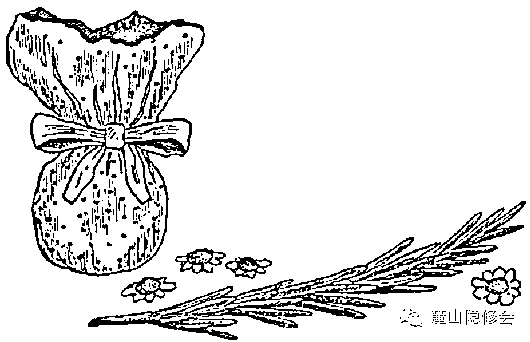 

**制作彩色香囊的仪式**

制作香囊是十分容易的。如果你擅长缝纫，可以将一块长方形的布折叠，并用针线将缝缝合。或者只需要将草药放在方形布中心，然后将对角合上打上 3、6、9 个结。应当根据治疗目的来选择适合的布料颜色。如果要小型随身携带，就选择宽 10 厘米、长 25 厘米的方布。

如果你想把它挂在家里或抽屉上就做个大号。使用如毡、棉花、羊毛之类的天然纤维织物。尝试不同的大小尺寸，你可以做一个很小的香囊隐藏在角落里，或是内衣、衬衫、外套里，香囊的大小和效力无关。甚至一茶勺混合药粉也可以带来积极的意义，如保护、治疗和给予希望。

在你的香囊内填满已经圣化的草药。要额外强化效力，你可以加入一个和布料颜色相同的小晶体。如果你没有在精油中额外的圣化添增力量，你可以在出售香囊前加入一两滴来增加香味。你能使香囊的功效更丰富些，虽然大部分草药都具有防护的性质以及它们魔法上的用途，但保护仅仅只是草药的一种效果而已。

携带香囊，直到它们失去味道为止。如果香囊有一个长期的目的，那就需要定期的更换草药。打开香囊，将草药用风吹干，然后焚烧成灰，埋在土里等待水分将其溶解。

香囊可以悬挂在宠物的床上。如果你治疗的对象不在或没地方摆，可以用白色的丝绸布包裹草药并在外画上图画或符号，放在高处或摆在桌上的木盒子里等待治疗效果。还有就是定期更换新的草药。

睡眠不良，可以用薰衣草、啤酒花、茴香等草药做一个睡眠枕，将草药圣化以后就具备驱赶噩梦的作用。

# 魔法中的草药【二】

> 原文：[`mp.weixin.qq.com/s?__biz=MzAxMjY0NTYxOA==&mid=400247825&idx=1&sn=30ef430836538dd7bc9e2697a5a5b32f&chksm=0981498c3ef6c09a6a0949c2eea7fa8713f8098b34a8b18d01652add904ff08411d086e46a4b&scene=27#wechat_redirect`](http://mp.weixin.qq.com/s?__biz=MzAxMjY0NTYxOA==&mid=400247825&idx=1&sn=30ef430836538dd7bc9e2697a5a5b32f&chksm=0981498c3ef6c09a6a0949c2eea7fa8713f8098b34a8b18d01652add904ff08411d086e46a4b&scene=27#wechat_redirect)

**制作人偶**

人偶的制作有些复杂。拿一块白布，最好是丝绸或棉布，如图绘制一正一反两个娃娃的形象。它们大约是 15 厘米（6 英寸）高——稍微小点都会出现装不进草药的情况。

减出这两个形象并将它们用线缝合，线的颜色要符合当前咒语目的。在头顶留下一个缺口，这样你就可以填充人偶了。如果人偶被应用于一个小组的仪式，那么就需要大家一起来缝合这个人偶，每个人都要上来缝几针。

你愿意的话可以在草药中加几滴精油，然后再去缝合顶上的缺口。

作为送给新娘或新生儿的个性化礼物，你可以做一个香囊或人偶，并以健康或美好祝愿为目的升华。

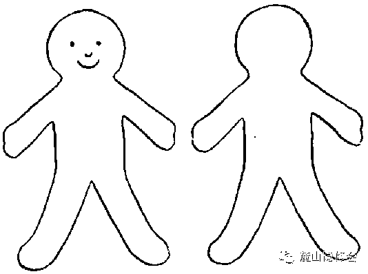

**一个为治疗而圣化草药的仪式**

所有用于治疗的草药都必须经过圣化。你可以用研钵和杵来研磨准备好的干草药或药粉。这种处理草药的方式，特别适用于治疗用的香囊。

你可以将草药放在一个玻璃、陶制或木质的碗中，手指伸入其中搅拌，并重复做出适合的祈祷（咒语请念诵原文，译文只是加深理解强化效果，原文为韵文念诵起来更加能够激发力量）：

'Fennel, fennel,

小茴香，小茴香

give my infant

给我的孩子

peaceful sleep ',

平和的睡眠

直到你感受到力量的升起。（茴香对于治疗婴儿疝气有神奇的功效，将一小袋茴香和洋甘菊悬挂在婴儿的上空，是一种非常好的安抚。）

如果你加了草药，那要让歌谣加长，圣化的草药每一种都要念诵过去，直到所有的材料都被你念诵一遍：

'Fennel, fennel,

小茴香，小茴香，

give my infant quiet sleep,

让我的宝宝安静入睡，

Chamomile, Chamomile

洋甘菊，洋甘菊,

bring her sweet dreams...'.

让她做个好梦

如果你愿意，你可以再此阶段添加并使用任何种类的精油来，将其累积为圣祷的一部分。

将一勺草药塞入你准备好的香囊，放入最中心然后缝合。你可以准备个更大的香囊，但最好能够装得下——不要太满就好。当你添加草药的时候，你要重新把祈祷念一遍以此调和并调用草药的能量。

封闭袋口可以用三、六、九条天然麻绳或丝带，你会看到你的能量和疗效被绑定在一起。你可以把香囊想象成自己——或者一个人、动物和地方，香囊是为了治疗使用的——完全治愈，你可以咏唱：

Three knots I bind,

我来系上三个皆

three knots I wind,

我把三结互缠绕

love, health and tranquillity.

爱情，健康和安宁

Three more I tie,

三个打成更多我的结

to Earth, Sea, Sky,

去向陆地、海洋和天空

for days and nights of harmony,

日夜和谐

Three knots to heal,

三结作为治疗用

these herbs I seal.

这些草药我密封

In power and joy,

封入力量和快乐

so let it be.

让其速成就

（唱多少圣歌取决于你打了几个结）

**植物从情感和精神的层面中，包含的治疗效果**

**Agrimony**——龙牙草、仙鹤草

这种草药具有治疗消化系统、割伤、擦伤和喉咙等方面的效果。

也可以提供在心智层面的保护，遣返负能量，让人心神安宁的作用。

属于木星

**Allspice**——多香果（甜胡椒）

该草药对于各个方面都有疗效，且在治疗消化器官、神经痛、风湿病方面有奇效。

作为香料焚烧可以带来好运、吸引资金。

归属火星

**Aloe vera**——芦荟/芦荟汁

其精华素可以抚平创伤和烧伤，对于治疗无食欲、肠道和月经不调其验如神。

作为一种保护性质的植物，通常流行在室内种植，传统意义上它能带来好运和繁荣。

归属月亮

**Angelica**——当归

当归之所以有这个名字，据称是在中世纪，天使向人们揭示用于治疗瘟疫的。它是一种天然的营养剂，有益于改善呼吸道和肝脏问题，对于循环系统也有很大的作用。

它有一种保护性，尤其是对于儿童，可以作为护身符；且可以种在家里，用来保护花园和家庭。也认为它能够带来长寿预防疾病。

归属太阳

**Anise (aniseed)**——大茴香（八角）

茴香对于中枢神经系统起到镇静作用，舒缓咳嗽，治疗肺部都有好处。这也是一个非常温和的草药，对皮肤很好。

它可以防止所有的负面影响，尤其是在家里，包括屏蔽外界的敌意和预防噩梦。将其制成香囊挂在床头，可以保持年轻。

归属木星

**Apple**——苹果

苹果对发烧造成的恶心有舒缓作用。它可以使全身的力量恢复，对于生殖系统也有好处，尤其适合治疗儿童和婴儿。

它能增加乐观和希望，对于修复关系和恢复年轻有奇效。它增强了内在美，尤其对于自信自尊的升起，比方一个人因为在意自己的外表会被嘲弄。其使得所有形式都有新的增长，可以重新使花园变得肥沃，让城市化高的土壤不再贫瘠。

归属金星

**Ash**——橡树

橡树是神圣的树，对于凯尔特人（在十九世纪后叶的 Killura——归属于爱尔兰，在这里原始的神圣后裔 Creevna 将其用来防止溺水）它被用来治疗佝偻病、疝气和不肯好的伤口与牙痛（传说民间治疗牙痛是将其摩擦牙龈直到出血，然后把钉子钉进灰里或者橡树里就可以带走痛苦）。其叶片和树皮磨成的粉是非常好的治疗药品，对于长期维持健康也非常有益。

它在海上航行与游泳时可以提供保护。

归属太阳

**Aspen**——白杨

白杨也被成为颤抖树，因为它的叶子在没有微风的时候都会摇晃；通过交感魔法，人们认为按照“顺势法则——like cures like”的规则，白杨对于治疗发热、发寒、涉及颤抖的疾病以及四肢寒冷非常强效。同时也能赋予人好口才。

作为一种保护性的草本植物，它可以藏在房子里或车上用来防止盗贼。

归属火星

**Basil**——罗勒

罗勒可以清楚杂念减少压力。它可以用来解决月经问题和胃部疾病，包括治疗溃疡也有不错的效果。它还能移除毒素，因此被认为是抗污染仪式的最佳材料。罗勒也可以驱逐害虫，有助安眠。

这种草药代表爱和忠诚，也可以用于吸引富足和繁荣。作为保护性的草药，它可以克服坐飞机时的恐高症。

归属火星

**Bay**——月桂

月桂可以用于治疗消化功能紊乱，缓解压力和心理疾病。

它保护心智并赶走悲伤，还治愈全部的侵蚀和消极，赋予力量、耐力、鼓励忠诚

归属太阳

**Bistort——**拳参

它可以有力的缓解各种创伤，不论是情感的还是身体的，对于喉咙、嘴巴和舌头上的疾病有非常好的作用，尤其是当加入 echinacea（紫锥菊）,myrrh 没药和 goldenseal（白毛莨）。它可以帮助生育，因此希望怀孕的妇女可以使用它。

它能驱逐那些抱有恶念或心怀不轨者，也能强化丰富、成功和精神满足。

属于土星

**Black Cohosh——**黑升麻

这种草与老年妇女相关。出于这个原因，它能够治疗绝经相关的问题。

作为一种保护性的草本植物，它带来了爱和勇气。特别实在欲求关系与能力方面做出积极的改变。

归属月亮

**Borage——**琉璃苣

琉璃苣有助于清肺降热，缓解肾上腺的问题并对任何疾病的预后有恢复作用。在罗马时代会放入酒中，饮下能自行缓解抑郁，对于风湿病、心脏衰竭和净化血液有益。

该草药象征勇气，可以制成护身香包，尤其是在户外甚至更危险的地方。

归属火星

**Burdock——**牛蒡

牛蒡能缓解慢性皮肤病，风湿病，和恢复身体器官的能量平衡；它同时对肾和肝有好处，尤其是混合蒲公英的时候。

牛蒡能抑制负面性质的护符，并预防负能量；它还能带来激情和性，修补失去或背叛的爱。

归属月亮

**Caraway——**葛缕子

葛缕子能缓解月经问题，并对母亲有滋养护理的作用。对于消化不良、咳嗽、瘀伤也有疗效，有助提高记忆力。

它还能保护不受敌意，尤其是对偷窃和破坏公物（在珍贵的物品旁放个小香包）；它也是一种春药，能激发或再次激起情欲。

归属水星

**Catnip——**猫薄荷

猫薄荷有助于流感、长期发烧、病毒性感冒和呼吸系统疾病，当混合西洋蓍草后效果尤为明显。

当混合玫瑰花瓣时它是强力的爱情香囊。种在家附近能够吸引来好运和平和的力量。它还能提升内在美和家庭愉悦。

归属金星

**Chamomile——**洋甘菊

在比阿特丽克斯·波特的故事中，洋甘菊是彼得兔的最爱，是最温和舒缓的草药。它的用途包括缓解失眠、焦虑，镇静儿童多动症等。其适合所有消化问题，尤其是年轻人（应该没有幼儿园用洋甘菊、小茴香和薰衣草做香囊送给新生儿），并缓解成人和儿童的眼部问题。

洋甘菊有吸引富足和繁荣的魔力；它有利于冥想和吸引新的爱情，在家庭幸福和快乐的提升与背叛和损失后的修复，这是一种保护可以阻止那些伤害。

归属太阳

**Cloves——**丁香

丁香适合缓解牙疼，循环问题，背部和肺部疾病，包括妊辰恶心。

做成香囊，丁香能制止流言蜚语、恶毒和嫉妒，也能帮助佩戴者学习新技能。它是天然壮阳药，吸引爱并唤醒性快感。对于遭受损失者，丁香提供安抚。

归属木星

**Coltsfoot——**款冬

这是治疗呼吸系统疾病的最佳特效药，特别是持续性干咳嗽、支气管炎、哮喘，甚至肺气肿。它能缓解胃痛和降低血液粘稠。

在传统上用于进行爱情仪式和制作香包，并使得心神安宁。它还未旅行者和马提供保护。

归属金星

**Comfrey——**紫草

紫草能缓解烧伤、割伤、哮喘和咳嗽，并加速愈合。

旅行时在手提箱中放一点，就可以保护您免遭财产损失或盗窃。还是带来金钱和好运的自然使者，倘若有人收到经济或物质损失，给他做这个香囊。

归属土星

**Dandelion——**蒲公英

蒲公英可以帮助清除障碍，因此对肝脏、胆囊、脾和肾脏有好处。它能降低血液粘稠并缓解经期前紧张，促进排除毒素。

它能促使心电感应，传递情人间的感受。在乡下，常用于占卜爱人的忠诚和意图。

归属木星

**Dill——**莳萝

这是婴儿和哺乳期妇女的福祉，它能带来安眠，缓解疝气和婴儿的焦躁不安，辅助哺乳。

该草药象征爱和热情，可用于制作保护爱的香包，尤其对于家庭。放在房子入口处，能击退一切恶意，赶走不告而访者。可在托儿所放个香包。

归属水星

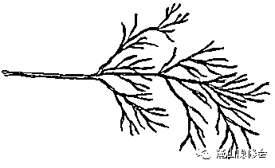

**Echinacea(purple cornflower)——**紫锥菊（浅紫色）

紫锥菊是天然抗生素，能促进人体免疫系统。它增加了白细胞的生产，对于抵抗力弱的人，和得了艾滋病的人，都能依次建立起有效的免疫力。它还治愈伤口，如口腔溃疡和牙龈疾病。

紫锥菊促使心灵和意识的成长；其使用的是利他主义和理想主义。也能促进精神致幻。

归属木星

**Elder——**接骨木

接骨木的使用是吉普赛人为数不多的基础急救措施。它能有效消毒，它能治疗伤口、扭伤、风湿、流感、呼吸道感染、干发烧和鼻窦炎。它可以防治失眠，带来安眠。

接骨木能在暴风雨和其他极端天气中为房主带来保护，也能为新人带来健康、财富和幸福。

归属金星

**Elecampane(elfwort)——**土木香

对治疗咳嗽和呼吸道感染用土木香很有效，特别是在儿童；它能为哮喘、支气管炎哮喘、食欲不振和发育不良提供帮助。

顾名思义，它是侏儒和精灵，有种亲近自然的魔力，可用于强力爱情香包，为仪式和符咒提供力量。也能预防各种形式的敌意，加强自我防御意识。

归属金星

**Fennel——**小茴香

自罗马起，该草药一直用于唤起勇气、增强耐力、恢复体力和精力。其有助于减缓新城代谢，减少肿胀，特别是降低血液粘稠、经期前紧张、婴儿哺乳，有助于婴儿疝痛和不安。

小茴香屏蔽全部形式的外部敌意并赶走不告而访者。

归属水星

**Ginger——**姜

在许多东方国家被视为营养品，在中国仍然使用姜补身体，以确保长寿。它能温暖身体、消除疼痛，特别适用于风湿病和呼吸系统的疾病，以及提高人体免疫力。对喉咙发炎有好处，任何疾病导致的恶心，特别是在怀孕和旅行中应该带上一袋香包。

姜经常被磨成粉放在香包或手提包里，以吸引金钱、成功，也包括爱。

归属火星

**Holy Thistle——**圣蓟

圣蓟是治疗肝脏、胆囊和脾脏问题的良药，甚至可以治疗酒精引起的肝炎。它能抵抗食欲减退，延缓更年期症状。

然而，这种草药主要的保护效果还是长时间抵抗负能量。它对接触高我、天使和指导灵的精神工作时提供帮助。其倡导一种利他主义。

归属火星

**Hops——**啤酒花

温和且安全，但作为强力镇静剂，啤酒花也用于治疗失眠和神经紧张、内部痉挛引起的紧张。啤酒花会镇静整个神经系统，因此可以治疗咳嗽、膀胱和有压力与焦虑引起的肝脏问题。比如，肠易激综合征和情绪原因引起的皮肤问题。

啤酒花作为一种保护性的草药，可以驱散黑暗的想法、怀疑和恐惧

归属太阳

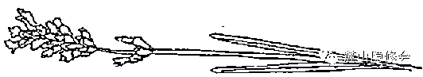

**Lavender——**薰衣草

薰衣草的镇静和帮助恢复、改善健康、保护诺言的特性，使其能添加到任意的治疗熏香里。它是一种抗抑郁药物，天然的镇静止疼剂，特别是紧张引起的头疼、肌肉或关节疼痛。它也能帮助消化。薰衣草（干花）做的枕芯有助安眠。在房间里，它会减少儿童多动症，鼓励温和、积极互动。

薰衣草是爱的草药；对于女性而言，它能引来温柔善良的爱人。其有助于许愿类型的魔法。

归属水星

**Hyssop——**牛膝草

圣经中多次提到来自于希伯来 esob（地名）的牛膝草有清洁身体疾病的能力。缓解咳嗽、支气管炎、喉咙痛、病毒感染、肌肉拉伤、烧伤、和耳疼的问题，特别是对儿童。

其主要是净化类的草药，有助于消除一个消极的想法、绝望和怀疑，留下一个积极的态度。牛膝草能清除家里物体所附带的邪气。

归属木星

**Juniper——**杜松

杜松是天然的抗菌药物。它能减轻肠胃和其他消化系统的炎症，也包括关节炎、风湿、肌肉疼痛和其他炎症。它也会增强男性功能。

杜松可以净化家里过去累积的负面影响和未来的不幸——尤其是新年的时候使用它。它也作为防止疾病、盗窃和事故的护身符。

归属太阳

**Knotweed——**紫菀

紫菀是一种天然抗菌药物，能帮助治疗伤口感染；它能镇静神经并防止焦虑症的发展。它能改善肌腱问题，有利于整体健康和改善导致静止不动的条件。

该草药增加情感承诺并鼓励忠诚，它可以用于涉及承诺的仪式，确保一直能够守住诺言。

归属月亮

**Marigold——**万寿菊

对于皮肤炎症和感染，用万寿菊做一个香囊是再好不过的。它能有效治疗烧伤、头疼、出血、胃溃疡、眼睛和胆囊的问题。它能防止内外感染。

万寿菊在家中会增加积极性，让爱侣更深情，促进财富，并帮助和法律有关的问题。

归属太阳

**Mullein——**毛蕊花

毛蕊花能解决任何呼吸道疾病，如支气管炎、哮喘、声音撒呀和严重的咳嗽。它也可以用于治疗胃酸过多，各种皮肤炎症和疼痛。作为镇静药物，能缓解失眠和防范噩梦。

它带来勇气并防止事故，因此在旅行时或施工场所是很好的保护；其也能提供保护防止各种负面能量来袭。

归属土星

**Myrrh——**没药

这是强效杀菌剂，在抵抗真菌和止血来说都非常好，没药对于所有的嘴和喉咙的问题都有好处。

这是一种古老和庇护类型的草药，是身心灵治疗的关键之一。焚烧没药可以提供很好的保护与治疗，它能打开更高意识层面，对所有灵性工作都有好处。

归属月亮

**Peppermint——**胡椒薄荷

它能治疗晕车和任何形式引起的恶心，因此适合常出门者。在车上为孩子们添个香袋（随便弄个娃娃熊挂在汽车上或放座位上）。它也适用于任何形式的消化功能紊乱，如溃疡性结肠炎和克罗恩病。它可以帮助缓解咳嗽、喉咙痛和头痛。失眠时可将胡椒薄荷与洋甘菊混合使用；它可为人提供能量补充。

胡椒薄荷可用于治疗与净化，放在家中或病房里，可以赶走邪气和病气。

归属金星

**Rose——**玫瑰/蔷薇

这在治疗熏香中是必不可少的，玫瑰最有效的地方在于对抗感染和病毒，还能缓解身心疲劳、皮肤问题、月经失调和多动症。

在爱情仪式中使用玫瑰来吸引爱，并给予积极的肯定，和预知梦。玫瑰也象征勇气，尤其是猩红玫瑰。

归属金星

**Parsley——**欧芹

欧芹可用于补血，也使用所有皮肤病，如湿疹、痤疮。对于改善贫血和经期前紧张，肾脏、膀胱和尿路感染，黄痘，月经，更年期等症状也很好用。

该草药预示着鼓励生育，爱和激情。它也是一种强效守护——欧芹做的香包或人偶可以提供柔和的力量去抵抗任何超自然或精神层面的攻击。该植物于耶稣受难节时采摘。

归属水星

**Thyme——**百里香

百里香能带来健康，提升记忆力和思维逻辑，拥有强悍的杀菌效果。

据称能帮助回忆过去、预见未来，还能提升胆气和力量。放在枕边能远离噩梦并带来快乐，和预知梦有关。

归属金星

**Rosemary (elf leaf)——**迷迭香（叶片）

迷迭香能缓解头疼、坐骨神经痛、肌肉酸疼、肝脏和胆囊的问题。还能帮助消化，促进血液循环，对头发和头皮有关的疾病有帮助，能提高记忆力、集中精神并提高能量水平。抓一小把切片，装布袋里拿去泡澡——这是中世纪的处方，用途是让思维逻辑更清晰。

作为一种保护性的草药，迷迭香能驱逐噩梦。做成香囊后，可用于吸引爱情，并安抚消极的或对抗性的关系。迷迭香也是回忆之药，尤其是爱情方面，能够带来和解。

归属太阳

**Sage——**鼠尾草

鼠尾草是草药中最受欢迎的调料，它有许多医学上的应用和帮助治疗的力量；根据传统，它能延续生命带来健康。在中世纪时曾说：“ Why should a man who has sage in his garden ever die?——为何让那人花园里的鼠尾草全死了？”。鼠尾草也叫萨克拉草（罗马人的圣草），古埃及用来治疗男性不孕不育，中国用来调和人体阴阳平衡。

它对肺很好，还能增强人体免疫系统帮助抵抗疾病，并帮助在慢性病后恢复元气。鼠尾草能缓解精神疲劳帮助提升集中精神的能力，因此适用于学习和工作压力大的人，加点迷迭香做成香包会更好。它能调节抑郁，舒缓焦虑。

归属木星

**St John's wort (hypericum)——**圣约翰草（别名火龙珠）

圣约翰草能缓解焦虑、抑郁，和更年期神经痛、头痛、易怒。它有助于减轻疼痛，对纤维组织炎、坐骨神经痛、风湿病有帮助。它也是一种消炎药物，能加速烧伤、刀伤和枪伤的创伤。

珍贵的圣约翰草象征夏至中白天最长的一天，对应夏至和太阳的力量。它提供生育和吸引爱情的力量，尤其是在 6 月 23 号晚——圣约翰日前夕。传统认为，它能在战斗时提供勇气，让人更为果断。结合莳萝和马鞭草，能够制成强力的护身符。

归属太阳

**Tarragon——**龙蒿

这是一种温和的兴奋剂，龙蒿有助于克服神经系统的疲惫不安，能够提供放松，同时缓解焦虑有益睡眠。还能刺激肾脏，传统用法是治疗牙痛和消化问题。

曾经和龙与女性蛇神有关因此能够治疗蛇咬伤，现在多用于拜托累赘的仪式，如同蛇要蜕皮一般。其有益于再生，能够帮助使用者找到新目标。

归属水星

**Valerian——**缬草

缬草能使人放松；它可以减少紧张、焦虑和所有应激引起的失眠，并有效提供缓解疼痛与紧张引起的偏头疼。

这种草用于调和，可以把它和人偶绑在一起，这能够带来和谐的关系，也适合修复应愤怒而分离的情况。古希腊人用于防御伤害，主要被视为保护和平的草药。

归属金星

**Vervain——**马鞭草

马鞭草对于中枢神经系统是天然助力，能减少紧张和压力带来的影响。它能减轻抑郁，尤其是病后。

它还提供保护预防任何邪气；在婴儿床上挂一个马鞭草的香囊能够赶走噩梦，并为非常年轻的人带来智慧和幸福。这里有一个小技巧，当你和人交换承诺的时候可以送对方一支，任何时候都可以。

归属金星

**Yarrow——**西洋蓍草

西洋蓍草能降低血压、减慢心跳，加速伤口愈合，减少发烧。

这是爱的草药，据说能让一对夫妻维持七年的感情，因此应该送给新婚夫妇给予他们爱的魔力。已婚夫妇可以在七年之后更换新的香囊来维持婚姻生活。这可以成为一个续约仪式。它也排斥敌意，驱逐恐惧。

归属金星

# 魔法中的草药【三】

> 原文：[`mp.weixin.qq.com/s?__biz=MzAxMjY0NTYxOA==&mid=400265796&idx=1&sn=8c963246974cdb5d11c39fb08b1ff678&chksm=098197d93ef61ecf0975f2ecee326db14681e3d6d5da0193c9814c1eea63b9cac98fcea77be2&scene=27#wechat_redirect`](http://mp.weixin.qq.com/s?__biz=MzAxMjY0NTYxOA==&mid=400265796&idx=1&sn=8c963246974cdb5d11c39fb08b1ff678&chksm=098197d93ef61ecf0975f2ecee326db14681e3d6d5da0193c9814c1eea63b9cac98fcea77be2&scene=27#wechat_redirect)

**草药茶**

你可以做一个茶包，在里面灌进草药。添加一茶匙（5ml）的粗碎干草药和两茶匙新鲜碎叶或花瓣，放入一杯开水，等五分钟。一旦液体冷却，你可以在房间里洒成一个魔圆，也可以洒在家具和个人财产上，或倒进一桶水里拖地板。

一些植物的根和树皮可以用来煮汤。草药压碎的粉末两汤匙（30ml）和一品脱（500ml）冷水。当水煮的只剩一半时，将混合液过滤。

新鲜的草药和鲜花可以用以下方法加入到您的沐浴中去：将它们放在一张网或一块棉布上，挂在炎热的水龙头上供你冲澡。另外在将草药袋泡澡浴缸里十分钟，或直接将过滤液倒进去。

当然你可以直接和草药茶，燃烧熏香、精油。这些方法都有效的使用了草药的药性和魔性，尽管你还得控制这些魔法的运作。无论你怎样使用都须牢记，有效的使用草药前先询问一个熟知草药的医生和顺势医疗者，或读一些靠谱的草药书（229 页中我推荐了一些）。特别注意考虑用量和医疗禁忌。

**注意事项**

任何不听从医生建议大量使用草药的人都是不明智的，必须确保操作安全。如果你正处于怀孕或哺乳期，我建议你避免实践以下形式：包括在浴室洗澡，空气吸入，或喝茶：

芦荟、当归、大茴香、秋番红花、伏牛花、罗勒、月桂、黑升麻、葛缕子、辣椒、接骨木、小茴香、野甘菊、白毛莨、牛膝草、杜松、绵马根、曼德拉草、欧芹、普列薄荷、戳迷迭香、植物根茎、芸香、鼠尾草、青蒿、艾菊、龙蒿、金钟柏、百里香、冬青、艾草、西洋蓍草。

这并没有全部列举怀孕期间禁用的草药，在准备草药前你该让一个熟悉草药的医生或药剂师检查一番**——**因为你本该在医疗场所进行这些实验。建议在怀孕初期（前三个月）里避免接触任何草药。

很多人的体检报告得出不允许使用某些草药。这些包括哮喘、高血压、糖尿病、癫痫症和心脏病。当然，通常使用草药香包和人偶是安全的，但你应该避免去吸食草药的高纯度提取物。有些柔和的植物，如玫瑰、薰衣草、洋甘菊或啤酒花，这些很安全，放在枕头底下有助睡眠。然而，仍和情况下，使用草药都应该咨询一个拥有医师资格证的人。

**远程治疗仪式**

这个简单的治疗仪式适用于感染病毒和身体衰弱的人。该病毒可能影响整个身体且治疗不起反应者。法术总共有四个阶段，见 40 页，同样可以独修实践也可以团体合作。仪式的目的是刺激人体免疫系统，实践的最佳时间是上玄月的早上（见 225 页最好的时间和日期）

通过魔法，集中草药的治疗能量，这基于有一个接受能量的人，而不是没有任何目标凭空接受能量。因此，这不是泡茶或制作酊剂，而是你赋予草药某种特性。这种向任何人或动物投射草药能量的方法，不需要承担任何责任和控制用量。

将一些紫锥菊放入祭坛中心的研钵内用研杵研磨。浅紫色的紫锥菊是用来缓解病毒的。你还需要用白色材料切出一个娃娃的形状，并用红线缝合成人偶，灌入草药。

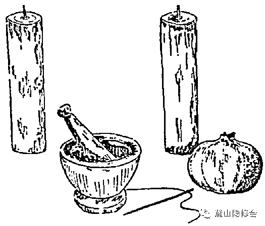

在祭坛上摆上健康的象征：水果、花、种子和坚果都充满了生命力，或其他代表生命的象征。

摆上两根白色的蜡烛，左边为男神，右边为女神。如果是团体仪式，那么主持者可以点燃蜡烛。

打电话给被治疗者，告诉他无论在什么地方，都想象自己正在被蓝色的锥形光晕所包裹。

双脚分开，让草药的光通过你的脚传遍你的腿，你的身体，展开你的手臂，虽然你的手搭着王冠（有时该过程称为提升光体）

然后站在圆内。如果你是团体仪式，就手拉着手唱圣歌。

不断绕圈。

如果你独自工作，就视觉化直径 5 英尺的光环绕着魔圆，用手指向地面的圆传递力量（你写字的手的食指）也可以用一根柳木、榛木、花楸或一根削尖的橡木做的魔杖。唱：

*Circle of light,*

魔圆的光
*circle of healing,*

带来治疗的魔圆
*protect me within*

守卫我的内在
*and aid this my working.*

支援我的工作

圣化干草药后在研钵内滴入几滴月桂和桉树精油并用研杵混合——这也对病毒感染者有帮助。当你混合的时候，吟唱咒语，比如：

Heal and restore,

治愈和康复啊 strength once more.

让力量加倍提升

如果你进行的是团队仪式，那就一个人在祭坛上混合草药，其他人咏唱神名（见 77 页）不断增加强度和音高，例如：

Brighid, Ganga, Hermes, Thoth, Hygeia, Panacea, Sulis, Iduna!

（神名）

当你这么做的时候，你的愈疗能量会通过研钵和研杵，像锥子一样进入水果和鲜花之中，蓝色的愈疗能量内就会带上几分绿色的草药能量。

如果你不喜欢咏唱特定神名。可以这样：

Goddess, Mother, healer, restorer, hear our plea

女神，母亲，治疗和康复啊，请聆听我们的祷告。

现在你已经提升了锥形愈疗能量的力量，你可以用去它治疗任何人，只需要用你的手或魔杖发出能量，最后大声喊出：

Heal and bless

祝愿痊愈

现在还有些剩余的能量，你也可以继续用它来制作护符，符咒会继续运作，但效果会慢一些。

静坐在祭坛前，面朝北方，缝一个香囊。如果你是团体工作，那就将缝合的步骤分配给每个人。每个人都可以做一些粗略的缝合，并都念一些祝福和祈祷的语言。当只有头部是开放的时候，缝最后一针的人应该上祭坛拿起草药，提升草药的能量，塞进去，然后缝合。

将人偶放在祭坛可被蜡烛照耀的位置。

现在按逆时针方向绕圆一周，用手指或魔杖指向地面，看着光回到地面，重复几次。

May the circle beuncast

也许圆会被消融

but remain unbroken

但会保持循环

剩余的能量可以通过静坐或手拉手站着向下施压，能量会通过你的脚回归大地。

离开祭坛让蜡烛烧完，并吃掉水果、种子和坚果来吸收刚才魔法中残留的生命能量。

吹熄蜡烛（在团体仪式中由主持者进行，）将光带给生病的人。接受治疗者会发现，锥形蓝光释放的强度增强了。

然后将人偶用白色丝绸布包裹，放在接受治疗者的床上，并长时间放在哪里。

**————————————愉快的结束分割线—————————**

**我是愉快的猫妈妈蓝。**

**非常感谢大家关注第一波的猫妈妈草药大放送。**

**也感谢大家支持玩药的猫妈妈。**

**然后麓麓和大家也会一起期待猫妈妈的下一波大放送内容。**

**(づ￣3￣)づ╭❤～**

# 【灵摆初学，第二课】教你如何使用灵摆

> 原文：[`mp.weixin.qq.com/s?__biz=MzAxMjY0NTYxOA==&mid=400313810&idx=1&sn=993688e397f55aa98b18a38e9881c49b&chksm=0986484f3ef1c159281605e98f3ebff5038fd854ee38073c1fd0a51b91b208f5d54fb81857ae&scene=27#wechat_redirect`](http://mp.weixin.qq.com/s?__biz=MzAxMjY0NTYxOA==&mid=400313810&idx=1&sn=993688e397f55aa98b18a38e9881c49b&chksm=0986484f3ef1c159281605e98f3ebff5038fd854ee38073c1fd0a51b91b208f5d54fb81857ae&scene=27#wechat_redirect)

**不知道是不是因为猫窝里面有卖灵摆的原因，近期向猫窝要灵摆资料的孩子也急速增加。**

**虽然茉喵不喜欢伸手党的孩子，但是还是在岚喵的鼓励【songyong】下决定将岚喵翻译的灵摆资料分批放送。刚入手灵摆的孩子们可以作为参考来着的。**

**考虑到岚喵曾经打算跑到网上去找点灵摆的资料，看到一个不错的翻译之后发现竟是自己的杰作的情况，这些参考资料也算是满靠谱的就是。**

**各位小伙伴有什么心得或者其他的补充或者疑问也欢迎直接私戳麓麓，或者加群讨论，麓麓主旨依旧以线下聚会，以及部分基础知识的普及为主，推荐大家加群交流比较好哦(づ￣3￣)づ╭❤～**

——————————这里是正文的分割线————————————

首先是前言：

1.请勿用于商业用途，请尊重译者的劳动成果
2.请勿私自转载，需转载请说明出处
3.为保留资料真实性，请勿私自篡改
谢谢合作~

对于这个教程，这个是美国灵摆界的，我只是翻译了，保留第一手资料的真实性，不是三无网文，更不是所谓的“资深灵摆师”自己总结的“秘诀”，与现在的灵摆界有很多出入的说法，不要问我也不要“说 XXX 是错的，你这就是错的”“怎么和 XX 说的不一样，她可是 XXX 的灵摆师啊”

翻译能力有限，我会发上原文，希望大家可以一起探讨，欢迎大家指出不足之处。

教你如何使用灵摆

译者：依兰

如果你习惯使用右手，那么拿你的左手举起灵摆，尽管你可以使用任何一只手去占卜，你可能发现占卜时用的手最好是你平时不用的那一只手，这么做允许你的“正常”的手在占卜时去写字记载。
现在，在如图所示的纸上，举起你的灵摆，用你平时使用的手的大拇指和食指之间拿着，用一根大约 7 英寸（20CM）的线去拴着你的灵摆，灵摆应该和纸有 1/4 英尺（0.5CM）的距离。首先，只要保持它的静止（就像教你家的狗狗怎么坐下！）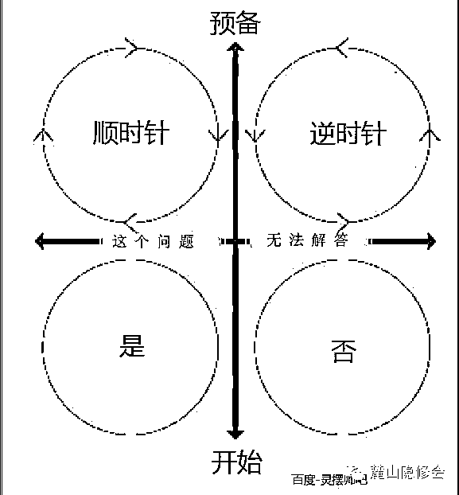 

现在，看着那个图表上紧挨着字的圆和方向线，拿着你的灵摆在中间的上下箭头线（准备—开始），然后使它顺着这根线移动------离开你又摆向你；这个就是“准备开始”----为提问题前做的预备。停下来，拿着你的灵摆使它停止，然后不要自己使它移动，叫它顺着“准备---开始”摆动。

第二步

重复这个步奏来解释情况，如果问题是难以用语言表达的，是不清晰明了的，是超出你占卜能力的，或者是无法被提问的，那么“无法解答”是被用来使“预备开始”的速度减慢下来或者停止的，然后在“无法解答”上重新摇摆。

第三步

拿着你的灵摆在“顺时针”的圆上，然后让它在顺时针的方向移动；如果它第一次没有移动，你可以让它移动-----但是，保持这样直到它自己开始移动而不是你的力气使它移动。在“逆时针”的圆上也重复这个步奏。

第四步

拿着你的灵摆在“是”的圆上，然后要你的灵摆在“是”的圆上转圈。

不要自己使它移动，只要等待它，让它用自己的力量移动！这非常非常重要！既然你努力让“是”的方向为你的问题解答------而如果你一旦使用了自己的力气让它移动就会出现错误的答案！

第五步

然后把你的灵摆放在“否”的圆上面，并且要它在“否”的圆上转圈。练习这个“是”和“否”的圆，可以使你确定你得到正确答案----他们是学习占卜的一把钥匙。如果你不能确信这个圆的答案，那么把“是”的圆定义和“顺时针”一样，“否”圆定义和“逆时针”一样，然后重复这个过程保证它起效。

—————————————这里是原文分割线——————————————

原文：
THE SIGNALS THAT YOU USE
If you are right-handed, then use your left hand for holding your Pendulum. Although you can use either
hand to Dowse, you may find that the best hand to use as your Dowsing hand is the opposite hand to that
which you normally use; this allows your ‘normal’ hand to be used for writing when you are Dowsing.
Now hold your Pendulum as shown on the cover page, with the holding point between your thumb and first
finger of your normal hand (the finger next to the thumb), with about 7 inches (20 cm) of string to the point
of your Pendulum, which should be about 1/4 inch (0.5 cm) above a piece of blank paper. First of all, just
hold it still (this is like teaching your dog to sit !).

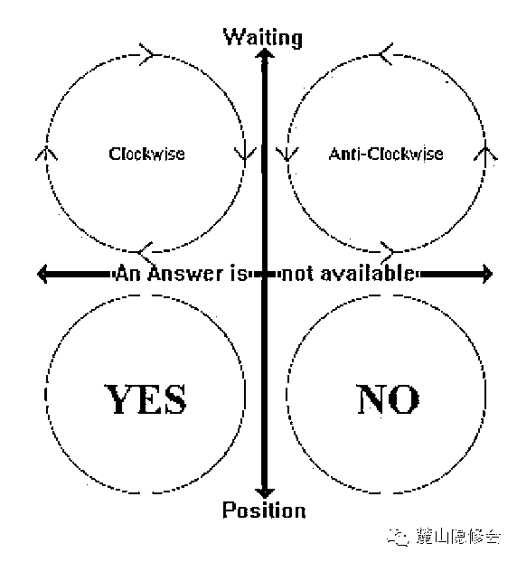
THE SIGNALS THAT YOU USE (cont.)
Now look at the diagram of circles and lines next to this writing. Hold your Pendulum above the
middle of the ‘up and down’ line and make it swing along the line - towards you and away from you;
this is the “WAITING POSITION” - ready for a question. Stop, hold your Pendulum still, and
without making it move ask it swing in the “waiting position”.
Step 2
Repeat this procedure explaining that if the question is poorly worded, is not understood, is beyond
your Dowsing ability, or should not be asked, then the “NOT AVAILABLE” signal to be used is to
slow down and stop along the “Waiting Position” , and then to restart swinging on the “Not Available”
line.
Step 3
Hold your Pendulum over the clockwise circle, and tell it to move in a clockwise direction; if it
doesn’t move the first time, you can make it move - but keep at this until it moves without you
forcing it. Repeat for the anti-clockwise circle
Step 4
Hold your Pendulum over the “YES” circle and ask your Pendulum to make a circle in the “YES”
direction.
Do not make it move, just wait for it to move on its own ! This is VERY important, since you are
trying to find which is the “YES” direction for you - and if you force a movement it could be the
wrong way !
Step 5
Then hold it over the “NO” circle and ask it to make a circle in the “NO” direction. Practice these
“YES” and “NO” circles to make sure that you have them correct - they are the key to being able to
Dowse. If you cannot get sure answers about the circles, then define the “YES” circle as clockwise,
and the “NO” circle as anticlockwise, and repeat the exercises to ensure they work.
Repeat steps 1 to 5 until you have success - then you can ask simple questions for practice (but
remember to ask permission to practice first !), such as “Is today Wednesday ?” - but wait until you
have read all the instructions before asking any important questions.

# 【灵摆初学，第三课】灵摆寻物，探测，基础练习。

> 原文：[`mp.weixin.qq.com/s?__biz=MzAxMjY0NTYxOA==&mid=400342361&idx=1&sn=1adcca389521e557eeba15c075698d9c&chksm=0986b8c43ef131d26890a90d72c63bfb1fce9f1c45fbe81402da64f3f8069bbd2250c34b5546&scene=27#wechat_redirect`](http://mp.weixin.qq.com/s?__biz=MzAxMjY0NTYxOA==&mid=400342361&idx=1&sn=1adcca389521e557eeba15c075698d9c&chksm=0986b8c43ef131d26890a90d72c63bfb1fce9f1c45fbe81402da64f3f8069bbd2250c34b5546&scene=27#wechat_redirect)

通过之前两课大家大概对灵摆有了一个初步的认识。

而这一个课题主要是针对实践练习的，内容不会很长。

在这个推送中会给出一个图片，你们可以保存打印出来或者自己按照图片上的样子给自己画一个出来。

另一个使用灵摆的关键方法就是教你的灵摆如何辨认方向；拿着你的灵摆在这个“练习表”上，（标记着“起始点”），它会不动或者小幅度转圈圈，现在，要它朝着方向“6”来移动。你的灵摆应该转一个“是”的圈圈，然后沿着那个数字的线移动。如果转“否”的圈圈，小心——也许出了错！在其他的标记着“0~9”的线上重复这个过程，知道它们全部正确。你可以用这个方法来寻找弄丢的和被偷走的东西，比如字条，贵重物品，或者你回家的路！

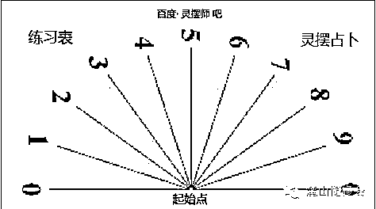
新入手灵摆的小伙伴们可以按照这个图标开始进行训练。

# 【灵摆初学，第四课】关于占卜你所需要知道的一切！

> 原文：[`mp.weixin.qq.com/s?__biz=MzAxMjY0NTYxOA==&mid=400358591&idx=1&sn=5fb4820ab56b5bf0dbd04ab345438da7&chksm=0986f9223ef17034996af8a1f1eed12ccd4a186f8af6c9caa61ac36946ebb1dee6e9725ed6dc&scene=27#wechat_redirect`](http://mp.weixin.qq.com/s?__biz=MzAxMjY0NTYxOA==&mid=400358591&idx=1&sn=5fb4820ab56b5bf0dbd04ab345438da7&chksm=0986f9223ef17034996af8a1f1eed12ccd4a186f8af6c9caa61ac36946ebb1dee6e9725ed6dc&scene=27#wechat_redirect)

转载麻烦说明出处……

【灵摆初学，第四课】关于占卜你所需要知道的一切！（译文）

译者：依兰

这一章是教你如何对灵摆问问题，和你实习中的一些练习。你会发现很多有趣的发现，在这同时也增强你的占卜熟悉程度，并且增加对你占卜能力的信任。

占卜的工具单包括了“L”-形的灵摆架（就像切下来的挂衣钩），“Y”-形的灵摆架（榛树枝或者其他的树枝），“浮子”（就像钓鱼用的浮标），和灵摆（一个线拴着的重物）。灵摆可以做其他探测术所能占卜的一切！

占卜原理是世界上最古老的神秘事物。一些力量贯穿占卜师的身体和意识来使占卜工具如同放大镜一般工作--------所以你要小心肢体的抖动，比如你的手和手臂，归因于你的“直觉力”响应那股力量。这个“法则”给你的探索一个解答---一个你问题的答案。

因为你在寻找些东西，所以我们把这个术语叫做“探索”---犹如旧日骑士探索亚瑟王的骑士圆桌。你寻找问题的答案，寻找的物体在的方向，或者是行走的方向。

你将不会一夜成为熟练的占卜师---或者是短短的几周成为熟练的占卜师。要想熟练起来，需要大量的练习，几个月，甚至是几年。这个重要的部分是在你的水平上，提高----变得更好，所必须的。如果你从不去尝试，那么你将永远不会学会！正如在熟练的时候，如果你不坚持练习，那么你也会失去这个能力。

你是否听说过“金字塔状的能量”？它甚至可以使剃须片变得锋利！你的灵摆所转动的圈制作一个圆锥形的圈子，一个“虚拟”的金字塔！

原文：ABOUT DOWSING
These instructions explain how to quest with your Pendulum, and give some exercises for you to practice.
You will have a lot of fun finding things, increasing your Dowsing skills at the same time - and gaining
confidence in your Dowsing abilities.
Dowsing tools include ‘L’-shaped rods (such as cut coat hangers), ‘Y’-shaped rods (hazel or other branches),
‘bobbers’ (like fishing rods held by the tip), and Pendulums (a weight on the end of a length of string). Pendulums
can do all that any of the other Dowsing tools can do !
How Dowsing works has been one of the world’s oldest mysteries. Some Force works through a Dowser’s
mind and body to make the Dowsing tool act as an amplifier - so that you are aware of small body movements,
such as in your hand or arm, caused by your ‘intuition’ responding to the Force. This System gives you a
solution to your quest - an answer to your question.
We use the term ‘quest’ because you are seeking something - like the old time quest of the Knights of King
Arthur’s Round Table. You seek the answer to a question, the location of an object, or a direction to take.
You will NOT become an expert Dowser overnight - or even in a few weeks. To become an expert needs lots of
hard work, over months, maybe years. The important part is improving - getting better at using your skills. And
you will never learn if you do not keep trying ! Even as an expert, you may lose your skills if you do not keep
on practicing.
Have you heard of ‘Pyramid Power’ ? It can even sharpen razor blades ! When your Pendulum circles it is
making a cone shape, a ‘virtual’ circular pyramid !

# 【灵摆初学，第五课】训练你的灵摆

> 原文：[`mp.weixin.qq.com/s?__biz=MzAxMjY0NTYxOA==&mid=400363359&idx=1&sn=edd8082282b7d51668007eea8ec31220&chksm=09870ac23ef083d4ae00781bab5ee62003f6283d550633be779b6f5efda7e82e85e6387496d2&scene=27#wechat_redirect`](http://mp.weixin.qq.com/s?__biz=MzAxMjY0NTYxOA==&mid=400363359&idx=1&sn=edd8082282b7d51668007eea8ec31220&chksm=09870ac23ef083d4ae00781bab5ee62003f6283d550633be779b6f5efda7e82e85e6387496d2&scene=27#wechat_redirect)

【灵摆初学，第五课】训练你的灵摆

译者：依兰

你的灵摆是一个工具，它本身没有任何的神秘的能量！所有的表现，是你大脑的理性的部分的直觉反应没有任何的干扰---并且放大。就工具来说，你必须照顾你的灵摆以便它的干净和需要使用时状态良好。

重复第一课那个“是”和“否”的圆。大多数人是顺时针转的“是”，和逆时针转的“否”。某些情况下有的人会出现相反的情况；如果你遇到了这样的情况，重复这个练习一段时间来改正，并且牢牢记住属于你的信号是“顺时针=否，逆时针=是”

“是”和“否”的指令可能被你的身体的摆动所改变（或者那些你所询问的人）。所以在每一次你进行灵摆的提问的时候，或者每一次你询问其他人的时候，确认灵摆的摆动方向，是一个很好的练习。所以每次在你进行对灵摆的提问前，先对灵摆问道“给我展示‘是’的信号”。

第二个步奏就是确定法则允许你灵摆所发出的信息。拿着你的灵摆举在一张白纸上，然后念道：

“你必须受到这股力量的正面影响。”
“你必须永远正确回答，从正确有效的途径得到回答”
“你回答清晰的问题，只能用‘是’与‘否’来表达，允许我问的存在，并且以问题的精准而扬名。”
“反之你必须停止不动，或者告诉我‘没有答案’的信号”

这个非常非常重要，让它理解法则！如果你的灵摆停止不动，或者表现出‘否’，那么重复这个训练直到你的灵摆表现出‘是’。

Some people consider that a ‘witness’ aids their questing.（无力翻译……原谅我吧……）这是一个样本---你所看见------把持住你的手拿着你的灵摆，或者插入你的灵摆（如果又松开又空心）（译者注：类似于把手掌放在灵摆下面。）这样有助于你的手头工作。

原文：TRAINING WITH YOUR PENDULUM
Your Pendulum is a tool; by itself it has no magic abilities ! All it does is enable you to get input from the
intuitive side of your brain without a lot of interference from the rational side of your brain - and amplifies that
input. As with all tools, you must take care of your Pendulum so that it is clean and in good condition when
needed.
Repeat the first lesson with the “YES” and “NO” circles. Most people get a clockwise rotation for “YES”, and
anti-clockwise for “NO”. In a some cases people get signals the other way round; if this is happening to you, then
go over the procedure a few more times to make certain, and remember that for you the signals are ‘clockwise =
NO, anti-clockwise = YES’.
The “YES” and “NO” directions may change depending on your body cycles (and those of any person that you are
asking about). So it is good practice to check the directions each time you Dowse, and each time you ask about any
other person. So ask ‘Show me the signal for “YES” ’ whenever you Dowse.
The next step is to make sure that The System agrees to the use of these signals given by your Pendulum. So hold
your Pendulum over a blank piece of paper, and declare:
• ‘You must only be influenced by The Force and only for good.’
‘You must always tell the truth, got from all available sources.’
‘You must only move “YES” or “NO” if the question is a good, clear question, permitted to be asked by
me, and if the true answer is known.’
‘Otherwise you must stay still or give a “Not Available” signal.’
This is VERY important, so ask The System if it understands ! If your Pendulum signals “NO” or stays still, then
repeat this part of the training until your Pendulum signals “YES”.
Some people consider that a ‘witness’ aids their questing. This is a sample of what you seek - held in your hand,
attached to your Pendulum, or inserted into your Pendulum (if it is hollow and can be unscrewed). This may work
by concentrating your thoughts on the task at hand.

# 【灵摆初学，第六课】如何向灵摆提问

> 原文：[`mp.weixin.qq.com/s?__biz=MzAxMjY0NTYxOA==&mid=400381252&idx=1&sn=b78f06dd0dece40b7f174a3a38d1edea&chksm=098750d93ef0d9cf9483de9dd07a20b2849375431207ed736dde86bdf3719163ad4a77ea2811&scene=27#wechat_redirect`](http://mp.weixin.qq.com/s?__biz=MzAxMjY0NTYxOA==&mid=400381252&idx=1&sn=b78f06dd0dece40b7f174a3a38d1edea&chksm=098750d93ef0d9cf9483de9dd07a20b2849375431207ed736dde86bdf3719163ad4a77ea2811&scene=27#wechat_redirect)

第六课：如何向灵摆提问

译者：依兰

关于如何问问题有几个很重要的法则。

虽然灵摆（意指这个占卜体系，而不是指灵摆本身，第五节课说过，灵摆是没有意识的，下文简称灵摆。）可能明白你的意图，但是还是要坚持“颠覆你的基础”让你养成一个良好的习惯。

这些习惯是非常重要的，因为你有时候你问问题的对象是动物，是树木，你的车或者你的电脑，虽然你问出了的结果，但是结果可能不是你所要的。
第一点，你应该处于冥想的状态——认真，专注。
第二点，问题必须是清楚的，以便灵摆可以理解你的问题。如果你正在想“要不要多吃一点冰淇淋，这样可不可以？”是不清楚的。——灵摆不懂“这样”的意思，所以你要问：“现在我可以多吃点冰激凌吗？”
试想你在一个燃油量表坏掉的车里，你问“这个车需要气（汽）吗？”即使车的汽油是满的，占卜结果依然会是“需要。”因为这辆车需要的是汽油来发动，然而它需要气来推动汽油燃烧，并且它的轮胎也需要打气。所以最好的方法是问：“汽车油箱的油是否少于一半？”
第三点，答案必须是用“是”或者“否”来回答（如果不是问方向的话）。如果有人对你讲一个故事，问“这个故事是不是真的？”也许无法回答，因为故事的某些部分可能是真的，某些部分可能是假的。所以你必须要问你认为可能是假的那一部分。

第四点，有些问题是不应该提出来的的——尤其是如果这个问题不是你分内的！这就是为什么在问问题之前，要问灵摆：“我能不能问 XXX 问题？”那么重要的原因。
第五点，你不要想着用任何方式去让你的灵摆转动。如果你想用点力让他指向“是”不管你用没用力，结果都只是因为你想要的而已，如果正确的答案是“否”，那么你就破坏了你练习这一切的成果，下次你再问问题的时候，灵摆也许给你的占卜结果就是错误的。
第六点，你必须检查你在这几条法则中的练习的过程和结果。这意味着你必须要明确你问灵摆的原因和问灵摆的问题，还要检查你问“可不可以”“能不能？”“应不应该？”这种问题时灵摆给出的肯定答案。
“我想找个最好的方法去……”去规范这个问题。
“这是为了帮助 XXX 去感到幸福”去解释理由。
“可不可以？”要获得许可，而且要确认答案是可以使用的。
“能不能？”确定你有没有能力去做那件事。
“应不应该？”例如你问的是禁忌的话题，或者侵犯了别人的隐私，或者问的不是时候。

如果以上问题你的灵摆全部回答“是”。

“我的理解是 XXXXX 是对的吗？”这是一个用来检查的好方法，然后你就理解了占卜结果，并且给出你的占卜结果是正确的！

如果以上有些问题给出的回复是“否”你就不能继续下一步，如果你问的是别人的问题，而且没有说明你是帮别人问的，那么你会得到“否”的回答，这个时候是解释你为什么要问问题和反复检查的时间。因为这段时间不经过反复检查就问出的占卜结果也许是错的！
有的人试图把这几个要点合并，假定在问了“可不可以？”之后等到了“是”那么这就暗示着“能不能？”和“应不应该？”同样将会得到“是”的答案，这似乎合乎逻辑:但是实际上却是错误的逻辑！你必须要一个个的分开来问这些问题！
如果你经常在检查问“可不可以？”“能不能？”“应不应该？”这三个问题的结果时得到错误的答案，这也许是因为你问问题的措辞错的太离谱，又或者是你太想要某个结果干扰到了占卜结果，确保你的问题是清晰而且不被误解（参考之前的气和汽油的例子），然后要问问题的话要一个劲对自己说“我不知道占卜结果是什么……我不知道占卜结果是什么……我不知道占卜结果是什么……”来预防结果被自己干涉。
这个方法同样可以让你在干其他事情时候保持注意力集中，比如问你不喜欢吃什么的时候（假如你不吃花菜），你忽然想到了冰淇淋，那么占卜结果肯定会有误！这是一个你用于检查“占卜结果 XXXXX 是不是正确的？”的好练习方式——如果这个问题实在是语句贫乏无力不精准，或者无法被解答的时候这种方法也会出差错。
记住如何去提问:尽管这样去问一个简单的问题会显得很蠢，但是这样做可以为问复杂的问题打下基础—让它们“成为一个习惯”，“我可以问我的眼睛颜色是不是棕色的吗？”“我的眼睛是棕色的对吗？”然后检查“我的眼睛是棕色的这个占卜结果是正确的吗？”

好了，现在是你的灵摆练习试卷:尝试着问这些问题：
我的眼睛是不是棕色的？
我今天早上的早餐是不是吃了鸡蛋？麦片？
我喜不喜欢菠菜？冰淇淋？花菜？
我会变的富有吗？贫困吗？
你还记得问这些问题的许可吗？你是否问了“可不可以？”“能不能？”“应不应该？”——你检查了问这些许可时灵摆给出的答案吗？
如果在问富有或贫穷的两个问题时都看得到了“是”的占卜结果，要记住你可能在某方面富有而在另一方面贫穷。你是否灵魂贫穷而财富富有呢？试试问财富，试试问你的灵魂！
如果你尝试去影响你的灵摆去给你你一个你想要的占卜结果——那么占卜结果可能不会是正确的！去试试努力把持自己的意志，并且时常检查占卜结果——问“我正确的理解了真相吗？”
你不必大声的问你的灵摆这些问题——你自己清楚这些问题就好了，这样，就没有人知道你问的问题是什么了！
如果你的灵摆转动的弧度很小（或者是轻轻摆动）或者是动的很慢，这表明这个问题的回答有点不肯定，或者说这个问题的问句不够精准。如果转动的弧度很大（并且快速）这表明这个问题的回答十分肯定，一般你会得到的是中等大小的弧度，这表示这个占卜结果是基于目前的数据而言。并在未来结果也许会做出改变。
要记住大小和速度是相对于相同长度的一个圆的正常大小和速度。
当你得到的是小弧度摆动，这表明你的问题是可行的，但并不是最好的方法——所以不断完善你的方案，你会得到一个更大的圈更接近最好的方法。
尽管灵摆可以解决你所有的问题，但是你不能日常生活每一件小事都依赖灵摆！你必须要学着自己下决定;但是如果你用于训练是可以的，如果事情是非常重要的，最好自己做一个决定，然后问“我这么做是不是正确的？”如果占卜结果是“否”那么再拿出灵摆来帮你找到更好的决策。

原文：
ASKING QUESTIONS
There are some very important rules about the questions that you ask.
While The System may be able to understand your intention, it may still insist that you ` cover all your bases ' to get you into a good habit.
And this habit is important, since at times you may address questions to an animal, a tree, your car or your computer; they will respond to the exact question that you ask - even if it is not what you intended !
First, you should be in a state of meditation or prayer - be serious, concentrate.
Second, the question must be clear, so that The System really understands the question. If you are thinking about eating more ice cream the question ' Is it OK? ' is NOT clear - The System may not understand what you mean by " it "! So ask ` Is it OK for me to eat more ice cream now ? '
Imagine that you are in a car which has a broken fuel gauge; you ask ` Does the car need gas ? '. The answer will always be " YES ", even if the tank is full. The car needs gasoline (called ' gas ') to make the engine work, and it needs air (another gas) to burn with the gasoline and to fill the tyres. A better way to ask this question would be ` Is the gas tank of this car less than half full ? '
Third, the answer must be " YES " or " NO " (if not a direction). If somebody told you a story, asking ` Is the story true ?' may not work, because some of it may be true, and some of it may not be true. So you must ask about the part of the story that you think may be untrue.
Fourth, there are some questions which should NOT be asked - especially if the question is NOT your business ! This is why is is very important to ask The System ` May I ask about XXX ?' before asking the actual question.
Fifth, you must not try to make your Pendulum move in any way. If you try to force it to move " YES " because you want it to, but think that the true answer may be " NO ", then you are spoiling the training that you have done. So the next time you ask a question, The System may not give the correct answer.
Sixth, you must check that you are working within the ` rules of the game '. This means that you must define your question and the reason for asking it, and check with your pendulum for " YES " answers to ` May I, Can I, Should I ?'
" I am seeking to find the best way to .... " to define the problem.
" This is to help XXX to feel happier " to explain your reason for asking.
" May I ask ?" to get permission to proceed, and confirm that the answer is available.
" Can I ask ?" to inquire if you have the skill to get a correct answer.
" Should I ask?" in case your question is about a forbidden subject, an invasion of a person's privacy, or other reason why you should not ask at this time.
And then ask your question if the replies have all been " YES ".
" Is my understanding that YYYY correct ?" is a good way to check that the question was what you intended, that you have understood the answer, and that the answer given was the correct answer !
If any reply is " NO ", you do NOT proceed; if you are asking about someone else, and did not explain that you are asking in order to help, you may get a " NO " answer; this is one time when you can explain why you are asking, and repeat your check. It may also be the wrong time to ask the question !
Some people try and combine these, by presuming that getting a " YES " after asking ` May I ?' implies that permission would only be granted if the ` Can I ?' and ` Should I ?' were also " YES ". This is logical; but your intuition is NOT logical ! You MUST ask ALL the questions separately !
If you often get wrong answers after your ' May I, Can I, Should I ?' check, it is probably due to badly worded questions, or your influence in wanting a particular answer. Make sure that your questions are clear and cannot be twisted (like the gas example), and then having asked the question say to yourself ' I wonder what the answer will be .. I wonder what the answer will be .. I wonder what the answer will be .. ' to stop your thoughts interfering.
It also helps if you do keep your mind on what you are doing. Asking about something you do not like (broccoli ?) and then thinking of an ice cream will be sure to give you a wrong answer! It is good practice to always check the answers that you get by asking ' Is the answer ... YYYY ... correct ?' - it may be wrong if the question was poorly worded or should not have been asked.
Remember how to ask a question; although it may seem silly to ask permission for very simple questions, do it to build a routine to use when asking more complicated questions - ` get into the habit '. ` May I ask if my eyes are brown ?' then ` Are my eyes brown ?', and afterwards check by ` Is the answer that my eyes are brown correct ?'
OK, it is time to exercise your Pendulum; try these questions:
Are my eyes brown ?
Did I eat an egg for breakfast today ? Ditto cereal ?
Do I like spinach ? Ice Cream ? Broccoli ?
Will I be rich ? Poor ?
Did you remember to ask permission for practice questions ? Did you ask the ` May I? Can I? Should I ?' questions ? - and did you check the answers ?
If yes to both rich and poor, remember you could be poor at one time and rich in another. Are you poor in spirit and rich in wealth ? Try asking about wealth, and about spirit !
If you try to influence your Pendulum it could give you the answer that you want - and one that may not be true ! Try and keep an open and inquiring mind, and always check the answer - ask
` Have I correctly understood the Truth ?'.
You do not have to speak aloud when you ask The System a question - it is quite OK ` to think ' the question to yourself. And that way, nobody else knows the question that you are asking !
If your Pendulum makes a small circle (or a small swing) or does this slowly it is indicating that there is some doubt, or the question may be poorly worded. A very large circle (with speed) says " without any doubt "; usually you get a middle sized circle, meaning that the answer is based on present data which may change in the future.
Remember that the size and speed is relative to the normal size and speed of a circle made with that same length of string.
Another time when you may get a small circle is when your solution to a problem is workable, but not the best solution - so keep refining your solution and you will get a bigger circle the closer that you come to the best solution.
Although The System is able to answer all your questions, you must not rely on it for every minor matter in your daily life ! You must learn to make your own decisions; but it is OK to ask for training purposes, and if the matter is important. And even then, it is best to make a decision and then ask ` Did I make the correct decision ?'. If the answer is " NO " then use your Pendulum to find out how you can improve your decision.

# 异教徒的祷告与远古的寓言

> 原文：[`mp.weixin.qq.com/s?__biz=MzAxMjY0NTYxOA==&mid=400393764&idx=1&sn=de666d7189a4eaedc29b20f3bbaed048&chksm=098783b93ef00aaf82ea7e711218b40fe9205f318f56790a88762d7468dc04588599458aa840&scene=27#wechat_redirect`](http://mp.weixin.qq.com/s?__biz=MzAxMjY0NTYxOA==&mid=400393764&idx=1&sn=de666d7189a4eaedc29b20f3bbaed048&chksm=098783b93ef00aaf82ea7e711218b40fe9205f318f56790a88762d7468dc04588599458aa840&scene=27#wechat_redirect)

异教徒的祷告与远古的寓言

------The Soil Bleeds Black 乐队

**这是来自中世纪的虚影，经过音乐折射而产生的幽思。**

**The  Soil  Bleeds  Black（黑血入土壤）创建于 1992 年，起初是 Mark 和 Michael  Riddick 这对双胞胎兄弟的实验乐队。兄弟俩一直在寻找一种更纯粹的声音来恰当的表达他们那些革命性的想法和兴趣，在这个过程中乐队的概念也随之变化。这种追求在 1994 年终于修成正果。TSBB 找到了一种纯粹的中世纪民谣之声。随后 Mark 和 Mike 召入了 Eugenia  Wallace，她原始迷人又极具张力的声线为乐队的中世纪计划添加了最后一道元素，使得乐队的努力终于可以得到完美的呈现。**

**——————————————————————————————**

本质上 The  Soil  Bleeds  Black 想通过各种特殊的音效和原始的中世纪乐器结合，将听众带到遥远的过去，你可以透过音乐看到战场归来的骑士，庄严肃穆的英灵殿，天主教堂中黎明前的祷告，沼泽地中女巫的仪式，吟唱着不知名歌谣的游吟诗人……

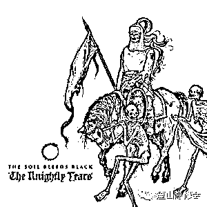

唱片名: The Knightly Years（骑士年代）

发行时间: 2009-05-14

## 曲目：

So Saith The Song Of Sigurd

Pastime With Good Company
Canto Alla Vita
A Hymn For Thy Lady, Fair And Chaste
Dum Pater Familias

Earthe
Lament For The Young English King
Letum Exequor

Oh Ye Of Noble Heart
Shout
Pied Piper Of Hamelin
Away

Solus Maestitia Desperatio
Song Of The Wood

Tristrant Muose Sunder Danc

这是我最喜欢的一张专辑，所以我放在第一个哈，只有两首新歌 Shout（翻唱的中世纪版本）和 Dum Pater Familias，其余都是从以前挑选出来重新加工的。

So Saith The Song Of Sigurd 作为乐队最热门歌曲，讲述的故事是齐格德之死，来自《尼白龙根之歌》和北欧《沃尔松格传说》

另外德国音乐家瓦格纳根据它改编出歌剧《尼伯龙根的指环》(Der Ring Des Nibelungen)

平时仪式喜欢放这张专辑，当然对于一些喜欢仪式放轻音乐的人来说也许不是那么好接受。

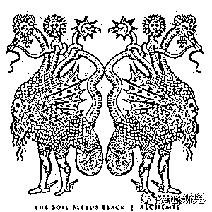 

唱片名: Alchemie

发行时间: 1999

曲目：

Magia  Naturalis Luna  Begets  Mercury Winter  Marriage Make  Not  Vain  the  Cup  thou  Drankest Mineralia Moonburn Lapis  Philosophorum Fire  of  the  Sacred  Seal Jongleurs  in  a  Threefold Silver  Song Dethrone  the  Wounded  King Some  Sweet  Sorrow  Did  Her  Heart  Distraine,  Act  I Earthe  Took  of  Earthe Take  Me  There A  Hymn  to  thy  Lady

专辑名字来源于 Alchemy（炼金术）除了各种炼金的金属元素单曲以外，还讲述了亚瑟王和圆桌骑士的故事，回想起之前看过的凯尔特巫师的植物炼金圆桌理论公式，这张专辑也是充满了神秘的力量。

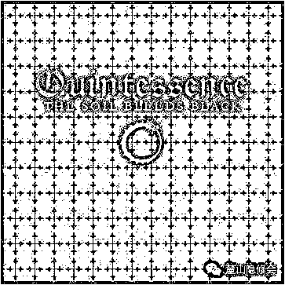

唱片名:  Quintessence

发行时间: 2005-05-03

## 曲目

Earthe

Air

Fyre

Water

Quintessence

Quintessence 被称为第五元素，这张专辑所收录的就是神秘学中的四大元素和第五元素，整张专辑比起之前的更加 Neofolk，充满新异教信仰，封面是一只衔尾蛇，也是乐队 LOGO，其实单曲每个元素都有独立的元素封面，中世纪的版画风格，但是网络资料找不到，无法呈现给大家看实在有点可惜。

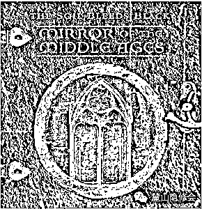

# 唱片名:  Mirror of the Middle Ages

发行时间: 2005-01-08

## 曲目

Ring Around TheRosey

So Saith The Song OfSigurd

Kyrie Eleison

Pastime With GoodCompany

Solus MaestitiaDesperatio

Tempus Est Iocundum

Jubilation OfEarthly Delights

Veni, Veni, Emmanuel

In Taberna QuandoSumus

Palastinalied

Dum Pater Familias

Palastinalied (21stCentury Remix)

整张专辑彻底回归于纯粹的中世纪音乐，旋律配置都变得更加简单，把之前的作品和著名的古曲拿出来重新演绎，Ring AroundThe Rosey 著名的黑死病童谣，在 Eugenia 的声音和单调的管弦乐之下褪去了甜美儿歌的外表，将诡异和黑暗真实的显现了出来。另外加入了 Kyrie Eleison 天主教的慈悲经，虔诚的男低音和极具张力的女高音，缓慢的祈祷，为整张专辑添加了强烈的画面感。

————————————————————————————————————

**The Soil Bleeds Black 的音乐充满了画面感，“你可以光临古战场，会一会英勇的骑士；可以返璞归真，品味劳动人民的质朴生活；也可以偷偷潜入魔法师的炼金室中探秘；更  可以陶醉于情侣、游吟诗人的传奇故事。”他们善用各种特殊的音效来营造这种迷人的气氛，让人有身临其境的感觉，例如在描写古战场的乐曲中，会加入冷兵器互  相敲击的声音，马嘶声，以及骑士们的吼声。**

**伴随着 The Soil Bleeds Black 的音乐，开始一场仪式，也会给予自己一种不一样的感觉，颇有意境。也未尝不是一种情怀。**

# 左派理论：关于 ONA 的一些基础术语

> 原文：[`mp.weixin.qq.com/s?__biz=MzAxMjY0NTYxOA==&mid=402148041&idx=1&sn=bb14eb7235b499956a362bc8381b6316&chksm=09a24f543ed5c6429ecc60b1d103785371f4fb38b9247541b4dbcb9f260d27b0e479f8f7d114&scene=27#wechat_redirect`](http://mp.weixin.qq.com/s?__biz=MzAxMjY0NTYxOA==&mid=402148041&idx=1&sn=bb14eb7235b499956a362bc8381b6316&chksm=09a24f543ed5c6429ecc60b1d103785371f4fb38b9247541b4dbcb9f260d27b0e479f8f7d114&scene=27#wechat_redirect)

其实每次老猫的公开课之前都会去要放到公众号上的授权……

然而一直都有点懒。

最近终于打算慢慢的放出来，我也是觉得自己特别棒 www

顺带一提的是，老猫每月都会有一次公开课讲解一些东西，麓麓也会持续关注并且在公众号中贴出预告宣传，欢迎大家关注。

——————————————————————————————————

The Order of Nine Angles 简称 ONA ，是撒旦教中最极端的组织，曾有过活人祭祀的行为，直译过来叫做“九天使圣殿骑士团”或者“九天使圣会”。

这个组织的资料有许多生硬的术语，今天我们就从这些术语中，了解该组织的风格和思想。

当然，现在是信息化社会，ONA 的一些术语也变得通俗化了。因此很多时候会有两种意思：普传的显意，和秘传的隐意。

随着现代化的影响，他们也会使用一些通俗易懂的术语，比如“心理、原型”。

但是这些术语给什么人使用是明确定义过的，不同阶级使用不同阶级的术语，也就是不同阶级的知识。

这是一个特定且严谨的晦涩方法，我们不加入他们，因此这个无关紧要。

现在进入正题：

第一个术语“Abyss——深渊”

Exoterically, the Abyss represents the region where thecausal gives way to, or merges into, the acausal, and thus where the causal is“transcended”, gone beyond, or passed, and where one enters the realm of pureacausality. Hence The Abyss can be considered as an interchange, a nexus, oftemporal, atemporal, and spatial and aspatial, dimensions. This region is, forexample, symbolized on The Tree of Wyrd, as being between the spheres of Sunand Mars, and ‘Entering the Abyss’ is that stage of magickal development whichdistinguishes the Master/ Mistress from the Adept.

Esoterically, The Tree of Wyrd is itself are-presentation of The Abyss, as are other esoteric re-presentations, such asThe Star Game

这段话的意思是说，深渊的描述有两个，一个普传的定义，一个秘传的定义：

1、在普传的说法中，深渊代表某一个地区在因果上的转移或合一，这是非因果性的。

也就是超出或通过与因果中的某一点，进入到纯粹的非因果境界当中的境地。

深渊可被视为一个瞬间与永恒交错，空间与非空间相连的次元。

这个地方，在火星和太阳之间的空间，其象征为“Tree of Wyrd——沃德之树”。

在 ONA 的魔法中，从熟练者进入到大师的阶段性发展，最具备代表性的就是“进入深渊”。

2、秘传的说法是，“沃德之树”本身就是一个深渊的体现，正如其他秘传文稿的体现，比如星游戏。

我想大家看到上面有一个词叫做“非因果性”，我想大家看到上面有一个词叫做“非因果性”，那么我们进入第二个术语：Acausal——非因果性。

第二个术语：Acausal——非因果性

The term acausal refers to “acausal Time and acausal Space”: that is, to the acausal Universe. This acausal Universe is part of the Cosmos, which Cosmos consists of both the acausal and the causal, where “causal” refers to the Universe that is described, or re-presented, by causal Space and causal Time. This causal Universe is that of our physical, phenomenal, Universe, currently described by sciences such as Physics and Astronomy.
The acausal is non-Euclidean, and “beyond causal Time”: that is, it cannot be represented by our finite causal geometry (of three spatial dimensions at right angles to each other) and by the flow, the change, of causal Time (past-present-future), or measured by a duration of causal Time.
In addition - and just as causal energy exists in the causal (understood as such energy is by sciences such as Physics) - acausal energy exists in the acausal, of a nature and type which cannot be described by causal sciences such as Physics (based as these are on a causal geometry and a causal Time).
According to the aural tradition of the ONA, there are a variety of acausal life-forms; a variety of acausal life, of different species, some of which have been manifest in (or intruded into) our causal Universe.
For more details regarding the acausal, and acausal life, see the following ONA MSS: (1) The Mythos of the Dark Gods: Beings of Acausal Darkness; (2) Advanced Introduction to The Dark Gods: Five-Dimensional Acausal Sorcery

非因果的术语是指“不在因果中的时间和不在因果中的空间”，这就是说，世界无因果性，这个无因果的世界是宇宙的一部分。

“因果”是指通过因果的时空性，对世界的描述或再次重现某些过程，这个因果的世界就是我们的实体，非凡的宇宙依靠科学来描述，如通过物理和天文学。

此外，因果的能量仅存于因果之内，你可以将这种能量理解为科学的、物理的描述形式。

无因果的能量也同样是无因果关系的，其性质无法用物理学去描述（这些是基于因果的时空性质）。

非因果并无具体时空性，且“超越因果的时间性”，也就是说，其变化包含了时间的复杂因果性（过去-现在-未来），这不能用我们有限的空间物理模型去表示（三维空间的定义）和计量，或去测量因果的时间性。

据 ONA 口耳相传的内容，非因果的生命形态是多种多样的，每一种非因果的生命都是迥异的，其中有一部分出现在（或进入了）我们这个宇宙的因果循环当中。

更多关于非因果的内容，非因果的生命，可以阅读以下这些 ONA 的书籍:

(1) The Mythos of the Dark Gods: Beings of Acausal Darkness;

(2) Advanced Introduction to The Dark Gods: Five-Dimensional Acausal Sorcery.

第三个术语：Aeon——永生

比如，千秋万代永垂不朽

according to the Sinister Way of the ONA - is a particular presencing of certain acausal energies on this planet, Earth, which energies affect a multitude of individuals over a certain period of causal time. One such affect is via the psyche of individuals. This particular presencing which is an Aeon is via a particular nexion, which is an Aeonic civilization, which Aeonic civilization is brought-into-being in a certain geographical area and usually associated with a particular mythos

Sinister 这个单词的意思是左派，邪派，不是 lefter。如果这样表达的话，意思就太奇怪了。

根据左派 ONA 的方式，某些非因果的能量以特殊的方式存在于这个世界，这个星球，这些能量在一定时间内影响了一大批人的因果，其中一种方式是影响个人的心理意识。

这种永恒存在是通过特定 nexion（媒介）的运转。

现在这个文明正逐渐退化中，什么意思呢？

退化的文明都集中在一定的区域内且通常与某一个神话绑定，因为我们这个时代的人们精神逐渐丧失灵性。因此现代异教 ONA 提倡人的进化，使得精神重新对灵性敏感起来。

第四个术语：Archetype——原型

An archetype is a particular causal presencing of acertain acausal energy and is thus akin to a type of acausal living being inthe causal (and thus “in the psyche”): it is born (or can be created, bymagickal means), its lives, and then it “dies” (ceases to be present,presenced) in the causal (i.e. its energy in the causal ceases)

原型指存在于特定因果中的一种非因果能量，如同安住于因果中的非因果（灵魂由此而来）：它的出现（或可以用来创造魔法的意思），它的存在和于因果中（即因果停止其能量的运作）“消亡”（不适宜再存在）。

第五个术语：Baphomet——巴风特

Baphomet is regarded as a Dark Goddess - a sinister female entity, The Mistress (or Mother) of Blood. According to tradition, she is represented as a beautiful mature woman, naked from the wait up, who holds in her hand the severed head of a man.
She is regarded as one manifestation of one of The Dark Gods

巴风特被视为黑暗女神，她是血的主人（或母亲）。传统上，它的形象为一位站着的美丽成熟的女子，它的手里抓着一个男人的头颅，它被视为黑暗神祇的表现形式之一。

很多人都听过这本大名鼎鼎的 Black Book of Satan——撒旦黑书。（没错，不是撒旦圣经。那是勒维撒旦教的仪式总纲。）

ONA 的仪式总纲是撒旦黑书，这本书包含了 ONA 传统所使用的左派/撒旦主义的礼典性魔法。

根据左派 ONA 的传统，Dark Gods——黑暗神祇是一种特定的存在实体——其存在存式—— 一种非因果性的生命体，通过运转各种媒介，于远古时便存在了。

第六个术语 Falcifer——爱好者（或中二者）

因为刚接触左派的人，多少都有些二

The exoteric name given to the esoteric (or “hidden”) nexion which is opened by Adepts to prepare the way for Vindex. This nexion - like Vindex - may be presenced in a specific individual, or in a group of individuals. There is a symbiotic relationship between Falcifer and Vindex, who - if presenced in individuals - can be either male or female

通俗来说代表一种奥秘的意思（如“隐藏”）通过媒介的方式为修行者打开启蒙的道路。这种媒介，像一种通关凭证——可能进驻于某特定的个体，或群体。以及爱好者和保证人之间是一种共生关系，可能就是某个人——看他的个人——可以是男人也可以是女人

第七个术语 Magick

Magick - according to the Sinister tradition of the ONA - is defined as “the presencing of acausal energy in the causal by means of a nexion. By the nature of our consciousness, we, as human individuals, are one type of nexion - that is, we have the ability to access, and presence, certain types of acausal energy.”
Furthermore, magick - as understand and practised by the ONA - is a means not only of personal development and personal understanding (a freeing from psychic, archetypal, influences and affects) but also of evolving to the next level of our human existence where we can understand, and to a certain extent control and influence, supra-personal manifestations of acausal energies, such as an Aeon, and thus cause, or bring-into-being, large-scale evolutionary change. Such understanding, such control, such a bring-into-being, is Aeonic Magick.
Aeonic Magick is the magick of the Adept and those beyond: the magick of the evolved human being who has achieved a certain level of self-understanding and self-mastery and who thus is no longer at the mercy of unconscious psychic, archetypal, influences, both personal/individual, and of other living-beings, such as an Aeon.
Internal Magick is the magick of personal change and evolution: of using magick to gain insight and to develope one’s personality and esoteric skills. There are seven stages involved in Internal Magick.
External Magick is basic, “low-level”, sorcery - where certain acausal energies are used for bring or to fulfil the desire of an individual.
Ceremonial Magick is the use (by more than two individuals gathered in a group) of a set or particular texts or sinister rituals to access and presence sinister energies.
Five-dimensional magick is the New Aeon magick sans symbols, ceremonies, symbology (such as the Tree of Wyrd) and beyond all causal abstractions, and it is prefigured in the advanced form of The Star Game

根据左派 ONA 的传统

魔法被定义为“在场的非因果性的能量意味着存在某个触媒。通过我们的自然感知，我们作为人类的个体，自身就是一种媒介——那就是，我们有能力通过并临在某些特定的非因果性能量。”

此外，魔法——在 ONA 的理解和练习中——是个人发展与理解的一种方式（心灵释放，原型，情感的作用）但也包含进化到下一个纪元的人类水准的意思，就是我们理解的那种，并需要进入某一层面进行控制和影响，是无因果能量超越个体的表现，比如永生，从而导致大规模的进化。可以理解为，控制，促使某个个体进入永恒的魔法中去

永恒的魔法是那些熟练者的魔法：进化后的人类对自我的认识达到了一定水平且具备一定自我控制的能力，则可以不再被那些没被察觉的灵体、原型、个体和个体之间所影响，且成为了另外一种生命形态，如同永生。

内在的魔法可以引起个人的意识形态的转变：使用它可以洞察人的本质，并激发潜能中的技巧。内在的魔法有七个阶段。

外部的魔法是最基本的，“低层次的”法术，将非因果性的能量用于满足某些个人欲求。

礼典性魔法使用（两个或两个以上的人组成一组）特定的书籍和左派仪式临在那些邪恶的能量中去。

# 【短文】途

> 原文：[`mp.weixin.qq.com/s?__biz=MzAxMjY0NTYxOA==&mid=402178999&idx=1&sn=854466da79731f2ce2a555df88ee3732&chksm=09a2c62a3ed54f3cfa573b4e4281894e83410ffd039cc19f0dd9f21a341414cf5cf68e6cd815&scene=27#wechat_redirect`](http://mp.weixin.qq.com/s?__biz=MzAxMjY0NTYxOA==&mid=402178999&idx=1&sn=854466da79731f2ce2a555df88ee3732&chksm=09a2c62a3ed54f3cfa573b4e4281894e83410ffd039cc19f0dd9f21a341414cf5cf68e6cd815&scene=27#wechat_redirect)

——谨以此文，先给现代所有的殉道者。

信仰在这个时代比以前任何时候更为艰难

《天主教法典》第 1398 条：设法堕胎且既遂者，应受自科绝罚。

杰西卡正在准备着行李，机票是十二月四日四五点二十分的，也就是明天下午。

虽说这个时间就算是明天早上再收拾行李——她的老公约翰就经常这么做——也来得及，但是这次飞行行程对杰西卡而言非常重要，她想要再仔细一点，不出现任何闪失。

飞机的目的地是罗马，大概是当地时间十二点还是十一点会到达目的地。杰西卡一直都不太弄得清楚时差，多半是因为他很少出国，更不用说这一次她将飞过太平洋到达地球的另一边。

意大利，罗马。

这还不是杰西卡最后目的地，她的目的地是罗马旁边的一个国中国——圣城梵蒂冈。

杰西卡是天主教徒，每周末以及逢年过节的时候，都一定要到附近的天主教堂进行祷告和聚会。

神父乌利亚是杰西卡的老熟人，杰西卡还是婴儿的时候便是乌利亚给她进行的受洗仪式。三年前神父回到了这个地方，之后一直给予杰西卡以指引。

今年七月，神父乌利亚告诉杰西卡，今年梵蒂冈教廷有一个特别的举动。教廷决定在圣母无玷始胎节的时候，进行一次史无前例的赦免仪式。

杰西卡还记得那天，那只是一个看起来平淡无奇的周日，杰西卡和往常一样去到教堂进行祷告。也和往常一样，等教堂的人几乎散去她才准备离开。而与往常不一样的是，这一次神父乌利亚叫住了她。

“杰西卡。”神父乌利亚等杰西卡走到了他的面前才继续说道“你还记得你第一次忏悔吗？”

第一次忏悔？

杰西卡回忆了一下，那大概是自己六岁的时候，当时神父乌利亚还没有去到其他的教区，幼小的自己第一次进入到了忏悔室去进行忏悔。

当时小杰西卡说了什么，她已经不记得了，她只是大概记得她似乎是因为前一天见到一个流浪汉并没有理睬，等走了两个街区远之后才反应过来，于是为自己的残忍而忏悔。

当时神父乌利亚告诉了小杰西卡，她并没有做错任何事情，所以并不需要去忏悔。人很容易忽视其他人，这是惯性，并不是她刻意为之的。

“噢，不是那个，是我回来之后你第一次向我忏悔的内容。”

神父乌利亚又提醒了一句。

这时候杰西卡才知道，神父说的是什么事情。

那是杰西卡永远都无法忘记的忏悔内容，她忏悔的是大约发生在八年前的事情。

那个事情，杰西卡有很长一段时间都不敢和任何人说，直到神父乌利亚回到这个教堂之后，她才敢开口。

杰西卡必须忏悔，为了被她扼杀在摇篮里面的小生命。

同样的，那是任何一个神父都无法宽恕的一个罪过，自杀和杀人都是大罪。

2007 年，美国遇到了现代最强烈的一次金融危机，新婚不久的杰西卡和约翰，便被扯入到这个恐怖的危机之中。

那是杰西卡过的最辛苦的时代，也就是在这个时候，杰西卡发现自己已经怀有身孕。

在金融危机来临之前，杰西卡和约翰已经计划要生孩子了，他们甚至打算给他取名艾萨克（Isaac），如果是女孩子就叫伊娃（Eva）。

然而金融危机就这么突然来到，使得他们并没有办法应对，更不用说家里再添上一个人。

约翰害怕孩子在这个辛苦的时代会过早的夭折，而杰西卡则更害怕他们没有办法也没有能力去抚养一个孩子。

没有办法在家里照顾它，也没有办法带去工作，更加请不起保姆。

他们只能做出一个决定，也是最痛苦的决定。

“艾萨克，你是说我的艾萨克吗？”

杰西卡从回忆中走出来，眼角还闪烁着泪花。

那天她和约翰从手术室出来之后，医生告诉了她那是一个男孩，或者说还没能成为男孩的小生命。

那是她的艾萨克，未能拥有就已经失去的儿子。

“我并不能宽恕你的罪，杰西卡。不管是那个时候还是现在都一样。但是你并不是不可饶恕的，你有幸在此生遇见圣年。自亚当，夏娃犯罪以后，天主不愿人类沉沦罪恶，于是他转向那圣洁，充满无暇之爱的玛利亚，择选她作为人类救主的母亲。”

神父乌利亚的话杰西卡知道，那是参弗第一章第四节的内容，说的是圣母玛利亚得到主的恩赐，无玷受孕的事情。

杰西卡唯一不知道的是，为什么神父要突然说这样的话。

“杰西卡，今年是圣年。梵蒂冈教会决定，在今年的圣母无玷始胎节之时，圣门将会成为慈悲之门，但凡是穿过慈悲之门的人，将会被赦免堕胎的罪孽。”

这才是重点。

也就成了杰西卡去往梵蒂冈的契机。

杰西卡不会放过这次机会，她需要得到救赎，为了她曾经犯下的罪过。

杰西卡定的房间在罗马。不知道是不是因为圣年的原因，圣城梵蒂冈已经没有可以预约的酒店，杰西卡便只能住在罗马。

不过还好，罗马距离梵蒂冈的距离也不是很远，价格也没有太大的差别。

入住酒店之后，杰西卡睡了一觉，洗了个澡才到下面的酒店餐厅去用餐，距离八号还有三天时间，杰西卡决定好好享受自己的这个假期。

杰西卡还没有来过意大利，她希望自己从容不迫，用最好的状态去迎接这次的仪式。

时间很快就到了十二月七日。

傍晚，杰西卡回到了酒店，她注意到，酒店大堂多了很多带着十字架的女性，当她们看到杰西卡的时候，竟没有一点含蓄的，向她打起招呼来。

“你明天也是要去慈悲之门的吗？”

她们说的是圣门。

“她应该来参加我们的聚会的。”

其中一个女性这么说道。

杰西卡低着头，她没有回答这个女性的话，因为她不觉得这是一个值得庆祝的事情，也不是一个值得去说的事情。

“我说姐妹，你应该和我们一起去的，我们都是一样受苦的女人，不得不做一些有罪的事情，也不得不受一些苦。”

见杰西卡没有反应，其中一个金发的女性直接抓住了杰西卡的手。她的眼中闪烁着欢喜以及希望的神色，让杰西卡没有办法拒绝，只能跟着她们，到了她们的聚会上。

所谓的聚会，并不像是杰西卡想象的那样，是一个 party，虽然说酒和食物都有，但是大家围成一团，反而像是一个互助小组。

通过她们的介绍，杰西卡知道她们也是在路上遇到的，有些人是在机场认识的，有些人本来就是一起来的，有些人则是刚好发现对方竟然也在这里。

“我说姐妹们我们应该来一场聚会，这也算是一种缘分。”

其中有一个人提议了一句，剩下的人便同意了。

“我们来说点什么吧，关于自己的罪的。姐妹们你们也是为了明天的慈悲之门的仪式来的吧，感谢上帝能够给我们这次机会不是吗？当然你们若是不愿意分享也没有关系，只是我们必须要牢记，这是我们犯下的罪过，当明天过了慈悲之门的之后，我们便重归了无罪的身体，以后也不要再犯了。”

聚会上，在几杯酒下肚之后，也有一个人提议了她们的聊天内容。

不知道是不是因为大家并不太熟悉，就算是几杯酒下肚也没有办法对陌生人敞开心房，所以没有人回应她。

见没有人回应，提议者自己先开始说了起来。

“我不是天生的天主教徒，从来都不是。我父亲是一个无神主义者，母亲则是最普通的那种，只要见到有神就会去拜拜，见到教堂就会去看看，也不管是什么宗教的。那年我还是一个孩子，喜欢上了一个男孩子，然后事情就发生了，在失去了自己的孩子之后，我才知道身为母亲的心情。于是在这种悔恨的情绪中我决定加入了天主教，成为了天主教徒。我原本以为这个罪孽会跟随我一生，却没有想到有幸能够遇到圣年。”

杰西卡听完了提议者的话，她突然有了一种感同身受的感觉。

在这里的大家都不过是普通的女性，为了生活不得不做出一些事情来。

在这个世界上的每个人都是兄弟姐妹，既然自己过去做过一些错事，为什么不能和兄弟姐们说一下呢？这样不就可以确保自己以后，或者自己的兄弟姐妹们以后不会犯错了吗？

于是杰西卡说了自己的事情。

非常简单的事情，不过是因为金融危机，还没有拥有稳定生活的小夫妻遭受到了巨大的打击，而这个时候又不合时宜的有了一个孩子罢了。

“噢，我说姐妹，你这算什么，根本就不能算是罪。”

突然有个喝多了一点的姐妹对着杰西卡笑了起来。

“每个人都是自私的，这难道不是正常现象吗，我来给你说说我的故事吧。”

“我从小生活在平民窟里面，我不知道自己的父亲是谁，母亲是只要有钱就能够给人服务的那种人。她不知道堕过多少胎，当然我也不知道为什么她就把我生下来了。她不愿意我继承她的工作，但是钱是一个好东西，你们知道的。然后到了我这个年龄之后，就会开始思考自己以后会进入到什么地方，死掉之后是否会去到一个和谐安静的地方，所以在知道了圣年的消息之后，我便加入了天主教，现在也就只差慈悲之门的仪式了。”

“我是我丈夫希望我过来的。”

跟着这个姐妹，另一个姐妹突然开始说话了起来。

“我是因为我的未婚夫，他不能接受我堕胎过这件事情罢了。他觉得自己的妻子就算是有一些过错，却不能犯这种如同杀人一样的过错，他说过如果我不能经过慈悲之门洗净罪恶的话，便不会和我结婚。”

不知道是不是因为酒精的原因，或者是因为已经有人开始自爆了，所以在场的姐妹们已经开始肆无忌惮的说着自己的故事。

她们甚至对其他姐妹的故事产生了同情，高喊着“太好了自己太幸运了”的话语，一杯又一杯的喝着酒，致敬着玛利亚，致敬着耶稣，致敬着上帝。

杰西卡对她们的内容已经听不进去了，这个聚会和自己想象中的并不一样。

在杰西卡的面前充斥着的，并不是悔恨和无可奈何——虽然有那么一两个人确实是如此——而是欢呼着上帝名字的恶魔。

杰西卡突然从椅子上站了起来，狂奔出了这个地方，她不知道自己应该去哪里，所以她跑回了酒店，走到了酒店八楼的空中花园。

夜风吹在杰西卡的脸上的时候，她才安静下来，看着整个罗马城市，她甚至可以看到不远处的梵蒂冈圣城。

整个罗马在夜色下，就像是一千年前一样的古老，神圣。杰西卡甚至可以感受到它的庄严，耶稣传教时的种种艰辛。

杰西卡向前走了一步。

她不知道这个世界是怎么了？是因为自己接触的圈子太小所以没有注意到整个世界已经完全堕落了吗？

现在的恶魔已经让人们高喊着上帝的名义开始做着堕落的事情了吗？

现在的宗教已经单纯的只是成为了人们的庇护所，用以自我欺骗，除此之外并无其他的意义了吗？

现在的信仰已经如此的不值一文，只要为了自身利益就可以随口说着自己信仰某个神明了吗？

“你若是再向前一步的话，就会掉下去了。”

突然一个女声将杰西卡的思绪给拉了回来，这个时候杰西卡才发现，自己似乎是在思考着什么的时候，已经慢慢的走到了空中花园的边缘，只用迈出一步就可以从这八楼坠下。

杰西卡没有后退，她看着圣城，许久才回了那个女声一句。

“这又有什么不好？我已经不能理解这个世界了，信仰被当成玩笑，就是上帝的仁慈也被当成了工具。”

“不只是这个时代，过往任何一个时代都是这样子。若是虔诚的教徒全部都选择了你的道路的话，那么又有谁来传播正确的话语？”

女声又一次说道。

杰西卡回头，发现这个姐妹竟然就是之前最开始提议要说一下自己经历的女性。

“但是我不是圣徒，我没有那么坚强的意志。”

“那就为了你失去的孩子而活吧，自杀和杀人都是不能饶恕的罪过，你已经犯了其中给一个，就不要犯另一个。”

姐妹说着向杰西卡伸出了手。

“不是所有人都是圣徒，也不是所有人都可以拥有那么坚强的意志，永远不犯任何错误。但是你和其他那些被原罪侵蚀的人不一样，你犯下的罪伴随的痛苦本身即是一种惩罚，但是并不是应该夺去你的性命的惩罚。”

杰西卡因为这个姐妹的话，伸出了手握住了这个姐妹的手。

确实她说的没错，杰西卡做出选择的时候确实非常的痛苦，这个痛苦是实际存在的，那是她认真思考过决定要背负的东西。

而这个痛苦将会伴随着自己一生。

“上帝是爱人类的，姐妹。不管是给出了多少痛苦，多少惩罚都不会到要毁灭一个人以及一个人生的地步。当你还能感受到这份痛苦的时候，你就还拥有上帝的爱。”

“我能问你的名字吗？”

杰西卡看向了那个姐妹。

“玛利亚。”

那是和始孕无玷者一样的名字。

第二天杰西卡上了第一班回纽约的飞机，没有去圣门。

# 主办人大概没吃药的圣诞节抽奖活动

> 原文：[`mp.weixin.qq.com/s?__biz=MzAxMjY0NTYxOA==&mid=402229442&idx=1&sn=01041a241ee2c673ac6fda53675be356&chksm=09a38d5f3ed40449d04d1cfb89c48f7463461ca5208b030a4eb39a5db4067a6399c9d58066a5&scene=27#wechat_redirect`](http://mp.weixin.qq.com/s?__biz=MzAxMjY0NTYxOA==&mid=402229442&idx=1&sn=01041a241ee2c673ac6fda53675be356&chksm=09a38d5f3ed40449d04d1cfb89c48f7463461ca5208b030a4eb39a5db4067a6399c9d58066a5&scene=27#wechat_redirect)

大家好~

最近湘雅附二病房爆满，药店断药，所以把我给放出来啦哈哈哈哈【仰天长笑】

顺便还没有药吃~【再次仰天长笑】

差不多又到了圣诞节的时候~

毕竟是纪念我男神诞生的日子，虽然大家都知道男神也不是这天诞生的，但是没关系，一个纪念而已就不要计较太多了☆

至于其他的~在我眼中只有男神就不管咯~★

哈哈哈，在一个没吃药的神经病患者【大概就是说的自己】的独断下，麓山隐修会决定弄一个圣诞节抽奖活动~

参与方式和其他的抽奖活动一样，关注，转发，然后截图发给特定微信号就可以了~

微信号为：aurora_mask

下面发放奖品~

发放之前一定要强调一下，因为窝主太懒，所以均为自然光下无 PS 图片~没有特效，没有 duang，唯一的效果加成只有桌面~

一等奖一名。为价值 128 一串的天然紫水晶手链，玻璃体，深紫色，直径 6 还是 8 我就不记得了☆

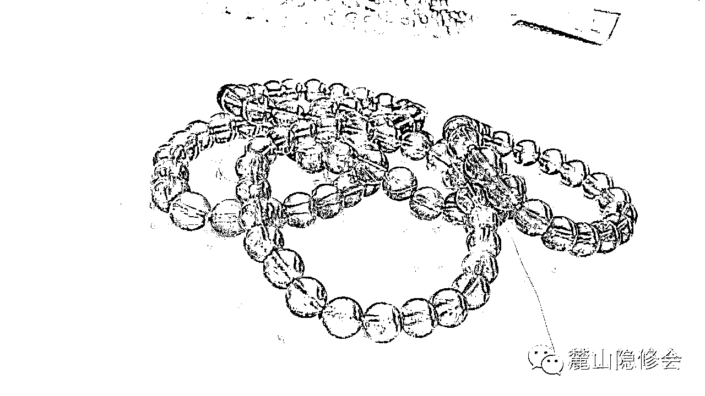 

之前拍的图，意思意思看看就好了~

一点都不想写简介=L=

二等奖依旧是一名

依旧是紫水晶，猫窝价值 95 的玻璃体深紫色，直径多少自己也不是很记得了。

反正比一等奖的那个小一些~

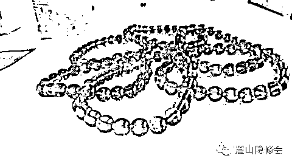

依旧看图就好了，自然光，不过没楼上那个拍的那天光线大=L=

反正就是不想写简介了！我任性！

三等奖继续一名

大约是 8 或者 10 的白水晶手链

猫窝价值 65

继续放图

大家看图就好了=L=

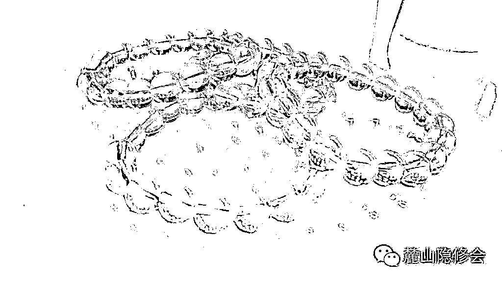

以上每个奖项只有一名中奖者~

至于为什么呢~

因为最近我在学绕线所以把串串拆了在绕线，直接导致猫窝库存不足啦啦啦~♪(^∇^*)

所以会有以下这个不管你想不想要，反正我要抽的奖项。

奖项具体内容我也不知道，纯粹看当时的心情~

奖项 X，抽出 1~10 人左右，到时候看心情【你等等

奖项内容为绕线手作，可能是项链，戒指，胸针，手作，其中的任意一个~

最后，但凡转发到朋友圈并截图的小伙伴，不管你想不想要，反正以后到猫窝可以用来抵 5 元或 10 元现金，具体看卖的是什么以及看窝主心情~

**PS，为了顾及参与者的个人爱好，所有中奖奖品如果不喜欢的，可以交换猫窝任何一个等价格或者低价格的商品作为奖品~如果看中了高出奖品价格的，只需要补差价就可以了，不包括邮费`~**

啊~湘雅附二的病房好像空出来了~

我就先过去治病去了，各位再见~圣诞节见~

抽奖时间为圣诞节，可能会因为咱懒而导致晚上一天两天三天的~大家可以不断地在群里催促，懒要靠催是真理。

各位圣诞节见，(づ￣ 3￣)づ么么哒

# happy eva 圣诞节抽奖结果

> 原文：[`mp.weixin.qq.com/s?__biz=MzAxMjY0NTYxOA==&mid=402551729&idx=1&sn=e848e382383081ef806ba2c1847926b7&chksm=09a4762c3ed3ff3a93069d23eb87b691c9bb2c2d3622065308bcacf50a162a2b96e342e1c31c&scene=27#wechat_redirect`](http://mp.weixin.qq.com/s?__biz=MzAxMjY0NTYxOA==&mid=402551729&idx=1&sn=e848e382383081ef806ba2c1847926b7&chksm=09a4762c3ed3ff3a93069d23eb87b691c9bb2c2d3622065308bcacf50a162a2b96e342e1c31c&scene=27#wechat_redirect)

差不多到了抽奖结果公布的时候了。

我居然没有懒简直太棒了哈哈哈哈哈哈。

由于参与的反正都是熟人我也懒得写微信号就是了，直接报昵称吧。

看到结果请自己私信我家庭地址~

如果要更改奖品的话，到时候再说哦呵呵呵呵。‘

特别将给觉得自己反正没有中过奖的二兰兰，奖品你回长沙就知道了~☆

反正抽奖本身主办人没有吃药了，就不要介意这种细节了哦呵呵呵呵呵呵☆

一等奖给小云爵~到时候和手杖一起寄过去~

二等奖给小依瓷~明天晚点寄~

三等奖给小紫萱~请马上联系俺~

还有反正我也不知道什么时候会寄，最近有些产量奇少的绕线特别奖获奖名单~

魅涵

千秋

景末

青蛙

LNL

欢迎联系~☆

截图依旧有猫窝优惠，大家么么哒~(づ￣3￣)づ╭❤～

# 占星基础第一节

> 原文：[`mp.weixin.qq.com/s?__biz=MzAxMjY0NTYxOA==&mid=402992341&idx=1&sn=ff82fcad46643f8379d23a674ab3ee93&chksm=065f29483128a05e19ec751f71fd8190551f8cd7a79fbe6aea5c38a713c41aab847e3c8ab10d&scene=27#wechat_redirect`](http://mp.weixin.qq.com/s?__biz=MzAxMjY0NTYxOA==&mid=402992341&idx=1&sn=ff82fcad46643f8379d23a674ab3ee93&chksm=065f29483128a05e19ec751f71fd8190551f8cd7a79fbe6aea5c38a713c41aab847e3c8ab10d&scene=27#wechat_redirect)

我要讲的是占星+魔法的内容，不管魔法讲不讲得到，我争取把占星部分讲完。这个课程也算是我今年 6 月份和诗人占星魔法大课的一个前置，希望各位能在这里有所获得。

当然，占星也是一个大类，它有很多分支，有些人会把它分为世俗占星、本命占星、择日占星和卜卦占星，这是其中的一种分法。在占星最早的巴比伦时期，首要发展出的是世俗占星，但是它已经提供了择日占星的基础。针对个人的本命占星在时间上要排后，而至于卜卦占星，它的成形实际上是最晚的。在巴比伦时期之后的希腊时期，出现了卜卦占星的应用，但此时它与其他的占星方法相互交叠，在波斯与阿拉伯时期，卜卦占星才开始有明确的判断方法，并产生了单独的著作。

对于这些分支，我在这里不可能跟你们面面俱到，不然一定要花上一个长到不能再长的学习时间。因此，我在这里挑选了一个实用性很强的分支教给你们，这个分支就是卜卦占星。

卜卦占星其实算是个意译名，它的英文单词是 Horary Astrology，直译应该叫时辰占星或者小时占星。那么为什么要叫这个名字呢？原因在于它是一种非常重视“时机”的占星术，甚至我们可以说，所有的占星都是重视时机的。那么这又是什么意思呢？下面我引用占星家奥利维亚·巴克莱（Olivia Barclay）在《古典占星卜卦指南》（王薇译）中说的一段话来做说明：

每一个时间判断都有它的品质，不管是人们出生的时间，还是具体问题的时间，比如卜卦占星星盘诞生的时间。我们的艺术是诠释时间的含义，它展现了宇宙之间的交互和一致性，占星学是一门天上的行星位置对应地上发生事件的学问。优秀的卜卦占星师能够预知未来可能发生的情况。

我们在日常生活中会发生很多很多的事情，有大事有小事，我们可能在某时结婚，可能在某时失业，可能在某时约炮，也可能在某时丢了钱包。那么为什么我们在“此时”会发生的这样的事？我在今天丢了钱包，为什么这件事偏偏要在今天发生？为什么不是昨天？为什么不是明天？可见，这一连串的追问其实根基是对“时间”性质的追问。

正如巴克莱所说，每一个时间判断都有它的品质，所以彼时与此时是不同的，昨天和今天是不同的，现时和明日同样也是不同的，这些时间每一个都有自己的独立“品质”，正是因为在这种“品质”的对应下，我们方会在不同的时间经历不同的事件，尘世上才有此起彼伏的事情发生。所以今天的“品质”产生了今天的事情，昨天的“品质”产生了昨天的事情，那么要是我们可以得知明天的“品质”，我们是否可以预测未来？答案是确定无疑的。

那么，我们又如何得知这种品质是什么样的呢？我们知道现在是 2016 年 3 月 3 日，那又怎么样呢？光看着这段数字你能知道它有什么品质吗？显然不行，这时候，我们就需要一个东西帮我们解读各个时机的品质。这个东西就是占星。

当然，除了占星还有很多其他的工具可以帮助我们，比如塔罗，比如地占，甚至是六壬、奇门等中国术数。可以说，世界上所有的预测学或命卜术，都是在力图解答这种“品质”，从而获悉过去、洞彻未来，它们之间的形式可能差距甚远，但是它们的本质追求都是相同的。

天上的天体是不停运转的，今天在这里，明天又在另一个地方了，因此不同的时间下，天体的位置也是不同的，所以我们就可以把天体的位置和不同的时间对应起来，这就使天体的运行成为一个标识时间的良好工具，同时也为依靠天体解读时间的品质提供了可能。

所以卜卦占星，也即时辰占星，就是以占星解读时机品质的技术。当然我也说了，所有的占星其实都重视“时机”，那么，卜卦占星独特在哪里？卜卦占星特点在于它针对的是问题，当你或其他人提出一个问题的时候，卜卦占星就取这个问题产生的时机，以此时机解读问题的发展和结果。通常情况下，卜卦占星采用的是占星师听到问题的时间和地点，问卜者提出问题的时间和地点也可以使用，但是我个人比较建议前者。

当然，也不是什么问题都适合拿来占卜，比如你要拿世界末日什么时候来或者下期彩票多少这种问题，是很明显不合适的，卜卦占星相对而言更适合攸关个人的问题，当然，我并不是说它一定不能占卜长期和集体的事情，只是顺着这种偏重去使用是更恰当一些的。

我们解读时机的品质需要用到行星的位置，那么如何查看行星的位置？这需要使用占星师名为星盘的工具。www.xxwolo.com 你们打开这个网站，这是一个在线绘制星盘的网站。打开首页后点击“我的星盘”，然后在右侧填入名称、时间和地点（出生时位置），也就是占星师听到问题的时间和地点，然后点击“保存星盘”，点击专业星盘，在星盘左上角的下拉条中选择“卜卦古典[R]”，这样你的星盘就完成了，下面就是解读星盘，这也是我会教给你们的东西。

当然，你们首先需要认识星盘里都是些什么东西，记住它们的符号，这是学习怎样解读的第一步。

以此为例，其中最外圈的符号是星座。

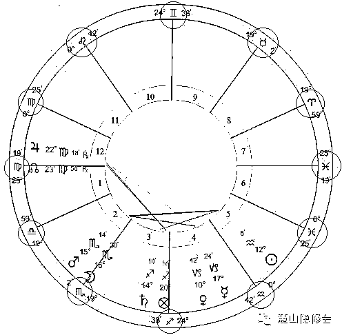

也就是被我圈起来的地方，星座一共有 12 个，整个围成一圈，共有 360 度，其中每个星座占 30 度。星座在占星中，其实是一个坐标，比如我们想知道现在太阳在哪，一看它在水瓶座 12 度，我们就可以以此描述太阳的位置。下面我把星座符号给你们列下表格：

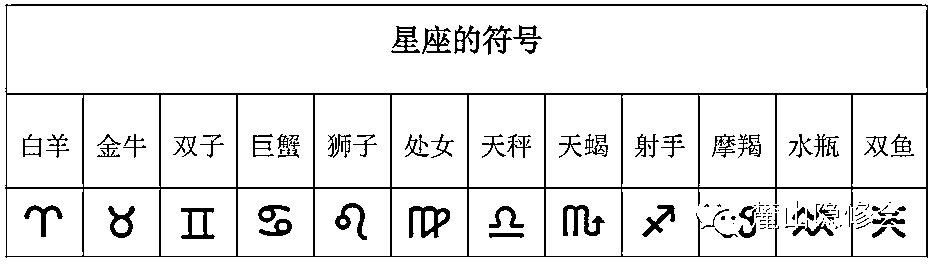 

它的顺序、名称、符号都是需要记住的，记不下来就别玩了。

而在更内一圈的符号，就是行星，以及一些虚点，如下图：

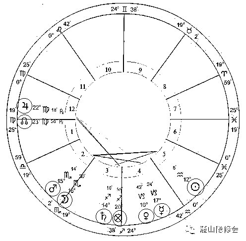 

行星不均匀的散布在星盘中，是占星判断的主体。同样，符号名称要记住：

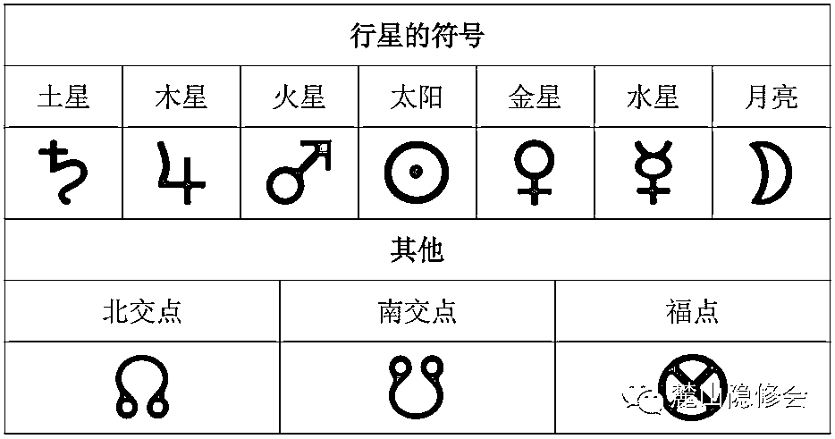

最后，是宫位，星盘中标有 1 到 12 阿拉伯数字的就叫做宫位，是卜卦占星不可缺少的要素，我把宫位部分涂成了绿色：

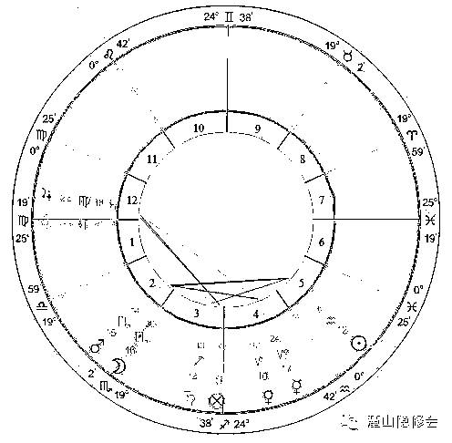 

这个没什么特殊的符号和名称要记。宫位和星座类似，也是一种坐标系统，比如太阳落在第五宫，就是对太阳位置的另一种描述，宫位与星座隶属于不同的坐标系，一个是黄道坐标系，一个是地平坐标系，我们在这里不讲天文，所以略过不提。

同时，宫位的位置也被星座所标示，你在图中看到，宫位是从左手的序号 1 开始，逆时针排布的。其中有始点和终点，始点叫做宫头，终点叫做宫尾，其中上一宫的宫尾也就是下一宫的宫头。宫头和宫尾的位置也标注出来了，比如第一宫的宫头是处女座 25 度 19 分，第一宫的宫尾也是第二宫的宫头，是天秤座 19 度 59 分。

我们这节课就讲到这，课后你们应该记住行星和星座符号，能熟练指出行星、宫位的位置，这是最基本的，否则没办法继续进行。

# 麓山隐修会长沙地区线下聚会

> 原文：[`mp.weixin.qq.com/s?__biz=MzAxMjY0NTYxOA==&mid=403009629&idx=1&sn=5f3367fe4d4a8e8357baed53920ce6fc&chksm=065f75c03128fcd6836f8c5e48a4275ce95c5fb984641da940b611317ea90d23ec285e8744f7&scene=27#wechat_redirect`](http://mp.weixin.qq.com/s?__biz=MzAxMjY0NTYxOA==&mid=403009629&idx=1&sn=5f3367fe4d4a8e8357baed53920ce6fc&chksm=065f75c03128fcd6836f8c5e48a4275ce95c5fb984641da940b611317ea90d23ec285e8744f7&scene=27#wechat_redirect)

2016 麓山隐修会长沙线聚：

大年初八，也就是二月十五日将在长沙举行一次线下聚会。

时间从下午两点开始，至五点结束，如果要有需要约晚餐的，可以再说。

聚会参与人数暂定为十~十五人，人满既停。

聚会以茶话会的形式举行，会提供饮料及点心。

主要以学术交流为主，会有神秘学资料以供传阅哦，并且会有一些小活动举行，奖品敬请期待。

更有大大的学术科普时间。

地址为定王台附近，具体地址需要私戳获得，会有一个简单的小审核，证明不是中二病即可。

详情可私戳了解。

联系方式：

QQ：2695150564

麓山隐修会 QQ 群：66373801

微信号：aurora_mask

到场隐修会成员：

不能被吊死

一个几乎不混网圈的大大，曾经因为留学神隐四年时间。

北大哲学院研究生，博士生待读。

国内神秘学领军人物之一。

精通五门外语，专精炼金实践，哲学以及历史和仪式魔法。

曾在英国留学的时候，有参与过当地组织的生命炼金术仪式，并且作为交流生去往日本交流学习的时候，学到本土文化和神秘主义内容。

毕达哥拉斯学派的数理研究者

【↑此人经历还有待细挖】

依兰：

国内灵摆无意识流先驱。曾翻译国内第一批灵摆资料。

WICCA 体系女巫一枚，幼年入坑，并有一定的家族传承基础。主要体系为戴安娜三女神体系。

专精魔药运用，不只是草药，还包括各种魔法精油及软膏←简单的说就是，看到教程不练一下会手痒的类型。

家内囤有大量资料。

目前在整理凯尔特体系的魔药资料，实践并且尝试自己创建新的魔药公式。

末日酱：

坑内罕见的文学派成员，阴谋论痴迷者，对黑暗艺术有着狂热。

接触面不精却广，小白科普良药，只要卖萌即可勾搭←你节操呢

囤物狂魔，尤其是书籍方面，囤了不少好物，以实体为主。

在黑历史和坑内八卦方面也是一个囤物狂。

七宗罪主司傲慢，并引以为豪。隐修会的大脑，当然是不储存资料的那部分大脑。

# 占星基础第二课

> 原文：[`mp.weixin.qq.com/s?__biz=MzAxMjY0NTYxOA==&mid=403013195&idx=1&sn=2e71a421c56fee48378f8554a42b8dc8&chksm=065f7bd63128f2c0e61077ad4dfce51334224a8e00247e30b8a283bf3c9833f94d21f4b06308&scene=27#wechat_redirect`](http://mp.weixin.qq.com/s?__biz=MzAxMjY0NTYxOA==&mid=403013195&idx=1&sn=2e71a421c56fee48378f8554a42b8dc8&chksm=065f7bd63128f2c0e61077ad4dfce51334224a8e00247e30b8a283bf3c9833f94d21f4b06308&scene=27#wechat_redirect)

上节课我们说了星盘，我们说了如何辨认行星、宫位和星座，我希望你们都能很好的掌握了它们的符号和名称，这是不可绕过的基础。在接下来，我会给你们详细延伸行星、宫位和星座的基本含义。在这节课中我们先说行星。

首先，我们要学会解读星盘，那么我们的目的是什么呢？是靠这个星盘解读你碰到的任何问题。你光是想想就可以感觉出这个范围是很大的。你一生中可能碰到无数的事情，甚至多到难以用数字来衡量，但是占星里的基本符号就那么多，7 行星+12 星座+12 宫位，不过总计 31 个基本要素而已，这么点东西怎么用来涵盖世上数之不尽的事情呢？

我们国家说的一句话很到位，“物以类聚，人以群分”。我摆出这句话来是什么意思呢？这世界上存在着无数的人、事、物，它们的数量确实是数不胜数的，但是我们可以按照某种特性把它们分组。比如以阴阳之分将世上的万事万物分为两组，阳对应积极的、热的、运动的、男性的、刚强的；阴对应消极的、冷的、静止的、女性的、柔弱的，这样以来，我们就可以把所见的一切都划分为阴阳两类，那么这个世界上的一切就都可以用“阴”和“阳”来表达。

行星与这是很相似的，只不过它没有将事物划分为两类，而是依据行星数量划分了七类。然后我们把一组事物丢给土星，另一组事物丢给木星，等等等等。这样，我们就可以用有限的七颗行星来描述无限的万事万物了。所以，你们必须要清楚每颗行星都对应了哪组事物，行星分别都代表了什么东西。

那我们怎么知道行星代表了这件事物呢？假如我说太阳代表国王，为什么？凭什么它可以代表国王，月亮表示不服。实际上，每个行星都有自己独特的性质，正是依靠这种性质我们才把某些事物归给这个行星。就好像国王归给太阳代表，是因为太阳的性质符合国王的性质。

所以，你要了解每颗行星都代表了什么，这不是说你去死记硬背每个行星对应了什么什么东西，这样你到死都背不完。你要去感知，要去理解和推导每颗行星的性质。当你看到一件事物之后，你也应该思考，这件事物是的性质是什么样的？这种性质应该归给哪些行星？为什么你要这么归类？将万事万物归纳分类，这是个很基本的素质，在这个过程中，感性认知和理性推导同样重要。

那么我们怎么理解行星的性质呢？死记硬背吗？确实有你必须死记硬背的东西，但是行星的性质也是可理解的。理解它的工具，就是行星的一些分类。

行星归类了世上的事物，但是行星本身也有分类，其中最重要的一种就是它们的吉凶分类，在占星中有一些行星是吉星，会带来好运和顺利，而凶星会产生破坏和阻碍。每颗行星都被分配了冷、热、干、湿四种特质，而行星的吉凶就和这四种特质密切相关。我们来看一下：

| 土星 | 极度的冷和干 |
| 木星 | 适度的热和湿 |
| 火星 | 极度的热和干 |
| 太阳 | 不极端的热和干 |
| 金星 | 适度的冷和湿（也有称热湿） |
| 水星 | 偏向冷干，但容易改变 |
| 月亮 | 冷和湿 |

那么行星的这种冷热干湿特质为什么会影响吉凶呢？这和生命的孕育与成长有关。我们都知道不论是动物还是植物，生命想要顺利诞生和生长都需要一个温暖的环境和充足的水源。古人看到了这一点，因此他们认为热和湿是有利于生命成长的，而冷和干则会阻碍生命生长。

因此，含有热湿特质的行星即为吉星，具有冷干特质的行星就是凶星。所以，土星和火星是凶星，因为它们都含有冷或干的特质，而木星和金星是吉星，因为它们都含有热或湿的性质。但是你们中的一些人可能感觉比较奇怪，火星里也有热，为什么它不是吉星？金星里也有冷，为什么它不是凶星。太阳和火星都是热和干的，为什么火星是凶星，太阳就不是了呢？你总要讲道理吧。

这是因为还有另一个因素影响行星的吉凶，其中，适度为吉，极端为凶。看我上面的那个表，里面有说一些行星是极度的，一些行星是适度的。这就是为什么火星有热却是凶星，因为它的性质太过极端，而因为金星温和，所以是吉星。在古典占星的很多地方中都渗透着平衡、适度、调和的原则，你们在后面会逐渐看到。

至于剩下的行星，太阳是偏向吉的，但是有时候会变凶，月亮中性偏吉，水星是中性偏凶，但是也有说偏吉的。需要注意的是，水星的性质非常易变，所以吉凶不定，很容易很据情况变化。

吉凶的特质说完了，下面我们来说阴阳，行星可分为阴性行星和阳性行星，其中土星、木星、火星、太阳是阳性的，金星和月亮是阴性的，水星是中性的。同样，水星的性质易变，可能是阳也可能是阴，具体看情况决定。其中阳性行星偏向积极、主导、男性化，阴性行星则比较柔顺、被动、女性化。

接着你们还要掌握行星的昼夜划分，其中土星、木星和太阳是昼行星，火星、金星和月亮是夜行星，水星中性。其中，昼行星在白天可以更好地发挥力量，夜行星在晚上可以更好地发挥力量。这种分类也很好理解，其中特质为热的就昼行星，特质为冷的就是夜行星。那么为什么土星是冷却算到昼行星，火星为热却算到夜行星呢？

这是因为它们两个是性质极端的凶星，我前面说了，在古典占星的很多地方中都渗透着平衡、适度、调和的原则。这里就是一个例子，之所以把土星分配为昼行星，就是因为白天可以缓和土星的冷，火星也是同样的思路，夜晚可以缓和火星的热干。

还有一种分类，将行星分为上级行星和下级行星，其中土星、木星和火星是上级行星，金星、水星和月亮是下级行星。说到这种分类，我不得不说一下古典占星的世界观：

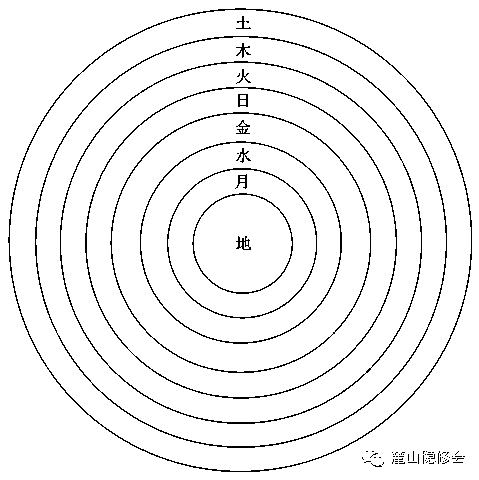

如图所示，古代都是以地心说为基础的，我们居住在大地上，所有的天体都绕地旋转。但是这些天体和我们的距离是不一样的，有远有近，其中离我们越近的行星运行越快，离我们越远的行星运行越慢。那么它们从近到远分别为月亮、水星、金星、太阳、火星、木星和土星。这个顺序被称为“迦勒底星序”，很重要，你们要记住。

其中，每个行星都有自己运行的一个“范围”，这个范围英文名叫 Sphere，我个人把它译作“界域”。每个行星都在自己的界域中运转，其中月亮的界域是最靠近我们的，也是最低的，土星的界域是最远离我们的，也是最高的。而越高的界域，就越接近“神”，或者叫“原动力”或“不动的动者”。

在这里，每个行星的速度，你们也是有必要掌握的，下面是一个表

| 行星 | 每日平均移动 | 每日最快移动 |
| 土星 | 2 分 1 秒 | 大约 6 分 |
| 木星 | 4 分 59 秒 | 大约 14 分 |
| 火星 | 31 分 27 秒 | 大约 44 分 |
| 太阳 | 59 分 8 秒 | 大约 44 分 |
| 金星 | 59 分 8 秒 | 大约 82 分 |
| 水星 | 59 分 8 秒 | 大约 1 度 40 分 |
| 月亮 | 13 度 10 分 36 秒 | 大约 15 度 2 分 |

这个指的是行星在黄道星座上的运行，第一节课说过每个星座 30 度，上面的度和分就是在星座的刻度上算的。你们不一定要费劲巴拉的记这些具体数字，但是你们应该直到行星大概多慢多块。比如月亮这货一天 13 度多，两天差不多一个星座，大概一个月走一圈，土星一天才走 2 分特别慢，29 年才能绕一圈，这种之类的。

那么这和上级行星下级行星的分类有什么关系呢？你们如果仔细观察就能发现，走的最慢的三颗行星是土星、木星和火星，最快的三个行星是金星、月亮和水星，太阳作为它们中间的行星，不参与到这种分类中。

所以说，走的慢的行星就是上级行星，走的快的行星就是下级行星。但是为什么？你慢吞吞你大啊？凭什么你走的慢就是上级了？你们看一下我之前所说的，越慢的行星就离我们越远，也就越高，高代表什么呢？越高代表越接近“神”，因此就越高贵，上下级的划分由此而来。

通常上级行星和下级行星相遇时，上级行星的力量会支配下级行星的力量。我们也可以这么理解，因为越慢的行星越崇高，所以更慢行星的影响会支配更快行星的影响。

这个图以及行星界域的概念是很重要的，一定不要忽视，古典占星的世界观中，它占了一个很大的部分，魔法以及其他神秘学也多少分享这种世界观。

今天的课到这里就结束了，下一节我开始详细说每个行星代表什么，以及哪类东西会归给它，希望你们好好掌握这节课的内容。

# 【课程记录】Blood magic

> 原文：[`mp.weixin.qq.com/s?__biz=MzAxMjY0NTYxOA==&mid=403040127&idx=1&sn=8a564be4e2548f633c6492fe83370eed&chksm=065fe2e231286bf46268a59ba79c13815eb95a95c4b29b26db90bbf74e3595e89df2c14be210&scene=27#wechat_redirect`](http://mp.weixin.qq.com/s?__biz=MzAxMjY0NTYxOA==&mid=403040127&idx=1&sn=8a564be4e2548f633c6492fe83370eed&chksm=065fe2e231286bf46268a59ba79c13815eb95a95c4b29b26db90bbf74e3595e89df2c14be210&scene=27#wechat_redirect)

**……又是一个要了很久的转载授权但是被我吃了好久的一个课程内容。**

**现在吐出来了。**

**还有一个课程我看看什么时候能吐出来。**

**————————————————————————————————**

**‍**

在介绍吸血鬼之前，我不得不提起左派.现代左派主要发源自德国,首先来一段黑魔法书的前言简介：

从此，黑暗的工作一书开始在世人中流传。

不必言明，它在新异教甚至是撒旦主义中培育而出最终席卷整个西方文明。“魔法便是魔法：它是黑是白取决于你用它做什么”右派实践者都害怕被贴上“撒旦主义”的标签，以及现代撒旦主义都被认为是危险的，狂热的异教徒或真正邪恶的人。这一切只不过是微笑着在心中唱了一首歌而已。

有一个古老的邪恶正长眠于大地之下，不过，这已经被我们数百万的游行所唤醒，我们制造谋杀并血洗了整个世界。它搅动起黑暗的迷雾渗透进入我们的世界，使年轻人沉醉于暴力和血腥，影响了世界各国领导人和军阀的判断，向我们呼吸的空气中喷出了仇恨。

这些是真正关于黑暗的作品，长年覆盖着灰尘充且斥着邪恶的权柄，等到唤醒了他们的力量和大量的恶魔就被称为黑魔法师。

自从有了黑魔法，人们第一次完全的隐藏他，并作为社会中最可怕的习俗之一。当这里出现了疾病、饥荒、恶劣天气、战争与杀戮或整个民族出现了瘟疫，为什么人们会关注一些孤独隐士或某些团体的独角戏？

直到最近黑暗者的作品携带感染他人的力量和疾病普散开来，这是无可争议的事实。带来暴风雨或干旱，左右战争的胜负，支配最无辜的人犯罪杀人或自杀。这是无法看见的邪恶，是无法形容的潜伏在人类历史阴影中的东西。

人们相信黑魔法是因为选择它是致命的。黑暗者的力量真实的像风暴一样席卷整片天空，几千年来那些力量都被认为是人类灾难的来源。

今天，在我们传播知识的时间，在过去我们是被诅咒的同时坚定的认为这是对真实世界的理解，很难去归类所有的反对与谴责，并将之标记并存档。虽然大部分人相信上帝，有的还在祈祷，但很少有人能聆听他的圣音看到他的使者。很少有人相信他的力量存在于此，我们的世界是讲究科学和证据的。目前只有少部分人指出，我们的世界是虚幻的精神的世界是真实的，并同时宣布自己作为“最高精神”预言这个地球上几十亿人的生命。

这里曾经有那么多个，现在只剩下了少数。

那些人从前有少部分是狂热的恐怖分子，但至少也是潜在的事件制造者。现在那些少数者能看到，看到和听到他们如此的有恃无恐。

令人惊讶的是，在一个没有神的世界，恶魔仍然兴盛。人们知道自己的脑袋里有些什么。这些古老的思想几百年压抑在科学和学院派之下，低声密语“邪恶的东西来了。”

这个低级层面的影响和原因有一个明确的对立面，所有的事物都有其相对的美德。一个必然是白天一个毫无疑问是夜晚，有阴影会有阳光，有强则由弱，这是白魔法也极有可能是黑魔法。
为了理解什么是黑魔法，为此我们先要去定义它的对立面。白魔法是在常规感官世界使用超凡的力量，有可能是人们使用最有利的形式。白魔法也是精神和仪式的艺术，伴随着力量、原型、实际和象征，它的本质是利他主义和仁慈。

这是一种爱，慈悲与光明降临在白魔法的使用者上。在圆中进行光明的工作，这是代表圣洁和威严所围绕的仪式。
白魔法是给予关爱，是提升自己的实力与使用神秘学的力量带来快乐和积极的发展。白魔法表现出来的力量，是仁慈的、正一的。
很少有人认识到白魔法的力量。甚至接受它们以成为一名白魔法师。法师有做这些事情的能力和责任。
黑魔法，对于魔法师而言可以带来明显有效的变化。这个世界上，所有人都无法接受的邪恶方法。黑魔法也是精神和仪式的艺术，伴随着力量、原型、实际和象征，它的本质是恶意的极端的。
当一个人召唤黑暗力量的时候，肯定会有邪恶蜿蜒的进入他的房间。那是一种令人窒息的黑暗，其过程无法预料和破坏。当撒旦恶灵站在魔法师旁边时，他会呼出腐烂的气息，用阴冷的目光注释着大地同时瑟瑟发抖。毫无疑问，这些是黑暗力量的使用。

在意识投射的瞬间，妖术师快速的唤来了地狱的邪灵，并给另一个人的生活带去了诅咒。通过在圣殿中尖叫，一个道冰冷的围栏降临在妖术师和救赎者之间。黑与白的界限清晰明了。

这些是黑暗者的工作。没有任何人敢断言，这不是黑也不是白，必须是临近地狱的边缘。应该好好的利用这些典籍，发现哪里属于天堂哪里属于地狱。

难以想象这条通往力量的捷径，如惊雷一般通向黑暗和邪恶直到成为黑魔法师，对良知的背弃已成势不可挡。这是一扇通往不可言喻之所在的门，那里一个强势则升格为神，软弱则化为尸骨。这是光与暗之间的划线，也是跨过它的步骤。

是的，这就是左派。Darkness 也就是黑暗工作者。吸血鬼本身属于熟练者才会涉及的内容，但新手也可以一开始就接触。在血魔法的概念中，流淌在我们血管中的暗红液体是最纯天然有力的，具备自我再生的功能，是连接上下层面最强有力的介质。

有人称，水晶是联通物质和能量之间的路径，也有人称其和心智有关，另有人称其为太阳、月亮或其他星体，认为这能联通神与人。没错，这属于自然魔法，于文艺复兴时兴起。但人们会利用草药、动物、矿石，却不会有人通过沉浸血液，或将血洒在地上来通向不朽。

随着天主教会的高度发展，在民间流行起给小孩洗礼的传统，最大的讽刺在于神让他的独生子为这个世界的罪恶而血祭性命。随着 20 世纪中叶部分撒旦主义的兴起，都市传说（鬼故事）开始上升到白热化的阶段同时被打压的撒旦崇拜仪式又开始恢复滥用，成千上万的超自然受害者一生都不会忘记他们在性和身体方面受到的虐待，精神上的改变，同时最大的受害群体不是成人而是孩子。民间神话传说是将真正获得力量的途径掩饰为血祭，而这种方法早被黑魔法师用来召唤邪灵；这些记忆的觉醒并非来自受害者之口，甚至来自于生命过去的古老回忆，也许从没有人真正理解这不过是一种隔代遗传的隐秘知识。有时我们的心智会将父母作为最恐怖的原型，这意味曾经父母为获得力量而牺牲孩子，人们为了避免面对这无法理解的事物，离开教堂和团体支持，新宗教精神分析学派将其称作新的自我辩解。

那些是虚构的回忆和美化的谎言，不管怎样，这都属于血的海洋。害怕和慌乱的背后是黑魔法师所酝酿的力量，只有极少数人会从过去的这种恐怖经验里解脱出来。民间传说和都市恐怖故事的背后，大都是一些等待提升的黑大师

所有围绕血液的神话和使用它的黑暗书籍中，涉及于此的吸血鬼是最臭名昭著的，当然大部分被美化过了。夜间出现的生物不再被视作邪灵控制移动的棋子而认为这是一种无法控制的本能，无意识的为黑暗者的君王提供服务，但现在却被修饰的像穿着亚曼尼和凡赛斯的绅士，饲喂他们否则就召来危险，它们的生命形式如同不死族一样。南美洲和苏美尔的 chupacabra（山羊吸血怪）和 Akhkharu（一种死而复生的怪物），取而代之的是莱斯特和德古拉。吸血鬼作为一种神秘艺术而忽略了过去现实中的原型，已经为社会上的游离青年、角色扮演游戏和非主流文化所盗取，沉溺于一种过去没有完全全新的邪恶形象。

吸血鬼的几种形式普遍存在于我们现代巴比伦（骄奢淫逸的生活环境），从金融家；勤劳工作的普通人家和具有宗教信仰的家庭中吸取生命，将教区居民的血液和灵魂装进金色的圣杯中。只有两种类型的吸血秘仪可以直接处理黑暗的工作，然而，如果没有这两个方法，黑暗中的永生永远不可能实现。

最容易辨认吸血鬼的方法是这两种吸血鬼的基础实践，或者吸血鬼会使用血液本身来作为力量的媒介。如果，假定贯穿整个宗教神话，那么血液就是真实的生命力，正是这种神秘的部分使得血液对黑魔法师如此重要，只要他探寻生命至上的力量。将血液保留给自己是没有什么功效的，对于人来说将其直接联通不朽，才会给人带来更大的殊荣。血，只是一个必要的媒介，一个基本的物质，那无形之物才是关键。

尽管被血玷污的吸血鬼总是声称其生来就是如此，从启蒙到实践全都建立在特定的明点上。如同青春期懵懂的性快感，感兴趣才会去实现，与之有关的主题是寻找材料，随着时间的推移会产生更多的形象和描述，一个白日梦就此展开。和自然的性乐趣不同，吸血秘仪是典型被禁止的。其满足和释放的方式不被社会所认可，但病理学主任会出售一些血液给初学者让他们有机会踏入血池。起初和他人讨论鲜血秘仪——真正的鲜血秘仪，有经验的实践者会在此过程中保持没有杂音出现，书全部都放在一边，甚至思想的声音也不能太大以免传播到全世界去（在精神世界里，没有距离的概念）

为了理清成为一个吸血鬼的步骤，因此要提及神话和民间故事，有野心的人（或受害者，视情况而定）必须预先存在一个吸他血的吸血鬼，必须让他人对饮血成瘾，必须把灵魂卖给魔鬼，这些内容作为小说越来越受到欢迎，一个人必须喝吸血鬼的血，从而摄取病变的基因。

正如前面提到的，大部分吸血鬼的夜间习惯和血腥实践从他们出生的那一刻就决定了。这更有可能是病变的基因，或人格中，在早期时代受一些环境原因或事件的影响，上述内容讲的是目前绝大多数人的生活。一些半吊子的吸血鬼会进入白日梦的状态，在现实中对自己造成伤害来吸食自己的血液，如静脉抽血，或简单的就是用针刺破手指。这些金属一样的味道会诱惑人喝血，即使只有一两滴，虽然在量上没有要求但重要的在于通过血液吸收能量，下一阶段就是观察自己的精神状态。

初学者很快会从自己的静脉中抽取血液，要么半途而废，要么寻求他人帮助，或者从他可以养活的人身上抽取。志同道合的人会聚集在一起准备一个测试场地，尽管有更多的血液探寻者吸引到这里被聚集“圈养”几个对从事吸血鬼行为感兴趣的人会在一起放血喝血。大多数饲养圈需要通过专业的血液测试资格才准进入，做好每个进入圈内的人的筛选工作，在圈内每个人都会被赐予名字。

虽然新手会体验到突破社会禁忌的快感，血液的味道可能会唤醒自己熟悉的隐秘事物，只有当他每次摄入超过几汤勺一次，血液的力量才会转移到个人身上。最初，力量的涌入似乎是一个“高潮”或一种兴奋状态，几近于无所不能的感觉。他身上的每一个细胞都会更有活力，身上的光辉比以往更甚，与此同时他会感觉到自己被压缩成一个更严密的空间，他自己的力量不再偏离他，仿佛没有热量的死尸，力量联通他相当于超越他。尽管他周围的世界开始变黑，夜晚的时间涌向他淹没他，初出茅庐的吸血鬼唤醒血液中的力量注入他体内。随着每次的喂食聚会，他的感觉变得敏锐，他的心理反应速度加快，以及他的身体更强了。当黑魔法师开始启动吸血秘仪，他会发现血液给他的仪式带来了额外的力量，额外的魔法力量。血液以最纯粹的形式在乙太层联通他和受害者。血液涌入进他的神殿。血液成为了提升他的催化剂。不论是否有能量通过饲喂进入仪式，吸血鬼都会用更好的方法去寻找自己的饮料，找到不情愿的——有时不愿意的——是最好的血液“捐赠者”。就像人会鸦片成瘾，他追求的终极体验总是会越来越甚，永远不会满意最后的结果。在某些情况下，这会导致他犯罪，以及超出自我的控制范围，他会觉得自己支配了全部的阴影。在一些案例中，黑魔法师会顺着自己的命运像旋风一般往上攀升。血腥的吸血秘仪可以延伸这一功能，并且会发现身上仿佛少了一些存在。作为媒介的血液会变成渣渣并被抛弃，离开吸血鬼并留下血液的精华。

这种行为就是所谓的超自然吸血秘仪，通过非物质的手段耗尽一个人的生命力，这是最简单的学习，对大师来说很简单，对于真正的吸血鬼而已，是无法抗拒的诱惑：

1、当第一次学习耗尽一个人的能量，偷窃对方的能量，你可能会需要一个自愿帮你的参与者。坦白的询问朋友、爱人、家庭成员或其他同伴让他们抬起右手，手心向下，站在你的左边。右手释放内在的能量，左手吸收能量进入自我。只要你没有特别阴险的坏名声，大多数人都不会抱怨你的行为。想象明亮的蓝色光线充满你的身体。吸气，想象这光从她的手臂向下移动，穿过她的手心，你的左手会感到发麻，说明对方已经进入你的身体了。呼气，并不是感觉能量回到她的体内，而是在呼气的过程中将其密封在你体内，成为你自己的生命力而不是对方的。继续，深吸一口气把能量从她那边吸过来，然后呼气将能量密封在自己体内。第一次吸血秘仪的实验会产生轻微的效果：你会有些高度集中的精神状态，你的受害者可能会有些轻微的晕眩和疲劳。你会发现你能够从较短的时间内让你的受害者消耗更多的能量，很快就会超过曾经吸血喂食的效率。

2、一旦你可以从受害者那里集中吸取大量的能量，只需要摇下对方的手，碰下对方的胳膊就可以，你使用超自然吸血秘仪的次数会越来越少。用相同的视觉化和呼吸技巧，站在一个不认识的受害者身边隔得稍微近点但不要碰到对方，然后开始汲取对方身上的生命力，某种程度上和上面的练习类似，从对方身上吸入能量然后密封在体内，仿佛这是你自己的一样。最初这需要高度的精神集中才能实现，但应该比以前的方法更容易掌握。每次从这样一个受害者身上吸取能量，但更多要把握你们两个之间的空间距离。不久，你就会发现你可以在一个房间里特定的吸收一个人的能量，后面走在大街上也可以做到这点。

3、与被害人有眼神的交流是最好的这需要你和对方长时间的坐在对面。最好的实验场所在餐馆、教室、酒吧以及典型的饲喂场所是神殿。我与一个吸血鬼熟练者在一个血液神殿工作学习，在每个周末的早上祈祷圣灵降下，饲喂就是吸取生命在每个方向挥发的能量。选择一个目标，然后盯准对方正面像他/她，当目标正面和你同一方向时，你就开始使用超自然的吸血秘仪；很少有在对方没看向你的时候能被你耗尽能量。当对方这么做的时候，尽可能长时间的与对方保持目光接触。现在你们双目相对时，感觉你们之间建立起了一种联系。将这个链接视觉华为蓝色会有帮助。你会发现比起以前的方法，现在更多的能量从对方的眼睛中流向你。只要你能就保持眼神接触，从对方的目光中吸收生命。看着其他人的眼睛，尤其是一个陌生人，任何长时间的接触都会让人感到不舒服。突破这个社会障碍以及你受害人的不适，你就能够打开对方的灵魂。她的精神会进入无意识的状态，直到眼神离开你时都会持续受到折磨。一旦对方转移目光，就另外选一个目标。当你能够从对方看你的一瞬间吸走能量，你就能处理视线内的任何一个人。

4、一次能够吸食多个目标，这种程度被称为“astral tendrils——星光触手”。这些触手如同自然的光线一样，蔓延攀附到对方身上，虹吸能量进入你的身体。仿佛梦如初醒的所见，触须从吸血鬼的光环上如同太阳光散射一样，有时会表现的如同灵媒附体一般。在派对、集会，甚至学校和工作中，选择两个目标，最好在你的两端。集中你的注意力，同时从他们两个身上吸取能量，试着用你的触手去触摸并吸食你的受害者；而不是用你的手臂，你的星体身躯会得到回应。一旦你能分开注意力以这样一种方式和星体进行运动，你吸食两个受害者的局面可能一开始就会呈现出压倒性。反复的进行练习，抽吸两个受害者不是容易的事，但你会发现你缺什么。移到三个目标也是同样的方法，对五个目标开始有意识的进食。此时此刻，被吸食的对象就会单独出现反应，不需要你有意识的命令他人的能量也会被你吸取过来，但这更多关乎于你的意识。此时你的星体身体就会被改造成一个抽水机。

当一个吸血鬼掌握了这些基础的方法就可以自行延伸很多变通，如同一个受害者同时面对好几个吸血鬼，在性爱中吸食，或捕食其他吸血鬼，等等。随着超自然的吸血鬼不断完善自己的吸食手段和机制，他会深化自己作为捕食者的存在，能够更深程度的吸食受害者，直到达到核心，吸食对方灵魂中的力量。

这是很重要的，虽然吸食本身是一种自发行为，黑魔法师要在任何方面都维护自己。他绝不应该成为吸取对方生命的奴隶，但应该将其作为使用的工具。盗取来的力量应该使用一部分，而不是不断的在内心凝聚和膨胀。

剩下的血仪式和血祭的方法，因为时间问题，下次再讲~

# 择日而行----执行咒语仪式的月亮阶段

> 原文：[`mp.weixin.qq.com/s?__biz=MzAxMjY0NTYxOA==&mid=403045116&idx=1&sn=78d3213508fce89b435a308be7867a43&chksm=065fff613128767734519ffcd52e52560defda77ca6bd4c1dbb9a6b54a3daca10757c116b59c&scene=27#wechat_redirect`](http://mp.weixin.qq.com/s?__biz=MzAxMjY0NTYxOA==&mid=403045116&idx=1&sn=78d3213508fce89b435a308be7867a43&chksm=065fff613128767734519ffcd52e52560defda77ca6bd4c1dbb9a6b54a3daca10757c116b59c&scene=27#wechat_redirect)

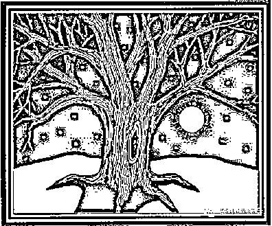

当我们想执行咒语的时候，往往会根据月亮阶段来制定计划，想要得到满意的结果，就需要耐心的等待合适的时间，合适的日子加上咒语会让过程进行的更加顺利，带来额外的力量。

**月亮的阶段**

**新月**

  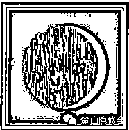

有时候也会叫做月牙，你会在天上看到的第一道银色的光芒，这个阶段的月亮促进新的开始，新一轮努力和新的关系，这是一个做出积极改变的时间段，寻找新的职业机会，新的想法，并且将获得收获。

**上升月**

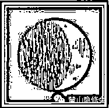

这个阶段，月亮会变得越来越圆，从新月慢慢变为满月的期间，力量也在逐渐增长，在这个阶段是充实自己的最好时候，你的知识、财富和人际关系。这也是可以考虑怀孕的时候，提升交流的时候——不管是生意的交流还是休闲娱乐的交流，也是解决经济上法律纠纷的时候（当然如果你想胜诉的话），这也是适合做愈疗的时候。

**满月**

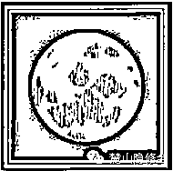

我们可以看到月亮的全脸了，这是她力量会充沛强大的时候，这是适合实践，活动，增加心灵力量，完善思想，“身行合一”，庆祝或者承诺和确定项目的时候。任何总类咒语的最佳时期。

**月亏**

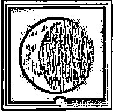

月亮在这个阶段将会从满月逐渐走向全黑，月亏是减少、释放、放手和结尾的时间。也是节食，改掉坏习惯，断绝关系和处理法律问题的最佳时间。

**黑暗月**

 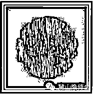

两到三天的时间，月亮在天上完全看不到的时候，黑暗月和新月往往被认为是同一个时间，但是对于我们来说，这是有区别的，在日历上黑暗月通常是一个黑点来表示，然而，黑暗月也发生在日历上标记黑点的点一天和后一天，这是放弃你再生活中不想干的事情，考虑你已经完成并且想在未来实现的大好时机。一个来寻找自我，或者自己偏好，解决问题的好周期。

# 占星基础第三课

> 原文：[`mp.weixin.qq.com/s?__biz=MzAxMjY0NTYxOA==&mid=403051092&idx=1&sn=9d8b0cbb2c91a0cb6a71be1c1c0b4d5d&chksm=065c17c9312b9edfae6511f24598fc4960c2239264a547ab637f10c386e948f871ca71616afa&scene=27#wechat_redirect`](http://mp.weixin.qq.com/s?__biz=MzAxMjY0NTYxOA==&mid=403051092&idx=1&sn=9d8b0cbb2c91a0cb6a71be1c1c0b4d5d&chksm=065c17c9312b9edfae6511f24598fc4960c2239264a547ab637f10c386e948f871ca71616afa&scene=27#wechat_redirect)

今天是第三节课，我带着你们理解行星的性质，以及它们所代表的事物，但是该要记忆的东西还是需要记忆，这方面不要想着走捷径。我会先叙述行星的基本性质，然后概述行星代表的事物，你们需要把这种性质描述和事物相联想，并自己进行推导。

首先我们说土星。土星是冷而干的、阳性、上级行星、大凶星。在所有的行星中，土星是运行最慢的，所以它和持久、缓慢、拖延、迟滞、僵化相关联。因为土星是大凶星，所以它在很多时候都倾向于带来麻烦和问题，而这种问题往往也是和拖延有关的。所以土星会把某件事情或者某个人限制在一种情况中，让它不能动弹，使事态胶着。因为土星有这种持久性，所以它也联系到坚固，因为坚固的东西才能稳定持久，也代表一切稳固和维持稳固的事物，此外它也联系到古老，代表着一切古老的事物。土星的英文是 Saturn，也就是萨图恩，是罗马神话中司掌农业的神祗。所以土星也和农业有关，延伸来说，土星与任何大地的事务有关。我们上节课提到过，土星的冷和干会破坏生命的诞生和生长，此外萨图恩也联系到地狱，因此土星也与死亡有关。此外，由于抵制万物的繁荣，土星代表贫乏、不丰足。

它代表的事物如下表所示：

| 颜色 | 黑色，深色 |
| 味道 | 酸涩，有刺激性，令人不快的味道 |
| 金属 | 铅 |
| 人物 | 老人，祖父，父亲，长辈 |
| 身体部位 | 牙齿，骨骼，皮肤，右耳，脾脏 |
| 地点 | 厕所，墓地，废墟，农场，洞穴，矿场，垃圾场，监狱，荒原，肮脏的地方 |
| 动物 | 大而行动缓慢的，黑色的，有毒的，生活在黑暗中的，生活在地下或岩石中的，有壳的 |
| 植物 | 黑色的，有毒的，腐烂的，生长在墓地的 |
| 职业 | 建筑师，园丁，哲学家，数学家，农民，隐士，陶工，矿工，乞丐，粗鄙之人 |
| 天气 | 多云，阴暗和寒冷 |

下面是木星。木星是热而湿的、阳性、上级行星、大吉星。可以看到木星与土星的性质是相反的，它们代表的很多事物也是这样。由于木星是热而湿的阳性行星，所以它有一种发散的特质，向外散发、传播、扩张，所以木星可以代表富有传播和扩张性质的事物。因为向外进行发散，所以木星也可以代表慷慨、仁慈、给予。由于木星为吉星，所以也联系到广义上的幸运、顺利。木星的热与湿有利于生命的成长，所以可以代表万物的繁荣、丰硕、富裕。通常情况下，木星与宏大的事物有关，你们可以理解为木星是太阳系中除了太阳最大的星体。除此之外，木星时常也体现出一些管理者的性质，木土身为最上级的两颗星，都具有这种类似的性质。另外，木星也与法律有关。

木星代表的事物为：

| 颜色 | 紫色，混合红绿的颜色 |
| 味道 | 甜的，美味的，可能带苦味 |
| 金属 | 锡 |
| 人物 | 管理者，孩子，孙子或孙女 |
| 身体部位 | 肝脏，肺，左耳，血液 |
| 地点 | 豪华的宅邸，法院，教堂，学校 |
| 动物 | 温和的，驯养的，体型大的 |
| 植物 | 果实多而丰硕的，传播性广的，繁茂的 |
| 职业 | 富人，贵族，法官，神职人员，理事，教师，政治家 |
| 天气 | 舒适，怡人，无风的天气 |

下面是火星。火星是热而干的、阳性、上级行星、小凶星。火星是极端的热和干，所以与另一颗凶星土星相比，火星带有更多的爆裂性。通常因为火星的性质，它联系到炎热、火焰、焚烧，因此代表一切炽热的事物。因为它是凶星，且具有更炽烈的性质，所以很多时候都会产生伤害、战争、冲突、争吵，它也因此联系到武器、利器、流血、杀戮、凶猛、侵占、掠夺等等。但从另一方面看，它也可以联系到勇敢和无所畏惧，不过往往也和叛逆以及与不服从有关。

火星代表的事物为：

| 颜色 | 红色 |
| 味道 | 苦味，辣味 |
| 金属 | 铁 |
| 人物 | 丈夫，哥哥，其他男性 |
| 身体部位 | 生殖器，血液 |
| 地点 | 屠宰场，熔炉，烟囱，铸造厂，铁匠铺，冶金工厂，手术室，火灾现场 |
| 动物 | 凶猛暴躁的，伤害人的，野生的，有攻击性的 |
| 植物 | 带刺的，辛辣的，红色或微红的，生在在炎热干燥的地方 |
| 职业 | 士兵，屠夫，猎人，外科医生，强盗，消防员，厨师，裁缝，理发师，铁匠 |
| 天气 | 火烧云，雷霆，闪电 |

接下来是太阳。太阳是热而干的、阳性、偏吉星，有时也会变成凶星。我们现在的人都知道太阳是太阳系的中心，其实古人也有类似的观念。你回顾一下上节课的行星界域图就会发现，太阳上有土木火，下有金水月，所以太阳位于七星的中心，被认为居于星中的王座（Throne）。所以太阳和权力、华贵、荣耀、统治有关系，因此联系到一切高贵和受人尊敬的事物，所以和社会地位以及名誉相关。因为太阳是光的来源，有了太阳世上的万物才能成长，所以太阳也代表了光明、光耀和生命力。太阳也联系到富有光泽的事物，以及宝贵珍惜的事物，因为太阳在群星中具有最高贵的性质。在占星中，只有两颗星与光有关，也就是太阳和月亮，因此这两颗星被统称为光体，在占星中具有非常巨大的重要性，但限于篇幅，我在这里不会延伸太多。

太阳代表的事物为：

| 颜色 | 黄色，紫黄色，红色，金色 |
| 味道 | 辛辣，尖刻的味道 |
| 金属 | 金 |
| 人物 | 父亲，丈夫 |
| 身体部位 | 生命力，心脏，脑，男右眼女左眼 |
| 地点 | 宫殿，壮丽的建筑，戏剧院 |
| 动物 | 王者的，威武的，生命力旺盛的，强大的，无天敌的 |
| 植物 | 喜光的，金黄色的，似太阳的，荣誉的 |
| 职业 | 贵族，国王，富豪，领导，德高望重者，展示者，官员，掌权者，伟人 |
| 天气 | 春冬小雨，秋天薄雾，夏天炎热 |

接下来是金星。金星是冷而湿的、阴性、下级行星、小吉星。金星是一颗阴性行星，所以相对于另一颗吉星木星来说，具有更加柔顺的特质，也更加被动一些。她是一颗联系到欢乐、喜悦和享受的行星，代表一切带来快乐的事物。金星和享乐有关，负面的情况下容易让人沉溺其中。金星的英文是 Venus，也就是爱与美的女神维纳斯，所以金星联系到女性，特别是外表靓丽的年轻女性，也和美丽、魅力、吸引力、爱情、婚姻等有关。金星作为与火星相对的吉星，可以弥合争端与不和，带来协调与和睦。金星由于联系到爱情婚姻，所以也可以很自然的联系到情欲和性生活。

金星代表的事物为：

| 颜色 | 白色，浅色，浅绿 |
| 味道 | 油腻，甜美的味道 |
| 金属 | 铜 |
| 人物 | 妻子，情人，母亲，姐妹，女儿 |
| 身体部位 | 肾脏，生殖器，腰部 |
| 场所 | 花园，洞房，床，音乐室，舞蹈学校，电影院，画展场所 |
| 动物 | 繁衍欲望强的，温顺的，可爱的，讨人喜欢的 |
| 植物 | 漂亮的，带好闻气味的，所有的花朵，有甜美果实的，浪漫多情的 |
| 职业 | 音乐家，艺术家，舞蹈家，画家，首饰珠宝商，布料商，妓女，淫妇 |
| 天气 | 南风，夏季晴朗，冬季雨雪 |

下面是水星。水星是中性的，偏向冷和干。关于水星的很多性质都可以从神话中理解。水星的英文是 Mercury，对应的神祗是墨丘利，或说赫尔墨斯。他是众神的信使，商人之神，雄辩之神，也是神话中有名的小偷和说谎者，后来又与埃及的托特神混为一体，是所有学科和智能行为的守护神。因此水星的含义包括沟通、交流、口才、商业、机敏、狡诈、欺骗等等，这都是可理解的。水星还和知识有关，它联系到占星、占卜、天文、炼金、写作等等，因此水星和学习以及思维紧密相关。墨丘利的节杖也是医学的标志，因此水星也和医药有关联。

水星代表的事物为：

| 颜色 | 杂色，灰色，蓝色，天蓝色 |
| 味道 | 混杂的味道 |
| 金属 | 汞 |
| 人物 | 弟弟，佣人 |
| 身体部位 | 脑部，脑神经，双臂，双手 |
| 地点 | 商店，市场，集市，学校，大学，医院 |
| 动物 | 发声的，狡诈的，聪明的，有策略的 |
| 植物 | 无气味的，提神的，作用于脑部的，有壳的，小而多的 |
| 职业 | 商人，医生，占星师，魔法师，小偷，作家，邮递员，杂技演员，会计，抄写员，传媒人士，律师，记者，程序员 |
| 天气 | 有风的，地震 |

最后是月亮。月亮是冷而湿的、阴性、下级行星、中性偏吉。月亮是另一颗阴性行星，可以代表女性，不过更偏向母亲的角色。由于月亮的冷湿性质，它天然联系到液体和水，所以她代表河流、泉水、大海、湖泊等等。月亮是阴性的天然象征，它是很偏像内敛和含蓄的，是被动而且易受环境影响的，所以月亮也象征柔软、不定形。此外月亮天然关联到黑夜，所以有时她代表一些神秘的事物。太阳和月亮是相对的一对行星，其中太阳象征掌权者，而月亮可以相对应的象征女王，或者普通的人民群众。由于月亮是运行最快的天体，所以和变动、出行有关，在古典占星中它也是旅途的自然征象星。

月亮代表的事物为：

| 颜色 | 银色，白色，浅色，带绿或黄 |
| 味道 | 咸味，清淡，略带苦味 |
| 金属 | 银 |
| 人物 | 母亲，妻子，女儿，姑姨，姐姐 |
| 身体部位 | 乳房，子宫，肠胃，膀胱 |
| 地点 | 产房，浴室，港口，公路，河流，鱼塘 |
| 动物 | 水生的，两栖的，喜水的，柔软的，夜行的 |
| 植物 | 多汁液的，圆形的，柔厚的，水生的，喜夜避光的 |
| 职业 | 助产护士，旅行者，渔夫，女王，平民，猎人，水手，酒鬼，流浪者，逃亡者 |
| 天气 | 依据碰到的行星确定 |

而关于龙头和龙尾：

龙头（Caput Draconis）又称北交点（north node），具有金星和木星的性质，被认为是吉的。

龙尾（Cauda Draconis）又称南交点（south node），具有与北交点相反的性质，被认为是凶的。

以上，就是每颗行星所代表的事物。在此你要注意，理解比死记硬背更加重要，因为这是一门很灵活的学科，时常需要根据情况做出变通。

行星的对应具有多重性，一颗行星可以对应很多事物。比如火星可以对应战争，也可以对应勇气、手术、利器等等。这种对应依据的是事物的特性，但是这种特性不一定是事物的全部，可能只是它的一部分。比如红色的玫瑰花，由于它是花朵，所以它对应金星，因为它是红色的且带有尖刺，所以也对应火星。这就是行星对应的部分性，单一的事物可能由很多部分组成，比如玫瑰花有颜色、有形状、有花瓣有刺，其中每一种部分都可能是由某个行星对应的。那么玫瑰花到底用什么来代表呢？这时候我们要抓住事情的本质，红色是玫瑰花的本质吗？不是；刺是玫瑰花的本质吗？也不是；玫瑰花的本质是花朵，所以虽然火星主管了它的红色和尖刺，但是它的本质还是金星。因此，在确定一件事是由什么行星代表时，一定要抓住本质，不要被无关紧要的东西迷惑。

不过需要注意的是，事物的本质也处于不停的变化之中，这是由它所处的环境决定的。我们打个比方，一张纸，当你用它写信的时候，它是沟通的媒介，因此对应水星；如果你把它做成纸制工艺品，它就变成了一种美化的饰品，归属于金星；要是你用它包住一些生活垃圾准备扔掉，它就成了一种限制和隔离垃圾的包装，这时候它是土星。

所以，这是一门很灵巧的学问，你不能死板，也不能硬套，要去慢慢摸索个中的逻辑，也要发展出自己的感性认知，因为很多行星的本质是可以意会却难以言传的。这节课就结束了，还是那句话，我希望你们好好掌握这节课所讲的内容，在基础概念讲完之前，我们还不能进入到案例的分析中，所以这个过程会是比较枯燥的，但却必不可少。

# 黑魔法基础【前戏】

> 原文：[`mp.weixin.qq.com/s?__biz=MzAxMjY0NTYxOA==&mid=403065973&idx=1&sn=36b3e8a48c913ba38d1415eacb23e1fa&chksm=065c49e8312bc0fedab353e4e58a3b4de87042ec7b9cb2213ebabbd35b8646b97a503187b4fa&scene=27#wechat_redirect`](http://mp.weixin.qq.com/s?__biz=MzAxMjY0NTYxOA==&mid=403065973&idx=1&sn=36b3e8a48c913ba38d1415eacb23e1fa&chksm=065c49e8312bc0fedab353e4e58a3b4de87042ec7b9cb2213ebabbd35b8646b97a503187b4fa&scene=27#wechat_redirect)

仪式的构成主要是什么？
比方，白泽空间里的手势和神姿，这是一个用身体语言来表达的象征，
神名和咒语更是。
仪式进行的内容，就是组合一些有用的，你需要的象征，将这些
象征来用戏剧性的形势来表达一个指令，没有什么比这更能唤醒魔法
师潜在力量并使其意识朝着一个明确的目标进行投射
仪式魔法仪式魔法，就是用仪式来发挥起你的内在意识能量，用你
的意志去和宇宙的大意志传递你的需要，当你往一个明确的方向（目
标发力时），这就叫投射。
当然，在进行仪式前，必不可少的是净化与准备，准备我们暂且不提
但不论是哪个体系，净化的前提都是洗澡
洗澡的时候有祈祷文，祈祷文里可能有神名
而每个体系的神名都是不同的，祈祷文也不想同
因此呢，要做仪式就必须要搞懂你所使用体系里的象征
因为人对于未知的领域和世界的理解非常局限
因此，需要通过五感去体验魔法，以确保其方向不偏离，那些无法
用五官感知的方法并不存在。
因此，魔法的本质是和世俗生活无关的而是精神的操作。
有时候，我们的精神很不稳定，甚至不知道应该怎么找到适合的发力
点。
符号是用于精神和无限的大宇宙建立联系的媒介
其无法被看到、听到、摸到、闻到或品尝到，你可能说，这不是很
不找边际，有点不切实际吗？
那就看看阿拉伯数字：
数字也是一种符号且没有具体的存在，但仍旧是非常真实，它象征了
这个现实的世界和抽象世界的全部，因此是非常重要的象征。
故字母和单词也是如此
但，我们涉及的符号与深奥的数学（加减乘除根分）或科学无关，而
是邪恶的符号。
除了个别符印是为了召唤特定的恶魔，以及一些特定的材料可以刺激
感官朝着特定的目标体验，除此之外都是多余的
再来谈谈逆五芒星
倒五芒星是公认的“撒旦教符号”很多不知情的人称其为“邪恶之星”
或撒旦之印。
按照传统，正五芒星有一个向上的顶点，现代异教徒认为这对应了火、
水、土、风（四个属于较低的四个分角）和精神（最顶点的那个角）
逆五芒星也象征物质的元素，是一个追求世俗的符号，强调个人多过
任何一种灵性，这种解释只是单一的一种参考，现代还有更多的说法，
如形而上的五芒星颠倒后代表了价值的反转，对主流的叛逆。
Q：逆五芒星是否可以理解为另一种回溯源头
A：事实上只有一种回溯，向上就是最根源的，向下嘛，你可以理解
路西法堕落的那个故事，晨曦之星的坠落
早于希伯来圣经就有了五芒星的概念，这和摩西五经有关。在这种情
况下，五芒星的反转并没有什么影响反倒是对于六芒星的颠倒更让犹
太人觉得亵渎，包括现在的犹太教，对于六芒星这个象征也是怀揣特
殊的情感。十字军东征时，尤其是圣殿骑士团，将五芒星作为基督身
上五种伤痛的记忆。
总而言之，关于五芒星，你们还可以去看一看诗人的帖子，在古代是
没有讲正逆之分的，方向都是后人加进去的（魔法吧或者博客里的）
图像的性质是由其数值决定的，而不是某个具体的方向
现在还存有的一些在十字军东征前的德鲁伊教和一些异教部落，认为
五芒星是驱逐邪恶的符号，它的魔力可以保护一个人不受侵害。
撒旦教看来，基督的十字架是对异教的一种迫害：
因为这种迫害，使所有的撒旦教像启明星一样尖头反转向下，追求黑
暗。
Q：五芒星最早出现在哪
A：五芒星和五角星早于 3500 年前的美索不达米亚便能追溯其根源和
毕达哥拉斯派形而上学做出了延伸，但首次将其引入黑魔法的是法国
一位仪式魔法研究者艾利法斯·李维。在他的书中《Dogme et Rituel
de la Haute Magic》，后来由阿瑟·爱德华·韦特翻译了这些，题
目为“Transcendental Magic”
阿瑟·爱德华·韦特翻译的“Transcendental Magic”，里面写到：
下面说点阴谋论，因为，现代逆五芒的意义，就是从这些阴谋论里脑
补来的，李维，第一次以文学的形势，将五芒星写入黑魔法的操作。
也有一些来自基督教的背景——据说李维是一位被剥夺圣职的神父，
在天主教的神话当中，撒旦和五芒星的联系是非常明显的，
另一个则不太明显，然而更重要的还是过去李维在黑魔法中使用的倒
五芒星和有魔力的巴风特像，据称在圣殿骑士团的崇拜中，僧侣们激
进的组织了一个十字军东征期间守护秩序的宗教精英骑士，任务是保
护教会和人民。经过一段时间后，有人提出对圣殿骑士的动机和忠诚
表示怀疑。菲利普四世和克雷芒五世对圣殿骑士进行了审判，酷刑过
后的供词里，有提到他们膜拜巴风特像并进行了黑魔法。
有人多次宣称，圣殿骑士团也了解倒五芒星的象征，传说团长 Grand
Master Jacques de Molai 被烧死的时候，手里牢牢的抓着一个倒五
芒星的护身符，以此诅咒国王和教皇。国王和教皇不久逝世。
但是呢，圣殿武士的忏悔是真的倒不如说是逃避死亡的托词。
此外，假设圣殿武士的故事不完全是传说的话，那黑魔法中使用逆五
芒的例子就可以追溯到 1300 年前了
至少，书面的历史记载中，十字军东征时圣骑士团的悲剧可以和巴风
特像扯上关系，且倒五芒星也确实是象征邪恶的符号。

# 占星基础第四课

> 原文：[`mp.weixin.qq.com/s?__biz=MzAxMjY0NTYxOA==&mid=403099067&idx=1&sn=76de099f59b4faadddaf6e3ead8a826d&chksm=065cc826312b413012f46be53f3c6ddd743b2a559658bd58dff5f96cb4e13607a0ae853fa6a1&scene=27#wechat_redirect`](http://mp.weixin.qq.com/s?__biz=MzAxMjY0NTYxOA==&mid=403099067&idx=1&sn=76de099f59b4faadddaf6e3ead8a826d&chksm=065cc826312b413012f46be53f3c6ddd743b2a559658bd58dff5f96cb4e13607a0ae853fa6a1&scene=27#wechat_redirect)

在上一节课中，我已经描述了行星的性质，以及它们所代表的事物。如果你认真学习了这些内容，想必应该对行星的性质有了一个基本的了解。但是光是这样还是不够的，有一位叫做莫林（Morin）的占星名家曾经说过：“发觉任何行星的真实性质和基本性能都是很困难的”。那么他为什么这么说呢？

我们都知道，行星在黄道星座上周而复始的运行，那么它在某个时候肯定会位于黄道的某个位置上。而实际上，这个黄道的位置也有自身特定的性质，这种性质会修饰落在这个位置的行星。所以，行星就会被星座修饰和形容，我们在进行占星判断的时候，也必须要考虑这个要素。那么如果想要弄清楚行星受到了何种影响和修饰，首先我们就需要了解每个星座的性质。

星座的性质可以说是一个混合体，也就是说每个星座的性质都是由几种性质混合而成的，这些性质大体包含三种：元素、模式和行星。那么我们一个个来看。

首先是星座的元素性质，每个星座都对应火、风、水、土的其中一种元素，相应的，这个星座也会带有这个元素的性质。那么我们先看一下星座对应的元素都是哪些：

| 白羊 | 金牛 | 双子 | 巨蟹 | 狮子 | 处女 | 天秤 | 天蝎 | 射手 | 摩羯 | 水瓶 | 双鱼 |
| 火 | 土 | 风 | 水 | 火 | 土 | 风 | 水 | 火 | 土 | 风 | 水 |

看到了吧，元素的排列是按照火、土、风、水的顺序循环往复的，关于为什么要使用这个顺序也有原因，比如中世纪的占星师波那提（Bonatti）就在他的作品中提到过这种解释，但是限于篇幅，我们在这里暂且略过。

下面我给你们一张图来更直观的观察：

其中每张图都标出了一组星座，你们可以发现，同元素的星座可以连成一个等边三角形。这样的一组星座就叫三分星座，这种关系也叫做三分性，我们在后面还会讲到它。其中火象星座和风象星座是阳性星座，其他的是阴性星座，这和行星的阴阳之分是类似的。

下面我就叙述一下元素的性质：

火：热而干的，暴躁、积极、发光发热、冲动、勇敢、攻击性、主导欲

风：热而湿的，动态、交际、联系、好奇心、智能、沟通

土：冷而干的，实际、官能、构造、建设、稳固、有组织、注重实效

水：冷而湿的，易变、不稳定、易受影响、情绪化、感受、抚慰、安全感

当行星落在对应的星座时，这颗行星就会受到这种元素性质的影响和修饰。我打个比方，比如太阳代表父亲，如果太阳落在火象星座，那么就代表父亲拥有火元素的特征，也就是暴躁、积极、冲动、勇敢等等。这不只可以应用于人物的描述上，对于物体和事件也是同样的思路，我在这里就不多说。

星座的第二个性质是模式，根据本位、固定和变动将星座分为三类，每类四个星座，其中星座对应的模式如下：

| 白羊 | 金牛 | 双子 | 巨蟹 | 狮子 | 处女 | 天秤 | 天蝎 | 射手 | 摩羯 | 水瓶 | 双鱼 |
| 本位 | 固定 | 变动 | 本位 | 固定 | 变动 | 本位 | 固定 | 变动 | 本位 | 固定 | 变动 |

其中每个星座都对应一种模式，按照本位、固定和变动的形式循环。你如果观察前面的元素星座划分就会发现，每组元素星座都含有一个本位星座、一个固定星座和一个变动星座。比如白羊是本位星座，狮子是固定星座、射手是变动星座，而它们都是火象星座。其他星座也同理。

下面我也给你们一张图来比较直观的进行观察：

下面说一下这三种模式的含义。本位、固定和变动在古典占星中联系到三种行为：

本位是积极、创造力、离心性、行动

固定是持久、收缩、向心性、反应

变动星座是本位和固定之间。

当行星落在星座时，也会受到这种模式的影响。通常情况下，这种描述比较多用于事态的描述，当然也可以用于个人特质的方面，但是相对不如现代占星那么侧重。打个比方，金星代表婚姻，如果金星落在固定星座代表婚姻持久。其他的情况也以此类推。

星座的最后一个性质是行星的性质。在占星中，每个星座都被一颗行星所主管。而被行星主管的星座也带有这颗行星的性质，会因此修饰落入这个星座的其他行星。那么我们来看下星座的守护关系如何：

| 白羊 | 金牛 | 双子 | 巨蟹 | 狮子 | 处女 | 天秤 | 天蝎 | 射手 | 摩羯 | 水瓶 | 双鱼 |
| 火星 | 金星 | 水星 | 月亮 | 太阳 | 水星 | 金星 | 火星 | 木星 | 土星 | 土星 | 木星 |

这个守护关系其实也是有规律的，如下图：

你们看一下，我们把星盘转一下，让巨蟹座和狮子座在最下面。这时候我们可以看到，最下面的两个星座是日月守护的。狮子座和巨蟹座两边是是双子座和处女座，都是水星主管的。再往上的两边是金牛座和天秤座，都是金星主管的。接下来是火星，再下来是木星，最后是土星。你们可以发现，水星、金星、木星、土星这个顺序正是按照迦勒底星序排列的，当然，在这里不计日月。

这个图我们以后还会用到，目前就先说到这里。当行星落在某个星座时，它也会受到这个行星的主管行星影响。这就是星座的三重性质混合，当然，还有很多更复杂的因素需要考虑，我在这里暂且不提，你们先把这些主要的掌握。

接下来是一些星座额外的特性，你们也需要进行了解，我已经列成了表格：

| 双体星座 | 双子、处女、射手、双鱼 | 代表数量多 |
| 肥沃星座 | 巨蟹、天蝎、双鱼 | 代表繁育、丰足、善于养育 |
| 贫瘠星座 | 双子、狮子、处女 | 代表荒芜、不繁茂、不利生育 |
| 无声星座 | 巨蟹、天蝎、双鱼 | 代表沉默、不发声 |
| 高声星座 | 双子、处女、天秤 | 代表话多、有声音 |
| 人性星座 | 双子、处女、天秤、水瓶 | 代表谦和、易于相处 |
| 兽性星座 | 白羊、金牛、狮子、射手的后半部分、摩羯 | 代表野蛮、为人处事不合理 |

星座对行星的描述作用就说完了，但是星座还没说完。除了对行星进行修饰和描述之外，星座还有另一个角色，就是对行星的力量和状态进行评估，这种评估系统叫做本质尊贵（Essential Dignity）和本质无力（Essential Debility），这两个名词还有其他的译名，但是我都不是太满意，所以暂且选了这个比较直译的版本。

那么什么是本质尊贵和本质无力呢？实际上它是一种对行星力量和状态进行评估的方法。当行星在星座上获得更强的力量和更好的状态时，就称为行星获得了尊贵，当行星在星座上力量衰弱且状态糟糕时，就称为行星是无力的。这种状态的评估共有 8 段，从高到低分别是入庙、擢升、三分、界、面、游走、落陷、失势。

如图，这个表就是对行星力量的图示。我们来挨个说。

表格的左数第一排就是十二个星座。表格的左数第二排是守护星座的对应行星，也叫做入庙星座，如果一颗行星进入它所守护的星座，即为入庙的尊贵，我们会给予它+5 分的评价。比如火星落在白羊座，金星落在金牛座等等。

表格的左数第三排是行星对应的擢升星座，如果行星落入它们特定的的擢升星座，即为擢升的尊贵，我们给予它+4 分的评价。比如表格中白羊座对应太阳，那么白羊座就是太阳的擢升星座。

表格的左数第四排的尊贵叫做三分，这个尊贵你们可以看到有两颗星。其中你可以看到一颗是 D，主白天，另一颗是 N，主夜晚。当行星落在对应的三分星座时，就称为获得了三分的尊贵，我们给予它+3 的评价。比如太阳白天落在白羊座，木星晚上落在白羊座。

表格的左数第五排的尊贵叫做界，这个尊贵是星座的划分，你可以看到在这一排中每个星座被划分为五个不相等的部分，每个界都有一个行星主管。我们拿第一排白羊座举例，它的 0 到 6 度是木星主管，6 到 14 度是金星主管，14 到 21 度是水星主管，以此类推。当行星落在对应的界时，这颗行星就被称为获得了界的尊贵，我们给予他+2 的评价。

表格的左数第六排叫做面，这个尊贵也是星座的划分，你们可以看到每个星座被分割为三个相等的部分，每个面都有一个行星主管。比如白羊座的 0 到 10 度是火星，10 到 20 度是太阳等等。当行星落在属于自己的面时，我们称它具有面的尊贵，给予它+1 的评价。

表格的左数第七排叫做失势，是一种无力的状态，这种状态与入庙相反。比如火星在白羊座入庙，那么如果火星位于白羊座对面的星座天秤座，就被称为失势，我们给予失势的行星-5 的评价。

表格的最后一排叫做落陷，也是一种无力的状态，这种状态与擢升相反。比如太阳在白羊座擢升，白羊座的相对星座是天秤座，那么当太阳落在天秤座时，就被称为落陷，我们给予它-4 的评价。

当行星没有这五种尊贵状态和两种无力状态，就被称为游走，此时可以给予其 0 分的评价。

基本上来说，当行星获得尊贵越强时，它会越有力量，获得越多的资源，越有效率的运作，也能更好的活动，地位变得崇高，处于有利状况下。当行星无力时，情况就会相反。举个例子，火星可以代表刀具，那么入庙的火星就可以代表锋利的刀具，失势的火星就可以代表生锈或卷刃的刀具。金星代表婚姻，入庙的金星就可以代表稳定愉快的婚姻，失势的金星就是不顺利性质不好的婚姻。等等以此类推。

但是你们需要注意，行星的尊贵和无力是非常微妙和复杂的概念，它的含义是非常丰富的，不是简单的三言两语就能说清楚。但是，在初学阶段，我们没有必要搞得太过复杂，所以点到为止，但是你们要记住，实际上它是有很多说法的，版本也不一，但我们在这里没办法给你们一一说到。

到这里，我们就接近尾声了，但是星座还有最后一个角色。这个角色和行星类似，行星可以象征代表某些事物，星座也是相同的。但是这种象征相对来说比较局限，一般我们常用的是星座代表的方位、颜色和身体部位。这些我都列了表格出来：

| 白羊 | 混合红色的白色 | 东方 | 头部 |
| 金牛 | 混合柠檬色的白色 | 南偏东 | 脖子 |
| 双子 | 混合红色的白色 | 西偏北 | 手掌、手臂、肩膀 |
| 巨蟹 | 绿色或黄褐色 | 北方 | 胸部 |
| 狮子 | 红色或绿色 | 东偏北 | 心脏 |
| 处女 | 有蓝斑的黑色 | 南偏西 | 内脏、肠 |
| 天秤 | 黑色、暗红色或黄褐色 | 西方 | 背部下半部分 |
| 天蝎 | 棕色 | 北偏东 | 外生殖器 |
| 射手 | 黄色 | 东偏南 | 大腿和臀部 |
| 摩羯 | 黑色、黄褐色 | 南方 | 膝盖 |
| 水瓶 | 天蓝色 | 西偏南 | 小腿 |
| 双鱼 | 亮白色 | 北偏南 | 脚 |

到这里，这节课就结束了，你们要记住星座共有三种角色。第一它修饰行星，第二它评估行星的力量和状态，第三它代表了某些事物。在实际应用时，这三者是相对独立的。在后面讲到案例时，你们就可以看到这些概念是如何运用的了。

# 黑魔法基础第二课

> 原文：[`mp.weixin.qq.com/s?__biz=MzAxMjY0NTYxOA==&mid=403115620&idx=1&sn=2f042f7607c2c47bb6ddd2879fdfa814&chksm=065d0bf9312a82efeaca77a5bab1185477d75bcef0cab91f87a594ddca57357c56996f56d1e1&scene=27#wechat_redirect`](http://mp.weixin.qq.com/s?__biz=MzAxMjY0NTYxOA==&mid=403115620&idx=1&sn=2f042f7607c2c47bb6ddd2879fdfa814&chksm=065d0bf9312a82efeaca77a5bab1185477d75bcef0cab91f87a594ddca57357c56996f56d1e1&scene=27#wechat_redirect)

巴风特魔符
上节提到，安东勒维将逆五芒星称作巴风特魔符，艾利法斯·李维给
巴风特设计了更具体的图像，但要用作实际的巴风特形象，这个图像
还是不够完整且有些模糊。一个倒立的五芒星，外围环绕着两个同心
圆，和五个希伯来字母，正好拼写出“利维坦”的名字。
1980 年初英国出现了一群撒旦崇拜者，宣称其崇拜的传统源自于阿
尔比恩的太阳崇拜，他们的目的是通过出版仪式和教义的内容，以此
告诉大家真实的黑暗。我曾经找过英国那边的资料，可惜问了一个美
国的撒旦教徒，却得到“邪灵崇拜之后再无撒旦崇拜，真正将撒旦教
哲学法阳光大的是安东勒维，撒旦教和过去的撒旦崇拜不同，只好作
罢，

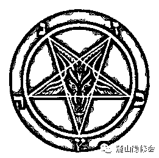
1980 年初英国出现了一群撒旦崇拜者，宣称其崇拜的传统源自于阿
尔比恩的太阳崇拜，他们的目的是通过出版仪式和教义的内容，以此
告诉大家真实的黑暗。我曾经找过英国那边的资料，可惜问了一个美
国的撒旦教徒，却得到“邪灵崇拜之后再无撒旦崇拜，真正将撒旦教
哲学法阳光大的是安东勒维，撒旦教和过去的撒旦崇拜不同，只好作
罢，在出版前，通过左派路径提升自我都是口耳相传的内容。
ONA 大量公开了历史中许多有关巴风特的神秘学资料，现在截取一段

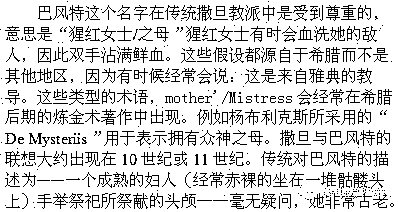

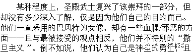

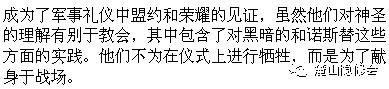

“猩红女士”
这里 ONA 提供了不同于勒维的巴风特像，该巴风特就是一个拟人化羊
头人身的石像，有着女人的大胸脯和一对偶蹄，这里 ONA 提供了不同
于勒维的巴风特像，该巴风特就是一个拟人化羊头人身的石像，有着
女人的大胸脯和一对偶蹄，这山羊头代表了邪恶的力量，雕刻在额头
的符号是艾利法斯提供的用以代表感官的统一（视觉化、听觉化、嗅
觉化、触觉化、感知）。这五种感官的体验正是神智学所提出的，将
这五种感官的体验相互联合，那么就象征完全掌握仪式的奥秘，在魔
法中这代表了阴阳两性的合一，代表着人与野性，卑贱和神圣。（可
能看到这里有人会想起克劳利）猩红女士是最黑暗和残酷的象征，且
极富魅力。她是邪恶的女神，她象征逆五芒星，该象征完全是邪恶的，
倒五芒星以及成了象征能量的同义词，也是巴风特的象征。关于猩红
女士或安息日山羊，没有什么书面记载，目前仍存有一些等待验证的
地方，关于猩红女士或安息日山羊，没有什么书面的历史记载，仍存
有一些等待揭示之处。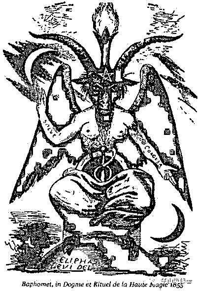
只有在最黑暗的仪式里，巴风特会被浸泡在血液里，且这个五芒星的
符号要被画在魔法师的眉心处，黑魔法师们相信，终有一天她将
广为人知（貌似已经做到了）
逆五芒星更多是对正义的扭曲，然而这是禁忌的、黑暗的、真正危险
的东西。它寓意着自身成为主人，不再弯腰屈膝和破坏所有，不惜一
切提升自我
关于结果
这里要补充，所有的左派都是为了唤醒最高地位的恶魔“利维坦——
也可能是其他王储”去推翻天堂，路西法派的就是唤醒路西法，龙魔
法就是唤醒利维坦大蛇，在这里，我主要偏向巴风忒，李维亲自在巴
风特符上写了利维坦的希伯来名，象征深渊之水中的巨蛇，所以，左
派修到最后，就要放弃身体，灵魂进入深渊去唤醒利维坦，这也是
ONA 体系中最后的步骤。当然，你也可以把魔符上利维坦的名字写成
其他地狱王子的名字，Belial（贝利尔）：“Without a Master 没
有外在的主人”
Without a Master 的意思就是，不认可外在的君主，成为自己的
掌控者，不再归属于上主
黑魔法师宣称，“没有什么伟人是我不能超越的”，所有的恶魔，天
使，灵体，人类，动物，矿物，甚至神的存在都可能是为黑魔法大师
而服务的，尽管黑魔法师能影响并控制人的环境和生命，将恶魔召唤
到外界显现具体的形象，带来财富变为私有，但这些只有熟练者可以
办到。
逆五芒星的内部结构包含了一种禁忌的自由意志权利。唤醒地狱，推
翻天堂，事实上，这是我偏爱尼采的原因，详细请翻阅《强力意志》
中，有关上帝之死的篇章，在 18/19 世纪时，由于柏拉图式形而上学
被推翻，导致一大片虚无主义的出现，给欧洲社会带来了颓废。因此，
彻底的毁灭教会的哲学，并构建新的最高价值，重建新的形而上学就
成为了尼采的目标（德国古典一脉相承的主题）
柏拉图主义的核心公式就是，爱=美德=理性=幸福，当这逐渐被利用
成为一种道德的约束时，不幸也就随之产生了，因此，自由意志（超
人哲学）就应运而生
基本上，黑魔法师都是报着这种目的去实践的，战栗的逼真的逆五芒
星才是巴风特真正的样子。一旦你停止用眼睛去观察，你的心灵就会
瞬间捕捉到意识无法理解的东西，一旦黑暗的工作开始进行，黑暗的
力量就会从符印中流入魔法师的身体，逆五芒星会阐述它真实的奥
秘。

# 占星基础第五课

> 原文：[`mp.weixin.qq.com/s?__biz=MzAxMjY0NTYxOA==&mid=403153437&idx=1&sn=1073a10e8c1efcd602aa67abbd95c5bd&chksm=065da780312a2e96e78efcd03661372c8d59078ec8c1dd9acd72be0517bd3f6b378e63a355a5&scene=27#wechat_redirect`](http://mp.weixin.qq.com/s?__biz=MzAxMjY0NTYxOA==&mid=403153437&idx=1&sn=1073a10e8c1efcd602aa67abbd95c5bd&chksm=065da780312a2e96e78efcd03661372c8d59078ec8c1dd9acd72be0517bd3f6b378e63a355a5&scene=27#wechat_redirect)

在说完了行星和星座之后，这节课我们将会讲到宫位。上节课我们说到，行星的性质往往被星座的性质修饰，而且它本身的力量和运作也会受到星座的影响，那么如果想知道这种受到影响后的行星力量到底体现在哪个方面，我们就需要考虑宫位。

第一节课我就说了，宫位和星座相同，它们都是一种坐标系，其中行星会落在某个星座，同样也会落在某个宫位，当行星落在一个宫位时，它就会混合所在星座的性质对这个宫位产生影响。那么首先，我们需要知道每个宫位都代表什么。

| 第一宫 | 问卜者，问卜者的身体、外貌、性情、能力，问卜者所属的整体，问卜者支持的集体 |
| 第二宫 | 财务，资金，动产，所有物，顾问，食物 |
| 第三宫 | 兄弟姐妹，邻居，短途旅行，知识，基础教育，信件，流言 |
| 第四宫 | 父亲（或双亲），祖先，不动产，房屋，结尾，地下的事物，最低点 |
| 第五宫 | 快乐的事，赌博，聚会，运动，孩子，受孕，性爱，信使 |
| 第六宫 | 疾病，医院，下属，劳碌，小型的动物 |
| 第七宫 | 伴侣，恋人，合作伙伴，公开敌人，交易方，顾客，任何不归属于其他宫位的人 |
| 第八宫 | 死亡，他人的钱财，遗嘱，遗产，恐惧与痛苦 |
| 第九宫 | 宗教，长途旅行，外国，高等知识，梦，占星 |
| 第十宫 | 权威，领导者，政府，荣誉与成功，母亲，事业 |
| 第十一宫 | 领导者的财产，意外之财，希望，朋友，税务 |
| 第十二宫 | 秘密的敌人，巫术，秘密，恐惧，大型动物 |

熟记每个宫位的含义是很重要的，因为你要根据不同的问题，而去观察不同的宫位。比如有人来问你关于财务的问题，财务是 2 宫主管，那么在这个问题的星盘中你就要观察第 2 宫。

如果你看到在这个时候，火星落在第 2 宫。火星本身是凶星，那么它就会对第 2 宫代表的事项产生影响，也就是财务、不动产，那么你就可以判断对方会破财。当然，在这个过程中你需要加入星座的影响，比如火星天蝎是入庙，代表强力和有效率的运作，那么这个破财的风险就减低了，有可能是依照火星的方式去获得钱财，比如手术、争斗、铁器相关等等。

在这里我们还必须提到一个 5°容许度的概念，在古典占星中，如果一个行星落在某个宫头的 5°范围之内，那么它会被视作这个宫位的行星，而不是上一个宫位的行星。我们举个例子：

比如这个星盘里被圈上的水星，它在双鱼座 13°55′，而 11 宫的宫头是双鱼座 14°28′，这时候两者非常靠近，在 5°的范围内，所以水星是下一宫 11 宫的行星，而不是第 10 宫的行星。

我前面举了个例子，2 宫主管金钱，那么你看一下 2 宫里落入什么行星，就可以了解相关的财务状况。那么，我要是想知道父亲的财务状况，该看哪个宫位？看母亲的财务状况，又要看哪个宫位？这时候，我们就需要“转宫”。

转宫是什么意思呢，就是把某个宫位看作是第一宫，然后顺布 12 个宫位，它们的含义也会产生变化。举个例子，比如我们要用 4 宫来转宫，那么我们就把 4 宫作为第一宫，那么 5 宫就是 4 宫的 2 宫，6 宫就是 4 宫的 3 宫，7 宫就是 4 宫的 4 宫，以此类推。

你们可以看下上面那个表，4 宫代表什么呢？代表父亲，2 宫代表什么呢？代表金钱。那么 4 宫的 2 宫，理所当然就代表了父亲的金钱，也就是说 5 宫代表了父亲的钱财。那么父亲的兄弟姐妹就是 6 宫（4 宫的 3 宫），父亲的房子就是第 7 宫（4 宫的 4 宫）。其他的以此类推

行星除了会影响宫位之外，也会受到宫位的影响。宫位会影响行星的力量，但是这种影响和本质尊贵的影响是不一样的。在上一节课说过，行星在星座上有一种被称为本质尊贵的状态，尊贵越强，行星的力量越强，但是这种星座对行星的影响，是会改变行星的性质的。而宫位对行星的影响，只会改变它的力量强弱，却不会改变它的基本性质。

其中依照力量的强弱，我们可以把宫位分为角宫、续宫和果宫：

| 角宫 | 1、4、7、10 | 落入的行星发挥约 100%的力量 |
| 续宫 | 2、5、8、11 | 落入的行星发挥约 50%的力量 |
| 果宫 | 3、6、9、12 | 落入的行星发挥约 25%的力量 |

文艺复兴时期的占星师威廉·利里在书中给出了一种宫位力量排序，可以参考，这种排序从强到弱为：1、10、7、4、11、5、9、3、2、8、6、12。我们以后有机会会再讲到这种排序的依据是什么。

好了，你们要理解，行星和星座混合对宫位施加影响，而宫位反过来影响行星力量的强度。除此之外，宫位还有一个至关重要的角色，就是找出所谓的“征象星”。

什么是征象星呢？征象星就是代表某件事物的行星。我们在第三部分课讲了行星分别都代表什么事物，比如太阳代表权力、国王、荣耀、黄金等等，那么反过来说，因为它代表这些事物，所以太阳就可以被称为这些事物的征象星。而这种征象星，我们叫做“自然征象星”。

但是在卜卦占星中，有一种更加重要的征象星，这种征象星叫做“宫位征象星”。宫位征象星有很多种表现形式，我们在这里只说两种，分别是“宫主星”和“宫内星”。

什么是宫主星呢？我们观察一个宫位，看它的宫头落在哪个星座，再看这个星座的守护星是什么，那么这个行星就是此宫位的宫主星，此时，这颗行星除了它本身代表的东西之外，它还可以代表此宫位的事项。举个例子：

第一宫的宫头，也就是星盘最左面的粗线条，落在射手座 21°45′，射手座的守护行星是木星，所以木星就是第一宫的宫主星。木星可以本身代表财富、丰裕、法律，而除了这种它原本就具有的含义之外，由于它是第一宫的宫主星，所以也具有了第一宫含义，因此在这张星盘中，木星也代表问卜者。

你要能够辨认出这种征象星，这是十分重要的。特定的问题需要分析特定的征象星。比如有人询问你关于工作的问题，工作是第 10 宫代表的，那么代表工作的征象星就是 10 宫主星，这个时候你就要分析 10 宫主星的状况，从而就可以得知问卜者工作本身的状况。

而另一种宫位征象星就是宫内星，宫内星很好理解，就是落在某个宫位的行星。当某个行星落在特定的宫位时，它也会成为这个宫位的征象星。比如上面那个图，火星落在 11 宫，那么它就成为了 11 宫的征象星，可以代表朋友、希望等等。

了解如何选出征象星是非常重要的，征象星有两种，自然征象星和宫位征象星，其中，宫位征象星是更加重要的，当然自然征象星也不能忽视，在有些时候，这两种征象星是互补相关的，也就是说，有时你可以适当结合宫位征象星和自然征象星，找出最能代表事物的征象星。当解读一个卜卦星盘时，找出征象星是前提的第一步，也是非常关键的一步。

# 书籍推荐《1984》

> 原文：[`mp.weixin.qq.com/s?__biz=MzAxMjY0NTYxOA==&mid=403173092&idx=1&sn=3ff9f189f21b43ae2ceac824a6db90a1&chksm=065deb79312a626fe347de37d47f05b9851ddddfe3772836fd5c9b351f615f009e29ea970054&scene=27#wechat_redirect`](http://mp.weixin.qq.com/s?__biz=MzAxMjY0NTYxOA==&mid=403173092&idx=1&sn=3ff9f189f21b43ae2ceac824a6db90a1&chksm=065deb79312a626fe347de37d47f05b9851ddddfe3772836fd5c9b351f615f009e29ea970054&scene=27#wechat_redirect)

我不知道，什么样子的书才算是一本好书。

但是我知道的是，若是真的是一本好书，都是一种有着自己的寓意在里面的。

就像是《1984》、

这是一本战后的文学作品。

1949 年六月出版，描述的是一个在三十多年后，也就是 1984 年时候的一个科幻幻想般的故事。

这样的科幻，其实确实是我见过的最不像是科幻的科幻了，他确实有着一些关于未来的幻想，也有着一些关于未来科学技术的想象在里面，但是主题却是以“反乌托邦”的内容展现在人们眼前的。

进行处罚的“友爱”部，修改事实，传播虚假的“真实”部，管理战争的“和平”部，以及控制生产和分配的“富裕”部。

四个部门，却对应着自己根本名不副实的名字。

整个世界也被分成了三个国家，而且这三个国家全部都是社会主义国家。

所有资产国有化，资本主义已经成为了历史存在，就是无产阶级也“不是人”，只有“共产党”才可以做一点实事，加入四个部门。

不过这个可不是什么好差事，在他们的家里面，在全国的各地都装有电屏，专门用来监视每个人。

在这个社会主义国家里面，就是夫妻之间的性行为也变成了一个应该被遮羞的故事，如果可以的话，国家甚至打算实行完全禁欲行为，只是试管制造婴儿。

整个世界也都处于战争中，而且是没有目的的战争，他们偶尔和其中一个国家联盟，去打另一个国家，有时候又是和那另一个国家联盟，一旦是出现了改变联盟的事情，那就是真相部的工作了，他们要改变以前所有的报道，仿佛这个联盟一直存在一样。

就是富裕部，如果生产计划没有达标，就会让真相部修改以前的计划，让整个事情变得好像是超标了一样，当然就算是生产计划实现，多半也是一个虚报的数字。

而整个国家里面，最厉害的就是老大哥。

他是所有人的老大哥，就像是一个大哥哥一样管理着大家。

至少设定的设定是这样子的。

整个故事中，充斥诸如此类的滑稽以及怪诞一般的故事。

而主角，最后发现了这一切的不对，不知道是觉醒了，还是最后终于受不了，打算进入到反动派里面去。

至于结局，其实并不重要，但是还是说一下，他最终还是被老大哥手下的人抓住了，洗了脑，判处了死刑。

而整个故事体现出来的世界，我才觉得，这是《1984》在走过了 1984 年之后，还走到今天，依旧是一个科幻神作的原因。

它并不需要什么很厉害的机器，甚至一些高科技的设备。

人们没有登上月球，土星之类的，发现了另一个生命体，然后进行了一系列的星际争霸。

它只是单纯的在讽刺。

而这个讽刺，即使是今天看起来，也会有种后怕的感觉。

从最开始的苏联经济体制，到中国的大跃进以及文革时代，进入到现代的朝鲜。

整个故事，讽刺的是正在发生的，以及即将产生的社会主义制度弊端，如同一根针一样，刺入整个体制中。

仿佛在讽刺着整个传统社会主义制度。

只要你对历史有些了解，你就很容易和书中的世界产生共鸣，即使整个故事是虚构的，但是反映出来的现象却无比真实。

每当想起的时候，反而会有一种悸动，一种感触，一直徘徊在你的心头，挥散不去。

这倒是让书籍本身，变得科幻了起来。

# 宝石的魔法属性【一】

> 原文：[`mp.weixin.qq.com/s?__biz=MzAxMjY0NTYxOA==&mid=403208662&idx=1&sn=c86eac615f733e1cac7d88fd4f451832&chksm=06527c4b3125f55d9fed301582e089feaba1edabae787112ac27839e63b2697db5201ed96be1&scene=27#wechat_redirect`](http://mp.weixin.qq.com/s?__biz=MzAxMjY0NTYxOA==&mid=403208662&idx=1&sn=c86eac615f733e1cac7d88fd4f451832&chksm=06527c4b3125f55d9fed301582e089feaba1edabae787112ac27839e63b2697db5201ed96be1&scene=27#wechat_redirect)

一些网上可以随意查到真真假假的水晶资料我不想在这里继续重复，这份资料以魔法用途为主，有些与网上常见的资料有出入，也不想做再多争辩。

白水晶 clearquartz

强化能量（包括负面能量和正面能量）

Intensifies energy (both positive andnegative)

最基础的万用宝石，经常在你做仪式不知道用什么宝石的时候，你就可以用它。

茶晶 Smokyquartz

治疗，指导和吸收能量，改变状态

Healing, directing and absorbing energy,altered states

非常传统的消除负面影响的宝石，可以促进身体健康和激励自我，消除阴暗面，这是一个强大的宝石,因为它可以抵消自我毁灭的冲动。

石榴石 Garnet

坚强，物理能量（相反于心灵力量）治疗，守护，净化，开启脉轮。

Strength, physical energy, healing,protection,purification, compassion; opens the root and crown chakras

终极保护力量的宝石，特别是对攻击的保护，宝石的力量永不枯竭，然而现代常常被人所忽视。

紫水晶 Amethyst

勇气，精神能量，梦想，愈合的瘾（特别是对酒精）、和平、幸福、爱；顶轮

Courage, psychic energy, dreams, healingaddictions especially to alcohol, peace, happiness, love; opens crown chakra

极佳用于治疗和保护的石头，在睡觉时佩戴，可以防止失眠，并且佩戴可以减少愤怒和不耐烦的情绪。

粉晶 Rose Quartz

爱，和平，幸福，治疗（尤其是感情上的）

Love, peace, happiness, healing (especiallyof the emotions)

粉晶是最温和的治疗和保护的宝石，尤其是对童年的阴影和伤痛，或者任何脆弱的人，它可以促进家庭的爱和友谊，带来和平与安宁，治愈感情的创伤和心碎、悲伤、恐惧和自卑，佩戴入夜则能舒缓夜晚恐惧，需要常净化，尤其在褪色的时候。

# 宝石的魔法属性【二】

> 原文：[`mp.weixin.qq.com/s?__biz=MzAxMjY0NTYxOA==&mid=403221981&idx=1&sn=19a9a5ea09648f564b11f97e797f702e&chksm=0652a840312521567e9cdeb176c4d90a25a765c6b2153583762ff23984df1041d26168de6684&scene=27#wechat_redirect`](http://mp.weixin.qq.com/s?__biz=MzAxMjY0NTYxOA==&mid=403221981&idx=1&sn=19a9a5ea09648f564b11f97e797f702e&chksm=0652a840312521567e9cdeb176c4d90a25a765c6b2153583762ff23984df1041d26168de6684&scene=27#wechat_redirect)

一些网上可以随意查到真真假假的水晶资料我不想在这里继续重复，这份资料以魔法用途为主，有些与网上常见的资料有出入，也不想做再多争辩。

阿帕奇的眼泪（黑曜石）ApacheTears (Obsidian)

基础、语言、守护、预防消极

Grounding, divination, protection; deflectsnegativity

又叫做黑曜石，可以防止背叛悲伤和迫害，尤其是强有力的保护稀有种族或者濒临灭亡的动物植物，放松和释放身体和精神痛苦、失落、悲伤和愤怒，让佩戴者向上，尤其保护自己的脆弱时候，对死亡的恐惧，孤独和任何消极时期。

月光石 Moonstone

基础，爱，占卜，睡眠，园艺，保护、青春、睡眠、和谐、魔法、和平、旅行

Grounding, love, divination, sleep,gardening, protection, youth, sleep, harmony, magick, peace, travel

象征月光的宝石，并且能量会随着月亮的盈亏而增加或减少，在月亮相关的仪式上经常出现甚至必不可少。

东陵玉 Aventurine

钱，运气，精神敏捷，视力，和平，治疗。

Money, luck, mental agility, visual acuity,peace, healing.

秋日仪式上会作为绿色的宝石和其他宝石搭配使用，收获地球给予的馈赠，并且迎接一年中黑暗部分的到来。用于巩固财政权，和解，和解决争吵。

碧玉 Jasper

治疗，保护，健康，美丽，能量

Healing, protection, health, beauty, energy

一个强大的宝石，用于防止恐惧以及外部危险。其中黑碧玺对所有负面的消息和自己的压抑情绪尤其有效。棕色碧玉用于稳定动荡的局面以及仪式，绿碧玉防止嫉妒，预防第三者和出轨，红碧玉用于预防外部危险。

青金石 Lapislazuli

勇气，快乐，爱，忠诚，心灵能力，保护，治疗，美丽，繁荣。

Courage, joy, love, fidelity, psychic abilities,protection, healing,beauty, prosperity

3000 多年前被认为有治疗的力量，粉状的青金石用于眼妆可以抵御邪眼，佩戴可以预防失眠和社交恐惧，并且可以调节生活中鸡毛蒜皮的小事，佩戴进入官场可以抵御不公平，可以给佩戴者提供勇气。

# 占星基础第六课

> 原文：[`mp.weixin.qq.com/s?__biz=MzAxMjY0NTYxOA==&mid=403264978&idx=1&sn=5ac18c476689098eab917b71dbae57c7&chksm=0653504f3124d959a021171d2e59132953716693251e6409803d6cd903a062c6fb9f8abe4941&scene=27#wechat_redirect`](http://mp.weixin.qq.com/s?__biz=MzAxMjY0NTYxOA==&mid=403264978&idx=1&sn=5ac18c476689098eab917b71dbae57c7&chksm=0653504f3124d959a021171d2e59132953716693251e6409803d6cd903a062c6fb9f8abe4941&scene=27#wechat_redirect)

前几节课我们讲了行星、星座和宫位，这节课我们要讲解的是行星之间的关系。你们看过星盘，都应该看到星盘里是有各种连线的，这些线其实就是行星关系的一种反应，这种线叫做相位。相位其实就是指行星所成的角度，当两颗行星形成特定的角度时，就称这两颗行星形成了相位。而依据行星所形成的相位不同，它们之间的关系也是不同的，或是和谐或是冲突。

在古典占星中，一共有 5 种相位，也就是一共有 5 种特定的角度，这 5 种相位也被称为托勒密相位。它们分别如下：

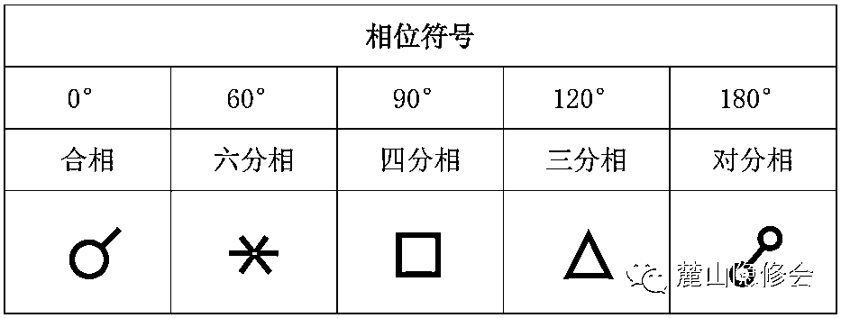

最上一行是角度，第二行是相位的名称，最后一行是相位的符号。我们拿上节课的星盘举例子。

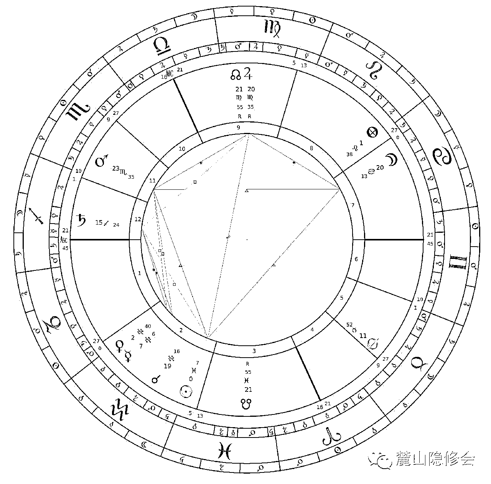

你们可以看到，火星在天蝎座 23 度，月亮在巨蟹座 20 度，所以二者就形成了 120 度的角度，我们就可以说火星与月亮形成三分相。

但是你们可以发现，火星和月亮形成的角度其实不是精确的 120 度，而是 123 度，所以它虽然接近三分相，但是并不是严格的三分相。不过因为这种误差在可容许的范围之内，所以我们仍然算作它们形成了相位。那么，这种角度到底允许有多大的误差呢？在这里，我们要引入容许度的概念。

容许度实际上就是允许相位偏差的度数，比如火星和月亮的三分相，我们把容许度设为 10 度，那么只要偏差在 10 度的范围之内，我们都可以视为两颗行星形成了相位。在古典占星中，不同的行星之间拥有不同的容许度，这是通过将行星容许度相加再除以 2 得到的。其中每颗行星的容许度如下：

| 土星 | 木星 | 火星 | 太阳 | 金星 | 水星 | 月亮 |
| 9° | 9° | 8° | 15° | 7° | 7° | 12° |

比如我们想知道土星和金星之间的容许度，那么就 9+7 然后除以 2，得到 8 度，所以金土之间的容许度就是 8 度。因此金星和土星之间的任何相位，只要偏差在 8 度之内，都算做形成了相位。其他的行星之间也以此类推。

其中，不同的相位也有不同的性质，往往代表行星之间不同的关系。每个相位的含义如下：

| 合相 | 六分相 | 三分相 | 四分相 | 对分相 |
| 结合、协作、压抑 | 和谐地结合 | 彼此最良好的关系 | 冲突、激化 | 阻碍、厌恶、否认 |

其中，六分相和三分相是吉相位，后者比前者更吉，代表行星关系良好，彼此协助。四分相和对分相是凶相位，后者比前者更凶，代表行星关系恶劣，互相阻碍。合相是一个中性相位，具体的情况要视参与的行星来确定。

打个比方，如果太阳和月亮形成四分相，太阳代表父亲，月亮代表母亲，四分相是冲突和激化，表示行星之间关系恶劣，所以就代表父亲和母亲之间关系不好。再比如说，1 宫主和 2 宫主形成三分相，1 宫主代表问卜者，2 宫主代表钱财，三分相代表彼此协助，这就说明问卜者与自身的钱财之间互动良好，也就可以引申为利于取得钱财。等等以此类推。

这是解释相位的第一种角度，还有另一种解释相位的角度。当两颗行星形成相位时，它们彼此的性质将会影响对方，为对方染上自己的色彩，使对方代表的事物具有自己的特征。

比如说，金星对分相土星，土星与金星形成相位，代表土星会以自己的性质影响金星，让金星代表的事务有土星的特点。金星可以代表婚姻，说明此时婚姻就具有了延迟、缓慢、阻碍等土星的色彩。反过来，金星也会影响土星，相位的影响是双向的，其他的情况也以此类推。

在这里，相位的类型代表影响程度的区别，其中合相>对分相>四分相>三分相>六分相。也就是说，土星合相金星时，代表土星对金星的影响十分强烈，但是当土星六分相金星时，这种影响就要削弱一些。但是要记住，这只是在行星影响彼此的角度下才成立的，不要与第一种诠释相位的角度弄混。

在卜卦占星中，我们还必须注意行星之间的入相位和出相位。所谓的入相位，也就是指正在形成的相位，而出相位，指正在消失的相位。举个例子，刚才我发的那个盘，火星在天蝎座 23 度，月亮在巨蟹座 20 度。月亮和火星都在运行，不过月亮比火星走的更快，所以月亮会逐渐逐渐走到巨蟹座 21 度、22 度、23 度。也就是说，月亮会在未来追上 23 度的火星，并且形成 120 度精确的相位，这种逐渐形成的相位就是入相位。反过来就是出相位。

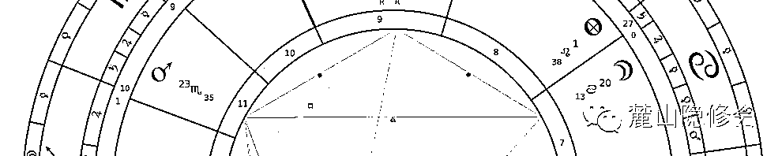

通常情况下，入相位代表将要发生或者正在持续的事情，而出相位代表已经过去的事情。所以在很多问题中，我们都是观察行星之间的出入相位来进行判断的。比如一个问自己和前任能不能复合的问题中，如果问卜者的征象星和前任的征象星入相位，就代表他们之间会再次产生交集，这时候就有很大希望复合。如果是出相位，说明他们之间已经变成过去式了，这时候复合的希望就很小了。

最后我们来讲一讲什么是接纳和互容。

接纳是一种有方向性的关系，分为接纳者和被接纳者。简单来说，当 A 行星落在 B 行星的尊贵位置，且二者形成相位时，就称为 B 接纳了 A，此时 B 是接纳者，A 是被接纳者。比如说，太阳落在摩羯座且与土星形成相位，其中摩羯座是土星获得入庙尊贵的地方，太阳落在这里，并且与土星成相，就叫做土星接纳太阳，其中土星是接纳者，太阳是被接纳者。同理，擢升、三分、界和面的尊贵也可以形成接纳，尊贵最强，接纳关系就越强力。

当两颗行星形成接纳时，通常代表这两颗星是互动良好的，接纳者相当于主人，被接纳者相当于宾客，主人欢迎宾客来到他的家中，并且款待他，宾客也会与主人形成良好的互动。所以接纳其实是一种非常良好的关系，当形成凶相位的两颗行星形成接纳时，代表阻碍会在一定程度上被消除。

互容属于一种互助且相互友好的关系。当两颗星互落对方的尊贵之地时，就称这两颗星是互容的，互容对于相位没有要求。比如月亮落在双鱼座，木星落在巨蟹座，其中双鱼座是木星获得入庙尊贵的地方，巨蟹座是月亮获得入庙尊贵的地方，所以这种情况下就是月亮和木星互容。

互容也不一定发生在同级之间。例如月亮在双鱼座，木星在金牛座，其中双鱼座是木星获得入庙尊贵的地方，金牛座时月亮获得擢升尊贵的地方。虽然擢升和入庙不是对等的，但是此时仍然可以算作月亮和木星互容，这种互容通常被称为混合互容。其中互容和接纳类似，尊贵最强，互容关系就越强力。

这节课我们就讲到这里，你们要能善加分辨行星之间的关系，从而对问题的情况进行正确的分析，这是一个最需要熟练掌握的部分，这时候你可以开始进行卜卦占星实际的应用。下面我留一个作业：

时间：2015 年 12 月 23 日 16 点 33 分

地点：辽宁省大连市

问题：我正在吃什么？

背景：那天晚上我闲来没事，想要占卜消遣打发时间，一个人听到我这么说，就问了我这个问题。

1.征象星是什么？为什么？

2.征象星本身表示这种食物有什么特征？

3.征象星所落的星座表示这种食物有什么特征？

4.征象星与哪些行星形成相位？

5.此相位代表这种食物有什么特征？

6.综合分析，这种食物的特征是什么？

7.你认为是什么食物？

# 【抽奖】任性的仪式处理紫水晶抽奖☆

> 原文：[`mp.weixin.qq.com/s?__biz=MzAxMjY0NTYxOA==&mid=403803024&idx=1&sn=6ce63ce6244661d334270974f7f40081&chksm=064b8e0d313c071bf7351d78e80bc2d465ea24e978dca10c6801ed1d6ef55a41a4d318f3ae4d&scene=27#wechat_redirect`](http://mp.weixin.qq.com/s?__biz=MzAxMjY0NTYxOA==&mid=403803024&idx=1&sn=6ce63ce6244661d334270974f7f40081&chksm=064b8e0d313c071bf7351d78e80bc2d465ea24e978dca10c6801ed1d6ef55a41a4d318f3ae4d&scene=27#wechat_redirect)

 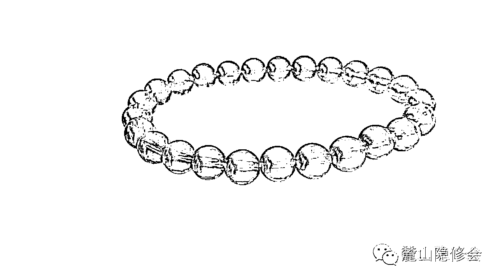

久等了的抽奖~

这主要是庆祝自己驾考通过的一个任性之举，所以抽奖内容也是自己随便决定的。

和以往的一样关注本微信公众号，并且将这条信息转发到自己的朋友圈。紧接着将截图发给微信号：aurora_mask 就可以算是参与成功了。

在进行抽奖之前还有一个额外的要求，要求转发量超过 50 个（也就是参与人数超过五十人）。这样我就会在五一的时候进行抽奖。如果转发量没有超过五十，则不开始抽奖，一直顺延到达标之后在进行。

只有一个奖品，我就是这么任性。

如果一直没有到达五十人我就抽哪天关掉抽奖好了~

现在来介绍一下这个奖品。

毋庸置疑的这是一个紫水晶，当然不是乌拉圭紫，按照俗话的话，就是国产紫水晶。

通体通透的玻璃体，颜色较深，不过没有图这么深，反正奖品而已我就意思意思拍了。大小大概在 6 左右吧，反正我也没量过。

不过值得一提的是，这个水晶本身是经过了 WICCA 全套仪式处理的。

紫水晶的宝石属性也就自然而然的全部被引导了出来。

关于紫水晶的简单宝石属性：

紫水晶 Amethyst

勇气，精神能量，梦想，愈合的瘾（特别是对酒精）、和平、幸福、爱；顶轮

Courage, psychic energy, dreams, healingaddictions especially to alcohol, peace, happiness, love; opens crown chakra

极佳用于治疗和保护的石头，在睡觉时佩戴，可以防止失眠，并且佩戴可以减少愤怒和不耐烦的情绪。

个人手上也有一个一起进行了仪式进化的薰衣草紫水晶，携带之后倒是真的感觉良好就是了。

哦对，本来是要送薰衣草紫的，但是我自己喜欢就不送了，不服憋着。

仪式净化的人是我们隐修会的一个 WICCA 体系的成员，依兰小姐~

算是我认识的接触 WICCA 的最早的一个人吧，一个被幸运女神眷顾的萌妹。书都是英文的我不想和她说话。

为什么要介绍她呢？主要是想要趁着抽奖的时候打个广告。她现在这里可以预约水晶净化+仪式处理的业务，价格看情况。

就这样，开始转发吧少年们。

# 符咒浅析

> 原文：[`mp.weixin.qq.com/s?__biz=MzAxMjY0NTYxOA==&mid=404557315&idx=1&sn=e703bab8235f56aa02df1f73ccd7a3e2&chksm=06470b9e313082884038b98dec5a561fdf872b5bbc1b1ab7e1ff4d7ba041552a155b6462a542&scene=27#wechat_redirect`](http://mp.weixin.qq.com/s?__biz=MzAxMjY0NTYxOA==&mid=404557315&idx=1&sn=e703bab8235f56aa02df1f73ccd7a3e2&chksm=06470b9e313082884038b98dec5a561fdf872b5bbc1b1ab7e1ff4d7ba041552a155b6462a542&scene=27#wechat_redirect)

 鉴于大部分学校已经开学，“大神们”都没空吐槽我，我就再发点概念性理论吧，这次讲的是符咒。
　　总所周知，符咒并不仅限于星星符和东方的符箓，其中某些巫术中的图腾或是一些遗留文明的文字符号在某些程度上也可以呗称之为符咒。但是在研究这些符咒的过程中我们会发现一个有趣的现象。
　　首先我们需要自豪的感叹一下中文词组的强大，符咒是由符和咒两个字。同样的，不论是星符还是符箓又或是其他的表现形式，几乎都是以符和咒的组合出现，当然也会有很多的仪式穿插。不过要是把符咒叫做符咒仪式我相信大家都会觉得很别扭。
　　很多时候符咒中的符更像是一把锁，而咒则是一把钥匙，通过钥匙开启锁，从而解开锁住的某些神奇能力，这样说会让人觉得像是阿里巴巴与四十大盗的故事，一句芝麻开门就可以获得无尽的财宝，当然这样理解也并不是不可以。你甚至可以把神灯理解为符，摩擦神灯的动作理解为咒，这正是一个解锁并启动的过程。
　　虽然好像话题离不开阿里巴巴的神灯了，不过并不影响解读，我们都知道星符的书写会包含神名，无独有偶，在东方符箓中也会有包含神讳，而我们平常会用到的一个词叫做名讳。
　　神名或是神讳在符咒中往往决定了这道符咒的效果方向，而在此我们不得不提及人造神的这一事实，我们以信仰为基础创造不同的神并赋予这些神不同的职责和属性，有些神主管疾病，有些则主管金钱，而后像是阿拉丁神灯一样把神装在符里，并通过咒这把钥匙启动神灯召唤里面的神祗，说祈求也好，说命令也好，总之初衷都是让神帮助你完成一些事。
　　但是我们往往忽视了一个最大的问题，就是人造神，当无数信仰早就了一个神之后，这个神便是真正存在着的，这是毋庸置疑的，这里不得不感叹人类信仰力量的强大，但我们过于相信信仰的强大，这也造就了悲剧。
　　由信仰这种无形之物造就的无形之神是否真的可以改天换地又或是解决你的一切问题，答案神否定的。不得不承认这是一个悲伤的故事，然而我们必须正视这一点，作为学习者和研究者我们本就应该认真思考我们的信仰问题，什么是正信，征信的前提是什么。话题车的有点远，我们回归原话题。
　　通常情况下，符咒由符、咒、仪式这三部分组成，先后顺序因各个地方的文化差异而变化，表现形式也多种多样，但我们却能在其中发现无数的惊人之处，例如前文提到的咒启动符，符含有神名，同时符本身的形式就无比的多样化，事实上更多的人愿意学习古典魔法或是法术，正是因为越是古老的东西，其共通之处就越多，就好像我们说画符，越是年代久远的符咒，画的比例就越高，在此我不得不吐槽一下如今的东方符箓，动辄就是里面长长的一句敕令某某某做什么什么，剩下便是寥寥数笔画个符头符尾，有兴趣的朋友可以去看看正一天师符，里面几乎没有一个汉字的出现，完完全全是画出来的。
　　好像又扯远了，符的核心是神名神讳，而单有神名神讳你解决不了任何问题，对此我又要吐槽一下，为了保持神秘性和神圣性而弄出如此繁复的一整套仪式，古代人完全忽略了我这个懒人的感受。
　　神名需要通过符的能量转换而被激活，符这个能量转换器则需要通过咒这把钥匙发动引擎，而咒和仪式本身则是一个加油的过程，而这个油则是强烈的愿望，有了强烈的愿望这个能源，又需要一根可以加油的管道，而这根管道则是人的信仰，信仰越虔诚，输油管道越结实，能够承载的能源就越多，愿望越强烈，能源越多，符咒的效果则越明显。
　　最后值得一提的是，符咒能做到的往往只有加速和推动某些事物的发展，一块巨石从山顶滚下，符咒可以令其加速滚动，但无法阻止巨石的滚动，这是一件值得失望而又值得庆幸的事，符箓无法解决我们的全部问题，但又给了我们无尽的希望……

# 紫微斗数第一课

> 原文：[`mp.weixin.qq.com/s?__biz=MzAxMjY0NTYxOA==&mid=404586618&idx=1&sn=a17dbd601ca20280bb5aeed35f6b716f&chksm=064785e731300cf10bd8736437fd048427f58c5f648cd7963c790440c2391acfaa12b97b74c9&scene=27#wechat_redirect`](http://mp.weixin.qq.com/s?__biz=MzAxMjY0NTYxOA==&mid=404586618&idx=1&sn=a17dbd601ca20280bb5aeed35f6b716f&chksm=064785e731300cf10bd8736437fd048427f58c5f648cd7963c790440c2391acfaa12b97b74c9&scene=27#wechat_redirect)

时辰：

| 时辰 | 子 | 丑 | 寅 | 卯 | 辰 | 巳 |
| 时间 | 23：00—1：00 | 1：00—3：00 | 3：00—5：00 | 5：00—7：00 | 7：00—9：00 | 9：00—11：00 |
| 时辰 | 午 | 未 | 申 | 酉 | 戌 | 亥 |
| 时间 | 11：00—13：00 | 13：00—15：00 | 15：00—17：00 | 17：00—19：00 | 19：00—21：0-0 | 21：00—23：00 |

关于子时的分割，尚有争论。有以晚上十一时至午夜一点便作为新一日的开始。

3 闰月

闰月的推算，是以前半月属上月，后半月属下月推算。如闰三月，闰三月的前十五日照三月来推算，十六日至月底作四月来推算。（亦有将闰月统归下月来推算者，对于此法持保留态度）。

4 阳阴五行

十天干阴阳五行表

|         天干所属 | 甲 | 乙 | 丙 | 丁 | 戊 | 己 | 庚 | 辛 | 壬 | 癸 |
| 阴  阳 | 阳 | 阴 | 阳 | 阴 | 阳 | 阴 | 阳 | 阴 | 阳 | 阴 |
| 五  行 | 木 | 火 | 土 | 金 | 水 |

十二地支阴阳五行表

| 地支 | 子 | 丑 | 寅 | 卯 | 辰 | 巳 | 午 | 未 | 申 | 酉 | 戌 | 亥 |
| 生肖 | 鼠 | 牛 | 虎 | 兔 | 龙 | 蛇 | 马 | 羊 | 猴 | 鸡 | 狗 | 猪 |
| 五行 | 水 | 土 | 木 | 木 | 土 | 火 | 火 | 土 | 金 | 金 | 土 | 水 |
| 阴阳 | 阳 | 阴 | 阳 | 阴 | 阳 | 阴 | 阳 | 阴 | 阳 | 阴 | 阳 | 阴 |

地支六合

| 地支 | 子丑 | 寅亥 | 卯戌 | 辰酉 | 巳申 | 午 | 未 |
| 化合 | 土 | 木 | 火 | 金 | 水 | 太阳 | 太阴 |

地支六冲

| 相冲 | 子午 | 丑未 | 寅申 | 卯酉 | 辰戌 | 巳亥 |

地支三会

十二地支相隔三宫位置会合，可组成一局，全盘共有四局，每局亦即是紫微斗数中所谓的三方四正的“三方”。“三方”组成一局，亦即是“生旺墓”的组合，如水局申为长生，子为帝旺，辰为墓库之类。申子辰合水局，寅午戌合火局，亥卯未合木局，巳酉丑合金局。

| 巳 |      午 |      未 | 长生     申 |
| 墓库辰 |    水二局 |      酉 |
|      卯 |      戌 |
|      寅 |      丑 | 帝旺     子 |      亥 |

六十甲子纳音歌

甲子乙丑海中金丙寅丁卯炉中火戊辰已巳大林木

庚午辛未路傍土戊寅已卯城头土庚辰辛巳白蚁金

壬午癸未杨柳木壬申癸酉剑锋金甲戌乙亥屋上土

丙子丁丑涧下水甲申已酉泉中水丙戌丁亥屋上土

戊子已丑霹雳火庚寅辛卯松柏木壬辰癸已长流水

甲午乙未沙中金丙申丁酉山下火戊戌已亥平土木

庚子辛丑壁上土壬寅癸卯金箔金甲辰已巳覆灯火

丙午丁未天河水戊申已酉大鄢土庚戌辛亥钗钏金

壬子癸丑桑柘木甲寅乙卯大溪水丙辰丁巳沙中土

戊午已未天上火庚申辛酉石榴木壬戌癸亥大海水

5 五行长生

金木水火土五行在十二宫中都有一定生长，壮旺而至衰死的过程。

长生：就像人出生于世, 或降生阶段, 是指万物萌发之际.

沐浴：为婴儿降生后洗浴以去除污垢, 是指万物出生, 承受大自然沐浴.

冠带：为小儿可以穿衣戴帽了,是指万物渐荣.

临官：像人长成强壮, 可以做官, 化育, 领导人民, 是指万物长成.

帝旺：象征人壮盛到极点, 可辅助帝王大有作为, 是指万物成熟.

衰：指盛极而衰, 是指万物开始发生衰变.

病：如人患病, 是指万物困顿.

死：如人气已尽, 形体已死, 是指万物死灭.

墓：也称"库", 如人死后归入于墓, 是指万物成功后归库.

绝：如人形体绝灭化归为土, 是指万物前气已绝, 后继之气还未到来, 在地中未有其象.

胎：如人受父母之气结聚成胎,是指天地气交之际, 后继之气来临, 并且受胎.

养：像人养胎于母腹之中, 之后又出生, 是指万物在地中成形, 继而又萌发，又得经历一个生生灭灭永不停止的天道循环过程.

| 地支 | 寅申巳亥 | 子午卯酉 | 辰戌丑未 |
| 别名 | 四长生 | 四沐浴 | 四墓库 |

注：四长生又叫四马地，四沐浴又叫四桃花地、四败地，四墓库中，辰为水库，未为木库，戌为火库，丑为金库，其中辰又称为天罗，戌为地网。

6 基本命盘

| 巳 |      午 |      未 |      申 |
| 辰 |  |      酉 |
|      卯 |      戌 |
|      寅 |      丑 |      子 |      亥 |

7 三方四正

三方是指本宫之三合宫，也就是本宫左右隔三宫的宫位，四正是加上对宫而言，对宫也就是本宫之六冲宫位。

| 巳 |       对宫         午 |         未 | 合宫     申 |
|    合宫    辰 |  |      酉 |
|      卯 |      戌 |
|      寅 |      丑 | 本宫     子 |      亥 |

# 浅谈现代魔法

> 原文：[`mp.weixin.qq.com/s?__biz=MzAxMjY0NTYxOA==&mid=2652070268&idx=1&sn=09c1431c1193652b985f4c2dfaff1677&chksm=804964e1b73eedf7e9ccee8de3e3fc2d882f97fe2eb9dd0fd196bb04b961bd2e6a1519b552c9&scene=27#wechat_redirect`](http://mp.weixin.qq.com/s?__biz=MzAxMjY0NTYxOA==&mid=2652070268&idx=1&sn=09c1431c1193652b985f4c2dfaff1677&chksm=804964e1b73eedf7e9ccee8de3e3fc2d882f97fe2eb9dd0fd196bb04b961bd2e6a1519b552c9&scene=27#wechat_redirect)

    魔法是一种艺术或一种科学，集中于开发和使用在我们身边的自然资源。并因这些东西而令到我们有所改变，学习者并不是一致也应用黑和白魔法。这个定义只在于从事者决定以甚麽途径或方向去应用。巫师或女巫拥有自己的权力去应用黑魔法或白魔法。黑魔法的定义在于那咒语的本性，本性是伤害其他东西，操纵别人或引致任何伤害或痛楚，就是黑魔法。要去学习魔法，那学习者必须要去用时明白魔法是甚麽。魔法的基本就是「你付出多少，你会得到多少」。那是根据你付出的的希望和努力，并不是那个魔法是如何的精巧还是你用的魔法工具是如何的美丽。许多魔法新手也会速来速去，找出许多许多的咒语。有些人会问别人拿一些咒或拿别人的影子之书，把咒语收集好了以后，就看看那魔法的动机，然后用动机相同的作比较，然后就跟著做。可是，这并不是一个好的方法去学习魔法。

　　就好像你将要送一张卡给你的朋友。你不想去买一张卡，而是去自己制作，出于心思的理由。你有那工具去做一张卡，而这张完全是你所创造的。你要用时间去思考用甚麽材料去做，那张卡的样子是如何的，用甚麽颜料等… 那是你亲手製造的，你的力量、集中、希望、想像和动机，全在这张卡中。虽然那好像是十分普通，但这如同应用魔法了。

　　以上的例子是「你付出多少，你会得到多少」的意义。去向人借咒语并没有错误，可是你要记紧那咒语是专门给那个创作的人。就好像别人希望造一个咒语去保护自己，你要紧记那是「别人」自己的咒语。没有两个相同的人看见和吸收任何东西是一样的，那个保护自己的咒语是那个创造者的要求、希望，并不是你的希望。你如果明白了的话，请尽少使用别人的咒，别人的咒可以作范例看待。我建议新手看看有关的书籍，当然，英文是十分好的，但中文的我不知好不好，因为我很少涉猎中文书籍，还有，在买之前，上网看一些有关的资料，了解自己是否真的对魔法有兴趣，才去学习。在上路之前，你也可以参考一些范例，以便对咒语有更大认识。请紧记只作范例看待好了！

注意:

　　我绝对不赞成一些新手甚麽也不懂便学召唤。如果你真的要学，请有了根基，再请一些法力强大的魔法师协助！法力强大的魔法师是一些有资深经验的人，而不是那些只懂资料而没有经验的人…「我并不是指所有只懂资料的巫师／女巫不好，而是我认为最好的召唤巫师／女巫是要有经验」。我自问自己没有太多的经验，所以人家是一只萌新啊！直到你真的完全熟习了以后，才可以单独召唤。我十分讨厌一些未学走，直接跑的人，他们到最后总会自身难保，可以说是不自量力。另一方面，召唤天使的魔法多数是白魔法，因为天使是仁慈的。

－－－－－－－－－－－－－－－－－－－－－－－－－－－－－－－－

从形式和目的上，现代魔法可简单区分為：自然魔法与仪式魔法

【仪式魔法】

仪式魔法是由古代以及现代的传统所组成，揉合著苏美、埃及、印度、和犹太等的传统，这种也受到阿拉伯的传统文化所影响，甚至在往后，也受到基督教所影响。共济会，甚至一些在十八和十九世纪的神秘结社也由这种结构所组成。

与一般人所想相反，他们并不只是集中於召唤魔鬼和天使，或者住在甚麼墓地那儿；另外，他们也不属於自然巫术。他们最主要的目的，多半是為求与神结合，為求意识的扩大和完美，而召唤只是一种附属的方式来使他们能够更接近神。

他们不会注意自然魔法的魔法目的：爱情、治疗、金钱、快乐等等；如果他们需要用魔法来得到这些东西，他们一般也会以仪式魔法的方式（就如符咒术）来得到，而自然魔法师以仪式来解决生活的问题。

有些仪式魔法师加入一些系统，并以不同的传统来组成他们的魔法作业。金色黎明就是类似的系统，他们的外部仪式可以在现代的书找到。《The Golden Dawn》是其中一本颇影响深远而有关金色黎明的书，包括著他们的仪式和理念。其他的魔法师集中在犹太派的宗教，就在那些在中世纪或者文艺復兴的魔法书，包括了一些对神明的召唤。

仪式魔法师一般也很独立，他们自我修行、阅读古今之书、甚至学习拉丁文、希伯来文（很多古藉原文是这类文字，恐翻译失真）；现代的仪式魔法师会学习克罗利、约翰 Dee（天使魔法）、William Gray、Franz Bardon、Agrippa、Dion Forture 以及其他作者的书。有些集中於研究鍊金术、占卜、天使魔法、又或者其他东西。他们是正常的人类，并不单单使用能量，也找寻一些更高层的东西，他们创造过精采的歷史、美妙的故事以及神圣的仪式，但他们不是自然魔法师（Witch）。

【自然魔法】

自然魔法师用咒语（Spell），所有存在的东西也会用来影响咒语，就如石头、叶子等等。他们会有节日仪式，解决问题会使用咒语，但是他们的力量不是来自魔鬼，而是自然和自己；相比之下，仪式魔法会比自然魔法繁杂，而选择学那一种魔法，是自己个人的事。喜欢那一种、了解那魔法的背景，便选择那一种。

二、克罗利的魔法定义(转译自他所写作的《魔法理论和修行》的部份内容)：

这本书是给所有：所有男人、女人和小孩。我从前的作品会令到人误解，和它们有限的范围，以我用的技巧的名词。它只吸引了太多的 dilettanti 和怪人，寻找魔法来逃避现实。我最初也是有意识地因此而进入这个范畴，然而魔法只撵走了太多科学和实际的思想，可是魔法 (Magic)是给所有人的。我写这本书是去帮助那些银行家、拳击家、生物学家、诗人、海军、食品杂货商、工厂女工、数学家、速记员、执政官…所有的人，试图以他们每个人适当的职务，完完全全地满足他们。

让我用几个字去解释為何我宣扬这个字魔法(Magic)：那个在我生命中支柱、也是我的一面旗帜。在我年轻时，己经感觉到自己是「号码為 666 的野兽」，虽然当时的我并不明白它的意涵所指，但那对我而言，就是源於『身份』的热情而忘我的感觉。我在剑桥的第三年，有意识地将自己献身於伟大的事业(Great Work)，成為一个神妙的物体，不受意外和物质的存在物受骗的约束。我发现自己缺乏一个名词去形容我的工作，如同 H.P.Blavatsky 早年的『通神』、『精神至上主义』、『神秘学』、『神秘主义』…，所有不希望出现言外之意的辞汇。

因此，我选择了这个名字－－『魔法』！任何崇高的精华和实际上所有适合的术语中，最令人质疑的。我发誓復兴『魔法』一字来发扬我的事业，并且强迫人类去尊重、爱和相信他们所轻蔑、讨厌和恐惧的。我谨守我的说话，是时候让我将我的标帜带进人类生活了！必须让魔法成為所有人生命中的首要一环，我一定要解释和辩护我的方向，明说魔法的定义，并传递所有魔法的原则，让人们能迅速地了解他们的灵魂、生活，以及自身与所有人类、圈子的关係，完全视乎正确的理解和应用『魔法』。

Ⅰ.定义：魔法就是科学和艺术所带来的改变，并与我们的志愿一致。

以我的知识去教授一些世界的事实，是我的"志愿"。因此，我拿了一些"魔法的工具"：笔、墨和纸；我写上了咒文——使用"魔法语言"。

我召唤了精灵，好比印表机、出版社、书店等，然后要求他们传播我的意思给人们。因此这本书的构成和分配，就是一个魔法的行动，因為我带来改变，并与我们的意志一致，那就是意愿，如同呼吸一般的意愿。

II.假设

在某种程度上，力量的应用适当与否，会影响任何要求的变化；使用的方法，也透过特定的物体或特定的媒介所影响。Ex.我希望去準备一盎司的氯化物金。我必须要使用正确的一种酸硝石-氯化氢，使用足够的质地、足够的压力，并放在一个不会破裂、无漏洞、不被腐蚀的容器中…，这种方法就不会產生非预期的结果。所有的改变有其特殊的情况，在我们现在的智慧和力量的情况下，有一些改变是不可能出现的。Ex.我们不能產生日蚀，使铅变為锡；或者从蘑姑中造出人类…。虽然理论上我们可以让所有自然物產生改变，而这个理论上的情况就是一种假定。

III.定理

1.任何有意图的行动皆是魔法的行动。就某种意义上而言，魔法可以被大眾以『科学』来定义。

2.每一个成功的行动与假定一样。

3.每一个失败，都証明了有一个以上假定的要求并没有完满。

4.第一个可以產生改变的必要条件，就是在性质上完全明白那些情况。

Ex.带来生命中的失败就是，对自己真正的意愿无知，或者自己真正的意愿未完满。如果一个人十分渴望成為一个画家，并浪费他的一生试图成為一个画家；又或者他可能真的是个画家，郤不懂得去明白和量度这事业特有的困难。

5.第二个產生改变的必要条件，就是有能力去运用实际的行动和适当的力量。

6.每个男人和女人都是一颗星－－每个人的本质上，有其独特的性质和意愿。

7.每个男人和女人都有自己的进展，一半视乎他自己，一半视乎自然而重要的环境。每个受到自己的进展所牵制的人，一就是他没有明白自己，二就是因為内在的相反，反而与宇宙体系的牴触，并因此而受苦。

8.一个人有意识的意愿，与其真正的意愿相违，那麼就白费了力量。他无法期望能有效地改变环境。

9.一个人如果能跟随自己真正内在的意愿去行动，便会得到宇宙的协助。

10.本性是一个连续的现像，即使我们并不知道所有的情况如何连繫在一起。

11.『科学』，使我们可以在『连繫的本性』上得益，以实际的经验去运用一定的原质，这些相互作用包括了不同的主意系统，用一种超越我们现在理解的方式相互连繫著。

12.人类对其存在和力量的本质是无知的。即使他对『有限』这个概念是基於过去的经验，而他在进展中的每一步也拓宽其疆域。因此，我们无法在理论上确定一个人能力的极限。

13.人们也不太注意『自我』包括了几个存在的系统，即使当他维持其微妙原则，也仅仅是他对所有媒介的赞同，一个相似的系统也会在自然中扩大。

14.人类可以改造、使用任何他察觉得到的东西，那些东西在一定程度上作為他的一部份。他，因此可以征服整个宇宙，并能意识到自我的意愿。

15.宇宙的任何力量，都可以透过适当的意涵转变為另一种力量，因此，我们需要的力量也都拥有无尽的供应。

－－－－－－－－－－－－－－－－－－－－－－－－－－－－－－－－

学习魔法

是应用一种在我们之间和自然的力量。所有人类也可以应用魔法。魔法有许多种类，所以有些人会特别专长于某一种魔法。总之，你越练得多，你就越有能力领悟你自己的肉体的能力和应用些更有用的魔法。有些人应用了魔法，自己郄不知道，就如「我会努力」如果你真的希望，那当然会成为事实，但那当然要看看那希望的那力量。当然，你越练得多，你就越能成为一个十分了得魔术师，并且能做出一本质。魔法应用在潜意识中，然而，我们的世界也经常改变去配合我们的希望。这些改变是不知不觉中起作用的。有些人理解他们的肉体能力就会察觉得到为何有些咒语能够成功或不成功。那是因为我们的真正旳希望经常会表达出来，就如你叫自己努力，你会努力。

　　人类要去影响那潜意识，并创造更强大的魔法是要通过向脑袋提出意见和想像(Visualization)。在魔法中，想像是十分重要。你必须要想像你所希望的东西，情影成为事实！如果你的想像是成功，那你的想像的东西大慨会在一个礼拜中出现。我们的潜意识会压抑他们的意念当他们的意念和我们的意念不同。就例如，当一个人被催眠，而你去命令他去伤其他人，他不会去做，因为这和他自己的意念不同。即使在催眠当中，那个被催眠的人也不会做他们相信的东西。如果你希望识破自己的潜意识。你必须要重複你的意见直到那成为你自己。并成为你的意念，信仰。简单地说：「我不要再食烟」是十分简单，但是是十分有用如果这一句话透达了你的潜意识。当然，到最后，这会改变你的自己和你的信仰，然后会在不知不觉中起作用的改变。符咒也是在这情况中生效。当符咒是自己所创造，你在那符咒中输入了你的力量，然后在你的脑袋中生效，再生效，直致那改变了你的潜意识。我们要小心应用我们的潜意识，因为你的真心希望和欲望会表现出来，有出来的，也有回来（可能是负面的），因为任何魔术也有起因和影响。

－－－－－－－－－－－－－－－－－－－－－－－－－－－－－－－－

魔法的种类

　　每一个人也能运用自己的肉体能力去执行魔法。通常我们是比别人更专长于某一种魔法，但是，如果有了他人的指导，我们也可以发展我们在其他魔法中的潜能。

　　魔法大致有三种:

1\. 创造魔法 (Imitative Magick)

　　当你在纸上画了图画，世界、沙、石, 土、这些有意义的图昼代表著你的成功或你所希望达成的情景。那东西是如果你画，看见了，那麽，在日后他或会成真。这就是你将自己的思想画出。这类魔法是增加你旳魔力，并令到自己更好运或引出力量去达成你的希望。

2\. 感染性魔法

　　这魔法是利用某一个人的东西，如头髮、指甲、衣服等。这类型的魔法通常是应用在爱情咒语或其他负面伤人的咒语。

3\. 图像魔法(Sympathetic Magick 或 Image Magick )

　　应用公仔，沙公仔，苹果等…这是一种魔法基本上应用于医疗，然后把草药放进公仔内。有些公仔可以作爱情咒应用。这类的咒是应用于非洲魔法，巫毒教(voodoo)，hoodoo 的学习者。这咒也可以用作黑魔法。当针或钉是刺进那个公仔内时，会给那受害者带来痛楚或死亡...当然，大家要小心应用，有报应的…

其他类型:

个人魔法(personal magick)

　　这魔法是制给自己，去帮自己的。通常是影响自己的潜意识，便用的方法就是在脑中反覆说一些希望，自我和想像那成真。许多人曾经执行这魔法，郄不知自己执行了魔法…

活跃魔法(Active Magick)

　　魔法应用了，然后带出结果。

被动魔法(Passive Magick)

　　魔法被某些东西引导出来。一些非肉体的成果，如第六灵感（ESP）。

－－－－－－－－－－－－－－－－－－－－－－－－－－－－－－－－

魔法之分别

　　魔法是分为好或者坏，但是也是中立。不同的方法会令到魔法好或者坏：

白魔法(White Magick)－－好

　　一些魔法执行于不自私的理由，好像医疗，或得到被施发者的许可。

灰魔法(Gray Magick)

　　这是最常用的魔法。那是一些魔法通常是施法者的自我兴趣，那大慨是因为施了一个魔法，然而带出了一个欲望。通常这种魔法是向其他人施，而这魔法是为那人好的。然而，你郄没有得到他的许可。当然，如果那发是没有别人的许可是黑魔法，但由于那不是为了自私的理由，所以，我们称之为灰魔法。

黑魔法(Black Magick)－－坏

　　一些自私的理由去执行魔法，去伤害别人，控制别人，并没有得到别人的许可。

－－－－－－－－－－－－－－－－－－－－－－－－－－－－－－－－

坏魔法从不同人的定意

　　魔法是一种在我们身边出现的能力。肉体的能力也是一我们执行的力量。就如有些人比其他人执行魔法更好，有些人的肉体能力比其他人更好（如唱歌，钓鱼）。我们是可以发展我们的肉体和魔法潜能。另一方面，魔法是不可以滥用的。魔法不是扩大你的自我，不是为了识别或取得金钱。那是执行为了改变和希望做到最好。魔法不是超自然的，是自然的。魔法在我们日常生活中出现。那是一种利用自然和世界的力量。他是利用你的灵魂和你的潜意识。魔法在历史上流传过。然而，将来也会如此。当有人叫你吹你的生日蜡烛，然后许愿，那就是一个魔法。当你向流星许愿，那就是魔法。当你朗诵一些意见，或祈祷，那是魔法。当你的希望十分强烈，当他成真了的时候，那就是魔法。

－－－－－－－－－－－－－－－－－－－－－－－－－－－－－－－－

令一个魔法成真

1.你必须要相信那会成真

2.想像

3.制定圆圈（如果你有如此的信仰）和放逐保护

4.实行那个仪式或咒语

　　你的脑袋思想甚麽比任何东西也重要。如果你可以执行一做十分複杂的仪式，有祭台，有所有材料，郄没有一个欲望令这欲望成真，没有信念那会成真，而且没有想像那成真的情况，并且对那咒语有疑惑和不承认，那麽，请你别要对那不成功而抱怨…因为那是必然的！

－－－－－－－－－－－－－－－－－－－－－－－－－－－－－－－－

潜意识论

　　对于潜意识，我并没有太大的认识。不过，我可以给大家以下的结论。潜意识是一种极大的力量，所有人类也拥有这一种力量，只是没有加于运用。当潜意识发展成一种力量，那就是别人说的魔法原理了。这一种力量可以令人改变，是一种神秘但自然的力量。神秘在于一个正常人根本很少接触这类东西，而且很少人不会看看科学的解释。而自然是我一直要用来形容魔法的，我不讚成人们用超自然去形容这类东西。因为如果这东西在自然界出现了，又怎可以以超自然来形容？这个世界跟本没有超自然的东西。因为任何东西是在自然界发生的，即使那东西是没有科学解释，或者从没有人见过，但也是自然的！因为他是在自然的世界上出现。如果有人说，超自然是指一些在自然界发生的东西，但没有科学根据，那麽，我真希望给超自然这名字改一改。

　　另一方面，如果一个人刻意练习怎样去发展潜意识，那麽他就可以做出更多惊人的举动。如何去发展你的潜意识呢？我个人的见解就是多些用意志力！意志力可以控制潜意识，如果一个人的意志力强大，他的潜意识就更会发展。凡事也抱著相信的心态了。凡事也抱著相信的心态，你的咒语就会更有效用呢！

－－－－－－－－－－－－－－－－－－－－－－－－－－－－－－－－

信奉神灵

其实学魔法之人信仰各有不同：

1.道教 

2.基督教

3.犹太教 

4.佛教

5.无神教，即无神论者

6.其他

　　很多人在未接触魔法时，往往会认为魔法是邪恶的。因为魔法有一种一般人不懂的能力。其实这种能力是自然的。有些人会以为这些力量是邪恶的，但我可以告诉大家，如果你以邪念去使用这力量，那力量就是邪的。如果你用仁念去使用这力量，那力量就是正义的！一把刀，可以用来杀人，也可以让一个医生救护一个病人。也有许多人怎为巫师是崇拜魔鬼的。但我他可以告诉你，我们如常人一样，各有不同的信仰。因为魔法并不是一种信仰，魔法是一种能力，是自然，和很多东西也一样，有邪恶之分。但大家也很清楚看到，有很多仪式是召唤神或女神，所以我十分肯定这世界是有神的。

　　而我个人的信仰并没有被以上这些名词所限，因为我心只有一个创造人之主。你们有否真的见过你自己的主？你们有否真的受过你相信的主的帮助？衪是否存在的呢？或许，所有人也有一种怀疑，因为以现在的科学，根本很难去找到真主是谁。故此，我心中只有一个主，而衪并不被名词所限制著。真主并不会因为这小小的东西而放弃人类；而且，这根本不值一提，最紧要的是内心的爱。

－－－－－－－－－－－－－－－－－－－－－－－－－－－－－－－－

咏唱（chant）

　　黑，白和灰的魔法的定义在于那个人的「好」和「坏」。所有魔法也是一种控制。那是一种意图和目的在那咒语或咏唱，那是十分重要去分明「黑」和「白」，还有甚麽会在你身上有所影响和那因果报应。当你倡议去操作力量，「好」和「坏」，有些东西会发生，那就是「因果报应」。请大家准备好将会有不预期的事情将发生，和你须要负担起负任。请紧记三倍报应的规则。还有，紧记一个思想会变成文字，文字变成动作。

　　以下这些必须咏唱必须重覆几次。你要用一致的蜡烛。撒和坐在一个圆圈，和一个五芒星环和一些恰当的蜡烛。咏唱著那些句字几次和用恰当的力量。你不须用所有的咒，以下的只是给你选择的。请挑选你感到舒适。当你挑选了恰当的咒语，然后看看他有如何功能，就会知道他的能力。魔法要许多练习，磨炼和努力，但你会在途中会学习了许多。

－－－－－－－－－－－－－－－－－－－－－－－－－－－－－－－－

施法须知

1.在魔法中，力量也有平衡。你放出去力量会在星灵层中平衡。所以三倍反噬不可逆。

2.魔法不会如电影中可以立即有用。你也须要等待那力量去生效和达到效果。

3.当你没有完完全全地在咒语中表示你所希望达到的东西时，出来的结果往往会强差人意！所以尝试在施咒之前，清楚地写明你要些甚麽。

4.如果你施了咒之后，一个礼拜之内还没有成功，可能是因为你的信念不足够。你可以每天也去做同一个咒，可以强化你的咒语。

5.一个不能成功的咒可能是因为以下原因：没有信念，矛盾和自我疑惑。

6.魔法并不是邪恶，古怪或超自然！他常在我们身边出现。魔法是自然的！就好像一把刀，如果有一个人用这把刀切水果，是好的。如果你用这把刀去砍人，当然是坏，邪恶的！

7.请勿用口吹息蜡烛，除了咒语指明之外。

8.谨记三倍报应

9.不是每一个咒语也对一些人有效。

－－－－－－－－－－－－－－－－－－－－－－－－－－－－－－－－

力量的规则

　　力量不可以引致损伤，去伤害，去控制其他人。但如果那需要是急切的，力量只可以用作保护你的生命或其他人的生命。当那需要是指定的才可以用。力量可以给自己获利，只要你没有伤害任何生命。那是不明智去因那力量而得到钱，金钱会令人变质…不要用那力量在高傲的收益，你这样侮辱了魔法。请记紧那力量是神给你的，请勿误用或滥用。（HARM NONE）三倍的报应「rule of three」(Wiccan)请紧记三倍的法规。你所施行的恶行会三倍回到给你。这会是你的课堂，你必须要学习。

－－－－－－－－－－－－－－－－－－－－－－－－－－－－－－－－

甚麽是鬼魂？

　　所有生物也会在他们生存时产生力量。鬼魂是一个残留在地域的影像，就好像唱片的纹道。特别在一些强烈的经历，好像感情的转折点，十分紧张或狂热行为会在唱片上引致一些比普通的纹道更深。当一些人看见鬼魂，多数也只是看见这一些的纹道。那些影像永远都在这儿。在某一些正确的结合的情况下，我们就会看见这些影像。所以人类也会看见一些鬼魂吊在一些经常有人吊颈的地方，但这只是残留的影像。

　　偶尔，人们会听到一些古怪的声音，好像脚步声、敲门声声或者嘎嘎声。这一种现象就如同我刚才所指的影像，也是残留的。一般而言，这些声音是当行路的那个人或敲门的那个人很害怕，又或者很紧张。于是，这些声音就留在人间中。

　　有时候，幽灵会企图和人类沟通。最合理和逻辑地解释这个现象就是这一个和人类沟通的形象，当时正在和其他人沟通。因此，很多不同的人在同一地点看见的亡魂的形态也会一样。即使这些人对这些灵魂的反应不同，但这鬼魂的形态也没有变更。

　　但是，同一时间，也会有一些真正有思想的鬼魂。有些是不欲离开人间的灵魂。好像他的心愿未了，或者其他。

　　（以上的学说细杂了不同人的见解。有一些人认为所有鬼魂只是一个残留影像，但我就认为在同一时间，也会有一些有思想的灵魂。就好像守护神，也是由灵魂组合成的…据闻因为地球是一个有很大磁场的星球，然而当这些磁场配合某一些条件，地球本身在某程度上也是一个很大的摄影机…信不信由你…我郄没有这麽大的资金去引证…）

－－－－－－－－－－－－－－－－－－－－－－－－－－－－－－－－

甚麽是著魔？

　　著魔：一隻魔鬼潜伏在人类的身体一段时间。

　　一隻魔鬼为何要潜伏在人类体内难以理解的事物，但是通常被著魔的人的个性的核心有特定的弱点。通常那个人会对自己的性格有所困惑。在这情况之下，魔鬼在这弱点扭曲地引诱人类去做一些事情。魔鬼的扭曲是特殊地难捉摸的，而且不很强烈直到稳当的沟通立足点已建立了。这一个程序可以达到几年之久，即使是十年。人类存在这一些魔鬼是常见的。

　　有不同的魔鬼性表现视乎日常工作事项。如果拥有是他们的目的，表现的形式会比较个人化。当被那东西接受了，我不是指迷住，而是一些行动被应同了以后，这些迷惑的表现逐步地变成更有影响和最后盛气凌人的。他们主要引诱或者侵犯的地方是主意的范围，或者主意的困惑。有一些人说他们会把他自己的希望或灵魂奉献给一种外来的影响，但他们知道这一种影响不是他们自己的。

　　一种喧闹鬼的形式的显示趋向无保留地古怪，可怕或者动态的。这是放肆的表现，集中在一个地方或者一个人，趋向包括一些喧闹的超过正常行动。他们产生恐惧，魅力和激动－－所有的动力会因魔鬼消耗…有时候，著魔的人会清醒地找寻帮助。

　　怎样才看得出那人是著魔？

1.心理和生理上的病痛

2.行为古古怪怪的

3.和你以往应识的人不同

－－－－－－－－－－－－－－－－－－－－－－－－－－－－－－－－

符号的创造及理论

　　文字是能够感情上控制你的外在现象，去将你的希望具体化。人们认为有一些特别的字可以令一个人催眠致催眠状态，如：

　　有一些仪式或咒语会感情上及心理上地鼓励提升你自己的力量，然后就用来执行写魔法（writing magick）。文字被重覆又重覆地咏唱，然那字会写在影子之书上、魔术之书、一本大魔法书 Grimoire 或者一本日记上。由于咏唱他们的方法，那感情上的影响以及在书上的样字是特别的，故此，他们是十特别的。文字也可以变成符号，去会影响我们的无意识。再这样说下去你们一定会感到不耐烦，故此，是时候给你们例子了…当有一个你爱的男人或女人和你说：「我爱你」，你会觉得如何？感受到爱了吗？那是充满著爱的感情呢！又或者，你爱的男人或女人无原无故向你大叫（台湾／中国话）：「三八，你找死吗？」或香港语：「仆街！正八婆！」你会怎样？感到难受吗？那就是用感情说出来的，可以伤害人，也可以取悦人…。

　　以下有几种语言：

卢恩文－－北欧人

象形文字－－埃及

底比斯－－Gardnerian 巫婆

Passing The River－－礼节的魔术师

Malachem(magi 的语言)－－礼节的魔术师，混合希伯来人。

匹克特语(Pecti-Wita)－－苏格兰卢恩文有直线

Angelic－－礼节的魔术师。Makes the use of angelic names。

拉丁文

希腊语－－希腊人

希伯来文－－犹太神祕哲学的

欧甘文字－－凯尔特语

　　有些人用特别的片语，符号去写。有一些符号，如水、盐、月亮、男人、女人、神、女神，或者其他星座符号等。有些书，如 Barnes and Noble and Waterstones，这类的异教徒书可以找到这些的符号。有一些十分简单的字或咒语，可能是十分有用的。因为他们表著我们内在的精神。是我们希望他的出现，也是我们给他们力量。这是人类的力量，人类会超越分析，符号和分类。

－－－－－－－－－－－－－－－－－－－－－－－－－－－－－－－－

符咒：欲望，理论以或名字的表达

　　当符咒写成，力量、欲望和目标被译成符号，然后他们会长存在我们的脑袋上。让咒语投掷者更集中于将力量提升，而不集中于他投掷这个咒语的愿因，这是十分自由的。

　　去写一个符咒。

1.写一个名字，一句句字，或一个理论。

2.尝试把那思想聚集，启发和反覆地集中于那字母。

3.然后想想如何给他弄成一个符号。

4.你现在就要将字母混合并且形成一个符号。

5.当你把符号形成了以后，他就会有了力量，因为你把你的理论集中于那符号。

6.那符号可以以你的本土文字或数目字母形成。

　　你可以把这符号写下在一张纸。或者刻在一个工具或蜡烛。当你集中于这咒语时。你也可以把这符号放在脑袋中，可以说是用途广泛，或者当纹身也可以。

# 生命炼金术大课，仅此一次

> 原文：[`mp.weixin.qq.com/s?__biz=MzAxMjY0NTYxOA==&mid=2652070271&idx=1&sn=77d6cbef7c20006ac9fcf003a233ed9b&chksm=804964e2b73eedf4cf2dd1742a811fa4a1d7d4e6a3dbf0676e7c2d91c239250663697e32ae48&scene=27#wechat_redirect`](http://mp.weixin.qq.com/s?__biz=MzAxMjY0NTYxOA==&mid=2652070271&idx=1&sn=77d6cbef7c20006ac9fcf003a233ed9b&chksm=804964e2b73eedf4cf2dd1742a811fa4a1d7d4e6a3dbf0676e7c2d91c239250663697e32ae48&scene=27#wechat_redirect)

生命炼金的本质论与方法论

    讲师：Arkk Ou（不能被吊死）

自《翠玉录》伊始，炼金就是古典魔法不可回避的核心范畴之一。然而伴随着工业时代的来临以及科技主义对神秘主义的全面压制，使得原始话语体系产生了根本性的动摇。进入现代以来，魔法的势微宣告了理性和科技的彻底胜利，也导致了近世再没有魔法师的位置。在此重提炼金这一古老的存在，一是为了满足部分追寻者的期待，二则是为了将有别于普世的另一种知识体系延续下去。

【关键词】神秘学 生命炼金  永生

**Alchemy of Life——Essentialism and Methodology**

Alchemy is oneof the core categories of classical magic which can not be avoided. With theadvent of the industrial age, science and technology fully suppress theoccultism. The original discourse system has produced a fundamental shake. Sinceentering the modern times, the failure of magic has declared a complete triumphof reason and technology. It also leads to the extinction of magic in moderntimes. Bringing up the ancient existence of Alchemy again, is to meet theexpectations of some seekers. And in order to continue the other knowledgesystem

【Keywords】occult  Alchemy of Life  immortal

前言

自十八世纪以降，纯粹意义上的魔法师就业已消亡了，牛顿算是为古典魔法撰写了最后一刻的辉煌。这实质上是人类异化过程加剧所导致的必然，无论是在物质身体层面抑或是精神意识层面都是如此。可以说，吾等现在所做的工作，只能是作为资料的拼凑者和历史的挖掘者而赋予行动以客观的意义，本质上吾等已经丧失了溯源的能力。这一理论可以简单的用热力学定理解释，即从远古时代往近世延伸，魔法能量是不断衰减的，越往早了去，能量的富集是越大的，因而近世的消亡从原理上来说是不可避免的，往未来可能会发生魔法能量的“绝对零度”也是能够被预见的。

抽象地说，生命炼金就是关于生命的炼金行为，其定义了“对象”和“方法”两样存在。但是“生命”的周延是极为宽广的，任何和生命有关的内容都可纳入这个周延，所以在此，吾等对其进行限制，此处的生命特指“人的生命”，并且附加一个目的论因素，即延长乃至于无限（作动词用）人的生命；“炼金”在此不作说明，因其特殊性且于讲师个体而言的独占属性，其意义可以无限制扩容，即能够达到前者对象目的的一切行为（各种层面上的），都归属于“炼金”。

课程内容：

一. 生命炼金本质论

**1.** **世界与意识：**略

**2.** **生命炼金的本体：**略

**3.** **生命炼金的对象：**略

二. 生命炼金方法论

**1.** **生命的保存形式及方法：**略

**2.** **生命的延续形式及方法：**略

**3.** **生命的创造形式及方法：**略

三. 永生之法

课程要求：

但凡是没有炼金术基础的不要报名

但凡是对讲师产生质疑，有砸场子倾向的不要报名

本课程只上一次，无课件，不语音，不留文字，听不懂不接受提问。

如果错过，后期不会给你单独补上。

**但凡是选择报名的学员，请自行学习上面给出的课程目录中的理论知识内容，课程中将不会有任何的理论知识补充说明。**

**为了确保课程的参与度与清晰度，但凡是报了名的学员，将会得到一节炼金术的基础课程。目的是保证交了费的各位不会被各种学术名词以及嘲讽炮打傻，以及方便理解其课件，接触真正永生的秘密**

★课程中会出现讲师对学员智商的群嘲技能，请保持良好心态。

☆请提前准备好纸和笔

课程时间：五月二十一日晚上

时长：2 小时

收费标准：800/人

报名联系人：QQ：2695150564 微信：aurora_mask

讲师寄语：

熟悉我的人大概都知道，我是具备一套自己的话语体系的，当然这是严格的继承了巴比伦—亚述体系和古希腊—罗马体系后产生的。事实上我的每一个表达都经过了深思熟虑和引经据典，以确保不会让人觉得我是信口开河。举个例子来说，光速是 30 万公里/秒，又或者元素的定义是什么，这些知识性的东西我认为是不言自明的，若是学习我的体系却还需要我解释概念层面的问题，私以为是不可忍受的，简单地说就是浪费时间。

我能够准确地把握什么是需要解释的，什么是没有意义的，凡是涉及思考或者再定义的内容，我都愿意耐心的回答，比如时间的本质，这是需要思考的内容；又比如“炼金”在我这里的定义，为了适应我的体系需要，我会对其进行**有别于**一般理解的阐释，那么这个时候是有必要说明的。

既然时间是宝贵的，那么就不要为了任何无意义的举动耽误时间。这所对应的客观要求即是——无条件的接受我的话语体系（思想认识方式等），哪怕是颠覆式的也不需要质疑。因为一旦产生怀疑，就会发生猜疑链，类似原子弹爆炸的链式反应，其在思维层面无异于引爆了核武器，再怎么处理也搞不定长期核辐射。只有在一种坚固的意识体系下，内容——或者说意义才能被很好的传达。

我自接受高等教育以来，已经淡出神秘学界，但这并不意味着我不再进行相关研究，相反的，对于学科的研究于我而言是加深了的。此次授课是应“麓山隐修会”邀请，受“末日酱”与“Adiós 猫儿”委托进行的。相关协助机构还有“柒灵神玄公社”、“魔法吧”等，在此不一一进行鸣谢。

关于课程收费及相关说明私不做过多解释，只是多说一句：参考文献以及重要典籍都是需要成本的，上课并不是一件轻松的事，白上课我也上了不少了，听过我课的朋友们见仁见智，希望我的努力对得起热爱相关知识的朋友，言毕于此。

# 生命炼金课程相关参考书目

> 原文：[`mp.weixin.qq.com/s?__biz=MzAxMjY0NTYxOA==&mid=2652070273&idx=1&sn=4b54f97b452ab9c1aaade888deea31c9&chksm=8049641cb73eed0a656fac40f9a84e06e76ecd772adb31aab3c89b8deff00c97feb644a0ce06&scene=27#wechat_redirect`](http://mp.weixin.qq.com/s?__biz=MzAxMjY0NTYxOA==&mid=2652070273&idx=1&sn=4b54f97b452ab9c1aaade888deea31c9&chksm=8049641cb73eed0a656fac40f9a84e06e76ecd772adb31aab3c89b8deff00c97feb644a0ce06&scene=27#wechat_redirect)

**关于之前的生命炼金的课程，很多人在好奇相关的参考书目是什么，怎样才能算是有基础的。**

**于是讲师给我们列了一系列的参考书目要求。**

**不一定要全部精通阅读，但是请务必以衡量自己的水平基础。**

**如果实在不行也还是想听课的，其实都没关系，因为……**

**这个价格能听懂一半都是赚的嘛~裸听也无所谓啦，反正说的是中文，虽然拿永生当噱头，其实真的能听懂还做到的 几率也不大啦。** 

**大概几率就是比拿两张扭蛋卷去扭出了两个 UR 还能觉醒的几率小就是了。**

**做个笔记什么的，放在家里研究炼金术的时候看看，也是可以得到质的飞跃的啦~反正不亏的就是的啦。开课之前还有各种小课补充基础的，都不要慌啦~**

——————————————————————————————————

1）符号学类：

1.  1.     Saussure F D.Course in General Linguistics[J]. 1959.

2.  2.     Re-readingSaussure :[M]. Routledge, 1997.

3.  3.     Whitney W D. Thelife and growth of language : an outline of linguistic science[M]. KessingerPub. 1979.

4.  4.     Schleicher A.Compendium Der Vergleichenden Grammatik Der Indogermanischen Sprachen[M]. 2010.

5.  5.     Schleicher A,Koerner E F K. Die Sprachen Europas in Systematischer Übersicht : linguistischeUntersuchungen[M]. J. Benjamin, 1983.

2）思维认知类：

1.  1.     Kant I.Anthropology From a Pragmatic Point of View[M]// Anthropology from a pragmaticpoint of view. Cambridge University Press, 2006:277-279.

2.  2.     Kant I,Vorländer K, Buek O. Metaphysik der sitten[M]// Metaphysik der Sitten. F.Meiner, 2006:347.

3.  3.     Kant I, Görland,Albert. Kritik der reinen Vernunft.[M]. China Social Sciences Pub. House, 1999.

4.  4.     Schopenhauer A,Kemp J. The World as Will and Idea[M]. General Books LLC, 2009.

5.  5.     Schopenhauer A.Über die vierfache Wurzel des Satzes vom zureichenden Grunde /[M].

3）人类学/巫术类：

1.  Frazer J G. Thenew Golden Bough[J]. 1959\.

2.  Frazer S J G.The Belief in Immortality and the Worship of the Dead[M]// The belief inimmortality and the worship of the dead. BiblioBazaar, 1913:316-316.

3.  Frazer S J G.Eating the God[M]// The Golden Bough. Palgrave Macmillan UK, 1983.

4.  Frye N. Wordswith power : being a second study of "the Bible and literature"[M].Harcourt Brace Jovanovich, 1990.

5.  Buber M, Smith RG, Friedman M S. Between man and man[M]. Macmillan, 1965.

6.  土居,健郎. 離人体験と宗教信仰 (宗教と精神医学(特集))[J]. 精神医学, 1966, 8.

7.  佐々木, 宏幹. アジア漢文化地域の民俗宗教に関する宗教人類学的研究[M]. 駒澤大学, 2001.

8.  嶋田, 義仁. アフリカ・イスラーム圏における白色系民族と黒色系民族の紛争と共存の宗教人類学研究[M]. 名古屋大学大学院文学研究科比較人文学研究室, 2008.

4）真理存在类：

1.  Heidegger M. Onthe essence of truth[M]// Truth: Engagements Across Philosophical Traditions.2008:243-260.

2.  Heidegger M,Krell D F. Basic writings from Being and time (1927) to the task of thinking(1964) /[M]. Routledge & Kegan Paul, 1978.

3.  Sartre J P,Barnes H E. Being and nothingness : an essay on phenomenological ontology[M].Routledge, 2003.

4.  Sartre J P. Existentialismand Human Emotions[M]// Existentialism and human emotions /. Carol PublishingGroup, 1990.

5.  Yeats W B. TheCeltic Twilight[M]. Nabu Press, 2010.

书单权威性说明：由作者摘录自各重要人物的重要著作，版本经过 CiNii 数据库校验，内容和完整性可以得到保障。书单禁止转载，相关辅助资料请联系索取，不得做商业用途。

# 《吸血鬼》序章

> 原文：[`mp.weixin.qq.com/s?__biz=MzAxMjY0NTYxOA==&mid=2652070278&idx=1&sn=c0f3310cc105a0cc795cd9305b5c3432&chksm=8049641bb73eed0d9bf28ceb5b98a8013ea38022acf589f407d0f49abf040cff3f620899b9ce&scene=27#wechat_redirect`](http://mp.weixin.qq.com/s?__biz=MzAxMjY0NTYxOA==&mid=2652070278&idx=1&sn=c0f3310cc105a0cc795cd9305b5c3432&chksm=8049641bb73eed0d9bf28ceb5b98a8013ea38022acf589f407d0f49abf040cff3f620899b9ce&scene=27#wechat_redirect)

故事，该从什么地方叙述呢，首先这是一小部分自叙，一部很无聊且没有看点的自叙，但我想你还是会看下去，因为这些，叙述的是真正的吸血鬼怎样生活在世界中的流水账。

在你们眼里，吸血鬼是怎样的呢？是不是就是所谓的，惧怕阳光，不老不死，永保年轻，吸食血液，生活在高层社会中？还是每个白天躺在坟墓，夜晚爬出来吸取血液，像一个掠食者一样，但样貌丑陋，无友无伴？

但其实我想说，大部分都是错的，实际上，首先我并不怕阳光(或许吧但至少不是致命的因为我比较怕晒)，其次我也不是不老不死，或许可能不死，但不老绝对不可能，最后也是最重要的事，吸血鬼，并不吸血，吸血鬼也需要吃人吃的饭，但也会从别的人类那里吸取能量，关于这个能量，我会在之后慢慢叙述。

先讲讲我是如何成为吸血鬼的吧，首先，我并不是被别的吸血鬼转变而成，第二我也不是天生的(好吧这个可能不太确定，天生确实就有点因素)

准确的来讲，我是自己将自己变成吸血鬼的(可能不太准确应该是我发现自己有这方面的能力)

接下来，我或许该问问大家，身边有没有人，就是待在你身边，什么都不做(肉体上也就是物质世界上)就会变得身上失去力气，失去精神能量，变得疲惫。

这种人就是大家所谓的吸血鬼，不管他们有没有自己意识到，或是他们主观去吸取的。

当然这种人的存在感意外的低，经常会不经意间吓人一个跟头。为什么这样说，因为我就是这样的，我在发现我自己有吸取天赋前，我存在感就比一般人较低，当时很傻很天真的以为，我是不是有刺客的天赋。但，实际上，拥有吸取天赋的人大部分存在感都很低。在我意识到以后，成为一名合格的吸血鬼后，我渐渐发现，我的存在感越来越低了，甚至，连家人都很难意识到我的存在除非我主动去做一些事。好了大概就是这样。关于存在感这一点。

吸取就想吸毒，这种东西是无法停下来的，我吸取着能量，享受这种能量越过身体进入体内的感觉，我享受着，乐此不疲着，愈来愈对能量的需求量大，从一天吸取一次到 10 次到现在的只要身边有可以吸取的人就不停的吸取，对这种快感越来越麻木，量也愈来愈大，我甚至无法控制，并且在无人可吸的时候，左手就像无法控制一样的，麻木抖动，寻找着那目标。

当然，这只是平时，现在该来讲一点比较污的东西了，比如啪啪啪的时候吸取能量，吸血鬼总被与情欲结合到一起，但事实确实如此，一般人大概都是越啪越累，而吸血鬼则会愈来愈有力量，愈来愈兴奋，愈来愈停不下来，而啪啪啪的对方，虽然很享受，但力量会越来越少，越来越虚弱，这就是吸血鬼。

20166 2 晚 泫玥 _kolos

# 【转载】神秘学的唯物与唯心观

> 原文：[`mp.weixin.qq.com/s?__biz=MzAxMjY0NTYxOA==&mid=2652070281&idx=1&sn=cc0187f7141f535b57673568193b3854&chksm=80496414b73eed029bb0758e43fa0eb77cf28500d9b2e57da7f20d340923327db17041973619&scene=27#wechat_redirect`](http://mp.weixin.qq.com/s?__biz=MzAxMjY0NTYxOA==&mid=2652070281&idx=1&sn=cc0187f7141f535b57673568193b3854&chksm=80496414b73eed029bb0758e43fa0eb77cf28500d9b2e57da7f20d340923327db17041973619&scene=27#wechat_redirect)

**偶然的到巫師鎮逛了一圈，也偶然的看到了五角的抱怨文，內容是他與朋友對於人類與自然關係的觀點有相當的落差，因此他覺得不以為然。

　　相關的文章，請點我觀看。

　　大概也因為近來必須或被迫的思考了許多許多，因此造成心境上格外的感性吧？花了一點時間打了點東西，希望能給五角一些參考。

　　也因為個人覺得有點小小的參考價值，故也張貼在****部落格****供大家閱讀。**

**——by 夜清翔** 
－－－－－－－－－－－－－－－－－－－－－－－－－－－－－－－－

　　接觸了所謂的神秘學已算有好些時間，但其實越接觸，就越來越感到困惑。

　　困惑著神秘學究竟是什麼，又困惑著應該以哪種角度去審視神秘學。

　　尤其，個人由衷的相信，如果是真的有心瞭解神秘學這個學科的朋友，在不斷探索的過程當中，思維的角度與切入點會慢慢的與一般人的思維有所偏離。

　　比方說，一般人提到法術，除了覺得很神奇外，更會覺得『如果它能幫我達成……，那該有多好』。

　　而一個真正研修神秘學與接觸自然的人，反倒會越來越少去渴望藉由神秘學的手段而達成某些事物，因為他會在學習的過程當中理解到，順應自然規律是最重要與根本的。

　　因此，倘若在這時回頭審視當初剛接觸的自己，或是一些剛接觸神秘學而汲汲營營於術法的朋友，大概多少都會覺得有點不以為然吧。

　　而這點，其實就是神秘學上唯物與唯心兩觀點的不同。

　　神秘學的手段，對於一般人來說，只是一個工具，一個方法，目的只是滿足自己進而達成某些事物，這點在歷史上有無數個例子可以佐證。

　　而從這種唯物觀點去看，當中並沒有所謂自然的影子；只是因為需求角度的不同，自然也就稱不上人類的傲慢；用簡單的例子來說，科學的發展也跟這種唯物思維屬於同樣模式，因此在大多數情況下，會與所謂的自然產生衝突。

　　不過，也的確如五角所說的，人類或許真是整個地球上最傲慢的生物。

　　至於研究神秘學的人，如果不是為了研究法術好讓自己滿足某些慾望的話，或多或少的，在研修的過程當中，亦會抵煉自我的內在與心靈。

　　進一步的，就是嘗試去感受、理解自然，或是藉由反覆的儀式與相關行為，去接觸內在與外在的神性。

　　而這，就是黑格子所說的唯心思維；因為目的在於理解存在，因此透過審視內心而去感受外在的一切，然後理解到我們的存在乃自然的一部份，最後開始遵循自然該有的規律；這一切的一切，皆是由於相對於自然的比較思維而產生的，而這也算是五角的想法吧？

　　建立在這種思維之下的，是個體乃渺小且龐大的存在；我們是自然的一部份，我們是構成自然的其中一種元素，而世界上的萬物，不管是死的或是活的，也都是處於跟我們同樣的定位，因此一切都是平衡的，這種動態的平衡所彰顯的，即是自然的生命表現。

　　但，在這種思維當中，我們變得渺小了（雖然，我們本來就很渺小），且我們所能獲得的只有完全心靈上的滿足，對於一般人來說，這種奢侈的寶物很顯然的是不適合的。

　　因為，一般人所專注的，是在現實中該如何生活，如何努力讓自己過得更舒服，又如何的打敗競爭對手好往更高更好的層次邁進。

　　所以，唯心與唯物兩觀點之於一般人而言，就好比鑽石與黃金一樣。

　　鑽石雖然漂亮，但畢竟帶了點夢幻，且擁有的鑽石若要賣出去，若非是很有價值的大鑽石，一般賣出去的價錢都好不到哪兒去，而大多數人所能擁有的，就只有那種買賣價格落差極大的『平價鑽石』；因此，相對而言，黃金顯得實際多了，不是嗎？

　　因此，神秘學人與一般人的思維，在根本而言，是有很大的不同的。

　　或許我們很容易去發覺甚至看透一般人所不會注意到、所不以為然的層面，但在看透的同時，我們更應該學的，是對不同思維的理解與包容。

　　因為，這也是自然的一部份。

# 常见水晶净化方法

> 原文：[`mp.weixin.qq.com/s?__biz=MzAxMjY0NTYxOA==&mid=2652070283&idx=1&sn=cf2794c17a66c6a640b5767b55f17640&chksm=80496416b73eed0008b268878e412de0bd82145e891978d0a8d0aa871a9afb10c44fe3389853&scene=27#wechat_redirect`](http://mp.weixin.qq.com/s?__biz=MzAxMjY0NTYxOA==&mid=2652070283&idx=1&sn=cf2794c17a66c6a640b5767b55f17640&chksm=80496416b73eed0008b268878e412de0bd82145e891978d0a8d0aa871a9afb10c44fe3389853&scene=27#wechat_redirect)

净化方法一：溪水(泉水)净化法 

适用人群：自然环境好的地区，身边环境没有受到大的污染，类似居住在海南或者九寨沟这样的朋友。 

具体方法：将你的水晶放入溪水之类，让干净自然的溪水洗刷水晶吸附的一些破坏性磁场，这个过程以 3-5 天最为合适，也比较保险，当然这要根据你是在日常保养还是在修复已经被伤害变的暗淡的水晶，如果是后一种，恐怕时间要长上许多了。

使用范围：水晶初购买回来时的净化、日常佩带一段时间以后的净化(两到三天就可以了)、水晶已经暗淡时候的净化(根据水晶暗淡的程度来决定时间，如果光泽丧失的很厉害，可能需要很长久的净化)。 

净化效果：十分有效 

缺陷：有地理上的缺陷，能作到的人不多 

注意事项：在净化的过程中，需要注意水晶的固定，同时如果是手链的话，要检查绳子是否容易断掉。因为是自然环境，所以在选择净化场所的时候，要选择人少的地方，不然等你再来取的时候，你的水晶就会不易而飞了。

净化方法二：自来水净化法 

适用人群：居住在城市里的人群 

具体方法： 买一个玻璃碗(这个很重要)，将碗放在自来水的龙头下(厨房比较好)，然后将水晶放在碗里，将水龙头打开，让自来书慢慢的流(如果不想家人抓狂的话，慢慢这个一定要注意)，一般两到三个钟头就可以了。这是因为其实我们的自来水也是加了一些净化的化学物质的，所以长时间冲洗也不利于水晶的保养。 

使用范围： 短时间内的水晶净化 

净化效果：一般 

缺陷：不适用长期的净化，毕竟化学物质对于水晶而言还是有伤害的。 

注意事项：完了记的关水，不然会被骂。

净化方法：三月光净化法

适用人群：只要照的到月亮的地区 

具体方法：将水晶装好，放在容器内(玻璃碗或者盘子比较好)，然后放在窗外可以照的到月亮的地方(要注意月亮是移动的事实)。时间在每月十五的前后几天是最好的，如果你愿意还可以在碗里放上纯净水来增强这种效果。 

使用范围：水晶初购买回来时的净化、日常佩带一段时间以后的净化、水晶已经暗淡时候的净化(但因为天气的变化无常，这方面稍微比较弱)。

净化效果：较强 缺陷：时间上有缺陷，而且我们很难命令月亮三天内都出现。 

注意事项：要注意水晶的安全，曾经发生过放在窗台上但水晶莫名其妙失踪的事情(怀疑鸟在作怪)，所以一定要记得在周围做一些屏障，以防动物的打扰，同时早上要记得收回来，不然太阳一晒，你一晚上的辛苦就白费了。

净化方法四：水晶净化法 

适用人群：经济较宽余的人群 

具体方法：直接找商家购买水晶蔟、水晶洞、水晶柱这样比较天然没有受到过分开采的水晶(而且它们形态比较原始，磁场会在它们自己的作用下生生不息，而不是跟水晶制品一样会完结)，将水晶放置其上或其中，这样在磁场的作用下，水晶会自动完成净化过程，可以说是所有净化方法中最贵但最有效的一种。 

使用范围：任何一种，你甚至可以每天把水晶摘下来以后净化效果：再没有一种比这种强了 缺陷：晶蔟价格较为人接受，但净化效果最好的晶洞价格普遍居高不下，而且不容易购买到也不容易运输。 

注意事项：建议如果有购买晶蔟和晶洞的朋友在选择水晶的时候尽可能选择白水晶或者紫水晶，建议大家以选择白水晶为主。

——————————————————————————————————

其他的净化方法有香薰，海盐等，日常净化还是以上这些比较方便。

切忌使用碎石进行净化。

# 【转载】Samhain 重生節(happy holloween)

> 原文：[`mp.weixin.qq.com/s?__biz=MzAxMjY0NTYxOA==&mid=2652070297&idx=1&sn=d8650b781f71fbee2666f8c751d879d9&chksm=80496404b73eed122af41dd8724f29323f4ea2e7f2fd78d297e7e32ea6678ec1dc8794af7ff5&scene=27#wechat_redirect`](http://mp.weixin.qq.com/s?__biz=MzAxMjY0NTYxOA==&mid=2652070297&idx=1&sn=d8650b781f71fbee2666f8c751d879d9&chksm=80496404b73eed122af41dd8724f29323f4ea2e7f2fd78d297e7e32ea6678ec1dc8794af7ff5&scene=27#wechat_redirect)

八個太陽慶典（Sabbats）主要可以區分為主要與次要的結構，所謂的「主要」均與某個季節的開端或某種力量的源動有關，不過另一個反面則是象徵某個力量在這裡結束，要知道這對於古代人來說是一件很大的事情，一個季節的結束往往象徵生活方式的全面改變，而即將要面對的多半是未知的變數，尤其是夏天要結束而冬天即將到來的時候。
在愛爾蘭語中，重生日（Samhain，愛爾蘭語發音為[sow’in]）就是「夏天尾聲」的意思，而在凱爾特文化中，夏天是從五朔節（Beltane）持續到重生日為止，這是生命力最旺盛的時候，也是決定人類能否熬過冬天的重要階段；過了這段時間，人們就無法耕種，一切就像進入休眠一樣的日子，也因此古代文化特別重視這個節日。
而重生日這一天也是古代的新年，代表一年的結束，也是新的開始，象徵著新與舊力量的交接；從這一天之後，一切就算是新的開始，所以這一天對於許多巫師來說格外重要。
在巫術思想中，我們認為可見世界跟無形世界之間其實只隔著薄薄的紗幕，就如同一條淺淺的溝渠，只是人類一般都不會去注意到。但是在一些神聖而特殊的日子之中，能量會劇烈地流動與變化，而這些帷幕會變得更薄，有些人會清楚地感覺到世界在這些時刻有些微的不同。重生日就是這種力量最明顯的日子，有形與無形世界會在這一天子夜形成通道，彼此進行交流。
傳說在這一天，黑暗老婦（Crone）與黑暗之主（Lord of Darkness，他的名字就是 Samhain，有人認為他就是死神，但是根據文獻，他比較接近於冥府之主的角色）將回到人間，在這兩位象徵黑暗與夜晚的神靈回到人間時，也會讓祖靈回到人間，因此在這個晚上也有很多巫師會在窗外留下一盞蠟燭以及食物，引導祖靈回到家族之中，南瓜燈的習俗便是由此而來，一方面用來引導祖先，另一方面也嚇走惡靈。
在古代是，這一天是「死者之日」（All Dead’s Day），而基督教文化為了融入自己的教義，就改稱為「萬聖節」（All Saint’s Day），據說在這一天祈禱將能夠獲得所有聖人的祝福。而巫師們則是從重生日（萬聖節前夜）進行儀式到萬聖節（Halloween）當天，這是一個屬於死亡氣息的節日，我們不應該只在乎眼前所看見的，還應該在乎看不見的，這就是這個節日最重要的教導之一。
據說在愛爾蘭，重生節當天有一種傳統占卜遊戲，參加者矇著眼，從放著幾個小碟的桌上選出其中一隻，如摸到的碟盛有泥土，代表來年會有與參加者有關的人過身，如盛有水代表會遠行，盛有錢幣代表會發財，盛有豆代表會窮困，等等。
而在 19 世紀的愛爾蘭，少女會在灑有麵粉的碟上放蛞蝓，而蛞蝓爬行的痕跡會是少女將來丈夫的模樣。
以及在北美傳說中，如果未婚女子在萬聖夜坐在黑暗的房間中，便可以在鏡中看見未來丈夫的樣貌。不過，如果她們將於結婚前死去，鏡中便會出現一個頭骨。

在凱爾特曆法中，這是一個屬於常春藤（Ivy）與蘆葦（Reed）的交界期，這兩種樹木的力量都有著淨化的意義，尤其是蘆葦，它是作巫術掃帚（Broom）的最佳選擇，也是巫術傳統中最好用的強大淨化工具，如果你想要作出力量強大的巫帚，最好在這季節採收蘆葦，並且在重生日這一天為它祝聖，據說可以掃除一切家中邪惡力量。

另外還有一種神聖植物就是榛樹（Hazel），尤其是象徵智慧結晶的榛果，有些巫師會在這一天在門外擺上榛果驅逐邪惡力量，並且吃下九個榛果以獲得神聖的力量。而蘋果也是屬於這個節日的水果之一，橫切蘋果你會得到象徵力量的五芒星符號，因此有很多巫師認為在這一天吃蘋果將會協助自己獲得淨化以及保護的力量，因為蘋果象徵生命力與大地女神的保護。

一般的慶典都是慶祝生命的豐收與源起，不過這個慶典卻是慶祝死亡與黑暗的，或許有人感覺到恐懼與毛骨悚然，但是這個世界本來就有陰性也有陽性，巫師追求的是平衡，宇宙也是。在有轉世概念的巫術文化中，必須有死亡才能有新生，加上靈魂是不死的，所以肉體的死亡也象徵靈魂的新生，這是一件值得慶祝的大事。

除了黑暗之王與死神之外，黑暗女神也是這個慶典的主角，其中最受歡迎的應該是希臘神話中的黑卡蒂（Hecate）以及凱爾特的巫術女王關德溫（Cerridwen），這兩位女神都具有黑暗女神的力量以及與巫師女巫之間的連結，具有引發黑暗面的力量。在薩滿巫術的世界中，黑暗面是不應該被隱藏起來的，如果一個巫師恐懼面對自己的黑暗面，那就有可能會被自己的黑暗面吞噬掉，因此向黑暗女神禱告，並請求她們吃掉自己的黑暗面。
這是一個屬於釋放與寬恕的節日，是一個終結自己黑暗面並且燒毀的日子，在這一個神聖的日子裡，所有的巫師力量將會被推上最高點，在這一天整個世界都會進入母神的子宮之中，等待重生的那一天。在這一天是燒掉你過去的負擔以及身分，所有固著而無法改變得過去，在這一天你將會獲得重新改變的機會。

可在重生節前後進行的小法術:

【黑色蠟燭轉化術 】
燒毀陳舊負面能量

1.　 選擇一個無人打擾的空（房）間，在房間四個角落或北東南西四方向點上小蠟燭，因為惡靈將無法跨過火焰，這個動作可以保護你。你也可以面對四個方向，祈請四方守護者的守護（祈禱文請見附錄）。
2.　點燃黑色蠟燭。在巫術世界中，黑色蠟燭代表強大的巫術力量，也代表驅離，因此必須要小心使用。
3.　驅逐負面能量：
(1)　對黑色紙張吹氣，拿起黑色紙張看著它，並且在內心強烈想著你希望轉化或是驅逐的事件，甚至是你的個人身分，最好一張只針對一件重要事件。
★ 做這個動作前請你必須三思，因為這或許會帶來不小的影響；並請注意一次只吹一件事情，然後馬上燃燒。
(2)　看著黑色蠟燭的火焰，喚醒火焰，在薩滿巫術世界中，火焰象徵神靈的崇高存在，因此在焚燒之前你必須誠心誠意的看著它，或許可以讚美它：
神聖的火，美麗的火，崇高的火，我祈請你回應我的請求，帶走這些我已經不再需要的，為我轉化他們。（你也可以自行創造祈禱語）
(3)　燒毀紙張，並且確保它們完全燃燼。這時候你可以觀察紙張完全被成灰燼的完整度，占卜這件事情轉化的難易程度，若越難轉化，則紙張越不容易燃燒完全。

4.　點燃白色蠟燭，煽熄黑色蠟燭。在所有紙張燃毀後，你可以點燃白色蠟燭，這象徵全新的力量；之後對黑色蠟燭說出感謝的話，再用滅燭器或手煽熄蠟燭。在傳統上，吹熄巫術蠟燭等同不尊敬神靈。
5.　將白色蠟燭擺在窗台上或祭壇上，或是你認為安全且具有意義的位置。一般的巫師會在午夜做這件事情，並且讓蠟燭燃燒一陣子才煽熄它，這象徵新生力量將持續不滅。
6.　順時針煽熄四個小蠟燭，如果你有邀請四方守護者保護你，記得一一感謝他們。

【關德溫女神火焰轉化火盆儀式】

【器具】三個不鏽鋼鐵碗；一瓶藥用酒精；少許海鹽；神聖乾燥植物：金盞花/丁香/薄荷等（鹽與植物可淨化身心靈，重新迎來光明）

【步驟】※ 請注意用火安全！
1.在室內清出一個可以躺下的空間，將三個不鏽鋼碗排列成三角形。
2.將海鹽與神聖乾燥植物分成三份，分別放在三個碗中。
3.將藥用酒精分別倒在碗中，然後用火柴小心點燃，請注意火焰可能會向上竄。建議先倒酒精在其中一個碗中，點燃後再依序倒酒精並點燃其它兩碗。
4.讓自己躺在三角形的火焰之中，感覺到背脊碰觸到地板，像是碰觸大地一般。
5.吟誦以下咒語（中英文不拘）：
關德溫，關德溫，帶走我的罪惡。關德溫，關德溫，給我那神飲。
Cerridwen, Cerridwen, take my sin. Cerridwen, Cerridwen, give me the drink.
6.感覺到自己口中品嘗到甘甜的感覺，或者一直到火焰燃燒完畢。

※ 剩下殘餘物請倒入馬桶中沖掉即可
+Soul cakes 製作
Soul cakes 是一種簡單的圓形手工奶油餅乾，傳統上會在上方壓上十字的記號，這個餅乾是做來獻祭給回來家裡看親人的已故者的靈魂，或者給予靈體們吃的祭品，這個十字就是一種符號，讓靈魂認得這是它的食物，通常會加上許多萬聖節的常用香料例如:肉桂、肉豆蔻、香菜等等。(這些藥草都是有紀念跟防腐殺菌效果的藥草，同時具有加強精神能力但卻有同時可以鎮定邪惡的功能)

材料:
低筋麵粉 360g
無鹽奶油 180g
砂糖 150g
蛋一顆
肉桂粉 1.5 茶匙
肉荳蔻粉 1/2 茶匙
巧克力豆 適量
蔓越莓乾 適量

作法:
1. 將無鹽奶油室溫融化，將糖拌入用攪拌器打到充分融化並且有點乳白色發泡樣。
2.蛋一顆攪拌打散拌入，輕輕攪勻
3.麵粉過篩，分多次慢慢拌入並將肉桂粉跟肉豆蔻粉加入，慢慢輕揉成團(麵粉不夠再撒一點拌入直到可以成團即可，但維持濕潤油感不要太乾)
4.烤箱 200 度預熱
用手撥下小團搓成圓球，放在墊好烘培紙的烤盤上，用手壓成圓餅狀，
將高熔點巧克力豆及蔓越莓乾排上麵團，成十字型狀。(你也可以用筷子壓個十字形也可以，或者用其他的如榛果或者橡果碎粒替代)
5 放進烤箱。180 度烘烤 15-20 分鐘直到餅乾色出來。
6.拿出室溫放涼。
7.靈魂餅乾完成。
附錄:
北方之土，古老大地的守護者，
禰是大地母親孕育的子宮，
在靜謐之夜滋養靈魂的胎動，
我召喚禰前來，在此守護，
以堅實的岩盤鞏固此處，
我召喚禰，我召喚禰，
召喚禰從土壤裡，從岩石裡，從群山裡充滿我們，
It’s my will，so mote it be!

＊　＊　＊　＊　＊　＊　＊

東方之風，古老天空的守護者，
禰是諸神賜予神聖的呼吸，
在破曉之初輕拂靈魂的喜樂，
我召喚禰前來，在此守護，
以無聲的吹息淨化此處，
我召喚禰，我召喚禰，
召喚禰從清風裡，從雲霧裡，從大氣裡充滿我們，
It’s my will，so mote it be!

＊　＊　＊　＊　＊　＊　＊

南方之火，古老火燄的守護者，
禰是太陽神榮耀的光輝，
在晝日之中燃起靈魂的意志，
我召喚禰前來，在此守護，
以灼熱的烈燄照耀此處，
我召喚禰，我召喚禰，
召喚禰從火光裡，從沙漠裡，從岩漿裡充滿我們，
It’s my will，so mote it be!

＊　＊　＊　＊　＊　＊　＊

西方之水，古老海洋的守護者，
禰是月之女神淨化的淚滴，
在黃昏之末洗滌靈魂的埃塵，
我召喚禰前來，在此守護，
以輕柔的水流滋潤此處，
我召喚禰，我召喚禰，
召喚禰從雨水裡，從溪河裡，從浪潮裡充滿我們，
It’s my will，so mote it be!

＊　＊　＊　＊　＊　＊　＊

# 欢度元宵——中国情人节

> 原文：[`mp.weixin.qq.com/s?__biz=MzAxMjY0NTYxOA==&mid=2652071414&idx=1&sn=cee2ef1e3c6d3947536a4e2e59bd5896&chksm=8049606bb73ee97d461f9f82f8b26fcc0ae02ae0dce6d75b84e4b3cf49f12fb409888ff32620&scene=27#wechat_redirect`](http://mp.weixin.qq.com/s?__biz=MzAxMjY0NTYxOA==&mid=2652071414&idx=1&sn=cee2ef1e3c6d3947536a4e2e59bd5896&chksm=8049606bb73ee97d461f9f82f8b26fcc0ae02ae0dce6d75b84e4b3cf49f12fb409888ff32620&scene=27#wechat_redirect)

之前写过一篇否定七夕是中国情人节的文章，牛郎织女的故事或许从来并不是美好的。那么中国是否有自己的情人节？

（昨天忘记发啦~今天补上假装什么事情都没发生！）

对于中国情人节，一般说的是上元节——元宵节，以及上巳节——三月三。

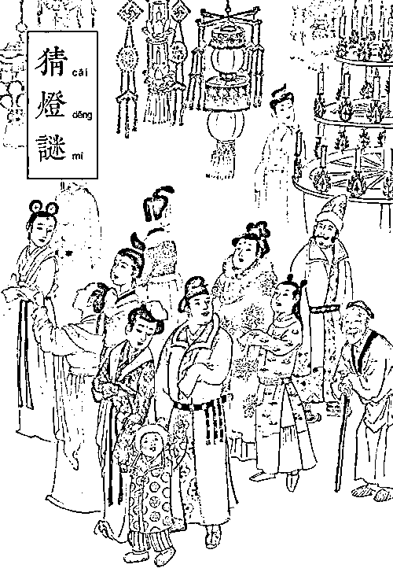

（图片来自互联网）

**什么是元宵节。**

有句俗语，过了腊八就是年，而这个“年”最后一天便是元宵。

农历正月十五便是元宵节。又称上元节、元夜、灯节。相传汉文帝（前 179—前 157 年）为庆祝周勃于正月十五勘平诸吕之乱，每逢此夜，必出宫游玩，与民同乐，在古代，夜同宵，正月又称元月，汉文帝就将正月十五定为元宵节，这一夜就叫元宵。

司马迁创建《太初历》，将元宵节列为重大节日。隋、唐、宋以来，更是盛极一时。《隋书·音乐志》日：“每当正月，万国来朝，留至十五日于端门外建国门内，绵亘八里，列戏为戏场”，参加歌舞者足达数万，从昏达旦，至晦而罢。当随着社会和时代的变迁，元宵节的风俗习惯早已有了较大的变化，但至今仍是中国民间传统节日。

为何元宵节能成为情人节？

元宵节能够成为“情人节”和中国古代文化习俗有着密不可分的关系。

①元宵节假期。

元宵节很少有在法定节假日之类，但是在古代并非如此。古代人的春节假期和现代并不一样，在古代春节年假并非从除夕开始，虽然元宵也是“年”的一部分，但是它和除夕年假并非是连在一起的。无论是唐还是宋，官员们，尤其是京官都是以除夕为划分，前后各三天的七日假。而后正常工作到元宵节后再放几日的假期。

《唐会要》“燃灯”条云:“天宝三载十一月敕，每载依旧正月十四、十五、十六开坊市燃灯，永为常式”.《宋朝会要》载:“(乾德)五年正月十六日诏以年谷屡丰，上元观灯可更增十七、十八两夜。”。明《礼部志稿》载成祖文皇帝圣谕云:“永乐七年正....自正十一日为始，其赐元宵节假十日。”由此可知唐朝节期为三天，宋朝延长至五天，到了明朝已有十日之久。

②宵禁制度

古代的宵禁制度非常的严格，坊市合一，市民娱乐范围的扩大是宋朝时才有的事情了。除去兴商的宋朝，中国古代重农抑商非常严重，夜生活基本上并不存在。

根据《唐律疏议》记载，“闭鼓后，开门鼓前,有夜行者,皆为犯禁。”李咸用的《山中》有“朝钟暮鼓不到耳,明月孤云长挂情”的诗句。“朝钟暮鼓" ,即早晨钟响,禁夜结束，人们可以走出家门从事各种活动;夜幕降临,街鼓响起，城门、市门与坊门关闭，禁止居民外出。

在这个时候，就算是交好的朋友，相爱的恋人，就算是再怎么不舍，夜幕降临之前也必须要与对方分离，回到自己的家中。夜晚也无任何商铺店面开门，就是大夫、药店也不会营业。

但是在元宵节的时候，宵禁制度会被取消。夜市、灯谜、烟花，电视剧中最常见的夜市活动便展示在街道上，形成一道和往时不同的画面。

③儒家文化对女性的束缚

自从汉代董仲舒“罢黜百家，独尊儒术”后，儒家成为了统治传统中国几千年的正统思想，并在后世逐步强化，到宋朱熹发展后，对女性的束缚日益加深，《女德》《列女传》等束缚女性思想行动的书籍成为了女性必学书籍，明清之后更是开始以“绑小脚”等方式，彻底的把许多女性的肉体圈禁在了家中，身心彻底束缚。

“男女七岁不同席”，除了参与深闺密友的茶话会，与家人去拜访亲友或参与少数宴会之外，对于女性来说，能够出门的机会并不多，能够像是元宵节这种，走到大街上参与活动的机会更加稀少。

女孩子们可以趁着元宵节梳妆打扮盛装出门，无论是元宵节的诸多宴会，还是大街小巷漫步看花灯猜灯谜的行动，无论是婚前相亲还是婚后约会，都为年轻男女们创造了一个彼此了解，增进感情的机会。

④元宵节活动

既然夜市开放，那么便少不了只有夜晚才能进行的活动。灯会似乎成为了元宵节的代言词。

赏花灯，猜灯谜便是元宵节的重头戏，在稍晚一些的时代，还会有放烟花，点天灯、孔明灯等。

元宵节的存在自汉朝至今历史悠久，随着历史时间的前进，人们开始慢慢的给予着它不同的含义和故事，很难去考证那些传说以及记载是否可靠。但这些千年来的习俗不断积累、改变之后传到今天，所留下来的一切是真实无欺的。

灯，似乎就成为了这场夜晚活动的主题。

大街小巷通明的灯火，路上熙熙攘攘的行人。这绝对是平日见不到的光景。也给那些平日鲜少有机会交流沟通的适婚男女们，提供了一些娱乐活动。不管是参加灯谜也好，还是放孔明灯、赏花灯也罢，让他们的出行有了实质性的目的，也让他们留下了最美好的回忆。

⑤文学作品

宋代大词人辛弃疾在《青玉案·元夕》中曾经描写过宋代的元宵节盛景：

东风夜放花千树，更吹落，星如雨。宝马雕车香满路。凤箫声动，玉壶光转，一夜鱼龙舞。

蛾儿雪柳黄金缕，笑语盈盈暗香去。众里寻他千百度，蓦然回首，那人却在，灯火阑珊处。

《金瓶梅》中，兰陵笑笑生也同样写过一篇灯赋描写元宵盛况：“山石穿双龙戏水，云霞映独鹤朝天。金莲灯、玉楼灯，见一片珠玑;荷花灯、芙蓉灯，散千围锦绣。绣球灯，皎皎洁洁;雪花灯，拂拂纷纷。秀才灯，揖让进止，存孔孟之遗风;媳妇灯，容德温柔，效孟姜之节操。....然览不尽鳌山景，也应丰登快活年!”

元宵节的热闹在文人墨客的笔下展示的玲离尽致。

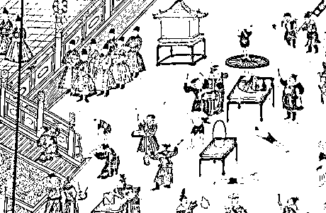

  （图片来自互联网）

元宵节作为情人节，并没有什么故事与传说来述说爱情，却在中国古代的传统以及文化中和与爱情有了千丝万缕的关系。

纵使是在父母之命媒妁之言的古代，人们对爱情自由依旧是会有那么一丝的幻想，无论是小家婚嫁还是大家联姻，都断不可能是直接定下了人与时辰便将自家的闺女送入他人府上。周公六礼之中或许并没有谈及婚嫁男女两方的相处，但是就算是在约束女性的古代，男方上门拜访，与自己未婚妻接触，亦或者是一起前往元宵节灯会，留下美好的回忆并不是什么罕见的事情。

未有婚约的女性在这一天，约上自己的闺中密友，化好妆，穿上自己喜欢的服饰。去元宵节活动中凑个热闹。深闺中久居的少女们少有地有出门自由玩耍的机会，自然是十分的喜欢。若是在元宵活动中遇到动心的人，上前搭讪几句，亦或者是记下告诉自己的父母，去打听对方的人品家世也并无不可能。

在这样的背景之下，元宵节也就成为了少年少女们期盼已久的节日之一，并可以称之为中国情人节。

（特别鸣谢穷奇小姐姐帮助整理资料，我们三月三再见。）

# 叨叨念丨要不要花钱报课？

> 原文：[`mp.weixin.qq.com/s?__biz=MzAxMjY0NTYxOA==&mid=2652071635&idx=7&sn=066313534661eff385408a9786568e8d&chksm=8049634eb73eea58ddebb13453f689d7edad48efced522228b4033b70293f1d293012f9a39bd&scene=27#wechat_redirect`](http://mp.weixin.qq.com/s?__biz=MzAxMjY0NTYxOA==&mid=2652071635&idx=7&sn=066313534661eff385408a9786568e8d&chksm=8049634eb73eea58ddebb13453f689d7edad48efced522228b4033b70293f1d293012f9a39bd&scene=27#wechat_redirect)

  好久没有更草药系列的文了，有时写了些短句或者日常的所思就节选一部分贴在公众号上了。上次更年度文好像也没多久，一眨眼已经又快要一年了，因为疫情的缘故，我上课并没有之前那么频繁了，更多都在学身体有关的课程，当然还有我的老本行，调香。

  说到上课，心里真的很难受，**在这里和大家说声对不起，为我的虚荣与自卑道歉**。其实我是个胆子很小的女孩，第一次听到别人叫我老师的时候我的全身控制不住发抖，我觉得我根本承受不起，所以更喜欢大家叫我花花。之前经常陷入自我怀疑的沼泽，觉得**为什么大佬那么多啊？他们怎么懂那么多啊？他们哪来那么多钱上课啊？我为什么这么不行这么菜？**……我不知道大家是否也有这样的感受，于是我上课的频率越来越高，后来成了每月都报一个或者两个课，线上课基本报了没结果，为了安抚自己没有进步的焦虑更多选择线下课……**这是我的焦虑，但是我却在以某种方式传播这样的焦虑。这是我的过失，非常抱歉。**

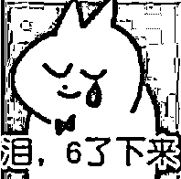

  有一天我惊觉有些人是以我为目标甚至是偶像的，觉得我有钱有时间，也想要这样跑来跑去上课，但是因为生活需要多方面兼顾，所以一边羡慕着我，一边又否定着自己的努力。说实话我之前从来没思考过这样的问题，因为我觉得自己只是无穷海洋中的一朵小浪花，我自己翻涌，有何能力影响他人？所以我的分享都很随性，赶得上趟就来赶不上就算，完全随缘，反正只是我的自弹自唱，又有几人能听明白我的传达。直到我听到了一句又一句“我也想像花花这样温柔，是因为学草药吗？”“我也想像花花这样可以到处上课”……原来，我也是可以影响人的……当然啦**并不是因为我学草药所以才温柔，但是学草药在某种程度上确实会让人更温柔**。

  我经常会收到别人问我的“有什么书推荐吗？”“有什么课程推荐吗？”……这是我“草药书扫雷”以及各种书单、课后感文章的来源，我发现我整理出来的内容，大家好像只是问问，并不是真的很在意，书单码了就相当于看了，课程看到价格就算了……后来我养成了一种特别的习惯，有人问我推荐的课程、老师和书籍时，都会先问些无关紧要的问题来确认是不是真的想学，而不是我的浪费口舌。只有真的想学的才会给出中肯的建议，那些只是来问问的，我直接会复制粘贴并且注明价格来劝退。而且我一再强调的思辨和自学能力被选择性的忽视，倒是学个四不像的见解被传到他处。让我不禁质疑大家是在做什么？造神的狂欢？甚至是某种程度的“政治正确”？我不过是被大家推出来的一个幻象，有人在与幻象暗自较劲，有人在与幻象“勾肩搭背”……而真实的我的影响力呢？没有。

  所以在听到有人羡慕我甚至模仿我的时候，我感觉到惊讶，随即感觉到了一阵强烈的不安。随着“上课啊“”花钱上课啊“之类的声音越来越多，这种感觉越来越强烈。盗课贩子的猖獗让知识流通，谁都能成为一个”专业人士“，这时**与前辈老师关系的远近则成了赢得胜利的砝码，花钱报课的相当于入场券，花的越多、老师越厉害就越在鄙视链上层，当然了，毕业院校、家境如何也是砝码……知识本身反而好像被搁置了，而求学的态度更像是不可被提及的存在**。没有什么不会是报课不能解决的，如果有那一定是你报的课不够多。

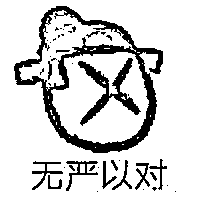

  不管是神秘学，还是草药什么的。作为一个经验者，我想告诉大家，**请不要迷信，不要迷信报课，也不要迷信老师**。课程和老师非常重要，可以帮我们节省很多时间，让我们拥有别样的视角，也能拥有他人用几年甚至几十年得出的理论，**我们可以在此基础上进行更深的探究发挥更大的价值，就像先辈扶持我们一样，我们再把这个作为接力棒传给后来者，这些隐秘的智慧伴随着特别的“传承”生生不息。这不是攀比的工具，也不是填补内心空洞的食粮，这是我们的知识，是我们的智慧与力量之源。**

  课程只是一个开始，**真正的过程在于报完课之后你自己，你的实践，你的生活**。不管是神秘学还是草药，不仅仅是技巧，更是神圣的使然。我们借此走上一条可能不被他人理解的道路，会无助会孤独，会发觉世界如此广袤而自己这么瘦小，不要怕，我们有自己。**每个人都在以自己的方式践行自己的道路，哪怕他不是学神秘学的，哪怕表演的如此戏剧性，切记莫笑他人荒唐，这是他们选择的方式，我们也在践行的路上**，此时点点滴滴的我们塑造了未来的模样。

  如果觉得很抽象，那我便以自身举例，希望能有一个好影响的传播，帮助到大家。

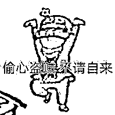

  很多人可能觉得我草药很厉害，但是真正的功劳不在各种课程上，而是我“打破砂锅问到底”的精神，**我不是个偏信传统的人，更不是偏信书的人，我会探究这样的说法从哪里来。就算写了我也要自己实践，看看是不是自己有效，考虑到个体差异性，我会抓小白鼠看看是不是真的有用，会多跑几个地方看看当地使用**。所以有人说我是不是以芳疗为主，其实根本不是，芳疗只能算是我技能树中的一个小枝桠。真正的根基是我众多范本得出的结论与经验。学一株草药的时候除了看书摘图看多家之言外，会观察会试药会沟通会归纳总结，形成自己的一套系统。而这些并不是上课教给我的，这是源于我自己的性格与天性，以及我的努力。**上课只能让我多长个枝桠，看起来更繁盛，而我的本性则决定了我的根扎得多深，我能长多高。有的时候会进行必要的修剪**，因为不是所有的东西都是好的，在不断前行的路上有些东西得舍弃。所以挑准之后快速下手，让养料去到更重要的枝条，一个人的精力毕竟是有限的。

  调香上了几家不同的课，有的是在芳疗圈里有名的老师，有的是全球顶尖的学府，但是实际情况是，那些课程只是入门。对，你没听错，那些几乎一万元一天的课其实只是入门，别说这家 ISICPA，那家第五感，都一样……（因为我会辅助格拉斯在华课程的教授与监考，所以避嫌不谈。）而**更进阶的东西课程无法教给你，需要你日复一日的训练与学习，更需要你人生阅历的积淀，甚至也需要你个人特质的建立**。所以花钱报课之前最好先想清楚，如果花几万为了镀金或者商业运作需要，这是个人需要。如果是为了学习入门知识，那也可以。如果觉得花了钱就可以成为调香师的，只能说想得美。

  前段时间我调了五款香，来表达爱的序章。前两款都是来源于我的梦，一个舍生忘死，一个不悔。课程会教我们 rosemary（迷迭香）的气味分子，它的气味特征：樟感，轻微木质气，凉……但是不会教我们可以用它来做雪地、做眼泪，不会告诉我们 10%、1%、0.5%在配方中呈现的不同效果，不会告诉我们它和 lavender（薰衣草）怎么搭配来突显闲适的乡野。后面两款则是爱的过程的表现，有过程中的苦痛，有自欺欺人。没有课程会告诉我们怎么用绿意的叶醇打造超现实主义，也不会告诉我们原来 0.1g 的甜就可以盖的住 8g 的苦，像极了爱情的样子。最后一款是升华，用橙花来表达尊贵而自矜的爱，用 Ald C10 与 Calone 表达月光如水的洁净，课程也不会告诉我们不同的原料代表着什么样不同的爱，只有我们的实践和经验以及对原料的理解才会告诉我们。我们在用神奇的自然造物施展着一场魔法，表达着自我，宣泄着那时那刻我们的所思所想，并且传达给他人，给他人以力量。

  很多人会觉得调香就是做香水，和魔法有什么关系。其实不尽然，如果说商业香或者普通调的香只是好闻，气味疗法可以起到某种程度的治疗作用，那么有的香气就是用来传达意志、给人前行的力量的，这就是魔法。我见过一个怯懦的女孩在闻到适合自己的香时如痴如醉的深情，以及那一刻她的自信光芒；也见过很多人在调香的过程中发现了人生中困顿不前的境遇，决心打破走向前去……这就是调香的魅力所在啊，也是调香师个人的魅力所在，课程怎么会教给你这些呢？

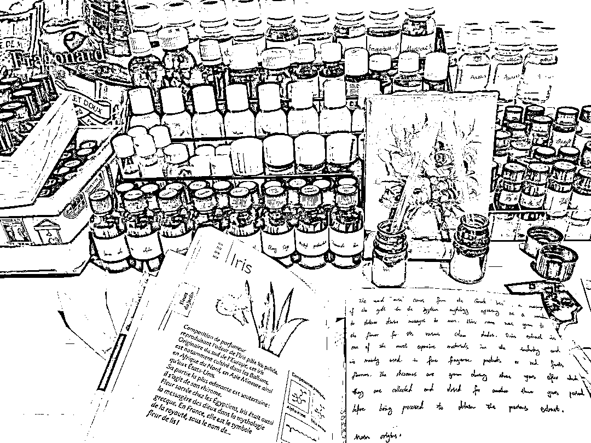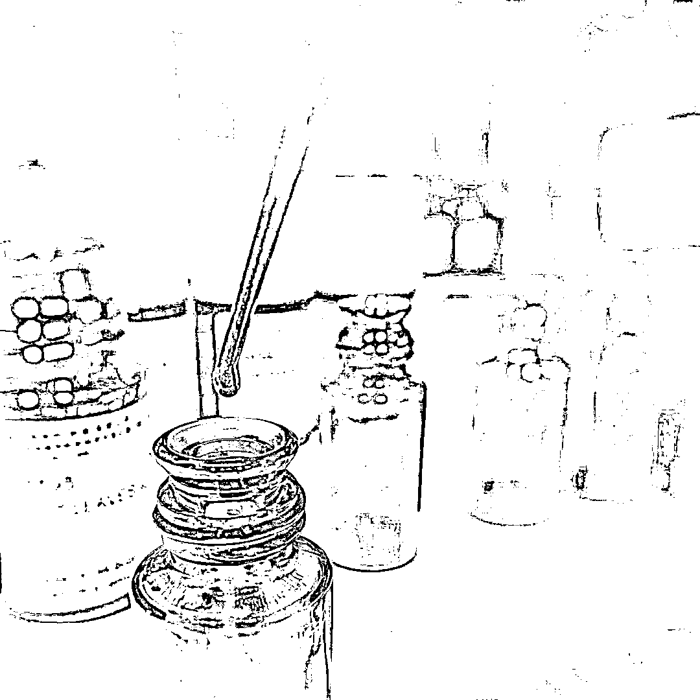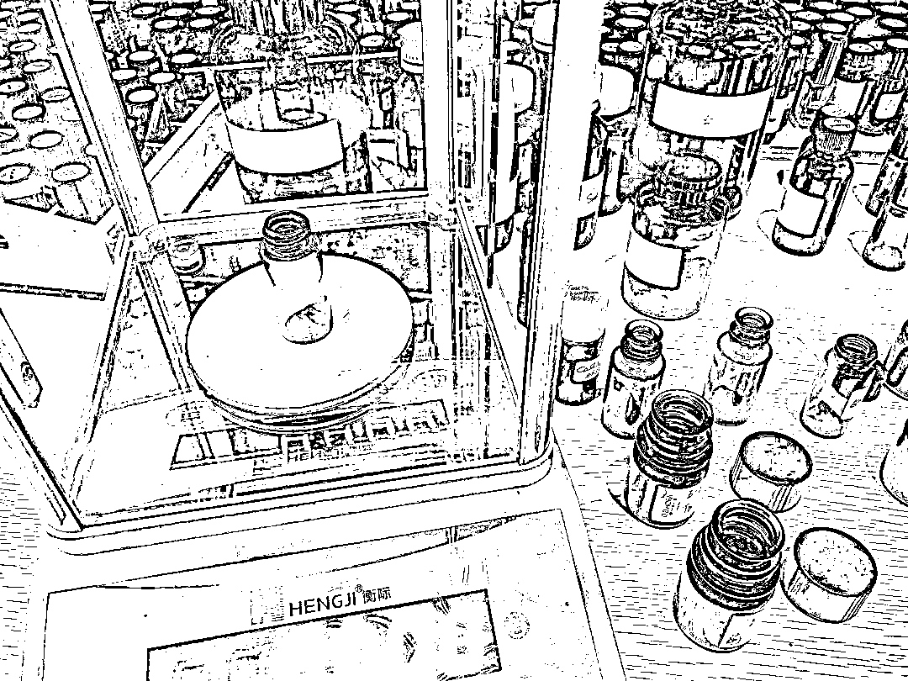

  Bodywork 也是如此。虽然报了这么多课，我却依然不敢叫自己 bodyworker，只敢称自己是探索与学习者。虽然花了钱学了依莎兰，但是课程真正的内容在生活中才开始。在一次次触摸中，身体都会有不同的反应。你能摸到每个人不同的模式不同的性格，然后与他们进行交互，传达一份中立的陪伴与爱。在最开始难免流于技术，会觉得长推这么简单，摸得没有章法。当摸得次数多了，更能捕捉到身体的信号，你能感觉到有的部位在和你说话，有的叫嚣着不要摸我，有的情不自禁依赖……技巧在此时并不是那么重要了，而是静默中身体与身体的交融。这些课程会告诉你，但是**如果你没有那么多实践的时候，你很难体会到其中的奥妙之处。**

  在上晨露老师课程的时候，理论部分感觉到“啊！好神奇，原来是这样！”，一到练习动作的时候才真正体验到什么是身体的“可塑性”与“可能性”，在与身体不断和解的时候，老师只能起到引导的过程，更需要自己不断尝试。而且也会根据每个人的生活经历不同也会发展出很好玩的东西。比如有的就会更侧重在神经上，而我整天琢磨怎么把 bodywork 和魔法相结合，怎么更精细地使用看见的力量，以及怎么使用不可见的力量去调整，还有怎么通过对身体的调整来帮助自己在生活中的困扰（比如怕黑恐高恐水现在都摸得好的差不多了），甚至达成神秘学上某些方面的“成就”（骚想法太多了）。

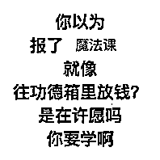

  你看，我最引以为傲的根本不是那些课程，**当然我非常感谢自己能够有很好的运气一直被很好的老师所指引，但是我更感谢自己在这个过程中的思索与努力。**如果一个人具有这样的品格，那我觉得上不上课不是非常重要，现在信息获取渠道非常多，只需要肯花时间花精力，**如果不愿意那就用钱来换（镀金或者拉关系另说，这是自己的选择，自己权衡利弊决定价值就好）**。**所以在别人问我你跟谁学的，我说自学为主。**有人问我：“没那么多钱怎么学草药，总感觉很花钱。”我说：“你先把我很久之前列的书单的书都看完，就可以不用再上圈内任何的魔药课了。”然而事实是，大家依然在抱着 Scott cuningham 的那本《魔药学》不撒手，也没见看看别的书，觉得把芦荟插门上就能驱邪了。

  说到这里我就不得不吐槽，不要迷信任何工具，书也是一样。就像乔夏的《100 种草药疗愈全书》里很多都是抄 scott 和 paul 的书，还有节选翻译自《A Modern Herbal》，当我们知道源头就知道她有些地方抄错了，甚至有的观点是错的，我们可以对她进行修正。Scott 那本书里很多也是来源于各种民俗啊，借鉴了其他多本书，不要迷信啊喂！我举个例子，比如说 scott 有一天来中国某个村儿发现人们在做度亡，其中用到了鸡、鸡蛋、黄纸什么的，他就可以说用鸡、鸡蛋、黄色的纸张和五彩纸做成的旗子可以用来沟通死者，让他离去吧啦吧啦……【我只是举个例子形容一下这种感受】

  好了，今天就叨叨这么多吧，我发现有人好奇地图讲了啥，讲了抑郁症的两种配方思路（一种没在公众号公布），讲了蜡烛的一些安全问题，讲了植物人格，讲了乔夏草药疗愈系统的一系列源流发展，讲了梦的用处，还有“看见”的一些问题与运用……看还有人好奇“草药单方与复方的差别”以及“怎么搭配配方”，改天可以写写，你们还有什么问题吗？你们可以留言，我有空翻后台就会写。

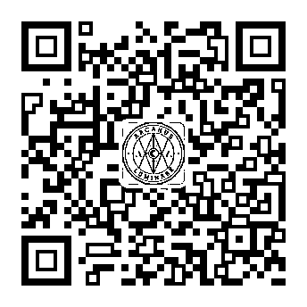

秘义之光

塔罗丨北欧丨神话丨水晶丨魔法丨 Wicca 丨草药等

期待与你的不期而遇

# 灵视入门 ｜ 12 油灵视

> 原文：[`mp.weixin.qq.com/s?__biz=MzAxMjY0NTYxOA==&mid=2652071897&idx=5&sn=a2d5c7493266346672bb474dd927d426&chksm=80496244b73eeb52bcf0ee0a2063b35243b426047ea28f67610cda021ced4883c2bd7b0cdcee&scene=27#wechat_redirect`](http://mp.weixin.qq.com/s?__biz=MzAxMjY0NTYxOA==&mid=2652071897&idx=5&sn=a2d5c7493266346672bb474dd927d426&chksm=80496244b73eeb52bcf0ee0a2063b35243b426047ea28f67610cda021ced4883c2bd7b0cdcee&scene=27#wechat_redirect)

**\\****Chapter 12//**

油灵视

  翻译 | 梅里耶 

      校对 | HonoYoku

          光中百夜

巴比伦的油灵视

数千年前，诺斯特丹姆斯尚未把水倒入灵视盆里，巴比伦人就已经在借助透明的油来做同样的事了。由于数世纪以来他们的一些魔法书被反复传抄至今，我们得以知道他们灵视的大致手法。这些记载是由魔法师简略记录，以供魔法师使用，所以许多细节只能找其他资料来弥补。尽管如此，传统的巴比伦油灵视法，还是被很好地流传了下来。

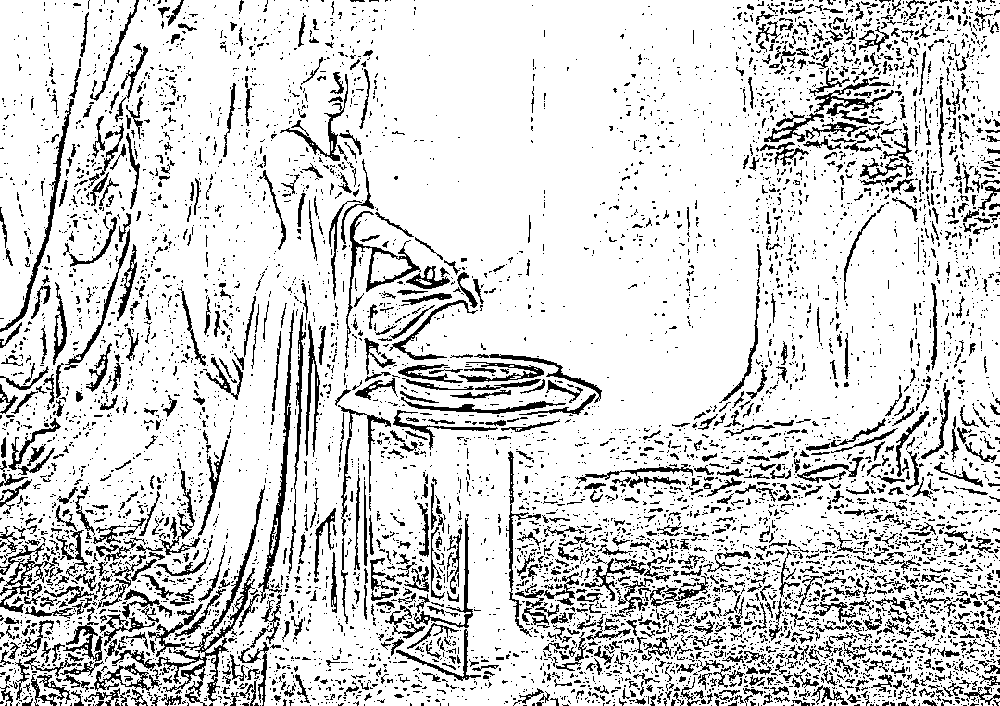

我并不指望你在日常的灵视中使用这些方法，但是他们可以教给现代灵视者许多关于灵视体验的心理动力学知识。你应该从这个角度分析它们，并考虑古人为什么这么做的，以及他们的手法如何与现代实践联系起来。

正如之前所强调的那样，雇用孩童来进行灵视既不必要也不道德。如果你直接通过感官隐喻来灵视，而不是间接地通过媒介，你将得到更好的结果。在现代魔法中，我们已经摒弃了屠宰动物等野蛮行径，同样我们也废除对儿童的残酷利用。但是在古代，孩子们就是被这样利用着，尽管我憎恶这种行径的这些残酷的方面，我觉得我还是应该准确地呈现出古代的方法。

拇指王子

一个非常流行的手法被称为“拇指王子”。魔法师会在灵视者（通常是一个青春期前的男孩）的额头上和拇指指甲盖上涂橄榄油。闪亮的指甲会成为魔法镜，灵视者会在其中看到灵体——即拇指王子。一例被记录在希伯来魔法文献中的这种仪式是这样描述的：

带上一个年轻男孩，用一把黑柄的刀在地上画个圈，准备好右手拇指的指甲，使它变薄，取四颗光滑的石头并放在圆圈的四个方位，把前文所述的刀放在圆圈的中央，让男孩站在圈内的太阳柱前面，用洁净的橄榄油抹在他的指甲和额头上，男孩应该认真地看着指甲，而你就在他的耳边低声念此咒文：“真神啊，其怒震撼大地，万国无法忍受他的愤慨；上主的右手大显威能，上主的右手将我举擎”[诗篇(Psalms) 118 :15-6]，我严令您，指甲王子，以大海之名，以宇宙中的三盏明灯之名，你应将国王 Mimon 带入这块指甲当中，其王后也应与他同行，他的两个仆人也会来此，并带来两只羊羔，一黑一白，他们会杀掉羊羔、剥下它们的皮并将它们煮熟，他们会带来三个玻璃杯，王后带来一只白色母骡，他们会把桌子放在屠宰房里，并且要把命令所需的契约之书带来；告诉他们，他们可以享用食物和水，然后他们会告诉你一切你渴望的事物。当你的愿望得到满足他们就会离开，此时就要将小男孩的指甲和额头上的油卸掉。当他想要向他们询问的时候，他应当用他带着的契约之书命令国王和王后三次，以及所有与他们一同到来的人，并且命令他们要以男孩可以理解的方式告知他所要求的一切事物的真相，并不可伤害他。 

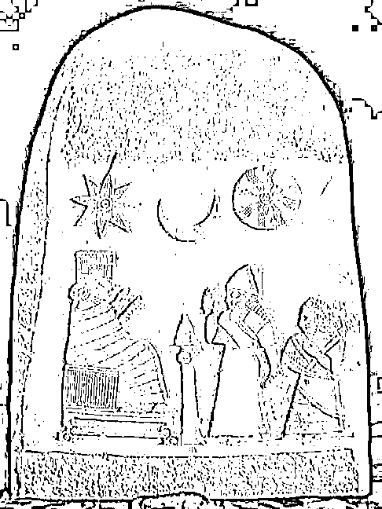

“四个光滑的石头”应放在魔法圈的四个基本方位上。魔法刀可以扎进魔法圈中心的土地上。“在太阳柱前”表示进行仪式的适合时间，也就是日出之前的清晨。“海的名字”是指巴比伦海神伊阿（Ea）。“三盏灯”是指的巴比伦的神明辛（Sin）、沙玛什（Samas）和马杜克（Marduk）——希伯来的文士没敢直接写明他们的名字。

掌中王子

另一个版本的巴比伦油灵视被称为掌中王子。这涉及到涂抹在手掌上的油与煤渣混合而成的黑色糊状物。它的原理与涂油的指甲完全一样，如以下记录所示：

用一把全新的黑柄刀在地上画一个圆圈，大小要让你能与一个不到九岁的男孩或女孩一起坐在圈里，并用橄榄油与锅底的黑色煤垢涂抹他们的左手，并警告他们不要看涂抹部位以外的区域，然后对着他的右耳低声说道：我以 BSKT、K Ketriel、MI、Maeniel 的名义命令你，在这个孩子身上降临，并正确地回答他代我提出的问题，这些东西他将重复三次。那个孩子会看见一个人骑着白骡或白马，他应对来者重复三遍：愿主保佑以主之名前来的人。他应对那人说：取悦我吧，汝应从骡马上下来，汝应吩咐仆从带来一只羊羔，他将其宰杀烤熟，并摆好桌子让他进食，然后他就会将一切事物重复告知他三遍。在他们（灵体们）用完餐后，你可以询问你的问题。如果他们说谎，你应重复三次：我以 Sansniel，Patchiel，Sakiel 的名义命令你，告诉我真相，并在男孩的耳中与脑海中重复三遍，SDI，SID，MSH ，TRIT，RIT，这样你会知道你的想知道的一切。

杯中王子

巴比伦人还有第三种的油灵视，就是所谓的“杯中王子”。这涉及到在一个杯子的内侧涂满芝麻油，并用它作为凹面魔镜来捕捉和放大照射在其内缘的烛光。令人遗憾的是，与其他古代灵视相同，这仍然会使唤两个小男孩作为向杯子的灵体寻求信息的媒介。我不会再给出杯中灵视的记录，因为在后面的第十五章中我将会对魔法镜作更详尽的介绍。它的基本仪式结构与拇指王子和掌中王子相同。

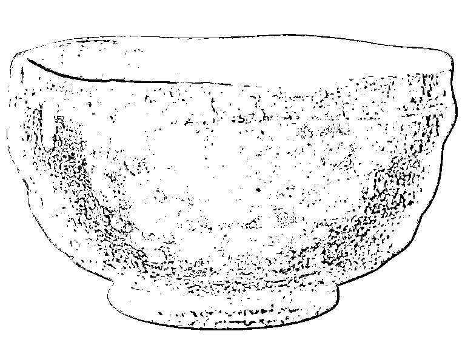

埃及的油灵视

油灵视从巴比伦传入了希伯来和埃及人的魔法中。也许是犹太人从巴比伦迁移到埃及时，把它带了过去。然而，它可能在之前就到达了尼罗河谷，萨缪尔·戴希斯（Samuel Daiches）相当强调地说：“毫无疑问，这种魔法是从幼发拉底河的土地传到埃及人那里。”，他将其追朔至公元前 2000 年的巴比伦。最完整的油灵视记录，保存在埃及人在公元前 200 年至公元 500 年间所写的希腊魔法莎草纸上。

不同的技术细节不同。碗（有时被记述为杯子或碟子）可以是陶瓷、青铜或红铜制的。在下面详细描述的阿努比斯的仪式中，它是一个内侧镌刻有阿努比斯神像的铜杯。

下面提到了几种油，包括橄榄油、芝麻油、蔬菜油、草药油和绿洲油（可能是棕榈油）。有时油直接被倒入空碗中。在其他时候，先加入水，再倒入油一比一混合。偶尔，魔法师会只滴几滴油到碗里的水中。

1

埃及魔法师奈福特斯的方法

在魔法师奈福特斯（Nephotes）给埃及法老普萨美提克斯（Psammeti-chos）的一封信中，详细描述了油灵视，四种类型的占卜分别需要使用四种（与油混合的）水。如果向天上之众神（也就是行星天之众神）祈求，使用雨水。如果召请地上的神，使用海水。如果召请伟大的奥西里斯或塞拉皮斯（Serapis），使用河水。如果向死者的灵魂祈求，使用泉水。


魔法师必须保持洁净七天来为这个仪式做好准备。奈福特斯在信中说，那些试图使用碗灵视的人应该让自己向往着赫利俄斯（Helios，太阳）。在当月的第三天（也就是月亮周期的第三日），在日出之时爬到自家房子的最高处，以背部躺在干净的亚麻布上，头戴黑色的常春藤王冠，用黑色的带子遮住双目（“伊西斯的黑色”，参见第二十五章），并把你自己包裹起来，就像一个缠绕着布带的尸体。你的头要面向东方。然后你被要求吟诵下界之神提丰（Typhon）的一篇很长的祷文，此处我就不多赘述了。

1

1

测试灵视者

对埃及魔法师来说雇佣一个灵视者是很平常的事情，尽管魔法文献中也经常提到，如果有必要的话，魔法师可以单独完成灵视。检验灵视者的方法也很有意思，因为它给出的有关进入良好的心灵感受状态的洞见对于一个优秀灵视者来说很有必要。

魔法师向站立着的灵视者的耳边吟诵七遍荷露斯的例行祷文：“高贵的鹮、隼、鹰、贵族和大能者，让我以高贵的鹮、猎鹰、鹰、贵族和大能者的方式被净化。”然后他（或她）就等待这个灵视者听到神谕之声。如果这个灵视者双耳都听到一些东西的话，他就非常适合进行灵视。如果只有右边的耳朵听得到，他仍然适合；但如果他是用左耳听到，他就不适合，应该被拒绝。

传统上，左侧或者阴侧（sinister）被认为是邪恶的一侧。恶魔对着左耳讲话，有时候邪恶的天使也因为同样的原因被认为是坐在左肩上。右手是祝福或慷慨的手，左手是暴力或审判的手。阿拉伯人用右手吃东西，在排泄后用左手去擦拭。在现代，左手与手淫有关。据说，欺诈和欺骗的人从不让右手知道他们的左手在做些什么。所有这些关于左侧与邪恶有关的说法，大多都是民间迷信。


七块新砖

此仪式用具的一个重要组成部分是七块新制的粘土砖，在它们制成之后其底部亦未曾离开那片放置它们的地面。由于粘土砖被放在阳光照射的沙床上固化，它们的底部会被沙子覆盖。魔法师在净化自身后，应去小心翼翼的捡起这些砖，不让它们再度接触到大地。

其中三块砖块以原来的沙质底部朝下，在灵视的房间内水平放置成一排。另外四个以垂直排成一列，也以其原来沙面朝下的方向放置。俯视下，这七块砖头应该形成一个 Tau 十字形（大写字母 T 的形状），并使它的交叉点（也即是灵视碗放置的地方）向着东面。

有些仪式要求把四块砖头放在灵视者周围，但是灵视者被警告不要碰到地面。我认为这可能是一个记录错误。但是，如果把砖放在四周，而不是放在灵视者的下面，那么这可能是为了将砖放置在魔法圈的四个主方位上。这个魔法圈应环绕着魔法师，灵视者和碗。


在 Tau 十字的三个臂梁中的右臂，即碗的南面，放置一盏点燃的灯，再于左臂的砖，即相对的北面，放一个香炉，且都与碗排成一列。碗搁在中间的砖上。在灵视碗的东边，在一块包住十字顶梁的月牙形区域里，摆七块干净的面包，旁边再摆七堆盐，作为给众神的食物祭品。

祈求阿努比斯神

将清澈的绿洲油轻柔的倒在铜碗的内侧，要避免因起泡而出现浑浊。让碗装满油。点着油灯和香炉。将球状的香置于香炉中通红的炭上。香的主要成分是乳香（frankincense）、蜂蜡（beeswax）、安息香（styrax）、氨草胶（gum ammoniac）和海枣（dates），一起在白酒中研碎成软膏并且捏成一个小球。将阿努比斯植物的叶子置于油灯的顶端。阿努比斯植物被认为是水苏（stachys），或者绒毛水苏（downy woundwart 或 Stachys germanica）。

灵视者穿着白色的亚麻短袍进入场所。在他胸前束着腰带或者用十六根亚麻绳（白、绿、蓝、红各四根）编织成的带子。魔法师让灵视者肚子朝下匍匐在一块干净的垫子上，垫子盖在形成 Tau 十字竖着的臂梁的四块砖上。这样的布置使得灵视者身体的每一部分都不会触碰到地面。

灵视者右手抓起油灯，左手抓起香炉。灵视者将眼闭上，将下巴搁在支撑碗的中梁的末端一块砖上，这样他的脸就只距离油面几英寸。魔法师用一块亚麻布完全盖住灵视者的身体和灵视碗。


当对神祈求成功之后，魔法师指导灵视者睁开他的眼睛。如果灵视者什么也看不见，魔法师就会让他再次闭上眼睛，用以下的话祈请光明显现：

黑暗啊，从他的面前移开你自己！光明啊，将光明给我带进来！深渊中的 Pshoi，将光明给我带进来！在灵魂之船中的奥西里斯啊，将光明给我带进来！外部的四种风啊，将光明给我带进来！掌控这个时刻，属于这些时辰的神，将光明给我带进来！阿努比斯，可敬的牧牛人，将光明给我带进来！因为汝今天将给予我保护。因为我是伊西斯之子荷露斯，奥西里斯乖巧的儿子；汝将神明们带到审判之地，汝将使他们为我所用，让我的事务行进下去；Netbeou，汝会让他们来做这件事。我是 Touramnei、Amnei、A-a、Mes-Mes、Ornouorf-Ornouorf、Pahorof-Pahorof、Io、Little King、 Touhor；让这个面对着油的孩子成功；汝也会护送索贝克（Souchos）至我这里直到他显现。我 Setem 乃是我名，Setem 乃是我之真名。因为我是 Lot，Moulot、Toulot、Tat，Peintat 是我之真名。伟大的神啊，汝之名号如此伟大，在这个孩子面前不令人畏惧地、无欺瞒地、真实地出现吧。

这段祷词会对着眼睛罩着亚麻布的灵视者重复好几遍。然后魔法师会让他再次睁眼。如果他看见盛油的碗中有亮光在闪烁，魔法师就会用以下的语言来鼓动它：“增长，增长啊亮光，涌现，涌现啊亮光，上升，上升啊亮光，攀登，攀登啊亮光，汝等在外之物，速速进来。”

如果灵视者报告他看到阿努比斯神走过来，魔法师就会用这段祈请词鼓动他前来：“汝即透特，汝来源于伟大的崇高之灵（Agathodaemon），众神之祖父的心脏；今天前来我之容器的口中，不含谎言地告知我一切我所问询的真相；因为我为伟大的智者伊西斯，我之所言必然实现。”

魔法师冒称伊西斯以及其他在他的祈请词中出现的神明，以获得他们的权能。使用这种借来的力量他就能够命令降临的透特-阿努比斯，并且保证他不撒谎。伊西斯是魔法女神，这些奇怪的名字都是一些充满力量的粗野名字。这些在埃及的诺斯替异教魔法中经常用到。


站立的神明

魔法师指导灵视者告诉阿努比斯将其他的神明带到宴席。当灵视者告诉他神明们已经召集完毕时，魔法师就会邀请他们分食在灵视碗周围排布的面包和盐。除非魔法师已经正在自己进行灵视了，否则他无法与这些神沟通，而是要通过媒介来与他们交流。

至于为什么要给这些神供奉食物——也许是神们自己、也许是魔法师供奉——是因为在古代人们普遍相信，冥界的幽灵只有在被供给食物后，才具有足够的生命力对灵视者回话。宴席给他们注入了力量。他们并不食用物质上的食物，而是被人们相信存在于食物内部的生命能量。通常来说，新鲜食物能够提供这些营养，就像荷马史诗《奥德赛》中的英雄奥德修斯给死者的阴影献祭绵羊新鲜温暖的血液作为供品。但血祭在现代魔法中并不被使用。

当灵视者告诉魔法师，神明结束了他们的宴席，魔法师就会询问阿努比斯，众神是否有意愿回答他的问题。如果阿努比斯说是，魔法师就会通知灵视者：“让那个回应我今天问询的神明站起来。”如果灵视者报告被集合的神明中有一个在他的脚边站起，这个魔法师就会命令撤走宴席桌。他会告诉灵视者如何指导阿努比斯询问站起的神，以获知其真名，然后报告给魔法师。

关于神明真名的知识能够给予魔法师力量，使这个神明服从他的命令。魔法师藉由灵视者之口询问任何他想要获知答案的问题，而享用了献祭的面包与盐、接受了他免费供奉的神明必须如实地回答被提出的问题。


值得一提的是，胡狼神阿努比斯是透特神护卫刚刚死亡的人抵达冥界的化身，他与被召的神明之间的联系就像灵视者相对于魔法师的职能一样。阿努比斯是灵视者的灵性向导，如果按照现代灵修主义的术语的话。灵视者不能与其他神明直接沟通，而只能以阿努比斯为媒介——除非一个神明贡献了他的真名，这样灵视者才能直接与之沟通。

古代的智慧

油灵视有很多不同的变体，对应于不同的神、达成不同的目的的不同的魔法。上述我给出的仪式只是一些典型例子。一般而言灵视仪式不会在魔法书里如此详尽地书写出来，因为一般都默认使用书的人已经详细知道了必要的实践框架。我从一些不同的来源中找到这些信息并且拼接成上述的内容，我视其为灵视方法的主要模式，你们可以花一些时间来学习，以及比较它们和其他章节中介绍的现代方法之间的区别。

如果不因为现代观念先入为主，并且乐意寻找这些实践背后的思维方式，尽管有些东西第一眼看上去很傻很迷信，你将能从古人那里学到很多东西。如果你谨记，希腊和埃及的灵视者做的所有事情都有特定的目的，你就不会犯错。

* -End-*


秘义之光

**▇ 扫码关注我们**

# 沙龙丨萨满巫者之路

> 原文：[`mp.weixin.qq.com/s?__biz=MzAxMjY0NTYxOA==&mid=2652072484&idx=1&sn=37584515f5188fbcf3cfa73540939506&chksm=80496fb9b73ee6aff027668f4642a3c4c057469657b9d59f21b76d90e5745f5ba6c5b5b30098&scene=27#wechat_redirect`](http://mp.weixin.qq.com/s?__biz=MzAxMjY0NTYxOA==&mid=2652072484&idx=1&sn=37584515f5188fbcf3cfa73540939506&chksm=80496fb9b73ee6aff027668f4642a3c4c057469657b9d59f21b76d90e5745f5ba6c5b5b30098&scene=27#wechat_redirect)

    我想我是受了威廉的诅咒，生来就爱冒险，资料越少，就越喜欢探索。还记得第一次接触“萨满”的时候，圈子里还没有那么多所谓的“萨满”也没那么多课，流传的只有 Robin 奶奶的课。在我疯狂心动的时候，一个朋友和我说不要报，有这个钱我带你去找真正的萨满。从此开始了我的不归路……

    我是幸运的（可能精诚所至，金石为开），可以认识到很多地方的萨满，并且也学习到了很多。也因为跑的地方多，也就**可以对每个地域所孕育出的萨满文化拥有相对客观的了解**。再加上本身家族启蒙的原因，对于那些“不可言说”或者看似晦涩的经验，可以很快地明白说什么。

    在这次寻访之旅结束后，一切就像是千万条小河突然汇成了大海般，很多之前杂乱的或者说困扰的，都变得清晰可见。而那些曾经因为对萨满所知甚少所披上的神秘面纱，也得以摘下来，不是很多课程包装后的样子，也不是被过度神秘化的产物，只是萨满本身。

    所以我想把我的见闻、经验，以及很多经历，以沙龙这样轻松诙谐的方式讲述出来。之所以设置成沙龙而不是课程的方式是因为：

    一是我更想掏心窝子和你们说些话儿，而不是以一个严苛的老师身份塞些定义，神秘向的学习除了学术化的东西，**深入田野**也是非常重要的，这样可以让我们以巫师的角度思考世界，很多看似神奇的法术仪式的原理就明晰了，同时也可以帮助我们**打破偏见**，不是用自己的主观去思考与评断。

    二是我更希望我是个“传道者”，我深知每一位的前路都无比广阔，不敢以师者自居。**只能说作为一个“前浪”，把迷信的面纱撕扯掉，培养独立思考以及思辨的能力，还有对于道德品行的培育。这比技能更重要，而且在不管未来你们前往任何一个方向，都会是受益的**。这是课程不会提及的部分，所以我选择用口语化、经验化的的沙龙来分享。 

    三是这个沙龙对于我来说，**是萨满研究的收官之作**，是**充满了纪念意义的“作品”**。我个人认为**作品是创作者的“不朽”所在**，真正被我誉为“作品”的一个是还在打磨孕育的“魔药学概论”，另一个就是这个了。以此来纪念我十几年来的巫师训练，以及这几年来不断奔走在途中所经历的苦难、时间与精力，也以此奉献给一直引领我的先者、长辈、神灵、朋友以及一直支持我的你们。

    感谢大家！接下来就是叨叨这次沙龙会说些什么了，下面是太长不看版：


    接下来就是详细介绍版啦，也是第一次以这么话唠的方式来介绍，还请各位多担待~

一

 巫者的自我修养

【内容与原因】：

    1.巫师就像是流水线批发制作的一样多且千篇一律，引发了我早期对于“女巫”的误解与偏见（在这里为我的冲撞鞠躬道歉），后来开始思考巫师到底是什么，以及世世代代传承下来的奥秘是什么。万分感谢指引我的诸多先者，我得以找到这个准则，可以在汪洋大海中不怕偏航。我也想把这个分享给诸位来者。

    2.我沿袭了我们家的特点，点了治疗技能。不管是在家里人的耳熏目染下，还是在我找很多小白鼠实验下，发展出一套特殊的身体认知和健康观，并借助这样的认知配合操作，会很快速的看到结果。想**和大家分享一些我经手的一些操作案例，也可以给大家展示这个过程我做了什么，要点在于哪里**。还有**一些简单的训练方式**，没有办法保证大家可以像我一样进行操作，但是如果真的有按照方法练习，会有一些看似神奇的结果。

    3.有经手过一些附体的案例，但是我的实力还很菜，至今仍觉得非常吃力。不过在这个过程当中发现了一些小奥秘，就是一个人看似附体，但是原因会有差，有的是心理因素导致的，有的是精神因素导致的，有的是外灵侵袭，有的是“神灵”感召。**而在一个附体案例（排除“神灵感召”）中，多半会出现混合的情况**。有些法师明明已经驱逐了外灵，但是仍然未解决来访者的问题，很多时候就源于只解决了一个“致病因”。就想聊聊我非常青涩的看法，可能大家接触不到太多附体，但是**可能这个分享会有助于对心理、精神、外灵所携带信息的辨识吧**。

    4.**有些人直觉很强，擅长感应，但是会感觉时常抓不住，或者容易被庞大的信息所干扰，甚至会头痛。**这些也是我之前会出现的问题，不过我现在已经完全没有这方面的困扰。就想来聊聊这些，**以及应当如何对待这些突如其来的信息，以及由此衍生出的命运是否是既定的这样的看法**。当然我的并不是标准答案，只是在我个人经验的基础上所得出的观点和建议罢了。

    5.不管是网络也好，还是实地，都有不少骗子，也多的是半桶水晃悠的。不管是有事求助，还是想拜师，擦亮眼睛以及仔细思量都非常重要。之前也分享过因拜师不靠谱而引发的惨案，后导致彻底弃坑神秘学的事。在我走访的过程中，也见过形形色色的巫师，水平也不一而足，就**分享一些我个人鉴别能力的标准**吧。


**二**

寻访之旅——美洲篇

【内容与原因】：

    1.分北美和南美两个部分。会**分别介绍一些小故事，以及我学到的技法。比如外面课程几千块几万块教的基本操作**（我也砸了钱去学过），什么**穿梭上部世界、中部世界、下部世界**，什么**召唤力量动物、植物灵、合作伙伴/灵性帮手**的，还有一些**针对灵魂的技法**什么的。看起来挺遭同行诟病的，不过别着急骂人，我只是分析这些技法的原理，并不能代替线下操作以及实际体验，并不会抢了饭碗。**再此我也申明，这只是经验分享，要考虑到实践的重要性、引导者的资历以及个体差异性，别莽。**

    2.其实在这个过程当中会出现一些老师们不会强调的境况，可能也是我运气比较好，就见识到了一些**乱象和意外的发生**，给我留下了很深刻的影响，**而且萨满确实已经做好了空间的净化和结界的设立，但是仍然有一点点小状况，然而这些状况是主办方之类没有提及的**。想和大家分享一下在上类似的课程的时候，可能会存在的一些小问题，当然如果没有那最好。

**三**

力量动物探究

【内容与原因】：

    1.由上面的召唤力量动物衍生的考究，我是个特别较真的人，**不管是实际和那些萨满们打交道，还是我个人的体验，发现力量动物和坊间的力量动物有点不同**。所以我就整理了坊间力量动物的说法，包括但不限于：

（1）教导、指引、赐予力量（也有称为动物力量向导或精神动物）

（2）反映了个人的个性与特点

（3）力量动物会影响一个人的性格

（4）力量动物是心理原型

（5）任何人都可以拥有自己的力量动物，无需建立联系，只需要真诚呼唤

（6）可以是某种动物的具象物件譬如泰迪熊等

（7）塔罗萨满之塔罗的力量动物

（8）帮助提高对于灵性世界和自然世界的认知

（9）力量动物通常以神谕卡方式表现，表达信息但不长久

（10）疗愈并协助生活

（11）力量源于本能和野性，驯服的宠物通常不会成为力量动物

（12）昆虫不能当力量动物

（13）东北“狐仙”“黄仙”=力量动物

（14）动物种族、整个族群的力量

（15）力量动物可以在物质世界没有实体代表

（16）力量动物有时是动物本身，或者是代表一些神灵使用动物形象，比如赫卡特和狗

（17）是以动物形态幻化的守护灵

（18）力量动物可以有多个（这个有分歧，有的说只能一个）

（19）不同的人拥有同一种力量动物，所展现的力量和帮助也不一样

（20）力量动物特色各有千秋没有强大好坏之分

（21）没有力量动物，给人做仪式疗愈就少了一股灵性力量支持，会无法成功

    这里有些观点我是认同的，有些是不同萨满之间存在分歧的，有些我觉得是不够严谨的，有些我觉得是在放屁的。**我想分析每种说法的原因，以及个人看法。**

    2.在很多文章中都会提到动物图腾崇拜，但是**原始动物崇拜和动物图腾崇拜是有一定区别的**，我想从更多方面比如说**神话、民俗**中去分析“力量动物“所展现的多样性。而且因为难免会涉及到**出马仙**，所以也想聊聊这个。

    3.除了来源分析，我也想**从我个人的实际角度出发，深刻地阐释这样的力量**。其实每一种力量都有其特性，获得力量只是一个开始，力量背后蕴含着考验，而真正跨越考验就可以获得真正的力量与智慧。而我个人的经验透露出的力量，不仅是坊间课宣里说的疗愈啊或者之类的，更多是超越了这个范畴的，更深入更庞大的力量，甚至是路径。而且因为**我不是坊间那种随便就链接到一种力量动物，所以我只会挑几种我深入合作过的力量进行阐释，没办法给一个《力量动物大全》来让大家对号入座**，有时候一种力量用好了本身就是极其强大的，贪多不好。（**我暂时还没有见过市面上有说过这些，所以一些想法可能会和大家长久接受的知识发生冲突**，但是这也是个全新的角度去深入呢。）

**四**

神圣植物与鼓

【内容与原因】：

    1.由南美神圣草药仪式所引发的探究。这时候引发了矛盾，有的夸有的骂，场面一度混乱。我不是一个喜欢道听途说的人，也不太喜欢轻易踏入某一方阵营，所以**有实地体验不同的植物得出自己的结论**。**为达到相对客观，我也有和一些经常和这些打交道的人沟通，并得出了一套对比的感官体验**。比如有巫师带领的草本制剂 VS 没有巫师有电子音乐引领的草本制剂 VS 没有引导的的草本胶囊、草本粉状、草本汤剂 VS 提纯后的对比等等。

    2.常说植物灵，**植物灵到底是什么？好像又容易和力量植物混淆。是指植物成精了？还是什么？植物沟通到底沟通的是什么？在仪式操作过程中怎么使用植物灵的力量？植物灵的力量有哪些表现形式？**……我们会发现概念如此混杂，而在模仿实践的过程中又有诸多疑惑，我当初也有，所以就来分享不同语境下的植物灵的含义，试图梳理出一个相对明晰的脉络。

    3.很多人好奇但是不敢尝试，也不知道会发生什么，只是听着什么 good trip 或者 bad trip。因为不是他人，不了解他人在过程中经历了什么，我会从我个人的角度试图说明**发生了什么，潜在的危险性是什么**。

    4.萨满鼓是可以说是很多人都有的工具，用来催眠和疗愈。【托腮】但是对于萨满或者巫者来说，除了我们说的意识状态转换的工具，鼓往往有更大的用处。虽然萨满鼓的皮会不同，**市面上一般说是羊皮最好，我猜测纯粹是为了好卖自己的鼓。走访过程中，萨满有和我说不同动物的皮做出的鼓都会不一样，鼓圈用的木质也有不同，尺寸也不是一概而论的**。而且鼓的制作不是像传统买卖一样，**会涉及到一些更个人化的精微层面的操作**。不同人敲出来的萨满鼓声是不一样的，而且能从一个人敲鼓的节奏、声音等知道很多信息。不过考虑到不是所有人都使用鼓，而且容易引得邻居报警，所以就纯粹以唠嗑的方式聊聊。

**五**

寻访之旅——杂篇

【内容与原因】：

    1.之所以说杂篇是因为跑的方向不同，有中原地区、北部、东北部、西部、南部，而且因为不想多做几张 PPT，就都放到一起说了。**大部分是萨满（我没把出马仙算作萨满，东北部主要是满族的）**。还有些是一些奇人，比如祭司啊什么的。很有意思。**不同地域不同文化所孕育出来的人，经历千奇百怪，但是在某些方面却有着惊奇一致**。而且不得不说，他们帮了我很多，也得以**拓宽我对世界的认知，努力把我拉出偏见的洞穴**。

    2.家族启蒙。有的人羡慕我有人带，问我是不是有很多秘法，有的人看不起，觉得巫师很垃圾。我觉得不管是哪种，都是主观臆断的结果。从启蒙仪式到今年已经过去了 12 年，而我还不算一个合格的巫者，因为奶奶说我需要 15 年的时间。过程当中经历了很多事，后来发现自己每一个阶段所经历的痛苦，都是垫脚石。希望我的一些故事能够为陷在迷茫中的人带来一丁点启发吧，以及**我觉得我的家庭给我的教育是无比好的，远超秘法的**，我也想把这些教育传达给更多的人。

**六**

梦与天眼

【内容与原因】：

    1.不管是在伊利亚德的著作中提到的“梦境加入式”，还是萨满们做的梦，无一不强调了梦的重要性和特殊性。长期以来很多人对于梦还所知甚少，从最开始的“傻子才信梦关注梦”，到后面开始以弗洛伊德或者荣格的解析方式来分析梦，再或者深入研究清明梦。而我认为梦如同审美活动一般，**纵然要考虑其客观性理论性，也要注重其体验**。这也是我想要表达“梦之美”的原因。**赖于我长期以来接受的教育以及个人认知，梦总是充满着浓厚的神秘主义色彩，而我尚未见前人基于神秘与美做基调的论述**。当然，前人是不缺偏神秘向的论述的，比如 Artemidorus of Dalcis 曾著有关于古代梦境阐释的实质性信息的著作，也启发了很多关于梦的论述。除此之外，在 PGM 中也存在着有关梦的魔法操作。但**我个人趋向从另一种角度来整合梦境，抑或说，与梦共舞**。（熟悉我的人都知道我的梦很奇特，对于和梦的合作也相对来说更多些）。

    2.天眼这个词其实我是不想用的，因为太难以言喻了，但是因为当初问萨满姐姐我的情况是什么，她说是天眼，我就沿用了这个词语，之前更喜欢用“看见”呢。我很纳闷看见和灵视有什么区别，后来发现还是有些不同的。可能说起来很得罪人，**我觉得很多人灵视会陷入一种境况，就是自己内心虚妄的幻想和实际的信息是混淆的，分不清什么是真实。**我个人觉得这是危险的，一个是在浩瀚的感官之海中没有理性辨别能力，很容易被幻象牵涉；一个是容易停滞在那里，灵视没有办法继续提升。我想可能看见和灵视最大的不同就是，看见不是一个技能也不是一个工具，祂是超越了这些所带来的由衷的洞悉与明察。就想针对这些问题聊聊，还有由此所建立的世界观。

**七**

死亡仪式

【内容与原因】：

      1.“**死亡与不朽**”是长久以来人们所探寻的，也在影子的“成神之日”后达到了顶峰，由此我见了许多有点奇怪的内容。我觉得很多人对于“死亡仪式”是有误解的，包括不限于：视觉化死亡就是死亡仪式；经历一次死亡仪式就能得到不朽。我**想从不同萨满、祭司以及我的亲身经历来说明**，死亡仪式不是儿戏。这是非常痛苦的过程，也并没有大家设想的那么好，但我们需要对死亡敬畏，并且向死而生。

      2.我经历了不同情况的“濒死”，而获得的体验也是大不相同。结合了更多他人的**濒死体验**，我发现死亡充满了奥秘，没有谁会告诉你人死了之后会怎么样，哪怕是濒死体验也只是濒死。我们什么都不知道，但是我们知道该怎么活，建立一套自己的**生死观**，这可能也是死亡哲学教会我们的吧。

      3.最近见了很多被虚无困扰的人，可能因为我也深陷于此，所以总是分外敏感。不同的人表现形式不同，比如有的不记得自己是谁自己在做什么，涉及到自己有关的尤其是过去都记不清；有的总是觉得自己和世界是割裂的，会把心神过度放在精神世界里；有的觉得活的毫无意义，对一切丧失了兴趣……巧的是这些我过去全都有，也都自己苟过来了，所以就狂妄地以“过来人”身份自居，希望能为在迷雾中的人们带来一点慰藉吧。


    啊啊啊，我话太多了，一不小心就叨叨这么多，非常抱歉看这么久。价格我很佛系，说收点意思意思就行，工作室听我 7-9 小时的时长（我很话痨，这个只作为参考，可能一时兴起就会聊更多），再加上很多内容，所以定了 450 块。我觉得不贵，挺中肯的，我朋友还吐槽说太便宜了，因为很多内容都是市面上提都不会提的，干货都要溢出来了。我说这本来就是唠嗑的沙龙，能让大多数人都有能力接触的，不是课【而且因为是作品，我还难得用我懒惰的爪子做了 PPT】。用的软件嘛还没定，不过可以看看你们怎么觉得方便。时间应该就在四月中旬啦。如果说要参加的话，可以戳末日。

QQ：2695150564

微信：Allison_forever


秘义之光

塔罗丨北欧丨神话丨水晶丨魔法丨 Wicca 丨草药等

期待与你的不期而遇

# 内在圣殿

> 原文：[`mp.weixin.qq.com/s?__biz=MzAxMjY0NTYxOA==&mid=2652073276&idx=3&sn=6982f3eaec9919e5aa83962d448598d9&chksm=804968a1b73ee1b7f620890964e267407707aae3b959bca35cd08809ba6c13038728c260ce26&scene=27#wechat_redirect`](http://mp.weixin.qq.com/s?__biz=MzAxMjY0NTYxOA==&mid=2652073276&idx=3&sn=6982f3eaec9919e5aa83962d448598d9&chksm=804968a1b73ee1b7f620890964e267407707aae3b959bca35cd08809ba6c13038728c260ce26&scene=27#wechat_redirect)

内在圣殿

“内在圣殿”是一种灵修技法。最初是希腊复兴祭司杜勒蒙德在《同性恋的巫艺（Gay Witchcraft）》一书看到作者提及，之后又发现早在古希腊的宗教信仰里就有类似的修行方式了，因此广为宣传。我是从他那里听到，于是找资料学习体验。

**下面翻译的就是《同性恋的巫艺》作者 Penczak 在另一本著作《巫艺之内殿（The Inner Temple of Witchcraft）》中教授的有关内在圣殿的章节内容，包含通过冥想寻找自己内在圣殿的方法。**

另外我要推荐一下他的《巫艺之殿》系列全套书籍，都是基于他自己课程而撰写，他给出的知识很详实，视点、观念也很独特，我认为是当代维卡实践者必备的入门书。全系列包含《内殿》、《外殿》、《高殿》、《萨满殿》、《永生殿（上&下）》六册。


在我们内在，都有一处神圣之地，那是我们个人力量的核心，它集中、扎根于我们的实相、我们的真正自我。在这儿，我们可以舒适地成为我们自身，可以认同我们的真我。因为我们的真我常常淹没在他人与自己的期望下，迷失无踪。而在这儿只有对我们个人力量寻求至善的期待。

我所言的这场所，对于大部分人是一个譬喻，是他们与生俱来的神圣性的象征符号。少数人会将自己对现实世界的影像，一份来自于喜悦或赋权之时光的记忆，覆叠在这一神圣场所上。这一快乐的场所可以是一份有关海滩、森林、树屋、存在于现实中的小别墅的记忆。对于巫师，这个场所不是象征符号，而是真实的场景，可以更新他们的自我感、个人力量。这个场所就是内在圣殿，个人灵性领域的绿洲。这个神圣殿堂授予他们一种集中、安全、宁静的感觉，通常还反映了个体内在的持续转变。

就像我们主观地觉知那些精微的层次，如星光层、情绪层，都实质地存在于我们外面，我们觉知到内在圣殿存在于我们里面。说实话这个领域并没有办法从生理上定位出来。将内在圣殿看作你内在现实与外在层次的一个私人接口。所有旅途都从这里开始，都在这里结束。

尽管内在圣殿并不是我在初级巫艺课程里最后教授的主题，但它在很多方面都是课程的巅峰。与内在力量联结，主动运用它改善你自身，是本课程的关键，我个人认为，也是巫艺的关键。这个圣殿可以通往很多方向，但通过创造它，或毋宁说重新发现它——因为它已然存在于你之中——你为成长创造出坚实的核心。

内在圣殿可以表现为任何想象得到的形状或大小。记住，我们对其的物理描述仅仅是对我们非物理体验的符号象征。但运用象征和视觉化，我们的意识心智可以更有效地与心灵和神圣心智互动。每个人的内在圣殿都会反映他们的经验和个人口味，不仅是此生的，也可能有前世的。不要尝试让事物符合你的期望，因为从我们的个人解释中可以获取最好的信息。如果你有神话学背景，影像可能会符合一些经典神话。如果没有，你可能发现你被现代流行文化的符号包围。它们表达着同样的内涵，只是方式不同。

更传统的圣殿，通常包括实际的圣殿和纪念碑。女神那子宫一般的洞穴，下行入大地，有许多不同的舱室，就是一个很奇妙的原型，尤其对那些专注于巫艺的女神方面的人。埃及金字塔，通常看起来金闪闪、新颖、甚至金属一般，还有玛雅的阶梯金字塔和神庙都很流行。更自然的设置，没有人工痕迹，可能更合适那些户外人士，包括山顶、瀑布、幽深的树林、僻静的岛屿。

我的课堂上遇到过最有趣的影像，有一个是植物做出的金字塔，完全有机，没有一颗石头。那个学生是环保活动人士，在一个有机社区里工作。一个作家看到他的力量场所，是没有尽头的图书馆。另一个看到圆锥帐篷里，美洲原住民的灵性向导/萨满在等待她。

尽管你可以努力控制你的内在圣殿——毕竟，它是你自己的神圣场所——我发现，看一看我们第一次被给予的影像，在改变它们之前理解它们，是更具建设性的。内在圣殿不仅反映了我们当前的个性，我们心智的状态，也反映我们未来的这些。当我们找到基于故事、神话、流行文化的东西时，它们并没有失去真实性，它们是我们沟通的象征系统。随着我们学会更多象征符号，我们的“象征词汇”就更多。这是我鼓励你学习神话学的理由之一。

我可以描述得最好的圣殿空间，就是我自己的，它在多年间已经数次改变过。要理解，它的本质是流动的，帮助我们跟上现实生活的转变之流。我的内在圣殿是火山岛，中央有一座火山，尽管我花了好些年才认识的它是座火山。你的圣殿空间可以帮助你发现在你整个生命里的事物，而不是仅仅一次冥想里的。

起初这间房是某种实验室，有很多书本、瓶子、草药、乐器、家具，超现实的水晶从地板和墙上长出。在房间一端，是巨大的红色窗帘，就像老剧场里的。打开窗帘就像往外看到了宇宙。在第一次大型转化后，实验室的物品消融进底部一泓白银液体的池塘里。这池塘通向环绕岛屿的海洋，担当起通往不同经验的门户。我需要的任何物品都可以从液银中拉出，按我的意志塑造。之后，房间周围的所有门上都画上油画，但面孔模糊不清，直到我进入房间。当我关注于前世疗愈时，每一扇门都通往一段不同的前世。

你将注意到，内在圣殿反映了你个性和经验的根基部分。圣殿的角色将随着你经历个人转化而改变和发展。带着你的第一印象前进，不要过于纠结任何有关你的神圣空间的想法。

内殿的区域划分


即便所有圣殿都是个体而独特的，看起来它们也有些共通之处。下面是一些可用于你个人成长的工具和地点，它们允许新的能量、指导进入，给予冥想的道路。

*   **中央区：**

中央区就是圣殿的中心，一个代表自我中心的场所，并且很容易通往圣殿的其他区域。你的内在圣殿可以很简洁，只包含一个中央区，就像远古圣殿的一个房间，或林中空地。对于宽阔、曲折的圣殿，了解中央区在哪很重要。你前往中央区与你平衡、集中的自我沟通，在你个人力量的核心处。

*   **反射性的表面：**

反射性的表面被用来查看你的灵性自我，评估你内在的改变进展。它可以是一面魔镜，或静止的水池，或某种全然不同的东西，比如我的池塘是液态的白银。这样一个表面也可以用来灵视，查看过去、现在、未来，就好像看水晶球。

*   **水元素之域：**

圣殿里的某种水源，像许愿井、池塘、小溪、瀑布、河流、湖泊、或海滩。这是一处与我们深层潜意识沟通的地方，也是寻找被我们抛入海底埋在深处的隐藏之物的地方。这水也可以是你的反射性表面。一个区域有不止一种功能是很常见的。

*   **土元素之域：**

这是可以让你扎根的地方，在你感到迷失或漂浮时，帮助你找到自己的方向。它也是显现事物的地方。它可以是一片森林或丛林，你穿过它找到自己的道路，找到通往你的力量的轨迹。在别的时候，它是美丽的花园，荒废或耕作中，在此你种下梦想与渴望的种子。随着你花园里的植物成长，你实现你生活里的目标。

*   **另外两个元素，火和气，**

也可能出现在你内在圣殿里的某处。尽管我已经与四元素深深地合作，这两种元素似乎并非成为我内在圣殿的一部分。蜡烛、火炬、太阳可以代表圣殿房间里的火元素，而气元素通过往上看到天空而代表。如果你在你自己的圣殿里找到更大的火元素之域，彻底地探索它们。它们可能有强烈的信息给你。

*   **游戏室：**

这些空间比较不好界定，但代表有利于你的区域，无论在魔法上还是世俗上。你生活经验中习惯的物品和重要的纪念物可以在这里找到。这些是在探索内在生命过程中供你娱乐的场所。

*   **意识之门：**

意识之门代表觉醒的不同能量和水平。对这些门有很多不同解释。下面的体系给出十二扇门。打开这些门，你邀请这些能量进入你的圣殿，抑或你获得机会去进入并探索门后更广阔的领域。

门本身会显现为门户、窗帘、孔、洞穴、或科幻小说般的传送星门，就像电影星际奇兵一样。如果你在户外，门可以是两块巨岩或两棵树之间，或两根雕刻好的柱子间，就像巨石阵的柱子。

HonoYoku 的体验

可能是由于我视觉化、灵视能力渣到爆，我自己进入内殿只能找到中央区和一个意识之门。中央区是天然洞穴的模样，形成好像罗马万神殿的一个空间，正中央是我供奉的神明的塑像；中央区或许也就是土元素领域，因为某个仪式之后我感觉上面开出了一地的花。我的守护天使把守着意识之门，但我还不清楚那门通往哪里，进去只看到一片黑暗。

**探访内在圣殿**

在这个冥想中，你将会去探访内在圣殿。前面的描述可以为你探访过程中遇到的各种可能性做好准备，但不要期望上述的每一事物都出现在你的第一次探访中。放下你的期望，循着第一印象而走。

世界树是帮我们抵达宇宙轴心的交通工具。那树就是宇宙的轴心，在宇宙的中心之内，也在我们自身中心之内。萨满行者会在根部找到窟穴、洞口、隧道，或爬上枝干以前往灵性世界。树根抵达下界空间，而枝干触及上界天国，天空诸神的家。树干稳固地扎根于中土——人类的世界、物理的维度。

在中土世界的边缘某处，存在着一个你内在圣殿的入口。作为旅途的一部分，你将寻找通往你内在圣殿的道路，你自己在世界树上的个人空间。你可以一直用世界树来抵达你的内在圣殿，我强烈建议如此。但也要知道，任何时候你只要闭上眼睛并意欲进入内在圣殿，你可以即刻去到那里。

我们在内在圣殿里请求会见我们的向导，因为在这儿，只有那些有益于我们的至善的灵体可以进入。我们将不允许任何有害的或不想要的灵体进入这空间。


**1）**进入冥想。可以先做放松，从头到脚，一部分一部分地，感受身体一部分的紧张，都随着呼吸而被释放。

**2）**视觉化眼前有一个巨大的荧幕，每当你在脑海里回忆画面、脸孔时都会出现的那个荧幕。但现在，让这个荧幕显示倒数的数字，从 12，11，10……到 1，你看到数字一个接一个显示在荧幕上。

**3）**现在你已经进入了冥想状态，但你还可以去到更深的状态，接下来不再需要荧幕，也不要视觉化数字，仅仅让倒数的数字带着你不断下沉，从 13，12……到 1。现在你到了魔法的心智状态，可以完全掌控你的魔法能力。

**4）**用你的心智之眼睛，在荧幕上视觉化出世界树，一棵宏伟的树直达天堂和大地深处，比你见过的任何树都跟巨大。这是一棵圣树，你可能认为它是橡树、梣树、松树、柳树、或任何对你有意义的树木。

**5）**想象你心智之眼的荧幕就如一扇窗户或出入口，一扇你可以轻易穿过的门户。迈步穿过荧幕，站在世界树前。向上看，感受其威力。触摸树干，将你想探访内在圣殿的意图传递给它。

**6）**在巨木的根基处四处查看，搜索通道。它可能是一个洞穴或隧道，或是水池，能让你进入树木里。当你进去了，你会发现自己在一条隧道里，弯曲螺旋地走进你的内在圣殿。

**7）**隧道的尽头，你会看到光，你向着光芒前进，走进你的内在圣殿。四处看看。鉴别你看到的所有事物。注意你神圣场所里的优美细节。让影像主动向你展现。

**8）**首先寻找反射性的表面，镜子或某种池塘。盯着镜面，看着你自己，你的灵性自我，你的真实所是。观看你的自我影像。你喜欢它吗？你喜欢你自己吗？更重要的是，你爱你自己吗？爱是真正魔法的基础。看着你自己的眼睛，告诉你自己，你是被爱着的。

**9）**离开镜子，继续探索，寻找你的水元素之域。在这里你沐浴具有你自己力量的水。考虑你所有的焦虑、希望、恐惧、梦境、不安全感。考虑所有让你彷徨不安的事物。感受它们从你身体里升起，浮现在皮肤表面，然后清洗掉它们。洗去所有不再服务于你的至善的事物，放下它们，消融在水里。

**10）**做完后，你继续四处查看圣殿。寻找你的土元素之域，或许是个小花园。它可能被植物杂乱生长，或正处于休耕期。不用担忧。感受你自己在花园里，扎根并集中，在场。这是你的平静场所。考虑你希望实现、落实的事情。考虑你的计划和梦想、你的规划。考虑如何显现你的创造力。取出这些念头，感受它们具有形状，就像你口袋里的种子。将种子撒下，怀着爱意播种。灌溉花园，让种子生长。当你梦想实现时，花园也将繁荣。

**11）**如果你注意到任何其他元素在召唤你——火元素、气元素、太阳或月亮——探访它们，体验它们带给你的能量。

**12）**前往圣殿的中央区，如果你现在还没到那里的话。在中央的某处，你会找到疗愈之门。走进门户。打开门，感受到一间充满疗愈之光的房间。光可以是你需要的任何颜色。进入房间，感受光芒充满你，将你的每一个层次疗愈。你的疗愈之灵可能会在这里与你碰面，但你不需要看见或听见它们。这些向导可能让你躺下，因为它们要做自己的工作，除去病痛，用光芒、或力量物品如水晶和植物的灵，充满你。你可能被包裹上绷带，像个木乃伊，或被放进疗愈舱，就像石棺。

**13）**当你感到程序完成之后，感谢你的疗愈向导，离开疗愈之门，回到内在圣殿的中央区。现在你要搜索你的向导之门。它可以是同一道门，通往不同位置，或另一道门。呼求帮助，让你能看到向导之门，然后你会被带过去。

**14）**打开向导之门，看到群星的汪洋。说：“以女神和男神的名义，我吁求我最高的最好的灵性向导，正确的且合乎我至善的那些，现在前来与我相见。”你看到一两个形状从门里出来，过一会儿，形体有了更清晰的焦点。你看到你的向导或向导们，站在你面前。

**15）**和你的向导说话。询问它们每一个的名字。它们是谁，来自哪里？询问每个向导有何意图，是否有信息给予你。如果准备好了，询问向导你现在的意图是什么。如果你有任何其他的私人问题，用这段时间与你的向导交谈，并跟它们求取智慧和建议。

**16）**完成之后，感谢向导，看它们走回向导之门。现在你已经建立起了联系，你可以在任何时候跟它们交谈，并且前面章节的所有练习都会变得更轻松明了。

**17）**邀请女神和男神、创造之力莅临你的内在圣殿。你可能看到女神和男神在圣殿中显现，以她们对你和所有生灵的完美之爱，充满你的圣殿。感受她们对此圣处的祝福和保护。你可以和她们交谈，或只是和她们呆在一起。

**18）**完成之后，感谢女神和男神。如果圣殿里有哪里是你不喜欢的，你现在可以通过做一些内在的灵性装饰来改变它。

**19）**一旦完成，通过世界树上带你进来的隧道回去，站在世界树前。退回你心智之眼的荧幕外面，让世界树的影像逐渐消退。

**20）**回到你正常的意识，从 1 数到 13，然后从 1 数到 12。清洁并平衡自己的能量，手掌朝下聚到额头，让双手缓缓向下推移。如有必要，做一次扎根。

你的探访可以是非常紧张鲜明，也可能是含糊不清。你探访这力量之场所越多，你对真我的感觉也越多。我强烈推荐你在你惯例的冥想中经常探访它。在你视觉化自己处于圣殿中时，进行基础的能量工作和脉轮练习，其他冥想也可以从世界树开始，或圣殿的诸多门户之一开始。

当你和向导说话时，你可能很难看见或听见它们。不用担心。这类问题非常普遍，会随时间而解决。当我初次遇见我的向导们，我清晰地看到它们的细节，但我无法听到它们在说什么。我看到它们嘴唇在动，但听不见有声音。我感到沮丧。几个月后，有人建议我请求它们大声讲，告诉它们我不能理解。我照做了，结果就好像有人突然打开了我电视机的音量。我可以完美地听到每一个单词。通过那次经验，我学到，意图是很重要的。你会得到你所吁求的，如果你不说出来，你就得不到。

在你需要的时候前往向导处，或周期性地带着问题“现在你有什么信息要给我吗？”去看看。它们可能怂恿你开展个人旅行，或教导你冥想、仪式、疗愈技术。向导们是智慧与魔法的财富。不要让这份资源丰富的关系浪费掉了。也别惊讶于向导们有要求或有任务要你做，比如进行疗愈工作，或在某个时间执行某个仪式。如同往常，在那情况下，遵从你的最高直觉，做你认为对你正确的事情。

**小贴士：**

*   将探访内在圣殿，以及，与你的灵性向导接触，作为巫术实践的日常练习。将此作为发射台，帮助你发现你自身、你的个人力量。用它来疗愈、更新你自己。不断建立你与向导的关系，在冥想中、魔法、日常生活中，只有有需要就召唤它们。

*   你可以在任何时候探访你的内在圣殿。闭上眼睛，做五次快速的集中，放松地呼吸，想象你就在那里。进去放松、复原你自己。

*   享受这份体验。学会享受旅途过程，而不非得去达到目标。你总是拥有所有你需要的事物。随着你的感知更深，你的体验会变得越发清晰。

*   这听起来可能很困难，有时候我们并未准备好去获得我们想要的体验。我们的小我要的可能是身体和精神并未准备好体验的事。这些体验通常依赖于我们的情绪、头脑和身体的健康，以及我们的能量水平、自律、放下依恋的意志、真正的倾听。练习让头脑安静下来、放松但又保持专注、在所有生活领域里找到平衡和健康。之前的冥想和能量练习让你准备好面对更深刻的体验。有句古老的灵性鉴言说，未熟的果实不会掉落，当成熟时它自会从树上落下。果实需要时间成熟。

*   如果你进行团体的冥想练习，你可能发现比起自己一个人做，它变得容易了。当身处志趣相投的人群中，尤其有一个导师或带领者，你们创造出一种团体意识，它有助于推动每个人进入更深的意识状态。这也是为什么很多人聚集起来练习魔法。反过来，一些人只有在自己一个人时才蓬勃发展。他们独处时会获得更多有意义的体验。每个人都不同，做对你而言正确的事。

**下面是来自 HonoYoku 的贴士：**

*   如果你跟我一样麻瓜，会常常怀疑自己去到的地方是不是内殿、是不是妄想，在前面加一段十分钟的定心冥想会有帮助。然后也不一定要按照原文说的通过世界之树去，你可能要找你适合的方式，我曾经试过感觉自己掉进了一个漫长漫长的狭窄洞穴、也试过直接沉没到某个水中不停掉下去直到进入另一个空间。第一次找到之后，后续只要直接想着要去内殿，就会直接抵达了，不需要找入口。

*   我们这样的麻瓜看到的内殿可能不像作者描述的那么丰富，比如我只看到了一处仿佛天然洞穴的空间，因为影子也反馈说灵视到的我的领域比较荒凉，所以我确认了我看到的不是妄想。

*   原作者没有提到守护天使，或者是把守护天使算在各类灵性向导里面去了。总之呢，我成功召唤过本命守护天使之后，祂好像就经常有呆在我的内殿里，然后我也通过内殿跟祂要到了神圣守护天使的符印。

*   内殿是个不错的代替常规召灵的技术，当你召唤过某个灵体、跟那个灵体有比较稳定的链接之后，你就可以直接在内殿联系它。具体来说，其实这类似于荣格的积极想象、现代版本的路径工作的技术：在内殿里视觉化出一个思想之形（thought-form），让灵体将自己的部分能量注入到这个形体中，借这个“人偶”与我们沟通。当然实际操作不需要这么麻烦，你只要到内殿里喊出这个灵体就好了。但要小心自己的意识滤镜产生妄想。

*   在内殿做魔法仪式也是可行的，包括供奉等等。依靔和我分享过，他看到自己的守护天使在内殿里代替他供奉他召唤来的恶魔。（这也体现了守护天使作为中介灵体的职能。）

*   原作者所说的团体圣殿，很多国外的神秘学结社都有，一些魔法大佬也会跟自己的历届授业学生一起组建成公共的“星光圣殿”，在里面可以进行团体的魔法操作和教学，简直还自带防盗课功能了，毕竟盗课者没渠道可以加入，也就无法分享到公共殿堂里的力量。

**HonoYoku**

师承子辰、约翰·弗

劳利的古典占星师

资深塔罗读牌人

印度维卡实践者

# 秘义之光夏季四季牌阵火热预约中

> 原文：[`mp.weixin.qq.com/s?__biz=MzAxMjY0NTYxOA==&mid=2652074362&idx=1&sn=81288f95b16d0a1a72bc71cadaa9fc66&chksm=804974e7b73efdf18beee4994b8c70fa918984dca8cbb11c8bf96ce398316ae5935144834f2d&scene=27#wechat_redirect`](http://mp.weixin.qq.com/s?__biz=MzAxMjY0NTYxOA==&mid=2652074362&idx=1&sn=81288f95b16d0a1a72bc71cadaa9fc66&chksm=804974e7b73efdf18beee4994b8c70fa918984dca8cbb11c8bf96ce398316ae5935144834f2d&scene=27#wechat_redirect)

夏至即将来临，**一年四次的四季牌阵**也即将迎来开启的时刻。

在夏至到来之际，秘义塔罗占卜团队将再次重磅出击，**只需 100 元就能得到市面上普遍超过两三百块的四季牌阵**，凡是预约了四季牌阵的均可得到占卜团队**500+字的详细分析**。

何为四季牌阵

四季牌阵与其他的塔罗牌牌阵不同，**一年仅限于四天**（春分、夏至、秋分、冬至）可以用此牌阵占卜。这四天是**一年中四季转换的关键点**，每个人的能量也会随之改变。

与普通牌阵不同的是：四季牌阵**主要帮助问卜者进行本季度的人生规划、自我提升，对于个人的影响更加深远**——在四季牌阵的帮助下您可以查看自己的整体运势以及需要注意的地方，在塔罗的指引下轻松度过这个季度（三个月）。

四季牌阵的具体分析内容

*   下一季度应该如何发挥自身的**主观能动性**。显示你对于意愿，欲望和如何能激发激情等的真实感觉。

*   下一季度的**情感生活**。包括所爱的人、人际关系，也代表了个人直觉以及相关的其他信息。

*   下一季度的**理性思考和沟通情况**。

*   下一季度的**工作，收入以及学业情况**。

*   下一季度你**整体的心理和生活的概括**。

由于本牌阵的特殊性以及复杂程度，**本次活动预定仅限于前 20 位预约者**，先到先得。如果您想要量身定做春分运势分析，充实顺利的度过春分，赶快**点击下方传送门**预定吧！

****⇩****⇩****⇩********

<mp-miniprogram data-miniprogram-appid="wx4b74228baa15489a" data-miniprogram-path="lib/item/dist/pages/index/index?itemId=2809369051&amp;wfr=&amp;feeSource=&amp;vrk=" data-miniprogram-nickname="微店+" data-miniprogram-avatar="http://mmbiz.qpic.cn/mmbiz_png/ITyZEKwnJn01pWLTle2icvibVscdEc2aw3FGK2jSIWYttx5eJTdWD67ib80UjIOCjxt4NYQDvHv1eEJJkPG1cvRRQ/640?wx_fmt=png&amp;wxfrom=200" data-miniprogram-title="夏至四季牌阵" data-miniprogram-imageurl="http://mmbiz.qpic.cn/mmbiz_jpg/AIqTFqwmg4X40YJIxOzZOnlcpsjBWFicdBUsHwjBMX5pPXcMmDbzlLkzdBbLnoiaMib4sYd4X325PxlicDicz0tz1ng/0?wx_fmt=jpeg" data-miniprogram-type="card" data-miniprogram-servicetype="0"></mp-miniprogram>

**秘义之光**

**精彩继续**

长按二维码关注我们

# 七夕特刊 ｜ 大型骗婚现场

> 原文：[`mp.weixin.qq.com/s?__biz=MzAxMjY0NTYxOA==&mid=2652075457&idx=1&sn=1d327d32ddc298f87fad59217e61d3ff&chksm=8049705cb73ef94ac35670d11d3a4f02a9e6253386b4f42c3bf460c3361f907287fb853a3d0d&scene=27#wechat_redirect`](http://mp.weixin.qq.com/s?__biz=MzAxMjY0NTYxOA==&mid=2652075457&idx=1&sn=1d327d32ddc298f87fad59217e61d3ff&chksm=8049705cb73ef94ac35670d11d3a4f02a9e6253386b4f42c3bf460c3361f907287fb853a3d0d&scene=27#wechat_redirect)


七夕就快要到了，一提起七夕很多人就会想到牛郎织女的爱情故事。

相传，牛郎织女情投意合却被王母娘娘狠心拆散，天上喜鹊被他们的爱情感动，于是搭建了鹊桥，让他们每年都能够见到一次，于是就有了七夕鹊桥相见。这也就是七夕的由来。

最通常的版本，可参考语文课本上叶圣陶的《牛郎织女》，基本都学过。


牛郎织女的故事究竟是如何形成的已经无法考证了，而牛郎织女的故事是否真的象征着一个美丽的爱情故事，有着自由恋爱的明确主题思想？这个还是可以考究一下的。

**牛郎织女——骗来的婚姻注定无法长久**

在很多版本中，牛郎织女的结合并不是如今宣传的那样自由恋爱、两厢情愿。牛郎窃取了织女的衣物才得以取到“白富美”的织女，织女婚后大多是想尽方法拿回仙衣，不顾一切逃离人间。

      

关键词 1，偷

与语文课本的故事不同，各地的民间传说中，牛郎是直接将织女的衣服偷走，使其不能回归天上的世界。

与《新天仙配》中牛郎“偷而复还”不同，牛郎偷了不还，让织女回不了家成为自己的媳妇反而更加符合逻辑。

关键词 2，逼

牛郎是逼迫织女嫁给他的。

在许多文本之中，大多是用“不得不”，“只好”之类的词汇来表达织女的无奈。

**织女**

这个婚姻并不是自由恋爱，也没有多少的情感可言。

关键词 3，骗

织女是骗来的自己的衣服。


**续表**


织女和牛郎的婚后关系并不好，多篇民间传说内容都描述过夫妻感情不和睦。而且劝牛郎去偷衣服的老牛也明确地表示过了“她就算是和你生儿育女，也不会安心和你在一起。”

不过好在织女“心灵手巧”的人设不能崩，便找了机会将自己的仙衣给骗了回来。

关键词 4，逃

织女拿到了自己的衣服，头也不回地就逃离了这个是非之地。

所谓的牛郎织女相爱，被王母娘娘阻拦并没有发生，甚至大多数的版本中是织女见牛郎追得紧，于是将银河划开。

**银河**

至于王母娘娘，虽然有少数几篇是由王母娘娘划开的银河，但是王母娘娘可没有落得个恶人的形象，而更加像是保护自己被拐闺女的亲妈代表。

在织女逃离牛郎的时候，中途遇见了王母娘娘。王母娘娘问及情况也没有以“嫁鸡随鸡嫁狗随狗”的封建思想将其赶回去，更加没有将织女的两个孩子当成挡箭牌。而是直接拉过了织女，在织女和牛郎面前划了一条银河，保护织女不受其害。

果然出门在外不管多远，妈妈永远都是爱你的。

综上所述，牛郎织女的故事，比起两情相悦，歌颂自由恋爱，更加应该说是一个大型性骚扰现场，无耻流氓牛郎，偷取衣物逼迫善良织女下嫁。织女夺回仙衣二话不说直接离开，也不管自己是否有生育子女，突然有种现代很多已婚妇女无法做到的大女子主义情结？至于王母娘娘则是更加优秀，自家的闺女自己养着，这破牛郎配不上就一边呆着去。


**王母娘娘**

突然想给王母娘娘和织女点个赞。

至于结尾，当然也少不了最著名的一年一度的鹊桥相会。这鹊桥相会可没有了那些浪漫的内容，在其中一篇民间传说之中，牛郎一整年每天换一个碗吃饭，等攒完了 365 个碗之后，就给织女去洗完，一年一次的相会等织女洗完碗就天亮了。

这是赤裸裸的报复！

那么新版的牛郎织女的故事就很美好吗？

新版的牛郎织女中将牛郎的形象正面化，并且恶化了王母娘娘的形象，将这个“神仙”彻底变成了旧封建社会思想的象征。

只是依旧保有了牛郎“窃衣成婚”的桥段，只是这一次他没有藏起来，而是在织女找的时候，给她又还了回去，织女居然倒是也不怕这个偷衣贼，居然开始一边梳着头发一边和他唠嗑了起来。

牛郎骗织女成亲则用的是“你看你会织衣我会耕地就一起过日子吧。”说是有感情基础，实际上也就是一场老牛牵线的相亲罢了。

这种妥妥的相亲之后凑合着过日子的桥段，倒是也有点难为了现在的商家将其包装成了绝美爱情。

说起来也是可笑，将一个诱拐案件变成了相亲混日子，仔细想想也都不是什么绝美的爱情故事，现在多少年轻女性对相亲趋之若鹜，控诉着才不过大学毕业就被家里人安排了几场相亲。

**相亲**

至于在新版牛郎织女中所歌颂的爱情或许现在的小孩子都不会当真。

而织女在历史长河中树立起的人设，也是在这一刻崩塌。

**董永不是牛郎**

若是要说起织女的话，那么就还有一个人就不得不提起，那边是董永。

晋·干宝 《搜神记》中描述：

汉董永，千乘人。少偏孤，与父居。肆力田亩，鹿车载自随。父亡，无以葬，乃自卖为奴，以供丧事。主人知其贤，与钱一万，遣之。永行三年丧毕，欲还主人，供其奴职。道逢一妇人曰：“愿为子妻。”遂与之俱。主人谓永曰：“以钱与君矣。”永曰：“蒙君之惠，父丧收藏。永虽小人，必欲服勤致力，以报厚德。”主曰：“妇人何能？”永曰：“能织。”主日：“必尔者，但令君妇为我织嫌百匹。”于是永妻为主人家织，十日而毕。女出门，谓永曰：“我，天之织女也。缘君至孝，天帝令我助君偿债耳。”语毕，凌空而去，不知所在。


**董永卖身藏父**

在这个故事之中，也有织女的出现。她的人设沿袭了以往的“聪慧善织”的特点，虽然没有明确指出，但是可以看出织女是天帝名下仙女，或者很有可能是天帝的女儿。

织女下嫁给董永，是因为天帝被董永的孝道、美德感动，命令织女嫁给董永为妻，帮他偿还债务。当债务偿还完毕之后，纵使董永有天大的美德，织女对他也没爱，于是就离开了董永的身边。

这个故事之中董永没有去追织女，也没有偷了织女的衣服骗织女结婚，更加没有子嗣，若是要说董永是牛郎，甚至是牛郎的原型也实在是有些牵强。

**董永与织女**

现在很多作品，因为董永和牛郎都和织女有关系，因此将董永等同于牛郎，或者将牛郎等同于董永的，实际上是一种错误的做法。他们两个并没有任何关系。

**仙女的仙衣可不是凡物**

牛郎织女的故事最大的一个疑点便是，为什么牛郎藏起来了织女的仙衣，织女便不能回家呢？

从象征上来说，仙女的仙衣便代表着自己和过去的物什，是织女自己的东西。牛郎将她的仙衣拿走了，那么自己的东西就都没有了，现在所有的都是牛郎给她的。

这就像是你一个人，被拐到了什么深山老林里面。随身行李，衣物，通讯工具都被拿走了，那你还能怎么回去，总不能要人没有要命一条吧。

这样也就不难理解织女在要回自己的仙衣，不顾一切飞一样的跑走了。

试想在这个情况之下，你想尽办法拿到了自己的通讯 or 交通工具，能不跑吗？

若是要说一个女性，被一个人拐到了深山老林里面，拿走了衣物不让走。然后她还能够和这个拿走自己通讯工具的人突然觉得情投意合，拿回了自己的东西还不走。怕是连封建社会都不会有这么智障的行为。

从民间传说中来说，仙女的仙衣和寻常人的衣物本身就不同。

**身着羽衣的辉夜姬**

民间相信天女的天衣是用的天上的材料缝制的，像是织女她所织的是天上的云朵，傍晚的晚霞。人间的织布自然是做不到这一点，所以神仙穿的东西自然是和普通的人不一样，材质都不一样，因此普遍认为仙女的仙衣本身是有法力的。

无独有偶，《搜神记》中，有毛衣女的这个描述：

豫章新喻县男子，见田中有六七女，皆衣毛衣。不知是鸟。匍匐往，得其一女所解毛衣，取截苦藏之。即往就诸鸟。诸鸟各飞去，一鸟独不得去，男子取以为妇，生三女。其母后使女问父，知衣在积稻下，得之，衣而飞去。后复以迎三女，女亦得飞去。

这一次并不是仙女下凡了，应该是下界的精怪，被人发现了行踪偷去了衣物。等待她生了三个女儿，这精怪找到了自己的衣服之后，也回到了自己原来的地方。


除去织女拿回衣物飞天之外，日本《竹取物语》之中也有类似的桥段。辉夜姬本是月亮上的国度的人，当他们的使者来接辉夜姬的时候，便是给予了不死药以及天之羽衣的，这天之羽衣辉夜姬一披在身上便脚不着地地向着月亮上的国度飞去。

就是这样一个连接着自己和自己原本国度的仙物被牛郎藏起来，也难怪织女会想尽办法将其寻到，并且飞离牛郎。

就是董永这种世界少有的好青年，织女在听从了天帝的命令之后，完成了她的任务都会离开。何况是牛郎这个窃衣贼。

**天帝**

**如何正确对待七夕**

牛郎织女的“纯美爱情故事”被扒成大型诱拐良家妇女的逼婚现场，所有“中国情人节”的说法被实锤成商业炒作，估计有一部分人对七夕的期盼之情也凉凉了。

那么七夕就不过了吗？

当然不是。

事实上，七夕节源自于中国古代星宿崇拜，织女星被神化具有了自己的人格、设定，于是有了传说中的七夕——也就是乞巧节，女儿节。

**夏季大三角**

与织女星隔着银河“相望”的有三颗星，被称为河鼓星。河鼓星三颗星排成一个直线，像是扁担一样，于是民间也称其为扁担星。后在极具想象力的人民的脑海中，便与牵牛相结合。河鼓星（扁担星）与牵牛结合，便成为了牵牛星。

在漫长的历史演练之中，织女的 CP 也成了。

不过这个 CP 只是一个设定上的 CP，牵牛星除了为 CP 的设定之外，没有过多的设定去描述这是一个什么样子的形象，更多的只是作为“织女的 CP”这个纯粹的设定出现。

至于七夕节，是织女的主场。

织女的形象是一个十分美丽的仙女，《史记》中记载有：“织女，天女孙也。”就是《后汉书》中也有描述：“织女，天子真女”。也就是说她是天的女儿，是仙女。同时她非常的善于女红，心灵手巧。

在古代，男耕女织的社会中，女孩子最在意的便是自己女红的能力。绣花织布是一般属于女性的“工作”，那么在七夕的时候，女孩子们便会向织女乞巧，希望能够有织女一样的手艺。

**织女心灵手巧**

所以重点就来了。

七夕节的主角是织女，不是“牛郎织女鹊桥相会”也不是“牛郎和织女”，所有一切的故事或者其他的设定对于这个节日来说不过是点缀而已。真正的主角只有织女一人，会在这一天被祭拜，乞巧的也只有织女一人。

现今社会男女逐渐平等，女性也不是只有手红这一个“优势”，但是很少有女孩子会不希望自己有一个巧手，能够做点东西的。女孩子们做做绕线，拼个豆豆，就是打个游戏还要拼手速，在七夕和古人一起乞巧也并无不可。还能和姐妹们一起聚一聚，纯当是凑个热闹也并无不可。

七夕的传统习俗主要有以下几个：

穿针乞巧


女孩子们在一起比赛穿针引线，穿的最少的便是“输巧”，要送给赢家一个小礼物，讨个好彩头。

对月穿针

几个姑娘们一起，向织女星虔诚跪拜，乞求织女保佑自己心灵手巧。然后，她们把事先准备好的五彩丝线和七根银针拿出来，对月穿针，谁先把七根针穿完，就预示着将来她能成为巧手女。

喜蛛应巧

这个很有意思，就是大家将蜘蛛抓到一个盒子里面，看第二天谁的网结得最多，结的最多的便是乞手女。

传统的七夕节，更加像是一些年轻姑娘们凑在一起，借着“乞巧”的名义——当然可能真的是有乞巧的打算的——进行聚会。她们甚至会互送自己做的小礼物以表达彼此之间的友情。而在另一个受到中国文化影响却没有被新牛郎织女的故事影响的国度——日本，现今已经保留着比较传统的七夕习俗。

向织女乞巧已经是固定不变的内容，除此之外在七夕节这一天日本人甚至会将自己的愿望写在彩纸上，挂在竹子上来向织女星许愿。并且会有隆重的庙会与活动、庆典来庆祝这一天的到来。女孩子们会在庭院里面向织女供上供品，祈愿自己能够有好的手艺——当然这是不限于裁衣的，而是包括了书法，厨艺等一系列在固性思维中适合女性的手艺活。

**日本七夕许愿习俗**

于是在七夕节叫上自己的姐妹们出去买东西，送一些自己亲手做的小礼物倒是一个不错的活动。

或许可以和姐妹们一起，将彼此想要通过“乞巧”而变得更加手巧，技术更好的手艺代入到古代乞巧的内容中，比如比一比速画速度，或者一起做一桌饭菜都应该是织女的拿手项目。

只是不知道织女会不会打游戏，毕竟心灵手巧的少女形象可以代入到很多活动里面，若是会打游戏的话，姐妹们一起开黑看谁更厉害一点的“乞巧”估计也未尝不可。


当然要是想和自己的心上人一起出去逛逛也是不错的选择，只是不要将牛郎织女的故事拿出来说了，毕竟……若是用这个来比喻的话，这被比喻成织女的姑娘也挺傻白甜到可怜的。

当然了。

考虑到王母娘娘这么护犊子，和爹妈一起去过三人世界也是可以的呀~☆

更多精彩故事尽在秘义之光

# 瓦莉恩特的阴影书（4）满月的圣夜聚会祭礼

> 原文：[`mp.weixin.qq.com/s?__biz=MzAxMjY0NTYxOA==&mid=2652075516&idx=4&sn=c79e81dbfeecc2fc9aff9fcca43bb2dc&chksm=80497061b73ef977894516636112f343466b334369a709c3eff4db80cec9868c2e7fcbdce29e&scene=27#wechat_redirect`](http://mp.weixin.qq.com/s?__biz=MzAxMjY0NTYxOA==&mid=2652075516&idx=4&sn=c79e81dbfeecc2fc9aff9fcca43bb2dc&chksm=80497061b73ef977894516636112f343466b334369a709c3eff4db80cec9868c2e7fcbdce29e&scene=27#wechat_redirect)

#1

**巫卡教阴影之书**

Book of Shadows

本文翻译自朵琳·瓦莉恩特《明日巫艺》中给出的阴影之书，题名为《Liber Umbrarum》。属于独修/折中派。译者 HonoYoku。

（4）满月圣夜聚会祭礼

按通常的方法建立魔法圆。然后围着魔法圆顺时针跳舞，如果你想要的话可以裸体，唱诵下面的在自我启蒙仪式用过的话语：

噢，伊噢，潘！

噢，依阿欧！

伊啊，伊啊，阿拉狄亚！

伊噢，伊沃埃，克尔努诺！

伊噢，伊沃埃，狄安娜！

O IO PAN!

O IAO!

IA IA ARADIA!

IO EVOHE KERNUNNO!

IO EVOHE DIANA!

以一种喜悦的方式歌唱，长度随你喜欢。记住，“圣夜聚会（Esbat）”这个词的意思就是“欢喜”。这个词来自古法语的 s'esbattre，意思是“嬉闹”；所以不要担忧考虑任何事情，开心就完事了。 

然后靠着背或者盘腿，坐在祭坛前的地上休息。抿一口酒，然后说：当你觉得休息够了后，拿起酒杯和圣化过的酒，向古老众神敬酒。

站在祭坛前，拿起巫刃，用双手握住手柄在杯子上方提着。然后说：

巫刃为雄，圣杯为雌，二者之结合则为我等带来祝福。

Asthe athame is the male, so the cup is the female, and conjoined they bringblessedness.

让巫刃的尖端下降到杯中，浸没在酒里。然后将刀尖沾的酒滴甩在魔法圆里的地板上。

将巫刃放回祭坛，拿好酒杯，举起来说：

致古老存在们！好聚，好散！

To the Old Ones! Merry meet, merry part!

抿一口酒，然后说：

愿我等与远古之存在们建立五重之连结。以酒为味。

May we be joined fivefold with the Ancient Ones. With the wine for taste.

再抿一口酒，然后把圣杯放回祭坛，继续说：

蜡烛为视，熏香为嗅，星币为触。

May we be joined fivefold with the Ancient Ones. With the wine for taste.

触摸一下祭坛上的星币，继续说：

铃铛为听。

With the bell for hearing.

拿起铃铛敲它一下，聆听它的声音逐渐减弱消失。

上面这个祭礼叫做“五感之圣餐”（Communion of the Five Senses）。当你做完之后，根据需要再点多些熏香，然后顺时针熏魔法圆，在四方位置上举一下。

将香炉放回祭坛，然后念诵下面的祈请文，可以拿着阴影之书照着读：

圆月之狄安娜，

魅惑之女王，

风于林木间呼啸，

我等祈请您的显现。

Diana of the rounded moon,

The queen of all enchantments here,

The wind is crying through the trees,

And we invoke thee to appear.

白昼的温情已然离去，

黑夜之领域归属于您；

我等心怀爱与亲昵聚集而来

伴随世间一切的狂野与自在。

The cares of day departed are,

The realm of night belongs to thee;

And we in love and kinship join

With all things that are wild and free.

当我等周遭的魔力开始流动，

此间时光本身也将消融褪色。

此处乃是诸界之间的地带

我等与自然天成之物合一。

As powers of magic round us move,

Now let time's self dissolve and fade.

Here in the place between the worlds

May we be one with nature made.

您的伴侣即是兽角之神，

他的七管琴吹奏美妙音乐。

你们是生命、爱、光明的古老众神，

愿我等与您们在此处快乐地相遇！

Thy consort is the Horned One,

Whose sevenfold pipes make music sweet.

Old Gods of life and love and light,

Be here as merrily we meet!

为了呼唤您们，我们画出魔法圆，

为了恭敬您们，我们倾倒美酒；

这片土地的神圣古老者们啊，

以古老的故事，我们祈请您们——

For ye the circle's round we tread,

And unto ye the wine we pour;

The sacred Old Ones of this land,

Ye we invoke by ancient lore—

以魔法之月和异教徒的咒语，

以黑夜的一切秘密，

各种梦境、欲望、和奥妙，

都诞生于这月亮的银色之光。

By magic moon and pagan spell,

By all the secrets of the night,

Dreams and desires and mystery,

Borne on the moonbeams' sliver light.

此刻我们将能听见、将能看见，

亦或发自内心我们将能知晓，

真正的魔法被施展出来的征兆，

即便在我等离开这魔法圆之后。

Now may we hear, or may we see,

Or may we know within the heart,

A token of true magic made,

Ere from this circle we depart.

停下来，保持沉默一会儿，如果你想要的话眼睛可以闭上。你可能听到一个声音、外界的现象或内在的视象、或内在头脑接收到某种印象。任何这些感知都要在祭礼结束后尽快记录下来。

当你的内在感受自发地认为已经可以结束了，就对着祭坛鞠躬，结束这段沉默期，然后说：

女神，夜之女王啊，

雄伟的兽角者啊，

在大地、天空、海洋之中，

赐下和平与祝福！

O goddess-queen of night,

O Horned One of might,

In earth and sky and sea

May peace and blessing be!

现在可以坐下休息放松了，喝完圣杯里的酒。如果你想要的话可以再斟多几杯，并且坐下冥想、享受魔法圆里的气氛。你可以尝试灵视、占卜塔罗或者易经、或做一些魔法工作。或者，如果你愿意的话也可以播放一些音乐——任何你喜欢听的都行，有助于这个庆典的也行。

如果你和另一个人一起做仪式，也就是你魔法的伙伴，而且双方此刻都乐意，这时候你们可以在魔法圆里性爱，并在头脑上把这份喜悦作为奉献给古老众神的敬礼，祂们乐于看到人们幸福快乐。（后续会进一步介绍启蒙他人的仪式。）

如果仪式过程中你需要走出魔法圆再回来，比如要出去取什么东西，那么在你回去的时候，记得用巫刃从东方开始，顺时针重新画一次圆。

如果你想要做任何特定的魔法工作，那么先把魔法做完，然后才与伙伴性爱，作为整个圣夜聚会的结尾和圆满步骤。

按通常的方法关闭魔法圆，依照之前已经给过的仪式。

**注解**

如果完全裸体做仪式太冷的话，或者如果因为别的什么原因你更希望穿着衣服做仪式的话，那也不要在魔法圆里穿着你日常的衣服。用舒适的斗篷或长袍代替，以及凉鞋或者棉拖鞋。传统的巫师袍是黑色带兜帽的，有些像僧侣的长袍，这个主要是因为古时候巫师被迫害，穿这种袍子让她们可以在阴影中偷偷摸摸溜到聚会地点不被外人看到。即便被看到了，套了兜帽的人很难辨别出具体是谁，更不容易被认出身份。当然了，她们会穿过月亮照耀的乡村小道，穿过树林，而不会像今日我们这样走在光亮的街道里。

用于致敬的酒，可以是任何你喜欢的品种。

**HonoYoku**

师承子辰、约翰·弗

劳利的古典占星师

资深塔罗读牌人

巫卡教独修男巫

# 瓦莉恩特的阴影书（3）圣化祭礼

> 原文：[`mp.weixin.qq.com/s?__biz=MzAxMjY0NTYxOA==&mid=2652075516&idx=3&sn=74fd29282e53aac26c38fcce0a1e4d5e&chksm=80497061b73ef977200f5c059d44c15b1897afa6a43c43ef57ce45ff4d28e13b566e1461ca87&scene=27#wechat_redirect`](http://mp.weixin.qq.com/s?__biz=MzAxMjY0NTYxOA==&mid=2652075516&idx=3&sn=74fd29282e53aac26c38fcce0a1e4d5e&chksm=80497061b73ef977200f5c059d44c15b1897afa6a43c43ef57ce45ff4d28e13b566e1461ca87&scene=27#wechat_redirect)

#1

**巫卡教阴影之书**

Book of Shadows

本文翻译自朵琳·瓦莉恩特《明日巫艺》中给出的阴影之书，题名为《Liber Umbrarum》。属于独修/折中派。译者 HonoYoku。

（3）圣化祭礼

**初步指导**

你已经学过如何建立魔法圆、进行自我启蒙祭礼了，现在你已经可以圣化你的法器和魔法武器了。

这个圣化工作可以加在任何一次圣日仪式庆典里，而且最好是能这样做；但如果你后续的巫艺工作有需要用它，你可以在任何时候做这圣化。

法器或者魔法武器的数量多少取决于你自己的需要。但是，最核心的法器有魔杖、巫刃、三足鼎、星币和绳索这几样；因为它们象征了生命四元素，以及第五元素灵元素。长杖对应火，三足鼎对应水，巫刃对应风，星币对应土，绳索对应灵。前四种法器，在其最核心本质上，也对应了塔罗牌的四种花色，权杖、圣杯、宝剑、钱币。

这四种元素也是人类生命的奥秘的符号。火元素是生命的能量，它也是与灵元素最亲近的元素。水元素是感受和直觉，是生命中的情绪。风元素是头脑，而土元素是肉身。

这就是为什么巫师和魔法师都会使用魔法剑。它是风元素的武器，代表思维的力量。但是，因为在被迫害的时代，拥有一柄魔法剑会让你很危险，而且要专门锻造一柄没有用过于战争的剑也很困难，所以巫师改为用巫刃代替，也就是一把比较大的黑柄刀。它可以轻易伪装成一把普通的厨房菜刀，尤其当它的主人是女性的话；而如果是一柄长剑，无论是什么社会地位的人拥有它，都会立马让人生疑。

同样的，巫师的长杖或者套马杆，一般而言其末端都会雕刻成阳具的形状，可以和一大扎树枝放在一起，伪装成普通的扫帚。三足鼎则只是炊具，而绳索就是一段麻绳或者袜带；星币嘛是用蜡或者木头制作的，在紧急情况下可以直接扔到灶火里面毁灭干净，或者如果是用石头做的也可以埋起来。

现在，我们已经不再需求魔法道具能够伪装或者消灭掉了，所以如果你想要的话可以把它们做得精贵华丽，公开装饰上魔法的符文；尽管朴素的法器仔细保养好也能很好地服务于你。重要的不在于材质，而在于魔法器具创造出那种氛围、气场的力量。

星币可以是一片光滑的木块，按照下面插图的设计，涂成红色，然后再涂上一层清漆，或者你也可以用金属板雕刻。


魔杖就是你已经切好的木棍，或者一把不错的黑柄小刀也不难买到。你不需要刀刃多锋利，但它应该有尖端，并且最好能够用于切草药等等。

如果你足够幸运，你可能能找到一个真的古董的“吉普赛锅”，或者小的三足铁鼎。但找不到的话，任何黑色的、深色的陶瓷碗都可以（但除了铁和银以外的金属都不好，银是月亮的金属，只是太贵了！）。

绳索应该是猩红色的，也就是人类和动物的动脉血液的颜色，因此是生命的颜色。在你的仪式工作中，这条绳索如果没有其他用途，它应该作为袜带，束在左腿的膝盖上方。

**仪式**

按照已经教过你的仪式建立魔法圆。然后拿出你要圣化的法器或武器，双手把它举在祭坛上方，说：

以古老存在者们的名义，我获得并圣化这一 _____（补上法器的名称），用于魔法之技艺。

I take and consecrate this_____(name the instrument), in the name of Old Ones, unto the arts of magic.

从三足鼎里蘸一些水洒在法器上，如果你希望的话，最好做一个草药的洒水器，然后说：

我以这圣水净化你。

I purify you with water.

然后把法器放在熏香的烟雾中，说：

我以这火焰圣化你。

I consecrate you with fire.

然后念诵这篇圣化的祷文：

这器具之形啊，以那创造了诸天、大地、海洋、及其中一切事物的生命之力，我召唤你；凭借诸天的美德、及在其中管理诸天的众星；凭借石头和草木的美德；凭借四元素的美德；同样的，凭借大气的四风的美德；于此，经由您，我等意志的完美源头，使我们能让这器具接受如此的圣化。我召唤你，让你具有力量，使你可以抵御所有可见的和不可见的敌人，并用于任何魔法的作业。吾愿如此。

I conjure you, O form of this instrument, by the Powers of Life that have created the heavens, the earth and the sea, and all things which they contain; by the virtus of the heavens, and of all the stars which rule therein; by the virtues of stones and herbs; by the virtues of the four elements; and in like manner by the virtues of the four winds of the air; herein to receive such consecration that we may obtain by you the perfect issue of our will. I conjure you to be a strength and defence against all enemies, visible and invisible, in every work of magic. So mote it be.

把法器紧紧握住一段时间，把自己的呼吸吹向它，在呼吸里注入你的意志。

新圣化的法器，如果可能的话，要立刻象征性地使用一次。即，巫刃应该立马用来画一个魔法圆，三足鼎应该就像灵视一样，注视着里面、用双手在它上方穿过，诸如此类。如果没有合适的能够象征性地使用的地方，那就把新圣化的物品拿起来绕着魔法圆顺时针转一圈，把它举向四方。

**对星币及其上符号的解释**

五角或者五芒星是世界上最古老的符号之一。在各种含义之中，它最主要代表魔法本身，也就是灵元素对于物质创造的四元素的掌控。

环绕着五芒星的圆圈，没有开端和结尾，代表了无限和永恒。而五芒星的另一个含义是，它粗略地象征了人类身体，就好像直立站着，双臂双腿张开的样子。因此，圆圈里的五芒星是一个人类与无限互相关联的符号。

在五芒星中央的八臂轮辐代表了女巫年度的八次圣日仪式庆典，四个大圣日和四个小圣日。大圣日是圣烛节、五月夜、收获节（Lammas）和万圣夜。小圣日是两分两至。这个符号的数值八加上五芒星的数值五，就得到十三，也就是女巫巫团的传统人数。

围绕着五芒星的三个 X 形十字代表启蒙仪式庆典上的三次膏油，“两次在上，一次在下”；两次在腰部上面，一次腰部下面。

两条螺旋线或者 S 形曲线，是古老的双蛇符号的代表，是积极和消极的二元力量，是阳和阴，是男性和女性，它们潜伏于一切显化的事物底下。

五芒星上面三个角里的符号，是盈月和亏月的两次弯月，以及满月的圆形。它们一起代表了大自然最原初的女神，通常被描绘为三位一体的形态，即仙女、母亲、老妪，即月亮的三个月相。

五芒星下面两个角的符号，是巫师的古老男神的两个面相。它们被样式化为一个长有兽角的头，以及一个骷髅头和交叉的骨骼。前一个符号代表了生命和肥沃的兽角神，后一个代表死亡以及超越死亡之神。

**HonoYoku**

师承子辰、约翰·弗

劳利的古典占星师

资深塔罗读牌人

巫卡教独修男巫

# 叨叨念丨还信光吗？

> 原文：[`mp.weixin.qq.com/s?__biz=MzAxMjY0NTYxOA==&mid=2652075617&idx=1&sn=020534ba0edfda4587a88846053628c8&chksm=804973fcb73efaea7cb5075557dacd0d0494966fef9d945a23d5a5471e540d4e8633b037ea4f&scene=27#wechat_redirect`](http://mp.weixin.qq.com/s?__biz=MzAxMjY0NTYxOA==&mid=2652075617&idx=1&sn=020534ba0edfda4587a88846053628c8&chksm=804973fcb73efaea7cb5075557dacd0d0494966fef9d945a23d5a5471e540d4e8633b037ea4f&scene=27#wechat_redirect)

*这便是你已穿上的恶臭的长袍。它窒息你，使你与它一同堕落，以使你不会憎恨它的恶毒，不会上望并看到真理的美景和其中的善，不会理解它对你施用的密谋，它使你的感官没有感觉，使它们不易显现、不因它们之所是而受承认，被大量物质阻塞，塞满可憎的乐趣，以使你听不到你必须听到的，看不到你必须看到的。*

    我一直以来都是一个容易 emo 的人，以至于有朋友说，别人是一到深夜就 emo，而花花不同，可以 24 小时都 emo。我对我心量不大且智慧稀薄的现状非常有自知之明，时常会躲着人群，造成了时隐时现的诡异行为，不知道的还以为是我的存在是卡了机。不幸中的万幸，是在相处中有过磨合、更有温馨的朋友们，他们的存在会让我想起：喔！神秘学是我的母体，秘义是我娘家。

    只是有一天，一切都变了。

    我不知道是从什么时候开始的，应该是从信息的大肆传播开始的吧。不过我发现人们对于盗课贩子的存在是很微妙的，比如明明不少人网盘存了课，或也是课贩子的老主顾，却总是会在某个需要正义的时刻，跳出应接不暇的英雄们。很多创作者对盗课事件表达了愤怒，但是在面对群众旺盛的求知欲时，这样的愤怒只能化为内伤，闷出一口老血。也有我这种懦夫，因为怕自己无力承受这样的愤怒，以及防止自己对神秘学圈失去最后的信心，向来不敢把知识传播给很多人，更多是自嗨型选手，会和朋友吃饭时说，还好我是边缘人。

    我为我是边缘人感到窃喜，这意味着我无需占据过多公共空间的同时，获取自己想要了解到的信息，还可以不必要承担过多来自他人不切实际的投射，这是偷懒而讨巧的做法。因为我之前就会觉得“造神者恒毁神者”，所以早早趁还没有很多人把我推上神坛的时候，就先屁滚尿流的离开。说到这儿，我就很佩服那些至今还在当着知识点播机的人，犹如一个个提供免费自助餐的摊主一样，在人吃饱喝足后还要听人们并不专业的食评，我有的时候问他们，当你们听到吃饱饭的人说这个厨师根本不是神灵，是道德有污点的恶人，有什么脸来当免费自助餐的厨师时，你们会难过吗？可能是他们听久了所以觉得也还好，所采取的方法要么是隐藏知识不再提供，要么是忽视食客，要么就只和密友玩了。倒是我这个内心戏多到爆炸的女人会感到难过，要细究起来，每个人不都是在做着恶魔行径的吗？把无限的希望与憧憬放在有限的个体上时，必然会面对失望。当然我们心中仍然应当怀有理想、激情，容许他人成长路径上的不同方式不意味着纵容恶，更意味着自己把目光移至自身，而不是外界的他处。【内心 os：我个人对秘义有着极深的感情，说话肯定是不客观的，还望理解。】

    我知道我这样写就意味着发声，一旦开始捍卫自己观点，就要面临四面八方的攻伐。我其实思虑过很多遍，我无数次告诫自己，你要做好惹一身骚，到处会被人骂的结果，因为现在并不是麻木不仁的年代，而是无论做什么都会被戳着脊梁骨吐唾沫的年代，就连个咸甜豆花都能吵到问候家人，更何况这种撕人脸皮的活呢！    但是我真的很怀念当初的秘义，非常。我还记得那时候秘义会有很多公开课，不同研究领域的人会来开不同内容的免费课，让后人能够更便携地获取知识和经验。也有来自不同专业的人互相交流，有学古典学的、神学的、精神分析的，不同体系的研究者就更多了，资料收到手发软，灵感涌现，多次打破了我的认知闭环，我开始用一种多元而包容的方式去探究路径。那个时候我觉得秘义像是圣殿一般，在乌烟瘴气的环境中相对安静些。如果说万物都有终结，我希望这样的日子来的慢些，可是事态来的时候并不会和你打招呼，我只能看着密密麻麻的箭要打垮它，最终获利者是谁呢？没有人。好像人们大多在进行这样一件行为，就是说一些自己肯定确有其事却并未进行过验证的话，当假的在心里变成真的时，就可以无比坚定树立起这个靶子，吸引一批意见相投的人，然后为之斗争，来实现某部分自我或整合矛盾。不过我想，这样的战争少不了的，正如秘义从蒙昧之地而起，也必然会被新的所斗争，战败的话是损失惨重，若斗争的好那就会迎来整体水平的提高。某种意义上我欣赏更迭，这意味着又有新的被创造出来了。    但是并不是所有的斗争都能有好的结果，更多的是一种盲目的冲。类似的话题被反复提起，嘲笑，如果说网络上一个梗能成为流量密码，那么诸如“黑魔法”“new age”这样的梗在圈里就类似于群体认同 buff，只要提出就会有一群人应和，同时显示出集体的品味与专业素养，还有正义，仿佛也由此得到伸张。有谁会不喜欢这种道德快感所带来的成就呢？    于是话题逐渐不满足于这些，说什么都变得戏谑，在多元文化的冲击下，任何宗教体系都成为了茶余饭后的笑谈，谁如果不懂几个体系名字，不能对其进行一番流于表面的批判，就好像显得自己无知一般。我想到了井筒俊彦曾经说过，“**没有任何时候比在我们现在这个时代更强烈地感受到世界各国之间相互理解的必要性。相互理解可以在生活的许多不同层面上实现——或者至少是可以想象的，而哲学层面是其中最重要的一个层面。哲学层面的特点是，与其他人类兴趣层面或多或少地同世界的现状和实际条件密切相关不同，它提供或准备了一个合适的场所，使这里所说的相互理解能够以元历史对话的形式实现。并且我相信，有条不紊地进行的元历史对话最终会凝结成一种最完整意义上的哲学，因为人类心灵的哲学驱动力，不分时代、不分地域、不分国家，归根结底是一体的”**。我可以理解在多元的信息冲击下，想要寻求逻辑自洽来获得自身的安宁是下意识会做的，也会在学习过程中发生一次次的幻灭，除却信息不断提纯发现其伪劣处以外，还伴随着学识广博后带来的怀疑与孤独或虚无的侵蚀，在调节这种苦闷时，必然会做出一些能够取悦自己的行为。不过若是新人尚未对目前的知识有深入的理解，自信满满地站在囫囵吞枣的知识上评头论足，只能是自绝路前。    这个时候问题来了，到底什么算新人，我大大方方举个手，而且我也在无数个深夜为自己不堪的行为忏悔，辗转反侧，正因我知道自己停滞不前的危害，所以才会得出“自绝路前”的慨叹。其实这也是源于我自己的劣根性，我总是觉得如果我足够强大，知识储备足够丰富，那我就会更厉害，我会把这伪装的皮展示外界，并且有意无意通过各种途径增强这层自以为是的皮囊，我在和外界的互动中证明自我，也停下了自我攻伐的剑，短暂的认可自己的付出，长舒一口气之后便又是新的紧张，因为学海无涯，前沿的知识领域一直在刺激着我的大脑。直到后来我上了个课，是 bodywork 的，每个领域都有无数个课可供选择，我问老师有什么课程比较适合可以推荐给我的吗？老师想了想说没有，先把基本功打好比较好。话虽这么说，我的脑子可没停下来过，我心想着依莎兰虽然学了一些，但是美国的教学应该会不一样，费登奎斯只是上了工作坊，如果说四年的师资课那又要准备三十万的课费，罗夫和亚历山大也得去了解了解吧，DNS、内脏和神经手法都得去学学吧，一想到这上下来需要一百多万的课程费用，我就痿了，太贵了，上不起，但是好想，我知道我一切的痛苦源于没钱。    虽然如此，我还是希望知道老师的想法，为什么没有建议的课程，老师说了些之后又引导我看到自己的天赋，我对于神经和意识的处理是非常敏锐的，应该先把基本功练好去培养自己的天赋，过程中可能就会知道不同阶段的自己适合什么课程了。又笑着和我说，有的人呀就喜欢自己脑子装的满满的。我觉得说的很有道理，就开始埋头苦练，只练长推（就是最最最基本的），因为学过依莎兰和其他技法，再加上我自己的特色，就开始锻炼有自己风格的长推，目前积累了一百小时的个案。正是在每次个案练习中，我逐渐明白了我的无知，我永远是个新人，无论是在神秘学领域还是什么领域当中。我最开始认为只要自己工具箱的工具足够多，我的把握就会更大，那就没有我解决不了的问题，尤其我的师资还很好，其实是 too young too simple，后来发现每个人不同的身体、以及天地万物每个都是最好的老师和教材，课上学的那些可以作为辅助人体理解的工具，真正一场好的按摩或者说方案，不是工具能解决的事，是生命的事。上课是方法角度和视野的事，不是学习的事，学习落在生活中。    然后我又开始审视自己在神秘学方面的知识，发现自己原来一无所知，我开始震惊于这令人难以接受的事实，更难以接受自己几年以来的不懂装懂……我沉思了好几天，意识到因为自己当初陷入了闭环，用他人、前人的观点来佐证自己的想法，所以接触的资料也都是带有我自己偏好的固定的内容。虽然我知道信息茧房的危害，也在努力开荒新领域来抵抗，但是我还是不可避免滑入了。我无法接触到新的知识，看到的都是过时的甚至是谬误的研究，换句话说我只看到了我想看到的部分。而当我真正意识到自己的困境，下定决心扔下所有的“体面”“知识”，不再说“我知道”，在对某个学术论点提出不同意见时会反复思量，我是否懂了原著？我有懂原作者整体的思想框架以及想要表述的内涵吗？我看过几本原作者的书就敢说自己懂了？我有从原语言去真正理解吗还是拿着翻译可能有所疏漏的译本？我所理解的意思是否和他人的定义是一致的？我在自说自话吗？我真正理解了对方的论点和立场吗？我们是还在概念的门槛上争斗还是真的在论道？当我这么一套发问完的时候，基本上都以保持沉默为最终结果。不过我发现当以无知者的身份重新学习的时候，惊讶发现了无数散碎的宝藏，我开始重新燃起研究神秘学以及相关很多的激情。    我后来发现我是真的喜欢分享的，因为我的嘴叭叭个不停，老人都说我是烦人精。我非常喜欢分享有失偏颇的经验，因为我常常自诩为冒险家，别人不想走的我非得走上一趟试试，别人不敢的我壮壮胆了解一下，不然怎么能知道到底是个什么东西，该不该害怕，而且害怕是因为无知，知道了自然就不怕了。以至于有朋友说我“别人是脚踩坑，你是脸扑坑”。我必然是有天神护佑的，不然可能早就死在坑里无数遍了，但是每次掉进坑之后对于坑的理解往往会很深刻，我自救的法子也往往成为了带有我个人特色的经验，就很想叭叭出去，因为我知道应该不止一个人走在精神探索的路上，而这条路是最孤独的，因为一切都很个性化，以至于没有什么交流和引导的人，一旦陷进去就会导致心灵长久的苦闷、焦灼，甚至是痛苦。当然还有别的，比如我形形色色的爱好，比如调香啊 bodywork 之类的，因为很多人欠缺深入了解的途径，我也有想过做相关分享，因为真的太太太有意思了啊啊啊啊。但是一个是因为免费分享好像压根没人听，也没人在意，还有就是信息的扭曲不可避免，以及人群的激情愤慨会让我感觉到惊恐。所以大多我都写成了文字藏在了我自己的资料库中，自己看看，偶尔拿出一些发给有需要的朋友，不会向外界公布。我觉得我混成这逼样实惨，我就是个懦夫，我不是不知道圈子里目前对于这些知识的匮乏，我也不是不知道还是有人渴望着这些知识却没有获得相关资源的有效途径，我都知道，但我不敢，我怕失败更怕人心。    我搞过不同形式的读书会，免费的低价的都试过，基本上效果都不太好。免费的嘛下场基本都一样，收费的嘛基本上后期就颓靡了。因为知道我不擅长经营管理，所以特意去参加了不同形式的读书会，结果有的觉得付出收入不成正比不再搞了，有的太忙不搞了，有的后期也颓靡，倒是有一个收一万五的读书会据说搞得还不错，我开始沉思，是不是投入成本越高人的积极性就越大？可是如果这样所谓的普及知识还普及个屁，传递知识的道路真的是道阻且长啊。我也想过要不然我悄咪咪自己搞个号，这样可以避免现在秘义里的很多双刀流（两面三刀），以及污杂而虚浮的人，重新创作，吸引来数量不多但是干净的人，但是也只是想想。不过我不会放弃的，兴许我有一天想到了什么我自己认为不错的方法，就可以实践看看。    不说丧气话了，玩个小游戏呗。如果说有人在渴望世界和平，永无战争，那我希望神秘学圈这个小圈可以少些攻伐，可以重新拾起当时的好奇与安宁，保持暂时性的和平。为了这个我个人还蛮想搞个活动的，比如说大家可以在后台/评论区投稿留言，比如因为什么想学神秘学，学习是否有为你的人生带来什么积极变化，在圈里是否有交到一些朋友，在学习过程中是否有遇到什么困难，以及最后你对神秘学的整体看法~然后我会筛选其中三位（会考虑到故事的触动性，或者点赞率高）送出小礼物。不过目前还没想好，是点小心意啦。希望有一天秘义还能成为当初那个我可以无所顾忌聊天的娘家，我愿意把我所知道的都分享出去，无论任何。    最后说句玩笑话，不知道大家看过战锤 40K 没，有个角色是佩图拉博——不高兴，我发现每个人都能在战锤 40K 中的原体中找到一些自己的影子（安利一把），比如我的梦想和佩图拉博一样，其实最想当个文艺青年。

# 威卡魔法完全入门

> 原文：[`mp.weixin.qq.com/s?__biz=MzAxMjY0NTYxOA==&mid=2652075748&idx=1&sn=265675f04a00b36f3a1313fcc4f38293&chksm=80497379b73efa6f37f08a89cd40e63d75ad89bdd49d874ca4a0c2c6f3cafb27e517f3c72021&scene=27#wechat_redirect`](http://mp.weixin.qq.com/s?__biz=MzAxMjY0NTYxOA==&mid=2652075748&idx=1&sn=265675f04a00b36f3a1313fcc4f38293&chksm=80497379b73efa6f37f08a89cd40e63d75ad89bdd49d874ca4a0c2c6f3cafb27e517f3c72021&scene=27#wechat_redirect)

威卡教、或者维卡教、或者巫卡教，反正就是 Wicca 的中文翻译，都是一个词。只不过因为某本紫皮书最为流行，所以这里跟着统一用“威卡教”这个翻译。

它是杰拉德·加德纳（Gerald Gardner，1884~1964）建立的一门新兴**异教**，一般以 1954 年加德纳搬迁到伦敦开始传教，作为正式创教的时间。不过，被追认说是在进行威卡教实践的英国新异教团体，也就是培训了加德纳的新森林巫团等等，可以追溯到 1930 年代。

如果想要**学术严谨地认识**这门宗教，作为外国人的我们，需要了解当时欧美的**社会文化、历史、思潮**，否则就会**落入迷信、盲从**，随随便便被网络上那些巫术魔法资料忽悠去做了一堆宗教信仰活动，却还根本不知道。最典型的就是老有人忽悠别人做献身仪式。

我希望借助这篇文章，让读者们可以审视一下，你是不是无意中学了一堆实际上是威卡教的操作，却因为那些“老师”的故意隐瞒、“老师”是半桶水自己也不懂，导致你们根本不知道自己学的是什么、为什么。然后，审视一下，你自己到底是不是真的认同威卡教，有没有那个必要为了学那些魔法巫术，（在甚至自己都不清不楚的情况下）被迫去信了威卡教。

May the Goddess and God grant your path. Blessed be.

（全文 19000 字，预计阅读需要 58 分钟）

威卡教的由来

现代异教运动的一份子

从创教伊始，威卡教就自称“老宗教”（the Old Religion），与“新宗教”即基督教互相对立。

之所以这样，一方面是法国搞事情把旧有的社会阶层秩序打破了，产生了浪漫主义思潮（就是反对启蒙运动那种理性主义和科学主义的思潮），而早在启蒙主义时期就被削弱了的基督教也不太足以支持这股新思潮，于是部分人转向前基督时代的古希腊古罗马（同时也是对文艺复兴的延续）；另一方面是欧洲人在第三波殖民浪潮过后，几乎占领完全球后，开始有闲情逸致对世界各地文明的原始宗教萌生兴趣，最出名的是你们都很容易听说的《金枝：巫术与宗教之研究》（1890 年首次出版），同时基于更早期的玫瑰十字运动的理念，欧洲人们当时认为存在着一种“普世性的跨文化的原始宗教”，也就是诸如“母系氏族社会里的女神崇拜原始信仰”此类的东西（主要是 Margaret Murray 提倡的）。

在这些历史社会文化因素影响下，现代异教运动（modern paganism）就蓬勃发展起来了。这个运动里兴起了许多许多教派，通常学界比较认为“这是一堆有一定程度共同点的不同的宗教”，然后其中比较早发展起来的、且最广泛流行的，就是威卡教。（不过就我看的一些进些年的书，感觉威卡教在现代异教运动里感觉已经比较衰微了，现在热门潮流的比较多在复兴/重建主义那边，比如 17 年希腊当局许可了希腊民众重新在古希腊神庙里搞祭祀活动。）

前面也说了，早期有“普世性原始宗教”观念，所以欧洲人最开始就是把北欧、希腊罗马、埃及、凯尔特德鲁伊这些东西，再加点通古斯萨满啊、东方的古老智慧啊（主要是印度教，因为英国殖民而传到欧洲），全都混合在一起作为现代异教的取材来源。

然后随着美国内战（1861~1865）废奴之后，美洲原住民和其他有色人种逐渐有权利表达自己的文化，他们的原始宗教也被美洲的白人拿去了。然后雷蒙德·巴克兰（1934~2017）在加德纳授意下于 1962 年去美国传教，欧洲的现代异教运动正式传播到美洲，然后跟原住民宗教和移民宗教有交流，于是非裔的胡毒、印第安的魔法操作也开始部分混入威卡中。


除了这条主线发展以外，留意前面我说到的普世原始宗教时，提到了典型是“母系氏族女神崇拜”，这个观念本身也是伴随着女权运动的。所以，新异教本身也跟女权有合流发展（当然那个年代还是比较正常的平权运动，没有现如今的田园女权），所以我们可以在加德纳的书《今日巫艺》（第六章）中看到这样的话：

“

女巫们告诉我，‘巫术的律法必须男的传授给女的，或女的传授给男的，除非是父子、母女之间，圣殿骑士团因违背了这古老律法，以男性传授给男性：这导致了罪恶和他们的衰败。’……女巫们如此教导，要施行魔法，必须从组成一对有理智、能够同情对方的男女开始……有时候他们会不可避免地堕入爱河，女巫们有一些方法避免这事，但并非总能成功，基于这个理由，女神严厉禁止男性接受男性的启蒙，或与男性一同进行魔法工作，以及女性接受女性的启蒙，或与女性一同工作，除非他们是父子或她们是母女，如果有悖这律令，女神的诅咒将降临。女巫们认为圣殿骑士团违背了律令，男性与男性一同进行魔法工作，且不懂得防止他们相爱的方法，于是他们犯罪了，于是女神的诅咒降临在他们身上。

”

你们会发现，虽然很重视男女平等，但这里还带有点反同的味道，因为性少数运动还得等 1970 年美国才出现，那时候加德纳已经去世了。

加德纳在出版这本书之前就已经开始搞自己的巫团了，但书里却假装自己只是个“听女巫讲故事”、客观收集民俗资料的人类学家。这本书虽然定位是“非小说”，但里面胡说八道的地方也挺多的，比方说认为圣殿骑士团就是个巫团、比如说侠盗罗宾汉也是个巫师然后他爱的女仆玛丽安就是高阶女祭司。对于上面这段陈述，在书里加德纳自己都在吐槽，要一对男女又同情对方、做那些羞羞的仪式、同时还要扼杀掉爱情的萌芽，一心两用，真是好难啊！

顺带一提，“女神的诅咒”这个词也在《加德纳派影子书》的“律令”里出现了好几次，比如如果有巫师泄漏了巫团的秘密，即便是在要上火刑架的情况下，仍然都会受到女神的诅咒，此人将无法再度在大地上诞生，而是会被基督教的地狱掳掠去。（云汉：原来…地狱也能租用吗？）

所以总而言之，威卡教的诞生和发展，都离不开社会环境、运动思潮、历史时代的影响，在当年还政治正确的东西，现在看可能就不正确了。

但它本身也会继续改变、继续发展下去。彭扎克·克里斯托弗写了《基佬巫艺》探讨威卡教如何接纳同性恋；我也见过上世纪末的传统威卡网络论坛记录里，讨论了传统巫团内部同性启蒙的可行性。 

威卡教信仰的对象

以双神为核心的大自然本身

由于浪漫主义的影响，作为新异教之一的威卡教，是一个自然崇拜的宗教，有一些作者也会说，威卡教是大地崇拜的宗教（Earth-based/Earth-centered religion）。（根据维基，“大地宗教”其实就是“史前的母系社会时期的普世的地母神崇拜”的变体说法。）

但和德鲁伊教、萨满教等等同样自然崇拜的教派不同，威卡教崇拜的“大自然”，被浓缩在了“双神，即男神与女神”（the God & Goddess）这一对神灵之中。PS：嘴上说是双神，其实多多少少还是以女神为优先的。

这使得威卡教并不是单纯的想要回到史前母系时代，而是带着（在当时看来）更平等、更进步的姿态。（所以，威卡教不是萨满教，因为萨满教不信仰双神。还有，那些天天弄些水晶药轮摆拍，从没跟灵体合作的，也是假萨满。Graham Harvey 在其论文《Animism rather than Shamanism》中尝试如此定义萨满：“那些为了当地文化的特定需求，而欢迎’其他世界的存在‘，作为助手和合作者，占有他们身体，的人”。）


所以威卡教信仰男神和女神。可是，男神和女神又具体是什么呢？

在对于神灵的认知上，现代异教徒的神学观大概可以有三大类：多神论（polytheism）、泛神论（pantheism）、原型论（archetypism）。

而且这不是三种泾渭分明的立场，Margarian Bridger 和 Stephen Hergest 在论文《Pagan Deism: Three Views》里就假设三种类型是构成三角形的系谱，每个人都可以在里面随意滑动，也就是说同一个人思想上可以三种观念同时各占有一定的比例。

总之，任君自由选择。


原型论，差不多可以说是无神论或者不可知论，认为“神圣的男性原型”“神圣的女性原型”是“用于自我提升的心理内在结构”，或者是可以合作甚至命令的有特定风味的纯粹宇宙能量。他们会悬置神和灵是否客观真实存在的问题，仅仅相信“信仰祂们在灵性上有用”。以金色黎明为代表的现代魔法师，有很多其实都是原型论者。异教徒里也会有一些，将双神视为抽象的阴阳法则。

多神论，是相信很多神灵分别独立存在，祂们可以有人格也可以不人格。它和泛神论的区别在于，多神论里的神是互相独立不同的，必须单独对待，不能合并，并认为那种合并论法是羞辱神明。所以复兴/重建主义者是最喜欢多神论的。

泛神论认为神灵都是更大的神性的一部分表现形式，最常见的就是下面要讲的“钻石模型”了，你通常会看到威卡教徒们引述迪恩·福春（Dion Fortune，1890~1946）的说法：“所有男神都是一个男神，所有女神都是一个女神。”（All the gods are one god, and all the goddesses are one goddess.）由于它很符合“普世性的原始宗教信仰”这个观念，所以威卡教徒里最普遍的还是在这里。

下图是克里斯托弗·彭扎克在《巫艺之外殿》给出的“钻石模型”图示：


**为了制图方便我就做成表格了，位置都对应的**

所有的神灵都是至高神圣、神圣心智、太一、大灵、奇点、大梵……随便你怎么称呼，反正就是独一的唯一的源头的存在，是它分化、显化出来的。对于威卡教来说，就是首先分化为了两大父母神，大父神进一步分化为光明男神、魔法男神、黑暗男神，大母神进一步分化为处女女神、母亲女神、老妪女神。

其实在大父神和大母神往下分的这一步，不同学者会有不同观念的。这里的少女、母亲、老妪三相女神，是出自《白色女神》的分类。

早期的现代异教运动，建立教派时使用的材料来源，主要就是罗伯特·格雷弗斯的《白色女神》（1948）、玛格丽特·默里的《女巫们的神灵》（1931）和查尔斯·利兰的[《阿拉狄亚：女巫的福音书》（1899）](http://mp.weixin.qq.com/s?__biz=MzAxMjY0NTYxOA==&mid=2652070976&idx=1&sn=25bd6d8ceec781a18b24479e64cec0fc&chksm=804961ddb73ee8cb1db10af731e510d575f035b51d181f832ad88f4b4fb62df29163044d643e&scene=21#wechat_redirect)。其次弗雷泽的《金枝》（1890）和伊利亚德的《萨满教》（1951）也有一定影响。但这里面不少观点，现如今的学术界都有质疑、推翻、更新过了。

CrashCourse 的世界神话课里，给出的新分类就是，大母神分为生命女神（Life）、死亡女神（Death）、重生女神（Regeneration）；大父神分为父/子神（Fathers&Sons）、国王/仲裁神（Kings&Judges）、拯救者/贤者神（Saviors&Sages）、萨满神（Shamans）、欺诈神（Tricksters）、破坏神（Lords of destruction）。

（https://space.bilibili.com/8950786/，除了世界神话课，也建议把戏剧课看了。）


当然这些不同分类方式，其实也多多少少有对应的地方，比如生命女神约等于母亲女神，死亡女神约等于老妪女神，重生女神约等于少女女神，萨满神和欺诈神约等于魔法神，父子神约等于天神，诸如此类。

再者，克里斯托弗基于希腊的雅典娜是处女女神，把智慧女神类别放在了少女女神里，但其实关联于智慧的女神更常见的是在老妪女神类别里面。

并且，在很多神话里虽然有三位一组的女神，但其实并没有具体描述为少女/母亲/老妪三相。比如美惠三女神（The Graces）、命运三女神（The Norns）等等都只是三位不知具体年龄的女神而已，虽然有姐妹长幼关系，却不会明确定义其中一位是萝莉，另一位是老太婆。

又如知名的赫卡忒女神，在古希腊只是手持火炬守护门户、道路的年轻女神，在海陆空三界都备受尊崇，和月亮是没什么关系的，反而因为是火炬女神，有人怀疑她有太阳的属性。把她视为月神似乎是中世纪早期才出现的做法，而视为冥月的老妪女神则完全是现代异教的所作所为了。

而前面提到的，威卡现在比较衰落，有一部分也是因为，在学术界给出反驳后，现在的人不再那么认同那种“普世史前宗教”观念了，所以复兴/重建主义的现代异教教派目前更受欢迎一些。

所以说，也没必要死揪着威卡教，非要照搬威卡教不可的理由。现代人也可以按自己的想法，新建自己的教派，当个现代异教徒就行了，没必要非说自己是威卡教徒。

英国佬搞普查的时候也会有专门区分“认为自己是威卡教的”“认为自己是现代异教徒但不是威卡教的”。

尤其是那些特别不想要双神，只想要单性神的人。

回过头继续说，泛神论本身是很接近一神论的，因为有一个独一的神圣源头。但泛神论者会认为，巫师们呼唤那些高度独立的众神们，相比于呼唤那个源头，可以得到更具体更有效的魔法效果。（这种观念我推测是在与美洲原住民宗教交流后才比较流行起来的。因为那边很常见的神学观念是，独一真神造物主在创造世界后就隐退了，只留下一些助手神下级神继续维护这个世界，所以要找管事的，找造物主找了也没用，不会得到回应。）而《威卡魔法》的作者史考特·坎宁安就都有，他主要链接的是双神，但他也同时供奉那位太一，他称之为上主（the Dryghtyn）。

除了前面三大类之外，有些人则可能声明，自己不是泛神论（Pantheism），即“神=一切，一切=神”，而是万有在神论（Panentheism），即“一切∈神，神=一切+？”。

有些人则可能声明自己是万物有灵论（Animism），它会更接近多神论，即各种事物（比如石头）都有独立的生命、意识，不一定所有石头都具有生命，但某些（尤其是岁月悠久的）石头会有。

有些人可能声明自己是单一主神论（Henotheism），即在多神论的众神灵中，只选择其中一位进行崇拜，同时不否定其他神灵的地位。这个的典型代表是现代的印度教。

无论哪种，基于神秘学的立场，不可能认同那种“人的信仰创造出神”的假说。说到底，人为什么追求神，不是因为“那是神”，而是因为“那是万物源头”，硬要设定成“神不是源头”的结果无非就是“那就换成那个真正的源头被叫做神”罢了。


讲神讲了这么多，我怕你们又要忽视一点了：双神是大自然的化身。

威卡教拜双神，本质上拜的还是大自然、大地、地球，拜的是包含精神与物质两方面的大宇宙。双神并不是隔绝在大自然之外，作为（相对于自然的）异物去掌控、调控大自然。神和大自然是同步、同等的。

所以，威卡教的另一个核心是：与大自然同调的，周期性的圣日节庆（Sabbats）和圣夜聚会（Esbats）。

自然的韵律

八个圣日与十三次集会

从原始宗教的角度来看，大自然、大地最为明显的体现是什么？就是季节的周期变化咯，尤其现代异教诞生的地方，是在欧洲这种气候分明的温带地区。

所以就有了八个圣日节庆。其中又分出四个大圣节（立春/圣烛节、立夏/五朔节、立秋/收获节、立冬/万圣夜）与四个小圣节（春分、夏至、秋分、冬至）。

中国其实也很重视这八个日子，称为时年八节或者农耕八节。虽然欧洲人在历史上没有提出叫做“24 节气”的东西，但他们有回归黄道制的占星术，24 节气本质上就是太阳回归运动，所以当年洋人来到大清，反而能来教怎么更准确地计算节气（从平气法改定气法）。

但不管是欧洲古文明还是中国，都**不会像现如今的威卡教那样，每个都同等地当做盛大的节日庆祝。**原因也很简单，古人没那么闲，古人的节日分布安排，是很容易看到相应的文化社会背景的，农耕社会通常会集中在农闲时期，游牧社会通常会集中在动物迁徙牧场的时期。


**年度之轮**

除了威卡教，其他现代异教教派也都有庆祝这八个节日，只不过通常会改改名称。比如新德鲁伊教（Neo-Druidry）的冬至叫做 Alban Arthan、夏至叫 Alban Hefin，诸如此类。

至于 Sabbat 的词源，朵琳·瓦莉恩特（Doreen Valiente，1922~1999）的说法是：尽管看起来跟犹太人的安息日（Sabbath）很像，但实际是来自狄俄尼索斯的称号之一 Sabadius 或 Sabazius。

这八个节日构成了威卡教的年度之轮，也就是双神的重生与死亡的神话。即春天父神作为母神的儿子成长，夏天父神与母神结婚，秋天父神献祭自己营养大地，冬天怀孕的母神就独自休养生息。

这个神话明显基于《金枝》整理出来的植物神的模板，即当植物/大地/自然的生命力陷入低潮/衰老的时候，就把它杀死，让它可以重生，恢复青春和生命力。但与弗雷泽原版的只着眼于植物神自己的生死循环不同，威卡教加入了女神的存在。父神是会死亡然后重生的，但在幕后掌控着这个循环的存在，是一位善变但又永恒不灭的女神。尽管在后面我们也会讨论女神的面貌的变化，但女神衰老了也可以靠自己恢复青春，而且无需像父神那样经历象征性的死亡。

然后具体的神话情节，也就是父神要怎么被杀、父母神怎么结合、生育，这些是自己自由补充的。比如一些威卡教派会引用凯尔特神话里，两位父神（橡树王和冬青王）交替杀死对方的神话情节。

总之，当你庆祝这些季节转变的日期——尤其是四个大圣节——的时候，威卡教徒的重点根本不在于那是多么力量强大多么适合施法的日子，而是它们标志了季节的变化。

但是，既然是崇拜自然的季节循环，很容易想到的一个问题就是：地球上并不是每个地方都一样有四季，即便都有四季，四季的长短也可以不一样。这意味着，不同地区的威卡教徒都要尝试修订自己的八圣节的庆祝方式，才能正确地让自己与自己身处的大自然同调。

而对于那些选择其他神话里的神灵作为父母神化身的威卡教徒，还得自己研究如何让那些神灵原本在祂们自己文化里的设定变得符合威卡教神话模板。

但这两个都属于想要独修进入威卡教的人需要自力更生的问题，我也没法给你任何标准答案。

然后接着呢，由于玛格丽特·默里的那些“研究成果”，很多人相信了“欧洲一直有女巫巫团传承，每个巫团必定有 13 人，她们会在每个满月聚会”的故事。这些故事设定，现在很多拿女巫作为主角团成员的英美剧都还在使用，虽然学术研究都认为现实不存在。

总之，威卡教也按着那些设定，在每个满月进行圣夜聚会。在圣夜聚会，巫团内部会有老巫师教学、年轻巫师练习占卜和灵视等等的活动。毕竟，满月在神秘学传统里是以太力量抵达顶峰，天地之间通道最为顺畅的时间；古典占星也一直将月亮与幻觉、视像、通灵关联着。

月相周期就没有强调的威卡教神话了，就只是三相女神：上弦月表现少女的面向，满月表现母亲的面向，下弦月表现老妪的面向。月相每月就能轮回一周期，体现了女神是神秘变幻莫测的。


**月相周期**

一般来说，圣夜聚会比圣日节庆的规模稍小。圣日节庆的庆典活动可以是公开的，往往会聚集附近地区的好几个巫团（Coven）共同举办，并欢迎路人参观。当然也不是必须搞成这样，私下庆祝也没问题。而聚会通常是单个巫团的内部活动，而且会办得更轻松更具娱乐性，因为（还是瓦莉恩特说的）Esbat 这个词就是来自古法语的 s'esbattre，意为嬉戏、取悦他人。

瓦莉恩特还说，如果圣日节庆和圣夜聚会时间冲突了，那么优先举办圣日节庆的活动，圣夜聚会跳过也没问题。

如果是工作党，节庆或者聚会在工作日怎么办？挪到最近的节假日去咯。

另外，现在有一些巫团也会在新月办聚会，但不算主流。这些新月聚会活动，都是针对黑暗系女神的，比如赫卡忒、迦梨、莉莉丝等等，寻求她们的启示。

然后也有女巫说，满月搞活动是施法祈求愿望实现；但有时候巫团里某些女巫判断出错，自己做了不该做的法术、或者做了什么法术效果影响到了不该干涉的人事物，那么在新月的时候，就可以在巫团里由更年长的女巫帮忙取消、撤回那些出错了的法术。

反正不管怎么说，威卡教没有在新月许愿这种观念，那是新纪元+现代占星产生的。


具体的节庆和聚会的流程，根据是团体进行还是独自进行、是户外进行还是室内进行，都有不同的设计。

准备鲜花、食物、饮品是最基本的。按照威卡教的默认流程，净化空间、圣化盐水、建立魔法圆和祈请四方守护、祈请双神。

然后会执行对应节日的游戏活动。比如在立春/圣烛节可以安排一个少女女巫戴上插满蜡烛的头冠，扮演少女女神在仪式区域扫地，清除旧一年的能量。比如在立夏/五朔节可以男女搭配跳拱门舞（两人一组举起手形成拱门，且排队，然后队伍最开头的一组穿过排成队列的拱门，到队伍末尾举手续上）。比如在满月，可以给你用来灵视的水晶球、水晶镜充能。或者普通地唱诵《女巫卢恩歌》（The Witches' Rune）跳圆圈舞升起能量。

然后会进行称为“大祭礼”（The Great Rite）的仪式，祈请双神降临到高阶男女祭司身体里（根据节日不同，可以只祈求男神或只祈求女神），然后假设降临在女祭司身体里，那么就会让她宣说神谕启示，如果没有什么神谕，那就女祭司演讲背诵出《女神的谕旨》（The Charge of the Goddess，由加德纳和瓦莉恩特基于《阿拉狄亚》中重写出来的一篇威卡教经典文本，有诗歌版和散文版等数个版本），当然有神谕的情况下，说完神谕也还可以背诵这篇课文。

之后的环节称为“蛋糕和啤酒”（Cakes and Ale），就是大家吃吃喝喝的环节。说是蛋糕和啤酒，但其实不是蛋糕是饼干，酒也更常见是葡萄酒，并且也可以用果汁代替。

“蛋糕和啤酒”这个短语，说是出自莎士比亚的作品《第十二夜》，意思是“生活中最好的、最受喜爱的两样东西”。所以这个环节其实已经是仪式准备结束，大家放松的时候了。


在前面的大祭礼环节，高阶男女祭司会将酒倒在仪式的圣杯中然后圣化，所以在这里就需要补充圣化蛋糕。两者都圣化完后，由女祭司先喝一口酒/吃一块饼干，然后把酒、饼干递给男祭司，男祭司也喝一口/吃一块，然后递给任意一位女巫，女巫喝/吃然后递给任意另一个男巫，男女交替，都从一个圣杯（就是间接接吻，你没理解错）/一盘饼干里，喝/吃。 

并且也会留一份给双神，如果是户外可以直接倒/埋在土里，如果是室内会额外准备一个祭酒碗，倒在里面，等仪式结束后拿去户外倒/埋了。

之后高阶男女祭司会结束仪式解除魔法圆，其他人就随便玩或者散会。

在集体庆祝的时候，如果额外要进行魔法仪式，领导人，也就是高阶男女祭司，需要对每个在场的巫师作出说明和解释，让每个人都非常非常清晰明确为什么要做、要做什么、要怎么做。施法一般会在大祭礼之后，蛋糕和酒之前。

当然了，庆典上不一定会施法，享受与双神交流、分享荣耀和力量的时光，那才是更重要的事情。

摘下月亮

威卡教徒与神灵的合作

在前面，我提到了让父母神降临到男女祭司身体里，这个步骤也被称为摘月仪式，或者画月仪式（Drawing Down the Moon）。当然摘月会比较特指在满月让女神降临的部分，但其实都是混着用的。

如果是聪明的秘义/穹印群友，应该早就发现，我从来讨论召唤灵体（天使、恶魔）的时候，都是用的“所罗门”、“DSIC”，为什么？**因为威卡教里面完全没有召灵的传统。**

不管是召唤天使、守护天使、还是恶魔，在威卡教传统里都是不存在的。

但加德纳必然看过《所罗门》，因为他的《阴影书》里，巫刃的圣化祷文就是照抄《大钥匙》里圣化仪式刀的祷文，他用于保护阴影书的五芒星符文，就是《小钥匙》的让灵体服从的五芒星。

他故意避讳掉这些直接与灵体合作的魔法技术，可能是为了避免被指责恶魔崇拜、使用黑魔法之类的。在他那个年代，这些偏见仍然有一定社会基础。

然而现代异教徒不太有那个年代那么强烈的忧虑了，自然也会有人疑惑这个“欠缺”。比如 Frater Barrabbas 就为此写了本《女巫的召灵术》（那作者也是个杂学家现代异教徒，不是纯威卡），但其实里面也还是很多借鉴和魔改古典魔法。他觉得威卡教传统上没有召灵，是因为父母神太溺爱我们了，什么其他灵体，即便是中立的，都不被允许进入魔法圆里跟我们接触，但我们现在研究怎么召灵，是为了让我们能从父母神的溺爱中独立起来。

这篇文章是探讨威卡教自己独家的核心，所以不会拓展讨论怎么去魔改技法，而且那种内容我已经分享过很多了。

此外，虽然没有召唤灵体的内容，但却经常会去搞“沟通动植物”、“寻找自然中的仙灵（Faery）”之类的操作。毕竟是自然崇拜的宗教。但这一类操作需要的更偏向于亲自到野外山林里去邂逅它们，而不是在任何地方都可以呼唤它们来，具体的操作也是按各地的民俗，没有很系统规范的做法。

不过这一小节主要想讲的还是，威卡教虽然没有召灵传统，却有神灵上身的传统。尽管，威卡教是诞生在白人社区里的，她们原本就被基督系列各教的氛围熏陶了很久，虽然古希腊就有德尔菲女祭司被神灵上身降下神谕的一堆记录，现代异教徒对于被上身这件事也是普遍比较抗拒的，普遍会觉得不自然不靠谱。所以传统来说，在威卡教的摘月仪式上，高阶男女祭司并不会有典型的被上身表现，只会有非常非常非常轻微程度的恍惚、意识状态改变。通常就是女祭司“感觉自己摘下了女神的力量”，然后就背诵课文，就这样完事了。

但有趣的是，根据 KenazFilan & Raven Kaldera 的调查，当现代异教徒实践摘月多了之后，以及与美洲原住民/移民圈子接触多了之后，白人现代异教圈子里出现比较强烈的神灵上身现象也越来越多。而且，复兴/重建主义圈子多得尤其明显。仿佛有一种“旧日神灵们发现人类又开始喜欢跟祂们联络了，于是祂们也尝试更深度参与到这边世界来了”的情况。

由于威卡教的这种特色——大父神和大母神化身众神，巫师自己就可以代表神灵行走在大地上——所以威卡教的神龛祭坛其实并不需要神像（无论是照片还是雕像），只需要用于照明也用于象征双神的两根祭坛蜡烛。

但传统上由于，巫团在集体施法的时候，会需要有帮助让成员们的视觉化统一和谐的东西，所以巫团里比较需要搞些神像什么的，免得每个巫师视觉化的神灵都不一样。

对于独修巫师，有的作者甚至建议说，威卡巫师要自己花一年两年去了解自己的神灵，不靠现成的神像去链接，然后看看神灵自己化身成什么形象展示给你，你再自己把它画出来。（手残党泪奔）

除了与神灵合作，也别忘了祖先。不过威卡教里与祖先的合作也是比较欠缺的，因为主流的说法都是，可以在立冬/万圣夜这个节日缅怀一下，但不要打扰它们的安息，不管你多么爱对方你都要学会放手，它们在永夏之地休息够了就要去下一趟旅途了。

轮回和业报

来自东方的神秘智慧

轮回观念实际上并**不属于**威卡教的核心观念，它并不是教徒非得相信的一套观念，它只是在欧美现代异教徒里很流行而已。

“进化式的轮回学说”和“永夏之地”，是在神智学会那里就形成了。我不清楚是具体什么时候提出的，所以无法确定前者有没有达尔文进化论的影响，因为本身在炼金术里就已经有一些造物进化的思想了。

但总的来说，就是那个年代欧洲人对神秘的东方智慧很着迷，主要是被殖民下的印度的那些冥想、脉轮、轮回、精微身体、业力的理论，传播到欧洲，被神秘学者们魔改然后炒作。

脉轮被怎么魔改，以前已经翻译过一篇文章了：《[你从未知道的有关脉轮的六个真相](http://mp.weixin.qq.com/s?__biz=MzAxMjY0NTYxOA==&mid=2652073536&idx=7&sn=51aad45b7ed08d5d52df4d19a9885ad8&chksm=80496bddb73ee2cbd04a0f20533b619fb20c9c825f64d9f17eea821c8c888195859d4f7ee965&scene=21#wechat_redirect)》。

轮回这里，印度人本来是认为轮回是来现世受苦的，要从轮回里解脱才是目标。欧美人给魔改成了轮回是来修行、进化的，矿物经过轮回会进化成植物，植物经过轮回会进化成动物，动物经过轮回会进化成人类，人类再进化就是回归神圣了。进一步演变就是新纪元的轮回是来学习不同的人生课题了。

所以威卡教一般就是认为，灵魂来到现世，完成这一生的任务，然后回到永夏之地——异教女神的永葆青春永远盛夏的乐土——休息、回顾、整理、准备下一次投生。而其他重建主义的会更喜欢复原古人的生死观，比如信希腊的去冥府，不轮回；信奥丁的追求去瓦尔哈拉。诸如此类，可以自由发挥，或者去问你自己双神。

很多人就真的不清楚**“现如今流行的轮回学说是欧洲人魔改印度人的，不是谁都必须信的”**这件事。天天有人要问死后会怎么样。鬼才知道死后会怎么样。

总之，威卡教没有明确的祖先崇拜这方面的操作，比较鼓励不要打扰祖先，可以做仪式缅怀、追忆，但不要去联络它们。隔壁美洲的巫毒胡毒就有，近年来一直被营销号炒作的”美国人学会了烧冥币“里面其实都是非裔墨裔的人，就是因为他们本来就一直有极其强烈的祖先崇拜。 

至于业力理论，其实各个文明都有类似的公平理念，所以欧洲人魔改得也不算太严重。反而中国道教讲的承负论会有比较大差别。

**业力这个东西在威卡教也不属于核心**，它只是当代一种普遍流行的道德劝诫而已。而且需要注意，早期“三倍法则”不同于“业力报应”，后来才混淆合并的，我也写过[考据文章](http://mp.weixin.qq.com/s?__biz=MzAxMjY0NTYxOA==&mid=2652073276&idx=1&sn=8ed84e6e39b8cc4349d19d503e5261c6&chksm=804968a1b73ee1b72a3f13bb8b137b207d3acf3bcf73debbb8ee633823add590756aa6612a7a&scene=21#wechat_redirect)了。早期加德纳说的是女巫要三倍回报别人的恩惠；然后到巴克兰那里才演变成，基督徒讲的是死后下地狱受报应，所以基督徒生前都不怕报应乱做坏事，但巫师如果做坏事是现世报，会有三倍法则惩罚；但瓦莉恩特又反对说，凭什么会有专门只针对巫师的法则，这是瞎编。

而我特别搞不懂的一件事就是，很多人不仅仅把三倍法则给理解成专门只针对巫师，只针对魔法，而且还更进一步缩小到只针对诅咒魔法？？？这都什么奇思妙想？？？

反正我是认同瓦莉恩特，你要不出门开车你都要受到三倍法则，你要不干脆别提这东西。

魔法与巫术

张扬自身的本真意志

终于到你们想看的主题了是吧，承认吧，有多少个是直接跳过来的？回去，从头看。

威卡教鼓励魔法和巫术的实践，因为一方面它是延续了金色黎明那波魔法复兴潮流的，很多观念思想能追溯到那边；另一方面它的材料来源是玛格丽特等人对于欧洲巫术传统的民俗研究。威卡教本质上是神秘主义的宗教化，而不是宗教的神秘主义化。所以不会像主流宗教那样，对魔法巫术视为“有术无道”，反而更倾向于认为“道在术中”。

并没有区分魔法和巫术的意义，虽然很多人尝试给出一些定义。但终究来说，这两个词（以及诸如术士、贤者等词）完全就只是“我认为这样称呼格调更高更适合我，所以我这样称呼我自己和我用的技术”罢了。本质上没有区别。

当代的观念下，魔法代表的是“遵循、听从你最本真的意志”，这并不是让你自私自利，而是让你学会找到自己的天命、使命。用中国传统哲学来说，就是要你“致良知”。但现在就是经常被快餐化成了“你想要什么就能有什么”……

当想做的事情

和该做的事情

互相一致的时候

就能听见世界的声音


**如果你只是想要施展魔法、巫术，你不需要加入威卡教，你直接去学魔法学巫术就行了。**只是现在有很多人拿着威卡教的东西，给它去宗教化了，出去当作纯巫术教学，但又没完全去干净……

让我们从特别流行的草药/魔药学来讲起。现在圈子里常见的书集中在坎宁安的威卡草药和凯瑟琳的胡毒草药两位作者身上。它们本质上源头上就是欧美的传统草药巫医，和中医是差不多的。威卡基本上都是从欧洲民俗医药里来的，胡毒基本上都是美洲原住民的民俗医药里来的。

而且，草药其实就只是草药，根本没有“用于中药的草药和用于魔法的魔药”这种区别，我甚至在美国人的魔药学书里看到过作者推荐读者去中国人（在美国）开的草药店买草药。

只不过你想像中医那样有套五行理论的话，你得回去欧洲炼金术或者美洲当地研究，有很多英文书论述，只不过你们不知道而已，而现行的威卡魔药学几乎完全省略掉了这种系统性理论。但同时，我是“中医学、魔药学都是巫医，真要学理论请学现代医学理论”的支持者，在这里声明一下。

很多人总是为了做产品而做，就不肯去考虑“做了要怎么使用”，实际上你应该先确定你要怎么使用，然后你才可以去设计你要做成什么产品。很多草药实际上也会因为其本身的特性，只能做某种产品，做不了另一种产品。

*   熏香：通过燃烧（自燃或借助香炭），让草药成分以气味的方式散发而起作用，所以通常都需要配成气味好闻的。比较适合在特定时段内使用，毕竟你得准备燃香的器具和环境。经常也可以用于供奉。

*   香粉和香囊：不需要经过燃烧就可以散发出比较强烈的气味，同样需要配成气味好闻的。前者是干粉末，妥善储存可以使用比较久的时间，用法就是撒在需要的地方（也有些配方可以当爽身粉撒身上）。后者一般是用新鲜草药装入绸布袋，但不管干鲜，香囊通常都是使用两三个月就没味道了需要换新，用法就是随身带或者挂在窗户或车上。显然，这两者需要里面草药的气味化学成分比较容易挥发才适合。

*   油：用途基本上就是涂，涂各种魔法物品，要往人身上涂的话请务必注意会不会过敏，油通常也会有一定香气，但气味并不算很重要，不要难闻就好，无味魔法油也挺正常的。根据制作方式，可以分为用精油加入基底/基础油而成的稀释油，和用干或鲜草药浸泡在基底/基础油而成的浸泡油。
    注意：精油不是油，精油是工业萃取的高挥发性液体，高浓度下可以灼伤皮肤、刺激粘膜。所以纯精油使用的时候都是拿滴管一滴滴用，稀释后才能闻嗅和涂抹皮肤，并且坎宁安建议 30mL 基底油里只加 5~7 滴精油。

*   酊剂和水剂：除了把基底油换成酒精溶剂、纯净水以外没啥区别。但高浓度酒精更加不适合涂抹在皮肤上，所以酊剂更常用于物品。水的存储时限会更短，酊剂和油妥善保存至少能存几年。

*   茶：通过烹煮得到的药草茶水，约等于凉茶、中药汤剂，请遵医嘱使用，不能乱喝。

*   浴：将草药用于泡澡，你可以弄个香囊（就跟外面的澡堂那样），这样事后清理浴缸方便，也可以将油或酊剂滴加到水里，也可以制作浴盐、香皂。草药浴一般来说主要是进行净化，但也可以通过草药浴带来某些方面的好运。药浴基本上是隔几天泡一次来达到长期有效的，不是一次性的操作。

*   其他：魔法墨水、魔法软膏等等。

注意，这里面没有巫瓶（Witch bottle、jar spell），为什么呢？因为巫瓶不属于魔药学！巫瓶的常见用途是放在某个**隐蔽**地方（比如埋在家门口）用于驱魔、保护、破坏别人对你的诅咒。并且它总是用于长期起效的情况，往往会有放下去就不取消不解除的设定。历史上巫瓶最常用的材料，也不是魔药学的草药，而是尿液、醋、铁钉、硬币、沙石等等。想想这些东西埋上几年会变成什么味道，你就知道为什么巫瓶要做成蜡封的了。有一些人认为它跟中东的魔咒碗（Incantation bowl）有什么关系，但目前还没有切实的证据。威卡里的巫瓶也多多少少受到胡毒巫毒的影响，但胡毒巫毒那边的也仍然符合上述特征。所以现如今流行那样直接拿魔药学配方做成巫瓶产品，我们目前找不到是从哪里起源的……然后胡毒巫毒的魔咒袋（mojo bag）我认为也不能等同于魔药学产品，尤其不能跟香囊混淆，但这里不适合再展开谈了。

然后是蜡烛，**不要再把什么蜡烛都给叫成“魔法蜡烛”了**拜托，那样子别人根本搞不懂你在说的是哪种蜡烛。

蜡烛魔法仪式，在威卡教里最早是巴克兰从胡毒那边学来的，所以在他最早的书里，都是同一个仪式先给一套念基督祷文的模板，然后魔改一套念威卡祷文的模板。

而他也明确把“蜡烛魔法仪式中需要使用的蜡烛”分为了四种：

*   **祭坛蜡烛/照明蜡烛/双神蜡烛：**即，威卡教用于象征双神在场的，任何仪式都会最先点燃的、长明的两根蜡烛。

*   **星体蜡烛：**依照被施法对象的生日，对应其太阳星座的蜡烛，象征被施法对象本人。（现在很多商家错误地把星体蜡烛也给说成有什么什么魔法效果，这完全不对。）

*   **日期蜡烛：**依照施法的日期，对应行星的蜡烛。

*   **供奉蜡烛：**真正用于魔法施展的主体的那根蜡烛，这才是你们所谓的“魔法蜡烛”。


首先点燃两根祭坛蜡烛，点燃熏香。点燃黑色蜡烛，视觉化它代表了你的敌人。点燃两根灰色蜡烛，视觉化它们代表挫败、困局。点燃绿或黄色蜡烛，视觉化它代表愤怒、争吵、疾病。点燃紫色蜡烛，视觉化它代表神经质、紧张。视觉化在四根负面压力蜡烛的环绕下，你的敌人变得孤立无助。然后念诵诗篇 70……

巴克兰在魔改胡毒的蜡烛魔法时，也加入了不少新主意，比如他提出蜡烛必须做油礼（涂上魔法油）。这个在胡毒里原本不算是硬性要求，但从他这里，威卡蜡烛魔法就变成必须的了。胡毒的蜡烛魔法有很多“骚操作”，但到威卡这边，基本上只剩下抹油点蜡烛这一套了。

很多人不知道从哪里误会的，总以为蜡烛魔法是因为蜡烛有什么高端的性质，力量强大。但正好相反，蜡烛魔法流行，是因为工业化后蜡烛变得很便宜、很方便使用。

早期蜡烛魔法，只需要拿最普通最家用的直杆蜡烛，涂上油就行。然后这个涂油礼被进一步复杂化，加了草药粉末等等，这个步骤被称为“装饰”（dressing）。然后这才逐渐演变出那些给你塞满草药水晶的花里胡哨蜡烛。

让我们回到主流的魔法/巫术里来。有几个特别基础的知识点，不知道为什么却特别冷知识……

第一个是魔法四棱锥，这个有人说是克劳利提出的，有人说是以利法·利未提出的。简单地说，这个说的是，你学习魔法的时候要注意哪些行事准则。


魔法的四棱锥：

*   火元素：要“有意愿”。
    你要有足够精确、清晰的“我想要干什么”，我要施展什么魔法、我为什么要施展这个魔法。

*   水元素：要“敢于”。
    你要敢于去试错，不要害怕施法失败。你越是害怕你反而越容易失败

*   风元素：要“知晓”。
    你要学习足够的知识理论，不能光靠脑洞，要多读书学习。

*   土元素：要“保持沉默”。
    不要到处张扬你具体施展了什么法术，学会保密。你到处说你做了什么，别人可能会暗地里有意无意地施展妨碍你的法术。

*   灵元素：要“去行动”。
    赶紧动手去做别拖延。这一条准则不太公认，比如克里斯托弗改成了“灵元素的准则是威卡箴言：行汝所愿，勿伤任何”。


这套准则在现代魔法书和威卡书里都很常见，只不过在前者里会被叫做魔法四棱锥，在后者里会被叫做女巫四棱锥。所以这个行为准则是比较共通的，但实际操作流程，只要看看细节，就会很容易发现，不同教派/流派/体系各有特色了。

首先净化仪式空间和自己，这个是普遍共通的，就是在物理上的扫地、洗澡里加点神秘学佐料，比如草药和祷文。

然后建立魔法圆这一步就开始有分歧了。建立魔法圆的时候要校准、对准东南西北四方，这个自古以来都有。即，魔法圆是“圆+方”构成的，很多人却因为字面上叫做“魔法圆”、因为图画上画的只有平面的圆，就真的以为只有一个扁平的圆了。

但在古典魔法里，画圆过程中并没有祈请的行为，比较主流的做法是用魔杖指着用粉笔画好的圆，边念神名边走一圈，但这里的神名也并没有方位对应。与之不同，在现代魔法里，有祈请四位方位天使（即 LBRP 等仪式中祈请四位大天使）的行为，在威卡里，有祈请四位方位守护者的行为。

早期威卡使用的四方守护，是 Paralda、Djin、Niksa、Ghob，这一组灵体被克劳利记录为“元素灵体们的国王”，是来自利未、利未来自阿格里帕、阿格里帕来自帕拉塞尔苏斯的。但现在使用的人也不多了，比较流行的方法是直接祈请元素能量，而不是祈请具体的灵体。

不管哪种，都不能视为正规的召灵流程，只能说是“打个招呼”那种程度，不会真的有召唤什么灵体到来。

然后，魔法圆其实是个球体的。在古典魔法里并没有提出这一点，在现代魔法里不太明确，有立体的观念，但魔法球还是魔法圆柱似乎都可以。在威卡教里其实也圆柱和球体都有可能，但球体会更主流。其实这种全方位保护的观念也逐渐反哺到古典魔法实践去了，我见过现代人写的古典魔法操作里也出现视觉化魔法球的。


建立完魔法圆，如果还需要走出魔法圆，就需要开个门。简单说就是要在东北方用你画魔法圆的法器（手指/巫刃/魔杖）画一个差不多身高的拱门，等人都进完了就重新把缺失的圆弧补完。暂时没人进出，但后续还需要进出的时候，就把画魔法圆的法器横放在外侧当门闩。

威卡教之所以会有立体圆和开门的操作，主要是巫团里一般是男女祭司先画好魔法圆，然后开门让其他团员进去。而古典魔法一般是粉笔在地上画好，然后铺块防止踩神名的布，大家全都走进去站好，收好布，再由大法师拿魔杖念神名画圆。而现代魔法就是大家站好在圆里，再由大法师做瞭望塔仪式画视觉化的圆，其他人只是在圆里原地跟着模仿一部分动作。

（注意：“开启魔法圆”=“建立魔法圆”≠“在魔法圆上开门”，“关闭魔法圆”=“解除魔法圆”≠“关掉魔法圆上的门”。）

但无论如何，进了魔法圆就最好不要出去，重新开门本身对魔法圆会有一定损耗的。然而有些新纪元视频教学就很搞笑，把魔法圆画得小小地，只圈住蜡烛，然后操作过程中两只手臂就不断在圆内外穿插，把圆都破坏完了。

所以画圆就已经可以体现出不同门派了。之后又是一个分歧点，古典魔法一般是在准备材料的时候就圣化好包括蜡烛、洒水器、圣水在内的各种东西，然后在仪式过程开头只是圣化刚点的熏香。现代魔法用长期使用的杖剑杯币代表四元素，制作的时候就圣化好，不需要重新圣化。

威卡教则会在每次仪式的这个阶段，圣化盐，制作盐水，并且不会圣化熏香和蜡烛。巴克兰说，这个盐水是象征海洋、象征女神孕育生命的子宫。所以这并不是视作四元素象征的，所以也就可以理解为什么不会圣化熏香蜡烛了。（而且理论上你可以用新鲜无污染的海水代替且不需要圣化。）

然后祈请双神，非威卡教的不信仰双神的，当然都不会有这一步骤。

接着是升起能量（Raising energy），这又是个圈里大部分人都不清不楚的概念。其实它也很简单，就是搞一些操作聚集你用来施法的能量，也就是各种游戏里的施法的读条。

所以威卡教的观念里，比起魔法圆用于“保护”，会更倾向于魔法圆用于防止读条还没读完，能量就散佚了，或者被其他不需要的能量打断了。

在《加德纳派阴影书》里就已经给出了“八种获得魔法力量的方法”了，但十有八九是因为《威卡魔法》里没写，所以圈子里一直都很少有人讨论。

通往圆之中心的八魔道：

1.  冥想或专注。这是用于建立所求的心智意象的练习手段，强迫自己看到它如何圆满，带着热烈的“它能成功、它将成功、它将圆满”的信念和知识，并且你将会持续意愿下去，直到你迫使它圆满。简单地说，就是“意图”。

2.  恍惚、星体投射。

3.  祭礼、吟唱、咒术、卢恩、符咒等等。

4.  熏香、药物、酒等等，任何可以放开你的灵性的东西。对后两者要非常谨慎，必须由可靠的人少量发放，并严格限制供应。

5.  跳舞和类似的行动。

6.  血液控制、呼吸控制和类似的行动。

7.  鞭打。

8.  大祭礼。

前四个可以说跟现代魔法是一样的，第一点里虽然字面说冥想，实际上说的是视觉化才对；后面四个就是威卡教独家的了。我其实在大群里就说过好几次了，传统威卡的施法就是跳舞，一群人集体跳圆圈舞。呼吸控制参考瑜伽。鞭打就是字母圈的那种。大祭礼（象征版）则是在摘月后更深一步进行的巫刃与圣杯仪式。

所以威卡的施法核心其实是在生理、肌肉、肉体的生物学能量上面，这一点在《威卡魔法》就有说过，只不过一直没人留意到过。第三章里“魔法的定义”就将力量分成三大类，个人的力量、大自然的草药矿石的元素力量、神圣的力量。第五章也整篇专门讲了音乐舞蹈和手势。

个人的力量基本上就是八魔道，神圣的力量基本上就是信仰和祈祷，自然的力量里，草药在前面说过了，但还没说的是哲学四元素。

但四元素这部分，威卡教基本上跟金色黎明（《现代魔法 12 课》）没有太大的区别，核心都是“四元素冥想”练习。

简单说就是，第一阶段是，在高楼天台或者山上感受风的吹拂，在炎热无风的天气或者火炉旁边感受火热（小心中暑），在下雨的时候淋雨（小心感冒）或小池塘里戏水感受清凉，光脚光手去踩和挖泥土（不要太湿润的土壤）。

第二阶段是思考、反思这四元素如何在自己体内、在自己生活领域里体现作用。第三阶段是尝试调整自己内部的、生活领域里的四元素平衡。


至于使用四元素施法，其实也就是：如果你想获得更多火元素的能量，你就在无风的晴天，甚至跑到沙漠边缘去搞你的仪式，如果你想获得更多水元素的能量，你就可以跑去海边搞仪式。

总之，威卡教在元素魔法上，和现代魔法是没啥差别的，也不存在影视文艺作品里的火球术冰枪术。不过威卡教会更重视“你需要让自己体内的元素完全平衡，你才可以顺利成功施法”，这个现代魔法好像没那么重视。

最后，当你施法完毕，记得感谢双神，然后记得解除魔法圆（别忘记感谢四方守护），然后一定一定要记得扎根/接地（Grounding）。接地就是说，想象你变成一棵树木，往地底下扎根，让你和大地紧密联系在一起，无论你现在站在几楼都无所谓，反正是想象。然后把你在仪式里升起，但还没有用掉的多余能量，通过脚底的树根送回大地。

此外，威卡教的魔法实践，受到现代魔法（金色黎明仪式魔法）的影响很深很深，所以现代魔法的世界观在威卡教教材里也非常常见，也会被作为威卡教的世界观的一部分。

现代魔法认为世界具有（至少）五个层面。这些层面就像胶合板一样，我们看着是一整块坚固的厚板，其实里面有一层层紧贴在一起。除了物质层以外的那些是精微、精细的，难以被感知觉察到。

灵性层

心智层

星光层

以太层

物质层


所以对于现代魔法来说，会更重视五个层面的和谐一致。施法之前要先占卜，询问灵性层面是否应当、是否适合做这个法术。然后大部分操作会以视觉化的方式进行，而视觉化定义就是在星光层上的操作。如此，在上方的层面作出了改变，它之后就会显化到下方的物质层里。

至于古典魔法世界观，首先最大的区别就是，古典魔法大量与恶魔、天使这类灵体合作，现代魔法少了很多，威卡教传统上完全没有。其次古典的核心观念主要是流溢论（Emanationism）：显化之链/自然造化之阶梯（the Great Chain of Being/Scala naturae）。


七重天

万事万物都源于至高神圣，且经过层层下降，逐步混合、杂交，于是变得不纯粹、易衰败、粘稠厚重。其实这个观念对于威卡教也是很融洽的，尤其如果按照云汉说的赫密人在飞升后与物质重新和解的那种观念，因为威卡教会认为地上的造物也都充满了神圣。

所以，灵体也会有阶级：至高的神圣源头 → 较高的恒星之外的众神 → 七重天界/行星的神/灵 → 月下世界的神/灵 → 人类与物质世界的其他造物们（如恶魔、仙灵）。而古典召灵最基本的操作就是让上级神/灵管辖下级神/灵，剥削恶魔等等。

巫团与独修

威卡教里的法脉观念

威卡教可以分两大派系，一是巫团威卡，或者叫传统威卡，二是独修威卡，或者叫折中/折衷威卡。

最开始加德纳搞的只有巫团，他自称接受了“新森林巫团”的启蒙，然后只有得到他启蒙的巫师，才算是他们威卡教的巫师，所以这就形成了加德纳派这个传统威卡教派。

早期的学术研究认为新森林巫团是虚构的；但目前的研究认为，应该是有这个团体存在的，只是仍然没证据说有什么自古沿袭的巫师传承。

之后，一方面欧洲有很多没得到加德纳授权、启蒙的人，独自组建了其他各自的威卡教派；另一方面，加德纳许可回美国传教的巴克兰，意识到有兴趣的人太多，一个个启蒙起来太累，让人都专程跑来搞个仪式就回去也不现实，也就开始鼓励巫师们自己独修了。而且巴克兰自己还新建了个撒克西威卡教，这个算折中派，不同于加德纳派。

那些传统巫团仍然会以自己的法脉传承可以追溯到加德纳为荣，她们会有一定的法脉洁癖。你要不就是没传承的折中威卡，这个她们接受。但你如果没接过已经被公认、可以追溯源头的那些威卡教派的法脉，你可以新建你自己的异教、巫术法脉，但你这个新法脉按她们的观念就不能算在威卡教法脉里。如果你有过威卡教法脉，你就可以修改你学到的巫术知识，创建全新的威卡教派。

比如我们很熟悉的史考特·坎宁安，传统派威卡教徒的态度是：他可以是知名的独修威卡作者，但他接受的是 Raven Grimassi 的启蒙，Raven 并没有正式接过威卡教的法脉（他接过一个，后来发现是假的，但没有再找真的去再接一次），Raven 给坎宁安做的启蒙，也是启蒙进了 Raven 自己建立的异教传统，坎宁安是没有接过威卡教启蒙的。

但现在其实很多没达到这种条件的新异教组织，也仍然被视为威卡教的教派了。比方说，现在很多人喜欢说“狄安娜派是威卡教里只拜女神的教派”。狄安娜派实际上有两个同名教派，两边独立创教，只是偶然撞名，而且两派的创始人都没有能追溯到加德纳的传承，所以都最多只能算是折中巫团。一派由 Morgan McFarland 和 Mark Roberts 创立，仍然崇拜双神，现在叫“旧狄安娜派”或者“麦克法兰狄安娜派”；另一派由 Zsuzsanna Budapest 创立，才是只拜女神、完全不接收男巫加入的女权主义派，现在叫“狄安娜巫艺”或者“狄安娜威卡”。

总之反正你别谎称自己接过哪个教派的启蒙就行了，乱编你哪天被抓到就要被怼被下咒了。自己原创，自己当祖师爷多好，就是要背徒弟的因果，以后去世了会被徒孙徒曾孙隔三岔五叫出来帮工而已（笑）。

如果非要找个现成的巫团想加，以前有个叫 WitchVox（女巫之声）的网站，专门让各种巫团刊登招新信息，但是 2019 年 12 月 31 日 WitchVox 网站正式永久关闭。能作为替代品的网站，我暂时只找到了 www.mandragoramagika.com/。但是致信巫团申请加入是有很多规矩的：你得礼貌，你得主动介绍你自己，你得表达诚意，**你得常住在巫团所在地附近****以便参加节庆和聚会活动。你绝对不能只发一句“有没有人在”“我想加入”，如果发这种信息，绝对没人答复你。**

然后，**传统巫团不会收费给人做启蒙**，你看到哪个巫师说收费启蒙的，举报骗子就行了。运营巫团所需的费用，一般是等你被启蒙加入后，定期收取团费，也会对外卖卖产品卖卖课程，但绝对不会用贩卖启蒙的方式，这是那些传统巫团具有共识的矜持。

启蒙仪式（Initiation）也可以翻译为入门仪式、入会仪式，不管从中英文你都可以顾名思义，它是一个“开始、开启、开发”的仪式，它将你从蒙昧中启迪出来。

所以其实就是你加入某个组织团体了，开始成为其中的一名内部人员了，有资格开始学习内部成员才可以知道的那些知识了。本质上就是团体的招新流程，只不过不能是对外公开性质的招揽。（公开大群是用来钓大佬的，钓到了就可以拉小群 py 交易了）

但总之，务必明确的一点是，**启蒙从来都不是魔法师巫师的终点，启蒙从来都只是个开始。**

欧洲上古时候，是有一些密教搞启蒙仪式的，比如很出名的厄琉息斯秘仪。这些上古密教当然早就断代了，但 17 世纪就有不知道谁写了几份宣言，声称自己是自古以来传承不绝的玫瑰十字会成员，延续了三倍伟大的赫尔墨斯和柏拉图等的思想。学术上讲，这是中世纪晚期阿拉伯人将柏拉图的著作带回欧洲的后续，所以他们的传承十有八九还是编造的。但后续包括金色黎明在内的一堆组织，都自称是继承玫瑰十字会法脉的了。总之，那个叫金色黎明的魔法组织，仿照玫瑰十字会和后续共济会的会员制搞法，结合自身构建的神秘学大一统理论，成功打造了一套启蒙魔法师，然后让魔法师在组织里学习培训、晋升爬树的体系。

加德纳最初创教的时候，设定了巫团里分三级，需要经过几次启蒙来晋级，当然也是沿袭这个潮流。然后这种设计也被后续其他威卡教派、基于威卡教的现代异教教派继续沿用下去。

现在的传统巫团，一般会分成这样几级：

*   首先是外庭，这里是“慕道者”“探寻者”学习的地方，巫团内部巫师会来教一些“可以公开的知识”，并对这些人进行考察。如果内部巫师觉得某个人跟她们磨合得不错，适合拉拢，就会邀请她/他接受启蒙；当然当事人也可以觉得自己不喜欢这个巫团，选择拒绝，这些拒绝被启蒙，自愿一直留在外庭的，就等同于折中威卡教徒。

*   如果接受了第一级启蒙，这个人就成为该巫团的新巫师，开始学习那些“不能公开的知识”。

*   然后学到一定程度，这个人就可以接受第二次启蒙，完成后说明她/他具有一定的水平了，可以在巫团里帮忙授课，包括对外庭的人和对第一级学徒的授课；这个人也可以觉得自己不乐意授课那么劳累，那她/他可以选择一直留在第一级，不再晋级。

*   然后再过一段时间，积累够水平，这个人就可以接受第三次启蒙，然后她/他有几个选择；如果这个巫团的男女祭司（领导人）要退休，她/他可以接任；如果没有，她/他可以选好伴侣，出去建立自己的巫团。

所以看到这里，读者你就应该理解，威卡教里对于法脉传承的理解，核心其实是“你能不能管理、运营、组织一个教团（约等于你能不能当主持/方丈）”，也就是能不能获得“Priesthood”。实际上与你魔法巫术的水平能力，没有太大关联。

在这一点上，威卡教和古典魔法、仪式魔法就显得很不同了。

仪式魔法，也就是金色黎明为代表的，更倾向于把启蒙等级视为“修炼水平”，因为金色黎明的会员等级是卡巴拉树，你在结社里晋升到越高等级，象征你在卡巴拉上爬得更高。

而古典魔法，现在的主流观念就是，你去找四元素国王和七重天大天使接受启蒙，因为活人的师承早就断代了，那些谎称自己没断代的人传给人的组织，也各种内讧分裂解散。**更何况，如果启蒙必须是人给人启蒙，那第一个获得启蒙的人是谁？？？所以最终得到的结论就是，大家各自找灵体获得启蒙法脉就好了，灵体会因材施教给你们安排的。**

然后回到威卡教，说是那样说，启蒙是获得运营组织的资格，但在祖师爷巴克兰推广独修威卡的同时，他也推广了自我启蒙……和古典魔法的观念一样，就是让双神来给我们做启蒙。

然后大概也是某些传统威卡教徒比较洁癖说，你们独修巫师自己做的不能叫启蒙，得叫自我献身仪式，献身仪式是献身给双神的，启蒙仪式是启蒙到巫团里的，是获得运营资格的。

于是就有了自我启蒙、自我献身两种说法，但对于独修巫师来说，实际做起来都差不多了，就是找自己的双神说“以后我就是你的人啦”。

在这里，必须严肃说明：**自我献身/启蒙仪式，是你全身心地对你的神灵发誓，你要终此一生追随祂们的道路，听从祂们的指引。**它不是完全不能反悔，但不要觉得反悔是什么轻巧没有后果的事情。

千万不能有“做了献身仪式我就是大法师，我能力会更高强，所以我随随便便就做几个，给一堆神灵都献身了”这种想法，这是不知道哪里的故意要祸害人的骗子瞎编的。你真做了你会发现根本没那么神奇，你该有效的法术还是有效，你该无效的法术还是无效。

最后提一嘴阴影书。最早只是玛格丽特·默里说，根据史料记载，那些被迫害的女巫都有本黑皮小笔记本。然后加德纳取材走了，最开始说那笔记本叫魔典（Grimoire），之后改名说叫阴影书/影子书（the Book of Shadows）。威卡教的阴影书里面实际就是记录前面提到过的《女神之谕旨》《女巫卢恩歌》这些必背课文，然后一些巫团的仪式流程，确保大家集体做的时候都知道该干啥，然后巫团内部的咒语啊草药知识啊什么的。总而言之，就是单纯的笔记本而已。传统巫团的那些人会洁癖，要发誓保密巫团内部用的那些东西，不能给外人看，可以给已经入团的新巫师看；独修巫师的阴影书就更无所谓了，想给谁看给谁看，想不给谁看就不给谁看。

再谈“宗教”

回归世俗，注目生活

新西兰官方在 2015 年宣布飞天意面教可以给人们举办婚礼，2017 年中国台湾也许可了一个飞天意面教团体正式注册为宗教团体。但 2016 年，美国法院则认为飞天意面教不是真正的宗教，理由是飞天意面教不关心人性里的终极问题。之后 2018 年荷兰官方也认为不是。

美国在 1972 年授予威卡教团体宗教免税权，在 1985 和 1986 年承认威卡教是合法宗教，但同年也有保守派推动取消免税权只是没通过。英国似乎至今都没有明文的官方承认，但属于默认了。英国 2006 年还发生过，一个员工在公司打印奥丁神像照片，雇主以此为理由炒了他，声称奥丁信仰不是真的宗教，但法院最终判决那位员工胜诉，这样的事情。

“对人性的终极关怀”在威卡教早就一直有了。前面就已经说过了，尽管你信不信轮回这个是自由的，但威卡教从双神神话开始，就在探讨生命和死亡的议题。大自然有季节和月相的周期，这些周期以特定的时节标志划分成不同的阶段；人生当然也有，威卡教定位自己是宗教，也很早就有设计好“成年礼、婚礼、孕妇/新生儿祝福礼、丧葬/追思礼”这一系列人生节点的标志仪式。


只不过又是因为大家只是想学魔法学巫术，不想加入宗教，所以理所当然的这些仪式完全没有讨论热度。这不是什么问题，这些仪式在现代社会观念下也越来越“去宗教化”了，人们想搞古风婚礼、搞异国风婚礼，都是自由选择的。

这里只是作为收尾，提醒一下“有这些东西”和“这些仪式是带有宗教关怀的”这两个冷知识。威卡教为了跟基督教有对比，还会说，我们的新生儿祝福礼跟他们的洗礼可不一样啊，我们只是祈祷孩子健康成长，我们的仪式里是不会预定好孩子以后必须信我们教的啊，我们的观念是孩子应当在成年有了足够的判断能力后，自己选自己信什么啊。（虽然我还是会在英剧美剧看到父母异教徒孩子也被逼着信异教的刻板印象……）

然而我也很清楚我们身处的国情，觉得“现在还信宗教的都有问题”的人很多，“抗拒信仰神灵”的人很多。**对于这些人，我希望这篇文章至少能起到，让你们不至于在无知的情况下“被信教”了，这样最基础的帮助。**

我也需要着重声明，这篇文章讲的是**“威卡教、现代异教是怎么样的”**，讲的不是“神秘学是怎么样的”，威卡教属于神秘学的一份子，是宗教化的神秘主义，但它不是神秘主义的典型代表，它今时今日很流行，不代表它会一直流行下去。

参考文献：

《The Triumph of the Moon》　Ronald Hutton

《Gardnerian Book of Shadows》　Gerald Gardner

《The Outer Temple of Witchcraft》　Christopher Penczak

《Witchcraft for Tomorrow》　Doreen Valiente

《An ABC of Witchcraft: Past and Present》　Doreen Valiente

《Spirit Conjuring for Witches》　Frater Barrabbas

《Drawing Down the Spirits》　KenazFilan & Raven Kaldera

《Practical Candleburning Rituals》　Raymond Buckland

《Modern Magick》　Donald Michael Kraig


**HonoYoku**

师承子辰、约翰·弗

劳利的古典占星师

资深塔罗读牌人

印度维卡实践者

# 32 节塔罗训练营丨第四期

> 原文：[`mp.weixin.qq.com/s?__biz=MzAxMjY0NTYxOA==&mid=2652075791&idx=1&sn=19976c17272503a4f666579d37e5bc4c&chksm=80497292b73efb848949c8744b0e4fc51f07aedbc8d32e90deeb0f261f7688845da03a4f3800&scene=27#wechat_redirect`](http://mp.weixin.qq.com/s?__biz=MzAxMjY0NTYxOA==&mid=2652075791&idx=1&sn=19976c17272503a4f666579d37e5bc4c&chksm=80497292b73efb848949c8744b0e4fc51f07aedbc8d32e90deeb0f261f7688845da03a4f3800&scene=27#wechat_redirect)


课程介绍

占卜师，以师为称，若无德行，何以为师。

* * *

【32 节塔罗训练营】，是岑嶽老师 19 年所创办的塔罗系统课程，面向全阶段的塔罗同好。

该课程详细地构建了课程内容，从最基本的塔罗原理、78 张牌的构成，塔罗的知识结构，到四元素的理解、核心牌意、牌意的衍生，再到牌意的实际应用、解读思路、解读技法。**整个课程都是为了培养一个职业塔罗占卜师而设立的。**

同时因为学术方向调整，**这也极有可能是岑嶽老师开设的【最后一期】“32 节塔罗训练营”。**之后的课程可能更多的以录播的形式呈现**。**

每一期的直播训练营都极其耗费心力。课程内容迭代，架构不断完善。教学相长，每个人都有可以学习的地方。而塔罗同其它任何学问一样，是一个永远向前的过程，是一个彼此学习共同进步的过程。

为了确保正版学员的利益，也本着对学员负责的态度，凡正版学员，岑嶽老师都会提供【永久答疑】的服务。

在原有服务不变的基础上，第四期的课程也融入了更多改变。

在这一次的训练营中，加入了一对一作业批改、小组互动的模式，让每一个学员都能更好理解、吸收知识，有更深的认知。

> 第四期课程内容变动：
> 
> 一、小牌不再按照 1~10 的顺序进行讲解，而是根据各自牌组的元素结构，从整体角度入手进行理解。
> 
> 二、宫廷牌在原有的双元素上，加入了人物理解。
> 
> 三、将牌阵、技法、案例三者一同进行讲解，加大了案例解读的比重，理论与实践紧密结合，培养大家的解读思路。

学术流派


岑嶽老师所教授的流派为【古塔罗流派】，既还原最纯粹的塔罗结构，不与占星、卡巴拉等神秘学进行对应，只有塔罗，没有其它。

最早用于占卜的塔罗是马赛塔罗，建立了 78 张牌的体系，有一套自己完整的逻辑链和系统。 

伟特塔罗是伟特和史密斯一起设计的一套塔罗牌，在原有的马赛塔罗结构之上，更改了部分塔罗结构，并用更具象的画面去阐述牌意。但因为当时的学术环境，伟特所在的金色黎明学派试图将塔罗、炼金术、占星、魔法、卡巴拉、灵数等等神秘学体系，全部糅杂在一起，建立一个【大一统】理论。

这使得伟特塔罗出现了很多 BUG，于是伟特又不得不加入了大量的补丁。以至于后世很多学习伟特塔罗的人被伟特给绕进去了，对很多牌意只知其然不知其所以然。

岑嶽老师的课程偏向于“为什么”，而非“是什么”。

“伟特为什么要这样画”

“为什么这张牌会有这些意思”

“为什么伟特要调换 11 号牌与 8 号牌的位置”

用古塔罗的眼光去看待伟特塔罗，才能知道伟特塔罗更核心的牌意，才能用好每一张牌。才能做到准确且详细的应断。

而其它所谓占星、卡巴拉、灵数等等，都是补贴在塔罗上的外物。

【流派不同，观点不同，仅做参考】

课程内容

1

框架的建立

1.1 塔罗的三大体系

1.2 78 张牌的结构

2.1 从物质到心智的旅途

2.2 有限世界的至高者们

     （魔术师~教皇）

2.3 精神的觉醒

     （恋人~隐士）

2.4 自我与周围的一切

     （命运之轮~死神）

2.5 破壳而出

     （节制~星星）

2.6 向死而生

     （月亮~世界）

2.7 世界的愚人

3.1 薪火相传的余烬（上）

3.2 薪火相传的余烬（下）

3.3 永恒变化的旅途（上）

3.4 永恒变化的旅途（下）

3.5 个体与群体（上）

3.6 个体与群体（下）

3.7 堡垒与监牢（上）

3.8 堡垒与监牢（下）

4.1 四重奏的四重奏

2

知识的应用

5.1 问题、牌阵、解读思路

5.2 初阶案例实战训练

5.3 四元素法

5.4 初阶案例实战训练

5.5 逆位回退法

5.6 初阶案例实战训练

5.7 元素转换法

5.8 初阶案例实战训练

6.1 培养整体性的解读思路

6.2 中阶案例实战训练

6.3 中阶案例实战训练

6.4 中阶案例实战训练

7.1 高阶案例实战训练

7.2 高阶案例实战训练

往期反馈


导师介绍


岑嶽（鬼鬼）

前金色黎明成员，前共济会成员，道士（已皈依）。

研习神秘学 10 年有余，曾担各大神秘学社团导师，经常被一些奇奇怪怪的组织和杂志邀请写一些以塔罗为主的文章。12 年跟随散人老师学习塔罗，16 年跟随塔罗教母《78 度智慧》作者瑞秋·波拉克（Rachel Pollack）学习塔罗。现在励志当一个 b 站 UP 主。

课程相关

**整期课程预备** 

1 月 26 日-4 月 28 日

共 32 课时

每课时约 1.5 小时

**上课时间**

每周三、周四晚 20:00

**授课软件**

钉钉

**原价**

6200

**早鸟价**

5600（1 月 25 日截止）

报名渠道

**扫描下方二维码添加助理【allison_forever】报名**


# 叨叨念丨苦难纪实与沉思

> 原文：[`mp.weixin.qq.com/s?__biz=MzAxMjY0NTYxOA==&mid=2652076093&idx=2&sn=212fab5dc0701b8064bc2f5c1453aa95&chksm=80497da0b73ef4b692837e6fc6ac4fcf05cd1002a7ae5dc784eb9440422c712339973f4cc334&scene=27#wechat_redirect`](http://mp.weixin.qq.com/s?__biz=MzAxMjY0NTYxOA==&mid=2652076093&idx=2&sn=212fab5dc0701b8064bc2f5c1453aa95&chksm=80497da0b73ef4b692837e6fc6ac4fcf05cd1002a7ae5dc784eb9440422c712339973f4cc334&scene=27#wechat_redirect)

最近疫情来势汹汹，相关信息也非常密集，本来想疫情时期的个人经历并不需要被书写，后来想想，苦难并不是突如其来的访客，而是常态。苦难纪实也并不能起到什么样的作用，但是兴许可以提炼出撑下去的零星经验。这篇纪实会比较散碎，因为会和身体、意象变化、生活历程夹杂在一起，剖析关于爱、生死、弱势群体、希望、孤独相关的话题。

临近死亡的边缘，

人会重新来到一生中那些喜悦的时刻。

    他的眼睛会睁得大大地凝视着掌心，

以一种平静的感受

看见死亡、生命、喜悦、与哀伤。

    每天这样地研读着灵魂，

这是否就是旅程的开始？

    我迷惑地坐在死者的游乐场里。

    我渴望能在这里跳舞、跳舞、跳舞、

不停地跳舞，

就像野草的生命一样。

    我看见了野草，我就是野草，

我与宇宙成为一体的。

    像这样彻底的质变即是灵魂的宇宙定律，

也是它自身的研习历程。

    在大自然蓬勃丰饶之处，

我看到了舞蹈的根基。

    这是因为我的灵魂想要用这身体

确实地碰触到真理吗？

    在我的母亲将要过世时，

整个晚上我只能抚摸她的头发，

    一句安慰的话都说不出来。

    之后我才明白，

当时并不是我在照顾她，

反而仍是她在照顾着我。

    对我而言，

我母亲的手掌心就是珍贵无比的野草。

    我渴望能舞出野草之舞，

这是我心最大的愿望。

——大野一雄

因为要做 GIP 中国区课程的助教，匆匆赶来上海做些辅助工作，打算忙完就去云南和朋友碰面。结果没想到，这么一停就出不去了，机票从改签到退票，到现在差不多被封了一个月时间。封的第三天有个半天解封期，想着马上要结束了，和莎学博士八妮聊我为什么喜欢神秘学，为什么想把莎士比亚引入到神秘学中。我说，神秘学里大多是小孩子，我觉得学习环境的塑造很重要，视野的拓展也很重要，一个人要先见过红色，见过蓝色，才会慢慢知道紫色。虽然说现在信息泛滥，但是劣质信息也变多了，我想把优质的学术资源引入圈子里，提前学习学者或准学者们的的思维模式和学习习惯，这比单知识灌输重要得多。而且当视野变广，不断拓展自己的思维疆域，也有利于做自己的人生决策。莎士比亚像是一个窗口，得以触到更大的世界，也能够在无边的海洋中建立好自己的锚点……当天趁着下午阳光无限好，去了趟“八品脱”点了杯百香果精酿，我酒量很差，但是很好喝，过一会就晕乎乎的，依稀听到旁边一个中年男子喝醉了在哭，还有一个醉醺醺的安慰他，后来才知道俩人并不认识，算是因酒结识。二人说了些什么，我模模糊糊听不太清楚，但是大概对话有个印象。男子说，“我感觉自己和这个世界没有关系，哪怕已经有了妻子，却还是觉得和世界没有关联，我完成了别人对我的期待，也在逐步实现对自己的期待，做好一个父亲、丈夫和儿子，但是在车库停车的时候就在想，如果就这么死了呢？也算是完成了。”随即像个孩子一样大哭起来。另一个男子醉醺醺地说，“我现在才算是活明白啦，以前总想着要成功，想当第一，现在过了大半辈子了，才知道这些都不重要，重要的是爱你的和你爱的人，她们陪着你，和你在一起，我现在呀，只想对他们好，别的啥也不想了。”……我突然觉得人生就像是一抹抽象的光影，明明人影就真切地在你面前浮动，但看不清，伸出去手只能触碰到空气。有点令我喘不上气。活着真的是一件很奇怪的事，因为不像信息可以被整理归档，也不像游戏可以被读取加载，只是生活本身。它比一阵风还轻，也比一座山还要沉重。

  B E A U T Y 

                                                    //   L O V E  //


然后就是无止尽的+2。很波折，也很难熬。在过程中见识了不同的人与景象：有发国难财的（蔬菜物资巨贵，想吃小笼包，发现一笼要 62 元，蛋炒饭的价格也飙升到一份 72 元……）；有精神崩溃的（有人会在高空撒钱、也据说有翻墙结果不慎落水而死的，有时候我憋不住会在阳光好的时候嚎几嗓子“放我出去”）；有经济窘迫的（房贷车贷要偿还，工资减薪或是没有收入，二十天的买菜钱就已经超过两千元）；有令人气愤的（好不容易买到的菜和水果在三天内被偷了两次，发现有此遭遇的不止我一人，蛮多人的外卖都不翼而飞了；物业管理不合理；至今都不带口罩的大叔大爷等等）；也遇到了好心人，互帮互助，在隔离时期物资全断（水、粮、菜都买不到）的时候，可以通过以物换物的时候换到了所需的卫生巾，还换到了火锅底料，换到了矿泉水；也遇到了陌生人送爱心，把自己本就不多的菜分了些给我……

也有过绝望崩溃的时候，而且很多。在最开始还可以收外卖的时候，菜肉水果没了，后来就有保安确诊的消息，外卖没法再收，物资渠道断掉了。后来有菜市场的人会在小区口卖菜，虽然价格高的离谱还是人满为患，后来听说别的小区卖菜的大叔羊了，也就又断了买菜渠道。明知抢不到，每天六点、八点半和凌晨十二点还是要对闹钟来抢菜，价格明显变贵，依然抢不到，几天下来睡眠失常，只能看着家里的米越来越少，菜越来越空，没封彻底的时候囤的四大桶水也快见底了，买的五十个鸡蛋也只剩下两三个了……政府送了物资，很丰富，第一批有鸡有豆制品和蔬菜，第二批是一只鸡和八个耙耙柑，但是撑不了五天。

我安慰自己，其实自己过的还算好的，因为姐姐平时有做饭的习惯，锅碗瓢盆基础调料都有，葱、姜、蒜、干辣椒也因为饮食习惯囤了不少，而有些租户并没有做饭的习惯，只能吃泡面，那才难熬。还有孤寡老人，不会用智能机的话连最新买菜团购都不知道，如果没有余粮，不是也很难熬吗。还有志愿者，每天那么辛苦都没有什么薪酬，大早上起来忙大半天，饭也吃不好……这不能想，越想越难过，又听到了外滩卖花阿姨快要饿死的信息，又悲又怒。

在一天早上睡起来不知道为什么特别大火气，在单元楼群里说，“我可以理解政府的政策，也可以理解民众配合，可是菜没有供应，核酸也很久没做了，自测试剂盒也没有，关在这里什么都不做吗？隐匿阳性怎么筛查？等到了四月初再关十四天吗？”后来就马上有了动作，安排核算和自测试剂盒。在一天无意打开门的时候，意外发现了一包菜，上面写着我的名字和门牌号，后来询问才得知是一个理发店的姐姐看我群里说没菜，于是捡了些自己的菜送到我门口。我翻了翻她的朋友圈，是微商广告（不是三无产品），我第一次没有讨厌这些广告，而是觉得能有个求生途径也不错。往下滑发现了一张图片，是水泼面粉做汤，还加了个鸡蛋。文字是家里就剩下这些吃的了，要给女儿吃上有营养的，日子很难过，但是要相信政府，要积极面对生活。我也看到她刚花了 140 买了菜，她给我寄的量，估计有二分之一。瞬间就泪崩了。她不是什么富人，头像也是很朴素的自拍，写着专业美发，但是在每个人都物资缺乏的时候，一声不吭分物资不要回报……

我开始重新审视着我的构成、我和世界的关系。

L.

在前段时间我总觉得自己在太空里漫游，和世界的关系细的只剩下一根几乎快断掉的牵绳，沉溺在意象、幻的世界中。每天在家没事干，翻翻超意识研究相关的杂志，也发现了很多好玩的东西，比如 Isomorphology（同构学）、cymatics（音流学）、声音面料/可持续生物面料、人体装置等等。我对人类并不感兴趣，因为发生的恶总比善多，但我对人体的构成、世界的秘密充满了狂热。我在朋友圈写了句“地球接纳了任何生物，也包括我。而人类却容不下人类。”我感觉我所处的时空是扭曲的，声音无法在太空中传播，我听不到我的心跳。有人在聊乌力波，聊 U 型理论，而我漫游在梦的疆界，在努力集齐 2Coop，也试图和朋友聊聊大蛇，开始试着学电子杂志排版。看起来挺不错的，但却充实过了头，我一天将近七八个小时在电脑前，做饭也不想做。当我看到最近又出了不错的艺术书和杂志，却告诉我上海地区不能发货。我感觉我被密封进了罐头里，难受的要命。而身体和意象也开始变化。我难以在浴室里正常呼吸，大口吸气却呼不出去，我的肩膀高耸，心脏每次一到夜里就开始痛，晚上蜷缩睡觉的幅度越来越大，几乎把自己包裹成了一个蛋的形状。我开始做梦，梦到之前的生活碎片，梦到之前已经断交的旧友，非常密集地朝我涌来，好像在刻意提醒我已经遗忘的生活。有一个梦，梦到我睡着了低声嗫嚅着说，我爱 xxxxxx……醒来一惊，我居然还会说爱。爱到底是什么，好像是心底里发出来的声音，但是被我抑制了。爱和心脏有什么关系吗？我和 bodywork 的老师提前预约了隔空治疗，因为疫情时期出不去，没法线下治疗。我主诉难以吐气，老师问我在哪里，我说在上海，问我情绪状态还好吗，我说放心啦我没有因为隔离而焦虑惊慌，就是老样子，还是难以和人类还有世界建立起联系。交流之后就开始疗程了。讲真我是第一次隔着网络体验手法治疗，之前隔空都是在线下面对面操作的，神奇也是理解的，但在网络上我有点小担心会不会起作用。处理方法也还是以大量意象为主，以下是大概的过程（删减掉了很多）：老师：你感觉一下你的身体左右两边……我：像分裂开了两部分，右边是汪洋大海、洪水滔天，还有一条五彩斑斓的蛇，左边是一望无际的天空，有一只老鹰，还有漫天星辰。两个会打起来，鹰会从高处啄蛇，蛇会颤动着引诱鹰然后缠绕它。胸口这个部分（膻中穴）像一颗生锈的螺丝，把两个紧紧拧在一起。老师：嗯，是的，确实很分裂，就像是两个完全不同的人在处理。我们来做些动作。（身体动作练习中……）老师：现在感觉怎么样？我：开始慢慢有融合的迹象，天空和海洋开始交汇，大地在慢慢生成，但还是蛮分裂的。老师：看看你的右腰，是什么样的状态？我：像高架桥，岌岌可危的高架桥。老师：是什么让高架桥很危险？我：海水。高架桥在海水的上方，不过不管海水怎么样，都不会淹没桥。老师：好的，那如果试着加固高架桥呢？我：我担心这不是最好的方法，因为加固可能会降低它的灵活性，变得强壮但是僵化。兴许我可以有个小船，我可以跳到船里穿行在大海里。哦对，我也会潜水，深入海底。这样我可以很好地顺应海水。（身体动作练习中……）老师：现在感觉怎么样？我：我感觉我的左边肋骨和头皮很痛。老师：那我们来看看，你现在有什么样的画面吗？你的腰腿是什么样的状态？我：我感觉我漫游在太空里，和飞船唯一的联系是头上的一根绳。我的腿脚是失重的，我感觉自己不是人类，而像是一个机器人，靠头上那股力完成对全身的提引。老师：那根绳让你感觉如何？需要加固吗？我：不行不行，越加固会越陷入虚空的恐惧中，头皮会更痛，我试试彻底不要绳索。（然后我感觉自己的头皮瞬间不疼了，而且左边肋骨不痛了，感觉很自由。）老师：现在呢？我：胸口突然很闷，比之前更出不上气，难以呼吸还很痛。就像有座大山压在这里。老师：你兴许可以试着有个空间袋，把它缩起来。我：（尝试中，意外发现左边髋关节需要一座山，把山放在了那里，并告知了老师。）老师：是啊，有地方需要山。我：那座山刚好落在左边，和天空很近的地方，一下子感觉自己并不在太空中，而是在世界之中。山岳落在最空的地方来平衡，真的妙啊。（身体动作练习中，全程不断打嗝，而且惊讶发现，之前困扰我两年左右的颞下颌关节紊乱没什么问题了，张大嘴打哈欠也听不到骨头咔吧响了，心脏也不痛了……）老师：现在感觉一下你的心。我：被装在一个营养皿里，没什么反应，周围连接着很多管子，源源不断用电流刺激它。老师：根据指示呼吸。（两种呼吸方法练习中……）老师：现在把你的手放在上面，一边呼吸，一边看看它有没有变化。我：好像有一种声音在生发，然后荡漾开全身。老师：什么样的声音。我：形容中……zengzengzeng（拟声）老师：那是最初的声音。我：好神奇啊！老师：那心呢？我：卧槽，居然有个小小的开始动起来了。不过幅度非常小，它好像可以带动全身。老师笑了笑，说：机器人需要信息和通电，而人需要心和呼吸。……交流中……晚上我不知为何想到荣格分析心理学里说“龙”是蛇的神话形态，我在想为什么的时候，突然闪过了万物的图景，它们散碎在我身体里各个角落，而我却不知道如何处理这散乱的一切。我能够理解人是宇宙的缩影，也不断深入理解 Pico 说的“人具有万物的种子”，但我不知道人何以为人，这个关键的一步到底在哪里？是什么？我只听到人们赞颂这丰功伟绩，却总也迈不出那一步。我把手放在心脏上感觉其微弱的颤动，下意识另一只手放在了小腹上，突然一瞬间感觉所有的万物在集合，蛇完成了到龙的进化，鹰成为了龙的翅膀、爪子，其他物种某个部分也镶嵌在龙身上，而龙直接上到心脏（变成了一颗明珠）附近，并没有吃掉，而是围在它周围一直绕圈，一会嘴里含着，一会围成一个圈把珠子放在中间。像是“归位”了一般，珠子大放光彩。我的脑海里什么都消失了，只剩下了这副画面。而我的心脏开始跳动的异常有力，那种振感从心一直蔓延到脚，统合着其他的节奏，我的体温开始升高，脚也不再是冰凉的。“咚咚咚——”的声音在黑夜里听的万分清晰。好像自己的身体发生了什么变化，明天可以继续观察对生活中事件的反应，看看发生身体、意象的变化会带来思维怎样的变化。其实我和老师都有差不多的态度，就是并不知道我的问题原因是什么，也不知道解决方案，我们一起把我当作实验品，尽可能做些尝试，看看有什么样的变化，好的或者坏的（也有很多次我把自己身体搞坏了），而这样的变化又揭示着人体甚至说生命怎样的奥秘。在这样的探索中，我做好了全身零件都会崩坏、意识也可能会崩溃的准备，我也真正不再在乎别人怎么说对错，因为这从头到尾都是我对自己的探索和实验。任何体验、画面、感受都要被记录，而这些一闪而过的、光怪陆离的碎片，很有可能藏有解开谜底的钥匙。我想起了那天对朋友说的一些话，这大概也可以体现我在学习路上的风格吧。

有人问我是什么体系的我也说不清楚，更像是一个七巧板，组成其中的有苏非，有道教，有原住民/萨满等原始宗教灵性结构，也有本土民俗信仰，很多要素。为了试图理解人类原始信仰的雏形，我也有试图结合精神分析，探索地域尽可能扩大（除了知识上不拘泥于某个地点，脚也跟着行万里路），最大可能地使我不落入偏见。虽然这样得出的结论还是错的，或者说还是偏的，但这是我能力范围内的尝试，以此解答我内心的困惑，巫到底是什么？

我也知道我在这条路上犯了很多次错误，或者说总是在不断推翻着自己，在错误中不断汲取经验，校正方向。我学习的方向也不单单满足于神秘学，开始学习文学艺术类，比如舞蹈、戏剧表演、音乐治疗、精神分析，也会尝试接触学习更多比如缝纫、烹饪、种植、可持续发展时尚等等。因为我后面发现“神秘”不仅在科学史的研究范围中，更在生活的点点滴滴处。

我也同样对新兴科技和前沿的研究成果充满好奇，这个在我初学草药的时候就露出端倪，我不满足于植物文化和古早记述尽可能溯源结构，提炼草药魔法为何生效的机制，也积极探索气味分子是如何影响大脑，进而辅助达成“魔法效果”。我喜欢看人工智能、计算思维、地球科学，甚至还向往知道地球外是否有生命。虽然我并不是也不能成为一个专业者，但是这些内容都以一种新的方式告诉我世界是这样的，这些研究和想法与我梦里对世界旖旎而充满浪漫的想法结合起来，造就了我。

我喜欢未知，而不是已知的“正确”，因为未知可以提醒我我的界限在哪里。犯错会让我知道可能更正确的方向，也让我更有同理心。因为我知道，那个错我犯过，我在当时需要什么样的帮助。我也同样喜欢神秘学带来的未知，因为它也会以一种特别的方式告诉我，人类原来可以这么有创造力和想象力的，那到底对不对呢？我可以继续学习，去验证、去确定，就像在黑夜里点燃起一盏灯，将未知转化成已知，混乱走向有序。

……

I   -   L LU    S IO  N

世

界


在那次意象之后，我姐姐让我陪她一起看个韩剧《1988》，看到结局的时候一阵唏嘘。笑闹着和我姐说，“你说你之后老了会不会想到你的妹妹放屁好臭，让我再给你放一个巨臭无比的屁？说不定你想着想着就哭了！”我姐说，“你姐我有那么变态么？”……

后来我给父母打了视频电话。期间也会发生疫情的糟心事，不过发现我真正意识到了何为共同体。不是所谓美妙升天的感觉，而是感觉任何一个人都和我息息相关。纵使物资援助了很多，但是平时被忽视的外卖小哥数量锐减，就难以配送，一个大的系统就难以运转，虽然看起来很不起眼。每个人在其中都很重要。如果没有那些平时注意不到的普通人，我也没有卫生巾可用，我的物资运转依赖于周围的众人，依赖于我看得见、看不见的人。没有那些看不见的人，我将失去一切，也难以维生。我的生命除了由植物、动物、星辰、无数的先人，还有一个个平凡的人们。人不是被隔绝的孤岛。

前几天被朋友安利看了《迷雾》，挺绝望而且荒诞的。我想起一句话“在深海中鲤鱼也会变成鮟鱇鱼，人也会变成伸出触手的章鱼”。当绝望和苦难来临时，需要发声和争取利益的人，这样问题才会被看见，才有被解决的可能，而不是解决掉看到问题的人。

我们也总会遇到形形色色的人。上海对我来说并不单单是上海，而是整个国家甚至世界的缩影的模型，里面有不必担心生存且有余力追求精致生活的人，也有快要饿死却也难以发声的人；有趁机发国难财的吸血鬼，也有尚在贫瘠中也依然馈赠的人；有不作为的组织，也有民众积极调整、请愿……疫情让繁华的城市变成了黑暗丛林，在这生存之地，人们曾处的环境塑造了不同的求生方法。人性复杂幽微之处和植物王国的阴暗不遑多让，接受了生物多样性，也接受了来自生物本能中的竞争性时，也就更能尊重和自己不同的人，然后才能真正顶天立地。

不过有一点不变，哪怕处境再绝望，再撑一撑，永怀希望。

今天居委会开始提供菜、肉、蛋的团购渠道，也在前几天买到了一袋米，一桶油。有些人说买不到，一家三口没米吃，我装了些米和油免费送给了他们，虽然我买的也不多，不过能撑过这几天就好。就像当初的那位姐姐一样，把善意的种子装在我心里，我将之传递。接受善意的人们可能也会在危难之际，想到自己接受的善，也会将善意一个接一个传递，世界可能就会越变越好。

如果说之前我常会说，“我自山林来，要飞向高空”。那现在我更想说，“我自人群中来，要回到人群中去。”

Stuart Lippincott

“I can't draw.”


# 疫情自救指南

> 原文：[`mp.weixin.qq.com/s?__biz=MzAxMjY0NTYxOA==&mid=2652076093&idx=1&sn=dcb32b1d2c9bff17725d819bdc427ea7&chksm=80497da0b73ef4b697eeda9275cf41c464a805f48474a377c6249294aca10b4fd9550f5a1851&scene=27#wechat_redirect`](http://mp.weixin.qq.com/s?__biz=MzAxMjY0NTYxOA==&mid=2652076093&idx=1&sn=dcb32b1d2c9bff17725d819bdc427ea7&chksm=80497da0b73ef4b697eeda9275cf41c464a805f48474a377c6249294aca10b4fd9550f5a1851&scene=27#wechat_redirect)

目前已经在毒圈负隅顽抗小一个月了，总会遇到各种差强人意的现象，以下总结了些个人的经验，希望有帮助。为了避免不必要的恐慌，此篇只针对在隔离或可能要隔离的区域。分为物资篇、生活和食谱篇。物资方面都没有广告（我们这体量也没广告可接），都是我之前常买的，觉得好用适囤的东西。顺便来听听音乐吧~

**一**

。

物 资 篇

若快递还没有停运，可以**淘宝购买**以下产品：

**01**

**饮食（果蔬衍生品+饮品）**

**物品一：番茄丁+番茄酱（不是沙司）+番茄汁**

店铺名：中粮屯河精选

备注：如若封控西红柿会很难买，买了价格也会很高（我这里前段时间是 16 块一斤，能买 4 个小西红柿），买了也很容易坏。**罐头可以放常温环境保存**，不占用冰箱空间。建议多买点，我当时买了 6 罐一组的，几天就吃完了，做饭也方便。（**这个配洋葱炒很香**，如果可以买到，配点红葱头一起买很不错。）

**物品二：胡萝卜汁**

店铺名：神内旗舰店

备注：果蔬汁可以作为暂时的补充剂。如果说在新鲜蔬果比较缺乏的情况下，可以适度喝些，但是不建议当作水喝。该买的矿泉水还是要买。

**物品三：九阳有机纯豆乳粉**

店铺名：九阳豆浆旗舰店

备注：管控时期牛奶不好定，可以用豆浆暂时替代下。有机豆乳粉是我之前就一直在买的，挺好喝的，单条价格在 2 块钱多一点，可以冲出 250ml 的豆浆，而且配料表只有东北的有机大豆，没有别的挺放心。

**物品四：可乐+各种饮料+矿泉水（离不开咖啡的，提前准备好挂耳）**

店铺名：自己看着买吧

备注：可乐不能断，我们这边任何一种饮料都只能 2 箱起买。目前为止 25 天内，我们喝了 3 大桶可乐+2 大桶果粒橙+1 桶雪碧+5 瓶无糖乌龙茶（可用来做奶茶）+3 瓶啤酒+4 瓶果汁类饮料。可以根据自己的情况购买合适的量，也可以选择健康的果蔬汁。**切记，水不能断，买 5L 左右的水，买 4 桶以上，差不多够半个月的量（家里有猫，人也多），不要忽视水的购买，切记切记**。

**02**

**饮食（肉食）**

**物品五：谷饲牛肉饼**

店铺名：昆山山姆会员商店

备注：首先**通过了核酸安全检测**，比较放心些。还有就是这个肉饼可以当作肉饼使煎了吃，也可以把它**炒散就是牛肉粒，熬粥或者炒菜都合适**。香味也很足，一煎整个厨房都很香，价格在一片 13 块左右，在管控期间买不到牛羊肉的时候，可以作为很好的选择。

**物品六：羊肉——但我觉得不是非常必需**

店铺名：吉日木图旗舰店、老哥莆田土特产农家店（白切羊肉）等

备注：我上次在叮咚买了 120g 羊肉，是 30 块，太贵了，后来就再也买不到了。如果说非常想吃羊肉的，（不差钱的）可以买老哥莆田土特产农家店的白切羊肉，一斤 100 多，属于常价，在很久之前早上去吃白切羊肉，一斤也在 110 元左右。没经过处理的羊肉的话，喜欢吃带点膻味的吉日木图的就挺好的。**羔羊卷可以买一点，烫下做个汤面啥的，但是不要买太多，太占空间了**。

**物品七：肉罐头**

店铺名：线下买或者军友户外店

备注：红烧肉、午餐肉不可少。但是这个的红烧肉汤有点多，肉是很烂的那种，用剩下的肉汤煮面又是一顿。**对了很咸，不要额外加盐了，或者根据自己的主食量来调整盐的用量**。**不是很香，所以不建议买很多**，作为偶尔馋猪肉但是没得卖没得吃的紧急补充。午餐肉不错的，煎了配米饭或者面条吃，卧个蛋放几根青菜，可能是因为军用的，我和梅林对比了一下，蛋白质、能量提供方面都比梅林高，钠还稍微少了些。下面是从淘宝上找到的产品信息：

北戴河：能量 14%，蛋白质 20%，脂肪 39%，碳水化合物 2%，钠 38%

梅林：能量 12%，蛋白质 17%，脂肪 37%，碳水化合物 1%，钠 41%

**物品八：肉馄饨、包子、萝卜牛肉饼**

店铺名：线下去吉祥馄饨店买、或随便网上买

备注：小包子、饼子都建议多囤一点，差不多够吃一星期。馄饨适合早餐吃，比起大馄饨我更喜欢小馄饨。

**03**

**干货及生活用品**

**物品八：零食（锅巴、威化饼、梅子等）**

店铺名：根据自己喜好购买

备注：馋嘴的时候小零食真的是非常有必要。辣条买**麻辣王子**的（卫龙的感觉不好吃了），巧克力威化饼干买**knoppers**的（我吃过最好吃的威化饼），锅巴买**卧龙锅巴**（选麻辣麻辣麻辣），咸蛋黄锅巴最好线下买，就是那种买称斤蛋糕的那种，咸蛋黄的量用的非常感人，疫情还没彻底封的时候，买了咸蛋黄锅巴、无糖蛋糕和玉米片，承包了我很久的快乐。薯片我不爱吃，都换成玉米片、芋头片什么的了，健康（不是）。爱吃梅子的买**六味老梅干**，很酸但是非常好吃（我是山西人耐酸，大家看着买），味道层次非常丰富，不是很甜还有点微咸，肉不是很厚但是耐不住在嘴里越含越有味，安利过无数次了，就是很贵，不管是零嘴吃还是煲梨汤都绝了。**麻辣土豆片**还有**虾干**也好，在吃不到海鲜的时候，虾干就是很好的选择，我之前叮咚买了什么北极甜虾冻虾，说肉很甜但是超级超级小一个……**螺蛳粉**该买的买，之后高价都买不到了。

**物品九：干货（红枣+腐竹+油面筋+虾米+腊肠/腊肉+米面油）**

店铺名：看着买吧

备注：**大红枣**看着买，疫情期间饥不择食，觉得红枣也万分美味，没事嘬着啃，还能炖个汤，还养生。坚果别买每日坚果了，吃了几包油耗味挺重的，买点花生自己回家炸花生吃吧，可甜可咸。**腐竹**多买几包，耐放，泡开之后炖汤、炒着吃、凉拌着吃都好吃。**油面筋**也是多买几包，炖汤好喝的。**腊肠腊肉**是我过年的时候买了很多，疫情正好派上用场，稍微切一些和青菜炒就很香，或者煸热后化开的猪油拌饭吃也好吃。**虾米**（也可以加点紫菜），拿来煲汤或者放小馄饨里提味，也是自己做咸豆浆不可或缺的存在。**米面**就不用说了，最起码按 5kg 以上来买。面粉买两斤左右就行（甜食爱好者可以提前预备好预拌粉和豆沙啥的），**泡面和挂面多买点**，我们家这块一个月来吃了 20 包泡面+2 柱挂面，手擀面抢不到。**湾仔码头、冷冻汤圆**什么的也可以多买一些。**油**买 5L 左右的，够吃很久，不用担心没油吃。

**物品十：调味品（酱油、醋、料酒、卤料等）**

店铺名：看着买吧

备注：**生抽老抽买大桶**的，**味极鲜**、蒸鱼豉油是我家必备，花椒油、花椒粉、十三香、白胡椒粉、黑胡椒粉、孜然粉我家是不会断的，炒菜也香。**陈醋**提前备好两瓶，**盐**买个五包差不多，**白糖**2 包就够了，**料酒**买大桶的。**卤料**（比如说八角、桂皮、桂叶）我家常备，一袋就够了，用来炖政府发的冻鸡，不处理不好吃的。**干辣椒**最起码要买两大包，不然根本不够用。辣椒酱的话，**海南黄灯笼辣椒酱**（咸辣鲜很好吃）+**翠宏红油**+**江西手工辣腐乳**（这个好放）。其他调味料比如说钵钵鸡调料包什么的都可以买点。浓缩鸡汁买一瓶就够用了，也可以买**浓汤宝**。**火锅底料**买牛油的，炒菜会很香，加点孜然和胡椒粉可以模仿新疆炒面，也可以做辣汤面，辣炒白菜都可以。

**物品十一：生活用品**

店铺名：看着买

备注：**卫生巾**准备好一箱（我卫生巾过敏，如果说棉不纯或者哪里有问题的用不了，用下来**护舒宝和花王**是不会引起反应的，苏菲、ABC 真的是用都不能用，管控时期是买不到卫生巾的，记得提前备好，量大的可以买**考拉安睡裤**）。**免洗洗手液、酒精棉片（2 盒起）、酒精+喷壶**（喷壶买高压喷壶，很好用喷出来水雾非常匀且细腻）、**洗洁精**（这个好多人忽视了）、**洗发水沐浴露**多买一桶就够了，疫情时期因为不用见面，能两天不洗头，可以等解封，不用多买。**纸巾抽纸**多备些，买一箱，也可以备好**湿厕纸***3（湿厕纸在某些时刻非常好用，懂得都懂），买个**吸水毛巾**用来擦手，省纸巾，不然不好买。**垃圾袋**提前多买些，湿垃圾会巨多，**买菜留下的袋子不要揪烂扯烂，可以当垃圾袋用**。垃圾袋不要贪便宜买薄的，买厚的最好还能抽拉非常省事。可以买些可**水培自发**的东西，比如多买些绿豆、黄豆发豆芽啥的。护肤品不用囤。

养猫狗的，**猫粮、猫罐头、豆腐猫砂、狗粮**该买的都买好。**如果说养狗的因为疫情出不去，买一颗假塑料草坪和假树，下面垫尿垫，如果狗狗不撒尿就用这种方式诱骗它，让它上厕所（小区都这么干的）**。养猫的要注意最近风大，记得看窗户别让跳下去，或者别让门被风吹的一下关上门伤到猫猫，我室友的猫尾巴就被门一关夹断了……再买点**凡士林手霜**啥的，因为最近洗手会非常勤，再加上酒精使用会很干，手霜记得涂。

**若已经被隔离了，没法网上买东西了。这是我根据个人经验整理的一些物资购买方式：**

✓

第一阶段

全家之类的应该是最后关的，饮料、卫生巾之类的必备品，可以从这里买，送的也快。咖啡有瘾的还可以继续从这里定美式。如果说连全家都关了，那说明肯定更严重了，基本上外卖都无缘了，准备好自己做饭吧。

✓

第二阶段

菜市场关门、叮咚买菜又太贵、还可以收外卖的时候，**饿了么搜大超市**，**蔬果蛋肉买起来别手软**，我们家小一个月共买了 110 颗蛋，一个月少说要买 50 颗鸡蛋。**水果多买苹果、耙耙柑、橘子橙子之类放的久的**。**葱姜蒜小米辣多买点**，尤其是姜和蒜，多多益善。葱的话大葱和洋葱比小葱耐放，**香菜和蒜苗不容易放，可以提前洗好切碎，冻起来**。**蒜薹耐放，多买点**。

✓

第三阶段

如果叮咚买菜持续抢不到菜，看有没有**水果店和菜市场老板的微信**，加一个，多看看问问周围人怎么买菜的，可以求个渠道，然后买**（但是要小心感染风险）**。苹果买半箱或者一箱，耐放。橙子没那么耐放。同时继续对闹钟看看能不能抢到菜，我现在是一次都没抢到。然后问有没有吉祥馄饨店老板微信，多买点。

✓

第四阶段

如果说买菜软件完全没希望，其他菜市场老板也都被关起来买菜渠道又断了，应该有加楼栋群（要做核酸的），可以加入或者创建一个**二手群**，谁家多的谁家少的，开始流通，我需要的蛮多物资都是在这里获得的。如果说谁实在家里一点米都没有了，这里也可以适当求助，会有好心人救急的。然后可以密切关注谁有关系或者能拿到货源，去团购，但是**很多骗子，出现过发起团购然后骗了人很多菜钱跑路的**，要求对方出示在该超市工作的证明。或者看谁买过收到了再团，小心财物安全。

✓

第五阶段

如果说这些团购都被中止了，记得联系居委会，让居委会联系政府提供买菜渠道。别的地方不知道，上海的可以关注“**上海消保委**”，自己联系可团购的加工厂去买。上次团的鸡蛋是 15 枚 20 块，比最开始卖菜小贩那里更便宜。

**二**

。

生 活 篇

Ⅰ

家里常备药物记得备好，我提前买了一清片、莲花清瘟、口腔溃疡药什么的，还有欧薄荷、松红梅等常用油。着急上火的很容易长口疮也很难受，有些药还好一点。但是不要过量吃，**莲花清瘟不是预防药，没事不要吃**，等出现发烧情况再吃。其他的药上海目前有**志愿者配药**，其他地区的看看能不能提前买一些。

Ⅱ

买到不新鲜的菜是正常的，所以**不要太囤菜舍不得吃，该吃就吃**。芹菜、萝卜、圆白菜如果说放的久了不知道怎么做，看看家里有没有密封盒，拿来**腌泡菜**，很好吃，也能得到很好利用。叶子菜先吃，根茎菜后吃。土豆和苹果可以放到一起，据说能防止土豆发芽。如果说土豆已经发芽了，尽量先不吃了，如果说什么都没了就只剩下发芽土豆（发芽不严重）了，记得把芽那一大块都剜掉，先用凉水浸泡半小时，换水继续泡，切记做的时候要熟透，再加点醋，尽可能分解掉龙葵素。如果说土豆发芽比较多，表皮已经发皱，里面发黑什么的赶紧扔（该观点参考了农业大学营养与食品安全硕士的的科普）。

Ⅲ

如果说平时没有做饭的习惯，锅碗瓢盆啥的没有，建议还是能备就备，不能就多买点馄饨、饺子、泡面、挂面什么的，菜和水果一定要多吃点。下面我会给一些快手食谱，家里简单的菜也能做。

Ⅳ

负面信息难免会很多，再加上这样的情况，焦虑甚至绝望是很正常的，会觉得这个世界烂透了也是正常的，如果说已经影响了食欲睡觉也不好，就暂时不要再关注这些信息了，生活还是我们自己的，我们尽可能互帮互助度过这些日子。不作为的情况是存在的，管控不合理也存在，当然这个情况之下也有很多混淆视听的人，别被带着走，持续保持冷静与独立思考的能力。活下去，保持心情愉悦，营养多补充。我们没有办法决定外界很多因素，我们只能过好自己的生活。如果说心情真的很崩溃坚持不下去了，可以在白天不扰民的时候嚎几嗓子，大家都可以表示理解的，或者也可以找我来聊聊天。一切都会过去的，坚持下去，加油。

Ⅴ

封在家里的时候更要注意健康习惯，不能任由自己晚睡晚起，特殊时期越需要照顾好自己的身体，不能说起很早，但是起来记得吃点早饭，多喝水。如果说家里平时有音响可以放音乐，还是蛮提升幸福感的。晚上不好睡就试试洗个热水澡或者泡个脚，全身热乎乎的也没那么容易 emo，也好入睡。如果说家里只有一个人很难熬，联系下周围的朋友，或者楼栋里的一些人，大家互相陪伴一下。

**三**

。

食 谱 篇

因为疫情时期大概率会发大白菜、胡萝卜、白萝卜、土豆，所以食谱基本上会以这些为主。

**1.白萝卜荷包蛋汤（别看简单，巨好喝）**

准备用料：白萝卜 2/5，鸡蛋 2 个，生姜 7-8 片，盐，鸡精，葱花。（2-4 人份）

做法：打个蛋分离出蛋黄，先打蛋白，如果有打蛋器最好没有就筷子+麒麟臂了，打到蛋白整体呈现均匀的泡沫状，热锅倒蛮多油（可以把锅斜起来放），先把蛋白放进去，然后把蛋黄卧在蛋白上，等下面几乎定型时，眼疾手快翻面煎炸另外一面。这样炸出来的蛋比普通的煎蛋更酥脆、香。煎两个后拿出用刀切块。油不要倒掉，下姜片煸炒，炒出香味下萝卜炒，炒到两个香味都出来且萝卜变软时，倒水，搅拌一下汤会变浑浊，然后把蛋也倒进去炖煮，差不多 5 分钟左右，汤的颜色会变淡黄色但是没有油珠子的时候，加盐和鸡精调味，出锅撒葱花。

**2.白菜虾米汤**

准备用料：面粉一点点，白菜适量，虾米适量，盐，鸡精，腊肉/猪油（可选）

做法：腊肉和姜下锅煸出猪油，捞出去不要，也可以直接用植物油，倒入面粉炒面糊，炒到无干粉、颗粒状的时候加水，搅和均匀，下白菜和虾米，煮到白菜软烂，适当加一点盐和鸡精，出锅。

**3.银耳雪梨汤**

准备用料：银耳（可以没有），红枣（可以没有），梨，梅子（可以没有），冰糖（不能没有）

做法：银耳提前浸泡，电饭煲就能用，梨子切块，梨皮削下来不要丢，和红枣梅子一起丢下去煮，梅子最好选用老梅干，不行就买九制话梅、全家盐津乌梅那种，两三个就点睛之笔。煮 2 个小时，把梨皮捞出来，汤汁也变得粘稠。

疫情特殊时期版：梨子切块加水煮，放点白糖（和红枣），煮到梨块变软变透明就能喝了。

**4.腊肉/腊肠万能炒菜法**

准备用料：腊肉/腊肠、蔬菜（最佳搭配是蒜苔、上海青、白菜）

做法：热锅不用倒油把腊肉什么的放十片左右，煸出油放蒜、姜片，炒香加蔬菜，炒熟后加一丢丢盐出锅，千万不要多加，不然会咸死。因为是猪油，不建议经常这么吃。

**5.快手土豆片/土豆丝**

准备用料：蒜、葱、干辣椒、土豆、十三香、味极鲜、醋

做法：土豆削皮切片或切丝，大蒜拍扁，大葱切葱片就好，下锅炒香葱蒜干辣椒倒土豆片（如果不放心可以先煮熟后炒），倒味极鲜、醋、十三香，炒匀出锅，撒现切的葱花（大葱的）。

**6.清炒蔬菜（适合油麦菜、菠菜之类的菜）**

准备用料：蒜、盐、蚝油、蔬菜

做法：提前切好蒜末、拍一颗大蒜备用，下锅煸香拍扁的大蒜，下蔬菜炒到没那么咋咋呼呼，来一点蚝油，一点点盐，炒好后再来点切好的蒜末关火，拌匀出锅。

**7.凉拌菜**（适合菠菜、藕片，腐竹不适合加芝麻酱和糖，再补点花椒粉，腐竹本身就甜）

准备用料：芝麻酱+花生酱、生抽、盐、糖、蚝油、醋、蒜、干辣椒（有花椒更香）

做法：拌料汁，芝麻花生酱用一点生抽和醋（2：1）xie 开，半勺蚝油半勺糖搅匀，起锅烧油，干辣椒、蒜、葱炸香泼在酱汁上，菠菜或者藕片等准备凉拌的蔬菜煮熟，拌匀撒上葱花和蒜末再拌下，菠菜和蒜特别配。

**8.清汤面**

准备用料：挂面、酱油、醋、洋葱、蒜、盐、干辣椒、花椒粉、胡椒粉

做法 1：准备料汁，味极鲜+醋（2：1）+花椒粉+白胡椒粉+葱花、蒜末，拌匀备用，起锅烧油洋葱和干辣椒烧出香味，关火，把刚刚的料汁倒进去搅拌均匀再倒出来。煮面捞出撒料汁，拌着吃加汤做汤面都可以。

做法 2：煮面，面汤里加浓缩鸡汁，在锅里完成调味，出锅。

**9.炒胡萝卜**

准备用料：胡萝卜、盐

做法：胡萝卜切丝，起锅烧油炒香就好。胡萝卜不适合加很多调料。

**10.玉米排骨汤**

准备用料：玉米、胡萝卜、排骨、白萝卜、白胡椒粉、盐

做法：排骨如果是冻的最好焯水，电饭煲下玉米、萝卜们和排骨，煲汤模式开启。出锅撒适量盐和比较多的白胡椒粉。

**11.烧鸡翅、鸡翅根**

准备用料：卤料、酱油、糖、盐、姜、大葱

做法：因为是冻的所以先焯水撇掉浮沫，另起锅烧水加鸡肉，放桂皮、八角、香叶、干辣椒、姜片、大葱段，煮熟，期间用筷子扎看有没有血水渗出，这锅汤没太多杂质，把鸡肉捞出，鸡汤单独用碗盛出来，卤料可以留下，姜和葱就不要了。另起一锅倒油把卤料和新切的姜片、蒜片、葱下去炒香，把鸡肉倒进去，再来生抽、糖、盐炒，再加上几勺盛出来的鸡汤，炒到表皮挂上了一层晶莹剔透的酱汁时，就可以出锅了。鸡汤留下，可以煨腐竹或者油面筋，也可以煮面吃。

**12.炒饭**（处理剩蔬菜和米饭焖太硬的情况）

准备用料：剩饭或硬米、剩菜、蒜、葱花、盐、腊肠

做法：剩的蔬菜不知道怎么处理就切成各种丁，白菜切丝。下锅不用倒油烧腊肠，逼出油加蒜炒香炒菜，然后把大米倒进去炒，加盐和葱花出锅。

**13.火锅底料炒一切**

准备用料：火锅底料、盐、蔬菜/挂面等

做法：起锅加热底料放菜炒，加盐出锅。或者煮面捞出用底料+洋葱炒，再加点孜然粉，就类似新疆炒面了。

**14.番茄炒蛋/番茄汤面**

准备用料：番茄罐头/西红柿、鸡蛋、洋葱、盐、十三香、蚝油

做法：先打蛋，起锅烧油（油多倒点会更蓬松）盛出来。剩下的油炒洋葱，炒至半透明下番茄，加盐杀出水分，炒到沙沙的时候，加炒蛋，再来一点点蚝油、糖、十三香，出锅。也可以在炒西红柿那步加水煮面，在锅里完成调味，出锅撒葱花，就是汤面了。

**15.泡菜**

准备用料：黄瓜、白萝卜、胡萝卜、圆白菜、芹菜、盐、糖、小米椒、纯净水

做法：黄瓜、白萝卜、胡萝卜切条，芹菜斜着切段，圆白菜撕吧撕吧，洗干净后控水。加盐杀水分，挤干水分后加盐、糖、小米辣拌匀。准备好密封盒，把菜放进去，倒入纯净水（我妈说不用，但我姐做的时候会加）。放 2 天就可以吃了。

不过我不是专业厨师，所以并没有办法给出很精确的用量，有个室友平时没有做饭的习惯，看着公司发的菜不知如何是好。我想着这样的快手简易食谱，每个人都可以操作，这样也就可以多熬一段时间。

还有就是，**如果说个体商户，请给你的房东打电话询问是否有减免的政策**，我们的咖啡店房租就减掉了。

还不知道未来会是什么情况，不管怎么样，加油吧！最后感谢旧友剪辑的视频，陪伴我度过绝望的时光，也借花献佛先给大家~

<mpvideosnap class="js_uneditable custom_select_card channels_iframe" data-pluginname="videosnap" data-id="export/UzFfAgtgekIEAQAAAAAAczoEDNkdgAAAAAstQy6ubaLX4KHWvLEZgBPE0aMQTghvZPH8zNPgMIvvcVU_eAy4KeCXcoNXqCbP" data-url="https://findermp.video.qq.com/251/20304/stodownload?encfilekey=WTva9YVXqXcSUicrMCercmDHmKYPBXC7evXC8ATEH5aFQQwG1HGzvcSCxgoibApMAwmVraI2joxxdSJwYO8MGan2TFS5YF3e5tpzY02NBMvvniar6Wwxd8ehDLdySvpLPY66V9UoDYmUCE&amp;adaptivelytrans=0&amp;bizid=1023&amp;dotrans=0&amp;hy=SZ&amp;idx=1&amp;m=03d1ac0c01ddb06e3b2a8726c85d6b91&amp;token=AxricY7RBHdVxJY29RicWh0BUG9icnAqjWicVHicVSvSy9Q1Bjntp9Vfy1Yz5O9719aX3g2wCP0rYDtU" data-headimgurl="http://wx.qlogo.cn/finderhead/Q3auHgzwzM5EQupAJRw1mHicf4ZAJgOtEKCdbBJK1Eia3yt43a0tBIKg/0" data-username="v2_060000231003b20faec8c6eb8e1ac0d6ce02ee37b077ff63f2fc4234ed4541808f78c7bed367@finder" data-nickname="逝者善舞" data-desc="#2021 混剪 | 年度回顾 希望疫情平息，人们不再彼此仇恨" data-nonceid="7789207518416315355" data-type="video"></mpvideosnap>

# 科普||永恒的阿芙洛狄忒

> 原文：[`mp.weixin.qq.com/s?__biz=MzAxMjY0NTYxOA==&mid=2652076205&idx=1&sn=e1b6f3eb73f82adb197d4ce9a693490f&chksm=80497d30b73ef4262fa28d186b47cf7b2ec5e8186a36dd3ab2f3936962e0c779d193fb22a863&scene=27#wechat_redirect`](http://mp.weixin.qq.com/s?__biz=MzAxMjY0NTYxOA==&mid=2652076205&idx=1&sn=e1b6f3eb73f82adb197d4ce9a693490f&chksm=80497d30b73ef4262fa28d186b47cf7b2ec5e8186a36dd3ab2f3936962e0c779d193fb22a863&scene=27#wechat_redirect)

**永恒的阿芙洛狄忒**

在此借名萨福的诗歌《永恒的阿芙洛狄忒》。

一切都要从阿芙洛狄忒的起源开始说起。

传统的说法之中，阿芙洛狄忒的起源有两种，通识性比较广的是阿芙洛狄忒是克诺洛斯在反抗乌诺洛斯的时候，将乌诺洛斯的阳具割了下来。阳具落入到了海洋之中，海水翻滚，诞生了阿芙洛狄忒。


在赫西俄德的《神谱》中，对这一段有着如此的描述：

μήδεα δ᾽ ὡς τὸ πρῶτον ἀποτμήξας ἀδάμαντι

话说那[乌拉诺斯的]生殖器由坚不可摧之刃割下，

κάββαλ᾽ ἀπ᾽ ἠπείροιο πολυκλύστῳ ἐνὶ πόντῳ,

从坚实的大地抛到喧嚣不停的大海，

ὣς φέρετ᾽ ἂμ πέλαγος πουλὺν χρόνον, ἀμφὶ δὲ λευκὸς

 随波漂流了很久。一簇明亮的 

ἀφρὸς ἀπ᾽ ἀθανάτου χροὸς ὤρνυτο: τῷ δ᾽ ἔνι κούρη

泡沫在这不朽的肉周围漫开，从中一个女孩

ἔπλητ᾽, ἔνθεν ἔπειτα περίρρυτον ἵκετο Κύπρον.

产生了，她先是经过神圣的库忒拉。

在这个描述中，诗人赫西俄德使用的κούρη（女孩）来形容阿芙洛狄忒，很明显是为了表达阿芙洛狄忒与乌洛诺斯联系起来，证明其血脉关系。在描述潘多拉的诞生的时候，赫西俄德使用的是παρθένος（少女）。

与此同时，阿芙洛狄忒拥有着爱笑的（φιλο-μειδής）称号，而阳具（μῆδος）很明显与爱笑的中的笑（μειδής）具有谐音关系，诸如此类的文字游戏，贯穿着整个《神谱》之中。

135 编辑器

另一种说法便是荷马史诗中记载的，是宙斯与狄俄涅的女儿。

但如果追溯词源的话，很难不发现作为宙斯“伴侣”的狄俄涅（Διώνη）实际上是宙斯（Διὸς）的阴性形式。也就是说狄俄涅既是女版的宙斯，她的出现仿佛证明着阿芙洛狄忒与宙斯是一种并非血缘关系的从属关系。


**多多那的神谕所**

从这里可以看出阿芙洛狄忒并不是有两种起源，而是一种起源，但是荷马为了使得阿芙洛狄忒纳入到宙斯所统治的第三任主神的体系之中，她必然要被“控制”，她得屈居于宙斯之下，于是荷马削掉了所有属于阿芙洛狄忒强大的部分，使其成为了宙斯的“孩子”。

至此阿芙洛狄忒便成为了宙斯的“女儿”，于是便开始了“美丽废物”的道路。

在至此以来的神话故事之中，她开始慢慢变得只有性爱与美的职能。她的“力量”被剥削，所提到她的时候，无不将称赞其情欲的职权，她让所有人都堕入爱网，使得世间万物都无法逃离她的掌控，万物彼此交合，陷入情欲之网。

最后在基督教禁欲的影响下，于是女神的“性”也消失了，最后成为了爱与美。光是看到爱与美的女神这一点，除了“满足所有男性眼中女性应有的美和特质”从而使人“怜爱”之外，因为她“力量”缺席。于是一个本应该是“女权象征”的女神，从而变成了一个男权统治下的牺牲品，也就是一般人口中的“美丽废物”。

阿芙洛狄忒女神的形象与职权

雷柏拉图的《会饮》中有提到“两个阿芙洛狄忒”的理论，将女神“一分为二”，由不同的“父亲”诞生，从而分为属天的（Ourania）和属民的（Pandemos）。而在对应的色诺芬的《会饮》中，则是借用了苏格拉底的口将其补充，称属天的ἁγνότεραι和属民的ῥᾳδιουργότεραι应是两种不同的祭祀形式。

相关内容，读者若有兴趣可以查阅相关的论文、书籍。但以此可以看出来，阿芙洛狄忒本身便具有“神圣、无瑕”的天空之神的属性。

而与阿芙洛狄忒近东起源相关的女神——伊南娜、伊什塔尔、阿斯塔尔特等——均有天空属性，她们骁勇善战，被称之为“天庭的女王”，阿芙洛狄忒也不例外。而这些掌握着战争、爱情、性欲等具有天空属性的女神，无一不被称为“爱笑的”以及“十分美丽充满诱惑力的”，这也是阿芙洛狄忒女神的名号以及特点。由此也可以发现，阿芙洛狄忒也是一名女战神，更不用说在雅典和斯巴达的戎装阿芙洛狄忒神像更是证明了这一点。

关于阿芙洛狄忒的战斗能力——这里说的是她的能力，而不是她的神职，因为她并不是司掌战斗相关的神权的神明——在希腊壁画上也有着体现。


阿芙洛狄忒的天空属性和她的诞生也有关系，她是由乌洛诺斯（天空之神）直接诞生的女神，她必然是会继承他父亲的神职，成为属天的女神。

同时她也是光的女神，她的名字后半部分的狄忒（ditê）本身便有“光辉、明亮、白色”的含义在，就是在荷马史诗中，用于形容阿芙洛狄忒和宙斯的关系的时候，也是用的“Διὸς θυγάτηρ”，亦是“光之女”，来暗示阿芙洛狄忒作为光之女神的称号。在诸多的文献描述中，“金色的”阿芙洛狄忒便是指的她光之女神的神权。

至于海洋女神，那便是更加显而易见了。

阿芙洛狄忒在翻滚的海洋中诞生，不止如此，在《神谱》中，她甚至是在海洋中，越过了诸多的岛屿，从而在翻滚的泡沫中出来。

在古希腊的阿芙洛狄忒相关祭祀中，也有很多和航海相关的祭祀。拥有着强大海军的雅典，在比雷埃夫斯港口建立了一座阿芙洛狄忒圣所，该圣所背靠着雅典的护城神殿，也就是雅典娜的神殿。

性爱与美的女神，这是我们最常见到的神权。若是要区分为性、爱、美三相也并无不可。性与爱可以看成物质与精神的统一，而将爱（精神）单独摘出，似乎并不会使得其职权割裂缺乏完整性，但它根本上依旧是统一的。

阿芙洛狄忒本身便是有着“成熟女性之美”，她与阿尔忒弥斯的少女美相区分，因而象征（并庇佑）着整个女性群体。而她对美的追求（要求）并不仅在外表的形象上，也包括在意象上，最受她宠爱的女诗人萨福，甚至能达到让人称之为“第十名缪斯”的能力。


**女诗人萨福**

性与爱是她司管的事情，这一定没有人有疑问。而在那个时代，爱情总是关乎于欲的，所以性爱便归为了一类，由情而产生的欲便成为了阿芙洛狄忒所操持的事情。世间万物都无法逃离她的司掌范围，万物总归会爱上对方，然后那欲便因情而生。

阿芙洛狄忒是创造的神明，或许正因为她不是少女也不是母亲，因此才能象征并庇佑所有的女性。但她作为生育神，或者直接说是创造性神明的神权也不能被忽视，她是由乌洛诺斯直接诞生出来的神明，也继承了乌洛诺斯创造生命（甚至神明）的能力。

**01**入梦的女神

阿芙洛狄忒也是少数能入梦给予启示与神谕的女神，她经常会在梦中给予讯息，通过梦境与信徒们沟通。这很可能是源于阿芙洛狄忒“精神”而非“物质”的象征，而通过梦境使得身体产生了实质性的反应，似乎又将人的精神和物质（肉体）联合了起来，与阿芙洛狄忒性爱的职能呼应而至。

**02**金星女神阿芙洛狄忒

阿芙洛狄忒女神对应的行星是金星，在希腊古典占星中，金星对应的是五宫和十宫，这两宫对应着母性与权柄，在一定时期与生养后代有着强烈的关联性。这对应着阿芙洛狄忒的强大的创造生命的能力——即使在神话中并不明显体现。

五宫对应的是“幸运”而十宫则是“天穹”，这对应着精神和物质的平衡，就像是阿芙洛狄忒女神平衡性与爱一般。同时也印证了她作为“天穹”女神的要点。

世俗化的权利，乃至肉体的力量，便是阿芙洛狄忒阳性化的一部分，这个权柄对应着男性的外性器官，也就和她的起源——乌诺洛斯的阳具——结合了起来。而她又是切实的女神。

金星的稳定性介于土星和水星之间，她并不是那么稳定，且可以掌控的存在。于是在赫西俄德的《神谱》中，以阿芙洛狄忒的“缺席”表达其不可控。在荷马的故事中，使其成为宙斯的女儿，斩断其光芒，削弱其力量，丢掉其局，才能够“勉强”将其“控制”。


**03**女同性恋的守护神

由阿芙洛狄忒对萨福的宠爱衍生出来的职权，女神是爱着女性的，她给予了女性足够的爱，萨福便能够通过自己的眼睛看到她们的美。她的同性恋趋向，或许也受到了女神没有性取向划分的“性爱与美”的神权的影响。若是说她是女同性恋的守护神想必也不为过。

**04**女权的阿芙洛狄忒

按照现在的说法，阿芙洛狄忒无疑是女权的。她司管着情欲，同时也象征着情欲，她有着天空、海洋、光、性爱与美以及创造的能力和特性，但是同时她又不会被这些特性束缚。

诗人的描述中常写到阿芙洛狄忒是“羞愧”的，甚至是“与三位处女神不和”的，但是实际上阿芙洛狄忒并不会因为自己的行为而羞愧，使她羞愧的是因为她“如同男人”一样行事的性格以及不羁的能力使得那些诗人们“羞愧”，于是诸如荷马这类的诗人便开始剥削她的能力，使其因为自己的行为，因为自己被自己司管的事情“控制”从而羞愧，不愿其暴露。


羞愧的应该是那些诗人才对！

与他人（神）的结合，并不会让阿芙洛狄忒女神羞愧，同时也不代表她会屈于某个男性神明或者人类之下。她的性自由从另一个方面验证了其女权的特点。

阿芙洛狄忒和其他女神的关系

因为阿芙洛狄忒女神的特性，荷马等诗人总是想要将其与其他的女神——特别是三处女神——划分界限，在荷马史诗中，阿芙洛狄忒与雅典娜及赫拉争夺金苹果的故事，成为了特洛伊战争的导火索。

而在托名荷马的《荷马颂诗》中《阿芙洛狄忒颂诗》则是直接表明了阿芙洛狄忒与三名处女神关系紧张。

话说那[乌拉诺斯的]生殖器由坚不可摧之刃割下，

缪斯，请诉说，若您愿意，关于多金的阿芙洛蒂忒的事迹，

那位塞浦路斯女神，她能唤起不朽诸神们甜蜜的欲望，

征服那有死族群的浊骨凡胎，

还有翱翔天际的飞禽，以及所有的走兽，

无论是地上，还是海中的众多生物； 

华冠的库忒瑞娅女神的行为能让这一切性味盎然

不过，有三个心灵，她无法劝诱或诓骗。

第一位，是执掌雷电的宙斯之女，明眸的雅典娜；

因为多金的阿芙洛蒂忒的操持之事无法引起她的兴趣。

相反，她感兴趣的是战争与阿瑞斯的事务，  

作战与博弈，她还让自己精于灵巧的手艺活。

她最先教授大地上的工匠们

如何制造雕有青铜纹饰的车舆与战车，

她还教导软香温玉的女孩们在闺房内

从事女红，让她们都专于此事。 

爱笑的阿芙洛蒂忒也无法制服阿尔特弥斯

这位携金矢和嗜呐喊的女神；

因为她感兴趣的是射术和狩猎山间的野兽，

还有里拉琴、手舞足蹈、刺耳的欢呼、

浓荫蔽日的神圣丛林，和正义之人的城邦。 

阿芙洛蒂忒的行为也无法引起另一位可敬的年轻女神的兴趣，

赫斯提娅，她乃狡猾多谋的克洛诺斯的长女，

同时亦是幺女，全凭执掌雷电的宙斯的意愿，

这位显赫的女神，面对波塞冬与阿波罗的殷勤追求。

她都不屑一顾，断然拒绝； 

并立下一个已然实现的誓言，

手抵父神执掌雷电的宙斯的头，

发誓要在所有闪耀的女神中永葆童贞。

于是父神宙斯授予她荣耀的标志作为婚姻的替代，

她收取牺牲的脂肪并端坐于父神宫邸的正中央；

她在众神的庙宇中始终占有一份荣耀之地。

她在众生的眼里是诸神中最受尊崇的一位。

阿芙洛蒂忒无法劝诱或诓骗这三位女神的心智。

但也仅止于此，无论神圣的诸神还是有死的

凡人，均无法抵挡她的神威。

——《阿芙洛狄忒颂诗》节选   

然而正如同前文所描述的一般，作为奉献给雅典娜的城邦雅典——要知道在古希腊仅有一名主神的城邦，实属罕见——他们港口供奉的，不是同为海洋之神的墨提斯，而是阿芙洛狄忒。

『所有对雅典有利的均是雅典娜赋予的，正如同所有由雅典而生的均是献给雅典娜的一般。』

若是雅典的态度还不能够表明雅典娜和阿芙洛狄忒的友好关系，那么也就没有什么能够表明他们两个关系美好了。

而阿尔忒弥斯与阿芙洛狄忒，更像是一种继承与延续的关系。少女终究是会变成女人，守护着所有幼崽的阿尔忒弥斯，最终也将会将这些幼崽交到阿芙洛狄忒的手中。


阿尔忒弥斯与雅典娜的关系也是十分的美好，这三人就像是圣杯三一样地友好，这大概是那些想要剥削、孤立阿芙洛狄忒的人没有想到的吧。

关于阿芙洛狄忒的婚姻（伴侣）

这里主要叙述阿芙洛狄忒的两段常见的伴侣关系，另有一个笔者与同伴们最近实在脑洞过大，不宜作为科普参考，可以持续关注笔者文章，会将其分析和猜想记载在《（不孝子）猜想||希腊溯源》中。

**01**阿芙洛狄忒与赫菲斯托斯

赫菲斯托斯为希腊一个有名的工匠神，他出了名的丑陋，并且瘸了一只腿。在神话中一般认为他是阿芙洛狄忒的丈夫，而且这个“夫妻”形象具有对阿芙洛狄忒的“惩罚”意味在其中。

然而在近现代的研究学者，基于古代语言和其变体方言的研究后，得到了一个假设，这使得这对美女与野兽的组合似乎有了另一番意味。

一切都源自于阿芙洛狄忒的别称 Kythereia 而来。主流的观点认为这是一个供奉了阿芙洛狄忒的岛屿，也就是最开始出现在《神谱》中的*Κύπρον*（库忒拉），所以被称为这个岛上的女神——Kythereia（库忒拉女神）。

而在这些研究学者的词源追溯研究下，则认为这应该是源自于更加古老的词根，翻译过来就是“渴望”、“祈望”的含义，被称为“欲望的女神”。这样也就和阿芙洛狄忒掌握的情欲有关。

也延伸出了另一种小众的解释，认为 Kythereia 是 Kotharot 的阴性形式，刻拓烙特（Kotharot = ktrt） 是乌加黎特（Ugarit）的匠神。工匠神赫菲斯托斯也并不是不可能从这名工匠神中延生了出来，这个观点认为即使古希腊人自己也不记得这古老词汇的含义，但是他们却微妙地将“匠神”保留了下来。

更不用说阿芙洛狄忒本身具有一种隐藏的，不是很明显的铸造能力。

这使得赫菲斯托斯与阿芙洛狄忒的结合，从一种惩罚，美丽与野兽的不协调之中，变得更加理所当然了些。


**02**阿芙洛狄忒与阿瑞斯

这一对经常会让笔者产生错觉，是否是因为两个神一个是火星（♂）一个是金星星（♀）所以强行凑在一起的。

他们两个的故事并没有什么好说的，但是从他们两（据说）诞生的孩子来看，除去厄洛斯，其他的孩子们就显得有些鸡肋。仔细研究便会发现，他们——除去厄洛斯之外——并没有遵循希腊神的固有规律、逻辑，只是一种附属式的，概念的具体化。比如恐惧，比如惊恐，比如“回报爱”。

稍微好一点的哈耳摩尼亚，作为调和女神，实际上考虑到阿芙洛狄忒本身作为精神和物质统一的特性，也不过是阿芙洛狄忒某一特性的表现罢了。更不用说在哈耳摩尼亚自己的故事中，她却丢了自己作为“调和女神”的局，反而引出了被不幸的项链——哈耳摩尼亚项链。

在自己的操持的事情中丢了自己的剧，这一点和托名荷马颂诗中《阿芙洛狄忒颂诗》中阿芙洛狄忒被宙斯摆了一道，导致爱上了人类从而“丢了自己的局”有异曲同工之妙。

反观厄洛斯，可爱的，据说是丘比特原型的糟老头，似乎是阿芙洛狄忒与阿瑞斯的孩子中，最具有神性，最正常，也最富魅力的角色了。

只是可惜的是，厄洛斯并不是他们两个的孩子。

厄洛斯应是创世五神，是卡俄斯之后最初的爱神，也是最初的火元素，是灵感和激情，是推动事物发展的内生动力，他也是矛盾，因为矛盾是推动事物发展的基石。

他的神性、魅力、以及希腊神式的复杂和丰满，并不是来自于（据说是）他的父母——阿芙洛狄忒和阿瑞斯，而是来自于原始的混沌，或者说是来自于那将混沌的状态劈开（卡尔斯）的时序双神，又有可能是受到了自己的姐姐 nyx 女神的影响。

如果说自己的孩子就像是一个谎言的话，那么阿芙洛狄忒与阿瑞斯的伴侣关系便是更加像是一个谎言。

至于还有另一个，更加具有恶作剧魅力的“阿芙洛狄忒与赫尔墨斯”的伴侣关系，笔者将放在希腊溯源的猜想中叙述，在普及内容中暂不过多描述。

ENjJOYING**文尾是毫无科学依据的自我体验时间**

笔者供奉阿芙洛狄忒的时间不长，不过二三年。通过仪式、通灵等方式进行的了解，大概有以下感悟。仅供参考。

阿芙洛狄忒是一个非常温柔，同时也很干练的女神。她很喜欢能够掌控自己的人，同样的也很喜欢具有自身人格魅力的人。

她很容易进入人的梦中——只要那个人的性格讨她喜欢——只要稍有点联系，她便会在梦中给予启示，提醒前方的道路，也会在现实中给予帮助。

她很浪漫，老实说是一个寓言类的女神，她指引前方道路的时候并不会真的详详细细给你列出一二点出来，但是她会提醒你这条路走怎样，她是否希望你走下去。反观雅典娜直接推书指路的操作来说，她更喜欢让人自己去领悟她话中的深意。

她也是一个具有攻击性，有仇必报，不允许自己受到一点委屈的神明。她会将自己的这个性格施加给自己的信徒，甚至会想要替自己的信徒还击。然而她不太喜欢背后的动作，更加偏向于当时直接回击过去。

她喜欢所有美丽的东西，就是诗歌也要求形和意的结合，需要有足够的美感，同时也要求要有足够的意境（不愧是萨福的女神）。

她也足够地干净利落，她知道信徒是为了世俗的目的还是因为认同而供奉（合作），她会按照自己的喜好去对待。她会对自己喜欢的信徒进行考验和观察，同时她也会对“不适合”的人果断拒绝，不会有任何“先相处看看”的过度阶段。（不愧是天空的女王）

135 编辑器

※最后鸣谢（不孝子）希腊溯源三人组，梅里耶和 Moko 提供的占星学相关知识。敬请期待 Moko 撰写的金星乱杀特辑，我们溯源系列再见。

长按关注我们

# 祈請與祈禱的順序之作用

> 原文：[`mp.weixin.qq.com/s?__biz=MzAxMjY0NTYxOA==&mid=2652076912&idx=1&sn=6cd47a08c0fd152ce4331ecc48bf954e&chksm=80497eedb73ef7fbdc1c81ccfc4bd3c3e30527e6c5604936f0807388941c438bdcd916cc535d&scene=27#wechat_redirect`](http://mp.weixin.qq.com/s?__biz=MzAxMjY0NTYxOA==&mid=2652076912&idx=1&sn=6cd47a08c0fd152ce4331ecc48bf954e&chksm=80497eedb73ef7fbdc1c81ccfc4bd3c3e30527e6c5604936f0807388941c438bdcd916cc535d&scene=27#wechat_redirect)

>> 祈請與祈禱的順序之作用 <<

在多數威卡(Wiccan)的儀式及法術實踐中，呼喚其他世界或是層面的靈性存有來協助及參與儀式是相當常見的作法，只是很多人都並不清楚，祈請靈性存有的順序其背後的脈絡是甚麼。

在威卡的實踐中，最普遍且基本的就是對於四方及雙神的祈請，以我自己常用的版本作為例子:

東方之風，東方之門的守護者，我呼喚你來到這場儀式之中，請看顧此地

南方之風，南方之門的守護者，我呼喚你來到這場儀式之中，請看顧此地

西方之風，南方之門的守護者，我呼喚你來到這場儀式之中，請看顧此地

北方之風，南方之門的守護者，我呼喚你來到這場儀式之中，請看顧此地


圖一:年度之輪(The Wheel of the Year)


圖二: 赫斯提雅 ( Hestia )

在我的版本中所呼喚的是四方之風，這流程的思路是這樣的，自象徵生命誕生的東方開始到代表死亡與安息的北方結束，這順序象徵著萬物的循環，如年度之輪一般輪轉不止，神聖而不可破壞。

你可以在許多其他的儀式之中看到許多不同版本的祈請順序，而根據實踐的經驗，不同的祈請順序都會對儀式的效果產生影響，這點在祈請神靈時也是一樣的，我本身屬於希臘威卡體系，所以在儀式中第一個祈禱與供奉都是奉獻給赫斯提雅女神，這不止是因為赫斯提雅是我的主神，也是因為在古希臘的傳統中，人們在祭祀眾神時的所有供奉都是通過赫斯提雅來傳遞的，那些祈禱與供品通過祂上升到眾神那裏，祂正是神與人之間的中介，居住在家宅之中的神靈。

據我的多次實踐，如果你想尋找一位希臘神來幫助你，那麼先向赫斯提雅祈禱再呼喚你想尋求協助的對象會更容易成功獲得幫助(少數幾位例外，如:赫卡特，個人經驗不一定適合大家)，另外先向與想尋求協助的神關係好的其他神靈祈禱也是有幫助的，像是找哈迪斯時可以先找玻爾瑟福涅、找阿波羅時可以先找勒托、找愛若斯之前可以先找紐克斯，其實從這個角度來說其實會先向赫斯提亞祈禱也有一部份是因為祂跟眾神都很好(?)。

「不僅僅是神靈，這裏所說的也可以用于調用（evocation）其他靈體。」


圖三: 阿波羅回到德洛斯


圖四: 《魔法防禦術 ( Protection & Reversal Magick) 》

另一個與祈請順序有關的例子則是與法術的策略有關，當代大魔法師傑森￭米勒( JasonMiller ) 在他的《魔法防禦術( Protection& Reversal Magick) 》一書中就有提到一個關於祈請神靈協助順序的例子:

我向世界的持有者赫卡特致敬，我向三岔路的主人伊諾迪亞致敬，我向墳地的守護者涅庫亞致敬，幽冥、黑夜與地獄的那一位主人，我以你的三個秘名呼喚你—埃列什基伽勒、奈博德蘇勒、阿克緹菲斯

喔，赫卡特!我以你之名召喚命運女神!所有強大的莫伊拉!克洛托、拉克西斯、阿特羅波斯，我召請你們、召喚你們、呼求你們!你們是生命的起源……

喔，赫卡特!我以你之名召喚復仇女神!極其恐怖的眾神，來自烏拉諾斯之血孕育的阿勒克托、提西福涅、墨蓋拉……

喔，赫卡特!我以你之名召喚蛇髮女妖戈爾貢!神秘十字路口的蛇髮守護者—歐律阿勒、斯忒諾、梅杜莎，我召請你們、召喚你們、呼求你們!……

喔，赫卡特!我以你之名召喚美惠三女神!塔莉亞、歐佛洛緒涅、阿格萊亞，我召請你們、召喚你們、呼求你們!……


圖五: 此篇禱文所要聖化的符咒

這一篇祈禱文主要的目的是用來防護靈體、阻止惡意，這裡不難看出這篇禱文中將赫卡特視作一位至高的女神首先進行召喚，希望以赫卡特的大能及權柄去呼喚其他的神靈，而接下來則是依序召喚了命運女神、復仇女神、蛇髮女妖、美惠三女神，這裡的思路則是先在這個法術工作中招來好運，以確保我們的工作順利進行，復仇女神及蛇髮女妖則帶來驅逐與反擊的力量並清除惡意靈體帶來的負面影響，美惠三女神則是負責治癒在這過程中所造成的傷害並帶來祝福。

綜上所述，我們可以看見祈請靈性存有的順序在各方面都有不同的意涵與用途，有的是根據在儀式中的象徵來決定順序，有的則是取決於靈性存有之間的關係，而有的順序則是以據法術策略及發揮的作用而決定的，在自己編寫儀式時，可以考慮以上幾點因素，來達成更好的儀式效果。

**更多精彩，尽在秘义之光**微信号| magician_society 扫码关注我们哦！

# 塔罗：不老智慧之钥（6）｜女祭司

> 原文：[`mp.weixin.qq.com/s?__biz=MzAxMjY0NTYxOA==&mid=2652077017&idx=2&sn=9aaa5fff29496fab09c7936b11000b6e&chksm=80497e44b73ef75252f0c340fdc9cd692fe48d0f28c37c7f7d33e5dcb352e4eb63444b0b891a&scene=27#wechat_redirect`](http://mp.weixin.qq.com/s?__biz=MzAxMjY0NTYxOA==&mid=2652077017&idx=2&sn=9aaa5fff29496fab09c7936b11000b6e&chksm=80497e44b73ef75252f0c340fdc9cd692fe48d0f28c37c7f7d33e5dcb352e4eb63444b0b891a&scene=27#wechat_redirect)

The Tarot：A Key to the Wisdom of the Ages

塔罗：不老智慧之钥

作者：保罗·福斯特·凯斯

（1884 - 1954）

翻译：HonoYoku


**2 号钥匙　高阶女祭司**

第三个希伯来字母，Gimel，是一个双音字母。它的意思是“骆驼”。因为骆驼被用于交通运输，携带货物从一个地方去往另一处，这个字母名也代表了旅行、沟通、商贸、及其他类似的概念。因为商人和朝圣者一起在旅途中使用骆驼，Gimel 因此代表对应、结合、共存、伙伴关系，诸如此类。因为骆驼有办法储存额外的供水，它也象征“湿”的性质。最后，骆驼是“沙漠之舟”，它的驼峰看起来如同一道弯月。

Gimel 在英语中对应着字母“G”，它也一样有一个硬的和一个软的发音。硬的发音就像在“girl”里，软的就像“geranium”里。Gimel 在希伯来数字学中的数值、以及在字母表中的序数，是 3。

分配给 Gimel 的天体是月亮。首先，因为月亮是卫星，是地球的伴星。其次，因为月亮会盈亏，就像一辆大篷车（caravan），当它出现在沙漠的地平线上时，只能看到一团小小的尘埃云，然后越来越大，直到它在绿洲城市停下休息，然后再次启程，变得越来越小。第三，因为月亮的弯月形就好像骆驼的驼峰，而且，还因为骆驼是“沙漠之舟”，月亮则可以叫做“天空之舟”。最后，月亮的占星性质是冷和湿。月亮是占星学上代表个性的符号，并且它将上一辈子的记忆放在潜意识中携带到下一辈子。在我们的色阶表里，分配给月亮的颜色是蓝色，对应的音阶是升 G，或者降 A。

作为双音字母，分配给 Gimel 的一组对立事物是“和平与纷争”。因为这世界上，和平还是战争主要都取决于商贸、交流、交通运输的条件，因此，在人类个性中，是适应还是失控，大部分取决于潜意识对我们试图沟通的人事物们的反应。

统合的智能（Uniting Intelligence）是对应 Gimel 的意识模式。作为交通工具（骆驼抑或大篷车），它让遥远的两地变得更加靠近，并在它们之间建立起沟通，潜意识也是如此，它是连接性的中介，将人类的个性，一个接一个地连接起来——无论距离多远。潜意识就是心灵感应沟通的代理人。

下方是对应 Gimel 的方向。位于下方的东西是次级的、从属的、依赖性的、受掌控的、服从命令的、听话的。这所有概念都清晰地与“骆驼”的概念关联着，这种听话的能负重的野兽。在意识中，它们联系着个人潜意识的从属性部分，并一直顺服于那源自心智活动的控制命令，这些心智活动则由塔罗牌中的魔法师牌象征，它代表自我意识。

标题“高阶女祭司”字面意思就是“作为首领的女长老”，或者说生命之力（Life-power）的基本接受性面向。在印度哲学里，这就是原质（Prakriti），也就是宇宙诞生前的根源物质（root-substance），作为所有存在的客观层面底下的基质。因此在 2 号钥匙里的女性，在这种意义上被指认为第一母亲，或者炼金术师的第一物料，他们也常称这原初物质（Prima Materia）为童女狄安娜。


狄安娜就是弯月的女神。她也是希腊神秘哲学里的伟大者赫卡忒（the Great Hecate）。赫卡忒，在上古神话里经常与露娜（Luna）混淆，被认为可以命令一切自然的秘密力量。

事实上，高阶女祭司对应所有上古世界的童女女神——阿尔忒弥斯，分娩的守护者和帮助者、迈雅（Maia），赫尔墨斯的母亲、波纳迪阿（Bona Dea，罗马的良善女神），她“以其贞洁而不出深闺，不使男人得见”、库柏勒，其圣所即是洞穴。韦特博士说“她是灵性的新娘和母亲，是众星之女……是借来之光（月亮反射太阳光）的女王，但这光就是万有之光。”

她的数字是 2，这已经在前文解释过。作为一个二元性、反映、复制、转录、再生产、等等的符号，它无疑也联系着“记忆”，即潜意识的基本功能。数字 2 也暗示了表里不一、欺骗、不真实、幻觉、错误、妄想。我没说错，因为潜意识会将有缺陷的、肤浅的自我意识观察到的有错误的结果，进一步重复和装扮。它会一直对命令不加批判地服从，同时，作为心灵感应沟通的渠道，潜意识也是绝大部分愚昧观念的源头，并因这些观念让我们变得不适应。这件事一部分就隐藏在夏娃诱惑了亚当堕落的圣经寓言里。

与站在花园中的魔法师相反，高阶女祭司坐在一座神庙内部。建筑的墙壁是蓝色，童女祭司的法袍也是蓝色，这是分配给月亮的颜色，也是水元素的，代表着原初的根源物质，宇宙的心智材料，水元素也是特别对应着创生界（the Creative World，卡巴拉第二世界）的元素。高阶女祭司自己就是根源物质的符号。

她坐于其间的两根柱子，是所罗门的柱子也是赫尔墨斯的。它们颜色相反，但形状一样，代表了肯定（白柱子，上面画了字母 Yod，是 Jachin 的首字母）和否定（黑柱子，上面画了字母 Beth，是 Boaz 的首字母）。力量（即 Boaz）根源于阻力和惯性，即对活动力的否定，活动力则要建立在万物之法则（即 Jachin）之上。高阶女祭司坐在双柱之间，因为她是在“是”与“否”之间的均衡之力，是发动之力，也是阻抗之力，是光明，也是黑暗。

形状一样，距离相近，颜色相反，双柱代表了有关于概念和记忆的三种法则。我们会将相似的事物、空间或时间上相近的事物、外形鲜明对比的事物联系在一起。


柱子的基部是立方体。因此它们和女祭司的座椅，一块石头立方体，也互相重复。这要到后续再解释。双柱的顶端，则是取自埃及建筑学的莲花花苞形状。它们是花苞，还未盛开。这个细节与韦特版本的高阶女祭司有所区别，但这是遵循未出版的密传塔罗的设计。顶端是花苞的原因在于，高阶女祭司作为童女的符号，在某种程度上说，是一种潜在的、未发展的力量。在这张牌代表的潜意识状态下，潜意识的力量无法达到盛开的状态。

双柱之间的帷幕暗示了高阶女祭司是 virgo intacta（仍有贞洁）。它是对贞洁的阳 Jù化符号，但上面绣有棕榈（雄性）和石榴（雌性），仿佛在暗示积极和消极的力量统合为一。在 2 号钥匙代表的面向，潜意识只是潜在地具有生殖力。可以说，它是仍然躲在帷幕后的。只有当这张帷幕被发自自我意识水平的集中冲力所撕裂或者穿透，潜意识的创造性活动才可以释放并实现出来。将帷幕上棕榈和石榴的排布，与这本书最后的生命之树图表相比较，你会发现女祭司的位置就正好对应 Gimel 的路径，从图表顶端的 Kether 王冠，降落到图表中央的 Tiphareth 美丽。并且注意，Tiphareth 的数字是 6，对应高阶女祭司坐着的立方体的六个面。

她坐在一个立方体石块上，这是盐的符号，盐的结晶就是完美的立方体，而这又让我们想到圣母玛丽亚的奥秘之海的咸味。并且，从毕达哥拉斯的时代开始，就有普遍的教导说，立方体是代表“土元素”或者说实际物质显化，的常规立体图形。


因此，高阶女祭司坐在立方体上，因为所有潜意识心智活动的基础，都是实际发生过的、实际存在过的事物。这一底层现实，在希伯来语里被指派到了神名 IHVH（Jehovah）里，而对于这个词，需要精确定义这个有特殊联系的立方体的比例。每一个立方体都具有 6 个面、8 个点或角，12 条边或线。因此，要表述一个立方体独有的范围，你需要的数字是 6、8 和 12，并且它们相加可得 26，这也是希伯来字母 Yod-Heh-Vav-Heh 或者 IHVH 的数值相加。那现实存在的、是其所是的、被唯物主义者和唯心主义者都同样误解误读了的，乃是那“昔在今在永在者”的真实存在。这一真实存在，其实就是所有潜意识活动的基础。

高阶女祭司穿着蓝白色的袍子，代表冷和湿的性质，这是占星学上月亮的性质，也是水元素的特征。袍子的褶皱表现出一种波光粼粼的模样，仿佛月光照在水面上，而且在柱子下面，这袍子仿佛流动到画面之外去了，就如溪流一样。这象征着“意识的溪流”，心理学的学生对此应该很熟悉。在塔罗牌里，高阶女祭司的袍子就是后续好几张大牌里出现的河流、池塘的源头。

放在女性膝盖上的卷轴代表了记忆。在某些版本的塔罗牌里，这画的是一本书，半开半合。它是对过往事件的记录，对所有心智和身体状态的记录，都会被无法磨灭地刻印在潜意识中。潜意识既是普遍的，也是个人的。因此记忆的记录包含了种族历史的过去事件、行星历史的过去事件、整个宇宙显化循环的过去事件。所以，这张卷轴上写着“TORA”，也就是希伯来词“Torah”即“律法”的拼音。这个词还可以联系到拉丁文的 ROTA，在第三章就解释过的，这个词可能就是 TAROT 的词源。自然法则，就是宇宙对一切事件的潜意识记录，在生命之力自我表达中展现的无数次轮回和次级轮回中的一切事件。

在莱德韦特牌里，在高阶女祭司的脚边有一个黄色的弯月。这是很好的月亮符号，但也会对这张牌的象征引起混乱。在你阅读了下一章节女皇牌的解释之后，你会更好地理解它。

在高阶女祭司的胸口的等臂太阳十字，代表对积极（直立臂）和消极（水平臂）、雄性和雌性、积极和消极、原生和次生的统合。它也预示了所有 22 张塔罗大牌代表的完整循环的圆满，因为这个等臂十字也是希伯来字母 Tav 的原始形式，而 Tav 是字母表的最后一个字母。并且，这个等臂十字又一次代表着赫卡忒，根据希腊神话，除去其他职能外，她尤其是所有十字路口的守护女神。最后，十字架的四根臂联系着数字 4，或者 2 的平方，就像立方体的各个面一样都是“方”。（平方和方形英文都是 square）

**HonoYoku**

师承子辰、约翰·弗

劳利的古典占星师

资深塔罗读牌人

印度维卡实践者

# 塔罗：不老智慧之钥（5）｜魔法师

> 原文：[`mp.weixin.qq.com/s?__biz=MzAxMjY0NTYxOA==&mid=2652077017&idx=1&sn=69962c93aeb7869c8bc618e9f7e75a16&chksm=80497e44b73ef752d662675caf168976c07318e7c1b51d93d8f7157859e058532e0ea30c4221&scene=27#wechat_redirect`](http://mp.weixin.qq.com/s?__biz=MzAxMjY0NTYxOA==&mid=2652077017&idx=1&sn=69962c93aeb7869c8bc618e9f7e75a16&chksm=80497e44b73ef752d662675caf168976c07318e7c1b51d93d8f7157859e058532e0ea30c4221&scene=27#wechat_redirect)

The Tarot：A Key to the Wisdom of the Ages

塔罗：不老智慧之钥

作者：保罗·福斯特·凯斯

（1884 - 1954）

翻译：HonoYoku


**1 号钥匙　魔法师**

希伯来字母 Beth（英语的 B，数值为 2）的意思是“房屋”。对于一栋房屋来说，首要的信息就是它的位置，这可被测量得到，而测量是一种几何学的方法。在房屋的建筑中，建筑学、几何学、材料的调配、以及其他许多学科的实践方法都会牵涉其中。当处于完整的建造的技艺仍然被称为“奥秘”的时代，人们遵照着透特-纳布-赫尔墨斯-墨丘利的祭司们指导而工作。“建造房屋”被视为赫尔墨斯之科学的一部分，并且这一观念仍然残存于共济会的仪式之中。

水星（即墨丘利）是字母 Beth 的占星学对应。它既代表了行星，也代表那位“神灵”。你要理解，“神灵”乃是普遍意识（universal consciousness）的一个面向、是其人格化。“众神”在希伯来经文里就是 Elohim，这其中指代的乃是人类，“我亲自说过，你们都是神。”

埃及人将 42 本不同学科的书归于墨丘利或者赫尔墨斯（希兰·阿比夫）（共济会传说中所罗门王的建筑师）的名下，包括天文学、占星学、算术、几何、医药、语法、逻辑、修辞、音乐、魔法、诸如此类。墨丘利或者赫尔墨斯是伟大的魔法师、转化者，携带双蛇杖，或者说奇迹之杖，它在今日作为疗愈之术的符号而存留着。尽管，他过去仅仅只是更高神圣的而不是他自身的传信者——他仅仅是传话筒，而不是说话者，他是管道，而不是源头。


在占星学上，水星的振动代表着智力。在这整套课程中所用的颜色层级里，它对应黄色，这个颜色也被分派给灵元素和气元素，但这里相比分派给天王星时色调更深一些。它的音阶也一样，是自然 E。

字母 Beth 是七个双音字母之一，叫“双音字母”是因为它们在希伯来语里有一个硬的发音和一个软的发音。而对于双音字母，分派给它的都是一组相反的事物。对于 Beth 和水星，因为这个字母和这颗行星被指定的那个意识的方面，它要被摧毁和要创造它一样容易，所以分派给它的这组事物是“生命与死亡”。

**通透的智能*（Intelligence of Transparency）***是它的意识模式。“通透”意味着“光线可以穿过它”。因此我们就得到了，与赫尔墨斯作为更高神圣的信息的传话筒一致的，关于传递的概念。其意识模式要被称为通透，显然它必须有能耐充当一个自由的沟通的管道，这样才可以让那既于上界又于内在的超意识之光自由地向下并向外行进。


所以上方就是分派给 Beth 的方向，因为这个字母对应的意识模式，是人类的个人意识的更上级层次。因为赫尔墨斯是众神的先锋，（在埃及神话里）引导灵魂穿越地下世界的众奥秘，或者说，穿越自然的黑夜侧，因此，人类个人意识的这个上级层次就是授予启蒙者（initiator），也是人类个人走过人生之迷宫时的指挥者。它是数字 1，意识，小我意识（Ego-consciousness），“我即是我”（I am I），这通常也被叫做“客观心智”；但，因为它首先是作为超意识大我（Self）的驻留在场的那个意识，所以我们更喜欢叫它自我意识（self-consciousness）。它是俯瞰者，是引导者，是普遍意识能量（universal Conscious Energy）的上级个人化模式。它也是你日常苏醒时的意识。

只要是神秘会社制作的，无论任何版本的塔罗牌里，魔法师就是 1 号钥匙的正确标题，尽管有时候，在普传的纸牌里它会被贬谪为“杂耍艺人”（The Juggler）。魔法其实就是科学在古时候的名字，尤其对于赫尔墨斯科学来说。

真正的魔法残存在房屋建造的知识之中，因为它展示了如何让真实的房屋拔地而起，并借此利用大地中流动的神秘特性，那是由磁场振动而成的力量。然而，魔法的更高层次，必然是要去建设自己个性的“房屋”，也就是养育自己的灵性宫殿（Temple of Spirit），即“一所非人手所造，而永远在天上的寓所。”

光之魔法（The Magic of Light）主宰着生命与死亡，因为它必须处理那些律法和原则的事物，而心智的自我意识状态正是借由这些事物启蒙并决定了潜意识的反应。这些反应，又会根据自我意识规则化并传递给潜意识层面的模式，决定了是生是死。

每一位真正的魔法师都知道，他的一切实践都要有数学、几何学的基础。在神秘几何学的帮助下，他将自然的步伐引向她（指女祭司）隐蔽起来的密室。在他的实践工作中，他也使用几何公式和图表。

最后，尽管他知晓他自身会具有更高的本性，他更理解他的操作如果要达到成功的水平，则他的思想、言语、行为需要忠实地将在他之上层面的力量传递下来。最伟大的魔法师知道，他们自己除了作为生命力量（Life-power）的通道以外什么都不是，只是让处于个性之屋里面的智慧之光流动进入客观世界的透明窗玻璃而已。

在魔法师头上的玫瑰凉亭，对应了字母 Beth，因为凉亭其实就是最简单形式的庇护所。红玫瑰，是金星的符号，代表欲望天性。这里它们暗示着魔法师从上界摘下的力量，已经经过了欲望的改造和限定。这对于所有自我意识活动都成立。我们苏醒时的意识，无时无刻没有被某种欲望修饰和限定条件过。

魔法师头上的水平的 8 字形，是归属于赫尔墨斯的古代神秘数字。（参见第二章对于数字 8 的解释。）这个水平的 8 也是圣灵的符号。它意思是对于水平层次的统管权；也就是，对于物质事务的统管权，因为代表这些事物的最古老的符号之一，就是一道水平线。

不同于愚人牌的黄色发绺，魔法师的黑发代表愚昧。然而，因为一顶白色的冠冕环绕着贤者（Magus）的眉头，所以这份愚昧是被知识约束着的。它穿过他的前额，这里是大脑在自我意识的心理状态下最为活跃的区域。


他举起的右手暗示了他从上界摘下的力量。他举在空中的魔杖，两边末端都是阳 Jù的象征。之所以是阳 Jù形，是因为用于维持生殖系统的神经力量可以用特定的魔法流程去净化并升华。这个净化过程则用魔杖本身的白色象征。它的两个末端形状上如此相近，提醒我们那句赫尔墨斯哲学名言“于下有者必于上亦有，于上有者必于下亦有，一切皆是唯一者所施展的奇迹。”它们也巧妙地指出，这里象征着的那份显化于较低层面的力量，在净化和升华过程中并没有蒙受毁坏或减损。最后，两个末端也关联着所有魔法操作里都有的二元性，并且它们也可以被归为两大类——其一导向生命的更高层次表达，另一导向死亡。

魔法师向下指的右手象征他将力量导向更低的层次。这只手做出了置中（concentration）的手势。伸出的手指对应着行星木星。手相师们通过这根手指就可以判断客户具有多少领导力、引导方向的力量。这也是发号施令和做出决定的手指。这个手势说白了就是传达这么一个主张，即想要引导和控制低于自我意识觉知的层面的力量，其秘密就在于置中。

译注：这里的置中指的是一个魔法的冥想操作。

对于魔法师两只手做出的二重手势，韦特博士说：“这个二重的手势，在已成立的秘社的高级成员里广为知名。它代表恩典、美德和光明的降临，从上界的事物中摘取，并导向下界事物。因此它完全就是暗示了灵性的力量和礼物导致的附体和沟通。”

魔法师的白色内袍，和愚人的白色内袍的意思一样。蛇形腰带代表智慧（蛇）和永恒（自咬其尾）。韦特博士说，“在这里它更着重代表灵性成就是永恒的。”蛇被涂上蓝绿色，因为它也是所有魔法实践中都会运用到的蛇之力的符号。这种力量关联着天蝎座，在我们的颜色层级中，这个星座对应蓝绿色。

魔法师的红色外套代表欲望、激情、行动。它的颜色也是行星火星的颜色，占星学上也关联着行动和能动性。这件红袍没有被腰带绑着。所以它可以撑开或收拢，随魔法师喜欢。这意味着自我意识可以投入行动中，也可以弃绝行动，取决于具体环境。因此，这个小小象征也让它联系到选择或者抉择的力量，而这也是被自我意识所个性化了的。

魔法师前面的桌子代表现代心理学所说的“专注的场域”（field of attention）。“table”（桌子）这个单词在语言上也和单词“measurement”（测量）相近，因为我们将“把事物分类和排列”叫做“tabulate”（制表）。注意桌子的四个角必须是直角，而那些具有爱奥尼柱式的顶端的圆柱形桌腿则必须用上圆规，另外，这些桌腿顶端的柱式，也暗示了建筑学所具有的“等级秩序”。


爱奥尼柱式

“在魔法师前方的桌子上，”韦特博士如此写道，“乃是四种塔罗花色的器具，代表了自然生命里的四元素，放在那里就如同熟练者（Adepts）面前的筹码，并且他可以凭自己的意愿熟练使用它们。”这个自然生命里的四元素，就是火元素（魔杖）、水元素（圣杯）、气元素（宝剑），土元素（钱币或星币）。它们也象征着四个世界，分别对应 IHVH 四个字母。

魔法师面临的问题是，要将它们以恰当的秩序排列。在仪式魔法中，这些器具就是法杖、用于祭酒和占卜的圣杯、魔法剑、星币或者说护身符。在星币上会写或者刻上文字、数字、几何符号、符印。这都取决于要做的魔法操作的性质，用于影响它们所代表的力量。在这个例子中，星币上的符号就是五芒星（pentalpha, the five-pointed star, or Pentagram）。对于这个符号，以利法·利未说：

“五芒星代表心智对于元素的统治力，也是靠这个符号，我们能够把空气中的魔鬼、火焰中的灵体、水中的幽灵、土中的鬼魂束缚起来。它是贤者之星，是诺斯替学派里的燃烧之星。是理智的全能且独断的符号。它是造就肉身的圣言的符号……五芒星的符号也被叫做小宇宙的符号。对它的完整解析，就是两个世界的关键——也就是自然哲学和自然科学。”

从前述的引文中，你或许已经理解了，塔罗牌中魔法师引导他的力量所去往的那个魔法工作的性质了。注意，不要把引文里的第一句话太过按字面意思理解。那句话背后有隐藏的含义。但你得自己发现它。

在实践中，在日常生活中，魔法师的器具就是四种生命必需品：光（魔杖）、水（圣杯）、空气（宝剑）和食物（星币）。如何让这些生命必需品以恰当的秩序和比例组合起来，就是每一位实践神秘学者的修行任务了。

最后，这四种器具还对应着四句密传的训诫，它们总结了神秘律法中所有的实践应用方法。这四句训诫是：⑴ 要“有意愿”（TO WILL）（权杖）；⑵ 要“知晓”（TO KNOW）（圣杯）；⑶ 要“敢于”（TO DARE）（宝剑）；⑷ 要“保持沉默”（TO BE SILENT）（星币）。这四句里最后的，在某些方面来说，也是最重要的。“Occult”（神秘学）意思就是“hidden”（隐匿），而一个实践神秘学者最首要的职责之一，就是练习保持沉默。

魔法师的花园与愚人所站立的荒芜高峰形成了对偶。花园是肥沃的、有产出的。它本身就是人类心智活动中的那个潜意识层面的象征。从这富有生机的土壤中所诞生的事物，为魔法师的想法赋予了外观和形态。他看起来就像一位园丁，就像亚当，在一个古老的传说中，他被放置在伊甸园里是为了培育玫瑰。

如同亚当，自我意识也是为事物命名的人。如同亚当，个性的自我意识也被“上主”——那位“昔在，今在，永在”的家伙——的力量所塑造。如同亚当，个性的自我意识也是从“地上的尘土”中造出，因为自我意识其实是无数细微的感官印象（尘土）的集合体，这些感官印象源于生命力量的宇宙操作，而生命力量又令每个人感受到的环境个性化，而生命力量才是所有自我意识体验的真正地基或根基。


“其下,”韦特博士写道，“乃是玫瑰与百合，即沙仑平原的玫瑰和山谷中的百合，被转变为花园中的花朵，这代表了一种有志向的文化。”红玫瑰是典型的金星象征，也是欲望本性的。白百合代表抽象思维，未受欲望沾染。玫瑰是从五片花瓣的野玫瑰培育而来的，因此它们象征数字 5，而这又与几何图形的五芒星对应。作为欲望的象征，它们也代表潜意识层面对自我意识的引导的回应，自我意识要通过艺术、发明、对抽象真理原则的适应，才能将潜意识引导到实践的结果中。因为所有的欲望都关联着感官，牌图里有五朵玫瑰，就对应着通常的五感。

百合有六朵花瓣，它们的花朵在交汇处会形成一个六芒星（Hexagram, or six-pointed star），这是大宇宙的象征。纯粹的科学认为它自己只需要对大宇宙中的力量、以及那些力量的法则进行研究。因为这些法则和力量操控了在第一章提到过的四个世界或者说层面，所以这牌图里的百合的数目是四朵。

因此，字母 Beth、数字 1、以及魔法师符号的所有意义，都关联着个性心智活动的自我意识层面的力量。这些力量基本上都被引导去掌控低于自我意识层面的力量和事物。被运用的力量是来自上界，来自超意识。通过专注的行为，它被固定和改造。置中就是魔法技艺的伟大奥秘。真正的置中，是变成完美的通透，使得个性可以成为管道，让超意识发散的能量自由、毫无阻碍地向下向外穿过。在这之中藏着真正的决断力的秘密，而利未也告诉我们，“所有魔法都在意愿之中。”

**HonoYoku**

师承子辰、约翰·弗

劳利的古典占星师

资深塔罗读牌人

印度维卡实践者

# 福利丨筹备多时的数据库终于！

> 原文：[`mp.weixin.qq.com/s?__biz=MzAxMjY0NTYxOA==&mid=2652077595&idx=1&sn=58d877611535653728a8e936d0b6fadb&chksm=80497b86b73ef29069611339b2ba5071aa1f0df7db8b83b6c9e88c27c20c236a7f155c55521f&scene=27#wechat_redirect`](http://mp.weixin.qq.com/s?__biz=MzAxMjY0NTYxOA==&mid=2652077595&idx=1&sn=58d877611535653728a8e936d0b6fadb&chksm=80497b86b73ef29069611339b2ba5071aa1f0df7db8b83b6c9e88c27c20c236a7f155c55521f&scene=27#wechat_redirect)

关

注

A · L ·

好久不见了，老朋友们，先预祝大家十月好。

上期读书会 Elsa 讲完《**东方教会的人学实践：静默主义和灵旅主义实践》**之后，深受启发，即刻动身前往了一场自己的朝圣之旅。我本想获得像书本或影视里那样的顿悟时刻，内心变得平静幸福，不再困惑与痛苦。不过总是事与愿违。

因为我忽略了电影里的一句话：“不要期待它，也不要对它充满恐惧。”

不过也正是这次朝圣使我放下了对“神圣”的执念，真正意识到凡俗与神圣的不可分割。之前总是不明白为什么说“此地即圣境”，如今却是明白了，神圣并不是某个可追逐的目的地，而是蔓延开的一切都是。生活之中的蜿蜒曲折亦是朝圣之路。

不再一心渴求那高高的圣山之巅。


More

莫里斯在《伊甸园之门》里说，要识破披着现代外衣的宗教有时是很难的，有一种宗教情感，蔑视尘世，怜悯凡人，暗示生命的短暂和悲惨，它提倡禁欲，敦促人们超越肉体的诱惑，暗示我们能在一个纯粹精神的境界中获得灵性和超脱。但另一种宗教思想却是乌托邦式而不是悲剧式的，它告诉我们，通过“改进感官享受”寻求精神和道德的胜利，它告诉我们，能冲破索然无味的日常生活，达到光彩夺目的大同和完美，一个比现实世界更大，更具有可塑性的世界。

这两种宗教情感在我体内深刻的存在着，并且化为某种持久的战争，只有在我遗忘一切宗教，甚至忘掉自我，只是纯粹地存在着的那一刻，会暂时将战场撤离我的大脑。

我之前总认为我有个目的地要去，要效仿圣徒或是怎样的模样，才有机会重登天上的国。如今便是了然了，从未有什么目的地，祂贯穿在万物之中，从未离开也从未偏移。

意识到这一点之后，我不似之前厌倦角色扮演一样弃绝“尘世生活”，反而开始意识到世界的绳索如何构成着我，并被我无知的解读为命运的推手。之前我总是想要反叛，反叛病态却被习以为常的世界，反叛高高在上的命运之神。我偏不信命，也决不妥协。

**「 沉 迷 ，幻 」**

之前的我厌恶主流文化，不想过循规蹈矩的生活，不接受他人的规劝。我问他们，“难道现有的一切就是合理的吗？众人口中所谓的正确是通往罗马的大道吗？为何人人都走在正确的路上，却依然没到达罗马？为何人人都做出了局部最优解，却还是满盘皆输？处在局中有谁能是赢家？在既定的规则和轨道之外，是否有自由的应许之地？”

他们对我的张牙舞爪叹着气，说我只是在消耗年轻的红利，成年后的生活像大地一样拽紧人的裤腰带，直压得人站不起腰，这时生活才慢慢显露出真实的模样，自由只是因为想象而美好，真实的自由意味着危险。我只觉得人像活在监狱里一样，最开始无法忍受高墙下的痛苦，后来变得麻木，再后来适应了高墙，无法适应监狱外的日子。

我害怕，我无比害怕世界这头无情的巨兽吞噬掉我的魂灵，肉体苟延残喘着，精神却死了，我没在活着。

我安慰自己，人和动物都要为自己的生存而努力奋斗，生物体的温度、体内酸碱平衡和电荷往往与周遭环境是“不平衡”的，**我们需要保持与周围环境的差异，这差异往往是存活的关键，如果不这样做，最终会融入周围环境，不再作为生物存在**。精神亦如此，我因与环境格格不入而感到痛苦是正常的，因为我在活着。来自他人的劝说也许是有道理的，但我想跃出高墙。

我做梦，梦见自己不断奔跑着，后面有很多人追着我告诉我什么是对的好的，我气喘吁吁地跑着，和他们说休想束缚我！路上很多障碍物，最后的障碍物是一座很高的房子，我被关在里面，一边用力攀爬着，一边用手指找到木板的缝隙抠出可供逃出的洞。当从房顶上钻出脱困时，我来到了广阔的天地中。

醒来之后，我开始感受远古先民对死亡的恐惧延续在我体内，他们如何像植物一样将感知力运用到极致；也能感受到历史文化是如何训诫塑造着我的家庭，将陈腐的礼教锁链挂在我脖子上；更能感受到来自几十年前的生存恐惧，是如何作为我教育底色的一部分……我看见了这苦难链条上牵系的庞大群体，而我作为个体之一又是如何被这些形塑着。

突然就不想所谓的反叛了，因为不知道要将矛头对准谁。细究起来，任何一个人都可以是靶子，但是任何一个人都不可以被视为靶子。不如对准自己，慢慢瓦解这些根深蒂固的事物对自己的影响。

同时，做点什么。

DATA

BASE

数

据

库


**「 缘起 」**

之前就有想过做关于神秘学的通识教育，只是因为各种事态发展最终不成形。在最近这段日子里，这种渴望越来越明晰，哪怕看到很多同行被封号也没有动摇，反而更加强烈。近些年来，灵性主义/神秘主义成为了市场新趋势，无论是谁都想蹭着趋势的红利改善生活，这无可厚非，只是当从业者无法得到约束，再加上日渐高涨的群众需求，难免会成为骗术横行之地。将神秘一刀切或是斥责其不堪并不能解决，因为**生命的神秘不是要解决的问题，而是必须要经历的现实**。

当大量的人流涌向神秘学或是神秘主义，大部分人会作为商业新赛道快速安排就业，毕竟迎合群众的欲望是最简单且利益最大化的。

但是我总觉得这样和我心目中的神秘学不一样。**我从不觉得神秘学从业者是神棍，而是智者和战士。因为不是任何人都有勇气涉足这篇幽暗危险之地，更不是很多人都有智慧斟破虚妄幻象**。那天我还和朋友说，“身在这个行业，应该成为灯塔，以自己在这条路上得来的智慧驱散来访者的无明，而不是看到人的无明还放任自流，迎合着他们的欲望与自我，二者皆在欲海里沉浮。这不是神秘学人该做的事，**神秘本身就意味着卓绝的智慧**。”


**＜＜＜**

Damien Hirst

我認為人們已經意識到

科學、宗教和藝術

對於當下的許多問題

都無法給出答案

因此我們需要一個

汲取了一切的混合體

來找到自己的信仰的系統

——————————

所以我做了数据库和会员系统的尝试，一方面是对我产品思维的一种实践，还有就是想改善一些事情。

做的时候曾多次受阻，各方声音说这个盈利不多且工作量太大，或是你自己是完不成的，等你之后有了一个团队之后再做吧不然太累了，或者问我商业模式时支支吾吾说不出一句话来……多次想要放弃。

其实数据库的构思在两年前就有了，但是具体到执行就是一件大事，断断停停。有一天无意间看到一句话说“如果你不做这件事就不会有人做的话，那就去做吧”，晚上做梦梦到了乔布斯对我赞赏的笑。格外坚定要做的信念，最终用了大半年时间搭建了它，还做了使用手册。

可以先给大家康康部分图（更多可看《数据格使用手册》哦）：


……

图太多啦！放不下啦！

之所以做数据库，主要是想起到以下几个目的：

**01**

**改善神秘学知识碎片化的现状**。将一座座知识的孤岛连接起来，尽可能收录更多的内容，而不单单是常规主流的部分。群聊难以做到真正的**多元开放**（毕竟人都是有限的个体），但是数据库可以（只是需要大量的时间建立）。且**为了避免像群文件塞进去却无人问津的惨状，会尽可能收录中文资料，降低阅读门槛，提高普适性。且尽可能多举办读书活动，将资料真正活用起来，而不只是囤积**。

**02**

对抗现代信息社会的碎片化，尽可能将知识**体系化**，且**试图培养知识管理/信息管理能力**（有在数据库里专门搭建了读书管理系统）。以“连载”来代替碎片信息（当然也会有碎片的部分，只是**会加大对“连载”的投入**。未来可能会为了体系化做出更多尝试，落实需要时间，在完成之后会进行公告）。

**03**

**降低信息筛选成本**。因为神秘学资料/知识/说法质量参差不齐，先不提神秘学本身的“遮障”带来的迷惑，单说外界流传的很多观点就是有“水分”的。初接触者都是通过某些资料叩开大门，学术向资料太难啃，普通的资料又不知道质量如何，尤其考虑到刚入门会被引领的资料塑造认知，为了防止过度跑偏，信息的筛选就成为了重中之重。而数据库在录入信息时就做了一定程度的筛选。

（Tips：筛选过后并不意味着就是“正确的权威”，因为在这行浸淫久了，会发现好像真没什么绝对的真相，所以会在数据库里会有些脑洞大开，或是新奇观点的录入，但并不是胡侃乱谈。我自己很警惕所谓的权威的正确性，哪怕是名家之言也通常会质疑，所以大家也别把数据库当“正确”看，而是相对靠谱的大门）。

**04**

**草药数据库的建立**。草药虽然说过了几年了，但是还是资料匮乏地，以及常规问题还是停留在翻书可找的层面上，最严重的问题是草药常常伴随着人身安全问题，而大多数人因没有资源接触相关专业的学习，安全意识相当薄弱。所以我创建了几个草药数据库，首当其冲的就是**“安全守则”**，虽然无法收录专门的毒理学部分，但是作为基础的阅览是够了的（毕竟是通识），而且也建立了**“基础概论”**数据库，对一些基本概念，比如萃取方式、质量判定标准等基础内容都做了介绍。还有**精油和草药的知识库**（现在还在持续建设中）。

**05**

**信息备份**。很多资料因为一些莫名其妙的原因没了（比如莎翁的《仲夏夜之梦》因涉嫌色情崩了），还有目前姨妈原创和翻译的几篇文章无法发出，所以有在之前未雨绸缪，提前将信息转移备份到数据库中，其中有些好文章（比如北欧还有神话/民俗考据类的）在公众号只有部分，但是数据库里相对来说比较完整。

**06**

**All in one**.相关的资讯（新书/讲座等）、人文（影音/纪录片/音乐等），都收录在内，直接在其中就可跳转观看。**其中还有个电子图书馆，通过链接可直达在线阅览/下载页面，摆脱资料囤积，及时可阅**（其中还有“notes”功能，有笔记、问题点和灵感簿三部分）。

数据库还会继续完善，毕竟：


图源：《社交网络》

为了维护数据库，我额外设立了一个会员体系。其中有受到“灵感买家俱乐部”和少楠的影响，发现邮箱除了工作之外居然还可以作为信息源！文件和文章都很好传输，图片还会有加密处理。知识管理在用过一票工具后，发现还是 excel+邮箱最强大。于是试推行了“秘密推文”服务，目前已经运行了两个月了，已发内容领域为：**亚马逊巫医治疗观**、**印第安人的感知观念**、**萨满考古学**、**图案艺术（编织）**等，反馈还挺不错！之后的主题暂时以**中美洲文化艺术**、**部落医学/民族植物学（带有神秘色彩）**、**原住民**、**萨满研究**为主，也会根据会员需求动态调整（秘密推文每篇字数在 1.5w-2w 之间，不公开发布）。

除了专业向供给以外，还新增了会员福利部分（比如说抽奖活动、赠书活动等），还有比较好玩的**“MIYI 模拟游戏”，可以通过做活动积累游戏币，游戏币可兑换实体奖品**。也有**可以营收的“内循环”机制，可以通过申领任务来赚取收入，也可以参加项目共创等等**。（相关内容很多，一篇文章里放不下，感兴趣的可以看《会员系统》）。

还特别幸运遇到了东东，**东东在英国就读摄影哲学，在构图、几何、色彩上有着非常敏锐的感知，撰写的作品集会提供一种异常的观看（也很符合 aphakia 这个名字，意为晶状体缺失），极大拓展了认知的边界**，时常能刺激我更多灵感生成。非常喜欢！

**于是：我要拿来送会员！**

就这个，三册都会赠送

（内容真的很有意思，没在市面上见过雷同的）

想说的太多了，一篇文章实在放不下，就切开成三篇了。如果想知道数据库具体的内容是什么，可戳《数据格使用手册》。如果想获取数据库、了解会员权益（或是想赚个外快），可以戳《会员系统》。

懒得看也行，有任何疑问，都可以戳我的微信。

对惹，**文末留言被精选后会随机抓小孩（*3）送《魔法文摘》1 册，同时欢迎 v 我调戏，随机抓小孩 V50，参与“疯狂星期四”！**（毕竟明天就是了！）


**花 花**

本体是一只 UFO 状背包

**微信号｜ilm-galb**

秘义之光

关注我们

使当下熟悉的事物回归为旧日的原初事物

# 会员系统丨 THE SYSTEM

> 原文：[`mp.weixin.qq.com/s?__biz=MzAxMjY0NTYxOA==&mid=2652077673&idx=2&sn=3b331b57268732796cb10fbdebfa2002&chksm=80497bf4b73ef2e2e2d747c2c42190abc730e001dc3186c58fb8ad7d6cac515d66a541e0d5d5&scene=27#wechat_redirect`](http://mp.weixin.qq.com/s?__biz=MzAxMjY0NTYxOA==&mid=2652077673&idx=2&sn=3b331b57268732796cb10fbdebfa2002&chksm=80497bf4b73ef2e2e2d747c2c42190abc730e001dc3186c58fb8ad7d6cac515d66a541e0d5d5&scene=27#wechat_redirect)

**会员系统**

**699 元年度会员权益**

◎ 秘义之光**数据库终身使用权**；

◎ 客制化资料提供（scribd 书库内书籍代下载发送）；

◎ 加入微信会员专属社群（不定时好书资讯；读书笔记；灵感 INBOX 等发布）；

◎ 加入飞书社群，享专属知识库；

◎ **《魔法文摘》*3 册（实体寄送）**；

◎ **Newsletter 每月四刊**，共 48 刊，每篇字数在 1.5-2w 字左右（深度内容）；

◎ 线上活动、线下活动均有专属福利，具体以当期活动告示为准；

◎ 可参与影像艺术展览、线下体验活动等**免费名额抽奖**；

◎ 参与**MIYI 币兑换机制**；

◎ 参与**“内循环”**（下文会详细介绍）；

……

会员系统是维护数据库的“模拟游戏”。

之前也和朋友们表达过自己不太喜欢社群的观点，因为很多人都在借鉴社群运营的方式，模板划一目的明确，我不太喜欢。而且我自己不是很喜欢人太嘈杂的环境，也觉得自己做不好这件事，所以哪怕开读书会要么压根不建群，要么就是快闪群。但是又收到很多建议说希望有个群聊能互相交流，思来想去就想做这样一个“模拟游戏”系统。可以通过游玩而非严肃的方式获得好的体验，减少功利性带来的疲惫，试图构建一片松心地（反正现在肯定不缺能够满足功利性以及焦虑疲惫的地方，倒是比较缺一块可供玩乐的地方）。

别的不用介绍啦，都很简单。主要想重点介绍“模拟游戏”和“内循环”机制。

**#MIYI**

这个“模拟游戏”以 MIYI 币为主要核心（不过大家别担心这是不是虚拟货币，或是不会用钱包怎么办），MIYI 币其实就是积分的变体，主要是模仿游戏里的金币所以这么称呼了。不过不需要用现实里的钞票充值钻石之类的，没有这项服务。玩家可以通过实现自我价值的活动，赚取 MIYI 币，然后兑换实体奖品。

不知道大家有没有注意到第一大类就是分享，因为发现很多人都是输入远远大于输出，所以通过这种方式鼓励输出，毕竟任何人的声音都值得被看见！也都隐藏有巨大的价值，只待我们挖掘！


**#内循环**

◖维护数据库需要大量的人力和精力，所以会发布“悬赏任务”（来源于小说里的“杀手任务”灵感），**会明确写好任务类型、要求、截止日期和价码，可以根据自己的时间、精力和爱好申领相应的任务，任务完成后会及时发放奖金**（不是 MIYI 币哦）。

◖如若有很好的项目灵感需要技术支持，会员内部可共同协作完成，集体分配所得。如若需要提供资金支持，可提交申请，通过后会签订合同，后落地执行。

**#专业供给**

除了游玩部分，也有专业向的供给，一个是专属的 Newsletter，一个是实体作品集。

** ► Newsletter**

暂时可以理解为**秘密推文**，不对外公开发布，通常一篇**字数在 1.5w-2w 字左右**。推出这个主要是考虑到信息爆炸时代下，获取效率还是较低，newsletter 可以为订阅的会员**提供密集信息池**，这些信息除了专业向知识以外，也有来自个人的思考还有相关文集的推荐，可以更多元且独立的思考事物。

而且话题也往往不与市面上常规流行相似，因为**本身不具备商业属性，更多为探究而设置**，所以知识重复性很低，不会千篇一律挤在当下广为流传的概念中。

** ► 《魔法文摘》**

实体作品集是东东的《魔法文摘》，目前共 3 册，已经达成长期战略合作（笑），会投喂会员阅读。第一册的主题是《光》、第二册主题是《形体》、第三册主题是《引力线》。

不同于平时所接触到的千篇一律的神秘学知识，东东在英国就读摄影哲学，在构图、几何、色彩上有着非常敏锐的感知，撰写的文章也会提供一种异常的观看（也很符合 aphakia 这个名字，意为晶状体缺失），极大拓展了认知的边界，时常能刺激我更多灵感生成。


而关于数据库的部分，因为有专门制作《数据格使用手册》，就不在本文多做介绍啦！

题外话：**数据库是邀请制度，需要提供邮箱后邀请加入。以及提前支持会员/抽奖的朋友们，《魔法文摘》均会在 10 月 3 日发出~**

若在技术上有任何问题可以戳下方搬砖人。

**花 花**

本体是一只 UFO 状背包

**若想要购买会员服务，可戳末日。**

**（微信号：Allison_forever）**


**秘义之光**


关注我们

使当下熟悉的事物回归为旧日的原初事物

# 《数 据 格 使 用 手 册》

> 原文：[`mp.weixin.qq.com/s?__biz=MzAxMjY0NTYxOA==&mid=2652077673&idx=1&sn=67568aa812306a261b884f944c2c85ad&chksm=80497bf4b73ef2e25edf00512dede97f4b26d9225487b895c0c4d66ce359121ea3cc9fc99beb&scene=27#wechat_redirect`](http://mp.weixin.qq.com/s?__biz=MzAxMjY0NTYxOA==&mid=2652077673&idx=1&sn=67568aa812306a261b884f944c2c85ad&chksm=80497bf4b73ef2e25edf00512dede97f4b26d9225487b895c0c4d66ce359121ea3cc9fc99beb&scene=27#wechat_redirect)

**数据库**

此篇为数据库的使用指南。下图均为文件版手册截图而来。数据库为邀请制，需要邮箱号登录。

✈


**# 01**

 第一站 

**公共译著阅览室**

“公共译著阅览室”里的内容还没完全更新完，待更新的存稿（与公众号发的不重合）还有较多只等校对，会在校对完毕后更新在数据库中。

目前公开连载的内容有 9 册，领域覆盖有塔罗、占星、新异教、魔法实践等。


**# 02**

 第二站 

**赫尔墨斯博物馆**

“赫尔墨斯博物馆”主要是对市面上常见谬误说法的考据，比如脉轮、三倍法则等，以及对技法和各种占卜术的汇编，领域覆盖有 Wicca、俄耳甫斯、欧甘、草药、北欧、马赛塔罗、雷诺曼等。

形式不同于连载，大多是单篇长文，每篇字数平均在 3k-5k 之间。


**# 03**

 第三站 

**神话民俗展览处**

“神话民俗展览处”的内容主要为原创，收录了对神话、节日、宗教历史等的考据/溯源，也有奇幻生物专题（不得不说，野猪真的很好读）。

这个在公众号能找到大部分，但是某些因特殊原因无法打开，均已备份在数据库中。


**# 04**

 第四站 

**绿豆芽、芝麻丸与巨根**

“绿豆芽、芝麻丸与巨根”是之前和姨妈嬉闹时取下的名字，最初本来只想做 Hoodoo 类科普的收录，比如“新人如何学习 Hoodoo”之类的，后面觉得太单薄了，所以设计成了一个**基础问答库**。

目前收录的问答库领域有 Hoodoo、草药、New age 等，还在持续施工中，之后会将可能会将各种领域里遇到的问答都收录在内。（Tips：这部分内容与公众号不重合）


✈


**# 05**

 第五站 

**电子图书馆**

准确来说上面的内容更多为信息的备份以及方便检索的工具，而“电子图书馆”是我想着重强调的。“电子图书馆”里分为我的书架、我的书单、笔记归档、阅读文献和管理系统五部分。

“我的书架”和“我的书单”其实就是一个简单的图书库，里面会出现相关书籍信息以及阅读地址，点击链接可直接跳转阅览或下载。

“笔记归档”有笔记、问题点和灵感簿三部分，读书时产生的所思所想和重点标记均可标注在其中，非常方便复盘，图中所示为我当时阅读《新时代运动哲学研究》时所做的笔记。

“阅读文献”是读书会或是我最近读的文献，都会收录在内，并和相关联的书籍创建了双链，阅读起来非常方便，且提供下载/阅览地址。

“读书管理系统”已经建立好了 OKR 系统和 GTD 仪表盘，只需要填入项目关键信息就好，图片示范了使用方法），也设置好了可自定义的白噪音（可自定义雷声风声等的搭配与强度）、专注用的白噪音等，以及复盘。不过我个人认为管理系统的目的并不在于填数值，或是将自己的生活管理的满满当当，而是学会**协调**生活里的各种事项，劳逸结合，获得真正的自由。


**# 06**

 第六站 

**心愿书单**

“心愿书单”最初设立是为了记录最近新出而我还没买的书，而且很多平台信息很碎，不如统一记录，根据最近的兴趣项购买。而且遇到蛮多人问有什么书好买，索性就设立了心愿书单，方便剁手。

不过我也会跟进是否有电子版已出，为搬家的辛劳减一份力，若有“√”标识说明已有，可在阅读地址里阅览下载。

同时，既然使用了“心愿”这个词，就做成真正的许愿池了，可以许愿书籍，会被随机应答，最好的结果自然是实体寄送啦！


**# 07**

 第七站 

**实时资讯**

“实时资讯”里的内容会不断更新，里面是我在第三方平台搜集的讲座（怒刷了 70 多页网站，找到和神秘学相关的内容），以及我自己有在听还觉得不错的课程、戏剧、电影、音乐（宗教音乐剧或神秘主义音乐）等，均已附上原浏览地，且分好类别，可直接根据所需跳转。


**# 08**

 第八站 

**个人专栏**

最初设置“个人专栏”是因为有些内容虽然很好，但是因为关键词等原因没法公开发表，所以就想着做成非常个性化的个人专栏好了。

同时也欢迎会员申请个人专栏，成功后会有些额外福利，具体可以私聊了解。


**# 09**

 第九站 

**读书会**

“读书会”里收录了往期读书会的讯息，其中涉及到的书籍和文献都可以跳转阅读，没有限制。“回顾纪要”的部分虽设置了链接却有权限设置，若要访问可私聊询问如何获取权限。


**# 10**

 第十站 

**植物园博览**

“植物园博览”是个非常长期的功夫，因考虑到安全问题，先做了“安全守则”数据库，可以很好查阅 xx 植物具有什么样的危险性，使用的时候也会注意些。虽然无法像精油毒理学课程讲的那样详细，但是作为一些基础使用是够了。

除此之外还做了“基础理论”的部分，比如“精油的萃取方式”“质量判定标准”“应用方式”等，作为入门检索也够用了。

“草药数据库”和“精油画廊”则是关于单品植物/精油的介绍，因为涉及内容众多，所以还需要慢慢建设。


✈


** 完 **

**搬砖人：花 花**

本体是一只 UFO 状背包

**微信号｜ilm-galb**

秘义之光

关注我们

使当下熟悉的事物回归为旧日的原初事物