## 精神魔法

## 大自然是我們的母親，力量的泉源

前進在自然魔法的時光中，每一次都會讓自己感覺需要更謙卑，臣服於大自然的力量之中。所謂的魔法雖然好像是用人的方式與邏輯去利用與控制自然的力量來為自己服務，但事實上卻是一次又一次接受大自然的恩惠，用這些自然力量來協助生活乃至於身體的改善。所以在我自己的教學之中，主要是以植物 / 礦物以及力量動物的學習為主，希望可以帶領人們走入這些力量之中，感受這些力量的純淨與美麗。

魔法油是非常簡單且快速地感受到植物力量的魔法道具，透過咒語來帶領植物精靈的能量專注在自己的目標上，進而調整自己的身體能量以及意識改變，扭轉現況以達到成功。不管是財富或愛情上的需要，透過魔法油以及香氣的輔助來自然而然改變自己的意圖與想法。

而水晶礦石帶有的固定頻率也是大自然中非常重要的贈禮，因為有他們的協助所以使用者能夠長期維持穩定的能量高度，畢竟他們是非常純粹而且不容易被影響的族群。一般也認為他們是大地之母最古老的一群孩子，擁有非常古老的智慧。因此在我的教學之中，認識水晶的力量來源，以及他們各自的能量結構是非常重要的。如果可以好好的為自己選擇當下適合的水晶礦石，那也會對生活帶來非常穩定的能量。

然而在魔法的世界裡，我們更需要注意『意圖』的設定。魔法並不是一個用來控制他人以滿足自己慾望的工具，也不適合毫無節制地用於自己以及周圍人身上，畢竟魔法力量的啟動除了這些大自然產物的支持之外，更重要的是我們的意圖與心念。當我們專注在正確而且合適的意圖時，魔法能量也會順暢的運作著，帶領我們走向自己期待的生活。當然如果我們帶著怨恨且執著的意圖時，魔法能量還是會運作的，然而最後迎來的生活也可能充滿著負面情緒與痛苦。什麼是合適的意圖呢？最主要的就是避免渴望控制他人，如果透過魔法而讓人感覺到恐懼痛苦，最後終將承受三倍的這些痛苦。

所以在進行魔法之前，請先再三確認自己的意圖與能力，魔法能夠帶給我們正面的支持，也可能會產生負面的結果。尤其是初學的階段，更是建議將目標放在自我的調整以及自我目標的達成，畢竟一切從自己做起才能夠真正的展現出效果。當我們浸淫在大自然力量之中時，也能夠了解自然力量的本質是和諧以及平衡的，不管我們曾經多麼被慾望牽引，終究還是會回歸到平衡之中。

在書中提到占星與魔法之間的關聯，這是非常歷史上非常重要的結晶，這也是為何基本上所有我的課程帶有占星的成分。除了更好的認識與瞭解自己之外，透過占星也能了解當下大環境能量運作的狀態，了解自己身上所攜帶的能量特質，進而選擇出專屬於自己的魔法材料，創造出非常適合自己的魔法。這是非常令人期待的，畢竟又有誰能更了解自己需要什麼。

希望自然魔法的力量可以協助所有需要的人，了解到大自然的偉大與力量，學習到使用力量來改變自己生活的方式，透過不斷的調整讓自己越來越有力量也越來越有智慧。

> > 願大地之母與您同在

seer 思逸

## 目录

一直以来，我都是在用化学来讲精油，因为化学是三维世界中，基于科学的一门最有力的语言。但是这个世界它并不只是三维，三维上面还有四维、五维，而精油魔法的语言它是一个高维空间的讲精油的语言，它讲的是精油的超越我们物质世界的魔法特质。

人类从诞生之日起，就开始解决温饱问题，解决完温饱就解决冬天不被饿死冻死的问题。当这些问题都解决了，人们也住进了山洞，不用担心会被野兽吃的时候，他开始了一系列的精神活动。他开始本能地用这些地球上有特殊震荡频率的东西，比如说植物、水晶，来连接高维的意识状态。

那个时候，没有文字、没有宗教，甚至都没有语言，人们就开始本能地连接高维世界的能量，这就是最早期的萨满，也叫原始萨满。他们连接到高维世界之后，发现可以用高维的能量来改变三维物质世界中的东西。

可以想象一下，在寒冷的冬天里，人们不敢走出山洞，在温暖的火堆旁吃饱了也没事干，盖了一堆稻草，暖和地度过一天又一天。每天看着这个火堆就开始发呆，这时，一些有天赋的人就发现了自己的意识情况发生了一些转变：咦！我的意识状态变了！这个状态真是美妙。他们找到了进入这种特殊精神状态的一种方式。有时他会发现自然界的声音可以帮助他进入这种状态，比如说风吹过芦苇的沙沙声，或者是风吹过一片树的沙沙声，这干净凝神的沙沙声他听着听着就能进入那种状态。那个时候，人们的思想比较简单，他的本能、身体的感觉会比较强烈，所以进入这种状态也比较容易。后来，人们就做出了沙铃，就是那种摇起来沙沙响的东西，然后慢慢又做出了鼓，人们发现鼓声更容易让人进入这种状态，所以世界上 70% 的萨满都是通过敲鼓进入这种高维意识状态，也叫萨满精神历程。而另外 30% 的萨满就是在亚马逊丛林里头，通过喝草药进入这种状态，比如我们现在知道的死藤水、神圣仙人掌水、鼻烟什么的，通过这种药来进入高维的能量状态。

这两种状态我都试过，我感觉喝草药的时候，自己是被那种意识状态拽进去的，你想出来是出不来的，只有等这个药劲儿过了才会出来；而敲鼓呢，进去不太容易，但是它也可以获得和草药一样的效果，不过它需要凝神，就是你稍微注意力一涣散你也就被弹出来了。

我相信萨满的力量胜过相信现在所有的宗教，因为萨满它是原始的，人本能的与神相连的方式，它没有披上任何的文化的外衣，也没有披上任何宗教的外衣，它就是人本能地、纯粹地、赤裸裸地通过什么方式与神相连。这种与神相连呢，是人的一个本能，只是现在人的思想太强盛了，所以这种本能就被抑制下去了，但是每个人都有这种本能。

我最近常开敲鼓小沙龙，就是敲萨满鼓带着大家冥想，其中有一些人的身体状况就会被调整，调整之后他的精神就开始体会到更高维度的东西。也有人会在鼓声中面对自己的痛苦或者是看到自己的前世。解决了之后，精神身体状态都会有一个大提升，他会有高维的精神经历，这些都说明就是在鼓声中意识会被提高，这是人的本能，每个人都可以做到，每个人都有这样的本能。

从宇宙的维度来说，空间每升高一个维度，它的美和它给人的这种享受和喜悦的感觉就会升高无数倍。二维空间它就是一个面儿，但是它已经有足够多的美，像绘画、摄影，它们都是在二维空间中的美。二维的美比一维的美多了太多，一维空间的这一条线它没有什么美，而零维就只是个点，连动都不能动，就更没有什么美。

从一维到二维的时候扩展出了太多美，再从二维到三维的时候，就是从画面的这种美丽的世界又扩展到我们现实生活中的三维世界，又拓展出了太多太多的美。所有的感受、故事和所有的艺术，像雕塑什么的那都是三维世界的美。由此推来，当我们触及到四维世界的时候，那种美的量级和给我们心中的震撼的狂喜的感觉，又多了一个量级。这种美，只有你到了那个四维或更高维度世界中你体会到了这种狂喜的感觉，在比较之下，你就会觉得三维世界还真没什么好玩儿的。

有的时候，我在敲鼓之前，会想要实现三维世界的一个改变，但是当我的意识触及到高维世界，当我能力去改变的时候，我那个时候的精神状态却是我现在已经足够开心了，我已经足够喜悦了，我根本就不在乎我三维世界中的那个东西它是变了还是没有变，所以往往到了那个状态，我也就不想许这个愿望，不想改变三维世界的东西了，就是那种喜悦的程度和人们在三维世界中体会到的所有的喜悦相比，都是高了不知道多少的数量级也无法描述的喜悦的程度。

除了获得这种狂喜的精神经历之外，另外一个触及高维世界的意义就是它真的能改变三维世界的状况。因为低维是更高一维世界投影出来的像，而更高一维世界是低维世界的投影源。这就好像我们三维世界中的投影仪，它投到二维世界中之后变成了一个电影，但是你在二维世界中你想改变这个电影的任何东西，你是改变不了的，因为它是从三维世界的投影仪这个源头投过去的，你唯一能改变电影中的状况的方式呢，就是在三维世界中改变这个投影仪的源头。

一个高维的存在，它可以在更低一维空间中投出无数个像，比如说在三维空间中我举了一个杯子，我的光源不同，那它投到墙上、投到地上和天花板上的影子也完全不同，这种投射出的影子可以有无数个，就是我们人生中有无数种可能性，当你到了更高一维世界的时候你就可以从源头处去选择我要哪一种可能性，我选哪一种可能性，这就是在高维世界改变三维世界的一个途径。

人的意识到了高维世界，他为什么能改变三维世界中的物质呢？比如说三维世界中一个杯子就是一个杯子，一个瓶子就是一个瓶子，你怎么可能改变它呢？它是物质存在的呀！但其实物质的存在本身就是虚幻的，因为杯子瓶子他们都由原子组成的，原子下面还有更小的物体，从微观来看，它其实就是一段振动频率，就是由一个不断振动的频率形成的一个振动出来的物体，中间的物质是不存在的，物质的最小单位就是一小段振动。

三维世界中，每一种物质在最根本处的微粒，就是这一小段微小的振动，它们都是由四维世界中的振动投射过来的，四维世界中的振动是由五维世界中的振动投射过来的，所以这个世界是由振动频率组成的。人的意识也是一种振动频率，当你的意识的振动频率和四维世界的振动频率和谐共振的时候，你也就进入了四维世界的空间，这个时候你就可以用你的意识来改变三维世界中的状况。

在这个过程中，可以给你提供帮助的是地球上纯粹的震荡频率和太阳系中纯粹的震荡频率。地球上的纯粹的震荡频率就是植物和水晶，而太阳系中是几大行星。在人类出现之前，动物出现之前，海里的草履虫出现之前的亿万年中，太阳系里的行星和地球上的矿石、植物，它们就已经有自己的振动频率了，它们独特单纯的振动频率和谐共振，就孕育出了一种力量，如果你能把这三种存在的力量拧在一块儿，然后再拧进去能进入高维空间的你的单纯的意识，这种意识的频率会留在四维，甚至更高维空间，它就能改变三维空间中的状况。

植物、水晶和行星，它们三个的震荡频率就为你想改变哪个方向的状况做了一个引导。比如说岩兰草、广藿香，它们的震荡频率就是能招财的频率；比如说粉水晶、蔷薇辉石、红纹石，它们的震荡频率就是能招桃花的震荡频率。玫瑰也是一个能招桃花的震荡频率，但是它是一个植物玫瑰的震荡频率，它和蔷薇辉石的震荡频率放在一起，然后在合适的行星的加持下，就可以为自己招来桃花的这种能量的频率，就可以在三维中显化出来。

而行星的意义呢，就是每个人出生的时候都有一个星盘，比如像说奇门遁甲，它刚开始学的时候你可以算命，再往深了学，也可以改运。比如你根据这个奇门遁甲盘，你在哪个方位做个什么事儿或者是放什么东西，它就能改运。这个就是靠的震荡频率来改变你的运。

西方的占星也是如此，刚开始学的时候，它可以看一个人的性格或者是看一个人过去的事情，预测未来的事情。学深了之后，就可以从这个星盘上面看出这个人他想改善哪个方向上面的运气，他应该怎么做，他应该用什么水晶，可以用什么植物，当你选对了水晶的频率和植物的频率，配合好行星的频率后，再和你的意识单纯的振动能量拧在一起的时候，把它们带到四维空间中让它们散发出它们的力量，这个时候就可以改变三维世界的东西。

精油魔法这本书是分上下两部分，第一部分是讲精油的基础知识，它除了说精油在芳香疗法学科中的基础知识外，也说了精油和其他的能量和玄学方面的扩展的知识，作为对一个精油的了解的基础；第二部分是魔法三部曲，讲的是精油魔法、水晶魔法和魔法占星，它就是对你身边能用到的植物、水晶和行星的魔法特质的介绍，其中还掺杂了如何提高自己的意识状态，然后这样都具备了之后，就可以回到高维空间的狂喜，你就可以用高维空间的能量来改变三维世界的状况。

有人说这命是不能随便改的，改了命运之后你会背上别人的业力，但是其实命运是可以改变的，像我们努力学习就是在改变自己的命运，我们学习魔法、学习更高维度的知识，是从更高维度的面向更直接地改变我们自己的命。有人说命是不能改的，运是可以改的，但是我觉得是两个都能改，看你的意识状态能到哪个维度，我们的意识从三维到四维，从四维到五维，从五维到更高维，这个状态本身就是一个修炼的一个状态，修炼的本质就是意识状态维度的提升，所以都说修炼的人命算不准，那是因为修炼的人他的命一直在改变之中，就是他的意识维度提高了，他就有能力改变自己三维的命。

而这个运也是可以改的，即使是意识维度没有稳定地提升，但是用植物、水晶和行星的力量配合在一起，伴随着意识的间歇性地进入高维空间的这种能力也是可以改运的。

我在过去几年的实践之中，发现这种方式它真的是有效，只是科学还没有理论去解释它。我们想象在远古时期，一个原始人他用两块磁铁，他不知道为什么这两块神奇的石头可以相吸相斥，但是他发现了这个规律，所以虽然他当时没有任何理由可以解释，但他仍然可以运用这个规律来做事情。所以我们用什么东西、用什么技术和方法并不是科学可以解释的才可以用，而是它有效就可以用，不管科学这个时候达没达到能解释它的高度。魔法就是一个科学尚未能解释的东西，但是它确实有效，因为它是能改善自己的人生状况的一个最简洁而且快乐的方式。

扩大疗愈法是在诸多疗愈和意识提升的方法中对我帮助最大的。它让我找到了力量的源头，见证了奇迹。如果有一天，我不得不忘记所有的能力，只能留下一个，那我会选择只记得扩大疗愈。此中感觉，无以言表。

感谢 HAA 整全芳疗协会会长 Sylvia Galleguillos 女士一直以来对我个人成长的支持。几年前，Sylvia带着我游历南美洲，拜访当地神奇的人、喝死藤水、参加神圣仙人掌仪式、学习水晶、色彩、萨满芳疗、阿卡西、见先知、与植物对话，让我真切地体会到神秘力量的存在。世界上通往神奇的道路多种多样，它们的本质却都如此相似。

此书中的很多内容，来源于 seer 思逸老师的魔法油系列课程。尤其是以星盘为线索选择植物和矿物的部分，更是 seer 老师对古老的知识归纳整理和反复验证后得出的结论。我对 seer 老师长久以来对萨满和灵性领域的知识奉献，充满敬重与感恩之心。

荷兰颂钵大师 Hans de Back 给了我清澈的力量。颂钵的声音，我认为，所有声音中最美好与纯净的。每年与 Hans 在北京的诸多对话和接触中，我看到了这种美好竟可显化在一个人的性格与行为中。与 Hans 的交往中，我体会到了禅意。

感谢雪士达山“The Gate House”的大萨满Ann，她指着雪士达山对我说：“不要向我学习，向它学习”；感谢加德满都山顶上的高僧Zopa，他用3个小时回答了我3个问题；感谢西伯利亚萨满Mariela Norambuena；感谢蒙古的那位女萨满，让我经历了“降神”；感谢南美洲魔法艺术家Starka为本书提供的灵性画作，那些来自墨西哥的植物与矿石的天然颜色。感谢所有我遇到过的神奇的人，像火光、像明灯，把我唤醒。

“最精油”创始人，HAA整全芳疗协会中国区执行会长孙浩然先生，与HAA协会中国区各分校长，在此书的推广过程中，给予了大力支持。冯熙清女士在此书的文字整理和编辑过程中，付出了极大地努力，在此表示由衷地感谢。

最后感谢我所有的读者，是你们的支持，才让这神奇的力量，得以更大范围地传播。希望每一个人都可以认知到真实和明亮的自己！

钢琴的音域非常广，所以能弹奏钢琴协奏曲。自然疗法的治疗范围也非常广，所以在疗愈方面百花齐放。自然疗法有很多种，芳香疗法是其中的一种。一般说来，芳香疗法就是用芳香来疗愈的方法。芳香疗法是一个用精油的学问，也是用基础油和纯露的学问。

### 一、什么是纯露、精油和基础油

我们拿个大锅煮一锅玫瑰花瓣，然后收集它的蒸汽冷凝成一缸水。这一缸水上面漂着的薄薄的一层就是玫瑰精油，这一缸水就是玫瑰花水，也叫玫瑰纯露。精油是玫瑰花中可以溶于油的分子成分，玫瑰花水是玫瑰花中可以溶于水的分子成分，二者各有各的疗效。而基础油就是各种各样的植物油，比如甜杏仁油是甜杏仁压出来的油，葡萄籽油是葡萄籽压出来的油。

大马士革玫瑰

一般而言，纯精油的浓度太高，难以直接涂抹，所以需要稀释方可使用。由于精油溶于油、不溶于水，所以往往用基础油来稀释。精油不仅种类繁多，它的效果也比较全面、强烈、直接。精油还可以调节情绪，光是吸闻便可以让精油的力量入脑，像拧水龙头一样调节你的情绪。

纯精油的浓度太高，难以直接涂抹，所以需要稀释方可使用

如果说精油是主角，那么基础油就像幕后工作者，在配方中起辅助性、基础性作用。基础油除了稀释精油的作用外，还有着自己的功效，比如月见草油可以调节激素。除此之外，还有一种浸泡油，如把圣约翰草泡在油里，过一段时间这个油就会有圣约翰草的药效。基础油很温和，精油禁止18个月以下的小孩使用，基础油却可以。

### 二、精油的调配

调配精油就像诸葛亮点兵打仗的感觉，我们首先要了解打的是什么仗？想让关羽当主帅还是张飞当主帅？各个小分部如何配合？在哪里埋伏？全面了解这些以后，才能打赢这场仗。

调配精油的过程中，要注意它们之间的协调作用。就如诸葛亮派兵，派得好一万兵能当十万兵用，这就是协调作用。精油调配中必须要有主次，主将、副将各司其职。用茶树、玫瑰草、沉香醇百里香消炎的时候，如果各种成分的比例都均等，期盼着总有一个会管用，结果通常是一个都没用。

调配精油的时候，你要清楚每一种精油是什么样的，就好像诸葛亮点兵，他知道这个仗是什么性质的，也知道关羽、张飞是什么脾气。就好像是，你可以不识字、不读关羽的简历和故事，但要去和他这个人聊天相处，去了解他、观察他、感受他。

先与每一种精油深入地相处。我们会在芳香假日的IFPA课程中学到如何从化学分子这个层面及植物科属这一块来更深入地去了解每一种精油，就像是拿着关羽的简历、血型、星座来分析他的性格，也像是拿着关羽的星盘来分析他的性格，很复杂但很准确。

### 三、精油的使用

精油在生活中怎么用，其实就是身、心、灵的方式。身就是通过按摩入血入全身；心就是通过熏香改变情绪，熏香可以滴在熏香炉里面，也可以泼洒在窗帘上，或滴在枕头上、衣领上；灵就是去除精微能量体上面的痕迹。可以用一些精微的方法，比如说使用 0.5% 浓度以下的精油，或在熏香的时候把浓度降到很低。因为越小的东西走得越精深，所以精油的芳香分子因为其小而得以进入身体，当它被稀释到很低的浓度，就可以进入更精微的能量体。

有人问，为什么精油有的时候有效，有的时候没效？如果精油没效那就是配的不对，所谓对症下药，配对了就肯定会有效。

### 精油VS其他的自然疗法

与其他的自然疗法相比，精油又有什么优势呢？下面我们就来对比一下吧！

花精是我所知道的最能疗愈人的情绪的一个自然疗法，但是伴随着它的强烈的情绪疗愈力，它的局限性也显得非常突兀——只能疗愈人的情绪，而且我们并不知道它在疗愈人的生理、肉体、精微体和其他的能量体方面是否有威力。

水晶虽然可以疗愈人的情绪体和许多精微体系，但在腹泻或者静脉曲张方面，却显得有点力不从心。

萨满虽然在许多方面有奇效，但是高血压和糖尿病却是它的短板。

人类除了自己的肉体之外，还有许多其他的精微能量体，各种自然疗法大都只针对这些精微能量体系的某一块，而精油的神奇之处就在于，它覆盖了众多能量体。

### 一、身、心、灵共同疗愈

比如对于我们的肉体，精油的疗愈效果比西药更胜一筹，它比西药走得更深。因为精油都是天然的细小分子，可以穿过真皮层直接入血，所以在我们的肉体层面，它可以穿透到最精深处。

大脑是个很霸道的东西，当它分泌一些让你觉得悲伤的东西时你就会悲伤，分泌一些让你快乐的东西时你就会快乐，这就是所谓的情绪。而精油的力量能够进入大脑，去拧动那些让你或悲伤或快乐的龙头。所以当你悲伤的时候，只需要选一种精油，让它的力量进入你的大脑，去拧开那个快乐的龙头——比如佛手柑，它带给人的感觉就如同在阴郁的房间中照进一束暖阳；比如橙花，它会让你远离焦虑，只有欢乐。

精油的疗愈范围还能超越情绪层面，疗愈过往的伤痕，从而使人进入精微体的疗愈。人的很多挥之不去的、无法彻底治愈的情绪，其实是在精微体上存在的痕迹——精油就可以疗愈这些精微体的痕迹，对身体、情绪体、精微体同时进行疗愈，达到身、心、灵三个方面同时治疗，并且在每个方面都很强大。

比如说，头疼、失眠、喘不上气来一般是身体上的问题，但是它让你回想到男朋友打你，你跟他分了手；还让你想到，我上个男朋友也打我，我也跟他分了手；又让你想到，我上上个男朋友也打我，我也跟他分了手。这个就是从身体的难过想到了情绪体的难过，再想到了让你情绪体难过的精微体上的痕迹。如果相信转世的话，以前的累生累世都没有解决这个问题，以至于它如今成为一个非常大的问题，让你不断地复制这种悲伤的模式而不知所措。这个时候，精油就可以从三个方向一块儿去疗愈你，疗愈你的头疼、失眠、喘不过气，以及情绪上面的难过、悲伤、失落、无望，还有你精微体上所有发生的痕迹。这就是精油相对于其他自然疗法而言一个强大的地方，也是它的优势所在，就是共同疗愈。

### 二、陪伴

精油还有一个功效，就是带给我们陪伴，给我们更多的乐趣。大家可能都会有一种感受，就是我们从小到大读的书越多，就会越痛苦。那为什么还要读书，还要学习呢？因为比生命的长度更重要的是生命的宽度，你有了更多的感受，那你生命的宽度就会更宽，你的一生就会感受到更多的东西。精油的陪伴就是让我们的生命感受到更多层面的东西，让我们的生命变得更丰富。

富。比如，当你的生活中有了甜橙的味道，有了赤松高远的味道，有了雪松真实勇敢的味道，有了丝柏收敛与时间感的感觉，那么你的生命会感觉很不一样。而当你能分辨出甜橙和苦橙的区别时，你自己的感受也会变得更细腻，你将更能分辨出自己的样子和各个方向。

这就是精油能够带给人的两个益处：一是它能使你更健康，这个健康是身、心、灵方面的；二是它是你的一个陪伴，它让你的生命更丰富，让你的感受更细腻。

### 玩精油VS芳疗师

很多人好奇玩精油和当芳疗师的区别。

精油的世界里每一种文化都是多层面、多维度的，玩精油时每种精油都好像是一个国家，喜欢哪个国家就去哪个国家玩，去体会它的美丽，而在这个过程中人们会被疗愈，会有成长，也会感叹生命如此精彩，觉得精油给自己的生命增加了更多色彩。

当芳疗师就好像是一个导游，必须对所有的国家都非常了解，当有人向你诉说自己的情况并征求你的建议时，你可以根据他的情况向他建议：你去×××国家玩吧，那儿特别适合你。他真的去了之后，回来对你说：哎呀，太好玩了，你推荐的太适合我了，我觉得真棒！这个时候你会觉得特别满足，帮助别人得到的这种快乐的满足感甚至超过了你自己去这个国家的快感。当“导游”还有一个好处，就是可以与别人分享你眼中的“国家”，这时你也有机会看到别人眼中的“国家”是什么样的。

### 精油魔法

如果没有系统知识，是玩不转精油的。本篇中，我将系统知识分成了九讲，这九讲主要包括四个方面：

### 一、掌握精油的基础知识，了解每一种精油的性格

比如，薰衣草就像妈妈的安抚，它什么都能干点儿，但什么都不太擅长；茶树就像爸爸一样，它可以保护你，但没有强大到可以战胜一切；天竺葵的主宰行星是金星，是平衡情绪、生理、腺体等各个方面的平衡精油；迷迭香像战士一样，可以让你记住很多东西；杜松排毒，乳香疗伤，尤加利交流，雪松自信勇敢，绿花白千层蜕变。

每种精油都有各自的性格，感受这些精油的性格会使你全面地去了解它们，便于使用时信手拈来。

### 二、注重精油安全

我在刚学芳疗的时候是最不注重精油安全的，以为什么油都可以，怎么用都行，纯油往身上甩、喝、闻。我那个时候还不会调配精油，所以根本就没有配出有效果的精油，于是以为是精油的问题，就像三军打了败仗便归咎于三军没有威力一样。然而，当我真正学会调配精油并看到它的威力和药效时，我已经更加谨慎——精油安全真的非常重要，有的时候你甚至没有任何感觉，伤就已经烙下了。比如，如果不知道精油安全的话，可能会给 18 个月以下的小孩使用精油，虽然他不会有任何反应，但是他的肝和肾可能会被损害。所以精油安全是很重要的。先知道什么不可以做，然后知道哪些可以做。

### 三、 玩精油的小方法——精油塔罗

我们把精油当成塔罗牌一样来抽。学塔罗牌最关键的一点是要知道每张塔罗牌的深意，每一张牌都是你理解世界的一个思想方法和面向，都是组成世界乃至宇宙的一个因素，因此，每种精油也是组成世界乃至宇宙的一个因素。

精油塔罗和塔罗牌是一样的原理，在你了解了各种精油并真正感受到它们的时候，它们就可以联通世界与你。然后你在抽它们的时候，就好像抽塔罗牌一样，它们可以准确地告诉你你想知道的东西。

### 四、 蛋形图

蛋形图是一个精油的芳香分子的地图，就好像一个国家的地图。比如说，你去了大理，你觉得好玩，大理的植物和花儿为什么是这样呢？你看了地图的纬度，看了它的山水，这让你更深刻地理解到为什么它有这样的气候。蛋形图就是教大家如何看精油地图！

**精油小知识** 茶树、薰衣草

芳香疗法的知识浩瀚如海，而这本书则专注于二字——会用。

在我看来，比芳疗历史更重要的是人体的结构，我们先从人体讲起，也就是从人类身体外面包裹着的一层精微体讲起。

### 什么是精微体

2015年12月，我同汉斯老师学颂钵时，汉斯老师有一个东西叫丁夏（有人管它叫碰铃、藏铃或吊钟），它是为了避免在敲完颂钵之后人可能进入那种飘忽冥想状态时，魂魄被遗留在其他空间，便用它“铛”的一声把他／她的魂魄给叫回来。

我对汉斯说我就不用这个了，我有高音小钵，敲钵也能把它叫回来。汉斯老师说，它还有一个妙用：吸毒的人容易感觉到恐惧，精神焦虑、易碎和不稳定，而这个丁夏的声音可以把吸毒者周围充满破洞的精微能量体编织起来，让它慢慢成为一个完整的精微体。虽然补起来之后这个人的毒瘾不会被戒掉，但当他再吸毒时，仍然会被这层精微能量体保护着，情绪不会那么不稳定，也不那么容易发怒，还会更有安全感。

宇宙其实是很危险的，存在各种各样的信息，吸毒者外面的这层轻微精微体全是破洞。对吸毒者来说，如果没有这一层精微能量体的保护，这些信息会随时进入他的身体。

除了这一层外面的精微能量体，人的身体内还有 7 个脉轮。脉轮的理论来源于印度，是印度阿育吠陀（Ayurveda）医学的一个理论基础。脉轮有点像中医说的脉相，两者描述的都是肉体之外的另外空间的精微能量，不过它们是两套不同的体系。脉轮的形成就像人的体内有气（也就是精微能量）在流走，就像两条小河汇合在一起，交汇处河流的水量就比较大。当千万条河流汇合到一起，交叉口的水会特别大，形成一个湖泊。脉轮就相当于这个湖泊，是精微能量的汇聚之处，支持着人类肉体的健康。人体中的 7 个脉轮就像是精微能量的 7 个湖泊，它们的状态与身体的状态是相互影响的，比如胃疼可能是胃部的脉轮出了问题，也可能是胃的生理出了问题从而影响到胃的脉轮。

人和人体之外的这一层精微能量体也相互影响。你哪个部位生病了，就可能会影响你这个精微能量体也生病。这样就形成了一个黑洞，当外敌入侵时，可能会先破坏掉精微能量体使你失去保护，再进入你的身体使你生病。

之前说过，精油可以疗愈人的身、心、灵，也就是可以疗愈人的身体、情绪和精微能量的状况，因为精微能量体就是灵的一部分，而人的情绪就是身、心、灵的心。

### 精油的使用方法

下面说说精油在身、心、灵和生活空间中的使用方法。用在身体上的精油可以穿透表皮层和真皮层而入血，然后通过血液流遍全身，所以只要是血能到的地方，精油就会有效。而骨头、软组织、韧带、指甲表面这些血到不了的地方，精油就不好进行疗愈，因为芳香分子过不去。

如果肝疼我们就把治肝的精油涂在肝上，胃疼就把治胃的精油涂在胃上，这样可以使精油进入的路径较短，见效神速。一般情况下，一些提高免疫力或用来除湿的精油都是涂抹整个后背或是全身涂抹。涂抹后背的原因是后背肉薄，精油进去相对容易。如果你是以芳香分子进入血液为目的而调配精油，那么使用时就把它涂在后背上，如果后背涂不了，就另找皮薄的地方。

精油用基础油稀释后就可以涂抹。基础油一开始可以选用葡萄籽油。

精油一开始涂抹身体的浓度可以是5%，英系说保健用3%，但是会有一点弱，长期涂抹的话就可降到3%。脸上皮肤比较薄，涂抹浓度为0.5%。根据使用效果，可以尝试着提高或降低浓度比例，但涂抹脸上的浓度不可超过1%。

对于精油在身体上的使用，我归纳了八个字：想怎么用，就怎么用。有人说精油有很多禁忌，危险无处不在。事实上，精油是非常安全的，当精油浓度为5%或5%以下，可能会出小事，但基本上不会出大事。因为植物是有智慧的，即使用得太过强烈，它对人体的伤害也不会太大。像丁香、肉桂这种个性比较激烈的，稀释到5%涂抹全身可能会引起红疹。

这本书中所提到的这些油，我都会说明它的禁忌，只要不违反禁忌，都是非常安全的，比如接下来要讲到的茶树和薰衣草，基本上是不管你怎么用都不会出大事。一位朋友曾经在喝醉酒的情况下喝了20毫升的纯精油，第二天什么事都没有。

### 精油的调配比例

先来说一下精油浓度的计算方式。

1毫升等于20滴,调配时可以先倒出5毫升的基础油,算出5毫升多少滴(1毫升是20滴,5毫升就是100滴)。这时容器里的基础油有100滴。如果你想配5%的浓度,就往容器里滴5滴精油,这就是5%。如果是10毫升的基础油,往容器里滴10滴。用得多的话,可以滴30毫升、50毫升或100毫升。只要先把基础油转变为滴数,然后再往里滴精油,这样很容易计算出你想要的浓度。

假定你想配一个0.5%浓度的薰衣草面部精油,只配5毫升,这个时候可以用5毫升的基础油滴入一滴的薰衣草,就是1%的浓度,然后把油倒出一半,再补上一半基础油,这样浓度就会减半变成0.5%。

滴入精油后要让它充分混合,可以拿两个烧杯或两个饭碗,把精油互倒几个回合即可。

### 香薰、吸嗅

精油使用在心理情绪方面的用法就是熏香,熏香不只是点在香薰炉里熏,也可以把它滴在房屋四角、暖气上或是放在桌子的纸巾上,或者直接把精油滴在衣服上或枕头上。如果你常常看书的话,也可以把精油滴在书上,这样当你读这本书的时候,就会闻到精油的味道。只要香味全部出来了,便可以称其为熏香。

熏香时,精油芳香分子通过嗅神经的传导,把信息传入大脑之中,从而影响人的情绪。这里面入血的芳香分子不会很多,所以对孕妇和婴儿都很安全。

精油影响精微体的方式有两个：

一个方式是擦拭。不是擦皮肤,而是用芳香分子的能量来擦我们的精微体。做法就是把纯精油滴一滴在双手之间搓热,然后用双手像擦玻璃一样擦精微体。精微体在我们身体表面两到四寸有一层,四到八寸有一层,八寸之外还有很多层。我们擦的时候看不到这些层的存在,所以可以随意地擦。就像瞎子擦桌子,因为看不到桌子哪里脏了,就整个桌子全擦。我们擦拭精微能量体的时候也是这样,想象它在哪个位置,然后就将那个位置的一大片全擦。这样一来,如果有不好的印记或者破洞,可以通过这种方式把它补齐;而健康的地方则可以通过这种方式得以加强。

精油对脉轮的作用,就是用低浓度的精油涂在脉轮的位置(脉轮的位置可以参考线上或线下的资料)。涂在脉轮上的精油浓度为0.5%以下。为什么要低浓度?因为脉轮是比情绪更精微的一种能量,就好比我们在谈合作的时候可能会声音响亮,但是在月下谈心时就会声音低微,而烛光下的浪漫就只能靠眉目传情,连声音都没有,这个时候是无声胜有声。脉轮就相当于这最后一种情况,所以精油进入精微能量的层次的浓度要求很小。

精油影响精微能量体的另一个方式是冥想。冥想时,可以在手心滴上一滴精油,双手搓开、搓热后拿到鼻子前吸闻,然后静静体会这一股香气到了身体的什么地方,它所到之处就是精微体到达的地方。你也可以想象这股香气贯穿你的 7 个脉轮,使每个脉轮的能量都得到了增强。

有时候,人们会觉得空间不干净,认为有鬼啊,有魂啊,有不好的灵体之类的,也可以用精油来熏香,比如杜松和乳香就是用来净化空气的。

### 茶树、薰衣草

接下来讲两个精油,一个是茶树,一个是薰衣草。它们都是非常安全的。茶树就好像爸爸的感觉,薰衣草就好像妈妈的感觉。

当胃犯了炎症,如果严重的话,一般会经过两轮治疗,一轮是西医治疗,吃抗生素,然后普遍杀菌;另外一轮是再吃一些别的药培养胃部有益菌丛,使胃部的环境和谐。治疗阴道炎的时候也是相似的两个过程,一开始先全杀,然后再培养菌丛的和谐。就好像是家园中来了敌人,你找战士把他们打走,家园中的庄稼也都完蛋了。而茶树这种爸爸的感觉,就是安全地打走敌人,还会顾及自己家里的东西不被砸坏,庄稼不被压坏。所以说茶树治胃炎的时候,会在保证有益菌丛,保证胃部环境和谐的条件下,再来消灭有害

茶树就好像是爸爸的感觉## 精油魔法

菌。这样就不用分两步了，只一步便解决了问题。
老爹出马，坏人打走，庄稼没坏，屋里东西也完好无损。而且这个老爹什么都能打。邻居欺负你了，流氓欺负你了，高年级的同学欺负你了，老师欺负你了，只需老爹一人出马，全部打跑。所以，茶树既可以杀真菌，还能杀病菌、病毒。同时，茶树有一个特性是降低皮脂分泌。当脸上有痘的时候，就可以点涂茶树，既杀菌又降低皮脂分泌。
茶树的心灵功效就是提升面对外在环境的勇气。这个就好像是老爹对你说，孩子不用怕，有爹在呢！或者是他在打流氓的时候说：来，勇敢点，跟爹一块儿打！
与茶树的化学成分比较相似的是马郁兰，我称它为“马叔”。叔叔跟老爹不太一样，老爹一般能带着你闯世界，勇敢地面对外在的环境，但是他与你心理沟通却比较难。就好像电影《老炮儿》，老爹可以帮儿子摆平麻烦，却很难和他坐下来聊聊内心深处的东西。这个时候就要马郁兰出马了。与茶树不同的是，马郁兰可以提升你面对内在环境的勇气，也就是提升你面对自己的勇气。比如，你自卑的时候，叔叔带着你到郊外田野上散步，傍晚听蛐蛐叫。他会对你说，静静地听这个蛐蛐的叫声，你能感受到它，就证明你是个不凡的人。他会鼓励你面对你自己的内心。

在灵这一部分，茶树在擦拭精微体方面的效果不错，其生理层面就是像父亲一样安全地打，可以保护你。它对应的是喉轮，所以当你惧怕演讲的时候，没有信心的时候，你便可以用茶树擦拭你喉轮的空间能量场。因为它也有提升面对外在的勇气的功效，所以它可以提升你对外说话、演讲时表达的勇气。

薰衣草像妈妈一样，我把它的关键字写作“宝贝别哭”，其实也包括“宝贝别紧张”“宝贝快睡觉”。薰衣草可以全方位地安抚你和保护你；但她可能不是那么专业和强力。比如，在你失眠的时候，她不能一下把你撂倒，但是会像妈妈一样安抚你入眠。同时，妈妈什么都可以为你做，就是你缺什么她就能给你什么，这就是薰衣草。薰衣草的心理功效是被绝对无条件的爱包围，因为妈妈给你的就是绝对无条件的爱。大家都知道薰衣草可以助眠，可以在失眠的时候拿来吸闻。这还是因为，它的身体功效是安抚，心理功效是让你觉得被无条件的爱包围，就好像婴儿睡在妈妈的怀里一样安全。

在灵这一部分，薰衣草对应的是顶轮，二者的颜色都是紫色。顶轮位于我们的头顶，可以感受到宇宙的许多信息。当我们的顶轮不被精微能量场保护的时候，我们就会感到害怕。这个时候便可以用薰衣草擦拭顶轮能量空间场。如果我们想接收到更高次元的信息，也可以用冥想的方式，即双手滴薰衣草置于顶轮。

看吧，这两个精油是不是都很有趣？

植物也有身、心、灵三个方面，它们在身、心、灵方面的效果都是一致、和谐的。植物的能量也从这三个方面和谐地表达出来，在影响我们的身、心、灵方面的时候，会有相关性。

希望大家能把茶树和薰衣草玩起来，想怎么玩就怎么玩。在开水里滴一滴喝；或者你煮饭的时候滴一滴，今天吃茶树饭，明天吃薰衣草饭，感觉它们的不同。或者你滴 10 滴到手上，涂涂皮肤，可能会有过敏，也能让你感受到它。或者用 5% 浓度的茶树，感觉它是不是会提升你面对外在的勇气。闻闻茶树，看能不能睡着，闻闻薰衣草，看能不能睡着，去体会它们。或者在办公室拿着茶树滴一圈，或者滴到办公室的加湿器里，看看同事有没有什么变化。

### 第二讲：脉轮

### 常用精油品项：赤松、雪松

上一讲讲了人体周围精微能量场的保护，这次讲讲脉轮。之所以讲这些看不见的东西，是因为这些看不见、摸不着的东西往往就是导致你所调配的精油无效的原因。

#### 脉轮

事实上，脉轮与身体周围的精微能量场是相连接的。身体周围的精微能量场是有根源的，其根源就是脉轮。有时候，你针对心理、生理调配精油，却治不着病根，这是因为精微能量的东西是很多问题的根源，非常重要。它是因，生理和心理都是它的果。人身体周围的精微能量是分层的，并不是一大层，而是分了很多层。离我们身体最近的一层叫乙太体，离身体大概两英寸；乙太体外面一层是情绪体，离身体二至四英寸；再外面一层是理智体，离身体大概四到八英寸。人的身体就是被这一层层的精微能量体所包围着，而每一层都有自己独特的面向。这些分层在身上的根就是脉轮，脉轮就好像锚一样，沉在身体中，把船固定住，不让船漂走，所以人的精微能量体也会和人的身体在一起，不会漂走，会保护人的身体。

第一层精微能量体乙太体的根就是海底轮，第二层情绪体的根是第二脉轮——脐轮，第三层理智体的根就是第三脉轮——太阳轮。

这些脉轮是精微能量体在身体中的根，因此非常重要。上一讲说到人身体中的精微能量就好像河流，脉轮就是河流汇合而成的湖泊，是大的能量池。人的身体中有7个这样的能量池，从下到上分别是第一、第二、第三、第四、第五、第六、第七脉轮。因此，很多莫名其妙的病、查不出来原因的病，都有可能是能量池出了问题，所以没有任何机器可以检测出来。

我们的地球有自己进化的进程，我们人也有生老病死的进程，而这两个进程是互相呼应的。比如，地球在最初连水也没有，是一个干燥的星球，然后慢慢就有了水，有了河流，有了大海。
有了水才能孕育生命，因为生命是从水里诞生的，然后生命慢慢变成猿，变成人，知道在陆地上生火，然后就有了文明，人类也开始懂得什么是爱。

这其实也和我们人的脉轮相对应。比如，我们人的第一脉轮是底轮，在身体最下方，即大腿根处。底轮是土元素，是土能量，像坚实的大地，给生命以安全感。而底轮也是在我们人一生中最早的时期发展出来的第一个能量池。因此，底轮关系到人的生命最根源的那种本能，以及生命的安全感和物质上的安全感。这些是所有生命的基础，如同大地。大地没有了，所有的基础就没有了，那么以上的一切就都不存在了。

当一个人总是没有安全感的时候，便担心自己会挨饿，会丢掉工作，以后会越来越贫穷，然后就会很小心地存很多钱，或者用一些别的方式表达，比如说买很多房子，以期利用这种物质上的积累来获得生命本质的安全感。他的这种安全感的缺失，有可能是小时候在发展海底轮时，爸爸妈妈不喜欢抱他，所以他没有这种因物质上的接触而产生的最本能的安全感。也说不定是因为他小时候总是挨饿，或者出于别的原因觉得生命总是受到威胁。像这样的人，他的海底轮的能量非常虚弱，所以才会没有安全感，并因此在外在做很多努力来补偿这种安全感。然而，他可能不知道这些努力是为了补偿这个安全感，也不知道自己的海底轮很虚弱，其实最应该补的是海底轮。有了安全感之后才会发现，有些努力其实不一定是自己需要的，而是无谓的努力。

先有土地，才可能有水，所以海底轮之上的轮就是脐轮。海底轮的位置是大腿根处，躯干的最下方。脐轮的位置是肚脐的下面，海底轮的上面。脐轮是水元素，象征着人的情绪。这种情绪和心轮的那种爱的情绪不是一回事，它是一种更原始、本能的情绪。就好比有土才能有水一样，人有了强盛的海底轮这种物质上的安全感后，才有可能在此基础上发展出来情绪上的满足。人在挨饿的时候不会关照自己的情绪，只有吃饱喝足了才会思考自己是否快乐。

如果你在情绪上总是没有满足感、没有安全感，就是你的脐轮的能量过于虚弱。比如，你在交男朋友的时候，总是觉得他会背弃你，总是担心你们最终不会走到一起，总是会产生各种担心。那就要考虑是不是自己的脐轮太虚弱了，是不是小时候发生过什么事情严重地伤害了你的情绪，所以在这个方面没有安全感。还有一种可能就是，海底轮太虚弱，以致脐轮也强盛不起来，就像一块漏水的地，难以蓄积一汪湖水。因此，当你端着一杯红酒，在酒吧里哭着抱怨男人的时候，可能就是脐轮太虚弱了。

人有了坚实的物质安全感和情绪满足感之后，就会继续往上发展到第三脉轮，就是太阳轮——火的能量。太阳轮的位置就是人的胃，所谓“消化之火”，就是说胃这块的能量是火的能量。其实这与精油也有关联，比如香料黑胡椒对应的是太阳轮，就是火的能量，可以助消化。几乎所有的香料都是火的能量，都对应太阳轮，都可以助消化。太阳轮象征的是一个人的价值感，即自我价值感。就是一个人觉得自己是有用的，而且清楚自己有什么用。比如，有一个工作狂，他并不是那么热爱自己的工作，却总要让自己忙得不可开交，因为只有这样他才会比较有安全感，才会觉得自己有用，那他可能就是太阳轮和海底轮都出了问题。反过来说，就是因为他觉得自己不那么有价值，并担心别人认为他没有价值，所以才会疯狂地工作，或者也有可能是因为他没有物质上的安全感，所以通过疯狂工作来逃避这种安全感缺失的心理状况。

因此，当一个人不知道自己要做什么，不知道这一生要干什么事，不知道自己的天赋才能是什么，或者此生为人的使命是什么的时候，他的太阳轮就会很虚弱。当他找到自己的方向以后，太阳轮就会慢慢强盛起来。

正如我第一次见 seer 老师的时候，他就说我的太阳轮是最弱的，因为那个时候我很迷茫，不知道该做什么。当我第二次见到他的时候，也就是我已经开始配魔法油，尝试着把水晶放到精油里，让它有加乘的功效，同时我认为这是我的天赋所在，也认为这是我应该一直坚持下去的事的时候，seer 老师说我的太阳轮是我最强大的一个脉轮，这个变化非常剧烈。在那时候，我确实也认为自己是有用的人，在自我价值上非常有满足感。

因此，如果你感受不到自己哪个脉轮强、哪个脉轮弱、哪个脉轮需要补，那没关系，你就感受一下自己的心理状态，看看自己在哪方面还不满足，必定就是对应的那个脉轮比较弱。

我们调配的招财魔法油，其实就是让人的太阳轮变得强大起来的精油。
它里面放了很多种香料类的精油，也就是火的能量，消化之火。所以招财油可以涂在胃上，因为胃就是太阳轮的位置。这种消化之火，可以助你消化，
还可以助你找到自己事业的方向，找到自己的使命，提升你的自我价值，让你觉得自己是一个有用的人。因为这种愿景一旦实现，你必定可以赚到很多很多钱，这就是招财油的思路。

当你的海底轮比较弱的时候，你的第一层体外精微能量体也就是乙太体，通常也会比较有问题。海底轮是乙太体的根。植物的根有问题，植物肯定会有问题。而体外精微能量体的不同层象征着不同的意义，也是和脉轮相对应的。像海底轮锚定的乙太体，象征的就是人存在的基本需求和生命力。第二脉轮脐轮为水元素，这个脉轮锚定的是体外第二层精微能量体——情绪体，就顾名思义了。第三脉轮太阳轮锚定的是体外第三层精微能量体——理智体。理智体代表着人的勇气和力量。当人的身体有任何无法治愈的难症的时候，往往可以从下面这三个脉轮中找到根源。

这三个脉轮也有根源上的先后。如果底轮能量强盛了，就会向上充盈到脐轮；脐轮能量强盛了，就会向上充盈到太阳轮；太阳轮强盛了，下面三个轮都会能量强盛，那就会向上充盈到第四脉轮，即心轮。人体有7个脉轮，心轮在中心，是第四脉轮，分割着身体与灵性，下面的三个脉轮都是关于身体的脉轮，向上的三个脉轮都是关于灵性的脉轮。

心轮象征的是爱。当你有了完全的物质安全感之后，能量会充盈，你才会有真正的爱。有了爱之后你再往上谈到灵性，没有下面的这一切就毫无灵性可谈。因此要追求灵性就得从根源开始追求，要先落地。如果你在看了很多灵性方面的书以后，有一天突然愁眉苦脸地问我为何灵性受阻了。那可能不是你的灵性受阻了，而是灵性尚未开始。

我们将精油作用于脉轮上的时候，有顺时针和逆时针之分。逆时针外旋的力量是释放的力量，是把不好的能量往外旋; 顺时针的力量则是内旋的力量，是把好的东西往里灌。

如何确定顺时针和逆时针呢？你给别人涂精油的时候，如果想逆时针给他涂，那你就把他想象成一个钟，这个钟的逆时针就是你给他逆时针涂精油的那个方向。而你给自己涂精油的时候，如果是逆时针，那么同样把自己想象成一个钟，这个钟的逆时针方向，也就是钟反着走的方向，便是你给自己逆时针涂的方向。

如果你往身上涂精油，是为了解决脉轮和体外精微能量这种问题，那么精油浓度要小于 0.5%，因为浓度过高的话，这种精微能量就会被淹没，从而变成解决情绪或身体的浓度了。如果你是为了解决脉轮的问题，那你往身上涂精油的时候，就要分辨自己是想释放脉轮的负面能量，还是灌入好的能量使之更加充盈，那就有逆时针和顺时针之分。逆时针释放，顺时针灌入。

如果使用精油的时候精油并不接触身体，就如上次所说的把纯精油滴到手心里搓（不一定是搓），然后擦拭体外精微能量场的那种情况，那就可以使用纯精油，因为并没有接触身体，它扩散出来的能量也是精微的。

人的生存本能上的安全感的精微能量，在身体中留下的痕迹可能会留在第一层精微能量体，也就是乙太体上面，而情绪上的伤痕可能会留在第二层精微能量体上面。所以我们现在也知道了每一层精微能量体与身体的距离，所以我们在擦拭精微能量体的时候就可以有的放矢，想要解决什么问题，就擦拭相应的那一层精微能量体和相应的根，也就是相应的脉轮。

#### 赤松、雪松

赤松和雪松都长得很高很直，二者的不同之处在于，赤松的力量是向外的，雪松的力量是向内的。

因此，在身、心、灵的身这个方面，赤松的表现是提高一个人的精力。当你觉得很累而需要一个猛力提振的时候，就可以用赤松做按摩。雪松则不会提升你的精力，它所做的是向内生命力的加强，就是抗癌，用法是用浓度3%或者5%的雪松精油涂抹全身。在身体层面，赤松不光是可以提升勇气、提升一个人的精力，还可以提升各个系统的免疫力和杀菌能力，提升各个系统的力量。赤松走到哪里，身体就强到哪里。你往肝上抹赤松肝就强，你往肺上抹赤松肺就强，你往发炎的皮肤上抹赤松皮肤就不再发炎——赤松就是一个外显的力量。赤松还有一个特性就是可以使空间变得非常高远。用柠檬草拖地能杀菌消炎，但用赤松拖地的话，除了能够杀菌消炎，还会让你觉得自己身处森林之中，因为闻到赤松这种味道就会给人高远的感觉，你会觉得天是无限高的，生命并没有被局限在天花板的高度，而是无限地向上扩张。

在心灵方面，也是赤松向外，雪松向内。雪松可以增加一个人面对自我的勇气。当你没有勇气爱自己，当你没有勇气原谅自己的时候，你就用雪松。而赤松就是对外的勇气，你想打群架时你就涂赤松。卿老师送给赤松的一句话就是，“该出手时就出手”，这与她给丝柏的那句“该收手时就收手”是相对应的，二者都是勇气。赤松的这个对外勇气，不只是打群架的时候才用得上。在现代社会，我们有其他形式的“打架”，比如对领导提出要加薪的要求，对同事发出你不可以这么对我之类的警告，这时候都可以用赤松来增强你的勇气。

在灵这个方面，赤松和雪松也就很准确地对应了太阳轮和心轮。赤松对应太阳轮，太阳轮是火的能量，象征着自我价值；心轮就是你的内心，是向内的勇气。

用赤松和雪松在精微能量层面，如果你觉得你缺少向外的勇气，可能是你的太阳轮有些阻塞，这时候可以把浓度0.3%或0.1%的赤松精油稀释到基础油中，顺时针涂抹太阳轮，把赤松的这种力量输送进去。如果你非常想与你的领导吵一架，但是一走到他办公室门口就不敢敲门了，心里觉得很憋屈，这个就是太阳轮的能量被阻塞了，那你就用赤松逆时针地旋转在太阳轮的位置，把这种阻塞的能量疏通。

那么，如何判断一个脉轮是堵还是虚？

比如太阳轮。如果你的领导骂你怎么这么没有用，而你此时只是自怨自艾一下：哎呀，我还真是没用，我怎么办？这个就是虚。你要是说，或心里想，我是有用的呀，你想和领导吵一架，但是你又说不出来你哪儿有用，然后也不敢和你的领导吵，特别纠结，这个就是堵，没有很流畅地流动。脉轮还有一种不好的情况，就是过剩。比如说，上课的时候，你总是想展示自己，总是举手发言，什么都有你，什么你都说，总是想引起别人的关注，发言的时候也总是无所顾忌，不太在意别人的眼光或占用别人的时间，那么这种情况就是太阳轮过剩，高估了自己的价值。但是，如果你一边做出这些张扬的举动，一边又在心里比较胆怯，心想，我这样展现，别人会怎么看我啊，他们会不会嘲笑我。这种情况就是，你心里并不清楚自己的价值在哪儿，这个就属于太阳轮又堵又过剩，就是憋住了，有点像发痒的感觉。所以脉轮平衡是最好的，别过剩，也别太虚，也别太堵，就是自然地流淌，像一条静静的大河，这样是最好的。

### 第三章 占星

### 迷迭香、尤加利

我原本计划不讲占星的，因为占星和基础芳疗没有什么关系。但是考虑到基础芳疗主要讲植物与人之间的关系，而这个关系在某个层面上只能用占星的语言来描述，因此我还是会讲一点命主星和星座的基本知识。

前面讲到精油可以疗愈人的身、心、灵，这个灵是指脉轮和身体周围的精微能量场。但人的灵还有另外一个面向就是灵魂，精油同样可以滋养一个人的灵魂和生命力。有时候，一个人不是生了什么病，也看不出来他哪儿不好，就是生命力弱。这种弱，可以靠精油的滋养，让生命力慢慢变得强盛。如果你的生命力本来不弱，但你想它更强，也可以用精油来滋养。

基础芳疗主要讲植物与人之间的关系

#### 占星

我们首先要找到自己是什么样的灵魂或生命力，然后用相应的精油进行滋养，这时要用到一些基本的占星语言和技巧。因此，我在这里把占星的基本思想和知识说一说。

古代疗愈师们很看重占星，希腊哲学之父希波克拉底就说过：“优良的医师必须要有占星的基础。”17世纪，芳疗史上的一个名人——植物学家、占星师尼古拉斯·卡尔培波把行星和植物联系到一起，并出了一本书，里面列出了哪一种植物归哪一个行星掌管。现代把芳疗引到英国的先驱——英国芳疗之父滴莎兰德出了一本《芳香疗法的艺术》，这本书被誉为“三大芳疗经典书籍”之一。书中引用了尼古拉斯·卡尔培波所列的上述内容，并从同样的角度诠释了精油的内涵。

《芳香疗法的艺术》被誉为“三大芳疗经典书籍”之一

讲占星其实就是讲植物的面向，下面我就来描述一下整个星盘。

在古典占星中，由于年代关系，三王星，也就是天王星、海王星和冥王星还没有出现，因此讨论的是其他几颗星。我们可以把星空想象成一个皇宫。在皇宫里要有皇上和皇后，就是太阳和月亮，图上一个圆中间有个点的标识，就是太阳，另外一个是月亮。太阳上面的这个标识是狮子座的标识，像一个狮子尾巴，狮子座是太阳掌管的星座。月亮上面这个是巨蟹座的标识。太阳是一个人生命的样子，我们平时说的"你是什么星座"，就是指太阳星座。月亮是一个人生命的灵魂。因此，太阳为王，月亮为后，太阳掌管狮子座，月亮掌管巨蟹座。狮子座喜欢光鲜亮丽的表达和表演，因为它是耀眼的君王；巨蟹座则喜欢深深地感受，敏感而细腻。如果巨蟹座的符号不好记，就可以把这两个圈想象成女人的两个乳房。

皇宫里不能只有皇上和皇后，得有人干活，所以就有了水星，它就像个太监，不男不女，是跑腿干活儿的。水星主宰的两颗星就是左边圆圈里这个星座，叫双子座，就是Ⅱ这个符号，右边这个是处女座，而中间这个长了犄角的就是水星。在皇宫里，水星就像太监和宫女一样，是管交流的，什么地方都可以去。太监和宫女有两个特质：服务和八卦。就是宫里什么事他们都知道。一个好的处女座，非常希望为人服务。如果工作中我们找秘书的话，找个处女座简直太棒了，会把你服务得非常妥帖。水星主宰的另一颗星双子座，就展现出了太监和宫女的八卦特质。双子座是一个对信息非常敏感，对信息的交流非常擅长的星座。

皇上、皇后有人服务了，可是皇上得招贵妃啊，因此就有了金星。金星在皇宫里就是贵妃，如果说皇后是端庄，那么贵妃就是美，因此金星就象征着美，她的美是为了吸引皇上来。而金星主宰了两个星座，一个是右边的天秤座，像个秤一样，而左边这个牛头似的就是金牛座。金牛座代表了贵妃物欲上的美丽，需要把自己弄得很漂亮来吸引皇上。而且皇上来了，她得做好吃的，《甄嬛传》里都是这样说的，今儿要煮汤、明儿要弄羹。所以都说金牛座的人喜欢享受，喜欢吃，在吃东西的时候会觉得很满足。金牛座还追求物质上的满足，喜欢囤东西，喜欢拥有各种各样的东西。这些都是贵妃在物质上吸引皇上的手段。而天秤座的人也美丽，是气质上的美丽。这两个星座的美，是贵妃吸引皇上的两个方面的展现，都很必要。因此，如果把金牛座和天秤座比喻成皇宫里的两个地方，金牛座就是粮仓或者是厨房，而天秤座就是内务府，可以给宫里的人做各种各样好看的衣服。

现在，皇宫里什么都有了，有干活的，有负责吃穿的，就怕有人抢劫了，所以天空中又有了火星，也就是战神之星。火星表达的两个方式就是左边的白羊座和右边的天蝎座。它们都归火星管，其中白羊座是禁卫军，天蝎座是暗杀部队，就好像血滴子之类的。白羊座什么话都会讲出来，表面上看他的性格短促有力，因为他是禁卫军。而天蝎座从来都不会与人在明里起争端，如果他和你有仇的话，他只会暗自部署一个复仇计划。

皇宫内院就是这么多人了，但是在朝堂之上还会有大臣。大臣有两个，他们不能进皇宫内院，离皇上也比较远，没有什么身份。这两个大臣就是除皇上、皇后之外的第四号和第五号星，四号是木星，五号是土星。木星就是国师。皇城里面也有宗教殿堂和大学，国师负责建立宗教殿堂和学习机制。国师掌管了两个星座，左边是双鱼座，右边是射手座。双鱼座就是皇宫里面的宗教殿堂，它对海洋一般深邃的神秘学非常感兴趣。双鱼座代表的是灵性的无边海洋，射手座则代表的是高等教育。所以射手座就相当于皇宫里的大学。双鱼座的人很有灵性，射手座的人很喜欢自我高等教育，喜欢有信仰，会研究哲学和宗教范畴的东西。

五号大臣就是土星。土星左边像水流形状的是水瓶座，右边这个符号比较难记，羊角+鱼尾巴是摩羯座。五号大臣和四号不太一样，五号是三朝元老，本身象征着坚韧和努力，它总是很严肃，给人造成很多压力，不太讨皇上和皇后喜欢。比如，它会劝谏皇上：皇上不可如此啊，先王在世时……。这的确也是一个忠心耿耿的三朝元老会做的事。土星掌管的摩羯座也是这样，脚踏实地，坚韧努力，非常务实，因为土星就是落地。水瓶座象征着变革，也由三朝元老来主管。如果发生什么政变的话，往往都是这些老臣起决定性作用，至于土星这个三朝元老，是像右边这个摩羯座一样勤勤恳恳为皇上献策献力、施加压力，还是像左边这个水瓶座一样发动政变革新，这个谁也不知道。他就是有这两方面的特质。而四号大臣国师是灵性修为很高的人，是一个木星，因为他总让人如沐春风，无论是皇上，还是民众，或是宫中之人。

就此，皇上、皇后再加上五个服务的，一共七颗星，构成了整个天空中的星座。图上画的十二个圆圈就是十二个星座，圆圈的顺序就是黄道十二宫的星座排布。现代占星学中多了三颗星，那是后来人们发现的天王星、海王星和冥王星。他们三个不能没事干啊，就让他们帮着五个服务的一起共同掌管了一些星座。比如，冥王星就和火星一起掌管了天蝎座，海王星和木星一起掌管了双鱼座，天王星和土星一起掌管了水瓶座。但是由于前人在发现植物和行星的关系时尚且没有这三颗星，所以我们主要讨论的是古典占星学中这七颗行星所对应的植物。

我讲这些占星基础知识的目的，是为了帮助大家找到自己的命主星。命主星就是上升星座的守护行星，而上升星座是一个很重要的星座，是我们在出生时地平线所穿过的那个星座。我们认为，人在出生的时候吸入的第一口生命力量或者灵魂的进入，不是从天上掉下来的，而是从地平线中穿梭过来进入你的身体的。这一口生命力量在经过地平线时所经过的星座就是上升星座，它描述着你的灵魂特质。有的占星学派认为，人过了30岁就像上升星座，人在30岁之前就像太阳星座。太阳星座是人在世间以什么样的形态来表达自己，而上升星座是最真实的自己，是你进入这个世界时灵魂的样子。人在30岁之前，会像太阳那样努力去做点什么，但是在30岁之后，人就会说，我什么都有了，我要随心所欲不逾矩。说一个人慢慢活出上升星座，其实就是说这个人活得越来越任性了，所以就越像上升星座。

我们用精油来补充人的灵魂力量的时候，要补充上升星座的能量。如何确定自己的上升星座呢？找一个占星软件，输入你出生的年月日时和地点，就会生成你的星盘，星盘上就会有你的上升星座的信息，而这个星座的守护行星就是你的命主星。比如，我的上升星座是金牛座，金牛座是由贵妃掌管的，那我的命主星就是金星。我在补充自己能量的时候，会选与金星相关的植物来补充金星的能量。

### 迷迭香、尤加利

占星知识就讲这么多，足够联系植物和人了。事实上，与植物和人相关的就是上升星座的守护行星。每一种植物都有守护行星，比如今天讲的迷迭香和尤加利。

迷迭香的守护行星是太阳，迷迭香可以补充上升星座为狮子座的人的灵魂力量，因为狮子座的守护行星就是太阳。太阳就是那个王，守护的是狮子座。而尤加利掌管的行星是水星，是那个太监，所以尤加利可以补充上升星座为双子座和处女座的人的灵魂力量。

接着说说迷迭香和尤加利身、心、灵的功效。这里说的迷迭香是我们常见的迷迭香，也就是桉油醇迷迭香。这种迷迭香在身体方面的功效是可以提升大脑的能量。如果说尤加利的功效是提升大脑的能量像大千风一样，迷迭香就是暖风，因为迷迭香的掌管行星是太阳，所以不会非常阴冷，是有热度的风。而这个有热度的风还有其他的功效，如祛痰、杀菌消炎，但它最独特的功效就是提升大脑能量。我们的大脑是有能量的，比如我们有时候想问题，一下子觉得枯竭了，就是我们的大脑能量被使用得差不多了，有时候我们在考试中会越考越兴奋，这就是我们在紧张的时候调动并提升了大脑的能量，这种提升是迷迭香这股大暖风可以做到的。

大脑能量高的时候，我们的感受并不一定是思路变得清晰，主要的感受是我们大脑的力量变得充盈。这就好比一位乘胜归来的将军，因为打了大胜仗而被人们夹道欢迎，所以他显得非常喜悦。按理说，他刚打完仗用了很多脑力，应该觉得很累，可他反倒精神头十足，那么这个时候他的大脑状态就是迷迭香的能量感。

迷迭香在身、心、灵的心这一方面，就好比艳阳武士。电影《大话西游》里有一个镜头是，夕阳武士哀伤地站在城头望着紫霞仙子，周星驰扮演的孙悟空嘲笑他的落魄相，说他就像一条狗，而迷迭香这个艳阳武士就和夕阳武士恰恰相反，他是英勇和明朗的，这种感觉就像凯旋而归的将军的状态。在古代，出征的战士在走出城门之前，民众就会在路上洒满迷迭香，祈祝他们胜利而回。同时，迷迭香的气味能提升战士的勇气，令其变得勇敢爽朗，成为艳阳武士。

迷迭香在灵这一方面，对应的脉轮是喉轮，当你表达不够明朗，缺失勇气的时候，或者你表达时大脑跟不上的时候，就可以用迷迭香来擦拭你的喉轮能量场。

我在前面说了，尤加利就像一阵大干风，种过尤加利的田都会变得非常干，因为尤加利非常吸水，在成长的过程中需要浇好多水，所以用尤加利按摩全身可以除湿，这个湿是中医里说的身体的湿气。同时，尤加利的大干风还可以吹通呼吸道，如果呼吸道有痰或粘液，就可以在这个位置涂上尤加利，好好地“吹一吹”。

尤加利的心灵层面的功效是扫除阴影，这种阴影是指心中的阴霾。尤加利这个大干风吹到心灵中的时候，可以吹散心理阴影。比如说，你之前可能做过什么不好的事，或者被人伤害过，有挥之不去的阴影，就可以用尤加利把它们全部吹走。尤加利作为一种魔法药草，在魔法中的功效是扫除陈年淤积阻塞的能量，也就是对应着它心灵的功效，即吹去阴影。

尤加利在灵这一方面，对应的脉轮是喉轮，也就是身心方面已经展现出的大干风的力量，它能吹去阴影，通畅呼吸道；再加上其主宰行星是水星，水星是服务星，又是太监星，所以说起话来比谁都溜，而且知道怎么说话让别人舒服。尤加利在喉轮这方面的力量就是使你善于表达，善于沟通。觉得自己嘴笨的时候，可以用尤加利擦拭喉轮的能量场，使说话更灵巧。你说的话让别人听着不舒服或没有服务精神时，也可以用尤加利擦拭喉轮的能量场，这样你就会像太监伺候主子似的，说得八面玲珑、面面俱到，决不让皇上生气。我们这里说太监伺候主子，没有贬低的意思，因为太监也是一个身份，也有很多值得我们学习的力量，而这个力量也被水星正面地表达了出来。

### 单方精油：乳香、没药

前三讲讲的是精油和人体。人体主要讲了精微能量场、脉轮和命主星。我们接下来要学习的就是认识人体是怎么回事，有什么我们看得见和看不见的结构，以及精油是怎么回事。

玩精油和做芳疗师的概念是有差别的。玩精油，不用做调配，拿来玩儿就可以，喜欢哪个就用哪个，有点散兵游勇的感觉。就像在你家院儿里，你想把一个缸从你家搬到老张家，只要叫上两个小伙子帮忙就行了。不用规划，不用布局，率性而为。就像你脸上长了疤，涂点琼崖海棠油；身上有了炎症，涂点没药；晚上睡不着觉，涂点乳香。这就是玩精油。

芳疗则是怎么玩精油的学问，需要做调配。做了调配，精油力量就会更加强大。当你学会调配，懂得芳疗之后，就能做更多的事情。比如说你想把家里这口缸运到埃及去，而不是隔壁老张家，那你只叫两个小伙子帮忙是不行的。你可能要找十个人，一个人负责把缸运到海关，一个人负责清关，一个人负责海上运往埃及海。

#### 选主将配团队

我们在运缸之前，第一要务是选主将，这个时候是有风险的。如果你选错了主将，缸就完全运不过去，项目就完全失败了。但是如果你不选主将的话，就不会成功，因为必定失败，就好像你从院儿里找来十个人，叫他们把它运到埃及去，这十个人就有可能吵吵嚷嚷乱成一锅粥，过了三天都还没有开始行动。因此选主将很必要，但也不能因为害怕选错就不选。

一个配方最关键的就是主将，之后的都是围绕在主将周围辅佐完善的。而且主将只能选唯一的一个，你不能一下子找来隔壁的老刘、老张和老赵，对他们说：你们三个一起负责把这个缸运到埃及去，不行的话你们可以再找人手。那这个缸的命运就凶吉难料了。

植物是有生命的，可以像人一样互相配合。就好像一个公司里面，要完成一个项目，必然会有一个项目主管，周围会有人来辅助他，帮助他整合资源，但是这个项目就由他一个人负责，他说了算，他向上面汇报，有了功劳都是他的，有了责任，也是他的。所以要根据事情的特质来选一个主将，选了主将后，再来选副将和干事。选副将和干事的时候，要围绕在主将的周围，一切以主将的特征为准，他们只是作为辅佐。但是你在选主将的时候，要清楚他最擅长什么，不能一说到杀菌消炎，你就选十种杀菌消炎的精油往上一堆，这样是不行的，因为不能没有主将。你也不能把你知道的最强烈的三种精油堆在一起，然后再随便配点别的，这样就造成主将过多。

选定一个主将之后，就开始配副将和干事了。这时候，你必须清楚配的这些人都是干什么用的。一种精油的用处有很多，如果调配的时候你的心念没有很清晰地想说，这个精油配到这儿是干什么用的，那也许在这个方向上就不会发挥它本来应该很强烈的作用。因此精油和人一样，你配的时候应该告诉他，他在这个项目里是负责什么的。就像公司组建团队，我在选副将和干事的时候，就会对他们一一告知，你跟着主将是当会计的，你跟着主将是为了看管仓库，等等。一个我选他当助理的人，虽然他也可以当会计、可以看管仓库，还可以开车甚至可以端茶倒水，但是我非常明确地让他做主将的助理，所以在主将助理的这个方向的植物能量就特别强大。

在选副将和干事的时候，思路要特别清晰。你不能说把他放在这个位置上试一试，这样有可能会坏事儿。任何一个团队中的人，如果不起鲜明的正作用，就会起副作用。

第三点就是，宁可人少，不要人多，配方少，只要不影响效果，那就以少为宜。你为了一个问题，清晰地选定了一个恰恰符合这个问题的主将，又清晰地帮他选了几个副将，这个时候因为你的清晰，你选的人数不会多。你只有在脑子混乱的状态下，才会想，这个也行，那个也行，那就都上吧。这样的配方就不会精细，还会造成分工不明确。因此配方里面可以只有三种精油，但必须做到各司其职：一个是主将，负责攻城；一个是副将，在主将把门攻破后，负责去浇汽油；一个是干事，在副将浇了汽油之后，负责去放火烧城。明确地分配每个人的角色，配的人越少越好，只要能把事干成就是圆满。

### 精油魔法

这是芳疗和精油的第一个不同：芳疗必须懂得如何去配精油。第二个不同就是，芳疗在选主将的时候，要有一个整全的观念。你把一个缸从你家搬到隔壁老王家，你不用有整全的观念，你只要看着眼前的这一块地就行。但是把缸运到埃及去，你就得有一个地球观，比如要出国，要走海关征税之类；运输方式方面，我是走水运还是走空运。对于到了埃及后是个什么局面，你也必须有一个概念。基于此，你才可以选择最适合的主将来做这一件复杂的事情。而所谓整全观念，就是人体是一个整体，身、心、灵合一。比如，你说你胃疼，那么，是你胃的问题呢，还是压力大的情绪问题，或者根源在于你胃的精微能量场，也就是太阳轮的问题，又或者是你周围的能量保护层有破洞的问题，更甚是在你的行运星盘上，你的土星不知道走到了哪里，刑克了你象征胃的那颗星……到底哪个才是真正的根源呢？如果用整全的观念来说，那就是每一个问题都是根源，因为它们都是一体的。你胃疼，那你的胃肯定有问题；你的情绪问题也许不是压力，但是肯定存在相关的问题；你的太阳轮必然是虚弱的；你的精微能量场即使现在没有破洞，以后也会有破洞；然后你的行运星盘上也必定能看到与胃相关的问题，这一切都是一体的。

我们在选主将的时候，要选能统领所有这些维度的一个主将，使他在所有这些维度上都能发挥作用。我在前面介绍精油的时候，从身、心、灵和行星这四个维度进行了介绍。你可以从这四个维度了解精油在每个维度有什么作用。你在选主将的时候，知道的维度越少，你的备选答案就越多，因为你知道谁谁谁都能干这个活。你知道的维度越多，你的备选答案就会越少，因为多一个维度，就会多很多限制。你知道的维度越多，你的选择就越少，你选准的可能性就会越高。

主将选得准，事儿就干得快。你选一个兼顾身、心、灵三个方面的，而且又与天上的行星相呼应，那这个事儿就完成得非常快。就比如你把缸运到埃及，正常情况下一个月就够了。但是如果你没有选准主将，虽然也能把缸运到埃及，但可能需要一年。精油的效果并非很慢，也不是一个缓慢的过程，如果主将选得准，可能就是一瞬间的效果。

在前面三节中，我讲了人体的三个精微层面，就是为了之后讲精油的时候可以以这三个层面为索引，进而了解精油在这三个面向上的特质。

### 乳香、没药

乳香和没药都是橄榄科的植物，橄榄科生长在沙漠中，都是枯枝，没有什么叶子。烈日炎炎会把树皮晒裂，树会分泌树脂，树脂可以疗愈身体的伤痕。乳香和没药都是从树脂里提取出来的精油，天生具有疗愈伤痕的作用。学国际芳疗师认证课的同学应该都听过一个故事，就是在耶稣诞生的时候，东方三贤士去献礼，献的三样东西分别是乳香、没药和黄金，这是他们认为能够得到的最贵重的东西。乳香和没药还出现在许多宗教情节里。

先说身、心、灵的身这一方面，二者都能疗伤，但它们的疗伤方式不太一样。乳香比较文气，好像一束光芒，温柔地疗愈身体的伤痕，这些伤痕包括过往岁月中皮肤的衰老，很多面霜里都会添加乳香。没药则是强烈地愈合，可以强力地扭转乾坤，如同火的能量，所向披靡。抗衰时可以用乳香，但是皮肤有炎症的时候，用乳香见效太慢，这个时候可以用没药。或者皮肤有湿疹的时候，用没药也非常好，火一样的能量能将你的湿疹烧干。皮肤有湿裂的时候，用没药会有奇效，既烧干又愈合。因此，没药其实就是强力愈合的力量，就像拿针给你把伤口缝上。

没药也是死后重生的力量。如果你这个地方已经溃烂了，就应该用没药，这个时候如果你再用乳香温暖的光来照它，可就不行了。而抗衰的时候，用没药则太过猛烈，有如张飞绣花一般。

在心灵这个方面，乳香就像一束光，是从上往下射的。你可以把它想象为从天堂或者宇宙最高处射到人间的一束纯白色的光，可以洁净你的身体，贯穿你的身、心、灵。在教堂里，人们通常会熏乳香，就是为了使人的思想变得更加纯净，感受到从天上射下来的这一束光芒。

乳香在帮助睡眠方面也非常有效。失眠的原因有很多种，如果你胡思乱想，脑子里有停不下来的想法，从而导致失眠，这时候用乳香最好，因为乳香的那一束光照下来，你的一切碎念都会被净化掉。

而没药的心理层面就是扭转乾坤的力，就如同你经历了极度的悲伤后想去自杀，或者事业受到重创，感觉永无出头之日的时候，用没药却可以扭转一切。用了没药之后，你的极度沮丧将一扫而空，感觉就是雨过天晴。乳香和没药之间的这个特质，特别像黑曜石和黑碧玺。黑曜石和黑碧玺都可以排除负能量，它们的区别在于，日常排出负能量用黑碧玺，排得比较快；但是当你觉得人生遭到重创，或者是家里有大问题，需要彻底净化的时候，就得用黑曜石，它可以把整个能量场彻底地扭转过来。

在灵这个层面，乳香是顶轮，像是一束从天上来的光，从你的头顶照到脚底，一直照到地球深处。在这一束光中，7个脉轮都会被净化，并连接起来。如果你的问题不是出在脉轮的强弱上，而是两个脉轮之间的连通，用乳香就非常好。在精油香氛疗法的书籍上，甚至记载着乳香是与神连接的桥梁，可见乳香的连通力非常强。

没药在灵的面向对应的是性轮，也就是第二脉轮。没药这种死后重生、扭转乾坤的力，在各个脉轮都会起到作用，甚至都可以有奇效，但是它在性轮会更加地随心所欲、游刃有余。如果有人遭遇了性侵，就可以用没药逆时针擦拭性轮的精微能量场，以修补那个时候被破坏掉的能量场。如果遇到性冷淡的情况，也可以用没药顺时针擦拭脐轮的精微能量场，为它补充能量以。扭转状态。没药用在其他脉轮也非常有效，其他脉轮需要扭转乾坤的时候都可以用没药。

在行星这个层面，乳香是太阳主宰的，由于人们认为乳香是高于一切的力量，是最远处、最高处射来的一道光，因此认定它的主宰必然是生命的本源——太阳，所以如果你的上升星座的守护行星是太阳，就可以用乳香精油来提升你的生命力。比如，狮子座的守护行星是太阳，用乳香就非常合适。没药的守护行星是土星。土星掌管的摩羯座勤劳肯干、兢兢业业，同时非常有韧性，有力量；土星掌管的水瓶座则是变革的力量。因此，土星掌管的没药就具有这两个特质，既是扭转乾坤的变革力，又有勤劳肯干、强力愈合的疗愈力。

- 单方精油 罗马洋甘菊、快乐鼠尾草
- 复方精油 丁香、豆蔻、橙花、雪松、月桂、甜茴香

关于配方思路，我曾经接触过许多种观点，而且这些观点都非常完善。但是，我试来试去还是觉得简单最好，就是感觉背后不必有那么多理论支持和文化内涵，不如像程咬金的三板斧，简单了事。

### 配比

上次给大家讲了选主将是配方中最重要的，之后才是选副将和选干事，后两者都是前面角色浓度的一半。主将4份，副将2份，干事1份，呐喊助威的就0.5份，再有什么摇旗子的0.25份，以此类推，一律在前面的基础上减半，简单有效，使一切明朗化。

关于主将和副将，之前我配了一款大姨妈油，效果很不理想。结果是配方的问题，有两个主将，苦橙叶两份，天竺葵也是两份，苦橙叶强力安抚大姨妈来临时的阵痛，天竺葵平衡平时的内分泌，二者的作用不分主次。当时犯的错误就是，既想干这个又想干那个，于是选了两个主将，结果到最后什么也没干成。

另外，我还配了一款杀真菌油，也就是灰指甲油，却有奇效。有一位客户反馈说，妈妈长了30年的灰指甲，在用了杀真菌油也就是灰指甲油之后，大拇指长出一半的新指甲，其他的手指也有见效。杀真菌油配方比大姨妈油

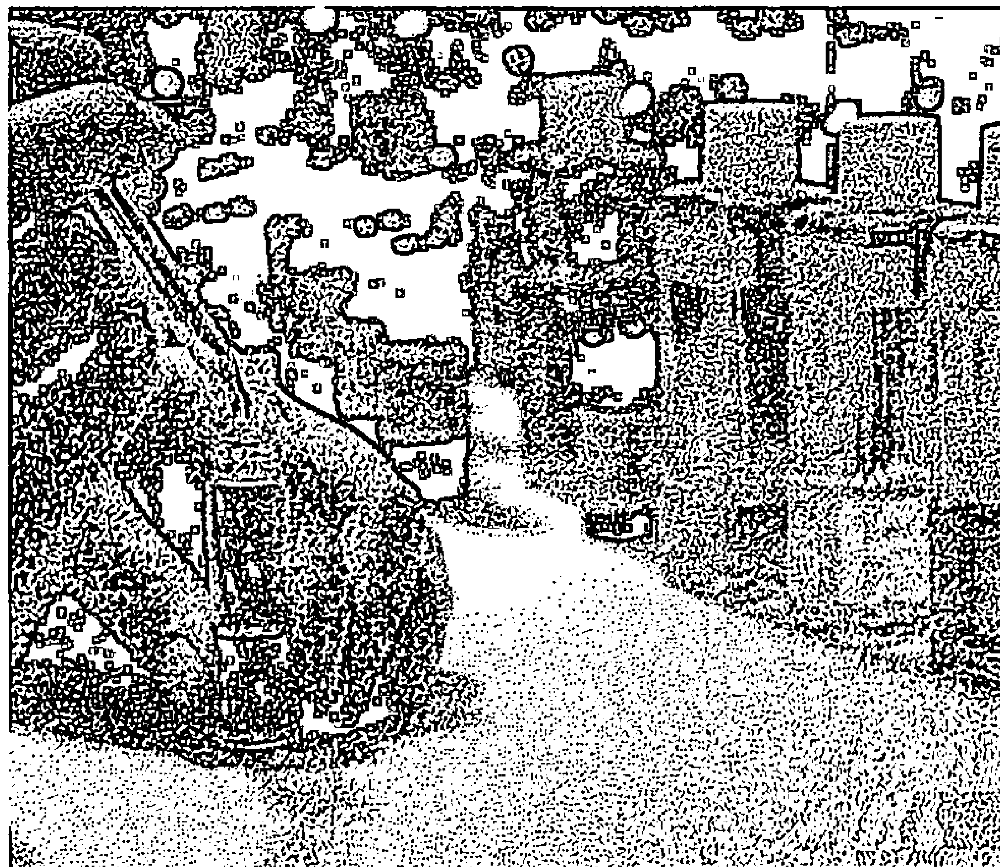

好的地方就是，主副将职责鲜明，主将是柠檬 30 份，副将茶树 10 份，配方中明确表明了谁是主将。柠檬是主将，我配精油的时候会想说：柠檬你就是干这个活的，你负责成败，茶树是辅助你的。于是，柠檬真好像一个人似的，当我很明确地让他当主将，他就真的可以担起这个责任。

精油的主次配比至关重要

当一个人的实力低于你的一半时，你便不会觉得有任何威胁，在这样的比例中，主将可以有信心大刀阔斧地发挥作用。精油中谁是主要的、谁是次要的，谁只是跑腿干事的，都很明晰。

### 罗马洋甘菊

罗马洋甘菊是安抚，德国洋甘菊是要勇敢起来面对外界的环境。罗马洋甘菊的安抚作用在脸肿了、过敏了等情况下都会有效。过敏就是太弱了，什么都害怕，把什么都当坏人打，这时候涂点罗马洋甘菊有非常好的镇定效果。小孩发烧，需要用罗马洋甘菊安抚深层的恐惧，而这深层的恐惧是他自己不知道的。心生恐惧、心碎的时候用罗马洋甘菊，可以化解恐惧，安抚心碎；不心碎的时候用它可以增强力量。用罗马洋甘菊就像是用一条厚厚的毯子把你裹起

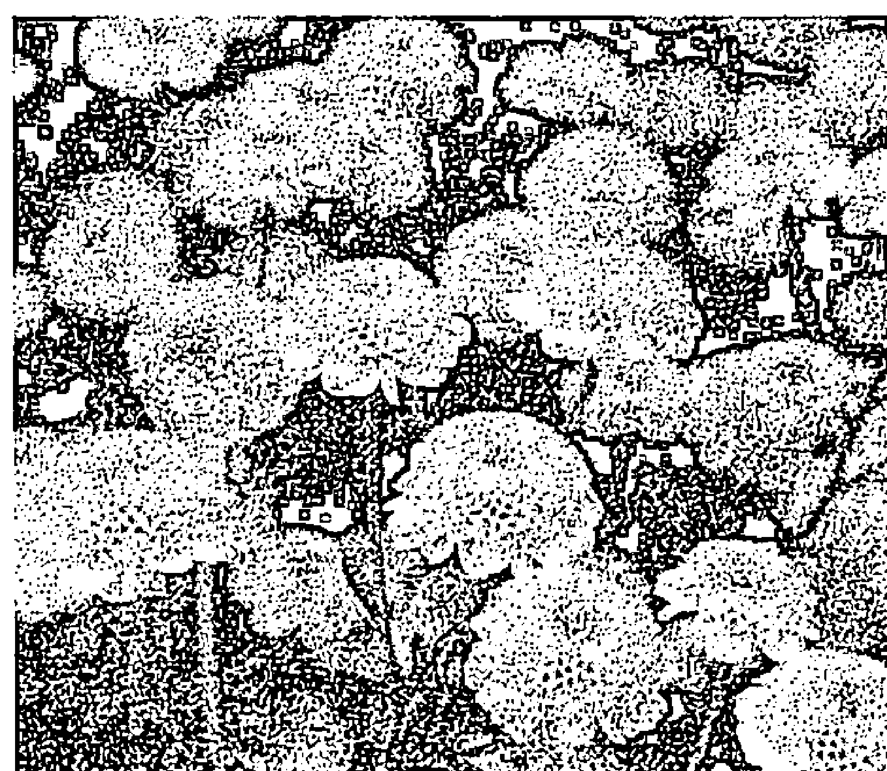

罗马洋甘菊

来，罗马洋甘菊的小花会开满一大片地裹起来安慰你，让你好像回到了妈妈的子宫里一样，把吓飞了的灵魂碎片再包裹起来，驱逐连你自己都不知道从何而来的不安全感。在深层次的强力安抚方面，可以用罗马洋甘菊来擦拭心轮。

### 快乐鼠尾草

快乐鼠尾草是性的身心整合。有的男人谈恋爱几个月连手也没有碰一下，有的人见了面就想上床，懒得聊天、看电影，上了床就睡觉，对精神交流完全失去兴趣。这都是精神交流极端的状况，都可以用快乐鼠尾草，它会把两个极端都拽回到中间，在两个黄金分割点之间美丽地震荡。

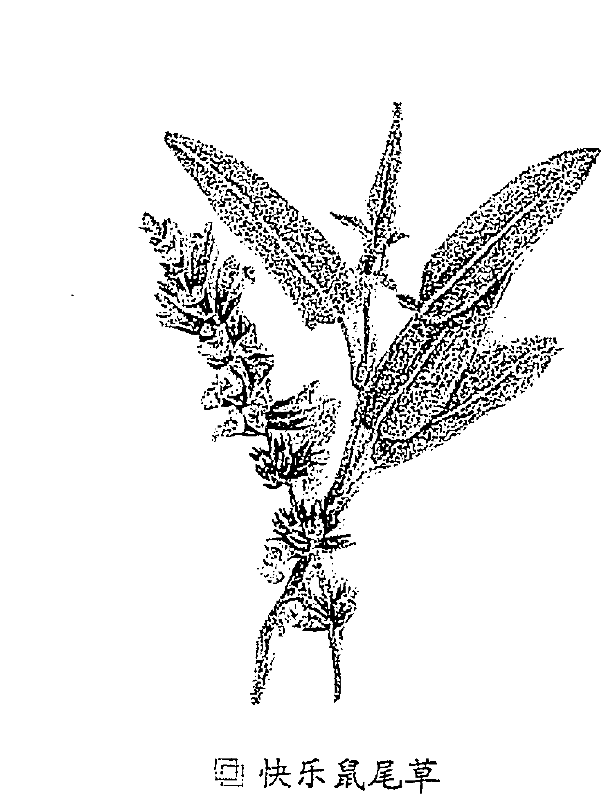

快乐鼠尾草——男人的汗水味，在灵的层面对应性轮，象征月光的精油。快乐鼠尾草涂在双手之间，双手真的充满了月光的能量，心理力量就是月光如水的能量。想象宁静的月光下有一个湖，湖边有树，一男一女坐在树下相互依偎着，在快乐鼠尾草的状态下，不会面对面地坐着。一个人靠在另一个人怀里，在满月的晚上，月光激荡，让人容易做坏事，月亮的能量使人精神非常清灵。他们开心地聊天，精神密度很大，女人会觉得很开心，我喜欢你；男人会觉得聊得真开心，是精神的愉悦，现在睡觉还为时过早，于是就这样在月光下、在微风中聊了好久好久，依偎了好久好久。

这就是快乐鼠尾草带给人们的心理状态，性的身心合一的能量。快乐鼠尾草的主宰行星是水星，水星象征着交流，心理层面是充满情感。

#### 丁香

丁香，由木星主宰，对应第二脉轮性轮。
从化学成分来看，丁香是战神家族中的女人，
是女战神，抗感染的作用非常强。其心理作用热情动力，和对应的脉轮性轮也有关系。
当你的性能力旺盛的时候，你就会想去创造更多的东西，比如文学艺术创造。你想去做事情，想去做事业，想去完成一件事情，都源于你的性能力。你可以去看看那些平和的人，像80岁的老人或太监，他们都没有了性能力。

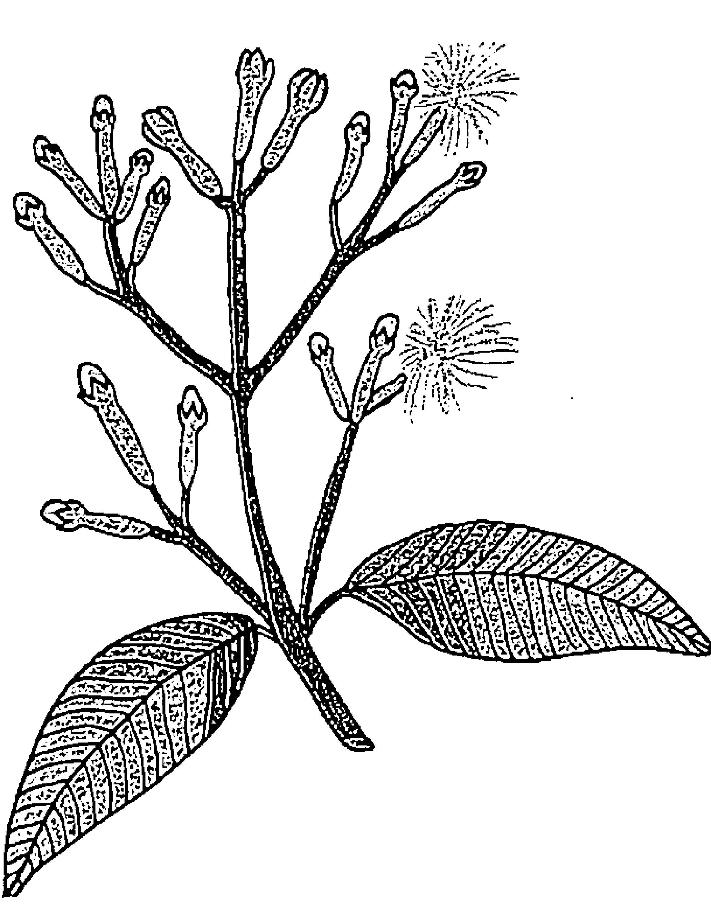

丁香就是发自这种女性性能力的热情动力。我上面说的快乐鼠尾草是月下的浪漫与安宁，性的身心整合，那么丁香就是完全的身体的热情和动力，就是：咱们来吧！

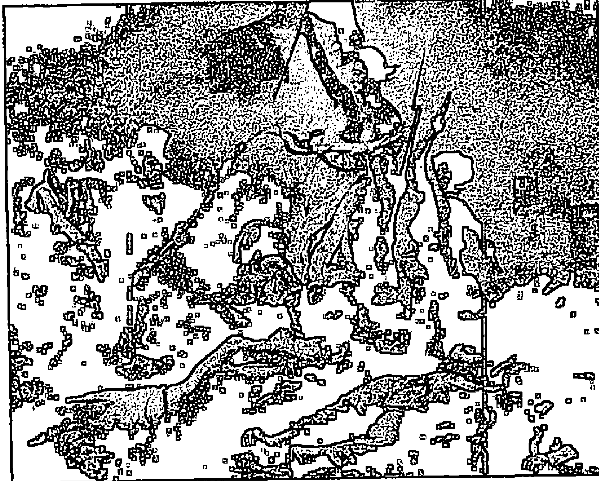

这是世界名画《自由引导人民》，画面的核心是中间这个女人，她举着大旗，号召人们往前冲，这就是丁香的力量。她自己就非常有热情做事情，一马当先，同时也可以带领其他人。
丁香在配方中的特殊作用，就是可以整体提升配方的效果，这其实是个秘密。有很多芳疗师加了丁香，当人们问起的时候，他会说：我是为了消炎，为了活血。其实都是为了提升配方的整体效果。丁香就像一个放大器。你配了一个配方，你认为没有问题，配得比较精准，可它的效果却比较弱，也找不到什么原因，那就加一点丁香试试看。它会像油画中的女人一样，高举着法国的大旗，引导着人民取得革命的胜利。

#### 豆蔻

豆蔻也是一种很特殊的精油。豆蔻由金星主宰，代表着美丽，对应的是喉轮，给人的心理疗效是让人处变不惊，对人的身体疗效是健胃。健胃很好理解，豆蔻是香料类，在我们煮饭的时候，可以放两粒豆蔻，那这锅米饭就会非常香。吃印度菜的时候，印度人也会加豆蔻，豆蔻在这一锅印度菜的香料中最为显著。豆蔻非常有穿透力，而且非常香，就是穿透的柔美。豆蔻和丁香的作用比较像，可以整体提升一个配方的力量。但它又和丁香不同，丁香是猛力带领人们往前冲，而豆蔻是更美丽，更美妙，更加提高穿透力。豆蔻的掌管行星是金星，金星就是掌管美的行星。豆蔻在脉轮这块对应的是喉轮，如同诸葛亮带兵出去打仗的时候，顺带带了个京剧班子鼓舞士气，这个豆蔻就是京剧班子。诸葛亮带领三军，白天打垮了司马懿，晚上在大营里喝着小酒听京剧，没准还是《空城计》。用这种美妙的方式来鼓舞三军士气，增强穿透力，这就是豆蔻给一个配方带来的效果。

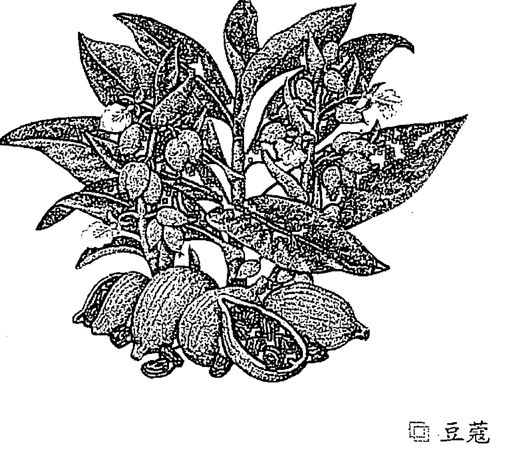

作为配方效果的助推剂，豆蔻和丁香怎么选呢？首先，丁香是有禁忌的，孕妇禁用，因此针对孕妇的时候，就使用豆蔻。另外，丁香就像油画中的这个女人，带领着你往前冲，是一个战斗的场景，因此如果你想消炎、抗感染杀菌、促循环暖身、提高免疫力，你就用丁香。但如果这是一个护肤配方，美白、淡斑或皮肤去角质，这种与美丽相关的就用豆蔻。豆蔻除了作为京剧班子鼓舞士气，作配方的整体催化剂之外，它本身就是很棒的精油。处变不惊和健胃，其实是一体的。人在惊慌的时候，会有强烈的情绪，胃可能不舒服。因此豆蔻既健胃，又让你在变化中不会惊慌失措，所以很适用于比如你在公司的时候，被人追债了，刀架在脖子上，惊慌失措的时候，赶紧回屋吸两次豆蔻，然后回来舌战群儒。

### 橙花

橙花的主宰行星是太阳，对应心轮。心理疗效是纯洁的情谊，生理疗效是抗沮丧。橙花对整体配方疗效的增进是一个秘密，这是 Sylvia 在喝了死藤水通灵后，橙花告诉她的。橙花的秘密是能够增强配方在身体精微震荡能量的存留时间。对于一个配方，它的精油化学分子大概在 24 小时内就会完全被代谢掉，但是精微能量仍然会存在。如果加了一丁点橙花进去，那么精微能量会在身体中存留一个礼拜之久。如果你有一个个案，他每个礼拜只能找你做一次芳香疗法，那你就可以往配方里面加一点橙花，这样你的配方在其身体里的作用就能够一直延续，不会间断。

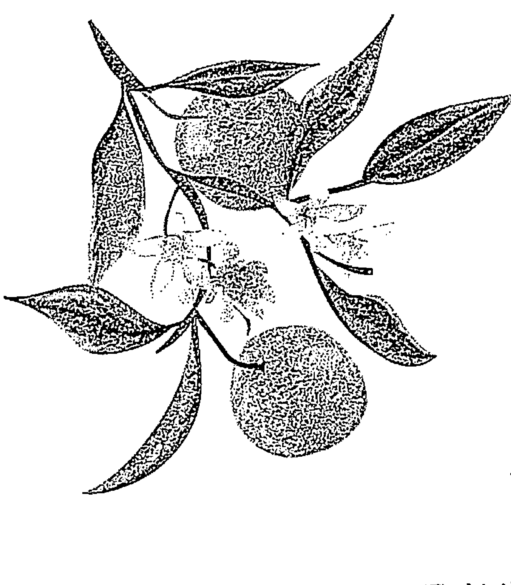

另外，如果你配魔法油来改善风水，那你可能没有办法天天往墙上涂油，这时候就可以往配方里加橙花，那你一个礼拜涂一次就可以了，因为它可以持续一个礼拜。橙花是很纯洁的精油，洁白的，象征着纯洁的情谊，也抗沮丧。橙花是很轻盈的一个精油，让你都不忍心加入其他的精油，因为它本身就是一个完美的存在。当你沮丧的时候，你不需要一个慷慨激昂的劝说，你需要的可能只是橙花这种轻盈的不带任何偏见的纯洁陪伴。这就是你沮丧的时候，橙花可以给你的力量。

除了对应太阳主管的星座外，橙花也很适合水瓶座，因为水瓶座是一个特立独行的星座，不在乎世俗间的任何东西，敢于坚持自己的想法。橙花的轻盈和纯洁，以及好像来自更高层次的力量，特别像水瓶座的感觉。这种力量也能真正帮助到一个沮丧的人，因为沮丧的时候，不需要更多的颜色，需要的是一个往上的提升。你纠结无助的时候，你处在矛盾中没有头绪的时候，你唯一得到解答的办法就是往上提一下，而橙花的抗沮丧就能给人这种力量。

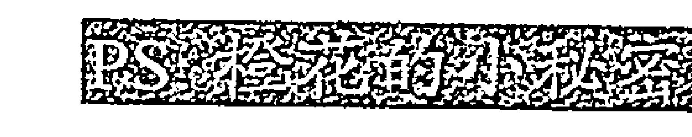

#### 橙花的小秘密

我很崇敬的南美洲的萨满芳疗师 Sylvia，同时也是个巫师。她在一次聊天时讲，她在智利参加土著人的庆典时，喝了一种名叫 Ayahuasca 的草药液（中文名“死藤水”），喝了之后可以看到另外空间的生命体和能量。

她在喝之前身上揣了一小包的精油，然后在进入另外空间生命体状态时，她发现这包精油都活了，然后每支精油都跳出来向她自我介绍，说我是什么精油、我有什么能量。

她揣的精油中有橙花，然后橙花跳出来对她说，我有一个秘密，人们都还不知道这个秘密。我今天告诉你，你也可以告诉别人。这个秘密就是，我可以赋予精油配方的能量以记忆，就是你给人配精油的时候，

滴入一点点的橙花，那么不管这个配方是按摩入身体的还是吸闻入身体的，都会在24小时之内被完全代谢掉，但是滴入橙花后这个配方里的震荡能量会留在人的体内，持续一个礼拜。

这就是橙花的一个秘密。橙花的情绪功能是抗沮丧、抗悲伤，它可以打开快乐的阀门，使人愉悦。橙花是一种植物的花，这种植物叫苦橙。苦橙这种植物浑身是宝，除了可以做成橙花精油以外，还可以做成苦橙精油和苦橙叶精油。所以在配方中有一个有意思的地方，就是你把橙花、苦橙和苦橙叶配在一起的时候，你会感受到一个更完整的能量状态，好像是苦橙树又被复原了，它又活了起来。

相较于甜橙，苦橙更有一种轻盈的味道。它们都可以使人很快乐，只不过快乐的种类不同，前者是单纯豪迈，后者是会心一笑。就像在春节联欢晚会上，甜橙是《今儿个真高兴》那种嗨歌，苦橙是更轻盈纤细的一往情深的歌。

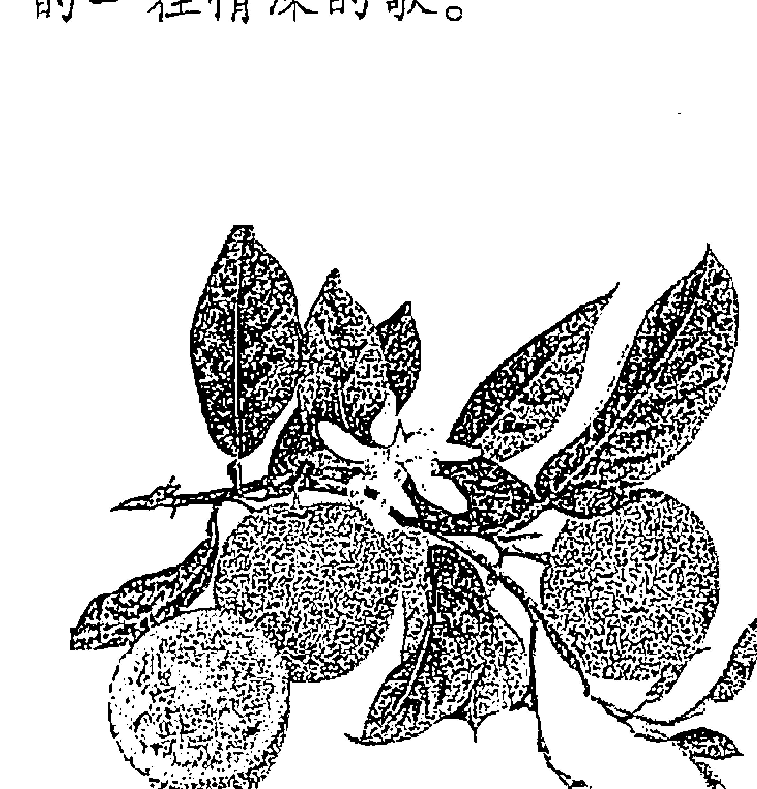

苦橙叶是一种特别有意思的精油。橙花很高贵，苦橙使人敏感地快乐，苦橙叶却没有苦橙的圆满和橙花的高贵，它只是苦橙的叶子，所以有一种夹在中间的尴尬，就如同你夹在你的老公和你老公妈妈的中间，或者是夹在你的上司和下属之间。苦橙叶精油于是可以处理这种夹在中间的尴尬，尴尬的时候就可以用苦橙叶。

一种植物经历了什么样的痛苦，就可以提供什么样的能量。柠檬香茅生长在充斥着害虫的又湿又脏的土地里，所以它的精油有驱蚊的功效。

乳香是树皮干裂之后分泌出来的树脂提炼出来的精油，它本身是为疗愈伤痕而来，所以它的精油可以疗愈伤痕。

#### 雪松

雪松抗癌，是对内的勇气，对应的是心轮，主宰行星是太阳。在调配魔法油的时候，雪松是可以加强魔法的精油。这里说的魔法油是那种调配过之后需要念咒语的，就是调配的时候完全忽略精油的化学分子组成，而只看植物传说而调配出来的魔法油。当这个油是真正意义上的魔法油时，雪松可以稳固和加强它的魔法力量，就好像丁香可以加强配方力量一样。同时，雪松可以使这种魔法油比较持久，因为魔法油这种精微的东西是比较容易变化的，但是加入了雪松以后就可以使它的能量稳定下来，持续存在。

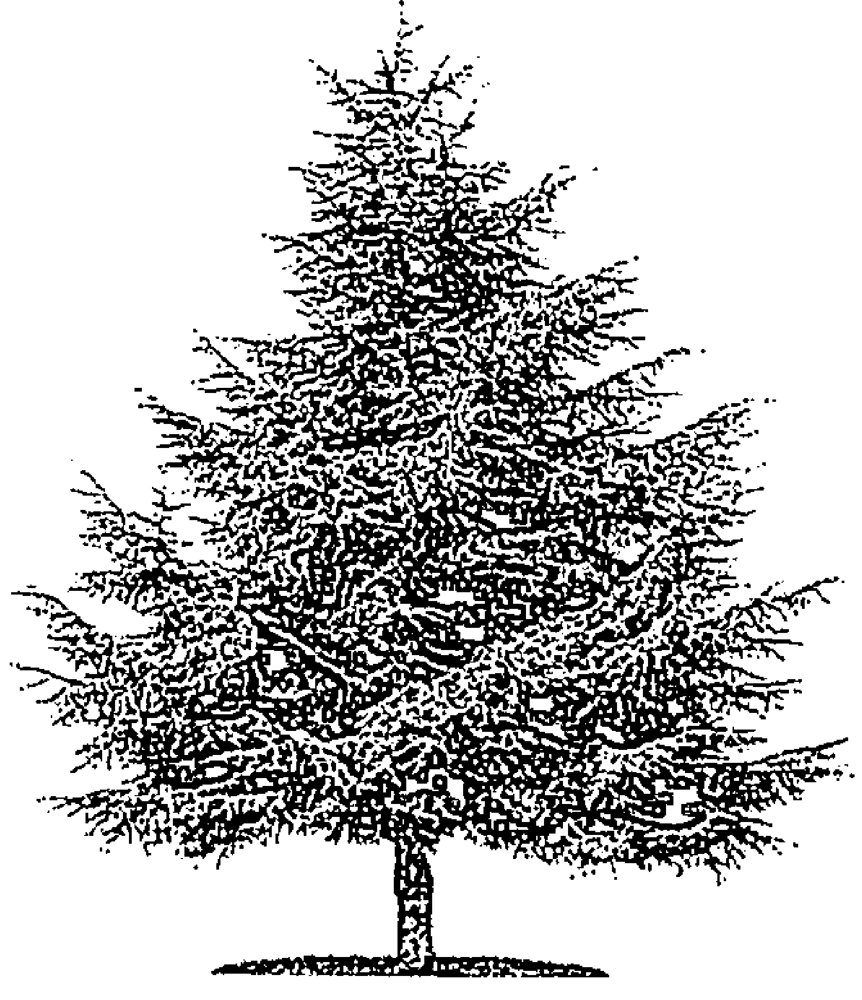

### 月桂

《圣经》里有这么一句话：日光之下，并无新鲜事。这句话的本意想表达什么，其实我也不知道，但是我理解到的一个方面，挺适合用来形容月桂的。月桂是一个太阳主宰的精油，对应喉轮。它的能量给人的感觉就好像是在太阳照耀之下，并没有什么东西是不能接受的。就好像有两拨人在打架，打了一宿后都精疲力尽，这时太阳慢慢出来了，这两拨人就说，算了，咱们打什么呀，去喝酒吧。我记得在《阳光灿烂的日子》这个片子里面，王朔扮演了个流氓头，打完群架，他就拽着大家去喝酒，当时他说：四海之内皆兄弟，五洲震旦和为贵。这就是月桂给人的感觉：天下之大，那都不是事儿。

在闻月桂的味道时，你也能感觉到它是一种强劲的味道，就像一个大力士，但它同时也有纤细的内心，好像一个大力士不忍心踩死一只蚂蚁。月桂的心灵疗效就是，阳光下有猛虎亲吻蔷薇，力量与敏感同在。月桂这种接纳的感觉，可以让各个方面都得到协调，不打群架，而去喝酒。

在身体这块，月桂的主要作用是平衡神经，可以平衡交感神经和副交感神经，也可以平衡所有的神经。因此，月桂的作用就是，当你不得不配一个互相矛盾的配方时，你就放一些月桂。比如说一个个案，你既需要他有勇气，也需要他收手；或者你既想让他张扬，又想让他内敛，也就是在一个配方中，有两个相反的诉求，这时候你就放一点月桂，那这两个相反的诉求都可以达到。因为有月桂的地方，什么冲突都不是事儿。或者是当你给自己配一个配方的时候，你观察到自己有很多相矛盾的诉求，于是你想把这些诉求的解决之道都配到一个配方中，可最后却越配越混乱，“我这个配方到底是在干什么啊”，然后你就到了崩溃的边缘，这时候你往里面放一点月桂就行了。说不定如此一来，这个配方倒成了恰恰适合你这个状态的配方。

月桂可以把几种不相干的力量扭在一起，朝一个方向发挥各自的作用，因此月桂本身也适合放在一个矛盾很多的群体中。比如在一个公司里，大家互相打架，老板娘想，我怎么才能让他们拧成一股绳，都给我好好干活呢。

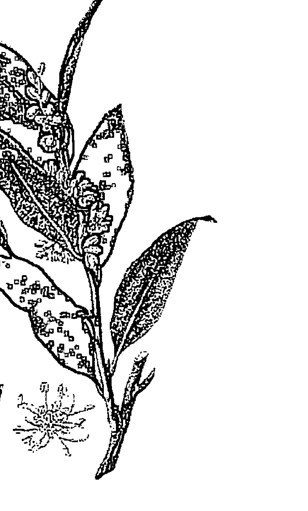

这时候她可以在公司熏月桂。从这里来讲，月桂又很像紫龙晶给人的感觉。紫龙晶就是把几种矿石扭在一起形成的一种有条纹的美丽感觉，它给人的力量就是协调多种力量，让它们一起和谐地发挥作用。所以紫龙晶可以把多种东西扭得更漂亮。

#### 甜茴香

甜茴香对应的是性轮，心理上是一个迷醉的夜晚，但是这个夜晚与性无关。它给人的感觉就是时间就停留在此处。就好像你和一个闺蜜晚上在家里熏着香喝酒，喝到半夜，谈得很深，也感觉到彼此之间的感情会永远持续下去，没有任何世俗间的东西可以把你们分开，十年之后，你俩仍然会是如此。望着蜡烛，望着篝火，望着外面星星点点的灯，觉得这个时刻很美，会永远驻留，对，一定要喝着酒。而这个时候就会有那种迷醉感，会觉得太幸福了，你就停留在当下这个时刻中。这种迷醉的感觉是性能量给人一个面向的享受，有一点像你在看艺术品的时候，如果你真的和它产生共鸣的话，你就是迷醉在当下性能量的享受中。这种享受可以让你忘记世俗，停下脚步，就停留在当下。它也好比你作为一个在海里永远不会沉的人，你漂在有着暖阳和和风的波光粼粼的海面上，海水又很暖，你在那儿漂啊漂，不用往前走，也不用往后退，就漂在那个时刻。甜茴香就是给你这种迷醉的幸福感。

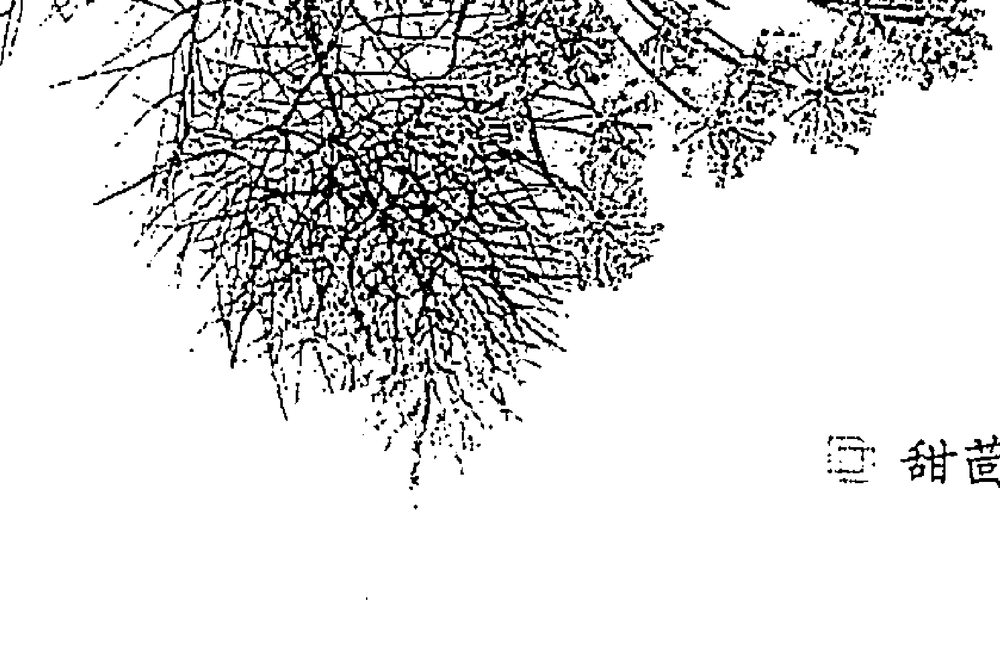

### 精油魔法

甜茴香对应的脉轮是性轮，讲到这里，我们可以回想一下，性能力带给人的感受有好多种。既有快乐鼠尾草那种月下的浪漫与安宁的性的身心整合的愉悦感，又有丁香那种热情动力，现在又有甜茴香这种“有热情也好，没有热情也好，我就迷醉在享受当下的感觉”。

甜茴香在身体这个方面呢，是一个类雌激素，有人丰胸的时候喜欢用甜茴香，雌激素充盈，胸就会大。同时，甜茴香是有禁忌的，就是孕妇和婴儿都不能用。另外，因为雌激素过剩而引发的一些妇科疾病，也不要用甜茴香。虽然我更相信植物的智慧会使甜茴香这种类雌激素在被人体摄入之后，当人体雌激素过剩时它不会发挥作用。但是没有证据可以证明这一点，所以还是从安全角度出发，在雌激素过剩的时候，不要使用甜茴香。

### 第二章 精油的配伍

- 苦橙叶、广藿香、岩兰草、黑胡椒、马鞭草酮迷迭香

### 心念

前面讲了主将和副将的比例，以及催化剂，今天讲心念。一个配好的精油也有身、心、灵三个层面，身是精油植物油的混合，心则很关键，配方者给它心，它就有心。如果一个人没了心，他不知道自己要去干什么，可能一生就过得浑浑噩噩，非常迷茫。赋予一瓶油的心，只需要在配方的时候清楚自己的思路，清楚自己配这个油的目的。配方的时候清楚自己的思路，就是要明白，这个主将、副将是出于哪个点被选中的，是因为它的某个化学成分？魔法特质？植物科属？还有就是，干事选哪个点，催化剂选哪个点，这些在你配方的时候心里都必须很明确。然后你在精油的整个调配过程中要有芳疗的整全观，就像用整全的观念去看待一个人，因为精油也是一个整体。你选择了一个精油，它是要与你交流的，生命间的呼应在于我就用你这一点的时候，

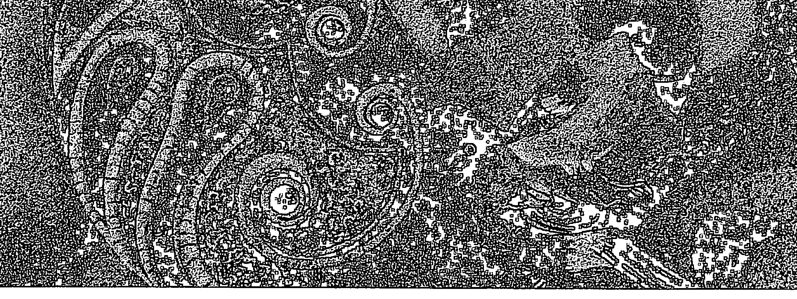

这一点就会被放大。

之前公布过一个治疗灰指甲的配方，主将是柠檬。柠檬有对伞花烃，战是她的关键字，强力杀菌，抗真菌，所以它是主将。副将选的是茶树，茶树帮助主将一起杀菌，并且在打仗的时候可以保护战场，仗要打可是东西别砸，庄稼别烧。配方非常有效，治疗好多灰指甲，几十年的灰指甲真的可以长出新指甲来。但是有一天，有人问我，为什么要选柠檬当主将呢？茶树的对伞花烃的比例比柠檬还要多。之所以选柠檬，是因为当时我对茶树不熟悉，我忘了茶树有对伞花烃。茶树是一般人配配方时常用的主成分，但我并没有选茶树当主将，而是选了柠檬，因为它有对伞花烃。柠檬被选中当了主将，它的对伞花烃被放大了。整个配方杀真菌的能力比茶树当主将的配方强了很多，由于我的心念的明确，配方就有了心，有了自己的方向。

其实人也是这样，在心的方向的鼓舞下，当他有使命感的时候，他的能力会成倍地增强。给配方一个心，并不需要进行什么仪式，不需要净化空间呼唤四方之类的，而只需要生命与生命之间的简单沟通。就连这种简单的沟通，你也并不需要郑重地对着配方说我选了你是因为你有什么，不需要说出来，你只要在心里面足够明确就行了，精油自己是知道的。这感觉很像战前总动员，就像很多战争影片中，打仗前国王总要说一堆话，然后勇士们就拼命地向前冲。心念强烈的时候就好像做了一个战前总动员。

接下来要讲的几个精油：

### 苦橙叶

苦橙叶对应心轮，在心理情绪方面，可以把僵化的状态活跃起来，就是气氛僵硬尴尬时，比如相亲，两个人都会有一些紧张，过程可能会僵硬无趣，然后用苦橙叶就可以打破僵局，使气氛变得自然。如果你10年前被一个男人被骗了，10年中认为男人没有好东西，就要用苦橙叶。它会帮助你把硬化僵化的心放松下来。

苦橙叶身体方面的作用就是放松。苦橙叶特别牛的化学成分叫作邻氨基苯甲酸甲酯，它使苦橙叶成了超级安抚精油，睡不着觉的时候可以用薰衣草可以用罗马洋甘菊安抚，当你用什么都睡不着觉的时候就可以用苦橙叶。它可以安抚身体也可以安抚痉挛，抽筋、胳膊疼、腿疼、胃疼，只要是疼，都可以用它试试看。

### 广藿香

广藿香对应海底轮，主宰行星是土星。广藿香就像土星这个三朝元老一样，勤勤恳恳，隐忍压抑，埋头苦干，是一种代表“深”的精油。岩兰草的深是对应底轮，扎根扎下去。而广藿香的深却是扎到另外空间的深，是更深层次的分子、原子、电子。广藿香在心理层面代表着深深的爱，这份爱渗透到了每一个细胞中。有人说广藿香是催情的精油，在相爱中如果你知道对方渗透到每一个细胞地爱你，你会很有安全感和兴奋感。和他在一起非常地放松，无所惧怕，你会觉得自己是完美的，对方也是完美的，是融为一体的畅快却又安静的感觉，这种感觉超越了维度。广藿香在身体层面是大地之母。人们不断地毁坏地球，大地之母仍然在重建并且疗愈着我们，这也是深深的爱，无

### 岩兰草

岩兰草的主宰行星是金星，对应的仍然是底轮，是扎根。它的心情上的作用是脚踏实地的感觉，身体层面则是提升红血球的数量、红血球的带氧量，这是很特别的身体层面的功能，其他精油很少有这种功能。当你需要提升一个人血液中的运输氧的容量时，就可以用岩兰草。虽然对应底轮，但它却是金星主宰的，非常有趣。就像一幅画面：在绚烂的秋天，人们唱着劳动的歌，兴高采烈地收获庄稼，即使流着汗也很开心。岩兰草给人的就是这种脚踏实地地开垦前进的积极的力量，同时给人很多的氧含量，所以你在开垦和前进的时候心里是安稳的。当你空想不落地，不在乎钱，只追求美丽的东西，也就是表现出脚踏实地的反面时，那就最好多用岩兰草，它会把你拽到地面上，告诉你你得吃饭、你得睡觉，它会给你很多氧含量，让你兴奋地在地面上干活。

### 黑胡椒

黑胡椒是火星主宰的，火星就是力量，爆发力。对应性轮，可以想象为提升性能量，也可以演变为文化创意，还可以演变为身体上的性能力。有的女生会抱怨自己的男朋友说，之前你追我的时候说话还挺有意思的，怎么我和你在一起之后，说话变得这么无聊，是不是不爱和我说话了。并不是他不喜欢你了，只是两个方面（创意和身体性能力）相互转换了。他之前追你的时候，在身体层面，黑胡椒提升了性能力，创造力演变成了性能力；而在心理情绪层面，比如你在写诗的时候、写文案的时候，或者想配方的时候，就可以用黑胡椒来提升创意。同时黑胡椒还是香料，香料可以助消化，像我们吃黑椒牛柳，或在烤牛排的时候加入黑胡椒，都可以帮助不太好消化的牛肉顺利地被消化掉。从魔法上来讲，黑胡椒在抵御负能量方面，与杜松的净化还有雪松的保护能量场是不一样的。它是火星的那种，负能量来了我就同你斗争到底，不是我死就是你亡。我们在避窗外邪的时候，一般可以在窗台上放一块黑曜石，如果没有黑曜石，就放一小袋黑胡椒也行，同样可以抵御外邪不能入内。

### 马鞭草酮迷迭香

马鞭草酮迷迭香虽然不常用，但是美容效果实在是太好了。它是富含马鞭草酮的一种迷迭香，属于迷迭香一类，所以也是由太阳掌管。马鞭草酮迷迭香具备迷迭香的共性，同时它又有自己的特性。马鞭草酮的特性在身体方面，可以促进细胞再生、皮肤细胞再生和肝的细胞再生。衰老了，皮肤暗黄了，有褶子了，那是代谢变缓慢了，这时候不是补点水就完了，而是需要从细胞的层面让皮肤变得健康。马鞭草酮迷迭香给细胞注入一种鲜活的生命力，一种像阳光能量那样的再生的生命力。你感觉这个世界无聊了，没什么喜欢的事，它就会像再生新细胞那样，让你对世界继续充满好奇，在抑郁的时候给你阳光的能量。

马鞭草酮迷迭香对应的脉轮是三眼轮，也叫眉心轮，象征着智慧和思维。马鞭草酮迷迭香象征着智慧和我们的思想。当我们的思想停顿、僵化硬化，对世界不再有新鲜感的时候，用马鞭草酮迷迭香擦拭三眼轮，就可以带来智慧、思想迭代与更新，使意识形态变得与之前不同，为我们的头脑带来新鲜感与生命力。

### 精油化学

学芳疗为什么要讲化学呢？因为它是从另外一个角度描绘一个事物，就是精油的属性。化学虽然不是更高级的语言，但它也是语言，也能从一个角度来描述事物，也是一个维度。维度越多，我们配油时的精准度也就越高。前面讲配精油就好像诸葛亮行军打仗，那他不用太知道化学，只要知道五虎上将都是什么脾气秉性，他就能配出一个好配方，组建出一支有效的军队。化学是一门直截了当的语言，了解一点化学知识以后，我就可以通过一个直截了当的形式，让你知道一个精油能起什么作用，就是这么简单直白，且行之有效。精油化学不是分子式，所以大家不用担心。德国的生物化学家茹丝写了一本书，叫《茹丝的蛋》。他在书中把每一种精油都用蛋形图来表示，就好像是用蛋这种方式来绘成了每一种精油的地图。我们可以直接通过每一张图，知道这个精油强于什么、弱于什么、能干什么、需要避免什么。

我先举个例子，这是《茹丝的蛋》中的第一个蛋型图：葡萄柚。你可以看到，在这个圆形的地图上，只有左边有一个大圆块，你就知道葡萄柚的主要成分在这一块，它的效果也来源于这一块。

葡萄柚精油

再看这个图，是一个比较偏的精油侧柏醇百里香，它有两大块，左边这块跟葡萄柚一样，但是它下面又多了一块，你就知道这个侧柏醇百里香也具有一些和葡萄柚类似的作用，它还有一些下面这个大块所反映出来的作用。所以在熟悉这个圆形的蛋，熟悉它的每块圆各有什么用之后，我们在看地图的时候，就能看出这个精油有什么用。所以今天主要讲的就是这个圆形的蛋形图，它的每一块有什么作用、代表什么方向的力量。

侧柏醇百里香精油

这个图就描述了茹丝的蛋的每一块叫作什么分子名字，不过这个分子名字其实没有必要去记，而且它画得也太乱了。所以我用另外一种方式来说一说，便于大家记忆。

首先这个蛋有最上面的一个分子和最下面的一个分子，它们都位于蛋的中间，上面这个分子叫酮，下面这个分子叫醇，这都是化学家们发明出来的奇奇怪怪的名字，我们也不用去理它。上面这个分子像天的力量，下面这个分子像地的力量。上面这个分子就像父亲的力量，下面这个分子就像母亲的力量。人们都说大地之母，这个是有道理的，因为大地给生命以滋养，生命因为有了大地才得以生长。母亲给一个人的感觉就是这样的力量，就是她会滋养你的生命，然后你有个发烧感冒的，她还能照顾你、安慰你。父亲呢，给你的感觉就是他不太会照顾你的生活中的琐事，但是他会要求你的思想。如果你小时候偷了东西，妈妈可能会护着你，说知错能改就行了，在爸爸那里可能就是一顿臭揍。所以位于上面的分子和位于下面的分子给精油带来的力量是不同的。下面的分子，象征母亲滋养你的生命，它可以帮你杀菌消炎，就好像你感冒发烧了，你的妈妈来照顾你。然后它还可以让你安定，在妈妈的怀抱中是最安全的。而上面的这个分子象征父亲，它就是化解、新陈代谢、除旧迎新、去污、化解阻塞，因为父亲总是对你严格要求，给你剪枝，他会劈掉你身上不好的东西，让健康的部分继续成长。这就是上面的这个分子赋予精油的力量。

第二个是侧柏醇百里香，它除了有左边部分以外，还有下面这个分子，所以它相比葡萄柚就多了一些妈妈的力量。它多了一些可以滋养你的生命、杀菌消炎的力量，所以它更加可以补身养身。在一个家里，妈妈往往会照顾你的生活，照顾你的生理状况，而爸爸会教育你的心理状态，也就是说，妈妈是照顾你生活的，爸爸是关注你心理成长的。在这个图上都有反映。

上面象征天的这个分子就是酮，它作用于人的心理情绪会比较多一些，而下面象征地的这个分子就是醇，它作用于生理会多一些。有了极端才会有空间，所以上面的天和下面的地就撑起了一个空间，在这个空间里，也就是在这个蛋中，越靠上的分子就越在心理情绪作用上强烈，越靠下的分子就越在生理层面上作用强烈。而一个空间光有天和地是不行的，那样只是一条直线，它还需要另外的方向上的两个极端来把空间撑起来，这就是加和减。有天地有加减，这就成了一个世界。

第一张图片葡萄柚，在加的位置有大分子，加就是激励，所以葡萄柚既可以激励你的心理状况，让你快乐得像在天堂一样，葡萄柚名字的拉丁文（Citrus paradisii）与天堂的英文（paradise）比较像；又可以激励你的生理状况，因为葡萄柚可以促进排水肿与身体循环。如此一从精油的地图上面可以看出，精油的疗效非常容易记忆。而右边的减法这一块，比如薰衣草右边的减法的分子比较多，还有罗马洋甘菊、苦橙叶也是这样，它们三个就具有安抚的效果，与葡萄柚的这种激励是完全不同的。所以你过敏的时候、睡不着觉的时候，用薰衣草或者罗马洋甘菊之类，都不是因为你喜欢闻它们的味道，而是这些精油在减法这块的分子非常大，它们能很好地安抚你入眠。加法这个符号，它是生理、心理一块儿加的，因为它在中间既不靠天也不靠地。减法这符号也是，生理、心理一块儿减，因为它同样既不靠天也不靠地。有些分子在生理状况上的激励作用非常显著，所以这个分子就会位于左下角，也就是它靠地且在加法的这个位置。

大家看我涂实的这个圈，它也在加法这一边，也是激励，但是它的激励的位置靠下，就是靠地，也就是生理层面的，这个位置就是酚类和芳香醛类，像丁香、肉桂这些精油都是很有名气的杀菌战神级别的，因为它们在这个位置都有大分子。因此，它在生理层面的激励作用比较明显，在心理层面的作用就不那么显著了。像左上角就是激励心理层面的加法，它的化学成分叫作氧化物，含有氧化物的精油如迷迭香、尤加利之类，当你闻了之后便会神清气爽，因为它对心理层面有激励作用。同样地，右上角的就是心理层面的安抚作用，如醚类，醚就在右上角，它是心理层面的安抚，比如肉豆蔻、甜茴香就是醚类的精油，它会令你非常迷醉。当你用肉豆蔻的时候，会有一种吸毒的感觉，晕晕乎乎、飘飘然，非常轻松，这个就是心理上的迷醉感。右下角则是生理上的安抚。如同有天地就会有万物繁衍一样，我们有了天、有了地、有了加、有了减，于是就演变出这几种其他方向上的力量，从而变成了八个方向。这是你看茹丝的蛋时的一个基本参照，有八个方向，你看它最主要的分子在哪个方向上，它的力量就在哪个方向上。例如这张是罗马洋甘菊。看它的图，在右边有个大蛋，就是减，就是安抚，所以罗马洋甘菊是安抚的。边上的几个小球由于很小，所以并不显著，可以暂时忽略掉，只看它最大的那个球在什么位置。再看这个苦橙叶的图，它在三个方向都有球，它最大的球是右边这个安抚，生理和心理一块儿安抚，它还有一个下面这块的球，似乎比右边的这个球也小不了多少。这个球是像大地母亲的感觉，所以它在生理上可以补身暖身，消炎抗菌。这样就有了苦橙叶的最主要的作用——安抚，同时补身暖身、消炎抗菌，还让你安定下来。然后左边还有一个更小一些的芳香分子团，这一块是生理和心理的共同激励，所以苦橙叶以安抚你为主，但是又不会把你安抚成软趴趴的一团，它还会有一些小激励的因素。

再看薰衣草的图，它的成分非常多，最大的是右边这个分子，所以薰衣草是有名的安抚精油，它能让你睡着。它还有一个大分子在下面，在大地妈妈这块，它可以让你安定下来，可以补身暖身、滋养你的生命，这就是薰衣草的特性。同时，它还有好多小分子遍布在这个图上，所以说薰衣草是一个万金油，它无处不能用，因为哪儿都有分子。

这是丁香的图，丁香是有名的消炎抗菌的精油，因为它这么大团分子都在左下角，也就是生理激励这块，而生理激励就是提高免疫力，消炎杀菌。

这个是樟树的图，它的比较大的两个分子，一个在上面，就是天，象征父亲，会教育你的思想情绪，所以它利脑。还有一个分子是氧化物，在左上角，就是在心理情绪方面激励你，所以樟树是一个很棒的利脑精油，在图上能看出来。

通过这种方式来了解一些芳香化学就可以了，在茹丝的蛋中还有很多奇奇怪怪、无人能看懂的分子名称。这些我们都不用去懂它，记住这八个方向上的参照图，然后看书里面精油的分子落在什么位置，看它的大分子落在什么位置，就可以了。它落在什么位置就有相应的力量，这样你就可以在不学习分子式，甚至不学习分子名称的前提下，获得掌握芳香化学的好处。而芳香化学只是精油属性的一个方向，你可以通过它来了解一个精油的基本属性，但是精油更细微的性质，还需要你像之前讲的那些方法那样去了解它、感受它，从而体会到它。

所以化学只是一个简便工具，只是一个大概，就好像一份简历不能完全描绘一个人一样，化学也不能全方位地描绘一种精油。这只是你快速了解它的一个便捷方法，之后真正对一种精油的了解，还是生命与生命之间的感受。化学很枯燥，但如果不用化学的话，就会少一个认识精油的维度，而且是离科学与客观最近的一个维度。在接触精油之初，化学真的能够强有力地描绘出一种精油的特性，也省了你很多功夫，并在接触的时候让你有方向可循。

### 精油魔法

我认为玩精油或者做芳香疗法师的最高境界就是把自己玩成一个巫师。因为芳香疗法只是现代科学对植物精油能量的一个定义，它还局限在科学的框框里，还是在化学分子的基础上讨论精油的功效。但是科学只是很窄的一个小层面，科学之上和之下还有很多人们看不到、摸不着的神秘的东西，如果你想让自己的配方发挥神奇的作用，你就要进入这些领域去感受它，并运用它的规律。巫师的巫字就是天上一横，地上一横，中间一竖，即连接天地，然后一竖的两边是人，巫师就是这个人。他连接天与地的能量，他知晓天上的规律，他懂得如何运用地上生长的物质如植物、水晶等的能量，然后他以此改变天地之间的环境或人。因此，巫师是一群知道如何运用天地之间自然之力的人。利用这些自然之力可以做坏事，就是黑魔法；可以做好事，可以疗愈人，就是白魔法。

### 四元素

魔法事实上只是运用自然之力的一种方法，它没有字面意思上那么神秘。而自然之力的根本，源于“水土火风”四个元素，我们空间的所有力量都来源于这四个元素，它们是所有力量的根本，诸如星盘、十二星座，也是源于这四个元素。

我们知道某些星座是水相的，比如天蝎、巨蟹和双鱼就是水元素的力量在三个不同形态下的体现。像射手、白羊和狮子都是火相的，它们三个都是火元素在三个不同形态下的体现，并形成了三个星座下面的力量。所以，了解这四个元素可以让我们知道力量的根本，而这四个元素又是由四个简单而神圣的元素集结符号来体现的，就是上面这个图。方形代表土元素，是大地的力量、稳定的力量；三角形代表火元素，因为火就是熊熊燃烧的三角的样子；圆形代表风元素；水元素比较复杂，它是一个倒三角形，它还有一个核心。知道了这些符号的意义，我们在配出精油并使用它的时候，可以加上这些符号的力量，那样就会拥有这些符号的能量。比如，我们都知道尤加利是大干风的力量，如果在使用尤加利精油的时候，再加上圆圈这个符号的能量，就是加上了大风的力量。肉桂和丁香都是火的力量，在用它们杀菌消炎的时候，如果加上火这个元素的符号，就会加大消炎杀菌的功力。

第一讲我们讲了顺时针、逆时针擦拭空间能量场的方法，顺时针是补充能量，逆时针是净化。那我们在画顺、逆时针的时候，就可以把这些符号画出来，比如我们可以用一个滚珠瓶在身上或在空间能量场画，也可以把精油滴在手上或你用手沾着精油来画这些符号。画的方法很简单，比如火元素为三角形，就是顺时针画三角或逆时针画三角；风为圆圈、土为方块，都是一样的画法。唯有水元素的画法比较复杂，如下：

右边这个图是水元素的图。顺时针画水元素是从中心点往外画三个顺时针的漩涡；逆时针画也是从中心往外画三个逆时针的漩涡。

刚才说的逆时针是净化，那么“水土火风”四个元素的净化力的区别是什么呢？土象征着稳定；火象征着驱除邪恶，强大的驱除邪恶的力量；风是那种精神层面的交流的力量；水是情感层面的和感受方面的灵性的力量。所以这四个元素就是在这四个方面起净化作用的力量。

举个例子，比如说你和你的男朋友在一块儿，你发现，呀，我们的关系好像不太稳定，他总是跑到洗手间里接电话之类的，那这个时候你就可以用土元素的净化力量，也就是逆时针画方块。如果你没能及时画方块，你会发现，啊，你的男朋友真的出轨了，然后你们就开始吵架，每天吵架，吵得鸡飞狗跳。这个时候如果你想改善这种关系的话，就要用风元素的力量，因为风是精神，是交流。而天天吵架把你气病了，这个时候要用火元素的力量驱除邪恶，扫除自己身体中的健康问题，逆时针画三角形就可以驱除疾病。然后你的病好了，但因为他出轨这个事你没有办法原谅他，但是你又离不开他，所以你俩继续生活在一起，这就进入到那种你无法面对的冷漠的状态，如果这时候你仍然想改善你们的关系，就需要用水的力量来消除这种冷漠的关系。有勾心斗角、有猜忌、有冷漠，但是还没有上升到争吵这个层面的话，就用逆时针画水的符号来消除它。如果已经上升到争吵这个层面了，那就逆时针画风的符号来消除它。如果都吵生病了，就用逆时针画火的符号来消除它。如果只是刚开始空间能量不稳定的话，就用土能量的逆时针。在这个出轨事件过去后，你们恢复了关系，这个时候你也许会反思你自己，当然，这件事错主要在他，但是你可以反思自己。然后你希望你们以后的关系是稳定的，这个时候你可以用方形的顺时针，也就是土能量的顺时针，大地可以给你带来稳定，带来丰盛。有了稳定的生活之后，你又开始希望你们能天天交流，不是“你饿不饿”，“我不饿”这样的交流，而是更深层次的交流和共鸣，这时候你可以用风元素的顺时针来获得这种力量，因为风代表了精神、交流。然后有了精神交流之后，你希望你们的温度再升高一点，你就可以用火的顺时针能量，它就可以让你们的关系变得温暖。稳定了，有精神交流了，然后又升温了，升到一定的程度就可以用水的顺时针能量。水元素的顺时针能量可以带来情感的丰沛，也就是使你们达到深层次的情感与灵性上的共融。所以这四个能量就是这么用的。

在遭遇突发状况的时候，你可以先思考这种情况需要什么样的能量，然后再为这种能量配上精油，这样一来，效果也可以加乘。或者是你先配一瓶精油，你需要这瓶精油里面多一些什么样的能量来使效果加乘，那你就加入这种能量的集合。

之前的课讲了星座和命主星，知道自己的命主星之后，不仅可以为自己选择精油，还可以为自己选择石头。我们在用精油的时候，也可以用刚才说的顺时针或者逆时针的手法，把精油的能量画在人的身体上，或是人的精微能量场中，或是脉轮上，也可以画在空间里，比如你用精油在墙上画这些符号。

### 精油魔法

它也可以带来同样的能量。如果想改善自己，就画在自己身上，如果想改善空间气场，就画在墙壁上。四个能量是有方向的，比如土元素来自于北方，所以你想用土元素来净化或者补充能量的时候，就可以把符号画在你北面的墙上。风元素来自于东方，水元素是西方，火元素是南方，就像我发的四个元素的位置图那样。

四个元素也可以活用。有个人涂了我配的玛雅油之后，很多负能量都释放出来，令他回忆起了小时候的很多悲伤的事情或感受。由于他边上没有石头，我就让他点了三支蜡烛，摆成一个三角形，正三角形，自己坐在正三角的核心，然后他就觉得负能量很快就被散发掉或者转化掉了。因为火能量是转化和驱除邪恶的一个最强有力的能量。而风能量和水能量都会比它温柔，土能量则会来得慢一些，不能说是慢，应该是说来得长期一些。所以像他当时需要赶紧转化能量的话，就摆一个正三角形，然后坐在核心位置，正三角形代表火的能量，同时摆脱的也是火的元素，这样就可以加倍转化他的负能量。

前面说的是如何运用神圣几何加入“水土火风”四个能量为自己的精油增添更多的魔力，后面我们讲几种精油。

### 玫瑰草

玫瑰草是金星掌管的，金星代表爱与美丽。在心灵层面上，玫瑰草是一个火辣辣的大女人，它可以让一个女人变得勇敢，可以让一个女人从林黛玉变成女战士，所以它可以让你勇敢追求自己想要的东西，成为自己想要成为的人，干自己想干的事儿，让你不再内敛而变得外放。在灵性层面上，玫瑰草对应的是性轮，性能量升起之后，它在身体的层面就可以提升女性的生殖系统能量。所以玫瑰草特别适合你在生殖系统能量弱的时候去提升它的能量，比如生殖泌尿系统炎症，或者月经不调之类的就是生殖系统能量弱在身体层面的一个表现。

前面讲了蛋形图化学元素，玫瑰草在蛋形图中的元素位置为下方。下方就像妈妈的感觉，那是生理性的，它可以保护你，所以玫瑰草可以帮你杀菌消炎从而滋补你的身体。玫瑰草对应的是性轮，生理层面的作用就是提升生殖系统的能量，所以它非常适合生殖系统的杀菌消炎。

- 如果你总有治不好的生殖泌尿系统炎症；
- 或者是性冷淡、总是抗拒异性；
- 或者是你觉得自己的创作欲望非常少；
- 或者是你觉得生活挺无聊，平时不爱说话不爱出门特别宅；
- 或者是你想工作的时候却没有动力，天天磨洋工不愿去创造；

等等，这些可能都是因为你的性轮的能量弱，也就是你生殖系统的能量弱，那么玫瑰草就非常适合你。如果你的主要问题在你的身体层面，比如说治不好的炎症，则可以用玫瑰草涂抹身体。如果你的主要问题在能量或者是情绪层面，那你就可以用玫瑰草擦拭性轮。这是一种可以把林黛玉变成王熙凤的精油。如果你面对一个暗恋已久却不敢表白的男人，就可以用玫瑰草，奔着他直线前去吧。

### 香桃木

香桃木是一束温柔的光与爱，在心灵层面温柔地滋养你，它就像一束暖阳，没有夏天烈日的粗暴。所以当你心理阴暗但心思细腻，希望可以慢慢地去改善，慢慢地暖过来，而不是瞬间加热，那你就用香桃木。在驱鬼的电影里面，一般都是一个小道士拿着一根桃木剑和鬼打来打去，而鬼并不能在一瞬间被小道士扎死，这就是因为香桃木就是这种温柔的光与爱。小道士手里的桃木剑一直在跟鬼说，我给你光，给你爱，但是你不要再做坏事了。它并没有那么想杀这个鬼。它和一道符或者嘴里喷出的一团火是不同的，它不会把鬼烧焦，而是用温柔的光与爱保护自己，同时慢慢地劝说这个鬼走上正道。

所以香桃木在身体层面的功效是激励肝脏，但它没有当归、芹菜那种不顾一切地排走肝毒激烈，而是如同一束温暖的光去激励这个肝脏，说你是可以慢慢恢复生机的，你可以自己把这个毒素排除掉。而肝和眼睛是相连接的，正所谓清肝明目，所以香桃木也可以使睫毛、眉毛增长，因为眼睛环境健康了，睫毛和眉毛就会增长。睫毛魔法油的主要成分就是香桃木。

香桃木在脉轮这块对应的是喉轮。如果你想把一束温暖的光与爱射向别人的时候，比如射向一个刚失恋的人，你想劝说他尽快从低谷中走出来，那么你可以先在喉轮涂一些香桃木，这个时候你说出来的话就是暖的。

香桃木的主宰行星尚不清楚。香桃木在蛋形图中的主要元素位于左上角，就是精神心理层面的激励。所以香桃木在心理情绪这个方面的能量会比较强大，它会让你的精神世界犹如沐浴在温柔的光与爱之中。

### 沉香醇百里香

沉香醇百里香的蛋形图的主要元素位于下边，就是妈妈的感觉，妈妈可以滋养你的身体，同时杀菌消炎保护你。在身体层面的功效就是温柔杀菌，这也可以和百里酚百里香对照一下。百里香是一种植物，沉香醇百里香就是它榨出来的精油，含有沉香醇这个化学成分比较多，所以就成了沉香醇百里香。当它含有百里酚这个化学成分比较多的时候，它就成了百里酚百里香，它们都是百里香。

沉香醇是醇，在蛋形图中是在下边，而百里酚是酚，在蛋形图中是在左下边。这里就有一个区别：下边代表的是生理层面，在下边就是生理上的滋养和杀菌消炎；而百里酚在左下边，也在生理层面，但是它多了个左，左加右减，左是加，所以它在生理层面更加富有这种激励的力量，使得百里酚百里香更加激励，并因此而变成了一个战神。百里酚百里香在生理层面的作用是强力杀菌，而沉香醇百里香是温柔杀菌。这样就使得沉香醇百里香比较适合给小孩子用。

沉香醇百里香杀的是各种菌，包括真菌、细菌、霉菌，还有病毒，而且在杀菌的同时还可以保护生理环境健康，也就是说它不会把自己家或者庄稼地当作战场，而是确保在打完敌人之后庄稼地仍然是好的，家也仍然是好的，可以继续居住，可以继续种地。而百里酚百里香就不管这么多，它就是个战神，只要能把仗打赢就行，所以它的功效是强力杀菌，刺激性很强（战神必然是有刺激性的），不太适合给小孩用。基于这个不同，心理层面也很不相同。

沉香醇百里香适合给小孩用，心理层面也是小天使的感觉，它可以让一个人恢复童心。就是在你功成名就并给自己建了一个坚硬的壳之后，你想恢复单纯的童心，就可以用沉香醇百里香。它会让你回忆起单纯率真的感觉和快乐。而百里酚百里香是功成名就时的另辟蹊径，就是当你打下江山，突然发现自己喜欢游山玩水、吟诗作赋，那百里酚百里香就会给你这种勇气去游山玩水、吟诗作赋。因为战神有着充沛的能量，即使在成功之后，也不会天天晒太阳、喝茶，它仍然会找些其他的事情做。

这两种精油对应的都是太阳轮，都由金星掌管。太阳轮是关于自我的一个脉轮，所以它在心理层面有那种让你认识自我的感觉。沉香醇百里香可以让你找回童心，而百里酚百里香可以让你在功成名就之后，仍然认识到自我最真切的愿望，并敢于去做不同的事情而不畏风险。

### 尤加利

尤加利，主要包括蓝胶尤加利、澳洲尤加利和史密斯尤加利。16 ~ 17世纪，巫师们归纳出了这种植物所对应的行星。但是巫师当时虽然能了解植物的能量，却不知道里面含有什么化学成分。因此一种植物不管它含有什么化学成分，都会对应一颗行星。所以两个百里香都是对应金星，三个尤加利都是对应水星。水星就是精神与交流的力量，所以尤加利永远可以给人精神与沟通的振奋与刺激。

这和它在蛋形图中的元素也是一致的，上就是心理精神情绪层面的，而左边就是加，就是激励刺激，三个尤加利都是左上角元素，所以都是精神上的激励。如果你困了、脑子麻木了，都可以闻闻尤加利。

由于尤加利是水星掌管，它最主要的化学元素在左上角，给了它交流与思考的激励作用。而在脉轮层面，三个尤加利对应的是喉轮，所以当你上台演讲的时候用尤加利，可以使你思维敏捷的同时喉轮能量旺盛，可以瞬间把你的敏捷思维所想到的事物优雅地表达出来。

三个尤加利在身体层面的功效都是呼吸道的抗菌祛痰，尤加利就好像大干风一样，可以把耳鼻喉、呼吸道的一切阻塞全部吹走，把痰、鼻涕等全部吹干。

这三个尤加利在身体层面的应用是有区别的，因为三者的刺激性不同。蓝胶尤加利是最刺激的，所以功效也会最强烈。而史密斯尤加利是最温柔的，所以它的功效也就不那么强烈，非常地温柔不刺激。史密斯尤加利非常适用于小孩，蓝胶尤加利适合用于成人，而澳洲尤加利介于二者之间，可以用于身体比较弱的成人或者老人，或者身体比较健壮的小孩。所以澳洲尤加利是两者权衡之后的取中。蓝胶尤加利追求的是效果与战斗力，史密斯尤加利追求的是温柔与安全。所以它们三个在心灵层面也会有所不同，史密斯尤加利是给小孩用的，它在心灵层面是使人找回童心，给成人用尤其如此。这块特别有意思，像刚才说的沉香醇百里香也是给小孩用的，可以使成人有小天使或回归童心的感觉，而史密斯尤加利也是，它可以使成人重回童真，这块是一致的。

蓝胶尤加利可以使人逃离丑闻阴影，就是当你做了一件坏事被发现的时候，可能这个事情已经过去了，但是人们都知道你干了这件坏事，所以对你的目光好像痰一样黏在你的心中，不是那么疼，但是你看到它的时候就会特别恶心，这个时候就可以用蓝胶尤加利把丑闻的阴影吹走，吹走之后你就觉得，我干了这件事又如何呢？谁没有干过坏事呀，谁没有丑闻呀！所以我仍然是一个正常的人、一个完整的人，人的生命因为有了丑闻而完整，我就是这样的人，我仍然可以快乐地活下去。

所以它可以使你接受自己的丑闻及其带来的阴影，以及别人的目光，用了蓝胶尤加利，这些就都不是事儿。蓝胶尤加利是一阵大干风，而澳洲尤加利就是一阵徐徐的微风。它可以吹动杨柳，可以使你耳目一新。就是当你对生活中的事有些许厌倦，或者对自己的状况有些许疲惫的时候，或者当你思索问题而找不到答案的时候，你就可以用澳洲尤加利，它会微风拂面，令你耳目一新。

### 精油塔罗

精油塔罗就是把精油当作塔罗牌一样地抽。塔罗是西方三大玄学之一，是一种占卜的方法。流传久远的东西自然有它流传的道理，已经有很多人证实了塔罗牌的准确性。但是原理是什么呢？几个小卡片为什么能抽出对未来的预测呢？

西方有个大心理学家叫弗洛伊德，他把人的所有动力归结为性的原动力。他有一个学生叫荣格，荣格最开始特别崇拜自己的老师，后来他自己就发展出了一个宇宙共时性的原理。他发现，我日常出现的随机事件都不是随机的，而是有着千丝万缕的联系，都是必然发生的，是宇宙巧妙安排在一起的，看似随机其实是必然。比如一棵树，风吹的时候，有的叶子往左边偏一下，有的叶子往右边偏一下，看似随机，其实哪片叶子往哪边偏，它是必然的。就像我们沏一杯茶，最后茶叶都飘向哪儿，或者我们抽一支烟，最后烟都飘向哪儿，在没有风的环境中，这些都是必然的。而弗洛伊德不相信这个，然后他们就开始争论，其中比较有名的一次争论就是关于书架上的书。弗洛伊德说，我不相信你的那套说辞，除非现在书架上有一本书掉下来。他话音刚落，书架上就有一本书掉了下来。然后荣格说，这下您该相信所有的偶然事件都是必然的了吧。然后弗洛伊德就很生气地说，我还是不信，除非现在又有一本书掉下来。结果真的又有一本书掉了下来。然后弗洛伊德说，我还是不信，无论如何我就是不信。然后他俩就决裂了。

宇宙共时性原理就是把很多看似巧合的事件联系在一起，发现它们其实都和宇宙有连接，都是被巧妙安排的。而共时性原理就是占卜的理论基础，也就是未来发生的事情已经被定好了，宇宙已经把它安排好了。然后宇宙这股能量在过去不仅光安排了未来的事，还改变了许多别的事情。因为所有的事情都有千丝万缕的联系，所以未来这个事情可能这样发生。风在吹一棵树的时候，树叶就会这么偏或那么偏，水在沏一杯茶的时候，茶叶就会这么走或那么走，但是没有人找到这些规律，没有人敢说，风吹树的时候，树叶怎么偏将预示什么事情发生。树叶这么偏，但是我们没有办法去解读它；水沏茶，我们也没有办法根据茶叶的走向来解读未来事情的发生。所以塔罗牌就需要另外的两个理论基础，一个是集体潜意识，一个是原型。

集体潜意识就是，比如一个孩子从出生起就怕蛇，虽然他从来没有被蛇咬过，也从没有看过电视节目里面把蛇介绍得如何凶猛；或者比如一个孩子很怕黑，虽然它对于黑和白根本没有明确的概念。这都是集体潜意识，因为他们的祖先被蛇咬死过，因为他们的祖先怕走夜路，所以这些对事物的共识，就被积累在他们的基因之中，因此刚出生的孩子，即便没有学习这些知识，却具有这样的意识，这就是集体潜意识，是大家都认同的事情。

以前有个电影，讲的是冥王哈迪斯。因为哈迪斯是冥界之神，所以人们都很怕他，也都很爱宙斯。哈迪斯非常嫉妒宙斯在人们心中的地位，便向宙斯报告了许多人们不敬神的小事情，宙斯一怒之下释放出海怪来肆虐人间，然后人们渐渐地对宙斯由爱转为恐惧了。当越来越多的人对宙斯心怀恐惧而不再爱他的时候，宙斯的神殿就一点一点开始崩塌。这就是人们集体潜意识对事情的改变。当大家都爱一样东西的时候，这个东西就会存在；当大家都相信一样东西、认同一样东西的时候，这个事实就会存在。而另外一个理论基础——原型，就是描述大家都认同的这个东西究竟是个什么样的东西，比如说神，就是个原型。冥府之王哈迪斯也是个原型，蛇也是个原型，死亡也是个原型。恋人、战车，这些都是原型。而塔罗牌画的就是这些原型。

在拥有集体潜意识、原型和宇宙共时性这三大理论基础之后，塔罗为什么准就能说得清楚了。你把一副塔罗牌随机地洗牌之后，默念一个问题，然后你抽出的牌阵就与你问的这个问题的事实有了宇宙共时性的连接。当你把牌翻起来，看它是什么牌的时候，这个牌所表达的东西，就和集体潜意识中认定的原型的样子有了连接。集体潜意识和原型让你能够解读这个牌。例如，当风吹树叶之后树叶怎么偏，这个没有办法造出什么原型，你看到它偏，却不知道它是什么意思。但是你翻出一张牌是死神，你翻出一张牌是高塔，就都有它代表的原型，所以塔罗师都信奉这些原型，人们也信奉这些原型。这些原型和人们的集体潜意识是相连接的，所以它所表达的即将发生的事情的蛛丝马迹，可以让你的思想去理解它到底要说什么。

拿精油当塔罗牌抽，就是换了一套原型。塔罗牌很经典，它象征了世界的各个面向，所有的事情都可以被它诉说出来。所以在选一套精油来做精油塔罗牌的时候，你要选择可以表达事物各个面向的精油。在抽塔罗牌的时候，如果我们抽到死神，就会觉得有些事物将消亡，有些事物将有新的诞生。但在精油中，我们抽到尤加利，就会觉得这是一阵大干风，它可以吹散阴影。所以我们认为塔罗牌和精油所表达的东西的原型是一致的。它们可以隐喻出事情的发展会是什么样的。在选出一副精油的时候，我们要让它表达整个世界、整个宇宙的所有方向的力，所以要选的精油必须要有对立性。因为只有极端的东西才能撑起一个世界，所以可以从茹丝的蛋这个角度来选择精油。

我们上次讲到，茹丝的蛋有上、下、左、右四个方位，还有左上、左下、右上、右下，一共八个方位。我们可以根据这八个方位选出八瓶油，然后我们就可以抽牌了。我们要在心里定义说，这一套油是根据茹丝的蛋选出来的各个方向上的油，比如说一个人欺负你了，你打不打他呢，抽一瓶油，你可以说：请精油告诉我，我打不打他。然后你抽出一瓶油，是左边的化学元素，左加右减，所以就要打；如果是右边的油，是减，那就是安抚，那就不要打。如果是左上角，左加，上面是心理情绪，下面是生理层面，所以左上角就是塔罗牌让你攻城为下、攻心为上，打垮他的精神，你就打垮了他。

比如你追一个女孩，然后你问我现在应该怎么办、一个月以后应该怎么办、三个月以后应该怎么办。我让你依次抽出三瓶油。如果第一瓶油是下边那个分子，第二瓶油是右边那个分子，第三瓶油是左上角的那个分子，这就意味着：当下你应该像下方那个分子也就是像妈妈一样地去关心她、照顾她；一个月之后，你就要像右边的减法的那个化学分子那样去安抚她，这也预示着她一个月之后可能会有些需要安抚的事情发生，也就是可能会遇到一些困难，这个时候不要激励她去争斗而是要安抚她；三个月之后，你就要像左上角的那个分子也就是心理情绪上的加法那样，激进地去征服她的感情。这就是一整套精油塔罗给你的建议。这是很简单的一个牌阵，你也可以用一些别的牌阵。

我们在定义这一副牌都是什么元素的时候，除了用茹丝的蛋之外，也可以用其他的维度来定义，比如可以用行星的维度来定义。就是抓出几个行星的代表精油，这样你抓到的就是行星的力量。比如说你要克服一个困难，你想知道自己需要用什么方式去克服它，于是你抓了一下，如果抓到的是太阳，那就是阳性的、外显的光芒万丈的力量；如果抓到的是月亮，就是阴性的、暗藏的柔和的力量；如果是水星，它就是中性的，就需要你多交流、多沟通；如果是金星，那你可能要使美人计，或者是艺术、爱情这一类的手段，因为金星象征着美丽、艺术和爱情；如果是火星，你就直接行动吧，因为火星象征着战斗，火药味、战神、力量和爆发力；如果是木星，那就是温柔敦厚的一种祥和的力量；如果是土星，你就先忍忍吧，你要隐忍地做这件事情。你也可以抓两颗行星的代表精油，比如我主要应该怎样做，次要应该怎么做，然后两个配合着做。

或者也可以从脉轮这个方面来选择一套精油。7个脉轮七种精油。于是你就想说：我到底是哪个脉轮出问题了？抓一个；或者想说：我这一个月疗愈哪个脉轮会比较有效？抓一个；或者你也可以想说：我最强大的是哪个脉轮，我应该发展哪个脉轮的能力，从而使自己变得与众不同？这都是可以的。或者也可以不定义，就用我对这个精油的全部理解为定义。这个似乎比较难，因为一开始你会记不住精油的各个面向。但其实并不难，因为当你体会到这种精油的感觉的时候，它给你的解释也是无穷的。比如说，你抓到了罗马洋甘菊，那它就是安抚的力量，它对应的是心轮，由金星主宰，它就是一个美丽的、安抚的力量。比如，你抓到的是没药，它就是强力愈合、扭转乾坤的力量。岩兰草就是脚踏实地的力量。黑胡椒就是创意、性能力，像火星一样的爆发的力量。所以当你用精油的单个维度来选择一套精油的时候，你会解读得很顺畅，因为你会心无旁骛，它抓出来就是这样的。然而，正因为它简单，所以也不那么好玩，可以一开始利用它来熟悉精油，熟悉了之后再玩更复杂的、更有意思的，以对精油所理解到的全部含义来组合出这一副牌。

### 牌阵

我们认为，人生中发生的很多事情，尤其是很多坏的事情、看似困难的事情和遇到的磨难，都可能是你内心世界的一个前进的动力。

因为人只有在痛苦的时候才会改变，所以任何的磨难都是你改变的机会。当你抓住了这个机会，你就会在这个痛苦中自我改变，痛苦也将随之消失。因为你周围的任何困难都是为了成就你而来，如果你这个方向不需要再进步了，那么这个困难就不会再出现。面对一个困境的时候，我们怎么才能看清它的本质？它究竟是想让我们改变哪一点？它对于我们而言究竟是怎样的一个课题？玛雅阵就用玛雅的语言来述说你的每一天是个什么样的课题，你这一生是个什么样的课题，包括每个月、每一年，究竟要你完成什么样的课题。借用玛雅阵来摆塔罗阵有着同样的功效，就是让你认清在当前这个困境下，你究竟要提升自己的哪个面向才可以顺利过关。

抽牌的顺序，12345，抽出五张，抽第一张的时候，你就想这个困难、这个课题是什么，然后抽一瓶油出来放在中心；抽第二张的时候，你就想我的挑战究竟是什么、它是要挑战我内心的什么，然后抽一瓶油出来放在左边；抽第三张的时候，你就想我能获得什么支持的力量，然后抽一瓶油出来放在右边；抽第四张的时候，你就想是什么力量可以推动我前进，然后抽一瓶油出来放在下面；抽第五张的时候，你就想引导着我向什么方向去前进，然后抽一瓶油出来放在上面，这样就形成了一个牌阵。从这个牌阵中，你就可以更清晰地看出你这个课题到底是怎么回事。既然抽一张牌就能得到一些启示，为什么还要抽一个牌阵呢？那是因为抽一个牌阵所得到的启示将会更精准。因为每一张塔罗牌也好、每一瓶精油也好，都代表着方方面面的含义，仅抽一瓶油的话，可能代表的含义太宽泛，也可能不准确。

打个比方说，你觉得你的女朋友有点不太对劲，你不知道她到底怎么了，也不知道自己应该怎么办。然后你抽出一瓶罗马洋甘菊，你知道那是安抚，安抚深层的恐惧，对应心轮，对应的是金星。可是这个太宽泛了，你怎么去安抚她，你是去安抚她生理的恐惧，还是安抚她心理的恐惧，而心轮和金星又代表着什么呢？但是如果你抽一个牌阵，比如抽两瓶油出来（也可以称作一个牌阵），第一瓶就是之前抽出的罗马洋甘菊，第二瓶抽出了黑胡椒，黑胡椒是由火星主宰的，它代表着性能力，代表着创意。因此你就可以朦胧地猜出，你的女朋友可能是在性方面需要安抚。她在性方面有深层的恐惧。所以可能第一瓶油作为一个途径，给你描绘一个人的轮廓，第二瓶油则可能描绘出一个背景，第三瓶油就可能把黑白的涂成彩色的，让你能更清楚地看到它是一个什么样的途径。所以在抽一瓶油的时候，我们还可以去查表，看看这瓶油究竟代表着什么、这是一个什么样的方向，但是它的所指太宽泛。再抽几瓶油出来之后，就没有办法一一查表了，于是就去想象这是一个什么样的场景。而你只能靠自己去想象出一个场景来与这几瓶油展示出的场景相连接。这不是这几瓶油文字意义上在说什么，而是它为什么要出这几瓶油作为线索，这些线索到底描绘了一个什么东西。这就好比把一幅油画随便用小碎纸片覆盖住三分之二，然后让你去猜整幅画的内容。

用精油代替塔罗牌有一个好处，就是它可以直接给予你力量，因为每一个瓶子里面装的都是一种力量。比如，你抽到丁香，那你的推动力就是这种猛冲的力量。如果你抽到迷迭香，那你的推动力就是提升大脑的能量，用你的大脑去推动你的大脑的能力去大胆地推动这件事情。如果你抽中的是薰衣草，那么你可能被无条件的爱所推动去做这件事情。那么不管你抽到什么，你在感觉自己缺少动力的时候，就可以拿出这瓶丁香或迷迭香，或薰衣草，要么熏香、要么吸闻，要么洒满全身，要么稀释按摩，要么滴到水里喝。因为当你自己与宇宙中千丝万缕的联系显示，这个能量就是你的推动能量的时候，你在用这瓶精油的时候就会获得推动能量。支持是如此，挑战也是如此，引导也是如此，从这个意义上来说，我们又可以用这个牌阵告诉自己如何才能把这件事情办成。

你抽第一瓶油的时候想，我的课题是什么，抽出来放在第一个位置；抽第二瓶油的时候想，我如何获得力量、我该获得什么样的力量，抽出来放在第二个位置；抽第三瓶油的时候想，我该如何达成我的课题、达成我这个目标，抽出来放在第三个位置；抽第四瓶油的时候想，我通过了这个课题之后，将获得一个什么样的结果（这往往是一个好的结果），抽出来放在第四个位置。这样一来，这四瓶油就清晰地描绘出了你面对的是怎样的一个课题，如何获得力量，如何通过这个课题，并且它给了你一个结果来鼓励你。

举个例子，你刚抽了几瓶精油，第一瓶抽的是雪松，第二瓶抽的是乳香，第三瓶抽的是苦橙叶，第四瓶抽的是广藿香，通过这个牌阵可以看出你面临的是一个什么课题呢？课题是雪松，雪松查表可知是抗癌，对应的是勇气，对应的是心轮，由太阳掌管，所以它可能面对的是对内在勇气的一个课题，然后如何获得力量来通过这个课题呢？二是乳香，乳香是疗伤，温柔地疗伤，贯通7个脉轮，由太阳掌管，但是如何达成这个目的呢？就是苦橙叶。苦橙叶是放松，把硬化活跃起来，对应的也是心轮。看起来似乎很有意思，那最后是什么结果呢？广藿香，广藿香就是大地之母、深深的爱，它和大地是相连接的，由土星主宰，对应的是海底轮。你把这些线索串联起来，可能得出一个你面对自己内心深处的课题，乳香贯穿七脉轮获得力量，所以你需要用光温柔地疗伤来获得力量。而苦橙叶是把硬化活跃起来，让自己放松下来，可能这个是过去的一个伤害，你紧抓着不放，它已经硬在那里，要想顺利地通过这个课题，就是把过去的这个硬疤找到，活化、活跃起来，让心不再坚硬。要做到这一点，就必须从第二瓶油乳香中获得力量，也就是温柔地疗愈自己之前受到的伤。

怎么疗呢？这个乳香不光给了你疗伤的线索，也给了你疗伤的方法，方法就是用乳香。那要如何达成这个目的呢？苦橙叶。它不光给了你线索，也给了你将硬化、软化、活化起来的方法，那就是用苦橙叶。之后达成什么结果呢？就是广藿香，基于大地的深深的爱。这四种精油串联起来看，就是对于你的心轮，对于你过往伤害的一个深深的疗愈。疗愈需要用光、温柔的光，疗愈的主要方法就是将硬化的部分先活跃起来，活跃起来的方法就是放松，放松自己的心，别再紧抓着不放，那就可以活跃起来，软化下来。做到这一点呢，最后就能到广藿香这里，就是大地深深的爱，你和大地就会有连接，你就会感受到深深的爱。

所谓的占卜，就是你定义一套原型，然后用自己的意念，在随机的状态下抽出这套原型。抽出原型时，你心中默念你想解决的事情，你就和这套原型产生了连接，而你通过解读这套原型就可以知道未来会发生什么、当下你应该怎么做，或者你内心是什么状况，你可以知道所有的事情，因为所有的事情都是宇宙的一个面向，都是宇宙中的一个发生。而宇宙中发生的任何一件事情都是有线索的，当你用定义的原型将这个线索表达出来的时候，你就可以猜出宇宙的这个发生到底是怎么回事，猜出它的事实、它的实质到底是什么。

所有的占卜方法莫不如此，比如我国的扔铜钱、扔棍、数米粒，以及民间流传的用水沏一杯茶，观察茶叶就能预测未来，或者一个老头在院子里喝水喷沫浇花，然后通过观察水沫的形态，他就能知道未来会发生什么，这些都是他们自己定义了原型，只要原型是明确的，只要他们懂得原型显现出来的线索的含义，他就可以知道所有的事情。精油塔罗就是把原型变成了一个美丽的、本身就具备力量的东西，所以它的优势是集占卜、疗愈和增加力量为一体的。你抽出什么，它就是你的力量。还有一个好处就是，我们在玩的过程中将对精油越来越熟，就是你所抽出的精油，它告诉了你什么，这样你就慢慢知道了每种精油最深的含义是什么。所以精油塔罗可以让你在玩中，让你在试图通晓宇宙所有奥秘和事实的过程中，就把精油都记住了，学会了。在抽出牌之后，借助这种精油为你增加力量、增加支持的同时，你必然会感受到这种精油的力量，这样一来，你对每一种精油的感受就都有了。

精油不止有味道，不止能美容，它还是你精神的陪伴、你情绪的安抚，它可以给你力量，可以是你的通天塔，可以是你脚下的五彩祥云。

### 快乐三宝之
精油魔法

-   精油魔法的原理
- 净化与改善自身的精油魔法的操作
- 观想的一阶练习：呼吸和静心
- 几种净化自身和提高灵性觉知的魔法精油：
  1. 尤加利：风，吹进老屋的风
  2. 柠檬：水，白水晶
  3. 杜松：火，专职净化
  4. 薰衣草：风，平静
  5. 快乐鼠尾草：风，与月亮对话
  6. 没药：水，月亮最高阶

### 精油魔法的原理

精油魔法的原理就是把植物的力量和植物的震荡频率与我们自己心念的震动频率相融合，然后发射出去。因为它融合了我们自己的频率，所以发射出去的这股力量可以把更多的力量带回我们身上，从而改变我们的未来。

为了更深入地了解精油魔法的原理，我们需要建立一个简单的宇宙观，并了解这个宇宙是如何组成的，从而使我们可以更加了解魔法的运作过程，以及我们应该如何增强魔力。

如果说是神创造了这个宇宙，那么神在创造宇宙之前，必然先有一个想法——要创造一个世界。这个想法就像一束光，从世界的角度来看，它就是一束精微的光，这束光诞生了“土水火风”四种物质（能量），而这些物质作为最基本的元素形成了这个世界。

所以我们这个世界中的万事万物都是由“土水火风”这四个元素组成的，这就是为什么塔罗牌可以用一副牌描述整个世界的各个面向，描绘各种不同的情境，达到无所不包、无所遗漏的境界。那是因为，塔罗牌包含了“土水火风”四个元素、四个面向，每个元素有十几张牌，象征这个元素的不同等级，这样就可以用四个元素的不同等级组成一个事件的结果，或透过牌面呈现出一种特定的状况。

所有魔法的本质，包括巫术、萨满等，不管哪门哪派，其本质都是操作者用自己的心念调动“土水火风”四个元素来组成一个事物或呈现一种状况，以实现自己的愿望。魔法不光用于常见的招财、招桃花，还用于疗愈。

在古代，人们使用魔法之初，就不是为了招财或者其他的目的，而是为了疗愈。因为人的身体也是由“土水火风”四个元素组成的，它们就如同我们的四个脉轮。人们在疗愈的时候，就是调动“土水火风”四个元素来平衡、弥补和疏通人的能量。比如，如果疗愈师侦测到人的脐轮十分虚弱，就知道这个人缺乏水的能量（脐轮代表水能量），那么他就可以利用周围具有水能量的物质，比如精油、水晶，或者其他东西，通过自己的心念调动来补充这个人的水能量。

我们现在利用植物、矿石、水晶和动物的情况比较多，因为它们更加浓缩且单一地代表各自能量的特质，所以也更容易被调用。而玻璃、布等没有强烈的、单一的能量，所以它们很难反应“土水火风”中的任一能量，不易被调用。

古时的巫师在疗愈人体的过程中发现，在他利用某一元素如火元素为某个人疗愈的同时，还会随之产生副产品——这个人同时被招财或者招桃花。于是他们慢慢地总结出，原来某些元素或者说为了补足这些元素所利用的某些东西，可能有招财、招桃花或者其他功效，这些都是疗愈人体的副产品。
所以我们在做魔法精油的时候，就是用心念调动“土水火风”四个能量，四个能量的来源就是我们常取得的精油、水晶、矿石等。为什么说这些元素能招财，又怎么知道“土水火风”中的哪个能量可以招财？巫师在漫长的历史中总结出了经验，并留下了珍贵的文字记录。这些文字记载着地球上的某些物质除了反映“土水火风”中的某种能量之外，还有着自己的其他特质，比如“肉桂”这种植物具有招财的特质。
“土水火风”是能量层面的四个元素，是物质世界的组成因素。在“土水火风”之上是什么？是我们在使用魔法的时候经常忽略的另外一个元素。有人准确说出这个元素是“空”，但他们认为“空”元素与“土水火风”元素处于同一层面。事实上，“空”与“土水火风”不是一个层面的，它高于这个层面，它在“土水火风”形成的空间里，处于中心位置。打个比方，在神创造世界之前，他想要创造世界的意念、念头，对于世界来说是一道光——我们可以把这道光形容为“灵光一现”的“光”——而其他能量层面的东西都在这一道光的笼罩之中，“空”元素就如同这道光。
所以在调动四个能量的时候，这一道光就显得尤为重要了。对于我们来说，我们想要达到的目的，就如同神要创造世界一样，而我们的意念就是那个世界的光，只有在光形成的空间里，我们才能更好地调动“土水火风”四个能量，所以是先有光，后有能量层面的调动。

我们现在的疗愈方法，就经常利用“土水火风”或“空”元素。比如，“萨满”就把这五个元素都用上了，即“土水火风”再加上“空”，也就是我们的意念。宗教疗愈中，比如“基督教”其实就是光（“空”），并没有怎么调动“土水火风”，因为它只要形成这一道纯净的光就可以了，但是在它的疗愈过程中也可以调动“土水火风”。“扩大疗愈”则可以无需咨询便用光直接“唰”地一下疗愈，因为它并不涉及“土水火风”。

在芳香疗法中，精油是水元素，精油在熏香的时候加入了风元素，在给人按摩的时候加入了土元素，在使用和配置精油的时候，如果我们心念纯净，或者有意识地运用自己的意志，就加入了空元素，就是这一道光。

所有这整个世界，都是能量层面组成的，而能量之上可以容纳更多能量的空间，就是空，就是光，就是我们的意念层面的东西。所以在使用魔法的时候，调动四个能量是我们根据古代巫师的记录可以学到的部分，而如何用自己的空来容纳这四个能量则是自己修为的部分。

因此首先，我们要学习净化与改善自身的精油魔法的操作，以及观想的一阶练习——呼吸和静心，这个就是为了让我们的空更加地空，让我们的光更加地亮。

### 净化与改善自身的精油魔法的操作

使用精油魔法的过程通常包含两个步骤，一是集结能量，二是发射能量。比如招财的时候，集结能量就是把“土水火风”四个元素中与招财有关的能量集结在自己的身上，然后用自己的空，也就是这个光去笼罩住它；发射能量就是把集结在一起的能量发射出去，从空间里为自己招来更多的招财震荡频率。

净化与改善自身的魔法只含有第一个步骤，就是把能量集结在自己的身上，不用发射出去。因为我们做这个魔法的目的不是为了从空间里招来什么，而是单纯地为了净化自己，所以只要让能量在自己身上运作，不用发射出去就可以达到我们的目的。

因此，这种净化与改善自身的魔法是比较简单的，只需从你要净化自己的那个方面选择相应的精油即可。比如，你要净化自己的情绪，就可以选择柠檬精油，把它滴在手上，呼吸的时候吸入它，吸入的同时观想自己被水冲洗，或被月光照耀，然后自己的阴霾部分、坏情绪部分就会慢慢散掉。

这听上去很像冥想，但它和冥想不一样。例如，在你使用精油魔法的过程中，如果你在吸入柠檬精油时没有意识到柠檬精油的魔法力量是净化，那么它的魔法力量就不会呈现出来，因为在你的“空”的元素中，并没有包裹、容纳精油的魔法力量的空间，然后它就变成了普通的芳香冥想；当你知道有意识地运用这种能量，并将它与自己的力量结合在一起的时候，它就成了魔法。

为了使我们的“空”的力量更加强大，我们需要练习呼吸和静心。呼吸是为了净化自己，因为我们可以吸入爱的力量、纯净的能量，让它们在我们的身体里运作；同时呼出自己的紧张、焦虑、繁杂的思想与情绪。具体做法就是将滴了呼吸净化油的手放在鼻子前呼吸，因为我们知道，呼吸净化油是为了扫除我们身体内不和谐的频率，让我们能够更加静心。而静心不是在意念中想要静下来就能静下来的，在静心之前我们需要做的准备就是，把不适合静心状态的负面频率先扫除掉。呼吸就是可以达成这个目的的手段。在这个过程中，呼吸净化油可以为你增加能量，助你一臂之力，因为它其中的植物能量就是专注于净化人体的。另外，呼吸净化油还可以帮助你扫除愤怒、悲伤或者其他负面情绪，所以在这些情绪之下，同样可以运用这种呼吸的方法。

呼吸的过程分为三段，第一段：吸，把香气吸进来；第二段：屏息及憋气，八秒左右，以不难受为标准尽可能地长；第三段：呼，难受时就把气呼出去，吸要慢，呼也要慢。

在吸的时候，观想精油的这股植物能量，可以想象成自己喜欢的颜色，比如我喜欢紫色，我就会把这股力量想象成紫色的能量，然后这种扩大疗愈的能量就被吸进我的体内。在憋气的时候，想象这股能量在你的体内，把负面的频率找到并予以扫除。在呼的时候，想象把这些负面的情绪和身体中的垃圾都呼出去，任其在空气中消散。

### 精油魔法

接下来，大家一定会问，每次需要练习多久，每天的频率怎样，要做多少天？我的观点是，根据每个人的状况而定。如果体内需要清理的东西比较多，做的次数就应该比较多，需要的天数也比较多，总的来说，应以“能够静下心来”作为练习取得成效的标准。更具体一点的建议就是，希望大家第一个礼拜每天坚持做，时间长短不限，做到自己开心就好，每天可以做很多次，不耐烦的时候可以不做，间隔一段时间后觉得可以了再试试，三五分钟也好，只要做得越来越开心，就可以适当地延长练习时间（长短不限），不勉强才会更长远。

在我们练习了一段时间的呼吸，把身体里不和谐的频率扫除掉以后，就可以开始练习静心。静心的标准是思想和思维的停止，如果你自认为心很静，但是头脑中还有思想，还承载着语言，那就说明心不够静。因为只有当你没有想法，没有语言的时候，才会尽可能地深入精神世界，在这个过程中，静心油可以帮助你，给你能量。

使用呼吸净化油和静心油的方法就是，在前面几天使用呼吸净化油，待净化得差不多了，就两种油一起使用。当你想要练习静心的时候，可以在一只手上滴上呼吸净化油，在另一只手上滴上静心油，先吸闻呼吸净化油，把当时的负面情绪和烦乱的频率扫除掉，等到扫除得差不多了，再吸闻静心油。使用静心油的时候不用憋气，只有净化的时候才需要憋气。静心的时候只需自然地吸闻这股味道，观想一股沉静的力量进入自己的身体之中，让我们更加地平静下来，在静心油的助力下进入深度的精神层次。

在练习静心的过程中，我们先是感受到喜悦和平和，然后这种感觉慢慢变成平静的狂喜。我们是否进入更深的精神层次，取决于是否有喜悦平和的感觉，但它的前提标准是思维已经停止。思维停止的时间越长，我们越容易感受到喜悦和平和，而且喜悦的浓度将慢慢加大。

这种喜悦平和的感觉，就是我们在“土水火风”四个能量层面上升到“空”这种光的世界中的感觉，而且这种感觉越强烈，我们的“空”的能量就越强大，从而为“土水火风”四个能量制造的魔法空间也更加广大，使它们能够发挥更强大的力量。

因此，这种“空”的能量的增强，已经不只是魔法层面的事情，它俨然成为一种自我修炼的途径和状态。要使我们的魔法力量得到增强，最好的方法就是增强这种来自自我修炼的力量。因为魔法是使我们从现实世界中获得什么，而自我修炼是让我们超越现实世界而获得什么，同时，后者可以为我们在现实世界中所做的魔法增加更强大的力量，这是更本质的利好。

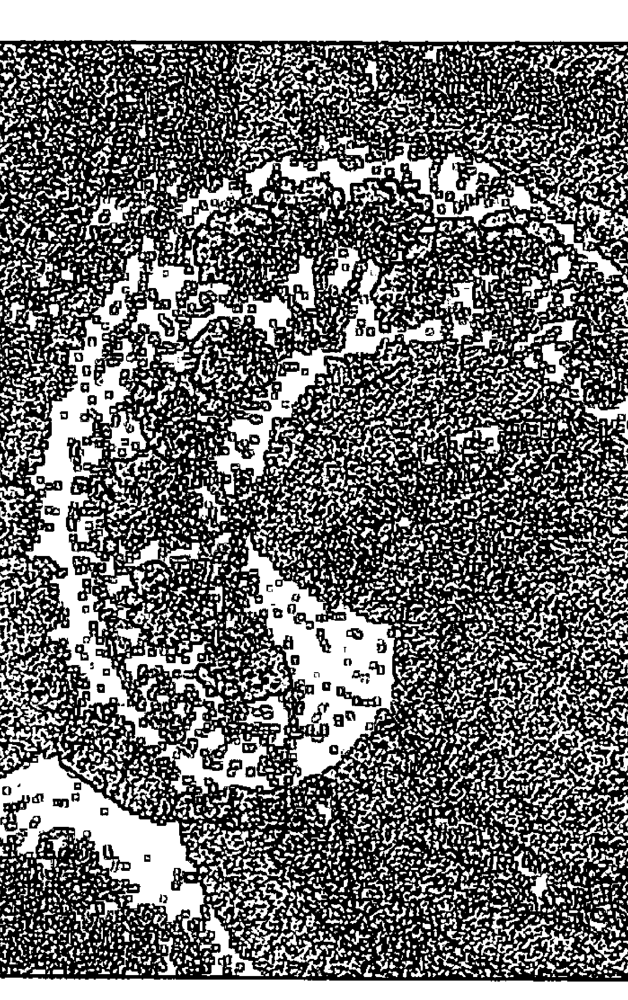

在讲精油之前，最后再介绍一个小技巧。那就是，如果在呼吸净化后无法静心和中断思维，这时该怎么办呢？我给大家提供的小技巧就是，多吸闻静心油，闻过之后，观察自己的下一个思维、想法是什么，然后迅速把它抓住——就像猫捉老鼠的时候一样，守在洞口，一旦有老鼠出来就一把抓住。当你真的这样做的时候，就可以达到思维的中断，然后你会发现，在一段时间内，当你观察老鼠洞口的时候却没有一只老鼠跑出来。这是一个非常实用的小技巧，大家可以用它达到思维的中断。随着中断时间的变长，你就可以感受到平静的喜悦，从而进入更深的精神层面。

### 精油魔法

利用地球上的物质调动“土水火风”四个能量只是技巧层面的东西，而“空”的修炼才是修为层面的东西，它高于能量层面，是意识层面的东西。所以希望大家在玩魔法的过程中将个人修为的提高作为根本，毕竟魔法只是一种学习技巧，通过它只能在物质世界中获得自己想要的东西。

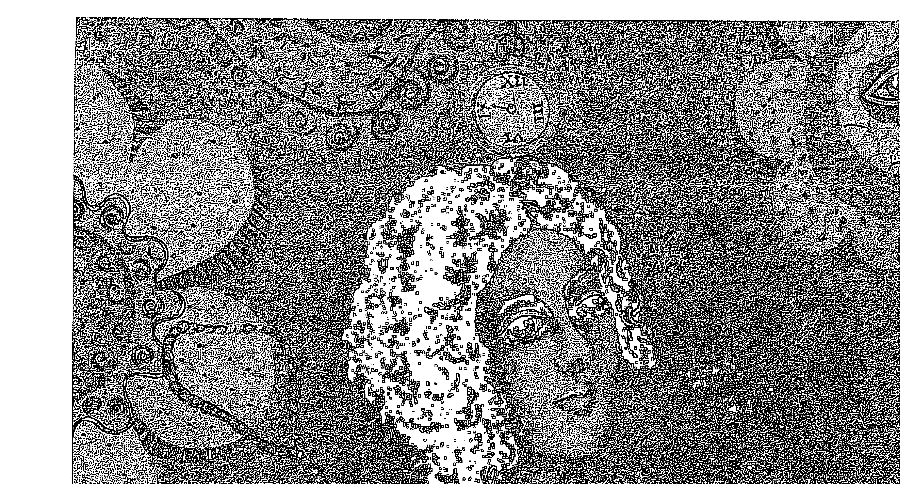

### 大宇自然能量净化法则

我们已经建立“土水火风”的宇宙观，在遇到一些事情的时候，要从“土水火风”这四个元素来思考事情的本质是什么，看看它属于其中的哪种，然后选择最合适的净化方式，调动对应的能量，效果将会更直接。

下面介绍在“土水火风”能量层面的六种精油，它们与净化和提升自己的灵感、灵性有关。

#### 尤加利：风，吹进老屋的风

尤加利，来自“风”的能量层面，代表风的元素。尤加利给人的感觉就是吹进老屋的风。当一阵狂风吹进一个多年无人居住的老屋，窗户洞开的一刹那，外面阳光灿烂，一束光“唰”地一下照进屋里，照在那些披拂素布的老物件上。素布扬起，满布其上的尘土在屋子里轻舞飞扬、欢欣鼓舞。这就是尤加利的魔法特性，它就像吹进破败老屋的大风，充满希望。

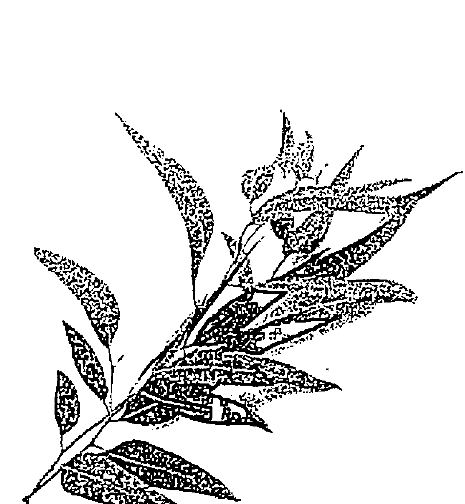

尤加利是风的元素，而风与交流相关。当我们与他人产生了口角纷争，想要扫除它带来的负面能量的时候，尤加利便是不二之选。因为它扫除的就是风象的负面能量。

#### 柠檬：水，白水晶

柠檬司净化，来自“水”的能量层面，代表水的元素，适合扫除水象的负面能量。水象征着情感，是流通，我们在做完个案之后可以用柠檬。因为做个案的时候会释放出很多负面能量，做完个案后如果想净化自己可能沾染的负面能量，用柠檬再合适不过了，这是水象的净化。如果我们自身产生了负面情绪，也可以用柠檬来净化。

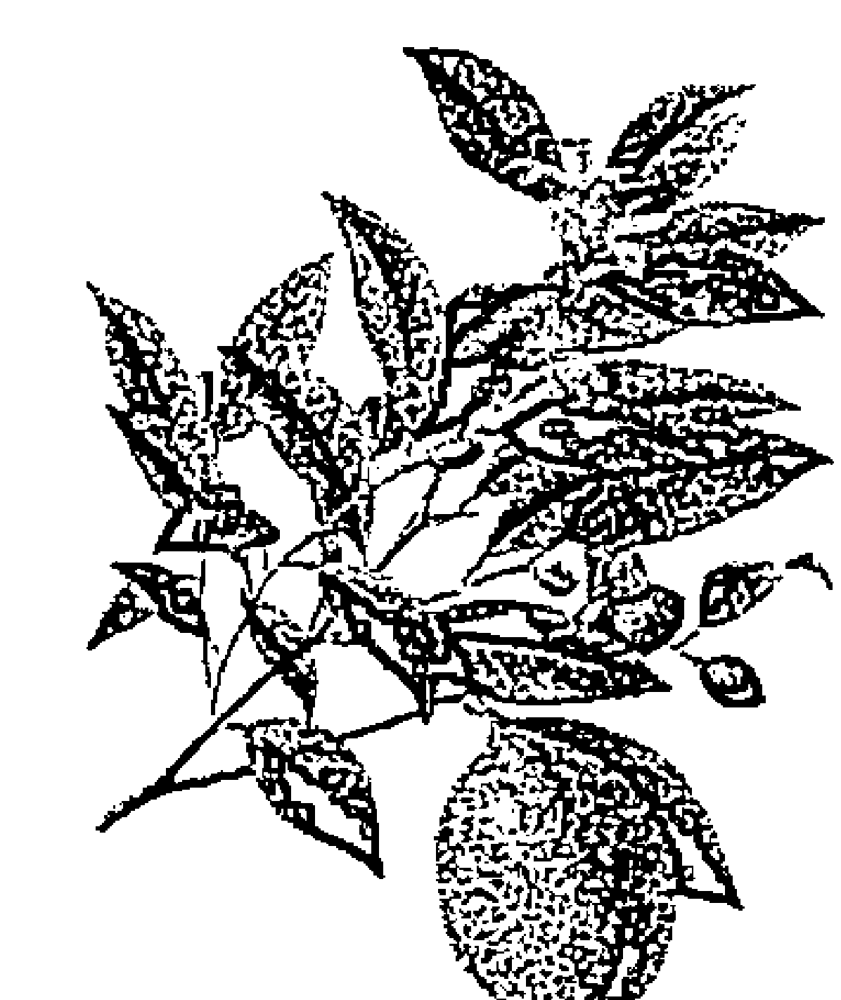

柠檬还可以扫除“瘾”。比如说，我们在某个方面成瘾，也就是得了上瘾症，就可以用柠檬来净化，因为“瘾”实际上就是由情绪的不满足导致的，柠檬在这方面的净化作用将更有利、更直接。柠檬也可以净化过去没说清楚的事情。这种事情经过时间的沉淀，往往会变成一种情绪，所以它才会令你难以忘记，甚或耿耿于怀。这是属于情感方面的，所以最适合用柠檬来净化。而当前没有说清楚的事情，则可以用风元素——尤加利来净化。如果说尤加利像吹进老屋的风，那么柠檬就像白水晶，除了能够净化情绪还可以提振你的能量。

#### 杜松：火，专职净化

杜松专职净化，来自“火”的能量层面，代表火元素。火是几个元素中净化力非常强的，火意味着转化，它在净化的时候能够把负能量彻底消除。比如一个陈年老屋，或者一个淤积负能量多年的空间，便可以用杜松来净化。但是在负能量淤积的地方，火只能烧到表面，也许需要先用尤加利把这股淤积的能量吹动、吹散，再用杜松的能量将它烧尽。当能量的本质烧尽后，还遗留着一些情绪上的东西，可以继续用柠檬将这些残留物清洗掉。

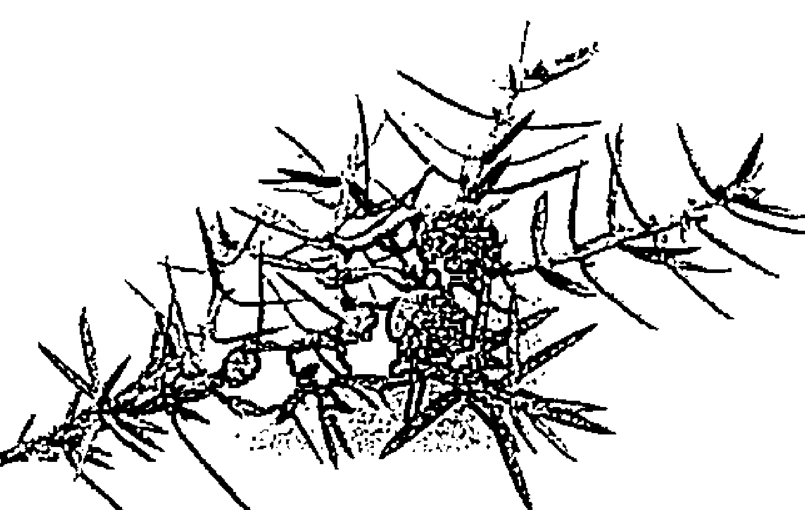

#### 薰衣草：风，平静

薰衣草、快乐鼠尾草、没药，是三个可以提升我们灵性觉知的力量。薰衣草来自“风”的能量层面，代表风的元素。薰衣草的能量感觉是平静，这种感觉就如同在浪漫的普罗旺斯，随着一阵微风吹来，一片片紫色的薰衣草田就像地毯似的轻轻摇摆，带给人们气定神闲、无与伦比的美好感觉。薰衣草之所以能够提升灵性觉知，是因为越是平静的时候，人的灵性觉知就越会显露出来；同时还因为薰衣草是紫色的，象征着顶轮，与它的能量特质一致。

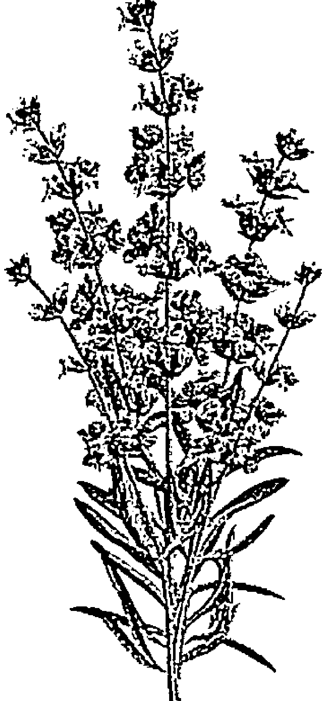

所以说，薰衣草就像平静的风，抚慰着我们在物质世界的焦躁和情绪的不平，让我们静下心来，这样我们灵性的觉知就会慢慢升起。

#### 快乐鼠尾草：风，与月亮对话

快乐鼠尾草，也代表风的元素，它的能量感觉是与月亮对话。快乐鼠尾草的魔法特质是提升人的精神力，在精神力提升之后，人就会有兴奋继而镇定的感觉，也会有灵感。它的一个场景就好像是：夜晚的湖畔，一轮圆月挂在天上，有微风，有鹿。月亮照在湖面上，照在鹿身上，照在树下的你的脸庞上，把一切变成了一个唯美的银色世界。在这种场景下，你可以和月亮对话，这种对话是没有语言的，你和月亮之间不需要语言，只需要感受月亮的光芒，你的心里就会有回应。

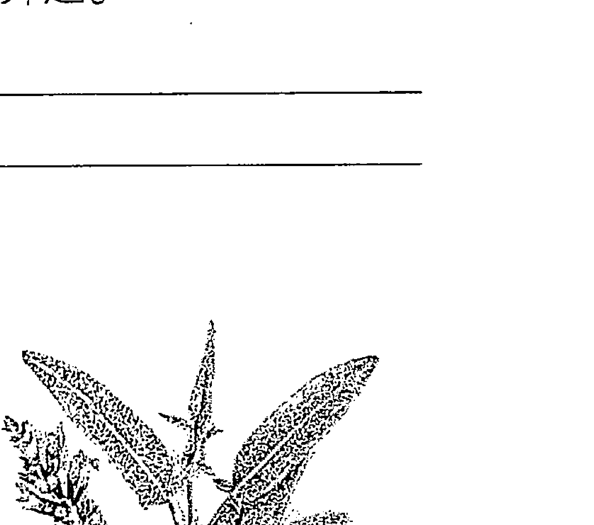

你心里的回应，就是这种精神力的提升。薰衣草提升了你的灵性觉知，是它抚慰了你；快乐鼠尾草提升了你的灵性觉知，是借用月亮的光芒提升了你的精神力。你的精神力提升之后，就会因为自己沐浴在月光之下，欣赏着湖畔的银鹿而变得兴奋，兴奋的同时你又会有所镇定，因为这个月下的场景实在是太静谧、太迷人了。然后就在这样一个美好的夜晚，在兴奋与镇定中，你产生了灵感——这是月亮带给你的力量。这因而也是快乐鼠尾草带给你的力量，让你与月亮对话，从中获得灵感、兴奋、镇定和精神力的提升。

#### 没药：水，月亮最高阶

没药是月亮掌管的植物中能量位阶最高的（太阳掌管的植物中能量位阶最高的是乳香），所以它完完全全反映着月亮这种阴性力量的真实状况。没药带给人灵性，有助于静思冥想。同时，没药是水的元素，水元素的本质就是疗愈和流动。

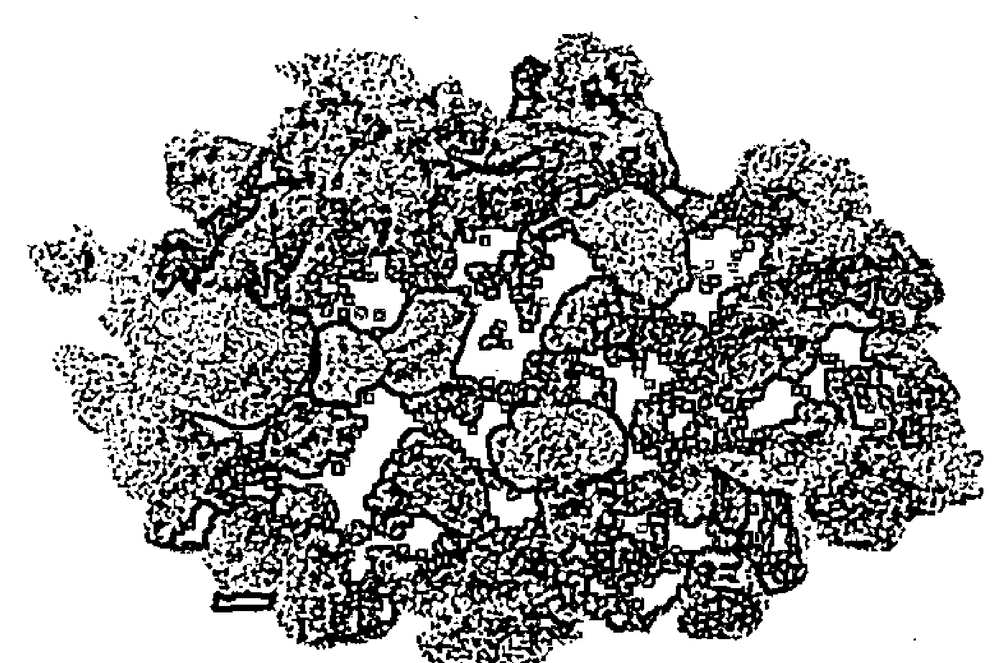

因此，没药的关键字就是灵性、冥想和疗愈，这都是阴性力量可以带来的。

太阳的力量是阳性力量，是外显的；月亮的力量是阴性力量，是内敛的。这就是为什么快乐鼠尾草与月亮对话可以产生精神力的提升与灵感，而没药作为月亮中位阶最高的植物，可以引领人进入极端深度的精神世界，即我们内在的精神世界，也就是月亮掌管的世界。所以，没药也是静心油中的重要成分，它帮助人们获得月亮的阴性力量而使人走得更深。

我要重申的一点就是，“土水火风”是能量层面的东西，它们可以为用，但那只是术。而“空”是道，我们应把重心放在道上。人的身体也一样，一、二、三、四脉轮就是“土水火风”四种元素，五、六、七脉轮就是空、光——更精微的状况，所以我们身体的“土水火风”能量层面可以用魔法解决，它相当于物质层面，对应于人体就是我们的躯干和身体层面；但是人体的精神层面，也就是上三脉轮，即空、光，是更精微、更本质，也是统领整个生命的力量，是我们的重心所在。

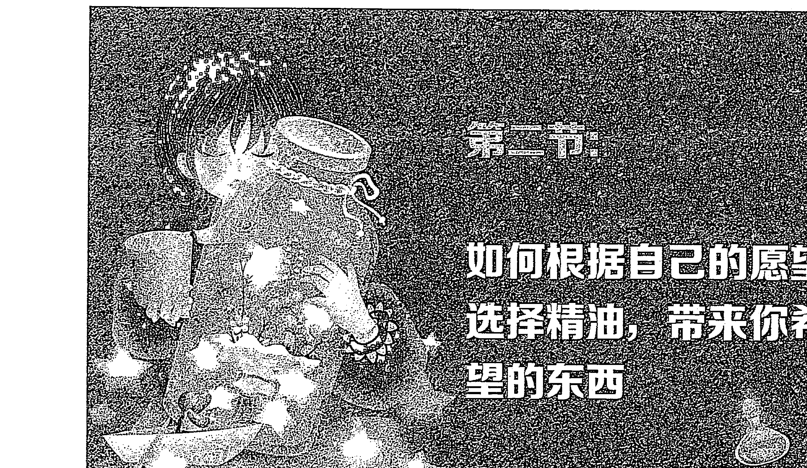

### 第二节 如何根据自己的愿望选择精油，带来你希望的东西

- “空”的力量
- 观想的二阶练习：观想的练习一和练习二
- 投射能量改变环境的精油魔法的操作
- 几种招财和招桃花的魔法精油的介绍
- 如何调配精油

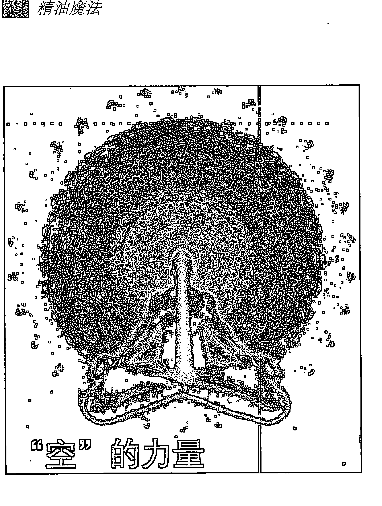

上一节，我们指出呼吸和静心的进行是最重要的，之所以说它重要，是因为“水土火风空”中“空”的元素调动“水土火风”四个元素，从而在能量层面实现我们的愿望，这就是我们在使用魔法精油的时候能量层面发生的事情，所以说“空”这个力量是非常重要的。

那么“空”到底是什么呢？就是我们的意念力，也可以说是念力、灵力或者意志力。那么这个力量是来自哪里，来源于哪个层面呢？它来自于我们的思想中断的时候。因为当我们想事情，当我们有思想的时候，我们惯常的思想是很难诞生出这种意念的力量的，因为它是可以用语言承载的东西。这就是为什么，上一节课我们说要像猫守着老鼠洞盯着老鼠出来一样，盯着我们的下一条想法，因为只有在盯着这个想法的时候，我们的思想才会中断，才会进入“静心”的状态，即“空”的能量层面。

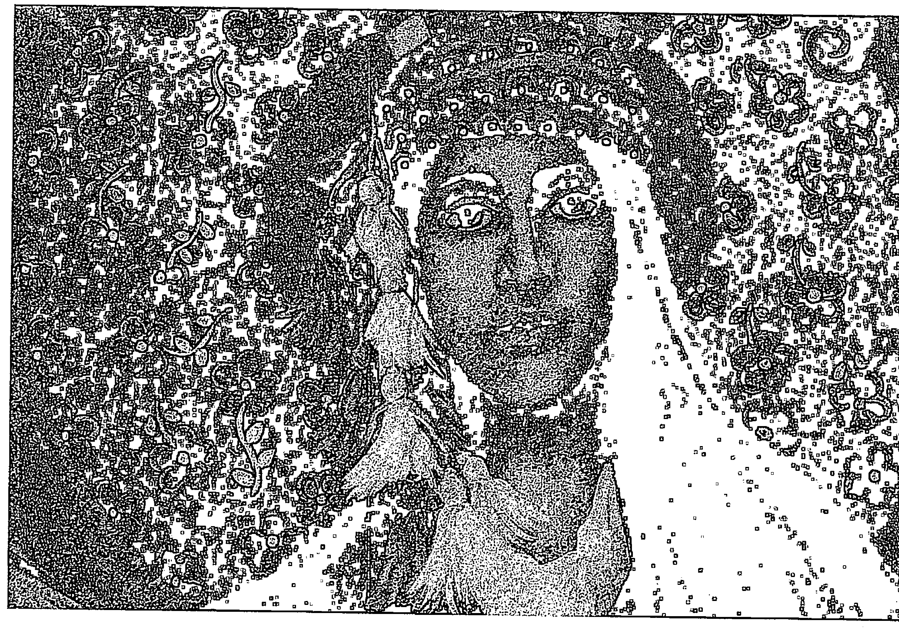

我们的思想的中断，是为了我们更深层次的意识的显露，因为在我们平时的生活中，我们的思想十分繁杂，我们过多地把自身力量用在思考现在的、过去的、将来的事情上了，因此就把我们本质的力量和意识给遮盖住了。所以当思想中断，就像有了一条缝，使我们的更深层次的思想得以显露出来，并让我们意识到它。为什么它很重要呢？因为我们平时总是认为思想就是我们自己，我们会和自己的思想认同为一体，这就好比你像猫盯老鼠一样捕捉下一条思想的这个过程，你不知道老鼠是你，还是猫是你。既然你是在感受猫的感觉，显然你是这个猫，你抓的是老鼠，老鼠便相当于你的思想，那么问题来了，既然思想是你，猫也是你，那么到底哪一个才是你？

### 精油魔法

所以猫抓老鼠的练习，就给了我们一个机会，让我们认识到思想之外的我们自己。我们的意识的最深刻处，就是没有思想的意识，因为思想是更浅一层地帮我们去处理世事的一个工具，使用这个工具的应该是我们自己，只是我们往往太注重于这个工具而把自己给忘掉了，而真正的魔法力、意志力、念力，以及调动“土水火风”四个元素的“空”的力量，来自于猫，来自于我们没有思想的念力这种意识中的自己。

然而，在我们努力想要感受这种意识层面的自己的时候，我们却没有办法感受到它，因为我们越努力就越使用了思想，只有把思想和自己隔绝开时，也就是通过猫观察老鼠的方式，才能中断我们的思想。中断思想不是最重要的，重要的是在这个过程中，你意识到了另外一个自己，就是这个猫。然后你去感受这是一个怎样的意识层面，当你和这个自己相处越来越多，中断思想的时间越来越长时，你就会认识到更本质一层的自己，而使用精油魔法的时候，“空”的力量就是从这一层自发而来的。我们的意念力越强，“空”的力量就越强，魔法的效果也就越显著。

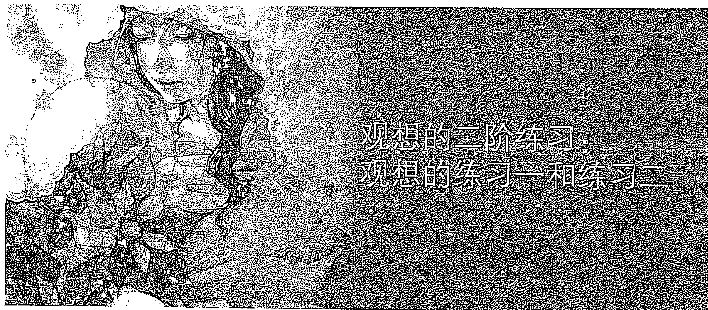

第一节的呼吸和静心与情绪和思想有关，情绪是思想碰触到身体之后的产物，呼吸就是把思想和情绪层面淤积的能量扫除以便于我们中断思想，静心就是尝试着把思想中断。这个时候我们等待更本质一层的意识的显露，就如同等待肥沃的土壤上长出植物一样，因此呼吸和静心就是把这个肥沃的土壤准备好。今天我们所说的观想，就是直接运用这种更本质一层的意识来创造事物的能力。

#### 观想的练习一

对于这种更本质一层的意识，由于我们平时很少与它相处，所以在运用它的时候需要进行一些练习。我们在第一节中已经讲过观想的一阶练习，就是在呼吸、静心之后，使我们的思想达到中断的状态。那么在观想的二阶练习中，我们的第一个练习就是观想一幅场景、一幅画。所谓观想，就是用心志之眼看到眼睛看不到的东西。

具体的做法就是，连续5分钟观想同一幅场景，它可以是不动的，就是一幅画，或者是什么东西放在那里，你从远处看着它。在观想时要中断思想，不是你看着这幅画想各种各样的东西，而是要没有思想地观想。如果这个画面连续5分钟不被别的画面打断，那这一关就算是过了。如果你觉得在练习的过程中，很难连续观想同一画面5分钟而不被打断，那很可能是你的呼吸和静心做得不够，那就需要退回到呼吸和静心5分钟，使思想中断5分钟。不要着急，不要勉强自己，这本身比较难，只要反复练习，总会达到的。直到这一步做成之后，才开始观想练习一。

#### 观想的练习二

在完成了观想练习一之后，就可以开始进行观想练习二。这时候我们的观想对象不再是一幅画面，而是在一个视觉层面之外还有别的层面的东西。比如，一个橘子，我们不仅可以看到它的外形，还可以闻到它的香味儿，用手摸到它的硬度，捏一下橘子瓣儿还能感觉它的水分。

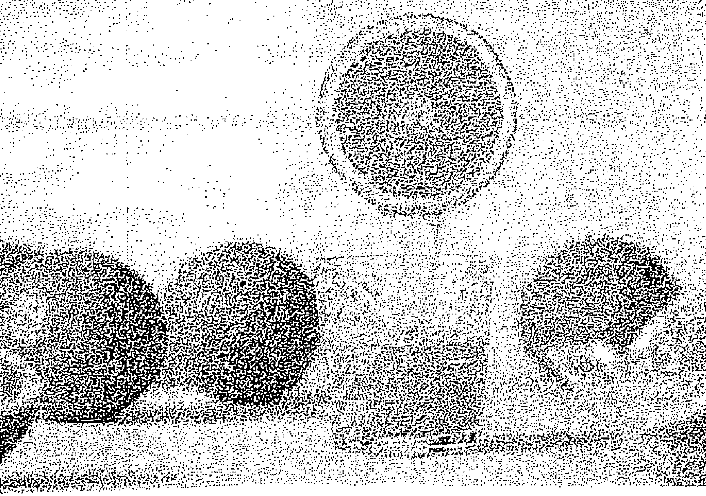

也就是说，在练习二的观想过程中，我们可以试着想象自己用手去碰这个橘子，捏一捏它，闻一闻它的味道，看看是什么感觉。练习二就是从练习一对于一幅画的观想练习中进入到对于一个实物的观想练习中，这个观想过程也需要持续5分钟，其间没有任何思想。

#### 观想油

观想油，是呼吸净化油和静心油之外的另一个利器，它有两个方面的作用，一是增加身体和意识的力量，二是增加你与另外一个世界沟通的力量。这两个力量是观想的不同层面所需要的。在最开始练习观想的时候，你的身体力量和意志力量是非常重要的，观想油可以使你强有力地达到这种状态。而在观想的后期，当你已经定下来、静下来，可以持续5分钟做这个练习的时候，观想油又会给你带来与另外一个世界沟通的力量，使你更容易在观想中体会到另外一个空间的东西。

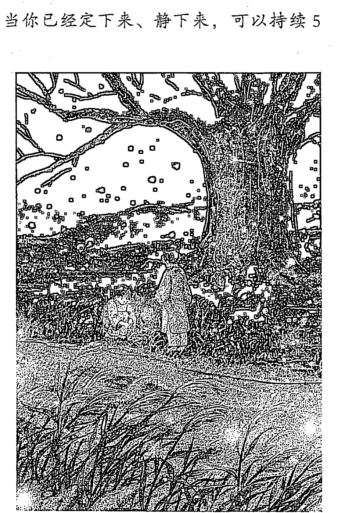

观想油是在呼吸油和静心油之后，即在开始进行观想练习的时候使用。具体做法就是把它涂在手心里，闻着它的味道进行观想。因为在观想的过程中，你有时觉得自己总会想一些别的画面，好像是思想累了，其实这是你的身体力量和意志力量被消耗掉了一些，于是可能造成你越观想越累，越观想越容易被别的画面打断，这个时候观想油就会补给你这种力量，让你能够持续练习。

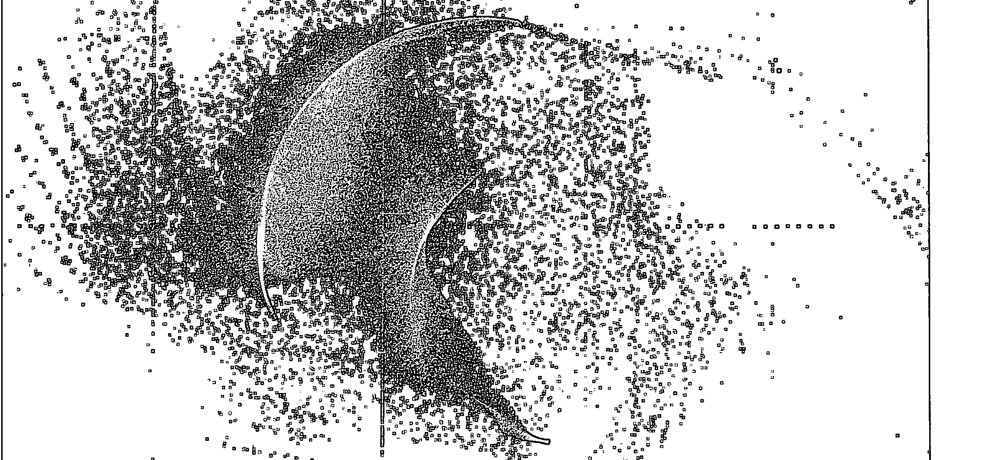

#### 投射能量改变环境的精油魔法的操作

前面我们讲了吸闻精油，想象这种力量进入自己的身体并在身体内运作，然后把坏的东西呼出去的呼吸练习。这种练习就相当于一种魔法操作的过程，通过这个过程，你把植物的力量吸入自己的身体之中，与“空”的力量融合在一起发射出去。这样发射出去的能量既带有你自己的信息，又带有你的愿望的信息——因为你最初就是根据自己的愿望选择了相应的精油来吸闻——它发射到广阔的能量场之中，会吸引回你想要的相似的力量，因为震荡频率相似的东西是相互吸引的，所以两股信息融合在一起就会带来你希望的东西。

因此，在这个操作过程中，你必须根据自己的愿望来选择精油。比如，你想招财，那么就选择几种招财油，把它们混合成为你的招财魔法油。你把这个招财魔法油滴在自己的手上，然后呼吸，在呼吸的过程中，想象一个你得到财富的画面，就像观想练习一的画面，想象5分钟后，把这个能量发射出去，而在发射之前，也就是在你想象画面的时候，你所吸闻的精油的气味与你自己的念力已经融合在了一起。

至于这种融合方式，我们可以进行更加形象化的说明。打个比方，你可以想象自己吸入的气味是金黄色的，因为你想招财嘛。这个气味被你吸入之后，它就慢慢形成了一幅可以反映出你很有钱的画面，比如家中有很多金子，你吃饭的碗是金色的，家里散发着金光，你甚至可以想象自己坐在一堆钱上，或钱被一阵风刮进你的屋里，等等这样的场景，它们的力量都是由你吸入的香气而来。

这是在你把能量发射出去之前做的事情。这时候其实还没有从另外的空间中召唤能量过来，它只是你自己做的一个信号、一个引子，你在描述这是一团怎样的能量，以便让这团能量为你送信。如此一来，当你把它投射出去之后，它才能把信送出去，才会召唤更多的能量返回到你身上来。所以当你吸闻这份香气，当你想象这幅场景的时候，你也会感受到自己身体中的力量越来越强大，感受到因为吸闻了这个香气而充满能量。

吸闻香气的过程可以是5分钟，也可以少于5分钟，当你感觉到身体中充满能量，感觉到这种你吸进来的财富的力量融合你的念力在你的体内荡漾流转时，你就可以把它发射出去了。

这种能量发射的方式，就像日本卡通漫画《七龙珠》的冲击波，从一个人的手心抛出一个能量球，或者从手心、手指间发射能量，打击敌人。当他的身体越来越紧张的时候，就是在积累越来越多的生物电能，这时候一旦他的身体放松，能量就可以融合他的念力发射出去，顺利完成这个发射动作。

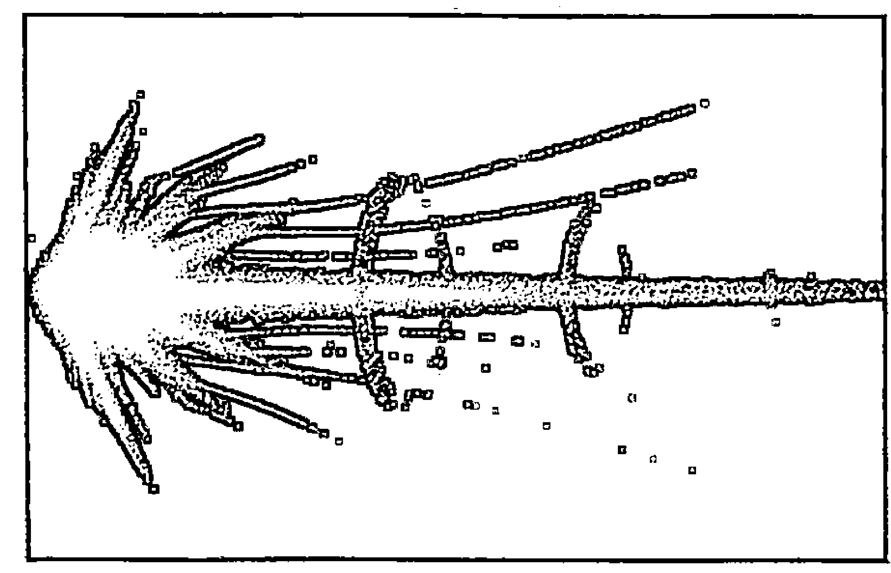

因此，在我们吸闻香气并感觉到身体中的能量越来越充盈的时候，便可以使放松的身体慢慢变得有意识地紧张，然后在我们发射能量的那一刻，身体则完全放松下来，同时想象这股能量从你的手心、手指间一下子喷涌而出，这时候还可以配合相应的动作。能量喷涌而出到广阔的外在空间、外在环境的能量场中，会引发这个能量场的反应，比如你在做招财魔法的时候，可以想象这种金黄色的能量散发到能量场中，空中下起金黄色的雨，洒在你的身上。

至此，你就完成了整个过程：第一个步骤，在静心观想中描述了你的能量信号是怎样的；第二个步骤，把这个能量信号发射出去，并且观想它收回了你想要的更多的能量。做完这些以后，接下来你需要做的就是等待，等待这个能量在能量空间中的运作，等待它带回的能量使你的生活有所改变。

以上只是以招财为例，招桃花也是一样。先选择几种爱情方面的魔法油混合在一起，想象爱情的场面，然后等到能量在身体中变得充盈之后，全身一下子放松，将能量发射出去；继而想象花瓣落在自己的身上，这也取决于观想一、二的对象。如果你能观想到画面，就想象画面；如果你能观想出实物，就想象实物场景，后者相对更好一些。

至于想要改善外在环境的其他愿望，都可以用这种方式，即先积聚能量，再将能量发射出去，想象它吸引回来更多的能量。比如，你想保护家里的能量场，想更有名望，想让工作环境更舒适等，都可以通过它来实现。

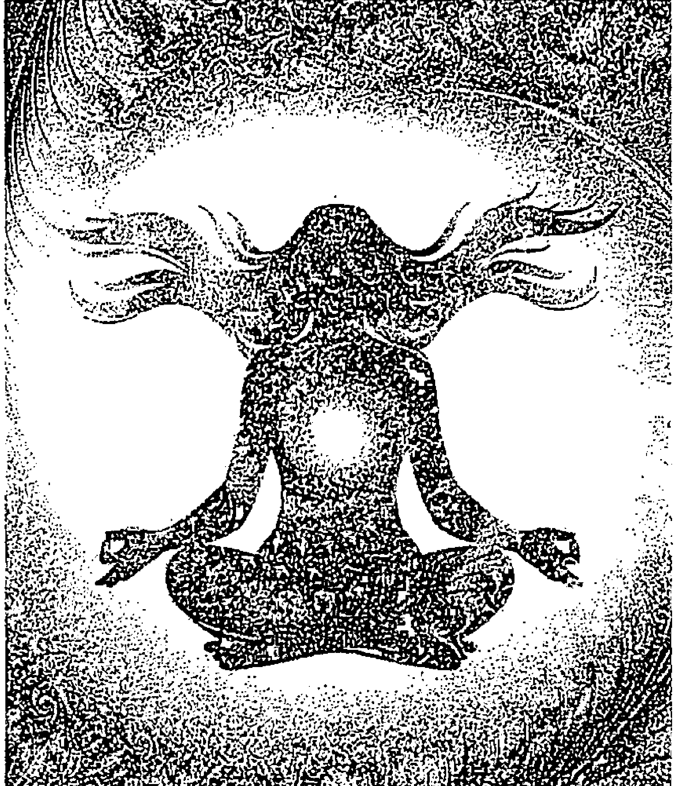

想要改善外在环境的愿望，可以先积聚能量，再将能量发射出去，想象它吸引回来更多的能量。

### 利用招财精油和香的魔法精油的介绍

### 招财精油

上一节讲解了“土水火风”四种元素，而招财精油也是分元素的，关键看它用哪种方式招财。下面先介绍几种招财的精油。

罗勒是火元素，可以招财也可以辟邪，它的感觉就像电影《让子弹飞》里姜文的感觉。影片最后他想杀黄四郎，于是就带着他的弟兄们在广场上骑马转圈圈。他边骑着马边喊着口号：枪在手，跟我走。罗勒的感觉就是姜文喊“枪在手，跟我走”时的感觉。姜文想杀黄四郎是在一个比较困难的情况下，只有几个弟兄，镇上的人因为惧怕黄四郎而不敢跟他走。这就是罗勒的招财方式，用火的能量加强自己的意识心志，让自己去思考“我应该怎么做”以招来金钱和能量。所以说，火能量的罗勒是一种主动性的招财方式，让你热烈地、激进地、突破性地去做一些事，以改变现状，招来钱财。

因此，罗勒这种姜文“枪在手，跟我走”的感觉，在招财方面是通过使你的头脑变得清醒，使你的心志意识状态提升来完成你的目的；在招财之外的方面，可以让你觉得不悲伤，很平静。如同姜文，他虽然死了兄弟很悲伤，但是他最后找黄四郎报仇的时候，是把悲伤抛在脑后，清醒而平静地做，这就好比罗勒的作用。

罗勒还可以驱邪，很多火能量的东西都有驱邪的作用。罗勒的驱邪方式也是平静的。当你烦乱的时候容易被邪侵入，这时候罗勒使你像姜文一样“枪在手，跟我走”，然后想出来一个杀死黄四郎的好办法，继而平静地驱邪，弄死黄四郎。

广藿香是另一个招财精油，是土元素，所以它用土元素的方式招财，它的能量场景是暖暖的、广袤的大地。大地是孕育生命的地方，我们想象原始人在暖暖的大地上会干什么？他们会在暖暖的大地上睡觉、补充身体能量、交媾，所以总的来说，广藿香能够提升人们三个方面的能量：身体能量、金钱力量、性能量。

广藿香与罗勒不同，不像罗勒那样改善人心志的清明程度，使人通过主动思考“怎么做”而带来财富。它带来金钱的方式像是暖暖的大地上长出庄稼一样，土壤是肥沃的，风是暖暖的，四季交替，庄稼会自然而然地长出来。这些长出来的庄稼，就相当于这土地上的人们的物质财富。

而罗勒招来的财，也就是姜文杀了黄四郎取得的这种财，只是当下的、暂时性的财，至于一个礼拜后如何去弄更多的钱，他不知道。而广藿香招来的财呢？是地里长出的庄稼，这些庄稼可以日复一日、年复一年地长出来，你不需要过多地改变土地。因此，广藿香给你带来的力量就是你脚下的一片肥沃的土地，只要你不破坏它，它就会慢慢地给你带来财富，这就是土元素带来的财富的特点。

香蜂草是风元素的招财精油，它在招财上的第一个特点，就是像风一样把你的债务扫除掉。其次，它还有吸引贵人的力量。比如，你计划做投资，那就需要寻求合作伙伴，需要把他们吸引过来把持各方，需要他们进行投资，一句话说来，就是你需要贵人，需要把智力上的图解变为现实的途径，这个时候用香蜂草是最好的，因为计划上的东西和智力上的东西都是风的元素，用风元素的招财精油会助你一臂之力。

招财的植物很多，招财的方式却各不相同，我们在选取植物的时候，先思考一下自己是什么样的状况，需要什么样的能量，再去选择“土水火风”中的具体元素的力量，选择适合的魔法精油的配方。

### 招桃花精油

爱情方面的精油有天竺葵、依兰、茉莉，它们三个都是水元素的精油，因为感情和水联系紧密，但是它们三个又不太一样。

#### 天竺葵

天竺葵在爱情方面有两个作用，一是提升爱情的温暖程度，二是获得纯粹的爱。

天竺葵特别像电影《指环王》里精灵世界中爱上国王的小仙女，精灵是长生不老的，而作为人类的国王只能活几十年，这一份爱情注定没有什么结果——虽然最后有了结果，但是在当时的情况下相当于没有结果，不符合现实的状况。

电影里有一个场景：在国王出征前，他们来到精灵世界中非常清澈又充满灵性的小溪旁，精灵把自己的护身符交给国王，国王说不能要，精灵便对他说：你把它拿着吧，这是一份礼物。她的那种坚决的态度，就仿佛在宣示，不管未来会怎样，此时此刻我是爱你的，不管你是活着还是战死，也不管我会在哪里，这个礼物此时此刻是你的，我的心此时此刻也是你的。

这就是天竺葵的感觉，是不管不顾的爱，不求物质世界的丰盈，不求有没有结果，只求此时此刻的纯粹。这种纯粹令爱情升温，天竺葵给爱情带来的力量就是此时此刻的纯粹和升温，就如同精灵送给国王礼物的那一刻。

#### 依兰

依兰是特别香的精油，就是那种浓浓的花香，像电影《卡门》的感觉，它给爱情带来的力量是催化感情，把感情催化到物质性那一方面去，所以依兰带来的是物质的爱。物质的爱并非不好的爱，因为要想纯粹的、长久的爱，就必须有物质作为支撑，依兰催化的就是这个部分。

所以，当你希望你的爱情中有更多的物质元素的时候，就可以选择依兰。这里所说的物质，并不就是指车、手机之类的消费品，它可以是爱侣之间的物质基础，比如两个人一起租房子、一起在山顶买个木屋、一起旅游等，依兰可以促进这一类美好的事情的发生。

依兰和天竺葵都是金星主宰的植物，所以它们更关心爱情和愉悦本身。

#### 茉莉

茉莉也和爱情有关。茉莉是水元素，是月亮主宰的植物，它给爱情带来的力量就是促使爱情中的相互关系走进家庭。金星象征着愉悦与爱情，而月亮象征着家庭和更深层次的精神状况。

茉莉的能量场景就是床前明月光。静谧的夜晚，床前的窗帘是拉开的，明亮的月光照进来，使人平静、遐思。这就赋予茉莉几种能量上的功能，一是促进爱情走进家庭，二是使人平静，使灵性得以提升，因为灵性在人平静的时候最容易提升，尤其是月光照耀下的平静与灵性最为相关。有床就有性，有床就有睡眠，所以茉莉可以促进性，促进深度睡眠。

### 如何调配精油

接下来我们讲一下如何调配精油。在将功能相似的精油配成魔法油的时候，一定要有先后顺序。首先，你要从你的场景，也就是你想做的事情出发，明确自己主要需要“土水火风”中哪个方面的力量，也就是说，你想要获得的能量对你的改变是“土水火风”哪个方向上的改变。当你决定四元素中的能量方向后，就可以选择魔法油中的主成分。比如，你想走入家庭，就可以选择茉莉，如果你想让它突然实现，就可以加一点罗勒这种火的元素。

加一点火元素有什么作用呢？它可以在月亮这种水元素的能量，也就是让你们走入家庭的这种能量的笼罩下，添加一些催化的作用，就像两人本来就应该结婚了，然后姜文这种“枪在手，跟我走”的强烈的个人意志又把它往前推进了一下，使它更快地发生。

如果你想为你们以后的生活着想的话，比如说你希望两个人在一起的物质生活更丰饶一些，就可以放点广藿香。或者是你想要你们两个人的关系受人瞩目，那么就可以加些香蜂草，用它来吸引贵人，为你们带来名望。

或者说，你的主要愿望是你们走入家庭之后，不要家人变家具，而是仍然保持纯洁的爱情，保持精神性的沟通，也就是说，你觉得这种爱情的快乐比走入家庭更加重要，那你就可以以天竺葵为主成分，因为它代表纯粹的爱，能够为你们提升爱的温暖，让你们走入家庭后仍然保持纯粹的爱的温度。此外，你还可以加入一些茉莉、广藿香，或者其他你想要的成分。

所以，每种植物都有自己的个性，在各种书中也有关于其个性的文字描述，但要真正了解和运用它，就应该从它的最本质入手。各种植物的最本质就是“土水火风”四个能量原型，不管书中描述它有怎样奇妙的能量特性，至于它究竟属于哪一能量的植物，仍然必须遵循最本质的能量原型的运作方式来判断，因为书上的描述有的是对的，有的是错的，但是“土水火风”四个能量原形永远都不会变。

#### PS: 骨干魔法油

下面介绍一下骨干魔法油。它由几种植物组成，这几种植物具有广义上的提升魔力的力量。比如，它里面有雪松，雪松就像一个魔法城堡，当巫师在自己的魔法城堡中使用魔法的时候，他不会被侵犯而会受到保护；二是他的魔力会大大增强；三是魔力的稳定度会大大提升，并且会持续提升，这就是雪松带来的魔法力量。

骨干魔法油里还有橙花。橙花带来的力量是整体提升魔法油配方中的每一种植物的力量，使它们之间相互配合得当，这是橙花带来的力量。我们会发现，雪松、橙花这一类植物所带来的力量，是适应每一个魔法配方的，因此我就选取大概七八种这样的植物，根据它们的重要程度，用不同百分比调配成纯精油骨干魔法油。

大家在做自己的魔法配方的时候，往里面滴一滴骨干油就够了。因为一滴之中就带有几个普适力量融合之后的频率，它可以增强你的魔法配方的魔力，如果你想让它增强更多的魔力，也可以添加更多，视情况而定。

### 第三节：如何通过感受万物来调配魔法油，帮你达成愿望

- 为自己积累能量的精油魔法的操作
- 观想的三阶练习：观想的练习三和练习四
- 其他几种魔法精油的介绍
- 水晶和行星的简单介绍

使用魔法最关键的就是自身的状态，因为魔法就是用自身的状态去调动“土水火风”四个元素来实现自己的愿望。所谓自身的状态，就是自身意识的强大程度，我们在第一节中所讲的呼吸和静心，以及第二节中所讲的如何中断自己的思维，都可以使我们的意识变得更强大。

在精油魔法的最后一节，我们要讲的是如何感受到周围的万物。

其实思想是挺有意思的一个东西，虽然它也会给人带来痛苦。思想中断之后我们能获得什么呢，不是变成一块木头，愣愣地杵在那里，而是我们能感受到更有意思的事情，就是当我们的意识强大到一定程度之后，我们便可以感受到周围的万物。

这种感受是一种能量层面上的互通。从本质上说，万物都是一体的，比如说一群鱼中的每一只都有自己的生命，就它们个体而言，都在某个时间出生或死去，但是对于它们这个物种来说，却是一直存在下去的，千百年前是这群鱼在河里游，千百年后也是这群鱼在河里游，而在背后支持它们千百年来未曾变化，支持这个生命一直存在的，就是生命的本质。当思想中断以后，我们可以慢慢感受到这种生命的本质，进而感受到周围的事物都是有生命的，这种生命是互通的。

很多修炼之人声称，在开悟之后就会没有自己，其实这种感觉就如同在某个时间生又在某个时间死的个体鱼的本身虽然消亡了，但是人们感受到的是鱼这个物种背后的能量，感受到的是更广阔的、无生无死的一个生命，在这种生命的喜悦下，个体身份就不是很重要了。

要感受这种生命和物种背后的能量，最简单易行的方法就是感受我们的身体，因为我们的身体是这种能量的一个表达，而这种表达形式又是离我们最近的。但是，所谓的感受到身体并不是感受到我们的肌肉、骨骼这个有形的身体，而是感受到这个有形的身体背后的能量。

就好像我们体会一栋楼，并不是体会造楼的水泥、砖头，而是体会它背后有一个什么样的图纸设计、有什么样的运作方式，形成了这个楼。而感受我们的身体的时候，也是感受一种什么样的背后能量形成我们如此复杂的身体。因为这种能量不仅形成了我们自己的身体，也形成了其他人的身体，也就是说，同一种来源的能量，它也形成了其他物种的身体，甚至植物、石头的身体，所以当我们以自己的身体为钥匙，开启身体背后本源的能量的秘密时，以此感受到万物背后本源的能量，也就是感受到了万物。

那么，如何感受自己的身体呢？具体的做法就是，在呼吸净化之后，在静心之后，在自己的思维中断之后，让自己的意识慢慢地显露出来，然后用这个意识去感受自己的身体，记住，并不是去思考或者评判自己的身体，而只是去感受它。比如，我们的手，它这么灵活可以做很多事情，那么形成手的背后能量是什么呢？又是什么样的能量支持它做出动作的呢？还有我们的心、肺、胃，它们何以运作得如此精巧？背后又有什么样的能量支持着它呢？

我有一个朋友，她也在一个偶然的机会下感受到了周围的万物。那一天，她涂了很多薰衣草精油下楼去遛狗，这时候天上乌云密布，她就想着这时候要是有一缕阳光就好了。她正这样想着，乌云中就出现了一个洞，然后有一缕阳光恰好照在她的身上和周围，从这一刻开始，她就发现自己和周围的事物是可以交流的。那是一种没有语言的交流，比如她在遛狗的过程中与花园里的石头和草交流，至于交流了什么，她用语言也描述不出来，但是就在那一缕阳光之后，她确实感受到自己与它们在交流。这个时候她会处于一种狂喜的状态，因为她觉得没有任何困难可以阻挡她，万物都在支持着她。

就是在这种狂喜的状态下，当她用植物精油，或者之后加进水晶、矿石等来调配魔法油的时候，就不是依靠书本知识来指导自己进行调配，而是通过感受性的依据来进行调配，也就是说，她能够感觉到周围可以利用的一切东西，感觉到它们都是什么样的，以及它们各自的能量本质和形态，感觉到生命的本质如何。这是一个非常理想的状态，这也是一个可以通过呼吸、静心、中断思维来达到的状态。

禅宗讲顿悟和渐悟，像我这个朋友的经历就是顿悟的过程。她也不知道有这种状态的存在，但是一个偶然的机会，在机缘巧合下，一缕阳光投射下来，她就进入了这种状态，而且维持了几个月。在这几个月里，她非常喜悦，而几个月之后，这种状态就消失了，但是她的生命从此再也不同。禅宗所讲的渐悟，就是通过自己的练习朝着这个方向去，通过慢慢地积累和提高，自己慢慢地转化，总有一天会开悟，那将使你感觉到莫大的喜悦，从此之后你的生命变得不同。

我们在调配魔法油的时候，最开始可以在知识的指导下进行调配，但更重要的是自己生命意识的转化和提高，因为通过感受万物来调配魔法油是更有意思的一个状态。

然而在无法达到这种状态的情况下，当然也可以配合使用现成的魔法油，因为有的魔法油可以使我们的力量变强，从而更快地达到这种状态，这就是下面要介绍的为自己积累能量的精油魔法的操作。

在使用精油魔法的时候，精油的本质植物能量与我们自己的意识力量融合在一起。对于这股融合的力量，我们在第一节中讲的是不发射出去，而是把植物的力量吸入体内改变自己，然后把不好的呼出去；在第二节中讲改善环境的操作中，则需要将这股力量发射出去。今天，我们要讲提高自身能量的操作，那就需要把这种植物力量吸进体内，然后令它像太阳一样慢慢地把能量散发出去。

比如，松精油就是一种可以提升人的力量的精油。在使用精油魔法的时候，我们可以吸闻松精油，想象它的力量进入自己的身体之中，使自己变得非常强大，进而把自己想象成为一个太阳，慢慢地散发着能量。如此一来，这股能量不是进入身体之后就发射出去，也不是进入身体之后就马上运作完毕，而是积累在你的身体之中，像太阳一样慢慢地朝周围散发出去。

再比如，上一次课所讲的招桃花，是一种改变环境的魔法，但是另有一种招桃花的方式，是为了提升个人魅力。它有别于改变环境的招桃花，而是从另外一个方向来招桃花，即通过把能量吸入进来，然后像太阳一样把它散发出去的方式，从普遍的角度来提升个人魅力。因为个人魅力也是自身能量的一个方面或一种表达。这两种招桃花的方式的区别在于，第二节讲的招桃花，是把能量发射出去而改变自己的环境，使环境的运作对自己有利，从而给自己招来桃花。而今天所讲的招桃花，是通过改变自身来提升个人魅力，从而给自己招来桃花。

这种提高自身能量的操作，就是在吸闻精油的时候，想象这股力量充斥着自己的身体，在体内越积越多，就好像吹气球一样，使气球越来越鼓，越来越圆。这个过程可以持续几分钟的样子，当自己感觉这种能量已经充盈了，就像第二节所讲的发射出去之前的那种能量荡漾流转的感觉，就可以进行第二步：想象自己变成了一个像太阳一样的能量体，这些能量慢慢地朝周围散发出去，这时候，你自己想要什么东西，就可以想象能量变成了什么东西。

如果你想招桃花，可以把这股阳光想象成粉色的，它把自己的周围都照得粉粉的。如果你想通过改变自己、提升自己来招财的话，就可以把它想象成黄色的，它像太阳光一样持续不断地将能量散射出来，使周围越来越黄，甚至能看到财富（金钱）的样子。如果你想提升自己的意识力量，就可以把这股阳光想象成紫色的，想象自己变得通透，或者想象在自己之上有无数种更高的能量，你与它们接通。

想象的图景可以依据自己的喜好而定，唯一的要求是不要把它想象成文字，而要想象成画面、图景，因为想象文字的时候又将落入思维之中，只有当你想象画面的时候，更高层次的意识才得以慢慢进入。

### 观想的三阶练习：观想的练习三和练习四

事实上，我们自身的魔法力量分成两个方面，一个是我们自身意识的力量，一个是我们观想的能力。观想的能力更像是一种技巧，可以通过练习来提高，它和我们的意识力量是相辅相成的，意识力量越强大，我们就越容易静心，且静心的时间就越长，这时候观想的能力就越大。观想练习的本身也是有技巧可循的，下面就来讲讲观想技巧的练习三和练习四。

#### 观想的练习三

练习三是观想出来一个并不存在的东西，比如一棵倒立的树、方形的太阳、一朵透明的花。这个观想的过程，就是一个你的意识、心志把它创造出来的过程。

将这些东西观想出来之后，你可以感受它的颜色，感受它的触感和味道。

这个观想过程需要持续5分钟，在你观想这个并不存在的东西时，不可以被其他的画面或事物打断。

#### 观想的练习四

观想的练习三成功之后，便可以进入练习四。在练习四的过程中，仍然观想这个并不存在的东西，你可以摸摸它、闻闻它，虽然它并不存在，但你用心志把它创造了出来，因此你睁着眼就能清晰地看到它，以致你认为它其实是存在的。比如，你看着白白的墙壁，可以观想上面有一个方形的太阳，观想它有多热、它是什么颜色、散发出什么样的光芒。

观想的练习四并不是说我们睁着眼睛做白日梦，而是指我们睁开眼睛的时候，不受眼睛所能看到的周围事物的干扰，用心眼创造出一个事物来。这也是我们魔法第二部之水晶魔法中需要用到的一个技巧，即当你在双手之间揉出一个能量球的时候，就是你睁着眼用心眼创造一个你不曾见过的、并不存在的事物。其实说它不存在并不准确，因为那只是你没看见过，以及在物质世界并不存在，才说它是不存在的；事实上它是真正存在的，不过是用意识创造出来的，用心眼看到罢了。

### 其他几种魔法精油的介绍

#### 欧洲赤松

欧洲赤松是一种风元素的精油，由火星掌管，它的关键词是原力，因为它就是那股原始的力量。欧洲赤松对人的作用就是它可以增加人的意识的力量、生理方面的力量，它也可以疗愈人、保护人、净化空间，其实感觉它无所不能，因为原力就是什么都能做的力。而且欧洲赤松非常原始，这股植物的力量存在的时间也很漫长，所以它象征着这股从最原始的地方来的，流传至今一直都没有变化的原力。

因此，每当我们想增加自己的原始力量，增加自己的意识力量的时候；或者魔法用多了产生了疲劳，但还想继续使用的时候；或者是想被保护、被疗愈，想净化空间的时候，都不妨用一点欧洲赤松增加自己的力量。欧洲赤松几乎可以在任何时候被派上用场，因为它就是演变出后来的各种力量的那股原始的力量。

#### 安息香

安息香的主宰行星是水星，为风元素。安息香有三种力量，一是提升我们的身体能量的力量；二是可以把各种其他植物的魔法力量融合在一起的力量；三是提升我们的意识力量，让我们的意识力量上升，有一种直达天庭的感觉的力量。

安息香有一种战前演说的力量，就是那种在两军对垒之前鼓舞士气的演说的力量。因为战前演说不仅可以把三军战士的力量融合在一起，而且它可以让每一个士兵的身体能量得到提升，敢于奋勇杀敌；它也可以提升每一位士兵的意识力量，让他们觉得自己是在进行崇高的战争，不管是生是死，自己都是在自我实践生命的意义。这就是安息香的一个能量场面，即战前演说，可融合全部力量，提升个人力量。

#### 雪松

雪松的主宰行星是太阳，属火元素。雪松就好像巫师的魔法城堡一样，有三个作用，一是可以使自己的能量状态达到平衡；二是可以保护自己的能量场；三是可以提升自己的魔力。这三个方向上的力量就是巫师回到自己的魔法城堡所能达到的状态。他回到自己的地盘休息，他的能量因此得到平衡，得到恢复，处于被保护状态，阻止外来负能量的侵入。雪松的保护形式与松的保护形式不同，它就像建了一道城墙，它不会攻击外来的负能量，但不会让它们进来。

在任何一个魔法精油配方中加入雪松，都可以提升整个魔法精油的魔力。我喜欢在调配骨干魔法油的时候加入雪松，因为这样一来，骨干魔法油就可以增强任何一种魔法油的魔力。

魔法精油就介绍到这里，其实本质上就是介绍一个思路，对于其他精油的元素及行星的掌管，大家可以看书学习。在此，我其实更多地讲解了使我们自己的意识变得更强大的方法，因为只有自己的意识变强大了，魔法精油才能发挥它的魔力，如果自己的意识不能专注，不能中断思维的话，魔法精油的力量将很微弱。

### 水晶与行星的简单介绍

还有一些其他的因素可以帮助植物发挥它的力量，比如行星和水晶。在很久很久之前，也就是在人类出现之前、在生物出现之前，地球是很孤独、很空旷的，这里可能什么也没有，除了水。后来才慢慢有了植物，地下有了一些矿石，然后出现几个能量的互动：行星围绕着太阳转，并在不同的天体位置对地球形成了力量与影响，而地球上与行星力量呼应的就是植物和矿石，所以这几个力量互动了很多年，地球上才慢慢地出现了其他的生命。

而所有的力量都是以频率的方式传递的，当我们使用植物的频率时，如果在它上面加上水晶的频率，并让它们符合行星的频率，那么就可以使它们的频率加成，使其更有威力。

植物在远古时期就发生了共振，在这种互动与共振的过程之中，它们的频率早已互相熟悉，所以当我们把对的频率加到一起的时候，它们的频率就可以加成。平时可以做一些小的练习和游戏，比如把一些相同的水晶和精油放在一起，观察它们的力量是否变大。

而更复杂的使用方式，就是通过水晶与植物的共振能量，你补足它们的行星的能量。这些更有意思的频率加成的方式，我们将在魔法三部曲之第三部的水晶魔法中进行讲解。

在下一节，我会教大家搓出一个能量球，并用手去感受能量，而这些都以呼吸、静心、中断思维为基础。所以，希望大家能够继续练习呼吸、静心和中断思维，因为它们可以帮助我们进入更奇妙的地方。

### 精油魔法之水晶魔法

- 水晶为什么能影响人？它是通过什么影响人的？
- 感受水晶能量练习一：能量球的练习
- 学习水晶的第一把大钥匙：水晶的颜色，以及颜色代表什么？能告诉我们什么？
- 水晶的佩戴方法

### 水晶为什么能影响人？它是通过什么影响人的？

了解水晶为什么能影响人、它如何影响人，是非常重要的。因为我们对此常常有很多问题，比如，这个水晶可不可以泡水啊？如何净化呢？是否可以盐埋？它是否带有负能量啊？只要了解了水晶是如何影响人的本质的，这些问题就可以迎刃而解。

任何的疗愈形式、自然疗法形式的本质，都是用自然的频率去影响人的频率，去加强、改善、规整人的频率。比如颂钵，就是用声音的频率去规整人的频率；比如芳香疗法，就是人们闻到香味的时候，芳香分子的振荡频率影响了人的嗅神经，从而影响了人体。

花精就是很明显的频率。所谓花精，就是把花放在水里泡着，将花朵的色泽、香气、频率等信息融入水中，再给这些花精原精中加入水，稀释掉其中花朵的物质信息，只留下花的频率。

扩大疗愈是用光的频率影响人，而水晶疗法是用水晶的频率影响人。为什么水晶越纯越好？因为水晶的每一个晶体都是按照一定的方式振动，当它很纯的时候，就不会含有杂质，它的能量就变得很专一，可以对人产生影响。为什么路上的石头无法影响人呢？因为它里面的杂质振动不同、方向不同、频率不同，无法统一，所以无法影响人。

人可以被自然疗法的频率影响，因为人本身就是频率。组成人或任何物质的最小微粒是频率，是振动。人就是由无数的频率组成的，这些频率有好有坏，错综复杂，所以人有时候很健康，有时候会生病，有时候会有负能量。

负能量就是低沉的振动频率，而水晶的振荡频率是高频的，这种高频的振荡频率可以改善人低沉的振动频率，或者是让它振动得更和谐，通过这种方式让人变得更健康，更快乐。所以水晶疗愈人的本质，就是把水晶的振荡频率传递到人体之中；水晶做风水的本质，就是把水晶的振荡频率传递到空间。水晶疗愈可以通过喝水晶泡的水，或者是佩戴水晶的方式来进行，这些都是为了让人接收到水晶的振荡频率。

因此，学习水晶主要分成两部分：一是感受水晶能量，二是学习水晶知识。学习水晶知识主要是学习水晶的振荡频率，知道每一种石头是如何振荡的，知道怎么选水晶。学习水晶振荡频率也分成两个部分，就是通过水晶的颜色和水晶晶体的类别这两把大钥匙，来确定每一种石头是如何振荡的。

利用知识来选择水晶，一般就可以做到很准确，水晶也将对人产生很明显的影响。如果你可以感受到水晶的能量和频率，那你的选择就会更精准，你的人生也会更有意思，就好像你多了一群可以交流的朋友，但这种交流并不是通过文字。

#### 感受水晶能量练习一：能量球练习

感受水晶能量练习的第一步，就是感受自己能搓出一个能量球，当你感受到能量球之后，再去试着感受水晶的能量。水晶是高频的振动，想要一开始就直接感受水晶的能量可能不太容易，我们自己搓出的能量球就是这之间的一个过渡。

感受能量球的前提是静心，因为只有心静的时候才可以感受到精微的能量。具体的做法就是关注自己下一个出现的念头是什么，在你关注它的时候，下一个念头是不会出现的，这样就可以把思想中断。此处，静心是必备的基础。关于如何静心，在魔法三部曲中的第一部——精油魔法中有所描述，大家可以借鉴。

在思想中断3分钟之后，就可以开始搓能量球了。具体做法就是双手搓，像冬天很冷的时候搓手那样，很用力地搓，搓1分钟左右即可。搓能量球时需要非常专注，不要想其他事情，只需关注自己的双手，1分钟后忽然停下来，把双手摊开，想象自己手中的能量喷涌而出，在手心形成一个能量球，能量球的颜色视自己的喜好而定，我比较喜欢白色和紫色。

这是一个生物能量释放出来的过程。当你感受手中的能量球时，刚开始可能觉得双手之间什么也没有，但是当你每天搓两三次后再去感受它，或当你的心非常静的时候去感受它，你就会真的感受到那喷涌的能量，而且这个能量球可以被你的意识控制，扩大、缩小，或旋转到你的某个指尖之上。

感受水晶球的方式就是，当你把它搓出来以后，可以轻轻地把双手并拢，看看是否可以触到它的边缘，你专注细心地体会它时，便能慢慢感受到它。而体会它的技巧就是静心和思想中断，也就是说，在你搓它和感受它的时候，都不可以有思想。

所以我请大家每天搓能量球至少两次，搓之前要静心和中断思想3分钟。务必记住，这3分钟是最重要的，因为只有当你静心、没有思想的时候，才可以搓出能量球并感受到它。

如果对静心和思想中断还有疑惑的话，可以关注我的公众号“姚俞先”，里面有相关解答和训练方法。

### 学习水晶的第一把钥匙是：水晶的颜色，以及颜色代表什么？能告诉我们什么？

下面讲水晶的颜色。为什么水晶的颜色很重要呢？因为水晶的颜色是我们选择与其对应的人体部位很重要的线索。水晶和人的脉轮都有“赤橙黄绿蓝靛紫”7个颜色，所以我们可以用颜色相配的方法来选择水晶所对应的脉轮，而且人生中的问题大多可以归为“赤橙黄绿蓝靛紫”7个脉轮的问题。人的脉轮的振荡频率在灵力的照射下，让有灵视力的人看到它的颜色，不管这个东西反射的是光还是灵视力，这个颜色都是它的特性。有灵视力的人看到人的脉轮是7个颜色。

水晶可以和颜色与其相同的脉轮相配，因为颜色也是一种振荡频率。我们之前讲水晶之所以影响人体，就是因为水晶的振荡频率可以影响人体，而水晶的振荡频率可以看作是它的晶体分类和它的颜色的叠加。当我们看到一个石头是黄色的，那是光照到它的身上后，进到我们的眼睛里所反映出的颜色。所以颜色本身就反映了水晶的振荡频率。

两个相同颜色的水晶和脉轮相配，它们的接收度是最好的，不同颜色的水晶和脉轮的契合度可能不是最好的，但它们也有所作用。不过我们在选水晶的时候，最好选择相同颜色的，那样更有效果。

#### 水晶的两把大钥匙：颜色和晶体分类

晶体分类是说频率是怎么振的，而颜色是说它在哪里振最有效，比如黄色虎眼石是黄色，太阳轮也是黄色，黄色对黄色，所以虎眼石在太阳轮最有效。

除了7个颜色外，水晶还有黑白两色，黑色划为底轮，是最厚重的颜色；白色划为顶轮，如白砗磲、白水晶，都对应顶轮。心轮本来是绿色，但粉色也对应心轮，粉水晶、蔷薇石、红纹石这些粉色的石头都对应心轮，因为粉色是爱情的颜色，所以心轮是爱情的脉轮。有时候，一个石头会对应两个脉轮，比如石榴石是黑黑的红色，同时对应底轮和脐轮，但这些只是个案。90%的情况都是什么颜色对应什么脉轮。

当我们遇到人生的难题不知如何解决的时候，首先应考虑它是属于哪个脉轮的，比如没有安全感是底轮的事，个人价值认可度不高就是太阳轮的事。第二步就是根据颜色选取用在该脉轮上的石头。比如红玛瑙、红虎眼、黑曜石对应底轮。石榴石、红纹石对应脐轮，近橙色。第三脉轮太阳轮是黄色，对应黄虎眼、金发晶，太阳石。心轮对应橄榄石和绿发晶，粉水晶和蔷薇辉石也对应心轮。红纹石既对应脐轮又对应心轮，是爱情的石头，给人橙色粉色的感觉。喉轮是蓝色，蓝色和靛色的区别是蓝天和深海的颜色，当你觉得表达有问题的时候可以用蓝色的石头，它对应海蓝宝、蓝纹玛瑙等；磷灰石也对应喉轮，是蓝得发绿的颜色。青金石是靛色，对应三眼轮，可以开启智慧，使人的思维更清晰。紫色对应顶轮，砗磲也是顶轮。砗磲是很有灵性的力量，像贝壳一样保护你的灵性，让你非常宁静。白水晶、白色月光石、白玛瑙都对应顶轮。白玛瑙和白玉髓的区别在于，石头的晶体是一样的，但玛瑙的颜色多变，玉髓的颜色是单一的。

#### 与事业相关的几种水晶

下面以太阳轮为例说说事业相关的水晶。太阳轮是第三脉轮，我们每个人都像太阳一样具有能量，我们辐射出这种能量，照耀着别人。当我们辐射出的能量越多，我们的影响力就越大，事业也越好，所以说太阳轮是与自我价值感、事业最相关的脉轮，因为更有信心、更有力量去做事情，像太阳一样释放力量，散发光芒，便是事业成功的一种形式。

因此，与事业相关的石头就是与太阳轮相关的石头。招财也是与事业相关的，当你的事业做好了，就一定会有钱。当你像太阳一样光芒四射，为他人提供价值的时候，财富就会源源不断地流进来，所以说金发晶也可以招财，因为它可以通太阳轮。这种方式的招财是间接的，钱流向你是副产品，主产品是你能自我认可，能有信心，也敢于去做事情，能为别人提供价值。

我们发现，有时候人的能力越大脾气就越大，这个是太阳轮发展过度的表现，当你的个人价值感过高的时候，会经常觉得别人是错的，因此比较容易发脾气。所以有时候金发晶戴得久了，会使你的太阳轮发展过度，变得有些急躁，但是这也没有太大的坏处，因为金发晶的能量要通你的太阳轮，当你很急躁、个人价值感过高的时候，事情更容易做成。

水晶就是这样简单、单纯地振荡，不会管你是否急躁，所以金发晶使你在事业的过程中更有价值感，更有信心。遇到阻碍的时候，金发晶会帮你扫除，使你勇往直前。而虎眼石可以帮助你更有勇气，因为虎眼石本身就是战士的石头，它给你的力量就是让你像老虎一样勇猛。虎眼石还有一个除了两把大钥匙外的其他作用，就是帮你看清真相，因为它首先是一个眼睛，虎眼石和金发晶在太阳轮的作用都是比较阳刚的力量，是外显的力量。而太阳石是更阴柔、内收的力量，它可以疗愈太阳神经丛过往的伤害，比如你在过去自我价值感被贬低，可能你小时候老师就说你笨，以至于长大后你还以为自己是真的笨。这时候太阳石会潜入你的内心，疗愈你的伤痕，当你被疗愈后就会继续前进。而虎眼石和金发晶并不会强推你前进。

和事业相关的还有橄榄石，虽然它对应的是心轮，但它被称作“太阳之石”，它给心灵带来的能量状态也会对事业有所帮助。橄榄石对应心轮，它可以使你的心充满荣耀、尊贵，从而大刀阔斧地开拓进取，让你体会到自我价值、荣誉感和满足感。正因为橄榄石与太阳轮有关，而太阳轮与我们的胃和消化系统对应，所以橄榄石在生理方面的能量也与消化有关，可以促进肝排毒，改善胃和消化系统的功能。当它用于这方面时，可以用它来泡水喝。

另外一个与事业相关的是绿发晶，因为它和绿色有关，所以也对应心轮。绿发晶也是阳气石，能够补充整个身体的能量，使你精力旺盛——它就是从这个方面帮助事业的。

黑曜石和黑碧玺都可以排出负能量，黑碧玺是快速地排出现有的负能量，黑曜石是从底部把最深重的负能量排出去，不管你是否接受。都说黑曜石可以退烧，那是因为发烧就是人的身体想攻击身上的病菌和不好的东西，而黑曜石正好可以把这些不好的东西翻个底朝天，利用人体的免疫系统将它们打败，使你精力充沛——它就是从这个方面帮助事业的。还有一种金色黑耀石，即黑耀石上有金色的点，它是比较少见的，象征太阳的能量，可以帮助太阳轮。

前面说到黄色虎眼石对应太阳轮，给人勇气，而红色虎眼石则对应海底轮，从根源给人行动的力量，督促你赶紧行动，和事业有关。

### 水晶的佩戴方法

水晶的佩戴方法，最好就是贴身佩戴，虽然隔着衣服也可以，但是振荡频率越接近水晶就越强，所以还是建议以贴身佩戴为宜。把水晶贴在脉轮上不是很容易的事，大家可以把水晶用胶布贴在脉轮上。

建议每日佩戴水晶不要超过5种，超过5种没有什么坏处，但可能减少它的好处，水晶的振荡很单纯，多种水晶的振荡重合在一起就会变杂，所以建议不要超过5种，至多两三种就可以了。如果想集中解决一个问题，就佩戴一种水晶，同时还能感受它带给你的影响；对于初学者，也建议每次只戴一种水晶。如果你想解决很多问题而不是单纯地感受水晶，那就可以多戴几种，但仍然建议不超过5种，否则它的频率会乱。

我们在洗澡的时候可以把水晶贴取下来，顺便净化一下。净化水晶不是因为它脏了，而是它有负能量了，振动频率也变低了。水晶永远都在那样振动着，我们说它有负能量了，指的是它振动得累了、疲劳了，但对人是无害的，充其量只是对你没有帮助罢。除非水晶被巫师注入了不好的意念，也就是说被注入了有意识的邪恶能量，它才会对人有害。但是这种情况比较少见，所以不用太害怕水晶的负能量，也不需要每小时都净化一次，我们只要在洗澡的时候取下来净化一下就可以了，这样做只是为了让它更雀跃地工作。

净化的方法就是在蜡烛上烤一烤，水晶在蜡烛上过一过，火能非常迅速地转化负能量。另外就是，可以调配一瓶水晶净化纯精油，将其调配成5%的复方精油，然后用这个油涂抹蜡烛，使它变成净化魔法油。用这个蜡烛的火过水晶，就可以快速地净化水晶。也可以制成喷雾，就是用小喷瓶接一些水，再滴入七八滴净化魔法油，剧烈摇动，然后用这个喷雾喷水晶碎石就可以了。

大家需要做一些静心、搓能量球的练习，为感受水晶做准备。根据颜色从我发的水晶小碎石中选一个适合自己的，用胶布贴在身上，感受它的能量。

#### 第二节：感受水晶能量，正确选择自己需要的水晶

- 感受水晶能量练习二：两颗水晶的练习
- 水晶晶系代表的不同能量（上）
- 水晶能量水
- 调配精油时如何加入水晶## 感受水晶能量练习二

两颗水晶的练习

大家感受到能量球之后，我们就可以感受到水晶的能量。

感受水晶的能量分为两步：第一步是感受到水晶有能量；第二步是感受不同的水晶的不同能量。具体方法就是找出两块水晶，左手、右手的食指和拇指分别捏一块，手不要张得太大，让两个水晶相对，距离不要超过6厘米，像抻拉面一样来回移动，这样的话两个水晶就会保持相对，它们的能量就会辐射到你的手心，对于两个手心来说，总是有两个水晶忽远忽近地移动着。

越靠近水晶，振荡的能量就会越强，通过这种一直改变水晶和手的距离，便可以感受到水晶的能量，它一直随着距离的不同在变化。当水晶逼近你的时候，你的掌心会有一种压迫感或者刺刺的、麻麻的感觉，而远离你的掌心时这种感觉会减弱。每个人的感觉都不太一样，但必定会有这种因为距离改变而产生的感觉的变化，当你找到了这种变化，你就感受到了水晶本身散发出来的力量。

在做这个练习之前，可以先做能量球的练习，而做能量球的练习之前，需要先静心。顺序为：一是静心，中断思想3分钟；二是在中断思想的状态下，用能量球打开自己的双手，以感知到东西；三是手持水晶做抻拉面的动作，让手心感受到水晶的能量对它的冲击。做这个练习的时候，心态要放轻松，如果以像玩小石头那样心态来进行，则更加容易感受到水晶的力量。这就是能量的练习，接下来我们将以静心和搓能量球为基础，感受水晶的力量是存在的，不同的水晶有不同的能量。

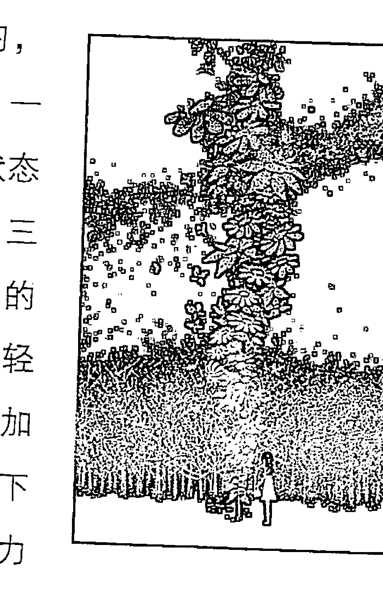

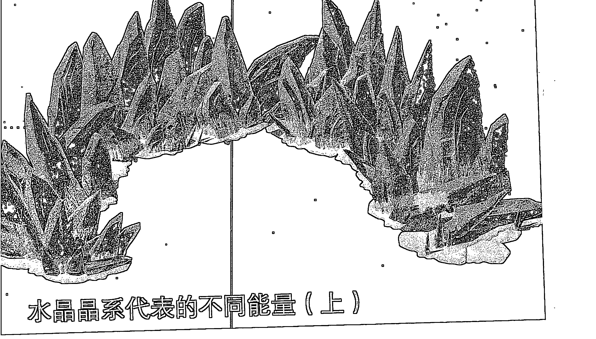

### 水晶晶系代表的不同能量（上）

水晶的晶系繁多，我们分为上下两部分来讲解。

所谓的晶系，就是每种石头的微小粒子。晶系分为很多类，其中一大类是方晶系，还有一类是斜晶系，方晶系就好像是正方体，往一个方向压扁的正方体就是斜晶系。

#### 方晶系

无数小的正方体可以组成大的正方体，这就是小的晶体微粒组成一块石头的方式，比如青金石是等轴晶系，它由许多正方体组成，因为它的每一个小的粒子都是一个正方体，所以它表现出和其他种类粒子组成的石头不一样的能量特质。萤石、萨满魔石、钻石、石榴石、黄铁矿、苏打石等石头，都和青金石是一大类的，它们都是等轴晶系组成的石头，它们的能量特征就是可以把能量凝聚集中起来。

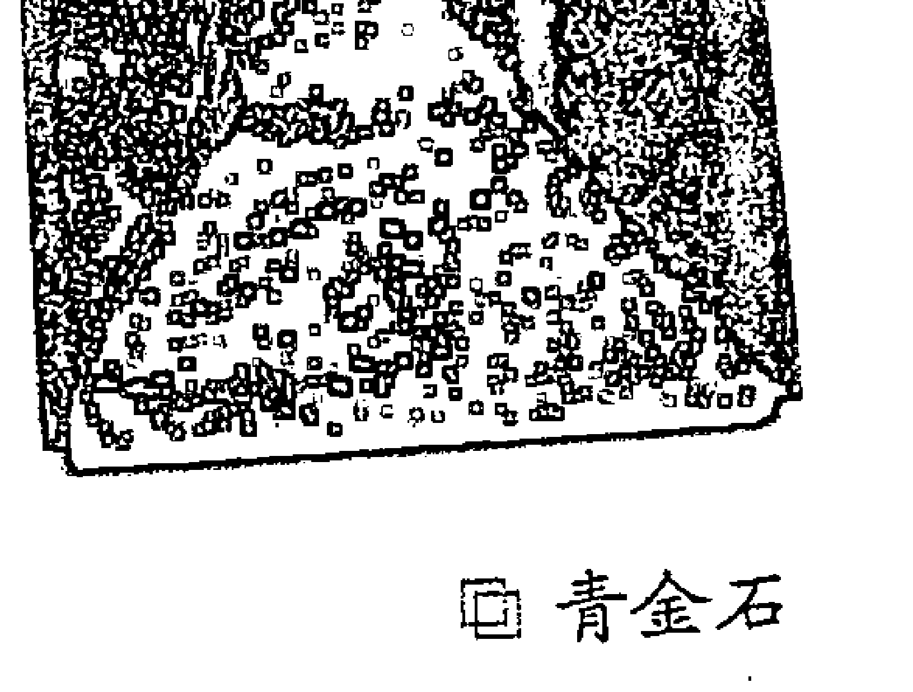

除了正方体组成的石头外，还有六面体（六方晶系）、四面体（四方晶系）、三面体（三方晶系）。这四种方晶系各有不同，正方体组成的晶系是凝聚集中的感觉，四面体组成的晶体是一个通道，比如鱼眼石和金红石就是一个通道。

#### 斜晶系

斜晶系与方晶系的石头是两个类别，它们的能量大不相同。方晶系的能量更加阳刚外显，是阳性的能量。斜晶系的能量更加温柔舒缓，是阴性的能量，例如蓝铜矿、月光石、孔雀石、白纹石等，给人很柔美的感觉。斜晶系的能量运作就像女人很温柔地做一些事情，润物细无声，这是阳刚力量没有办法做到的事情。

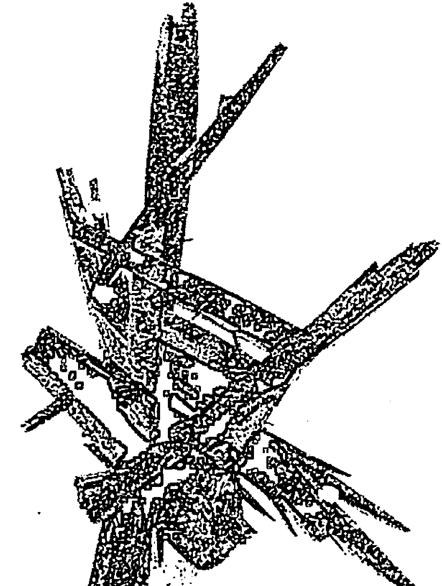

比如说，你现在的能量非常淤堵，你就可以用方晶系的石头，用阳刚的力量把它疏通排走；如果你是十年前受的伤，一直到现在仍令你觉得难过，那你就可以用这种斜晶系的石头润物细无声地帮你疗愈以前的伤。斜晶系是一种置换的感觉，它源源不断地从你的身体中吸走毒素、伤痕，再源源不断地给你灌入力量，它的动作很温柔，所以你可能感觉并不明显，就因为动作温柔，所以它可以解决很多方晶系的阳刚力量解决不了的问题。

所以我们选择石头的时候，应该考虑我们是要解决当下的问题还是很久以前的问题，是直接明显的问题还是一个敏感而需要温柔对待的问题，据此来选择方晶系或斜晶系。

#### 斜方晶系

还有一种是斜方晶系，它既有方晶系的阳刚力量，又有斜晶系的阴柔力量，是和谐平衡的力量。刚接触水晶的时候，选择斜方晶系比较好，即使选错了，它的能量也是比较平衡的，例如天使石、橄榄石、葡萄石、天晶石、紫苏辉石等斜方晶系的水晶，用起来就非常方便，无论怎么用都可以，它可以给身体带来和谐与平衡。斜方晶石虽然不多，但是不需要多么专业的知识来指导选择，而且它总是可以给人带来好处。

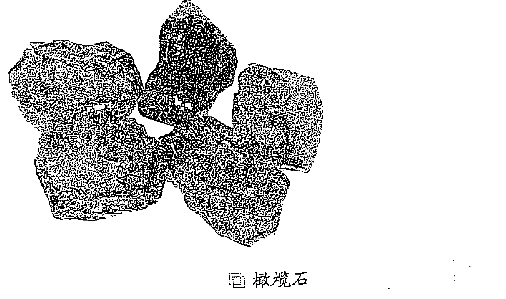

#### 潜晶质结构

还有两个小的分类，一类是潜晶质结构。相对于前面说的晶体颗粒较大的方晶系、斜方晶系，它的每个颗粒都非常小，比如玛瑙、玉髓、木化石。潜晶质结构给人的疗愈性就是安定地抚平你的创伤。潜晶质结构是小分类，大家记住玛瑙就可以了。

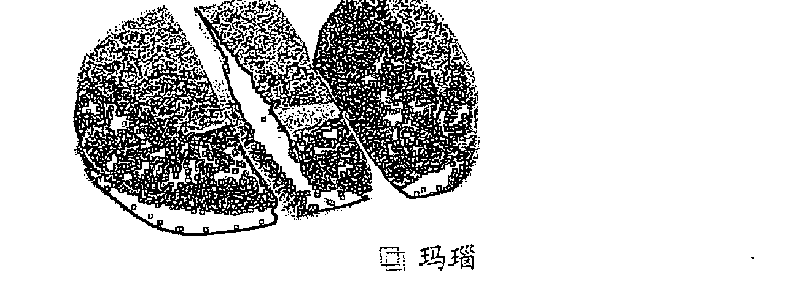

#### 无晶质结构

另外一类是无晶质结构，包括黑曜岩，珍珠，珊瑚，砗磲，捷克陨石等。由于没有晶质，它的能量的表现形式总是千变万化，有时候表现得很狂野，比如黑曜石、捷克陨石；有时候表现得非常温柔，像大海一样，比如珍珠、珊瑚、砗磲。

珊瑚、砗磲等。

石头基本就分这五类，方晶系、斜晶系，就是男人和女人；斜方晶系，就是雌雄同体，平衡和谐的能量；潜晶质结构，即小粒结构，如玛瑙、玉髓；无晶质结构，如黑曜石、捷克陨石、琥珀、生物宝石（砗磲、珍珠）。

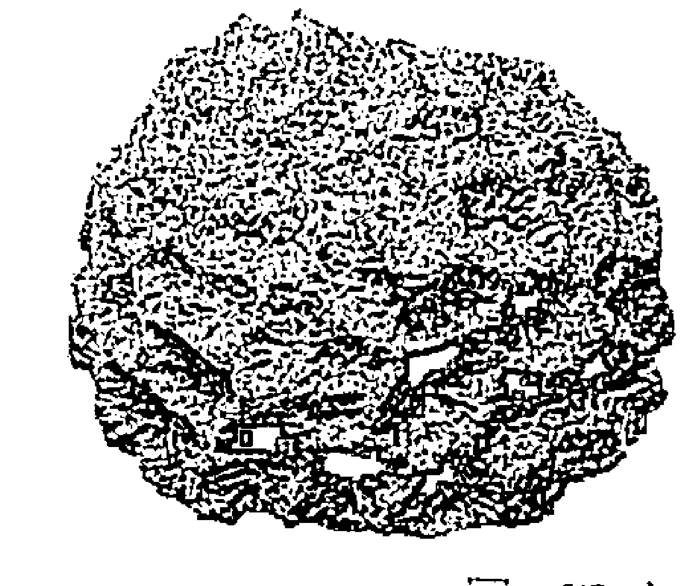

在拿到一块石头之后，先感受一下它的晶质，了解它是如何振荡的，然后就可以感受它的能量了。

#### 等轴晶系

等轴晶系，就是正方体的晶系，是正方体的小晶格组成的石头，包括萨满魔石、石榴石、青金石、萤石，黄铁矿、苏打石等。

正方体给人的感觉是十分凝聚、集中的几何形体，等轴晶系就是由正方体组成，也代表凝聚、集中的力量。

不同的石头颜色不同，对应的脉轮不同，凝聚力量的位置也不同。萨满魔石是黑色的，凝聚的是海底轮的能量，给人落定的感觉，它把像大地一样的力量凝聚起来，当你漂浮、烦躁想落定的时候，可以手握或者把它放在海底轮或者脚底的位置。

#### 绿色萤石

绿色萤石对应心轮，中国古代把它叫作夜明珠，因为它可以凝聚光，使心轮成长，有助于一个人从孩童到成人的精神成长。如果你觉得自己的孩子精神成长比较慢，促其成人的精神力量没有那么强，就可以用绿色萤石。绿色萤石可以把心轮的能量凝聚集在一起，使人专注，使人在迷茫中找到方向，这都是心的功用。

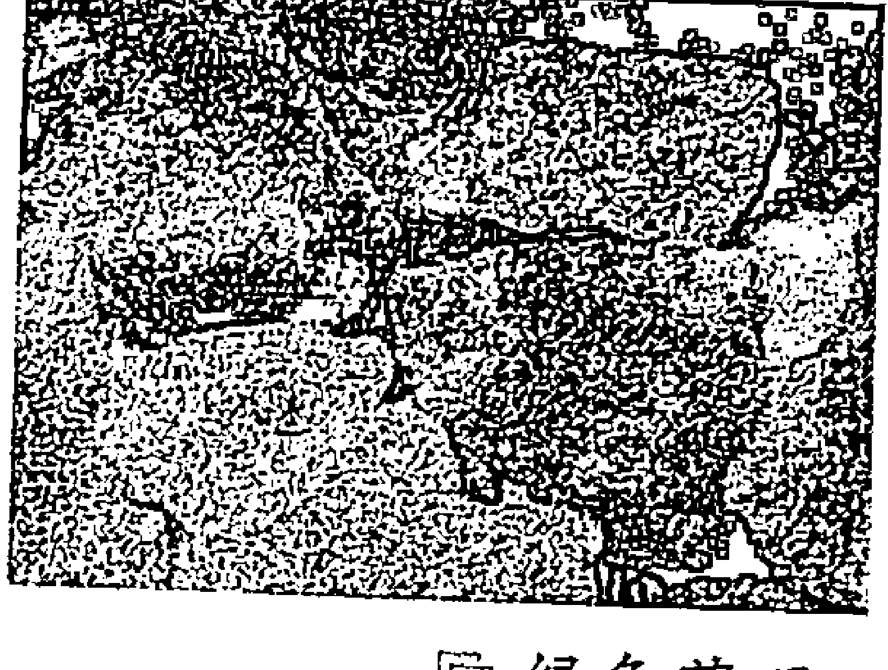

绿色萤石对脑也有作用，它可以帮助增强记忆力。

#### 紫色萤石

紫色对应顶轮，紫色萤石凝聚灵性的力量，它可以让你穿越前世今生。所以像萨满通灵者、玩塔罗牌的人，如果想从上天获得灵性的力量和指示，就可以用紫色萤石。它可以帮你凝聚顶轮的力量，给你带来灵感和创意。当你需要灵性力量时，可以把紫色萤石放在顶轮上；当你想要集中精神力时，可以把绿色或者紫色萤石放在三眼轮上，虽然说不同颜色应该放在相对应的脉轮上，但事实上，所有的石头在所有的脉轮上都可以发挥力量，只不过在相同颜色的脉轮上力量最强。

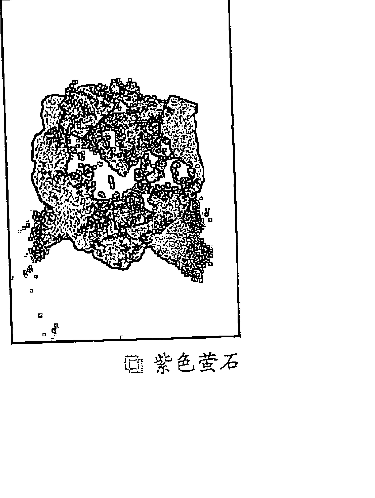

#### 石榴石

石榴石也是等轴晶系。石榴石是红得发黑的颜色，它可以凝聚海底轮和脐轮的力量，象征热血与活力，即脐轮代表血，海底轮代表活力。所以红色石榴石增强的是生命的力量。当我们觉得累、虚弱，生命力涣散的时候，它可以把我们的生命力和热血凝聚在一起。它的颜色是血的颜色，对应脐轮，象征热血，所以它对妇科疾病有疗愈的作用。这种疗愈发挥了石榴石凝聚集中正向能量的属性，用法是将它贴在脐轮上。

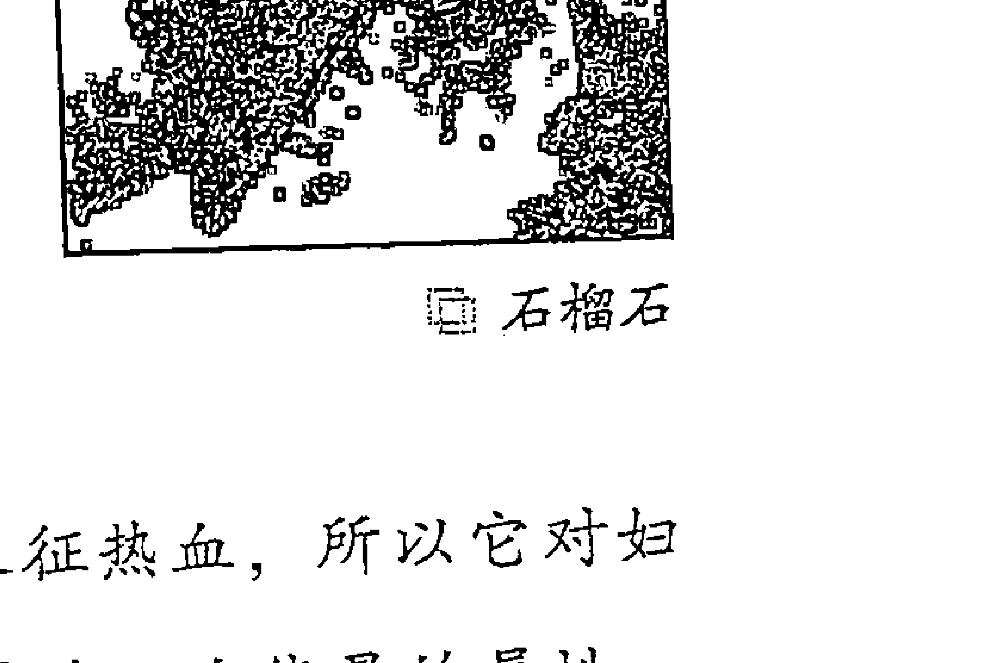

#### 青金石

青金石也是等轴晶系，象征着清晰的智慧，对应三眼轮（智慧的脉轮），在生活中有几种表达方式：一是帮助我们接收上天的信息，有些萨满巫师在做仪式的时候会在三眼轮挂一个青金石，帮助他有清晰的头脑和明朗的状态来接收上天的信息；天坛的底也是青金石，它帮助皇上祭天时接收上天的信息。青金石使头脑能量集中，变得清晰智慧，其还有一个好处，就是可以帮助人面对问题，把你的智慧凝聚在一起，驱散负面的繁杂，找到人生的方向。

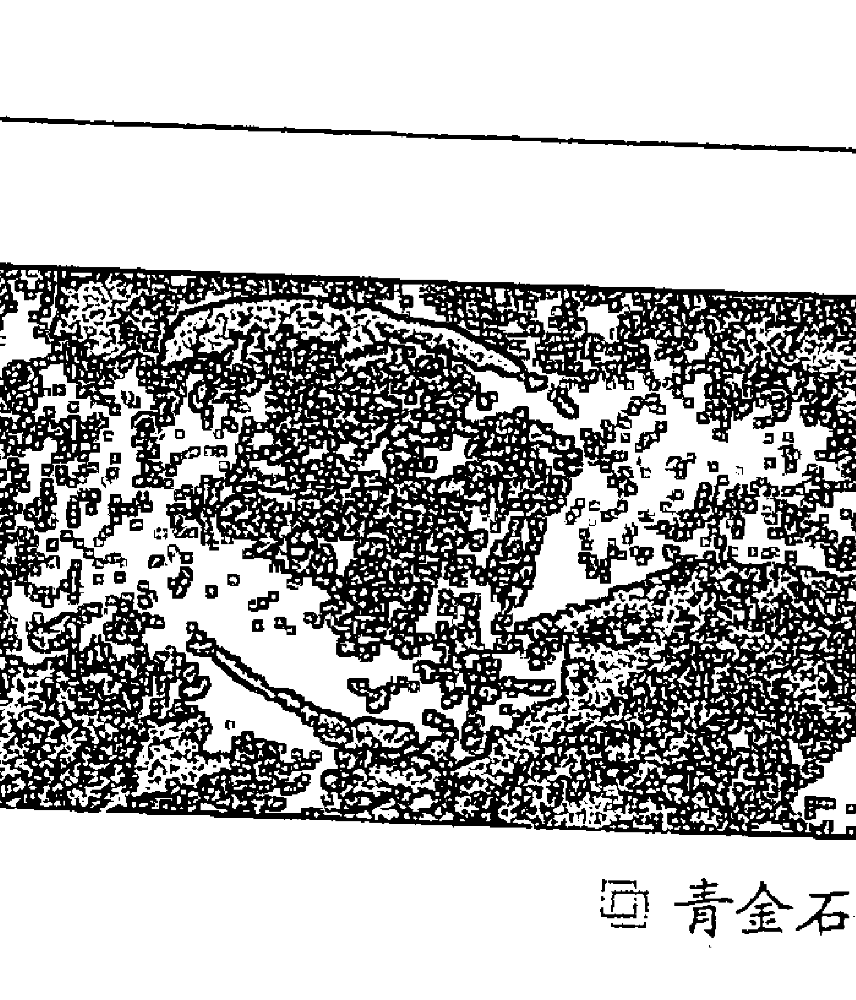

#### 黄铁矿

黄铁矿对应太阳轮，它所凝聚集中的是人的肉体能量，用法是放在太阳轮或者内脏有伤的地方，帮助它更快地得到疗愈。
由于黄铁矿所对应的太阳轮与胃有很直接的关系，而它同时又凝聚了人的肉体能量，所以它对胃病的疗愈性非常强大，用法是贴在胃上，即太阳轮上，但不要泡水喝，其中有铁，泡水喝对人体不好。

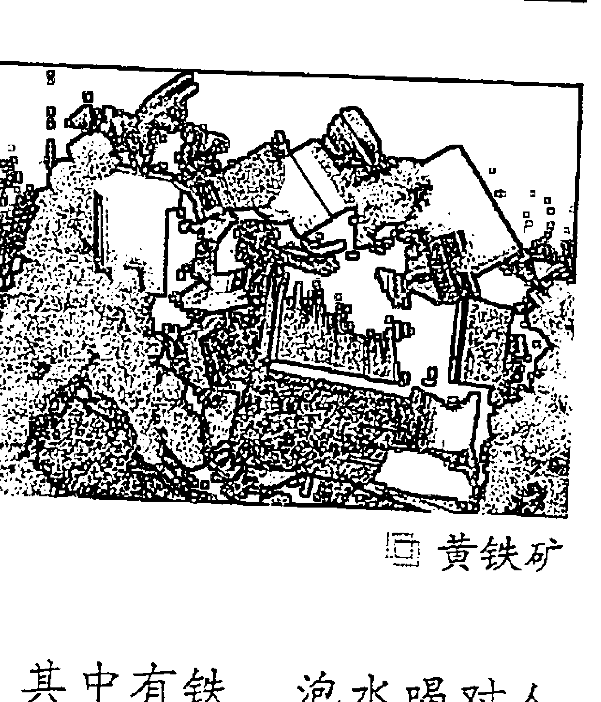

#### 苏打石

苏打石是一种介于三眼轮和喉轮之间的石头，颜色也是介于二者的颜色之间，既像天蓝色又像三眼轮的颜色。在三眼轮与喉轮失衡的时候，也就是当别人迷失在自己的思想中，或者由于过于迷失而无法倾听别人说话的时候，可以用苏打石来处理这两个脉轮的能量。苏打石可以同时凝聚集中三眼轮和喉轮的力量，所以它处理这种失衡非常有效，同时还能平衡两个脉轮的能量。

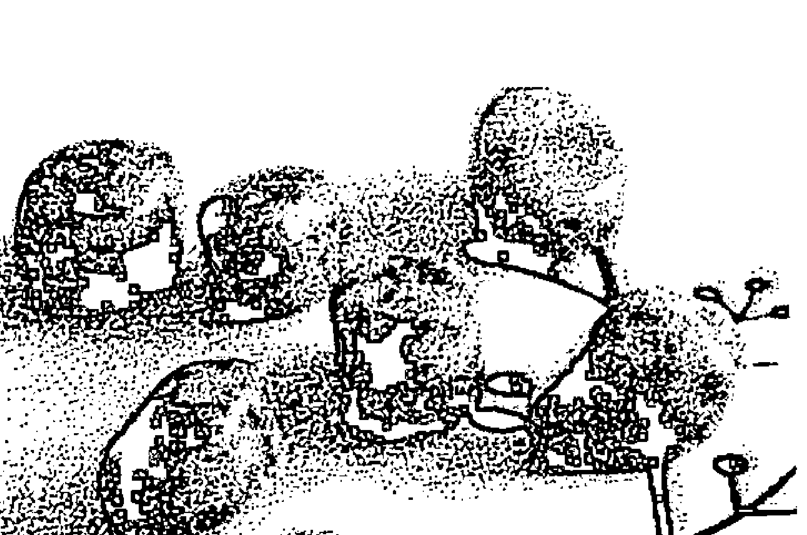

以上讲解的都是等轴晶系的石头（由小正方形的晶块组成的石头），它们的能量特点都是凝聚集中。它们的颜色不同，凝聚集中的脉轮力量不同，解决的问题也不同。

#### 四方晶系

四方晶系也叫正方晶系，由长方体小晶格组成，一个长长的长方体，让人想到通道，而它的能量作用就是通道。这种石头比较少，一个是鱼眼石，一个是金红石。

#### 鱼眼石

鱼眼石是白色的，对应顶轮，它的通道就是从上到下贯穿人体的通道，所以鱼眼石的力量就是开启我们的顶轮，让我们接收到上天的指引，接收到天堂之光。

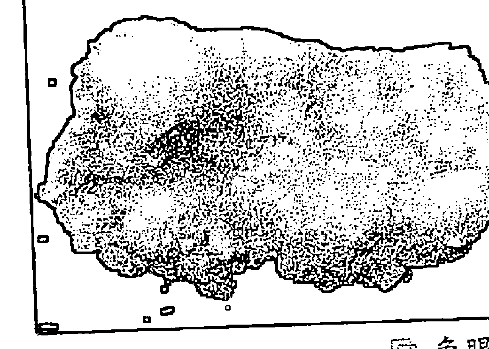

正因为如此，鱼眼石可以打开原来封闭或阻塞的脉轮，从而形成一个畅通的通道，帮助我们接收到天堂之光，接收到更上面的信息，增强我们的直觉力，了解我们的使命是什么。它给人的感觉就是灵性提升了，这种灵性的提升可以协助我们的第八脉轮的展开，让我们有一种万物一体的感觉。

#### 金红石

另一种四方晶系的石头就是金红石，即金发晶里的金发丝。金红石是金色的，对应太阳轮。金发晶之所以能够增加人的事业运，是因为里面的金红石为四方晶系，可以疏通太阳轮的能量阻塞，使人变得更加自信，更加清楚自己的价值所在，从而利于事业。

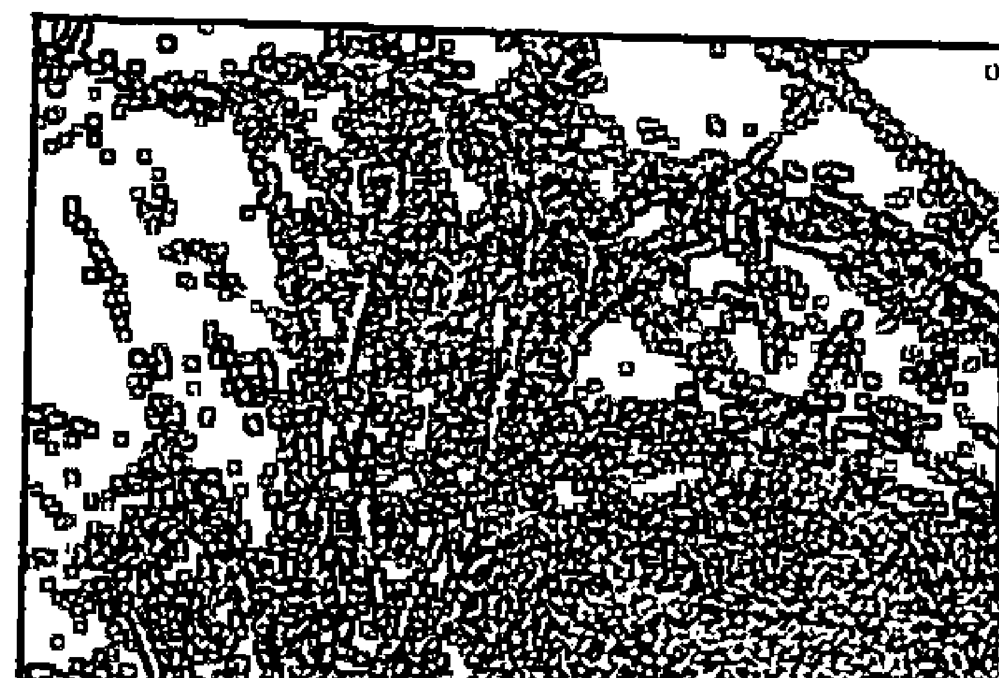

因此，鱼眼石和金红石都是通道，只不过各自的颜色不同，疏通的能量也不同。

#### 六方晶系

六方晶系石头的能量特质是优美地扩大。它扩大的是生物磁场，也就是提升我们的生物能，以促进新陈代谢，利于减肥。

#### 磷灰石

磷灰石是最常见的六方晶系矿物。磷灰石为蓝色，对应喉轮，可以使我们的表达和沟通优美、顺畅，更加易于被人理解。

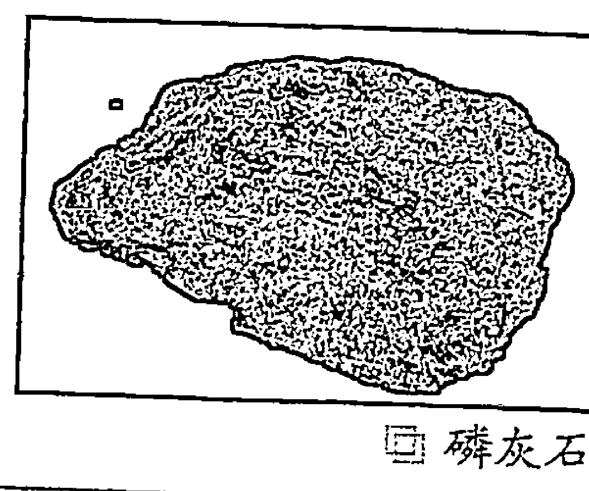

#### 海蓝宝

海蓝宝也是六方晶系，同样对应喉轮，可以让我们优美地表达。它比磷灰石更有名气，因为磷灰石质地太软，很难形成宝石。海蓝宝还有一个不被常人知道的特性，那就是可以隔绝负能量，对我们起到保护作用。

这是因为它里面含有铁，而铁这种元素有隔绝负能量的功效。所以海蓝宝并不像我们想象的那样，只是很温柔地把我们变得优美，它是含铁的、刚硬的石头，刚柔并济，可以保护我们。除此之外，海蓝宝还有海水的力量。

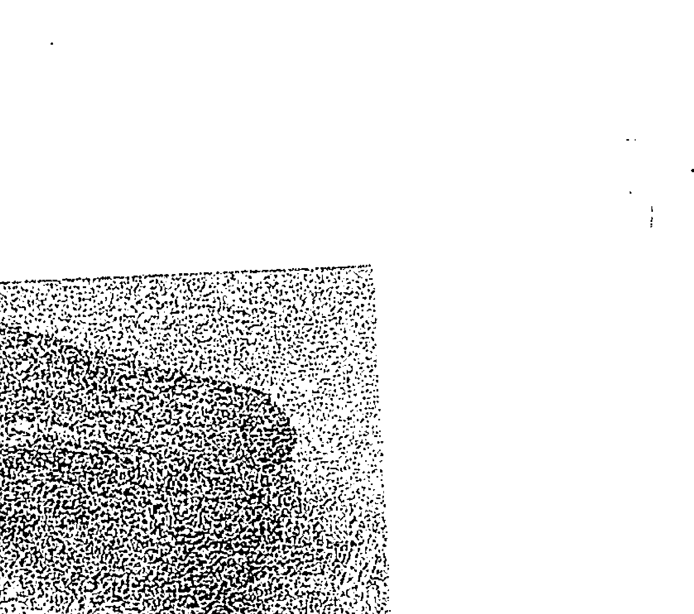

#### 祖母绿

祖母绿也是六方晶系，它对应心轮，扩大的是爱与慈悲。

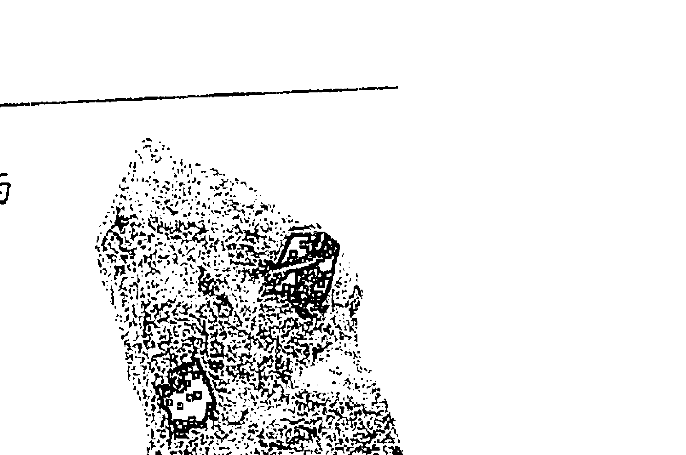

#### 东陵玉

东陵玉是绿色的，对应心轮，扩大的是放松和舒适的感觉。因此，人们都说东陵玉是金牛座的对应石，因为金牛座需要这种放松、舒适的感觉。

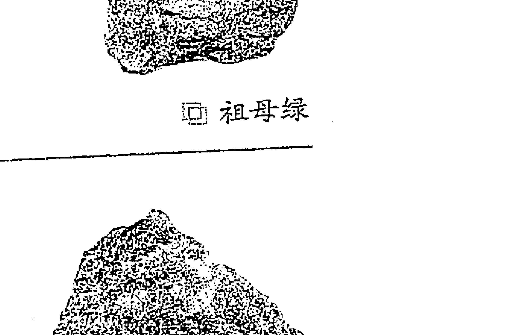

#### 舒俱来

舒俱来是在近代才被发现的，它主要是紫色，对应顶轮。它打开顶轮，让天堂之光可以进入我们的人体。所以，舒俱来扩大的是天堂之光。

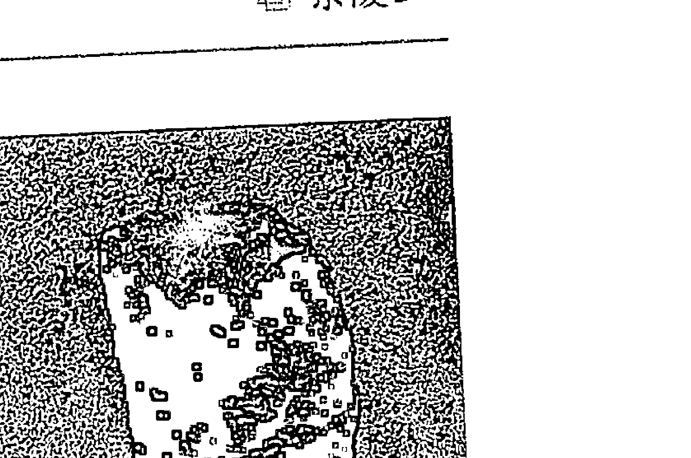

舒俱来的特性是可以整合7个脉轮，使它们的能量彼此通畅、和谐。而它对应7个脉轮的特点也在颜色上有所呼应，紫色、粉色、蓝色、白色等都有。同时，舒俱来还可以扩大爱，相信更好层级的天堂力量也是爱的表达，所以舒俱来更能反应扩大疗愈的能量本质——无条件的爱、从高处来的爱。扩大疗愈中用的紫色火焰和蓝紫色能量，与舒俱来特别对应。有人说舒俱来能抗癌，这是它带来的高处的光的作用，因为人体被光照耀着、被爱浸润着，就不会有癌发生。

以上是方晶系中的几种：等轴晶系，代表凝聚集中；四方晶系（也叫正方晶系），代表通道、能量疏通；六方晶系，代表优美地扩大。此外，三方晶系是个大家族，下一节再说。

### 水晶能量水

水晶的振荡频率可以通过将水晶贴在脉轮上、佩戴水晶和水晶泡水的方式传入人体。我们现在要讲的是水晶泡水的方式。通过这种方式泡出来的水就是水晶能量水。

水晶泡水的总规律是方晶系的石头一般都可以泡水，斜晶系的石头一般不能泡水（比较软，水晶可能受到损伤），但是这也并非绝对的。比如，方晶系中的青金石就不适合泡水，除非不带一点黄色特别上等的青金石。因为青金石上的黄色部分是黄铁矿，而黄铁矿中的铁遇水就会反应，这也是黄铁矿不宜泡水的原因。方晶系中特别软的石头也不适合泡水。因此我们在泡水前，先感受一下这个石头是否特别软，或者有无类似铁这种会和水有反应的物质。如果不能泡水，那我们可以选择将它贴在脉轮上，同样可以发挥作用。

水晶泡水的优势在于水喝进去以后可以直接通过消化道。在疗愈胃、肝方面的问题时，喝水传递频率将更直接。诸如斜晶系中的橄榄石、葡萄石，都可以泡成水晶能量水来清肝毒。

泡水的具体操作：将水晶放到冷水或温水（开水可能损伤石头）里，在太阳下晒两个小时左右，使阳光的能量得以补充进去，从而使石头的振荡频率更好地散发到水里，这样水晶水就制好了。使用水晶水和使用花精的方法差不多，可以直接喝也可以稀释后再喝，还可以涂抹在皮肤表面，这样同样会有好的振荡频率，像从前就有女巫用粉水晶泡水洗脸。因为粉水晶的频率可以令人貌美，用粉水晶泡水洗脸，可以让皮肤充分地接收粉水晶的振荡频率。

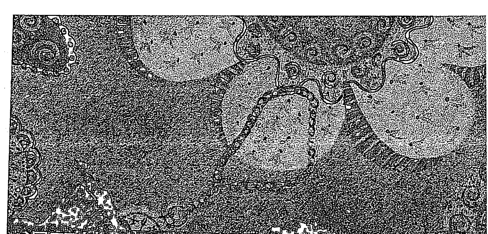

### 调配精油时如何加入水晶

水晶如何与精油调配在一起呢？

这里最关键的是对水晶的选择，因为水晶和精油的能量都比较精微，如果没有选择精准的话，把两种精微能量调配在一起就会对不上。当你用自己最确切的知识与判断选择了一个精准水晶，只需要把它放到精油的瓶子中去即可，它们的能量可以共振。

值得注意的是，务必根据自己希望精油达到的疗愈效果来选择水晶，所选择的水晶也不宜过多，建议不要超过5种，否则能量会变得杂乱。此外，放入精油瓶的水晶也不宜选择大粒的。因为放入水晶的大小和数量，关乎它的频率会花多长时间散发到精油液体中。如果是要在很大一瓶精油中放入水晶，那我们可以放大一些的，数量也可以多一些，如果只是一小瓶精油，那我们只需要一小颗水晶就可以。

如果放的是一大块水晶，这瓶精油很快就会被水晶的振荡频率规整；如果只放一小颗水晶，便可以使水晶的振荡频率更充分地融合到精油之中。

一问一答：如果你轮比较元奋，应如何使用水晶？
答：可以用潜晶质的石头安抚它，或用斜晶系的石头温柔地疗愈它。

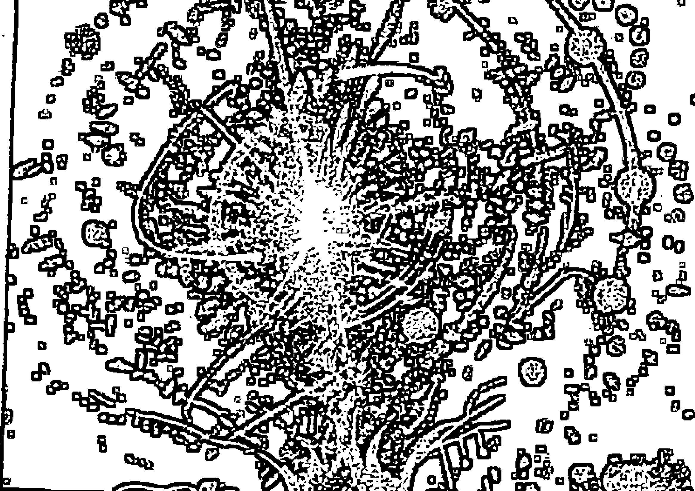

### 感受水晶能量的种类，选择适合自己的水晶

- 感受水晶能量的种类
- 水晶晶系代表的不同能量（下）
- 与爱情相关的几种水晶
- 水晶的净化方式

#### 感受水晶能量的种类

上一节，我们经过静心→感受到能量球→感受到水晶（以玩的放松心态，拿两块小水晶来感受）的一个练习过程，感受到了水晶能量的存在。接下来让我们感受水晶能量的种类。

例如，方晶系的石头能量是外显的、尖刻的；斜晶系的石头能量是内敛的、柔和的。在最初分辨不同能量的种类时，可以取一块方晶系和一块斜晶系的石头，闭上眼睛，在无法辨明这二者的情况下，静静地感受它们的能量差别（尖刻的还是柔和的）。比方说，我们可以拿一些水晶通过不断地变换位置来感受它们的能量差别。在连续变换三次后，如果你能辨别出晶系的种类而不是靠连蒙带猜的话，那么你可能就已经感受到它了。我们可以连续多练习几次，以确定自己是真的感受到了它们的不同。感受完方晶系和斜晶系，还可以感受斜方晶系、潜晶质结构等，直到把各个晶系都感受准确以后，便可以感受每一种水晶能量的不同，虽然这有些困难。

除此之外，我们也可以经由佩戴水晶来感受能量的不同。例如，如果我们觉得自己缺少黑曜石的能量，就可以佩戴黑曜石。经过一段较长的时间以后，通过感受自己的变化来更好地体验黑曜石的能量是怎样的。这种感受不是为了向别人显示自己有“特异功能”，而是为了使自己基于一定的知识，切身体会到黑曜石的能量感，自此，它的能量也会与你有更多的共振，从而帮助你更好地选择水晶。

如果你说自己现在什么也感受不到，那么还可以通过相关知识来选择水晶。你佩戴水晶的时间越长，它对你的影响就越大，直至你的身体慢慢觉醒，开始感受到每种水晶是不一样的。

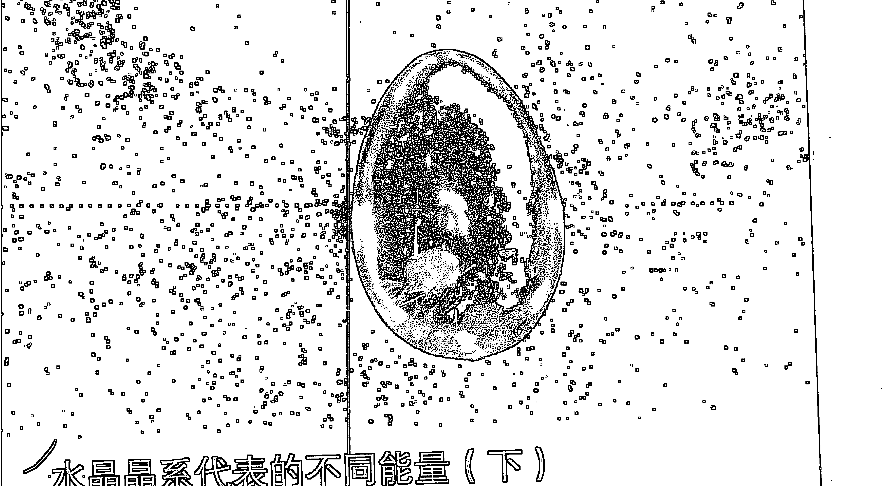

### 水晶晶系代表的不同能量（下）

上一节主要介绍了方晶系（除三方晶系以外的）的种类，这一节继续补充介绍三方晶系，以及其他晶系的种类及其对应的常见水晶。

#### 三方晶系

三方晶系是方向性的疏通，往一个方向疏通，就是把能量聚集起来，往一个地方发射出去。

#### 白水晶

白水晶是凝聚能量朝一个方向发射出去。比如，在做镭射的时候，人们用白水晶把光往一个方向引导。白水晶包裹金发晶，所以它特别容易通太阳轮，可以招财，带来自我价值感。

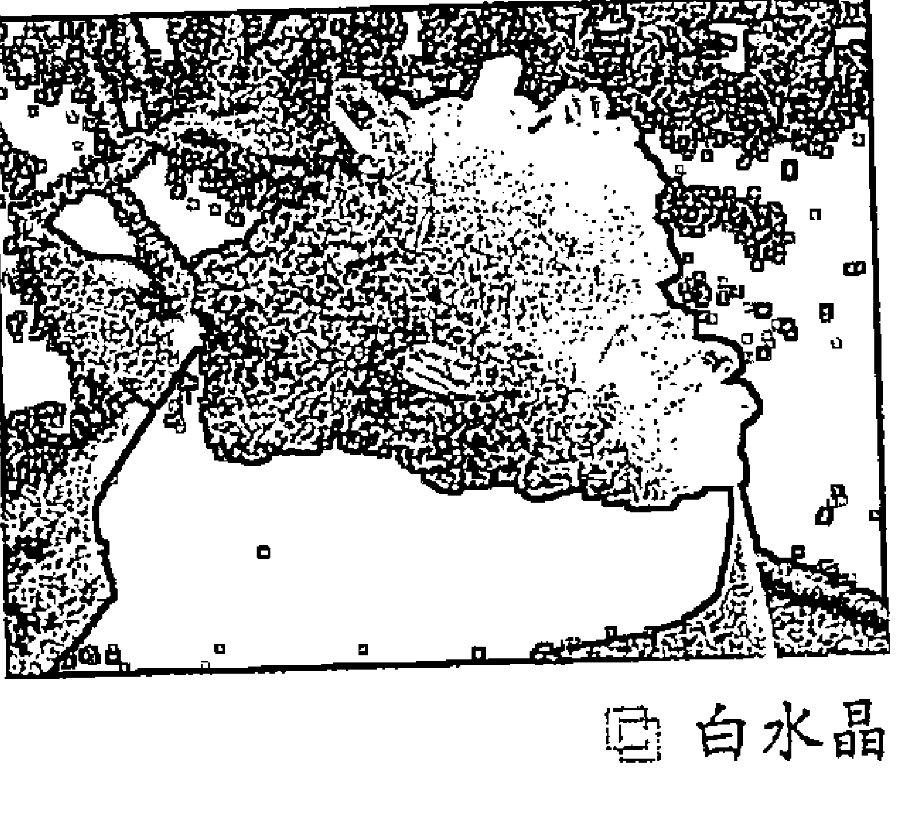

### 茶晶

茶晶对应底轮，对应向下的喇叭口，顶轮是向上的喇叭口，其他脉轮如心轮、太阳轮等，都是两个喇叭口。底轮的喇叭口是通向大地的，茶晶往这个方向引导能量，所以它可以让我们落地。当我们精神兴奋，不能落地的时候，它可以帮助我们落地；当我们身体虚弱时（底轮是身体的根基），也可以用茶晶把能量导向大地，帮助我们强壮、落地。

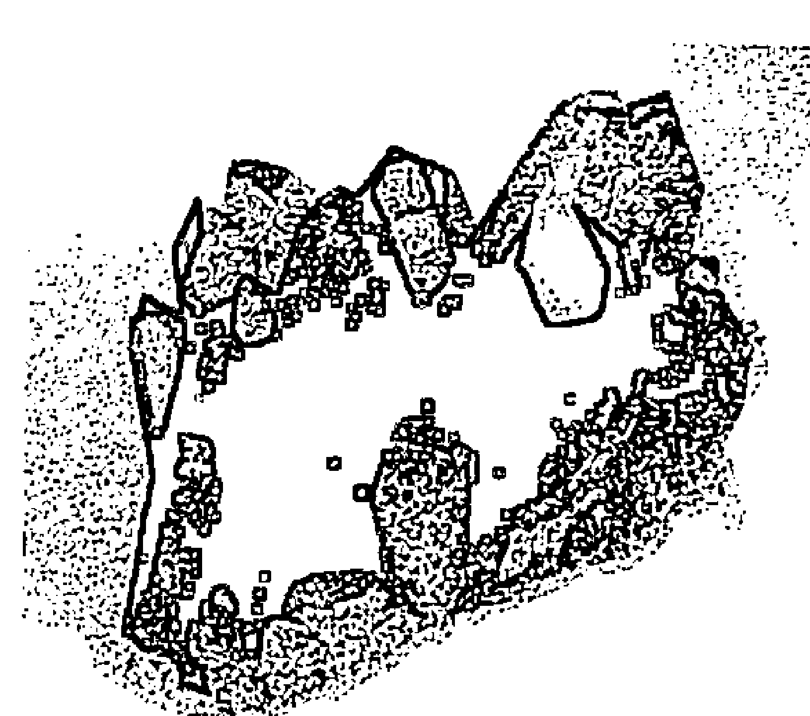

### 红宝石

红宝石象征着狮子座一样强大的心，是王者之石。它可以赋予一个人王者的力量，并主要体现在勇气和表达上。所谓表达，就如同在打仗之前的演说中，把自己真实的想法表达出来，带领大家向共同的目标前进。当你觉得生命力不足，没有勇气把自己的想法表达出来的时候，就可以使用红宝石。从生理层面来讲，红宝石是心脏的守护石。红宝石是血的颜色，心脏是血液循环系统的核心，所以红宝石守护着心脏，具有鲜血一般的生命力。红宝石的红是暗红色，也对应海底轮，所以它也有助于肉体排毒和提升肉体能量。这些能量都是王者力量在生理层面的表达。

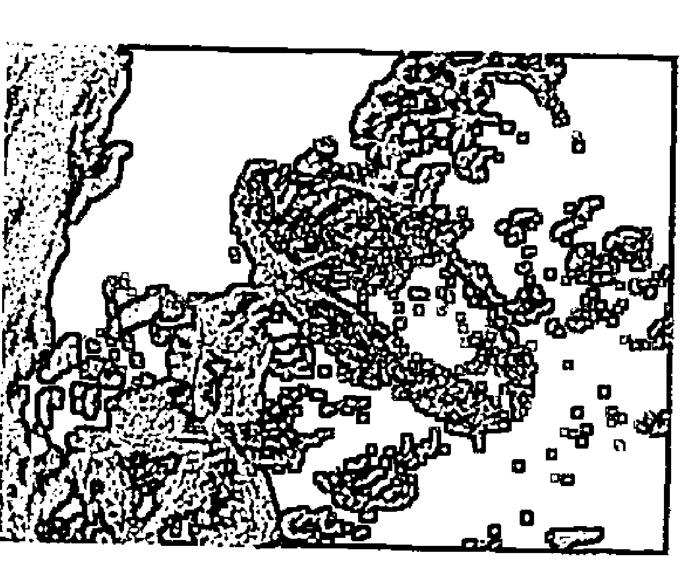

### 蓝宝石

钻石的硬度是10，红宝石的硬度是9，蓝宝石的硬度也是9。蓝宝石给人一种冷静清明的感觉，它可以帮助我们冷静、清晰地思考和表达，适合在烦躁或无法思考的时候使用，尤其适合在考试或者在表达时容易吹牛、说大话的时候使用。这种情况下佩戴蓝宝石，往往可以帮助你沉稳地表达。如果你觉得自己的伴侣爱吹牛，也可以给他（她）使用蓝宝石。

### 虎眼石

虎眼石是三方晶系和单斜晶系的混合，是方晶系和斜晶系的混合，斜晶系可以帮你吸出负能量，补充正能量。虎眼石可以提升人的勇气和力量，如同一只充满力量的大老虎。虎眼石有黄色和红色两种。黄色虎眼石对应太阳轮，可以提升勇气和力量，鼓励你往前冲。红色虎眼石是红色，对应底轮，凝聚力量并导向大地，帮你落实稳定下来，把事情做好。

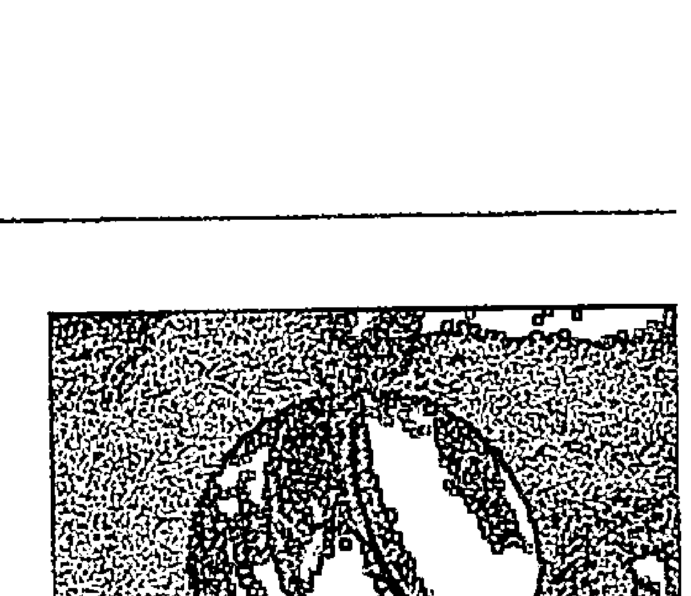

### 碧玺

碧玺往一个方向凝聚能量发射，它有很多条棱，擅长能量的传导。碧玺有各种颜色，每一种颜色对应相应的脉轮，为其能量传导疏通。有的碧玺有两个颜色，专长是疏通这两个颜色相对应的脉轮之间的能量。其中黑碧玺是排除负能量的好东西，它对应的海底轮能迅速地将负能量向地面传导出去。

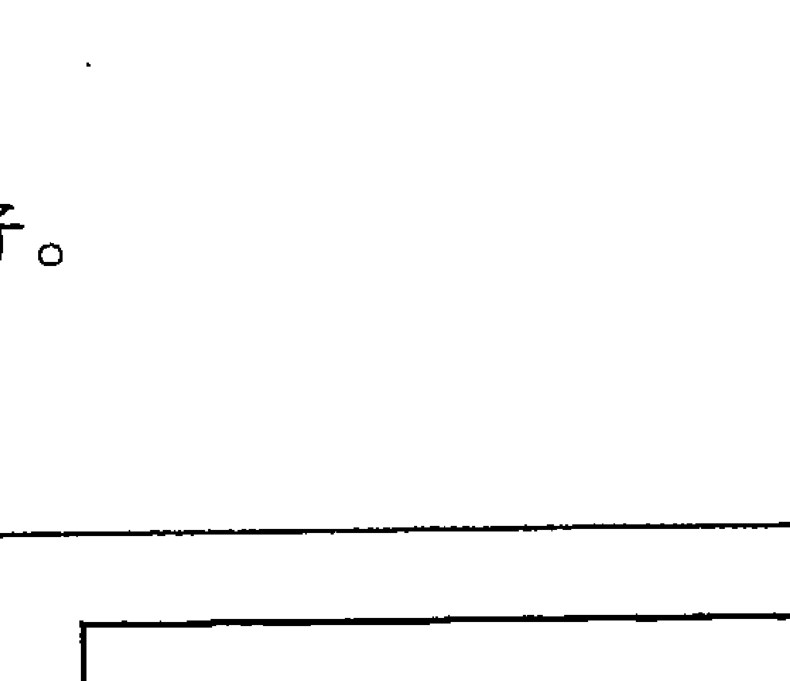

### 黑发晶

黑发晶是三方晶系+三方晶系，它排除负能量的力量最大，相当于传导+传导的力度。

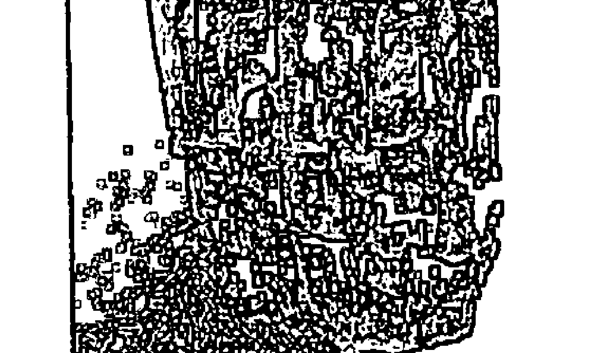

### ◇斜晶系

方晶系是阳性能量，斜晶系是阴性力量，斜晶系专门处理深层的创伤，就像母亲一样温柔地抚平你那陈年的、敏感的伤痕。斜晶系分为单斜晶系和三斜晶系。单斜晶系可以置换出负能量，植入正能量；三斜晶系比单斜晶系更加柔软，可以进入更深的地方，疗愈更深的伤痕。所以单斜晶系、三斜晶系都可疗愈深深的伤痕，不同的是三斜晶系可以走得更深、更纤细。

下面将介绍斜晶系的几种石头——温柔的能量。

### 蓝铜矿

蓝铜矿特别漂亮，深深的蓝色，代表着深度放松。把它放在床头，它会赐你一个好梦。

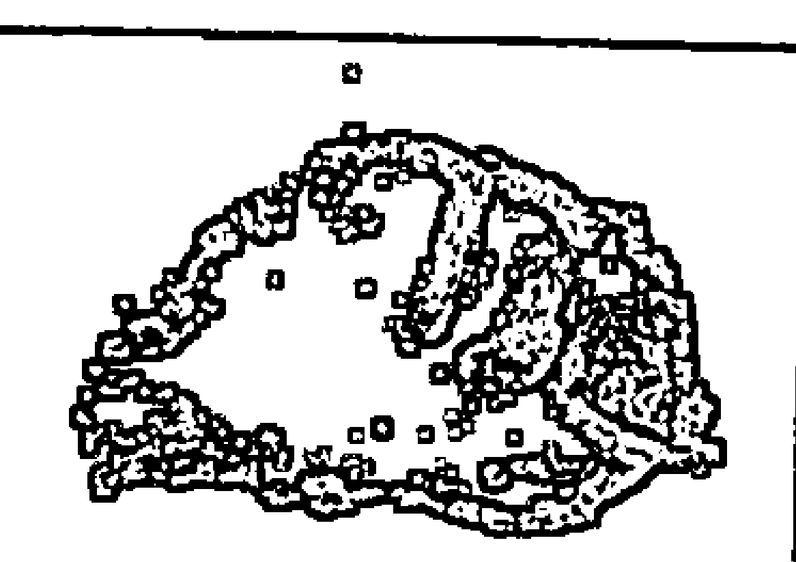

### 孔雀石

孔雀石是绿色的，对应心轮，它置换的是你体内的毒，就像孔雀明王一样把你的毒和邪恶吞入腹中，是专门解毒的。所以当你觉得有毒的时候，尤其是觉得心轮有毒、有创伤的时候，或者身体某个部位发炎的时候，都可以把孔雀石放在上面，帮助解毒。

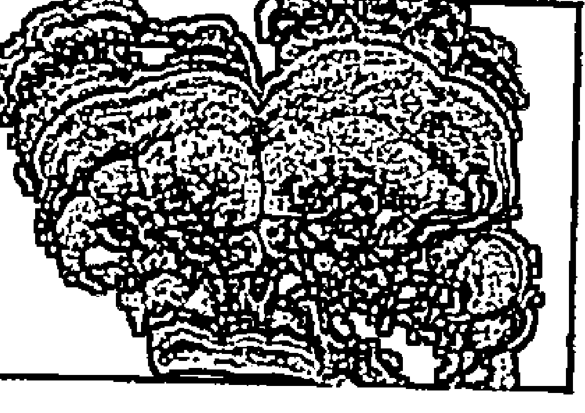

### 紫龙晶

紫龙晶的美丽之处在于它的条纹。紫龙晶是把几种矿石拧在一起，所以它的力量是整合，它可以整合人体内部的能量。当你觉得状态混乱，觉得自己体内有多种能量无法调和，或者人际关系无法调和的时候，都可以使用紫龙晶。

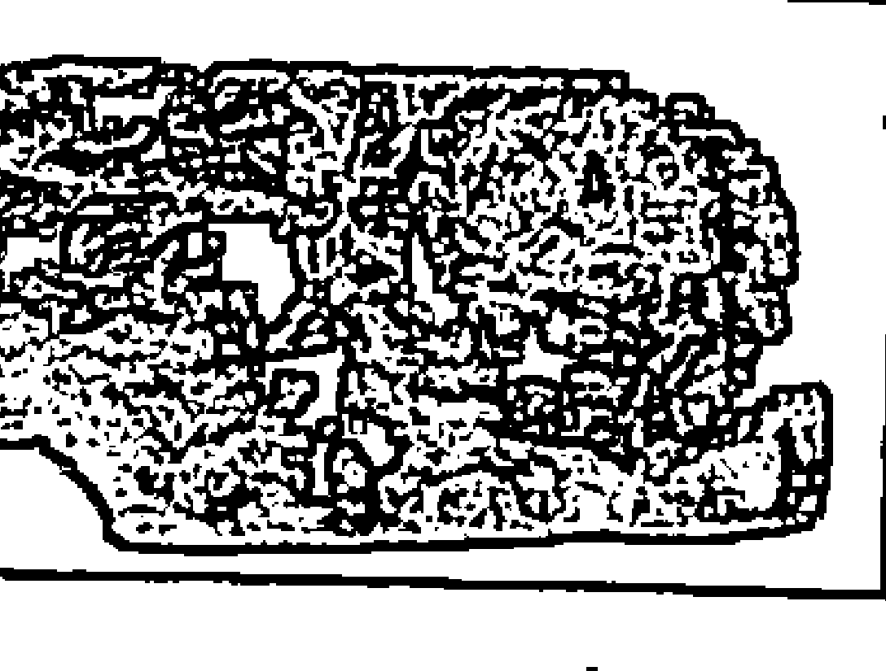

### 紫锂辉石

紫锂辉的能量是开心和放松。斜晶系的石头一般都是不透明的，但紫锂辉则是透明的，给人开心、放松、轻盈的感觉，对应的是心轮。

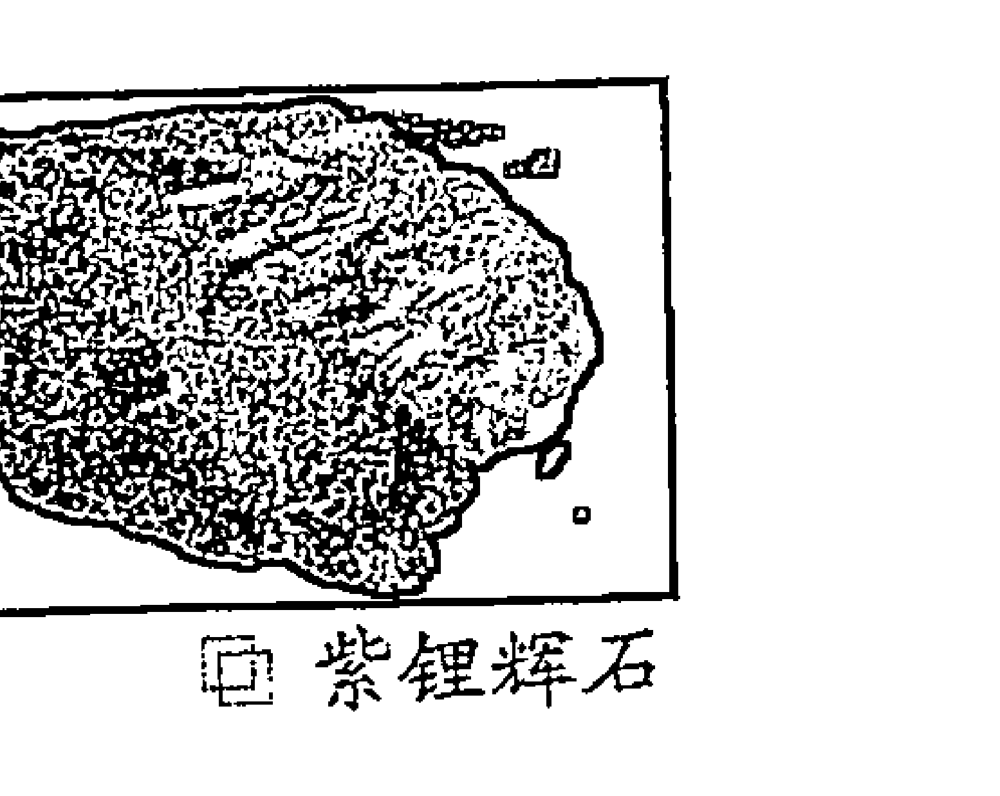

### 月光石

月光石是白色的，对应顶轮。它开启灵性的力量，与月亮紧密相连，而月亮又与女人有关，所以月光石可以疗愈妇科疾病。

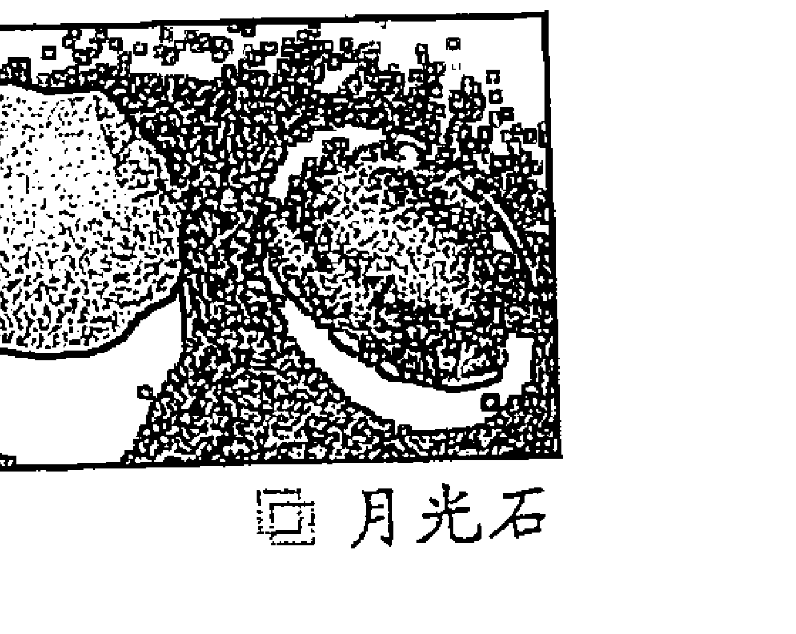

### 绿松石

绿松石对应喉轮，作为三斜晶系的石头，它更加柔软、纤细地疗愈更深层次的创伤，疗愈你过去被打压的（无法）表达。它还可以帮你接收上天的指引，获得灵感。

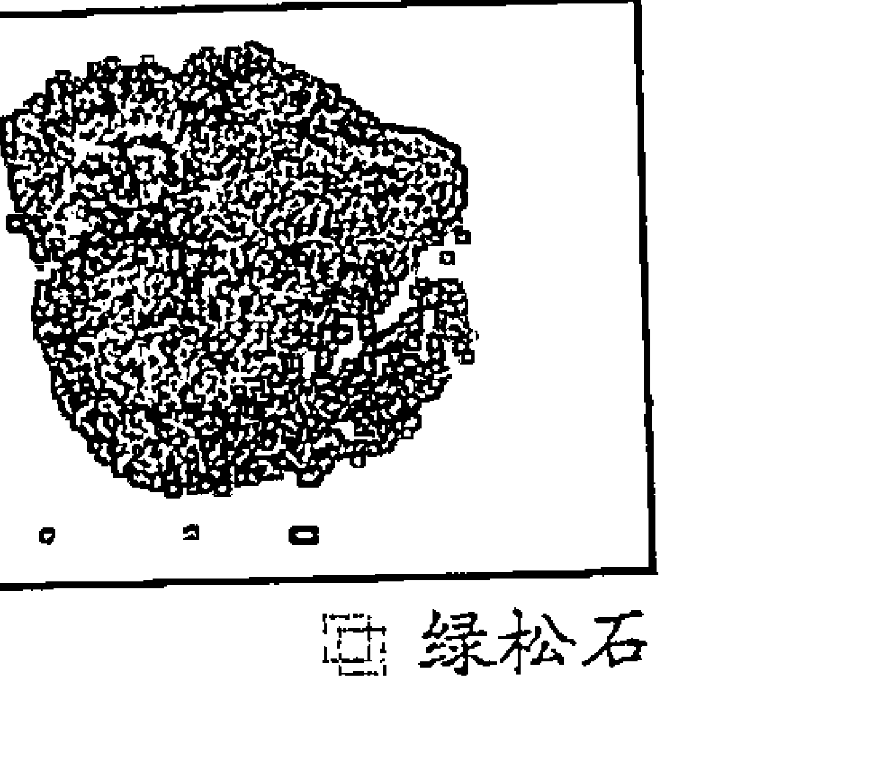

### ◇潜晶质结构

潜晶质结构的石头（代表）有玉髓和玛瑙。玉髓只有一种颜色，玛瑙有多种颜色，它们主要的力量是安抚，安抚与其颜色相对应的脉轮。

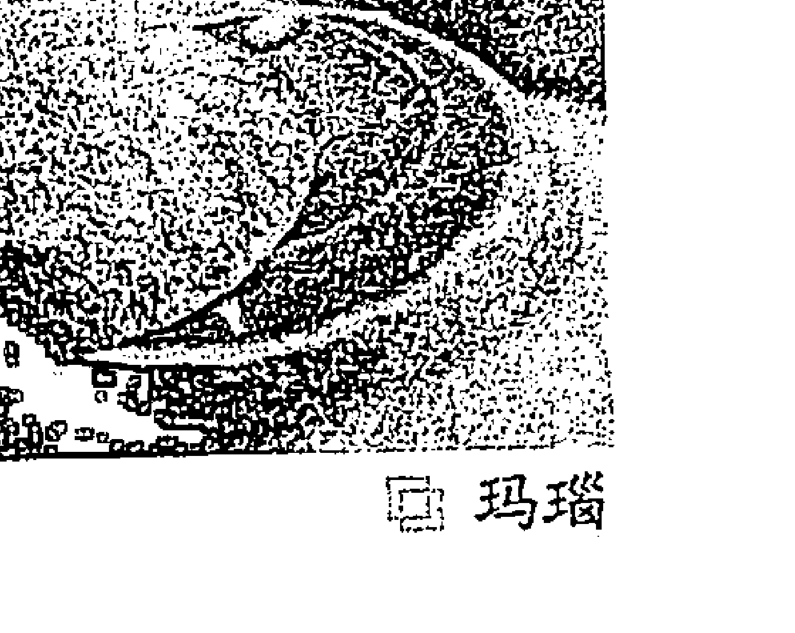

### ◇ 无晶质结构

黑曜石是无晶质结构，是彻底的转化，它可以彻底覆灭你生命深处的负能量。当我们希望从本质上改善生命，而又愿意直面从深层暴露出来的丑恶时，就可以用黑曜石。

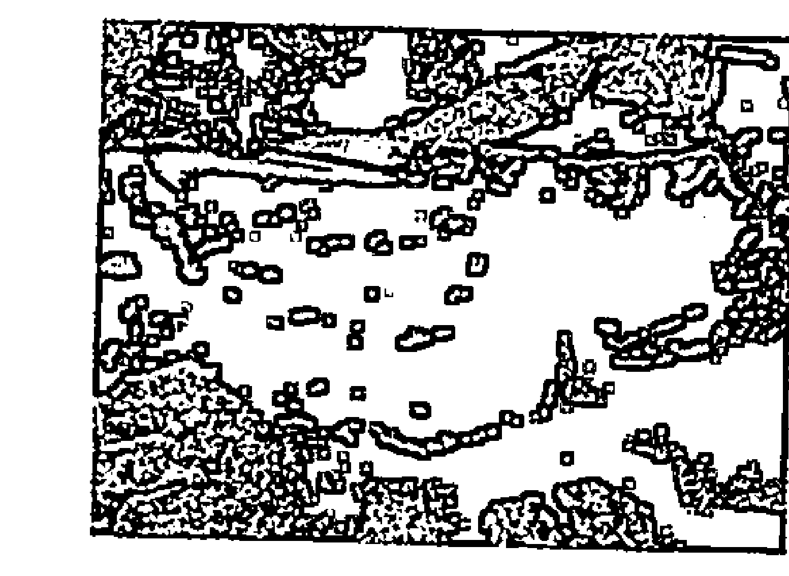

碎磲也是无晶质结构，它的关键词是神圣空间。碎磲保护你的能量和灵性，就像碎磲贝壳保护它自己一样，使你处于安宁祥和之中。正是由于这种保护灵性而取得宁静的能量，使碎磲成为佛家用品。

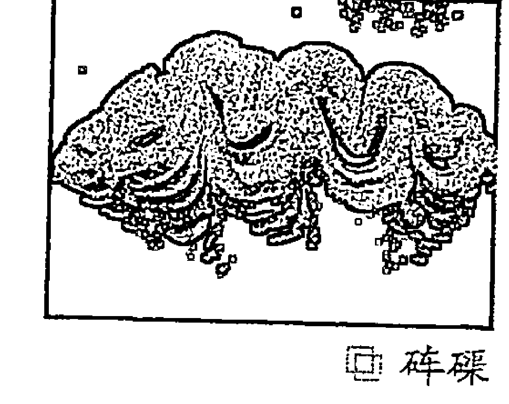

## # 与爱情相关的三种水晶

这里介绍几种与爱情相关的水晶。它们是粉水晶、红纹石和蔷薇辉石，又称“玫瑰三石”。

### ## 粉水晶

粉水晶是三方晶系。它是粉色的，对应心轮，它的方向是从心轮向外，所以它可以疏通心轮的阻塞。比如，你失恋了，心里堵得慌，这是心轮的阻塞，这个时候可以用粉水晶帮你打开心扉，打开心灵的力量，进而帮助你增加个人魅力，使你更加外显，是一种外向地表达爱的石头。

### ## 红纹石

红纹石也是三方晶系，除了对应心轮，还对应脐轮。如果你遭受了爱情的创伤，且这种创伤是身心并重的，那么用红纹石最合适，它会连同心轮和脐轮一起为你疗愈。它既帮助心轮疏通，让人勇于表达爱，增加人的魅力，又能疗愈人的创伤，所以它是一种招正桃花的石头。

### ## 蔷薇辉石

蔷薇辉石是斜晶系，是阴柔、润物细无声的力量，疗愈的是过往的创伤，而方晶系在这方面却很难做到。有很多人说蔷薇辉石可以招正桃花，因为它是从疗愈自己的伤入手。我要说的是，疗愈好了伤才能看见正桃花，否则所有的桃花再正也只能当烂桃花用。

以上就是从颜色、晶体分类来感受桃花石头的细微差别，它帮助我们更加准确地选择我们所需要的能量，越准确起效越快。

### 水晶的净化方式

净化水晶的时候，主要看水晶是否结实。方晶系比较结实，可以使用多种净化方式；斜晶系的水晶比较脆弱，可以使用声音净化法或者（对着水晶）敲萨满鼓的方法等，用单一声音的震荡频率激活水晶的震荡频率。

看起来比较结实的石头，比如白水晶、紫水晶、虎眼石、红宝石、蓝宝石、海蓝宝等，可以直接用水冲洗，直到你感觉它的能量再次充盈的时候，这个净化就结束了，或者放在流水下冲5分钟也行。

还有一种更简便的方式，就是过火，火的能量能快速地转化负能量。做过水晶疗愈的水晶可能比较累，充满负能量，这时候点燃一根蜡烛，把水晶的两面放在上面过几遍，注意了，这里不是烤热水晶，而是用火辐射出来的火的能量，把水晶上面的负能量转化掉，所以不用担心水晶受到损害。也就是说，任何一种水晶——即使有很重的负能量的水晶，均可以通过过火的方式来净化。

## # 魔法三部曲之三

### 魔法占星

### 第一节：占星与魔法占星

-   * 占星就是为了了解你自己
* 占星的原理是频率
* 魔法占星的用处是增加维度
* 魔法占星的原理是频率
* 魔法占星

### 占星就是为了解你自己

这一节我先说说占星，然后再说魔法占星。

在接触精油之前，我一直觉得占星是特别有用的一个东西，因为它为我们绘制了一个心灵地图。这其实是我们认识自己的精神和内心世界的一件非常难的事情，它比我们所学的世界上任何一门学科都要难。其中最主要的原因在于，我们没有这种语言来认识自己的精神世界，因为我们连把自己的一个感受描绘出来都特别难，更不用说去描绘这个感受为何而产生，我们根本没有语言去描绘它。当我们心里有纠结的时候，我们只知道自己处于纠结的状态，却无法说清楚这是一种什么样的纠结，更不知道自己为何而纠结。而占星的用处呢，就在于它是一种语言，它是以行星、星座和宫位为词汇的这样一种抽象的语言，它用这种抽象的词汇描绘出了我们内心的一个状态，比如说每个人的性格都是很复杂的，那这个人具体是什么样的性格呢？如果你用文字来描绘这些，可能需要特别长的篇幅，但用星盘来描述的话，则只需要一个星盘就够了，而且后者比前者更加准确完善，它不光描述了这个人的性格是什么样的，也描述了他之所以具有这种性格的深层原因。所以占星学的一大用处就是它让我们更加了解自己，知道自己是什么样的性格，也知道自己每一种性格元素背后的原因是什么——了解这些对我们来说是特别有意义的，因为我们可以因此而知道自己为什么难受。

比如说，你的火星落在了天秤座。天秤座本身是一个非常和谐优雅的星座，它不希望有冲突，而火星就是你发怒时的样子。所以，当你的火星落在天秤座上，你就会感到很憋屈，因为正处于发怒状态的你，却只能用天秤座的方式表达出来，即优雅不想有冲突的这种方式来展示你的发怒，也就是展现火星的力量。所以火星落在天秤座就给你的性格增加了一个因素，就是你在发怒的时候会压制自己的怒火，你会不擅于表达自己的愤怒。
在人的星盘之中有很多行星，它们分别描述了你性格中的各个面向，它们落在不同的星座和不同的宫位上。我们通常说的你是什么座，是指你的太阳落在了什么座。而所谓的占星呢，不是要你看着天上的行星预测未来，而是要你通过自己出生那一刻的星盘——天上的什么行星、落在什么星座、它们的位置以及它们的关系如何——来了解自己的各种心理因素和心理面向之间的互相影响，它们最后综合形成了你的一个性格。
所以当我们读懂占星这种语言的时候，就可以准确地知道自己的性格，这是一个立体的性格。然后你会发现，自己的性格确实很难用文字描述出来，而用占星这种语言来描述它实在是太好了。现代占星学更加重视人的灵魂进展、精神进展，其中月亮南北交点是我比较喜欢的一个分支。它根据月亮的南交点描述出了你的一个业力模式，就是你生命中遗留下来的一个旧有模式，它限制着你。突破这个模式的方式呢，就是迈向你的方向，也就是你的月亮北交点。迈向月亮北交点的时候，你会觉得没有安全感，但是一旦走过去了，你就会觉得很有满足感。如果只停留在月亮南交点那个位置，你会觉得那里的境况很熟悉，很熟悉但是没有满足感，并且好像将无限重复自己之前的人生。所以占星的用处就是它给你描绘了一个地图，告诉你以后的路要怎么走。就好像你去山里面玩，有了地图你就能够玩遍山中的各个景点而且不至于迷路。人生中有了用占星这种语言描绘出来的地图，你就知道了自己的天赋所在，如同知道了山里何处有美景，这样你就会规避自己薄弱的地方或者去增强它而不至于迷失（迷路），同时也就清楚了自己的灵魂进展方向，然后你就迈向了这一条灵魂进步之路。

## # 占星的原理是频率

有很多人会问我：凭什么我出生那一刻天上的什么行星、在什么位置，就能决定我的性格。这个好像一点也不合理，因为行星是行星，我是我，离我那么遥远的行星，与我有什么关系呢？我的回答是：占星的原理是频率，虽然你看行星离我们那么远，但是它的频率早已经笼罩着整个地球，因为它已经存在了很久很久，不过它发射频率的方式并不是我们肉眼可见的。
我们地球在宇宙中只是一颗小行星，这颗小行星受到它周围的其他行星的能量的影响，它们大多持续地对它发生着影响，其实它们对全宇宙都持续地发生着影响。身处地球上的我们，也只在地球上面接收到它们的影响。
这些影响是会变化的，而且这个变化是周期性的，这个周期性的变化就是它们与我们的位置与角度的关系，而我们的星盘，我们看我们性格格局的时候所看的那个星盘，就叫作本命星盘。

本命星盘就是指我们出生的一瞬间，也就是我们被生下来吸第一口气的那一瞬间，也是我们真实地来到了这个世界的那一时刻，天上的什么行星在什么位置的这个分布状况，对我们的性格产生了决定性的影响。生命诞生之初，是一个人最弱小的时候，他此时受到的影响对他来说是最为深远的，比如我们刚出生时被刀子划伤并留下的那个伤疤，可能会伴随我们的一生，而且非常明显的对比是，如果我们在 20 岁的时候被刀划伤并留下伤痕，那么由于这时候我们已经足够强壮，所以这个疤痕可能会淡去可能会消失。因此，我们在刚来到这个世界时所受到的第一波影响是决定性的，也就是说，在我们出生那一刻天上的行星在什么位置，在什么星座，它们在不同的星座频率下发生了怎样的变化，这种频率传递到地球上之后，给出生的那个我们自己的生命带来了什么样的影响，这都是决定性的，这也就是我们的本命星盘。所以，占星发生的原理是这个频率之间互相的影响。

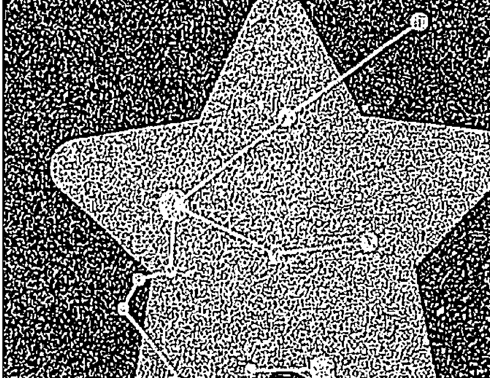

## # 魔法占星的用处是增加维度

### 为什么叫魔法占星呢？

魔法占星是为了改变一些事情。我们施魔法都是为了改变一些事情，而占星如果只是通过看星盘来了解我们的内心，明确我们的方向，鼓励自己迈向那个方向，那它就只是一种心理运作的力量，当然，这个力量也是有意义的，但是它没有魔法那么直接。

所谓的魔法，就是巫师运用自然力量的方法和他可以调动自然力量的方法。这个地球上的自然力量，如动物的疗愈力量、植物的疗愈力量、矿石的疗愈力量，都是可供调用的。所以我们在知道自己的星盘后，进而知道自己的天赋，比如看到自己的象征美丽的金星落在天秤座（天秤座是一个和谐优雅的星座）上，那它就会成为你自己的优势。因为金星在天秤座是庙旺，代表它待在天秤座很舒服。那么这个时候你就可以去发展自己的美。如何发展自己的美呢？你可以看金星掌管的石头是哪些、金星掌管的植物是哪些，然后把它们放在一起，就会得到一个频率的加乘。如果平时配魔法油的话，就可以根据这个频率的加乘来调配属于你自己的魔法油；如果平时不怎么配魔法油的话，也可以简单地把相应的石头带在身上，那么这个石头的频率就会持续地影响你。比如，我们为自己选手串、选吊坠的时候，一般都会选我们自己喜欢的，那都是出于本能，觉得这个东西比较适合我，或者它看起来漂亮所以我就想戴着它。但是，本能直觉对于有些人来说比较准，对于有些人来说却不准，因为有人直觉强，有人直觉不强，所以有人选对了，有人选错了，不过选错也不会有坏处，只是没有加乘那么强烈的好处罢了。那如果我们了解自己的星盘，就会知道哪一些石头对自己是最重要的。或者你最近想招财或者想招桃花，或者想人际关系变好，那么你应该佩戴哪一种石头，也是可以根据自己的星盘来看的，这对于每个人都不一样的。所以石头有广义上的招财石头、招桃花石头，也有根据你自己的星盘来看的，可以更强烈地作为你自己专属的招财的或者招桃花的石头。这些都可以根据你自己的星盘来看，因为你的星盘就是一个频率的组合。这些频率描述的就是你自己，所以你为自己的生命做改变的时候，要根据这些频率来选石头，那它才是适合你自己的；选植物、选精油也是一样。对于配魔法油的人来说，有了占星的知识就为魔法油的调配增加了一个维度。对于调配精油来说，维度是非常重要的，这就与“比生命的长度更重要的是宽度，比生命的宽度更重要的是生命的维度”是一个道理。

我们在学习芳疗的时候，会学到两把大钥匙，一个是化学成分，一个是植物科属。当你只用化成成分分配精油时，它会有一定的疗效；但是当你同时用化学成分和植物科属两个维度一起来配精油时，它的疗效不会是之前的两倍，而是之前的无数倍。因为这里不是一加一等于二，而是一个维度加上另外一个维度，那就等于无穷，就像一个点是零维的，一条线是一维的，你在一条线上没有什么美，但是当你从一条线变成一个面，也就是二维的，那就无穷美。这就是说，一个面上的美，以及它能发生的事情和它的力量，都比一条线时大了无穷倍。如果你再增加一个维度，使二维空间变成了三维空间，那它的美则又比二维空间增加了无穷倍。所以当我们调配精油、调配魔法油的时候，每增加一个维度，并不是使之前的力量翻倍，而是使之前的力量翻到了无穷倍。但维度是很有限的，就如同魔法只有三部曲，因为这也是我所知道的唯一的三个维度。如果第一个维度你选择了植物精油；第二个维度你为植物精油选择了水晶，则这时候你的力量就已经翻了无穷倍；然后在第三个维度，你根据行星的排列来选择植物精油和水晶，那么这个时候它就是在翻了无穷倍之后又翻了无穷倍，并不是第一维度的3倍，而是无穷无穷无穷无穷倍。这就是增加维度的一个意义。

也有人问：天上的行星对地球上的影响那么小，那你认为行星真的会为精油增加那么大的力量吗？这个问题需要从两个方面说。一方面，天上的行星对地球的影响并不小，只是我们肉眼看不到，就像月亮会影响大海的潮涨潮落，但这个力量是我们看不到的，我们也只能在时间的经验中慢慢总结说，哦，原来月亮有这么大的力量。所以，你只是看到天上的一颗星在那儿一动不动，眨眨眼、眨眨眼，好像没有为地球做什么，那只是因为我们还没有找到它的规律。而魔法占星就是要找到这样的规律，让我们的行为与自己配出来的精油适应这种规律，这样就可以利用精油的力量。所以说，占星是知命的，魔法占星是改命的。因为占星是根据这种行星的频率、位置等，知道自己是怎样的；而魔法占星知道自己是怎样的目的，是为了要把其他的自然力量揉进来，适应它从而利用它，所以它是在我们知道自己的星盘格局之后，把它作为一个维度的力量加到自己的植物精油和石头中去，让它成为自己的一个力量而不只是自己的一个心灵历程。

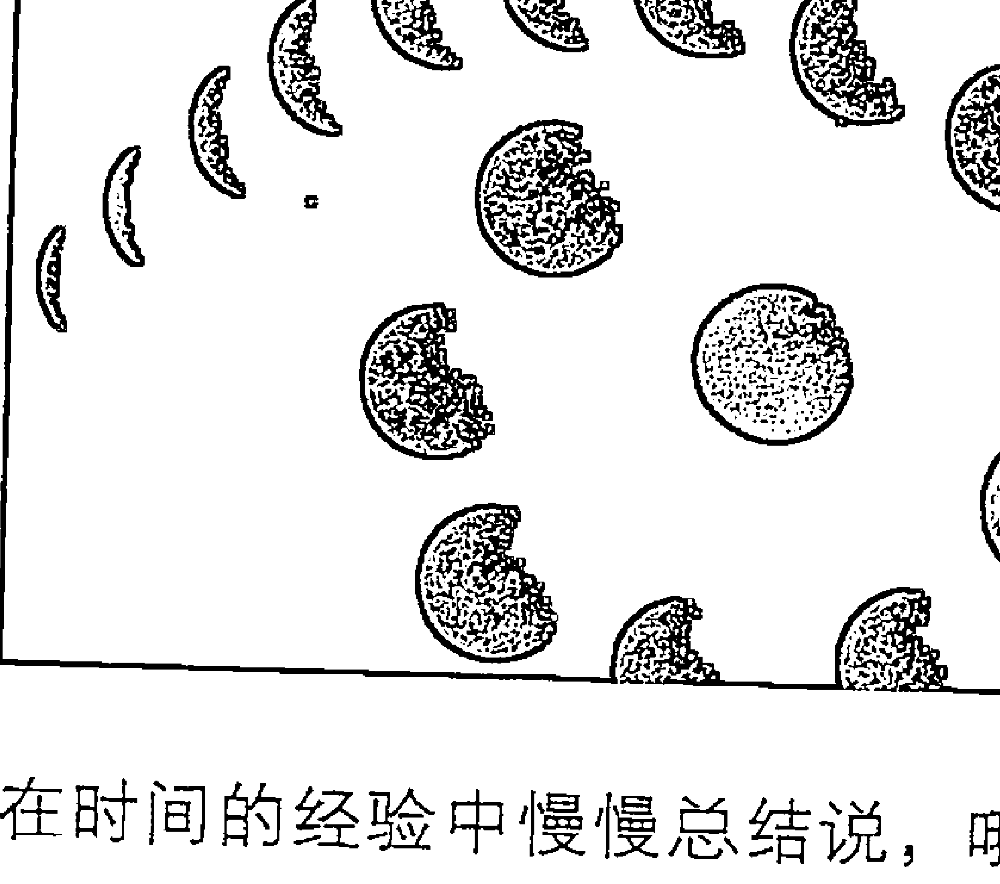魔法占星的原理是频率

占星的原理是频率，魔法占星的原理也是频率，只不过是不同范畴的频率。占星是行星的频率对人的影响；而魔法占星是在知道行星的频率如何的情况下，选择与这个行星的频率相应的植物和石头，把它们加乘在一起，就是说频率是可以加乘的。这就好比你往湖里面扔一个大石头会有大浪往出赶，你再扔一颗小石头会有小浪骑在大浪上往前赶，这个就是一个频率的加乘。你先是用一个喇叭放出一种声音，然后你再用第二个喇叭放出第二种声音，这时候你听到的就是这两种声音的混合，这也是频率的加乘。所以当你选择植物的时候，你选择的是植物的频率，然后为它加上石头，其实加上的是石头的频率，这个时候你又找来了相应的行星，也就融合了行星的频率。这里所说的找来了行星，不是你把行星加进去了，而是你在顺应行星频率的时候来找这种石头和植物，就好像在潮涨的时候你顺应潮水的方向游泳会游得更快，在潮落的时候你往岸边去逃命就会费一些劲儿。因此，我们在找到行星的频率之后就应该顺应它，让它成为我们的力量加倍的途径。

魔法占星

魔法占星是魔法三部曲的第三步，它也是独立的一步，没有学过前两步也可以学习这一步，因为魔法精油是让我们了解植物的魔法力量，同时教我们如何增强自己的意念力，因为自己的意念力就是调用“土水火风”四大自然之力的一个核心因素。魔法水晶讲解了水晶如何影响人，同时讲解了如何感受水晶能量。由于感受水晶能量是一种本能，所以第二步也讲解了如何训练这种本能。而魔法占星与我们的生活离得更近，也更接地气，因为占星这种语言不只描述了我们的精神格局，也描述了生活中的12个最关键的大领域。

比如，在星盘之中有黄道十二星座，也有十二宫，十二宫就是地球上我们生活的十二点，每一个宫里面都有行星，根据这个行星落在了什么星座上，就可以看出你在这个领域中应该怎么做。而魔法占星是看到你在这个领域中怎么做了之后，它会告诉你如果你想在这个领域中做得好，就要用什么样的石头和什么样的植物。比如，你关心自己的财富，就要看第二宫。从第二宫的状况，即位于什么星座、里面有什么行星，就可以看出什么样的石头和植物可以加强你第二宫的力量。

魔法占星和占星的另外一个不同，就是占星教授的知识比较多，因为它是纯粹地根据星盘来看你自己的心理状况、自己的状态，然后去推测你应该解决什么样的精神课题才能有所进展。而魔法占星则更简单直接地指出，你若想在哪个领域做得好，那你应该补充什么样的能量。所以魔法占星意味着我们的力量增加了一个维度，它给我们一个施展我们力量的、详细的接收点的描述，那就是我们想要哪个领域好，就要选择更有针对性的力量。这就是魔法占星主要讲解的东西。

本命星盘就是我们在出生的那一刻，天上的行星在什么位置、在哪个星座的相关信息。从本命星盘上可以看出我们性格的各个面向，例如，水星就是我们的思考交流，金星就是我们的美、爱、快乐，火星就是我们的力量、爆发力。如此一来，每一颗行星都象征着我们性格的一个面向，所以我们通过每颗行星的状况，就能知道我们的性格的一个完整的组合体是什么样的。

上升星座在现代占星学中被认为是人的一个面具，是我们行走江湖的一个身份，在古典占星学中则会认为，上升星座是我们灵魂进入生命的方式，也就是我们灵魂的样子。我更相信古典占星学中的说法，所以上升星座、太阳星座和月亮星座是我们最重要的三个星座。人们都说人活到30岁之后就会越来越向上升，那是因为人会活得越来越明白，他活得越老就越会脱离自己后天的性格而向自己的灵魂靠拢，因为他越来越有资格像自己的灵魂。比如，我的太阳星座是天蝎，我的上升星座是金牛，所以我就发现，我小的时候像天蝎，长大后却越来越像金牛。

月亮星座反映了我们的情绪和潜意识，太阳星座是我们的个性。至于自己的上升星座是什么，现在科技很发达了，我们可以通过专门的排盘软件进行查询。具体就是在软件里输入自己的出生年月日和地点，然后系统就会自动生成你的星盘，关于你的信息一目了然。在魔法占星一开始讲基础的时候，我就会讲这个，这是非常容易的。

制作魔法油还需要仪式吗？通过仪式必定会给魔法油增强力量，但这是在第一部和第二部中讲得比较详细的，第三部则主要是讲如何通过星盘来看你应该如何选择石头和植物。这样配出来的魔法油即使没有经过仪式，它也会有自己的力量，因为选对了频率。

魔法占星在做一些重要决定的时候，是以什么方式给予启示的呢？魔法占星所教的东西并不能在你做决定的时候给予启示，因为启示属于占卜的范围。而魔法占星的目的，主要是为了根据你的星盘选择可以加强你某个领域力量的东西，所以它是一个给你补足力量的方式，并不是帮你做占卜给予你启示的一个工具。

### 第二节：行星与星座

- 人的特质与星座的关系
- 行星与其掌管的星座之间的关系
- 影响人的性格形成的能量场
- 通过星盘找到自己的“命主石”
- 确定三种对自己生命最重要的石头

魔法占星三部曲的第一部讲的是植物，第二部讲的是石头，第三部讲的是行星。

因为植物、石头和行星这三个东西在远古时期人类出现之前就已经存在了，它们一直在我们的太阳系中互动着。天上是行星、地球上是植物与石头，三者建立了密不可分的能量关系，所以人类出现之后，如果我们能够利用三者的协同作用，就可以达到整体的效果。

一切都是频率。植物有植物的频率，植物精油由它的芳香分子携带着植物的频率，就好像植物的灵魂一样。水晶有水晶的频率，如果看它的微观的话，它不是一个固体的石头块，而是一大堆分子聚合在一起。而天上的行星也有它的频率。我们之所以通过占星可以看出一个人的性格特点，就是因为人在出生的时候，天上的行星的频率影响着我们的地球，在那一瞬间，行星在什么位置，这个性格特征的基调就奠定了。所以我们在做疗愈的时候，就是用其他的自然力量的频率向好的方向影响我们的频率。如果频率因此改变了，这疗愈也就完成了。所以我们把三个维度的频率加乘在一起的时候，它们不是一加一等于三，而是等于无穷大，因为这是一个维度的提升。而植物、行星和石头就是这样的三个维度，正因在远古时期，水晶石头和天上的行星一直在互动着、共振着，所以如果我们找到它们频率当中的相同点，并把它们加乘在一起，就可以获得神奇的效果。而我们人的频率需要什么样的频率来疗愈呢？我们每一个人的特质都不一样，那我们特质的线索就是行星，所以这一讲会讲行星与星座之间的关系，以及它们的本质，最后会讲到每一个星座对应的石头，以及我们应该如何选择自己的石头。

然后下一讲会讲每一个宫位和石头是什么关系。因为天上的黄道十二星座是我们非常熟悉的，而地上也有十二个宫位，这每一个宫位都是我们生活的一个面向。所以在我们知道宫位和石头的关系之后，就可以在现实生活中用石头来影响我们，而不只是虚无缥缈地改善我们的性格和灵魂进化这方面。

说到星座和星盘，这是两个不同的概念。星座就是星盘上太阳落下的位置，即太阳落在哪个星座，你就是哪颗星座的，但是在星盘上面还有其他的行星，比如月亮、水星、金星等，每一颗行星都是我们性格的一个面向。我们平时说太阳星座比较多，这是因为太阳是非常重要或者可以算得上最重要的一颗行星。太阳是我们的一个主体的性格，月亮就是我们的情绪，它是更深层次的东西。如果太阳是男人，月亮就是女人；太阳是理性，月亮是感性，它们互为阴阳。水星是我们交流和思考的方式，金星是我们表达爱与美的方式，火星可以用一个字来形容，那就是“勇”，这个“勇”是我们发怒的方式、进攻的方式，也是我们生命的动力所在。

我在旁边这张图上标注了几个符号。最下面像月亮的符号就代表月亮，像太阳的符号代表太阳。然后从下往上，第一个像镜子长了两个角的，代表水星。水星之上像一个镜子没有长角的，代表金星；金星上面是火星。金星是阴性的，火星是阳性的，我们用符号代表男女的时候，也是用的金星和火星这两个符号。火星上面是木星，木星上面是土星。木星的关键字是吉，吉祥的吉，因为它可以给我们带来吉祥。由于吉祥是那种有扩张感的正能量，所以木星也是一种扩张的感觉。而土星代表的是我们性格中需要忍耐的部分，就是我们承受压力的部分。总的说来，天上的行星代表着我们性格中的各个面向，因为在我们出生的那一刻，天上不同的行星位于不同的位置。行星是实际散发能量的东西，有人说它是神邸，就是因为它们是力量所在。而星座只是行星烘托出来的一个特质，所以当我们说我们是什么星座，那只是指太阳在什么位置，以及我们性格的一个笼统的状况。而我们性格的一个立体的状况，必须依据所有的行星综合来看，所以看星盘是比较复杂的一件事。我们看星盘的时候，要看所有的行星都落在哪个星座，看所有的行星之间有什么关系，然后才能够感觉出这个人是一个什么样的立体性格。

魔法占星和占星的不同在于，魔法占星的目的是找到可以影响你的性格面向，或者找到生活领域中可以影响你的石头、植物，它并不像传统的占星那样教你如何看星盘，如何分析自己的性格。由于这是非常复杂的，没有办法在三节中讲完，再加上即使性格分析出来了，要如何去改善这个性格，又是一个大工程，所以不如直截了当地从星盘中看哪一个石头可以影响你的哪一方面，这是最便捷的一种做法，便于下面介绍十二星座。

### 行星与其掌管的星座之间的关系

每一个星座都有自己的主宰行星，主宰行星就是能量源，其特质也就渲染出这整个星座的特质。行星及其掌管的星座之间的关系，可以用一个皇宫内院的故事来描述。

### 太阳、月亮与狮子座、巨蟹座

在我们的天空中有太阳和月亮，它们是两颗最显著的行星，它们象征着皇上和皇后，太阳是皇上，月亮是皇后，太阳是一个性格的主体，而月亮就是潜意识感性情绪这样的面向。太阳掌管的星座是狮子座，月亮掌管的星座是巨蟹座，所以狮子座就是一个光芒四射的王者星座，而巨蟹座就是一个对家庭非常重视，对自己情绪底层也非常重视的一个敏感的星座。

### 水星与双子座、处女座

既然有了皇上和皇后，就需要有传话的、伺候它们的人，这就是水星。水星是皇宫内院里伺候皇上和皇后的人，所以它代表的性格面向就是交流与思考。因为伺候皇上、皇后就得特别会说话，像清朝的太监们都特别会说话，特别圆滑，水星正是扮演这样一个角色。所以水星的思考力特别发达，可以同时处理很多的信息，它还有服务的意识。水星掌管着两个星座，即双子座和处女座，其中双子座表现出了水星的这种交流和思考、处理多方面信息的能力；而处女座则表现出水星的服务能力，所以我们把双子座和处女座分别想象成皇上和皇后身边一个传话的、一个伺候起居的侍者。双子座负责传话，所以它在信息交流方面特别强；处女座伺候起居，所以它的服务能力方面的特质特别强。

### 金星与金牛座、天秤座

水星上方是金星，金星象征着爱和美。皇上、皇后虽然有人伺候了，但他们还得有好吃的食物，还得有穿起来好看的衣服，所以金星掌管的两个星座，一个是金牛座，比较注重吃，一个是天秤座，比较注重穿。这两个星座都因为被金星掌管而有爱美的特质。金牛座专门负责给皇上、皇后送吃的，它比较注重吃这一方面，所以对物质安全感、对好吃的食物就特别感兴趣，也特别容易满足。天秤座专门负责给皇上、皇后穿衣服，它热衷于好看的衣服，所以天秤座的人都很好看，或者是有气质，或者是很和谐。

### 火星与白羊座、天蝎座

金星上面那个有小箭头的符号是火星，火星就是“勇”。火星是皇上、皇后想去杀人的时候所用的东西。它掌管两个星座，左边那个是白羊座，右边那个是天蝎座，所以白羊座和天蝎座都带有“杀”的信息，不同的是白羊座是勇士，是战士，是皇上、皇后的御林军；而天蝎座是暗杀部队，就是血滴子的那种暗杀部队。白羊座的“勇”，特别粗犷有力，一点就着，因为它是勇士；而天蝎座就比较阴暗，总是藏在暗处，因为它是血滴子。

### 木星与双鱼座、射手座

皇上、皇后有人伺候了，有吃有穿了，也有部队可以帮他杀人了，他们就安全了。那么安全之后呢，还得考虑精神境界的一个提升，这个时候就出来了一个大吉星——木星。木星是吉星，代表扩展的力量，所以木星掌管的两个星座就是在精神方面扩展所需要的力，它们是双鱼座和射手座，正如图上所示，它们分布于木星的左右两端。双鱼座就相当于皇上的佛堂，如果是个外国皇上，那它就相当于城堡里面的一个小教堂，或者是冥想室，它所象征的就是精神的力量和灵性的力量。所以双鱼座的人都像大海般浪漫无边，他们有时候会迷失、迷茫，那是因为大海太辽阔了。双鱼座有时候喜欢梦想，因为它就是一个广阔的灵性世界。射手座则是皇上学习的地方。射手座的人喜欢学习，向往提升自己的见识和智慧，从而形成自己的信念，这些都是皇上在学习的时候获得的能力。所以木星这个大吉星它掌管的就是皇上、皇后精神世界的提升，双鱼座代表灵性的提升，射手座代表信念与智慧的提升。木星的符号像一个写得很夸张的“4”字，因为它是皇上、皇后身边的第四号人物，那第五号人物呢，就是土星。

### 土星与摩羯座、水瓶座

土星就像一个三朝元老，所以当它督促皇上干正事儿的时候，它就是摩羯座，因为摩羯座就是这样脚踏实地、坚韧耐劳，一步一步地在物质世界实现自己的目标，一步一步地往前走。它是因为有了土星这个三朝元老的掌管，才具备了这样的特质。而土星还有另外一个表现方式，即叛变。当它觉得皇上太弱势了，它想自己当皇上的时候，它就叛变了。这个三朝元老比其他的大臣都容易叛变，当它叛变的时候就变成了水瓶座，因为水瓶座是一个特立独行的星座，它不遵从传统与权威，因为根据传统和权威，皇上是不能被推翻的，所以水瓶座就是这样一个走自己的路的星座，他并不在乎别人怎么想。这样的故事讲完了以后，就大概知道每颗行星代表着什么面向、是什么特质，以及它们掌管的星座都是什么特质、什么性格。而且从这个故事中也能看出，为什么相对的呈180度角的两个星座之间会不合，会有矛盾，比如说摩羯座这个三朝元老总是劝皇上上朝，它的对立面星座就是由皇后掌管的巨蟹座。因为三朝元老总是让皇上去上朝，所以皇后最讨厌它。而皇上这个太阳掌管的狮子座，则最讨厌对面这个三朝元老叛变时的水瓶座，因为皇上最深恶痛绝的就是叛变。所以从这个角度来看这个故事也是很有意思的，可以把许多行星的落座都记住。不过这个与魔法占星没什么关系，以后有机会再具体深入分享。

### 天王星、海王星和冥王星及其掌管的星座

我们一直到现在讲的都是古典占星学中行星的分布，那个时候人们还没有发现天王星、海王星和冥王星，所以就这样具有对称美地把几个主要行星分布在了这几个星座之中。那么，在发现天王星、海王星、冥王星之后呢，又不能让它们没有活儿干，那就让它们也掌管几个星座吧。比如说，天王星掌管水瓶座，所以就是土星和天王星都掌管着水瓶座。因为天王星就是变，而水瓶座就是叛变，它俩是一致的。同样地，冥王星掌管天蝎座，它和火星一起掌管天蝎座，因为冥王星象征着死亡和颠覆，以及黑暗、深沉与蜕变，而天蝎座是暗杀部队，所以它们比较对应。而海王星给人一种无边无际的感觉，所以它与双鱼座相对应，让它和木星一起掌管双鱼座。因为天王星、海王星和冥王星是一些和个人性格特点不太相关的行星，所以我们在魔法占星的时候，就可以忽略它们，而只看我们的主要行星。

所以在整个皇宫内院中，这些行星各自掌管着自己的星座，就好像各自为家一般。但是行星是运动的，所以它们就在这所有的房子之间转来转去，转来转去，最后形成了各种各样的能量纠葛，而我们在出生的那一刻，这些行星和这些房子之间发生了什么样的能量纠葛，就对我们有什么样的影响。比如，我们出生的那一刻，皇后由于难受，可能跑到叛变的水瓶座那儿去了，而皇上在皇后的房子里待着，太监在宫女那儿，宫女在御膳房……所以在这样的一个故事里，在这样的一个场景中，整个皇宫内院的能量场是一个特殊的能量场，它影响我们并造就了我们的性格。所以我们性格的哪一个面向是什么样的状况，还得看在我们出生的那一刻，这颗行星，也就是象征着我们的性格面向的这颗行星在什么位置，然后我们就可以根据这个位置来判断它当时的能量受到了什么影响。比如说，象征着我们的“勇”、我们的“怒”的火星，跑到天秤座那里去了，而天秤座是一个给皇上做衣服的地方，是一个美好和谐的地方，火星这个“勇”闯了进来，天秤座肯定很不高兴。而火星呢，它在天秤座那儿也无法表达出它的“勇”、它的“怒”来，所以它在那儿挺难受的。所以，如果出生那一刻，火星落在天秤座的人，他就没有办法表达出自己的怒气，明明心里边憋着很不高兴，但是表面上还得挤出笑容来，因为他们无法忍受不和谐地表达自己的怒气，而表达怒气必然是不和谐的，所以如果我们想加强自己的火星的能量的话，就要看我们出生的那一刻，火星在哪一个星座之中，这个星座又是由哪一个行星掌管的，然后我们通过这个行星来加强火星的能量。

### 通过星盘找到自己的命主石

月亮、太阳和上升是我们的性格格局中最重要的三颗行星，其中太阳是我们性格的主要格局，月亮是我们的情绪，这是两个非常重要的面向。那么上升呢？现代占星学认为，上升只是面具，而古典占星学则认为，上升是人的灵魂，我更倾向于古典占星学的说法，认为上升就是一个灵魂进入世界时的方式。上升星座在什么位置呢？就是在我们的星盘上，地平线穿过的左边的那个星座，也就是第一宫宫头的那个星座。换句话说，它就是我们的星盘上最左边的那个星座，所以上升星座关系到我们的命主石。所谓的命主石，就是我们的一生中最重要的一颗石头，我们也可以把它叫作我们的灵魂之石，因为它可以为我们的灵魂补充力量。命主石就是上升星座的掌管星所对应的石头。而第二颗重要的石头，是我们的太阳星座所对应的石头，第三颗则是我们的月亮星座所对应的石头。因为在个人的星盘之中，太阳、月亮和上升是三个最重要的位置，这三个能量是最影响我们整个星盘和整个生命的能量，所以这三个星座的力量可以占到一半以上的比重。比如，我们的太阳落在了巨蟹座，那么我们的三颗重要的石头之一就是巨蟹座所对应的石头，或者是巨蟹座的掌管星月亮所对应的石头；如果我们的上升是在天秤座，那我们的一个重要的石头就是天秤座所对应的石头，或者是天秤座的掌管行星金星所对应的石头。

### 太阳、月亮与虎眼石、月光石

行星和石头的对应关系具体是怎样的呢？太阳作为一个君王，它在天上光芒四射，它要做很多事情，所以需要具备勇气与权威，它对应的石头是虎眼石。因为老虎是万兽之王，所以虎眼石带给人勇气和力量，也带给人生命力。月亮对应的是月光石。月光石给人灵性的启迪和情绪的安抚。

### 水星与蓝纹玛瑙、白玛瑙

水星对应蓝纹玛瑙和白玛瑙，其中蓝纹玛瑙比较适合双子座，因为双子座需要沟通和交流，而蓝纹玛瑙蓝色对应的是喉轮，所以它与沟通关系非常密切。玛瑙就是一个多变的颜色，所以这和水星的多变是相通的。处女座作为水星掌管的星座，专门伺候皇上、皇后的起居，是一个服务性的星座，它对应的是白玛瑙。因为处女座的服务意识如果发展到顶端，就是一个无条件的爱的状况，它是很伟大的一个星座，而白玛瑙这种纯净而无所不包的白色可以和它对应。

### 金星与红纹石、蔷薇辉石

金星是爱和美的行星，它对应红纹石和蔷薇辉石。红纹石、蔷薇辉石和粉晶是三种与爱相关的石头。其中红纹石适合金牛座，而深沉细腻的蔷薇辉石则更适合天秤座。

### 火星与红色石榴石、黑曜石

火星这个“杀”的行星，对应的是红色石榴石和黑曜石。红色石榴石分配给白羊座，因为红色就是血的颜色，它带着让人热血沸腾的力量，所以特别适合勇猛的白羊座。黑曜石则是非常深沉的，它的力量是从最底层翻出来的，我们如果只是想单纯地排出负能量的话，就会用黑碧玺，但是要想把自己心底的最阴暗的东西翻出来，那就要用黑曜石，而黑曜石的深和天蝎座的深是一致的。

### 木星与白色砗磲石、青金石

木星对应的是白色砗磲石和青金石。白色砗磲石是灵性的石头，在佛教中使用广泛，因为它象征的是灵性和无边无际的海洋中这种包裹的安全感。而双鱼座就像是无边无际的海洋，同时又是一个灵性的星座，所以与白砗磲对应。青金石对应的是射手座，因为射手座扩展的是自己的精神世界，而青金石对应的是眉心轮，代表智慧，巫师在做仪式的时候，会把青金石贴在三眼轮的位置来增强自己的智慧，这样就可以与上天连接。所以砗磲石和青金石都是木星这个大吉星掌管的石头，二者都有扩展精神的力量。

### 土星与海蓝宝、磷灰石

海蓝宝对应土星，把它分配给水瓶座，因为它有一种道出宇宙真相的力量。而磷灰石对应土星，把它分配给摩羯座，因为磷灰石可以补充身体的能量，无论你把它放在身体的任何地方，它都能够补充身体的能量，所以它特别适合脚踏实地的摩羯座。

### 确定三种对自己生命最重要的石头

这样一来，我们就清楚了十二星座都对应了什么石头，也了解了每颗行星都对应哪一个或哪两个石头。所以，我们只要看我们的太阳、上升、月亮在什么位置，都是哪颗星座，然后挑选出与这三颗星座对应的三块石头，它们就是我们人生中最重要的三块石头。这三块石头可以从我们的灵魂力量、个性力量和情绪力量这三个最重要的方面来补充我们生命整体的能量。

想知道自己的星盘是什么样的，只需要在网上搜索“测星盘”，就会出现很多测星盘的网站，只要在里面输入自己出生的年月日时和地点，就会出来自己的星盘。在星盘上面，我们可以看到自己的太阳、月亮和上升是什么。下面是我输入信息后得到的一个星盘，如图：

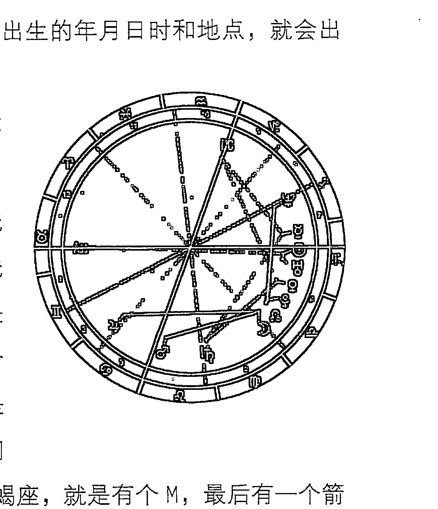

升星座是狮子座的话，三块石头之一也是虎眼石，但在这两种情况下，虎眼石带来的力量是不一样的。对于上升星座是狮子座的人来说，虎眼石给他带来的是灵魂的力量，而对于太阳星座是狮子座的人来说，虎眼石给他带来的是性格和整个生命的力量。太阳、月亮和上升星座对应的三个石头可以一起戴，也可以选一块戴在身上。石头和石头之间不会不和谐，因为每一块石头都是正向的频率。你也可以根据自己当天主要需要的力量来选择佩戴的石头。比如，在冥想的时候，可以揣一块上升星座对应的石头，因为它是灵魂的力量；如果你觉得自己没有真实地表达自己的性格，没有真实地活出自己，那就可以戴一块太阳星座的石头；如果你觉得自己的情绪需要抚慰，那就可以戴月亮星座的石头。

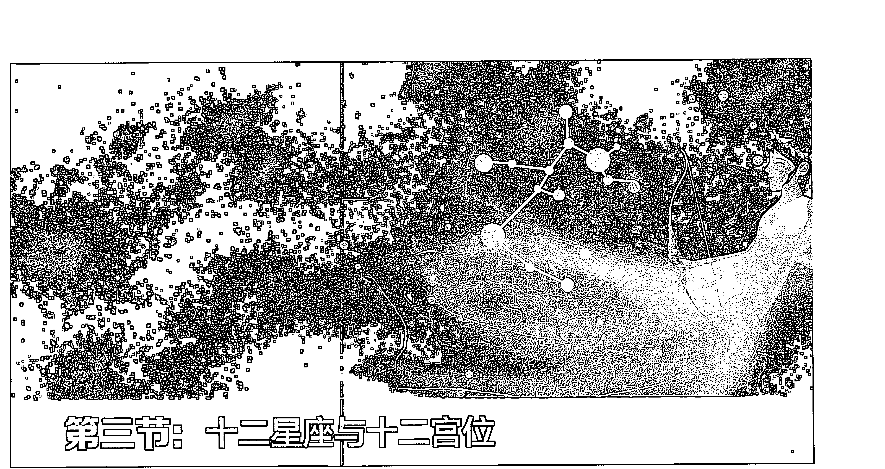

#### 第三节：十二星座与十二宫位

- 十二星座与十二宫位概述
- 十二宫的本质及其代表意义
- 通过星盘找到人生12个主要领域对应的石头
- 十二宫代表的生活内容
- 一问一答

### 十二星座与十二宫位概述

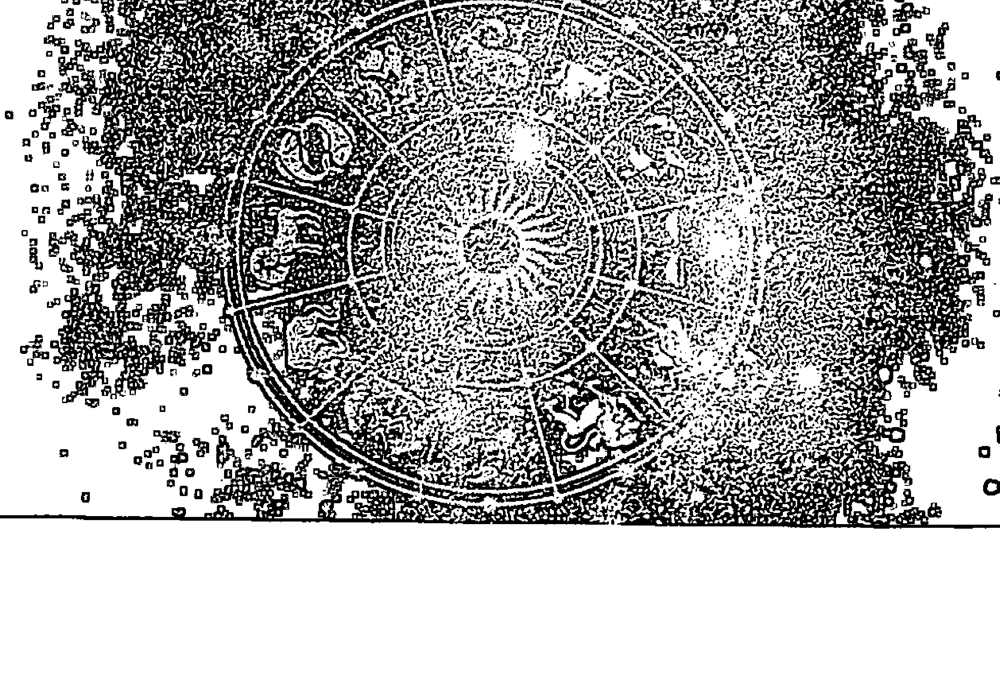

我们在上一节讲了行星和行星镇守的星座，以及它们对应的石头，其中每个行星对应一个石头，每个星座也对应一个石头。而我们人生中最重要的三颗石头，就是我们的太阳星座石、月亮星座石和上升星座石，因为这是我们生命能量的一个根本源泉，它象征着我们生命中三个最重要的能量，当我们佩戴了这三颗最重要的石头，就可以从本源源源不断地加强我们的生命力。

在我们的本命星盘中有很多行星，还有十二星座和十二宫，它们有着不同的意义。行星是我们的能量的主体、能量的根本源泉，它是我们生命力量的体现，每个行星都是我们生命的一个面向。而星座是这个行星所在的位置，它被这个星座渲染着。一个行星，它在什么星座上，它就被这个星座的能量所渲染。所以行星和星座代表的是能量，行星是能量的本源，是能量来的地方，而星座则用它自己固有的能量渲染着落入它的行星。十二宫可以被解释为领域，它是我们生活中的第二个面向，所以它是更落地的。行星和星座作为我们生命的能量状态，它将如何表达，将在什么领域表达，就得看十二宫的宫位了。每一颗行星表达自己能量的领域，就是它落入的宫位。我前面说过，占星描绘了我们的生命地图，我们拿着这个地图行走于世，就会走得更加便捷、畅通。而占星在描绘生命地图的时候，描绘了两个基本方面，一个就是我们每一颗行星，即我们生命中主宰的力量落在了哪些星座。这就描绘了我们生命的能量状态。另一个是行星落在了十二宫中的哪一宫。这就描绘了我们如何把这些生命能量表达出来的状态，即如何在生活中把它表达出来。行星落在哪个宫就表达了哪个宫的能量，也就是在这个宫的领域里，它的表达才会最顺畅。这就是生命地图的意义所在。

我们的生命中有十二个面向，有十二宫。比如说，人人都追求爱情与财富。爱情属于第五宫掌管，财富是第二宫，那么如何活好这个宫位呢？那就要看这个宫位里面落入了什么样的行星。我们把这个行星的能量给充分地表达出来，就是把这个行星的能量给活得完美了，那这个宫位的状态也就完美了。比如财务宫，也就是你的第二宫落入水星，水星就是给皇上、皇后送信儿并伺候皇上、皇后起居的，所以你只要把这个水星的能量，也就是交流和沟通给活出来，那你的财富就会完美。所以我们在用石头或植物改命的时候，就相当于用石头和植物加强了宫位中行星的能量，那么这个行星照耀着的宫位就会变得旺盛而充满生命活力。所以，行星在本命盘中落入了哪个宫位，它就照耀着哪个宫位，当我们选择一个想要加强的生命面向，同时佩戴落入这个宫位的行星所对应的宝石的时候，就相当于把对应着的这个宫位的行星点亮了。这就好比把一个昏暗屋子的灯点亮了，这时候屋子里面会显得很亮堂。

专业占星师看星盘的时候，主要看你这个行星落在了哪一宫的哪一个星座，因为星座的能量会渲染这个行星的能量。比如说金星，它与爱有关，如果它落在了天蝎座，而天蝎座就是那个暗杀部队，属于深沉黑暗的能量，那么它就会比较容易以那种深沉的方式表达爱与自己喜欢的东西。在看星盘的时候，就是看你在这个领域如何表达这个行星的能量，也就是看这个行星同时落在了哪个星座。

在魔法占星中，我们却可以不用看这个行星落在了哪个星座，因为不管它落在了哪个星座，它只是被渲染了，它的频率，还是那个频率，就好像你穿了各种各样的衣服，但你还是你，唯一不同的只是衣服。所以我们在找石头的时候，就是看行星对应的是什么石头，而不用太在意它落在哪个星座。

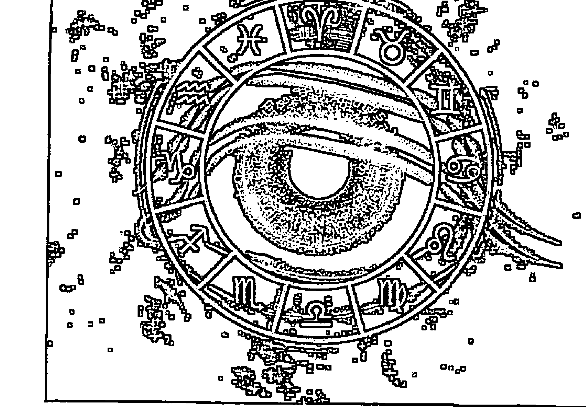

#### 十二宫的本质及其代表意义

现在我要介绍一下十二宫，它们代表了什么，它们的本质是什么。我们暂且相信是神创造了这个世界，那神如何创造了这么一个复杂的世界呢？占星中的说法是这样的：神一念出来了之后，就创造了这个“水火风土空”五大元素中的“空”，对此我已经在精油魔法中作了详细的解释。这个“空”进而创造了“土水火风”这四个元素，而这四个元素是四种力量、四种本质的元素，这四种本质的元素又互相混合然后创造了我们这个复杂的大世界。所以在天上的十二星座，它可以归属到“土水火风”这四个元素中，十二星座就是“土水火风”四个元素以三种不同的能量形式表达出来而形成的，十二宫位也是如此。这三种不同的能量形式恰好是一个周期，一个生命周期。就如同佛家所说，东西有“生住坏灭”四个阶段，没有永恒，它总是处于一个生命周期之中。而这个能量的生命周期呢，在占星中分为三段，分别是起始、固定和终止。能量有一个起始的状态，也就是创造自己、树立自己、表达自己、建立自己的地位这样的一个状态；然后还有固定的状态，就是它已经稳定下来了，要守住江山这样一个状态；而终止状态就是这个能量要消亡的时候，它如何去表达自己。“土水火风”四个元素经过这三个阶段的能量演变，三乘以四等于十二，它就演变成了十二宫。

### 水元素的宫位

十二宫的第四宫、第八宫和第十二宫都是水相的宫位，它们都是水元素经历了这三种能量的阶段而表达出来的宫位。水能量所代表的是灵魂与情感，所以这一股能量在起始、固定和终止的状态下表达出了不一样的诉求，即形成了第四宫、第八宫和第十二宫。都说第四宫是家庭宫，也有人说第四宫表达了自己最深的情感和情绪，是自己最不为人知的精神与情绪的宫位。第四宫是水相的起始宫。水能量在它起始的时候，在它刚刚出现表达自己要建立自己、确认自己的时候，也就是在它的灵魂与情感遥距建立自己的时候，就形成了第四宫。第四宫既是我们最深的感受状态——因为我们刚刚有了水这个能量的时候，我们要做的就是去感受世界——又代表了家庭的状态，因为人在家里的时候是最安全的，所以安全的时候它就容易展现出自己真实的一面，因此它是表达最真实的情感和感受，也是自己最脆弱的地方。第八宫象征着灵魂与情感，它寻求安全感和灵魂深处那种平静的感觉，因为这个时候经过了第四宫，所以水能量在第八宫中已经进入了固定的状态，已经稳定下来了。这时候它就会在稳定中寻求安全感，因此第八宫象征着我们追求最本质的生命意义与最极致的感受，那它代表的人生面向就是一个能给我们的感受带来极度安全感的面向，比如说神秘学。人们投入神秘学就是想给自己的生命一个解释、一个归属，让自己生命的最深处有安全感。第八宫也代表性，因为人们在性中的情绪是最有安全感的，而且这种安全感又是极致的安全感。第十二宫就是水能量，它在快要消亡的时候如何去表达自己，就属于情感与灵魂的学习的领域，而这种灵性的力量在学习的时候就表现为奉献与臣服，所以第十二宫是臣服于更高层次的宇宙力量。
所以我们看到这个图片上有六个宫位，第四、第八和第十二都是水能量的宫位，水能量的标志是一个倒三角形。

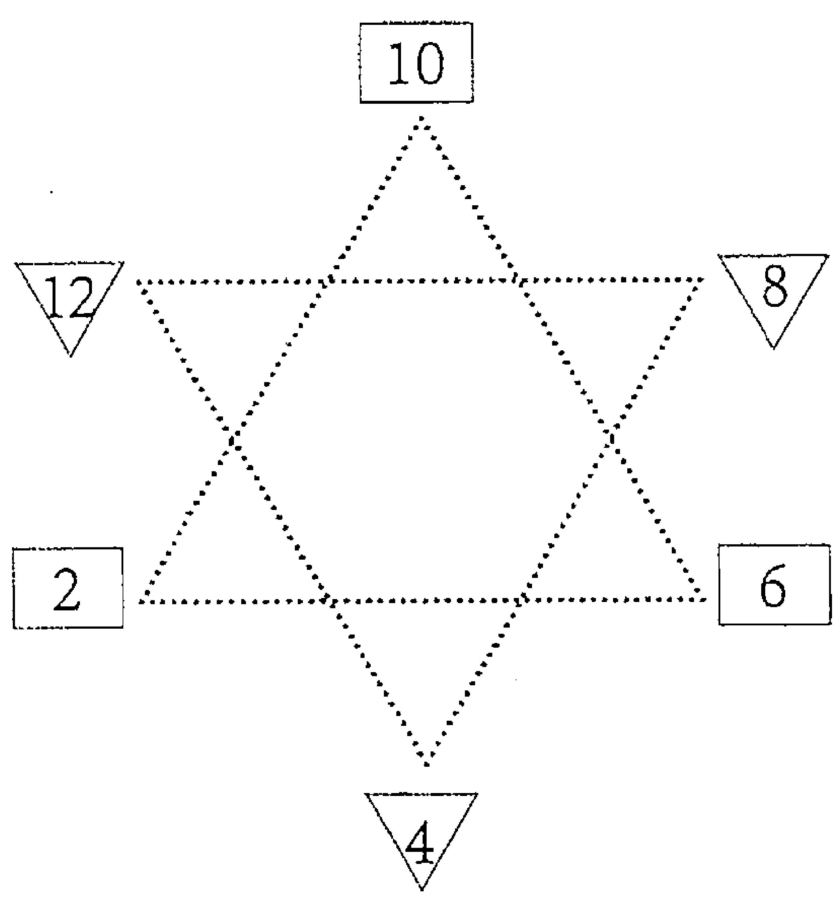

#### 土元素的宫位

第二、第六和第十宫是土元素的宫位，土元素的标志是一个方形。有意思的是，水元素和土元素的六个宫位恰好组成了一个六芒星。第十宫是土元素的起始宫位，土元素就是物质，所以第十宫就是物质的行动领域，就是开创物质世界的成就的时候土元素如何表达自己，所以第十宫可以说成是我们的事业宫。这就意味着，我们在这个物质世界如何确立土元素的能量，就要看第十宫的事业。而我们的物质被建立起来之后呢？紧接着就进入第二宫，也就是土元素的固定宫位，即一种物质上的安全感的宫位。所以第二宫财富宫象征着我们的财富。任何一种能量在终止宫位的时候就开始学习，因为它经历了一个生命循环，所以它要学习，就如同水能量在第十二宫这个终止宫位的时候，它会学习如臣服于更大的神秘力量。而土元素的终止宫位第六宫，就是以土元素这种物质的形式来学习的，所以第六宫代表的是我们的日常工作，也代表我们的健康。第六宫与第十宫的差别在于，第六宫代表着我们的工作，如果你是给别人打工，那第六宫就反映了你的工作状态；第十宫代表了我们的事业，就是我们在这个物质世界中如何确立我们自己，所以第十宫也代表了我们的声望，因为声望和事业是连在一起的。

#### 火元素的宫位

我们再看这第二个图，图中的正三角形是火元素，圆形是风元素。火元素的宫位是第一宫、第五宫和第九宫，在这个图上用正三角形表示。第一宫是火元素的起始宫位，第五宫是火元素的固定宫位，第九宫是火元素的终止宫位，所以这三个宫位分别代表着火元素如何确立自己、保持稳定和在消失的过程中的学习。第一宫是火元素的起始宫位，火元素代表的是自我意识，所以第一宫是我们自己的意识如何去表达，它是一个关于自己的宫位。

第五宫作为火元素的固定宫位，它代表的是对自我意识的安全感的追求，代表期望自我意识被认同，所以第五宫代表着我们的创造力、爱情、儿童也就是我们的孩子，看孩子也看第五宫。创造力就是我们自己去创造什么，当我们自己创造出来的东西被认同的时候，我们便认同自己更有价值了；爱情就是我们在恋爱中自我认同感最有安全感的时候，因为会有一个人不管怎样都如此地爱着你，爱情世界中我们真正追寻的东西，就是我们追求爱情时候的一个心理本质，就是我们更深处的一个诉求；孩子则总被认为是我们生命的延续，是自我意识的延续，所以孩子也表达着自我意识的安全感。在理解这个宫位的时候，我们应该清楚，不同时代的人们所生活的内容是不一样的，可能一千年之后，第五宫又有了它新的意义，那也是对应着那个时代的人们生活中所对应的面向的。而第五宫的本质就是火能量表达它的固定状态而映射出的人生层面中的一个内容，所以我们在理解宫位的时候，并不只是理解标签，比如认为第五宫是关于爱情、创造力、娱乐、孩子，这样是不够的。我们还得知道它的本质是什么，这样当你在思考自己的一个问题应该属于第几宫的时候，才能精准区分。

第九宫是火元素在快消亡的时候如何自我表现，是火元素的终止宫，所以这个宫位是关于自我意识的学习，也就是自我意识如何提高自己。火元素和其他元素一样，它所代表的三个宫位与它所表达出来的三个星座也是一一对应的，比如第一宫对应着第一星座也就是白羊座，白羊座就是火去确立自己的地位的星座；第五宫对应的是第五个星座也就是狮子座，狮子座就是火元素如何稳定地存续的表达状态；第九宫对应着第九个星座也就是射手座，它是火能量如何自我学习、自我成长的星座，所以宫位和星座也是一一对应的，我们在理解宫位的时候也可以从它对应的星座去感受它的能量形态。因此，神在创造世界的时候，它只是发射出了这些能量，这些能量在经过三种能量状态的演变之后变成了十二股能量，这十二股能量在天上就是十二星座，落在地上就是十二宫位，它们都是一一对应的，都源于这十二股能量。

#### 风元素的宫位

如图，圆圈是风元素。风元素的宫位是第七宫、第十一宫和第三宫。风元素代表的是社交与智能。第七宫是风元素的起始宫位，它是风元素确立自己的表现，也就是社交与智能方面的行动领域，而这种社交与智能的能力以及这种状态的培养，是以一对一的方式来起始的，所以第七宫是一对一的关系，它既代表了婚姻的关系，因为婚姻就是一对一的关系，同时也代表了一对一的合作伙伴，所以它是社交与智能开始确立自己尝试着建立这种力量时的状态。第十一宫是风这个能量的固定状态的表达，它是固定宫位，所以第十一宫的本质是社交与智能的安全感的追求，所以第十一宫代表着人们的社交。因为社交与智能的安全感常常在我们和一大群志同道合的人聚合时被获得，所以第十一宫就是关于我们和一大群志同道合的人在一起是何种状态，也就是关于社交的宫位。第三宫是风能量的终止宫位，就是风能量快消亡的时候的表达方式。所以第三宫的本质是社交与智能的学习，是关于交流与思考的宫位。第三宫的学习和它对面的第九宫的学习不一样，第九宫是关于自我意识的成长的学习，所以它更多的是信仰和信念，而第三宫更多的是信息。

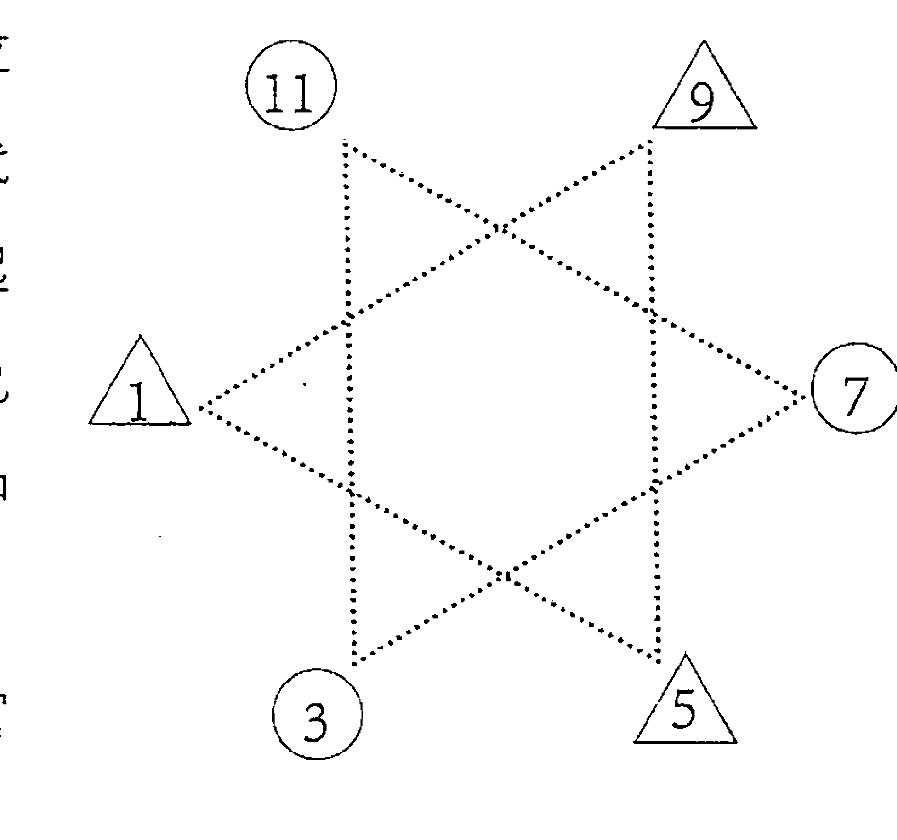

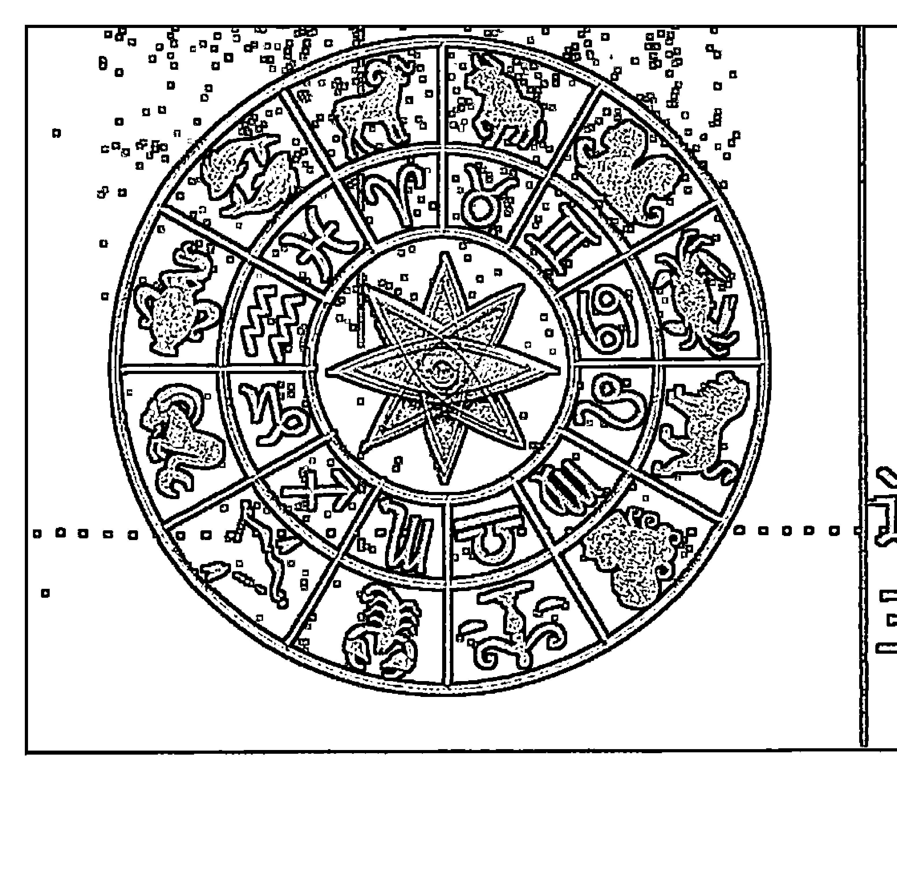

### 通过星盘找到人生12个主要领域对应的石头

所以我们生活中各种各样的信息都可以归纳到这十二类中，就是把它归纳到这十二宫中。我们有什么愿望，我们的愿望是哪一类的，它必然是这十二宫中的一个宫，那我们想要达成这个愿望，就要让这个宫被灯光照耀，被行星的光照耀，它明亮起来我们的愿望才会达成。所以我们根据星盘选择我们想要实现的特殊愿望的石头的过程，就是把我们的特殊愿望归纳到这十二宫的一宫，然后找这个宫里面有什么行星落在了这个宫中，最后佩戴这个行星所对应的石头，就可以使这个宫的能量兴旺起来，从而实现愿望。如果没有石头的帮忙，那我们也可以看星盘、看我们这个宫里面有什么行星，然后把这个行星的能量活出来，那这个宫就会变得明亮，从而使愿望成真。这也是占星学的意义，因为它给了我们指导。

那我们有了石头之后呢？就可以更快速、更容易地实现愿望。如果相应的宫位里没有落入行星，该怎么办呢？那就用这个宫的宫头所落入星座的星座石就可以了，因为宫头落入的这个星座就是你实践这个宫的生活领域的方式，这个星座的力量就会在这个宫的实践中被激活，所以当你增强这个领域中被激活的这股能量的时候，它也会把你这个宫照亮，并实现你的愿望。但是从整个星盘来看，行星落得比较多的宫位往往是你生命中应该去重视的宫位，因为行星落在那儿，就代表了你的生命力量自然地流到那儿去了，所以你把这些生命力量活出来，这个宫位就会被照亮，从而使你的整个生命都亮了。那些没有行星的宫位，其实是你可以不必太去重视的宫位，也就是说，你的生命课题并不在那儿，你想把它的亮度活出来可能也比较费劲，就算活出来了，可能也不太令你满意。也许你会说，虽然我的生命本质的方向不在那儿，可我就是想把那儿给活出来，比如说我就是想要钱，我就是想要爱情，那也没有问题。就看它的宫头所落的星座，通过把星座的能量加强而把这一宫照亮。只不过，也许你把它照亮并得到了你想要的以后，你可能不会感到满足，然后又会进一步地转变你的人生方向，这样就绕了一个小弯，比如，就像我发的这个星盘。

如果这个星盘的主人说，我想增加我内心深处的力量。那么，他内心深处的力量看什么？看第四宫。因为第四宫代表的是家庭和自己最隐蔽、最细腻的感受与精神状态。他第四宫里面有个火星，那就是把火星的力量活出来，那第四宫就被照亮了。所以他可以在口袋里面揣一块火星对应的石头。再来看这个星盘，可能就是说他内心深处的力量要依仗他活出自己的勇气，他有勇气面对自己内心深处的时候，他那内心深处才会有力量。所以这个人如果说：我想使我的家庭状态变好。那看什么呢？看第四宫。第四宫是火星，那可能就是说，他有了勇气，他敢于面对、敢于承担的时候，他的家庭状况可能就会变好。这就是火星把第四宫照亮了以后，他内心深处的情绪状态和家庭，以及没有被归纳出来的所有的这个水元素的起始宫位所代表的生活层面，都会被加强。再比如说，这个人说我想要好的社交状态。那就看第十一宫。第十一宫的宫头落在了水瓶座。那要怎么做呢？让他随身携带一块水瓶座的相关石头，这样就可以带给他好的社交力量。但是他这个人好像也不太重视社交，

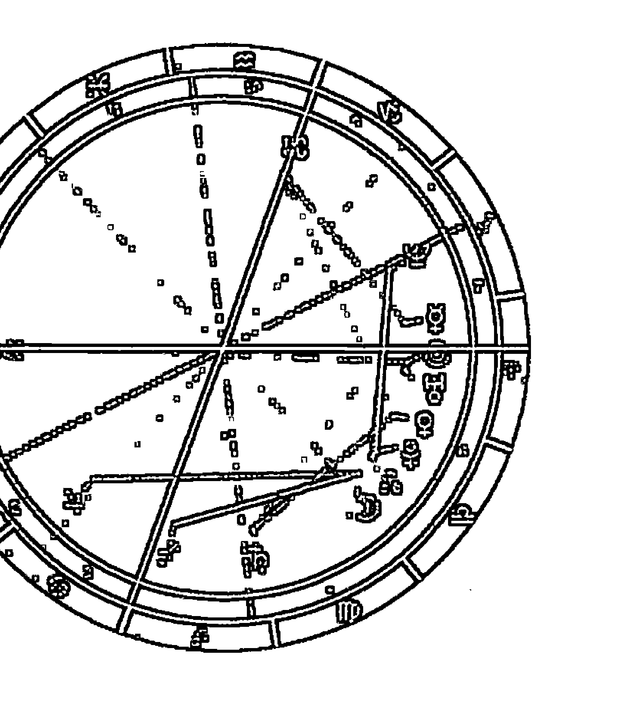## 精油魔法

因为他十一宫里面什么行星都没有，所以他落在水瓶座可能也符合了这一点吧。因为水瓶座就是一个特立独行的星座，他能走出别人没有走的路，所以他活出这种特立独行的水瓶座的状态，就是他社交的最好状态。通过这种方式，人们可以知道自己的某个特定的愿望用哪些石头增强和实现。这种石头会增强这个行星的力量，这个行星的能量被增强了之后，便会照耀整个宫位，所以它不只实现了你想要的特殊愿望，它的宫位所代表的所有面向都被实现了。而且有意思的是，它的宫位所代表的所有面向都是一体的，也正因为如此，这个愿望你只有一体地去实现它，它才会被实现，也就是说，它的相关的所有愿望被实现的时候，它也会实现，它们是一起来实现的。这是因为，当你佩戴石头的时候，比如说你佩戴第四宫里面那个行星所对应的石头的时候，你想的是我要加强我的家庭状态，但其实天上的行星才不管你的家庭状态，不管你内心深处的感受，或你对情绪上的探索，它不管这么多的分类，它只是给你注入你这个第四宫的火星的能量。然后就因为火星在你的第四宫中，所以这个能量可以照耀你的第四宫，使整个宫位全亮了。然后你会觉得，我的家庭状态变好了，其实是你第四宫的状况都变好了。就是用这种方式，我们找到了可以实现自己愿望的石头。

有人问：可是火星对应两块石头啊，它们之间没有分别吗？是的，你用这两块石头的哪一块都行，它都可以增强火星的力量，所以选一块你喜欢的就可以了。

### 十二宫代表的生活内容

每一个宫代表的意义就是在星盘上有很多的对应关系，我刚才是用“土水火风”四个元素来讲解了每一个宫的能量的本质，而这十二宫在我们现在这种生命形态中所代表的生活中的内容分别是什么呢？

第一宫代表的是整体的一个能量意识。第二宫代表的是财富。第三宫代表的是交流与思考。第四宫代表的是家庭和自己内心最深处的情感。第五宫代表的是爱恋与自己喜欢的东西、喜好做的事，以及自己的孩子。第六宫是工作和健康，这个工作是日常工作，如果你自己开公司，或要去上市之类的，则属于第十宫（事业）。第七宫是一对一的关系，它包含了婚姻和亲密的事业合作伙伴，以及其他形式的一对一的合作伙伴。第八宫是自己对自己生命本质的一个探索，就是它需要探索出生命本质的这种安全感，所以第八宫代表着性和神秘学。第九宫代表的是学习高等教育，这个学习不是信息积累，不是知识的学习，而是智慧的学习，是树立起自己信仰和信念的学习，所以第九宫也代表着长途旅行，因为人们在长途旅行的时候会站在不一样的文化基点上反思自己之前所接受的文化，所以这个时候也是自己确立生命中信念的一个过程，第九宫同时也代表着海外求学等，因为这同样是一个确立自我信念的过程。第十宫是事业宫，它代表着我们的事业和声望。这个事业和声望是我们如何为社会贡献自己的价值，我们对社会做了什么，我们在别人的眼中是一个什么样的身份。第十一宫代表着我们的社交。第十二宫是一个灵性宫位，它代表着我们灵性追求的一个感觉，比如说我们去当和尚、当尼姑或者是当修女之类，或者我们灵修的状况，就要看十二宫的灵性追求。所以从第一宫到第十二宫恰好是人生命的一个过程，也就是从第一宫的自我意识开始实践，到最后第十二宫进入灵性追求的过程。

在宫位中还有其他的关系，就是两个对宫之间可以互相参考，如第一宫是自我意识开始实践的一个宫位，而它的对宫第七宫是一对一的关系，也就是自我意识和别人的意识这两个意识在一起如何互相学习的一个课题。如第二宫是财富宫，是我们物质方面的财富，它的对宫第八宫是一种更本质的精神上的安全感、宁静感，较之更深刻、更深沉。如第三宫是信息与思考宫，它的对宫第九宫是信念，所以第三宫和第九宫的关系也是信息与信念的关系。总而言之，我们会发现，第一、二、三、四、五、六宫，成长到第七、八、九、十、十一、十二宫的时候，是一个轮回，就是这个成长的后半部是前半部的一个加强。如第四宫是整个星盘最底部的一个宫位，它象征的是我们心底最深处的感受，而它的对宫第十宫是整个星盘最顶端的一个宫位，它代表的是别人看到我们的样子，就是我们在社会中被看到的样子。因此，宫位和它的对应星座也可以连在一起看，比如第四宫对应的是巨蟹座，巨蟹座代表敏感地探索，而第十宫是摩羯座，是脚踏实地干事业的星座；而第五宫是爱，是娱乐，是自己一个人内心的开心，而它的对宫第十一宫是社交，是一群志同道合的人共同的开心。如第六宫是日常工作宫，它的对宫是第十二宫，是灵性宫，所以日常工作和灵性之间也是可以互相学习的，在日常工作中可以修行灵性，而灵性的追求反而寓于日常工作之中。所以对宫都是可以互补、互相学习的宫位，这么来理解就会感受到它在另外一个方向上的联系。

### 行星多的地方就是比较有生命潜质的吧？

答：是的，行星多的地方是你的生命力流入的地方，因为行星就是你生命力的源泉，所以你的行星聚集在哪儿，那你的生命力就会自然地流到哪儿去。那儿也是你生命最应该重视的地方，因为那个地方流入你很多的生命力，所以它就天然地具有潜质。

### 每个愿望不应该都有起始、终止和固定吗？应该如何选择呢？

答：当这个愿望还没有实现的时候，它就是还有没起始，所以不用选择它的起始、固定和终止。我们选宫位的时候，不用管这个愿望是什么样的状态，比如说你是想挣更多的钱还是想守住你的财富，或者想在赔钱的时候有所学习，就是只要这个愿望是关于财富的，那就都是属于第二宫的，除非你的主体不在于财富而在于学习。比如说，你不在乎赔钱，或你在赔钱的过程中也不想去挽回，而你只是想在赔钱的过程中获得生命的学习和经验，那可能就是第三宫和第九宫。

比知道自己用什么石头更重要的，是要找到自己需要用什么石头。用石头真的是很直接、很高效的方法。我之前还会给人看看星盘，然后跟他说你应该在哪个方向上多多重视，应该如何去想你其实是怎么回事等等。后来我发现，这越来越像心理咨询，还不如直接给他石头，也不用解释太多，就告诉他，实实在在地握住这个震荡频率，这个行星的能量就会被加强，那你的生命就会有改变。所以，这就是一个非常直接猛烈的方式，它比心灵成长，活出自己的星盘更迅速、更强烈，所以大家都把这个简洁的方式实用来吧！

### 第四节：如何通过频率加乘，实现自己的特定愿望

- 加乘频率，可以使更高维度的频率源更受用
- 加乘频率，是为了与自己的生命形成共振
- 单纯的意念力也可以改变振荡频率
- 魔法油的调配和使用
- 一问一答

魔法三部曲第一部讲的是精油魔法，第二部讲的是水晶，第三部讲的是占星，之所以把它们分成这样三部分，是因为它们之间紧密相连。这三者的密切关系还要追溯至远古时期。在那时，地球上有石头和植物，天上有行星。就如同在星盘中影响一个人的性格那样，行星在那个时候影响着石头与植物。虽然它是一个非常遥远的存在，但是它的频率持续地辐射在地球上，当地球上的东西可以和这种频率共振，这种影响就会被大大加强，石头质地单纯，所以共振了这种频率，植物因为是活的，所以也共振了这种频率。所以使用魔法的本质，就是把我们能找到的与强大频率的震荡相关的一切因素凑到一起，使它与我们的生命的频率产生更强烈的共振，而不是像现在这样，对我们的生命慢慢地发生影响。我们是把所有同一个方向的因素都凑到一起，使它鲜明地表达出来这一个方向的力量，这样就可以改变现实。所以当我们凑集的因素越多，这个力就会越大，它整个的频率之和就会越优美。这就好比一首交响曲，如果只有一个声部，那它就会很单调，如果配上其他的声部，并且它整个又很和谐的时候，这种声音就会变得非常动人，它所表达出来的美可以超过其他声部无数倍，所以这是一种加乘的声音，在它加乘之后，人就会非常受用。

我们加乘了各个方面的频率，是因为我们想取悦谁，从而对我们的生命造成改变。因为低纬度是由高纬度投影而来的，比如说我们在墙前面放一个灯泡，在墙和灯泡之间放一只手，这就能在墙上看到一只鸟的手影，而这个手影是二维空间的一个图像。它是怎么来的呢？它是光透过我们的手投到墙上变成的，我们的手就是这个墙上的投影的源头，此时如果一个生活在二维空间的生物只能看到墙上的投影，它想改变这个投影，但它认为这是不可能的，因为这个投影并不源于这个墙。所以你对二维空间的生物说：“哎，我能施一个魔法，让墙上的鸟变成兔子。”他肯定不相信，他会觉得这个墙上投下来的是鸟那它就只能是鸟，它不可能变成兔子。但是二维空间里会使用魔法的这个人，他能看到这个鸟的形状是由三维空间中的这只手做成的，虽然在二维空间里很难改变它，但是可以通过改变三维空间的这个手的形状，轻而易举地把这个鸟变成一只兔子。而我们人生活在三维的空间之中，我们认为现实就是现实，石头就是石头，木头就是木头，它根本没有办法被改变，我有钱就是有钱，没有钱就是没有钱。但是三维其实是四维投影下来的，你觉得你凭人力无法改变你的现状，是因为这些现状都是从更高的维度投下来的，其实它们是可以轻易被改变的，改变它们的途径就是改变更高维度的这个源头，源头变了，影子马上就跟着改变，而这就是在使用魔法的时候，为什么人们会觉得它很神奇，因为魔法针对的并不是三维世界，它针对的是四维世界，甚至是更高维度的世界。而这个世界不管任何维度，都是由频率组成的，低维度有低维度的频率表达方式，高维度有高维度的频率表达方式。比如说，我们还是以那个灯为例吧。它这次照的不是我的手，而是我正搓着一个拨浪鼓的场景。我往一个方向上搓这个拨浪鼓，它就在这个空间里向一个方向转，这个时候，这个灯投到墙上的影像就不是一个拨浪鼓在转，而是只能看到一个影子，这个影子一会儿变成一个正圆，一会儿变成一个椭圆，一会儿又变成一个线，然后重新变椭圆，变正圆，再变椭圆，变线变椭圆，又变正圆。这就是说，在二维世界中，这种频率表达出来的仍然是一种频率，而且二维的生物也会认同这种频率，但其实这个频率不是根本的表达形式和存在的本质，它的本质是在三维空间里用手搓着这个拨浪鼓。我们三维有三维的频率，我们的水晶在振动，芳香分子在振动，哦，还有光，来自行星的光也在振动，而我们人也在振动，人的每一个细胞都在振动，但是这种频率有更高的维度的表达方式，这种更高的维度的表达方式就是我们三维维度的一个源头——投影源，所以我们总是在说改变频率，其实并不是改变三维的频率，而是改变更高维度的源头的频率，这个源头的频率改变了以后，我们三维的环境、三维的事实就马上跟着改变了，所以上面说的交响曲会更加受用。当你把各个方向的、各个方面的频率加强在一起的时候，高维的那个频率源更受用，这就是为什么要结合植物、石头、行星这三种频率加乘在一起，那是为了高维度的这个频率源头更加受用，它一旦受用了，就会更快速地改变我们三维世界的事实和状况。

魔法三部曲讲了三部，讲了这么久，是为了什么呢？我们为什么要具备这些知识呢？我们具备这些知识的目的，就是为了找到能共振的三者。因为每个事物的频率都不一样，如果随便选取三个东西放在一起，当它们没有共振的时候，它们的能量就是相加的关系而不是相乘的关系，即随机地叠加在一起，等于这三个频率的和。然而，当你学了这些知识，你就可以挑选一些能共振的频率放在一起，那它们就不是一加一加一等于三了，而是一乘以一乘以一乘以一等于一，而这个新的频率由于是三个频率相乘的结果，就比三个频率相加的威力大了无数倍，这就是学习魔法三部曲的意义，也就是你可以根据可靠的知识去挑选出三个可以加乘的频率。挑选频率的线索就是行星，因为行星在远古时期就开始影响着地球上的植物和石头。而且行星不仅是植物和石头的线索，它也是我们人的线索。行星是描绘我们生命的一种语言和线索，用行星的语言就能把人和植物、石头这三者穿到一起，这就使你不仅可以挑选出三个加乘的频率，还能知道自己的频率，然后使这些加乘的频率进一步地加乘到自己的生命中，形成共振。

### 单纯的意念力也可以改变振荡频率

所以魔法三部曲描述的是三个共振的知识，但是三部曲又彼此独立，因为即使你不去与别人共振，即使以自己单方面的频率，照样可以改变投影源上面的振荡频率，从而改变现实，只是它会比三方面的频率弱很多。在这个改变的过程中，单纯的意念力（前面提到，水晶受到行星的振动是因为它质地单纯）使人变成了另外一个维度，也就相当于给这个共振增加了一个新的维度，就是我们自己。所以，在单纯意念力的情况下，我们发出去的意念仍然可以改变投影源中的振荡频率，从而改变现实。或者我们的意念在被其他三个方面的震荡频率所辅助的时候将被加乘，从而改变投影源上的频率。所以第一部和第二部讲了许多冥想和澄清个人意念及修行的小方法，这些都是为了增强我们自己的这一个维度的震荡能量，从而增加了一个维度来改变投影源中的震荡频率。正如有得人所说，修行者可以用他的意念力改变世界，或者说修行者的命是算不准的，因为他的念一变，他的命就开始变；或者有人说佛一念就创造了一个世界。就是当你越单纯的时候，你的思想力量和你的意志力的震荡就越强大，它甚至可以直接改变高维度的震荡，从而改变现实。所以像我平时在配精油的时候，都会先使自己的意念变得单纯，然后在加精油的时候也会灌入意念，比如在加迷迭香的时候就会说：“迷迭香是 ××× 星掌管的植物，你有 ××× 的频率，你在这个配方中有 ××× 的力量。”当你在滴迷迭香的时候加入自己的意念力，就相当于迷迭香本身的震荡频率又加乘了你当时这种单纯的意念力，它就增加了一个维度的力量，所以这个时候的迷迭香和原来的迷迭香的功能就差了无数倍。在精油中加入石头的时候，我也会说，这个石头是由 ××× 星掌管的石头，它在这个配方中要发挥它的 ××× 力量，这样做也是用意念力把石头的这个方向上的力量唤醒后进行加乘。很多人的意念力看起来虚无缥缈，什么都干不了，那是因为他平时的意念力不够单纯，所以不够强大，确实是虚无缥缈，什么都干不了。但是，当意念单纯的时候，就可以直接改变现实。因此，以上就是我们在使用魔法时可以取得的几个方向上的频率，它们分别是：植物的频率、石头的频率、行星的频率和我们自身的意念的频率。而魔法的本质就是挑选我们可以取得的这个面向的频率中可以加乘的、同时符合我们愿望的部分，把它们拧在一起，发射到高维度的投影源这个源头之中，然后改变这个源头。源头的频率一旦改变，源头投影下来的我们的现实就马上改变。这几个方向并不是缺一不可的，而是缺了谁都行，但是无论缺了哪一个方向，它都会成倍地减弱。所以当我们把能找到的各个方向的频率都凑齐的时候，它就会非常强大，然后显化就会快很多。

### 魔法油的调配和使用

接下来我们要讲的是魔法油的调配方法。当我们想要实现什么愿望的时候，首先可以直接选取能够与这个愿望发生共振的植物方面的这个力。我们平时在配置魔法油的时候，只要滴到3%的浓度就可以了，3%的浓度就是：比如我们配置5毫升魔法油，5毫升就是100滴，100滴的3%就是3滴，所以往5毫升油里滴3滴就成了3%的浓度，而这3%的浓度之中再加入石头和自己的意念，就成了一瓶魔法油。加入石头和自己的意念的方法是：在加入石头之前，我们先看一下与我们的愿望相关的这一宫中是什么行星，然后加入与这颗行星相关联的石头，这个我已经在上一节中讲过。如果这一宫里面没有行星，便可以加入这个宫的宫头所落入星座的相关石头。加入这个石头的目的，就是把你自己生命中的宫位的能量频率，加入到这个普遍适用的宫位的能量油里面，如此一来，这个油就和你共振了，和你这个宫所代表的方向是共振的。接下来，你需要往这个油里面加入的第二块石头就是你的命主石。你的命主石就是与你的上升星座相关的石头，也就是与你的灵魂共振的同一频率的石头，所以当你把这个石头加入其中时，这瓶油就与你的灵魂共振。所以说，这瓶油在你未加入石头之前，也就是在你仅仅把它稀释到3%的时候，它代表的是与你的愿望相关的这个生命力，比如第二宫就是招财的力量，就是好好工作的力量。然而，这个力量如何才能与你关联，如何才能与你共振呢？通过石头，通过两块石头。一块是与你的宫位相关的石头，它将使魔法油的力量成为符合你的这个方向的力量，并且灌入了你在你的这个方向所需要的力量；第二块石头就是你的命主石。当你把这两块石头加入进去的时候，这瓶魔法油与你的整个灵魂就是共振的。而加入这两块石头也就是加入这两种频率的目的，就是为了使这瓶油最后可以与你的频率共振，这样它们才能加乘在一起。在加入石头之后，这瓶油就已经有了三个方向的频率：行星、石头和植物。此时，你要用自己的意念力加入第四个方向的频率。加入意念力的时候，可以用自己的手指指着这一瓶油说：这是一瓶我让它有×××力量的油。或者指着这一瓶油说：我要给这瓶油灌入×××的力量，我要让它有×××的力量。至此，魔法油就调配完成了。

魔法油做成之后，可以点蜡烛来使用，方法就是把制成的魔法油滴两三滴在一个小圆蜡烛上面，然后把蜡烛点燃。或者你事先在一张纸上写下自己的愿望，比如说我想要赚更多的钱，然后你在这个愿望纸上和蜡烛上都涂上你之前配好的属于你自己的第二宫（财富宫）魔法油，再把蜡烛放在愿望纸上点燃就可以了。因为蜡烛点燃的这个过程，也就是燃烧魔法油的过程，燃烧的不只是油，而是这个魔法油中蕴含的频率在火元素中被转化了，这种和谐地在一起的多个方向的频率被转化之后，就被传送到了更高维度的空间之中，直接影响着这个源头，通过这种方式，我们的魔法得以实施，我们的现实得以改变。

制作魔法油不需要挑选什么时间或地点，这些都是较为次要的因素。但是如果想配得比较精细的话，可以在时间上选择从新月到满月的这一段时间，因为这是月亮不断地增强光辉的时间。因此在这期间，可以配一些加强性的魔法油，比如说加强自己的财富、地位、声望、信心。而在满月到新月的这一段时间，是月亮的光辉越来越少的时间。此时可以配一些扫除负能量、扫除自己的执著、伤痕之类的魔法油。加强一个宫就是把宫里所有的行星对应的石头全都扔进去，比如宫里有三颗行星，那就得把这三颗行星的能量都发挥出来，你这个宫的整体的能量才是完满的，这个宫才被照得本该有的那么亮，所以有什么行星就往里面扔什么石头。

#### 对蜡烛有颜色要求吗？有什么对应的颜色？

答：其实蜡烛的颜色和配精油的时间和位置一样，它就是一个更辅助性的力量。如果想要做得更精细，也可以挑选蜡烛的颜色，比如说黄色与财富有关，蓝色、紫色与灵性有关。这个颜色可以根据七脉轮的颜色来选择，就是你的问题与哪个脉轮相关，就选取哪个脉轮的颜色的蜡烛，它会有一些加强，但最主要的还是要选对三部曲的这三个方向上的震荡频率。

#### 稀释的话都只用葡萄籽油就可以了吗？还有可不可以讲一下浸泡油？

答：对，稀释用葡萄籽油就可以了，或者是甜杏仁油，或者是橄榄油。浸泡油就是把植物泡到油里，经过一个浸泡油的制造过程，比如说在太阳下暴晒一段时间，然后把浸泡油滤出，这个滤出的油就会带有这种植物的能量。浸泡油往往比精油的能量更缓慢和持久，但是就同一种植物来说，浸泡油是挺麻烦的一件事儿。古时候的巫师没有条件制造精油，所以浸泡油用得比较多，我们现在有条件制造精油了，就可以用精油来替代浸泡油。但是它们在力量上不能完全替代，因为精油不如浸泡油那么持久，不过大部分情况下已经可以替代了。精油的话，如果要使它变得持久，可以常点蜡烛。但有一些植物比如紫罗兰花（象征着招来带有财富的爱情）是没有精油的，所以这个时候可以用它做浸泡油。

#### 必须要在满月之夜配魔法油吗？

答：满月之夜时是月亮的能量最强的时候，所以这个时候配精油，它的力量会更强大一些，因为它会吸收更多的月亮光芒、月亮能量和月亮频率。但是在新月的时候配精油也不错，因为新月是一个能量刚刚诞生的时候，是一种从零到一的感觉，所以新月的时候可以配一些许愿油之类的。不过，我觉得配油随心所欲更好，我愿意什么时候、配什么油由我自己决定。

### 精油魔法

#### 魔法油就是葡萄籽油加上对应的植物的魔法油再加上对应宫位的水晶吗？

答：不是加上对应宫位的水晶，而是加上对应宫位里面的行星所对应的水晶，然后还要加上自己的命主石和自己的意念，这样才是一瓶强大的魔法油。

#### 魔法油可以涂身体或者放入紫晶瓶里吗？效果如何？

答：我觉得用蜡烛的效果可能会更直接、更迅速一些，因为火是一个转化的力量，它把油烧没了，然后油里面的频率被传送到更高维度的空间中去。如果是涂身体的话，它可能会与我们这个三维的肉体更加地融为一体，就是它会加强我们的身体，但是转化到另外空间的源头的力量应该会变弱一点。你说的紫晶瓶，我猜是紫水晶瓶吧，我见过的这种瓶子都不是天然紫水晶。如果这个紫水晶与你的这个愿望的力量是一致的，那就没有问题，但是应该也不会比往精油里扔一块小碎紫水晶的效果强太多。如果这个紫水晶与你的愿望的方向是不一致的，那它就会削弱你在愿望的这个频率上的占比，所以不是太建议。

#### 怎么知道自己七脉轮的强弱？

答：在魔法三部曲的第二部，我讲了怎么才能用自己的手感受水晶能量的不同，所以当你感受到这一点的时候，你也可以用手感受到自己的每一个脉轮的情况是怎样的。

#### 一个宫有几颗行星，每颗行星都包含两块石头，请问如何选石头？

答：就选你觉得比较美丽或你更喜欢的一块就好，因为行星其实并不只是照耀了两种石头，而是共振了很多种石头，只是我们在讲的时候只说了两种，所以这两种挑其一就可以了，因为不管你挑的是哪一种，它都含有这个行星的震荡频率，而你凭直觉选的石头可能是你自己当时在配这个魔法油时更需要的一个频率。

#### 如果宫位里的行星能量与想要达成的效果相反，还可以加入这个行星对应的石头吗？

答：能量没有黑白之分，所以不会出现往白里加黑它就不再白的情况，就算它是反的，那也只是同一种状况的两个角度。比如说，你的第五宫本来应该是欢愉，可是偏偏落入了一颗土星，也就是专门压制责任之类的这样一颗行星，那它并不会用这个责任和压制的力量来冲淡你的欢愉和爱，而是让你形成一种有责任的爱，那是更深刻的、更有爱的责任。所以它并不是两股能量在打架，而是如果你这个宫里落入了看似相反的能量，那实际上就是让你拥有这个看似相反的能量，于是让你这一宫的状况变得更加有意思，所以看似相反也要往里加。

#### 水星、金星都在第五宫时，要放每个行星的石头吗？

答：是的。

#### 如果我第八宫有太阳，就用第八宫的精油加上太阳对应的石头对吗？

答：不一定。如果说你第八宫有太阳，但是你想加强的是爱情，那么就用第五宫的精油加上第五宫里面的行星对应的石头和你的命主石。以宫位为线索配精油与以行星、太阳、月亮上升为线索配精油是不一样的。以宫位为线索配精油，是看你的愿望在哪儿，然后找宫位，因为宫位更反映出你的现实生活里的状况，而太阳、月亮、上升就是你生命本质的力量。所以，当你想增强自己生命本质的力量，就可以选取你的命主星（上升星座的守护行星）对应的植物一种、太阳对应的植物一种、月亮对应的植物一种，将这三种植物精油加在一起，同时加上自己太阳星座、月亮星座、上升星座对应的三块石头，依次放入魔法油之中，这就是一瓶能够整体提升你的生命能量的魔法油了。

#### 因为我的第八宫没有行星，第十二宫有行星，才问这个问题，想知道是否适合在灵性这条路上走下去。

答：我认为第十二宫会是更本质的灵性灵修的这样一个宫，所以我觉得比第八宫中有石头、有行星，更适合在这条路上走下去。因为第八宫更多的是灵性带给自己的感受上的安全感，或者是其他方面带给自己的感受上的安全感，比如说性也是第八宫，人在性里面的时候，感受上是很有安全感的，所以第八宫并不只是一个灵性宫，它是灵性或者其他方面给自己的感受带来的安全感的这样一个宫位。而第十二宫就是一个纯粹的灵性宫位。

#### 不管十二宫里是什么行星，都是灵性的吗？

答：是这样的。如果你的十二宫落了火星，就是你在灵性的领域，勇猛前行表达自己的意志；如果落了木星，可能你灵性的方面会得贵人，或者是你会

### 精油魔法
感觉吉祥；如果落了金星，那你会发展出灵性的美，就是不管十二宫落了什么行星，你都可以发展灵性领域。但这个不是预测，并不是说你十二宫落了金星，就能发展出灵性的美，而是说你发展灵性的美会更容易一些。

#### 十二宫落了土星会很难吗？

答：不一定会很难，它只是会更深刻。古典占星学认为，土星是一个有压力的星，给人带来压力，但压力也可能是一个好事儿，像有土星的领域都会变得很深刻，因为有压力就会深刻，所以落了土星我觉得挺好的。
