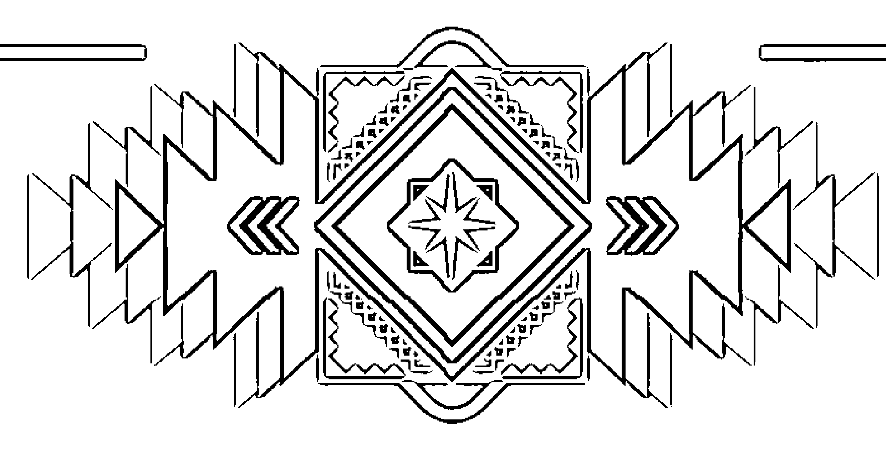
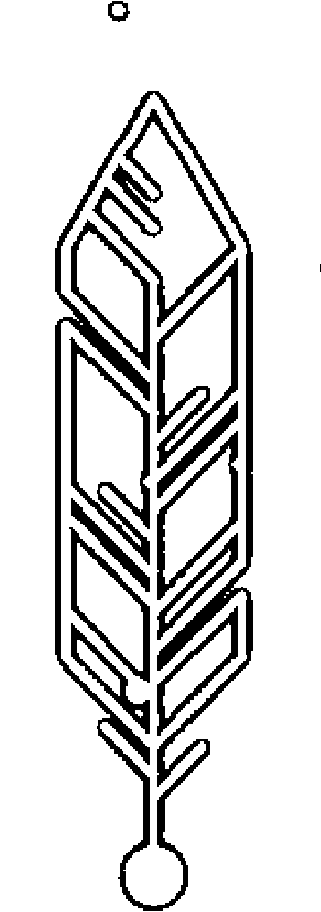
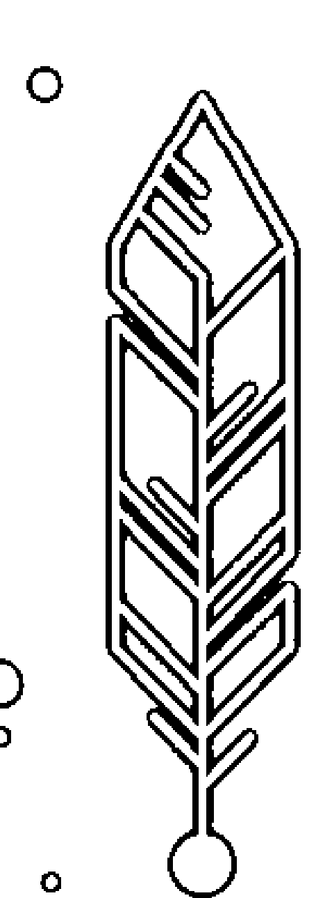
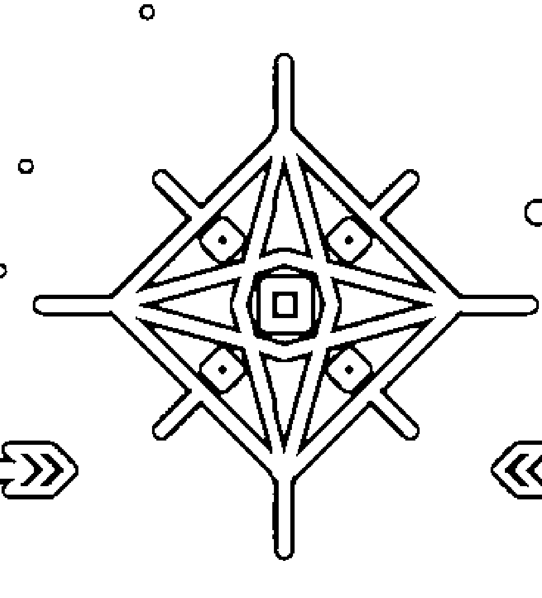
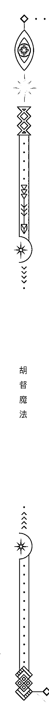

## 找到你的力量所在

## 胡督魔法

### 北美民间魔法指南

胡督·森·莫伊斯 Hoodoo Sen Moise —— 著   李育青 —— 審定   張笑晨 —— 譯

古老、强大、有效的召唤魔法
探索了胡督魔法的历史、文化、原则、基础和道德规范，胡督魔法师进行工作的实用指南

## WORKING CONJURE

### A Guide to Hoodoo Folk Magic

## 制作说明：

本书由《天使神秘学院》出重金从台湾购入的原版书籍扫描制作完成。为达到最好阅读效果，特地把书全部切开后，再经由专业扫描设备高精度扫描完成，并经过一张张的PS后期处理最终成书，其间花费大量的人力、物力以及时间，只为能给大家提供经济并优质的神秘学学习资料而努力。

本学院强力谴责某些机构和个人，把本学院花心血制作完成的电子书籍，包装后直接放在自家网上低价倾销的行为，以谋取不劳而获的经济利益。如果长此以往最终将无人愿意再为大家花心思制作电子书，那以后可能大家再无新书可读。

为让大家以后能够读到更多的好书，也为了本学院的良性发展。本学院恳请大家尽量做到如下几点：

- 一、尽量在天使神秘学院的官方网站购买电子书籍。

官网访问地址：[http://www.ac2011.cn](http://www.ac2011.cn)

短网址：ac2011.cn

网址含义：(Archangel College 成立时间：2011年)

- 二、在收到电子书后小范围传阅即可，千万不要公开传播，更别挂到网上低价销售。

同时为答谢广大支持者，学院电子书将做如下调整：

- 一、学院会把一些早已收回制作成本的电子书折价销售。

- 二、最新制作的电子书籍会开放打印功能，大家购买后有条件的可自行打印成书。

天使神秘学院
2022年1月

## 找到你的力量所在

## 胡督魔法

### 北美民间魔法指南

胡督·森·莫伊斯 Hoodoo Sen Moise——著

## WORKING CONJURE

### A Guide to Hoodoo Folk Magic

## 關於《胡督魔法》的讚譽

莫伊斯把他祖先的傳統教給了大家，和我們分享了他們的智慧。他的書根植於過去的歷史，動人地向我們講述了為什麼這些事物依然適用於今日的生活。
—— Christopher Penczak， Temple of Witchcraft 的聯合創始人

《胡督魔法》這本書充滿來自美國南部的優雅和美麗，並帶有一絲幽默感，就像和一位珍貴的朋友坐定享受咖啡和餡餅一樣：豐富而美味的食物，伴上愉快的對話和新得到的力量與活力。胡督·森·莫伊斯在這本書中所講的內容非常令人驚喜。這本書會是你所讀過最讓人滿足的書——它會永遠改變你的生活！
—— Dorithy Morrison， 《Everyday Magic》和《Utterly Wicked》的作者

胡督·森·莫伊斯這一生都致力於成為胡督魔法領域最傑出的人物之一。在《胡督魔法》這本精心編著並引人入勝的書中，莫伊斯分享了他非凡的知識、智慧和建議，讓每個人都能夠了解胡督魔法的基礎知識。更重要的，這是一本非常有靈性的書，會讓你與你大地上和靈性中的根源連結起來。
—— Rosemary Ellen Guiley， 《Guide to Psychic Protection》的作者

> > 《胡督魔法》是來自上帝的賜福。隨著非裔美國人和非洲僑民傳統日漸商品化，涉及我們日常實踐的簡單、直接和有效的書籍卻似乎很少見。胡督·森·莫伊斯剛好在實踐與足夠的理論之間取得平衡，為這樣的靈性工作創建了基礎。正如他所提醒我們的一樣，這並不是「靈性休閒」——而是傳承了祖先所給予我們的魔法工作，可療癒彼此，同時療癒整個世界。
> 
> —— Mambo Chita Tann，《Haitian Vodou》的作者

> > 我們很幸運能對傳統胡督召喚魔法有如此豐富的了解，正如你能在《胡督魔法》中所能找到的操作方式，這是一本能使胡督魔法傳統易於理解的工作手冊，同時也讓人了解真實的歷史。無論是對剛開始學習的新手還是富有經驗的魔法師，我都會推薦這本《胡督魔法》。為你們送上祝福。
> 
> —— Payshece Smith 神父，來自 Rev. Paysheence Spiritual Ministry

> > 任何對美國南方魔法感興趣的人來說，《胡督魔法》都是必需品。胡督·森·莫伊斯為我們帶來了數百年來在美國南部不斷演變又日久年深的教導。這本實用的好書教你如何在日常生活中使用胡督魔法，以及展現南方靈性的力量和毅力來發展、改變、轉換、顯化和療癒。胡督·森·莫伊斯為這些傳統完成了偉大著作，他把魔法和精神信仰編織在一起！
> 
> —— Brian Cain，亞歷山大巫術大祭司，國際女巫節和亡靈節的聯合主辦人

《胡督魔法》是我們一直在等待的民間魔法書！這本書充滿了專業知識、詳細說明、準確的歷史和從未公開過的強大胡督魔法秘密，這是你魔法書籍中的必備之書，因為它的準確及真實性是只有出生於胡督魔法家族的人才能夠證實的。本書由富有經驗並廣受尊敬的紐奧良胡督、伏督和召喚魔法師撰寫的，是關於胡督、召喚魔法和民間魔法的優秀書籍，既適合初學者，也適合經驗豐富的魔法師！

> —— Anna E. Parmelee · 紐奧良 Erzulie’s Voodoo 商店的創始人和所有者

《胡督魔法》是一本寫得很棒的書，裡面有大量關於非裔美國人召喚及胡督魔法傳統的寶貴資訊。這本書能夠啟發經驗豐富的魔法師，亦能為新手召喚魔法師打下堅實的基礎，指引他們走上正確的道路。胡督·莫伊斯全心全意地投入到這本書的寫作中，本書每一頁都清楚展現了這一點。

> —— Ms. Rain’s Conjure 商店的 Lelia Marino

我讀到莫伊斯的新書《胡督魔法》時非常激動。這本書清晰、直接，正是胡督和召喚魔法領域需要的內容。莫伊斯原汁原味地講述了這一切，並為這樣的傳統帶來深刻的見解，他講述了關於魔法的使用方式和歷史，消除了網絡上流傳的諸多不準確之處。如今終於有這樣一本書能夠清楚地引領那些希望了解更多胡督和胡督魔法的人。

> —— Candelo Kimbisa · Spiritualist 電台主持人 · Candelo’s Corner · 美國持續時間最長的帕洛 Mayombé 宗教脫口秀的主持人

胡督·森·莫伊斯擁有復興帳篷傳道士的熱情，他歡迎我們進入充滿靈性的胡督魔法世界，這是起源於非洲，從來自美洲大陸的草藥和植物根系中提取能量，幫助受壓迫民眾創造改變來面對征服者的魔法實踐。莫伊斯講述了關於這種神秘實踐的故事，並說明它如何演變成一種獨一無二的美國實踐文化——基督教、猶太教和美洲原住民的影響也都融入其中。但故事才剛剛開始。《胡督魔法》從本質上講是一本最實用的魔法書：其中包含了植物、草本和烈酒的力量以及許多能讓這些成分在日常生活中發揮作用，簡單卻有力的方法——我都迫不及待想要嘗試了!

> —— Christian Day · The Witches' Book of the Dead 的作者，國際女巫節和亡靈節的聯合主辦人

胡督·森·莫伊斯在這本書中召喚出了他最棒的魔法。《胡督魔法》對所有的魔法使用者都適用，不論你是新手還是精英。

> —— Lady Rhea · The Enchanted Candle 和 The Enchanted Formulary 的作者

## 找到你的力量所在

## 胡督魔法

### 北美民间魔法指南

## WORKING CONJURE

### A Guide to Hoodoo Folk Magic

## 目錄

- 介紹 …… 008

- 1 什麼是胡督魔法？ …… 016

- 2 胡督魔法的原則 …… 031

- 3 前人的基礎（祖先） …… 038

- 4 植物的力量 …… 052

- 5 泥土的力量 …… 067

- 6 胡督魔法中的平衡 …… 083

- 7 胡督魔法的正反兩面 …… 091

- 8 各種場所的靈能 …… 103

- 9 墓地中的胡督魔法 …… 111

- 10 運用魔法的正反兩面 …… 137

- 結語 …… 204

- 詞彙表 …… 208

## * 召喚魔法師的一天 *

在喬治亞州一個涼爽的秋日，樹葉逐漸從綠色變成橙色和金色，有些則泛起了棕色。樹木和周邊的景色看起來非常美麗，舒適的微風吹拂著落下的樹葉。
傍晚時分，太陽開始西沉，夜晚即將來臨。從光明到黑暗的強大轉變就要開始了——各種靈體也會在此時醒來。你瞧，白天屬於生者，而夜晚是逝者的。太陽落山後，一名穿著深色褲子和紅色襯衫的男子走進教堂旁邊的墓地。這個人左手拿著一支雪茄，右手拿著一瓶威士忌，頭上包裹著一塊藏青色的布。他就是召喚魔法師（Conjure man），或叫作胡督魔法師（Hoodoo man）。召喚魔法和胡督是同義詞，並且可以交替使用。
他走到墓地門口，確認了大門的位置。這個男人把手伸進口袋摸出了幾枚錢幣。他拿著錢幣，朝東、西、南與北四個方向致意，做了個小小的祈禱後，便丟在墓地門口。接著他拿著點

## 胡督魔法

男人從口袋掏出一把小鏟子，在十字路口挖了一個小洞。土地有點硬，所以挖掘過程很辛苦。這個洞大約有十英寸深，周長大約八英寸。挖了十分鐘後，這個洞完成了。

男人感謝祖先和大地能接受他剛完成的這一份工作。他又拿了幾枚錢幣（25美分、10美分、5美分和1美分），再次朝四個方向致意，然後扔進洞中。隨後，他將威士忌倒在洞中錢幣的頂部，供奉墓地中的靈體和大地。

供品置入大地後，男人從口袋裡掏出一個棕色的紙袋，袋中有幾樣物品。

一張被麻線包裹的年輕男子照片，麻線已經事先浸泡在一種叫作「分離油」的特製油中。

這個男人還在袋中放了「熱足粉」（配方見198頁），以及其他一些植物的根和符咒。

裝有這些東西的袋子被放進了洞裡。他召喚一些墓地中已與他有連結的靈體，請求它們幫助照片中的年輕人。召喚魔要求將照片中的男人與求助者了結關係，並驅使他離開。召喚魔法師在完成祈禱和聲明之後，就蓋住了洞口，並再次將威士忌倒在上面。

男人起身，將小鏟子放回他的口袋。隨後，他對墓地中前來幫助並聽取祈禱的靈體表達了感謝。他走回墓地的大門，謝過掌管大門的神靈，踏上了回家的路。

那天早些時候，一位年輕女子來拜訪了這個男人，她尋求他的幫助有一段時間了。她表達

## 胡督魔法

了與男友關係之間的恐懼和深切痛苦，形容他是虐待狂、控制欲強且大量酗酒。她講述了對他的害怕，因為他命令她「哪兒也不准去」，不然他會讓她再也無法離開，她只能在困惑中大哭。魔法師提出了他的建議，他們聊了很久。這位年輕女子知道他是個胡督魔法師，能夠運用魔法元素改變她目前的處境，因此請求他幫忙，將虐待她的男友從她的生活中擺脫。

## 介紹

### 胡督魔法的條件

在靈性領域或魔法工作中，胡督魔法有著巨大的影響力，能創造出其他方式不太可能帶來的改變，有某些部分的因素是胡督魔法的本質使然。胡督魔法源自於對停止壓迫的需求，亦即在奴隸主面前佔據優勢的一種方式，這樣人們就可以擺脫那些他們持續遭受的糟糕待遇，擺脫那些剝奪他們熟悉和所愛事物的人。植物根源的力量，加上祖先的神靈，形成了能帶來神奇變化的紐帶。當我提到根源時，我指的是植物的任何一部分，包括根、葉、莖、花，甚至是種子。在胡督魔法的用語中，根源這個詞被視為植物各個部分的總稱。

上述操作顯現了胡督魔法師的一天。這個故事充滿人們可能聽說過但不熟悉的作法。現在，我想解釋一下故事中的步驟，幫你了解這種強大的實踐和操作是如何完成的。

## 胡督魔法

首先從胡督魔法師在黃昏時分來到墓地開始。為何要在黃昏時開始？有句老話說，白晝為生者之時，黑夜為死者之境。這樣做的原因是因為黃昏代表有形和無形（指靈體）的轉變點。它就像是新娘戴的面紗。在揭開面紗之前，她的臉至少有幾分被遮蓋住，而靈體的存在則與這個原理相差不大。作為活著的生物，我們的身體有內在的生物時鐘。大多數時候，生物時鐘與白天黑夜的變換同步。白天，我們清醒、機敏，能夠完成任何需要的任務。而當夜幕降臨，我們會感到疲憊，身體也開始需要休息。我們已經從工作時間轉換到需要回歸繭中的時間。那個繭就是睡眠、休息，為第二天恢復精力。對大多數活著的人來說，我們俗稱的面紗是在晚上戴上，白天取下。當然，我們知道有些人會在夜間活動，並且比在白天行動發揮更好。作為人類，我們非常多樣化。然而，這就是生者與死者普遍的運作方式，就像我當初學到的一樣。

另一方面，靈體（死者）具有與此面紗相反的運作過程。大多數情況下，它們白天蒙著面紗，並在夜晚揭開。造成這種情況的一個重要原因是它們不居於身體內，其醒來的時間與我們正好相反。這裡有一件很重要的事，就是要注意到物質世界和靈體世界是兩面相互平行但方向相反的反光鏡。當我們睡覺時，它們起床；當我們工作時，它們休息。

召喚魔法師到墓地大門時，會在門口獻祭供品，這就像去敲別人家的門一樣。供品非常重要，因為它們能夠帶來平衡。如果被給予了某些東西，那麼某些東西就會被取走；如果某些東西

## 胡督魔法

西被取走，那麽就會有某些東西被給予。你瞧，魔法師要去墓地與死者完成屬靈的工作，就必須為此付出酬勞。提供供品有幾個目的，首先是為即將進行的工作付費，第二就是激勵和鼓舞與你共同工作的靈體。關於激勵，我的意思是鼓勵靈體——通過念禱詞，說感恩的話和獻祭等各種方式。

進入墓地後，召喚魔法師開始對來到面前的靈體表示感謝。他感謝它們曾經付出的犧牲，因此得以在此時站在處，同時也感謝大地，因其擁有巨大的魔力，所轉化和創造出的改變既能夠現在靈性世界，也能反映在物質世界。感恩是一種激勵和召喚靈體的形式，使我們得以獲得關注並得到幫助。當他開始挖洞的時候，也可以說他是在創造子宮，使魔法能夠在其中孕育。

土壤或塵土既具創造性又具破壞力、有能量和靈性。土壤的來源也預示著它們的用途。我們將在第5章更詳細地討論這一點，但要知道塵土本身是強大的魔法原料，能夠將魔法操作從靈性層面轉化到物質層面。

當召喚魔法師挖好洞之後，他隨身帶著一個袋子，裡面有幾件物品——是某人非常私人的物品。你瞧，胡督魔法的基礎之一就是將魔法操作連接上某人（或多個人），再將此人連接上魔法操作。這種作法是通過代表此人身上一部分的物品實現的。一張照片、頭髮、指甲等等，都能代表一個人的本質，並以魔法操作連結到此人，無論是何種魔法操作。個人關注、連結，甚

## 胡督魔法

至像信物這樣的術語有時候也會用於描述這些物品，具體用法取決於你來自哪裡。

這位魔法師的方法是在物質世界中實行他想要體現在靈性層面上的事物。正如我之前對兩面鏡子的解釋那樣，物質世界完成的事情會反映在靈性世界，反之亦然。魔法操作是讓物質和靈性互相匹配與反射，這也是胡督魔法中最主要的部分。

- * 綁照片的繩子上浸有「分離油」，使他遠離她。
* 操作中加入了「熱足粉」，能夠使他徹底消失。
* 隨後胡督魔法師在墓地的十字路口處燒掉裝有這些物品的袋子，居於此地的所有靈體幫助下，受約束者的每一條路或每一個機會都將關閉。

- * 胡督魔法師「糾綁」了照片中的人，以阻止（約束）其做出任何對胡督魔法師的客戶不利之事。

胡督魔法師的操作完成之後，他會表示感謝（即再次激勵墓地的靈體），並將魔法留在大地的子宮之中使其孕育，這樣就能改變並實現目標。

在本書中，我們將會討論當代胡督魔法的原理。你將學到胡督魔法的基礎實踐知識，這會為植物根部中的靈體及其所擁有的魔力建立關係並做好準備。胡督魔法的強大根源來自大地和其中的靈體，這對於成功平衡物質和靈性世界非常重要，如果你沒有根基，能夠在兩界之間

## 介紹

顯化的魔法操作就無處放置。
這本書包含的魔法配方和操作方法，足以讓你開始這段旅程、體驗這些文化，見證這種強大魔法實踐所包含的潛在力量。使用根部的知識是每個召喚魔法師都必須了解的，它來自於理解植物根源的靈能、祖先，以及關於兩個互相反射的世界的基本原理。

在當今世界中，我們會遇到各種各樣的人，他們修煉各種各樣的事物，並有著不同的觀點，這本書則反映了我自己作為胡督魔法師的觀點。

在過去的三十五年裡，我的生活都奉獻給了屬靈的事工、研究植物和魔法工作。魔法工作支持我，打開了各種機會的大門，有時也關閉它們，魔法工作還激發了我的成長。畢竟，這就是胡督魔法的意義所在。我會向你展示魔法工作兩方面的平衡 —— 也就是正面和負面魔法操作，並向你展示這一切的必要性，同時魔法操作中鮮為人知的部分，我也會與大家公開討論其重要性。在這樣的神奇操作中，你是如何進行以帶來改變非常重要。我們會介紹運用魔法兩面性的方法，使之成為能在日常生活中使用的工具。大自然本身就體現了事物的兩面性。暴雨帶來植物所需要的水分，也會造成破壞性的洪水。正如生活中有各種各樣的起起落落，我們的魔法操作亦可有效地用於應對和挑戰。

## 胡督魔法

平衡一直是胡督魔法的基石。無論是用於祝福、療癒、欺騙或詛咒，魔法兩面性的平衡都
會體現出來，提供保持平衡的方法。
變化可以是好是壞，或是中性的。無論何種變化，都會帶來成長的機會，同時讓你的魔法
工作更加精進。所以，讓我們成長、學習，並開始了解胡督魔法吧！

## -1-

## 什么是胡督魔法？

## 胡督魔法

在美國的許多地方，尤其是南部，你能聽到不少像胡督、召喚魔法、祖源魔法或根源魔法，或是「操作」這樣的術語，用於描述以某種方式帶來變化的魔法實踐。這些術語現在已經成為彼此的同義詞。從此處開始，我們將會使用「胡督魔法」一詞來描述這種魔法實踐。那麼，胡督魔法是什麼？簡而言之，胡督魔法是一種源自非裔美國人的魔法實踐，它受到來自非洲靈性實踐的影響，也受到基督教、猶太神秘主義、美洲原住民的實踐以及歐洲民間魔法的影響。然而，最主要的影響來自於中非和西非的精神信仰。

在跨大西洋奴隸貿易期間，許多非洲人被迫離開家園、家人、精神信仰和所熟知的一切，他們被帶到加勒比海地區及美洲。這些奴隸主要來自非洲西部和中部地區——如剛果、貝南和奈及利亞。他們不同的宗教和精神信仰對加勒比海地區和美洲產生了巨大影響。在美國，奴隸貿易的暴行一直持續到一八〇八年，直到從非洲進口奴隸被法律禁止。當然，這並不意味著走私奴隸的行為自此不再發生。天主教和新教的教會都認為非洲的宗教、靈性傳承和信仰系統是邪惡、不道德甚至是凶殘的。人們猜想惡魔崇拜、活人祭祀和其他各種不道德行為都屬於非洲宗教實踐的一部分，因此這些偉大卻又被奴役的非洲人，被禁止以自身文化的方式來紀念和敬奉他們的神靈。相反，他們被迫接受基督教，以此支持或是增強奴隸主的控制。你瞧，如果他們也敬奉奴隸主的神明，奴隸主的控制就能夠更緊密，如此一來，他們逃跑或反抗的嘗試就會減少。

### 1 什麼是胡督魔法？

在這種情況下，你可能能夠理解這種悲慘狀況所帶來的絕望。然而，一些被奴役的人的確找到了戰勝的方法。有些人秘密地繼續他們的信仰，如此非常危險，因為如果被抓住，後果須面臨毆打、鞭打、殺害、強姦、被迫對同為奴隸的親人施以人身傷害，還會被奪走他們本來就少得可憐的食物。主要是因為恐懼這些後果，他們才無法反抗自己可怕的境遇。

然而，有些人更具創新性——他們使奴隸主相信他們在信奉基督教，而事實上他們只是把它當掩飾，盡可能地繼續自己的信仰。他們會堅守自己文化的精神信仰，戰勝持續不斷且幾乎無法承受的負擔和壓迫。正是從這一點，我們發現基督教對現今所了解的胡督魔法實踐造成了影響。

胡督魔法誕生於美國，因應克服壓迫、創造機會，和獲得向壓迫者豎起中指的能力而生。這是一種對奴隸主的反抗行為，也是對那些奴役他人且實施暴行的人之反叛方式。這樣的魔法操作是迫切需要的，而這些奴隸及其祖先的靈體逐漸演變成了胡督魔法——也是最強大的靈性傳承和魔法實踐之一。

胡督魔法的工作方式深受剛果地區宗教信仰的影響，它們也是胡督魔法的主要根源之一。靈體居住在樹木、枝葉、根和大地中，它們具有促使改變的力量，這樣的想法成為我們當今所了解的胡督魔法結構中，重要的組成部分。

此處所提到的變化意指一個領域或世界出現在另一個領域之中。我們通過魔法操作來創造新的現實事物。例如，你需要操作或是療癒的現實情況在物質世界很明顯，卻不一定在靈性世界有所體現。植物根源的靈體在兩個世界之間都能發揮作用，故而也都能有所顯化。在這種情況下，你正尋求的療癒或是需要操作之處不僅會為你敞開大門，而且為獲得這些東西所付出的努力、取得的成果，也會帶來實質驗證，並在現實世界為人所知。當靈性世界和物質世界相互映照時，就能夠得到魔法的效果，你所患的疾病將不再困擾你。簡單來講，這就是內在工作的外在顯化，也是外在工作的內在顯化。這是雙方、兩個世界和兩個現實的平衡。現實世界的轉變是透過這些能幫助你達到預期目標的靈體或靈能共同操作來實現的。正是利用這些上帝賦予我們的植物根源所包含的自然原始力量，我們才能開展自己的精神修養，向前邁進和發展，創造更美好的日常生活。植物的力量是魔法始源的開端之一。植物的精靈會帶來神聖的感覺，這些精靈和我們一起進行魔法操作，促使事情成功，最終以各種各樣的方式創造改變。例如，假設不管你在何處轉彎，道路都被堵住了，就像胡督魔法的語言中所說的，沒有什麼「為你敞開」一樣。這可能是因為十字路口，也就是機會和門路都對你關閉了。

為什麼是十字路口？因為十字路口是擁有力量的地方，物質領域和靈性領域在那裡相匯合。在那裡，我們的道路就在眼前，假使道路對我們關閉，我們絕對可以看到四周的阻礙。所以，你得把一些供品帶到十字路口，運用魔法操作使它打開。

你可以拿一個椰子，放一些頭髮、指甲或者剪下來的腳趾甲，連同一張照片、一些紅棕櫚油還有一些糖放在裡面，然後把它帶到十字路口。你可以在十字路口奉上威士忌、蘭姆酒及香菸，同時請居住在那裡的靈體——其實會有很多靈體——打開通路。與此同時你也要在地上挖一個洞來埋掉你的魔法。當這些都完成之後，十字路口，亦即你的道路會再次打開。這只是在該情況下可以使用的魔法操作之一，我想要表明的是，這些根、泥土和樹葉等等，都具有在靈性與物質世界成功顯化的力量。這一基本原則是我們胡督魔法師所堅持也因而得以有效地使用魔法之因。

### 胡督魔法的影響

胡督魔法在各個地區都有所不同，在每個家庭中也不同。這是為什麼呢？簡單地說，不同地區會受到不同文化的影響。有些地區擁有更易獲得的植物，當地的家庭也有影響力，胡督魔法會逐漸吸收在地的民間習俗。

在南部，你會發現人們從後到前打掃房屋，不僅是為了清潔地板，也是要淨化他們的房屋，你可能也發現了有些人會在房屋的角落放一枚鐵道釘來當作保護。放置象徵能夠穩定或是加固房子的物品，可防止負面能量或是邪惡力量進入房屋。小時候，我們家門口會放一杯水，裡面裝著被稱為邪眼的玻璃球。我們每週會點燃一支蠟燭並放在玻璃杯旁邊，因為人們認為邪眼在水下無法生存。如果有人試圖使用邪眼來攻擊你，門旁的玻璃杯就會遭受重擊。你瞧，這些魔法實踐在家庭流傳下來的故事裡錯綜複雜，最終成為如今胡督魔法的重要組成。

胡督魔法本身既不是宗教也不是靈性道路，而是為了改變而進行的魔法／靈能操作。

無論這種情況是感情關係、金錢、工作、壓力、療癒還是淨化，胡督魔法的基本原則就是做出能夠改變現況的操作。

如今，胡督魔法的操作已經能夠與當地的靈性實踐結合使用，並且在某些地區有了大量這樣的作法。比如，在紐奧良，城裡的人大多是羅馬天主教徒，天主教會是這座城市精神信仰的很大一部分。許多胡督魔法師都會參加每週一次的彌撒。但你會發現胡督魔法與天主教聖徒的結合在紐奧良非常普遍。以聖艾克斯普提特（St. Expedite）為例，也可叫作聖迅捷。在生活中，「Expedite」是一名羅馬士兵，據說他歸附於基督教，在西元三〇三年被斬首。他以在匆忙之中完成任務而著名。因此，當人們由於時間限制或者其他緊急情況而急需獲得結果時，他就是人們尋求幫助的聖徒。不管信徒隸屬于天主教信仰與否，聖艾克斯普提特都是深受愛戴且適合共事的人。信仰天主教的草藥魔法師會去找他，進行獻祭然後完成操作，如此事情就會迅速推進，人情也會盡快得到回應。

通常，與聖艾克斯普提特共事需要與他達成交易。這個交易就是一旦他應允了你的祈願，你就得奉上供品。例如，你急需錢來支付帳單，可以向他祈禱並告訴他，如果快速得到應允，你必須奉上供品，比如磅蛋糕、水、蠟燭（紅色、白色或黃色）和花。接下來，重要的事就是履行承諾。當你答應了靈與聖徒，或者任何有所請求的對象，你一定要遵守諾言。請記住，如果你們能夠為你帶來某樣東西，必然也能輕鬆將其拿走。而且他們這樣做完全合理，因為你沒有履行你那部分的約定。

幾年前，我在紐奧良的一座天主教堂裡四處張望，我看到了美麗的雕像、彩色玻璃和祭壇的裝飾品，對這個地方感到敬畏。我碰巧來到能夠為人們點燃祈願蠟燭的地方，這確實是一幅動人的景象。所有的蠟燭都因各種禱告和祈願而點燃，全都放置在一個漂亮的架子上。

當我正在欣賞架子和布景的燈光時，我注意到蠟燭架下面有一個東西，正藏在其中一支鐵柱後面。那是一個魔咒袋——一個小小的符咒袋——上面包裹著聖艾克斯普提特祈禱卡。無論胡督魔法師所做的魔法操作是什麼，它都被放置在了教堂佈置的燈光下。當然，我並沒有觸摸這個正在進行中的魔法物品。那會是失禮的作法。然而，我確實對這樣將兩種不同道路相結合的魔法操作表達了極大的尊敬。這是胡督魔法和天主教相互合作的體現——將信仰和魔法操作共同運用來達成期望的目標。植物魔法與聖徒的力量在此協同合作。這樣的操作正好是信仰的內在工作與胡督魔法的外在工作共同運作的良性例證。在新教和基督教佔據主導地位的地區，你也能發現胡督魔法師的痕跡。請記得，胡督魔法本身就包含與植物的強大關係，它與信仰或是靈性道路共同發揮作用，將內在信仰與外在操作相結合，而產生影響或是擴展。例如，舊約就在胡督魔法中被廣泛使用。不管人們願不願意，基督教都對胡督魔法有著深遠的影響。比如，創世紀、詩篇、箴言和聖經中的其他書卷，都蘊含著關於能量的奧秘。這些書中關於能量的內容主要由幾件事組成。有些咒語或魔法工作——即能夠帶來神奇改變的魔法原理和能夠使物質層面改變的強大靈性工作——其實也包含在我們常使用的聖經中。我所說的聖經書卷，指的就是聖經本身。比如創世紀、詩篇、箴言，還有以賽亞書，它們都是組成大書的小書卷。那麼，是不是只有基督教的影響，才是我們如今所了解的胡督魔法基礎呢？絕對不是。胡督魔法的根基基地——非洲依然是其主要起源。

### 1 什麼是胡督魔法？

剛果人、約魯巴人和豐族人的影響主導了這種強大魔法實踐領域的操作方式。非洲的靈性實踐從過去到現在都以大自然和祖先為基礎，這對魔法操作的力量有著極度重要的意義。

讓我們以布娃娃為例，它也叫巫毒娃娃。這樣的布娃娃是用胡督魔法師所在地區的典型物品製成的。布娃娃可以用木棍和西班牙鬚草（俗稱空氣鳳梨）製作，然後用布料包裹起來形成身體，也可以用麻線和棉花做成。製作布娃娃的方法眾多，其中有許多沿用至今。

布娃娃的目的之一是透過私人物品與某人建立連結，然後對此人進行魔法操作，無論是正面還是負面，私人物品包含頭髮、血液或剪下的指甲等等。這樣的布娃娃可以用來承載魔法操作的靈體，通常建立在契約的基礎上，讓布娃娃作為容器使靈體能夠進行魔法操作。

在剛果，有一座名為「Nkisi」的大型木製雕像。在這些雕像的腹部或頭部後面，通常會有一個挖空的區域，用來放置特殊的植物、骨頭和粉末，供棲居在裡面的靈體使用，還會將釘子釘入其中以激活這個雕像——或者說大型木娃娃，你想要這麼稱呼它也可以。把釘子釘入Nkisi是為了喚醒居住其中的靈體並且把任務賦予它們。在此，我們可以發現這和美國的巫毒娃娃有很多共性，我們也能看到釘入Nkisi的釘子和巫毒娃娃身上的大頭針有類似之處。

當受奴役的剛果人被運往美洲時，由於種種原因，他們沒辦法製作Nkisi雕像。首先，他們沒有雕刻所需的材料。其次，雕像的外觀和巨大的尺寸會使它們非常顯眼，可能會給他們帶來前文提到過的可怕後果，於是便需要一個替代方案。因此，更小、更容易隱藏，且依然有效的布娃娃就產生了。

正如你所看到的這樣，來自各種文化的靈性影響，在如今胡督魔法的演變中皆發揮了重要作用。甚至可以說，這種魔法實踐在許多家庭中都發揮著作用。

### 胡督魔法師對胡督魔法的解釋

當我們提到胡督魔法時，會聯想到幾件事。腦海中經常會出現「下詛咒」或者「耍詭計」這樣的術語，這些術語能夠很好地說明胡督魔法的性質和實用的一面。

胡督魔法是透過與植物建立關係而有效地完成魔法操作。與植物有關係嗎？沒錯。你瞧，胡督魔法的一個原則就是，上帝在地球上放置的每一種植物和動物都是為了讓人類使用並受益——不僅是為人類提供食物，也是為了魔法操作。每一種植物上都帶有能夠與大地連結的靈能，並且具有進行某種特定魔法操作的特點。

> 以下是聖經中關於植物和動物的兩處引文，第一段來自詩篇104：

### 1 什麼是胡督魔法？

我的心哪，你要稱頌耶和華！耶和華我的神啊，你為至大！你以尊榮威嚴為衣服。

披上亮光，如披外袍，鋪張穹蒼，如鋪幔子。

在水中立樓閣的棟梁，用雲彩為車輦，藉著風的翅膀而行。

以風為使者，以火焰為僕役。

將地立在根基上，使地永不動搖。

你用深水淹蓋地面，猶如衣裳；諸水高過山嶺。

你的斥責一發，水便奔逃；你的雷聲一發，水便奔流。

諸山升上，諸谷沉下，歸你為他所安定之地。

你定了界限，使水不能過去，不再轉回遮蓋地面。

耶和華使泉源湧在山谷，流在山間。

使野地的走獸有水喝，野驢得解其渴。

天上的飛鳥在傍水住宿，在樹枝上啼叫。

他從樓閣中澆灌山嶺；因他作為的功效，地就豐足。

他使草生長，給六畜吃，使菜蔬發長，供給人用，使人從地裡能得食物。

又得酒能悅人心，得油能潤人面，得糧能養人心。

16. 佳美的樹木，就是利巴嫩的香柏樹，是耶和華所栽種的，都滿了汁漿。

17. 雀鳥在其上築巢；至於鶴，松樹是牠的房屋。

18. 高山為野山羊的住所；巖石為沙番的藏處。

19. 祢安置月亮為定節令；日頭自知沉落。

20. 祢造黑暗為夜，林中的百獸就傾巢而出。

21. 少壯獅子吼叫，獵食，向神尋求食物。

22. 日頭一出，獸便躲避，臥在洞裡。

23. 人出去做工，勞碌直到晚上。

24. 耶和華啊，祢所造的何其多！都是祢用智慧造成的；遍地滿了祢的豐富。

25. 那裡有海，又大又廣；其中有無數的動物，大小活物都有。

26. 那裡有船行走，有祢所造的鱷魚游泳在其中。

27. 這都仰望祢按時給他食物。

28. 祢給他們，他們便拾起來；祢張手，他們飽得美食。

29. 祢掩面，他們便驚惶；祢收回他們的氣，他們便死亡，歸於塵土。

30. 祢發出祢的靈，他們便受造；祢使地面煥然一新。

### 1 什麼是胡督魔法？

- 31. 願耶和華的榮耀存到永遠！願耶和華喜悅自己所造的！
- 32. 他看地，地便震動；他摸山，山就冒煙。
- 33. 我要一生向耶和華唱詩！我還活的時候，要向我神歌頌！
- 34. 願他以我的默念為甘甜！我要因耶和華歡喜！
- 35. 願罪人從世上消滅！願惡人歸於無！我的心哪，要稱頌耶和華！你們要讚美耶和華！

### 第二段 創世紀 1：29 — 31

- 29. 神說，看哪，我將遍地上一切以種子結出的菜與樹上所結的果實全賜給你們作為食糧。
- 30. 至於地上的走獸、空中的飛鳥與爬在地上的各式生命，我將青草賜給他們作食物。事
- 31. 神看祂一切所造的都甚好。有晚上，有早晨，是第六日。
- 就這樣成了。

例如，我們可以細想一下當歸根。當歸是一種非常強大的植物，擁有遮蔽和保護的作用。它就像走在你前面的守衛者，因此經常被用於保護魔法和淨化魔法。當歸的精靈是傾向於履行保衛者或者守護天使職責的精靈。

當我們與這些植物的精靈建立關係的同時，也建立了雙方之間的約定：
- 我們供奉植物的精靈
- 精靈為我們執行魔法工作

平衡在植物魔法中至關重要。事物之間的平衡是得以轉化並完成魔法工作的方式及原因。當你使用植物進行魔法操作時，就必須為植物所做的工作付出酬勞。世界上沒有什麼是免費的，包括植物魔法也是如此，一如我們對植物祈願，需供奉蘭姆酒或威士忌、香菸、歌曲、金錢和光亮（點燃的蠟燭）等，這些都是魔法操作中給予和接受的一部分。如果我因為胃痛而去看醫生，想讓自己感覺舒服些，就需要付錢給醫生讓他檢查和診斷我的疾病，因為他不會僅出於善意就免費幫我看病。這個相同的原理也適用於植物魔法，精靈也需要得到酬勞。祈願時給予供品，植物的精靈才會進行並且完成魔法。與植物建立的關係能夠為強大的魔法打開大門。正如我們與祖先、指導靈及神明等建立關係一樣，對植物也適用，這種連結形成的魔法可說是相同或相似。你對植物精靈說話，對其表示敬意，並供奉它們。當你做這些時，你會發現它們將帶來回饋。魔法的契約就自此開始。

了解魔法最重要的一環就是理解文化影響、奴隸制度、反抗壓迫、民間魔法以及口耳相傳的故事，這些在胡督魔法的傳統及其神奇力量中發揮著重要作用。把前人所流傳下來的魔法和與植物的緊密連繫相結合，能夠造就一位在魔法領域不可動搖，在靈性工作領域堅定不移的召喚魔法師。這就是胡督魔法的真諦，前人的力量、你與植物建立的連繫，都會成為提供你權威和力量的基礎。

## 2 胡督魔法的原則

### 胡督魔法師的生活方式

很多人都認為胡督魔法是在你有需要或想要時才使用的魔法，我不同意這種說法。胡督魔法操作的誕生是為了克服奴隸制的壓迫，這是奴隸為了扭轉劣勢，並至少在某種程度上，能從奴隸主那裡奪回被剝奪事物的一種方式。

胡督魔法不只是一種手段，也是一種能夠克服阻礙且持續使我們日常的人生道路更加暢通的文化。我們做事通常不會去思考箇中意義。例如，假如我在掃地時不小心用掃帚掃過了我的腳，便會不自覺地將掃帚抬起來並在上面吐口水。為什麼？用掃帚掃過腳可能會把好運和福氣帶走，在某種程度上可能會使這一天變得困難重重。另一個例子是，每次我去墓地時，總會在大門或入口處扔下錢幣。這都是不假思索之舉，但我知道，當我拜訪別人家時從不空手而去。

這只是一些簡單的例證，說明了我們在靈性世界和物質世界的生活與行為方式。

胡督魔法蘊含了強大的文化，在這種文化中，對自己不利或有害事件的發生是令人難以接受的。正是因為有了這樣的文化，我們才不允許自己被打敗，也不允許失敗的可能性。

### 創造神奇的改變

胡督魔法中最有效力的地點之一是十字路口。十字路口是靈性世界和物質世界交匯之處。只有在十字路口，你才能了解到兩個世界，同時於此地完成強大的魔法操作。胡督魔法的一個基本原則就是相互融合。如同互相映射的兩面鏡子，在靈性世界中的魔法能夠反射到物質世界上，同樣地，物質世界的行為也能反映到靈性層面。每種魔法顯化都有自己的獨到之處，但要明白的是，在這個物質世界所做的事也能夠在靈性世界顯化，反之亦然。使用有形的事物，比如植物，來完成能夠達成神奇變化的魔法就表明了這個道理。例如，消除厄運的魔法能夠通過在特定的時間泡澡來完成。在物質世界的泡澡行為會被發送（或反映）到靈性世界，由此消除厄運的過程就開始顯化。兩界共同作用便可實現改變，移除你不再需要的事物。一切都與平衡有關。胡督魔法沒有善惡之分，自有其必要性。我們不會以非黑即白的眼光來看待事物。環境、狀況和情境通過這種方式被審視並操作，平衡進而得以維持。如果魔法工作具有正當理由，那麼它就是合理的；如果不合理，則會在靈性層面帶來後果。如果無法保持平衡，那麼混亂就會開始蔓延。因此我們會做必要的事來保持秩序。這也是我們同時運用魔法的正反兩面來進行操作的原因。胡督魔法的操作從來都不是只關乎愛與光明面。每一位魔法師的職責都是在需要之處保持平衡，因此需要運用魔法的正反兩面來完成。有時我們必須做些令人不快的事，這些事不會被稱作「好事」，然而這不能否定這些事必須完成的事實。請再次想想祖先是如何克服被迫忍受的狀況和環境的。如果當時一切都愉悅有趣的話，他們也不會為了逃脫眼前的魔掌而做出那些不得不做之事。

## 靈體

胡督魔法的基石之一是祖先，是祖先為我們每個人開闢了道路，讓我們走到今天這一步。他們以鮮血、汗水和眼淚，為我們進行這些魔法並為各種情形和環境創造出改變而奠定了基礎。與前人建立起關係的重要之處，就是打開通往強大靈性工作的大門。

你的祖先擁有無窮的智慧，能夠為你的魔法操作指明方向。他們所做的犧牲都能帶領你成長、保護你有力地進行魔法工作，並構建出任何風暴都不會動搖的靈性基礎。

胡督魔法的另一個基石就是植物本身。每一種植物（根、草本、樹皮，還有植物的其他部分）都蘊含著靈能。植物的靈能能賦予它完成某些特定靈性操作的能力，具體取決於植物本身。

## 胡督魔法

植物，因它们皆有自己的先天特质。有些可带来成功、提供保护或进行净化等等，有些则在邪术、厄运或诅咒等方面非常有效。了解植物是进行这项魔法工作的关键。在胡督魔法中，我们坚守一个真理，即上帝将所有的植物放置在大地上供我们使用，既能作为食物，也能用于灵性工作。与灵体一起进行魔法工作时，无论是你的祖先还是植物精灵，最重要的是应尊重它们、向它们表示敬意并与之建立关系，这能为你的魔法操作带来效力。因此，我们总会为祖先和植物精灵奉献供品。如果获得了一些东西，就会有另一些东西被拿走；如果有东西被拿走，那么就会有另一些东西被寄予。这让一切保持平衡，应该被视作支付工作完成的酬劳。例如，如果你去剪发，就理应为理发师或造型师的劳动付钱。这再正常不过了！同样，祖先及植物的灵体需要接受供养才能完成交付给它们的工作。我们爱着它们，它们也爱着我们。我们为它们工作，它们也为我们工作。我们给它们供品，它们为我们带来原本我们不具备的保护、智慧、见解和知识。祷告和祈愿也非常重要。如果你不祈祷，它们怎么会知道我们要请它们做什么？如果你不用启发性的语言来激励它们，它们怎么会想为你工作？感恩它们做过和即将要做的一切，如此简单的事情自有其效力，足以在整个胡督魔法工作中增加你自己的力量。

### 胡督魔法的主要组成部分

在胡督魔法中，有一些物品和材料是你必须自备的，亦即我们魔法中的主要成分，几乎所有操作中都会用到。

蜡烛必须存在的原因非常简单。蜡烛能够为即将发生的一切照亮道路，如同悬崖上的灯塔。灯塔为船只引领方向，把它们带领到自己身边。在魔法工作中，蜡烛的作用也是如此——它让灵体更加靠近，使魔法得以完成，除非这个蜡烛被设定要做不同性质的工作，蜡烛对灵体来说也是一种供养。

水在灵体的魔法工作中也很重要。它是行动的一种方式，是灵体的通道，它的存在是为了促成魔法工作。可以说，水能够打开让灵体通过的大门，以便完成魔法。正是由于这个原因，在进行魔法的地方放置一杯水有重要的意义。还有一件事就是对于植物的选择。你会发现房子四周生长了很多东西，也会看到装有干燥植物的罐子或者袋子。很多魔法都是从植物开始的，也正是通过植物我们才能持续进行这些工作。植物是魔法粉末和魔法油的成分，能够为需要去除、强制或放大的情况带来神奇的改变。

在胡督魔法中，非常重要的一点就是要确保与操作魔法的个体或被施加魔法的个体建立连结。这样的连结是透过私人物品建立的，例如头发、指甲、血液、精液或未洗的衣服等等。这些东西包含了此人的本质，正因如此，使用它们就相当于这个人站在你面前一样。也可以使用照片和姓名纸（写有此人全名的纸片），但与此人真正的私人物品相比，可能没有那么强的效力。

总而言之，这样的魔法操作需要亲自动手非常实用，且不畏避任何能使情况改变而必须达成的操作。胡督魔法将这些事物连接在一起从而创造改变。这种魔法的操作方式拥有巨大的力量，并且有能力促进强大的灵性工作。

如果你行使魔法操作时为你与灵体的关系感到可敬且光彩，那么它们也会回报你。我所提及的光彩，指的是无论你做什么，都要带着正直和平衡的态度去完成。万事万物都必须保持平衡，而唯一能保持平衡的方式就是了解如何运用魔法的正反两面。

### 前人的基础（祖先）

每个家都需要打好地基才能建立。没有地基，房子就会摇摇欲坠，即使遇到最轻微的晃动也会倒塌。暴风雨来临时，缺乏稳固根基的房子很容易被打倒摧毁。试想如果你在沙子上建立房子，房子能保存多久呢？它倒塌并被大地吞噬需要多少时间呢？地基的存在对于建造成功且持久的房子至为重要。

祖先就是我们的根基，正是有了他们的鲜血、汗水、流泪和牺牲，你我才能够走到今天这一步。你瞧，他们经历战斗，清除了道路上的障碍，为新世代开辟了道路。他们所忍受的痛苦、克服的困难、面临的挑战和付出的牺牲，使我们有了继续开拓道路的机会。我所指的道路是尊重你的灵体和家庭，做正确事情的道路，亦即智慧之路、魔法之路与进步之路。随着祖先向前发展，灵体也在帮助我们前行。你想知道如何为灵体服务吗？就从你的祖先开始。

### 为祖先服事

与祖先建立关系是你可以做到且最重要的事情之一。了解你来自何处，了解族人如何辛苦奋斗与他们如何克服困难，可以为你带来力量。若将相同的原则运用在你自己的生活中，这也会成为你魔法工作中的强大工具，为魔法带来力量，它会为将要发生的事情打开大门。你需要知道自己来自何处，才能明白你将前往何方。

在我小时候，确切来说是四岁的时候，在社区公园的一个游乐场上玩耍。我在滑梯上不断反复爬上又滑下，度过了快乐的时光。爬到高处（在四岁孩子的脑海里，十二英尺就像到了天堂一样）再滑下来的感觉在世上真是绝无仅有！在我向下滑的时候，我开始听到一些声音，这是我之前从没听过的音乐。我把头转向音乐传来的方向，看到一个女人站在滑梯附近。她手里拿着一个小手鼓，正发出美妙的声音！我滑下滑梯之后，站起来向她走去。我不住地看着她，因为我被这声音和她脸上的神情迷住了。我好像迷失在眼前事物的美丽中。

她用明亮得几乎要燃烧起来的眼睛看着我，其笑容像祖母的怀抱。然后她告诉我，她是我的族人之一，是我的祖先，她也告诉我她的名字，还说她一直都和我在一起，我血液中的力量与她的是相同的。如今，在我看来，一个典型的四岁小孩可能完全听不懂，还可能对眼前的事情感到害怕。但另一方面，我并不是典型的四岁小孩。我感到了前所未有的奇异舒适感和安全感。毕竟她是我的朋友。

她继续告诉我说，永远都要记得尊重我的出身，以我的血统为荣，这将为我以后的道路奠定基础。虽然我并不完全明白这意味着什么，但我知道这很重要。之后，坐在附近一张木凳上看我玩耍的祖父叫我的名字。我转过头去回应他，而当我再转过头去的时候，那个女人就像一道闪电一样消逝了。我把她的话告诉祖父，他注视着我并对我说，他知道她是谁，还有她是我的保护者之一。他还说她来找我是因为我的人生有着一个目的，以及我们的祖先必须永远排在第一位，因为他们是我们的根基。

正是在那时，我开始承认、尊重我的祖先，并开始与他们交谈。在这个过程中，我与祖先建立了连结，也奠定了不可动摇的基础。他们不只存在于我的魔法中，还存在于我生活的方方面面。那么，我们如何开始为祖先服务呢？我们要如何建立这种关系和基础？接下来我会一一告诉你。

祖先的灵体与其在世时的样子非常相像，如果我们开始接收关于他们的讯息，会发现他们有自己的观点、感受，当然也拥有智慧和方向。祖先是我们的伟大保护者，在我看来，他们也是我们能拥有的最佳盟友。众所周知，祖先不仅想要协助我们取得成功，还会帮助我们渡过人生的风暴。由于这些原因，他们参与和指引我们所做的事就有了根本上的重要意义。

如今，我看到过也听说过各种各样的关于如何为祖先服事的事。我还看到有些人把过程变得极其复杂，而我要告诉你，不应该用那样的方式来完成，也不应该是刻意为之。祖先想要与你建立的关系——是基于荣誉、爱和魔法的关系。这样的话，随着你的心灵逐渐向着他们系念，你对他们的敏感度也会增加。

### 敬重你的祖先

你可以从简单邀请他们进入你的家和生活开始，向他们寻求启示。开始前你需要准备以下几样东西：

-   能够进行操作的空间 —— 可以是桌面或者架子，摆在哪里都可以
-   1个白色蜡烛 —— 装在玻璃罐中能够连续燃烧七天的蜡烛，通常效果很好，能够解决安全问题及放松心情
-   1杯水
-   属于祖先的照片或个人物品（如果没有这些东西的话，姓名纸（在上面写下他们的名字）就可以了）
-   一些新鲜水果，例如香蕉、苹果、葡萄或芒果
-   放水果的盘子
-   1把椅子

开始这项操作的最佳时间是在黄昏时分，这时白天转向黑夜的过渡即将开始，通往更成功的魔法之门也打开了。在你腾出空间之后，就从点燃蜡烛开始。蜡烛是用来照亮道路的，这与引导船只驶向岸边的灯塔原理相同。蜡烛本身也是用以激励祖先的供品。蜡烛点燃后，将其呈向四个方位。我个人会把它呈向于东、西、北和南四个方向并致意，因为这也象征性地代表了十字路口。为什么是十字路口？因为十字路口是物质与灵性世界交汇的地方。在这里，两个世界汇聚并交叉，双方不但能相遇，还能互相交流。十字路口是这个世界上最强大的地方之一，因此，应该受到灵性追求者的尊重和运用。当你想到十字路口时，你会想到两个强大世界的共同效力——灵性领域和物质领域结合在一起进行交流。在这样的交融中，我们探索了灵性领域，灵性领域也与物质领域交会。有了这样的象征表现，你与祖先的魔法操作就能更加开放，因为当我们尊重十字路口的力量时，我们也是在尊重两个世界的交汇之处。将蜡烛向四个方向呈现时（也就是做出十字路口的象征），你只需要拿起蜡烛并朝每个方向举起即可。从东方开始，转向西方，然后转向北方，最后转向南方。太阳从东方升起，代表新事物、新开始等等。出于这个原因，我们从东方开始。

向四个方向呈现完毕后，把蜡烛放在你为祖先准备的空间内。将蜡烛放好之后，拿起一杯水。水是灵体的管道、行动的方式，也是打开门让灵体通过的方式。我们在与祖先的灵体一起进行魔法操作时所用的水，不仅是让他们有更多机会能进入我们的空间，也是让水作为打开灵性大门的钥匙。拿起一杯水，将它呈现给四个方向，然后放在为祖先准备的空间里。我有一个非常好的朋友，召唤魔法师 Candelo Kimbisa，和我聊到水与祖先时他说，“要一直在水中寻找你的祖先。如今的雨和我们祖先存在时下的雨是一样的，而这就是与他们的连结，这个连结为他们的灵体打开了大门。不管是在河边、暴雨中还是海边，只要你开始寻找，你就会在那些地方找到他们。”当你想像曾经落在你祖先身上的雨，如今正落在你身上时，就会意识到这是一个如此深刻的观点。我们的身体主要由水组成，当我们离去时，水又会返还给大地，这是一个非常强大的观点。你瞧，我们的祖先也再次变成了那些水的一部分。接下来你要做的就是搜集祖先的个人物品，比如照片、他们戴过的珠宝、曾经穿过的衣服，或者与他们有过连结的物品等等，你也可以使用姓名纸，重要的是拿出能够与他们建立连结的物品。这样的连结是促进沟通、交流，敞开心胸以便接受来自灵体讯息的一部分。把你祖先的个人连结放在他们的空间中，放置这些物品时要呼唤他们的名字以示感谢。

下一步是食物。食物其实是这个过程中非常重要的一部分。你瞧，就连逝者也是需要吃东西的。食物为我们提供营养和能量，使我们能行必要之事。即使逝者也需要这些东西，因为它带来进行魔法的能量。它们汲取食物的精华，因为它有提供能量的能力，就像它为生者带来能量一样。除此之外，请记住，这个过程与你的祖先在世时的进行方式非常相似。还记得人们来到你家，或者你去别人家吃饭时的场景吗？食物成为了开启沟通、建立连结和促进关系的工具。例如，围坐在餐桌旁，和亲人一起撕开面包，谈论各种事情的时候——你们吃吃喝喝，也进行了交流。即便他们已不再存在于身体中，但不意味着这方面的仪式就不再重要了。食物还可以起到补充营养的作用——食物中的生命精华滋养了你的祖先，也使他们变得更强，能够在你服事他们的同时为你工作。所以现在，把你为他们带来的水果放在盘子里。许多人用白色的盘子来象征祖先的颜色，我个人也这样做，亦建议你这样做。你可以拿几片水果放在正门外，作为欢迎祖先来到你家的一种方式，就像晚餐前的一份礼物或是带去他们家的一瓶酒。此处完成后，拿起那盘水果，再次将它呈现给四个方向，用来表现对十字路口的敬意，同时将你的魔法送到物质与灵性世界的四个角落。接着，把盘子放在祖先的空间上，再去拿椅子。现在一切都应该准备好了。拿起椅子，将它放在空间的前方并坐下。这时你可以开始呼唤你的族人，感恩他们的存在，感恩他们为你所做事情，也感恩他们所付出的牺牲。这些不仅仅是语言，还有祈祷先人打开你心灵的作用，同时邀请那些听到你召唤的人，以真实方式出现在你的生活中，成为你生活的一部分。

对祖先的祈祷不必花俏，发自内心的祈祷最有力量。不过，我要举个例子来说明我如何向我的乡亲们祈祷。对我来说，这是最重要的事，因为祖先确实是我立足的基础。下面就是一个例子：

> > 祖先，我用感恩，荣耀和尊重的语句呼唤你们。
> 我感谢你们为我所做的一切，感谢你们为我付出的每一次牺牲，感谢你们开拓了我如今所在的道路。
> 我尊敬你们的身分，尊敬你们的事业。
> 感谢你们曾经为我做的一切，也感谢你们将要为我做的一切。
> 我请求你们来到这里，用你的存在充满此处，用智慧和爱填满我的心灵。
> 祖先（此时可以称呼他们的名字），我请求让我感受到你们的存在。
> 我请求你们向我展现出自己，让我得以认识你们，让我得以知道你们走路的方式，让我得以了解你们的魔法力量。
> 我请求你们打开我的耳朵，让我能够听到你们说话；敞开我的心，让我能认识你们；打开我的眼睛，让我能看到你们；张开我的手，让我和你们共同工作；跨出我的脚，让我和你们一起前行。
> 有了你们的努力和牺牲，今天我才能够站在这里，我为此感激不尽！感谢你们给予我的一切，感谢你们为我所做的一切！
> 我的身分和我拥有的一切都来自于你们。
> 我把荣誉、感恩和祝福献给你们！

只要你觉得应该继续祈祷，那么就继续，但不要半途而废。换句话说，当你祈祷的时候，请记住，你不仅仅是在讲话，也是在打开一项灵性活动的大门。如果你只是张开嘴说话，除了把祷词念出来之外没有用心进行，就别期望会有好的结果。你付出的努力愈多，得到的启示就愈多。当你完成对祖先的祈祷和感恩之后，从盘子里拿一块水果和他们一起吃。吃的时候也要仔细听。倾听他们的声音、感受他们的存在，并且心存感恩。一直有人问我食物要在里放多久。我的回答总是由同一个——食物要一直保留到他们吃完为止。通常，他们会反问我，“我如何知道他们什么时候吃完？我的回答是：「你会知道的。」”当灵体吃掉供品时会发生一些事。食物的外观和颜色会发生变化。它的生命力看起来就像消失了一样。例如，假设你为祖先准备了黑咖啡。你把咖啡放在他们的桌子上，进行祈祷，然后开始和他们交谈。之后你告诉他们咖啡是为他们准备的，可以尽情享用。当你再回去的时候，可能会发现那杯黑咖啡看起来有所不同了，似乎有些褪色。这时你绝对能看出有什么东西抓住了它。正是在那个时候，他们接受了供奉，享用了给予他们的食物。他们会让你知道的。

当他们吃完食物后，先别扔进垃圾桶，而是应该把它放到附近的树下或灌木丛中。不直接丢弃的原因是我们不想亵渎给祖先的供品。但是，服侍祖先不是一次性的。如果我们想有所进展，就要继续做下去。就像锻炼肌肉一样，锻炼愈多，肌肉就会变得愈大。服事祖先的工作也是一样。与某些观点不同的是，并非一年只能进行一次。你做得愈多，对祖先就愈敏感，你也变得愈强大，你不仅能够在你自己的智慧中行走，也能在先人的智慧中畅游。

为祖先供奉食物应成为你和他们一起进行的惯例。他们每周至少需要进食一次，你可以为他们煮饭，煮好饭后和他们一起吃。不要在为他们准备的食物中放盐，因为盐会驱逐逝者。如果你有所了解的话，可以准备一些他们可能曾经喜欢的食物。你可能觉得这些事过于繁琐，这是很正常的，这是魔法工作，它能被称为灵性工作是有原因的，它并不是灵性休闲。你持续和祖先一起进行的交流，只会为你带来成长和益处，所以当你在过程中感到麻烦时要记得这一点。

对于祖先来说，你是他们的生祠。他们存在于你的血液中。不管你是否承认，都有责任尊重这一点。与祖先的交流是持续终生的过程，它带来的祝福比你能想象的还要多。它还带有一种无与伦比的力量，会影响到你的一言一行、你的魔法与你此生的发展。正是祖先的力量使我们能够参与今天所做的每一件事；正是祖先的力量使我们保持坚强，足以承受生命中的每一次风暴。当你与祖先建立牢固的关系后，你就会变得像一棵深深扎根的树，能够抵挡飓风的威力，在任何试图将你根除或摧毁的情况下都能坚持下来。一旦你开始与祖先建立关系，你就能获得那些你可能都不知道曾经存在过的智慧和知识，祖先能够在你生活的各个方面帮助你。你的灵性工作将增长并变得更有力，物质生活也会得到改善，当生活中的风暴来临时，你就会拥有一个不会让你崩溃且不可动摇的基础。我再怎么强调与祖先共同交流的重要性都不为过，况且你也会从与他们蓬勃发展的关系中获得关键的力量。

在胡督魔法中，这种关系也被认为极为重要。主要原因之一，是因为你需要了解自己来自何处才能知道要去何方。为什么是这样呢？当你了解了你的祖先，知道他们做过什么、他们曾经是谁、他们是如何生活的，你就会得到一份指南，它有助于你进步，也有助于你继续拓展你的工作。

你来自疗愈师家族吗？你出身于战士家族吗？你瞧，这些事很重要，因为这是存在于你血液中的天赋。当我提到你生活中存在祖先的智慧时，这就是我所指的内容。有时，缺乏对这些事物的了解，会让这些天赋陷入某种停滞状态。但并非总是如此，你会为你拥有但不自知的天赋而惊讶。祖先的灵性工作应该在我们的魔法操作中体现出来，而还有什么方法比直接去找他们并获得其灵性智慧更好的呢？祖先能够也确实直接地与你交谈，你肩负着听到他们的声音与回应呼唤的责任。他们为你开辟的道路是你灵性之路的一部分，而你必须继续前行、继续努力。这是通过与祖先交流并吸收其智慧而完成的。请记住，你正在经历或即将经历的问题，无论如何都是他们曾经克服过的。那么你为什么不想要在你的宝库中拥有那种智慧呢？它不仅能使事情变得更清晰，也意味着困难时刻能打败你的可能性更小了。

如果你站在祖先的力量中，真的就相当于拥有一支军队，而且无论发生什么，你永远不会走上失败的道路。转瞬之间，祖先的力量就能改变情况，纠正错误。同样，你的祖先也希望你继续前进，因为你是他们在人世间的代表，他们会给你带来工具，提供帮助，让美好的事物来到你的生活中，并协助你让一切变得更好。

## 4 植物的力量

在一个温暖的夏日，小时候的我在住家外面的后院注视着正在进行的魔法。有一个客户前来找祖父进行分离魔法。她处于一段不再想要的恋爱关系中，但她却不想主动离开。她有些担忧，觉得如果男友主动提出分手会更好。她担心如果试图离开他，他会伤害她。她带来一些他的头发，还有一张装有他精液的纸巾。祖父拿走了那些私人物品，做了两个小布包——一个给她自己，一个给她男友。

这些袋子是在棉布上剪下两个小方块放在一起制成的。带有精液的纸巾和那位客户男朋友的头发放在其中一个棉布块上，再放上一张写有他全名的纸和分离粉（见177页）。为客户准备的布块也非常相似。里面有她的头发、写有她全名的纸，以及她剪下来的脚趾甲。祖父把所有东西都放在布块上，然后把布块的四角包在一起再用绳线系起来。绳线在布包上缠绕了七圈，并朝著远处移动。朝远去的方向紧绳线，让布包闭合，意谓绳线在逐渐缠绕上布包顶端的同时，也在离你远去。因此要从布包底部的绳线开始，从最靠近身体的一边将绳线朝远去的方向紧绳线是为了将魔法送出去，以驱赶某人或某物。同样的道理，对于想要吸引某事的魔法（比如吸引成功），紧绳线时直到紧满特定的次数为止。

包好之后，在布包上面打三个结，做成一个小袋子。朝远去的方向紧绳线是为了将魔法送出去，以驱赶某人或某物。同样的道理，对于想要吸引某事的魔法（比如吸引成功），紧绳线时直到紧满特定的次数为止。

## 4 植物的力量

祈祷完成之后，我们就离开了，让魔法自行完成。祈愿已经发出，供品亦已奉上，植物的精灵收到了进行魔法工作的请求，并且属于客户和她男友的链接也已经以那样方式绑好，确定要将他们分开。

我们走到屋外，直到靠近房子旁边树林的地方。很多灵性工作都在那里的一个区域来进行。这个区域种了许多名为葛根的藤蔓。葛根生长速度很快，有时一天几乎能长一尺。你可能曾经在密林之中藤蔓覆盖的地方见过葛根。

祖父准备袋子的时候，也在对它们祈祷。一支点燃的蜡烛是为了照亮道路，引导魔法前往需要到达的地方。他做好袋子之后，客户就离开了我们家。祖父则拿着袋子继续他的工作。袋子紧在相反方向生长的藤蔓上。将袋子绑上各自的茎之后，他对植物灵体继续进行祈祷和声明。他将一个袋子绑在其中一枝藤蔓的茎上，另一个袋子则绑在另一枝上。之后，他打开了一瓶威士忌，在每个袋子上都倒了一些。然后他将袋子分别展现给四个方向，将我们的魔法操作送向大地的四个角落。完成之后，他将一点威士忌倒在两枝朝相反方向生长的藤蔓上。

那些祈祷和声明是针对客户与她男友的恋爱关系特定的。不管男友是否乐意，他们两人都要分开。祖父结束祈祷和声明之后，点燃了雪茄或香烟，开始进行祈祷和声明，而我拿着一根点燃的蜡烛站在一旁。和之前相同，这些声明是关于与分离、离开、渐行渐远和结束关系。就要将其朝向自己。绳线缠绕的次数代表一个循环的终结或完成，布包上打结的次数也是一样。

一週以后，那位客户联系了我的祖父，说她和伴侣经常吵架，他用各种各样的方式骂她，对她很不好。备感压力之下，她只想让整件事情赶快结束。祖父向她解释说，这样的魔法并不光鲜，且由于它的性质，可能会带来激烈紧张的情形。了解情况之后，她决定继续坚持自己的立场，并且明白了魔法正在进行之中。一个月后，客户再次打电话给我祖父，说他们已经分手了。她的伴侣找到另一个他想共同生活的人，他就要搬出去了。这位客户经历了漫长且有些痛苦的历程，但这一切已经结束。为此，她很高兴。魔法会以各种形式发生，她经历了她需要经历的事，虽然不一定是她想要的方式。在这种情况下，就像两个袋子分开一样，这段关系和男人想要继续的意愿也这样分开。袋子分开达到了使他改变心意的效果，并影响着他结束了这段关系。客户的请求成功得到了回应——她也吸取教训，未来在恋爱关系中会对另一方更加敏锐。

## 胡督魔法

胡督魔法的原则之一，是每种植物和动物都有灵性。每一个灵体中都具有从事某种魔法操作的倾向。对胡督魔法有着重要影响的圣经（其实我们很多人都认为它是一本古老的咒语书）在创世记 1：29 中说，“神说，看哪，我将遍地上一切结种子的菜蔬和一切树上所结有核的果子，全赐给你们做食物”。

“食物”一词在这里有许多涵义。当然其中之一是进食或消耗，为我们带来养分，使我们继续运转、继续工作；而这个词的另一个意思是燃料。这种燃料与火有关，因为可以点燃，但也带有魔法或是使用火来操作魔法的隐含意义。

根据植物特征的不同，不管是根、花还是叶，植物药材都有许多不同的独特用途。然而，每种植物都能推动一些事情发生。有些植物带来疗愈，有些植物带来死亡。植物多种多样，使我们用植物的方式也有无数种。当我们探索植物及其拥有的力量时，其中的真相就会变得显而易见。就像任何生物一样，每个植物都有自己的个性。有些会逐渐发热，有些则较清淡和舒缓。

当你将植物用在魔法中的时候，你必须了解它们的个性及其灵能。例如，肉桂就有一些刺激效力。肉桂的灵能强壮而炽热，只要尝一尝肉桂，你就会明白我的意思。当你在魔法中使用肉桂的时候，可以为你正在做的事增加热度和效力。肉桂的辛辣带有热度，能够把肤浅的愚蠢烧掉，清除一些阻碍，吸引财富，燃起内心的激情。这就是为什么肉桂对爱情、欲望、财富，以及在某些情况下加强控制的魔法能如此有效。加强控制的魔法是一种更独断也更具侵略性的支配魔法。但肉桂的香气也带有些微甜味，可以唤起激情，带来牵引效果，特别是在恋爱关系和财富方面。我所说的牵引，指的就是吸引效果。就像磁铁吸引或牵引东西一样，带来吸引的魔法也是如此。

如果你想成为或自称为魔法师，就必须与植物建立关系。我们魔法操作的很大一部分还有其力量都来自于与植物灵体的关系和连结，就像我们与祖先和其他灵体的关系一样。

这点会让许多人迷惑，因为他们并不理解人类可以与月桂叶建立关系的概念。重要的一点是你需要从与灵体建立关系而操作魔法的角度来看，因为这正是它的本质。植物的灵体与其他灵体并没有任何区别，魔法必须以这种方式进行，才能使其成为达成结果的催化剂。

植物能完成很多事情，如果没能正确使用的话，它们就会让你头痛。植物的力量能够带来爱、加强控制、吸引财富和运气，也可以摧毁、诅咒和阻挡你认为拥有的每一个机会。仔细想想植物能做的事有多少，就会明白它不仅令人敬畏，也令人恐惧。

你知道吗？其实我可以取用少许物品，比如芸香、牛膝草和龙芽草，来清除所有阻碍你、阻挡你的成功之路，或者污染你灵性的东西。

## **能够清除障碍的净化浴**

有了这三种植物，加上一次沐浴和一个头巾，就能够清除你生活中的厄运和负面能量。如同牛身上的牛轭可以被取走一样，压在你身上的枷锁会被消除，沉重的包袱随之消失。注意：如果你对药草过敏，则不建议用植物洗浴。

#### 所需材料：

- 2 支白色蜡烛，其中 1 支用于沐浴
- 1 杯水
- 1 个盘子
- 1 把牛膝草
- 1 把芸香
- 1 把龙芽草
- 雪茄或香烟
- 兰姆酒或威士忌
- 1 个中等大小的锅
- 足以装满锅的水
- 少量花露水（Florida Water）
- 泡澡用的温水
- 1 块白布或头巾
- 睡觉时穿的白色或浅色衣服

首先，准备一支蜡烛和一杯水，然后取出这些植物放在盘中。点亮蜡烛，把蜡烛和各种植物（牛膝草、芸香和龙芽草）呈现给四个方向，把你的魔法发送到世界的四个角落。结束后，你就可以开始对它们祈祷。对于这种魔法操作，我最喜欢的祷告之一是诗篇 91：

> 1 住在至高者隐密处的，必住在全能者的荫下。
> 2 我要论到耶和华说：他是我的避难所，是我的山寨，是我的神，是我所倚靠的。
> 3 他必救你脱离捕鸟人的网罗和毒害的瘟疫。
> 4 他必用自己的翎毛遮蔽你；你要投靠在他的翅膀底下；他的诚实是大小的盾牌。
> 5 你必不怕黑夜的惊骇，或是白日飞的箭，
> 6 也不怕黑夜行的瘟疫，或是午间灭人的毒病。
> 7 虽有千人仆倒在你旁边，万人仆倒在你右边，这灾却不得临近你。
> 8 你惟亲眼观看，见恶人遭报。
> 9 耶和华是我的避难所；你已将至高者当你的居所。
> 10 祸患必不临到你，灾害也不挨近你的帐棚。
> 11 因他要为你吩咐他的使者，在你行的一切道路上保护你。
> 12 他们要用手托着你，免得你的脚碰在石头上。
> 13 你要踹在狮子和虺蛇的身上，践踏少壮狮子和大蛇。
> 14 神说：因为他专心爱我，我就要搭救他；因为他知道我的名，我要把他安置在高处。
> 15 他若求告我，我就应允他；他在急难中，我要与他同在；我要搭救他，使他尊贵。
> 16 我要使他足享长寿，将我的救恩显明给他。

第一篇可以用于祷告的是诗篇51。这是一篇关于悔过的诗篇，但我们为什么要这样做呢？原因就是，在我们的生活中，总有一些事情会导致负面能量的累积，或者对我们生活中各个方面的进步、接收祝福和取得荣耀起到反作用。这首诗篇能够带来净化和更新的效果，因此这篇也很重要。请用诗篇51对植物祷告：

> 上帝啊，求你按你的慈爱怜恤我！按你丰盛的慈悲涂抹我的过犯！
> 求你将我的罪孽洗除净尽，并洁除我的罪！
> 因为，我知道我的过犯；我的罪常在我面前。
> 我向你犯罪，惟独得罪了你；在你眼前行了这恶，以致你责备我的时候显为公义，判断我的时候显为清正。
> 我是在罪孽里生的，在我母亲怀胎的时候就有了罪。
> 你所喜爱的是内里诚实；你在我隐密处，必使我得智慧。
> 求你用牛膝草洁净我，我就干净；求你洗涤我，我就比雪更白。
> 求你使我得听欢喜快乐的声音，使你所压伤的骨头可以踊跃。
> 求你掩面不看我的罪，涂抹我一切的罪孽。
> 上帝啊，求你为我造清洁的心，使我里面重新有正直（或译：坚定的灵）。
> 不要丢弃我，使我离开你的面；不要从我收回你的圣灵。
> 求你使我仍得救恩之乐，赐我乐意的灵扶持我。
> 我就把你的道指教有过犯的人，罪人必归顺你。
> 上帝啊，你是拯救我的上帝；求你救我脱离流人血的罪！我的舌头将要高声歌唱你的公义。
> 主啊，求你使我嘴唇张开，我的口便传扬赞美你的话！
> 你本不喜爱祭物，若喜爱，我就献上；燔祭，你也不喜悦。
> 上帝所要的祭就是忧伤的灵；上帝啊，忧伤痛悔的心，你必不轻看。
> 求你随你的美意善待锡安，建造耶路撒冷的城墙。
> 那时，你必喜爱公义的祭和燔祭并全牲的燔祭；那时，人必将公牛献在你坛上。

## 植物的力量

祈祷完成后，供奉植物香烟和兰姆酒或者威士忌。首先，点燃一支雪茄或香烟（雪茄对此充满能量、洁净，且能在灵性的效力共振中神奇转变！特别有用）。接下来，将点燃的一端放进嘴里，然后吹向植物。这样的供品表示对完成魔法的植物支付酬劳，因此它们很重要。

接下来，拿起备好的锅子，在里面放入水，并把它放在炉子上加热。随着水的升温，在其中加入几滴花露水。花露水是自十九世纪以来一直存在的古龙水，现在已经成为魔法师设备中的必需品，不仅非常有利于灵性净化，还能驱除阻碍和堵塞你的脏东西。点燃它的话，也能用作给祖先的供品。

在这个过程中，你需要继续为你的净化和更新做出声明：

> 我将得到净化，没有什么能够阻挡我。我的性灵得到了更新，我的道路畅通无阻。

这样的声明对你和魔法操作都有好处。水热起来以后，将一把植物放进锅中，让它煮沸几分钟，大约五分钟之后，关掉炉子。再去拿第二根白蜡烛，放在浴室的浴缸旁边。

备好洗澡水，一定要用温水。把锅里大约四分之三的草药舀出来放回盘子里并带进浴室，放在蜡烛附近。把锅拿到浴室里，倒在浴缸中搅拌一下。完成以后，你就可以进入浴缸。

进入浴缸以后，就可以开始洗澡了，从头顶向下洗——只能从上往下洗。洗澡时，你要继续为你的净化、更新与修复进行祷告和祈愿。在浴缸里待大约十到十五分钟后，向下冲洗并且不断做出声明。

洗好澡之后，把水从浴缸里排出。现在，有人会建议你用毛巾把自己擦干，有人会建议你让自己自然晾干。我是支持自然晾干一派的，因为这些植物的能量需要浸入你的皮肤中。你不能把它擦掉。晾干几分钟后，你可以拿来毛巾在依然潮湿的地方轻拭。

完成之后，把盘子上的植物放在头上。随后再拿一块白布（白色头巾效果更好），把它包起来系在头上，这样草药便可留在那里了。

接下来穿上白色或浅色的衣服，盖着头巾睡觉，第二天早上再洗澡洗头。

这项工作需要连续进行三天，你不能中断这个过程。如果你遗漏了一天，就得从头开始。胡督魔法需要做完整套操作才能开始发挥作用，所以如果你想要采取正确的方式，就必须完成所有事情。第三天完成后，观察自己感觉如何，你就会确切地了解到植物的效力有多强大。

胡督魔法会有效力的原因之一，就是因为魔法建立的关系。我对植物讲话就像我对其他灵体讲话一样，我以同样的方式尊重它们。当你了解到需要与植物精灵建立关系时，你的魔法才会有力量。这样的关系是魔法的基础，而力量来自于其中。力量不仅会让你的魔法更有效力，还会改变你看待植物甚至自己生活方式。

## 胡督魔法

我所了解的与植物建立关系的方式，与我所了解的与祖先建立关系的方式相同。你拿来植物并对它们祈祷、表达感恩，用启迪和有力量的话来激励它们。你为它们带来供品，比如香烟、兰姆酒或威士忌、水、光，甚至钱币；你也要准备好唱给它们的歌曲。在你持续为它们做这些事的时候，它们会回应你，并且能够更加准备好、也更加愿意执行接下来的魔法。要记住的是，向朋友求助永远比向陌生人求助更容易。从简单地与植物聊天开始。那么选择什么植物呢？每个人住家附近都会有植物和药草。看看你的橱柜，你肯定会在里面找到些药草。从中选择三个。感受并触摸它们，请求它们对你展示灵能，看看会发生什么。不要告诉我说你只做了一次然后什么都没发生。这是一扇你必须要拜访多次的门，这样魔法才能开始。坚持、奉献和信念都是这项魔法的一部分，如果你都不具备的话，它们就不会为你服务。一段时间之后，你会看到那扇门开始打开，当它打开时，一个全新的世界会出现在你眼前。那是一个能向你展现原始力量，并在其中以你不了解的方式使用魔法的世界。植物的力量始终存在，但大多数时候，我们自己才是无法识别和感受它们的原因。你敲响那扇门的次数愈多，门就愈有可能打开，植物的原始力量就会成为你可以使用并为你服务的东西。植物中蕴藏着大地的力量、天空的力量和各种元素的力量。它们的本质既具有创造性也具有破坏性，因此你必须同时使用两者才能保持平衡。

## 5 泥土的力量

胡督魔法来自大地本身，是拥有巨大力量的传统。大地不仅具有生命，还蕴藏着强大的灵能、秘密和魔法效力。想想看，大地的力量已经被使用了千百年，祂的泥土安放了我们祖先的身体。当新的生命形态生长时，同样的泥土也创造了生命。房屋构建在大地的泥土之上，成为容纳灵体的基础，并且为各种仪式建立了有形的结构。大地的原神本身不仅能够吸收力量，还能回馈力量。由于生命的轮回是出生、生活、去世，然后再次出生，所以大地既能吸收也能散发灵性力量。

某一天，我和我的好朋友，同样是胡督魔法师和作家的 Starr Casas 聊天。我们正在讨论植物与大地的力量。正当我们在交谈时，她突然讲出了所谓的灵性表述。灵性表述是一种将能够带来自神启的神圣知识透过一种语境说出来的方式。她说：

> “大多数人不明白，植物和泥土的力量都来自于埋葬在大地深处的祖先。他们的血骨之力与大地交融，把成长在那里的植物力量引出。植物是这么活着，也将死而复生，循环不息。”

听到这样的观点，我差点从椅子上摔下来。这个观点绝对是真理，而这段话中的力量，只有灵体才能将其揭示。祖先的力量在我们（和他们）把力量回归大地时也滋养了大地，灵体与大地的连结，意味着使用魔法时我们与这两者都要建立关系。你不仅需要成功完成魔法，还需要以一种在生活的各个方面都有效的方式进行魔法操作。这样的连结就存在那里，你只需要对它敞开心扉。正如祖先为泥土提供了力量一样，我们也需要在魔法工作中使用泥土。

泥土的使用目的和使用方式多种多样，你需要了解的是，每个既定区域的灵能都有所不同。在那块特定的土地上建造了什么？那个地方的用途是什么？那里发生了什么？大地有吸收的能力，能够吸收进那些灵能和精华。然后你就会拥有藏在这些泥土中的集中力量。

### 吸引财富和成功的符咒袋

#### 所需材料：

- 2撮百里香——能够在吸引成功的魔法中为你带来财富
- 1撮肉桂——用来给魔法增加热度，在激发热情和吸引财富方面有效
- 1块磁铁——能够将财富吸引过来
- 1片橘子皮——能够在吸引成功的魔法中打开增加钱财的大门
- 1块征服者高约翰的根——用于冲破阻碍，清除阻塞
- 3颗虹豆——为吸引成功的魔法带来财务稳定（三代表一个循环的结束，并且致敬了圣三位一体）
- 1美元钞票或其他纸币——作为你吸引事物的关注点
- 1个盘子
- 1支蜡烛
- 1杯水
- 兰姆酒或者威士忌
- 带来烟雾的雪茄
- 1块大约4到6英寸的绿色或金色法兰绒或者棉布
- 18英寸的棉线——用来把手绑在一起，不要用剪刀或者刀片剪断棉线，不然就会将魔法剪断，请用烛火燃烧这段线来把它从线卷上取下来
- 1个小铲子
- 几枚钱币
- 几滴兰姆酒或者威士忌
- 几滴精油（多香果油对吸引成功和财富很有效）

### 多香果油

- 大约半罐多香果
- 大约半罐橄榄油

#### 多香果油使用说明

取等量的多香果和橄榄油放入梅森罐中。我比较喜欢使用梅森罐，因其密封性很好。接下来，把油加热。有个加热的好方法就是先在慢炖锅里加水，用小火加热，然后再把装满的罐子放进去，用文火慢炖几天。完成后，把罐子取出，储存在暗处。放置大约一个月，使橄榄油和多香果逐渐融合。

#### 符咒袋使用说明

取少许植物放在盘子上。点亮蜡烛，为魔法照亮道路。在魔法工作的区域放一杯水。准备雪茄和兰姆酒，为植物提供烟雾和酒精。如果你愿意的话，也可以使用其他酒。我会使用兰姆酒和威士忌是因为从小到大就是这么被教导的，而且我总是能够从这些供品中得到最好的魔法效果。

现在拿起装有植物的盘子和其他配料，把它们呈现给四个方向。完成后，就开始对植物进行祈祷和声明。祷文可以使用申命记 28 : 1 — 13：

> 1 你若留意听从耶和华——你上帝的话，谨守遵行他的一切诫命，就是我今日所吩咐你的，他必使你超乎天下万民之上。
> 2 你若听从耶和华——你上帝的话，这以下的福必追随你，临到你身上。
> 3 你在城里必蒙福，在田间也必蒙福。
> 4 你身所生的，地所产的，牲畜所下的，以及牛犊、羊羔，都必蒙福。
> 5 你的筐子和你的抟面盆都必蒙福。
> 6 你出也蒙福，入也蒙福。
> 7 仇敌起来攻击你，耶和华必使他们在你面前被你杀败；他们从一条路来攻击你，必从七条路逃跑。
> 8 在你仓房里，并你手所办的一切事上，耶和华所命的福必临到你。耶和华——你上帝也要在所给你的地上赐福与你。
> 9 你若谨守耶和华——你上帝的诫命，遵行他的道，他必照向你所起的誓立你为自己的圣民。
> 10 天下万民见你归在耶和华的名下，就要惧怕你。
> 11 你向耶和华烈祖起誓应许赐你的地上，他必使你身所生的，牲畜所下的，地所产的，都绰绰有余。
> 12 耶和华必为你开天上的府库，按时降雨在你的地上。在你手里所办的一切事上赐福与你。你必借给许多国民，却不致向他们借贷。
> 13 你若听从耶和华——你上帝的诫命，就是我今日所吩咐你的，谨守遵行，不偏左右，也不随从事奉别神，耶和华就必使你作首不作尾，但居上不居下。

这是对带来成功和吸引财富魔法很有用的祷告／声明。能够真正将祷告运用到生活中和魔法操作中是很重要的，你也可以做出属于自己的声明。这份属于自己的声明应该包括祷告、对于魔法完成方向的说明，以及对植物和祖先的启迪还有使魔法意图更为清晰的解释。永远不要忘记，祖先是我們一切的根基。

## 5 泥土的力量

我來到植物之靈面前，站在祖先建立的基礎之上。
我感恩祢們為我做過的一切，也感恩祢們將要做的一切。
我祈求植物之靈能夠前來幫我完成這份魔法工作。
我祈求這份帶來成功的魔法能夠為我吸引財富，帶來祝福和機遇。

祖先，請授予我讓魔法通過祈禱成為力量的能力，請給予我能夠面對所有事情，克服一切困難的力量。
為此，我向祢們表示敬意，並對祢們表示感激。
植物之靈，請祢們共同將力量賦予我的手，為我帶來財富和成功。
將力量賦予我的手，讓財富和成功在我所做的一切事情上和我所去的每個地方都伴隨著我。
我感謝祢們為這份魔法工作的付出，我為祢們所做的一切都表示敬意。阿們。

在這個過程中重要的是你要向進行魔法的植物提出祈願。
當你完成了禱告和祈願之後，從每種植物上都捏下大小適中的一部分，把它們放在一塊布的中央。在做這些的時候，也要與每種配料分別進行對話。比如，「肉桂，請成為這項魔法中的火，為我帶來成功。」「百里香，請為我吸引財富，讓我的雙手有幸收到財富。」與植物對話並為之分配工作的過程很重要，除了能讓你和植物建立胡督魔法的工作關係，也能讓你更專注於需要完成的工作上。

完成這部分以後，把裝著所有配料的布包起來。把布塊的所有角都繫在一起，做成一個小袋子。

準備好繩子，把布袋包好之後，就可以把它繫起來了，從所有配料上方開始繫，這樣布袋就能緊緊，所有配料也都能擠在一起。把繩子朝自己的方向繫七次，如此可以把成功吸引過來。包好袋子後，在繩子上打三個結。要保證這些繩結都緊緊上，以免它們掉落或者鬆動。

完成這部分之後，就需要你去銀行一趟了。為什麼要去銀行呢？因為銀行是個專注於金錢的地方。那裡的主題就是金錢交易，況且，仔細想想，銀行就像是一塊吸引金錢的磁石。到達銀行之後，你可能需要像忍者一樣（不引人注意），因為大多數人也許不懂你要做什麼。在銀行找一個可以挖小洞的地方。通常，銀行大樓周遭會有些草和泥土等等，你可以在那裡挖洞。挖好洞以後，在裡面放些錢幣，當作大地幫你完成魔法的酬勞。

把錢幣放進洞中，將布袋放在裡面，再把洞填好。袋子就會被埋起來。然後，繼續在那裡祈禱和聲明，完成這些就可以離開了。布袋此時就像在烤箱裡一樣，開始烹飪並且逐漸吸收金錢的汁液。

袋子埋好三天之後，你就可以去把它挖出來了。把它埋足三天的意義是讓它能吸收銀行的精華。被埋在能夠吸引金錢的土地中，就是為了使它完成同樣的魔法。由於泥土的力量中帶有金錢的精華和吸引金錢的能力，埋在那裡的符咒袋因而也吸收了這些力量。你瞧，這就是為什麼人們會聽到我（一次又一次地）說，僅僅是把植物扔進袋子裡是做不好符咒袋的。這是魔法工作，如果你想要獲得效果，必須付出努力。就是這麼簡單。

挖出符咒袋後，你可以在上面滴幾滴蘭姆酒或威士忌，還有多香果精油（見第71頁）。至此，你擁有了一只帶有魔力的符咒袋，能夠以自己的方式吸引金錢並帶來成功。請隨身攜帶它，讓吸引力開始發揮作用！相信你一定會驚訝於符咒袋的神奇魔力。

那麼，在了解到泥土帶有力量和靈能，而且可以像植物一樣用在胡督魔法中之後，你也就懂了大地的效力。不同的地方擁有不同且獨特的力量和效用，以下列出了你可能會覺得有用的泥土效力清單：

| 地點 | 效力 |
|------|------|
| 銀行 | 吸引金錢、成功，涉及錢財的交易 |
| 賭場 | 運氣，但也可能使用於引誘或促使人上癮的魔法中 |
| 法院 | 涉及正義以及在刑事訴訟和民事訴訟中產生影響的魔法 |
| 郵局 | 溝通魔法 |
| 醫院 | 療癒魔法 |
| 大學 | 帶來機會和理解力的魔法 |
| 河流 | 吸引、移除和驅逐的魔法 |
| 大海 | 創造、淨化和生育魔法；沙子是海洋的泥土，即使嚴格來講它並不是泥土，但它是海洋的精華 |
| 墓地 | 與逝者相關的魔法，既有正面也有負面，復仇、保護、療癒以及靈體敏感性的魔法（這樣的魔法是為了讓人對靈體更敏感），這種複雜的力量在墓地周邊和墓地中是有所不同的 |

這些只是幾個例子。了解不同地方靈能的種類十分重要。泥土也能加進符咒袋、粉末、精油和其他魔法中，用來加強其力量。理解一個地方的原神，就是理解那個地方泥土的靈能本質。

大地的力量有許多不同方面，當你開始了解這些面向時，相當於構建起一個更加有力量的技能，其中還包含使胡督魔法更有效的要訣。當你庫存的彈藥充足時，就不用擔心會用完彈。不過請記住，我們來自泥土，也最終回歸泥土。

藥草魔法師總是用各種各樣的方式接觸泥土。與泥土的靈體建立關係會使你成為一名面面俱到的魔法師，不但可以讓你專注於胡督魔法，還會讓你了解前人的魔法操作和後輩持續的魔法工作。換句話說，你愈使用魔法，愈能夠與祖先建立起關係並且理解植物的靈能，也愈能在胡督魔法中獲得平衡，受益良多。

話雖如此，但在我們的生活中，有時也需要療癒。因此我要教你一個簡單的療癒魔法，這項魔法能夠為自己、為所愛的人，也能夠為其他有需要的人做。

### 簡單的療癒魔法

所需材料：
- 收集泥土時要用到的錢幣
- 1支蠟燭用來照亮道路，外加7支白蠟燭——每天一支
- 1杯水
- 1個盤子
- 2撮來自醫院的泥土
- 2撮來自河流或海洋的泥土(沙子)
- 1撮牛膝草
- 需要療癒之人的照片
- 1個碗（中號碗或大號碗）
- 大約1湯匙橄欖油
- 沒使用過的大頭針或細針
- 蘭姆酒或威士忌
- 1根雪茄用來生煙
- 1撮金盞花
- 1撮當歸根
- 1撮車葉草（香車葉草又叫香豬殃殃）
- 1撮法國蠟菊

記住，蒐集泥土時，必須為它們支付酬勞，所以你要在取得泥土的地方留下錢幣。蒐集好泥土和其他植物之後，就可以把它們帶回你要進行魔法操作的地方了。

放在盤子裡。點燃雪茄並使用蘭姆酒或威士忌為供品，把準備好的物品展現給四個方向，之後就開始對著植物祈禱。

在你禱告和祈願時，一定要叫出需要療癒之人的名字。換句話說，就是在你的祈禱中說出這人的名字。當你祈禱時，要具體說明為誰禱告。我喜歡在療癒魔法中吟誦詩篇107：10-22：

> 那些坐在黑暗中、死陰裡的人被困苦和鐵鍊捆鎖。
> 是因他們違背上帝的話語，藐視至高者的旨意。
> 所以，他用勞苦治服他們的心；他們仆倒，無人扶助。
> 於是，他們在苦難中哀求耶和華；從他們的禍患中拯救他們。
> 他從黑暗中和死蔭裡領他們出來，折斷他們的綁索。
> 但願人因耶和華的慈愛和他向人所行的奇事都稱讚他。
> 因為他打破了銅門，砍斷了鐵閂。
> 愚妄人因自己的過犯和自己的罪孽便受苦楚。
> 他們心裡厭惡各樣的食物，就臨近死門。
> 於是，他們在苦難中哀求耶和華；他從他們的禍患中拯救他們。
> 祂發命醫治他們，救他們脫離死亡。
> 但願人因耶和華的慈愛和祂向人所行的奇事都稱讚祂。
> 願他們以感謝為祭獻給祂，歡呼述說祂的作為！

重複這段詩篇三遍，這是有用的禱告和宣言。做好禱告之後，奉上供品，拿起針或者大頭針，在一根蠟燭上刻上需要療癒之人的名字，刻字的同時代表他們做出禱告和聲明。如果需要，你也可以用釘子來刻字。這也是請求祖先幫助，為魔法帶來智慧的好時機。要記住，不要用刀在蠟燭上刻字，以免切掉或割斷魔法工作。刻好名字之後，在蠟燭和刻的名字上抹一點橄欖油。橄欖油有利於平靜和穩定，還能作為燃料，讓蠟燭燒得更熱。療癒應該是舒緩的過程，這並沒有錯，但燒掉痛苦也是激烈的魔法。現在，你可以把所有植物和泥土放進碗裡，用手把它們混合在一起，朗誦出關於療癒能力的聲明，並宣佈為需要療癒的人解除痛苦的束縛。把需要療癒者的照片也放進碗裡。它不需要在碗的最底部，但要用帶來療癒作用的混合物包裹它。完成之後，把刻有名字的蠟燭插在碗裡，就像在地上放一根木樁一樣。

蠟燭放好之後，你就可以點燃它了。然後繼續為你的魔法禱告祈願，說出關於療癒和釋放的聲明。你也可以把魔法操作放在祖先的祭壇上，讓祖先為療癒提供額外幫助。

重複進行至少七天（代表一個循環的完結，在這種情況下就是療癒的循環），這就是需要七根蠟燭的原因。每天，雕刻、塗油，放好後再點燃一根新蠟燭，持續對魔法發出聲明、禱告和祈願，使療癒能量流向需要療癒的人。

這是利用泥土的力量來進行魔法操作，從而在靈性和物質方面為人帶來改變的另一個範例。胡督魔法就是關於泥土的神奇效力魔法，它尤其能讓魔法取得很好的效果。

## 6 胡督魔法中的平衡

有些魔法師常常聲稱自己的原則是所有魔法都應該是正面或「無害的」。
我們也會在各處聽到「黑魔法」和「白魔法」這樣的術語，好像是通過顏色來定義魔法，或者是以通常意義上的善或惡、正面或負面來定義魔法。善與惡這樣的詞語是相對而言的，在一種文化中符合道德或是被視為善的行為，進入另一種文化中可能有所不同。

我所受教的是：魔法和靈能操作是持續不斷的進程，它們無法用任何顏色或意圖來準確描迹，而是一種能創造變化的力量。使用胡督魔法時需要注意的是保持平衡——而不是感知善惡。

例如，你正在家裡睡覺。然後突然間，你聽到另一個房間的玻璃碎裂聲音。你的家人在那個房間裡被不速之客闖進來的聲音吵醒。你腦海中唯一閃過的念頭會是，「這些人會對我和我的家人做什麼？」難道你會去向不速之客致以祝福嗎？難道你會走向他們說，「如果你願意，我所擁有的一切都是你的」嗎？我不明白你為何會能接受那樣的行為。也許，如果你運氣好的話，入侵者只會拿走你的部分財物，而不會傷害你和你的家人。當然，這可能是最沒事的狀況。我認為在威脅消除之前，大多數人都會採取必要措施保護自己和家人。在這種情況下，入侵者破门而入對你來說就是犯下罪行。只有以攻擊來回應才能停止對你的進一步行為並且消除威脅。
這樣的事若發生在我身上，他們進入我家後，我絕對不會讓他們逃跑。

同樣的道理也適用於魔法和靈性工作。當你受到攻擊時，就應當反擊，否則無法保持平衡，你最後可能會成為別人對你所做之魔法的受害者。在胡督魔法中，我們學習如何祝福、療癒、哄騙、詛咒，還有如何消除。對這些魔法操作的基本理解是它們都是必須的，因為當它們以正義、智慧和責任為目的使用時，能夠互相平衡。

這個原則能見於魔法中使用的植物。就拿玫瑰來舉例，它的花瓣是迷人的引誘物，在愛情魔法中經常會用到。玫瑰花瓣的靈能夠讓使用者張開眼睛，看到自己的美麗。花瓣也能吸引那些尋找愛情的人來到使用魔法的人身邊。玫瑰花瓣可以用於符咒袋中、蠟燭魔法以及沐浴。

然而，另一方面，玫瑰也是帶刺的。那麼，為什麼如此美麗又充滿愛的事物也帶有造成傷害的一部分呢？這就是植物的平衡。花刺用來奪走愛、刺破愛又帶來不和。有人會說，花刺是用來保護花瓣吸引來的愛情。這確實是一種理論，但帶刺的一面有另一種靈能，並不是用於保護的。我想，我們都聽說過「愛會傷人」這樣的話。花刺就代表了愛具有傷害能力的那一面，因為這就是它的靈性本質所代表的。

因此，當我們談到在平衡中進行魔法時，就是在談論要看到事物的正反兩面。有時，我們可能需要走更少有人走的那條路，因為即使是在可能被詮釋為詛咒、破壞、詭計或是施法的過程中，也會有能帶來修復作用的新產物誕生。無論是創造新的起點，還是保護自己所愛的人，或者是摧毀一個人使之重新改造自己，這些原則都堅持採用必要措施來保持平衡。
正如大自然既擁有創造也擁有毀滅的力量一樣，我們所做的魔法工作也是如此。那麼，我所說的是在鼓勵你只要四處施展詭計、撒下粉末和詛咒別人嗎？絕對不是。我要說的是每一種魔法操作，無論是正面還是負面，都必須保持平衡。為了達到這種平衡，你必須知道如何利用魔法的正反兩面。
我在成長過程中被教導，魔法師的責任就是維持平衡，並且和為他們帶來智慧的靈體保持關係，以及在必要時做出能帶來變化的魔法。
那麼我們如何維持事物的平衡以進行必要的魔法呢？當魔法師出生時，會有一種與生俱來的天賦，那就是能看到並考量全局的敏感性。這種天賦是通過與祖先和靈體建立關係並為它們服務來培養的。就像十字路口能讓靈性世界和物質世界匯合一樣，魔法師的天賦帶來能夠看到關係的魔法師，可以行走在靈性與物質世界的十字路口，使用有效、有力又能克服逆境的魔法進而達到創造與平衡。
曾經有一位客戶為了報復前任而找到我，她向我訴說前任對她做過的一切可怕事。她說他並不關注她，總把自己的朋友和工作看得比她更重要，他結束這段關係的原因是他認為兩人並沒有朝伴侶的方向繼續進展，並且他想要在這段時間把注意力放在自己身上。她還形容他控制慾極強，因為他從來不讓她做她想做的事。她堅持認為自己在這段關係中沒有被善待，所以想要他前進的道路受到堵塞，機會全部流失，未來的戀愛在開始之前就告吹。
在她對我描述這一切的時候，我只是聽著。我不只是在聽她講話，也在聽她說話時靈體為我帶來的聲音。當她不斷講述如何受委屈的時候，我聽到靈體告訴我，她的動機並不合理。我告訴我，這位客戶不開心的真正原因，是她對他的控制並沒有成功達到她的預期，她感到委屈是因為失去了自己所認為的優勢，所以想讓他付出代價。它們也非常清楚，這項魔法不應該進行，因為施展後將沒辦法平衡。
所以我問這位客戶，她的前男友有沒有出軌，她說沒有。我又問她這位前男友是否曾經在身體或心理上虐待過她。她回答說雖然他從沒打過她，但確實有在心理上霸凌她。我問她如何發生，她說在他不斷提醒他以達到她的目的時，他會對她大喊大叫。她說他有時候會用侮辱性語言來稱呼她，並且說她很自私。我又問了幾個追根究底的問題，想看看哪些問題可以證明她所要求的魔法是合理的。然而，她沒能給出合理的理由，我只好告訴她，我沒辦法幫助她。

毫無疑問，她非常生氣。我只能告訴她，根據她所描述的嚴重罪行，和我的靈體告訴我的訊息，這樣的魔法操作不能帶來平衡。我建議她繼續過她自己的生活，專注於自身，而不是專注在她這段失敗的關係上。但她不願意聽取這樣的忠告。她去找了願意接手這項工作的魔法師。那位魔法師收了她的錢，進行魔法操作，但對她前男友施加的魔法反作用在她身上，她丟了工作、出了車禍，並且開始和偷她東西的人約會。

這是一個典型的案例，很好地說明了當魔法操作不平衡時會發生什麼。天秤傾斜時，就會讓各種混亂進入你的生活，造成巨大破壞。如果她聽取了我和靈體的警告，就不會經歷那些事情。相反，她現在只能歷經艱難吸取教訓。你必須小心用魔法所關上或打開的道路，因為如果不能保持平衡的話，它就會打開招致混亂的大門。

這就是為什麼我們需要來自靈體和祖先智慧的原因。他們能幫助我們在魔法工作和生活中看清狀況，辨別如何操作。當你在辨別事物是否平衡的過程中遇到困難時，就去向你的祖先尋求幫助。他們的視野很可能比你更寬廣，他們的智慧對你的魔法操作來說是無價的。祖先能夠為你和你的魔法指明應該走的路。仔細傾聽他們的聲音，就能夠避免做出蠢事。

胡督魔法是一項艱苦的工作。胡督魔法在這個國家出現是為了克服壓迫，打開機會的大門，並向奴隸主反擊，祝福和容忍在此刻不能達到這樣的效果。這可能聽起來像是我在鼓勵大家要詭計，但並非如此。你必須使用魔法的正反兩面才能達到平衡。同樣在胡督魔法中，有很多人試圖把胡督魔法塑造成他們想要的樣子，或是使用他們的傳統來進行。可是如果你試圖去除植物的根部，會發生什麼呢？這株植物就會死掉。如果你想移除某個傳統的根源，會發生什麼呢？傳統會失去它的效力，變得像枯萎的菜葉一樣。胡督魔法不是威卡魔法，不是佛法，不是印度教，也不是撒日教，胡督魔法有著自己的傳統和規則，當你試圖在傳統之外塑造另一個傳統時，你就會稀釋它的功效，最終你所做的就不再是胡督魔法。我並不是說其他的傳統就沒有價值。我想說的是胡督魔法不會屈從於使用魔法者的個人好惡而發生改變。我們依然生活在充滿壓迫、欺騙、惡意、療癒，以及正面和負面機會都會發揮作用的時代。我們需要具備分辨什麼魔法操作才是必要的能力，尤其是在如今這個時代。由於我們的需要，胡督魔法才會存在並蓬勃發展，我們這樣的召喚魔法師依然可以發揮作用，就像魔法依然發揮作用一樣。不要害怕錢幣的另一面，因為有些時候錢幣的另一面正是我們所需要的。同樣，魔法的正反兩面都需要智慧，不要總是下詭計或是詛咒。相反，你應該向祖先尋求幫助，聽從他們的意見，也要尋求靈體的建議，學會看到全局。這樣你可能會發現曾經存在於魔法工作中的壓抑感逐漸消失。

接受你的魔法工作，付出努力，以它為榮和保持平衡。
這是所有擁有智慧的魔法師的心法。

## 7 胡督魔法的正反兩面

胡督魔法的正面是祝福、療癒、開關道路、帶來昌盛豐足等力量的魔法。胡督魔法過去和現在都是由生存和前進的渴望所驅動。
植物的能量和祖先的力量推動著魔法操作，為魔法打開大門，在變動中扎下根基並創造變化。當我們生病時，胡督魔法也能讓我們恢復健康。
我小時候生病時，常常會用幾包嗅靈鹽和煮過的月桂葉一起泡進浴缸。我必須在擦洗身體的同時祈禱療癒和淨化（通常是詩篇51和91）。雖然我一點都不喜歡泡進那樣的浴缸，但是你知道嗎？那確實有用！洗過之後我總是會覺得好很多，並且很快就能痊癒。從我記事起，胡督魔法中就會使用氨。它既能淨化心靈，也能清潔身體。氨水和月桂葉，加上禱告，再把疾病洗去，總之這是一種在物質生活中與性靈保持連結，並在日復一日的生活中始終關注這兩方面的心態。
胡督魔法需要親自動手，相當實用但非常耗神費勁。這樣的魔法不是你在需要時才做，應該要作為日常生活的一部分來進行。所以，這並不是你必須一次花好多時間來準備的事，而是文化和日常實踐的結合。總之這是一種在物質生活中與性靈保持連結，並在日復一日的生活中始終關注這兩方面的心態。
例如，每天我都會清掃房子——從房屋的後面開始，一直向前掃。在打掃時，要說出關於淨化和保護的禱告，也要向祖先祈願保護房屋免受邪惡能量的侵害，因此房屋不僅在物質界得到了清掃，靈性世界的污泥也得到了清除。

我們也會為祖先煮咖啡。為什麼？因為祖先喜愛咖啡。咖啡對他們來說不僅是一種供品，也會帶來淨化。我們把咖啡放在祖先的桌子上，做出祈禱，就能把咖啡帶給他們。當他們喝完咖啡後，我們會從前門把咖啡潑出去。有人可能會覺得這種作法有些奇怪，但這樣做的原因是為了淨化你家門前的台階。

將供品帶到十字路口是另外一件需要定期做的事，因為十字路口是魔法操作中非常重要的一部分。常見的作法是在十字路口丟下幾枚錢幣，這樣你的道路可以保持暢通，機會就能上門找到你。你會發現幾乎每個胡督魔法師的車裡都會準備大量錢幣。

從胡督魔法的正面來看，很好的一點是，在我們的生活中，不管是胡督魔法實踐或文化中，每天都會體驗到祝福，這些祝福帶來了許多不同層面的回報。不管你面前有什麼樣的困難，胡督魔法都會讓你擁有好運、潔淨，並且走在正確的道路上。

各種情況來來去去。當它們出現時，我們就通過魔法，也就是胡督魔法來做出回應。

幾年前，有一位客戶來向我尋求幫助，因為她受到了別人的魔法攻擊。她被攻擊到時不時會出現身體不適的地步。當症狀出現時，她會感到噁心，還有胃部和腰部疼痛，並感覺自己處於某種壓力之下。她去看醫生，想要知道哪裡出了問題，但是醫生進行檢查又做過一些測試之後，並沒有發現任何身體上的問題。後，也無法找到原因。我詢問她有沒有知道如何使用魔法的仇敵。她解釋說，有一位和她一起工作的女人，這個女人覬覦她這份職位很久了。她告訴我，她和這位女人關係並不好，大約四個月前，她們大吵了一架。最後那個女人告訴我的客戶，她會為自己的失禮而後悔。

我問這位客戶她們為什麼爭吵，她說這個女人常常更動她的文件，讓上面看起來像是她造成了重大失誤，這樣她就會在老闆面前出醜。這位客戶說她覺得受夠了，於是和這個女人對質，這就是引發爭吵的原因。

這位客戶告訴我，她不相信這個女人了解如何使用魔法，但是她認為這個女人可能會雇用魔法師來攻擊她。我問她知不知道那個女人是否拿走她的什麼東西，比如與她有連結的東西——照片、頭髮或用過的餐具等等。她並不知道，但不管怎樣，她都在經歷無法用醫學解釋的痛苦，並且這種痛苦不會自行消失。

於是，我讀取了這位客戶的情況，看起來那個女人確實對我的客戶使用了魔法。讀取情況基本上就是進行占卜，以了解情況的本質或問題的性質。我所說的情況就是正在發生的某些事，這種情況通常會需要一些補救措施。對情況的解讀或占卜能夠顯示出事發原因，還有如何做才能改變它。在我看來，這位客戶面臨的情況就好像被釘在了那個女人的腳下，這樣她就可以奪走她的工作。

所以，我為這位客戶進行了淨化，並且做了逆轉魔法。逆轉魔法（有些人會認為是負面的魔法）是指將魔法送回原處的魔法。我所做的淨化就是為她準備了七天中需要洗的七次澡，洗澡時的魔法就是為了驅除身上被施加的東西。我告訴她，每天晚上洗完澡後，把一杯洗澡水放進瓶子裡，這樣做的原因是為了使用受污染的洗澡水（所有魔法都被洗掉的部分）來對付自己的敵人。

### 為逆轉魔法和分離魔法插好蠟燭

我所做的逆轉魔法還包括分離魔法。

所需材料：
- 1 支普通蠟燭和 1 支紅蠟燭
- 1 杯水
- 能夠浸沒一半紅色蠟燭的黑色蠟
- 1 個鍋子
- 1 攝硫磺
- 1 攝阿魏（膠）
- 1 攝顛草根
- 要施加分離魔法或逆轉魔法之人的照片

首先點燃第一支蠟燭，並向四個方向呈現，然後倒一杯水。接下來把黑蠟倒進鍋中隔水加熱，使之開始融化。融化蠟燭的時候，在其中加入植物。接著拿出照片，把它燒成灰燼，也加入黑蠟中。完成後，將紅色蠟燭浸入黑蠟中，製作成有兩種顏色的蠟燭。

蠟燭製作好之後，我讓客戶用它用力擦遍身體，禱告和祈求免受敵人的攻擊。她用蠟燭擦過身上疼痛的部位，擦在手上還有腿上和腳上。

完成後，我拿起蠟燭，對客戶的敵人進行逆反聲明——這樣就可以取消施加在客戶身上的魔法，並且把她們兩人分開，還能把所有施加在客戶身上的魔法都返還回原處。有時你只需要在某些魔法中蓋上「物歸原主」的印章就可以把它們送回去了。

## 胡督魔法的正反兩面

我連續三天每天都為她點燃一小時的蠟燭，並對著蠟燭禱告和祈願，這樣施加在我客戶身上的魔法就能被取消，並送回給發起它的人。

還記得我說過讓我的客戶每天都取一杯洗澡水儲存在瓶子裡嗎？現在我要解釋這點。使用過的洗澡水帶有客戶被施加的魔法精華，洗浴的過程能夠去除魔法，這樣洗澡水就沾染了魔法。你可以把這樣的水帶去敵人家，倒在他們房屋的前門處。當他們踩到水時，你猜會發生什麼？他們就會沾染上自己對別人施加的魔法。

我的客戶就是這樣做的。魔法完成後，她洗了澡，然後把沾染魔法的洗澡水倒在那個女人的門前，事情就發生了改變。這位客戶不再覺得像是有人踩在她身上那樣痛苦難忍，那個女人則因為被解僱而與我的這位客戶分開了。顯然，她惡意製造文件錯誤的事暴露了，並且因為這件事被開除。此外，她也開始經歷我的客戶曾經感受的痛苦。這位客戶告訴我，那個女人描述的疼痛，和她因為被施加魔法而經歷過的疼痛幾乎一模一樣。這些魔法需要十天的時間才能顯化出來。這十天裡穩固而持續的魔法操作戰勝了敵人，為客戶帶來了淨化和療癒，並且帶來分離，從而結束了持續處於高壓的負面情況。

人們經常不理解胡督魔法的反面，它們包括尋求公正、使用詭計、復仇和克服各種形式的壓迫，卻常被誤解為邪惡、不道德，或者是完全錯誤的。但正如你從上文案例中看到的那樣，情況並非如此。僅僅因為它會讓一些人不舒服，並不意味著它不能佔有一席之地。以天氣為例。晴空萬裡的好天氣很棒，但風暴也有它的作用。風暴能夠攪動、推動一切。風暴還能為植物帶來水分，否則植物就會死掉。當我們在使用胡督魔法時，兩者都需要使用，因為兩者都存在才能保持平衡。

當然，胡督魔法的反面也有它自己隨之而來的責任。我並不是建議你去阻礙別人或是詛咒所有東西，而是必須保持平衡。如果魔法工作有需求，你就應該去做。就像我在第 6 章中提到的，如果有人闖入你家的例子，受到威脅時，魔法工作就需要阻止這種威脅。消除威脅以後，你可以重新回到之前的生活。

胡督魔法並不鼓勵容忍不反抗，業力理論或三倍報應法則並不是胡督魔法的一部分。胡督魔法講求保持事物的平衡，運用能夠反映寬法世界的魔法操作來為物質世界創造改變。魔法遵循十字路口的原則，在十字路口處，物質與靈性世界交叉並互相映射；在十字路口，兩個世界有互相顯化對方的能力。舉個簡單的例子就是準備好蠟燭開始為金錢祈禱，第二天你就會在地上撿到錢，在職場獲得加薪，或者收到一筆欠款。靈性世界的魔法操作完成之後會顯化在物質世界。

幾年前有個人來找我諮詢。這個人曾經是家暴的受害者。這位客戶受到父親身體和精神虐待，他一生大部分時間都在恐懼那個不斷指責他什麼都不是、一無是處、一生下來就應該被淹死的人。他每週都會挨打，他的臉被掌摑也會被飽以老拳。他被逼迫吃下噁心的食物，如果他不吃就會挨打。當他年齡足夠大的時候，就離開那個家，搬出去自己住了。但即使他離開了那個家，他的父親仍繼續騷擾和跟蹤他。雖然停止了對他身體上的凌虐，但精神和語言上的虐待依然存在，且影響很大。他很難保住自己的工作，睡眠也不好，而且他已經內化了這樣的虐待。他的自我評價很低，導致他真的認為自己一無是處。

我最初是在一家咖啡店認識他的。他排隊時站在我前面，我注意到他有點心神不寧而且臉上的表情很奇怪，好像天要塌了一樣。我只好詢問他狀況如何。他脫口而出自己沒事，只是有人在跟著他。這讓我就問他要不要和我一起喝杯咖啡，他同意了。

聽完了他不斷遭受的所有事情之後，我非常同情他。沒人能忍受他所經歷的那些事。他說他經常祈禱自己的處境能夠有所改變，但什麼也沒發生。他甚至告訴我，他現在什麼都不相信了，因為如果上帝真的存在，就不會讓他處於如此可怕的境地。

我告訴他有時生活中發生的事並不算好，但這不意味著生活無法修正。我也告訴他我是一位召喚魔法師，我能夠做些可以改變事物的靈性工作。他只是半信半疑，但我並不介意。我想做的只是幫助他，而他也承認自己需要幫助。這些不平衡的事物需要恢復平衡，尋求公正的魔法就是這種情況。

我去找了我的靈體和祖先，告訴他們這位客戶的情況，請求他們對他進行幫助和干預。我告訴他們，他的父親仍然用病態的方式跟蹤他，讓他的精神始終受到束縛，無法向前發展，而靈體說它們會幫忙。我得到了他父親的名字，並想辦法從客戶那裡取得一些我需要的東西，包括他父親的地址，而這地址就在附近，我決定是時候對他進行詛咒並扭轉局勢了。我製作了一些詛咒粉末，然後用黑魔法油繩綁在一根黑色蠟燭上。詛咒粉末是一種神奇的粉末，能關閉某個人的十字路口，它也能帶來厄運，為各種不太好的事情打開大門。黑魔法油會吸引熱愛製造痛苦和混亂的惡靈，這些靈體幾乎是寄生性質的，因為它們真的會把追捕的人當作食物。於是，製作好詛咒粉末之後，我在凌晨四點左右把它帶到這位客戶的父親家。沒錯，在胡督魔法中，有時我們必須像忍者一樣在暗處活動。我把這些粉末放在他的前門處，也在車門把手上放了一些。你瞧，有了這些粉末，就能夠通過身體接觸來設置和啟動詛咒。例如，你可以在門把手上噴些髮膠，然後將粉末撒在上面，粉末就可以黏住。把粉末放在門口之後，第二天晚上，我用黑魔法油綁定設置了一支蠟燭，然後把代表客戶父親的物品放在蠟燭裡。為了完成這一步，你需要將與此人有連結的事物（寫有名字的紙、頭髮、沒洗過的衣服等等）加入蠟燭裡。比如，你可以把一張照片燒成灰，塗抹進蠟燭裡。你也可以拿一些頭髮，用蠟燭的側面融化一些蠟，把頭髮放進去，然後用融化的蠟重新封上蠟燭。

在九天的時間裡，每天晚上都需要完成一小時的蠟燭魔法。大多數時候我們的工作需要循環進行。由於黑魔法需要與邪惡的死者之靈結合，而數字九常常與死者有關，所以我們要做九天。第九天的魔法完成後，我把留在墓地裡的蠟埋在墓地正中央的十字路口處。

我聯絡了那位客戶，告訴他我已經完成了魔法，他的生活即將得到平靜。他告訴我他剛受到了騷擾，他的父親喝醉了打電話告訴他，「你註定要成為一坨屎」。我告訴他不要擔心，詛咒已佈置好，很快就會生效。

大約一週半以後，這位客戶打電話給我，說他的父親被關進了監獄。我問他發生什麼事，他說他的父親在經常光顧的酒吧和人打架。顯然，他在酒吧裡用瓶子砸了別人的頭，然後就離開了。酒吧報警後，警察發現他正在開車回家的路上。警察讓他下車並逮捕了他。他們以嚴重毆打罪和酒駕控告了他。毫無疑問，他會在監獄裡待上很久，再也不能跟蹤或是虐待我的客戶了，這位客戶對此非常滿意。

後來我又在那家咖啡店見到他，我們聊了起來。他看起來如釋重負，精神也不再顯得垂頭喪氣。誠然，他還需要做許多事才能消除父親對他的負面影響，但他一定正走在療癒、淨化和振作起來的道路上。胡督魔法的出現是為了克服壓迫，而這正是這位客戶所經歷的。在這種情況下，使用魔法的反面絕對有必要。情形有所失衡時，就需要重新恢復平衡。所以，看待胡督魔法時，如果你的角度不是關於善惡而是關於平衡，就會發現事情完全不同。胡督魔法的反面不需要迴避也並不可怕，它是胡督魔法發揮作用的一種方式。請記住，錢幣有正反兩面，兩面都必不可少。當你明白了魔法是一種實踐，並且正反兩面的平衡對大局來說都是非常重要的原則時，你就能夠增加力量了。不僅是為你的魔法操作，也能為你的日常生活增加力量。事情並不總是美好，也並不總是動人，決定權在你手裡。然而，如果你打算使用胡督魔法，就必須銘記胡督魔法的根基是如何建立的。如果你不想讓房屋倒塌，就不要破壞它的基礎。

### 各樣場所的靈能

胡督魔法不是宗教，而是與植物精靈、神靈和祖先有著緊密聯繫的魔法傳統。胡督魔法的操作非常實用，但需要真正付出努力才能對狀況做出改變。胡督魔法不是宗教，而是與植物精靈、神靈和祖先有著緊密聯繫的魔法傳統。胡督魔法的操作非常實用，但需要真正付出努力才能對狀況做出改變。

另一個與胡督魔法有強烈連結的是各個地方的「靈能」。各地的靈能來自於它們所處的具體位置，各有著強大的效力。我們常常會聽說擁有力量的各種地方，比如十字路口或墓地，但是當真正談及這些不同場所時，需要了解的還有很多。在這個章節中，我會更詳細地介紹不同地方的靈能。就像在前文中，我提及過泥土的力量以及根據各地的建築和運作的事物，不同的地點會有不同的力量（見76頁），我接下來將詳細介紹擁有靈力的地點，以及什麼樣的魔法適合在那裡完成。這些都是物質世界中具有靈力與能量的地點。

場所的靈能其實意味著好幾件事。它可能意味著在那裡曾經完成過許多某種特定類型的魔法工作，因此隨著時間推移，與這種魔法工作的精神感通（Spiritual resonance）逐漸建立起來。它也可能意味著棲身於某些地點的靈體並不抗拒對胡督魔法師正在做的工作提供幫助。

例如，如果一個胡督魔法師或其他魔法師都去同一個地方進行療癒魔法，經過一段時間之後，那個地方就會成為療癒魔法提供能量的地方。居住在那裡的靈體和那處的土地都會開始幫助這項魔法的完成。如果你有一個讓你完成所有魔法的祭壇，那麼與家裡的其他地方相比，你對那個祭壇的感覺會怎麼樣？當你走向祭壇的時候，是不是會有一種不同的感覺，讓你覺得魔法就要開始進行了？祭壇所在的地方是不是有一種魔法操作的靈能存在，和客廳那種令人精神放鬆的感覺完全不同？我敢說這是一定的，而這樣的原則最能描述與各處的靈能建立的魔法操作關係。

那麼，就讓我們了解下一些各種不同地方的靈能是如何吧！

#### 十字路口

我喜歡十字路口和住在那裡的大多數靈魂。十字路口是物質與靈性的交匯處，不論在物質層面或靈性層面上，都像它看起來那樣，是個靈魂和有肉體的人都可以穿行的地方。它能夠打開機會的大門，也能夠關閉。十字路口的靈能總是用這種你必須做出某種選擇的方式呈現。

說到十字路口的魔法操作，其實有許多事情能在那裡完成，其靈能可能是給予機會或是奪走機會。十字路口可以用來為別人開啟某個大門，或者關上某扇門，讓他後悔自己當初傷害過某位魔法師或他的客戶。但是為原本不存在機會的地方創造出機會的福佑力量，才是這個力量強大的場所最有影响力的面向之一。

#### 河流

河流的靈能也擁有給予或帶走的能力。河流是你可以消除壞魔法並進行強大淨化魔法的地方之一，比如靈魂更新魔法，或是帶走困擾生活許久的呆滯能量。河流本身就能夠帶來生氣。

河水為它流經的地方提供養分，河流能夠運載貿易船隻到港口，使住在那裡的人們得以生活，並帶來成功繁榮。傳統上宗教洗禮是在河裡進行的，因為需要流動的冷水，這樣受洗人的性靈不僅會得到淨化，那些陳舊的部分也能夠被洗掉。我所說的河流，包括各種流動的淡水，比如小溪，因其也有著相似的靈能。

#### 海洋

對我來說，海洋是這個世界上最神秘也最雄偉的地方之一，它有著強大的力量和效果，讓人難以忽視。海洋對創生魔法非常有效。海洋中的水深而寬廣，如同有著生育能力的子宮。海洋中也有很強大的療癒能量，就像河流一樣，海洋既能給予也能帶走。海洋的力量為漁民提供了魚獲，也帶來能夠摧毀整個城鎮的海嘯。

#### 鐵路

鐵軌上的鐵、火車的力量、前人鋪設鐵路而灑落的汗水，造就出一個強大的地方，在這裡，保護、旅行和克服困難的毅力結合在一起。鐵路適合進行防禦魔法、強制魔法，以及獲得戰勝敵人和命運的力量。鐵路釘具有強力的保護作用，而且鐵路的靈力是你真正感受到正在散發出力量的靈能。

#### 森林

森林裡有許多秘密。在那裡你能成長、生命、死亡、祝福，甚至詛咒。我會認為森林的靈能藏著許多奧秘，但它也是充滿大地力量的地方。在森林中，我既操作過祝福魔法也操作過詛咒魔法，既有淨化魔法也有豐盛魔法，還有分離魔法和吸引愛情的魔法。我喜歡進入森林中，因為就像大海一樣，你永遠不知道會在裡面發現什麼。

#### 高山

山的靈能對我來說總有一種古老魔法的感覺。山非常堅強，即使是最可怕的風暴也能經得住。在山上的時候，我總是能察覺到那裡的靈力有多古老。有趣的一點是，在某些地方你可以感受到靈能對魔法的渴望，然而在另一些地方，山根本不在乎你到底在做什麼。山是進行基礎魔法和關於力量與防禦魔法的好地方，它也擁有強大的保護靈能。山是一個嚴肅認真的地方，你不會在那裡發現太多樂趣。

#### 墓地

墓地是我們介紹的地方中極其有趣的。墓地的能量有很多面向，居住在那裡的靈體可能會因為墓地的不同而差異巨大。有些靈體昏昏欲睡，有些則非常清醒。一方面你可以去那裡進行非常可怕的詛咒魔法，另一方面，你也可以去那裡完成有逝者力量加持的強大祝福魔法。在你試圖開始任何靈性工作之前，墓地是對你建立起靈能操作關係非常重要的地方。墓地的能量可能非常不穩定，但它也會是你有幸工作過的場域中，最樸實無華也最有回報的地方之一。

#### 紐奧良

各地的靈能在很大程度上也受到地理位置的影響，所以如果不提及我在紐奧良的家，就太說不過去了。

紐奧良有著很強的土地靈氣。這是一座真正建立在逝者之上的城市，那裡的靈體非常清醒並且能夠講話。在紐奧良，逝者無處不在，不僅僅存在於墓地裡。其實，人們還發現他們曾經被埋葬在法國區及其他地方。有個故事就是關於在壁壘街和勃艮第街（在紐奧良我們念Buh-gun-dee）發現的一堆棺材。後來人們發現，此處是個古老的墓地，隨著法國區擴張而被覆蓋。其實它比著名的聖路易一號公墓還古老。然而，這樣的事並不罕見。這裡到處都埋著骨頭和人。因此，這裡有時也被稱為死亡之城。主要是因為墓地都建在地面上。這座城市建立在沼澤之上，讓逝者難以被埋在地下。關鍵在於你走在街上的時候，真的可以聽到靈體在說話。聽到周圍有靈體的腳步聲跟著你，或者看到它們正在注視你的情況並不少見。許多靈體聚在一起，共同創造出紐奧良這座城市的模樣，這裡的靈力非常強烈。

關於土地靈氣也有不太好的一面。人們經常問我關於紐奧良的事情，並告訴我他們想要搬到這裡的心願。我告訴他們，這裡的物質與靈性世界有很大的自由空間，能夠激發出人的物慾屬性。例如，有些在這裡的靈體會助長誘惑，這些誘惑能讓你諸多潛在惡習顯露出來。如果你有毒癮、酗酒，或者性癮等傾向，有些靈體必定會試圖將它誘導出來。你經常會聽說紐奧良是一個要麼歡迎你、要麼唾棄你的地方。這是關於這裡的靈能最真實的敘述之一。能夠置身於這座城市如此濃厚的靈能中需要力量和意志。你能夠在這裡施行強大的魔法嗎？是的，你可以。你會被這個地方壓制住嗎？是的，有可能。土地的靈氣是人們為了了解這個地方的潛力而需要探索出的東西。這樣的潛力是強大的工具，既能夠用於靈性操作，也能用於日常生活。然而，你必須花些時間了解每種靈能不同的優勢和劣勢。正是對這方面有了理解，你才能夠發掘自己的智慧，為自己或別人施行魔法。

### 基地中的胡督魔法

我要用我最喜歡的一段聖經開始這一章節，因為墓地的操作原則與魔法師和靈體的關係相當密切。這一段出自以西結書37：1－14：

1. 耶和華的靈降在我身上。耶和華藉祂的靈帶我出去，將我放在平原中；這平原遍滿骸骨。
2. 祂使我從骸骨的四圍經過，誰知在平原的骸骨甚多，而且極其枯乾。
3. 祂對我說：「人子啊，這些骸骨能復活嗎？」我說：「主耶和華啊，祢是知道的。」
4. 祂又對我說：「祢向這些骸骨發預言說：『枯乾的骸骨啊，要聽耶和華的話。』」
5. 主耶和華對這些骸骨如此說：「我必使氣息進入你們裡面，你們就要活了。
6. 我必給你們加上筋，使你們長肉，又將皮遮蔽你們，使氣息進入你們裡面，你們就要活了；你們便知道我是耶和華。」
7. 於是，我遵命說預言。正說預言的時候，不料，有響聲，有地震；骨與骨互相聯絡。
8. 我觀看，見骸骨上有筋，也長了肉，又有皮遮蔽其上，只是還沒有氣息。
9. 主對我說：「人子啊，你要發預言，向風發預言，說主耶和華如此說：『氣息啊，要從四方（原文是風）而來，吹在這些被殺的人身上，使他們活了。』」
10. 於是我遵命說預言，氣息就進入骸骨，骸骨便活了，並且站起來，成為極大的軍隊。

## 胡督魔法

> 11 主對我說：「人子啊，這些骸骨就是以色列全家。他們說：『我們的骨頭枯乾了，我們的指望失去了，我們滅絕淨盡了。』」
12 「所以你要發預言對他們說，主耶和華如此說：『我的民哪，我必開你們的墳墓，使你們從墳墓中出來，領你們進入以色列地。』」
13 「我的民哪，我開你們的墳墓，使你們從墳墓中出來，你們就知道我是耶和華。」
14 「我必將我的靈放在你們裡面，你們就要活了。我將你們安置在本地，你們就知道我——耶和華如此說，也如此成就了。』這是耶和華說的。

人們對墓地總有不同的意見。有人說這是休息的地方，有人說這是使用魔法的地方，還有人說它是與逝者交融的地方。我碰巧同意以上所有觀點。

世界上有許多地方都擁有強大的力量，例如十字路口和河流，而墓地亦然。這裡是用祈禱和祝福來供奉的地方，如此逝者就能安息，靈魂得以休憩，如果他們願意的話。你瞧，逝者也一直在交談，但有時我們並不能聽到他們，可能因為一些阻礙，可能因為並未和那些靈體建立關係，也可能是各種其他原因。在這一章節中，我的目標就是向你示範如何有效地在墓地操作魔法，並體驗逝者的原始力量——或者更好的是，讓他們向你展現這一切。

當你想要與靈體，特別是逝者的靈體進行魔法工作時，必須注意某些事情。你要知道並不是你走進一個墓地之後，裡面的靈體都會熱情積極地靠近你。逝者和有肉體的人一樣，也很善變，也會做出自己的選擇，例如它們想和誰進行魔法或者它們想要做什麼樣的魔法。

簡單來講，你必須從跑腿工作開始。這包括定期拜訪墓地，多多來訪讓他們看到你，並且和他們交談。那麼，讓我們從如何進出墓地開始吧！

#### 進入和離開墓地

進入墓地就像是拜訪別人家一樣，你絕對不能空手去。為墓地入口送上供品是必要的。它就像是用一種友好的方式告訴守門人說你帶著禮物來了。供品可以是錢幣、糖果、威士忌、蘭姆酒、香菸還有雪茄。逝者很喜歡這些東西，比起你大搖大擺地空手來，這樣做它們就會更容易歡迎你。

另外，去墓地的時候，你一定要遮住頭部。當你處於靈體聚集的地方時，必須做好保護。不是墓地中所有的靈體都會喜歡你，有些靈體可能會試圖依附在你身上，這樣它們就能跟著你回家。把頭部遮起來是很好的保護方式，隨後還要進行淨化，這樣就能讓你不需要的東西不跟你回家。

在墓地門口奉上供品之後，你就可以進去了。有些魔法師會在進入和離開墓地的時候遮擋他們的臉，因為有些靈體可能已和其他魔法師建立緊密的工作關係，而你不會想要讓它們洩露出你的工作內容，對吧？有的人會在跨過墓地門檻時用手捂著臉，有的人會倒著走進去。當然，這一切都取決於你。然而，我可以告訴你的是，我從來不會露出我的臉直接走進墓地。很久之前我認識一位魔法師，她在走進墓地時會用手帕遮住臉。她並不想要冒任何風險！這主要適用於在墓地進行魔法操作，或者為與你一起操作的逝者提供祭品的時候。我的意思並不是說去參加葬禮時也需要做這些，但我想說的是，你不會想要你的魔法工作被另一個可能會干擾你進行操作的魔法師揭露出來。魔法師總會在他們工作的每個方面都保持謹慎和靈巧，在這裡也不例外。

離開墓地的時候，你需要遵循和進入墓地時類似的禮節。如果你在墓地進行魔法，在操作完成之後、你將要離開時，一般最好不要回頭看。這樣做有幾個原因。回頭看就可能象徵著你對魔法沒有信心、擔心或是對所完成的事情不確定。如果你要進行魔法工作，就需要對它有信心。並不是說做出回頭看這樣的動作，你就會展現出自己的不安，但是表面的跡象通常可以顯示出內在的感覺。還有另一個我之前講過的原因就是，墓地中有些靈體可能會和其他靈通魔法師有著工作關係。如果是這樣的話，它們去考查你完成的魔法時，很可能會報告給與之有連結的魔法師。我不了解你是怎麼想的，但如果是我的魔法操作，我不希望任何人干涉，也不希望給我的魔法留下任何被破壞的機會。

離開墓地時，就不需要像進來時一樣留下供品了。如同你要離開別人家時不會送上禮物一樣。通常禮物會在到達時贈送，同樣的原則在這裡也適用。然而，就像你準備離開時要感謝主人的招待一樣，在墓地你也要表達一兩句對靈體的感激之情。對逝者的靈體要有禮貌，就像對待生活中的人一樣，這樣就能為更好的工作關係打開大門，它們也會更願意做被要求的事情。

如果有人在需要我做某件事時是有禮貌又有家教的態度，我會更願意幫助他們。然而，如果他們失禮又粗鄙，他們就會得到相對應的回應（意味著我完全不會幫他們）。

#### 與墓地的靈體建立魔法工作關係

如果你是靈通魔法師，你終究要與靈體建立關係。說來簡單，但很多人可能並沒有完全理解與靈體建立關係的概念。比如我們的祖先，亦即我們身邊最重要的靈體。我們的祖先是我們最重要的靈體，你應該首先與他們建立關係，然後繼續開拓他們曾經開拓的道路。與他們的關係始終是最重要的，但你也可以和其他在你的魔法效力與成長中佔有重要地位的靈體發展關係。墓地中的靈體，就像我之前所說的，有正面的也有負面的，如同生活中的人一樣。有的可能會想要和你一起工作，有的可能不想。如果要開始這個過程，沒錯，這是一個過程，你要從詢問住在那裡的靈體開始。去參觀一下墓地，看看你是否感到被什麼靈體所吸引。很多時候，有些靈體會注意到你，想要到你面前和你建立工作關係。它可能是個被遺忘的靈體，可能是沒有被自己家人供奉過的靈體，或者只是某個餓了的靈體。沒錯，即使是逝者也會感到飢餓。像平時一樣帶上一些供品，在裡面四處走走。走動的時候，注意你周圍發生的事情。逝者總是在說話，但有時我們聽不到它們的聲音，所以傾聽、觀察和感受周邊發生了什麼，在此時很重要。當你感受到有人試圖告訴你一些事的時候，找出它是誰。看看墓碑，找出誰在那裡。這個時候，我就會做一些調查來了解這個人。也許你能找出它們曾經是誰、如何去世，以及生前過著什麼樣的生活，重要的是，你得相信你自己的直覺，如果你覺得舒適順當，心滿意足，那麼有可能建立的工作關係是一件好事。如果你感到恐懼、害怕或者怨恨，你可能就不應該打擾它們。不管怎麼樣，你都需要注意這些感受，因為你靈魂中的辨別能力會引領你走向正確的方向。

當你找到了新朋友之後，就可以和他在一起開始交談了。我聽過有些人會說，「就這樣而已嗎？」在開始的時候，沒錯，就這樣而已。就像結交新朋友一樣，你不會立即開始計畫一起去度假，你們需要互相了解並且建立連結。

另外，你也需要給他一些供品等，作為與之建立關係時，誠意與令人和悅的象徵。鮮花就很合適，酒和食物也可以。奉上這些供品有幾個作用，除了是對靈體尊重的體現，也能夠使過程保持平衡，表現出你並非只會不斷索求。供品也能為靈體帶來養分。就像我之前說過的，即使是逝者也需要吃飯。為他們帶來供品會讓他們更強大，也更願意和你一起工作。

你要定期去拜訪與你建立工作關係的靈體。堅持這樣做能夠加強你和靈體的連結，並且帶給你與墓地中的盟友共同工作的機會。不要指望去一次墓地就能瞬間成為靈語者。這樣的工作需要花時間來發展，即使是已經建立起的關係也是如此。你應該至少每週一次去探望他並與之聊天。和他說話時，你可以請求他透露更多他的事，問問他想要什麼樣的供品。每個靈體都有自己的品味，所以知道他喜歡什麼就更好了。如果你能給他喜歡的東西，不但能讓他更開心，更願意和你相處，也能證實你確實聽到了靈體的聲音。

怎麼才能知道他喜歡什麼呢？同樣，詢問他。你可能會聽到或感受到他想要甜甜圈和伏特加或者類似的東西。那就去買你所聽見的物品，看看你是不是聽對了。如果他喜歡，你會知道的；如果他不喜歡，你也會知道。

隨著你和他在一起的時間愈來愈多，關係逐漸建立，你對靈體的敏感度也會增加。這是一件重要的事，因為當我們對靈體敏感時，就能聽到另一種聲音，他不僅在我們的魔法操作中，也存在於我們的生活中，為我們帶來方向、確認和智慧。有更多的靈體在你身邊也沒有壞處！

如果你一直堅持與墓地的靈體相處，一段時間之後，就可以開始請求他和你一起進行魔法工作了。你要從簡單的事開始，比如保護魔法或是簡單的祝福魔法。隨著你和靈體的成長，魔法工作也會有所進展。如果你要學習開槍，大概不會從發射導彈開始。同樣的道理在這裡也適用。練習和建立關係需要時間，但能為你的魔法操作帶來效力，也會為你正在走的靈性之路帶來新的機會。

#### 離開墓地後進行淨化的關鍵性

淨化是魔法操作中非常重要的一部分，我再怎麼強調都不為過——特別是你在墓地施展魔法的時候。就像我之前說的那樣，不是墓地中所有靈體都是友好或者心地善良的。有些靈體住在那裡只是為了免費獲得一餐，他們可能非常狡猾或者善於騙人。這就是你在進入墓地前首先就要做好保護工作的主要原因之一。墓地中有些靈體可能有附身能力，他們想要依附於你，吸收你的能量。這就是為什麼在你離開墓地時需要進行淨化的原因。你不想要任何日後可能會帶來問題的東西帶回家。如果你沒有定期進行靈性淨化的話，我能保證總有一天某些東西會跟你一起離開的。

你所去的地方、拜訪的人、看到的事物和感受到的東西，都有著它們自己的作用，應該要保持謹慎，在所有事物上都做好淨化工作只會幫助你改善生活，並且在蠢事開始前就阻止它們發生。墓地也不例外，事實上，墓地是充滿變化的，是你必須堅持這些原則的地方之一。

當你在墓地時，特別是在其他魔法師也會進行魔法的墓地時，必須記住，其他人的魔法操作也會波及到你身上。雖然可能並不是為你而做，但是因為其他魔法師的技能，或者說是缺乏技能，它們絕對會對你產生影響。例如，如果你踩在別人完成的魔法操作上，該魔法就會附著在你身上，讓你需要對付更多事情。

我認識一個不久前走進紐奧良這裡一處墓地的魔法師。這個人要去墓地為一位客戶進行魔法工作。具體來說，他要去拜託逝者讓某個人從客戶的生活中離去。在墓地的時候，其中一塊墓碑旁躺著一個布娃娃。他沒看到，不小心踩到了。他告訴我這個布娃娃看起來已經在那裡躺了有一段時間，它頭上釘了幾個釘子，身上釘著已經有些褪色的祈願。他看不清祈願到底寫了什麼，但他把布娃娃放回了原處，以免打擾到它。他完成自己需要做的魔法，然後離開墓地，第二天卻出現莫名其妙的病症。他開始偏頭痛，並沒來由地嘔吐。他不知道發生了什麼事，於是打電話給我，告訴我這件事。我問他離開墓地之後有沒有洗淨化澡。首先，因為他是在墓地進行魔法操作。第二，他干擾了（無意中，但仍然是干擾了）別人的魔法操作，而且天知道那是什麼魔法。他告訴我，自己從墓地離開後還沒淨化，現在感覺像是有人踢他肚子，還有人用鎚子砸他的頭。我去了他家，為他進行淨化沐浴，做了一些祈禱，然後把他的頭包起來。第二天，疼痛消失了，就好像什麼都沒發生過一樣。你瞧，當你在進行魔法操作時，不但必須非常注意你的周邊環境，還要確保你完成了善後工作。如果他當時就做了淨化，那麼別人的魔法就不會作用在他身上。

##### 離開墓地後的快速淨化

當你離開墓地時，就應該為淨化過程做好準備。這樣在你回家開始淨化沐浴之前，墓地的魔法便無法接近你。當你去過受污染的地方，也有可能受到污染，所以把它洗掉非常重要。

#### 所需材料：

- 鹽——一種有力的淨化用品，可以送走逝者
- 花露水——另一種非常好的淨化用品

你只需要取一些鹽放在手心，然後把花露水倒在手中的鹽上，將兩種原料揉搓在一起，抹在額頭、頸後、胸口和手腳上。這樣可以在你到家完成更強大的淨化魔法之前，為你做表層的淨化。只需要在你的車裡準備一點鹽和花露水，然後離開墓地後就迅速使用，就這麼簡單。你也可以用這些原料來進行沐浴。

在你離開墓地時，就應該準備好這些原料，開始淨化過程了。淨化時，一定要從頭部向下清洗，讓不需要的壞運氣都離開你。把混合好的材料放在魔法和靈體可能附著在你身上的地方，即可瞬間解決問題：

- 你的頭部——充滿知識的部位
- 你的脖子——靈魂的入口
- 你的心口——感受的部位
- 你的雙手——完成魔法的部位
- 你的雙腳——讓你能夠走上自己道路的部位

此外，我認為淨化不應該在墓地完成。有些人可能不同意這點，這也沒關係，但如果我不講清楚這一點和這樣做的原因，就是我的失職。

作為一名魔法師，我絕對不會帶別人進入墓地進行淨化魔法。當你用魔法為別人淨化時，就像給他們一個全新且柔軟的皮膚一樣。陳舊的東西會被撕下，壞運氣被去除，他們就此煥然一新。

那麼，如果你是個寄生蟲，你看到一個脆弱並且容易依附的人，你會上前去嗎？他們就像還沒有發育出免疫系統的嬰兒一樣，需要悉心照顧。

同樣的道理在這裡也適用。如果你在墓地為他人進行淨化魔法，居住在那裡的寄生靈體很容易附在剛得到淨化的人身上，對他們造成惡劣影響。雖然它們只是有可能這樣做，但為什麼要在不必要的時候冒這個險呢？我曾經親眼見到在墓地的淨化魔法起了反作用。一部分原因可能是做這件事的魔法師技術不佳或是缺乏智慧，但同時，墓地並不是一個能夠進行淨化魔法的場所。我講到這點的原因是有人曾聯絡過我，他在墓地進行淨化的結果不太好。

##### 離開墓地後的淨化沐浴

這個人聯絡了一位魔法師，請求進行靈性淨化。那位魔法師帶他去一個墓地，對他做了淨化魔法。結束之後，這位客戶只得到了為靈體留下供品的建議。他沒有得到任何術後指示，也沒有人告訴他接下來應該做什麼，他什麼都不知道。因此，淨化魔法完成之後，一切就沒有那麼順利了。在一週之內，他丟了工作、被分手、遭遇車禍，還因為虛假指控被逮捕。我不知道你對這樣的事會怎麼想，但如果如此重要又強大的淨化魔法完成之後，卻直接發生了這麼多蠢事，我一定會懷疑到底發生了什麼事。

在這樣的魔法工作中，我們不會耍花招也不會撒謊。我們認真對待所做的事，也有責任照料那些向我們尋求幫助的人。那名魔法師完全沒有智慧，為他所負責的客戶帶來了混亂。靈性工作並不是開玩笑，永遠不應該隨心所欲、任意妄為。我個人認為，他把客戶帶入墓地，是為了讓客戶覺得他看起來毛骨悚然或是強大有力，但是最終卻讓他的客戶付出了代價。說到底，你肩負著完成工作的責任，且也有責任把它完成好，而其他意外的後果都是不能接受的。

離開墓地之後進行非常有效的淨化沐浴時，需要用到兩大撮鹽，三大撮牛膝草，三大撮芸香和花露水。

#### 作為力量之地的墓地

墓地蘊藏著既積極又負面、既善良又憤怒、既能鼓舞人心又會撕碎信念的力量。在我看來，它的反覆無常正使它成為了現存最強大的地方之一。在墓地中，存在著逝者的靈魂，它們有不同的目的和興趣。墓地中有靈體願意與人合作摧毀敵人，還有些靈體願意提供幫助，為魔法師帶來保護。

就連這裡的大地本身也充滿不同類型的力量。從被謀殺者的墳墓到終生保護別人的墳墓，這些精華都變成了這個地方的一部分。學會駕馭這個強大的地方需要時間，即使對於有經驗的魔法師來說也很棘手，然而，我們只是完成應該做的事，繼續將魔法進行下去。

關於逝者和墓地的有趣之處就在於那裡有大量的智慧。逝者的靈魂擁有自己生前的智慧、自己離開肉身後獲得的智慧，以及它們與其他逝者的靈魂打交道時所獲得的智慧。

當我們在墓地進行魔法操作時，必須記住，這是可以獲得新知識、建立新關係的地方，磨練我們作為魔法師的技能是絕對能夠在此顯化的。墓地的力量能夠造就你，也能摧毀你。事情總是正反兩面，墓地的能量展現了這兩種品質。

墓地的能量來自於住在那裡的靈體——那些已經逝去而長居於該處的靈魂。所有聚集在此的靈魂和它們的經歷結合在一起，創造出一種靈性的力量，這種力量有著自己的規則和個性。

站在墓地的中央時，若你能夠感覺到這些靈體的眼睛正在回頭看你，這時你就該開始留心這個地方，並且關注在此居住的靈魂。

就我本人而言，我發現墓地是進行魔法最有力的地方之一。墓地和十字路口中有著我所認為的靈性通道，利用它們來做很多魔法工作，可以取得很好的效果。這並不是說其他地方就沒有效力，這種想法非常可笑。我個人的觀點是，我傾向於接近逝者，我也一直希望能聽到它們提供最新智慧。而站在墓地中，就像感受到了靈體的心跳一樣。

#### 在墓地中製作帶來成功的符咒袋

成功是我們每個人不管怎樣都在為之奮鬥的東西。我們喜歡在財務上不斷獲得福佑，獲得負擔開支的能力，還要滿足我們的需求。那麼這裡有一項你可以在墓地使用的魔法，來幫助你顯化這件事。

#### 所需材料：

- 幾撮橙皮——用於吸引成功和財富
- 7 顆米豆——用於吸引幸運和打開道路
- 1 小塊薑根——讓魔法加速並且被你吸引而來
- 幾枚銀幣和幾枚用作供品的錢幣
- 你慣用的食指指甲——用來吸引財富，並將符咒袋附著於你
- 1 個小布袋
- 1 個小鏟子
- 蘭姆酒或者威士忌

在你開始進行魔法之前，你應該和墓地中的銀行家或者商人建立關係。開始與逝者建立關係時，有幾件事需要先完成。首先，你應當經常去拜訪墓地。如果逝者經常看到你，它們往往更容易敞開心扉。接下來，你需要找到一位銀行家或者商人並與之聊天。在這項魔法中，交流和傾聽非常重要。這樣有助於建立融洽的關係。另外，一定要帶上供品——比如錢幣、食物、飲品等物品。與靈體建立魔法工作關係需要你付出時間和精力。付出的努力愈多，靈體就會愈願意和你合作。建立這樣的關係之後，你就可以在魔法操作中請求它們幫助了。

獲得靈體的同意之後，你就可以開始剩下的工作。首先從為植物帶來光和水還有供品開始，同時也要對它們祈求和禱告。

完成後，將植物、銀幣還有剪下來的指甲一起放進袋子裡。把裝滿的袋子帶到墓地去，帶給同意幫助你的靈體。你要在他們的墳墓上挖一個小洞。挖洞時，倒入一點蘭姆酒或者威士忌，然後放入供品錢幣。把它們都放進洞中以後，就可以把袋子作為符咒袋放入其中了。接著為成功祈求和禱告，並且請求住在那裡的靈體協助你的魔法，為魔法增加效力。

接下來你要把符咒袋埋在洞裡，再倒入一點蘭姆酒或者威士忌。

你需要把符咒袋留在那裡七天，七天之後再回來把它挖出來。當你把符咒袋挖出來的時候，要再次放上供品，感謝魔法完成和靈體的幫助。

完成之後，把符咒袋放在你的口袋裡，吸引成功來到你身邊。你做出了一隻符咒袋，並且把逝者的力量注入其中——也就是說，這位還在世時曾取得成功者的力量。這增加了符咒袋的力量，因為這樣的力量能夠為你提供額外的平台，吸引你想要的一切向你而來。如果你慣用右手，則把它放在左邊口袋裡，慣用左手的話則相反。因為我所學到的就是，你不常用的那隻手能夠吸引魔法前來，而你常用的那隻手能將魔法送出。

#### 在墓地進行對抗敵人的魔法

我已經花了許多時間，講述關於在墓地進行魔法的一個面向，所以如果不將另一個面向都告訴你的話，就是我的失職。畢竟所有事情都關於平衡。

在這項魔法操作中，你需要為你的敵人製作一個布娃娃。布娃娃是有利的魔法形式，既能夠產生積極正面的效果，也能運用於負面的魔法。我要說的不是做個布娃娃然後把針插在上面就好；那是關於另一件事的魔法。我要告訴你的是這個布娃娃在所有與某種人打交道的魔法中都特別有用。

#### 所需材料：
- 1杯水
- 1根黑蠟燭

小许松萝凤梨又称空气凤梨——用来制作娃娃，也适合要诡计、捆缚等等
- 几根树枝（非必需）——形成娃娃的骨架
- 敌人的私人物品（照片、头发或指甲等等）
- 喷雾黏胶或发胶——黏上硫磺粉用
- 少许硫磺粉——用来吸引恶灵
- 少许几内亚胡椒——用来加热魔法操作
- 少许黑布——用来包裹娃娃
- 少许圣水——用来连结娃娃和敌人
- 头部遮挡物
- 少许钱币
- 兰姆酒或者威士忌
- 少许麻线

所有东西都准备好以后，倒一杯水并点燃一根黑色的蜡烛。这项魔法应该在白天向黑夜过渡时完成。当你和逝者一起进行魔法操作时，最好的时间是在太阳落山后。并不是说白天就不能完成魔法操作，但夜晚能够带来更有效的墓地魔法，因为灵体在那时更活跃。现在你可以用松萝凤梨来制作娃娃的身体了。制作的同时，你要说出关于敌人的坏话——诅咒他们、说出他们的名字，以及其它任何你想说的东西。

制作好娃娃的身体之后，把敌人的私人物品放在娃娃的身体里。

完成后，你可以在娃娃身上喷洒一些粘性物品，比如发胶之类的东西。喷上娃娃的全身之后，在上面撒上硫磺粉。你应该在喷洒物依然潮湿的时候撒硫磺粉，这样它就可以黏在娃娃上，粉末才不会撒得到处都是。

你还要把几内亚胡椒放在娃娃的身体里——放一些在娃娃的头部、一些在心脏部位就可以了。喷雾黏胶或发胶会把它们固定到位。如果你担心这些几内亚胡椒会掉出来，也可以加一点胶水。

完成之后，用黑布把娃娃包起来。把黑布包裹在双臂、双腿还有身体上，直到你的敌人穿好衣服。如果你愿意的话，也可以为你的娃娃做一张脸。这是一个选项。必须这样做吗？也不一定。然而有些人喜欢为他们的娃娃贴上一张脸，让它长得像自己打算施法的对象。

当你的敌人穿好衣服之后，就需要用到圣水。用圣水以敌人的名义为娃娃洗礼。把圣水洒在它头上，然后说：「我奉圣父、圣子和圣灵的名给你施洗，（你敌人的名字）。」这就进一步建立了敌人和娃娃的连结，能够增加魔法的作用。要做这些步骤的话，是否必须是基督徒？不是的。洗礼的作法是为了带来改变。这里的改变是把人的一部分本质通过用水洗礼的方式放入另一个物体中，因为水是灵性的管道。

等到太阳完全下山后，就是时候去墓地了。像我们之前说过的一样，你需要带些钱币、兰姆酒和威士忌作为供品，并且确认盖好自己的头部，来保护你自己。此外，你还需要带上一些麻线。

到了墓地门口，奉上钱币作为进入墓地的供品。进入墓地之后，在里面找一棵树。如果可能的话，这棵树最好有一些低垂的树枝并且比较隐蔽。找到那样的树之后，就可以奉上供品了。在树根处扔下钱币，倒一些兰姆酒或者威士忌。

## **娃娃祈祷三遍诗篇35：**

现在，拿出那个代表敌人的娃娃，叫出敌人的名字，对着它祈祷和声明。你要对着那个娃娃：

1. 耶和华啊，与我相争的，求祢与他们相争！与我相战的，求祢与他们相战！
2. 拿大小的盾牌，起来帮助我。
3. 抽出枪来，挡住那追赶我的；求祢对我的灵魂说：我是拯救祢的。

> 耶和华啊，与我相争的，求祢与他们相争！与我相战的，求祢与他们相战！
> 拿大小的盾牌，起来帮助我。
> 抽出枪来，挡住那追赶我的；求祢对我的灵魂说：我是拯救祢的。

4. 愿那寻索我命的，蒙羞受辱！愿那谋害我的，退后羞愧！
5. 愿他们像风前的糠，有耶和华的使者追赶他们。
6. 愿他们的道路又暗又滑，有耶和华的使者追赶他们。
7. 因他们无故地为我暗设网罗，无故地挖坑，要害我的性命。
8. 愿灾祸忽然临到他身上！愿他暗设的网缠住自己！愿他落在其中遭灾祸！
9. 我的心必靠耶和华快乐，靠祂的救恩高兴。
10. 我的骨头都要说：「耶和华啊，谁能像祢救护困苦人脱离那比他强壮的，救护困苦乏人脱离那抢夺他的？」
11. 凶恶的见证人起来，盘问我所不知道的事。
12. 他们向我以恶报善，使我的灵魂孤苦。
13. 至于我，当他们有病的时候，我便穿麻衣，禁食，刻苦己心；我所求的都归到自己的怀中。
14. 我这样行，好像他是我的朋友，我的弟兄；我屈身悲哀，如同人为母亲哀痛。
15. 我在患难中，他们却欢喜，大家聚集。我所不认识的那些下流人聚集攻击我；他们不住地把我撕裂。
16. 他们如同席上好嬉笑的狂妄人向我咬牙。
17. 主啊，祢看着不理要到几时呢？求祢救我的灵魂脱离他们的残害！救我的生命，脱离少壮狮子！
18. 我在大会中要称谢祢，在众民中要赞美祢。
19. 求祢不容那无理与我为仇的向我夸耀！不容那无故恨我的向我挤眼！
20. 因为他们不说和平话，倒想出诡诈的言语害地上的安静人。
21. 他们大大张口攻击我，说：「啊哈，啊哈，我们的眼已经看见了！」
22. 耶和华啊，祢已经看见了，求祢不要闭口！主啊，求祢不要远离我！
23. 我的上帝我的主啊，求祢奋兴醒起，判清我的事，伸明我的冤！
24. 耶和华——我的上帝啊，求祢按祢的公义判断我，不容他们向我夸耀！
25. 不容他们心里说：「啊哈，遂我们的心愿了！」不容他们说：「我们已经把他吞了！」
26. 愿那喜欢我遭难的一同抱愧蒙羞！愿那向我妄自尊大的披惭愧，蒙羞辱！
27. 愿那喜悦我冤屈得伸的欢呼；愿他们常说：「当尊耶和华为大！耶和华喜悦祂的仆人平安。」
28. 我的舌头要终日论说祢的公义，时常赞美祢。

## 胡督魔法

结束祈祷和声明之后，拿出麻线，把娃娃的一只脚绑起来。然后把娃娃倒挂在树的一根树枝上。完成之后，你要通告墓地的灵体，有一餐饭正在等它们来吃。你所指的那餐饭就是这个娃娃。那么，为什么要把娃娃倒挂起来呢？嗯，就让我来告诉你。风来来去去的时候，会把娃娃吹来吹去，左右摇摆，这样就会让你的敌人迷失心智。再加上你所投入的魔法，便能够为你的敌人带来失败和灾难，这样的手法可不是开玩笑的。

我还要说的是，如果你想做这样的魔法，不要仅仅因为别人在马路上堵到你，或是其他类似的愚蠢原因就去做。我们的魔法必须始终保持平衡和合理，所以请一定保证你要以负责任的方式进行魔法操作，而不是一时兴起。

墓地内蕴藏着巨大的力量，所以无论你要做的是什么，都请敬仰尊重。

## 运用魔法的正反两面

胡督魔法最重要的两件事：魔法和灵体。如果你想要使用胡督魔法并且让它发挥效果，那魔法操作中最重要的事，莫过于能够带来神奇变化的魔法操作，以及与灵体的关系、与祖先的关系，还有与植物精灵的关系。胡督魔法被称为灵性工作是有原因的，它并不是灵性休闲。然而，我要说的是，当你完全接纳了胡督魔法的操作方式、文化和胡督魔法的道路之后，你肯定会变得既谦逊又权威，即使在最恶劣的逆境中也不会落后。那么，我接下来要做的就是列出一份魔法操作清单并且解释如何施行，这样你的个人技能就会多出一些好东西，它们不仅能带来祝福，还能在你需要时为你击败敌人。准备好了吗？让我们从净化魔法开始。净化绝对是你能做的最重要的事。不仅是在胡督魔法中，任何事都是这样。你必须干净地进行魔法操作，在结束之后也必须对自己进行净化。每一次都是这样，以后也是这样。如果你进行魔法操作时不够洁净，你的魔法很可能就会被玷污。玷染在你身上的东西也可能会沾染上你的魔法。人们常常奇怪为什么他们进行魔法操作时常常适得其反或是失去效力，很有可能他们在开始操作前不够洁净。你瞧，如果有东西沾染了你，不管你愿意不愿意，它们都可能影响到你的魔法。这就像用脏盘子来装食物一样，想必你知道任何粘在盘子上的东西都会与放在上面的新鲜食物混合在一起。当你在外四处走动，去到不同地方，遇到不同人的时候，他们自己的灵性影响也会影响到你。你有没有发现，和一大群人在一起的时候，你可能会在离开时感到筋疲力尽？你可能有愤怒、忧郁、开心和各种其他混合的复杂情绪，这是因为其他人内在的混乱附着在你身上，而这样就更加有理由让你坚持定期完成净化魔法了。

### 简单的净化（维护）魔法

所需材料：

- 1支蜡烛
- 1杯水
- 1瓶花露水 —— 对净化很有效
- 几撮乳香粉或10至15滴乳香精油 —— 清除空间的邪恶能量，使祝福降临
- 足够装满一瓶的圣水 —— 带来祝福，驱除邪恶，净化阻碍你的灵性污秽

「那么，圣水从哪里来呢？」你可能会这么问。我通常去我这里的天主教堂 —— 圣路易大教堂取圣水。我只需要走进教堂，走向那口存放圣水的秋葵浓汤锅（总之它看起来很像秋葵汤）。我把供品放在他们那里的小盒子里，然后开始灌满我的罐子。你看，我把我的圣水装在意面酱罐子里。教堂里的人看到我把罐子拿去装满时，总会很好笑地盯着我。但事情就是这样，包装并不重要，只要你拥有它就足够。召唤魔法师是一群非常实际的人，我们充分利用身边的一切。

如果你不想去教堂取圣水，或是你无法去教堂，也有很多其他的灵性用品商店、秘术备品铺子等等都会有圣水。

与所有魔法操作一样，开始时要点燃蜡烛，准备好一杯水，然后在开始前向四个方向呈现每样用品。拿出一瓶花露水，倒出一点，这样你就有空间放其他材料了。如果你愿意，也可以把它倒进耐热容器中再烧掉，作为给祖先的供品。我是会这样做的。

接下来，把乳香放入瓶中。完成后，用圣水装满瓶子的余下部分。通常做到这一步时，花露水会变成乳白色。之后，把它摇匀，你就可以对着它祈祷了。

这些祈祷是为了让邪恶远离你，为了让你每次使用它时都能得到净化，为了带来保护，为了让平和与你同在。诗篇中最适合这部分的是诗篇51（见61页）和诗篇108。你应该从诗篇51开始，对瓶子祈祷三次。完成之后，再对瓶子祈祷三次诗篇108。诗篇108适合带来保护和战胜敌人的力量，每天都应陪伴在你身边。诗篇108如下：

1. 上帝啊，我心坚定；我口要唱诗歌颂！
2. 琴瑟啊，你们当醒起！我自己要极早醒起！
3. 耶和华啊，我要在万民中称谢你，在列邦中歌颂你！
4. 因为，你的慈爱大过诸天；你的诚实达到穹苍。
5. 上帝啊，愿你崇高过于诸天！愿你的荣耀高过全地！
6. 求你应允我们，用右手拯救我们，好叫你所亲爱的人得救。
7. 上帝已经指着他的圣洁说（或译：应许我）：「我要欢乐；我要分开示剑，丈量疏割谷。
8. 基列是我的；玛拿西是我的；以法莲是护卫我头的；犹大是我的杖。
9. 摩押是我的沐浴盆；我要向以东抛鞋；我必因胜非利士呼喊。」
10. 谁能领我进坚固城？谁能引我到以东地？
11. 上帝啊，你不是丢弃了我们吗？上帝啊，你不和我们的军兵同去吗？
12. 求你帮助我们攻击敌人，因为人的帮助是枉然的。
13. 我们倚靠上帝才得施展大能，因为践踏我们敌人的就是他。

每个祷词都祈祷三遍以后，再向祖先祷告——祈求他们帮助净化、与你同行、保护你，给你的每一天都带来祝福。

瓶子做好以后，你就可以开始使用它了。像第9章（第122页）提到过的一样，你可以把它涂抹在额头、后颈、心口、双手和双脚上。

涂抹在头上是因为脑袋承载着你的灵魂，你的头脑中也可能存有灵性污泥，所以必须使用它得到清洁和保护。

后脖颈是对灵能较为敏感的区域。这样既有好处也有坏处。后颈也是承担重担的地方，就像你扛着扁担一样。这是你身体上最重要的地方之一，也需要定期净化。

你的心脏是身体得以运作的地方，它承载着情绪的重担、思想和精神的压力，也是你真正身份的中心点。你的心不仅在你的魔法操作中，也在你的成长历程中占据着重要地位。

你的双手与你共事。它们既能被用来创造，也能被用来摧毁。手也是灵能能够穿过你并且为物质与灵性世界带来改变的地方。正是有了双手，我们才能完成带来神奇变化的魔法。

你的脚能够带你前行，它们把你从一处带到另一处，在现实意义和比喻中都是最基本的交通工具。你穿行过灵性世界，也行走在物质世界。有了你的双脚，你才能继续向前走。

保持这些部位的洁净非常重要。它们愈干净，就愈容易完成所有你需要做的事情，你也就愈容易接受为你准备的祝福。

如果你坚持每天都像这样净化自己，所有事情都会变得更顺利，你也不会觉得自己在泥泞中行走。这样的净化能够带来机会，让你专注在推动你前进且有助于成长的事情上。

### 用來淨化房屋的地板清理魔法

你的家就是你的庇护所，也应该是承载你魔法最有力的地方之一。如果你的家没办法吸引你正在进行的魔法、你想要接受的祝福或能为你带来成功的灵体，可能就需要做出一些改变。

如果你居住的空间不是你魔法工作的反映，那么你怎么能抓住那些朝你而来的祝福呢？

我在这里想说的是，如果你的房子不干净，很可能会影响到你的魔法，特别是你为自己所做的魔法。因此，我们接下来会介绍一种地板清洁方法，你不但可以用它来清理物质与灵性世界的房屋，也可以用它来吸引祝福。

就像我之前说的，胡督魔法需要亲自动手并且非常实际。我们一直关注着十字路口，让物质与灵性世界的镜子互相反映。换句话说，虽然你能看到我在刷洗地板，但并不意味着我只需要刷洗地板就好。相信我，清洗地板的时候，在物质世界对地板的清洁只是正在发生的一部分。我正在运行祝福，吸引灵体前来，同时也在清除我房中的灵性淤泥。

#### 所需材料：

- 1支点燃的蜡烛
- 1杯水
- 2杯松树皮或1把松针（如果找不到实物，也可以用松树精油（1至1.5盎司）——用来对物质与灵性世界进行有效的净化）
- 半杯玉竹根（葳蕤）——用于指挥并引领其他植物
- 半杯当归根——用于保护和净化
- 1杯或1杯半的莱姆汁——用于净化，打破之前所做的魔法，并且驱除负面能量
- 中等大小的锅
- 3/4壶河水，需来自正在向远处流走的河流——用于去除蠢事和已经积聚起来玷污你房子的东西
- 4至5汤匙镁盐（泻盐）——用于净化
- 几杯高浓度兰姆酒——用来防腐并作为供品
- 花露水（非必需）
- 1支新的拖把

首先，你要做的就是点燃蜡烛，拿一杯水，准备好植物，把它们向四个方向展现，然后开始对它们祈祷和祈愿。你的祈愿应该关于净化和保护你的房屋。你应该对植物祈愿，请它们清除积聚的灵性污泥、负面能量、冷漠，和任何挥之不去的东西。此处适合使用的祷告是诗篇29。这是为胜利与和平祈愿的诗篇。这里的胜利就代表你的房屋得到净化，并且充满了平和的能量。

> 1. 上帝的众子啊，你们要将荣耀、能力归给耶和华，归给耶和华！
> 2. 要将耶和华的名所当得的荣耀归给祂，以圣洁的妆饰敬拜耶和华。
> 3. 耶和华的声音发在水上；荣耀的上帝打雷，耶和华打雷在大水之上。
> 4. 耶和华的声音大有能力；耶和华的声音满有威严。
> 5. 耶和华的声音震破香柏树；耶和华震碎利巴嫩的香柏树。
> 6. 祂也使之跳跃如牛犊，使利巴嫩和西连跳跃如野牛犊。
> 7. 耶和华的声音使火焰分岔。
> 8. 耶和华的声音震动旷野；耶和华震动加低斯的旷野。
> 9. 耶和华的声音惊动母鹿落胎，树木也脱落净光。凡在祂殿中的，都称说祂的荣耀。
> 10. 洪水泛滥之时，耶和华坐为王；耶和华坐为王，直到永远。
> 11. 耶和华必赐力量给祂的百姓；耶和华必赐平安的福给祂的百姓。

这段祈祷非常适合这段魔法，因为有时候，我们即使是在自己家里，也不得不对抗那些偷溜进来的蠢事。重复三遍祷词就完成了一个循环。有些人祈祷三次是为了圣三位一体。不管是怎样，你都要在魔法开始、过程和结束时祈祷。

接下来，把镁盐放在水中。镁盐除了非常适合净化魔法之外，也可以用作防腐剂。做这一步时，我不想只做足够用一次的量，我更想要做足一大批，下次需要净化的时候就可以直接使用了。这样是不是很有道理？

把兰姆酒加入水中，水变热以后，加入植物并继续祈祷。你应该在搅动锅子的同时祈祷和祈愿。在这时，你正在搅拌的是一个既能从物质层面又能从灵性层面净化你房屋的锅，所以请用心祈祷。煮大约十分钟之后再关火。完成之后，如果你喜欢，也可以在里面加一些花露水（这完全取决于你）。

把植物从锅里拿出来放在一个单独的盘子里。若锅中有植物的残留物也没关系，你可以在里面留下少许。把植物过滤出来以后，把洗液放入水壶或者罐子抑或其他容器中。

若要制作拖地水，可以取热水放进水桶中，每加仑水大约加入三杯地板清洁液。为此，你需要一个新拖把，因为你不会想要旧拖把上的任何东西污染这些魔法。

准备好水和拖把以后，你就可以开始净化房屋了，先从房子的后面开始，逐渐往前面移动。这样做的原因是你要通过同一扇门推出那些溜进来的负面能量和灵性污泥。拖地的时候，要继续祈祷和祈愿。你要声明你的家正在得到净化，没有灵性污泥能留在你家。你瞧，祈愿与拖地动作结合在一起就带来了净化效果。这不仅体现在你的行为中，也体现在你的魔法中。

如果你家不止一层，请从顶层开始向下清洁。当你拖好地，净化好房屋之后，将拖地水倒在前门处。如果有台阶，就倒在台阶上。拖地水是用来净化的，让屋外和屋内一样干净。

现在，把盘子上过滤出来的植物拿出来带到前门去，撒在房外。如果你有门垫，也可以在垫子下面放一些。其余的植物可以放在台阶上、门廊处或者前门外任何地方。当你完成这些操作之后，植物依然在发挥作用。把它们撒在前门，可以防止外面的灵性污泥进入。这样进一步的作法能让你的庇护所保持洁净与平和。

### 带来丰盛的魔法（魔法包）

百里香是我最喜欢的植物之一。百里香是一种有吸引作用的植物，能够引来丰盛——尤其是金钱方面的丰盛。你可以把这项魔法放在钱包中，让金钱源源不断向你流来。

#### 所需材料：

- 1 支蜡烛
- 1 杯水
- 1 张 1 美元的钞票
- 用来封住魔法包的胶水或蜡（滴一小勺）
- 几撮百里香
- 少许绿色或者金色的线
- 1 片橙皮就像我之前解釋的一樣，你必須時常供奉植物。如果需要的話，可以參考第4章進行複習。等到供品都準備好之後，就可以開始祈求和禱告了。這時，你要祈求豐盛的到來，聲明錢包永遠不會空空如也，且能不斷吸引金錢到來。我做這些魔法時，也會祈禱三次詩篇118。這個詩篇非常適合吸引成功、勝利，以及承蒙上帝恩寵。

1. 你們要稱謝耶和華，因他本為善；他的慈愛永遠長存！
2. 願以色列說：「他的慈愛永遠長存！」
3. 願亞倫的家說：「他的慈愛永遠長存！」
4. 願敬畏耶和華的說：「他的慈愛永遠長存！」
5. 我在急難中求告耶和華，他就應允我，把我安置在寬闊之地。
6. 有耶和華幫助我，我必不懼怕，人能把我怎麼樣呢？
7. 在那幫助我的人中，有耶和華幫助我，所以我要看見那恨我的人遭報。
8. 投靠耶和華，強似倚賴人。
9. 投靠耶和華，強似倚賴王子。
10. 萬民圍繞我，我靠耶和華的名必剿滅他們。
11. 他們環繞我，圍困我，我靠耶和華的名必剿滅他們。
12. 他們如同蜂子圍繞我，好像燒荊棘的火，必被熄滅；我靠耶和華的名，必剿滅他們。
13. 你推我，要叫我跌倒，但耶和華幫助了我。
14. 耶和華是我的力量，是我的詩歌；祂也成了我的拯救。
15. 在義人的帳棚裡，有歡呼拯救的聲音；耶和華的右手施展大能。
16. 耶和華的右手高舉；耶和華的右手施展大能。
17. 我必不致死，仍要存活，並要傳揚耶和華的作為。
18. 耶和華雖嚴嚴地懲治我，卻未曾將我交於死亡。
19. 給我敞開義門；我要進去稱謝耶和華！
20. 這是耶和華的門；義人要進去！
21. 我要稱謝祢，因為祢已經應允我，又成了我的拯救！
22. 匠人所棄的石頭已成了房角的頭塊石頭。
23. 這是耶和華所做的，在我們眼中看為希奇。
24. 這是耶和華所定的日子，我們在其中要高興歡喜！
25. 耶和華啊，求祢拯救！耶和華啊，求祢使我們亨通！
26. 奉耶和華名來的是應當稱頌的！我們從耶和華的殿中為你們祝福！
27. 耶和華是上帝；祂光照了我們。理當用繩索把祭牲拴住，牽到壇角那裡。
28. 祢是我的上帝，我要稱謝祢！祢是我的上帝，我要尊崇祢！
29. 你們要稱謝耶和華，因祂本為善；祂的慈愛永遠長存！

## 胡督魔法

完成禱告後，拿起一美元的鈔票，將印有金字塔和眼睛的一面朝下放在工作檯面上。把百里香放在美元鈔票的頂部，在金字塔和眼睛背面的上方。接下來，把美元鈔票的邊部折起來，包裹住百里香，製成一個小包。你可以用膠水或者蠟封上，按你喜歡的方法就好。包好之後，用繩子把小包的四邊綁起來。綁的時候要把繩子朝自己纏繞，因為你要吸引成功向你而來。每一邊都包起來，讓它在金字塔和眼睛周圍形成一個方形。每一邊都綁好後，在繩子上打七個結。這七個結代表一個週期的完成，亦即是魔法的完成。

魔法包做好之後，就要給它奉上供品了——餵飽它，給它帶來香菸、蘭姆酒或者威士忌。朝它吹出煙霧，將蘭姆酒或者威士忌倒在上面。接下來，要對你的魔法成果發表聲明——讓它不斷吸引豐盛和金錢。完成後，把它放進錢包裡，讓有金字塔和眼睛的那一面朝外。這樣，眼睛會為你吸引豐盛，並且和植物一起把錢帶進你的錢包。

## * 開闢道路的魔法 *

開闢道路的魔法在胡督魔法中有很高的地位。十字路口能夠給我們帶來機會，為我們迎來祝福、幸運、豐盛，並真正打開我們的道路，但也能夠把這一切都關閉。十字路口確實是這個世界上最強大的地方之一。

所需材料：
- 寫下的請願書
- 小鏟子
- 少許錢幣，獻給靈體和大地用的（25美分、10美分、5美分、和1美分，每樣一枚就足夠了）
- 1支雪茄
- 火柴或者打火機
- 多於1小杯的蘭姆酒和威士忌
- 少許糖果

首先，你要在請願書上寫下禱告，表明你的道路會打開、機會增加、屬於你的祝福將毫不費力地到來，你的道路也會暢通無阻。你可以用任何喜歡的方式祈禱。請記住，你所做的魔法是要為你自己開闢道路，寫下祈願時一定要記住這一點。

請願書寫好之後，把所有材料都帶到十字路口。任何十字路口都可以，只要它的周邊有泥土，而且可以挖一個小洞。最適合做這項魔法的時刻是在太陽升起時的過渡時期。靈體到生靈的過渡，亦即黎明太陽逐漸升起的過渡，這項魔法也確實是從靈性層面開始，逐漸進入物質世界。

到達十字路口時，你要做的第一件事是往中間扔一些錢幣作為給靈體的祭品。之後，你可以挖一個小洞。挖好之後，把剩下的錢幣也放進去。記得，你也要向大地付酬勞。

當你為十字路口和大地付過酬勞之後，就拿出請願書，大聲祈禱你所寫下的祈願。你要用所有的內在力量來祈禱，你要知道你即將為自己的生命開闢道路。祈禱需要進行三遍。

完成之後，把請願書握在手裡。拿出雪茄，給你的請願書帶來煙霧，作為這項魔法的供品。

## *快速帶來好運的魔法*

供奉上雪茄之後，把請願書放進你挖的洞裡。同時，也繼續為你的魔法進行聲明——不斷為自己道路的開闊、迎接祝福和前進的路上毫無阻礙地進行祈禱。

接下來，把蘭姆酒或者威士忌倒進洞裡，倒在請願書上，接著再把糖果放進去。糖果可以用來讓情況變得更快。把糖果放進洞中之後，你就可以把請願書燒掉了，然後把挖出來的土填回洞裡。洞填好之後，再次倒上蘭姆酒或者威士忌。完成以後，對魔法和即將發生的事表示感謝，然後你就可以離開了。我個人非常喜歡這項魔法，因為它絕對能夠帶來改變運和機會。誰會不需要一些運氣呢？

所需材料：
- 1支蠟燭用來照亮道路，外加14支每支可燃燒一小時的應急小蠟燭
- 1杯水——作為靈體的管道

要用油綁定好蠟燭，你還需要：
- 1 張你自己的照片、頭髮或指甲
- 約 1 品脫橄欖油 —— 來增加平和的靈能，並為魔法帶來靈性
- 1 品脫大小的梅森罐
- 1 根雪茄或香菸 —— 用於帶來煙霧
- 少許蘭姆酒或威士忌
- 1 塊磁鐵 —— 吸引好運向你而來
- 1 點楊梅油 —— 帶來香味（非必需）
- 1 塊征服者高約翰的根 —— 用於衝破阻礙
- 3 大匙葛根粉 —— 用來打開好運的大門
- 3 大匙楊梅根 —— 為你帶來金錢
- 3 條肉桂棒 —— 讓魔法加熱
- 5 個小盤子或者碗（每個盤子分別用來裝一種原料）

## 10 運用魔法的正反兩面

現在，我就要向你介紹如何製作快速好運油。如果使用得當，這樣的油能讓任何事都變得更好。許多人尋求提升運氣來改變境況，所以我為什麼不把這個教給你呢？如果我只能做一件事，那就是賦予你為生活帶來神奇改變的能力。畢竟，這是胡督魔法的根本之一。

在你的工作區域點上蠟燭，準備好一杯水之後，把所有的原料都放在一起。首先把每一種原料分別放在小盤子裡，因為現在還不是把它們融合在一起的時候。把它們都放進盤子之後，就可以開始奉上供品。

首先，將每種材料呈現給四個方向。接下來，把蘭姆酒和威士忌獻給植物，你可以把它吹在植物上，或者倒幾滴在上面。但是對於高約翰的根，你得把它浸泡在幾個裝滿酒的瓶蓋裡。酒能夠軟化植物，特別是緻密和堅硬的植物。

結束之後，你要向植物供奉煙霧。

結束供奉之後，就是時候對著它們祈禱了——祈禱好運常伴你身邊，祈求好運像磁鐵一樣不斷被吸引向你。詩篇4不但適合增長魔法、帶來機會的魔法，還能為你的魔法帶來內在保護。

> 1 願我為義的上帝啊，我呼籲的時候，求祢憐恤我，聽我的禱告！求祢應允我！我在困苦中，祢曾使我寬廣；現在
> 2 你們這上流人哪，你們將我的尊榮變為羞辱要到幾時呢？你們喜愛虛妄，尋找虛假，要到幾時呢？（細拉）
> 3 你們要知道，耶和華已經分別虔誠人歸他自己；我求告耶和華，祂必聽我。
> 4 你們應當畏懼，不可犯罪；在床上的時候，要心裡思想，並要肅靜。（細拉）
> 5 當獻上公義的祭，又當倚靠耶和華。
> 6 有許多人說：誰能指示我們什麼好處？耶和華啊，求祢仰起臉來，光照我們。
> 7 祢使我心裡快樂，勝過那豐收五穀新酒的人。
> 8 我必安然躺下睡覺，因為獨有祢——耶和華使我安然居住。

你應該對你的魔法祈禱三遍這段詩篇。我再重申一遍，詩篇是非常有力量的禱告，不僅能增加你工作的效力，也能夠為顯化魔法打開大門。

完成祈禱之後，把植物放在工作檯或祭壇上待一天。要保證你的魔法操作是有光線照亮的，因為即使你的一天結束了，它也會繼續進行。

第二天，你要再次對著你的操作進行祈禱。然而，這次你要對每個植物分別祈禱。基本上而言，你是在給它們分配各自要完成的工作。

完成第二天的祈願之後，接下來的一天繼續為你的魔法操作留盞燈光。第三天時，要繼續祈禱。結束之後，把這些植物放在一起。拿來研磨用杵臼，把它們放在一起碾碎，只留下高約翰根不需碾碎。這個植物要保持完整，因為在你的角落需要有個完整的破壞球來掃除障礙。把它們碾碎的時候，要繼續發表聲明，表明好運正在向你而來，你像磁鐵一樣能快速吸引好運。這部分完成之後，把材料都倒進罐子裡。植物先放進去，然後在上面倒足量的橄欖油裝滿罐子。你願意的話，也可以加點楊梅油來獲得香氣，你會發現它們和肉桂是很好的搭配。持續十四天，每天你都要搖晃罐子並且在罐子頂部點燃一支蠟燭。裝滿罐子，放進所有的植物以後，把蓋子關上並搖動罐子，繼續對它進行祈禱。十四天的週期結束之後，你就有了一大罐快速好運油，我認為它們有強大效力。如果你想讓它更有力的話，可以在製作完成之後把它帶到十字路口或者賭場，在那裡埋上三天。要記住，泥土帶著能量，你絕對可以使用它來增加自己工作的效力。

準備好油之後，你可以用它來綁定蠟燭，也可以把它用在身上。如果你想把它抹在身上，可以取幾滴油，慣用右手就把它滴在左手上，若平時常用左手就滴在右手上。滴在一隻手上之後，再用另一隻手覆蓋上去，把手掌上的油抹在前臂，祈禱好運不斷被吸引到你身邊。你可以簡單祈禱就好。例如，當你把油抹在前臂上的時候，可以說：「好運正在向我而來，我像磁鐵一樣吸引好運，讓我今天也充滿好運和機會吧！」你不妨試試看好運油能為你帶來什麼！你要相信，這種油讓許多人都取得了巨大成功，也是我極其信賴的東西之一。

用油綁定蠟燭時也要使用同樣的方法。但你還需要做的另一件事就是把自己也加入蠟燭裡。一個簡單並且有效的方法是給自己拍一小張照片並燒成灰燼，把灰燼抹在蠟燭上，建立起和蠟燭的個人連結。如果你願意，也可以用自己的頭髮或者指甲來做蠟燭。唯一重要的是在快速吸引好運而點燃的蠟燭和你之間建立連結。做你該做的部分，然後等待魔法發生！

## * 用鐵路釘來防衛你的家 *

就像我之前說的一樣，你的家就是你的庇護所。家是你能夠永遠覺得平靜、安全和舒適的地方，同時也應該是受到嚴密保護的地方。很多時候，你可能忙於其他事情而忘記保衛自己的家，可以說，這就給了壞運氣和惡魔潛入你家中的機會。以下是一個有助於防衛你的家，並且始終能帶來保護效力的魔法。

所需材料：
- 1 支蠟燭
- 1 杯水
- 4 根鐵路釘 —— 可以帶來強大堅定的靈體，就像保鑣一樣
- 1 個耐熱碗、平底鍋，或者湯鍋，或是大到可以裝下鐵路釘的釜
- 少許花露水 —— 用於淨化和保護，也用做供品
- 少許紅色麻線 —— 給喜愛紅色的大天使麥可，祂可提供保護的助力
- 少許蘭姆酒或者威士忌，用在鐵路釘上

如果你住的是公寓，就需要：
- 4 個大到可以裝下鐵路釘的花盆
- 足夠裝滿花盆的泥土（至少有些泥土要來自你的住處）
- 能放入盆中的植物（非必需）

所有東西都準備好以後，把鐵路釘放在鍋裡。接下來，在上面倒上花露水。隨後，在鐵路釘上點火。你要確定是在可以生火的地方完成這項魔法，畢竟你不會想要造成任何意外事故！

鐵路釘燃燒起來之後，你就要開始對著它們祈禱了。有兩個你應該用得到的禱告，分別是詩篇91和大天使麥可禱文，各要祈禱三遍。如果你還不知道的話，其實詩篇91是我最喜歡的禱文之一，它能夠帶來保護。以下是禱詞的內容，從詩篇91開始：

1. 住在至高者隱密處的，必住在全能者的蔭下。
2. 我要論到耶和華說：祂是我的避難所，是我的山寨，是我的上帝，是我所倚靠的。
3. 祂必救你脫離捕鳥人的網羅和毒害的瘟疫。
4. 祂必用自己的翎毛遮蔽你；你要投靠在祂的翅膀底下；祂的誠實是大小的盾牌。
5. 你必不怕黑夜的驚駭，或是白日飛的箭。
6. 也不怕黑夜行的瘟疫，或是午間滅人的毒病。
7. 雖有千人仆倒在你旁邊，萬人仆倒在你右邊，這災卻不得臨近你。
8. 你惟親眼觀看，見惡人遭報。
9. 耶和華是我的避難所；你已將至高者當你的居所。
10. 禍患必不臨到你，災害也不挨近你的帳棚。
11. 因祂要為你吩咐祂的使者，在你行的一切道路上保護你。
12. 他們要用手托你，免得你的腳碰在石頭上。
13. 你要端在獅子和虺蛇的身上，踐踏少壯獅子和大蛇。
14. 上帝說：「因為他專心愛我，我就要搭救他；因為他知道我的名，我要把他安置在高處。
15. 他若求告我，我就應允他；他在急難中，我要與他同在；我要搭救他，使他尊貴。
16. 我要使他足享長壽，將我的救恩顯明給他。」

接下來是大天使麥可的禱詞：

> 大天使麥可，我來尋求祢的幫助。偉大的守衛者，勝利的戰士，我祈請祢的幫助，請祢協助我完成這項保護魔法。我來到祢面前，請求祢神聖的手的觸摸，為這項魔法加熱，讓邪惡不會降臨到我家中。我請求祢站在我面前，保護我所做的一切。麥可，請使用祢擁有的上帝的力量，讓它來保護我。我感恩祢聆聽我的聲音，感恩祢對我的幫助，感恩祢為我帶來的保護。阿們。

當你完成祈禱之後，要繼續為保護進行禱告，尤其是為你的家，和住在裡面的人或是前來拜訪的人 —— 你要祈禱你的家建立起防衛，沒有邪惡的力量與惡毒的魔法能夠進入。

你瞧，當你祈禱時，其實是在做一項能夠防止負面影響和靈體進入你的庇護所和家的魔法操作。要知道，你祈禱的同時，也在創造神奇的改變，這種改變不僅會影響住家的整體精神，也會影響到拜訪者的性靈。不要只是敷衍了事就期待事情會發生改變，要從心底感受這些禱告。是你決定了什麼東西能進入你的家園、你的庇護所，所以要確保每個人和所有東西都知道這點。那麼要怎樣做到這些呢？當你用心講話，並把自己融入魔法中，你就能創造出推動魔法向前的力量，當別人拜訪你家時，他們也會感到這些。你要相信這一點。

1. 那麼，當祈禱完成，鐵釘上的火熄滅並且冷卻到可以觸摸時，先用紅色的麻線把它們綁起來。
2. 首先用麻線在釘子頂部打一個結，讓它保持在原位。
3. 然後，將麻線朝自己的方向纏繞在釘子上，這樣做是為了幫家帶來保護。用這種方法一直纏繞到釘子的尖端。
4. 纏繞到尖端之後，再繼續繞回釘子的頂部。
5. 結束以後，在頂部打七個結。七個結代表一個循環的完成，也為你家和居住在這裡的人做好提供保護的準備。
6. 結束之後，給鐵釘奉上蘭姆酒或者威士忌，在每個鐵釘上倒一點就可以了。
7. 你必須把釘子釘入地面，當你做這些時，就是把房屋的保護魔法用釘子釘住了。

如果你住的是公寓，沒辦法把釘子釘在地面，就用泥土填滿四個花盆，在每個花盆中釘入一個鐵釘，分別放在家的四個角落，這樣就可以起到保護作用。你喜歡的話，也可以在花盆裡種下花草。只要釘子釘進泥土中，對你房屋的保護就能夠起作用。

這樣做完以後，再對祖先和靈體表示感謝，讓魔法開始保衛你的家。每兩三個月就給鐵釘奉上一次供品，只要它們持續發揮作用，就應該繼續接受供品。你只需要在它們上面倒上蘭姆酒或威士忌，對其祈求和禱告，請求繼續帶來保護即可。只要你繼續進行魔法操作並且尊重已經完成的魔法操作，這些魔法也會持續不變，繼續發揮它們的作用，來表達對你的尊敬。

## * 帶來保護作用的沐浴 *

沐浴是我們在胡督魔法中經常使用的方法。沐浴有吸引效果，也有移除作用。無論用在哪種魔法裡，沐浴的本質都有淨化元素——不管是對身體的淨化還是對靈性的淨化。沐浴也能夠為你的日常生活吸引保護。

為什麼需要保護沐浴呢？請記住，你在外出的時候，不管是在魔法操作還是在社交場合中，或者僅僅是有事要做，你都會接觸到其他人，他們身上可能有對你帶來影響的東西，況且，你永遠不會知道你在外時會發生什麼。因此，你應該隨時準備好保護自己，它會始終如一地發揮作用，你也應該一直為它付出努力。

所需材料：
- 1 杯水
- 1 支蠟燭和 1 支白蠟燭 —— 用來照亮道路
- 1 個盤子
- 1 塊征服者高約翰的根 —— 用來摧毀阻擋你道路的壞運氣，並提供保護作用
- 2 大撮當歸根 —— 用來淨化與保護，阻止負面能量接觸你
- 3 片月桂葉 —— 用來保護你免受負面能量的干擾和別人對你的魔法攻擊
- 2 大撮南方約翰根（延齡草）
- 少許蘭姆酒和威士忌，比平時多半杯
- 1 支雪茄或香菸 —— 用於帶來煙霧
- 少許花露水 —— 用來驅散那些試圖像水蛭一樣吸附你的黑暗靈體

把所有東西都準備好以後——同時一定要點好蠟燭，備好一杯水——把植物放在盤子上，先把它們分散開來。接下來，給它們奉上供品，把植物呈現給四個方向。供品奉上之後，便可開始對著植物進行禱告和祈願了。你要說出自己期望的保護，並且祈求植物來執行保護的工作，在你的周圍築起一道保護牆。

發表的聲明和祈願就像給植物指引方向，告訴它們接下來的工作是什麼，要求它們做什麼。你可以從內心深處對植物祈禱，也可以使用其他的禱詞。你付出的努力愈多，魔法就會愈有效力。

做好祈禱之後，就把鍋子拿出來，在裡面裝水，放在爐子上。把鍋放在爐子上以後，在裡面倒入花露水，並放點額外的蘭姆酒或者威士忌。給水加熱，把植物放進去。放進植物時，對它們講話，分別告訴它們應該做什麼。例如，和當歸根交流，讓它知道自己的任務是做你的守衛者，阻止負面能量黏在你身上。和月桂葉交談，讓它做你的保護盾，為你阻擋任何想要干擾你魔法工作的東西。就像我們和祖先的靈體一起進行魔法工作一樣，我們也和植物的精靈一起工作。它們古老、有力，也是魔法的一部分。認識到這一點非常重要，畢竟我們正在尋求它們的幫助。

水和植物一起加熱的時候，把鍋裡的所有植物攪拌在一起。攪拌時也要繼續對著鍋子祈禱。你要持續這些操作，創造出能夠起到掩護和保護作用的洗澡水，讓任何負面能量都無法穿透保護的屏障。當你在操作魔法時態度堅定，你的魔法就會堅定地為你生效。

大約十分鐘後，等到水的顏色變了，就把水和裡面的植物倒進浴缸。如果你願意，也可以事先舀出部分植物，但是一定要留一些在浴缸裡。準備溫熱的洗澡水，在浴室裡點上白色蠟燭。

把鍋裡的水倒進浴缸裡後，進入浴缸，開始從腳部往上清洗自己。為什麼要這樣做呢？原因在於這是要使你獲得保護力的沐浴。從腳部往上洗的話，你就可以把你在尋求的保護力吸引而來。

在浴缸裡的時候，繼續進行關於保護的祈禱，發表為你帶來保護的聲明。洗澡的時候，你要去感受植物的精靈在完成它們的工作，並且也要繼續聲明，這樣魔法就能變得更強大。在浴缸裡洗十到十五分鐘，之後再把浴缸裡的水放出去，並讓自己自然晾乾，這樣洗澡水就能夠浸入你的皮膚。

洗完澡離開浴缸以後，要感謝協助你的靈體和植物的精靈，再來就是等待保護魔法自己發揮作用了。

### 對邪眼的看守和保護魔法

邪眼對人有很大的影響，不管人們有沒有意識到，它都能讓很多人掉進陷阱。很多情況是出於嫉妒、猜忌，或者是被冒犯而生氣，讓他人用某種破壞性的心態看待你。如果你擁有別人想要的東西，而他們不想自己費力去取得，就有可能把自己的嫉妒心投射在你身上，或是對你做出背後誹謗的行為。那麼，我得告訴你，這些負面情緒是這一切的燃料，而眼睛是它投射的方向。我一直都認為身邊有再多的保護都不為過，以下就是阻止邪眼的魔法來到你家的方法。

所需材料：
- 1支白蠟燭——用來照亮道路
- 1小杯水——把眼睛淹沒
- 幾滴聖水（非必需）
- 3顆邪眼的珠子——用來捕捉邪眼
- 1塊樟腦——用來淨化空間，保持潔淨

先準備好蠟燭來照亮道路，再拿一個小玻璃杯，把它裝滿水，添加幾滴聖水也無妨。準備好一切之後，把這杯水拿起來向四個方向展現，因為你要把魔法發送到世界的每一個角落。先於前一晚取出邪眼的珠子，把它們放在玻璃杯裡。邪眼沒辦法在水下存活。把珠子放進水中之後，把樟腦也放進玻璃杯中。樟腦會浮在杯子頂部，繼續進行淨化。

> 對於這項操作來說，詩篇37是非常有力的禱告，能夠帶來保護，並且阻止攻擊你的魔法。為你的魔法祈禱這段詩篇三次，然後再進行具體的禱告。詩篇37如下：
> 1 不要為作惡的心懷不平，也不要向那行不義的生出嫉妒。
> 2 因為他們如草快被割下，又如青菜快要枯乾。
> 3 你當倚靠耶和華而行善，住在地上，以祂的信實為糧。
> 4 又要以耶和華為樂，祂就將你心裡所求的賜給你。
> 5 當將你的事交託耶和華，並倚靠祂，祂就必成全。
> 6 祂要使你的公義如光發出，使你的公平明如正午。
> 7 你當默然倚靠耶和華，耐性等候祂；不要因那道路通達的和那惡謀成就的心懷不平。
> 8 當止住怒氣，離棄忿怒；不要心懷不平，以致作惡。
> 9 因為作惡的必被剪除；惟有等候耶和華的必承受地土。
> 10 還有片時，惡人要歸於無有；你就是細察他的住處也要歸於無有。
> 11 但謙卑人必承受地土，以豐盛的平安為樂。
> 12 惡人設謀害義人，又向他咬牙。
> 13 主要笑他，因見他受罰的日子將要來到。
> 14 惡人已經弓上弦，刀出鞘，要打倒困苦窮乏的人，要殺害行動正直的人。
> 15 他們的刀必刺入自己的心；他們的弓必被折斷。
> 16 一個義人所有的雖少，強過許多惡人的富餘。
> 17 因為惡人的膀臂必被折斷；但耶和華是扶持義人。
> 18 耶和華知道完全人的日子；他們的產業要存到永遠。
> 19 他們在急難的時候不致羞愧，在饑荒的日子必得飽足。
> 20 惡人卻要滅亡。耶和華的仇敵要像羊羔的脂油（或譯：像草地的華美）；他們要消滅，要如煙消滅。
> 21 惡人借貸而不償還；義人卻恩待人，並且施捨。
> 22. 蒙耶和華賜福的必承受地土；被祂咒詛的必被剪除。
> 23. 義人的腳步被耶和華立定；他的道路，耶和華也喜愛。
> 24. 他雖失腳也不致全身仆倒，因為耶和華用手攙扶他的手。
> 25. 我從前年幼，現在年老，卻未見過義人被棄，也未見過他的後裔討飯。
> 26. 他終日恩待人，借給人；他的後裔也蒙福！
> 27. 你當離惡行善，就可永遠安居。
> 28. 因為，耶和華喜愛公平，不撇棄他的聖民；他們永蒙保佑，但惡人的後裔必被剪除。
> 29. 義人必承受地土，永居其上。
> 30. 義人的口談論智慧；他的舌頭講說公平。
> 31. 上帝的律法在他心裡；他的腳總不滑跌。
> 32. 惡人窺探義人，想要殺他。
> 33. 耶和華必不撇他在惡人手中；當審判的時候，也不定他的罪。
> 34. 你當等候耶和華，遵守祂的道，祂就抬舉你，使你承受地土；惡人被剪除的時候，你必看見。
> 35. 我見過惡人大有勢力，好像一棵青翠樹在本土生發。
> 有人從那裡經過，不料，祂沒有了；我也尋找祂，卻尋不著。
> 你要細察那完全人，觀看那正直人，因為和平人有好結局。
> 至於犯法的人，必一同滅絕；惡人終必剪除。
> 但義人得救是由於耶和華；祂在患難時作他們的營寨。
> 耶和華幫助他們，解救他們；祂解救他們脫離惡人，把他們救出來，因為他們投靠祂。

對著裝有樟腦和邪眼的水杯祈禱過後，把它放在靠近前門的某處。它現在已經準備好保護你的家免受邪眼打擾。只要有邪眼投向你，它們都會被淹死在水裡。更明智的作法是製作兩個這樣的魔法——一個放在前門處，一個放在後門處。就像我說過的一樣，你為自己準備再多保護都不算超過。這樣的守衛需要每兩週更新一次。你可以通過清洗邪眼的珠子、添加更多水，還有替換樟腦來更新守衛魔法。邪眼玻璃珠也需要得到淨化，這樣才能讓它們繼續為你的房屋發揮得當的保護作用。

### 驱除厄运魔法油

除了净化和保护的魔法，驱除厄运也应该是一项需要你经常去实行的魔法。有些人将驱除厄运和净化视为同一件事，然而它们并不完全相同。它们可以被视作表亲。因为净化是为了清除你身上的灵性污泥，去除附着在你身上的东西；驱除厄运则是为了阻止那些可能施加在你身上的诡计、对你进行的魔法攻击或者你无意中做出为自己带来阻碍的事。驱除厄运就意味着摆脱这些东西，就像有些人需要改善他们的运气，或者是打开机会的十字路口一样。

#### 所需材料：
- 1 根能够燃烧三天的白色蜡烛、14 根白色的应急蜡烛
- 1 杯水
- 1 个盘子
- 2 品脱橄榄油 —— 作为带来平和的灵体和新开始的载体
- 1 整块南方约翰的根 —— 用来去除攻击你的魔法，并防止未来可能受到的魔法攻击
- 2 大匙龙芽草 —— 用来净化并让攻击魔法远离你
- 2 大匙芸香 — 擁有清理和保護作用，也有開闢道路，讓前行道路更順利的能力
- 2 大匙薄荷 — 能夠帶來更新與提神的作用
- 2 大匙松樹皮 — 用於淨化，並帶來抵禦風暴的保護
- 1 夸脫大小的梅森罐

製作魔法油需要三天左右的初始工作外加十四天的禱告。把植物和油帶到你的工作區域，將植物放置在盤子上。點燃蠟燭，並且準備好一杯水。把植物呈現給四個方向，將魔法發送給大地的四個角落。做完之後，為植物供奉上蘭姆酒或者威士忌還有菸。

然後你就可以開始對植物進行禱告和祈願了。祈禱時很重要的一點是你希望植物完成的魔法，你可以把自己想像成軍隊的將軍 — 你必須要告訴士兵他們需要做什麼。告訴他們要做的就是完成驅除厄運的魔法，並且讓別人的魔法遠離你；告訴植物讓你擺脫別人對你的詛咒，再把它們送回詛咒你的人那裡。你要和植物的精靈聊天，就像和你自己的靈體聊天一樣。這一點很重要，因為你和靈體建立的魔法關係能夠讓你的魔法充滿效力。詩篇 8 非常適合和你的祈願一起用來為這項魔法禱告。破壞已經完成的魔法並將其踩在自己腳下的力量正是召喚魔法師所追求的，這樣才能保證沒有任何東西能給你帶來厄運。詩篇 8 如下：

> 1. 耶和華——我們的主啊，祢的名在全地何其美！祢將祢的榮耀彰顯於天。
> 2. 祢因敵人的緣故，從嬰孩和吃奶的口中，建立了能力，使仇敵和報仇的閉口無言。
> 3. 我觀看祢指頭所造的天，並祢所陳設的月亮星宿。
> 4. 便說：「人算什麼，祢竟顧念他！世人算什麼，祢竟眷顧他！」
> 5. 祢叫他比天使微小一點，並賜他榮耀尊貴為冠冕。
> 6-8 祢派他管理祢手所造的，使萬物，就是一切的牛羊、田野的獸、空中的鳥、海裡的魚，凡經行海道的，都服在他的腳下。
> 9 耶和華——我們的主啊，祢的名在全地何其美！

對植物祈禱七次這篇禱詞，七次意味著循環完成和一個新的開始。對植物祈禱過後，就把它們留在魔法操作區，和點燃的蠟燭放在一起。這個過程需要重複三天，每一天都要對植物禱告和祈願，並繼續將注意力集中在消除厄運及需要完成的事情上。到第三天，對植物祈禱以後，把它們和油一起裝進梅森罐裡。之後拿起罐子開始搖晃它。在搖晃的過程中繼續對它祈禱，讓祈願和罐子融合在一起。讓原本個別不同的植物合為一體，發揮魔法效果，為你消除厄運，也讓厄運遠離你。之後繼續燃起蠟燭，對這罐油祈禱並且搖晃罐子，這項工作需要持續十四天。這一系列操作都完成後，你就擁有了一個強大的守衛，能夠對抗任何詛咒，也能讓你的前路順利暢通，因為你再也不用面對別人對你施加的詛咒，不管它們會不會對你產生效果。當你使用這罐油的時候，可以滴幾滴在非慣用的手掌裡，把油抹在自己身上，讓消除厄運的魔法來到身邊。這樣做之後，任何附著在你身上的東西都能夠被送走。有些魔法師會讓你把油從身上擦去，但我不同意這點。雖然解除厄運魔法的本質是帶走你身上的詛咒，但同時為了讓這項魔法持續發揮作用，它需要在你身邊創造出一個保護結界，所以它首先應該停留在你身上，才能處理那些已經存在的魔法。如果你願意的話，也可以在洗澡時使用這些油。你可以把它加入淨化沐浴中，為沐浴增加力量，不過這一切都取決於你。歸根究柢，如果你受到厄運的詛咒，未來做任何事情都不會成功，所以去他的。我想要好好過活，繼續我的魔法事業，所以我絕對不允許自己失敗。你也應該有同樣的心態，要堅強、要獲勝，永遠不要允許別人詛咒你。如果真的被詛咒了，你也要在詛咒還沒有太過分之前回到正軌。永遠不要忘記，你心中擁有強大的精神，但有時別人的愚蠢能量會阻止你的精神提升。而這項魔法就是阻止這樣的愚蠢能量並且展示出你強大力量的方法。

### 分離粉

人們認為分離魔法既有積極的一面也有消極的一面。例如，如果你因為配偶毆打你、對你口頭或者精神虐待或類似的事情而想要離婚的話，人們就會覺得，「這不是一件壞事」。如果你想要把老闆和他試圖操控的員工分開，這可能也不會是一件壞事。然而，有些人試圖破壞一段關係是因為想和其中的一方在一起，這當然是可行的，但是，這背後的邏輯和理由都取決於你。我會告訴你怎麼做，但你決定用它來做什麼，就是你和你的靈體之間的事了。

#### 原料：
- 1根蠟燭（黑色或紫色的蠟燭較佳）
- 3大匙阿魏膠——它的難聞氣味有助於減少與某人在一起的慾望
- 3大匙卡宴辣椒——用來加熱魔法，讓它變得更強大、更激烈、更快速
- 3大匙玉竹根（葳蕤）——帶來指示和控制
- 3大匙泥土，來自心碎而死之人的墳墓
- 3大匙幾內亞胡椒——用來加熱魔法，並銳化它使其更有效地發揮作用
- 3大匙硫磺——把東西送走；但要非常小心，因為硫磺同樣也能吸引惡靈（這未必是壞事，因為有時候它們會對魔法有幫助）
- 1小塊黃蜂巢——為魔法帶來「刺痛」和控制的靈體，也能帶來遠離（分離），並加入一些掌控態度
- 少許蘭姆酒或者威士忌
- 1支雪茄或香菸
- 研磨用的杵臼
- 1個用來裝植物的容器或者袋子
- 1個小鏟子
- 幾枚錢幣

#### 綁定蠟燭所需材料（非必需）：
- 1支黑色或者紫色的蠟燭
- 少量植物油
- 需要被施加魔法者的照片或者其他个人物品

拿到来自心碎而死之人坟墓中的泥土可能不太容易。首先，你得做一些研究才能知道那个坟墓在哪。你可以在网络上搜索坟墓中的人名，看看能发现什么。你也可以与老人聊天，他们或许会告诉你墓地中人们的故事，也许能为你需要的东西指明方向。这就是我们需要与老人聊天的原因，他们的故事中充满了能够帮助你个人成长的资讯。你在寻找的灵体可能会是经历离婚或者重度忧郁的人，可能是没有继续活下去的意愿才去世的人，或者因为分手而自杀的人。

找到那个人以后，向它们请求帮助。你可以在第9章「墓地中的胡督魔法」中找到指示（见第116页）。

准备好所有材料之后，你就可以点燃蜡烛，准备一杯水，拿起这些原料，开始进行供奉了——也就是为即将进行分离魔法的每个植物都奉上兰姆酒或者威士忌还有香菸。

把供品带给植物和蜂巢，然后向四个方向展现之后，就可以开始对它们进行祈祷了。这时你要对植物说出关于分离魔法的话，告诉它们要做的就是把两人（或更多人）分开。这时一定不要胆怯或者害羞，而应该开始发号施令，就像是对即将参加战斗的军队发表演说一样。

> 出埃及記第 8 章的禱詞很適合在這裡祈禱：「我要將我的百姓和你的百姓分別出來。明天必有這神蹟……」

禱告和祈願完成之後，讓蠟燭的光持續照亮植物。重複這個過程三天，每天你都要持續對植物進行禱告、祈願和聲明。

第三天結束後，把這些分別放置的植物混合在一起，這就是它們開始為了一個共同目標而統一力量的地方。此時，這個目標就是分離，就是破壞一段關係。把它們混合在一起之後，拿來研缽和研杵，把它們碾碎磨成粉末。

這部分的重要之處在於，當你研磨和搗碎時，要繼續發出聲明和命令。這樣的祈願要持續不斷，因為它能夠為魔法帶來效力。記住，你付出什麼就會獲得什麼，所以如果你在操作時半途而廢，就只能得到一半的結果。

然後，就是進行實地考察的時候了。把這些粉末帶去監獄，或者是在監獄旁的場地，並在那裡挖一個小洞，把錢幣和蘭姆酒或者威士忌放進去，然後把粉末埋在那裡。

為什麼是監獄？因為監獄是帶來分離的地方。監獄大地的泥土承載著將所有事物分開的氣氛和行為。所以在這裡埋下粉末，就能讓這些粉末充分浸入象徵分離的精神實質之中。粉末需要在這裡埋下七天。第七天以後，你就可以去把它挖出來了。挖出來的時候，你也必須給這裡的大地奉上供品，一定不要忘記這一步。你可能會問：「為什麼不直接把監獄的泥土放在粉末裡呢？」在這個魔法中，我們只想要粉末在這些泥土中浸透，而不是成為它們的一部分。這樣做的原因是因為我們已經有了來自墓地的泥土，並且如果你所尋求的不是重大的分離（例如讓某人被逮捕），就沒有必要這樣做。泥土的本質已經足夠完成這項魔法。你不想要它的力量蓋過其他魔法。何況，還有因心碎而死的人的靈體前來協助魔法。

接下來，使用粉末的時候，你一定要暗中進行。這個粉末是被施加魔法的人需要以某種方式踏上、坐上，或者觸碰到的東西。這樣魔法才能開始發揮作用。所以，你可以把它撒在這個人的門階上，或者放在他工作的桌子下面。你也可以用髮膠噴在他的車門把手上，再把粉末撒上去。你瞧，髮膠能把粉末黏上，他們就會因此觸碰到它。

完成以後，用粉末和被施加魔法之人的頭髮或者照片，綁定一支黑色或者紫色的蠟燭。你要做的就是拿著蠟燭，並用一點油來擦拭它。植物油就很合適，然後把照片或頭髮放在蠟燭上。如果你使用的是照片，就把照片燒成灰，撒在蠟燭上，再把製作好的粉末接著撒在蠟燭上。點燃蠟燭並且繼續對蠟燭說出你的祈願和聲明。不要讓粉末留在手上，你不會想要成為經歷分離的當事人，當然除非你確實有這樣的意願。

### 詛咒咒粉

詛咒咒粉是我最喜歡使用的詭計之一。沒錯，錢幣的正反兩面都有我的最愛。詛咒咒粉可以用來把別人的好運帶走，為他們帶來厄運，關閉他們的道路，帶來一個接一個的阻礙。當我們使用「阻撓」（crossed up）這樣的詞來命名詛咒咒粉時，我們所指的就是這樣一種道路和機會都被關閉，好運全部消失的情況。

如果你不小心沾上了一些粉末，則需要立刻進行淨化。你應該準備一些花露水、幾撮鹽，還有一大匙牛膝草或者芸香，然後清洗粉末接觸過的部位。把所有的原料放在一起，擦洗那個部位，讓魔法從你身上剝離。擦洗幾分鐘之後，再用肥皂和水來清洗該部位。

你瞧，這些魔法部位，讓魔法從你身上剝離。

所以，你一定要處處留心。這和接觸火的人需要遵循的原理相同。他們當然能夠操縱火焰，但無論怎樣，火都在熊熊燃燒，如果你不多加小心就會被燒傷。

同樣，這些魔法與善惡、道德不道德無關，而是與平衡有關。平衡是我們召喚魔法師看待事物的方式，我們必須保持同樣的平衡。這就是我們所關注的事物和我們工作的方式。

#### 所需材料：
- 2根黑色或者红色的蜡烛
- 1杯水
- 少许蘭姆酒或者威士忌
- 1支雪茄或者香菸
- 1大把松针（最好是乾枯的）——用来带来不舒服和不安的感觉
- 几大匙来自十字路口交叉处的泥土——用来关闭道路，我所说的十字路口交叉处就是中间的部分，如果你站在交叉处，看着十字路口，就会发现交叉处像一个十字字符号。在十字字符号中间的「X」形状处，就是你需要蒐集泥土的地方
- 2大匙几内亚胡椒——用来让魔法更激烈与锐化，这样就能够快速有效地发挥作用
- 1大匙洋艾草——用来影响心灵
- 死于非命之人坟墓中的泥土
- 研磨用杵臼

#### 綁定蠟燭所需材料（非必需）：
- 你想要詛咒之人的照片或者個人物品
- 1個盤子
- 1個小紙包
- 少許錢幣或者其他的供品

想要拿到死於非命之人墳墓的泥土，你可能還是需要一些調查才能找到，但必須找到才行。這些因暴力死亡者的靈體常常更樂意從事關於復仇或者正義的魔法，因為這些它們還在世的時候沒有得到的東西，但有些人會幫助你，有些則不會。當你找到那個人之後，你需要向它們祈願，請求幫助（見第１１６頁）。在你把所有原料都準備好以後，先從奉上供品開始——向每個即將為別人帶來詛咒的植物都奉上蘭姆酒或者威士忌還有菸。準備好一杯水，點燃黑色或者紅色的蠟燭。這樣的蠟燭非常適合這種魔法。

奉上供品之後，把所有植物向四個方向呈現，然後開始對植物祈禱、請願和聲明。這些禱告和聲明應該用命令的方式進行，讓所有接觸粉末的人都受到詛咒，讓他們的道路被關閉，讓他們的好運耗盡。對著植物說出這些聲明，告訴它們各自的工作是什麼，它們會回應你的。

為了清楚起見，當我提到「植物根」的時候，我指的也包含泥土。它們對我來說都是同一類東西。接下來，就像製作分離粉時一樣，這個過程也要持續三天。第三天的工作結束之後，把它們蒐集在一起。
和之前一樣，用研鉢和研杵把材料碾碎成粉，同時繼續做出聲明，讓任何接觸到粉末的人都受到詛咒。粉末研磨完成後，如果你願意的話，也可以加入一些滑石粉作為載體。當然這完全取決於你。
使用粉末的原理和分離粉相同，需要和人接觸才會起作用。就像我解釋過的一樣，有幾種方式可以做到這點。具體怎麼完成還是取決於你。
現在，是不是就可以用詛咒粉來綁定蠟燭對別人施加魔法了呢？沒錯，你可以這麼做。然而，這樣的效果會有所不同，因為粉末與人直接接觸才最有效。如果你想要用蠟燭來進行魔法，就需要把和被施加魔法之人有連結的物品加入蠟燭。同樣，這個連結可以是頭髮、指甲、照片、未洗過的衣服（燒成灰然後抹在蠟燭上），或者其他他們有直接連結的東西。
你可以按照與分離魔法相同的方式來綁定蠟燭，唯一要額外做的事就是在放置蠟燭的地方用詛咒粉末劃線。你要用粉末劃出一個X，把蠟燭放在粉末上再點燃它。
蠟燭點燃之後，說出你想要施加魔法者的名字，並且對著蠟燭做出聲明，命令他們的生活受到詛咒，他們的好運四散而空，他們的道路被關閉。

蠟燭燃燒完之後，把剩下的蠟放進一個小紙袋帶到十字路口，埋進十字路口的 X 部分。一定要保證在埋的時候有奉上供品。請記住，如果我們有所付出就會有所得，如果我們有所收穫就一定要有所付出。

如果你打算使用蠟燭來操作魔法，我會建議你在七天或九天的週期內重複操作。這樣的數字意味著魔法週期的完成，它們代表事物的開始和運行，直到完成。

### 腐爛舌頭

關於腐爛舌頭的魔法是為了堵上敵人的嘴，它也會給人帶來傷害。沒錯，傷害是這項魔法的一部分。很多人傾向於迴避錢幣的另一面，但它就像祝福、療癒和其他魔法一樣，有著自己的位置。我記得第一次在課堂上講到這個魔法時，所有人都坐立不安，但有意思的是每個人都想了解和學習。這表明了總會有些人想要了解錢幣的另一面，即使我們並不想承認這點。

#### 所需材料：

- 1支蜡烛 — 用来代表你想要施加魔法之人的舌头
- 1杯水
- 1块牛舌（肉铺或者超市就能买到） — 用来代表你想要施加魔法之人的舌头
- 7颗哈瓦那辣椒 — 用来加热魔法，制造不适感
- 1张你想要施加魔法之人的照片或者其他个人物品（照片上应该能显示出这个人的脸，最好还有手部）
- 1根未使用过的标准尺寸12／80新缝纫针和1根好用尺寸14／90的新缝纫针
- 1细黑线
- 1株空气凤梨 — 用来束缚和阻止人前进，如果其中有红恶螨（俗称红臭虫）还会增加强度
- 1大匙硫磺 — 用来清除坏灵魂，并吸引更加邪恶的灵魂
- 1大匙明矾 — 用来让人闭嘴
- 一点汽油
- 能够遮盖头部的东西
- 几枚钱币

- 1支雪茄或者香烟以带来烟雾
- 1把锤子
- 3根铁钉
- 少许兰姆酒或者威士忌

首先，点燃蜡烛，准备好一杯水。开始魔法操作时，把牛舌从舌根至舌尖纵向切下来，做成一个口袋，这一边指的是牛舌水平下垂较长的一边。
把哈瓦那辣椒切成两半，你可能会需要带上手套，如果你在接触辣椒之后摸了脸、眼睛或者其他敏感部位，你就会明白我的意思。那并不是什么愉快的体验。
把辣椒切成两半之后，把种子取出来保存好。将切成一半的辣椒放在牛舌袋的内部摩擦，同时集中注意力在被施加魔法的人身上。接下来开始对你的操作说出声阴，告诉魔法操作它们应该做什么。这时需要你的情绪发挥作用，对魔法发出命令。结束对牛舌的摩擦之后，把切半的辣椒和存下来的种子放进牛舌袋里。
准备好被施加魔法之人的照片或者其他个人物品，用针和黑线把照片上的眼睛和嘴巴缝合起来。如果照片上有展示手部，就把他的双手也缝在一起。缝制双手的方法是先把一只手缝合起来，然后缝到另一只手上。这样看起来就像是两只手被绑在一起了。一定要把双手缝好，因为这也是让魔法发挥作用的一部分。把照片放在牛舌口袋里，并在照片上放一株空气凤梨，再加入一大匙的硫磺和一大匙明矾。把所有原料都放进牛舌口袋后，拿起合用的针和黑色的线，把口袋缝上。口袋缝合完后，拿一点汽油来点燃。让牛舌透过汽油充分加热。这样的魔法需要激烈、快速，并且直击目标。现在需要你走动几步。在晚上或者尽可能接近晚上的时候去到墓地，一定要遮住头部保护自己，并且在大门入口处留下供品。到了墓地之后，在那里找到最老的一棵树，作为进行魔法操作的地方。找到那棵树之后，把牛舌拿出袋子或者任何盛放它的容器。接下来，再次对它祈祷。最适合这种魔法的祷词来自以赛亚书。我特别喜欢为这项魔法所做的祷词，因为它能够切中要害。祷词来自以赛亚书54：

> 你这不怀孕、不生养的要歌唱；你这未曾经过产难的要发声歌唱，扬声欢呼；因为没有丈夫的比有丈夫的儿女更多。这是耶和华说的。

要扩张你帐幕之地，张大你居所的幔子，不要限止；要放长你的绳子，坚固你的橛子。

因为你要向左向右开展；你的后裔必得多国为业，又使荒凉的城邑有人居住。

不要惧怕，因你必不致蒙羞；也不要抱愧，因你必不致受辱。你必忘记幼年的羞愧，

不再记念你寡居的羞辱。

因为造你的是你的丈夫；万军之耶和华是祂的名。救赎你的是以色列的圣者；祂必称为全地之上帝。

耶和华召你，如召被离弃心中忧伤的妻，就是幼年所娶被弃的妻。这是你上帝所说的。

我离弃你不过片时，却要施大恩将你收回。

我的怒气涨溢，顷刻之间向你掩面，却要以永远的慈爱怜恤你。这是耶和华——你的救赎主说的。

这事在我好像挪亚的洪水。我怎样起誓不再使挪亚的洪水漫过遍地，我也照样起誓不再向你发怒，也不斥责你。

大山可以挪开，小山可以迁移；但我的慈爱必不离开你；我平安的约也不迁移。这是怜恤你的耶和华说的。

你这受困苦、被风飘荡不得安慰的人哪，我必以彩色安置你的石头，以蓝宝石立定你的根基，又以红宝石造你的女墙，以红玉造你的城门，以宝石造你四围的边界。

你的儿女都要受耶和华的教训；你的儿女必大享平安。

你必因公义得坚立，必远离欺压，不致害怕；你必远离惊吓，惊吓必不临近你。

即或有人聚集，却不是由于我；凡聚集攻击你的，必因你仆倒。

吹嘘炭火、打造合用器械的铁匠是我所造；残害人、行毁灭的也是我所造。

凡为攻击你造成的器械必不利用；凡在审判时兴起用舌攻击你的，你必定他为有罪。这是耶和华说的。

这是耶和华仆人的产业，是他们从我所得的义。这是耶和华说的。

对牛舌祈祷三遍这段祷词，并说出照片上的人之名。说出他们的名字很重要，因为魔法作用的方向既来自于牛舌中包裹的连接物，也来自召唤魔法师的声明。
祈祷和声明过后，为魔法送上供品，往上面吹一些烟，给它带来兰姆酒和威士忌。你也需要倒一些兰姆酒或者威士忌在你进行魔法工作的树上。
之后，取出锤子和钉子，把牛舌钉在树上。当你把钉子穿过牛舌、钉进树中的时候，对它讲话——让被施法的人停止说话；一旦这个人的口中说出你的名字，他们就会经历痛苦和腐烂。不要把牛舌放在树上显眼的地方，你不会想要别人干扰你的魔法。尽你所能把魔法操作藏好，让它自己发挥作用。当你做完以后，就可以离开了，但不要回头看。现在是魔法自行完成工作的时候，你的工作已经完成了。

牛舌开始腐烂之时，你所施法的人也会开始腐烂。他对你的一切不利行为都会为他带来身体上的疼痛，这样的魔法会随着腐烂程度加剧而增加效力。当一切都混合在一起并和牛舌的肉融合的时候，魔法也会结合在一起，完成它们的工作。

重要的是，完成魔法操作之后，你需要洗一个净化澡。你不会想要任何不必要的脏事黏在你身上。有时候我们不得不弄脏自己的双手，而这种魔法就属于这种情况。如果你想要成为召唤魔法师，必须记住并且尊重钱币的正反两面。这始终是这项魔法的性质。这种支配魔法的目的是对他人施加影响，并且在某种程度上控制他们，以实现你希望发生的事情。支配的另一方面就是为自己带来更多自信，这样你就可以自信前行。这项魔法可以用在爱情、事业或者任何事上。这个沐浴的作用之一是带来影响力，但也能带来昂首挺胸和遵守承诺的信心。沐浴的目的不仅是让你对他人开始产生影响，同样也能让你克服生活中任何缺乏自信的部分，掌握生活中每一种状况。在准备沐浴时，你要使用所谓的统帅型植物。当我们说到统帅植物的时候，指的是那些具有引导或支配，或者两者特性皆有的植物精灵。我常常告诉人们，统帅植物可以比作统领军队伍的将军，它们指明方向，有能力把行动计划付诸实践，并且能够领导分散的团队走向统一，完成任务。

#### 所需材料：

- 1根白蜡烛和1根红蜡烛
- 1杯水
- 2大撮甘草根 ——在支配魔法中有效，经常用于关于爱情或欲望的支配魔法中
- 2大撮鸢尾根 ——它的精灵带有影响力，往往会让人们对你张开耳朵；对男人特别有效
- 1大撮香殃殃——适合征服状况和克服困难、扭转局势
- 1大撮玉竹根（葳蕤）——有很强的控制力，尤其是对灵性本质的控制
- 1大撮柠檬马鞭草——非常适合移走旧事物，为新事物清扫道路，它也有能够带来好运和帮助占上风的灵能
- 1个中等大小的锅
- 足够装满锅的水
- 1支红蜡烛——与激情、火焰和冲破阻碍创造改变有关

现在，取出这些植物，把它们放在盘子上。拿出白蜡烛和一杯水，点燃蜡烛，把它和植物向四个方向呈现。
接下来，对它们祈祷。对于这项魔法，以赛亚书41:10-20的祷词非常适合：

> 10 你不要害怕，因为我与你同在；不要惊惶，因为我是你的上帝。我必坚固你，我必帮助你；我必用我公义的右手扶持你。
> 11 凡向你发怒的必都抱愧蒙羞；与你相争的必如无有，并要灭亡。
> 12 与你争竞的，你要找他们也找不着，与你争战的必如无有，成为虚无。
> 13 因为我耶和华——你的上帝必搀扶你的右手，对你说：不要害怕！我必帮助你。
> 14 你这虫雅各和你们以色列人，不要害怕！耶和华说：我必帮助你。你的救赎主就是以色列的圣者。
> 15 看哪，我已使你成为有快齿打粮的新器具；你要把山岭打得粉碎，使冈陵如同糠秕。
> 16 你要把它簸扬，风要吹去，旋风要把它驱散。你倒要以耶和华为喜乐，以以色列的圣者为夸耀。
> 17 困苦穷乏人寻求水却没有；他们因口渴，舌头干燥。我——耶和华必应允他们；我——以色列的上帝必不离弃他们。
> 18 我要在净光的高处开江河，在谷中开泉源；我要使沙漠变为水池，使干地变为涌泉。
> 19 我要在旷野种上香柏树、皂荚树、番石榴树和野橄榄树。我在沙漠要把松树、杉树，并黄杨树一同栽植。
> 20 好叫人看见、知道、明白；这是耶和华的手所做的，是以色列的圣者所造的。

祈求获得影响力，能够掌控任何情况。以下是范例：

植物的精灵，我来到你身边，在这场魔法中祈求你的帮助。我请求你赋予我影响他人的能力，和主宰我生活的力量。我请求你协助我，让我在跨出每一步时，信心和影响力都从我身上倾泻而出。我请求你们聚集在一起，带给我力量，使别人永远能听到我说出的话；赋予我吸引别人的能力，为我带来让别人听从我的权威。我感谢你，也感恩你将要为我付出的努力。我为你带来水和光作为供品，向你即将完成的魔法工作支付酬劳。我尊敬你，也尊敬你将要进行的魔法。请让这个魔法更有效力，让需要补救的情况发生改变。阿们。

祈祷的同时，也不忘记说出你的名字，如果有你想要占据主导地位的特定状况，请尽可能直截了当地说出那个状况。不要忘记支配魔法需要信心，如果你的信心没有达到应有的水平，这个沐浴也可以用来改变这种状况，使你的魔法更加有效。
祈祷完畢後，取出鍋子，裝滿水放在爐子上。將水加熱至微微沸騰。
當水微微沸騰時，把植物放入裡面。之後，煮十到十五分鐘。煮水的時候，也要持續對植物做出聲明，比如「我將要支配這個狀況」、「我所做的任何事都不會出錯」、「我說話的時候，所有人都會傾聽」等等。水在煮的過程中會變成棕色，就像茶的顏色一樣。煮好之後，把它從爐子上移開，讓它稍冷卻一下。等到這鍋水冷卻之後，去浴室放好洗澡水，洗澡水必須非常熱。你也要在浴室裡點上紅色蠟燭。
當鍋中的材料冷卻到可以放洗澡水時，就可以把它倒入浴缸了。把煮好的水倒入浴缸，進入水中坐一分鐘。此時，你應該專心思考自己和想要完成的魔法，也就是關於支配和影響力的魔法。從足部向上開始清洗自己，並且持續做出聲明，說出你想讓魔法如何完成。你應該至少在浴缸裡待上十到十五分鐘，這樣才能吸收植物的效力和魔法。你可以想像成正浸泡在植物靈能和它們的特性之中，正在吸收它們的特質。
最適合這個沐浴的時間是太陽剛落山時。白天到黑夜的過渡，對於改變狀況的魔法非常有效。這項魔法通常與讓你周遭的環境發生改變有關，就像讓你身上正在發生的事情逐漸落下一樣，當舊的情形落下，新的狀況就會開始——新的狀況就是你獲得了想要的支配力和影響力。
通常這項魔法需要多次沐浴才能獲得結果，大多數時候，我會建議做七天來完成魔法。這是為了讓靈性工作的過程有足夠時間顯化到物質層面上，同時讓我們的想法轉變來接受所需要的改變。七天代表一個循環的完成。這個循環可以打開能力和機會，讓改變發生。
如果你要沐浴七天，就必須堅持每天都完成。一旦你開始了一系列連鎖，就不能被打破，否則魔法不會有效。所以，每天沐浴，讓支配力和影響力洗入你的生活中，這樣你的步伐就會穩定不出錯，你所說的話也會引起遇見之人的注意。

### 热足粉

在别人身上使用热足粉是为了让他们在物质层面离开、放弃，或是远离一个地方。就像这个名字一样，滚烫的脚必须走到其他地方才能冷却下来。那么，很多人就会问：“为什么呢？”人们做任何事情都有各自的理由，也许他们受了委屈，也许有人造成了他持续无法化解的压力，或者他们处于自己无法离开且对方也拒绝离开的状况。所以，在这个时候，我们就有了加热足部的魔法，让他们自行离开。

#### 所需材料：

- 1支白蜡烛
- 1杯水
- 1个梅森罐，或者其他有盖子的罐子
- 7根红色小蜡烛或是1根红色的七天蜡烛
- 黑胡椒 —— 用来加热魔法，带来侵略性，让人或者状况离开（卡宴辣椒和小辣椒也是同样的作用）
- 卡宴辣椒
- 干辣椒，例如红辣椒
- 来自邮局、机场、公车站或者火车站的泥土 —— 用来让人离开
- 少许干的红蚂蚁 —— 用来让目标烦躁，让他无法静坐
- 研磨用杵臼

现在，你可能要问：“红蚂蚁要从哪里来呢？”一个简单的方法是去蚂蚁堆，带上梅森罐或者钟形罐及小铲子。直接铲进土堆，迅速放进罐子里，这样他们就不会到处跑了。盖上盖子，让他们帮你拿到然后送过来。如果你所在的地方没有红蚂蚁，也可以联络朋友或者身边有红蚂蚁的人，
准备好所有材料之后，把它们全部开放一个盘子上。点上蜡烛，准备好水，把盘子展现给四个方向，然后开始对它进行祷告和声明。
以赛亚书59：1－8的祷词非常适合这项魔法。祷词讲述了与神分离的恶行，它会让人走弯路，永远不得安宁，并且不断走向邪恶。

> 以赛亚书59：1－8
> 1 耶和华的膀臂并非缩短，不能拯救，耳朵并非发沉，不能听见。
> 2 但你们的罪孽使你们与上帝隔绝；你们的罪恶使祂掩面不听你们。
> 3 因你们的手被血沾染，你们的指头被罪孽玷污，你们的嘴唇说谎，你们的舌头出恶语。
> 4 无一人按公义告状，无一人凭诚实辩白；都倚靠虚妄，说谎言。所怀的是毒害；所生的是罪孽。
> 5 他们孵化毒蛇蛋，结蜘蛛网；人吃这蛋必死。这蛋被踏，必出蝮蛇。
> 6 所结的网不能成为衣服；所做的也不能遮盖自己。他们的行为都是罪孽，手所做的都是强暴。
> 7 他们的脚奔跑行恶；他们急速流无辜人的血；意念都是罪孽，所经过的路都荒凉毁灭。
> 8 平安的路，他们不知道；所行的事没有公平。他们为自己修弯曲的路；凡行此路的都不知道平安。

你可以用这篇祷词对所有材料祈祷，也可以使用你自己的祷词。此外，如果你想要为特定的某个人制作热足粉，则应该在祈祷的时候说出他们的名字，这样魔法就能直接针对他们。当你对材料祈祷时，请记住要专注于让接触到粉末的人离开——让他们在原本的位置非常不舒服，以至于必须尽快离开，这是你在这项魔法中要声明的重点。
当你结束声明和祷告之后，把所有的原料都放在一起研磨——如果你愿意的话，可以使用研钵和研杵。当这些成分融合在一起的时候，它们就会一起完成同一个任务并且有同一个目的，那就是在物质层面上让某个人离开。
所有材料都磨成粉末之后，把它们放进罐子里。盖上罐子，把粉末放在你可以继续进行操作的地方，因为粉末还没有制作完成。
在接下来七天中的每一天，在罐子上方或者旁边点燃一根红色蜡烛。蜡烛点燃后，对粉末进行祷告和声明。如果你在罐子顶部点燃的是小蜡烛，请让它们燃烧殆尽。如果你用的是放在罐子旁边的七天蜡烛（装在玻璃瓶中的蜡烛），则每次让它燃烧一个小时。重要的是你在七天内要保持操作始终如一。一天都不能遗漏！这样的工作最好在晚上进行，但白天也可以。
第七天之后，粉末就可以使用了。和分离粉还有诅咒粉一样，热足粉需要和你的目标进行身体接触才能发挥作用。相关建议请参考第185页。
此外还需要注意的是，如果粉末撒出，而你自己不小心踩到，应该立即去洗净化澡，因为粉末的作用不会因人而异（除非它是为特定的人制作）。你不会想让自己承受热足粉的效果！

## 结语

胡督魔法是为了达到平衡、克服压迫，并成功反抗奴隶主而产生的。正是这样的原因，我们会使用魔法的正反两面。
胡督魔法是我喜爱的东西，而且我一次又一次地看到它的效果。我想和你分享一个客户的故事。我们在这里就叫她 Faith。有天，我正在为另一个客户工作。在我进行魔法操作的时候，有人打电话给我，我当下并没有接起电话，因为我正操作到一半。结束之后，我才看到手机上的未接来电。我回拨那个号码，是 Faith 接起了我的电话。她谢过我给她回电之后，就在电话里情绪崩溃了。她非常伤心地哭了起来，感到很绝望。
我问她发生了什么事，她解释说自己刚去看医生，做了一些检查。检查显示她胸部有某种肿瘤或是囊肿。她向我解释说，医生因为这个肿块非常担忧。他们曾经和她谈过，告诉她极有可能是患上了乳腺癌。医生对她说，他们要对肿瘤／囊肿进行活体组织切片检查才能确定，但他们看起来似乎不抱希望。她预计在第二天去完成手术。
Faith 告诉我，她觉得自己可能得了癌症，但不知道如何是好。她问我是否可以帮助她面对第二天要做的检查。我讲了些带来启发、希望和力量的话，并且告诉她，我会竭尽全力帮助她。她还是哭个不停，心情很糟糕，但她努力让自己冷静下来。我告诉她，我们身边总有灵体常伴。祖先曾经为我们开辟道路，他们是我们赖以生存的力量和基础；他们有带来疗愈和修复的力量，就像我们的其他灵体拥有权威一样，他们也一样拥有。我们与灵体的关系能够决定我们作为人的成败。挂掉电话之后，我开始为她进行魔法。我去找了我的祖先，向他们呼求带来疗愈的力量，诅咒可能存在的癌症，并修复一切需要修复的部分。我为 Faith 绑定设置了一盏灯。绑定设置在我这里意味着我会把植物和魔法油之类的东西添加进去，让它们发挥作用。灯点好之后，我开始为 Faith 做出祈祷和声明。祈祷的时候，我把注意力放在她的疗愈和让我的祈愿得到倾听上。我感觉到我的祖先来了，我也能感觉到他们开始着手解决这个问题。然后，我的精神变得振奋，听到有个声音在说，“我们听到你的声音了”。所有检查都完成后，我接到 Faith 的回复。她非常高兴地告诉我，检测结果表明肿块是良性的。我立刻感激了我的灵体对她的帮助和为她所做的事。
作为为灵体服事的人，你会成为它们进行工作的容器。我们用植物、祖先和我们自己的力量来使用胡督魔法，然后让它发挥效果。我不会把它们付出的努力归功于我自己，我只感谢它们让我能够成为推动这样神奇改变的媒介。在这种情况下，发生过无数极美的改变！
当我们明白自己只是灵体的媒介时，就能够成为更有效力的魔法师。这是因为有时骄傲、自负和想要被注意的心情，都会成为与灵体和祖先工作的阻碍。
当你理解了祖先的本质、植物精灵的本质，和达到平衡的需要时，你就能够在一切所作所为之中有效地使用魔法。由于这项魔法产生的原因，正面和负面的魔法都很有必要。我祈祷你们每个人都能够对胡督魔法有所了解和尊重，因为它值得被尊重。尊重、敬意和感激对于这项魔法的持续进行和职业操守必不可少。
在这本书的最后，我想和大家分享这段祷词：

> 我要感谢祖先的牺牲，感谢他们铺平道路，感谢他们为我们今天的生活开疆辟土。我感谢他们为我们所做过的一切和即将为我们做的一切。我纪念他们、尊重他们，并且祈祷他们引导你们走上注定要走的道路。我祈祷植物的精灵在你面前展现自己的样子，我祈祷你与它们的魔法关系变得像水边种植的树一样坚固。我祈祷你们每个人的生活都充满祝福，魔法的力量变得像灵体的心跳一样强大。我还祈祷当你穿梭于胡督魔法的文化之中时，能够获得克服一切阻碍的力量。礙的力量，能夠收到每一個來到你面前的祝福。願你永遠受到祝福，願十字路口的權威永遠向你開放。

胡督魔法

## 詞彙表

- **平衡** — 通過完成所需的靈性工作來保持秩序的必要情況。
- **雙手** — 魔法工作中使用的術語，用來定義魔法操作是正面的還是負面的。
- **右手** — 正面性質的魔法工作。
- **祝福** — 能夠帶來積極正面的結果，並且為積極的事情打開大門。
- **療癒** — 改變身體、思想或精神的狀況，消除不良狀況，使破碎的東西變得完整。
- **打開** — 創造機會，使事情順利進行，狀況得到改善。
- **左手** — 負面性質的魔法工作。
- **關閉** — 關閉機會或是阻止事情發生。
- **詛咒** — 負面性質的魔法工作，會對身體、心智和精神造成傷害。
- **施法術** — 為了詛咒或是關閉機會並為人製造問題而進行的魔法。
- **正義** — 糾正錯誤、帶來平衡的魔法 — 既適用於正面的魔法也適用於負面魔法。
- **詭計／要詭計** — 會帶來壞運氣、混亂和問題，並增加負面狀況的魔法。
- **復仇** — 對冤情和委屈進行報復的魔法。
- **改變** — 將一種狀況轉換為另一種狀況，或是帶來從一側到另一側的過渡。
- **管道** — 靈體進行移動或是穿越的方法，是一種具有打開靈性之門能力的東西。
- **胡督魔法** — 一種魔法操作，主要根源自非洲的剛果地區，通過奴隸買賣傳到美國。
- **文化** — 融入日常生活的靈性工作 —— 也就是活出你的靈命，而不是僅僅進行魔法操作。
- **道路** — 我們在胡督魔法中所行走的道路，它為我們的祖先帶來了啟迪，也為我們的靈性工作帶來智慧。這道路由祖先開拓，因而如今我們才有根基得以立足。
- **魔法** — 使狀況或環境發生神奇變化的精神勞動。
- **十字路口** — 物質世界與靈性世界交匯的能量之地，也是字面意義的十字路口。
- **週期，一個週期的完成** — 開始一項魔法工作並完成它的過程。是一種持續前進的靈能操作。
- **泥土** — 從特定地點蒐集用來做特定事物的泥土。例如，吸引金錢的魔法建議使用來自銀行大地的泥土，因為那裡的土地包含了金錢的精髓。
- **布娃娃** — 一種可以幫助別人或是詛咒別人的靈能工作的載體，它們的製作方法眾多，能夠分別用來完成不同類型的魔法工作。
- **娃娃** — 見布娃娃。
- **支配** — 為了對人或狀況產生影響和控制而完成的魔法。
- **吸引** — 為你帶來如金錢、愛情或療癒等事物的魔法。
- **裝飾修琢** — 用油或植物來設置綁定某物，比如蠟燭，以進行靈性工作或魔法操作。
- **啟迪** — 用禱詞來增強、感恩和提升。
- **邪眼** — 通常是出於猜忌和嫉妒而產生的靈能運作，可能會在潛意識中詛咒某人。
- **綁定設置（例如蠟燭）** — 見裝飾修琢。
- **花露水** — 一種用於淨化和供奉的古龍水。
- **基礎** — 靈性智慧和力量所創造的立足平台。
- **四個方向** — 東方、西方、北方和南方。
- **加熱** — 為靈性工作帶來果斷感。
- **聖水** — 受過祝福的水。
- **家居訓練** — 有意識地被撫養長大；學得禮儀的過程。
- **光的設置** — 用於對蠟燭或燈祈禱並點著它，來改變狀況或打開靈性大門。
- **魔法** — 用來改變狀況或環境的神聖力量。
- **祈禱** — 對靈體或神明祈禱，誦念或說出禱詞，藉此祈願或帶來啟迪，也用來宣告改變。
- **符咒袋** — 一個小袋子或小包裹，用來對個人完成靈性工作或魔法。
- **NKISI** — 一種木製雕像，用來給靈體居住。
- **供品** — 贈送靈體會喜愛的物品。
- **个人物品** — 屬於個人的東西，會帶有這個人的本質；也稱為切身事物或符記。
- **连结** — 諸如頭髮、指甲、血液、精液、皮膚之類的東西。
- **姓名纸** — 寫有人名的紙，在靈性工作中使用。
- **祷告** — 對靈體或神明祈禱，誦念或說出禱詞，藉此祈願或帶來啟迪；也用來宣告改變。
- **声明** — 為狀況帶來改變所做的陳述。
- **祈愿** — 為帶來魔法改變而向靈體發出的話語和請求。
- **倾向** — 人在物質世界生活和靈性世界生活中所具有的性格。
- **解调** — 為特定狀況進行占卜。
- **关系** — 親近你的靈體，把它們當作家人。
- **反转** — 把某種靈性工作或狀況送回給發送者。
- **根/植物** — 在胡督魔法中使用的植物、草藥和物品。
- **龙芽草** — 在淨化魔法和逆轉魔法中使用。
- **多香果** — 在吸引豐盛和金錢魔法中使用。
- **當歸根** — 在保護和淨化魔法中使用。
- **葛根** — 用來為你吸引好運。
- **阿魏膠** — 在分離魔法中使用。
- **月桂** — 在防護魔法中使用。
- **楊梅根** — 在吸引金錢魔法中使用。
- **黑胡椒** — 用來加熱魔法，讓魔法更明確，並驅散特定的人或狀況。
- **金盞花** — 在療癒魔法中使用。
- **樟腦** — 在淨化魔法和阻止邪眼中使用。
- **卡宴辣椒** — 用來加熱魔法，並讓魔法的性質變得明確。
- **肉桂** — 用於支配魔法、金錢魔法，能帶來額外的效力。
- **薑根** — 在吸引自信的魔法中使用，將事物吸引向你。
- **幾內亞胡椒** — 在支配魔法中使用，佈下詭計和加熱攻擊性魔法。
- **哈瓦那辣椒** — 在攻擊魔法中使用，用於帶來不適。
- **征服者高約翰的根** — 用於克服障礙和清除阻礙；我也會叫它破壞球。
- **牛膝草** — 在淨化魔法中使用，能夠療癒身心靈。
- **甘草根** — 用於支配魔法、慾望魔法，在某些情況下可用於愛情魔法。
- **法國蠟菊** — 在療癒魔法中使用。
- **酸橙或萊姆** — 用於淨化魔法，能夠破壞對你不利的魔法；也用來打破負面能量。
- **南方約翰根** — 用於消除負面能量的魔法，能夠驅除邪惡，也能把對你不利的魔法返還回去。
- **香豬殃殃** — 在療癒魔法中使用，能加強任何正在進行的魔法，也能用於征服和克服的魔法。
- **甜橙** — 在吸引金錢和豐盛的魔法中使用。
- **鳶尾根** — 在需要影響力的魔法中使用；對男人特別有效。
- **薄荷** — 在消除厄運的魔法中使用，能恢復精神，讓人振作起來。
- **松樹** — 在淨化魔法中使用；當然，乾枯的松針也能夠用於詛咒魔法。
- **芸香** — 在淨化和保護魔法中使用。
- **玉竹根（葳蕤）** — 在命令和控制魔法中使用，也能用在聚焦於手上正在進行的其並增加魔法的效力。
- **空氣鳳梨** — 在綁定和阻礙的魔法中使用，也能用於鋪設詭計的魔法。
- **百里香** — 在帶來豐盛和吸引的魔法中使用。
- **洋艾草（苦艾）** — 在影响心灵的魔法中使用。
- **统帅植物** — 能够发号施令的植物，在灵性工作的军队中能充当将军。
- **热辣植物** — 性质坚定而明确的植物和草药。
- **召唤魔法师** — 使用胡督魔法并专门研究植物灵性作用的人。
- **分离** — 将事物或人们互相分开的灵性工作。
- **服事（对祖先）** — 通过奉上供品、祷告和食物来加强与祖先联系的灵性工作。
- **灵体** — 没有肉体的存有。
- **祖先** — 和你有血缘关系的灵体，他们的使命是让你持续进行魔法工作并且获得成功。
- **泥土** — 存在于特定地点泥土中的灵能或精髓，它们有完成魔法的力量。
- **场所** — 特定区域的整体灵能或精髓。
- **根／植物** — 植物的本质，蕴藏着让它从事特定类型魔法的倾向。
- **过度点** — 指物质与灵性世界发生转换的地点，拥有能够在灵性工作中使用的力量。
- **两面镜子** — 代表物质与灵性世界，两者互相反射。
- **物质世界** — 世俗的、自然的世界。
- **灵性世界** — 灵体的世界，超自然世界。
- **捆紮** — 綑綁在一起，目的是為了封印或使某人某事無法繼續。
- **守衛** — 在家庭、事業或車子裡起到驅除邪惡作用的物品。
- **工作、操作、魔法師** — 為了使某種狀況、某人的生活或環境顯現神奇的變化而進行的靈性勞動。
- **封包** — 目的是為了綁定。
- **遠離的方向** — 朝著遠離方向封包是為了送出或是向另一個方向發送東西。
- **朝向自己的方向** — 朝著自己的方向封包是為了吸引事物向你前來。
- **頭部** — 頭頂，能夠讓靈體棲息的地方。

## 專有名詞表

> 《胡督魔法：北美民間魔法指南》

| English | Chinese |
|---|---|
| Conjure | 召喚魔法 |
| Hoodoo | 胡督魔法 |
| Root | 根/植物 |
| Evil eye | 惡魔之眼 |
| Mojo hand | 符咒袋 |
| Rootworker Conjure man Conjure woman | 召喚魔法師 |
| Physical world | 物質世界 |
| Spiritual world | 靈性世界 |
| Spirit/Spirits | 靈性/靈體/精神 |
| Spirtual | 靈性的 |
| Work | 魔法工作/魔法操作 |
| Offering | 供品 |
| Holy water | 聖水 |
| Edification | 啟迪 |
| Right Hand | 帶來正面影響的魔法 |
| Left Hand | 帶來負面影響的魔法 |
| Blessing | 祝福 |
| High John the Conqueror root | 征服者高約翰的根 |
| Low John root | 南方約翰根 |
| Spanish moss | 空氣鳳梨 |
| Solomon’s seal root | 玉竹根(葳蕤) |
| Life Everlasting | 法國蠟菊 |
| Master of the Woods | 香豬殃殃 |

## 關於作者

胡督・森・莫伊斯幼時就從家人那裡學習了召喚魔法和胡督魔法。如今，他是該領域最重要的權威人物之一，也是多個非洲僑民傳統文化的開創踐行者。胡督・森・莫伊斯在美國及世界各地任教。他居住在紐奧良，是 Conjure New Orleans 商店的共同所有人。

Copyright © 2018 by Hoodoo Sen Moise
Published by arrangement with Red Wheel Weiser, LLC.
through Andrew Nurnberg Associates International Limited

胡督魔法——北美民間魔法指南

出版／楓樹林出版事業有限公司
地址／新北市板橋區信義路163巷3號10樓
郵政劃撥／19907596 楓書坊文化出版社
網址／www.maplebook.com.tw
電話／02-2957-6096
傳真／02-2957-6435
作者／胡督・森・莫伊斯
審定／李育青
譯者／張笑晨
企劃編輯／陳依萱
校對／周季瑩、周佳薇
港澳經銷／泛華發行代理有限公司
定價／380元
初版日期／2022年10月
ISBN／9786267108178