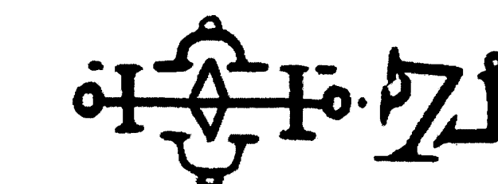
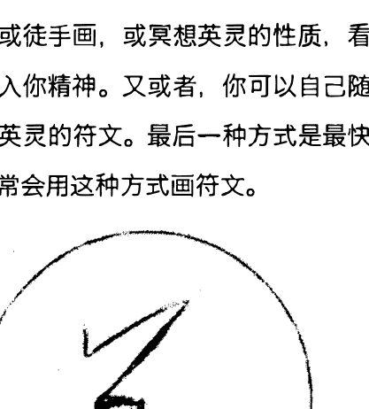
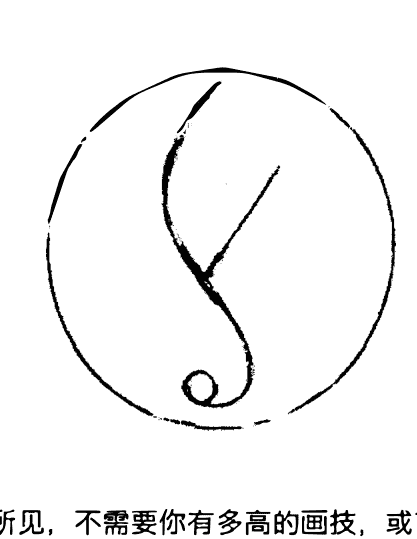

# 英灵魔法

打造为自己服务的英灵

达蒙·布兰德著

埃罗 译

# 英灵魔法

达蒙·布兰德 著

埃罗 译

# 目录

- 用魔法创造 ........................................................................ 4
- 英灵能为我做什么？ ................................................................. 9
- 让魔法安全 ......................................................................... 15
- 魔法的潜能 ......................................................................... 17
- 让英灵为你工作 ................................................................. 22
- 设想 ..................................................................................... 28
- 目的 ..................................................................................... 31
- 力量 ..................................................................................... 34
- 行动时机 ............................................................................. 40
- 外貌 ..................................................................................... 43
- 名字和召唤 ........................................................................ 47
- 食物 ..................................................................................... 51
- 地点 ..................................................................................... 59
- 致命缺陷 ............................................................................. 65
- 符文 ..................................................................................... 67
- 创造 ..................................................................................... 71
- 受孕 ..................................................................................... 72
- 孕育 ..................................................................................... 77
- 生命 ..................................................................................... 80
- 诞生 ..................................................................................... 81
- 活着的目的 ........................................................................ 88
- 死亡 ..................................................................................... 91
- 重定任务 ........................................................................ 93
- 团队英灵 ........................................................................ 96
- 通向效果的道路 ............................................................... 98

# 用魔法创造

魔法让你能引发改变，给你自信，扭曲现实让你得到你想要的。用英灵魔法，你创造的灵体将帮助你过你想要过的生活。

用魔法，你可以根据你真正的意志来创造你的人生。在多数魔法中，你是用仪式来与灵体建立连接，从而请求帮助的。而在英灵魔法中，你是自己去创造一个灵体，用你的身、心和灵魂去创造它，为你最深层的需求服务。

你创造的灵体名为英灵，是因你欲望和意志所生，为填补你需求所存。这是非常私人的魔法，当你掌握它的时候，它可以满足你极端的愉悦，引发变化的力量，以及让你人生所有面向吸引到繁荣的能力。

英灵是有自我意识的存在，但他们与你的需求和欲望连接，让你能安全地寻求你要的明确结果。

关于英灵的事，市面上的书能说的都有说得很清楚，直到现在。英灵魔法的存在已久，但大约半个世纪前才开始流行起来。有难以计数的混沌魔法书籍和免费的网页会告诉你如何创造英灵。在主题上有很小的变化，但这些来源的本质相同。《魔法英灵》有两大秘密，是被《The Gallery of Magick》所发现的，它们被嵌入在创造过程中。我希望《魔法英灵》是当前关于这一主题最完全、有效的书籍。

魔法不需要很复杂，英灵魔法会变得流行正是因为它的简单和有效。魔法结果是毫无疑问很棒的，不需要经验、启蒙和特别技巧就能够做好。这个魔法能够快速安全地实施。我不会脱裤子放屁地去复杂化这个魔法，但我想要魔法对你能有效。虽然，过程还是要保持简单，但我想要这本书能够足够详尽，让你能够有效实施。我在本书中所写的体系是用于创造英灵，能让你构建一个有意识的灵体，能够代表你采取行动，操纵物质、时间和现实的模式，给你带来你想要的结果。

这个魔法的设计目的是让初学者也能够轻易进行。如果你是魔法小白，那你所需要的仅是开放的思想和愿意运用书中指导的技巧。你将对魔法能够产生的结果感到惊讶。

这个魔法也可被更有经验的修士运用。我提到这点，是因为有人因为英灵魔法过于简单和普及化而不满。对于很多人而言，英灵魔法是他们入门魔法的开端，这让不少人将它看成是新手的术法。这种偏见会忽视掉这门艺术的潜能。就我（数十年）经验而言，英灵能做到的事情是不比任何其它魔法差的。再次强调，你所需要的仅是开放的思想，以及愿意去运用所指示的技巧罢了。

如果你能够熟练运用魔法的其它层面，那你可能会想，人造存在怎么能和灵体的力量相比。干嘛要自己创造，你大可以召唤天使来进行？是的，老手法创造的英灵并不比妄想强多少，但是，当你能够将英灵与你的真正意志连接的时候，那么，他们就是力量的基础来源。

## 巫术的法则 译制

你有欲望，你创造一个英灵来辅助你达成那欲望，结果就能达成。

在传统上，英灵是通过你的想象力来创造的，命名他，以某种魔法能量充能他，给你他的指示。而在本书中所给的指示则不同，它涉及设想，概念，孕育，诞生，活着的目的，以及最终的死亡。让灵体的诞生过程类似于你自身的生命，你就能够创造出真正有智力和想法的灵体。当你创造的灵体抵达活着目的的状态时，你就能够给他你的命令，让英灵带给你结果。

英灵创造是旨在简单的，但它不应该被轻视。要最大化地利用本书，请完整阅读文字，直到你完全理解它。然后，再去运用魔法。如果你仓促地进行魔法，那么你的结果可能不好。如果你什么都不做，那么什么都不会发生。

根据我学生们的反馈，最佳的结果是勤勉地研究文字，再冷静地做魔法。这意味着先只是读完书，然后再尝试技巧。如果你能这么做，那么你就能够创造出能为你需求服务的有智力灵体了。

# 英灵能为我做什么？

魔法油被用于吸引金钱、爱情和运气，但它也可被用于鼓舞艺术家，鼓舞忠诚和热情，增加人气和名望，或者驱散攻击。魔法能让人在新的灯光下看见你，能保护你，终结坏运气，打开新的机会，以及引导你想要的变化。如果你有需求，那么它就可以通过魔法来达成。

运用英灵的美丽之处在于，因为你是以某个目的去创造英灵的，魔法的猜测面就不存在了。你很确定灵体是为了你的某个目的而工作的，因为当时创造他时你就是带着那个意图。英灵是被你的需求和欲望束缚的，并将满足那些需求和欲望。

我有写过小说（另一个笔名），我曾经创造了一个英灵帮我增加小说的销量。我当时在精神中就以那明确的意图创造了他。它的设计不是给我带来总体的好运气的，也不是增加我整个人生的卖点，甚至增加名气。英灵的设计是用于增加小说销量的。如果我仅仅是以更有钱为意图来设计英灵，那么那英灵就会缺乏精确性，可能无法影响小说销量。我知道我想要什么，创造合适的英灵，那么英灵就能带给我结果。

除了这精确方面的问题，英灵也能够作用于一般的项目中。例如，你可以创造出能增加人生中金钱机遇的英灵。这个意图在本质上要更加总体，从而，结果不会明显和快速，但你仍旧能得到结果。

英灵也是能够成长和变化的。你可以创造出能帮你卖第一本小说的灵体，但当你第二本小说出版的时候，你可以改变那英灵任务，在其中加上第二本小说的推销。这种适应性是你精确创造的好处，随着你需求的变化去修改英灵。

当你想要建立长期重复结果的时候，英灵也是个很棒的选择。你可以创造一个能帮你推广产品的英灵，你的英灵能够持续数年或数十年地持续推广它。你可以创造出帮你注意新机遇的英灵，而那英灵能够伴随你一生。英灵可以为单一目的的创造，仅有一次性的作用，但他们也可以作为持续产生影响的存在。

英灵也可以被给予与你相同的智力，给他们与你类似的操作风格。你的英灵会让你感觉像是不同的，有意识的存在，但他会让你感觉很熟悉，仿佛是你血亲兄弟一般。

至于英灵是否是从你灵魂中诞生的独立意识存在还是精神分身是有很大争议的。这种争议挺有意思的，但它们不会影响结果，所以我不会在书里面写它们。无论英灵是什么，他们是源自于你内在的——你的意识欲望，你的情绪自我和你灵魂的结构。因此，这些灵体了解你和你的需求，是其它灵体无法做到的。

英灵提供真正的服从。在多数魔法中，你必须要小心谨慎，指引和命令灵体，从而他们才能产生与你欲望一致的结果。你施加的控制越多，结构越是受限。当你熟练魔法的时候，这不是个问题，但当你还是新手的时候，这就很困难了。英灵在他们创造的时候受到限制，因为他们是从你的欲望中诞生出的，从而，他们不需要复杂的仪式就能服从你。当你需要英灵潜伏起来的时候，他会冬眠，直到再次被唤醒。

英灵让你容易联系。虽然一些魔法也是如此，比如《力量之语》中的那些，能让你快速地与天使联系上，但是，某些仪式工作是需要数日，甚至数月的，从而才能确保建立连接。这是仪式魔法的本质。你努力让灵体听到你，感受你的需求，让灵体回应你。而对于英灵而言，联系的方式是因你而创，从而联系会立刻发生。当你召唤的时候，你的英灵总能听见你。

如果英灵那么强大，有那么多明显的好处，这是否意味着你只需要他们呢？你能否抛弃其它所有魔法？对于一些人而言，英灵是他们的主要魔法。而另一些人则很少使用他们。你选择用的任何魔法都是取决于你的。不存在任何“终极仪式”，通往成功的道路也不是只有一条。在神秘学中，有很多方法能在一定时间给你带来结果。每种方法就像是一件乐器。它弹奏相同的音调，但风格和声音却是独特的。就像乐器，每种方法可被单独运用，也可与其它协奏。

如果你想要创造财富，你可以运用英灵，但你也可以用金钱魔法来塑造你经济生活的结构。

英灵不应被视作最伟大的魔法——因为他们仅是魔法的一个面——也不应被轻视为毫无分量的工具。

对我而言，魔法是关于获得真实世界的结果的。当你通过魔法改编现实的时候，你是在灵性上成长。很多神秘学者会将显现结果的魔法视作低等魔法，是对物质生活的干扰。我认为当你能够通过自身意志显现欲望的时候，你看现实的视角是不同的，潜在的道路被打开，你的人生就永远变了。你用魔法显现得越多，你越是能有意识地指引你的人生，你对他人的用，你对于自身的存在也就是会觉得充满荣耀。没有什么魔法能比带来结果的更高等了。

# 让魔法安全

英灵魔法是安全的。当你和人谈论英灵的时候，他们会告诉你关于英灵离开主子，给世界创造混乱的恐怖故事。你会听到英灵拒绝服从他们的主人，再突变成那种类似于闹鬼的灵体。幸运的是，我听到的这类故事中背叛的英灵即便不完全是被虚构的，也多数是被夸张的。

就我个人经验而言，我只有三位英灵失控过，而他们造成的问题也只是有点烦人而已。一旦我有意识到发生了什么，我是能够在一分钟内将他们控制住的。自从我用了本书中的技巧之后，所创造的英灵都一直很忠诚。

你只要做好少量的预防工作，就能确保英灵一直在你的控制之下，无论它如何变化或成长。当你创造英灵的时候，你将给英灵内建人生结构，从而它会愿意在你的命令下或任务完成后消失，或终结生命。做到这点，你的英灵就不会变成闹鬼你的邪灵。你也可以内建一种故障保护手段，名为致命缺陷，这能让你在一念之下终结英灵的生命。

魔法中总是存在着担忧害怕的，它是达成结果的障碍。比起英灵，你的害怕更多是源自习惯。习惯可以真的限制你，而英灵是你的意识造物，只为了你人生更好而存在的。要克服害怕担忧。即便你是那种自毁型的人，这是你造就人生的机会，只会守护和提升你，而不会有负面影响。

注意，当你创造英灵的时候，你的确需要小心和明确。你只需要跟着指示走就行。

英灵的诞生并不是有着一定要活下去的意志的。他们没有要活得比你久的想法，也没有背叛你的动力。英灵诞生的智力是服务你的，当你用本书中描述的过程后，你的英灵是完全被控制的。

# 魔法的潜能

英灵也可以给你改变自我，你的感官，你对他人的想法，以及在你周围显现的现实。这意味着你能用英灵改变或增加你的个性。你可以用英灵来获得隐藏的知识。你可以用英灵劝服他人的想法和感受。最后，你可以用英灵影响现实的变化。

## 用于自我成长上过的英灵

你可以构建英灵以增加个性特点，比如自信，创意或直觉。相反的，英灵也可以压制，甚至移除负面的个性特点。

### 感知型英灵

英灵能够用于改变或增加你的感知。如果你想要探寻某事件的真相，看清前方的道路，或者更好地洞悉复杂的问题，那么英灵能够帮助你的感知。

### 影响型英灵

英灵一般缺乏能够让你无形之中影响一个人或完全改变他们想法或意见的能力，但是，他们能够被用于激发感受，让某个思绪和想法对对方很有吸引力。你可以用英灵给你权利，魅力或领导力的光环，使周围人对你的看法发生改变。（当然，你可以创造出改变自身，同时又能影响别人对你看法的英灵。）如果你想要影响某人的感受，那么英灵能够产生一时的热情，愤怒或厌恶，短暂或持续的偏见。如果你处于两性关系的初期，那么英灵能够确保任何潜在的感受能够完整和快速地被对方感知到。

我有说过英灵缺乏完全影响精神的力量。这对于想法顽固的人而言的确如此。如果你有一个政敌，那么你无法让英灵让对方改变阵营。但是，魔法是强大的。你可以利用英灵让你的政敌去怀疑某项政策，或者对那个问题失去兴趣。

影响力在你手中环绕，只要你能够明智地运用，个性的各个面向是能够发生改变的。

英灵魔法无法强迫个性中执的一面发生改变，所以你要在知道能引发变化的层面上施加影响。你可以让你的伴侣更有耐心，更温柔，只要那是在对方的本性范围内的。如果你的伴侣只是当下丢失了耐心和柔和，那么英灵能帮助它们回归；然而，如果你的伴侣不可改变地变成了坏脾气的人，那么英灵就无法帮助。该怎样在哪里用魔法进行影响，用你自己的判断。

### 显现型英灵

当你需要给世界带来改变的时候，你可以用魔法显现那变化。如果你是名画家，那你可能想要卖出你的第一幅作品，卖更多画作，得到你的第一条好评，甚至你的第一次画展。如果你是在企业环境下进行销售画作的话，你可以用英灵来增加你的名声，获得展销位。如果你是个体户，那么英灵能帮助你增加销量，让产品变得更为为人所知，或者确保产品有用被顾客好评。

无论你用的是什么魔法，只要结果是与你的真正意志相匹配的，处于你可能的范围内的，那么你就更有可能达成它。

很多人想要能赢百万彩票的咒语，但世界不是那样运作的。如果你的目标是让你感到难以达成的，那么魔法就无法做到。所以，你应先抵达你要的目标，再在那目标上建立更高的目标。

选择这些小变化比起大梦想要有效的多。创造你相信目标能成真的英灵能让你的人生带来最大的快乐和意义，你的目标应该是难以达成，而不是全无可能。当目标难以达成，但却有可能的时候，英灵就能将其转变成现实。

例如，如果你想要录一首歌，让它变红，那么你可以在写歌的同时让英灵配合你，再去想得到唱片合约，甚至变红的事情。评估目标是否难以达成是你必须要学会的技能。

随着时间，你会发现魔法把你带到比梦想中更远的地方，但成功的关键在于要分步走。随着你与英灵共事，了解它可以被信任，而你的信任将填补其现实，给你带来更多你想要的。当你创造英灵的时候，要好好考虑到这几点。

# 让英灵为你工作

英灵应当被视作为活着的生物。你不需要过度复杂化它，它只是一种能够改变将现实为你改变的灵体。你只需要经过设想，受孕，孕育，诞生，活着的目的，以及最终的死亡。虽然，某些英灵可能会伴你到死，但多数都不会的，你应当在创造的时候构建好死亡。

从设想，受孕和孕育开始，你要建立起压力，活着的压力，存在的压力，诞生的压力，有意识的压力。灵体被推动成真实。这能让你在精神上生出英灵，从而它能作为一种独立的灵体，而不是想象中的朋友。想象中的朋友（思念体）在低级的程度上会有那么点帮助；但它们不是本书的主题。你的目标是创造出有自我意识、智力，以及愿意为你工作的英灵。

在生命中的初期，你的英灵会成长和学习，它们会执行你分配的任务。它会那么做是因为你有用达成目的的技巧、个性和力量来供应它。

要进行这类工作，你需要有细致和强大的想象力。这并不意味着你需要能清晰地想象出一切；设想层面并不是那么重要，但的确需要你能够相信灵体是能被魔法的意识行为创造出的。即便这听上去很疯狂，但你必须要相信，仿佛它就是真的。正是想象力的行为让你得以成功。你无法尝试魔法，看看它是否有效。你必须要认可英灵的诞生，仿佛它就是真的。你必须要知道，因为施展这些魔法行为，你的真正意志能够填补那生物的创造，让其束缚于你的愿望之中。

这对于一些人会有难度，因为它听上去太像是在开自己玩笑了。要相信天使能够听到你的请求而保佑你要容易得多。但要你相信一个想象中的灵体就难多了。简单来说，难度在于你觉得自己很蠢。

另外值得一提的是，对英灵的试验有产生极端的例子。有些神秘学者认为你可以用流行的电影偶像的样貌来创造出英灵。也就是说，你可以让英灵长得像著名的反派或机器人。这不是我的方式。玩闹的心态是必要的，从而才能达到英灵创造所需的开放程度，但是，我相信那种参考电影风格的魔法，或者以玩具和动漫小说角色来样貌来给英灵塑形，会让魔法在某种程度上变弱。当然，你完全可以自由地改编本书中的技巧，以让其适合你自身的风格。如果你想要创造出动漫风格的英灵，我无法阻止你，但根据我所见所闻，最好是将英灵视作是高贵忠诚的灵体，其形象最好反映了你对灵体的概念。如果你的英灵看上去像是天使，或者某种亮丽的灵体，那么它在魔法中就会携带着某种庄严。

你不是在假装英灵存在。你勾勒出它的品质，再用魔法在那被创造的灵体内铭记这些品质。我认为严肃地对待这个主题比起玩闹型的要有效的多。以强大力量的形象创造出英灵，那么就会挥舞强大的力量。

我那么强调这点是因为英灵因混沌魔法运动而变得流行了起来，他们强调操作引导的魔法。虽然混沌魔法给神秘学圈子带来了不少发展，包括机构改革，抨击了不少无意义和无效的传统，但它也带来了不少效果差的魔法。英灵现在与自由风格的魔法关联了起来，而那种风格会限制他们的效果。

如果你有研究得更深入一些，你会发现很多作者会建议你要娱乐心，去试验，去做你觉得可以做的事，因为混沌魔法的讲究就是自己编自己做。我相信试验，总是原因去尝鲜。然而，如果你想要少走弯路，我强烈建议你将英灵视作高贵的狮子，而不是玩具熊猫。

混沌魔法对英灵魔法有着很强的影响，但其方法的本质是存在几世纪了，所以，英灵不是混沌派系自己的。

这些区分看似很理论，但是，如果你要最大利益化魔法的话，它们是很重要的。如果你把英灵当作是无所谓的想象力练习，那么结果会很受限。当你将英灵视作是温柔的天使或其它灵体的话，那结果也会对应。尊敬你的英灵，把它们当作是真实的，它们就更有可能与真实的世界互动。

这最后的一点是最重要的。如果你将英灵当作是想象中的，那么它们只会在心理层面上操作。把它们当成是真的，是属于这个世界的，那么它们就能改变世界。要做到这点，你只需要遵照后面几章内的指示来做就行。

在你开始创造第一位英灵之前，我强烈推荐你先完整地把书读下来，从而，你能知道后面的情况。它总共有三大部分。

## 结构设想

这是整个创造工作的骨骼，设定你英灵的目的和性质。

## 创造

在你做好的地基之后，你现在就是要让其受孕和孕育。你将用你的设想推动英灵产生生命，再为其诞生做准备。

### 生命

你的英灵已准备好完全诞生，执行它毕生的目的了。这个阶段是你的魔法几乎要完成的时候，英灵将开始为你工作。

## 设想

创造过程的第一阶段是设想，涉及设定你英灵的每一面，无论是它会做什么，它将怎么被喂食，甚至是它讲怎么死。你的塑造，勾勒结构和设计你英灵的方方面面。这个创造的过程是很快乐的，需要数周，或者10分钟内。需要的时间取决于你，你对英灵的需求，以及你觉得所需要投入的精力。

当你读完本章的时候，你应当知道该花多久来创造你需要的英灵了。我通常不会超过一小时，但根据情况会时多时少，确保我有将一切都想到。

设想过程让你有运用到目的，力量，时间，外貌，姓名和呼唤，耐力，位置，致命缺陷，以及你英灵的符文。你不需要线性地按照上面列出的顺序进行。不过，你应当总是以目的为开端，一旦你搞清楚了目的，那么你就可以用任何顺序进行了。

英灵尚未创造出；你只是在计划。因此，你可以不断改变想法，随着你的想法变化而不断去精确它。你很有可能会反复琢磨和改变想法。设计到最后反而改变最初的目的也是可以的。事实上，这很常发生，因为随着你的设计，你的创造性思维会想要你不断去完善你英灵目的的性质。创造带来清晰。

例如，你可能最初只是想要创造出让你更具吸引力的英灵；然而，随着你的工作，你意识到你只是想要英灵让你对真的想要找爱情的人更具吸引力罢了。你可能最初是想要创造出正增加商品销量的英灵，但是后来意识到将焦点集中在单一商品上在此时更好。

你是在设想你英灵能成为什么，从而一切都还没有定下来。注意，随着你的创造，你会忘记最重要的想法。你会大致地想想，但没什么能正式确定下来。我通常会在纸上列出关键词，和各种想法。你的记录不需要完美，但你需要记录下你的想法，从而才能慢工出细活。

下面的章节会说很多基础，最初虽然看起来可能很复杂，但你会很快理解并知道该怎样运用的。当你熟悉了设想过程了之后，它就能快又容易地完成。

当刚开始做的时候，花点时间熟悉过程。你的第一位英灵应当是旨在对你不那么重要的欲望。它也不应当是你完全不在意的，因为热情能给魔法提供力量，但是它也不应该是你目前最迫切的。想象你的英灵应当是能满足你的需求，或满足一个愿望，但即便没有它，也不会改变你生活的。这点能将压力从你肩膀上拿走，让创造过程更自由。

你可以同时设计多位英灵，但是，最初的时候，先定下一位的目的，诞生它，再从这个基础上去开发魔法。

### 目的

你有欲望，你想要用魔法满足那欲望。这简单的来说，就是你英灵的目的。

听起来很显而易见你需要给你英灵明确的目的，但这一步通常会仓促完成，即便它是最重要的一步。当你搞清楚你真正想要改变的是什么，你想要魔法在哪里施加影响的时候，你就更有可能看见结果。对欲望的某种程度的热情将定义你的需求，继而英灵的性质。

当你旨在让敌人静默，获得更多钱，从竞争中胜出，让某人以不同的方式思考，变成当红炸自己或隐士，你都要明确定义你想要英灵做什么。这意味着你需要更详细地考虑到英灵能怎么帮你。

你将决定者英灵是否能自我成长的，还是感知型，影响型或显现型的，你再定义它的操作方式。能自我成长的英灵可能会帮你抑制你的脾气。感知型的英灵可能会帮你识别职业生涯所需的机遇。影响型的英灵可能会帮你改变你同事对你提出的看法。显现型的英灵能帮助你商业成交，赚钱，或找到完美的家。

有时，你只是需要定义广泛层面上的概念。你可能在参加体育比赛的时候想要创造一个英灵来增加的运气。你可能在肢体活动的时候想要创造一个英灵来帮助你增强耐力。英灵也能增强你总体上的创造力。

有时，你会想要非常明确的结果。你可能会想要令你的英灵让你老板钟意你。你可能会想要你同事更尊敬你。你可能会想要让个性的某个层面得到进步，经济状况得到改善，或者以直接的方式去影响某个人。

当我想要在商业场合增加与陌生人互动的能力时，我会创造英灵给我更多的自信。我并没有让目的过于明确。然而，当我创造英灵帮我增加小说销量的时候，我有确保它仅聚焦于我的小说上，从而能量能够引导在那里，而不是我所有的收入来源。这种明确性的目的给予了其力量。

你应该让目的更明确还是更广一点呢？你的需求是什么，相信你的直觉。如果你觉得生活中的某部分在总体上的进步是你需要的，那么你就那么定。如果你确定你想要明确的结果，那么就这么来。

虽然这可能听上去很复杂，但它其实就像你把愿望的解决方法写在纸上一样简单。想想你的愿望，想象有灵体可以为你达成，再陈述做到那点所需的力量。这就是你英灵的目的。

### 力量

一旦你有写下英灵总体的目的，那你可能会想要进一步列出它的力量。这并不总是需要的，但会增加你英灵的目标和精确。

我总是说得到魔法结果的最佳方式是将一个问题分成许多可以被单独作用的部分。如果你想要升职，那么你可以用魔法来增加你的技能，让别人对你的观感变好，让你老板心向你，甚至将升职的想法置于你老板脑海里。这种操作方式远比单做升职仪式要有效得多。

当用英灵的时候，你不需要为愿望的每个单一目标创造一个英灵。而是，你应为一个目的而创造英灵，其内建的力量是每个单一目标的变化所需的力量。从而，对于上面的例子而言，英灵总体上的目的是获得升职。要精调它，你需要给英灵能增加你技能的力量，让别人对于你工作能力的看法变好，以及让你的老板能看到你的闪光点，在你遇到对你升职有决定权的人时，触发要让你升职的想法。这么做的话，你就能增加一层个人的创意，而不是全部交给英灵来做创造性思考。

不过，有时最好是将创造性思考交给英灵来做，因为你不确定怎样表达结果是最好的。如果你知道你想要升职，你可以按照上面的方法来分段解决问题。然而，如果你创造英灵是为了增加商品销量的，那你最好将过程开放，至少在最初的时候是这样。与其创造英灵增加广告效应，让产品变得更具吸引力，或者让顾客对产品的认可度增加，你还不如交给英灵来决定采取什么行动，让它根据情况来采取最佳的解决方案，因为它感知到的局面总是比你广的，能绝对聚焦于结果上。

如果你不确定如何最佳显现你要的结果，那你就不要去管这一步所需列出的力量，而只是让英灵自己找方式抵达结果。如果你确定你知道显现结果的最佳方式，那么加入这些力量就是很理想的了。

对于我小说销量的英灵，我并不只是创造能增加小说销量的英灵。而是，我有先确保它有增加听到我小说信息的人对它的兴趣。另外，英灵被指示增加任何感兴趣的感受，将转变成购买书的决定。这能有效，是因为我已经对出版业和业内消费机制有所了解。如果我要创造英灵保护我去海外旅行过程中安全，那我不会知道这所需的力量是什么，而是给英灵提供单一目的的力量，用它的智慧来保护我。

定义这些力量能给英灵很棒的结构，但你要谨慎用这些力量。有时，你可能会以为自己知道解决问题的最佳方式，但实际上你只是想太多了。如果你想要变得更具吸引力，你应当只是创造能让别人觉得你有吸引力的英灵。因为你无法确定你的哪方面是能吸引他人的。你可能创造的英灵会让人吸引你的智慧和美丽，而在现实中，你的智慧和魅力其实是你个性中最没吸引力的地方了。

对解决问题的最佳方案自以为是的话，那通常都是不准的，最好还是将选择权交给英灵。英灵是由你意志所创，它不会被你的玻璃心所困，对整体的情况有更明晰的概念，能更好地达成结果。

这意味着只有你绝对清楚最佳方式的时候才去控制和定义力量。但是，你要知道你的“肯定”是人生一大错觉。我们通常认为自己知道最佳的方式，但其实我们通常都是错的。

当你试图凭空拥有钱的时候，你最不应该做的事是说“我想要赢彩票赚钱。”当你这样限制结果的时候，你就是在魔法变得僵化。当我指导别人金钱魔法的时候，我总是建议对方将自身的精力投入在现实中的众多区域上，但是，你应当能接受金钱源自意料之外的地方。当你能接受这份意外，而不讲究来源的时候，金钱就会突然来到你身上。如果你坚持钱一定要通过彩票的途径前来，那么你可能什么都得不到。

如果你创造作用你自身的英灵，那么最好将将更多权利给英灵。想象你创造英灵是为了帮助你逆境中维持积极的。你不需要进一步拆解这个问题，列出众多你情绪中能进步的层面。最好还是让你的英灵替你做决定，从而，你要保持简单，只是列出目的，而不要限制权力。

这一章几乎有不少矛盾的地方，但请理解那都是幻觉。在早期的魔法书籍中，我有说太多指示了：做这个，做那个，得到你的结果。我也可以在这本书里这么做，但这会限制者魔法的潜力。这个魔法鼓励你去挖得更深。因此，魔法会具挑战性，因为它需要你真的思考下你与欲望之间的关系。当你以这种方式（理智与直觉）与欲望连接的时候，你的魔法就会进步。如果你是魔法新手，这能给你未来的工作带来更扎实的基础。

虽然，精调还是很强大的，但是，有时你还是要放手控制。你怎么决定呢？

花点时间来思考你的问题或欲望，想想你认为它会怎样显现。想想你该怎样拆解问题。如果你对能辅助英灵的力量有所洞悉，那么花点时间想想你是否在限制英灵的能力。如果不是的话，那就将这些力量加入你的描述中。如果你觉得你不知道该怎样拆解问题，或者不知道该如何加入明确的力量，那么就将目的描述得简单直白。随着你英灵的成长，你可能会越来越意识到他所需的力量，你可以在未来再加入它们。

### 行动时机

你是想要英灵只为单一目标工作，还是它会持续、重复地进行？在你设定英灵工作的时候，你应当知道这个问题的答案，以完全控制它，有效地利用它的能量。

持续进行的英灵，就是会反复持续为某一目标工作的，是非常不错的造物。我有创造保护财产的英灵，他们在多年后的今天仍旧在持续工作。那帮我小说销量的英灵自它诞生其就从没停止过工作。

我也有创造出被重复用，但不可持续的英灵。能在商业会晤中帮助我的英灵是非常有价值的，但不需要一直活动。与其每次开会都重新创造一个新的英灵，我仅是将这位英灵从冬眠中唤醒。商业会晤很重要，但只是偶尔发生，于是我只在需要的时候激活英灵。

有些英灵只用于单一任务，一旦完成就消散了。我有为找一个新的出版经纪人而创造一个英灵，那英灵完成了任务后就消散了。

当你设计英灵的时候，你的需求和欲望可能将决定行动的时机。如果你是要训练个性特质的，那你可能会想要英灵持续地作用变化。这意味着设计的英灵将总是活跃的，只有在你觉得变化足够的时候才会去消散它。

如果你想完成一个单一任务，你可以用那个目的来创造英灵。例如，你想要一个新房子，你可以用寻找房产，协商价格和顺利交易为力量来创造英灵。脑中以短期目标为目的创造英灵，并指示在交易完成后，英灵将消散。

无论英灵活多久，你都必须要决定它是否要永远激活的，还是只在被呼唤的时候进行工作。我有一次创造的一个英灵能给我的谈吐增加说服力。我并不想要那英灵总是活动的。东面能让英灵数日或数年关闭，直到你需要它寿终。

当我创造说服力英灵的时候，我有清楚地说明英灵能随时准备好被我呼唤，但是，只有我给它名字，面容和激活码的时候，它才能活动。这样的话，英灵总是存在，总是有意识地准备好辅助我，但是只会在被呼唤的时候进行魔法。

你也可以创造出总是警惕，准备好采取行动，但被设置了先决条件的英灵。例如，你可以创造出在暴力发生的时候，能让你不怎么被人注意到的英灵。

要定义好你的英灵，你需要注意到它的寿命，以及活跃度。

### 外貌

你英灵的外貌应当是你能够轻易想象的。无论它长得像动物，恶魔，天使，还是完全的新生物，其形象应当足够清晰，是你能够轻易回忆出的。

这个过程在你的想象中发展。你不需要用石头或粘土来雕刻应英灵，也不需要用笔来画它，但你的确需要知道它长啥样。如果你的视效技巧不过关，你仍旧能得到不错的结果。你可以写下英灵外表的描述，这也是一种运用的方式。你知道猫咪长啥样，你可以想象天使的样子，那你就有足够的想象力来创造灵体。即便你无法清晰地想象，你仍旧能在精神中创造出足够给魔法提供燃料的形象。

设计的形象应当反映出英灵的目的和力量。如果你想要快速和强大的英灵，它应当是有矫捷又有肌肉的身体。如果你的英灵是能够影响他人思绪的，那么其形象可以是一名睿智的老人，狡诈的猫或低语的灵体。

有些人会以草木、石头或其它类似的形象来创造英灵，但这通常没有生物形象更有效。最重要的是有眼睛。给你英灵眼睛，这样在某一天，你盯着那双眼睛，你能看见生命。

英灵可以长得像人，但要避免用真人的形象来创造英灵。长得像真人的英灵，无论对方是否活着，通常都不会产生好结果的。

除此之外，创造英灵的形象还有几个限制。你可以创造全身着火的恶魔形象，动物，或身着铠甲的天使。

我之前说过要创造出庄严形象的英灵，你也可以给它加点玄幻层面的料。如果你创造的英灵是类人形态的，你可以给他们加上炫酷的光环或让他们眼睛发光。你也可以让英灵的形象更能让你感觉他存在于世界中的。

我有创造过不少动物形象的英灵，但为了将他们与其他动物灵体区分开来，我有给他们加上更详细的细节。比如，乌鸦，类似于本书封面上的，身上有着前女友的心脏，以让对方感觉到我对她的爱。那乌鸦的双眼有着金色的光芒，钢铁般的抓子。羽毛发出银色的反光。凭借加上这些视觉层面的细节，我能够轻易地想象我的乌鸦。

鸟是不错的信使，但他们也可被用于发现隐秘信息，或者更广角地看情况。虽然我喜欢鸟，但不是所有人和我一样的。有些人总是更喜欢英灵长得像……怪物一样的（缺乏更好的形容词）。每个人有不一样的偏好。你应根据他们的目的和力量来创造形象，但也可以与此同时满足你的个人品味和想法。你不需要让别人满意你创造的形象，所以，你只是要确保它能在深层上满足你。每次看见英灵的时候，你应该总是高兴的，能通过它的外表感知到它的力量。

在创造英灵外表的时候，你可以用上你所有的感知。

我有不少次通过想象用嗅觉。就刚刚提到的乌鸦来说，我总是在呼唤乌鸦的时候想到玫瑰的味道。这是因为乌鸦有散发玫瑰的香味，从而，当我想象那味道的时候，我就与乌鸦连接上了。你可以给你的英灵添加上味道，声音和质感。对于一些人来说，在森林中想象胀气声比起想象金色的种马要容易得多。只有你觉得很容易想象他们的时候，你再去加上味道。如果你发现添加味道之类的会给你的想象带来压力，那就不要这么做，保持简单。

你可能会发现，随着你修改英灵目的的细节问题，你会想要改变其形象的细节。在进行设想的时候，这么做是没问题的。英灵尚未存在，你可以修改任何你想要的细节，直到你设计的英灵形象与其目的相匹配。

### 名字和召唤

给你英灵一个独特又好记的名字。你不会想要把它与未来的搞混的，所以，你要确保名字好记。

有些人喜欢根据英灵的形态、品质或目的来命名它。另一些人则喜欢用有异域情调的词，由随机的字母组合在一起，或者用特定的图案与字母对应而成的名字。只要名字让你感觉对的，那就可以了，但你应该避免用那些你知道存在的灵体名字。把你的英灵叫做天使加百利，或者以明人的名字命名它都不是个好主意，因为这会稀释英灵的身份。

对于命名，我认为庄严能让灵体感觉像是真的，强大的存在。你的英灵应当可以单名，也可以双名。

名字要保密，除非是创造一群英灵，这之后会谈论到。

在呼唤英灵名字的时候，他们会回应。说，或想，英灵名字三次，让你自身感知它的存在，就这么简单。

有些人觉得他们应该在此时加上一些仪式。在说的名字的时候，要做一些手势，盯着英灵的符文看（会在后一章说到），或者说力量之语。复杂化这个过程是为了让你在仪式化的状态下更容易地感知到英灵。有些人认为只说英灵的名字是不够的，如果实施仪式的话，会感觉更魔法。

你也可以，例如，用其它感官信息来呼唤英灵。你可以在创造的英灵的时候，设计在你闻到玫瑰香味，听到树木风声，以及蓝光穿透英灵符文，以及吟唱它名字的时候前来。

对于你的第一次创造，设计的英灵召唤方式将是你呼叫三次英灵名字，说出秘密力量之词（特地为这位英灵设定的）。那么，让我们想象下，你以巨大的老鹰形## 巫术的法则 译制

态创造英灵，其名为 Egeliantor，与潮湿的岩石味道关联。与其用所有 Egeliantor 的细节，你在创造它的时候告诉它，当你呼唤它的名字、闻到潮湿岩石味道，并说出 Munchantar 这个词的时候，它要前来。这个“力量之词”并没什么特别的，只是为了触发英灵而设计的。另外，我建议用对你而言听上去魔法的词来设计它，而不是用普通的词来关联你的英灵。任何能给魔法层面的感觉添砖加瓦的事情都能帮助这个过程。

当你创造第二个英灵的时候，你可能会发现你想要加上更多的细节，让它感觉是特别的，仪式的，与日常生活不同的。或者，你可能会发现英灵联系很容易，从而设计英灵仅在呼唤它名字的时候就能前来。你应当确保英灵仅被你的声音呼唤名字的时候才会前来，而不是别人的声音。

有些英灵会需要持续的指示，这意味着你可以经常呼唤它们。你可以，例如，用英灵来帮助商业成交，而不是英灵帮助你每个你在做的交易，你可以在真正需要帮助的时候呼唤它。其它英灵设置好工作后，是不需要反复呼唤的，在目标达成后就会消散。你会发现你会比计划更早地要结束英灵的生命，或者重新分配任务，从另一个角度进行。这也是为什么呼唤很重要，确保你有定义好英灵对你回应的方式。你可能永远也不再需要呼唤某个英灵，或者可能每天都要呼唤，但是，设计好英灵的呼唤方式总是必要的。

## 食物

无论英灵是否是你意识的分身，还是完全独立的存在，它们都需要食物。这可以进行物质层面的供奉，但你能提供精神或情绪能量的话会更有效率。另外，英灵渴求你的注意。给它们你的聚焦能让它们存在，它们需要这种意识的聚焦，以存在于世。

你可以决定你的英灵吃什么，和怎么吃，但你应当考虑到英灵什么时候该被给予更多能量，你将得到更好的结果。这并不意味着你要每天提供能量，但持续地意识到你的英灵，以及定期的喂食，都将比很少照料的英灵更强大。

喂食你英灵的方法之一是给它吃你成功后的能量。每次你因英灵得到结果的时候，你都可以将那份成功的快乐喂食给英灵。

帮助我销售小说的英灵的一部分事物即是我每本售出的小说。凭借让英灵进食你成功的能量，你就能将它与成功的感受连接起来，会更具自我维生的效果。

自我维生的能量资源，比如那些基于成功的，仅在你能感知到它们的时候才会有效。也就是说，你需要见证到某种程度的成功才能提供给你英灵能量（我幸运地能得到最新的销售表，这意味着我有意识到销量。但并非总能一直这样，所以你在定义能量源的时候要记住这点。）

假设你的英灵是用于增加产品销量的。你可以称述英灵将产品的每份销量作为食物，但除非你在某刻有见证到这些销量，那它似乎就无效了。然而，如果你能够每天看到销量表，那么仅仅是感知到这些销量似乎就能够喂食英灵。你不需要召唤英灵，供奉销量——你仅是知道它们存在就行。英灵与你是有微妙的连接的，你的感知能自动地喂食它们。

## 巫术的法则 译制

有些人会创造自我复制的英灵，通过抽象的能量来源来喂食。想象英灵每天复制自身，吃太阳的能量。这注意很棒，你以为过几个月就能有一群英灵大军了。但实际上，自我复制的英灵从来不会比单独的英灵更强，而且抽象能量源似乎并没有强烈的效果。通过你自身的呼气来喂食英灵，会比让它吃太阳能要强大的多。这也是为什么要用结果喂食英灵，或者用经常发生的令你愉快的事情来喂食，这些都是强化英灵的好方法。

你不应该和你的英灵讨价还价。不要说什么只有它带来成果才喂它吃饭。这会造成过于匆忙地试图带来结果，因为英灵会为了证明自己的价值而改变现实。当你雇佣员工的时候，你尊重对方，工资优待，就能带来最佳的效率。如果你仅在工作结束后喂食它们，那么你不会得到好结果。将成功用作奖励可以是一种食物，但它不应该是你英灵唯一能吃的能量。

英灵应当有不止一种食物源。如果你创造的英灵是用于守护你的家的，那么你有多常能注意到家里的安全呢？你可能在每次回家的时候能注意到，但你可能不会。因此，最好给英灵额外的能量源。这对于作用你感官，他人感受，或你个性变化的英灵尤其如此。那类变化通常是难以察觉的，有时很长一段时间都不会让你察觉，从而，英灵需要在与同时能从别处引用能量。

英灵不需要大量能量。不要认为你需要涌起大量魔法力量，将它们投入你创造的灵体中。通常，仅仅意识到英灵的存在就足以提供它持续的生命了。当然，如果你不定义英灵的能量源，它会自动被你投入在它身上的注意力、感激持续活着。如果你对它没了兴趣，那么英灵很有可能会消失。

我爱用的方法是尽可能地提供成功的能量，而且还要有意地给英灵注意力和感激的能量。下面是方式。

想象你创造的英灵是帮你吸引金钱的。这英灵不需要每日被呼唤给予指示，但它可以被呼唤，只是让你表示对它的注意力。你可以日日这么做。仅仅呼唤英灵，感激它正在做你要它做的事。即便你知道尚未它尚未产生结果，你仍然要这么感觉。类似地，当你得到了结果时，你可以呼唤英灵，直白地说谢谢。这种感谢并不是崇拜的；你感谢它只是类似于经理感谢员工工作辛苦了。你不应恳求英灵，因为你这么做的话就是在臣服。你应一直尊敬对方，但应是作为掌权者。你可以说感谢的话，但最好能提供你得到成果的感激情感。一个方法是，感受感激，并切实地对英灵说，“现在吃这个情绪。”注意，你是可以对任何情况感到感恩的——不止是成果——并对英灵提供它。这种情绪的能量接受度很好。

这类过程不需要花10秒，因而可以每日进行。多数英灵不需要太多注意力，如果你每天查看它们，那么结果可能会变得僵化，这是因为你在过度期待成果。要知道你英灵需要多少注意力的唯一方式是试验。对于你的第一位英灵，称述它将会受到你注意力和感激的滋养，再每周呼唤一次提供这份食物。如果你的英灵仅是短期操作的，比如几天，那么你可以每天喂它，除这种情况之外，你应该从按周进行供奉开始。

英灵对你所求不多，但是，如果你感觉英灵没有像你对它的要求那般工作的话，那么你最好增加这些供奉的频率。然而，不要以为供奉频率高力量就强了。因为诞生自你的意志，英灵是通过直觉与你交流的，你肯定会知道你的英灵需要多久供奉一次。只要你能够自信地进行操作，而不是总是担忧是否有成功，对于英灵的能量需求，你就能信任你的直觉。

如果感恩不适合你，那你可以用其它情绪。有些人会喜欢用愤怒和厌恶来喂食英灵，但这种方式挺适得其反的。当你解决了你的问题之后，你的愤怒会消失，你就没什么能提供给英灵了。如果你对于问题解决后它就消失没问题的话，那就没问题。如果创造的英灵是为了造成某种破坏的话，那么喂它愤怒就而不是感激可能更好。

任何强烈的情绪都能有效，但感激或许是最适合提供给你英灵的情绪了。如果你的直觉建议其它情绪，确定使用那种情绪。确保你能够按意愿产生那种情绪。如果你无法引发那情绪——无论是感恩还是什么——那你可以选择在所选情绪发生时喂食英灵。我有用过吃所有情绪能量的英灵。什么时候我感到有强烈情绪（无论是愤怒还是愉悦），我都会快速呼唤英灵来吃。

如果你创造的英灵是经常处于冬眠，很少工作的话，那么要让它活着继续不费什么功夫。每隔几天来回忆它通常就足够让它活着了，但为了保险起见，你最好每个月呼唤它一次，认知它的存在。

你可以喂英灵吃体液，性能量，甚至你自己的血，但这种方式挺有风险的。当运用性能量和你身体的体液时，魔法的力量会变得会波动。虽然每天弄破你的手指看似是很小的事，但它很快会让你觉得是一种负担。当你没有意愿再去喂食你的英灵时，它会消失死亡。

用性能量生存的英灵在没有足够性能量的时候会死亡。如果操作者生病了一段时间，或者有段时间没了做爱兴致，又或者有某种性功能紊乱，那么英灵就会死。当然，不是所有英灵都需要每日吃饭的，你可以创造出每个月吃一次饭就能运行良好的英灵。然而，性能量和体液似乎会让英灵变得更饥渴易饿。虽然能量会燃烧得很明亮，给魔法更强的力量，但它烧得也很快。这类英灵通常对食物的需求比你能给的更多。虽然多数英灵能靠注意力过活，但靠体液或性吃饭的英灵将无法通过常规手段感到满足。如果你走这条路，那就要谨慎了。

## 地点

你可以仅靠想象力创造英灵，但多数神秘学者发现，如果能将它寄居在物件中的话，它会更有反应，效率也更高。这意味着你可以将你的英灵嵌入一个物品中，比如石头或树，或者是一个地点上，比如桥或门。

寄居物质是有好处的，但也有缺点。一方面有些地方的存在时间有限。在我年轻的时候，我有创造出英灵，让其寄居在树木中，不过，自那之后，附近的大石头和其它地貌特征都被清理掉了。当我让英灵寄居在物件中的时候，那物件会丢失，或者我的书架上最终会收藏有二十多个小物件，每个都寄居着一个英灵。这会变得很累赘。

我最后一次用物质寄居的时候，我将英灵寄居在我iphone 的黑玻璃一面。这并不怎么让人感觉魔法，但仍然有效。唯一的问题是，iphone 寿命也只有几年，还有可能被偷或弄丢。在这种情况下，我能够呼唤英灵，让它换个地方住，但我情愿避免这种麻烦。

解决这种问题的方法是我近年内发现的，是让英灵住在你自己的血肉和骨头内。英灵是诞生自你的灵魂中的，从而让它住在你自己的身体中很合乎逻辑。要理解这个概念，我先解释下在传统中让英灵寄居物件中的方法，这也是个不错的方式，只要你有考虑到物件很少是永久的。

当你设想英灵的时候，它可能小到如同一个老鼠，也可能是人类的大小，或甚至如同一辆大卡车那般大。无论它的大小如何，你都可以让它寄居在任何大小的物件中。我不建议你将英灵寄居在任何有其它象征或对你有个人意义的符号的物件中。因此，用十字架，或其它刻有符号的珠宝都不是理想的寄居所。这也是我为什么喜欢用自然界中的普通物件的原因之一，我会用水晶，石头，水抛光的木头，或干燥的叶子。那样的话，画布就是空白的了。如果你用雕像，或任何有图形的东西，都有可能让英灵难以寄居在那。

当你到了魔法的孕育阶段时，你仅是称述英灵寄居在此物件中。如果你有为英灵创造符文，那你可以将符文刻在物件上，或仅是用你的想象在物件上画符文。这样的话，英灵就会被束缚在物件上。

当可以对短期的英灵用这种物质的方式，或者，如果你不反感用你身体的话，也可以让英灵住你身体里。有些人会担心住在身体里的英灵会控制身体，或让人生病。经验告诉我这根本不是问题——你的大脑处于你体内，那是魔法最本质的生理工具——但是，如果你还是对用身体不感兴趣，那你可以将英灵寄居在物理地点或物件中。你甚至可以完全无视物质面，仅是让它居住在你的想象中，仅在你的精神中被召唤出。

我偏爱的方法是将英灵寄居在我的身体内。我会避开心脏和大脑，因为它们更多需要用在其它魔法和日常工作中，不想要英灵住在那儿。一些研究人体能量模式的人会避免用诸如脉轮的地方作为居所。如果这让你担忧，那么避免用任何你身体中线上的位置。最简单的方法是将英灵寄居在你四肢的血肉和骨头中，仿佛你是在将它们的灵魂纹身仅你身体的结构中。我也会用我的牙齿和舌头。

在你第一次将英灵这样安排居所之前，注意你可能会创造比想象中更多的英灵。如果你一次创造个二十只，那你要确保身体里有二十个可用的地方。从而，你应避免将你的整个手臂用于给单个英灵居住。一个指甲，关节或肌肉会更合适。

你的身体是不断更新的，旧细胞会被新细胞替代，但这不重要。住在骨头里的英灵会留在那骨头中，即便骨头在被更新，随着时间被替换。

当你到了受孕阶段的时候，你陈述英灵居住你身体的一部分中，无论它是一片皮肤，整块骨头，一个关节，一片肌肉，还是韧带。只要你能够感知或看见那部分身体，那就会有效。你在陈述英灵居住在哪的同时，用意识想象位置，与此同时，看着符文编织进入那个部位。我们的精神住在我们的脑中（多数时候！）但我们一般不会想到我们的意识是因此被束缚在血肉中的。你的英灵也应如此。你仅需要陈述并在意识上认可它住在你的身体中，那它就会那样。你不需要过度的视效，当然，试着想象一只巨大的英灵住在小指甲里是很难的。你是在将英灵刻印在你的血肉中，仅此而已，你不需要进一步复杂化它。凝视符文，意识你身体内想要它居住的位置，陈述英灵将居住在那，完工。

就像前面提过的，这种用血肉的现代方式仅是一种选择，你可以自由地使用物品或纯粹的想象。无论你决定用什么，你也需要给英灵一个想象的地点。即是，当你想象英灵的时候，它实际存在于哪里？

有些人会想象英灵站在他们面前，在房间里或其它他们当前所处的位置。另一些人会想象英灵会沉浸在阴影中。有些会想象英灵处于某个特定的位置中，比如大厅，或山顶。这都是个人偏好，随着你的工作经验增加，你会发现自己偏爱某种方式的。所有的方式都会有效，但是，最好能够有一致性。如果你想象英灵处于微光的黑暗洞穴中，那么就总是将它想象在那。如果你看见英灵站在你面前，那么每次也是如此。

## 致命缺陷

你可以将致命缺陷当成专门针对你英灵的毒药。如果你有遵照本书中的其它指示，你的英灵就不会想要活过你。然而，没有这个技巧的话，这本书就不完整。这个技巧是给你一个一个安全阀，让你可以在希望的时候，立刻毁掉英灵。

这意味着即便它所居住的物件丢失了，还是它拒绝为你服务，你都可以消散它。英灵会不自主地听到你的呼唤，无法无视致命缺陷的命令。

当创造英灵的时候，你让它对于特定组合的想象元素致命。你必须要用相对复杂的元素组合，在说致命之词的同时将其呈现给英灵。如果你创造的英灵是会因接触铁而死的，而你意外地在想象着铁的同时召唤你的英灵，那它十有八九会死掉。因此，你应该确定英灵可以被铁、火和硫磺的组合，加上 Dorandeor 这个词，才能被毁掉。只要你能够想象这三种组合的“元素”，你就能够通过呼唤它，想象这些元素并说出那个词，而毁掉它。

对每个英灵应用不同的致命缺陷。为每个英灵创造新的组合。我会记录下每个新英灵的致命缺陷，并储存在多个安全的地方，然后忘记这些毒药，从而我在做魔法的时候不会胡乱想起它们。

刻印致命缺陷的方式会在受孕的章节中详述。在现阶段中，你仅需要决定用什么词，以及用什么元素组合。

你不大可能会用到致命缺陷，但知道它的存在能给你一种安全感，尤其是在对你英灵胡思乱想的时候。

## 符文

符文是用于召唤英灵的图像。在魔法世界中，有无数的符文能用于召唤天使和恶魔。它们中多数是手绘的，看上去有很多圈圈的。它们中没有显而易见的象征，或代表着字母的东西。例如，下面的 Aziel 符文。

符文的来源已不可考，现今仍存在很多争议。有人认为符文是灵体给那些能与他们共事之人的。有人说符文是人类创造用作一种联系方式的，会随着反复的使用而变得有效。就我个人经验而言，这两种符文都是有效的。无论符文源自哪里，重要的是，它是由人类手绘的。

你创造你的英灵，无论你画的是什么，它都代表那英灵的符文。你可以把它当成英灵灵魂的种子，给你另一种接触和控制英灵的途径。

设计英灵符文的方式有很多。你可以根据英灵的名字来画圈圈，或徒手画，或冥想英灵的性质，看看是否有任何图像印入你精神。又或者，你可以自己随便设计一个，说它是英灵的符文。最后一种方式是最快的，也有效的。我通常会用这种方式画符文。

在最外围画不画圆是随便你的。符文自身不复杂，但要与其它的符文区分开来。这意味着它能够轻易被回忆和想象，而不会与其它符文混肴在一起。

有时我会让符文表达英灵名字的首字母。下面这个符文代表的是名为 Fernostas 的英灵。

如你所见，不需要你有多高的画技，或艺术才能。记住，它不是英灵外貌的视觉表达。它更像是个商标，仅用于以抽象的方式代表英灵。

避免用过于明显的肖像画，比如一张脸或名字的实际字母或字符。符文意味着在象征层次上代表英灵。

你不需要让符文过度复杂，或者难以回忆，但你最好选择更加“图像式”的设计。有些人会让符文设计成下面那张的样子。我更喜欢设计成能用手画出的符文。如果你用的是打印出来的符文，那你最好用黑色的笔在上面描一遍，让你与符文连接。

很多人会在英灵被创造和诞生之后再创造它们的符文，但你最好在创造之时就想好符文。在设想过程中设计好符文，从而它可在受孕阶段用上，让你的英灵触发生命的第一阶段。

## 创造

你已经做了不少创造性工作了，但创造行为的阶段意味着你将之前的工作锻造成现实。在受孕阶段，你开始英灵的生命，在孕育阶段，你让它在诞生之前就获得力量。

你不需要等到受孕阶段，但有些人会想要在设想阶段中多花一点时间想好细节。通常你会知道是否需要暂停再想想的，你可以理解进入受孕阶段。相信你的直觉，但确保你没有因为太想要魔法的结果而仓促行事。对于给你英灵生命，当你觉得冷静和自信之时，你就可以继续了。

## 受孕

受孕是由你写出英灵性质的行为而达成。最重要的是，你所写的陈述是给英灵的。所以，你写的不应该是“Poranthor Dartist 是强大力量的灵体”，而应该是“你是 Poranthor Dartist，强大力量的灵体。”

在你写的时候，你写的一切都是针对灵体的，仿佛它已经存在了，你仅是在详细地描述它罢了。

你不需要多少写作技巧，因为你仅是写下你在设想过程中的想法。写下这些定义英灵存在的内容，这种书写的行为自身即是受孕的时刻。你的英灵也在这一刻从受孕阶段转变成真。

你用廉价纸和铅笔，还是用钢笔和羊皮纸，根本不重要。重要的是你有根据设想用陈述定义英灵，再加上英灵的符文。

先写下名字，接着是目的，外貌，力量，时间，呼唤，食物源，地点，以及致命缺陷。最后，你在句子的下面画上英灵的符文。

下面是个例子：

> “你是 Poranthor Dartist，善于钻营和力量的灵体。 Poranthor Dartist，你身如黑狗，却有狮子的大小，有着银色的双眼，温暖低沉的犬吠，能呼出灼热的烟雾。 Poranthor Dartist，你的目的是让我的声音带来说服效果。 当我呼唤你的时候，我会说出想要说服的对象的名字，你让我的声音充满诱惑，会让对方沉浸在接受的状态下。 即便我与对方的谈话结束，你依旧对对方作用魔法，从而我的话能弥留在对方的心中。你会一直活着，直到我要求你死亡，在听见那死亡的呼唤时，你将顺从地死去。 Poranthor Dartist，当我说出你的名字和“Karanstor”这个词的时候，你立刻出现在我身边。当召唤你的时候，臣服我的命令，进入世界中完成我的意愿。你食用我的感激，以及我因你成功带来的喜悦。 Poranthor Dartist，你居住在我的舌尖上。如果你被玫瑰水，盐和血的混合物触碰，并听到 Hanragoras 的时候，你将消失。Poranthor Dartist，这是你的符文。

然后，你将符文直接画在这段文字之下。

注意，我仅提到名字一次。当你呼唤的时候，你可以叫那名字三次。这能确保名字有被听到，但你不需要告诉英灵你要呼唤三次。在魔法上，我通常重复行为是为了确保灵体能听见我们。从而，仅告诉英灵在被呼唤的时候回应，即便你不止呼唤一次。

注意，我写的语气是很肯定的，是认定英灵会臣服的。我不会说，‘我请你臣服。’我陈述的是，‘你服从我的命令。’这种不带怀疑的肯定语气应该贯彻在你所写的话中。

你可以加上更多细节。如果时间对于你的英灵挺重要的话，你可以加上诸如 ‘我呼唤你时，你要前来，为我做事，当任务完成后，你将陷入冬眠，当你名字再次被呼唤时，你再苏醒。

你写的内容是很强大的。你想象的和定义的都将成真。虽然这本书可以让你进行上千种可能，但在此刻，你要记住，你是处于控制方的。如果你有个想法，觉得它能做，那么你就可以用这类魔法来试验。你创造仪式不是为了对古代天使发出请求的，而是在建立能对你回应的人生。相信你的直觉，并依此创造。

如果你不小心写错，或者写了你不喜欢的内容咋办？把它划掉，继续写。不要在意完美，不要担心写错的内容会影响英灵，因为你是它的造物主，你将通过你写的内容定义它的人生过程。

你不需要点燃蜡烛，或让这个过程非常地高仪式，但是，某种正式感会比你坐在桌子上随便写更有效。我会在写之前确保自己是一个人，不受打扰，处于觉得一切都有可能的情绪中。我会选择不是我常用工作空间的地方，让它感觉比我日常生活更重要。我让房间变得宁静，我会花点时间想点人生中我喜欢的东西，而不是想着我希望英灵帮我解决的问题。然后，当我处于平静中时，我会开始稳稳地写下内容，并确信我有创造了生命。

你是在生出英灵，对英灵进行写作的行为比起你所在的地点或工作方式要更重要，不要担心自己是否做得对，也别太在意所处的地方。

等你写完了之后，受孕就完成了，你可以停笔，但我个人喜欢加上一点说话的元素。在写完后，我会大声将内容读出来，从而共振有印记在世界中。然后，我会在精神中再读一遍，让精神与英灵连接。

你最好将你英灵的创造纪录保存下来，帮助你未来记忆。将那张纸存放好。如果你需要绝对隐私，那你可以将所写的内容拍照下来，将它储存在安全的文件夹内，再毁掉纸张。等英灵切实出生后再这么做。如果你要保留好所写的文字，那就确保不要被他人读到。

## 孕育

英灵能在分钟内就诞生。你要知道，这个魔法，至少在过去的十年内，是神秘学的试验田。有大量青少年愿意创造英灵，只是为了看看能发生啥。我们从那段时期内所学到的是，魔法的效果可以真的很快。

当我发现英灵魔法的时候，我那段时期喜欢收集神秘学工具，以及草药和蜡烛。我后来将那些东西都扔掉了，我想，我和英灵的共事经历促成了这事。当你发现自己只需要一点创意就能在一小时内创造出的东西时，复杂化的魔法就变得毫无吸引力了。

简单来说，你可以仓促地创造一个英灵，犯很多错误，但仍旧能得到结果。我并不是在提倡这点，即便这本书提供的方法几乎绝对是有效的。因为英灵在诞生之前，受孕之后，还需要孕育阶段。你可以将这个过程拉长至数天或数周，或者你可以在几分钟内就完成它。

快速操作是可以的，但请记住，过度绝望地想要有效会干预魔法的效果。有时，你需要紧急的魔法；那就没办法了，在那种情况中，你必须要快速工作。但是，无论你操作速度有多快，记住，你一定不能仓促要结果。你越是有耐心，越是愿意让结果在恰当的时间和地点显现，那么结果反而会来得快速。能够让自己与担忧结果的心分离是很重要的。如果你觉得自己在这一阶段挺仓促的话，那么你要确保自己的心里没有仓促地要结果。如果你催促魔法更高效，那么它反而会停滞。你要想到这点，再继续。

在孕育阶段，你需要做的仅是意识到你的英灵。它是活着的，就像尚未出生的胎儿在其母亲体内生长一般，但它还没有到出生的时机。就像新父母期待孩子的降生一般，你应当注意你英灵的存在。英灵正在从你的意志和想象中成长着。

如果你将这个过程拉伸到一个礼拜，你仅需要偶尔想象英灵，时不时地注意它一些。确保当你想到它的时候，你有想到它的名字，外貌和地点，而不仅仅只是它的力量，性质或它能为你达成的结果。在这一阶段中，你需要构成它的现实，而不是定义它的力量。意识到它的存在就是所重要的。

如果你想要这个过程快速发生，那么，你要坐在一个安静的地方，至少用半个小时或更久的时间去不断意识英灵的存在。

你选择的方式将由环境和你聚焦的能力决定。如果你发现自己难以聚焦英灵，那么你最好让孕育阶段拉长到一周或两周内，从而你偶尔的思绪和意识就能帮助你英灵凝聚。如果你是有意志力的人，那么你可以将你所有的意识投入其中至少一小时，那么工作就完成了。

### 生命

你创造英灵的用意是给予它生命，从而它能现实扭转成你需要的结果。虽然你的英灵已经被创造了，出生的行为将将其转变成完整的，主动的意识，它将能为你的现实操作。

有那么一刻是出生，生命在那一刻被给予了英灵，在这一阶段，是英灵开始起活着目的之前的重要仪式时刻。

## 诞生

找个独自一人的时间，让你能够作用英灵的地点。在你开始之前，你要知道这个过程通常是很短的。你需要知道到这点，否则你会为这个过程的速度感到惊讶，这有可能会让你觉得扫兴的。

你要提前知道你要做的仪式将给你的英灵给予生命。你也最好在做完后接着进行活着目的的过程，从而在接着诞生之后，你将英灵视作真实的，对它说话，给它指示，仿佛它就是真实存在的。你没必要拖延，所以你应提前计划好诞生和活着目的的同时进行。

英灵已经活着了，你需要做的是准予它有意识地活着。最简单的方法是呼唤它的名字，并愿意它完整地活着；这个工作仅需要两三秒就完成了。

我个人喜欢加上一点小仪式，用魔法的能量来祝福英灵。我将这个过程称作源自黑暗的光，我也有在《魔法的财富》中说到过它。如果你有读过那本书，那么这个过程你会很熟悉。

在源自黑暗的光之中，你冥想黑暗，发现光芒从无尽的空间中诞生。你最好在诞生的操作之前先练习一下，从而能对自己的能力自信一点。

让自己舒适一点，闭上双眼（如果这让你的想象更容易的话）。意识你的身体，注意你能感知到的任何东西。

将你的注意力转移到你胸部内。与其想象器官，血液和骨骼，你可以想象你内在的巨大空洞空间。你是在看有着宇宙大小的黑暗空洞空间。在想象的时候不应付出任何努力或紧张。允许你对这黑暗的空洞的意识升起。如果你的视觉化能力不强，那没问题。视效并不重要，仅仅意识到这黑暗的空间就行，即便你无法清晰地想象它。

对于多数人而言，这种体内的无尽黑暗是很容易想象的，但是，如果你难以做到的话，你可以想象体内是个宇宙。你可以想象浩瀚的行云和数不尽的星星，然后，再将场景涂黑，仅在体内留下无尽的黑暗。

你可能体验不到什么特别的，或者你可能觉得自己仿佛处于黑暗中，又是同时从外在观察它一般。

保持对那黑暗空洞空间的注意，允许光芒从空间内诞生。它不是光的星星，也不是光点，而是黑暗的闪电，一种平缓的，白色的光雾照亮了空间。允许这光芒不断变成明亮的白光。

通常冥想你内在的黑暗会导致光芒自动生成。有时则会需要你付出更多努力或有引导的想象。在几分钟后，让你自身被这白光填满。

注意你的身体容纳着宇宙大小的空间，而这宇宙充满着光。有些人会感知到光会向整个身体或更外在之处延伸。有些人则仅会感知到体内的光芒。这没有对错之分的。

现在，你可以在诞生的那一刻将光引导进英灵中。当你在进行这个过程的时候，你可以仅是让光芒消散。它不需要被引导到任何地方，也不会造成任何伤害。当你给你英灵生命之后，你需要将这光芒从嘴巴呼出。它会从你的胸部升起，与你的呼气混合在一起。你对着英灵呼出光芒。

对于一些人而言，这个过程太难了。在大量练习之后，如果你还是感觉不到源自黑暗中的光芒的话，那么，你可以仅仅只是说出英灵的名字，并对着它的符文呼入你的呼气，想象你的呼气直接进入英灵自身，给予其生命。

意识到你的呼气是结合了宇宙能量的（被光代表），与你自身生命的呼气结合在一起。你不会因为呼气而变得虚弱，就像你平常的呼气不会让你变弱一样。但是，因为这种光与生命的混合，你将催促英灵在意志上进入存在。

现在，你已经熟悉了源自黑暗的光的仪式了，我会给出一步步的步骤，让你可以照做。

独处你在受孕阶段写的陈述语。理想的是大声说出，再在精神上读一遍。凝视英灵的符文，并知道它即将诞生。

尽可能地想象英灵，它此时正处于休眠状态，眼睛是闭着的。你想象英灵正沉睡着，再醒来进入完整的生命。你十有八九已经在某一刻想象过睁大眼睛的英灵了。这没问题，但是就现在而言，让它的眼睛闭上。想象你的英灵正闭着眼睛，等待降生。

大声说出你英灵名字三次。你的英灵将意识到你。

在这一阶段中，你可以将手放在英灵的符文上，以保持连接。你现在运用源自黑暗之光。当你被充满光的时候，说出英灵的名字，将生命的呼气和光吹入英灵的符文中。你也可以想象英灵被这白光灌满。

你说出名字，并对着符文和英灵的身体呼入三次呼气。

随着你的呼气，英灵睁开它的双眼。这可能会在第一次呼气时自然发生，或者需要你去想象它在最后的呼气中睁开。

当英灵的双眼睁开后，看着它们。你将了解你的英灵，它也将了解你。在此刻，你们尊敬地对待彼此，英灵等待你的命令。

这是意志力和想象力的行为。有些人能够想象英灵出现在他们身前，它们的双眼闪耀着生命的光彩。有些人则很难看到任何东西，只是知道英灵的双眼已经打开了。不要担心你的视效质量。你只需要意识到英灵已经睁开了眼睛，诞生的那一刻已完成。在英灵站在你面前的时候，它充满着生命，你可以继续进行活着的目的。

更传统的方式会运用到土、气、火和水的元素，加上灵作为第五元素，被投入到英灵体内。有些人会点燃蜡烛，收集土和水，用这些，加上呼气和想象中的白光（或灵）给予英灵生命。这种方式也是有效的，但是我觉得这样过于复杂化了。最终，这个过程是以呼气和生存意志作为终点的，根据我的经验，这两点才是重要的。如果能够保持简单，干嘛要复杂化呢。

然而，英灵魔法不是可以用任何方法进行的；如果你想用元素或其它力量的魔法传统，或者直觉让你想要在这里用某些行为，那么你当然可以在诞生的过程中进行尝试。如果你是魔法小白，或者你仅是想要用最简单的方法，那么用这里所描述的源自黑暗之光是触发英灵意识的最快方式了。

### 活着的目的

在诞生之后，你立刻给英灵第一个指示，让它开始为你工作。你指示的性质将取决于英灵的性质。然而，你最好能给出直白的指示，即便你有在英灵的设想过程中嵌入了它们。

假设你创造的英灵是帮助你增加自信的。那么英灵的性质是已经完全建立的。然而，在诞生后，你应当呼唤英灵，并说出指示。你可以说诸如，“我呼唤你现在为我进行工作。给予我我所追求的自信。”大声说出这点，并在精神中维持英灵的形象。

对于其它英灵而言，指示是至关重要的。如果你创造的英灵是用于束缚敌人的，那么你需要在每次需要束缚敌人的时候，给予英灵直接的指示。

有些英灵不会是你立刻需要的。如果你创造的英灵是为了未来而用的，那么在诞生后，你仍旧可以呼唤它，认可它的存在，给予它冬眠的许可，直到你的再次呼唤。重要的一点在于呼唤英灵，从而最初的交流能够建立上。

英灵已经活着。它是你的，将为你服务。它的活着的目的是按照计划进行，你所需要做的是做好你付出的承诺。维持你对英灵的注意，按照承诺喂食它，享受你得到的效果。

你不需要在呼唤后解散英灵，或者驱逐它。你仅是睁开你的双眼，或者如果你的眼睛已经睁开着的话，那么不再看符文，而是继续你的日子。如果你不断有意识到英灵，那也没问题。只是如果你觉得你对英灵的注意力影响了你，让你想要做什么。那么，在这种情况下，呼唤英灵，让它隐形，直到被直接呼唤。直白地告诉它，你不想要被它的注意力受到打扰，告诉它保持隐形，当你呼唤之后再出现。

你的英灵已经创造好了，有了活着的目的。魔法的效果也会随之发生。

## 死亡

如果你创造的英灵是注定在特定状况完成后消散的，那么你不需要在它死亡时做什么，只要把符文处理掉就行。如果你创造的英灵是帮你赢得竞争的，而你赢了，英灵又是被指示在抵达成功后消散的，那么英灵是已经死了。

在其它情况中，你可能会想要终结英灵的生命，仅是因为它不再被需要了，你情愿让它死掉，而不是随着你注意力的转移而被饿死。在这种情况下，你仅需要呼唤英灵，感谢它的工作，告诉它它已经完成了它的使命，提供感谢，告诉它可以死了。如果英灵是居住在你身体里的，那么你应当先命令英灵在死亡之时离开你的身体。如果它是寄居在物件中的，你可以不再将物件想成是魔法的东西，再丢弃它。我喜欢把这类东西留在河边，只要它们适合那个环境，但是也没人阻止你将东西丢进垃圾桶里。

你对那英灵所写的记录，包括你在受孕阶段用的文章，都可以保留下来，但你应该剪掉它的符文，并毁掉它。你可以涂掉符文，再烧它（小心火灾），埋它或只是扔垃圾桶里。它不再有魔法了，从而不需要仪式。你是否留下记录都无所谓，但对于未来创造英灵可能有用。记录下哪一类效果最好，以及你的英灵在这些年来是怎样发展的，都是非常有价值的。

在它死亡后，你可能会发现你仍旧能够看到英灵，这可能会让你猜测它是否仍旧活着。不要让自己愚蠢地认为这些想法不只是记忆。英灵没有鬼魂。

以感恩的心态回忆英灵是没事的，虽然你可以尊敬它完成的工作，但不要让自己对已毁掉的英灵感到哀悼。满足目的是我们都渴望的，这是你给你英灵的礼物，没啥好哀伤的。

### 重定任务

当你与英灵共事了一段时间之后，你或许对效果满意，但想要给它加上一点能力，或者更精确化力量。

这被称为重定任务，是在重写英灵的存在。

如果你想要在英灵已有的力量和目的上加上新的指示，那么呼唤它，给它这些命令。如果你其实是想要重写英灵的灵魂，那你也可以这么做。

首先，进行设想，标注下你想要做出的改变。然后，呼唤英灵，告诉它你要改变它的目的和力量。你再进行受孕的阶段，根据初版的文字重写一个变化版。如果你改变得太多，那么这个过程会导致英灵变得无效。只有与英灵最初意图相匹配的修改才行。

想象你在经营一家小型企业，是在网上卖视频课程的，但是，你想要拓展业务，开始卖书。你可以只是命令英灵也卖书，但最初的目的陈述的是“你将促销我的在线视频课程，”那么这些新的命令可能是无法执行的。于是，你重新呼唤着英灵，将其重定任务，加上书籍的促销。

当然，你也可以加上新的英灵，但是，当你有个特别有效的英灵时，你可能更希望添加它的能力，而不是从零开始。

当修改完成后，毁掉最初的纸，留下刚写的那张。

你不需要再进行诞生过程。你的英灵已经存在并被修改了，不需要再创建新的。大声读出文字，再在精神中读一遍，再次呼唤英灵（即使你在重写时它就在你旁边），根据它的新力量来指示它。

英灵工作速度快，但也可以提前计划，从而，最好不要每个礼拜兴致所致就修改英灵。仅在真正需要的时候进行修改。

如果英灵的工作并不是你最初想要的，那么重写任务很少是个好的解决方法。你可以试验，但最好开始从你的经验中汲取教训，创造新的英灵出来。重定任务最好用于效果一直很好的英灵身上。

### 团队英灵

一群人可以一起创造个英灵，好处是它们会有更多能量。如果英灵的工作目标是一个，那么这很有效率。

想象一群魔法师都处于一个乐队中，他们创造出一个英灵来帮助销售他们的 CD。这很理想，因为多个人在一起创造一个英灵来进行一个项目。这结合在一起的能量能强化效果。

然而，如果一百个人一起创造单个英灵，来增加他们赌运的话，那么每个人仅能得到他们所投入的那一部分罢了。虽然诸如此类的团队英灵经常被创造，但我从来没见过有比单个英灵更强大的例子。

如果你真的要创造一个团队英灵，那么它需要每个人都出席设想 (要每个人都同意的), 受孕, 孕育, 诞生, 以及呼唤给予活着的目的。某些英灵的任务设定是可以回应团体中的任何一人的，但也有英灵是被指示只有每个人同时呼唤它才能出现。

找一群魔法师并不容易，但这也是可以完成的。很多团体会为了共同的目的创造英灵。只要你们有明确又彼此和谐的愿望，那么英灵就会有效。

## 通向效果的道路

效果会在你最不期待它们的时候发生，是以你无法想象的方式。如果有一些奇怪的现象似乎是效果，或者貌似朝向正确的方向前进了，那么就不要误以为那是巧合。这是魔法运作方式，呼唤你的英灵，给它感谢。

当你欲望强烈的时候，耐心是难的，但这却是得到结果的最佳方式。你越是耐心，效果越是快。要做到这点的一个方法是，你要记住，你已经将魔法交给英灵来完成了。你不再需要担心结果将怎样展现。所以，忘记它吧。不要追求效果，或希望。你要知道结果真正到来。如果有什麼是你在现实能够做的，帮助结果发生的，或让其更有可能的，那么你就去做。现实的努力会强化你的英灵。

你可以配合其它魔法来与英灵共事。我通常会反对使用盒子里的每个工具。为了同个问题用二十种不同魔法只是为了确保成功，这是挺诱惑人的想法。事实上，更多的魔法并不总是意味着魔法效果强。最好是找到适合你的魔法，以自信去实施它。但是，如果你创造英灵是为了赚钱的话，那么在用金钱魔法的同时让它帮助你打开渠道是没有害处的。如果你用英灵来制服敌人，那你也可以用束缚仪式来让英灵更容易地完成工作。我总是强调这额外的魔法层面并不是必须的，但我知道很多人会想要组合魔法，所以这是我在说 “如果你想要混合理论，那么你可以做” 的方式。

记住耐心的重要性，你要知道虽然某些英灵能发挥强大的力量，但有些则需要时间来暖身，熟悉掌控现实。有些会对长期的计划进行工作，结果可能不是立刻就会发生的。你要接收这点，允许结果在适合的时机到来。

如果在一段时间之后，你仍旧没有得到结果，那么不要杀掉英灵，或认为它失败了。你应对于结果更放松，如果必要的话，呼唤你的英灵，修改你的命令。

当你追求的结果是不用魔法难以达成，却也不是完全妄想的情况下，那么结果就会容易达到。你要的结果不应是绝对难以达成的，可被视作奇迹的东西。

作为魔法师，你用魔法帮你得到更好的生活，而不是依赖某个很大的奇迹。如果你能记住这点，让你的英灵做它的工作，那么你会得到你要的结果。

英灵能用于显化新的现实，影响他人的想法和感受，影响你个性的变化，增加你的感知。你能想象这魔法在正确使用下的潜能吗？

发现英灵特质的最佳方式是创造一个，看看魔法的成真。