# 药草与魔法

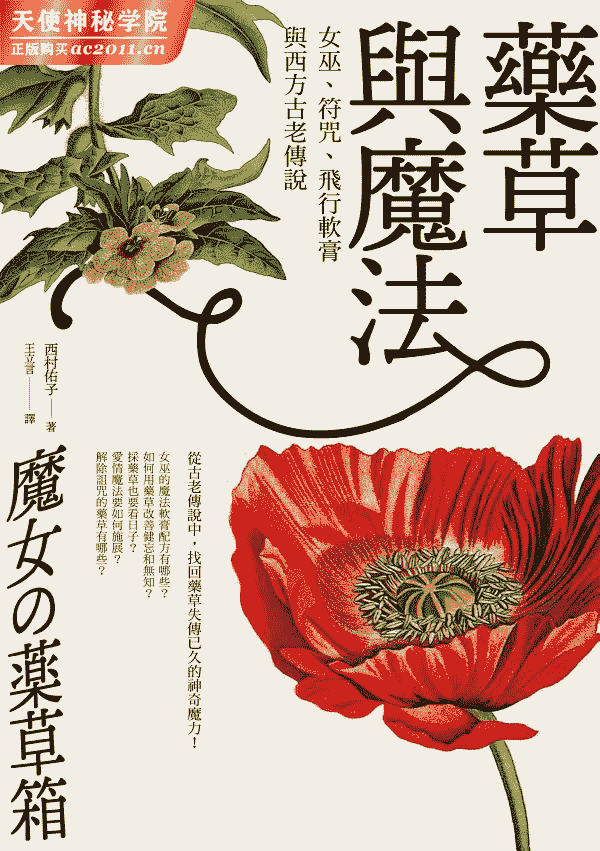

# 作者序　女巫的药草箱　／西村佑子

漫步于德国的森林当中，脚边四处生长着从前女巫们曾经摘采的草药，让人产生彷彿会遇到女巫的错觉。

女巫手提的篮子里装着许多种药草。其中包括含有剧毒、能在瞬间夺人性命的药草；以及用来作为「飞行软膏」原料的药草——女巫将这种软膏抹在身上，便能翱翔于天际。或者从前每遇作物欠收或疫病流行，人们皆认为是女巫所为，为保护自己不受危害，而使用了许多「辟邪草」。这些都是与女巫息息相关的药草。

另外篮中也有一些乍看之下和女巫扯不上关系的药草。比如说具有疗效，或者带有香气、能够令身心舒畅的药草。或者是对其许下梦想与愿望，佩带在身边的药草，以及能当作日常生活食材的药草等等。

从前，许多女性具有丰富的药草知识，她们前往森林中采集草药，或者就在庭园中栽种，用来帮助民众，人称「聪明女性」，颇受社会大众敬重。

然而在某些时代，这些女性却遭贴上魔女的标签，为社会所排斥。实际上，巫女所用的令人闻之色变的药草，与「聪明女性」所用的药草并无不同，药草本身并无善恶之分。前述的女性，仅仅是凭借着长久累积的传统及知识，自己采摘草药制成良药而已。

本书就像一个药草箱，里头装有这些所谓「女巫」所制作的药剂，呈现在各位读者眼前。之所以选择德国作为背景，是因为在那里，女巫和「聪明女性」两者与药草间的关系较容易明确掌握。另一方面则是由于日本引进的草药种类多以英美为主，我想要将草药在德国民众生活中的重要性，传达给更多人知道。

另外，我亦想透过视觉，阐明药草与德国历史的关系，以及其如何与日常生活结合，来引起读者的兴趣，因此刊载了许多图片与相片。

在德国，许多城镇都设有药事博物馆，规模虽大小不一，皆可从中了解药事的历史。从许多城镇至今仍保存创业于中世的药局建筑，亦可一窥当时的胜景。药局调剂室的墙柜上，往往整面都挤满小抽屉。药柜本身也带有雕刻与彩绘，有如艺术品。柜上摆设著作工精细的陶器与玻璃瓶，彷彿诉说着药局的历史有多长一般。窥望店内景象时，总觉得充满神祕感，使人不免心跳加速。

至今仍有许多药局，在药柜上排列着木制的药桶与药箱(虽然近年来也有不少是铝制的)，并且按照病人的身体状况调配药草。

至于端坐在药草箱前的，到底是巫女还是「聪明女性」呢？请您自己开门进来一探究竟吧。

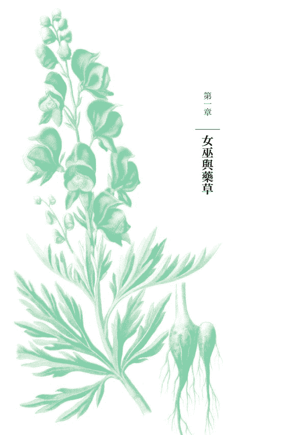

# 1　飞行软膏

在欧洲，传说中每到四月三十日的夜晚，女巫会齐聚一堂，与恶魔共同狂欢。这样的夜晚称为「瓦普几丝之夜」（walpurgis night）。最广为人知的女巫集会地点，就是位于德国中部哈茨（harz）山脉中的布罗肯（Brocken）峰。

当晚，据说女巫会一个个向恶魔报告自己一年来做了哪些坏事，吃不加盐或者长满霉菌的面包，接着背靠着背跳舞，直到第一声鸡啼时才突然消失无踪。

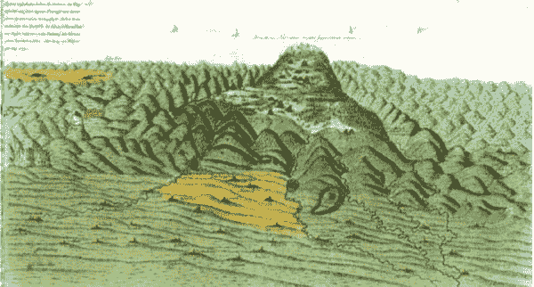

布罗肯峰的坡度实际上并非如此陡峭。十七世纪中叶时该峰仍为人迹罕至的未开发地带，然而在这张画中，已经可以看到绘有飞在空中的女巫身影。贝斯德（Bestehorn）绘，铜版画，1732 年。

德国的世界级文学家歌德在《浮士德》（完成于一八三一年）当中也提到瓦普几丝之夜。因此，这属于女巫的夜晚广为人知，世人也公认「瓦普几丝之夜」发源自德国的布罗肯峰。

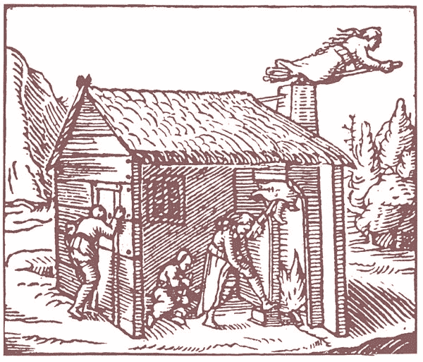

女巫之家。从小洞中偷窥的男子，是想要一起前往参加黑弥撒（sabbath），或是要告发这件事？出于《关于女巫魔力的谈话》，伊拉斯督（Thomas Erastus）着，1579 年。

哈茨山地的确流传着许多女巫的传说，其中亦不乏与「瓦普几丝之夜」有关。例如下面这个故事：

一个男仆偷看到女主人从抽屉中拿出软膏抹在全身上下，然后跨上扫把，口唸咒语，从烟囱飞了出去。男仆也想跟去一探究竟，于是从她的抽屉中取出软膏涂抹在身体上，有样学样地跨上扫把唸起了咒语。

但是由于咒语的唸法不对，他飞向房间墙角，撞得满头包，好不容易才穿过烟囱飞出屋外。据说他带着满身伤痕地飞到布罗肯峰，在那里与女巫们跳了整晚的舞，直到第一声鷄啼响起。

提到女巫，大家脑中总会浮现出她们骑着扫把飞翔在空中的形象。然而，并不是因为先有「会飞的魔毯」，才有「会飞的扫把」这种想法。能够飞翔的扫把，也不是女巫用魔法做出来的。所以不能将「女巫一定手拿扫把」当作常识看待。

在哈茨地方的传说中，女主人虽然骑在扫把上，却是将软膏涂抹在身上之后才有办法飞起来。可知想要飞上天空，软膏扮演相当重要的角色。

十七世纪德国的民俗学者普雷托流斯（Johannes Praetorius）在其所着《发生在布罗肯峰的事》（一六六九年）当中，也介绍到布罗肯峰的瓦普几丝之夜。据说女巫除了骑扫把以外，另外也骑乘雄山羊和猪、炉灶的拨火棒等，裸身飞往布罗肯山。

普雷托流斯于书中附有瓦普几丝之夜的想象图，其中绘有骑着雄山羊的女巫。当欧洲各地开始迫害女巫时，女巫是恶魔的情妇，雄山羊是恶魔的化身这种想法遂广为流传。因此女巫与雄山羊配对的绘画，在欧洲便成为对女巫的刻板印象。

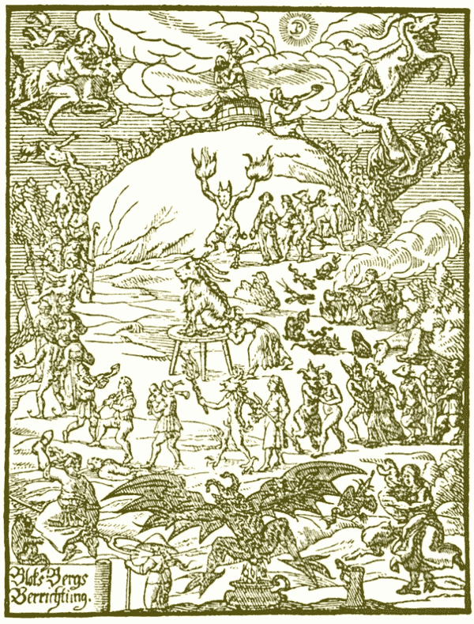

布罗肯山顶的黑弥撒。图的中央，人们正亲吻着象征恶魔化身的雄山羊，下方则有一只正在排便的恶魔，图中还有从手掌喷出火焰的传令恶魔，以及像在跳土风舞一般成双成对起舞的男女。类似这种构图的黑弥撒绘画，还有很多。

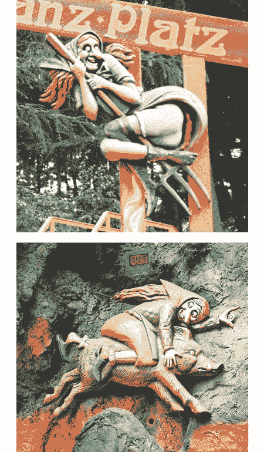

德国的女巫形象比较传统，她们的骑乘物不是猪或者叉子这么奇怪的东西。（德国不来梅近郊）

在德国画家杜勒①的画中，绘有一个背对雄山羊的头逆向骑乘的女巫；西班牙画家哥雅②则描绘了在巨大的雄山羊前努力练习飞行的男女；另外，德国画家巴尔东．格林③以及许多画家，也都有以正往身上涂抹软膏或制作软膏的裸身女巫为主题的绘画。

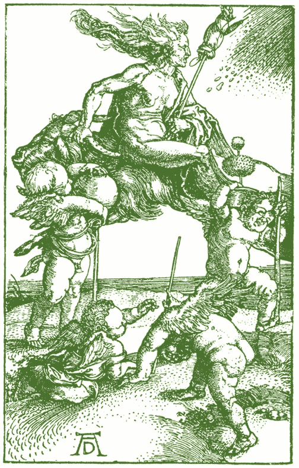

倒乘雄山羊的女巫。女巫手中拿着的是卷线棒。过去纺丝是女性重要的工作，世人怀疑女性集中在室内纺丝，可能彼此交换着对「男性」社会的不满，是具有反社会性的危险集会；卷线棒也许因此被视为是女巫的象征。杜勒绘［女巫］，1500 年左右。

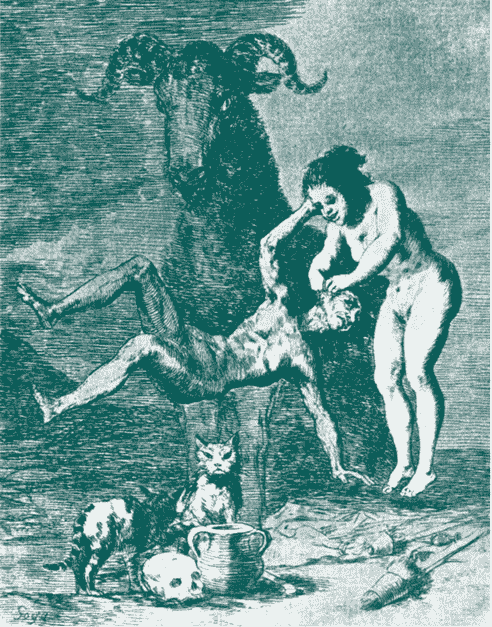

在雄山羊前练习飞行的男女。这幅画有着这样的标语：「一步又一步，慢慢进步。现在已经能飞起来一点点，不久便能飞得和女师父一样好。」哥雅绘［随想 60 号 修行］，1799 年。

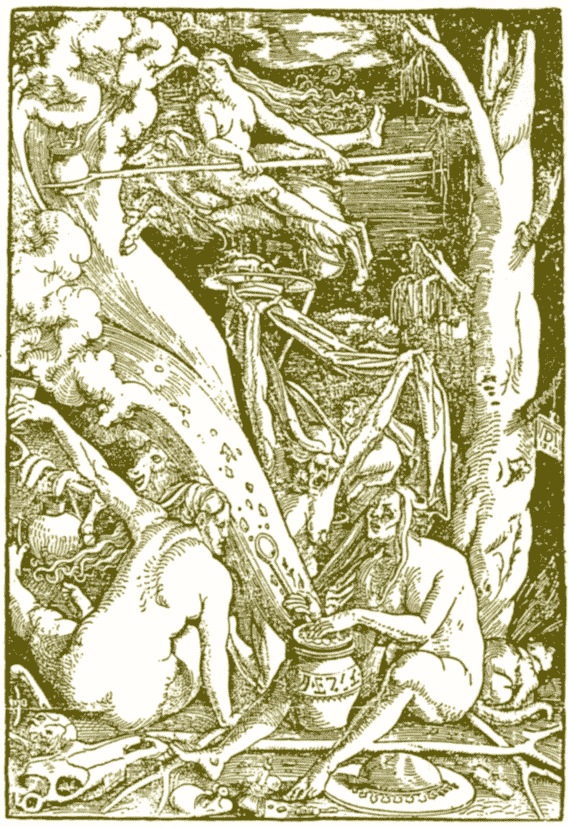

在森林里制作怪异药剂的女巫。画作上部是已经动身前往黑弥撒的女巫，倒乘着雄山羊。分叉的长棒尖端挟着的壶中，可以看到类似动物的脚的物体。中央的老婆婆端着的盘子中躺着整只直接烧烤的畸型生物，抱着大壶的女性手拿汤杓，正要把壶盖打开，从中冒出的带状物也许是毒气吧。类似的构图，在当时的女巫绘画中相当常见。巴尔东．格林［女巫］，1510 年。

因为这些绘画作品，使得某种偏见在世间广为流传，认为女巫是妖艳的，带有让人不敢直视的色情形象。

到了十六世纪，猎巫的风潮遍及全欧，当时许多遭指控是女巫而被捕的女性都供称曾经飞去参加黑弥撒。至于前往该处的方法，则是从恶魔处学来、能让人在空中飞行的饮料或软膏的做法，抑或直接向恶魔取得后，将其喝下或是涂抹于身上。

在阿尔萨斯（现法国境内 Alsace）的科尔马（Colmar），据说还保留着当时主审官审判女巫所提出问题的清单。内容不外乎「涂在扫把上的药膏原料是什么」、「飞上天空时口中唸着什么样的咒文」之类，且主审官会引导当事人回答。

在此记载当中，女巫的交通工具似乎已经定型为扫把。对主审官而言，让当事人坦承确实向恶魔索取软膏或饮料，或者学习做法，比起逼问当事人使用何种飞行工具重要多了。毕竟，主审官的任务是证明女巫是恶魔的情妇，并加以消灭。于是很多人纷纷承认，曾经涂抹软膏飞上天空。

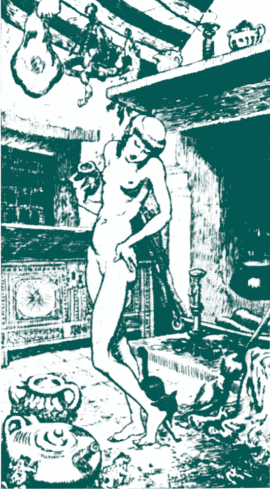

一个在典型的巴斯克（位于法国与西班牙国境）式厨房中涂抹软膏的女巫。（作者不详）

根据普雷托流斯记载，在身体上涂抹软膏，或者使用交通工具，原本都非绝对必要，然而因为审判女巫的缘故，女巫与飞行软膏的关系遂紧密地结合。

然而关键的软膏到底是什么东西，仍然不详，甚至也有人认为根本没有什么女巫软膏，因为女巫审判记录中所记载的软膏配方，往往只是将当时医生所用的几种药加以混合所得，而且传说当中所流传的大多都不太可靠。许多人往往认为从事巫术者只限女性，然而在猎巫最为激烈的时代，遭到告发的人往往不分性别、年龄以及职业。其中亦包括不少药剂师与医生，这类人持有的配方往往最易遭人怀疑。若回答不出为何持有软膏，则会受到拷问。多数人更直接认为既然答不出来，那一定是从恶魔那里得来的。

有几帖女巫软膏的配方流传至今。到了二十世纪，猎巫的研究开始起步时，「女巫软膏」渐渐获得重视。随着研究进展，很自然地会想要知道其实际功效，许多位学者甚至先后尝试制作。

德国的毒物学者先克（Gustav Schenk）于一九〇二年按照古老配方制作了「女巫软膏」，并将之涂抹在某位女性身上。结果这位女性陷入昏迷，失去意识很长一段时间。当她醒过来时，完全不相信事实上自己一步都没有移动过，反而坚信自己曾飞上天空，前往参加黑弥撒。

德国的药理学者修纳（H. Hhuner）于一九二五年将茄科药草萃取物涂抹在皮肤上。一般认为那是女巫软膏重要成分。据说，他经历了一段如同梦境般的飞行体验，并且在梦中还变身为猫或猫头鹰等动物。

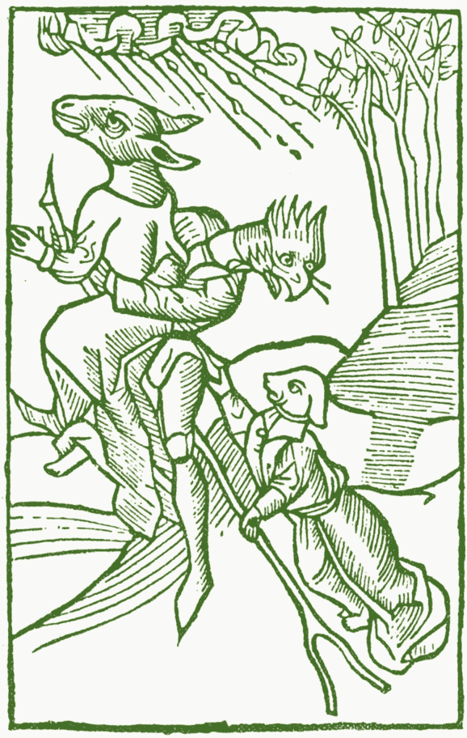

变身成动物前往黑弥撒的女巫。莫利特（Ulrich Moritol）着［拉米亚］（Lamia），1489 年左右。

另外，德国的大学教授波克特（Will-Erich Peuckert）在一九六〇年进行过同样的实验。他按照意大利人所写的一本叫做《自然魔术》（一五六八年）中所记载的配方，制作了女巫软膏，并且与朋友一起涂抹在身上，双双立刻陷入深沉的睡眠。清醒后两人的说法竟然相同：期间彷彿看见恐怖的脸孔、感到像在漂浮，或是不断地坠落。

从上述实验来看，可以确定软膏的主要成分是某种类似麻药的药草，会让人产生强烈的漂浮感。所以似乎仍无法完全断言飞行软膏不存在，或是只存在于人类的想象中。

有句成语说「以毒攻毒」，在治疗疾病时所用的特效药原料当中，往往含有毒性极强的药草，其成分与飞行软膏相同。许多人因为用药而产生幻觉，暂时陷入忘我状态，或是因长期服用导致药物中毒现象。服用这些麻药的不仅限于病人，无论古代或是现代，对于想要逃避残酷的现实以及被社会所淘汰的人而言，其所需要的正是能够麻痺神经的药物。

如果他们活在猎巫最为激烈的时代，可能会因行为可疑而遭逮捕，并接受审判。但或许用不着强行逼供，这样的人也会自称曾经飞行在空中。过去许多人都是因为如此，打从心底相信自己曾经飞上天际，因而坦承自己是巫师而受到肃清。从这层意义来看，让人能够飞行的药剂的确可说是存在的。

现代对女巫飞行所抱持的印象，往往是自由自在，并对其充满向往。甚至有许多因此想成为女巫的女巫迷。但是，人类为何总是想要飞上天？

乘着令人身心舒爽的微风，任凭围巾飘动，并配合着动听的音乐操纵扫把，自由自在翱翔于天际，这样的心愿是许多人的梦想。只是想到历史上的女巫软膏曾经使得许多清白的人遭诬陷为女巫，也许我们所渴望的飞行，还是透过飞机与滑翔翼来实现就好。

然而所谓的「飞行软膏」究竟是什么？答案还是让人十分好奇。以下所列的，并不仅限于飞行用途，而是概括统称为「女巫软膏」的几道古老配方。我们只能根据配方中所列的材料，推测它是用于飞行、毒杀，或是其他用途。除了列于配方中的药草外，也另行介绍几种被称为是女巫药草的植物。

# 2　女巫软膏

###### 【配方Ⅰ】

■毒麦、莨菪、毒菫、红罂粟、黑罂粟、包心菜、麻绳菜各〇．〇六四八公克。

■将上述材料与油以四：六的比例混和。

■每三一．一〇三克混合物中，加入一．二九六克底比斯的鸦片。

这是西梅尼斯（Fernando Jiménez Del Oso）所写的《世界魔女百科》中介绍的女巫软膏配方，据说本来记载于意大利的哲学家兼数学家卡达诺④所着《事物的精妙》当中。

由于我不是药草专家，就算看了这配方，也无法从药学的角度判断它具有怎样的效果。然而，想必不是什么正经的用途。光是〇．〇六四八公克要如何测量，就已经令人百思不得其解了。

配方中所谓「红罂粟、黑罂粟」，大约是指红色与黑色种子之意。而「底比斯的鸦片」指的应该是底比斯地方出产的鸦片。提到底比斯，就让人想起希腊剧作家索福克利斯⑤的《伊底帕斯王》中提及的希腊都市，或是以路克索神庙闻名的埃及城市。虽然两者都叫做底比斯，其中后者以栽种罂粟著名，因此配方中记载的应该是埃及底比斯产的鸦片。

附带一提，鸦片的主要成分中，有种叫做蒂巴因（Thebaine）的物质，虽然这个名字是进入二十世纪以后才命名的，或许其由来便是埃及的底比斯（Thebes）。

十六世纪时，洛林区（今法国东北部）曾经出土一个古老的陶壶。在分析其内容物之后，发现有癫茄、莨菪、毒蔘茄、毒菫等成分，专家研判这应该是用来存放女巫软膏的陶壶。

从卡达诺的配方以及壶的内容物来判断，由于其中有许多会令人产生幻觉的成分，也许是飞行用的软膏。

###### 【莨菪】

莨菪（Hyoscyamus niger）自古便被视为拥有魔力的药草，这是因为其含有毒性成分。莨菪属于茄科，蕴含莨菪硷与阿托品、东莨菪硷等生物碱，会对副交感神经及中枢神经产生作用，使人失去对重量的感觉，产生像飞在空中的幻觉。前人认为是魔法造成这种酩酊感与幻觉症状，因此莨菪便成为飞行软膏的重要材料。

茄科的植物包括马铃薯及西红柿等富含营养且美味的蔬果，也有蕴藏生物碱类毒素的品种。生物碱似乎已成为毒物的代名词，然而它指的并不是单一种毒素。

生物碱乃是盐基性含氮化合物的总称，约涵盖两千种以上的物质，对动物效果特别强。其中又以莨菪含有的莨菪硷和东莨菪硷、癫茄含的阿托品、附子所含的乌头硷、以及曼陀罗所含有的东莨菪硷毒性最强。

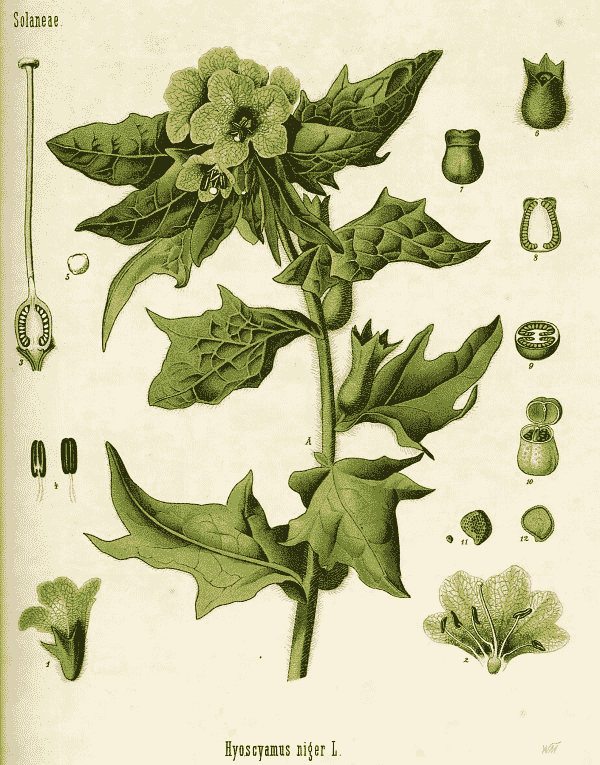

莨菪

生物碱家族多数都具有相似的强烈毒性，莨菪硷无疑是其中最具代表性的一员。 用作女巫软膏原料的植物，有许多属于茄科，含有生物碱成分。

然而就算植物本身带有强烈毒性，只要能够加以活用，也能成为药物。例如东莨菪中的东莨菪硷在手术中用于使肌肉松弛，并且能缓和乘坐交通工具时感到的不适症状；莨菪的叶片则含有止痛成分，不过大量使用会导致昏睡，因此一般人不宜自行使用。由此可见药草中含有的毒素并不全都是有害的，重点在于用量的问题。

莨菪的花为黄褐色，外形呈钵形。仔细观察花冠可以发现上面遍布浓花褐色的脉络，就像生物的血管，看起来有点恶心。不管是外观或是内在，莨菪都算得上是道道地地的「女巫药草」。

###### 【毒菫】

毒菫（Conium maculatum）与莨菪一样，在前述卡达诺的配方以及洛林区出土的壶中都曾发现其踪迹，且毒性乃是其中最强的。服下此种毒后，身体会渐渐僵硬，麻痺症状自脚部慢慢往上蔓延，最后导致呼吸困难而窒息死亡。更恐怖的是，在死之前意识仍然是清醒的。

古希腊据说都用此种毒药执行死刑。传说希腊哲学家苏格拉底在狱中所喝的毒液也是毒菫的汁液，他直到最后一刻为止都是意识清醒的。

毒菫是繖形科植物，茎上有红色斑点，散形花序的白花绽放于夏天。毒菫中含有生物碱类的毒芹硷，但有趣的是，它的毒性并不稳定。该植物位于地上的部份所含的毒素，会随着日照多寡改变，所以土中的根部含有的毒素成分最为稳定。

同属繖形科的植物还有平常所吃的红萝卜，其根为红色，相较之下，毒菫的根部外观较瘦小，看上去就像缺乏光泽的肌肤颜色，毒性却极强。古希腊哲学家德谟克里特斯⑥曾经说过，若要毁灭一座树林，只要将羽扇豆（Lupinus）的花浸在毒菫汁液中一天后，撒在树木的根部即可。虽然其毒性强烈到足以消灭整座树林，过去似乎也曾是治疗神经疾病的药材。

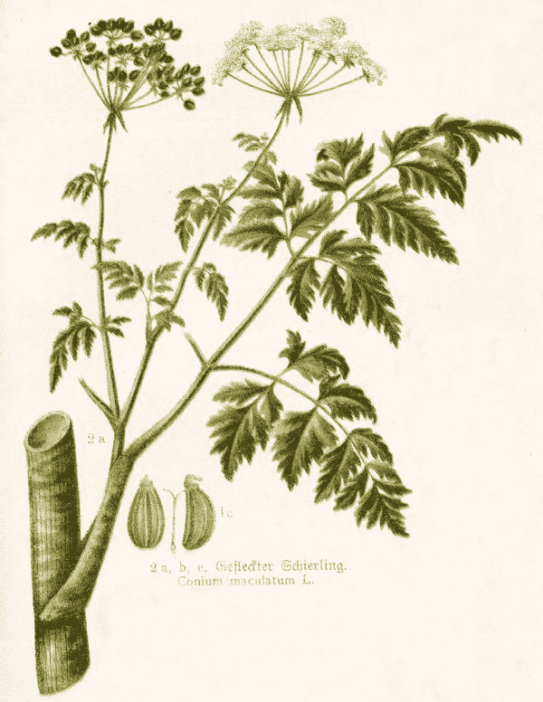

毒菫

据说毒菫具有老鼠尿一般的臭味，这也相当符合邪恶女巫给人的印象，充分具有作为「女巫药草」的资格。

###### 【毒麦】

跟毒堇一样，只要在名字前面加上「毒」字，大家便能立刻了解它是有毒植物。但若因为这样，就以为在女巫的药草清单中经常出现的毒麦只是含有毒素的麦而已，那就大错特错了。一般人所讲的毒麦，正式学名为「Lolium temulentum」，这跟在女巫的术语中提及的毒麦并非同一种植物。事实上含有毒素的并不是麦子本身，而是指寄生在麦穗上的有毒菌类。

这种菌类称为麦角菌（Claviceps purpurea），属于子囊菌，是一种寄生于大麦或小麦等禾本科植物的霉菌，长出的麦角形状看起来像牛角或是黑色的香蕉，常见于黑麦的穗上。麦角入秋后落至地面，于土中过冬，到了春天会长出许多小香菇般的物体，其所产生的无数孢子经由风或昆虫搬运，再次附着于禾本科植物的穗上。

由于麦角含有生物碱，大量摄取会导致麦角中毒，引起目眩、呕吐、产生幻觉、痉挛等症状。不过由于对促进子宫收缩十分有效，常用作子宫收缩剂和帮助分娩。

德文的「Mutterkorn」（谷物之母），就是女巫所谓的毒麦，落在地上的块状物较一般谷物大得多。由于谷物刚发芽的时候，还无从得知是否被这种菌类附着，因此即使怀疑有此可能，往往也要等到脱谷时才能特别留意，将其取下。

新约圣经的马太福音记载着下面这样的故事：某人播种之后，他的仇家趁夜在他的田里撒下毒麦的种子。于是到了麦子成熟时，毒麦也随之出现。此人的家仆急着想要把毒麦拔除，却遭阻止。理由是，如果现在就把毒麦拔除，会连好的麦子也一并拔起，不如就此放着不管，等到收成时再分开即可。

耶稣基督在讲道时，常会用一些贴近日常生活的譬喻。我想这个毒麦故事的意思是，一个人是善人或恶人，应在最后审判到来时由神决定，因此一个人选择的生活方式应该确保到时不会被神所舍弃。对于脱谷时必须不厌其烦地剥除毒麦的农民来说，这应该是个很浅显易懂的譬喻。

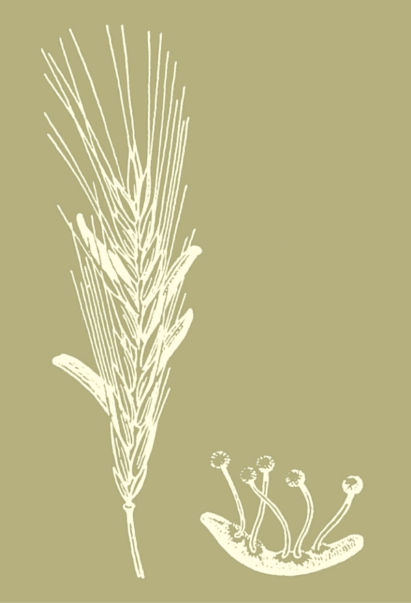

麦角菌

###### 【附子】

含有强烈毒素的药草往往用来杀人。毛茛科的西洋附子（Aconitum napellus）也因为含有剧毒而名列女巫的药草。附子的毒素自古便用来制作毒箭，或用于暗杀。现代仍常发生利用此毒的谋杀案件。

其所含毒素之强烈，几乎可说是无可比拟。整株草，从根部到花粉都含有乌头硷这种生物碱，只要几克便能致人于死。过去的记载中提到有人甚至只是闻到它散发的臭气便昏厥过去，或者把这种草丢向蝎子便能令其瘫痪，让人不禁佩服附子的毒性。

然而据专家表示，附子的根部并不具有臭味。也许是一般人认为邪恶的女巫所使用的草药，一定也和女巫一样散发着猛烈的臭气，才造成这种错误的认知。

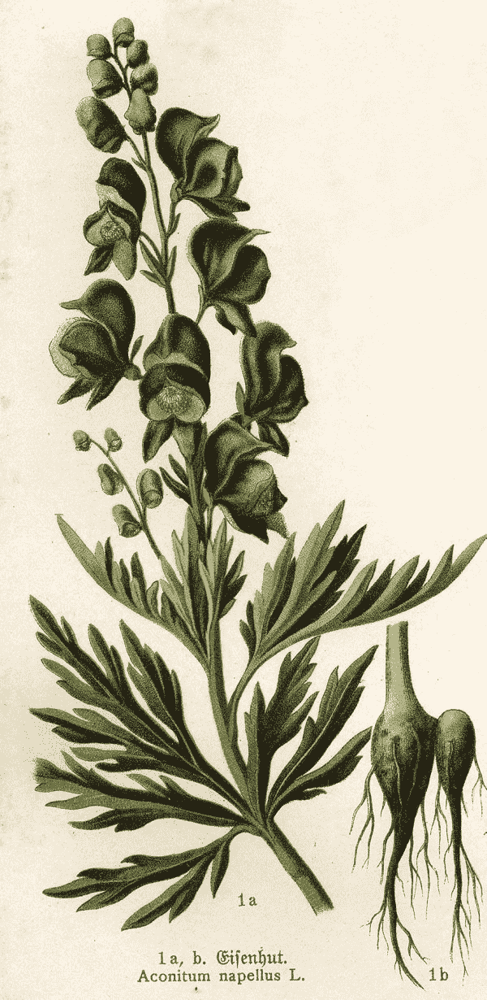

西洋附子

十六世纪时，有位贵族弄到了强效的解毒剂，想要试试效果如何，便叫死刑犯服下附子。然而解毒剂完全没有发挥任何的效果，死刑犯只能在痛苦中死去。这是个相当残酷的故事。

附子花看起来就象是日本古时候贵族佩戴的高帽子。在西方，这种植物名字的由来是从花的形状来命名，从其在德文中叫「铁帽子」（Eisenhut）、在英文中则是「修道僧的头巾」（Monkshood）来看即一目了然。或许是附子含有的剧毒实在太有名了，美丽的紫色花朵看起来甚至无端显得有几分邪恶。而且由于在山中很常见，更让人觉得毛骨悚然。

###### 【配方Ⅱ】

■人类脂肪　　　100 公克

■高纯度大麻　　5 公克

■野生大麻的花　半束

■罂粟花　半束

■一撮菟葵粉末

■一撮磨碎的向日葵种子粉末

据说这也是用来制作女巫软膏的配方，然而其出处不明。乍看之下，用于飞行的可能性似乎相当高。

由于配方中加入了向日葵种子，因此有可能是十六世纪后半写成的。之所以这么说，是因为向日葵一直到一五七〇年左右才传入欧洲。附带一提，虽然配方中写的是「向日葵种子」，有专家指出，正确而言这应该是果实而非种子，这使我感到相当惊讶。

###### 【印度大麻】

一般认为飞行软膏是用含有麻药成分的药草制成。其中许多成分能够为皮肤吸收，使人产生幻觉和飞翔的错觉。女巫在身上涂抹软膏后飞上天空这种印象，也由此而生。

野生大麻（Canadis Sativa）会带给人与上述同样的幻觉，因此自然被列为飞行软膏的材料之一。在中国从公元前五世纪左右，即将野生大麻用于治疗风溼与痛风，然而现已不再供药用。野生大麻在作为麻药用途使用时，就是我们一般耳熟能详的大麻。

印度产的大麻活性特别强，会让人失去时间观念、情绪失控，进入梦境般的境界。古人很早便注意到，在收获野生大麻时往往会产生奇妙的症状，因此日文中「大麻醉」（アサ酔い）这个词汇，便是形容该种晕眩般的奇异感觉。

在梵文的抄本里，有一个词代表的意思是以大麻为底制成的「神的饮料」。由此看来，大麻似乎很早便用于宗教仪式中；古日耳曼人在埋葬往生者时，也常使用大麻进行净化仪式。

由初开仍未经授粉的雌花尖端所得的树脂中，含有四氢大麻酚以及其他麻醉成分，会对神经造成强烈影响。将这种树脂加工成片状或是棒状，便是所谓毒品大麻；而将茎顶部的嫩叶切碎与烟草混合所得，就是所谓印度大麻（marijuana）。这种植物目前在日本栽培受大麻取缔法的限制。

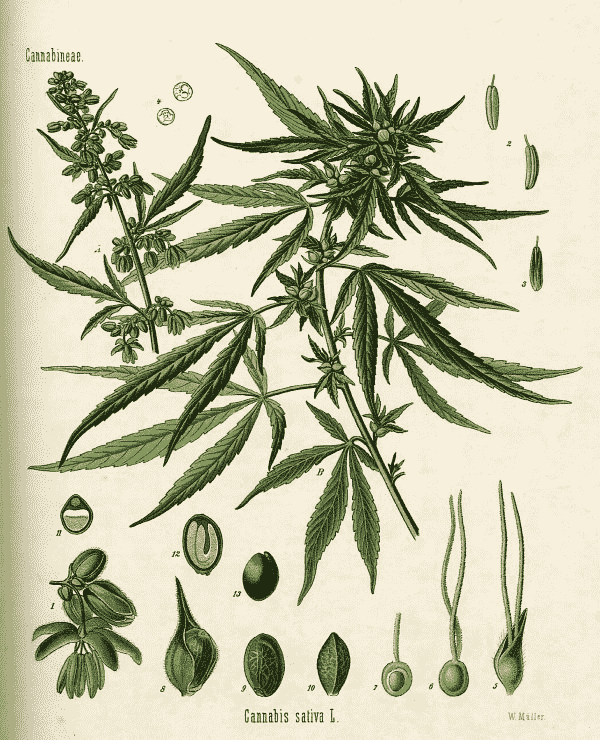

野生大麻

野生大麻是相当有用的植物，几乎没有无用可以丢弃的部位。古罗马的博学者老蒲林尼⑦在他所写的《博物志》当中，认为它是最适合用来制作绳索的植物。野生大麻的纤维是制作夏季衣物的代表布料，果实能用于七味辣椒粉中或点缀在面包上，榨出来的油也能用来制作清漆（varnish）或肥皂，以及溶解油漆。

野生大麻的茎在剥去外皮之后，于日本称为「苎壳」（ogara），在盂兰盆季时当作火炬来使用。有趣的是，古代仪式中使用的大麻或是剥皮之后所得的苎壳，都被用来与另一个世界交流，也许是因为相中其容易点燃的特性吧。

###### 【罂粟】

植物含有的毒性越强，似乎就越有资格作为「女巫药草」。其中，罂粟（Papaver somniferum）具有使人入眠以及失忆的效果，在女巫的药草中地位崇高。提到雏罂粟，便使人联想到那惹人怜爱的红色小花；至于罂粟的种子，则常常用来洒在面包或小点心上。罂粟结的果实，是果皮既干且薄的蒴果，成熟时会散落出细小的种子。成熟前果实分泌的乳汁约含有二十五种生物碱类毒素，将乳液加以干燥处理之后制成的，即是鸦片。

十七世纪末叶，英国医生将这种乳液加以调合，制成名叫鸦片酊（laudanum）的万能止痛药。同时，世人发现它会成瘾，遂开始将鸦片当作毒品吸食。然而罂粟厉害的地方，不仅仅只是会造成鸦片中毒而已。

十九世纪之后，澳洲的药剂师自鸦片中萃取出具有麻醉活性的生物碱，并取名为吗啡。少量的吗啡能够适度对大脑产生作用，止痛效果相当好，然而使用时夹带着陶醉感，比鸦片更容易让人成瘾。到了十九世纪中，法国的药剂师从罂粟成分中的鸦片分离出可待因，对于止咳相当有效。虽然程度不如吗啡，但仍然会造成成瘾症状。

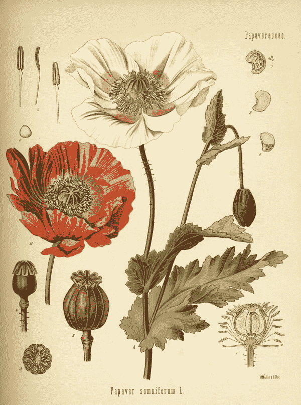

罂粟

其后，德国化学家以吗啡作为原料，合成出具有更强效果的化合物。这就是毒品之王——海洛因。罂粟的花虽然美丽，然而每每思及它是鸦片、吗啡及海洛因之母，便让人感到不寒而栗，因此它毫无疑问具有名列女巫药草之一的资格。

现在栽种来作为观赏用的罂粟类植物几乎都是雏罂粟（poppy）。雏罂粟虽然也具有该类植物在折断茎之后会流出乳液的特征，不过其中并不含有麻药成分。

早在公元前三千年前左右，古代美索不达米亚的苏美地区已广为种植罂粟，自古以来便以具有使人入眠及失忆效果而闻名。在童话《绿野仙踪》当中，也有主角桃乐丝一行人误入罂粟田，纷纷睡倒在地的情节。

在中国，楚王项羽的爱人虞姬的故事，也跟罂粟有关。虞姬在项羽败给汉王刘邦自刎之后，也拿起小刀结束了自己的生命。从她流出的血中长出的红色花朵，人称虞美人草，也就是雏罂粟。虽然虞姬自杀的故事似乎并非史实，只是将她的美貌借来比喻罂粟的花而已，但这仍然是个沾染了血腥的故事。

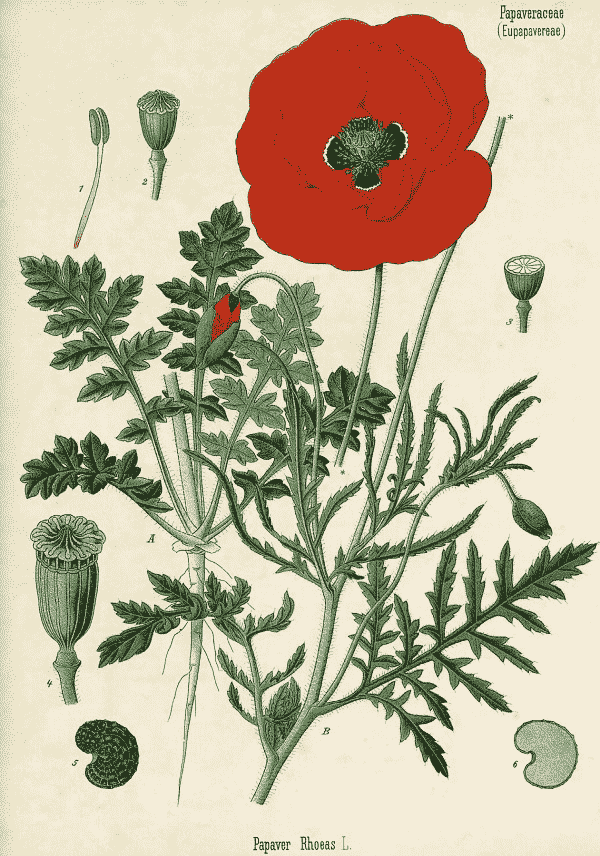

雏罂粟

另外，也不免让人想到日本作家夏目漱石⑧的小说《虞美人草》。女主角藤尾是一名心高气傲的女性，在遭到所爱的男士背叛之后，「喝下了虚荣之毒」而死。从标题看来，似乎她所喝的便是罂粟制成的毒药，然而实情并非如此。

当藤尾得知遭到背叛时，脸部的肌肉突然无法动弹，手脚僵硬，像失去重心的石像一般倒在地上死去。如果她喝的真的是罂粟制成的毒药，那应该会出现海洛因中毒的症状才对。

###### 【癫茄】

就像虞美人草一样，许多花朵背后的故事都和女性有关。而若说「女巫药草」的由来与女性有关的，首推癫茄（Atropa belladonna）。

癫茄（belladonna）原意为「美丽的妇人」，具有强效的镇静作用，并能使肌肉松弛。若将叶片与根部的汁液滴入眼睛，内含的阿托品成分会使瞳孔散开，看上去好像在闪烁，因此深受意大利女性喜爱。的确，在凝视放大的瞳孔时，往往让人有种受到吸引的错觉。

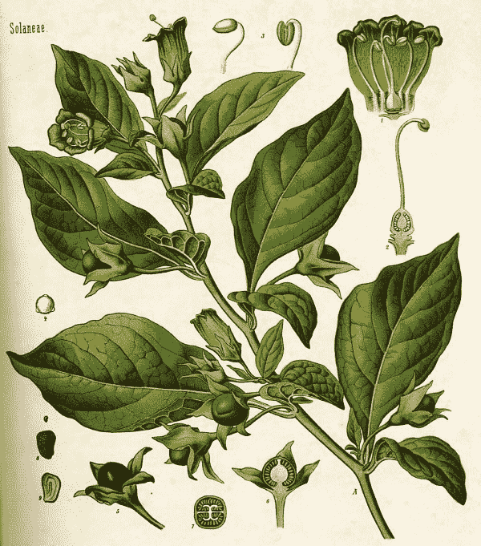

癫茄

在接受眼睛检查前点过散瞳药剂的人应该很清楚，在无法对焦的情况下，看什么都不清楚。因此，遗憾的是，使用这种药剂时，并无法亲自确认自己的眼睛是不是真的变好看了。

药剂师指出，阿托品的散瞳作用会持续一周以上，因此虽然随着检查内容的不同，偶尔仍会使用，但现在大多改用数小时便能复原的散瞳剂。

德籍医师西博尔德⑨抵达日本时，曾经携带癫茄。他在江户的眼科医生面前实际使用这种植物进行眼部手术。众医师对其效力不禁感到惊叹，纷纷想要知道该草药的名称。西博尔德看了他们提供的日本植物图鉴，表示该种植物就是自生于日本的日本莨菪（Scopolia japonica）。

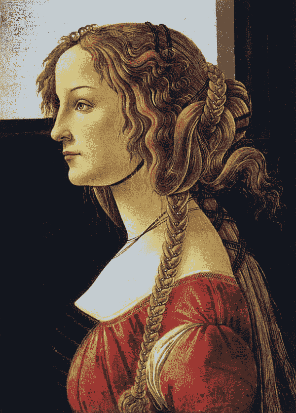

许多女性就是为了这样美丽的眼睛，而使用癫茄的汁液。波提切利工房作品［妇人的肖像］，1480 年代中期。

日本莨菪与癫茄同属茄科，叶片与花朵也很类似，并且同样含有生物碱类中的莨菪硷和阿托品、东莨菪硷，因此使用日本莨菪也可达到散瞳效果。日本莨菪常会被误认为是薯蓣科的萆薢的根部，人若误食会陷入发狂状态，四处跑动，因此其日文名称为四处奔走之意。

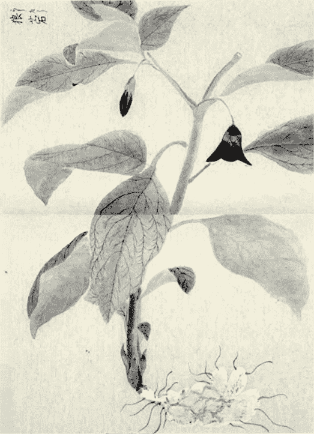

日本莨菪

癫茄在英语中称为「致命的茄类植物」（Deadly Nightshade），在德文中的意思则是「发狂的樱桃」（Tollkirsche），两者都是相当恐怖的名字，但仍然比不上其学名「Atropa bellandonna」。「Atropa」的语源是希腊神话中的女神阿特洛玻斯（Atropos），为掌管死亡的女神，负责切断通往未来的生命之线。以「切断生命线的美女」这样的称呼用来作为「女巫药草」的名字，想必更有震撼力。

根据中世纪德国修道院长赫德嘉．冯．宾根⑩的记载，癫茄群生的地方，是恶魔造访的邪恶场所。笔者曾经在德国的森林中见过癫茄。其圆圆的果实带有暗黑色艳丽的光泽，看来十分美味，让人想要放进口中品尝。不过只要五到十粒便能致人于死，真的是恐怖的女性。

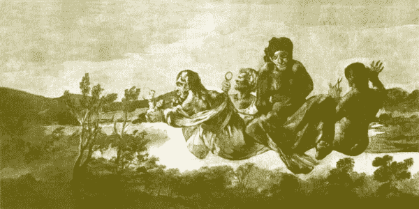

命运的女神——负责切断命运之线的阿特洛玻斯位于右端，手上拿着剪刀。哥雅绘［黑色的画　阿特洛玻斯（命运）］，1820-1823 年。

###### 【曼陀罗】

接下来介绍的仍然属于茄科。曼陀罗类的植物（Datura spp.）在女巫药草当中独树一格。曼陀罗传入欧洲的时间较晚，直至十七世纪方从墨西哥与北美输入。

其花朵与牵牛花类似，呈较大的喇叭形。蒴果上覆满尖刺，其中包含无数细小的种子，是强烈毒性的主要来源。其毒素的成分，为同样见于茄科的东莨菪硷、莨菪硷、阿托品等生物碱。摄取上述成分会造成神经麻痺，陷入精神错乱，导致死亡。

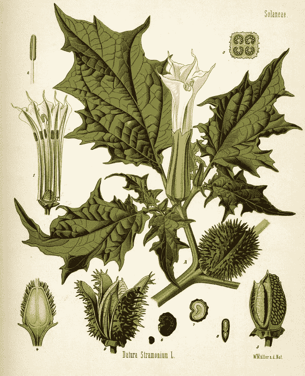

曼陀罗

在德文中它被称为「带刺的苹果」（Stechapfel）或是「恶魔的苹果」（Teufuls-apfel）、「雷之球」（Donnerkugel），来自于其蒴果的形状。

曼陀罗于江户时代传入日本。纪州的医师华冈青洲（一七六〇～一八三五）调和六种药草发明了全身麻醉药「通仙散」，其中的原料之一即为曼陀罗花，也就是曼陀罗（Datura metel）。

曼陀罗花是世人想象出来的花朵，认为它绽放于极乐净土。曼陀罗的毒素会使人产生进入极乐世界的错觉，因此其别名又叫曼陀罗花。

曼陀罗于江户时代传入日本，不仅难以种植，且在实际药用上难以运用，因此其后几乎在日本绝迹。然而最近常可在一般家庭的庭院当中，发现其近缘种大花曼陀罗（Brugmansia spp.）的踪迹。大花曼陀罗又名「天使的喇叭」（Angel’s Trumpet），以其大大的喇叭形花朵，受到大众喜爱，却仍含有毒素成分。

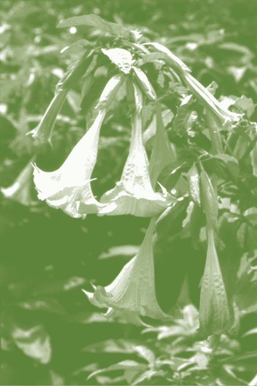

大花曼陀罗

告知马利亚耶稣受胎一事的，是大天使加百列；在耶稣诞生时吹响祝福的喇叭的，也是成群结队的天使。于是天使成为祝福的象征，常常作成可爱的形象装饰在圣诞树上。然而在圣经［启示录］当中，告知世人世界末日将会用如何恐怖的形式降临的，也是「随着喇叭般的声响」降临的天使，最后审判时在旁见证的天使也吹奏着喇叭。因此这样的声音听起来，绝对不仅仅是悦耳的声音那么简单。所谓的恶魔，其实也不过是违逆了神的旨意，而遭赶出天国的堕天使，所以可别被天使这个头衔所蒙骗。

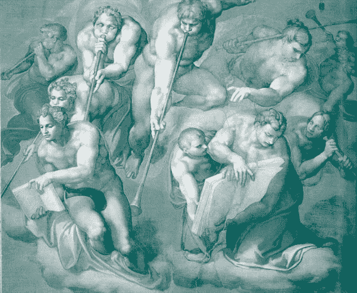

天使吹响喇叭，告知人类最后审判的到来。这些天使并没有翅膀，且和一般人印象中的天使不同，浑身肌肉，相当雄壮威武。米开朗基罗绘［最后的审判］，1541 年，西斯汀教堂（梵蒂冈）。

###### 【配方Ⅲ】

■新生婴儿的肉

■罂粟

■龙葵

■泽漆

■毒菫

■将前述材料煮成粥状。

这配方让人全身汗毛直竖，据说是由十六世纪相当著名的瑞士医学学者帕拉塞尔苏斯⑪所复原出来的，原本记载于普雷托流斯介绍女巫之夜［瓦普几丝之夜］的作品——《发生在布罗肯峰的事》当中。

配方中列举了新生婴儿的肉，想必让不少读者感到反胃。在女巫软膏的配方当中，常列有人类的脂肪以及新生婴儿的肉。

为了使软膏易于涂抹，往往会添加动物的脂肪。从人类或是新生婴儿身上取得脂肪，这样的制作方式的确很适合用在「女巫软膏」中。

在猎巫潮初期，曾有两位德国神学家在一四八六年合作写了一本叫做《女巫之鎚》的书籍，试图透过种种诡辩证明女巫究竟是什么，并记载着对有女巫嫌疑的人，应该透过何种方法让她招供，在自白后并处以何种处罚，几乎可说是审判女巫的教学手册。

作者更咬定接生婆也属于女巫的一种，指出她们会将刚出生的婴儿抛至空中交给恶魔，毫不掩饰地表达对接生婆的憎恶。

接生婆之所以成为攻击的目标，有几个理由：亚当与夏娃违背了神的命令，偷吃了智慧之树上的禁果，因此遭放逐出伊甸园。当时神对夏娃说︰「我必大大增加你怀胎的苦楚。你生产儿女必多受苦楚。」（创世记三：十六）。生产时的痛苦既然是违背神的惩罚，那么熟练的接生婆尽可能减少产妇所受痛苦，自然会被视为是在违背神的旨意。

另外，在基督教当中，洗礼是最重要的仪式。在出生时死亡的婴儿，由于没有接受洗礼，便无法前往天堂。因此，在难产时，比起已经接受过洗礼的产妇，未经洗礼的新生儿的性命更为受到重视，婴儿死亡于是成为接生婆的责任，必定是因为她把婴儿的身体当作祭品，献给恶魔的缘故。

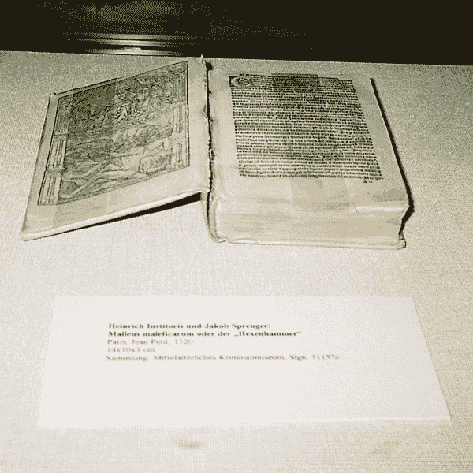

被称为是女巫裁判教科书的《女巫之鎚》实物。这样一本小书，却是害得许多人遭指控为女巫的元凶。斯布邦格及克拉玛神父着，1486 年，藏于南德罗腾堡的中世纪犯罪博物馆。

接生婆对因故无法生下小孩的女性也提供了很多帮助，但能够促进子宫收缩与分娩的草药，往往也具有堕胎的效果。由于关于类似药草的种种知识，都是接生婆的专业领域，众人进而认为，用于堕胎的药草也是「女巫药草」，而使用这些草药的接生婆自然是女巫。因此，女巫的软膏中含有新生婴儿肉的成分，不仅是用作润滑剂，还有前述的历史背景。

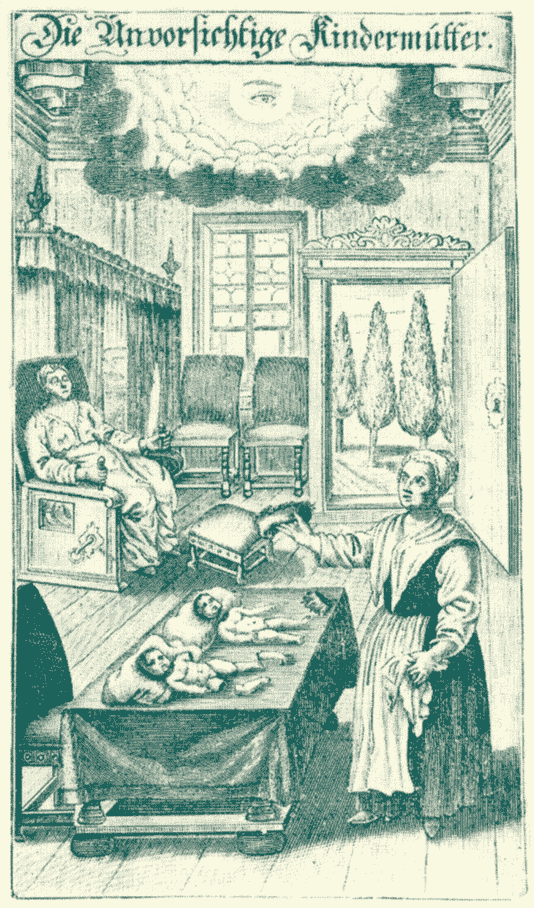

［粗心的接生婆］，1715 年。这幅画当时广为流传，接生婆的执业资格遂开始受到怀疑。但再怎么样笨拙的接生婆，也不至于这样对待婴儿。

###### 【龙葵】

女巫的药草很可能曾用于堕胎，毕竟比起飞行，堕胎用途的需求量应该大得多。每个孕妇都会担心有可能在生产过程中丧失生命。

特别是从前卫生条件不比现代，为求生产时母子平安，除了加持祈祷外，时人也常常使用一些促进阵痛以及对产后恢复有帮助的药草。然而，促进阵痛的药草由于能使子宫收缩，若效果过强则有导致流产的危险。

酸浆（Physalis alkekengi）具有独特的红色外型，是日本人相当熟悉的草药，根部也曾用于堕胎。剥开灯笼型的花萼，里面满是熟透的红色果实。把果肉取出之后，可以制成小型的气球，或是放入口中吹出声音取乐。不过种子常常无法巧妙地掏出，反而弄破袋子，或是将袋子里弄得都是果实的汁液，味道相当苦涩。

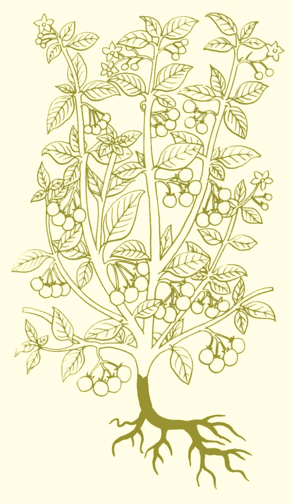

龙葵

有人说制作这种红色气球时要小心不能把种子吃下去，后来听说酸浆可以用于堕胎，曾经想过这就是原因所在。事实上，就算误食种子，顶多也只是使人拉肚子而已，实际上用来堕胎的是根部。

日文当中的龙葵称为「犬酸浆」（Solanum nigrum），便是在酸浆这个名称前冠上犬字，是「女巫软膏」中不可或缺的常见药草。

茄科植物与女巫的药草关系密切。茄科这个字不论在德文或英文中，都称为「夜晚的阴影」（Nachtschaten、Nightshade），给人阴暗的感觉。龙葵更是变本加厉，在名称前面附带形容词「漆黑的」（schwarzer、black），更加深了含有剧毒的印象，可说是极为适合「女巫药草」的名字。

龙葵的果实比酸浆朴素，成熟时不会变红，维持黑色，花萼也不呈袋状，果实就像一个个涂黑的小灯泡。尚未成熟的绿色果实中，含有龙葵硷与澳洲茄硷、皂素等生物碱，虽然可用来制作止痛软膏，不过事实上却是能够麻痹神经的剧毒。

###### 【金雀花】

具有堕胎效果的药草相当多，豆科的金雀花（Cytisus scoparius）也是其中之一。鲜黄色的花朵呈蝴蝶型，虽然盛开时看上去相当美丽，然而其枝叶都含有生物碱成分。这些有毒成分会让子宫收缩，因此除了拿来当作阵痛促进剂以外，也用于堕胎。

基督教禁止堕胎，因此接生婆使用像金雀花这样的药草达到堕胎目的，自然会被教会注意，然而对许多因不得已的苦衷而无法将小孩生下的女性，这却是救星。

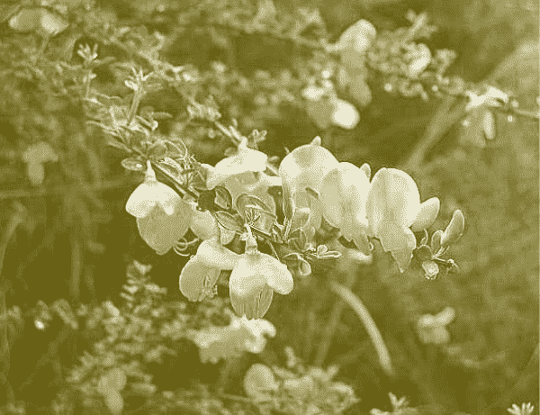

金雀花

金雀花常被认为是女巫扫把的材料。金雀花的某个近似种，在德语中称为「bechstein ginster」（扫把状的金雀花），在英文中则称为「Common Broom」（普通的扫把）。正如其名，金雀花的枝柔软且富有弹性，适合用来制作扫把，实际上也有人把它当作扫把来用。

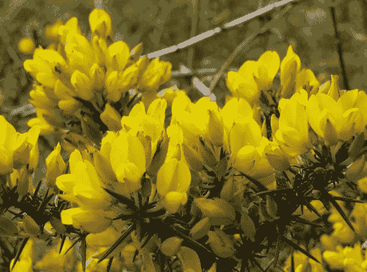

荆豆

然而说到女巫的扫把，英国常见的荆豆（Ulex europaeus）则可能最为适合。春天的山丘往往会为其所开的黄花掩盖，无数带刺的枝枒互相交错，叶片也呈鳞片状或刺状，光看便令人觉得刺痛。

###### 【秋水仙】

秋水仙在日文中称为「犬番红花」，其中的犬字，其实是个似是而非的发语词，这点在刚刚提到的「犬酸浆」来说也是一样的。秋水仙（Colchicum autumnale）开的花虽然与番红花很像，然而番红花是菖蒲科，秋水仙则是百合科，两者是完全不同的植物。也就是说这两者虽然相像，实际上截然不同。

秋水仙在英文中称为「autumn crocus」，其中「crocus」来自古希腊文，用阿拉伯语发音即为「Saffron」。日本人将秋天开花的称为「Saffron」，春天开花的称为「crocus」。

秋水仙所开的花相当漂亮，然而种子与球茎中含有秋水仙素这种生物碱，毒性极强，就算只是数颗种子也能致命。

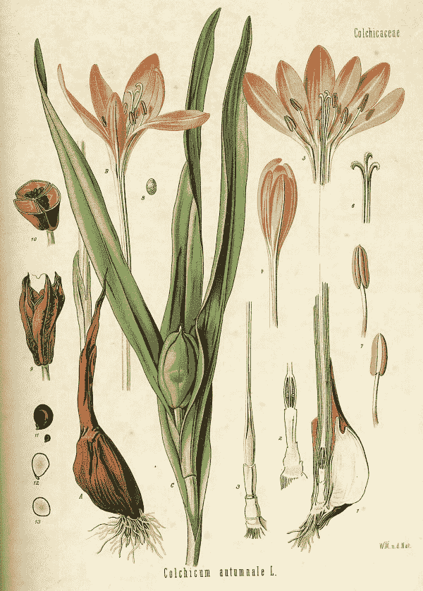

秋水仙

古希腊哲学家德弗拉斯特⑫曾经于《植物志》中，记载过奴隶使用番红花来装病的情景。虽然经常使用这种植物会导致死亡，由于效力发作很慢，因此只要使用解毒剂就没有大碍。

在德国这种植物被称为「恶魔的面包」（Teufelsbrot），长于药草知识的修女冯．宾根在她所写的《自然史．自然的治愈力》一书当中，曾记载若服用秋水仙会造成身体机能障碍，往往导致死亡。秋水仙素的效果虽然恐怖，从前却常常用来当作痛风的止痛药，对痛风相当有效，甚至如果服用之后还在痛，就可断定疼痛一定不是痛风引起的。进入十九世纪之后，专家更发现秋水仙素具有使染色体加倍的作用，因此也用于种植西瓜的用途上。

秋水仙素具有强烈的副作用，常引发下痢、血流堵塞、起疹及肠胃功能障碍，长期服用还会掉发。若女巫因为经常使用掺有秋水仙素的软膏而饱受掉发之苦，就不免让人同情了。

###### 【泽漆】

女巫药草当中，除了会使人掉头发的药草，还有蕴含会使皮肤溃烂毒素的药草。大戟科植物中，许多种类皆含有对皮肤有害的毒素。近似种野漆便是其中之一，仅仅涂在皮肤上，便会造成溃烂及起水泡，不慎误食则会毁损消化器官，引起严重的下痢。至于大戟科的泽漆（Euphorbia helioscopia），若折断茎所得的白色汁液误入眼中，则有失明之虞。

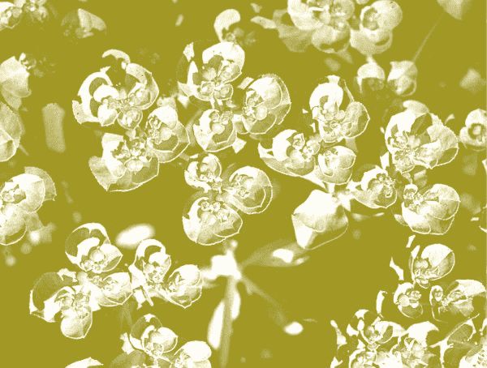

泽漆

泽漆在德文中称为「狼的乳汁」（Wolfsmilch），并非因为其汁液呈乳色，而是因为可以用来击退野狼的缘故。在日本，人们也会使用泽漆的近亲钩腺大戟的根部来作为驱赶野狼的道具。

与「狼的乳汁」这个名字相较之下，日文名称「灯台草」显得较为重视外型，给人美丽的印象。它的叶片就像装着整株植物的盘子一般，茎则从中央伸出，绽放出花朵，整体看起来就像放置着火把的台座。

「女巫软膏」顾名思义是用来涂抹的，但在其原料中列举出涂了会引起溃烂的泽漆，让人不免对「女巫软膏」平添几分畏惧。

###### 【菟葵】

有趣的是，在「女巫软膏」的原料当中，也含有会让人打喷嚏的药草。那就是自古便相当有名的菟葵，中古时期大多用于驱魔或者治疗精神疾病。然而，到底菟葵具体而言是指何种药草，至今仍无法确定。

古代希腊的大学者德弗拉斯特在其所着《植物志》中记载着，菟葵分为黑与白两种，两者之间共通之处只有菟葵这个名字而已，在外貌及性质方面许多人看法仍不一致。

英国植物学者约翰．帕金森⑬表示，「nigger」品种才是真正的菟葵，开花期甚短，在接近圣诞节时开花。「nigger」意即黑色，指的是它黑色的根。

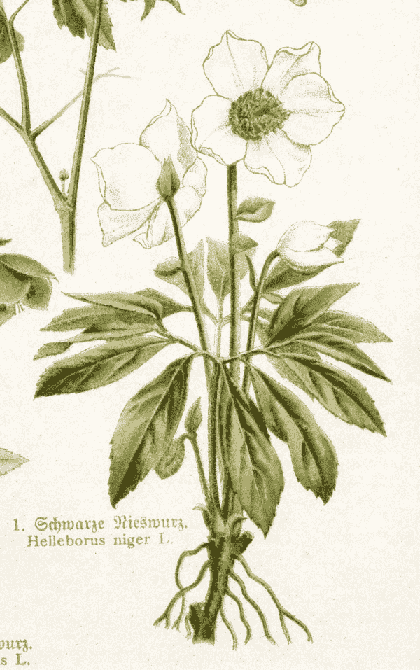

圣诞蔷薇

菟葵当中，花期为圣诞节前后，且根呈黑色的品种，就只有毛茛科的圣诞蔷薇了（Helleborus niger）。这种花背后流传着下面这样的传说：

有一位少女为了没有花可以献给刚生下来的基督而烦恼，这时天使翩然出现，用他的手触碰了被大雪覆盖的地面，于是地上开出了美丽的白色花朵，这就是圣诞蔷薇。

花的外观一如传说中的描述，确实相当美丽。叶片像手一样从地面展开，茎粗且短，尖端挂着白色的花朵。目前有许多专供栽种的品种，不仅是圣诞节前后，在春天的庭院中也能看见它的踪迹，在日本甚至还有圣诞蔷薇协会，负责召开分级评鉴大会，深受大众喜爱。

英国的植物采集学家法拉（Farrar，一八八〇～一九二〇）这样描述黑色种的菟葵：「它的花瓣是纯白的，然而谁知道是否真的具有纯洁的心？毕竟，它的中心部份以及根部都是黑的。」可说是十分巧妙的描写。

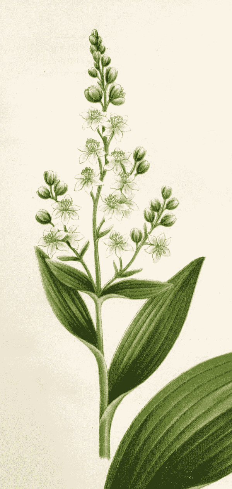

梅蕙草

另一方面，白色种的菟葵（Veratrum album）则是百合科的植物，乃是日本的梅蕙草的母种。正如德弗拉斯特所说，白色种的菟葵与黑色种是完全不同的植物，垂直伸长的茎部末梢盛开着白色的小花，从叶子的外型便可得知其应归类于百合科。

绞碎白菟葵所得的汁液中含有称为癫茄硷的毒素，由于常于狩猎时涂抹在箭端，在日本也叫做弓取草。该毒素会引起痉挛及让人意识不清，就算加热毒性也不会消失，因此也用来制造杀虫剂。根部磨成的粉末会让人打喷嚏，因此别名又叫做喷嚏草。

圣诞蔷薇也就是黑菟葵，根部磨成的粉末呈黑褐色，也会使人猛打喷嚏。圣诞蔷薇的德文虽然叫做「cristrose」，但别名「Schawarze Nieswurz」的原意其实就是「黑色的喷嚏草根」。

宫崎骏动画作品《魔女宅急便》的同名原作由角野荣子所着，故事主角琪琪的母亲是一位会用药草来制作各种药品的真正女巫，会在家门前柱子上贴着的纸条写着——「出售喷嚏药」。如果作者是想到菟葵而写下前述的场景，那么她真不愧是一位熟知女巫一切的人。

「女巫软膏」所使用的菟葵究竟是白种还是黑种，至今没有定论，然而由于配方中记载的是粉末，也许很多女巫都是边打喷嚏边涂着软膏吧。毛发脱落、皮肤溃烂，并且不断地打喷嚏。想象女巫有这样的遭遇，不禁让人觉得既可怜又好笑。

###### 【玄参】

洋地黄的花朵呈筒状，沿着茎顺次开放，相当引人注目。属于玄参科的洋地黄，也是「女巫药草」之一。虽然其中含有大量可以用来治疗心脏病的配糖体，然而也正因为如此，一般人若擅自食用会造成危险。

在德文中有一种叫做「Knotige Braunwurz」的女巫药草，也同样属于玄参科，是西洋玄参的近似种（Scrophularia nodosa）。然而令人感到困扰的是，这种药草并没有日文名称，因此在此暂称为玄参。

这种西洋玄参与华丽的洋地黄相比，比较不吸引人注意，然而既然名列女巫药草当中，一定有其理由。

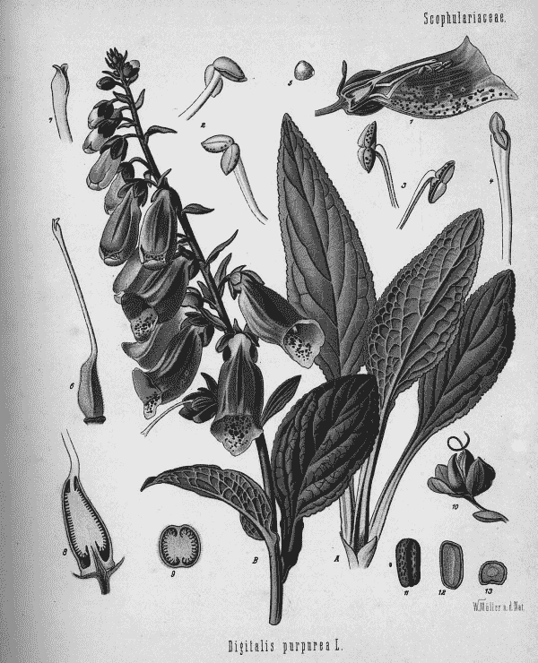

洋地黄

根据目前在德国开业的芳疗师苏珊．费雪的记载，玄参的别名叫做「女巫草」（Hexenkraut）、「燻过的根」（Rauchwurze），并表示这种植物从前曾经用于咒术仪式当中。

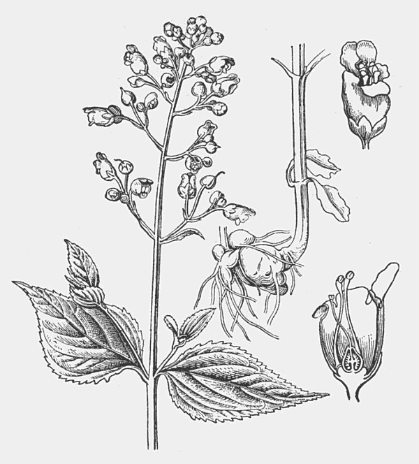

玄参的近似种

另外，这种草从前也被称作是母猪草（Saukraut），这是由于它对治疗猪只的疥癣症状很有效果。

母猪草这个名字相当有趣，猪只对农民而言是相当重要的家畜，能够治疗猪只疾病的药草为什么会被称为「女巫草」呢？推测恐怕是因为玄参对疥癣的治疗功效在不知不觉中遭到曲解，变成「疥癣是女巫所造成的」。探讨植物命名的由来及之后的变迁总是让人感到相当有趣。

在十六至十七世纪之间，也就是欧洲所谓「猎巫」的时代，只要有什么不如意之事，几乎通通都可以推到女巫身上。制作奶油是主妇很重要的工作，若一不小心让牛奶和奶油坏掉了，逃避责任的人就会说是「一定是当时经过家门口的那个女人下了诅咒」，使得无辜的女性遭捕受审。像这样的情节，在当时层出不穷。

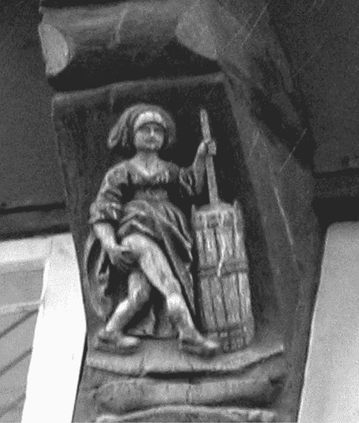

奶油就是用图中所见的细长木桶制作。虽然从图片看不出来是谁掀起了女性的裙子，然而其实是因为旁边有爱恶作剧的恶魔，手拿风箱吹起大风的缘故。这座塑像名叫做［奶油的汉娜］，相当受到城镇民众的喜爱。拥有这件装饰品的建筑物建于十六世纪前半，位于德国高斯乐的马可德广场。

话题回到玄参，玄参的花呈茶褐色，根部散发出令人不快的臭味并有毒性，然而除了用以治疗猪只的疥癣，对淋巴腺肿大也很有效。玄参的根部有着拳头大小的淋巴节状结块，也许是因为这样，从前的人才产生了可以用它来治疗淋巴腺肿大的想法。听到这样的理由也许有人会感到好笑，然而这样的联想真的是毫无根据的吗？前人由外型推测效果的药草中，的确有不少功效获得证实。但心理作用带来的影响，也绝不可忽视。

例如，石榴红色的汁液会让人联想到血液，是故自古便认为对改善血液循环及止血很有效；粒状果实由于状似牙齿，因此也有人说对牙痛很有效。也许有人认为，这是从色彩及外型近似所产生的迷信，然而石榴花目前已获得实证具有帮助伤口收敛的效果，对止血很有帮助。

近年来，坊间认为石榴当中含有的鞣花酸能够抑制胆固醇，雌激素则对更年期症状有效，因此渐渐有人开始饮用石榴果汁，然而随即却又获得证实，上述观念都是错误的。随着研究进展，至今为止屹立不摇的学说仍有可能遭到推翻，不过使用玄参作为膏药来治疗淋巴腺肿大的疗法至今仍获大众采用，这可说是大自然不可思议的地方。

###### 【包心菜与马齿牡丹】

用来作为「女巫软膏」原料的药草并非全部都是含有毒性的。例如前述卡达诺的配方中所记载的包心菜与马齿牡丹就没有毒。包心菜竟然也用来制作女巫的软膏，相信一定让人感到不可思议。提到包心菜，一般人似乎都马上联想到球状的蔬菜，然而茎较长的品种莴苣，以及叶片包裹较为稀疏、呈半球形的色拉菜，也都属于包心菜的一种，皆为菊科植物。

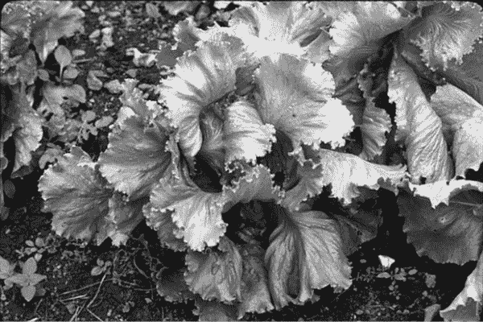

莴苣

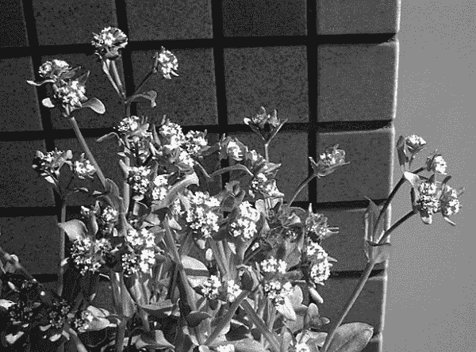

野莴苣

莴苣是公元前六世纪由波斯经希腊、罗马传入欧洲的古老植物，而球形包心菜普及于欧洲则是公元十六世纪的事情，因此说起来包心菜的历史反而比较短。格林童话当中有个［长发姑娘］（Rapunzel）的故事。「Rapunzel」既是女主角的名字，同时也是养育她的女巫种在庭院中蔬菜的名字。这种植物在德文中别名「Feldsalat」，其实就是忍冬科的野莴苣（Valerianella locusta）。然而遗憾的是，女巫软膏中使用的包心菜，到底指的是前述哪一种，则不得而知。

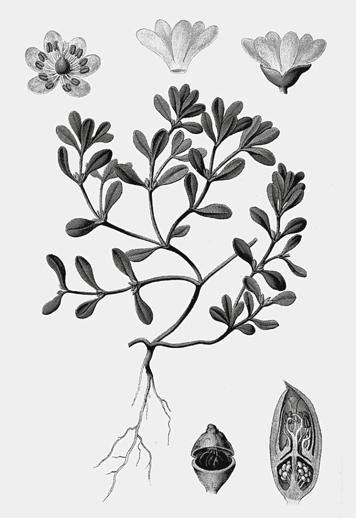

马齿牡丹

同样的，马齿牡丹（Portulaca oleracea）似乎也很难令人与女巫软膏做出联想，不过比起包心菜与女巫的关系好像又近一些。制作软膏的时候，为了便于涂抹，常常加入脂肪。马齿牡丹的叶子在烫过以后具黏性，也许具有近似的效果。

马齿牡丹在日文当中未使用汉字，许多日本人也许会误以为是外来语，事实上它的汉字写成「滑苋」。「苋」指的是小巧可爱的草，从前在路旁常常能发现它的踪迹，但最近似乎被当成杂草拔除反而难得一见。叶片多肉质，在盛夏时会开出黄色的花。果实成熟时上半部像帽子般，可以摘除。内部含有许多细小的种子，相当可爱。

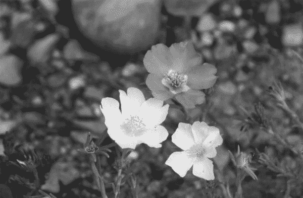

松叶牡丹

马齿牡丹自古以来便是十分著名的植物，在古罗马博物学家老蒲林尼所着的《博物志》当中，就已经可以找到相关记载。美国的印第安人在头痛与胃痛时也会熬煮并服用；在欧美则常用来当作色拉或汤中添加的蔬菜食用。

松叶牡丹同属马齿苋科，川烫过后也同样呈现黏稠状。虽然不知道味道是否好到让人想主动食用，是解毒剂中不可或缺的材料。

根据九世纪左右活跃于阿拉伯的炼金师、同时也是农业学家的伊本﹒瓦希亚（Ibn Wahshiyya）记载，在解毒剂当中，必定含有一种叫做「巴比那」（Balbina）的草，而那其实就是某种汁液较多的松叶牡丹。

松叶牡丹具有抑制呕吐冲动的效果，而马齿牡丹则对肠胃不适相当有效。如果发生了这两种症状，不妨尝尝看这两种植物黏稠的口感。

囊括许多有毒药草的「女巫软膏」当中，也使用含有丰富维他命的包心菜及马齿牡丹这样的植物，让人感到相当有趣。一般人对于「女巫药草」都含有剧毒的刻板印象，也许该就此修正。

* * *

＊注①——杜勒（Albrecht Dürer，一四七一～一五二八），文艺复兴时期的优秀画家，出生于纽伦堡（Nuremberg）。

＊注②——哥雅（Francisco de Goya，一七四六～一八二八），西班牙艺术家，开启了十九世纪的写实主义，对十九及二十世纪的绘画有深刻的影响。

＊注③——巴尔东．格林（Hans Baldung Grien，一四八〇～一五四五），文艺复兴时期德国画家，是杜勒的头号弟子，曾创作许多以女巫为主题的画作。

＊注④——卡达诺（Gerolamo Cardano，一五〇一～一五七六），十六世纪意大利的医师、数学家。热爱赌博，是第一个有系统地研究机率的人。

＊注⑤——索福克利斯（Sophoklés，公元前四九七／四九六～四〇六），希腊三大悲剧作家之一，出生于雅典郊外的克洛诺斯（Kolonos Hippios）。现存作品有《阿伊亚斯》（Aias）、《安蒂岗妮》（Antigone）、《伊底帕斯王》（Oidipus Tyannos）等等。

＊注⑥——德谟克里特斯（Democritus，公元前四六〇～三七〇），来自古希腊爱琴海北部海岸的自然派哲学家，是经验式的自然科学家和第一个百科全书式的学者，也是古代唯物思想的重要代表。

＊注⑦——老蒲林尼（Gaius Plinius Secundus，公元二三～七五），常称为老普林尼或大普林尼（Plinius Maior），古罗马文学家、科学家，以《博物志》（Naturalis Historia，公元七七年）一书留名后世。由于观测维苏威火山爆发时过于接近，吸入有毒气体而死。

＊注⑧——夏目漱石（一八六七～一九一六），日本明治时期代表性小说家。

＊注⑨——西博尔德（Philipp Franz von Siebold，一七九六～一八六六），德裔医师与植物学家。曾前往日本，于长崎讲授西方医学，后因于离开时携带日本地图为当时德川幕府所发觉，被驱逐出境，永不得进入日本。

＊注⑩——赫德嘉．冯．宾根（Hildegard von Bingen，一〇九八～一一七九），中世纪德意志知名的女修道院长，是神祕主义者、科学家、神学家及作曲家。据说她从很年轻时就有灵视的能力，写了多部关于信仰的著作，在自然科学方面也有杰出的成就，所写的《自然史．自然的治愈力》（Heilkraft der Natur -“Physica”）和《病因与疗法》（Causae et curae）二书，内容涉及广泛的博物学知识，以及各种动物、植物和矿物的治疗功效，体现出在中世纪极为罕见的科学观察能力。

＊注⑪——帕拉塞尔苏斯（Paracelsus，一四九三～一五四一），生于瑞士，身兼鍊金术师及医生两种身分，是将炼金术运用于医药化学的始祖。Paracelsus 为其自称，意为超越古罗马名医塞尔苏斯（Celsus，一～一〇〇）。

＊注⑫——德弗拉斯特（Theophrastos von Eresos，公元前三七〇～二八五左右），古希腊哲学家，为亚里斯多德弟子之一。

＊注⑬——约翰．帕金森（John Parkinson，一五六七～一六五〇），十七世纪英国植物学家，是英国公认的最后一位草药医生，和第一位植物学家，在药物发展的历史上有重要的地位。

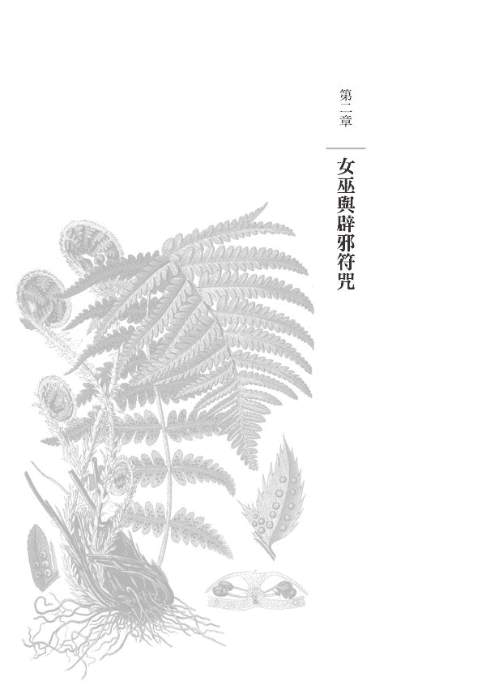

# 1　辟邪草

不论在什么时代、什么国家，人人都希望能够免除天灾与疫病的危害，并且能健康地度过人生。因此每逢旅行或大考将至，就算知道只是迷信，往往也愿意掏腰包买个护身符带在身上，或是像日本正月的习俗一样，买一枝破魔矢供在家里。

现在流行的「御守」或是护身符，都可以归类于辟邪符咒之中，辟邪符咒在德国称为「Amlette」或「Talismane」。古代日耳曼人使用的卢恩文（Rune）等，主要是把象征符号标记在纸片，或戒指、项鍊等物品上，用纸张、木片、石头、金属及骨片也可以。

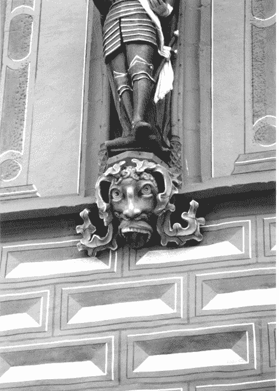

人类或动物吐出舌头吓阻邪魔的雕像，常供建筑物辟邪之用。这样的现象散见于世界各地。照片摄于德国高斯乐的马可德广场。

十四世纪中叶欧洲黑死病（鼠疫）的流行使得人口约只剩到原本的三分之一，在鼠疫的阴影笼罩下，每个人都处于不知何时可能患病死亡的恐怖之中，在那个时代，辟邪护符是一般人的日常必需品。

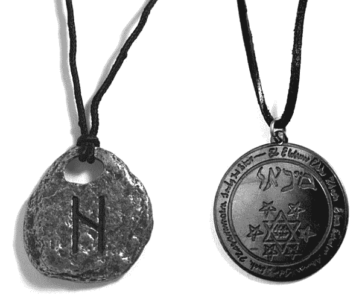

卢恩文字护符（图左）。相传卢恩文字是北欧神话的主神奥丁发明的文字，功用是当作咒文。图中状似英文字母「H」的文字，被称作 Hagall 或 Hagalaz，象征着冰雹。这是守护人类不受突然发生的自然灾害危害的护符。

六芒星护符（图右）。两个正三角形交叠而成的六芒星形状（hexagram），或称大卫之星。魔法圆阵及六芒星和星形记号相互组合，是常见于辟邪护符上的图形。

在基督教会的观念中，十字架辟邪的效力最强，因此只要是十字形的事物都可以用来当作护符。当时的人习惯在玄关或门前用粉笔或炉灰画上十字记号，防止恶魔侵入。

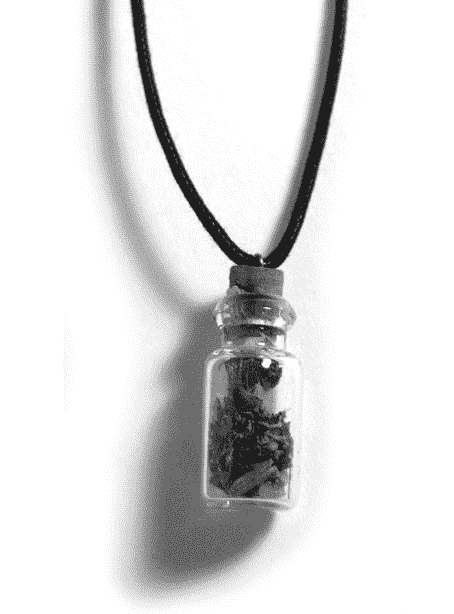

图为英国康禾地方的波斯堡（boscastle）魔法博物馆中所贩售装有药草的辟邪护符。

根据十八世纪初期一位专门研究基督教与恶魔的学者西尼斯特利①的研究指出，西欧中古时代为了驱赶恶灵，甚至曾经制作饮料，材料当中包含了可以用来制作兴奋剂及春药的药草。做法是将菖蒲、姜、肉桂、丁香、檀香、肉荳蔻等十七种香草类配上三又二分之一夸脱（约四公升）的白兰地与水后加以蒸馏。

这样的饮料及项鍊、戒指等护符，都是经由人类的手制造出来的。然而，接下来提到的辟邪草，无须任何加工便能达到辟邪的效果。

有趣的是，一般认为极为有效的辟邪草，往往同时也是用来制造「女巫软膏」而受到民众敬畏的药草。

###### 【牛至与苦薄荷】

在格林兄弟所着《德国传说集》当中，有个故事将牛至与苦薄荷描述为接生婆与孕妇临盆时用来辟邪的植物。

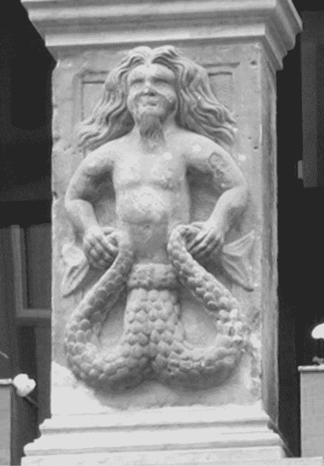

水精在德国的传说中，不仅有家庭，还会到市集买肉，也有生产力，具有许多像人一样的特征。由于皮肤呈绿色，脚底下总是湿漉漉的，因此一般人能够轻易分辨出来。照片中的水精有着两条分歧的尾巴，原形应该取自古代希腊神话中的水妖赛莲（siren）。摄于德国古威堡，是市政府官厅外墙的装饰。

从前，有个住在哈雷（位于德国东部的城镇）的接生婆家里，来了一位男性水精，他希望接生婆能够前往他位在河底的巢穴，帮他的妻子接生。结果，接生婆就像自己的媳妇生小孩一般尽心尽力，水精的妻子因此十分感激，为了让接生婆能够平安回家，给了她这样的忠告：「我丈夫付你的钱，切记不可以全拿，只能拿一点。从河底回到地上时，那边应该生长着牛至及苦薄荷，一定要马上抓牢。」接生婆照着她的话做，因此才能平安回到家。

也有故事提到，受到水精袭击的孕妇，因躲在牛至及苦薄荷丛生的草丛中而得救。

因为有这样的故事，所以接生婆相当看重这两种植物，往往会将之放在孕妇的卧床及婴儿的摇篮中，甚至带在自己身上，并劝告民众依样画葫芦。据说在德国的莱比锡，药草贩常常会在市集中兜售这两种草药。

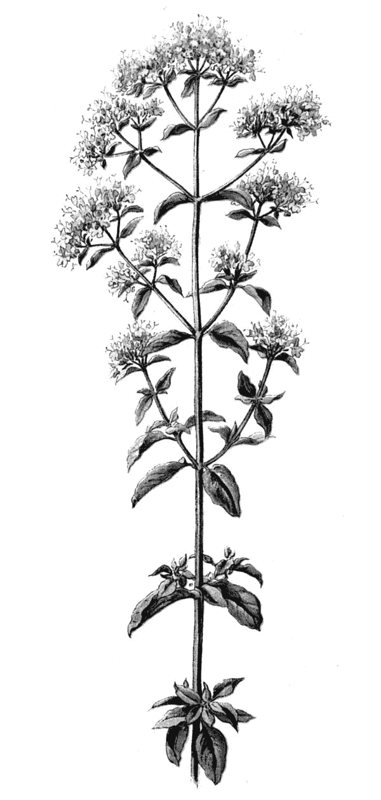

牛至

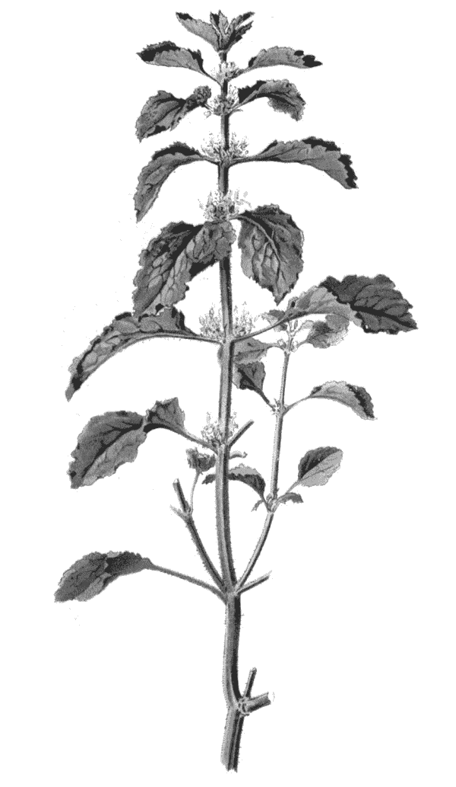

苦薄荷

《德国传说集》当中有几篇故事都提到接生婆帮助水精生产的情节。由于水精被认为是异教的自然神，受基督教排斥；而且水精平时住在水底，因此无法在陆地上生产，只好强行将接生婆带回巢穴。就算心里再不愿意，接生婆一旦接受委托，也只得硬着头皮完成任务。只是严格来说，毕竟没有人打从心底乐意帮水精接生，就算只是让人在背后流传曾帮水精接生，事情也会很麻烦。因此她们选用传说中水精讨厌的药草制成辟邪护符，保护自己不成为水精的目标。

透过这些传说可以窥见接生婆保护自己不受恶魔及异教怪物侵扰的方式。这些故事的背景多是猎巫的时代，当时普遍将婴儿死产归咎于接生婆将婴儿的尸体奉献给恶魔，若有婴儿死产，接生婆就会被视为女巫逮捕。

唇形科的牛至（Origanum vulgare）是守护接生婆的植物，今日也称为奥勒冈（oregano），常用作香辛料。牛至花朵呈唇形，带淡红色，相当可爱。叶片有近似胡椒的香气及清爽的苦味，含有助眠的成分，因此人们常常将这种草放在枕头底下。

习俗中，接生婆将这种草当作辟邪护符带在身边，或许是为了用这种植物帮助孕妇入眠，纾解怀孕的劳苦。

苦薄荷（Marrubium vulgare）同属唇形科，正如名称所示，叶片带有强烈的苦味，功效不胜枚举，诸如止咳、化痰、驱除肠内寄生虫、治疗溼疹、带状疱疹等等。

美国原住民那瓦侯族②会熬煮苦薄荷的根，让产前或产后的妇女服用。两种文化中这种药草都和接生婆与孕妇有很深的关系。

繖形科与唇形科中许多带有强烈香气的植物都属于辟邪草。前人常在豢养家畜的小屋中燻烤这些植物，或是置于壁炉中焚烧，这是因为习俗中，大家认为那样的香气具有辟邪的效果。

其中香气特别强的牛至，不仅可以驱赶水精，还可以保护人们不受女巫及恶魔的侵害。仍然残存着许多女巫传说的德国哈茨地区流传着这样的故事：

有两个年轻人想要见识一下女巫究竟是如何赶赴女巫的盛宴——瓦普几丝之夜，于是站在山里的某个十字路口处观察。他们将牛至及缬草制成花环摆在地面，坐在中央抬头望向天空，不久果然看见女巫飞过天际。在其他的传说中，也有将牛至制成的花环戴在头上才能看见飞过空中的女巫的说法。

后来，这两个年轻人看见一位邻家女性乘着一辆没有马的马车从空中飞过，于是拜托她也让他们搭乘。年轻人并没有忘记随身携带前述两种药草，他们相信只要身边有这些花朵便不会遭到危害。事实上他们也的确安然无事地回到家中，恶魔甚至还送给他们纪念品带回去。

享受现代版「瓦普几丝之夜」的群众女巫聚集起来召开祕密会议，这样的情景只存在于传说中。

现代的女巫飨宴，来的都是为了庆祝春天到来的人。

与会的人吃吃喝喝，欣赏演员或摇滚乐团带来的表演，享受一个热热闹闹的夜晚。

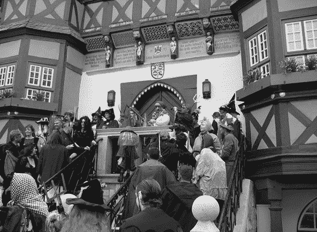

「瓦普几丝之夜」庆典一景。

跳累了，稍微休息一下。

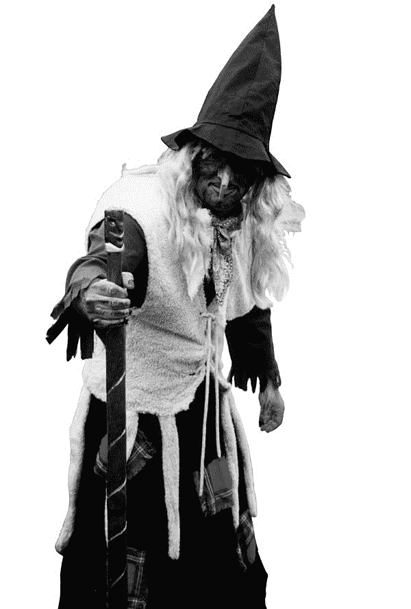

嘻嘻，欢迎来到「瓦普几丝之夜」

戴上角，你也可以成为女巫。

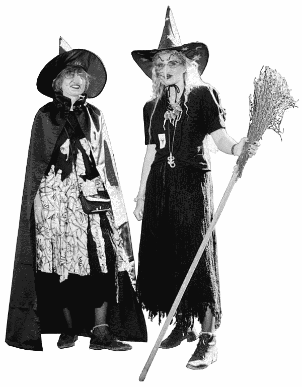

骑上这支扫把便能飞上天空。

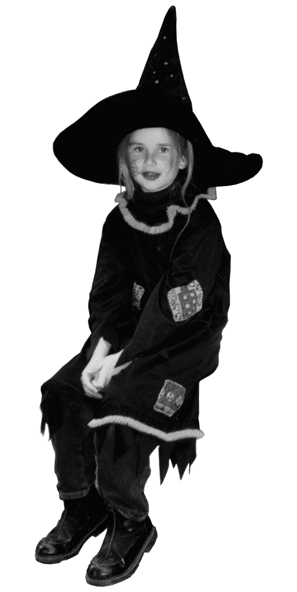

我长大要当女巫。

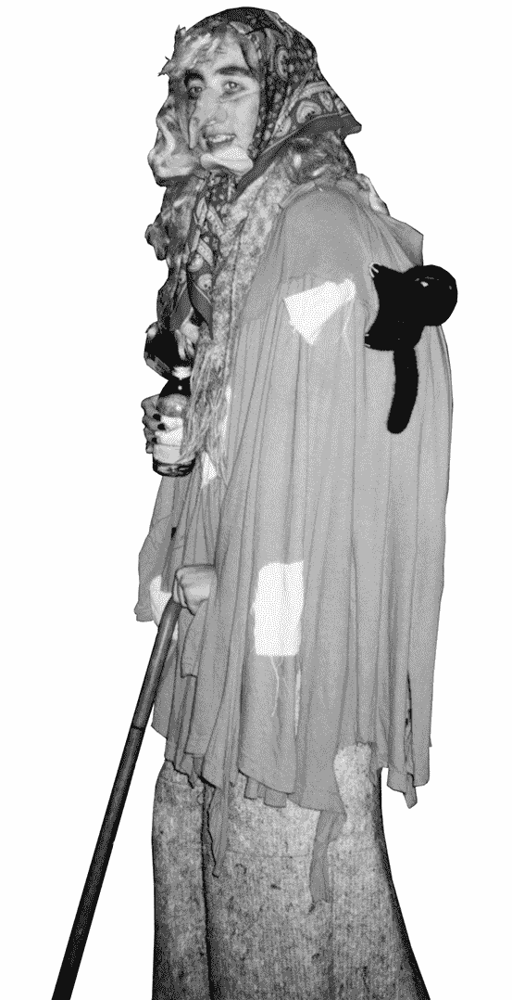

漂亮吧。浮士德就是和像我一样的女巫跳舞的。

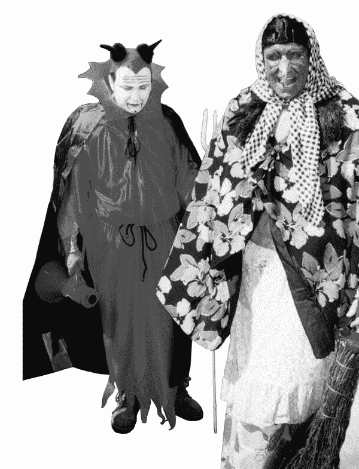

平时是温和的阿伯，但今晚是恶魔。

男人也可以扮成女巫

「瓦普几丝之夜」本来是赶走冬天的妖魔、迎接春天来临的民间习俗，也有人相信北欧神话的主神奥丁会在这一天举行结婚典礼。然而基督教传入之后，崇拜古代神祇的仪式受到禁止，这些异教神祇的形象就变成了冬天的妖魔，「瓦普几丝之夜」遂成为专属于女巫与恶魔的晚宴。

在古代，哈茨山地周边是日耳曼民族的领土，基督教传入的时间较晚。也因此至今在当地仍能看见许多古代神祇信仰的遗迹，一般民众大多也并不认为女巫真的如基督教所强调的那样恐怖。所以像前述两位年轻人那样，亲自前往「瓦普几丝之夜」的传说才有存在的空间。

当地人至今每年仍然期待着这个夜晚的到来。每到四月三十日，位于布罗肯峰山麓的城镇都会举办「瓦普几丝之夜」。演变至今，已经扩大为有四十四个当地乡镇参加、每年超过十万人次观光客造访的庆典。许多人甚至打扮成心目中女巫与恶魔的形象，并且举办戏剧公演、音乐会、摆设摊位等，活动规模相当盛大。

###### 【缬草】

缬草（Valeriana officinalis）属于忍冬科，常和牛至一起用于制作辟邪护符，在德文中称为「baldrian」，英文则为「valerian」。中古时代，在修道院附属的草药园当中，大多栽种有此种植物。缬草具有优良的镇静及催眠效果，据说还能抑制食欲，因此至今仍获广泛运用，许多具有帮助入睡效果的药草茶，大多含有缬草根的成分。

缬草的根部经干燥处理过会带有强烈的臭味，不习惯的人往往会捏紧鼻子逃离现场。也许就是因为这种恶臭的关系，缬草被视为是女巫用来施展咒术的材料，属于女巫的药草之一。我曾经在德国的草药店购买过这种草根。虽然只买了少许的量，但那还真不是普通的臭，店家将它存放在包裹了好几层的瓶中，臭味似乎还是能飘散出来。但若在茶中添加适当的量，臭味便能够抑制到可以接受的程度，甚至可能会让人上瘾。虽然这个气味不见得每个人都能接受，但是帮助睡眠的效果确实是有口皆碑。

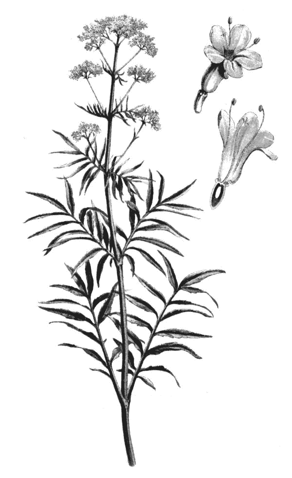

缬草

猫咪或者老鼠似乎也都很喜爱这种味道。以前有人专门以驱赶老鼠为业。他们带着捕鼠笼游走于各城镇间，笼子中装着用缬草根部捣碎制成的丸子，其中含有生物碱毒素。

德国北部的哈美恩（Hameln）以「哈美恩捕鼠男」的故事而举世闻名。当地的博物馆中展示有从前专门以驱除老鼠为业之人所使用的笼子，或以之为主题的图画。十三世纪时，哈美恩镇的居民，因为老鼠数量太多感到相当困扰。有一天，一名穿着破烂的人来到镇上，表示只要付他钱就能为镇民消灭老鼠，居民纷纷表示同意。此人随即拿出笛子吹奏，没想到镇中的老鼠通通因为被笛声吸引而跑了出来。

总之，他把鼠群带进河中淹死，解决了居民的困扰。然而镇民却开始推托，不肯付钱，捕鼠人愤而离去，不久后又回到镇上，一边吹奏笛子一边漫步。结果这次变成镇上所有的小孩都受到笛声吸引，跟着他走进某个洞穴中，然后就再也没有回来了。

依照哈美恩市的古老文件记载，一二八四年确实曾经有一百三十位孩童突然失踪。关于失踪的原因众说纷纭，没有确切的答案。然而哈美恩镇鼠害相当严重却是实情。这座城镇座落于威悉河（Weser River）边，建有许多利用水车磨制面粉的小屋，因此吸引了许多老鼠。老鼠是传播瘟疫的病媒，想当然不受人类欢迎。

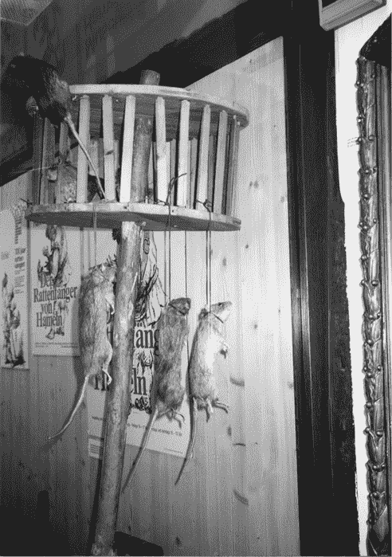

捕捉老鼠的笼子。（哈美恩捕鼠男博物馆）

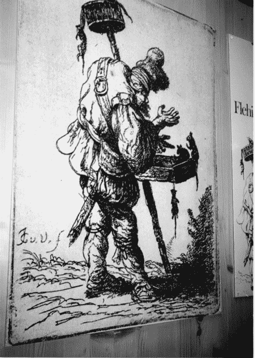

以消灭老鼠为业的人。（哈美恩捕鼠男博物馆）

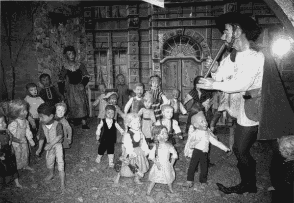

哈美恩的捕鼠男与孩童。这个故事见于格林兄弟所着《德国传说集》（1816-1818），因布朗宁（Robert Brwoning）写于 1849 年的诗作《吹笛人》（the pied piper）而广为人知。（哈美恩捕鼠男博物馆）

###### 【小连翘】

虽然许多带有强烈臭味的药草常常被用作辟邪草，叶片、花瓣的数目，以及根部的形状，也往往是考量的重点。像拥有三片叶子的幸运草，在基督教是三位一体的象征，四叶的幸运草则代表了十字架，被视为神圣的植物，在辟邪方面具有强大功效。

自古西方人就认为数字「5」带有神圣性，常常把它用在辟邪上。例如可以一笔画出的五芒星（pentagram）除了被视为是神圣的象征外，人们也常常在玄关大门上画上这个图案，充当辟邪护符。就算到了基督教盛行的时代，「5」仍然是一个特别的数字，这是由于耶稣被钉在十字架上时身体上共有五处伤痕（五处圣痕）的缘故。

小连翘有五枚花瓣，前人认为这种草具有特殊的力量。小连翘的叶片与花朵有着分泌精油的腺体，这种腺体根据草本身品种的不同，外观上呈透明或黑色点状。将花苞用手指揉碎，指头上会沾满红色汁液。从小连翘中提炼出的精油也呈现瑰丽的红色，有的人或许会觉得像血液。

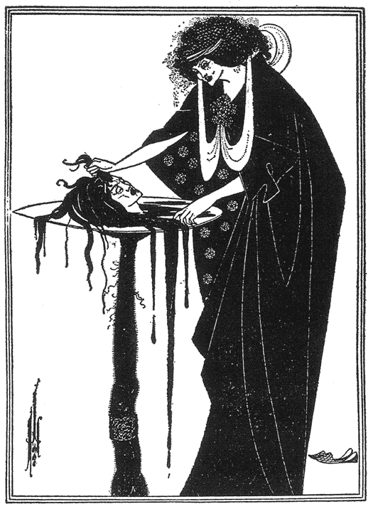

舞孃的奖赏。王尔德（oscar wilde）于 1891 年以新约圣经为题材写成了一齣戏剧《沙乐美》（Salome）。是关于沙乐美爱上约翰的故事，内容悲凄残酷。英语版于 1894 年出版，插画由 19 世纪末的画家比亚兹莱（Aubrey Beardsley）所绘。

贯叶连翘（Hypericum perforatum）在德文中称为「Johannes kraut」，在英文中则称为「Saint Jones wart」，两者的意思都是圣约翰草。这里的约翰，指的是在约旦河为耶稣洗礼的施洗者约翰。他被加利利统治者希律．安提帕（herod antipas）憎恨，最后因为他那没有血缘关系的女儿——沙乐美的强烈要求而遭斩首。前人认为植物上的斑点即为在行刑时飞溅的血液，而红色的汁液就是约翰的血。

小连翘日文汉字写为「弟切草」。这是个令人毛骨悚然的名字，其由来记载于江户时代的百科全书《和汉三才图会》（成书于一七一三年）当中。

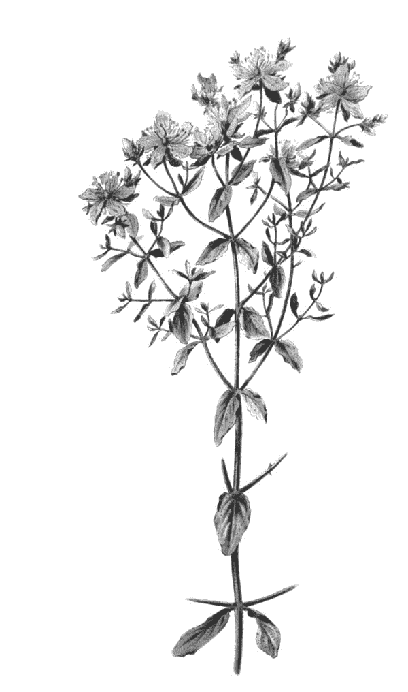

贯叶连翘

在公元九八四至九八六年间，掌理日本朝廷的花山院上皇有个叫做晴赖的优秀鹰匠，擅长使用药草治疗猎鹰身上的伤口。药方是不外传的机密，他的弟弟却将它泄漏了出去，因此愤怒的晴赖砍下了弟弟的头。据说该种密传药草就是所谓「弟切草」。

小连翘对发炎及外伤相当有效，这点印证了上述关于晴赖的传说。不管在日本或欧洲，这种植物背后都同样有着瀰漫血腥气息的故事，相当有趣。

小连翘的红色汁液虽然让某些人感到不舒服，但因为它的奇妙力量，成为一种地位很高的辟邪草。西方人认为这种植物具有驱赶让人生病的恶魔力量，悬挂在家门或窗口，能够保护家屋不受落雷击中。

据说小连翘的力量在六月二十四日最大，这一天是夏至，过去西方人认为每到这天妖怪和女巫会纷纷现形，因此为了驱赶魔物，前人生起火堆将制作成魔物外观的玩偶丢入火中焚烧，这就是至今仍流行于南德的风俗「约翰火祭」。

这一天对采药人来说是特别重要的日子，这是因为从前的人相信这天采摘的药草最为有效。不同的药草又分成适合于朝露降临之前或黎明等不同的时间采摘，因此选在这天出外采药的女性，往往必须从靠近黎明的时分便待在采集地准备。

春天开花的药草在此时结出果实，但也有些药草是秋天才开花。在这一天，采摘药草的女性可得拿出所有关于药草的知识和传统。在夏至举行的民间仪式后来也收编进基督教历中，成为纪念施洗者约翰的日子。

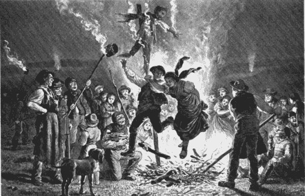

约翰火祭。从前有女性头戴小连翘制成的花环，围绕着火堆跳舞的习惯。本图为 19 世纪的画作。

在日本，采茶通常选在所谓「八十八夜」进行，也就是从立春算起第八十八天，大约是五月二日左右，距离立夏不到几天。不管是西方还是东方，对于以农耕维生的民众来说，熟悉自然界的周期循环是相当重要的事情，许多农耕仪式亦由此诞生。

###### 【荨麻】

想名列为辟邪草的条件并不困难，从前的人好像随随便便都能想到可以辟邪的理由。其中较为简单的，像异叶木犀就只因为带刺，所以获选为具有辟邪效果的植物。

荨麻（Utrica dioica）也因为带刺而被认为具有解除诅咒的力量。它的叶片为茂密的刺状毛所覆盖，这种刺含有会导致皮肤发炎症状的乙酰胆碱及血清素，所以被刺到时相当疼痛。如果尝试触摸这种植物一定会马上后悔，因为疼痛可以持续整整半天以上，碰到这么恐怖的刺，相信恶魔也会逃走吧。

安徒生写的童话故事［野天鹅］中也使用荨麻来解除诅咒。亲切的仙女来到幺妹艾利莎的梦里，告诉她如果想解救受到诅咒变成天鹅的十一位兄长，就必须用荨麻编成十一件衬衣给牠们穿上。艾利莎的整只手都被荨麻刺得肿了起来，却还是努力地编织。

据说从前平织的纺织品所使用的纤维是取自荨麻的茎部。它的刺只要经过加热或将叶片干燥处理，即可取下。可怜的艾利莎若是早知道这点，就可以轻松不少了。

格林童话当中还有一个相当类似的故事，就是［六只天鹅］。故事中，妹妹为了解除被变成天鹅的六个哥哥身上的诅咒，必须使用「星之花」编织衬衣。

在某本德文字典中，水仙的别名称为「Sternblume」（星花），大概是由花的外观命名的。无论怎么想，水仙都不太可能编成衬衣，因此在［六只天鹅］故事中登场的花，想来并不是水仙。

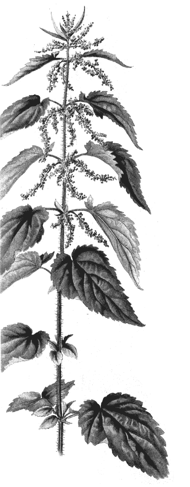

荨麻

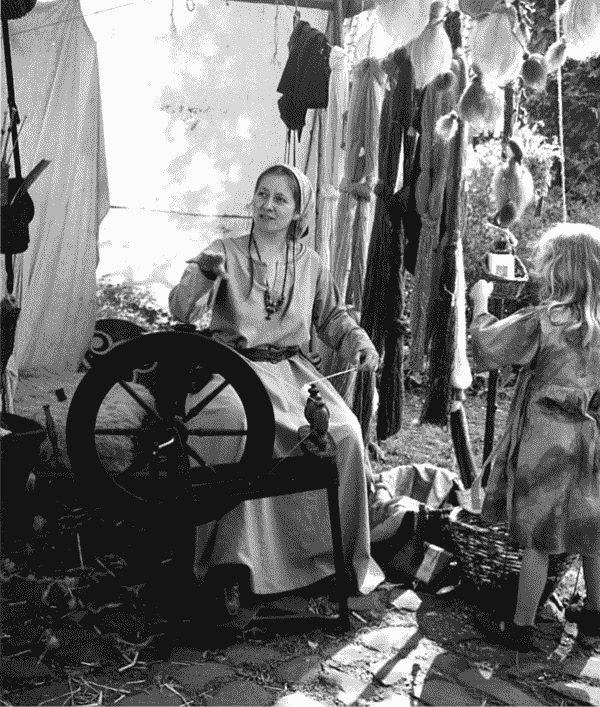

艾利莎当时如果也能使用这么方便的纺织机就好了。这是忠实呈现中古世纪时市场景象的现代庆典，图中的女性正在纺线。（摄于德国）

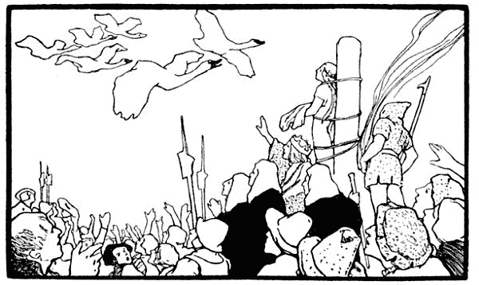

［六只天鹅］。妹妹被捆绑在火刑柱上，手上拿着亲手编好的衬衣。这时天鹅飞来，穿上衬衣后兄长恢复人形，故事得以喜剧收场。只是猎巫的行动一直持续到 18 世纪末，对当时的人而言，这样的奇迹却不曾发生，童话跟现实的落差还是很大的。德裔画家奥图（otto Ubbelohde）绘，1907 年。

在翻译本中，一般将其译为菊科的柳叶菊，不过在研究格林童话的学者当中，也有人认为事实上这是一种不存在的植物。「星之花」这个名字十分好听，然而并不让人觉得像荨麻一样，具有解除诅咒的魔力。在命名上，也许安徒生比较高明。

###### 【榛树】

除了草以外，某些树木也具有辟邪的功效。桦木科的榛树（Corylus avellana）即是颇广为人知的例子。这种树拥有不可思议的力量，常常出现在各种传说当中。

格林童话有这样一个故事。那是当耶稣还是婴儿时的事。某天趁耶稣正在午睡，母亲马利亚前往森林中采草莓。这时从草丛中突然爬出了一条蛇，马利亚拔腿就跑，蛇却紧追不舍。于是马利亚便躲在榛树低矮的树丛中，不久之后蛇就离去了。

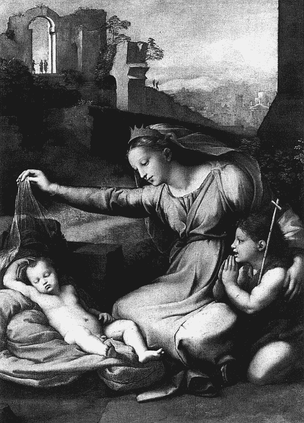

沉睡的婴儿基督。从这张画可以感受到年轻的马利亚温柔的母爱。右方的幼童是之后被希律．安提帕斩首的施洗者约翰。约翰的母亲与马利亚是妯娌关系。拉斐尔绘，［戴冠的圣母］，1510-1511 年左右。

马利亚于是说道：「榛树啊，希望你以后还能继续保护人类，就像刚刚保护我一样。」从此之后，榛树的树枝就成了可以用来驱赶蛇或爬虫类的护身符。

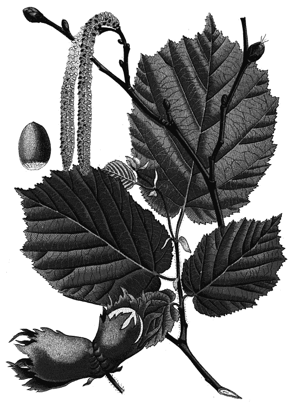

榛树

接下来的故事也出自格林童话。灰姑娘（仙度瑞拉）的父亲在出远门前询问灰姑娘想要什么礼物，她表示自己只想要父亲回程中帽子碰到的第一根树枝，而那就是榛树的树枝。灰姑娘将它种在母亲坟前，小鸟纷纷飞到枝前替灰姑娘带来了鞋子跟礼服，灰姑娘才得以进城堡参加舞会，与王子结婚，过着幸福快乐的日子。

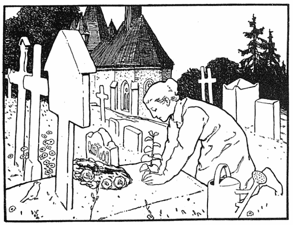

格林童话当中的［灰姑娘］，与今天我们熟知的迪斯尼动画中仙度瑞拉的遭遇出入相当大。在故事中，变出南瓜马车与老鼠侍从的不是仙女的魔法棒，全都是飞来榛树前的小鸟的功劳。

中古时代欧洲曾经有过一条法律，规定在让渡财产时需要交给对方树枝作为证明。这条法律出自日耳曼民族最古老的法律《沙力卡法典》，该法典据推测制定于公元五一〇年前后。简单加以解释，就是债务人应该将象征还债责任的草茎交给债主，若在还钱时发生迟延等情事，债主可凭手中的草茎提起告诉。

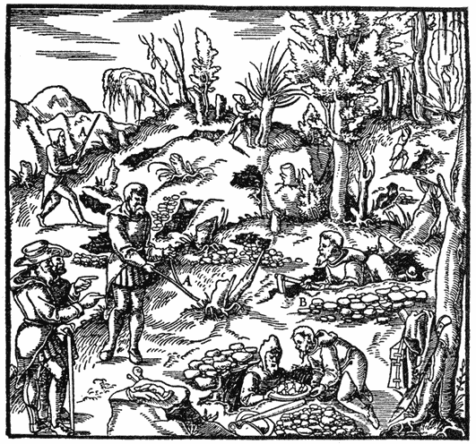

山丘上的人水平拿着尖端分叉的榛树树枝走着，若地底下有矿脉，则树枝会激烈震动，并且像受到地面吸引一般向下垂。孟斯德（Sebastian Münster），绘于 1544 年。

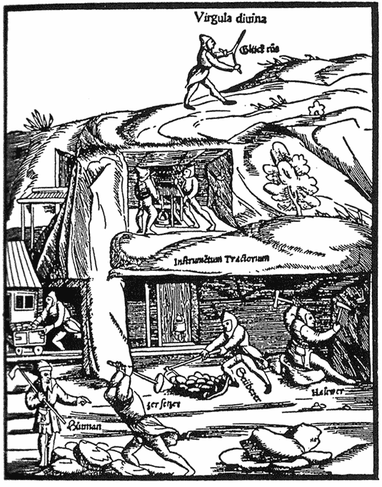

据说榛树能够探测到地底下微妙的变化，并且也有实际因而发现矿脉或地下水层的例子。至于其功效是否属实，现代科学家仍在探讨当中。阿格里科拉（Georgius Agricola）着《矿物志》，1580 年。

这么说来，灰姑娘的后母带来的两个女儿要求的礼物都是漂亮的礼服或宝石，灰姑娘要求的却是财产让渡权。父亲交给她榛树的树枝，虽然不是草茎，却象征了两人之间的承诺，如此看来，其实灰姑娘是个相当注重实际面的女孩。

另外，尖端分叉的榛树树枝，同时也可以用来探查（或称占卜）地底有没有地下水层或金属矿脉。据说它能够捕捉到发自地底的矿脉或地下水的震动，如果运气不错发现的话，想必可以大赚一笔，由此来看，榛树还有可为人带来财富的优点。

在德国有种风俗，使用树木的嫩枝拍打彼此祈求健康与幸福。

在这种仪式中使用的，是合花楸和杜松子，以及榛树的嫩枝。

榛树属于落叶灌木，虽然不能算草类，然而确实属于有用植物，因此在提到药草之余，在此顺道提及。榛树的果实称为「榛果」（hazelnut），可以当做点心、用来制作食用油及香水、肥皂。榛树除了用来辟邪以外，还能够带来健康、幸运及财富，守护作用奇佳无比。

###### 【槲寄生】

榛树相当贴近一般人的生活，对许多人来说并不陌生，至于槲寄生（Viscum album）则往往因其神祕色彩而让人敬畏三分。槲寄生是种不可思议的植物，从它的名称就可以得知，它唯有靠寄生在其他树木上才能存活，并且种子的传播必须仰赖吃下果实的鸟类排便来进行。果实属于浆果类，汁液黏稠，可用来制作捕鸟的陷阱，并且有降低血压的效果。

浆果的颜色是带点透明的珍珠白，附着在细小的枝枒根部，这样的情景看起来带有几分神祕气息。在德国，常可在落叶树上找到寄生的槲寄生。

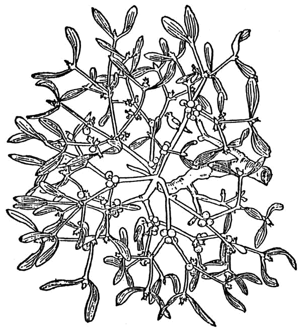

槲寄生

这种植物有个别名，叫女巫的扫把，常用以装饰圣诞树。若女性站在装饰了槲寄生的圣诞树下，则任谁都可以上前亲吻她，这样的习俗一直流传至今。由于檞寄生结果的数量相当多，因此前人认为是多产与丰饶的象征，加以崇拜。

在凯尔特民族信仰的德鲁伊教僧侣进行仪式时，槲寄生也扮演重要的角色。德鲁伊僧侣手执黄金镰刀，将寄生在神木（橡树）上的槲寄生砍下。在地上则垫有用来承接果实的布，所接到的果实可以作为护身符。由于槲寄生很少寄生在橡树上，因此更增添了神祕气息。

有个有趣的传说是这样的：本来槲寄生是能够独立生长的植物，由于基督受难时的十字架是用这种植物做成，因此它感到羞耻，缩着身子不敢抬头，慢慢地越来越小，终于无法独立而只能靠寄生成长。在这个传说中，槲寄生简直具有人类一般的性格。

然而基督所背负的十字架其材质到底用哪种树制成，至今众说纷纭，橡树、白杨这些树种都曾被列举出来，但仍然无法得到定论。

# 2　适合采药的日子

药草对民众的日常生活来说相当重要，因此必须特地等到最能发挥效果的日子才去采摘。六月二十四日是纪念圣约翰的日子，同时也是对采药人而言最重要的日子，不过，采药的时间是星期几也十分重要。

巴伐利亚大公的御医约翰．哈特利（Johann Hartlieb）在他所写的《禁忌的技法、迷信、魔法全书》（一四五六年）当中提到，为了制作「女巫软膏」，有些人会固定在一周中某些日子采集某些特定的药草。

星期天　野苦苣

星期一　小阴地蕨

星期二　马鞭草

星期三　山靛

星期四　长春花

星期五　羊齿

之所以不包括星期六，是因为犹太教认为星期六是安息日。虽然基督教有不少宗派认为星期天才是安息日，但在犹太教的观念中，从星期五太阳下山之后到星期六日落之前才是安息日。也就是说，前面所列的时间表在基督教眼中看来是属于异教的习俗。

前面提及的许多药草并非用来制造「女巫软膏」，反而更适合用来当作护身符，甚至不乏可以食用者。民众之所以对这些药草与女巫产生联想，是因为特定的药草必须在一个星期中的某一固定日子采摘，这是异教的习惯，绝对无法见容于基督教。

###### 【野苦苣】

野苦苣（Cichorium intybus）在旧时习俗中必须在星期日采摘。早在公元前四世纪，埃及的纸草纸文书里便已提及这是一种带有魔力的植物。

在旧约圣经中，摩西领导以色列人出埃及的前一天晚上，他们的晚餐是无酵饼与某种「苦菜」。关于这苦菜究竟是哪一种菜，并无定论。曾经有过辣菜根、牛膝草、芫荽、苦艾、苦薄荷等说法，亦有应该是野苦苣的说法。上述的种种药草，全都带有苦味与辛辣味。

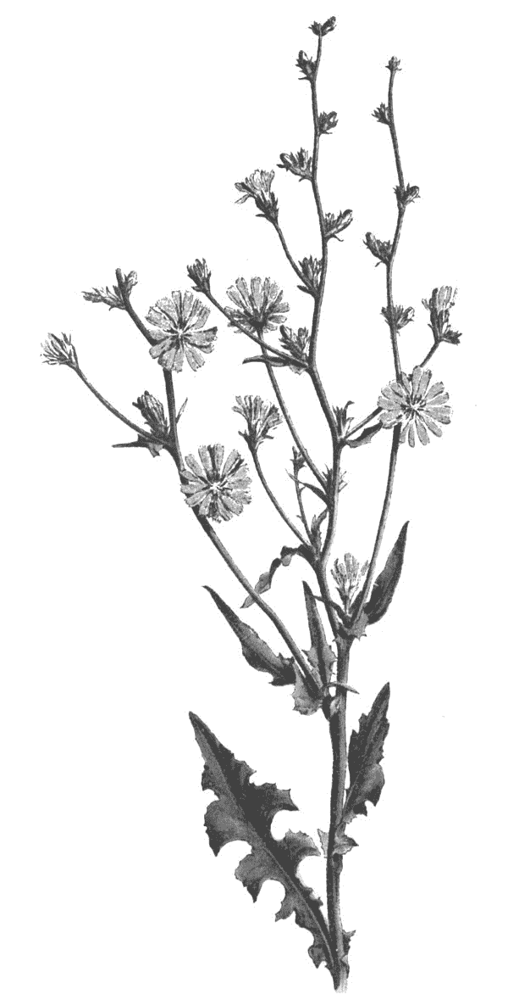

野苦苣

埃及法老王禁止以色列人离开埃及，于是耶和华采取了行动，指示以色列人在自家门前的柱子和门楣上涂抹羔羊的血，之后神就「击杀了埃及地一切头生的」（出埃及记十二章）。

旧约圣经中记载，涂在门前的血是一种记号，神的惩罚便「只击杀埃及人，越过以色列人的房屋」。当天晚上，以色列人吃下无酵饼与苦菜，第二天便朝着应许之地，自埃及出发。

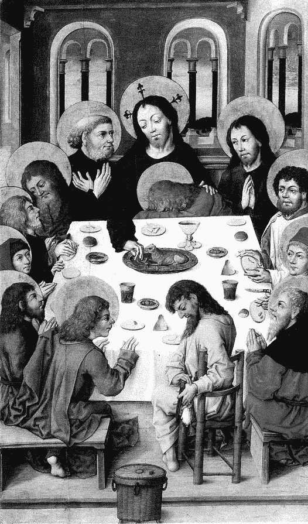

耶稣基督与弟子的最后晚餐也是在逾越节的夜里。「耶稣对他们说：我很愿意在受害以前先和你们吃这逾越节的筵席。」（路加福音 22：15）图为最后的晚餐，出自 15 至 16 世纪的德国画家手笔。

这便是逾越节（Passover）的由来。神下令订这一天为纪念日，必须永远遵行这样的仪式。根据了解希伯来文化的人的说法，至今以色列人的逾越节（三月～四月）晚餐仍然食用无酵饼及带有苦味的药草，来追思祖先经历的苦难。苦菜一般似乎都使用辣菜根，在日本，据说使用的是萝卜叶和芥末。

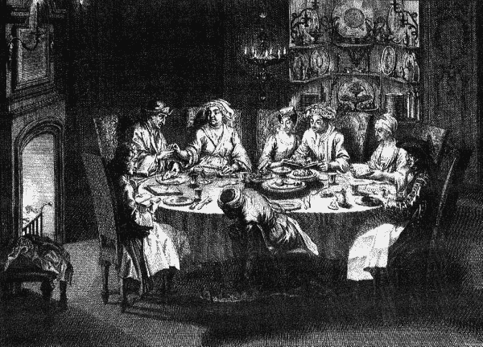

以色列人在逾越节时，需朗诵礼拜用的祈祷文，围着餐桌追思祖先的种种苦难。班哈特（J.S. Bernhardt）着《以色列的宗教仪式》，1723 年。

涂抹羔羊的血，是游牧民族的辟邪仪式，制作无酵饼食用则是农民祈祷丰收的古老传统，而苦菜想必是用来搭配饼吃的，由此可以窥见旧约圣经世界的风貌。

熬煮野苦苣的根部，可以代替咖啡饮用。但在购买市面上贩卖的野苦苣茶试喝过后，实在觉得很难称得上好喝。在菜市场常可以看到的菊苣其实就是野苦苣。透过人工栽培出的菊苣，叶片柔软，并聚集成竹笋般的层状。可以用在色拉或腌黄瓜等泡菜当中，虽然带点苦味，但十分美味，可以促进食欲。

还有一个关于野苦苣的传说。据说这种草是一个等不到恋人的少女所变成的，德文名称「wegwarte」（在路旁等待）即由此而来。

在传统欧洲药草学当中，蓝色的花可以治疗忧郁，并且可用来制作眼药。野苦苣开出的正是这样的花，可爱的姿态让人只是看着便觉得心情平静。

在基督教传入之前，民众和药草已经有了密不可分的关系。因此几乎所有药草，都理所当然地被视为带有异教色彩，在不知不觉之间，成了恐怖的「女巫药草」。

###### 【小阴地蕨】

小阴地蕨（Botrychium lunaria）在前面的列表中，被列为必须在周一采摘。根据传说，这种草在月夜摘下，辟邪的效果最强。其德文名称为「mondraute」，英语则为「moonwart」，两者都带有「月亮」的意思，由此可见它和月亮的渊源之深。

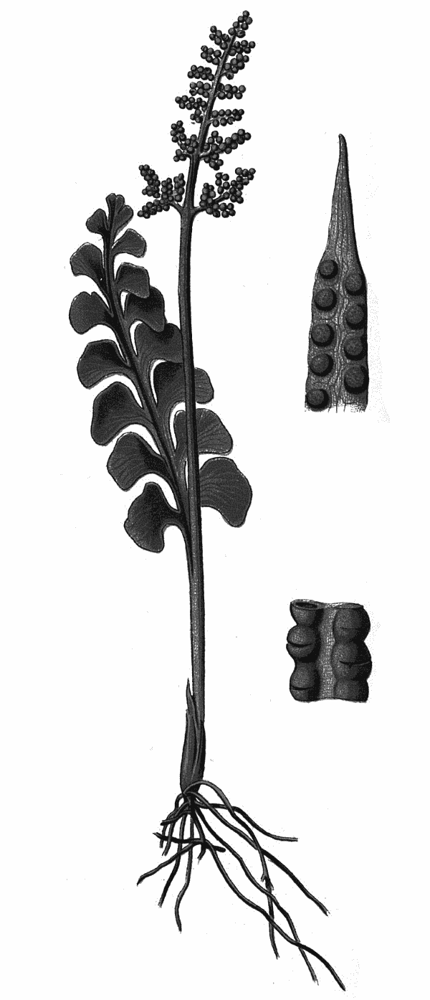

小阴地蕨

所谓的辟邪草发挥功效的方式形形色色，例如服用、制成软膏涂抹、随身携带、悬挂在门口等等。其中小阴地蕨采取的是挂在门口的方式。小阴地蕨在德文中别名瓦普几丝草，在女巫举办宴会大肆庆祝的瓦普几丝之夜，家家户户都会用它作为辟邪护符。

另外，加藤宪市所着《英美文学植物民俗志》中提到许多有关小阴地蕨的传说。如炼金士曾经使用它炼金、妖精则用这种草来当作马车，民众则用作祈求平安生产的护符。最有趣的是，只要对着这种草默祷，据说不管再怎么坚固的锁都可以打开，简直就是专门保佑小偷的草。

小阴地蕨属于羊齿植物的一种，隶属阴地蕨属。每次见到这种植物，总有种难以言喻的感觉。它的叶片呈羽状，沿着细小的茎伸展，肉眼看起来象是由许多小叶片组成一个大叶片。然而那看起来象是小叶片的，其实只是叶子本身的一部份，称为羽片，看起来有点象是银杏的叶片，让人感到不舒服。

植物学者牧野富太郎在《牧野日本植物图鉴》当中，说明它的羽片呈扇状；德国的植物图鉴当中，也形容它的叶片呈半月形的扇状。然而它还是最像银杏的叶子。遗憾的是，这种植物目前在日本面临绝种的危机。

###### 【马鞭草】

马鞭草（Verbena officinalis）是须在周二采摘的药草。古代用来装饰祭坛，是备受尊重的花。马鞭草在盛夏时开出淡紫色的小花，呈穗状密集，相当漂亮。

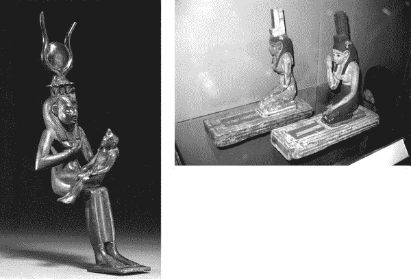

爱西斯（Isis）女神。爱西斯是古埃及神话中主神奥西利斯（Osiris）的妻子。爱西斯的神像，常见的有头上戴着王座（右图），以及将象征太阳的圆盘夹在两根牡牛角之间的形象（左图）。通常若是后者，手上则会抱着她的儿子贺鲁斯（Hours），成为后世圣母子像的原型。且其头部的装饰，比起顶着个王座，更给人神祕与华丽的感受，因此也成为塔罗牌绘画的主题。两者皆为大英博物馆馆藏。

马鞭草在古埃及又称「爱西斯之泪」，在举行仪式时会把它丢入火中焚烧；而在罗马神话当中，则以主神朱庇特（Jupiter）的妃子来命名，称为「朱诺之泪」，亦用于点缀祭坛；在北欧神话及波斯神话中，则分别献给雷神索尔及太阳神。

马鞭草这种充满神圣性的植物，因为同时具有催情效果，在中古时代的欧洲也用于结婚典礼等场合。并且还因为能够防止传染病，成为众所周知的辟邪草。

在德国，新生儿接受洗礼时，会将马鞭草及起司与幼儿的身体绑在一起，保护幼儿不受恶魔侵扰。宗教改革家马丁．路德曾经不悦地说这种行径完全是迷信。

马鞭草在德文中称为「铁之草」（Eisenkraut）。这个名字的由来，是因为它常被用来治疗刀剑伤。也有传说指出，当耶稣被钉在十字架上时，用来帮祂止血的便是马鞭草。将秋天采摘的马鞭草整株晒干后制成的药材，对于治疗肿块及伤口十分有效。

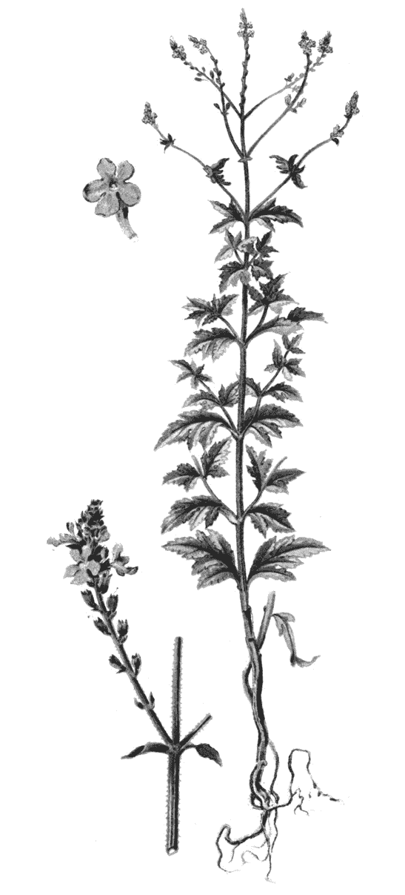

马鞭草

这种植物的叶片对于呼吸器官及肾脏方面的功能障碍相当有帮助。提炼出来的精油虽能防止落发，不过不具有专业知识的一般人，最好避免擅自使用，特别是孕妇绝对不可以滥用，因为这种植物虽然看上去可爱，但其实含有毒素。

###### 【山靛】

山靛（Mercurialis perennis）属于泽漆科，在古老的习惯中须于星期三采摘，具有许多疗效。山靛学名当中有「Mercurialis」这个字，其语源目前有各种说法，未有定论。

「Mercur」的意思是水银。因此也有人猜测这种草使用在跟水银有关的炼金术当中。但也有说法指出是来自于罗马神话中的墨丘利斯「Mercurius」（英文中称为 Mercury）。而「Mercurius」其实就是希腊神话中的赫密斯（Hermes），是掌管商业与旅行的神，同时也教导人类利尿及治疗便祕的方法，而山靛事实上也有利尿效果。

这种草在德文中称为「Bingelkraut」。关于「Bingel」这个字，详细情形虽然尚未能确定，然而推测应该是源自于低地撒克逊语（一种流行于德国北部和荷兰东部的少数民族语言）中「排尿」的动词。这么一来又刚好吻合墨丘利斯的传说。

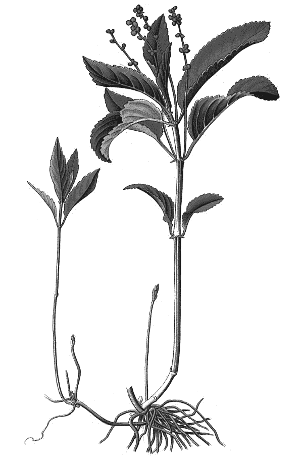

山靛

在古代，由于山靛对于妇人病，特别是生理期不顺特别有效，因此常制成草药茶。不过，因为新鲜的叶片含有毒素，所以必须晒干后使用。山靛中含有的皂素与红血球细胞膜内的胆固醇结合后，会破坏整个细胞膜，若不小心误食，会造成血便与血尿等现象，或许正因为如此，才被视为「女巫的药草」。

附带一提，日本山中野生的山靛是日本最早用于制作染料的植物。从它的名字来看，也许有人会以为是用它来制成蓝色染料，不过因为山靛不含蓝色的染料色素靛青，所以会染成泛绿的蓝色。从前用来染成蓝色的事实上是蓼科的蓼蓝和爵床科的马蓝。

###### 【长春草】

长春草（Sempervivum tectorum）属于景天科，于星期四采摘，通常生长在家畜小屋或仓库的屋顶上。叶片聚集呈莲座状，多肉质，夏天开出粉红色的花朵。在德文中称为「hauzwurz」或「dachwurz」（屋顶上的草），而日文名称中也含有「屋顶」字样，显示这种植物与屋顶有着密不可分的关系。

法兰克王国的查理曼大帝（Charlemagne，西元七四二～八一四年）所颁布的《庄园管理条例》（Capitulare de villis）（公元七九五年）当中，对于国王领地的管理和经营有相当详尽的规定。其中甚至规定庭院中应该种植何种植物，光药草便超过了七十种，最后并指示园丁应该在家中的屋顶种植长春草。

当时一般相信这种草可以避免雷击、火灾，并且保护住在其中的人免受魔法侵害。据说和羊齿及小连翘一样，在圣约翰日，也就是六月二十四日效力会达到最大。

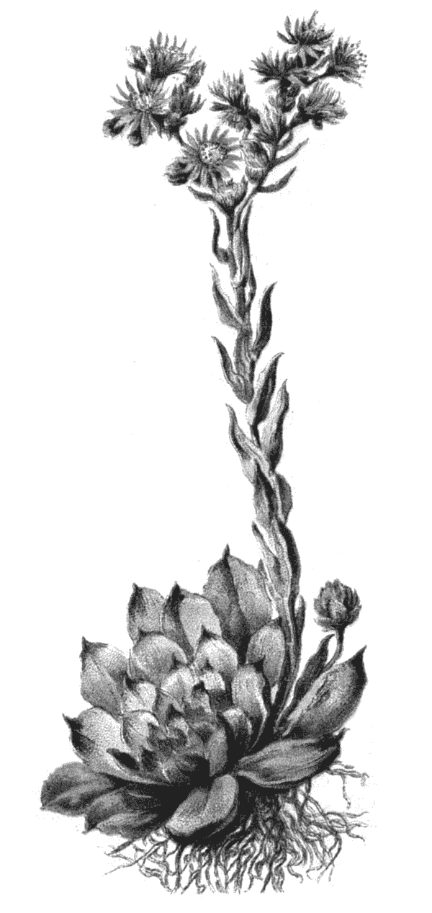

长春草

然而，民间亦流传着若长春草在谁家的屋顶上开花，象征着那一家将有人过世这样的说法。

长春草可以视为药草，也可以用在色拉和药草茶中食用。据说对于口腔发炎、夜间频尿、拉肚子、生理期不顺等症状相当有效。又有一说可以治疗雀斑，但是其真实性还有待查证。

修女赫德嘉．冯．宾根在《自然史．自然的治愈力》书中提到，长春草具有增强精力的效果。正常男性一吃下去，便会燃起熊熊的欲望，就算年老体衰也能重振雄风。不过似乎无法解决女性不孕的症状。另外，据说将长春草榨成汁，持续滴入丧失听觉者的耳中，则听力可望回复。不过，这种说法就更难以分辨真伪了。

由于长春草并不是太稀有的植物，若真有上述奇效，倒不免让人感到吃惊。

###### 【羊齿】

羊齿是相当不可思议的植物。约从四亿年前便出现在地球上，几乎未经进化，但却不至于绝种，一直存活至今。其中真蕨类和拟蕨类在分类及叶片形状上虽然都不相同，但是从前却同样被视为带有魔力的草类。

根据修女赫嘉德的记载，欧洲的棉马羊齿（Dryopteris filix-mas），是连恶魔也害怕的植物，并且能守护人不受雷霆、暴雨、冰雹的侵袭。且据说健忘的人及无知的人，只要常常手握这种植物的孢子（事实上是孢子囊），就能改善症状。

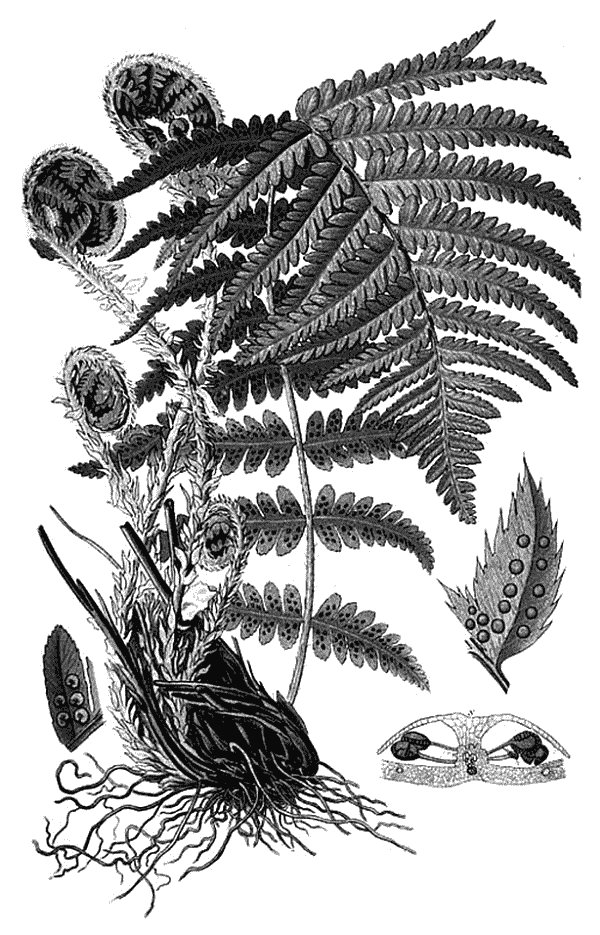

欧洲的棉马羊齿

羊齿叶片的背面附着许多孢子囊，或许有些人觉得很恶心，然而这孢子囊其实具备许多不可思议的力量。例如过去的人相信将孢子囊佩带在身上便能够隐形、或变得刀枪不入，还可以让自己的恋情就此一帆风顺。根部的块状物，则唤做「约翰之拳」，可以作为护身符。

据说羊齿会在六月二十四日（圣约翰日）的夜晚开花，并且释放出孢子。不过羊齿并非显花植物，因此此一传说可能有误，但每到当天，还是有许多人四处奔走，收集羊齿的孢子。因为热中于此的人数众多，十七世纪时，巴伐利亚（德国南部）的麦斯米兰（Maximillian）公爵，甚至明令禁止以使用魔法为目的收集孢子，教会也发布禁止采集羊齿孢子的命令。

同属羊齿类植物的石松，在德国称为「女巫的小麦粉」（Hexenmehl），在日本则常使用孢子来当作放炮时常见的仙女棒的材料，在过年时用来装饰的里白蕨，其实也属于羊齿类植物。由于叶片背面呈白色，象征着心中也是纯洁无暇的意思，因此将叶片翻过来装饰在门前，这种做法带有些许咒术色彩。

羊齿除了这些咒术方面的用途之外，从很早以前开始便用来驱除绦虫和蛲虫等寄生虫。通常会用根部磨成的粉或者提炼出的精华来治疗，可以收到立竿见影的效果。但是若服用过多，则会引起中毒症状，甚至导致死亡，因此一般人不可自行尝试。女巫的药草是带有魔性的植物，其中有许多同时也具有辟邪的效果。从前，民众为了防止恶魔进入家中，往往以药草烟燻屋内，或者悬挂在门口和随身携带，甚至为了预防家畜感染疾病而混于饲料中喂食。只是，到最后，一般人往往忘记了如此做的理由，仅只是遵循自古以来的习惯照做而已。

从前每到立春的前一天，家家户户会将沙丁鱼头插在木樨树枝上，以赶走恶运招来福气。到了现代，日本不知道还有多少家庭遵循此一习俗？辟邪草或许已经跟不上时代，然而在每个人的心中，应该或多或少都期望着，能藉由某种东西来赶走灾难与恶运，不是吗？

* * *

＊注①——西尼斯特利（Ludovico Maria Sinistrari，一六二二～一七〇一），十七世纪天主教教士，研究恶魔学，曾写下驱魔（Exorcism）的详细步骤。

＊注②——那瓦侯族（Navajo），印地安部落名称，为现存北美最大部落，于科罗拉多州北部拥有广大的保留区。

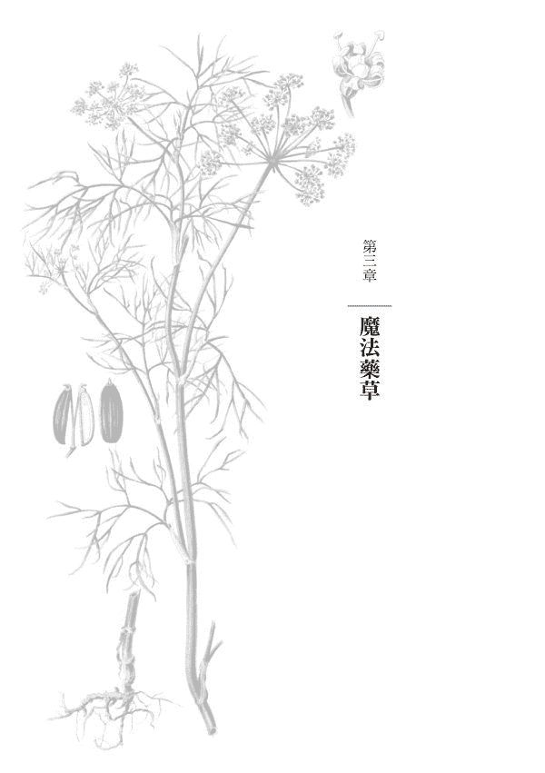

# 1　药草的魔力

「魔法药草」这个名词相信一定让许多人感到莫名的兴奋。如果药草真的有魔力，到底会发挥什么样的效果？如果善加运用，是否能够得到平常不可能拥有的力量？或者解决恋爱中烦恼已久的问题？甚至能够免除病痛，不必面对死亡的恐惧？

魔法这个词，英文为「Magic」，在德文中则写成「Zauber」。这两者都可以译成魔法、魔术，或是妖术。要是有一间魔法学校，相信办理入学手续的人一定络绎不绝；但若说是妖术学校，那大概会吓跑学生。然而，咒术本身也分成恐怖的诅咒，以及有正面防护效用的咒语。

魔法也好，妖术也罢，具有魔力的药草彷彿能够打开通往另一个世界的门窗，因此有许多人为此着迷。

正因为如此，才会有这么多关于女巫药草的描述。有许多传说与作品里，都记载着这些药草超现实的魔力。在这些情节当中，使用魔法可说是理所当然的，因此阅读时就像走入了一个不可思议的世界，任想象力尽情发挥。在本章当中，介绍的是这些带有几分超现实幻想色彩的「女巫药草」。

###### 【曼陀罗草】

首先介绍茄科植物曼陀罗草①（Mandragora officinarum=M.vernalis）。这种植物在魔法药草中最具代表性，在英文中称作「Mandrake」，德文名称则取自古代日耳曼预言家阿鲁那（Alruna）之名，称作「Alraun」或「Alraune」。

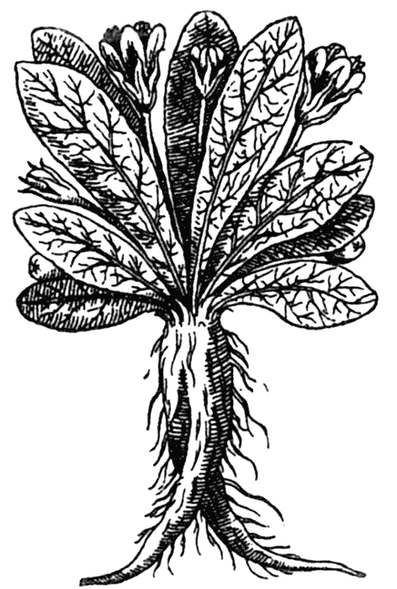

曼陀罗草

曼陀罗草源自地中海东岸，坊间流传有大量关于这种植物的奇异传说。它的根部分叉成两节，看起来就像人的下半身；叶片成莲座状生长在地面上，有点象是蓬松的人发，整株看起来就象是人类的形象。

曼陀罗草之所以名列女巫的药草，除了因为含有阿托品、东莨菪硷等生物碱，像人的外观也是重要的原因。

关于挖掘其地下根时的传说就更恐怖了。据说曼陀罗草被挖出来时会发出恐怖的尖叫声，如果挖掘的人没有戴耳塞，听见这种声音之后会发狂而死。因此聪明人想出来的办法是，将绳索的两端分别绑在曼陀罗草及狗的身上，靠狗把它从土里拉出来。当然这样一来，就只好牺牲狗的生命了。

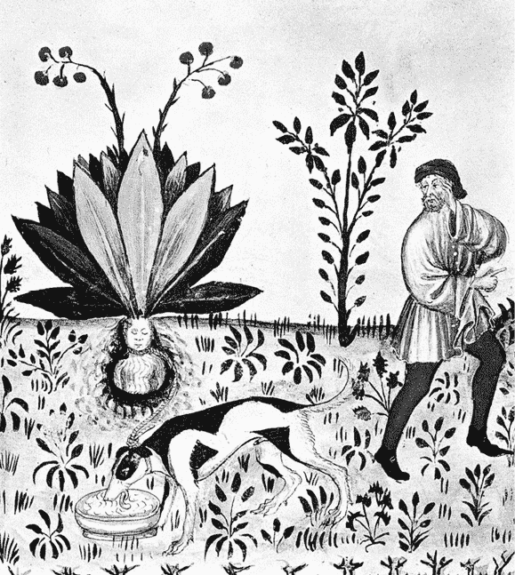

利用小狗挖出曼陀罗草。

另外，据说曼陀罗草是从死刑犯行刑后漏到地面的尿液或精液中生长出来的。也有传说指出拥有这种植物根部的人虽然能够得到暂时的财富与幸福，但最后都会遭致毁灭，是一种不吉利的植物。从前有些女性只不过是拥有曼陀罗草的根部，就被认为是女巫而遭逮捕；不过另一方面，也有人认为曼陀罗草的根可以用来当作珍贵的护身符，价格相当昂贵，因此常常有人买到假货。

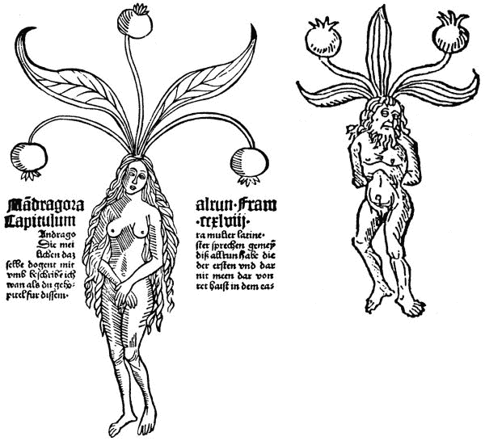

雄性（右）与雌性（左）的曼陀罗草。

在传说当中，曼陀罗草分成雌雄两性。有一幅十六世纪流传下来的图画，就以男女成对的曼陀罗草为主题。由于曼陀罗草的传说实在太出名了，关于植物实际的记载反而很模糊。实这种植物的确分成两类，只是并不如传说中分类为雄株和雌株，而是分成春天开花（M. vernalis）及秋天开花（M. autumnalis）。

春天开花的曼陀罗草花呈紫褐色，果实则像小苹果，带有甘甜的香气。魔法师常用的是这种春天开花的品种，也就是传说中提到的雄曼陀罗草，几乎都供药用。

秋天开花的曼陀罗草，叶片呈皱缩状生长于地面，象是莴苣一般，花呈淡紫色，是所谓雌曼陀罗草。古代的苏美人用根及叶片和其汁液来治疗牙痛或当做健胃剂。

曾经有人送我一袋秋天开花的曼陀罗草种子，我悄悄下定决心，等到植物长成之后，一定要亲自将根挖出来，看看传说是真是假，然而等来等去，连芽都没有发出来。几年后，我战战兢兢地将土挖开，但种子已经消失无踪，不知去向了，看来这种植物并不好种。

由于曼陀罗草的传说充满神祕气息，许多文学家都以它为题材进行创作。例如德国作家爱华斯②的小说《爱罗尼》（Alraune，一九一一年）就是一个充满幻想气息的故事，内容叙述藉由人工授精的手法，创造出一位活生生女性，名叫「爱罗尼」。在日本也有以拟人的曼陀罗草为题材的漫画，其中描绘的形象皆为妖艷的女性，几乎没有男性角色登场。

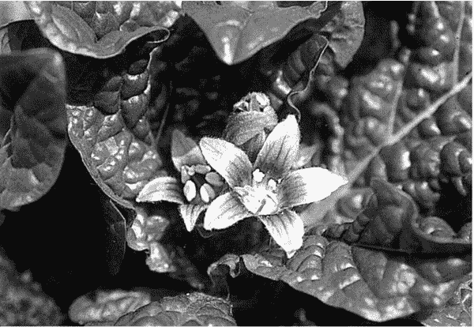

秋天开花的曼陀罗草。

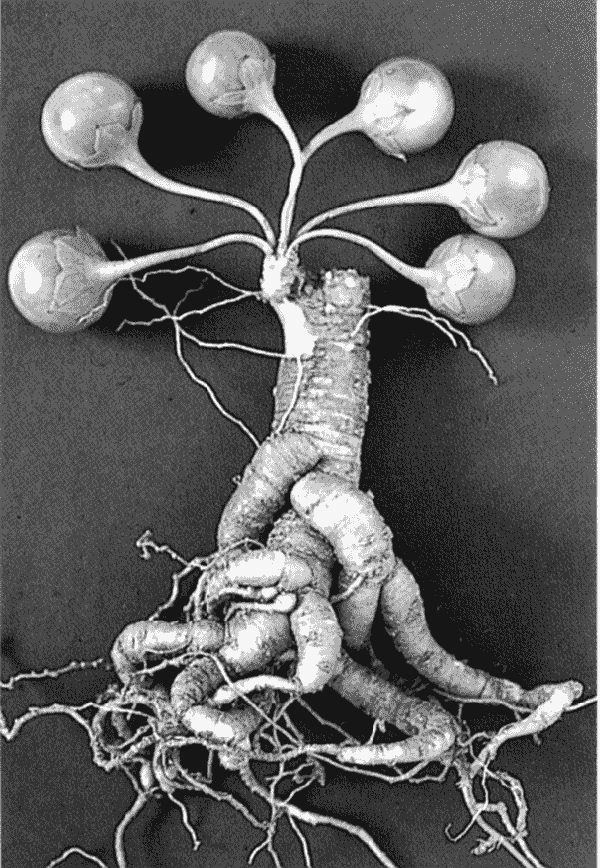

发芽后第七年的曼陀罗草。

位于慕尼黑的德国博物馆内就展示了一个穿了一身茶色连身装的曼陀罗草根。穿上衣服的曼陀罗草根虽然看上去不易分辨是男是女，但确实有几分人类的形象。位于德国著名观光胜地海德堡的药事博物馆，那里收藏的曼陀罗草看起来就只象是普通植物的根部，而非这么奇异的造型。另外，在前往汉堡市民族博物馆附设的学术研究机构「女巫研究所」时，该所所员曾经给我看过假的曼陀罗草护身符，其形状也不太像人类。

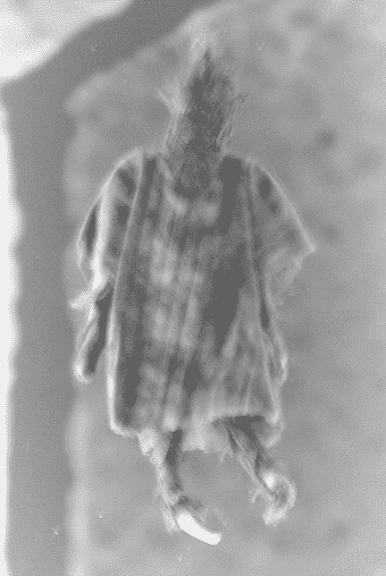

穿着衣服的曼陀罗草，藏于德国博物馆（慕尼黑）。

说到根部分叉成两股的植物，大概有不少人会联想到人参。不过人参乃是具有强身效果的药材，属于五加科，至于曼陀罗草，则据说有促进性欲的效果。

在旧约圣经［创世纪］（廿九：十八～三十：廿三）当中有着这样的故事：

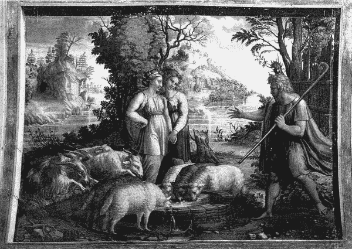

雅各的父亲要他与舅舅的女儿结婚，于是他便起身离家。后来他在井边遇见赶着羊群的拉结，决定娶她为妻。由于圣经中并未提到当时利亚在场，因此图中手插着腰神气的女性应是拉结，至于低着头看起来有点羞赧的应该不是利亚，有可能是陪同她放羊的伙伴。拉斐尔画。（收藏于西斯汀教堂）

以撒之子雅各，在叔父拉班手下工作。拉班膝下育有一对姐妹，姐姐叫利亚，妹妹叫拉结。雅各爱上了妹妹拉结，因此以在拉班手下工作七年为条件，希望拉班能将拉结嫁给他。

七年之后，两人终于得以完婚，然而新婚隔天的早晨雅各醒来却发现，在身旁的是姐姐利亚。原来这是拉班的计策，他对雅各说，当地的规矩是姐姐必须比妹妹先结婚，因此若要娶拉结，必须再工作七年。

于是雅各在拉班手下又工作了七年，终于完成他的愿望。然而拉结却总是无法怀孕，雅各和利亚之间却已经育有四子，不过利亚也因为雅各被妹妹抢走，悲叹着说，从此以后没有机会再生更多小孩了。

到了小麦成熟的时候，利亚的儿子在田里找到了「风茄」，带回来给他的母亲。拉结知道了这件事，希望利亚能分一点风茄给她，于是利亚很生气的说：「妳夺走我的丈夫，还要夺走我儿子给我的风茄吗？」

拉结只得表示：「今天我让雅各去妳那过夜，请妳分我一点风茄。」于是当天晚上雅各依约前往利亚处过夜。就这样利亚产下了第五个儿子，而神也知晓了拉结的心意，让她产下了男丁。

拉结一直为不孕所苦，在以色列，男人要是没有子女，便没有资格供奉祭品给神殿。处在这样的社会里，无法生育的女性处境十分艰难，尤其雅各又已经跟姐姐利亚生了四个儿子，想必更加深了拉结对生儿育女的渴望。

就在此时，利亚的儿子替母亲带回了具有帮助受孕效果的风茄。拉结无论如何都想分到一点风茄，因此向利亚抗议，认为她应该已经不需要那种东西了。

但是对利亚来说事情并不是这样的。她因为丈夫被妹妹所夺，可能日日夜夜都在儿子面前悲叹，因此做儿子的才给母亲带了风茄回来，想必是希望母亲能和父亲重修旧好。撇开这些复杂的因果不看，两人都是因为风茄才得以怀孕的，想必风茄的效果一定相当不凡。

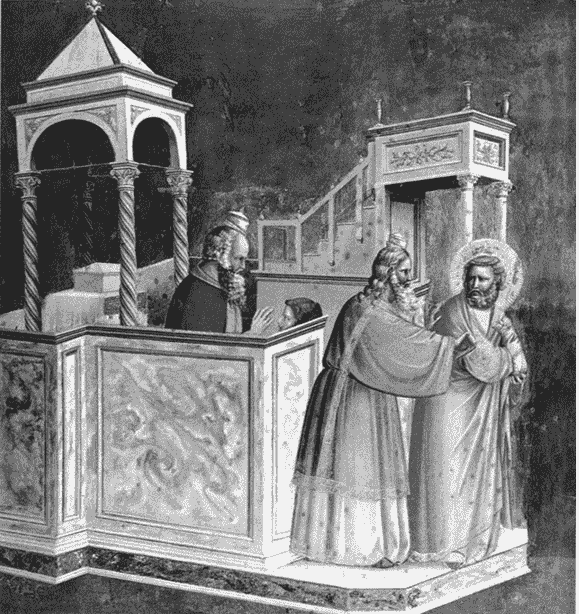

在圣经外典［雅各福音］当中记载，以色列人赫金与妻子安娜之间一直没有小孩，因此没有进入神殿的资格。之后，由于神的恩宠，安娜终于怀孕，并产下女婴。这名女婴就是圣母马利亚。乔托（Giotto di Bondone）绘，［遭到拒绝的赫金］，绘于 1305-1310 年左右。

这种植物在日文译为「爱的茄子」，德文是「爱的苹果」，英文则是「Mandrake」，而在希伯来语当中称为「dudaim」，希腊文中称做「mandoragoras」。因此许多学者都认为风茄其实就是曼陀罗草。

话说回来，利亚的儿子又是怎样把曼陀罗草挖出来的呢？他带了耳塞，还是利用狗来挖掘呢？古希腊学者德弗拉斯特提到，在挖出曼陀罗草之前，必须在植物外围用剑绘出三圈圆形，且采集时必须面向西方，这应该是用以对抗曼陀罗草魔力的仪式。可见在德弗拉斯特的时代，也就是从公元前四到三世纪起，一般观念中便已认为曼陀罗草是种恐怖的植物。

不过据推测在公元前五世纪成书的［创世纪］中，没有对当时利亚的儿子挖掘的方式做出任何描述。

曼陀罗草是古埃及的三大春药之一。在图坦卡门王陵墓的壁画，以及陪葬的小盒子表面装饰上，都绘有种植或采收曼陀罗草的人，然而从他们工作的情景，表情看起来一点都不害怕。

图坦卡门王在位的时间约为公元前十四世纪左右。这样看来，至少到公元前五世纪为止，关于曼陀罗草的怪异传说应该尚未诞生。在那之前，曼陀罗草受到重视也许是因为希望受孕的妇女在尝试后颇具成效造成的。

那么，到底应该如何食用曼陀罗草呢？熬煮它的根部来吃吗？或是将果实视为受孕的象征，直接啃着吃呢？遗憾的是，［创世纪］当中完全没有提到拉结如何食用。

根据德弗拉斯特记载，在酿造葡萄酒时，习惯将曼陀罗草的根切成小片用细绳串起，悬吊在发酵的葡萄汁所散发的气体当中。最近听一位在自己家中栽种曼陀罗草并且吃过果实的植物学家说，曼陀罗草的果实可以直接食用，带点淡淡的甜味，甚至可以称得上美味。

###### 【茴香】

提到魔法，大概有很多人会联想到变化身形的法术。罗马作家阿布流士③所写的《金驴记》（公元一二五年左右）就是跟变形有关的有趣故事。这部作品以希腊的色萨利（Thessaly）为背景，而这个区域从希腊神话的时代开始，便是魔法与幻术的发源地。

有个好奇心强的男子鲁修斯（Lucius）到这座城里来做生意。正如他所期待的，所借宿房子的女主人是个会使用各种恐怖法术的女魔法师。没多久，鲁修斯就和女仆有了暧昧关系。

女仆告诉他：「今晚主人会变成猫头鹰，飞去找她的情人。」当晚，女主人果然将软膏涂抹于全身上下，变成了一只猫头鹰。在一旁偷看的鲁修斯不禁大为好奇，也想变成猫头鹰试试看。于是他请求女仆偷偷帮他把软膏弄到手，但女仆搞错了，拿成擦了会变成驴子的软膏给他。

变成驴子的鲁修斯最后好不容易才得以回复人形，不过整个过程充满了不可思议的体验，呈现出人类的种种贪婪与欲望，一旦开始阅读便欲罢不能。在女巫传说的故乡德国哈茨地区，也流传有人被女巫变成驴子的故事，一般认为其原型便是这《金驴记》。

到底是什么样的软膏把鲁修斯变成驴子并没有相关记载，因此无从得知。然而变回人形的方法却写得清清楚楚——吃下玫瑰花。明明是这样简单的条件，但是故事中每当鲁修斯找到了玫瑰花，都会受到意想不到的阻挠，这也是故事有趣的地方。至于在哈茨地区的传说中，变成驴子的男子最后是将教会的圣水洒在身上才复原的。

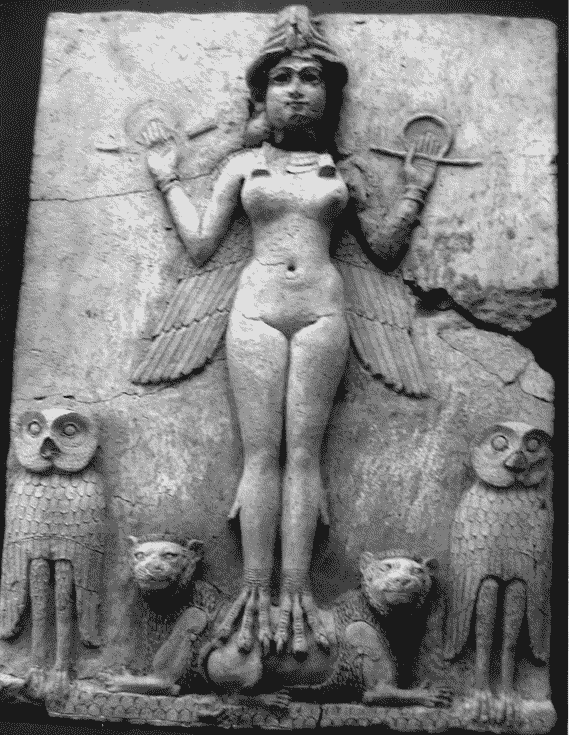

据说古巴比伦有种叫做莉莉丝（Lilith）的恶魔，能支配野兽与猫头鹰，并且有一双像禽鸟的脚，但是并不恐怖。亦有说法指出这尊雕像是两河流域美索不达米亚的女神伊修达尔（Ishtar）。看这生动且威风凛凛的样子，的确不无可能。根据犹太人的古老传说，人类的祖先并非亚当的妻子夏娃，而是莉莉丝，夏娃其实是亚当的第二任妻子。据说莉莉丝因受不了亚当在性方面的要求，而抛弃了他。由于这种说法无法为基督教所接受，因此莉莉丝被形容成不服从神，且杀害幼儿的恐怖女性。在编纂圣经的时候，照理说莉莉丝的存在应该被小心地省略掉了，却保留在旧约圣经［以撒书］34：14 当中，是一位住在荒野中的女巫。不过到了现代，美国的犹太裔女性将莉莉丝视为第一位不屈服于男性的女性，试图挽回她的名声。环绕莉莉丝的种种资料，呈现出其相当复杂的样貌。图为制作于公元前 1800-1750 年左右的陶土像。（藏于大英博物馆）

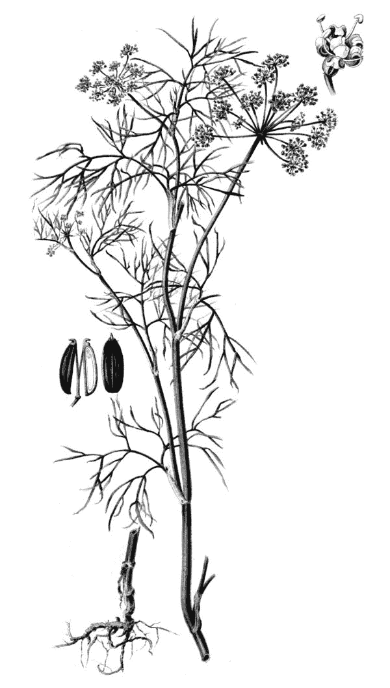

茴香

据女仆所说，从猫头鹰变回人形的方法，并不比从驴恢复人形困难：「只要将茴香加上少许桂叶，浸在泉水当中，再到其中沐浴即可。」

汉字「桂」在中文中似乎也可用来表示肉桂之意。这个故事的日文译本当中，仅仅用一「桂」字打发，让人无法得知是桂树或是肉桂的叶片，不过既然是要解除诅咒，那么带有强烈香气的肉桂似乎比较适合。

茴香（Foeniculum vulgare）也是带有独特香气的药草。在德文中称为「Fenchel」，在英文中则记为「Fennel」，属于繖形科。从根部萃取的汁液，除了用于色拉与菜肴的调味外，加入茶中还具有解毒及利尿的效果。果实外观看起来象是种子，添加在茶中则可以改善便祕，保证一试见效。并且，由于肚子饿时啃食这种果实能抑制空腹感，在前往教会聆听神父漫长的讲道时，有许多人都用这种果实充飢。也许这种药草相当适合节食时食用。

虽然许多人认为猫头鹰是不吉利的鸟，认为是女巫的手下，然而在希腊神话当中，牠是女神雅典娜的使者，也是智慧的象征。如果百分之百能够变回人形，那么偶尔变成猫头鹰似乎也还不坏。不过变成驴子，就叫人敬谢不敏了。

茴香和肉桂之所以名列能够解除诅咒的植物当中，想必是因为所带有的香气。一般来说香气较强的药草，也会被归类为与女巫有关的草药。

###### 【Moly】

虽然解除诅咒的药草有其必要性，但毕竟预防重于治疗。在古希腊诗人荷马所创作的英雄史诗《奥德赛》（公元前八年左右）当中，就曾提到可以预防诅咒的植物。

希腊的武将奥德修斯在攻陷特洛伊后的返国途中，遇到种种苦难。路过埃阿亚（Aeaea）岛时，他的部下被岛上居住着的女巫瑟西（Circe），用恐怖的魔法全都变成了猪。

瑟西让奥德修斯的部下喝下「掺有面粉、蜂蜜及起司粉的葡萄酒」，并吃下「加了迷魂药的饭菜」之后，再用手杖拍打他们，于是那些人就一个个变成猪了。至于这是动过手脚的食物的效果，还是手杖的效果，或者两者皆不可或缺，就不得而知了。

奥德修斯在搜寻部下的途中，遇见了赫密斯。赫密斯是希腊神话中奥林帕斯山众神之一，掌管商业及旅行。祂从地面拔起具驱魔效果的草，将之交给奥德修斯。多亏这种药草，奥德修斯得以免遭瑟西的魔法影响，成功救出了他的部下。

这种药草叫做「Moly」，据说「根黑，花呈乳白色」。实际上到底是何种药草，迄今不少学者仍在研究。

因为记载上说，凡人难以挖出 Moly，所以有人说也许那就是曼陀罗草。不过曼陀罗草的花并非白色，所以不太可能。

也有学者推测，可能是自古便用来作为护身符的「Allium moly」，日文名称为黄花蒜。「Allium」是韭菜、洋葱、大蒜、葱等石蒜科葱属植物的总称，几乎全都带有刺激性的气味。从很久以前开始，大蒜就常被用作驱邪，而且开出来的花也是白色的。不过黄花蒜开出的花呈黄色，根部是白色而非黑色，所以也不太符合前述条件。

根据德弗拉斯特记载，有种药草根呈圆形，像洋葱，很类似荷马所描述的特征。然而这种药草相当容易挖掘，所以应该不是奥德赛中提到的「Moly」。

目前最有力的说法是圣诞蔷薇。它的确有黑色的根及美丽的乳色花。并且，在一世纪末叶，罗马的植物学家狄欧斯科里德④亦曾提及，在挖掘圣诞蔷薇的根时，「恐怖的鹫鸟会马上出现袭击着手挖掘的人。为了不被牠发现而遭杀害，必须用很快的速度挖出来。事前吃大蒜并喝葡萄酒可以避免受到危害。」圣诞蔷薇无论是植物的外观或难以挖掘的特征，都和「Moly」相当吻合。不过以上几种说法都还未有定论，很可能这种草根本就是凭空想象出来的。

奥德修斯到女巫的家里后，吃了他的部下吃过的饮食，也被瑟西拿手杖敲打，不仅没有变成猪，反而拔剑相向。于是瑟西只有投降，让奥德修斯的部下恢复人形。

奥德修斯确实是因为「Moly」的功效，才没有被变成猪。不过，看来这种植物的效果仍然有限。因为之后奥德修斯爱上了瑟西，喝了她端出的饮料，完全忘了故乡，在岛上滞留了一年。他喝下的饮料当中，想必也掺了春药。

###### 【魔杖】

女巫的法力再怎么强大，也无法仅仅依靠药草的效力施法。一般人想象中施法的人可以靠一根魔杖实现任何愿望，解决所有烦恼。人类的愿望果真无穷，所以，憧憬魔法杖的人真的很多。

近几年全世界风行的畅销书《哈利波特》（J.K.罗琳着），不只是小孩，连大人都很热中。书中每一页都充满着对魔法的描述，因此有许多人对魔法怀抱着憧憬，对进入霍格华兹学校所必须准备的一长串用品感兴趣的人也很多。主角哈利的魔杖，则是在斜角巷的「奥利凡德商店」购买。

哈利可以在这里买他最想要的魔杖。这间店里所卖的魔杖每一枝都是独一无二的，用具有强大魔力的材质如柳木、桃心木、杉树、榉树等为材料。店主说：「魔杖是会选择主人的。」也就是说，就算再怎么想要一枝法力强大的魔杖，也还是得先看看自己合不合用，如果只能发挥微弱的魔力的话，也是很凄惨的。

于是哈利得到了一枝长二十八公分，用冬青木和凤凰尾羽制作的魔杖。店主对他说：「我想你未来必然会有一番很了不起的成就。」就这样，哈利被魔杖选上了。

距哈利诞生三千多年以前，也有一位被强力魔杖所选上的人。他就是古代以色列民族的指导者摩西的哥哥亚伦。根据旧约圣经［出埃及记］，以色列人即将离开埃及，然而法老并不允许。因此耶和华透过摩西将法杖交给亚伦，让他挑战法老，法老也请了咒术师来与亚伦对抗。

于是激烈的斗法就此展开。亚伦手中所持的法杖，展现了强大的法力。例如法杖从手中掷出就变成蛇，或拍打尼罗河水，河中的鱼会死亡，河水也变成带有恶臭的血，无法饮用。

亚伦的法杖还招来了大群青蛙、蚊蚋、虻虫、蝗虫，以及疫病、流脓的肿疮、冰雹，还让埃及三天不见天日，然而法老仍然不认输。这段经过在［出埃及记］当中有着相当精采的描述。

魔力这么强大的法杖，到底是用什么做成的呢？根据［出埃及记］的记载，这把亚伦之杖是用蔷薇科的扁桃木制成，就算已经制成了法杖，仍然持续开花。不过把扁桃树枝插在水中，放置在温暖的场所，时候到了也会开花，所以这或许不能视为法杖本身的魔力。

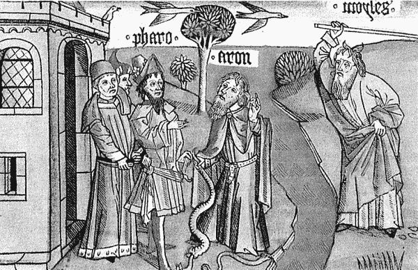

亚伦之杖。「亚伦把杖丢在法老和臣仆面前，杖就变作蛇。」（出埃及记 7：10）

虽然亚伦的法杖展现了许多惊人的法力，最后还是无法使法老屈服。最后的关键在耶和华本身。祂亲自「击杀」（［出埃及记］十二章）了埃及的人民，由此可见法杖的法力，应该也是由神所赋予。用哈利波特书中的说法，便是「魔力附在这把杖上」。

在德文当中有种叫做「Aaronstab」的植物，属天南星科。由于球根以及叶片中含有草酸钙的针状结晶，因此入口会造成强烈的疼痛。

「Aaronstab」也就是亚伦之杖，在英文当中称为「Jack in the pulpit」（讲道台上的杰克）。从正面来看背后有像佛像的光圈一样的东西。至于像手杖的部份，则是花苞中的肉穗花序，形状有如棒状的突起物，周围则环绕着辣椒般的红色小果实。

这带有红色小果实的肉穗花絮，看来就象是魔法师的魔杖，所以才有人想象只要把它拿在手上挥舞就能施展魔法。

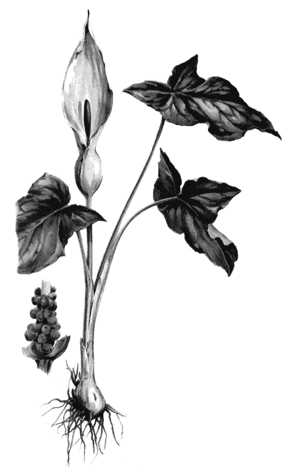

亚伦之杖

# 2　春药

无论什么时代，都有人为了恋爱而烦恼。有些人只要远远看着心上人，用花瓣占卜来猜测对方的心意便已满足。也有人一旦喜欢上对方，便想占为己有，或者希望对方也能爱上自己。于是为爱疯狂，产生嫉妒的情感，甚至想要情敌的命。这些都是恋爱中的人之悲剧。

如果在这时，有人表示「这是春药，只要用了它，任谁都会变成你的俘虏」，那么想必谁都会心动。

制作春药可说是女巫的专长，然而却没有实际的配方流传下来，也许都是不外传的祕密。传说中可以用来当作春药的药草，几乎都具有强烈的香气，让人闻了晕头转向的甘甜香味，或许就是春药迷惑人的主要武器。

玫瑰带有强烈的香气，可说是春药中的女王。古希腊人在婚礼的时候，会在家中撒满玫瑰和紫花地丁（Viola mandshurica）。埃及艷后克利奥佩脱拉也十分喜欢玫瑰，据说她的床上就铺满这种花。她是世界三大美人之一，其美艳自然不在话下，不过照这样看来，她之所以能迷惑罗马两位伟大的将军凯撒及安东尼，也许跟她身上沾染的玫瑰香气也有关系。

目前的科学尚无法证明已有的药草是否具有春药的功效。关于香气的研究，虽然已在进行当中，然而具体来说有何种效果，仍不明确。

自古以来，作为春药的药草也许各自有其根据，然而同一种药草的香气，不一定对每个人都有效。每个人的嗅觉都不相同，其中包含了许多主观要素。

虽然至今为止，春药的实际效果尚不明确，甚至有些药草连确切名称都无法确认，春药及返老还童之药在文学作品中还是不断地被提及。

###### 【两情相悦之药．崔斯坦和伊索德的故事】

关于春药，有许多相关的传说，崔斯坦和伊索德便是其一。康禾地方的骑士崔斯坦和爱尔兰王妃伊索德之间的悲剧恋情，由于华格纳的歌剧（一八六五年首演）以及中古德国诗人哥特弗利⑤所写的《崔斯坦和伊索德》（一二〇五年）都是以此两人为题材，因此广为人知。其中春药是整个故事的关键。

在哥特弗利所写的故事中，崔斯坦为了迎接叔父马克国王的未婚妻伊索德，由海路前往爱尔兰。伊索德深恨杀了自己叔父的崔斯坦，因此在船上，她连看也不看崔斯坦一眼，甚至不跟他讲话。

伊索德的母亲为了使女儿心甘情愿嫁给年老的马克国王，私下将一杯饮料交付伊索德身边的侍女布兰妮。只要男女一起喝下这种饮料，就片刻也离不开彼此，可说是春药中的春药。

阴错阳差，最后喝下饮料的却是崔斯坦和伊索德，并且马上见效，两个人坠入了爱河。为了延续这份感情，从此崔斯坦只有瞒着自己的叔父，伊索德只有瞒着自己的丈夫，也就是马克国王。

伊索德的母亲，据说是一位熟悉各种药草知识，并且长于医术的女性。遗憾的是，她所制作的春药到底含有那些成分不得而知。不过当两人在喝下时，以为是葡萄酒，想必应该是以这种酒来做底。

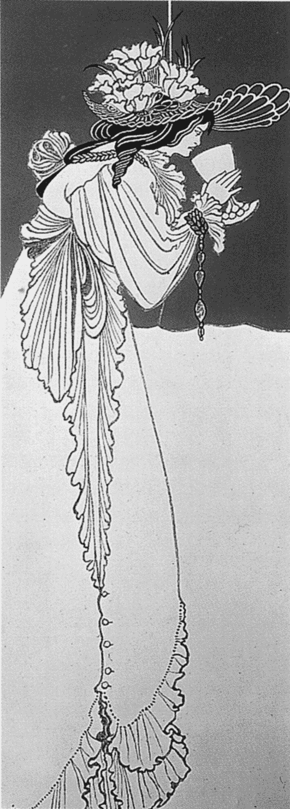

喝下命运之药的伊索德。比亚兹莱绘，［studio］杂志 1895 年 10 月号附录［伊索德］。

两人之间的爱情，就如他们所说：「我们是同一个个体，同一个生命，我是你的，你也是我的。我们既是崔斯坦，也是伊索德。」两人的爱如此炽烈，想必伊索德的母亲所制作的春药一定是最高级品。然而，这个爱的春药效果却有其期限。

崔斯坦和伊索德的故事原本是凯尔特人流传下来的。哥特弗利所写的故事以法国作家托马⑥写的《崔斯坦罗曼史》为蓝本。同为法国人的作家贝卢⑦也写了一个名叫《崔斯坦和伊斯》的故事。在这个故事之中，侍女告诉两人，春药的药效在三年过后便会消失无踪。然而到了第三年，两人的热情还没有消失的迹象，于是悲剧乃无可避免。终究，真爱是没有有效期限的。

董尼才弟⑧的喜歌剧《爱情灵药》（一八三二年）当中也有提到春药。故事始于一个为爱所苦的年轻人询问卖假药的郎中有没有「崔斯坦和伊索德喝的那种药」。他问的是个郎中，所以当然有这种东西可以卖给他。

人们笃信崔斯坦和伊索德所喝的春药效果超群，商人利用这种心理的故事，听起来好像不论什么时代都会发生。即使如此，还是有很多热恋中的男女，想要可以绑住对方的心、并且没有有效期限的爱情灵药。

###### 【为爱穿针引线之药．德国传说集】

没有有效期限的春药人人都想要，但如果会让人卷入猎巫风暴，就令人望之却步了。格林兄弟的《德国传说集》（一八一六～一八一八年）中有着这样的一个故事：一个在某个制旗师的家里工作的女子，爱上了同一栋屋檐下的染工，然而这名染工不久便心生厌倦，找了份新工作离开那个城镇。

女子想要挽回男友的心，于是当精灵降临的节庆到来、大家都出门前往教会时，将几种药草放入锅中熬煮。据说当锅中的东西煮沸之后，心上人便会马上现身。然而，有个不知情的仆人并没有前往教会，当他来到厨房熬胶的时候，突然有个庞然大物掉到他背上，原来是那名染工——他失去知觉，身上只有一件内衣。

染工醒来之后说出了遭遇，表示自己在睡觉时，有只像大山羊一样的动物跑来，用牠的角把染工勾起拉出窗外，等他恢复意识以后，就发现自己在这里。他还表示，会做出这种事的，只有那个女子。

于是所有人一起去找这位女子，要以女巫的名义将她逮捕。女子表示是从一位老婆婆那里听来这个挽回心上人的方法，锅子和药草也都是老婆婆给的。故事到此嘎然而止，没有人知道这个女性及给她药草的老婆婆，最后到底怎么了。

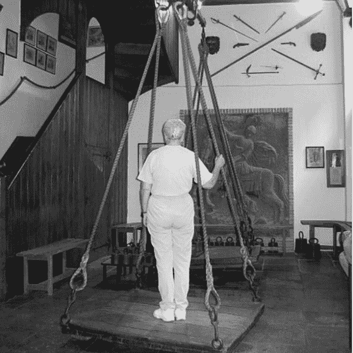

据说由于女巫将灵魂出卖给恶魔，体重会变得很轻，因此在审判时会用磅秤量体重。据说确实曾经秤出只有 2.5 公斤的女巫，只是这样的事情真的令人难以置信。照片中是在荷兰的女巫审判当中实际使用过的磅秤。由查理五世设立的这个审判所，除了会依良心进行测量之外，还会发行证明当事人不是女巫的证明书，因此有许多人特地前来此地。摄于荷兰奥德瓦特（Oudewater）女巫审判博物馆。

十六到十七世纪间的德国是猎巫最风行的时代。异端审问原本只是基督教用来排除异己的手段，后来反而变成世俗权力斗争的工具，连一般平民也被牵扯进来，牺牲者遍布各个阶层。

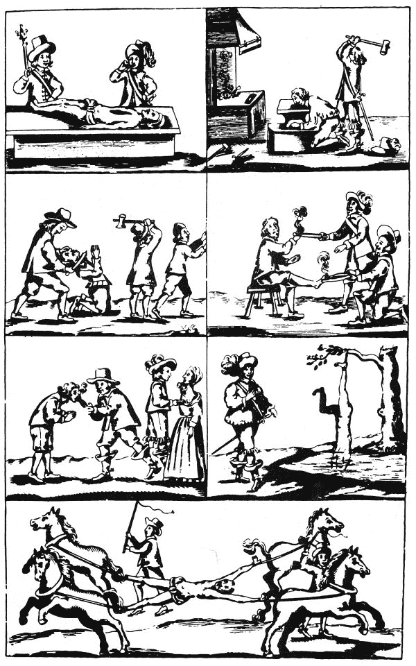

各种恐怖的拷问手段。山缪．克拉克着《殉教者列传》，1651 年。

讲到女巫审判，就让人想起各种恐怖的拷问手法。故事中这位住在艾福特（Erfurt）的女性被带到女巫法庭之后立刻招认了一切，由此可见她很清楚拷问到底有多恐怖。

然而更恐怖的是密告。在拷问过程中招认自己是女巫的人，必须进一步说出是谁将自己变成女巫的。如果不好好回答，则拷问立刻再度展开。于是熟人、朋友、甚至家人，许多人就这样受到连累。

到底是否真有一位老婆婆教导这位女性关于药草的一切，或者只是这位女性逃避责任的借口，就不得而知了。

因为所有人都疑神疑鬼生怕某一天自己也成了密告的对象，于是干脆先下手为强，先密告别人，这样只求保全己身的利己主义，让女巫的数目在连坐之下飞快增加，光在德国就有至少三万人受害。

###### 【坠入爱河之药．仲夏夜之梦】

上一个故事，是关于为了挽留爱人的心，反被指为女巫的悲剧故事。接下来是莎士比亚（一五六四～一六一六年）的《仲夏夜之梦》中让人坠入爱河的药。

雅典之神、精灵王奥伯隆（Oberon）为了教训不听话的妻子缇坦妮雅（Titania），找来了爱恶作剧的妖精帕克，将花露洒在沈睡于森林中的缇坦妮雅脸上。据说被这种花露涂在眼皮上的人，会爱上醒来时所见到的第一个人。于是缇坦妮雅爱上了拥有一颗驴头的波顿。

这是《仲夏夜之梦》当中有名的场面。妖精帕克摘来的花，据说原本开在地面上，后来偶然被爱神邱比特的箭矢所触及，花的颜色乃从白色变成浓浓的红色，汁液则是紫色的。这种植物的名称是「Love in idoless」，亦即不断变心的恋爱。

因此，莎士比亚的日文译者福田恒存将其译为「变心草」，其实就是三色菫的别名。

三色菫的学名为 Viola tricolor。菫类植物种类繁多，而 Viola tricolor 系统的植物是园艺中使用的品种，在英文中叫做「Pansy」。相对园艺品种而言，野生品种叫做「Heart’s ease」，也就是帕克摘来的变心草。

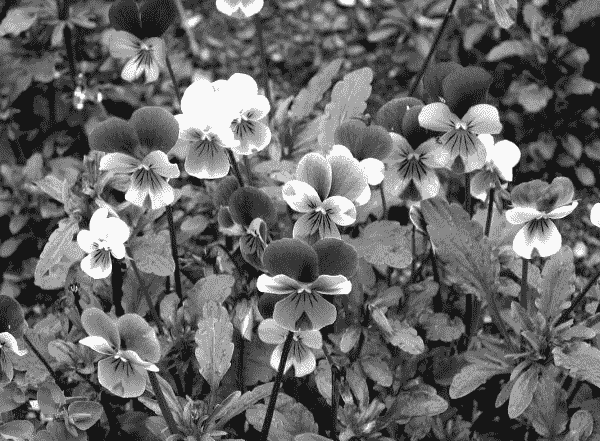

三色菫

根据修女冯．宾根的记载，菫类植物对于眼翳病相当有效。只要将质量优良的油煮沸，丢入菫类植物熬成软膏状涂在眼皮及眼睛外围即可。这类植物能够促进血液循环，提高免疫系统的功能，而煎煮花所得的液体也能当作眼药水。

但是如果在睡觉时被人涂了一些奇怪的药，导致人生产生一百八十度的大转变那就糟了。甚至，如果涂的药是春药那也就算了，如果涂上的是毒药，岂不连命都要赔上？因此，人类发明了解毒剂。

九世纪阿拉伯人发明的解毒剂效果奇佳。其材料及制作方式都记载在《毒物的历史》（尚玛雷〔Jean Tardieu de Maleissye〕着）一书当中。首先，材料是某种松叶牡丹、仙客来（Cyclamen）、九层塔、菊苣、泽漆科的蓖麻、菟丝子、柠檬、莨菪、荨麻、包心菜、鸦片、相思树、菊科的婆罗门参、红玫瑰、肉桂、姜，以及外观像苔癣的地衣。

将上述材料磨碎，拌入牛奶中发酵，并加上打至发泡的蜂蜜，用文火熬煮六小时，最后加上葡萄酒，再煮一段时间，等到葡萄酒都蒸发就完成了。放凉之后装入黏土做的瓮中保存。

花了这么多时间做出来的解毒剂，要等到实际具有疗效，还须等上六个月。这么费时的药剂，不知道是否真的有人愿意试着做出来？

###### 【返老还童之药．浮士德的故事】

如果能弄到春药及解药，那还得有青春年华才能充分享受。不需要长生不老，只要能够暂时恢复年轻活力，对某些人来说也就够了。这个故事当中，就提到浮士德寻找「女巫厨房」拜托女巫为他制药的故事。

歌德的毕生杰作《浮士德》（完成于一八三一年）的主角浮士德博士，使用了上述的手段得以重获青春，然而，要找到女巫厨房，还得靠恶魔梅菲斯特带路才行。

浮士德博士是流传于中古时代欧洲传说中的主角。他是一位刚进入老年，对知识感到绝望的博士，于是将灵魂卖给恶魔以追求现世享乐，结果却在契约时间到了之后，在后悔中堕入地狱。歌德以此传说为蓝本，将近代人的苦恼写成了《浮士德》这部作品。

故事中，浮士德问恶魔，如果喝下女巫所做的返老还童饮料，会变成怎样？于是恶魔梅菲斯特这样回答：「你很快就会感到体内彷彿有一位爱神邱比特，让你打从心底小鹿乱撞。」

于是重获青春的浮士德，马上开始对年轻女孩展开攻势。这返老还童之药说来好听，其实应该只是让人精力充沛，提高费洛蒙效果的饮料而已。

制作这种饮料的女巫曾说：「我偶尔也会自己尝尝，所以已经不觉得臭了。」看来刚开始她曾经觉得这种饮料很臭。虽然不知道用了哪些材料，不过恐怕是包括像缬草之类带有恶臭的药草。

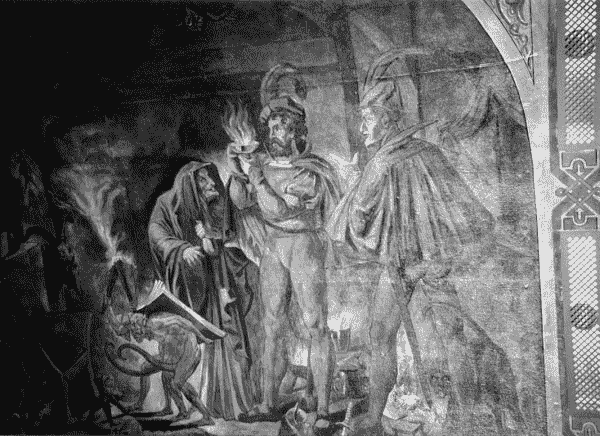

在女巫厨房拜托对方帮忙制作饮料的浮士德。图为在《浮士德》当中出现过的酒吧「奥巴酒馆」（Auerbachs keller）的壁画。（位于莱比锡）

在德国常常可以看到以「hexen Kuche」（女巫厨房）为名的餐厅，大概都是取材于《浮士德》的故事。甚至菜单中还有「女巫特餐」，大多是德国常见的菜肴，例如马铃薯、德式香肠、火腿等。

在《浮士德》故事发生的地点莱比锡，有家餐厅的菜单上甚至还有「女巫的饮料」（Hexentrunk）。我自己也曾点来喝过，尝起来象是普通的葡萄酒。

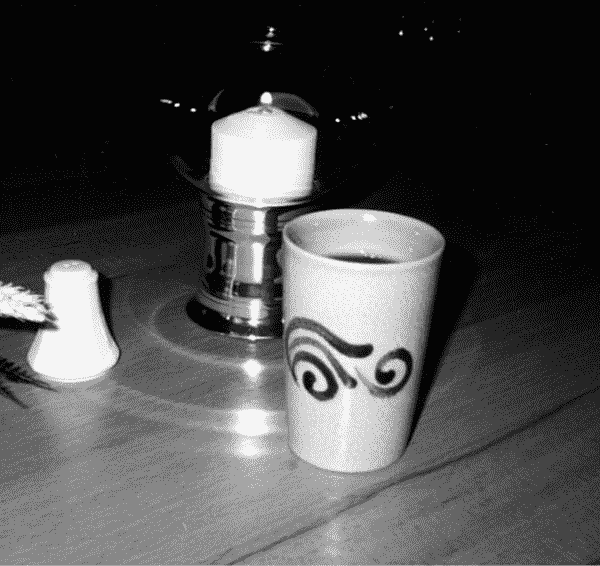

女巫的饮料。摄于奥巴酒馆。

能够使情绪高亢，彷彿回到年轻时代的药，也许的确存在。然而，到底有没有能让人真正返老还童的药，则就有待商榷了。

读罢《浮士德》的这段情节之后，让我想起了小时候看过的一本日本绘本。大意是说有一位老爷爷去山里砍柴，就此一去不回。老奶奶觉得很奇怪，去山里寻找他的下落，结果发现一位躺在瀑布旁边哭闹的小婴儿。原来这瀑布的水有让人返老还童的功效，老爷爷喝了太多遂变成了小婴儿。

我本来以为这是养老瀑布传说的变形，后来才知道原来鹭流狂言⑨中有个名为「药水」的段子，跟这个故事完全相同，想必是从这里将它改编成绘本的。当年这个故事对我幼小的心灵产生了很大的冲击，我一直想着老爷爷实在太贪心了，不应该喝那么多。不过话说回来，要是真有返老还童之药，各位会想要回到几岁的时候呢？

###### 【爱情魔法】

不管在何种时代和社会背景之下，人为了使恋情能够顺利发展，总是希望能够有春药帮忙。春药和长生不老之药一样，都是人类共同的憧憬，即使至今亦然。恋爱中的男女，总想尽办法把对方的心绑住，因此，还有一些不成熟的、类似魔法的仪式。

首先是流传于德国北部彭美恩地方（Pommern）的爱情魔法。首先取得三片鼠尾草的叶片，并且在第一枚叶片上写上「Adam&Eve」（亚当与夏娃），接下来在第二与第三枚叶片上，分别写上自己与对方的姓名，再将这些叶片烧成灰，掺入心上人的饮食。

鼠尾草（Salvia officinalis）带有点奇怪的香气，不过是很多人喜欢的香料，它的叶片在一般的超市便有销售。由于能够改善生理期不顺及更年期症状，对女性来说是很有用的药草。这种方法，使用少许鼠尾草便能轻易达成。

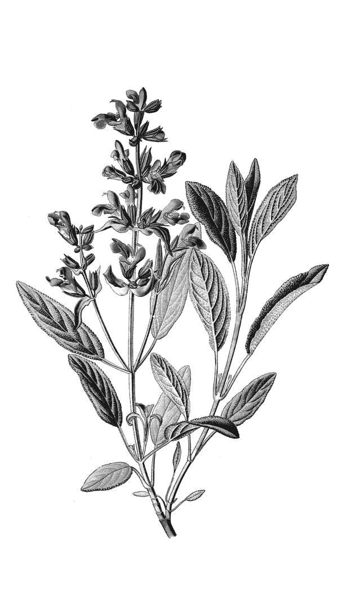

鼠尾草

另外再介绍一种「爱的饮料」。出自一位自称女巫的现代德国女性为年轻女性所写的《女巫配方》。

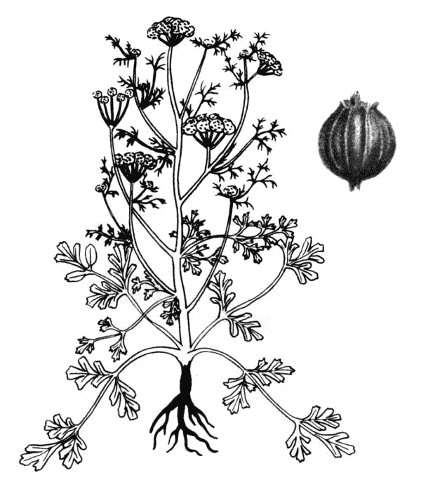

芫荽

方法是这样的：准备七个芫荽（即俗称香菜）的果实，用乳钵捣碎。在过程当中，要复颂三次「温暖的果实，温暖的心，两人感情甜蜜蜜」的咒语，之后加入一公升的白葡萄酒搅拌。十分钟之后再让心上人喝下。

芫荽（Coriandrum sativum）是繖形科植物，日文语源来自葡萄牙语「coendro」，在泰国菜中使用的香料，其实就是芫荽的叶子。由于它的香气十分强烈而独特，因此也有人无法接受。

芫荽具有轻微的麻醉作用，据说古埃及人拿来作为催情剂使用，因此可能的确有这方面的效果，而且需要的材料也只有芫荽而已，可说相当方便。

* * *

＊注①——此处所谓曼陀罗草（Mandoragora）与第一章提到的曼陀罗类植物并不相同。

＊注②——爱华斯（Hanns Heinz Ewers，一八七一～一九四三），德国作家，写作主题广泛，不过最为人所知的是惊悚小说。他把对黑暗的幻想叠加在对心理学的丰富知识之上。像长篇小说 The Sorcerer’s Apprentice, Alrune 和短篇小说 The Spider 都包含出众的特质，因此达到经典的层次。

＊注③——阿布流士（Apuleius，公元一二三／五～一八〇），柏拉图派哲学家、修辞学家及作家。所着《金驴记》又称《变形记》（Metamorphosis）。

＊注④——狄欧斯科里德（Pedanius Dioscorides，公元四〇～九〇），希腊人，曾为罗马皇帝尼禄御用医生。所着《药物论》（De materia medica）影响后世甚巨，可说是西方的本草纲目。

＊注⑤——哥特弗利（Gottfried von Strassburg，？ ～一二一〇），中古时期德国宫廷诗人。

＊注⑥——托马（Thomas d’Angleterre，约一一五〇～一二〇〇），为盎格鲁—诺曼地（anglo-normand）的作家，行走于英格兰国王亨利二世（Henri II d’Angleterre）与阿基丹的爱蕾诺（Alie’nor d’Aquitaine）的宫廷里。推断为一文人教士，约莫于公元一一七〇年间完成《崔斯坦与伊索德》（Tristan et Iseult），为中世纪骑士文学之代表作。

＊注⑦——贝卢（Béroul），十二世纪诺曼诗人。所写的《崔斯坦》（Tristan）是诺曼语版的崔斯坦与伊索德故事。

＊注⑧——董尼才弟（G. Donizetti，一七九七～一八四八），意大利歌剧作曲家。文中提到的作品《爱情灵药》可说是他成功发挥意大利喜歌剧要素的杰作。

＊注⑨——鹭流狂言为一种日本古典戏剧流派。

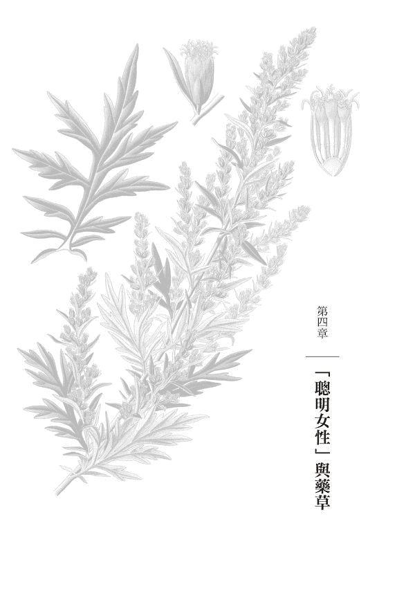

# 1　「聪明女性」与女巫

在化学药品尚未问世时，一般人若有病痛，或是感染疫病及受伤时，所倚赖的都是药草。从前的人相当了解什么样的草对身体有益或是有害。

人类藉由观察生活在大自然中的野生动物的行径，学习如何分辨药草及其效果。例如动物受伤时，会食用哪种植物？或是用身体与其磨蹭？又或者是吃了哪种植物后会痛苦而死？甚至有时候人类也会用自己的身体来尝试，因此得知就算是有毒的药草，只要适量使用也会有超群的效果。透过这样的方式，关于草药的知识不断累积流传到后世。

日本自神话时代就已有用药草进行治疗的纪录。大国主命与因蟠白兔的故事就改编为儿歌，在日本小学的唱游课上是必教的曲目：大国主命遇见了一只受了伤正在哭泣的小白兔，于是教导牠，只要「在身上裹上一圈蒲穗绵草就能治好」，白兔照办之后果然痊愈。这个故事是出云地方的神话，据说实际上使用的草并非蒲穗绵，而是一种叫做蒲黄的香蒲科植物的花粉，是从前的人用来治疗各种伤口的药材。而大国主命因此也被尊为日本医生的开山祖师。

在欧洲，早在公元前四世纪由德弗拉斯特所写的《植物志》，以及公元一世纪老蒲林尼所写的《博物志》当中，就已经实地考察过许多药草的特性。古希腊的「西方医学之父」希波克拉底（Hippocrates），以及曾担任罗马暴君尼禄军医的植物学家狄欧斯科里德，也曾纪录了许多种药草。

到了中古时代，出现了许多懂得运用关于药草知识及经验治疗疾病或者接生的「聪明女性」。药草各个部位的功效都不相同，只要稍有不慎就有可能造成致命的后果，因此在从前，这些富有智慧的女性对民众来说扮演着药剂师般的角色，备受敬重。

当然，身怀药草知识的并非仅限于「聪明女性」而已。中古时代的修道院大多附设规模或大或小的草药园。当时身为知识分子的修道士，会研究古希腊与罗马时代的植物学，制造出许多药品。在遥远的异国传教时，若发现珍贵的药草也会顺道将它带回。

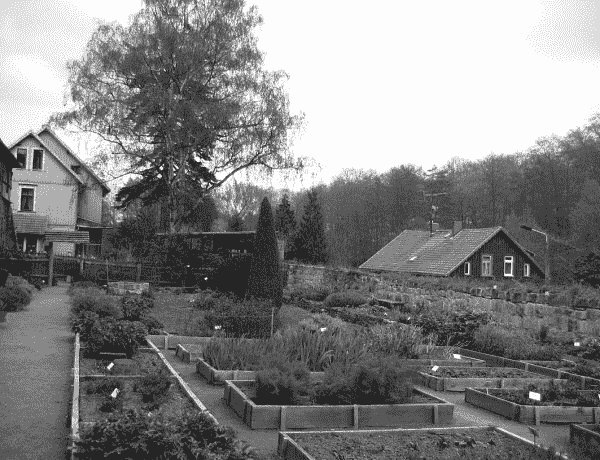

修道院附设的草药园。摄于米夏约史坦（Michaelstein）修道院（位于德国哈茨地区）。

于是修道院附设的药草园当中，往往种了许多有用的药草。然而即使如此，修道院的条件毕竟不适合大量生产药草，所以我们无从得知到底修道院草药园确切的产量是多少，以及究竟造福了多少群众。况且，许多人之所以需要药物不见得是因为生病，往往是希望能帮助受孕、安胎、避孕、堕胎，甚至增强精力等目的。这些药，修道院自然绝不可能提供。

于是，民间的「聪明女性」的责任便是满足这些人的需求。瑞士的帕拉塞尔苏斯（Paracelsus）行径颠覆传统医学，在处方中使用了各种金属化合物。他曾经提到，医药学得以发展至此，全都是「年长女性」的功劳。所谓年长女性，就是前面所提到的「聪明女性」。

不过，在某些时代，这些身怀知识的女性却被指为女巫。从基督教的角度来看，依靠传统经验的民间药方不仅相当危险，在过程中使用的一些类似祈祷的仪式更是异教的咒术。为了使药草能够发挥最大的功效，特地挑选日期时间出门，采摘时并口唸咒语的行径，都是基督教所急欲禁止的异教行径。

在中德的哈茨地区流传着下面这个与采药草有关的故事：有位女孩前往森林里采药，就在随身携带的篮子差不多装满时，发现天上恰好高挂着满月，于是她连忙往森林的深处走去。

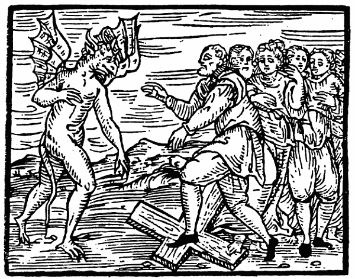

女巫踩着十字架，与基督教对立。从这张图也可得知，巫师并非只限女性。古雅索（Francesco Maria Guazzo）着《妖术概论》，1626 年。

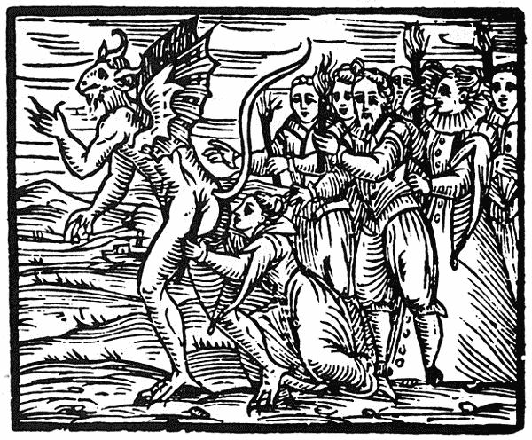

女巫效忠的对象不是十字架，她们透过亲吻来礼赞与效忠恶魔。《妖术概论》。

女孩之所以这么做，是因为她记得母亲跟她说过，满月时采摘的药草效用最强。她的母亲最近才刚改信了基督教，许多异教的旧习惯还改不过来。

小女孩一进入森林，事实上就等于已经踏入女巫的地盘，女巫马上出现在她眼前，追赶着她。就在千钧一发之际，女孩想起最近才改信的神祇，于是大声呼唤神的名号，双手画着十字，接着大风突然刮起，将女巫吹落山崖，当场摔死。

从教会的立场看来，对于「聪明女性」一边口唸咒文一边采药草的作法，一概认为是异端的行径。也许正因如此，才创造出了女巫的形象。用这样的标准来看，故事中的小女孩也算是女巫。女巫能够运用各种恐怖的魔法，制作对人或家畜有害的毒药，或者散播传染病、诅咒农作物和家畜，甚至让男性不举、女性不孕、害死分娩过程中的新生儿，或者在身上涂抹「飞行软膏」飞去参加邪恶的黑弥撒。这些恶行恶状都出于恶魔的指使，因为，女巫是恶魔的情妇。

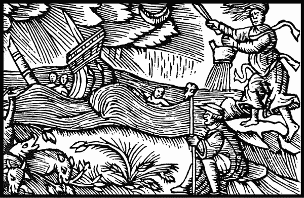

巫师呼风唤雨，引起洪水、害死家畜，并让农作物枯萎。在此提到的巫师亦有男有女。克劳斯（Kraus Magnus）着《北方民族文化史》，1555 年。

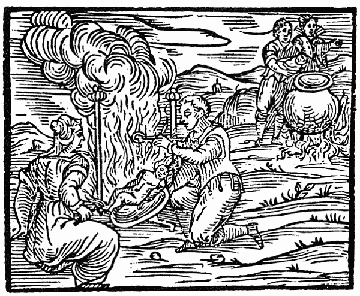

假扮为接生婆的女巫，将新生婴儿煮熟，并献给恶魔。《妖术概论》。

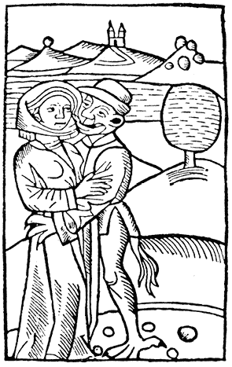

图为恶魔的情妇。男人的脚像鸟爪一样，甚至垂着一条尾巴，可见他其实是恶魔。莫利特（Ulrich Molitor）着《拉米亚》，1489 年。

如此，「聪明女性」因为反社会的行为被污名化成为邪恶的女巫，大约在十六到十七世纪欧洲社会整体开始猎巫的时候，「聪明女性」自然成为主要目标。

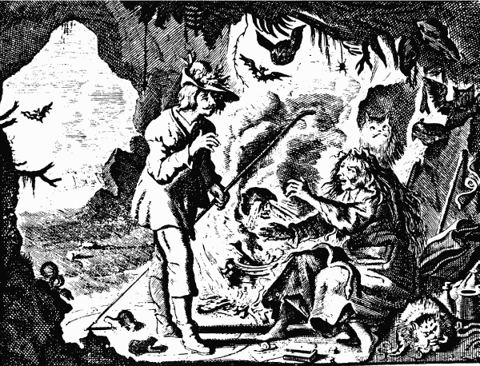

就算在猎巫最激烈的时代，仍然有人相信女巫当中也有擅长治疗法术的人。这样的人，会寻访住在森林洞窟中的「善良女巫」，也就是所谓「聪明女性」，向她们寻求协助。

德国的医药分业制度建立于公元一二四〇年。当时神圣罗马帝国皇帝腓特烈二世（Friedrich II）有鉴于许多不具备专门医药知识的人擅自制药贩卖，因此下令只有医师能开立处方，而且只有药剂师开设的药局才能卖药，于是能够确保药品质量的药局就此诞生。

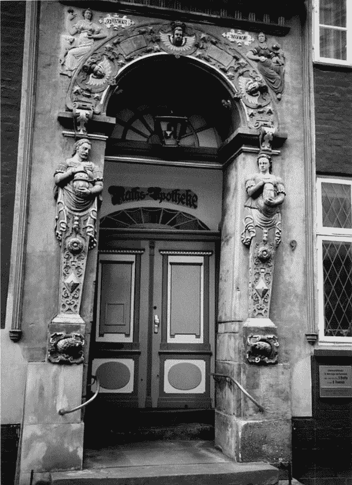

开业于 1598 年的药局，至今仍在营业。位于北德的吕内堡（Luneburg）。

这是正确的政策，然而也正因如此，那些卖药草的女性，由于没有药剂师资格，就只能在台面下进行买卖。另外，随着医学的进展，妇产科医师大都由男性担任，「聪明女性」所扮演的接生婆及药剂师的角色渐渐遭到取代。最后接生婆终于在法律规定或是一般习俗中都被排除在外了。

「聪明女性」继承了自古以来的传统、知识及生活智慧，但是正因为如此，反而被视为亵渎神明的邪恶女巫。但只要了解药草与女巫的关系，便会了解其实女巫与「聪明女性」是一体两面，某种令人害怕的女巫常用药草，往往也具有驱魔的功效。

# 2　圣母马利亚与药草

即使基督教会一直谴责与咒术有关的行为，但这样的民间习俗及仪式并未销声匿迹。这是因为祖先流传下来的传统习俗必定有其理由，不能简简单单地予以舍弃。在基督教传入以前，这些习俗便已经和民众的生活密切结合了。

民众使用药草的方式往往不侷限于治病。例如为了保护自己与亲人及家畜不受恐怖的传染病或恶魔侵害，将药草制成护身符随身佩带，或者悬挂在门前及家畜小屋门口；或者就像我们常看到的，使用植物来占卜心上人的心意。

特别是一些跟农耕有关的民间仪式，就算教会再三强迫，民众也不愿意废止。于是教会只有选择妥协，将这些仪式纳入教会行事历，并改编加入基督教仪式。

从前，要采集药草必须先登山，用严肃的态度进行礼拜仪式，这一天被称为净化药草的日子，是前人相当重视的节日。这种异教的习俗，即使在基督教社会当中仍然存在，并且还与圣母马利亚产生关联。

圣经当中几乎没有记载马利亚的生平。不过圣经外典中的《雅各福音》（完成于十二～十三世纪），以及圣徒传说集《黄金传说》（The golden legend，成书于十三世纪）当中，对于马利亚从诞生到去世的经过有着详细的记载。其中提到，马利亚的生日是九月十八日，而蒙召升天的日子则是八月十五日。

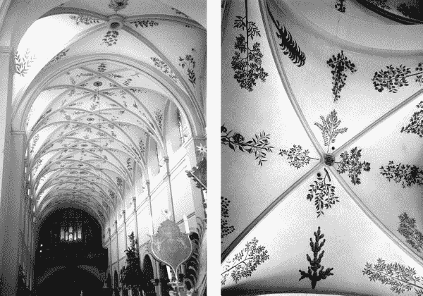

绘于圣米歇尔教会天花板上的药草。位于德国班堡。

马利亚是在去世后才受到神的召唤而升上天堂，这点和自己升天的耶稣基督并不相同。而从马利亚升天之日开始算起，到她的生日之间的约一个月期间之内，称为「圣母马利亚的三十天」，在这段期间，人们会将成捆的药草供奉于马利亚的祭坛上。

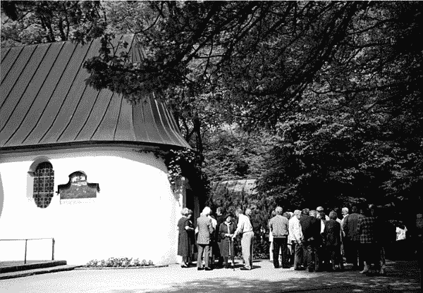

在马利亚礼拜堂前等待礼拜的众人。慕尼黑郊外的普兰尼（Planneg）。

这一捆捆的药草束有用九种、十五种、七十七种，甚至九十九种药草所捆扎的。直到现在，在这段期间内造访马利亚的祭坛仍然可以看到信徒供奉的药草束。班堡（Bamburg，位于南德）的圣米歇尔教会的天花板上，总共描绘了五百七十八种花卉与药草，有「天堂的庭园」之称，由此可见，教会其实也相当重视药草。

部份笃信圣母马利亚的地区将八月十五日订为节庆日，这些天主教地区对马利亚信仰的疯狂程度往往让人难以想象，甚至有专门寻访各大马利亚礼拜堂的观光手册和旅行团等等。我曾经造访其中几个马利亚礼拜堂，让我十分惊讶的是，信徒当中有半数是男性。以为圣母马利亚是女性，信徒大概也都是女性，这纯粹只是我本身的无知。

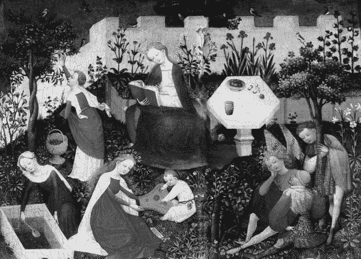

在玫瑰盛开的庭园中歇息的马利亚。一位被称为「上莱茵大师」的不知名画家绘于 1410 年。收藏于施泰德艺术馆中（Städel Museum，位于德国法兰克福）。

看见许多男信徒热切地颂唱着「Ave Maria, Ave Maria」，手中摩娑着唸珠的情景，对于不是教徒的我来说，是很大的冲击。不过仔细想想，在日本，也有许多信仰观音、并且热衷参拜位于各地修行场所的男性，也就见怪不怪了。

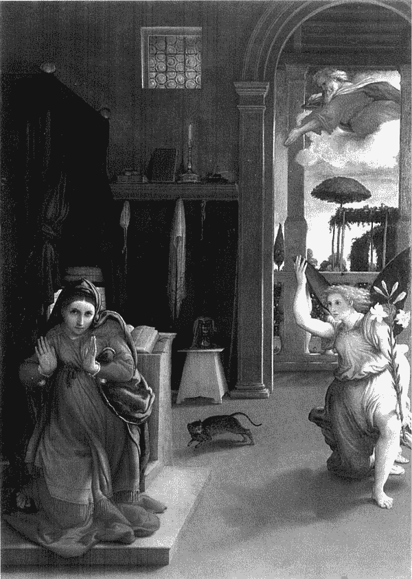

图为手拿百合，前来告知马利亚受胎消息的加百列。还没结婚的女性，突然被告知怀了神的孩子，想必一定感到很吃惊。根据圣经中的描述，当时马利亚的反应极为镇静，表示「谨遵您的意旨」。也许正因如此，在所有类似主题的画作当中，马利亚的表情通常都是庄严且平静的。而在这张洛托的画作当中，马利亚惊讶的表情，就像在说：「咦？为什么？这太突然了！」感觉起来就像一般人。两手的动作也表现出她的情绪反应，而且看见天使突然出现，准备逃跑的猫的表情也很有趣。［天使告知受胎］洛托（Lorenzo Lotto）绘于 1527 年左右。

我并不清楚观音是否也跟多种植物有关，但马利亚确实和许多植物脱不了关系。例如天使加百列前来告知圣母马利亚受胎的消息时，在许多画作中都手持百合花。不过有趣的是，最先画出加百列手拿百合的，是文艺复兴时期的意大利画家，在此之前的画作当中，通常手上拿着法杖，或者什么也不拿。

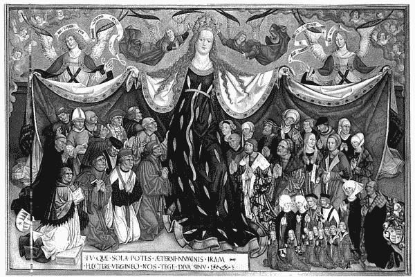

马利亚的斗篷之中，有着形形色色的人。张开的斗篷边缘，看起来就象是斗篷草的叶片。本图绘于 1510 年左右，现收藏于慕尼黑的圣母教会。

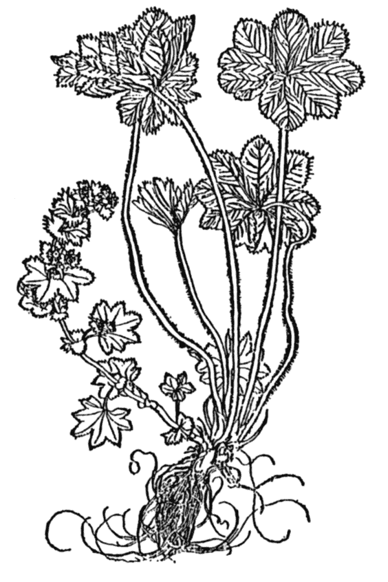

斗篷草

另外，也有许多画作以坐在玫瑰园中的马利亚为主题。只要前往欧洲的美术馆或教会，一定可以看到许多以马利亚、百合、玫瑰为主题的艺术作品。

不过，当时的玫瑰与百合花，似乎和现代人认知中的这两种花有所不同。这一点只要比较过圣经的各种译本，即一目了然。例如在旧约圣经的［雅歌］中有着「我是沙仑的玫瑰，幽谷间的百合」（rose of Sharon, a lily of the valleys）这样的诗句。其中英译本记为玫瑰的植物，在德文中则是「沙仑的水仙」，而日文版当中则是「沙仑的番红花」或「沙仑的野花」。在近年来的圣经研究当中较为有力的说法认为，此处「沙仑的玫瑰」实际上应为风信子，而幽谷的百合则应为水仙花。

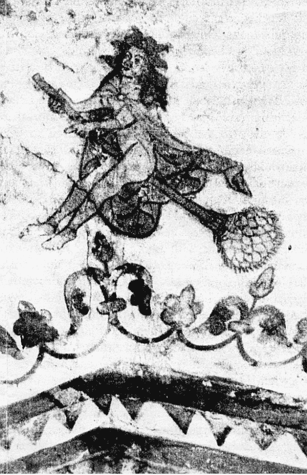

这张图据说是北欧神话中的女神芙蕾雅。乘坐着尖端带穗的法杖飞翔在空中。整幅图画绘于北德石勒苏益格的大圣堂的天花板上。对基督教而言，属于异教的女神图得以保留至今，是相当有趣的现象。

历代画家，用玫瑰与百合来譬喻纯洁的圣母马利亚，不过若从药草学的观点来看，这些譬喻其实不太精确。

例如属于蔷薇科的斗篷草（Alchemilla mollis），在日文汉字当中写作「羽衣草」，而在德文（Frauenmantel）和英文（Lady’s Mantle）当中的别名也都是「妇人的斗篷」之意，这名称的由来，是因为其叶子的外型，象是斗篷一样又大又宽。斗篷草边缘呈现不规则起伏，朝露得以挂在叶缘而不致滴落地面，随着时间经过而为叶片所吸收，这种植物给人相当清新洁净的感觉。

斗篷草能够促进产后母体恢复及分泌母乳，甚至能够改善卵巢功能衰退及更年期的种种症状，可说是对女性百利而无一害的药草。不过英文名称当中提到的「Lady」，并非指一般的女性，而是马利亚的代称。

据说圣母马利亚会张开她的斗篷，庇佑在她之下信仰她的人群。关于天使告知受胎、受召升天、圣母子、圣家族等等与圣母马利亚有关的画像主题当中，其中有一种构图方式便是马利亚将斗篷张开，包裹住许多热心地向她祈祷的人。

斗篷草在北欧神话当中是献给女神芙蕾雅的药草。随着基督教传入，圣母马利亚的形象逐渐取代了异教的女神。

# 3　月神与艾草

蒿属植物皆为菊科，是各地常见的植物。其学名「Artemisia」总让人联想到希腊罗马神话当中的女神阿尔忒弥斯（Artemis，即罗马神话中的黛安娜，英文记为 Diana），想必两者之间有密切的关系。

阿尔忒弥斯是一位年轻貌美的女神，她的美貌从位于土耳其爱非索斯的阿尔忒弥斯神殿中的神像即可略窥一二。神像胸前装饰有许多乳房（亦有说法指出应为牛睪丸），也许有些人会觉得造型有点古怪，不过容貌端正且凛然直立，看上去庄严而美丽。阿尔忒弥斯同时也是丰饶及多产的象征，继承了古代小亚细亚地区对大地母神的信仰，到了后代又成为月之女神，是保佑女性的神祇。

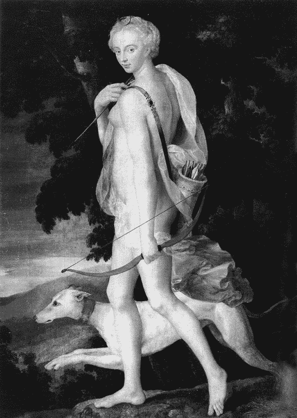

手拿弓箭的黛安娜。罗马神话当中的黛安娜，与希腊神话的阿尔忒弥斯可视为同一位神祇。图为枫丹白露画派的［猎人黛安娜］，绘于 1550-60 年左右。

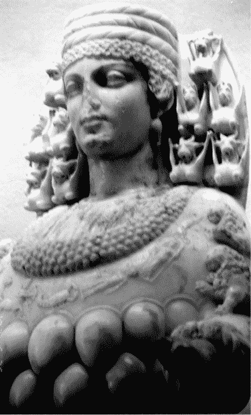

象征丰饶与多产的大地母神阿尔忒弥斯。此神像位于阿尔忒弥斯神殿当中（在土耳其的爱非索斯）。

但是，希腊神话当中的阿尔忒弥斯形象又不太一样。据说她习惯卷起衣襬，任头发垂到肩后，并且喜爱狩猎，常常穿着无袖的薄衫，手拿弓箭追赶鹿只。甚至有时候看到难产的女性，会主动用弓箭取走她的性命，以缩短她受苦的时间。

她是天神宙斯的女儿，并且拒绝结婚，是三位处女神之一。有很多故事都提到她与男性为敌，因为触怒她而遭到杀害的男性不计其数，甚至有人只是刚好路过，撞见她正在水边洗澡，就被变成一头公鹿，遭野狗咬断脖子分食。

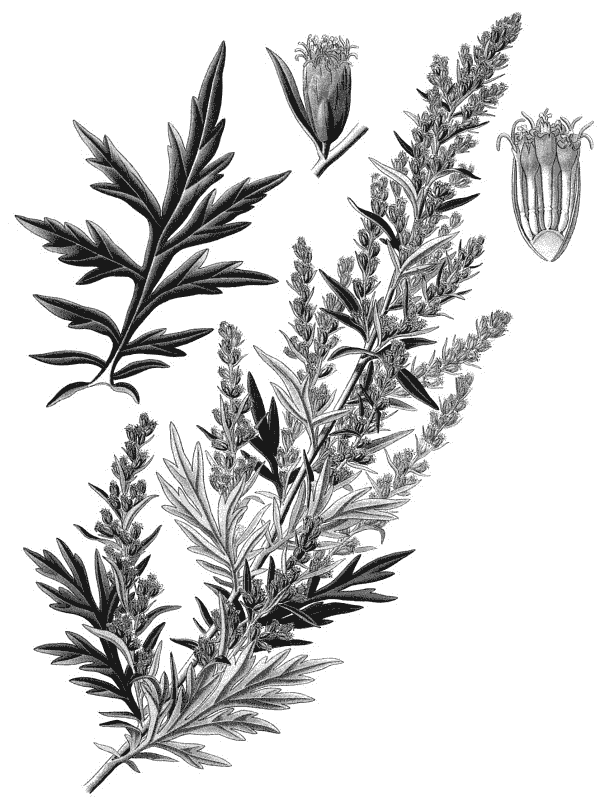

艾草

艾草的学名（Artemisia vulgaris）用这位带点恐怖性格的女神来命名，让人有点无法理解。不过关于此学名的由来，有另一种说法指出，公元前四世纪左右，有位颇通医术的波斯王妃也叫做阿尔忒弥斯，据说这是较为有力的说法。不过无论是哪一种，蒿属的植物自古以来便是与女性有密切关系的药草。

艾草可以帮助分娩顺利、使生理期顺畅，不过，这种植物同时也具有催经作用，亦可作为堕胎药，因此药草学的书籍几乎都建议怀孕中的女性最好别碰艾草。

据说艾草还可以减轻双脚的疲劳，因此从前长途旅行的旅客会将艾草垫在鞋子里，德文的名称为「脚边草」（Beifuss）。加入了艾草的药草浴，可以消除脚部疲劳并且温暖身体，近几年来相当风行。

在蒿属植物当中，最常用于制作护身符的是具有茴香般香气的苦艾（Artemisia absinthium），甚至据说在咒术仪式当中，也使用这种植物来召唤灵魂。如同其名，这种植物带有强烈的苦味，因此犹太人在过逾越节时食用这种植物来追思祖先的辛劳。

过去有人也会将苦艾加入酒中用来点缀，不过长期饮用掺入了苦艾的酒，会因为其中所含的一种侧柏酮（Thujone）成分，引起神经麻痹，导致生命危险，目前已禁止使用。

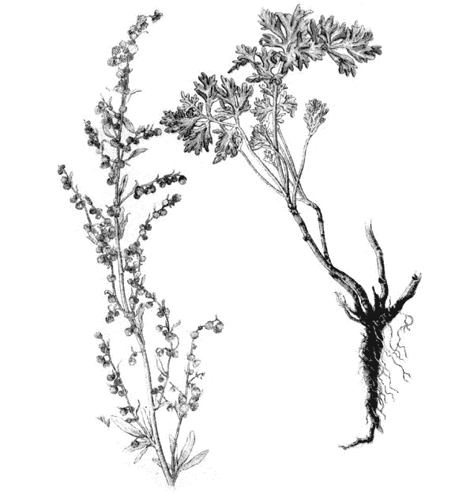

苦艾草

在莎士比亚所写的《仲夏夜之梦》当中，「迷魂药」的成分是紫花地丁的汁液，而能够解除其诅咒的，则是「月之女神黛安娜之花」的汁液。对此研究莎士比亚的专家学者认为，这种花其实就是艾草或苦艾。

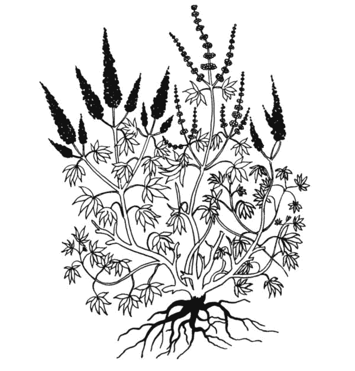

西洋牡荆

莎士比亚所生活的时期正是园艺的概念逐渐兴起，取代传统在庭园中仅种植药用药草的时代。莎士比亚的作品当中总共提及了超过六百种的花草，也许正反映了那样的时代风气。不过，关于他到底具有多少药草知识，就不得而知了。艾草的成分经科学证实，对于治疗妇女疾病相当有效，不过能够去除春药效果的科学根据，则还没有找到。

另有一种说法认为，「黛安娜之花」指的其实是唇形科的西洋牡荆（Vitex agnus-castus）。西洋牡荆的花呈紫丁香般的紫色，带有宜人的香气，果实经过干燥处理后，能够促进人体分泌一种叫做「progesterone」的黄体素。所谓黄体素，是稳定怀孕时母体平衡的荷尔蒙的总称，对女性来说相当重要。由于这种荷尔蒙具有抑制性欲的作用，因此这种植物能够破除奥伯隆妃子缇坦妮雅眼皮上的迷魂药效果，也许并非空穴来风。

将话题拉回到艾草。在日本，艾草自古以来便和女性有很深的渊源，也常用来制作驱邪护符。掺了艾草的草饼，在女儿节当中是不可或缺的角色，在寺庙附近的商家也常贩卖一些添加艾草的丸子串或草饼，是可以趋吉避凶的吉祥物。

艾草虽然看起来并不起眼，然而由于其功效，无论是在东方或西方，自古以来一般民众都很爱用。

# 4　修女赫德嘉与药草

许多药草和艾草一样，看来并不起眼，事实上，大部份的药草也都不太需要照顾，在自然条件下生长便具有极佳的功效。

十二世纪时，德国莱茵河流域附近曾有一位修道院长赫德嘉．冯．宾根，在五十岁后花了七年写成一本巨著，名为《自然史．自然的治愈力》。在书中她列举了许多自然界中对人体有益的动植物及矿石，其中超过两百种以上的植物都可以在路边、林中小径、荒野及田地中找到。

一一〇六年，赫德嘉八岁时进入莱茵河支流那厄河（Nahe River）附近的迪希邦登堡修道院修行，之后并成为该院的院长，甚至还在罗勃堡（位于今莱茵河左岸的宾根镇附近）以及艾宾根（位于莱茵河右岸的露迪斯海姆附近）又另外设立了修道院。

迪希邦登堡的修道院中附设了规模庞大的草药园，虽然现在已经成为废墟，不过仍开放供一般人参观。赫德嘉便是从这座草药园开始认识植物的，当然日后她游历各地讲道，也使她得以充实很多这方面的知识。

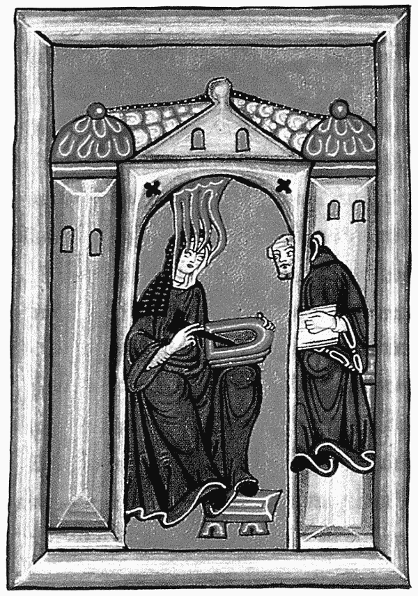

图中描绘的是神的声音直接进入脑中与赫德嘉交谈。赫德嘉着《认识主道》，1141-1151 年。

即使赫德嘉曾受罗马教皇及德意志帝国的皇帝所表扬，不过随着时间的流逝，仍然渐渐为众人淡忘。到了一九六〇年代，美国女权运动浪潮兴起，这股风潮传入德国，于是德国人也回头开始寻找历史中了不起的女性，赫德嘉的著作及生命历程才再度受到众人注目。她以丰富的自然知识以及敏锐的观察力，掳获了现代人的心，特别是从事与药草相关业务的人士都纷纷尊她为开山祖师。

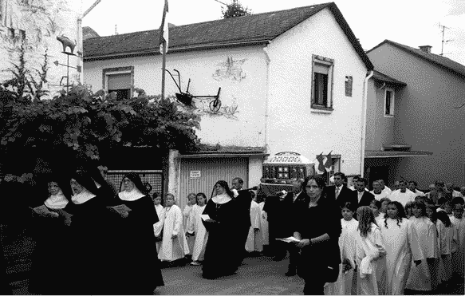

九月十七日是赫德嘉的忌日。她所设立的教会所在的城镇每到这天会将装有她遗骸的圣柩公开展示，在祈祷后由信徒抬着绕行镇内。照片摄于德国露迪斯海姆（Rudesheim）的艾宾根。

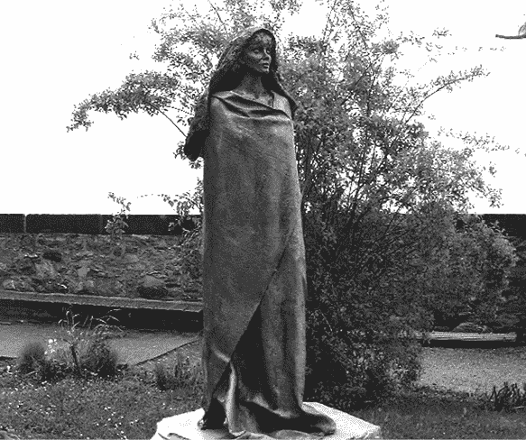

位于艾宾根的赫德嘉修道院庭园中的赫德嘉像。这一带有许多她的立像，可见她相当受当地民众爱戴。

直到现代为止，科学主要的着眼点都是如何战胜自然，然而不知不觉，这样的研究方向已经走进了死胡同。从前被贴上女巫标签的药草学，以及「聪明女性」长期累积下来的经验与智慧，重新获得重视。「女巫」的所作所为反而被视为是与自然调和的象征，因此赫德嘉对待自然的态度，也堪称现代环保运动的原点。

# 5　药草女巫

虽然我们不能全盘否定现代科学的成果，不过对科学抱持怀疑态度的人的确越来越多。有些人认为，应该重新对女巫作出评价，对自然界也应从另一种角度的思维出发。

在德国有一种「药草女巫」。药草女巫在猎巫的时代受到诬陷，遭指控使用有毒的「女巫药草」造成种种危害，受到烙印的惩罚，排除在社会外。

这些使用药草的女巫，在女权运动当中获得翻身的机会，成为活用大自然恩惠的聪明女性的象征，因此也出现许多自称药草女巫的女性。

住在德国西南部的比可儿（Gabriele Bickel）小姐，也是一位自称为药草女巫的人。她业已出版了多本与药草有关的书籍，也在电视中露脸，甚至拥有数家药草铺，一年之中还会策画几次药草旅行团，吸引许多人参加。

我曾经参加过这个旅行团，在约五十名的参加者当中，大多都是女性。经过询问才知道，参加者大多接受过药剂师利用药草所进行的治疗。参观的路线主要是比可儿家的后山，她会一一介绍路边的野草，解说其效用。

在参加这趟行程之后我才了解到，原来药草并不是什么特别的植物，只是恰巧对身体有益的野草罢了。从前被指为药草女巫的那些「聪明女性」，也不过就是善加利用这些不起眼的植物而已。当然山中也会有像癫茄这类毒性极强的植物，毕竟效果优良的药剂，原料中往往少不了含有剧毒的草药。

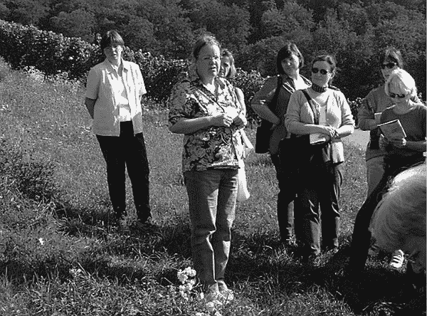

药草女巫比可儿的药草旅行团。摄于德国毛尔布隆（Maulbronn）近郊的史坦费斯（Sternenfels）。

在日本，也有许多野草同好会或者药草园举办的讲习，短至仅花个二小时把住家附近的山区或者原野绕过一圈，长至晚上入宿温泉旅馆的豪华药草旅行都有。

比可儿小姐曾经指着路旁的一株植物给我们看，那是菊科的洋耆草，是常见于德国乡间的药草。

这种植物的叶片形状相当特殊，一眼就可认出。日文称为「锯子草」，在法文中则叫做「工匠草」，叶片的外围象是锯子一般锐利，在德文当中称为「Schafgarbe」（对羊群的健康有助益的植物）。又因为其美观的流线形造型，它还有一个美丽的名字，叫做「维纳斯之眉」。

在伊拉克山尼达（Shanidar）洞窟遗迹的古墓当中曾找到八种药草，据说其中一种就是洋耆草。据估计，该遗迹的年代约为公元前六千年左右。

洋耆草学名（Achillea millefolium）则来自古希腊英雄阿基里斯。据说他在特洛伊战争时，曾经用此草治愈了部下的伤势。由于整株草都含有具消炎效果的成分，有极强的止血与消炎功用。这种草在德文当中有许多称呼，大多是像止血草、士兵草、创伤草等等，在英文中则称为「yarrow」。

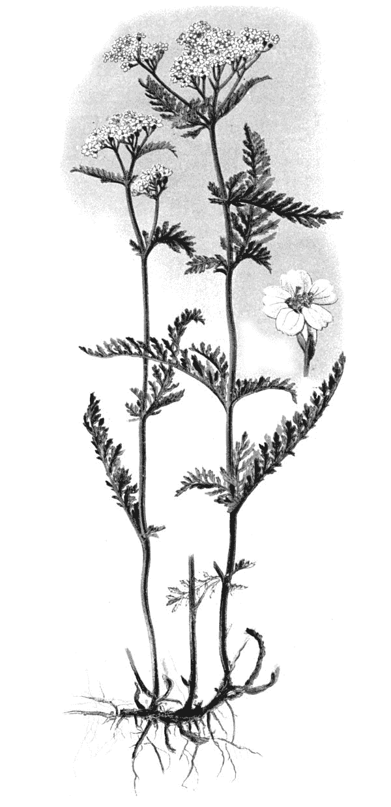

洋耆草

我幼时曾在前往山中远足时受过伤，当时的领队就近摘了一把草，揉碎叶片，涂抹在我的伤口上。我虽然不知道那把草的确切名称，不过像这样的紧急处理，从前相当常见。如像起疹子时将蕺菜的叶片揉碎涂在上面，以及感冒喉咙痛时将葱段用布包裹围在脖子上等等，许多活用药草的生活小智慧，至今依然存在。

药草在德国人的日常生活中也扮演相当重要的角色。我的德国友人当中，不乏为失眠所苦的人，然而他们绝不服用安眠药，只在睡前喝杯加了缬草萃取液的热茶。还有人对我说，他孙子感冒时，只要给他来杯洋甘菊茶，很快便能康复。许多当地人都前往兼营药草贩卖的药局，征询药剂师的意见并请他们帮忙开药。

# 6　具有性治愈力的药草

有次我应邀到德国人家中作客，主人问我：「要不要喝点什么？」我因为当天已经喝了太多咖啡了，于是请他给我来杯茶。没想到他马上接着问我：「您想要喝什么茶呢？」让我不知道该怎么回答。

其实这位朋友是在问我想要喝红茶或药草茶。由于当时对药草茶（Kraütertee）完全没有概念，因此半出于好奇心，就请主人帮我泡杯药草茶。结果主人又问：「要哪一种药草呢？」这让我越发困窘了。原来光是他们家的厨房，就有茴香茶、银杏茶、槲寄生茶、车前草茶、洋甘菊茶、玫瑰果茶等等，除此之外，依功能分类，还有整肠、预防感冒、宁神、安眠、降血压等各种药草茶。这些药草分装在盒中，几乎堆满整个厨房。

当时的我，只知道红茶和日本茶两种茶而已，现在的人可能也很难想像，从前药草茶还没引进时，许多人根本连听都没听过这种东西。

现在的药草茶也已经推出茶袋包装的产品，饮用起来相当方便，据说这种自动包装药草茶的机械，便是德国厂商于一九二九年发明的，但这种机械却过了四十年，也就是到一九六九年才传入日本。而且一开始几乎毫无知名度，负责进口的代理商花了很多心血在宣传上。

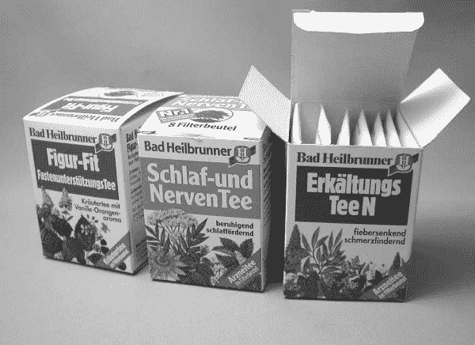

在德国到处买得到的茶袋包装药草茶。右方为菩提树的花，主要用来治疗感冒；中间的则能帮助入睡，主要原料为缬草；左边的则为减肥用，添加了马黛（yerba mate）及榛树的叶片、蒴藋的果实等等，喝起来相当顺口。

一九六〇年代正是全世界各个角落纷纷展开反体制运动的年代，美国的嬉皮以「回归自然」为口号，呼吁大众多多关心自然环境。在这样的风气当中，日本人也开始饮用药草茶，所以药草茶传入日本尚未经过太长的岁月。

饮用药草茶有助于放松心情，因此在日本大受欢迎。事实上，喝药草茶之所以能够放松心情，是藉由生理影响心理，而既然药草茶对生理会造成影响，其中也必然包括了性功能方面的效用。

曾有位从事药草相关工作的友人向我透露，他在演讲时曾提到药草对性功能方面的效用，台下的反应却相当冷淡。据说是因为对听众而言，饮用药草茶比较象是一种精神上的疗愈，突然牵扯到性方面的功效很多人无法接受。

不过既然要谈药草，与性功能有关的部份就不能略过不提，毕竟性方面的烦恼也是人的诸多烦恼之一。而在赫德嘉．冯．宾根的《自然史．自然的治愈力》一书中，也记载了许多这样的烦恼及各种解决范例。

例如「置身性的狂喜之中却无法射精的男性」，可以从芸香及少量的苦艾榨出汁液，加上砂糖与蜂蜜搅拌后，与等量的葡萄酒一起放入耐热容器，煮沸五次饮用即可。

芸香（Ruta graveolens）是芸香科的灌木。根据草药辞典的记载，这种植物具有让人兴奋作用，因此也许的确适合改善这类男性的烦恼。

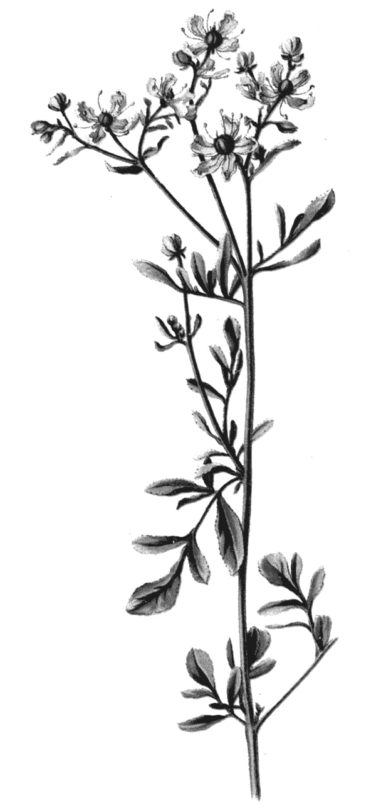

芸香

若男性希望从肉体的快乐与情欲中解脱，则可以将「莳萝和两倍份量的水薄荷、比水薄荷份量更多一些的红葱头和伊利里亚鸢尾花的根，放在醋当中腌渍成调味料，在吃饭的时候，无论吃什么都配着吃」即可。

莳萝（Anethum graveloens，俗名为 dill），是繖形科的香草，常用来当作腌菜的调味，具有帮助消化的功效。至于花呈紫丁香色的唇形科植物水薄荷（Mentha aquatica）由于带有薄荷香气，可使人神清气爽。其他草药的效果不明，而主要成分莳萝和水薄荷到底能不能让人从情欲和快乐中解脱，也有待查证。

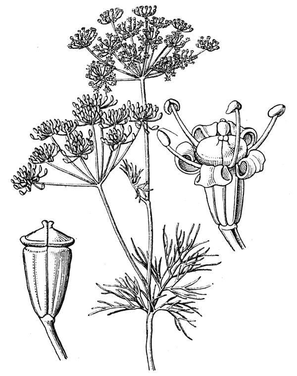

莳萝

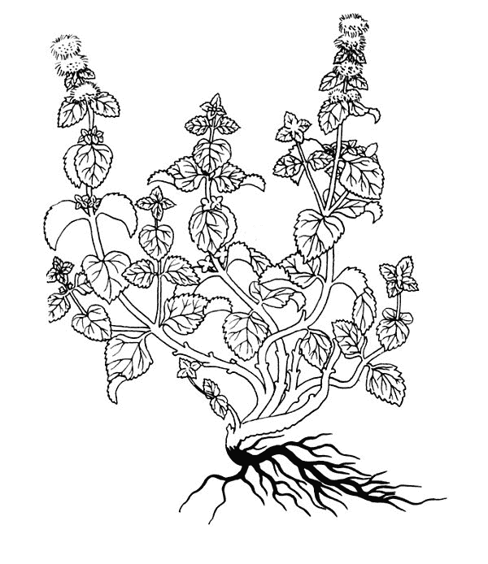

水薄荷（日本名沼地薄荷）

赫德嘉还列出许多其他解方，例如烦恼自己精力过剩的男性，可以「在三温暖的蒸气室当中，将川烫野包心菜所用的水浇在身上」，这样一来，即可在不伤身体的状况下消除欲望。

若女性感到子宫中存在着一股膨胀的欲望，则可以来个加了野包心菜的蒸气浴。赫德嘉曾经说过，无论男女，若误食具有催情功效的食物，可以饮用大车前草的原汁或加水饮用。这里提到的野包心菜（Lactuca taraxacifolia）是包心菜的近亲，而大车前草（Plantago major）则和日本人熟知的杂草车前草十分类似。据说若将其叶片揉碎涂抹在伤口上，可以让伤口很快愈合。

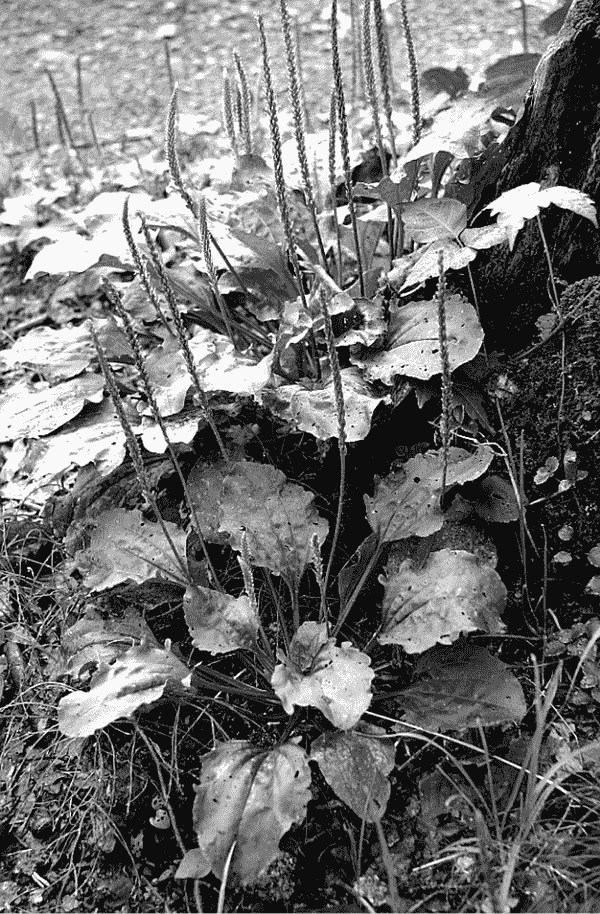

车前草

不过或许正因为她是修女，所以才深谙许多助人摆脱情欲纠缠的药草。不过赫德嘉终身未婚，又是如何知晓消除男性性欲的方法？某年我参加寻访赫德嘉所创办修道院的旅行团时，曾经对领队提出这个问题。这位领队的回答是：「赫德嘉可以听见神的声音，所以她对于任何事情都了然于胸。」

由于关于性功能方面的药草，并非我的专门领域，故引用赫德嘉的记载代为向各位读者介绍。关于她所提供的处方到底是否有效仍在研究中，不妨静待结果出炉。

# 7　「聪明女性」的药草料理

在德文当中有个名词，叫做「hexenkesel」，原意为女巫的大锅，不过也可用来比喻「骚动」及「混乱」等等。但如果大家以为德国的女巫也喜欢像日本人一样围着锅子大啖寿喜烧或涮涮锅，那就大错特错了。

所谓「女巫的大锅」，装的是未受洗礼的婴儿尸体、青蛙、蜈蚣等等恶心的物体，将之煮到浓稠冒泡。之所以用来比喻「一团混乱」，大概也是想到这么多东西在锅子里面熬煮时的情景。

在莎士比亚的作品《马克白》当中，有着三位巫女围着大锅预言马克白的未来的场景。莎翁巨细靡遗地描写了锅子里面有些什么，全部共有二十五种，包括「月夜中亲手摘下的杉树枝」、「黑夜里挖出的毒菫」，剩下的则全都是一些动物或者肢体，如蛤蟆、蝙蝠翅膀、蝮蛇的舌头、壁虎的眼球等等。这个场面写出了女巫让人不寒而栗的一面，其中的锅子可说是典型的「女巫的大锅」。第一章中提到的「飞行软膏」，也是在女巫的大锅当中制作出来的，所以这锅子对女巫来讲是相当重要的工具。

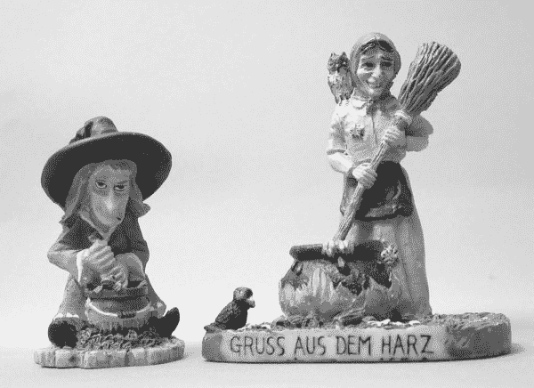

用大锅制作药剂为主题的女巫装饰品。看起来和蔼可亲的女巫，以及容貌吓人的女巫，从图中便可一目了然。

然而有「女巫的大锅」，想必也有用于正面用途的「聪明女性的大锅」。随着女巫历史研究进展，这些观念也慢慢获得修正。其实「女巫」和「聪明女性」根本是一样的，之所以有所区别，都是因为时代背景不同所导致。

或许正因如此，一些以正搅拌着大锅的女巫为主题的绘画或小饰品，其中女巫的形象往往也分成恐怖的，或者看起来很有智慧的和善老婆婆两种。

在格林童话中，有个叫做［千皮兽］的故事。「千皮兽」是一位公主的名字。她隐瞒身分，在某城堡的厨房工作，不久之后这座城堡的国王除了她煮的汤之外什么都不吃。厨师长知道了这件事，便指称她一定是个女巫。

这个故事有着怎样的涵义？她到底是一位迷惑国王的恐怖女性，还是年轻貌美、做菜技巧一流的女性？由于童话当中的对话没有详细描述这件事情，因此研究格林童话的学者也没有注意到这个细节。我却认为，这恰巧描绘出了「女巫」这个概念的双面性格。至于千皮兽煮的汤里，到底都加了哪些食材？我个人认为，一定是添加了多种药草。

在欧洲，许多家庭会在厨房装饰着女巫人偶，称为「Kitchen Witch」，是厨房的护符。这个人偶可以保佑厨房的主人烹饪技巧突飞猛进，当然应该归类为「聪明女性」。

人类总是忘了自己也是自然界的一分子，认为凭智慧一定可以克服自然条件，往往遇到了不可抗力的天灾，如台风、地震、洪水、旱灾时，回过头才发现自己有多渺小。

不过神还是给了渺小的人类「药草」这项赠礼。我们的祖先在偶然间发现了药草的功效，并将相关知识传给后代。在日本，每到正月七日都有食用春之七草的习惯；其他像女儿节吃的樱饼和草饼，端午节吃的柏饼及菖蒲汤，以及冬至吃的南瓜和柚子汤等等，随着季节不同，都有许多不同的风俗及可应用的相关植物。

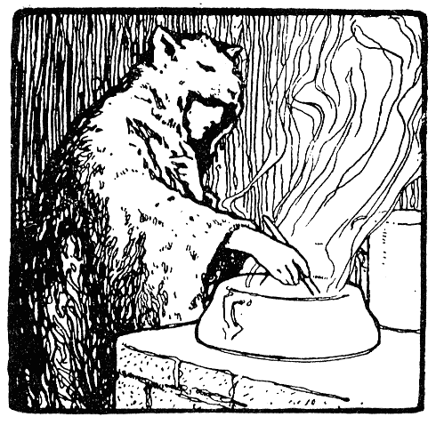

「千皮兽」所煮的汤，是女巫的汤。奥图绘。

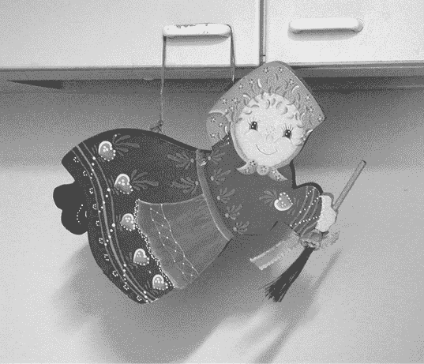

Kitchen Witch，这是日本教人制作人偶的才艺班学生的作品。也许是故意做成这样讨人喜欢的造型。（增川久纪子作）

德国人至今仍然相当重视药草，在这样的国度里，至今流传着许多「聪明女性」的药草料理。有一位住在德国北部的旧识曾告诉我，当地至今仍然遵循着豆类、黄瓜、南瓜等都要等到所谓的「冰霜圣者日」（Eisheiligen，五月十一日左右）过后才能播种的风俗。因为五月中偶尔天气还是会突然转凉，因此要一直等到这一天过后才能播种。

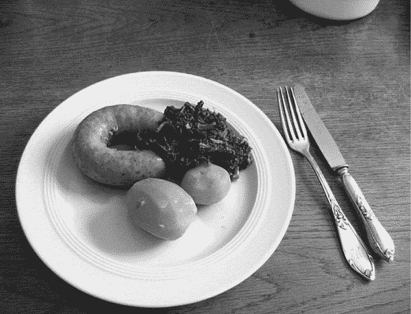

羽衣甘蓝搭配香肠和马铃薯。

北德地方每到冬天习惯吃一种代表性的乡土料理羽衣甘蓝（Grünkohl，绿色的包心菜之意）。据说结霜的菜叶调理过后更加香甜，不过外表看起来就像缩成一团的菠菜。这道菜需要煮上几个钟头。我曾在德国吃过羽衣甘蓝，虽然已经煮得很透，但仍然很有嚼劲，相当美味。

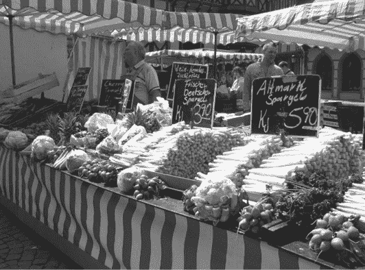

就像日本民众满心期待竹笋季节来临一样，德国的主妇也引颈期盼春天盛产的白芦笋。

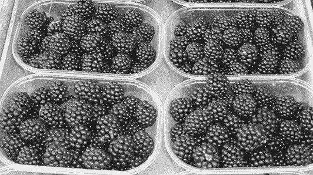

贩卖浆果的店内买气相当旺盛。在蛋糕上挤点自制果酱，是吃过一次就难以忘怀的味道。图为黑莓的果实。

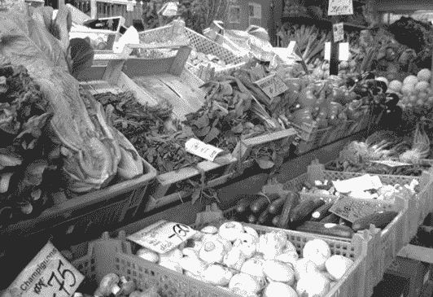

蔬菜店摆满黄瓜和蘑菇，是日本人相当熟悉的蔬果。但整体而言德国的蔬果都较大。

十二月时甚至会有村庄举行羽衣甘蓝健行会。到了黄昏时分，村中的人聚集在一起，步行至邻村的餐厅，在那里大吃羽衣甘蓝和香肠。据一位参加过很多次这种健行的朋友表示，一般健行的目的地只有主办人才知道，在黑暗当中，只靠手电筒照路，大家边走边聊，几个小时后才终于抵达可以吃到羽衣甘蓝的餐厅，我想，参加这种健行一定相当有趣。

每到春天，还有将类似韭菜的熊葱（Bärlauch）制作成蔬菜泥的习俗；夏天快到时，市场中纷纷出现白芦笋，秋天则将各种浆果制作成果酱。在德国的菜市场，贩卖许多日本少见的菜蔬，如茴香等等，逛起来别有一番乐趣。

在法兰克福（德国中部）的菜市场当中，卖着一种将七种绿色蔬菜捆成束用纸包裹的「法兰克福青酱」（Frankfurter Grüne Soße）。当地人用这几种蔬菜制成淋酱，配肉食用。只看食谱，做法似乎并不困难，应该是相当家常的菜色。

在法兰克福的大圣堂当中有许多祭坛，其中有一座雕刻着基督最后晚餐的情景，在餐桌上有着整只的烤小羊。跟我一起前往的友人指给我看，原来桌上也放置着法兰克福青酱。虽然不清楚这座祭坛建于何时，不过这种绿色的沾酱，想必已是当地民众生活中不可或缺的一部份。

德国家庭也像日本一样，在菜肴中使用许多蔬菜和果实，然而，在各种民俗节庆中却较少食用药草制作的菜色。或许因为他们一年到头的庆典都与基督教结合，所以不像日本一样，不同季节的庆典都用不同的当季食物表现。不过，这并不表示德国完全没有以药草为主的传统料理。

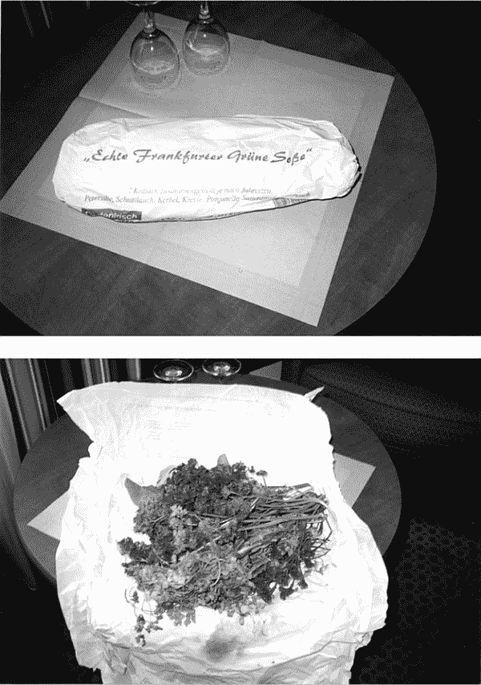

法兰克福青酱的材料，包括了荷兰芹、水芹菜、细香葱、山萝卜、野菠菜、玻璃苣（紫草科植物）等七种。包装纸上印有调理方法。

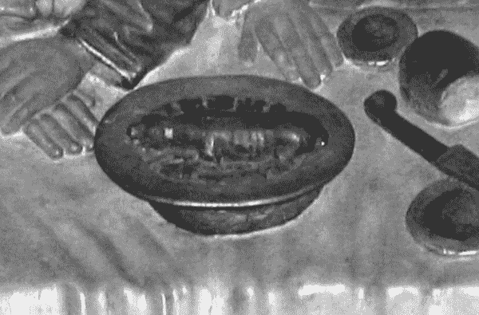

最后的晚餐当中，淋在烤羊上的「法兰克福青酱」。可惜本图并非彩图，无法分辨其颜色。

###### 【圣星期四的绿色蔬菜】

比如说，德国至今仍保留着「圣星期四」必须以绿色蔬菜为主食的风俗。所谓圣星期四，指的是复活节前的星期四。在日本，新教徒称这天为「圣星期四」，而天主教则称为「洗脚星期四」。这是根据约翰福音的记载，耶稣曾经为前来参加最后晚餐的门徒洗脚，象征耶稣洗清了弟子的罪，并亲自展现了爱与奉献的精神。

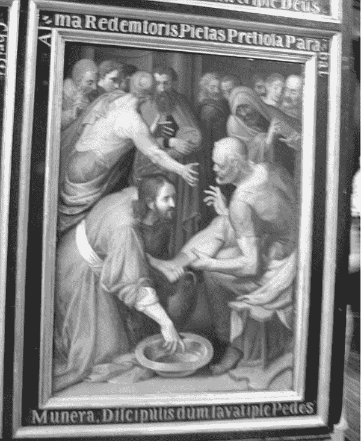

为门徒洗脚的基督。「随后把水倒在盆里、就洗门徒的脚、并用自己所束的手巾擦干。」（约翰福音 13：5）。图片摄于史特拉斯堡（位于法国）的大教堂。

德文中，圣星期四称为「Gründonnerstag」。Grün 这个字相当于英文的绿色（Green），不过叫做「绿色星期四」的原因，似乎没有这么单纯。Grün 在古代德文当中还蕴涵着「悲叹」之意。在英文当中也称这一天为「悔过星期四」（Maundy Thursday），其语源应该跟基督教有关，而非绿色。不过，在这一天以绿色蔬菜为主食的习惯，似乎早在基督教传入以前就已存在，所以早已分不清楚两个辞意之间的关系。

人们为了庆祝春天到来，到自家的庭院或是前往森林中摘取野生蔬菜。当天晚上，一边食用绿色蔬菜制作的菜肴，一边祈祷能够平安无事度过这一年。至于蔬菜的种类虽然不像日本的春之七草那样固定，不过一般说来大约是七种、九或十二种。

据说诗人歌德，习惯在这天吃菠菜；而德国的自然科学家亚历山大．冯．洪堡（Alexander von Humboldt），专门为这一天写下了详细的食谱，献给波兹坦宫廷的厨房。这份食谱里面所使用的药草，包括了金钱薄荷、水芹菜、洋耆草、雏菊、大车前草等等。

此风俗至今仍然受到保留，特别是在天主教信仰较为根深柢固的地区。不过，地方不同，使用的药草种类及调理方式也不同，甚至也有蔬菜饼干和药草色拉这样的菜色存在。在南德地区的餐厅，到了圣星期四这一天，菜单上会特别推出一种汤，其中加了富含丰富维他命的山萝卜。

不过药草盛产的时节未必刚好赶得上圣星期四，这是因为复活节的日期每年都会变动。耶稣基督遭处刑后第三天复活，这一天的庆祝活动定为复活节，基本上是春分（三月二十一日）之后第一个满月后的星期天，因此早的话在三月，晚的话则会拖到四月底。

若复活节在三月底来临，许多药草还来不及长成，超市也只能贩卖「九种药草汤」、「圣星期四喝的汤」这类包装好的材料。

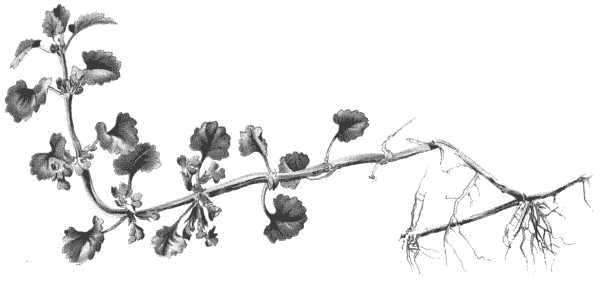

金钱薄荷

传统的「圣星期四喝的汤」一定会用到唇形科的金钱薄荷（Glechoma hederacea）。花带有红紫色，呈小巧的唇状，叶片则为心型，说实话看来并不起眼。揉碎叶片之后会发出强烈的薄荷香，可以舒缓头痛，常见于民间疗法。

金钱薄荷的茎相当柔软。植物学者苏珊．费雪（Suzane Fisher Rizzi）指出，金钱薄荷由于相当适合用来编织花冠，因此也称为「花冠草」（Kranzkraut），将花冠戴在头上，还有驱魔的功效。特别是在属于女巫的「瓦普几丝之夜」，据说戴上这种花冠可以在人群中分辨出谁是女巫。

金钱薄荷的实际效用是消炎，据说对降低血糖、糖尿病、肾脏炎、肠胃障碍等亦相当有效，在日本，则常常用于治疗幼儿的疳积和痉挛，故称为「除疳草」。至于古时日本称为「垣通」（穿墙草），则是因为这种植物繁殖能力甚强，甚至能够穿透墙脚。

###### 【五月酒】

在德国，每到五月一日便会立起「五月柱」（Maibaum），庆祝春天的来临，这是过去树木信仰的残留。古人相信橡树、楢树、白桦、桧木等树木上栖息着神灵，特别是白桦树象征春天与生命的复甦，因此常用来作为五月柱的材料。

具体的做法是在木材的上端挂上草环，并加上装饰，接着人群绕着柱子围起圆圈向冬天告别。在北德的小村庄中，常常可以见到村人合力竖起五月柱的景象。首先是将木材运到村中广场，担任义勇消防队的男性吆喝着口号，拉着绳子，慢慢将柱子立起来，旁观者在一旁高兴地鼓掌，之后少年和少女围着柱子开始歌唱。整个仪式并不繁琐，但一边看着一边让人心头也跟着暖起来。

义消人员将桧木运到村中的广场，喊着口号，将柱子立起来。这是一个比较朴素的五月柱，位于哈茨地区的本涅根斯坦。

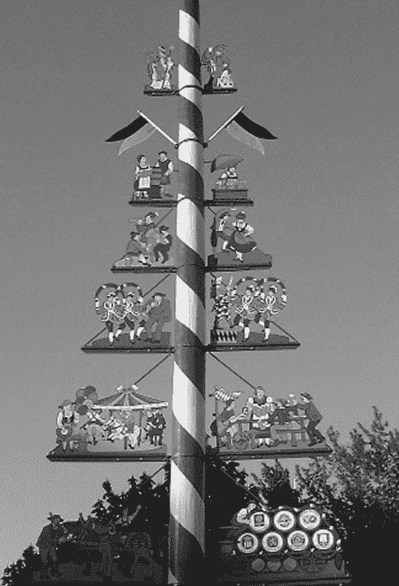

装上彩球、彩带以及多种人偶，看起来相当华丽的五月柱。位于慕尼黑的维多利亚广场。

五月柱的历史相当古老。立在广场上的五月柱除了有各种各样的木材外，装饰的方法也相当多样化。例如在南德慕尼黑就可以看到装饰得相当华丽的五月柱。

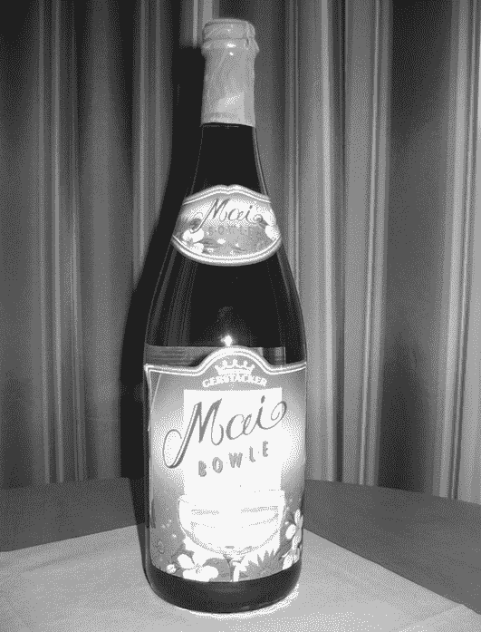

属于五月的饮料——五月酒。

在举行这项庆典时，民众同时还会饮用一种「五月酒」（Maibowle），也就是五月喝的鸡尾酒，以庆祝春天到来。五月酒同样具有悠久的历史，最早可以追溯到九世纪，本尼迪克特教派的修士曾经写下制作方法一直流传至今。在此介绍其中一种：

材料：

■开花前的车叶草叶片一小捆

■黑醋栗的叶片十五片

■薄荷／龙苣／鼠尾草／地榆／百里香叶片各二至三片

■砂糖一百五十公克（建议可以少一点）

■白葡萄酒 1 瓶

■香槟酒 1 瓶

做法：

■将各种药草绑在一起，不用太紧。

■将药草和砂糖放入容器当中，倒入半瓶葡萄酒。

■放置约一小时之后，将药草取出

■在喝的时候直接注入杯中，并且洒上几片车叶草叶片。也可以用草莓或苹果的花瓣代替。

在冰过的玻璃杯中，洒上一些车叶草叶片，增添点香气之后，可以使人感受到彷彿春天确实来临了。五月酒的主角是茜草科的车叶草（Galium odoratum）。或许正因如此，也称为车叶草酒。

几年前在参加探访德国童话名胜的旅途中，于古城沙巴堡（Sababurg）的餐厅第一次喝到五月酒，喝起来带有一点点辣味，但相当爽口。食谱当中建议砂糖可以少一点，就是为了这种微妙的辣味。

事后，由于还想再喝遂请友人帮忙，于是获赠瓶装的五月酒，据说是店里贩售的商品。我小心地将它带回日本和朋友一起饮用，这瓶的味道微甜，对酒精饮料没辄的朋友表示相当美味。看来在制作过程中，调节砂糖的量相当重要。

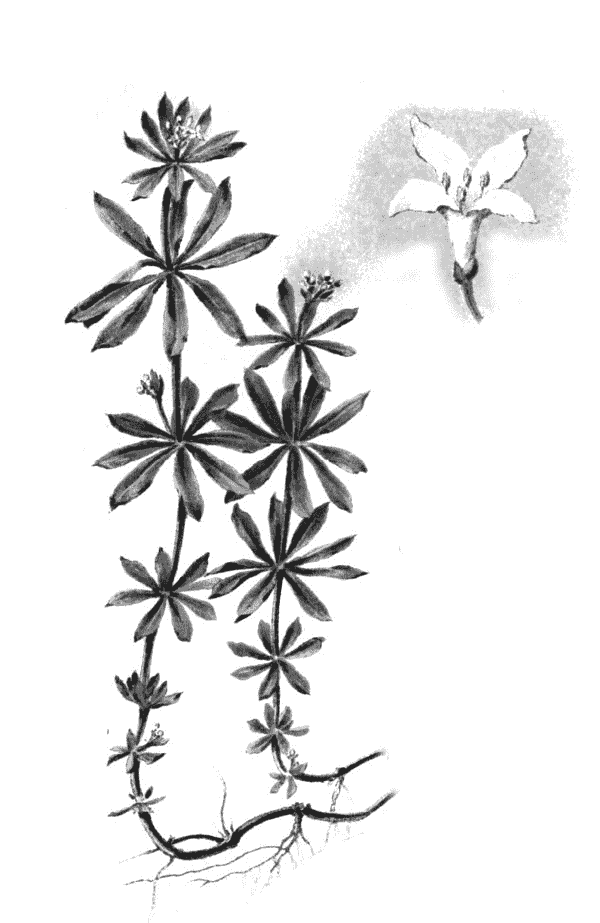

车叶草

车叶草的叶片上有着车轴般的放射状纹路，日文古名的车轮草由此而来。在德文当中则称为「森林里的老大」、「森林之母」、「五月之花」、「心灵的喜悦」等等。

车叶草自古便常用于民俗疗法。例如家中有孕妇时，往往会塞一些气味芬芳的草药在枕头套或床单中，车叶草的叶片晒干后也有类似干草般的香气，具有镇定心情的效果，因此是在上述情形当中常常选用的药草。

在治疗用途上，大多选用开过花的叶片，不过在制作五月酒时，必须使用开花前的叶片。车叶草之所以带有干草般的香气，是因为内含一种叫做香豆素的成分，若大量摄取会引起头痛与呕吐等现象，因此在制作五月酒时，切记叶片不可以浸泡太久。

送我五月酒的那位朋友，同时还送了我一捆干燥过的车叶草，我将之挂在厨房，过了半年仍然飘着干草的香气。

仔细研究药草，会发现其中包含了许多对人体有益的成分，甚至让人怀疑这不是为人类创造的植物，思及大自然给予人类的恩惠总让人感到不可思议，心生敬畏。

人类在死后也将回归自然，成为自然的一部分，从植物的角度来看，人类只不过是自然循环的一个环节而已。不过，人类接受了这么多的餽赠，有没有给予大自然相同的回报呢？

女巫的药草箱内容包罗万象，还包括了许多没有介绍到的药草。不过走笔至此，暂时将告一段落。不知道各位读者看到这里，心中对女巫的印象，是否仍然觉得恐怖又邪恶？还是了解到，其实历史的背后，躲藏着许多不为人知的「聪明女性」呢？

本书引用及参考文献‧图片一览

*   悪魔学大全／R‧ホープ‧ロビンズ着／松田和也译／青土社／1997
*   魔女と魔术の事典／ローズマリ‧エレン‧グィリー着／荒木正纯、松田英译／原书房／1996
*   世界魔女百科／F‧ヒメネス‧デル‧オソ着／蔵持不三也、杉谷绫子译／原书房／1997
*   博物志／プリニウス／大槻真一郎编／八坂书房／1994
*   植物志／テオフラストス着／大槻真一郎‧月川和雄译／八坂书房／1988
*   ディオスコリデスの薬物志／大槻真一郎等编／エンタプライズ／1983
*   奇迹の医书／パラケルスス／大槻真一郎译／工作舎／1980
*   圣ヒルデガルドの医学と自然学／ヒルデガルド‧フォン‧ビンゲン着／井村宏次 监译／圣ヒル デガルド研究会译／ビイング‧ネット‧プレス／2002
*   ビンゲンのヒルデガルドの世界／种村季弘／青土社／1994
*   毒の歴史／ジャン‧ド‧マレッシ／桥本到‧片桐裕译／新评论／1998
*   毒の话／山崎干夫着／中公新书／1985
*   毒草百种の见分け方／中井将善着／金园社／1995
*   『圣书』新改訳／圣书刊行会译／日本圣书刊行会／1988
*   圣书の植物／Ｈ＆Ａ‧モルデンケ／奥本裕昭訳／八坂书房／1995
*   カラー版　圣书植物図鉴／大槻虎男译／教文馆／1992
*   『新约外典』圣书外典伪典 6／川村辉典等译／教文馆／1976
*   黄金伝说 3／Ｊ‧デ‧ウォラギネ／前田敬作、酒井武译／人文书院／1989
*   植物の魔术／Ｊ‧ブロス着／田口啓子、长野督译／八坂书房／1997
*   和汉三才図絵／寺岛良安着／岛田、竹岛、樋口译注／东洋文库
*   サリカ法典／久保正幡译／创文社／1977
*   図说ドイツ民俗学小事典／谷口、福嶋、福居着／同学社／1985
*   ドイツの民俗／へーディ‧レーマン着／川端豊彦译／岩崎美术社／1970
*   ハーブの事典／北野佐久子着／东京堂出版／1995
*   英米文学植物民俗志／加藤宪市着／富山房／1976
*   花の西洋史／Ａ‧Ｍ‧コーツ／白幡洋三郎、白幡节子译／八坂书房／1989
*   四季の花事典／麓次郎着／八坂书房／1988
*   牧野日本植物図鉴／牧野富太郎着／北隆馆／1956
*   ハーブの写真図鉴／レスリー‧ブレムネス着／日本ヴォーグ社／1998
*   フローラ‧ヤボニカ　日本植物志／シーボルト着／木村阳一郎等解说／八坂书房
*   黄金のロバ／アプレイウス着／呉茂一译／岩波文库／1997
*   ギリシャ神话　下／／呉茂一　编／新潮社／1966
*   オデュセイア　上／ホメロス着／松平千秋译／岩波文库／1996
*   トリスタンとイゾルデ／Ｇ‧Ｖ‧シュトラースブルグ着／石川敬三译／郁文堂／1981
*   サロメ／オスカー‧ワイルド着／福田恒存译／岩波文库／1959
*   世界文学全集 II-1　シェイクスピア／福田恒存译／河出书房新社／1963
*   エンサイクロペディアニッポニカ／小学馆／1996
*   イタリア絵画／ステファノ‧ズッフィ编／宫下规久朗译／日本経済新闻社／2001
*   プラド美术馆／ウルビノ総编集／田辺彻译／みすず书房／1993
*   ボッティチェリ／ロナルド‧ライトボーン着／森田义之、小林もり子译／西村书店／1996
*   ルーブル美术馆 II‧III‧IV／高阶秀尔监修／日本放送协会出版／1985
*   ベルリン美术馆の絵画／コリン‧アイスラー着／高阶秀尔监译／中央公论新社／2000
*   システイーナのミケランジェロ／青木昭著／小学馆／1995
*   モーセの生涯／トーマス‧レーメル／矢岛文夫监修／创元社／2003
*   ヴァチカンのミケランジェロとラファエッロ日本语版／中繁雅子编／ミュージアム図书／1996
*   ゴヤ／日本アート‧センター编／新潮美术文库／1990
*   ジオット／日本アート‧センター编／新潮美术文库／1989
*   マンドレークの栽培／指田豊着／日本植物园协会志 38 号所收／2004
*   『本草図谱』岩崎灌园　[`www.um.u-tokyo.ac.jp/dm3/database/honzo.html`](http://www.um.u-tokyo.ac.jp/dm3/database/honzo.html)
*   金刚山　花の図鉴　[`www.kongozan.com/hana/`](http://www.kongozan.com/hana/)
*   日本緑茶センター [`www.jp-greentea.co.jp`](http://www.jp-greentea.co.jp)
*   Der neue kosmos pflanzenführer.Kosmos
*   Anthea: Das Buch der Hexenkräuter
*   Horst Altmann: Giftpflanzen Gifttiere. Blv
*   Gertrud Scherf: Gewürzkräutergarten,Ludwig,2000
*   Gertrud Scherf: Zauberpflanzen Hexenkräuter. BLV Verlaggesellschaft mbH.2003
*   Die schönsten Brockensagen für Jung und Alt. Gesammelt von Rudolf Stolle.
*   Schierke Andreasberg,1994
*   J.Praetorius: Blockes-Berges Verrichtung. Faximile der Originalausgabe aus dem Jahre 1669\. Edition Leipzig,1968
*   Bernd Schmelz: Hexerei, Magie & Volksmedizin. Holos,1997
*   Bernd Schmelz: Hexenwelten. Holos, 2001
*   Hexen-Katalog zur Sonderausstellung. Museum für Völkerkunde Hamburg,1979
*   Peter Haining: Hexen. Verlag Gerhard stalling. 1977
*   Hildegart von Bingen:Hellikraft der Natur Physica. Pattloch, 1997
*   Jakob Sprenger,Heinrich Institoris:Der Hexenhammer. Dtv Klassik,1996
*   Colette Piat: Als man die Hexen verbrannte. Eulen Verlag,2002
*   Tordis van Boysen: Amlette und Talismane.Kerskenn Cambaz,1993
*   Brüder Grimm: Deutsche Sagen. Eugen Diederichs Verlag,1993
*   Brüder Grimm: Kinder-und Hausmärchen. Insel Verlag,179
*   Heinrich Marzell: Zauberpflanzen Hexentränke. Kosmos,1964
*   P.Cornelius / B.Mayerhofer: Hinter Mauern ein Paradies,Insel Verlag1998
*   J.K.Rowling: Harry Potter and the Philosopher’s Stone.Bloomsburry, 2000
*   Um die Walpurgisnacht. Zusammengetragen von Hans-Joachim Wiesenmüller. Druckhaus Quedlinburg
*   Die erste Abenteuer der kleinen Brockenhexe: Alexander Lieske.1996
*   John Harthan: The History of the Illustrated Book. London,1981
*   R.A.Foakes: The new Cambridge edition. Los Angels,1995
*   J.W.von Goethe: Faust. Phillip Recalm, Stuttgart 1986
*   Thea: Hexenrezepte:Südwest
*   Holy Bible: Authorized King James Version.Collins’ Clear-Type Press
*   Die Bibel mit dem Erläuterung der Jerusalemer Bibel. Herder KG,1976
*   G.Pabst: Köhler’s Medizinal-Pflanzen. Verlag von Fr.Eugen Köhler.1887
*   Das Herkunftswörtebuch. Duden 7,Duden Verlag, 2001
*   Der Brocken.Studio Volker Schadach,Goslar 1997
*   Margarethe Schmid: Warun ein Apfel, Eva? Schnell + Steiner,2000
*   Adamo Lonicero/Petrum Uffenbachium: Kreuterbuch,kunstliche Conterfeytung Der Bäume, Stauden, Hexen, Kräuter, Getreyde, Gewürtze. Frankfurt,1679
*   [Dr.Fr](http://Dr.Fr).Losch: Kräuterbuch. Verlag von J.F.Schreiber
*   Die Frauenkirche in München. Verlag Schnell & Steiner GMBH
*   Richard van Dülmen:Hexenwelten. Fischer Verlag
*   Otto Willheim Thome: Flora von Deutschland, österreich und der Schweiz. 1885, Gera, Germany [`www.biolib.de`](http://www.biolib.de) von Kurt Stueber
