# 药草女巫的365日

## 前言——與藥草共生的日常

無論在公司或家庭裡，永遠有工作等著妳去做，總是被時間追著跑……大家應該都曾經閃過這樣的念頭：「會不會有個仙子，帶我脫離現狀？」渴望能在新的地方，懷抱新的希望，過煥然一新的生活。雖然心下明白，現實世界並沒有這樣的魔法。不過現在我要教大家如何實現內心的願望！首先，妳得成為一名女巫，好讓現在的生活變得更加幸福。妳覺得成為女巫是異想天開嗎？但是否也因此挑起好奇心呢？熱愛日月及植物的女巫，每一天都像在玩尋寶遊戲。朝日穿過玻璃形成的彩虹，在滿月之下欣賞自己和貓咪的身影、為花架一隅新芽萌出的德國洋甘菊陶醉。女巫總能從自然中發現上天給予我們的禮物，讓內在的藏寶盒日日滿盈。童話故事裡的女巫，可能給人的印象都不太好——使出魔法讓白雪公主吃下毒蘋果的女巫、將長髮公主關在高塔裡的女巫……不過在中世紀歷史上被稱作女巫的人，是一群相信自然之力，虔誠崇拜及信仰大自然的人們，她們身懷自古流傳下來的知識，是擅長運用藥草的地方醫者。如今的女巫團體，除了傳承古老的智慧，也會進行平和的冥想以及各式修行。我是在英國的藥草專家家中寄宿時，發現了植物蘊藏的神奇力量，以及宇宙為自然界帶來的影響，因而深受吸引，於是我開始瀏覽各式文獻，並親身實踐女巫之道。當春天降臨，我就會外出接觸大自然，採摘可食用的藥草料理成沙拉；一到夏至，便會親手製作香氛蠟燭獻給太陽；入秋後，採收成熟藥草為度冬做好準備；在寒冷的冬季裡，運用花圈祛邪避凶。也趁新月這個全新循環的起始淨化身心，再於滿月的日子，焚香鎮靜紛亂的心靈。使我切身明白，每一天的生活，絕對不會是昨日的翻版。

找回現代生活所遺失的重要寶藏。我想我應該類似現代的日本女巫吧——不需要唱頌咒文，不必揮舞魔杖，更不用騎乘掃帚。只要謙虛地將注意力投注於大自然的變化，接受天賜的恩惠，同時改變生活即可。

也許有些人因為居住在大都市裡，身旁缺乏綠意，已經放棄生活在大自然裡了。不過仔細觀察大樓的公共空間，還有每天路經的行道樹、咖啡廳前擺設的盆栽，會發現我們其實被大量的綠意環繞著。春天舒爽的微風、冬天溫和的日照、傍晚飄浮空中的日月和金星、足以形成影子的滿月明光……這所有的一切，就是將我們緊緊包圍的大自然。從這些大自然中，就能找到隱藏的寶藏。現代的女巫不需要修行，但是首要之務，是對太陽、月亮以及地球協同創造而出的季節移轉，還有看不見卻會產生影響的能量抱持興趣。相信在這當中，一定存在改變現在生活的啟示。

如今，地球正陷入危難。暖化加劇、面臨滅絕危機的動物與日俱增，近年經常攻佔新聞版面。在氣候變動及環境破壞影響下，日益嚴重的珊瑚白化，絕非遙遠南島的偶發事件，甚至有可能對我們未來的生活造成威脅。

人類不知從何時開始迷失了，以為地球擁有無窮無限的資源而任意掠奪。可是，這樣的時代已然結束了，如果我們不開始改變，將會失去未來。不管是居住在都會區，還是生活在鄉野之中，我們都要有一個共識，別再等待別人為我們付出，而要從自己開始做起。
女巫是一個歡喜接受後懂得感恩、肯為地球起而行，在合理範圍持之以恆，守護大自然成長過生活的人。強烈希望能有愈來愈多的藥草女巫，能夠來保護偉大的大自然與地球。

## 第一章

## 依循太陽步調
讓每天發光發熱

## 享受四季

日昇日落，冬去春來。我們都是生活在太陽形成的節奏之下，日出而作、日落而息。入春播種，秋至收穫。這就是大自然原始的樣貌。

如此樸實的生活方式，在現代人眼中似乎不復存在了，但只要有心，我們還是有可能親身實踐。

季節的移轉，是因為地球在地軸傾斜下，耗費一年時間繞行太陽一周才會引起的變化。在南北半球，日照時間會出現差距，一年四季也會產生差異。

將太陽造就的四季更迭加以體系化後，將形成所謂的「二十四節氣」。

二十四節氣以立春為始，再分別將四季細分成六個季節。原先在日本，只存在對農耕意義重大的春秋二季概念。後來引進了來自中國的曆法，才在日本也同樣將季節加以細分。二十四節氣的各個節氣，大約間隔十五日。每個月季節都會出現兩次變化，因此在播種以及收穫等農事耕作活動上，成為相當重要的參考依據。
古人為每個時期所進行的節日活動、如何飲食以及維持健康留下了指示，目的都是為了避邪、保祐健康長壽。
依循這二十四節氣，就能順應風土，跟著太陽的步調過生活。

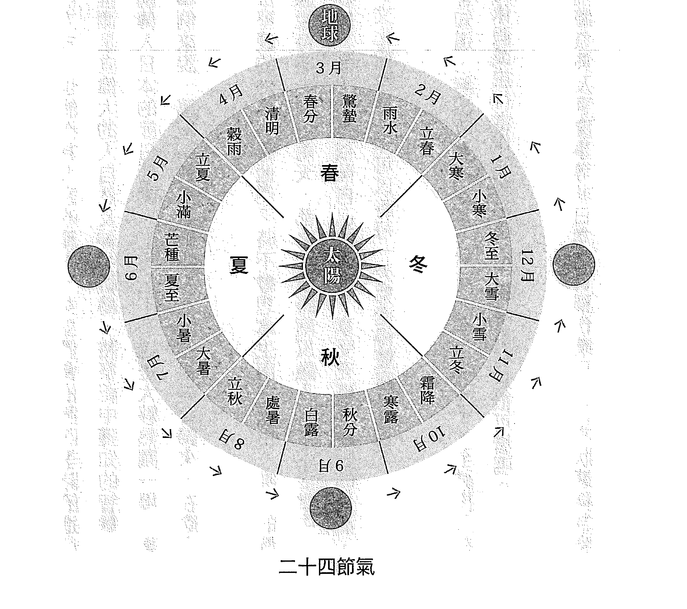

古時候西方女巫的生活方式，也能作為大家的範本。女巫們會依照四季時節進行儀式。每年八次的祭祀，推測是向偉大的大自然及神明祈禱，將祭祀中獲知的智慧，轉告予人們的儀式。由外國傳入日本的節日活動，乍看之下不過是大騷熱鬧一場，事實上卻有著深遠的含意。舉例來說，萬聖節就是凱爾特人去世的祖先會歸來，在除夕這天舉行的活動。有些人不喜歡處理南瓜堅硬的外皮，說他們平時不會想拿生南瓜來用。唯一的例外只有在萬聖節與冬至，據說每年一到這兩天，都會習慣將南瓜融入日常生活當中。要求做到盡善盡美恐使人疲於奔命，但是依照自己的原則，享受充滿季節感的生活，卻不無可能。無關乎國家、文化或時代，你可以將每一天都過得豐富又多彩。時間有限，這是人人都知道、無法改變的事實。然而人有大半輩子，全神投入在工作之中，只將一年幾次的休假或旅行當作休憩的話，不覺得實在是很可惜嗎？日本有晴蓑之分，從前將祭典及喜慶事等非日常之日稱作晴日，日常狀態稱為蓑日。不過就算在蓑日，還是能夠親眼觀察到大自然的變化，樂在其中，像是每年早春都能瞧見候鳥飛來，還有秋天的丹桂總會陣陣飄香，諸如此類。感受著四季更迭，相信每一天都能從中發現許多喜悅。

體會大自然的變化，與大自然合為一體的生活方式，將使理所當然的日常隨之為之一變。
相信晴與雨將同樣成為值得珍惜的寶藏。

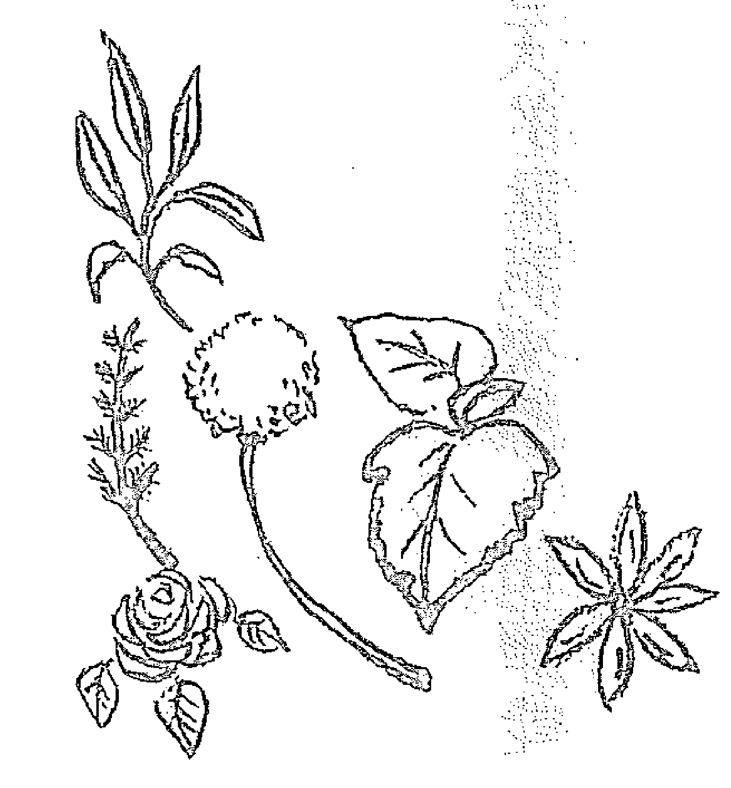

## 春。生發的季節

樹芽以及花蕾鼓起生發的季節。若說日文的「張る」為春天的語詞來源，也頗能叫人認同，將春天的氣息描述得精確傳神。
人體也是一樣，在這時候，會把冬季蜷縮的能量，以及囤積起來的老廢物質往體外排出。新芽和蓓蕾，曾經由綻放將能量向外釋放，但是人類卻沒這麼簡單。現在透過本章節，教大家如何趁著新陳代謝活躍的時期，聰明地將能量以及老廢物質釋放出去。
春季前半，身體的健康管理和氣溫同樣都是一進一退的模式。千萬別忘了春天是緊接在冬天之後，雖然開春了，但天氣依舊相當寒冷。在熱愛藥草的女巫眼中，春季是療癒的植物四處萌發、繁忙季節的開始。想要蒙受這些恩典，感官必須相當敏銳，請活動雙眼和手腳，向冬季告別，感知自然的變化。這是個感受春天氣息，不斷向外探索的季節。

### 節分——立春前一天

季節的轉換期，譬如立春、立夏、立秋、立冬的前一天，就是節分。現在只留下在立春前的節分，會舉辦例行性儀式的習俗。原意是要為冬季的末尾和春季作一個區分，會與立春共同舉辦節日活動。一般認為，在季節轉換之際，不好的東西容易侵入，為了驅魔避邪，才會舉辦節分儀式。例如撒豆子，以及將沙丁魚固定於頂端的柊樹裝飾於門口。撒豆子能驅鬼，而鬼在東方的陰陽學中代表陰，似乎也意味著，從強陰的冬天轉換成向陽的春天之際，要將陰魔消滅。

而柊樹這種植物，可藉由尖刺的力量來驅魔避邪。和柊樹一樣，可以透過充滿光澤的葉片，發揮極佳除魔效果的高聳樹木，還包含月桂樹。月桂樹自古便被視為神聖之物，具有可守護人們不受壞東西侵犯的力量，傳聞羅馬人在祈求新年好運降臨時，都會習慣交換月桂樹枝。在舊曆中將立春視為新年，大家可運用月桂樹，來祈求新春好運連連。

## 立春——春天的開端

### 月桂樹熱水浴
月桂樹在入春後，經修剪而掉落的樹枝，洗淨後倒入節分這天用來驅魔避邪的藥浴裡，可減輕神經痛及風濕痛，還能改善虛寒體質。將月桂樹枝製成花圈充分乾燥之後，每次需要多少再取用多少，還能用於料理當中。

禪寺會在門的左右兩側貼著「立春大吉」對聯的日子。人們會前往鄰近的神社或寺廟參拜，感謝新春有個好的開始。
早晨用廚房汲取的第一道水沖泡福茶。原本福茶的作法，是將梅子和昆布加入綠茶當中，但是這時期容易有風邪入侵，據說會導致感冒，因此要加入藥草暖和身體。
用於福藥草茶中的西洋接骨木，源自埃及文化，一直被當作民間用藥，俗稱「鄉間的藥箱，可用來治療各式疾病，一般人都十分熟悉。現在也是對付花粉症的知名花草茶，是不可或缺的藥草之一，具有發汗利尿作用，在感冒初期也會使用。傳聞西洋接骨木是用來製作魔法杖的材料，是一種具有強大魔力的樹木。

### 立春的福藥草茶
西洋接骨木、蕁麻、蒲公英各1/3茶匙混合均勻，將200ml於立春早晨汲取的第一道水煮沸，沖泡成花草茶。蕁麻可改善血液循環，蒲公英則有解毒功效。

#### 雨水

從下雪的季節，轉變成下雨的季節。天氣依舊寒冷，不過感覺日照時間一天長過一天了。

過去北歐在復活節（復活祭，慶祝耶穌復活）前有斷食的習慣。在斷食的前幾天，為了平安度過斷食的日子，一般會食用所謂 Semla 這種營養豐富的甜麵包。Semla 是混入小豆蔻烘焙而成的甜麵包，至今仍是北歐人熱愛的傳統菜色之一，能在陰冷難熬的寒冬，讓大家的內心充滿光亮，宣告春天的來臨。小豆蔻的香氣濃烈，號稱香料女王，在阿拉伯各國會用來為咖啡提味，在北歐則習慣用來製作甜點或麵包。

### 小豆蔻風味簡易甜麵包

將類似布里歐的圓型小巧麵包上方部分切割取下（作為蓋子）。主體的部分在中央稍微挖空，填入杏仁奶油（混合杏仁粉、奶油、蛋、砂糖製作而成。也可使用市售產品），再撒上小豆蔻粉。上頭擠上打發鮮奶油，並擺上事先留作蓋子用的麵包塊。

## 女兒節

裝飾雛人形娃娃，祈求女子健康成長的節日活動。原本都是在三月第三個巳日舉行，屬於祓除疾病、清潔身心的儀式。祈禱能如同蛇隻蛻皮，脫胎換骨獲得重生。女兒節當初會被稱作桃之節日，據傳是源自裝飾可以祛邪、充滿生命力的桃子而來。即便沒有裝飾雛人形娃娃，也可用桃花當擺飾作為慶祝。
紅、白、綠色的雛霰以及菱餅，分別具有消災、潔淨、健康之意，不可或缺。
期盼夫婦百年好合所食用的蛤蜊，在這個時期正好可用來強化肝功能，以及舒緩眼睛疲勞。

### 桃花酒

桃花酒（將切碎的桃花撒入酒中）則是祈盼長命百歲的吉祥之酒。

- 小心清洗桃花花瓣以免損傷，將日本酒或白酒倒入玻璃杯中，再撒上## 驚蟄

这个季节对于花粉症患者来说，会非常难受。想要缓解流鼻水以及打喷嚏的症状，在肩胛骨之间贴上暖暖包最有效果。对付感冒导致的流鼻水及畏寒现象，也同样有用。身体健康的人，这段时间可以外出观察植物，相信会发现艾蒿已经冒出新芽。自古以来，日本人一直都会使用艾蒿治疗疾病，算是非常具代表性的植物，中药名称叫作艾叶，带有强烈涩味，因此通常必须将涩味去除，不过这时期的艾蒿新芽却不需要去除涩味。此时所到之处都能发现艾蒿的踪影，但是担心该处会喷洒除草剂或农药的人，应避免在私人住宅或公园等地采摘。接近夏天，当叶片开始变硬之后，涩味就会转强，因此除了前端部位的新芽

> 2～3片花瓣。初春时节容易情绪烦躁，这时不妨用眼睛观赏美酒的色泽，好好放松一下，饮酒时也要比平时节制一些。

之外，皆不可生食，必须去除涩味后才能使用。

## 收割艾蒿干燥保存

小心地清洗艾蒿新芽，去除泥土与尘埃。量多时，可绑成一束束吊挂在阳光不会直射且通风良好的地方。量少时，洗净后用报纸包起来，放在冰箱上头干燥。冲泡成茶饮可改善头痛、中暑、畏寒症状。用来泡澡时，对于痱子、虚寒体质、神经痛都十分见效。

#### 春分

太阳正好从正东方升起的日子，例年来都是在3月21日左右。上山赏日光即可得知正东方位在何方。春分这一天，昼夜几乎等长，从这天开始，白天的时间会拉长，太阳力量会逐渐增强。

虽然可以大口汲取春日阳气，反之也是容易心浮气躁的季节，因此请多加接触植物及大自然，而且频率必须更甚于平日才行。

大家很喜欢种植在庭园里的银合欢，它正好会在这时期绽放黄色花朵。制成精油后会散发出强烈香气，新鲜花朵则会释放出似有若无的香味，令人留连忘返。银合欢精油的抗忧郁作用值得期待，银合欢鲜花光用眼睛欣赏就令人心花怒放。建议将花朵制成花圈，当作干燥花长期摆饰，赏心又悦目。

以藤蔓制成花圈底座，将铁丝间隔2公分绑上一圈作为固定的地方，再将剪下来的银合欢树枝插进去。树枝必须大量插得密集一些，否则干燥后会出现空隙。还能搭配月桂树或橄榄等其他绿色植物，编制成美丽的花圈。细心摘下来的花朵，干燥后可作为干燥花使用。

#### 清明

新学期展开的时期，晴朗无垠的清澈蓝天，大地布满花朵的季节。所有生物无不生命力蓬勃。将目光移向脚边，一定会发现满溢着大自然的恩惠。不妨外出寻找药草吧！这时期的西洋蒲公英，不具特殊腥味还能直接生食。蒲公英的英文名称为 Dandelion，中药名称就称作蒲公英。富含大量维生素及铁质，古人会用蒲公英叶片来强身健体。可别将它当作庭园里的野草，不妨细心栽种，或是到没有除草剂或农药疑虑的安全场所采集吧！

## 野菜沙拉

将蒲公英的叶片和花朵、艾蒿的新芽摘下，除去泥土，再连同贝比生菜一起洗净。将叶菜类以盐、胡椒、醋、橄榄油拌匀，上头再撒上花瓣。蒲公英全草皆可使用，根部炒过后可加入茶或咖啡中饮用，上方部位则可用料成天妇罗、凉拌菜或味噌汤等等。

#### 穀雨

春雨落下，往后的天气都会相当稳定的时期。可作为开始准备下田的参考依据。穀雨结束后就是八十八夜。可以采摘在春天这段时间，聚集树木精气的茶叶。
米和茶，在东方人心目中是地位相当崇高的作物。将八、十、八组合起来，正好成为米这个字。对于农事活动而言，算是非常重要的日子之一。
这段时期也是挥别冬服，身心都能开始轻快活动的时候，但却要留意紫外线的问题。此时不妨来制作内含美白化妆品常用成分——熊果素的虎耳草化妆水吧！将虎耳草的鲜嫩叶片料理成天妇罗也很美味。

### 虎耳草化妆水

将虎耳草叶片背面沾附的泥土等脏污清洗干净后，充分晾乾。放入消毒过的瓶中，注入日本酒直到淹过虎耳草为止，接着盖上瓶盖加以摇晃，放在阴暗场所2周再进行过滤。经贴布试验后如果没有任何问题，即可直接当作化妆水使用。※贴布试验是将制作完成的化妆水，少量涂于双臂内侧，观察24小时的变化，测试是否会出现红肿现象。

#### 春之土用

在立夏前大约18天的期间。新年度精神奕奕的气势，因为长假结束，心理失去平衡，容易疲劳困顿的时期。为了改善气的循环，请将带香气的药草融入日常生活当中。这段时间，可以收割生长旺盛的药草。如果在庭院或阳台上栽种药草，就能在想喝花草茶的时候，采摘新鲜叶片冲泡来喝。干燥保存后，香气会减弱的柠檬香蜂草，也是大家很爱在自家种植来泡茶喝的药草之一。柠檬香蜂草属于蜜源植物，又名「Melissa（蜜蜂）」，古时候甚至被喻为「长生不老药」（在炼金术里可长生不老的灵药），算是延年益寿不可或缺的药草之一。春之土用这段期间，春天的温度不但会忽上忽下，也容易感觉压力很大，善用柠檬香蜂草，即可让身心平静下来。

### 柠檬香蜂草茶

柠檬香蜂草叶片背面的精油成分，会因为冲洗而流失，收割后在清洗时须多加留意。将3根5公分长的枝干以200ml热水冲泡，再盖上盖子闷1分钟即可饮用。将柠檬香蜂草茶冲泡得浓一点，再加入蜂蜜和柠檬制成果冻后，就是一道十分爽口的甜点。

## 夏　微风吹抚的季节

旧曆的夏天，对照新曆会比换季的日子更早开始。这段时期日照变强，白天会逐渐延长。有此一说，日文的「抚つ」为夏这个字的语词来源，顾名思义，是绿风吹抚脸颊的季节。植物接收太阳能量后不断成长，当舒爽宜人的季节过去之后，马上就会进入梅雨季。气候潮湿，有时天气还会转冷，甚至出现「梅雨寒」这样的形容词，所以必须多加留意身体健康。一旦在梅雨季拖着病体，日后容易因为暑热及湿气，招致食欲不振或夏日倦怠。平日请藉由饮食好好保养身体。常见的日式药草，相信有助于在夏季保健身体。

### 贝尔丹火焰节

4月的最后一天，有一个名为沃普尔吉斯之夜的女巫仪式，庆祝太阳神化身公鹿重返人间。翌日为国际劳动节，植物开始生长，这天会前往森林，采摘充满生命力的绿意。为期两天的贝尔丹火焰节庆祝仪式，是在庆祝太阳的力量以及植物生命的光辉。

欧洲有一个习俗，会在国际劳动节这天，饮用香猪殃殃加白酒腌渍而成的饮品。

这种药草大家可能非常陌生，与日本野生的光果拉拉藤属于同一类。香猪殃殃在日本称作香车叶草，会开出小巧可爱的白花。严禁大量摄取，否则会引发麻痹或昏睡现象，每日上限为15g。

#### May Ball

将3g干燥的香猪殃殃倒入葡萄酒瓶，静置2小时左右，等到香气融入葡萄酒中即可。避免使用新鲜的香猪殃殃，否则不会释放出香豆素（甜蜜香气的芳香成分）。无法取得香猪殃殃时，可将同样内含香豆素的盐渍樱花，去盐后拿来取代。

#### 立夏

端午节是祝愿男孩健康成长的节日。古时候习惯在这二天前往野外采集药草，利用采摘回来的菖蒲及艾蒿等药草祛邪避凶。这天不妨早点起床，外出探寻随手可得的新绿吧！在端午节的仪式场地，会用当季花朵杜鹃作装饰。吃粽子及柏饼也会带来好运，缺一不可。用于药浴的菖蒲，内含的香气成分细辛醚及丁香油酚当中，具有促进血液循环的作用，还可以放松身心，平时便十分推荐大家使用。

### 菖蒲热水浴

将菖蒲叶片直接或切碎后，装入洗衣袋中。为使香气释放出来，必须先将菖蒲放入浴缸，再将热水放满。

## 小满

自5月下旬开始，到6月上旬的时候，是草木植物生长旺盛的时期。在这个季节，绿意将大肆渲染。原本绿色就是属于自然能量强大的颜色。可以出外踏青或爬山，吸收群树释放的芬多精。
在英国有句俗语，「想要长生不老，就得在5月吃药用鼠尾草」。鼠尾草属有健康、安全的含意，自古便认为其强大魔力能赋予生命力。有在庭院种植药用鼠尾草的人，这时期可以多加食用。相信柔软的叶片，有助于维持身体健康。

### 药用鼠尾草花圈

将收割下来的药用鼠尾草少量绑成一束，用麻绳固定在花圈底座上。可以作为花圈装饰，也可以干燥后用于料理或茶饮当中。新鲜的药用鼠尾草，还能变化成天妇罗料理。搭配油脂可烹调成美味菜色，也可让香气与融化奶油结合后用于料理当中。

## 芒种

古时候是谷物播种的季节，插秧的时期。时值6月中旬，梅子开始出现在市面上。可以趁这时候自己在家里面动手腌制梅干。在天降的甘霖庇佑之下，植物也不断向上抽长。随春风摇曳的德国洋甘菊产季即将步入尾声。德国洋甘菊这种药草号称大地的苹果，会散发出甜蜜香气，在5～6月这段期间，陆续开出小巧的花朵。可以单将花朵部分剪下，干燥后保存。饮用新鲜的德国洋甘菊茶，可以调整身心健康，迎来梅雨季。

### 收割德国洋甘菊干燥保存

德国洋甘菊，须趁着上午单将花朵部分剪下来。由于花瓣容易散落，因此必须轻柔洗净，将蚜虫及脏污去除，放在滤网或纸上干燥。德国洋甘菊属于一年生的植物，所以想让德国洋甘菊隔年继续绽放的话，须在花开后将小小的种子摇落土中，等到秋天，才会再冒出新芽。

#### 夏至

在北半球，一年内白天最长的日子，也是太阳威力最强大的一天，照理说植物的力量也会增强，据说女巫会外出采摘药草，在颂扬太阳的火祭日子，利用这些药草来熏香。过去视艾蒿、金盏花、圣约翰草为夏至时的神圣植物，会将这些植物悬挂在玄关，用来祛邪避凶。此时正逢梅雨时节，因此须留意别让收割下来的药草发霉了。利用野漆或大豆等植物制成的蜡烛，相信最适合在重视环境问题的夜晚点燃。

### 大豆蜡香气蜡烛

大豆蜡倒入清洗干净的牛奶盒中，隔水加热融化。将烛芯放在耐热玻璃杯中（用尚未分开的卫生筷夹住烛芯，架在玻璃杯中央），倒入融化的大豆蜡使之凝固。大豆蜡在倒入玻璃杯之前，可加入个人喜欢的精油，即可制成香气蜡烛。

#### 小暑

莲花盛开的时节。7月中旬，无论天气或体质，都已经完全切换成夏天模式了。

七夕的短册，会在6日夜晚吊挂起来，7日再流放河川或大海。即便被梅雨淋湿，也会觉得是个好兆头。这个时期，薰衣草绽放，蜜蜂受香气引诱下会蜂拥而至。在蜜蜂现身的环境，请勿使用农药等药物。因为蜜蜂对于人类来说，是相当宝贵的生物。取得新鲜的薰衣草后，可制成手工艺品将香气锁住，放在枕边就能在难以入眠的日子，藉由薰衣草的香气顺利入眠。

### 薰衣草花束

准备奇数的薰衣草，利用15m左右的绶带，单边预留30公分左右，将花朵下方用力束紧。从绑好的根部轻轻地将茎部弯曲，把花穗逐一包裹起来。将长边的绶带于茎部交叉编织，直到花穗完全看不见为止，再用剩余的绶带打结。

#### 大暑

被视为最热的时期，事实上接下来才会进入真正的酷暑。暑假会在这时期展开，蝉鸣及积雨云炒热了夏天的氛围。应该设法早晚通风或洒水消暑纳凉，不要老是依赖冷气空调。
在这个时期，鱼腥草会躲开强烈日照，开出白色花朵。由于鱼腥草具有十种药效，因此也称之为“十药”，事实上鱼腥草的用途更为广泛。虽具独特气味，但是干燥后气味就会变淡。用来泡茶的五更草，时常被当作庭院里的野草，学名为 *Plantago asiatica*，中药也称作车前草，可用为止咳及利尿。

### 收割鱼腥草和车前草干燥保存

除去泥土，洗净后阴干。干燥后切成2～3公分后保存。可煎煮后饮用，或作为药浴使用。鱼腥草的药浴，最适合改善冬天的虚寒体质。这二种药草的新鲜叶片皆十分柔软，可料理成天妇罗食用。

#### 夏之土用

7月下旬，大家都知道要吃鳗鱼来预防夏日倦怠，但在丑日这一天，日本也保有吃乌龙面（うどん）、瓜类（うり）、梅干（うめぼし）等，食物名称带有“う”字的惯例。此时容易出现水肿现象，因此建议积极摄取利尿效果佳的小黄瓜，以及冬瓜等瓜类食物。在土用这个时期，会将盐渍过生醋的梅子加以干燥。梅干这种传统食物，不但具有强大的杀菌作用，还能消除疲劳，自古便常用于民俗疗法。梅子熟成时也别忘了下料酿成梅酒。夏季感冒或梅雨，容易使人情绪低落，引发胃部不适、食欲不振，此时不妨来杯梅酱番茶试试看。

### 梅酱番茶

- 将一个梅干去籽后切碎，连同一茶匙酱油倒入杯中，注入热呼呼的番茶。还可以加入有益健康的姜汁。身体状况不佳时皆可饮用，且空腹时饮用效果最佳。

## 秋　放空的季节

开始结实累累的季节。天空广阔无垠，空气洁净明澈。
秋天的前半段最为忙碌，需收割各种药草，再以制作冬天备用保存食物，以及干燥植物的工作收尾。此外，还要开始准备在严冬时节用途广泛的酊剂。在温和干燥影响下，身体容易一天比一天僵硬，最好要提醒自己随时活动一下手脚。话虽这么说，在这段时间，残暑的热天气与日俱增，容易感到疲劳，因此千万别勉强自己，应好好透过饮食及花草茶保养身体。

## 收获季（凯尔特人的收获祭）

在秋季的后半段，还有风雅的传统节日活动在等着进行。请大家好好享受被红色及黄色染成一片的秋景。

向神明祈求谷物能开始收成，并且大丰收，属于庆祝的日子。基督教在这天会举行面包庆祝祭典，用最初收获的小麦制成面包，奉献给天主。再用和面包十分对味、以洛神花（玫瑰茄）的鲜红色染成的药草葡萄酒乾杯。

食用洛神花也能用于花草茶中，有别于南国盛开用于观赏的改良品种。酸味源自维生素C及柠檬酸，十分推荐在容易流汗，导致矿物质流失的酷暑时期饮用。用洛神花酿制而成的红醋，也能直接调制成醋饮来喝。

#### 立秋

秋天的开端。正好接近盂兰盆节，只是天气依旧炎热，在曆法上会从这天起开始转为秋天。

旧曆的8月2日，称作二日灸，针灸效果会比平时高出2倍，认为在这天针灸，就能保佑下半年无病一身轻。半年后的2月2日，也是二日灸的日子。体质容易出现夏日倦怠的人，请靠针灸来保养身体。

在夏天茂盛生长的紫苏及甜罗勒，正逢开始收获和保存的时期。可以用香气浓烈的新鲜药草制作药草盐。紫苏硬化的茎叶，干燥后可保存起来，作为药浴使用。

### 洛神花酒

将1大匙左右的洛神花，倒入1瓶白酒中，静置1小时左右，即会变成带着淡淡红色的白酒。

## 处暑

胡枝子的花朵开始绽放，可以感觉到秋天的气息了。为了因应台风季节的到来，应做好准备，以防庭院及阳台上的花花草草倾倒。莳萝或茴香等药草长大后，须用支架或绳子等器具加强固定。如果结籽了，应趁台风来袭前早一步收成。莳萝为一年生植物，所以要在秋天时期播种。这时候也是种植冬天常用的番红花的时期。夏令蔬菜的泡菜，最好趁着莳萝还有新鲜叶片时制作完成，再保存起来备用。

### 新鲜药草盐

罗勒叶收成后清洗干净，轻柔地擦干水分。将叶片和盐巴放入研钵中，研磨至变成好看的绿色为止。长期保存时，请冰在冷冻库内。个人如果偏好紫苏、药用鼠尾草、迷迭香这类药草，也能依照相同作法制作成药草盐。

### 夏令蔬菜的泡菜

将 1 杯醋、1/2 杯白酒、1 大匙砂糖、1 小匙盐、1 片月桂叶加热，煮至沸腾后转成小火再加热 5 分钟。将腌渍液淋在小黄瓜及小番茄等切好的蔬菜，还有新鲜时萝上，倒入用热水消毒过的瓶中保存。长期保存时，切记须真空脱气。

※真空脱气的方法：将蔬菜和腌渍液倒至瓶口下方。小力锁上瓶盖，放入锅中，将水倒至瓶肩左右的高度。加热沸腾 10 分钟后，从水中（瓶子直接放入热水里会破裂）取出。静置 5 分钟后，再用力锁紧瓶盖，并将盖子朝下直接放凉。

#### 白露

进入9月，早晚气温舒适宜人，是芒草花穗开始露脸的时期。但在这段期间，夏季疲劳还是容易突然涌现。9月9日是祈愿长寿的重阳节。本来「9」这个数字，在中国就被视为是极阳的吉祥数字，两个9同时出现的这一天，通常会举行仪式活动，过抑阳极生衰之事。

#### 秋分

日夜长度相等的日子。从这天起，日落时间将逐渐提早。人们在这时期，感觉一年的时光快速逝去。秋天的彼岸这几天，以秋分之日作为中间点。彼岸花的红色花朵开放之时，能欣赏到遍地被染红的迷人秋色。不妨来烹煮红豆，制作牡丹饼吧！熬煮红豆的汤汁，还能作为红豆茶饮用。接下来空气会愈变愈干燥，因此差不多该着手准备能确保冬天一整季健康的酊剂了。因干燥导致喉咙不适时，具极佳抗菌作用的百里香酊剂最有效果。将1茶匙百里香酊剂以热水稀释后，再用来漱口。不妨将庭院里的百里香收割下来，着手制成酊剂，如能与紫锥花及丁香一同酿制，保证能让人放心地迎接冬天。

#### 菊花甜茶

1. 将一朵食用菊花洗净，连同5粒左右的枸杞倒入杯中。
2. 注入150ml的热水，并依个人喜好加入蜂蜜。
枸杞具有抗老化的效果，还能提升免疫力。在漫长的秋夜，这款茶饮还能温暖人心。

#### 百里酚百里香酊剂

用白酒或伏特加，将300ml的瓶子擦拭干净加以消毒。将洗净并干燥的百里酚百里香，倒入瓶中至1/3左右为止，注入白酒或伏特加直到瓶口下方。放在阴暗场所静置2周左右的时间，接着过滤后再使用。其他药草的作法也是一样。保存于阴暗场所的酊剂，使用期限可达2年。

#### 寒露

天空变得愈发宽阔，收成也到了尾声，山珍海味开始上市。漫长的秋夜可用来读书或观赏电影，余兴节目丰富多采，另外也能尝试欣赏虫鸣之音。聆听虫的「声音」，据说是属于东方人独树一格的感性，这是大自然演奏的美妙和音。10月过半之后，让人开始怀念起暖和的温度。睡前可以来杯香草茶，放松一下身心。日文名称叫作香水木的柠檬马鞭草，会散发出有如柠檬般的香气，十分宜人，可发挥镇静心神的效果。建议可混合带甜蜜香气的菩提，并依个人喜好加入蜂蜜。

### 秋天的金色花草茶

- 柠檬马鞭草与菩提各1/2茶匙混合后，注入200ml的热水，盖上盖子静置约3分钟。
- 加入适量蜂蜜后，一杯疗愈心灵的金色花草茶就完成了。

#### 霜降

10月尾声，是红叶美不胜收的时节。邻近的枫树及银杏，每一天千变万化的颜色，也令人赏心悦目。庭园植栽开始要设法因应结霜的时期。不耐寒的柠檬香茅及天竺葵，须移植到花盆里，进入休眠直到隔年为止。再利用移植前收割下来的柠檬香茅，制作新年要用的注连绳（用稻草织成的绳子，代表神圣、迎新、开运、招福四个含意）。此时务必配戴手套，以免叶片割伤了手。在这个开始要担心感冒的季节，可饮用维生素C丰富的蔷薇果茶。喝完后果实还能煮成果酱，一点也不浪费地吃光光。

### 蔷薇果果酱

蔷薇果茶喝完后，将柔软的果实与差不多等量的砂糖混合，一边搅拌一边熬煮10分钟左右，以免烧焦。每次泡茶的蔷薇果分量较少时，可以累积大量后再煮成果酱。

## 秋之用

曾在意夏季期间肌肤受损的时期。日落时间提早，这段时期也会导致情绪低落。玫瑰一年到头都方便取得，此时也能善加运用，改善肌肤及心灵层面的问题。冲泡一杯玫瑰花草茶，再滴几滴精油到浴盐上，随时都能藉由玫瑰香气传递幸福，不但很适合纾解压力，也能保健身体。运用玫瑰花瓣制成的玫瑰酒，无论色泽或香气都叫人着迷。选购干燥玫瑰时，最好买有机且色泽红艳的产品。

### 玫瑰酒

1L的广口瓶完成消毒步骤后，倒入干燥玫瑰达瓶高的1/3。注入白酒直到瓶口下方为止，盖上盖子充分摇晃。放在阴暗场所2周，再加以过滤。饮用时，可添加蜂蜜会更可口。除了饮用之外，也能用作入浴剂或化妆品原料。保存于阴凉场所的玫瑰酒，使用期限可达2年。

## 萬聖節

凱爾特人的新年從11月1日開始，因此10月最後一天相當於除夕。這一天，死者國度將敞開大門，好讓陰靈回到人間。但除了前來與家人會面的祖先靈魂外，惡靈也會降臨人世，所以日後祛除惡靈的祭典才會演變成現在的萬聖節。

此時會裝飾迷迭香的花束作為驅魔的藥草，以保護自身遠離邪惡之物。迷迭香是相當受歡迎的庭園花草，必須細心修剪，否則容易從木質化的部分開始枯萎。迷迭香能讓思緒變清晰，還具有提升血液循環的效果，葉片在寒冷時節，也常加入藥浴使用。

## 迷迭香熱水浴

將迷迭香連同枝幹用鍋子或水壺熬煮，也能裝進洗衣袋中，再放入浴缸裡。熬煮而成的藥浴，會呈現咖啡色。保溫效果絕佳，擔心浴缸會變色的人，洗完澡後應盡快將熱水排光。

## 冬 · 凍人的季節

#### 立冬

傳說日文的「冷ゆ（ひゆ）」、「震う（ふるう）」，為「冬」字的語詞來源。環顧四周，一定會看見樹葉落盡後，僅剩群樹枝桿的美，還有不同種類樹木的多姿多采。腳邊甚至可以瞧見耐寒植物的身影乍現。陽光照進屋子深處，傳遞著暖意。不妨善用夏天到秋天這段時間，採集大自然恩惠，好好暖和一下身子吧！

太陽瞬間就西落了。天氣一冷，早起就變成了一件苦差事，不如趁著早晨在自家賞鳥吧！只要在庭院備妥餵鳥器，在這個自然界食物減少的季節，就能呼喚鳥兒到來。不妨一手拿著溫熱的香料茶，臨近觀察鳥類生態。印度奶茶裡有可溫熱身體的香料，除了直接喝，也能添加牛奶享用。

### 印度奶茶

準備2人份的印度奶茶時，須將500ml的熱水倒入小鍋煮沸，並加入2茶匙印度奶茶茶葉、1根肉桂棒、2顆豆蔻掰開的小豆蔻、2片生薑，稍微煮一下便完成了。還能加入牛奶或黑糖，讓身體更暖和。

#### 小雪

寒風襲來，冬將軍大駕光臨的時期。日本西邊會開始收成溫州蜜柑。聖誕節前約一個月，是等待基督降臨的將臨期。不妨動手準備聖誕花圈吧！聖誕花圈原本是用來驅魔及祈願豐收的裝飾品，會使用日本冷杉、月桂樹、椏樹等，這類代表生命力和永生的常綠樹。也能使用綠籬的羅漢柏等植物。可單買花圈底座，再自行布置。

#### 大雪

遠山變白，平地也降下霜來。12月日本稱為「師走」時節，代表御師最繁忙的日子，12月8日可以稍事休息，向帶來許多收穫的大自然致上謝意。緊接著在13日，就要展開正月相關事宜——要開始大掃除以及準備迎接新年了！

既快樂又忙碌的時期，可以藉助藥草的力量克服難關。高貴又極具知名度的藥草番紅花，中藥名稱也稱作藏紅花，可溫熱身體，具有強身效果以及健胃作用。大多會

### 聖誕花圈

在百圓商店就能買得到的花圈底座上，綁上一圈鐵絲，確實固定好。掛在勾子上的部分用麻繩來製作，這部分置於上方，再插入羅漢柏或杉木等常綠樹的樹枝、迷迭香及月桂樹，還可用松毬、果實等裝飾上去。最後綁上紅色或綠色的緞帶，就會充滿聖誕氣息了。

#### 冬至

北半球白天最短的日子。以12月22日左右的冬至為界線，日照時間將逐日延長。在部分西洋地區，早昔將太陽力量重返的這一天視為一年的開端，稱作耶魯節。在日本會吃南瓜、洗柚子浴。日本柚子的精油成分可讓情緒舒緩下來，使體溫升高，據說

### 番紅花茶

將番紅花的雌蕊切碎，倒入杯中再注入熱水，攪拌均勻。番紅花本身也能食用。這種藥草可以放在平盤上或水耕栽培，完全不用費心思，只要在8月底左右將球根種下，秋天就會開花，再將雌蕊收割下來。

加入西班牙海鮮燉飯或湯品中，也可以泡成花草茶享用。

## 柚子醋醬油

對預防感冒十分有幫助。日文的好運連連（運盛り）一詞帶有「ん」這個字，習慣吃的東西要和「ん」有關係，例如だいこん（白蘿蔔）、にんじん（紅蘿蔔）、ぎんなん（銀杏）、うどん（烏龍麵），還有南瓜的日文也叫作「なんきん」，算是帶有兩個「ん」字的食物。常種在庭院裡的日本柚子，榨汁後可以自行製作成柚子醋醬油。

日本柚子榨汁，加入和柚子汁分量相同，或是稍微少一點的醬油與味醂，全部混合在一起後裝入已經用熱水消毒過的瓶中，放在冷藏庫保存。柚子汁的分量，可依個人對於酸味的喜好加減。將果皮切碎後冷凍起來，需要時即可隨時取用。

## 正月

混合桂皮、白术、山椒粒、防風、桔梗、陳皮等中藥製成的屠蘇散，趁除夕晚上醃漬在味啉裡備用。可發揮預防感冒以及增進食欲的效果，這種藥酒十分適合正月時節飲用。覺得不好入口的人，也能用熱水稀釋後再喝。

一年的開始，心情也要煥然一新，迎接新年的一天。年底為了準備迎接從吉利方位到來的年神，會裝飾上憑代（神靈附體的東西）的松樹及注連繩。

御節料理要盛盤之際，須鋪上裏白。裏白是一種蕨類，生存歷史遠比人類悠久，象徵長壽及繁榮。南天竹的葉片，也是代表時來運轉的吉利植物，還具有殺菌作用。

屠蘇是將中藥溶於味啉所製成，可發揮屠邪、提振身心的效果。應從年少者傳遞給年長者飲用，意在長保年輕。

#### 小寒

進入寒冬，真正冷到骨子裡的時期。會在1月7日人日節這一天食用七草粥，將水芹、薺菜、鼠麹草（母子草）、繁縷（鵝腸菜）、寶蓋草、蕪菁（蔓菁）、白蘿蔔（菜頭）切碎後，在早上煮成粥享用。舊曆的七草節在2月左右，會發現庭院裡長出了許多植物，因此在舊曆這一天，才有食用自家七草的習俗。會讓人想加入七草粥中提味的生薑，具有增進食慾以及溫熱身體的效果，加進紅茶或熱可可裡，也能輕易地讓體溫升高。

### 七草粥

用 8 倍的水煮米。七草洗淨後過水汆燙，再切碎備用。生薑切絲。將七草拌入煮好的粥中，再擺上生薑。最後用梅干或鹽調味。

#### 大寒

就連平地也降下瑞雪，溫度降至最低的時候。過了這段期間，慢慢就會出現春天的徵兆。盡情沉浸在冬季的尾聲之中吧！

冬至到大寒這段時期的水，稱作節氣水，據說對身體十分有益。自古便用來釀造醬油及酒。這段時間乾燥問題擾人、流感發威。紫錐花號稱天然抗生素，可強化免疫力。善用秋天釀造好的酊劑，從平日就要好好保養身體，以預防疾病。

### 藥草酊劑的度冬對策

善用秋天釀好的酊劑（49頁）。將1/2茶匙左右的百里香或紫錐花酊劑，以1杯熱水稀釋後直接飲用，或是用來漱口。丁香酊劑用溫水稀釋後，回家就可以用來漱口。感冒症頭出現時，一天應漱口3次左右。

#### 冬之土用

家裡有庭院的人，會想在此時開始整土，但是土神並不喜歡這時期的耕作，所以要耐住性子。如果是在這天之前就已經開始整土的人，可以繼續無妨。

立春前這段時期，容易染上感冒或流感等疾病。這時候正逢火鍋美味食材大量上市之際，不如吃些暖身食物好好保養一下身體。屬於當令蔬果的白蘿蔔，可用來製成白蘿蔔飴備用。想要趁機保養身體的人，也能喝溫熱的白蘿蔔湯。

### 白蘿蔔飴

將切好的白蘿蔔醃漬在蜂蜜或水飴中一段時間，製作成白蘿蔔飴，或是飲用醃漬液。加入花草茶中享用也十分美味。冰在冷藏庫裡，可保存1個月左右。

## 白蘿蔔湯

2大匙滿滿的白蘿蔔泥，加上少許薑泥倒入杯中，注入熱水，喝下後有助於抑制喉嚨發炎。

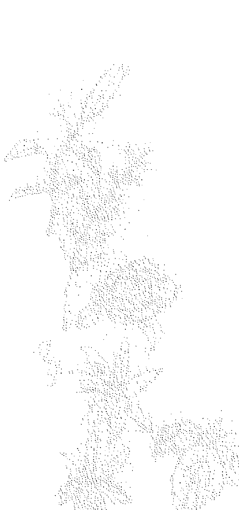

（竖排文字，需根据图片实际内容识别，此处为示意）

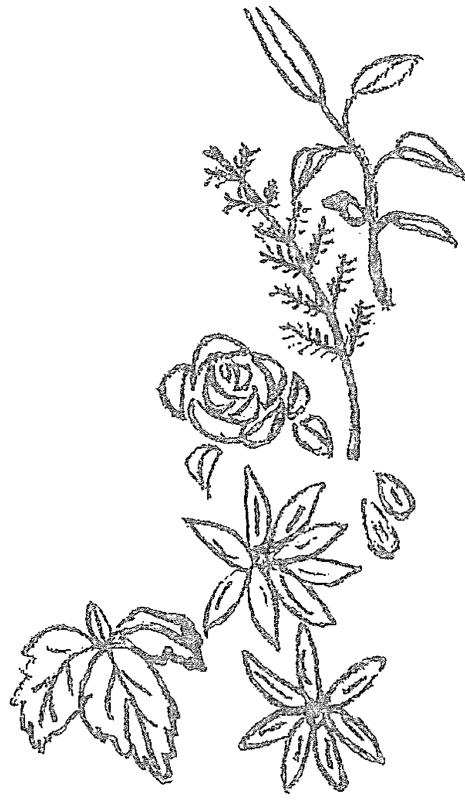

## 第二章

## 順隨月亮節奏過生活

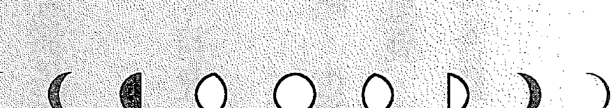

右侧文本内容，描述月亮与生活的关系，强调顺应自然节奏的重要性。

## 月亮，與我們的身心

月亮高掛夜空，絢麗閃耀。在日本直到約莫100年前為止，一直都是使用陰曆。人們透過月亮形狀就能知曉日期，因此如今有些國家依舊使用陰曆。姿態千變萬化的月亮，正如我們陰晴不定的心靈動向。自古以來，月亮一直被視為可以掌控人類內心的存在，以及影響體內無形部分的變化。珊瑚會在滿月產卵，而女性自然的月經週期，還有肌膚的新陳代謝，也都與月亮週期步調一致。據說生產以及死亡的時間，也很常與乾潮及滿潮時間重疊。也因如此，過去一直認為，地球上的生命與月亮有著密切關聯。據悉人體的水分含量，和地球大海所佔比例相同，皆為60～70%。人體可說就像是縮小版的地球。

從古時候開始，滿月光芒總是吸引著人們的目光，令人神魂顛倒。過去西洋的女巫們，相信滿月時藥草將發揮出最強大的力量。不管是狼人的傳說還是Lunatic（受月亮光影導致精神錯亂），都是因為滿月光亮的關係。如果你在滿月這一天會莫名心浮氣躁，在新月前幾天常感到失落沮喪，身體發生某些變化的話，說不定都是因為受到月亮節奏的影響。

## 月亮與地球的關係

月亮距離地球大約38萬公里遠，會花費29.5天繞行地球一周。「新月→上弦月→滿月→下弦月→新月」這一整個循環，稱作「朔望月」。

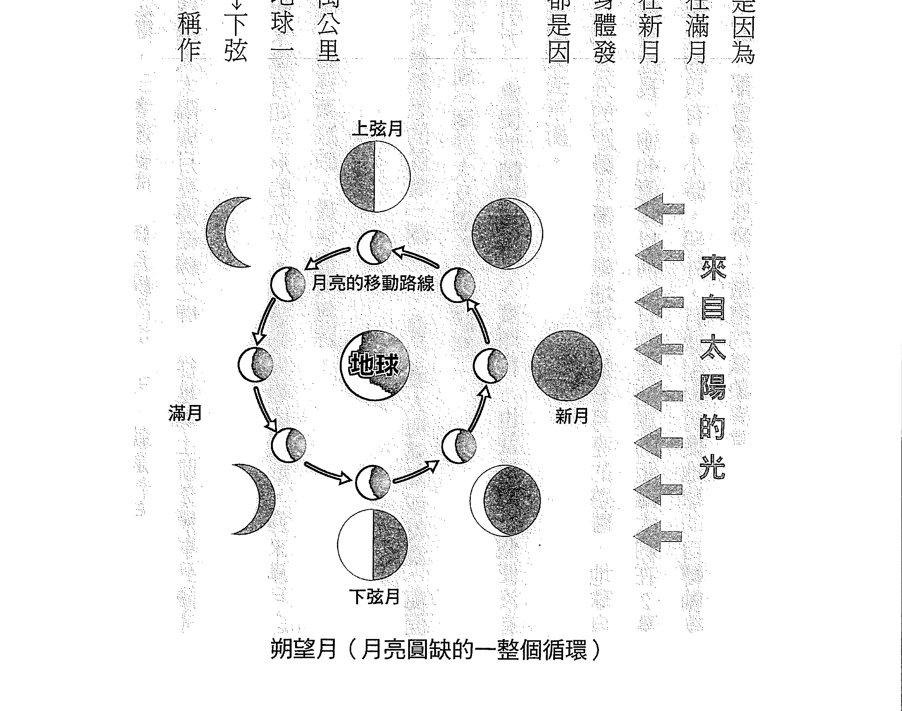

當月亮進入太陽與地球之間，三者連結成一條直線的這一天，就是新月。

大約經過15天之後，地球進入太陽與月亮連結線之間，從地球上眺望照射到陽光的部分，就是滿月。

月亮帶給地球的影響，大家最熟悉的就是「潮汐」，會引發大海滿潮或乾潮（海面最高以及最低的狀態）、大潮或小潮（潮差大及潮差小的狀態）。

而且地球和月亮之間的引力，會使地軸維持23.5度傾斜。也就是說，假使沒有月亮，地球軸心將會搖擺不定而失去平衡。

事實上，月亮每年都會以3.5公分的距離逐漸遠離地球。隨著月亮的遠離，地球自轉會變慢，1天的時間也會逐漸拉長。逾40億年以前，月亮與地球的距離大約在2萬公里的時候，推測1天的長度大約只有4小時。另外，月球引力可使地球的自轉軸維持傾斜23度，即便只有相差1度，都會導致地球發生嚴重的氣象異常。

## 第二章 順隨月亮節奏過生活

有人主張，將來月亮會完全脫離地球衛星軌道而去，也有人認為，會在一定的距離停下腳步，無論如何，我們都應該慶幸在數十億年後的未來，才會發生這些變化。

自古以來，備受眾人敬仰、誠心祈願的月亮，根本就像是地球生命的守護神一樣。

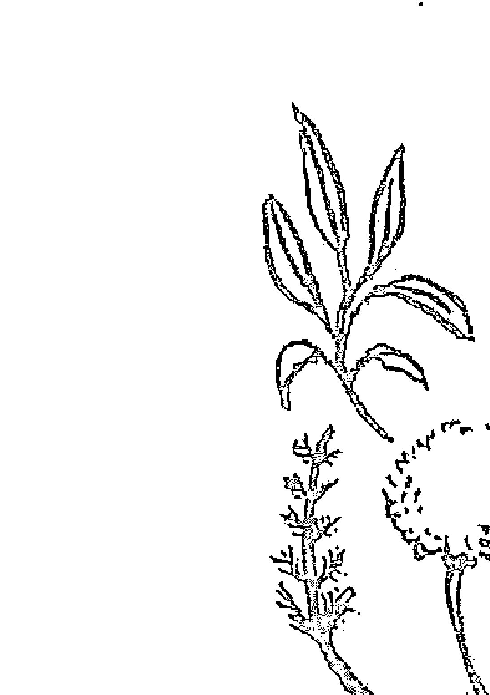

## 隨順月亮節奏過生活的提示

倘若太陽形塑了我們的「生活步調」，月亮節奏帶給我們的影響，則是「身心方面的無形節奏」。自己也摸不著頭緒，時而勇敢積極，時而沮喪低落的話，也許這就是月亮的節奏正悄然影響著你的潛意識了。

了解月亮的節奏，其實也會讓我們更珍惜沉睡在內心深處，原始自我的重要性，更注意它為生活帶來的提示。接下來要為大家介紹，自古流傳下來能帶來幫助的食物以及生活方式，這些內容希望大家放在心上，心生感應時，請試著與月亮同調生活看看。只不過，完全一板一眼照著規定行事的話，恐怕會讓你忽略了內心湧現的訊息，所以請大家別忘了傾聽自己內在的聲音。

就像為地球帶來潮汐一樣，普遍推測月亮也會對植物生長造成影響。從事園藝或種植蔬菜的人、有興趣莳花弄草的人，都可以作為參考。

另外再提醒大家，月亮的圓缺，可以透過網路、新聞、月亮日曆等方式查詢。

#### 新月

月亮盈虧周期展開的日子。

### 生活方式

- 最適合展開新事物的時候。順應大自然的變化，無論承接新的工作任務或是學習新才藝，都能好好挑戰。
- 在元旦這天會立定新年新希望，但是最好在每回新月，立定實際的目標，當月才能開始行動。
- 從新月到滿月這段期間，如同月亮形狀一樣，是會逐漸膨大的時期。可以擴大行動範圍或人脈，學習新知識。

### 飲食療法

- 消化變好，因此很適合進行輕斷食。建議飲用富含維生素的當令水果，加上西洋芹菜、巴西利、芽菜等蔬菜打成的果汁。另外還要攝取類似蕪

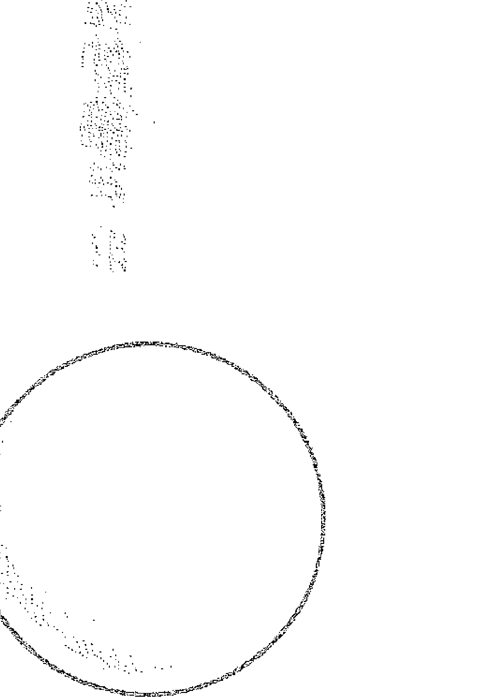

## 三日月

新月之後經過2天，太陽西沉時，在西方天空會見到宛如細弓狀的三日月。

### 園藝活動

- 主要欣賞葉片及花朵等地上部位的植物，播種時應避開新月，在逐漸接近月圓的期間再進行播種。因為新月時分，太陽與月亮會形成強大的牽引力道，容易使瘦弱枝葉徒長，因此較適合用來插苗。這時候植物容易發生病變，所以發現後就要防除以免擴散。
- 消化代謝太快的話，身體容易失去平衡，因此須飲用花草茶補充體力。

蒡及洋蔥這類解毒效果佳的食材。也推薦大家運用食物纖維豐富的牛蒡及蓮藕，還有貝類等食材入菜準備三餐。

### 生活方式

- 諸如工作或人脈，這類期盼能逐漸擴展的部分，都能展開行動了。說不定會突然想和某人聯絡，這時候千萬別猶豫，立刻試著聯絡看看吧！
- 肌力訓練這類的身體鍛鍊，就從這時開始進行！
- 向三日月許願吧！三日月現身的時間短暫，因此可以見到的話，算是十分幸運的一件事。

### 飲食療法

- 新月後至滿月這段期間，吸收力會增強，因此要選擇新鮮又安全的食材。推薦使用往上生長的當令青菜及番茄等果菜類、水果、山菜、竹筍等等。

### 園藝活動

- 舉凡番茄還有茄子等果菜類、麥子等穀類、豆類等植物，從這天起至十三夜之前播種的話，月光會穿透到泥土裡，讓植物結實累累。藥草種子也要趁這時候播種入土。

## 上弦月

能看見月亮的西半部分，就是第7天的上弦月，正值滿月前的中間地帶。形同沉船的形狀，傳聞是七夕夜晚，織女前去與牛郎相會所搭乘的船隻。

### 生活方式

- 時逢逐漸圓滿的時期，因此食慾會大增，遇到日漸虧蝕的時候，自然會食慾不振。假使滿月之後食慾依舊旺盛，應該想想是否有其他的原因。
- 從這天的前後開始，吸收力會變好。水分攝取過多的話，將導致水腫。
- 出現想追求成就感的想法時，就是內心在發出訊號，宣示自己做得到。可以比平時加倍努力看看！

### 飲食療法

- 積極攝取著重提升免疫力，能養顏美容的食物，不但容易吸收，又有益健康。
- 反之，必須比平時更加留意食品添加物，以及食物中毒方面的問題。

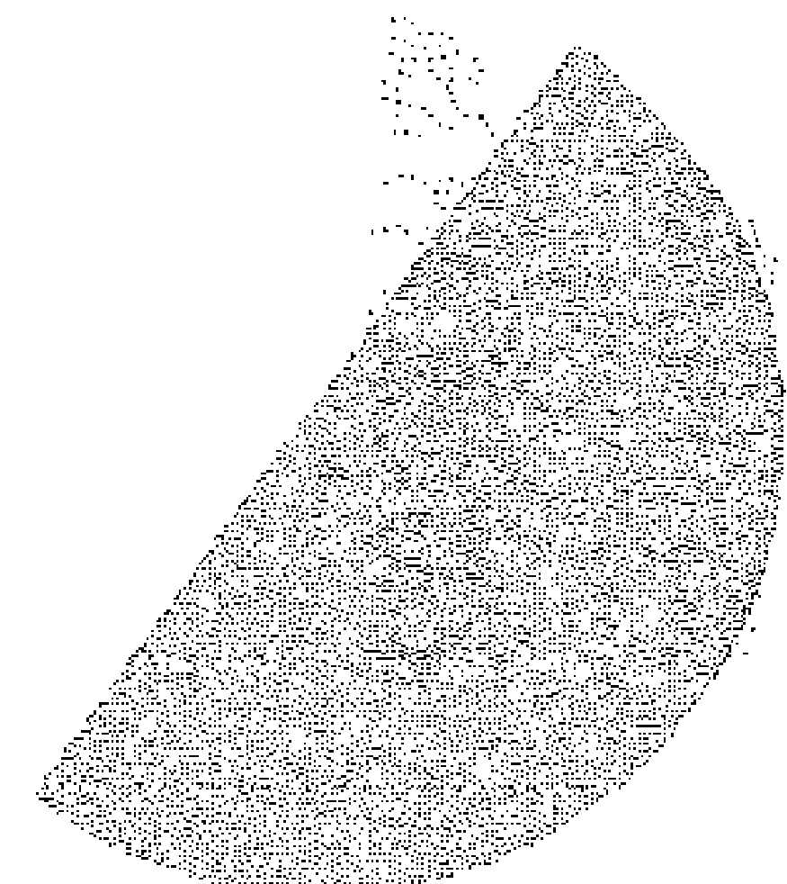

### 園藝活動

- 逐漸滿盈的時期，因此植物的水分含量也會增加，能夠採收到水嫩的果菜類。

## 十三夜

即將滿月，月亮幾乎呈現圓滾滾的狀態。在舊曆 9 月 13 日舉行「十三夜」時看見的月亮，稱作豆名月或栗名月，會將這時期收成的豆子或栗子，作為供品敬獻給月亮。將收穫的作物拿來供奉，藉此感謝月亮保祐作物豐穰。

### 生活方式

- 將新月立下的目標化為行動的最後機會。想幫光輝積極的力量充飽電的話，就來做做月光浴，讓全身沐浴在逐漸滿盈的力量之下。

#### 滿月

受太陽光照射的那一面會朝向地球，因此能夠看見美麗渾圓的月亮姿態。夕日西沉時，月亮會在東方天空現身，一整晚照亮夜空。

舊曆8月15日的夜晚，就是觀賞中秋明月的「十五夜」，稱之為

### 飲食療法

- 讓人變得活躍的時期。請留意不要努力過頭，以致於疲勞上身了。
- 容易引發水腫，因此要透過散步或淋巴按摩等方式加以消除。
- 感覺會比平常更加敏銳，所以要留意刺激性較強的食物，也要注意別飲酒過量。

### 園藝活動

- 葉菜類趁著這段時期到滿月播種的話，在引力影響下，有助於向上抽高與向下扎根，幼苗會發育健壯。

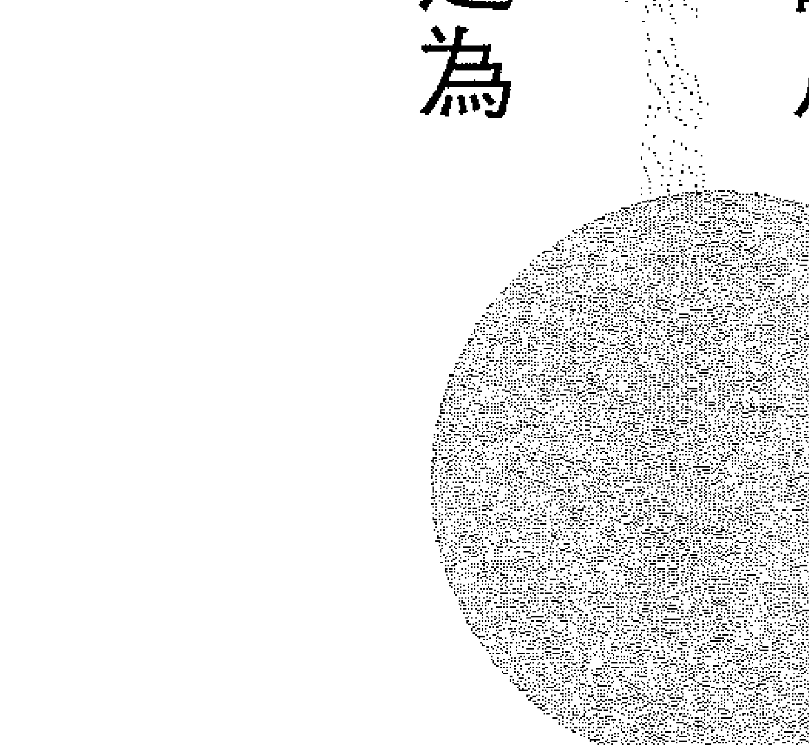

芋名月，此時會供奉小芋頭這類的薯類，並用15個糯米丸子作供品。

### 生活方式

- 這是宛如金煌煌的月光一般，能量會增強的日子。重新檢討新月時立下的目標，假使在這天之前尚未展開行動的話，先暫時予以保留。
- 緊張狀態高漲，所以容易發生問題。建議飲用具鎮靜效果的花草茶，進行情緒想讓情緒平定下來。
- 容易出現水腫現象，不過消化力也會增強，在意水腫的話，應平均攝取具利尿作用的食物。如要決心要減肥的話，就從這一天開始。
- 需要擔心出血量會比平時更多，所以非急迫性的手術或拔牙，最好避開這一天。

### 飲食療法

- 此時吸收力最佳，所以建議攝取菇類或蒟蒻這種熱量較少的飲食。
- 攝取小黃瓜或冬瓜等利尿效果佳的食材，因應水腫問題。

### 園藝活動

- 葉菜類希望在新月定植的話，最好等到這一天再播種。
- 想運用藥草類的藥效時，應在這天收成。
- 容易發生蟲害，所以一發現就該立即防除。

## 十六夜、待月

滿月一過，月出時間就會一天天延遲。原本逐漸盈滿的另一側，將開始一步步虧缺。

### 生活方式

在月亮逐漸盈滿期間展開或進行的事物，可以趁著此時好好吟味一番。應轉換生活習慣，改為在家悠閒度過，不要外出四處亂晃。靈感乍現時，要記錄在筆記本上。說不定隱藏了未來的提示。

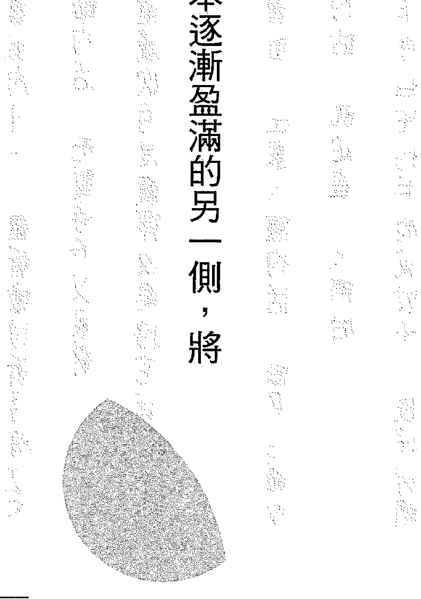

### 飲食療法

- 將焦點由吸收切換到代謝。應攝取具排毒效果的食材。另外，直到下次新月為止，可以告訴自己只要不過食，吃多一點也不易發胖。
- 排毒效果會變好，建議多吃與月亮同調、在大海中長大的貝類、海藻及魚類等食材。

### 園藝活動

- 接下來植物的水分會逐步下降到下半部。這段時間很適合採割藥草保存。
- 趁這時期除草的話，會抑制生長情形。

## 下弦月

陰曆22日或23日的半月。左側的半月會在半夜現身於東方天空，於白天左右月沒。

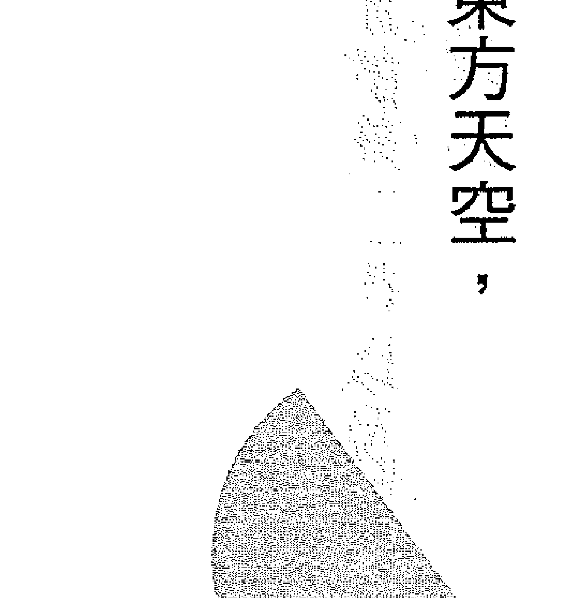

### 生活方式

- 真正進入代謝淨化的時期。在這段期間，即便分派的新工作以及朋友的邀約都變少了，也請視為正常現象，無須掛心。
- 家中髒汙容易清除，因此打掃及整理工作會進行得相當順利。將大掃除的計畫安排在這段期間，效果會很好。

### 飲食療法

- 於滿月重新檢討的目標，適合在此時分析予以保留的事項做不到的原因。
- 這段時間會讓人注意到無形之物，應攝取在地底下生長的食材。推薦馬鈴薯、生薑、蒜頭等食物。

### 園藝活動

- 適合播下薯類、根菜類等，這類在地底生長植物的時期。這段時間水分會往下降，因此可助長根部發育，成長茁壯。

暗月期

新月前的2~3天，看不見月亮的時期。

生活方式

-   平時不會去留意的事情容易浮現在腦海的時期。側耳傾聽自己隱藏起來的願望吧！在這個時機點，可與自己的內心好好對談。
-   可能會比平時更容易感覺到悶意。不妨飲用可鎮靜情緒的花草茶，做做冥想，觀察活動情形，讓自己喘息片刻。
-   點香氣蠟燭或香氣精油，花點時間泡泡澡，讓身心都放鬆下來。

飲食療法

-   新月以後人際往來機會增加，為做好準備，讓胃部及內臟獲得休息，應攝取脂肪含量少的飲食。
-   推薦吃些以高麗菜或以米入菜的料理。

園藝活動

-   這時期焦點會朝向無形的部分，因此可以進行整土作業。
-   樹液會往下降，因此適合砍伐樹木或剪枝。
-   諸如穀類等，用來貯藏的食物可於這時期收成。根部水分多，穀物的部分水分含量較少，因此蟲害會減少，卻無損風味，可長時間保存。

## 參照月亮節奏保養身心

我們應該配合月亮節奏，善用藥草及香氣精油。當身心節奏與月亮節奏同步，才會過得更加順心如意。請藉由花草茶、芳香浴、泡澡以及精油按摩等方式，好好保養身心。

#### 新月

排除不需要的，讓自己脫胎換骨，重新開始的一天。清香的檸檬香蜂草以及綠薄荷的花草茶，有助於心靈煥然一新。讓四溢的芳香，成為拓展時期的一大助力。可嘗試芳香療法，使用淨化效果強大的精油，滴在海鹽裡進行芳香浴或冥想。

-   **藥草**
    -   檸檬香蜂草
    -   綠薄荷
    -   西洋接骨木
    -   錦葵
    -   月桂
-   **精油**
    -   快樂鼠尾草
    -   沉香醇百里香
    -   檀香
    -   尤加利

> > **花草茶**
> 依照不同時期的節奏搭配藥草，在合計1茶匙的藥草中，注入200ml的熱水，蓋上蓋子沖泡2～3分鐘，將茶湯萃取出來。

#### 逐漸圓滿的月亮

月亮逐漸滿盈的時期，是大量吸收外界營養、充滿力量及活力的時期。推薦使用薔薇果及洛神花這類富含維生素，有助養顏美容及保健身體的藥草。朝著上方綻放的花朵，有助於進一步強化主動積極的態度。在芳香療法中，會使用美容效果顯著、能使心情開朗起來的精油，作為按摩油或香水。

-   藥草：洛神花、薔薇果、玫瑰、茉莉花、紅花苜蓿
-   精油：玫瑰天竺葵、甜馬鬱蘭、薰衣草、玫瑰

## 芳香浴

作法是將 4～5 滴精油，滴入可加熱精油散發出香氣的薰香台或精油燈、讓香氣四散至空氣中的擴香儀等器具中。將精油滴在面紙上揮舞一下，也能散發出芳香。

#### 滿月

這時期情緒容易高漲，最適合使用能讓心情平靜下來的德國洋甘菊及覆盆子。細細品味著花草茶，回顧一下自己從新月至今的變化。

在芳療過程中，會使用代表滿月高揚情緒的精油，與具有鎮定情緒作用的精油來泡澡或是按摩。

-   **藥草**
    -   德國洋甘菊
    -   金盞花
    -   覆盆子葉
    -   檸檬馬鞭草
-   **精油**
    -   伊蘭伊蘭
    -   肉桂
    -   茉莉花
    -   乳香

> > **按摩油**
> 將2～4滴精油（濃度0.5～1%），加入20ml植物性基底油（例如荷荷芭油、甜杏仁油等等）當中。用來按摩小腿肚或腹部等想要保養的部位。

## 逐漸虧蝕的月亮

在這個淨化作用變強的時期，推薦使用具排毒效果的蒲公英，以及能讓心情平靜下來的菩提。讓深綠的藥草帶來內心的安定。 在芳香療法中，會使用有助於排除毒素與靜觀內在的精油，進行冥想及半身浴。

-   葡萄柚
-   杜松
-   沒藥
-   迷迭香
-   蒲公英
-   菩提
-   桑葉
-   蓴麻

## 浴鹽

將4～5滴精油加入50g海鹽中混合。倒入浴缸充分拌勻後再泡澡。當皮膚會有刺痛感時，請馬上用冷水沖洗。海鹽與月亮節奏有著密切關係，最適合用來泡澡。

## 從生日的月相剖析自我

每個人出生的那一天，夜空都會閃耀著月光。自古以來，人們一直認為生日當天的月亮形狀（月相），會對一個人的性格造成影響。

想要善用月亮賦予的個性，一定要來了解一下自己生日那一天的月亮形狀，然後再運用相對應的藥草及精油，即可喚醒你與生俱來的光芒。

月相展現出來的優勢之處，會在你成長茁壯的過程中，對心靈產生影響力。最好安排一些時間，藉由藥草及精油好好療癒身心（參考83～86頁·下方）。不需要全部照做，只要採用其中一種方法即可。提不起精神來的時候，一定能夠助你一臂之力。

> **芳香浴+α**
當周圍充滿芳香之後，將全身力量放鬆，再慢慢地減少呼吸次數。花5秒鐘吸氣，再花10秒鐘吐氣。反覆吸吐的期間，香氣會幫助情緒平穩下來。另外，在進行冥想或是做月光浴時，建議大家使用與當天月相對應的精油。例如在新月前一天，可利用乳香精油做芳香浴，同時進行冥想。

> **花草茶+α**
沖泡花草茶時，記得一邊享用，同時想像藥草的香氣盈滿全身上下。花草茶還能一步步淡化負能量，讓自己獲得療癒。刻意地嘆口氣，藉由進入體內的藥草力量，將不好的情緒往外排出吧！

## ＜简易版＞计算自己生日当天正午的「月相（月龄）」算法

【算式】
出生西元年－1903＝y
y×11＋(y÷20)＋出生月＋出生日＝x
※ y÷20：只有整数，以下舍去
※ 只针对1月和2月进行调整，所以必须将「出生月＋1」。
1月必须「1＋1」、2月必须「2＋2」
→将 x 除以30后所得余数，就是出生当时的月龄

**例**
1979年2月28日出生
1979－1903＝76
76×11＋(76÷20)＋(2＋2)＋28
＝836＋3＋4＋28＝871
将871除以30后所得余数为1⇒月龄1

## 由月龄推算出月相

| 月龄范围 | 对应月相 |
| :--- | :--- |
| 第0～3天的月亮 | 新月 |
| 第4～6天的月亮 | 眉月 |
| 第7～10天的月亮 | 上弦月 |
| 第11～14天的月亮 | 盈凸月 |
| 第15～18天的月亮 | 满月 |
| 第19～22天的月亮 | 亏凸月 |
| 第23～25天的月亮 | 下弦月 |
| 第26～29天的月亮 | 残月 |

## 新月出生的人

月光從黑暗之中生成的時期。月亮最接近太陽的狀態，所以這種人會釋放出強烈耀眼的光芒。

### 優點

-   具有宛如嬰孩般純粹的能量，無論失敗多少次，都能重新站起來的人。
-   很少不知所措，膽大且充滿挑戰精神，不怕失敗。
-   做事喜歡引人注目，有能力獲取名聲及地位。

### 缺點

-   擅長短時間專注於某事，卻不善於將眼光放遠。
-   一下子就會舉手投降，以致於最終無法抓住機會。

雖然天真也算是一項優點，但在人際關係上，有時卻會被視為太粗心大意。

### 藥草

-   錦葵、玫瑰、苦橙葉

## 眉月出生的人

亮光來自月亮背面，會出現弓形光芒的時期。

好奇心旺盛，個性積極主動，卻對自己沒有充足自信，如同孩子一般的人。

### 優點

-   個性開朗又善於交際，每個人都會喜歡的類型。
-   機靈、腳力好，所以常被分派工作。
-   隨著年紀增長，會認識能夠交心的朋友。

### 缺點

-   有時會說出不該說的話，害自己立場為難。
-   容易杞人憂天，因此要謹言慎行，與旁人相處和睦時，才能積極生活。

### 藥草

-   生薑、聖約翰草、歐洲赤松

## 上弦月出生的人

上弦月左右，迎向滿月且能量開始滿溢的時期。積極主動，精力充沛敢勇往直前的人。

### 優點

-   認真懷抱夢想，全身充滿精力及熱情。
-   領導才華備受旁人認同，富有挑戰精神，努力拼命，因此很容易出人頭地。
-   只要身居高位，就能發揮實力。如同半月一樣，具有雙面性格，有時在公開場合與私底下會判若兩人。

### 缺點

-   必須理解不是每個人都能積極主動這個事實。
-   身段不夠柔軟時便無法成功。

## 盈凸月出生的人

满月的前一刻，会令人感觉到美中不足的时期。个性成熟，志向高远，让人感觉充满光采又青春洋溢的人。

### 優點

-   具备类似疗愈系偶像的形象，凡事都能冷静判断。
-   创造力十足，不安于平凡的日常生活。
-   为人谦虚，获得旁人给予的机会后，有可能一举成功。

### 藥草

-   绿薄荷、甜橙、黑胡椒

## 满月出生的人

月亮最具存在感的满月时期。

给人开朗的印象，落落大方，凡事都能客观看待的人。

### 優點

-   自誕生起就被賦予閃亮的明月之力。

### 缺點

-   要求自己要盡善盡美，因此內心深處經常對自己感到不滿意。
-   當目標就在眼前時，會當作僅有一次的機會馬上行動。

### 藥草

-   檸檬香蜂草、檸檬、絲柏

## 虧凸月出生的人

渾圓碩大的月亮漸漸虧缺，開始迎向新世界的時期。具有播種的意味，能夠回饋社會，以及擁有服務熱忱的人。

### 優點

-   自尊心高，另一面則是會隱藏實力，暗自努力的人。
-   只要壓抑自我表現欲就會遭受失敗，因此應重視周遭的意見，同時要站上舞台，即能馬到成功。

### 缺點
-   講究生活品味的人，因此容易對平淡的人事物露出嫌棄的表情。
-   如果生活不受到關注，馬上會放棄外表，容易變胖的人。

### 藥草
-   檸檬馬鞭草、佛手柑、玫瑰草

## 下弦月出生的人

月亮的下半部虧缺，開始迎接黑暗的時期。確實調整腳步，想法成熟且閱歷豐富，受人尊敬的人。

### 優點

-   本人個性穩重，是常受旁人敬慕的類型。
-   工作運佳，容易被委以重任，所以要趁年輕培養技能。

### 缺點

-   雖然值得信賴，但察覺困難便會敬而遠之。
-   即便再認真再努力，有時還是會三分鐘熱度。

### 藥草

-   月桃、薔薇果、花梨木

## 殘月出生的人

雖然很接近太陽，卻會光芒盡失，被吸入黑暗之中的時期。熱愛幻想，內心深奧莫測，直覺敏銳宛如女巫一般的人。

### 優點

-   在他人眼中是浪漫感性、富有神秘感的人。
-   對他人有同理心，理解力佳的人。
-   在自己相信的世界裡踏實努力，終將獲得成功。

### 缺點

-   容易受周遭影響，因此應重視人際關係以及居住場所的環境。
-   難以捉摸的態度，有時會給人負面印象。
-   情緒不佳時容易表現出來，所以別忘了安排時間讓自己放鬆。

### 藥草

-   茉莉花、薰衣草、乳香

## 對應月相的藥草熏香

調和藥草及樹脂製成的香料，就是熏香。親手加進與自己月相對應的藥草及精油完成熏香之後，就能從裊裊上升的熏煙中獲得力量。大家可以試著在明月下焚香，或是在進行冥想時使用喔！作法很簡單，將藥草及樹脂磨碎，加水揉製成團後再乾燥即可。屬於樹脂類的乳香及沒藥，自古一直被視為神聖供品，用於祭祀活動當中。

### 材料（約4個的分量）
-   乳香樹脂 3 g
-   沒藥樹脂 6 g
-   乾燥茉莉花 1 大匙

###### 材料
-   月相精油 10～20 滴
-   純水 適量
-   模型（將3公分×7公分左右的厚紙折成三角椎）4個

###### 作法

1.  用杵臼等器具，將乳香樹脂和沒藥樹脂充分磨碎。
2.  加入茉莉花磨碎成粉狀，並充分混合均勻。
3.  倒入純水直到作法②變成鬆散狀為止，使材料混合均勻。
4.  加入精油混合。
5.  將作法④填入三角椎模型中壓實，乾燥2～3天。

### 熏香法

將藥草熏香放在香爐或焚香盤上點火。藥草熏香容易熄滅，因此須不時重新點火。

> ※ 這個配方如要添加對應月相的乾燥藥草時，可利用純水分量進行調整。還可以使用對應月相的乾燥藥草來取代茉莉花。
※ 材料可自藥草或熏香的專賣店購得。

## 第042首：画鸡

头上红冠不用裁，满身雪白走将来。平生不敢轻言语，一叫千门万户开。

## 第三章

## 透過植物汲取星辰之力

## 星辰與藥草的關係

正如「向星星許願」這句話所言，人都會抬頭望向夜空，向閃閃發光的星星許下願望。

在遙遠的過去，人們認為月亮及星辰（行星）的變化，代表著神的旨意，因此在5000年前，才會有占星術的出現。

在古希臘時代，醫術與占星術息息相關。醫學之祖希波克拉底留下一句名言，「醫療實踐應考量星辰變化」，意指過去會從星辰變化解讀體質及疾病，著手治療。

進入17世紀之後，英國的尼可拉斯·卡爾培柏（藥劑師／草藥醫生、占星術師）運用占星術分析發生的事物，依據不同性質，將藥草歸給太陽至土星這七大行星，建構出調整身體不適的方法。

目的在於治癒人體的醫術和占星術，隨著時間逐漸轉換模式，與運用藥草接收行星力量的「藥草占星術」形成關聯。

※西元前5世紀，古希臘恩培多克勒提倡四元素說：「土、水、空氣、火」；西元前4世紀，古希臘的亞里斯多德將四元素的屬性分類成「熱、冷、乾、濕」。藉由這些組合表示元素的性質，而行星也是以這些性質的組合進行分類。卡爾培柏將藥草分類如下，熱代表溫熱之物、冷代表冷卻之物、乾代表乾燥之物、濕代表滋潤之物。

每個行星所具備的力量，如下所述：

1.  太陽（熱性、乾性）…………自信、精力、才能、自我表現
2.  月亮（冷性、濕性）…………情緒、真實的自我、感情
3.  水星（冷性、乾性）…………知性、溝通、語言
4.  金星（偏冷性、偏濕性）…………愛情、美、喜悅、協調
5.  火星（比太陽更強的熱性、乾性）…………鬥志、熱忱、勇氣
6.  木星（偏熱性、偏濕性）…………運氣、擴張、發展
7.  土星（冷性、乾性）…………試煉、限制、自制

舉例來說，實在打不起精神來時，可借助太陽擁有的「自信」及「精力」等能量。飲用太陽守護的金盞花茶，使身體充飽太陽能量。

如果希望自己能比現在更美麗的人，可借助金星擁有的「愛」與「美」之力。運用金星守護的玫瑰精油按摩全身。

相信藥草占星術，會在日常生活以及人生各種際遇上，助你一臂之力。

## 藉由藥草吸收星辰的力量

現在為大家介紹七大支配星，還有與其相對應的代表性藥草。藥草可以用來沖泡花草茶或作為食材，有精油的話還能好好活用，自由融入每天的生活當中。

## 1、賦予生命能量
### 太陽

使萬物充滿生命力的太陽，能在我們想要往前跨出一步時賦予我們力量。當你準備展開新計畫、不知道應該往哪個方向邁進時，或喪失自信時，不妨汲取太陽的力量。

-   對應的藥草：甜橙、橄欖、金盞花、德國洋甘菊、矢車菊、番紅花、聖約翰草、日本柚子、迷迭香、月桂

## 2、幫助療癒內在心靈
### 月亮

月亮能幫我們療癒內在心靈。當不明來由心浮氣躁時、無法切換開關放鬆下來時，可以好好汲取月亮的力量。

-   對應的藥草：檸檬、快樂鼠尾草、檀香、茉莉花、藍花西番蓮、忍冬、乳香、尤加利、萊姆、薔薇果、繁縷

## 3、活化溝通
### 水星

水星能賦予我們溝通的能力，讓才能得以完全發揮出來。在人際方面感到壓力時、懷才不遇時、想要提升表達能力時，都能汲取水星的力量。

-   對應的藥草：牛至、葛縷子、蘿蔔、胡椒薄荷、顴草、茴香、馬鬱蘭、薰衣草、檸檬香茅、檸檬馬鞭草、芝麻菜、甘草、桑葉

## 4、使人發覺生活的喜悅
### 金星

金星素有愛與美的女神「維納斯」之名，能啟發人們的美學意識，以及展現魅力。想得到愛的時候、想提升戀愛運時、希望磨練藝術涵養及美感時，還有渴望平靜、與人連結時，都能汲取金星的力量。

-   對應的藥草：朝鮮薊、西洋接骨木、依蘭依蘭、小豆蔻、天竺葵、百里香

## 5、在必要時提供活力
### 火星

發出耀眼紅光的火星，可為人帶來生存下去的活力。態度消極錯失良機時、渴望升遷或考試順利時、盼望一舉得勝時，都能汲取火星的力量。

-   大蒜
-   芫荽
-   野山楂
-   生薑
-   薑黃
-   龍蒿
-   辣椒
-   蕁麻
-   羅勒
-   黑胡椒
-   啤酒花
-   芥末
-   香
-   錦葵
-   香草
-   馬鞭草
-   歐石楠
-   夏白菊
-   西洋蓍草
-   覆盆子
-   斗篷草
-   玫瑰
-   洛神花
-   野草莓

## 6、幫助拓展視野
### 木星

號稱「幸運之星」的木星，在太陽系中變化最大，能帶來逐漸擴張的力量。想要視野更加寬廣、探尋大展身手之處、希望用正向態度面對事情時、渴望成長時，都能汲取木星的力量。

-   對應的藥草：
    -   茴芹
    -   丁香
    -   肉桂
    -   蒲公英
    -   菊苣
    -   細菜香芹
    -   牛膝草
    -   琉璃苣
    -   菩提
    -   檸檬香蜂草
    -   紅花苜蓿
    -   花梨木

## 7、使人勇於迎向挑戰
### 土星

過去土星被視為距離地球最遙遠的行星，代表世界的盡頭，能帶給我們勇往向前的力量。想要克服不拿手的事物時、希望戰勝挫折變得更堅強時、渴望變得沉穩時，都能汲取土星的力量。

-   對應的藥草：
    -   紫錐花
    -   孜然
    -   杜松
    -   廣藿香
    -   毛蕊花
    -   銀合歡
    -   紅花
    -   杉菜
    -   薺菜

## 實現夢想的星辰香水

香氣自古即可為神（上天、宇宙）與人傳遞訊息。在古希臘甚至會用香作為神明的供品。在宗教儀式中不但會焚香，也會燃燒藥用鼠尾草淨化環境，這都是在運用香氣特有的力量。

在芳香療法中使用的精油，也會分別對應不同的行星。請大家一定要在日常生活中善用香氣，讓星辰和香氣的力量成為你的有力後援。

## 實現夢想的星辰香水

###### 材料

- 遮光瓶（30ml）
- 精油合計8～10滴
- 酒精10ml
- 純水10ml

| 星辰（行星） | 精油 |
| --- | --- |
| 1太陽 | 甜橙、佛手柑、沒藥、日本柚子、迷迭香 |
| 2月亮 | 快樂鼠尾草、檀香、茉莉花、乳香、尤加利、檸檬 |
| 3水星 | 甜茴香、甜馬鬱蘭、薰衣草、醒目薰衣草、檸檬香茅 |
| 4 金星 (♀) | 依蘭依蘭、小豆蔻、檸檬香茅、天竺葵、香草、岩蘭草、玫瑰 |
| 5 火星 (♂) | 生薑、羅勒、冷杉、黑胡椒 |
| 6 木星 (♃) | 丁香、肉桂、檸檬香蜂草、花梨木 |
| 7 土星 (♄) | 絲柏、雪松、杜松、廣藿香、銀合歡 |

現在就來看看自己需要哪些力量，由此挑選出擁有這些行星力量的精油，調製成香水（111頁）或室內芳香噴霧（227頁·下方）吧！讓你輕鬆就能沉浸在美妙的香氣之中。

> ※外出時需使用會引發光敏反應的精油時，必須留意不能擦在陽光直射的部位。

## 香水調製配方

###### 作法

1. 想要汲取某些力量時，從擁有這些力量的星辰中，挑選出相對應的精油。可以搭配數種星辰的力量，但是精油最好以5種為上限。
2. 將精油倒入酒精中。每滴入1滴精油後，必須充分搖晃均勻，一面檢視香氣，再繼續滴入精油。加入香氣比較強烈的精油時，可以減少用量。
3. 使整體混合均勻後，最後再加入純水。

> ※熟成約1週時間後，即可降低酒精異味，使香氣更加圓潤。
> ※建議在3個月左右使用完畢。

視目的，以星辰守護的精油作為調製配方中的主要精油，接著參考精油的效能及香氣的協調性，還能再添加其他的精油。

- 讓自己充滿自信的太陽香氣
    - 甜橙（2滴）
    - 佛手柑（2滴）
    - 沒藥（2滴）
    - 迷迭香（1滴）
    - 檸檬香茅（1滴）

- 實現療癒放鬆時刻的月亮香氣
    - 快樂鼠尾草（2滴）
    - 檀香（1滴）
    - 乳香（2滴）
    - 檸檬（2滴）
    - 絲柏（1滴）

- 提升溝通能力的水星香氣
    - 甜馬鬱蘭（2滴）
    - 薰衣草（3滴）
    - 檸檬香茅（1滴）
    - 丁香（1滴）
    - 生薑（1滴）

## 增強戀愛運的美麗金星香氣

- 依蘭依蘭（1滴）、小豆蔻（1滴）、天竺葵（1滴）、玫瑰（1滴）、肉桂（1滴）

## 志在取勝時的火星香氣噴霧

- 生薑（2滴）、冷杉（2滴）、黑胡椒（1滴）、粗鹽1小撮

## 已經努力到不能再努力的最後手段，幸運的木星香氣

- 肉桂（2滴）、檸檬香蜂草（1滴）、花梨木（3滴）、醒目薰衣草（2滴）

## 讓自己破殼而出的土星香氣

- 絲柏（2滴）、雪松（1滴）、杜松（1滴）、廣藿香（2滴）、日本柚子（2滴）

## 香氣沐浴鹽

###### 材料

- 天然鹽3大匙、或是浴鹽1杯、精油3～5滴

※浴鹽並非鹽，而是硫酸鎂。不容易損傷恆溫加熱浴缸。

### 其他推薦調製配方

- 透過安穩香氣誘發睡意的安眠香氣
    - 薰衣草（3滴）、佛手柑（2滴）、甜馬鬱蘭（2滴）

- 需要驅散悶意與集中注意力時
    - 尤加利（2滴）、迷迭香（2滴）、薄荷（1滴）、檸檬（1滴）

###### 作法

想要汲取某一力量時，從擁有這些力量的星辰中，挑選出相對應的精油。
將3～5滴精油滴入天然鹽或浴鹽中混合均勻。

## 香氣精油冥想

一面做芳香浴一面進行冥想，星辰的力量將隨同香氣作用於深層意識。選出守護精油之外，還可以添加能強化冥想效果的精油一起使用。

- 守護精油
    - ＋乳香 呼吸通暢
    - ＋檀香 剔除雜念
    - ＋杜松 淨化環境

作法：將4或5滴精油滴入擴香儀、熏香台或精油燈等器具中，再進行冥想。冥想前將精油滴在面紙上揮舞一下，也能散發出芳香。

## 精油對應的行星

精油是從植物的花朵、葉片、果皮、樹皮、根部、種子、樹脂等部位萃取出來的芳香物質。藥草葉片經摩擦後，就會散發出獨特香氣，集結香氣的油胞稱作分泌囊，破裂後精油成分便會蒸發。

嗅聞精油的香氣時，除了會帶來幸福感及放鬆感之外，芳香成分還具有藥理作用，例如可促進血液循環、抗發炎、催眠、殺菌、鎮靜、鎮痛等等。與每一顆行星相對應的精油，將於以下為大家詳細介紹。

### 使用精油時的注意事項

- 不可內服。
- 避免以原液塗抹，須稀釋後使用。
- 屬於引火性物質，因此不得放置在火源旁邊。
- 開封後應放在陰暗處保存，並於1年內使用完畢。
- 柑橘類精油具有光敏性，須特別留意。
- 孕婦、病人、嬰幼兒使用前應先向專家諮詢。

## 太陽守護的精油

| 精油 | 心靈 | 身體 | 注意事項 |
|------|------|------|----------|
| 沒藥 | 穩定情緒、提振精神、擺脫無精打采 | 抗菌、除臭、牙齦炎、呼吸道不適 | 懷孕期間 |
| 佛手柑 | 鎮靜、提振心情、抗憂鬱、穩定情緒 | 消化器官不適、消毒、乾燥肌 | 光敏性反應、長時間持續使用 |
| 甜橙 | 讓心情開朗起來、放鬆、提振精神 | 消化器官不適、增進食慾、收斂肌膚 | 光敏性反應、高濃度使用 |

## 月亮守護的精油

| 精油 | 心靈 | 身體 | 注意事項 |
|------|------|------|----------|
| 檀香 | 鎮靜作用、解決壓力導致的失眠 | 呼吸道不適、泌尿系統感染、讓肌膚變柔軟、抑制搔癢 | 抑鬱狀態時 |
| 快樂鼠尾草 | 抗焦慮、鎮靜、放鬆 | 頭痛、恢復體力、月經失調、刺激毛囊生髮 | 高濃度使用、開車前、懷孕期間 |
| 茉莉花 | 找回自信、勇氣、幸福感、放鬆 | 生理痛、經前症候群、軟化肌膚、保濕 | 高濃度使用、懷孕期間 |
| 乳香 | 抗焦慮、緩解恐懼、提振精神、緩和呼吸 | 呼吸道發炎、促進消化、收斂、消毒 | 懷孕初期 |
| 澳洲尤加利 | 平定興奮情緒、集中精神、覺醒 | 殺菌、花粉症、喉嚨痛、感冒初期 | 高濃度使用、高血壓、癲癇症 |
| 檸檬 | 提振精神、抗焦慮、提升專注力、記憶力 | 促進血液循環、去角質、痘痘、粉刺 | 光敏性反應、高濃度使用 |
| 迷迭香 | 增進記憶力、提振精神、覺醒、強壯、抗憂鬱 | 頭痛、暈眩、利尿、收斂 | 懷孕期間、高血壓、癲癇症、嬰幼兒 |
| 日本柚子 | 心情高揚、抗焦躁、放鬆 | 殺菌、調節自律神經、促進血液循環、保濕 | 光敏性反應 |

## 水星守護的精油

| 精油 | 心靈 | 身體 | 注意事項 |
|------|------|------|----------|
| 甜茴香 | 鎮靜、抗壓力 | 健胃、解毒、類雌激素、更年期 | 懷孕期間、哺乳期間、嬰幼兒、癲癇症、女性生殖器官疾病 |
| 甜馬鬱蘭 | 消除孤獨感、抗焦慮、鎮靜 | 肌肉痠痛、頭痛、失眠、促進血液循環、挫傷 | 懷孕期間、開車前 |
| 薰衣草 | 鎮靜、穩定、放鬆 | 穩定中樞神經、燒燙傷、頭痛、皮膚發炎 | 開車前 |
| 醒目薰衣草 | 提振精神、專注 | 鎮痛、肌膚發炎、呼吸道不適 | 懷孕期間 |
| 檸檬香茅 | 帶來活力、提振精神、振奮心神 | 增進食慾、消化不良、肌肉痠痛、平衡皮脂 | 敏感肌、高濃度使用 |

## 金星守護的精油

| 精油 | 心靈 | 身體 | 注意事項 |
|------|------|------|----------|
| 依蘭依蘭 | 鎮靜、穩定衝擊及不安、找回自信 | 調整荷爾蒙平衡、殺菌、消毒 | 低血壓、過度使用、敏感肌、懷孕初期 |
| 小豆蔻 | 強化精神層面、鎮靜、帶來滿足感 | 去痰、抗黏膜炎、抗發炎、增進食慾 | 高濃度使用 |
| 檸檬香茅 | 抗憂鬱、改善情緒、提振精神 | 預防感染、消毒、抗病毒 | 高濃度使用 |
| 天竺葵 | 消除不安、減輕壓力、改善情緒 | 調整荷爾蒙、更年期障礙、平衡皮脂 | 敏感肌、懷孕期間 |
| 香草 | 幸福感、安眠、鎮靜 | 不可用於按摩等方面 | 刺激 |
| 岩蘭草 | 鎮靜、緩解壓力、失眠 | 消毒、風濕、強身健體、乾燥肌 | 對禾本科過敏 |
| 玫瑰 | 擺脫無精打采、帶來愉悅感、穩定情緒 | 調整荷爾蒙平衡、活化消化器官、老化肌、皮膚發炎 | 懷孕期間 |

## 火星守護的精油

| 精油 | 心靈 | 身體 | 注意事項 |
|------|------|------|----------|
| 生薑 | 提振精神、給予刺激、行動力 | 促進血液循環、肌肉痠痛、消化不良、抗感染 | 懷孕期間、皮膚刺激反應 |
| 羅勒 | 清晰思緒、感覺不暢快時、消解精神疲勞 | 促進消化、蚊蟲叮咬、痘痘肌、肌肉痠痛 | 懷孕期間、敏感肌 |
| 冷杉 | 淨化精神層面、消除不安、提振精神 | 殺菌、抗感染、呼吸道不適 | 無特別注意事項 |
| 黑胡椒 | 提振精神、刺激、活化身 | 抗感染、噁心想吐、強健循環器官、促進血液循環 | 懷孕初期、敏感肌、肝臟疾病 |

## 木星守護的精油

| 精油名稱 | 心靈 | 身體 | 注意事項 |
|----------|------|------|----------|
| 丁香花苞 | 心情高揚、恢復記憶力 | 抗菌作用、因牙痛或緊張所造成的頭痛、虛寒體質 | 高濃度使用、幼兒、懷孕期間、哺乳期間 |
| 肉桂 | 疲勞時、衰弱時 | 促進消化、改善腰痛及虛寒體質 | 懷孕期間、哺乳期間、嬰幼兒、高濃度使用 |
| 檸檬香蜂草 | 抗不安、抗憂鬱、鎮靜 | 強心作用、解熱、健胃 | 懷孕期間、敏感肌 |
| 花梨木 | 抗壓力、減少批判性思維、消除沮喪 | 強化免疫力、殺菌、消毒、頭痛、無法適應時差 | 無特別注意事項 |

## 土星守護的精油

| 精油 | 心靈 | 身體 | 注意事項 |
|------|------|------|----------|
| 絲柏 | 鎮靜、消除心煩氣躁或易怒現象 | 調整體液平衡、收斂、呼吸道不適 | 高血壓、懷孕期間 |
| 雪松 | 抗不安、鎮靜、提振精神 | 呼吸道發炎、使皮脂分泌正常、殺菌消毒 | 懷孕期間、哺乳期間 |
| 杜松 | 淨化情緒、提振精神、增加勇氣 | 虛寒體質、利尿、排毒 | 懷孕期間、長期使用、腎臟疾病 |
| 廣藿香 | 消除情緒不安、鎮靜、催情 | 殺菌、肌膚粗糙、軟化皮膚、利尿 | 高濃度使用、敏感肌 |
| 銀合歡 | 抗憂鬱、鎮靜、穩定情緒 | 不可用於按摩等方面 | 高濃度使用 |

## 與星辰（行星）相對應的植物一覽表

植物還能用來沖泡花草茶或當作調味料。例如打算一決勝負的日子，可在咖哩裡加入火星守護的辛香料（大蒜、芫荽、生薑、薑黃、辣椒），透過飲食或飲品加以吸收。

| 星辰（行星） | 植物 |
|--------------|------|
| 1 太陽 | 小米草、歐白芷、甜橙、橄欖、金盞花、德國洋甘菊、矢車菊、番紅花、聖約翰草、佛手柑、甜橘、沒藥、日本柚子、迷迭香、月桂、核桃、米、蜂蜜、向日葵 |
| 2 月亮 | 白千層、檸檬、快樂鼠尾草、檀香、茉莉花、綠花白千層、藍花西番蓮、忍冬、乳香、尤加利、萊姆、花梨木、高麗菜、繁縷、光果拉拉藤、豆類、綠茶 |
| 3 水星 | 奧勒岡、葛縷子、薄荷、時蘿、胡椒薄荷、緬草、安息香、茴香、馬鬱蘭、香桃木、薰衣草、醒目薰衣草、檸檬香茅、檸檬馬鞭草、芝麻菜、甘草、桑葉 |
| 4 金星 | 朝鮮薊、西洋接骨木、依蘭依蘭、黃花九輪草、小豆蔻、貓薄荷、香茅、天竺葵、百里香、櫻桃、錦葵、香草、馬鞭草、歐石楠、夏白菊、岩蘭草、西洋蓍草、覆盆子、斗篷草、玫瑰、洛神花、野草莓、桃子、艾蒿、蘋果 |
| 5 火星 | 金雀花、大蒜、芫荽、野山楂、生薑、薑黃、龍蒿、辣椒、蕁麻、羅勒、冷杉、黑胡椒、啤酒花、芥末 |
| 6 木星 (♃) | 茴芹、丁香、肉桂、蒲公英、菊苣、細菜香芹、牛膝草、琉璃苣、旋果蚊子草、菩提、檸檬香蜂草、紅花苜蓿、花梨木、葡萄 |
| 7 土星 (♄) | 紫錐花、孜然、絲柏、雪松、杜松、廣藿香、毛蕊花、銀合歡、紅花、杉菜、薺菜 |

## 第四章

## 藥草調製月曆

## 在需要喘息的時刻

在日常生活中，能夠輕鬆汲取大自然力量的方法，就是喝花草茶。在忙碌不停的日子，偷閒喘口氣的時間，除了可以讓身心放鬆一下之外，還有助於提升工作效率。花草茶是利用藥用植物的葉片、種子、花朵、根莖、樹皮等局部或全草，在新鮮（生）或乾燥（乾）的狀態下，用泡茶的方式萃取出來。喝花草茶不但能享受其風味和香氣之外，還可以吸收到藥草的效能。而且多數花草茶皆不含咖啡因（含量極少），因此晚上也能放心飲用。

## 花草茶原本就是處方藥

花草茶的源起，傳說是古希臘的希波克拉底（西元前460∼370年左右），為治療疾病因而煎煮藥草，作為處方用藥。另外，印度的阿育吠陀以及中醫，同樣會運用藥草作為治療手法之一，一直留有喝茶的傳統文化。這些方式都是藉由植物的力量，強化人類的自然治癒力，目的都是為了療癒身心。

隨著近代醫學的發展，藥草療法曾一度自醫療舞台上消失，但在近年來，花草茶愈來愈普及常見，讓人開始重新重視天然花草的必要性。

## 花草茶備受期待的7大效力

相信每一個人都不希望需要吃藥或上醫院，每天健康度日。若能好好了解藥草效能，用來保健身體，一定有助於改善日常不適症狀、打造健康體魄。花草茶備受期待的效能如下所述。

1. **抗氧化**
    就像金屬一生鏽，便無法正常運作一樣，當我們受到體內多餘活性氧影響，就會引發氧化現象，導致生活習慣病及老化。不想讓體內生鏽的話，關鍵在於善加發揮體內的「抗氧化作用」，才能抗老化又能健康長壽。
    由於活性氧會隨著年齡自然增加，所以最理想的方式是，每天攝取唇形科或繖形科的藥草，因為這些藥草皆內含多酚，抗氧化力最佳。

2. **抗糖化**
    糖化起因於血糖急劇上升，以及糖分攝取過剩，與體內多餘蛋白質結合後所引發。糖化反應之後，細胞等都會劣化，還會使肌膚形成斑點、皺紋、黯沉。目前更有研究指出，糖化除了與動脈硬化息息相關之外，也與白內障及阿茲海默症有關係。
    許多藥草都有抑制糖化的效果，其中又以德國洋甘菊內所含有的多酚，也就是「Chamaemeloside」的抗糖化作用最是遠近知名。

3. **維持並提升自我免疫力**
    維持人類原始的健康狀態、預防疾病、修復受損細胞使之再生的能力，就是自我免疫力。在年紀增加、睡眠不足以及壓力等因素影響下，會讓我們難以發揮自我免疫力。
    免疫力下降，不僅會容易感冒、經常疲勞、受傷後不易痊癒，甚至還會引發癌症。而徹底攝取藥草中所含的多酚、多糖體以及維生素等成分，可以幫助提升免疫力。

4. **放鬆**
    電腦及手機普及後，生活變得更加便利，但在另一方面，因為長時間使用電腦及手機，使人長期處於緊張狀態，自律神經容易失調。長期處於壓力之下，免疫力也會變差。許多藥草都具有鎮靜作用，香氣會直接作用於大腦，有助於調整自律神經。喝杯花草茶，就能喚醒身體與生俱來的自癒能力。

5. **提振精神**
    像是在工作或家事的空檔，困意襲來時，喝杯花草茶可以讓人精神一振。花草茶不含咖啡因，所以不必擔心刺激胃部或是妨礙睡眠等問題。利用薄荷或迷迭香這類藥草的清爽香氣，讓注意力提升，使身心充滿活力。

## 花草茶的沖泡方式

6. **促進代謝**
    當代謝減慢，體內老廢毒素囤積，就會導致身體不適。具利尿作用以及強壯作用的藥草，不但可以促進代謝，還具有減肥以及排毒，甚至於消除虛寒和水腫的效果。針對代謝的問題，大家都知道生薑及茴香的成效最佳。

7. **植物化學成分的攝取**
    植物持有的顏色、香氣以及澀液等等當中，內含所謂的植物化學成分，當我們攝取進體內之後，能幫助維持並增進身體健康。例如能抗氧化、提升免疫力等等，會為身體帶來許多助益。

## 乾燥藥草（乾）好？ 還是新鮮藥草（生）好？

乾燥藥草四季皆可取得，也會以茶包型式於市面上販售。其實乾燥藥草的藥效，比新鮮藥草更易顯現。乾燥藥草應連同乾燥劑裝入罐子或瓶子中，密封起來保存於陰暗場所，並需儘早飲用完畢。放在冷藏庫保存時，取用之際會因為溫度變化而導致結露。遇到藥草長蟲時，還是可以改作其他用途，例如用來泡澡。

新鮮藥草可以自行栽培，也可以上賣場購買。新鮮藥草的好處是，香氣明顯且顏色好看，但是新鮮度還是主要重點。另外，新鮮藥草大力清洗後，葉片背面的精油成分會流失，因此只要將髒汙輕柔洗去即可。

藥草中有些香氣成分經乾燥後才容易散發出來（例如檸檬類的香氣等等），所以乾燥藥草與新鮮藥草的風味截然不同。

### 冲泡方式

將藥草倒入冲泡壺中，注入熱水後，立即蓋上蓋子靜置1~5分鐘。

- ●沖泡乾燥藥草時，每1杯（200ml）大約需要使用滿滿1茶匙的藥草。
- ●沖泡新鮮藥草時，大約需要比乾燥藥草多3倍的分量。
- ●熱水在注入冲泡壺的期間，溫度會下降變成95~98℃，此時的溫度最為恰當。溫度低至80℃以下時，有些成分恐會無法萃取出來。
- ●蓋上蓋子，是為了防止萃取出來的成分隨著香氣一同蒸發。尤其新鮮藥草的香氣是主要重點，因此請別忘了要蓋上蓋子。
- ●萃取時間的參考依據：【花朵類藥草】1~2分鐘。【葉片類藥草】2~3分鐘。【根部以及果實等堅硬部位的藥草】3~5分鐘。

### 飲用時機

舉凡早、中、晚、睡前等等的時間，想喝就盡情品嚐最為理想，視不同目的，飲用時最好留意一下下述的注意事項：

- 增進食欲或是想要抑制糖類吸收時，於餐前飲用。
- 就寢前避免飲用利尿作用強的花草茶，能促進消化系統運作的藥草茶，應於中午前飲用。
- 具顯著安眠以及鎮靜效果的花草茶，須避免在需要專注力的前一刻，例如在開車前飲用。
- 可以看出美肌及整腸效果的花草茶，可於晚餐後或睡前飲用。否則胃部會開始運作，反而會使人清醒過來。
- 避免在睡覺前一刻喝花草茶，或是飲用溫熱的花草茶。
- 藥草並非藥物，因此懷疑自己生病時，請馬上前往醫院求診。

### 飲用期間

希望看出成效而飲用花草茶時，只要每天持續喝，一定能親身感受到變化。身體不適的人，也許喝個幾天就會感覺到效果。想要養顏美容的人，在肌膚週期性代謝的這28天內，最好要持續飲用。除了需要的時候，請視需求飲用即可。除了一部分需要連續服用的藥草之外，多數藥草長期飲用皆無妨，因此感到安心。

## 自己就能簡單調製的花草茶

調製藥草茶時，可依照不同目的挑選藥草，讓各式藥草相輔相乘，將各自的力量發揮出來。喝過花草茶之後，覺得美味又很有效的話，即可證明這個調製配方將藥草的力量完全發揮出來了。

「有哪些藥草不適合調製在一起嗎？」曾經有人這樣問起。

例如迷迭香會使人清醒，德國洋甘菊具有鎮靜作用，像這樣效果相反的藥草，調製在一起便很難發揮出各自的效果。但是這兩種藥草都能使體溫升高，雖然喝起來的氣味有些特殊，但是對於想要改善虛寒體質的人應該很有幫助。並沒有特別禁止搭配在一起的藥草，這點希望大家能夠謹記在心。

## 調製方式

挑選藥草的方法，主要有3種。請大家作為參考，試著搭配不同藥草調製看看。

### ① 參考效能作挑選——維持身心健康

| 感冒 | 咳嗽 | 消化器官不適 | 便祕 | 排毒 | 花粉症 | 緩解神經緊張 | 失眠 | 祛邪避凶 | 愛與美的力量 |
|------|------|----------------|------|------|---------|----------------|------|------------|----------------|
| 紫錐花、西洋接骨木、生薑、薄荷、德國洋甘菊、菩提、西洋蓍草 | 德國洋甘菊、茴香、西洋接骨木、百里香、車前草 | 德國洋甘菊、薄荷、金盞花、茴香、檸檬香蜂草、檸檬馬鞭草 | 蒲公英、洛神花、玫瑰、薔薇果、薄荷 | 蒲公英、西洋蓍草、檸檬香茅 | 蕁麻、紫錐花、南非國寶茶、西洋接骨木、德國洋甘菊、薄荷 | 聖約翰草、胡椒薄荷、檸檬馬鞭草、啤酒花、薰衣草 | 德國洋甘菊、藍花西番蓮、纈草、啤酒花、菩提、檸檬香蜂草 | 西洋蓍草、西洋接骨木、茴香、蒔蘿、藥用鼠尾草 | 玫瑰、迷迭香、馬鬱蘭、薰衣草、金盞花 |

### ② 依照風味作挑選——用來轉換心情、搭配料理或點心

- 檸檬類：檸檬香蜂草、檸檬香茅、檸檬馬鞭草
- 薄荷類：胡椒薄荷、綠薄荷
- 甜味類：甘草、茴芹、德國洋甘菊
- 花朵類：洛神花、玫瑰、菩提、德國洋甘菊、金盞花、茉莉花
- 果實類：覆盆子、黑胡椒、接骨木莓、薔薇果

### ③ 根據靈感作挑選——希望盡情享用花草茶時

將裝有藥草的容器陳列於眼前，閉上雙眼，默唸「現在能賦予我力量的藥草是哪一種？」再挑選出握在手中的藥草。

## 綜合花草茶的藥草種類

再依照下述作法，將不同時候所需的藥草種類調制在一起。

- **① 1種**
  稱作單方藥草或簡方藥草，想要改善某些症狀時，傳統作法會飲用單一種類的花草茶。想要了解不同藥草的風味，第一步可以先從一種藥草開始嘗看看。
- **② 2~5種**
  藥草經調制後，能將彼此的力量激發出來。針對某種味道會感到有些排斥時，有時利用其他藥草調整口味加以調制之後，就會變得容易入口了。自行調制花草茶時，以2~5種藥草最容易調整風味。
- **③ 5種以上**
  適合進階者運用。可抑制特殊氣味，使風味的層次突出來，因此市售的綜合花草茶，多數都會將5種以上的藥草調制在一起。請大家先掌握住每一種藥草特性後，再來挑戰看看。

## 藥草分量

### ① 分量全部相同

一開始推薦大家依照相同的比率調配花草茶。感覺某些藥草風味強烈時，再調降比例即可。例）改善便秘的藥草配方：玫瑰（1）、薔薇果（1）、洛神花（1）

### ② 視效能及風味選出主要藥草後調高分量

像是希望看出效果，卻排斥這種風味的藥草，可少量添加個人喜歡的藥草進行調整。

> 例）排毒的藥草配方：蒲公英（3）、薄荷（1）、檸檬馬鞭草（1）

### ③ 隨意搭配喜歡的藥草

## 配方範例

剛開始學習如何調制花草茶的人，有4種配方要推薦給大家。一開始先用這樣的配方作為基底，再加進個人喜歡的藥草即可。如果買得到新鮮藥草，也能直接用來調制。甚至還可以將乾燥藥草和新鮮藥草調制在一起。

### 平穩

- 德國洋甘菊（1）
- 綠薄荷（1）

令人驚豔的是，雖然只加入了2種藥草，風味卻相當有層次、容易入口，十分推薦給剛開始接觸花草茶的人飲用。沖泡時間比一般的花草茶短，大約1分鐘即會散發出風味來。睡前隨手沖泡來喝，相信能讓人一夜好眠。這款綜合花草茶一年四季都能美味品嘗，不過在秋天至冬天這段期間，可以加入多一點德國洋甘菊，會讓人心情更加平靜；春天至夏天這段時期，綠薄荷可以多加一些，感覺會更加清爽。

### 熱情

- 玫瑰（2）
- 薔薇果（1）
- 洛神花（1）

這款花茶草會因為花色素苷的關係，呈現出耀眼吸睛的紅色。雖帶酸味，卻容易入口，屬於人人喜愛的綜合花草茶。感冒初期、宿醉時，可以等到溫度下降至不會燙口的程度再喝下，好好地流一身汗。肌膚缺少光澤，或是身體疲勞時，想要加強基礎體力時，都十分推薦大家飲用。

### 淨化

西洋接骨木（1.5）、紫錐花（1）、蕁麻（1）、西洋蓍草（1）

這款可說是專門用來治療花粉症的綜合花草茶，可從體內加速淨化。下班搭公車發現身旁有人感冒時，回家後要馬上飲用這款綜合花草茶，全力擊退感冒。配方中的每一種藥草，無論外觀或是味道都不搶眼，但是調配在一起之後，功效卻不容置疑。

### 安眠

- 菩提（2）
- 檸檬馬鞭草（2）
- 薰衣草（1）
- 檸檬香蜂草（1）

身心相當疲勞，有時卻很難進入休息模式，無法安穩入眠。這款綜合花草茶具有鎮靜效果，能帶來優質睡眠，配方中全是香氣迷人的藥草，還有助於調整腸胃健康。過於強烈的香氣反而會造成反效果，因此一開始薰衣草的用量些許即可。等到習慣之後，再依個人喜好增加藥草比例。

## 綜合花草茶月曆

不同時節為大家推薦的綜合花草茶各不相同。接下來以二十四節氣為基礎，再加上必須留意健康狀態的四個土用期，以及幾個女巫的祭祀日，為大家介紹適合的綜合花草茶。大家可以依據這些配方，再添加個人喜好的藥草，調制出獨一無二的花草茶。

### 春

#### 立春

綠茶（1）、梅花花瓣（3片）。一說到立春，一定會提到用早晨汲取的若水沖泡而成的福茶，是相當吉祥之物。再讓梅花花瓣飄浮在沖泡好的綠茶上。

#### 雨水

蕁麻（1）、西洋接骨木（1）。就算沒有花粉症的困擾，也可以改善過敏的問題。這款綜合花草茶堪稱黃金組合。

#### 驚蟄

艾蒿（1）、朝鮮薊（1）。展開體內淨化時，建議飲用這款帶苦味的綜合花草茶。

#### 春分

紫花地丁的鮮花（1）、蒲公英的鮮花（1）。利用可食用的花、富有太陽力量的花，沖泡成新鮮花草茶。

#### 清明

蒲公英（1）、檸檬香蜂草（1）。新生活展開之際，可使代謝與吸收達到平衡。

#### 穀雨

綠茶（2）、歐石楠（1）。在八十八夜這一天用來防護紫外線的傷害。綠色加上粉紅色的視覺效果，也是相當特別的組合。

#### 春之土用

新鮮的德國洋甘菊（1）、新鮮的蘋果薄荷（1）。對抗五月憂鬱症（4月為日本新生入學或公司新人報到的時期，經過一個月後，在5月份出現不適應的憂鬱症狀，總稱為五月憂鬱症）以及精力消退，就從一天喝一杯綜合花草茶做起，讓心情舒暢。

#### 貝爾丹火焰節

馬鞭草（1）、蕁麻（1）。在女巫舉行祭祀的沃普爾吉斯之夜，都會來杯淨化用的花草茶。

#### 立夏

新鮮的虎耳草（1）、新鮮的車前草（1）。樸實的藥草力量大幅增強的季節。可沖泡成新鮮的花草茶。

### 夏

#### 小滿

南非國寶茶(2)、藥用鼠尾草(1)。5月的藥用鼠尾草能使人常保健康，再加上美容養顏效果最卓越的南非國寶茶。

#### 芒種

檸檬香茅(1)、檸檬馬鞭草(1)。在這個情緒容易起伏不定的時期，這樣的組合搭配最適合調整情緒。

#### 夏至

聖約翰草(1)、金盞花(1)。太陽力量變強大的日子。這款綜合花草茶中的2種藥草，皆內含強大的太陽能量。

#### 小暑

新鮮的錦葵(3)、可爾必思(1)。將可爾必思與冰塊倒入玻璃杯中，再以高濃度萃取的錦葵茶加以稀釋，即可調制出美麗漸層的飲品，能保護胃部黏膜。

#### 大暑

菩提（1）、德國洋甘菊（1）。用來保健吹冷氣造成的虛寒體質，飲用時應保持微溫狀態。

#### 夏之土用

洛神花（1）、薔薇果（1）。攝取礦物質豐富的紅色花草茶，打造不畏酷暑的體質。

#### 收穫祭（凱爾特人的豐收節）

檸檬香茅（1）、蒲公英（1）。慶祝第一次收成。切記要想收穫就得先付出。將老廢物質排出體外。

#### 立秋

新鮮的羅勒（1）、新鮮的迷迭香（1）。感覺很像是一道料理，但是泡成花草茶飲用之後，可以品嚐到新鮮的辛香風味。

#### 處暑

新鮮的馬鞭草（1）、新鮮的蘋果薄荷（1）。吸收這2種藥草旺盛的生長力。

#### 白露

枇杷葉（2）、肉桂（1）。這時期依舊暑氣難消，令人疲勞困頓。這款枇杷葉熱茶可以消暑去熱，而且用熬煮的效果更佳。

### 秋

#### 秋分

台灣薏苡茶（1）、枸杞（1）。開始變乾燥的時期。需要好好保養一下夏天受損的肌膚。將台灣薏苡茶熬煮好了之後，再加入枸杞。

#### 寒露

菊花（1）、中國茶（1）。趁著秋天這個當令時期，好好享用有吉祥意涵的菊花。

#### 霜降

玫瑰（1）、薔薇果（1）。夜晚的時間變長的時期，睡前可以飲用這款美肌效果極佳的配方。

#### 秋之土用

菩提（1）、德國洋甘菊（1）。夏季疲勞一湧而上的時期。這款花草茶能讓胃部及心臟慢慢吸收力量，開始運作。

### 冬

#### 隧溫節

馬鞭草（1）、西洋接骨木（1）。在一年的末尾，利用這款花草茶發揮驅魔避邪與預防感冒的雙重效果。

#### 立冬

紅茶（2）、肉桂（0.3）、小豆蔻（0.3）、牛奶（依個人喜好適量即可）。冷風襲來的季節，將紅茶細心熬煮成印度奶茶，讓人由內而外暖和起來。也可以另外加入牛奶。

#### 小雪

銀杏（1）、檸檬香蜂草（1）。可以解決血液循環不良的問題。檸檬的香氣會讓人更容易入口。

#### 大雪

番紅花（1）。具有絕佳的溫熱效果。一大早喝下這杯金黃閃耀的花草茶，展開充滿希望的一天。

#### 冬至

生薑（1）、日本柚子皮（1）、蜂蜜（2）。不但很吉利，又能讓氣循環，使體溫升高。將材料倒入杯中再注入熱水即可，趁著師走讓人喘息片刻。

#### 元旦

紅茶（2）、肉桂（1）、陳皮（1）。以紅茶作基底，從元旦飲用的屠蘇中，添加兩種辛香料調制成印度奶茶。

#### 小寒

金盞花（1）、檸檬馬鞭草（1）。接連大啖美食的胃部，就用可使人心情舒暢的顏色和香氣好好保健一下。

#### 大寒

西洋接骨木(1)、西洋蓍草(1)。一年內最刺骨難耐的日子。必須好好保暖身體，驅除陰氣。

#### 冬之土用

紫錐花(1)、德國洋甘菊(1)。容易感冒的時期。要好好呵護心靈，提升免疫力。

## 飲用花草茶時的注意事項

藥草具有各式各樣的功效，會對身體造成影響，飲用時多少需要留意一下。還不習慣飲用花草茶的人，藥草的影響會明顯反應在身體上，有時藥草成分也會帶來不良的影響，因此除了自己喝之外，若要推薦其他人飲用花草茶時，務必向對方確認下述事項。

另外，若有出現下述表格所提到的疾病、症狀以及過敏現象時，在使用上必須特別留意，諮詢醫師的指示。另外關於長期持續攝取、用量、年齡上的限制，以及其他攝取方面的注意事項，也會提供給大家作參考。

- 同時使用的藥物
- 是否處於懷孕期間、哺乳期間（孕婦若要飲用請遵照醫師指示）
- 是否有正在治療的疾病
- 是否會過敏

## 各種藥草的注意事項

| 植物名稱 | 使用禁忌 |
|----------|----------|
| 朝鮮薊 | 膽管障礙、膽結石、對菊科過敏 |
| 歐白芷 | 孕婦、糖尿病 |
| 紫錐花 | 孕婦、對菊科過敏 |
| 銀杏 | 孕婦、兒童、有時會引發頭痛或腹痛 |
| 金盞花 | 懷孕初期、對菊科過敏 |
| 藥用鼠尾草 | 孕婦、連續攝取最多2週時間 |
| 德國洋甘菊 | 對菊科過敏 |
| 杜松子 | 孕婦、腎臟疾病、1天最多飲用3杯 |
| 生薑 | 孕婦、兒童大量攝取 |
| 人參 | 孕婦、哺乳期間、高血壓、糖尿病、與咖啡因併用時須特別留意 |
| 羅勒 | 孕婦、幼兒、嬰兒、長期連續攝取 |
| 刺蕁麻 | 孕婦、長期連續攝取 |
| 聖約翰草 | 兒童、與藥物併用（口服避孕藥、抗凝血劑、強心藥、抗心律不整藥、抗愛滋病毒藥物、氣管擴張劑、癲癇藥）、長期連續攝取 |
| 百里香 | 孕婦、長期連續攝取、大量攝取 |
| 蒲公英 | 膽囊炎、腸阻塞、對菊科過敏 |
| 聖潔莓 | 孕婦、兒童、與口服避孕藥併用 |
| 蕁麻 | 孕婦、幼兒大量攝取、連續服用超過1個月 |
| 藍花西番蓮 | 孕婦、開車前 |
| 纈草 | 孕婦、開車前、連續攝取最多2週時間、一天最多飲用2杯 |
| 茴香 | 懷孕期間大量攝取、兒童 |
| 旋果蚊子草 | 兒童、對阿斯匹靈過敏、一天最多飲用1杯 |
| 西洋蓍草 | 孕婦、大量攝取、對菊科過敏 |
| 覆盆子葉 | 懷孕初期～中期 |
| 薰衣草 | 懷孕初期、高濃度攝取 |
| 光果甘草 | 孕婦、高血壓、心臟疾病、肝臟疾病 |
| 檸檬香茅 | 懷孕期間大量攝取 |
| 檸檬馬鞭草 | 大量攝取 |
| 檸檬香蜂草 | 懷孕期間大量攝取 |
| 玫瑰 | 懷孕期間長期持續攝取 |
| 迷迭香 | 孕婦、高血壓、長期持續攝取 |
| 洛神花 | 孕婦 |

## 第五章 藥草飄香的餐桌

### 食物會創造未來

飲食文化充滿各式各樣的樂趣，除了味道、香氣，還有與同桌共餐者開心地談天說地。而且攝取進體內的營養，也會融入自己的身體。

全球化的現代，全世界的美味食物都能輕鬆入手。假若世界上其他人，想要擁有和日本同等的飲食生活，據說需要1.62個地球才足夠（引用自《Japan Ecological Footprint Report 2012》）。不過大家也不能忽略，便利的飲食生活，也伴隨著物流所產生的廢氣及包裝，這些都會對地球環境造成負擔。

> 據說需要1.62個地球才足夠（引用自《Japan Ecological Footprint Report 2012》）

約莫100年以前，餐桌上完全不見進口食品的蹤影，使用地區食材是理所當然之事。當令食材產地地消，實踐身土不二（攝取該季節在當地栽培的作物以維持健康）的原則。而且，不需要長距離運送，對地球環境也不會造成負擔。

雖然生活在城市中，但是我們必須意識到一點，應當珍惜大自然的一切，才會對自己的身體有益、對環境有幫助。產地地銷很容易實現，就是自己親手培育食材。大家可以試著利用小小的盆栽，在廚房一隅種些藥草來豐富餐桌。請大家試著在充滿季節感的餐桌上，點綴一些香氣洋溢的藥草吧！

隨順太陽二十四節氣的飲食，還有助於管理身體健康。此外，參考月亮節奏設計菜色，也不失為一種樂趣。

接下來就為大家介紹，運用各種香料蔬菜及藥草，能夠充分運用大自然菁華的食譜。

### 太陽的食譜

#### 春分

山菜的苦味，可幫助我們將冬季期間囤積在體內的老廢物質排出體外，還內含大量植物化學成分，所以大家應該充分分享用當令食材。荧果蕨吃起來不會太澀，方便運用於料理當中。遼東慟木的嫩芽同樣能美味享用。

◇春分的山菜義大利麵（2人份）

###### 材料

- 義大利麵 160g
- 荧果蕨10根
- 蝦子10隻
- 小番茄8個
- 蒜頭2瓣
- 辣椒1根
- 橄欖油2大匙
- 鹽適量

###### 作法

#### 夏至

來為燭光夜準備便當吧！在幽暗的光線下，準備的菜色應當比平時的料理更重口味一些、更具口感一點，才會更顯美味。

- ① 荚果蕨切除根部堅硬的部分，將髒汙徹底洗淨。
- ② 蒜頭切片，辣椒去籽備用。
- ③ 將煮麵水煮滾，加入鹽（分量外），開始煮義大利麵。
- ④ 橄欖油倒入平底鍋中勻開，倒入蒜頭加熱。
- ⑤ 爆香後暫時離火，以免蒜頭燒焦，並加入辣椒備用。
- ⑥ 蝦子加入正在煮麵的鍋子裡，麵快煮好的1分鐘前再加入莢果蕨。
- ⑦ 平底鍋再次以小火加熱，倒入去蒂的小番茄，還有煮好的義大利麵、蝦子、莢果蕨。
- ⑧ 用鹽調味。

#### 燭光之夜的便當

糙米帶硬殼，正常煮熟也不容易消化吸收，因此可以事先乾煎，或是讓糙米發芽後，再用來煮飯。
Râpées 這道法式熟食，一般都是用紅蘿蔔烹調而成，這次要為大家介紹的食譜，卻是使用了白蘿蔔乾，吃起來會更有口感。

##### ♦ 發芽糙米飯糰

###### 材料

- 無農藥糙米 360ml
- 溫水適量
- 鹽 1/4 小匙（煮飯用）
- 海苔適量

###### 作法

1. 糙米洗淨去除雜質，倒入保鮮盒中，淋上溫水超過糙米高度5公釐左右為止。
2. 蓋上蓋子，早晚清洗後換水。夏至時期須冰在蔬果室，約2天就會發芽。
3. 加入鹽，用電子鍋或鍋子煮熟。
4. 將大約2大匙煮好的糙米，夾在切成1/4片的海苔中。糙米飯糰體積愈小愈方便食用。

> ※市面上有販售可用來培育發芽糙米（6小時左右），再直接烹煮的電子鍋。

##### ◇ 優格味噌醬菜

###### 材料

味噌 3大匙、優格 3大匙、小黃瓜、紅蘿蔔、紫蘇葉適量

###### 作法

1. 味噌與優格充分攪拌直到滑順為止，倒入已消毒的附蓋容器中鋪平。
2. 小黃瓜和紅蘿蔔切成長條狀，加上紫蘇葉直接腌入作法①的醃料中，且須完全覆蓋。
3. 腌漬1小時後即可食用。

> ※醃料可多次使用，最後再煮成味噌湯等料理全部吃完。

##### ◆ 法式白蘿蔔乾

###### 材料

- 白蘿蔔乾 1把
- 葡萄乾 10g
- 法式醬汁 3大匙（作法請參閱次頁介紹）

###### 作法

1. 白蘿蔔乾泡發後，切成適口大小。
2. 所有材料倒入調理盆中，充分混合均勻。
3. 冰在冷藏庫內靜置1小時以上。

##### 【如何泡發白蘿蔔乾】

- ① 用水迅速沖洗掉髒汙，倒入裝滿水的調理盆中，再用濾網將水瀝乾。
- ② 倒入調理盆中，靜置約10分鐘就會泡發成剛剛好的硬度。

> ※泡發的時間太久的話，鮮甜滋味會流失。用來泡發的水，也可用來煮味噌湯等料理。

##### 【法式醬汁】

###### 材料

橄欖油 2大匙、醋 1大匙、芥末醬 1小匙、鹽 1/2小匙、胡椒少許

###### 作法

- ① 除了橄欖油以外的材料全部倒入調理盆中，充分拌勻。
- ② 慢慢加入橄欖油，使之乳化。

#### 收穫祭（凱爾特人的豐收節）、夏日麵包祭

為大家介紹兩種用來搭配麵包的抹醬，以及不用開火就能完成的湯品。只要將吃剩的麵包放入烤箱烘烤再等待降溫，即可變成麵包乾，所以在炎熱的日子，也能輕鬆完成。

##### ◇ 香草奶油

###### 材料

- 有鹽奶油200g、蒜頭1瓣、新鮮香草（迷迭香、百里香、藥用鼠尾草、細香蔥、巴西利等等）2大匙

###### 作法

1. 香草迅速洗淨，擦乾水分後再切成細末。蒜頭也要切末。
2. 將香草與蒜頭倒入放在室溫下回軟的奶油中拌勻。

##### ◇ 鮪魚泥

###### 材料

鮪魚罐頭1罐、切碎的巴西利1大匙、切碎的續隨子1小匙、切碎的百里香1/2小匙、美乃滋約2大匙

###### 作法

- ① 將鮪魚罐頭的水分瀝乾，與切碎的香草類倒在一起充分拌勻。
- ② 試試看味道，同時在作法①中加入美乃滋（不需要全部加進去）。

##### ◇ 西班牙凍湯

###### 材料

番茄汁500ml、小黃瓜1/2根、茄子1/2根、高湯粉1小匙、醋1小匙、橄欖油1大匙、乾燥羅勒1小匙、新鮮巴西利少許

###### 作法

1. 番茄汁先冰在冷藏庫內備用。
2. 蔬菜大略切碎。
3. 作法②倒入調理盆中，拌入高湯粉、羅勒混合均勻後，靜置10分鐘讓食材入味。
4. 作法③的食材盛入容器中，注入番茄汁。
5. 滴入醋、橄欖油。
6. 以切碎的巴西利作裝飾。

> ※蔬菜還可使用番茄、洋蔥、甜椒、櫛瓜等可生食的食材。加入新鮮羅勒風味會更加清爽。

##### ◇ 香草麵包乾（鹽、奶油糖）

###### 材料

吐司 6片裝的4片、橄欖油適量、奶油、鹽適量、
迷迭香、百里香、鼠尾草等新鮮香草 3～4大匙的細末、
肉桂、砂糖適量

###### 作法

1. 吐司切成6等分的細長狀後堆在一起備用。
2. 在2個烤盤上鋪上烘焙紙，將切好的吐司每2片緊靠在一起放在烤盤上。
3. 一個烤盤上的吐司淋上橄欖油，仔細撒上香草和鹽。
4. 另一個烤盤上的吐司塗上奶油，撒上肉桂和砂糖。
5. 以預熱至160℃的烤箱烤15分鐘後，烤箱不能打開，直接放著冷卻。

#### 重陽

重陽是菊之節日。準備具和風特色的餐點，飽嚐秋天的樂趣吧！

##### 菊御膳

###### ◇ 菊壽司（2人份）

###### 材料

- 米 270ml
- 生薑 1小塊
- 白芝麻 1大匙
- 食用菊花 1/2包
- 醋 1小匙
- 蛋絲
- 魩仔魚適量
- 【壽司醋】2大匙香草醋或米醋，加上鹽 1/2小匙。

###### 作法

1. 壽司醋的材料充分拌勻備用。生薑切成如同針一樣的細絲。
2. 米煮硬一點，加入壽司醋、生薑及芝麻後放涼。
3. 將食用菊花的花瓣摘下來過水汆燙，泡水後擠乾水分，再撒上少許的醋備用。
4. 醋飯盛盤，再依序以魩仔魚、蛋絲、作法③的菊花作裝飾。

###### ◇ 清湯（2人份）

###### 材料

- 菇類（舞菇、鴻喜菇等等）合計1包左右、鴨兒芹1/2把、高湯300ml、薄口醬油1大匙、味醂2小匙、鹽1/2小匙

###### 作法

- ① 菇類去除菇柄後撕散備用。鴨兒芹切成3公分左右。
- ② 高湯倒入鍋中，煮滾後倒入菇類、薄口醬油、味醂，再用鹽調味。
- ③ 盛入碗中，再擺上鴨兒芹。

###### ◇ 春魚味噌燒

###### 材料

- 春魚 2塊、紫蘇葉 4片、酒、鹽適量

####### 【味噌醬】

- 砂糖 1小匙、味噌 1大匙、酒 1大匙
- 味醂 1大匙、生薑 1/2小塊

###### 作法

1. 生薑磨成泥，與味噌醬的材料混合後仔細攪拌。
2. 春魚撒上酒和鹽，再撒上太白粉。
3. 油倒入平底鍋中勻開後，將春魚兩面煎熟。
4. 加入切碎的紫蘇葉，再沾裹上作法①的味噌醬。

#### 秋分

秋分是感謝祖先的日子。親手製作牡丹餅作為供品吧！作法很簡單，吃起來又美味。相同作法也能用來準備春天的牡丹餅。

##### ◇ 地瓜牡丹餅

###### 材料

- 地瓜 2 根
- 糯米 270 ml
- 鹽 2 小撮
- 黑芝麻粉 30 g
- 砂糖 15 g
- 肉桂撒 2 下

###### 作法

1. 糯米洗好後，泡水1個小時以上。
2. 地瓜去皮，切成1公分的丁狀浸泡在水中。
3. 將作法②倒入作法①中煮熟。
4. 煮好後倒進沾濕的調理盆裡，再稍微壓碎。
5. 芝麻粉、砂糖、鹽、肉桂拌勻後，倒入鐵盤中攤平。
6. 將作法④分成9等分後，將手沾濕捏成圓柱型，再擺在作法⑤上，仔細撒滿配料。
7. 將外型調整一下。

#### 冬至

##### ◇ 南瓜佐香味油

冬天絕對少不了的油，能讓身體暖和起來，享用火鍋或熱沙拉時最好運用。可以淋在冬至南瓜上，大快朵頤一番。

###### 材料

青蔥5大匙、蒜頭1大匙、橄欖油200ml、醬油80ml、南瓜1/2個

###### 作法

- ① 橄欖油倒入小一點的平底鍋或小鍋中，再倒入切成末的青蔥和蒜頭。
- ② 以中火加熱至冒出油泡後，轉小火加熱15～30分鐘，以免燒焦。
- ③ 待青蔥、蒜頭變成金黃色澤後，熄火再加入醬油（這種香味油可以冰箱保存約1個月左右）。
- ④ 南瓜切成1公分左右的薄片後蒸熟。
- ⑤ 趁熱淋上香味油。

### 月亮的食譜

#### 新月

##### ◇ 小松菜馬鈴薯燉菜

新月的菜色，都是搭配了食物纖維豐富的根莖類，再加上新鮮的蔬菜。

###### 材料

小松菜1/2把、馬鈴薯2個、鹽1/2小匙、有鹽奶油1大匙、水200ml

###### 作法

1. 馬鈴薯去皮，縱切再橫切成4塊。小松菜大略切碎。
2. 馬鈴薯與鹽、水倒入鍋中，蓋上鍋蓋以中火加熱。
3. 沸騰後，加入小松菜與奶油再蓋上鍋蓋，煮至馬鈴薯變軟、小松菜變軟爛為止。

##### ◇ 蓮藕香草炸物

###### 材料

蓮藕300g、低筋麵粉適量、炸油適量、檸檬汁適量
【麵衣】低筋麵粉50g、鹽1小撮、蛋1個、泡打粉1小匙、碳酸水30ml、新鮮香草（迷迭香、鼠尾草）適量

###### 作法

- ① 蓮藕去皮，切成1公分厚的半月形。香草切末。
- ② 蓮藕撒上麵粉備用。
- ③ 麵衣的材料須攪拌至沒有顆粒殘留，倒入切碎的香草後再輕輕攪拌。
- ④ 趁著碳酸還沒消失前，將作法②的蓮藕裹滿麵衣，以180℃左右的油炸至金黃色澤為止。

##### ◆ 塔布勒沙拉

###### 材料

古斯米 1/2杯
[泡發古斯米的材料]胡椒鹽少許、橄欖油1/2大匙、熱水適量
番茄1個、小黃瓜1/2根、巴西利1把、新洋蔥或紅洋蔥1/2個、鹽1/2小匙、胡椒適量、檸檬汁1大匙、橄欖油1大匙

###### 作法

- ① 古斯米、胡椒鹽倒入調理盆中稍微拌勻，再倒入1/2大匙橄欖油。
- ② 注入熱水，但是分量不能超過古斯米，蓋上蓋子後悶煮約10分鐘。
- ③ 番茄和小黃瓜切成5公釐的小丁，洋蔥與巴西利切末。
- ④ 將古斯米撥散，與作法③切好的蔬菜拌勻。
- ⑤ 在作法④中拌入鹽、胡椒、1大匙橄欖油，並淋上檸檬汁。

#### 逐漸圓滿的月亮

活躍又忙碌的時期，最適合來些簡易的菜色，這些菜色都使用了大量對美容養顏十分有益的食材。

##### ☆ 番茄義大利麵

###### 材料

整顆番茄罐頭1/2罐、蒜頭2瓣、乾燥羅勒、乾燥奧勒岡各1/2小匙、橄欖油2大匙、鹽適量、帕馬森乾酪適量、義大利麵200g

###### 作法

- ① 蒜頭切片。將鍋中的煮麵水煮滾。
- ② 橄欖油和作法①的蒜頭倒入平底鍋中，開火加熱。
- ③ 待橄欖油冒泡後，用小火爆香蒜頭，以免蒜頭燒焦。
- ④ 一面將番茄壓碎，同時倒入作法③中，加入乾燥香草加以燉煮。
- ⑤ 煮麵水煮滾後加入鹽，開始煮義大利麵。
- ⑥ 煮好的義大利麵倒入平底鍋中，攪拌均勻。
- ⑦ 熄火，將1大匙橄欖油淋在所有食材上再稍微拌勻。
- ⑧ 盛盤後，撒上大量的帕馬森乾酪粉。

##### ◇ 肉桂南瓜

###### 材料

- 南瓜 1/2 個（冷凍南瓜需要6～8塊）
- 市售的濃縮麵味露 3 大匙
- 水 200 mℓ
- 肉桂撒3下

###### 作法

1. 麵味露、水和南瓜倒入鍋中，蓋上鍋蓋煮熟。
2. 在南瓜還有硬度時先暫時熄火，全部食材拌勻後放涼。
3. 再度加熱，並撒上肉桂。

##### ◇ 紅蘿蔔孜然沙拉

###### 材料

- 紅蘿蔔1根
- 孜然粒1小匙
- 鹽少許
- 核桃5個
- 橄欖油1大匙

###### 作法

1. 紅蘿蔔切成細絲，再倒入耐熱的調理盆中。核桃大略剁碎備用。
2. 橄欖油和孜然粒倒入小一點的平底鍋中，直到爆香為止。
3. 待出現少許油煙後，迅速沖入作法①裝有紅蘿蔔的調理盆中，再立刻拌勻。
4. 以鹽調味，並加入核桃。

#### 滿月

形同滿月的黃色西班牙海鮮燉飯，搭配上清爽的檸檬蛋糕，營造歡樂的用餐時光。

##### ◆ 高麗菜濃湯

###### 材料

- 高麗菜 3 片
- 洋蔥 1/2 個
- 奶油 1 大匙
- 水 適量
- 牛奶 200 ml
- 鹽麴 1 大匙

###### 作法

1. 洋蔥和高麗菜切片，用奶油拌炒至軟化為止。
2. 加入足以淹過食材的水，倒入鹽麴，煮至蔬菜變軟為止。
3. 倒入調理機中攪打成濃湯狀。
4. 再倒回鍋中，加熱後加入牛奶，沸騰前熄火。

##### 西班牙海鮮燉飯

###### 材料

米360ml、海瓜子100g、高湯塊1個、
蝦子3隻、番紅花1小撮、洋蔥1/2個、甜椒1/2個、
水400ml、橄欖油2大匙、白酒30ml、
蒜頭1瓣、胡椒鹽少許、義大利巴西利適量、檸檬適量

###### 作法

- ① 海瓜子與鹽水倒入平盤中，蓋上報紙讓海瓜子吐砂，接著相互摩擦以去除髒汙。
- ② 洋蔥、蒜頭切末。甜椒縱切。
- ③ 用熱水將高湯塊融化，加入番紅花溶出紅色素。
- ④ 橄欖油倒入平底鍋中，再倒入蒜頭、蝦子，並撒入胡椒，稍微拌炒至上色為止，取出後備用（拌炒時動作要放輕）。
- ⑤ 添加橄欖油到平底鍋中，加入洋蔥、米，以中火拌炒至食材變透明為止。
- ⑥ 將米的表面攤平，整齊擺上海瓜子、甜椒、作法④中取出的蝦子，並加入白酒與作法③的湯。
- ⑦ 蓋上鋁箔紙或蓋子，以中火加熱10分鐘。
- ⑧ 待出現啪鑣啪鑣聲響後，轉大火再加熱1分鐘，熄火後悶15分鐘。
- ⑨ 義大利巴西利大略切碎，檸檬切成月牙形。
- ⑩ 打開平底鍋的鍋蓋，以作法⑨作裝飾就完成了。

> ※沒吃完的西班牙海鮮燉飯，也十分推薦大家加湯進去煮成燉飯。

##### 米粉檸檬杯子蛋糕

###### 材料

- 米粉 30g
- 麵粉 45g
- 無鹽奶油 75g
- 砂糖 60g
- 泡打粉 1小匙
- 蛋 1個
- 檸檬汁1/2個的分量、檸檬皮屑1個的分量

###### 作法

1. 將置於常溫回軟的奶油攪打至泛白為止，加入砂糖再充分混合均勻。
2. 將置於常溫回軟的蛋液慢慢加入（配合食材溫度以免油水分離）。
3. 加入過篩的粉類，直接拌勻。
4. 加入檸檬汁與檸檬皮屑，攪拌至出現光澤為止。
5. 倒入杯子蛋糕模型中，感覺似乎會燒焦時須蓋上鋁箔紙，以180℃的烤箱烤25分鐘。

#### 逐漸腐蝕的月亮

自然甜味似有若無的菜色，能讓人心情平靜下來。番紅花還具有調整自律神經的效果。

##### ◆ 番紅花湯

###### 材料

洋蔥 1/2個、紅蘿蔔 1/2個、橄欖油 1大匙、番紅花 1小撮、熱水 500ml、高湯塊 1個、鹽少許、義大利巴西利適量

###### 作法

- ① 蔬菜切絲，用橄欖油拌炒後撒上鹽，蓋上鍋蓋悶煮。
- ② 高湯塊以熱水融化後，加入番紅花溶出紅色素。
- ③ 待蔬菜變軟後，將加入番紅花的高湯倒入鍋中煮滾。
- ④ 盛盤後，再撒上義大利巴西利。

# # ◇ 蘇打麵包

###### 材料

- 低筋麵粉250g
- 粗全麥粉20g
- 泡打粉1¼大匙
- 切碎的迷迭香1大匙
- 【A】融化奶油30g
- 牛奶100ml
- 原味優格100ml
- 砂糖1½大匙
- 鹽½小匙

###### 作法

1. 粉類過篩2次。
2. 作法①和迷迭香倒入調理盆中，慢慢加入混合均勻的【A】，讓所有食材融合在一起。
3. 在烘焙紙上撒上手粉，擺上作法②。
4. 將整個麵糰整成半圓形後，用刀子在中央劃出十字刀紋。
5. 連同烘焙紙放入180℃的烤箱中，以免麵糰變形，烘烤25∼30分鐘。

# # 地瓜沙拉

###### 材料

地瓜 1 個、核桃適量
【A】芥末醬 1½ 大匙、美乃滋 1 大匙、鮮奶油 1 大匙、醋 1 大匙、楓糖 1 小匙

###### 作法

1. 【A】倒入調理盆中拌勻備用。
2. 核桃大略切碎。
3. 地瓜整個蒸或煮至有點硬度，再切成厚1公分的1/4圓形。
4. 切好的地瓜倒入作法①的調理盆中，充分拌勻。
5. 加入核桃。

### 在廚房種藥草

大家可以在廚房裡種些食用藥草，這樣在家就能地產地消。摘一枝藥草擺在料理上，就能盡情享受新鮮的香氣。最重要的是，自己栽培的藥草用起來格外有樂趣。

#### 取得種苗

種苗可在大型量販店或園藝店購買得到。有些時候會噴灑殺蟲劑，因此買回家後不可以立刻食用。最理想的方式，是細心栽培後再行使用，否則至少也要澆水照料約1週左右，沒有殘餘毒物的疑慮後再拿來使用。如果在超市有看到以種苗形式販售的新鮮食用藥草，可以立即使用，也能移植到土裡加以培育。

#### 從種子開始培育

廚房裡沒用完的辛香料，同樣會發芽（發芽率會比栽培用的種子差）。可以撒在沾濕的海綿上讓種子發芽，也可以播種於土裡加以培育。或是將播種用土或小顆赤玉土倒入盆栽裡，澆水後再播種。上頭再覆蓋少許泥土後，需再次充分澆水，並且要留意直到發芽前都不能讓泥土變乾。

###### 移植

種苗移植時所使用的花盆或盆栽，尺寸必須比剛買回來時的育苗盆更大一些，倒入培養土再進行移植，並且要充分澆水。雖然在室內也能栽培，不過還是必須沐浴在太陽光底下才會健康生長，因此請放在窗邊照射陽光。

可以好幾種藥草混植，不過偏好乾燥土壤的藥草（百里香、迷迭香等等），應避免與需要水分的藥草（羅勒、檸檬香茅等）混植在一起。

###### 照料

當土壤表面變乾後，再充分澆水，直到水從底部流出為止。不上不下的水量，會導致吸收不到水分的土壤變硬。請大家一邊觀察藥草的狀態，再大量給予水分。如果是在水槽等處澆水，請留意別讓土壤流進排水口，否則恐怕會造成堵塞。

###### 收成

藥草修剪後，枝葉才會茂盛生長。但要是葉子一片都不留的話，會害藥草長不大，所以要從稍微長出來的地方剪下來使用。

像是羅勒等藥草，應該將花芽剪下使用，同時避免讓藥草開花，這樣才能長成繁茂的植栽。
最後再讓藥草開花，收成種子，才能繼續在下一季栽培藥草。

#### # 7種廚房藥草

現在為大家介紹，在廚房比較容易生長，使用機會較多的7種藥草。包含在一、二年的期間發芽、開花後，留下種子便枯萎的一、二年生植物，以及可以生長好幾年的多年生植物。收成下來的藥草，請大家盡情用來製作料理或甜點。

##### 芫荽
Coriandrum sativum
一年生植物 又名香菜、胡荽。新鮮葉片具有獨特的草腥味，卻能為中華料理或異國料理提味，十分受歡迎。種子會散發出清爽的香氣，常用於咖哩、泡菜以及魚料理當中。

##### 百里酚百里香
Thymus vulgaris 多年生植物

防腐效果極佳，有助於消除魚類或肉類的腥臭味。可捆成法國香草束（將香草捆成一束），在燉煮料理時用來去腥或增香，不過香氣十分強烈，少量使用即可。乾燥後的百里酚百里香，也可用作酊劑的材料。

###### 播種
春天或秋天。春季播種時，有時在尚未完全長大時就開花的話，葉片會變硬，因此除了寒冷地區之外，大多適合在秋天播種。

###### 移植
大株種苗排斥移植，所以須趁小株時移植。

###### 照料
特性偏好水分。等到土壤表面變乾後，就要充分澆水。但是澆太多水會引發根腐病。

###### 收成
葉片、花朵和根部皆可食用。收成種子時，須等到變成咖啡色後再剪下來陰乾。

##### 細香蔥
Allium schoenoprasum 多年生植物

日文又稱作蝦夷蔥，法文名叫 Ciboulette。不適合長時間加熱。與馬鈴薯及蛋料理十分對味。也可用作麵線的佐料。粉紅色的花朵，還能撒在沙拉等料理上享用。

不適合從種子開始栽培。

從第2年起，趁春天或秋天移植至大一點的盆栽內。

偏好乾燥環境。等土壤表面完全變乾後再澆水。移植後的2週內，每天都必須澆水。

葉片剪下後，可用來製作料理、茶飲或酊劑。植栽長大之後，可分株繁殖。

- 播種
- 移植
- 照料
- 收成

##### 罗勒
Ocimum basilicum 一年生植物

多數人都是因為青醬才會知道羅勒。尤其新鮮羅勒的香氣明顯，全世界的人都會使用。應用範圍廣泛，譬如可用於義大利麵、沙拉、肉類料理等等，也會用在醬汁或奶油中增添風味。甚至花朵的部分也可以食用。

播種
春天過後，在氣溫20℃左右就會發芽。種子上方如果覆蓋大量泥土，將不會發芽。

移植
3幼苗移植成1株。

照料
等土壤表面變乾後再充分澆水。盛夏時須大量澆水。即便在冬季期間看不見蹤跡，但是隔年春天一定會冒出頭來，所以用盆栽種植時，還是需要澆水避免土壤變乾。

收成
葉片從距離根部3公分的地方剪下來。

##### 巴西利
*Petroselinum crispum*
一、二年生植物

法國香草束中不可或缺的藥草之一。市面上比較常見到捲曲的 Moss Curled，但在世界各地卻是平葉的義大利巴西利比較普遍。這種藥草含有大量維生素，營養價值相當高。

照料
偏好陽光與水。應放置在陽光照射處，也不能缺少水分。長到20公分左右之後，須將中心的芽剪去，才會往橫向生長。

長大後，葉片如果太擁擠會悶熱，所以可適時剪下來使用。

播種
春天或秋天。播種前，種子須事先泡水才容易發芽。而且直到發芽前，都不能缺少水分。

待土壤表面變乾後，須充分澆水。陽光太強時，葉片會變得有點硬。

收成
從長在外側的葉片開始剪下來使用。開花後植株會衰弱枯萎，因此須剪去花芽。

##### 薄荷
Mentha spp. 多年生植物

在泡花草茶或做甜点时加进薄荷，即会散发出清爽的风味。搭配绿茶也十分对味。

- **播种**
  春天4月左右以及秋天9月左右。
- **照料**
  不喜乾燥，因此水分不能少。种在土壤里会茂盛生长，用盆栽种植时最好每年移植到大一点的盆栽。适合在春天或秋天进行移植。如果将不同种类的薄荷混植在一起，风味交杂后将影响品质，所以建议大家不要种在同一个盆栽里，也不要种在附近。
- **收成**
  适时剪下来使用。

##### 芝麻菜
Eruca vesicaria
一年生植物

又名火箭菜。會釋放出微微的芝麻風味。新鮮的芝麻菜可用來做沙拉或披薩，也能料理成燙青菜或是作為味噌湯的配料，不喜歡吃藥草的人，相信也很容易接受。花朵也具有辛香的風味，可供食用。

###### 播種
春天或秋天。播種後蓋上薄土，保持水分才會發芽。發芽率相當高，因此可大量播種於盆栽中，一面疏苗當作目比生菜來吃，再栽培長大。

###### 照料
偏好陽光，但是陽光過強會使葉片變硬，風味也會變差。水則要等到土壤表面變乾後，再充分澆透。

###### 收成
可適時收成使用。長至10公分左右之後，可從外側葉片開始使用，避免開花。

## 第六章
## 魔法秘方

## 幸福的魔法
『痛痛飛走了』，其實這也算是一種魔法。大家不會覺得，藉由溫柔的言語與雙手的溫度，居然能讓疼痛神奇地消失。
世界上存在許多魔法。從運用植物藥效的處方箋，以及從傳說及文獻中，都能發現許許多多的魔法和咒語。痛苦時、希望獲得力量時、想要願望實現時，請大家務必本著一顆真誠的心來試試看這些魔法，相信你會意外地獲得一臂之力。

想要平復焦躁情緒
職場上、通勤時，還有家族聚會，身處在這類場合，都叫人心情煩躁。在這種時候有一些方法可以派上用場。

### 茴香籽口香糖
茴香是屬於水星的藥草，能讓我們在溝通上更順利。嘴巴規律咀嚼的動作，可以增加腦內物質血清素的分泌，使心情平靜下來。抓一把茴香籽當作口香糖來咬咬看，清爽的香氣還能減少口臭，一舉兩得。

### 德國洋甘菊奶茶
對付心情焦躁就喝乳製品，這是自古流傳下來的做法，喝德國洋甘菊奶茶更是成效顯著。將滿滿2茶匙德國洋甘菊倒入鍋中，以50ml的熱水萃取出濃茶，再將100ml牛奶加進去加熱即可。喝口德國洋甘菊奶茶，能讓身心出乎意料地平靜下來。

### 拋開自卑感
羨慕別人，哀嘆自己不中用，總是無法擺脫自卑感的人，不妨來嘗試看看。

找回元氣的按摩法
將2滴甜橙精油與1滴花梨木精油，加入15ml荷荷巴油中，再用來按摩。受太陽守護的甜橙，有助於容易給自己壓力的人找回樂觀心態與活力元氣。還可以添加能讓心情變開朗的花梨木精油。如果能請別人幫忙按摩效果更佳，或是在洗完澡後自我保養一下。

培育德國洋甘菊
德國洋甘菊號稱「植物的醫生」，可使周遭植物充滿活力。德國洋甘菊縱使遭人踐踏，還是能順利生長，展現出「謙虛」與「頑強」的態度。散發蘋果香氣的可愛花朵綻放之際，相信也具備勇於挑戰逆境的力量。建議大家可以沖泡成新鮮花草茶享用。

希望走出悲伤困境
人生都會突然遭逢悲傷境遇。等待時間療癒悲傷的同時，一定可以做些什麼，減輕心靈的沉重負擔。

療癒的藥用鼠尾草
藥用鼠尾草具有強大的療癒力量。為了緩解悲傷，將失去的那個人永遠放在心上，可以在墓地種植藥用鼠尾草供奉。藥用鼠尾草是受到聖母馬利亞祝福的藥草，相信能夠守護逝去的那個人。

南瓜濃湯
南瓜是月亮守護的蔬菜，有助於療癒內心深層的傷痛。難過到食慾不振時，請品嚐一下加了肉豆蔻、帶著些許甜味的南瓜濃湯。南瓜也是在靈界大門敞開的萬聖節這一天，會使用到的蔬菜。

傳遞訊息的天竺葵
失去家人或寵物時，除了會悲傷落淚，還會籠罩在後悔的陰影之中。這種時候，不妨利用天竺葵精油做芳香浴進行冥想，感受一下對方捎來的訊息吧！等到心情平靜下來之後，天竺葵的香氣一定會給你有人陪伴守護的感覺。

戀愛成功
喜歡的人從不看你一眼、提不起勇氣告白時，請嘗試看看。

羅勒盆栽
栽培活力充沛的羅勒，裝飾於窗邊，喜歡的人就會來到你的面前。

夢見未來的戀人
- 不想再單相思，想對戀情重燃希望時，可以試試這個方法。將各1小匙的白酒、蘭姆酒、醋、水拌勻後，用來醃漬迷迭香枝，再將迷迭香枝用別針固定在衣服胸口處 1 日。日後出現在夢裡的人，將會成為你的戀人。這道魔法，僅限於祭祀抹大拉的馬利亞的前一天（7月21日）施展才會見效。

## 春藥
芫荽自一千零一夜的時代，就已經被當作春藥使用。只有在月亮逐漸虧蝕的時期 採摘下來的芫荽，才具有這種效果。想辦法讓對方服下這種春藥吧！

### 薰衣草香包
利用乾燥薰衣草製成香包，形影不離地帶在身上。據說能讓遇見命中注定的那 個人。

### 竹柏結緣品
竹柏樹在日本自古即為神木，佛教更視之為金剛童子的化身，備受尊崇。將竹柏 葉用半紙包起來隨身攜帶，據說就能不斷締結良緣。

胡枝子的魔法
平安時代有一種魔法，必須來到喜歡的人家裡附近，找到胡枝子花之後，將 2 根枝幹綁起來像手牽手一樣，這樣可以讓喜歡的人注意到自己。

野草莓
結婚後生活幸福的人，可以請對方分送野草莓苗給自己，據說可以為自己帶來戀愛的力量。

蒲公英絨毛戀愛占卜
將蒲公英的絨毛吹散，假使一吹就全部飛散的話，代表有人深愛著你，倘若有殘留幾根絨毛，表示對方有些不誠實；剩下很多絨毛的人，可能對方對你一點興趣也沒有。

追求美麗
希望自己明豔動人，不想失去美麗風采的人，非常值得一試。

山楂露水洗臉
如果妳是面容姣好的女性，在5月1日的黎明，用山楂（Hawthorn）樹的露水洗臉，就能美麗長存。

斗篷草化妝水
收集積聚在斗篷草葉片上的朝露，調製成化妝水。據說無論如何衰老的姿色，都可以藉由斗篷草的力量回春。

## 期盼勝出
面對勝負的關鍵時刻，藥草會發揮極大的助力。

### 月桂的勝利通知
從前用來通報戰爭勝利的信件，都會用月桂包裹起來。大家不妨寫下靜心等待的好消息，將月桂樹枝裝入信封裡，再寄給自己吧！

### 茴香的勇氣
茴香能帶給人勇氣與精力，因此傳說劍鬥士每天都會食用。不論是新鮮茴香或是茴香籽，關鍵時刻就是要拿來大嚼一把。

### 百里香熱水浴
百里香自古即為勇敢的象徵。羅馬士兵們最喜歡在百里香香氣四溢的熱水中泡澡。將庭院裡的百里香摘下來，裝進洗衣袋裡再用來洗熱水浴。

提升財運
這是用來召喚財運的魔法。

栽培紫丁香
紫丁香的花一綻放，財運就會變好。但是紫丁香不耐熱，所以氣候炎熱的地區最好種在盆栽裡，以便隨時移動。還要細心照料，以免枯萎。

丁香香包
製作裝有丁香的香包，外出時隨身攜帶，可以招來工作機會，讓收入增加。

抑制浪費
聽說巴西利可發揮減少浪費的效果。另外還傳聞，豆類吃下肚後就存得住錢。如能攝取這兩種食物，相信財運就會逐漸上升。

驅魔避邪
心裡毛毛的，感覺不太對勁的時候，以香草淨化氣場十分有效。

焚香
自古一直存在焚香這種做法，因為香具有淨化空間的效果，所以也可以在佛壇使用。

用芸香葉掃地
芸香的氣味別具一格，將葉片綁成束後用來清掃屋裡屋外，壞東西就會逃之夭夭。天，還會遺留些許特殊的味道。

歐白芷護身符
歐白芷素有大天使之名，可以撒在家中四隅，驅除不好的東西。

4種藥草護身符
分別將相同分量的時蘿、聖約翰草、馬鞭草、鴨兒芹倒在一起細心熬煮。再將煮好的汁液撒在玄關，邪惡之物便無法靠近。

期待遇見天使時
世界上存在各式各樣的天使，讓人滿心期待不知道哪位天使會現身眼前。

幸運草
發現長著四片美麗葉子的幸運草後，記得把它放在頭上。雖說眼睛看不見，卻不能無視它的力量。幸運草的花語還有「復仇」之意，請好好向幸運草道謝，再讓它回歸泥土。

渴望一獲千金
在日本也有埋藏寶藏的傳說，想去尋寶時，可以參考這些做法。

蕨類花朵的眼力
蕨類具有不可思議的魔力。在立陶宛有一個傳說，將蕨類的花纏在草鞋上，就能發現埋藏在地底下的金銀財寶。進入森林尋寶時，記得先找一找蕨類的花。不過蕨類原本並不會開花，所以這樣的機會可說極其罕見。

長生不老
古今東西，人人心中一直存在這樣的心願。

菊綿布
想要長保年輕又健康的話，要在重陽前一天的9月8日穿上菊綿布。紅色菊花要蓋上白色綿布、黃色菊花要蓋上紅色綿布、白色菊花要蓋上黃色綿布，隔天再用吸收了朝露的綿布擦拭臉部及身體。各色綿布市面上均有販售，挑選哪一種顏色皆無妨。

種植山茶
傳說擁有長生不老之軀的八百比丘尼，在她所愛的人全部離世後，拄著山茶杖周遊日本諸國，沿途種植山茶。若想祈願延年益壽，可以試著在庭院裡種棵山茶。

藥用鼠尾草的守護
傳聞在 5 月吃下藥用鼠尾草，就能長生不老。古希臘稱藥用鼠尾草為不死之藥，過去一直被視為能使人長命百歲的守護神。用來泡茶、料理、釀酒，即可飽嚐藥用鼠尾草的香氣，請大家盡情享受來自藥用鼠尾草的恩典。

迷迭香的箱子
用迷迭香的枝幹做成箱子後，只要聞一聞香氣，就會發現青春長駐的秘密。如何發掘這項秘密，敬請大家屆時再好好體會。

唐人街的長生不老藥（靈藥）
所謂的長生不老藥，就是鍊金術傳說中的萬能藥。在紐約的唐人街，就有人找到約莫 150 年前的藥瓶。

| 材料 | 用量 |
|------|------|
| 藥瓶 | 500ml |
| 蘆薈 | 13g |
| 龍膽的根莖 | 2.3g |
| 莪术 | 2.3g |
| 大黄 | 2.3g |
| 番紅花 | 2.3g |
| 水 | 14ml |
| 伏特加或琴酒 | 240ml |

作法
1. 蘆薈榨汁。
2. 龍膽的根莖、莪术、大黄、番紅花磨碎，與蘆薈汁拌勻。
3. 倒入瓶中，不時搖晃一下，靜置3天再過濾。
4. 過濾後的藥汁1天須飲用數滴。

## 占卜未來
想知道自己未來會發生什麼事時，可以試著做做看。

### 三色堇的啟示
將自己購買或是別人送的三色堇，數一數花瓣上的維管束，即可占卜未來。

- 4條代表願望會實現
- 5條代表雖然會遇上困難卻能克服
- 6條代表有驚人的發展
- 7條代表能遇到忠誠的戀人
- 8條代表戀人會外遇
- 9條代表會有異國婚緣

## 第七章
藥草一覽表

## 藥草使用說明
除了西洋的香草之外，生活中也常見艾蒿、蒲公英、魚腥草這類東方自古便經常使用的藥草。

從考古學家在伊拉克沙尼達爾洞穴挖掘出來大量花粉，我們可得知早在 6 萬年前，藥草就和人類的生活有著密切關係。長久以來，人們一直憑藉著經驗使用藥草至今，進入近代之後，才開始以科學方式分析藥草的效能，認同這種來自大自然的力量可以安心使用。

正確使用藥草，能為我們帶來意想不到的許多好處。起初先從一種藥草開始嘗試即可，視需求再陸續採買，這樣專屬於你自己的療癒藥箱就會一步步成型。遇到家人或朋友無精打采時，你便能利用暖呼呼的花草茶或香氣精油，出手為他們好好療癒一番。

現在就來為大家介紹，33種家中常備的藥草。請大家參考藥草的效能及使用方法等，讓藥草在任何場合都能活學活用。

◇紫錐花
*Echinacea purpurea* 菊科、多年生植物

【使用部位】全草

【特徵介紹】這種藥草被北美的原住民視為可內服外用的萬能藥。根部的藥效顯著。莖葉部分藥效較差，但容易入手。

【適用症狀】緩解病毒性感染症以及過敏症狀。例如剛染上感冒、花粉症等。

【應用方式】
- 【酊劑】感冒時用水等液體將1/2小匙左右的酊劑稀釋後內服。喉嚨痛時用來漱口。消毒傷口。
- 【茶飲】感覺個人意志不夠堅強時。

藥草液
和花草茶一樣，都能將藥草效能萃取出來。外用時，拉長萃取的時間再行使用。

漱口
藥草液或是喝剩的茶，使之冷卻後用來漱口。

◇西洋接骨木
*Sambucus nigra* 五福花科、木本植物

使用部位
花朵、葉片

特徵介紹
號稱「鄉間的藥箱」、「庶民的藥箱」，從以前就是民間廣泛運用的藥草。用西洋接骨木樹枝做成的魔法杖，傳說存在強大的力量。

適用症狀
流感、感冒及花粉症。改善血液循環並促進發汗。

應用方式
【茶飲】消除不安，還有遇到討厭的人內心紛亂時、感覺背後有一股涼意作現時，充滿果香的甜蜜氣息能讓心情放鬆下來。【蒸氣】利用藥草液蒸氣可對付花粉症問題。

注意事項
無特別注意事項

蒸氣
將2滴精油或2大匙藥草，裝入濾茶包或高湯濾袋中，放入洗臉盆裡。注入熱水後，像是要罩住洗臉台一樣，從頭部上方覆蓋浴巾。閉上眼睛，緩緩吸入蒸氣。

藥草油
將1/3左右的乾燥藥草倒入消毒過的玻璃瓶中，注入植物性基底油（荷荷巴油、橄欖油、甜杏仁油等等），直到完全淹過藥草為止。蓋上蓋子靜置2週時間，過濾後再行使用。放在陰暗場所可保存半年至1年。

◇車前草
Plantago asiatica
車前科、多年生植物

使用部位
全草

特徵介紹
中藥名稱將全草稱作車前草，種子叫作車前子。愈經踐踏，愈能將種子沾附在鞋底加以繁殖，屬於生命力很強的植物。
生長在人煙稀少處的車前草及長葉車前草，植株較大，葉片會立起來。

適用症狀
全草可鎮咳、健胃、強身。
新鮮葉片榨汁經稀釋可為漱口水。

應用方式
【裝飾】自古即被視為療癒效果顯著的植物，疲勞時可剪下來裝飾於屋內。
【茶飲】內心受挫時、灰心喪志時。

酊劑
將10g乾燥藥草倒入消毒過的瓶中，注入燒酒或伏特加（35度以上的蒸餾酒）。藥草與酒精的比例基本上應為1:10。確實鎖緊瓶蓋後須每天搖晃，經過2週時間再過濾使用。可用於料理、飲品或手作化妝品中。放在陰暗場所可保存2年左右。

室內芳香噴霧
將10ml（2小匙）無水乙醇倒入50ml噴霧容器中，加入5滴精油。充分搖晃均勻，再加入40ml純水或芳香蒸餾水。

無特別注意事項

◆金盞花
Calendula officinalis 菊科 一、二年生植物

【使用部位】
花朵、葉片

【特徵介紹】
又名金盞菊，和常用作佛堂供花的金盞花為同一種花。在印度從古時候便備受尊崇，曾供奉於寺院或佛像等處。在西方自古便一直被當作春藥或愛情魔法使用。
在料理方面，可為卡士達醬或炊飯增添色彩。
含有豐富的類胡蘿蔔素及黃酮類化合物，可保護受傷的皮膚及黏膜。藥草油可治療割傷、撞傷及肌膚粗糙。還能緩解胃部發炎、月經異常

【適用症狀】
受傷的皮膚及黏膜、割傷、撞傷及肌膚粗糙、胃部發炎、月經異常

芳香浴
將 4～5 滴精油滴入熏香台、精油燈或擴香儀等器具中使用。還可將精油滴在面紙上揮舞一下，也能散發出芳香。

花草茶
將滿滿 1 茶匙藥草倒入壺中，注入 200ml熱水，沖泡 2 分鐘左右。詳細作法請參閱第四章花草茶的沖泡方式。

◇丁香
*Syzygium aromaticum*
桃金媫科、木本植物

## 使用部位
開花前的花蕾。

## 特徵介紹
常綠植物「丁香樹」開花前的花蕾。因其外形類似釘子，中藥名稱便稱之為丁子香。

在日本自奈良時代流傳下來，自古一直作為中藥使用。源氏物語中也曾出現的丁子染，是達官貴人才能穿在身上的染製布料。

### 適用症狀
- 促進消化、殺菌。

## 注意事項
對菊科過敏、懷孕期間

## 應用方式
【洗眼】將藥草液冷卻後，用來清洗眼睛。
【茶飲】可療癒悲痛及哀傷，讓心情開朗起來。

及經前症候群。

◇月桂
Laurus nobilis 樟科·喬木

應用方式
咀嚼後會出現辛香的精油成分丁香油酚，具有消毒及鎮痛的作用，在牙科會當作外用藥。丁香的酊劑可作為漱口水，對於牙痛的緊急處置也很有幫助。

【酊劑】剛開始感冒或喉嚨痛時。牙痛。稀釋後用來漱口或清潔口腔。

【咀嚼】佛教勤行前，放在口中咀嚼可除臭及集中精神。想讓大腦清醒時或是集中注意力時。

注意事項
大量攝取、嬰幼兒、懷孕期間

藥浴
將藥草熬煮或浸泡後，倒入浴缸中。可利用洗臉盆做部分浴，例如單泡腰部的座浴、浸泡到手腕的手浴、浸泡到腳踝的足浴等等。

按摩
將2～4滴精油（濃度0.5～1%），加入 20 ml 植物性基底油（荷荷巴油、橄欖油、甜杏仁油等等）中。

## 药用鼠尾草 Salvia officinalis 唇形科、灌木

## 使用部位
叶片、枝干

### 特征介绍
又称桂冠树、甜月桂、月桂冠。自古即被视为神圣的药草，常用于宗教仪式。给胜者戴在头上的桂冠，就是由月桂制成。象征着荣耀。用来为料理增香或除臭时，折下叶片使用效果更佳。

### 适用症状
防腐、防虫、健胃。

### 应用方式
- 【药浴】熬煮后倒入浴缸中泡澡。可改善神经痛。
- 【茶饮】精神无法集中时，单纯折下叶片嗅闻也很有效果。

### 注意事项
无特别注意事项

## 药用鼠尾草 Salvia officinalis 唇形科、灌木

## 使用部位
叶片

### 特征介绍
自古以来，即被视为具有强大魔力。拉丁语「salvare」为其语词来源，意指「拯救」。鼠尾草的种类繁多，包含药用及观赏用，但是用于料理或茶饮中的，主要为药用鼠尾草。传说药用鼠尾草一日枯萎，一家之主就会罹病。

### 适用症状
- 消化不良
- 感冒初期
- 月经异常
- 更年期障碍
- 会刺激雌激素分泌。

### 应用方式
- 【牙粉】将干燥叶片磨成粉用来刷牙，可强化牙龈。
- 【净化】发生难过的事情时，燃烧药用鼠尾草的叶片，可净化环境及心灵。

### 注意事项
- 怀孕期间
- 婴幼儿。

## ◇百里酚百里香 Thymus vulgaris 唇形科、灌木

## 使用部位
地上部分

### 特征介绍
在古罗马被视为勇敢精神的象征，士兵们最爱在充满百里香香气的热水里。

### 适用症状
- 消化不良
- 感冒初期
- 月经异常
- 更年期障碍
- 会刺激雌激素分泌。

### 应用方式
- 【牙粉】将干燥叶片磨成粉用来刷牙，可强化牙龈。
- 【净化】发生难过的事情时，燃烧药用鼠尾草的叶片，可净化环境及心灵。

### 注意事项
- 怀孕期间
- 婴幼儿。

## 番红花 Crocus sativus 鸢尾科、多年生植物

### 特征介绍
于江户时代末期传入日本的药草。中药名称为藏红花。用于西班牙海鲜炖。

## 使用部位
雌蕊

### 适用症状
泡澡。属于蜜蜂会群集的蜜源植物，因此可种植在需要受粉的果实及蔬菜旁边。传闻在家中种植会招致不祥。内含皂素、单宁、黄酮类化合物等物质，可改善呼吸道方面的问题。具有强大的杀菌作用，因此鱼类或肉类料理一定少不了它。

### 应用方式
- 【料理】加进法国香草束里可消除食材腥味，使风味更佳。
- 【睡眠】想有好梦入眠时，可以包在手帕里，放在枕头底下睡觉。

### 注意事项
怀孕期间、哺乳期间、长期饮用

## ◇德国洋甘菊 Matricaria recutita 菊科，一年生植物

## 使用部位
花朵

### 适用症状
在中药方面会用来治疗自律神经失调，以及妇科方面的不适症状。鲜艳的黄色来自藏花素此一成分，对于记忆障碍等方面具有改善效果。还可用于血管扩张、贺尔蒙失调、更年期症状、月经异常等症状。

### 应用方式
- 【料理】黄色的色素为水溶性，因此须溶于水再使用。
- 【茶饮】因工作或家庭导致情绪烦躁时，不妨一个人悠哉品茗，欣赏美丽的黄金色泽。

### 注意事项
怀孕期间

## 茉莉花 Jasminum officinale 木樨科、蔓性植物

### 特征介绍
药用分成德国洋甘菊与罗马洋甘菊，市面上看到的普遍是德国洋甘菊。特征为具有甜蜜香气，又称作大地的苹果。拉丁语的「子宫」为其语词来源，对于子宫相关问题十分有助益。

### 适用症状
干燥的德国洋甘菊内含抗发炎成分的母菊天蓝烃（Chamazulene），对胃炎及胃溃疡发炎症状具镇定作用，并能修复及强化肠胃黏膜。还具有镇静及安眠效果。

### 应用方式
- 【茶饮】属于少数与牛奶相当对味的药草。还可以加入香草冲泡成特殊茶饮，甜蜜的香气可使情绪平静下来。

### 注意事项
- 怀孕期间、对菊科过敏

## 使用部位
花朵

## 生姜 Zingiber officinale 姜科、多年生植物

## 使用部位
根茎

### 特征介绍
中药名称为生姜，干燥后称干姜。常使用在治疗肠胃疾病或感冒的中药当中。在亚洲多数会使用生姜，但在世界上其他地方主要使用干姜，用来为甜点或茶饮增添风味。

### 适用症状
可温热身体，提升新陈代谢机能。主成分姜醇据说能防止血小板凝结。内服对于晕车晕船、腹痛、噁心想吐、增进食欲、体质虚寒、咳嗽都有效果。

### 应用方式
- 【药浴】利用加入干燥生姜的热水，做全身浴或部分浴。对于冻伤及风湿痛等也很有帮助。
- 【茶饮】提不起精神的寒冷早晨，可来杯加入大量生姜的奶茶。

### 注意事项
怀孕期间、过度摄取

因其优雅高贵的香气，素有「香气之王」之封号。用来冲泡茉莉花茶的品种，为素馨属中的茉莉花。可采收的数量稀少，制成精油后价格高昂，不过香气强劲，因此少量使用即可。可使情绪高扬、恢复自信。

### 应用方式
- 【按摩】利用基底油将精油稀释后用来按摩的话，能心情变开朗，还可看出美肌效果。
- 【茶饮】遭遇失败或是遭人责骂后、内心退缩时都可以饮用。

### 注意事项
怀孕期间、高浓度使用时应特别注意。

## ◆绿薄荷 Mentha spicata 唇形科、多年生植物

## 使用部位
地上部分

### 特征介绍
薄荷的种类繁多，绿薄荷具有甜味，容易受人喜爱，胡椒薄荷则具有显著的清爽感。在「莫希托」这款鸡尾酒中也使用了薄荷，口感十分清爽。

### 适用方式
想要赶走困意时、胃部消化不良时、晕车晕船、刚开始感冒。适合搭配各种药草，加入些许可让各式药草的风味融合在一起。

### 应用方式
- 【茶饮】让沉闷不畅快的心情及大脑焕然一新。
- 【芳香浴】能让状态停滞不前、满脑子心事的人内心舒畅。

### 注意事项
无特别注意事项

## ◆圣约翰草 Hypericum perforatum 金丝桃科，多年生植物

## 使用部位
地上部分

### 特征介绍
与施洗者圣约翰同名，日本名称为西洋弟切草。自古即被当作创伤药使用。可使心情开朗起来，因此又名Sunshine herb。

### 适用方式
学名中的Hypericum，可作用于大脑，调整血清素的分泌，抗忧郁作用备受期待。还可改善生理痛、更年期症状以及情绪焦躁等现象。

### 应用方式
- 【药草油】将成分萃取出来的药草油，可用来疗愈伤口及静脉曲张，还可按摩神经痛。浸泡成药草油后，须避免照射到阳光。
- 【茶饮】睡前想要放松一下的时候、希望内心能像太阳一样明亮时都会有所帮助。

### 注意事项
与药物会产生相互作用（免疫抑制剂、强心药、抗爱滋病毒药物、抗血栓药、其他药物，正在服用药物的人，请务必向医生咨询）、怀孕期间、儿童、长期服用

## 蒲公英 Taraxacum officinale 菊科、多年生植物

## 使用部位
全草

### 特征介绍
西洋蒲公英。自古一直被当作民间用药的日本蒲公英，属于西洋蒲公英的一种，现在属于稀少品种。花朵下方的花萼会反折的蒲公英，就是西洋蒲公英，没有反折的即为日本蒲公英。

### 适用方式
强肝以及缓泻、催乳。具有利尿作用及排出老废物质的作用。根部内含菊粉，可维持良好的肠道环境。

### 应用方式
- 【料理】叶片富含维生素及矿物质，也可生食。
- 【茶饮】感觉体内有各种老废物质囤积，循环停滞时可饮用。

### 注意事项
胆道闭锁、胆囊炎、肠阻塞的人不可使用根部。儿童避免大量摄取

## 萝藦 Anethum graveolens 伞形科、一年生植物

## 使用部位
全草、种子

### 特征介绍
自上古时代使用至今。传说为西洋女巫扫帚所使用的材料，轻飘飘的叶片如同羽毛一般。具有神圣的驱魔力量，因此常被人用来制作成护身的药物。这种药草带芬芳香气，搭配鱼类料理十分对味，腌渍鲑鱼等食材绝对少不了它。泡菜里也会加入叶片及种子增添风味。

### 适用方式
全草具有镇静作用，可改善胃部不适，发挥祛风效果。

### 应用方式
- 【茶饮】感觉似乎受人咀嚼时。
- 【咀嚼】消除口臭，可将3～4粒种子放入口中，像口香糖一样咀嚼。

### 注意事项
无特别注意事项

## 鱼腥草 Houttuynia cordata 三白草科、多年生植物

## 使用部位
全草

### 特征介绍
全草干燥后就是中药里的十药，据说具有十种功效（实际上药效更广泛）。在部分亚洲地区，存在可生食且香气柔和的品种，日本原生物种的鱼腥草则不适合生食。料理成天妇罗或热炒料理后香气会减少，不过冷却后又会再次飘香。

### 适用方式
新鲜的鱼腥草具有杀菌消炎作用。干燥后冲泡成茶饮，不但利尿，还能改善便秘、膀胱炎、感冒、神经痛、肠胃障碍、皮肤病等等。

### 应用方式
- 【茶饮】洗净阴干后可用来泡茶。
- 【药浴】将干燥后的叶片熬煮之后，倒入浴缸中做全身浴，即可改善虚寒体质，且能养颜美容。

## ◆ 薟麻 薟麻科、多年生植物

## 使用部位
叶片

### 特征介绍
俗称西洋咬人猫。不小心碰触到尖锐刺毛的话，会感到刺痛，红肿。咬人猫是日本的原生物种，从绳文时代的细绳即可发现到咬人猫的纤维。市售的干燥荨麻，触摸后也不会感觉刺刺的。

### 适用方式
含有铁、钙、镁，可发挥造血作用。

### 应用方式
- 【料理】加入味噌汤等料理当中，当作干燥蔬菜一般使用。
- 【洗脸】针对粉刺，可利用高浓度萃取的药草液洗脸或敷面膜。

### 注意事项
怀孕期间、长期服用、幼儿大量摄取

### 注意事项
肾功能障碍患者、大量摄取会腹泻

## ◇ 罗勒 Ocimum basilicum 唇形科、一年生植物

## 使用部位
茎部、叶片

### 特征介绍
属于原产自亚洲的药草，在古希腊时代习惯用来当作香水。日文别名为目帘，种子内含水分，呈现胶状，古时候认为可去除眼睛脏污，因而有此命名。一般用于料理当中的品种为甜罗勒，可做成青酱等。圣罗勒在印度教眼中，则属于神圣的植物。

### 适用方式
带刺激性的香气可健胃、增进食欲、祛风。改善头痛、强身健体。

### 应用方式
- 【漱口】干燥罗勒经熬煮后的药草液，用来漱口可有效改善口内炎。
- 【茶饮】虽然心不甘情不愿，但是绝对不想屈服时可饮用。

### 注意事项
怀孕期间、幼儿

## ◇西洋蓍草 Achillea millefolium 菊科、多年生植物

## 使用部位
地上部分

### 特征介绍
直到第一次世界大战左右为止，一直被用来治疗伤口。另外还有温热身体，促进发汗的效果。一般认为具有神圣力量，常用于宗教仪式或驱魔避邪等场合。

### 适用方式
感冒初期及提升免疫力。无月经或生理痛。促进血液循环。

### 应用方式
- 【药浴】利用熬煮后的药草液做半身浴或坐浴，可缓解无月经症状及生理痛。具消炎、抗菌作用，可外用以改善咳嗽及肌肤日晒后的发炎症状。
- 【茶饮】灾难持续不断时，可发挥驱魔避邪的作用。

### 注意事项
对菊科过敏、怀孕期间、大量摄取

## ◇蓝胶尤加利 Eucalyptus globulus 桃金娘科、乔木

## 使用部位
叶片、树皮

因为是无尾熊的食物而声名大噪。全世界的尤加利共有大约600种品种，但是含毒种类众多，饮用时要特别注意。澳洲原住民Aborigine，过去一直用来预防感染症及解热。咳嗽时用来具杀菌力可净化空气。预防流感及感染症。

### 应用方式
- 【蒸气】利用药草或精油蒸气，可改善鼻塞及痘痘。
- 【茶饮】不会咳嗽，但会喉咙痛时可饮用。

### 注意事项
- 高血压
- 癫痫症
- 幼儿

## ◆虎耳草 Saxifraga stolonifera 虎耳草科、多年生植物

## 使用部位
地上部分

### 特征介绍
除了北海道之外，日本各地都可以见到这种药草。中药名称因其姿态而取名作虎耳草。利用匍匐茎即可繁殖，容易培育。叶片可直接料理成天妇罗等食用。冲泡成茶饮后，对于改善水肿等症状效果可期。

### 适用方式
抗菌、解热、解毒。针对中耳炎、蚊虫叮咬、冻伤，可用新鲜虎耳草榨汁后涂抹。

### 应用方式
- 【酊剂】可作为美白化妆品的原料，制成酊剂使用。可利用日本酒制作，使用期限约半年左右。
- 【外用】熬煮后的药草液用棉布沾取擦拭患处，可缓解痔疮疼痛。

### 注意事项
无特别注意事项

## ◇艾蒿 Artemisia princeps 菊科、多年生植物

## 使用部位
地上部分

### 特征介绍
春天的艾草年糕或艾草针灸所使用的原料。中药名称为艾叶。用来制作草药年糕、完全去除涩液后的艾蒿并不具备任何药效。西方称作艾蒿的中亚苦蒿，有别于日本的艾草，用法也不相同，注意不能混为一谈。

### 适用方式
可促进胆汁分泌，改善便秘、腹泻、高血压、神经痛，增进食欲及提升免疫力。将新鲜叶片搓揉后敷在肌肤上，或是榨成汁，可用来止血及对付蚊虫咬伤。

### 应用方式
- 【药浴】经熬煮后倒入浴缸，利用药浴做全身浴，可增强温浴效果。
- 【护身符】具有极佳的驱魔效果，因此干燥后装入袋中可作为护身符。

### 注意事项
对菊科过敏

## ◇ 薰衣草 Lavandula spp. 唇形科、灌木

## 使用部位
地上部分

### 特征介绍
日常生活中不可或缺、最具代表性的药草之一。食用时，香气会令人难以接受，但是少量加入茶中却可提味。

### 适用方式
镇静作用、抗菌作用、镇痉作用。头痛、胃痛、生理痛时，可与其他药草混合后使用。

### 应用方式
- 【搓揉】因家庭或工作感到头痛难耐时，用手指搓揉花朵部分，吸一吸香气做做深呼吸，即可有所改善。
- 【茶饮】拉丁语的「清洗」为其语词来源，因此可在想要抛开恼人思绪时使用。

### 注意事项
无特别注意事项

## ◆绿茶 Camellia sinensis 山茶科、灌木

## 使用部位
叶片

### 特征介绍
西元前2700年的医学书《神农本草经》中便有记载，神农为了调查药草功效遍尝野草，据说每次遇到有毒之物便会吃茶叶消毒。空海及最澄（平安新佛教之双璧，空海开创了真言宗，最澄创立了天台宗）从中国将绿茶带回日本，视为「养生仙药」长期饮用。想将绿茶功效发挥至极限，最理想的方式是将茶叶整片吃下肚。

### 适用方式
绿茶中的儿茶素可提升免疫力，多酚能降低胆固醇。还可用来减肥、预防食物中毒。

### 应用方式
- 【漱口】内含氟，因此用喝不完的绿茶漱口，即可预防蛀牙及口臭。
- 【茶饮】内含咖啡因，与药草十分对味，可用作为调制综合花草茶的基底。

### 注意事项
大量摄取基底。

## ◇菩提 Tilia x europaea 锦葵科、乔木

## 使用部位
花朵、苞片、树干

### 特征介绍
欧洲行道树常见的西洋菩提树为锦葵科，佛陀悟道的印度菩提树为桑科，属于不同品种。树木高大，药草却具备细致柔和风味。能够冲泡出让神魂颠倒的美丽金黄色泽，光看就具有疗愈效果。

### 适用方式
菩提花（包含花朵与苞片）具备镇静作用，还可改善消化不良。菩提树（树干部分）具有利尿作用及分解脂肪等作用。能用菩提花放松身心，菩提树作为促进代谢之用。

### 应用方式
- 【洗脸】用剩下来的茶洗脸，可养颜美容及改善肌肤干燥。
- 【茶饮】肩膀手肘僵硬用力时、莫名的庞大压力上身时。

### 注意事项
无特别注意事项

## ◆柠檬香茅 Cymbopogon citratus 禾本科、多年生植物

## 使用部位
地上部分

### 特征介绍
香气成分柠檬醛，会散发出柠檬的香气。与耐热不耐冷的植物具有相同特性，可在夏日倦怠时使用。新鲜的柠檬香茅泡茶后，柠檬香气十分强劲；干燥后的柠檬香茅则具有清新的草香味。为泰国冬荫汤中不可或缺的食材。

### 适用方式
具脂肪分解作用以及镇静作用，还能缓解过敏性大肠症候群。

### 应用方式
- 【芳香喷雾】用精油制成的喷雾可用来防虫。
- 【茶饮】因压力或紧张导致筋骨僵硬，想要找回柔软度时可饮用。

### 注意事项
怀孕期间大量摄取

## ◇柠檬马鞭草 Lippia citriodora 马鞭草科、灌木

## 使用部位
叶片

### 特征介绍
法语称作Verveine。常用于香水当中，清爽的柠檬香气，属于备受全世界喜爱的药草之一。综合花草茶加入柠檬马鞭草后，容易使风味融合成清爽的味道。

### 适用方式
具镇静神经的作用，还能使身体放松，可藉此缓解头痛及噁心想吐。

### 应用方式
- 【餐桌】可用作洗指碗，让新鲜叶片浮于水面。
- 【茶饮】眼睛至肩膀一带感觉僵硬不适时，或是不知道如何好好放松的人，都能泡成茶来喝。

### 注意事项
无特别注意事项

## ◆柠檬香蜂草 Melissa officinalis 唇形科、多年生植物

## 使用部位
地上部分

### 特征介绍
别名「Melissa」，意指蜜蜂。属于蜜源植物，因此习惯种在想要促进授粉的植物旁边。顾名思义，具有淡淡的柠檬香气。干燥后香气会消失，因此适合用新鲜药草冲泡成茶饮。属于容易栽培的药草之一。自古即被视为长生不老药使用至今。

### 适用方式
刚开始感冒、心神不宁、胃部不适等皆有改善效果。

### 应用方式
- 【料理】可为沙拉或甜点等提味。
- 【茶饮】为了考试读书而连续数日精神紧张，或是睡不着时、对未来闪过一丝不安情绪时皆可饮用。

### 注意事项
怀孕期间大量摄取

## ◆玫瑰 Rose spp. 蔷薇科、灌木

## 使用部位
花朵

### 特征介绍
最大特征是具有令人神魂颠倒的甜美香气。号称香草女王、花界女王。用作药草时，包含突厥蔷薇（Rosa damascena）以及犬蔷薇（Rosa canina）等皆归类为传统玫瑰。在日本北海道发现的玫瑰花，也是属于传统玫瑰的一种。花店里贩售的玫瑰花，切记不可拿来食用。

### 适用方式
心情沮丧时、心浮气躁时、生理不顺时。具强壮作用、收敛作用。

### 应用方式
- 茶饮：肚子不适时，可以泡浓一点来喝。
- 药浴：想变美时、找到喜欢的人时，可在泡澡水中滴入精油沐浴。

### 注意事项
怀孕期间使用

## 蔷薇果 Rosa canina 蔷薇科、灌木

## 使用部位
果实

### 特征介绍
大蔷薇的果实。也称作维生素C炸弹，囊括维生素A至维生素C等众多维生素，堪称实力坚强的药草。泡茶之后，果实可一一利用来制作甜点或果酱。使用玫瑰及蔷薇果时，尽可能选择无农药的产品。

### 功效
可对抗黑色素的生成，具有美容养颜的效果。

### 应用方式
- 【料理】浸泡后用调理机打成汤品，即可有效补充维生素。
- 【茶饮】饮酒过度时，可于隔天早上饮用。

### 注意事项
大量摄取会导致腹泻

## ◇迷迭香 Rosmarinus officinalis 唇形科、灌木

## 使用部位
树枝、叶片

### 特征介绍
意指「海洋的露水」的拉丁语，为其语词来源。传说不会长得比耶稣基督还高。日文名称叫作万年朗。最知名的就是具有防止老化的抗氧化作用。可透过花草茶或料理内服。藉由化妆水、沐浴及精油外用时，也是相当实用的药草之一。

### 适用方式
强壮、健胃、收敛、杀菌、促进血液循环。头痛或感冒初期，可冲泡成花草茶喝。制成酊剂饮用的话，可强身健体及促进血液循环。精油散发出来的香气还能防止大脑老化。

### 应用方式
- 【香包】干燥后装入袋中与衣物放在一起的话，具有防虫的效果。
- 【茶饮】最近突然感觉老了好几岁时，可用用来提振身心。

### 注意事项
怀孕期间、大量摄取## ◇洛神花（玫瑰茄）

Hibiscus sabdariffa
錦葵科、一、二年生植物

## 使用部位

萼片、總苞

## 特徵介紹

泡成茶後會溶出最具特色的紅色花色素苷。與南方綻放用來觀賞的木槿花不同，洛神花是屬於美國的原生植物。含大量維生素C，因此不喜歡酸味的人，一開始先少量飲用。

## 適用方式

具有修腹胃黏膜、消除疲勞的效果。夏日倦怠。利尿。促進代謝。剛開始感冒時，可以泡濃一點，再加入蜂蜜，讓身體由內而外暖和起來。

## 應用方式

【酊劑】剛開始感冒時，可稀釋後飲用。【茶飲】容易水腫時，還有總是提不起精神來的時候。

## 注意事項

懷孕期間 宿醉的人，可與薔薇果一起泡成酸酸的熱茶來喝。

## 第七章 藥草一覽表

### 图一 藥草一覽表

（此处为药草相关的说明性段落，内容因图像模糊无法完全识别）

-   一、（对应某种药草的详细内容）
-   二、（对应另一种药草的详细内容）
-   三、（对应第三种药草的详细内容）

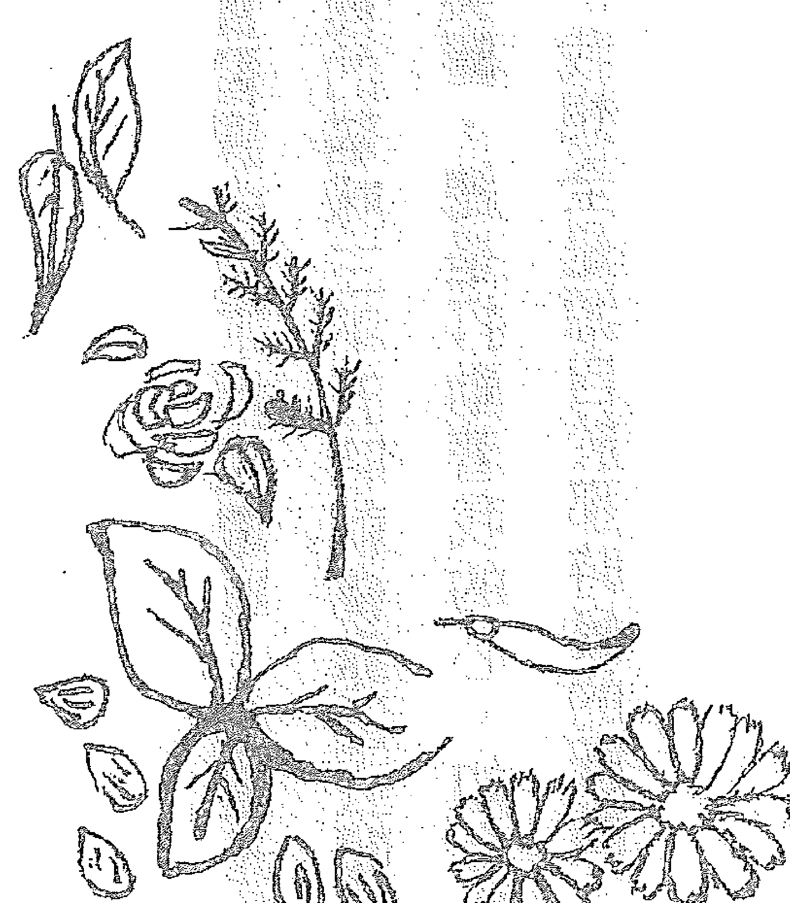

## 結語

當初我為了取得藥草證照而上藥草課程時，在實習課中做了押花燈罩，在燈光的加熱下，燈罩會散發出來淡淡的藥草香，那時候家裡的貓咪三不五時就會靠近去聞一聞。「藥草與貓」總是環繞在我的身旁，它們何其美麗，總是打動著我的心。如今能像這樣，珍惜大自然的賜與，用心過每一天的生活，我想全都是源自於那時候的感動。

美麗無處不在，我們很容易受耀眼的事物吸引目光，對於身邊事物卻漫不經心。不過路邊的雜草，有時卻是救命藥草，蘊藏著神奇的力量。只要改變觀點，命運就會出現巨大的變化，本書介紹了許多微妙提示，都能成為大家的啟發。藥草植物、太陽及月亮的光線、環繞在我們身邊的大自然，充滿美妙的神蹟，若能讓更多人感受到這些，我將備感榮幸。

本書出版之際，受到了許多的協助。我要向BABJAPAN的各位工作人員，以及當中強烈鼓勵茫然失措的我，並提供建議的木村先生，致上誠摯的謝意。
也要深深感謝我家的貓咪，當我埋首於創作之際，每每很晚放飯，害牠挨餓了。
最後要由衷感謝，購買這本書的各位讀者。

2017年6月9日
瀧口律子

## 作者・瀧口律子

藥草專家。藥草女巫養成班負責人。
持續推廣透過藥草尊重大自然與生物，珍惜生活中每一天的活動。另外還參與藥草調製商品開發工作，並且在藥日本堂漢方學校、埼玉市PLAZA NORTH「藥草入門」教室，擔任講師的工作。現任NPO Japan Herb Society認證高級講師。藥日本堂漢方顧問。sofa Vege Meister。
<幸草哲學> http://kousoutetsugaku.net/

TSUKITOTAIYOU, HOSHINORHYTHMDEKURASU (YAKSOU MAJYONO RECIPIE 365 DAYS)
by RITSUKO TAKIGUCHI
Copyright © RITSUKO TAKIGUCHI
Originally published in Japan by BAB JAPAN CO., LTD.,
Chinese (in traditional character only) translation rights arranged with
BAB JAPAN CO., LTD., through CREEK & RIVER Co., Ltd.

## 藥草女巫的365日

-   1. 出版／楓樹林出版事業有限公司
-   2. 地址／新北市板橋區信義路163巷3號10樓
-   3. 郵政劃撥／19907596 楓書坊文化出版社
-   4. 網址／www.maplebook.com.tw
-   5. 電話／02-2957-6096
-   6. 傳真／02-2957-6435
-   7. 作者／瀧口律子
-   8. 翻譯／蔡麗蓉
-   9. 企劃編輯／陳依萱
-   10. 校對／黃薇霓
-   11. 港澳經銷／泛華發行代理有限公司
-   12. 定價／380元
-   13. 初版日期／2021年4月

## 國家圖書館出版品預行編目資料

| 項目 | 內容 |
|---|---|
| 書名/作者 | 藥草女巫的365日 / 瀧口律子作；蔡麗蓉翻譯.--初版.--新北市:楓樹林出版事業有限公司, 2021.04 面；公分 |
| ISBN | ISBN 978-986-5572-14-3 (平裝) |
| 主題 | 1. 藥用植物 2. 中草藥 |
| 分類號 | 414.3 |
| 館藏號 | 110001375 |