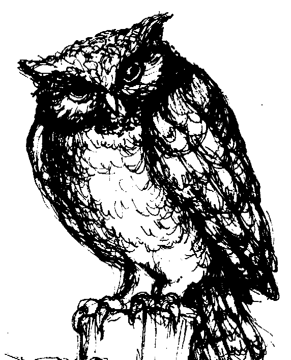
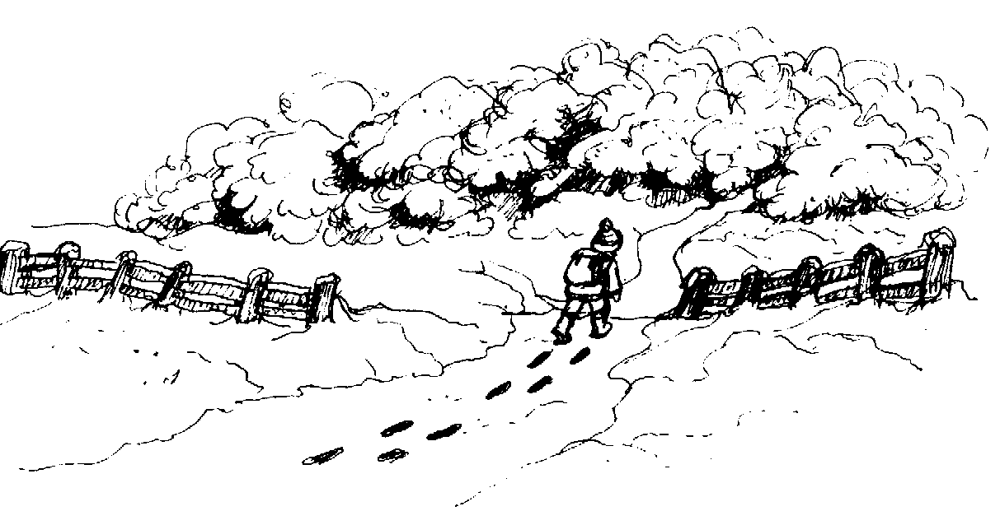
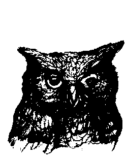

# 莎拉的白魔法

## 吸引力法則」全球導師希克斯夫婦暢銷經典《祕密》的思想源頭！《Body Mind Spirit Magazine》生活必讀選書

## SARA, Book 1

## Sara Learns the Secret about the Law of Attraction

吸引力法則的不二法門,有一顆正向的心才會心想事成

## 伊絲特・希克斯、傑瑞・希克斯

## Esther and Jerry Hicks [著]

## 邱俊銘 [譯]

一直說著自己「不想要」的事物，自然無法得到「真正」想要的事物；當你開始談論自己「真正想要」的事物，更重要的是——當你能夠去「感覺」自己想要的事物時，它將立刻現身！

## 【探索生命書系】總序

二〇一二年前，眾聲喧嘩，末日預言不絕於耳。 
一方面，我本著對「賽斯資料」的信任，也祈求他獨排眾議的說法得以證實。簡言之，他聲稱二十一世紀上旬，世界雖然仍有戰事與天災，卻無第三次世界大戰。並且，到二〇七五年時，人類將有一個大同世界！另一方面，即使成為「一百隻猴子的寓言」中的一員，我也想默默地為世界的未來盡一份力，為達成「一體平等」的靈性覺悟而努力。 
我不敢聲稱自己已開悟，而且我最喜愛的「賽斯」也從沒提過這個詞兒。不過，在求道的過程裡，我無意中悟出「除了神沒有別人。除了愛沒有別的。「There is Nothing but Love」。當下，在無邊的寂靜安寧中，我的心充滿了狂喜與愛，這份愛又滿溢為感恩之情！我體會到我一直在宇宙的愛中，宇宙的愛也一直在我的心中。而，世人也莫不如此！不同的是，有沒有體會到，有沒有連上線。在一體平等的感悟中，我謙遜地臣服，自然放心又自在。不由得散播出愛——平等的頻率！

——中華新時代協會創辦人 王季慶

SARA

獲取更多好書，請加微信号：strcdts 店铺：http://strc.cr.cx

## 【探索生命書系】總序

於是，完成了告別之作《與神同心｜依愛隨行》，我便退休下來。想讀的都讀了，想分享予讀者的也都真誠地寫了下來。此生足矣！

在《與神同心》的後記裡曾提及我的天命──推介與翻譯新時代的好書──已經完成了。沒想到二○一五年四月，素未謀面的蔣聖光先生，帶著家人約我在中華新時代協會見面。歷經海外創業的艱辛，如今他已是卓然有成的企業家。他開門見山地說，自己讀遍了我推介的新時代書籍，也邀同家人一起鑽研。哇！這讓我立即視為知音，因為，連我都沒主動要求家人研讀呢。

作為一位成功的企業家，可以想見，蔣先生必然是位有主見，有魄力，並且格外有執行力的人。他說，運用從新時代書裡得到的智慧，他成就了他的事業。如今，他想（並且已著手進行）設立出版社。一方面找回一些已絕版的新時代書籍，一方面當然也將眼光放遠，胸襟放大，繼續以自由開放的精神，開創「探索生命書系」，向生命致敬，完全不計盈虧。

由美返台近四十年了。從一九八九年開始，我正式投入新時代運動。當時，曾將我心

## 中陶煉出來的「新時代運動」七要素，作為選書立說的準繩；並有助於分辨何謂「新時代」
這個新「範型」(paradigm) 與二十世紀中期前的舊範型有何不同。

## 這七個要素就是：

一、我們皆為神的一部份：有神論，但此神並非有組織宗教高高在上的「偶像」，而是無形無相，一切的根源。祂乃是宇宙意識，我們的「源場」，而我們皆為其分出的一小片。祂透過我們每一個來體驗物質世界，完成整個拼圖。

二、你創造你的實相：你有多生多世的生命，並且是個多次元的存在。因此，不怨天不尤人，為自己的一切負起責任。從而省視自己為何作出如此的選擇，要學習的是什麼。

三、肯定人生的意义：不悲觀，不耽溺。最重要的是培養清明的覺知和一體的慈悲。

四、道德的內在性：不盲目跟從傳統，不媚俗。返歸自性，找到內心那一念靈明，依之做人處事。

五、身心健康是種自然狀態：心理有問題，鬱悶不快樂，自憐或自恨，能量堵塞不覺知時，才會不適。

六、環境保護：這攸關全人類的存亡。我們不能再視而不見，當作是別人的事。生態

## 環保，人人有責！

獲取更多好書，請加微信号：strcdts 
店鋪：http://strc.cr.cx

## SARA

編寫，而於醒時演出的一齣齣好戲。所謂的覺醒，就是參透了鏡花水月，將注意力由外在舞台返照回來，成為中立的觀者，醒悟自己演出的意義！能如此，就是找回了自性，開始走向返鄉之路。

不知從何時開始，我自覺到我有一項特性：我不會以個人追求自心的明晰、自在與幸福為滿足，仍深深愛著人類自古以來種種文化藝術哲學上的成果，為之讚嘆不已！同時，也深深牽掛著人類未來的展望與福祉。當然，也關注著現世的兄弟姊妹，世間的種種困惑和苦難。記掛著、記掛著……不會忘也不想忘，作不了佛家所謂的自了漢。但由於相信自由平等，也從不願將自己的喜好和淺見強加於人，只能以出書的方式，給大家一個提醒和自由選擇的機會。

安然度過了二〇一二年，不過，世局天象，時時風雲詭譎！我有幸活著一天，就要為世界人類的平安幸福努力一天！所以，蔣先生要我寫篇總序，替「探索生命書系」揭開序幕時，我便答應了下來。但願，我過去的努力，促使世界進入新時代，現在則有助於世界邁向黃金時代。

且讓我們共同為未來的大同世界，盡其所能地提供貢獻吧！

本書獻給想要得到了悟與幸福的讀者們，是你们提出了這本書所回答的問題……

也獻給我們那四個令人喜悅的孫子們，他們是這本書教導內容的典範……他們還沒有提出問題，因為他們尚未忘卻。

## 致謝

在推廣新思潮方面享有盛名的《身心靈雜誌》（Body Mind Spirit Magazine）最近通知我們，稱本書已獲得他們的去年傑出印刷書籍的特優獎，與其他四十五本書並列為他們『生活必讀』（Books to Live By）的選書。

而讓伊絲特跟我感到最是欣慰的，是聽到好友露易絲．賀（Louise L. Hay）的出版社 Hay House，為另一位好友艾倫．柯恩（Alan Cohen）著作出版的《生命的深呼吸》（A Deep Breath of Life）一書也獲得同樣的肯定。

親愛的希克斯夫婦：很榮幸能通知您，本書是一九九六年度傑出印刷書籍之一，已獲頒一九九七年身心靈特優獎。

這是從數百本關於靈性、自然療法、人際關係與創意等種種方面的書籍當中選出來的……每一本書都對人們的自我了解與自我轉變帶來有價值的貢

——傑瑞．希克斯 Jerry Hicks

## 致謝

獻……所以我們為這些傑出書籍的作者們獻上嘉許……

對於本書受到認可，伊絲特跟我覺得相當感恩與備受祝福。

## 序言

「與其增長見識，人們寧願享受娛樂。」這句話是報業巨頭威廉·藍道夫·赫茲（William Randolph Hearst）個人觀察的結果，我也很認同。真是如此的話，那麼以娛樂享受的形式來增長見識似乎是最有效率的資訊傳達方式，即便那是關於崇高個人價值的資訊。

本書將為您帶來娛樂與見識，因為有您的「吸引力」，這本書才能藉由內人伊絲特的宇宙思想傳譯過程與她的文字處理能力而傳到您眼前。藉著莎拉的那位身披羽毛的有趣導師逐步教導的無瑕智慧與無條件的愛，它們形成了一股思潮，促使莎拉與家人、同儕、鄰居、老師們之間有不同以往的互動經驗，當所知與經驗相互交融，莎拉和您也將一同提升，並對於自有的幸福安康 1 狀態有嶄新認知，體會到一切真的都很好。

當您決定要開始研讀本書的時候，請留意自己的現況和處於這個現況的理由；在完成第一遍的閱讀之後，請留意自己在那些您認為較重要的人生領域裡已經進展到多快、多遠的程度。

傑瑞·希克斯

SARA

獲取更多好書，請加微信号: strcdts 店铺: http://strc.cr.cx

## 序言

敬請期待，透過您從這本簡短、易懂、發人省思的小說中得到的清晰視野，您將經歷到嶄新的喜樂圓滿！

譯註 1：幸福安康、幸福圓滿（wellbeing）：是指個體與生俱來、完整具足的存在狀態，像是幸福、安適、健康、完整、滿足……等等。

## 關於作者：伊絲特·希克斯和傑瑞·希克斯 (Esther and Jerry Hicks)

傑瑞生長於困苦的家庭中，曾經當過馬戲團演員、拳擊手、歌手、廣播節目主持人、喜劇演員、企業主……等等，套句他說過的話：「我小時候做過的所有夢想都實現了。」

他在認識妻子伊絲特時，已經是個百萬企業家。

至於伊絲特則生長於落磯山脈下的小鎮，曾擔任過公車司機、電腦組裝作業員、專案經理人……等等，個性樂天知命。

這對夫妻是亞伯拉罕靈修團體的領導創始人，從一九八六年開始將他們的經驗分享給無數大眾，他們所倡導的觀念，正是全球暢銷書《祕密》及許多相關書籍的主要靈感來源。

自一九八九年以來，伊絲特和傑瑞以美國德州聖安東尼奧為基地，每年造訪大約五十座城市（遍及澳洲、加拿大、英國、愛爾蘭和美國），舉辦一系列互動的吸引力法則工作坊。

其網址是 www.abraham-hicks.com。

希克斯夫婦已經出版了八百多種亞伯拉罕系列的書籍、卡帶、影音光碟（已翻譯成三十多種語言），主題便是介紹宇宙吸引力法則的概念。他們出版的作品本本登上暢銷排行榜，並在美國知名主持人歐普拉的加持下，狂賣超過一百五十萬冊。二〇〇六年出版

的《這才是吸引力法則》（The Law of Attraction），上市一週登上《紐約時報》暢銷書排行榜。

著作中文譯本包括：《情緒的驚人力量》（The Astonishing Power of Emotions）、《有求必應：22個吸引力法則》（Ask and it is Given）、《這才是吸引力法則》（The Law of Attraction）。

## 譯者序

公司派給我一項完全陌生的業務，就是跟廠商議價。這真是嘗試新事物的機會──外加大量不知所措跟一堆自我懷疑。

雖然公司裡有經驗的上級提點我們幾個要訣與建議，但是對四十幾年來都沒什麼議價經驗、甚至連去菜市場都不會殺價的敝人來說，這件事就像要去一個陌生的國度出差，不會講當地語言、也不曉得當地習俗那樣的戒慎恐懼。眼看著議價日定於下週，我仍然有著不確定到接近恐慌的感覺。

這種感覺開始頻繁出現在執行其他業務的時候，若照吸引力法則來看，這樣下去也只會吸引來同樣的經驗而已。所以我就開始想像，想像購買公司商品的客人感到滿意與快樂的神情、想像我們的協力廠商與合作對象感到喜悅與豐盛的場景，還有想像公司與所有員工都有充分的利益與成就感的模樣。

當我開始專注這樣的心像時，恐懼與不確定感逐漸散去，取而代之的是淡淡的喜悅與

邱俊銘

## 譯者序

樂觀。雖然負面情緒會有趁隙溜回的時候，但是只要我暫停手邊的工作、專注在新的心像，它就會逐漸消散，換成平靜的快樂與積極，就這樣反覆執行，直到議價的前兩天，發生了神奇的體驗。那兩天在處理個人工作事務時，除了覺得輕鬆無比之外，我開始不會擔心議價那天到底要做什麼，而是沉著安排與會人員與交通方式，指定每個人要做的事情。我知道事情開始不一樣，吸引力法則正在施展它的威力。

議價當天在集合地點等著大家時，我的心情居然是一直保持在淡定與確信——無論今天的會議結果如何，只會更好。而那天的結果的確如此：我們想做的商品在跟廠商討論的過程中，有更好的可能性，而廠商除了可以因為潛在增加的服務收取費用之外，也提出可以減低成本、降低損耗的建議，並指出本質互有衝突的項目供我們參考應對。雖然當天因為變更情形巨大而無法議價，但我們得到的是更好的事物，亦即更好的商品、更好的服務、更好的成本花費以及更好的合作關係。

我總算見識到正面心像與吸引力法則的威力。感謝出版社有這個機會讓敝人分享這次經驗，衷心期盼讀者們也能善用正面心像，並允許吸引力法則為自己創造出無限的可能性。

## 關於譯者：邱俊銘

現職為身心靈訊息譯者。譯作為《莎拉的白魔法》，還有生命潛能出版社的《克里昂靈性寓言故事》、《克里昂訊息：DNA靈性十二揭密》、《預知生命大蛻變》、《創世基質》、《白鷹醫藥祕輪卡》、《指導靈訊息卡》與《邀請你的指導靈》，以及台灣系統排列機構《成功的序位》等書。

## SARA

## 第一部
心想事成的魔法

獲取更多好書，請加微信号：strcdts
店鋪：http://strc.cr.cx

## 第一章：好討厭的感覺

縮在溫暖被窩裡的莎拉皺著眉頭，對於睡醒感到沮喪。天還沒亮，但她知道該起床了。

討厭，冬季的白天好短，莎拉心想，真希望可以在被窩裡待到夏天。

莎拉知道剛才作了個相當美妙的夢，雖然現在已經忘記夢見什麼。

我不想起床啦，莎拉一邊這樣想著，一邊調適從美夢掉到不怎麼美妙的寒冷冬晨的心情。她先蜷縮在溫暖的床上，聆聽媽媽是否已經起床，再把毛毯蓋在頭上，試著回想刚才的美夢片段，因為她還想要更多那樣的美妙。

可惡，真的要上廁所了。也許只要靜下來、放輕鬆，就不會想上吧？

莎拉改換姿勢，想要拖延避不掉的本能反應。沒效。好吧，起來吧，不過又是一天嘛，沒什麼大不了的。

## 第一章

莎拉踮脚穿过走廊，谨慎避开会发出怪声音的地板，并安静地关上厕所的门。她决定马上下水待会再冲，享受多一点真正清醒独处的时光，再平静五分钟就好。

「莎拉？醒了吧？下来帮我！」

「还是冲水吧，」莎拉悄声说着，之后向妈妈大喊：「好，我马上来！」

她一直想不透妈妈怎么好像总是知道家里每个人的活动。她一定在每个房间都放了窃听器，莎拉刻薄地想着。她知道那不是真的，但那汹涌而来的负面思考看似停不下来。

我睡前就不要喝任何东西，最好是中午以后就不喝了，那么睡醒时就可以一直躺在床上一个人想事情，没人知道我已经醒了。

我不知道人们从什么时候开始不再享受自己的思考？我知道这情形一直在发生，因为除了我之外的人都没有安静的时候。他们无法一直倾听自己的想法，因为他们一直在说话或看电视；当他们坐进车里，第一件事就是打开收音机。这样看来，没人想独处，反倒一直想跟别人在一起，像去聚会、看电影、跳舞或打球。我则想拿静音毯盖住所有事物，使自己能单独思考片刻。我很怀疑醒着的时候不被别人的噪音轰炸是

### 第二章：想要当隐士的学生

「莎拉，妳有什么要说的吗？」  
莎拉惊跳起来，才回神注意到乔金森老师在叫她的名字。  

「是的，老师。我的意思是：老师，要说哪个？」莎拉说得结结巴巴，教室里其他二十七个同学都在偷笑。

莎拉一直不懂为何他们看到别人的窘况会如此高兴，而且绝不错过、笑声大到刺耳，好像刚刚发生的是真正好笑的事情。看见别人发窘到底有什么好笑的？莎拉就是想不出答案，然而此刻也不适合再三思索，因为乔金森老师仍然把她放在同学们见猎心喜的目光焦点中，感觉很不舒服。

「妳能回答这个问题吗？莎拉？」  

莎拉没有抬头，因为她知道答不答应都阻止不了乔金森老师。

「小姐，我建议妳花多一点时间来思索在这教室里所讨论的重要事物，浪费在看向窗外、沉溺在无用思绪的时间则减少一点。至少把一些东西装进妳的空脑袋。」耳边又是一阵笑声。

这节课还没结束吗？  

接着下课钟声响了，终于响了。

莎拉慢慢走在回家的路上，看着自己的红靴不时陷进白雪里。下雪真好、寂静真好，在徒步回家的两哩路程中能有有机会缩进自己私密的心智世界，真好。

她注意到商业街桥梁底下的河面几乎被冰覆盖，想说滑下去到河床旁查看冰有多厚，但牠决定改天再做。看见在冰下流动的河水，她微笑着思索这条河一年到底有多少不同的风貌。这座桥，以及它所横跨的这条河，是她徒步回家时最喜欢的路段。那里总会发生有趣的事情。

过了桥，从学校离开后一直垂头看向地面的莎拉总算抬起头来，难过的感觉蛮满全身，因为知道自己的寂静独行再过两条街就结束了。她放慢脚步，回味那重新找回来的平安，之后一边回头倒退着走几步、一边凝望那座桥。

「喔，好吧。」她轻轻叹着，走过了通往她家的碎石车道，停在台阶上，用靴子把上面结的大冰块撬松，把它踢落到旁边的雪堆，然后脱下湿靴、走进家里。

莎拉悄声关门，尽量压低声响地将沾湿的沉重外套挂在衣钩上。她不像其他家人那样在回家时通常会大声嚷着「我回来了！」。

我比较喜欢当隐士，她一边这样想着，一边从客厅走进厨房。就是当个安静、快乐的隐士，可以一直想事情、爱讲不讲都随意、每天都可以选择要怎么过。就是这样！

## 第三章：讨人喜欢的爱琳学姊

当她仰摔在学校个人置物柜前布满泥痕的地板时，唯一感受到的就是手肘疼痛，真的好痛。

跌倒一直都算是一种惊吓，它发生得太快。前一秒还在挺身疾行，坚决要在上课钟响前坐进自己的座位，而下一秒就四脚朝天、动弹不得，同时带着震惊与疼痛。况且世上最糟糕的事情就是在学校跌倒，因为大家都看得到。

莎拉抬头看着那片看热闹的众人脸庞，有笑到看见牙齿的、有偷笑的，也有放肆大笑的。他们表现得好像这种事情从 来不会发生在自己身上。

当他们发现没有发生像是骨折、流血或是受害者呻吟喊痛之类的刺激事件，人群就解散了，而她那些残忍的同学回头走进教室，继续做自己的事情。

有只穿着蓝毛衣的手臂在眼前出现，朝下握起她的手，把她拉起来坐着。耳边则是听到某位女孩的声音：「妳还好吗？想要站起来吗？」

不好，莎拉心想，我想要消失不见，不过这不太可能，况且人群已经散得差不多，她勉强微笑，爱琳就帮助她站起来。

莎拉从没跟爱琳讲过话，但有在走廊看见过她。爱琳大她两个年级，而且才来这个学校一年而已。

莎拉真的不太认识爱琳，这也难怪，因为年长的孩童绝对不会跟年幼的孩子互动，像是某种不成文的禁忌那样。然而爱琳常常露出微笑，即使好像朋友没有很多、行走时几乎是独自一人，她看起来还是十分快乐。这也许就是莎拉注意到她的理由，因为她自己也是个独行侠，而且也喜欢这样。

「天气潮湿的时候，地板就变得很好滑。」爱琳说：「我很讶异居然没有太多人在這裡滑倒。」

呆站着的莎拉还有些恍惚、也有点窘，她没仔细听过琳所說的话，然而琳的表达里面有种特质让她觉得好过许多。

### 第四章：爱担心的人们

莎拉站在商店街桥上往下瞧，估量河面冰层是否厚到可以走过去。她注意到有几只小鸟站在冰面，还有几只稍大的狗儿正在冰上嗅寻雪里的东西，但她认为冰层还不能承载她的全部重量，因为身上还有厚重的外套、靴子以及沉重的书包。最好再等一下，莎拉边想着，边探看冰封的河流。

尽量朝桥外探看底下冰层的莎拉是靠在某段生锈的栅栏上，她认为那是专门供她个人享受的地方。由于许久都没有这么好的感觉，所以她决定再多停留一下，欣赏那美妙的河流。她把书包丢在脚边，整个人趴上那生锈的金属栅栏，那是莎拉在这世上最喜欢的地方。

靠着栅栏休息与欣赏景色的莎拉，微笑地想起这段老舊的金属栅栏是如何变成可供依靠的完美凹窝，那一天杰克森先生驾驶载运干草的卡车，为了闪躲彼得森太太的腊肠狗哈维，在冰滑路面用力踩住刹车。事发之后，镇上人们都不停在讲卡车没掉下桥、他真是命大，而且连讲了好几个月。莎拉讶异人们为何一直要把实情夸张化、悲惨化：如果杰克森先生的卡车掉进河裡，情况就完全不同，那些小题大作是应当的；或者杰克森先生掉进河裡淹死，那么人们就有更多正当理由来讨论——但是他没掉进河裡啊。

莎拉尽可能地回想，那事件没有造成任何损伤：卡车没坏、杰克森先生没事，哈维则是吓得几天不敢出门，但是牠也没受伤。人们就是想要担心，莎拉事後得出这样的结论，而且对于发现那里形成可供依靠的凹窝感到非常高興，粗厚的钢柱往外弯向河面，完美到看起来像是专为取悦莎拉而做的设计。

趴在河面的莎拉望著下游，看到那横跨河道的巨大树幹，让她微笑地想起，那也是另一个恰到好处的「意外」。

那时河岸有棵大树被风暴摧残很严重，所以那里的农夫请镇上一些义工帮忙去除树上所有枝桠，准备把它锯倒。莎拉不知道为何要如此大费周章，不过是一棵高大的老树而已。

爸爸是不会允许她接近到可以完全听懂他们言谈的距离，然而莎拉还是听到某人在说担心它太靠近电线。而电锯声不久又响了起来，使得莎拉听不到其他的聲音，镇上人们大多没有过来，所以她就远远地观看这场大秀。

突然间，电锯声没了，莎拉听到有人喊：「喔！不要！」她记得当时自己赶紧掩住耳朵、闭紧双眼，而树倒的时候，整个镇好像也在晃动。然而当她睁开眼睛、看到它变成连接两岸小径的完美圆木桥时，莎拉高兴地尖叫出来。

莎拉舒服地待在悬于河上的金属凹窝里，她深深地呼吸着，想要吸进那美好的河流气味。那股芬芳、那持续而规律的河水声响，在在让人放松到想睡。我好爱这条老河，莎拉一边想着，一边仍旧望向下游那条横跨河流的大木桥。

莎拉喜欢在走过木桥时伸出双手保持平衡，看自己能用多快的速度走过去。莎拉从來都沒害怕过，但她总是牢记只要稍微一滑，就有可能整个人滚下河去。而且她每次走过木桥时，脑海都会想起母亲那戒慎恐惧的话语：「莎拉，离河远一点！你会淹死的！」

然而她不在意这些字词，总之不再如此，因为莎拉知道，母亲并不晓得她不会溺水。

莎拉放松地处在这个小世界里，躺进自己的窝、想起两年前的夏天在木桥那里发生的事情。当时已是傍晚，做完日常事务、趴在金属窝好一会儿的莎拉往下走到河边，沿着小径来到木桥那里。那条河因为融雪的流冰而河面涨得更宽、水位变得比平常高，河水不断

### 第五章：赛克林道的大鸟

「莎拉，等等！」莎拉停在十字路口中央，看着她弟弟加紧跑过来。

「妳一定要来 看，莎拉，那真的很棒！」

最好是啦，莎拉心想，想起杰生最近几次让她惊吓的「很棒」事物。有一次是他用自制陷阱抓到、保证「上次看的时候还是活着」的沟鼠；还有两次骗不知情的莎拉去探看他的书包，却看到一些无辜的小鸟或老鼠，是杰生跟他那些邋遢的小朋友为了想玩圣诞节得到的空气枪而打下来的。

男生到底在想什么？莎拉边想边等着，而跑累的杰生看到莎拉真的在等他，就放慢脚步走了过来。他们怎能拿那些无力抵抗、又小又可怜的动物取乐呢？最好让他们掉进陷阱，看他们还会不会喜欢那样，莎拉继续想着，我记得杰生以前的恶作剧没那么残忍，甚至更有趣，但现在看似越来越残忍了。

莎拉站在安静的乡村小路中央等她弟弟过来，并忍住笑意地想起杰生曾玩过的精明把戏，就是他把橡胶制的闪亮呕吐物玩具放在书桌上，趴着用头遮住，直到强森老师站在他旁边时才抬头用那双棕色大眼向上张望，让那个恶心的东西露出来。老师立刻衝出教室，要去找清洁工来清理秽物，然而当老师回来时，杰生就说他已经清理好了，让放下心来的强森老师毫不迟疑地要杰生提早回家休息。

莎拉对于强森老师竟然那么容易被骗感到惊讶，完全不去质疑那堆看似刚吐出来、还会流动的秽物，居然能在有明显斜度的书桌上围成漂亮的一小圈。不过话说回来，强森老师与杰生相处的经验没莎拉多，而她也承认以前比较天真的时候被他愚弄过不只一次，但是现在不会了，莎拉在面对她弟弟时已经做好心理准备。

「莎拉！」杰生边喘边兴奋地喊着。

莎拉退了一步：「杰生，别喊啦！我们之间只有两呎远呢。」

「抱歉。」杰生暂停一下，好调整呼吸。「妳应该要来看！所罗门回来了！」

「所罗门是谁？」莎拉一边问，一边后悔自己怎么马上就说出来了，因为不想对杰生的说词表示出任何兴趣。

「所罗门啊！妳知道的，所・罗・门，就是栖息在赛克林道的大鸟啊！」

「我从来没听说过赛克林道有只大鸟，」莎拉回应，并发出近似无聊的声音表示自己并不在意。「杰生，我对你说的笨鸟完全没兴趣。」

「那只鸟并不笨，莎拉，牠好大喔！妳应该要来看，比利说牠比他爸的车还要大。莎拉，妳一定要来，拜托。」

「杰生，鸟不会比车还大。」

「会啦，牠会啦！妳可以去问比利的爸爸！他那天正开车回家，看到一道盖过整台车的阴影，大到以为是越过的头上的飞机。但那不是飞机，莎拉，那是所罗门。」

莎拉得承认杰生对所罗门的热切让她有点心动。

「我另外找时间去，杰生，我得要回家。」

「噢，莎拉，拜托妳来啦！所罗门不见得会再回到这里，妳一定要去，莎拉，一定要！」

杰生的坚持让莎拉开始担心，他通常不会这么强势，在感觉到莎拉很确定自己的意思后，她才慢慢向他走去。

## 第五章

時就會放棄、姿態放低，等待下次她更鬆懈的時候再出擊。過去已有許多經驗的他應當早就學到，自己越去催促姊姊做她不喜歡的事情，她越不可能去做。然而這次不太一樣，莎拉從沒看過傑生表現出這樣的強迫態勢，所以莎拉就同意了，使傑生非常驚訝及高興。

「喔，好吧，傑生。那隻大鳥在哪裡？」

「牠叫做所羅門啦。」

「你怎麼知道牠的名字？」

「那是比利的父親取的名字。他說那是貓頭鷹，而貓頭鷹很有智慧，所以牠的名字應該是所羅門。」

莎拉加緊腳步想要趕上傑生。他真的對這隻鳥感到興奮，莎拉想著，這很奇怪。

「牠在這裡的某個地方，」傑生說：「牠住在這裡。」

當莎拉知道傑生其實並不清楚自己所說的事物時，她常常覺得那裝出來的自信相當有趣。然而，她也常常配合演出，假裝自己不知道，這樣事情會比較簡單。

他們探看枝葉稀疏的覆雪樹叢，沿著已經腐朽不堪的圍籬，走上剛在前面跑著的狗兒所踩踏出來的雪地小徑。

莎拉從來沒在冬季走過這條路，它並不在她平常往返學校與家中時常走的路徑附近，但她曾在這裡度過無數幸福的夏日時光。莎拉邊走邊留意那些熟悉隱密角落與石縫，覺得能夠回來探看這條老路真是不錯。這條小路最棒的地方，莎拉心想，在於它讓我有獨享這一切的感覺。沒有車子、沒有鄰居，真是條安靜的路，應該要多來走走。

「所羅門！」傑生用力喊了出來，使莎拉嚇了一跳，她沒料到他會用喊的。

「傑生，別這樣喊所羅門。如果牠在這裡，你繼續那樣喊會讓牠飛走。」

「牠在這裡，莎拉。我跟你說，牠住在這裡，而且牠不會離開，我們一定看得到牠。」

牠真的很大，莎拉，真的！

莎拉與傑生又往樹叢深處走去，彎身避過圍欄腐朽所剩下的鏽蝕鐵線，小心翼翼地邊走邊探看前面的路，因為他們不確定厚度及膝的雪堆裡會藏有什麼東西。

「傑生，我覺得越來越冷了。」

「再一下下，莎拉，好嗎？」

與其說是應付傑生的催促，不如說是為了滿足她的好奇心，她同意說：「好吧，傑生，再五分鐘。」莎拉隨即就大聲尖叫，因為她踏進被雪遮住的灌溉水溝，最後只有上半身還

## 第六章：所羅門

莎拉已經忘了，自己能輕易專注在課堂大小事，那是多久以前的事。從很早前她就確定，學校真的是地球上最無聊的地方，然而這一天也毫不例外，是莎拉經驗過最難熬的一天，她沒法專注在老師的講課，心思一直飄到樹叢那裡。而當放學鐘聲響起，莎拉把書包塞進個人置物櫃，然後就直接往那裡走去。

「我大概瘋了，」莎拉一邊悄聲對自己說著，一邊走進樹叢更深的地方，在厚厚的雪上留下自己的足跡。「居然要找一隻也許並不存在的笨鳥。好吧，如果沒有馬上找到牠，我就會離開這裡，不讓傑生知道我在這裡或是居然對那隻鳥有興趣。」

莎拉停下腳步傾聽，那裡寂靜到可以聽見自己的呼吸聲。她看不到任何一隻動物，沒有鳥也沒有松鼠，什麼都沒有。事實上她想過，要不是那裡還有昨天自己、傑生與那隻孤

## 第七章：認貓頭鷹當老師

第二天早上，莎拉跟往常一樣鑽回毯子底下，拒絕一天的開始，然後她想起所羅門。

所羅門，莎拉心想，我是真的看到你，還是夢見你啊？

但在更清醒了些之後，莎拉記起自己在放學後有去樹叢那裡找過所羅门，還有腳下冰層會動的事。不，所羅門，你並不是夢。傑生是對的，你是真實存在的。

當莎拉想到傑生與比利會一邊大聲喊叫、一邊穿過樹叢尋找所羅門時，她畏縮起來，之後那種每次想到自己的生活被傑生打亂時就會出現的沉重、慌張感受傳遍全身。我不會把自己看到所羅門的事告訴傑生或任何人，這是祕密。

莎拉一整天都在努力把注意力拉回到老師身上，因為她的心思一直飄向那閃亮的樹叢以及奇幻的巨鳥。當時所羅門有跟我講話嗎？莎拉思索著，或者只是我的想像？也許吧，當時滑倒時感覺頭昏眼花，或許我是昏過去而夢到的。還是說，這一切有發生過嗎？

莎拉等不及地想再次去到樹叢那裡，確定所羅門是否真的存在。

當放學的鐘聲響起，莎拉先停在置物櫃前，把書本放進去，再把書包塞到書堆上面。

這天應當算是莎拉居然沒把所有書本拖回家的第二天，因為往日的她發現手中若抱滿書本，似乎可以保護她不被任何亂入的同學們侵擾。不知為何，那些書本就像屏障那樣，能讓好動愛玩的同學遠離她所要走的路。但是今天莎拉不想被任何事物拖延，她像子彈般地趕忙衝出校門，直直往賽克林道前進。

正當莎拉離開鋪平的街道、開始走往林道時，她看見一隻非常巨大的貓頭鷹毫無遮掩地站在露天的圍欄柱子上，簡直像在等她一樣。莎拉訝於居然這麼容易就找到所羅門，她之前花了那麼多時間來找尋這隻虛幻又神秘的鳥兒，然而此刻牠就站在這裡，好似一直以來都是等在這裡那樣。

莎拉完全不知道要如何接近所羅門。我應該要怎麼做？莎拉想著，真怪，難道就是走到貓頭鷹那裡並說：「哈囉，你今天好嗎？」

哈囉，妳今天好嗎？大貓頭鷹向莎拉說話了。

莎拉驚訝地向後跳了一只，所羅門則是開懷大笑，我沒有要嚇妳的意思，莎拉，妳今天好嗎？

「我很好，謝謝你。我只是還沒習慣跟貓頭鷹說話而已。」

「我有好幾個要好的朋友都是貓頭鷹呢。」

「所羅門，嗯！」貓頭鷹說：「所羅門是個好名字。好，我認為我會喜歡。」

「所羅門，嗯！」貓頭鷹說：「所羅門是個好名字。好，我認為我會喜歡。」

覺得不好意思的莎拉頓時臉紅，她已經忘記他們尚未好好地彼此介紹。雖然用所羅門來稱呼這隻貓頭鷹是傑生告訴莎拉的，然而那是比利的父親取的名字。

「噢，真是抱歉，莎拉說：『我應該先請教你的名字。』」

話說，我從未真的想過這種事，貓頭鷹說，不過所羅門是個好名字，我真的喜歡它。

「你說你從未真的想過這種事的意思是什麼呢？你沒有名字嗎？」

沒有，真的沒有，貓頭鷹回應著。

莎拉不敢相信自己剛聽到的話語。「你怎麼會沒有名字？」

## 第八章：用意念溝通

「所羅門，你是老師嗎？」

是的，莎拉，我是。

「但是你不談論那些『真正的』──抱歉──『其他的』老師所講的東西。我的意思 是，你會講我有興趣的事物，而且講得很有內容。」

莎拉，事實上，我只談論妳講出來的事物，只有當妳提出問題時，我才能給予有價值的回應。而所有那些在沒提問之前就給出的答案，簡直是在浪費每個人的時間，無論是學生或老師都不會在過程中獲得許多樂趣。

莎拉思考所羅門剛講的話，並了解到除非自己有問，不然所羅門是不會對任何事情多加談論的。『等一下，所羅門，你曾在我沒問時有說過話，這我還記得。』

那是什麼，莎拉？

「你說過『難道妳忘了，自己是不會溺水的？』。所羅門，這是你最先跟我說的話，那時我還沒跟你說過任何話，當時躺在冰上的我並沒有提出問題。」

「啊，看來所羅門並不是這裡唯一能不用嘴來說話的存在呢。」

「你的意思是？」

「這太奇怪了，所羅門，不講話的話，要怎樣提出問題呢？」

「你那時有在提問，莎拉，但沒有透過語言來表示。問題不見得是透過語言來提問。藉由思考來發問。許多存在與生物是藉由思想來溝通的，事實上比語言更好進行溝通。人類是唯一使用語言的生物，即使如此人們在溝通時仍是使用思想遠多於語言。好好想想吧。

妳瞧瞧，莎拉，我是個睿智的老老師，在很久以前就已經知道，給予學生沒問的資訊是在浪費時間。

聽到所羅門誇張地強調睿智一詞，並用貓頭鷹般的鳥鳴聲來唸『問』這個字，莎拉笑了出來，心想，我好愛這瘋鳥。

我也愛妳，莎拉，所羅門回應著。

莎拉頓時臉紅，完全忘記所羅門可以聽見她的想法。

接著，不再多說的所羅門在莎拉眼前用力朝天飛升，最後消失無蹤。

## 第九章：飛行課

「我希望像你那樣飛，所羅門。」

為什麼呢？莎拉，為什麼妳想要飛呢？

「噢，所羅門，因為只能在地面走來走去很無聊、動作很慢，無論要去哪裡好像永遠都走不到，而且也看不到什麼，只能看見附近地面的、無趣的東西。」

嗯，莎拉，妳看來還沒真的回答我的問題。

「有啊，所羅門，我說我想飛是因為……」

我不懂呢，所羅門，你想要我說什麼呢？

「我想要飛！」莎拉一邊喊著，一邊對所羅門無法理解自己而感到不耐。

莎拉，現在告訴我妳想要飛翔的理由，那會像什麼？感覺像什麼？嘗試看看，莎拉，讓我感覺到它的真實模樣，向我描述飛翔是什麼感受？我不想要妳跟我說處在地面是什麼感覺，或「不」能飛是什麼感受。我要妳告訴我，飛翔是什麼樣子。

莎拉閉上眼睛，掌握到所羅門想表達的意思之後開始講：「飛翔感覺好自由，所羅門。它就像漂浮，但移動較快。」

告訴我，如果妳會飛的話，會看見什麼？

「我會看到整個鎮在天空底下的模樣。我會看見商店街，看到車輛正在移動、行人正在走路。我會看到那條河，會看到我的學校。」

飛翔感覺如何，莎拉？描述飛翔的感覺像是什麼。

閉眼的莎拉暫時安靜下來，假裝自己飛在鎮上高空。「那會非常有趣，所羅門！我可以像風一樣快，感覺如此自由。這感覺真棒，所羅門！」莎拉一邊繼續說，一邊完全沉醉在她所想像出來的視野。然後莎拉突然感覺到一股使她屏息的拍翅力道在內裡湧現，如同她每天看著所羅門由他的柱子起飛時、從他的翅膀所感受到的那樣。她的身體在一開始感覺好像重達萬磅，之後就突然變得完全沒有重量。莎拉在飛了。

「所羅門，」莎拉歡喜地尖叫著。「你看，我飛起來了！」

所羅門飛在她身邊，他們一起高飛到小鎮的上空，那是莎拉出生的小鎮、是莎拉走遍每一吋地的小鎮，也是現在她用從沒夢想過的俯瞰視野來探索的小鎮。

「哇喔！所羅門，這樣好棒！喔，所羅門，我喜歡這樣！」

所羅門微笑著享受莎拉熱切無比的反應。

「我們要去哪裡，所羅門？」

「你可以去任何想去的地方。」

「喔！哇喔！」莎拉不自覺地讚嘆出聲，她正低頭望著那安靜的小鎮，它從沒看起來這麼美麗過。

莎拉再次尖叫出來，往下方的運動場飛去，慢慢地經過她教室的窗戶。「棒極了！所羅門！」

妳可以去任何想去的地方，莎拉。

## 第九章

莎拉與所羅門從小鎮的這一頭飛到另一頭，先向地面飛近，然後再次飛昇上去，幾乎快要碰到雲朵。『看！所羅門，那是傑生與比利。』

『嘿！傑生，看我這邊！我在飛耶！』莎拉用力喊著，但傑生沒聽見。『嘿！傑生！』

莎拉又更大聲地喊一次，『看我這邊！我在飛耶！』

傑生聽不見妳的聲音，莎拉。

『為什麼聽不見呢？我聽得到他的聲音啊。』

這對傑生來說太早了，莎拉。他還沒有提出疑問。但是他會這樣做的，遲早的事。

現在莎拉更加清楚為何傑生與比利尚未找到所羅門。『他們也看不見你，對吧？所羅門？』

莎拉對於傑生與比利不能看到所羅門感到高興，她心想，如果他們看得到的話，一定會來干擾的。

莎拉甚至想不出曾有什麼比現在更加美妙的時刻。她飛升到天空，高到連商店街的車輛都看起來像跑來跑去的小螞蟻那樣，然後毫不費力地直衝而下、來到非常靠近地面的高

## 第九章

度，一邊尖叫一邊感受她那驚人的飛行速度。她向下飛到河面上，臉�andelier低到可以嗅到好聞的苔蘚味，穿入商店街橋底並從另一側飛出。所羅門全程跟著她的步調，完美到好似他們練習這趟飛行已有無數次。

他們看起來已經飛了幾個小時，最後藉由同樣把莎拉帶上天空的強大振翅力道，莎拉回到自己的身體、回到地面。

莎拉興奮到幾乎喘不過氣，這真的是最教人意外的生命經驗。「噢，所羅門，剛才真棒！」莎拉尖叫著，她覺得剛才已經飛了好幾個小時。

「現在幾點？」莎拉突然邊問邊看手錶，覺得今天那麼晚回家應該會有大麻煩，然而她的手錶顯示才過了幾秒鐘而已。

「所羅門，你的生活非常奇怪，你知道嗎？」

「嗯，就像我們能夠繞著整個鎮飛，但是時間並沒有過去。你不覺得奇怪嗎？還有像我可以看到你，但是傑生與比利就無法看到你或跟你說話。你不覺得奇怪嗎？」

## 第十章：被欺負的轉學生

「嘿！小嬰兒啊，晚上還會尿床嗎？」

看著他們嘲弄唐納德，莎拉感到生氣，但是又不好意思介入，所以她試著撇開視線不去注意後續發展。

「他們認為自己很聰明，」莎拉悄聲說著。 「但那是赤裸的惡意。」

她的班級裡有些幾乎總是聚在一起、「毫不長進」的男生，正在取笑幾天前才來班上報到的唐納德。他們家不久前才搬來鎮上，租下莎拉居住的那條街尾端的破舊老屋。那屋舍已經空了好幾個月，所以莎拉的母親很高興總算有人搬進去住。莎拉當時有

看到一台破爛的-old 貨車在那裡卸貨，心想那些快散掉的少許家具，該不會就是他們的全部家當吧。

剛搬到新的地方、誰都不認識的情況已經夠辛苦，再加上那些一直騷擾他的惡霸們，實在是太超過了。站在走廊上、看著林恩與湯米刻意以言語欺負唐納德，莎拉的眼裡含著淚水。她記得昨天當唐納德被要求站起來，向同學們介紹新轉來的自己時，他是握著紅色塑膠鉛筆盒起立的，整間教室哄然大笑。莎拉承認那的確是個不太酷的東西──那東西比較適合與弟弟傑生同齡的小孩，但她堅決地認為他不應為此受到這種羞辱。

莎拉了解那事件是唐納德的命運轉捩點，如果他能在第一時間以不同態度來處理，像是勇敢地站著向大家回以笑容、不介意那些低級的同學對他的看法，也許事情可以往不一樣的方向發展。然而事情不是那樣發展的。又是發窘、又是十分恐懼的唐納德垂頭喪氣地咬著嘴唇坐回自己的座位。莎拉的老師已經嚴厲譴責全班，但完全沒效，全班同學似乎並不在乎喬金森老師對他們的看法，但是唐納德一定非常介意全班同學怎麼看他。

昨天離開教室的時侯，莎拉看見他把那個鮮豔的新鉛筆盒丟進門邊的垃圾桶裡。在唐納德離開視線範圍之後，莎拉把那個使他丟盡顏面的小東西撿起來放進書包。

## 第十一章：痛苦鏈與喜悅鏈

「所羅門，為什麼人們那麼壞呢？」莎拉向所羅門問道。

莎拉，所有人都那麼壞嗎？我可沒注意到呢。

「嗯，不是所有人，是大部分會那樣，我不懂為何如此。當我對人家不好的時候，感覺很糟糕。」

妳什麼時候會對別人不好呢，莎拉？

「通常都是別人先對我不好，我想我是為了報復，才會對他們不好。」

這樣有用嗎？

「有。」莎拉的回應裡有著防禦的意味。

怎麼會呢，莎拉？向他人報復讓妳感覺比較好嗎？還是這舉動能夠改變事情，或

## 第十一章

者把惡意退回呢？

「嗯，不能，我想應該不能。」

事實上，莎拉，我看到的是這樣做只是把更多的惡意帶進這世界，就像是加入他們的痛苦鏈（the chain-of-pain）那樣。他們感到受傷難過、接著換妳感到受傷難過，之後妳又促使某人去造成傷害，然後事情就一直接續發展下去。

「但是，所羅門，」莎拉爭辯著：「當你看到不好的事情，難免會感覺不好啊？」

這是非常好的問題，莎拉，我答應以後會給妳完整的答覆。我知道要馬上理解這一切並不容易。而這一切難以理解的首要原因，是人們已被訓練要去觀察情境，但是沒有被訓練去注意自己在進行觀察時的感覺狀態──因此，那些情境看似掌控人們的生活，如果觀察到好的情境，人就有好的反應；觀察到不好的情境，人就有不好的反應。當情境看似掌控人們的生活時，對大多數的人來說是相當挫折的，而這就是使這麼多的人持續加入痛苦鏈的原因。

「那麼，我要如何遠離痛苦鏈、幫助困住的人離開呢？」

嗯，莎拉，有很多辦法可以那樣做。但是我最喜愛的方法──也是成效最迅速的方法──就是：抱持著感謝的想法。

「感謝？」

是的，莎拉，專注在某事或某人身上，並努力去找出那些可以讓妳感覺最好的想法。盡妳所能地感謝他們，這就是加入喜悅鏈的最好方式。

## 第十一章

「知道自己『不』想要的是什麼。」莎拉很有自信地說著，現在她已經能夠把它檢視出來。

那麼第二步是？

「知道自己『真正』想要什麼。」

非常好，莎拉。那麼第三步是？

「喔，所羅門，我忘記了。」莎拉哀叫著，對自己居然忘得這麼快感到失望。

第三步是找到妳真正想要事物的基礎感覺（the feeling place），持續談論妳真正想要的事物，直到妳的感覺像是已達成心願的樣子。

「所羅門，你從沒告訴我第四步是什麼。」興奮的莎拉想到這件事。

啊，第四步是最好的部分，莎拉，就是獲得自己想要事物的時候。第四步是實現妳的欲望。

好好玩，莎拉，不用花太多力氣去記。只要練習感謝就好，這就是關鍵。妳最好趕緊回去囉，莎拉。我們明天可以再談更多。

## 第十一章

感謝，莎拉反覆思索著，我會努力想出能夠感謝的事物。而腦海中浮出的第一個影像，是她的弟弟傑生。天啊，這應該很難，莎拉一邊想著，一邊開始走出所羅門的樹叢。從比較簡單的開始啦！所羅門從他的柱子飛起時這樣說著。

「啊，是喔。」莎拉笑了起來。我愛你，所羅門，她這樣想著。

我也愛你，莎拉。莎拉清楚聽見所羅門的聲音，雖然他已經飛到看不見了。

譯註2：感覺良好（Feel good）：是指感受到正面的情緒，而正面情緒的範圍其實很廣，像是快樂、幸福、振奮、寧靜、清晰、安心、自在、上進、舒服、成就、自信、穩定等等，凡是讓人能夠正向看待生命的情緒均屬此類。

## 第十二章：感恩練習

找比較容易的，莎拉心想，我要去感激比較容易感激的對象。隔壁鄰居養的狗兒在遠處玩雪，牠又跑又跳，然後在地上打滾，看來活得相當開心。

布朗尼，你真是一隻快樂的狗兒！我真的很感謝你。站在兩百碼遠的莎拉剛這樣想著，布朗尼就開始朝莎拉跑來，好像莎拉是正在呼喚牠的主人那樣。這隻邋遢的長毛大狗搖著尾巴繞著莎拉跑了整整兩圈，然後把牠的前掌搭在莎拉的肩上把她推倒、使她坐在前幾天鏟雪機留下來的雪堆裡，用牠溫暖潮濕的舌頭舔

著她的臉龐。莎拉笑到差點站不起來。「喔，你也愛我，不是嗎？布朗尼？」

當晚，躺在床上的莎拉回想這一周發生的所有事情，我覺得自己像是被綁在旋轉烤肉架上烤著。在這短短的一週裡，我經歷到有生以來最好的感覺，也經歷到有生以來最差勁的感覺。我喜歡自己跟所羅門的談話，還有，噢，我好愛學飛行喔，但是我在這一週也感覺非常生氣。這一切都很奇怪。

抱持感激的想法。莎拉堅信她在房裡聽見了所羅門的聲音。

「不，不可能的，」莎拉心想。「我只是在回憶所羅門所說的話。」然後她就翻身側躺思索著，我感謝這張溫暖的好床，這是確定的。莎拉接著邊想邊將毛毯拉到肩膀蓋好，還有枕頭，我真的非常感謝這個又軟又舒服的枕頭。莎拉邊想著，邊抱著枕頭把臉埋住，我感謝我的媽媽、我的爸爸，還有傑……傑生。

我不知道耶，莎拉心想，我不認為自己找得到那股基礎感覺。也許我只是太累了，明天再繼續吧。帶著這個最後意識到的念頭，莎拉就睡著了。

「我又飛起來了！又飛起來了！」莎拉一邊大叫、一邊直衝到自家上空。飛翔並不是描述這種感覺的最佳字詞，莎拉心想，它比較像漂浮。我可以去到任何想去的地方！

莎拉毫不費力地飛越天空，到處暫停好讓自己檢視以前從未注意的事物，有時會飛到很接近地面，然後重新拉升上來，僅是為了認出想要去的地方。往上！往上！她發現當她準備重新拉升時，只要往上看，就會往上走；當她想要往下時，只要往地面伸長腳趾，就會往下走。

## 第十二章

莎拉呆呆望著老師，他看來對自己正在進行的事情非常認真。

莎拉開始覺得這樣偷看老師有點罪惡感，至少這個是廚房窗戶，莎拉有注意到，而不是浴室、臥房或其他類似的個人隱私空間。

此刻喬金森老師微微笑著，好像他很享受正在閱讀的事物，接著他就在紙上寫東西。

莎拉瞬間了解喬金森老師在做的事情，他正看著莎拉的班級在下課前交上來的報告，仔細讀著每一張。

莎拉過去經常在他發還的報告看到寫在頁首或背面的潦草字跡，而她從不曾對此有過任何感激。我就是無法討好他，莎拉已有無數次一邊想著，一邊讀著他寫在報告上的潦草註記。

然而，在鎮上大多數的人們已經睡著的時候，看著這個人還在讀、寫、再讀、再寫，這讓莎拉有種很奇怪的感覺，幾乎快要頭暈，因為過去對於喬金森老師的負面印象與現在的嶄新印象在腦海裡相互抵觸。「哇喔！」莎拉一邊說著、一邊向上看，將她的小小身體浮到老師的住處上方。

## 第十三章：啊，馬上就搞砸了

「嗨！梅特森先生！」正從商店街橋上經過要去上學的莎拉，聽見自己大喊出來的聲音。

正在掀開的車蓋下工作的梅特森先生應聲向外看，自從幾年前在商店街與中央街的轉角開了鎮上唯一的加油站之後，他看著莎拉早晨經過這裡已有無數次，然而她從來沒有這樣跟他打招呼，他實在不知道要怎麼回應，所以在驚訝中稍微揮手致意。事實上，幾乎所有認識莎拉的人們都開始注意到原本舉止內向的她出現驚人的不同。跟過去低頭看腳沉思的樣子相比，她現在反倒對那山中小鎮有著不同以往的興趣，對周遭一切相當留意而且互動融洽。

「可以感謝的事物有好多喔！」莎拉屏息悄聲說著，鏟雪機已經把大多數的街道清乾淨，這樣真好，莎拉心想，真的很感恩呢。

她看到一輛工程車停在貝格曼商店的前面，把升降梯伸到最長，有一個人站在梯頂維修電線桿，另一個人站在底下很專心地看著。莎拉思索他們在做什麼，之後認定他們大概是在來修理其中一條電線，那條電線上面結了太多冰柱而變得太重。這真的很棒，莎拉心想，這些人能讓電力維持正常運作，真是太好了，實在很感恩呢。

當莎拉走進校園時，載滿學生的巴士從街角轉了過來，所有的車窗都蒙上霧氣，看不看到乘客的臉龐，然而她非常熟悉這個日常行程：天還沒亮，巴士駕駛就開始繞行整個郡接收不情願的「貨物」，然後將其中大約一半卸在莎拉的學校，之後再到商店街，把剩下的部分卸在莎拉以前唸的舊學校。駕驶先生做的事情真好，莎拉心想，真是感謝。

莎拉走進學校的大樓、脫下沉重的外套，她注意到裡面的暖意真是舒服，我真的很感謝這棟大樓、讓它保持暖和的火爐以及照顧火爐的管理員。她記得曾經看著他把煤塊鏟進火箱裡面、使爐火能夠繼續燒幾個小時，也有看過他把燒得火紅的大塊煤渣移出火爐。我感謝這位讓我們保持溫暖的管理員。

莎拉感覺好美妙，我真的抓到這個感謝的訣竅，她心想，我怎麼沒有早點想到，

## 第十四章：情緒的圈套

「所羅門，」莎拉開始說：「我不懂耶。」

莎拉，有什麼是妳不懂的嗎？

「我不懂的是，自己到處去感謝，到底對誰有什麼益處。我的意思是，我真的看不出來這樣做有什麼好處。」

莎拉，妳的意思是什麼呢？

「嗯，我的意思是，我本來做得非常好，整個禮拜都在練習。一開始還滿難的，然後就越來越容易。然而今天我本來在感謝每件事，直到走進學校、聽見林恩與湯米又在騷擾唐納德。」

「然後我就非常憤怒，怒到向他們大吼。我只是希望他們別再騷擾唐納德，讓他可以快樂起來。然而，所羅門，我又一次加入他們的痛苦鏈。沒學到教訓的我好恨那些男生，所羅門，我覺得他們很可惡。」

「妳為何恨他們呢？」

「因為他們毀了我完美的一天。今天我本來計畫要感謝很多事情的：我感謝我的床以及早餐，還有我的母親、父親，甚至傑生。然後走往學校的路上也有很多事物值得感謝，但是那些男生毀了這一切，所羅門。他們使我再次感受到跟以前一樣的厭惡，就跟還沒學到感謝的方法之前一樣。」

難怪妳對他們那麼生氣，莎拉，因為妳掉進了可怕的圈套。事實上，這也許是世上最糟糕的圈套。

莎拉不太喜歡圈套這詞的感覺，她已經看夠傑生與比利自行製作的圈套，也放走許多他們興高采烈地捉到的小老鼠、小松鼠與小鳥們。這種某人把她推進圈套裡的想法，讓莎拉覺得很不舒服。『所羅門，你的意思是什麼呢？什麼圈套？』

嗯，莎拉，當妳的快樂取決於他人的作為或不作為的時候，妳就中了圈套，因為妳無法控制他人的思考或行事。然而，莎拉，妳會發現真正的解脫──超乎想像的自由──就在妳發現自己的喜悅並不取決於他人、僅取決於『妳』選擇要把注意力放在何處的時候。

莎拉安靜地聽著，眼淚從粉紅色的臉頰滴落。

妳現在會有被困住的感覺，原因是妳看不到自己如何能以不同方式回應眼前發生的事情。在親眼目睹某些讓自己覺得不舒服的事物時，妳馬上回應那些情境，並且認為只有情境變好才能讓自己感覺變好。既然妳無法控制那些情境，就會感覺被困在裡面。

莎拉用袖子擦著臉龐，感覺非常不舒服。所羅門說得對，她的確感覺被困在裡面，而且她希望自己能從圈套中脫身而出。

莎拉，只要你繼續練習感謝，那麼妳會開始感覺變好。我們會一點一點地把這一切講清楚的，妳會看到的。對妳而言，這一切將不再難以理解。好好享受持續練習的樂趣，我們明天會再講多一些。今晚好好睡吧。

## 第十五章：物以類聚

所羅門說得對，事情看似真的越變越好。事實上，接下來的幾個星期是莎拉有記憶以來最好的時候，每件事看似都進行得很好。在學校的時光感覺越來越短，她也訝異地發現自己開始喜歡學校生活。然而所羅門的出現，仍是莎拉一天當中最棒的部分。

「所羅門，」莎拉說：「我真高興自己能在這樹叢找到你，你是我最好的朋友。」

莎拉，我也很開心。我們是同類的鳥呢，妳知道嗎？

「呵，好吧，你說的有一半是對的。」莎拉笑了出來，看著所羅門的美麗羽毛外衣，感覺有股感謝的暖風正掠過自己。她有聽媽媽講過「同類的鳥兒會聚在一起」，但是她從未認真想過這句話的意思，也從來沒有期望自己會跟鳥兒們聚集成群。

「不過，所羅門，那是什麼意思呢？」

人們用這句話來表達對於同類相聚這現象的認知，也就是物以類聚。

「你的意思是，就像知更鳥會群聚一起、烏鴉會群聚一起、松鼠會群聚一起那樣嗎？」

「嗯，是的，就像那樣，然而事實上所有相似事物都會這樣，莎拉。但是所謂的相似之處並不總是如妳所想的一樣，也不一定容易被妳看見。」

「我不懂，所羅門。如果你看不到相似之處，那你怎麼知道它們是一樣或不一樣呢？」

「妳可以感覺得到，莎拉，但這需要練習。而在練習之前，妳得知道自己要找什麼。」

由於人們大多不了解基本的規則，也就不曉得要找什麼。

「所謂的規則，就像是遊戲裡的規則那樣嗎？所羅門？」

「是的，有點像那樣。事實上，稱作『吸引力法則』（the Law of Attraction）會更好。而吸引力法則就是『物以類聚』。」

「喔，我懂了。」莎拉說：「就像同類的鳥兒會聚在一起。」

「沒錯，莎拉。而整個宇宙裡面的每一個人、每一樣事物都受到這個法則的影響。」

「我還是不太了解。請多講一點，所羅門。」

當妳明天進行一天的活動時，找尋這個定律的具體證明，注意看、留心聽，但最重要的，是在觀察周遭人們、動物、狀況與事物時，留意妳的感覺狀態。好好地玩，莎拉，我們明天會多講一些。

嗯，同類的鳥兒會聚在一起，莎拉思索著。當這些字詞在她的腦海裡閃過時，有一大群鵝自樹叢中飛了起來，從莎拉頭頂上方掠過。莎拉一直喜歡觀看這些冬鵝，驚嘆牠們在飛越天空時所排出的陣列。剛剛才提到群聚的鳥兒，這時就碰巧看到牠們布滿整個天空，莎拉笑了出來，嗯，這就是吸引力法則！

### 第十六章：做自己注意力的主人

派克先生的閃亮老別克在經過莎拉身邊時慢了下來，她向派克夫婦招手，他們也笑著招手回禮。

對於這兩位住在隔壁的年長夫婦，莎拉記得父親的評論是「老人家們都一個樣子」。

「他們看起來簡直太像了。」母親也有這樣說過。

嗯，莎拉思索著，他們非常相似。她回想過去認識這兩位鄰居的時候，媽媽一開始就注意到「他們兩個都是一塵不染的」。派克先生的車總是全鎮最光潔明亮的，跟父親那台經常顯得髒污的車形成強烈的反差，不樂於見到這種情形的爸爸曾抱怨「他一定每天都有洗車」。到了夏天，派克先生的草地與花園必定打理修剪得十分完美，而派克太太的整潔端正程度就跟她先生一模一樣。莎拉不常去他們家，但偶爾會因為幫母親跑腿而進到裡面，讓她印象深刻的是屋內總是乾淨整齊，完全沒有亂放的東西。

啊，這就是吸引力法則，莎拉得出這樣的結論。

莎拉的弟弟傑生以及他那喧鬧好動的朋友比利正騎著腳踏車，都以盡量貼近又不會真的撞到莎拉的距離快速掠過她身邊。「嘿，莎拉，看清楚自己要走的路。」傑生留下這樣的諷刺，而當他們繼續沿著道路往前衝時，莎拉仍然可以聽到他們的笑聲。

臭小子！她一邊想，一邊回到原來走路的位置，對剛剛的緊急閃躲感到生氣。「這兩人真是最佳拍檔，」莎拉低聲抱怨著：「超愛找人麻煩的。」她突然停下腳步，「同類的鳥，」莎拉明白了。「他們是同類的鳥！這就是吸引力法則！」

而整個宇宙裡面的每一個人、每一樣事物都受到這個法則的影響！莎拉記得所羅門有這樣說過。

隔天，莎拉盡量花時間尋找吸引力法則的證明。

到處都有呢！莎拉一邊做出結論，一邊觀察在鎮上四處走動的大人、小孩與青少年。

莎拉停在荷伊雜貨店前面，它就位於小鎮中央，跟她前往學校的路距離很近。由於昨天有人跟她借橡皮擦沒還，所以她就買個新的來用，此外還買了一根中午飯後要吃的糖果棒。

莎拉一向喜歡來這間店，店裡總是給人舒服的感覺。它的經營者是三位神情快活的男士，他們總是準備好跟任何進來店裡的客人相互取樂。那裡一直都很忙，畢竟是鎮上唯一的雜貨店，然而即使在等待結帳的隊伍排得很長的時候，這三位男士都還能跟任何想要搭腔的客人有說有笑。

「今天過得如何，親愛的？」三位當中比較高的男士用有趣的語氣跟莎拉搭話。他的熱心讓莎拉吃驚了一下。他們從未跟她有很多的互動，而莎拉也習慣那樣，但是今天他們很明顯地想要莎拉參與他們的有趣互動。

「過得很好。」莎拉大膽地回應著。

「噢！這就是我想要聽的！今天想先吃哪個，糖果棒還是橡皮擦呢？」

「我想我會先吃糖果棒，再把橡皮擦留到飯後當甜點吃掉！」莎拉咧嘴微笑回應著。

荷伊先生笑得合不攏嘴，莎拉的機智幽默讓他真的好驚訝，而這樣的聰明回應也讓莎拉棒。

莎拉回到商店街時，她感覺相當美妙。同類的鳥，她思索著，吸引力法則。任何地方都有它的存在！

真是美妙的一天！覺得感恩的莎拉抬頭朝那明亮藍天望去，雖說是冬季，但今天異常暖和，原本經常冰封的街道與人行道都潮濕到反光，許多細小水流橫過莎拉要走的路面，形成散布各處的小水窪。

「ㄅㄚㄅㄚㄅㄚㄅㄚㄅㄚ！」騎著腳踏車的傑生跟比利一邊齊聲吼著像是摩托車的聲音，一邊以最快的速度在盡量靠近、又不會撞到莎拉的距離下飛馳而去，泥水就飛濺到莎拉的褲管上。

「討厭鬼！」身上滴著泥水的莎拉怒吼了出來，這完全不合理，我要拿這件事去問所羅門。

到了放學時候，雖然瀝濕的衣物已乾，也拍掉大多數的泥漬，但是莎拉仍然感到迷惑與憤怒。她對傑生是很生氣，但這不是新鮮事；莎拉也對所羅門感到生氣，而她發怒的對象還有吸引力法則、同類的鳥以及惡意的人。事實上，莎拉幾乎對每個人都感到非常生氣。

所羅門一如往常地停在那個柱子上，耐心等候莎拉來訪。

妳今天看起來非常浮躁，莎拉，妳想說什麼呢？

「所羅門！」她脫口說出：「這個吸引力法則真的有問題！」

然後莎拉停了下來，等著所羅門來糾正她。

莎拉，繼續說。

「嗯，你有說過吸引力法則就是物以類聚吧？所羅門，傑生跟比利真的很爛，他們整天幾乎都在想著用種種方式找人麻煩。」莎拉暫停了一會兒，仍然期望所羅門會說些什麼。

請繼續說。

「嗯，所羅門，我不是爛人。我的意思是，我不會把泥巴濺到別人身上或是騎腳踏車撞人，也不會捕殺小動物或讓別人的輪胎洩氣，為何傑生與比利卻一直朝我這邊靠過來？我們又不是同類的鳥，所羅門，我們彼此是不一樣的！」

莎拉，妳認為傑生與比利真的很爛嗎？

「是的，所羅門，我是這樣想的！」

無論何時，如果你感到快樂、覺得感激，如果你在注意的是某人或某事物的正向性質時，妳是在跟自己「真正」想要的事物共振。然而，無論何時妳感覺憤怒、恐懼，覺得愧疚或失望的時候，妳在那一刻是跟自己「不」想要的事物共振。

「每一次都是如此嗎？所羅門？」

是的，每一次都是如此。妳可以永遠信任自己的感覺狀態，莎拉。在接下來的幾天裡，當妳在觀察周遭的人事物時，特別留意自己的感覺狀態，莎拉，讓它向妳顯示「自己」在跟什麼事物達成共振。

「好的，所羅門，我會試試看。但這還真是困難呢，你知道的，可能需要大量的練習。」

沒錯。身邊有那麼多讓妳有機會練習的對象真好。好好玩。

所羅門說完就起飛遠離。

你說得倒簡單，所羅門，莎拉心想，你可以選擇想花時間在一起的對象，不用跟林恩與湯米一起待在學校，也不用跟傑生一起生活。

## SARA

接著，就像所羅門剛站在這裡講話那樣，莎拉腦海中清晰地聽見他的聲音在說：當妳的快樂取決於他人的作為或不作為時，妳就中了圈套，因為妳無法控制他人的思考或行事。然而妳會發現真正的解脫──超乎想像的自由──就在妳發現自己的喜悅並不取決於他人。自己的喜悅只取決於『妳』選擇要把注意力放在何處。

获取更多好书，请加微信号：strcdts
店铺：http://strc.cr.cx
128

## 第十六章

129 获取更多好书，请加微信号：strcdts 店铺：http://strc.cr.cx

## 第十七章：迎接幸福的閾門

今天到底是什麼日子啊，莎拉邊想邊走向所羅門的樹叢。

「我討厭學校！」莎拉突然大叫出來，因為她又陷入了

今早正要走進校園時開始出現的憤怒感覺。幾乎只是低頭看

腳的她一邊走路，一邊仔細回想這糟糕的一天。

早上她走到校門時，巴士剛好抵達，而當駕駛打開車門

時，一群喧鬧的男生衝出來幾乎撞倒莎拉，而被撞來撞去的

結果就是她的書掉了、書包裡的東西灑了出來，最糟糕的是

她要交給喬金森老師的作文報告也被踩亂。莎拉把那些皺巴巴

## 第十七章

巴又沾泥水的紙張收成一疊再塞進書包裡。『這就是我在意這份愚蠢報告的外觀所得到的回報。』莎拉嘟囔埋怨著，後悔自己在把報告仔細摺好放在書包裡之前，曾經多花時間重謄一遍。

而當她一邊努力振作、一邊穿過學校大門時，走得不夠快的莎拉擋到了韋伯斯特老師。『走開，莎拉，我可沒一整天時間可以浪費！』那位身材苗條又到處惹人嫌的三年級導師對莎拉大聲嚷嚷。

『天啊！我還活著，真是對不起喔！』莎拉屏息悄聲說著。

整個白天，莎拉至少看手錶看了一百遍，不斷計算著還要幾分鐘才可以逃離這種殘酷的蹂躪。

然後，放學鈴聲總算響起，莎拉自由了。

『我討厭學校，我真的討厭學校。這種感覺如此糟糕的東西，怎麼可能給任何人帶來任何好處呢？』

莎拉出於習慣還是走向所羅門的樹叢，並在繞過賽克林道最後一個彎處時這樣想著，

我的這種心情前所未有、糟糕透頂，特別是在跟所羅門見面之前，感覺更是糟糕。

## SARA

「所羅門，」莎拉抱怨著：「我討厭學校，我覺得那是浪費時間。」

所羅門靜默不語。

「它就像你無法逃離的籠子，而籠內的人們抱持著惡意，整天想方設法來傷害你。」

所羅門仍然沒有任何評論。

「孩童們彼此惡意相待已經夠糟了，連老師們也很惡劣，所羅門。我不覺得他們也想

待在那裡。」

所羅門僅是睜眼站在那裡，偶爾眨一下那雙黃色大眼，好讓莎拉知道他並沒睡著。

莎拉的眼淚從臉頰滴落，她的挫折感溢滿胸口。「所羅門，我只想要感到快樂。而我

不覺得自己會在學校感到快樂。」

那麼，莎拉，我認為妳最好也離開這個鎮。

莎拉睜大眼睛抬頭望去，對所羅门的驟然回應感到驚訝。

「你說什麼？所羅門？你要我離開這個鎮？」

是的，莎拉，如果妳是因為自己的學校有那些負面的事物而想要離開，那麼我認

為妳也應該離開這個鎮、離開這個州、離開這個國家、離開地球表面，甚至離開這個

获取更多好书，请加微信号：strcdts

店铺：http://strc.cr.cx

132

## 第十七章

「但是，所羅門，」莎拉抗議著。「學校到處都有懷著憤怒與惡意的人們，我在那裡把自己的閥門保持敞開會有什麼好處？」

首先，當妳的閥門敞開時，妳不會太去注意惡意，甚至有些惡意會在妳面前直接改變。許多人在閥門要開或關的邊緣搖擺不定，當他們與閥門敞開的妳接觸時，他們就很容易因著一個微笑或良好交流就加入妳的行列。還有要記得的是，開啟的閥門不僅影響當下發生的事情，也會影響明天與後天。所以，妳今天的感覺越好，那麼明天與後天使妳感到舒服的情境就越多。好好練習，莎拉。

給自己下定決心，無論當時看起來多麼糟糕，任何情境都不值得自己關上閥門。決意使自己的閥門保持敞開是最重要的事情。

這裡有些要記住的話，莎拉，就是盡量經常這樣說：「我無論如何都要持續敞開我的閥門。」

## SARA

「哦，好的，所羅門。」莎拉謙恭地回應著，雖說對這一切還沒有什麼信心，但她有想起自從練習所羅門提供的訣竅以來，事情就整體而言變得多了。

「我會練習的，希望它有用。」莎拉在離開所羅門的樹叢時回頭喊著。無論任何情況都能感覺良好必定相當不錯，那真是我想要的。

获取更多好书，请加微信号：strcdts 店铺：http://strc.cr.cx 138

## 第十八章

139 获取更多好书，请加微信号：strcdts 店铺：http://strc.cr.cx

## 第十八章

母親的車子就停在車道上。『這真奇怪，』莎拉心想：『她不應該這麼早就回家。』

『嗨，我回來了！』莎拉一邊打開大門，一邊大聲喊著，她自己也對這種不同以往的到家宣告感到訝異，然而屋內沒有任何回應。莎拉把書放在餐桌上，一邊再次呼喚、一邊穿過廚房走到往臥房方向的走廊。『有人在家嗎？』

『我在這裡，親愛的。』莎拉聽見媽媽的微弱聲音。房間的布簾已經放下來，而母親就躺在自己的床上，並用捲著的粉紅色毛巾蓋住額頭與眼睛。

『媽，妳怎麼了？』莎拉問著。

『哦，我只是頭痛，親愛的。已經痛了一整天，最後我決定別再硬撐著工作，所以就回家了。』

「現在比較好了嗎？」
「眼睛閉著有好一點。我還會再躺一下，晚點出來。」
「門就幫忙關上。弟弟回家時，告訴他我會晚點出來。如果我可以再睡一下，也許會更好一些。」
莎拉躡腳走出房間並輕輕地關上門。暫停在幽暗走廊的她想決定下一步要做什麼，她知道自己要做的日常家務，就跟過去從有記憶以來每日必做的事情一樣，但是今天不知怎樣的每件事都感覺不同。
莎拉已記不得母親上次因病請假在家休息是什麼時候，所以這樣的情況總讓人覺得哪裡不對勁。感覺胃在糾結、頭在暈的莎拉現在總算了解，母親慣有的穩定與幽默，為自己的日常生活提供多麼大的穩定效果。
「我不喜歡這樣，」莎拉大聲說著：「我希望媽媽迅速好起來。」
莎拉，她聽見所羅門的聲音，妳的快樂是取決於周遭的情境嗎？這也許是個練習的好機會。
「好的，所羅門。那麼我要怎麼練習？我應該要怎麼做？」
莎拉，只要敞開妳的閥門。當妳感覺不好時，妳的閥門是關住的。所以試著想些

141 获取更多好书，请加微信号: strcdts 店铺: http://strc.cr.cx

## SARA

讓妳感覺良好的想法，直到覺得自己的閥門再度打開為止。

莎拉走進廚房，心思大多還是放在隔壁房間躺著的媽媽身上。她的皮包還放在廚房的桌子上，所以莎拉無法控制地想到她。

莎拉，下定決心去做事。想想妳的日常家務，並決意今晚要在規定時間內把它們做完。考慮做些額外的、超過自己平常處理家務範疇的事情。

這樣的想法提醒莎拉要立刻行動。她以又快又穩的步調四處移動，到屋內各處撿拾那些已不在定位的東西，因為那是從昨晚睡前到現在的好幾個小時裡，被一家大小拿來拿去而逐漸形成的狀態。她到客廳把散遍一地的報紙收集疊好，並把客廳桌面灰塵撢淨。然後她到家中唯一的浴室清潔洗面台與浴缸，清空浴室與廚房的垃圾桶。再到父親那張擠在客廳一角的橡木大書桌那邊，把散在桌面的文件整理收齊，至於父親放在桌面的其他東西則仔細收在原處附近。

她一直不確定父親那樣是否算是亂中有序，但她不想找麻煩。父親事實上很少使用那張書桌，使得莎拉常常質疑為何要讓出這麼大塊的客廳空間給它。然而它看似提供了可以讓父親思索的地方，更重要的是可以讓他儲放當前不想思索的事物。

获取更多好书，请加微信号：strcdts 店铺：http://strc.cr.cx 142

## 第十八章

莎拉憑著堅定的意圖迅速地移動，然而她是直到不想吵醒母親、決定不用吸塵器清理客廳地毯的時候，才發現在這麼短的時間之內，自己的感覺變得多棒。只是在決定不吸塵時想著也許會吵到正在休息的母親，使她的注意力被拉回到負面的情境，胃部又出現沉重討厭的感覺。

嗚喔！莎拉思索著，那真奇妙。我可以眼睜睜地看到自己的感覺狀態只依循我給予注意力的事物來決定。因為情境沒變，是我的注意力在變！

興高采烈的莎拉了解到一件非常重要的事情，她發現自己的喜悅真的不取決於他人或其他事物。

接著她聽到房間的門打開，媽媽從走廊進到廚房。「喔，莎拉，一切看起來都很好啊！」發出驚嘆聲的媽媽看起來好了很多。

「頭不痛了嗎？」莎拉關心地問候著。

「現在已經好很多，莎拉。我能夠好好休息一下，是因為感覺到妳在外面處理那些事情。親愛的，謝謝妳。」

感覺十分美妙的莎拉知道，跟每天放學後要做的事情相比，自己今天其實並沒有『做』

得超出多少。母親並不是在感謝莎拉的行為，她所感謝的是莎拉敞開的閥門。我做得到，莎拉下定決心，無論是什麼情境，我能夠使自己的閥門保持開啟。莎拉記起所羅門的宣告：我無論如何都要持續敞開我的閥門！

## 第十九章

145 获取更多好书，请加微信号：strcdts 店铺：http://strc.cr.cx 144

## 第十八章

145 获取更多好书，请加微信号：strcdts 店铺：http://strc.cr.cx

## 第十九章：與幸福保持連結

喬金森老師剛發還昨天的作業，莎拉讀著寫在上頭的潦草字跡，非常好，莎拉，給個A。

在閱讀那些用亮紅墨水寫的文字時，莎拉努力忍住咧嘴的笑意。喬金森老師在發還作業給前座女生時回頭看了一下莎拉，並在眼神相遇時對她微笑。

莎拉感覺心在雀躍，為自己感到驕傲。這對莎拉來說是新的感覺，而且她也注意到這是自己非常喜歡的感覺。

莎拉簡直等不及要去樹叢跟所羅門說話。

「所羅門，喬金森老師發生了什麼事？」莎拉問著：「他看來很不一樣。」

他仍然是原來的他，莎拉，妳只是注意到他的不同面貌而已。

「我覺得自己注意到的並不是他的不同面貌，而是他的舉止變得不一樣。」

「嗯，像什麼，莎拉？」

「嗯，像是他的笑容比以前多很多，有的時候會在鐘響前吹著口哨等等，這都不是他以前的習慣。他甚至還對我微笑！而且他上課時故事講得更好，使得全班都更愛笑。所羅門，他跟之前相比，看來整個人快樂許多。」

「莎拉愣住了。所羅門是在講喬金森老師的改變的確是由自己引起的嗎？」

「所羅門，你的意思是使我使喬金森老師變得更快樂了？」

「嗯，妳的作為並不是唯一的緣故，莎拉，因為喬金森老師也是真的想要快樂。然而妳的確幫他記起自己真的想要快樂的事，妳也確實幫他記起當初一開始，他就決定走老師這條路的初心。」

「但是，所羅門，我並沒跟喬金森老師聊過這些事，我怎能幫助他記起那一切呢？」

「妳是藉由自己對喬金森老師的感謝而做到這一切的。妳瞧，每次當妳把某人或某物當成注意焦點、同時又感受到美妙的感謝情緒時，妳就為他們的幸福安康狀態加分。」

「妳以自己的感恩澆灌著他們。」

「就像用花園的水管噴灑他們那樣嗎？」莎拉咯咯地笑著，很滿意自己想出來的好笑比喻。

是的，莎拉，真的非常像那樣。但是當妳可以真正噴灑他們之前，妳得要把自己的水管接到水龍頭並把它轉開，感謝就是在做這件事。無論何時妳有感覺到愛或感激、無論何時妳看到某人或某物的正向特點時，妳就接上水龍頭了。

「那麼是誰把感謝放到水龍頭裡面，所羅門？它從哪裡來呢？」

它一直都在，莎拉，它自然就在那裡。

「那麼，為什麼沒有更多人到處噴灑感謝呢？」

嗯，因為人們大多已經跟水龍頭斷開連結，莎拉，並不是有意的，但他們就是不曉得要如何保持連結。

「好的，那麼所羅門，你說的是我可以依自己的意思隨時接上它，也可以隨時隨地把它向我指定的任何對象噴灑嗎？」

是的，莎拉，而且當妳用感謝水管噴灑時，將會注意到非常明顯的變化。

## 第十九章

「哇喔！」莎拉悄聲說，內心努力評估剛才所學事物的重要性。→所羅門，這好像魔法呢！「

剛開始看起來像是魔法，莎拉，不久妳就會開始覺得非常自然。感覺良好──以及成為幫助他人感覺良好的觸媒──是妳所做過最為自然的事情！

莎拉拿起書包以及丟在旁邊的夾克，準備要向所羅門說再見。

只要記得，莎拉，妳的任務就是保持與水龍頭的連結。

莎拉停下來轉身看向所羅門，她突然理解到這個任務可能不像所羅門先前講的那樣簡單或是神奇。

→所羅門，關於保持與水龍頭的連結，是否還有什麼沒講啊？「

一開始也許需要一點練習，妳會越做越熟練的。接下來的幾天，先想著某件事物，然後注意自己的感覺狀態。妳會注意到的是，莎拉，當妳在感謝、享受、讚賞或觀看正面的品質時，妳會有美妙的感覺，代表妳已經連到水龍頭。但是當妳在指責、批評或專找麻煩時，就不會感覺良好，代表妳已斷開連結，至少在那段感覺不好的期間是這樣。好好玩耍吧，莎拉。所羅門說完就飛走了。

## SARA

當天莎拉一邊走路回家、一邊覺得真是高興，她已經在享受所羅門所說的感恩遊戲，然而「心裡懷著連結到這個美妙水龍頭的意願，並進行感謝」的想法不知怎的使她更加興奮，讓她有更多理由可以感謝。

莎拉轉過街角，走上回家的最後一段路，看到柔懿姨婆緩慢地走在自家的走道上。莎拉這整個冬天都沒看到她，所以很訝異會在外面看見姨婆。柔懿姨婆沒有看見莎拉，所以莎拉並沒向她打招呼，莎拉既不想嚇到她、也不想被拉進可能會有的漫長對話。

柔懿姨婆講話很慢，看著她為了表達自己想法而努力尋找字彙的過程讓莎拉感覺很挫折，所以莎拉這幾年來已學會避開這種情形。那情形就像是姨婆的思緒比嘴巴快上好幾倍，使得自己在表達的過程中完全搞不清已經講到哪裡。想要幫忙的莎拉幾次插嘴穿插提示時，只會把姨婆惹得更不舒服，所以她認定迴避是最好的辦法──雖然這樣做總覺得不太對。當莎拉看著這個可憐的老婆婆蹣跚步上階梯時，她覺得好難過。姨婆是用全部力氣抓著扶手、一次一步地緩慢爬上四、五階的階梯，走到前廊那裡。

我希望自己年老的時候不要這樣，莎拉心裡這樣想時，突然記起自己跟所羅門最近的談話。水龍頭！我要用水龍頭來澆灌她！首先連結水龍頭，然後把那能量傳遍她全身。

但是那感覺沒有出現。好吧，再試一次，仍然沒有連上的感覺，莎拉瞬間感到挫折。

「但是，所羅門，」她發出請求。「這真的很重要，柔懿姨婆需要受到噴灑。」但是所羅門沒有回應，「所羅門，你在哪裡？」莎拉大聲喊著，完全沒想到柔懿姨婆已經注意到自己，她就站在階梯頂端看著莎拉。

「妳在跟誰說話？」柔懿姨婆吼出聲來。

愣在那裡的莎拉感覺好丟臉，「喔，沒有啦，」她回應完就沿路快跑，經過柔懿姨婆她那塊等待春天重種花草的泥濘園地，然後紅著臉、帶著怒氣回家了。

## 第十九章

153 获取更多好书，请加微信号：strcdts 店铺：http://strc.cr.cx

## 第十九章

153 获取更多好书，请加微信号：strcdts 店铺：http://strc.cr.cx

## 第二十章：選擇有幫助的情境

「所羅門，你昨天到哪去了？」莎拉一見到站在柱上的所羅門就發牢騷：「我需要你幫我連結到那個水龍頭，好使我能幫助柔懿姨婆，讓她感覺變好。」

莎拉，妳知道當時為何無法連結嗎？

「不知道，所羅門。為什麼我無法連結？我是真的想做呢。」

「我是真的想幫忙柔懿姨婆，她又老又糊塗的，應該無法享受生活的樂趣吧？」

所以妳想要連結到那股流動，去澆灌柔懿姨婆、去修正她的問題，使她能夠快樂囉？

「是的，所羅門。妳會幫我嗎？」

## 第二十章

嗯，莎拉，我想幫妳，但恐怕不會有用。

「你的意思是什麼？所羅門，為什麼不會有用？她其實是最良善的年長女士，我認為你一定會喜歡她的。我確定她沒做過什麼壞事。」

莎拉，我確定妳說的對，柔懿姨婆是個美好的女士。我們不能幫助她的原因，就這些狀況看來，跟她毫無關係，而是在於妳，莎拉。

「我？我做了什麼，所羅門？我只是想要幫她呢！」

沒錯，莎拉，這是妳想要的，只是妳走的門路不會有用。要記得，莎拉，妳的任務是要連結水龍頭。

「我知道啊，所羅門，所以才需要妳來幫我連上去。」

但是，莎拉，妳瞧，我也沒法幫妳。「妳自己」得去找到那個基礎感覺。

要記得，莎拉，妳無法同時成為痛苦鏈的一環而又連結到幸福安康的水龍头，那是二選一的選擇。當妳看到某個不想要的情境使妳感覺不好時，妳可以藉此得知自己已經斷開連結。而當妳沒連結著幸福安康的自然流動時，就沒有東西可給出去。

「天啊，所羅門，我覺得這不可能。如果我遇到某個需要幫助的對象，光是看到他們需要幫助，就使我進入無法幫助他們的頻率，這太可怕了，我真的有辦法幫助別人嗎？」

妳要記得，與幸福安康的水龍頭保持連結，這就是關鍵。

思緒保持在使自己一直感覺良好的位置。換句話說，莎拉，比起注意情境，妳得要更加留意自己與幸福安康水龍頭的連結，這就是關鍵。

莎拉，回想昨天發生的事情，告訴我在柔懿姨婆那裡發生的經過。

「好的。我當時是在放學回家的路上，而我看到柔懿姨婆正在蹣跚地走上屋前階梯。她的腳跛得很厲害，所羅門，她幾乎沒法走路，常拿著一支用老樹作成的舊拐杖來撐住自己。」

後續發生什麼事呢？

「呃，其實沒有發生什麼事。我只是在想，腳跛得這么嚴重的她，不曉得有多難受……」

「呃，什麼都沒發生，所羅門……」

看看那個可憐的老婆婆，她真的是舉步維艱。
「喔，這感覺好差，所羅門。」
我真不知道柔懿姨婆以後會怎麼樣，她現在還能勉強走上階梯，當身體更糟時，
她要怎麼辦？
「這讓我斷開連結，所羅門。這很簡單。」
我不曉得她那些不成材的兒女到底在哪裡，為什麼他們不回來照顧她呢？
「我有這樣想過，所羅門。而且你說的對，這個想法也會使我斷開連結。」
柔懿姨婆是個意志堅定的老婆婆，我想她很喜歡自己的獨立自主。
「嗯，這想法感覺比較好。」
即使有人真的嘗試去照顧她，她大概也不會喜歡。
「沒錯。這想法也感覺比較好，而且說不定是事實，所羅門。當我嘗試要為她做什麼
時，她會對我生氣。」莎拉想起當自己忍不住要幫她說完她正在講的句子時，她會變得相
當不耐煩。
這位美妙的年長女士已經活過如此漫長與完整的人生，我不知道她還會有什麼不

「這感覺很好。」
她也許正在徹底活出自己想要的生活。
「這感覺也很好。」
我敢打賭，閱歷豐富的她會有許多很棒的故事可以講。我會三不五時來拜訪她，
看有沒有故事可聽。
「這句話感覺非常棒，所羅門。我想柔懿姨婆會喜歡這樣。」
妳看，莎拉，妳可以看著同樣的主題——這裡舉例的主題是柔懿姨婆——找出許多可供專注的不同情境，而妳可以藉由妳的感覺狀態來分辨自己所選的情境是否有所助益。
莎拉感覺好多了。「我想我開始懂了，所羅門。」
是的，莎拉，我相信妳會懂的。現在既然妳有意地想要了解這一切，那麼我盼望妳會有許多機會把它看清楚。好好玩，莎拉。

事情看來真的是越變越好，每天的好事似乎都比不好的事還要多出更多。

我真高興自己找到所羅門，或是所羅門找到了我，莎拉在學校上了一天毫無壞事發生的課程之後，一邊這樣思索，一邊走路回家。生活的確越變越好，我也過得越來越好。

莎拉停在商店街橋上那個可供自己依靠的凹窩前，整個人靠在上面，底下就是湍急的河流，她臉上充滿笑意，心裡真的在唱歌，今天莎拉的世界一切都很美好。

耳邊突然傳來男孩的大聲尖叫，莎拉抬頭就看到傑生與比利用前所未有的速度跑過來，他們跑得實在太快，莎拉心想他們在跑過身邊時並沒注意到她正靠在那裡。她看到他們按著帽子、用極速衝過荷伊的店前，讓莎拉輕聲地笑了一下，他們跑得太快而得按著帽子的樣子的確看來有點蠢。他們兩個總是想狂衝到出現音爆為止，想到這裡面露微笑的

莎拉注意到，過去「常」打擾她的兩人，現在「常」不打擾到她了，雖然他們沒變多少或甚至沒變，但是不再像以前那樣惹莎拉生氣。

梅特森先生一如往常正在某人的車子前蓋底下工作，莎拉向他招手後就往所羅門的樹叢方向加快速度走去。「真是美好的一天！」大聲說出來的她仰望美麗的下午湛藍天空、深深吸進新鮮的春天空氣。她發現通常在冬雪完全消融、春草與花朵開始生長的時節，自己的精神會煥然一新。這裡的冬天比較漫長，然而讓莎拉感到如此快樂的並不是冬天已過，而是學期結束。眼前就是長達三個月的自由時間，這自然是讓人高興的理由，但莎拉知道那股高興的心情並不是因為快要接近學年的結束，而是因為她發現了自己的閥門，並學到無論如何都要讓它保持敞開。

自由的感覺真好，莎拉想著，感覺良好的感覺真是太棒了，無懼任何事物的感覺真是太美好了。

「唉唉唉唉呀呀呀呀！」莎拉邊尖叫邊往上跳，因為她差點踩到自己有生以來見過最大的蛇，牠正伸展著看似無限長的身體橫跨路面。當她跨跳到蛇的另一側、踏穩腳步之後就開始全速衝刺，速度完全不減地跑過整塊田地，直到她確定自己已經離那條蛇很遠才

「好吧，也許我沒有自己所想的那樣無所畏懼。」莎拉這樣自嘲著，但馬上又笑得更厲害，因為她了解到傑生與比利會全速衝刺、沒興趣作弄她的原因。莎拉邊喘邊笑地走進所羅門的樹叢。

所羅門耐心等候莎拉的到來，嗯，莎拉，今天有滿載著新發現的熱情嗎？

「所羅門，這幾天發生了奇怪的事情。當我想著自己真的了解某事時，就會發生別的事，讓我知道自己其實完全不了解；當我認為自己真的很勇敢、不怕任何東西時，就會有東西跳出來把我嚇死。真是奇怪呢，所羅門。」

「哎，我是誇大了點，所羅門，你看，我還沒死嘛……」

「我的意思是妳看起來並不害怕，反而像是在笑呢。」

「喔，我現在是笑著的，所羅門，但之前面對一條橫躺在路上、

蛇就在妳的周遭生活著，莎拉。牠們有的在河裡，有的在妳走路經過的草叢裡。當妳經過的時候，牠們就遠離妳所走的路徑。牠們了解妳所住的地球具備了完美平衡，牠們都敞開著自己的閥門，莎拉。

牠們當然有，地球上的所有動物都有閥門，而且經常保持開啟。『蛇也有閥門？』

『嗯～』莎拉思索著，她現在感覺好多了。妳瞧，莎拉，妳的感覺是不是好多了？一切都沒變，那條蛇還躺在妳剛看到的地方，所以情境沒有改變，但是妳的感覺狀態必定變了。

莎拉知道所羅門說對了。

莎拉，從現在開始，當妳想到蛇時，妳會感覺到正面的情緒，妳的閥門會打開，牠們的閥門也會打開，你們繼續活在和諧之中。

莎拉的眼中閃爍著全新的理解之情。『好的，所羅門，我得走了。明天見。』

所羅門一邊微笑，一邊看著莎拉往林道跑跳。接著她停下來往後方喊道：『所羅門，你認為我還會怕蛇嗎？』

嗯，可能會，莎拉。但是假使妳仍被嚇著了，妳知道該怎麼做。

「是啊，」莎拉咧嘴笑著：「我知道。」

而且到最後，所羅門又說，妳的恐懼會完全消失，不僅對蛇是這樣，對任何事物都是這樣。

當莎拉從樹叢走回家時，她的眼神很快掃過路旁新長的濃密春草，想著到底有多少蛇藏在裡面。一開始，她因為害怕蛇兒都藏在自己要走的小徑兩旁草叢而稍微抖了一下，但她接著想，那些蛇多麼體貼，牠們都已經躲起來並遠離她要走的路徑，也不會像傑生與比利那樣時常跳出來嚇她。

莎拉一邊微笑、一邊走上自宅的車道，再走入庭院，她有勝利與充滿力量的感覺，擺脫恐懼的感覺真好，真的，感覺真好。

「莎拉！莎拉！哇噢，莎拉！妳猜發生什麼事？我們找到所羅門了！」

「喔！不，不會吧！這樣想著的莎拉僵站在街上，看著傑生與比利正騎著腳踏車向她衝來。

「你們說什麼？找到所羅門了？找到牠？在哪裡？」

「我們在賽克林道找到牠，莎拉。猜猜看還有什麼？」傑生很自負地大聲說。「我們射下牠了！」

莎拉覺得自己虛弱到快暈倒了，雙腿差點癱軟。

「牠就站在那根柱子上，莎拉，所以我們驅趕牠、讓牠飛到空中，然

「傑生跟比利剛剛殺了所羅門。」

「所羅門？」她父親繼續追問，莎拉把外套掀開，讓父親看到那位死掉的朋友。

「喔，莎拉，我覺得很難過。」他完全不曉得為何這隻死掉的貓頭鷹對她這麼重要，但他很清楚看到莎拉在經歷真正的創傷。他從未看過自己的女兒這個樣子。他想要把她擁入懷裡、吻去她的傷痛，但是他知道無論剛剛發生什麼事，都已經嚴重到不是光靠親吻擁抱就能解決的。「莎拉，把所羅門交給我。我會在雞舍旁邊為牠挖個墳墓。進家裡去，把

莎拉不知道該怎麼做，也不知道該如何向爸媽解釋這位逐漸成為摯友的所羅門是怎樣的存在。腦袋一直在空轉的她，十分後悔自己沒跟家人講過關於那位貓頭鷹朋友的事情，因為她現在無法向他們解釋自己所面對的悲劇。莎拉十分仰賴所羅門的引導與安慰，跟家人在這方面的關係連結幾乎是切斷的，而當她發現自己得要面對所羅門的離去時，只覺得自己真的好孤單、無處可供安慰。

她不知道要怎麼處理所羅門。由於地面還很凍、很硬，她知道自己無法挖個墳墓把他放進去。雖然她有看過父親把死掉的小鳥或老鼠丟進暖氣爐房的煤爐燒掉，但這想法實在太過可怕，她根本不會考慮。

莎拉的父親回來時，她還一直坐在自宅前面的階梯上，雙手環抱著所羅門、淚流滿

「莎拉，梅特森先生打電話到我工作的地方，他在路旁找到妳的書包還有書本。我們以為妳發生什麼事了！妳還好嗎？」

莎拉擦拭著臉上的淚，覺得讓爸爸看到自己這樣很不好意思。不知怎的，她想要把所羅門藏起來，繼續把他當成祕密，但是同時她又非常想把所有事情都跟爸爸講，好讓自己能得到慰藉。

「莎拉，發生什麼事？妳遇到什麼不好的事嗎，莎拉？」

「噢，爸爸，」莎拉脫口說出：「傑生跟比利剛剛殺了所羅門。」

「所羅門？」她父親繼續追問，莎拉把外套掀開，讓父親看到那位死掉的朋友。

「喔，莎拉，我覺得很難過。」他完全不曉得為何這隻死掉的貓頭鷹對她這麼重要，但他很清楚看到莎拉在經歷真正的創傷。他從未看過自己的女兒這個樣子。他想要把她擁入懷裡、吻去她的傷痛，但是他知道無論剛剛發生什麼事，都已經嚴重到不是光靠親吻擁抱就能解決的。「莎拉，把所羅門交給我。我會在雞舍旁邊為牠挖個墳墓。進家裡去，把

「莎拉，我們的友誼是永恆的，這就表示任何時候妳想要找所羅門聊天，妳所要做的是就是確認出自己想要聊的主題、專注其上，把自己帶去感覺祥和平靜的地方──屆時我會立刻出現在妳身邊。所羅門又重複說了一遍，但莎拉卻無法聽到。」

「不要──！」莎拉的聲音在林間草地上迴盪：「所羅門，別離開我！」
但是所羅門已經安靜無聲。

莎拉站了起來，俯看著所羅門的身體。躺在雪地上的他看起來好小，羽毛在風中微微搖晃。完全沒察覺到此刻非常寒冷的莎拉把外套脫下，放在所羅門旁邊的雪地上，輕柔地把他的身體托起放在外套上包住，再帶著走上賽克林道。

莎拉，我們的友誼是永恆的，這就表示任何時候妳想要找所羅門聊天，妳所要做的是就是確認出自己想要聊的主題、專注其上，把自己帶去感覺祥和平靜的地方──屆時我會立刻出現在妳身邊。所羅門又重複說了一遍，但莎拉卻無法聽到。

## 第二十二章：所羅門之死

「莎拉！莎拉！哇噢，莎拉！妳猜發生什麼事？我們找到所羅門了！」

「喔！不，不會吧！這樣想著的莎拉僵站在街上，看著傑生與比利正騎著腳踏車向她衝來。

「你們說什麼？找到所羅門了？找到牠？在哪裡？」

「我們在賽克林道找到牠，莎拉。猜猜看還有什麼？」傑生很自負地大聲說。「我們射下牠了！」

莎拉不敢相信剛剛所聽到的話，這衝擊如此強烈、影響如此重大，再加上傑生剛剛胡言亂語地說所羅門並沒有想像中大隻，她只覺得自己的頭要爆炸了。莎拉任由書包滑落到地上，開始用有生以來最快的速度往所羅門的樹叢跑去。

「所羅門！所羅門！你在哪裡，所羅門？」莎拉抓狂地大喊著。

在這裡，莎拉。我在這裡，不要緊張。

那裡有一堆蓬亂的草叢，所羅門就躺在裡面。

「哦，所羅門！」莎拉一邊尖叫、一邊跪在雪上：「你看看！他們對你做了什麼好事！」

所羅門看來真的很糟，他那原本整潔的羽毛變得雜亂、到處分叉，而周遭原本純白的雪地染上了血的紅色。

「所羅門、所羅門，我能為你做些什麼？」

莎拉，這沒什麼大不了的，真的。

「但是所羅門，你還在流血。看看這些血，你真的沒問題嗎？」

當然，莎拉，萬事萬物，始終都是沒問題的。

「喔，所羅門，請別再說那些『一切都沒問題』的垃圾話了。我透過自己的眼睛看得很清楚，一切都有問題！」

所羅門說，莎拉，到我這裡來。

莎拉蹲下爬到所羅門身邊，將手放在他背上、撫摸他的下喙底下的羽毛，這是她第一次真正觸摸所羅門，感覺竟是如此柔軟、如此柔弱。眼淚從莎拉的臉頰滴落。

莎拉，別把這堆骨頭、羽毛跟所羅門的真正本質搞混。這副身體僅是讓更加龐大的事物得以有個看出去的焦點或是觀點。妳的身體也是一樣，莎拉，它並不是妳的真正本質，僅是妳現在所使用的觀點，好讓妳的真正本質能夠藉此玩樂、成長並為之歡欣鼓舞。

「但是所羅門，我愛你。以後不論做什麼，不就都沒有你了嗎？」

莎拉，妳到底聽到哪裡去了？所羅門不會去任何地方，所羅門是永恆的！

「但是，所羅門，你快死了！」脫口而出的莎拉，只覺心中傷痛遠遠超過以前所記得

「不要──！」莎拉的聲音在林間草地上迴盪：「所羅門，別離開我！」
但是所羅門已經安靜無聲。

莎拉站了起來，俯看著所羅門的身體。躺在雪地上的他看起來好小，羽毛在風中微微搖晃。完全沒察覺到此刻非常寒冷的莎拉把外套脫下，放在所羅門旁邊的雪地上，輕柔地把他的身體托起放在外套上包住，再帶著走上賽克林道。

## 第二十三章：失去摯友

莎拉不知道該怎麼做，也不知道該如何向爸媽解釋這位逐漸成為摯友的所羅門是怎樣的存在。腦袋一直在空轉的她，十分後悔自己沒跟家人講過關於那位貓頭鷹朋友的事情，因為她現在無法向他們解釋自己所面對的悲劇。莎拉十分仰賴所羅門的引導與安慰，跟家人在這方面的關係連結幾乎是切斷的，而當她發現自己得要面對所羅門的離去時，只覺得自己真的好孤單、無處可供安慰。

她不知道要怎麼處理所羅門。由於地面還很凍、很硬，她知道自己無法挖個墳墓把他放進去。雖然她有看過父親把死掉的小鳥或老鼠丟進暖氣爐房的煤爐燒掉，但這想法實在太過可怕，她根本不會考慮。

莎拉的父親回來時，她還一直坐在自宅前面的階梯上，雙手環抱著所羅門、淚流滿面。她父親迅速地煞車、把車停在碎石車道上，拿著莎拉濕掉的書包以及散碎的書本衝出車外。莎拉完全忘記自己的東西還留在路上。

「莎拉，梅特森先生打電話到我工作的地方，他在路旁找到妳的書包還有書本。我們以為妳發生什麼事了！妳還好嗎？」

莎拉擦拭著臉上的淚，覺得讓爸爸看到自己這樣很不好意思。不知怎的，她想要把所羅門藏起來，繼續把他當成祕密，但是同時她又非常想把所有事情都跟爸爸講，好讓自己能得到慰藉。

「莎拉，發生什麼事？妳遇到什麼不好的事嗎，莎拉？」

「噢，爸爸，」莎拉脫口說出：「傑生跟比利剛剛殺了所羅門。」

「所羅門？」她父親繼續追問，莎拉把外套掀開，讓父親看到那位死掉的朋友。

「喔，莎拉，我覺得很難過。」他完全不曉得為何這隻死掉的貓頭鷹對她這麼重要，但他很清楚看到莎拉在經歷真正的創傷。他從未看過自己的女兒這個樣子。他想要把她擁入懷裡、吻去她的傷痛，但是他知道無論剛剛發生什麼事，都已經嚴重到不是光靠親吻擁抱就能解決的。「莎拉，把所羅門交給我。我會在雞舍旁邊為牠挖個墳墓。進家裡去，把

## 第二十三章

莎拉這時才發現自己到底有多冷。她不情願地把自己珍視的包裹交到父親手中。莎拉感覺自己既虛弱、又難過，而且非常疲倦，她繼續坐在台階上，看著父親小心翼翼地捧著她那美麗的所羅門，直到他走出視線之外。她帶著眼淚、無力地笑著，因為她注意到父親是多麼認真、多麼專注地捧著這個滿是羽毛的包裹，他不知怎的似乎了解它有多重要。

莎拉衣服也沒換就撲倒在床上，把鞋子踢落到地板並蒙著枕頭啜泣，之後就睡著了。

## 第二十四章：沒有死亡這回事

莎拉發現自己站在奇特的樹叢裡面，四周圍繞著美麗的春天花朵，艷麗的鳥兒與蝴蝶到處飛舞。

嗯，莎拉，看來妳今天有好多話要說哦，所羅門捉弄人似的說著。

「所羅門！」莎拉興高采烈地大叫：「所羅門，你沒死、你沒死啊！喔，所羅門，我真高興看到你。」

莎拉，為何這麼驚訝呢？我有告訴過妳，並沒有死亡這回事啊。

現在，莎拉，妳想要聊什麼呢？所羅門平靜地提問，好像從未發生什麼不尋常的事那樣。

「所羅門，我知道你說過並沒有死亡這種事，但是你當時看起來就是死了，身軀變得僵硬、沉重，眼睛也閉上了，沒有呼吸。」

「嗯，莎拉，妳只是習慣用特定的方式來看待所羅門而已，不過妳現在的期望比以往的格局還要大上許多，妳有機會以較寬廣的方式來看待所羅門，而這也是比較遍及一切皆準的方式。」

「妳的意思是什麼呢？」

「嗯，人們大多只透過自己的肉眼來看事物，但是妳現在有機會藉由更寬廣的眼界來看事物──藉由活在莎拉肉身裡的真實莎拉的眼睛來看。」

「妳的意思是我的裡面還活著一個莎拉，就像你是活在我的所羅門裡面的所羅門那樣。」

「是的，莎拉，就是那樣。而且那位內在莎拉是永恆地活著，她永遠不會死，如同妳所看到的這個內在所羅門一樣，永遠不會死。」

「喔，那聽起來非常好，所羅門。我明天會在賽克林道再看到你嗎？」

「不，莎拉，我不會在那裡。」

「莎拉皺起眉頭。」

但是想想看，莎拉！無論妳何時想要跟所羅門聊天，都沒問題。無論妳在哪裡都是如此，不再需要去到那裡的樹叢。妳只要想著所羅門──並且記得拜訪所羅門時的那種感覺──那麼我馬上會在這裡跟妳談天。

「好的，那樣聽起來還不錯，所羅門。但是我喜歡我們在樹叢的會面，你確定自己不會很快回去那裡，就像以前那樣嗎？」

莎拉，妳會越來越喜愛我們的嶄新互動方式，甚至比妳之前對我們在樹叢裡的開心活動的喜歡還要更多。妳會看到的，我們會玩得很愉快。

「好的，所羅門。我相信你。」

晚安，莎拉。

「所羅門！」莎拉大叫著，不希望所羅門太早離開她。

我在這裡。莎拉？

「我感謝你沒有真的死掉。」

晚安，莎拉。一切平安。

## 第二十五章：比辨認是非更重要的東西

「所羅門，關於向你開槍的傑生與比利，你不會對他們感到憤怒嗎？」

為何會呢？莎拉？為何我會想對他們感到憤怒呢？

「呃，所羅門，他們對你開槍吶！」莎拉驚訝地回應。所羅門怎麼會不懂她的問題？他為何不對做出這種壞事的兩個人感到憤怒？

不是那樣的，莎拉。當我想到傑生與比利時，我只會感謝他們把你帶到我這裡。

「但是，所羅門，跟這件事相比，你難道不認為向你開槍是更要緊的事嗎？」

莎拉，唯一要緊的就是我感覺良好，而我無法在對他們感到生氣時，同時感覺良好。讓我的閥門保持開啟是最重要的事情，莎拉，所以我始終選擇讓自己感覺良好的想法。

「等一下，所羅門。你是說無論對方多麼壞、無論對方做出何種可怕的事情，你都不會這麼想嗎？從來沒有人做出任何足以使你對他生氣的事嗎？」

莎拉，他們都沒問題的。

「喔，所羅門，拜託，他們對你開槍耶！要等事情變得多重，你才能了解事情的嚴重程度啊？」

莎拉，我問妳幾個問題。如果我真的、真的對傑生與比利向我開槍的事情感到憤怒，妳認為他們會停止開槍射東西嗎？

莎拉安靜下來，她沒想過所羅門的怒氣能否帶來任何改變。她曾對那兩個男孩亂射東西的舉動發過無數次的脾氣，但是從未使他們願意多想一點點。

「不會，所羅門，我想不會。」

妳能想出我的怒氣可以達成的任何目的嗎？
莎拉也這樣想了一下。
如果我對他們生氣，也許會讓妳覺得自己的怒氣更加正當，莎拉，但是這樣一來，我只是加入妳的痛苦鍊，這不會有任何好處。

「但是，所羅門，」莎拉抗議著：「這樣看起來就像……」
莎拉，所羅門從中插話，我們當然可以日復一日、夜復一夜地談論哪些是正確的行為、哪些是錯誤的舉動。妳也可以用盡一生來整理出哪些行為算是合宜、哪些是不恰當。然而我所學到的是，當我試圖正當化自己感覺不好的理由時，無論用了多少時間，即使只有一分鐘，都是在浪費生命。而我也學到，如果自己越快到達感覺良好的境地，我的生命會變得越好，也能為他人付出更多。

所以，藉由大量的生活與大量的經驗，我已經知道自己可以選擇關閉自身閥門的想法，也可以選擇打開自身閥門的思緒——然而在每個抉擇的過程當中，做出選擇的永遠是「我」。因此我很早就放棄責怪傑生與比利的種種行為，因為責怪本身並無法幫助到我，也無法幫助他們。

莎拉安靜了下來，她得好好思考這件事。她原本已決定「永不」原諒傑生做出的這種壞事，但是眼前的所羅門根本不想要認同她的指責。

莎拉，還記得吧，如果你讓周遭情境控制了自己的感覺狀態，妳將永遠被束縛住。然而如果你能控制自己的感覺狀態——因為妳能控制自己給出的想法——那麼妳就真的自由解脫了。

莎拉記得曾經聽所羅門說過類似的話，當時他們所面對的還不是這樣大的事件，然而此事不知怎的就是看似太嚴重而讓人無法原諒。

莎拉，妳想要把自己隱藏起來，為了不讓自己看見他們的種種作為而把自己隔離起來，變成無法看見這個美麗世界的囚犯嗎？

嗯，這個做法真的不是她想要的，但是莎拉也察覺自己前不久曾經歷過類似這舉動的片段，那時她經常在思想層面脫離人群，躲進自己的世界，把絕大多數的人或所有人擋在外面。那並不是快樂的時光，莎拉想起來了。

莎拉，當妳能在任何情況下保持自己的閥門開啟，就會經驗到這樣的喜樂。當妳能夠認知到許多人選擇許多不同的事物，他們有不同的信念、他們有不同的欲望、他們有不同的行動，而當妳了解到這一切都會注入到整體、使整體更加完美，還有這一切全都無法威脅到妳時──因為唯一會影響妳的是妳對自身閥門的處理方式──那麼妳的行為就充滿了自在與喜悅。

莎拉，妳對這件事還無法放下，是嗎？妳難道看不見我沒死嗎？莎拉，我是如此生龍活虎，難道妳認為我會希望永遠活在那隻疲憊、衰老的貓頭鷹身體裡面嗎？

莎拉知道所羅門在逗她，因為他當時看起來不累也不老。

我是懷著巨大的喜悅放下那副身體，因為我知道只要我想，無論何時都能把自己能量注入另一副更年輕、更強壯、更敏捷的身體之中。

「你是說，你希望他們射殺你？」

這是共同創造，莎拉，所以我才讓他們看見我，所以他們才能共同創造出這個非常重要經驗，不僅為我，也是為妳，莎拉。

莎拉因著所羅門被射殺後所發生的一切而心力交瘁，所以一直沒時間去思索為何傑生與比利能夠看到所羅門。

莎拉，請了解這些重要的事情，首先是一切真的都好，無論由妳的肉眼所見是何種情況；其次是，每當妳敞開自己的閥門，就只有好的事物能來到妳這裡。

莎拉，嘗試像我一樣去感謝傑生與比利，妳會感覺好很多。

等太陽從西邊出來再說吧，莎拉這樣想著，接著因為自己的負面回應而笑了出來。

「為了你，我會考慮看看，但這跟我以往的種種想法差異很大。我一直被教導的是，做錯事應該要被懲罰。」

莎拉，這樣做的問題在於，你們人類在決定「由誰來決定何者為錯」的時候常常遇到困難。大多數人認為「自己」是對的，所以「別人」必定是錯的，世間為此相互殺戮多年，對此爭論不休。數千年來在地球上發生多少戰爭與殺戮，你們還是沒有達成共識。

只要你們留意自己的閥門，都會變得更好，生命馬上會有很大程度的改善。

「你認為人們會有能力學習關於自身閥門的事情嗎？你覺得每個人都學得會嗎？」莎拉光是想到這需要多大的努力，整个人就頭昏了。

那都無關緊要，莎拉，對妳來說唯一要緊的事情，就是「妳」要把它學起來。

嗯，這樣看來就容易多了。「好的，所羅門，我會再多努力看看。」

「晚安，莎拉。我非常享受我們的對話。」

「我也是，所羅門。晚安。」

## 第二十六章：圓滿自己的生命

傑生與比利騎著腳踏車快速掠過莎拉身邊，並大聲喊著一些聽不懂的鬼話。莎拉微笑地看著他們經過，接著覺得有點訝異，因為她了解到如果他們沒有那麼壞，她的期望就落空了，這樣看來，他們三個在某種奇異的層面算是共同創造者，總是一起玩著這樣的遊戲──「我是妳的壞弟弟，而這位是我那個惹人厭的損友，我們的任務是盡可能地讓妳的活變得悲慘，而妳的任務就是用悲慘來回應我們」。

奇怪，莎拉心想，我應該不至於享受他們的陪伴，這之中到底發生了什麼事？

當莎拉繼續往回家的方向走時，她差點出於習慣就轉彎走向所羅門的樹叢，因為她一下子忘了那邊已不再是他們碰面的地方。而這讓莎拉想到所羅門所承受的槍擊，再聯想到所羅門對於被這兩個爛小孩開槍的反應，她突然有種非常強烈的領悟。

傑生與比利射殺所羅門，而所羅門仍然愛著他們。即使在這樣的情境下，所羅門還是能夠持續敞開他的閥門。所以我要學的或許也是像這樣持續敞開自己的閥門。對我而言，也許自己的生命是十分重要的，重要到不需被別人的言行影響。

莎拉全身上下起雞皮疙瘩，只覺輕盈酥麻，她知道自己找到了具有重大意義的事物。

非常好，莎拉，我全心全意地贊同妳。莎拉聽見所羅門這樣說。

「嗨，所羅門。你在哪裡？」莎拉一邊詢問，一邊還是期望有個看得到的所羅門，好讓自己能在對談時望著他。

我在這裡，莎拉。所羅門避重就輕地回應，然後直接跳到更重要的事情。莎拉，妳剛才講出最重要的生命祕密，妳開始了解無條件的愛到底是什麼樣子。

「無條件的愛？」

是的，莎拉，妳逐漸了解自己是一位願意去愛的人（Lover），妳是那股純粹正向的非物質能量、或稱為愛（Love）的實體延伸分支之一。當妳能無視周遭情境，總是容許那股純粹的愛之能量流動出來，那麼妳就達到無條件的愛。到那時候、也唯有在那時候，妳才是「妳的真實自己」與「妳來世上所要成就的自己」的延伸表現。到那時候、也唯有在那時候，妳才真正圓滿自身存在的目的。莎拉，這樣真的很好。

莎拉感到非常高興，雖然她沒完全理解所羅門所說事物的廣度，但是她可從他說話時表達的熱切當中知道此事必定相當重要，而且她確定所羅門為自己感到欣喜。

嗯，莎拉，我知道對妳來說一開始聽到這些會覺得有點奇怪。對大多數的人而言，這是一個全新的人生定向，然而直到了解之前，人們不會真的快樂，不過也不會等太久啦。

妳坐下來再聽一下，我會向妳解釋它的整個運作過程。

莎拉找到一個曬得到太陽的乾燥地方，就蹲下來聽所羅門說話，她喜歡傾聽他的聲音。

無論何時都有一股純粹正向的能量流朝妳流去，也許有人會稱它為生命力。它被冠以許多不同的名稱，然而正是這股能量流使得地球行星的創造得以開始，也是這股能量流持續滋養支持妳那美麗的行星。這股能量流使妳的行星在它的軌道上保持旋轉，與其他行星保持完美的間距。這股流動維繫著微生物的完美平衡，也維持著存在這個行星表面的水的完美平衡。正是這股流動使妳的心臟持續跳動，即使睡覺時間也是如此。這是美妙又強大的幸福安康之流，莎拉，而這股流動日日夜夜、每分每秒地流向每一個人。

「哇喔。」莎拉一邊驚嘆，一邊試圖了解這股強大又美妙的流動。

莎拉，身為活在這行星上的個人，妳無論何時都能允許或抵抗這股美妙的流動。

妳可以讓它流向妳、經過妳，或是不允許它出現。

「怎會有人不想要這股流動呢？」

喔，每個人都會想要的，莎拉，如果他們了解它的話，且從來沒有人故意抵抗它。

人們僅是因著彼此相互學習得到的某些習慣，而阻礙這股幸福安康之流的流動。

嗯，莎拉，人們會阻礙幸福安康之流的主要原因，是因為他們總是看向那些阻礙幸福安康之流的人們所創造出來的證據。

莎拉看起來相當疑惑，她還沒真正理解這句話。

妳看，莎拉，無論何時，妳向任何事物給予注意力，僅是觀察著它，妳就開始像它一樣地振動著──就在妳觀察它的時候。所以如果妳看向病痛，例如妳在關注、談論或思索病痛，妳就不再允許幸福安康之流通過。妳得要看向幸福安康，才能讓幸福安康暢流。

莎拉開始明白了。「啊！這就像我們之前講過的同類相聚，可不是嗎？」

是的，莎拉，這與吸引力法則有關。如果妳想要吸引身心康泰，那麼妳得與身心康泰共振才行。然而如果妳把自己的注意力放在某人的病痛上，妳就無法同時容許身心康泰來到自己身邊。

莎拉一邊思考所羅門的話語、一邊開始皺眉：「但是所羅門，我認為自己應當去幫助有病痛的人們。如果我不看著他們，我怎能幫助他們呢？」

觀看他們是沒問題的，莎拉，但別把他們當成病患來看。就把他們看作是正在康復當中，更好的做法是把他們看作已經恢復健康，或是憶起他們過去健康的模樣。那樣的話，妳就不會把他們當成藉口，阻止那股流動朝妳而來。

人們要接受這樣的想法是不容易的，莎拉，因為他們非常習慣於觀察自身周遭的每一件事物。只要人們知道當自己看著感覺不好的事物時所出現的不好感覺，就是他們不讓幸福安康之流通過的頻率時，我不認為還會有這麼多人願意看著如此大量讓自己感覺不舒服的事物。

莎拉，暫時別試圖了解大多數人在做什麼事，先專心聽這個。這裡有一股持續穩定流動的幸福安康之流，而它無時無刻地朝妳流去。當妳感覺良好時，就是在容許這股流動通過，而當妳感覺不好時，就是不讓它通過。現在妳已了解這一切，那麼妳最想要做的事情會是什麼？

「嗯，我想要盡可能地感覺良好。」

很好。現在，假設妳正在看電視節目，看到某些使自己感覺不舒服的東西。

「喔，就像某人在意外事故中受到槍擊或殺傷那樣嗎？」

是的，就像那樣。莎拉，當妳看到它而且感覺不好時，妳知道那時在發生什麼事。

莎拉開朗地微笑著。「知道，所羅門。我正在抵抗那股流動。」

妳懂了，莎拉！無論何時，只要妳感覺不好，就是在抵抗那股流動；無論何時妳說不要這樣、不要那樣，就是在推走這股流動，也就是在抵抗它。

## 第二十七章：表達正向支持的練習

隔天，莎拉的思緒整天一直繚繞在自己跟所羅門最近的談話。莎拉原本相當興奮，因為自己逐漸明白的某樣事物似乎是所羅門非常看重的。然而在那場對話結束之後，隨著時間的過去，莎拉越來越無法確定自己是否已經了解所羅門試圖要教給她的東西。但是她還記得所羅門有鼓勵她去觀察其他人，去看看人們是多麼經常在負面表列，而不是表達正向的支持，因此莎拉決定要多加留意。

「莎拉，我不希望妳今天晚上太晚回來，」她的母親在提醒她：「晚上有客人要來我們家，到時我會需要妳幫忙。我們可不希望客人來拜訪時看到家裡一團糟，對吧？」

「好啦~」莎拉不情願地嘆氣，客人來訪並不是她喜愛的事情，甚至連一點點喜歡都談不上。

「現在我要提醒妳，莎拉，我說真的，不要遲到！」

佇立在門廊的莎拉，驚喜地發現所羅門的論點在這麼早就出現支持的證明，她一邊慢走、一邊盡量回想所羅門所說的話，無意間讓冷空氣竄過她打開的門並充滿整個客廳。

「莎拉！別站在那裡讓冷空氣進來！看在老天的份上，莎拉，快走，妳上學要遲到了。」

哇喔！莎拉心想。這真是讓她非常驚訝。她的母親在短短的兩分鐘內就清楚地講出五句她不想要的事物，並且就莎拉記憶所及，母親對於真正想要的事物，甚至連半句都沒提。而讓她驚訝的是，她的母親根本沒注意自己在做什麼。

莎拉的父親把人行道上的雪推到一旁，快要完成時就看到莎拉跑跑跳跳地走下前院階梯。「小心點，莎拉。步道很滑，妳不會希望自己滑倒的。」

莎拉咧嘴笑著。哇喔，她想，這真是神奇！

## SARA

「莎拉，有聽到我說話嗎？我是說，小心走，會滑倒喔。」

莎拉並沒有真的聽到父親在排斥任何事物，但他的言語很確定地指出他不想要的事物。莎拉的思路開始高速運轉，她想要說出自己真正想要的事物。『我沒問題的，爸爸，』她說：『我絕不會跌倒的。』唉呀，莎拉心想，這樣並不是真的在正向表達。

莎拉想在父親面前盡量做出最好的榜樣，所以她轉身直接面對父親說：『謝謝你，爸爸，你為我們清理人行道，使我更不容易跌倒。』

莎拉笑了出來，因為她聽著自己剛才的話語，即使極力想要表達肯定，說出來的話仍是跟不跌倒有關。天啊，莎拉心想，這應該不容易。然後對自己嘖嘖稱奇的她一邊笑著、一邊大聲說：『應該不容易？老天啊，所羅門，我懂你的意思了。』

莎拉走到大概距離她家的車道兩百碼遠時，聽到她家大門發出大力關上的聲音於是轉身回望。她看到傑生正以最快的速度向她跑來，一手拿著書包、一手握著帽子。而從他接近的速度還有眼中的笑意來看，莎拉知道傑生如同過去好幾次那樣，打算從她背後擦身掠過，使她失去平衡並火冒三丈。所以莎拉在那樣的預期中喊說：『傑生，你有膽就試試看……傑生，不要，可惡，傑生，不要那樣做……！』她用全身的力氣吼著。

获取更多好书，请加微信号：strcdts 店铺：http://strc.cr.cx 206

## 第二十七章

老天啊，莎拉心想，我又這樣做了。『負面表列』一直從我體內冒出來，即使是不想用它的時候也一樣。『不想』用它？又來了。莎拉覺得快要瘋掉，怎會看似無法控制自己要用的字詞。

傑生越過莎拉身邊並繼續向前跑。當他跑到前方有段距離時，莎拉開始放鬆下來，繼續安靜地走往學校，同時回想剛才的十分鐘之內自己所觀察到的驚奇事件。

莎拉決定把她剛才聽到的負面表列做出一張清單，方便事後跟所羅門一起釐清。她從書包裡面拿出自己的小筆記本，並寫下：

- 不要太晚回來。
- 不要一團糟的屋子。
- 別讓冷空氣進來。
- 上學不要遲到。
- 不要滑倒。
- 應該不容易。
- 杰生，你有膽就試試看。

她在學校的一天還沒過到一半，莎拉手上要跟所羅門討論的拒絕清單已經寫到兩頁。下午跟上午一樣也是豐收，她把這些語句收進清單裡：

- 別丟那個東西！
- 停下來！
- 我說不要！
- 你沒聽見我說的話嗎？
- 我的意思難道沒有說清楚嗎？
- 不要推擠！
- 我不會再跟你說第二遍！

到了放學時刻，莎拉完全累癱了。就莎拉所見，好像整個世界都在抵抗自己的幸福安康之流。

「天啊，所羅門，你一直都是對的。幾乎每個人都在負面表列而不是正向思考，即使是我也是如此，所羅門。我知道自己應該要做什麼，但是連我也做不到。」

「我做不到。」莎拉在清單上又寫上一筆：

今天真是夠了。

莎拉，妳手上的清單還真長。今天很忙吧。

「喔，所羅門，你看到的只有一半。這清單只有記錄一些今天聽到的話。人們幾乎都用負面表列，所羅門，而且他們竟然都不知道！而我也一樣，所羅門，這好困難。」

嗯，莎拉，一旦妳知道要找什麼、了解自己的目標是什麼，真的就沒那麼難。莎拉，妳使用的字詞並沒有那麼要緊，真正有害的是那種排拒的感覺。當妳母親說「別讓門繼續開著」的時候，她的確是在排拒她不想要的事物；然而即使她說「把門關上！」仍是比較注意在她不想要的事物，因此她的頻率依然還是跟她所要排拒的某個事物一樣。

我希望妳能掌握到「朝向自己想要的事物從容前進」的概念，而不是持續排拒自己不想要的事物。

當然啦，妳所使用的字詞是在指示妳的方向，但妳的感覺狀態更能清楚指出自己容許或抵抗。

只要抱著找樂子的態度去做就好，莎拉。當妳在排拒負面表列時，妳仍處於排拒當中。所以這概念其實就是「越來越常去談論自己想要的事物」。當妳這樣做的時候，事情只會變得越來越好。等著看吧。

## 第二十八章：渾然天成的幸福安康

這學年的最後一天，莎拉放學後一邊走回家、一邊覺得心情複雜。這天通常是莎拉一年當中最高興的日子，有一整個可以盡量獨處的夏天等在前面，不用被迫去跟不同的、有時令人不舒服的同學們擠在同一教室裡面。然而這學年的最後一天給莎拉的感覺並不一樣，她在這短短一年之內改變很多。

莎拉輕快地走著，一邊吸著美妙的春天空氣，一邊往前看，然後又倒退著走一陣子，渴望看見自己周遭的每一件事物與每一個人。這天空似乎是她有記憶以來見過最美的天空，更藍、更加深邃，而白羽般的雲朵透過這樣明顯的對比顯得真是美極了。遠處的鳥兒們唱著甜美嘹亮的歌曲，雖然莎拉看不到牠們，但是那完美的鳴唱還是能持續傳到她的耳邊。美妙的空氣在皮膚上輕拂的感覺，使她十分享受。莎拉正進入一種真正狂喜（ecstasy）的狀態。

所以妳看，莎拉，幸福安康確實是洋溢的、滿溢的。

「所羅門，是你啊！」

它到處都在。莎拉的腦海裡清楚響起所羅門的話語。

「它到處都在，所羅門，我可以看到它，也感覺得到它！」

事實上，它遍佈在所有不被拒絕之處。它就是那股無時無刻持續穩定朝妳流來的幸福安康之流，而妳每一刻都在容許或抵抗它，也唯有妳能夠容許或抵抗這股持續穩定流動的幸福安康之流。

在過去進行那些交談的時候，我一直期望妳學習最為重要的方法，就是如何減少、去除自己從世人身上學到的抵抗行為。因為要不是那些妳在世間歷程撿到的抵抗行為，幸福安康對妳來說是自然的，妳應得的幸福安康確定會自然而然地流向妳、流向所有人。

莎拉回想自己跟所羅門的所有美妙對話，他們的互動竟是如此神奇！而莎拉也了解到，在他倆一起經驗的每次見面、每場對話當中，所羅門都一直在幫助莎拉放下抵抗作為。她回想所羅門每天以他那比較清晰的視野所提供的方法或遊戲，莎拉現在能比較清楚地看到，所羅門一直以來都在教她放下抵抗作為的種種方法。

而莎拉也一點一滴地學會放掉自己的抵抗作為，不再使用它們。妳，也是一位老師了，莎拉。

感到震驚的莎拉把眼睛睜得好大，因為自己一直以來最喜歡的所羅門老師宣布，她一樣也是老師了。莎拉感覺到那份感激的溫暖感受遍佈全身，將她籠罩其中。

而妳要來教導的，莎拉，就是一切真的很好。藉由妳的清楚示範，許多人將會逐漸了解，自己並不需要去推走什麼事物。事實上，不容許幸福安康流至的原因，就是自己將它推走。

莎拉能夠感覺到所羅門言語裡有種特別的強度，他的言語讓她興奮到不知該如何形容。

她走上自家的碎石車道、進入自宅前院，心中的感覺美妙到像要躍向空中。接著她跳著走上前院階梯、進到屋內，並向家裡的人喊著：「嗨，我回來了！」

### 第二十九章：一切真的都很好

莎拉今天很早就寢，渴望回到自己與所羅門的對話之中。她閉上眼睛、做深呼吸，嘗試尋回她與所羅門前次對話結束離開時的美妙地方。在 absolutely 的覺知當中，莎拉用平靜、清楚的聲音朗聲說：「一切真的都很好。」接著她就驚奇地睜開眼睛。

莎拉已經有好幾個禮拜沒看到所羅門，而他正在莎拉床鋪上方盤旋著，但是翅膀完全沒動，就像他在空中懸浮，毫不費力地漂浮在莎拉的頭部正上方那樣。 「所羅門！」莎拉高興地喊著：「我真的好高興能看到你！」

所羅門微笑並點頭回應。

「所羅門，你真的好美。」

所羅门的雪白羽毛散出光芒，每根羽毛就像是－盞迷你的聚光燈。他看起來變得很大、也很亮。望進他的眼神深處，莎拉可以認出他毫無疑問，仍是自己認識的所羅門。

與我一起飛翔吧，莎拉！有很多事物，是我想要展現給妳看的！

而在莎拉出聲同意之前，她就感覺到那股曾經與所羅門一同飛翔時所感受到的強勁摖翅力道，然後他們就起程高飛到小鎮的正上方，事實上是飛到無法辨識所見事物的高度。

莎拉的感官被大幅度強化，她看到的每樣東西都美得出奇，所有的顏色都比她以往所見更為濃烈、更加美妙。空氣中的香氛令人陶醉，而莎拉也從來沒聞過這麼美好的香氣。

她也聽得到鳥鳴、水流、風嘯的美妙天籟。她的四周飄盪著風鈴的聲響以及快樂的童聲，而空氣吹拂在皮膚上的觸感讓人感到撫慰、舒服，同時又覺得興奮。每個所見、所聞、所聽、所感覺到的事物都讓人非常享受。

「所羅門，」莎拉說：「這一切都好美！」

莎拉，我希望妳懂得自己所處行星的全然幸福完滿狀態。

莎拉無法想像所羅門想要給她看什麼事物，然而早就準備妥當的她樂意前往任何他希望她去的地方，因此她宣布：「我準備好了！」

在一瞬間，莎拉與所羅門遠遠飛離地球行星，飛過月球、飛越眾行星、甚至越過無數恆星。在那瞬間，他們必定移動好幾光年的距離，莎拉在那裡可以看到她那美麗的行星正在遠處旋轉著、閃爍著，它跟月亮、其他行星、其他恆星與太陽正以某種完美的步調移動著。

正當莎拉凝望著地球行星時，完全幸福安康的感覺充滿她那渺小的身體。莎拉不禁為穩定繞軸轉動的地球感到自豪，因為它像是與其他伙伴共舞著莊嚴華麗的舞蹈，每個成員都完全知道自己的走位方式。

莎拉屏息驚嘆。

看著它，莎拉，並知道一切都好。

莎拉一邊微笑著，一邊感受到自己被感恩的暖風包圍起來。

那股創造地球行星並使之開始運行的能量，到了現在依然流向行星以提供支持滋養。

無盡流動的純粹正向能量流無時無刻、永不止息地流向你們所有人。

莎拉望向她所居住的行星，完全明白這是真的。

所羅門說，現在讓我們靠近一些去看。

現在莎拉看不見其他行星，整個視野被輝煌光亮的地球佔滿。她可以看到陸地與海洋之間的醒目分界，就好像有人拿巨大的奇異筆把海岸線強調出來那樣；而那水體閃爍得像是裡面有著無數的燈泡，僅是為了從天外俯瞰的莎拉而把海洋映照得一片通明。

莎拉，妳知道那幾百萬年來一直滋養地球的水，也是此刻正在滋養地球的水嗎？

這就是以龐大的面積呈現出來的完滿幸福。

想想看，莎拉，地球並沒有載入或接收新的東西，而是那龐大不可測的資源不斷被一代接著一代的人們發現。燦爛輝煌的生命潛能一直都在，而世間的存在們或多或少都發現到那股完美。

讓我們靠近一些去看。

所羅門與莎拉向下飛到海上，她可以聞到美妙的海水氣味，知道一切都好。然後他們以比風還快的速度疾飛到壯觀的大峽谷（Grand Canyon），那是地球的地殼上面一道又大又長的鋸齒狀裂隙。

「那是什麼？」莎拉驚嘆著。

那是妳的地球有能力持續保持自身平衡的證明，它一直在尋求平衡，這就是它的證明。

此刻盤旋在空中的他們跟地面的距離大約跟飛行的飛機一樣，莎拉享受著底下的壯麗美景，那麼多的綠意、那麼多的美好、那麼多的幸福完滿。

「那是什麼？」莎拉邊問邊指向某個在地球表面突起的錐狀物，它正噴著灰黑的大團濃煙。

那是火山，所羅門回應，讓我們近一點看。而在莎拉能夠出聲抗議之前，他們就往下飛向地球，直接穿過濃煙與灰燼。

「哇喔！」莎拉叫了出來，訝異於自己穿過如此厚重到看不見前方的濃煙仍然保持著全然幸福安康的感覺。接著他們朝上飛出濃煙，莎拉驚奇地朝下望著這座正在噴吐不休的火山。

這是幸福完滿的進一步證明，莎拉，證明妳的地球正在設法保持自身完美的平衡。

他們再次往上飛、一直飛，一直飛往另一個驚人的景觀。那是火、非常大的火場。莎拉可以看見幾哩長的紅黃火焰，不時被大朵濃煙遮掩。風吹得甚急，濃煙有時會完全散開，清楚顯露火焰的模樣，然後又會完全遮住而暫時無法看見。莎拉三不五時會瞥見迅速逃離火場的動物，而她覺得這場大火在破壞許多動物棲身的美麗森林。

「喔，所羅門，這真的太可怕了。」莎拉悄聲地回應她所看見的情境。

這僅是幸福完滿更進一步的證明，莎拉，更加證明妳的地球正在尋求自己的平衡。

如果我們在這裡待得夠久，妳就會看到這場大火是如何為土壤增添必需的營養。妳將會看到新的種子發芽、茁壯，過些時候，妳將看到這場火的驚人價值，而它也是這行星整體平衡的一部分。

「我猜自己只是為那些失去家園的動物們難過。」

別為牠們難過，莎拉。正被引領到新棲地的牠們沒有感覺到失去。牠們是純粹正向能量的延伸分支。

「但是牠們當中有些會死，所羅門。」莎拉提出抗議。

所羅門只是向她微笑，隨後莎拉也微笑了。

超越那個「死東西」很難吧，可不是嗎？這裡一切都非常好，莎拉。讓我們再多探索一些。

莎拉喜愛那股籠罩全身的幸福安康感受。她以前一直認為海是充滿鯊魚跟船難的地方，而電視播映的火山爆發報導總是使她害怕。新聞總是滿載著森林大火與自然災害的報導，而莎拉現在了解到自己過去都在推走這一切。這種嶄新的視野感覺非常好。莎拉在過去總把這些事件認為是可怕的或當成悲劇，現在經由所羅門給予她的嶄新視野，這些事件有了全新的意義。

莎拉與所羅門徹夜飛翔，不時停下來觀察地球那驚人的幸福完滿。他們看見正在出生的小牛、啄殼而出的小雞；他們看到數千人用車代步，而撞在一起的只有零星幾個；他們看到數千鳥兒飛遷到較為溫暖的氣候，有些家畜則是長出長毛以因應寒冬。他們看到正在形成的已收割完畢的農地，也有剛播種完成的農園。他們看到正在形成的新湖泊，也看到正在形成的新沙漠。他們看到人們與動物正在出生，也看到人們與動物正在死去——而莎拉知道，這一切的每一部分、每一部分的每一細節都是好的。

「所羅門，我會有向其他人解釋這一切的那天嗎？我真的會有能讓他們了解的辦法嗎？」

莎拉，這不是妳的任務。好女孩，只要妳能了解就足夠了。

放鬆下來的莎拉大口嘆氣，接著她感覺到母親正在搖著她。「莎拉，起床了！我們有很多事情要做。」莎拉張開眼睛看到母親正彎身俯望著她，她馬上清醒過來並把床單拉過來蓋住頭，想要躲開這一天。

一切真的很好，莎拉。莎拉聽到所羅門的話聲，想起我們的旅程。

莎拉把床單拉下，用最美麗的微笑迎向母親。

「感謝妳，媽媽！」莎拉說：「我會像風一樣快的，一切都會很好。妳等著看，我會馬上準備好的。」

她的媽媽愣在那裡看著莎拉跳下床，輕快明確地移動著，而且最明顯的是，她很快樂。

莎拉用力推開窗簾、打開窗戶，帶著微笑伸個懶腰。「真是美好的一天！」大聲宣告的她所表現出來的熱誠，使她的母親除了抓抓頭皮之外不知如何是好。

「莎拉，妳還好嗎，親愛的？」

「我非常好！」莎拉清楚地說：「一切真的都很好！」

「好吧，如果妳這樣說，那就是這樣吧，親愛的。」莎拉母親的話語中帶有遲疑。

「是啊，」莎拉一邊說，一邊滿臉微笑地衝進浴室。「我是說真的！」

本書是繼《這才是吸引力法則》之後，「吸引力法則」全球導師希克斯夫婦再度聯手，以小女孩莎拉和貓頭鷹好友所羅門為核心人物所撰寫出的動人小說。

透過本書中，所羅門與莎拉蘊含深意的智慧對談、精彩的鋪陳，你將能了解「吸引力法則」的運作方式。你將明白，所有想要和不想要的事物，都正在透過這強大的力量來到你面前，你也將學到如何運用這股力量，如同書中的莎拉，讓自己獲得心想事成的美妙生活。

