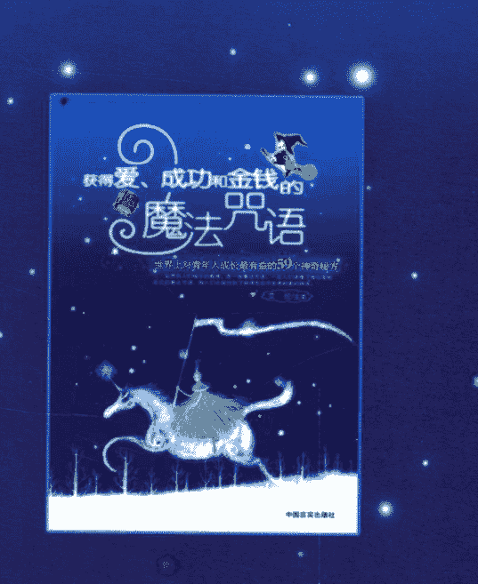
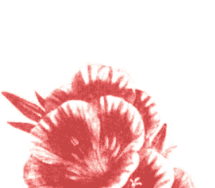
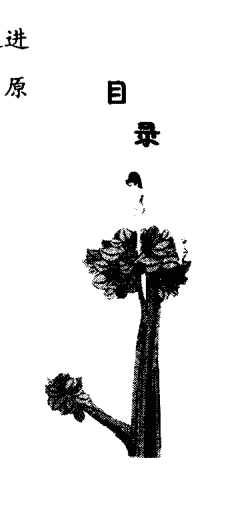
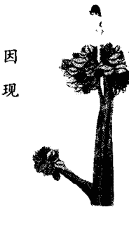
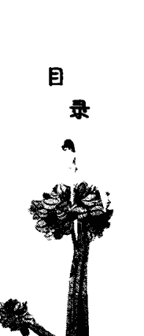
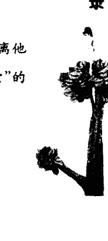
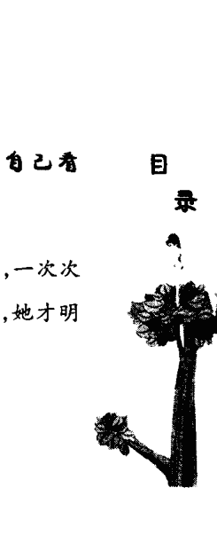
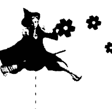
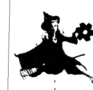

# 获得爱、成功和金钱的魔法咒语
## 世界上对青年人成长最有益的59个神奇秘方

仙界向人们暗示的真理，是一些魔法咒语，一旦人们读懂了神仙写给自己的魔法咒语，那人们也就找到了获得生命中宝贵财富的路途。

艾伦/主笔

# 获得爱、成功和金钱的魔法咒语
## 世界上对青年人成长最有益的59个神奇秘方

艾伦/主笔

中国言实出版社

## 图书在版编目(CIP)数据

获得爱、成功和金钱的魔法咒语/艾伦主笔.
—北京:中国言实出版社,2006.10
ISBN 7-80128-858-0

Ⅰ.获...
Ⅱ.艾...
Ⅲ.成功心理学—通俗读物
Ⅳ.B848.4-49

中国版本图书馆CIP数据核字(2006)第116442号

## 出版发行　中国言实出版社

地　址:北京市朝阳区北苑路180号加利大厦5号楼105室
邮　编:100101
电　话:64924716(发行部)　64963107(编辑部)
网　址:www.zgyscbs.cn
E-mail:zgyscbs@263.com

经　销　新华书店
印　刷　北京市丰永印刷厂
版　次　2006年10月第1版　　2006年10月第1次印刷
规　格　680毫米×980毫米　1/16　　18印张
字　数　220千字
定　价　28.00元

## 内容简介

如何获得爱？
如何获得成功？
如何获得金钱？
本书从独特的角度出发，用59个鲜活的故事向你展示不同的人在不同的境遇里，用不同的方式对待或赢得自己的爱、成功和金钱。贯穿全书的是三个小神仙和一个星座小魔女的夏日故事会，他们在天空之上俯瞰人间，用悲悯而锐利的眼光关注着人们的生活，在趣味横生的故事中指点着人们的迷津，给人们献上了59条经典而含义深刻的魔法咒语。
在生活中，各种机遇随时都可能带给你不同的收获，或是夺走原本应该属于你的东西。生活是如此的神奇，很有可能你寻寻觅觅的真理，其实就在你的脚边。
《获得爱、成功和金钱的魔法咒语》是一本比故事书还好看的励志书，它营造了一种全新的阅读体验，调动你的大脑，让你自己去解读属于你的魔法咒语，去获得你的爱、成功和金钱。

# 获得爱、成功和金钱的魔法咒语

## 引子:魔法咒语十日谈
MOFAZHOUYUSHIRITAN

在天空的云朵之上，各种各样的神仙都在忙碌着，监督着地面上人们的一切行为。他们俯瞰人间，了解地面上人们的疾苦、欢乐、哀伤、喜悦，以及人们生活中的各个方面。当然，神仙们不会轻易干涉人们的生活，他们只是以自己的方式，向人们呈现关于生命的最重要的真理，很可惜，人们不一定时时刻刻都能够把握住这些真理。所以，应该说，神仙们向人们暗示的真理，是一些魔法咒语，一旦人们读懂了这些魔法咒语，那人们也就找到了获得生命中宝贵财富的路途。

什么才是生命中的宝贵财富呢?当然有很多啦，有人说是健康，有人说是快乐，还有人说是友谊，不同的人会有不同的选择。不过要让大家说出最重要的三个，那当然就是爱、成功和金钱了。爱，是人间一切快乐的根源，是人们得以世世代代延续下去的最珍贵的动力；成功，是人们证明自己存在价值的主要方式；金钱，是人们得以实现自己物质愿望的必要元素。在这里，请大家不要用过于狭隘的眼光来看待这三种财富，每一种财富都有它不可替代的价值，而且远远不像我们通常认为的那么简单。

如果你还是觉得我们的观点不太可信，那你尽可以看看这本有趣的故事书，要知道它的来源可是不一般的：这是三个小神仙讲的很多个小故事——都是关于爱、成功和金钱的故事，而且就是我们现代人的故事，跟我们的生活息息相关。星座小魔女则给我们提供了一些魔法咒语，你可以试试看自己能不能理解这些魔法咒语。

还是让我们先说说这三个小神仙和星座小魔女是怎么聚到一起的吧。

不知不觉，夏天又到来了。这是一个不同寻常的夏天，和往年的炎热不一样，今年的夏天格外凉爽，世界也因此变得更加让人喜爱，于是，很多小神仙都破例出现了。要知道，每年夏天，都因为天气太炎热，神仙们结伴去了清凉的仙山幽洞避暑，在人间的天空中是很难看到神仙们的身影的。可是，今年难得一遇的清凉的天气使得仙界产生了一股潮流，那就是在晚饭后到人间的天空中散步，志同道合的神仙则会聚在一起聊聊天。这天，太阳快落山的时候，三个分别掌管人们爱、成功和金钱的小神仙在西边的天空相遇了，他们就是小爱神、小牧神和小金神。

小爱神经常戴一顶毛茸茸的红帽子——即便在夏天也是这样，其他小神就会跟他开玩笑说：“你真是耐热啊。”而小爱神会非常自豪地回答说：“那有什么！爱可是需要保温的啊！”看，他就是这么一个可爱而敬业的小神。

掌管成功的小牧神走路说话都很快，他恐怕是整个天空里做事最有效率的神了。他总是说：“如果我做事都没有效率，又怎么能指望人们做事会有效率呢？没有效率又怎么会成功呢？”别的小神和他说话的时候都要加倍地专心，不然根本就跟不上他的节奏。不过，大家也确实佩服他做事情又快又好，而且他的脑袋里充满了各种各样的新点子，是一个非常有活力的神仙，大家都喜欢跟他在一起。

再来看看小金神——这是一个让大家都猜不透的小神。从外表上，你看不到他穿着什么特别的会闪光的衣服，可是，他的身上总是带着耀眼的光彩，这让他看起来容光焕发，仿佛他只要动一动，就会有金币滚落下来。要是有谁想跟他打听金币在哪里，他会很神秘地笑笑，然后用右手的食指指着自己的脑袋说：“在这里。”不过小金神的金币不是大家可以轻易拿到的，但是金币的光彩是诱人的，所以，每当小金神走来的时候，大家都会微笑而羡慕地看着他。

好了，还是回到我们开头的故事上来。这天他们在夕阳里相遇了，接着就站在云层上闲聊起来。后来，小爱神建议大家说故事听，说说各自在世界巡游时的所见所闻，没有年代、地区和风格的限制，不过，只能围绕三个主题：爱、成功和金钱——这当然是因为这三个主题他们是最有发言权的。

小金神说：“我们说的故事还应该是可以增值的故事——也就是能够让人们有所收获的故事。”话才说出来，小爱神和小牧神立刻就说：“不愧是管钱的啊，连故事都变成增值的了！哈哈……”虽然他俩这么笑了一阵子，但他们还是挺赞同小金神的意见的，大家就约好了：每天黄昏的时候都到今天相遇的地方来说故事，说故事的先后顺序就忽略不计了，说完故事以后，每个说故事的人还应该给一个魔法咒语，这也是考验大家业务水平的大好时机啊。

三个神仙约好之后，转身正要离去，却忽然全都莫名其妙地大笑起来，几乎喘不上气来。这是怎么回事？等到三个神仙好不容易停住了笑，又听到一阵非常清脆的开心的笑声——三个神仙明白了，刚才一定是星座小魔女在跟他们开玩笑——星座小魔女喜欢隐了身去挠别人的夹肢窝，三个神仙就是因为被挠得发痒了才笑起来的。

小牧神性子比较急，他先假装生气地喊了一声：“星座小魔女，你赶紧给我现身！别胡闹啦！”

只听叮叮咚咚一阵响——一个长着大眼睛、长睫毛忽闪忽闪、美丽可爱至极的小女孩儿出现在大家面前。她身穿水晶石串成的蓬蓬裙，浑身闪烁着晶莹剔透的光彩，只要一动，身上的水晶石就相互撞击，发出音乐般美妙的声音。对这样一个惹人爱的星座小魔女，谁也不会真正地发起火来，事实上，大家都特别愿意看到她，你简直没法想象这个小女孩儿有多聪明、多机灵。更重要的是，她非常善良和懂事，所以，虽然她喜欢隐了身和大家开开玩笑，却没有一个人反感她。不过，刚才她确实太调皮了，把三个神仙折腾得几乎把下巴笑掉。所以，她现身以后做的第一件事就是给三个神仙每人一个拥抱，她是那么热情而真诚，一下子就打消了神仙们的小小怒气，就连想要假装责备她一番的小牧神都再也没法说什么了。

大家亲切地问星座小魔女从哪里来，星座小魔女面带微笑地说：“这个夏天真是难得的凉爽，所以我到人间去逛了几天，见识了好多以前没见过没听过的事情。”

小爱神兴奋地摸了摸自己的红帽子，问：“这么说，你有很大的收获喽？”

“那当然！”星座小魔女甩甩自己美丽的长长卷发，“我写了一本最新的魔法书。”

“这听起来很不错嘛。”小牧神故作深沉地说。

小金神则晃了晃自己圆圆的肚皮说：“我们要检验一下你的魔法书，可以吗？”

“没问题！”星座小魔女很自信，“不过，你们要怎么检验呢？”

三个神仙互相看了看，马上就心领神会了，他们齐声说：“我们要邀请你参加我们的故事会，让你来给我们的故事加上魔法咒语！”

接下来，三个神仙把先前的讲故事的约定跟星座小魔女说了一遍，星座小魔女开心地笑了，露出了洁白的牙齿：“那好，你们说故事，我负责从我的魔法书里找到合适的咒语来点评你们的故事，我绝对可以给每一个故事加上一个最完美的魔法咒语！”

小牧神笑道：“哈哈，先不要说大话哦，你去人间才几天而已，难道就已经摸透了人们的种种行为么？”

“可别小看咱们的星座小魔女，我想，有了她的加入，今年夏天的故事肯定会非常精彩的！”小爱神的一番话让星座小魔女高兴得在原地跳了一圈舞，三个神仙都看得陶醉了。

“那咱们就明天见吧！”小金神乐呵呵地说。于是大家很兴奋地互相道别，各自回家了。天空中闪过了七彩的光芒，只一会儿的工夫，三个小神仙和星座小魔女就不见了踪影。

## 目录

引子:魔法咒语十日谈 / 1

### 第一天

#### 魔咒一：

> “爱情经不起等待。等来等去，爱情的郁金香都已经凋谢了。”

他心爱的姑娘成了别人的新娘，只因为他曾经一再错过表白的机会。十年过去了，她经历了两度的不幸婚姻。他又燃起了新的希望，手捧着娇艳的郁金香走向心爱的姑娘时，意外却发生了…… / 3

#### 魔咒二：

> “友善是连接人与人的纽带，它可以让人们坐下来一起喝酒。”

她们都是心怀梦想的年轻人，但对于通往成功之路的方式却有着不同的理解，一个强硬过人，一个温柔有加。到底谁才是揣着成功秘诀的人呢？ / 6

#### 魔咒三：

> “女孩给你的暗示就是上天给你的机会。”

他们一再相遇，又一再错过。当他下定决心冲破命运的捉弄，深深地亲吻自己心爱的姑娘时，姑娘却表现冷漠。他们将再一次失之交臂吗？ / 11

#### 魔咒四：

> “金钱就像一个专门吻那些崩溃之人的天使，如果你不是足够警觉你就错过了它。”

“吻”也能成就一个百万富翁吗？这是一个浪漫女孩的经历。她把自己的吻做成图片送给了热恋中的男友，谁知，这个意外的创意却成了她成功的源泉。她开了一家店，引来追捧者无数。 / 18

#### 魔咒五：

> “爱情的证据不在任何别的地方，而在爱人的心里。”

传真机也可以用来传递爱情，一张张写着字的纸就是他和她的爱情证书，当他们的爱情出现危机的的时候，他用他们特殊的证据追回了她…… / 20

#### 魔咒六：

> “花瓶有胖有瘦，你心爱的花瓶不一定是大家共同认可的那一个。”

她不是人们眼里公认的美女——她太胖了，但他却认定她就是要和自己共度今生的人；她不在乎自己长相平平，拒绝他为自己提出的减肥计划；他曾经对她嗤之以鼻，但那一次之后他却发现她那与众不同的美。 / 24

### 第二天

#### 魔咒一：

> “如果你要的是青菜，就不要在萝卜上面花太大的工夫。”

他终于找到了满意的工作，这是因为幸运的眷顾。但是这样的结果也并非完全意外，因为有了量的积累才会有质的保证。机会并不一定是人人都能把握住的。他是如何做到的呢？ / 33

#### 魔咒二：

> “甜点、咸肉总有吃腻的一天，只有白开水是我们一辈子喝都不烦的。”

一次派对改变了一个年轻人的尴尬处境，也改变了影响他一生的自我定位。而这神奇的变化，难道仅仅因为母亲给他的一枚柠檬吗？ / 38

#### 魔咒三：

> “当你学做小板凳，第一次做的一定很难看，但只要你一直做一直改进，就总有一天会做出最漂亮的小板凳来。”

他频频更换工作，却得到了越来越高的待遇。有很多人也跟他有着相似的经历，结果却截然相反。为什么他会让自己越走越好呢？ / 41

#### 魔咒四：

> “熟透了的甜果子总有掉下来的一天。”

她患上了网络恐惧症，是因为他。他们相识在网络上，毕业之际，他移情别恋。她因此痛恨一切和网络有关的东西。但这位特别的素未谋面的客户坚持要在网上解决问题，谁知却带给她一个意外的结果！ / 45

#### 魔咒五：

> “爱情是一个小小的地球，环境受到污染的时候，两人都有责任做环保工作。”

爱情也需要环保！他们相爱才三年，却已感到无法容忍对方。寻根溯源，原来他们爱情已经被“白色垃圾”污染。如何解决这个问题呢？她自有奇招！ / 50

#### 魔咒六：

> “要想挖到属于自己的金矿，不仅要有好眼光，更要有一把结实的锄头——实力。”

为何他能从行囊空空到年收入过百万？历经了频频的失败和种种非议，他坚信自己的方向是对的，坚信自己独到的眼光。他为此付出了巨大的努力和代价，但为了这项事业，这一切都值得！ / 55

### 第三天

#### 魔咒一：

> “爱情就像解数学题，你解得最好的那道题，才是你真正的爱情。”

他们青梅竹马，他跟着她的脚步从家乡到京城步步不落，但是她还是频频更换男友，唯独对他视若无睹。这一天，她又失恋了，他成了避风港，不料一句戏言竟然成就了他的心愿。 / 63

#### 魔咒二：

> “如果你第一个想到了人们急需的一样东西，那你一定会因为这个东西而发财。”

她独具慧眼，开创了给电脑“洗澡”的先河。虽说万事开头难，但她也是十八般武艺样样齐全，在短短几年时间里就创下了个人资产过百万的纪录。 / 68

#### 魔咒三：

> “每个人都有过作弊的念头，只要在悬崖边勒住了马，就还是好样的。”

在诱惑面前犹豫过，在面试中曾动过作弊的念头，工作中也曾私欲萌动……可她都一次次战胜了自己，并给自己带来了一片广阔的天空…… / 73

#### 魔咒四：

> “虽说身正不怕影斜，但是当别人的影子斜的时候，你还是得学会绕开。”

智慧和努力让他获得了成功。虽然当初他的上司不动声色地耍了他，同事又让他一度陷于困境……这一路走的着实艰难，但都没有消磨掉他的锐气。是什么让他在泥沼中步步为营呢？ / 77

#### 魔咒五：

> “如果你推销的是一种商品，那么你要懂得提炼这种商品所蕴含的精神财富，这样一来别人往往难以拒绝。”

他是一个推销员，却被自己的妻子推销了一栋售价不菲的房屋。这到底是怎么回事呢？ / 81

#### 魔咒六：

> “人们的心灵是提琴，善良和爱能够拨响那个最动听的音符。”

12岁的少年潜入了音乐家的屋子准备行窃。被发现后，音乐家把自己珍藏的小提琴送给了他，并讲述了一个不为人知的童年故事，他和这个行窃的孩子竟然有着难解的渊源…… / 85

### 第四天

#### 魔咒一：

> “如果你给予爱，你将获得幸福。”

他是一名骨髓库的志愿者。一个花季男孩因白血病而面临死亡，他是唯一和男孩骨髓相匹配的人。当人们心中燃起希望的火花时，意外再次出现。大家都替他们捏着把汗…… / 91

#### 魔咒二：

> “当一个穷人把自己仅有的钱财送给比他自己更穷的人时，他就会感到像个国王一样的富有。”

他们的生活很清苦，复活节来临，当他们为了每个人意外收获了20美元而欣喜时，却意外地收到一个信封，这个信封赶走了他们来之不易的幸福感…… / 94

#### 魔咒三：

> “居住的环境越舒适越安全，得到的东西越多，人们的生活有时会变得越繁琐、越没有趣味。”

他是个设计安全系统的专家，但他的家让人觉得安全得快要失去了自由。圣诞夜的晚上，女儿却因为他的“设计成果”而无家可归。他有着惊人的财富，最终却做出了这样一个决定…… / 98

#### 魔咒四：

> “如果你拿走了盲人的东西，他不会发现，但你的良心会发现。”

她是一位美丽富有的少妇，不久将飞向大洋彼岸与丈夫相聚。但她的面容却日渐憔悴，负罪感日以继夜地笼罩着她，原来在一个雨夜里，她犯下了不可饶恕的错误。她该何去何从？ / 103

#### 魔咒五：

> “如果你咬到一只坏苹果，你不能说一整筐苹果都是坏的；如果你曾经遇到一个坏人，你不能说所有的人都是坏的。”

初为人父的他，为了新生的女儿奔走在严冬的极寒地带，好不容易搭到了一趟顺风车，却遭受到了前所未有的折磨，原来他被当成了搭车的贼。车终于到达了目的地，司机却发现…… / 107

#### 魔咒六：

> “孩子首先想到的是自己，父亲首先想到的永远是孩子。”

他的左眼失明了，生活随之发生了巨大的变化。父亲也被妻子强行送进了养老院，可是如灯的父爱却让他失明的眼睛重新见到了光明，原来…… / 112

### 第五天

#### 魔咒一：

> “连无神都会惧怕那些精神强大得像一个巨人的拼搏者。”

她把死亡当成一支生命的拐杖，倚着它，无所畏惧地前行。她的梦想就是走进大洋彼岸的高等学府，但在病魔的折磨下她能如愿吗？ / 117

#### 魔咒二：

> “当你有了爱心，你就有了活下去的欲望，因为你会成为别人不可缺少的一条拐杖。”

这是一个黑人少年，父母双亡，在穷途末路之际，一个老太太出现了，她只对少年说了一句话，就改变了他的人生航向。 / 120

#### 魔咒三：

> “孩子是人们收到的最好礼物，他们是这个世界的新鲜血液。”

这个女孩是幸运女神的化身，6岁就成了玩具公司的顾问，15岁时已经拥有2000万美元的年薪，她是世界上最年轻的千万富翁。 / 122

#### 魔咒四：

> “如果你想帮助一个人摆脱痛苦，你就真诚地用自己的故事去打动他。”

他疾病突发住进了医院，遇到了美丽乐观的她——面临失去一条腿的危险，但她却曾经带着病痛，把生命最美的瞬间燃烧在钟爱的舞台上。最终，她重新定义了他的人生真谛！ / 125

#### 魔咒五：

> “人们在追逐利润，但终有一天他们会发现亲人和爱才是他们成就事业的基础。”

“你替父母捶过背吗？”这个面试中的最后一个问题，让他惊觉自己忽视很久的问题；他得到了那份工作，同时也明白了人生最珍贵的是什么…… / 129

#### 魔咒六：

> “如果你用真爱去租借一个姑娘的帮助，总有一天你会得到这个姑娘无偿的帮助，甚至是她的爱——因为你打动了她。”

他的爱情与众不同。母亲病危，情急之下，为圆母亲的梦，他只好去“租”了一个女朋友，谁知，母亲的病因此而好转。接下来他该如何去圆这个美丽的谎言呢？ / 131

### 第六天

#### 魔咒一：

> “爱情存在于每一个角落——人们的吃穿住行、油盐酱醋，但有的时候你需要重新发现它。”

他们的婚姻在激情退去走进凡尘之后，不可避免地出现了裂痕，因为一点小事闹到了离婚的边缘。但在大雨滂沱的路边，他们却发现爱情的另一面…… / 137

目录

## 魔咒二：

> “地位和身份是一个陷阱，相爱的人如果跳不过这个陷阱，幸福会在陷阱的对面越跑越远。”

他们的相识完全出于上天的特别关照。他们经历了恋人之间从相识到相知、再到相爱，而年轻的姑娘却怎么都等不到他的表白，最后等到的却是……

#### 魔咒三：

> “如果人们拥有一面可以看到事情另一面的魔镜，那么所有的误会和悲剧就不会发生。”

本想让婆婆和他们一起安度晚年，但结果是他们无论如何都没想到的。每晚从他房间传来的呻吟中隐藏着巨大的隐患，这一切都是他未曾料到的！

#### 魔咒四：

> “最好的商人并非先知，他们只是懂得用最快的速度为人们找来他们需要的东西。”

年轻的姑娘从电影海报中看到了新的机遇。虽说万事皆不易，一路走来也是坎坎坷坷，但她还是闯出了一片广阔的天空！

#### 魔咒五：

> “哪怕是最没有用的东西，也可以在智慧的头脑面前变成美丽的摇钱树。”

旧报纸也能开创人生的另一番美景？他的经历就证明了这一点。因为生日聚会上收到了一份别具匠心的礼物，从此，他的人生被改写了。

#### 魔咒六：

> “爱情是这个世界上唯一的永动机，就算其中的一方死去了，爱的力量仍然可以支持另一方活下去。”

大火无情的烧掉了他们苦心经营的店，在贫病交加的情形下，他做出了一个惊人的决定：以自己的生命来换取妻子的康复，同时留给妻子一个等待他治愈归来的希望……

### 第七天

#### 魔咒一：

> “流言好像生活的蛀虫，如果你还想继续美好的生活，就要从自己开始灭虫。”

新进公司的她无意中已经被卷入一场人际纠纷中。在卫生间她听到了同事们的议论，在工作中又频频受阻。她该如何解决这些如潮般涌来的难题？

#### 魔咒三：

> “如果你像孩子一样倒着去看世界，你就会看到一个不一样的世界，也会看到从前没有看到的财富。”

名落孙山的他沮丧地来到一个玩具厂。一次和孩子们无心地玩耍中他突发奇想，推出了一系列令人瞠目的玩具，意外地救活了濒临倒闭的玩具厂。

#### 魔咒四：

> “世界就像一个神奇的迷宫，想要走到自己想去的地方，不光要记得方向，还要摸索出迷宫的规律。”

她是一名普通的编辑，却在一张报纸上经历了卓越与平庸、成就与失落的巨大落差。她一直在努力，用自己与众不同地方式书写与众不同的经历。她能如愿吗？

#### 魔咒五：

> “如果你的事业在刚起步的时候就像一个不起眼的包子，那么你就要想方设法把他做得尽善尽美。”

他是一个普通的农村青年，但渴望成功的愿望比谁都强烈。他开了一家店，在历经了所有的困难之后，终于把店开到国外了！

#### 魔咒六：

> “现代生活就像一个大水炉，当别人都热得骂起人来的时候，如果你能忍耐和坚持，你就会发现自己变成了一股清凉的风。”

终于走进了梦想中的公司，谁知第一天上班就被派去打扫卫生间，后来在流水线上的工作也让她苦不堪言，是去还是留？与想象中的巨大反差和能力得不到肯定，让她产生了退缩的念头，就在这时机终于

### 第八天

#### 魔咒一：

> “如果你从别人那里得到点什么，那么你首先得给别人点什么。”

他是这样一个“神奇”的人——改变了公司雷打不动的规矩，又为大家争取到了更多利益，就连公司损失重大时，他都能为大家争取到年终奖！

#### 魔咒二：

> “当你组装自己一生当中的第一台机器时，装得慢不要紧，装得不好也不要紧，要紧的是你不能落下任何一个零件，不能成为一个不合格的机器组装者。”

在竞争中他几乎没有优势可言，但在面试时却赢来了主考官赞许的目光。他的制胜秘诀是什么呢？

#### 魔咒三：

> “上司不是老虎，就算你对他发泄了自己的怒气，你也不会活不下去，说不定，他其实正想知道你的想法。”

一直恪守常态地谨慎工作，却越做越糟；一次率性而为的失态，却挽救了这场危机。从此，她的工作风调雨顺了。

# 获得爱、成功和金钱的魔法咒语

#### 魔咒四：

> “如果你总是把自己过去得过的奖状拿出来看，你很可能在今后的日子里再也得不到奖状。”

她离“广告设计师”的梦越来越近了。想到当初自己年轻时犯下的荒唐错误，还真得感谢那些自己一向瞧不起的琐碎小事，那个教训让她受益匪浅！

#### 魔咒五：

> “只要你觉得高兴，你可以把一条裤子撕成两半来穿。但是，当你走到大街上的时候，难免会显得很不合群。”

这是一位节约出了名的先生，他有一本厚厚的节约宝典，里面的每一条箴言都会令你感受到意外的新鲜，你会发现原来生活还可以有这样一面！

#### 魔咒六：

> “如果你总想为一个有难的人做一些更有用的事情，那么你很可能会发现一些意想不到的东西。”

儿子重病在床，喝水要靠管子，她灵光一闪，新发明诞生了。她找到了发明协会，这个意外的发明让她赢得了数百万的奖金。

### 第九天

#### 魔咒一：

> “我们的心是一面镜子，当别人为你把它擦亮的时候，你就会学会怎么去把它擦亮，而且以后永远都要由你自己去擦亮。”

事业有成的他，泪流满面地跪倒在老师面前，希望再次成为老师的学生。原来在年少时他曾经犯下了一个自认为不可饶恕的错误，但老师用一个美丽的谎言成全了他！

#### 魔咒二：

> “每个人眼里看到的世界都是不一样的，难道你要一直听从别人，而把自己的世界扔在一旁？”

孩子骑在驴背上，父亲被人们指责了；父亲骑在驴背上，孩子被人们指责了；他们一起骑在驴背上，又一起遭到了指责。

#### 魔咒三：

> “你的爱人是你的一只风筝，如果你不给它拴上线，它就会一直飞在你的身边；一旦你给它拴了线，只要一起风，它就会飞高飞远。”

他们就要离婚了。他对她有着全身心投入的爱，但却总是担心她会离他而去，为此他找过私人侦探，甚至亲自盯过妻子的梢。最终，在“绳索”的束缚中，妻子选择了离去！

目录

## 获得爱、成功与金钱的魔法咒语

#### 魔咒四：

> “父亲总是比儿子更明白什么东西更值钱。”

他从不认可父亲对时间和金钱的看法，但在一次拉车的经历中，却感悟到了父亲的真正用心……

#### 魔咒五：

> “在那些比你有经验的人的话里，总是埋藏着闪闪的金子。”

一次事故让小伙子收获了经商秘诀。虽然他被上司辞退了，但却为自己即将开创的事业种下了生机勃勃的种子！

#### 魔咒六：

> “对什么人就得用什么招，因人而异才能事半功倍。”

“傲慢自大”型的人常常是人们交往中最不愿意碰到的，但是他却出奇制胜，让傲慢无礼的人乖乖地同自己合作。结果他成功了！

### 第十天

#### 魔咒一：

> “镀金的男人好看是好看，很可惜他们中的很多人都带着金属般的冷漠。姑娘们要嫁的人，应该是能够给予自己快乐和温暖的男人。”

他们同在一个屋檐下。她已经被盖上了“大龄女子”的戳。终于有一天，她有了风度翩翩的朋友。但令人意外的是，她要嫁的人竟然是他！

#### 魔咒二：

> “真正厉害的人通常看起来就像一个最普通的人。”

一位普通的推销员在三年多的时间里，拜访了这位老人70次，但总是找不到要找的人。一次无意中获知那位老人竟然就是自己苦苦追寻的人。上天对勤奋的人总是格外开恩，这一次幸运会降临在他身上吗？

#### 魔咒三：

> “热情和动力对于人们而言，好像火车的机车，没有了热情和动力，人们就无法继续自己的工作。”

这是一本创造奇迹的书，它打开了一个主妇生活全新的一页；她是一位特别的女推销员，她创造了这本书的神话！

#### 魔咒四：

> “真正的人才，即使没有经验，也总是会在细小的地方流露出他们的才华。”

她是一位初出茅庐的女大学生，在严峻的竞争形势下，用两块钱打动了主考官，因为这不仅仅是一个两块钱的故事！

#### 魔咒五：

> “在爱情的世界里，不需要哈哈镜，否则，人们会迷失在自己看到的可怕的幻象里，从而错过了美好而宝贵的时光。”

如果误会全都纠缠在一起，会是一个难解的结。他们就是这样，一次次无意的误会，让他们之间的沟壑越来越深。终于他身染重病时，她才明白，原来一切都是误会……

目录

#### 魔咒六：

> “亲密的爱人一定会有一次难忘的晚餐，眼神的交融是世界上最美的对话。”

他们终于要结婚了。自相识以来他们就像一对欢喜冤家，时分时合，玩笑之间矛盾突起，马路上的打打闹闹却引来了联防队员，一场恶作剧之后，等待她的将是……

### 第一天

刚刚下了一场雨，天空里挂起两道彩虹——这可是很不常见的。彩虹总是预示着好运和快乐，三个神仙和星座·小魔女准时来到了昨天约定的地方。星座·小魔女说：“这彩虹很美啊。”小金神和小牧神连连点头称是。小爱神说：“先别光顾着欣赏美景啦，言归正传，开始我们的故事会。星座·小魔女，你是我们这里唯一的女孩儿，就由你来当我们的故事会的女王好了。现在你来决定今天谁先开始说故事！”星座·小魔女说：“那很好，今天就由你先说个故事吧，说个和这彩虹一样美妙的爱情故事。”小爱神没有推辞，他想了想，说了一个很凄美的爱情故事

#### 魔咒一：

> “爱情经不起等待。等来等去，爱情的郁金香都已经凋谢了。”

他心爱的姑娘成了别人的新娘，只因为他曾经一再错过表白的机会。十年过去了，她经历了两度的不幸婚姻。他又燃起了新的希望，手捧着娇艳的郁金香走向心爱的姑娘时，意外却发生了……

一个年轻人在大学的新生联欢会上认识了一个姑娘。姑娘笑靥如花，聪明活泼，年轻人对她几乎是一见钟情，却没有表露。因为他刚经过高中阶段循规蹈矩的教育，对男女感情小心翼翼得令人难以置信，他是这么想的：“等到时机更成熟一些的时候，再向她表白吧！”

一年多后的一个夜晚，年轻人终于鼓足勇气约姑娘出来，并向她表白了心中的爱意。姑娘平时一向聪明伶俐，但是此时却结结巴巴地说：“我……我想我不能接受……你的爱意，因为一个星期以前……我已经……接受了另一个……男孩的表白，我真的……不知道你……是喜欢我的……”姑娘说完就跑开了，年轻人没有看到她那快要涌出泪水的眼睛。

这之后，人们经常看到这个年轻人和学校的“校花”一起出双入对，大家都以为他迷恋上了“校花”的美貌，谁也没有想到，“校花”和那个姑娘的笑容非常相似，灿烂得好像春花，所有人都没有体会到年轻人的良苦用心。没过多久，这个年轻人就和校花分手了。

大学生活很快就结束了。毕业后，姑娘很快成了别人的新娘，而那个年轻人则再也无心恋爱。因为他明白，只有这个姑娘才是他今生最爱的人。他从朋友那里辗转打听到姑娘的生日和地址，每到姑娘生日时，他就会到花店订九朵郁金香（他不知道女孩最喜欢什么花，他自己最喜欢郁金香）送给那姑娘。他知道自己的心上人已为人妇，所以他从来不在卡片里留下姓名或者联系号码，他不想因为自己的感情而影响心上人的生活。

几年时间转眼就过去了。年轻人依然是孤身一人，并且记得每年都送花给姑娘。这年，就在姑娘生日的前两天，年轻人参加了一个同学聚会，从同学口中他听说了姑娘这几年里的经历，她离了两次婚，如今也是独身。这时年轻人心里是又心疼又高兴——他心疼是因为女孩遭遇了感情的不幸，他高兴是因为自己又再次有了机会……终于等到了姑娘生日的这一天，年轻人兴奋得坐立不安，他已经打定主意这次一定要亲自把花送给姑娘，并告诉她自己一直爱着她。为此，他兴冲冲走遍了城里所有的花店，精心挑选了自己认为最美的两朵郁金香，花店的工作人员为年轻人包装花朵，年轻人则在卡片里写了一行字：你知道我在爱你吗？！年轻人英俊的脸上这时候挂满了希望，他微笑着向街心走去……然而就在一瞬间，一辆逆行的货车把他撞倒在地……姑娘最终收到了美丽的郁金香，但同时也听到了年轻人的死讯。她终于知道了一切，悲伤和痛惜之情围绕着她，她关门户哭了整整一夜，并回想起多年前的那个夜晚他对她的表白。十多年了，她竟然根本不知道他是如此执着而痴迷地爱着她！这种爱情的错失恐怕是世界上最让人难以忘怀的伤痛，姑娘止不住的泪水把郁金香浸染得无比凄美。她知道，自己失去了一辈子都难遇难求的至爱。

死去的年轻人也永远没有机会知道，他心爱的姑娘最喜欢的花，正是郁金香。

故事说完了，小爱神还沉浸在自己说的故事里，小牧神和小金神都连连摇头感叹说：“这个故事实在有些令人伤感，小爱神，世界上还有很多像故事里那个姑娘和小伙子一样的恋人吧？星座小魔女，你能不能给这样的年轻人一点什么忠告呢？免得再出现更多这么遗憾的爱情故事。”

> “可以，”星座小魔女说，“我真不希望看到这样凄美的爱情故事，可是——爱情，就是这样充满了遗憾的一种东西啊。为了让年轻人把握住自己的爱情，我倒是有一条咒语要告诉他们。”

星座小魔女翻开了自己的魔法书，她很快就找到一条魔法咒语并大声地念了出来：“爱情经不起等待。等来等去，爱情的郁金香都已经凋谢了。”

三个神仙听完后都点了点头。小牧神说：“关于爱情，我确实没什么好说的，不过，我这里倒是有一个关于年轻人步入世界、开始打拼自己事业时的故事，我说给你们听听，也让大家赶紧从刚才那个凄凉的爱情故事里走出来吧。这个故事大概就是不久以前发生的。”接下来，小牧神就开始说故事了：

# 获得爱、成功和金钱的魔法咒语

#### 魔咒二：

> “友善是连接人与人的纽带，它可以让人们坐下来一起喝酒。”

她们都是心怀梦想的年轻人，但对于通往成功之路的方式却有着不同的理解，一个强硬过人，一个温柔有加。到底谁才是揣着成功秘诀的人呢？

在大城市里，要做一个成功的职场人士，实在是件不容易的事情，对女孩子们来说尤其如此，不过，有两个姑娘却做到了。

梁小姐是一位乌发绾髻，身段裹在玫瑰灰套装里的职场女子，而杜小姐则一身白衬衫蓝牛仔，因为她刚从大学里毕业出来。圆脸学生头的杜小姐瞪着大眼睛对梁小姐说：“经理，传授些经验吧？”

人人都惊讶，大学毕业才两年的梁小姐凭什么成为这家日化企业业务部的经理。在杜小姐这个初涉职场的新人面前，梁小姐握紧拳头，一字一顿说：“职场对抗，强者胜！”

梁小姐要做个女强人！她认为在对手面前，要永远冷血，为了言传身教，她当天下午就带着杜小姐跑业务。

首先是一家中型超市，这里有她们公司的一个货架，但是位置不大好，所以销售额一直上不来。超市的解释是：“好位置都被强势品牌占了……”

真的没有好位置了吗？梁小姐挽起袖子，开始动手把放在最好的位置的货架硬生生地搬出来，然后把她们的货架塞了进去。超市的理货员看着穿套装短裙的梁小姐生龙活虎地硬搬货架时，简直目瞪口呆！

被挪动的货架的业务代表闻讯赶来时，梁小姐已经挪好货架，并在后面加上了固定的钢丝。那个业务代表也是个小姑娘，见此场面不知如何是好。梁小姐昂起下巴，告诉她：“从现在开始，这是我们公司的位置。你可以去抢别人的位置，但不能抢我的位置，因为我一定还会再抢回来的！”

杜小姐大概没有见过梁小姐这样“野蛮”的人，她小声说：“经理，要不我们和她商量一下？”梁小姐几乎气晕，“以后这个超市由你负责，销售额上不来，不用我说你也知道结果！”

令梁小姐生气的是，杜小姐完全是一个不知好歹的软弱派。尽管梁小姐身体力行地演示了如何强硬冷血，但杜小姐居然和那个业务代表私下协商，每人用半个货架。那个小姑娘感激地和杜小姐成了莫逆之交。但这有什么用！多一个朋友，并不意味着销售额能大幅度提升；没有销售额，女强人只是个美丽的梦！

出乎意料的是，杜小姐和那个小姑娘竟然联手推出两家公司的产品。如果顾客对杜小姐她们的产品不满意，杜小姐就会推荐那个小姑娘的产品，而小姑娘也会向顾客介绍梁小姐她们的产品，那家超市其他品牌的日化产品顿时没了市场，而杜小姐她们的销售额节节上升。

杜小姐这温柔一刀虽见成效，但梁小姐宁愿相信这只是巧合。你死我活的商场岂有“温情”二字！

一次，杜小姐在文书中使用了几个不太恰当的字眼，趁着中午等外卖，梁小姐严肃地批评了杜小姐：“要想成为强者，一点点瑕疵都不能容忍！”

刚说完，送外卖的小伙子敲响了门，“梁小姐，您订的七份盖浇饭。”
梁小姐递给小伙子35元。他一愣，“现在每份饭是6元……”
“没道理！我一直在你们这里订饭，每次都是5元！”女强人哪里糊里糊涂！
小伙子一脸无辜：“这是老板吩咐的，单子上也是这么写的。”梁小姐恨得直嗑牙，“好！我打电话给你们老板，以后再也不订你们的饭！”小伙子有些慌了，说着“那算了，算了”，转身就走。

梁小姐得意地准备洗手吃饭，在电梯口，看见杜小姐拉住那个小伙子说：“这7元是我替经理给的！”“不用了。我自己垫上吧！”小伙子推托。杜小姐笑：“看你薪水也不高，哪能让你贴钱呢。”那小伙子千恩万谢地离去。

半个月后，杜小姐居然拿着一份合同请梁小姐签字，竟是每日订饭的那家连锁店，要买梁小姐她们三年的日化产品。梁小姐吃惊地说，天天订饭，从没想过这是一个客户！杜小姐说：“我也没想到啊！是那个送外卖的小伙子向老板竭力推荐的。”

尽管杜小姐还是白衬衫蓝牛仔地到处跑业务，笑嘻嘻无忧无虑的样子，但她的业绩好得超乎想象。梁小姐打心眼里喜欢这个小姑娘。不过，梁小姐认定了杜小姐是不能成为女强人的，她的心太软，经不起职场商场里近乎疯狂的洗礼。

长假是黄金促销期，梁小姐她们要尽可能卖掉那款已经停产的洗涤产品。为此，梁小姐特别制定了非常吸引人的打折计划。虽然多少有些欺骗人嫌，但库存不多，何况在商言商，业务员应该永远追求利益最大化。

“再说了，我们这个打折捆绑销售计划，的确非常之优惠。”梁小姐在业务会上，如此安慰着自己和所有的业务员。大家都低着头，只有杜小姐，用她标志性的迷惑眼神看着梁小姐。

梁小姐最不放心的就是杜小姐。果然，两天下来，就数她负责的几个超市卖出的停产洗涤品最少。按她的能力，这是不正常的。梁小姐决定去看看。

一进超市，梁小姐几乎被杜小姐气晕过去。听听她在说什么。“我建议您不要买这种洗涤产品，因为它已经停产了。虽然有很好的折扣，但我还是向您推荐另外一款吧，卖得很好的！”那位顾客听完仍是将信将疑。梁小姐恨不得冲过去，叫这个死心眼的杜小姐闭嘴。但是杜小姐瞥见梁小姐，竟兴高采烈地迎上来：“这是我们经理，她可以作证！”梁小姐狠狠地瞪了杜小姐的圆脸一眼，堆起笑容：“的确，这个产品停产了。但是质量还是可以保证的！”听完介绍，顾客拿起杜小姐推荐的最新产品去付款了。

梁小姐盯着杜小姐：“你是不是打算告诉我，你不忍心看到顾客买我们停产的产品？”杜小姐说：“经理，你为什么不建议高层，这样做会伤害我们的顾客。一时的利益比不上长久稳定的顾客群啊！”梁小姐被噎得一愣。

梁小姐左思右想，的确有道理，立刻打电话给上司。第二天，全面停止捆绑式促销，全力转入新产品促销。梁小姐得到了高层嘉奖，忍不住暗叹：杜小姐，真是“人不可貌相”。

人人都在说杜小姐好。对手说她大度，送外卖的小伙子说她体贴，顾客说她为消费者着想。梁小姐不曾体会过这种感觉，她立志要做女强人，人人都敬她怕她，赞美的话统统没用，等同于废话。何况按照梁小姐的计划，年底她就该得到提升。

人算不如天算。年底，梁小姐为了制定最重要的促销计划忙得焦头烂额，但费用还是超过了最初的预算。超支，是业务经理最忌讳也最不应该出现的问题。还谈什么提升？保住位置就已不错。更何况，多少人虎视眈眈地瞄着她的位置。

年底，人人喜气洋洋，只有梁小姐闷在办公桌前。时间来不及，这

# 获得爱、成功和金钱的魔法咒语

一个促销方案，提交还是放弃？放弃绝对不可以，那相当于拱手让人，并暗示我能力不足；提交，免不了高层怪罪下来。

梁小姐正头疼，杜小姐敲门进来。“经理，我有一个朋友新开了一家展台设计公司，想免费为我们做一个展台。”梁小姐大喜，却忍不住心下盘算，怎么会有这等好事？“他们没有其他条件吗？”杜小姐脸微红，“若是做得好，还希望以后多给他们机会合作。”这笔展台费用的节约，简直如及时雨，救了梁小姐。

待到搭建展台的时候，梁小姐发现杜小姐与对方也不熟悉。原来杜小姐为了解梁小姐燃眉之急，不惜给对方许下承诺，费用问题暂缓。也就是说，这次的费用可以将来在其他项目中支付——超支可以避免了。梁小姐承认，自己被这丫头最温柔的一招击中，却又受用万分。

新年，梁小姐如愿被提升。换职前，高层要她推荐继任者，她推荐了杜小姐。她知道人人又该惊讶万分，为什么毕业不到两年的杜小姐成为第二个梁小姐？梁小姐认为杜小姐比自己强万分，因为这丫头轻松自如，与人为善。

梁小姐甚至下定决心，到了新的职位以后也要做个温柔的女强人。

> > 小爱神说：“噢，看来我是跟不上时代啦，你刚才说的好多个名词我都听不懂哦，什么职场啊、经理啊、业务啊……”

> > 小金神笑了起来：“看来你确实缺乏关于现代生活的知识！不过你也不必关注太多这样的现代名词，反正咱们三人各司其职，管好自己分内的事情就行，如果要我去负责你那个爱情范围的事，恐怕我也会很头痛啊！”

> > 小牧神点点头：“没错，正是这样，每个人都只能做好自己分内的事情……对了，星座小魔女，现在该你露一手啦！”

> > 星座小魔女把自己的魔法书抱在胸前，说：“我在很多个大城市里都看到了忙忙碌碌的人们，在很多家公司里，都有和小牧神刚刚说的故事里那两个年轻的小姐一样的姑娘和小伙子，他们很辛苦，他们的拼劲让我很受鼓舞，我想给他们一条咒语：友善是连接人与人的纽带，它可以让人们生下来一起喝酒。”

当星座小魔女说完她的魔法咒语以后，小金神说：“我决定今天不讲自己的故事，我还想听小爱神讲一个关于爱情的故事，但是这一次有个条件：小爱神应该说一个结局圆满一点的故事，别总是那么伤感，爱情也有幸福的一面嘛！”小牧神连连表示赞同，小魔女也眨巴着迷人的眼睛表示同意。于是小爱神说：“好吧，我试着说一个圆满的故事，而且这个故事还带着一点幽默的味道呢。”

### 第一天

#### 魔咒三：

> > “文殊给你的暗示就是上天给你的机会。”

他们一再相遇，又一再错过。当他下定决心冲破命运的捉弄，深深地亲吻自己心爱的姑娘时，姑娘却表现冷漠。他们将再一次失之交臂吗？

夏天的太阳仿佛在流火，一个小伙子站在马路中央，感到痱子一个个从后背冒出来。行人经过，穿的是白的浅蓝的透明的T恤，只有他全副武装，像一个士兵在值勤。

# 获得爱、成功和金钱的冥思真谛

摩托车，查违反交通规则的人。当然，干这行除了夏热冬寒，也有威风凛凛的时候。比如往路中央一站，来往的车辆都小心翼翼如履薄冰。

一辆小面包车在马路上晃悠，像笨拙的舞蹈演员在台上跳跃，不时会有小小的趔趄。

他有心逮它的错，盯着它由远及近。

红灯。小面包车前胎越过停车线20cm，足够他向驾驶员行一个标准的军礼。

司机是位眼睛圆圆的女子，白T恤、牛仔裤，哭丧着脸。这种情况下，所有的司机都会说：“我不是故意的，下次不敢了。”

她当然也不例外。只是她说话时眼睛眨巴眨巴，小嘴一直上翘，令原本铁石心肠的他有些怜香惜玉；何况她的确只超一点点，执法太严借题发挥会遭人鄙夷。于是他摆手放行。

车渐行渐远，继续摇晃。车尾的荧光纸分外耀眼，两个大字：新手。

扑哧一声，他笑出声来。白痴，谁不知道你是新手？

他值完勤吹着口哨回家，老妈又在他耳边唠叨：“27岁还是光棍，儿啊，你别当交警了，连女朋友找不到。”

他老妈不明白他找不到女朋友与职业无关。他身材威猛，相貌英俊，无不良嗜好，前任女友和他分手，偏偏唯一的理由是职业。她说，“你天天在街头喝风吃灰听噪音，智力越来越低，我怎么能和这样的人在一起？”她的新任男友开宝马，而他只有公家的摩托。他觉得要是换了他，也会弃暗投明。

何况她并不是他喜欢的类型，他喜欢的女孩圆眼睛、小嘴唇，笑起来像春风吹开一池冰凌——就像今天遇到的新手。

老妈继续唠叨，而他的脸渐渐笑成一朵花——不当交警，他能遇到梦中情人吗？只是那个新手很怕他，表情像耗子见到猫，看来她还不知道这年头耗子和猫早就和睦相处了。

而且那张荧光纸是安全隐患，万一晃花了别人的眼，后果不堪设想。他决定在路口拦她，要她将这个搞笑的牌子摘下来，哪怕换一张也行。

谁知道接连两个礼拜，没有见到她。他后悔没记下她的车牌，心底的失落比与女友分手还多。

班继续上，一天，他执完勤回队换班，饮水机里半滴水也没有。身后却有甜蜜蜜的声音：“警官，请喝水。”

他转过头，眼珠差点蹦出来。递矿泉水的人声音柔媚，表情可怜，是他苦苦寻找的新手！

他猛掐大腿，疼痛和兴奋中告诉他不是梦。新手却毫无知觉自顾自喋喋不休热泪盈眶，述说悲惨遭遇：误入单行道，夹在车流中动弹不得，主动打电话找交警才脱身。她还不时强调自己主动投案，而且是个新手。

他笑得水呛进气管。

驾驶执照有她的名字，驾龄很短，却有长长一串违章记录。

姑娘表情无辜，小嘴扁扁可怜兮兮。“罢罢罢，驾照还你，罚款照交。还有，那个写着‘新手’的牌子，别用荧光的。”

他觉得不能这样放过她，于是替她在交警队驾驶培训班报了名。

他开始相信老爸的至理名言：是你的就是你的，不是你的脑袋撞破也白搭。青春年华，他有N次恋爱的机会，但遇见梦中情人的几率是百分之一，相当于足彩三等奖。

上天给的机会怎么能不珍惜呢？他周末义务献工，为交通安全事业奉献心力，在无人竞争的情况下，顺利当上培训班的法规指导。

奉献的好处是姑娘主动粘上他。捧着银子请他吃饭，要答谢他。

她的吃相很可爱，简单地说和他想象的一样：狼吞虎咽。而他则不断给她夹菜，嘱她吃慢点，这样他们就有大把的时间谈心。姑娘说：“谈什么呀？交通法规不是课堂上讲吗？”

他几乎晕倒。是不是所有大眼睛的女孩子都不解风情？饭吃了多次，爱情的大树却连嫩芽都不见一个，倒是讲课时眼神交流比较多。他讲得很仔细，频频举交通实例，司机们都嫌啰嗦：只有姑娘时而点头，时而摇头，求知若渴的样子。

她点头他略过，她摇头他反复讲。这样做的直接后果是生源流失，只剩下她。

那是两个月后的一天下午，他坐在姑娘身边，车平稳地开出去，像缓慢滑翔姿势优美的鹰。姑娘表情严肃凝视前方仿制的障碍物，像视死如归的地下党。

虽然角度刁钻，但对训练有素的司机不过小菜一碟。而新手姑娘却哇哇乱叫，不转弯不踩刹车。障碍物腾空而起，车子终于停下来。

她惊魂未定，这就是培训的结果。他哭笑不得，惨烈车祸的镜头从脑中掠过：如果这是真的路面，如果撞上的是一堵真墙……

他这样年轻，还没有和梦中情人轰轰烈烈爱过。于是，他突然俯下头，吻住姑娘的唇。

姑娘的嘴唇软软的，有棉花糖甜甜的气味。那个吻持续了很久，他抬眼看姑娘。他想，她现在总该明白自己的心了吧。姑娘埋着头，不发一言地从他身边溜走。他后悔没有拦她，因为这一去她便人间蒸发了。培训班没有她，路面没有她，她仿佛从来没有存在过。

他开始真正的沮丧，上班没精打采，心痛如失去身体某部分。反反复复，他回忆那个吻，姑娘静静地没有反抗，也没有任何热情的回应。

时间就这样过去了一个月，每天黑着脸，他老妈以为他内分泌不调，又开始唠叨：大龄青年了，相个亲吧！

拒绝，拒绝，他总是拒绝。却抵不住老妈绝食威胁，老爸也来掺和：“总不能眼睁睁看你妈修炼成精吧！”

于是周末他去茶楼相亲，他老妈不停地介绍：“对方二十出头，大方美丽，温柔贤惠，十全十美。”呵！十全十美，猪头才相信有这样的人。

然后，他就看到了姑娘，他的梦中情人，坐在与他老妈年龄相当的妇女旁。

他狂喜，这样遇见的几率像是足彩头奖！他冲过去，点头哈腰打招呼，阿姨叫个不停。

阿姨一脸错愕，姑娘一脸鄙夷，气氛不对。他老妈过来解围：错了，错了。

难道她到这里也是为了和别人相亲？他不相信这是真的。当姑娘面前多了个小白脸，他立马蔫了。十全十美的人还没有来，他瞪着姑娘。她粉红套装，双手放在膝上，笑意盈盈，频频随小白脸点头，像日本的小媳妇。

他早知道自己没这么好命，但不贪心，见到就是万幸。他决定发扬忍者神龟精神，等倒霉的相亲结束，冲过去向姑娘表白。

正在盘算怎么措辞，姑娘和小白脸起身钻进小面包车。他急了，跳进出租车，抓住唯一的机会尾随她。小面包左转右转，突然“吱”的一声刮到护栏，和着小白脸的尖叫。

5分钟的时间，他懵了，不知道发生了什么；5分钟后，他和姑娘瞪着彼此。她眼神清亮，没有初见时的恐惧，也没有原先将他当作老师的尊敬。她只是看着他，看着看着就流出泪来，她说：“如果你不跟着我，我就不会紧张到刮到护栏。”

他笑了，灵光一闪说出一句很有智慧的话：“只有在喜欢的人面前，我们才会紧张。”

只是简单的交通事故，护栏屹立不倒，小面包刮掉了漆，人则毫发无伤。他忐忑不安，观察姑娘，她面无表情地和小白脸说再见，然后转头问他：“敢坐我的车吗？”

他不敢相信有这样峰回路转，幸福来得这样快！他听见自己战战兢兢的声音：“敢！”他上了姑娘的车，她主动坐到驾驶员旁边的位置，她说她再不开车了，如果他愿意，他就是她的司机。

他当然愿意。于公，他铲除马路杀手，为民分忧；于私，充当护花使者是他梦寐以求的。

车开到一个僻静处，停车。他再次吻上姑娘棉花糖般的唇，她牙关紧闭，反应笨拙。

吻完了，他问了一个憋了很久的问题：“你在这方面也是新手？”

砰！一个爆炒栗子狠狠地弹到了他脑门上，他狂叫一声“好痛”，装作错厥，顺势倒在了姑娘温暖的怀里。

“嗯，不错，小伙子总算是追到了自己喜欢的姑娘啦！”小金神和小牧神异口同声地说，“那，你又会给恋人一点什么样的魔咒呢？星座小魔女。”

星座小魔女半天没回话，三个神仙都跑到她跟前盯着她——原来她正在出神呢。三个神仙忍不住笑起来：“看她多么陶醉，简直像个小花痴！”星座小魔女一下子回过神来，两个脸蛋羞得通红，赶紧翻开了自己的魔法书，她声音温柔地说：“嗯，我的魔法咒语是：文殊给你的暗示就是上天给你的机会。”

天已经渐渐黑下来了，大家都觉得今天的故事会开得不错。小金神突然请求要回一趟家，因为他忘了把原打算要带给大家吃的点心拿来，于是大家限定他1分钟内回来。小金神一眨眼就不见了，山峰渐渐隐入了模糊的夜色。

小爱神、星座小魔女和小牧神坐在西山之巅，等着小金神的到来。没想到等了很长时间都没等到小金神。

“咱们的金神先生在干什么呢？”星座小魔女耐不住性子地问，一边用细长的手指轻轻敲打着和她一样光彩夺目的魔法书。

小牧神的手指还指着脑袋，他耸耸肩表示无可奈何。

小爱神则掩饰不住内心的焦急，他把自己的帽子揪下来扇起了风。

终于，一片金光由远及近过来了，是小金神，没错，大家都做好了责备他的准备。

小金神靠近了，大家这才看清，他正用手捂着自己的左半边脸颊，好像很痛苦的样子。他们忍不住问他：“你怎么了？”

小金神垂头丧气地晃了晃脑袋，声音含糊地回答说：“牙痛。”

小爱神和小牧神立刻表现出对小金神的关心，可是星座小魔女却不动声色地背过身去，不一会儿，她又转过了身，哈哈地笑着说：“我刚才用自己的时光项链看过了，刚才他回去后吃了好多糖，牙痛完全是贪吃造成的，一点也不值得同情，相反，我们应该惩罚他，因为他不仅没有给我们带点心来，还耽误了故事会的进展！”

“啊?!”小金神听完小魔女的话以后显得更加痛苦，他不知道星座小魔女要怎么样来惩罚自己。

只听星座小魔女说：“小金神我命令你现在就说一个关于金钱的故事! 这就是给你的惩罚。”

小爱神和小牧神这才松了一口气。而小金神则开心得忘记牙痛，他清了清嗓子，用多少还有些怪异的声音说起了故事:

#### 魔咒四：

> “金钱就像一个专门吻那些瞌睡之人的天使，如果你不是够警觉你就错过了它。”

“吻”也能成就一个百万富翁吗？这是一个浪漫女孩的经历。她把自己的吻做成图片送给了热恋中的男友，谁知，这个意外的创意却成了她成功的源泉。她开了一家店，引来追捧者无数。

有个浪漫姑娘有一天突发奇想，要做个“吻”送给自己热恋的男友。于是她先在唇部涂好口红，然后印在一张白纸上，再把唇印扫描下来保存到电脑中，拿彩色打印机一打，一个漂亮的“吻”便做出来了。她又细心地在纸上做了一圈花边，写下两行字：“把我的吻给你，把我的心给你。永远爱你！”最后把这张纸过塑后送给男朋友。男朋友特别开心，表示会把这吻随身携带，思念的时候拿出来“甜蜜”一下，他还对女友开玩笑说，这个创意挺绝，我看你不如干脆辞职开一个个性小店，就叫“浪漫唇吻”。

说者无心，听者有意，姑娘真的动起了心思。经过一番精心准备，“浪漫唇吻”开张了。很快引起了喜欢稀奇古怪小玩意的女孩子们的兴趣，她们纷纷要求做个“唇吻”送给男朋友。生意一天天好起来，姑娘又琢磨出了新“花样”，将“唇吻”做成方便携带的小挂件，一面是唇吻，一面是小照片。接着她又不断在设计上推陈出新，把“唇吻”做成小挂件，可以挂在钥匙扣、皮包上，甚至可以放在“中国结”里，做成能挂在房间和汽车里。这个创意产生后，她立即联系生产干花、钥匙扣和中国结的厂家，批量生产一系列由“吻”做成的定情信物。

有的男孩嫌“情侣之吻”中男孩涂口红有悖常理，姑娘于是马上将男孩的唇印设计成男孩的手掌印，寓意为：男孩“手”在下女孩“吻”在上，叫做“我的手捧住你的吻”，又称“掌心里的吻”。

姑娘还将做唇吻的材料不断更新，从普通白纸、布纹纸、玫瑰花边纸、香味纸，到最近的金属片。

考虑到“唇吻”不仅能传达爱情，还能记载亲人之间的浓浓情意，她又乘势推出了“亲情唇吻”项目：“结婚周年唇吻纪念”、父母和孩子的“全家之吻”、记载新生儿出生的“天使之吻”等等，这些项目不仅招来了恋人、夫妻，更有许多人倾家出动。

短短5年，姑娘靠出售别人的“香吻”，一举跨入了百万富翁的行列。似“吻”之类的商机很多，并且还常常降临到我们身上。只有因为没有用心感受，去倾听，去体味，去捕捉，以至于许多时候，“吻”悄然到来，将我们深情地“吻”过，又悄然离去，而我们仍浑然不觉。

> > “这个故事真好!”星座小魔女大声说,“多聪明的姑娘啊!”
> 
> 小爱神说:“没想到从爱情开始也能演变出一个百万富翁啊!”
> 
> “这个故事挺有意思,既说到了爱情,又涉及了财富,在我看来也是一个成功者的故事啊!”小牧神说。
> 
> “那可不行,虽然咱俩的故事可能会比较相近,你可不能随便剥夺我的故事啊!”小金生怕星座小魔女听信了小牧神的话,不把自己的故事当作一个获得金钱的故事。他焦急地看着星座小魔女。
> 
> 星座小魔女伸手拍了拍小金的脑袋,说:“别着急,这确实是一个关于金钱的好故事,现在,我要为这个故事找一条魔咒:金钱就像一个专门吻那些孤独之人的天使,如果你不足够警觉你就错过了它。”

说完了魔咒,星座小魔女转向了小爱神:“下面轮到你了,给我们说一个爱情的故事——我真不能想象没有爱情故事的世界会是多么的没趣！”小爱神连连点头,说起了一个有意思的爱情故事：

#### 魔咒五：

> > “爱情的证据不在任何别的地方,而在爱人的心里。”

传真机也可以用来传递爱情,一张张写着字的纸就是他和她的爱情证书。当他们的爱情出现危机的的时候,他用他们特殊的证据追回了她……

“嘀———”,一个姑娘抬起头,桌上,传真机开始工作了。一张纸,上面只有一句话:“小苗,原谅我好吗?”是他。可她又多希望不是他,是另外一个像曾经的他那样发错了传真,然后她又可以有机会认识的人。可惜传真机带给她的爱,只有一次,也只有他。他,是她命里注定的煞星。她提起笔,匆匆写下,“你去死吧！”

按下那个烂熟的电话号码,她听见了传真机上纸张过去的声音。一切都安静了,她想,他怎么样都和我无关了。

刚才出门的时候,他追上来说:“真的不是那回事的,真的。”她狠狠地咬着牙,怕控制不住自己就会去冲上去把他咬个半死。这是在大街上,她不回头,想他也不会放下面子跟在后面求自己。他不是那样的人,她太了解他了。她走得飞快,忍不住再回头,果然没有他的影子。这个混蛋!

昨天晚上,他很老实地向她交代了他前个星期出差时所发生的艳遇,并且说那个美眉已经跑过来找他了,说是受不了相思之苦。他带她去花园酒店开了房,这可是附近最好的五星级酒店啊。他说,人家山长水远跑过来,怎么样也得让人家住下吧。是啊,他想得可真是周到。

她冷冷地看着他,自己有什么资格管他呢?二人没有婚姻的束缚,他想怎么样就怎么样,与自己何干?那美眉望着她,她盯着他,他看她又看美眉,手足无措。

其实很好解决的,只要一开口,她?还是美眉?不过是一个故事的结束和另一个故事的开始。

他说她不在意他,她说:“哦,所以她来了,你就想看看我是不是在意吗?”他说是。她背过身过去:我是不在意啊!哼!你的那些美眉说来就来,我在意会累着我自己。

这心里莫名的撕痛却在提醒着她,她爱他!她是那么咬牙切齿地爱着他!

他说:“你太独立了。我不知道,我在你身边可以为你做点什么？”

天!女人的独立到了他的口中便成了错误,她该像那小女生一样,缠着他不放,要他做这做那的,才是顺了他的意。再回头十年,照她的性格,她也不会是他想要的那类型,而偏偏他却说爱她。

他说爱她的时候,她正在办公室加班赶一份资料,他打电话给她,很温柔的声音,明显是酒后的迷糊状态。他说:“你不知道我有多爱你。”

她说,哦,明天你就会忘记你现在说的话了。他急了,口齿不清地连说不会,真的不会。

她抬起头,忽然就瞄到传真机,顺口就说,那你白纸黑字地写过来给我看。她知道他在酒吧,和那帮狐朋狗友正闹得慌。没想到,10分钟后,她就听见了传真机的自动应答。

那张纸,她一直保存着,她说10年后、20年后,她要拿着给孩子看,他们的爸爸写的证据:我很爱很爱你。

看到传真的那一刻,她的眼泪争先恐后地冲出来,它们太兴奋了。

传真机便成了他们最好的示爱工具,因为就在旁边伸手可及,又因为她说过,商人的话没有白纸黑字的约束,都是骗人的。他便说,我爱你。他的话每一句都可以作证。

于是她收集到了很多这样的证据。什么东西说多了,便以为就是了,这份感情在迷糊中就定型了。她本来无意招惹上的男人,都因为她的不在意而铁了心了说一定要追到她。

公司的秘书常对她说,小苗,你这一招真是高啊!

她也不申辩,没什么好说的,爱与不爱,不是谁说了算的。她承认,她也虚荣,她享受他带给她的种种优越感。可到最后,她是真的爱上他了,他这一招才叫高!

她是一直坚持自己的原则的,她爱他,但要让彼此互相保留隐私与空间。他在他的四房两厅里另外辟了个属于自己的天地,这是他要她搬进去住的时候她开的条件。晚上他想她了,来敲她的门,她心情好了才给他开。好几次,她听见他在门外大叫:“拜托!这是我的家啊!”她马上开门说,那我回去。他狡黠地笑:“嘿嘿,你在海珠区的房子不是租出去了吗?”“哼!我就不可以先住酒店啊!”他说:“那好啊,我们一起去享受五星级的服务吧!”

她深知,对这样的男人不能照常规去爱。但没想到她若即若离、小心翼翼地把握的爱,也失了方向——他还是出轨了。她真的很失望。

她原来以为,他的那些“证据”,已经足够说明他的确是爱自己的，# 第一天

虽然他从来没有说过“结婚吧”这样的话。

秘书来看她的时候，她正拿着纸巾抹眼睛。秘书说：“看你伤心的，你又不是不知道，想绑住他那样的男人可不容易的。”她冷笑，“他自由得很，我从来没有拿绳子绑着他。”但是她心里却有些黯淡，她有她的事业，终归不是他希望的那个在他背后的女人。

她忽然有点后悔刚发的那张传真，语气好像是重了点，但一想到他可能现在正陪着那个美女逛街购物她就来气，要不怎么这么长时间也不见他回复！唉，别指望与他天长地久了，尤其是有钱又花心的男人。

那个家她是不想回了，她也要住花园酒店，她有能力为自己的奢侈买单。一进大厅，巧得很，她便看见他和他的美眉。他的眼里有喜悦，她还以为自己看花眼了。他冲上来，说：“我就知道你一定会来，你还是在乎我的。”

美女对她说，他和我说了一天你的事情了。他说和你是分不开的，你的手里有证据。

“是的是的。”他嘟哝着从口袋里摸了她刚发的那张传真，他咬着她的耳朵说：你好狠啊！你真舍得谋杀亲夫啊？

“一开头我就猜到结局了。”小牧神迫不及待发表自己的见解。

“我也是。”小金神说。

“哦？你们俩也懂爱情？”星座小魔女故意逗他们俩。

小牧神和小金神假装生气地翻了翻白眼，星座小魔女开心地大笑起来。

小爱神摸着自己的红帽子说：“爱情总是充满了磕磕绊绊。”

星座小魔女点点头：“所以，必要的魔法咒语是不可少的，让我找找看，我应该给这个故事配上一条什么样的咒语……哦，找到了：爱情的证据不在任何别的地方，而在爱人的心里。”

“让我们接着听故事，”星座小魔女说，“我还想听爱情故事，有人反对么？”她边说边把手伸向了小牧神和小金神的胳肢窝，脸上带着可爱的坏笑。

小牧神和小金神立刻说：“没人反对，我们都愿意听！小爱神，你快讲吧！”

小爱神捂着嘴吭哧吭哧地笑了，接着说了另外一个爱情故事：

#### 魔咒六：

“花瓶有胖有瘦，你心爱的花瓶不一定是大家共同认可的那一个。”

她不是人们眼里公认的美女——她太胖了，但他却认定她就是要和自己共度今生的人；她不在乎自己长相平平，拒绝他为自己提出的减肥计划；他曾经对她嗤之以鼻，但那一次之后他却发现她那与众不同的美。

小伙子和姑娘从小就认识。

认出她的时候，他的眼珠差点掉下来。

保险公司面试那天，她站在人事主管旁边，对他愉快地眨眼。说实话，他当时并没有认出她，只觉得很面熟。面试结束时主管对他很满意。

意，问他：“你是在 W 城出生的吗？”

他还来不及回答，她忙不迭地说：“是呀是呀，他家从前在筒子胡同 163 号，后来搬走了。”

天！连他自己都记不清的门牌号，她怎么知道的？！她说：“我就是胡同口小卖店的她呀！你小时候经常到我家买两毛钱一袋的地瓜干，你忘了？”

小卖店的胖妹子，什么时候长成胖姐姐了？

小时候，她很喜欢他，他每次到她家买地瓜干，她都会给他一根棒棒糖，还说是买地瓜干搭配的，乐得他吸着鼻涕笑得脸都烂了。后来她老爸发现了，向他爸告状，让他白白挨打，他从此记恨那个胖胖的小姑娘。

傍晚的街头，烧烤摊烟雾缭绕。他拿着肉串接二连三往嘴里送，她也一样，甚至吃得更多，羊肉串的油渍蹭在她脸上，油汪汪的。

那顿饭吃得很开心。她说他有职业医师的背景，干人寿保险比较有优势，还问他为什么不当医生跑来卖保险？

他一字一句地说：“我不想坐在诊室眼睁睁看到自己变成一个大腹便便的胖子，我希望自己的人生更精彩……就像你现在一样。”

砰！他头上挨了一记爆栗。她警告他，“保险并不好干，要能吃苦，要有关系网和口才，还要……”她顿了顿，眼神充满鼓励，“但是，只要你喜欢就好。”

他感激地握住她的手，理解万岁！

三天后，他成了她的同事。

早例会时，主管侃侃而谈，他频频点头作醍醐灌顶状，突然发现保险真不好干，没有达到业务量的话，底薪都没有。但回忆从前在诊室，他无聊到每天给花浇 N 遍水，直到将好端端的一盆吊兰从枝繁叶茂浇成残花败柳。不当医生他并不后悔。

例会结束，他给熟人打电话，想联系几份保单。熟人们问他，“为什么不当大夫了呢？为什么放弃稳定的职业呢？”他苦口婆心地解释：“保险公司有养老保险，失业还赚得多。”等到他切入正题，提出“打算买哪一种”时，熟人们却鸦雀无声了。

他放下电话，万念俱灰，却看见她手叉在腰部的位置（因为胖，她没有腰）对自己笑，“你以为保险是传销呀，杀熟？待在办公室打几个电话就 OK？”

在接受了长达一个小时现身说法式的教育后，他夹着公文包灰溜溜走在阳光灿烂的街上，开始她所谓的魔鬼初级训练。下班后还回公司熟悉各种险种的特点，不懂的就拽住她，拖长声音喊：“不耻下——问。”她愉快地笑，耐心地讲，低头时眼睛小得看不见，下颌圆滚滚。她一点也不美，甚至，有那么一点丑。

失望从他心中爬上来，他走神了。她讲完后问，“明白了吗？”他摇头，气得她直跺脚。

他喜欢美女，根据传统的审美标准，他有充分的理由将她排除在自己的情感圈外。所以当他老妈要求他相亲时，他答应了。

那个下午，他见到一个姑娘。姑娘很瘦，芦柴棒一般。茶楼里，她低着头，模样温婉动人。他压抑住内心的激动，小心翼翼地问：“能请你看电影吗？”

姑娘娇羞地点了点头。

电影院正在放映《甜蜜蜜》和日本恐怖片《极度深渊》。他征询姑娘的意见，姑娘凤眼微抬，发梢轻扬，春风里有淡淡的香水味，“还是看《极度深渊》吧！”

他简直不敢相信自己的耳朵！

日本人阴森的对白和故弄玄虚的音乐当然唬不倒男子汉，但弱女子姑娘就不一样了，无数次她扑到他的怀里。刚开始他热血沸腾，欣喜若狂，后来电影气氛缓解时她依然这样，他就有些难过了。

他觉得自己是个出土文物，不知道现在的女孩子，已经主动到这个地步了。散场时姑娘提议喝咖啡。不到 100ML 的一杯，他一连灌了三杯才解渴；姑娘小口小口地呷，取笑他牛饮。他心想：又不是妙玉埋了 N 年的雪水，不过是加了氯的自来水和磨成粉的黑豆子，用得着吗？

再后来，姑娘问他为什么不当医生，还拼命问他如果想想办法，医院会不会接纳他浪子回头？他脸上有些挂不住了，说：我出来就没打算回去。

姑娘耐住性子向他解释：要不是我妈骗我你是医生，我是不会浪费时间和你相亲的。

他和姑娘不欢而散。回家时他黑着脸。他觉得没有人了解自己，不知道他受不了千篇一律、每天写 5 份 3000 字的病志、郁闷到想从窗户跳下去的生活。关了灯，他回想这一个月，作为一名新业务员，他每天忙着吸收，忙着在太阳下奔走，他的每一分努力在工资表上都有体现；而不是像从前，满脑子只想怎样晋级，样子熬成一个满头白发大腹便便的老头。

他想起她，她理解他，她说过，“你喜欢就好”。

想到此，他眼泪都要掉下来了。古人说得好，人生得一知己足矣。虽然他的知己有点胖。

第二天见她时，不知怎么的，他有些鬼鬼祟祟，仿佛昨夜那点对她欣赏的心思被发现了。她胖，但在隔间里穿梭的身影却依然灵巧，他心想：如果她愿意减肥，会更动人的。

中午饭前，他听见她向外卖店要了鸡腿咖喱饭，外加高热量饮品可乐。

他想：这丫头不思进取！

他端着饭盒坐到她面前，夸张地叫：“原来你这么能吃呀！炸鸡腿、大虾和炒鸡蛋，还有咖喱饭！”

他一把把她的午餐夺过来，把自己的肉丝青菜推到她面前。“你胖我瘦，咱们交换吧。”

她的眼光凶得可以杀人，她看看周围的同事，怨恨地说：“关你什么事？”然后开始扒拉他那份饭。

他边啃鸡腿边诉苦：“刚换工作，没钱，所以我瘦成这样。”

她很仗义地拍拍他的肩，“明天还请你吃鸡腿饭。”

朝夕相处中，他发现她有一种毫不造作的可爱。她会拍着自己的肩叫自己哥们；看恐怖片时嘴里嚼着香口胶，吃吃笑着说，“这故事怎么这么滑稽？”但一旦看见蟑螂，却真的会跳到凳子上。

为了试探她的文学修养，他深情款款地提到了红楼梦。她无限神往地瞪着黄油蛋糕，“如果林妹妹有这样美味的蛋糕吃，她也会长胖。”

他差点晕倒！毅然将她从蛋糕店的橱窗旁拉走。

在吃掉她的第 75 个鸡腿饭后，他老妈贼兮兮地问他：你恋爱了？他摇头，继续看卡耐基的《教你如何取得成功》，这可是保险业的红宝书，她推荐给他的。

他老妈很失望地长叹一声道：“我就说嘛，她那么好的姑娘怎么可能看上你！”

他咬着嘴唇，拼命压抑住反驳老妈的冲动。要知道，她从前身高 160 公分，体重 66 公斤。这两个月，在了解自己的良苦用心后，她主动配合，减到 63 公斤，下颌尖了一些，套裙更合身了。

他想：她会瞧不上我？

第二天上班时，在公司门口，他的同事易阳和一个美女在亲密交谈。美女略胖，但远看匀称适度。他琢磨着：易阳这小子啥时有女朋友了？慢着，那美女怎么……是她呀？！

那一刻，类似嫉妒的情绪包围着他……天！易阳的手居然搭上了她的肩！他冲过去一把把他拉开！

她瞪着他。他突然发现她的眼睛虽然小，但也像林忆莲那样风情万种。

易阳说，“怎么了？她肩上有根头发，我帮她拿下来。”

没面子极了，他嘿嘿笑着，心底的秘密显露无遗……他干脆直接问她：可不可以当我女朋友？

她想了 3 分钟后说，我愿意。他乐得蹦了起来！她就是他喜欢的女孩：纯真、自然，不做作。

一个月后，他们的父母见了面，老人握着手哈哈笑，说终于能嫁女儿娶媳妇抱孙子啦！

接下来的日子，作为一名曾经的医生，他发挥所长，给她制定了合理详尽的减肥食谱。既照顾了她贪吃的本性，又让她在两个月内再瘦了 3 公斤。在双方父母的强烈要求下，一个花好月圆的晚上，他向她求婚。

她说：“给我一理由。”他想了很久，说：“婚后我可监督你更好地减肥。”

她没有反对。所以，他在与她重逢的第 8 个月零 26 天，和她结婚了。

“又是一个挺特别的爱情故事！”小爱神自己说。

大家表示赞同。小金神说：“不过，我很担心现在的很多年轻人，他们总是觉得‘瘦’才是美的一个标准，这一点我实在无法理解。有好多人瘦得都不健康了，或者说，原本健康的也为了减肥而把自己弄得病恹恹的，这究竟是个什么样的审美观啊！”

“肥胖多么笨重啊！”星座小魔女不同意小金神的意见。

“想当年咱们神界的女子们是多么的丰腴，有一种饱满的美感，可是现在连天上都流行减肥了，真是莫名其妙！”小牧神站在小金神的一边。

“对我来说，胖瘦都无所谓，我只关心两个人是否真心相爱，如果是真心的，哪里又会在意对方是胖是瘦呢？”小爱神说。

星座小魔女说：“好了，咱们先不争论胖瘦问题了，听完这个故事，我已经有了一条魔咒：**花瓶有胖有瘦，你心仪的花瓶不一定是大家共同认可的那一个。**”

三个神仙听完了星座小魔女的魔法咒语，都很赞许地点了点头：“看来，咱们的星座小魔女确实挺不错啊，下到人间才几天，就把人们的心理摸得那么透彻了！”

听到大家的赞扬，星座小魔女开心地笑了。她说：“那好吧，今天就到这里，明天咱们接着开精彩的故事会，你们还会听到更多了不起的魔咒的。”

这一天就这样圆满的结束了。

### 第二天

第二天，大伙儿都准时到了。这一次，小牧神主动请求讲故事：“星座小魔女啊，对于刚刚进入社会的年轻人，我有好多东西想暗示他们，比如如何跟人说话、如何做事，今天就让我讲两个故事吧！”

星座小魔女爽快地说：“好啊！其他人有意见吗？”小爱神和小金神都摇了摇头：“他是我们这里边做事效率最高的，他的故事含金量都很大，我们都愿意听呢！”

就这样，小牧神拉开了第二天故事会的序幕。他的第一个故事是这样的：

#### 魔咒一：

“如果你要的是青菜，就不要在萝卜上面花大大的工夫。”

他终于找到了满意的工作，这是因为幸运的眷顾。但是这样的结果也并非完全意外，因为有了量的积累才会有质的保证。机会并不一定是人人都能把握住的。他是如何做到的呢？

一个年轻人的师弟在网上问这个年轻人，怎样才可以做一个编辑？年轻人想了想还是语塞了，这个问题实在无从答起。前年的现在，他也正在迷茫，究竟是追逐从小的梦想，进媒体做编辑，还是老老实实顺应自己的专业去广告公司？客观地看，两个选择各有千秋，也因此特别容易让人左右为难。当然，最后的结果，还是随“心”，因为他无法说服自己放弃梦想。

他回想自己的求职经历，虽然和其他同学相比，职位满意，薪水不错，可之前的道路也并非一帆风顺，尤其最终真正尘埃落定，更是全靠“幸运”二字。至今他还清晰记得自己的求职是从媒体从业人员的招聘会开始，和所有的毕业生一样，准备简历，打印资料，把以前发表的文章归类、整理、复印，然后带到招聘会，一个一个摊位投过去，不知不觉中厚厚的简历，一会儿就没了踪影。之后进入了漫长的等待，但是通知他面试的电话始终没有来，所有的简历全部石沉大海，当同去的人告诉他，有人已经通过面试的时候，他却连笔试的机会都没能得到。那时他的心情非常低落，也很无奈，对于一个来自于普通大学、普通家庭的普通毕业生来说，大媒体的门槛，的确有点高不可攀。

放弃了从小就有的梦之后，他开始反思，自己是不是真的要进媒体，得到答案是肯定的。那么多年的实习经历全部在媒体，要他就此割舍，真的做不到。可是，想要进编辑记者的行当，路又在何方呢？那个困惑师弟的问题，当时也让他迷茫了很久，他想做编辑，可是却不知道如何能成为编辑。大报社的门已经关死了，接下去何去何从，他也不知道。

招聘会他不再去了，成效太低，无忧前程类的人才刊物，关于编辑这块的内容基本没有，唯一所能信赖的招聘信息只剩下网络一项。那段时间的他天天在网上闲逛，前程无忧网、招聘网，一个一个看过来，可是结果依然让人心凉，所有在网上投的简历全部杳无音信。问题究竟出在哪里？是简历的写法不妥，还是自己的资历实在太浅？一时之间，他有点不知北在何方。情急之下，他借鉴了同伴们的简历，不禁恍然大悟，他自己的简历真可谓货真价实的“简”历！每段实习经历只有实习的报社名，在其中根本找不到曾经做过什么的记录，能够传达给 HR 的信息少之又少。找到问题所在之后，他开始着手对简历动手术。首先按照时间顺序把实习的经历重新理了一遍，然后把每段经历的内容简要描述一番，其中，关于发表文字部分用数字加以强化，比如“每月发表 1 万字”，务必使简历简单有说服力。加工完毕之后，他再一次投入到求职的大潮中去。这次，总算有公司愿意给他面试机会，可是比例依然相当少，投的简历 10 份中才有 2 份通知他笔试或者面试，并且这些公司无一例外都是小公司，要么工作的内容不符合自己的要求，要么就是薪水实在太低。

这样下去，是无法找到理想工作的，他有些泄气。该怎么办呢？他静下心来站在 HR 的角度想了想，作为 HR 为什么要给自己面试的机会？他自己必须要有不同于别人的长处！那么他的优势在哪儿呢？实习经历比别人多，期间发表的文章多！很显然，优势找到了，接下去就是如何表现的问题了。可是，通过 E-mail 投简历有个弊端，绝大部分公司明文规定不可用附件形式，这样一来，他所写的文章就无法让人事主管看到，也因此原本属于他的竞争优势就不那么明显了。想要改变这样的局面，唯有放弃通过网络投简历的方式。于是他把自己发表的文章重新整理，分成几叠，和简历一起装订，然后把网络上发布的应聘地址记下来，接着捧着一堆资料，跑到邮局，用最原始最笨的方式邮寄简历，一般每份简历的成本，仅仅是邮费就需要 5 元。

如此折腾，终于有不少公司愿意让他面试了，大概 10 份简历中能有 5 份有回音，但是那些心仪的单位，依然没有音讯。一个偶然的机会，他看到同寝室的同学，都把一寸照贴在简历上，说这样对用人单位也是一种尊重，想想觉得这个方式不错，于是他依葫芦画瓢，在自己的简历上也附了自己的一寸报名照。没想这招效果真的不错，贴上照片的那次群发简历，每个公司都给了他笔试面试的机会，包括东方网。

不过最后定下来的那份工作并不是通过邮寄简历的方式得到的。他现在想来，幸运的成分占了相当大的比例。会投这份简历纯粹只是好玩，那时候政府在学校推广 12333 的专业人员招聘网，系里的辅导员告诉他们网址之后，他就去户口所在区的职业介绍中心申请了用户名和密码，登录后看见里面有家公司在招聘编辑主管，月薪 5000-6000 元，这样的条件以他的资历是根本无法胜任的，以往这样的招聘他都会主动过滤，但是由于刚刚拿到注册密码，觉得新鲜，就尝试着申请了职位。他是周日申请的，结果星期一人才公司就来电话了。接电话的时候，他正在思考着去面试图书编辑，一时半会儿没反应过来不说，心里还在纳闷，什么人才公司，听也没听说过。直到回家后，家里人告诉他有家公司找他，然后要了他的手机，这才省悟，他唯一没有留手机的简历，只给过那家投着玩的公司。那是一家外国信息杂志，初次来这座城市发展，急于寻找编辑人才。接下来的一切顺理成章，先是人才中介登记，专业人才顾问和他聊，然后安排面试，一面、二面，所有的过程都相当顺利，甚至在一面的时候，招聘主管当场就透露了，希望他下次复试带好发表文章的原始资料。

5 月，当很多同学依然在跑招聘会的时候，他已经坐在办公室上班了。回想这次求职的经历，依然犹如梦境。这是一家非常日本化的公司，他的上司是日本人，而他根本不懂日语，和上司的沟通完全依赖翻译，或者用刚刚学会的蹩脚的日语加上双方都不怎么地的英语，偶尔还得借助辞典，外人很难想象，这样的工作由一个一点不懂日语的人去做会是怎样。所以如果不是他们急需招人，如果不是他无心地点击应聘，那么一切都不会发生，无心插柳，柳居然成荫了。

求职经历按理说到这里应该完结，可是就在接近尾声的时候有了段小插曲。在工作完全尘埃落定之际，他又收到了东方网的面试通知，之前的笔试其实考得非常烂，除了最后那篇评论写得尚一气呵成，前面的填空题几乎惨白一片，甚至有些空什么都没填全，所以收到面试通知很是意外。其实此时的他，经过那么多轮的笔试面试，早已疲倦非常，如果不是家人的敦促，他铁定直接就把面试机会放弃了。最终他带着极其不情愿的心情还是进了文新大厦，当面试官问他，是不是有其他 offer 在手，他有点犹豫是不是该实话实说，在面试官“不要有顾虑，坦诚回答就可以了”之后，他老老实实地说，“已经有份杂志要我了”，说完这句话的刹那，他就有种感觉，似乎要永远地和文新大厦说拜拜了。事后证明，果不其然。看来面试也需要有点技巧，如同他这种实话实说的稀有动物，最后的结局不想便知。

几番闹腾，他还是进了日本公司。回首一路求职的过程，感觉即使是运气，机会也得靠自己把握，普遍撒网，广种薄收，还是需要的，因为有了量的基础，才能保证质。同时心态也非常重要，一定要想好自己到底要什么，然后向着目标努力，即使暂时受挫也不要轻易放弃。就像那个师弟问的问题，看似无从下手，但只要你真的想做，并且持续尝试不同的方法，总会找到属于自己的那条路。他的故事，或许能给正在迷茫中的人一点启示：认清自己的核心优势，并想方设法让它被看见，是求职中关键的一步。而幸运，往往就青睐那些准备好了并且敢于行动的人。

### 第二天

到底要什么，不能匆忙就业，因为入错行的代价往往比找个烂公司更大。有不少人，工作三五年后才发现自己根本不适合现在的行当，再想调整方向已经非常困难了，从底层做起，不甘心，想一步到位，资历又不够。此外还要有信心，不能在投简历前就自己把自己给否定了，是不是有能力胜任工作，说了算的是HR，而不是你自己，所谓没有能力，还有潜力嘛。

“求职？这可是如今的年轻人们必须面对的一个问题哦，连我这样的老土都知道！不过，看起来求职挺不容易的，是吧？”小爱神谦虚地问大家。

“那当然！”小金神大声说，“尤其对于那些刚刚从学校里走出来的孩子而言，找工作不容易，想要找到一个合适而满意的工作更是不容易！”

小牧神说：“可以说，如果一开始找工作就走对了路子，那就可以算是迈出了成功的第一步啦！”三个神仙很投入地聊着。

星座小魔女在一边不乐意了：“哟！看你们那样子，是把我抛到脑后去啦！？”

三个小神仙看看星座小魔女噘得老高的小嘴，都笑了起来：“哈哈，我们哪里敢把你抛到脑后啊，这不正要请你给我们加一条魔咒么？赶紧翻开你的魔法书吧！”

星座小魔女听到他们这样说，又高兴起来，她给出了这样的一条魔法咒语：“如果你要的是青菜，就不要在萝卜上面花太大的工夫。”接下来，小牧神又说了另外一个故事：

#### 魔咒二：

> “甜点咸肉总有吃腻的一天，只有白开水是我们一辈子喝都喝不烦的。”

一次派对改变了一个年轻人的尴尬处境，也改变了影响他一生的自我定位。而这神奇的变化，难道仅仅因为母亲给他的一枚柠檬吗？

一个年轻人大学毕业后，应聘到一家外企工作。公司里雇员很复杂，有香港人、台湾人，还有新加坡人……碰面时，大家都很客气地“Hi”一声，领工资时，如果谁掉了一沓钞票在地上，都可以听得到它的声音，那种安静太冷了。

领工资对他是一件开心至极的事，特别是第一次领到薪水，他想打开钱袋和大伙一起分享快乐，可是，其他人却严肃地来，又肃穆地去，年轻人只好傻傻地对着钱笑了……

后来年轻人才知道，每个人的工资及“红包”是不同的，谁也不想把老板对自己的“秘密”公开，也许只有他这个新人才会天真地期待与大伙一起放声地笑，坦然地交流。有时，同事们也会三五一群的，在洗手间里小声地商讨什么，等年轻人大步流星地走进去时，他们马上又不说话了，各自点头作鸟散状。年轻人觉得自己脸上肯定有一丝僵着的微笑，于是，他吹口哨，以示解嘲。

是不是因为年轻人拥有学生式的热情，农民式的淳朴，进而成为同事们的异类呢？

年轻人无法走进同事圈，落寞与孤独令他很不开心。他想：自己是不是做错了什么？还是因为与众不同？那种客气的冷漠和为了自我保护而保持的若即若离的距离，他真的受不了。

公司每个月最后一个周末，都举行一场派对，晚餐是雇员各自带去的一份食物，这种自助餐往往很丰富。第一次参加这种餐会，年轻人没什么经验，不知是带烧鸭好，还是带一瓶葡萄酒好。年轻人正拿不定主意，他的妈妈说话了：“带一个水果拼盘去，肯定会大受欢迎！”这刚好也合年轻人的意。于是，他马上行动，买了一个特制的白色果盘，有斗笠那么大；也买了好几袋水果回家，有黑的葡萄，粉红的海棠果，绿色的橄榄，灰色的猕猴桃，还有黄澄澄的柠檬……

拼盘的时候，年轻人的妈妈只摆进去一个柠檬，年轻人想多放些。妈妈说，只放一个就好，它与其他水果不一样，不能太多，但不能没有它，你看，在它的映衬下，一盘水果一下子生动起来，情趣也出来了。

年轻人点头赞叹母亲的巧手与慧眼。那枚柠檬原来就是他当时处境的写照，他的妈妈没有点明，但她用一枚柠檬勉励他、启发他，不要害怕与众不同，只要认定那是一种魅力，孤芳自赏又何妨？ 更何况，总有一天，人们会接受那种独具的感染力，因为每一个集体，都像一盘水果，彼此映衬中，人们会发现那枚柠檬的阳光色彩和真诚的芳香。

当天的聚餐会，只有年轻人一人带去水果，但最受欢迎。独具匠心的水果拼盘，还吸引了来自香港的总裁比尔先生的目光。他幽默地说：“真不忍心吃它。”总裁还特地用美酒敬年轻人，并记下他这个一般职员的名字。

后来，年轻人就被总裁点名做“外联”，理由只有一个：年轻人有创意和感染力。年轻人喜欢这种挑战性的工作。接到第一个单子，也极富戏剧性。当时，他和同事阿达去拜访某公司，询问那家公司是否准备搞装修，是否需要年轻人公司的办公家具……办公室的一位小姐很客气地告诉他们：“对不起。本公司没这个计划！”

他们很礼貌地退出。年轻人的同事还深深地鞠了一躬说“再会”。他说，这种人，不能得罪。

坐电梯下楼时，开电梯的阿姨对于年轻人的微笑招呼，似乎很惊讶，便主动与年轻人聊了起来，年轻人还恭敬地递给她一张名片。年轻人的同事不屑地冷笑了一下，转身对镜梳头。在他看来，年轻人跟这个地位“卑微”的阿姨搭腔，使他很丢面子。当阿姨听说年轻人他们是来推销办公室家具的，便告诉年轻人，说是前一天，总经理与副总经理在电梯里，谈到下个月决定大装修，还要添加不少办公室设备……

于是，年轻人马上决定上楼找经理，年轻人的同事坚持不去，他说：“你竟然相信一个开电梯的老太婆的话？”年轻人只好一个人去。最后见到了副总经理，那位经理十分诧异：“这事你是怎么知道的？连我们公司都还没有宣布啊！”年轻人的第一个单子就这么拿下了，总价达100万元。

从那以后，年轻人不再为自己的本色而惭愧、不安。月亮从不为自己不是星星而从天上掉下来，相信它处于一种非常美妙的格局中：这便是群星伴月。年轻人决定继续做水果拼盘里那枚唯一柠檬，独具芳香又拥有阳光般的色泽；脱俗，却又和大家浑然一体。

> “水果拼盘……”听完故事的小金神念叨着。

> 大家一起问他：“你又犯馋啦！咱们这可是在开故事会而不是聚餐会哦！哈哈哈……”

> 小金神急忙争辩：“胡说八道，我没有！我是在想，这个故事挺有意思……”

> 小爱神说：“我觉得年轻人的母亲才是了不起的人，她教导自己孩子的方式很值得大家借鉴。”

“嗯，我同意。”小牧神说。

星座小魔女再次打开自己的魔法书，她说：“那好，让我来总结一下，这一次的魔咒是：甜点咸肉总有吃腻的一天，只有白开水是我们一辈子喝都喝不烦的。”

接下来，星座小魔女说：“应该轮到小金神说故事了吧。”大家都点头。

小金神拍着自己的大肚皮，好像有点为难，大伙儿就问他：“难道你没有故事了？”

他说：“不不不，故事当然有，只不过也不单纯是关于如何获得金钱的，还会涉及到几个复杂的方面。”

星座小魔女说：“不要想太多，先说来听听吧。”

小金神点点头，开始讲故事了：

#### 魔咒三：

> “当你学做小板凳，第一次做的一定很难看，但只要你一直做一直改造，就总有一天会做出最漂亮的小板凳来。”

他频频更换工作，却得到了越来越高的待遇。有很多人也跟他有着相似的经历，结果却截然相反。为什么他会让自己越走越好呢？

眼下，跳槽现象在职场中十分普遍。然而一样的跳槽，有的人会越跳越高，有的人则会越跳越糟，为什么会产生这样的差别呢？

下面案例中的小伙子是一个经常跳槽的人，短短几年，五次就业，四次跳槽。可是，跳槽并没有阻碍他的职业发展，经过一次次跳槽，反倒成就了他的职业生涯。

他是一个特平凡的人，第一份工作是在某著名食品饮料公司做初级业务员。大公司的论资排辈现象很严重，要提升为城市或地区经理，非得熬个三五年不成。他想，要快速提升自己至少得有两个条件：一是有一个别人所不具备的优点，二是得与老板有较好的沟通。

目标一确定，便开始行动！他潜心钻研后，发现公司存在一个管理上的空白点：虽说公司每月会有盘点，但账目与仓库的实际库存存在较大偏差。于是，他根据实际情况进行分析总结，针对当前的管理弊端设计了一套表格化的产品管理系统。系统做出来后，他还请了专家进行审核，验证结果很不错。

由于性格内向，不善于在会上发言，他决定把方案分成两部分(第一部分是现状弊端分析和带来的恶性后果，第二部分是随后的解决方案)以报告的形式递交给老板。不过，他交给老板的只是第一部分，若是报告能引起老板关注，老板必定会来找自己了解下一步的解决措施。果然老板在收到报告后随即通知小伙子去面谈，显然老板很满意他提出的这套新方案，当即签字执行。结果，老板提拔小伙子做了项目主管，工资升到1500元。

可好景不长，公司来了新老板，新老板对管理似乎并不重视，小伙子这方面的特长并不受新老板器重。于是经朋友推荐，小伙子参加了山东某名牌花生油有限公司的面试。对方对他很满意，当即决定签约。他深知这家公司看中自己的原因：在正规大企业的几年实际工作经验，所掌握的工作和管理方式对当时管理还停留在简单、原始水平上的这个公司来说，还算是比较先进的。结果他被分配到公司的重点开发市场——武汉，任武汉分公司副经理。

紧接他又开始主动观察公司。由于公司的市场刚开发，管理方式还极为初级，很多项目存在空白，这正好成了他发挥才干的舞台。他根据公司管理状况，设计了全套的业务管理表格以及业务管理规章制度，在提交总部后，被推广到全国各分公司使用，这一制度弥补了当时公司在业务管理上的空白。由于成功实现了总部年初设定的销售计划，他很快被调往公司的战略目标市场——上海，但由于公司没有兑现当初承诺的薪资待遇，他被迫跳槽。

再次就业，他把目标放在国内最大的包装油企业——A 粮油集团。在简历中，他强调了自己的三点优势：有四年的销售工作经验，在包装油方面是个熟手，在高端产品推广上有相当经验。

面试几乎是一锤定音，他连复试都没参加就被录取了。在 A 粮油集团的试用期间，他又开始考虑如何在这家新公司站稳脚跟并谋求发展。当时恰逢 A 粮油集团全面发展高端产品，他以前所积累的高端产品推广经验这时正好有了用武之地，结果他很快通过了试用期。经过一段时间的观察与了解，他发现 A 粮油集团在经销商管理系统、战略规划、内部人员培训等三方面有着雄厚实力，于是他有意识地加强了学习。一年半后，他在经销商的管理与控制、企业整体战略规划部署、内部员工的培训技巧及教材编写等方面取得了较好的学习成果和进步，相关文章还在部分媒体上公开发表，获得了较好反响。

不过，他也敏锐地感觉到，在 A 粮油集团他的发展空间是有限的。因为公司很看重人际关系，以他的个性不宜在此长期发展，与其这么原地踏步，还不如另寻新东家。于是，他把自己的优势总结了一下：熟悉促销活动设计，具备培训能力，熟悉高端产品的推广和经销商的开发与管理。

在简历上，他把这四点作了重点强调，经过数次面试后，他被三家企业同时录取，结果他选择了某家具有外资背景的咨询管理公司，任市场部经理，因为这家公司对他的专长需求最为迫切。一年工作下来，他原先的四点优势都较为出色地发挥了，而且还都得到了一定程度的强化和提升。虽然月薪已经涨到8000元，但他有信心把这个薪金再翻一番，因为经过这一年的工作，他的核心竞争力又得到了进一步的加强和提升：具备系统的企业培训设计与规划能力；与国内各大营销媒体有着较好的关系，发表文章近百篇，并出版《卓越的经销商管理技巧》一书；对不同规模、状况的企业如何开发、管理、控制经销商有着较多的实际操作经验，且对经销商如何反控制企业、厂家也有一定的研究；熟悉全套的市场运作流程。

凭着以上这几点，他很快又联系到了一家管理咨询公司，初步月薪已经谈到15000元。

> “这是一个了不起的年轻人，他非常清楚自己应该怎么一步步走下去噢！”

> “我觉得他将来一定会有很大的作为的。”小爱神感叹说，“他看起来比我能干多了。”

> “那可不一定，每个人都有自己的长处嘛！故事里的这个年轻人是很好地发挥了自己的优势，所以才会在换工作的过程中得到别人越来越多的认可。”小牧神说。

> “也正是这样，他的价值才会节节攀升。对吧，星座小魔女！”小金神说。

> 星座小魔女说：“嗯，你的故事挺好的，现在让我来发挥我的魔力，看看我会找到什么样的咒语——当你学做小板凳，第一次做的一定很难看，但只要你一直做一直改进，就总有一天会做出最漂亮的小板凳来。”

> “我觉得自己今天有新的进步，从前我只关注人间的爱情，原来，人们生活的每一个方面都有那么大的学问啊！”小爱神说。

### 第二天

“说得对极了！”两个小神仙和星座小魔女异口同声地说。
天气好极了，天空蓝得很可爱，星座小魔女忍不住跳起了舞，她的水晶裙发出悦耳的声音。早在家里她已经想好今天要让小爱神多讲点关于爱情的故事，毕竟，她最爱听的还是爱情故事，不过，这可不能让小牧神和小金神看出来哦——星座小魔女暗暗地想。
微风吹拂，整个世界都很美，小爱神说：“我希望人们像现在一样一直重视我们的森林，没有森林，一切美景都会消失。”
“你说得不错，不过，对于所有人来说，爱情都是心里最美的东西。现在我宣布再一次由你开始讲故事！”星座小魔女带着甜甜的微笑说。
小爱神也用微笑回应她：“好啊，那我就开始了。我的故事是这样的……”

#### 魔咒四：

> “疯透了的甜蜜日子总有摔下来的一天。”

她患上了网络恐惧症，是因为他。他们相识在网络上，毕业之际，他移情别恋。她因此痛恨一切和网络有关的东西。但这位特别的素未谋面的客户坚持要在网上解决问题，谁知却带给她一个意外的结果！

一位姑娘，有着网络恐惧症。她并非年过 40，也不是个担心儿女被网络勾去灵魂的母亲。实际上她 24 岁，未婚，大学毕业两年。曾经有过一个美好的网恋，但很快消失了，从此她痛恨网络。

所以一个客户让她和他网上联系时，她心跳加速到 120 次/分钟，不是激动，实在是因为厌恶。

“这算什么嘛！心疼钱也不用这样，反正业务谈成了公司会报销电话费！”她大声抗议。客户说：“你怎么能肯定我们的业务一定会谈成呢？”

他说得对，她并没有谈成这宗医疗器械引进业务的把握。因为老总给的价格很低，而客户的公司则咬得很紧。想到庞大的电话费开支，她点头同意了。

这就是她的悲哀。她是贸易公司的小职员，负责联系所有医疗器械的相关的业务，收入微薄。在金钱面前，她只能折腰。

隔天如约上网。她堕落成菜市场的老太太，一点点杀价，却毫无进展。直到客户说：“我们明天再聊吧。”正式宣告她一个上午的努力付诸东流，她气得一下子歪在椅子上。

她的大学同学兼同事兼死党女友靠近她：“嘿！你自己斗得过他？”

“啊？” 看着女友的水晶唇彩，她羡慕得口水长流。她也要买这样的唇彩，七种颜色，每天抹一个，一个礼拜不重复。

女友狠狠敲她的脑袋，“这你就不知道了吧！客户是医疗器械销售的高级人才，对方公司花了大价钱挖过去的。你什么时候也有螳臂当车的勇气了？！”

女友的话激起她无限的斗志。她对这批医疗器械魂牵梦萦，以至于晚上睡觉时，梦见了那款 DG-3245 多普勒彩超仪，它高像素、高清晰度地反映出了她的血流分布，蓝色的是静脉，红色的是动脉，每个血液分子都写满了。把这单业务做成，让他们刮目相看！

隔天她又和客户在网上见面了，朝鲜问题六方会谈都不会有这么难。她问他：“你不觉得我们在耽误时间吗？”

他打过来一个大大的笑脸，一分钟后，淡淡的音乐流淌出来，刘若英的《一个人的孤单》。她是喜欢刘若英的，她想起大学时代，伴随而来的是对网恋的不美好的回忆。

大学时网恋的男生常常将刘若英的歌曲链接给她。宿舍没有电话，她就在嘈杂、烟味浓郁的网吧里听，像个花痴。但他终于远走高飞，理由是他移情别恋，而且是得到了在北京某医疗器械公司工作的机会。而她，一个二流院校的毕业生，没有能力和他双宿双飞！

他的预见很准，真的。她毕业后留在二级城市的一家小公司。嘿嘿！客户的公司也在北京，难道北京盛产怪物？

下班了，她到化妆品小店买唇膏，淡淡的亮粉色，看第一眼她就喜欢上了。因为断货，她留下了电话号码。店主是个帅帅的男人，他说，“你脸色明亮，这款唇膏很适合你！”她想问他我是有幸听这话的第几人，但突然觉得很累。真的，她是累了，她讨厌加班，讨厌医疗器械，讨厌一切。

她放弃和客户的联系，因为他显得很没诚意。

一个礼拜过去了，卖唇膏的男人电话里告诉她唇膏到货了。她去了，可能是因为疲倦，也可能因为无聊，当卖唇膏的男人再次打电话给她时，她没有拒绝和他见面。

于是他们常常在一起，她叫他唇膏，因为他像唇膏一样体贴细腻。她想，和这样的人恋爱很好。在他的小店里，她不厌其烦地看那些美好的唇膏，美丽、绚烂，偶尔暗淡，就像人生。

女友跟她说客户打了N次电话到公司找她。

生活就这样平稳地过，客户的电话越来越勤，还按照她的报价，将器械清单和合同传真过来。她不敢相信任务就这样完成了，客户要她到网上看他的留言，她嗒嗒地答应着。那一刻，她对他是感激的，但是她对网络真的不感兴趣，而且，她忙着和唇膏恋爱，怎么有时间和客户啰嗦？

唇膏带她攀岩、蹦极，教她打保龄球、滑旱冰，送她很多美丽的唇膏。她真的开始每天换一支唇膏，七彩的颜色就像她七彩的爱情。

惟一美中不足的是唇膏往往会褪色、脱落。无论怎样昂贵，广告里吹嘘得怎样厉害，她很快就释然了。她觉得就像电视剧开播前男女主演都信誓旦旦，说戏如何好，值得一看，大家也不会相信一样。

她开始考虑自己和唇膏的可能性。

周末她和唇膏在餐厅吃饭，她讲到韩国电影《我的野蛮师姐》里面的情节：“全智贤和男朋友吃蛋糕时，吃出一只戒指，多么美！”

她对唇膏微笑，眼神却不自觉地飘向橱窗里漂亮的小蛋糕。她并不是故意暗示，只是心中的冰山探出小小的峥嵘。

> “呀！你都想些什么呀！我们都还这么年轻，在一起只是玩玩而已，哪里会那么快就定下终身？”他仔细看她，然后眨眨眼睛，“你该不会也喜欢那样无聊的东西吧？”

> “嘿嘿，当然不。”她勉强笑着，牙齿咬到了舌尖，很痛。

她明白了唇膏的爱情，它只是生活中美丽的点缀。而她对他的感觉，也不过是一场幻觉。

回到家，她翻来覆去睡不着，电话答录机里有客户的声音，反复问她为什么不看电脑里的留言！可能是因为无聊，也可能这晚她有倾诉的欲望，她打开电脑。

那个客户的头像一闪一闪，晃花了她的眼。鼠标轻移，是很多链接，刘若英的FANS建的网站、刘若英的歌、刘若英的电影、刘若英的新书——熟悉的感觉一点点涌上她的心头。她在猜测：客户是谁？他想干什么？最后一张明显是用电脑合成的图片，里面是她对着一个子高高，眼睛笑成弯月亮的男人微笑。

她认得这张照片，这是大学时她和她网恋的男人合成的。他曾经发过给她，后来她把它删掉了。

### 第二天

几乎在瞬间，她的眼泪奔涌而出，她知道自己的客户就是那个男人，那个在大学里甩掉她的男人。

三天，她躲在家里没上班，像迫不及待把自己藏起来的蜗牛。女友找了她N次。她不给女友开门，因为她怀疑女友早就知道客户是谁。这像一个无耻的阴谋，让自己傻得可怜。

她的电话又响了，里面是女友震伤耳膜的声音：“胆小鬼，你给我听着。你的客户就是你网恋的男人，但他是真的爱你，他做的一切都为你。”

“那时你们都面临毕业，他怕你和他在一起受苦，才会骗你他移情别恋。现在，他的事业小有成绩，但又怕说出真相太唐突，才借用公司合作的机会重新接近你。”

她的嘴巴张成“O”型，女友继续说：“他说要让你们的爱情在网上重新开始。谁知道半路杀出唇膏那个程咬金！让他后悔得恨不得扇自己耳光！”

“你傻啦？！我一直站在门外，你还不请我进来，想累死我是不是？”

像被人催眠，她机械地打开门，左看右看，没有女友。个子高高的男人对她微笑，眼睛弯成细细的月亮，是他。她的眼泪渐渐涌出来，他抱住她说：“我错了，原谅我用了这么长的时间才知道：只要我们在一起，只要我们努力，就会有美好的未来。”

那些过去的岁月就这样回来了。她终于明白自己讨厌网络的原因，那是因为，她一直没有忘记他。

她在他的唇上咬出了细细的牙痕。他惊愕地看着她，看她笑成一朵带露的花。她慢慢地，一字一句地说：“这是你欠我的。现在，我们扯平了！”

故事讲完了，小金神说：“我很高兴姑娘没有选择那个叫做唇膏的男人，因为那不是真正的爱情啊！抱着玩的心态是不会懂得珍惜的，因此也不可能产生真正的爱情。”

> 小爱神说：“看来你也慢慢懂得什么是爱情了。”

> “嗯，我们都在进步。”小牧神说。

> “这是好事，”星座小魔女说，“我希望所有的姑娘都要有足够的耐心和判断力，去找到自己真正的爱人。我这里有一个很不错的咒语：选了的甜果子总有掉下来的一天。”

“怎么样？小爱神，再给我们讲个爱情故事吧。我们还没过够瘾呢！有人反对么？”星座小魔女朝小金神和小牧神挤了挤眼睛，他俩就会心地点头了。小爱神又说起了第二个故事。这是一个有关如何让爱情得以长久的故事：

#### 魔咒五：

> “爱情是一个小小的地球，环境受到污染的时候，两人都有责任做环保工作。”

爱情也需要环保！他们相爱才三年，却已感到无法容忍对方。寻根溯源，原来他们的爱情已经被“白色垃圾”污染。如何解决这个问题呢？她自有奇招！

姑娘把自己和男友的相识过程，归于上天的安排。三年前，她大学毕业，来到深圳一家保险公司做业务员。一天上午，她到一个小区拜访客户，看见一个年轻男子背着黑色旅行包走下楼，他友好地朝她笑笑。她以为他是这儿的业主，便也报之以笑，以期建立良好印象。中午，她在车站等车的时候，竟然又看见了他。她想着“一回生，二回熟”，便壮着胆子上前递名片：“先生，能和您谈谈吗，关于保险？”他狡黠地一笑，从包里拿出一大把五颜六色的牙刷说：“要想口才好，请用口气新。”原来他是推销保健牙刷的！他俩都哑然失笑。下午，她去和一个客户签合同，快到人家门口时，肩膀被人拍了一下：“嗨，又碰上你了！”——原来是他！一天三次与一个陌生人相遇，而且这时候他又来得这样巧，她想，这便是缘分了。

在缘分的安排下，他们相爱了。

三年来，他们不断跳槽，做过送货员、保管员、文秘、业务员，他们做得很辛苦，但并没有做出什么业绩，仍然租住在郊区的平房里，每月的收入刚刚能吃饱饭。这离她做一名养尊处优的都市白领的理想相差太远了。她将她的诸多烦恼都归罪于他，便经常找茬和他吵架。终于有一天，他对她的行为发出了强烈抗议：“你还有完没完？你到底想干什么？”他从来没有这样发过脾气。她开始喋喋不休地数落他的种种不是，说他“癞蛤蟆吃了天鹅肉还不知好歹”。他也非常苛刻地讥讽她：“你也算白天鹅？不照镜子瞧瞧自己的模样。”他们俩越吵越凶，最后，他大吼一声：“我就这样一个，看不惯你就滚！”他竟然要她滚！她气急败坏地拎起包跑出门。

她一口气跑到自己的表姐那儿，痛哭流涕。俗话说，婚姻有“七年之痒”。她想：她和他的爱情是不是也遭遇了“三年之痒”。表姐劝她先别急着做什么决定，冷静一段时间再说。

表姐温馨的小家让她羡慕死了。她表姐温柔贤惠，家里收拾得整洁美丽，她表姐夫性格开朗、事业有成。他们俩是大学同学，结婚15年，孩子10岁了，可俩人仍然是又恩爱又甜蜜又浪漫，常常不经意流露出的那会心的一笑，那心有灵犀的眼神，让她感动。

她问表姐有什么“爱情保鲜”秘诀。她表姐笑道：“我可是环保志愿者啊。”“这和爱情保鲜有什么关系吗？”“当然有关系啦。在两个人的感情生活中，也要做些环保工作。恶言恶语、嘲笑讥讽都是‘白色垃圾’，如果肆意乱扔，爱情就会变质；爱情不仅要享受幸福，还要经常性地植树造林、栽花插柳，这些绿化工作，不仅可巩固根基，避免水土流失，还能营造诗情画意的氛围；美化环境还要讲究布局，树木挨挨挤挤地长，不给一点阳光，也会发育不良……”

她想：原来如此！原来是他们自己破坏了生态平衡啊！

回到家里，她写了一张“环保公约”贴在墙上：
- 一、杜绝白色污染，减少生活垃圾，让爱情之水永远洁净清澈；
- 二、大兴植树造林之风，确保爱情根基不动摇；
- 三、美化环境，讲究布局，让爱情永远生机盎然，春光明媚……

他出差回来，看到墙上的公约，惊奇地说：“哟，做了环保志愿者啊！”她正色道：“对，我们的爱情生态已严重失衡，加强环保迫在眉睫。”

为了使“环保革命”更加深入、彻底、有效，她还拟了“三步走”方案：

第一步，绿化工程。植树造林是为了巩固根基，预防水土流失和沙尘暴袭击，这是基础性工程。他们“植树造林”的内容是拟订五年计划：一年争取爱情转正（结婚）；三年争取买房安家；五年争取添人进口（生宝宝）。他看了这个计划，冲着她直乐：“行，听你的。”

种了这棵“希望之树”，她和他感觉生活有了目标，浑身有使不完的劲。他跑广告的热情更高了，每天要忙到很晚才回家，还说：“每拉到一张单，就感觉离我们攒钱买房的计划又进了一大步，越做越有兴趣。”她在做公司文秘的同时还兼了一份家教。虽然每天奔波很辛苦，但月底数数自己一分一厘挣来的票子，他们心里的充实感是无以言表的。休闲的时候，他们手拉手去看房子，他兴奋地对她说：“我们现在可以买下这个小阳台了，很快就会买到卧室、客厅。”

在“植树造林”、播种希望的同时，他们还注意讲究布局，营造宽松的环境。有一段时间，他工作不顺，有一个多星期没有拉到广告业务，思想上压力很大，夜晚常常失眠。她就劝他：“我们是按揭买房，首付花不了多少钱。再说，3年不行，咱们就4年，4年不行就5年。”

他动情地拥着她说：“你放心，我保证会让你和孩子过上舒心的日子。”她捶他一拳：“爱情都还没转正呢，谁跟你生孩子？”他嘿嘿地笑了。

第二步，净化工程。爱情之水要永葆清澈，就要求双方都能约束自己，不随意乱扔有损对方自尊的生活垃圾。为了使这条制度更具操作性，他们各自写出了20句自己最不愿意听到的话，比如，她不愿意听到他说“你长得不好看”、“当初是你主动追我的”等等让她难堪的话；他不喜欢听到“身上有农村人的劣根性”、“一个男人没出息”等等。这些话都是他们以前吵架时顺口溜出来的，往往会让他们伤心好一阵子。他们约定，发生矛盾只能就事论事，不能重提陈芝麻烂谷子的事，更不能上纲上线贬损对方。谁违反了，就罚他（她）洗3天碗，拖3天地。

有一天晚上，他11点多才回来，包一丢，就躺到了床上。“啊？”她大叫一声：这可是我今天才换上的干净床单！他在外奔波一天，一身臭汗就睡到床上了。她正要大声斥责他“你们农村人就是不讲卫生”、“你怎么跟个民工似的”，却看见他背过身去，手指塞住了耳朵。她想他肯定已猜到了自己要说什么，这时，她也想到了他们正在实施的“净化工程”。于是，她忙调整好自己的情绪，准备了一大盆热水，轻声对他说：“你累了吧，先洗个澡，这样会更清爽、舒服一些。”他转过身来，有些惊奇地看着她，当他看见洁白的床单上已印上淡黄的汗渍时，不好意思地笑了。事后她明白了，要达到某一个目的，其实可以有不同的方式，有些话会让双方都不高兴，但换一个角度就会温暖清新很多，也更容易达到目的。

第三步，美化工程。环境美不美，还得花来扮。这个“花”是指能够达到“令人赏心悦目”功效的所有言行。他们在墙上贴了一份表格，上面写着“一句爱语”、“一句赞美的话”、“一个亲吻或拥抱”、“一个小礼物”、“其他你认为可提升爱情质量的言行”等等。如果谁做到了这其中的哪一项，就打个红“对号”。每星期一评比，谁的红“对号”多，谁就是胜者，胜者能够享受“饭来张口，衣来伸手”的生活一天。为了能使自己名下的红“对号”越来越多，他们俩都使出浑身解数为爱情插“花”，插“花”者插得乐滋滋的，受“花”者也受得甜蜜蜜的，这让他们感觉生活每天都是快乐、新鲜、美好、滋润的。

半年后，他们的爱情提前转正——这一年情人节那天，他们喜气洋洋地领了结婚证。他兴奋地将她抱起来打转，说：“你信不信，买房的计划我也会提前完成！”她在耳边大声说：“有爱，我已经知足了！”

> “给爱情做环保——这个想法挺新鲜的、有意思。”星座小魔女说。

> “我看到的是这对年轻人的吃苦耐劳精神，我就喜欢这样的年轻人，因为天下没有免费的午餐嘛，所有大事都是从小事做起的，他们能够认真地做好每一件工作，我想终有一天他们会成功的。”小牧神说。

> “是的，他们一定会在爱情的动力下挖掘到属于自己的金矿的。”小金神说。

星座小魔女说：“那好，让我来给他们一个魔法咒语，帮助所有类似的年轻人更好地保鲜他们的爱情，获取他们的幸福。这个咒语是——**爱情是一个小小的地球，环境受到污染的时候，两人都有责任做环保工作。**”

“既然刚才小牧神说到了年轻人的拼劲，那现在就让小牧神给我们讲一个年轻人创业的故事吧，大家同意么？”星座小魔女说。

“同意，没问题。”大家意见一致。于是接下来的故事就由小牧神来讲了：

#### 魔咒六：

> “要想找到属于自己的金矿，不仅要有好眼光，更要有一把结实的锄头——实力。”

为何他能从行囊空空到年收入过百万？历经了频频的失败和种种非议，他坚信自己的方向是对的，坚信自己独到的眼光。他为此付出了巨大的努力和代价，但为了这项事业，这一切都值得！

一个在外闯荡了十年的年轻人行囊空空地回到老家，一切都得从头再来。为了生计，曾是中学老师的他做了个“不满意不收费”的家教牌子竖立在闹市。

他第一份家教是教一个8岁的小孩认字。这个8岁的小孩上小学二年级，因为识字不多，导致语文成绩跟不上，还影响到对数学题的理解。原来，这个小孩上学之前的大部分时间都花在了钢琴班、美术班上。“当时也没有‘识字班’啊！”家长强调。

家长的“牢骚”引起了年轻人的兴趣。第二天，他就抽空跑了十几家培训机构，却没找到一家“识字班”。幼教老师说：教孩子琴棋书画，效果看得见，很容易让家长满意，赚钱也就容易；而教孩子识字，虽说有利于小孩的智力开发，看似简单，实际上见效慢，吃力又不讨好，也就没有老板愿意投资。

这个结果使一直寻找机会东山再起的他一阵兴奋：既然教小孩识字市场是空白，为什么不去做呢？

有了“填补教宝宝识字市场空白”的想法之后，年轻人就开始了筹备。他通过同学在一家大学校园内租了间教室，还花了几千块钱把教室装扮得五颜六色，并在人流量大的地段派发宣传单。“宝宝识2000字，自己可以读书看报”、“免费入学、满意付费”的宣传单的背面还印有名人从小识字的奇闻逸事。

如今的家长们什么班都听过见过，“宝宝识字班”却是头一回听说，而且“免费入学、满意付费”。不到两天，年轻人就招来了16个学生，年龄最大的10岁，最小的只有2岁。招生如此顺利出乎他的预料，同时也验证了“教宝宝识字”市场的潜力，这一点让年轻人欣喜若狂。

如何实现“识字2000，读书看报”的承诺，教材和教学方法成了关键。年轻人买回了市面上能见到的十几个版本的“识字”书。然而开班在即，没有时间确认比较好的教材，只是请了位幼教老师，采用大声朗读、穿插识字游戏的教学方法，便开始了所谓的“趣味识字教学”。

两个月下来，孩子们识字的效果实在谈不上“好”。中途退学的就有5个，有的家长对识字效果不满意拒绝付费。年轻人没想到的是听了许多家长的讽刺：“到书店买本教材就开始办班，谁不会啊？”“还以为是有名的教授给孩子上课呢，原来是‘挂羊头卖狗肉’！”

年轻人第一个识字班不仅没赚到钱不说，还赔进去几千元。

平静下来分析原因的年轻人，在讽刺声中找到了他办班的“两大软肋”：一个是教材，另一个就是适合宝宝的识字方法。仅仅是看到这个空白的市场是不够的，要想占领这个“空白”，更要想靠什么占，怎么占，这在他办班之前都欠考虑。

痛定思痛之后，这个年轻人联系到自己大学时候的老师和大学教育心理系的教授，请他为自己买回来的识字书做鉴定，结果全部被否定！原因是有的不适合集体教学使用，有的更被认为“粗制滥造”。正当年轻人为教材一筹莫展的时候，他遇到一位中年人。此人正在四处推广他那出版后一直堆在仓库里的书，那书就是《中华识字宝》。书中内容四字一句、八句一韵，押韵易记，正是年轻人可遇不可求的。

这回，年轻人没有贸然拿着教材办班，而做起了“试运行”。他联系到一家幼儿园，免费教授那里的孩子两个星期的“中华识字宝”，结果得到了老师和家长的一致认可。年轻人这才决定选用《中华识字宝》。

教材问题解决了，接下来要解决的就是怎样保持宝宝识字兴趣的问题。对孩子的心理研究，尽管年轻人也接触过，但要“摸透”孩子的心理，就不是一朝一夕的事了。等自己花几年时间把孩子的心理研究透了，市场早就不是他的了。他马上想到师范院校都设有教育心理学专业，如果请心理学专家针对宝宝心理，设计一套能保持孩子识字兴趣的方法，问题不就迎刃而解了吗？年轻人再次找到了曾教过自己的老师，老师欣然答应。

方案设计出来后，年轻人又聘请了三位幼教老师根据方案进行模拟训练。经过近半年的准备，“国内首个融入心理训练的识字魔法”亮相了。从拿下《中华识字宝》教材全国的总代理到研究出“识字魔法”，他总共投入了五万元左右。

紧接着，使用《中华识字宝》和“识字魔法”的新“宝宝识字班”开始上课了，第一期开班没有一个中途退学。半年时间，年轻人就兑现了3-6岁的孩子3个月识字650个、6-8岁的孩子识字780个的承诺。很快，“3岁宝宝学识字还能挣钱”的消息在家长中传开了！“宝宝识字班”一时间成了家长中谈论最多的话题。

学教育的年轻人知道，做教育事业眼光要放长远，更要耐得住寂寞。直到此时，他的“识字班”才开始真正盈利。而前期所做的一切，无疑为他的“宝宝识字班”做了很好的宣传。他得到的是越来越多家长认可和越来越大的市场。

随着“识字班”的成功，年轻人对这一事业的认识也在逐步加深，并加入了一些自己的理解，比如说教材。《中华识字宝》虽然一直被识字班所使用，但毕竟是代理的教材。年轻人决定用自己的想法编一本识字教材，这就有了现在的“国韵诵读”。

所谓“国韵诵读”，是一套针对3-8岁儿童的特点制定的课程，在“亲近古人儒学，亲近美丽母语”的理念指引下，它以四字韵文组成的“仿古诵读”为载体，为儿童进行“正音、语感、背篇、识词、学知、明理、表达”等七大语言能力训练。特点是四字一句、八字一韵，达到通篇背诵、朗朗上口。精心选配能够激发孩子学习兴趣的游戏，用递进式的学习内容调动孩子的积极性。“国韵诵读”是目前国内惟一一种给小孩子讲述儒家思想的识字教材。

几年以后，年轻人的“心动力”教育中心正式成立。目前，“心动力”的主要业务有：3-8岁儿童的识字教育、9-18岁青少年的心理辅导和专门为孩子家长们作教育辅导的“家长俱乐部”。其中“识字班”为中心的主要教育内容，也是“心动力”的主要收入来源。以武汉为例，“识字班”就以社会招班、与幼儿园联办以及为幼儿园培训老师这三种方式展开。“心动力”目前的毛利润每月都在10万元左右，也就是说，年轻人可以年收入百万！

“识字班”刚刚崭露头角的时候，就有人找上门来要求加盟，但被年轻人婉言拒绝了，因他觉得还没到时候。如今，“心动力”有了一定的资本和基础，做连锁也就提上了日程。

在说到会选择什么样的合作加盟伙伴时，年轻人强调，“加盟者一定要了解教育，热爱教育”，最重要的是，“投资者要明白，教育事业是一项长期的靠口碑的事业，要用投资的心态来做”。这一加盟想法正代表了他把“家教”当作事业来做的态度。

星座小魔女问小爱神：“故事听完了，你有什么看法呢？”小爱神又习惯性地摸了摸自己的帽子，说：“做事情要考虑周全一些，爱情可以浪漫，可以不考虑太多，做事就不行了。”

星座小魔女听完点头同意。接着她又问小金神，小金神的回答是：“还是得有新点子和好点子才能赢得更多属于自己的财富。”

星座小魔女问小牧神有什么想法，小牧神说：“我还是希望由你来总结一个魔法咒语，我没太多想说的了，因为我觉得故事就是最好的语言。”

于是星座小魔女翻开了魔法书，念出了一条咒语：“要想找到属于自己的金矿，不仅要有好眼光，更要有一把结实的锄头——实力。”

“今天是我们故事会的第二天，今天回去你们都要加油，好好想想从前你们遇到过的好故事，咱们应该把故事讲得越来越好才对哦。”星座小魔女说，她的笑容真是让人难以抗拒。

小金神说：“好啊，我们负责说好听的故事，你可要负责给我们最好的魔咒呀！”

星座小魔女突然变得严肃了，她拍着胸脯说：“虽然我年纪不大，看过听过的故事不多，但是我有一颗会感受的心，所以，我写的魔法书，绝对不比哲学家们的作品差，你们就放心吧！”

三个小神仙笑了起来：“口气真大！”让我们一起等待下一个黄昏的到来吧，会有什么样的故事等待着我们呢？

### 第三天

不知不觉已经是第三天了，大家的兴致还是那么高昂，而且有增无减。三个小神仙先于星座小魔女来到了西山的天空，他们猜测着今天星座小魔女会让谁先说故事。

小爱神说：“可爱的星座小魔女肯定会让我先说，因为我感觉出来了，她更喜欢听浪漫的爱情故事。”

小金神和小牧神不服气地撇了撇嘴。这时，星座小魔女带着一股清新的花香来到了。“大家好啊，刚才看见一个地上的花园，看到一对幸福的恋人，真是让人羡慕啊！毫无疑问，今天让小爱神先讲故事。”

“哈哈哈哈”，小爱神略有些得意地笑了，但立刻又打住了——如果让星座小魔女知道他们三个小神仙拿她打赌，她肯定会不乐意的。于是他赶紧开始说故事。小金神和小牧神虽然想打击小爱神一下，但出于和小爱神相同的考虑，都忍住了，什么也没说，开始专心地听故事。

#### 魔咒一：

> > “爱情就像解数学题，你解得出来的那道题，才是你真正的爱情。”

他们青梅竹马，他跟着她的脚步从家乡到京城步步不落，但是她还是频频更换男友，唯独对他视若无睹。这一天，她又失恋了，他成了避风港，不料一句戏言竟然成就了他的心愿。

有一个小伙子的理想是当一名长途汽车司机，像自己的父亲那样开大车，威风凛凛。

但是他的好朋友——一个和他同龄的姑娘并不这样想。姑娘说，开个破车有什么了不起？在旧社会是马夫，在现在是蓝领，只有刚改革开放那阵不错。姑娘摇头，一脸奸笑：可惜你没赶上好时候。

小伙子不说话，由着姑娘损自己。谁叫他喜欢她呢？拿她的话说，他是癞蛤蟆想吃天鹅肉，摔死活该。

于是小伙子拼了命追姑娘。不顾自己老妈呼天抢地的呐喊，他随姑娘流浪北京，给旅行社开大巴，住大间，闻着同事的臭脚丫子吃方便面；为姑娘找房子，扛煤气罐，外兼保镖加服务员。任劳任怨，姑娘却还是不领情。

只是长此以往，铁石心肠的人也会感动吧？苍天不负有心人。周末，姑娘给小伙子发来短信：晚上七点，老鹰咖啡屋，不见不散。

小伙子心里那个美啊，真是乐得梦里都会笑醒。剃头刮胡子，穿上最好的西装，匆匆赶到咖啡屋。

那里灯光错暗迷离，卡朋特的音乐中，一对对恋人在促膝谈心。

小伙子瞪大眼睛，终于看到姑娘。他正要招呼，却发现姑娘的身边还有人，而且，是一个男人。

姑娘撇撇嘴说：我男朋友，清华毕业，和我同一个公司，部门主管。

然后，姑娘指着小伙子向自己的男朋友介绍：从小一起长大的哥们儿。

姑娘的男友笑着说：“久仰久仰。”小伙子说：“为什么久仰？”他说：“你不就是那个在雪里站了两个小时等任枫，冻红鼻头，感动了公司全体女同事的人嘛！”

小伙子没想到姑娘找了男朋友一起约自己。莫非是要让他死了这条心？但居然是这样一个弱不禁风的书生小子——小伙子能撞他几个来回。小伙子心想，她真是有眼无珠！

小伙子抬头，有眼无珠的姑娘也正在看自己。罢罢罢，谁叫他喜欢她呢？他坐下来，和他们一起喝茶。

还没喝完一杯咖啡，姑娘就要说走了。

小伙子心想走也好，省得看着梦中情人和她的情人卿卿我我导致自己心伤到吐血暴毙。小伙子站起身，迈开大步向前走。姑娘对自己的男友说你先回去吧，我哥们儿送我回家。

姑娘的男友走了，她看着小伙子：你觉得他怎么样？小伙子斩钉截铁说：不好！姑娘说：我觉得也不行。第一次见面，怎么拿别人的糗事开玩笑呢？

小伙子心里一凉：啊，原来她认为我精心策划的感人一幕是糗事！小伙子又想：既然躲过一劫，我也不争辩了。但是想想都让人心悸，她已经开始谈恋爱了。那个男的是第几个，我还有希望吗？

### 第三天

小伙子顾不上自己的面子了，他对姑娘说：我俩背井离乡，我得照顾你。以后交朋友，都要让我先过过目。姑娘点头。小伙子长舒一口气。

小伙子再次见到姑娘时，居然是半年后。他怀疑她有意避开自己。因为他打电话到公司，她总是不在，她的手机也关机。只有一次，好不容易通了，他对着电话哇哇乱叫：你到哪里去了？我以为你神秘失踪遭人绑架了！姑娘骂小伙子乌鸦嘴，她说：我忙着恋爱呢！小伙子心一沉：天！这小妮子又恋爱了。但是为什么不带给自己检查呢？于是反复询问是谁吃了豹子胆，敢撬他的墙脚？姑娘说：“是个CEO，青年才俊，前途无量，后劲无穷。”

小伙子气焰顿时消了一半。自己是北京一民间旅游团十几个长途司机中的一个，人家是高科技产业领头人。自己命运不济，费心劳力落得如此下场。罢罢罢，就此努力忘了她吧！

......

但是小伙子忘不了姑娘。他从小和她一起长大，爬树、摸鱼、看电影。虽说学习成绩天上地下，但IQ早已过时，现在流行EQ。他的EQ比她高，她怎么视而不见呢？他每天工作，开着大客车在北京大街小巷跑，回到宿舍躺在床上长吁短叹。记得小时候他问她数学题，她说自己的偶像是居里夫人。难道她如此迂腐，就连婚姻也要效仿居里，找个志同道合的？

就在小伙子几乎绝望的时候，姑娘到大间找他。那是她第一次主动找他，所以他不敢相信自己的眼睛。姑娘的表情可怜兮兮的，她说：我又失恋了。姑娘哭诉完，看看四周：你怎么不找个好点的地方住？小伙子同她嬉皮笑脸：我在攒老婆本，等着娶你。“男人没有一个好东西，连你都变得这么贫。”姑娘的小嘴撇得老高。小伙子连忙纠正说自己是世纪末最后一个好男人，住得差不是因为非分之想，是不愿丢弃艰苦奋斗的好传统。

小伙子就这样胡言乱语着，姑娘却扁扁嘴，趴在他怀里又哭了。他措手不及，手忙脚乱，不知道该给她拿纸巾还是让她把他T恤上的污渍都蹭到脸上。

姑娘边哭边说：谈恋爱怎么这么难，比证明数学题难多了。小伙子趁机拍拍姑娘肩膀：不难不难，主要是因为你做的都是错题，没有正确答案。扑哧一声，姑娘笑了：你小子倒是个没有错的数学题，只是太简单，不值得解！

说完，姑娘就要走。在楼道口，她忽然转过身来问小伙子：你呆在北京干什么，北京才有长途汽车开吗？那一刻小伙子忽然有一些伤感，他问她：你要听真话还是假话？

姑娘的脸刹那间红了。“什么都不想听。”她扔下一句话，飞也似的走了。

失恋的姑娘常常到小伙子的大间来。每次都带一本高等数学习题集，当着小伙子的面解微积分和线性代数。小伙子看着心情就不好，冲姑娘哇哇叫：你分明是示威，会做数学题有什么了不起！我一米八五的个儿，往街上一杵能吓倒一堆流氓阿飞，还怕你这弱质女流？

弱者都喜欢虚张声势。姑娘对小伙子不屑一顾，说，我来不是因为失恋了没地方呆，而是因为我俩都在北京，凭小时候的伟大友谊，我应该照顾你。

小伙子心想，姑娘是不是这几年走了弯路、吃了苦头所以迫不及待投奔自己。但是她又总是一副没心没肺的样子，让他闹不清她在想什么。

直到那一天——

那天姑娘在小伙子这儿做题。小伙子的爸妈给他打手机，问他什么时候回家。小伙子的老妈色诱他：有三个美女等他回去相亲，而且个个骨瘦如柴。小伙子的老爸则意味深长含沙射影地劝他凡事不要强求：是你的就是你的，不是你的赔光了也白搭。小伙子的老爸还吹嘘说自己当年追小伙子的老妈是怎样不费吹灰之力，手到擒来。不等他们啰嗦完，小伙子挂断了电话。

姑娘看着小伙子冷笑：看不出你这道破题还有人抢着要解。然后她拿出几袋方便面：饿不饿？

气氛这样诡异，小伙子不敢表态。姑娘也不等他回答，就在电饭锅里煮开了。

方便面煮好了。小伙子拿着大盆就着锅开始狼吞虎咽。姑娘的声音轻轻柔柔地传过来：“只要你不回去相亲，我就天天给你煮方便面。”

小伙子差点把吸进去的面条从鼻孔里喷出来。他想：老天开眼，这小妮子终于爱上我了？！

在经历了暗恋、明追、希望、绝望后，小伙子终于和姑娘在一起了。现在，小伙子还在北京开破车，姑娘是外企的高级灰。其实小伙子不懂高级灰是什么意思，不过姑娘喜欢，小伙子就这样向人介绍她。他们在城郊买了房子，每天他用大客车载她去上班。他从后视镜里观察她的表情，她冲自己眨眼睛，那意思他明白：坐你的车挺美的。

有一次，小伙子鼓足了勇气，问姑娘是什么时候爱上自己的。姑娘摆弄小伙子的耳朵：从你说我做错题开始。

小伙子说你以后别在我面前做题了，我看着头晕。

姑娘坏坏地笑：不做了，做出你这道就够了。虽说简单点，但心里踏实。

“太好了，小伙子终于打动了自己心爱的姑娘，这真是再完美不过了！”星座小魔女开心地说。

“嗯，看来并非只有学问和财富才能套住姑娘的心啊！”小牧神和小金神说着差不多的话。

小爱神很兴奋地说：“这就是爱情的魔力！你们感受到了吧？星座小魔女，赶快说一个特棒的魔法咒语！”

星座小魔女点点头找出了一条咒语：“爱情就像解数学题，你解得最好的那道题，才是你真正的爱情。”

说完了咒语，星座小魔女说：“接下来，咱们又该听听金钱的故事啦！没有财富，世界的进步就会停止呀，光有爱情也不行呢，小爱神你说是么？”

小爱神说：“这个我同意。小金神，那就看你的了。”

小金神清了清嗓子，说了一个由电脑获得灵感的财富故事：

#### 魔咒二：

> > 如果你第一个想到了人们急需的一样东西，那你一定会因为这个东西而发财。

她独具慧眼，开创了给电脑“洗澡”的先河。虽说万事开头难，但她也是十八般武艺样样齐全，在短短几年时间里就创下了个人资产过百万的纪录。

人们朝夕相伴的电脑，其实暗藏“杀机”。有关资料显示：鼠标、荧光屏及主机内部的细菌种类，已超过2000种。感染了这些病菌，电脑操作者会出现伤风、耳朵发炎，甚至肺炎等多种疾病。同时，这些污垢、细菌还会使电脑运行速度变慢，经常死机甚至无法启动。而国内现有电脑6000多万台，每年有着数十亿的市场蛋糕，无异于一座“沉睡的金矿”。

一个姑娘大学毕业后，进了一家电脑销售公司，主要根据用户提出的不同功能配置组装电脑。其间，她经常听到用户抱怨，电脑使用一段时间后，竟莫名其妙地出现工作速度变慢、数据紊乱、经常死机甚至无法启动等故障。到现场一看，往往是显示屏蓬头垢面，键盘积满污垢，鼠标本色不在。其实这都是静电和灰尘惹的祸，并非电脑的“身体”出了毛病，解决这类问题只需清洗除垢和消毒。

道理虽很简单，但对缺乏专业知识的用户来说，让他们给电脑做彻底的保洁就勉为其难了。要解决这个问题，只能首先用酒精擦拭等方法，但隐蔽部位无法触及，只能做“表面文章”，不能彻底清除污染物。由于酒精等化学品的腐蚀作用，还容易对线路板及元器件造成破坏性的损坏，影响计算机寿命。

姑娘了解到，在国内，还没有哪家公司提供“清洗电脑”的服务。这是一个市场空白，如果自己捷足先登搞电脑专业清洗，定能在保洁服务业中形成一个新的亮点。想到这里，她突然萌生了一股创业的冲动。由于没有资金租昂贵的店面，她决定先打“游击”，当一名时尚的“应召电脑保洁师”。

经过一番准备，她提着一只里面装有清洗剂、消毒液和洗刷工具的大皮箱，信心十足地开始了自己的创业之路。

然而事情远没有她想象的那样简单，高尚住宅区有保安守门、电子系统监控，根本进不去。很多时候她好不容易敲开一户人家的门，正要说明来意，对方一见她那只工具箱，以为是搞推销的，马上就不客气地关上了门。态度好些的，听你说上几句便摇摇头说：“我的电脑不脏，用不着清洗消毒，你到别人家去看看吧。”就这样，一晃3天过去了，她提着工具箱穿街走巷，不知爬了多少楼，令人沮丧的是竟连一单生意都没拉到。

此时她的信心开始动摇了，甚至怀疑当初辞职是一种失策，可又不甘心轻易认输，毕竟开弓没有回头箭！一位姐妹鼓励说，你选择的项目没有错，万事开头难，只要把这段时间挺过去，一定会好起来的！

果然，第5天就有了转机。这是一位30多岁的先生，听了她的介绍，他的眼睛猛地一亮，说：“哎呀，我的电脑确实经常出现运行速度慢、死机等毛病，令人大伤脑筋。原来是细菌、污垢捣的鬼呀，那就请你每半年过来清洗一次吧！”事后除了支付100元清洗费外，他还给了姑娘50元奖金！有趣的是，当天下午在一座单身公寓里，她又遇到了第二位客户，这是一位身材高挑的白领丽人，一番交谈后她笑着说：“给电脑洗澡？真是太有趣了！”说着就赶忙为她冲咖啡。姑娘为白领丽人那部心爱的笔记本清洗消毒后，白领丽人不仅豪爽地给了姑娘200元，还打了几通电话，为姑娘介绍了五六位白领客户。

就这样，她又有了第三、第四直至第七位客户。接着，通过相互引荐，请她“给电脑洗澡”的用户络绎不绝，第一个月竟有30多张百元大钞存进银联卡。虽然这仅仅相当于她在电脑公司打工时的薪水，但意义重大，它标志着创业路上的第一道坎已经被她傲然踩在脚下！

第二个月，她赚了7000多元钱，不久，她每月的收入已超过2万元，有时这边的活还没干完，那边就有人催，手机整天响个不停。尽管早出晚归，每天忙得焦头烂额，但活怎么也干不完，弄得不少电脑用户还很有意见。为此，她又从一所电脑学校招了8个女孩，经过培训后做自己的帮手，这才暂解燃眉之急。

两个月后，一下又从老家跑来20多名懂电脑操作的人前来投奔她。“队伍”迅速壮大，仅工资一项就是个惊人的数字。怎样才能让业务同步增长呢？

她发现现在很多人对电脑专业清洗、维护的重要性还没完全认识到。有关部门曾对北京100多家网吧的电脑键盘进行抽样调查，结果发现其中感染了各种病毒的竟然占据 40%，这比一些未经消毒的碗筷中的病毒感染情况还要严重。可人们每天接触电脑键盘的时间，要比接触碗筷的时间多得多！前些年一度在深圳、香港等地引起流行的红眼病，可以说电脑键盘也是其中一个比较直接的传播途径。

她将这些宣传资料制成精美的小册子，让人在高尚住宅区、写字楼及大型商场内免费派发，还在媒体上投放广告，效果立竿见影。短短几个月，就在市民中掀起了一股小小的“电脑洗澡”热。

不久，她注册成立了一家专业电脑保洁公司，开始了人生的创业。经营思路也从过去的零敲碎打抓散客，变为重点突破大客户。她准备先从清洗单位办公电脑入手，逐步打开这个大市场。

NVC 是一家有港资背景的大型集团公司，据调查，他们共有 400 多台电脑。这家公司在管理上，非常注重以人为本，经营理念是“人是企业最宝贵的资源”。像这样的单位，为了职员的健康，应该是不会吝啬几个清洗电脑的小钱的。为了达到用事实说话的目的，事先她特意带着显微镜等检验仪器在朋友介绍下前去拜访 NVC 的老总。

见面后老板笑着对她说：早就听说有个专给电脑“洗澡”的女孩，原来就是你呀！为什么非要给电脑定期清洗、消毒呢？她解释说，人们都认为洗手间里最不卫生，事实上计算机键盘和鼠标上的细菌数量（分别为每平方英寸 3295 个和 1276 个），要比马桶坐圈上的高出 400 多倍！这个惊人的数据显示，我们所用的电脑其实就是个小小的“细菌王国”，是各种病毒的中转站。如果忽视了专业保洁维护，不仅计算机会出现程序紊乱、经常死机等故障，有时还会因感染病毒导致整个系统瘫痪、数据丢失，给用户带来意想不到的后果。同时，电脑及打印机上沾满的污垢和细菌，还会对人的身体造成伤害，使企业蒙受损失。

见这位老总半信半疑，她马上取出显微镜请他先观察一下自己的电脑键盘，对方看后显然吃了一惊。接着她飞快地对键盘进行清洗消毒，再次让他检测。这次老总算是开了眼界，他当场拍板，从此将 NVC 的电脑保洁项目交给她负责，并爽快地让财务人员开了一张4万元的支票！

一天，她到一家大型网吧与老板洽谈电脑清洗业务时，因为增加了一项开支，对方很不乐意。她知道，生意人是最精于算计的，如果人家看不到“钱景”，根本就不会同你合作。于是她就为老板支招：网吧里的键盘由于经多人反复使用，污染最为严重也最容易交叉传播各种病毒，这是关系到网民自身健康的一件大事，自然会引起网友们的高度关注。想想看，如果有专业的清洗公司为你的电脑定期除污消毒，保驾护航，网吧的生意会怎样？ 果然，他们合作后很多网民都被吸引了起来，看到天天“人满为患”的火爆场面，老板脸上乐开了花。在这种“钱景效应”带动下，很多网吧都成了她的客户。

后来她从朋友处得知，有很多事业单位也开始对电脑保洁重视起来，她意识到这是一个难得的好机会。于是主动开始联系，几个月下来，30多家机关单位的电脑保洁项目，都委托给了她的公司做。

如今她的个人资产已超过百万。不过最值得她骄傲的还是成功的感觉——她觉得能开创一份自己喜欢的职业真的很幸福。

> 讲完故事以后，小金神问大家：“你们用过电脑么？”

> 两个小神仙都拼命摇头，星座小魔女说：“前几天，我在人间的时候曾经出于好奇在一个孩子的家里摸了一下电脑，那东西真的很神奇啊，我居然有点害怕哟。”

> “说不定那里边的东西比你的魔法书还厉害呢！”小金神说。

> “我不相信！”星座小魔女也是很好强的哦，她才不愿意别人说自己比不上谁。

> “好啦，咱们别争啦，还是让星座小魔女发挥她的魔力，给我们说一说魔咒吧！我相信在仙界，星座小魔女是最聪明的，我也相信，人们用的电脑肯定有不好的地方，所以，不一定随便就可以说电脑比星座小魔女厉害啊！”小爱神的善良解围使星座小魔女很感动，她给了小爱神一个最美丽的微笑。其实她心里在想：如果不是有一条“仙界不许恋爱”的规定的话，她到很愿意做小爱神的恋人。想到这里，星座小魔女的脸有一点点红，幸好，夜色朦胧中，三个小神仙都没有注意到。

> > 如果你第一个想到了人们急需的一样东西，那你一定会因为这个东西而发财。

下一个说故事的是小牧神，他说这个故事，是为了唤起人们的一种美好品质。那究竟是一种什么样的品质呢？大家一起来听故事吧：

#### 魔咒三：

> > 每个人都有过作弊的念头，只要在悬崖边勒住了马，就还是好样的。

在诱惑面前犹豫过，在面试中曾动过作弊的念头，工作中也曾私欲萌动……可她都一次次战胜了自己，并给自己带来了一片广阔的天空……

现在只要是工作，就要求应聘者有大学学历。对于只有中专毕业证的女孩子而言，找到工作似乎就全凭运气了。在人才市场里，一个中专毕业的女孩子注意到一家公司推广部要招 5 名市场调研员，基本要求是大学本科学历和两年以上的工作经验。她很喜欢这个工作，于是鼓足勇气，和一大群应聘者一样，填好一张表格交了上去。

也许是因为没有压力，她的临场表现非常出色，通过笔试、面试， 居然击败了那么多的大学生，奇迹般地留了下来。公司给他们这些经过层层筛选的10个人布置了最后一道考题：在一周之内，进行市场调研。他们领了厚厚的一摞市场调研书，心里都很清楚，在这7天内，谁的调研书完成得又多又好，这份工作就此会属于谁。

可是，这份调研书却异常庞大，密密麻麻好几页，问题包括了各个方面。现在每个人的时间都很紧张，简单的几个问题都不见得有人愿意停下脚步，更何况是这种问题一大堆的调研表。一个笑容甜美的女士，听了她的来意，翻了翻调研书，略一迟疑，然后给了她一个建议：“小姑娘，看得出来，这份工作对你来说十分重要。可是我们的时间也很紧。这样吧，我看到你们的调研书最后一页要求被调研人签名，我给你签名，你回去自己填前面的调研部分，好不好？”见她有些犹豫，女士笑了，刷刷几笔填上了自己的名字，然后递给她，“放心吧！如果有电话回访的话，我会说你调研得非常认真的！”

这真的是一个好得让人羞愧的办法。接下来的时间，她可以轻松地在家里看看电视，等待着下周一的时候，上交别人都不可能完成的数量的调研书。但是在剩下的几天里，她矛盾极了。虽然请朋友亲戚签完了剩下的调研书，她却觉得非常压抑。

星期一到来的时候，看到其他人的调研书完成得都比她自己多，她的心一下子凉了一半，觉得她是没什么希望了。所以当她交上自己的那一份时候，本来已经把那摞调研书放在经理的手里面了，也不知道哪里来的勇气，又夺了回来。在大家莫名其妙的眼神中，她挑出了自己亲自完成的那几份递过去，其他的都放在一边，她说：“经理，只有这几份是真实的。其余的，我都做了手脚。”经理先是一阵惊愕，然后说：“市场调研得到的信息对我们公司有着至关重要的作用，来不得半点虚假。你能够意识到这一点，说明这一次的市场调研并没有白做！”

### 第三天

那又怎样呢？她想她还是要失去这份工作了。出乎意料的是，她居然得到了这份工作。经理告诉她，因为最后一刻的诚实，帮助她赢得了这份工作。

可是当她开始自己的试用期时，却一点也高兴不起来。另外的四个新同事不是参与大型的市场调研，就是进行调研书的问题设计，每个人都忙碌而满足。而她除了学习受访者心理研究，其他的时间都在打杂，帮着同事打文件、复印、倒茶水，加上市场部紧挨着财务部，时不时被叫去帮着整理发票。她的薪水很低，每天看着数目惊人的资金流进流出，心里一阵阵地不平衡，她想这都是因为自己傻乎乎地“诚实”了一把，再加上没有大学文凭的后果。她真想一走了之。

一天，路过经理办公室，经理请她帮自己去财务部报销一些发票。她习惯性地先整理一下发票，然后核算数目。就在忙着计算的时候，她突然想起，自己前几天和朋友出去玩的时候，乘车拿到的接近200元的发票。对于月薪不足800元的她来说，这可是一笔不小的开支；而对于经理正准备报销的两万多块钱来说，又是多么微不足道！只要她把自己的发票夹在经理的发票里面，就会神不知鬼不觉地换回一笔钱。

她掏出了那几张发票，塞进经理给她的发票里面。站起来的一刹那，却又犹豫了。她心里埋怨自己就是什么“大事”都做不成，连作弊报小小的200元的勇气都没有。她努力说服着自己：公司里多少人正在拿着大笔的回扣，而她这种傻乎乎地依靠薪水的职员还有几个呢？话虽然这么说，她却怎么也挪动不了脚步。索性重新坐在位子上，又把那几张私人发票拿了出来，放在一边。却越看越不甘心，气哼哼地再一次塞进去……就这一次，还不行吗？

如此这般，最后都快下班了，她的面前还是那几张发票。她咬了咬嘴唇，拉开抽屉，把自己的私人发票放了回去，然后“砰”的一声，用力地把抽屉合上。当经理轻松站在她面前微笑着注视着她，她的脸一下子红了，“经理，我正要给你报销去呢！”经理点点头：“恭喜你，你的试用期提前开始了！”她忍不住问：“为什么呢？您也看到了，我刚才正要拿自己的私人发票去报销呢！”“但是你最终不是抗拒了这种诱惑吗？”经理拍拍她的肩膀：“你没有大学本科学历，也没有工作经验，但是你却拥有着对欲望说不的勇气！”

半年之后，她已经成为了这家公司市场调研部的经理。那个时候，她才明白诚实的含义。诚实，是在面对自己的失误时，勇敢地承认并挽回；诚实，是在面对自己内心的诱惑时，优雅地转身并大步离开。就像经理说的，诚实是对自己说“不”的勇气！

“最激烈的战争往往发生在人们内心。”小牧神说完故事后自己总结了一句话。

小金神摇头晃脑地说：“你的话挺有哲理的嘛！”

“我觉得故事里的姑娘很可爱！”小爱神说。

“你想的总是跟他们不一样！”星座小魔女赞许地看着小爱神说。但立刻她就收回了自己的目光：“魔法咒语已经有了！是这样的：每个人都有过作弊的念头，只要在悬崖边勒住了马，就还是好样的。”

在星座小魔女的眼里，这一天和往常有一点点不同，她确定了一种想法：对姑娘们来说，爱情好像总是具有更大的诱惑力。

天空的晚霞一片灿烂，小神仙们的故事会也开得火热。小爱神说，接下来他要讲的故事就不光是爱情故事了，除了爱情，他还肩负着传播各种爱的使命：朋友之爱、亲人之爱，甚至是陌生人之爱。大家都觉得挺好。不过，这一天的故事，要从小牧神开始说起。于是星座小魔女让小牧神和小金神先说，她想给小爱神多留一点时间，把关于爱的故事讲得更好。

小牧神说：“我的故事，还是要从年轻人开始——年轻人是最需要鼓励的，不是么？”

大家都没有异议，他开始说他的故事：

#### 魔咒四：

> > “身正不怕影子斜，但是当别人的影子斜的时候，你还是得学会绕开。”

智慧和努力让他获得了成功。虽然当初他的上司不动声色地耍了他，同事又让他一度陷于困境……这一路走的着实艰难，但都没有消磨掉他的锐气。是什么让他在泥沼中步步为营呢？

一个刚毕业的年轻人，成为一家外企公司的新职员。

负责带他的组长擅长人际关系超过业务能力。虽然他心里不怎么服气，可作为下属，组长吩咐什么也得去做。

他接了个新客户，是家投资公司，想投资物流类项目。很不巧，目前这类项目正空缺。看见他每日网上网下卖力地发掘物流项目，组长热心地提供了一个。拿过来一看，是饲料项目，他哭笑不得，说组长这不行吧，距离太远啊。组长挥挥手，我让你给你就给，出了问题我负责。

他把饲料项目计划书传真给投资公司不到半小时，投诉电话就打到客户部经理那儿。批评会上，他低头沉默。半晌，组长发言：“这次事件的责任不在他，在我。”他惊讶地抬头，组长继续说：“我不该放手让他全权处理，本想给新人个锻炼机会，没想到出这样的意外，我愿接受责罚。”

挨了一顿批评，也让他见识了什么叫“辣手老板”——不动声色地推卸掉责任，还落了个勇于替属下承担后果的美名，堂而皇之地接受客户部经理的褒奖。

跌个跟头，让他看清组长是一个十足的阴险派，自此他格外谨慎地与之相处。

一年之后，在谈一个近百万的项目时，他超凡的业务水平显露出来，让谈判主力——销售部经理刮目相看。没多久销售部经理调去澳大利亚分部，空出的位置经理力荐年轻人，他的蛰伏期，终于结束了。

他被提为业务部经理。两个月之后，总部一纸通知传真过来，派他去总部学习三个月！公司里人人都知道，调到总部学习，意味着高层决定重用你了。

市场营运总监暗示他：到了总部，要不遗余力展现自己的个人魅力，我即将去美国分部，你回来后接替我位置的可能性是90%，好好表现吧。

走前，上面让他把手上的工作转给销售部副经理。想到副经理做事阴柔老辣，万一自己回来，市场营运总监坐不上，销售部经理的大班椅再让副经理抢去，自己岂不是赔了夫人又折兵？想起和自己同期进公司的一个客户部助理，自己以前在业务上曾帮过他，也算一个朋友吧，而且，那个助理做事踏实诚恳，感觉比较可靠，但此时业绩平平，仍为客户部助理。

年轻人跟上面请示：销售部事情繁杂，全部交给副经理打理，会不会吃不消流水作业？不如把客户部助理调到销售部来，分担副经理的一部分工作？

他毕竟曾帮过客户部助理，把业务交他一部分，总比全部交给副经理来得放心。

三个月后，年轻人从总部回来。销售部早已成为副经理跑马圈地的天地，客户部助理也被副经理收拢过去。并且，在副经理的唆使下，客户部助理向公司上层领导添枝加叶地抖出年轻人调自己到销售部的目的——为了削弱副经理的权力。

即使事情并非全部如此，公司也认为空穴不会来风，为了进一步考察年轻人，暂时任命他做市场营运副总监。

不久，公司筹备开大型客户招待会。现任市场部营运总监是个不拘小节的人，经常拍着年轻人的肩，夸他人才难得。

在对不同级别客户的接待规格上，年轻人缺乏类似经验，去请教总监。总监豪爽地指点他。他按着总监建议做了准备，岂料，到了开会时，专程从德国总部赶来的公司高层对会议安排在一间休息室里非常不满。如果不是向高层赔尽笑脸，然后又附送特殊礼品，极力补给他们面子，谁知道下一季市场合作会不会有变数？

这样的安排，是总监建议的。年轻人看着笑容尤为灿烂的总监，心生寒冷。这件事，无凭无据，没法揭穿的。

高层责令年轻人做深刻反省。负气的年轻人打印了一份辞呈，总监却不在办公室，秘书说他接了个电话，匆匆飞去南京了。回到自己的办公室，年轻人坐在椅子上想，自己为什么要走？是，走了可以不用和总监这类阴险的人打交道，但自己又得到什么呢？自己走了，总监会对自己的背影露出蔑视的笑。把辞职书扔进纸篓，做个深呼吸，年轻人决心和总监抗争到底。

几个月后，公司在西部的一个城市成立了新分部。去西部在很多人看来，无疑把自己流放，各项业务都是空白，白手起家啊！年轻人出人意料地申请负责新分部。

不到一年的时间，年轻人把西部的分部打理得生机勃勃，营业额让大老板开心地说：“你的确是人才，值得重用。”

让从零开始的业绩迅速四面开花八方结果，其中艰辛不必说，但得到大老板首肯，就是年轻人要达到的目的。因为招待会事件，他被总监处处压制，想翻身很难。分部成立，虽然苦，但若做出成绩，就会取得事半功倍的效果。

在职场跌入低谷的时候，一招“走为上”迂回取胜，关键的一步，让他就此风生水起。

“还有什么动物比人更难捉摸呢？估计没有了。多么险恶的职场！”小金神忍不住发出感叹。

“我有点难以理解，为什么事情不能变得简单一点呢？”小爱神满脸的困惑。

“如果成就事业的路途很简单，咱们也就不必在这里想方设法开导地上的那些年轻人啦！”小牧神说。

星座小魔女轻轻点了点头，说出了一条咒语：“虽说身正不怕影子斜，但是当别人的影子斜的时候，你还是得学会绕开。”

小金神主动问：“亲爱的星座小魔女，接下来轮到我，是么？”

星座小魔女微微一笑：“对，你打算说个什么样的故事呢？”

小金神说：“我下面的这个故事，是专门为那些推销员准备的，尤其是刚入行的推销员。我觉得他们的工作挺不容易的，希望我的故事对他们有所帮助，能让他们顺利地卖出自己的第一件商品，那样的话，他们就会对自己更有信心啦！”说完，小金神就开始说故事了：

#### 魔咒五：

> > “如果你推销的是一种商品，那么你要懂得提炼这种商品所蕴含的精神财富，这样一来别人往往难以拒绝。”

他是一个推销员，却被自己的妻子推销了一栋售价不菲的房屋。这到底是怎么回事呢？

首次搬家时，他们暂时在一家旅馆住了下来。那时他每周6天从早晨9时至晚间9时讲授一门有关销售与动机方面的课程，他妻子则随着房屋中介商到处看房子，寻觅他们新的安身之所。在经过长时间的讨论之后，他们俩同意在他们的新房子上投注“合理的”资金下去。

在他们双方达成一个确切的数目后，妻子发问了：“亲爱的，万一我们找到了梦想中的家园，我们还可以再多投资多少钱？”

20000美元在今天或许不是一笔大数目，然而在那个时候可不小。在经过漫长的讨论之后，他们认为这是在已确定的数目上所能再添加的上限了。

在他们对此达成共识之后，她把他按在旅馆房间的床缘上，开始描述她的“发现”。“亲爱的，我找到我们梦想的家园了，它真的棒极了！它的占地很大，拥有4个房间，每一个房间都有一个大衣橱，此外还有4个浴室！宽敞的后院足以让你盖一座箭形的游泳池，你不是一直说要有这样的游泳池吗？

> > “它的要价是多少？”他插嘴问道。

> > “亲爱的，你得自己看看你才会相信，但是你一定会爱上它的。它的小客厅大的不得了，有外露的横梁，一片教堂式的天花板。车库也宽敞十足，我们不但可以停放我们的两部车，还可以容纳我们所有的工具。最棒的一点是，你可以在车库那片11平方英尺的地面上，盖一间小型的办公室，这样你就能够在里面写作了，你不是一直说要写作些东西吗？还有，亲爱的，主卧房非常之大，我们得要有一部坐在其上操纵的吸尘器才行！”

> > “但是，亲爱的，”他再次打断她的话：“要多少钱……”

妻子告诉他比他们的预算上限要多出18000美元，而这个上限已经比他认为他们能够负担的钱数多出20000美元了。

经过一番讨论之后，他同意先看一看这栋房子，并且和开发商碰上一面——但是他表明只是去看一看。隔天傍晚，在他们将车子开上这栋房子的车道，走入前门时，他知道自己惹上了大麻烦了。这栋房子非常漂亮，他马上就想要买下来——但是在想要与真正获得之间，通常存在着难以跨越的鸿沟啊！

他开始以销售生涯中潜在主顾对待自己的方式，来对待这名开发商。即使他十分有兴趣并且感到兴奋不已，他还是表现出一付冷淡的态度，好像一点也不在乎会不会买下它。他实在很害怕表露出自己对这栋房子的兴趣，因为他只要发出一点点轻微的暗示，他将更难对他的妻子与这名开发商说“不”。

他曾答应妻子说“只要我们到了那里”，他就得参观一下房子的内部。妻子首先带他去小客厅，她带着不可遏制的热情对他说：“亲爱的，看看这个小客厅的尺寸，那些横梁不是很漂亮吗？”

她还未等他回答又接下去说：“你看看这个壁炉，它的旁边满是书架，可以放置你的书。

当他们走到主卧房，她仍旧热情不减地对他说：“亲爱的，看看这个房间的大小，它足够放一张国王尺寸的大床，我们还可以把我们那两把椅子及那张桌子放在这里。这对我们来说真是太完美了，因为我们喜欢在早晨醒来时喝一杯咖啡，共度宁静的片刻。亲爱的，再看看你的衣橱，好吗？即使像你这样将东西到处乱扔的人，你还是有空间来放每一件东西的。”

她继续马不停蹄地领他走向通往后院的后门。“你有足够的空间盖一座你的箭形游泳池。我们可以将箭头方向指向车库。”

在车库里，她说：“有足够的空间停放两部车子，而这片11英尺见方的地面，就作为你长久以来便一直想要的办公室。”

当他们再度踏入屋内，她说：“这间房间留给苏西，再过几年她离家后，我们就有一间我们一直想要的客房了。”

当这趟参观行程终告结束时，她紧抓着他的手问：“你觉得怎样，亲爱的？”

很明显，在她还未提出这个问题之前，她就知道他的答案了。她知道他喜欢这栋房子。如果他说了任何负面的字眼，那一定不是真心的。“这真是一个漂亮的家，但是你清楚我们没有能力负担这种房子的。”他告诉她。

她避开了这个问题，一直到隔天清晨她才问他：“亲爱的，你想我们还会在达拉斯住多久？”

“嗯，30年，”他说，当时他是40岁，他想他的寿命至少还有这么多年。

“那么18000美元除以30，每一年是多少钱”？她问。

“每一年是600美元”，他很快就算出来了，她则好像一点也不知道这个确切数目是多少一样。

“一个月要多少钱？”她继续问。

“一个月50美元。”

“一天要多少钱？”

“亲爱的，你的算术跟我不相上下，一天大约是1.7美元。你问我这些问题做什么？”他说。

“亲爱的，我可以再问你一个问题吗？”

他知道自己已经一步步陷入她设置的陷阱，但是他还是说：“当然，为什么不？”

“亲爱的，你愿意每天花1.7美元钱来拥有一个快乐的太太——而不只是一个太太吗？”

他需要再说下去吗？你们知道今天他住在哪里了吧。

“哈哈，这位太太很适合做推销员啊！”小牧神说。

“那可不一定，当你面对陌生人的时候，情况会和面对自己熟悉的人有很大的不同呢。”小金神说。

“老实说，这些东西我真的不是很懂。”小爱神一副很天真的样子。

“别着急，等我说完我的魔法咒语，你就开始讲美丽的故事，好吗？”星座小魔女说着打开魔法书迅速找到了一条咒语：“如果你推销的是一种商品，那么你要懂得提炼这种商品所蕴含的精神财富，这样一来别人往往难以拒绝。”

接下来，小爱神开始讲故事：

#### 魔咒六：

> > “人们的心灵是提琴，善良和爱能够奏响那个最动听的音符。”

12岁的少年潜入了音乐家的屋子准备行窃。被发现后，音乐家把自己珍藏的小提琴送给了他，并讲述了一个不为人知的童年故事，他和这个行窃的孩子竟然有着难解的渊源……

一个善良的人，能用自己的善良去感染、去改变那些迷失了方向的人，使他们最终能够找到自己的方向，为实现自己的人生目标而拼搏。

一个小提琴家用他的亲身经历为我们讲述了这个道理：

每天黄昏的时候，小提琴家拉姆斯敦都会带着小提琴去尤莉金斯湖畔的公园散步，然后在夕阳中拉一曲《圣母颂》，或者是在迷蒙的暮霭里奏响《麦绮斯冥想曲》，他喜欢在那悠扬婉转的旋律中编织自己美丽的梦想。小提琴让他忘掉世俗的烦恼，把他带入一种田园诗般纯净恬淡的生活中去。

那天中午，他驾车回到离尤莉金斯湖不远的花园别墅。刚刚进客厅门，就听见楼上的卧室里有轻微的响声，那种响声他太熟悉了，是他那把阿马提小提琴发出的声音。“有小偷！”他一个箭步冲上楼，果然不出所料，一个大约12岁的少年正在那里抚摸他的小提琴。那个少年头发蓬乱，脸庞瘦削，不合身的外套鼓鼓囊囊，里面好像塞了某些东西。他一眼瞥见自己放在床头的一双新皮鞋失踪了，看来他是个贼无疑。他用结实的身躯堵住了少年逃跑的路。

这时，他看见少年的眼里充满了惶恐、胆怯和绝望。就在刹那间他突然想起了记忆中那块青色的墓碑，他愤怒的表情顿时被微笑所代替，他问道：“你是拉姆斯敦先生的外甥鲁本吗？我是他的管家，前两天我听拉姆斯敦先生说，他有一个住在乡下的外甥要来，一定是你了，你和他长得真像啊！”

听见他的话，少年先是一愣，但很快就接腔说：“我舅舅出门了吗？我想我还是先出去转转，待会儿再来看他吧。”

他点点头，然后问那位正准备将小提琴放下的少年：“你很喜欢拉小提琴吗？”

“是的，但我很穷，买不起。”少年回答。

“那我将这把小提琴送给你吧。”他语气平缓地说。

少年似乎不相信小提琴家是一位管家的，这个少年疑惑地望了他一眼，但还是拿起了小提琴。临出客厅时，少年突然看见墙上挂着一张他在悉尼大剧院演出的巨幅彩照，于是浑身不由自主地战栗了一下，然后头也不回地跑远了。

他确信那位少年已明白是怎么回事，因为没有哪一位主人会用管家的照片来装饰客厅的。

那天黄昏，他破例没有去尤莉金斯湖畔的公园散步，妻子下班回来后发现了他的这一反常现象，忍不住问道：“你心爱的小提琴坏了吗？”

“哦，没有，我把它送人了。”

“送人？怎么可能！你已经把它当成了你生命中不可缺少的一部分。”

“亲爱的，你说的没错。但如果它能够拯救一个迷途的灵魂，我情愿这样做。”看见妻子并不明白他说的话，他就将当天中午的事告诉了她，然后问道：“你愿意再听我讲述一个故事吗？”

妻子迷惑不解地点了点头。

“当我还是一个少年的时候，整天和一帮坏小子混在一起。有天下午，我从一棵大树上翻身爬进一幢公寓的某户人家，因为我亲眼看见这户人家的主人驾车出去了，这对我来说，正是偷盗的好时机。然而，当我潜入卧室时，我突然发现有一个和我年纪相当的女孩半躺在床上，我一下子怔在那里。那位女孩看见我，起先非常惊恐，但她很快镇定下来，她微笑着问我：‘你是找五楼的麦克劳德先生吗？’我一时不知说什么好，只好机械地点头。‘这是四楼，你走错了。’女孩的笑容甜甜的。我正要趁机溜出门，那位女孩又说：‘你能陪我坐一会儿吗？我病了，每天躺在床上非常寂寞，我很想有个人跟我聊聊天。’我鬼使神差地坐了下来。那天下午，我和那位女孩聊得非常开心。最后在我准备告辞时，她给我拉了一首小提琴曲《希芭女王的舞蹈》。看见我非常喜欢听，她又索性将那把阿马提小提琴送给了我。就在我怀着复杂的心情走出公寓、无意中回头看时，我发现那幢公寓楼竟然只有四层，根本就不存在所谓的居住在五楼的麦克劳德先生！也就是说，那位女孩其实早知道我是一个小偷，她之所以善待我，是因为想体面地维护我的自尊！后来我再去找那位女孩时，她的父亲悲伤地告诉我，患骨癌的她已经病逝了。我在墓园里见到了她青色的石碑，上面镌刻着一首小诗，其中有一句是这样的：‘把爱奉献给这个世界，所以我快乐！’”

三年后，在墨尔本市高中生的一次音乐竞技中，这个小提琴家应邀担任决赛评委。最后，一位叫梅里特的小提琴选手凭借雄厚的实力夺得了第一名！评判时，小提琴家一直觉得梅里特似曾相识，但又想不起在哪里见过。

颁奖大会结束后，梅里特拿着一只小提琴匣子跑到小提琴家的面前。

# 获得爱、成功和金钱的魔法咒语

前，脸色绯红地问：“布里奇斯先生，您还认识我吗？”他摇摇头。

“那您一定认得这把小提琴……我一直珍藏着，直到有了今天！”梅里特热泪盈眶地说，“那时候，几乎每一个人都把我当成垃圾，我也以为我彻底完蛋了，但是您让我在贫穷和苦难中重新拾起了自尊，心中再次燃起了改变逆境的熊熊烈火！今天，我可以无愧地将这把小提琴还给您了……”

梅里特含泪打开琴匣，小提琴家一眼瞥见自己的那把阿马提小提琴正静静地躺在里面。梅里特走上前紧紧地搂住了他，三年前的那一幕顿时重现在他的眼前，原来他就是“拉姆斯敦先生的外甥鲁本”！他的眼睛湿润了，此时耳边又响起了那个女孩凄美的小提琴曲，她永远都不会意识到，她的纯真和善良曾经是怎样震颤了两位迷途少年的心弦，让他们重树生命的信念。

“没有私心的爱总是会产生难以想象的巨大力量，是否成为音乐家——我觉得这还不是最重要的，最重要的应该是，爱让年少的孩子找到了自己的方向，发现了真正的自己。”小爱神说。

“完全正确。”小牧神说。

“在这样的故事面前，你很难做到不动感情。”小金神的眼里有闪亮的泪光。

星座小魔女的脸上挂着安静的笑容，她深深地沉醉于小爱神的故事里，如果不是三个小神仙摇了摇她，估计她还要发一会儿呆呢。她翻动着自己的魔法书，用激动的声音念诵着一条咒语：“人们的心灵是提琴，善良和爱能够拨响那个最动听的音符。”

这一天结束的时候，大家的心里都有一种别样的情绪，他们差点朝着地面的人群大喊：你们一定要爱身边的所有人、爱那些陌生人，你们要相信爱可以创造无数的奇迹！

### 第四天

星座小魔女认为，今天的小爱神一定还会带来一个感人的故事。当大家都到了以后，她迫不及待宣布让小爱神先讲故事，小牧神和小金神也还怀着昨天的美好情绪，一点都没有反对——虽然小爱神得到了多得多的讲故事的机会。就这样，小爱神用感激的眼神看着大家，说起了另外一个故事。

#### 魔咒一：

> “如果你给予爱，你将获得幸福。”

他是一名骨髓库的志愿者。一个花季男孩因白血病而面临死亡，他是唯一和男孩骨髓相匹配的人。当人们心中燃起希望的火花时，意外再次出现。大家都替他们捏着把汗……

一位男士听说白血病可以用骨髓移植的方式治疗，是在几年前。他听说有个患白血病的男孩终于等到一个和自己骨髓相匹配的人，但那个人在最后的时刻却改变了主意……男士看到这篇报道的时候，男孩已去了另一个世界。他不知道那个人心里有没有难过，如果没有勇气坚持到最后一刻，那当初为什么去做？这个人怎么可以眼睁睁地看着一个生命离去而无动于衷呢？于是，他告诉自己，如果他遇到这样的事，他一定不会像那个人一样。

经过咨询和报名登记，他成为一家骨髓库第9000名志愿者。骨髓库的一封信寄到他家，说有个17岁男孩的骨髓和他的前三项指标匹配，要他做进一步检验。当时，他的心跳得好快，心想上帝竟然真的给了他一次机会。

当他去再次检验的时候，医生告诉他，共有5个人匹配，只来了3个人，另外两人没有音讯，而已检验完的那两人都没有完全配上。他的心很乱，只剩他自己一个人了，心底有个声音不停地说：“我是他的希望，唯一的希望！”焦急地等待了几天后，医院通知他，他们完全相配。他心底的一块石头终于落了地。

住院的日子定下来了。他进入病房打了第一针，打的这种促生长因子是为了刺激造血干细胞大量产生并释放到外周血液的（一共打5天，1天1针），然后对血液进行体外分离，提取出其中的造血干细胞再输给患者。一般情况下，只需要分离一次就可以了，但也可能会有特殊情况，比如他。

从他开始打第一针时情况就不妙，一直到第四天，需要的造血干细胞并没有按计划成倍地生长出来。医生说他是个特例，所以临时决定提前一天进行分离提取。因为如果不够的话，在时间上还能争取第二次分离。

这样，一天下午，在他没有任何心理准备的情况下，进行了第一次分离。那一夜，大家都焦急地等待结果，只有他睡得最安心。因为所有人都知道，如果提取出来的造血干细胞量不够，第二天必须再来一次。而且如果再不够的话，那就意味着手术失败，那个男孩就会死去。但是，所有这些任何人都没有告诉他，因为他们想让他睡个好觉。

第二天早晨，当看到护士长端着打针盘子又进来的时候，他明白了。于是，振作精神，朝大家笑笑，继续打针抽血……窗外是焦急等待他的亲人和那个孩子的亲人。

进行了一半时，进来一位高个子的男孩。男孩很健谈，在聊天中不知不觉时间过得很快。后来，医生告诉他，男孩也曾是个白血病患者，脾气特别坏，生气时拒绝一切药物，还打医生和护士。但那天，男孩很会关心人，看到他有痛苦的表情时，就马上问他，是不是哪里痛。也许人在经历过了生死瞬间后，都会改变很多，会更加珍惜自己的生命，也会更加珍惜和别人相处的日子。

### 第四天

造物主竟会安排得如此之巧，第二次手术做完时，时钟刚好过了零点。这一天，是他的生日。他在心里暗暗祈祷，希望他的吉祥日可以给男孩带来好运。这个生日，他唯一的心愿是：“希望我的生日，也可以成为他的生日。”还得等待，等待化验结果出来，因为最多只能做两次分离，如果这一次再不够……他简直不敢想像，真的好害怕。大概凌晨两点，门开了，男孩的父亲按捺不住内心的喜悦，几乎是冲到他面前：“够了，完全够了……”他哭了，这么多天他一直没有哭过，可是那一刻却哭了。他真的太开心了，因为他，那个男孩可以获得再一次的生命。

早晨6点，他偷偷跑到无菌病房外。隔着窗户，他第一次看到了那个17岁的男孩。护士告诉他，从他的血液里提取的造血干细胞全部输给男孩了，现在男孩刚睡着。他只看到男孩宽宽的背影，男孩睡得很安静。

在住院的一个月里，所有人都对他付出了极大的关爱，无论是亲人还是朋友，甚至是不相识的人。一天，一个他素不相识的阿姨激动地拉着他的手，说了好多话，眼角一直湿润着。因为她说的是方言，他没听懂。后来，他才知道她的儿子就在医院的另一个病房里，还没找到合适的配型。虽然他没听懂她说什么，但是他知道，她在替无菌舱里的那个男孩高兴，替男孩的家人高兴。那段日子，爱包围着他，令他快乐、令他感动，他像公主一样享受着这一切。他时常问自己：怎么可能得到这么多的爱？是谁给了我这样一个体验幸福的机会呢？

“哎呀，我受不了啦！”小金神从身边的一朵云彩上撕下一片来擦着自己的眼角，“太让人激动了！”

“我从来没有这么深刻地体会到为别人无偿地奉献一些东西是那么的美好！”小牧神也颇有感慨。

小爱神笑着说：“我爱我的工作，但从来没像今天这么爱过，能够给人们带来幸福的爱——对我也是莫大的荣誉啊！”

星座小魔女则说：“我简直不知道我该说出一个什么样的魔咒，才能总结这么一个不一般的故事。”但最后她还是找到了一条魔咒：“如果你给予爱，你将获得幸福。”

小金神说：“接下来让我说一个故事吧，我想到了一个同样可以感动你们的、关于获得财富的故事——不一般的财富。”他的故事是这样的：

#### 魔咒二：

> “当一个穷人把自己仅有的钱财送给比他自己更穷的人时，他就会感到像个国王一样的富有。”

他们的生活很清苦，复活节来临，当他们为了每个人意外收获了20美元而欣喜时，却意外地收到一个信封，这个信封赶走了他们来之不易的幸福感……

一个年轻人回忆自己的童年：
有一个难忘的复活节。那一年他14岁，妹妹奥丝12岁，姐姐琳达16岁。他们和他们的母亲住在一起。他们的爸爸在5年前去世了，没给他们的妈妈留下一分钱，只给她留下7个正在上学的孩子。
后来，他的姐姐们都结了婚，哥哥们也都离开了家。复活节前的一个月，他们所属教堂的牧师宣布，要为穷困家庭进行一次特殊的节日募捐，请每个人作出牺牲，奉献爱心。

他们回到家后，就开始讨论这个问题。他们决定买50磅马铃薯来维持这个月的生活，这样他们就可以节省下20美元的菜金作为捐款捐献出去。接着，他们又想到，如果自己尽可能地不点灯，不听收音机，就能缩减那个月的电费开支。琳达尽力担负起全部的房间和院子的清洁工作，而他们两个小一点的孩子则替别人照看婴儿。又因为他们用15美分就能买到够做三块垫热锅用的布垫的棉线，而三块布垫子能盈利1美元。他们做这些布垫子赚到了20美元。那个月是他们有生以来生活得最快乐的一个月。

他们每天都把钱拿出来数一数，看看已经积攒下了多少。晚上他们就坐在黑暗里，谈论当那些贫穷的家庭得到教堂给他们的钱时会多么高兴。他们所在的教堂大约有80户人家，因此他们能够想像得出不管他们捐出多少钱，捐款的总额都会20倍于他们自己的捐款。因为，牧师每个星期天都提醒人们要为募捐节约开支。

复活节的前一天晚上，他们都兴奋得睡不着觉。他们不在乎复活节没有新衣服穿；重要的是，他们为募捐积攒了70美元。他们几乎都等不及去教堂了。星期天早上，大雨如注。虽然他们没有伞，教堂离他们家有一英里多的路程，但是他们全没放在心上。琳达用纸板垫在鞋子里堵住鞋底的漏洞，纸板烂了，琳达的鞋全湿透了。

然而，这又算得了什么。他们坐在教堂里，心里充满自豪。他听到一些十几岁的孩子正在谈论他们的旧衣服。他看着那些孩子们身上的新衣服，却觉得自己很富有。

当募捐开始的时候，他们正坐在前面第二排的座位上。

他们的妈妈塞进一张10美元的钞票，他们每个孩子各塞进了一张20美元的钞票。

他们从教堂回家的时候一路唱着歌。吃午饭的时候，他们的妈妈给了他们一个意外的惊喜，她买了一打鸡蛋，他们的复活节午餐有煮鸡蛋和煎马铃薯！那天下午稍晚一些的时候，牧师开着汽车来到他们家。他们的妈妈走到门口和牧师谈了一会儿，回来的时候手里拿着一个信封。他们问她那是什么，但是她什么也没说。她打开信封，从里面掉出一沓钞票，分别是三张20美元的、一张10美元的和17张1美元的。

他们的妈妈把这些钱放回信封里。大家都没有说话，只是坐在那里，注视着地板。他们刚才还觉得自己是百万富翁，现在这种感觉一落千丈，开始觉得自己很贫穷。他们兄弟姐妹一直过得很幸福，他们总是为那些没有像他们的妈妈这样的母亲的孩子们感到遗憾。他们家里兄弟姐妹众多，其他孩子经常到他们家里来玩。他们认为和别人共用银餐具是很有趣的事，而猜测自己吃晚餐时是用汤勺还是用刀叉也很有意思。他们家有两把刀子，谁需要谁就用它。他知道他们家和别人家不一样，他们没有足够的器皿，但是他们从来不认为他们贫穷。

但是在那个复活节，他发现他们确实是贫穷的。牧师给他们送来了为贫穷家庭募捐的钱，那么他们一定是穷人了。他看着自己的衣服和破旧的鞋子，觉得很羞愧——他甚至不想再到教堂去了。那儿所有的人可能都已经知道他们是穷人了！

他又想到了学校。他上九年级，是班里100多名学生中成绩最优异的。他不知道同学们是不是知道他们是穷人。他想，既然他已经完成了八年级，他可以退学了。这是那时候的法律所允许的最低学历。

他们沉默地坐了很长时间。天黑以后，他们就去睡觉了。在那个星期里，他们家的孩子像平常一样上学、回家，谁也没有多谈论此事。终于，又到了星期六，妈妈问他们，想怎么处理这些钱。穷人们都是如何处理这些钱的呢？他们不知道。他们从来没有认为自己是穷人。他们星期天不想去教堂，但是他们的妈妈说得去。虽然那天天气很好，阳光明媚，但是他们一路上什么也没说。妈妈开始唱歌，但是没有人跟着唱，她也只唱了一节。

那天，有一位传教士来给他们布道。传教士说在非洲，教堂都是由风化的石块砌成的，但是那里的人们需要钱买屋顶的材料。传教士说建一座教堂的屋顶需要100美元。传教士最后说：“难道我们不能作出一点牺牲来帮助那些贫穷的人吗？”他们彼此看了看，脸上都露出一星期以来的第一次微笑。

他们的妈妈把手伸进她的钱包里，拿出那个信封。她把它递给琳达，琳达把它递给他，他又把它递给奥丝，奥丝把它放进募捐箱里。

牧师数过捐款以后，宣布捐款数额稍稍超出了100美元。传教士很兴奋。因为传教士本没有期望能在他们这座小教堂里募捐到这么多的款项的。传教士说，“你们这座教堂里一定有很多富裕的人。”这句话猛然惊醒了他们，在那稍稍超出的100美元的款项中，他们的捐款占了87美元。他们是这座教堂里最富裕的家庭！

从那天开始，他再也没觉得自己贫穷了。

小牧神说：“是的，我也觉得他们是最富有的一个家庭，一个伟大的母亲，还有天使一样的孩子！”

“金钱、财富——很可能平时你们对我的印象就是一个闪着金光的大肚子小神仙，现在我要说：人们的优秀品质也是一笔巨大的财富啊！我也不光是只会在表面闪金光噢，我觉得我的内心也是挺美的呀！”小金神从未如此兴奋过。

大家看着他，都友好地笑了：“没有人说你只是表面有金光啊！”

星座小魔女做了一个手势让大家安静，三个小神仙不解地看着她，猜不透她要干什么。只见星座小魔女理了理自己漂亮的裙子，走上前来给了每个小神仙一个热情的拥抱，她说：“我真的感谢你们，说了这么多让我长见识的故事，现在我才知道，到人间去几天，是远远不能完全看到世界的美好之处的，不过，我也会尽自己最大的努力，给我们的故事会奉献出最棒的魔咒，贡献我的一份力量！”接下来，星座小魔女说出了自己的魔咒：“当一个穷人把自己仅有的钱财送给比他自己更穷的人，他就会像个国王一样的富有。”

那么下面该谁说故事了呢？星座小魔女安排的是小牧神。小牧神想了一会儿，说：“通常，成功都会带给人们喜悦，不过今天我却要说一个‘成功让人们失去某些东西的故事’。”故事开始了：

#### 魔咒三：

> “居住的环境越舒适越安全，得到的东西越多，人们的生活有时会变得越繁琐、越没有趣味。”

他是个设计安全系统的专家，但他的家让人觉得安全得快要失去了自由。圣诞夜的晚上，女儿却因为他的“设计成果”而无家可归。他有着惊人的财富，最终却做出了这样一个决定……

一位先生在M国念博士的时候，结识了一位M国好友。好友的太太非常和善，常邀他到自己家吃晚饭。有一天，他在一家旧货店看见一个高高瘦瘦的瓷娃娃，低着头，一脸忧郁，就买下来作为礼物送给了好友夫妇，夫妇俩很高兴，告诉他那是个西班牙娃娃，那家名牌公司的娃娃个个又高又瘦，也都带着忧郁的表情。他们一直都想要有这么一个娃娃。

这位先生和他的好友先后拿到博士学位后，各奔前程。他的好友做感测器研究，毕业后不久就自己开了一家公司，用感测器做防盗器材。这位好友很早就用电脑设计，生意越来越大，成为M国最大的保安系统公司的老板。由于国家安全问题，M国飞机好几次被恐怖分子劫持，那位好友得到了大宗合同，替机场设计安全系统。这时，那位好友的身家已达四亿美元。

有一年圣诞节，这位先生去拜访自己的好友，才知道现代的汽车防盗系统几乎都是他们的产品。给他印象最深的是一种信号产生器，体积极小，孩子带了，父母永远可以知道他在哪里。他也发现M国很多监狱都由好友的公司设计安全系统，以防止犯人逃跑。

那天大雾，他的好友开车和他一起到自己家去。那里是富人的天堂，全是有钱人住的地方。好友的家拥有很大的庄园，没有围墙，但有三层红外线的保护，除非乘飞机，否则绝无可能闯入，如果硬闯的话，不仅附近的警卫会知道，家里的挪威猎犬也会大举出动。

好友的太太在门口等他，分外高兴。一进门，迎面而来的就是一个青花瓷花瓶，花瓶里插满了长茎的鲜花，后来才发现好友夫妇爱上了青花瓷，连浴缸和洗脸盆都是定做的仿制青花瓷。

这座豪宅，当然有极为复杂的安全系统。他发现，入夜以后，最好不要到处走动，连到厨房里拿杯水喝都不可能，必须打电话给好友让他解除了系统，才可以去。

夫妇俩唯一的女儿在念书，那一天要开车回来，到了六点还没到家，他们夫妇都有点不安。原来这个女孩子厌恶有钱人的生活，开一部老爷车，也不肯带移动电话，他们担心她的老爷车会中途抛锚。

大家一直等到八点才接到女孩子的电话，果真她的车子坏了，她现在在别人家里，要自己的爸爸去接她。

他的好友要他一起去接自己女儿。雪已经下得很大，女孩儿落脚的地方是一幢小房子，屋主是个年轻的男孩，一脸年轻人的稚气。好友的女儿告诉他们，车子坏了以后，她就去呼救，没想到家家户户都装父亲公司设计的安全系统，使她完全无计可施。总算有一家门口有一个电话，可是屋主坦白地告诉她，屋主本人是一个弱女子，正在等自己丈夫回来，不敢放她进去，因为她不知道会不会受骗。

女孩儿说，当她被拒的时候，她相信家家户户都在放圣诞音乐，圣诞节应该是充满了爱与关怀的日子，可是她却被大家拒之门外。她最后找到了这家又破又旧的小房，知道这座小房子是不会用安全系统的。果然，这位和气而友善的屋主接纳了她。年轻的男孩一面给他们热茶喝，一面发表他一个奇特的看法。男孩说，家家户户都装了安全系统，耶稣会到哪里去降生呢？可怜的圣母玛丽亚，可能连马槽都找不到。

他的好友听了这些话，内心受到触动，一再谢谢这位好心的年轻人，真诚地邀请年轻人一起吃晚饭，年轻人立刻答应了。他想起他年轻的时候，也是如此，从未拒绝过任何一顿晚餐邀约。

晚餐摆在一张长桌上，夫妻两人分坐长桌两端。一位脸上没有表情、穿制服的仆人来回送菜，每一道菜都是精点，每一种餐具都考究无比。可是，他想起当年在约翰家厨房吃饭的情形，他觉得当年的饭好吃多了。

他好友的女儿显得有点不自然，那位年轻人却是最快乐的人，有多少吃多少。吃完饭，已经十点了，他好友的女儿将年轻人送走了。

他却有一个疑问，那个可爱的瓷娃娃到哪里去了？他不敢问，因为答案一定是很尴尬的。

第二天，他的好友送他到机场。下了汽车，他无意碰到另一部汽车，立刻警铃大作，这又是他好友的杰作，他假装没在意，可是他看到自己好友一脸不自然的表情。

他的好友也无法送他去候机室，安全系统规定送客者该留步了。

### 第四天

一年以后，他忽然在报上看到一则消息，他的好友将自己的公司和豪宅卖掉了，得了四亿多美金。他的好友在记者会上宣布，自己留下一个零头，用四亿美金成立一个慈善基金会，基金会的董事们全是有头有脸的人。他相信他们会操作好的。

几天以后，他的好友夫妇消失了，亲人替他们保密，而他好友的女儿已和那个年轻人结了婚，四处去帮助穷人了。这位科技名人，从此失踪了。

可是，他坚信好友会找自己的，因为他们的友谊比较特别。后来果真他收到好友的信了，好友告诉他自己现在住在Y国一个偏远的乡下，那里没有一户人家用安全系统。他的好友给了他自己的电话和地址，可是故意不给他门牌号码，并说他会找到的。

借着去Y国开会的机会，他与好友约好了见面。他找到了那条小街，看到一幢像旧货店的房子，落地大玻璃窗台上放满了可爱的瓷娃娃。他想起好友夫妇喜欢瓷娃娃，决定进去买一个送给他们。没有想到当他抬起头来的时候，他看到自己的好友在里面，原来这是他们的家，他们的家完全对外开放，又放满了瓷娃娃。

他好友的家比以前的豪宅小多了。据好友说，这座小房子比当年佣人住的房子还小。他们已把青花瓷器捐给了一家博物馆。夫妇二人认为人类文明的结晶，应该由全人类所共享。

他们的后园对着一大片森林，他们面对的山谷由Y国诗人协会所拥有。他们不会开发这片荒原的，Y国人喜欢荒原，好友夫妇也养成了在荒原中散步的习惯。

他的好友告诉他为什么他最后决定放弃一切：好友的公司得到了一个大合同，改善某个地区监狱的安全系统。好友发现这一地区花在监狱上的钱比花在教育上的还多，而自己越来越有钱，却越来越像住在一座监狱里面，越来越使自己失去自由。

他们坐下来吃饭的时候，他才发现自己当年买的那个瓷娃娃放在桌子中间。好友当时念旧，舍不得丢掉那些瓷娃娃，可是替他们设计内部装潢的设计师不让他们摆设这些不值钱的东西，现在，那些值钱的东西都不见了，不值钱的瓷娃娃又出现了。

他总算吃到了当年常吃的晚饭，也重新感受到好友夫妇家中的温暖。

他对自己的好友说自己好佩服他，因为他已经捐出他的全部所有，好友粲然一笑，告诉他自己仍有一样宝物没有捐掉。他对此大为好奇，问好友是什么，好友用一张小纸写了下来，叫他等火车开了以后再看。

当他打开那张纸，看到纸上写的是“我的灵魂”。

故事结束了，小爱神说：“幸好这对夫妇及时发现了他们所失去的东西，不然他们还会失去更多的东西。”

星座小魔女说：“不错，我很喜欢这个故事。灵魂——这才是人们最宝贵的财富。小金神，你觉得呢？”

“没说的！我同意。咱们的故事越来越精彩啦！”

> > “居住的环境越舒适越安全，得到的东西越多，人们的生活有时会变得越繁琐、越没有趣味。”

星座小魔女说，“真希望故事一直讲下去，但是，再美妙的聚会也该有结束的时候，咱们抓紧时间吧！看！下面的云上，那雷阵雨多么猛烈啊！”。星座小魔女和三个小神仙站在高高的云层上面，看到暴雨倾降到大地上。他们看到，人间的汽车都放慢了速度。

星座小魔女说：“下雨天开车挺危险，视线不好，刹车也容易失灵，但愿人们多加小心。”

三个小神仙赞同地点了点头。小爱神说：“我想起一个故事，就是和下雨天开车出事故有关的。不过，严格来说这是一个涉及到人的良知的故事。”

### 第四天

“良知也是爱的一种啊！”小牧神说。

“此话怎讲？”小金神问。

小牧神就回答说：“如果一个人的内心深处没有对世界对他人的爱，他的行为就会是绝对自私的，自私就意味着一个人不会爱别人，也意味着这个人的行为是不受他自己的良知的约束的，所以，良知也是爱的一种！”

“绕来绕去，我都听得晕了。”小金神说。

星座小魔女说：“一点都不复杂，实际上小牧神说得很对。小爱神，那下面就由你来给大家讲故事吧。”

小爱神点点头，开始讲故事：

4

#### 魔咒四：

> > “如果你拿走了富人的东西，他不会发现，但你的良知会发现。”

她是一位美丽富有的少妇，不久将飞向大洋彼岸与丈夫相聚。但她的面容却日渐憔悴，负罪感日以继夜地笼罩着她，原来在一个雨夜里，她犯下了不可饶恕的错误。她该何去何从？

一个年轻的太太曾经经历一件事情。

出事那夜下着雨，雨虽然不是很大，但因时值深秋，天气很凉，所以大街上几乎没有人。当时她正驾车往医院去。本来这夜她都已经睡下了，不料一阵突然的胃痛将她痛醒，不得已只好在深夜去看急诊。一路上她一直强忍着疼痛，正因为如此，她在驾车时无法集中精力，将近医院门口时竟然没注意到有人横过马路，当她意识到踩刹车时已经来不及了，汽车将那人“嘭”的一声撞倒在地上。

她冲出轿车奔向遇难的人，看到他已经躺倒在血泊里。她惊慌失措地俯身去搀扶那人，却意外地发现他不是用眼睛寻找她，而是用一只手来摸索她，他另一只手里还握着一根长竹竿。她愣了一下，才意识到被她撞伤的是盲人。也就是说，此人根本不知道（看不见）是谁撞了他。意识到这一点的她几乎是不自觉地朝四周看了看，然后就连她自己都难以置信地，将身上的几百块钱塞到那人怀里，掉转车头慌不择路地逃离了现场。

她的丈夫在国内颇有成就的青年画家，三年前只身远赴异国闯天下，经过不懈努力终于在那儿站住了脚，拿到了绿卡，举行了个人画展，开办了画廊，并为妻子申请了居留签证。出事之前的她正忙于办两件事，一是办理出国手续，二是变卖了大件家产，不料就在此刻发生了如此可怕的事。据她本人后来说，当时她整个人都僵硬了。此前她曾听说过一些有关车祸的议论，都说如果真把人轧个半死，那样对方会无休无止地纠缠你一辈子。对于即将远渡重洋的她来说，此刻最怕的就是陷在麻烦事里脱不了身。因此她当时抛弃那个陌生而不幸的人，完全是一种下意识的推脱和逃避。她原以为如此一来就可以逃离这片可怕的泥淖，却没想到这么做的结果反而使她越陷越深。

是的，本想逃离的她反而深陷进了泥淖。她先是感到极度的恐惧，虽然那夜大街上没有人，但她总觉得有人目睹了事件全过程。最初几天几乎每时每刻都过得提心吊胆，不论是听到电话还是门铃声，都会疑为得到举报的警方找上了门来，情不自禁地吓出一身冷汗。几天过去什么事都没有之后，她又开始担心那个倒在她车下的人，无时无刻不在胡思乱想着，他姓什么、叫什么、是个什么样的人？被她抛弃之后到底是死是活？如果还活着伤势怎么样了？每当这样想着的时候，内心深处便充满了强烈的悔恨和自责。这些沉重的心理负担日甚一日地压迫着她，很快便将她折磨得面目全非，以至于熟悉的人见了她都担心地问：“你是不是生病了？”

就在这时，她办好了出国所需的全部手续，她的朋友也帮她卖掉了全部家产，她终于可以摆脱一切远走高飞了。按理说她只要装聋作哑一走了之，所有困扰她的痛苦都会随之烟消云散。但这不仅没有使她感到轻松，她的心情反而更加沉重。她想临行之前无论如何也要去医院问一问，落实一下遭她伤害的人后来到底怎么样了，否则她即使走到天边也走不出自责的泥淖，走得越远便陷得越深。

就这样，她在事隔一个多月后，终于走向了那个被抛弃的人。她没想到那人至今仍在医院里，医生告诉她此人被发现时已生命垂危，虽然他身上只有区区几百块钱，可医院仍然全力以赴进行了抢救，遗憾的是经过救治他虽然脱离了危险，却没能从昏迷中醒来，而且很有可能再也醒不过来，从此变成永远的植物人。目前警方确认这是一起交通事故，但至今仍未查找到肇事司机和车辆。由于伤者一直昏迷，其真实身份未能查明，在报纸上刊登了认人启事也没有结果，按照此人伤势本应转到更好的医院，但因无人负担费用只好继续滞留在这里。医生还告诉她，截至目前医院已为救治此人耗资数万，照这样下去谁也不知道还得再花多少钱，虽然救死扶伤是医生和医院的天职，但长此以往谁也背负不起这样的重担。目前医院里已经不得不考虑，如果再找不到肇事司机或此人亲属，只好将其转交给社会的有关部门。医生显然只将她认做了一个好奇的人，毫无保留地把什么都告诉了她。

这夜她接到了丈夫的越洋电话，丈夫在那边听说她已办好了出国手续，流露出掩饰不住的激动和喜悦，告诉她他已用画廊赚的钱买下了分期付款的房子，房子的位置就在奥克兰海边，临窗可见大海中的激流岛。他还说准备这几天就去购置家具，甚至在电话里和她讨论起了家具的款式和颜色，仿佛她此刻就在异国海岸边的那幢小屋里，正与他一起憧憬、设计着美好的新生活。丈夫滔滔不绝地说了很久很久，才猛然意识到她一句话也没说，略感诧异地问她怎么了。她没想到丈夫的这一声询问就像一只看不见的手，一下子推开了她情感的大门，一瞬间她的泪水无声地流淌了下来。她一边流着泪一边对丈夫说：“我已经决定放弃出国了。”

翌日，一位面容憔悴但表情坚毅的美丽少妇来到了医院住院部，她对医生自称是那个盲人的妹妹，从报纸认人启事中得知哥哥出了车祸住在这里，此来是要代表家里将他认领回去。她用现金清算了欠该医院的所有费用，并为他办理了转院所需的一切手续，然后用担架车推着昏迷不醒的人离开了那里。这少妇就是她。

一年以后，他静静地离开了人世。一个月后，她也出国了，但这次她走的是那么坦然，因为她找回了自己一度失去的良知。

> 小牧神说：“年轻的女士终于没有辜负自己的良知。”

> 小金神说：“是的，我为她感到高兴。”

> 星座小魔女说：“虽然故事中还是有人不幸地离开了世界，但是总的来说还算是一个让人感到安慰的故事。”接着她给出了一条魔法咒语：“如果你拿走了盲人的东西，他不会发现，但你的良知会发现。”

> 小爱神说：“还有一个关于车的故事，我可以接着讲么？”大家都看着星座小魔女，星座小魔女装作考虑了一会儿，然后点点头(实际上她很愿意让小爱神接着——这个小秘密可不能被大家看出来啊)。

小爱神说的是一个年轻人在回家途中遇到的事：

### 第四天

#### 魔咒五：

> “如果你吃到一只坏苹果，你不能说一整篮苹果都是坏的；如果你曾经遇到一个坏人，你不能说所有的人都是坏的。”

初为人父的他，为了新生的女儿奔走在严冬的极寒地带，好不容易搭到了一趟顺风车，却遭受到了前所未有的折磨，原来他被当成了搭车的贼。车终于到达了目的地，司机却发现……

那年，一个年轻人从高原回内地探家，需坐半个月的汽车。搭了一辆地方上运送旧轮胎的货车，从海拔5000米的高原俯冲而下，颠簸了10天，到了一处戈壁。

正是春天，道路翻浆。

突然在无边的沉寂当中，立起一根土柱，遮挡了银色的车灯。

“你要找死吗？你！你个兔崽子！”司机破口大骂。

年轻人这才看清是一个人，浑身是土的人。他穿着一件黄色的旧大衣，拎着一个生姜黄色的破袋子，袋口绑着一缕骆驼黄色的绳头。

“我不是找死……我要搭车……我得回家。”他每一句话中间都有很长的间歇，你以为他说完了，可是他又继续说下去。

“不搭！你没长眼睛吗？司机篓子已经坐满了，哪有你的地方！”

机愤愤地说。

“我没想坐司机楼子，我蹲大厢就行。”他的话语中渗出轻微的南方口音。

司机还是说：“不带！这么冷的天，你蹲大厢板，会生生冻死！”说着，踩了油门，准备闪过他往前开。

那个土人抱住他们的车灯说：“就在那儿……我妻子生孩子了……没有奶……我到场部好不容易借到点小米……要是赶不回去，熬不出米汤，孩子就饿死了……我们的粮食早没了……”

年轻人说：“你的孩子是男孩还是女孩？”

“是女孩，好漂亮的！”他立即兴奋起来，笑容像干旱时地上的裂缝在他的脸上蔓延。

为了那个没有奶吃的女婴，年轻人一咬牙说：“你上车吧。”

那个人立即抱着口袋往车大厢上爬，“谢谢，谢……谢”最后一个“谢”字已是从轮胎缝隙里发出来的。

夜风在车窗外凄厉地嘶叫。司机说：“我有一个同事，是个很棒的老师傅。一天，他的车突然消失了。很长时间没有踪影，原来是个知青，化装成一个可怜的人，拦了老师傅的车。上车以后把老师傅杀死，甩在沙漠上，自己把车开回了上海。直到案发，我们才知道真相。从此我们车队里的司机绝不搭任何不认识的人上车，你是我的老乡说了许多好话，我才破例答应的。”

年轻人立刻心里一沉，找到司机身后车厢上的一个小洞，屏住气向后窥探。

朦胧的月色中，那个土色的男子如一团肮脏的雾，抱着头，龟缩在起伏的轮胎里，每一次颠簸，他都像被遗弃的篮球，被橡胶击打得嘭嘭作响。

“他好像有点冷。别的就看不出什么。”年轻人说。

“再仔细瞅瞅。我好像觉得他要干什么。”

这一次，年轻人看到搭车人敏捷地跳到两个大轮胎之间，手脚麻利地搬动着他的提包。那里装着年轻人带给父母的全部礼物。

“哎呀，他偷我东西呢！”

司机很冷静地说：“怎么样？我说得不错吧。”

“然后会怎么样呢？”年轻人带着哭音说。

“你也别太着急了，我有个法子试一试。”只见他狠踩油门。车就像被横刺一刀的烈马，疯狂地弹射出去，车速接近极限。从小洞向后窥探，那人仿佛被冻僵了，弓着腰抱着头，石像般凝立着，企图凭借冰冷的橡胶御寒。年轻人的提包虽已被挪了地方，但依旧完整。

年轻人把所见同司机讲了，司机笑了，说：“这就对了，他偷了东西，原来是要跳车的，现在车速这么快，他若跳下去就是找死，他不敢动了。”

路面变得凹凸不平，车速减慢了。

年轻人不知如何是好，回头去看那个窟窿。大厢上的人也很灵敏地觉察了速度的变化，不失时机地站起身，重新搬动了他的提包。

年轻人痛苦地几乎大叫，就在这时，司机趁着车的趔趄，索性加大了摇晃的频率，就势猛地一歪，车身剧烈倾斜，车窗几乎吻到路旁的沙砾。

再看那人，他扑倒在地，像一团被人践踏的麦草，虚弱但仍不失张牙舞爪的姿势，贪婪地护卫着年轻人的提包——他的猎物。

司机继续做着一整套高难度动作。年轻人又去看那个人，他像夏日里的一条疲倦的狗，无助地躺在了轮胎中央。

道路阴险地毫无先兆地平滑起来，翻浆也像被施了魔咒，消失得无影无踪。

司机说：“护好你的脑袋。”

年轻人一时没明白过来是怎么一回事儿，但司机凶狠的眼神启发了他。就在司机的右脚残忍地踩下去的前一秒，年轻人醍醐灌顶，大彻大悟。剩余的时间只够他在明白了司机的策略之后，采取最紧急的自救措施：双腿紧紧抵地，双腕死撑面前的铁板，整个身体绷得如原始森林里最古老最强韧的硬木……

……不用看，年轻人也知道，那个大厢板上的男人，在这突如其来的急刹车面前，几乎被卸成零件。

“怎么样？最低他也是个脑震荡。看他还有没有劲头偷别人的东西？”司机踌躇满志地说。

年轻人想到贼娃子一定伤了元气，一时半会儿可能不会再打自己提包的主意了，心里安宁了许多。

那个男人艰难地在轮胎缝里爬，不时还用手抹一下脸，把一种我看不清颜色的液体弹开……他把年轻人的提包紧紧地抱在怀里，往手上哈着气，摆弄着拉锁上的提梁。

那边，他扎在小米口袋上的骆驼黄的绳子已经解开，似乎就要把年轻人提包里的东西搬过去呢……

“师傅，你……他还在偷，就要把我的东西拿走了……”年轻人惊恐万状地说。

“是吗？”司机这次反倒不慌不忙，嘴角甚至显出隐隐的笑意。

“到了。”司机干巴巴地说。到了兵站了。这是他们今天晚上的宿营地，也是离那个贼娃子住的村最近的公路。他家那儿是根本不通车的，还要往沙漠腹地里走 10 公里……司机打亮了驾驶室里的大灯，说：“现在不会出什么事了。”

那个人挽着他的黄口袋，像个木偶似的往下爬，狼狈地踩着轱辘跌下来，跪坐在地上。不过个把时辰，他苍老得分辨不出年龄了。除了原有的赭黄之外，脸上又添了青光，额上还有蜿蜒的血迹。

“学学啦……学学……”他的舌头冻僵了，把“谢”说成“学。”

年轻人和司机微笑地看着他，不停地点头。

他说：“学学你们把车开得这样快，我知道你们是为我在赶路，怕我的小女儿喝不上米汤，现在到天亮前，我赶得到家了……学学……”他抹一把下巴，擦掉了不知是眼泪、鼻涕还是血。

司机一字一顿地说：“甭啰唆了。拿好你的东西，回家吧！”

他点点头，恋恋不舍地离开了年轻人和司机。

年轻人看着他蹒跚的身影，不由自主地喝了一声：“你停下！”

“我要查查我的东西少了没有。”年轻人很严厉地对他说。

司机赞许地冲年轻人眨眨眼睛。

那个土黄色的人孤独地面对他们，脖子柔软地耷拉下来，不堪重负的样子。年轻人爬上大厢板，动作是从未有过的敏捷。他看到了自己的提包，它像一个胖胖的婴儿，安适地躺在黝黑的轮胎之中。年轻人不放心地摸索着它，每一环拉锁都像小兽的牙齿般细密结实。

突然触到鬃毛样的粗糙，年轻人意识到这正是搭车人那截失踪了的绳头。它把年轻人的提包牢牢地固定在大厢的木条上，像焊住一般结实。

年轻人的心凌空遭遇寒流，冻得皱缩起来。

他的提包原是用一根旧绷带捆在车上的。经过长途跋涉，绷带磨断了，汽车的每一次急转弯，都可能把年轻人给父母的礼物甩给大漠，搭车人发现了这个隐患，他解下自己扎米口袋的绳子，想把年轻人的提包重新固定……在寒冷与颠簸之中，他操作了一路。

看到这一切，年轻人的眼睛湿润了，赶忙走下车，紧紧地握住那个人的手，激动得一句话也没有说出来，那个人只是笑笑，转身便走了。当年轻人回过神来，觉得自己应该给那个人一些补偿的时候，那个人已消失在夜色之中。

“了不起的男人！”小牧神感叹说。

“司机看待事情很死板，简直是有眼无珠！”小金神对故事中的司机意见很大。

“在生活中误会肯定是难免的，不过我觉得大家首先应该信任别人，这也是对一个人起码的尊重呀！”小爱神说。

星座小魔女很认真地听着，然后说：“小爱神的观点我很同意，那现在看看我的魔咒吧：如果你咬到一只坏苹果，你不能说一整篮苹果都是坏的；如果你曾经遇到一个坏人，你不能说所有的人都是坏的。”

“星座小魔女。”小牧神和小金神叫了一声。

星座小魔女很纳闷地看着他们：“怎么了？”

“我们想听一个有关父母和孩子之间的爱的故事。”他们一起说。

“那就得看小爱神还有没有故事了。”星座小魔女说。

“有！”小爱神很有信心地说，然后就讲起了故事：

#### 魔咒六：

> > “孩子首先想到的是自己，父亲首先想到的永远是孩子。”

他的左眼失明了，生活随之发生了巨大的变化，父亲也被妻子强行送进了养老院，可是如灯的父爱却让他失明的眼睛重新见到了光明，原来……

一个年轻人本来在一家外企供职，然而，一次意外，使他的左眼失明。为此，他失去了工作，到别处求职却因“形象问题”连连碰壁。“挣钱## 第四天

“养家”的担子落在他那“白领”妻子的肩上，天长日久，妻子开始鄙夷他的“无能”，像功臣一样对他颐指气使，居高临下。

她日渐感到他的老父亲是个负担，拖鼻涕淌眼泪让人看着恶心。为此，她不止一次跟他商量把老人送到老年公寓去，他总是不同意。有一天，他们为这事在卧室里吵了起来，妻子嚷道：“那你就跟你爹过，咱们离婚！”他一把捂住妻子的嘴说：“你小声点儿，当心让爸听见！”

第二天早饭时，父亲说：“有件事我想跟你们商量一下，你们每天上班，孩子又上学，我一个人在家太冷清了，所以，我想到老年公寓去住，那里都是老人……”

他一惊，父亲昨晚果真听到他们争吵的内容了！“可是，爸——”他刚要说些挽留的话，妻子瞪着眼在餐桌下踩了他一脚，他只好又把话咽了回去。

第二天，父亲就住进了老年公寓。

星期天，他带着孩子去看父亲。进门便看见父亲正和他的室友聊天。父亲一见孙子，就心肝儿肉地又抱又亲，还抬头问儿子工作怎么样，身体好不好……他好像被人打了一记耳光，脸上发起烧来。“你别过意不去。我在这里挺好，有吃有住还有得玩……”父亲看上去很满足，可他的眼睛却渐渐涌起一层雾来。

几天来，他因父亲的事寝食难安。挨到星期天，又去看父亲，刚好碰到市卫生局的同志在向老人宣传无偿捐献遗体器官的意义，问他们有谁愿意捐。很多老人都在摇头，说他们这辈子最苦，要是死都不能保个全尸，太对不起自己了。

这时，父亲站了起来，他问了两个问题：一是捐给自己的儿子行不行？二是趁活着可不可以？“我不怕疼！我也老了，捐出一个角膜生活还能自理，可我儿子还年轻呀，他为这只失明的眼睛，失去了多少求职的机会！要是能将儿子的眼睛治好，我就是死在手术台上，心里都是甜的……”

# 获得爱、成功和金钱的魔法咒语

所有人都结束了谈笑风生，把震惊的目光投向老泪纵横的父亲。屋子里静静的，只听见父亲的嘴唇在抖，他已说不出话来。

一股看不见的潮水瞬间将他裹围。他满脸泪水，迈着庄重的步伐，一步步走到父亲身边，和父亲紧紧地抱在一起。

当天，他就不顾父亲的反对，为他办好有关手续，接他回家。至于妻子，他已做好最坏的打算。临走时，父亲一脸欣慰地与室友告别。室友一把泪一把鼻涕地埋怨自己的儿子不孝，赞叹他父亲的福气。

父亲说：“别这么讲！俗话说，庄稼是别人的好，儿女是自己的亲，打断骨头连着筋。自己的儿女，再怎么都是好的。你对小辈宽宠些，孩子们终究会想过来的……”

说话间，父亲还用手给他捋了捋衬衣上的皱褶，疼爱的目光像一张网，将他兜头罩下。

他再次哽咽，感受如灯的父爱，在他有限的视力里放射出无限神圣的亮光。

父爱是伟大的。在父亲的感召下，他找回了良知，也找回了自己。

小金神很激动地说：“如果我有一个这么没良心的妻子，我就立刻和她离婚！”

小牧神说：“故事里的儿子也差点误入迷途啊！”

星座小魔女说：“幸亏这个世界还有父爱！拯救了一个家庭！”同时她翻开了魔法书：“书上是这么写的：孩子首先想到的是自己，父亲首先想到的永远是孩子。”

让人们都牢牢记住：父亲是伟大的，人间的所有父亲，都肩负着沉沉的重任，孩子们永远是他们最甜蜜最难以割舍的包袱。

### 第五天

大家准时到齐了，今天的故事由小金神和小牧神先讲——这是毫无疑问的。星座小魔女让他们选择谁先讲。

小金神说：“小牧神老兄，你先讲吧。”

“没问题！”小牧神说。

星座小魔女说：“咱们今天就让你过足瘾，现在说好了，先让小牧神连讲两个故事，中间我说一个咒语，其他人就不用发表议论了，让小牧神顺畅地继续讲故事。”小牧神的故事开始了：

#### 魔咒一：

“连死神都会惧怕那些精神强大得像一个巨人的拼搏者。”

她把死亡当成一支生命的拐杖，倚着它，无所畏惧地前行。她的梦想就是走进大洋彼岸的高等学府，但在病魔的折磨下她能如愿吗？

一位姑娘几年前作为留学生，到另外一个国家的一个女子学院攻读硕士学位。

为了踏出国门学习，她付出了比别人更为艰辛的努力。当时，她已经三十多岁了，无论从灵气和记忆力来说，都已经落在那些更为年轻的人后面。为了让自己的愿望得以实现，她白天在街道的小工厂和那些老大妈们一起糊纸盒赚钱，晚上躲进一间小屋借着昏暗的灯光读外语。就这样，她以顽强的毅力通过了出国外语考试。走的那天踏进机场时，她忍不住放声大哭。

读硕士，攻博士，她要去实现个人的目标。踏上美国的土地，尽管一切都是新鲜的——美丽的海岸、让人惊叹的异乡——但这一切没有使她驻足。往昔的岁月已经耽误了太多的时间，她要用超常的努力，赢得别人已经得到或没有得到的一切。

然而，一开始她就被罩上了“死亡”的阴影，命运给了这个倔强的姑娘一个无情的“下马威”——医生诊断她得了癌症。她刚刚出国才两个月啊！不久，再次检查的结果是癌细胞转移。

死亡向这个弱女子扑来。这种恐惧对于任何人都是难以承受的，何况一个身在异乡、孤独无援的姑娘。除了那种明知道起不了多大作用，只是延缓那一刻到来的化疗、手术，大家都束手无策。于是，有人劝她回国去，那里毕竟有亲人的照顾。也有人劝她留下来，因为她所留学的国家是一个自由的国度，在这里可以吸毒，可以放荡，为所欲为。人之将死，不就想减轻痛苦、转移压力、多享受几天人生的快乐吗？

她没有回国，也没有去吸毒，去放荡。她对人说，我还想读书，想得到硕士学位，想完成自己的使命。

她的同学把她的愿望告诉医生，那位医生连连摇头：“不可能，这是根本不可能的，按照经验，她只能再活半年。想要得到硕士学位证书，这只是一种幻想，美丽的幻想……”

姑娘正是怀着这种渺茫的幻想重新走进教室，走进图书馆，走向一个新的希望……她仿佛忘记自己是一个癌症患者，一个被现代医学宣判了死刑的人。她拼命地读书，仿佛要把心里的痛苦全倒在浩如烟海的知识海洋里。

自此她把死亡当成一支生命的拐杖，倚着它，无所畏惧地前行。她在教室里晕倒过，但醒来依然又走回教室；她吃下去的饭被无数次地吐出来，但她仍顽强地咀嚼并咽下去。

一个休息日，她在宿舍里看书，突然一阵眩晕，摔倒在地上。就在那冰凉的地上，她整整昏死了十几个小时。当她醒来的时候，已经是第二天的凌晨了。手脚已经不听大脑控制了，然而，在一片思维的空白中，她分明听见一个声音的呼唤：站起来，站起来！终于，她爬起来，站立了起来……

脚下是一串深浅不一的足印，尽管她曾胆怯过、犹豫过。痛苦难耐时，也曾想放弃追求。但她终于战胜了自己，战胜了人的懦弱、绝望中的自戕。一年多时间的苦熬，一年多向死亡的挑战，她终于穿着长长的黑色学袍，一步步走上了学院礼堂的台阶。她用颤抖的双手，接过院长亲自为她颁发的硕士学位证书。

对于这个姑娘来说，这是她一生中最激动和最难忘的一天，她终于用自己的毅力和意志，把幻想变成了现实。

教授们和那些来自不同国度的同学们，在台下为她鼓掌。他们看到了勇气，看到了无畏，看到了人格的力量。

小金神大声说：“多坚强的姑娘！”才说完，他的脑袋上就挨了一下。

星座小魔女举着拳头说：“你犯规了！”她的脸上既有微笑也有责备，“不过，想必你也是情不自禁的吧！”小金神揉着脑袋点点头，乖乖地听星座小魔女说魔法咒语：“连死神都会惧怕那些精神强大得像一个巨人的拼搏者。”

下面是小牧神的第二个故事：

#### 魔咒二：

“当你有了爱心，你就有了活下去的欲望，因为你会成为别人不可缺少的一根拐杖。”

这是一个黑人少年，父母双亡，在穷途末路之际，一个老太太出现了，她只对少年说了一句话，就改变了他的人生航向。

“人为何而生？每一个人既生于世，必有他独特的用处。正可谓天生我材必有用。”

这是一位老太太说过的话。她晚年因战祸而家破人亡，卖掉了大房子，只留下偏僻处的一间小茶室自住，好在茶室外围有个菜园子。

这件事发生时，老太太正带着家人在温泉旅行。有个17岁少年投海自杀，被警察救起。他是个混血儿，愤世嫉俗，末路穷途。老太太到警察局要求和少年见面。警察知道老太太的来历，同意她和少年谈谈。

“孩子，”她说时，少年扭过头去，像块石头，全然不理会。老太太用安详而柔和的语调说下去，“孩子，你可知道，你生来是要为这个世界做些除了你以外没有人能办到的事吗？”

她反复说了好几遍，少年突然回过头来，说道：“你说的是像我这样的一个人吗？连父母都没有的孩子？”老太太不慌不忙地回答：“对！”

正因为你没有父母，所以，你能做些了不起的妙事。”少年冷笑道：“哼，当然啦！你想我会相信这一套？”

“跟我来，我让你自己瞧。”她说。

老太太把他带回小茶室，叫他在菜园里打杂。虽然生活清苦，她对少年却爱护备至。生活在小茶室中，处身在草木苍郁的环境，少年慢慢地也变得心平气和了。老太太给了他一些生长迅速的萝卜种，十天后萝卜发芽生叶，少年得意地吹着口哨。他又用竹子自制了一支横笛，吹奏自娱。老太太听了称赞道：“除了你没有人为我吹过笛子。少年，真好听！”

少年似乎渐渐有了生气，老太太便把他送到高中念书。在求学四年间，他继续在茶室菜园内种菜，也帮老太太做点零活。高中毕业，少年白天在地下铁道工地做工，晚上在大学夜间部深造。毕业后，在盲人学校任教，他对那些失明的学生关怀备至。

“现在，我已相信，真有别人不能只有我才能做的事。”少年对老太太说。

“你瞧，对吧？”老太太说，“你如果不是孤儿，也许就不能领悟盲童的苦处。只有真正了解别人痛苦的人，才能尽心为别人做美妙的事。你17岁时，最需要的就是有人爱惜你。没有人爱惜，所以那时想死，是吧？你大声呐喊，说你要的根本不可能得到，根本就不存在——可是后来，你自己却有了爱心。”

少年心悦诚服地点点头。

老太太意犹未尽，继续侃侃而谈：“尽管爱护自己的快乐，等到你从他们脸上看到感激的光辉，那时候，甚至像我们这样行将就木的人，也会感到活下去的意义。”

在老太太的茶室里，年轻的少年利用假日自谱笛曲，吹奏给他的盲学生听。他把流水、浪潮以及绿叶中的风声，都谱进了乐曲。那些盲童眼不能见，手却能写，为那首乐曲题名为《清风流水》。

小爱神说：“为什么少年曾经想要自杀呢？因为他不知道自己的价值，不知道自己在这个世界还能做些别人办不到的事，所以他对自己失去了信心，对前途失去了信心。当老太太出现后，他明白了自己的人生价值，从而成为一个活得很有意义的盲人教师。你们同意我的说法么？”

两个小神仙说：“非常同意！”

星座小魔女笑了笑，说了一个咒语：“当你有了爱心，你就有活下去的欲望，因为你会成为别人不可缺少的一根拐杖。”

然后她说：“好了，小金神，现在的时间归你了，你来讲故事吧。”

我们来听听小金神说了一个什么样的故事：

#### 魔咒三：

“孩子是人们收到的最好礼物，他们是这个世界的新鲜血液。”

这个女孩是幸运女神的化身，6岁就成了玩具公司的顾问，15岁时已经拥有2000万美元的年薪，她是世界上最年轻的千万富翁。

一个女孩在贫困的家庭刚刚坠地，就被父母带到异国寻找生路。头几年，父亲靠到打工市场上找零工，当卡车司机，为人擦楼窗养家糊口，直到几年以后才找到一份固定工作，取得了这个国家的国籍。他万万没有想到，小女儿女孩儿竟会给他带来好运。

女孩儿刚刚六岁时，就对各种玩具表现出极大的兴趣。家中贫穷买不起更多的玩具，她就用父亲买来的橡皮泥自己捏成各种各样的小动物。她的橡皮泥玩具几乎每天都有新花样，只要她看到过的，她都可以用自己的方式把它捏成她喜欢的玩具。

那年过圣诞节，父亲要送她一件礼物，就带她来到世界著名的一家公司经营的一个玩具城，让她自己挑选。但女孩儿看了半天，竟一件也没有挑中。女孩儿这异于一般小孩的喜好恰好被玩具店的老板发现了。

这位美国著名的玩具商问女孩儿：“你不喜欢我们的玩具吗？” “是的。” “那你喜欢什么样的玩具？” 于是，女孩儿指着一大溜动物玩具开始数落：“这种姿势不好，那种颜色不对，这种看着太笨，那种做得不像……”

玩具店老板听后觉得眼前这个小女孩出语不凡，便把她领到后面的办公室，把她刚刚指责的玩具一样一样摆在桌子上，问她应该改变成什么样子。

她便叫人找来橡皮泥，按自己的想象一件一件捏起来……结果让这位老板大为折服，立即协商与她签订一项长期合同，破例聘请她为玩具公司的顾问。

后来，这家公司为充分发挥女孩儿的天赋和智慧，每当世界各地有玩具展销活动时都要带上她，使她的眼界大开，对各种玩具提出的意见和见解更加准确，更能切中要害。

玩具店老板在解释他请女孩儿的动机时说：“一个人具备的天赋和超凡的悟性不在于她年老或年少，而是在于她对事物提出的见解。我们所有的玩具设计都犯有一个通病，那就是失去了对童心的直接反应能力，目光陈旧，缺乏激情。”

此后，女孩儿鉴别的玩具给公司带来了丰厚的利润。在一条街上，公司租了三间有电脑、传真机等现代化通讯设备的办公室，有两位女秘书和两位男佣鞍前马后为她服务。

女孩儿既要在公司工作，又要到学校去完成学习，所以她的工作时间每周不超过20个小时。

后来，她年薪为20万，加上她在这个国家通用电器、迪斯尼等大公司的股息，她的年收入可达2000万。

星座小魔女说：“你的故事可真够短的！”

小金神不以为然地说：“故事长短并不重要，重要的是故事好不好，你们说，我的故事怎么样？”

两个小神仙说：“还行。”

小金神很不满意：“什么叫还行！明明就是故事中的精品嘛！”

看着小金神自我陶醉的样子，其他人都忍不住发笑，还是星座小魔女先回过神来，给出了一条魔法咒语：“孩子是人们收到的最好礼物，他们是这个世界的新鲜血液。”

大家各自想着自己下一次要讲的故事。

这一天的云朵很漂亮，有的像这个有的像那个，星座小魔女看到一片云彩很像一个跳芭蕾舞的演员，于是问大家：“谁来给我们讲一个关于舞蹈演员的故事呢？”小金神和小爱神都摇头说暂时没有这样的故事，小牧神就说他可以讲。接着他的故事就开始了：

#### 魔咒四：

“如果你想帮助一个人摆脱痛苦，你就要真诚地用自己的故事去打动他。”

他疾病突发住进了医院，遇到了美丽乐观的她——面临失去一条腿的危险，但她却曾经带着病痛，把生命最美的瞬间燃烧在钟爱的舞台上。最终，她重新定义了他的人生真谛！

一个18岁的年轻人，因为失恋将一瓶不知何名的药稀里糊涂地倒进了肚子里。后来被医院抢救过来，便开始了两个月的住院生活。

有一天傍晚的时候，他的病房里住进了另一个病人——一个姑娘。姑娘看到年轻人闷闷不乐，便主动与之搭话，问年轻人得了什么病。

“胃肠炎。”因为当时胃正好有些疼，年轻人便随口告诉她。

“那没关系，”她安慰道，“再打几次点滴就可以出院了，你看我，弄不好就要拄一辈子拐杖了，可我整天还不是高高兴兴的？”

这时年轻人才仔细地看了看姑娘敷着厚厚的石膏的右腿和一张挂着微笑的俊秀的脸。

天色渐暗，昨夜的一场大风将附近的供电设施吹断了几处，年轻人不禁又愁容满面，抱怨起供电工人的懒惰来了。

“难道点着蜡烛不好吗？”看着在风的轻拂下舞动着的烛焰，姑娘说，“把所有的窗子都打开吧。”

微弱的火焰忽明忽暗，就开始有蛾子飞进来了，绕着蜡烛飞个不停，它们显得有些盲目，东一下西一下，不停地乱飞乱撞。姑娘似乎看得非常认真，充满好奇地睁大双眼。

飞蛾越来越多，渐渐把蜡烛围成一个美丽的圈。

“快来看。”她向年轻人喊道。年轻人清清楚楚地看见一只蛾子撞断了翅膀，无法再飞起来。可它依然颤动着残损的翅膀，艰难地向火焰中心扑去，火焰被扑灭了，屋子随即暗了下来。

再次点燃蜡烛的时候，年轻人用双手小心翼翼地护着烛焰，生怕再有那些可怜的小生命葬身“火海”。

姑娘却平静地说：“没用的，没有任何力量可以阻止它们扑向火焰。你知道它们经过卵变成虫，再破茧而变成飞蛾，这一生的蜕变为了什么吗？就是为了那双可以带它们扑向火焰的翅膀，为了最后那团燃烧的火。这是它们生存的姿态，静美的生，壮观的死……”

年轻人仿佛在听着诗人的吟诵，想不到她把飞蛾的生命看得如此富有寓意。年轻人曾经用一把把狰狞的苍蝇拍儿将它们拍得粉身碎骨，曾经用各种各样的电蚊香、喷雾式的敌杀死搞得它们无藏身之所。怎么就没想到在院子里为它们点上一小堆篝火，让它们尽情去拥抱火焰呢？

“是的，那将是它们一生中最幸福的时刻。”

姑娘有些激动，而年轻人似乎隐隐约约看到了躲藏在她眼眶里的泪水。

年轻人松开了双手，让火焰在屋子中心重新跳动起来。姑娘又说，人也像这蛾子一样，壮观美丽的不是一生，只是一生中的一个瞬间。晦暗的一生会因为一个瞬间的火光而光明灿烂，平凡的一生会因为一个瞬间的传奇而精彩……

那一夜是年轻人生命中最有意义的时刻，因为年轻人懂得了姑娘——一只美丽的飞蛾和挚爱的火焰。

原来，她是一名出色的民族舞蹈演员，两个月前，医院查出她患有骨癌，建议她马上进行手术。可这时正有一台重大的演出等着她，演出大厅是姑娘心中深深向往着的圣地，她就像一只嗜火的飞蛾，而她前面正燃烧着一团最美丽、最辉煌的火焰，她怎能不扑上去？

医生告诉姑娘说，如果再不手术，这条腿就保不住了。而她还是义无反顾地选择了那场演出。演出获得巨大的成功，那也是她艺术生命中的绝唱。在经久不息的掌声和堆满舞台的鲜花中间，没有人知道，一只美丽的天鹅将永远永远失去她的翅膀。

“我无怨无悔，”她说，“我把生命中最美丽的瞬间留下了。如果命运让我重新选择一次的话，我还是选择拥抱火焰。”

年轻人从抽屉里找出所有的蜡烛，一一点上。

果然，年轻人看见了越来越多的蛾子加入到这群狂欢者的队伍，携着平凡的风，蛾子们尽情舞着，用生命，用爱。年轻人仿佛感觉到了它们的欢乐，仿佛听到了它们幸福时刻的呻吟。因为几根小小的蜡烛，这个简陋的病房正在变成快乐的天堂。

几天之后，年轻人出院了，姑娘对年轻人的启发胜过任何一种良药。临走，年轻人送给姑娘一个精致的小盒子。

“太美了！”她打开盒子，惊呼道，那是一只雪白雪白的蛾子，是年轻人等了好几个夜晚才等到的，它像一朵晶莹的茉莉花瓣，在那里默默地散发着芳香。它没有蝴蝶的凄美，没有蜻蜓的骄傲，但它有激情，有命运都为之颤抖的激情。

“就叫它‘雪蛾’吧。你看它真的像雪一样白。我想它一定是所有蛾子中最嗜火、最热爱光焰的。”她快乐地说。

“只可惜这种‘雪蛾’太少见了。”年轻人不无遗憾地说。

“不，它们会像雪花那样多，只要你每天开着窗子，只要你每天都在心里积聚着火焰。”

# 获得爱、成功和金钱的魔法咒语

年轻人紧紧握住了姑娘的手，在心里一遍遍地对她同时也是对自己说，雪蛾只是睡着了，雪蛾还会醒过来。

在以后的岁月里年轻人等待着雪蛾飞进自己的窗子，无论身处逆境还是苦旅，无论是忧伤着还是疼痛着。

年轻人相信，只要有夏天，就会有这种充满激情的雪蛾，就像姑娘说的，像雪花那样多。

小牧神说：“为什么年轻人和姑娘后来成为好朋友了呢？主要是因为姑娘的真诚和不顾一切的精神深深地打动了年轻人，真诚作为心灵沟通的桥梁，是在人际交往中取得成效的必不可少的前提与基础。”

“嗯，有道理。”小爱神和小金神表示赞同。

星座小魔女说：“我好像还没见过雪蛾呢！不过不管怎么说我都说说我的咒语：如果你想帮助一个人摆脱痛苦，你就要真诚地用自己的故事去打动他。”

星座小魔女又说：“如果没人反对的话，就让小牧神再说一个故事吧！”

大家点头，小牧神就讲起了第二个故事：

#### 魔咒五：

人们在追逐利润，但终有一天他们会发现亲人和爱才是他们成就事业的基础。

“你替父母捶过背吗?”这个面试中的最后一个问题，让他惊觉自己忽视很久的问题；他得到了那份工作，同时也明白了人生最珍贵的是什么……

一名大学生应聘一家大公司。他认为：凭自己的学历，不论到哪家公司任职都是满有希望的。当他来到公司，提到自己的学历如何之高，高学历同企业的管理水平是如何密不可分，等等。

当时的招聘人员显得很不耐烦，顺手抓起一张报纸看了起来。当他看到招聘人员如此这般的时候，只好把没有说完的“个人简历”停了下来，同招聘人员打一声招呼，很不自然地迈出了招聘办公室的门槛。他一连走了几家公司，但如同一辙地以失败告终。

当他再一次来到这家大公司的时候，却意外地碰到了高中的一位同学，他向这个同学说明情况之后，这位同学说：“我们公司并不重视学历，最重要的是你的实际工作经验和德行。”一句话使他茅塞顿开。

当他再次进入这家公司应聘的时候，万幸的是由于应聘人员太多，招聘人员并没有注意到曾经来过一次的他。这次，他一改上次的做法，同招聘人员打过招呼之后，只是等着招聘人员提问。

招聘人员审视着他的脸，出乎意料地问：“你替父母擦过身子、洗过澡吗？”

他很老实的回答：“没有。”

“那么，你替父母捶过背吗？”

他想了想：“有过，那是我在读小学时，那次母亲还给了我10块钱。”在诸如此类交谈中招聘人员只是安慰他别灰心，会有希望的。

他临走时，招聘人员对他说：“明天这个时候，请你再来一次。不过有个条件，刚才你说从来没替父母擦过身，明天来这里之前，希望你一定要替父母擦一次，能做到吗？”这是招聘人员的吩咐，因此他一口答应了下来。

他正在读大学，家境贫寒。刚出世不久父亲便去世了，从此，母亲靠给别人帮佣、洗衣拼命挣钱。他渐渐长大，读书成绩优秀，并且考进了名牌大学，学费虽然令人生畏，但母亲毫无怨言，继续帮佣供他上学，直到今日母亲还在做佣人。他到家的时候，母亲还没回来，他想母亲整天帮人家干活，身体一定很疲劳，如果帮母亲洗澡的话，肯定会缓解母亲的疲劳情绪。

母亲回来，当听到他要为自己洗澡时，感到很奇怪：“我整天帮佣，哪有不脏的时候，算了吧，况且我自己也能洗，何必用你呢。”

于是他将必须替母亲擦身的原委说了出来，母亲很理解，便按他的要求坐进了澡盆。当母亲脱掉内衣时，他发现母亲身体骨瘦如柴，身上的肋骨一根根暴露出来。他被呈现在自己面前的母亲佝偻的身体惊呆了，不由得搂着母亲潜然泪下。在读书时，他心安理得地花着母亲如期送来的学费和生活费，现在他才知道，那些都是母亲的血汗钱。

第二天他如约来到那家公司，对招聘人员说：“现在我才知道母亲为我付出了多大的代价，使我明白了在学校里没有学过的道理，谢谢你。如果不是你，我还不知道母亲为我付出了多少辛劳和汗水。我只有一个亲人——母亲，我要照顾好母亲，再不能让她受苦了。”

招聘人员满意地点点头，说：“你明天可以到公司上班了。”

“我认为这家公司是比较有想法的，他们更看重的工作人员的人才品德，我想这家公司最后一定会很兴旺的。”小金神说。

“我也有相同的预感。”小爱神说。

“那好，”星座小魔女说，“我再来说说我的魔咒：人们在追逐利润，但终有一天他们会发现亲人和爱才是他们成就事业的基础。”

下面，想听什么样的故事呢？想必大家和三个小神仙以及星座小魔女一样，都想听听爱情的故事了，星座小魔女正是这么安排的，于是小爱神奉命开始讲故事：

#### 魔咒六：

如果你用真爱去租借一个姑娘的帮助，总有一天你会得到这个姑娘无偿的帮助，甚至是她的爱——因为你打动了她。

他的爱情与众不同。母亲病危，情急之下，为圆母亲的梦，他只好去“租”了一个女朋友，谁知，母亲的病因此而好转。接下来他该如何去圆这个美丽的谎言呢？

有一个年轻人，他的爱情有着与众不同的地方，那是因为，一开始的时候，他的女朋友是租来的。但他就是用自己的方式找到了自己的爱人。

这个年轻人很小的时候，父亲就去世了，他的母亲含辛茹苦养鸡卖鸡蛋，赚取很少的一点钱来供年轻人和他的弟弟读书。他升入高中的时候，他年仅16岁的弟弟辍学打工了，他的母亲为此流了不少眼泪。直到这个年轻人接到大学录取通知书，母亲才露出难得的笑容，她把家里的大半积蓄拿出来交给这个年轻人，让他安心去念大学。

等到年轻人进了大学，这位母亲对儿子又多了一份希冀，她希望自己的儿子早日找到一个心爱的姑娘。

年轻人家境贫寒，一日三餐大多数时候都在啃着馒头萝卜条，平时只知道趴在图书馆里看书。到大二结束时，他们班上只有他还是单身一人，和他同样单身一人的，是他的一个同乡——一个开朗善良的姑娘。

年轻人为自己的形单影只而烦恼，同时他那过度劳累的母亲也病倒了。然而这位母亲还在不断给自己的儿子写信，希望自己的儿子不要担心家里的经济状况，因为找到心爱的姑娘更要紧，同时还把用来给自己治病的钱寄给自己的儿子。收到母亲的信和汇款单后，年轻人万分难过，那天晚上，他一个人跑到校园里无人的角落痛哭了一场，他发誓要满足母亲的心愿……

放假的时候，年轻人的几个同乡邀约着出去玩，这个年轻人去了，姑娘也去了。姑娘穿着一套白色的运动服，充满活力，像一只白天鹅。年轻人萌发了和姑娘合影的念头，但是这个念头让他一路上诚惶诚恐。好不容易他才鼓足勇气说了出来，姑娘的脸一下子红了，她拉上另一个女同乡，和年轻人一起合了一张影。

不久以后，年轻人的弟弟来信了，信中说他们已经病了两个月的母亲仍不见好转，情况越来越严重了。可是就在这样的情况下，年轻人还收到了母亲寄来的三张汇款单。他终于沉不住气了，把那张三个人合影的照片寄给了母亲，并写信说照片上最左边穿白衣的姑娘就是自己的女友。这是一个美丽的谎言，但是这个谎言给年轻人的母亲带来了莫大的慰藉。年轻人却因为这件事情而觉得自己很卑鄙，每次看到姑娘就像逃命一般地躲开，看样子姑娘一点也不知情，他很想向姑娘道歉，但却苦于勇气不足。

寒假的时候这个年轻人又听到了一个噩耗——母亲患上的癌症。顿时他觉得自己的世界山崩地裂了，弟弟跟他说回乡时一定要带上“女友”去看望母亲，否则母亲会死不瞑目的。年轻人的舍友们给年轻人提了一个建议：就当作是租用一下女友，毕竟，这也是为了安慰一个可怜的母亲。年轻人把姑娘约了出来，最终他以“请原谅”三个字开始了自己的叙述。姑娘听完年轻人的母亲和那张照片的故事后，感到很意外，而年轻人忍不住哭了，等着姑娘训斥他……

然而善解人意的姑娘没有斥责这个年轻人，只是轻描淡写地说年轻人不应该用一张照片来制造谎言，并且，她答应愿意帮助年轻人。年轻人简直不敢相信自己的耳朵，他高兴极了。

姑娘按照自己的许诺一直在配合年轻人演戏，但又并不是生硬地演戏，因为她对年轻人的母亲确实很好。而年轻人的母亲竟然在万分快乐的心情的影响下，一天天好转，在一次成功的手术之后，又重新获得了再生的希望。你可以想象这个年轻人有多么激动和喜悦。

不久，姑娘的生日到来了，年轻人按照母亲的意思想给她买一套好点的衣服，却被姑娘阻止了，她说年轻人应该送给她最难忘的礼物。年轻人明白姑娘是在等待真诚的感动，于是便跑到郊区的一座山上采摘了一束美丽的兰花，为此，他的手臂被荆棘划出了道道血痕，姑娘看着年轻人，再也忍不住地扑到他的怀里，说：“其实，当你要我帮你忙的时候，我就想做你的女朋友了……”

大学毕业后，年轻人和姑娘结了婚。年轻人的恋爱和别人不一样的地方，就是他的女朋友是“租”来的，不过，他却以自己的拳拳孝顺之心和真诚赢来了自己的爱人。

“哈哈哈，”小牧神笑着说，“没想到爱情是可以用这样的方式找到的！”

“嗯，这笔交易简直是最合算的一次了！”小金神说。

星座小魔女举着魔法书要去敲小金神的脑袋：“行了吧，你就知道交易！就算要把这个故事说成一个交易，那也是一个感情的交易，和金钱无关，不不不，根本就不是交易，好好听听我的咒语：**如果你用真诚去租借一个姑娘的帮助，总有一天你会得到这个姑娘无偿的帮助，甚至是她的爱——因为你打动了她。**”

如果你用真诚去租借一个姑娘的帮助，总有一天你会得到这个姑娘无偿的帮助，甚至是她的爱——因为你打动了她。

小爱神的故事结束了这一天的故事会，大家一路欣赏着美丽的云朵各自回家了。

### 第六天

大家见到小爱神的时候都吓了一跳。星座小魔女首先叫起来“天哪！你真的不觉得热吗？”因为小爱神不仅戴着他的毛帽子，还裹上了一件厚厚的红袍子。小爱神说“我觉得有点冷。”小牧神和小金神小声嘀咕着“他真够奇怪的，大夏天居然穿这么多。”星座小魔女担心地说“小爱神你可得注意身体啊！你还能讲故事吗？”“当然可以啦！”小爱神说，“我这里还有一个好故事呢！”他裹紧袍子，开始讲故事。

#### 魔咒一：

爱情存在于每一个角落——人们的吃穿住行、油盐酱醋，但有的时候你需要重新发现它。

他们的婚姻在激情退去走进凡尘之后，不可避免地出现了裂痕，因为一点小事闹到了离婚的边缘。但在大雨滂沱的路边，他们却发现爱情的另一面……

有一对恋人，和所有恋爱的人一样，经历了一番轰轰烈烈的爱情以后，终于走进了婚姻的殿堂。可是结婚了以后，她就觉得自己婚后的生活和想象的相去甚远。婚姻不像爱情，往往是为了一点小事就发生争执，有时候生闷气，有时候撕破脸皮地争吵，全然没有了结婚前恋爱时期的浪漫温馨和默契。他们都为这样的问题而苦恼，但又一次次重复着，似乎总是解决不了。

而且，成为夫妻以后，两人的生活习惯全都暴露了。以前总觉得对方在自己的心目中是完美的，充满了吸引力的，但现在，却觉得对方真是让人难以忍受，好像丑陋了很多。而这仅仅是因为发现了以前没有发现的对方的一些坏毛病，或者说结婚使得双方都不再在意自己的形象了。

她发现有时候，她兴高采烈地和他说话，说完以后再去看他，居然发现他已经睡着了，顿时，她难过得就像掉进了冰窖；而他呢，在婚前很喜欢她鬼灵精怪的脾气，喜欢她玩的一些可爱的小花招，但是结婚以后就无所谓了，有时候还觉得她太麻烦了，花样太多，难以应付……总之，他们之间的问题越来越多。

这天，她做完了家里的清洁工作，坐下来休息。他正在边看报纸边吃橘子，看也没看，就顺手想把桔子皮搁在桌上，但谁知没搁上，橘子皮掉下去了，夹在皮里的桔子核就全掉出来了，掉在她刚刚打扫干净的地面上。他似乎看报纸看得很入神，根本没发现，更没发现她的脸色变得有多难看。她的火气顿时上来了，开口就大吼起来。他冷不丁吓了一跳，愣愣地看着她，等到他明白过来是怎么回事儿的时候，突然对她很失望。以前温柔而贤惠的她，怎么会是这个样子，不分青红皂白就大发脾气，脸上布满怨气的她简直全无美感。而这个时候，她觉得自己尤为委屈，辛辛苦苦做家务，不仅得不到尊重，连起码的保持卫生，他都做不到，还用那么无所谓的眼神看着自己，这么一想，她就更生气了。但是他们谁都不想做更进一步的解释，只是用一种很陌生的眼神看着对方，这时，她隐隐约约觉得他们完了。

此后，冷战持续了很长时间，他们连架都懒得吵了。直到有一天，两人不约而同一起在客厅里的沙发上坐下来，两人相视一笑，她先开口：“我们离婚吧。”他心里沉了一下，本来，他是想讲和的，没料到，她说出了这样的话，他顿时语塞了，觉得自己也没有必要再多说什么了，于是点点头。这样一来，她更难受，因为她本来带着一点试探的心理说的话，他居然一点没有异议就同意了，好像巴不得这样似的，难道，他们之间真的一点温情也没有了？他低着头，不看她的眼睛，所以她就把他的回答看作他的真实态度了。她不知道，他的眼里，正藏着痛苦的眼神。她突然冲动地说：“我们现在就去离婚。”他仍然遮掩着自己真实的感情，并说：“可以，现在就去吧。”

那天外面下着雨，他和她各撑一把伞。两个人并排走在路上，都默默不语，都有各自的心事。雨下得挺大，路也很滑，但谁都不肯表示放弃。忽然前面的路边上有个地方停了一辆车，窄得只能通过一个人，于是他就走在了前面。过去以后，她又和他走在并排，他忽然拽住她，生气地说：“怎么又走我左边了呢？”与此同时，一辆大卡车与他擦身呼啸而过，他侧过身挡住了她，车虽然没撞到他，可是溅起的泥水却弄脏了他的衣服。她一下子愣在了那里。就是这么一个简单的动作，让她感受到了他细微而又平实的爱：一直以来，他始终习惯地走在她的左边，用自己的身体为她挡住汹涌的车流，为她挡住风雨和危险。其实这才是真爱，虽然没有绚丽的光环，却拙朴而厚重，不加任何修饰，于不经意间就流露出来。她不由得泪流满面，分不清她脸上汹涌而下的是雨水还是泪水。他为她拭去泪水，对她说：“回家吧。”她用力点点头，紧紧地抓住了他的手，她感觉似乎同时也抓住了一份沉甸甸的爱。只因为爱你，才会走在你的左边。

“婚姻是个奇怪的东西，几乎和小爱神的穿着一样奇怪。”小金神说。
“我觉得你的比喻也够奇怪的，哈哈。”小牧神说。
小爱神自己也笑了起来。
“不许取笑别人！”星座小魔女说，“难道你们自己就没有一点与众不同的习惯么！还是看看我的魔法书吧，找到了，咒语是这样的：**爱情存在于每一个角落——人们的吃穿住行、油盐酱醋，但有的时候你需要重新发现它。**”

然后，星座小魔女又关切地问小爱神：“你还能讲故事么？”
小爱神还是说没问题，接着继续讲故事：

#### 魔咒二：

地位和身份是一个陷阱，相爱的人如果跳不过这个陷阱，幸福会在陷阱的对面越跑越远。

他们的相识完全出于上天的特别关照。他们经历恋人之间从相识到相知、再到相爱，年轻的姑娘却怎么都等不到他的表白，最后等到的却是……

一个姑娘大学毕业后，来到一座风景如画的南方小城，在一家合资企业担任翻译。当时她人地两生，举目无亲，性格又内向，所以几乎没有什么朋友，每天除了朝九晚五的上班，便是关在房里看书。有一天，她浴室的水管坏了，屋子里淹起了水。她拿着毛巾东堵西塞，不但不起半点作用，反而把自己浑身上下都弄湿了。正在她愁眉莫展的时候，有人敲门，同时还叫着她楼上邻居的名字。于是她大声地回答说：“你找错啦！你要找的人住在楼上”，但那人还是继续按门铃。她烦得要死，就气冲冲地冲过去一把拉开了门。

门口站着一个穿工作服、眼睛挺迷人的年轻人。年轻人的样子有点滑稽，好像想笑不敢笑，姑娘知道自己的样子很狼狈，所以赶紧说“你找错了”，接着就想关门。但是年轻人伸手推住门，犹豫了一下，才小心翼翼地问：“你家水管坏了吗？”这个姑娘点点头，于是年轻人说：

“我是修理工，我……我可以帮你修水管的。”

姑娘和年轻人就这样认识了。后来年轻人经常说：“刚好那天我轮休，刚好那天表哥请我来吃饭，刚好那天我走错了楼层，刚好那天我一直坚持敲门……只要缺少任何一个‘刚好’，我们都不可能认识的。”确实，姑娘和年轻人的认识完全是一种缘分。没有早一刻，也没有晚一刻，恰好就相遇了。这之后，年轻人就经常帮姑娘修水龙头、安电灯、换纱窗，后来他们又常常一起出去吃肯德基、看电影、泡网吧。刚刚大学毕业的姑娘，还没有适应社会生活，是这个年轻人把她的生活变得丰富多彩的，姑娘仿佛第一次看见了蓝天下可爱的花鸟虫鱼，第一次感觉到自己心灵内纤柔的喜怒哀乐。以前，这个姑娘连小吃都很少吃，但现在她学会了玩电子游戏，开碰碰车、看球赛、打口哨……心境也平和了不少，心底跳跃着莫名的欢欣鼓舞。每次她坐长途汽车，一回到家，他就会给她打电话，问她一路上是不是顺利，这种浓浓的关心让她幸福不已。

姑娘和年轻人的感情越来越深厚。年轻人在每天早晨都会用电话叫姑娘起床，下午只要有空就会跑来给姑娘做饭，他们都越来越离不开对方了。一天夜里，姑娘突然生病了，病得还挺厉害，年轻人立刻赶来了，而且还跟姑娘说在这之前就有种预感觉得她会出事。这天晚上，年轻人一直陪着姑娘，也许他的真情真的起了作用，姑娘的病慢慢好转了。

姑娘一直都希望年轻人向自己表白，但年轻人就是一直都没有这样做。姑娘为此而心神不宁，但她很久以后才从年轻人的表哥那里辗转得知他的真正想法。年轻人认为自己只是一个小小修理工，而姑娘是大学本科毕业的白领，他不敢开始这一段注定没有结果的恋情，所以只想保持一点美好的回忆。

这听起来就像一个借口。其实，姑娘一直坚持认为，学历、金钱和阶层不是真爱的鸿沟，在上帝面前，每一个高贵的灵魂都是平等的。但姑娘不想自己去告诉年轻人这些东西，她认为如果不是年轻人自己这么想，即便告诉他，让他认可这一点，也是没有意义的。姑娘认为：如果年轻人真的爱自己，那么所有的障碍他都应该会去克服。姑娘一直期待年轻人认识到事实的真相。

但是，姑娘最终也没有等到年轻人的回头，还被告知，他要结婚了。姑娘的心里山崩地裂了，但是她仍然克制着自己，甚至微笑着说：“恭喜你！”两人都沉默了。

一年后，姑娘考上了研究生。她就要离开小城的时候，收到年轻人寄来的一张照片。照片上，年轻人和自己相貌朴实的妻子搂着他们可爱的小女儿，这时候的年轻人，眼中满是成熟男人的平稳安详，还有一丝不动声色的淡淡忧伤。

听完故事以后小牧神感叹着说：“可怜可悲的现代人啊，面对身份地位的悬殊，没有直接讲出‘我爱你’的勇气。”

小爱神则说：“其实，真正的压力来自内心。年轻人不敢跨过鸿沟，怕承担不可知的结局，说白了，就是爱的力量还没有强大到足以抵抗自私。所以，一旦遇到真爱就不要为世俗的绳索牵绊了，要敢于为爱拼争，为爱承担。事实上，拥有爱就是拥有了新的力量和勇气，还有什么可以畏惧的呢？”

星座小魔女打断了小爱神的话：“你不能再说了，否则我的魔咒就变得没有意义啦！”

“呵呵。”小爱神赶紧止住了自己的话。

星座小魔女的魔咒是：“地位和身份是一个陷阱，相爱的人如果跳不过这个陷阱，幸福会在陷阱的对面越跑越远。”

说完魔咒，星座小魔女又转向小爱神：“下面还是请你讲故事。”

小爱神调皮地说：“遵命！不过，我先提醒大家，这是一个有点长的故事。”

#### 魔咒三：

如果人们拥有一面可以看到事情另一面的魔镜，那么所有的误会和悲剧就不会发生。

本想让婆婆和他们一起安度晚年，但结果是他们无论如何都没想到的。每晚从他房间传来的呻吟中隐藏着巨大的隐患，这一切都是她未曾料到的！

一个年轻人和妻子把他的妈妈接来安度晚年，结果却背离他们的初衷。

他在很小的时候，父亲就过世了，他是妈妈唯一的寄托，妈妈一个人抚养他长大，供他读完大学。“含辛茹苦”这四个字用在妈妈的身上，绝不为过！为此她很感激和敬重婆婆，马上给婆婆收拾出一间南向带阳台的房间，可以晒太阳，养花草什么的。婆婆辛苦半辈子，生活很俭朴，在乡下的习惯一时改不掉。而她习惯隔几天买束鲜花摆在客厅里，婆婆后来实在忍不住了：“你们娃娃就不知道节约吗？”她笑着说：“妈，家里有鲜花盛开，人的心情会好。”婆婆低着头嘟哝，他笑着相劝道：“妈，这是城里人的习惯，慢慢的，你就习惯了。”婆婆不再说什么，但每次见她买了鲜花回来，依旧忍不住问花了多少钱，然后就“啧啧”咂嘴，以示不满。有时，见她买大包小包的东西回家，就问这个多少钱那个多少钱，她一一如实回答，婆婆的嘴就咂的更响了。他拧着她的鼻子说：“小傻瓜，你别告诉她真实价钱不就行了吗？”

快乐的生活渐渐有了不和谐的音符。婆婆最看不惯儿子起来做早餐。在她看来，大男人给老婆烧饭，哪有这个道理？早餐桌上，婆婆的脸经常阴着，她装做看不见。婆婆便把筷子弄得叮当乱响，这是她无声的抗议。她在少年宫做舞蹈老师，跳来跳去已经够累的了，早晨暖洋洋的被窝，她不想扔掉这唯一的享受，于是，对婆婆的抗议装聋作哑。婆婆偶尔会帮她做一些家务，可是婆婆一做她就更忙了。比如，婆婆常常把垃圾袋通通收集起来，说等攒够了卖废塑料，搞得家里到处都是废塑料袋；婆婆不舍得用洗洁精洗碗，为了不伤她的自尊，她只好偷偷再洗一遍。

一次，她在晚上等婆婆睡后偷偷洗碗，却被出来上卫生间的婆婆看见了，她“啪”的一声摔上门，趴在自己的房间里放声大哭。他左右为难。事后，他一晚上没跟她说话，她撒娇、耍赖，他不为所动。她火了，冲他吼道：“我究竟哪里做错了？”他瞪着她说：“你就不能迁就一下，碗再不干净也吃不死人吧？”

后来，好长一段时间，婆婆不跟她说话，家里的气氛开始逐渐尴尬。那段日子，他活得很累，不知道要先逗谁开心好。

婆婆为了不让儿子做早餐，义无反顾地承担起烧早饭的“重任”。婆婆看着儿子吃得很开心，再看看她，用眼神谴责她没有尽到做妻子的责任。为了逃避尴尬，她只好在上班的路上买包奶打发自己。睡觉时，他有点生气地问道：“是不是嫌弃我妈做饭不干净才不在家吃？”翻了一个身，他扔给她冷冷的脊背，最后，他叹了口气：“就当是为了我，你在家吃早餐，行不行？”她只好又回到尴尬的早餐桌上。

那天早晨，喝着婆婆烧的稀饭，她忽然一阵反胃，肚子里所有的东西都抢着向外奔跑，她拼命地压制着不让它们往上涌，但还是没压住，她扔下碗，冲进卫生间，吐得稀里哗啦。当喘息着平定下来时，听到婆婆夹杂着家乡话的抱怨和哭声。他站在卫生间门口愤怒地望着她，她干张着嘴巴说不出话，后来她和老公开始了第一次激烈的争吵。婆婆先是瞪着眼看他们，然后起身，蹒跚着出门去了。他恨恨地瞅了她一眼，下楼追婆婆去了。

整整三天，他没有回家，连电话都没有。她正生着闷气，想想自从婆婆来后，够委屈自己了，还要她怎么样？最近莫名其妙的，她总想呕吐，吃什么都没有胃口，加上乱七八糟的家事，心情差到了极点。后来，还是同事劝她去医院看看。

医院检查的结果是她怀孕了。她明白了那天早晨为什么突然呕吐，幸福中夹着一丝幽怨：作为过来人的婆婆，她怎么就丝毫没有想到这呢？

在医院门口，她看见了他。仅仅三天没见，他憔悴了许多。她本想转身就走，但他的模样让她心疼，她喊住了他。他循着声音看见了她，却好像不认识了，眼神里有一丝藏不住的厌恶，冰冷地刺伤了她。那时，她多想向他大喊一声：“亲爱的，我要给你生宝宝了！”然后被他举起来，幸福地旋转。她希望的没有发生。直到走在回家的路上，她的眼泪才迟迟地落下来。为什么一场争吵就让爱情糟糕到这样的程度？回家后，她躺在床上想他，想他满眼的厌恶。她握着被子的一角哭了。

夜里，家里有翻抽屉的声音。打开灯，她看见他泪流满面的脸，他正在拿钱。她冷冷地看着他，一声不响。他对她视若不见，拿着存折和钱匆匆离开了。或许他是打算彻底离开她了。第二天，她没去上班，想彻底清理一下自己的思绪，找他好好谈一次。找到他的公司，秘书有点奇怪地看着她，告诉她一个让她瞠目结舌的事实：婆婆出了车祸还在医院里呢。

她飞奔到医院找到他时，婆婆已经去了。

他一脸僵硬，她望着婆婆干瘦苍白的脸，眼泪止不住：天哪！怎么会是这样？

直到安葬了婆婆，他也没跟她说一句话，甚至看她的眼神都带着深深的厌恶。

关于车祸，她还是从别人嘴里了解到大概。婆婆出门后迷迷糊糊地向车站走，她想回老家，他越追她走得越快，穿过马路时，一辆公交车迎面撞过来……

她终于明白了他的厌恶，如果那天早晨她没有呕吐，如果他们没有争吵，如果……在他的心里，她是间接杀死他母亲的罪人。

他默不作声搬进了妈妈的房间，每晚回来都满身酒气。而她一直被愧疚和可怜的自尊压得喘不过气来，想跟他解释，想跟他说他们快有孩子了，但看着他冰冷的眼神，又把所有的话都咽了回去。她宁愿老公打一顿或者骂一顿，虽然这一切事故都不是她的本意。

日子一天一天地在窒息中重复着，他回家的时间越来越晚。他们僵持着，比陌路人还要尴尬。

她成了系在他心上的死结。

一次，她路过一家西餐厅，穿过透明的落地窗，看见他和一个年轻女孩面对面坐着，他轻轻地为女孩拢了拢头发，她顿时明白了一切。先是一阵发呆，然后进了西餐厅，站在他面前，死死盯着他，眼里没有一滴泪。她已无话可说。女孩看看她，又看看他，站起来想走。他伸手按住她，然后，同样死死地，绝不示弱地看着她。此时，她只能听见自己缓慢的心跳，一下一下跳动在濒临死亡般的苍白边缘。

输了的是她，如果再站下去，她会和肚子里的孩子一起倒下。

那一夜，他没回家，他用这样的方式让她明白：随着婆婆的去世，他们的爱情也死了。他再也没有回来。有时，她下班回来，看见衣橱被动过了——他回来拿一点自己的东西。她不想给他打电话，原先还有试图向他解释一番的念头，现在一切都彻底失去了。

她一个人生活，一个人去医院体检，每每看见有男人小心地扶着妻子去做体检，她的心便碎得提不起来。同事劝她打掉算了，她坚决不，发疯了一样要生下这个孩子，也算对婆婆的死的补偿吧！

这天，她下班回来，他坐在客厅里，看着她，眼神复杂，和她一样。

她一边解大衣扣子一边在心里对自己说：“不哭不哭……”，眼睛很疼，但她不让它们流出眼泪。挂好大衣，他的眼睛死死盯在她已隆起的肚子上。她拖过那张摆在面前的离婚协议，看也不看，签上了自己的名字，推给他。“你怀孕了？”自从婆婆出事后，这是他们第一次说话。她再也管不住眼睛，眼泪“哗啦”地直往下流。她说：“是啊，不过没事，你可以走了。”

他没走，黑暗里，他们对望着。他慢慢趴在她身上，眼泪渗透了被子。而在她心里，很多东西已经很远了。他千万遍地请求她的原谅，她也曾经以为自己会原谅，但是，在西餐厅他当着那个女孩的面，他看她那冰冷的眼神，这辈子，她忘记不了。他们在彼此心上划下了深深的伤痕。她的，是无意的；他的，是刻意的。

他期待冰释前嫌，但过去的已无法重来！

除了，除了想起肚子里的孩子时心里是暖的，而对他，她心冷如霜，不吃他买的任何东西，不要他的任何礼物，不跟他说话。从在那张纸上签字起，婚姻以及爱情统统在她的心里消亡。夜里，从他的房间有时会传来轻微的呻吟，她无动于衷。这是他习惯玩的伎俩，以前只要她不理他了，他装病，她就会乖乖投降。可是他忘记了，那时，她会心疼是因为有爱情，现在，他们还有什么？

他的呻吟断断续续持续到孩子出生。他几乎每天都在给孩子买东西，婴儿用品，儿童用品，以及孩子喜欢的书，一包包的，快把他的房间堆满了。

她猜想他或许是用这样的方式感动她，而她已经不为所动。他每天把自己关在房间里，用电脑“噼里啪啦”敲字，或许他正在网恋，但对她来说，已经是无所谓的事了。

转年春末的一个深夜，剧烈的腹痛让她大喊一声，他一个箭步冲进来，好像他根本就没脱衣服睡觉，为的就是等这个时刻的到来。他背起她就往楼下跑，拦车，一路上紧紧地攥着她的手，不停地给她擦掉额上的汗。到了医院，背起她就往产科跑。趴在他干瘦而温暖的背上，一个念头忽然闯进心里：这一生，谁还会像他这样疼爱她？他扶着产房的门，看着她被推进去，眼神暖融融的。她忍着阵痛对他笑了一下。从产房出来，他望着她和儿子，眼睛湿湿地笑了。她摸了一下他的手，他望着她，微笑，然后，缓慢而疲惫地软塌塌地倒下去。

她痛喊他的名字……

他笑着，没睁开疲惫的眼睛……

她以为再也不会为他流一滴泪，事实却是，从没有过如此剧烈的疼撕扯着她的身体。医生说，他的肝癌发现时已是晚期，他能坚持这么久是绝对的奇迹。她问医生什么时候发现的？医生说五个月前，然后无奈地向她宣布：“准备后事吧。”

她不顾护士的阻拦，跑回家，冲进他的房间打开电脑，心一下子被疼窒息了。

他的肝癌在五个月前就已发现，他的呻吟是真的，她居然还以为……

电脑上的 20 万字，是他写给儿子的留言：孩子，为了你，我一直在坚持，等着看你一眼再倒下，是我现在最大的愿望……我知道，你的一生会有很多快乐或者遇到挫折，如果我能够陪你经历这个成长历程，该是多么快乐，但爸爸没有这个机会了。爸爸在电脑上，把你一生可能遇到的问题一一地写下来，等你遇到这些问题时，可以参考爸爸的意见……

我最最亲爱的孩子，写完这 20 多万字，我感觉像陪你经历了整个成长过程。真的，爸爸很快乐。好好爱你的妈妈，她很辛苦，是最爱你的人，也是我最爱的人……从儿子去幼儿园到读小学，读中学，大学，到工作以及爱情等方方面面，事无巨细都写到了。

他也给她写了信：亲爱的，娶了你是我一辈子最大的幸福，原谅我对你的伤害，原谅我隐瞒了病情，因为我想让你有个好的心情等待孩子的出生……亲爱的，如果你哭了，说明你已经原谅我了，我就笑了，谢谢你一直爱我……这些礼物，我担心没有机会亲自送给孩子了，麻烦你每年替我送他几份礼物。包装盒子上都写着送礼物的日期……

回到医院，他依旧在昏迷中。她把儿子抱过来，放在他身边，说：“你睁开眼笑一下，我要让儿子记住他在你怀抱里的温暖……”

他艰难地睁开眼，微微地笑了一下。儿子偎依在他怀里，舞动粉色的小手。

她“咔嚓咔嚓”按快门，泪水在脸上恣意地流……

“悲剧！”听完故事的小牧神只说了两个字。

“不过这是一个蕴涵着希望的悲剧！”小金神说。

星座小魔女说：“我比较赞成小金神的观点，我也说说我的魔咒吧：如果人们拥有一面可以看到事情另一面的魔镜，那么所有的误会和悲剧不会发生。”

如果人们拥有一面可以看到事情另一面的魔镜，那么所有的误会和悲剧不会发生。

虽然正如小金神和星座小魔女说的那样，最后一个故事是一个蕴涵着希望的悲剧，但大家的情绪还是有些伤感。

很不幸，小爱神这一天穿得特别多，原来是因为快要生病了，刚才讲了三个故事，他的声音已经嘶哑了，看来，好多天他都没法讲故事了。大家都关切地让他坐在一朵软软的云彩上，告诉他只要听大家说故事就行。

星座小魔女则在暗暗琢磨着明天要给小爱神带一点很管用的药水来。她安排了小金神先讲故事。

小金神说：“如果问你最近有没有看电影，你在摇头的同时也许会觉得有些可笑，这话问得可真多余，现在电影票房不景气已经是路人皆知的事情，除了进口大片与贺岁片，还有几个人看电影呀。如果再问你，能否领先电影相关产品来赚钱，你可能就更加纳闷了：既然连电影都不关心了，还有人关心电影的相关产品吗？”

小牧神打断小金神问：“你这是故事么？”
小金神神秘地笑笑说：“别着急，这是故事的前奏……”

#### 魔咒四：

“最好的商人并非先知，他们只是懂得用最快的速度为人们找来他们需要的东西。”

年轻的姑娘从电影海报中看到了新的机遇。虽说万事皆不易，一路走来也是坎坎坷坷，但她还是闯出了一片广阔的天空！

一位姑娘在电影海报这个冷门项目上作出了热点来。
姑娘原来是做图书生意的，可是因为市场不断萎缩，加之同行之间的竞争日渐激烈，她开始考虑转行。那时，她所在的城市的房地产业刚刚起步，随之带动起来的相关产业也是红红火火。敏锐的姑娘发现，人们在购买住房后，最上心的就是如何装修装饰。稍微讲究点的家庭，都会在墙壁装饰上大做文章，有的挂上挂毯，有的挂上字画，最普遍的选择则是装饰画。

一次，姑娘和几位好友去朋友家中串门，发现墙上挂着一部电影的一幅巨型海报。大家在欣赏之余纷纷打听：“真有创意！哪里淘来的？”

当大家得知这幅海报是好友的同事从国外带回来的、国内根本无法买到的消息时，顿时觉得很沮丧。姑娘却上心了。当时房地产刚开始火，在装修新房的热潮中，大家的购买能力不成问题，苦恼的是不知道怎么装修才能既独特又有品位。现在她所在的城市还没有专门经营电影海报的，如果自己抢先占领市场，不是一个很好的创业项目么？

为了寻找一个最佳地理位置，姑娘在偌大的城里四处奔波。按照她的设想，这样的店铺应该选择在人流密集的商业区，既便于宣传扩大影响，客流量也大。可是走遍那些黄金地带，却不得不放弃了。因为黄金地带寸土寸金，而自己的店铺是新开张的，如果贸然进驻，生意还好办，万一不顺利，可就一败涂地了。同时，经过市场调查，她发现那些对于电影海报情有独钟的潜在顾客群都是具有一定文化层次与知识修养的人，特别是年轻人，他们接受新事物快，喜欢走在潮流的前面，看来自己的店面不必拘泥于黄金地段。于是，她在某个商城的南门对面租下了一个门面，这里处于学院区和商务区的中心地带，紧邻一些学校，在这一带活动的人群具有较高的消费能力与鉴赏品位，可以发展大量潜在的顾客。

万事开头难。姑娘的电影海报专卖店开张了，各种各样的难题也纷至沓来。开店之初，姑娘遇到的最大的困难就是进货问题。考虑到国内的现状，电影海报的拥趸都是具有较高消费层次的精英人士，因此她决定主要以国外电影海报为主要业务，可是进货就成了第一道关口。因为是从国外直接进货，就不像在国内能很方便地备货，如果不小心写错了一个货品号码，就可能会造成积压或者供货延误。

最难的是进什么样的海报。按照姑娘原来的打算，既然电影海报是潮流一族的至爱，那么自己要做的必须是紧跟潮流，只要随时随地紧跟大片首映就可以了。

可是真正操作起来，姑娘却发现事实远不是那么简单。往往是自己看中并极力推荐的，却不是顾客想要的。有一年，一个动作大片在国外引发了一股收看热潮，姑娘以为国内同样会掀起一股热潮，于是就购进了一批海报，美滋滋地等待着小赚一笔。可是左等右等，却无人问津，直到过了将近半年，才有人来店里打听这部电影的海报。姑娘一问才知道，原来人家刚刚知道有这么一部电影。

紧接着，在全球瞩目的另一个电影系列上，姑娘又吃了一次亏。作为跨越数十年的系列大片，这个电影系列每次推出新的影片，都会吸引电影迷们的争相追捧，姑娘随即吃进一批货，可是顾客却并不买账，他们点名要的却是多年前这个电影系列的海报。

吃一堑长一智，姑娘很快找到了症结所在——就像时装潮流一样，电影海报的流行趋势是由发达国家向发展中国家呈现递减性的传播方式。北京的消费和港台有所不同，在港台，电影海报是跟着美国走，越流行的卖得越好，但内地并不能紧跟国际电影潮流，会有一段时间的断档，所以一些经典的老片子更好卖一些，有很多经典名片的电影海报甚至都卖断货了。在这种大背景下，自己如果一味强调同步跟上潮流，那么国内的顾客肯定“不认”；如果自己打个时间差，将进货的时间错后，不就正好能够与国内的热点“同步”了么？

由于姑娘肯吃苦又善于动脑，小店的局面很快打开了，开店当年电影海报的品种就由 500 余种增加到 1000 余种。品种解决了，姑娘开始琢磨怎样才能增加产品的附加值。因为销售电影海报本身的利润是有限的，姑娘借鉴装饰画的做法，准备将电影海报用柏木做框装裱后再出售。柏木上漆后质感非常好，特别适合海报。

同任何文化产品一样，姑娘也面临着正版与盗版的两难抉择。姑娘做得最好的一年，也是盗版步步进逼的一年。有人劝她干脆也随波逐流算了，可是她却偏偏不信邪，并决定采用规模化效益来对付盗版。

市场上的电影海报从尺寸上分为小中大三种型号，由于盗版主要集中在中号电影海报，姑娘就将目光定位在以两头带中间的战略上。小号的精巧别致，价格适中，一般 12 元一张，加卡纸的 20 元，即使加上木框也不过 50 元钱，适合摆放在案头，她就向学生、白领等人士推荐；大号的高贵大方，气度不凡，适合作为装饰，她就向那些装修新房的顾客或者做广告设计、酒吧装潢等方面的专业人士推荐；至于盗版最多的中等型号，姑娘则采取个性化应对泛滥化——“我唯一能与之对抗的，就是做到种类多、数量少，也许卖完这套我就不卖了，可是盗版不行，盗版一次就得印 5000 张，否则就会得不偿失，但是他卖不了 5000 张。”

在经营中，姑娘还发现，现在社会风行怀旧。针对人们这种心态，她几乎将所有能够找到的老片子一次进齐，特别是那些著名影星的代表作，获得过大奖的名片、一些成系列的大片的海报更是大举购进。

事实很快证明，姑娘的眼光是多么独到。一位电影巨星逝世，享年 96 岁。不少影迷专门来到店里寻找她的一些经典电影海报，姑娘以前积攒的关于这位影星的海报立即销售一空。

不久，另一位电影巨星逝世十周年，姑娘店里的这位影星的海报再度成了抢手货。

几年后，姑娘将小店搬迁了，店面从过去的 40 平方米扩大到现在的 150 平方米，海报品类更增加到了六七千种！

通过自己独到的眼光，姑娘的电影海报店不仅生存了下来，而且发展势头良好。虽然姑娘对于利润不肯吐露太多，但是从她这几年的发展还是能作个粗略的估计：经营面积扩大近 4 倍，店内价值几十万元的电影海报和装饰画，都是她用先前挣的钱购进来的，由此可见她的利润是相当可观的。

目前，姑娘店里的商品主要分为三大类：电影海报占三分之一，其他明星乐队、艺术类、卡通类占三分之一，装饰画占三分之一。她还建

# 获得爱、成功和金钱的魔法咒语

建立了自己的电影海报网站，在网站上开展批发业务，将触角延伸至所在城市之外的地方。下一步，她还准备与装修公司合作开展互动，让设计师在做家居设计的时候就把挂画考虑进去，而且由设计师来选画，其专业水平也更容易得到客户的认可。

> 小牧神说：“姑娘的野心还真的不小呀，而她的创业经历也给那些渴望成功的人们提供了借鉴：只要眼光独到，就会在看似冷清的行当中掘出属于自己的金矿。”

小爱神只是点点头——他现在是个安静的病人了。

星座小魔女思考了一阵子，才说了一条魔法咒语：“最好的商人并非先知，他们只是懂得用最快的速度为人们找来他们需要的东西。”然后她仍然叫小金神讲故事。

小金神很乐意，他说：

#### 魔咒五：

> “哪怕是来没有用的东西，也可以在智慧的头脑面前变成美丽的摇钱树。”

旧报纸也能开创人生的另一番美景？他的经历就证明了这一点。因为生日聚会上收到了一份别具匠心的礼物，从此，他的人生被改写了。

### 第六天

人们对报纸的需求通常仅限于从中获取及时的资讯，当天过后，报纸就失去其价值。但随着生活水平不断提高，人们对精神文明的需求已发展到另一个层次，报纸也以另一个新的形式进入人们的生活。在南方某小镇上，一间精品店悄然掀起一股“生日报纸”的旋风。

一个年轻人，他是他所在的那个城市第一个开店售卖“生日”旧报纸的人。他从公司离职后的一段时间，没有找到工作。但他并没有因此失去信心，他一直在思考出路的问题。他知道他需要一个契机，一个方向，一道开启未来的闪光。

这个时候，一道创意的闪光出现了。

就在他生日的那一天，一位很要好的朋友送给他一份礼物，一份与他同年同月同日生的报纸，一份包装完好、带着时间烟熏痕迹的旧报原版。这真是一份异常珍贵的礼物，不仅感动了他，也为他未来的日子打开了一条新的通道。

他为朋友别出心裁的心意感动，也受到了启发：人们的生活提高了，对精神生活的要求也提高了。很多人都会有收集一些物品的兴趣，集邮啊、收集汽车模型、收集古币啊什么的，像自己就喜欢收集Zippo打火机。因为感兴趣，人们往往会为了“心头好”而一掷千金。老报纸既可以作为“生日报纸”来经营，又可以作为特殊日子纪念报来经营，而且国庆节、建军节、结婚周年纪念日等，还可以作为收藏品来经营。集报作为一个新的投资领域已经被越来越多的人所认识，应该会吸引到一批旧报的收藏家。

思及此，他觉得旧报纸大有可为。于是，第二天就通过各方面的渠道了解旧报的各方面的信息。通过网络，他得到了很多关于旧报的资讯。他也整理出要开店的各种困难，诸如店铺选址、资金投放、经营模式等等的问题。

如果换了别人，相信都会更倾向于选择再找一份工作。因为即使有了一个方案，要实现它还需要面对很多很多困难。

他认为单单只做旧报纸太单调，于是决定把店铺定位为特色精品店。

作为精品店，店址的选择就很讲究。在某些地带，人流虽多，但消费水平不高，而且看的人多买的人少。在店租便宜的地区，人流量又很少，购买力不强。本来打算入主这个城市名气最大的一个商圈，但由于各种原因没能如愿。该在哪里开店，让他思前想后了很久。

最后他看中了一条大街。附近的几条清静的街巷里分布了各种特色小店，俨然成为了另一个商圈。吸引了很多事业型的白领光顾，附近又有数所中学，学生多也成了小店的部分商机。

解决选址问题后，急需要解决的就是货源问题。特色精品，通过朋友他有了自己特殊进货渠道。而旧报纸则比较难办，由于之前他并没有集旧报的经验，因此旧报纸的来源、保存、鉴别都要从最简单的摸索学起。

做生日报纸，首先必须有大批量的存货，才可以满足在不同日期出生的消费者。他通过种种渠道找到了一些旧报卖家、生日报的卖家、报纸发行商等来进行报纸收集。小店出售的都是原版的报纸，很多都有了历史。他说，他现在总共收藏了十多种共八十多万份报纸，他找了一个货仓来保存这些报纸。每过一个星期，都要拿出来翻一下，以散发报纸之间的潮气防止发霉。还要请专人负责货仓的温度、湿度、归档、存入电脑、防火等问题。

在基本问题解决后，他的小店终于开业了。

生日报纸，在其它城市也是有的。而要立得住脚，留得住顾客则需要店主建立牢固而广泛的人脉关系。

在其他地方也有生日报，甚至网上也有。这家是这个地方的第一个，他如是说。由于是本地的生日报纸店，所以他们收集报纸更多的是收集当地的报纸，以便切合更多本地顾客的需要。但同时该地也是个聚集五湖四海精英的城市，所以他们也顾及到这一部分人的需要。只要顾客要求，他们可以为顾客找到出生地出版的那一份“出生那天的报纸”。

他出售的报纸品种很多，有各种知名报纸，价格因年代不同而异，70年代的报纸要两百多元，90年代的就只需要88元。关键的是他出售的都是原版老报纸，具有不可再生性，图书馆也有售但那只是复印件。而且旧报纸资源有限，卖一份就少一份。

有些客人来找年代较为久远的报纸，他就必须马不停蹄四处联系，花了很多时间，最后才能找得到，直到把成品交到顾客手中那一刻，他才能如释重负地松口气。也有找不到的时候，但是客人见到他那么尽心尽力的为他们找年代那么久远的报纸，即使没有找到也不会多加责怪，反而十分感激，因此也赢得了很多回头客和好口碑。

有很多精品店都会举行减价大酬宾活动让利给顾客，购买商品的时候可以讲价、熟客享有优惠等。他认为这样做既会让一些消费者失去信心，也对消费者不公平。所以精品店一方面以最低价为宗旨，另一方面采取会员制，一次性消费满100元或两个月累积消费满200元，可以得到一张会员卡。持会员卡消费，均可得到全部商品的8.8折优惠。

在另一个侧面可以窥见他的创意成功得益于他与时俱进的特点。他的店铺的名片上除了印上店铺的简介，还附加了该店的联系方式，如电话、OICQ和EMAIL。除了实体店铺，还在网上开了网店，实施整合型营销。

他的小店曾3次被电视台的一些热播节目采访介绍，据说该店经营状况理想，他正准备在市内加开分店。

把旧报纸作为生日礼物很有创意，具有文化含量和人情含量。与一般的礼物相比，报纸本身就是很有特色和创意的产品，更具有收藏的价值；还能给人以惊喜，拉近人与人之间的距离。很多收到礼物的客人都反映送礼的人太有心了，真正做到了“礼轻情义重”。

# 获得爱、成功和金钱的魔法咒语

每天都会有很多新报纸变成为旧报纸。这些一份只要0.50元的报纸，变成了价值几百元的珍品。旧报纸作为生日礼物，有创意又支持了环保，有心思又别具意义。简直是变废为宝！

能变废为宝的当然不止旧报纸，如你有心，如你也有勇往直前的勇气，运用你的创意，相信你也可以发掘出“生日报纸”这样。有意思又有市场的创意产品。

“看来，有想法的年轻人真是不少啊！”小牧神说。

星座小魔女很快为这个故事配上了一个魔法咒语：“哪怕是最没有用的东西，也可以在智慧的头脑面前变成美丽的摇钱树。”

接下来她说：“我有一个想法，今天，让我来替小爱神说一个爱情故事，好么？虽然最初咱们的约定中没有说我可以讲故事，但我还是想讲一个故事。”

小金神和小牧神都说：“这有什么不可以的呢！我们举双手赞同！”

星座小魔女略带羞涩地看着小爱神，征求他的意见，只见小爱神忙不迭起地点头。于是星座小魔女就说了自己前段时间在人间听一个老妇人的一个故事：

#### 魔咒六：

> “爱情是这个世界上唯一的永动机，就算其中的一方死去了，爱的力量仍然可以支持另一方活下去。”

大火无情地烧掉了他们苦心经营的店，在贫病交加的情形下，他做出了一个惊人的决定：以自己的生命来换取妻子的康复，同时留给妻子一个等待他治愈归来的希望……

这是发生在一对小夫妻身上的一个真实而悲凉的爱情故事。他原本是一家油漆店的小老板，与妻子结婚三年了，有一个可爱的女儿，日子过得很幸福。

没想到，在一次意外中他的油漆店着火了，顷刻之间店内价值10万元的油漆和近万元的现金化为灰烬。当他和妻子挣扎着从火海中跑出来后，都已被严重烧伤。所幸的是，他们一岁多的女儿在店着火前被邻居抱去玩了，无意中躲过了一劫。他全身烧伤面积达90%，只有两只脚上的皮肤是完好的，妻子浑身的烧伤面积也达60%。

躺在医院烧伤科的病房里，他心如刀绞。住院才5天就花去了6万元。而这些钱都是家人向亲戚朋友借遍了，才筹到的。尽管社会上一些知情的好心人也多少不等地捐了一些钱，可这与夫妇俩治疗烧伤所需要的几十万元相比，无异于杯水车薪。

他的家在农村，家里最值钱的那个小店已被大火吞没了。而他疗伤需要的金额实在太大了。与其两个人一起死，不如集中钱款救一个。他想，女儿还小，不能没有妈……

于是他开始请求医生，停止对他用药，让他回家，而且事情的真相不能让他的妻子知道。家人在一次次地努力筹钱失败后，不得不含泪答应了，医生也流下了无奈的眼泪。

就这样，年轻的他突然要面对死亡，要永远离开他深爱的妻子和女儿，他感到于心不忍但又毫无办法！他觉得自己被烧伤的不是肌肤而是心脏。但他又为用这样的方式换回妻子的生命而感到欣慰，毕竟这是自己唯一能为她做的事情啊！

临走之前，他向家人和医院提了最后一个要求——再见自己心爱的妻子一面，再触摸她一下，就一下。

重度烧伤的他躺在担架上颤抖着伸出手——那只烧伤的手仿佛穿越了几个世纪终于放到妻子同样伤痛的腿上。咫尺天涯，这感人而揪心的一幕让在场的人不忍看下去。

在他事先的精心安排下，妻子以为他只是需要转院治疗，而这只是一个短暂的分别。尽管如此，她还是止不住地失声痛哭起来，在场的人全都掩面而泣。只有他异常平静地安慰着妻子：“不要哭，我会好的，你也会好的，我们都会好的，再去开店，过日子……”

他的哭泣是在离开医院回家的那一刻开始的，一路上，泪水就着血水，淋湿了整个枕头。四天后，他匆匆而去，年仅28岁。

他的妻子目前正在医院接受治疗。她现在仍然不知道丈夫已经去世，而以为他“正在好转之中”，她仍然期待着与他重新开始新生活的那一天。

> “我真替这位妻子担心，总有一天她会发现自己的丈夫已经离开

### 第六天

了人世！”小牧神很忧虑地说。

小金神也沉重地点了点头。

星座小魔女说：

> “但是我相信她会找到继续生活的勇气的，这勇气就来自她丈夫给她的无尽的爱！”

小爱神在一旁默默点头。

对于自己讲的故事，星座小魔女的咒语是：

> “爱情是这个世界上唯一的永动机，就算其中的一方死去了，爱的力量仍然可以支持另一方活下去。”

接着，星座小魔女迅速宣布故事会的结束，她想让小爱神早些回到家里去休息。

### 第七天

虽然身体不太舒服，小爱神还是准时来了，这让星座小魔女更加尊重他。可是同时她非常懊恼，因为本来她已经给小爱神准备好了一支神奇的药水，可是刚出门就被一个冒失的小天使撞了一下，手一松，药水就直往天空下面掉去。作为故事会的主持人，她不能迟到，不能飞下去追那支药水，所以，这会儿不知道那药水掉到哪里去了。今天，她让小牧神先说故事。小牧神告诉大家他打算说一个人际关系特别复杂的故事。事情是这样的：

## 1

#### 魔咒一：

> > “谣言好像生活的蛀虫，如果你还想继续美好的生活，就要从自己开始灭虫。”

新进公司的她无意中已经被卷入一场人际纠纷中。在卫生间她听到了同事们的议论，在工作中又频频受阻。她该如何解决这些如潮般涌来的难题？

小桐是一个单纯善良的女孩子。大学毕业后的第一份工作是在一家私企做文员。那个公司规模不大，人际关系也比较单纯，大家相处得很愉快。

两年后，凭着一口流利的外语，她成功地应聘到一家外资公司做企划部经理助理。分别聚会上，大家七嘴八舌地嘱咐：“到了新单位可要记住三多一少：多看，多听，多做，少说。”只有“小辣椒”Lily 给她打气：“不过，慈心生祸害，做人也不能太软弱。”

上班那天，经理 Maggie 向她交代了工作职责，又吩咐正在打字的 Nancy：“从今天开始那些文件存档的工作就由小桐负责，你和她交接一下。”Nancy 甜甜蜜蜜地答应了一声，转过头来又笑眯眯地说：“你看我现在实在太忙了，等过两天我再把文件整理一下交给你好吧。”然后她把手头那些复印、打字、领文具、送报表等杂事推给小桐，匆匆交代了两句就哼着歌出去了。两天后，她把一大摞乱糟糟的文件推到桐的桌上。

次日，还没来得及从这摞高高的文件堆里抬起头来，财务部何经理就打来电话催要报表，小桐说 Nancy 还没有把数据统计出来，她今天又休假了。何经理一听就急了，连声说真耽误事，虽没有责怪她，但傻瓜都能听出语气里的不满。刚来就出现工作失误，小桐沮丧得像霜打了的茄子，半天回不过神来。偏偏这时 David 又过来问她：“早晨让你帮我打一下打卡，你怎么没管？”桐说：“公司不是规定不让代打卡吗？”David 呵呵笑了两声：“哈，还挺讲原则的，挺好，不错。”然后小声丢下一句“假正经”就转身走了，小桐呆立一旁。午休时，同部门的李莹为她打抱不平：“小桐，你又不是打杂的，他们凭什么像使唤丫头一样用你，这世道‘人善被人欺’，可要当心小人使绊。你看 Nancy 根本就不想把她的那点儿事交给你，今天误了出报表，就是她使的一个小手段，这个人一贯阴险……”

小桐叹了口气：“她看起来可是蛮和善的。”

没想到这一声叹息，在一个小时后就被传得变了样。下午，在卫生间方便时，桐听到李莹和财务部的小王进来小声地议论着：“你知道吗，新秘书小桐说 Nancy 是个笑面虎，人家刚来几天就看出她不是东西，可见这个人有多臭了。”小王嘻嘻一笑：“这个小桐也真是，刚来就对别人有意见！真是物以类聚，不吃亏的人都跑你们部门来了。”

小桐听了大吃一惊：怎么刚进山门就被“老鸟”撞了一下腰，跌进了人际关系的浑水里？只听小王又说：“你知道进出口部的萌萌为什么总有钱花吗？她是别人包的二奶。”

“是吗？就凭她那人高马大的样，还有人包，我还以为她是个 Gay 呢。”李莹问。

“什么呀，她都被包过 N 次了。”

李莹夸张地“哇”了一声：“怪不得每次外出都打扮得风情万种的，没准是伺机寻找最新‘傍体’。”

两个人在咯咯的笑声里走了。

小桐坐在马桶上气白了脸，长出一口气后，不由“钦佩”这些 Big Mouth（大嘴巴）们的确身手不凡，个个都是制造谣言的专家，同时又暗暗庆幸自己无意中得到办公室“BM 组织”的成员名单。看来，沉默才是一道安全的屏障，今后和她们说话时一定要谨慎开口，必要时不妨“装聋作哑”。

不久，公司准备召开一个大型的推广活动，Maggie 广开言路，鼓励大家各抒己见，一定要拿出最好的提议。这可是证明自己能力的一个好机会！桐仔细研究了公司历次的推广方案，又做了充分的市场调查，提交了一份操作性很强的推广书。

第二天的部门会议上，Maggie 特别表扬了她的积极性，还说方案很有创意。桐足足当了一天的“心里美”。

谁知，喜悦的红晕还未从脸上褪尽，她那引以为豪的建议就被 Maggie 在最后定案会上“枪毙”了，她说计划尚不成熟，目前不是适当的时机，决定采用李莹的提案。小桐着急地为自己争辩：“但是，这个方案的可操作性很大，费用又不高。”Maggie 说：“你的建议看起来费用很低，但需要调配太多的人员，无形中增加了很多成本。”“可据我分析，这个方案肯定能达到我们的期望值，能不能再给我一些时间修改？”小桐坚持道。Maggie 打断她的话：“明天这项计划必须要落实，我们不能再等了。”“不过我想……”桐还没有说完，Maggie 提高声音说：“现在咱们来讨论一下具体分工……”

方案被否定让李莹洋洋自得，更让小桐心里郁闷，晚上给 Lily 打电话诉苦，满以为她会同情，谁知她竟毫不客气地说：“就算别人的方案确实不如你，就算是上司做事有失偏差，你也不必像一只聒噪的青蛙马上就跳起来呱呱大叫让人下不来台呀！也许人家的方案的确比你

好呢。这个时候干吗不闭上嘴巴用用哑巴智慧：皱一皱眉头或一个不置可否的微笑，足以暗示你的不同意见，既不伤和气，又表明了你的态度，不是达到了同样的效果？要知道，服从是一个优秀下属必备的素质，像你这样忙着在会上与上司理论个‘明明白白’，上司当然不高兴。你可是挺聪明的一个人，怎么有时脑子里总灌水呢？”

放下电话，她呆呆地躺在床上，思忖自己是不是脑子真的灌水了。

几天后 Maggie 去开经理级例会，回来后却“满面阴云”。她径直走到小桐跟前，问起有关收款的事：三个月前，公司为一个合作伙伴筹划了一次宣传活动，他们答应收到发票就马上付款，由于之前的合作一直很愉快，Maggie 就让小桐到财务部先行申请开发票，并责成她送去给对方。可是时至今日，他们也没有把钱汇到指定账户上。

Maggie 以揪出坏分子的语气当着一屋子同事的面责问她：“小桐，你的这笔款怎么还没有追回来？”

小桐惊讶：“没人让我负责这事呀！”

Maggie 不满地说：“发票是你开出的，也是你送到人家手里的，现在钱追不回来，不找你找谁？”

小桐心叫冤枉，但在众人面前又如何说得出那句“发票是你让开的”话，那样脑子里可真是灌水了！看到小桐用疑惑的目光紧盯着她，Maggie 缓和了一下口气：“你是经理助理，当然有责任跟你进这件事，总不能这样简单的事也让我亲自捉刀吧？我希望你能尽快给我结果。”

看到 Maggie 转身进了经理室,David 凑到小桐眼前：“得，大伙要跟你一起‘阅尽人间脸色’了，这回，看你这只‘替罪羊’往哪里跳！”

小桐耸了耸肩，向她做了一个无奈的微笑，脑子却飞快地转了几个圈，想起自己手里存有当初 Maggie 申请发票的 COPY 件，这张纸片足以说明谁是真正的责任者。当然，目前当务之急不是争辩是谁的责任或争执出孰是孰非，而是要解决问题，同时还要给自己找好退路。

在了解了前期追款情况后，她向 Maggie 提出自己的催款方案。也许是诚恳的“认罪态度”和毫无怨言的“铁肩担道义”之行径，让 Maggie “龙颜大悦”，她不但很耐心地听完小桐的话，还提出了很多建议。半个月后，当小桐把对方汇款的底单交给 Maggie 时，她露出了满意的微笑。

一年后，小桐调任计划部做主管。

接手她工作的 Cathy 是个很可爱的女孩，毫无城府，就是做事有些马虎。她入职初期公司安排小桐带她熟悉工作，所以接触的机会相对多一些。

一天，Cathy 不高兴地向小桐抱怨：“真倒霉，今天我把报价单编号弄混了，被 Maggie 骂了几句。”

小桐说：“下次一定要细心呀。”

Cathy 随口问道：“听说 Maggie 最爱抓别人的小辫子，有点过错她敢记一辈子。真不知以后在她手会里受多少委屈。不过，财务部的小王说我的运气还算不错，Maggie 虽然爱吹毛求疵，但她还算讲理，如果是在他们部门的那个老处女手下当差，不肿了手才怪呢，你说何经理真的那样可怕吗？……”

这个小 Cathy，实在太喜欢刨根问底了。小桐笑着摇了摇头，转换话题聊起了哈里·波特。

不久，公司里的两位同事发生了小争执，起因正是因为 Cathy 的口无遮拦。她对别人毫不设防，可有人却把她的嘴巴当成了传话筒，那些被她传来传去的话终于发生了霉变。当看到风波乍起，小 Cathy 愣愣地站在一边，哭成了一个泪美人。小桐不禁庆幸自己当初没做她的“office 指南大全”，否则，恐怕也难辞其咎。在新同事面前信口开河、论人是非，真的是件很可怕的事，这就像自己给自己在头顶上悬了一柄长剑，而破断这挂剑绳索的，也许就是当初那个你“真心真意吐露秘密的新同事”。

“这些女孩子心计真多。真吓人！”小金神说着还吐了吐舌头。

我的魔法咒语是：**贫穷好像生活的蛀虫，如果你还想继续美好的生活，就要从自己开始灭虫。**”星座小魔女继续说：“小牧神，你再讲一个故事吧！小爱神，你还能挺住么？”

小爱神的眼睛因为感冒而充满了亮晶晶的泪水，看起来可爱极了，他笑着点头表示没问题。

小牧神这才开始讲故事：

获得爱、成功和金钱的魔法咒语

#### 魔咒二：

> “不管别人怎么催你，你也要按照规律来播种。这样，秋天到来的时候，你就会发现自己有意外的收获。”

三百分之一的几率，她脱颖而出。但出色的能力却未被重视。她沉着平静地做着端茶倒水的事务性工作。有一天，她发现复印的文件上一个极小却又意义重大的错误。从此，上司看到她的闪光点。

一个姑娘失业整整半年了，还没找到适合的职位，可是她并没有太多的焦急和不安。其实她是想谋求更大的发展，才离开先前的公司，甚至没有骑驴找马的想法，便那么毅然地迈出辞职这一步。

就业形势不佳，工作的机会不多，但是报纸的求职版永远是那么热闹，她努力地寻找适合自己的“蛛丝马迹”。当一个文化集团的招聘广告横空出世时，她顿时有了心动感觉：那是一间隶属于自己母校的公司，在市内拥有较高的知名度，能回到风景如画的校园工作，那该是一件多么惬意的事。

只有一个职位的空缺，却浩浩荡荡地来了三百多名求职者。她没有被这样的架势所吓倒。

笔试、面试、复试之后，三百多名求职者只剩下了三人，一个是某名牌大学的高材生，一个是公司副总的女儿，再就是无学历无优势无后台一片空白的她。她不曾有片刻的胆怯和退缩，倒是热切地期待终极PK的到来。

最后的检验是一场策划秀，对公司的产品和服务进行推介。

一个名牌大学毕业生的纸上谈兵首先没通过主考官的“法眼”，副总女儿和她顿时呈现出对决的架势。最终，她以策划秀针对性强、定位准胜出，主考官还夸她最后不惧压力的做法很出色。

闯过了面试关，她赢得了一个月的试用期，越过试用期方能拥有一份两年的工作合同。公司里她是唯一的新人，试用期也将是她一个人的PK，要么自己PK掉自己，要么让自己在PK之后“复活”。

虽然应聘时她展示了过人的策划能力，但是她并没因此进入策划部。公司安排她从起点开始做起，职位是办公室文员，其实就是为所有员工服务的杂工。“不经历风雨怎么能见彩虹，没有人能随随便便成功”，一首很老的励志歌给了她工作的动力。她心底并没什么抱怨，而是努力地完成手头的工作，哪怕是协作清洁工打扫办公室，也要做到最好。做完清洁，她总爱用洁净的面纸擦拭，要确保一尘不染才放心。

更多的时候，她要帮经理和同事们复印资料，送一下文件资料。在堆成小山似的文件里，她总是那么有条不紊从容不迫地对付着。她从来没有出现过什么差错，人家也理所当然地享受着她的优质服务。

试用期结束前的一个周末，她在公司里加班加点，经理也来和同事们一起并肩作战。经理交了份文件让她复印，用来参加周一的谈判。

时间很紧迫，文件有厚厚的一叠，经理离开时还不忘反复催促她加快速度。

她却是沉着冷静的，并没有太过慌乱。她和平时一样在复印文件时，也在细心地阅读文件。更何况这是经理和外省某公司的巨额合同，点滴的差错都会造成数百万甚至上千万的损失。她看着看着，竟然真的看出了问题，有一处小数点位置不准确，价钱顿时相差了十倍。如果经理按这个合同与对方签约，那么公司面临的经济损失是无法弥补的。

她虽然没及时完成经理交代的工作，但是她及时通知经理纠错避免巨大损失，却让默默无闻的她在经理眼里变得很突出，也很重要起来。

故事会的气氛有些沉闷——星座小魔女心想大家的感觉也许和自己一样的。说起来自己真不是一个合格的主持人，老想听关于爱的故事，不行，应该公正一点。想到这里，她振奋起精神来，给小牧神刚才讲的故事找到了一个咒语：“不管别人怎么催你，你也要按照规律来播种，这样，秋天到来的时候，你就会发现自己有意外的收获。”

然后她对小金神说：轮到你讲故事了。小金神很开心，张嘴就来：

#### 魔咒三：

> “如果你像孩子一样倒着去看世界，你就会看到一个不一样的世界，也会看到从前没有看到的财富。”

名落孙山的他沮丧地来到一个玩具厂。一次和孩子们无心地玩耍中他突发奇想，推出了一系列令人瞠目的玩具，意外地救活了濒临倒闭的玩具厂。

有一个年轻人高考落榜后，在家里浑浑噩噩地过了将近一年。父母怕他如此下去即使不成混混儿也难免生是非，就让他到山东老家帮他表哥料理玩具厂。其实他们也知道玩具厂红火了一阵之后已很不景气，让他去不过是为了找个事做。

他怀着兴奋新奇的心情踏上旅途，然而看到的情形比他想象的还要糟糕。那时正是酷暑炎夏。他表哥的玩具厂却冷清得让人心寒，偌大的厂房里，只有三五个工人在无精打采地缝制玩具，而旁边的库房里成箱的产品已经堆到了天花板。表哥一脸愁云，连陪他走走的心情都没有。他独自在厂房里转了转，回到办公室后，表哥向他一摊手沮丧地说：“情况你都看到了，别说给你找个事做，我自己现在都闲得要命。市场变化真是太快，前两年我的产品供不应求，而现在却一下子无人问津了。不瞒你说，过两个月要是情况还没有好转，我就只有关门大吉了。”摆弄着展示柜里的玩具熊和芭比娃娃，见做工还算精细，标价也相当低，他心想这么可爱的玩具小孩应该喜欢，低廉的价格也应该有市场，可为什么就销不动呢？当然，他对什么产品、市场一窍不通，更多想到的是过几天恐怕就得回家去，否则住在这儿既无事可做，又给表哥家添麻烦。

那是个星期天，他无事在街上转悠，心里盘算着回家时带什么土特产，无意间，看到几个小孩围在一起玩着什么。出于好奇，他走过去看，见他们正在逗弄一只不知名的昆虫，那是比虫不仅肮脏而且丑陋无比的生物，可孩子们你争我夺的，玩得非常开心。他不屑地正要走开，忽然心头一震：这么丑的昆虫对孩子竟会有如此大的吸引力，那么，假如它是一个玩具呢？他为自己突然而来的“灵感”兴奋不已，站在那里足足有一刻钟，越想越觉得自己的想法灵气四射。市面上销售的玩具几乎都是一个比一个漂亮，表哥的也不例外。想方设法使自己生产的玩具比别人的更漂亮，如此众多的漂亮玩具充斥市场，竞争之激烈自不必说，也难免使人腻味。这时候如果推出一批丑陋玩具，那么其新鲜感或许会吊起孩子们的胃口，使他们趋之若鹜争相购买，这岂不就是出奇制胜？

一口气跑回大伯家，表哥听了他的想法，高兴得手舞足蹈，连连说：“怪招！怪招！怪招就是好招！”可是很快又犯起愁来，因为手头已没资金。那个晚上他俩彻夜未眠，终于想出了解决资金不足的办法：给那些积压的玩具改头换面。从第二天起他俩就开始照着那些玩具熊、狗和娃娃的脸型大小紧张地绘制草图，然后从中选出几张丑得古怪、丑得有趣的拿到彩印厂印制塑膜，塑膜印好后，就分别粘贴到那些玩具的脸上。看着那些有着丑陋滑稽面孔的玩具，兄弟俩都禁不住哑然失笑。

正如预期的那样，这批玩具推向市场后一炮打响，仅仅一个月积压了半年的玩具就被销售一空，随之大批订单接踵而来。表哥的玩具厂起死回生了。

以后他们又制作了品种繁多的、彻头彻尾的丑陋玩具，比如“魔鬼三角”（在一个棱锥的各个面上印上许多不同的奇形怪状的面孔）、“太空疯人”（长着草绿色的头发、蓝色的皮肤和一双鼓胀而布满血丝的眼睛的狰狞形象），这些玩具的售价都比正常玩具高，反而比正常玩具畅销。

> “年轻人那一次灵感的价值是无法用金钱来衡量的。”

> “嗯，没错。”小牧神说，“有一些看不见的东西往往比看得见的东西更为值钱！因为智慧是无价的。”

> “如果你像孩子一样倒着去看世界，你就会看到一个不一样的世界，也会看到从前没有看到的财富。”

讲了这么多天的故事，小金神和小牧神还和第一天一样兴致高昂，而且这两天他们讲故事的时间更多了，所以他们甚至比前几天还兴奋。星座小魔女想：这倒挺好，否则，故事会没有气氛就是自己的失职了。那样的话，小爱神会看不起我的。

小爱神的病依然不见好转，他自己倒不觉得有什么大不了的，只不过不能讲故事罢了，反而是星座小魔女变得心神不宁，还在懊恼丢药的事情。因为那药水不是每天都有的，那是她一个朋友给她的，而且当时朋友还嘱咐她说药水很珍贵，要花三个月的时间才能做出一批。说是一批，总共也就两支，朋友自己留一支，给她一支，现在，她把自己的那支弄掉了，总不能再把朋友的也弄来吧。

所以星座小魔女告诉小牧神他可以讲故事了，小牧神稍微平定了一下，开始讲故事：

#### 魔咒四：

> “世界就像一个神奇的迷宫，想要走到自己想去的地方，不光要记得方向，还要摸索出迷宫的规律。”

她是一名普通的编辑，却在一张报纸上经历了卓越与平庸、成就与失落的巨大落差。她一直在努力，用自己与众不同的方式书写与众不同的经历。她能如愿吗？

一个姑娘在一家机关日报当编辑，最近有点烦。因为，编辑部正进行各部门各版面的人员调整，她是一版编辑，可是她很想去二版。虽然说是这次调整采用的是自由竞聘制，个人可以按照自己的意愿填报志愿申请换岗，不过事情看上去似乎并不像想象的那样简单。

按说一份日报，从内容上来说最重要的应该是头版。头版是要闻版，领导讲话、重要指示、方向性政策性的内容都要在头版出现，因此分配到头版的编辑应该算是大家中的佼佼者。当然从这个角度来说并没错，自从参加工作以来，她一向兢兢业业，勤勤恳恳，工作踏实而且细心，版面出错率明显比同事少。

不仅如此，新闻科班出身的她还在工作之余不断地看书补充专业知识，理论与实践结合，她希望能尽量地把自己的版面编得更完美，更具可读性。当然，这也是她从自身的职业发展的角度考虑，毕竟比起市场化的媒体，机关报所受的限制更多。比起很多终日在外面“跑新闻”，或者有更多机会做一些调查性报道的同学，她觉得这份工作能给自己的锻炼机会相对较少，因此，她尽可能地寻找一些采访机会，并努力地在自己的版面上体现一些真正新闻性的东西。她希望通过自己平日点点滴滴的努力，尽力弥补现实条件的缺陷。

她的努力很快得到了领导的赏识。她从原来的四版被调到了头版要闻版。要闻版的工作自然比四版要重要得多，责任也重了不少，当然报酬也会上浮一些。但是当了一阵子头版编辑，她马上感觉到很不对劲。

因为头版的重要性，她没有了以前在四版时选稿、审稿的权力，上什么稿件都是领导定的，版面安排几乎每期都差不多，头条的位置，图片的大小……这无疑让她感觉失去了很多组稿的乐趣。但她并没有因此感到轻松，相反觉得终日都很累。因为是头版，领导非常重视，对出错率也抓得更严，她必须整日神经紧张地睁大眼睛提防那些错误，稍有差池可能就是一个性质比较严重的错误。而机关报的要闻版性质决定了换稿是家常便饭——中央、部委领导的一举一动自然都是版面的要闻，报纸必须紧盯他们的行动，为求时效性随时准备撤掉原来的稿子。昨天又因为等部长的一个讲话稿加班到凌晨三点，自从做头版以来，加班已经成了家常便饭了，平均每周三天的加班频率让她不胜其烦。她感觉自己现在比以前花了更多的精力，但是反而没有了以前的成就感，做无用功的感觉却是越来越强。

除此之外，更让她感到恼火的是，自从来到头版，她感觉自己在受到其他版同事的排斥。因为头版工作相对重要，加班的时间也多，每月的奖金通常会比普通版的编辑多一些，其他版的编辑对此很是不以为然。在他们看来，头版编辑不用自己组稿，工作量就比他们少了很多，但是实际上奖金却要比大家拿得多，因此不免对头版编辑怀着一种妒忌感。

这次机会来临了，编辑部终于要进行换岗了。她早就有打算，她很想去二版，同样是新闻版，可人家就有自己的组稿权，而且二版做的是深度报道，有更多发挥的余地。

为妥善起见，在正式的竞聘之前，她先去找一版主任探了探口风，委婉地表达了自己的想法。由于平日出色的表现，主任对她可以说是一向“宠爱”有加，平日也总是以长辈的身份对她颇为照顾。不过这次主任并没有同意她的想法。主任的出发点很简单，一切皆是为她好。头版毕竟是报纸最重要的版面，头版编辑在领导眼中的分量是不一样的，能在一版本身就是一种机遇，她不应该轻易地放弃这种机遇。再者她家境不佳，一个人在外面租房子生活比较紧迫，头版工作毕竟每月能多挣点钱。她从主任关爱的口气中知道，自己想去二版工作的愿望实现起来会有点麻烦。因为在主任眼中，她是那么优秀的员工，理所当然做最重要的头版。

她自然知道在自己的单位中，有些事是不能强求的，如果自己执意要换到二版去，可能不单单是伤了一版主任的心这么简单，很可能让二版主任同样为难，最后自己还不一定能如愿。深思熟虑之后，她选择了放弃。但是，在她的心中，暗暗地做出了一个决定。

她不再像以前那样投入全身心精力在一版的编辑和校对上，在付出70%的精力完成必须完成的工作之后，她剩下30%的精力用来寻找机会用去采访、广泛涉猎社科类书籍。她的名字开始偶尔地出现在了报社的差错栏上，但是次数不会太多；同时她的名字也开始出现在报纸的其他版面上，有时还会出现在别的报纸杂志上，她开始收到来自报社外的稿费，尽管也不是太多。

主任对她似乎没有以前那样的关心了，但是主任倒也没有严厉地批评过她，除了偶尔因为一些不是太重要的小错误，会数落她几句。又一次轮岗竞聘了，她这次没有去找主任探口风，她直接申请回到原来的四版工作，这次，她的申请志愿通过了。

她依旧认真地做她的四版，半年过后，二版一位编辑因病离职，她向二版主任表达了自己的意愿，并且拿出自己在本职工作之余写的稿件，同时还对二版的编辑工作提出了一些建设性意见。二版主任看完听完以后很爽快地同意了她的请求，并且答应她向编辑部大主任提出申请。

她终于当上了二版的编辑。

> “恭喜！恭喜！恭喜一个聪明的姑娘终于干上了自己想干的工作！”

小金神说。

> “对于一些事情，心计和耐心都是必要的。”

小牧神说。

小爱神在一旁点头，看得出来他挺想说点什么，无奈嗓子太难受。

> 星座小魔女从魔法书里找出一个咒语念了出来：“世界就像一个神奇的迷宫，想要走到自己想去的地方，不光要记得方向，还要摸索出迷宫的规律。”

接下来还是小牧神讲的故事：

#### 魔咒五：

> “如果你的事业在刚起步的时候就像一个不起眼的包子，那么你就要想方设法把他做得尽善尽美。”

他是一个普通的农村青年，但渴望成功的愿望比谁都强烈。他开了一家店，在历经了所有的困难之后，终于把店开到国外了！

一个27岁的农村青年，初中毕业后便离开了家乡，他开始涉足餐饮行业，分别在很多个地方卖过包子。后来，他听说在姐姐所在的那个城市的包子生意有市场，于是，19岁的他便怀揣借来的4000元钱、做包子的手艺以及闯荡上海的梦想，只身一人来到东部的大城市。

大热的6月里，他踩着自行车，到处找门面——准备开一家包子店。路过一个菜场时，一块“出租”的牌子引起他的注意。熙熙攘攘的人提着菜篮子从这里经过，卖早点的摊头依次铺开。他心中大喜，很快联系到铺主，“这个地方我要定了，你留给我！”为了防止别人先“下注”，他把身上唯一值钱的手表交给了对方，作为定金。两天后，包子店正式开张了。

由于对本地人的饮食习惯不甚了解，结果生意并没有想象中那么好，每天营业额不过200元，而摊位月租金却要6000元。两个星期后，他只好关掉了店铺转移地点开了一家生煎店。然而，好景不长，从健康角度考虑，吃生煎的人逐渐少了，店铺的生意便开始萧条起来。已经积累了一些资本的年轻人不甘心维持现状，毅然关掉尚在赢利的生煎店，开始了新的打算。

之后，他天天逛各式特色小吃的汇聚地。原来，他在反复品尝，琢磨在这里开出自己的特色店，他意识到只有拥有自己的特色，才能在日新月异的大城市站住脚。

经过一番调查，他发现虽然大大小小的面食店五步一家，但在经营和制作上各有不足：小摊铺虽价格便宜，但卫生欠佳；大公司为图效率，采取机器包馅，味道不够可口。大公司和小摊铺各自的缺点让他增加了信心。

不久，年轻人在这座城市的繁华地段开了一家包子店。他托朋友在一个有名的餐饮店里请来了一位做了多年包子的师傅。这位师傅熟悉本地人的口味，花样多，价格又适中，不知不觉地，排队买包子就成了店门前一道别样的风景。

他觉得最突出的问题是，现在的包子怎么做都没有几年前的香。有一次，母亲从老家带来了腊肉，这才猛然想起，乡下的猪因为吃的是天然饲料，猪肉的味道自然要纯正一些。于是，年轻人做了一个大胆的决定：从老家乡下购买猪肉做馅料。正是他这一决定，让自己的产品与同类的其他产品相比，有了制胜的关键。

不仅如此，在制作菜馅时他决定全部采取人工切碎。这些做法无疑大大提高了成本，可他觉得，一般的有规模的大企业做点心的，都是用机器，口感非常糊，而自己店里采用手工切的青菜，顾客吃起来感觉非常脆。“其实一个包子的利润很低，但是主要是靠它的量，量上去了，利润就上去了。像我们速度比较快，高峰的时候都是每六分钟两笼包子，50个包子，五块钱，净利润也就是一分钟一块钱，像这样的高峰至少五六个小时。”按照他的包子利润计算法，一个连锁店一天可以进账三百元，一个月就是两万元。就是小包子也能做大事情。

就在这一点一滴的追求与改进中，他的包子有了自己的特色——皮薄，外皮轻薄，入口即化，馅大，馅肉丰满，细而不腻，汤浓，纯正浑厚，孜孜不倦。很快，便有了数家分店。

就在他生意热火朝天的时候，一个“白领”的一句话带给了他新的思考。

> 对方直言：“你的包子吃是好吃，可我每次拿到办公室，同事吃着蛋卷饼干，我都不好意思拿个包子出来吃，还得偷偷摸摸吃完以后再回到办公室去。”

一语惊醒梦中人。针对人们追求时尚的心理特征，年轻人决定把自己的包子店打造成品牌连锁店，像麦当劳、肯德基那样赢得时尚消费者，并给包子馒头店起了个洋名，还配上了相应的标志性装潢。这一改，便招来了不少年轻的白领阶层。

此时，他感到发展连锁店时机已经成熟，便以加盟的形式，迅速在这座城市扩张起来。

目前，他的包子获得了很多大奖。年轻人已是旗下拥有57家分店和13家外地分店的老板，下一步他要把店开到国外去。

> “听到美味的东西，我的肚子就饿了。”小金神说。
星座小魔女忍不住笑起来：“可惜我们不是在聚餐！”
小爱神也笑了，他等着听星座小魔女的咒语，于是星座小魔女止住了笑，说了一个咒语：

星座小魔女把这一天的最后一个故事也交给小牧神去讲，一起来听听吧：## 第七天

#### 魔咒六：

> “现代生活就像一个大火炉，当别人都热得骂起人来的时候，如果你能忍耐和坚持，你就会发现自己变成了一股清凉的风。”

终于走进了梦想中的公司，谁知第一天上班就被派去打扫卫生间，后来在流水线上的工作也让她苦不堪言，是去还是留？与想象中的巨大反差和能力得不到肯定，让她产生了退缩的念头，就在这时机会终于来了……

一个姑娘在还没有走出大学校园前，就已知道 TS 外贸公司的大名。所以，半个月前，刚听说 TS 在一家人才市场现场招聘时，她就打计程车从家赶到人才市场。机会稍纵即逝，决不能眼睁睁看着 TS 从面前溜走，这是下车面对 122 块计程车费时，她跟自己说的话。

谢天谢地，122 块钱没有白花，她顺利通过了 TS 的四轮面试，通知她第二天去上班。同时被录用的还有其他两人，她们都是毕业于名校的高才生。当天晚上，她高兴得失眠了。早上六点就起床了，为自己穿什么衣服，该怎样打扮，而大伤脑筋。最后，她穿了衣柜里最贵最正式的一套职业装，精神抖擞出门了。

始料不及的情况跟着就出现了。事后，她默算了一下，从推开门到走进人事办公室，足足三分钟时间，她经过一间又一间敞开的办公室，没有一个人抬头看她一眼。触目所及，每个人都在忙碌，全神贯注，就连人事经理，也忙得不可开交。她竭力让自己镇定一点，当她介绍完自己，等待明确的工作指示时，人事经理一边忙碌，一边漫不经心地说：“那好，现在你给我出去，到走廊尽头的女卫生间，用半个小时将它清洁干净。”从人事办公室出来，她心情很复杂。一方面，她觉得没有得到应有的尊重，想马上走人；另一方面，这份工作来之不易，而且还是她的第一份工作，她不甘心这样轻易放弃。边想边走，不知不觉，她来到走廊尽头。女卫生间在左边，里面清洁工具一应俱全，醒目地摆在墙角。她平静了一下心绪，咬咬牙走向墙角，拿起了躺在那里的拖把。

半小时后，她再次走进人事办公室，她那套名贵的职业装，已经沾染了不少浑浊的水滴，额头上还挂着没有抹去的汗。人事经理抬起头，视线总算在她身上停留了十几秒钟，他说：“很好，你跟我来。”

三个月后，人事经理按照公司指令让她和另外两个新人，开始了三个月集中营训练，把新人都放到了集团下面一个和外国人合作的工厂。每天和工人们一起作息一起吃饭，在流水线上站着工作，工资更是少得可怜。

当到了晚上，三个人就讨论开了。大家都觉得这种日子和自己理想中的小资生活相去甚远。这个时候，其中的一个人通过同学的介绍去了一家法国人的公司，走的时候对她说：“这么苦，不干了！”她想想，到底要不要离开这个鬼地方？虽然最后的答案总是离开，可她还是强迫自己留了下来。理由还是那个理由，这是她第一份来之不易的工作，不能轻易放弃。再说，她相信，通过自己的努力，一定能在公司有所成就。所以，尽管几个月前还在学校因为自己出众的成绩骄傲着，几个月后的她，照样安安静静地在流水线上做着她讨厌的工作。

回到总部的时候，她被安排到了行政人事部。发文具、找资料、查考勤，日复一日，这些似乎和自己的大学学历相差太远了，大材小用，她心里总是不平衡。

“我们来就是冲着业务来的，结果要我每天就是在这里订票、发资料……这些工作也太没有前途了，我们走吧！”这是第二个对她这么说的人。

出去就会一切如意吗？也许又要从最基础的干起，那自己在这里的累积不就白费了？她第二次选择留下。

既然留下，就要好好地干。她这样对自己说。

平凡的工作也能够干出不平凡的业绩。半年后，由于行政工作平时接触到的人很多，她以良好的服务态度给所有人都留下了深刻的印象，建立了良好的群众关系。

当然，她始终不忘发挥她的聪明才智。在电话号码升位后，公司电话统统升为8位，白白浪费了30箱宣传册，经理天天催命似的督促她联系印刷厂更新资料，她哪有心思做这些琐事？但她仍然平心静气地用3分钟时间，从头至尾将两份资料研究了一遍，除去电话号码升位外，其他内容不差毫厘，为这浪费30箱纸，这也太浪费了吧？

冥思苦想之际，她看见办公桌上的透明胶，突然心生一计。打电话给印刷厂，请他们印30箱不干胶的标签纸，将变更的电话号码印好，直接粘贴在旧号码上面，一来节省了成本，二来节约了人力，何乐而不为？当她将她的创举展示给经理时，对方当下傻了眼，最后带着满意与欣赏的口吻说：“你这小妮子真聪明！”

她因此更加信心百倍，工作比较清闲的时候，她并没有闲着，看书参加各种职业考试。当公司的表扬榜上公布国家外销员资格考试通过的人员时，许多老牌的业务员都唉声叹气，可是她的名字却排在前列。有资格，才会有机会。

一年后，公司新一年的轮岗名单出台了，她被调到了业务部，接下来就是铺天盖地的工作。

第一天接到一个客户的电话刚想用英语来个礼貌的问候，客户却骂了起来。一阵稀里糊涂的挨骂后，她才大概明白原来这个家伙在投诉产品的装货日期延迟，于是她呆呆地举着电话一句话也说不出来。这种情形是超出预料以外的难题，一时间她竟不知如何回答，求助地看看对面的同事 Anay，她分明听得见她和客户的对话，然而此刻她竟头也不抬地盯着电脑屏幕。也难怪，靠娘娘会老，靠墙墙会倒，看样子，今天她只能靠自己了。她请客户留下联系方式，以便她核实详情。

当她以极为严重的口吻向上级汇报这件事的时候，领导只是轻描淡写地说：“很多客户都这样，你做长了就知道了。”想像中的国际贸易生活应该是很风光很有面子的那种，难道今后经常会被客户这样劈头盖脸地骂？

她当机立断地调查了装货期迟缓的原因。她了解到其实客户本身还有一部分资金没到位，公司自然不愿做赔本的生意，于是便在装货时故意拖时。明白这一切来龙去脉后，她主动给客户打电话，她首先对公司的失信行为向对方进行道歉，然后委婉地提醒客户资金交付的问题。殊料那先生并非等闲之辈，他一心想用最少的资金获取最好的服务，她和他扯皮足足耗了10分钟却一无所获，此时另外两部电话此起彼伏地响个不停。她灵机一动，陪着微笑说：“很抱歉，相信先生您也听见电话铃响了吧，交付另一部分资金的问题您好像还需要考虑，如果您有诚意继续合作那不妨请您直接来我公司洽谈，我们对客户负责的同时，也希望先生能对自己的产品负责。”

如释重负地放下电话，她猜测她的这招“热饭冷炒”的方法或许能够见效。毕竟在客户恼怒发火的情况下无论怎么劝说都无济于事，而当对方冷静下来后就会区分出利益的大小。果然第三天客户为了顾全大局派人将资金补全。

在后来的日子里，她开始不惧怕面对压力，自己可以应付各种各样的恶劣客户，没有人可以质疑她的工作能力和承受能力。看到自己能够拿到韩国客人的订单，努力说服瑞典客人接受自己的新产品，这些都让她快乐着。

当然，通过一年的努力工作，她已经拥有了属于自己的骄人成绩。在她眼中，成绩并不重要，重要的是，她得到了公司上下一致肯定。想到自己无数次曾经想放弃，但是最后都坚持下来了，她满怀感慨地说：很多新人都会急于求成，遇到难题就会显出暴躁，其实暴躁是心虚的表现，若要成功地在职场里生存就应该每天吃一颗“静心丸”。

“金神老弟，静心丸你想吃么？哈哈……”小牧神故意逗小金神。

“我本来就不暴躁，不用了。”小金神一本正经地说。

小爱神和星座小魔女看着他俩都笑了。言归正传，星座小魔女又说了一条魔法咒语：“现代生活就像一个大火炉，当别人都热得骂起人来的时候，如果你能忍耐和坚持，你就会发现自己变成了一股清凉的风。”

这样，又一天的故事会圆满结束了。

### 第八天

傍晚的时候又下起雨来，空气潮湿而稍微有点冷。星座小魔女最先来到西山，第二个来的是小爱神。这还是他们头一次单独在一起，星座小魔女竟然有些紧张，她问小爱神：“要紧吗？天气对你的身体不太有利。”小爱神微笑着摇头，张了张嘴，那口型的意思是：“没事儿。”星座小魔女这才稍稍松了口气。

不一会儿，小金神和小牧神都来了，故事会开始，星座小魔女问小金神有没有多一点的故事，她打算给故事会节约时间，让某一个人一气说几个故事，中间她只插一条咒语，这样，就可以早点结束，小爱神也就可以早点回去休息了。星座小魔女把自己的想法说出来，得到了小金神和小牧神的支持，小爱神则是用感激的眼神对她表示了感谢。很可惜，小金神说自己没有太多的故事，那这一天的讲故事的机会就只能让给小牧神了。下面是小牧神的第一个故事：

#### 魔咒一：

> “如果你想从别人那里得到点什么，那么你首先得给别人点什么。”

他是这样一个“神奇”的人——改变了公司雷打不动的规矩，又为大家争取到了更多利益，就连公司损失重大时，他都能为大家争取到年终奖！

有一个小伙子发现公司有一个很“残酷”的规矩：没有午休。上午下班时间：12:30；下午上班时间：13:00。中间这宝贵的半个小时只够吃顿饭、上个厕所的，还得紧着点用。

听老员工说，这个规定由来已久，可以说是雷打不动。中间有过几次员工抗议，但都被老板铁面无情地“镇压”了下去。老板说干工作就要一气呵成，最讨厌中途停停靠靠的。老板还说，国外企业中午都是不休息的，我们要与国际惯例接轨。最要命的是，他身先士卒，中午从来不休息，还自始至终精神抖擞。

这可苦了他这个有着多年午休习惯的人。每天午饭后，上下眼皮就开始打架，头也大了起来，拼命强撑着，但还是打不起精神。试用同事们提供的良方——喝浓茶和咖啡，结果厕所多跑了几趟，但瞌睡虫还是没被赶跑。每天下午，他都在与固执的瞌睡艰难地斗争着，心力交瘁，工作效率极低。

原以为自己是个特例，一段时间后，他发现其他人也好不了多少，大家都犯困、斗困，疲惫不堪。

他觉得有必要让老板改改这个劳民伤财的破规矩了。但他也深知道，现在还不是时候，必须先露两手漂亮活儿给老板瞧瞧，让他对自己这个新人刮目相看，然后再巧妙进谏，这样才不至于因人微言轻而惨遭镇压。

他马不停蹄地进行市场调查，而后熬更熬点地炮制出了几个可行性强的销售方案。果然，老板对他绽开了灿烂的笑脸。他又再接再厉地策划、组织了几项活动，公司的销售额噌噌上蹿。

他知道是时候了。那天，到老板办公室谈完工作后，他夹子里的几份剪报“不小心”拉在了老板的大班台上。几份剪报中，有三篇文章是谈销售的，另有两篇：一个是《Y国多家公司开始实施午休制度》，一个是《M国人的好经验——打盹提神》。当然，老板肯定知道他是别有用心。与此同时，他在公司内对员工上午和下午的工作效率进行了调查和比较分析，并写出了报告。从报告中可以看出，公司下午的工作时间尽管与上午的等同，但工作的量和质却要差了许多。

几枚“炮弹”轰出后，老板找他谈话了。他没谈自己的生活习惯，而是从公司效益的角度与之探讨了“磨刀不误砍柴工”的道理。一周后，公司出台了新的作息制度，中午的自由支配时间由原来的半个小时变为一个半小时。胜利了！那天中午，他趴在桌上睡了个酣畅淋漓。

那时他已升任销售部经理。在和同事们的努力下，公司业绩一路高歌，狂飙猛进。但随着市场竞争的日益激烈，市场份额的不断减少，业务也一度陷入低潮，面临着前所未有的困境。他们认真分析原因，寻找对策，试图扭转被动局面，走出低谷。在那段时间里，销售部的同事们付出了更为艰辛的劳动，大家都在默默地努力着，为了公司的命运，也为了自己的生存。

老板似乎更为焦灼，甚至有些沉不住气了。他的脾气变得很坏，经常冲大家发火。有一次，财务部经理送上报表时跟他提了个建议，他居然莫名其妙地大发雷霆，粗鲁地把报表扔到地上，还叫那经理快滚。财务部经理是个自尊心很强的中年人，他气得发抖，当天下午就递交了辞呈。

一天的业务员晨会上，老板在未与他商议的情况下，突然宣布将大家的提成由原来的15%降到10%，理由是公司效益欠佳，大家都要为公司分忧，担当一点责任。业务员们立时就炸了锅。本来大家对自己近些时辛勤耕耘却收效甚微就一肚子的委屈，此时降提成，无异于火上浇油，“霍”地点燃了大家的愤怒。有的大叫不干了，有的大骂资本家黑心。因为事发突然，他也没有思想准备，差点控制不了局面。

为了大家的利益，也为了公司的前程，他决定再次向老板进谏，让他收回这个错误的决定。

这次他没有采取迂回战役，而是单刀直入，一句话切入正题：“老板，如果你想让公司早日走出困境，那么，你请收回今天的决定吧。”

由于他在公司已有了举足轻重的地位，老板对他发难没有像对财务部经理那样大光其火。但他看得出，老板心里也挺恼火。老板看了看他：“危言耸听。”

他据理力争：“老板，这决非危言耸听。公司的生存发展靠什么？靠的是人，靠的是人的积极性、创造性。你应该知道，我们公司的业务员在行内公司中是最为优秀的。这一段时间，大家都在顶着压力为改变公司的命运努力着，身心都十分疲惫。他们需要鼓励，需要打气，而不是打击和薄待。善待他们，会使公司柳暗花明；而像你那样处理，其结果或是大家愤然走人，投入到我们对手的怀抱——因为他们的提成仍是15%，而且近期还有可能进一步提高，重赏之下，必有勇夫；或是大家虽然还在这里干着，但因积极性受到挫伤，只是做一天和尚撞一天钟，于他们自己无益，于公司更是有损。老板，你就酌情定夺吧。”说完，他头也不回地离开了老板办公室。

第二天的晨会上，老板收回了决定。在他的建议下，这段非常时期的提成非但不降，而且在15%的基础上，还按销售额递增。

提成等方面的优惠政策使大家的心又热了起来，老板有错必纠的勇气也使员工们看到了他的诚意。与此同时，他又顺势做了许多协调工作，一时间，公司士气大振。大家劲往一处使，汗往一处流，终于闯过了难关，把竞争对手们远远地甩在了后面，迎来了公司业绩节节攀升的艳阳天。

经此一役，老板对他的意见更为重视了，公司的决策都和他商量。不久，他被提升为副总经理。老板对员工在困难时期不离不弃、同舟共济的精神也很感动，主动拿出了调薪方案，凡对公司有较大贡献的员工普加一级工资，突出贡献者加两级。在相当长的时间里，他和老板相处融洽，在工作上也没有很大的冲突。如老板所说：合作愉快。

但到了那年的下半年，在一项决策上，他和老板产生了严重的分歧。老板眼红一些投机企业的暴利，想拿出一部分资金抽调一部分人员出来搞那些所谓来钱快又不费力的事儿，他则认为那非正途，坚决反对。但老板由于利欲熏心，竟然听不进忠告，一意孤行，将大笔资金拿出来冒险，结果事与愿违，不仅没捞着油水，反而赔了夫人又折兵。成本收不回来了，刚刚挺直了腰杆的公司又遭重挫，老板十分沮丧。

一晃到了每年发年终奖金的时候了，老板那里还没有任何动静。他知道，老板是不打算发这个奖金了。可这在员工面前是说不过去的。这一年里，大家的付出最多，对公司的贡献也最大，不发年终奖，凭什么？

这天下班后，他请老板去吃涮羊肉。老板不知有“诈”，欣然前往。热气腾腾的火锅上桌了，薄如纸片的羊肉卷端上来了，老板兴奋地涮着，吃着，“奋战”得满面红光。这时，他提出了年终奖的问题。老板的咀嚼停止了，透过热雾，他头上渗出了大颗汗珠。

“唉，”他叹了口气，“公司现在钱紧哪，今年恐怕是要对不起大家了。”

“可是老板，这种局面是公司决策失误造成的，并非员工之错。以此为由克扣大家的奖金，有失公允，也说不过去，这样会引起员工的强烈不满，生出大患啊！”

“那又有什么办法，没钱哪!”老板可怜兮兮地看着他。

硬了硬心肠，他仍步步紧逼：“没钱借钱也得发。老板，舍得舍得，有舍才能得啊！”

老板的目光近乎哀求了，但他在心里给自己打着气，目光炯炯射向他的脸，足足盯了一分钟。

终于，老板败下阵来，垂下了头：“那你说，怎么个发法？”

小金神说，“看来小伙子步步为营的办法还是不错的，最终达成了目的。”

“是啊，要达到同样的目的，不同的方法就会有不同的后果”，星座小魔女若有所思。她想起了这本已经逐渐变厚的魔法书，多亏在人间游逛的时候自己很细心的搜集，于是她找出了一个咒语：“如果你想从别人那里得到点什么，那么你首先得给别人点什么。”

听了这句咒语小牧神一副若有所思的神态，小金神催促着说：“喂，老兄！想什么呢？快讲啊！”小牧神冲他笑了笑，悠哉游哉地喝了口水，接着说：

#### 魔咒二：

> “当你组装自己一生当中的第一台机器时，装得慢不要紧，装得不好也不要紧，要紧的是你不能落下任何一个零件，不能成为一个不合格的机器组装者。”

在竞争中他几乎没有优势可言，但在面试时却赢来了主考官赞许的目光。他的制胜秘诀是什么呢？

一个小伙子在毕业求职时学历成了第一个难以逾越的障碍。几乎所有用人公司要求的都是本科以上，有些公司甚至本科都免谈，只要硕士和博士生，而小伙子毕业于一所专科学校。虽然几年来在学校里的刻苦和努力让他对自己的能力充满了信心，但招聘方却毫无例外地不肯给他一试身手的机会。就在他想着打道回府时，他在报纸上看到了LT电脑公司的招聘广告，让他格外振奋的是，这家公司对学历的要求是专科以上（含专科），而且另外注明了尤其看重应聘者的实际水平和敬业精神。

递交资料报过名后，小伙子发现应聘都不下200人，竞争相当激烈。经过一系列的面试笔试后，负责招聘的经理宣布了进入最后一轮考核的20人名单，让小伙子高兴的是，这其中就有他的名字。但小伙子并不敢掉以轻心，招聘广告上写明的招聘人数是十人，就是说现在的20人中就有一半人会被淘汰出局，谁能笑到最后还是个未知数呢!

最后一项考核是装机能力测试，要求应聘者独立组装一台电脑。经理宣布开始之前特意说明，装机开始后，公司的董事长赵先生将会亲自到场检查。

组装电脑对于小伙子来讲真是一项再轻松不过的事情。读书时的几个寒暑假里他一直在一家电子市场打工，组装过不下百台电脑，DIY的技能已经达到了驾轻就熟的程度。一个个散件发了下来，经理宣布开始，他仔细阅读了一遍各部件的说明书后，就成竹在胸地干了起来。安装主板、固定电源、软驱、硬盘、安装CPU、插牢内存条、声卡、网卡和Modem……一系列程序他干得有条不紊，轻松自如，很快沉浸在组装电脑的快乐当中，他甚至不由自主地吹起了口哨。

在设置CPU跳线时他碰到了点麻烦，不是技术遇到了难题，而是旁边站着的一个人挡住了他的光线。小伙子没抬头，摆摆手，示意旁边的人离开。那个人知趣地躲开了，他很快设置好了跳线，把各个部件重新检查一遍后，开始旋紧机箱上的螺钉。就在他把最后一颗螺钉拿起来准备拧进螺孔里时，突然听到经理宣布，请大家暂时停下手里的工作，小伙子无奈地放下手里的螺丝钉，在心里叹了口气。看来人外有人，天外有天，强中更有强中手啊！一定是有十个人已经率先完成了装机任务，这次应聘又要没戏了。

小伙子抬起头时看到经理站在装机室前面的台子上，他身边站着一位五十左右岁的中年人。想起刚才经理说的，董事长先生要来现场检查的话，小伙子猜想这个中年人一定是董事长了。自己忙着装机，不知道他是什么时候走进屋子里的。

经理说：“相信大家已经猜出站在我旁边的人是谁了，我再向大家介绍一下，他就是公司的创始人，董事长赵先生。”董事长向每个人点头笑了笑。经理接着说：“下面请已经完成了装机的应聘人员站到前面”获得爱、成功和金钱的魔法咒语

小伙子站在台子上。”小伙子数了一下，刚好是十个人，看来这次是彻底没戏了。经理说：“接下来我们请公司的技术人员测试一下这十位优胜者所装机器的性能。”

经过测试后，小伙子发现事情出现了一丝转机，因为有一名应聘者装的机器性能没有过关，这就是说自己还有一线希望。那个人被直接淘汰了，低着头走出了装机室。经理说：“接下来请台下应聘者中主动向赵先生问好的人走到台子上来，站到台子的左侧。”小伙子看到有五个人走上了台子。经理说：“请技术人员检查一下这五位的机器性能。”技术人员很快报告，五台机器还无法运行。五个人也被淘汰，走了出去，小伙子看了一眼，现在台下还有五名应聘者，也就是说自己的胜算是百分之二十。

接下来，经理又请技术人员检查了剩下五个人的机器性能，包括小伙子在内。还有三个人的机器性能过了关，机会一下子增加到了百分之三十，小伙子顿时一阵紧张。

就在小伙子觉得希望大增时，一直一言未发的董事长笑了笑说：“在你们三位中刚才有一位把我从他的身边赶跑了，请这个人举起右手。”小伙子这才明白刚才自己摆手示意走开的那个人正是赵董事长。他无可奈何地举起了手。赵董事长看着他笑了笑说：“我宣布本次招聘的另一个名额将在另外两个人中产生，很遗憾，只能对你说一声抱歉了。”小伙子心里的希望一下子化为乌有，转身准备离开。这时候，他看到了自己刚才装的那台还差一个螺丝钉没有旋紧的电脑，心里想，应聘虽然失败了，但这是自己亲手装的第一台电脑啊！想到这对台上的赵董事长和经理说：“在我离开之前，请允许我拧紧最后一颗螺钉。”说着他熟练地把那颗螺钉拧了进去，然后，转身向外走去。就在他要走出装机室时，身后突然传来了经理的声音“稍等一等，你被录用了，请站到前面的台子上来。”

小伙子莫名其妙地站到了台子上。赵董事长拍着他的肩膀说：“相信大家已经明白了这个年轻人被录用的原因了，他先是把我从他的身边赶走，又在被我赶走之前旋紧了最后一颗螺丝钉，这充分说明了一件事情，他未必是这次被录用的十人中业务最好的一位，但却是最敬业的一位，这正是本公司最需要的人才啊！

几年后，小伙子被提拔做了这家公司电脑组装部的经理，他经常对新来的员工说的一句话就是

> “任何时候都不要忘了，旋紧你的最后一颗螺丝钉，也许它就能改变你的一生。”

关于这个故事，星座小魔女的咒语是：

> “当你组装自己一生当中的第一台机器时，装得慢不要紧，装得不好也不要紧，要紧的是你不能落下任何一个零件，不能成为一个不合格的机器组装者。”

小牧神连着讲了两个故事，有点口干舌燥，不过他兴头不减，咕咚咕咚喝下一杯水后，又开始接着说：

#### 魔咒三：

> “上司不是老虎，就算你对他发泄了自己的怨气，你也不会活不下去，说不定，他其实正想知道你的想法。”

一直恪守常态地谨慎工作，却越做越糟；一次率性而为的失态，却挽救了这场危机。从此，她的工作风调雨顺了。

获得爱、成功和金钱的魔法咒语

一个姑娘被一家不错的企业聘用了，还是个美差，给老板当秘书！接接电话，递递茶水，再协助老板处理日常事务，既能在领导面前显山露水，又不需兢兢业业地实干，不是美差是什么？那天早上，她可以说是乘着春风而去的，一路轻盈一路欢歌地敲开总经理办公室的门。

门一打开，她倒吸一口凉气，眼前坐着的这位总经理，有着一张僵尸般的脸，不笑也不怒，毫无内容，也毫无生机。她热腾腾的心情一下就被冻住了，后背直冒冷风，双手也开始抖个不停。

“你是许小姐吧？人事部已经跟我说了。你的办公室在隔壁，具体做什么，随时听我电话。”他边说边做出让走的手势，她刚要走，他又说：“你的衣服穿得不对头，鞋跟太高，裙子太窄。我这里需要腿脚勤快的人，不需要所谓的职业装，不中看，更不中用。”

穿得不对头？要知道，为了这身衣服，她花了上千元钱，翻了一摞时尚杂志。完了，这下全完了，这不是花钱找错吗？整个一个弄巧成拙。老总的僵脸外加这番阴阳怪气的话，让她无地自容，也让她感到绝望。第一印象不佳呀，以后的路，看来凶多吉少。

“明白了，老总，明天我就换掉。”她说完身都没敢转，倒退出来。他伏案不知在看什么，头都没抬。

她的第一项任务是安排老总去T城，这对她来说是小菜一碟，三下五除二就把事搞定了。老总好像挺满意，临走时给她派了新任务，草拟一份季度营销总结。尽管还是那张僵尸脸，但新任务至少能说明，眼下他还没有解雇她的意思。

没有老总的这个星期，她一身轻松，感觉如上天堂。不过，好日子快如闪电，一星期说完就完了。当最后一个美梦醒来时，她的心又像压了一块大铁砣，上班的路，又变得艰难乏味。走进电梯，她就想，老总在T城的家出点儿事就好了，要不，那边生意上有点儿什么岔子也行。这样，就会拖上几天，让他不能按时回来，可以再过几天天堂般的日子。可走出电梯向左前方一看，他的办公室半掩着门，走廊里一片死寂。她

### 第八天

明白了，真是的，什么意外也没发生，他如期而归了。

她胡思乱想着，什么事情也做不下去，在电脑前发着呆，怎么也进入不了状态。就在这时，老总来了，一点儿动静也没有，悄悄地进来，悄悄站到她身后。起初，她一点儿也不知道，是电脑屏幕里的投影告诉了她。想想吧，在静静的办公室，在暗暗的屏幕里，这一发现不啻于见到鬼，一时间让她毛骨悚然。

“够了，够了，我实在受不了！”面对不知所云的电脑屏幕，她的思维一片空白。突然轰的一声，仿佛什么都塌了，什么都不存在了。她喊完趴到电脑桌上，心跳加快，怎么个表情，怎么个反应，她不知道，只记得边哭边说，说自己初涉职场的惶恐，说对工作的不自信和对上级欲罢不能的惧怕……

说完了，也哭够了，她才恢复常态。奇怪的是，对自己的这番失态，她没有后悔，对一直站在身后的老总，也没有如芒刺在背的惧怕。可能是不良情绪终于找到一个宣泄的出口，也可能是已经抱定被炒的心理准备，所以，她异常轻松地站起身，对老总说：“对不起，全是我的错，我这就收拾东西离开。”

老总的脸绷得更僵硬了，说：“我让你离开了吗，还是你不想在这里做了？”阴冷的声音因语气的变化，突然在她耳际产生很温和的效果，反叫她不知该说什么了。“从见你第一面到现在，除了那天你着装不对头，我还没有发现你有什么错。你很胜任，好好做下去吧。恐惧、紧张谁都有过，没什么，正常现象，很快就会过去。”说完，他拍拍她的肩，又说：“你比我女儿才大3岁，可你比她要丰富成熟，跟你比，她就是一张白纸。以后在我面前感到紧张时，就想想这家伙也是个父亲，就会好多了。”

真怪，一直恪守常态地谨慎工作，却越做越糟；一次率性而为的失态，却挽救了一场职场危机。从此，她的工作风调雨顺了。

从恐惧领导而引发的职场恐惧，是职业之初第一道关口。这样有着压抑经历的年轻人，在这道关口更容易却步。这时，上下级之间、同事之间的沟通，是极为重要的。谈话，是一种方法，甚至吵架式的表达，也是一种方法。所以陷入职场困境时，不要轻言放弃，找一个合理的出口试试，再做决定也不迟。

> 星座小魔女给这个故事的咒语是：“上司不是老虎，就算你对他发泄了自己的怒气，你也不会活不下去，说不定，他其实正想知道你的想法。”

小牧神看着星座小魔女就问：“现在还是由我来讲故事么？”星座小魔女点点头。小牧神挺了挺胸说：“哦，这可是挑战啊！不过我还有一个故事。”

#### 魔咒四：

> “如果你总是把自己过去得过的奖状拿出来看，你很可能在今后的日子里再也得不到奖状。”

她离“广告设计师”的梦越来越近了。想到当初自己年轻时犯下的荒唐错误，还真得感谢那些自己一向瞧不起的琐碎小事，那个教训让她受益匪浅！

### 第八天

一个姑娘毕业之后在一家著名的广告公司找到工作，顺顺利利成为了平面广告设计师。

她很高兴。但这样的开心却没能维持太久。很快的，她便发现，公司里面大部分单子都是以前的老客户带来的，他们多半指定要合作过的设计师；而公司为稳定新近找到的客户，往往也会交给熟练的设计师来做。

她着急起来，她觉得，公司没有慷慨地为她提供出足够的舞台，她决定主动出击了。

她找到经理，哗啦啦翻出一大堆稿纸，说：“经理，我觉得您现在交给我的任务都太简单了。你看，这是我以前做过的得奖设计。我希望能早点拿真正能锻炼我的设计单来做呢！”

经理抬起头来，把那摞厚厚的稿纸翻了一遍，笑了：“做得不错啊。继续努力！你才刚刚毕业，第一次进入这个行业，还有很多地方需要学习。”

很快的，又一个月过去了。

这天，经理把她叫进办公室，郑重地说：“小秦啊，这次我们公司接到了一个大客户的生意。我想让你跟小刘一起来做这项任务，算是给你个锻炼和学习的机会吧。一定要好好做啊。凡事多请教，不懂的地方要多提问。”

两天后，当她踌躇满志地把一叠设计稿放到刘平桌上时，看着刘平脸上的吃惊，心里甭提有多美。但很快的，她觉得似乎不是那么回事了。平日里口若悬河的刘平看了半天，问道：“跟客户联系过了吗？他们各期的主题不会再有变动了？”

“什么？这个主题，会有变动的吗？跟客户那边不是只要确认就行了吗？”

她这才知道自己犯了一个多么荒唐的错误。原来这种系列投放的广告，做每份设计前都必须先跟客户商量、敲定，设计过程中也需要不断的沟通，争取弄明白对方的意思，最后做出的定稿还要通过传真确认留底。

获得爱、成功和金钱的魔法咒语

痛定思痛。她一点点回想起平时同事们总是认真严谨地跟客户沟通、交流，她开始有点明白当时经理所说的那些话是什么意思了。这份工作，绝不仅仅是创作、设计的简单过程，她忽然觉得自己领会到了什么。

有了上回的教训，她再也不敢瞧不起那些看似无关紧要的“琐碎小事”。她找到以前为这家客户做过设计的同事请教，并了解了客户目前状况和目标定位，确定下整体设计风格，还向周围的同事请教了很多设计中、以及沟通中需要注意的细节。

时间就在这反复的讨论、修改中飞快流逝。当最后一份设计定稿也放进文件夹保存起来之后，她长长地舒了一口气。让她没有想到是，就在这次任务圆满完成的时候，客户负责人相当满意，居然当场决定以后让她成为他们广告的指定设计师！他对经理说：“她很负责任，善于沟通，能很好理解我们的要求。我们最需要的就是这样的广告设计人员。”

虽然还没有被认定为“广告设计师”，但迎着经理微笑的赞许，她还是笑了起来。她知道，她还会在职场中慢慢成长，终有一天，她会实现她的梦！

> “对于你这个故事，我的魔法咒语是这样的：如果你总是把自己过去得过的奖状拿出来看，你很可能在今后的日子里再也得不到奖状。”星座小魔女说。

> 小金神说：“我来说一个故事吧，否则，成功老兄的故事都快供应不上了。”

> 小爱神用仍旧有些沙哑的声音说：“嗯，辛苦你们了，我也快好了，很快你们就可以听到我的故事了。”

### 第八天

小金神和小牧神一起说：“那真是再好不过了！”
星座小魔女何尝不是这样的想法，只不过她不好说得那么迫切。
小金神讲起了他的故事：

#### 魔咒五：

> “只要你觉得高兴，你可以把一条裤子撕成两半来穿。但是，当你走到大街上的时候，难免会显得很不合群。”

这是一位节约出了名的先生，他有一本厚厚的节约宝典，里面的每一条箴言都会令你感受到意外的新鲜，你会发现原来生活还可以有这样一面！

有一位先生是这样节约持家的，真是令人佩服：
首先他介绍了早上洗脸的办法。他说：“敞开开水龙头放水肯定是不行的，只要能放水到洗脸池，够洗脸的就成了。”有人问：“洗脸池的水放到平常的程度？”他说：“那怎么行？只要平手背那么高就足够了。”不要惊诧，他说就这么多水就能洗干净脸。他说：“早上吃的是文化，一片面包加红茶就够了。但是，红茶用袋包茶合算。我只泡一袋，然后全家轮流喝。”有人问：“一包茶全家喝？”他说：“对呀，吃中午饭的时候还能喝呢。”别人就说：“那样的话，红茶的味道早没了吧？”这时他的表情

获得爱、成功和金钱的算法咒语

是那样的让人难忘，好像狼一样瞪着别人：“这红茶是喝味道的吗？不是喝它的颜色的么？”他还教给别人几件颇能感动人的事情：

- 第一，不要随便使用电话。能够走着去办事的就不要给对方打电话，远的地方用明信片。
- 第二，每天养护皮鞋可以穿十年。衣服用刷子充分掸灰可以穿十年以上；如果穿得泛光，可将面包捻成粉铺在泛光处，再用蒸气熨斗熨一熨就可以去掉了。
- 第三，公司招待客人吃烤肉。如果是四个人吃，可以在途中的肉店买两人份的肉，到烤肉店再买两人份掺在一块儿吃。

这位先生在大阪开了一家和服商店，他招聘职员时要求带着小学时候用的学习用品。如果那个人的笔记本各个角落里写满了字、铅笔写得只剩下三公分的安排当经理，笔记本留了空白的做营业员。

他说：“斤斤计较用钱的人不光是为自己，也会为公司节约，因为吝啬是人生来的天性。但是算计太厉害了做营业员给顾客留下的印象不会太好，所以不要让这种人当营业员。”

有的人问他自己是否也能和他一样存上钱，他就会对那人说：“请把你的小钱包给我看看。”别人应他要求把自己的钱包打开给他看，他瞅了瞅就嚷嚷道：“不行，存不了！”别人问他为什么，他说：“你钱包里有10张10元的钱！会理财的绝对不会这么做。1元硬币有10个就立刻换成一张10元的钱，10元的有了10张就立刻换成一张100元的钱，然后立刻存进银行里。”

对方一定会张大了嘴巴发出惊讶的感叹：“啊！”

他说：“钱越大越不用，1元和10元的零钱随随便便就花掉了，但是换成100元的，就不容易用掉了，这是人们的心理。”

这位先生还教给人们一些节约的招数：

- 第一，如果几个人同坐一辆出租车，一定要坐在后排的当中，到达目的地以后，坐在旁边的人打开车门下车，你顺势迅速跟着下去，这样最后留在车上的人就不得不付车钱了。
- 第二，请女孩子吃饭要选择意大利餐厅。饭前菜点一份通心粉，日本女孩子的食量一般都很小，光是通心粉就可以把她们的胃装得满满的。吃完后，你如果说再来个套餐吧，女孩子一定会说吃不下去，这一来再来一小杯咖啡、一点点点心就足够了。而且，意大利餐厅的装潢都很考究，不会让女孩子觉得你寒酸，她们的自尊心也得到了很大的满足。
- 第三，下班后与下属和同事出去喝酒时，在最初的店里要抢着付钱。因为最初多半是在烧烤鸡肉肉类比较便宜的店里吃东西，即便请客也不会损失太大。但是喝了酒以后接着去的就是酒吧、舞厅等消费高的地方，而且这时大家都喝醉了，谁买单都不记得了，大家记得的只是最初付账的那个人。

这位先生还说：

> “坐新干线到终点以后顺着运行的相反方向下车，这样在空座位上有许多别人读完扔下的报纸杂志，把它们都带回家，报纸也把褶皱弄平整，这样会给你增加不少厕所用纸。”

有一次，这位先生掏出了一支烟，熟悉他的一个人就惊叹道：

> “真是太阳从东边落下去了，您都抽那么贵的烟了！”

他说：

> “谁抽了？正像你说的一样，名贵的烟可以装门面，舍不得抽所以很难抽上一支，正因为这样反而合算一些。”

> “我还真没听说过这样的节约方法！”小牧神说。

> “确实够可以的。”小爱神简短地评价道。

星座小魔女笑了笑，说了一条咒语：

> “只要你觉得高兴，你可以把一条裤子撕成两半来穿，但是，当你走到大街上的时候，难免会显得很不合时宜。”

后来，小牧神又讲了一个故事：

#### 魔咒六：

> “如果你总想为一个有难的人做一些更有用的事情，那么你很可能会发现一些意想不到的东西。”

儿子重病在床，喝水要靠管子，她的灵光一闪，新发明诞生了。她找到了发明协会，这个意外的发明让她赢得了数百万的奖金。

一位家庭妇女，她儿子得了重病躺在床上起不来，每天给儿子喂水吃药都是一件麻烦事，虽然有塑料吸管，但是儿子躺在床上，管子一弯曲就挤在一起无法吸水了。于是她想怎么能让儿子方便的喝上水吃上药呢？

在想了很多方法以后她突然想到洗衣机上有一种蛇行波纹管，可以任意弯曲而不会堵塞。但是蛇行管太软了，用在这里不方便。苦思冥想中她想到了一个好主意：只要在需要折弯的地方采用蛇行管结构，上下两端还是直管，这样用起来不就很方便了么！能帮儿子解决喝水困难的问题使她很高兴，但是对于一个家庭妇女来说，即使有这样一种想法她也无法做成产品，光有想法是没有用的。

于是她给当地的发明协会打了个电话，告诉他们自己的创意，看看是否可行。发明协会接到这个创意后组织专业人士对此进行了评估，初步认为想法不错，应该是一个很有市场潜力的产品。同时联系了与本协会合作的塑料产品生产厂家，咨询在生产上的一些问题，得到容易生产的肯定答复后，他们通知那位妇女，愿意代理运作这个创意，于是妇女和发明协会签订了委托合同。然后发明协会对创意进行了进一步的完善，专业专利代理人员撰写了专利申请书并进行提交。同时发明协会委托塑料生产厂家小批量的进行生产，并将产品提供给合作的商业部门进行试销，了解市场的反应，也联系了生产饮料的厂家和餐饮公司，让这种小吸管和他们的饮料配合，看看消费者是否能够欢迎这种吸管。

### 第八天

结果产品大受欢迎！饮料生产商通过附送吸管显著地提高了产品的销量，小批量的产品在经销商那里供不应求！得到这个反馈后，发明协会与合作的一些商业部门进行协商，商业公司看到了产品的市场前景，当然愿意合作，于是得到愿意承销的承诺。这时候专利已经批复下来，发明协会拿着经销商的承诺书和专利证书与几家塑料吸管生产商进行谈判。生产商看到产品销路不愁，又是专利产品，如果自己不愿生产，等其他公司新吸管上市，可能原来的吸管就没有市场了，因此自然愿意生产。于是签订了专利的技术许可合同，很快大批量的新型专利吸管上市。由于其使用方便，大受市场欢迎，基本上占据了塑料吸管的市场。

那个希望给儿子提供方便的妇女虽然这个时候儿子早已病好了，不用在床上用这种习惯进水了，但是她却因此获得了数百万元的专利许可费用，成为一个衣食无忧的小富婆；发明协会通过项目的运作，在技术许可费中获得提成，也有不菲的收入；专利代理人员赚取了他们代理费；吸管生产企业正在热火朝天的扩大生产规模，老板乐得开了花；流通商通过销售这些专利产品获得更好的利润；消费者买到了更好用的产品。这个过程没有输家，多家多赢，皆大欢喜。上面这个故事在日本是很常见的一种情况，也是很多小产品产生的一种写照。

# 获得爱、成功和金钱的魔法咒语

“一个不幸的事件，引出了一种发明……”小金神若有所思地说。“不知道那个孩子怎么样了。”小爱神满脸忧虑。

为了分散小爱神的注意力，星座小魔女赶紧找了一个魔咒：“如果你愿意为一个有难的人做一些更有用的事情，那么你很可能会发现一些意想不到的东西。”

这一天结束的时候，躺在自己小床上的星座小魔女虔诚地许了一个愿：希望明天能够听到小爱神的故事。

### 第九天

小爱神早早来到了西山，小金神、小牧神和星座小魔女是同时到的。
远远地，小爱神就向他们打招呼：“朋友们，我好了，先让我说一个故事吧。”
星座小魔女听到小爱神恢复了，高兴极了，小金神和小牧神既为朋友感到高兴也为自己不用担心没故事而高兴。
所以，第一个故事是小爱神讲的，一个关于师生之爱的故事：

#### 魔咒一：

> “我们的心是一面镜子，当别人为你把它擦亮的时候，你就会学会怎么去把它擦亮，而且以后永远都要由你自己去擦亮。”

事业有成的他，泪流满面地跪倒在老师面前，希望再次成为老师的学生。原来在年少时他曾经犯下了一个自认为不可饶恕的错误，但老师用一个美丽的谎言成全了他！

终于熬到下课，小辰盯住围在一群叽叽喳喳女同学中的老教授，好歹待女娃们散尽，他才跨前一步，把钱递上。这时，小辰脑子嗡的一声响，大片空白，他感到一种灭顶之灾的降临。还好还好，老教授点点头，装在上衣兜里。小辰这一夜都没有合眼，那钱是单独交的，万一老教授发现呢？为了进到这家文学院深造，他卖光了所有的药材，没有想到该死的药贩子在交款时夹了三张假币！他已经没有更多的钱了，逼急了才出此下策，但他又怕被识破。同学们个个都是贵胄公子，只有他一个穷孩子，假币的事如果抖搂出来，他如何混得下去？

小辰决定主动坦白。

次日，小辰恭候在老教授上班必经过的路线，见到他说：“老师，昨天交的钱……”老教授立刻板起脸来：“别提你的钱！”

小辰魂飞魄散！却听老教授说：“早不交晚不交，偏我揣了你的钱，在市场上走被小偷割了兜。”

啊呀！谢天谢地！小辰一边偷开心，一边回到教室，这贼其实是帮了我呢，小辰想。

兴奋之后，小辰又陷入苦恼。毕竟老教授损失了恁多钱，并且直接怪他学费交的迟！想到老教授总穿一件皱巴衣服的寒酸样，他心里就凉了。小辰想，好好努力吧，非出人头地不可，有朝一日我加倍报偿这位善良无辜的老人。

小辰勤学苦作，不断写出好文章，老教授时常当众夸赞他。每当这时，小辰就暗自道：等着，老师。

学期满了，小辰交了大运，一步登天，阔步文坛，名声大得吓人，小辰从此再也不愁没钱。

小辰依然惦记着那可怜兮兮的老教授，该彻底了结这块心病了。他为老教授准备了一万现金，专程来到北京。

老教授很高兴：“学生出了大名，不忘师德，这就好”。吃饭时，小辰鼓足全部气力，向老师认错：“老师，我交给你的两千元学费中，混着三张该死的假币……”他眼圈红了，并结巴起来。老教授哈哈大笑：“三张假币你还没忘哪？在，我留着呢，如今积什么的都有，我积几张假币有何不可。”说着从一本影集中取出了当年的三张假币。

“老师，您不是说被贼给偷了吗？”小辰目瞪口呆。

“假话，兴你假币就不兴我假话啦？”

“为什么？您当时完全可以拆穿我？”

老教授的脸立刻严峻起来：“揭穿容易，但是我更知道一个山里来的孩子该多艰难，这样做对他产生的后果不堪设想，为了区区三百元扼杀一个人才，不值。”

“老师。”小辰扑通一声跪了下来，泪流满面。“不回去了。我还要跟您学几年。您一定要收留我！”

### 第九天

“幸亏有这样一个老教授，否则这个世界又要损失人才了。”小金神说。

小牧神也连连称是。

星座小魔女呢，不知怎么回事，一听小爱神的故事她就浑身来劲，飞快就找到了一个魔咒：“我们的心是一面镜子，当别人为你把它擦亮的时候，你就会学会怎么去把它擦亮，而且以后永远都要由你自己去擦亮。”

不过，考虑到小爱神刚刚恢复元气，还不应该太累，所以，星座小魔女安排小牧神讲一个轻松的故事，小牧神领了命开始讲了：

#### 魔咒二：

> > “每个人眼里看到的世界都是不一样的，难道你要一直听从别人、而把自己的世界扔在一旁？”

孩子骑在驴背上，父亲被人们指责了；父亲骑在驴背上，孩子被人们指责了；他们一起骑在驴背上，又一起遭到了指责。

从前有个父亲带着儿子去市场卖驴子。驴子走在前头，父子俩随行在后。村里的姑娘看了都觉得很可笑：“真傻啊！骑着驴子去多好，却在这沙尘滚滚的路上漫步。”

“对啊！说得对啊！”父亲觉得很有道理。

“孩子，骑上驴子吧！我会跟在旁边，不会让你掉下来的！”

父亲让孩子骑在驴子上，自己则跟在旁边走着。

这时，对面走来两个父亲的朋友。

“喂！喂！让孩子骑驴，自己却徒步，算什么！现在就这么宠孩子将来还得了！为了孩子的健康，应该叫他走路才对。让他走路，让他走路！”

“噢！对呀！是有道理。”于是父亲让孩子下来，自己则骑上驴背，孩子跟在驴子后面走。走着走着，碰见一个挤牛奶的女孩。女孩用责备的口吻说：“哎唷！世间竟有这么残忍的父亲，自己轻轻松松地骑在驴背上，却让那么小的孩子走路，真可怜。瞧，那孩子多痛苦，东倒西歪地跟在后头，实在可怜啊！”

“是啊！说得有理！”父亲点头赞同。于是，父亲叫孩子也骑到驴背上，朝着市场的方向前进。驴子同时要载两个人，渐渐地举步非常吃力，呼吸急促，身体摇摇晃晃地发抖。

可是父亲并没有发觉，还一边轻轻松松地哼着歌曲，一边在驴背上摇晃呢！

驴子好不容易走到教堂前，喘了一大口气，休息休息。

教堂前面站了一位牧师，叫住了他们。“喂！喂！请等一下，让那么弱小的动物载两个人，驴子太可怜了。你们要去哪里呢？”

“我们正要带这头驴子去市场卖呀！”

“哦！这更有问题。我看你们还没走进市场，驴子就先累死了，恐怕还卖不出去呢！信不信由你。”

“那么，该怎么办呢？”

“扛着驴子去吧！”

“好！有道理。”

父子俩立刻从驴背上跳下来，然后把驴子的脚绑起来，再用棍子扛着驴子。这样扛着，当然非常沉重，父子俩涨红了脸，摇摇晃晃地喊着：“怎么这么重呢！”

看见这情景的人都呆住了。“真是奇怪的人啊！”

扛着驴子的父子不久走到一座桥上。“孩子，市场快到了，再忍耐一会吧！”父亲虽然这么说，可是自己和孩子都已经累得筋疲力尽了。

驴子毕竟是驴子，被倒吊着反而痛苦得不得了，不但口吐白沫，还粗暴地扭动起来。

“嘿！乖一点啊！”父亲严厉地斥骂着。可是驴子不听，扭动得更厉害。结果，棍子“啪”的一声折断了，绳子也弄断了，驴子倒栽似的掉进河里。很不凑巧，雨后河水暴涨，驴子就在那一瞬间，被急流吞没，看不见踪影了。

“啊！怎么会这样呢？这都是听别人的意见，自己没有主见而产生的后果啊！”父子俩只好垂头丧气地走回家。

小牧神的故事才说完，小金神就叫了起来：“你这是成功的故事么？我怎么没看到有人成功呢？”

“每个人在自己的一生中都会听到各种各样的言论。无论自己在经营一项什么样的事业，成功的人是依靠自己的智慧和判断力，而不是仅靠听别人的意见走上通往财富的道路的——我要说明的是这个道理，你别总是那么着急嘛！”小牧神说。

小爱神说：“那现在我们该听听星座小魔女要说点什么了！”于是三人安静下来听星座小魔女说了一个咒语：“**每个人眼里看到的世界都是不一样的，难道你要一直听从别人、而把自己的世界扔在一旁？**”

然后，星座小魔女满怀期待地问小爱神：“你还能为我们讲一个故事么？”小爱神当然不愿意让星座小魔女失望，他一口答应下来，然后说：“不过，这并不是一个圆满的故事，甚至，这是一个令人伤感的故事，你们还愿意听么？”大家都说愿意，那小爱神就开始讲了：

#### 魔咒三：

> “你的爱人是你的一只风筝，如果你不给它拴上线，它就会一直呆在你的身边；一旦你给它拴了线，只要一起风，它就会飞高飞远。”

他们就要离婚了。他对她有着全身心投入的爱，但却总是担心她会离他而去，为此他找过私人侦探，甚至亲自盯过妻子的梢。最终，在“绳索”的束缚中，妻子选择了离开！

爱情是人生中美丽璀璨的篇章。但爱情也可能发生转移，有时甚至越是刻意去把握它，它反而消失得越快。因为爱得深，所以总是怕失去。人变得敏感而多疑，总想抓牢自己的爱情，可越是这样越容易失去自我，失去彼此之间应有的宽容和谅解，爱情也会因此而变成毫无美感的形式。

何潇是一家私营企业的老总，他的生意越做越大，企业越来越红火，住别墅，开奔驰，资产近千万。刚刚进入而立之年的他唯一的遗憾就是没有一张大学文凭，所以他最大的心愿就是能娶到一位既年轻貌美，又有高学历的妻子。

虽然这对腰缠万贯的他来说不算什么太难的事，但具体操作起来他才发现也并非易事，要么就是别人引荐的女硕士、女博士不够漂亮，要么就是自己相中的靓女文化层次太低。就在他有些失望、有些着急的情况下，忽然一次偶然的机会他与在一家研究所读博士的霍琳娜相识了。那次他委托这家研究所给自己制定一份项目规划表，在商谈会上他认识了霍琳娜，当时漂亮、端庄、气质高雅的霍琳娜也随自己的导师参与了这个项目的研究。何潇对霍琳娜是一见钟情，他费了九牛二虎之力才把她追到了手，并娶回了家。他非常珍惜这来之不易的爱情。为了让娇妻过得风风光光，他在做生意时更加上心、卖力了，再苦再累，也毫无怨言。可是唯一让他感到痛苦的是，因为他们各自都要忙自己的事业，所以两人相聚的时间太少了，见不到妻子的时候，何潇的眼前总晃动着霍琳娜的影子。

他担心妻子风姿绰约，在外面会有许多男人围着她转，所以就动员已经读完博士研究生的妻子不要出去工作了。他对她说：“嫁汉嫁汉，穿衣吃饭，这是天经地义的，是大丈夫顶天立地的标志。”可霍琳娜说什么也不同意，她觉得自己读了这么多年的书，回家做全职太太就是对知识的浪费，再说作为一个现代女性她要保持自己人格的独立，要有自己的自尊。

这样一来，何潇每天都掐准妻子下班时间，往家里打电话。开始时，妻子还能感受到丈夫的关爱，可时间一长，老是千篇一律那几句肉麻的话，她心里就不舒服了，甚至有点不愿意接电话了。即使接了也有点敷衍了事。

当何潇感觉到妻子在敷衍他时，他便怀疑是不是妻子另有所爱了。于是何潇便搞了几次突然袭击。出差回来，事先不打招呼，夜深人静时突然回家。开始时，还给霍琳娜带来一点惊喜。可他三番五次这样做，搅得她神经都有些紧张。

一次，何潇带霍琳娜出去应酬，大家兴致都很高，不知不觉间几个老板就喝多了，说话就不太在乎了。有的就拍着何潇肩膀开起玩笑：

“何总，你真有艳福，你说，你是用什么招法骗来这么美的美人的？”“是呀，你小子当心点，这么美的小姐光用钱养恐怕不行，小心小白脸把你的美人给勾跑了。”何潇的脸顿时阴沉了下来，尽管霍琳娜替他打圆场，可他还是不再说话，大家才发现问题的严重性，都灰溜溜地撤席了。不久，单位准备派霍琳娜到设在另一个城市的分部去工作三个月，何潇开始时不同意，后来见无法阻止妻子，就偷偷到妻子单位去打听同去几个男的，得知这次没有男的同行后，他才有点放下心来。但是回家后还是对霍琳娜千嘱咐万叮咛，说社会很复杂，出门后要每天打电话向自己汇报，要格外注意小节；不要太放松自己，不要去参加请客吃饭，不要在节假日出去玩。

妻子刚走两天，他就追到妻子所去的新单位。当他兴冲冲赶到妻子宿舍时，本应下班在宿舍的妻子却不在，一打听是和别人一起看电影去了，他顿时火冒三丈，撂下给妻子带的东西就走。可是走到飞机场后，他不放心，就又返了回去，一直呆在单位的大门口等到妻子回来，看到同去的人里并没有男性，他才没有兴师问罪。如此的“抽查”经常发生，连霍琳娜的新同事都看出了端倪，大家都开玩笑说，她被农民包工头买下了，是新时代的卖身女，在老老实地遵守妇道。这让霍琳娜感到很没面子，再次见面后，她就跟丈夫大吵一场。说他小肚鸡肠，整天疑神疑鬼；说他出身农民，虽然现在发了家，但骨子里仍封建保守；还说夫妻没有共同语言。何潇虽然一言不发，任由妻子发泄，但骨子里却更怀疑妻子变心了，他想不通自己到底错在什么地方？作为丈夫，让她锦衣玉食，更对她百般呵护，至于他有些不放心她，那是爱她的表现。她怎么就不理解呢？他经常不在她身边，妻子年轻美丽，谁敢保证不出意外？

于是他便专门请了私家侦探，跟踪、调查妻子下班后的行动。
妻子三个月后回到家里，他又继续请人跟踪妻子，终于有一天，霍琳娜发现了丈夫的勾当。她觉得丈夫给自己的不是爱，而是绳索，她对丈夫说：“婚姻的基础是什么？是相互信任。连起码的信任都没有，还做什么夫妻？”她坚决要求离婚。

有很多人高喊捍卫爱情纯洁的口号，将爱人紧紧箍制在自己的视线之内，惟恐其越雷池半步。用这种方法维持下去的婚姻，好像是把家庭建成了一座不透风的监狱，而妻子就成了囚在狱中、被判了无期徒刑的犯人。人生来谁不渴望自由，所以狱中的人总想出逃，这种做法等于是亲手将爱情送进了坟墓。

> > “人们应该放松生命的弦，放松爱情的线。”小牧神说。

> > 小爱神说：“是的，天长地久的爱，不是用誓言来为对方戴上手铐，而是用信任把他释放。真正的爱情无须你去限制，对方从爱上你的那一刻起，就已经没有了绝对的自由。因为对方心里牵挂着你，默默信守你们彼此的承诺，天涯海角总是思念着你，对方的身心被你占据着，这岂是全然的自由？在爱中，不要以为只有完全放弃了自己的自由，才是对爱情的忠贞。”

星座小魔女用赞许的目光看着小爱神，一直到小爱神说完自己的意见。

> > “我要说的都被你们说完了，我没什么好说的了。”小金神说。

> > “那你就不……来听听我的咒语吧：你的爱人是你的一只风筝，如果你不给它拴上线，它就会一直呆在你的身边；一旦你给它拴了线，只要一起风，它就会飞高飞远。”星座小魔女说。

这一天大家都很开心，因为小爱神又回到了大家的队伍中来。最开心的是谁呢？当然是星座小魔女了，她想自己今天晚上做的梦肯定都会是美梦。

“现在由小金神来讲一个故事。”星座小魔女对大家说。于是小金神的声音就响起来：

#### 魔咒四：

> “父亲总是比儿子更明白什么东西更值钱。”

他从不认可父亲对时间和金钱的看法，但在一次拉车的经历中，却感悟到了父亲的真正用心……

有一个小伙子与他的父亲一起耕作一小块地。一年几次，他们会把蔬菜装满那老旧的牛车，运到附近的城市去卖。除姓氏相同，又在同一块田地上工作外，父子二人相似的地方并不多。老人家认为凡事不必着急，年轻人则个性急躁、野心勃勃。

一天清晨，他们套上了牛车，载满了一车子的货，开始了漫长的旅程。儿子心想他们若走快些，日夜兼程，第二天清早便可到达市场。于是他用棍子不停催赶牛车，要牲口走快些。

“放轻松点，儿子”，老人说，“这样你会活得久一些。”

“可是我们若比别人先到市场，我们更有机会卖好价钱。”儿子反驳。

父亲不回答，只把帽子拉下来遮住双眼，在座位上睡着了。年轻人甚为不悦，愈发催促牛车走快些，固执地不愿放慢速度。他们在四小时内走了四里路，来到一间小屋前面，父亲醒来，微笑着说：“这是你叔叔的家，我们进去打声招呼。”

“可是我们已经慢了一小时。”着急的儿子说。

“那么再慢几分钟也没关系。我弟弟跟我住得这么近，却很少有机会见面。”父亲慢慢地回答。

儿子生气地等待着，直到两位老人慢慢地聊足了一小时，才再次起程。这次轮到老人驾驭牛车，走到一个岔路口，父亲把牛车赶到右边的路上。

“左边的路近些。”儿子说。

“我晓得。”老人回答，“但这边的路景色好多了。”

“你不在乎时间？”年轻人不耐烦地说。

“哼，我当然在乎，所以我喜欢看美丽的风景，尽情享受每一刻。”

蜿蜒的道路穿过美丽的牧草地、野花，经过一条发出淙淙声的河流——这一切年轻人都没有看到，他心里翻腾不已，心不在焉，焦急至极，他甚至没有注意到当天的日落有多美。

黄昏时分，他们来到一个宽广、多彩的大花园。老人吸进芳香的气味，聆听小河的流水声，把牛车停了下来。“我们在此过夜好了。”他叹一口气说。

“这是我最后一次跟你作伴。”儿子生气地说，“你对看日落、闻花香比赚钱更有兴趣！”

“对了，这是你许久以来所说的最好听的话。”父亲微笑说。

几分钟后，他开始打鼾——儿子则瞪着天上的星星。长夜漫漫，儿子好久都睡不着。天不亮，儿子便摇醒父亲。他们马上动身，大约走了一里路，遇到另一位农夫——素未谋面的陌生人——力图把牛车从沟里拉上来。

“我们去帮他一把。”老人低声说。

“你想失去更多时间？”儿子勃然大怒。

“放轻松些，孩子，有一天你也可能掉进沟里。我们要帮助所有需要的人——不要忘记。”

儿子生气地扭头看着一边。

等另一辆牛车回到路上时，几乎已是早晨八点钟了。突然，天上闪出一道强光，接下来似乎是打雷的声音，群山后面的天空突然一片黑暗。

“看来城里在下大雨。”老人说。

“我们若是赶快些，现在大概已把货卖完了。”儿子大发牢骚。

“放轻松些，这样你会活得更久，你会更能享受人生。”仁慈的老人劝告道。

到了下午，他们才走到可以俯瞰到城市的山上。站在那里，看了好长一段时间，两人不发一言。

终于，年轻人把手搭在老人的肩膀上说：“爸，我明白你的意思了。”

他把牛车掉头，离开了那从前叫作广岛的地方。

“你是要告诉大家有时候赚钱并非是最重要的事情——对么？”小爱神问讲故事的小金神。

“差不多是这样。”小金神点点头。

小牧神似乎还在思考什么，星座小魔女说出了魔法咒语：“父亲总是比儿子更明白什么东西更值钱。”

### 第九天

下面的故事仍然是由小金神讲述的：

#### 魔咒五：

> “在那些比你有经验的人的话里，总是埋藏着闪闪的金子。”

一次事故让小伙子收获了经商秘诀。虽然他被上司辞退了，但却为自己即将开创的事业种下了生机勃勃的种子！

有这样一个富有哲理的故事：小伙子受雇于一家超级市场，担任收款员。有一天，他与一位中年妇女发生了争执。

“小伙子，我已将50美金交给您了。”中年妇女说。

“尊敬的女士！”小伙子说，“我并没收到您给我的50美金呀！”

中年妇女有点生气了。小伙子及时地说：“我们超市有自动监视设备，我们一起去看一看现场录像吧？这样，谁是谁非就很清楚了。”

中年妇女跟着他去了。录像表明：当中年妇女把50美金放在桌子上时，前面的一位顾客顺手牵羊给拿走了。而这一情况，中年妇女、小伙子，还有超市保安人员都没注意到。

小伙子说：“我们很同情你的遭遇。但是按照法律规定，钱交到收款员手上时，我们才承担责任。现在，请你付款吧。”

中年妇女的说话声音有点颤抖：“你们管理有缺陷，让我受到了屈辱，我不会再到你这个让我倒霉的超市来购买商品了。”说完，她气冲冲地走了。

超市总经理在当天就获悉了这一事件，他当即作出了辞退小伙子的决定。一些部门经理，还有超市员工都找到总经理来为小伙子说情和鸣不平，但经理的意志很坚决。

小伙子很委屈。经理找他谈话：“我知道你心里很不好受。因为我要辞退你，一些人还说我不近人情。”

经理走过去，和小伙子坐在一起。

他说：“我想请你回答几个问题。那位妇女做出此举是故意的吗？她是不是个无赖？”

小伙子说：“不是。”

经理说：“她被我们超市人员当做一个无赖请到保安监视室里看录像，是不是让她的自尊心受到了伤害？还有，她内心不快，会不会向她的家人、亲朋诉说。她的亲人、好友听到她的诉说后，会不会对我们超市也产生反感心理？”

面对一系列提问，小伙子都一一说“是”。

经理说：“那位中年妇女会不会再来我们超市购买商品？像我们这样的超市在我们这座城市有很多，凡是知道那位中年妇女遭遇的她的亲人会不会来我们超市购买商品？”

小伙子说：“不会。”

“问题就在这里。”经理递给小伙子一个计算器，然后说：“据专家测算，每位顾客的身后大约有250名亲朋好友，而这些人又有同样多的各种关系。商家得罪一名顾客，将会失去几十名、数百名甚至更多的潜在顾客，而善待每一位顾客，则会产生同样大的正效应。假设一个人每周到商店里购买20美元的商品，那么，气走一个顾客，这个商店在一年之中会有多少损失呢？”

甚至上百万美元的生意。”经理说：“这可不是个小数字。虽然只是理论测算，与实际运作有点出入，但任何一个高明的商家都不能不考虑这一问题。那位中年妇女被我们气走了，至今我们还不知道她姓甚名谁、家住哪里，因此无法向她赔礼道歉，挽回这一损失。为了教育超市营业人员善待每一位顾客，所以作出了辞退你的决定。请你不要以为我的这一决定是对你加罪名。”

小伙子说：“我不会这么认为，您的这一决定是对的。通过与您谈心，使我明白了您为什么要辞退我，我会拥护您的决定。可是我还有一个疑问，就是遇到这样的事件，我应该怎么去处理？”

经理说：“很简单，你只要改变一下说话方式就可。你可以这样说：‘尊敬的女士，我忘了把您交给我的钱放在哪里去了，我们一起去看一下录像好吗？’你把‘过错’揽到你的身上，就不会伤害她的自尊心。在弄清楚事实真相后，你还应该安慰她、帮助她。要知道，我们是依赖顾客生存的商店，不是明辨是非的法庭呀！怎样与顾客打交道，是我们的重要课题！”

小伙子说：“与您一席谈，胜读十年书。谢谢您对我的教益。”

经理说：“你是个工作勤恳、悟性很强的员工。若干年后，你会明白我的这一决定不只对超市有好处，而且对你有益处。按照我们超市的规定，辞退一名员工是要多付半年工资作为补偿的。如果半年后，你还没有找到合适的工作，那么你再来我们超市。我们是欢迎你来的。”

小伙子，这个二十多岁的青年，无限感慨地离开经理和他领导的这家超市。以后，他没有再回到这家超市，他筹集了一些资金，干起了旅馆事业。10年时间过去了，经理、小伙子都已拥有了上亿美元的个人资产。

一次集会上，小伙子和当年的经理不期而遇。他紧握着经理的双手说：“感谢您传授给我一个宝贵的经营诀窍，它使得我取得今天的成绩。”

经理说：“你说这，让我感到迷惑了。我好像没有向你传授什么诀窍呀？”

小伙子说：“10年前那次长谈，您已经间接说出了您的经营要诀，就是让每一个顾客满意地离开商家。”

经理说：“你真是一位聪慧的人，要知道这可是我的经营秘诀——秘不可传呀！”

他们都是依靠同一秘诀，干出了辉煌的业绩。

星座小魔女给小金神的第二个故事说了魔咒：“在那些比你有经验的人的脑子里，总是埋藏着闪闪的金子。”

这时，小牧神说：“我想给大家讲一个有意思的故事，而且我的讲述方式也是有意思的，我一边讲一边模拟故事中的情景，保证你们听得开心！”

大家都说：“好啊！你快讲吧。”就这样，小牧神开始讲起了故事：

#### 魔咒六：

> “对什么人就得用什么招，因人而异才能事半功倍。”

“傲慢自大”型的人常常是人们交往中最不愿意碰到的，但是他却出奇制胜，让傲慢无礼的人乖乖地同自己合作。结果他成功了！

有一天，推销员去访问某公司的总经理。根据推销员的调查，这位总经理是个“傲慢自大”型的人，脾气很大，没什么嗜好，偶尔会去打高尔夫球，听说在打高尔夫球时都旁若无人，傲慢自大。

这是最令推销员头痛的人物，不过对这一类人物，推销员倒是胸有成竹，所以怀着轻松的心情去拜访。

推销员先向传达小姐报名道姓：“您好！我是原一平，已经跟贵公司的总经理约好了，麻烦您通报一声。”

“好的，请等一下。”

接着，推销员被带到总经理室，总经理正背着他坐在转椅上看文件。有一会儿，他才转过身，看了推销员一眼，又转身看他的材料，一副爱理不理的样子。

就在那一瞬间，推销员突然觉得有点反胃，想要吐。不知何故，推销员兴起“恶心、作呕”的感觉。

每次碰到这种场面，推销员的反应特别灵敏，但事后都觉得很羞愧。忽然推销员大声地说：“总经理您好！我是原一平，今天打扰您了，我改天再来拜访。”

推销员一面说着，一面从椅子上站起来。

总经理转身愣住了。

“你说什么？！”

“我告辞了，再见！”

他转身向门口走去。

对方显得有点惊惶失措。

“喂！你这个人怎么回事，一来就走了，到底是来干什么的？”

“是这样的，刚才我在传达处听小姐说总经理非常忙，所以我特地请求传达小姐，哪怕给我一分钟也好，让我拜见总经理并向您请安。如今任务已经完成，所以向您告辞，谢谢您，改天再来拜访您，再见！”

走出总经理室，推销员早已急出了一身汗。虽然如此，推销员还是面带笑容，向传达小姐行礼致谢后，急忙走出那家公司。

与准客户刚一见面，只留下名片就匆匆离去，这是一种很不礼貌的行为。可是，这种举动对“傲慢自大”型的准客户常有出乎意外的效果。

通常在匆匆告辞后几天，推销员会硬着头皮去做第二次的访问。

> “嘿！你又来啦，前几天怎么一来就走了呢？你这个人蛮有趣的。”
> “啊！那一天打扰您了，我早就该再来拜访……”
> “请坐！请坐！不要客气。”

因为人的内心错综复杂，所以对事情的反应也是千奇百怪。由于推销员采用“一来就走”的妙招，准客户前后二次的态度判若两人。结果，他成功了。

“确实很有意思，也很能启发人！”大家一致认可了小牧神的出色表现。

星座小魔女的魔咒是：“对什么人就得用什么招，因人而异才能事半功倍。”

### 第十天

故事会的气氛仍然是热烈的。星座小魔女说：“今天还是先听一个爱情故事吧！”小牧神和小金神都很赞成，小爱神就开始讲了

#### 魔咒一：

> “镀金的男人好看是好看，很可惜他们中的很多人都带着金属般的冷漠。姑娘们要嫁的人，应该是能够给予自己快乐和温暖的男人。”

他们同在一个屋檐下，她已经被盖上了“大龄女子”的戳。终于有一天，她有了风度翩翩的朋友，但令人意外的是，她要嫁的人竟然是他！

28岁时小美才从遥远的北方来到南方，是一个总飘在路上的记者。看着身边80后的记者们，一口一个“大姐”地叫着，小美终于知道了时间的残酷。她不仅在脸上刻下任何除皱霜都难以抹掉的痕迹，也时刻地提醒着：你已经老了，再不找一个归宿安静下来，就会在这个美女如云的城市，被爱情永远地搁置下来。

比女孩大的男人皆名草有主，比她小的不愁在男女比例失调的这座城市找不到年轻妩媚许多倍的女孩，有谁会愿意娶一个既不时尚又不漂亮、一笑就有鱼尾纹的大龄女子呢？每当女孩这样难过的出神时，住隔壁宿舍的北岸总会凑过来嘿嘿笑上两声，不怀好意地接道：“嫁不出怕什么，有我在呢。”看他一副英雄救美的骄傲模样，她忍不住便会跳起来去打他，边打边骂道：“就你这刚毕业的小P孩，倒贴给我都不要！”

北岸在挨了无数次打之后，有一天突然很认真地对她说：“小美，我真的没觉得你老，要是以后有人说你老，你告诉我，我定将他臭骂一顿为你报仇！”她看看北岸眼里难得的真诚和严肃，有些想哭，但还是笑着拍拍他的肩膀说：“你又忘了在我的名字后面加上“姐姐”两个字了，记得要礼貌才有女孩喜欢哦！”

北岸是与她同时来到这家报社的，他刚刚大学毕业。而她是高他四届的学姐。北岸并不是东北人，但却在北方的那所女孩毕业的大学里念了四年的新闻，所以一口普通话里有了改也改不掉的北方腔。就是这一口北方话，让两个人在新同事见面会后，便有了点惺惺相惜的老乡的感觉，北岸把这种感觉直接晋升为“乡情”，见了不相识的陌生人，总是毫不客气地便介绍：“这是我老乡，小美”。她会边朝对方微笑，边在后面使劲掐他的胳膊，美其名曰这是做她老乡的代价。

北岸似乎对这样的待遇并不反感，照样在人前笑嘻嘻地称她“老乡”。她便怀疑他有受虐症，他这才有些委屈地给自己辩解：“我可是为你好啊，东北男人爱打抱不平是出了名的，别人知道我是你的老乡，才不会欺负你啊。而且，这么漂亮有才气的老乡，说出去我脸上也有光啊！”她看着北岸眼睛里亮晶晶地有了光芒，便叹口气，原谅了他的小聪明。但却因为他拍马屁说自己漂亮而觉得有些莫名的感伤，这是第一个异性，在她面前这样郑重其事地夸她漂亮。

但不管怎样，她还是挺喜欢这个爱拍马屁的小学弟。毕竟，一个人在外地，有个还算不丑的异性朋友，在自己面前说些女孩子都爱听的好话也不错吧。北岸住的地方，原本离她很远，认识一个星期后，他便以保护她的名义，搬到她的隔壁来住。同事们笑着打探起来，他便很豪爽地一拍胸脯道：“保护我们北方的小才女，这是我大男人义不容辞的责任和义务！”同事们听了便哈哈地笑，只有她，恨恨瞪他一眼：不就是想蹭电脑用，多泡几个漂亮的美眉去相亲嘛，至于把自己夸得跟个真正的北方大男人似的吗？

她一直认为，北岸就是想用她的电脑看碟打游戏网上泡美眉，才搬到隔壁的，否则他舍得放弃那个可看风景的风水宝地，到这破旧的老楼里来住？她屡屡讥笑他小气，连这两个小钱儿都抠，莫不是见了喜欢的女孩，想攒钱给她买房不成？北岸每次都不置可否地笑笑，继续玩他的游戏，时不时地还让她泡杯茶来给他喝，说是超前体验一下这有女人的幸福。她扭他耳朵，他便改口说，那体验红袖添香的浪漫成不成。

她懒得跟北岸斗嘴皮子。她既要忙着写文章多挣些银子给并不饱满的口袋，还要参加一场场的相亲，争取至少在30岁来临之前，将自己嫁出去。她是把相亲看得比工作还要重要的。北岸则对此不屑一顾，看到她在电脑文档里记录的一次次相亲的详细情况，他嘴一撇，说：“就这层次的人你也看得上，小美你是不是太低估自己了啊？好歹你也是咱北方的才女，给咱北方人长点面子好不好？”她白他两眼：“你小美姐姐已28岁了，不是美女也不是年轻气盛的小超女，不赶紧找个人嫁，这样层次的我也捞不着！”

北岸自此称她为“恨嫁女”，说她想嫁人都想疯了，连跟他一块去采访，看到30岁的男人，也不忘拐弯抹角地打听人家结婚了没有。他当然没把这外号给宣扬出去，否则非得让那群整日嘻嘻哈哈不愁吃穿的小姑娘们，笑话一顿不成。这样疯狂的结果是她在几个月后，果真钓上一个让她十二分满意的“金龟婿”来。是个IT公司的部门经理，32岁，已存有购房买车的专项资金。尽管性格上不是那么尽如人意，但对她这个飘来荡去的大龄女子来说，已是足够的好了。

她将“金龟婿”介绍给北岸听的时候，他很是吃惊，好像她马上就要结婚了，而他却对此还没有做好一丁点的思想准备。那一段时间北岸很少到她房间里来。她也顾不得理他，新结识的那位男友，忙得厉害，彼此只能通过电话来传情。但她还是觉得很甜蜜，就像自己已经披上了美丽的婚纱。

一个星期后，报社派她和北岸去参加一个IT界的庆典活动。得知男友也出席这次庆典，她专门嘱咐北岸，拍照的时候一定要把握好角度，争取为他未来的姐夫抢拍到最耀眼的镜头哦。北岸没搭理她，却在临行前的那天晚上，过来敲门，闷声闷气地就问一句：“想知道我为什么要攒钱吗？”没等回答，他又自顾自地说道：“我攒钱是为了娶我喜欢的女孩。”她一愣，随即笑道：“就说你有了自己喜欢的女孩子嘛！到现在才承认，告诉我她是谁，别让小美太嫉妒哦。”而北岸，却在这几句话后，很气恼地转身回了自己的房间。

那场庆典，很是隆重，庆典之后是酒席。她在忙活完新闻所需要的材料后，便形影不离地和男友粘在了一块。男友果然是个气度不凡的人物，在他的介绍下，她频繁地与那些老总们一次次地握手，点头、微笑，说些言不由衷的话恭维他们，也以此讨好很要面子的男友。而北岸，则明显地在这一堆人里有些孤单。

吃饭时候，她和男友坐在一起，尽管她实在不喜欢按照男友的规矩，起身频频地向各个老总敬酒。北岸没有与她同桌吃饭，他在对面的一个餐桌上，形单影只地坐着。这她第一次发现，没了自己做搭档的北岸，竟像是丢了魂一样地落魄和失神，连有人给他敬酒，都视若无睹。

而她，又何尝不是呢？这才发现有北岸在身边的好处，最起码，有人殷勤地给夹喜欢的菜吃，还会将杯中的酒，偷偷地换成白水。而现在，她唯有陪着酒量大的男友，一杯杯痛苦地喝着，且接受着一些眼神暧昧的男人无休无止的劝酒。依然有人过来劝酒，而那个始终微笑着的男友，唯独对她，却是淡漠，除非她勉强喝下那些人的敬酒，在他们不怀好意的笑声里，才能看到他朝她满意地点一下头。

她的头，因为酒剧烈地疼起来。她小声地给男友说，想退场，问他能不能送她回去。他很坚决地拒绝了她的要求，而且几乎是命令似地对她说：你必须坚持陪到底！这句话之后，她的泪，莫名其妙地流下来。

就在又有一个男人过来敬酒的时候，对面的北岸突然迅速走过来，且将她的酒杯接过去，很大声地朝在座的每一个人说：“她是个女孩子，酒量又有限，在座如果谁还要敬酒，我全替她喝！”

“能找个理由么？”她的男友很不屑地冲满脸愤慨的北岸道。“还用找什么理由，这难道不是你首先应该做的么？我来就是想告诉各位，即便我今天醉在这里，我也会保护我们北方的女孩子不受任何人的欺负！”男友冷瞥她一眼，淡淡说道：“原来你还有这样一个爱充救美英雄的老乡。”

男友给她发来分手短信的时候，她正一个人闷在屋里一张张地看碟，连饭也不吃。北岸一次次地来敲门，她都没有去开。而后，她便收到北岸发来的短信：“小美，怕什么，实在不行，你就嫁我吧！我肯定会死心塌地对你好。下周有一个很特别的相亲会，你去挑上几十个优良品种回来，把那个没眼光的金龟婿气死好不好？”

她在北岸这样没正经的短信里，终于含着眼泪笑出来。

那场相亲会，的确是别具一格。每一个男士，都只给8分钟的时间，去向对面坐着的女士表现自己，而她更没意料到的是，北岸竟然也来参加了这次“8分钟约会”。她看他在其他女孩子面前眉飞色舞地尽情表现着自己，突然地觉得有些难过，就好像这个朝夕相处的北岸，在短短的8分钟之后，就会被那些年轻靓丽的女孩们争抢了去。

北岸坐到她对面的时候，她一挑眉问道：“你想找个什么样的女孩呢？”北岸狡黠地一笑：“当然是你这样的啊。”她也笑：“可是小弟你可记准了，姐姐比你大三岁呢，我会到处跑的时候，你还没出生呢。”北岸这次没有笑：“可是，小美，我还没有出生的时候就爱上了你，‘女大三，抱金砖’，我这一辈子，就想抱定了你，你能给我一个机会，让我补上那三年欠你的爱情吗？你能让我给北方的父老乡亲们，一个完美的交代吗？”

只是短短的4分钟，她就已经决定，要将自己嫁给对面这个给过她这么多快乐和温暖的北岸。

“小伙子挺执著”——这是小牧神对这个故事的想法。

小金神则说：“看来有钱不一定就能留住所有的姑娘——毕竟还是有很多有自己想法的姑娘的。”

星座小魔女非常高兴故事里的姑娘和真正爱她的人走到了一起——年纪根本不是爱情的障碍。她给这个故事的魔咒是：

> 镀金的男人好看是好看，很可惜他们中的很多人都带着金属般的冷漠。姑娘们要嫁的人，应该是能够给予自己快乐和温暖的男人。

然后讲故事的任务轮到了小金神，小金神说他也要模仿小牧神，说一个生动的故事，于是他也手舞足蹈地比划起来：

#### 魔咒二：

> 真正厉害的人通常看起来就像一个普通的人。

一位普通的推销员在三年多的时间里，拜访了这位老人70次，但总是找不到要找的人。一次无意中获知那位老人竟然就是自己苦苦追寻的人。上天对勤奋的人总是格外开恩，这一次幸运会降临在他身上吗？

有一家销售男性产品的公司，该公司经常在报纸杂志上宣传他们的“真空改良法”。可能有许多读者熟知这家公司。

有一天，推销员的业务顾问把他介绍给该公司的总经理，推销员带着顾问给他的介绍函，欣然前往。

可是，不论他什么时候前去总经理的住处拜访，总经理不是没回来，就是刚出去。每次开门的都是一个像是颐养天年的老人。

老人总是说：“总经理不在家，请你改天再来吧！”

“你们总经理是个大忙人，请问他每天早上什么时候出门上班呢？”

“忽早忽晚。”推销员也搞不清楚。

不管推销员用什么旁敲侧击的方法，都无法从那个老人口中打听出任何消息。推销员心想：“真是一位守口如瓶的怪老头。”

就这样，在三年八个月的时间里，推销员前前后后一共拜访了该总经理 70 次，每次都扑空了。他很不甘心，只要能见那位总经理一面，纵使他当面大叫“我不需要保险”，也比像这样——连一次面都没见到，要好受些。

刚好有一天，同一位业务顾问把推销员介绍给附近的酒批发商 M 先生。

推销员在访问 M 先生时，顺便请教说：“请问您住在对面那幢房子的总经理，究竟长得什么模样呢？我在三年八个月里，一共拜访他 70 次，却从未碰过一次面。”

“哈哈！你实在太粗心大意了，喏！那位正在掏水沟的老人家，就是你要找的总经理。”

“什么！”

推销员大吃一惊，因为 M 先生所指的人，正是那个每次对推销员说“总经理不在家，请你改天再来”的老人家。

推销员有一种被戏弄的感觉，马上转身冲去业务顾问处说：上次# 获得爱、成功和金钱的魔法咒语

您所介绍的那位总经理，请您取消！”

说完这句话，推销员立刻赶回原处。老人家仍持竹棍掏个不停。

“糟老头子，竟敢耍推销员，哼！等着瞧吧！”

推销员双手环抱胸前，静静地等他掏完水沟。

说来气死人，原来一直守口如瓶的怪老头，就是推销员要拜访的总经理，真是有眼无珠。真羞死人啦！

掏水沟的工作还在进行。推销员点燃香烟，深深吸了几口，心中那股怒气逐渐平息下来，推销员心想：“你我之间总该有个了结吧！”

现在是自己与他比耐性的时刻，谁沉得住气，谁能坚持久一点，谁就能赢得最后的胜利。

推销员很有耐性地点燃第二根香烟，并观察那位老人——瘦巴巴的身上配上一副顽固的脸，推销员判断他一定是位相当固执的人。像他这样的人，一旦进行一件事之后，非至满意绝不罢手，所以，纵然现在下雨了，他也不可能停止掏水沟的工作吧！

一直到了推销员抽完第二根烟，那位老人才直起腰，打个哈欠，收起那根长竹竿，从后门走进去。

推销员一连吸了两口气，发现自己激动的情绪已经平稳下来。于是，推销员走上前去，轻轻打开他家的前门。

“请问有人在吗？”

“什么事啊？”

应声开门的还是那位老人家。他脸上一副不屑的样子，意思就像“你这小鬼又来干嘛！”

推销员倒是平静地说：“您好！承蒙您一再地关照，我是明治保险公司的，请问总经理在吗？”

“唔！总经理吗？很不巧，他今天一大早去国民小学演讲去了。”

老人家神色自若地又说了一次谎。

推销员这种矮个儿，如今派上了用场。由于推销员身材矮小，所以双手正好在门口的床沿上。推销员握紧了拳头，猛敲床沿一下。

“哼！你自己就是总经理，为什么要欺骗我呢？我已经来了71次了，难道你不知道我来访的目的吗？”

“谁不知道你是来推销寿险的。”

“真是活见鬼了！像你这种一只脚已进棺材的人推销保险的话，会有今天的我吗？再说，我们明治保险公司若是有你这么瘦弱的客户，岂能有今天的规模。”

“好小子！你说我没资格投保，如果我能投保的话，你要怎么办？”

事情愈演愈烈，推销员发觉已经不是在推销保险，而是在争吵了。既然已经骑在虎背上，推销员决定坚持到底。

“你一定没资格投保。”

“你立刻带推销员去体检，小鬼头啊！要是我有资格投保的话，我看你的保险饭也甭吃啦！”

“哼！单为你一个人我不干。如果你全公司与全家人都投保的话，我就打赌。”

“行！全家就全家，你快去带医生来。”

“既然说定了，我立刻去安排。”

争论到此告一段落。

推销员判断总经理有病，会被公司拒绝投保。所以，这场打赌推销员赢定了。

数日后，他安排了所有人员的体检。结果除了总经理因肺病不能投保外，其他人都变成了推销员的保户。这次的成交金额，打破了推销员自己所保持的最高记录，而且新记录的金额高达旧记录的5倍之多。这件事使推销员深刻体会到，愈是难缠的准客户，其潜在购买力愈强。

等到小金神表演完故事，小牧神拍拍他的肩膀说：“看来你也不赖嘛！演得挺好！”

“所谓真人不露相——那老人正是如此。”小爱神说。

星座小魔女点点头：“年轻人也很有一套啊！我的咒语呢，是这样的：**真正厉害的人通常看起来就像一个最普通的人。**”

星座小魔女又把第三个讲故事的名额派在了小金神头上。没想到，小金神又用同样的方式说了一个声色并茂的故事：

#### 魔咒三：

> “热情和动力对于人们而言，好像火车的机车，没有了热情和动力，人们就无法继续自己的工作。”

这是一本创造奇迹的书，它打开了一个主妇生活全新的一页；她是一位特别的女推销员，她创造了这本书的神话！

故事的主人公是一位能干的女性企业家。

当时玛丽还是一位年轻家庭主妇时，在某个星期五的下午，她家的门铃响了。当玛丽打开门时，一名素未谋面的女士站在门口。还没等玛丽开口，她便自动向玛丽介绍道，她叫伊达，想向玛丽推荐一套优良的学前幼儿读物，并且征询玛丽的意见，她是否能进屋向玛丽解说。玛丽邀请她进屋来，万没想到，在玛丽还没有弄清楚她推荐的产品之前，她就已让玛丽对她的产品产生了莫大的兴趣。
这是一套由父母亲在家中念给幼儿听的读物，由格亚学会印行，书名为《儿童心理书库》。母亲们可以在这套书库的目录中找到任何想要释疑的问题，并能在里面找到一个相关的道德寓意故事，使幼儿在聆听故事中获得启发。
举例来说，四五岁的小孩通常会撒个小谎，如遇到这种情形，年轻的妈妈便可借助书中的一则相关故事，来教育孩子认识“对”与“错”的差别何在。玛丽认为这是她见过的最好的一套儿童教育书籍。
尽管玛丽对这套书爱不释手，但当伊达告诉玛丽这套书的价格为50美金时，玛丽的眼眶溢满了泪水。“我很抱歉，这一价格无异于叫玛丽飞到月球上去。”玛丽只得告诉她：“我负担不起。”
伊达已看出玛丽实在太喜欢这套书了，于是对玛丽说：“玛丽，我把书留在你这里，礼拜一再过来拿，你看好不好？”
“好极了。”玛丽回应她，“但是这样也不会有多大用处，因为玛丽根本就买不起。”
“那这样吧！”她说，“你帮我卖出去10套，我就送你一套，你觉得怎么样？”
“真的？天哪，那太棒了！天底下还有这等好事？！”玛丽破涕为笑，对她的这一建议表示了首肯。
那个年头，玛丽正好担任着浸信会幼儿主日学校的义务监管人，所以玛丽手头有许多母亲的电话号码。在接到这一“使命”后的整个周末，玛丽便逐一给这些妈妈打电话，告诉她们这是自己见过的最好的一套儿童教育书籍。玛丽以满怀的热情向她们诉说着这套书的种种优点。就这样，奇迹真的发生了！玛丽还没有将产品展示给她们看之前，就卖出了10套——千真万确，她们根本就还未看到这一套书是啥模样！奇迹是怎样创造的？那是因为玛丽本人在向她们推介时，实在太兴奋了，也让她们感染了这种气氛！

当伊达在周一早上再度登门造访时，玛丽向她展示了自己的成果。“这里是她们的名字与地址。”玛丽对她说，“你现在要做的就是去一一拜访她们，向她们收钱。”

“我真不敢相信!这真是个奇迹!”她说：“这套书就归你了，玛丽。”她指着摆在玛丽餐桌上的那套书籍说。

“喔，谢谢你。”玛丽哽咽着答道。

“现在，我有更重要的事和你讨论，玛丽。”伊达的语气听起来十分兴奋，“你愿不愿意帮我们公司推销产品？”在玛丽还没回答之前，她又补充道：“不过，你需要一部车子。”

“我们家只有一辆车，我先生要开去上班。况且，我还不会开车。”玛丽为难地告诉她。

“请你转告你先生，把车子留给你，我们明天就开着它出去。玛丽，我们要推销更多的书。”

仅仅隔了一天，她们便去挨家挨户地敲门，但情况并不妙，不是没人在家，就是吃了闭门羹。一天下来，她们连一套书也没有卖出去，没有人对此套书感兴趣。玛丽真纳闷:我上周仅一个周末就在电话里卖出去10套，如今和伊达却碰到了如此大的困难。

到了下午5点，伊达移到副驾驶的座位上，以“命令”的口气对玛丽宣布：“你来开回家！”

“这不是开玩笑吗？我不会开。”玛丽大叫道。

“如果你要成为一名销售人员，你就必须学习这门技术。”她十分沉着地回答道。啊!这居然是玛丽的第一堂驾驶课——在交通高峰期驾着车冒着冷汗在市区行驶。

尽管玛丽惊吓不已，但是她十分感谢伊达。她不只给玛丽上了第一堂推销课，而且也使玛丽学会了如何开车。

玛丽对推销可以说是一无所知，她也对伊达这种让对方冷不防地电话推销（事先不曾接触便径自打给潜在顾客的电话），以及挨家挨户拉生意的做法,认为成功的希望不大。但有一点玛丽十分明了,她之所以能够一下子将10套书推销出去,就是因为自己对这套书抱着极高的热情。

于是,玛丽很快整理出一份休士敦地区浸信会家长的名单,并和他们约定好了会面的时间。果真如此,在最初9个月里,玛丽推销出去的书总金额达2.5万美元,这一业绩使玛丽成为该公司的顶尖销售人员。尽管如此,玛丽最后还是决定离开这家公司,因为其间玛丽接到了一些父母带着愤怒之声的来电!你想想,这些父母花了很多钱买了这套书,却把它们摆在书架上沾染灰尘。就因为她们的行为让它们毫无用处,便对玛丽大发脾气。玛丽一直在想,如果这些父母好好利用它们,是绝对会"书"有所值的。

在得知客户并不利用这套书之后,玛丽对这家公司这套书的推销提不起劲来了。因为她失去了热情,也就没有了工作动力,理所当然地,玛丽就无心推销这些书了!

> 星座小魔女说:"我觉得小金神不应该再掌管人间的金钱问题了,他应该去演戏,肯定会成一个大明星的。哈哈……"

小爱神和小牧神也都哈哈大笑起来。

> 小金神说:"你们竟敢取笑我!在这个故事里我做出了巨大的牺牲,男扮女装演了一个家庭主妇,你们还取笑我!"

> 大家就说:"是真的觉得你演得很好,才这样说的!"

> 小金神这才高兴起来,听着星座小魔女说的咒语:"热情和动力对于人们而言,好像火车的机车。没有了热情和动力,人们就无法继续自己的工作。"

大家都依依不舍地离开西山,因为今天就是故事会的最后一天了,这段时间,他们不仅很开心,更重要的是,他们讲的故事总有一天会对地上的人们起到启发的作用,这也正是他们最大的心愿。

在星座小魔女的邀请下，小牧神又讲了一个故事：

# 获得爱、成功和金钱的魔法咒语

#### 魔咒四：

> “真正的人才，即便没有经验，也总是会在细小的地方流露出他们的才华。”

她是一位初出茅庐的女大学生，在严峻的竞争形势下，用两块钱打动了主考官，因为这不仅仅是一个两块钱的故事！

一位刚毕业的女大学生到一家单位应聘财务会计工作，面试时遭到了拒绝。对方说她太年轻，公司需要的是有会计工作经验的人员。但是姑娘并没有一下子就放弃，她一再坚持让她试一试。她对主考官说：“请再给我一次机会，让我参加完笔试。”主考官看她那么执著，也不忍心了，于是答应了她的请求，让她参加了笔试，结果，姑娘通过了笔试。于是，下一关就是要到人事经理那里去接受考验了。

人事经理对这个姑娘很有好感，因为在所有应聘人员中，她的笔试成绩是最好的。但是，姑娘接下来所介绍的关于她自己的一些情况让人事经理很失望。姑娘说自己没有什么工作经验，唯一的实践就是在学校里掌管过学生会的财务。

这家公司的初衷决不是找一个没有工作经验的人来负责目前的工作。于是人事经理决定不再谈下去了，他说：“好的，先这样吧，有消息我会通知你的，耐心等着吧。”

> 姑娘点点头站起来，从自己的口袋里掏出两块钱递给人事经理，她说：“不管我是否被录取了，都请您给我打个电话。”她的这一举动让人事经理感到非常意外，一时有些回不过神，过了一会儿他才说：“你怎么知道我通常不会给不录用的人打电话呢？”姑娘很自然地说：“您刚才说的是有消息会通知我，那不就是说没消息就不通知我了吗？”

听到这样的回答，人事经理一下子来了兴趣，他问那个姑娘：“如果你没有被录用，我给你打电话，你会想知道些什么呢？”

> 姑娘说：“我想知道我在哪些地方达不到你们的要求，我在哪方面做得不够好，我要怎样改进才能被你们接受。”姑娘停顿了一下，然后微笑起来：“我给您两块钱，是因为，如果我没有被录取，而您还给我打电话，那么打电话费就不属于公司的正常开支了，所以我才这么做，是为了不给您造成麻烦，请您能够通知我我是否被录取了。”

> 这一次轮到经理露出了微笑，他说：“你把钱收起来吧，我不会给你打电话了——因为我现在就可以告诉你，你被录用了。”

> “你的故事太短了，完全是在吊人的胃口！”小金神不满地说。

> 小牧神说：“故事虽短，短而精嘛！再说，我真的没故事了！要不你来说一个？”

> 小金神摇摇头：“我也没有故事了，我本来就不是个会讲故事的人，负责监督人间金钱的人，怎么说也会比其他人实际得多啊！”

> “来听听我的魔咒吧：**真正的人才，即使没有经验，也总是会在细小的地方流露出他们的才华。**”星座小魔女说：“好吧，还是让小爱神来讲最后的故事，也算是呼应了咱们的故事会的开头——最初的故事也是由小爱神讲的！”

大家都同意这样的说法，小爱神也欣然接受这样的安排，他开始说倒数第二个故事——一个很长的故事：

#### 魔咒五：

> “在爱情的世界里，不需要哈哈镜，否则，人们会迷失在自己看到的可怕的幻象里，从而错过了美好而宝贵的时光。”

如果误会全都纠缠在一起，会是一个难解的结。他们就是这样，一次次无意的误会，让他们之间的沟壑越来越深。终于他身染重病时，她才明白，原来一切都是误会……

有一对夫妻，他们是同学，也是邻居，算得上是两小无猜青梅竹马的一对情侣。

他在一个很有名气的公司上班，她在学校做老师，生活过得让人羡慕。如果没有那一次意外，他们现在应该还幸福的生活着。那是个意外，完全算是个意外：

那天他到离公司很近的一个酒店里办公，开车路过学校门外的时候，他突然看见了学校门外的商店里好像是他妻子和一个男人……还搂在了一起！他不可思议地用手揉了揉眼睛，车也放慢了下来，他不相信她是那样的人，可刚刚看到的又是怎么回事？他糊涂了，绝对不可能的，他安慰自己道。

就在这时候,他的耳朵传来了尖叫声:“啊!”他回过头才发现,车撞到了前面一个开摩托车的女孩,车已经倒下了,人在地上痛苦地呻吟:哎哟……哎哟……脚可能是受了点伤,流了点血,把那白裤子给弄红了一角。

他赶紧下车:“小姐,没什么事吧!”边说边扶她起来,“很抱歉,我刚……”话刚要说又吞回去了,这事情该怎么和陌生的人说啊!

就在他扶她起来的时候,妻子恰巧看到了那幕。他和一个陌生的女孩子……在她的角度看去就好像是在亲热一般,心里那个火呼地就上来了:“什么时候变得那么不要脸了!”她头也不回就回学校里上课去了!

他扶起了那女孩:“没事吧?”“不知道,脚现在很痛,哎哟!!都流血了……”他去扶起女孩子的车子,靠在路边放好:“要不这样小姐,我带你去医院,看是不是还有什么地方伤到了?还有你那车,坏了哪里我负责出钱修好!可以吗?”他现在像是个犯错的孩子一样惶恐了!

“还得付我营养费!哼!有小车就了不起了!”那女孩冷冷地说。

“当然,当然。”他现在可是对方说什么就是什么,只希望赶快把这事情搞定,一会还有重要的会议呢?

就在快上车的时候,那女孩突然摔了一跤,他的手没扶稳,重重砸在了他自己的车门上,手背慢慢流出了殷红的鲜血。可他不敢耽搁了,马上又把那女孩子扶了起来。女孩子的鞋掉在了地上,他伸手捡起来,女孩流到鞋子上的血流到了他的手背上,他用纸擦了擦那鞋,给女孩穿上,再擦自己手背上的血。

从医院回来的时候,会已经开始了,他顾不得解释就开始他的工作报告了。好在那女孩没什么事,不然他可惨了。

回到家已经是万家灯火了。平常他一回到家,总会有烧好的饭菜在等他,可今天,家里一个人都没看到:奇怪了,难道现在她还没下班吗?他在心里嘀咕到。开了灯,看见她坐在沙发上:“啊!你吓人啊!要知道人吓人会吓死人的。”他开玩笑到,完全忘记了今天早上的那幕尴尬的事情。“心里没鬼怎么会吓到,我怎么吓你了!”她没好气地回答。

“今天啊,真是倒霉了,撞到了个人,弄得我开会的时候迟到了,不过好在没耽误我的工作报告。”他放下包,到厨房去找晚饭:“你,今晚的饭呢?”奇怪了,他打开冰箱,也没有,该不是……没做吧!他犯糊涂了!

“我今天身体不舒服,饭还没做呢!都这么晚了我以为你在外面吃了呢。”她不快地道。

“没呢!我刚从公司回来的,今天的会议为我们公司又拿到了一份大合同,好几百万呢!本来总经理是叫我们一起到外面吃的,可我以为你烧好饭在家等我了呢,就回来了。要不现在我们出去吃去,反正你也没吃。”

她伸了伸腰:“算了,我在学校的饭厅吃了点方便面,你自己去吧!”她说完话把头扭到了一边,不让他发现自己的眼睛里那快掉下的泪花。

“呵!什么时候开始自己管自己了啊!以前你可不是这样的哦!今天你好像不太对劲哦!是不是又给学校里的学生气了啊!”因为以前这样的事情也有过发生,他不以为是的说道。

她不理他,努力让那快流出的泪不至于流下,感觉委屈极了!在外面有了新欢就不管自己吃什么了!他忙着穿衣服没发现她的变化:“那我出去吃了,你喜欢吃什么,我带回来好了!”

当他走了之后,她擦干了泪水,拿起桌面的相片。第一张是他们小时候父母给他们几个伙伴照的,那时候他和她笑得都很天真,完全不懂得生活的苦。年轻真好,她叹了口气!当翻到他们在大学时候的相片时,她的眼泪又上来了:“说什么会一直爱我一个人,说什么永远只爱我一个人,都是骗人的东西!”她这时放纵自己的眼泪,越想越觉得委屈,越想越难过,很久没哭泣的她今天可算是哭个痛快了!哭够了,也累了,她回到了卧室睡去了。等到他回来的时候,她已经睡着了,眼角还挂着一串串泪花呢。

“这丫头,受了什么委屈了今天,怎么哭得这个样子啊!”他用手轻轻的擦干那泪痕。

日子就在这样的尴尬中过了几个月。这几个月他的公司有太多的生意要谈,有忙不完的公事要做。而她因为学生快要考试了,带的班又是毕业班,所以这样的日子也就没谁去说破,各忙各的事情。

他现在总算是忙完了手上的工作,想想已经冷落了她几个月了,这还是他们结婚以来最久的一次呢?虽然见面,可感觉好像是很陌生一样!他觉得自己应该尽到自己应该尽的本分,做个体贴的好老公了。早早回去准备好了晚餐,备好红烛,想要给她个惊喜:她最喜欢这浪漫的气氛了!

那天看见她好像是在和别人亲热的事情早已忘了个一干二净了,只是因为太忙没心情也没时间陪她好好说话了。他有在电脑上写日记的习惯,那天发生的可能他写在了电脑里也没时间去看了,所以搞不明白她现在是到底怎么了!

好不容易等到了她回来了,他说:“热烈欢迎最最亲爱的李如小姐。”他在她开门后喊着!一手拿香槟,一手拿着她最喜欢的玫瑰花。

她被这眼前的景象吓了住了:屋子里到处都点着红烛,桌子上还摆着他们的结婚照,他们俩在红烛的照耀下显得是那样的幸福!她问:“今天什么节日!怎么那么隆重啊!”

他神秘地道:“想想,今天什么节日啊!”她这几个月来第一次在他面前笑了:“谁知道今天什么日子啊!最近忙死我了!”他把她的包拿开,让她拿着花:“嗯,你永远是我那最最美丽的新娘!”她没好气地道:“看你,是不是做错了什么事情啊!今天,油嘴滑舌的今天!”她心里甜蜜极了,很久没有这种感觉了。

“今天呢,是我的工作最轻松的一天,也是我们公司最最开心的一天……# 获得爱情成功和金钱的魔法咒语

天，我也有假放了！我们公司最近刚刚忙完那几百万的生意，狠狠地捞了一笔，经理还说这是我的功劳呢！其实哪里是，是我们公司所有的人的努力了！”“哦，这样啊，那恭喜你了，辛苦了，最近！”“都过去了，现在好了，让我好好怜惜我这美丽的新娘吧！”他深情地说道。

“今天吃了什么东西，嘴巴怎么那么甜？是不是做坏事了啊！”她被幸福的感觉包围着，嘴巴却不饶人。他接道：“哪里啊，我知道最近我们都忙工作，我可能冷落了你了。所以，今天，让我好好赔罪吧！”她满意极了现在的这种浪漫的气氛。“相信你，相信你才怪呢？”他还想再说的时候，突然一阵天旋地转，晕了过去！她慌了：“来人啊！来人啊！救命啊！！！”……

当他醒来的时候，他已经在医院里了。医院里那刺鼻的药味让他难受。“我怎么了，她怎么会在这里啊？”她的手就放在他手上，感觉到了他已经醒了过来后，马上笑了：“没什么，只是最近你太累了，别多想，好好休息就没事了！”“你怎么哭了啊！我没事的，你不是说了吗，我只是累而已了！看你，哭得像什么样了，一点不像是我那美丽的新娘子了！”他逗她道。“嗯，你没事，你会没事的！是我太不争气了而已！我现在应该高兴才是！我这是高兴啊！”

他对她说道：“我渴了，帮我倒杯水吧！”“嗯，我先去一会了！”她为他倒水去了，可不小心把身上的东西弄掉在了地上。“哎，你的东西掉了。”由于已经睡了好几天了，他说话显得很小声，她根本没听到。他捡起了那东西，病历？他好奇的打开看了看，谁知不看还好，这一看差点没让他再一次晕过去！那病例上面竟然写着：晚期艾滋病！天啊！怎么可能啊！他一向是很洁身自好的，从没什么不好的坏习惯，平时连烟都不抽的，怎么可能会得那病！是不是他们弄错了！”

谁都知道在公司里他是最不喜欢和女孩子说笑话和废话的。他的手无力的放在床上，病例他偷偷放到了床单下，她打水回来了，发现了他的脸色很不好：“怎么了你？是不是又哪里不舒服啊！”“你可以告诉我到底我得了什么病吗？”他几乎是带着哀求道。她慢慢地道：“不是说了吗！只是太累了而已啊！看你想什么呢？”说这话的时候她转过了脸去，不让他发现她的泪。他本来想说我自己都看到了，你还骗我，可想想她也不容易，就忍住了。这样也好，省得她更不好过！

……

从医院回来没几月，他就带着遗憾和满肚子委屈离开了她，离开了他留恋的这世界，永远地离开了！她在收拾他的东西的时候发现了他以前写的日记，她好奇的打开看了看：“2002年8月15日，她答应嫁给了我，我这辈子最幸福的就是今天了！天啊！明天她就是我美丽的新娘了！好开心，好开心啊！……如果你是我的传说，让它天长地久……”

> 2003年12月31号，明天，就是新年了，明天，也是她的生日，我得给她一个惊喜，很久没带她到我们以前常常去的花园看游鱼和许愿了，我得好好的让她过个快乐的新年！准备什么礼物呢：她喜欢浪漫，就准备花和一本书好了，上面写着/如果，你是风/我就是那雨/有你的地方就有我的出现/如果，你是……

她哭了，往日里那温馨的回忆又历历在目了。记得那时候，他带着她在花园里看他们喜欢的水彩鱼，还有送她的那书，一直到现在，还在她的书桌里放着呢？可现在，他人呢？

> “2004年11月22日，今天，我早上准备去开会的时候，发生了意外，车撞到了个人，不过好在没什么大事。可是让我撞车的原因竟然是我发现了我最爱的她和别人在学校商店里亲热地抱在一起！我心痛，我难过，我失去了方向我！在扶那女孩的时候，不小心手被车门砸了一下，流了一点血，不过比不了心里的疼。那女人应该是那种风尘女，打扮很妩媚，说话却很没教养，我送她到了医院就回去开会了。可她今天早上却让我很难过，心很痛！……”

她明白了，一定是那女人自己带有艾滋病，而那血不小心又流到了他那受伤的手上，所以他才会得那病。可那天，她想了想，自己好像没和别人在……哦！一定是自己那时候刚要摔倒的时候被旁边的同事给扶了一下，而自己无意间看到的他抱着的那女的，也是无意去扶她的动作。天啊！怎么这样！我怎么那么不相信他！我怎么那么笨！他怎么可能喜欢那样没气质的人呢！她痛苦的捶打自己的脑袋，可后悔已经没用了！是什么害得他们现在这样呢？是因为不相信，不是！那病不是因为不相信而得的。那是什么呢？是因为工作忙没时间上医院检查，还是平时他根本就没注意自己的身体……她现在想什么都没用了，人去了，现在说什么都是没用的。

# 获得爱、成功和金钱的魔法咒语

> “多么不幸的误会！”小牧神说。

> “我真希望他们可以重新活一次，然后抓住机会好好珍惜对方，不要再为一些不值得的误会错过彼此——他们都是对方最爱的人啊！”小金神说。

> 小爱神和星座小魔女都沉重地点点头。星座小魔女说了一个咒语：“在爱情的世界里，不需要哈哈镜，否则，人们会迷失在自己看到的可怕的幻象里，从而错过了美好而宝贵的时光。”

> 接着，她对小爱神说：“最后一个故事，不要太伤感太凄凉，好么？我希望天下所有的恋人和结了婚的爱人们都能够看到前方是充满了希望的！”

小爱神非常肯定地点了点头，说了最后一个故事：

#### 魔咒六：

> “亲密的爱人一定会有一次难忘的晚宴，眼神的交融是世界上最美的对话。”

他们终于要结婚了。自相识以来他们就像一对欢喜冤家，时分时合，玩笑之间矛盾突起，马路上的打打闹闹却引来了联防队员，一场恶作剧之后，等待她的将是……

有一个天性活泼纯真的女孩，她向往着这样的爱情：自然、简单、放松，给人无尽的淡淡地暖着——

刚调到J城工作时，她整天和一群朋友像一群动物似的下了班就直奔美食摊，其中就有他。女孩子吃得仪态尽失，风度全无。他见了叫：“晕！真没看过你这号女孩，你当你是孙二娘。”女孩回敬：“在吃上我从不假装淑女，你也少给我假装绅士！”

他说：“我又没说孙二娘不好，我是想说跟你这样的女孩交往特自然，特简单，特放松。”旁边一个朋友乐了，说他，“你歇菜吧！夸人家女孩也不捡点好听的话说，你见过谁拿女孩比孙二娘的？”

女孩其实一直都很贪吃。大约六岁时看到门口有一个挑担子卖麦芽糖的小贩后，飞跑回家很认真地跟奶奶探讨：将来能不能跟这个小贩结婚。奶奶发现这小贩年纪不大，长得眉清目秀，唇红齿白。老人家以为她喜欢上人家漂亮，后来追问一下才知道是看上了人家担子里的糖，跟他结婚可以一边吃糖一边数钱。奶奶自此断言女孩子将来必定吃亏在一张嘴上，并觉得这样胸无大志的孙女简直令祖上蒙羞。

他听说这个故事后乐得手舞足蹈。

日子就这么过着，直到有天晚上，女孩实在吃腻那些鸡鸭鱼肉肘子，半道上直嚷嚷着要下车。全车人都不理她，她一路叫嚷着。直到有人挺身而出说：“别嚷了！我牺牲一把陪你换个吃法吧！”说话的就是他。

两人在街上漫无目的地走，北风呼呼地刮。这天，他们看不到一家大排档，街上只有缩着脖子表演竞走似的行色匆匆的人们。她跟他嚷嚷：“在我老家，午夜是街上最热闹的时候，满大街都能找到好吃的。”他冻得都快张不开嘴，呼出的热气在眉毛上形成白霜。女孩觉得这人本来可以坐在开着暖气的车里，直奔热乎乎的火锅海吃一把，是被自己拉下水才弄成这样。于是决定讨好他：“你真够哥们儿，幸亏有你陪我才不会人生无趣。”他说：“我是受不得你那样一路号叫，听着万分凄厉，这么晚了，还不把狼给招来啊。”女孩一拳挥过去：“你去死吧！”

他追上来：“不行，不能再这么走下去了，再走非冻出个好歹不可。要不这样吧，这儿离我住的地儿不远，咱回那儿去，我做饭给你吃，你饿了吧？”经他这么一提醒，女孩马上觉得肚子叫了起来。

他的家在一栋12层公寓里，暖气开得足足的。她坐在那儿像只被解冻的柿子慢慢软化。他打开冰箱拿出一沓馄饨皮，又捧出一只装着肉馅的瓷碗，卷起袖子开始包馄饨。他包的馄饨真好看，一只一只像小白鸽似的排排站着。女孩对眼前的这个男人顿生好感，她从来没见过包馄饨能包得这么漂亮的男人。

她想起了一部电视剧里的小公主。小公主乔装出宫在街上走啊走啊，遇到了一生中最心爱的男人，然后就吃了一碗馄饨。她忽然想到自己也是在街上走啊走啊，然后就有人给自己做馄饨了。嗯！有馄饨吃真好。

他此时把两碗馄饨端上来，胖胖的馄饨装在湖蓝色大瓷碗里，里面还散着绿色的葱花，深色的紫菜，粉红色的虾皮。贪吃的女孩吃得心花怒放，人也变得笑容可掬，说出的话自然也温柔了不少。特别是知道他在大学学的是计算机专业，她想起了那台老是死机的破电脑，心想这回可找着人帮修修了，于是极尽阿谀奉承之能事。谁知他这家伙一点也不上当，特别知道她在一家杂志社当编辑后，就取笑她这个“作家”，然后说是“坐在家里”那种。他还说：“太知道你们这帮当记者编辑的了，不就是想让我随叫随到地当义务修理工吗？”女孩说：“我跟他们可不一样，虽然必要的时候可能会找你帮忙，但我是真的很欣赏你啊！”他根本就不接这茬。

那一晚，女孩一直不吝赞美之词。不想她给他多大程度赞美，他就回敬多大力度的打击。一开始还因为吃人家的嘴短忍着，到后来忍无可忍，女孩抓起大衣往外走，边走边嚷：“不就会包馄饨吗？不就会修电脑吗？有什么了不起，你以为你是谁！”

他追出来，她不理，撒开了双腿跑。其实跑是因为太冷，他不知道，以为女孩被挤对得满腔悲愤，怕她一气之下一头撞死。于是，他在后面呼天抢地地追。满天的雪花纷纷落下，哒哒的脚步声和呼啸的夜风是他身后的背景，终于在女孩要横穿马路的时候，他把她拉住了。女孩一边挣扎一边大叫：“你丫给我放手！”“你丫”这句京骂是到北京后新学的。

从不远处跑过来几个联防队员，他们用手电筒威严地一扫，然后问：“你们什么关系？”女孩木着脸说“不认识”，他说“夫妻”。女孩瞪着他，这人此时满脸都是温柔。在联防队员惊愕的瞬间，他突然捧起女孩的脸，在她的唇上留下一个滚烫的印记。她脑子“嗡”的一声人就糊涂了，根本来不及去想该高兴还是生气，他的味道已经充满了大脑的全部空间，他的手已经环上她的腰。

联防队员训了她们一顿：“小夫妻吵架回家吵去，大冷的天在街上吵不是找病吗！”然后就走了。这回女孩气得哆哆嗦嗦，唾沫星喷到他脸上：“谁跟你是夫妻！”狂奔过马路，钻进一辆出租车里头也不回地走了。

她收拾住心情，决定不再被那些全吃拧了的朋友们拉着往三里屯跑，她采访、编稿、码字，逛秀水街，淘各式各样的漂亮大披肩……她忙得不可开交。当她不再充当派对动物的时候，听说他也在三里屯绝了迹。朋友说：“你这哥们儿最近不知道在哪儿胡吃海喝去了。”

女孩知道他到哪儿去了。

他现在每隔一段时间就去一趟女孩家，买来大堆的食品，从啤酒到烤鸭，从速冻馄饨到盒装牛奶。那些超级市场里买来的馄饨她从来不吃，皮厚还东倒西歪，没法跟他包的比。他包的那些馄饨都是皮薄馅满，白白胖胖，像一排排可爱的小白鸽。煮熟了放些葱花、紫菜、虾仁，真正的是色香味俱全，想想都流口水。

他有天来她家，看到没开封过的馄饨，试着煮了一点，只吃了一只就不吃了。说：看来还是我包给你吃吧。她说不用包，而且也不用往我这儿送东西了，我不想欠你太多情。他说你已经欠我太多情了。

风很大，两个人各自对着一碗刚出锅的香气四溢的馄饨窝在沙发上看电视，一个好像很有名的黑人歌手在电视里张大粉红色的大嘴，好像打开了一扇悲伤的大门。女孩听不懂她唱什么，可觉得应该是很悲伤，于是也没理由地悲伤起来。偏在这时他突然问：“咱们什么时候结婚？”女孩还沉浸在悲伤的情绪中，一时无法扭转，看着他：“谁说要跟你结婚？我说过我要结婚吗？就算要结婚，我说过要跟你结婚吗？”他：“你也没说不跟我结婚呀，结了婚我可以天天包馄饨给你吃。”她冷笑：“谢了，我换口味，从明天起我改吃烤红薯了。”“烤红薯我也会，用烤箱，你有烤箱吗？要是没烤箱微波炉也行。你喜欢红心的还是白心的？

“你有病！”

他自从被她骂有病后一个星期都没再来，这是从来没有过的事。她竟有点想他，就打电话给他，他在那边呻吟着说病了，声音气若游丝。她立刻又急又气：“多大的人了，怎么就不会照顾自己？”狂奔下楼买了一大堆食物，冲到路当中拦了辆出租车，一路催着司机快点快点！

推开房门，看见他正端坐在沙发上，捧着一杯热茶在看电视。好像是赵本山的小品，乐得他前仰后合，而且声音洪亮，红光满面，精神状态尤佳，一点不像正在生病或生过病的人。想着大冷的天自己被他一个电话骗得拎着大袋的食品坐四十分钟的出租车跑来探望“病号”，一路上还又是内疚又是担心又是着急，不由得怒从心头起，一言不发出了门，把给他买的东西统统丢到楼下。他追出来，女孩突然想骂人。

该扔的都扔了，该骂的也骂了，难不成真做孙二娘把他打翻在地，然后做成人肉包子？不！做成馄饨？再说了，谁叫自己沉不住气跑来的，他生病不生病和自己有什么关系？他又不是她的男朋友。这么一想顿觉得特没意思，女孩掉头就走。

晚上他打来电话，她没有接；再打，她干脆把电话线拔了。“哼！上星期还想结婚呢，今天就拿谎话骗我，这人有什么资格做我的爱人？”关灯睡觉。瞪着两眼到半夜又坐起来：爱人究竟要有什么样的资格呢？如果你爱他，他就是你的爱人。

女孩吓了一跳：“原来我是爱他的！”

早上一出门就看见他，手里抱着火红的玫瑰。她装作没看见，他倒是一点也不在乎这种冰冷的态度，似乎有备而来。他很勇敢很沉着地一步步朝她迎上来。一看躲不过，女孩索性调整表情走过去：“你这是上演哪一出戏啊？难不成这花是送我的？这该不是您的新骗术吧？这招可不怎么新鲜。”

他脸都急白了：“你听我说。”

“我凭什么听你说？你是我什么人？”

她绕过他往旁边走，他用身体拦过来，一边左推右挡跟做人体障碍游戏似的，一边急急地解释：“其实我就是看看你是不是在乎我。”她冷笑：“那你现在知道了？偷着乐去吧！”

门口的保安看见她冲他挡地乐得不行。她一看自己成笑柄了，立马结束了这种无趣对抗。他趁机把花塞在她怀里：“我们结婚吧！”

她站住了：“你说什么？你再给我说一遍！”他俯下身来，他的手指逗留在女孩的头发上，声音里有慢慢展开的诱惑：“我们结婚吧！”

女孩瞪着他，努力保持严肃，大约只保持了一分钟不到，终于发自内心地笑了：“好吧！那就结婚吧！”

> > 小魔女说出了自己的魔咒：“亲密的爱人一定会有一次难忘的晚餐，眼神的交融是世界上最美的对话。”

听完最后一个故事，听完星座小魔女的最后一条咒语，大家都轻松地露出了笑容：“一对恋人终于结婚了！”现在，大家该分开了，接下来的日子里，还有很多事情等着他们去做：小爱神要继续在人间播撒爱；小牧神要继续鼓励人们拼搏，去获取属于自己的成功；小金神则要指点人们用正确的态度找到财富。至于星座小魔女，她抛开了自己对小爱神的留恋——她知道，她应该再到人间去走一遭，还有很多事情有待她去琢磨，并在不远的将来写出更好的魔法书，把它献给需要它的人们。也许，来年的夏天，他们还会回到这里，讲出更多的故事。

# 获得爱、成功和金钱的魔法咒语

## 世界上对青年人成长最有益的59个神奇秘方

什么才是生命中的宝贵财富呢？有人说是健康，有人说是快乐，还有人说是友谊，不同的人会有不同的选择。不过要让大家说出最重要的三个，那当然就是爱、成功和金钱了。爱，是人间一切快乐的根源，是人们得以世世代代延续下去的最珍贵的动力；成功，是人们证明自己的存在价值的主要方式；金钱，是人们得以实现自己物质愿望的必要元素。

在天空的云朵之上，各种各样的神仙都在忙碌着，他们以自己的方式，向人们呈现关于生命的最重要真理，很可惜，人们不一定时时刻刻都能够把握住这些真理。这天，太阳快落山的时候，三个分别掌管人们爱、成功和金钱的小神仙在西边的天空相遇了，他们是小爱神、小牧神和小金神。稍后，星座小魔女以特有的方式出现，这里将举行一次为期10天的夏日故事会。三个小神仙讲了很多个小故事——不同年代的、不同地区的、不同风格的——都是关于爱、成功和金钱的故事，而星座小魔女则给我们提供了一些魔法咒语——这就是仙界对人类的一次启示。读懂了魔法咒语，也就抓住了生命的真谛。