## 点燃蜡烛是能量转变的起点

## 烛火魔法

## 初学指南
30个带来丰盛、爱情和疗愈的法术

神秘迪伦·著  张笑晨·译

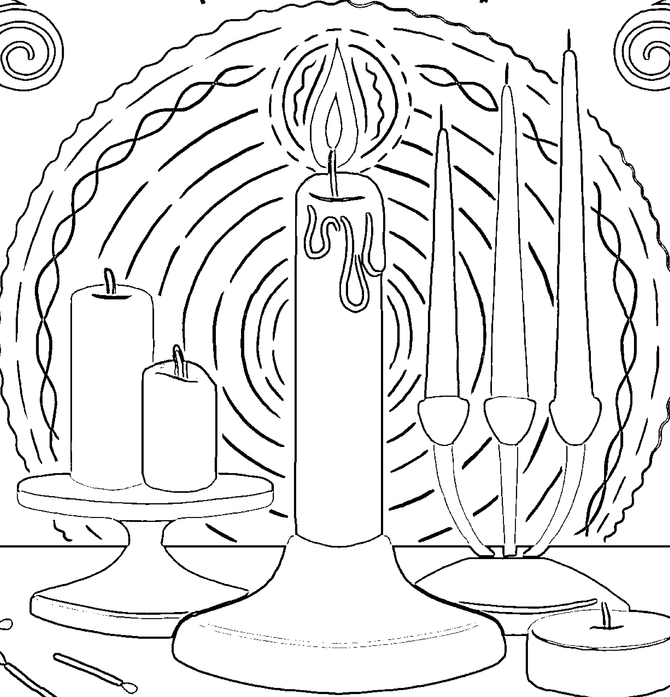

☆☆美国亚马逊至高4.8星，2000多则好评！☆☆

## 制作说明：
本书由《天使神秘学院》出重金从台湾购入的原版书籍扫描制作完成。为达到最好阅读效果，特地把书全部切开后，再经由专业扫描设备高精度扫描完成，并经过一张张的PS后期处理最终成书，其间花费大量的人力、物力以及时间，只为能给大家提供经济并优质的神秘学学习资料而努力。

本学院强力谴责某些机构和个人，把本学院花心血制作完成的电子书籍，包装后直接放在自家网上低价倾销的行为，以谋取不劳而获的经济利益。如果长此以往最终将无人愿意再为大家花心思制作电子书，那以后可能大家再无新书可读。

为让大家以后能够读到更多的好书，也为了本学院的良性发展。本学院恳请大家尽量做到如下几点：

- 一、尽量在天使神秘学院的官方网站购买电子书籍。
官网访问地址：http://www.ac2011.cn
短网址：ac2011.cn
网址含义：(Archangel College 成立时间：2011年)

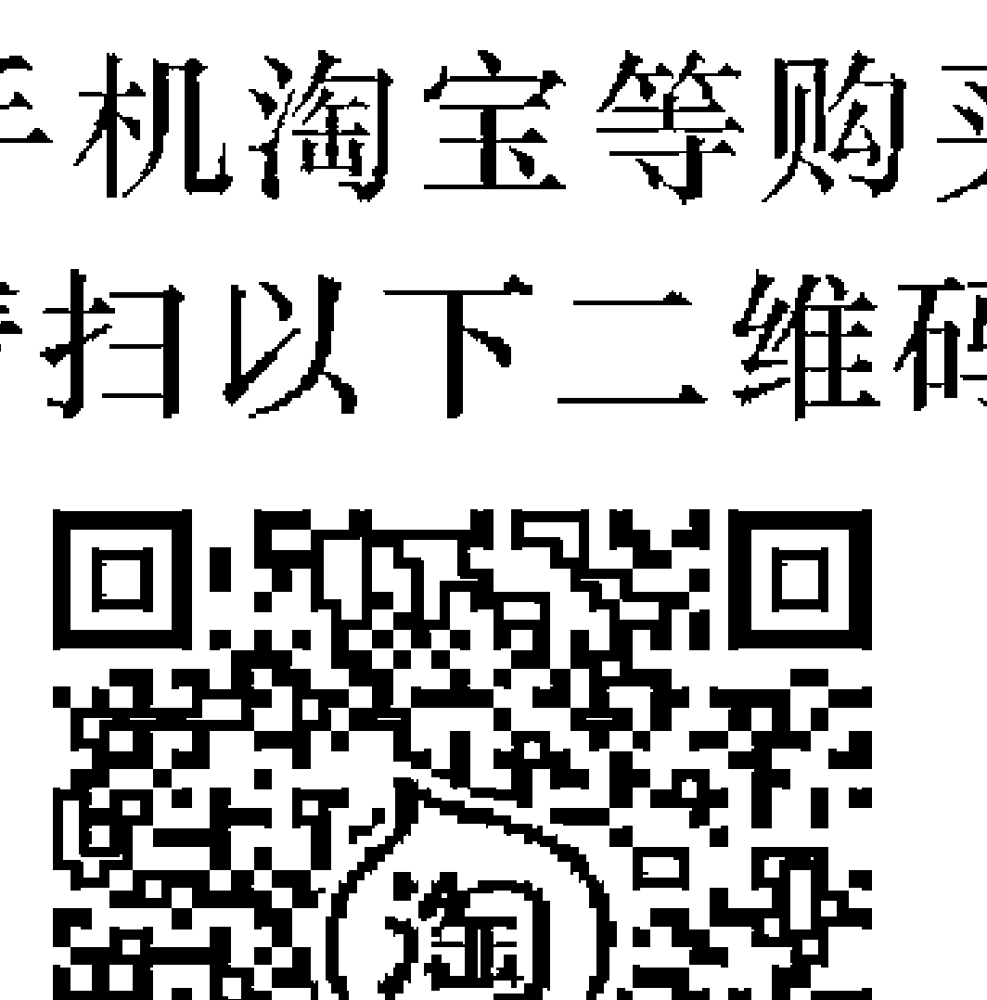

- 二、在收到电子书后小范围传阅即可，千万不要公开传播，更别挂到网上低价销售。

同时为答谢广大支持者，学院电子书将做如下调整：

- 一、学院会把一些早已收回制作成本的电子书折价销售。
- 二、最新制作的电子书籍会开放打印功能，大家购买后有条件的可自行打印成书。

# 蜡烛魔法初学指南
Candle Magic for Beginners

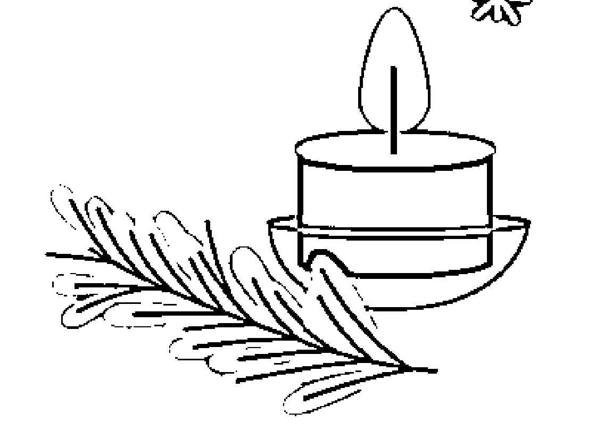

Mystic Dylan

> 献给我们开辟道路的祖先。
献给那些决定追随此道路的人，
也献给那些尚未发现此道路的人。

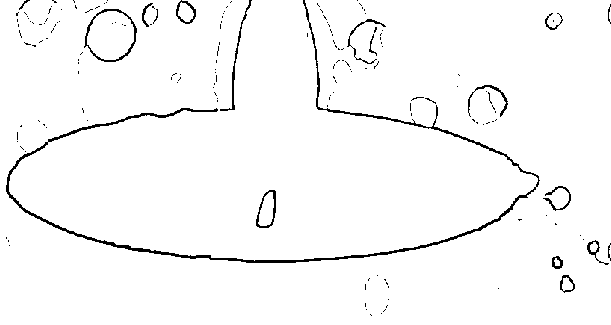

# 目次

- - 蜡烛魔法和你 ……6

# 第一部分 火与转变的力量

- - 第一章 · 了解蜡烛魔法 ……11
- - 第二章 · 蜡烛颜色的连结 ……19
- - 第三章 · 为魔法准备蜡烛 ……31
- - 第四章 · 净化蜡烛、为蜡烛补充能量以及圣化蜡烛 ……41
- - 第五章 · 设定意图和掌握法术 ……51

# 第二部分 蜡烛魔法中带来改变的法术

- - 第六章 · 爱情法术 ……65
- - 第七章 · 疗愈法术 ……83
- - 第八章 · 保护法术 ……101
- - 第九章 · 丰盛法术 ……117
- - 第十章 · 启迪法术 ……131
- - 让火焰尽情燃烧 ……144
- - 对应含义查询表 ……147
- - 参考资源 ……155
- - 词汇表 ……158
- - 致谢词 ……161

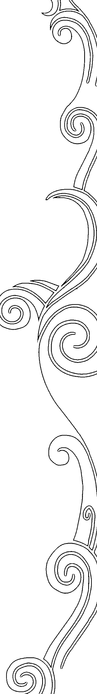

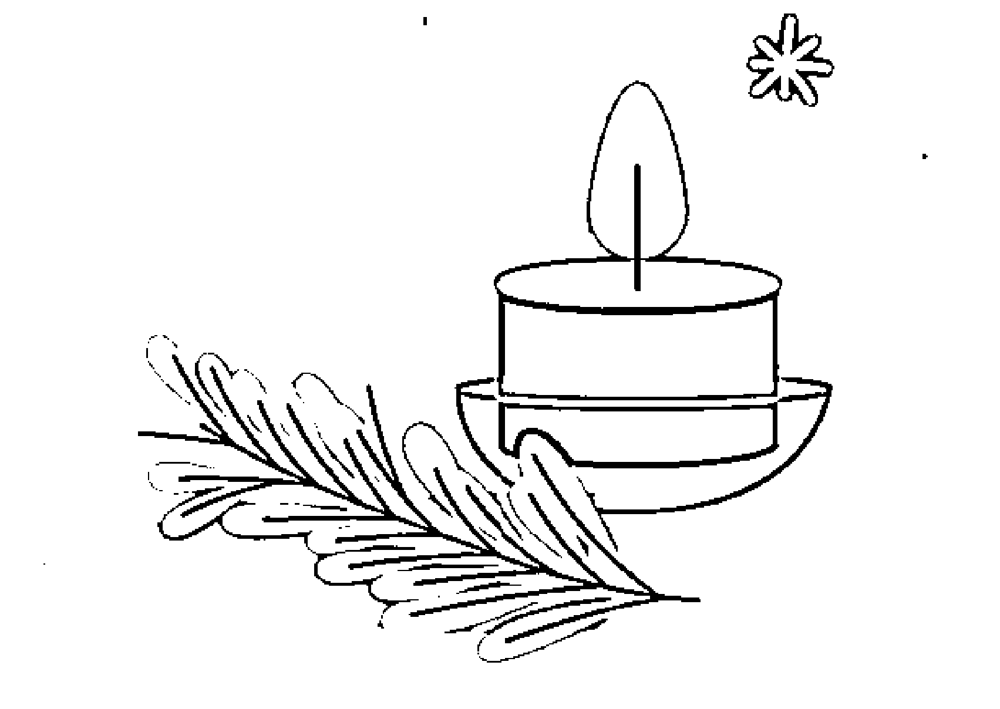

> > 好奇心是学习之烛的烛芯。
>
> —— William Arthur Ward

# 蜡烛魔法和你
如果你正在阅读这本书，代表也许你已经感受到了蜡烛魔法的魅力。也许你感觉到了蜡、烛芯和火焰中蕴含的力量，故而想要进一步探索。如果你想练习魔法或尝试咒语，没有比蜡烛更好的工具。蜡烛能让我们专注在自身的意图，探询我们的创造力。不管你的目标是大是小，蜡烛魔法都是带来转变能量的绝佳方式。

《蜡烛魔法初学指南》不仅包含使用蜡烛施展魔法的方法，还解释了如何透过蜡烛与魔法建立关系。在这本书中，你将了解到火的历史和意义、蜡烛魔法究竟有什么功用，以及如何安全永续地开始练习。你会学到如何设立和显化目标；如何挑选、净化、补充以及圣化魔法蜡烛；如何判断你的法术是不是有效；还有如何占卜、读取火焰和蜡。你将学会30种表达爱、保护、疗愈、成功和幸福的咒语，还可以将这些新知识付诸行动。

如果你刚开始步入魔法历程，我要告诉你我也经历过这个阶段。在成长过程中，我曾和住在西海岸(已离异)的父母和东海岸的祖父母分别生活过。尽管偶尔会出现混乱场面和突发事件，但我的家人一直向我灌输使用魔法所需要的奇思妙想和知识。我的父亲会为我读神话中的史诗冒险、众神和迷人的野兽故事；我的祖母教导我祷告的力量，为我讲述天使的故事，让我了解瑜伽和冥想；我的祖父教我学习历史，让我爱上古埃及。

我的玄学用品店初体验是母亲带我去的，这次经历巩固了我的灵性实践和技能。我和她一起去好莱坞的 Panpipes（现在叫做 Pan's Apothika）庆祝我的九岁生日，在那里我见到了 Vicky，一位穿着黑裙的超凡红发女子。她坐在柜台后面正在雕刻一根蜡烛，周围摆放了一系列最惊人的药草、熏香和精油。

突然，她抬头看着我并微笑。我抓住母亲的手，感到我正站在一个真正的女巫面前。我的母亲当时可能还不知道，但那天标志着女儿女巫历程的开始。我被迷住了：我一直都知道魔法是真的，但现在我知道了魔法是能够实践出来的！

我在 Panpipes 买到了我的第一根蜡烛、第一份精油和药草——蜡烛是我第一次操作的魔法。我较年轻的时候，蜡烛让我待在家里就可以完成法术和仪式，甚至不会引起任何人的注意。训练魔法技能时，我开始使用更多法术并制作小圣坛，蜡烛因此融入了我的日常生活。在成长历程中，我逐渐清楚地认识到蜡烛不仅仅是宗教符号或虔诚的象征；它是力量的灯塔，是驾驭欲望、心愿和显化的方式。

蜡烛一直是我的主要工具。从雕刻蜡烛、涂上圣油再点燃它，我让自己沉浸在魔法仪式中，就这样建立了充满能量的连结，进而为蜡烛和法术带来了生命。

当我开始在魔法商店担任专职女巫时，我常常发现许多客人因为他们的愿望和法术请求都能够藉由一根蜡烛来实现而感到惊讶。我总是为教会他们而兴奋，现在我也很高兴能教导你们。

就让我们开始吧！

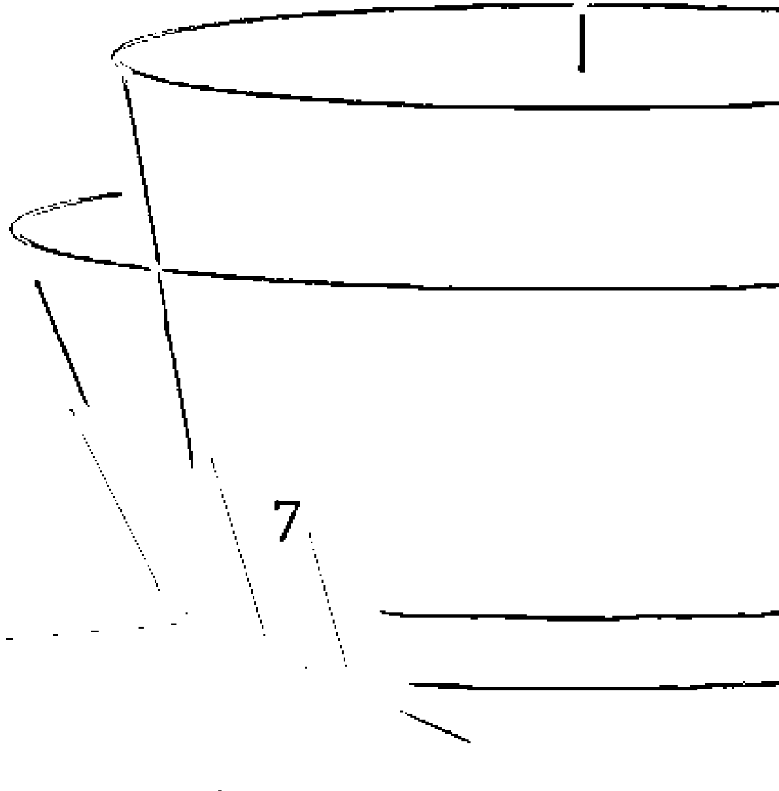

# 第一部分
## 火与转变的力量

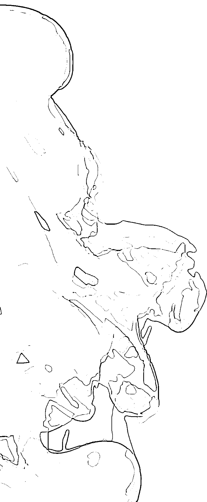

## 第一章 了解蜡烛魔法
在点亮第一根蜡烛之前，我们必须先了解蜡烛魔法是如何起作用，以及蜡烛如何在魔法中成为强大和长盛不衰的工具。我们首先要回溯几个世纪，探索人类与火的丰富关系。

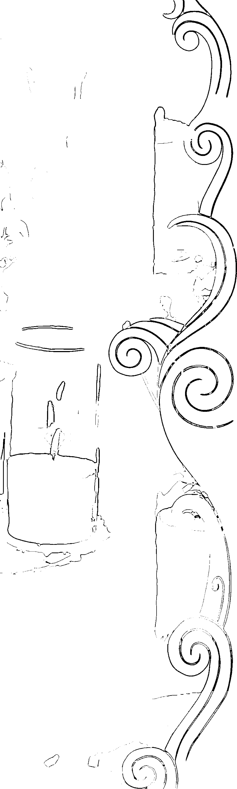

### 火的古老力量
火的历史与魔法紧密相关。大约在四十万年前，当人们第一次将两颗石头互相摩擦，制造出第一道火花时，他们就为人类的彻底改变道路。驾驭火焰让我们的祖先能生活在寒冷的气候中，变革烹饪方式且照亮黑暗。火为他们提供了聚在一起分享故事、跳舞以及与大地和超自然领域建立连结的地方。

我们的祖先认为火极其重要，这就是为什么有众多与火相关的神话——最著名的是古希腊普罗米修斯的故事，他从众神之处偷来火种带给人类。

这个神话把火视作原始、神圣且真正具有魔法的事物。火还没有被人类驯服时，是一种难以控制的元素，它带来痛苦、毁灭和死亡。火因为其两面性而受到尊崇。

火被控制之后，就成为了力量的象征，并且被用在许多魔法和灵性习俗中。古希腊人和古罗马人会进行神圣的火葬，把死者放在火葬的柴堆上再将其点燃。

柴堆也用于圣坛之火，在圣坛上人们会焚烧动物作为供奉神灵的祭品。篝火仪式在许多文化仪式中也发挥了类似作用，比如凯尔特的萨温节和贝尔丹火焰节。在这些分别标志一年中黑暗与光明的节日中，凯尔特和德鲁伊人在山顶点燃篝火，将之作为交感巫术的一种形式——篝火代表太阳，驱散冬天的腐朽和黑暗；火焰则摧毁不好的影响。在某些仪式中，人们甚至会为了得到火的净化而跳入火焰，路易斯安那州南部仍保有篝火仪式的习俗。圣诞节前夜，密西西比河沿岸会燃起篝火，为圣诞老公公照亮道路，据说他会在独木舟（肯琼独木舟）上被八只鳄鱼拖上河。

最终，火用于家里的壁炉中，用来取暖和提供保护。对于当时使用魔法的人来说，火是用来加热坩埚中常见的巫术原料。但蜡烛却还不算司空见惯。其实，我们今天所使用的蜡烛直到中世纪才存在。早在公元前三千年，就有古埃及人用灯心草（一种将灯心草的芯浸在某种脂肪中制成的蜡烛）和蜂蜡制作蜡烛的纪录，但由于养蜂较为危险，蜂蜡在当时非常昂贵。太平洋西北部的美洲原住民会使用蜡烛鱼，那是一种充满油质可食用的鱼，晒干后就能制成蜡烛或火炬。在日本，人们会用鲸脂制蜡，作为蜂蜡的替代品。但在中世纪之前，大多数魔法从业者使用的都是油灯而不是蜡烛。在希腊、罗马和埃及，还有古代犹太教和基督教的习俗中，灯会被用于占卜、仪式和咒语之中。时至今日，油灯仍存在于某些文化的仪式。在非洲裔加勒比人和纽奥良的伏都教和胡督教里，他们最古老的魔法操作依然会使用油灯。

中世纪时期，由动物脂肪制成的兽脂被用来制作蜡烛。蜡烛因可使用动物脂肪制作而变得容易获得，很快就成了居家用品。

中世纪时蜡烛逐渐在魔法中变得常见，而且不仅女巫在使用。将蜡烛用于魔法目的的纪录中，最早是在猎杀女巫期间。中世纪和文艺复兴时期，欧洲有超过八万名涉嫌使用巫术的人被教会处死。一四八六年，一本给审判官和女巫猎人的手册《女巫之锤》中提到，神圣蜡烛可以用来“保护自己免受女巫的伤害”。农民和乡民也会用蜡烛来保护牲畜和家园免受巫术蛊惑。在古老的犹太习俗中，蜡烛为垂死的人点燃，放置在他们的床边以抵御恶魔。为亲人点蜡烛，希望得到神的关怀和神圣智慧的习俗，尔后被基督教采纳，也合并进天主教中。

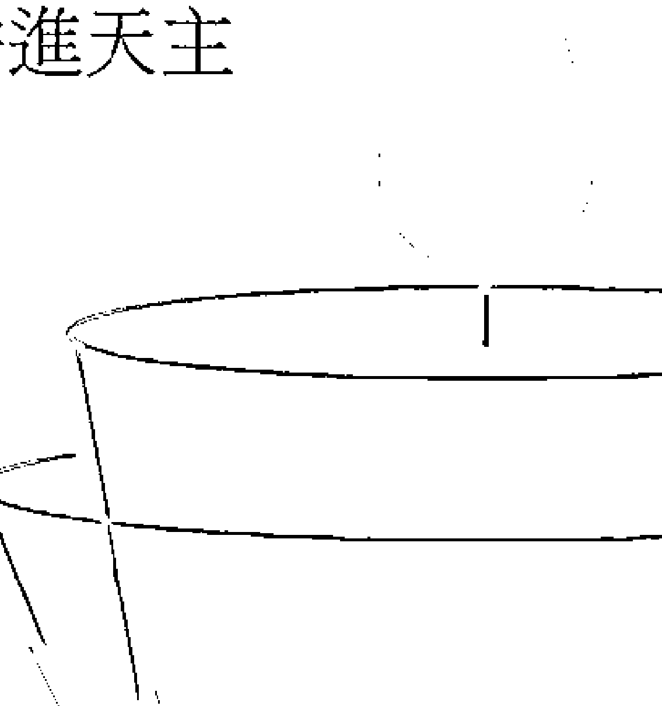

从多方面来说，现代蜡烛魔法的历史都始于天主教。天主教巫师的纪录显示蜡烛本身被视为神圣的，而燃烧蜡烛则被视作一种奉献。这些理念和实践依然存在于蜡烛魔法中。

到了十九世纪后期，一种名叫石蜡的廉价蜡开始被用来制作高品质蜡烛。石蜡取代了动物脂肪，因为石蜡蜡烛更容易制造，也更好闻。石蜡的使用促进了蜡烛的商业用途。到了二十世纪三〇年代末期和四〇年代初期，蜡烛已被视为标准的魔法工具，常用于仪式、祷告、降神或咒语。通灵师、萨满、疗愈师、巫医和伏都教女祭司都会利用蜡烛的力量，为客人和病患治疗。蜡烛是一种特别有用的魔法工具，常见又不会引人注意，可以防止使用者被当作女巫或者异教徒遭教会驱逐。

从十六世纪开始，大西洋奴隶贸易促使加勒比、古巴及纽奥良的天主教和非洲传统相互融合，并且催生了新的灵性信仰。非洲、美洲原住民和欧洲的民间习俗与天主教结合，也创造出数种不同的宗教和灵性习俗。各种风格的蜡烛魔法最终传遍美国，混合了各种信仰和魔法实践。

今日，蜡烛魔法被用于世界各地的咒语和仪式中。蜡烛魔法不属于任何一种特定的传统和宗教；相反，它已经超越一切并扎根于魔法的核心部分。

### 蜡烛魔法的基础
为什么蜡烛会成为现代女巫技能中的主要用具呢？除了蜡烛容易获得且价格低廉之外，还因其具有各种各样的形状、大小、材质和香气，甚至可以自己制作。蜡烛用途广泛，适用于各种灵性和魔法实践，既可以照亮你的神圣空间，也能充当仪式和咒语的主要角色。你可以给蜡烛涂上圣油，为其施加魔法以获得保护；也能透过雕刻和注入能量助你获得财务上的稳定，或者用大头针刺破，影响潜在的情人或客户。即使蜡烛燃烧完毕，其魔力也依然存在。你可以用蜡烛残余的蜡来制作强大的护身符，或观察蜡融化后残留的形状来解读你的咒语效果。虽然蜡烛本身就充满强大的魔力，但其精华和魔力还可以透过精油和神圣药草来扩大。

蜡烛是前往神圣的火炬，是通往另一个领域的管道，是魔法和巫术的灯塔。蜡烛不仅拥有强大的魔力，其燃烧过程本身也是仪式的一部分。当你在咒语或仪式中使用蜡烛时，就是在利用四种元素的力量。就像古时伟大的炼金术士一样，你正在运用能带来转变的能量。仅仅是点燃蜡烛就能用它的基本元素——火——将伟大的泰坦神普罗米修斯为我们带来的原始礼物相连结。与空气的神圣交融为火焰提供了养料，吸引人的舞蹈于是展开表演，最终为我们实现愿望。烛蜡代表了稳定和力量，融化的烛蜡就像树干，如同树根一般连结你和大地，让你的目标开始扎根。随着火焰舞动，蜡开始融化。蜡烛，作为力量的核心，从固态变成了与水元素合而为一的型态，与我们的情感欲求相连结，将所有元素融为一体。等到蜡烛融化并变形，第五个，也是水、火、土、风之后最后一个元素——灵性——就出现了。如果你能运用直觉，甚至可以窥探蜡油留下的图案并理解蜡烛的密语。

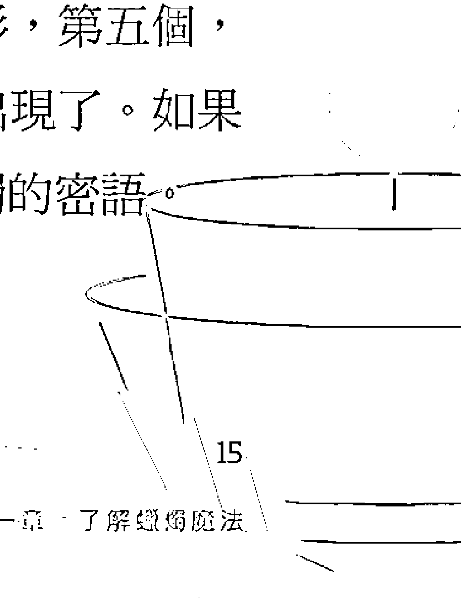

### 带来光明、消除和转变的火
点燃蜡烛芯并不是一件普通的事；你是在释放火焰本身的原始本质。蜡烛不仅是物质欲望的表现，也承载并吸引着能帮助你实现目标的灵体和能量。我会鼓励你注视蜡烛的火焰来解锁潜意识，释放你的灵性自我。蜡烛拥有为你清除恐惧、消除负面能量的力量，让你注定成为神圣的存在。使用蜡烛魔法时，千万不要忘记蜡烛能释放出强大的力量，这种力量可以透过它和你的关系来得到推动和增强。

### 魔法会流向意图所在之处
就像你了解到的一样，蜡烛代表四种元素——风、土、水、火——这也让蜡烛成为与宇宙能量连结的首选工具。但是请记住，仅仅点燃蜡烛是不够的。蜡烛魔法的关键是设立意图。首先，你必须专注在意图上，将之融入蜡烛中，为其注入你灵魂的能量和热情。

为蜡烛注入你的目标和意图能够为蜡烛和咒语带来声明。当你把自己灵魂的一部分注入魔法工作的时候，目标就能唤起灵体。

### 你知道那是魔法，对吧？
随着你的魔法操作逐渐深入，你会开始注意到蜡烛魔法在你身边比比皆是。想想看当你许愿然后吹灭生日蛋糕上的蜡烛——那就是魔法。当你为亲人的需要而点燃蜡烛，那也是魔法。即使是万圣节放在南瓜灯里的蜡烛也有着与魔法和民间传说相关的根源。

### 指明道路
创造力的火花已经被点燃——是时候让火花变成真正的火焰。蜡烛魔法是一种强大的操作，也是展开魔法和灵性历程的绝佳方式。接下来，你会了解到蜡烛颜色的重要性与其相应的特质和魔力。

## 第二章 蜡烛颜色的连结
在本章节中，你将会深入了解颜色的重要性，与其所带来的魔法。这些颜色的连结源自胡督教、民间魔法和传统巫术的混合，有助于你为魔法工作找出合适的蜡烛。自然界存在许多不同的颜色，每种颜色都有特定的含义。在这里，你将熟悉蜡烛魔法中常用的颜色与其独特的意义。

### 颜色的力量
在进行蜡烛魔法或任何其他仪式时，选择合适的蜡烛颜色非常重要。每一种颜色都有其本质，能够带来某种感觉并散发出特定的能量。挑选特定的颜色将为你的咒语和你期待的结果定下基调。仅仅凭借颜色，你便得以在咒语中如愿取得的成果。选择合适的彩色蜡烛不但可以用你的意图和颜色意义来锁定你的咒语，也能加强四大元素的特性，带来需要的特质，还能吸引特定的灵体和神明。

你将在下文开始探索标准蜡烛颜色中所蕴含的奥秘和讯息。请记住，虽然这些颜色的连结是极佳的参考，对于初学者来说更是如此，但你所选择的颜色最终应该基于个人感受以及与该颜色的关系。例如，我并不喜欢橙色和黄色，所以即使橙黄两色和强大的积极能量联系在一起，我还是会在其他能与我产生共鸣的颜色中寻找连结和力量，如紫色和蓝色。

### 红色
红色是血液的颜色，代表我们的生命力、活力、吸引力、性能量、欲望、野心、男子气概和力量。红色是生与死的颜色，是火与土，也是暴力与爱、性与疗愈的颜​​色。由于它平衡的特性以及与原始和祖先能量的连结，被许多人认为是最有魔力的颜色。红色是女神伊希斯和莉莉丝的神圣颜色，与高深魔法（不考虑好坏、黑暗或光明的原始或混乱魔法）有关。红色也对应牡羊座，与火星有关联。红色蜡烛可以用于与活力、力量和健康相关的魔法；也能用于专注实现目标、克服阻碍或性爱魔法之中（用于魔法、仪式或灵性目的的任何性活动）。当你需要为自己增添更多关注时，这种夺目的颜色能助你获得运气和勇气。虽然红色常用于爱情魔法中，但请记住，红色能散发出非常性感的能量；如果你想要的是长久伴侣、一对一的配偶或婚姻的话，要保证你的意图极其明确。你可能会需要玫瑰或茉莉等药草来装饰、涂抹在红色蜡烛上，以抑制其热烈的特质，用宁静、爱、和谐和浪漫平衡之。或者你可以用更含蓄的粉色蜡烛来代替红色蜡烛——粉色最适合爱情关系和一对一的伴侣。

在古希腊，红色被认为是生命的颜色，在巫术仪式中被用来与灵体交谈。红色也用于对抗外部力量，比如恶灵或敌人。红苹果、石榴、毒蘑菇和莓果都被视为希腊和罗马诸神的食物，所以你可以在咒语中使用红色蜡烛来吸引神明和灵体协助你的魔法工作。

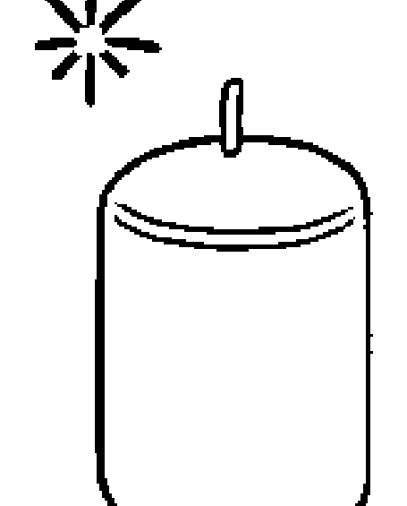

### 橙色
橙色能带来正面能量、活力和勇气，和太阳的力量有所连结，此外也和水星及火元素有关。这个颜色可用于获得正面结果、工作成功和愿望实现的法术。

如果你正在为新工作做准备，或者希望自己的工作能力在更大的群体中获得关注，那么在咒语中使用橙色蜡烛，就可以从众人中脱颖而出。橙色代表秋天树叶的变化，因此也可以用在需要变化、改变和相关炼金术里。

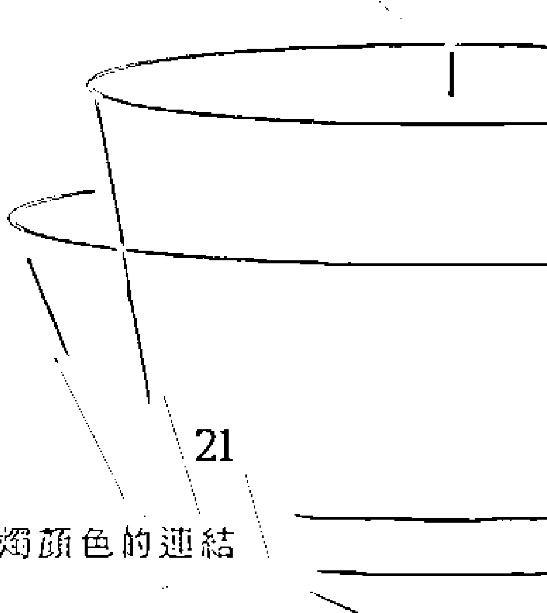

### 黄色
黄色能展现出光彩、欢乐和清晰的能力，也与阿波罗、荷鲁斯和密特拉等太阳神联结。使用黄色蜡烛能提升灵视力、洞察力，在你需要用咒语寻求真相的时候也有帮助。黄色常用于解除诅咒、消除厄运和保护的法术。在寻求疗愈引导或需要提振心情、消除忧郁的时候，你都可以使用黄色蜡烛。总体而言，黄色可用于唤起幸福感，以及从手术或病情中康复的仪式。

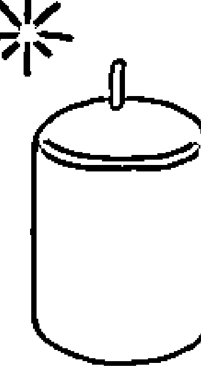

### 绿色
如今，绿色是最常和金钱、丰盛和贪欲关联在一起的颜色；然而对于古埃及人来说，绿色是生命、生育和青春的颜色。绿色是欧西里斯、柯尔努诺斯、潘神、奥岗之神和德墨忒耳的神圣颜色。在凯尔特民间传说中，绿色也和精灵及其魔法有关，可以让我们连结到另一个世界（一个与我们的世界有些相似的超自然世界，在那里神灵、幽灵、仙灵及我们的逝者生活在一起）。地球与金星是和绿色相关的恒星，水与土是和绿色相关的元素，也和金牛座有关。这个颜色散发出关于幸运、成功和财富的强大频率。绿色的能量对于那些希望怀孕的人很有效，也可以用于生育和性爱相关的魔法。绿色代表大地的恩赐以及大自然为我们提供的财富。这个颜色最适合希望获得金钱增长、稳定、幸运、丰盛和成功的咒语及仪式。绿色也能用在对抗嫉妒、野心、贪欲和偷盗的法术中。

### 靛藍色

靛藍色是深沉而豐富的顏色，和藍色處於同一個光譜。靛藍色對應的行星是土星和金星；是伊希斯女神和聖母瑪麗亞的神聖顏色；與更新、放鬆、反思和緩解緊張有關。這個顏色能用在需要冥想和催眠的法術和儀式中，也可以用來迎接新開始或為家庭帶來祝福。

### 藍色

藍色是優雅的顏色，和天堂及神意有關。藍色是宙斯、葉瑪亞、聖母瑪麗亞和埃及天空女神努特的神聖顏色。和藍色有關的元素是水元素。藍色蠟燭在魔法工作中可以用來加強療癒咒語的力量。藍色能中和激烈的振動頻率，也可以用來營造平和安寧的感受，所以常常用於房屋淨化和能量魔法之中。藍色的諾維娜蠟燭或抽出式蠟燭可以在特定的魔法中向聖徒和神靈祈願。

### 粉色

粉色是真愛的本質，是阿芙羅黛蒂、維納斯和爾祖里耶女神的神聖顏色，也是愛情的顏色，代表愛戀、同情、美麗和忠貞。粉色蠟燭能用在提升戀愛關係、一對一的伴侶關係，還有婚姻的咒語之中，也可以用於吸引新戀情和幸福的儀式。粉色亦有助於緩和、療癒朋友之間的不和、消除憤怒以及帶來和諧的人際關係。

### 紫色

紫色是關於王室和神聖的顏色，也是代表力量和超自然的顏色。當你看到紫色花朵的時候，那是來自天上神明的賜福。紫色是巴隆·撒麥迪（安息日男爵）、戴歐尼修斯、巴克斯以及蓋得諸神的神聖顏色，這些神靈都是伏都教眾神，或關於性愛、生育和死亡的神靈。紫色蠟燭可以用在需要大量能量的咒語之中、獲得個人獨立或財務自由的咒語，或者用在你覺得想要的目標難以實現的時候。紫色是高振動頻率的顏色，非常適合用於靈性工作、催眠冥想和靈體飛行。點燃紫色蠟燭可以獲得通靈力，也適合在占卜的時候點燃。

### 棕色

棕色代表大地，既意謂土元素與地球。由於棕色帶有力量和平衡的強烈振動，你可以用棕色蠟燭來吸引穩定。這個顏色可以用在正義的法術、大地魔法、動物和寵物的法術以及吸引自然精靈的法術。在儀式裡使用棕色，可以讓你腳踏實地、頭腦冷靜；你也可以在需要力量和勇氣來做出艱難決定和選擇的時候使用。

### 灰色

灰色代表世界之間的臨界點，或是把人類和未知世界分開來的面紗。灰色是命運三女神和格賴埃三姊妹、墨丘利和雅典娜的神聖顏色。灰色和風元素有關，也能用於祖先魔法和旅行魔法。灰色蠟燭最適合用於靈體交流和招魂巫術，也可以用來中和負面能量。你可以在關於交流、知識和智慧的法術中使用灰色；可以在學習、閱讀的時候點燃灰色蠟燭來幫你記住知識，或者在家裡燃燒灰色蠟燭來了解家中可能居住的靈體。

### 黑色

黑色與邪惡和招禍魔法有關的想法，完全基於偏見和文化種族主義。雖然有些人認為使用黑色的魔法是邪惡、骯髒又落後的，而使用白色的魔法是美好、純潔且乾淨的，但這種看法並不正確。其實，黑色在歷史上的諸多文化中都代表了生命。這是暗月和虧月的顏色；是赫卡忒、倪克斯和狄阿娜的神聖顏色，也與土星、土元素和水元素有關。黑色是智慧和死亡的顏色，象徵復活和更新。因為黑色之中沒有光亮，且能容納所有顏色，因此相當適合用來吸收、轉移負面能量、靈體、詛咒和巫術。黑色蠟燭能用在需要束縛、驅逐、消除厄運和驅魔的法術。

### 白色

白色中的無色讓白色成為魔法工作和相關領域中相當強大的顏色。這個顏色意謂靈性領域、純真、奇蹟、純潔和新開始。白色是哈索爾、塞里德文、艾希斯、樟戈和三相女神的神聖顏色，與月亮和五元素——土、水、火、風和靈性都有連結。白色和牛奶的顏色相同，因此常常和生命、生育及營養聯繫在一起；在許多民間魔法中，白色都被當作和善良與平衡具有高度象徵意義的顏色。白色是骨骼的顏色，與死亡和結構相關聯。白色也是雪的顏色，能凍結或干擾其他能量，作為保護免受外力的影響。通常，你可以把白色想像成能隨時轉變成任何型態的空白畫布；既是開始也是結束。白色蠟燭能用於帶來清晰、保護、冥想和天使魔法的咒語中。點亮白色蠟燭能吸引靈感和創造力，或者創造出神聖空間。

### 金色

金色包含了男性神明的能量，特別是那些與太陽有關的能量。阿波羅、太陽神拉、荷魯斯、密特拉斯還有奧香女神都和金色有關。金色的太陽能量與火相似，能用在帶來豐盛、成功、吸引力和金錢的法術。把金色融入儀式可以召喚神聖男性能量，或者對某人某事造成影響。如果你正在計畫進行談判，在你的魔法中使用金色蠟燭，就能吸引雇主或客戶並引起他們的注意。

### 銀色

銀色是神聖女性能量的顏色，是所有月亮女神的神聖顏色，因此充滿月亮的特性，能代表法術中所需要的任何月相。銀色蠟燭可用於關於通靈工作、金錢、財務穩定、和平、保護和靈性指引的法術，以及增強咒語力量和靈性智慧的法術。銀色也能用在咒語中，提升靈視力、母性和婚姻關係。

### *顏色的變化

當你在準備自己的蠟燭工具包時，你會發現每種顏色都有許多不同色調可以選擇。雖然不同色調可能有不一樣的振動頻率，但選擇「錯誤」的色調並不可怕。如果一個法術需要的是深紫色，使用不同的色調，比如淡紫色，也不會破壞你的法術。但是請記得，不同色調的確會帶來改變；淡紫色仍然含有紫色的預言能力和洞察力，但其振動比深紫色舒緩，通常用在冥想和睡眠當中。選擇能和你建立連結的顏色最為適合，然後再去探索不同色調中能使用的選項。有一個很好的經驗法則就是顏色愈深，能量愈強烈；相反，愈淡的顏色就會帶來愈含蓄的結果。下文介紹了你可能會遇到的幾個顏色變種，以及最佳使用方式。

- 鮮藍色：可避免惡魔之眼，電光藍也能帶來正義，吸引風元素（的靈魂）。
- 深藍色：深藍色是哈德斯和涅普頓的神聖顏色，與木星和土星連結。這個顏色和水元素有關，能用於大海魔法，也可以用在需要情感力量和清晰頭腦的法術裡。
- 洋紅色：這個顏色對於心靈療癒、恢復健康和靈性覺醒的相關法術很有用。
- 酒紅色／栗色：這個顏色在伏都教和薩泰里阿教常常用到，深紅色是奧孫眾神、洛阿眾神的神聖顏色，代表來自大地的祝福、魔法工作和性愛魔法。
- 祖母绿色：這種深綠色可以用在所有促進增長、豐盛和財務成功的法術中。祖母綠對應金星，能用來尋求穩定、一對一的戀愛關係。
- 深綠色/森林綠：這是更深更暗的綠色，可以在阻擋嫉妒和結束財務糾紛的咒語中使用。這些顏色也可以用在法術或儀式中，以贏得法律案件或者訴訟。

### 女巫小提示

### 用于各种法术的蜡烛

可供选择的彩色蜡烛有很多种类，所以请不要觉得非得搜集到所有蜡烛不可。如果你觉得有个魔法工作需要用到你缺少的特定颜色蜡烛，同时你的蜡烛工具包中没有适合这个魔法的对应颜色，那只要用黑色或白色蜡烛替代就可以了。黑色是所有颜色的集合体，因此可以用於任何魔法，承载所需要的振动频率。黑色也可以消除、抵御负面能量，因此是很棒的万能蜡烛。白色不代表任何颜色，还能和四种元素相连结，因此白色可以作为任何颜色蜡烛的替代品，用在特定法术或仪式中（这也是最容易找到的蜡烛）。白色与神圣和天国的连结也让白色蜡烛成为传统万能蜡烛的理想选择。无论你使用的是黑色还是白色蜡烛，请考虑你的意图，然后选择最适合且最符合你想要结果之振动的蜡烛。

### * 指明道路

顏色可以被當作能量的視覺組成部分。當你關注希冀從法術中獲得的結果時，可以想像一下這個目標為何或什麼顏色。當你開始探索不同的顏色且熟悉其振動和意義後，就可以找到最適合你法術的顏色。選擇顏色的時候，你可以將有助於魔法的任何神明、行星、星座或元素納入考量——運用其相應顏色可以加強法術的特點。但顏色並非唯一需要注意的事情。在下一章節，你會了解到各種各樣的蠟燭形狀和尺寸，認識各種蠟燭可以為魔法帶來的益處。

## 第三章

## 為魔法準備蠟燭

在本章中，你將探索不同形狀、大小和燃燒時間的蠟燭，還有這些因素會為蠟燭魔法帶來什麼作用。你也會了解到什麼蠟燭可以用在特定儀式和法術中，以及如何為法術和魔法工作做最好的準備。

### 不同种类的蜡烛

如果你的蜡烛魔法之旅才刚开始，我认为最好可以准备多种不同的蜡烛。准备好不同形状、大小和颜色的蜡烛，以及多种药草和精油，可以让你随时自由地使用魔法。

虽然我并不鼓励你去疯狂采购（虽然这样满有趣的），但还是建议你可以思考一下将来你想使用的法术和仪式，并准备好需要的原料。在身边准备一些基础蜡烛也很棒，比如许愿蜡烛或圆柱蜡烛，这样你就可以在机会出现时轻松操作。没有什么比为了及时完成满月仪式而在最后时分寻找需要的蜡烛和工具更有压力了。

你可以选择不同方法来管理蜡烛魔法工具包：例如参考上一章节的蜡烛颜色对应含义，搜集相对应的蜡烛，或者一次关注在一种特定的魔法工作上，备足同一种蜡烛。在阅读这本书的过程中你会发现，并不是所有仪式和法术都需要特定类型的蜡烛；虽然如此，你依旧需要选择最适合魔法工作的蜡烛。在这些时刻，你必须运用自己的直觉，感受哪种蜡烛会发出和你选择的法术或仪式最相关的振动——这正是你工具包中各种蜡烛派上用场的时候！

### 许愿蜡烛

**燃烧时间：** 10 到 15 小时

许愿蜡烛大约 2 英寸（5 公分）高，能够放进玻璃或陶瓷许愿烛台里。你可以使用没有烛台的许愿蜡烛缩短燃烧时间，或者在需要法术后进行滴蜡占卜时使用。这些蜡烛有各种各样的颜色，通常成包出售且价格合理，非常适合蜡烛魔法初学者使用。

### 諾維娜蠟燭／守夜蠟燭

燃烧时间：7至9天

也称为七天蜡烛，诺维娜蜡烛或守夜蜡烛可能是最著名也最容易找到的蜡烛，常用在胡督教、伏都教、民间魔法和萨泰里阿教中。诺维娜蜡烛有许多不同的版本和样式：有些带有与天主教圣徒相关的标签；有些可能在玻璃上印有好运符文；有些则非常简单，上面没有任何图案。诺维娜蜡烛有多种颜色，相当适合涂上魔法油使用——你可以在蜡烛的玻璃罐上用麦克笔画出带有力量的符号和文字替蜡烛增加能量，这种蜡烛罐比较高，你可以毫不费力地在里面倒入精油和药草。这些蜡烛应该在不中断的情况下一直燃烧到尽头，但如果你想要控制火焰，采取额外的防护措施，也可以将蜡烛放在水槽、浴缸或淋浴间。

### 茶燈蠟燭

燃烧时间：3小时

茶灯蜡烛是重要且实惠的投资。这些蜡烛随处可见，可以买到各种颜色，通常以大包装出售。茶灯蜡烛适合用来制作仪式圈或准备圣坛来强化法术。为了完成一些简单快捷的魔法，你可以在茶灯蜡烛顶部滴一点芳香精油再撒上些许药草。在工具包中准备一些茶灯蜡烛能让你随时随地体验魔法。

### 蜂蠟蠟燭

燃烧时间：超过60小时

蜂蜡在魔法领域有悠久的历史。曾经蜂蜡非常稀有，需要历经艰险才能取得，使之愈发神秘也更具灵性力量。蜂蜡是一种天然材质，燃烧时间长，因此成为现代蜡烛魔法师的奢侈品；成本使然，蜂蜡蜡烛未必适合简单的法术。蜂蜡蜡烛有各种形状、大小和颜色，可卷制、倾倒，也能做成浸入式蜡烛。这样的蜡烛最适合需要强烈振动和目的的长仪式。

### 大豆蠟燭

燃烧时间：5至10小时

大豆蜡烛成分天然，使用大地魔法的人时更常用到。大豆蜡烛能很好地保留香味，但燃烧时间比蜂蜡蜡烛短，此外相当易碎，在涂魔法油的时候往往难以成型或雕刻。大多数大豆蜡烛都包装在玻璃中。这样的蜡烛最适合用于疗愈与更新相关的法术，或召唤自然之灵仙的法术。

### 七日旋钮蜡烛

燃烧时间：7天

自二十世纪三○年代以来，由七个圆形旋钮堆叠而成的七日旋钮蜡烛，在非洲民间魔法、召唤魔法和伏都教的魔法师中就已经相当常见了。

七日旋钮蜡烛的标准用法是将每个旋钮用于一个愿望——你可以对每个旋钮许下不同愿望，也可以对所有旋钮许下同一个愿望。然后按照想要的样子雕刻各个旋钮，刻上和你魔法有关的符咒和文字。接着在蜡烛上涂抹精油和/或药草，连续燃烧七天，每天燃烧一个旋钮，在法术完成时掐灭或剪掉火焰（千万不要吹灭）。这种蜡烛非常建议常备在工具包中，特别适合需要多天完成的魔法。

### 抽出式蠟燭

燃烧时间：3至7天

与诺维娜蜡烛／守夜蜡烛类似，抽出式蜡烛大约高8英寸半（21.5公分），放在和蜡烛大小相同的玻璃烛台中。但是和诺维娜蜡烛不同的是，抽出式蜡烛可以从玻璃烛台中抽出单独使用——这也是其名称的由来。这样的蜡烛适合各式咒语和仪式，可以用精油雕刻和装饰；或将药草直接放入玻璃杯的底部，再放上蜡烛使其完全燃烧到底。抽出式蜡烛因为效率高且容易特制而很受欢迎，是所有蜡烛魔法工具包必不可少的。

### 淨蠟燭

燃烧时间：90分钟至2小时

净蜡烛对所有魔法师而言都是必备品，尤其对新手或初学者更是如此。净蜡烛高4英寸（10公分），包含各种各样颜色，易于为法术进行雕刻、燃烧速度快，因此适用于多种魔法和咒语。你可以用非常合理的价格买到——一个蜡烛通常只要1到2美元。这种蜡烛是你工具包中可随时备妥的最佳选择。

### 造型蠟燭

燃烧时间：视形状而定

另一个在现代蜡烛魔法师中常见的工具就是造型蜡烛，造型蜡烛有人物、动物形状，也有其他形状，可以用于交感魔法，这是基于“物以类聚”原则的法术。所以，蜡烛的特定形状会吸引需要的结果。例如，黑猫蜡烛可用来吸引好运、驱除厄运；男性或女性人物蜡烛能用来代表你想要吸引、疗愈或影响的特定人士。

### 柱狀蠟燭

燃烧时间：30到35小时

柱状蜡烛随处可见，但是在现代蜡烛魔法中，已经被抽出式蜡烛所取代。如果柱状蜡烛是你最后的选择或你只是更喜欢用它，当然随时都可以使用。柱状蜡烛相当适合长期目标，且可以用在需要月相和行星来引导，或者是需要持续数十天甚至数周的法术或仪式。柱状蜡烛适合雕刻，有多种颜色和大小。

### 錐形蠟燭

燃烧时间：12小时

锥形蜡烛以狭长的形状和锥形顶部而得名，最适合用在目标简单的仪式或吸引力法术中。这种蜡烛非常容易损坏，燃烧周期杂乱还会滴落大量的蜡，因此对需要雕刻或动手法术来说并不是最佳选择——但很适合用来做蜡烛占卜。在锥形蜡烛上涂抹茉莉花、薰衣草或其他吸引爱情的精油，在约会时点燃就可以加强爱意和吸引力。由于锥形蜡烛非常高，因此常常在数日里分段燃烧。金色或银色的蜡烛可用以获得来自天界和神灵的协助，亦可用于金钱魔法。

### 自製蠟燭

虽然自己制作蜡烛非必要，但自制蜡烛无疑是从头开始进行法术并创造更高更强振动频率的好办法。如果你想制作自己的蜡烛，有些网络课程能帮你挑选必要的工具和设备，学到不同的蜡烛制作方法，在你的手工制作之旅中带来帮助。如果你对自制蜡烛感兴趣，却没有能力自己制作，也可以去商店里购买其他女巫伙伴的自制蜡烛和仪式工具。

### *香味

就像颜色一样，气味也有自己的振动和魔法效果。你在使用芳香彩色蜡烛时，可能会遇到的一个挑战就是其魔法关系未必匹配。所以，在选择气味时，请运用直觉。如果你要进行为期几天的仪式，或者需要蜡烛燃烧到底而不是人为熄灭的法术，请确保蜡烛的气味不会打扰到自己、家里或工作区域的其他人。许多魔法师会用香味装饰、涂抹自己的蜡烛。而我发现，香味不但会为魔法增添个人风格，也会加强法术的振动，让法术更有效。只需要把一两滴精油涂抹在蜡烛上，或是滴在蜡烛顶部，就能创造奇蹟。

### *燃烧时间

在阅读这本书以及你的魔法实践过程中，你会发现有些法术和仪式需要不同的时长，付出不同的努力。所以，在为你的法术选择蜡烛时，请一定要将燃烧时间考虑在内。除非你想不断地添加蜡烛，否则茶灯蜡烛或许愿蜡烛可能不适合历时数日的法术。如果法术要求蜡烛不灭并彻底燃烧，那么请实际考虑一下你可以为这样的法术付出多少时间和注意力。如果你没办法照料蜡烛直到完全烧尽，也请注意不要让蜡烛在无人看管的情况下燃烧；你可以选择燃烧时间短的净蜡烛，而不是更大的蜡烛。如果你需要进行比较大型的魔法操作，可以考虑有玻璃烛台的抽出式蜡烛或诺维娜蜡烛，这样比锥形蜡烛或其他没有外部保护的蜡烛更安全。

### *尋覓蠟燭

通常，蜡烛很容易就能取得，这也是蜡烛在巫术、伏都教、胡督教、威卡教和其他灵性操作中如此常见的原因之一。本章提到的蜡烛大多能在网络、药店、杂货店，甚至是十元商店找到。像造型蜡烛、抽出式蜡烛以及七日旋钮蜡烛这类主要用于魔法或灵性目的的蜡烛，也能在玄学用品店、神物铺子、女巫店或网络上找到。

请记住，无论你在哪里购买蜡烛，其力量和用途都是相同的。不管你的诺维娜蜡烛是在哪里找到的，都和蜡烛的力量无关——只和价格有关。尽管你可能会想支持当地的玄学用品店，但最终，魔法来自于你自身。

### *指明道路

你现在已经了解能搜集和使用的各种蜡烛，也熟悉其所能完成的魔法。但是在你深入研究咒语施法之前，必须先准备好蜡烛——是时候进行一些需要动手的魔法了。在下一章节中，你将会了解如何为法术和仪式正确准备蜡烛。

## Chapter 4
第四章

## 淨化蠟燭、
為蠟燭補充能量
以及聖化蠟燭

在這一章中，你將學到如何創造神聖空間、如何淨化蠟燭、聖化蠟燭的重要性，還有理解合適的燃燒時間。這些都是必需的靈性操作步驟，不僅可以為法術增強蠟燭的魔法特性，也能喚醒內心深處的能量振動。

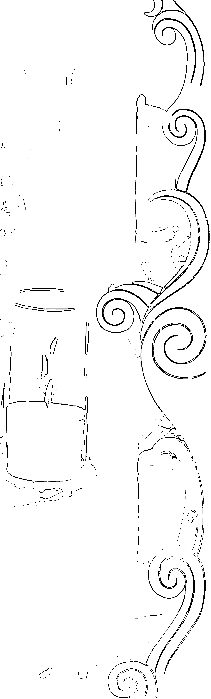

## 創造出適合蠟燭魔法的空間

在進行蠟燭魔法或其他類型的法術時，許多魔法師都會想擁有專門用於魔法或儀式的神聖空間。這個空間叫做「聖壇」——在這裡你可以放置蠟燭或操作法術。聖壇可以設在桌子、書架、行李箱，甚至是梳妝臺上。有些女巫和魔法師會重新裝飾聖壇，以適應不同的季節、節日，或者是為了祭祀特定的神靈。你可以用水晶、羽毛、花朵、圖畫、雕像和彩色蠟燭來隨意裝飾聖壇，與你想要慶祝或紀念的一切相連接。就像你在這本書和其他類似書籍中能讀到的一樣，許多法術都建議與神靈和靈體一起進行魔法工作，這樣的話那個神靈或靈體的元素就能融入你的聖壇，增強你的法術。

準備聖壇時，安全永遠要放在第一位。請確保你的聖壇周邊沒有電線、手機充電器或者其他障礙物。聖壇上的蠟燭燃燒時，請確保蠟燭遠離針織物品、紙張以及所有易燃材料。如果你燃燒的是淨蠟燭、錐形蠟燭或許願蠟燭，請務必將蠟燭放在蠟燭架或耐熱盤子上。一定要在身邊準備一碗水或一杯水。水可以撲滅失控的火苗，也能邀請靈體協助你的魔法工作。

有一個保持聖壇乾淨的方法是在另外的區域準備蠟燭，例如廚房。在我自己的魔法操作區，我用一個指定的便攜托盤作為蠟燭臺；把蠟燭放上聖壇之前，就在那裡雕刻、裝飾和準備蠟燭，這樣蠟、精油和粉末還有其他東西就只會落在托盤上，而不會把房間搞得一團亂。另外一個簡單的解決方案是用紙箱作為蠟燭臺。

## 淨化蠟燭

淨化在所有魔法操作中都是非常重要的部分；如此你才能清除蠟燭、工具和空間中的負面、污濁能量和之前存在的能量。你的工具必須一直保持乾淨，使其振動頻率達到最高也最有效。淨化本身就是一種儀式，在大多數靈性做法和魔法實踐中都很常見。淨化有許多不同方法，但我發現煙霧淨化或者說煙熏淨化——我也喜歡叫它「靈性熏蒸」——是最有效的方法。讓蠟燭接觸正在燃燒的藥草、樹脂、木材或熏香的魔法／淨化特質也能增強蠟燭的效果。

進行淨化儀式請遵循以下的簡單步驟：

1. 確定你想要用什麼來淨化蠟燭。你可以選擇藥草、木材或熏香，如乳香、沒藥、聖木、鼠尾草、甜草、迷迭香或肖楠。以你的個人喜好為準。如果你沒辦法做決定，可以考慮你信奉的靈性道路是什麼，以及想要和哪些靈體／神明一起進行魔法工作。
2. 點燃選好的熏香，等待煙飄出來。(如果你用的是乳香或沒藥，必須放在木炭盤和香爐上燃燒。) 當熏香開始冒煙且堆積的時候，把香棒像魔杖一樣舉起，活動手腕進行繞圈，讓煙霧環繞你。觀想自己被充滿保護和神聖的環狀能量包圍。
3. 當你淨化周圍的空間之後（你可以靠直覺判斷淨化是否完成，也可以讓熏香燃燒到盡頭），用左手拿起蠟燭，右手拿起熏香，讓煙霧包裹蠟燭。
4. 把熏香放在耐熱盤或熏香架上，雙手拿起蠟燭托到熏香上方。讓煙霧上升接觸到蠟燭，直到被煙霧圍繞，觀想蠟燭正在淨化，得到更新，變得純淨。你可以祈禱、吟誦，或是說出擁有力量的話語，例如「來自聖地的神聖煙霧，請讓這根蠟燭重生」。
5. 閉上眼睛，繼續將蠟燭舉起到熏香上方，持續 2 到 3 分鐘，讓煙霧完全淨化它。當你感到蠟燭得到淨化和更新的時候，就可以熄滅熏香，準備開始為蠟燭補充能量。

### 為蠟燭補充能量

你所做的任何法術或儀式背後總會有某種目的或意圖。為蠟燭補充能量時，你其實是向蠟燭發出指令，使其從能量上進行將在法術中完成的任務或扮演的角色。補充能量是交感魔法的一種形式。你其實是把能量發送到蠟燭中，然後告訴它你想要它為你做什麼。需要注意的是，只有特別用於法術或儀式的蠟燭才需要補充能量。如果你用的是額外的蠟燭，比如用茶燈蠟燭增加能量或製造氛圍，就不需要為其補充能量。

為大部分在法術中使用的蠟燭補充能量時，要在蠟燭上面刻上符號、名稱或其他元素。如果你的蠟燭裝在玻璃燭臺中，可以用麥克筆在玻璃上畫出這些符號。你也可以透過觀想你的目標，將之發送進蠟燭中以補充能量。

以下幾個步驟能讓你進行簡單又有效的補充能量儀式，在這本書中提到的法術幾乎都可以用上這個儀式：

1. 用雙手握住蠟燭，閉上眼睛，觀想你希望蠟燭幫你實現或協助你實現的事物。如果你想要健康，就觀想自己得到了療癒；如果你渴望愛情，就想像你與伴侶幸福生活的場景；如果你想要金錢，就想像一個金錢數額或觀想你想要用那筆錢來做什麼。觀想你的願望，以及願望實現時你的生活會是什麼樣。對這個願望冥想一段時間，你需要多久就冥想多久。
2. 當畫面在你腦海中變得清晰時，就可以為蠟燭補充能量。繼續閉著眼睛，將蠟燭拿在手裡，在腦海中循環播放那個場景。深呼吸幾次，想像你把這些想法和目標直接發送進蠟燭之中。感受蠟燭在你手中逐漸變得溫暖、充滿了你的想法也提高了振動頻率。
3. 這時，你就可以在蠟燭刻上印記、符號或者有力量的詞語。如果蠟燭是為別人準備的，你可以把他們的全名或姓氏寫在上面，也可以寫下他們的生日和星座以加強連結。你還可以把這些符號寫/畫在玻璃上，或寫在紙上並放在蠟燭下面（這張紙也叫做請願紙）。

你所觀想的畫面和你在蠟燭上雕刻或畫出的符號有助於構建法術，指引蠟燭向目標前行。你的能量和觀想會加強蠟燭魔法的效果。

### 聖化蠟燭

在賦予蠟燭特定目的之後，就可以開始聖化蠟燭了。聖化是一種魔法操作，讓工具成為魔法儀式專用，並視之為神聖。除了蠟燭，你也可以用這個儀式來聖化你想要在法術中使用的任何工具。但是要記住，你所聖化的任何物品——無論是一把刀、雕刻工具或是魔杖、火柴、研缽和研杵——都只能用於魔法目的。

以下的聖化儀式是專用於蠟燭魔法的；但是，也可以根據其他工具進行更改。

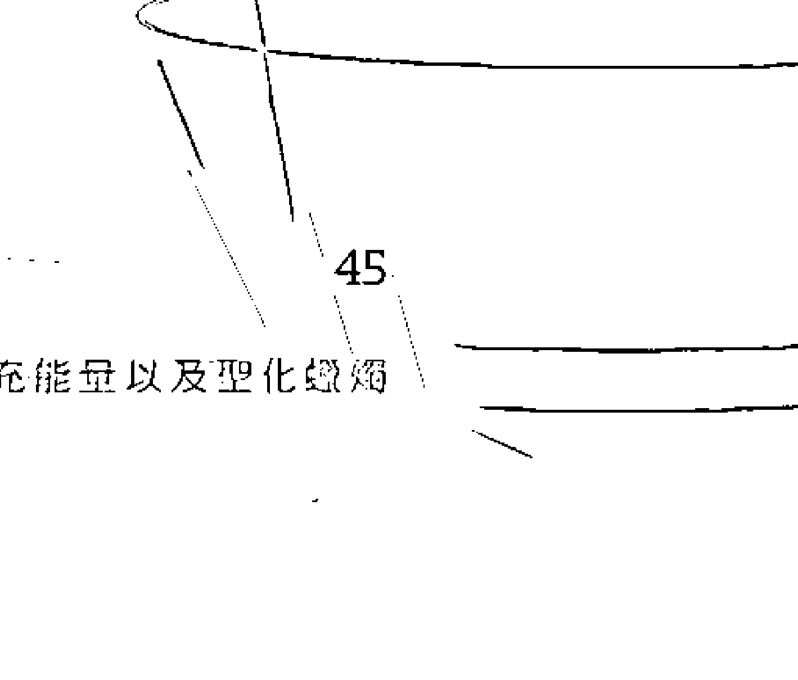

在這個聖化儀式中，我們會用到油——或者說某種精油（一種帶有和你目標相符合香味的精油）或橄欖油（在古時的幾個世紀都用於神聖和魔法用途）。

1. 在右手中滴上大約一角硬幣大小的油。用左手抓住蠟燭底部。為蠟燭塗油，從蠟燭的中間部位開始向上移動。確保你塗抹到蠟燭的整個上半部分。
2. 蠟燭的上半部分都塗上油之後，把蠟燭翻轉過來，繼續用左手握住蠟燭，塗抹蠟燭的下半部。同樣，從中間開始向上移動，確保蠟燭的其餘部分都有塗上油。
3. 蠟燭全部塗好以後，用雙手抓住蠟燭說「如其在上，如其在下，我呼喚與我連結和認識的神靈」。觀想任一與你共同進行魔法工作的指導靈、神明、祖先或大天使的模樣，幫助你聖化蠟燭。這個方法包含了「如其在上，如其在下」的魔法概念，此意謂著你發送目標和能量到上界，請求靈界／天使王國把你的願望帶來物質層面；同時也請求下方的祖先世界為你的法術帶來穩定和進一步的協助。
4. 觀想蠟燭充滿了神聖和魔法的特質，或許還被藍色火焰、白光或薄霧包圍。
5. 呼喚指導靈的借助之後，凝視蠟燭說「這根蠟燭是神聖且被神祝福的；它現在已經擁有與我相匹配的魔法」。
6. 這時你的蠟燭已經得到聖化，可以在魔法中使用了。

雖然淨化、補充能量和聖化的過程也許看起來乏味，但這不僅能加強法術，也會增強你的目標和能量，讓法術更可能成功，並帶來想要的結果。歸根究柢，魔法並不是動動手指或者皺皺鼻子就能完成的事。魔法的發生需要努力、方法和耐心——這些特質需要你操作這些儀式才能學到。

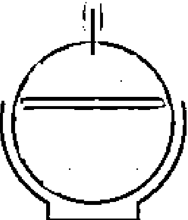

### 畫符的日常工具

用彩色眼線筆就能輕鬆在蠟燭上畫出符咒和圖畫。

### 尊重時間

在傳統方法裡，淨化、補充能量和聖化蠟燭（也可以叫做「三重儀式」的完成）是和法術共同進行的，或者要盡可能接近儀式開始的時間。

然而，大家的生活日程都很忙，一天就只有這麼多時間。如果你覺得準備三重儀式會縮減你的法術時間，或者很不方便的話，也可以提前完成。例如，我只要買到蠟燭就會馬上淨化，然後將補充能量和聖化作為我法術的一部分。蠟燭淨化完成之後，就不需要再次淨化，除非你要把蠟燭用在不同的用途和咒語裡。

先準備好所有工具，並且留出私人時間，以便成功完成法術。如果你提前知道操作法術當天時間有限的話（比如你在滿月那天只有兩小時獨自在家），請在前一天晚上就為蠟燭補充能量並聖化蠟燭。如此你操作法術的時間就能縮短一半。準備好蠟燭之後，請記得將之留在聖壇上以激發靈性。

### 三重法術

雖然三重法術在這裡專用於蠟燭魔法，但為法術工具完成淨化、補充能量和聖化的過程在各種魔法中都非常重要。你會在許多傳統中發現三重法術的元素，包括威卡、薩泰里阿教、傳統巫術、胡督／伏都，還有美洲原住民薩滿教。

### 指明道路

請謹記蠟燭是你的目標、成果和願望的物質世界表現，用正確的儀式處理你的蠟燭對法術的成功非常重要。現在你已經學到如何準備蠟燭，那麼是時候學習魔法顯化的重要性和用正確方法設定了。

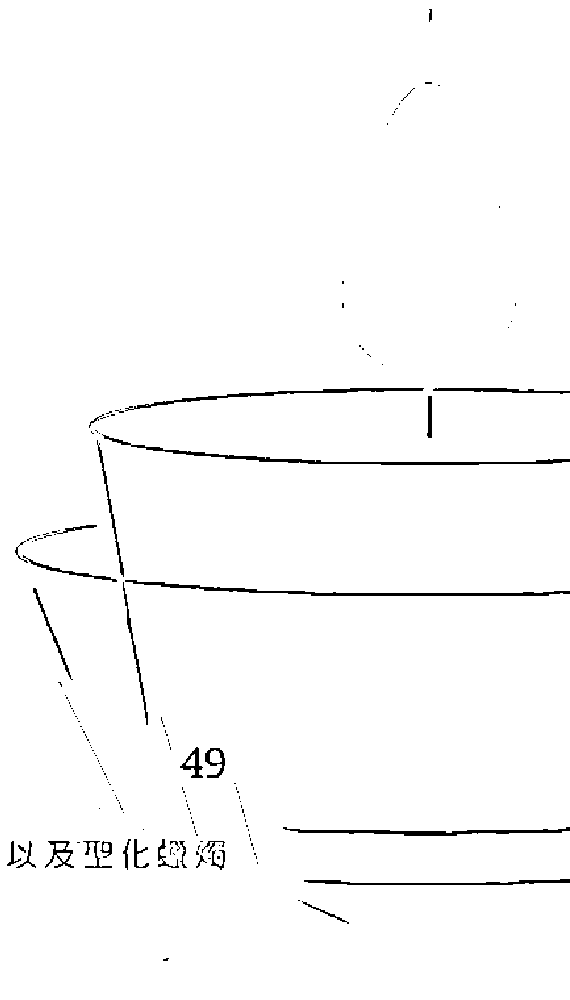

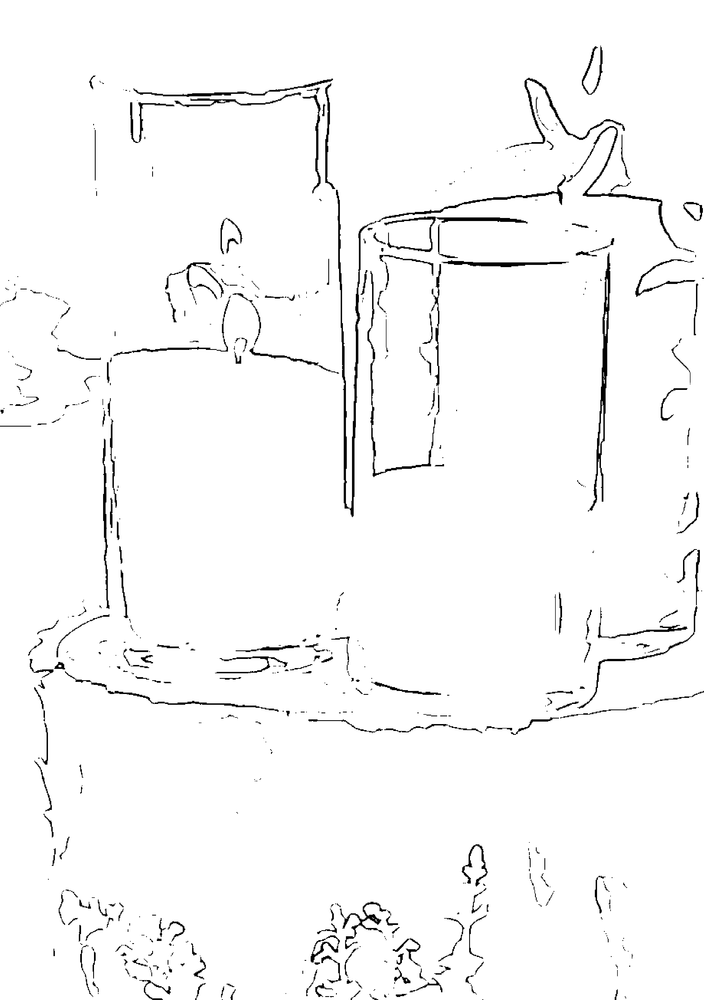

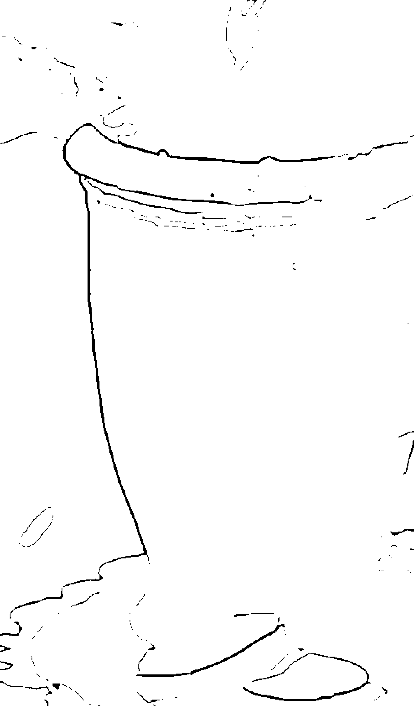

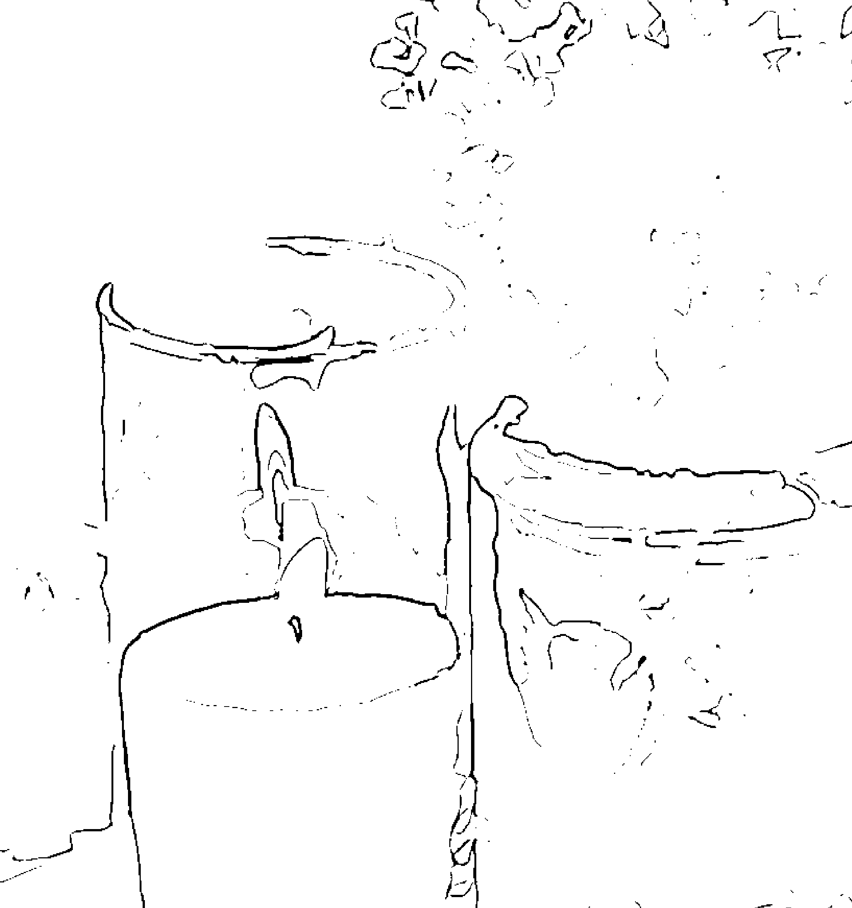

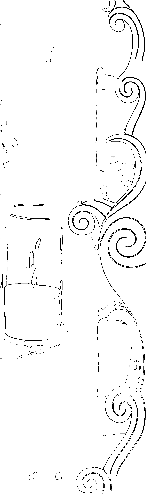

## Chapter 5

## 第五章

## 設定意圖和掌握法術

無論你選擇什麼顏色的蠟燭，無論你用什麼精油和藥草來裝飾你的蠟燭，你的法術只有在有了合適的意圖時才會強大並具有效力。這一章節會討論設定意圖的重要性，以及如何用正確方式成功進行法術。

### 為轉變選擇法術

在魔法的世界中，存在著許多不同目的的法術。無論你腦海中的想法、需求或願望有多獨特，一定有一根蠟燭能滿足你，也一定有一種法術能幫你實現。最受歡迎的法術往往是關於我們最常見的願望和目標：愛、保護、健康和豐盛。選擇法術的時候，首先要考慮你想要實現的目標。你想要薪水更高的工作嗎？你在尋求愛和陪伴嗎？你是否遭受病痛的折磨而需要療癒？然後，找出最能滿足這個需求的種類，這樣就可以找到最有效的法術。

### 愛情

愛情法術能帶給你自己和別人浪漫與激情。但需要注意的是，愛情魔法非常強大，其目標絕對不應該是操縱別人的感情、自由意志或能量。對愛情魔法的意圖始終應該經過深思熟慮；一旦意圖明確之後，可以說這些法術將從能量上促進愛情、激情和浪漫或帶來靈性上的「推動」。

### 保護

不管你想要的是免受傷害、遠離敵人，還是避免受到靈性攻擊，在探索魔法世界時，保護法術都必不可少。這些法術不但可以為你在靈性層面帶來安全，免受對手的傷害，也能幫助你為家園、所愛的人和你自己建立起屏障，帶來守衛，劃清界線。

### 療癒

不管是身體上還是情感上，疾病都是最難處理的事情之一。這本書中的療癒法術會向你介紹不同種類及方法的療癒魔法，包括情感療癒、身體療癒和靈性疾病的療癒。這些法術能治癒當前的疾病，也能保護你與所愛的人免受未來疾病或病情復發的困擾。

### 成功和豐盛

財務穩定很重要，你可以透過一點魔法助力來實現。帶來成功的法術能增加收入，滿足我們的財務需求。這些法術有許多形式，透過不同方式來提供幫助。無論是獲得工作、得到拖欠的錢，還是在新的事業中獲得穩定，每個目標都有相對應的法術。此外，也可以加入帶來成功的藥草（迷迭香、月桂葉等）、錢幣、骰子和好運圖騰（比如幸運兔腳），讓成功和好運融入你的魔法工作。永遠不要請求或懇求成功到來——產生結果的最好方法是做出明確聲明，宣稱它一定會發生。這本書中會講到能帶來好運、快速到來的金錢、職位晉升還有成功的巧妙法術。

### 啟迪

有時候我們需要一點魔法帶來改善，讓我們精神一振，你猜怎麼樣？有這樣的蠟燭能幫你實現目標！帶來啟迪的法術能激發幸福感、對抗憂鬱、修復友誼、吸引正向能量，以及為停滯不前和困難重重的階段帶來清晰的頭腦。但是請確保在使用啟迪法術時不以魔法操控他人感情。有些人需要處理好自己的感受，面對自己的想法，才能獲得療癒繼續前進。這一部分內容會講到為你的生活帶來一點快樂、喜慶和正面能量的法術。

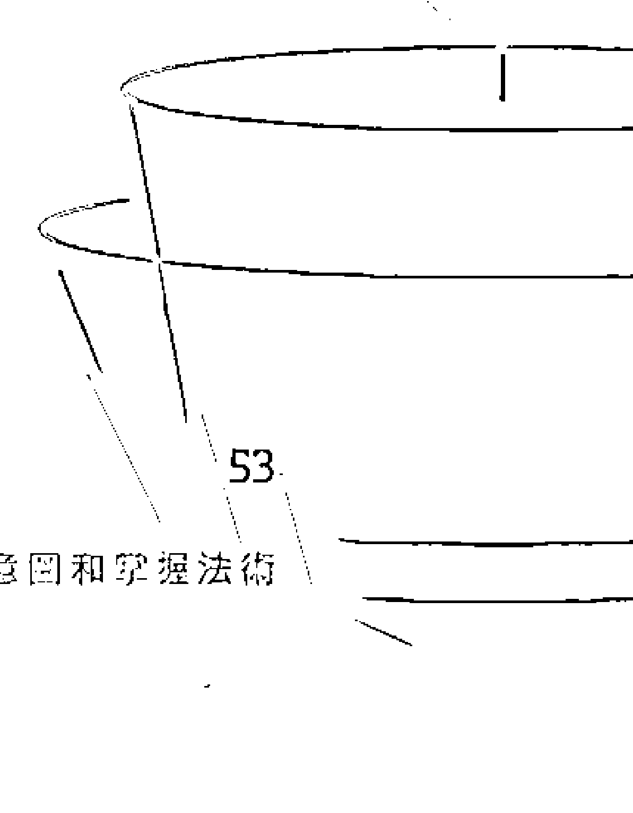

### 占卜、靈性交流、靈魂投射和夢境

練習魔法也有助於提高你的魔力等級！如果你想訓練占卜技巧、連接祖先或指導靈、激發夢境、獲得預言能力、增強法術，或者和神明共同進行魔法工作的話，有許多法術能幫助你實現這些目標。

### 魔法顯化

意圖就是透過口令、書面文字、想像或描述表達出明確的願望或目標。設定意圖需要深思熟慮，也是非常強大的過程，每次都可以增強、影響你的蠟燭魔法實踐。

設定意圖和目標是蠟燭魔法的基本部分；當魔法師決定進行儀式或法術的時候，這個過程就開始了。重要的是預先知道設定意圖的強大。你必須清楚自己想要的是什麼，才能專心且有意識地實現它。想像你想要的儀式結果不但能增強你的顯化能力，也能加強你的蠟燭魔法操作。

開始法術之前，在設定意圖時，有以下幾件事情需要思考：

### 對你的顯化進行冥想

你需要認真地花些時間想像你希望發生的事情。你想要實現的是什麼？放鬆心情，冥想你的法術，想像你希望顯化的事。你想要的結果是什麼樣？花些時間嘗試不同的場景。在確定想要的意圖之前，先仔細查看所有的選擇和描述。

### 設下特定的意圖

關鍵點在於要足夠具體。設定意圖的時候，你必須非常具體，特別是在使用蠟燭魔法和為了愛情或金錢等等目標來進行法術的時候。沒錯，說出「希望我的老闆能讓我休假」也是一種意圖——但是太模糊了，這句話沒辦法保證你一旦得到「休假」之後還能重返工作。而「我想要帶薪休假得到批准，這樣就可以去度假了」的意圖非常具體且有遠見，在你進行法術時也不會留下錯誤或被曲解的餘地。設定意圖真的就是這麼重要——意圖愈明確，愈能達到預期的效果。

### 迴避「願望」和籠統的目標

願望和意圖不同。願望的力量更弱更被動，本質上屬於懇求。這意謂著你把力量交給宇宙和靈性世界來做決定，而不是做出明確的聲明，由你創造自己的命運。願望可能聽起來像「我希望老闆喜歡我的表現，讓我得到晉升」；更強大的意圖則是「我的老闆會認可我的努力，我會得到晉升」。當願望成真的時候，我們可能會感到驚喜，但是當我們設定具體、強大的意圖時，更有可能實現想要的結果。

### 設定現實的意圖

設定意圖能讓事情成真。我們必須讓自己的意圖扎根在邏輯領域，無論看起來有多世俗。沒錯，魔法是真實存在的，它有助於我們獲得看似困難或遙不可及的事物。但事實上，魔法並非生活中問題的修復工具。試圖使用法術讀懂伴侶的想法就是在浪費意圖，浪費靈性成長，也是浪費時間。設定意圖的時候，要考慮現實的善後工作。如果你沒有經歷任何正式培訓，使用魔法讓你成為公司的 CEO 是否值得呢？也許你可以透過魔法幫助你學習商業計畫，或是建立人脈，吸引合作夥伴來幫助你實現成為 CEO 的長期目標，這樣是不是會更好呢？

### 設定合乎道德標準的意圖

在意圖的時候，你必須保證自己的意圖符合道德標準。要記住，如果你操縱別人的自由意志，事實上你給自己帶來的後果植根於謊言。為自己或別人使用法術時，應考慮到它會造成的影響。會有人因此受到傷害嗎？會有人的生活受到負面影響嗎？你的願望不應該以犧牲別人為代價，特別是當願望未能得到回報時。

### 用積極的態度來表達意圖

在意圖的時候，你一定要保持希望、自信和積極正向。如果你帶著自信的態度設定意圖，用正面的語言來陳述，就更有可能達成預期結果，朝著正面的方向前進。

以下你會看到一些設定意圖的範例，有助於你著手法術之前思考和創造出自己的意圖。

（姓名）會快速、平安地得到療癒。
我會得到我申請的工作。
今年我會在秋季學期開始前出國旅行盡情玩樂。
我會賺到並存下我需要的錢，下個月就可以搬家了。
我會和一個無條件愛我，且經濟和情緒都穩定的人，建立穩定的戀愛關係。

### 如何建立意圖

意圖是蠟燭魔法中最重要的元素之一，所以在法術之前、法術過程中和法術之後你都一定要在心中想好明確的意圖。你可能會需要大聲重複意圖。當你把能量和思想投入意圖和目標時，就會增強你法術的振動。

### 意圖的制定

在寫下或規劃意圖的時候，我認為用以下這個簡單的公式效果最好：

- 說出你的願望（要儘量具體）。
- 加上你希望顯化的時間範圍（如果時間很重要或適用於你現在的情況）。
- 使用「我」來陳述，並且用現在式來陳述願望。
- 要把你的意圖變成命令而不是請求。

### 展現法術，點燃火焰

雖然這本書的第二部分會專門講到特定咒語，但我還是要向你介紹進行蠟燭魔法時從頭到尾的常用步驟，這樣你就可以做好準備。如果之後你在進行更難的法術時需要幫助，或你想要創造自己的法術，可以返回本章節參考。

1. 找到你的意圖，對你的願望進行冥想，專注於想要顯化的事物。
2. 找到或指定你要進行的法術。
3. 找到最適合該法術的蠟燭顏色和類型。
4. 設定意圖之後，雙手放在蠟燭上，將你的能量和意圖送入蠟燭。
5. 一步步按照所選法術的指示進行操作，請注意不要急於求成，也不要跳過任何細節，無論簡單或複雜。
6. 試著找到專用於蠟燭魔法的雕刻工具。這種工具可以是釘子、削尖的筷子、鋼筆或黏土雕刻工具。要讓它成為你的專屬用具，因為這個工具會充當魔杖，在你雕刻蠟燭的時候把你的意圖和能量傳遞到蠟燭中。
7. 讓蠟燭在封閉的環境中安全地燃燒。如果你沒辦法讓蠟燭自行熄滅，請謹慎並且有意識地熄滅蠟燭的火焰（千萬不要吹滅）。
8. 蠟燭安全燃盡或熄滅後，如果你的咒語是為了得到某樣事物，就把蠟燭埋起來；如果蠟燭是用來驅散某樣事物，就把蠟燭丟掉。

### 蜡烛的燃尽和掩埋

在蜡烛魔法领域中，有很多关于吹蜡烛的争议。我所学到的是吹灭法术或仪式使用的蜡烛会冒犯火的神灵并且分散你的意图，使之无法起作用。民间传统有主张掐灭烛火而不是吹灭。我有一位导师总是用手指捏灭她的蜡烛，以此作为祭献来感谢火的帮助。我认为当你无法让蜡烛安全燃烧殆尽时，最好的方法就是把法术中的火焰掐灭或捏灭。如果你别无选择，只能吹灭蜡烛的话，只需要感谢火焰，然后在吹灭蜡烛的时候重新声明你的意图就好。

大多数用在魔法操作中的蜡烛都能完全燃烧到尽头。如果蜡烛自行熄灭，就不要再点燃了。用在魔法中的蜡烛自行熄灭，就表示你所选择的法术不能帮助你，或你所寻求的答案已成定局。在这种情况下，请重新审视你的意图，花几天时间重新思考你真正想要的是什么，然后等待至少一周再进行下一个法术，并且丢掉和当前法术有关的所有物品。

丢掉法术物品的时候，一定要想着你所进行的法术。如果这个法术是为了吸引、发展或获得某样物品，就把残余物埋在你家前面或后面；如果你想透过法术驱散或移除某些事物，就把法术的残余物丢到远离你家的垃圾箱。法术完成之后，最好等待蜡烛完全冷却，并确保所有易燃的残余物都已经完全熄灭。

### 读懂火焰

在法术中燃烧蜡烛时，请记住这些预兆和暗示：

- 蜡烛难以点燃。这代表你选择的魔法类型没办法帮助你，你应该去找另一种类型的法术或仪式。
- 蜡烛火焰分裂成两个或多个火焰。代表可能有其他能量参与或协助你的法术。如果发生了这种情况，请一定要透过灵性烟熏来增加额外的保护，或者制作额外的蜡烛进行保护。
- 蜡烛火焰很高。表示法术背后充满了许多力量和能量，会有正向的结果。
- 蜡烛火焰燃烧得很低。有强大的反对力量，可能需要进行净化魔法或驱散魔法。
- 火焰发出劈啪声或爆裂声。既有可能是神灵试图与你交流，发送讯号，也有可能是法术所针对的人会在未来与你进行交流。
- 你试图熄灭蜡烛的时候它并没有熄灭。神灵不想要你熄灭蜡烛。所以你可以让蜡烛完全燃烧殆尽，或等上13到30分钟再尝试让它熄灭。
- 蜡烛燃烧的时候火焰熄灭。神灵没办法帮到你，且你要的答案已经注定了。如果你在蜡烛烧完之前意外地得到了结果，蜡烛火焰也有可能熄灭。

### 指明道路

即便你是蜡烛魔法的初学者，也可以操作无数魔法，专注并设定数不清的意图。进行魔法的时候，耐心是关键；请记住，永远不要急于完成你的法术，要享受这个过程。

本书的第二部分里，你会探索各种各样蜡烛魔法的法术，每一种都有不同的做法、传统和主题。在介绍每个法术时，我会列出你需要的特定物品及其象征意义，以及会为仪式带来的能量。

让魔法开始吧！

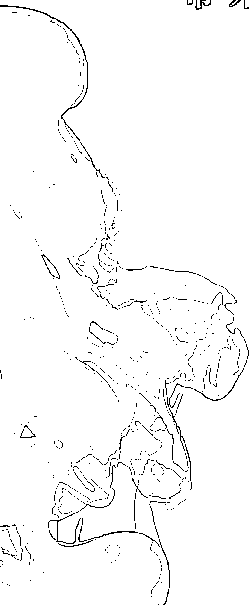

# 第二部分 蜡烛魔法中带来改变的法术

## 第六章 爱情法术

爱情法术一直是历史上最受欢迎的法术。爱情法术既能召唤爱情，也能歌颂爱情，不管是肉欲之爱、情感之爱或浪漫之爱。这些法术能用来吸引恋爱伴侣、让朋友之间激发爱情的火花，也会唤起你内心的激情。下文中你会了解到一些能在恋爱领域帮到你的法术。

- 阿芙罗黛蒂美丽仪式......67
- 阿瓦隆苹果爱情咒语......70
- 「爱人，来到我身边」法术......72
- 芙蕾雅的猫薄荷点燃激情蜡烛魔法......75
- 埃及艳后自我关爱牛奶浴魔法......77
- 「这就是爱」伏都爱情召唤魔法......80

### 迎接受爱，点燃爱

在这一章节中，你将会学到如何召唤生命中最受追捧的东西——爱。爱有多种形式，在选择爱情魔法的时候，确定好你希望获得哪种爱情非常重要：浪漫爱情、身体之爱还是柏拉图式的爱。当你设定意图选择法术的时候，也不要忘记为自我关爱留出空间。开始吸引身边的人之前，你必须先确保准备好所需要的一切物品。

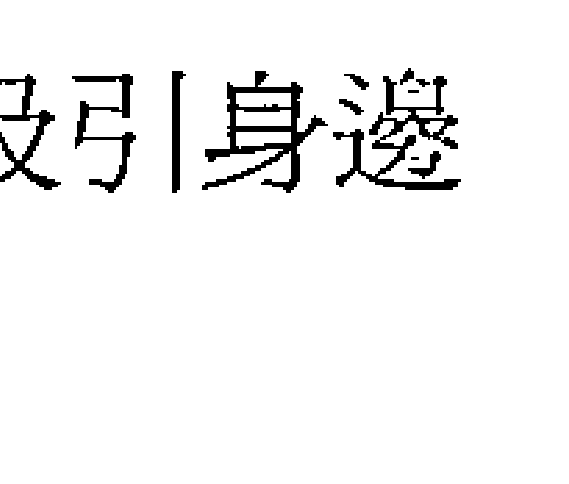

### 爱情魔法常用物品

- 蜡烛类型：柱状蜡烛、抽出式蜡烛、浮蜡烛、浮水蜡烛、许愿蜡烛、茶灯蜡烛
- 蜡烛颜色：红色、粉色、白色
- 药草：迷迭香、茉莉、玫瑰、薰衣草、达米阿那
- 精油：茉莉、玫瑰、埃及麝香、香草、薰衣草
- 水晶：粉水晶、白水晶、红玉髓、石榴石
- 首选时间：爱情魔法在周五和周日晚上进行效果最好；在满月或盈凸月期间进行效果最好。

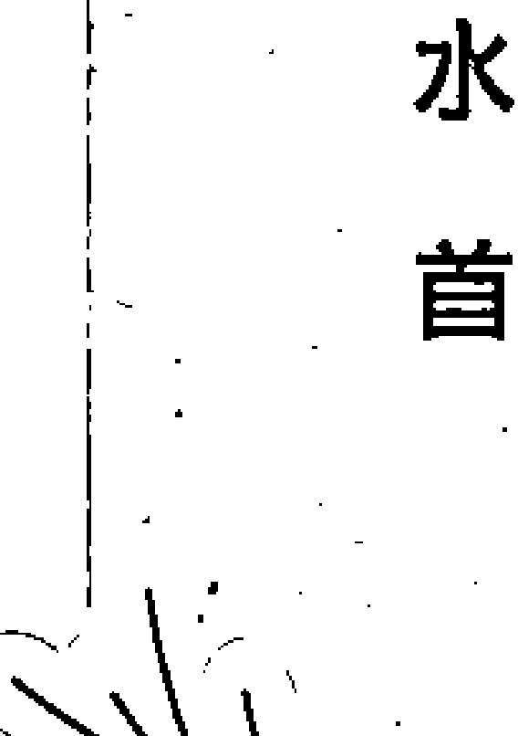

### 阿芙罗黛蒂美丽仪式

这个法术也是魅力法术，不但能用来增强信心，也可以为你注入古代女神阿芙罗黛蒂本人的美丽、优雅和热情能量。最好在私人空间或当你独自在家的时候进行这个法术。传统上这个法术要裸体进行；但是，如果你想的话也可以穿着内衣或短裤背心来进行这个仪式。为了给法术增添额外的魔法效力，请在满月期间的周五晚上进行（如果不可行的话，就在周五晚上或下一个满月期间进行）。要给自己留出至少两个小时来执行和完成法术。你可以燃烧一些乳香，用粉红色的布、贝壳、珍珠（无论真假）、天鹅图片，还有粉晶来装扮桌子，作为给阿芙罗黛蒂的圣坛。每当你需要增加信心或女神能量的时候，都可以进行这个法术。法术完成之后，你可以在约会或追求某个特定伴侣时继续观想这个法术。

#### 所需魔法物品

- 小型雕刻工具 (小刀、筷子、钢笔、黏土雕刻工具、钉子或铅笔)
- 2根粉色净蜡烛和烛台 (带来浪漫和爱情)
- 玫瑰精油 (带来爱情)
- 1根红色净蜡烛和烛台 (带来性感和欲望)
- 全身镜或大镜子 (梳妆台或浴室镜子都可以)
- 火柴或打火机
- 草莓 (带来性欲和激情)
- 1 颗粉水晶 (带来爱情和吸引力)

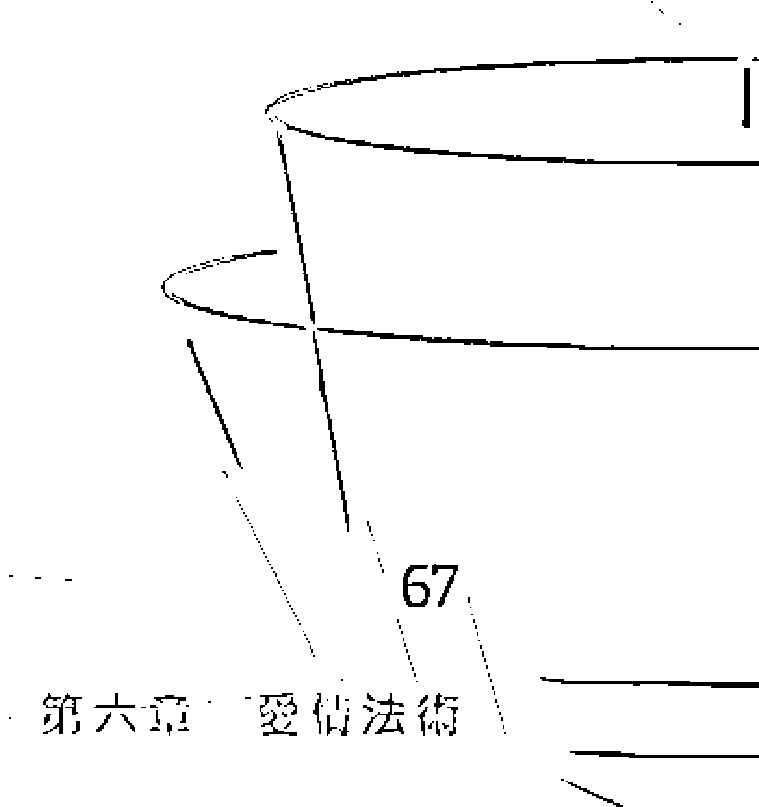

#### 进行法术

1.  为你的蜡烛净化、补充能量和圣化，为法术做好准备。
2.  事先泡澡或淋浴来净化自己。
3.  用雕刻工具把你的名字、姓名首字母缩写或名字的首字母加上姓氏刻在红色蜡烛上。
4.  在一根粉色蜡烛上刻“GODDESS”，在另一根粉色蜡烛上刻“APHRODITE”。（如果你觉得没有足够的空间写完女神的全名，也可以刻下其罗马名字“VENUS”。）
5.  用1或2滴玫瑰油涂抹三根净蜡烛。
6.  把净蜡烛放在蜡烛架上，放在镜子前，中间放红色蜡烛，两侧放上粉色蜡烛。（如果你用的是全身镜，就把蜡烛放在地上。但如果有地毯的话，一定要把蜡烛放在单独的小盘子上。）
7.  把灯关掉，这样蜡烛就会成为你唯一的光源（或者，为了让你感到更舒适，把灯光调暗，让房间尽可能地暗下来），确保可以在镜子里看到自己的倒影。
8.  点燃蜡烛之前，花些时间想象女神阿芙罗黛蒂的模样。她长什么样？她对你来说是如何成为美的象征？作为爱的化身，她闻起来如何？
9.  在你的脑海中构想出这个形象后，大声呼唤阿芙罗黛蒂，或者在脑海中呼唤她。
10. 点燃每根蜡烛前都说出她的名字。
11. 点燃所有蜡烛之后，凝视镜中的自己。
12. 如果你还穿着衣服，这个时候可以把衣服脱掉。
13. 在镜子里凝视你的身体。你最喜欢自己的哪个部分，不喜欢哪个部分？
14. 凝视镜子里的自己之后，眼睛看向下方蜡烛的火焰。看火焰如何舞动闪烁。
15. 注视火焰，让思绪开始游荡。想象火焰正在把你所感知到的不完美都烧掉。逐渐模糊视线，观想火焰环绕着你，让你充满神圣的光芒。
16. 再看回镜子里的你，想象阿芙罗黛蒂站在你左肩后方。
17. 闭上眼睛，观想阿芙罗黛蒂与你融为一体——她的身体、她的灵魂和她的本质都融入你的身体，你们合二为一。这样的融合是什么感觉？她的存在是让你感到清凉，还是感到温暖？大声重复她的名字三次“阿芙罗黛蒂，阿芙罗黛蒂，阿芙罗黛蒂”。
18. 睁开眼睛盯着镜子，你会看到自己的美丽增长，你的身体散发着光芒，缺点和不完美都被抚平。你会看到自己成为女神的化身，感受到真理在你体内振动。
19. 让净蜡烛燃烧到尽头，同时花些时间在房间里坐下、休息或走动，继续感受体内女神的本质。
20. 当蜡烛完全燃烧殆尽之后，倚靠在床上或沙发上，吃一颗草莓（或者吃好多颗），想像你正在服用有魔力的媚药，它会让你充满激情，为你灌入女神的力量。为了增强和保持法术的能量，可以用1滴玫瑰精油涂抹粉水晶，并随身携带这块粉水晶直到下一个满月，然后把它埋在你的后院或盆栽植物中。

### 阿瓦隆苹果爱情咒语

无论你是想要重新复苏当前恋爱的火焰或召唤出新的伴侣，这个法术都可以奏效。

阿瓦隆被称为“苹果之岛”，是充满疗愈、知识和力量的神圣之地。尽管苹果声名狼藉，但它其实是非常有效的植物药材，在历史上的许多爱情魔法中都能找到它的踪迹。这个法术可以在满月之夜或周五晚上进行。准备一个简单的圣坛，放上粉水晶、苹果和一小杯苹果酒或苹果汁，就可以请求阿瓦隆岛女祭司、女神和仙女王后摩根勒菲黑女巫的帮助。

#### 所需魔法物品

- 1颗红苹果（带来激情、性感和活力）
- 小刀或雕刻工具（如果你想在法术中吸引某人的话可以使用；非必需）
- 蜂蜜（让法术变得甜美）
- 肉桂和丁香（促进爱情；非必需）
- 2根粉色净蜡烛（带来浪漫）
- 供品盘或小盘子
- 火柴或打火机

#### 进行法术

1.  双手握住苹果，闭上眼睛集中注意力。感受苹果的冰凉，深呼吸，想像苹果从中心部位开始散发出温暖的感觉。
2.  用左手拿起雕刻工具的锋利部位，说“我用这把刀片刺破掩饰，我的心让爱启航”。
3.  把苹果从水平角度切成两半，露出里面的五角星形状。看着苹果的两半，专心观察中心的星星形状，说“就像黑夜中不幸的恋人，让我们光芒闪耀，直到我们在一起”。
4.  为了让法术变得甜美愉快，可以用同一把刀在苹果的两半分别涂上蜂蜜。需要的话，也可以加上肉桂和／或丁香以增强爱情。
5.  如果你心中有想要吸引的人，就用雕刻工具把他们的姓名首字母刻在一根蜡烛上，然后把你的姓名首字母刻在另一根蜡烛上。如果你想吸引新恋情，请跳过这一步直接来到第6步。
6.  用苹果的两半作为蜡烛的底座。在苹果的两半分别放上一根净蜡烛，可以扭动蜡烛以固定在苹果上。
7.  把两半苹果放在供品盘上，在两半苹果上各涂一圈蜂蜜。
8.  点燃两根蜡烛。
9.  点燃蜡烛之后深呼吸。在保持安全的情况下，将双手分别放在火焰的上方或前方。想像你正在把爱和光送进蜡烛；想像蜂蜜正在为你吸引爱情，而蜡烛的作用则如同灯塔。
10. 继续把手放在蜡烛前，说出：“喔，伟大的女士，摩根勒菲，我请求妳为我送来爱情。就像从阿瓦隆湖送出了伟大的王者之剑一样，请为我送来我梦寐以求的爱吧！”
11. 可以的话，就让蜡烛完全燃尽（净蜡烛通常需要 2 到 3 小时燃尽）。如果你不能让蜡烛燃烧到底，就敲桌子 3 次，感谢摩根勒菲，再把蜡烛掐灭（不要吹灭）。
12. 在第二天的同一时间重复这个法术，直到蜡烛完全燃烧殆尽。
13. 蜡烛燃尽之后，把苹果埋在土里，最好埋在靠近和爱情有关的植物附近，比如玫瑰、薰衣草或迷迭香，这样可以保护你的法术。
14. 完成法术后，你可以喝一些苹果酒或果汁，或燃烧一根有苹果香味的蜡烛为法术增添效力。
15. 在这段时间，你可以出门去、开始网络交友、参加同学会，或者加入新的社交群组。谁知道你会遇到谁呢？
16. 法术开始奏效后，记得感谢摩根勒菲和仙女。

### 「爱人，来到我身边」法术

无论你是想让朋友变成潜在的恋爱对象，还是在工作中遇到了引起你注意的人，这个法术都意在吸引你心中所爱的特定之人。你会用到造型蜡烛，所以请记得，这个法术包含你要显化出的强大魔法和能量。使用这个法术之前，请考虑好你是不是真正想要追求这个人或和这个人建立恋爱关系。如果你只是想要肉体关系或想诱惑某个人，并没有真正下定决心要一对一的伴侣关系，就使用红色蜡烛。这个法术最好于周五晚上在偶数小时进行（例如下午 6 点、晚上 8 点或晚上 10 点），或者在满月期间进行。这个法术需要连续进行——在每天晚上的同一时间进行，直到蜡烛完全融化。

#### 所需魔法物品

- 2 个粉红色造型蜡烛或红色造型蜡烛，代表所想要的关系（男女关系、男男关系、女女关系等等）
- 雕刻工具
- 4滴玫瑰精油
- 黑色耐热陶瓷盘
- 红线，最好是粗的工艺线或缝纫线，长度要足以绕两根蜡烛 9 圈（带来黏合力和浪漫）
- 火柴或打火机
- 粉色或白色的布（促进爱情）

#### 进行法术

1.  在周五晚上，用双手各拿起一个造型蜡烛。选择一个代表你自己，另一个则代表你想要的伴侣。决定了之后，就闭上双眼。手中继续拿着蜡烛，观想从你心中向手臂和双手发送一股温暖的粉色能量流，让能量流直接进入蜡烛。对这个意象冥想一段时间。
2.  放下代表你的蜡烛，继续把注意力集中在代表心仪伴侣的蜡烛上。想象他们的个性和身体特征，将所有能量都发送到造型蜡烛里。把蜡烛拿在手中，闭上眼睛，想像伴侣的本质和个性正在经由你来送入蜡烛里。感受蜡烛充满生命力和能量的频率与脉动。
3.  用雕刻工具把你的全名或姓名首字母刻在代表心仪伴侣的蜡烛底部或背部。
4.  接下来，在代表你自己的蜡烛底部或背部刻上心仪伴侣的全名或姓名首字母。
5.  用玫瑰精油涂抹蜡烛，每个蜡烛涂2滴。
6.  观想你和心仪伴侣正沉浸在爱河之中，任何可能阻碍你们爱情的东西都已清除。
7.  把蜡烛放在盘子上。让两个蜡烛面对面，将线缠绕在蜡烛上。每在蜡烛上缠绕一圈，都要说“我用这根线拉动我们，让我们心连心，肌肤相亲”。
8.  把红线在两个蜡烛上缠绕9次之后，打一个牢固的结，确保不会散开。
9.  点燃两个蜡烛，说：“当激情燃烧时，两者合二为一，让爱的火焰燃烧得比太阳更明亮吧！”
10. 让蜡烛燃烧30分钟至1小时，同时专注于你的意图。想像你与这个人的未来前景，并且把他们想像成你的另一半。
11. 完成之后，熄灭（或用手指掐灭）蜡烛，第二天在同样的时间重复第9步和第10步。
12. 法术进行数日直到蜡烛燃尽，完全融化，仔细看看余下蜡油中的意象。蜡是否形成什么特别的形状或符号？（如果有的话，你可以在关于象征符号的书中查找其意义，以更好地理解。）
13. 把蜡和法术的剩余物收集起来，用粉色或白布包好。
14. 把包好的布以及法术的剩余物和蜡埋在院子里，或埋在家中的盆栽里。
15. 开始和这个心仪对象建立关系，要记得你们之间已经有一条象征性的线把你们连结在一起了。

### 芙蕾雅的猫薄荷点燃激情蜡烛魔法

芙蕾雅是北欧的爱情、美丽和生育女神。猫是芙蕾雅的圣物(所以要用到猫薄荷)，但它们的重要性远不止于此；猫在许多文化里，比如古埃及文化中，也代表了性感和女性气质。

在周五晚上，或在可能发生肉体关系的浪漫约会之前，可以进行这个法术。施过法的蜡烛能增添“氛围”，为你提供激情所需的耐力和活力。这个法术并不引人注意，甚至可以在你工作时进行！制作好蜡烛并施法后，就可以针对不同的人多次使用，仅仅用在自己身上也可以。

#### 所需魔法物品

- 报纸、纸巾或扁平的盘子
- 1根红色柱状蜡烛(带来性感和激情)
- 玫瑰精油(加强美丽和爱情)
- 少量猫薄荷(带来情色)
- 少量迷迭香(加强魔法)
- 少量肉桂（增强耐久力）
- 火柴或打火机

#### 进行法术

1.  准备好你的工作区域，铺上报纸、纸巾或盘子，以收集掉落的药草和香料。
2.  双手握住红色柱状蜡烛，闭上眼睛，专注于你的愿望。想像你的激情，感受身体的麻刺感，把这种能量送进蜡烛中。
3.  将一角硬币大小的精油滴在手中，从蜡烛芯开始向下擦拭蜡烛。想像你正和伴侣在一起，让你的思绪飘荡，像做白日梦一样。
4.  蜡烛涂好油之后，直接在上面撒一撮猫薄荷。用手慢慢转动蜡烛，让蜡烛的各处都黏上猫薄荷。
5.  撒猫薄荷的时候，说：“芙蕾雅，尊贵而神圣的女神，让夜晚点亮我的神采吧！”
6.  之后，用同样的方法给蜡烛撒上一撮迷迭香，说“迷迭香请保护我的法术，保证我能得到满意的结果”。
7.  用同样的方式给蜡烛撒上一撮肉桂，说“迷人而甜美的肉桂，请为我的欲望添加一些热情”。
8.  为蜡烛撒完所有药草和香料之后，拿起报纸、纸巾或其它任何你用来收集掉落物的道具。把掉落在报纸上的东西重新撒回蜡烛上。
9.  把蜡烛放在床头柜或房间里的安全位置。
10. 在客人来到之前，点燃蜡烛说：“神圣的火苗，神圣的火，芙蕾雅女神，请帮助我实现我的愿望吧！”
11. 让蜡烛燃烧，直到你准备睡觉的时候。
12. 蜡烛可以重复使用，一直到它完全融化、自行熄灭为止。

### 埃及艳后自我关爱牛奶浴魔法

埃及艳后克丽奥佩脱拉是埃及最后一位法老，她以魅力、智慧和美貌闻名。众所周知，她既自信又聪明，还俘获了罗马帝国两位最有权势的男人的心。这个仪式里融合了古埃及和希腊的仪式净化习俗，也能增强自我关爱和影响力。传说埃及艳后曾泡在芬芳的牛奶和蜂蜜中沐浴，这增强了她的光采。虽然这个仪式需要洗澡，但仪式的重点是其中使用的蜡烛。当你感到孤独、空虚、被忽视、忧郁或局促不安，可以用这个仪式大大地提升自我关爱。

#### 所需魔法物品

- 1小片纸
- 红色笔
- 平底锅
- 1杯全脂牛奶(带来更新)
- 2汤匙蜂蜜(带来吸引力)
- 3个白色茶灯蜡烛
- 3滴乳香精油（带来神圣赐福和净化）
- 火柴或打火机

#### 进行法术

1.  在仪式开始之前，用红色笔在纸上写下“我是神圣的，我是被爱的，我是有魔力的”。
2.  把锅子放在炉上，倒入牛奶和蜂蜜，加热直到蜂蜜完全溶解，但不要煮沸（锅子边缘会出现气泡，蒸汽开始上升）。等待混合物冷却。
3.  等到牛奶和蜂蜜的混合物冷却后，在干净的浴缸中放好洗澡水。
4.  把洗澡水调整到喜欢的温度，让茶灯蜡烛围绕浴缸摆放，把你环绕在中间。蜡烛可以放在你的面前，也可以放在两侧，只要是你喜欢的方式就好。要记得留出足够的开放空间，这样蜡烛燃烧时你也可以安全地进出浴缸。并且，也要确保那张写有愿望的纸就放在旁边。
5.  在浴缸中加入 3 滴乳香精油，说：“艾希斯女神，爱的神灵，请从天堂祝福这些水吧！”
6.  接下来，将牛奶和蜂蜜的混合物倒入浴缸，说“哈索尔女神，我用您的牛奶祝圣了这些水。请让我敞开心房，让我的皮肤光滑如丝绸”。
7.  点燃茶灯蜡烛，进入浴缸。放松片刻，想像牛奶和蜂蜜正在净化你的身體；乳香正在清除你自我懷疑的情緒。想像你正在變得強大；想像埃及豔后和她對於你的意義。想像自信和自愛看起來是什麼樣，這些感覺又是什麼樣？清除孤獨和痛苦情緒，如果需要也可以哭出來。

8. 當你釋放出情緒，準備好繼續前進的時候，拿起寫有願望的那張紙，用一根蠟燭點燃它。
9. 注視著燃燒的紙，當心不要讓它燒到你的指尖。在它燒到一半的時候，把剩餘部分放進浴缸裡。
10. 注視著灰燼、燒過的紙及蠟燭。盯著蠟燭，說出正向的肯定語言，比如「我很聰明，我很善良，我很美麗」。
11. 花些時間泡在浴缸裡，用濕毛巾輕輕擦拭自己，讓自己充滿愛的能量。回想一些快樂的時光。
12. 當你覺得已經泡得夠久了，用浴缸裡的水熄滅茶燈蠟燭。
13. 把蠟燭埋在戶外。
14. 沐浴之後，可以佩戴金色的飾品以喚起蠟燭的能量和你在儀式中運用的古老力量。
15. 需要的時候再次進行這個儀式。

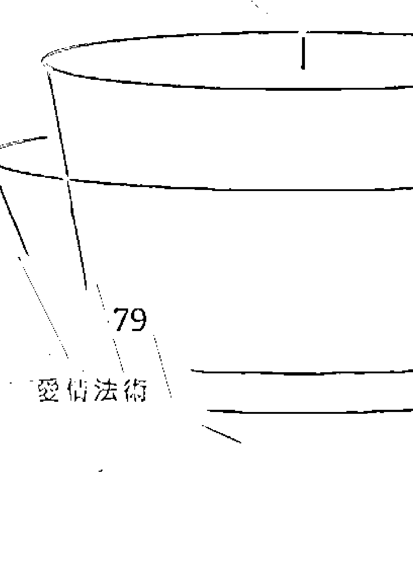

### 「這就是愛」伏都愛情召喚魔法

伏都教，特別是紐奧良伏都教，融合了非洲、美洲原住民、歐洲和天主教信仰的宗教和魔法元素。這個法術的目的是吸引你所愛的人或促進新戀情。這個簡單的法術在滿月或盈凸月期間進行最有效，你可以在戶外的月光下或在能看到月亮的窗戶旁進行。這個法術是受到 Denise Alvarado 的魔咒書《Voodoo Hoodoo Spellbook》啟發而產生。

#### 所需魔法物品

- 紅色筆
- 1張紙
- 1根粉色淨蠟燭（帶來愛情和浪漫）
- 雕刻工具
- 1滴金銀花油（吸引愛情）
- 火柴或打火機

#### 進行法術

1. 用紅色筆在紙上寫下你想要的人或事物。
2. 用雕刻工具在粉色淨蠟燭上雕刻出一個心形。
3. 用1滴金銀花油從燈芯開始塗抹蠟燭，一直到底部。
4. 如果你在室內，就把蠟燭放在窗臺上，讓心形面向窗外，這樣月光就能為它充盈能量。
5. 把寫有願望的紙放在蠟燭的底座下方。
6. 把金銀花油放在蠟燭旁邊。
7. 點燃蠟燭，說「來自上天的神聖力量，請吸引我所愛的人」。
8. 讓蠟燭完全燃盡（大約需要1到2小時）。
9. 蒐集剩餘的蠟和寫有願望的紙，埋在你家附近。觀想你播下了一粒種子，新戀情會從埋下的法術剩餘物裡生長綻放。
10. 每次出門去見人時，都在你的耳朵後面塗一點那瓶充滿月光能量的金銀花油。

## 第七章 療癒法術

無論你是需要療癒破碎的心、從受傷中恢復還是從疾病康復，以下幾個法術都能幫助你為自己和所愛的人帶來療癒的效果。

- 帶來健康的聖柱 85
- 阿波羅的療癒火焰 86
- 瑪麗·拉沃療癒蠟燭 88
- 心靈健康魔法 91
- 赫拉的心碎療癒法術 94
- 赫卡忒的療癒守夜儀式 96

### *尋求療癒，提供療癒

要注意很重要的一點就是，療癒法術並不是簡單地修復或消除傷害和疾病，而是帶來安撫和修復效果。療癒有多種形式和表現。

在為他人進行療癒法術時，一定要確認並對這些問題進行冥想：他們會介意你為之進行法術儀式嗎？你的法術會干擾到他們的自由意志嗎？如果你對自己的做法感到滿意，請爭取你想要做法術的人的同意。

用於療癒法術的常見物品：

- 顏色：白色、藍色、黑色
- 水晶：紅玉髓、水晶、拉長石、赤鐵礦、紫水晶、粉水晶
- 精油：尤加利、迷迭香、橄欖油、佛手柑
- 首選時間：週一、週日、滿月和虧凸月期間

### *帶來健康的聖柱*

這個簡單的法術需要用到柱狀蠟燭、抽出式蠟燭或諾維娜蠟燭，目的是抵擋疾病。如果你最近有不想錯過的活動，或最近和病人待在一起，又或許只是想要更多能量，都非常適合使用這類健康法術。這個法術最好在虧凸月期間進行。

#### 所需魔法物品

- 1根柱狀蠟燭（帶來療癒）
- 1元硬幣大小的橄欖油（帶來淨化）
- 藍色麥克筆（如果你是在沒有玻璃的耐熱盤上使用柱狀蠟燭，也可以使用眼線筆）
- 火柴或打火機

#### 進行法術

1. 為蠟燭淨化、補充能量和聖化，為法術做好準備。
2. 如果你使用的是諾維娜蠟燭，請直接進行第3步。如果不是諾維娜蠟燭，就把一角硬幣大小的橄欖油滴入手掌，從底部到燈芯，用拉動的方式把橄欖油塗抹在蠟燭上。想像你正在排出一切可能存在於你身邊和體內的疾病痕跡（包括身體疾病也包括心靈上的疾病），同時清除自己所有的負面能量。
3. 用藍色麥克筆，在蠟燭上寫下「NULLUM ME NOCEBIT」（沒有什麼能夠傷害我）。
4. 觀想自己被藍色火焰保護。
5. 點燃蠟燭，大聲說「沒有什麼能夠傷害我」。
6. 讓蠟燭完全燃盡。
7. 蠟燭燃盡後，把剩餘物埋在院子裡（如果蠟燭放在玻璃底座裡，就回收玻璃底座）。

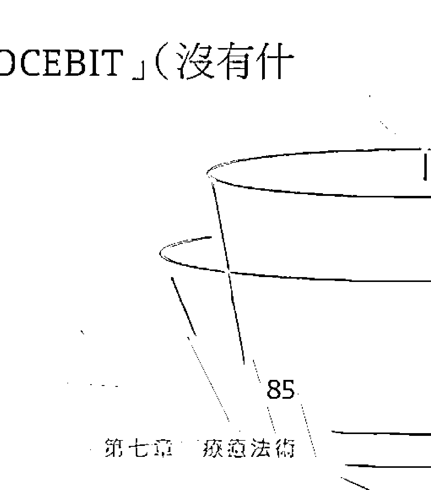

### *阿波羅的療癒火焰

阿波羅是古希臘的療癒之神，也是預言、音樂和太陽神。這個法術會用交感魔法來製造出疾病或症狀的有形表現，然後再以聖火燒掉。為了讓法術更強大，你可以使用金色元素為阿波羅做一個聖壇，並以太陽和烏鴉的圖案裝飾它。這個法術應該在週日進行。

#### 所需魔法物品

- 1根白色許願蠟燭（帶來療癒）
- 硬幣大小的橄欖油（帶來淨化）
- 耐熱盤子
- 紅色麥克筆
- 3張小紙片
- 火柴或打火機

#### 進行法術

1. 用硬幣大小的橄欖油塗抹許願蠟燭。同時，觀想一道白色光芒圍繞著你，陽光也照耀在你身上帶來暖意。
2. 把許願蠟燭放在盤子上。
3. 想像困擾你的病症。試著觀想那些症狀及其帶來的感覺。
4. 用紅色麥克筆在紙上寫下你的症狀。如果你有明確診斷出疾病，就把疾病寫在一張紙上，把症狀寫在另外兩張紙上。如果你沒有診斷出疾病，那就把症狀寫在三張紙上。
5. 在每張紙上畫出9條線，每條線都畫過你所寫下的字。
6. 點燃蠟燭，注視著火焰。深呼吸，說：「天神阿波羅，光明之神，請療癒我，為我消除痛苦吧！」
7. 拿起第一張紙，用燭火燃燒，同時說「請燒焦我的疾病，讓我得到療癒，在這束火焰中，我再也不會感到痛苦」。
8. 拿起第二張紙，用燭火燃燒，同時說「我的病痛會在這煙霧和燭火中消亡，我以阿波羅的名義清除這些病痛」。
9. 拿起第三張紙放在胸前，深呼吸，觀想你的痛苦、病痛、疾病和任何難過的感覺都在燭火中燒毀。想像你手中的紙片是疾病的所有殘骸。把紙片放在燭火中燃燒，說：「我的命運之線有力而堅強，阿波羅，請療癒我的衰弱和失常吧！」
10. 燒掉最後一張紙之後，讓蠟燭完全燃盡。收好所有的殘留物和灰燼，再用馬桶沖走或丟到有流水的垃圾處理裝置中。同時，觀想自己完全康復。
11. 在有需要的情況下，每兩週進行一次這個法術。

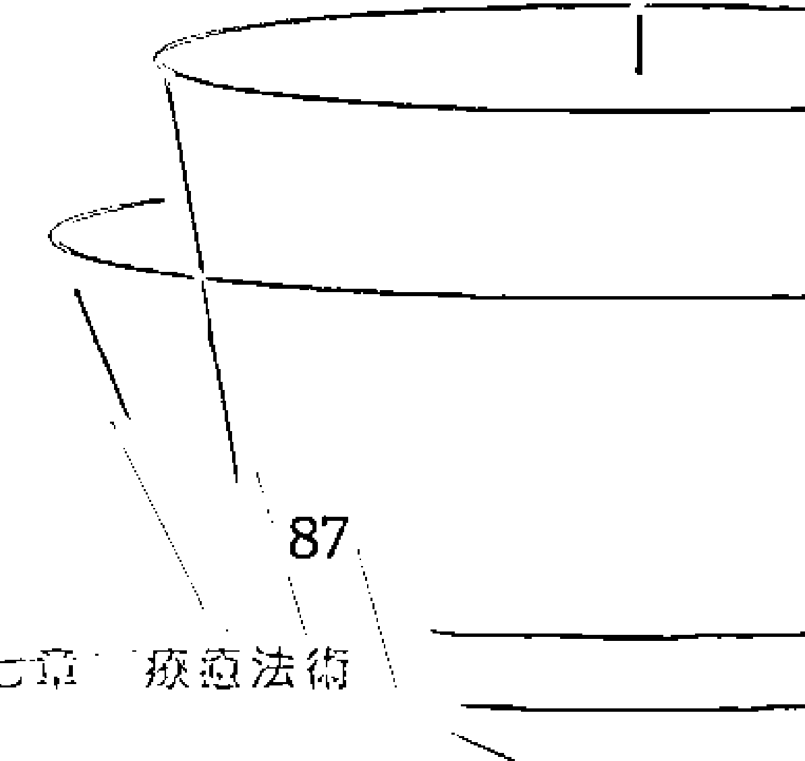

### *瑪麗・拉沃療癒蠟燭

這個法術來自我的朋友，也是我的導師，她是紐奧良的伏都教女王——血腥瑪麗！瑪麗・拉沃是十九世紀瘟疫期間的神奇療癒師，她至今仍然被視為靈性教母；世界各地的人們仍然會前往紐奧良尋求她的神聖治療，她的墳墓被這些人視為聖地。在這個療癒蠟燭法術中，你將喚起紐奧良偉大的伏督女王來幫助你進行魔法工作。這個法術是以別人的健康為目的而進行，你也可以更改以滿足自己的需求。進行這個法術可以幫人們從身體和精神的病痛中恢復。這個法術適合在虧凸月期間的週一進行。

操作任何紐奧良伏督魔法的時候，都要記得在法術完成之後為慈善機構或教堂奉獻什一稅（捐獻法術收入的十分之一），以支付靈性世界的工作費用。也請記得將禱告或聖歌以及對想要結果的強烈觀想灌輸至你的蠟燭。

#### 所需魔法物品

- 玉米粉 (帶來穩定、成長和基礎)
- 白色的布 (帶來淨化)
- 燭臺
- 雕刻工具、鋼筆或剔骨刀
- 藍色或白色抽出式蠟燭
- 鋼筆或鉛筆
- 蘭姆酒 (作為供品或者祭酒)
- 接骨木糖漿或茶 (帶來健康)
- 聖水或雨水 (帶來更新)
- 火柴或打火機
- 手搖鈴、鈴鑰或鼓
- 需要作法客戶的照片（或客戶親自在現場）
- 筆記本

#### 進行法術

1. 為你的聖壇整理出一個神聖潔淨的空間。
2. 在祭壇底部用玉米粉畫出一個X。
3. 在X上放一塊白布。
4. 把穩定的燭臺放在白布上。
5. 在伏都教中，蠟燭永遠要奉獻給特定的羅瓦神靈（靈體）或聖人——在這個儀式中，就是瑪麗·拉沃。
6. 用雕刻工具在藍色或白色的蠟燭上雕刻一個X，最好雕刻在靠近中心的位置（這個雕刻圖案是簡單的伏都教宇宙圖，也象徵十字路口）。
7. 用鋼筆或鉛筆在蠟燭上寫下「Marie Laveau」（瑪麗·拉沃）之名。
8. 在蠟燭上寫下客戶／患者的名字或姓名首字母縮寫。（只有當客戶在場的時候才能寫名字的首字母。如果客戶不在場，請寫下他們的全名並使用他們的照片。）
9. 處理蠟燭，首先用蘭姆酒塗抹蠟燭，再用接骨木糖漿塗抹。
10. 按照聖壇的擺放位置，在你的祭壇和地板灑下或滴3滴聖水。
11. 在桌子敲3下，說「請打開大門，聖彼得，走過大門！我可以打開道路嗎，雷格巴老爹？請讓你的孩子通過吧！Yo La li Mamzelle Marie;瑪麗·拉沃，有著療癒之手的靈性教母啊，我呼喚妳;Yo La li Mamzelle Marie！」
12. 介紹你自己，說明你的意圖並請求幫助。
13. 點燃蠟燭。
14. 搖動手搖鈴，敲響鈴鐺，或敲擊鼓面3次。一遍又一遍地敲3下，直到你感受到能量轉換為止。
15. 在火焰的熱度中揉搓雙手，如果你的客戶也在場，請他們一起這樣做。
16. 把點燃的蠟燭放在燭臺上，拿給客戶或展示給客戶的照片。
17. 用燭光環繞勾畫病人／客戶的身體或者照片（如果客戶本人在場，請抬起他們的腳，讓燭光也繞過他們的腳底）。
18. 把蠟燭放回原處。
19. 與客戶在沉默中靜坐，如果客戶不在場，就靜默片刻。在身邊準備好筆記本，寫下你從瑪麗·拉沃獲得的訊息或建議。
20. 觀想伏都教女王瑪麗·拉沃開始干預並從精神上觸摸了你的客戶，冥想這個場景。
21. 讓蠟燭燃燒約20分鐘。
22. 熄滅蠟燭，接下來三日每天都重新點燃蠟燭 15 至 20 分鐘。然後，你可以把蠟燭交給需要接受療癒的人，讓他們完成燃燒蠟燭的過程，如果他們無法完成就代替他們做完，但是他們親自參與會更好。
23. 拍手 3 次，結束魔法操作。
24. 對神靈的幫助表示感謝。
25. 請求神靈繼續療癒並帶來保護，同時釋放神靈。
26. 說出「Ayibobo」。

### *心靈健康魔法

我在高中時創作了這個療癒法術來克服壓力和焦慮。這是相對簡單的法術，結合了蠟燭魔法的力量和來自音樂與冥想能量的療癒效果。請在你的房間或你可以獨處且感到安全的黑暗空間中進行。這個法術要在週日晚上進行，或任何當你感到不知所措、焦慮或心中有負面情緒的時候。

#### 所需魔法物品

- 你可以獨處的空间
- 乳香或其他有淨化功能的藥草（秘魯聖木、鼠尾草、甜草或迷迭香，都能帶來淨化功能）
- 歌曲播放清單
- 6根白色淨蠟燭(帶來療癒)
- 音響或耳機
- 火柴或打火機

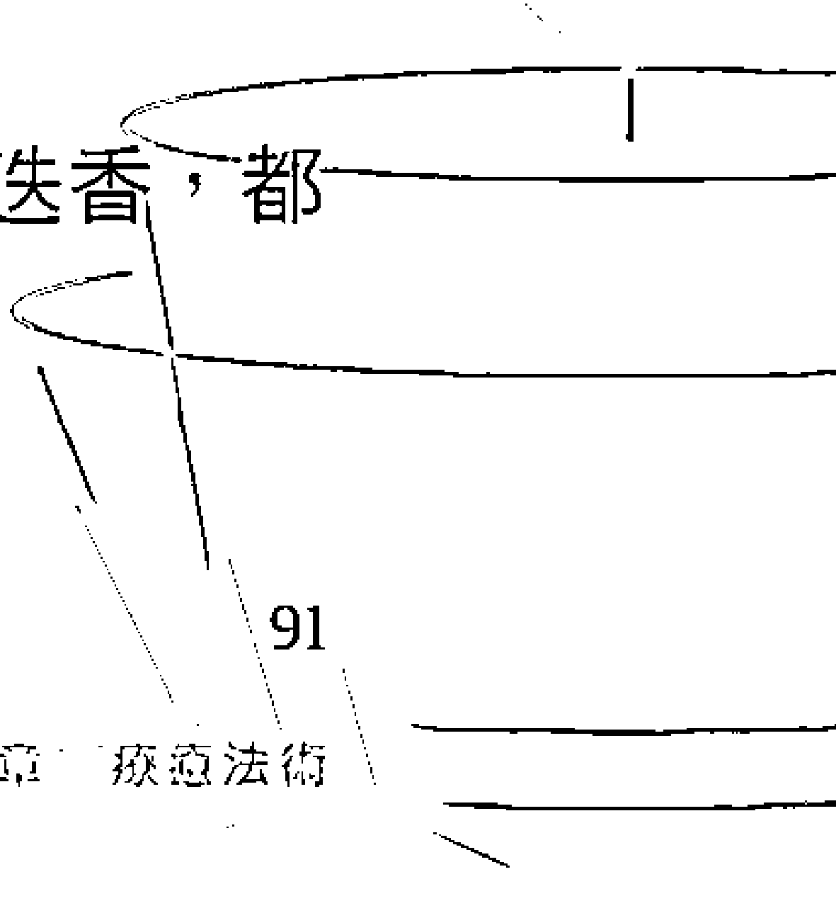

#### 進行法術

1. 用乳香或其他你選擇的淨化藥草（秘魯聖木、鼠尾草、甜草或迷迭香）來淨化你的房間或祭壇空間。
2. 創建播放清單。首先，選擇 3 首能代表你目前感受的歌，或讓你感到在最低谷的歌。然後再選擇 3 首能代表你最開心時的歌，或能讓你感到振奮的歌。
3. 將六根淨蠟燭環繞你放在地板上，確保蠟燭在可以觸及的地方，但是也要和你保持安全距離，讓你能夠躺下。
4. 點燃六根蠟燭。
5. 關掉房間的燈，只讓蠟燭照亮房間。
6. 一切都準備好之後，播放歌單中的第一首歌，也就是代表你恐懼、憂鬱和傷害的歌曲。閉上雙眼，在歌曲播放時，感受內心激盪的情緒。歌曲播放的時間愈長，這些情緒就愈升騰（如同沸騰的茶壺），通過你的情緒來呼吸。
7. 歌曲播放結束之後，立即坐起身，看著其中一根蠟燭，然後把它吹滅。想像你正在吹滅並送走所有負面情緒。
8. 回到放鬆的姿勢，繼續播放第二首歌，重複第6和第7步。
9. 吹滅第三根蠟燭，聽完最後一首悲傷的歌曲後，花1分鐘呼吸。
10. 想像自己的悲傷和痛苦已得到淨化，觀想自己的內心空蕩但平靜。
11. 回到放鬆的姿勢，播放歌單中第一首能夠振奮你的歌曲。這首歌代表了你的願望、慾望和夢想。
12. 歌曲播放結束後，起身凝視蠟燭火焰。但這次不要吹滅蠟燭——讓好的能量保持下去。
13. 重複第11步和12步。
14. 在你開始聽最後一首歌的時候，想像你最開心的時光，想想那些讓你笑出來的回憶，以及即將發生且讓你開心的事。
15. 完成之後，拿起吹滅的三根蠟燭，快速丟進垃圾桶。同時想像自己已經丟掉了那些不好的感受和能量。
16. 熄滅剩餘的淨蠟燭，並且好好保留。這些蠟燭已經充滿了你的渴望、願望和快樂回憶，當你想再次喚起這些感覺時，只要再點燃蠟燭即可。

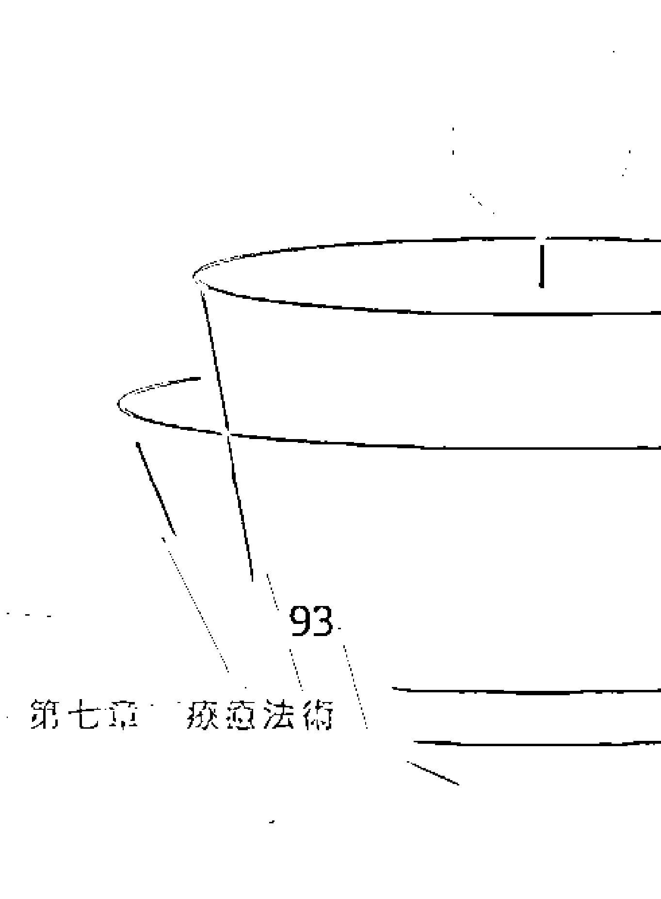

### *赫拉的心碎療癒法術

赫拉是宙斯的妻子，也是古希臘的婚姻女神，在希臘神話中她不斷和丈夫及其不忠過錯而爭鬥。儘管赫拉遭受多次背叛，但她仍然保持鎮靜，從傷痛中療癒。作為一位女神，她照料那些經歷過心碎的人，也滋養那些需要振奮精神的人。這個法術適合在週日或虧凸月期間進行。

為了增強這個法術的力量，你可以用綠色或紫色的布來裝飾聖壇，還有赫拉的聖物——孔雀羽毛或孔雀圖畫。這個法術可以在分手後、收到不幸消息之後、友誼結束之後、某項損失之後或在任何你感到孤獨的時候，於睡前進行。

#### 所需魔法物品

- 1根藍色淨蠟燭（帶來療癒）
- 雕刻工具
- 燭臺
- 火柴或蠟燭
- 日記本或筆記本
- 紅色筆
- 1小枝新鮮的或曬乾的迷迭香（帶來保護，增加魔法）
- 1滴薰衣草精油（帶來放鬆和平靜）

#### 進行法術

1. 在睡前的幾小時裡，拿出藍色淨蠟燭，用雕刻工具在蠟燭的側面刻上「FORTIS IN ARDUIS」（在困難中堅強）。
2. 把蠟燭放在燭臺上，擺在床頭櫃並點燃蠟燭。在心中默念，或大聲說出來，祈求療癒賜福，請求心中感到的痛苦和心痛能被清除。
3. 在你的日記本或筆記本上畫一個圓圈。在圓圈內畫一顆心，在心內寫下「HEAL」（療癒）。
4. 把這頁紙撕下，放在床頭櫃上。拿起蠟燭，小心地把蠟滴在你畫的圓圈周圍。
5. 把蠟燭放在紙上圓圈的中心。
6. 關掉所有燈，拿出迷迭香小枝，回到床上。手中緊握迷迭香樹枝，盯著燭火，說出「赫拉夫人，我請求您療癒我受傷的心，作為回報我把這個信物獻給您」。
7. 把迷迭香放在枕頭下。
8. 蠟燭燃燒的時候，想像它正在把心碎和痛苦都燒掉。
9. 等蠟燭完全燃盡，滴1滴薰衣草精油在指尖，揉搓你的太陽穴。
10. 去睡覺。儘量放鬆，不要去思考困擾你的狀況。
11. 第二天早晨，把法術的剩餘物蒐集在一起（蠟和紙片）。把這些剩餘物品揉成一團，扔進垃圾桶，或者丟到遠離你家的垃圾箱。
12. 把迷迭香枝保留下來，放在聖壇上，它能讓你時刻想起赫拉的保護。一個月過後，把樹枝埋在你的院子裡，開始迎接新戀情。

### *赫卡忒的療癒守夜儀式

赫卡忒是當今異教和現代巫術中相當著名的女神。祂被廣泛地視為月亮女神和女巫女王，但就像祂的三相女神天性一樣，祂不斷在發展改變。赫卡忒起初是希臘泰坦神之一，擁有生死之力。

祂控制著大地、冥界、海洋和月亮；祂是藥草師和助產師的首席代表，那些需要療癒的人會向赫卡忒祈願，或前往祂在科爾基斯島上的神聖花園，接受祂的女祭司之祝福。這個法術旨在作為終極手段之用，例如在不能用醫學解決或無法獲得治療的時候。你也可以用這個儀式尋求診斷，或用來了解你所愛的人正在經歷的病痛。這個法術適合在黑月時期的夜晚或在週一晚間進行。把黑布擺在桌子上當作聖壇，用石榴和蘋果裝飾，也可以用人物、照片和赫卡忒的神聖動物——狗、蛇和龍來裝飾聖壇。這個儀式需要連續進行九天。

#### 所需魔法物品

- 塔羅牌中的死神牌(帶來更新)和月亮牌
- 1根黑色的諾維娜蠟燭或七日旋鈕蠟燭(獻給赫卡忒)
- 雕刻工具
- 1滴橄欖油(帶來淨化)
- 耐熱盤
- 火柴或打火機

#### 進行法術

1. 擺放好祭壇之後，從塔羅牌中取出死神牌和月亮牌。
2. 拿起死神牌並凝視牌面；這些畫面向你顯示出什麼訊息？死神牌並不是結束的象徵，而是代表轉變。把牌拿在手裡，對它說話。說出你希望得到療癒的人及其症狀。
3. 把死神牌放在桌子上，拿起月亮牌。凝視牌上的畫面，想像月亮就是女神赫卡忒本人。月亮代表著神秘和未知。在你凝視卡片的時候，大聲請求正確的病情診斷和治療方法展示在你面前。
4. 把月亮牌放回桌上，用雙手拿起黑色蠟燭。閉上眼睛，雙手拿著蠟燭，大聲說出你正在為之進行魔法之人的名字，說3次。
5. 用雕刻工具在蠟燭頂部刻上「HECATE」(赫卡忒)之名，在蠟燭底部刻上需要療癒之人的名字。
6. 在左手倒出硬幣大小的橄欖油，從底部開始塗抹蠟燭，一直塗到頂部，直到燭芯的部分。
7. 把蠟燭放在盤子上，放在之前用過的塔羅牌後面。
8. 用火柴點燃蠟燭，大聲或在內心說出「我劃動火柴，點燃火焰；偉大的赫卡忒，我呼喚您的名字。請把隱藏的部分顯示給我，幫助我治療、保護和防衛」。
9. 把用過的火柴放在蠟燭旁邊的盤子上，讓蠟燭燃燒13到30分鐘，然後用手指掐滅蠟燭。
10. 每天晚上重新點燃蠟燭，讓蠟燭燃燒13到30分鐘，連續九天，或連續進行直到蠟燭完全燃盡並且自行熄滅。
11. 如果有剩餘的蠟，可以查看蠟是否顯示出特定的圖像。
12. 把所有剩餘的蠟都丟進遠離你家的垃圾桶。
13. 將用於儀式的塔羅牌放在梳妝臺或桌子上，直到你為之進行法術的人得到了治療或準確的診斷為止。

## 第七章 痊癒法術

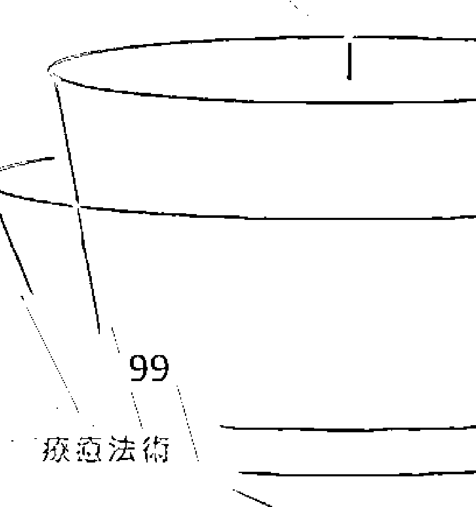

## 第八章 保护法术

保护法术是相当受欢迎的法术，仅次于爱情法术。保护法术能保护你免受负面力量的影响，包括物质层面也包括超自然层面。在本章节，你会了解各种能保护你免受闲言碎语、假面朋友、整蛊灵体和徘徊在身边之负面能量影响的咒语。

- 凯美特保护火焰 103
- 小人快走开 104
- 驱除坏能量 106
- 打破毒咒法术 108
- 皮媞亚净化和保护法术 110
- 加勒比椰子净化蜡烛 113

### *提出保护，进行保护

每个人都会在某些时候需要保护，没有什么比收到魔法的保护更重要。这些法术不仅可以威慑敌人，防御坏法术，也能保护你免受超自然幽灵的伤害。

### 保护魔法常用物品

- 蜡烛：柱状蜡烛、抽出式蜡烛、诺维娜蜡烛、茶灯蜡烛
- 颜色：黑色、白色
- 药草：迷迭香、黑胡椒、红辣椒片、卡宴辣椒
- 精油：乳香、没药、迷迭香
- 水晶：白水晶、烟水晶、赤铁矿、虎眼石、黑碧玺
- 首选时间：亏凸月、周一、周二

### 凯美特保护火焰

古埃及人擅长巫术，这个法术就改编自古埃及莎草纸卷轴中的法术。这个法术原本的要求是使用一盏灯，因为直到很久之后蜡烛才用于魔法中；而现代做法则用抽出式蜡烛代替。这个简单的法术可以在任何魔法和仪式之前或之中进行，用来保护魔法免受外部影响。你要让这根蜡烛完全燃尽，可能会花费好几天。这个法术适合在周二进行，或任何你感到需要保护的时候。

#### 所需魔法物品

- 1根黑色抽出式蜡烛（驱逐负面能量）
- 雕刻工具
- 1滴乳香精油（带来保护）
- 少许没药树脂（带来净化）
- 少许干迷迭香（加强魔法）
- 火柴（硫磺能带来保护）

#### 进行法术

1. 用双手取出黑色抽出式蜡烛。闭上双眼，吸气，然后轻轻呼气在蜡烛上。在呼气的时候，观想你正用保护能量充满蜡烛。
2. 用雕刻工具在蜡烛上刻出荷鲁斯之眼。小心不要刻得太深。
3. 将一角硬币大小的乳香精油倒入手中。从蜡烛底部开始向烛芯涂抹精油。观想自己正在把任何有可能徘徊在周围的负面能量都排出体外。
4. 在玻璃烛台的底部滴少许没药树脂，再加一撮迷迭香。
5. 把蜡烛放回玻璃烛台里，用双手握住它，说“太阳天父，请听取我的恳求，让您警觉的双眼保护我”。
6. 点燃火柴，当你用火柴点燃蜡烛的时候，说“我划亮火柴，我说出太阳神拉(Ra)的名字，我被他的神圣火焰保护着”。
7. 对蜡烛冥想10到15分钟。当你凝视蜡烛的时候，观想自己被它的火焰包围且受到保护。
8. 等到蜡烛完全燃尽，查看玻璃烛台，看底部有没有烟灰留下。观察蜡烛燃烧的状况，用了多少时间完全燃尽。
9. 法术结束后回收玻璃烛台。

### *小人快走开

我们生活中肯定都有这样的人（或许还不止一个）——我们遇到这个人之后很快就会意识到，这个小人必须赶快走开！如果你受了委屈，或需要摆脱轻视你的人，那么这个保护法术能帮到你。它包含强大的魔法，能把那些越界、不受欢迎或惹麻烦的人扫地出门。这个法术能快速进行且快速见效！最适合在亏凸月期间进行。

#### 所需魔法物品

- 雕刻工具
- 缝纫大头针或者缝衣针
- 1根黑色净蜡烛（驱逐负面能量）
- 小陶瓷盘（最好是黑色）
- 少许卡宴辣椒（驱逐负面能量，加速魔法过程）
- 少许磨碎的黑胡椒（驱逐负面能量）
- 少许盐（带来保护）
- 火柴或打火机
- 黑色的布

#### 进行法术

1. 想着那个你想要从生活中移除的人。用雕刻工具把他的名字或姓名首字母刻在蜡烛上。
2. 用缝纫大头针或缝衣针刺穿蜡烛，小心不要把蜡烛折断（如果你无法把针完全穿过蜡烛，只穿过一半也可以）。
3. 刺穿蜡烛的时候说“（对方的名字），你让我受了委屈，现在我命令你，贱人，快点走开”。
4. 把蜡烛放在盘子上（让蜡烛的底部融化少许，这样就可以在盘子上立起来）。
5. 用画圈的方式在蜡烛附近的盘子里撒一撮卡宴辣椒。
6. 用黑胡椒和盐重复第5步。
7. 在蜡烛周围撒了盐之后，说“贱人快走开，这就是我的命令。没错，贱人快走开，快点远离我”。
8. 点燃蜡烛。蜡烛燃烧的时候，观想法术所针对的人。观想他的所有特点，想像他正在慢慢消失，逐渐变得半透明，最终完全消失。
9. 让蜡烛燃烧直到针脱落。针掉落以后，掐灭烛火。
10. 把盘子中的蜡烛和药草搜集到那块黑布里面，把黑布折起来，用针固定好。
11. 把捆好的药草和蜡烛扔到远离你家的垃圾桶。把布袋扔进垃圾桶，说“贱人快走开”。
12. 在社交软体上封锁这个人，并采取合适的方式和他保持距离。
13. 你可以每周继续燃烧一根黑色净蜡烛，直到这个人完全从你的生活中消失。请记住，不要和对方发生争执。

### *驱除坏能量

我们必须承认，大家都会有心情不好的时候！我们最不想要的就是沾染上别人的负面能量，尤其是在我们的私人空间或家里。这个仪式非常适合净化房屋驱逐坏能量、清除人们负面情绪的残余，或清理上一位屋主或住户的能量。这个法术相当有效、快速，且只需要盐、茶灯蜡烛、火柴和你的内在力量！在任何你突然感到坏能量的时候，或你家的氛围似乎不对头的时候，都可以使用这个法术。你也可以在刚搬进新居的时候进行这个法术。

#### 所需魔法物品

- 4个白色茶灯蜡烛(用以净化)
- 4根火柴(驱逐负面能量)
- 盐(带来保护)

#### 进行法术

1. 把4个茶灯蜡烛分别放在屋中的四个角落，最好是放在客厅。
2. 从房屋的后面开始，在离正门最远的位置选择一个角落，点燃一个茶灯蜡烛，说“我划亮火柴，点燃火焰。请把坏能量驱逐出这个空间”，点燃蜡烛后把用过的火柴放在茶灯蜡烛旁边。
3. 在茶灯蜡烛周围撒一撮盐，说“硫磺和盐巴，请吸收所有的坏能量，请让一切痛苦、消极和悲伤都停止”。
4. 在余下几个角落里重复第2步和第3步。
5. 点燃四个角落的蜡烛并撒盐之后，回到房间的中心。盘腿坐在地板上，闭上眼睛，深呼吸几次。观想你身边的空间正变得无比明亮且被白光包围，想像这道光正在消灭所有沉重的负面能量。
6. 当你感觉到周边空间已经得到净化之后，搜集蜡烛和火柴，扔到远离你家的垃圾桶。
7. 你可以继续用其他你喜欢的仪式或工具来净化房屋，但请先用这个法术吸收和驱逐任何可能挥之不去的负面能量。

### *打破毒咒法术

你是不是有过连续运气不好的经验？你会否有时候觉得不太对头？你有没有惹到过会对你下毒咒的人？你要知道，不是所有魔法和诅咒都是透过法术才能进行的。气愤、嫉妒和怒火会释放出强大的能量，特别是当它有针对特定之人的时候。这个法术是打破身边毒咒的好方法。当你感到筋疲力尽或知道有人对你不怀好意时，就可以使用这个法术。这个法术最适合在亏凸月期间或周四晚上9点进行。一定要用黑布来装饰圣坛，并且在昏暗的灯光下进行法术。

#### 所需魔法物品

- 1根黑色许愿蜡烛
- 雕刻工具
- 橄榄油
- 盘子或碗(最好是黑色)
- 9粒黑胡椒
- 盐
- 火柴
- 黑色布袋(非必需)

#### 进行法术

1. 把还没点燃的黑色许愿蜡烛拿在手中，想像最近发生在你身上所有不开心的事或倒霉事。闭上双眼，深呼吸，然后对蜡烛吹气。重复说“我用这魔法师的气息给予你生命”。
2. 用雕刻工具在蜡烛上刻出一个等臂十字架。在雕刻的时候，想像自己被能保护你的蓝色火焰包围。
3. 用少量橄榄油涂抹蜡烛，以逆时针方向环绕蜡烛涂抹，并确保整根蜡烛都有涂上橄榄油。
4. 把许愿蜡烛放在盘子上，将9粒黑胡椒拿在左手。
5. 用右手拿起一粒黑胡椒，说“不管我身上被施加了什么毒咒，我都能把它打破，如此尘埃落定”。把胡椒粒放在盘子上的蜡烛周围。重复这个过程，直到所有黑胡椒在盘子上围绕蜡烛成一个圆圈。
6. 在左手倒一些盐。手握成拳头，观想盐巴正在吸收你所有的负面能量。然后用右手拿起盐，以顺时针方向撒在蜡烛四周。
7. 左手拿着蜡烛，低声说“火柴中神圣的硫磺啊，请保护我不会沾染任何负面能量”。
8. 划亮火柴，点燃蜡烛，把蜡烛留在盘子上作为供品。
9. 如果可以的话，就让这个蜡烛完全燃尽；若无法做到，就让蜡烛燃烧1小时，然后用手掐灭，再撒上盐。
10. 当蜡烛完全燃尽后，观察蜡油残留的形状。你可以透过读取这些形状和象征来判断这个毒咒发生的原因。如果没有蜡油残留，代表这个法术完全成功了。
11. 你可以把黑胡椒和盐巴的残余物放在一个黑色布袋里，以起到保护作用。或者，把黑胡椒和盐冲下马桶或水槽，想像厄运已经完全被消除。

### *皮媞亚净化和保护法术

皮媞亚是古希腊的德尔菲神庙神祇。在古代，各地的人都会前往朝圣，请教皮媞亚，祈求预言。这位神祇也是为阿波罗奉献的女祭司，阿波罗是疗愈之神、艺术之神，也是预言之神。这个仪式是在法术和占卜之后进行的。目的不仅是为了净化自己，也是为了保护自己免受法术和占卜（塔罗、水晶球占卜、通灵或直觉占卜）时可能出现的外部干预力量之影响。这个仪式可以在任何时候进行，但应该在法术之后开始，特别是在为其他人占卜或作法后，你不会希望别人的意图、感受或能量附着在你身上。进行这个净化和保护仪式时，要准备一个纯白色的祭坛，用金色元素、紫水晶和烟晶来净化你的通灵能量和第三眼。

#### 所需魔法物品

- 1根黑色净蜡烛（驱逐负面能量）
- 橄榄油（带来净化）
- 2根白色净蜡烛（带来保护）
- 3滴迷迭香精油（加强魔法和保护）
- 1滴薰衣草精油（带来净化；非必需）
- 1碗水
- 金色麦克笔
- 3片月桂叶（带来保护，是阿波罗的圣物）
- 火柴或打火机

#### 进行法术

1. 在你完成法术或占卜之后，用一枚硬币大小的橄榄油涂抹黑色蜡烛。有需要的话，可以用迷迭香精油涂抹白色蜡烛。大声对自己说“天神阿波罗，光芒之神，感谢您给我带来光明的礼物”。
2. 摆放蜡烛，让黑色蜡烛位于中间，两根白色蜡烛放在两侧。
3. 把一碗水放在三根蜡烛前方。
4. 用金色麦克笔在第一片月桂叶上写下“APOLLO”；在第二片叶子上写下“PYTHIA”；第三片上写“ARTEMIS”。名字都写好之后，把叶子放在一边。
5. 划亮火柴点燃蜡烛，从左边的白色净蜡烛开始。每根蜡烛都用一根不同的火柴点燃；每根蜡烛都点燃之后，把火柴放入你面前的一碗水里。
6. 三根蜡烛都点燃后，拿起写有“APOLLO”的月桂叶，用第一根点燃的蜡烛火焰点燃叶子。
7. 点燃月桂叶的时候，说“阿波罗，我说出你神圣的名字，请用火焰的光芒保佑我”。让月桂叶尽可能地自然燃烧，当心不要烧到自己，然后把月桂叶放进水碗。
8. 拿起写有“PYTHIA”的月桂叶，用另一根白色净蜡烛的火焰点燃。点燃叶子的时候，说“皮婭亚，预言之灵，我的工作已经结束了，请您保护我”。让叶子尽可能地自然燃烧，然后把它放进水碗。
9. 拿起最后一片写有“ARTEMIS”的月桂叶，用黑色蜡烛的火焰点燃，说“阿尔忒弥斯，月亮女神，夜晚女神，我用这个神圣仪式请求您的保护”。让叶子尽可能地自然燃烧，然后把它放进水碗里。
10. 把最后一片叶子放进水中后，将手放在火焰上方并保持安全距离，感受热量的升腾。闭上眼睛，观想火焰烧掉了之前的法术或占卜中的多余能量，以及挥之不去的负面部分（比如负面能量、愤怒、不良情绪或感觉）。
11. 睁开双眼，凝视燃烧的蜡烛，说“保护我的魔法，保护我的光，保护我远离那些不属于光明能量的困扰”。
12. 用那碗水洗手，然后将水洒在头上和后颈部位。
13. 让蜡烛完全燃尽（大约会持续1到3小时）。利用这段时间放松和冥想。
14. 蜡烛燃尽之后，把残余物放在水碗倒入马桶冲掉，或丢在有流水的垃圾处理场。(在古代，驱逐法术的残留物会在湖水和河流中处理掉，但用水冲走残留物也一样有效。)

### *加勒比椰子净化蜡烛

这个传统的奥比巫术风格法术是一位来自千里达的好朋友分享给我的。奥比巫术是加勒比黑人在巴哈马、加勒比、牙买加、千里达和维京群岛地区使用，关于灵性、疗愈和魔法的民间习俗。在这个净化法术里，蜡烛被放在椰子中，用以象征力量和保护，在法术完成后会被埋起来。这个法术能呼唤你的祖先 (你认识的和不认识的都有)，目的是净化你的空间，帮助你抵挡不良灵体、负面能量和不速之客。这个法术适合在亏凸月期间进行，需要一个白色亚麻布布置的圣坛。

#### 所需魔法物品

- 3根白色许愿蜡烛 (带来净化)
- 硬币大小的椰子油 (带来更新)
- 半颗椰子壳 (奉献给大地并带来保护)
- 3滴广藿香精油 (加强灵性)
- 1滴没药精油 (带来神圣祝福)
- 火柴 (驱逐负面能量)

#### 进行法术

1. 首先用硬币大小的椰子油涂抹三根白色许愿蜡烛，并将蜡烛固定在椰子壳里。
2. 在每根蜡烛上都滴1滴广藿香精油。在这个时候你可以说出你的意图，或其他有力量的话语。
3. 将1滴没药精油放在三根蜡烛之间，说：“神圣的祖先啊，请听取我的请求，让这个地方成为神圣的空间吧！”
4. 用火柴点燃蜡烛（每根火柴点燃一根蜡烛），接着把燃尽的火柴放进椰子里。
5. 蜡烛燃烧时，观想蜡烛正发出能环绕整个空间的白光。
6. 将手放在蜡烛上方，保持安全距离。感受火焰的热度传导到你的手掌。观想自己正在被净化，你周边和所在空间中挥之不去的所有负面能量都被清除了。
7. 让蜡烛完全燃尽。当蜡烛完全熄灭后，把椰子埋在院子里。如果你没有庭院，就把椰子放进一个盒子，或放在公园任意一棵树的附近。

## 第九章 丰盛法术

想要获得额外收入吗？想要升职吗？在这一章，你会了解能带来丰盛和成功的法术，学到进行金钱魔法的最好方式。

- 帕克的幸运钱币法术     119
- 获得工作魔咒           120
- 墨丘利（水星）的显化魔法 121
- 幸运猫蜡烛             123
- 布莉姬女神的成功法术   125
- 甜甜的丰盛蜂蜜罐法术   127

### *带来丰盛，实现成功

能够带来成功和丰盛的法术不仅只是为了获得财富或大量金钱，其目的是保持财务稳定，吸引好运，帮助你在职业生涯取得成功。这些法术没办法让大量金钱瞬间出现在你眼前，但能助你打开这些机会的大门。

### 丰盛法术常用物品

- 蜡烛：造型蜡烛、净蜡烛、茶灯蜡烛、许愿蜡烛、诺维娜蜡烛、抽出式蜡烛
- 颜色：绿色、黄色、紫色、黑色
- 药草：高约翰根、罗勒、肉桂、迷迭香、月桂叶
- 精油：广藿香、杏仁、岩兰草、金银花
- 水晶：黄水晶、黄铁矿、孔雀石、虎眼石、琥珀、石榴石

### *帕克的幸运钱币法术

这个快速的小法术能召唤帕克，这位来自英国传说中的恶作剧精灵因为莎士比亚的《仲夏夜之梦》而得名。这个法术可以在你看到正面朝上的钱币之时进行——因为这是好运的象征。请在看到钱币的当天进行这个法术，这样能保持与钱币的联系，好运也能变得长久。

#### 所需魔法物品

- 一枚你看到正面朝上的钱币 (带来好运)
- 耐热盘子
- 火柴或打火机
- 1根黑色或绿色的净蜡烛 (带来成功和平衡)

#### 进行法术

1. 用双手拿起钱币。闭上眼睛说“我发现了一枚钱币，它正面朝上，现在它就是能给我带来好运的吉祥物了”。
2. 将钱币正面朝上放在盘子里。用火柴或打火机燃烧净蜡烛底部，直到底部的蜡开始融化。
3. 把蜡烛放在钱币上。等待蜡烛冷却，确保蜡油已经变硬且牢固地附着在钱币上。
4. 蜡烛冷却并固定在钱币上之后，点燃蜡烛说“我点燃这根蜡烛，我呼唤帕克，请不要让任何事情破坏我的好运气”。
5. 让蜡烛完全燃尽。等到蜡烛熄灭，蜡油在硬币上融化且冷却后，就可以把这枚钱币作为带来好运和成功的护身符了。
6. 请记得法术之后要对帕克表达感谢，因为如果不承认或感谢精灵的帮助，他们可能会生气。留下一些小供品，比如一小块饼干、面包或苹果片，以表示对他们的谢意。

### *获得工作魔咒

这个丰盛法术可以用来找工作、获得升职，还有阻止那些试图破坏你成功的人。有了这个法术，你就能抵御任何试图使你迷失方向之人的破坏，比如同样想要升职的同事。这个法术也能让你在想要的职位竞争中获得胜利。适合在面试之前的周三进行。

#### 所需魔法物品

- 1根绿色诺维娜蜡烛或七天蜡烛（带来金钱）
- 3滴乳香精油
- 能够代表想要职位的图片、物品或文件（没有的话，你也可以自己手写、打印下来或自己做出相关的文件）
- 少许罗勒（带来成功）
- 少许肉豆蔻（带来好运）
- 少许丁香（带来安全感）
- 少许迷迭香（带来保护）
- 火柴或打火机

#### 进行法术

1. 用双手握着蜡烛，用你的愿望为它充满能量。
2. 用乳香精油涂抹蜡烛，从顶部开始向底部涂抹。
3. 把代表你想要的工作或职位的图片摆好，把蜡烛放在图片上方。
4. 把药草用绕圈的方式撒在蜡烛上方和四周，同时在工作相关的图片上撒些药草。
5. 点燃蜡烛，让它燃烧1小时，然后用手指掐灭它。
6. 每天在同一时间重复一小时这个过程，直到蜡烛完全燃尽，自己熄灭。
7. 搜集蜡油和法术的残余物，埋在你的前院、后院或盆栽里。
8. 初次面试结束或在表达过你对职位的渴望之后，确保发送邮件跟进，或继续表明你的兴趣。

### *墨丘利（水星）的显化魔法

墨丘利是旅行者之神、交流之神、好运之神和赌博之神。对于那些想实现特定目标的人来说，他的帮助可能非常有价值，特别当这些目标是关于职业生涯、成功或富足丰盛的时候。你可以在需要帮助以实现某种愿望，或在需要为你的显化添加一些神圣能量的时候来进行这个法术。这个法术适合在周一开始，在周三完成，因为周三是水星（墨丘利）掌管的日子。

#### 所需魔法物品

- 小的雕刻工具
- 1根蓝色净蜡烛（带来创造力）
- 3个净蜡烛的烛台
- 火柴或打火机
- 1根白色净蜡烛（带来神圣影响）
- 1根绿色净蜡烛（带来成功）
- 1小张请愿纸

#### 进行法术

1. 用雕刻工具在蓝色净蜡烛的一边刻上水星的星星符号，在另一边刻上你的姓名首字母。
2. 用左手拿起蜡烛，说“飞行中的墨丘利，请您认可我的决心和力量，今晚显化出我的目标”，然后把蜡烛放进烛台里。
3. 点燃蓝色蜡烛，让它完全燃尽。请记下你开始法术的时间，因为明天你需要在同一时间再次开始法术。
4. 第二天使用白色蜡烛重复第1步。
5. 用右手拿起白色蜡烛，说“我显化出了我的愿望。墨丘利，在我点燃火焰的时候请聆听我的声音”，然后把蜡烛放进烛台里。
6. 点燃白色蜡烛，让它完全燃尽。
7. 第三天用绿色蜡烛再次重复第1步。双手握住绿色蜡烛，说“墨丘利，请聆听我的祈愿，让我的法术成果实现”，然后把蜡烛放进烛台里。
8. 点燃蜡烛，让它完全燃尽。
9. 把请愿纸折3次，在你的床下放一个月。

### 幸运猫蜡烛

造型蜡烛在使用蜡烛魔法的人中很受欢迎，也经常在民间魔法、胡督教、伏都教、萨泰里阿以及其他灵性传统中用到。这个传统的胡督法术能为你的生活吸引好运和金钱，特别是在你有急切需要之时。猫总是和超自然领域链接在一起，尽管人们普遍认为黑猫带来厄运（特别是它挡道时）。但在英国、日本和苏格兰的民间传说中，猫常常被认为是好运的象征。十八世纪的海盗相信黑猫是好运的预兆，并且把他们的迷信习俗带到了加勒比地区和美洲。这个法术适合在周一或周五进行（如果你想为法术增添额外的法力，也可以在13号星期五进行）。

#### 所需魔法工具

- 小的雕刻工具
- 1个黑猫造型蜡烛（带来快速好运；如果需要的话，黑色的七日蜡烛可以作为替代品）
- 3滴广藿香精油
- 少许肉桂（带来成功）
- 少许压碎的月桂叶（带来好运）
- 少许肉豆蔻（带来丰盛）
- 火柴或打火机
- 计时器
- 白色或黑色的布

#### 进行法术

1. 使用雕刻工具，在黑猫蜡烛的背面刻上你的名字和出生日期。
2. 将3滴广藿香精油滴在蜡烛头部，从灯芯向下涂抹到蜡烛底部。在这个过程中冥想你的意图。你想要实现的是什么目标？你想要你的好运以什么方式显化？
3. 在蜡烛上撒些肉桂、月桂叶和肉豆蔻。
4. 点燃蜡烛，祈祷你的意图得到显化。你可以大声说出来，也可以在心里说。
5. 让蜡烛燃烧13分钟，在熄灭蜡烛之前，可以用计时器计时（不要吹灭蜡烛）。要记下法术开始的时间。
6. 重复第4步和第5步。
7. 每晚在同一时间重复这些过程，直到愿望实现或蜡烛完全燃尽。
8. 把蜡和法术残留物放在一块布中，然后埋在前门附近。

### *布莉姬女神的成功法术

成功能让你感到安全，并且更好地帮助自己和他人。这个法术能增强财务收益并吸引丰盛。布莉姬女神是伏都教中代表死亡和声誉的神灵，她能帮助那些需要转变和好运的人。进行这个法术时，你可以在圣坛上使用黑色或紫色的布，因为这两个颜色是布莉姬女神的神圣颜色。进行这个仪式时，让蜡烛燃烧1小时，并且在蜡烛熄灭之前冥想你的意图。如果可以的话，不妨试着让蜡烛完全燃尽，或每周都继续进行仪式一小时，直到蜡烛烧完为止。（周一是最适合进行这个仪式的时候，因为这天是月亮掌管的日子。）蜡烛燃尽之后，把仪式中用的碗放在圣坛上，当作成功之碗来使用。继续使用成功之碗能为仪式提供能量和魔法，并且激发仪式的本质。

#### 所需魔法物品

- 净化药草，比如乳香、甜草或鼠尾草（非必需）
- 玻璃碗
- 盐
- 绿色蜡烛（诺维娜蜡烛、柱状蜡烛、七天蜡烛或许愿蜡烛）
- 3枚钱币
- 雕刻工具
- 少许迷迭香（非必需）
- 火柴或打火机

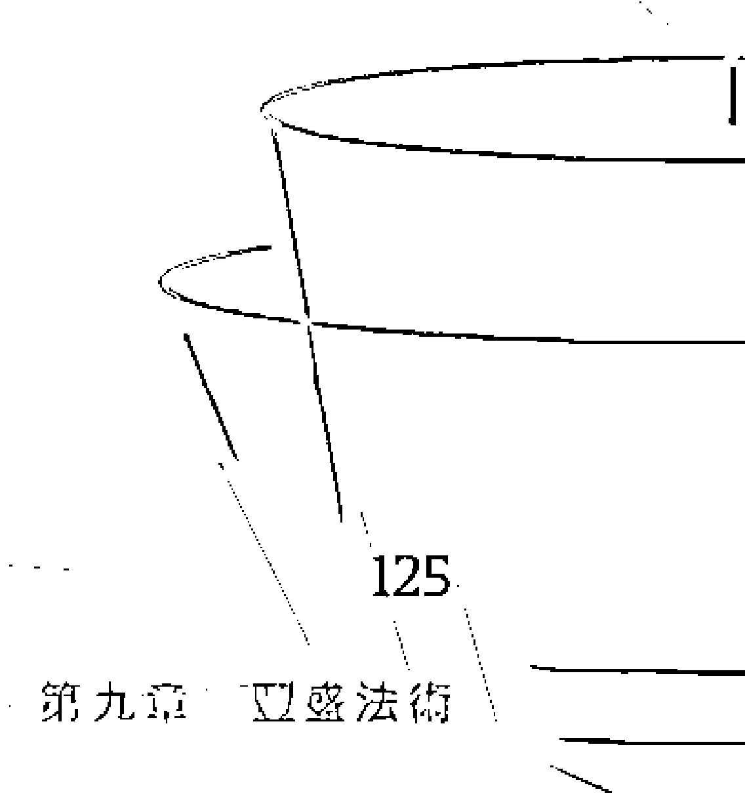

#### 进行法术

1. 把注意力集中在生活中你希望能更成功的部分。对你的愿望和生活中想要填补的部分进行冥想。
2. 闭上眼睛，深呼吸3次。努力在进行仪式之前进入轻松状态。
3. 净化你自己和你的空间（净化是开始仪式的好方法）。点燃乳香、甜草或鼠尾草，并且提前进行沐浴仪式。
4. 在玻璃碗里装满盐。把你的蜡烛、钱币和雕刻工具及迷迭香都聚集在一起。
5. 把这碗盐放在蜡烛前方。点燃蜡烛，请求布莉姬女神祝福你获得成功。一定要把你的愿望和意图对你的蜡烛说出声音，即使很小声也没关系。话语是有魔力的；这就是为什么法术（spelling）在英文中也叫作“拼写”的原因！在法术中说出你的愿望，就能付诸实现。
6. 深呼吸几次，放松，然后对那碗盐冥想。想象盐正在吸收所有阻挡你前进的障碍。
7. 使用雕刻工具，在绿色蜡烛上刻上符号“$”。如果你有准备迷迭香，就撒在蜡烛上，来吸引丰盛和财富。
8. 把蜡烛放入盐碗中，想象蜡烛周围有一圈白光。这个空间是你的保护罩，能保证你的法术是安全的。
9. 把3枚钱币握在手里。将钱币想像成种子，你种下的每一粒种子，都会为你显现出新的成功机会。拿起第一枚钱币，闭上眼睛，把它放在额头上。你希望看到生活中的哪方面增强？你在生活中需要什么？想好之后，把硬币放进装有蜡烛的盐碗里。
10. 用余下的硬币重复第 9 步。直到把第三枚硬币也放进盐里后，将双手放在碗和蜡烛上，闭上眼睛。想象盐正在让你从恐惧和怀疑中解脱。想象一个保护壁垒环绕着你的法术、你的财务，还有你自己。集中注意力在钱币上，想象其价值正在翻倍。
11. 点燃蜡烛，让它燃烧 1 小时或 2 小时。想象蜡烛正在吸引各方面的成功，并且烧掉了所有阻碍。
12. 当蜡烛燃尽后——或者，安全熄灭的时候——继续在碗里放入钱币，这是为了增强魔力、补充魔法。持续添加钱币，直到下一个满月为止。

### *甜甜的丰盛蜂蜜罐法术

蜂蜜罐在南方召唤魔法和胡督教中非常重要，它能让你和宇宙和你身边的人都变得温和，还能带来好处。请大胆使用这个法术。你所渴望的是什么？富有？名气？在这个法术里，没有什么愿望是不能实现的。只要确保你有具体的意图——你就能得到想要的东西。这个法术适合在周六或周三下午进行。

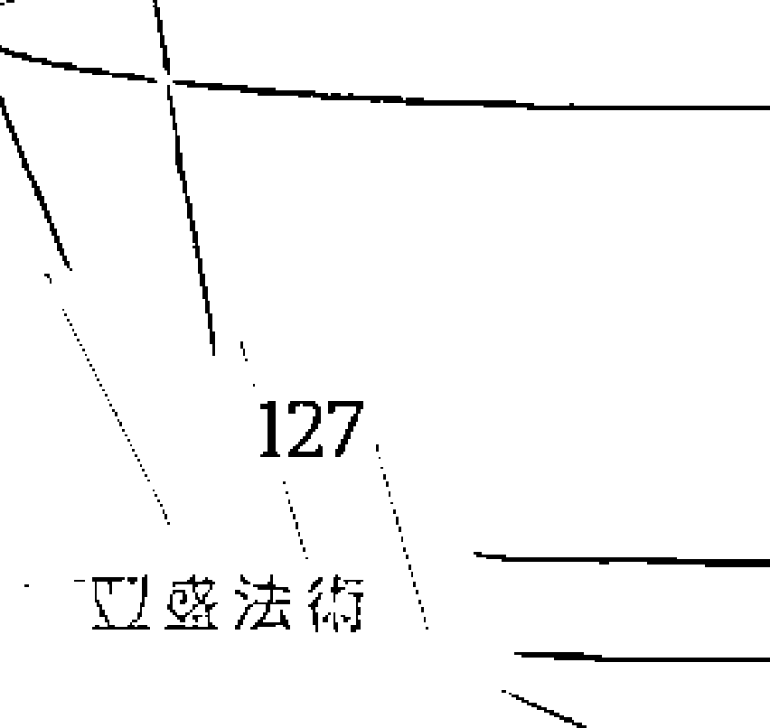

#### 所需魔法物品

- 纸
- 笔
- 1个梅森罐
- 蜂蜜（带来影响力和愉悦感）
- 1根绿色许愿蜡烛或锥形蜡烛（带来繁荣）
- 火柴或打火机

#### 进行法术

1. 在一张纸上写下你所有的梦想和愿望。你希望生活中多些什么？
2. 用蜂蜜装满半罐梅森罐。在你倒蜂蜜时，把蜂蜜想像成丰盛正在注入罐子里，并继续想像你希望吸引的东西。
3. 将写有愿望的纸紧紧折叠9次，放进蜂蜜罐里。
4. 用你的手指舀出一些蜂蜜放进嘴里。一边吃蜂蜜一边说：“我所渴望的甜美丰盛啊，请用圣火让这个法术付诸实现吧！”
5. 密封罐子，把蜡烛放在上面（你可能要先融化蜡烛底部才能让它固定在盖子上）。
6. 点燃蜡烛，在火焰燃烧的时候，大声说出你写在纸上的愿望。闭上眼睛，想像愿望已经实现了。
7. 让蜡烛完全燃尽。
8. 在接下来的四周内，于周六或周三重复第 4 步到第 6 步。让蜡烛融化，蜡油包裹蜂蜜罐。
9. 当你想要的丰盛实现后，打开罐子品尝里面的蜂蜜，或者把它加进你的茶里。
10. 你可以继续使用这个罐子进行该法术，直到获得所有你想要的。

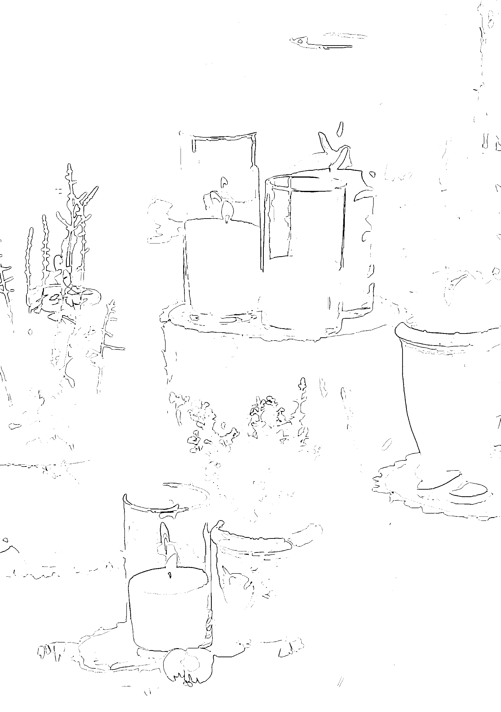

## Chapter 10

## 第十章

## 启迪法术

在这个章节，你会探索到能激发能量、增加幸福感，并且为你的生活创造更积极环境的法术。

- 日与月幸福法术 133
- 圣艾克斯普提特快速修复蜡烛 135
- 不生日也快乐愿望法术 136
- 喀耳刻的自我转变法术 138
- 内在神灵／女神神圣法术 140
- 德鲁伊宁静圆圈 141

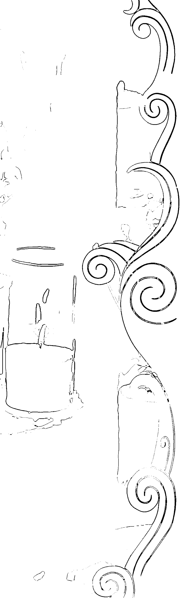

### *拥抱幸福，体验启迪

有时候，悲伤、孤独和忧郁都会让你感到非常不愉快。这些是每个人时不时都会体验到的正常情绪。这一章节中的法术能在这些情绪出现时帮到你。蜡烛魔法是舒缓焦虑情绪的绝佳方法，也能带来积极正向鼓舞人心的能量，把悲伤转变成希望和幸福。

### 启迪法术常用物品

- 颜色: 蓝色、黄色、橙色、白色
- 水晶: 白水晶、拉长石、缟玛瑙、黄水晶、红玉髓、粉水晶
- 精油: 佛手柑、薰衣草、岩兰草、乳香
- 药草: 贯叶连翘、达米阿那、薰衣草、柠檬香蜂草、玫瑰

### *日与月幸福法术

在我少年时期对抗抑郁症和焦虑症的时候，我的导师教会我这个运用太阳和月亮能量的幸福法术。虽然有点费时间，但这个法术确实助我摆脱忧郁症，还平衡了我的情绪。这种持续点燃数日蜡烛的过程叫守夜，能让你保持警觉，把你从所有负面情绪之中拉出来。这个法术适合在周日下午开始，并且持续到下一个周日，或直到蜡烛完全熄灭为止。

#### 所需魔法物品

- 1根橙色或黄色的诺维娜蜡烛 (代表太阳的能量)
- 1根白色或黑色的诺维娜蜡烛 (代表月亮的能量)
- 火柴或打火机
- 计时器

#### 进行法术

1. 把代表太阳和月亮的蜡烛放在房间的桌子上，或放在任何你可以隐密进行法术的地方。
2. 在周日下午开始法术，用双手握着代表太阳的蜡烛，说“太阳之灵，您有许多姓名，当我点燃这根蜡烛的时候，请您穿过火焰。太阳神拉、密特拉、阿波罗、索尔、鲁格，这些只是您名字的一部分。请照亮我的生活，用您的光来保护我。在夜晚来临前帮助我对抗恐惧”。

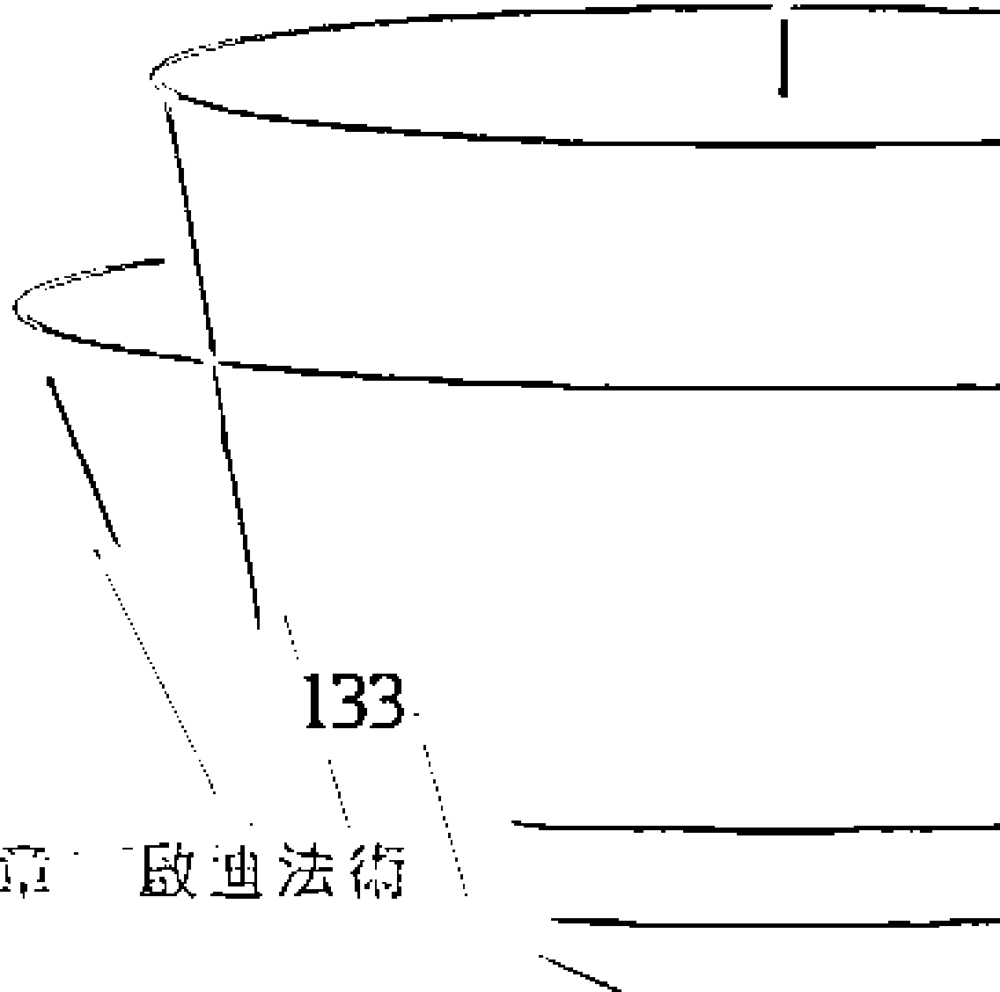

3. 点燃代表太阳的蜡烛，让它燃烧 30 分钟。看着蜡烛的火焰，把它想像成在蜡烛里跳舞的人或一位神灵。你能看到什么样的形状？火焰变成了什么形状？时间到之后，用你的手指或其他工具熄灭蜡烛（不要把蜡烛吹灭）。
4. 几个小时后，到了晚上或在你睡觉前，双手握着代表月亮的蜡烛，说“月亮之灵，您有许多姓名，当我点燃这根蜡烛的时候，请您穿过火焰。艾希斯、狄阿娜、阿尔忒弥斯、赫卡忒、塞勒涅，您的名字有许多，您的力量至高无上。在最黑暗的夜里，请用您的光保护我，当悲伤来临时，请把它赶走。当我点燃这火焰时，让您的魔法熊熊燃烧”。
5. 点燃月亮蜡烛，让它燃烧 30 分钟。观想你的恐惧和悲伤正从你的身体被驱逐出去。想像所有的黑暗、愤怒和负面情绪都在被白光赶走。
6. 继续在白天点燃太阳蜡烛，在晚上点燃月亮蜡烛。如果你没办法每天重复这个 30 分钟的过程，也可以让蜡烛点燃 13 分钟（13 是个有魔力的数字）。始终要记得熄灭蜡烛的方法——绝对不要吹灭。
7. 等到蜡烛完全熄灭后，对太阳和月亮的神灵表示大感谢，然后回收蜡烛杯，让法术的震动继续发挥作用。

### *圣艾克斯普提特快速修复蜡烛

是的，你没看错——圣艾克斯普提特（St. Expedite）是快速事件的守护圣徒。无论遇到什么样的阻碍——法庭案件、法律难题、商业问题、恋爱冲突，还是需要完成考试或任务——都值得向圣艾克斯普提特祈求。

当你需要解决方案或时间紧迫时，都可以召唤他。我在纽奥良的法国区期间学会了这个简单的法术，也已经使用了无数次。你可以用红布和金色或银色的装饰及烛台来制作给圣艾克斯普提特的圣坛。这个法术适合在周三或任何一天的下午来进行。

#### 所需魔法物品

- 3滴肉桂精油（强调时间和紧迫感）
- 红色诺维娜蜡烛（圣艾克斯普提特的神圣颜色）
- 红色麦克笔
- 1小张纸
- 火柴或打火机
- 花朵（带来赐福）
- 1碗水
- 磅蛋糕（作为供品）

#### 进行法术

1. 将3滴肉桂精油倒在红色诺维娜蜡烛上，用来加热法术。双手握着蜡烛，想像即将到来的场景，然后观想它得到了紧急解决。

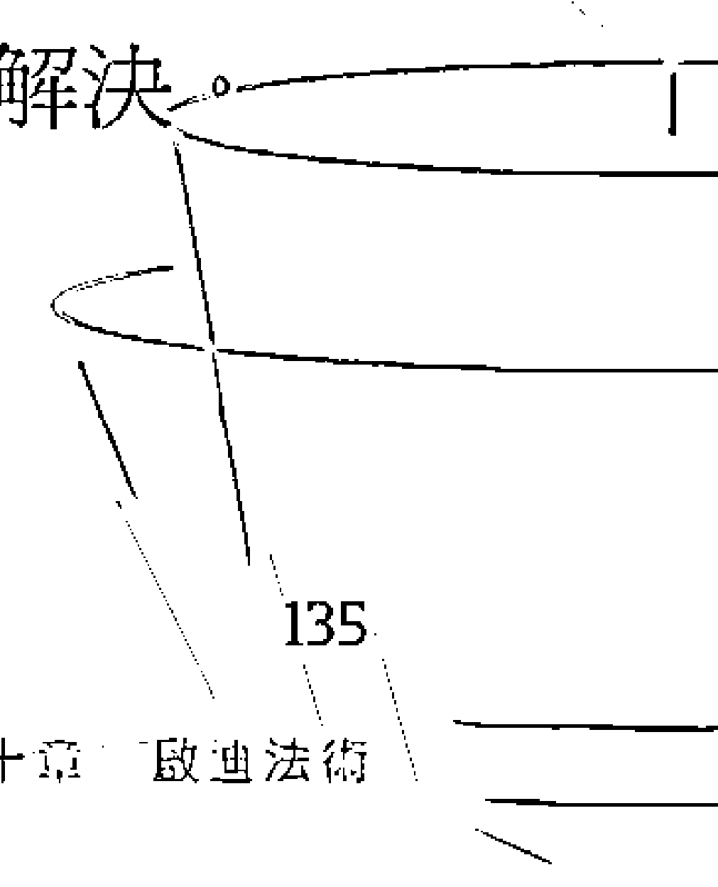

2. 用红色麦克笔，把你的祈愿写在准备的纸上，把纸放在蜡烛下。
3. 将双手放在蜡烛上，说“圣艾克斯普提特，请靠近我，听到我所说的话，准许我的祈愿，不要再浪费任何时间”。
4. 点燃蜡烛，让它完全燃尽。
5. 每天都重复一遍祷词，直到你的祈愿实现。
6. 蜡烛完全燃尽之后，将一些花放进那碗水中，置于燃尽的蜡烛旁边，并且在蜡烛另一侧的盘子上准备一小块磅蛋糕。如果你没有为圣艾克斯普提特准备这些供品的话，据说他会收回你的请求，而且还远不止此喔！
7. 坐在你准备好的桌子或圣坛前，自己尽情享用一块磅蛋糕。
8. 法术完成之后，回收装蜡烛的玻璃杯，把那块磅蛋糕放在树下，或把蛋糕为鸟儿撒在地上。

### ※不生日也快乐愿望法术

你知道吗，一年之中有364天你可以收到非生日礼物，但只有一天能收到生日礼物。

> > ——路易斯·卡洛尔，《爱丽丝梦游仙境》

你猜怎么？即使你至今都没有练习过巫术或魔法，你也很有可能已经在之前使用过蜡烛魔法了。你可曾在生日那天吹蜡烛之前许下愿望？那就是蜡烛魔法！谁说必须等到生日才能使用魔法？每次你想要许愿的时候，都可以使用这个法术。尽管生日的传统是吹灭蜡烛，但你一定要用手指把蜡烛掐灭。

你想知道如何选择要许下的愿望吗？记住愿望比意图所需要的能量更少。因此，根据经验来讲，你想要的事物通常不一定是你生活中的必需品。细枝末节的东西或奢侈品，会是许愿的最佳选择。

#### 所需魔法物品

- 1块蛋糕或杯子蛋糕（带来幸福）
- 1根生日蜡烛（实现愿望）
- 火柴或打火机

#### 进行法术

1. 把蜡烛放在蛋糕上，唤起内心幸福的感觉。想像这是你的生日或庆祝时刻。
2. 选出你的愿望。在脑中专心想像它。
3. 点燃蜡烛。
4. 闭上眼睛，观想你的愿望实现了。
5. 睁开眼睛，用手指把蜡烛掐灭。

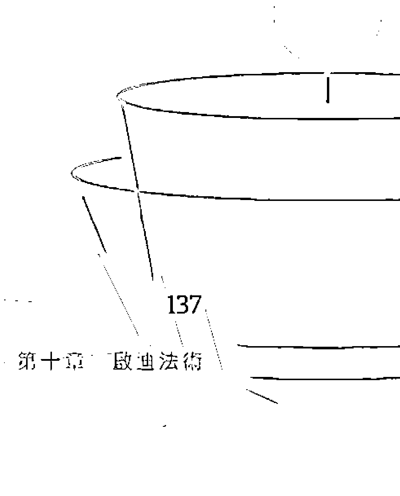

6. 尽情享用蛋糕。
7. 把蜡烛放到床下，直到你真正生日到来的那天，再把它拿出来埋在院子里。

### *喀耳刻的自我转变法术

有时候你会需要摆脱原有的形象，被视作另外一个人。这个法术是为了当你被拉进新的道路、新的灵性历程、新的朋友圈或个人风格时而制作的。喀耳刻是希腊神话中的半神，也是古时最早的女巫，他因为《奥德赛》而被人熟知；在书中，他把奥德修斯的船员都变成猪罗。他以拥有丰富魔药、符咒和药草的知识而闻名，他能用这些知识随心所欲地让事物显化、操纵和转变。需要转变事物的时候，就可以利用喀耳刻的力量。这个法术适合在周一或满月时期进行。

#### 所需魔法物品

- 1根黑色许愿蜡烛（带来转变）
- 1根紫色许愿蜡烛（带来魔力）
- 耐热盘
- 火柴或打火机
- 少许迷迭香（带来保护）
- 少许薰衣草（带来吸引力）
- 少许碎月桂叶（带来成功）
- 1滴龙血精油（带来炼金术魔力／转变）

#### 进行法术

1. 将两根蜡烛放在耐热盘上。
2. 双手拿起黑色蜡烛，观想你希望别人如何看待你；想像你希望穿的衣服，还有你希望在生活中看到的变化。观想结束之后，把蜡烛放回盘子上。
3. 双手拿起紫色许愿蜡烛，说“神圣的喀耳刻，请聆听我的恳求，帮助我实现魔法，并让我发生转变，让大家看到我想成为的样子”。
4. 点燃紫色许愿蜡烛，把它提起来放在黑色蜡烛上方，让融化的蜡滴在上面。让蜡油滴一段时间，小心不要烫到自己。
5. 把点燃的紫色蜡烛放回盘中，在黑色蜡烛上撒迷迭香、薰衣草和月桂叶。
6. 在黑色蜡烛上滴1滴龙血精油，然后点燃蜡烛。
7. 让两根蜡烛完全燃尽。观察两根蜡烛逐渐融化并融合在一起，观察药草和精油如何混合然后发生转变。当蜡烛融化的时候，观想你自己也在改变。
8. 当蜡烛完全燃烧熄灭后，把残余物埋在院子里或盆栽中。

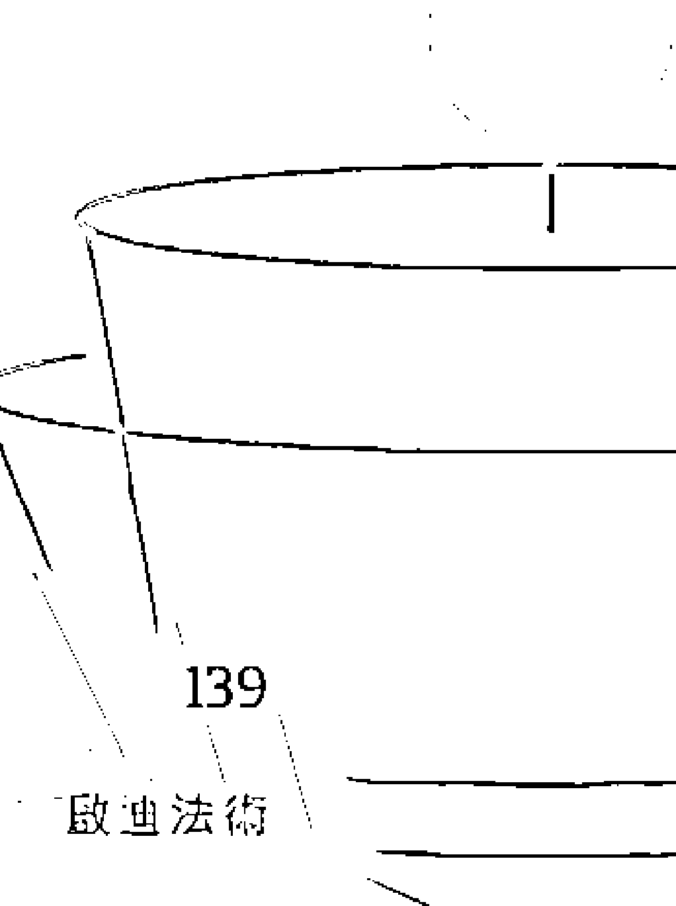

### *内在神灵／女神神圣法术

每个人都拥有神圣能量——你只是需要学习如何探索它。这个法术适合显化力量和勇气。在你需要他人认可，或是希望被注意和被欣赏的时候，都可以使用这个法术。这个法术适合在周日进行。

#### 所需魔法物品

- 1根白色净蜡烛（带来神性）
- 净蜡烛烛台
- 火柴或打火机
- 1滴岩兰草精油（带来幸福）
- 红玉髓

#### 进行法术

1. 用你的惯用手握住白色净蜡烛，闭上双眼，说“我是神圣的，我是非凡的，我收回本应属于我的能量”。
2. 把蜡烛放进烛台，然后点燃。
3. 蜡烛燃烧的时候，把1滴岩兰草精油滴在常用手的手心，然后涂抹红玉髓。
4. 把红玉髓握在手中，闭上双眼说“当蜡烛燃烧着神圣火焰时，请释放出大家都渴望的我心中的神圣能量”。
5. 把红玉髓石放在蜡烛旁边，让蜡烛继续燃烧。
6. 等蜡烛完全燃尽之后，拿回红玉髓，在任何你需要力量和勇气，或你希望被人看到的时候，把它带在身边。

### *德鲁伊宁静圆圈

每当我感到焦虑或有压力时，我就会使用这个仪式。它是对冥想的一个极佳补充，也能和其他法术结合使用。德鲁伊是凯尔特世界的古老萨满和魔法守护者，他们知道如何与自然、灵魂和他们的高我建立连接。而且最重要的是，他们明白内心宁静的重要性。这个仪式应该在夜晚的偶数时间开始（例如晚上8点、晚上10点）。如果需要，你也可以使用额外的蜡烛，但是要尽量保持蜡烛大小和形状一致。如果你想要更大的宁静圆圈，可以在坚固的蜡烛架上使用更多蜡烛。

你可播放舒缓的音乐，并且带上你想要补充能量的水晶或工具。

#### 所需魔法物品

- 6根风格不限的蜡烛，但最好是茶灯蜡烛或许愿蜡烛
- 火柴或打火机
- 薰香（最好是乳香、没药或薰衣草）
- 香炉
- 舒缓的音乐（非必需）

#### 进行法术

1. 用蜡烛在你周围围成一圈。一定要给自己留出足够的活动空间，这样你就不会撞到任何蜡烛。把一根蜡烛放在你的正前方，一根放在背后，一根放在左边，一根放在右边，以此类推。

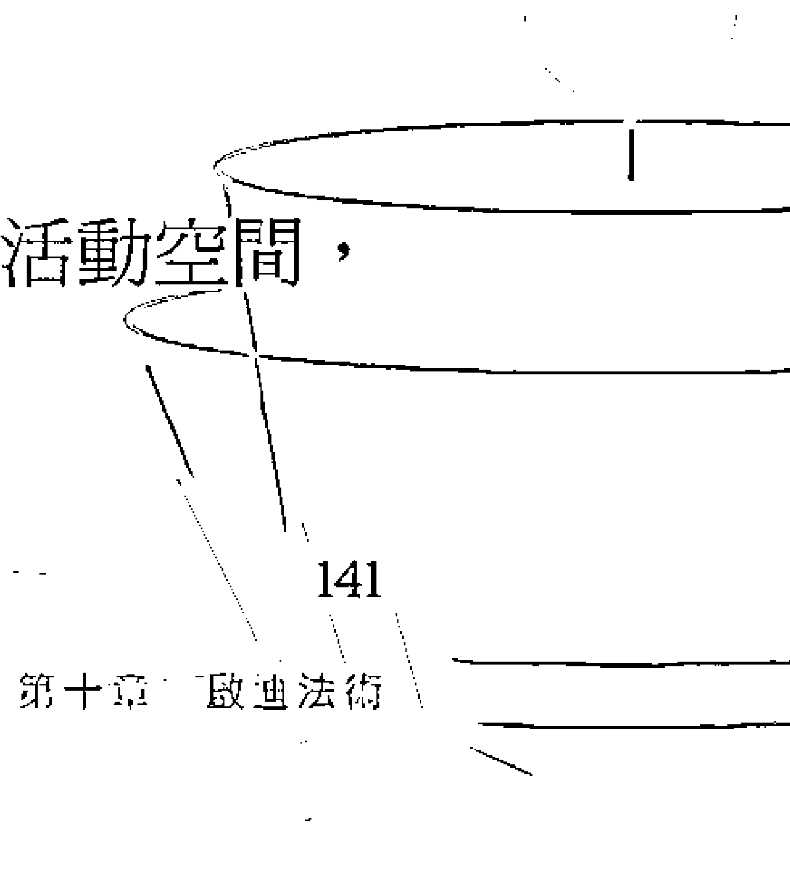

2. 准备好蜡烛之后，点燃薰香，顺时针慢慢转动，让薰香摇晃。想像薰香正在清理这个圆圈内的能量，并创造出神圣的空间。持续这一步，直到你画出完整的圆圈。
3. 把薰香放在正前方的香炉中。跪下片刻，想像一圈白光正围绕着你。同时看着薰香的烟逐渐变成雾状。
4. 从你面前的蜡烛开始，顺时针方向点燃所有蜡烛，想像点燃每根蜡烛的时候，圆圈的能量都变得更强大。
5. 点燃所有蜡烛后，用舒服的姿势坐下来。如果你愿意，这个时候可以播放音乐。注视四周的火焰，想像有一道屏障保护着你不受外界干扰。想像火焰正在吸引正向的神灵和能量，增加你的魔法和灵性。在这个圆环里，一切都可能发生。观察四周盘旋的薰香烟雾。
6. 闭上双眼呼吸。想像你所有的恐惧都在火焰中烧掉了。这个空间是你神圣的力量圆圈。在这个空间中你能找到内心的宁静；在这个空间中你能找到所有答案。
7. 在圆圈中想待多久就待多久。因为这些蜡烛没有被赋予意图，你可以在结束之后吹灭烛火。
8. 如果你的蜡烛没有燃尽，可以保留下来作为宁静圆圈的指定蜡烛，当你需要利用德鲁伊的宁静力量时再次使用。

# 第十章 啟迪法術

# 讓火焰盡情燃燒

既然蠟燭熄滅了，法術已經開始運轉，是時候花些時間回顧你在這本書中學到的內容了。

除了了解蠟燭魔法之外，你也學到了自我轉變的方法、意圖的力量以及火的力量不僅僅在火焰中，也在你心裡。你應該為自己感到驕傲，並且祝賀自己展開了魔法世界的旅程！

我希望你能繼續這條蠟燭魔法的歷程。從此之後，當你看到蠟燭的時候，你面前不再是平凡的物品，而是真正的力量願望。你會了解那些蠟燭中蘊藏的歷史，以及如何利用它的能量來達成你想要的目的。但是，不要把你所有的希望都寄託在蠟燭上，因為最重要的是要記住，魔法就在你心中。

在我們道別之前，請允許我再分享一些有助於你成長和能幫助你深入練習的提示：

- 即使你覺得時間有限或不夠私密，也不要急於完成你的儀式或法術。相反的，你應該等到能全神貫注完成法術的時候再開始。
- 不要忘記在蠟燭燃盡之後去觀察蠟。你能看到什麼形狀？蠟燭燃盡之後是乾乾淨淨還是一團糟？請用你的直覺來判斷融化的蠟對法術結果的意義。
- 用日記的形式記錄並且追蹤你的法術。記下法術的結果是怎麼樣，還有你是否使用了和書中指示不同的部分或替代品。
- 蠟可以用來當作護身符，所以當你想要讓法術的能量常伴你身邊，特別是當蠟最後成為圓形或象徵性的形狀時，你可以隨身攜帶它。融蠟是一種占卜方式，能讓你的蠟燭魔法變得更加豐富。
- 要留意蠟燭燃燒的方式，這樣可以了解神靈和宇宙是如何與你交流的。
- 如果你在法術中感到包含神靈的部分，請始終保持敬意。要記住在法術之前留下供品，並且在法術之後表達感謝。與指導靈、祖先和神靈一起進行法術應該保持平衡，所以要小心不要提出命令，也不要試圖控制這些力量和能量。
- 研究各種神話、民間傳說和眾神，看看誰召喚了你。如果法術裡提到你沒有連結的靈魂或神靈，可以尋找另一個具有相似特徵的神。同時也要研究你自己的文化紐帶，看看有沒有能夠連結家中親友的靈魂。並且要知道，如果你不喜歡和某個靈魂或神靈一起進行法術，就不必把他們包含其中。
- 火柴裡的硫含有保護的能量，所以可以把使用過後廢棄的火柴放在蠟燭附近，這樣可以驅散影響魔法的外力。
- 雕刻蠟燭的時候要為自己的魔法工作感到自豪。給蠟燭塗油之後，你可能會需要在上面加上亮粉，並且把它擦進雕刻的部位。許多魔法從業者用亮粉為他們的魔法加入魅力，特別是在為另一個人進行法術的時候。

我支持你探索其他將火元素加入法術的途徑，以繼續這條蠟燭魔法的歷程。無論是用神燈、水晶球占卜還是廚房魔法，火焰之靈都在你身邊，隨時準備幫助你。你可以去研究魔法、靈性和神秘學的不同方面，擴展你關於藥草學、水晶、精油和民俗的知識。試著調整這些法術，使其更加滿足你的需求。如果你有特別的偏好，也不要害怕用該種藥草或精油代替另一種。等到你做足了研究，且能夠自在地進行儀式和法術時，你會發現施展魔法已經變成了你的第二天性。藥草會呼喚你，需要的法術會從你心中流過，隨著你對使用的元素更熟悉，操作魔法的過程也會變得更容易。

最後，請記住，不管情況如何，障礙是什麼樣，總會有蠟燭可以解決的！（# 蠟燭能解決一切問題。）

# 對應含義查詢表

# *蠟燭*

| 顏色 | 含義 |
|------|------|
| 黑色 | 智慧、死亡、更新、復甦 |
| 藍色 | 平和、寧靜 |
| 棕色 | 大地、力量、平衡、正義、大地魔法、動物和寵物法術、自然靈魂 |
| 金色 | 豐盛、繁榮、吸引、金錢 |
| 灰色 | 知識、交流、精神交流、中和負面能量、智慧 |
| 綠色 | 幸運、繁榮、財富、生育、穩定、豐盛、成功 |
| 靛藍 | 更新、放鬆、反思、新開始 |
| 橙色 | 能量、精力充沛、勇氣、太陽、正向結果、工作成功、願望實現 |
| 粉色 | 愛戀、同情心、魅力、忠貞 |
| 紫色 | 忠誠、神聖、力量、超自然 |
| 紅色 | 生命力、活力、吸引力、性感、渴望、雄心、男子氣概、力量、出生、死亡、實現目標、克服阻礙、愛 |
| 銀色 | 靈視力、母性、婚姻、通靈工作、金錢、財務穩定、平和 |
| 白色 | 生命、生育、滋養、美德、平衡、死亡、結構 |
| 黃色 | 光輝、快樂、清晰、靈視力、解除詛咒、消除厄運、保護、引導 |

# ※藥草※

| 藥草 | 屬性 |
| --- | --- |
| 多香果 | 療癒、運氣、商業吸引力、金錢、繁榮 |
| 當歸根 | 快樂、幸福、賦能、靈性交流、保護、療癒 |
| 八角茴香 | 提高通靈能力、保護免受惡魔之眼的影響、精神交流 |
| 羅勒 | 幸福、金錢、自信、愛、保護 |
| 月桂 | 祝願、成功、療癒、通靈視力、淨化、智慧、能力 |
| 貓薄荷 | 愛、性感、平和、保護孩童 |
| 肉桂 | 金錢、保護、增強能量、增強靈性、成功、性衝動 |
| 丁香 | 金錢、運氣、友誼 |
| 達米阿那 (透納樹) | 愛、性、催慾、色慾、激情、浪漫、吸引力 |
| 茉莉 | 月亮魔法、愛、女性能量、靈性、平和、金錢、性慾、健康 |
| 薰衣草 | 保護、睡眠、幸福、平和、靈魂投影、冥想、愛、淨化 |
| 檸檬草 | 淨化、打開道路、大地上的家、靈性工作、淨化 |
| 艾蒿 | 通靈能力、預知夢、靈魂投影、保護、靈性工作、力量、神靈工作、巫術、占卜 |
| 肉豆蔻 | 運氣、增加能力、金錢、提高振頻、提高通靈感應 |
| 黑胡椒/白胡椒 | 保護、送回發送者、腳踏實地、打破毒咒 |
| 玫瑰 | 愛、平和、性、浪漫、美麗、自尊 |
| 迷迭香 | 保護、淨化、愛、長壽、健康、增加魔法 |
| 鼠尾草 | 保護、長壽、智慧、放鬆、啟發靈感、靈性淨化、煙燻淨化 |
| 百里香 | 運氣、夢境、金錢、財務穩定、平和 |
| 纈草根 | 愛、淨化、婚姻、送回發送者、儀式淨化、睡眠 |
| 馬鞭草 | 保護、催慾、啟發靈感、打破毒咒、靈性保護 |
| 苦艾 | 預言、提高通靈能力、療癒、創造力、愛、平和、智慧、祖先魔法 |
| 蓍草 | 愛、增加通靈能力、智慧、勇氣、憂鬱、心理健康、明晰 |

# ※精油※

| 精油 | 屬性 |
| --- | --- |
| 琥珀精油 | 金錢、性感、女神能量、通靈、祖先工作、保護 |
| 佛手柑精油 | 金錢、幸福、淨化、平和 |
| 檜木精油 | 療癒、慰藉、悲痛、長壽 |
| 龍血精油 | 魔法、力量、保護、療癒、運氣、靈性淨化 |
| 尤加利精油 | 療癒、保護、消除詛咒 |
| 乳香精油 | 保護、淨化、靈性、冥想、去除焦慮恐懼、舒緩、冷靜、更高意識 |
| 忍冬精油 | 繁榮、靈感、保護、生活美妙、靈性洞察力、實現目標 |
| 茉莉精油 | 自信、愛、性、金錢、平和、靈性、洞察力、月亮魔法 |
| 蓮花油 | 埃及魔法、智慧、賜福、女神魔法 |
| 麝香精油 | 勇氣、男性能量、生育、吸引力、慾望、性愛魔法 |
| 沒藥精油 | 保護、淨化、冥想、腳踏實地、自信、靈性覺醒、靈性淨化 |
| 橄欖油 | 淨化、清理、神聖能量、靈性覺醒、靈性工作、儀式淨化 |
| 橙花精油 | 快樂、金錢、幸福、個人發展、驅逐負面想法 |
| 廣藿香精油 | 生育、體力、浪漫、夥伴關係、神聖本體 |
| 薄荷精油 | 保護、鎮靜、智慧、靈性、淨化、幸福、正向刺激 |
| 玫瑰精油 | 美麗、愛、性、和平、通靈保護、誠實 |
| 檀香精油 | 願望實現、療癒、靈性、保護、性慾覺醒、吸引力、更高意識 |
| 香草精油 | 愛、魔法、心理意識、能量、性、抵抗憂鬱、人際關係 |
| 紫羅蘭精油 | 愛、願望實現、療癒、冷靜、和平 |
| 伊蘭精油 | 催慾、吸引力、狂喜、放鬆、福氣、愛、腳踏實地 |

# ※一週的每一天※

| 週次 | 內容 |
| --- | --- |
| 週日 | 「太陽日」適合進行顯化法術、男性能量、神聖力量、勇氣、幸福法術，還有關於工作機會的法術。 |
| 週一 | 「月亮日」是由月亮能量掌管的日子。在這天適合進行關於月亮神靈的法術、夢境魔法、靈性成長、通靈和占卜工作，還有療癒和清理。 |
| 週二 | 「火星日」由火星掌管，這顆行星是因羅馬戰神而得名。這天適合進行關於勇氣、衝突、決心、男子氣概，以及獲得智慧或克服阻礙的法術。 |
| 週三 | 「水星日」由水星掌管。這天適合進行關於自我成長、交流、占卜、旅行、友誼和精神交流的法術。 |
| 週四 | 這天由木星掌管，適合進行關於金錢、法律事務、運氣和成功的法術。 |
| 週五 | 這天由金星和挪威生育女神芙蕾嘉掌管，適合進行關於愛、友誼、藝術、創造力、快樂和生育的特別魔法或儀式。 |
| 週六 | 這天由土星掌管，適合進行關於驅逐負面能量、打破毒咒、淨化、療癒、返回發送者以及動力的法術。 |

# *月相週期*

| 月相 | 屬性 |
| --- | --- |
| 新月 | 新開始、發現幕後動機、發掘真相、靈性覺醒、淨化、保護家庭和自己、綁定法術 |
| 盈凸月 | 金錢法術、財務穩定、工作吸引力、加劇能量、豐盛、成長 |
| 滿月 | 療癒、願望實現、女神魔法、繁榮、靈性工作、愛情魔法、吸引力 |
| 虧凸月 | 驅逐、清理、擺脫負面能量、保護、改變、放手 |

# ※石頭和水晶※

| 石頭 | 特性 |
| --- | --- |
| 瑪瑙 | 健康、運氣、賭博 |
| 琥珀 | 愛、運氣、轉變 |
| 紫水晶 | 對抗成癮、靈感、洞察力、療癒、脈輪的頂輪、靈性工作 |
| 阿帕契之淚滾石 | 保護、慰藉、祖先魔法、淨化 |
| 血石 | 勇氣的石頭、淨化、清理負面能量、平衡 |
| 紅玉髓 | 創造、創造力、生命力、恐懼、穩定、男子氣、健康 |
| 黃水晶 | 繁榮、豐盛、金錢、精神力量、持久力 |
| 赤鐵礦 | 健康、腳踏實地、送回發送者、放鬆、平和、靈性工作 |
| 碧玉 | 保護、清晰頭腦 |
| 黑煤玉 | 保護、大地魔法、靈性清理、加強顯化 |
| 青金石 | 神聖能量、保護、健康 |
| 月亮石 | 月亮魔法、平衡、反思、新開始、創造力能量、增強直覺和洞察力 |
| 黑曜石 | 保護、打破毒咒、腳踏實地、靈性工作 |
| 虎眼石 | 腳踏實地、創造力、智慧、洞察力、情緒平衡、提高頻率 |

# 參 考 資 源

## ※書籍※

Adele Nozadar 的《秘密符號和象徵百科全書》 (The Element Encyclopedia of Secret Signs and Symbols) 這是一本查詢你在蠟、夢境、雲層等等看到的標誌和象徵的絕佳資源。

Judika Illes 的《巫術百科全書》 (Encyclopedia of Witchcraft) 這本書是所有魔法從業者和有興趣了解更多巫術的人的必備。無論你是在尋找關於神靈、工具的資訊，還是具體做法和關於歷史的知識，這本書都是你的首選參考指南。

Paul Beyerl 的《藥草學大師書》 (The Master Book of Herbalism) 可能是現有對魔法使用者來說最好的藥草書了，這本書包含了藥草學、精油、薰香、煉金藥和魔法用法的深度資訊。

Denise Alvarado 的《伏都胡督魔法書》 (Voodoo Hoodoo Spellbook) 這本書充滿了歷史、傳統法術、配方等等的奇妙資源——所有資訊都與紐奧良的伏都魔法有關。

# * Podcast *

# Bigfoot Collectors Club

由 Michael McMillian 和 Bryce Johnson 主持，關於超自然現象的 Podcast，他們會討論目擊鬼魂、民間傳說、歷史反常現象、神秘學和奇異見聞。

> @bigfootcollectorsclub

# The Witch and The Medium

這是我和我的朋友，著名的靈媒 Adela Lavigne 共同主持的 Podcast。每星期我們都會在節目上討論各種各樣的實踐、天賦和信仰，也會分享我們對於不同話題的超自然現象和知識的經歷。

> @thewitchandthemedium

> TheWitchAndTheMedium.com

# *魔法用品*

# Pan's Apothika (又叫做 Panpipes)

這個地方是我童年造訪的第一家玄學用品店。裡面有數百種藥草和精油，還能訂製設下意圖的工具。店主是我的好朋友 Vicky，她擅長製作經過聖化裝在玻璃罐裡的蠟燭，特別是七日蠟燭，這是顯化意圖的絕佳工具。

> PanPipes.com

> (323) 891-5936

# ## III Crows Crossroads

每個人都可以在此選購魔法用品！我和我的兩位女巫同事一起創立了這間公司。這家店舖融合了傳統巫術、伏都、薩泰里阿教，還有美國民間召喚魔法。你會在這裡找到肥皂、蠟燭、精油、魔法工具包，還有其他更多迷人的小物，以開啟你的靈性之旅。

- @3crowsscrossroads
- Etsy.com/shop/IIICrowsCrossroads

# ## The Olde World Emporium

The Olde World Emporium 是本書作者 Mystic Dylan 共同擁有，是聖塔克拉利塔最棒的玄學用品店。這間店內有藥草、精油、書籍、水晶、蠟燭和魔法課程。

- 地址：23127 Lyons Avenue, Newhall, CA 91321
- 電話：661-666-7507
- 網站：www.OldeWorldEmporium.com
- Instagram: @TheOldeWorldEmporium
- Facebook: facebook.com/TheOldeWorldEmporium
- Twitter: @olde_world

# ※ YouTube 頻道※

# ## The Witch of Wonderlust

這個 YouTube 頻道由我的朋友 Olivia 經營，包含了關於新手女巫操作方法的影片教學，以及蠟燭魔法教程，還激發了我對於「# 蠟燭能解決一切問題」這個標籤的靈感。

YouTube.com/user/TossingSpades

# 詞彙表

你可能會發現書中並沒有完全使用這些詞語；但是，這些詞彙出現在這裡可以增添你對蠟燭魔法的理解。

**聖壇**：用於儀式、祭祀、供品或法術的桌子或秘密空間。

**護身符**：用於防止危險邪惡或疾病的裝飾品或小掛件。

**抹油聖化**：用精油裝飾蠟燭。

**用煙占卜**：古老的占卜方法，其中燃燒的火焰（通常是藥草、木頭或祭品）所產生之煙霧能表明預兆。

**召喚魔法**：一種融合了非洲、美洲原住民、猶太教、天主教、基督教和歐洲傳統的美國民間魔法。

**聖化**：讓某種東西變得神聖，通常是用於靈性或魔法目的的工具。

**神靈**：神、女神或神聖的靈魂。

**占卜**：透過工具或超自然手段來探求未來或未知的實踐。

**施法攻擊**：使用法術或蠱惑；通常是出於惡意、復仇或惡毒目的使用。

**下厄運**：由另一個人透過魔法方式帶來的厄運，或因打破迷信或民間信仰而造成。

**護符**：宗教實踐會中用到的物品，例如護身符、符咒和驅邪物。這種習俗源於西非地區，此術語常用在傳統非洲宗教和民間習俗中。

**煙跡觀察學**：通過觀察薰香煙霧進行占卜。

**魔法**：控制和操縱自然和超自然能量的能力。

**諾維娜**：源自拉丁文，原意是「九」，是基督教和天主教中一種虔誠的禱告方式。

**預兆**：被視為具有預言意義的標誌或事件，可以是好的，也可以是壞的。

**淨化**：心靈和身體的清理。

**火葬柴堆**：以木頭製成的堆或結構，在葬禮中用來燃燒屍體。

**火焰占卜**：用火來占卜。

**儀式**：可能會涉及手勢、詞語或行動的一系列活動，為了獲得靈性啟迪或為了魔法動力和傳統而進行。

**水晶球占卜**：透過凝視得到代表引導、預言和問題答案的各種形狀和平面，以出現的象徵和圖案來占卜。

**性愛魔法**：用於魔法、儀式或靈性目的的任何性活動。性愛魔法通常可以結合性興奮和觀想預期結果，用性高潮來注入能量和靈性上的驅動力。

**魔符**：具有魔法力量的銘刻或畫下的符號。

- 掐滅：熄滅火焰。
- 徽符：與伏都教不同神靈和靈魂相關聯的特定靈性符號。
- 守夜：虔誠觀看或觀察的時間。在魔法中，這個術語通常代表需要持續數小時或數天的多日法術和儀式。

# 致謝詞

能把這本書介紹給你，我非常感激，也感到很幸運。

首先，我想要感謝 Ashley Popp、Sean Newcomb 和 Rockridge Press 讓我有機會精心創作這本書。

我要感謝我的父母 Steven 和 Ingrid，還有我的祖母 Mom-Cat（也就是 Lillian），是他們讓我成為那個充滿想像力的孩子，當我想學習更多巫術、魔法和神秘學的時候也沒有試圖限制我或影響我。

感謝我的哥哥，他的善良和真誠的支持總是激勵著我。

感謝 Pan's Apothika（也叫 Panpipes）的 Vicky Adams，當一個九歲小孩第一次因為好奇而走進她的店鋪時她並沒有驚訝，還為我提供了第一個避風港。

感謝 Kally Spangler，她在我生日那天，在麻州的塞勒姆為我占卜，並且在我什麼都沒說的時候就告訴我她看到我將成為一名職業巫師。

感謝我大二那年的英語老師 Shanequa Cannon，她對我的教導和友誼到今天也一直激勵著我。

感謝 Lana、Leah 和 Brenna，她們不但把我當作親人，還激發了我對蠟燭魔法的渴望和興趣。

感謝我的 Crows、Cyndi 和 Jess，她們每天都在幫助我創造魔法。

感謝我的女巫團，感謝她們為我帶來支持和歸屬感。還要感謝 Adela，她讓我時刻保持自省。

感謝 Nyt Myst、Bloody Mary、Laurie Johnson 以及我曾經的魔法導師，當然，還有我的祖先和神靈——謝謝你們。

## 蠟燭魔法初學指南

### Candle Magic for Beginners

by Dylan Bauer

Copyright © 2020 by Rockridge Press, Emeryville, California

Illustrations © 2020 Caitlin Keegan. All other images used under license from Shutterstock.com. Author photo courtesy of Olivia Graves.

First Published in English by Rockridge Press, an imprint of Callisto Media, Inc.

Published by arrangement with Callisto Media Inc through LEE's Literary Agency

- 出版/楓樹林出版事業有限公司

- 地址/新北市板橋區信義路163巷3號10樓

- 郵政劃撥/19907596 楓書坊文化出版社

- 網址/www.maplebook.com.tw

- 電話/02-2957-6096

- 傳真/02-2957-6435

- 作者/神祕狄倫

- 譯者/張笑晨

- 企劃編輯/陳依萱

- 校對/閻若婷

- 港澳經銷/泛華發行代理有限公司

- 定價/420元

- 出版日期/2022年8月

- ISBN/9786267108628

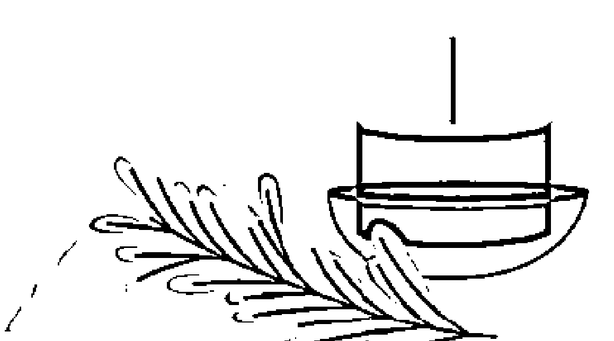