# 视效凝视占卜

视效凝视占卜难以用简单的句子来描述，硬要说的话：视效凝视占卜是意识在凝视单色调平面上得到的视效信息。在视效凝视占卜中，精神得到放松，处于敞开的状态，而眼睛则凝视在一个单色调的空白平面上（通常是黑色的，被称为视效凝视镜）。当你肉体在看什么东西的时候，大脑会期待有东西在那里。如果那里什么都没有，而你仍看着那里，那么你会开始看见些东西——前提是你足够放松，并且有一定感知能力。大脑会开始在那平面上捏造图形，这基本上就是视效凝视的本质。你可以只是为了玩而这么做，也可以为了艺术或哲学获得灵感这么做，但在传统上，视效凝视占卜是被用于发现新的、隐藏的信息的。然而，古代文献对于实际的凝视过程并不详尽，很多关于它的现代书籍并没有给出可以实际运用的，有步骤的训练方式，也没有解释这个占卜方式背后的逻辑。很多不知道如何真正视效凝视占卜的修士可能会接触一阵子，或许再买上一两面漂亮的占卜镜，但只有少数人能够凭借天赋真正运用它。另外，那些有视效天赋的人在写这方面占卜书的时候，也会不自觉地假设大家都和他们一样。就我来说，我刚开始尝试视效凝视的时候一点天赋都没有，在经历了很长的一段艰苦训练之后，我才能够做到视效凝视。在修行魔法之前，我从没有见过灵体，从没有遇到过任何超自然事件，从没有遇见过所谓的“清醒”幻觉，整个人对于这类事是既麻瓜又蠢。当然，我相信它们，想要学习它们，但过程一点都不容易。我所学的视效凝视都是通过实际操作学会的。但在这个艰苦的过程中，我也学会了如何训练自己进行操作。如果我能够经过训练得到成功，那么你们也能。这个过程需要时间和努力，但在本书中我已经告知了一步步的学习过程了。它不是每个人都有的天赋，但这个技巧是能够学会的，只要你知道如何学，并能够付诸实践。我认为你能做到的。

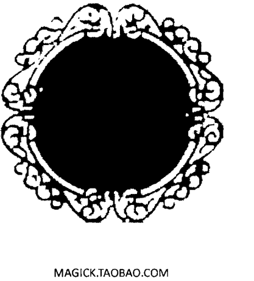

MAGICK.TAOBAO.COM

### 为什么要用视效凝视占卜？

这个问题问得好，也是不可避免的问题。如果视效凝视占卜的目的是为了获得寻常手段得不到的信息，那么用塔罗，易经或者其它占卜手段不更好吗？

有一点是的。我不会建议任何人只依靠视效凝视占卜。然而，视效凝视不仅是一种占卜方式。当你视效凝视的时候，你就是在看新的东西（字面意思）。塔罗牌或《易经》能够告诉你关于事件的事，但它们并不是在为你描绘。在视效凝视中，你最终是能够看到你不认识的人的脸，或者你从没去过的地方的，而那张脸或地方的场景是你在未来能够证实的。如果你想要知道的信息是需要你知道某物的外表的，那么你是无法通过寻常占卜手段获得它的。视效凝视是必要的。你可以通过其他占卜方式知道很多情况，但你无法看见任何。视效凝视却能做到。因而，每个人在理论上都能通过它受益，前提是知道怎么做。

不过，这不是视效凝视的唯一用途。在你能够通过视效凝视看到复杂的图像之前，你会看到的是很多抽象的，幽影的，甚至碎片化的图案，这些也能够告诉你寻常占卜能告诉你的事。事实上，这是更私人的占卜方式，因为其中的形象是直接源自于你自身的意识的，而塔罗或《易经》用的图像是他人设计的。通过视效凝视这些抽象的形态，你能够知道自身内在和未知的象征体系，也能感知到一些你自身大脑操作的方式。视效凝视在哲学上也有用处，通过学习视效凝视，你是在让完整的精神练习感知新现实的能力。从而，仅仅是训练你自身视效凝视的能力，你就能够发现其它魔法工作会变得更容易，有新的力量和含义。我们大脑在魔法上就像是一块肌肉，通过训练它，它会变得越来越强。视效凝视是众多训练它的方式之一，但它也是其中特别强的方式。

除了这些好处之外，它还能够与召唤配合使用。如果你喜欢召唤灵体，那么视效凝视镜会是你无法放弃的好工具，能帮助你与灵体交流。通过占卜镜，灵体能够向你展示用于与其连接的符文，或者其它你能够受益的符文。它能够通过图像与你交流，灵体的任何力量都难以通过视效媒介表达自身。自己进行视效凝视是很强大的，但视效凝视的同时进行召唤可以是你魔法生活中最强烈的体验了。“感知”灵体的存在，用你的内在意识倾听它静定和微弱的声音是一回事，而通过视效凝视，你可以在黑暗中看到在占卜镜内灵体的脸。即便你在普通召唤中在精神中短暂“看到”的形象也比不上在视效凝视中看到的。如果你想要学习视效凝视和召唤，那么视效凝视会成为召唤自身不可分割的部分，你会想没用它该怎么召唤的。

### 基本的视效凝视过程

要视效凝视占卜，你需要：

- 一张空白的，最好是黑色的平面，用于凝视。
- 一个能够坐的地方。

这些就够了。

过程如下：

- 你坐在黑色平面或占卜镜的面前。
- 你凝视它。
- 你持续凝视它，直到你开始在其表面看见东西。

你可能认为这根本不可能，根本不会凭空看到东西，但真的会的。即便你以前从没有经历过这种事，但你如果盯着黑色镜子足够长的话，你将会看到东西。你有可能在试了几周，甚至几个月后仍旧看不到东西，但在一段时期后，会有东西“打破”你的精神，你将能够看到的。到了这个阶段，练习就会变得很令人兴奋，不再是一种累人的活了：你用占卜镜的时候，你通常会看见新的东西出现。随着时间，图像会变得越来越复杂，你最终能够看见完整的图像。你总是能越练越好的。对于众多魔法爱好者而言，能够看见图像就足够有趣了。这最初通常都是抽象的，会随着练习不断变得清晰和复杂。不过，初期在占卜镜中看到的抽象图像通常是有它们自身的语言的，有时会比更清晰的图像更有用。

然而，要学会这些需要时间。即便视效凝视是一项简单的任务，但它也需要你投入时间和纪律才能够掌握。如果你想要真正运用它，那你必须必须认识到，你是必须要每天练习的，每次最好 10~15 分钟。在这段时间内，你可以放一点放松的音乐，熏香等等能够让你放松的东西——不过你必须要保持绝对清醒，致幻类药物在练习中不会对你有帮助。要让视效起效，意识必须处于深层的放松状态。从神经学上来说，人的脑电波速度决定了人的放松程度。不过，大脑是在同一刻释放着众多电波的，如果这些电波中占主导的是那些关于白日梦或放松的话，那么视效就能够发生。

有四种脑电波：

- 贝塔β (40-13循环每秒)
- 阿尔法α (12-8)
- 西塔θ (7-4)
- 德尔塔δ (4-0)

当我们清醒和警惕的时候，大脑是处于贝塔电波的。如果我们更放松或愉悦地聚焦在某物上的时候，那么占主导的就是阿尔法电波。西塔电波甚至是更深层的白日梦和放松的状态，通常与梦关联。再深入的是德尔塔电波，与潜意识和无意识状态关联。

当然，我没有资源去探查自己是小凝视时所处于的电波状态，但我直觉认为它是处于阿尔法低段到西塔初段。我有试过双耳节拍（用声音来调频大脑的方式），我发现西塔的高波段对于视效凝视特别有效，不过其实没必要。特别是 7-6 hz 内的。无论西塔波段是否能将我拉到阿尔法低段，我并不清楚，因为我的精神状态在总体上感觉是相同的。不管怎样，我能确定的是，脑电波与视效凝视是相互关联的。如果你难以视效凝视，那么你可以试试双耳节拍的脑波音频。

我也试验过那种快速对眼睛照射彩光的眼镜，虽然它们对于视效凝视毫无用处，但你可以在凝视前用用看。有一些东西是我需要进一步的调查才能确定的。我在有新信息后，可能会更新本书。

### 制作占卜镜

就像上面说过的，视效凝视最好是用空白的黑色平面。

MAGICK.TAOBAO.COM

事实上，传统会为此制作一幅黑镜。视效凝视的确可以完全不用镜子，但有一个焦点是有帮助的。不过，只要你有一个黑色的平面，你就能够占卜。当你睁开双眼，没什么在你的视野中时，你的精神会很自然地想要在那个区域内构成图像，漆黑色是空白视野中最佳的颜色。事实上，黑色比起任何类型的占卜镜子都要好用，我建议试试用基础的黑色，看看是否比镜子好用。虽然这么说，在历史和传统上，除了镜子还有其它工具。阿雷斯特·克劳利传说中有用他的大拇指。如果意识有被如此训练，那么任何空白的区域能够做到，甚至颜色是什么都不重要。不过，我会建议初学者用黑或白色，因为它们对于意识更有暗示性，也是引发图形最有帮助的颜色。

制作占卜镜最简单的方法是购买一个照片框，将它的玻璃移除，然后将小样图片的白色背面反过来涂成黑色。就那么简单。你可以将弄好的照片框架在你的祭坛上进行操作。记住，你一定要移除玻璃，因为玻璃会对光反射，这是你不会想要的：要尽可能纯黑，没有东西干扰。还有一点就是要用喷漆。其它涂料都会导致一点不完美，也就会干扰你的凝视。

传统的魔法书通常会要你圣化镜子，在上面画几个希伯来字符，或者画天使符文等等。这可能会有帮助，但我从未发现它有比不画的好。如果你喜欢的，你当然可以两种方式都用用，看看哪种效果好。

约瑟夫·史密斯（魔法创始人）用的是高顶帽。他也不是凭空这样做的：这种技巧在他的年代的欧洲魔法圈子里很流行。虽然，我认为他根本没在帽子里看到任何，不过他的方法是没问题的：如果你弄一顶大帽子，凝视它，那它会阻碍你的事业，会让图像显现。

同样的概念还有多种用法。有些人会用涂色过的黑盒子，它还能让意识生出想要看其深处有什么的好处。有些人也会用很大块的天鹅绒布。然而，夜晚关掉所有灯的房间也像涂黑的相框一样好用。

对于一些人而言，黑色没有白色好用。我不知道为什么会这样，但我经常听到黑色无法引发图像，而白色能的抱怨。如果你是那类人，那么你可以将相框里黑卡换成白色的。你甚至可以将一大块纯白色塑料挂在房间里。

还有一个技巧对于白色平面挺有用的，黑色则不然。这个技巧被称之为超感知觉全域测试法（ganzfeld）。它的原文是德语，含义是“全域”，也就是说视觉的全域被单一颜色包裹。在过去，人们会将乒乓球切成两半，一个眼睛上盖一个，再用胶布贴好。眼睛看到的将全是柔光的灰色空白，随着时间，意识会开始给空间投射图像。不过你现在不需要这么做了。你可以买一个护目镜，将它涂成白色。在试验中，你可以在理论上购买多个护目镜，给它喷上不同层次的色彩。这对于视效凝视可能没用，但多彩视野是不少魔法技巧所需的。正像前面说过的，你要用喷漆。不要以为你可以涂得很均匀就用其它涂料，无论你多么有才，你都比不上喷漆的，永远都比不上。用喷漆喷，但要轻轻地来。等它们干了，再戴上它们试试。除非你的房间充满自然阳光，或者你胆大到肯在户外戴它们（当然是头朝后仰的），否则在使用时你的房间里的灯都要打开，或者用一盏聚光灯对着它。确保那灯不要离你太近，否则你的脸会烫伤的。

### 视效凝视占卜中的象征语言

你现在已经知道了该如何训练自己视效凝视和制作占卜镜或各种工具了，是时候学习解读在占卜镜中看到的信息了。这也是视效凝视中变得复杂的地方。如果你想要看到的只是现实中明确和复杂的图像，那就没必要理解镜中抽象的内容。但是，如果你想要理解你无意识和潜意识产生的图像，那么视效凝视就是个好方法。我认为，大脑在占卜镜中产生抽象图像的部分也是通灵的部分。事实上，我猜测很多通灵能力可以通过接触大脑中更原始和创造性的部分和试着解读它们的形象来得到学习。

> MAGICK.TAOBAO.COM

在视效凝视中得到的图像比起我们所习惯的那些是更加不同的。它们与梦中的图像或任何与正常清醒思维的图像都不同。例子有漩涡，烟雾，晶格，重复的层次，横线与直线，圈圈，正方形，钻石形，三角形，万花筒形，字母和数字。一旦它们出现在占卜镜中，就可作为一种占卜进行解读。

在谈及如何解读这些图像之前，让我们先看看你最有可能看见的图像。也许，你最常看见的元素（也是你第一次会看见的）是类似于电视的雪花。

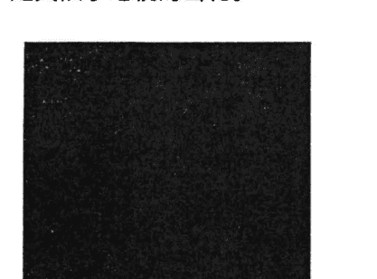

## 视效凝视占卜

一旦你看见这个图像，随着你进一步凝视，它会开始塑形成其它图像：

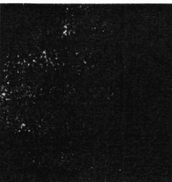

有时，图形会不断闪烁，或间隔性地闪烁。然而，随着你的集中力和视效技巧凝聚，图形会更慢地形成。它会变成固定不变的图形，不过可能会有点模糊或闪烁。

然后，再进一步，它会变成更清晰的图像：

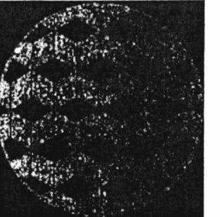

在初学的头几个月，你可能不会看见特别“清晰”的图像。幸运的是，再怎样你应该都能看到模糊的图案，只要你足够坚持训练。即便是模糊的，你也应该也能搞清楚是什么象征，以及其含义的。随着你的视效凝视能力变强，图像也会变得越来越清晰。你可以通过图像的清晰度来辨识自己能力的进步。

图像也有可能会是很微弱的，难以辨别的形状，比如一个模糊的球形：

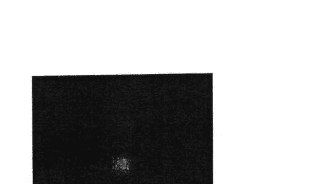

然后，图像的大小和强度会产生变化：

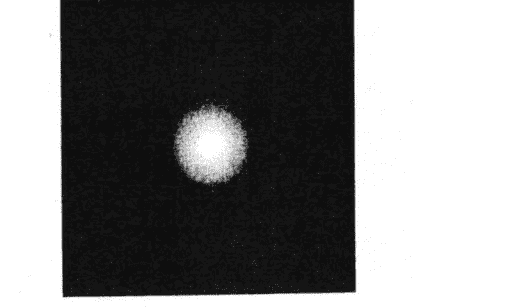

在这之后，图像会开始分裂：

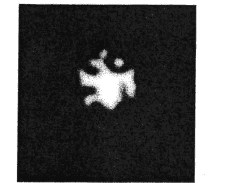

然后，它们可能会转变成无法理解或不明确的形状，从秩序和简单变成混乱和复杂：

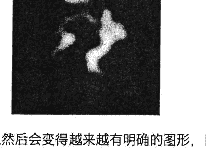

这些图像然后会变得越来越有明确的图形，比如线条：

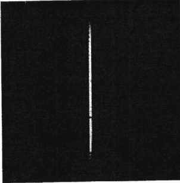

或者一块块模糊的变化：

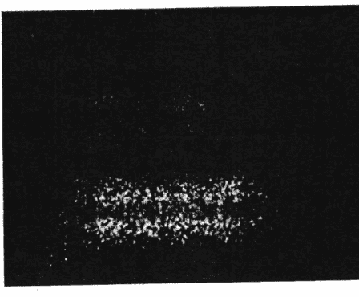

又或者类圆的形状：

又或者是由线条组成的栏杆：

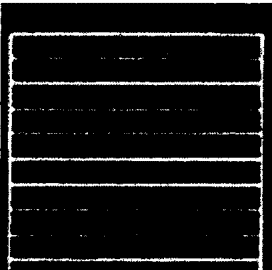

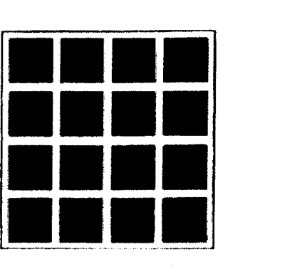

像钻石一样的图案：

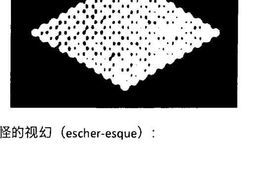

奇怪的视幻（escher-esque）：

奇怪的圆形或行星图案：

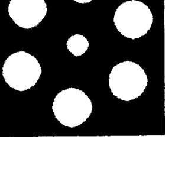

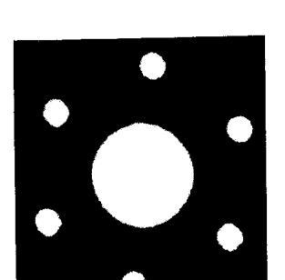

掉落的形状，像雪：

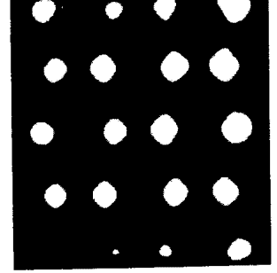

再转变成交替的图案：

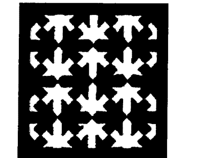

它们甚至可能变得不那么抽象和寻常，比如一颗星星：

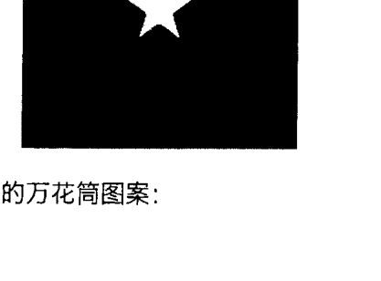

还有奇怪的万花筒图案：

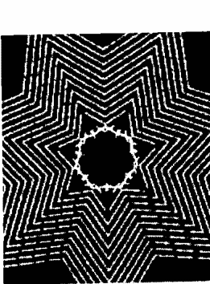

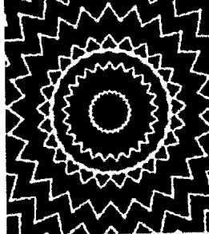

你有可能看见不同类型的漩涡：

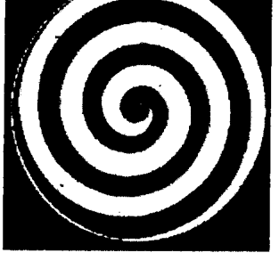

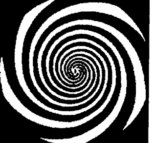

然后再转变成一个切实的图像，比如海螺：

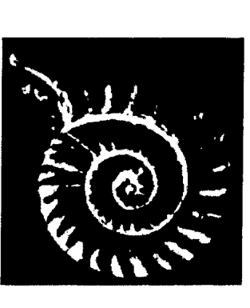

如果你视效凝视到了这一刻，那么你会再开始看见奇怪的，超现实的，似预兆一般的形象：

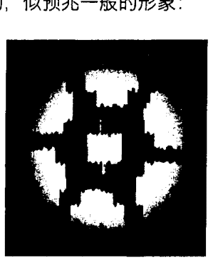

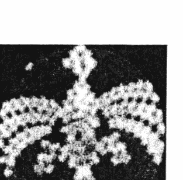

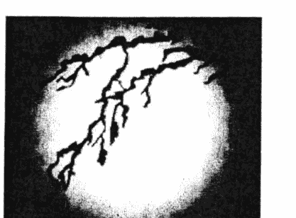

还有一些很有意思的，是与魔法书中的灵体封印相似：

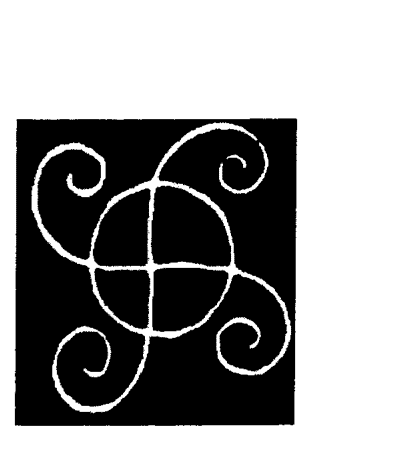

然而，没有关于这些抽象图像和其含义的辞典。大家彼此之间看到的图像也会不同，同样的图像对于不同的人通常有不同的含义。一个顺时针的漩涡对于一些人可能是指某个行动不会成功，而对于另一个人可能代表的是肉体疾病。要解读图像需要不少时间和精力，当你成功解读的时候，会是很有成就感的。一旦你习惯了抽象图形后，然后就会开始出现更明确的图像。这会特别有用，因为其它占卜方式都无法给你一个陌生的脸蛋或地方。另外，当视效凝视在配合召唤使用的时候，结果会变得更令人惊奇和美妙。它会给感知打开新世界的大门——类似于人们在致幻剂的影响下产生的体验，只是它会更有控制，可引导。理解和控制自身内在对于个人天性有很多好处，但在此没有详细的辞典。

> MAGICK.TAOBAO.COM必要详述。因为每个人的体验和收益是不同的。问题在于如何到达那种程度。

要理解为什么无意识会先用抽象图像，我们需要先理解思绪是如何产生的。当我们产生一个思绪或脑中想象一个图像的时候，我们对它们的体验需要等图像完全形成或者作为一个句子开始的时候才行，但是，在那之前是什么情况是我们未知的。从而，我们只能了解思绪的一面。要理解另一面则需要我们理解视效凝视占卜。

意识作为一个整体在产生任何精神活动的时候，会经历一系列步骤。第一步是原始数据，其通常被我们体验为空或漩涡般的混乱。想想电视或收音机在转换频道之间的时候：白噪。在一切中不存在任何对称性、目的或方向。这种程度的意识是自由的，思绪和意志得以产生。古人智慧地将其称为混沌或深渊。

第二步是运动。原始数据开始在这里塑形，只是有点难以察觉和不明确。运动，漩涡和共振在这一阶层上产生。如果数据在视觉上呈现，那么我们也能够在色调上发现不同，比如有小块升起或坠落，黑色的下垂物，白色的下垂物，等等。如果是音频的话，我们能够注意到音量和强度上的来回变化。这是我们反应或意图的第一层。冲动会在这一层次中诞生，但它们仍是最原始的形态。

在这产生之后，第三步是这些微小的运动产生对称性。在这里，形状得以产生。有时，它们会配合着运动，有时则不会。它们在视觉上的呈现是线条和逐渐成形的形状。在声音上，我们会开始听到音调，和敲击性的噪音。有时，形状会以万花筒的形态填充整个频谱——在声音上是一小段的和弦或音阶，不过没有最终的方向——有时，形状仅仅会维持不变一段时间，然后消失。反应、意图和其它冲动现在会开始有越来越明确的形态。它们会开始有结构，很快，它们会诞生到我们的意识感知中。

然而，在我们开始意识到它们之前，它们必须要开始运用语言的积木。语言不仅是话语：它在各个层面上都是有意识的结构。比如，当你在解读一张人脸的时候，你用的理解是和书面语或话语中的基础是一样的。任何认知都是基于于此的。只有通过一系列复杂的认知，我们才能够表达自我。语言的链条在这一层次上开始，而就我们意识中所产生的而言，我们现在看见了形状变成了文字、字母、数字、可辨识的符号、复杂的图案、符文，甚至是粗狂的图像（比如眼睛或手）。这就是第四步。

一旦产生了这种情况，那就说明了我们抵达了意识思绪的第五层。就电视或收音机来讲，在此时，我们会看见一场节目或听见音乐。局部形成的一切闲置开始显现为一个整体，完美地表达其意图或意识自我的感知。

要理解你在占卜镜中看到的，就是要理解和知道源自层次 2 到 4 之间图像的含义。对于它们并没有通用的辞典，就像对于梦境没有通用的辞典一样。要完全理解这些图形需要时间和精力。即便在此时，新的象征图形通常会产生。这也需要你去理解。整个过程一点都不简单，不能归类为施咒，甚至灵体召唤。它涉及学习整个新的内在语言。

### 图形的辞典

虽然理解视效形成的图像含义很容易，但要理解图像完整的含义范围需要很长时间。在占卜镜上出现的图像就像图像自身一样有着无限的可能，然而，幸运的是，它们中有少数基础的模板。如果你能够理解这些模板，那么你也能够理解它们的变化。例如，如果你知道一个三角的含义，那么不管你看到的是一个三角还是五个，又或者移动或固定的三角，你都能理解。另外，它的颜色也同样不重要了：你知道三角自身的含义，你也就能够轻易理解所有三角的含义，因为你可以根据它们的数字，颜色，运动等来进行进一步理解。这不是说它们的表达不重要——相反，它们是非常重要的——但是，如果你知道三角形在总体上的含义，那么你会发现所有的三角形变化所呈现的是相同的概念。它们的其它变化是基于那原始形态的含义的。这也表达了意识在本质上的运作。

但你该怎样去学习它们的含义呢？你可以花几个小时坐着看占卜镜，看见上百个不同的图像，但是，除非它们在外在有什么可供参考的地方，否则你还是无法懂。从而，你还必须掌握学习视效凝视所得图像含义的技巧，然后，将它们写下，自己做一本参考书，将图像与含义连接上。剩下的只是你不断进行视效凝视，然后参考你记忆中的图像含义，如果忘了含义的话，就去看你的参考书。

我们幸运的是生活在互联网时代。你不需要费很多功夫就能找到一系列的含义。事实上，我认为你只需要找下面三种含义来源就够了：

- 塔罗（根据卡巴拉生命之树来解读的含义）
- 十六个阿拉伯地占图案
- 易经（三爻卦和六爻卦）

塔罗和地占图像是更容易接触到的，但易经却不是西方常见的。我的建议是，查看每个项目，写下与每张牌、图像等的含义。每次视效凝视中出现新图案之后，将新的图案填加上你的列表中，这会让你逐渐建立起你自己的参考书。然而，在这么做之前，你应该花点时间去查查你特别感兴趣去挖掘的象征含义。从小的开始，先去看比如行星、元素、十二宫等的对应含义，再去看涉及复杂体系的，比如塔罗和易经等的含义。

如果你有练召唤，那么你应该去看看与下面十二个主题相关的含义：

- 祝福和诅咒
- 吸引和排斥
- 召唤和驱逐
- 束缚和释放
- 变化和固定

另外，下面是我个人对卡巴拉和占星术的对应含义：

| 主题 | 卡巴拉对应 | 占星对应 |
| :--- | :--- | :--- |
| 变化 | 月亮的下降交点/南交点 - Da'ath 下降 | 水瓶座 |
| 固定 | 月亮的上升交点/北交点 - Da'ath 上升 | 双子座 |
| 祝福 | 木星，Chesed | 双鱼座 |
| 诅咒 | Binah，土星 | 摩羯座 |
| 吸引 | Netzach，金星 | 金牛座 |
| 排斥 | Kether | 白羊座 |
| 束缚 | Hod，水星 | 处女座 |
| 释放 | Tiphereth，太阳 | 狮子座 |
| 治疗 | Chokmah | 人马座 |
| 伤害 | Geburah, 火星 | 天蝎座 |
| 召唤 | Yesod, 月亮 | 巨蟹座 |
| 驱逐 | Malkuth | 天秤座 |

一旦你弄完了列表，那么，准备一本大号的笔记本，写下你的第一个主题。假设你第一个要写的主题是“祝福”，是在通过魔法仪式祝福某个人或者东西层面上的。在你开始做其它事之前，先给自身做一次驱逐仪式，将所有可能影响信息的干扰送走。然后，花点时间冥想，让你的意识宁静。如果有任何音乐能让你到达这种状态，那么你可以听。一旦你的意识变得宁静，那么你就可以有意识地凝视占卜镜。持续凝视镜子，直到你开始看见图像。然后，用意图引向你想要理解的象征。在意识中重复这个意图的同时看着占卜镜——“祝福，祝福，祝福。”一旦你开始看见东西，那么就聚焦它。等待，知道图像变得稳定。一旦它变得稳定了，再将图像画到你的笔记本上。不过，你画的图像要小一点，因为你需要更多空间接着画其它图像。你可以继续画你精神能够承受的其它关联图像。你可能要用几周的时间才能把全部的关联图像画完，有时还要添加笔记本，但这是基本的过程。你也需要录音机来记录下你在凝视过程中大声说出的看到内容，从而在画图的时候可以将其作为参考或回忆。在召唤中我也提倡这种操作方式，就像我在《符文召唤魔法》中所写的那样。

一旦你画好了图像，你将需要测试它。这是两步的过程：首先，你需要反复凝视数次来测试同样的图像是否会出现。如果是的话，你就可以确定你找到了正确的关联。第二步，你需要召唤在笔记上所画的图案，将其作为符文来召唤灵体。《符文召唤魔法》中有详细描述过程。唯一的区别是，你用的不是自己制作的或者在魔法书中找到的符文，而是用在你笔记本中的图像。

这一步挺有意思的：要确定含义是否正确有多种方式——它们都会因人而异。但它们中有一点是非常明确的：有趣的事情会发生。如果你找到的是正确的图像，那么你的意识在召唤过程中会以奇怪的方式回应它。其表现可能是将关联的含义涌入你的脑海，或者你可能会比以前更强烈地在占卜镜上看见图像，或者图像自身可能会以有意识的灵体形态与你交流。很多在召唤中会发生的现象在这里会出现。然而，如果你找到的不是正确的图像，那么什么都不会发生，或者图像自身可能是正确的，仿佛它是一个有意识的灵体一般。例如，你要找寻“伤害”概念的含义，在你的占卜镜中看见类似下面的图像：

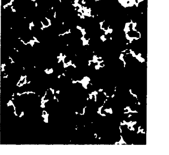

然而，当你召唤那图像的时候，那图像自身仿佛是个有意识的灵体，告诉你那图像的含义其实是“束缚”。问题在于，在精神中，你一直将它的含义视作了伤害，之后可能一段时间改不过来。从而导致你之后的凝视占卜中需要不断改变“束缚”vs“伤害”的概念，更加细致地区分它们，在笔记上记录好自己的发现。

在此时，你可能会想，为什么不先将在占卜镜中看到的图像画出来，再召唤它们。你其实可以这么做，但这样不那么系统化，而且可能会有不少被忽视的图像。最好是先弄好一系列的含义，再占卜它们，确认它们，而不是让你的意识在占卜镜中流荡，随机实施这些过程。

不过，当你弄完了列表中的象征和图像之后，你又突然某夜在占卜镜中看见了你从未看见的图像的话，那又是怎么回事？当发生这种情况的时候，你需要做的只是画下它，然后像之前那般召唤它。你可能要尝试几次召唤，但最终你会弄懂它的含义的。你可以将其添加到你笔记本中的列表中，作为未来的参考。

## 按数字来描述过程:

1.  将占卜镜放在你面前。它应该占据你可观的视野，因为太小的话，你啥都看不到。
2.  静定地坐在它面前，让你自身宁静，进入接受的状态中。
3.  构成你的问题，或者你想要占卜的主题，再凝视占卜镜。有些人会发现将问题投射进镜子里会很有帮助。你应当尽可能睁着双眼凝视占卜镜，不过，你要保持意识的静定，将注意力聚焦在你的问题或主题上。
4.  一旦你看见了图像，那么仔细地看它，看看是否有任何变化或增加。拿起你的笔记本，开始画它。你可以随你意进行多个问题或主题，记录下每个问题或主题对应的图像。
5.  在你弄好了一系列抽象图像之后，那么，再将它们作为符文进行召唤，用占卜镜看看它们是否有反应。写下任何你的感觉。在最初的时候每个问题尽可能多弄一些对应图像，一旦你大致弄懂了含义，那么你可以将对应的图像中看似无关的部分切掉。
6.  反复练习，练习会让你熟练。

一旦你的象征辞典弄得差不多了的时候，你可以开始将视效凝视作为一种占卜方式。在最初复杂的准备之后，它会变得简单有序：你所需要的只是在意识中维持问题，或者你想要知道的信息，并凝视镜子。在图像开始在镜中产生的时候，在你的笔记上画出它们，为参考做准备。当占卜结束后，你可以分析它们的关联，也可以将它们作为召唤符文再进行进一步的发现。

然而，象征程度的视效凝视占卜并不比其它象征体系的占卜更准确。有趣的是，用其它类型的占卜能得到相同的信息，不过正因为如此，通过多种类型的占卜，你可以获得更多洞悉。如果你选择一个问题，用塔罗牌，六爻神算，地占术，以及视效凝视的话，那对于这个问题会有相当丰富的理解。

是的，如果你的占卜问题是特别视觉层面的话，那么视效凝视会特别有帮助。这种占卜方式中的图像含义可能表达了它的一部分，但你也应当注意所选主题在视觉形式上的表达。例如，如果你试图了解一个陌生人，想要知道他眼睛、头发、身高、体重等信息，那你可以找到与这些属性对应的抽象图像。

不可避免地，你会视效凝视笔记本中没有对应含义的东西。在这种情况下，你可以仅仅选一个主题，进行一系列的问题，看看会产生什么图形。然后，将图形作为符文进行召唤，看看你能得到什么其它感受。如果你想要知道发色（作为例子），那么与太阳、金子、光芒等关联的图形可能是指它是黄色的。如果你想要知道一个人身高高矮还是中等，通常抽象图案会比较明确地表达，比如用一条长线表达那个人很高，用像盒子一般的形状来表达那个人很矮，用 X 或 T 的符号来表达中等身高。

然而，实施视效凝视占卜的最大好处在于，除了他在精神上强化你的视效能力和感知能力之外，当视效凝视变得超脱抽象，变得真实的时候。随着你持续视效凝视，抽象的图像会变成真实的场景，这些图像会比抽象的告诉你更多。但是，即便这样，抽象图像也不是毫无价值的，对于一些无法视效色彩的人而言，抽象图像能在必要的时候给出明确的颜色。例如，你在占卜车的颜色，而产生的抽象图像是与“火焰”、“火星”、“血液”等关联的，那么你就可以知道那辆车是红色的了。你可以与其它占卜方式配合，让信息丰富，更深地理解答案。

除此之外，视效凝视还有其它有趣的层面，以及心理学方面的现象。通常当你面对占卜镜进行占卜的时候，你有时会有奇怪的精神状态，有时是非常令人愉悦的，有时则是非常猛烈的。如果你有配合占卜镜使用召唤，那么整个过程会变得非常强大，因为你打开了新的感知世界，那个世界是你一直有点感觉到的，但并不怎么看到的。一旦你这么做了，你精神中的那些部分会得到强化和敞开，不过视效凝视会加强你整体的感知程度和意志显化能力。旧记忆也会变得更清晰，通常会导致个人的洞悉和突破。无论我们是否意识到它，我们都会有新的学习反应，而它们中多数是疯狂的，无法功能的。要突破这些，精神必须要变得强壮。而占卜，就像魔法的其它层面，是众多能够强化的方式之一。

祝你好运。

## 水晶凝视占卜

一个启蒙者 著

埃罗 译

MAGICK.TAOBAO.COM

获取更多好书，请加微信号：strcdts

店铺：http://strc.cr.cx

### 这本书能教你什么

这本书不是教你水晶凝视等的历史的。那些信息你需要从别处找。这本书教的是方法，它是基于我十七年的实践。我将直接开始说，内容不多，但足够你理解并实践了。

这个方法需要你用石英水晶，或者其它比较清澈的石头。

### 我是谁？

我不是职业的通灵者。我家人朋友倒是有用通灵者这个词来描述过我，但我对这个词一点都不感冒。我之前说我不是职业的，是指我没有用占卜能力赚钱，虽然我偶尔会因为提问者过度依赖水晶而拒绝占卜。是的，它会告诉你未来。不，它不会替你做决定。

我刚开始用水晶进行占卜的时候有很多理由，但我仍旧持续至今的原因只有一个。

我从十九岁开始占卜，我那时在维卡启蒙道路上作为二等女祭司进行宣誓。在这条道路上，我们在宣誓后被要求学习某种占卜方式。通常巫友的选择不是卢恩就是塔罗。我当时对占星术不感兴趣，而我已经玩过塔罗了，甚至有过自动书写的经历。我熟练塔罗，但我对它没兴趣。在我十九岁的时候，我买了一块比较浑浊的水晶，因为我那时需要学习什么。然而，我当时真正想要用水晶占卜的原因是想要破除新世纪派系对于它的各种胡扯。我当年真的很混蛋。

我的第一块水晶不仅非常浑浊，它也有不少处棉絮，使它几乎难以用于占卜。虽然有用月光、阳光、加盐等等的精华和加持方法，但我没有这么做，而是问了水晶它想要我怎么做。这是我占卜方式的开始。

我选择水晶凝视的另一个原因纯粹是原因观察。维卡成员通常会用篝火，这种传统是源于元素的。每次我在火焰周围的时候，我总是能够在其中“看见”东西。有时看见的是有趣的事情。我记得有次还看见了猫王。

这类事情都让我觉得自己对视效凝视有着不错的天赋。

我是三级女祭司启蒙者，属于传统维卡组织，即便我认为宗教次于灵性，几乎每必要。我作为女祭司已经十四年了。我也学过卡巴拉和典礼魔法，不过，我仍旧认为自己是一名学生，追寻者，和魔法师。在魔法上，我既喜欢理论分析，也喜欢实践。然而，你仍旧要有信仰，比如，石头不是没有生命的物件，是你可以随意扔的东西。

我一直用水晶占卜是因为它有效。最近，水晶占卜变得流行了起来。

### 为什么读这本书

我读过的关于视效或水晶凝视的书似乎更涉及星灵领域，与天使或灵体指引有关。我理解为什么会这么写。

那些书中的方法主要是将水晶用作一种触发器和强化器，让星灵世界能够进入石头或占卜者。我的体系是基于物质的。正因如此，你可能只能用石头来运用这个体系。也就是说，你无法用墨水或水碗来进行。我的方法很简单，我认为水晶凝视是一种失传了的艺术。我希望改变这点，甚至只是一点点，最好能让人理解石头是一种活物，需要尊敬对待。

### 未来充满变数

不，我并不认同这点。我读的书中有不少认为未来充满变数，取决于自由的意志和占卜。这在某种程度上是对的，但也在更多方面是错的。是的，未来取决于自由的意志和其它原因。但是，我们的选择有着固定的模式和倾向性。我讨厌这说，但是，当我们到了一定年纪的时候，我们的模式都已经定死了。宇宙也很乐意一尘不变。

通常，问题不在于你看见的图像，而是在于你的解读。有时，当你实施后，你努力解读，哦，原来是这个意思啊。下次再看到同一图像的时候，如果它不是指同一个意思的话，你会觉得古怪。我最近帮一个朋友占卜，他想要知道未来的生活情况是怎样的——因为桑迪飓风的关系，他暂时丧失了力量。他是我认识的最灵性的人，当我为他占卜的时候，我看见他变得无家可归。我看见他戴着那种很厚的滑雪面罩，他的女友在远处的另一边。我不理解所看到的。我不想要承认他看上去无家可归。我完全不懂所看到的。我就把看到的内容告诉他了。当时他的家仍旧很好，物品都有保存好。两天后，他家的房子着火了。不过他的东西仍旧在，但房子剩下的部分都毁了，电也没法恢复。无家可归。是的，他有自由的意志。但那种情况又该如何预防？我说这个例子的原因是：你会在石头中看到很多东西。有些是高心的。有些是你不想要知道的。有些是会让你知道的你伤心的。如果你无法忍受就像看到好的一面那样看到坏的，那么你占卜起来会很难。你需要保持头脑的清醒。

老实说，我整个水晶占卜“生涯”中只有一个人说我的占卜不正确，我后悔那个时候我没有将所看到的图像写下来。图像是正确的，她只是没有听我罢了。你会懂我的意思的。如果你是要为别人占卜的话，都写下来。

### 你的水晶

我没有那种很大的水晶球。事实上，我只有一个小型的水晶球，而我甚至都不用它占卜。我最常用的是我的祭司大姐在十年前去科罗拉多州之前送我的那块。它是个尖头水晶柱，不是特别清晰，有几处棉缎。我估计它大约6英尺（15厘米）长，大概2英寸（5厘米）宽。我用的第一块水晶大约是它的三分之一大小。大小并不重要。只有一点重要。

你是否对这块水晶有感觉？如果没有，那就别管它了。然而，如果你不管做什么，你都总是回头想要看它，你无法停止想它，你想要反复地握着它，几乎都要着迷了。那它就是你要的！

总的来说，你需要理解的是，你将要与这块石头产生某种关系，所以你找的应该是你能够与它相处融洽的。你必须要真的很喜欢它。

### 我的方法——第一个月

首先，我应当先说一下我很近视，有轻微散光，但我视效凝视的时候并不戴眼镜。我并不认识任何会戴眼镜进行的人，但我仍旧认为是否戴眼镜是个人偏好。我不戴眼镜去看更让我觉得舒服。

如果你有水晶柱，用你的手指捏着它，手掌离它远点，从而你不会从另一边盯着你手指看。

光源：反光会干扰你，让你难以看见图像。确保你不会被反光，石头里也不会有阴影。除此之外，我有在阳光直射下占卜过。光源不像有些人认为的那样重要。

情绪：深呼吸几次会挺有帮助的，让你的精神能够静下来，但你不必进入完全的冥想状态。

问题：有什么是你想要的，是我能够给你的？这将是你的第一个问题。将意识集中在问题上。你是在问水晶自身。你加上“是我能够给你的”的原因在于你不会想要让水晶告诉你去给当地教会捐款百万，而你连买牛奶的钱都没有。你不会想要它告诉你去做超出你三观的事情。当然，我相信你有足够的智商不会犯傻去做。但，这是你为什么要加上这句话的原因。你问这个问题，是你想要与这块石头建立某种共事关系。

水晶不是像乐扣乐扣容器那般是死的。它们是活着的，充满能量的。握紧一块石英水晶，你就已经创造出了电流。石英水晶是压电体。它们共振。

这样想：假设你想要从陌生人身上知道信息。陌生人可能会告诉你时间，当然也要看你是在哪里生活。（我的邻居就很坏，不会告诉你的。）但假设你想要更重要的建议，比如你是否该娶某人。你这么问陌生人的话，对方可能把你当疯子。如果你们是朋友的话，那么他可能会停下正在做的事情，给你建议。石头也是这样的——你们至少要先彼此熟悉。

时长：在一个月内每周做一到两次。当你读水晶的时候，你不是要让你的眼睛疲劳。凝视水晶的方式就像你在读书一样，自己不断调整，让眼睛舒适的。不要让你的眼睛在某个点上聚焦，除非你有直觉必须要这么做。不要超过十五分钟持续进行。如果你训练初期没有看到图像，那也没事的。用梦般的方式去看石头，就像你工作间隙打开窗户，想要看看外面放松一样。

对这个问题可能有的图像回应：可能是任何图像。我有在水晶中看到一个女人吻水晶。我有看到过香薰烟雾。有个朋友告诉我，他看到过某种花瓣。这有点像是给礼物。你送朋友礼物。对于水晶也同样。你是在试图与水晶共事。

在这个相互认识的时期里，我强烈建议你经常拿着你的水晶。毕竟，你不仅是要认识对方。你也要让对方认识你。我也建议，除非水晶特别要求，你要尽可能不让它接触到直射光线。水晶是在地下生长的。那是它们繁荣和习惯的环境。取决于你触摸它的频率，每隔几周用温和的肥皂水清洗它。

倾听你的石头想要什么。我有一块发晶的茶晶。我有次把它忘在包包里面了，带着它去做非常疲劳的工作。它的颜色从淡棕色（刚开始工作时），变成了骨白色（结束工作时）。我感到很内疚，问了我该怎么帮它恢复。我立刻看见了地上挖一个洞的图像。我将它埋了一个月，让它恢复能量，它的的确有再次变棕色了。石头知道它想要什么，即便这听起来很疯。

### 记笔记

这点我非常强调。这不仅在你为自己占卜中很有帮助，但你为别人占卜时是更非常必要的。你至少要记录下面的这些：

- 问题
- 图像
- 解读

（记录日期也是很帮助的）

解读有时挺复杂的。有时，水晶给你的信息是非常简单的，就像其表面呈现的那样。然而，有时你会看见非常奇怪的图像。我自己的水晶有时非常有幽默感，我会看到挺有趣的图像。

我唯一的建议是，用解读梦的方式去解读水晶图像。这有点像是在和不懂手语的哑巴说话一般。你越是与某块石头共事，你的效率也越高。你们将认知彼此，以及相互之间的交流方式。

### 第二个月及以后

在第一个月后，用这个问题进行一到两个月：我应当知道或注意什么？这是个非常有用的练习问题。它是相当敞开式的，而你将会被所得到的信息惊讶到。

在了解了石头几个月后，你就可以问任何想要问的问题了。上个月，我有个朋友非常想要见他女朋友，他想要知道什么时候能见到她。于是我问 “他下次见到他女友是什么时候？” 我看到的是数字 7，结果很正确。我提到这个例子是因为，在某些占卜类型中，你问的问题很重要。而在水晶占卜中重要的则是水晶。随着练习，你会感知到什么水晶该怎么用的。

我认为，你的占卜效果取决于你。如果你想要用水晶占卜，你对它很放松，那你很有可能会成为一名优秀的占卜师。如果你感到压力很大，一直在想自己做的是否正确，那你最好在泡一个放松的澡后再来试试。

祝你好运。
