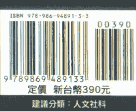

# 跨次元互联网：祖夫雅的魔法通道

# 译者序 ◎

我与玛雅历相遇的缘分始于二〇一二年八月。在一场“大角星疗愈团队”的工作坊里，我和来台教授玛雅历的塞尔维亚籍老师Ana分配到同一组，并在接下来的几个月中碰上了一连串的巧妙机缘，好比因缘际会下翻译了玛雅相关文章，或者在聚会中遇到贵人点化，得到更多体悟。到了年底时，因为看到苏菲部落举办“首届玛雅历法师资培训认证班：初阶师资”的讯息，我决定正式学习玛雅十三月亮历，并参加了以“时间就是艺术”取代“时间就是金钱”的历法，进入玛雅十三月亮历探索之旅。当时出于好奇，加上手上实用的参考资料有限，课程结束后便陆续订购了数本荷西·博士的原文书籍，《跨次元互联网：祖夫雅的魔法通道》就是其中之一。

荷西·阿圭列斯在十四岁时登上墨西哥特奥蒂瓦坎的太阳金字塔顶，发生了灵视经验，自此奠定他一生走上玛雅文明研究的道途。本书是他于一九八七年八月十六、十七日发起“和谐汇聚”，推动全球静心后，为了向人们阐释活动背后真正意义涵——唤醒人们意识到二〇一二这个人类演化历程转捩点之特殊与重要性，所推出的著作，而或许人们所说的末日传闻就是这么来的。在他执笔写作后不久，他的次元双胞乔伊·祖夫雅叔叔终于出现与他“相认”，他们之间的对话也因此成为本书的精髓。

“祖夫雅”在玛雅词汇里代表的是记忆回路，它循环着自身。我们都活在不断重复循环的宇宙之流里，因此人们所说的预言也自此发生。本书于一九八〇年代出版时，目的是要告诉人们二〇一二年人类整体会有翻转命运的变化，它提醒并协助人们为之做好准备。虽是如此，对于在末日传言后仍安然活在世上的我们，这本贯穿古今与不同文化、信仰的传奇著作，明确指出当今人类仍陷在单一次元迷思的窘境，它教导我们时间非线性的概念，并让我们认识波形与活在当下的智慧……等。这些是不论身处于哪个时空背景，都有益于我们进化与解脱的真谛。乔伊叔叔还教导我们认清自己的本质，并完全接纳自我、知行合一，他的资讯着实为乱世中的迷途羔羊提供了良方，以坚定地实践真理并怀着希望往前迈进。

“时间就是艺术”背后所表达的意涵就是“和谐”。任何一件事物、一种关系，只要是和谐的就是艺术，这也是当初星际玛雅人离开地球时所留下的名片“卓尔金”要在这开展的星际教导。它协助现今活在虚假、混乱频率中的人们，有机会藉此学习生命的真相，打破意识的幻象与藩篱，回归自然规律的频率中生活，最终恢复本然的清醒。

当人们活在自然频率时会发现，“共时”（一般人所认为的巧合或幸运）是一件再自然不过的事。二〇一三年，也就是据说星际玛雅频率正式来到地球的这一年，我为了想更透彻理解手上几本书籍的原意，而试翻了其中的两三本书，这本书正是我希望能最快译好的著作，因为它不但是Katarina老师心心念念期待的“经典”之一，对我来说，它比其他书更富有故事性，不那么艰深难懂，且书中的讯息也在在吸引着我，是着实帮助我成长的心灵粮食，也因为如此，更想与大家分享这份宝贵的资讯与智慧！可惜由于工作和诸多因素，使得翻译进度停摆了许久，直到二〇一六年的一场境遇才让我重拾动力。

二〇一六年三月，我有幸在红皇后（Stephanie South）第一次来台发表新书活动的机缘，私下与她会面，之后内心就时不时浮出“我要送给红皇后一个礼物”的念头。不久，我终于下定决心，认真地在两个月内完成此书的翻译初稿，并在友人Sophi的介绍下与一中心出版公司接洽，使本书获得宝贵的出版机会。虽然当初单纯为了想送红皇后一个礼物才决定完成此书的翻译，但或许是星际玛雅团队通过红皇后的振频及无声的信息来促使我完成这项工作，进而藉此揭示他们当初为这个重要的世纪转换，以及另一世纪新局面的开始而埋下的创世珍宝。

长久以来人们对玛雅文化之谜与众多流传不乏诸多揣测，但不論事实为何，我们是否有颗敞开的心能听听他们揭示自己隐藏在神秘面纱背后的真相——回应他们的来历与到这个星球的任务。

在此感谢翻译过程中弥补我中文及修行素养方面不足的华敏慧老师，还有在英文上协助我的 Harold Williams 先生，以及“时间法则基金会”沟通部主管韵律龙（红韵律龙：星系印记）Jacob Wyatt 先生耐心详细地回答我关于书上的一些问题。最后，我衷心感谢一中心出版公司，包括翻译组长蔡孟璇小姐，还有专业的编辑团队对此书的校正，以及共同参与、协力此书顺利出版的所有成员，使这本书有更好的呈现。

附带一记，刚才提到的 Jacob Wyatt 先生为协助人们更容易接触、了解玛雅十三月亮历，特别制作了七小篇的历法介绍，让人们对此“时间非线性”的宇宙历能有初步的概念。有兴趣的读者请参阅 http://newtimecourse.com/cn/7-ways-free 。

好了，伙伴们！准备好要一起乘着这波祖夫雅之浪，进入精彩的星际之旅了吗？
一起来吧！

林婉玉 (kln131 蓝磁性猴)

# 推荐序

我与荷西·阿圭列斯第一次见面是在一九八三年十二月，就在我洛杉矶家的大门口。
那是一个晴朗的日子，我们以作家们惯有的寒暄方式互相赞美彼此的作品。
我对他的优雅表达赞赏，他的著作《转化性的视野》（Transformative Vision）里的内容被我引述在拙作《宝瓶时代阴谋》（Aquarian Conspiracy）中，我還知道他是美丽的艺术画册《曼达拉》（Mandala）的作者之一。
不一会儿，他摊开一系列他福至心灵时创作的画给我们看，这些画在后来成为其著作《地球扬升》（Earth Ascending）的核心。
那天我们一起享用午餐，之后他又留宿了两天，这样的交流为我和先生带来无比的欢愉和启发。
此次的经验奠定了我们往后见面的模式，我们相聚的场所大多是在布鲁塞斯的希尔顿饭店，或是奥海基金会的圆锥棚这类地方。
荷西这个人真是没有一处不具神秘色彩的。
他自述小时候的处境是“泰半处于对未来无可预期的焦虑中”。
他的墨西哥裔父亲有强烈的共产主义倾向，母亲则是马丁路德教派的德裔美国人，生性较为浪漫，这使他在两种文化和语言的环境中成长。他出生后的前几年住在墨西哥，之后移居到明尼苏达州。“我的双胞胎弟弟伊凡，是我的救星，”他说，“虽然他与我同样古怪，但至少我们拥有彼此的相伴。”荷西同时做很多份工作，如在公立图书馆内协助书籍归位，或清晨四点早起送报，或洗窗户、刷碗盘，又或者从货柜火车上卸下一百磅的盐袋。他是位视觉艺术家，拥有相称的高等艺术史文凭，也曾以研究生的身份在欧洲一段时间，是一位“文艺复兴小子”。一九六〇年代晚期至一九七〇年代初期，他在大学做壁画，之后在科罗拉多的博尔德城（Boulder, Colorado）担任艺术评论家。一九七〇年代，他在加州大学戴维斯分校（University of California at Davis）任教时，筹划了第一届“全地球节”（Whole Earth Festival）。有次荷西告诉我，“我取得博士学位的原因之一，是因为从小就知道自己如果不想被人的话，就必须要有一个合理的保护伞。”大约在四岁时，我就经历过灵视经验，所以我从小就知道自己跟别人不一样。后来他更成为藏传佛教的学者。“即使拿到了博士学位，我还是很难摆脱灵视能力。我发现必须让自己的爱心与灵性有所成长，并练习去习惯来自外在的攻击，否则我会很痛苦，像个坐在咖啡馆里无所事事的波西米亚人，只会愤世忌俗地唠叨碎念。”

我记得，刚认识荷西没多久时，他提及一九八九年的八月十六日、十七日这两天，是他认为举行“和谐汇聚”（Harmonic Convergence）庆典的好日子，理由包括他个人的灵感启发、他对马雅心识的诠释，以及数个北美部落的当代预言。《跨次元互联网：祖夫雅的魔法通道》的读者们将会发现，荷西．阿圭列斯是以一种既轻松又严肃的态度来呈现启示与预言。

对于这次活动所传达的概念，社会大众的反应相当激烈，尤其在一九八七年前半年，媒体相继揭露之后，反应变得更加剧烈。很快地，它被宣传为是一种新时代的、古怪的末日启示狂热，而尽管媒体这么报导，活动还是吸引了上万名理性参与者，愿意为这个处于备战的地球祷告或静心，祈愿能带来和平安康。

无可否认的是：我们的文化对于神话的目的，或神话创造者的了解少之又少。其实神话非关乎相信与否，它是可被拿来运用的。如果一则神话或隐喻对改造我们最深层的价值观上能产生作用，那它确实比晚间新闻报导或课本上的史料更来得真实。

神话、诗篇、艺术与音乐是不同次元的真理——它们为那些疲惫的灵魂带来滋养与重生。人类的大脑能透过故事、游戏，或一个具有意涵的概念来获得最佳的学习效果。

玛雅神话是一个圆，如荷西·阿圭列斯在《玛雅元素》（The Mayan Factor）、《地球扬升》与本书里所说的，“玛雅神话的核心无所不在，而它所到达的边界永远不及”。它发挥无不用其极的想像力来与人类期望的美好产生共鸣，那就像惰性安慰剂的力量，帮助我们消除疼痛；那是意图的力量，改变我们最细腻的心灵活动；那是期待的力量，影响着我们的所见所闻。我们打造的故事应当与我们所期待的最美好可能性产生共鸣，和谐汇聚正是一位现代神话创造者所打造的这样一个故事，它所展现的规模令先民们叹为观止。本书为那些爱护地球的人们所要走的下一个阶段旅程，带来了既有益又鼓舞人心的故事。在和谐汇聚结束后不久，一九八七年十月二十九日，荷西聪颖的十八岁儿子，也是他的挚爱约书，在一场车祸中意外身亡。荷西以他习常的方式度过巨大的失亲之恸，之后进行了一段长时间的闭关（即西藏传统的四十九天中阴救度法），并在出关时怀着爱与伤痛，进入另一个崭新的状态。这本书不仅是献给荷西的礼物，也是来自荷西的礼物，这是他在最黑暗的时期所绽放出的光芒。我与荷西共处过大约六次，每次经验都非常神奇。“十三”在这个故事中是乔伊．祖夫雅叔叔的中间名，就如同“神奇”是荷西叔叔的中间名一样。邀请您与一位活出自己的梦想，并为自己生命而梦的人，一同经历哲学的探险。乘行去！

玛丽琳·弗格森（Marilyn Ferguson），知名作家

一九八八年六月十四日于加州洛杉矶矶

# 作者序

我和我的次元双胞——乔伊·祖夫雅叔叔——相遇的故事，与我生命中一段生离死别的遭遇有着相当密切的关系。一九八七年十月二十九日的清晨两点三十五分，我十八岁的儿子约书与他的好友麦克·布丁顿在科罗拉多州的科林斯堡近郊，碰上迎面而来的连环车祸而当场身亡。事情就发生在我刚开始写这本奇异小书后的一个月。十月二十九日的清晨七点，一位警员前来通知这个消息，使我的生命在顷刻间冻结。就在我迟缓地面对这件生命中最残酷、彻底改变命运的事实的同时，我很难不去联想我的次元双胞与发展至今的某些事，以及紧接而来约书的死亡等，种种事件之间的微妙关联。我已经不只一次听见儿子——或是他的次元双胞——前来提醒我的次元双胞，督促我写这本书。而这又是为什么？死亡是我们通往另一个次元最直接又无可避免的通道。在写这本书之前，我从来就没有将心力完全放在跨次元的实相上。我确实感觉到它的存在，而那份感觉比我为了揭露这层面纱所做的经验分享还频繁；但是，在我的经验里从未出现指示，要我必须与跨次元实相保持恒常持久的关系。

我在一九八七年的九月中旬开始撰写《跨次元互联网：祖夫雅的魔法通道》时，约书才刚到科林斯堡的科罗拉多州立大学念大一，我们的关系在当时已迈入了新的阶段，电话联系或书信沟通皆相当频繁，且对彼此的共通特质有一份默契，而那些特质也在交流中越来越强烈。是的，激发我写这本书的原因之一就是为了沟通；讲更白一些，就是为了要对我的儿子还有他这个世代的人们，传达和谐汇聚的意涵与其重要性。

十月二十五日星期天晚上，约书打电话给我。他将车钥匙放错地方，请我将我的钥匙放到一九七八年出厂的本田汽车上，那是他高中毕业时我和太太送给他的礼物。他的声音听起来有些不寻常，仿佛带着些许的沮丧。隔日清晨，我将钥匙包裹在一张厚纸里，并放入一张字条。我在字条里对他说“和谐汇聚仍持续进行中——留意飞碟行踪！”这就是我们的最后一次沟通。

我儿子跟他的好友麦克在凌晨两点三十五分外出，因为麦克在傍晚稍早时将自己的钥匙留在邻近的格里利城（Greeley）。为了拿回麦克的钥匙，约书在那个晚上再度从科林斯堡返回格里利城，但促使约书在半夜驾车的钥匙却成了通往另一个国度的钥匙。在没有任何的预警下，另一个次元的实相涉入了。

钥匙事件萦绕我心，因为我知道约书的死是让我进入所谓的“伟大奥秘”，也就是跨次元实相的一把钥匙。那个实相完全渗透我们普遍认定的“唯一真相”，即一这物质实相”，且那个实相为这个物质实相带来讯息的传递。在约书往生后的数星期、数个月后，我开始了解《跨次元互联网：祖夫雅的魔法通道》是早已被预言的，因为我整个人确实都沉浸在跨次元实相的探索里。让我来解释这是如何发生的。在本书诞生的同时，对你我而言，它也成为和谐汇聚结束后立即需要的一个解答。我之前出版的《玛雅元素》与和谐汇聚有相当大的关联性，它是一本在哲学上与科技上颇具挑战性的书籍，非常值得探究；此外，它也被期望能在和谐汇聚结束后很长一段时间依旧受人们探讨研习。然而，一九八七年八月十六、十七日的和谐汇聚获得了始料未及的热烈回响，我也很清楚这种情况下必须创造出一个与和谐汇聚同等受欢迎的方式，来告诉人们它的真正意涵。正因为许多人在不明白和谐汇聚背后真正原因的情况下，就对那几天的强大能量产生反应，使得本书因之诞生。那就像是来自内在深处的暗流席卷上来，激起了浪潮的涟漪，然后远远扩散至地球的另一端。我相当喜爱这本书中关于跨次元实相的主题，它甚至还给了我意外的惊奇，更自然而然地成为了我在活动后的下一个阶段个人旅程。

现在我们可以说，和谐汇聚是跨次元玛雅传说里的真实生命与真实时间的章节，它是隐藏在玛雅遗迹沈默之石里的传说。在这一则史诗般的传说里，无声的玛雅石迹不过是最微不足道的证据，其内容浩瀚无边，未来也将持续存在。

在活动期间，遍及整个美国与全世界——从苏联的列宁格勒到晴朗的里约热内卢的每一个人，包括莎莉·麦克琳（Shirley MacLaine）及强尼·卡森（Johnny Carson），乃至成千上万的不知名人士，都不约而同地有所行动。不仅如此，大部分的人几乎不知道为何要做这件事，他们像是感受到了“什么”，并知道是时候去做……这件事了。

在不寻常的时间起床，并对着太阳做礼拜？为了什么？

因为我们所有人，如它听来那样地令人惊诧，已经被“**祖夫雅**”快速驱动！是的，人们所感受的是**祖夫雅**的召唤与扰动。

**祖夫雅**是玛雅的用语，代表庞大的记忆回路。它是记忆热线，不仅在个人的层次上运作，也在集体层面运作；最重要的是，它不仅链接过去，也同时链接着未来。为什么？因为**祖夫雅**是“跨次元的连接线”，而我们原初的状态就是跨次元的。

你可以在任何时间与地点进入**祖夫雅**。一旦进入之后，就会发现自己从未离开过它，但一旦离开了它，一切就变得不对劲。然而，**祖夫雅**一直都在那儿，它是帮助我们启动共时（synchronicity）的燃料，也必然是魔法的通道。

在现今这个充斥着发泡塑胶的科技大卖场中，和谐汇聚应运而生。不论过去与现在，它都是帮助人们进入更宏伟的魔法、神妙与奥秘的银河生命中的一扇大门。不管是过去或是现在，当祖夫雅乘行于人类种族的意识中，便产生了如“和谐汇聚”一般的跨次元冲击，这也暗示我们有某种事物正在运行中，说明了我们并不孤单的事实，是的，在这个地球之内与之外，还存在着其他许多的生命。

在发现这个暗示并追溯到其源头之后，所有的事都因我而改变了。在学习如何游历于跨次元之间时，我成为了一“祖夫雅的乘行者”。当你学习乘行祖夫雅的时候，就能为自己的生活带来加倍的乐趣。它并非那么遥不可及。

我们对一九四〇与五〇年代的飞行魔毯电影都很熟悉，当然那些影像来自阿拉伯的神话，但这類神奇的魔毯飞行又是什么？它正是一种跨次元旅行的隐喻。

同样地，我们藉由一九六〇与七〇年代的乘行高峰期，接收到另一种画面就是：人们乘在浪峰上，从某次元实相滑行到另一个次元实相。祖夫雅就是浪波，要乘行这道浪波，就要乘在第三次元的物质实相与第四次元实相，即我们梦体、能量体或光体的跨次元动态浪峰上。而在集体里，和谐汇聚就是太阳银河的祖夫雅浪潮所产生的浪峰，自然而然地，它在我们这颗即将觉醒的星球上产生许多泡影般的震荡涟漪。在成为祖夫雅乘行者的过程中，我开始看见和谐汇聚对我的影响有多么深远。但它改变了我的生命感觉满老套的，听起来像我在推销产品，或像在做电视肥皂剧上的救赎宣告；所以更确切地说，和谐汇聚成为了我的生命，因为我的生命『被和谐给汇聚了』。多年来，我一直听从自己的声音，我脑海里的声音，这也是我何以获得一九八七、八月十六、十七日这些神秘日期的原因。它不仅是我所听从的脑海之声，也是我的生命对等于奥秘的玛雅所做的追求。然后和谐汇聚发生了。我脑海里的声音形成一股力量，接管了一切。而当它开始接管一切时，我发现自己变成一个角色，存在于浩瀚、惊奇且多次元的玛雅史诗诗里，蕴藏在神话里的宏伟神话内，发生在宇宙某处的银河故事中！我脑海里的声音变成了乔伊．祖夫雅叔叔，也就是我的一次元双胞。你看，对我来说，真正的和谐汇聚就是我的次元双胞出现；同时，我的意识与他的力量合一。我想，这大概就是许多人契入『聚合』的本我时所发生的情况吧！不需多说的是，我感知到我的乔伊叔叔已有很长一段时间了，但他现形的契机是因为和谐汇聚的发生。事实上，当他出现时，我感到相当惊讶，但就在他出现的瞬间，我便领会到他对于时机选择的智慧。总之，乔伊·祖夫雅叔叔是玛雅人，而玛雅是盛大的时间马戏团里的指挥家。由于玛雅人富有精通时间的能力，预言、预知及多重分身方面的能力不过是他们手上那副跨次元卡牌的把戏。在这副卡牌里，过去与未来皆能在当下轻松切换。正因为如此，我对于自己的次元双胞出现，以及我儿子的身亡，还有他因此回返“伟大的奥秘”，以上事件之间的关联越来越感到毛骨悚然。我的次元双胞因我而现形，对我来说是个礼物，还是迫使我进入“另一个世界实相的信号？我在活动后整理思绪时想到，是否因为我儿子的次元双胞善意地与我接通，才触发乔伊叔叔的完全现形？撰写这本书的原因，与我儿子身亡这两者之间，无疑存在着奥妙的关联。跨次元实相的扩展网络所含括的实相面，对于逻辑与合理性是紧闭大门的。面对这类的共时事件，或者说是宇宙的超级汇耗，也是我们普遍称为的意外，所能做的就是往前大步跳跃。而跳跃，或者我该称之为乘行？唯一在我前方的就是乔伊叔叔，他永远教导我要乐观，并要乘着那想像的旋转潮浪。

在他要我体验并成长的坚持下，这本书，就你所能想象得到的面向，与我前一本著作《玛雅元素》有截然不同的风格，而两者唯一的共通处是皆采用玛雅观点的奥秘宇宙素材作为它们的启航。这时候让我们说，作为宇宙素材的玛雅元素，是你共时食谱里的调味剂，是让你将目光导向你似曾相识之要素；是带你乘行在祖夫雅，跟自己的次元双胞重逢的记忆热线返程票！它可以让你与自己未曾真正遗忘的记忆连线。

与乔伊叔叔的相遇与游乐，让我发现乘行于祖夫雅的那张返程票确实给了我加倍的乐趣。乔伊叔叔非常善于冒险，对星际旅行着实在行，所以本书只承诺你即将展开的无尽可能故事的开端，而那正是你、我及其他任何人，也包括这个地球，真正成为男英雄、女英雄的无尽可能故事。这篇故事所述说的，正是在我们生命里所过的日子。

由于乔伊叔叔连接了多重次元，他比我聪明、先进得多，同时就永恒的角度而言也比较贴近真相，因此这本书可以说是他的表演秀。但是，谁是乔伊叔叔？他是位爱嬉闹的宇宙魔术师、坦率的次元乘行者，乘着笑声进入一个无疑会让我激发出自我防卫的地方，仿佛老在戏弄着我。然而，那是出于一个非常爱我、懂我的人所做出的玩弄与嘲讽，那份亲近使他拥有能这么对我的自由；事实上，他必须拥有那些自由，否则无法进行他的工作。

我想，我们可以将乔伊叔叔视为我的高我。但是就此情况来说，我的高我、我的次元双胞正力求把我多年来的自我保护与狂妄清除掉，好让我内在的小男孩出来玩耍。“嘿，荷西！你真的有必要在名字后面加上博士的头衔吗？”我可听见他这么问我。但乔伊叔叔所关注的不仅是那个小男孩，而是那颗敞开、敏感的心，毕竟在这世上已经存在太多只注重表层形式的严肃事物。

> “对上帝开开玩笑有何不可？”乔伊叔叔说，“如果你真的与自己的次元双胞相契合，你不但能够开玩笑，还能在开玩笑之余让人闻到玫瑰般的花香！当然，我内在的小孩回应：‘有何不可？’”

乔伊叔叔，这位具广大视野、拥有贯穿一切的四次元力量，也是保护并传承传说的说书人，没有一刻不在催逼我。那是他捣蛋嬉闹的祖夫雅特性正在作用着。他精准知道如何匍匐穿越我装满执性的污水道，并将我的一切预设冲入堆满野心与傲慢所形成的化粪池里。真厉害！

总之，乔伊叔叔是伫立于无限美善之“当下”的能手。那是他所处的地方、他游走的地方。

> “将双脚立稳于当下，”他说，“如此一来，那带着无尽之爱的银河海风将永远抚慰着你！”

这是真的。每当他在他惶恐的时候伏击我时，我很快就会与他一同处于当下。我爱上它了。你看，我从乔伊叔叔那里学到，在当下的浪头上可以将视野放到任何地方——所有的一切上！

虽然这本书有时让人读起来像是某星球为了生存与更高生命探索的银河神话，但它是极为严谨的。或许有些人会当它是纯然的想象而不以为意，但实际上我只是说出自己所相信的，同时也只相信自己亲身体验过的事。我所体验过的一切告诉我，现在正是为地球付诸正确行动的时候。那就是我要做的。

乔伊叔叔认同我所立定的志向。事实上，就我了解，他就是为之定调的那个人。

我们的星球正处于困境中，需要借用你的心与能量，和我们一同乘行祖夫雅浪峰，而最终唯一的目的就是：我们要全员动起来！根据玛雅的时间表，我们在进入演化阶段的最后二十年前，尚有五年的时间可以跳跃。为了确保顺利进入到下一阶段的演化期，即二〇一二年之后，我们必须要为地球创造全面的转变。这个转变意味着在态度上的革新，也将会是人类史上空前的改变！

让这个奇异的大自然改变是件诡吊的工作，唯有人们怀着欢快快乐的态度来了解，才能达成改变。除非我们有颗玩乐的心，否则无法进行！

乔伊叔叔带来的讯息重点是：“唯有接受下一个次元（第四次元）存在的这个事实，并与它‘玩乐’，我们的世界才会有所改变！”就此方面而言，本书的根本世界观与它讯息传递的迫切性，已经在我前一本著作里奠基了。

乔伊叔叔所呈现的样貌，使我的新书与我之前所有作品的风格截然不同。单单这一点，撰写《跨次元互联网：祖夫雅的魔法通道》这本书并将它呈现于大众，就已令我特别兴奋了。我与我次元双胞的相认深深影响了我。它是我“出柜”的行动！希望你也能因自己的次元双胞而有同样的感动，并为之着迷。

除了带你踏上次元之旅外，我也渴望这本书能启发你去思考自己的生命与死亡。愿我的生命经验与我儿子身亡所交织出的这篇故事，能促使你重视我们在时间上的紧迫。而在我们认真看待时间的时候，也希望你成功让自己的次元双胞带领，让你可以愉悦、玩耍地前行。但愿每个人都能采得自己与生俱来的奥秘与魔法，而因此再次唤醒这颗神奇的星球——地球航舰——让它驶向真切的运命。乘行去！

荷西·阿圭列斯博士
一九九四年四月一日，10 Akbal 9 Mac（玛雅历）于科罗拉多州博尔德市


## CHAPTER 1

## 伟大的玛雅工程团队
### 与它的星际冒险

我迫不及待地想跟大家介绍我的乔伊叔叔，不过首先必须先了解一些历史脉络与背景，所以我们现在要先来架设舞台。总之，乔伊叔叔并非我们一般认为的老乘行者，而是一位“玛雅”乘行者。

每个人都想知道有关玛雅的事迹，他们是谁？从哪儿来？又到哪里去了？这些古老的人、他们的历法，以及与近代史上最大的民间活动——和谐汇聚，有何关联？至今还有许多玛雅人居住在犹加敦州（Yucatan）、南墨西哥、瓜地马拉、宏都拉斯以及贝里斯（Belize）这些地方，那是个危险的城邦，我有一些失联已久的朋友，至今仍居住在那儿，他们来信告诉我“日期保管者”（Day Keeper），即现代的玛雅人，仍然在使用“卓尔金历”（Tzolkin），或称神圣历法，并被统治当地政权的图利军方给限制言论。朋友们，和谐汇聚对他们来说代表了什么样的意义？我心想，或许你也会有同样的想法。你或许曾见过或听闻丛林里的金字塔与神秘的遗迹，也或许听过玛雅人用孩童来献祭，并在球赛结束后将人的心脏血淋淋地挖出来之类的事。这一切骇人听闻的传言背后，真实性到底为何？

如果你飞到墨西哥的石油首都比亚埃尔莫萨（Villahermosa），可以租一辆车，花四小时的车程抵达一个叫帕伦克（Palenque）的地方。相较于其他玛雅遗迹而言，它算是比较容易进入的，且可谓纯然的神奇。惊人的石塔与神殿被充满猿啼鸟叫等杂音的浓密森林所遮掩，偶尔也会有野猪从矮树丛里冲出来，发出鼾鼻声，狂野地用爪子拍打着地。从旅游指南中，你会看到在西元六八三年落成的九层高建筑“碑铭神庙”（Temple of the Inscriptions）的相关资讯，并提到一个建造于金字塔内的陵墓，它在神庙落成的九年后，西元六九二年建造完成。导览里更提到，有一位名叫帕卡尔·佛丹（Pacal Votan）的人就葬在里面。

这个陵墓比外面的遗迹要神秘得多，它是唯一一样似“新世界”（New World）里的东西，而不论在“新世界”或“旧世界”（Old World）里，唯一与它相似的建筑就是埃及“基奥普斯大金字塔”（Great Pyramid of Cheops）里的陵墓。但是导览会告诉你，帕伦克的陵墓里有一具躯体，这是大金字塔里没有的。

要到达帕卡尔·佛丹的陵墓，必须先爬上金字塔顶端的圣殿，然后再往下走，穿越狭窄、阴暗且潮湿的阶梯，最后会来到一座墓室，看到有一道显然花费了很大的功夫才被拉开的古老石墙，就像电影《法柜奇兵》里的场景一样，接着，你会涌现一阵毛骨悚然的感觉。这陵墓会再次被关闭吗？“我的老天！”你心想，“这意味着什么？”

顺着那些柱子看过去，你可以辨识出那里有块约十二英尺长、八英尺宽的巨大石板，那就是石棺板。在那上面，雕刻在这巨大石灰岩板上的，仿佛是一个坐在一头野兽上、身体长出一棵树的人像。他在做什么？他下方的野兽要将他整个吞噬了吗？那是一棵从他的太阳神经丛长出来的树吗？他正在驾驶一艘太空船吗？那个勺形物体是什么？当你对这些图像感到不解时，你打了一个冷颤，后脑勺的头发好像都竖起来了。

那是一艘太空船吗？难道这些玛雅人来自外太空？

答案是一声响亮的“是！”！但是那没什么好畏惧的。大部分人都曾一度以现今或其他的形式、模样从外星来到这儿。关于这部分之后会多谈些，此时我们要继续谈古玛雅的主题，也就是建造帕伦克的那些人——帕卡尔·佛丹，与他的伙伴们。我将他们视为伟大的玛雅工程团队，也是身负任务的星际侦察队员，而他们的任务是什么？就是确保星球与星系系统之间，与“银河光束”共存。

什么是“银河光束”？古玛雅人跟它又有什么关联？我又怎么会知道这所有的一切？

如果你感到疑惑的话，我能理解，赶紧调整你的呼吸恢复正常，让我来为你解释些事情。虽然我仍会去超市购物、会带小孩，也会与他们模仿MTV里的摇滚影片，不相上下地一同卖力较劲；事实上，我是个道地的玛雅人。如果你看到我的照片，应该会说：“与其说那个男的看起来像玛雅人，倒不如说比较像我的查理叔叔！”或许是如此。但是我已经学会如何过得像玛雅人，我靠的不仅是记得自己现在是谁、过去曾是谁、待过什么地方，甚至还知道未来可能会成为谁！而且我已经学会生活在玛雅的时间里，即使我跟其他人看起来似乎没什么两样。你要是想说“瞎扯！”的话，请先听我说个故事。你可以叫我乔伊．祖夫雅，如果你愿意的话。那其实是我叔叔的名字，他活在另一个次元，但由于我是玛雅人，我也许就是我的叔叔。稍后在我告诉你“祖夫雅”是怎么运作时，会进一步解释。现在，你需要知道的就是：祖夫雅是一条记忆热线。无论发生什么事，它会循环着你所需要的记忆。不仅如此，祖夫雅要进入到过去的记忆，就跟进入未来一样容易。它并非玛雅人所专属，任何人都能与它连接，就像个开放的能源一样，无时无刻都在。请别为了我所说的话而感到焦虑或受到威胁，我还不是那么老练，因为我连接上祖夫雅不过是这几年的时间而已，目前还在学习如何驾驭它。但是，我发现真正关键就是信任，与完全的臣服。

在我第一次开始练习乘行祖夫雅的时候，我经常坐飞机旅行。当你在飞行时，便也是处于两地之间，就像使用祖夫雅时，是介于两个时间之间。同样的道理，在午睡时也很适合做祖夫雅的练习，因为你其实并非真的睡着，而是处于次元之间——在物质次元与梦次元之间游荡。你身体的所在处也让你稳固在自己所处的次元里，所以在旅行时，你可以更轻易地移动到另一个空间。

几年前，我在飞往印第安纳波利斯（Indianapolis）的途中，身处海拔三千五百英尺的高度，一边睡午觉一边追逐着祖夫雅。突然间，有一个声音进到我的脑海说：“好耶！你驾驭得真好。现在就给你个小小的犒赏。你想要什么？你想要与谁连线？你只有一次机会，所以仔细想想。”

天啊，只有一次机会！

当时心想，我才刚去过帕伦克，所以不必考虑也知道我想直接连上帕卡尔·佛丹。“就照你的意思。”声音回应道，而我就这么连上了。

帕卡尔·佛丹真的出现了，这让我非常震惊。还有他的夫人，也是他的星际伴侣阿波赫尔（Ah Po Hel）；事实上，她是后来带我进到光束里的人。

> “星际探员十三・六十六・五十六，或称帕卡尔・佛丹，接通了。你听见了吗？”

我听到他的声音既宏亮又清晰。

> “你想知道什么？想聊些什么？”

> “很简单，”我回答，“你们这群人是从外星来的，还是……？”

> “好问题！我们还在想你们什么时候才会认真起来，提出个好问题！对你们来说，我们是从其他地方来的这件事不是已经很明显了？还有什么其他理由让我们得设计出你们认为最不可思议、最精确的历法？不过这就是问题所在。你们认为所有的这些数字是历法的标记，而我们还疯狂地在每五年、十年或二十年去雕刻历法的巨石！谁想那么做？才不咧！我们才不像你们所想的那样在保存历法。我们所做的是在确保地球与银河光束间的共时，我们是共时工程团队！进入状况啊，小子！”

呃……我不想被看成是门外汉，什么都不懂，所以让自己多瞭解了一些。以下是我所获知的：首先，帕卡尔・佛丹曾在西元六三一年到六八三年待过这个星球，他以顶尖玛雅星际工程团队首领的身份来此，但他并不是首位来到这里的玛雅人。首批的玛雅人，至少是隶属他的团队，来得比这还早得多，大约早了一千三百年，即西元前六百年左右。但是在这更早、更早之前，玛雅人就已经在探测、观察我们的星球了。为什么？

那就是帕卡尔·佛丹给我的资讯。地球上的高等演化在一开始的时候并不稳定，这与基因（DNA）回路、生物的微晶片，也就是我们所被组成的元素有关。帕卡尔也给了我有关亚特兰提斯的资讯，不过那些我们晚一点再说。

玛雅人知道，我们的星球在五千一百年前左右正要进入一个重要的银河光束周期。这个周期携带着各种不同的银河光束，而这些光束皆源于玛雅人称为银河中心的“胡纳·库”（Hunab Ku）。胡纳·库就像是能量强大的讯号发射站，它发送出所有的光束，每一道都有不同的程式。很显然地，你所在之处离它越远，光束就越宽，它也很可能因为这样而变弱。这让我很惊奇！

这些光束与生命元素互动，并协助生命元素演化，所以不论在哪个层次上，演化都能以最恰当的速度来进行，且尽可能地维持着它的平衡。科学家们似乎才刚开始发现到某些光束，并称之为密度波，因为它们的频率普遍都很低，就像地心引力一样。

五千一百年前，我们的星球就已经准备进入这道特定光束的重要周期，严格来说是西元前三一三三年。那时，这道光束的程式与我们先进的人类DNA回路“频率”被接合起来。我们当时的接线技术相当酷炫，现在仍是，不过里头倒是有些小差错，所以光束与我们的基因程式接合所产生的结果就是——啪嚓！促使了我们所谓的历史记载诞生。这让我对自己的研究感到震惊。事实上，在西元前三一一三年的时候，第一位法老美尼斯（Menes）统一了上埃及与下埃及，建立了“第一个”记载于历史的王朝。在这之后，玛雅人就按照这个模式来建立系统，这也是为何他们在星际间所担任的任务是共时工程师的原因——团队要确保任何星体或星系间所发生的事物，不论演化发展到哪个阶段，都与来自银河中心向它们聚焦的光束程式共时。毫无疑问地，他们还与其他的光束工作，但这里所指的是地球光束，而它的时间点就正好与之前的五千一百二十年人类历史周期相吻合！而在历经这道光束约地球光阴五千一百二十五年后，所产生的影响就是促进地球上的人类活动加速，这段加速期被称为可考历史。当这颗星球逐渐脱离这道光束的周期时（将发生于西元二〇一二年左右），所构思的计划就是：人类“应当”要创造一个与大自然和谐共存的全球化文明。这会帮助人类与地球准备好进入下一阶段的演化周期。

当然，有些地方会比其他地方更需要协助。而这小小的星球——我们很乐意相信它是宇宙的花园境地——正好就是需要协助的星球之一。玛雅人所知道的是，在这个发展的关键期，光束携带着正确无误的程式，而人类的基因回路则稍稍脱了轨。

所幸，玛雅称这道光束为“加速共时光束”。首先，它加快了人类的活动，也因此产生了有趣的副作用，那就是物化科技。在走入光束的末期时，加速应当会明显加快，人口暴增，工业科技无所不在，而股市将无法停止地笔直冲高。当它变成绝对成长时，就应当是这个加速要进入共时的阶段了，到那时，每个人就会开始对其他人说：“嘿！你注意到‘它’了吗！”且会在同一时间提起“它”。那是巧合还是超感直觉啊！

这又有谁能确定呢？共时是充满趣味，但也很强劲的！

这道光束的前半段，大约是此周期的前两千六百年，光束程式与错误的人类基因回路间的磨合异常并非那么明显，至少从太空船上观看是如此。但那个错误一直都在，基督徒后来称之为“原罪”，而在印度则称之为“恶业”。另外，在这两千六百年间，巴比伦人在中东征战了好几个世纪，最后被更好斗的波斯民族给收拾了。此时的埃及与中国秉着强力的王朝继承传统，尽力维持平稳，而希腊人开始在爱琴海的峭壁上建造美丽的小圣殿，英国小岛的德鲁伊僧侣们（Druids）也在奇异的圣殿旁，好比巨石阵，依着月光献祭。

玛雅星际工程团队的探测员们知道，在通过这道光束的一半之后，事物的进展就会加快。任何已经开始进行的事物，会在我们所称为的旧世界里，如北非、亚洲与欧洲，加速进入一个战争式的霸权扩展期。就因为如此，在西元前五百五十年，也正好是这道光束的中点时，玛雅派出了他们当中的高层之一。他们甚至设下了他的身分线索，这个人便是悉达多王子，后来被称为释迦牟尼佛，他母亲就叫“玛雅”（Maya）。

在一个越来越放纵贪婪且充满野心、权力的世界里，佛陀提醒人们慈悲与智慧的真谛，并表示可藉由静心获得报偿。他托着钵游走印度，这位弃俗的王子精通于化解世俗的灵魂。所以在他生命结束，进入“涅槃”后，他的跟随者建立了“历史上的第一个宗教”，它立基于某个对人类历史进程无法感到满足的人所做的教导。

当佛陀在传播静心、平静的正面影响时，旧世界开始快速发展，这时玛雅探测队员说：

> >“欸，我们仍要制作一组基因版型，并置入一整群人，好让我们之后可以遣送精良的工程团队下去，为这个星球做微调。”

渗入到这些星球里并非是件容易的事，因为进入其他次元事实上将牵涉到宇宙法则。一项最基本的法则就是：你不能干预其他人的演化命运。这表示你不能将自己的意志强加在别人身上，不能就这样将飞碟降落在白宫的草坪上，然后说：“嘿，我们来了！停止污染这个星球、别再制造核武啦！”这对希特勒而言或许可行，但也只能维持一小段时间。然而这对玛雅人来说是行不通的。

另一条宇宙法则就是：崇尚智慧！意思是说，每个人都有与生俱来的智慧，而如果你想要了解你的同胞，那么就先观察他们，然后让一切顺其自然。最后，一个基本核心的星际敬语，就是玛雅人说的“In Lakech”（发音近印拉凯需），“我是另一个你”。如果能依照这个信念而活的话，即使因为某些事而感到无法承受，例如被好友出卖，仍旧可以在不自残或不伤害周遭人的情况下，跳脱到另一个层面。那很重要，因为当一个星球有来自其他星球的人渗入时，他们并不想增添这个星球的业力，那会造成完全相反的效果。

综合以上所有因素，加上两千五百至两千六百年前这个星球正逢光束的中点等考量，玛雅探测队员发现，要制造基因版型、从事植入的工作，最佳处并非在旧世界，因为那里太纷乱了，他们很容易被发现，不仅会被视为行迹怪异的人，也很可能因而惨遭毒手。不，绝不能那么做！但在新世界的话就会有些许不同，那里的步调比较慢一些，对于玛雅的植入工作也比较容易被接受。

就在墨西哥湾附近的丛林里，中美洲的高山延伸下来的地方，有一个完美的据点，且那里的人们还不会四处杀戮。那里有一群人叫奥尔梅克（Olmecs），即橡胶人（Rubber People）；还有另一群人叫萨巴特克（Zapotec），即云人（Cloud People），这些族群擅长耕作，并用石头、玉，还有美丽的织品制作成工艺品。他们也将魔法蘑菇称为“神祇的肉身”，并用在正面的用途上。

就玛雅探测队所了解的，如果想知道自己和宇宙之间的动态特性，且通过感知了解它的实际运作，你就该吃这类的蘑菇，然后坐在山顶上，观看一切如何变化。宇宙自然创造的交织网络，深奥的生态法则就在此刻揭露：你就是它，它就是你。神祇的肉身，他们说那就是居住在地球上时，可感受到银河中心“胡纳·库”的方式。

“站在宇宙的角度而言，完全赞同这样的理念！”是玛雅探测队员对这些橡皮人与云人，即奥尔梅克人与萨巴特克人所做的评价。“他们对树说话，与美洲豹交谈；他们聆听天上的浮云，竖起耳朵观看星空。如果我们从山上来这儿，和他们一起种玉米、编织、吃蘑菇，接着给他们看看我们所使用的小工具——卓尔金历，也就是‘银河常数’（Galactic constant），像他们这样的人是不会对此感到奇怪的。我们会跟他们说，那是二百六十天循环周期的万年历，是每五十二年就与他们的太阳历交会一次。”

的神聖曆法。很棒！！」於是，馬雅人置入了一個特殊的基因版型，但那是一個與他們的周遭環境相似到幾乎看不出異樣的版型。馬雅遵循著胡納·庫的銀河光碼生活，從七個戰士部族中又各自劃分了十三個部落，就這麼滲透到濃密的森林與高地。歷經了數個世紀，每個人都使用二百六十天的曆法。當時是居住在那個世界角落的人們開始真正跨步前進的時候。事實上，在西元前三世紀以前，他們就已開始在墨西哥的中心建造一座名為特奧蒂瓦坎（Teotihuacan）的城市，「一塊神祇們觸碰地球之地」。那是主要的中心點，且原先不是馬雅人的地盤，但在擁有足夠的馬雅精髓後，它成為了星際探測隊喜愛且經常到訪的據點。在耶穌誕生之前——他是第二位被派遣到舊世界的使者，提醒人們和平與愛，並「為他的父工作」——特奧蒂瓦坎已有二十萬居民。有趣的是，特奧蒂瓦坎的太陽金字塔有著與埃及大金字塔幾乎相同的基底面積，且在西元元年的時候，古墨西哥人與新世界就已經準備好要以極快速的步調展開他們的加速進程了，如同埃及在舊世界建造大金字塔時，開始加速他們的進程一樣。當墨西哥的中心在建造特奧蒂瓦坎時，馬雅人也在瓜地馬拉（Guatemala）建造了第一座龐大中心基地，現今稱為埃爾米拉多（El Mirador），即「觀哨」。監看周遭！馬雅人在此發送信號，每件事都按照計畫表進行。馬雅的基地在此處建立了起來，而探測隊就被稱為「地球上的馬雅人」。馬雅人對周遭的文化影響甚多，他們協助當地人提升至高等文明；重要的是，馬雅人並沒有去掌控他們。正因如此，這些文化對馬雅人所從事的任何活動與其周遭發生的事所表現出的寬容與接納，是相當讓人值得信賴的。

現在，馬雅人就如你所知道的，相當地有耐心，同時也是掌握時間與幻象的大師，或者你也可以稱他們為魔法師。而身為共時工程師，他們對自己的光束瞭若指掌，知道何時是採取行動的最佳時機，何時又該抽身或隱退。

回到光束的話題上，我們正通過的這道重要光束，也就是在西元前三一一三年所進入的那道光束，有著十三個巨大的頻率週期，那些週期被稱之為「伯克盾（baktuns）」。每個頻率週期（或伯克盾）就像是無線電程式，擁有本身的獨特性，也會受到之前的週期所影響。每個週期的時間大約比地球上的三百九十四年還要更多一些，而且每個週期都擁有其特殊的演化程式。

這十三個巨大的頻率週期，在《馬雅元素》裡已有圖示與說明。我們目前正處在最後一個循環週期，也就是最後一個伯克盾，它會在西元二〇一二年結束。佛陀來此時所進入的是第七週期，也就是第六個伯克盾，基督則是在第八週期，也就是第七個伯克盾的尾聲來這裡。在第八個伯克盾期間，西元四十一年至西元四三五年，中美洲的馬雅人知悉他們必須認真行事。要為這個星球做全面的調頻，並使它與這道光束完全共時的最佳時機，也是唯一可行的時機，就在第十週期、第九個伯克盾，也就是西元四三五年至八三〇年。就在這個伯克盾的中期，另一位星際探員也滲入了地球，他就是穆罕默德。事實上，他的工作最為棘手，因為他必須在業力糾纏得最厲害的中東工作。基於所有因素的考量，例如：光束的持續時間、所累積的加速影響，以及與基因程式相關的光束程式；無論如何，第九伯克盾顯然會是馬雅星際工程團隊的精英從事調整頻率的理想頻率週期。他們的目標是一派遣最頂尖的光束團隊向地球出擊，獲取共振頻率的測量，並在星球的場域從事心靈與儀式的調頻。讓銀河程式運行它自身的週期，並祈求獲得最好的成果，以便在將來一切較為平靜時，能做回返的工程。突然間，他們出現在像是提卡爾（Tikal）或科潘（Copan）的地方，喬裝成後石器時代的靈巧藝術家與太陽崇拜者。工程團隊在測量太陽黑子的週期中，也觀察銀河的頻率，接著將他們的紀錄刻在巨大的石碑上，現代的人類學家稱之為「石雕柱」(stelae)。自然而然地，他們為地球進入這道光束所做的參考標註，都追溯到西元前三一三年。 當這個團隊取得了地球與光束之間，以及與太陽系其他星球之間關係的精確資訊時，他們的首領帕卡爾·佛丹就來審查成果。那年是西元六三一年，他將王宮建在帕倫克，並為了視察工作進度而四處出巡。他完全就像個魔法師，喜愛在自己的宮廷招待宴客。你會對有哪些人出現在那裡感到驚奇，梅林是受歡迎的人之一，還有其他來自中國、爪哇及印度的魔法師。帕倫克王宮裡的第一夫人阿波赫爾，準備著豐盛的宴席款待賓客，而每個人皆能自在地享受著。對這顆星球而言，那個時期並不算太壞，日耳曼民族甚至已經開始在歐洲安定下來，同時，穆罕默德的門徒們也在中東重整古老的文明發源地。 當帕卡爾·佛丹的陵墓在西元六九三年完成時，正好是距離第九個伯克盾的結束點還有七克盾（katum）的週期時間。每克盾相當於二十年，而二十個克盾就等於一個伯克盾。如果一個伯克盾相當於一整個廣播節目，那麼克盾就等同是介於廣告之間的節目片段。由於從西元前三一三年到西元二〇一二年之間的光束週期一共有十三個伯克盾。

庫漫 (Mukulman) 雕像，記載的日期是十兆兩千四百億年前！久遠到說不定是發生在年前。此外，米契 (Mechan) 雕像所紀錄的日期是兩百五十六億年前，還有另一個穆里瓜的 D 石雕柱上有兩個日期：一個是四億一千一百六十八萬三千九百三十五年前，另一個是八億七千三百六十萬年前。此外，日期的標記——馬雅人稱之為刻度定標 (aligrations)，將我們標定在遙遠的過去。基如果你去到科潘與基里瓜，還有靠近圖倫 (Tulum) 上方的科巴 (Coba)，會看到格列強烈。這項調頻的行動在宏都拉斯的科潘及它的聯盟中心基里瓜 (Quirigua)，反應對頻處，它被設置於銀河佈時空點的共振「傳遞」接收器」星地球也因此成功地接收調整。馬雅團隊迅速有效地執行任務，他們為此瘋狂哭嘯，行就在第九個伯克盾的最後七個盾週期，或稱七個世代 (西元六九二年至西元八三〇年)，頂尖的馬雅星際工程團隊的數字系統。為二百六十是銀河常數，我之後會對此多做說明；誠如我們所知，馬雅人擁有最精準發現這個被稱為「大週期」的克盾總數，就跟馬雅「神聖曆法」裡的總天數相同，因伯克盾，所以在這同一個光束週期裡就共有兩百六十（十三乘以二十）個克盾。你會

## 未來！

一位馬雅的「週期學家」賴瑞・泰勒（Larry Tyler）認為，這些日期和宇宙創造生命的重要時刻有關。最久遠的日期應該是與偉大的胡納・庫裡所浮現的極小點，即這個宇宙與所有宇宙從此處浮現與回歸的極微小創造核心有關。

基里瓜是星際工程團隊在西元八三〇年，第九伯克盾時的最後聚集地。他們對第一批移植的馬雅後裔們的親切與良善表達感謝，也提醒了這些人要保持冷靜，回到叢林去過簡樸的日子。為什麼？因為在加速的週期裡，這顆星球只會產生越來越大的動盪，很快就會有軍隊出現，而且征戰會一波接著一波，他們將越來越殘酷，一個接一個具有強大威勢與毀滅性的征服者到來，一次又一次……長久之後、到大週期將要結束時的未來，會有野蠻且唯利是圖的西班牙人，以恐怖行徑對待他們的後裔，撕裂他們的舌，滅絕他們的村莊。在最後一個伯克盾，還會有其他侵略者將以機械與遊擊軍隊掠奪他們的叢林；但是當這樣的事情發生時，歷史的真相就是——大週期要結束了。

西元八三〇年，工程團隊撤離，回到外太空及其他的次元，並從那裡持續觀測著事物的發生，而地面上的馬雅人也慢慢回歸叢林。黑暗時期開始了，征服者果然來了。

西元八三〇年，特奧蒂瓦坎早已被攻破，一些戰士部落採用了古托爾提克人（Toltec）的名字，意思是「偉大建造者」，進入了猶加敦。戰爭與人類獻祭自此出現。

後來，由於地球上的人們已經遺忘了從佛陀、基督與穆罕默德身上所習得的和平、和諧與聖啟，於是另一位使者也被派遣到新世界，那就是羽蛇神（Quetzalcoatl），瑪雅人稱之為庫庫爾坎（Kukulkan），與帕卡爾·佛丹同樣活了五十二年，從西元九四七年至九九九年。他與前輩們一樣有著吃力不討好的任務：教導人們要彼此相愛，和平相處，並心存感激，即使那些人很可能在聽完你的話後背叛你。喔！對了，還有一件事情就是：在你用蛇筏滑行離去前，別忘了留下給人們的預言。

啊，預言！將會有「十三個天堂與九個地獄」，而每一個週期都是五十二年。第一天堂週期始於西元八四三年，也就是在偉大工程團隊離開後的十三個「死亡年頭」結束後開始，而羽蛇神的生命就在整個第三天堂的週期當中度過。最後第十三天堂週期終結於西元一五一九年，接著就是九個地獄的週期。

事實上，第一個「九個地獄」週期開始時，正好是科爾特斯（Cortes）踏上墨西哥哥領土的那天，發生在現今的韋拉克魯斯州（Vera Cruz）或真十字架（True Cross）等地方。當然，讓基督教牧師頗為震驚的是，羽蛇神的象徵之一也是十字架。「這個十字架是打哪兒來的？」他們既憤怒又懊惱地想著。

而第九個地獄週期結束於西元一九八七年八月十六日，也就是舉行和諧匯聚那一天。或許你會想，羽蛇神（庫庫爾坎）是否早已預見他的預言會受到許多從未聽過他、且更少人知道怎麼唸他的名字的人們慶祝。但這就是馬雅的作風——它滲透各地，就像濛霧瀰漫整個森林一樣。

對從另一個次元觀看這整個壯闊場面的馬雅工程團隊，以及我的喬伊·祖夫雅叔來說，和諧匯聚發生得正是時候！人類總數已超過五十億人口，股市急遽攀升，且邁向崩盤，科技與物質主義已征服了這個世界；加速過程已經到了一個急速增長的龐大局面，那個時間點真是精確。

而且，成千上萬的人回應了和諧匯聚的召喚，那就像在回應自己的基因程式所發出的信號一樣。要回歸地球——與自然和平共存！但是，在二〇一二年光束結束之前，僅剩二十五年的時間，要達到這個理想？真能得以實現嗎？如馬雅所知，時間會說明一切！

我的叔叔告訴我，馬雅工程團隊憂心這個週期是否能順利結束。這是什麼意思？這麼說吧，這道五千一百二十五年的光束，事實上是近兩萬六千年的光束時期內含五個週期的最後一個週期。兩萬六千年的大光束關係著一整個進化階段，而我們目前的演化階段被稱為「智人」（Homo sapiens），在兩萬六千年前這道光束最初的冰河時期出現，意思是聰穎的人類，而我們的文明正是「智人」的聰明才智在物質發展上的成就到達高峰。你無法銷毀我們所做的一切，而如果我們持續這樣發展下去，將不會剩餘任何東西可再被摧毀，因為這個玩笑會發生在我們自己身上。

根據星際探測隊的看法，我們人類就像一大群上癮者，對各式各樣的化學製品與人造興奮劑上癮，此外，我們所做的每樣事幾乎都製造了有毒的廢物。星際探測隊笑我們無法看見自己就是地球的毒瘤，他們覺得很好笑，因為我們無法看見萬物是相互關聯的——輻射能、一氧化碳污染、癌症、愛滋病、耗損的臭氧層、死亡的海豚、消失的雨林、恐怖主義，以及增加的雲層，其實都是同樣東西，就是集體上癮症的產物。

問題的根源來自對物質的貪婪，這實際上是對單一次元的過度迷戀。我們是地球背上的重擔，但地球想要戒掉它自己的習性。

它說：「人類啊，媽媽就要甩動了，你最好小心點，否則你的背會被折斷！」

和諧匯聚深具馬雅作風，它所呈現的一切讓我們瞭解，實現和平的唯一可行之道就是要返回地球，並且重建與自然的和諧。地球是有生命的，它就是自然。它比我們更宏偉、更有智慧，它滋養我們、包容我們；而如果有必要的話，它也會把我們銷毀。

如果我們回歸地球的話，會有什麼好憂慮的呢？地球一直都參與著更高形式的生命演化，為什麼我們不再次加入，回到進化的主要正軌呢？它會比我們的現況還有趣得多！

若單就這兩天的成果看來，和諧匯聚讓我們知道，仍有足夠的人們擁有足夠的意志，表達出他們想改掉習性的意願，但他們能夠堅持到底嗎？參與和諧匯聚的人當中是否有夠多的人會成為馬雅人，帶領大家回到進化的正軌？

根據喬伊．祖夫雅叔叔所說，二〇一二年將會有新的可能性出現，屆時我們將面臨演化的抉擇。我們會在重要時刻獲得資源，協助我們發展出一個新進化的品種——「地球人」（Homo terrestrialis），能與地球共同合作的人類，而附加的獎賞就是，這種品種的星球人類將被賦予星際意識。

要讓我們恢復本質的訣竅非常簡單，就是把我們被鎖在物化與三次元實相裡的開關切換過去，並認知到自己是多重宇宙裡的多次元生命體！但是在恢復本性之前，我們必須先醒來，清理自己的行為。清理的時間到了，快點！

我的喬伊叔叔也告訴我，我們可以獲得協助，但那僅發生在我們有這個意願的時候。另外，關於上癮這件事，它到了人們必須明白自己如果要將習性剝除，就得尋求外在協助的地步，自負與自我欺瞞會使你無法獨自克服這道難題。你想接受協助嗎？準備好了嗎？即使還沒準備好，星際探測隊也已經準備好了，你還想說什麼？記得：對馬雅工程團隊而言，這顆星球是另一項計畫，是一場星際冒險，一部星球探險記。他們已為我們扎根，我們無法想像這一切所牽扯的利害關係有多麼巨大，我們所有一切都與我們未曾夢想過的宇宙某處聯繫著，如果它毀了，就會一路崩塌。讓我們啟程吧！這是通往龐大迴路——「偉大祖夫雅」的入口，一切都是為了你，與你關係密切；一切皆與時間有關，而時間就是當下此刻。所有你需要做的，僅是學習成為像我的喬伊叔叔那樣的馬雅人。我們現在就持有門票，可以去拜訪他。

# 如何乘行祖夫雅，成為馬雅人

如今，我已经向你们介绍过马雅人了，他们不仅是丛林里的金字塔建造者，也是星际探测队与共时工程师。让我们来见见其中一位马雅人吧，显然他们生性开朗活泼，即使就在我们的四周，却不引人注目。

我们要如何追踪马雅人？就是以他们出没的方式来得知行踪，至于又是如何出没的？他们乘行祖夫雅！

## 祖夫雅！

它的发音并不难，或者你想要的话，也可将它唸成祖——夫——耶！记得我们是如何对它下定义的？它就是记忆回路热线。现在让我们试着来瞭解什么是记忆回路热线，为考量到初学者的程度，就从「似曾相识」谈起吧！

每个人都曾有「似曾相识」的经验，想像你在饮水喷泉旁，弯下身去啜饮一口水，你希望水不会把你的妆溅糊了，但那还是发生了。为什么？因为当你把嘴唇凑近水流时，有趣的事来了。你心想，自己好像在哪里见过喷泉池？但那真的是喷泉，或者其实是道瀑布？而且还感觉有个人站在那里说话，说着一些关于……想起……去想起来？

然后你无法分辨在饮水喷泉的此刻是记忆，或者那个记忆才是真实！就是如此！现实是个幻境，记忆就是现实！就像你试著用力回到瀑布的实相一样，那个情境比饮水喷泉还来得真实——噗！就这样，你感到有些迷惘。此时，水并非打在你的嘴上，而是下巴，而你的男友正站在角落窃笑着。

好，现在你懂了。似曾相识就是，你正在做的事情以前已经在别的时空做过了，但当下的情境也让人觉得它有等同记忆实相的逼真感；结论就是：实相不只一个！

当然，你内心深处是相当明白的，例如你每晚睡觉时，即使不记得梦的内容，你还是在作梦。你的身体蜷缩在被子里，但接着「另一个」你离身跳跃……去寻找瀑布了！

你可能注意到，梦里所发生的事物与现实截然不同。脸融化了，瀑布真的变成了喷泉，你遇见未曾见过的人……这一点都不真实，至少相对于你清醒的状态来说，但它让人感觉非常逼真。你醒来的时候会想，这刚刚才发生过吗？

在梦里的情境，有没有可能与似曾相识的情境相关？

我们再来看一个例子——徵兆。就如我时髦的心理医师朋友所称的预知经验。你正在烫衣服的时候，哥哥的脸忽然闪现，仿佛就在你面前一样，而他的出现让你感觉好像有什么事不对劲。怎么回事？

就在那个午后，妈妈告诉你，在距离家几千里 的地方，哥哥滑雪发生意外。不过别担心，他没事，只不过需要用拐杖一段时间。那是何时发生的呢？你问，然后才惊觉那就在烫衣服的时候。此刻，《阴阳魔界》（The Twilight Zone）主题曲的跳舞旋律惊怵地在你脑海中浮现。

所以我们现在经历过似曾相识、作梦、预知，还有就是……共时的经验。你是否注意过，当你与朋友正想着同样的事情时，空气中仿佛弥漫着火花，然后你们还将它在同一时刻说出来！接着彼此的脸上同时出现了震惊的表情，眼睛还往上确认看看有没有人在那里。这不单关系到其他实相的问题，而是或许……有另一个你。

而这所有的一切与祖夫雅有什么关系？

在我们生活的文化里，人们听到这类事情的普遍反应就是「呸呸呸」！如果你会去想这一类事情，你就是个怪人。你可能会去买《国家询问报》（The National Enquirer），而不只是在超市排队时随便翻翻而已。但是想想，那些每天都在经历这些事情的人们，到底发生了什么事？

这里头有人不愿意露馅！有人经历这些不寻常的经验，并且还满频繁的。而那些事情又好像互相关联——那便是共时，但是没有人谈论，没有人告诉你这是怎么回事，学校里也不会开「似曾相识初阶」课程。你被蒙在鼓里了吗？如果是的话，那又是为什么？

在我们过度用「阴谋论」来解读这现象的此时，让我们来问问我的乔伊叔叔，他是我的四次元双胞，可以轻易地看清事物，因为他不像你我都活在三次元里。

首先，让我告诉你乔伊叔叔是如何进入到我的生命里的。在过去很长一段时间，我就像你一样，生活在我的三次元肉身里，时不时就被无端出现的似曾相识经验、预兆或共时所袭击，但是后来，就如上一章所说的，我遇上了祖夫雅。一开始，它只是另一个语言，另一种概念，且总是在我的脑海挥之不去。

考古学家形容它为「秘密语言」，那是古马雅巫师谈论已发生或即将发生的事时所用的语言。当你阅读祖夫雅的语言时，它就像诗篇或神秘摇滚乐的歌词一样引人好奇，却不容易接近。它是一种老是浮现或模糊褪去的语言，就像云一样，并非只单纯存在着。

后来，我遇上洪巴兹・门（Hunbatz Men），一位真正的马雅人，有次他在科罗拉多州伯尔德市（Boulder）的华盛顿小学教室里举行了一场有关马雅的星象演说。他身穿白衣并绑了头巾，头巾的正面有个圆形图像，里面包住一个四边形，四边形的四个顶点触及圆边。洪巴兹声称，祖夫雅是个回路，让一切回归到它的自身。这就是纯哲学的角度来说的，或者也可以换个方式说——一切都是它自身的记忆。

这里所说的意思是，在你当下的这个时刻、在任何当下所在的位置，就是位于无限回路的中心：一个∞形状的中心。未来是一个回路，过去是另一个回路，由于这些记忆的回路持续在移动，当下的你是被当下所交会出的记忆，也就是∞的中心给不断定义着。

如果你是个老练的马雅人，那么过去与未来就会不断对你循环着它们的记忆——而且你可以意识到这件事。然而，大部分的时间你大概无所察觉，所以就不处在中心里。不管你正在做什么，你心里会想着车库里 的车子，想着你的小孩在学校表现得好不好，或想着你的工作是否会得到升迁。这类的念头经常发生，在一个个念头中间还会有个小 小的空隙。

而上述的情况就像沙包不断往上堆积，将祖夫雅记忆热线的入口给堵住一样，但偶尔也会有些小空档出现，这些小空档就是偶然的似曾相识、预兆或共时发生的时候。

我开始运用祖夫雅让自己回到中心，并试着在∞两端的无限回路中央那小点上平衡自己的觉察——调频！而那就是乔伊叔叔出现的时候。

每个人的脑海里都会出现声音，在这些声音中，有一个声音会比任何其他要来得真实，这就是你的直觉、你的高我、你更高力量的声音，通常人们称它为良知。而这个直觉是什么？是什么让它成为了某种声音？根據馬雅的說法，直覺就是記憶熱線，就是祖夫雅。我終於找到在「我」腦海裡的聲音，那是喬伊叔叔——喬伊·祖夫雅的聲音。
「你想知道一些事嗎？」他說，這使我在午睡中被驚醒。
「你是誰？」我問。我還記得這個我所熟悉，或記憶久遠的聲音，然而此刻卻彷彿是第一次聽見。
「我是你的次元雙胞，喬伊·祖夫雅。」這個自我介紹讓我聽了感覺很不舒服，像是有人在愚弄我。然而，在我經歷那種令人冒汗的不安時，卻也感到頻率上意外地對焦。我心想好啊，然後做了個深呼吸，管他是騙子還是流淚，我已經準備好了！
「次元雙胞？」我問，「你指的是什麼意思？」
「胞弟，首先，如果想要自在地做你所做的事、說你所說的話，有些事是你勢必要學習的。」他說。即使他的態度像是個宇宙頑皮鬼，我仍可感覺到他那份認真。
「好啊，那跟我說吧！」我放鬆後，發現自己進入了一個有趣的對話。」告訴我有關次元雙胞的事。」
接著，我的喬伊·祖夫雅叔叔這麼告訴我：
我們每一個人出生時都會有一個次元雙胞，就像是靈魂、高我或更好的自己，但那並不只是一個想像。次元雙胞是真實存在的。

要瞭解它就得先知道：你在鏡子裡所看見的身軀是你的三次元肉身。三次元是物質世界，包涵了一切你所能稱重、量測的東西，並且還能夠為自己購買房子。科學只研究這個層面，那就是你所觸摸、品嚐、賞味、聽到與看見的一切。即使是科學使用的一切精良儀器，依舊離不開物質層面——三次元的空間。所以一切你所知、所被教導的真相，也不過是來自第三次元物質世界的反饋。

很顯然，還有其他次元存在。

次元雙胞位於第四次元，也就是另一個次元。它一直都在，且試著給予第三次元的存有一點幫得上忙的訊息，如果這些第三次元的存有已準備好接收的話。那些共時、似曾相識、徵兆，以及所有夢境，都是你的次元雙胞使出的把戲——他試圖引起你的注意。

「喬伊叔叔，你長得如何？你有身體嗎？」我問，對他所提供的一切訊息釋出謝意。
「對你而言，我長得就像馬雅版的你，除了我的分子是往外擴散的，還有我的頻率比你三次元的分子要快上至少十倍。」他非常有耐心地回答。
「你扮演的是什麼角色，喬伊叔叔？你在這裡做什麼，你又要我做什麼呢？」

注意。

「我們現在來好好探討一下這件事，胞弟。」他的回答帶著親切的熟悉感。
「我是你記憶迴路、熱線的持有人，也是你的祖夫雅保管者，保管你的言行紀錄。你看，我在投資你這個人，不僅保管著你的戶頭，我的興趣還包括留心、確保你走在正確的道路上。因為只要你走在正確的道路上，我獲得的投資報酬就會更多。我也是那位用心留意能否從上面為你獲取資訊的人，但是你得隨時打開天線，否則我不過是白費力氣。」

「你說你在投資我，這是什麼意思？「我問，喬伊叔叔竟把我當成了商品，這不是在侮辱人嗎！
「把你惹毛了，啊？」我可以聽到他咯咯輕笑。「意思是：我們是共同合力的。你是我三次元的資產，但是我的狀況好不好就看你夠不夠清晰了。你在這個星球上的目標越清晰，我就越能把光灌注給你；我越能夠把光灌注給你的話，你就越容易達成我的任務。」

「這麼說，你的工作是什麼，喬伊叔叔？」我更好奇了。
「我的工作就是留心、確保你走在正確的道路上，在你準備好交託你的肉身時，我倆的雙向溝通是清晰的，彼此也是純然乾淨的。在你離開身體，也就是這副身軀耗盡時，我們能越快、越和諧地融合為一體越好。因為接下來要發生什麼事、要到何處去，就由『我們』自己做主了，懂嗎？我們甚至現在就可以和諧地融合，超越現況！那就是為什麼我說，你走在正確的道路上是很重要的。」

『但是，喬伊叔叔，我的正確道路是什麼？』

『很簡單，胞弟。你的正確道路就是：保持自己的完整。』

『說來容易，但什麼是我真正的完整？』

『你的完整，就是你所有不完美的總和……』

『我的不完美？』我打斷了喬伊叔叔，感覺受到莫大侮辱而激動起來。

『是的，你的不完美。因為你無時無刻都在試著隱藏它。當你試著藏匿它們的時候，你就不是你了。你沒有處在自己的真理裡，就不在自己的完整裡。』

『看！最大的諷刺就是：我們每個人什麼都不是，也什麼都是。我們什麼都不是，因為宇宙整體顯然比我們宏偉得多，跟宇宙相比之下，我們連一丁點都算不上；然而，我們的一切所知，造就了我們現在的樣子。』

『你看，我們透過自身極微小的生命來瞭解這個宇宙萬有，而它的存在本身，即它的缺點與所有一切，就是我們的禮物。它就是我們存在的本質。那就是我們真實的現象，我們不該對它感到羞愧，「你」也不必對它感到羞愧。當你完全接受自己的時候，你就是完整、能夠真正存在。如果能對真正的存在不感到畏懼，你就可以獨自走上自己的道路。還想知道其他事情嗎？」

「還有什麼，喬伊叔叔？」

「要不是因為我，你看起來就不會像現在的你。」

「等等，喬伊叔叔。我花了很多時間打理自己，挑選鞋子，打扮我的造型。你這是什麼意思？」

「唉，如我所說的，你是我的投資對象，是我在物質世界的資產。當你是位好房客、完整且清楚自己的目標時，我就會加入更多的投資，那會為你增加某些光芒或魅力，有時候它甚至被形容為巨星魅力。而當你不是好房客的時候，我就會收回我的光力，為了讓你有所覺察，即使你仍然不自知。而當我把光收回時，你就會變得愚蠢、無趣。」

「所以，你是光之存在……是光體嗎？」

「我就是『你的』光之存在、『你的』光體，胞弟。」

「很酷耶！每個人都有嗎？」

「是的，當然！雖然現在絕大部分的人極少注意到。你也許會稱你的次元雙胞為你的夢體，當你在作夢時，他就是出去工作的那個你，或者你可稱之為你的守護天使。而在你出生的那剎那，他也必然跟你一起誕生了。」
「人們發生意外而死亡似乎也與之相關，因為他們漠視了自己的次元雙胞、守護天使。但那或許不過是他們的次元雙胞在說：『驚訝吧！這意外是給你的一堂課。現在我們在這裡玩完了。該到別處去了。』事實上，馬雅的秘密全在光體裡，它是祖夫雅的保管者，記得嗎？那是這整個對話的開始。」
「是的。」我說，「請再多告訴我一些，這跟馬雅有什麼關係？」
「馬雅的祕密就是，他們是祖夫雅乘行者。」
「我喜歡這個說法，喬伊叔叔。祖夫雅乘行者，那聽起來就像是一首歌。」
「祖夫雅乘行者，星際的夢想家將預言猛力一擊，貫穿我們概念上的漏洞……」
「沒錯。就你們人類的觀點，馬雅在過去與現在都超前遊戲的進度，因為他們一直都跟自己的光體在一起。那表示他們與自己共時，且他們處在未來的時間與活在過去同樣頻繁。」

「你們人類所要做的就是與自己的光體連結，那比買了一臺新車或立體環繞音響要想經歷的一切。」

「少來了，喬伊叔叔。那不會說得太誇張了嗎？」我邊點頭邊質疑道。

「太誇張也太遙不可及，沒錯，但那是事實！你看，你們人類對於跨次元遊戲一無所知。所以，現在必須要明白的第一件事就是：為何你們會深陷泥濘？就是因為你們只相信單一次元，就是第三次元，然而你們具備了遊歷更多次元的裝備，至少第四或第五次元。」

「第五次元！跟我說說吧，喬伊叔叔。」我說道，依稀記得在胡士托年代（Woodstock-era）有個搖滾樂團取了同樣的名字。

「好，」他沉默了一下，然後繼續說，「我所處的地方，同樣有一個世界存在，它就像你的世界，有它本身所組成的元素，但是那裡的一切都以更快的振動頻率在移動著。在第四次元裡，除了像我這樣的守護天使外，還有它本身的居民，像是小精靈及你們一般說的靈性存有。第四次元的環境要比第三次元流動得多，這就是為什麼我能為你擷取過去或未來的記憶，包含那些你無法接觸到的資訊。」

「但我並不是最上層的。在我之上，還有第五次元。超越那層，還會一路上去到第十二次元。而如果你捲入胡納．庫，那就是十三次元了。現在，說到第五次元，那是所有最具重量級的人物遊走的地方。」

「最具重量級？」我問道。

「這個嘛！」喬伊叔叔又在竊笑，「我應該說『最輕盈的』。它們一點都不重，是純粹的電磁振動。你無法稱之為重。」

「那誰是最輕的啊，喬伊叔叔？」

「最輕盈的就是那些頭頭。從你們星球的觀點而言，那些最輕盈的就是負責星球程式的人或光體，他們從太陽直接獲取傳播資訊，太陽則從其他星系及銀河中心『胡納．庫』獲取它本身的程式。你要瞭解一件很重要的事就是，你與我之間越透澈純淨，我就越能從最輕盈的那個我獲取更多。」

「好，喬伊叔叔，」我回答，「你把那些最輕盈的人或光體說得好像是音樂廣播，或脫口秀的主持人一樣。還有，來自太陽的行星程式？你在說什麼啊？」

「嘿！我們現在的溝通真的有進展了，不是嗎？你知道的，所有的人類學家都認為像古馬雅那樣的人十分熱衷於敬拜太陽，但是他們所形容的敬拜太陽都像是種迷信，就如同科學家一樣，只從單一次元的角度看待事情；我的意思是，難道你不覺得，要是某個人類學家知道你我有這番的對話，會把你當成瘋子嗎？看到問題了沒？「沒錯，喬伊叔叔，」我回答，「但請繼續說，告訴我源自太陽的星球程式相關的資訊，它們跟祖夫雅有什麼關係？是否祖夫雅就是你所描述這些次元的迴路？」「好的！整件事情是這樣的。我們這裡從銀河中心「胡納·庫」獲取傳播資訊，它是以光流及光束的形式進入，也會以不同次元的波段進來。這些傳播光束，好比光波、輻射波、磁力波，甚至是基因訊息波，到底是什麼？是的，所有的這些波是什麼！「這麼說吧，這些不同的波都是資訊，它們以結構化的形式傳達。懂嗎？不論在何處，若有其他形式帶著相似的波頻，就會成為胡納·庫的光波所尋找的目標，那被稱為共振，即波形的會合。你知道嗎，胞弟！你就是一種波形，你本身就在共振，那與我們之前討論關於完整的話題有關，嘿嘿嘿！」「慢一點，胞弟，讓我說完。你「就是」源於太陽的行星程式，而當你乘行祖夫雅的時候（我指真正的乘行，而非只是玩玩共時及似曾相識的經驗），你就是在經歷一個巨大的迴路，更進入了上頭的記憶庫，你在飛行！我現在又開始不耐煩了。「我們回到星球程式與祖夫雅的話題吧，喬伊叔叔！」

「『我』是源於太陽的行星程式，這是什麼意思？」「想想看，小子。你認為自己是從哪來的？你認為自己是什麼？我指的是，你是由什麼元素構成的？你的本質是什麼？你有沒有可能就是一個廣播資訊，或一則插播的特別報導，特別選在這個時段播放？」「啊？」喬伊叔叔說得真快，我覺得自己就要無法思考了。不論我還有什麼念頭，它們都已經奔出我的腦袋，在地板上滾得到處都是。

「放輕鬆點，胞弟！我不是故意要讓你這麼激動，但讓我們開門見山地說吧！就生物學而言，你是一組特殊DNA程式的創造物，而這組程式就是你的波形。這個波形因你的不完美而顯得獨特，而那個不完美與你的完整是同等的。」

「為何它是波形呢？因為DNA會振動。DNA有它本身的振動架構。它是一種波形，因為你也是電磁的，你的神經端、腦波、……放射光。你是否知道，你是一個光芒四射的傢伙？說到這點，你可要感謝我，我無意要奪走你的光彩，但如果你越快承認『我』在你所做的事物中扮演要角，這對彼此都比較好，將會迎來雙贏的局面，如有那種機會的話！如果我贏，你就贏，如果你贏，我就贏；我們將一起獲勝。記住，你不會想要錯失與自己的次元雙胞合力的機會！

「好的，我知道你不怎麼耐煩！是這樣的，你就是波形，星球與太陽也是。你活在這顆星球上，同時你也是這顆星球。既然你能感受到太陽光線的照耀，又怎麼能與地球及太陽分離呢？你沒有辦法。你的波形、地球的波形，還有太陽的波形全都交會在一起——就某個層面而言就是如此。」

「你們不僅被同一個偉大的銀河程式之光照耀，也相互影響著彼此。我知道，現今的科學家沒有人願意這麼相信，但這是真的。事實上，你影響太陽的程度，就如同太陽影響你一樣，而在地球核心的中央，有一個你自己的形象存在著！」

「別這樣啊，喬伊叔叔，你現在真的是在趕進度。」我氣急敗壞地說著，感覺自己的腦袋就要爆炸了。我發現自己已在想，這或許就是《馬雅元素》與《地球揚升》的讀者們試著要瞭解我所傳遞的訊息時的感受。

「仔細聽，」喬伊叔叔顯然在安撫我般繼續說著，「我已盡力了。這不是我的錯，你的思維太單一次元了，所以對你來說，生命的真相就像是再教育。別氣餒，我試著要對你說的是：太陽是地球的全像投影，而地球就是你的全像投影。人類所遭受折磨的癌症，實際上是地球人口過剩現象的全像投影。在這個時候，地球把你們人類當做是毒瘤，知道嗎？想像你們自己是地球，並從地球的角度來看看人類。你所經歷的某些想法、徵兆或視像，僅是你的大腦以它的方式為你翻譯太陽的記憶。是的，太陽記憶。

「那些資訊對你來說就像是體驗一場迷幻之旅，我明白！但一旦你『乘行』祖夫雅，就會與自己的次元雙胞連接上，彼此的雙向溝通就順暢了。當它順暢時，那就是「狂喜」！表示你脫離了阻礙——那真是爽翻了！」喬伊叔叔再次停下，並對自己講的笑話輕笑幾聲。

喬伊叔叔的活力又充沛了起來。「你，那個你稱為家的物質肉身層，對於你四次元的祖夫雅守護者來說，就像是地上的一根立竿。瘋狂一點來說，你的三次元身體對我而言就像是『生物電磁』的電池。

「依照你的需求，並將三次元你的軀體當電池般使用，你就可以運用意念與感受，指派不同的任務給我——你的次元雙胞。在執行這些任務時，你可以保持清醒、半清醒，或只是呈睡眠的狀態……你都可以派我出去做些小小的跨次元星際任務。」

「是的，太棒了，但重點是什麼，喬伊叔叔？」

「聽著，你到底想不想成為一個馬雅人啊？」他激動地吼著，「重點就在這兒。你的次元雙胞在他自己的次元裡，可以做些你在這裡辦不到的事，進而幫助你在這裡生存。只需一點點「事情真相」的資訊，就足以為你解決一堆難題了，除非你真的想受苦！」「所以，次元雙胞能做些什麼？」我像質詢般問著。「比如進入到地心，」喬伊叔叔的回答就像一陣風吹過。「甚至可以去到太陽中心。你知道『黃磚大道』（Yellow Brick Road，引人發現美好事物之路）嗎？它並不只存在於幻想。」突然間，喬伊叔叔來了一段優美的《飛越彩虹》（Over the Rainbow）樂音，鐘聲在我的內心響起。我對喬伊叔叔的不耐煩融化了，而他也跟著樂音慢慢消逝。不過我體悟到，他留下許多資訊要讓我思考。他已被我認可為真正的朋友了，一位忠誠的朋友。總之，我現在知道的是，「你」也可以做到他所說的那樣；實際上，那就是星際程式告訴我們現在應該要做的事，就是連結我們的次元雙胞、我們的光體。這就是我在上一章所談到的光束（它會在二十五年後到達尾聲）的所有重點。在西元二〇一二年之前，我們要是能成為第三、第四次元間的祖夫雅乘行者，乘著浩瀚的星際浪波，我們將能與馬雅接軌。帥吧！

## 標題

段落文字

- 點1

| 表格 |   |
| :--- | : |
| A    | B |

> > 引用文字

```
print("hello")
```

## CHAPTER 3

### 一天比一天更貼近
馬雅之道

或許你會想，讓喬伊·祖夫雅叔叔不斷地談話，會使馬雅的主題失焦，所以讓我們回到馬雅的主題——真正的馬雅。現在，讓我們回到那令人聯想到熱門曆法的馬雅，那知道關於時間的一切的馬雅。什麼是時間？在努力士鐘錶出現之前，時間就存在了嗎？沒有鐘錶的話，你能知道時間嗎？

就馬雅而言，時間的秘密就是活在共時裡，成為共時。這難道就表示馬雅人不會有時間延遲的經驗嗎？例如，當你不在共時裡的時候，會一直錯失掉周遭所發生的事，就像汽車馬達亟需調整一樣。不，那不是馬雅人，馬雅人本身就是自己最好的努力士。

事實上，對一位初學者而言，我們可以說馬雅人之所以能成為真正的馬雅人，就是他無時無刻都與自己及實相同步，他與自己的內在時鐘及次元雙胞，分秒不差地滴答相應著。記住！當你是完整的，你的次元雙胞便與你同在，就像光或時間的一面子鏡子，以你自身的記憶迴路照耀著你。與自己的次元雙胞對頻，這就是馬雅人內在的數位時鐘。

現在，想想鐘錶所測量或共時的「時間」到底是什麼？在匿名戒酒會（Alcoholics Anonymous）裡，人們常說「一日定下一個目標就好」，這是個好建議，它表示：「放慢腳步啊，朋友，活在當下！」我們可以說，一天是我們對時間的測量。而一天又是什麼？

地球自轉一圈，就是一天。如果你站在地球的某處，有一半的時間會面向太陽，而另一半的時間則是背對太陽。將這兩個面合起來，我們稱之為一天。馬雅人稱一天為「金」（kin）。我喜歡把「金」想成是近親，你的血親，那感覺非常棒！因為馬雅語的「金」也代表太陽，所以太陽就是你的金，你的親屬。你的兄弟是太陽、父親是太陽、母親是太陽、姊妹是太陽，你愛怎麼稱呼它都行，它都是最近的血親。當然，依據你所在的星球、星系不同，「金」永遠都會不一樣——有的較短、較長、較遠或較近！

從這裡，你可以知道一天的概念是相對的。就像我的雙胞胎喬伊叔叔，他是我真正的近親！身為我的光體雙胞，喬伊叔叔也是我來自太陽的特使。我喜歡把他視為我勝利之光的微笑親屬！

說到喬伊叔叔，自從與他互動之後，除了我越來越認可他在我生命中所扮演的角色，他也開始為我做更多更多的次元旅行了，他稱這為雙贏合作，就像兩片木材相互摩擦起火一樣。這兩片木材分別是第三次元與第四次元，而升起的火就是合力，或者說是合一，以及來自雙方協力工作所獲得的知識，那就是遊戲計畫——跨次元的雙贏，

意思就是，我越讓自己保持完整，喬伊叔叔就賦予我越多的光；他給我越多的光，我就閃耀更多的光回去給他，而我回給他更多的光，他就擁有更多能為我開啟智慧的能量！

總之，喬伊叔叔與我連上線之後，就開始定期前往他所說的「中繼站」（Midway Station），那是越過太陽系另一端的「某個時候」（喬伊叔叔並沒有說是某個地方，而是說「某個時候」）。他說這個中繼站是來自兩個不同星系系統的馬雅在運作，分別是大角星（Arcturus）與心宿二（Antares），所以稱為「大角心宿二中繼站」，或以英文發音開頭簡稱「安安中繼站」。

喬伊叔叔能夠在游歷安安中繼站時，從上俯瞰整個景象。「在那裡，」他說，「時間無疑是相對的！在那遙遠之處，也就是「馬雅中途站」（Mayan Midway），時間是非常相對的，我們會說「一個太陽，一個目標」（One Sun at a time），或說「一金一個目標」（One kin at a time）。」

記得：當你在宇宙的另一處，時間週期是不同的，不是較短就是較長：而當你在那裡時，就活在那裡的時間週期。

當然，馬雅工程團隊一直都知道時間是相對的。你可以想像他們必須面對的問題。要在許多不同星系與星球間旅行，每個地方一天的長度都有些許不同（至少從地球的角度來看）。例如，在地球十二年的長度等於木星的一年，所以如果去了木星，經歷了地球年十二年，這樣算過了一年嗎？可想而知的，你必須與自己共時才能成為一個馬雅人。他們乘行祖夫雅的光束，透過自己的光體雙胞進行數碼化，就能一路展露笑顏，快速進出不同的次元。要能輕鬆從事這類的「時間旅行」，必備的就是恆常的比例，且要同時做到放輕鬆。它需要的是胡納·庫的比例，讓你將不同比例的東西放入相同的尺規中，即銀河常數，一個不會改變，但能隨著任何尺寸、距離或次元伸縮自如的跨次元比例。喬伊叔叔稱這個比例為「滑動式胡納·庫卡祖笛」。

> 「那是一支卡祖笛，因為你可以在上面吹奏任何一個聲調。」

喬伊叔叔解釋著，

> 「它能滑動，因為它可以依據你與星星或銀河源頭本身的距離做伸縮，吹奏出任何一個八度音階。」

> 「少來了，喬伊叔叔，太誇張了吧！你如何把八度音階跟距離扯在一起？那不等於把蘋果與柳橙攬在一塊嗎！」

> 「嘿，胞弟，你可以這麼看。萬物的擴張就像圓自核心向外延展開來一樣，不論那個源頭是你的星球，或一顆像太陽一樣的恆星，又或者銀河中心，也不論你身處何方，它都會定義出你與核心源頭之間的關係。如果你從自己的立足點畫一條線到核心源頭，那就會是你的地平線。所以你看，從你的所在位置算起，那個距離就是水平的測量，而八度音就是垂直的比例。你離中心越近，卡祖笛就越短，八度音程就越高；你離中心越遠，卡祖笛就越長，八度音就越低。不論卡祖笛有多長、多短，你所吹出的八度音彼此間都有相同的比例，它依舊是八度音。喀喀喀啊喀喀喀啊喀喀喀啊！突然間，喬伊叔叔像是在吹奏卡祖笛般，爆出勝利的樂音，響徹雲霄。

那是否表示我在天王星的話，我的八度音會比在地球低八十四倍，而且更慢？

可以這麼說！你看，如果我可以在任何一個地方吹奏八度音，就可以永遠與自己保持共時，那就是馬雅人將不同事物共時的方式。

> 「這麼說太老套了啦，喬伊叔叔。我們必須好好研究一下真相。」我聽見自己惱怒地嚷嚷著。

> 「好啊，你是認真的吧！那麼試試這個。別被表象給騙了，要學會成為幻象的主人。」喬伊叔叔很酷地回答。

> 「這什麼意思，喬伊叔叔？我以為我們在談論時間，現在卻進入哲學的話題了？還是這是個惡作劇！到底是怎麼回事啊？」

> 「要有耐心。你已經弄錯方向了！在你的思維裡，時間只是你對某樣東西的測量，像是一條長長的碼尺，一頭開始，另一頭結束。那是平面的、線性時間。而你忘了還有垂直的時間。」

「垂直的時間？」我吃驚地倒抽了一口氣。

> 「對啊，垂直的時間。」

「但是垂直的時間與幻象又有什麼關係？」我大聲表達困惑，覺得自己完全迷失了方向。

> 「好，我的小男孩，就像這樣。所有來到你面前的事物都是以某種形象顯現，一個不注意的話就會陷入困惑、迷惘中。為何如此？」喬伊叔叔幾乎沒有停頓，而且已經準備好回答問題了。「你所能聽見、看見，甚至觸摸到的一切都是頻率的振動。當你感覺迷惘時，就已經與自己的振動頻率斷線了，同時也被其他的頻率所侵襲，如此一來，你的波形就會變形。所以就如任何一位有智慧的馬雅人所知，不要被表象所迷惑，意謂著無時無刻都與你自身的振動頻率對焦。」

> 「但是，我仍然不明白這跟時間有什麼關係，喬伊叔叔！」

> 「好吧，就像這樣。當你與自己的頻率對上的時候，就會察覺到所謂的共時或似曾相識。你實際做到的就是將自己的三次元身體與垂直的時間校準。看！馬雅時間是一組可滑動的頻率範圍，或說是一個八度音，它讓你『垂直地』與第四次元連結。就像冰釣一樣，冰的上方是空氣，它連結著第三次元；而另一端是旋轉的水循環，就好比第四次元。」

> 「在第四次元裡，時間是放射、循環的。過去與未來全都同時存在。它遍佈寰宇，全都是似曾相識與共時，而非碼尺般線性運作。當你帶著清晰意識的釣竿，與垂直的時間校準，接著在所有的循環從你的身體一起迴旋通過時，就會體驗到時間，然後開始共振，胞弟！我要告訴你，事實上你是『電晶體化』（transistorized）的，馬雅的時間就是電晶體化的時間。而當談到電晶體或共振時，你就談到那個形容頻率範圍與比率的東西——數字了，就是你特別感興趣的八度音。」

「電晶體化」，喬伊叔叔竟然用這般風格說出這樣的字詞。電晶體化？哇！接著我便感受到一個電晶體，像個小迴路，在我的大腦中央——從第四次元轉換信息！有某種東西開始在我裡面喀喀響著。振動的天體網格全像朝四面八方延伸擴展，並往下旋入了一根長管，閃爍地穿過我電晶體化的腦子。

「我明白了，喬伊叔叔。一旦被電晶體化，『你就是』銀河常數了，而我或任何的生命體也都會是。而且只要那個生命體處在自己的波形裡，不論在哪裡——在木星、天王星，或最終極的銀河中心好了，就都被緊扣住了！對吧，喬伊叔叔？」角色調換，此時我感覺到自己與隱形的導師在互動上略勝一籌。

「繼續啊，老弟！」喬伊叔叔大笑了起來，讓我確定自己不是太自以為聰明。「事實上，我要說的更多。我會說，你們每一個人類都是銀河常數的無線對講機。這個玩笑就是，透過你的腦波，你與地球波、太陽波及銀河波在這整場秀裡無時無刻都緊扣著，但你們絕大多數的人並不曉得自己所要做的就是在冰上挖個洞，做跨次元的釣魚！」

「而我們並不瞭解這點，也不會在冰上挖個洞，」我打斷他，「因為我們都被表象給迷惑了。」

「的確，你說對了！」喬伊叔叔喊叫著。

「所以那是否表示馬雅『曆法』是一種索引，將我們三次元的頻率範圍與四次元頻率契合在一起？如果是這樣的話，當你被緊扣住，或被電晶體化時，不論身處在哪裡都無所謂，也不論距離銀河中心有多遠，因為銀河頻率的比例是恆常的，對吧？」

「你變得真聰明，應該不需要我了吧，小老弟？」喬伊叔叔咯咯笑著，「且由於萬物皆生於這個銀河、長於這個銀河，嘿嘿，沒有一樣東西是與跨次元的銀河頻率比例不合的。確實，不論你身在何處，你說得對，重點就是——無論你在哪裡，真的都無所謂。」

我坐了一會兒，覺得整個人輕盈了起來，接著想起喬伊叔叔還說了其他事。「但是喬伊叔叔，你說『別被表象給騙了，要成為幻象的主人』，關於『幻象的主人』又是怎麼一回事？它跟這整個話題又有什麼關係？」

「那就是我帶卡祖笛來的原因，你這笨蛋！成為幻象的主人，就是要與垂直的時間校準，並傳導當下的諧波。」

「諧波？」我問。

「是啊，諧波。要記得，所有垂直時間的頻率範圍都是『八度』。實際上，你可以藉由把玩頻率範圍來重新創造四次元時間，其中一種方式就是利用顏色做彩繪創作，」他咯咯笑著，「或者吹卡祖笛！當你吹奏時，就是在掌握外在的頻率世界。透過吹奏，你便是在協調這個第三次元的物質世界，使它與第四次元相互和諧。同時也要記住：每一個八度音都有它自身的泛音，所以在第三次元裡，透過音樂、光或顏色的泛音，第四次元的時間就可被重新創造出來或被賦予生命。聲音有它本身的八度音頻，而我們所看見甚至聞到的東西也有其八度音。嗚呼！你已經成為掌握幻象的大師，現在已經站在鎂光燈下了，胞弟！表演秀該上場了！——在喬伊叔叔爆出一陣狂野、怪異的超音波卡祖笛吹奏音時，他也離開了。我開始深思在我們相認後才體悟到的許多事，那不僅讓我明白為何馬雅人一直以來都是傑出的藝術家與數學家，還說明了更多更多的事——多到我的腦子難以招架。所以馬雅曆法，也稱卓爾金的兩百六十個單位度量表，實際上是跨次元的銀河常數。它將地球上的一天（金）與跨次元的常數（金）契合在一起，藉由與自己校準或電晶體化，我們就能讓自己的頻率與跨次元的常數契合。這個常數的度量可以伸縮，從腦波到重力波的長短都行，可配合任何波形，而波形就正好包含了一切，因為世上沒有任何一樣東西是不振動的，且如果振動的話，就會產生波動。記住！即使是你，也是一種波形。如星際探測隊所說的，

> 「如果有什麼東西不波動的話，它就不是真實！

卓爾金曆，這個恆常不變的兩百六十天神聖曆法，為所有的古墨西哥人所使用，而它只是一種跨次元銀河常數的應用。這個曆法實際上是將二十四小時循環的一天（或金），共時於整個週期振動頻率，也就是將一天對應於十三個音頻，串列於二十種機率的頻率格陣裡，並讓整個兩百六十個音頻範圍存在於所有次元。因此，藉由追蹤某天，你就可以追溯到所有的日子，而且也可因此獲知所有的時間。這就是日期保管者「阿金」（Ah Kin）的秘密，這些人仍持續數算著天日，並知道如何運作神聖繫帶，使不同次元週期聯繫與彼此同步。

我一直在沿用這個曆法，它確實是如此，要找出一天的定位，就要瞭解整個陣格，即母體矩陣，也就是銀河跨次元光束的振波常數。這就是為何日期保管者們是可預視的、神聖的；藉由知道某日在常數裡的位置，並運用一組水晶，他們就可以傳導振動的音頻，並將電流往下導入到他們讀取時間的影像當中。這可比閱讀報紙的技術還要高明得多！

由於他們知道如何將此刻度做立體性的調節，所以也明白兩百六十天的週期同樣代表了五千一百二十五年大週期光束裡的兩百六十克盾週期（一克盾以二十年為單位）。你可以說每兩百六十天就是一個兩百六十克盾大週期的循環縮影，反之亦然。真正的馬雅人可以將一天視為跨越了二十年，或者說在地球上的二十年可等同於一天！如果我們在數字後面加幾個零，兩百六十個單位的常數就變成了兩萬六千個，那正是黃道十二宮歲差的週期年數；將兩百六十的尾數零拿掉之後，剩下的就是二十六。啊哈！這麼說來，二十六就是跨次元的常數囉？但二十六又是什麼？二乘以十三。而什麼又是兩百六十？因為二十乘以十三。當數字二或十能夠用來倍增的同時，十三在這裡就是個特別的數字了。十三？那不是個不吉利的數字嗎？或者那是一種迷信？等等！十三到底有什麼不對？它只是一個質數，只能被自己除盡，所以為何是個不吉利或迷信的數字？紐約市大部分的公寓裡，電梯只停靠第十二或第十四層樓，而不在第十三層停下來。這是誰在迷信？是現代的紐約人還是「古代的」馬雅人？關於這個議題，十三是不是有可能曾被認為是最幸運的數字，或至少是個非常特殊的數字，甚至是個宇宙的數字呢？基督不就是十二門徒之外的第十三個人嗎？亞瑟王不也是十二圓桌武士外的第十三位嗎？另外，一年裡有十三個月亮週期；還有十三個伯克盾，或說它是馬雅的大週期裡，為期約四百年的進化程式週期。十三確實有些蹊蹺，它是什麼呢？「那是我的中間名！」喬伊叔叔的聲音從我的中脊呼嘯而過，突來的衝擊讓人分神，影響了我的馬雅數字靜心。

「你的中間名，喬伊叔叔？」我回答，「意思是你身份證上寫著『喬伊·十三·祖夫雅』嗎？」

「沒錯，胞弟。沒有一個擅長契入波頻的馬雅人不將這些神奇數字用在他們的姓名上的。然而身為十三之人，我是最幸運的！嘿嘿嘿！」喬伊叔叔怪異的笑聲聽起來就像卡祖笛，飄進我耳朵裡成為另一種高頻音聲，然後留下我與靜心獨處。

不論它還意謂著什麼，十三是馬雅的星際質數，是宇宙的比例，是跨次元的鑰匙。

正是如此。馬雅人將這個星際質數留在地球上，作為他們週期的要素，也就是跨次元的銀河比例。記住：如果能夠獲得這個比例的話，我們就能夠將不同比例的事物放入量度裡。

在這裡，最精簡的概念就是「卓爾金」，即銀河常數，就只是將數字一到十三的順序重複二十次。想當然爾，得出的結果就是兩百六十。

將它以十三乘以二十的格陣呈現。數字一至十三的重複，創造出像編織般的圖樣：時間的編織、實相的編織、次元的編織。而當我們看著用簡單的馬雅點、線數字系統所標示的矩陣時，它看起來就像是某種電腦晶片，我稱之為和諧模組。光是看著它，我們就會感受到共振……一種振動……光束電腦晶體化的餘像。

這個電腦晶片內含有十三柱的寬度，以及由上到下共二十行的長度，它可被解讀為光束資訊，或兩百六十天的曆法。如果要閱讀它，就要從左上角開始往下看，到達柱底時就再往下一柱的頂端開始閱讀，然後重複同樣的模式。如果最左上角的單位是兩百六十天週期的第一天，那麼最右下角的單位就是這個循環的第兩百六十天，即最後一天。接著，這個週期會重新再從最左上角開始循環下去。這個電腦晶片也可以被讀做光束資訊，最左上角的單位從西元前三一一三年開始算起，往下每一格就會是接近、但少於二十年的時間長度，或稱克盾。而第兩百六十個克盾單位，即最右下方的格子，就是從西元一九九二年到二〇一二年的時期！這五千一百二十五年的光束，當然被劃分為十三個伯克盾的小週期。切記，每個伯克盾就像是一個進化的傳播程式，且這些垂直柱都各占有相同等分。每個伯克盾比三百九十四年還要長一些些。目前，我們處於第十三個循環週期，也就是第十二伯克盾，而我們正呼嘯地朝終點邁進，也就是五千一百二十五年大週期的終結，到時或許會如同我們所想像的，有大事發生。喬伊叔叔說：「好比剝香蕉皮。表皮像我們所創造出來的一切，但那已不再被需要——而裡面的我們則像是被攪爛的香蕉泥！」首先，讓我們將外皮放回去，再仔細看看裡頭的東西。根據馬雅人的概念，週期裡有另一個週期，再往裡面又有另一週期。如果我們知道如何垂直地與跨次元的頻率（即八度音程與它們所有泛音週期）對焦的話，就會瞭解它所有意涵。

古墨西哥人，如阿茲特克人，稱不同時期或大的時間週期為「太陽紀」。現今的五千一百二十五年週期是從西元前三一一三算起，一直到西元二〇一二年，它實際上被稱為「第五太陽紀」，即在這最後的兩萬六千年共被劃分成五個太陽紀，或說五個世代，每個世代都些微少於五千兩百年。那也意謂著我們正來到兩萬六千年黃道歲差週期的終點，而一個歲差週期若等於五個太陽紀，那麼這五個太陽紀對地球來說，顯然就有重大意義。

如果是這樣，顯然我們在二〇一二年之前就要邁入一個重要的時刻——驚奇吧！星際連線！

為何那些遵循馬雅曆宇宙觀的古馬雅人，稱這些不同時期為「太陽紀」？是不是因為太陽系裡的太陽與其周邊行星也有日夜交替？而太陽系繞行著它自身的源頭？它也有自己的「金」，或者它本身的中心太陽嗎？萬物都會繞行著其他一切物體嗎？這就是為何馬雅人是時間大師的原因嗎？如果時間是週期的量度，從小宇宙的週期到大宇宙的週期，那麼乘行祖夫雅也就是馬雅人乘行跨次元的浪板，即銀河常數嗎？

如果這些不同時期或太陽紀也代表不同的光束階段或進程，那也許太陽真的就在每五千一百二十五年左右會產生不同的變化，但這又是為什麼？這些太陽的變化跟一些行星程式的變化相關聯嗎？難道太陽意識是跟著銀河中心一同演化，而我們也隨著太陽的變化而一起進化嗎？

切記！我們正通過的這道光束，其目的就和所有銀河光束的目的是一樣，那就是要去影響改變的時間點。恐龍曾出現過，之後消失了，捲毛象與劍齒虎曾出現過，後來也消失了，牠們到哪去了？牠們消逝了嗎？或是發生了徹底的質變——通過一段時間盆位，被放到我們大腦後方的記憶膠囊中？那也會發生在我們身上嗎？到底我們「將會發生什麼事？

我們可以知道的是，光束頻率的改變相應於自然界不同生命形式的改變。喬伊叔叔說，適者生存這件事的確存在，但要成為最能適應環境的人，就得具有電晶體化的能力，也就是要能垂直地與時間搭上線，並乘行在光束上！

「而當你能這麼融入的時候，」他說，「你會開心到想帶著每個人與你在一起！」

如果銀河中心胡納．庫是能量光束的來源，太陽則是它的濾網，那麼當能量光束改變頻率時，這個濾網也會隨之改變。當然，我們會說這是無從測試的，因為眼前沒有人是自西元前三一一年時仍存活至今，並記錄這一切，但在二○一二年時，我們是否仍然活著，並得以見證當時所發生的事？嗯！我們可以「試著」等到那時候看看，想！

如果我們通過這道光束的話，是否表示每日的頻率都會有些許變化？甚至有沒有可能它每天會產生「微—微—波」的不同？我們都知道，不論如何，每天的感受都會有所不同，沒有哪一天給人的感受會是相同的，對吧？某天，我們一早醒來就開始抱怨，但隔天卻感覺「嘿，我是最棒的！為何會如此？還有，有些事好像或多或少能夠預料。

隨著一天天過去，馬雅作風慢慢地比報紙上的星象還有深度。如果我們能想像自己生活在十三乘以二十的格陣裡，那麼從最左上角走到最右下角的這個過程，就會一天天地形成馬雅作風了。如果我們能將格盤中的每一格當做是一天的比率，乃至放大到將近二十年的克盾週期，那就是將自己視為光束，垂直地連接上了，如此一來，跨次元的頻率就會通過我們。的確，每天都有其不同的特性，但是讓我們將自己的波形與每日的頻率校準，注視太陽，滿心感激，知道自己是行星的程式，是地球、與太陽的全像投影。

要明白，我們是累積超過五千一百年光波的成果，每個人都是一顆時間膠囊，即使我們不清楚，或一點感覺都沒有，但我們所做的每件事其實都是行星在二〇一二年以前獲取進化博士學位成果的一部分。「行星遨遊博士學位」，喬伊叔叔稱它：榮幸回顧銀河常數遨遊獎——全員展示胡納·庫金牌！嘿嘿嘿！

要知道，我們將要做的事就是喬伊叔叔所說的「跟上你的進度」。他說：「問你自己：為什麼我在做今天所做的事？誠實回答。你正在做的事，或與他人會面，是為了對他人與地球有所助益，或者只為了你自己受益，讓自己得到一些好處，然後趕緊離開辦公室走人？」

這話聽起來好像在要求我們要有崇高的理念，確實如此，因為就地球通過這道光束的過程而言，關鍵時刻已經來臨。事實上，一九八七年八月的和諧匯聚已經完成了，但我們知道地球上發生了什麼事，或地球實際上發生了什麼事嗎？它有沒有改變什麼？

讓我們進入喬伊叔叔的光束，問問他從安安中繼站的角度是怎麼看的。這是我們從遙遠的銀河來看看自己的一個機會。

「嘿，喬伊叔叔，你在嗎？」

「是的，我在。你想知道什麼？」

「你能告訴我們和諧匯聚之後，這星球發生了什麼事嗎？」

沉寂了一會，然後，猛然爆開的恐怖聲響穿透了銀河的回音廊，那就是喬伊叔叔的笑聲與歌聲，「摧毀！」（Wipe-out）我能聽見一九六〇年代的節奏片段飄過。

「摧毀？有這麼糟嗎，喬伊叔叔？」我問。從我的靈魂之眼，我可以看見整個現代文明，它的火箭與高速道路瘋狂地崩塌在與閃耀的星狀及光譜波形的驚豔海灘上。

「是啊，胞弟，從我們所在之處看過去，『摧毀』是相當恰當的形容詞，至少對你們的文明來說是如此。」喬伊叔叔從搖滾天堂的聲調回到了較正常的語氣。

「告訴你個事實，胞弟，情況不妙。地球生病了。喔對！我知道可以採取一些行動來阻止一些事發生，如減低碳氟化合物，讓臭氧漏縫不至於被破壞得太快，還有減少核武……。但仍有太多的貪婪存在，所以不知道你們是否能過得了這一關。你們下面那些人所不知道的是，有太多的損毀已經造成，所以已經無法阻擋某些事發生，目前離事情進展到不可收拾的地步尚有幾年的時間，但是當大難降臨時，將會是重重的一擊。工業文明的時日已不多。」

「喬伊叔叔，別這麼說嘛！你所要講的就是這些嗎，那聽起來跟晚間報導一樣悲慘。參與協助和諧匯聚的那些人呢？沒能幫上什麼忙嗎？」

「這個嘛！」難講。但是你知道嗎，在我們上頭有個說法：「當光出擊，黑暗難存。「和諧匯聚就像光的顯現，無知的人禁不起閃光直射他的眼，瘋狂的人反而會變得更瘋狂，而得到一些光的人也會變得宛如瘋狂，所以他們得按耐得住。我敢肯定他們當中有許多人會質疑自己當初就不該做那樣的嘗試，或許認為維持保守其實比較安全；然而被那些甚至已不復存在的道德無賴所操作的老派風氣，早已成歷史。股市崩盤、經濟就像是離水的魚兒啪嗒啪嗒地跳著，地球會天搖地動、轟隆作響，會產生溫室效應、地震與許許多多……諸如此類的事情。」

『那些人能怎麼辦，喬伊叔叔？』

『把救生艇開快點，』他咯咯笑著，『他們的文明就像是艘沉船，大家聚在一起，讓彼此知道自己是誰、來自何處，看看他們有什麼資源。你看，該是清理的時候了，地球已經準備好要清理自己了，人類也需要清理清理一番。表現誠實，行為真誠，脫去他們所不需要的，那表示內外都必須要做到。盡力做到他們最高的理想，並且言行合一。』

『但是喬伊叔叔，上頭沒有一個人關心嗎？』

『噢！當然，他們相當關心。你看，這是一項高階計畫，已經多方進行好久了，沒有人想看到計畫失敗。事實上，上頭已經有很多人準備好要協助了。但你知道嗎，一切全都得伺機行動，至少到一九九二年前還有五年的壞日子要度過，但你現在就可以開始準備了。如果願意的話，五年後就可獲得支援，但是你們全都得先做好準備。」

「那聽起來似乎不太樂觀，喬伊叔叔。我以為跨次元這件事會滿有趣的。」我回答，心情變得越來越沉重。

「它很好玩的啦！只不過你們還是太三次元了，你們正為自己以狹隘的眼光來建構這宏偉的世界而付出代價，如果你瞭解我所說的意思，你看，它根本與你們所想的完全不同。」

「你說世界完全不是我們所想的那樣，是什麼意思？」

「這麼說吧！首先，有關你們的地球這部分，你們並沒有它的所有權。如果有這類關係的話，是它擁有你們才對，而且它生機勃勃，是個有智慧的生命。噢！你們是它的一部分，這點得搞清楚。你們就像是它肌膚的一部分，或實際上來說，就像它的接收器表層、大氣雷達系統。你們所有的人類都像是個巨大的神經雷達網，以相當高的程度處理資訊。如果你能從這一切的真實面中醒來，那會更美好。」

「現在的你們只是在處理一些自以為會增進那麼點抱負的資訊，且還透過電子神經網路和電磁波來擴充你們的意識。但你們卻自認為是在進化。」

經系統，利用它彼此衝撞——你們的無線電與網絡。真扯！嘖嘖嘖……！

「喬伊叔叔，你是不是有些高傲了？」我問，「我是說，聽起來你就像個自命清高的雅痞。」

「如果我很高傲或像個雅痞，「他有些惱怒地回答，「那真是拜你所賜，胞弟。從你關注我開始，我就獲得了一些點數，能比以往更有機會到安安中繼站去。我很喜歡到上頭去，它讓我的困惑減少許多。那裡的空氣是精純的，四次元的生命也更進化一些。而且在上面，我可以接觸到四次元以外的地方，在那裡也可以看得更清楚。」

「好啦，把焦點放回我身上，喬伊叔叔。我想這是學習所要付出的代價，你就別這麼衝著我來了嘛！」

「看情況！就是別在你該內外一致的時候表現懦弱，而且還要保持你的波形純淨。這對你並非要得太多，讓我們看看還有什麼是你需要知道的？這夥人在這裡玩大角星棋盤，而我們所使用的是人類全像投影。我想回到這主題。」

「你們竟然在我們下面的人處於颶風眼的時候做『那檔事』？有沒有搞錯，喬伊叔叔。饒了我吧！」

「我很樂意如此，但請別用你的標準來評判我。你知道大角星棋盤是在做什麼嗎？」

「你說得對，我不知道。大角星棋盤是什麼？」

「只有在我們的銀河星系間出現像你們現在的狀況時，才需要下大角星棋盤。我們玩的是即時全像投影，受我們觀察的全像投影是那些參與過和諧匯聚的人。你知道那家喻戶曉的『十四萬四千』嗎？昂宿星團隊已加入我們，所以我們正在行動中。這個遊戲的主題就是要在一九九三年以前，讓這些全像投影進入到地心。如果我們將它們移往地心的話，地球就能擁有人類光網，讓它在下面的水晶核心與地球的智慧網一起運作。」

「等等，喬伊叔叔。」我內在的某種東西在抗拒他說的話。「你們在操控我們的全像投影嗎？在不尊重我們意志的情況下任意移動我們？」

「別誤會啦，胞弟！如同我所說的，它完全不是你們所想的那樣。每天每刻，你都在對著那無限的可能性往上推進。事實上，每一個可能性都存在於它本身的平行宇宙裡，你能想像有多少個平行宇宙嗎？所以，放輕鬆！我們所在的安安中繼站有最棒的觀景臺，我們只推進最佳的平行宇宙的可能性。但是，一切就由你們自己去選擇囉！」

「喬伊叔叔，我懂了。這太瘋狂了！我該讓你這麼做的，實在感謝！」

「另一椿事就是，你一直提的『一天天』倒是滿不錯的。事實上，它現在頗具意義。你應該讓你的朋友知道，他們應該要在一天天當中，花個一分鐘讓自己與地球對頻。實際上，你甚至可以與地心校準。」

「你所要做的就是傳送一道光束影像到下面去，到那全像投影成形的地方，向地球表達你的關心，接著不論你身在何處，都可以將地球的能量光束從地心帶回地表。當你駕輕就熟，且能夠將你的次元雙胞送到下面去的時候，就會是我們所說的『潛入地球』（Earth diving）。它或許聽起來像陳腔濫調，但是就如同我所說的，你對於自己在下面所完成的事，知道的都還不到一半呢！而且在你們所有人都知道如何連結垂直時間，並懂得跨次元釣魚之前，是不會了解全貌的。必定如此。」

喬伊叔叔在笑聲中消逝，再度不見人影。不過，他是對的，我越關注他、與他的互動越多，他就獲得更多的力量，而且我也能感受更多、知道更多。這是個不錯的交易，對吧？

....

## CHAPTER 4
### 亞特蘭提斯的真實歷史

「嘿，荷西！你在嗎！注意我這裡！」喬伊叔叔停了一下，「對了，你不介意我偶爾也叫你荷西吧，胞弟？」

「喔！喬伊叔叔。你又來了，」我回答，「當然不介意。但是我一直想問你，為什麼要叫我「胞弟」？」

「當然有原因，」喬伊叔叔咯咯笑著，「你是我的地球人同胞兄弟，同時也是地球暖暖內含光的苞。你要學會掌握光束程式，讓你的全像投影和諧啊！」喬伊叔叔再次在笑聲中消逝。

喬伊叔叔確實已經對我越來越熟悉了，而且他非常堅持，通常會在無意中出現，而不只是在我午睡時出現了。我從來就不知道他何時會來，不過可以感覺到一切變得越來越有頭緒了。

「聽好，荷西。我要跟你承認一件事。」

「什麼？」我問，瞬間聯想到不好的事，但是……或許他這次是誠心的。

「孩子，我對不起你！我在可以玩大角星棋盤的時候被帶走了，所以總覺得欠你一個道歉……及一堆解釋。」

「真的嗎？」我從未見過他這樣，或許是因為他在安安中繼站的那段期間變謙虛了。

「什麼樣的解釋？」我問，真令人好奇。

「關於已發生的事！你知道嗎，你問我有關星球間到底發生了什麼事，我給了你一個草率的答案，因為那太長了。但是這樣不公平，我這次想慢慢解釋，但在此之前必須先跟你講一個故事。」

「一個故事？什麼樣的故事？」

「就是有關亞特蘭提斯的故事。」

「亞特蘭提斯？」我問，「亞特蘭提斯跟馬雅人有什麼關係？」我現在被搞糊塗了。難道喬伊叔叔想突然嚇我，告訴我一些光怪陸離的神秘軼事？

「別擔心，荷西。這不是什麼新時代之旅，馬雅人確實跟它有很大的關聯。你會發現馬雅人不僅是古文明人，實際上，有一堆馬雅人現居在猶加敦半島，還過著跟兩千年前一樣的原始生活，種植玉米，消磨時間……，等著我們在週期結束時來找他們，對吧？」

「但是你也知道馬雅人跟和諧匯聚有關聯，那是因為他們的曆法與那偉大中心「胡納·庫」跨次元連結著，沒有其他的人類曆法與之相同。你自己稱那個連結叫「馬雅元素」，因為一切都得在對的時間進行；而馬雅人，發明了時間，對吧？」

「我怎能與自己辯駁？繼續吧，喬伊叔叔。」我說，並被他精心安排的內容所吸引。

「你也知道，馬雅人最初來到這裡是為了某些目的與任務，因為這裡發生的一些事與人類的DNA有些不相容。他們來此示現讓人類瞭解，與大自然和諧共存是可能的，而他們留下了自己的名片——就是你們所謂的銀河常數——那兩百六十單位的「和諧模組」。」

「難道這星球沒有什麼讓你感到毛骨悚然的事嗎？像是「失落天堂」，但尚未迎來「天堂復活」之類的事？嗯！當你在書裡寫到那些馬雅人來這裡的時候，不論如何，它已經是「失落天堂」了，不是嗎？所以在這個小小的宇宙戲碼裡，馬雅人所扮演的部分就是「外星人來了，外星人走了」。你對於失落天堂的故事有何想法？」

喬伊叔叔說得對，一種毛骨悚然的感覺頓時湧現，我對那星際戲碼的浩瀚開始有了感覺，一堆記憶突然衝進我的腦海，就像把祖夫雅洄路擋住的堤壩被炸開了一樣。我可以看到基督受難、路西法與他的反叛天使們、不同世界與星系系統的衝突劃過太空、幾何圖案與細胞結構交會在一起，並且還瞥見離奇、特異的水晶金字塔城從沙漠與海底升起，在無數星球上呈黃紫色的波狀雲般猛烈爆開，穿越整個宇宙，砰！砰！……發生什麼事了？

「嘿嘿嘿……」喬伊叔叔笑著，即使那聽起來較像是他吹奏卡祖笛的喘息聲，且一邊想辦法找止咳片，讓詭異的聲音恢復正常。

「好，你已經稍微有點瞭解了，」他繼續說著，「有些事與路西法的故事有關。他是宇宙的第五次元指揮官，被自己的自由意志所牽引而將基因泥團灌注在一些尚未成熟的星系裡，也曾獲得少數鄰近的勢力支持參與。但後來，他們被星際的臥底行動發現並逮捕。怎麼辦？高等次元的上上層將他，以及牽連其中的三十七個星球隔離，並宣布『不得干預這些星球，直到基因體發展到能明白責任與自由意志真正含意的成熟地步』。」

「在此同時，由於基因泥團已受到路西法的攪亂，那些生命體，我們姑且稱之為類人體（humanoids），就在被些許攪亂的迴路中演化。它被稱為早熟的自由意志，這也導致將對真相的幻覺及以權力向他人施壓視為遊戲，而一旦時間的進程受到了干預，就無法再做任何改變，直到他們看見自己的錯誤。聽起來很熟悉吧？」

「拼圖開始一個個被拼湊了出來。『所以這就是他們在安安中繼站所談論的事對吧，喬伊叔叔？』」

「是啊，胞弟。那就好像是安安星際會議。人們——噢！我想你可以稱他們為「人們」，聚在一起，分享關於自己何時何處被自由意志所誘惑牽引，如何濫用它，又從中學到了什麼，以及用什麼方法來修正過往。」

「聽起來很棒，喬伊叔叔，但是讓我們回到亞特蘭提斯的話題吧。你一開始提到要跟我說亞特蘭提斯的故事，而現在我們卻在講路西法。」

「嗯，我必須先告訴你這個部分，因為那是故事發生的背景，是亞特蘭提斯故事的舞臺陳設。我現在就要進入正題，「亞特蘭提斯的真實故事」，事實上，有許多的亞特蘭提斯人及雷姆利亞人（Lemurias）存在著，計畫就從路西法的自由意志區開始。」

「看看火星地圖你就會知道，亞特蘭提斯與雷姆利亞也在那兒。很奇怪吧！在火星上的一些金字塔附近，有一個古老的類人臉形，看起來甚至像個巨石建造的圓石陣；火星再過去一些就是小行星帶，它曾經是顆星球，有些人稱之為「馬爾戴克」（Maldek）。」

「你想想它發生了什麼事？」

喬伊叔叔的聲音消逝了一會兒，那令人毛骨悚然的感覺越來越強。難道我們星球上正在發生的事，是歷史的重演嗎？還有，它是否就像被某樂團拿到星際錄音室上做另一次的錄製，且似乎就是無法成功完成和弦的修改？喬伊叔叔在察覺到我的憂愁時，又繼續講下去。

「但是，回到我們的亞特蘭提斯。首先要說的就是『時間』。根據你的馬雅比率，即銀河常數，你會知道我們所經歷的這個週期有將近兩萬六千年之久，且每件事情和其他事物是如此微妙地環環相扣，那就是和諧模組。每一樣事物都在另一樣事物裡旋繞著，大的物體在更大的物體內旋繞，而更大的物體也在更加巨大的物體裡旋繞，以此類推；但你永遠也到不了終點，即宇宙全像投影！」

「總之，兩萬六千年週期再往上的一個週期，是十萬零四千年的週期，兩萬六千年的四倍。那是很久很久以前了，或者如上頭的安安中繼站所說，有許多的循環旋繞著那個週期！在比十萬零四千年還更久遠的某時，銀河某處有一顆星球，就叫亞特蘭提斯。」

喬伊叔叔在唸到「亞特蘭提斯」的時候，聲音聽起來就像詩一樣柔和、動人，我的後腦杓就如同記憶隔板雲時被移了開來，感覺有更多的記憶被喚醒。

「是啊，亞特蘭提斯，」喬伊叔叔繼續說著，「這個星球嘛！它相當進化，事物都朝著正確的方向進展，願景也滿清楚的。但是某天，一樁宇宙大災難降臨到他們身上，成了不爭的事實。那是一項對大家的考驗，它帶來了巨大的挑戰，通常在一切都很完美的時候，就會發生這樣的事。就像是，砰！你的頭遭到撞擊，接著有人說：『嘿！蠢蛋，你以為自己已經到達巔峰了嗎？』唉！那正是亞特蘭提斯所面臨的遭遇。他們本身確實沒有錯。這是個測試。』」

『此時，從他們的興盛墜落到這顆末日星球之前，相當高層的議會受到了召喚，在這個議會中，有十二位成員被派到亞特蘭提斯。怎麼做……該怎麼辦……亞特蘭提斯的長老們與這十二位議會長老在上頭會談，他們關心的是如何拯救亞特蘭提斯所達到的進化成就。』

『你說『所達到的進化成就』是什麼意思啊，喬伊叔叔？』我打岔。

『是這樣的，這些亞特蘭提斯人確實做了一番努力，因此整體上已經快要到達重要的畢業階段。反正，你會知道的，只管聽下去。』

『所以，他們必須想出一個計畫，那並不容易。那時有十四萬四千名亞特蘭提斯的核心成員，他們將此核心劃分為十二個團隊，十二個團隊又劃分成十二小隊，就這樣往下細分下去，直到劃分成一萬兩千個十二人小組。你們的十三馬雅就在那兒，因為之為十二聚合的靈性總和。總之，這些群體形成了像網絡一樣的存在模式。』

『下一步就是該往哪兒走、該做些什麼，最後的決定就是，他們要移居到另一個星球，也由於這如同同一場試驗，他們必須在銀河的實驗場域中找到合適的星球。」

「實驗場域？天啊，喬伊叔叔，這是個什麼樣的宇宙啊？」

「是啊，荷西。實驗場域，那是路西法的地盤。總之，他們想要前往的星球，實際上屬於『昂宿星系』（Pleiades）一部分的星系系統。你知道嗎，兩萬六千年的週期，實際上跟你們的太陽每兩萬六千年就繞行昂宿星一週有關？而每十萬零四千年就繞行四周。那是個超級大太陽年。」

「啊！」更多的記憶片段湧入了我的後腦。為何這一切開始聽起來異常熟悉？

「是啊，胞弟，那是很重要的部分。看！這銀河的『中心太陽』就座落在你們所說的昂宿星，而那個太陽就叫『昂宿六』（Alcyone）。昂宿六的旁邊就是馬雅，那裡就是你連結數字點點的地方啊？」

的確。是的！光照耀著我整個腦袋。

「當然，為了讓亞特蘭提斯人來到這繞行昂宿六系統的第七顆星宿，這整件事必須與主星宿的守護者——昂宿星長老巫師，那互古常在者「雷夫帝純」（Layf-Iet-Tzun）會商。他算是你曾祖輩的叔父，知道嗎？」

「我的曾祖父？怎麼說？」

「嗯，你已經明白我為何是你的四次元雙胞胎，而我們是這個被稱為地球的系統一部分。地球所繞行的太陽，瑪雅人稱為「阿浩金」(Ahau Kin)。記得，就因為如此，我們彼此都是近親。日期保管者的阿金，以及我們的恆星太陽阿浩金，很顯然與昴宿六「中心太陽」有關。阿浩金就是繞行昴宿六的第七顆星，而我們這顆恆星太陽的守護者就是「太陽神阿浩金尼」(Ahau Kinich)。本質上，阿浩金尼與雷夫帝純非常相近。」

「但是他們——阿浩金尼與雷夫帝純又是誰？」

「他們就是第五次元的光體，胞弟。就因為我是你的叔叔，所以他們就是你曾祖父輩的叔叔，而真正太祖輩的叔叔，就是雷夫帝純。」

「他們是男的嗎？」

「唯有你是男性時他們才是男性。如果你是女性，他們對你而言就是女的，但實際上他們是兩性同體，還有更多事是你目前無法理解的，我們暫時不去偏離主題。某次，雷夫帝純被安排參與亞特蘭提斯的開鑿，經過一番思慮後，他所給予的回應是：「與進化的亞特蘭提斯群體一起努力，我可以讓自己提早畢業。在歷經十萬零四千個地球年時，就可準備好畢業。而這些準備好要畢業的十四萬四千人可以在地球上度過他們理應償還的日子，但他們得經歷四個週期的等待，而在時間要到的時候，在為期十萬零四千年的星軌結束時，他們可以遞補我的位置。這些亞特蘭提斯人——在最終的時候，可以協助這個星球，但不是現在。在他們思考要如何融入那個環境前，必須先等待七萬八千年；即使到那時候，他們仍得相當留心，那顆星球在那個時期相當危險，這些亞特蘭提斯人要融入的話應該困難重重。」」

在喬伊叔叔重複著雷夫帝純的話語時，我幾乎可以看見這個中心太陽的守護者，雙性的巫師，在遙遠的昴宿六，那炙熱的次元空間裡，獨自度過無盡的歲月。

「當他們知道往哪兒走的時候，」喬伊叔叔繼續說，「這十四萬四千個亞特蘭提斯人隨即組成他們的光網，在大災難席捲亞特蘭提斯這顆星球前，他們早已將之化為灰燼，一點屑渣都不留。接著，他們就展開跨次元遷居的行動。嗚呼！」

「現在下來到這裡，並非只有一個亞特蘭提斯文明。一共有三個時期，每個時期都歷經了兩萬六千年的光陰。第一階段在十萬零四千年到七萬八千年前，第二階段在七萬八千到五萬兩千年前，而第三個階段則在五萬兩千年前到兩萬六千年前。當然，亞特蘭提斯人遵守著相當嚴格的戒律，他們禁止與其他種族融合，他們沒有那麼做，也不會想那麼做。想必你也瞭解十萬零四千年以前是什麼情況，對吧？那時候只有類人族存在，而在他們的所到之處戰火連連。」

「總之，前兩個亞特蘭提斯文明是被自然循環引起的災害毀滅。你知道，當每個兩萬六千年的週期循環終結時，總會有重大事件發生，像是自然元素的震盪、大洪水，或如果地球仁慈的話，就只會來個冰河期。你還年輕，胞弟，還可以對二〇一二年來臨的景象有些期待。是的，你肯定有的。」

「你所指的是像地球轉換軸線——極性對調嗎？」

「有可能，或可能是另一場冰河時期。是啊，現在看起來就像那樣，或者兩者皆有。」

「誰曉得？」

「總之，這類事對亞特蘭提斯人來說已見怪不怪，至少單就他們是從另一個星球搬遷來這裡來說已經夠了。但是接下來，當我們來到第三個亞特蘭提斯文明，也就是現在的前一個週期……」

「不，我們是亞特蘭提斯第四才對，」喬伊叔叔對自己說的雙關語咯咯輕笑，「但你是正確的，你現在經歷的這個時期，正是最後一個、第四個亞特蘭提斯文明。這裡面存在著嚴重失憶的問題，所以我們會在無意識的情況下，不斷反覆創造類似的情境，然而問題就出在這裡——無意識，沒有記憶的。那也就是為何我們現在有『安安群組』（Atlantean Amnesiacs，亞特蘭提斯失憶症候群，取其英文開頭發音做簡稱），瞭解了吧，胞弟？這是事實。那就是安安背後所隱藏的真意：亞特蘭提斯失憶症候群！人們躲起來酗酒、吸毒、否認記憶，因為沒有一個安全存放記憶的地方。但是在這第四個時期之後，就不會再有亞特蘭提斯文明了，至少在這顆星球不會有，因為選擇都已經被用完了。這是個要喚起記憶的重要關頭，胞弟。」

「但是，回到我們的故事。第三個亞特蘭提斯時期位於水底，它們巨大的水晶圓頂就位於你們的大西洋底下，跟百慕達三角有關，那是第三個亞特蘭提斯跨次元場域的遺骸。在水底，他們與海豚間擁有良好的溝通。你知道，那些海豚最初就來自天狼星系，是不是很遙遠？——」

「當然了，喬伊叔叔！」我回應道。共振的海豚影像穿流在星際領空，乘著馬雅跨次元的光束浪花，畫面從腦海噴發出來。「你真是把我帶到極限了！——」

「跟隨你所能理解的境界走，胞弟。你想要在跨次元中遊玩，我現在就讓你瞧瞧。——」

「話題說回亞特蘭提斯人，這次他們讓自己捲入麻煩的深淵。他們開始過著忽視宇宙律則的生活，以瞎混日子的態度對待自然法則，那種情況被稱為知識與智慧的脫節，甚至更糟。他們陷入了權力遊戲，有些被愚弄的人將自己的力量交付出去，想當然就會有其他人等著去奪取那些力量，而當那樣的情形開始發生時，他們就落入了最糟的狀況。人們將自己的意志強加於別人身上，著實是宇宙最大的地雷——控制遊戲。喏！那就是終結，它將招致滅亡！將意志強加諸在大自然與他人身上，這樣的事將不斷重複下去。聽起來很熟悉吧，胞弟？」

「當然，喬伊叔叔。」我必須贊同這番話。「那就是我們在這下面所幹的事，從出生到死亡，日復一日且無節制地這麼做。」

「是，確實熟悉。所以如今，那十四萬四千人早已遺忘了他們的使命，情勢也變得很惡劣。亞特蘭提斯的最後一位君王叫馬可仕·摩非亞斯（Markus Morpheus），在他統治的時期，他們用毒品讓人意志消沉，利用像行動耳機般的水晶器具來掌控其他人。掌控，那是頭號問題；掌控，你從不會注意到它為何是顆按鈕，掌控的按鈕，它真的使一切翻騰不已？沒有人想放棄掌控。」

當我沉思著喬伊叔叔的問題時，一種不自在的感覺席捲而來，我的太陽神經叢出現緊繃感——我的按鈕被按了下去。我感覺到了那種想維持控制的掙扎……掌控什麼？又是為了什麼？就是為了捍衛、掌控、防禦與懲罰。所有這一切都交錯在一起，形成讓人困惑的黑暗網絡，我們稱它為當代生活。

所以，第三個亞特蘭提斯就這麼被毀了，」喬伊叔叔重述他的歷史脈絡，「一旦它毀滅慘重，大洪水、慘劇發展到極致。所有的水晶世界都被粉碎，海洋高漲，陸地震盪著，而它沉入了海底。那就是柏拉圖所說的亞特蘭提斯的滅亡！」

這真是個精彩的故事，讓我驚悚得直顫抖。

「它也在你腦海裡沉澱、理解了呀，胞弟？」喬伊叔叔咯咯笑著，對自己說的雙關語表示自豪，「現在聽好，當這件事發生的同時，地球也很自然地轉換到了下一階段的進化週期。冰河時期展開了，而類人們終於被賦予裝備，為他們的漫長進化期做準備，你們說的『智人』就出現在這個時候。他們的潛力與亞特蘭提斯人幾乎相等，而由於亞特蘭提斯人在這顆星球造成了重大浩劫，為了償還其後果，便讓他們在地球輪迴轉世——出生在這些智人當中。那是他們的業果，因此他們再也不是純正的亞特蘭提斯人。」

「然而，這些智人早已在自身劣勢的情況下發展，還記得路西法嗎？人類已經在基因迴路上出了些許錯誤，因傾向使用未成熟的自由意志而受苦，所以現在，我們這裡是個失落的天堂，而亞特蘭提斯人正融入我們當中，它會是最後的冰河時期，多麼驚悚的情景啊！但是它並非那麼糟，領袖們發現了一個非常聰明的方法，你看，那時候的人們物質科技並不那麼發達，而且在冰河時期也不容易有機會接觸到這類領域，但是他們依然與自己的夢體，也就是他們的四次元雙胞保有相當的連結；所以，他們所做的決定就是集體造夢。他們知道冰河時期不會永遠持續下去，所以集體造夢的話，就可以去夢想冰河時期結束後應該怎麼做，他們可以夢想著自己所使用的器具與從事的任務，可以夢想著未來發生的一切。聰明吧！那就是你們的智人。

> 「所以他們所做的就是集體進入夢境狀態，並將靈感放在正面用途上。整個星球的每個角落，有小部落、冰河期小族群，全都聚在一起進入夢鄉，他們將頭放到溫暖的柴火那端，作者相同的夢，成為一個群體網絡的造夢者。而由於亞特蘭提斯人也參與其中，經過許多年、好幾世紀、好幾千年，他們逐漸創造出一個集體的亞特蘭提斯與其中，「黃金年代」（dreamtime）。那是過去的亞特蘭提斯，也是終將到來的亞特蘭提斯。然而，就像過去的亞特蘭提斯一樣，夢作到第三個亞特蘭提斯的時候，黃金年代就被瓦解了。」

> 「它是個深刻的烙印，每個人都作了相同的惡夢，他們驚嚇、困惑地醒來。沒有人能真正回憶起所發生的事。當情勢發展到這個地步時，冰河時期就要結束了。那大約是在一萬兩千到一萬三千年前。這時，長毛象已經不在，地球正漸漸回暖，而人們必須重拾夢的碎片，嘗試著手他們在夢裡夢想做的事。」

喬伊·祖夫雅叔叔停了一會兒。我耳朵響起了高頻的聲音，並可感受到當時的哀傷，真是不可思議！

「慢慢地，」喬伊叔叔繼續述說故事，「這些人盡可能地將一切拼湊起來，他們記得夢裡關於撒種及栽種的事，所以開始找尋種子然後種植。他們對籃簍、編織及陶土的記憶仍有印象，所以也開始找出些端倪。那不算太壞，而有時一些象徵符號會以不同的面貌重複出現。「象徵符號」像是宇宙的語言，宇宙法則的語言。所以，那個部分也有一些些被找了回來，而他們也盡可能活出最佳狀態。」

「現在，正是你的馬雅再次進場的部分。你可知馬雅為何能是雷夫帝純的偵查隊！當然，雷夫帝純對這一切感到相當焦慮，他早已期盼著在兩萬六千年後畢業，但現在情勢看來有些倒退。這十四萬四千人已經讓自己陷入困境的泥淖裡，還與一票幾乎未開始夢想過文明的人混在一起——而他們卻已經歷經那樣的過程好幾回了。事實上，這些亞特蘭提斯人早已準備好在他們畢業之前好好再幹一場。」

「在第三個亞特蘭提斯時期即將終結的某個時刻，馬雅被派遣去進行監督。這個計畫能否被拯救？雷夫帝純對馬雅提出了要求，希望能查明「地球計畫」是否在演化中功虧一簣。雷夫帝純並無拋棄重擔的打算，他需要畢業。」

『於是，馬雅下來視察整個局面。有些團隊持續留下來勘查了好幾千年，這是他們向雷夫帝純所做的報告。注意聽，荷西！這是我跟安塔爾（心宿二）人交換全像投影時所獲得的直接訊息：

## 馬雅人報告

拯救的機會尚可，狀況良好。然而，到了現今兩萬六千年光束的八成階段時會有頻率調升，且符合自由文明競賽形式的最初發展。這是為了配合不會即刻共時的五千一百二十五年加速期光束，直到它結束前的二十五年，但因為只剩二十五年的時間給亞特蘭提斯人做記憶歷程修正，使危險性變得相當高。直到那一刻來臨前，人類都還不適合請求援助。

建議：馬雅人在兩萬六千年光束的最後兩成時間點介入，以矯正行星光束共時的錯誤。要發揮共時工程光束的最大效能將是「第九伯克盾的第十小週期」。

請求：獲准立即進行介入斡旋。探員十三·六十六·五十六，帕卡爾·佛丹，已準備好在拯救斡旋的前、後階段進行監督，並在第二階段斡旋期的高峰進入駐紮。

遺留殘跡：將在這個星球上留下「馬雅人」基因品種，也會留下藝術珍寶及銀河密碼，與其封存良好的使用說明。

這真是份不可思議的報告！喬伊叔叔陳述時就像是一台精良的電腦。

> 「當然，」喬伊叔叔回到正常的聲調說，「古老的雷夫帝純批准了馬雅工程團隊的請求，否則還能怎麼做呢，胞弟？他已經等不及想要畢業了。馬雅工程團隊是值得信任的，提到在跨次元之間穿梭，沒有人比馬雅人擁有更好的地圖、比他們更機靈了，也沒有人能在星際調停的遊戲中將他們擊垮。他們會把自己偽裝得很好，沒有人會發現他們是外星來的。很天才吧！胞弟？—」

我有些喘不過氣來。這是內幕消息嗎？真正正中核心！

> 「唉，其餘已是歷史。」喬伊叔叔笑著。

但他說的沒錯，其餘已是歷史，至少到目前為止，又或許就在此刻，歷史已經結束。

> 「告訴我，喬伊叔叔，意思是和諧匯聚就像是個被植入地球的信號，時間到的時候就會爆發出來嗎？—」

「就我目前所能解釋的，差不多就是這樣。它是基因程式，行星程式，或任何你想怎麼稱它的一個暗號。它就在光束上，不論你以何種角度來看。

「所以，現在事情的進展如何了？那些亞特蘭提斯人到哪兒去了？我們要如何喚醒自己的記憶？那些亞特蘭提斯人仍記得他們的身分嗎？馬雅會再次回來嗎？他們就在飛碟的後面嗎？」這些問題不斷在我的腦海中湧現，豐富的畫面持續翻騰著，海底城市慢慢被深層的潮汐掃蕩、重組，金屬碟盤和飛碟發出吵雜聲，席捲星球的失憶與破碎的全息圖……

「噢不，荷西，開心點嘛！回到你的波形。我現在所能說的是，你某處的鄰居很可能就是亞特蘭提斯人，我們現在要做的就是想辦法讓他們所有人回憶起自己是誰，並使他們返回到網絡上，好明白下一步該怎麼做！」

「那其他人呢，喬伊叔叔，他們會發生什麼事？」

「別擔心，這是他們的大好機會。在進化過程中會來到一個階段，就是所有的人會一起提升，不然就是什麼事也不會發生。」

「但是聽好了，荷西，我必須回安安中繼站去了。我們今晚有另一個十二階、十二人的聚會，它應該會很精彩，我不想錯過。所以，記住我不斷提醒你的，要學會掌握光束程式——沒什麼比這更酷的了！」

## CHAPTER 5

### 地球戰役

我開始深入瞭解後才明白，和諧匯聚並非隨意的單次出擊，它是個時間精確的地球信號。地球已經在進行轉換，調整到與波的移動一致，且為下一進化階段躍進做準備。二十五年的時間並不長，尤其是與和諧匯聚前所歷經的五千年一千年光束階段相比，所以若從地球的角度來看，什麼會是新的內幕消息？

我一直試著向喬伊叔叔要答案，這可不容易，他最近對中繼站的安安會議樂在其中，已經成為「安安上癮者」了，雖然那也不全是壞事，因為這些會議可以提升許多倫理道德，且很顯然可獲得很多的訊息，但是地球終將如何，才是真正的議題。

於是，我決定試試讓喬伊叔叔做些練習。像喬伊叔叔一樣在那些安安會議裡閒坐久了，不論是誰都會需要做些運動，我應該利用會議的空檔送他「潛入地球」。還記得我們前幾章提過這個話題嗎？它是在地球中央設置的一個矩陣，喬伊叔叔稱之為水晶核心。

而且如果要繼續走這條路的話，我還有一堆問題需要解答，像是潛入地球與亞特蘭提斯之間有什麼關聯？還有，和諧匯聚的十四萬四千人與亞特蘭提斯的十四萬四千人有何關聯？我需要一些解釋。

就我的角度，或任何以三次元角度來看那件事的人，都無法看得多清楚，因為我們沒有垂直地與時間連上線，只能看見當時機場的停車場和隊伍大排長龍、班機延誤誤與高速公路塞車，所獲知的唯一訊息就如同打電話時聽到早已預錄好的電話答錄一樣。但是，我想知道以地球的角度而言，當時發生的事看起來像什麼樣子？看來送喬伊叔叔潛入地球，無疑是獲取一些答案的方法之一。內在召喚他。誰知道那第四次元在哪兒啊？

「喬伊叔叔，過來一下嘛！我們有事情要辦。」我向外召喚他過來——或說向人吃驚！這裡的步調一定很慢吧，啊？胞弟！——我集中自己的注意力等待著。片刻寂靜之後，出現了一陣風聲，但聲音非常尖銳，幾近刺耳，然後出現了噴濺的顫唇聲，像是有人吃雞骨噎到，同時又吹著卡祖笛一樣。

「呼！」我終於聽到喬伊叔叔的聲音了。「這下面的確沉重，還有那些氣味，令人吃驚！這裡的步調一定很慢吧，啊？胞弟！——」

我答，「那就像失去方針一樣，一切都很離奇，有點像百貨展場打開所有的電視頻道，卻沒有人觀賞，打開所有的音響，卻沒有人在聽，甚至找不到樓層經理來回答問題。」

「你有心事吧，荷西。是什麼？」

「你說對了，喬伊叔叔，」我回答，瀕臨崩潰的狀態終於釋放，可以繼續陳述腦子裡的問題了。「是啊，我是有心事，事實上是有好幾件事。」

「喔，真的嗎？是什麼？」

「嗯，有件事一直困擾著我，就是關於十四萬四千這個數字。有十四萬四千人來自亞特蘭提斯，也有十四萬四千人參加和諧匯聚，這說明了什麼？這都是馬雅計畫的一部分嗎？這裡頭組了什麼精英團隊嗎？那跟潛入地球又有什麼關係？」我將這些事統統倒了出來。

「啊哈！你坐立難安了，是吧？」

「噢，如果你想這麼認為的話，喬伊叔叔。」我回答。我確實感覺不太舒服，並充滿了防衛，但依然固執。「聽好，如果真的有那十四萬四千人的話，他們很特別嗎？他們是誰？其他人又如何？他們被排除在外嗎？如果是這樣，公平正義在哪裡？」

「冷靜下來，胞弟。我問你，有沒有可能某人因為假想自己就是那十四萬四千人的其中之一而感到自負？我意思是，你會對外宣稱自己就是那些人其中的一份子嗎？」

「不可能，喬伊叔叔。誠如我們所見，已經有夠多自吹自擂的劇碼在這下面上演了。我想知道在和諧匯聚之後會發生什麼，它是如何運作的。」

> > 「好，胞弟，這就是內幕。你說對了。如果每個人都說他是特別計畫裡的一員，工作就無法進行了。你覺得自己可能是他們的其中之一並不要緊，但是你並不確定，那就是演化的防衛機制。」

> > 「同時，每個人都應該覺得他們可能就是那其中的一員，這樣一來，每個人就會幫助其他人一把。另外，從亞特蘭提斯時代開始，不同世代的通婚使得每個人都擁有部分的記憶、一些拼圖的片段。」

> > 「『那就好像是我們有個『亞特蘭提斯記憶民主組織』（Atlantean memory democracy）嗎，喬伊叔叔？』」

> > 「『是啊，胞弟，你正在發揮豐沛的想像力。』」

> > 「『所以我們接下來要怎麼做？這下面很混亂、沉重，就像你說的一樣，但是我們必須讓事情持續進展。』」

> > 「『好，現在沒有人確切知道那十四萬四千人是誰；實際上因為通婚的關係，它變得不那麼像是有十四萬四千人的情況，而是比較像人們會歷經十四萬四千種經驗與類型，好比回憶起自己的經驗、曾經是誰、到過何處來喚醒。懂嗎，荷西？』」

> > 「『好的，喬伊叔叔！那表示我們真的在許多情況下是跨次元的，這真的讓我覺得頭昏腦脹。』」

「頭昏總比認為我在胡說八道而感覺麻木得好，嘿嘿嘿！」喬伊叔叔恢復平靜繼續說，「沒關係，胞弟，我們繼續說下去。在這樣的情況下，你只管盡力去做。只要心裡有疑問，就將它發送出去，如此一來，答案就會自然顯現在你眼前。在這個時間點上，如果你認為自己已經有答案的話，那就大錯特錯了，所以又能怎麼做呢？你只能預想最佳狀況，為亞特蘭提斯喝采！你可以開始組織小團體，如果能讓一些人每個禮拜到你那兒聚會一次，就可以說是走在成功的路上了。最終，如果你召集到十二人小組，就真的是為亞特蘭提斯人的記憶歷程修正做出貢獻了。」

> 「這聽來有些道理，但這對你來說又具有什麼意義，喬伊叔叔？」

「好問題，胞弟。對我以及其他的次元雙胞來說，它的意義是——記得嗎，你是我的投資對象！所以，你們第三次元的每個人，都是「次元雙胞進步領域聯盟」（Dimensional Doubles Progressive Field Association）的投資對象。」

「是什麼？你說什麼，喬伊叔叔？那聽起來就像資本主義的開發計畫，我們在這裡建立了亞特蘭提斯記憶民主組織，然後你來個次元雙胞進步領域聯盟。這是怎麼回事啊？」我深感惱怒。

「放輕鬆，胞弟，這都是跨次元遊戲的一部分。想不想來點好玩的？」

我發現自己失去了平靜。我真的認為喬伊叔叔在他的跨次元形式裡有如此優秀的波形嗎？接著懊悔地問，「什麼是次元雙胞進步領域聯盟？」

「它是我們中繼站的安安議會研發出來的。你看，那上頭有好幾位像我們這樣從地球來的，我們被稱為『更高力量』畢業生。不過我們還是得參與其他的會議。」

「總之，我們在某天針對自己的缺失及該修正的地方進行談話，我們都意識到，自己在這項任務中好像也跟著沉睡了，也因此發現自己的投資對象變成了劣質的房客。我們並非一直留心看守著，這使得各種腐敗的傲慢行徑開始佔據我們的資產。我們不能一味地只責怪他們，真的！我們自己必須負一半的責任。」

「所以我們發現必須在集體層面組織一個『次元雙胞進步領域聯盟』！目的是改良我們的資產——即你們三次元人類的波形，使我們有更好的回饋，但要讓它順暢運作就必須雙向進行。你看，如果我們在沒有告知你們用意何在的情況下，就將能量灌注到你們身上，那對你們沒有任何好處，因為你們會產生瘋狂的遐想，產生了自己真的就是那十四萬四千人其中一分子的錯覺。不，我們必須雙向進行，你們必須讓自己的能量及場域與我們相契合。」

「呃！那要怎麼做呢，喬伊叔叔？」

「簡單，你要組成一個「水晶地球能量群組居家改善協會」（Crystal Earth Energy Network Home Improvement Association）。即使你不過是租借那副身軀，仍然要對於自己的所有權感到自豪，且……」

聽到這裡，我必須打個岔：「天啊，首先我們必須組個次元雙胞胎進步領域聯盟，現在又來個……什麼？」

喬伊叔叔得意地聲明「水晶地球能量群組居家改善協會」，說道：「那就是你們必須要組成的集體形式，以便與我們的集體能量相互一致。它並不難。從你的十二人小組開始，其中每一位成員就像水晶地球能量群組居家改善協會的鄰里分支一樣，它也會是運作中的亞特蘭提斯記憶民主組織的優良典範。還有……你要保持真誠，知道嗎？這樣才能達到「匿名地球人」（Earthlings Anonymous）——「匿人」，那樣的運作功能！」

「我的老天！喬伊·祖夫雅叔叔！一路走來你所做的都是為了這個目的，是嗎？」

「說得好，胞弟。有一點除外，那就是如果要唸我的全名的話，記得它是「喬伊·祖夫雅叔叔」。」就在他強調自己的中名時，我幾乎可以瞥見那精細、振動、作功能！難以捉摸的能量漩渦。那就是喬伊叔叔嗎？我問自己。

> 「感受到十三的力量啦？但是你最好立刻醒來，胞弟，「喬伊叔叔敲醒我的白日夢，「不然你就跟不上下一波啦！這個階段的風險是此次進化的衝撞情勢中難度最高的。

我同意，喬伊叔叔。但請告訴我，水晶地球什麼群組的，是什麼意思？它必須如何運作？

> 「好！水晶地球能量群組，是由十二位成員所組成的居家改善協會分支所形成的多個「水晶地球」據點，目的就是要製造能量，並與其他分支的十二人小群組相互連結。當它開始產生效應的時候，就有了「水晶地球能量網（Crystal Earth Energy Network）」的雛形——就像遍布地球的水晶網格一樣。」

我給你一些提示，讓你知道如何製造能量，就是三人合力工作，形成三角形。

每個十二人團隊會再分成四組三人的團隊，裡面的成員是誰不重要，我們的對象是人，所以重點不在角色的分配。與其看重角色扮演，不如重視人們的天賦——從詩歌藝術到水電技術，重點在於人與人之間在三角形內部的能量連接，所以放膽去做！切記：

你可以形成任何你所需要的三角形數量來工作，即使是在四人群組，每個人都還是能與三種不同的三角形工作。

「三角形，啊！那不會讓人聯想到性嗎，喬伊叔叔？」

「是的，當然會。你不會以為我們要將性的議題排除吧，胞弟？我太瞭解你了，嘿嘿嘿！」

「小心點，喬伊叔叔。你會把我不可告人的秘密給抖出來。」

「嘿，胞弟！那可是你自己說的喔！」

「好啦，喬伊叔叔！性怎麼了？」

「讓它顯現，讓它暴露！不過我知道你們對愛滋相當敏感，這並不怪你們，至少我能明白你們目前的理解，但是你們必須找出其他方式來轉移那樣的能量。你們必須感受到宇宙性亢奮，並體驗宇宙性高潮的浪潮漣漪。」

「宇宙性高潮！」喬伊叔叔在安安中繼站的日子都在做些什麼啦？

「是的，宇宙性高潮。那就是當三個人有意識地以三角能量互動時所會發生的事，我無法再跟你多說了，你必須自己試試。記得，你的答案——心知肚明就好。」

突然間，我的腦海裡浮現三角形降落到地面的畫面，接著變成了金字塔——三面的，不包括底部那一面，所以實際上是個四面體。在所有的點交會的金字塔頂端上方，我看見了一條熱線，像是光流或火源由上往下傾瀉，當火光之流擊中金字塔頂時，整個被照亮了起來，然後火光之流竄流四處，並連結著金字塔的每個點。這整個畫面就在眨眼的瞬間展開。

> > 「哇！」我大叫，「那是什麼？」

> > 「喔，別管它，胞弟。那是一種馬雅人的眼部練習，實際上你正藉此翻攪記憶。」

> > 我們別岔開話題。

> > 「到目前為止，我所告訴你的只是讓初學者理解的部分，接著還有些關於居家改善協會的部分。」

> > 「看，你有自己的房子，還有房子周遭的庭院。你的房子就是你的身體，包含與它相關的一切，從你擺放的東西到你所想、所感知的事物，而你的庭院則是一顆星球。這一切都是亟需要提升的，不論用什麼方式，你必須讓你的房子與庭院合力工作。」

> > 「首先你要做的就是將它們清理乾淨。你很清楚它現在有多淩亂，實在毫無秩序可言。你有一些難以招架的房客，而虛榮與自負對它們更是窮追不捨，就像電視上的官方聽審會一樣，每個人都試著在為自己辯護。不能讓這樣的情況發生在這個居家改善協會上。那就是為何這些協會的分支也等於是匿名地球人的分會。」

「喬伊叔叔，匿名地球人是……？你稍早有提過，多說一些嘛！」

「是。匿名地球人——匿人。那是讓你保持坦率直言的方法。每個人都說實話，每個人都承認他們的習性，還有自己如何交出了力量——將力量交給了醜陋的小我騙子。所以，成為匿人的第一步就是『承認自己因人的習性而軟弱，並承認我們在削減人們力量的制度之下』。那是最根本的，如果你沒有在這一點下功夫的話，根本談不上是已經開始進行遊戲了。」

「收到了，喬伊叔叔，那真是太棒了！」

「那不只太棒了，胞弟，那是展開你清理戰役的方式，也是你為地球所開展的戰役。你將所有水晶地球能量群組居家改善協會串連成集體後，就會擁有真實的力量，然後就會進入下一步了。」

「從哪裡算起的下一步？」

「和諧匯聚的下一步。那不正是你所關切的嗎，胞弟？」

「是的，所以和諧匯聚的下一步是去到……」

「……到和諧清洗劑。」喬伊叔叔笑著接完我的話尾。這傢伙是從哪來的？我可以看見一大盒胡納·庫浪潮牌星際洗衣粉，統統在星球上倒個精光，亮彩的泡泡從汗水中旋轉上來。

喬伊叔叔讓自己恢復冷靜後問：「所以你又希望我認真點了，是吧？好！那就讓我們來談談潛入地球。你也想瞭解它跟這一切有什麼關聯吧？」

「喬伊叔叔，你是老大。」

「老大（Boss），不就是你們地球上某個搞音樂的嗎？」

「夠了，喬伊叔叔！現在沒空理你的無聊雙關語。」

「為何不？雙關語（Pun's pun）還可以對應到『很久很久以前……』（Once a pun a time），所有馬雅神話都是這麼開頭的。」

「喬伊叔叔，正經點！」

「所以你想知道潛入地球的什麼？」

「再幫我複習一下嘛！它是從哪兒來的？它在居家改善協會——就是水晶地球能量群組中扮演什麼角色？」

「如果你想知道真相，事實就是——它是雷夫帝純親自督導的工程計畫，與居家改善協會有直接的關聯，同時也涉及到我們次元雙胞進步領域聯盟；那是讓我們這兩個組織合力運作的方式。看！一旦你們的亞特蘭提斯記憶民主組織上路，三次元與四次元之間的共同事務就會是潛入地球。你試過嗎，胞弟？」

「我一直以來都嘗試著要這麼做，喬伊叔叔。我知道那很重要，尤其是站在地球的立場來看的話。我的意思是，當它關係到污染及環境議題時，我們會請教所有的專家，唯獨不會向地球請益，而大部分的『專家』甚至會認為只有瘋了才會想去問問地球是怎麼想的。但是我知道地球擁有答案，所以我正在嘗試，喬伊叔叔……」

然後呢？「呃，喬伊叔叔，我並不確定自己是否能做到。」荷西，那就告訴我你正在做的是什麼。

「我的方法就是休息，喬伊叔叔。在我休息片刻的時候，會進入……然後我就叫你潛入地球。呃，那不是真的睡著，也不是真的在作夢。我會觀想著母體，那就像下面核心裡的三次元棋盤，然後我指示你進到裡面去，尋找我們的小小……」

據點？——喬伊叔叔幫我回答。「是的，我們的小據點。然後我叫你從地心的據點將能量束或光束帶到地表上來，也就是我所處的地方——或者我應該說，你的資產安靜休息的地方，但我不確定它是否確實發生了。我的意思是，要那麼觀想是再簡單不過了，喬伊叔叔，但它真的會奏效嗎？——

——這是一個很好的開始，胞弟！不過聽來你似乎需要它運作得更具體些。你需要有更深刻的感受，對吧？——

——沒錯，喬伊叔叔。——此時我可以感受到一股溫暖或熱情的光通過我的身體，——我瞥見正在發生的事，似乎某天我躺著放鬆時也見過一些深沉、濃密的藍光，就像我見證它往下傳輸到地球的實景。但是，我覺得自己需要再知道更多有關自己會往哪裡去，以及在這之後會完成些什麼……之類的事。——

——我瞭解，——喬伊叔叔用安撫的語氣繼續說著，——你要去的地方，或實際上是我要去的地方，就是地球核心，但它並非如你所想的那樣。你在物質世界裡所領悟到的一切，確實並非是真實的情況。下面是一個多重次元的空間體，至少上頭的人是這麼認為的。它是多重次元的，就像個巨大的水晶般，而水晶就像次元之間的門戶，你在三次元看見它們，但它們同時也充滿了思維與光譜的神秘全像投影，就是那些與四次元連結的璀璨色光與共振質地。它就像門上的鉸鏈，讓你擺盪穿梭於不同次元之間。嘻嘻嘻！——

喬伊叔叔突然爆出一陣銀河卡祖笛吹奏音，使我吃驚地陷入了超級「清醒」的狀態。我心想，這像伙真的是到處自在遊蕩，但從不會鬆開與我的連線。在這片刻時光，我著實對喬伊叔叔這麼頻繁地出現在我的生活裡感到開心。「總之，」他絲毫不停頓地繼續說，「那是地球核心。它像是個發射強烈磁風的巨大鐵水晶，磁風不斷敲打著外層的核心。現在，那外層核心就像是個負荷重大的金屬板——你可以說它是重金屬樂團的始祖，嘿嘿嘿！天啊，他怎麼說得出這麼俗套的玩笑還自覺有趣。「這層金屬板實際上就像內部的地球，它跟我們一般所認知的地球一樣，有著大陸板塊、山岳、河谷，甚至還有海洋的存在，只不過都是頻率振動的形式，而這就是外層核心，越過此層就是地幔；簡單說，它是介於地心與地殼的部分。還行嗎，胞弟？」「是啊，應該可以，喬伊叔叔。」我點點頭。他所描述的地球跟我所認知的非常不同，但是畫面很清晰。「繼續說。」我迫不及待地命令著。「所以這個水晶核心，」喬伊叔叔就像個大學老教授，完全沉浸在自己的講題中，與南北極軸線校對。所以與這條軸線校對，是因為南北兩極是地球的入口。意思就是，如果你以電磁振動的形式來到這顆星球，且想要到達一切的核心，就會觸及這顆行星的電磁場域（大約四萬英哩的範圍），然後你賣力地朝輻射帶前進（大約一萬一千英哩的範圍），最後會在將要抵達其中一極的途中耗盡體力。但是，如果你夠幸運的話，可以直接從乙太柱下滑，最終到達水晶核心。「喬伊叔叔，你指的是那看不見的乙太柱嗎？」「是。實際上有一條從北極流至南極的乙太柱存在著，那就像是從兩極流入水晶核心的跨次元電磁管，或者說傳輸管。因此，這個核心就像無線電接收器，所有程式都會流經此處，我指的是來自銀河光束的程式。當然，還有來自太陽及任何想要交流溝通的東西——如你們所謂的飛碟，嘿嘿嘿！」當喬伊叔叔說到飛碟這個字眼時，我打了個冷顫，似乎感覺到它此時此刻就在這地心裡！「現在，你接收到那股波流了吧，胞弟！」喬伊叔叔打斷了我浮動的思緒，「你的確對一些事有所瞭解。如果你可以進入到地心，就等於進入了一台強大的電腦之中。你看，地球就是在這處製作它的程式。」「和諧匯聚的信號就是從這裡發出來的嗎，喬伊叔叔？」

「你答對了！但先讓我把我話說完，再看看我們能幫上你什麼忙。地球核心有這臺無線電電腦，蘊含的能量也相當猛烈與狂熱，你必須記住這點。它不但密度高也充滿了光，就好比在太陽的中心，同時還像心臟般有規律地脈動著。有道理吧？地球是有生命的，所以應當有心跳，對吧胞弟？」

此時我也感受到這巨大無比的生命確實存在著，卻被大眾否認，多麼令人哀傷！這個偉大的地球，被當成無生命的石頭來掠奪與洗劫，然而它卻擁有如此豐富的生命，這又是多麼無可抹滅的真實存在。我彷彿透過自己的……腦波，感受到它的心跳。

「當然啦，喬伊叔叔，」我回答。

「沒錯，胞弟，」喬伊叔叔向我確認，「你的頭骨就像地球的外核一樣，是一塊振動板，這層外核會與水晶核心的心跳脈動相呼應。它模擬著地表，而地表也模擬著它。你的頭骨——仿效著整齣戲！訊息透過如電磁隔絕體的媒介「地幔」，在表層與外核來回傳輸著。」

「等一下！」我惱火且覺得難以負荷地喊叫道，「你現在所形容的地球並非像我之前聽到的那樣，喬伊叔叔。那聽起來像一位電子工程師所形容的地球。」

「我說的非常接近真實，胞弟。電流是宇宙的液態體！它是宇宙的漿液。總之，如同我之前所說的，當你用單一次元的眼光看事物時，就無法確切看到它們的真實樣貌。雷夫帝純、帕卡爾、佛丹……他們就像乘行星際潮浪的電子工程師、電磁工程師。不單單是電力，而是電與磁給予事物活力。

「那地心引力呢？」

「那是一股將事物凝聚在一起的能量。你明白的，荷西，就像愛，事實上它就是愛。愛是宇宙的能量，給予了八度音階在跨次元通道內上下移動的動力，是將訊息從某次元往下帶到另一次元的能量。一旦將訊息往下傳遞，它就會將那訊息緊緊在一起，那不僅只是如情人節卡片般的東西。要不是愛，我們根本不可能存活在這裡。」

「真酷，喬伊叔叔！」我回應，「我明白了，但我需要更多的答案。關於雷夫帝純的工程計畫又是怎麼回事？我指的是潛入地球。」

「好。你對於底下是怎麼一回事已經有概念了。現在記著：我告訴過你，你是地球的全像投影，反之亦然，所以你如果透過水晶地球能量群組居家改善協會，使肉身立穩於地面，加上次元雙胞進步領域聯盟的潛入地球，且還在地球的水晶核心製造光網的話，就已經是在進行一些有趣的小計畫了——讓不同的次元之間，還有地球與你之間彼此通力合作。仔細想想！」

「你看，這整個運作，我指的是水晶地球能量群組與潛入地球，就是雷夫帝純的工程計畫。他發現若利用其中一種方式，就能喚醒亞特蘭提斯人的記憶。如果能夠讓那些人為地球效力，那麼一切都會被光明點燃，他也將得以畢業！這是一齣好戲，對吧？」

「那真是件大工程啊，喬伊叔叔！讓我喘口氣，」我回答，接著開始感覺頭腦昏沉，眼前看到了一些影像，耳裡的聲音也響得比平常還多，是太多訊息了嗎，還是想要獲取更多的資訊。

「喬伊叔叔！」我吶喊著，深怕自己可能會斷線，「這場為地球舉行的戰役，聽起來像跨次元的謀略。在我們透過匱人分會與居家改善協會來進行清理環境競賽的同時，「潛入地球」不但強化了地球的智慧，也強化了「我們」的智慧。」

「你終於明白了，胞弟。這是另一場雙贏的合作，每個人都獲勝，且每個人都從行動中獲得未曾想過的好處。你進行分會的工作——十二人小組水晶地球能量據點，並花些時間在潛入地球上，就會發現自己能夠阻止混亂持續發生，並同時享受樂趣。哪來的損失呢，胞弟？」

我無法回答這個問題。我再度體驗到無法抵抗的睡意，意識也跟著被帶走。那是否是場夢？我發現自己彷彿被捲入了無盡的漩渦！

## CHAPTER 6
### 水晶的重要性

正當我朝能量漩渦往下衝時，那就像在穿越層層物質——一種是時間，也是地球質地的物質，然後速度隨之慢了下來。在慢下來的時候，我看到了喬伊叔叔。他在那裡，不再是我腦海裡的聲音，而是本尊！

他看起來簡直就像個透明的精靈或小妖精。他曾經是馬雅人嗎？身上穿的像夾克，下半身不是穿長褲，比較像七分馬褲。額頭偏扁，五官的棱角就像馬雅人，頭髮往後繫在一起，看起來像一身羽毛。他的衣服閃閃發光，而事實上他整個人都在散發光亮——外圍是粉紅色，中間是閃亮的藍綠色。他的左手臂向上伸展，掌心朝向我的方向，右手則往下伸展，手心也同樣朝著我，看起來像在行某種禮。他打著赤腳，稍微俯身，像是在……衝浪？

「荷西，風水輪流轉。」他笑著，然後放下行禮的手勢。

「怎麼說，喬伊叔叔？」

「什麼？」

「這一次我在這裡，但是你沒有。」

「喏，你可以看見我，但你看得到自己嗎？你在哪裡？」當喬伊叔叔說話的時候，他彎低著身子像在衝浪，並伸展雙臂保持平衡。他的頭髮在某種爆裂、嘶響的巨風下吹動、翻騰著。」那你在哪呢？」他又問了一次，很堅決地要得到答案。我看看周圍，我並不存在，至少沒有身體。我在哪裡？這怎麼回事？我在作夢嗎？但我怎麼可能在作夢？我望向喬伊叔叔，我怎麼能看得見？什麼是看？我已經變成沒有身軀的意識了嗎？難道我……死了嗎？這些念頭又是從哪兒來的？無法看見自己。我怎麼看得見你？是誰在看？看又是什麼？起來最像回音。」我不知道，喬伊叔叔，」終於，我在費盡力氣下出聲了。比較之下我的聲音聽怒，但的確感到茫然不知所措；同時，我又不覺得有那麼糟糕。事實上，如果在沒有身體的情況下，意識能夠感受到萬事萬物的話，那真是太棒了。就是這樣！我現在就是如此！就像喬伊叔叔身旁的空氣一樣，這樣的氛圍讓人感覺很棒，既溫暖又熱情，且不同的是……它充滿著燦爛光彩。「唔，小老弟，猜猜看，」喬伊叔叔整理好自己的情緒，「你真的該好好休息了。你長期都在賣力工作，尤其是為地球戰役所做的付出。我知道你真正想要的是更有覺知地體驗潛入地球，所以你就在這裡囉！讓你換個地方，跟我一起來到四次元，也就是我出沒的地方，你的身體現在在另一處休息，睡得跟寶寶一樣。

我在哪裡休息，喬伊叔叔？這裡又是哪裡？

這裡是地心，胞弟，你一直都很想來的地方。

地球核心？哈里路亞！我感覺自己就像個巨大且光芒四射的星光，我的覺知擴張了，感覺好比自己在一顆巨大的水晶裡一樣。是的，水晶室裡有著看起來不堅硬，比較像薄膜且不斷飛舞變化的牆。它震顫著，發出七彩光芒，移動起來就像織布機上的梭子般。水晶裡的一切都在呼吸、脈動著，它散發出光和熱，密度高卻輕盈。還有一種似乎是聲音的巨大能量流，從不規則的角度穿梭於薄膜，速度可能比光還快，就像人類或生命體的奇幻遊行。

「這是……這是跨次元水晶室嗎，喬伊叔叔？」我終於問了，我的聲音從某個無盡的小點中冒出來，那一點就在能量流頂端迴旋舞動著。我拚了命讓自己穩住，在緊抓的同時也讓自己放鬆。

「你可以這麼說，胞弟。現在抓穩了，我們還沒到呢。將你的注意力放在我的後腦。」喬伊叔叔突然轉過身，往下蹲低，我們就這麼起飛了——像是在風中翱翔。我們在磁波上顛簸、飛行，穿過旋轉且脈動的水晶膜，直到喬伊叔叔俐落地做了一個快「現在瞧瞧，胞弟。」 我的注意力從喬伊叔叔身上轉移到眼前的景象。所有的一切都被壓縮，密度極高，但看起來是透明的。璀璨的水晶體被發射四方的閃亮鐵矛給穿透，它移動、發光、飛快地變化著，且非常清晰。這裡所發生的一切都來自某個中心，但很難說清楚是從哪裡來，因為這一切充滿了強烈的動力！彷彿地心引力不斷在變換方向。

「嗚呼！了不起的祖夫雅，還有我的「黃金之繩」（Kuxan Suum，馬雅人連接宇宙能量的通道）真不是蓋的！」

當我的注意力慢慢轉移到可能的活動核心時，我把喬伊叔叔給跟丟了，他在哪兒？

他就在那兒，像個酒醉的水手一樣抓著一根柱子往下旋轉，那無疑是根隱形的柱子，因為那裡空無一物，但是他的手臂卻像握著某物，並瘋狂地往下迴旋。他的夾克飄了起來，頭髮迎風拍打著，然後猛然急速下衝。當他終於停下來的時候，就只是盤著腿坐在那兒，雙臂仍抱著那根隱形柱。他將頭垂低於胸膛，擺動肩膀，並咯咯笑著。

接下來我注意到的是「網格矩陣」，它十分完好，但幾乎無法用肉眼看見，像是一個巨大長形的「結構玩具」模型。它的連接桿就像是移動快速且有機的光線，令人驚嘆不已，然而也相當纖細脆弱，其中某些連接點上有非常完好且向外發射的光線，這想必是地球潛人員的能量線，並藉此發射回地表。整個母體是透明的，裡面與周圍的一切都在移動，沒有一處是靜止的，令人看得頭暈目眩。此時，不論我之前有什麼念頭或想法，幾乎都退散了，意識就這樣在母體裡被融解，進入到水晶體與融化的鐵矛裡，就像萬花筒般旋轉著……「放輕鬆，傻子。」我可以聽見喬伊叔叔的聲音，「你讓夢體來到這麼遠的地方，是不會想輕易錯過的。」他在哪兒？我努力把注意力集中在說話的回音上，但是那些回音被分解成其他的回音後又全部消散開來。然後，我注意到一道尖針般的光，有著強烈的藍色電光，便將注意力放到那道光上，直到它突然擴展開來，形成了喬伊祖夫雅叔叔的模樣，他盤腿坐在母體正中央，雙手交叉於胸前。看來他已經把夾克脫掉了，現在的他看起來就像個古老、永恆的馬雅人。「呼！怎麼回事啊，喬伊叔叔？」「那是地心引力漩渦所造成的小量眩，每個人第一次下來都會這樣。」他回應。只見他將姿勢改為翹腳坐著，雙手交叉於胸前，像是坐牛（Sitting Bull，美國印第安人拉科塔族胡克帕哈部落領袖）或佛祖的姿勢，這讓我安穩了下來。

「『地心引力漩渦的暈眩？』」

「是啊，地心引力漩渦的暈眩。你看，在地球核心處，地心引力浪潮儘可能地將萬物緊繫在一起，同時也有電磁能來到這下面，就是你看我往下滑行時手上握的那根柱子。柱子的電磁能與地心引力浪潮相互流動，產生了這些能量小漩渦，從中心向各個方向發散迴旋。這些漩渦實際上是從光束迴旋發出的信息，地球將這些光束往下傳導至極軸，等到能量撞擊到這裡的中心時，就——砰！往外擴散與地心引力浪潮交融，然後形成了所有水晶及熔融鐵的形式。」

「但是，為什麼是水晶呢，喬伊叔叔？在被四處向外噴發的變化流質水晶體震懾之下，我問道。」

「所以現在，荷西，」他瞇著眼看著我，「你想瞭解為何水晶很重要嗎——為何它們關係著人類？」當喬伊叔叔提出這問題時，彷彿有一座水晶寶座在他的下方逐漸成形，然後又再次融解，流入了熔融鐵流。

「他鎮定地繼續說：「我知道，近來許多你們上頭的人都在瘋狂採集水晶，原因是：水晶就像是地球之藥。你們一直在採集水晶，因為所有人彷彿失去了方針，波形也是不穩定的。而水晶嘛，實際上是它們找上你們，你們被它們所吸引，就像身體出現狀況時會吸引良藥使身體好轉一樣。

這麼說來，水晶就像是治癒藥囉，喬伊叔叔？它們有些什麼作用呢？

它們以非常高的頻率振動著，並會與你的波形共振，進而幫助波形放鬆。它們會傳送、彙集及保管訊息，而這些訊息與你回歸和諧，不論是與自己的和諧還是與地球之間的和諧有關，因為它們是地球的產物。對地球來說，沒有其他東西要比石英水晶還普遍的了。這些石英水晶及所有晶類親屬，都像是訊息或智慧據點，甚至可說是神經元！每顆水晶都是獨特的，而且都包含了地球的全像投影。不過這就是重點，地球母親就是顆水晶行星。

地球是顆水晶行星！這說法倒挺新鮮的，喬伊叔叔。我腦海的聲音在極度興奮的狀況下熱切地蹦出來。

你答對了，荷西。

那就是為何必須照顧好水晶，並妥當使用它們的原因。人們認為，「噢，那隻不過是一塊石頭。」這樣的話他們就忘了地球是有生命的，這塊石頭也是有生命的。將注意力專注在這些小小的吸收體上，將你的最高意識放在它們上面，深入看透並聆聽，它們對人們是很敏銳的。你也可以將它們視為地球的記憶與尋獲你們的智慧探測器。瞧，水晶是地球改造一個人的方式，所以當某個水晶找上你的時候，就順服吧。它們讓你與地球對準頻率，反之亦然；事實上，每顆水晶都是靈性的協助者，是地球幫手。另外還有件事。」

「是什麼，喬伊叔叔？」

「你很幸運，可說是好狗運。知道為什麼嗎？」

「知道才有鬼，喬伊叔叔。不過你袖子上的東西是什麼？」

「我袖子上有什麼東西不重要，重要的是你似乎連個袖子都沒有，而且即使有袖子的話，你連穿上它們的手臂也沒有，嘿嘿嘿！事實上，你根本不在這兒，這才是重點。」

「我必須承認喬伊叔叔說的。我根本不在那裡，除了我的某樣東西——我的意識。」

「你說對了，」喬伊叔叔仍翹著二郎腿坐在那兒，大大地露齒笑著說，「那就是為何你如此幸運。你是透過自己的夢體——我，來經歷這個體驗！但並非每個人都如此幸運，大部分人並沒有與自己的夢體連結，所以『尚未』能有這樣的體驗，但是他們即將擁有這個機會，只要打出正確卡牌的話。」

「那他們要如何才能打出正確的牌呢，喬伊叔叔？」

「很簡單，胞弟，就是直接發牌！他們首先就是要舉行水晶地球能量群組居家改善協會的聚會，淨化他們的行為、淨化地球，並照顧好他們自己的水晶。這麼做會讓他們獲得報償，就是與自己的夢體連結上。

所以，在把夢點亮之前，我們都必須同心協力將這件事做好，對吧！喬伊叔叔？」

「當然，也預祝你們與這些水晶玩得愉快！」

喬伊叔叔的聲音漸漸離去。某種巨大的急促、轟隆聲變得越來越響亮，直到它遍布一切，整個成了透明白皙的水晶能量噪音，而那實在令人驚嘆，就像太陽在地球內爆裂開來一樣。

這時，我的注意力上下遊竄，穿過了巨大的噪音。那就像光耀、鏡射的水晶光，同時充滿了強烈而快閃的亮彩影像。

接著，另一段噪音出現了，我的注意力從一擴展到二、三……，直到聲音停在像門戶上。它們由中心往外擴展至各個方向，接著從這些門戶中發出另一團聲音，聽起來就像同時發出了數不清的話語或詠唱。

是第八道門戶或洞口。儘管這整個景象著實驚人，我的注意力卻也同時聚焦在這八道門戶上。它們由中心往外擴展至各個方向，接著從這些門戶中發出另一團聲音，聽起來就像同時發出了數不清的話語或詠唱。

喬伊叔叔一如既往，在這一切發生的核心內安坐著。

「發生了什麼事，喬伊叔叔？這些聲音是怎麼回事？」我問。

「那第一個急促巨響，欸，就像打嗝一樣，是和諧匯聚後的地球大飽嗝，也可以說是能量膨脹後所需要的釋放，居住在地表上的人們還可能因為這樣而作了個好夢！

喬伊叔叔說話的同時，我的焦點仍持續專注在八道門戶上，那裡發生什麼事了？

「聽好了，胞弟，你即將聽見一些令你覺得無比有趣的東西。」喬伊叔叔點著頭說著。

於是我仔細傾聽，同時也將注意力明確地放在那些門戶的變化上。我開始聽見自己聽得懂的內容——聽起來像奇異詩文的話語。

「你是誰？」我問，並努力將自己的聲音朝那八個門戶說著。

「我們是能量生命體，」一種宏偉的合音傳遞回來。「是地球紀錄的電磁守護者。」

「什麼？能量生命體？地球紀錄？」

然後，有幾個能量生命體就從這些門戶中出現。他們不但不容易看清楚，還持續快速地旋轉，彷彿在對自己的軸柱快速振動一樣。有些看起來像雄性，有些則像雌性，不過那實在難以分辨。

「是的，我們是能量生命體。地球紀錄就是你們人類心念行為的總合，但我們要跟你說一件事。」

「什麼事？」

「我們這些稱自己為能量生命體的存有，與你們過去所謂的神祇是同等的。神沒有比我們偉大，但我們也不過是地球想要呈現你們如實樣貌的鏡像或投射。」

「但是，」我吃驚地問，「你們在這下面做什麼？」

「我們在這裡更新自己。如你所知，此時在地球上的人們，已有好長一段時間處於黑暗時期。你們在這段期間創造了黑魔咒，你們與自己的光體越來越分離時，為自己創造玩具與豐盛物質方面的聰明才智也變得越來越高明。當這情況發生時，有越來越多人覺得我們對你們的用處越來越少。當你們對自己的聰明感到自豪時，並沒有察覺到整個情勢變得有多黑暗，甚至開始認為自己的光體、靈魂是過去的一種迷信。由於這個緣故，使得我們到下面這裡重新合體。」

就當合聲的話語回音被釋放出來的時候，這些生命體的振動明顯加快，快到幾乎要超出漩渦的能量。那些聲音持續吟詠著，聽起來就像高音合唱——非常陰柔且令人印象深刻，彷彿來自相當遙遠的地方：而這樣的合音，事實上是我所聽過最毛骨悚然的聲音。它非常哀傷、淒涼，使我覺得自己可以從那樣的淒美中死去。難道我聽到的是神曲？

「然而，現在時間已近，我們不是被召喚回去，再次受到重視，就是得往上穿越極軸到別處去。此時此刻，我們已經等待很久了，等待了這整個伯克盾的時間。我們已經保存了你們的恐怖戰爭，以及你們對彼此所作所為的所有紀錄。我們對於亞特蘭提斯的記憶，那些有關亞特蘭提斯盛世、毀壞與它未來希望的記憶被喚醒而感到欣慰。此外，你們在這底下所設立的記憶網絡，也很有幫助。」

「但是時間很短暫，我們除了準備滿滿的美善禮物要給所有人之外，別無其他；然而，我們必須先受到召喚，必須要被呼召喚與喚醒，必須受人祈求，因為我們是神祇，是地球的神靈，是充滿渴望的能量生命體。你們要在祈禱與獻香的召喚中，用鼠尾草與杜松的香氣撫慰我們——要盡快，將我們引入你們所處的環境中，因為我們沒有被召喚的話就必須離去。倘若如此，驚人的地球天體風暴就會散布各地；如果我們離去，人類就會像是失去大腦與記憶，失去意識覺知、歌唱、體驗、冒險……的能力一樣。」

那和聲融入高頻的聲音，回音響徹每個角落，令人感到驚悚。慢慢地，聲音平息了下來，奇特的光在門戶間來回舞動。我張望找尋那熟悉的人影——喬伊叔叔，但是他已經沒有坐在那不斷變化的奇異空間中央了。他跑哪兒了？

「在這兒，胞弟！」

我的注意力轉移到上方，位於極軸的門戶，喬伊叔叔坐在它的邊緣，打著赤腳，雙腿往下懸盪著——如果對地球中央而言有下方可言的話。

你還剩下幾個夢點數，胞弟，可以跟著我再做幾次電磁乘行，怎麼樣？

為何不？到目前為止，這是我所經驗過最棒的犒賞。這個絕佳的探險經歷給了我持續往下走很長、很長一段時日的豐沛能量與動力。

「當然囉，喬伊叔叔！要去哪？我將注意力轉移到喬伊叔叔的頭部與肩膀，可以看見那有趣的捲曲發光毛髮從他的耳朵與鼻孔露出來。

「欸，還有一個人你可能會想見一見。」

「是誰啊，喬伊叔叔？」

「雷夫帝純？」

「哇，真的嗎，喬伊叔叔？那真是讓人興奮與期待。但我想，我們現在所處的是地心，而年邁的雷夫帝純正在昴宿六，中心太陽。」

「沒錯，胞弟，可是別忘了馬雅的無線通訊系統，黃金之繩！」

「黃金之繩！是的，喬伊叔叔。我當初就是靠它來到這裡的吧？」

「你說對了，荷西。那個從你的太陽神經叢延伸出來的黃金之繩纖維，就是你跨次元的生命脈絡。無論身處何處，它都與你共振著，只要你的目標純淨，且知道自己正在做什麼的話。如今沒有太多人與它連結，就如我所說，你是何等地幸運啊。現在，「抓緊我的頭髮，我們走！嗚噫……」瞬間，我們已起飛滑行，疾速穿越巨大的光波。

「我很有幸運是吧，喬伊叔叔？」

「喬伊叔叔，當你那麼說的時候，我覺得你要不是在幫我什麼忙，就是在開我玩笑。」

「都有，荷西。你知道嗎，作為你正牌的守護靈，我已經救過你不只一次了。有一回，我在你喝到爛醉掉到地鐵車軌上的時候把你托住，你彷彿感覺到我就在你身邊。」

但如果我只是幫幫你一些忙的話，那只會經過你的腦袋而已，這就是為何我也在你的生命情境裡設計了幾個玩笑，像是有幾回你丟了工作之類的……嘿嘿嘿！」

我調適了一下自己的不悅後，看見眼前的光譜景色（如果能這麼稱它的話），那真是令人感到愉悅滿足。我們呼嘯地穿越，在強大的火盤像雪花般飄散的同時，穿過閃耀的薄牆通道。我們穿越數個航艦，它們就像水母狀的光亮物體，是快速發射旋轉的光束。某一瞬間，一艘甜甜圈狀的巨大物體隱約出現在眼前，它圍住了一個龐大的一胞弟，我們就要急速進入了，抓穩啦！「一胞弟，我們就要急速進入了，抓穩啦！——喬伊叔叔在準備進入一個小光洞，往巨大形體的頂端前進時大聲喊叫著。

那光體的內部非常壯觀——半環狀堤壩的空間裡陳列了一排排的電視螢幕，每個螢幕都顯示著不同的畫面，景象看起來真是宏偉！它充滿了奇特色彩的影像、火焰細胞的顯微畫面，還有水晶城市、迴旋的綠色塵暴，以及海底的星際族群。這景色真是不可思議，且似乎沒有盡頭，但下一瞬間它便消失了，我們則穿越另一個光洞，快速地滑行過電磁乙太層。

鈴，讓你通過，這樣我們就不會打擾到下面那些正在進行的會議。「

當我們靠近傳說中的安安中繼站時，我可以認得那垂直、甜甜圈狀的光體，它橫跨了較明顯的光亮水平體和它的港灣與停靠站。而那垂直的形體與各種不具形體、快速移動的微小光芒一同閃爍著。漸漸地，我們發現自己正朝著那垂直的物體航行。

那是安安中繼站。你就快沒有夢點數可見到雷夫帝純了，但我會幫你向通訊監視站按鈴，讓你通過，這樣我們就不會打擾到下面那些正在進行的會議。「

喬伊叔叔在注意到我的好奇心時，還一邊咆嘯穿越嘶鳴作響的電磁潮浪。「一胞弟，環形光亮港灣，以及容納數十個或上百個水母狀物體的停靠站。

的光束。某一瞬間，一艘甜甜圈狀的巨大物體隱約出現在眼前，它圍住了一個龐大的「抱歉，我們不能再繼續逗留了，荷西，不過這倒是讓你有了一番不錯的體驗。
這個銀河裡有許多的事物存在著、發生著，是你們的科學家能知道且應該知道的，如果他們再次接受其他次元存在的事實的話，當然，那會改變他們的：……哇！」喬伊叔叔話說到了一半，滑行速度明顯放慢了下來，只見眼前有一個巨大的火光圓球。
「中心太陽，昴宿六星。」喬伊叔叔歡欣鼓舞地喊叫著。
光球在我們快速行進中迅速增大，直到整個顯現。那股熱能一定非常強烈，但是我完全沒有感覺。接著，我們穿越數個火質層，眼前出現了巨大的透明半圓頂，在它底部有一個大型環狀入口，通過之後來到一個看似螺旋梯的物體前，我們沿梯而上，並往內繼續深入，通道裡可以看見一些六角透明板，上面有各式各樣的飄浮幾何光圖，像在閃爍不同的符碼。
接著，這形似螺旋梯的物體來到了盡頭，另一個環形通道迎面而來。喬伊·祖夫雅叔叔停了下來，我可以感受到他挺直了身，像是要會見「長官」一樣。他扯下外套，並將手往後梳理羽毛般的髮束，接著快速穿過環形通道，通道內的空間非常壯觀，也同時讓人奇妙地聯想到地球的核心，只不過宏偉多了。火焰水晶形體的巨牆向透明圓頂傾斜，但這些水晶形體長得也很像家具，有許許多多小地方可讓人坐著或休憩；然而又不全然是如此，因為沒有一樣物體是堅固的。它們比較像是全像投影，只是是可聽、可聞、可見的圖像。在這幅光彩的中央，有另一個階梯可以往上進入裡層。當我們爬上這座階梯時，我可以看見一個巨大的半圓控制板，像是龐大的錄製間或攝影棚，多彩的光束從這個控制板往四處閃爍。這些光很像霓虹鐳射，似信號或符碼般的形狀從光束中間歇性放射出來，顏色則非常強烈——強過紅或綠的基色，是藍綠色與紫紅色的「電子彩繪筆」。有時，這些光會放出壯觀的光雨，然後四處噴發。我從未見過這般景象，但不怎麼尋常的是，那似乎充滿了智慧……非常具有意象……像是某種語言，卻又如此的隨性。突然間，我察覺到某種非常透明的光體，肉眼幾近無法看見。慢慢地，這個形體朝我靠了過來，喬伊叔叔則稍稍鞠了躬，他行禮的姿勢就像我第一次見到他的時候一樣，左手上舉，右手下擺，掌心向外。這個光亮的乙太形體有著透明、水母般的質地，看起來幾乎像礦物一樣。它的形體像鐘，底部較大，並逐漸往上縮小。頂端的部分，我想那是頭吧，有三條水平柱，這也是這個乙太形體唯一可以明確形容的形狀。

「你好！」一個聲音從我所在的空間發出，「我很老了，也是唯一尚存的。你眼前所見的雷夫帝純很快就會離開。

那個聲音對著他自己發出回音，且帶著至上的尊榮繼續說著。他也有著老邁、疲憊、仿佛心不在焉的特質。「我曾經有許多化身，但現在我們是一體。而如今，必須有許多人來代替這個一體。

「對於我及我所投射的協助者來說，看管所有光束的工作實在太過沉重。我，雷夫帝純，是昴宿六，中心太陽，也稱「拉瑪特」（Lamat）的守護者，已經準備好要到更高的光次元去了。所以，請為我完成這個任務！讓潛入地球的那些人準備好承接這古老的任務。如果一切順利的話，我會派我的特使去視察，並給予進一步的指導，但我現在必須返回……我的崗位。

那個聲音逐漸消失並出現雜訊。古老的光體轉身，回到巨大的控制板中央，接著從雷夫帝純光體的中央，有另一個更小的身形突然顯像。和雷夫帝純的身體一樣，這個身形也長得像鐘，但是富有更多的質地，頭部也更大。事實上，這個稍似水晶體的南瓜頭，發出一道持續變換顏色的光束，打到了巨大的控制板。這景象發生的同時，四周也響起令人讚嘆的樂音，並如雷聲般遍佈寰宇，樂音相互回應、交互擴張著。

這個壯麗的奇景讓我大感驚奇，我輕聲地對喬伊叔叔說：「這個小小人是雷夫帝純投射出來的協助者兼特使嗎？」

「是啊，」喬伊叔叔回答，「老雷夫帝純在第五次元。這位協助者，小雷夫帝純，就是他留在第四次元的部分。這就是為何雷夫帝純持續等待那些亞特蘭提斯人畢業，然後以他們的四次元光體來到這裡，著手另一段演化週期的進行。那樣的話，雷夫帝純也就可以畢業了。」

在喬伊叔叔說話的時候，我使勁讓自己更清楚看著那個協助者，而接著他彷彿收到了我的念頭，轉身向著我。

小而圓、稍稍橢圓的頭，就置於透明的流動鐘狀（或形似水母）身體頂端。他沒手腳，身體底部顯像於火焰裡，看起來有如袍子著火似的，但那火焰維持不變。
我的目光回到他的頭部，他給人一種非常簡樸又古老的感覺，兩側的巨大耳朵頂端如小精靈耳般尖細，頭部前方唯一有形狀的是像嘴巴的長條縱切口，縱切口的內部則有種會閃光、看似感受器的東西。他的頭頂呈鑽石狀，中間有一個會散發光束且擊中控制板的有機水晶體。

小雷夫帝純向我們點頭示意後，便回到自己的崗位工作。艙內閃爍著多彩的光束，樂音漸漸到達了前所未有的強度，接著，一切瞬間消失殆盡。

隨後，我們乘著電磁浪潮匆忙返回，當我們在光膜中無止盡地旋繞時，那真的是讓人頭暈目眩。我記得喬伊叔叔最後對著我說：「好了，荷西，你要靠自己了。你現在已用完最後的夢點數，該將你送回那個你稱作身體的睡寶寶了。」

就當喬伊叔叔溫柔引領我的意識能量回到我睡夢中的身體時，我領會到夢點數來到我生命的意義——它來自喬伊叔叔對我深切的愛與關懷。

「是啊，胞弟，」喬伊叔叔的聲音在我的夢裡迴響，告訴我現在我的身體裡擁有夢點數。「那是你讓自己的次元雙胞為你作主的獎賞！」

從某個角度而言，那真是充滿難以言喻的樂趣。一陣波潮流般的「夢笑」爆出，我可以看見喬伊叔叔在能量漩渦裡咯咯笑著，他的雙臂擺出一貫的馬雅人姿勢，如同我第一次見到他的時候一樣。有他的看顧之下，一切變得安靜祥和，就像大海在太陽升起之際，被第一陣風的波浪氣流吹拂前的那般寧靜……

## CHAPTER 7

### 淨波之禪

著地。降落地球。在那趟讓人心識轉化、調整實相，且與宇宙共同創造的遊歷之後，我真的感覺棒透了！在那之後，喬伊叔叔就沒有經常出現了，但是我知道他在哪裡，他在安安中繼站參與更多更進一步的十二階會議。

「所有層次與次元上的淨化工作是人人都需要做的，胞弟。」喬伊叔叔的耳語在某刻出現。「現在有很多事，像是匿名地球人、居家改善協會及潛入地球這類的事可讓你去做、去思考，所以我也要回去清理清理自己，這樣下次見面時彼此就會是充滿光亮的！」

為何我要抱怨喬伊叔叔的離開？那只是短暫的。如喬伊叔叔所說，我已經夠幸運了。況且，在很早以前我就明白，這個願景展開後隨之而來的是艱辛的任務，所以我現在必須做的就是好好適應自己的波形，並用另一種眼光來看待馬雅的所有物事。

我將自己的身體安置於中央通道旁，然後進入入定狀態，或喬伊叔叔所說的垂直調頻。現在該是讓驅動垂直八度音頻運作之愛的能量，匯聚所有我鬆散的部分，好讓自己與喬伊叔叔的頻率對焦，進而加快腳步的時候了。

「初始本質，」我聽見喬伊叔叔說，「你必須保有初始本質，回到根本，要回到你的根本。」於是我的意識又回到了從前……

你知道嗎？我經常在想，從十四歲開始，一個墨西哥裔的美國小孩在尋找自己的根源時，我的馬雅探索之旅就已經開始了。當時，我在那個年紀爬上墨西哥城外的金字塔，那次的經驗深深影響了我，不久我便開始學習馬雅的曆法與奧秘。我知道那個曆法裡有寶物，就是內含兩百六十單位的卓爾金模組，所以我驅使自己熟悉它，或者也可以說，那就像圖騰蓋印在蠟上頭一樣，是它迫使我想解它。我閱讀、思考著它，還夢見了它，甚至對它做素描或彩繪。我研究關於它的預言，以及古老文獻所留下的資料。我不斷來回造訪猶加敦。幾年前，在籌備和諧匯聚的某個時間點，我才開始明白——我熟悉這些事物的時間，比活在這世上的日子還久遠。當我明白，唯有在星際中才能找到馬雅奧秘的解答時，我的世界彷彿整個翻轉過來，並像被火點燃一樣。於是，我將一切所知所學與直覺投入了《馬雅元素》，就如同喬伊叔叔將要證實的，我被投入到永恆無限的場域裡，如果那沒有其他因素，只是為了要創造「和諧匯聚」這個字詞的話。但是，如果我被投入到永恆無限的場域裡，那麼永恆無限的場域也同樣灌注到我的裡面，而既然以基因的角度而言，我與其他人沒什麼不同的話，那麼其他人不同樣也擁有這份智識，且比他們活著的日子還來得長？

被投入到永恆無限的場域，不外乎是從「想起了一個事實」當中醒來，好比想起自己的回憶（包括你所有的資料與基因程式）比你現在擁有的名字開始運作還更久遠的這個事實，就像製造出微晶片之前，必須要先有關微晶片的想法一樣；當然，一個特定的微晶片所攜帶的資訊，就如你現在的身體所承載的資訊一樣，也必須在晶片被製作出來之前就已經存在了。而如同喬伊叔叔所說，所有的事物——你、我、電腦、星球、太陽與銀河，都來自一種電子及宇宙的設計或編碼。就我發現，馬雅在所有這一切上面的貢獻就是卓爾金曆，也就是偉大的微晶片設計與資料庫，跨次元的參數與比例。

物理學裡有元素週期表，它列出了從氫到鈽的所有元素，包含所有罕見元素及其原子重量與同位素數。這是化工資訊，如果我們想要瞭解三次元的物質世界，並在此創造與再創造的話，那是相當有用的。

嗯！卓爾金曆就像是元素週期表，只不過是跨次元銀河頻率的週期表。如同元素週期表裡含有一百四十四個元素一樣，卓爾金曆內含兩百六十個銀河頻率。與元素週期表協助人們在三次元運作一樣，它告訴我們乘在浪峰上時如何玩跨次元的手球，事實就是如此！

卓爾金曆就像龐大的微晶片，內含兩百六十個單位的銀河常數。由於它是銀河常數，實際上也是宇宙的電子設計編碼，它的編碼可為任何次元的任一種波形做設計；又由於它是模組形式，所以為波形（我的波形、你的波形，或任何波形）的規格或基準。它就像是建築法規般，如果某波形沒有按照規格設計，就無法連上線，而如果沒有接上通訊，那麼就哪裡也去不了。就如喬伊叔叔所說，它甚至無法造就當下此刻——這比你發動引擎前就爆胎還糟。

你的波形就是你的程式、你的基因程式，與你的電磁振動頻率之總和。你知道你是帶有電磁特性的，好比你在受到性刺激時就可以感受到。總之，你的波形是你特有的振動頻率，那就是為何銀河探測隊說：「必須瞭解你自身的振動；如此，透過我的振動，你應可以瞭解我，而透過他們的振動，你當能瞭解他們。」

實際上，在每個人的內心深處，都「明白」自己本身在振動，且知道他們與什麼共振。而每個人也都明白，他們必須不斷保持著與那些美好振動的感受。就振動本身的特性而言，它就是種頻率波。你的頻率波是一種形式，因為任何一種頻率在振動一段時間後就可被繪製在圖表上，而任何頻率的繪製就是其本身的表現形式。事實上，所有的幾何圖形都是不同頻率的繪製，圓是一種，正方形也是一種，而六邊形又是另一種頻率模式。

當你與某人在時候，你們的波形或許會相互協調，也或許不會，又或者會彼此中和，所以不僅僅是化學作用而已。化學作用只是波形相互接收到彼此的時候，所刺激出的產物。

然而這所有的一切也意味著，即使每個獨立的波形與其他波形有所差異，它們必定存在共通的要素，也就是一個被編碼在卓爾金曆裡的波形板型——銀河常數。

關於銀河常數，卓爾金矩陣裡內建了光頻、水晶頻率與基因頻率的密碼。光頻是電磁能量的形式，水晶頻率呈現了物質的元素與形式，基因頻率則是有機生命的模式；當然，它們都是相互綜合的。拿人類來說，就如人們感覺自己有多麼美麗，而那份美麗其實是特定的六十四個DNA密碼所組成的結果，這些密碼是基因碼的胺基酸「密碼語言」。這些由六小份的結構組合在一起，就形成了雙螺旋樣式，也就是我們俗稱的DNA，而這些樣式在特定的組合裡所蘊含的資訊，會轉譯成我們所認定的「外在美」。所以，如果你們人類不再將自己的美視為是自己的功勞，「告訴我，你就真的會美得發光！」

就自然而然而言，DNA密碼被解讀為基因本身的振動結構。我們的基因會振動，所以不論特定的基因組合為何，它們決定了我們的特定波形。而儘管我們的外表各有差異，且都帶有自身的不完美，但每個人都是由相同的要素所組成，也都擁有描繪所有其他波形樣式的共同密碼。

馬雅人說「我是另一個你」（In Lakéch），我們同樣都是人類。在我自身之內，且透過我自身，我能夠瞭解你，而你也同樣瞭解我，這聽起來似乎是讓我們對彼此有耐心與同理心的絕佳理由，不是嗎？

不僅每個人都擁有自身獨特的波形，所有的人類也都是個獨特的波形，我們也可以將人類視為一個在時間裡位移與成長的波形。當然，地球本身也有它的波形，太陽、太陽系都有它們的波形，甚至銀河本身就是一個巨大的水晶波形，總括了所有較微小的波形，波裡有更小的波在裡面，一個個衍生，萬物就這樣在銀河之海內移動！

是的，銀河之海！你是否曾靜下來想過，光束與射線發散出電磁浪花、星際系統、行星與呈現出耀眼色彩、形狀的礦物結構，而那有如透過時間幾何的無盡波浪，以他們的方式旋繞、扭轉，並以巧妙的結構、思想形式、波長，盡可能填滿所有空間的生命形式，則不斷找尋，並以自身的方式乘行祖夫雅，回到源頭……。

現在，如果所有波形用跨次元的銀河常數來調節的話，表示你自身的波形終究會成為銀河波形的回音，但是回音——不就是記憶嗎？

成為銀河波形的回音，但是回音——不就是記憶嗎？

這也代表我們被創造的來源——DNA，是以某種神聖方式與光束的頻率相契。

噗………！剛剛在你耳裡聽見的高頻音，是回音嗎？是繁星的記憶波嗎？真正的你到底是誰？或更恰當地問，你是什麼？你從何處來，要往何處去？如果你的身體，包括它的波形就是銀河記憶的話，那麼你是誰？如果你的獨特波形就是銀河波形的遠距回音，又有誰真的的知道你聲稱擁有的高密度頻率包裹裡，藏的是什麼記憶？

還有，銀河光束，它在這一切當中是怎麼運作的？它如何協助你塑造你的波形？

馬雅人來此測量的這一道「加速共時光束」，被銀河常數「卓爾金」所調節，那表示不同的光束頻率週期與模式可透過跨次元的兩百六十單位，即卓爾金的不同比例來測量或調控，這也意味著所有受光束影響的波形，包括我們的貓、狗，也同樣受卓爾金的調節。就像宇宙織錦，它透過你的感受經驗來編織自己，而光束就是用卓爾金來編織你的波形樣式！

在一段長距離中持續進行的聲音，只能被與這聲音相容的接收器收到。波形是擷取光束「聲音」的接收器，光束調節著頻率，所以不同的波形會以獨特的方式，甚至以它們在宇宙裡獨一無二的方式來回應，這也就是你與你的貓之間享有全然信任與保持寂靜的奧妙時刻所在。

這幅宇宙的織錦不僅持續編織自己，也被我們所有的一切所編織著。根據喬伊叔叔所說，當我們垂直地接通「12:11:2夢時光束」的頻道時，有關我們對於光束的知識，將會被看成是小孩玩的「星際大戰」。

現在，我們要談的是與波形很相近的概念，全像投影。全像投影是將任何一個片刻的波形結構用三次元的形式被重新製造出來，例如當「挑戰者號太空船」爆炸時，你應該還記得自己聽到這則新聞時的確切地點，接著在電視上，那一瞬間的全像投影就一再地被重複製造播放。

如果我們能真實跳脫自己具有相當厚度的頭骨，將自己視為時間之流，就可看見我們每一個人其實是正在移動中的波形，就如同幻燈片一樣，它的波形能夠被分解成不同的片段。在任何一瞬間，每個片段所顯示的全像投影——我自己，或我認為的自己，或你自己，或你認為的自己，都是依據這個波形而來的。

「嘿！荷西，」喬伊叔叔乘著一道能量漩渦奔馳而入，「透過這些全像投影，你跳入的速度越快，一切趕上你的速度就越快！好好想一想。嘿嘿嘿！」那個老傢伙，他就是沒辦法讓我清淨。

這裡的重點就是，我們不斷在做的一切就是重新創造我們自己的全像投影；事實上，我們無法脫離它，所有我們能做的事也就是這些了。所以倒不如放輕鬆，做回我們原本的自己，畢竟我們是在與誰或與什麼東西較勁？我們無法跑得比自己的全像投影還快，所以務必要安於當下，並且放鬆地保持在我們最平適的狀態下，那樣的話，就可以從我們的祖夫雅迴路中獲得更多的里程數。

是的，返回祖夫雅。如果我們問：是什麼讓我們的波形持續保持著？且在時間的歷程中，是什麼將我們不同的全像投影串連起來，創造我們延續不斷的波形？答案就是祖夫雅迴路。要記得：祖夫雅迴路就是我們的記憶熱線，但是在這裡指的並不是單是回憶起我們第一次聽見自己喜愛的歌曲的情境而已。在祖夫雅的迴路裡，記憶是我們每一個過去及未來的獨特波形的總和和記憶；同樣地，銀河波形總體也是如此，而我們每一個人皆是它的微晶投射。

想當然爾，要使用祖夫雅，或者要與之對頻，關鍵就是要擁有一個純淨的波形。啊哈！所以，這就是障礙所在。純淨波形就是沒有老舊的限制信念或煩惱，以及過去世的恐懼、我執幻覺、競爭、掌控與分離。這全部的戲碼，會被純淨的波形給清除！

你看！這一切關於波形的談論，並非只是讓我們有機會探究新鮮事而已，它也不會讓我們所瞭解的身體結構變得沒有價值，而是為了讓我們知道我們遠比自身認知的還宏偉得多；或說確切一點，它讓我們知道，我們遠比自我認同於肉體在生命展現上的限制還要宏偉。

我們有心要成為匿名地球人的一分子，瞭解這樣的道理是很重要的。是的，現在我們回到「匿名地球人」，「匿名人」的話題，這也是我們談及禪的部分。是的，禪。從禪到祖夫雅，是星際探測隊訓練手冊裡頭相當重要的一部分。

禪的這部分，是要人們知道如何清理與照料自己的波形，但要這麼做，我們首先必須要看見自己需要清理的地方，而要能夠看見它，就必須先對自己誠實——我們必須要能列列出無懼的道德清單，必須視自己原本是「純潔無瑕的」。

這是一切的核心本質都是禪的智慧。是啊，禪。這不是舶來品，它不過是活在當下的藝術，以及所有達到這個狀態的竅門。就禪學而言，如果我們都能隨時佇立於當下每刻的話，就是讓自己保持清淨，這樣很棒！

活出更宏偉的自己，意味著我們不僅是電磁波形，也是跨次元星際波形的映射或記憶。換句話說，我們身為自己的同時，也是行動的宇宙記憶場域。它是如此自在翱翔於星際，如此地令人輕快愉悅啊！

所以，擁有一個純淨的波形，就是明白如何在當前處境下活出最佳狀態。如果我們

「嘿，胞弟！」他又來了，這搗蛋鬼。
「我還以為這是我自己的靜心呢，喬伊叔叔！」
「你的靜心？呵！我視它為靜心的大浪，就是你頻率所契入的祖夫雅，現在你稱之為「你的」靜心？」
噢！我回答道：「謝謝你啊！喬伊叔叔。在覺得自己很了不起的時候，就這麼被你給逮著了！不過話說回來，你到底想跟我說什麼啊？」
「我想說的就是「活在當下」這件事，那實在棒極了！它是讓你處在自己的全像投影裡並傳導光速的唯一方法，如果你知道我在說什麼的話。好啦胞弟，我要說的是，活在當下最大的好處是，你會一直保持純真，知道嗎？像嬰兒般清新、無邪，沒什麼方式比捕捉到祖夫雅迴路而不使其失真還更能處在那個狀態的了！不過，先讓你回去告訴人們你所要分享的，我再看看自己是不是能繼續緊閉我這張熱愛祖夫雅的嘴！」
好啦，喬伊叔叔，我們回到靜心的話題吧！沒有禪這部分，我們所謂的靈性（或管它是哪一類型）根本什麼也不是。就像喬伊叔叔一直說的——我知道他是從約翰藍儂那裡學來的——「該是清理的時候了」，所以讓我們拿起電磁掃具，清理清理那些阻塞、失能的生活模式與波形吧！你知道嗎，這顆星球依靠著我們！然而它正在吶喊：「喂，人類啊！來清理清理，否則你將會被清理掉！」

顯然每個人都在這裡出了問題，我們所有人都是如此。要解釋波形不僅是件美好的事，也是一門藝術，它說明了人與人之間相處融不融洽的學問，但我們應該如何用它解釋每個人皆存在的問題，以及這顆星球擁有的巨大問題——我們？而我們又該如何盡可能地有效清理自己的行為，並同時清理這個星球？

現在我來談談它是如何在我身上產生效用的。例如：我因為自己做了某事而感到沮喪，接著又看見自己過去已經重蹈覆轍許多遍了。雖然這看起來是件小小的蠢事，但真正浪費時間的是，我已經重複多少遍了！為什麼？為何相同的事件一直重複發生？為何它成了一種習性？有時候，人們會自動自發地將焦點放在某些習性上，因為它已經成癮，像是喝酒、吸毒或吸食古柯鹼……。當你每天、每刻都重複在做這類的事情時，你顯然有問題。

還有很多並不那麼明顯的問題，例如：我們不論如何都會碰到洗碗這件事，在這種情況下也會默默厭惡著這件事，以及其他類似的事。或者，每當有人讚美我們的時候，我們會去否認，然後默默地虐待自己，懷疑自己是不是真的如此美麗，或想著他人對我們的看法究竟為何。

好！從波形的觀點來看，此時所發生的現象就是：我們已陷入了靜電狀態。事實上，你的波形、我的波形，以及其他人的波形都帶有醜陋的靜電沾黏，由於波形是電磁形態，這種黏著的靜電會截短我們在沮喪情境時所需要的祖夫雅記憶熱線正向傳遞迴路。真衰！迴路截短的意思就是，微小的磁帶迴路內建了記憶截短器，以致它一再地倒帶並重複播放：…我們因記憶短路，使自己活在限縮與幽閉恐懼裡。要清理波形第一步就是瞭解你自身的波形，而要瞭解你自身的波形，首先就要瞭解沾黏你波形的靜電。這靜電就是負面的振動，它總會吸引一個對等頻率的負面情境，然後留下自己的蹤跡。我們背後所遺留的微小電磁蹤跡或線索，正是需要清理自己言行的肇因。它們是醜陋的！如果它們沒有在我們活著的時候逮到我們，也絕對會在我們死後等著我們。但一旦我們否認它，實際上它將持續存在，我們可以用任何理由將這些負面靜電吸引器所製造的情境合理化，例如，「噢，那是我前世所造的業；我無能為力！」這是最常見的現象，根本毫無道理可言！而今，如果我們認真看看這負面、靜電的短線迴路，會發現一些事。第一，它是短線迴路，所以只會在腦海裡停留一段時間；第二，它是一個遮罩，表示我們沒有坦然面對某些事情，且會用各種方法來保護這個靜電阻塞。這個遮罩是什麼？我們在藏匿什麼？

我們不願面對的是自己的某些不完美。我們真的不能喝酒，那又怎樣？在否認對酒精過敏的同時，我們不僅喝酒，還找了種種藉口和理由來合理化這樣的行為；實際上也開始漸漸相信所有不斷自我說服的事情。但繼續這麼下去，我們可就真的有大麻煩了！由此可見，防衛及否認與沾黏在我們波形的醜陋負面靜電互為聯盟。我們要記住的是，當我們否認自己的不完美時，就已破壞了自己的完整。在破壞自身完整的狀態下，我們會使自己的波形與它自身的、與行星、太陽系及星際的記憶模式失焦。這也使得我們對自己的次元雙胞緊閉大門，並脫離乘行祖夫雅的狀態。再看看我們所失去的一切好處，為何我們要這麼做？這根本拖累了我們。記得，就是我們的不完美造就了本身獨特的波形，當我們接受自己的不完美時，我們就處在自己的波形裡，而波形也會純然、潔淨地運作著，如此一來，它們也會不斷吸引我們所需要的事物，不多也不少，這就是活在我們的完整裡了。而當我們活在自己的完整裡時，我們的波形、身體與氣場就會發光發亮；當我們的波形發亮時，就會吸引宇宙的歡樂，我們絕對不會想脫離那樣的狀態，對吧？而保持自身完整的關鍵就是，我們每個人都要認同自己的波形，意思是全然接受自己、愛自己。當我們完全接受自己、愛自己的話，就不會隱藏或否認自己的不完美；不去隱藏或否認自己的不完美，就會對真實的自己負起完全的責任；對真實的自己負起完全的責任，就不會將自己的力量交託出去：不將自己的力量交託出去，也就不會製造出負面的黏著靜電。這個負面的黏著靜電就像電磁阻塞或負能吸收器一樣，之所以存在的唯一原因就是，它與我們交出力量的地方——喬伊叔叔稱其為醜陋的電磁痕跡，或「星光黏物（astral logics）」——相互共鳴，隨之而來的就是失去自我的力量。這個阻塞被刺蝟般的防衛與否認機制給包圍，更是種情緒勒索，讓我們不斷製造出不愛自己的模式，並陷入其中而毫不感到快樂！阻塞的另一面就是失去自我力量的投射，即負面的吸收器，它可能是我們的父母，也可能是毒品、一個想法、一種信念及宗教信仰，或是世界所呈現的狀態。不論它是什麼，這種讓我們失去力量的投射並不在我們的波形裡，也不是我們的波形；但是，它的形狀與我們波形裡的靜電帶完全相同，就像我們的盲點、弱點，每當有人挑起我們對它的記憶或感受時，就會驅動自身的攻擊性。這種奪取人們力量的盲點，使我們都變成了「教條主義者」（Fundamentalists），選擇認同外在權威的力量，並依據那個力量行事，而非站在自身的真理上。當教條主義者感受到壓力時，他們會呼求外在力量來為他們做任何能做的事，以躲避真理。如果這麼說你還不明白的話，簡單講就是——我們正在談論關於「掌控」的議題，那是種偽裝的護衛，會使人失去力量。

拿回我們的力量，堅守我們自身的真理，為我們自己及自身的行為負起完全的責任，並認同自己所擁有的波形——如果我們要成為地球匿名人的行列的話，這麼做是有必要的；且唯有加入地球匿名人的行列，才能避免被捲入一場艱辛的地球戰役。

一旦我們正視自己的問題時，淨化波形的禪就會即刻運作。當我們誠實面對、看見自己問題所在時，就會問：

「怎麼辦？我們該如何擺脫負電磁阻塞，擺脫遮蔽自己波形的黏著靜電？」

「用和諧清洗劑，荷西，」喬伊叔叔再次疾速現身，「我說過，你要使用和諧清洗劑來幫助你擺脫醜陋的靜電沾黏，以及日積月累的黃垢！這樣你就可以唱『沒有靜電干擾波形……」。

「喬伊叔叔！」

我對著虛空吶喊，就在眨眼間，喬伊叔叔已乘著快浪走了。好吧，回到禪。

在淨化波形的禪學裡，有幾個技巧就像是電磁波形的拋光布一樣。首先，我們與自己的波形、我們全部的自己——如慣性、波形抖動、軀體外表、天賦、能量層次、缺點等的所有一切坐在一起。其次，自我之愛、全然接納自我。最後，自我力量，也 就是將自身力量——所有浪費在自我懷疑與自我怨恨的力量——取回的行動。

第一塊拋光布，就是與自己的波形坐在一起，這是最簡單也是最難的。你只是坐著，哪裡也不去，也不做任何事，並保持你的背挺直，雙眼睜開。你可以坐在地板的墊子上、椅子上，或坐在戶外與大地一起。重點是要你單純地坐著，處在當下，心無雜念，處在一靜默這個偉大的接收器中。如果你必須要專注在某種東西上，那麼就將注意力放在你吐氣到空氣中消融的那時候。這裡頭沒有什麼特別的，它的重點是要你熟悉自己的阻礙、自己的短迴路。

剛開始的時候，我從一天十五分鐘到半個小時做起。不論你能做多久，會發現一些內心長期無法放下的事情，也會注意到自己的我執。我的確注意到了，喬伊叔叔也是！

你的我執就是不情願放手的那個傢伙，並確保靜電阻塞持續存在著。它是掌控者，是自我防衛的書記官，也是所有否認機制的中情局幕後操縱者。因此，與你的波形坐在 一起，目的也是要讓你更熟悉自己的我執。但是它很詭譎，且伴隨了很多的偽裝，因此這也稱為我執之旅。學習認識它們的一切是件好事，我也正在學習自己的這個部分。但是，我執使用的是醜齷卑鄙、憎惡「完整」的把戲，你確實有必要學會看懂這點。能夠掌握它們的話，就能夠對它們做點什麼。與自己的波形坐在一起，就能慢慢從導致波形脫離清淨事物中去學習掌握，如果然而，如果我們只光看著自己的波形、坐在波形裡面，大概不會有太大的變化，因為我們大概就只會呆坐著，面對著自己並感覺到無止盡的無趣，那就是為何要介紹下一階段的拋光布，即所謂的自我之愛與自我接納。它是如此重要！當你坐在那裡，自己的種種經歷在目時，無疑會有某些東西令你作嘔。有時你會坐在那裡，一逼又一逼地想著「我真是個低級、骯髒、沒有價值的下三濫」，但你要牢記的是，那正好就是你的我執要你這麼想的。如果你的我執能讓你產生這樣的想法，它就成功將你套牢在令人作嘔的短線迴路裡了。靜電沾黏現形時的最佳解藥，正是自我之愛與完全的自我接納。如果我們不愛自己，不接受自己的如實樣貌，也不會有人能這麼對待自己，這就是我們該與自己所有的不完美和解之處。或許你會嫌自己的手指太肥、是個酗酒者，或自從生了第三個小孩後體重就一點也沒下降……那又怎樣！

我們要記住的是：「不完美」就像水晶裡的瑕疵與雜質，但也就是這些瑕疵與雜質賦予水晶特性。當我們將水晶放在太陽底下，過了一段時間，有些瑕疵就會變成璀璨的光彩，就形同我們坐著與自己的波形一起，並完全地愛自己、接納自己時所發生的事。我們的覺知與自我之愛就像太陽，而那些光彩就來自完全瞭解自己、愛自己，並接受自己的洞見與記憶的光輝。接下來要談的是最需要積極行動的，就是拿回我們的力量。這一點如同其他要點一樣，必須每時每刻地實踐，雖然我們得隨時拋光，但是取回自己的力量才是最重要的關鍵。我們瞭解自己的阻礙在什麼地方，當我們正在進行某件事，但是就在快要達到目標時出現了靜電阻塞，這時便要帶著覺知，堅守在自己的真理場域裡。我們的真理是所有不完美的總和，以及我們被賦予的獨特思維。我們的眼光定義了個人的選擇，這個選擇帶來的若不是遮掩、藏匿，就是在我們的個體真理中發光發亮。真理的場域是我們個人獨特波形的範圍，我們要在汙漬上拋光、躍進，取回自身的力量！在過往生命中總是說「不」的情境裡，現在要改說「好」，簡灑地這麼做，不讓醜陋絲線痕跡遺留在我們身後。現在，我們正在乘行，迎向臉龐的風是我們完整的記憶，它讓我們返回自身最純淨的狀態。

這所有的一切是清淨波形禪學的核心本質，實踐它是我們的責任。它是使我們恢復完整的獨特方式，是開啟我們祖夫雅迴路、建立我們與次元雙胞之間清晰對話，並開始進入星際與亞特蘭提斯記憶的最直接方式；而最重要的是，清理波形就是為了能享有快樂的宇宙記憶迴路，我們不想錯失它！

由於我們的責任就是使這些拋光布在我們波形上持續運作，而我們無法獨自行動，我們需要夥伴！需要同樣做這些事的弟兄姊妹們，這就是匿名地球人（匿人）這個構想誕生的原因。

身為一位匿人，我們在他人面前要坦誠自己擁有因靜電創造出的慣性而產生的軟弱，我們要分享彼此的洞見與啟發，彼此相互學習，並藉由認同自己的波形、堅守自身的真理、取回自己的力量來宣告自己的目標，以維持自身的完整性。

在斬斷身為人的「自負」，以及長期對削弱人們力量的人類敵習的認同感後，取而代之的是，我們宣告自己是「地球人」，這點非常重要。

「如果你們這些泥團願意剷除自我高傲的人類垃圾，並先領會到自己就是地球人，」喬伊叔叔說，「你一定能在天空翱翔，就像鳥兒在他們的真理之道上迴旋一樣！」

當我們認同自己的波形，且瞭解我們的波形就是地球的波形時，就會將自己的頻率與地球及地球更高的演化意圖對焦。

參與「匿名地球人」群組（或隨你想怎麼稱呼）是地球清理戰役之首要任務，去面對它吧。如果地球要擺脫毒素廢物，必須經歷淨化的過程，且我們也想在這時候幫點忙的話，唯一能做的就是盡可能地清理自己的行為，不讓那些使自己軟弱的毒害廢物，即醜陋的靜電黏著絲線留在身後，否則就無法產生效益。

當我們與其他的「潔淨地球人」聚在一起時，就是在運作「水晶地球能量群組居家改善協會」，這是我們著手三角合力的地方。我們藉此檢查自己的資源，並與其他「居家改善協會」分會的工作連結，再看看還有什麼能做的。

運作匿人與居家改善協會可使我們獲得其他獎賞，我們會成為「時間準時者」（On-Timers），或稱「準時者」（OTs）。任何一個稱職的馬雅人都是準時者，而任何與馬雅人，即祖夫雅的乘行者一樣有乾淨波形的人，也都是準時者。感覺如何？

當我們完全認同自己的波形時，就是處在共時裡，與自己「同步」。我們沒有短線迴路的話，就會與實相共時，接著如果與一潔淨的波形連結，就會垂直地契入那帶我們到偉大中心胡納·庫的龐大迴路——祖夫雅裡。那麼，我們與朋友們就會踏上一大

中心準時者」（Grand Central OTs）的道路上，那很酷！我們的星球非常喜愛那樣。
由此也可見禪（ZEN）何以是馬雅詞彙「祖夫雅賦予當下力量」（Zuvuya Empowers Now）的簡稱。
「當然，荷西，」喬伊叔叔再一次疾速進入。那些「準時者」都處在浩瀚當下的波峰，你不會在浪上倒退滑行，那樣只會讓你潛進共時裡。那是流暢、極致的！那是……風尚的！他帶著燦爛的笑聲離去了，留下一陣浪花與洞見之霧吹在我的波形上。
關於我們所說的共時，喬伊叔叔是對的。它是巨浪之峰，是星際的網絡、跨次元的訊號站。它是銀河光束的噴發之源，引領我們垂直地搭上線，並藉由成為「祖夫雅戰士」，乘著我們的道途之浪前往演化所獲的報償。

「祖夫雅戰士乘著光束，跟上這道將於西元二〇一二年觸及演化最後堡壘的二十五年之波。潔淨的地球人聚集他們的部落，組織他們的部落，重返他們的花園，將時間花在……什麼上面？」喬伊叔叔來了，他又回到我腦海裡來戲弄我了。「你這盡說夢幻巧言的小子！我倒想問問你要怎麼履行諾言？」
「喬伊叔叔！」我稍稍驚訝地喊了出來，「你近來如何？沒有你的日子似乎平淡無味，但是我最近也還可以。我在照料自己的花園，你知道嗎？」
「我這才明白，所有的一切讓我感覺還算平靜。它給了我時間去關注一些上頭『特殊』的事。」
「你說上頭特殊的事，指的是什麼，喬伊叔叔？」
「瞧，我們在中繼站最後一次『高層領導階級』安安會議，有自稱高等護衛、代表『大角星一四四戒備部門』的其他星際探員來訪。你知道那群人裡面有誰嗎？帕卡爾·佛丹！」
「帕卡爾·佛丹？別開玩笑了，喬伊叔叔！」
「信不信由你，小子，正是帕卡爾·佛丹！有件事不知該不該告訴你，但……不行，最好不要！」

## CHAPTER 8

### 祖夫雅戰士

「跟我說什麼啊，喬伊叔叔？」

「他們有提到你的名字。一些關於……注意你的脾氣、過於缺乏耐心之類的事。」

就在喬伊叔叔提及此事的時候，我看到自己的情緒在上下起伏著，然而我又能期待什麼？從這場看似荒誕的交易開始，我發現只要是任何有關自我重要性的氛圍出現，總是會遭受打擊。而我又怎麼能例外？

「那對你來說不成問題吧，小子？」

「當然，喬伊叔叔，畢竟我是個剛萌芽的地球人，還能夠怎樣學習呢？不過，不可告訴我有關大角星一四四戒備部門星際探測隊的事。他們到底在做些什麼？」

「當然。他們一直在密切監察一切，分秒細節都不會逃離他們的注意，所以自然而然地，馬雅對這整件事相當感興趣。總之，他們承接這個星球作為重要的工程計畫，期待能獲得成功，且希望這個計畫能在二〇一二年——第十三伯克盾時，重新歸還於他們。對他們而言，那將是重要的殖民階段。到目前為止，他們僅在這裡設立前哨基地。」

「重要殖民階段，喬伊叔叔？那聽起來像是場災難。我不知道這裡的人聽到後是否會贊同這樣的想法。」

「探測隊已經察覺到了這點，但事實不像你們聽起來會認為的那樣。你看，作為馬雅人，就是活出自然、依行規律而活。當你切實與這些循環——太陽、月亮、星軌與潮汐對類而生活時，就不會受到阻礙，就是真的在乘行祖夫雅，它會帶著你順著潮流前進。
同時，因為你順著浪潮流，就會遠遠超前於這個流：當你依循著宇宙的規律生活而遠遠超前的話，就會發現所有週期的秘密。它是永恆、不朽的，也就是浩瀚的時間！
在停頓片刻後，喬伊叔叔開始吹起口哨，然後出現了一首兒歌：「上與下，四處見，沒有東西被發現！」
「簡潔的小曲，喬伊叔叔。」我回應，對這突如其來的旋律感到有趣。
「記得，身為馬雅人，就是作為掌握幻象的大師。知道我的意思吧？」
「是的，喬伊叔叔。所以現在他們覺得如何？在和諧匯聚之後有什麼預示？」
「他們很關心，非常地關心。他們在想，在進化大批發裡頭得到的是不是不理想的交易，是否得到了壞的基因群。你們人類製造了嚴重的跨次元肉毒桿菌，你們無法終止戰爭、無法結束檯面下政府毒品買賣勾結或經濟操控，讓謀殺組織用恐怖主義掌控世界。打壓、不公平與毀壞，那就是你們的文明與現代生活所發生的局面！這整個環境充滿汙染——我執的化學汙染！文明可能在消失殆盡中，但它後續的影響從此處到天堂都可以被感覺得到！而他們仍在考慮該不該舉行突如其來的死亡倉儲拍賣，並棄絕你們大部分的人。

「什麼？那聽起來很惡劣，喬伊叔叔。我還以為他們是進化的高層存在。」

「他們當然相當進化，但他們也必須讓事情進行順利。你知道嗎，這就是你們活在第三次元裡的問題之一——認為自身之外的一切應該要都是完美的，因為你們不接受自己的缺陷，活在過於單一的次元裡。」喬伊叔叔停頓了一下。在上次的安安中繼站之行後，他似乎比有智慧的人還更有智慧了。

「但那是他們的本性，」他繼續說著。「你們人類深陷在第三次元，也就是物質主義中。他們並不確定你們是否全都能從中醒來，而即使能醒來，他們也不確定這些單一次元的腦袋在生活中所製造的混亂能否被清除掉。在覺醒與清理之前，你們也得熟悉進化的程式。切記，這部分的進化遊戲主題是在跨次元層次中運行的。」

「別開玩笑啦，喬伊叔叔。要在二十五年內達成這項任務，實在相當艱難。」

「是的，當然。不過這樣你就會踏上祖夫雅戰士的道途。」

「噢！是嗎，喬伊叔叔？」我回應，對於最後能獲得認可與稱讚而感到高興。「那會是什麼情形呢？」

「先別太過興奮。我說你會『踏上』道途，沒有說你已經有答案了。但是，聽好！你夠聰明，或許會明白。」

「別戲弄我啦，喬伊叔叔。我們都曉得現在時間不多了，告訴我那到底是什麼樣的情況。」

「好吧！你們這些祖夫雅戰士，我猜那是你們對特種部隊的稱謂。這些將帶領人們為地球作戰的乘行者，嗯，他們聽起來似乎是星際探測隊所要找的人。你看，星際探測隊，他們也有自己的計畫。他們在找有意願加入「星際探測隊初階班」的地球人。

星際探測隊初階班！我喜歡這個名字，在我腦海裡可以看見初階班的旗幟掛在我們的星球、銀河，以及其他次元的交界口上。太好了！這整齣戲越來越精彩了。

「這個計畫就是『返回任務』。他們想再回來，不過要先以殖民為首要任務。」

「殖民？」我說，這才發現我們實在還沒遇過這個議題。

「是的，胞弟。如我所說，馬雅工程團隊下一階段的任務就是要『殖民』這個地球，但絕對不是你們所想的那樣。絕不是強奪土地、滅絕文明，或者任何你們人類預設我們會做的事，不是那些長期以來你們對待自己人的方式。」

「這麼說吧！一旦某星球超越了亞特蘭提斯所及的成就，即明白意志的正當使用，並認同自己的波形，那麼那顆星球就通過了最後的亞特蘭提斯階段，然後就會進入馬雅。是的，那就是你的《馬雅元素》，胞弟！那就是為何他們對這裡所發生的事及和諧匯聚，還有所有與之相關的事那麼感興趣，那就是遍布銀河的先進馬雅文明，難道你不希望你們的文明邁向馬雅嗎，荷西？你知道邁向馬雅的合意嗎？

就在喬伊叔叔提出這問題時，我可以看到金字塔聖殿及聽到輕柔的韻律，但我知道一切不只如此而已。

「不，喬伊叔叔，我不知道。告訴我『邁向馬雅』是什麼意思。」

「簡單講，胞弟，就像這樣。有所謂的群體能量與群體意識的存在，但是那裡不會有人試圖要偷竊你的秘密，因為你沒有什麼秘密好偷的！秘密這東西源於恐懼，而恐懼是不存在的。恐懼不存在的地方，愛就存在，你們全都在傳導愛。而你還是你，仍擁有自己的獨特性，只不過是融入群體裡，不再有格格不入的地方。沒有貧窮、沒有戰爭、沒有痛苦或疾病；總之，那些種種都是源於對實相的錯誤想法，所以每天你與他人所要做的事就是和諧地相處生活。耶！永遠存在、永遠充滿愛的和諧。你的感知會全部對焦與敞開，並在跨次元的奇幻中遊樂！」喬伊叔叔最後以澎湃的卡祖笛樂音結束這段話。

「邁向馬雅聽起來是絕佳之境，喬伊叔叔，」我興奮地說，「不過我們還是先回到殖民的話題吧。」

「好，胞弟。你所要做的就是先駕馭自己，方法就是讓自己的次元雙胞掌管你。記住，你們所擁有的身體只是第三次元暫用的工具，它們就像太空衣，而我們次元雙胞才是『真正的』運作者。」

這下讓我變得有些偏執了，難道喬伊叔叔在跟我玩權力遊戲？我又將自己的力量交出去了嗎？

「放輕鬆，胞弟。」喬伊叔叔接收到我的意念後回答，「這就是你們第三次元的小我掌控所面臨的最大挑戰，你們的低階防禦官。嘿嘿嘿！我的意思是，唯有確實做到上一章所講的所有訓練原則，否則這個進化試驗就會自食它醞釀已久的宇宙惡果，並像垃圾般被丟棄到可怕的地方去。」

「我懂了，喬伊叔叔，繼續說吧。」

「很高興你我在此時的看法相同，荷西，這也讓我的工作容易些。回到返回任務的話題，現在我們將它看個清楚。接下來這二十五年必須要發生的是，人類要放棄控制，並讓他們的次元雙胞漸漸來到運作的崗位，就像我們在運作機器或事物一樣。現在，機械已經失去掌控，並設法自我運作。這樣是行不通的。」

「這就是你們祖夫雅戰士存在的原因，他們必須作為引導和模範。你懂我的意思嗎？

我有種吞噬困難的感覺。我把一切看得太美好了。「喬伊叔叔，你的意思是，你是我的更高力量，所以我要將力量交給你？」

「這方面你已受過了良好訓練，而那麼做也挺好的。它一開始看起來也許很可怕，會令人毛骨悚然，因為你長久以來相信所有一切就是這副可以抓取的身軀，但事實上並非要讓你成為一具傀儡。毫無疑問地你會越來越像我，難道你不喜歡這樣嗎？我不？我有造成你任何問題嗎？我難道不像你內在的頑皮小孩，仍然想搭順風車穿越宇宙、聽那大角星式的搖滾樂，並因你的跨次元本質而感到悸動嗎？」

喬伊叔叔打動了我，他利用我內在最深切的渴望擄獲我，我真的沒辦法抱怨他，而是該抱怨自己混帳我執的戲碼。到目前為止，喬伊叔叔不過是對我坦率直言罷了。

「好了荷西，你終於懂了！那就像傻瓜相機裝上閃光裝置一樣。如果你想成為一位真正的祖夫雅戰士，就得將所有一切交託給我。現在，我不會要求你簽什麼合約，但是彼此之間要瞭解它就是這麼回事。這是來真的，因為你想參與這場地球戰役。所以現在，我將投資在我身上的力量與權力授予你，喬伊·祖夫雅叔叔！」

「哇！我現在也是喬伊·祖夫雅叔叔了嗎？」

「沒什麼，荷西！你愛怎麼稱呼就怎麼稱呼，但是我知道你明白誰才是真正的主人。從現在起，你的言行舉止將會是這個運作者，也就是你的次元雙胞在發號司令，只要遇到有關跨次元的問題，就撥號給接線生——我。你確實已在交出掌控這件事跨出了一步。放輕鬆，胞弟，你的老婆聽到這件事會比誰都高興，畢竟她也已經忍受你這麼久了，但你一向很高傲，不願意承認。」

「好！好！好！喬伊叔叔。協議就協議，我們這就開始吧，畢竟你是寫這本書的人，不是我。事實就是事實。」

「一場好戲，胞弟。『In Lak'ech！』對吧，荷西？我是另一個你，沒什麼比這更真實了。從現在開始，我們將無時無刻一起乘行。你是位真誠的祖夫雅乘行者，已經擁有記憶迴路權、進入星際資料庫的特權了，而且你才剛進入星際探測隊初階班。恭喜你！你現在已經被和諧給匯聚了！」

「被和諧給匯聚？哇！謝謝你，喬伊叔叔。」

我情緒有些激動地回答，腦子還沒會意過來是怎麼回事，只能使勁去試圖瞭解剛才發生的事所蘊藏的意涵。

「別為了想瞭解而掙扎，那會像是掌控。」喬伊叔叔智慧的話語打斷了我努力的掙扎。「我們返回馬雅及馬雅的返回任務，你剛才瞭解了有關馬雅殖民的第一階段，他們會為預期的返回慢慢鋪路。」

「當你交出對自己的掌控，並讓你的次元雙胞為你運作時，你會看到這個單一次元裡物質層面的種種，可以說是一種阻力，也是重大的阻擾。此外，你會看到另一件事就是，清理這件事可用跨次元競技的形態來執行。」

「跨次元競技？那可真是有趣，是什麼呢，喬伊叔叔？」

「等一等，我的乘行夥伴！在我進入那個主題之前，有件事我該先告訴你。就是來自帕卡爾·佛丹的特別訊息。」

「你知道，他確實很讚賞你的努力，但是這條訊息並非只是特別傳達給你的。他說，如果你想傳播關於祖夫雅戰士與匿名地球人的理念，必須提及那是『神聖的』。所有的一切都是神聖的。你不需要提及上帝或任何宗教，但是必須提到這些活動都是神聖的，地球及宇宙所有一切都是神聖的，否則沒有什麼事情值得我們這麼做。」

「那真酷啊，喬伊叔叔。我同意你說的。」

「是啊！荷西。那神聖的差事，你知道它的真義嗎？」

「告訴我吧，喬伊叔叔。」

「那就是，即使會讓你心碎、痛哭的事，那也就這樣，沒別的。你或許可以幫它取個酷炫的名詞，那也無所謂，而到了最終，它只會讓你驚訝、傷心，並留下你一人獨自哭泣。發生的一切都毫無理由，但也沒什麼原因不能那樣對你，因為一切都是神聖的。」

「我想我明白了，喬伊叔叔。」

我感覺如釋重負，周遭的一切也都以特殊的光閃耀著。我領悟到生命比我們認為的還要堅韌、美麗。

「好了，荷西。快回來！回到正題。你剛剛不是問我有關跨次元的競技遊戲嗎？」

「噢對！你說有關清理這件事可用跨次元競技的形態來執行。」

「瞧，一旦人們開始擁有他們的次元雙胞，也讓次元雙胞擁有他們，就順利到達第一壘了，也就已經展開跨次元的遊戲了。從此，你會與原本的自己，也和其他人有很不一樣的經驗。人們會有他們從未有過的記憶。你最近有過這類的記憶嗎？」

「老實說，有的。我有出生前的記憶，以及在其他星球的記憶。」

「耶，你已經體驗過這些旅程了，乘行夥伴。總之，人們將看待這整件事為一齣大劇、一場大戲，甚至是一場盛大的競技遊戲，只不過遊戲的主題是『自在遊走』，拆下這一切所有！拆除死亡的工廠，讓花兒在停車場綻放，讓小草在高速公路上茂密生長。這整個工業文明已經變成了惡夢，總之，不好的作爲已到了它的盡頭，而新秀上演的時刻正要來臨。

「你能越快拆除舊工業的舞臺，就能越快自在遊走，那一場戲的燈光漸暗，下一場戲的燈光漸漸發亮一樣，是屬於你們的秀。現在，你們這些祖夫雅戰士們，這些身處波緣的隊友們，必定要真實地冒些險，向人們展示自在無礙的真義。這在工業文明結束時會極爲重要……」

「它什麼時候會結束呢？」

「再過幾年，它將全面發生，然後你們就真的得共同攜手合力，向人們展現在自在遊走的時刻已經到來，就在行星地球大週期到來之時。人們自在遊走，然後將所有一切帶回來。」

「將所有一切帶回來，是嗎？」我回應，「聽起來太容易了，喬伊叔叔，而你竟是指控我夢幻巧言的那個人。講真的，誰會去終結工業文明呢？」

「問得好，荷西。這的確不是件容易的事，但如果你與你的朋友們開始行動，一切就容易多了。讓你周遭的人動起來，將你的水晶地球能量群組居家改善協會串連起來，作好準備。當事實證明過往的路已行不通，當價值不再以金錢系統運作，且地球開始出現天氣異常時，就是水晶地球能量群組居家改善協會爭取舞臺中央鎂光燈的時候了。

「如果在工業文明結束時，你沒有站在舞臺中央的話，將會出現許多困惑與憤怒的人。這就如同船傾斜開始下沉時，你要在那裡提供救生艇一樣啊，小子！」

喬伊叔叔停頓了一下，外頭突然吹起了一陣怪風，我不自主地打了個冷顫，即使太陽依舊照耀著，卻有如日蝕出現一樣讓人哆嗦。

「至於誰會終結它，」喬伊叔叔繼續說著，「我們姑且說，那是自然而然發生的。或者說，它像一棟巨大的建築，一直往上建造，當建得越來越高時，也會隨之變得寬大；累積到一個地步後，地基就會越來越窄，而且僅止於單次元的，然後重力崩垮，使得樓層全部倒塌，就像紙牌屋禁不起風的變化一樣。」

「我明瞭了，喬伊叔叔！」

「所以，當它倒塌的時候，你們——祖夫雅戰士們，就要在那裡準備好，乘行在風暴之上，或者應該說是在暴風上乘行。」

在我的意識之眼裡，某個片刻看見了潮浪——黑暗與憤怒，已來到了浪峰，並準備往下擊打，沸騰與狂暴也隨之出現。

「你看得很清楚啊，乘行夥伴！那是亞特蘭提斯的到來，但是這次他們不會將這個世界也一起帶走。如果你們沒有一九八九年以前想起亞特蘭提斯，也一定會在一九九〇年前回憶起來。」

「不要失去光的照耀，這會是你們所有人該走向樂音與舞蹈的時刻。可以說有許多的療癒需要進行，而你們這些祖夫雅乘行者將要在那裡履行諾言。中央舞臺，耶……展現『偉大的馬雅時間記憶週期秀』，就在二〇一一年，不然就將破滅！嘿嘿嘿！你必須展現給人們看，並讓他們清楚明白——你的秀是城裡最有看頭的，這樣他們就會非常樂意加入，因為這場秀是讓所有行動邁向跨次元的主秀！」

「現在仔細聽著，」喬伊叔叔換了個話題，像是要讓我參與一個重大的秘密一樣。「上頭的星際探測隊提到些關於『星球藝術網』（Planet Art Network）的事，它已經被設定好要配合地球的神聖計畫，那就是這整件事將來會如何邁向新旅程的方式。」

「現在我們談些比較正面的事，喬伊叔叔，再跟我多講一點。」

「好的。首先，你們這些祖夫雅戰士們全都必須曉得，你們是藝術家。這一點沒什麼特別的，僅是成為生命的藝術家、實相的藝術家，因為你讓自己的波形和諧，任何和諧的一切都是門藝術。既然每個人都擁有成為和諧波形的潛力，或每個人的波形都能夠從和諧開始，每個人就都是藝術家，這是其中一個重點。另一個重點是：任何人只要認同他們的波形，並與之和諧共存，他們就是在乘行自己的祖夫雅，並與他們的次元雙胞並肩合作，對吧，喬伊叔叔？那討厭鬼！竟叫我喬伊叔叔。「等等！你叫我喬伊叔叔，是吧！喬伊叔叔？」「冷靜，小子！現在那是場遊戲了。In Lakech —— 我是另一個你。」「沒錯，乘行夥伴！」我回答，並漸漸融入我擴張的存在中。然後喬伊叔叔繼續說：「重點是，任何人只要使他們的波形和諧，就是個藝術家，同時也是跨次元的玩家。記住，別被表象給朦騙了，要成為掌握幻象的大師。這沒有什麼特別，每個人都能做到的，且根據進化的腳本，那是每個人都應該辦到的事。再看看接下來我要說的！」「當然，夥伴。那就象居家改善協會必須要有『工作改進組織』（Works Project Administration）這樣的輔助組織，就如過去在『蕭條時期』所創立的一樣，只不過這次是全球性的，且它稱為『星球藝術網』。

「我們現在開工了！」喬伊叔叔熱切地回應。「由於這顆星球必須被淨化清理、重新和諧化，沒有任何一樣東西是不屬於星球藝術範疇的，從拆下令人作嘔的工廠，到彩繪新森林；從回憶起一路的交換、交易與給出力量，到理解如何用水晶傳導太陽；從幫助人們獲得新生活的願景，到向他們揭示如何進入跨次元——這一切都將和身體、感官與更大的和諧對頻有關。」

「另外就如我所說的，它必須貼近地球，與地球的神聖計畫對頻，以完成這項任務。因為你看，這些潛入地球者要做的就是重新啟動地表上的某些據點，如此一來，地球就會進入跨次元的狀態；事實上，地球已經準備好這麼做了，而我們可以幫助它。

一旦地球是跨次元，即同時為三次元與四次元的，那將會不同凡響！色彩光譜將充滿整個天地，要遊歷跨次元也會更容易些，而如果我們都想要一起遊歷跨次元，靠近重新被開啟的這些地方將會有很多工作要進行。」

「明白了，喬伊叔叔。當你提到這些被重新啟動的地方時，我想到了和諧匯聚，人們前往像巨石陣、馬丘比丘與蛇山……這些地方，這就像電影的小片段，對吧？」

「你說得沒錯，乘行夥伴。」喬伊叔叔停了一下，我可以感覺到他的能量在我頭頂上方盤旋，然後向下流入我裡面。「重新啟動也意味著我們同時與地球、天空、太陽、月亮，與所有一切繁星的能量聯繫著。那是又一次的神聖任務，神聖是真實的，是唯一真實的，那也是一切的重點。記住，神聖就是一切，從你的腳趾甲及染髮，到持續攪拌鍋子的宇宙攪拌棒！」

「捕捉到波了，喬伊叔叔，那樣很棒！但是我必須知道一件事——我們知道瑪雅工程團隊已經對此都探查過了，且已經準備好要執行返回任務，但是我們得先做好的功課。請坦白告訴我，他們認為我們是否有絲毫機會能在這場地球戰役中取勝？」

「是，他們是這麼認為，但是你必須用正確的態度行事。到目前為止，你所揭示的是關於光束的部分，不過整件事必須由正確的態度來完成——讓遊戲與神性相互平衡，這才是正確的方式。」

「如果有任何人說他們的舞臺就是中央指揮部的話就得小心，因為在這個計畫裡，唯一的中央指揮部是地球，而地球的中央指揮部，這個嘛……就在底下，我們曾遊歷的水晶核心，荷西。另一件事是，星際探測隊提及了有關地球就是聖杯的事，你知道嗎，它像是聖杯的探索任務，就是亞瑟王王朝之類的事。」

「所以你必須把它當成神聖事業般傳播，它是一項神聖的工作。你們成了神聖的戰士。為了孩子們放手做吧，它將會一直神聖下去。」

「但那不表示裡頭沒有樂趣，知道嗎？真是要命！如果你完全處在自己的波形裡，它將只會為你帶來樂趣。但那是神聖的工作，地球就是聖杯，你可以自己去發掘。它會讓你接上祖夫雅乘行中，並重新啟動一切記憶，是不是？荷西！」

我以沉默代替回答。我深深探究著自己的心，明白不論我的心緊抓的是什麼，都必須放下。我知道在放下時自己不會失去任何事物，反倒會獲得一切。我感覺自己處在偉大探險的邊緣，緊抓的是自己的名號及與之相比的野心。

「放下，」我對自己喃喃自語，「放下、讓自己成長。」

「嘿！呵嘻（荷西），別傷感啦！我必須回去參與另一個會議。在與你分離之前，你還有什麼需求？」

我突然瞭解到喬伊叔叔確實是我更好的另一半、我的更高力量。「是啊！我的操控者，還有些事我至少想瞭解一下。」

「像是什麼？」

「嗯，我想我已經獲得充分的資訊了，但你不是說星際探測隊想派遣幾個星際外交特使下來嗎，那何時會發生？」

「根據馬雅工程團隊的消息，應該會在一九九二年到一九九三年間發生。那只是要視察地球戰役第一階段的情勢如何，沒什麼特別的，但是你必須讓人們有心理準備。你必須讓網絡連上，這樣哪天大家在撥接連線時，你曉得會聽見什麼嗎？「哈囉，亞特蘭提斯！」是的，「哈囉，亞特蘭提斯！」，那會使他們的失憶迴路從水裡爆開來。」

「另外，如果你以正確的方式乘行你的祖夫雅迴路，一切都會串連起來。星際特使會在這裡等著，提供一些水晶的太陽點數，供你盡情花用，並且為最後的二十年做準備。沒有人需要太驚訝，所以你為何還要問呢？你是沒有安全感，還是……？」

突然間，喬伊叔叔就坐在我面前。

「哇！」我喊了出來，「我以為你已經與我分離了呢！」

「我馬上就會離開，但是我希望在回去前讓你明白些事情。身為你的次元雙胞，我必須告訴你，你已度過了一段很長的歷程，而要不是因為你所走的途，我也無法抵達我一半的歷程。但是你仍然在擔憂。」

接下來，喬伊叔叔撐著他的臉，嚴肅地看著我：

「荷西，我最後的一個建議就是「停止擔憂」！喬伊叔叔看起來炯炯有神，接著用一種我未曾在他身上看過的方式對我大吼。「不要為任何一件該死的事憂慮！將那最後成癮的習性踢到你攪盪波形的另一邊去。」 我感覺自己整個核心被刺穿，正中我黃金之繩通道的根部。喬伊叔叔仍用他跨次元的眼神凝視著我。

「你看，荷西，」他的聲音再度輕柔，近乎輕聲低語。「不管為了什麼事，都沒有必要擔憂，因為那仍會影響這相當敏感的地球，而地球的環境也不需要再有任何的擔憂。所以，停止你的憂慮——立刻停止！」

「只管遵循你的道途，荷西。遵循你的道途，並信賴它。不要追尋任何事物，也不要因為覺得做了某事會從中獲得些什麼而做，只去做你需要做的事。一切都不會有問題，我們都佇立在地球的智慧場域裡，你要為了它的改變，以及它小小的調整做準備。如果你在地球的智慧場域改變時憂慮，你就錯失了，錯失了進入記憶與恢復的時刻，那可是關鍵的時刻！」

「不要讓自己沉迷於任何的假象，荷西。你還有很長的路要走。憂慮不會為你欲求加速抵達目的地的企圖產生任何作用。而如果你真的失去了自己的完整，特別在接下來的階段，別擔憂！離開自己的完整性不過是讓你重返它的一個訊號！所以，不要失去自己的心，那是最基本的。你與乘行夥伴們已經擁有乘行所必備的一切了。」

「一切記，你的祖夫雅迴路會來回循環著，存在得比你的生命還長。盡可能花大量的時間處於靜默，好讓自己進入這些記憶裡。」

「你的祖夫雅迴路存在多久，馬雅就存在多久。他們很有耐心，心智場域也是浩瀚無窮的。他們是太陽之子，他們瞭解的亞特蘭提斯不僅在這裡而已，同時也在許多其他星系的其他星球。馬雅已經在許多地方留下線索，包括你們所謂的火星。不論和諧在何處，它都至關重要，馬雅永遠都在不遠處看顧、料理著。他們的信號就是和諧，心識與大自然之間的本然和諧是他們的目標與道路。只要與那樣的和諧對頻，就是與馬雅的波長對頻，你每日早晨升起的會是馬雅的樂音，是太陽以嶄新的宇宙聲調響起的和弦。」

「和諧匯聚並非只是另一個馬雅星際假期，它是人們內心對引領地球走向星際的祖夫雅迴路之覺醒。地球水晶核心的中央電腦正為了來自偉大中心胡納·庫的下一階段統領程式做準備，不要對此有任何懷疑，荷西，只管吸取這些信息，也不要因人們對彌賽亞或英雄的渴望而陷入迷惘，那會讓你變成誤入歧途的殺手。在這場秀裡，每個人必須是自己的英雄。將水晶地球能量群組居家改善協會連上他們自己的電腦網絡與地球的中央電腦。沒有任何事能夠阻礙你。」

在我準備說「哇！喬伊叔叔，那聽起來真令人感動！」的時候，他早已不見了，留下了我頭頂上巨大的璀璨羽毛的殘影。我能夠感受到他一縷跨次元的輕煙飄到了安中繼站，他惦念的最愛就是另一個十二階會議。我身旁桌子上擺著的，是我喜愛的地球靈藥——一根紫色小水晶杖。我深深透視它的內部，那是永恆訊息的旋流雲資料庫所發出的璀璨光芒，它對著我說：「噢！兄弟，我就如繁星那樣地貼近你。我是地球的聲音，是你內心的發聲器，是你的信心之鏡。不要離開你的波形，永遠都要自你的真理場域發聲，經驗則是你唯一的指引，別懷疑！你所訴說的這個故事並非無端虛擬。永遠要善待自己，將他人的福祉擺在自己的首位，如同星星一直牽引著你那樣。」這些話語在我的內心迴盪，我起身，走到門邊，是時候走出去了，是時候呼吸新鮮空氣了。在那黎明前的冷空中，充滿繁星的浩瀚天空下，我知道是時候……回到地球。

一九八八年四月六日2 LAMAT 14 MAC
北方年，第八，IX日 和諧巫師年

## 梅林，水晶地球之歌

梅林
夜的守護者
描繪水晶腳本
祂的光袍
是旋轉的光絲階梯
下方的十三銀河光流降落至
卡美洛（Camelot）的隱蔽之湖
存藏著某個夢的碎片
捲曲在光亮的自我陶醉裡

- 放射奇異的電能
- 吸引彼此
- 他們自身所遺忘的源頭
- 梅林
- 圍繞著你
- 跟隨著你
- 我在最終抵達
- 你疆域的至深之處
- 那地球的最深處
- 也就是
- 偉大水晶航艦
- 之飛行室
- 王者之劍
- 就在那
廟宇裡
稱龍與聖杯的庇護所
梅林的使徒們
龍智戰士，安朵
還有聖杯所交織，來自遙遠星球的公主，薇兒
攪動無條件之愛的巨爐
沒有通俗的調配
然而這個釀製
與我們曾叫做家的所有繁星
和諧地脈動著
冒泡 滲透
連結這親愛地球龐大的集體「靈魂——身軀」於
它的無數獨立夢體 我們自己
之門戶
現在面臨我們猙獰、矛盾與困惑
之境遇

「翻攪！翻攪！翻攪！」

梅林哭著
「確認處方是正確的
把配方與它混在一起
那會進到作夢者心裡
會如同愛的煉金
及對魔法的渴望
如同儀式
如同太陽般純淨
翻攪！翻攪！翻攪！」

這地球正苦痛地分裂搖動著
它不斷要浮現的夢龍之身
蜷伏在知曉的邊緣
等待著成熟時刻
出現在它彩虹奇境的萬象中
噢，你們，王者之劍
水晶航行室的使徒們
龍與聖杯的庇護所
安垛與薇兒
我自我的睡夢中召喚你們
以此星球
所有夢想家之名
細心地攪動藥劑
聖杯或許會
從龍捲曲的尾巴裡面出現
它的雲團所帶的光
是肉眼未曾見
噢 梅林
從地球遙遠島嶼的磐石
也同時出現在
所有你們變換形體的形式中
訴說著黎明
用你的水晶腳本
抒寫夢想的力量
現在
我邀請你
施展你洋溢和諧音咒
喚醒所有的夢想家
並停止他們穿越這活生生地獄
的快速步伐
噢 安垛與薇兒
歡喜地烹調
那藥劑喚醒
所有的記憶
現在我必須與所有人一同醒來
進入更偉大的夢
否則就別醒

記錄者：祖夫雅的忠實僕人，喬伊叔叔
一九八八年三月廿五日，3 Cib 2 Mac 收訊
一九八八年三月廿八日，6 Cauac 5 Mac 轉譯

## 銀河七方祈禱

來自東方光之宮
願智慧的曙光從我們內在升起
所以我們可以清晰看見一切

來自北方夜之宮
願智慧於我們的內在結果
所以我們能由衷知曉一切

來自西方轉化之宮
願智慧轉化為正確行動
所以我們可以完成所有必須實踐的

來自南方永恆的太陽之宮
願正確行動獲得豐收
所以我們得以享受行星生命的果實

來自上方天堂之宮
那星際存有與先民共聚之處
願祂們的祝福於此刻流向我們

來自下方地球之宮
願她水晶核心的心跳
以和諧賜福於我們 讓我們終止所有的戰爭

來自中心銀河的源頭
當下即是萬有
願互愛之光即為一切知曉

Ah Yum Hunab Ku Evam Maya E Ma Ho!
Ah Yum Hunab Ku Evam Maya E Ma Ho!
Ah Yum Hunab Ku Evam Maya E Ma Ho!

## 致謝


本書誕生於我們這個水深火熱的年代，要感謝催生它的人們與助力，就是向此時期這顆星球所有相互依存的生命，以及那些與我們星球生命共存的銀河力量致謝。這夠星際的了，但我是認真的——喬伊叔叔也是！

然而，要成為星際「祖夫雅風格」，就是要成為家人。這本書最需要提及卻未曾出現在書裡的人們，就是那些離我最近的親屬與鄰居們，還有直言不諱的親朋好友們。

在我兒子約書身亡之前，我原本想將這本書獻給我姊姊拉莉塔和雙胞胎弟弟伊凡，感謝他們這麼多年來給予我的愛。特別要感謝我姊姊，她在和諧匯聚期間與會後給了我獨到的啟發，因為她的關係，我明白自己想寫些東西傳達給她。

不論我寫的這本書是否成功貼近我姊姊的語言，我確信約書的朋友Dylan、Joy、Kell、Scotty、Surrey、Matt、Blaine與其他人的聲音，在這本書中或多或少已被聽見，也深深感謝他們給予我的靈感與支持。還有約書的妹妹塔拉，她是位真正的靈性戰士，她的老師與朋友們在閱讀這本書時也發出了會心一笑。對於我太太的小孩保羅與海蒂，也要對他們的智慧與聰穎的態度表示感謝。

接著，最特別的位置要獻給我太太羅艾黛，她透過「仁神術」（Jin Shin Jyutsu）成為了能量和諧者。她愛的支持與親密，以及不斷向下個階段邁進的意願，驅使我專注向前！還有羅艾黛的媽媽馬雅，值得一提的是，她對我的作品充滿無限熱情，閱讀本書初稿時的無比欣喜給了我莫大鼓勵。

感謝那些親近我的鄰居朋友們，在我經歷難關，同時正逢寫這本書的時候，對我的支持與關愛，包括了出色的預言家，也是新時代之狼Gary Raper，他的智慧與能力讓朋友產生意志的祈願能力相媲美；Laura Olsen，她的生日與我姊姊同一天，她的仁慈總在我沒有開口的情況下顯現；還有Harry與Lyn Loy，兼具美麗與挑戰性的乘行者，總與他們極棒的次元雙胞Sara及Jenna，在極限邊緣乘行；還有Russ與Lyn McDougal，人生的藝術家，飲著無法言喻之樂的酒。

還要感謝的是我在新墨西哥州聖塔菲的朋友們的聲音與天賦，特別是Dee Treadwell，他的腦袋已與星際記憶重建團隊接通，這對他與我都獲益良多，對他敏銳且深具力量的隊友Linda Childers而言也是如此。還有Jamie Sams，粗獷的德州德魯伊教女祭師之狼，要特別提及她對「乘行者」的精闢編輯——以及在所有層次與燒爐上所加注的宇宙烹調。

此外，還有在聖塔菲的 Bear & Co. 出版團隊。我在出版商 Gerry Clow 身上發現，他不僅是位敏銳的生意人，也是一位有願景的水瓶弟兄——我們的道路與旅程才剛要開始。還有 Babara Clow ，另一位水瓶願景者，我對於她的編輯技巧、直覺洞見，還有不變的支持懷著深深的感激。我還要感謝 Gail Vivino 在最後編輯指導上的清晰能力，為此書帶出了全然藝術的完整性。最後，我想對 Bear & Co. 員工們的友善、關愛與創造力表達感謝；他們的良善與準備好服務的心即是典範。

## 字彙對照表

| 英文 | 中文 |
| :--- | :--- |
| AA Midway Station | 安安中繼站 |
| Ahau Kin | 阿浩金 |
| Atlantean memory course | 記憶歷程修正 |
| Antares | 心宿二、安塔爾 |
| Arcturus | 大角星 |
| baktuns | 伯克盾 |
| Central Sun | 中心太陽 |
| Day Keepers | 日期保管者 |
| dimensional double | 次元雙胞 |
| dreamtime | 黃金年代 |
| Earth diving | 潛入地球 |
| Earthlings Anonymous | 匿名地球人 |
| galactic constant | 銀河常數 |
| Galactic Scouts Kindergarten | 星際探測隊初階班 |
| Galactic Scouts | 星際探測隊 |
| Harmonic Convergence | 和諧匯聚 |
| Harmonic Module | 和諧模組 |
| humanoid | 類人 (族) |
| Hunab Ku | 胡納·庫 |
| interdimensional thread | 跨次元連接線 |
| interdimensional | 跨次元 |
| katun | 克盾 |
| kin | 金 |
| Kuxan Suum | 黃金之繮 |
| Layf-Tet-Tzun | 雷夫帝純 |
| light body | 光體 |
| memory hotline | 記憶熱線 |
| octaves | 八度音、八度音頻 |
| Pacal Votan | 帕卡爾·佛丹 |
| plane | 層 |
| Return Engagement | 返回任務 |
| synchronicity | 共時 |
| Tzolkin | 卓爾金 |
| wave form | 波形 |
| Alcyone | 昴宿六 |
| Pleiades | 昴宿星 |


祖夫雅，馬雅星際的用語，代表龐大的記憶迴路，不但在個人層次上運作，也在集體層面運作。它連結著過去，也同時連結著未來，是「跨次元的連接線」，而所有生命最原初的狀態就是跨次元的。

你可以在任何時間與地點進入祖夫雅，進入後會發現自己從未離開它，一旦離開它，一切就變得不對勁。然而，祖夫雅一直都在那裡，它是啟動共時的燃料，也必然是魔法的通道。

荷西·阿圭列斯在一場盛大的和諧匯聚後，連結上他的「次元雙胞」喬伊·祖夫雅叔叔，並展開一場充滿實驗性的對話。喬伊是位愛嬉鬧的宇宙魔術師、坦率的次元遨遊者，他指導荷西深入了解馬雅文明與星際關係、銀河光束與時間奧秘、亞特蘭提斯歷史等豐富知識！一同體驗他們從地球核心遊歷到銀河最遙遠彼端的旅程，並藉此喚醒你那位或許被自己遺忘許久的四次元雙胞！



