## 附魔與驅魔

## 附魔與驅魔

## DEMONIC POSSESSION AND EXORCISM

聖彌額爾天使 / 義大利馬切拉塔（Macerata）

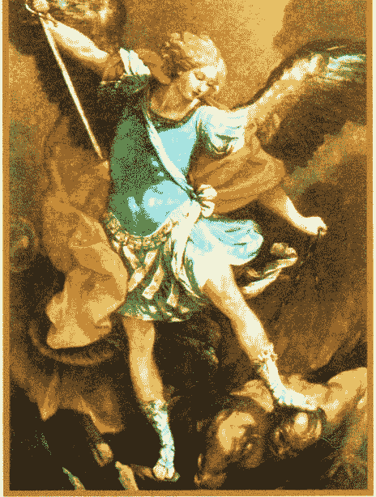

驅邪禮典（封面）

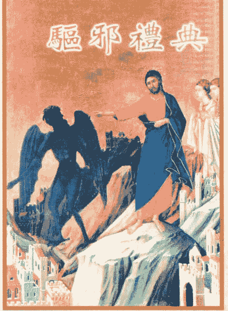

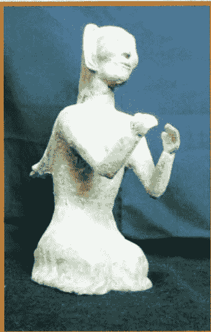

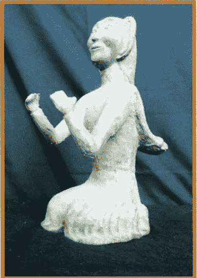

魔鬼（銅鑄）/ 安平天主教文物館

天使神秘学院 http://strc.taobao.com

十字架真木 / 安平天主教文物館

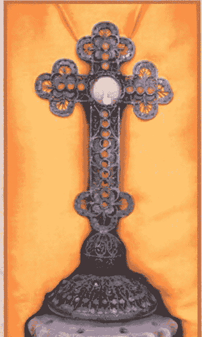

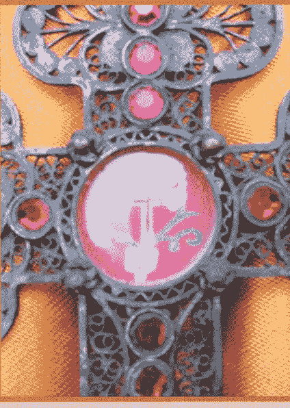

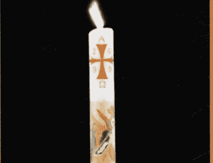

復活聖燭 / 台南二空聖母升天天主堂

## 附魔與驅魔

DEMONIC POSSESSION AND EXORCISM

聖經手抄本（木製書衣）/ 聖伯多祿前後書約 公元250年 仿製本 / 安平天主教文物館

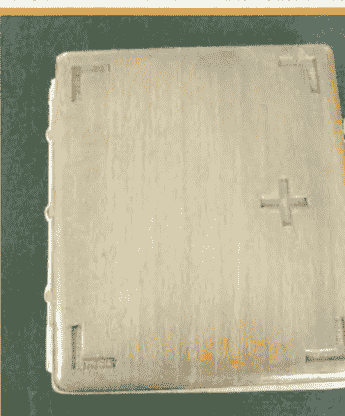

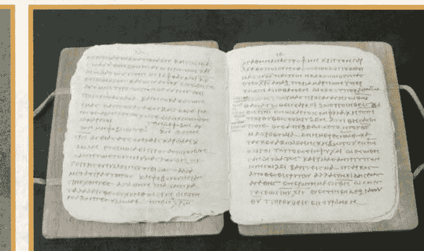

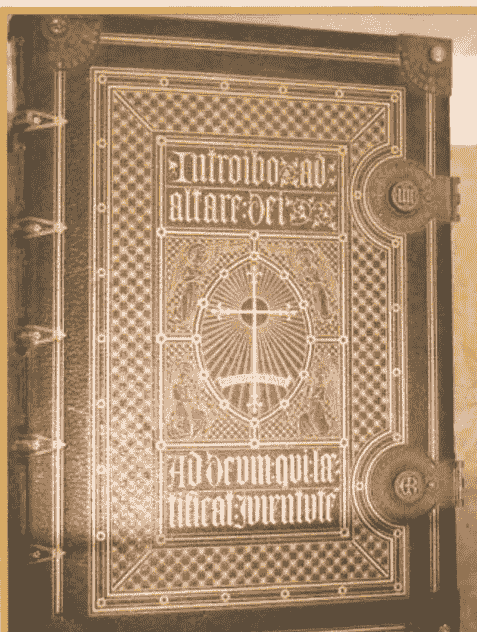

彌撒經書（拉丁文）/ 安平天主教文物館

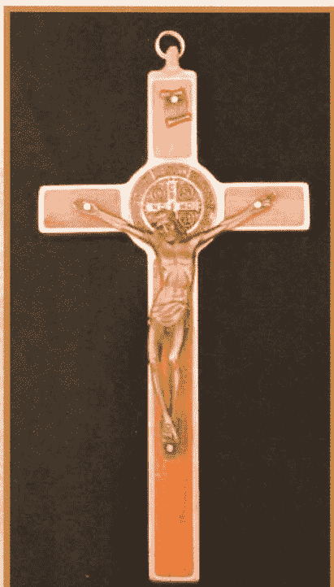

聖本篤驅魔十字架 / 安平天主教文物館

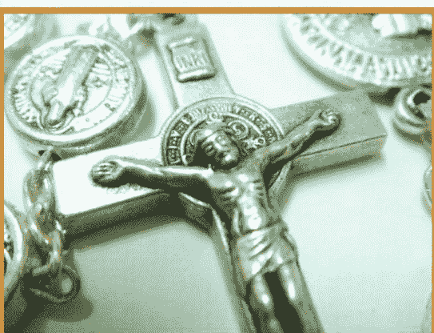

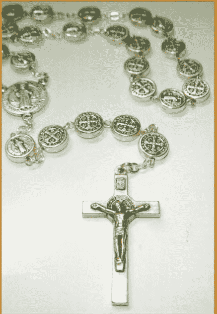

驅魔玫瑰念珠

## 附魔與驅魔

DEMONIC POSSESSION AND EXORCISM

聖多瑪斯聖髑 / 1225-1274年
安平天主教文物館

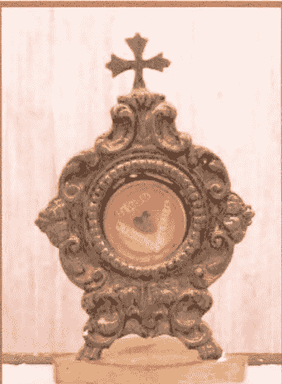

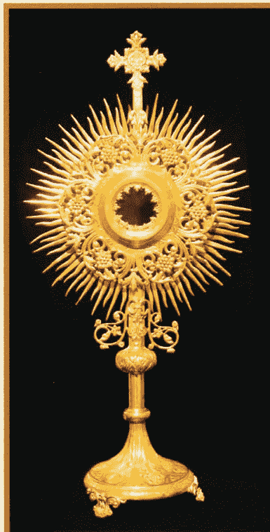

聖體光 / 安平天主教文物館

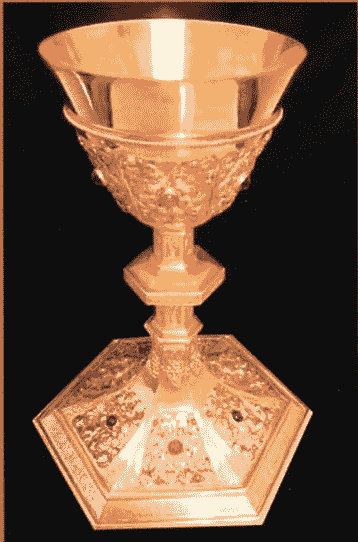

碧岳聖爵 / 教宗保禄六世於1964年台南教區碧岳神哲學院成立之初，請羅光總主教轉贈，作為該院成立之賀禮
安平天主教文物館

告解亭

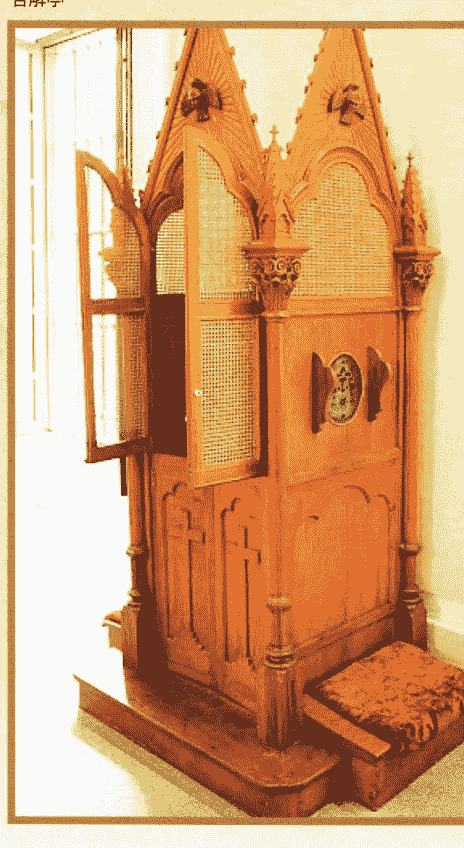

聖體龕 / 安平天主教文物館

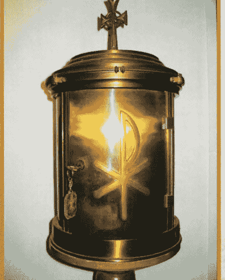

洗禮池 / 菁寮聖十字架教堂

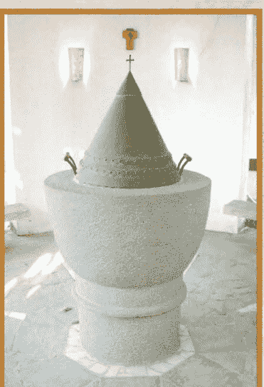

## 附魔與驅魔

DEMONIC POSSESSION AND EXORCISM

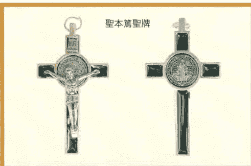

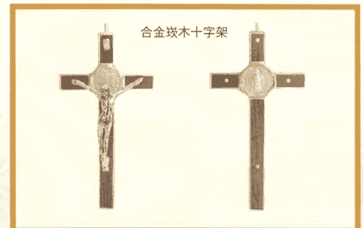

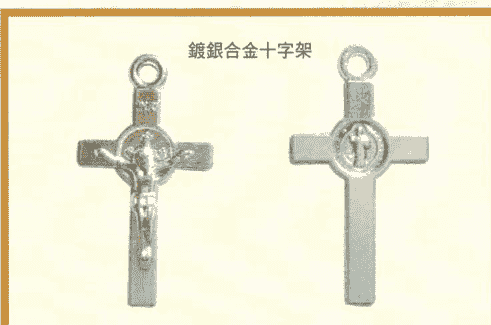

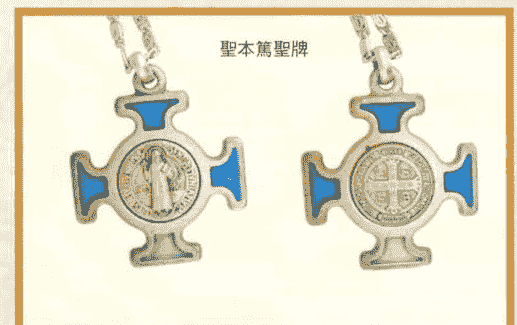

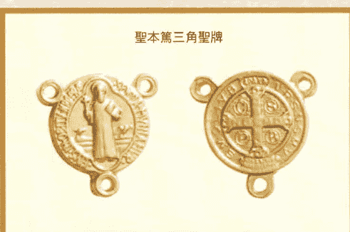

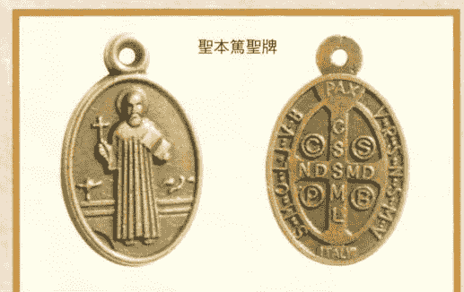

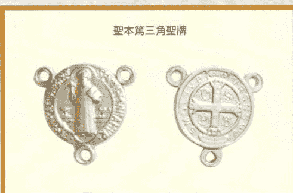

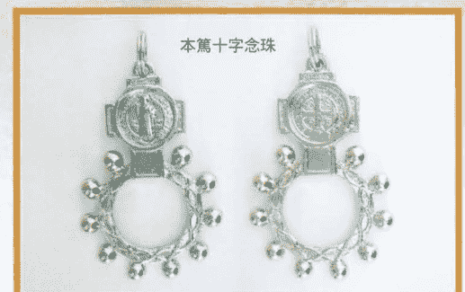

## 附魔與驅魔

*Demonic Possession And Exorcism*

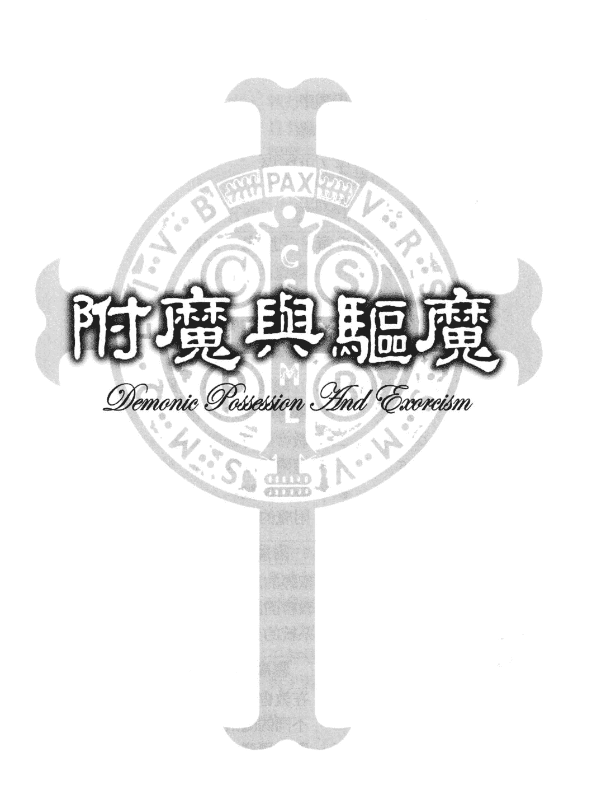

## 序

張春申

在基督宗教的神學系統中，本書處理的附魔與驅魔，一般而論並不佔據重要的位置，究竟我們相信的是天主聖三與創造及救恩計畫。至於惡神魔鬼屬於與天主聖三敵對的陣營，於是系統神學中有了魔鬼論。但是一般神學院的課程中，事實上魔鬼論並未受到應有的注意，主要原因實是由於神學課程極為豐富，無法適當地顧及它。但依我看來，至少為本地神學院這是個漏洞，因為魔鬼問題不容忽視。這可見於我們正在介紹的《附魔與驅魔》本書。

魔鬼論觸及天主教神學的信理與倫理、福傳與牧靈、靈修與輔導，為此不容易寫一本比較完整的書；但賴効忠神父卻能以適當篇幅，在本書中做到了。書名《附魔與驅魔》，定能引人注意，但是其內容實在更為廣泛，可說是既多面又完整，行文恰如其分又恰到好處。作者參讀了豐富的中西文有關資料，加上切身的經驗與觀察，以及神學工作者的謹慎，使《附魔與驅魔》成為一本完美的魔鬼論，但一般讀者亦能從中得益。

過去我有幸多次聽賴神父說魔鬼，現在更有幸為他的書寫序。

> 二〇二一年七月二十九日
> 張春申
> 輔大神學院

## 序

岳雲峰

《附魔與驅魔》一書在華文宗教書籍中雖不敢說是絕無僅有，但可說是鳳羽麟毛，不只彌足尊貴。作者引經據典宣示了我們生活的環境對此議題有著急迫的需要和重要性，無論是為福傳或是為牧靈，本書都可說是必備的工具書。即使有點誇張，我還是要說：「有心人應人手一冊」，絕不是替作者行銷，不信的話就搶先讀後再說。

人老了會鑽牛角尖。我常想：天主為什麼沒有給背叛祂的天使救贖，而只給了人類？因為天使是沒有物質體的神類，且具有天主所賦與的貫知（灌輸知識，Scientia infusa）；而人都是肉體與靈魂的組合體，他的知識得之於學習，所以當魔鬼（即墮落了的天使）花言巧語騙了人，天主就可憐了他而許給人救贖。在此沒有時間來討論「如果」的問題。很明顯的例子：看見耶穌復活後顯現的第一人，就是一個曾附過七個魔鬼的婦女；另外，耶穌派遣門徒出外宣講福音，給予他們一個很重要的權力，就是驅魔。

附魔者有罪嗎？耶穌卻說這是顯示天主的愛（解說力量），這是值得身為基督的信徒去深思的課題，驅魔只有在十字架的救恩內獲得解答，如此基督徒才會成熟。

DEMONIC POSSESSION AND EXORCISM

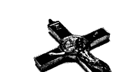

讳疾忌医不是对付魔鬼之道，疑神疑鬼会导致有病乱投医。奉劝大家来读劝忠神父的精心之作，为己为人。这是一本有关本课题的经典之作，是为序。

卅七载碧岳人
岳云峰

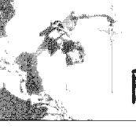

## 附魔與驅魔

DEMONIC POSSESSION AND EXORCISM

### 自序

近幾年來，無論是電視新聞、報章雜誌或網路媒體，都不斷報導著社會層出不窮的靈異新聞；而電視新聞節目中，也常充斥著靈異鬼怪的節目；甚者，報紙也曾以顯目標題指出：教宗曾為人驅魔卻失敗的傳聞*。一時之間，很多人都驚覺到，社會似乎被一股邪惡勢力所控制，牠的勢力影響著此社會的脈動：沿著台灣目前的政治、經濟、教育文化等各路徑，默默地擴展其魔化的影響力；並且隱身於社會結構、價值理論系統、意識形態，甚至傳統習俗及團體意識，或行為模式中。有人認為，在台灣的各生活層面中，政治是台灣魔化的最大版圖，因為它深深地影響並牽動著社會中每個人的生活情景。但若僅憑大眾媒體的傳播報導，是真是假，實難判定，以至於產生了社會的動盪與困惑。

在台灣，民間宗教的影響力是無遠弗屆的。根據統計，台灣約有四分之三的總人口數屬於廣義的民間宗教

> * 教宗本人固然有絕對的能力為人驅魔，但其為人「驅魔失敗」的傳聞，卻有待商榷。其原因是：（1）驅魔者等本身應事先對被附魔者做一段長時間的觀察與陪伴，並且其自身也得做好驅魔禮儀前的準備；（2）大驅魔禮是一項隆重而繁瑣的禮儀，頗為耗時費力；（3）教宗年事已高，且日理萬機，可能無暇、無力親自舉行驅魔禮儀。可能的情況是：有人將一位疑似附魔者帶到教宗跟前，請求教宗為他祈禱。如此的代禱，自不能視為正規的驅魔禮。驅魔失敗的傳聞，可能由是而生。

信仰*；而民間宗教信仰當中，降魔伏妖、驅魔趕鬼，是極其重要的宗教儀式活動，也是民間宗教上非常醒目的功能。所以在眾多影響之下，附魔的原因、現象，與驅魔的方法，也常為現代人津津樂道，並被普遍關心著。但在天主教的信仰中，又是如何面對與處理這些議題？大家都很好奇。

在天主教的教理中，闡述了耶穌基督來此世界最主要的動機之一，就是為了將人從魔鬼的勢力中拯救出來。因此，這也是教會的救恩使命，教會亦有責任為社會的困惑提出合理的解答，但這樣的解答需要經過驗證學術方法的嚴格篩選。所以，在眾說紛紜的情況下，一個精準且學術性的探討，確實是不可或缺。

本書的目的，即是嘗試以較嚴謹的態度為出發點，對目前社會所關心的，關於魔鬼的各類議題，提出較學術而系統的說明。

基本上，「附魔與驅魔」不是在心理學與醫學無法解析後，才訴諸於信仰的案件；而是真理與邪惡、愛與仇恨之間的戰鬥，更是天主愛護世人的「救恩」行動。所以，不應以好奇，或事不關己、無動於衷的漠然態度視之。

> *「台灣民間信仰不但是台灣社會絕大多數人口佔百分之八十五以上的傳統宗教，更是左右民間風俗習慣的文化現象，為此必須予以正視。」董芳苑著，《探討台灣民間信仰》，台北：常民文化，1996，頁50。

既然社會有如此多的附魔與驅魔案件被提出，教會有鑑於福傳理由與牧靈的原則，有責任為居於第一線接觸案件的堂區神父們，及居於第一線的牧靈工作者，提出說明與處理的原則。

教會本身對於附魔與驅魔的案件，一向是抱著謹慎低調處理的態度。此番面對社會大眾的極大關切，自是不能相應不理。但是，這類事件在台灣教會的官方檔案中確實是不多見，面對這突如其來的社會需求，時而顯得手忙腳亂。雖然有點捉襟見肘，但總是一個自我釐清、矯正視聽的好機會。

因此，本書期望能為教會主管當局提供一些參考，並透過神職人員的培育課程，更深入地了解此問題，而能即時因應；也能為將來處理類似案件時，提供一套可依循的參考。

此外，本書是筆者由「附魔與驅魔 —— 以安平舊聚落為例，試談天主教與民間宗教的對話」學術研究報告中節錄出來。此節錄本全文雖只論及天主教的訓導與觀點，但也希望在與民間宗教交談上，建立一個可信靠的依據。天主教與民間宗教，在台灣分別有著不同的影響力，也有著不同的形象呈現。因此，若能在此共同關注的議題上，促成兩宗教的對話，那麼，不論是對於問題的釐清，或是匡正社會的視聽，都將有莫大助益與正面意義。而隨著交談所帶來的益處是：能認知、了解彼此的相同與相異處，期能更進一步為社會提出其他面向的服務。

在內容的安排上，本書先分別就魔鬼的來源、能力、分類等不同方向，探討其本質；繼而從人的身心靈面向，分析可能附魔的原因與管道，以及魔可能附著的人、地、事、物。接著討論在附魔後所可能發生的一些特殊現象，並針對內在與外在不同的症兆，探討如何辨別精神官能疾病與附魔現象的異同。之後，簡介在教會內，依附魔情況的輕重，所可能有的一些神恩性、禮儀性的驅趕之道。最後，在魔離後，應注意的一些復健事工。書中也提供實際個案的訪談記錄。文後，借用幾則附錄，以為專題專論，作為註腳。

至目前為止，台灣天主教的神學界，對附魔與驅魔的研究較少，仅有的一些著作，也多以個案描述為主，缺乏系統學理的剖析。因此，本書在文獻參考時，時感力有不逮，僅能秉持著輪廓雕塑的角度，概括性地予以研究；至於精細而深入的探討，則有待日後邀集更多有志之士，共同研究。拋磚引玉之盼，不言而喻。文中也定有諸多不成熟或立論不確之處，誠願各方先進不吝指教。

本書之所以能順利完成，首先應感謝輔仁大學神學院所提供的研究經費，方能於無後顧之憂下，全力赴。同時，研究小組的李若望神父在文獻及個案上幫助甚多；研究助理陳怡萱小姐，以其專業，協助完成問卷調查、訪談記錄、文書處理等繁雜的工作。感謝恩師前碧岳神學院教授岳雲峰神父，及輔仁大學神學院教授張春申神父的慨然贈序。也感謝於排版校對期間，胡皇仔小姐所給予的協助。萬分感謝台南聞道出版社，在林吉男主教的監督與社長費格德神父的概允、郭盈姍小姐的設計排版下，付梓成書。最令我們感動的是，在一年半的研究期間，不論是在問卷調查、訪談、講座、個案分享等事務上，許多教內外的朋友所給予的全力配合與幫助，無形中也組成了一支打擊魔鬼的堅強團隊。

在整個寫作研究期間，我們真的感覺到魔鬼的從中作梗。相信若因著本書的順利出版，使更多人能認清魔鬼醜陋陰狠的真面目後小心防範，如此則不僅是天主救恩工程的大力彰顯，對魔鬼而言，更是一絕對的挫敗。

二〇〇五年八月十日
聖樂倫瞻禮

### 再版序

賴効忠

本書原為一篇研究報告的普及版，主要動機除為學術界參考之用外，也兼為一般對此問題感興趣者，或正面臨類似困擾者的解惑之用。去年初銷售盡馨後，許多向隅者希望再版；再加上多數讀者都誤以為作者本人是「當然的」驅魔者，紛紛以不同的方式求教甚或要求「作法」降妖。後者誠為本人能力之外，但再版之事卻常放心上。由於任職主教座堂，靈務之事繁雜，實無暇他顧，只能針對前版的不足或不明之處加以修正。

再版中，除了勘正上版的文字誤植外，也將一份個案的訪談記錄刪除，雖然它是如此忠實地記錄了一段難得的案情，但因過於冗長，而且難以做學術或個案的追蹤探討，不得不割愛。在銷售本書期間，有感於讀者需要更能實際感受、認識一些驅魔過程及避邪實物，因此本版中增添了驅魔儀式的全部過程與經文，以及有關「聖本篤驅魔十字架」的介紹。另外，學術性亦有所加強，尤其是2008年聖多瑪斯的中文版《神學大全》，以及2009年教宗本篤十六世的中文版《納匝肋人耶穌》出版後，更增加了未來在此領域中研究的依據與發展性，本版中也適時地加入了這方面的資訊。

為了更凸顯本書的特色與易讀性，在文詞潤飾、封面設計上，亦稍作修訂。唯望讀者諸君能更輕易地進入本書的主題，並從中獲得助益。

# 附魔與驅魔

# DEMONIC POSSESSION AND EXORCISM

在封面與排版上都做了較大幅度的改變。首先必須感謝自上版就一直協助文校工作至今的胡皇仔小姐，自羅馬修習完博士課程的她，返國後就謙然地接受此再版文校的服務，以致有如是扎實的內容呈現。也特別感謝聞道出版社的范儒捷先生負責新版的封面、圖片攝影、排版的工作，使得本書有了嶄新的面貌。

期盼本書的再版能提供更成熟與廣泛的助益；也期待天主的大能日益消弭魔鬼對人的戕害。

賴勁忠
2010.1.19

# 第一章 「魔鬼」的概念

# 附魔與驅魔

DEMONIC POSSESSION AND EXORCISM

如果「鬼」所代表的，是宇宙間一股非善，或邪惡的勢力，那麼幾乎所有文化、宗教中，都存在著對「鬼」的觀念，雖然彼此間可能有許多不同的說法或詮釋，但基本上對鬼的本質描述，卻是大同小異。

## 一、對鬼的不同看法

神與鬼，似乎永遠是兩股水火不容的對立勢力。什麼樣的「神」觀，就會發展出什麼樣的「鬼」觀。而對「人」的觀念，似乎也是影響神鬼之間較勁的著力點。

### 1. 「鬼」的說文解字

#### Ⅰ. 說文解字：鬼、魔

中國文字中，有許多都是屬於象形文，而「鬼」本身即是個象形字。

在銘文中，「鬼」字的寫法，實際上是㸚，下面丿丅代表兩隻腳（人的身體）。上面⊕代表面具，所以是一個「戴著面具的人」。

什麼人會戴面具？先人、往生的人。在中國人觀念裡，人的死亡並不代表生命的結束。從三千年前，商、周人的觀念即如此。他是另外生活的轉型，可是不知他（先人）如何生活，長相是否跟生前一樣，因為軀體已經腐化了。但因他還活著，卻不知長相，就為他戴上面具——因為這是個不可知的、沒有軀體的活人²。

「鬼」若代表祖先的生存狀態的話，則與善惡甚少關連。從字面上，看不出鬼是好人或壞人。說文解字中對「鬼」的說法是：人所歸，為鬼。古者謂死人為「歸人」。中國人將現世生活當作是過客，有著永恆超越的觀念。

《左傳》也提到：「鬼有所歸，乃不為厲。」現在民間信仰風俗習慣中，祭祀祖先就是讓先人有所歸。如果人過往後，沒人為其焚香、紀念立神位的話，就會變成厲鬼到處遊走，以尋找可安身的地方。由此可見現在民間信仰含有很深的中國文化傳統在其中。

《禮運篇》中：「魂氣歸於天；形魄歸於地。」靈性歸於天，形體歸於地。陽公陰私。

至於「魔」這字：上方的「麻」是統治之意。意思是：魔是統治鬼的，在鬼之上。

#### Ⅱ. 宋明理學

「鬼」的字形若是指戴著面具的未知者，則意指過往的先人是不可知的一股精神能力。宋明之前，中國人講的鬼是形或質，但功能性未描寫。沒有講人是如何變成鬼的。宋明的幾位學者，其觀念影響後世甚深。

². 西方亦有將鬼稱之為「沒有軀體的人類」之說。

# 附魔與驅魔

# DEMONIC POSSESSION AND EXORCISM

張載：強調太極與氣，著有《太極圖說》。他認為鬼與神只是氣之不同。在他之前，沒有人把鬼神指為氣的自然活動³。民間信仰中，人、鬼、神是相通的，關公、厲鬼等都是人變的。中國文化中的鬼神變成擬人化的存在體，與天主教所信仰的至高無上的神是不同的。

朱熹：以理學角度來說，神＝伸，兩者相通。若太極是宇宙萬物之所以存在的基礎，在太初就已永恆存在的話，神就是其能力的「延伸」。所以神可內在於每個存在裡。理學也強調，人內在也有相似的神性。陽屬神，陰屬鬼，所以沒有把鬼當具體的存在，而是氣的變化：早上是神，晚上是鬼；出生是神，死後是鬼；日是神，月是鬼；草木剛生時是神，凋殘衰弱是鬼；人少壯時是神，衰老時是鬼；呼是神，吸是鬼；這是他把鬼神觀放在實際生活中的觀念⁴。

宋明理學中的鬼神觀，較淡化鬼的邪惡，而強調與人有關連的宇宙性形上變化。

### 2. 一神論的鬼觀

一神論（Monotheism）主張，天地之間有一位獨一無二的至上神存在，祂是宇宙的最後根源：天地萬物，無論有形無形，物質界及精神界的存有，一切都是祂由無中所創造的。祂雖自始就超越世界而自存，卻也內在於世界，生生不息地保護、照顧著世界。且能藉著其自由的行動，對世界做特殊的干預（奇蹟）。神⁵是宇宙間真、善、美、聖的根源與極致，基本上是不能與邪惡並存的。但是，宇宙間的那股消極、邪惡勢力的影響，卻是人類共同的經驗。因此，邪惡的來源，就成為信奉一種宗教的各民族文化所必須面對及解決的問題。

一神論者相信神本質是「善」，所以不能創造「惡」，而「惡」的存在又是不爭的事實。因此，一種宗教一般皆相信，惡是來自於受造物本身本質性的不圓滿，而「魔鬼」就成了「邪惡」的代表。神雖非直接創造了邪惡的魔鬼，但受造物的有限性，卻讓魔鬼日益坐大，終而成為與神對抗的一股強大勢力。不過，再頑強的魔鬼，終非至上、亦非全能之神的對手。

而身為受造物中「萬物之靈」的人類，卻無法置身於神鬼的角力場外。本然地，人類存在的目的，就是要去惡向善；但人的理智、意志與情感，能夠將神鬼任何一方作為選擇的對象，人生命的終極走向，也就自然地成為神鬼之間拉扯的對象。

### 3. 二元論的鬼觀

宗教的二元論（Dualism）主張，宇宙的起源是來自兩股相對立的成因，即善、惡二元，分別主宰著世界的運行。主宰善者為善神，主宰惡者為惡神（鬼），分別掌管著善惡二不同的世界，二者之間平等而勢均力敵，就在相互消長之間，孕育了世界萬物。⁶ 人類身處其間，亦成為彼等爭取的對象，也可能成為彼此報復的對象。

二元論也主張善惡二元亦內在於人的本性之中：當善性增強時，人會藉著善神的力量及生活中的修為，削弱邪惡的影響力，而進入到善神所掌管的幸福世界；但當惡性強於善性，生活趨於放縱邪惡時，人則受制於惡神的勢力而日趨於惡，終必進到惡神所掌管的罪惡痛苦世界中。人的存在，成為兩者之間選擇的命題。

### 4. 多神論的鬼觀

多神論（Polytheism）多出現在一些古老較進步的文化中，例如：中國、印度、近東、希臘、羅馬等。在這古代高級文化的背景下，人們感覺到自己的生命往往繫於許多無形而神秘的力量，當這些力量被視為個別而非物質（靈性）的存有物時，神明或鬼魂的觀念於焉產生。這些神明或鬼魂都屬於神靈界的存有，但卻與人類的生活息息相關。這些神體或來自自然界的事物，或來自過往的先人。⁷

基本上，這些生活在靈界的神鬼特性都是不死不滅的，卻又非絕對的永恆；與人類的關係，不似一神論所主張的造物主與受造物之間的主從關係，而僅在於能力、存在性及恆久性的差異。這些鬼神仍然有著各自的來源背景與歷史，且是有位格的。

靈界的神鬼秩序，幾乎是人類社會秩序的翻版，隨著不同屬性及背景，在靈界中也會有著不同的能力、職責與地位。這也形成了神鬼人之間，交替變化，錯綜複雜的關係。

### 5. 無神論的鬼觀

無神論（Atheism）的主張，基本上是相反人類普遍的理性經驗，意思是持無神論者，否定了神在宇宙間存在的真實性，也連帶否定了神在其生活中可能扮演著任何角色的必然性。一般說來，產生無神論的原因錯綜複雜，除了宗教上的因素外，尚包含著哲學、神學、心理、政治及生活境遇等原因。⁸ 不過，絕對反神或無神的持論者並不多見，大多是對神持著「有無皆可」的漠視態度。

對絕對無神論者而言，不只是否認神的存在，同時也否認精神界的存在，自然也就否認了「鬼」存在的可能性；同樣地，忽視神存在的人，也平行地忽視鬼的存在。所有世間事，在他們的處理態度中，都盡量嘗試予以理性科學的解析，一切不合乎人的理性和科學所能解析的事物，就被推至「非理性的無知」中。若真有超理性自然的情事發生時，則抱持「不可知論」，或「不語」的冷漠態度。

³. 陳榮捷編著，《中國哲學文獻選編》下冊，台北：巨流，1992年，頁624。
⁴. 參閱同上，頁758。
⁵. 參閱輔仁神學著作編譯會，《神學辭典》143，台北，光啟：1996。
⁶. 參閱《神學辭典》184。
⁷. 參閱《神學辭典》514。
⁸. 參閱《神學辭典》514。

## 二、有關天使

在舊約中，對於魔鬼的形象敘述是不多見的。一方面是因為這不是舊約啟示的重點；另一方面是因為當時的猶太人身處異教環境之下，避談此類問題，怕引起信仰不堅的人民陷入多神的誘惑中。但在新約裡，魔鬼卻成了耶穌基督主要打擊的對象。環視耶穌基督的公開生活，處處都是與魔鬼對抗的敘述。不過要了解魔鬼的真正本質，似乎應先從對「天使」的認知著手。

+ 在《天主教教理》中，對天使做了如下的描述：

328: 天使的存在是信仰的真理，他們是沒有肉身的精神體。

329: 聖奧斯定在論及天使時說：「天使一詞是指職務，而非本性。如果問及這本性的名稱，則回答說是『天神』（Spirit）；如果問及職務，則回答說是『天使』（Angel）。」⁹

330: 天使由於是純粹精神體的受造物，具有理智和意志（情感？¹⁰）：是有位格¹¹和不死不滅的¹²受造物。他們遠比一切有形的受造物完美。

331: 耶穌基督是天使世界的中心……他們是藉著祂、並為了祂而受造的。

332: 天使在人類的救恩史中，執行過諸多功能，如：關閉了樂園之門¹³，保護羅特¹⁴，拯救哈加爾及她的孩子¹⁵，阻止亞巴郎下手獻子¹⁶等，以及加俾額爾天使預告了若翰洗者及耶穌的誕生¹⁷。

333: 耶穌基督從誕生至復活升天，一生都生活在天使的朝拜和服侍中。他們讚頌著耶穌的誕生，保護著耶穌的童年，在曠野中服侍祂，在山園祈禱中安慰祂，並向人類宣報了祂的復活與升天。

334: 在整個教會的生活（尤其是禮儀中）都享有天使們的奇妙和有力的援助。

336: 人的生命由開始至死亡，常由天使所保護和代禱。「每個信徒都有一位天使在他身旁作為保護者和牧者，為引導他達到永生。」18

## 三、「惡」的奧秘

天主教既然是信仰唯一至上神的一神宗教，自然主張惡不是來自天主的創造。但是，惡是從何而來？天主教視此為一個「深奧的問題」，任何倉促的答案都是不夠的。19

實際上，天主所創造的世界，是一個「在過程中」的世界，在時空中將逐漸邁向它最終的完美。因此，只要受造物尚未達至它的圓滿，就本質性地存在著「物質的善」與「物質的惡」。20 或者可說是在面對永恆絕對完美時的一種「善的缺乏」。21

天使及人類都同屬受造物，本質性地亦具有「物質的惡」，對天使而言，更好說是「善的缺乏」。然此二者不只是受造物，更是「理性」的受造物，在其存在中，具有理智、意志、情感等卓越因素。但是，這些因素在自由意志用之得當，則為善；用之不當，則惡出矣。而此即為「倫理的惡」的來源。天主可以是「物質惡」的原因，但絕非「倫理惡」的直接或間接的原因。22 不過，為了尊重受造物的自由，天主能夠容許惡的發生，不論是物質惡或倫理惡，甚至奇妙地從惡中引發出善來。物質惡與倫理惡，在個人及團體中的交叉影響下，形成了一個強大的「惡的氛圍」。

⁹. 參閱《天主教教理》329。
¹⁰. 情感是一切理性存有的必備條件，為何《天主教教理》在論述天使的特性時未提到此點，難道天使是一個不含感情的理性存有？如果此論為真，也就無怪乎在魔附案件中，常感嘆於魔鬼對受附者的殘暴無情。
¹¹. 參閱碧岳十二世，「人類」通諭。位格，是在詮釋魔鬼本質時，一個非常重要的基礎。
¹². 參閱路二十36：「他們不能再死，因為他們相似天使。」
¹³. 創三24。
¹⁴. 創十九。
¹⁵. 創廿一17。
¹⁶. 創廿二11。
¹⁷. 路一11、26。
¹⁸. 凱撒里亞的聖巴西略，《駁斥歐諾彌書》3，1：PG 29，656B。
¹⁹. 《天主教教理》309。
²⁰. 《天主教教理》310。
²¹. 參閱聖多瑪斯著，《駁異大全》3，17。
²². 《天主教教理》311。

# 第一章：「魔鬼」的概念

DEMONIC POSSESSION AND EXORCISM

## 四、魔鬼的本質

### 1. 名詞界定

+ 魔王（Devil，即撒旦，Satan），源自於希臘文的「diabolos」（「διαβολος」，是由動詞「διαβαλλω」而來。「δια」有到對面的意思，「βαλλω」則有攻擊、擾亂、妨礙的意思）。而撒旦一詞是來自希伯來文的「satan」，意思是仇敵之意。
+ 邪魔（demon），亦源自於希臘文的δαιμονιον，原意有超人的力量與神性之物的意思，但在猶太人與基督徒的用法上，則意味著邪魔之意。
+ 惡靈（malicious spirit），是指在世作惡的人，死後被罰下地獄，成為魔鬼及邪魔同路的亡靈。
+ 魔鬼（evil spirit），以上三者的泛稱或總稱，但通常是指前二者而言。

### 2. 魔鬼的名稱與名字

在聖經中，對魔鬼的稱呼是相當繁多而混淆的。單就新約而言，使用「satan」及「devil」，各有36次，總共72次；使用「demon」有63次。而用單數或複數意指惡靈者，共有76次。23 為了凸顯魔鬼的不同面貌與特性，新約裡共使用過超過20種不同的名稱，諸如下表。

| 序号 | 名称 | 序号 | 名称 |
| :--- | :--- | :--- | :--- |
| 1 | 邪神（格前十12） | 13 | 你們的仇敵（伯前五8） |
| 2 | 邪惡（羅七21） | 14 | 犯罪的天使（伯後二4） |
| 3 | 惡神（宗十六18） | 15 | 那惡者（若壹二13） |
| 4 | 惡魔（宗十九12） | 16 | 那些沒有保持自己尊位，而離棄自己居所的天使（猶6） |
| 5 | 撒彈的使者（格後十二7） | 17 | 深淵的使者（默九11） |
| 6 | 空中權能的領袖一惡神（弗二2） | 18 | 古蛇（默十二9） |
| 7 | 邪惡鬼神（弗六13） | 19 | 火紅的大龍（默十二13） |
| 8 | 率領者和掌權者（弗六12） | 20 | 不潔之神（默十六13） |
| 9 | 貝里雅耳（格後六15） | 21 | 邪惡之神（默十六14） |
| 10 | 欺詐的神（弟前四1） | 22 | 殺人兇手（若十44a） |
| 11 | 握有死亡權勢者（希二14） | 23 | 撒謊者的父親（若十44b） |
| 12 | 祂的仇人（希十13） | | |

除此之外，許多對時間、空間的描述，也具有代表魔鬼的象徵意涵，例如：黑夜、黑暗、曠野、海洋、深淵、地獄、永火、西方等。

至於魔鬼具體而個別專屬的名字，在所有的精神界中，由於牠們沒有物質的特性與限制，所以基本上，牠們並不需要名字來作為其在內部群體中的區分；至於聖經或其他著作中所提到的名字，皆是為因應人認知的需求，但多半是一種「特性」或「職務性」的稱號，例如：就天使而言，彌額爾（Michael），意思是「相似天主」²⁴；辣法耳（Raphael），意思是「天主醫治」²⁵；加俾額爾（Gabriel），意思是「天主的人」或「天主的力量」²⁶等，這些是善天使的名字。

+ 至於魔王及其所屬的邪魔的名字，新舊約中皆提到了一些，例如：
  - 撒殚（Satan）：魔鬼王，或魔鬼的總稱
  - 貝耳則步（Beelzebub，瑪十二24）
  - 路奇弗耳（Lucifer）：光明者
  - 阿斯摩太（Asmodeus）：色慾之神
  - 里外雅堂（Leviathan，約三8）：詛咒黑夜的權力（的海怪）²⁷
  - 阿巴冬（Abaddon，默九11）：毀滅者、陰府的使者²⁸
  - 阿匝則耳（Azazel，肋十六8-10）：惡神名²⁹
  - 軍旅（Legion，谷五9）：為數眾多³⁰
  - 貝里雅耳（Beliar，格後六15）：可憎惡的、流氓、廢物³¹

### 3. 魔鬼的來源

有關魔鬼的起源，按照聖經上的描述，基本上排除了二元論或多元論的說法，而主張魔鬼是由天主所創造的某些天使，因其自甘罪惡而變成，即所謂「墮落的天使」。在《天主教教理》中有這樣的說法：

> 在我們原祖抗命性抉擇的背後，有一個誘惑者的聲音反抗天主，他為了嫉妒而使原祖陷入死亡。聖經和教會聖傳視之為一個墮落的天使，號稱撒殚或魔鬼。教會教導我們，他起初是好天使，由天主所造。「事實上魔鬼和其他邪魔，確實是天主所造，原本是好的，但他們自己後來成了邪惡的。」（391）³²

在聖經中對於魔鬼起源的描述，採用的是象徵性語言的說法，雖非原創性事件的描述，但確實是一種信仰的積極肯定：

> 「因為魔鬼從起初就犯了罪」（若壹三8）

> 「以後，天上就發生了戰爭：彌額爾和他的天使一同與那龍交戰，那龍也和祂的使者一起應戰，但祂們敵不住，在天上遂再也沒有祂們的地方了。於是那大龍被摔了下來，祂就是那遠古的蛇，號稱魔鬼或撒彈的。那欺騙了全世界的，被摔到地上，祂的使者也同祂一起被摔了下來。」（默十二7-9）

> 「至於那些沒有保持自己尊位，而離棄自己居所的天使，天主也用永遠的鎖鍊，把他們拘留在幽暗中，以等候那偉大日子的審判。」（猶6）

耶穌在派遣門徒們出外宣講回來時，聽到他們對魔鬼所做的一切後，說道：「我看見撒彈如同閃電一般自天跌下。」（路十18）

在默示錄中所提到的「墮落的天使」，並非只是撒殚自己，而是包括了一大群追隨他的天使。

²³. 參閱Corrado Balducci, *Il Diavolo*, Oscar Mondadori, Casale Monferrato, 1994, pp.36-37.
²⁴. 參閱《聖經辭典》2513。參閱註83。
²⁵. 參閱同上，2291。
²⁶. 參閱同上，325。
²⁷. 參閱同上，766。
²⁸. 參閱同上，987。
²⁹. 「阿匝則耳」其意眾說紛紜，古時的猶太人說他是一位墮落居於曠野的天使；後人加以解釋說，辣法耳天使以鎖鏈將他囚禁曠野中，直至世界末日，再將之投入火窯。（參閱《聖經辭典》1073）。猶太人也因此視曠野為惡鬼聚集的地方。
³⁰. 按古羅馬的軍制，一個「軍旅」有六千名步兵，一百二十名騎兵，還有為數不少的勤務兵，是最大的軍隊編制。（參閱《聖經辭典》1375）
³¹. 同上，741。
³². 不過這樣的說法似乎並不為葉光明牧師（Derek Prince）所認同。可能的原因是來自對魔鬼不同分類的認定。參閱葉光明（Derek Prince），以琳編譯小組譯，《趕鬼與釋放》，臺北市：以琳，2004，頁91。

## 第一章：「魔鬼」的概念
DEMONIC POSSESSION AND EXORCISM

彈魔鬼王，更有一群其他的天使跟隨附和著。在十二章4節提到：「牠的尾巴將天上的星辰勾下了三分之一，投在地上。」意指有三分之一的天使成為魔鬼。³³

### 4. 魔鬼的罪

《天主教教理》在論及「墮落天使」的罪時，做了這樣的說法：

> 「聖經曾談及這些天使的罪惡。這種『墮落』在於這些受造的精神體，以自由的抉擇，徹底而無可挽回地拒絕天主及祂的神國。」（392）

所謂「拒絕天主及祂的神國」，到底是指什麼樣的罪行？能有以下三種臆測³⁴：

第一種：驕傲自大。這是至今仍廣泛流行的說法。魔鬼因為心懷驕傲，自認有能力與天主匹敵，甚至意圖居於天主之上，誠如聖多瑪斯在《神學大全》中所說的：就某種意義而言，這是一個以自我為中心的自滿之罪，自視為天主之罪。³⁵

從初期教會的奧利振開始，到後來教父們，都普遍接受這個說法，且輔以許多聖經依據，證明「驕傲是諸罪之始」。³⁶

- 第二種：妒嫉人類。這是一個較寬廣的說法，亦為初期的某些教父所主張，例如：聖猶斯定、戴爾都良、聖西彼廉、聖依肋內等。按他們的意見，認為天使受造的目的就是為代表天主管理大地，但是當人受造之時，不僅以優於天使的方法受造——按照天主的肖像而造，且被賦予治理大地之責。天主這樣的舉動，自然會挑戰著天使們的自由意志，而引起某些天使的嫉妒，因而跌倒成為「墮落的天使」。

- 第三種：拒絕耶穌基督。這種說法始自十六世紀。³⁷ 拒絕耶穌基督的原因，是因為祂貴為天主子，卻甘願降生成人，取了一個較低等的物質性身體。祂們在得知這項永恆性的降生奧蹟後，拒絕再朝拜祂。

- 第四種：按照聖多瑪斯的見解³⁸，也依據若望壹書第三章8節的說法，那群背離天主的天使，在受造後「立刻」就犯了罪，且立刻就受到了懲罰，這種懲罰也是永恆性的。因為純精神體是具有超越時間與空間的特性，即不受時間與空間因素影響。

³⁶ 參閱德十15；弟前三6。
³⁷ 特別是道明會的Ambrosio Catarino以及耶穌會的Franceso Suarez。
³⁸ 關於魔鬼犯罪：《神學大全》第二冊，224～227頁。關於魔鬼受罰：《神學大全》第二冊，243～245頁。

### 5. 魔鬼所受的懲罰

在瑪竇福音的公審判敘述中，描寫了魔鬼所受的處罰：「可咒罵的，離開我，到那給魔鬼和他的使者預備的永火裡去。」（廿五41）

在馬爾谷福音中，甚至形容了地獄內的情況：「那裡的蟲子不死，火也不滅。因為所有的人都要用火醃起來。」（九48-49）

在默示錄中，也有相同的描述：「迷惑他們的魔鬼，也被投入那烈火與硫磺的坑中，就是那獸和那位假先知所在的地方；他們必要日夜受苦，至於無窮之世。」（二十10）

魔鬼犯罪後的懲罰是嚴厲而永遠的，沒有再扳回的可能，永遠不可能被寬赦，按照《天主教教理》所做的解釋，那是因為：「墮落天使的罪之所以不能獲得寬恕，是由於他們在抉擇上具有無可挽回的特性，而並非天主無限仁慈的一項缺陷。正如人死後不能再悔改，天使們在墮落後也不可能悔改。」（393）³⁹

³⁹ 對於魔鬼的罪是否能夠被寬赦的問題，奧利振（Origen, 185-251）提出不同的看法。他認為魔鬼因罪所受的處罰不會是永恆的，因為：天主創造世界的終極目的，是希望整個宇宙「止於至善」，因此天主的救贖也應及於魔鬼，否則天主的救贖工程將具有瑕疵，那就有違天主存在的本質（至善的本質）。也是因為這樣的推理，奧利振也主張不應存在著永恆的地獄，因為終有一日，所有在地獄受罰的人或魔鬼，都必得救。參閱 *De Principiis*, I, 6, 3, PG11, 408-9. J. N. D. Kelly, *Early Christian Doctrines*, pp.180-183.

天主對罪行的仁慈寬赦，是以罪犯的悔悟與悔改為前提。一般認為，魔鬼在犯罪以後，仍固執於惡，對牠錯誤的決定仍堅持到底，這種固執與堅持，使牠「沒有能力」悔改。所以，不是天主不夠仁慈、不接受，而是魔鬼拒絕了天主愛的接納。⁴⁰

因此，這裡所謂的「永恆」或「永遠」，並非指物質性的、有限度的極長時間，而是一種存在性的恆常狀態。

魔鬼在地獄所受的苦，按士林神學的說法，可分為「失苦」（poena damni）與「覺苦」（poena sensus）。⁴¹

- （1）失苦是一種消極性的懲罰，是一種失落的損失之苦，這是地獄之罰的要素。魔鬼原本所具有的天使所擁有的一切，包括與天主良好和諧的愛的關係，其自身本有的完美性，以及在他職務中與其他受造物優質的關係所產生的成果與成就感，在犯罪後皆完全喪失，牠因此而成為「愛的絕緣體」，所有一切愛的特質皆喪失殆盡，例如：仁愛、喜樂、平安、忍耐、良善、溫和、忠信、柔和、節制等⁴²；取而代之的如：仇恨、競爭、嫉妒、忿怒、爭吵、不睦、分黨、妒恨、凶殘等。⁴³

- （2）覺苦是地獄的一種積極性的懲罰，是由外而來的感覺上的痛苦。由於牠與創造主與受造物關係的破裂，基本上是違反牠原本存在的意義與價值，因此牠也承受著自我分裂的撕裂之苦，以及自我封閉、不自由的監禁之苦。也由於牠對天主與人類的嫉妒與仇恨，而受著怒火中燒、心急如焚，有如萬蟲嚙心的煎熬之苦。

魔鬼在地獄所受之苦，在爾後要討論的魔附事件中，都會或多或少、不同程度地反映在受附者身上。若惡人死後墮入地獄，和魔鬼所受的苦相同。

⁴⁰ 這也是為什麼在驅魔行動中，「悔改」成為被附者（案主）首要的「自清行動」。
⁴¹ 奧脫著，王維賢譯，《天主教信理神學》下冊，臺北：光啟，1996，頁750-751。
⁴² 參閱迦五22-23。
⁴³ 參閱迦五20-21。

### 6. 魔鬼的數量

天使是具有位格的受造物，凡具位格者，都有其個別獨立性；又因其是純精神體，故不受時間與空間的限制。因此，魔鬼到底有多少，這是無法以數量來計算的。歷代有許多教父與神學家也肯定說，天使的數量是無法以人的觀念予以量數的。不過，聖經中為了讓人有比較清楚的了解，卻確實用了數字的觀念來描述，例如：「我又看見，且聽見在寶座、活物和長老的四周，有許多天使的聲音，他們的數目千千萬萬。（默五11）」

不少教父和神學家在解讀默示錄中所載，有關「牠的尾巴將天上的星辰勾下了三分之一，投在地上」時，都指出天上的星辰數也代表著天上天使的數量，那些被大龍勾下的三分之一的星辰，指受其慫恿、誘惑成了同路人，也就變成了魔鬼。天上的星辰無以勝數，魔鬼的數量也就多如繁星了。不過，無論如何，善良天使的數量，遠超過墮落天使的數目。

### 7. 魔鬼的分類與階級

魔鬼是有「位格」的，也有著一切「位格」的特性。所謂「位格」，乃是具有理性的個體，整個存在及其活動與關係的最後主體。大部份的現代學著皆認為應包含著自立性、整體性、獨一個別性、行爲主體性、位際關係性等五個面向。⁴⁴

新約聖經中有好幾處的敘述，令人想到魔界中存在著一個階級制度。瑪竇福音在記載耶穌治好一位附魔的啞巴時，做過這樣的描述：「但法利塞人們卻說：『他是仗賴魔王驅魔。』」（九34）

在另一個治好又瞎又啞的附魔者情景中，做了更詳盡的描述：

> > 「法利塞人聽了，說：『這人驅魔，無非是仗賴魔王貝耳則步。』耶穌知道了他們的意念，就對他們說：『凡一國自相紛爭，必成廢墟；凡一城或一家自相紛爭，必不得存立。如果撒殫驅逐撒殫，是自相紛爭，那麼他的國如何能存立呢？』」（瑪十二24-26；參閱路十一15-18）

除此之外，尚有：

> 「然後祂又對那些在祂左邊的說：可咒罵的，離開我，到那給魔鬼和他的使者預備的永火去吧！」（瑪廿四41）

> 「以後，天上就發生了戰爭：彌額爾和他的天使一同與那龍交戰，那龍也和牠的使者一起應戰。」（默十二7）

> 「要穿上天主的全副武裝，為能抵抗魔鬼的陰謀，因為我們戰鬥不是對抗血和肉，而是對抗率領者，對抗掌權者，對抗這黑暗世界的霸主，對抗天界邪惡的鬼神。」（弗六11-12）

由上列的引述當中，對魔界的分類與階級，做出如下幾點推論：

第一：魔王。魔界中，是由一名叫「貝耳則步」的魔王所領導著，牠是諸魔魁首，就是撒彈⁴⁵。這是根據默示錄第十二章7至9節所描述的場景所做的推論。在此描述中，總領天使彌額爾率領眾善天使，大戰由撒彈（巨龍）所領導的眾惡天使。「貝耳則步」原是舊約時代迦南地區厄刻隆城培肋舍特人的神祇，意思是「蒼蠅之王」。⁴⁶ 牠是一切邪惡的發動者，代表著整個邪惡的勢力，是邪惡的代言人，在魔界中是能力最強大者。更有學者認為，牠就是邪惡本質的「位格化」。⁴⁷

第二：邪魔。由魔王所領導的其他犯罪墮落的天使，被稱為邪惡的追隨者。他們的能力雖遜於魔王，但仍遠超過人的能力。

一般皆認為，在魔界中有著類似「分工合作」，層層負責，擬人化社群結構的情形。意思是，每一種罪惡或罪行，都相對地有一群邪魔專門負責推展其所屬的業務。隨著罪惡或罪行的輕重，所屬邪魔的能力也有強弱之分。一般而言，越重大的罪惡，其邪魔的能力越強大，其在魔界中所屬的層級也相對地越高。因此，邪魔之間的數量、分類、能力的大小，基本上是與罪惡的分類、輕重成對應的。例如，相對於七罪宗，即有驕傲之魔、嫉妒之魔、迷色之魔等⁴⁸。

在行動時，牠們會採取單獨或團體不同的模式；有時候是隱性的逐漸蠶食，有時候是以不同程度、直接或間接地干擾侵犯著人的生活，或阻礙天主救恩計畫的實現。

⁴⁴ 參閱谷寒松主編，「位格」《神學辭典》274。
⁴⁵ 有些學者認為，「撒彈」並非隸屬於某魔鬼的專有名詞，而是指墮落天使中的領導群，同時也是邪惡的支配者，更是魔鬼一族的代稱。但另有學者認為，「撒彈」是一專屬名字，在身為善良天使時，牠名叫「路西弗耳」；因罪被逐出天界時，始被稱為「撒彈」。參閱真野隆也著，何宜觀譯，《天使事典》，頁108。
⁴⁶ 韓承良，「巴耳則步」《聖經辭典》，138。
⁴⁷ 參閱Corrado Balducci, *Il Diavolo*, 'Il diavolo è la personificazione del male.', pp. 111f.
⁴⁸ 參考聖多瑪斯著，周克勤等譯，《神學大全》第三冊，頁416「正解」及頁417「質疑2、3」。Corrado Balducci, *Il Diavolo*, pp. 34-35.

第三：惡靈。是指在世作惡，死後被罰下地獄的人的靈魂。有關「地獄」的定義以及下地獄者的境遇，《天主教教理》做了以下的定斷：

> >「若人在大罪中過世時沒有悔意，沒有接受天主的愛，這表示他藉著自由的抉擇永遠與天主分離。換言之，就是將自己排除與天主和真福的共融之外，這種決定性的、自我排除的境況就稱為『地獄』。」（1033）

這種超越時空廣義性的地獄定義，也可能周延至人世間的生活中，意即人類惡質的生活態度及生命境界，也可能造就出一個「人間地獄」。因此，也為魔鬼提供了一個更寬廣的活動空間及可能。

因作惡死後下地獄的人，他們雖不是天使，卻因作惡，死後成了魔鬼的同路人，成了魔鬼作惡的工具，協助魔鬼危害世人。他們在永罰中，毫無自由地成為魔鬼凌虐的對象與為非作歹的工具。當然，他們也會因著他們在世時所犯罪惡的種類與程度，而被納入到魔界中的組織架構裡；他們也會在之後所要討論的魔附事件中，扮演著不同、不等的角色。

以上的分類，只是就聖經所述，非常「擬人化」的類比說法。在其他學者的分析中，有著眾多不同的說法，有些細膩到宛若身在其中、身歷其境似的。不過，一般一致的看法是，在魔界中，確有著一種有若「君主專制」的組織體系。邪惡，是他們共通、共有的本質。

### 8. 魔鬼的活動

本質與思維，決定著行動的內容與態度。魔鬼，包括魔王撒彈、邪魔、惡靈，既然是邪惡的，非愛及反愛的，因此，不論是牠們的思維、態度及行動內容，也就都是邪惡的。牠們不僅是反抗著天主，也不斷運用各種方式打擊著人類。或者更好說，魔鬼的唯一目的，就是對抗天主；對人的迫害也只是針對天主，因為人是天主的最愛，引誘人離開天主，或是侵襲人類，那是讓天主最心痛與難過的事。人儼然成為魔鬼對抗天主的工具。

《天主教教理》中，對於魔鬼對天主及對人的關係，有著如下的說明：

> > 「撒彈或魔鬼及其他邪魔，乃是故意拒絕事奉天主及其計畫的墮落天使。他們反抗天主的抉擇是決定性的，他們企圖拉攏人類背叛天主。」（414）「撒彈由於憎恨天主及祂在耶穌基督內的國度而在世上活動，同時其活動給每人和社會帶來嚴重的禍患——精神性的及間接地也包括物質性的。」（395）「因著原祖犯罪的後果⁴⁹，魔鬼對人奪取了某種主權，雖然人仍能保持自由。原罪驅使人『成為那握有死亡權勢者——魔鬼的奴隸』。忽略人具有已受損害且傾向於惡的本性，是在教育、政治、社會行動及習俗等方面，造成嚴重錯誤的原因。」（407）

魔鬼的活動具有不同的型態，大致可分為「引導性的」及「作為性的」；亦可分為「一般作為」及「特殊作為」。前者是隱性但普遍的，後者是明顯而特殊的。

#### 一般作為

即一般的活動。可概括地被說成是「誘惑」⁵⁰，意思是較具有流行性、本源性、鼓惑性、煽動挑撥性、罪惡性。這是魔鬼唆使人們離善趨惡的作為。讓人在不知不覺的情況下，逐漸陷入到魔化的境遇之中 (Demonization)。

#### 特殊作為

即特殊的活動。這是指魔鬼直接干擾的行動 (Demonic Disturb)。可分為下列三種：地物性的魔侵 (Local Infestation)，個人性的魔侵 (Personal Infestation)，魔鬼附身 (Demonic Possession)。

- (1) 地物性的魔侵。魔鬼直接利用無靈物或低等有靈物 (動、植物) 等，間接地對人進行侵擾，最後會造成傷害。牠們也可能利用一個地方或處所進行侵擾行動，這可以是可見的、奇特的，突如其來地被沾染到。
- (2) 個人性的魔侵。這是對魔鬼對某一特定的人所做的直接干擾與侵犯，在這種情況下，魔鬼的能力會直接地顯現在這人的身體或意識上，但是，並不會取代這人理智及自由意志的運作。它會影響到案主外在與內在深刻的感覺，甚至帶來極大的痛楚；也可能因著這些明顯的痛苦，使案主陷入極大的誘惑，對信仰、生命價值、倫理生活造成極負面的影響；也可能間接地影響到案主周遭的人。
- (3) 魔鬼附身。這種魔鬼的干擾已經是直接發生在案主的身體官能上，案主被附身的魔鬼明顯地限制了身體的行動，所展現的行動，都是魔鬼的主動作為，案主多次無法自由自主地行動，屈從魔鬼的暴虐行徑，無力反擊此時的他，已真正地變成魔鬼的工具，而做出許多非自願性的行為或動作。這些在魔鬼控制下所做出的異常舉止，通常會為當事者帶來羞辱及痛楚。

對於魔鬼的活動，以上所做的區分，只是概略性的。實際上，學術界有許多不同的說法，那是因為魔鬼的許多活動是極不合常理的，牠所展現的是其內在的諸多混亂，有時前後顛倒、是非混淆、因果不彰、忽暗忽明、或強或弱，使人捉摸不定；有時又與人的身、心、靈的疾病情況相互混淆，增加了分辨診斷上的困難，令處理者做出錯誤的判斷。也因此，誤診的情況層出不窮。

⁴⁹ 原文此處標記為49，應為腳註標記。
⁵⁰ 參閱聖多瑪斯著，周克勤等譯，《神學大全》第三冊，頁463、464。

### 9. 魔鬼的能力與限度

魔鬼墮落後，並未因此失去牠原本身為天使的能力，仍具有一個純精神體的本質與特性，而這個本質與特性是無法以人的觀念加以描繪理解的。牠超過了人類所生活的每一個範疇，包括時間、空間，牠是不具有物質、重量、計數、顏色、氣味、聲音的。牠們也不會感到疲勞，不需要休息、不需要營養、不會生殖，也不會生病與死亡。因此，牠們是具有極大可能性的生命體，精力無限。天使，為善為惡，都是極善極惡，惡天使魔鬼也就因此對人造成了極大的威脅。⁵¹ 不過，這種威脅不是因著牠的本體，而是來自於牠活動的結果。牠常在找尋一個可以活動運作的處所。牠雖沒有肉身物質的質地，但是牠卻能夠利用這些而運作；⁵² 也就因著這關係，牠們的活動不只是外在可見的，亦可以是深入內在隱而未顯的。所以，牠們常利用間接的方式，以其精神體的特性，影響人的理智思維。牠們也可以直接或間接地利用任何媒介，或是利用人的身體，或是利用動、植物，不過牠們也會因此而受限於為牠們所利用的各種物質的本質及特性。例如，牠們無法使一個人變成一隻貓，或一隻貓變化成一個人。

魔鬼的能力有著三方面的限制：

-   受造物本質的限制，
-   個別魔鬼特質差異性的限制，
-   天主是否准許其行動的限制。

（1）受造物本質的限制。由於魔鬼也是受造物，因此牠的存在與活動也是有限的，牠的能力不可能超越牠的本性，因此也排除了牠顯奇蹟的可能性。⁵³ 因為，奇蹟基本上超越了一切受造物的能力所及，這個原理及原則是不可能被破壞的。這是物性的原理，奇蹟只有天主才做得到。如此也說明魔鬼即使能力再大，也無法改變人的本性：只能影響，而無能改變。⁵⁴

（2）個別的魔鬼也受著牠自我個性的限制，就如同沒有任何兩個位格是相同的一樣。魔鬼因各有不同的位格，也就有著不同的個性與屬性，因此也就受限於各自的屬性。正如同前文所提魔鬼的不同等級及階級，能力也就因此不同。但由於對其整體的體制及能力仍不太明瞭，所以也很難細述其能力之間差異的底細為何。

（3）來自天主意願的限制。雖然魔鬼的能力極大，但是牠能力的運用仍受著天主聖意的掌控。⁵⁵ 尤其是魔鬼對人個別而特殊的侵擾，更是受著天主嚴格的管控。⁵⁶ 有人或許會問：天主明知魔鬼對人的傷害，為什麼不加以杜絕？基本上是因為天主尊重每一個理性受造物的自由，這是天主愛的具體表現。不過，天主無限智慧的安排，會利用魔鬼一切的侵擾，促使人達到倫理及超性生命更完美的境界，從整個人類的救恩史中即可證明這一點：天主能從惡中引出善來。因此，魔鬼雖對人施惡，但天主卻在其中成就了祂對救恩的許諾。⁵⁷

反過來說，如果天主真的放任魔鬼對人為所欲為，而不做適時的制止，人類的命運將慘不忍睹，整個世界都會被魔鬼吞噬掉，那將是天主無以理解的挫敗——

> 「哪裡罪惡越多，恩寵在那裡也就格外豐富」。

⁵¹ 參閱教宗本篤十六世，《納匝肋人耶穌》，頁167。
⁵² 參閱多瑪斯著，周克勤等譯，《神學大全》第二冊，頁93～98（I, q51, a2, a3）。魔鬼也能夠影響人的想像與感官，但卻不能影響人的意志，因意志乃是天主所專有的。參閱多瑪斯著，周克勤等譯，《神學大全》第三冊，頁431～436。
⁵³ 參閱多瑪斯著，周克勤等譯，《神學大全》第三冊，頁466、467。
⁵⁴ 參閱同上，頁464。
⁵⁵ 參閱約四25；格前十13。
⁵⁶ 原文此處標記為56，應為腳註標記。
⁵⁷ 原文此處標記為57，應為腳註標記。

## 第二章：附魔的原因與路徑

## 附魔與驅魔

### DEMONIC POSSESSION AND EXORCISM

附魔一事，在任何古老的文化及宗教中都有記載，諸如：巴比倫、埃及、波斯、希臘及羅馬等，都有附魔之事，也都有專人以特別的法術咒語來驅魔。

所謂附魔，狹義地說不外是惡魔佔據某人的身體，直接統治他的五官肢體，間接影響他的意志及明悟的能力（瑪九32-33，十二22；谷一26）。經師們及耶穌的門徒，都曾用特別的禮節來驅逐惡魔（瑪十二27；宗十九13-14）。（聖經辭典1100）

天主教向來就以嚴謹、慎重的態度來處理魔附事件，因為教會在歷史中，累積了許多與魔鬼交戰的經驗。教會了解魔鬼的本質、偽裝的技巧，了解人性的軟弱面，也知道社會風氣所可能帶來的不利影響，使得魔鬼得以借力使力。

## 一、 聖經中魔附現象的分析

### 1. 舊約

以色列民族的信仰是一神論，雅威是他們的上主，他們是雅威的子民、產業。在選民以色列與天主的盟約中，第一條是：欽崇唯一天主在萬有之上。但因為以色列民族身處四周都是異教及迷信濃厚的氛圍環境中，不知不覺會受異國的風俗、習慣及信仰影響，例如聖詠一〇六篇35-37節：

>「……反而同異民混雜來往，學會他們的不良習俗，竟崇拜了他們的偶像，偶像成了他們的羅網，他們竟殺了自己的兒女，把他們奉獻給邪魔惡鬼……」

因此，聖經上自開始即有清楚的嚴令，禁止任何形式的巫術。凡是以色列所行的巫術，皆視為對邪神的敬禮（肋二十6），且有死刑的規定（肋二十27）。在以色列民族的歷史中，巫術從未絕跡。撒上十八10-11記載：「撒烏耳國王非常忌妒達味，惡神由天主那裡降在撒烏耳身上，使他在屋中發狂。達味一如往日手中彈著琴，撒烏耳手中卻拿著一桿長槍，要殺達味。」且撒烏耳之前也曾做過迷信的行為，問女巫關於招魂術的事情（撒上廿八7）。

###### ※ 案情分析

- 「附魔現象」：發狂、殺人。
- 「附魔原因」：做迷信行巫術。

### 2. 新約

#### 1. 耶穌基督的驅魔事件

福音：在耶穌時代及其四周，人被惡魔附身是常有且普遍的事。在福音中，有許多處記載耶穌驅魔事件。

##### A. 治好革辣撒附魔的人（谷五1-20）

他們來到海的對岸革辣撒人的地方。耶穌一下船，即刻有一個附邪魔的人從墳墓裡出來，迎著他走來。原來那人居住在墳墓裡，沒有人能捆住他，就是用鎖鏈也不能，因為人屢次用腳鐐和鎖鏈將他捆縛，他卻將鎖鏈掙斷，將腳鐐弄碎，沒有人能制服他。他晝夜在墳墓裡或山中喊叫，用石頭擊傷自己。他從遠處望見了耶穌，就跑上前跪下，大聲喊說：「至高天主之子耶穌，我與你有何相干？我因天主求你，不要害我！」因為耶穌曾向他說：「邪魔，從這人身上出去！」

###### ※ 案情分析

- 「附魔現象」：
    1.  被困在無人居住的地方—墳墓。在猶太人中，附魔是不潔的，也是被他人所排斥的。
    2.  手腳被鎖鏈捆縛時竟然能將它掙斷，顯示出力大無窮。
    3.  在山中喊叫，用石頭擊傷自己。
    4.  被惡魔控制也能認出耶穌的身分，顯示不同常人的辨識力。
    5.  害怕耶穌—懼怕神聖性的臨在。

（革辣撒位於加里肋亞湖東南方約30哩之處，屬十城區其中之一的城市，是靠近懸崖、內面向湖的地方。這地方均屬於外邦人，多神教的地方。參閱《聖經辭典》1397）

##### B. 治好客納罕婦人的女兒（瑪十五21-28）

>看，有一名客納罕婦人，從那地方出來喊說：「主，達味之子，可憐我吧！我的女兒被魔糾纏的好苦啊！」

###### ※ 案情分析

「附魔現象」：客納罕婦人的女兒被惡魔附身，她的身、心飽受到牠的摧殘，痛苦不堪。

（客納罕外邦人地區，是敬拜邪神的地方，他們特別崇拜阿舍辣女神。在舊約中阿哈布娶外邦國王的女兒，而帶領百姓走向拜邪神的歧途，曾受先知們的警告。客納罕地區朝拜的是巴耳、阿市特勒，這些都屬於腓尼基萬神廟中的神明。參閱《聖經辭典》1191）

##### C. 治好附魔的人（谷一21-26）

>他們進了葛法翁；一到安息日，耶穌就進入會堂教訓人。人們都驚奇他的教訓，因為他教訓他們正像有權威似的，不像經師們一樣。當時，在他們的會堂裡，正有一個附邪魔的人，他喊叫說：「納匝肋人耶穌！我們與你有何相干？你竟然來毀滅我們！我知道你是誰，你是天主的聖者！」耶穌斥責他說：「不要作聲！從他身上出去！」

###### ※ 案情分析

「附魔現象」：能認出耶穌的真實身份。

##### D. 驅逐一個魔鬼（路十一14）

他是使人啞啞的魔鬼，他出去之後，啞巴便說出話來，群眾都驚訝不止。

###### ※ 案情分析

「附魔現象」：此魔折磨被附者的五官功能，使其不能說話。

##### E. 治好附魔的兒童（谷九17-29）

群眾中有一個人回答說：「師傅，我帶了我的兒子來見你，他附著一個啞巴魔鬼；無論在哪裡，魔鬼抓住他，就把他摔倒，他就口吐白沫，咬牙切齒，並且僵硬了。」他們就把那孩子領到耶穌跟前。魔鬼一見到耶穌，立刻使那孩子拘攣了一陣，那孩子就倒在地上，打滾吐沫……那人回答說：「從小的時候；魔鬼屢次把他投到火裡或水裡，要害死他。師傅，你若能做什麼，你就憐憫我們，幫助我們吧！」耶穌對他說：「『你若能』，為信的人，一切都是可能的！」小孩的父親立刻喊說：「我信！請你補助我的無信吧！」耶穌看見群眾都跑過來，就斥責邪魔說：「又聾又啞的魔鬼，我命你從他身上出去！再不要進入他內！」魔鬼就喊叫起來，猛烈地使那孩子拘攣了一陣，就出去了；那孩子好像死了一樣，以致有許多人說：「他死了！」但是，耶穌握住他的手，拉他起來，他就這樣起來了。

###### ※ 案情分析

「附魔現象」：被附者摔地、口吐白沫、咬牙切齒、身體僵硬、身體猛烈拘攣、常被投到火裡或水裡，可能被害死、被置於死地。

綜合上述福音中有關耶穌基督驅魔事件，詳列如下表。

| | 聖經章節 | | | 對象 | 徵狀 | 驅魔行動 |
|---|---|---|---|---|---|---|
| 1. 在葛法翁會堂驅魔 | 瑪寶 | 馬爾谷 | 路加 | 一個附魔的人 | 邪魔認識耶穌，使人抽筋、大喊、摔倒，但是沒有受傷 | 耶穌以斥責驅魔，命其出去 |
| | | 一 21-28 | 四 31-37 | | | |
| 2. 又瞎又啞的附魔者 | 十二 22-27 | 三 22-20 | 十一 14-23 | 又瞎又啞的附魔者被領來 | 眼瞎、口啞 | 驅逐，治好（——耶穌被視為貝耳則步） |
| 3. 加達辣的附魔者（格辣撒） | 八 28-34 | 五 1-20 | 八 26-29 | 兩個附魔者住在墳墓，魔鬼名叫軍旅 | 住在墳墓，異常兇猛，力大無窮（掙脫鐵鏈），無人能制服；日夜喊叫，用石頭打傷自己，不穿衣服；認出耶穌的身份，求耶穌不要苦害。 | 他們跑向耶穌，跪在耶穌面前。耶穌命令邪魔出去，進入豬群。其後神智清醒，願追隨耶穌，為耶穌所拒，轉向福傳。 |
| 4. 客納罕婦人的女兒 | 十五 21-28 | 七 24-30 | | 婦人代女求情 | 糾纏不休 | 對婦人說，魔鬼已離去。 |
| 5. 癲癇的小孩 | 十七 14-21 | 九 14-29 | 九 37-43 | 父親代獨子求情 | 患癲癇，狂叫，跌在火、水中，啞巴，口吐白沫，咬牙切齒，拘攣。門徒無法驅逐。（——禁食祈禱） | 耶穌詢問患病多久，以命令驅逐，再不許進入。 |
| 6. 附魔十八年的婦女 | | | 十三 10-17 | 被病魔糾纏十八年的婦女 | 病僂十八年。 | 按手治療。 |
| 7. 附魔的啞吧 | 九 32-34 | | | 附魔的啞吧 | 啞巴 | 藉說話趕出去。 |

#### II. 耶穌門徒的驅魔事件

##### A. 宗徒大事錄十六16-18記載：

當我們往祈禱所去時，有個附占卜之神的女孩向我們迎面走來；她行占卜，使她的主人們大獲利潤。她跟著保祿和我們，喊叫說：「這些人是至高者天主的僕人，他們來給你們宣布得救的道路。」她這樣行了多日，保祿就厭煩了，轉身向那惡神說：「我因耶穌基督之名，命你從她身上出去。」那惡神即刻便出去了。

###### ※ 案情分析

- 「附魔現象」：行巫術、占卜、喊叫，不同的聲調，有透視力，以魔鬼之名及能力，行騙獲利。

##### B. 宗徒大事錄十九13-16記載：

那時，有幾個周遊的猶太驅魔者，擅自向附有惡魔的人，呼號主耶穌的名說：「我因保祿所宣講的耶穌，命你們出去！」有個猶太司祭長，名叫斯蓋瓦，他的七個兒子都做這事。惡魔回答他們說：「耶穌我認識，保祿我也熟識；可是，你們是誰呀？」於是那個身附惡魔的人，便撲到他們身上，而制服了他們，勝過了他們，以致他們赤著身子，帶著傷，從那屋裡逃走了。

###### ※ 案情分析

「附魔現象」：牠們認識他們——有透視力，攻擊他人。
「驅魔失敗原因」：猶太驅魔者擅自作主，依靠自己的能力，並未獲得耶穌的授權。

## 二、教會的傳統與文獻

由於亞當犯了罪，魔鬼便具有對於人類某種駕馭的能力，方式有三種：第一，魔鬼尋見在道德上陷害人的機會，使人犯罪；第二，魔鬼也尋找危害人身體的機會，並加以利用；第三，「附魔」是魔鬼陷害人體的一種特殊方式，即魔鬼以強力佔據人體，控制人體的機能與靈魂的低級能力，但靈魂的高級能力（如自由意志）不受魔鬼的駕馭。
基督自己曾驅逐魔鬼，證明了附魔的可能性與真實性，基督也曾授予門徒驅魔的權能（瑪十1-8，十六17；路十17）。

以下為教會有關「附魔」文件的訓導：

### 1. 訓導文獻

1.  （1）一五三六年三月四日，特利騰大公會議頒發禁書條文：「諸凡講述地、水、氣、火、木以及人的手指紋、占卜術、招魂術，不論其中是含有拈鬮、妖法或觀察鳥兆符咒術等林林總總，都在被拋棄之列。」 教會從此時期，對於一些邪術書、通神術、神秘宗教等，即開始禁止教友們去閱讀、追求或參加。
（2）一七四七年二月廿八日，「最後一月」訓令有關居心不良者求為嬰兒付洗，也有一些不信主的人們，往往送上他們自己的兒女，求為他們的嬰兒付洗，但他們居心不良，付洗不是使嬰兒獲得基督的恩寵，也不是為了嬰兒靈魂上的得救，而是為使嬰兒從某種惡臭或從某些疾病中解救出來。有些不信主的人們所懷的心願，是他們的嬰孩將因領受洗禮的緣故，得以脫離病患與惡魔的侵擾。
（3）一九一七年四月廿四日，聖職聖部有關對通神術的覆文：「有關通神術，或用巫術，或不用什麼巫術，連催眠術也不用，來說出或表現出幽靈的事，都不可以參加。」
（4）一九一九年七月十六日，聖職聖部有關對神秘教的道理覆文：「今日所謂的神秘教的道理書、報、日記等讀物，都不可以參加或閱讀。」
（5）梵二文獻講論魔鬼的篇幅不多，幾乎也不講現今盛行的靈異、秘術、拜撒彈等，然而一旦提到魔鬼就必然以末世論的角度，即永福、永遠的光榮、末日宇宙的圓滿為前提、為背景。

### 2. 教父們的看法

（1）聖師濟利祿（St. Cyril of Alexandria, +444）說：「魔鬼沒有肉體，故被稱為惡神、邪神、不潔之神。人靈一旦被魔鬼闖入，就好比豺狼闖入羊群，準會廝殺、吞噬，殘忍至極；魔鬼來到時，面貌猙獰恐怖，令人不寒而慄，神智也隨之模糊不清。於是魔鬼就闖入人身，佔據為己有，且強迫此人作為自己的工具。」他又說：「魔鬼將站著的人摔在地上，因為魔鬼是從天下墜至地獄，所以喜歡把人摔在地上；魔鬼使人捲舌，口唇歪斜不正或口吐白沫、不言不語，使附魔者感覺漆黑一團，雖然睜著大眼，靈魂完全看不見，只能顫慄發抖，這種猙獰可怕的惡魔，真是人類的大敵。」

（2）聖師奧利振（Origen, 185～251）說：「有一種惡魔入侵人體，會使人靈腐敗，充滿各種惡毒的陰謀。就像聖經中所說的叛徒猶達斯——正在吃晚餐的時候，魔鬼使依斯加略人西滿的兒子猶達斯決意出賣耶穌。」

（3）聖師亞大納削 ( St. Athanasius, 298～373 ) 有段記載如下：聖安當院長曾受淫魔嚴厲的攻擊，但因聖人加倍依靠天主，克己苦身，終能大獲全勝。所以聖安當院長在臨終前仍鼓勵他的會士們說：「你們要警醒，要祈禱，惡魔雖然詭計多端，陰險惡毒，仍是無能為力。所以你們不要怕牠們，但要常常與基督心心相印，完全倚恃基督。」

（4）聖師尼羅之記載：有位隱修士名叫厄羅琪，他非常英勇地抗拒惡魔的威嚇，有時他雖沒有驅逐淫魔的權能，卻不為所懼；他曾整夜聽聞惡魔的咆哮聲，但仍不理會，照常祈禱。是的，惡魔可以擾亂他卻不能扳倒他，厄羅琪大膽地唱聖詠九十篇：「你不必害怕黑夜驚人的顫慄，也不必怕白天亂飛箭矢，正午害人的瘟癘。」（5-6節）的確，惡魔只能擾亂人心，使人誤以為牠的鋒芒銳不可擋，其實牠軟弱不堪，一無所能。

（5）聖奧斯定認為：惡魔雖然有能力試探人，但一般說來，惡魔企圖害人而無能力，因為牠的能力為天主的權能所控制。假設魔鬼能任意害人，且為所欲為，那麼在世上將不會有正義的人，也不會有教友存在了。事實上，惡魔所接受到的能力非常有限，因為給惡魔能力的是天主，祂會親自向受試探的人表示憐憫。因此，天主允許惡魔的試探是有限度的，不用害怕。

（6）聖師大額我略 (St. Gregory I, 540～604) 說：『魔鬼喜歡千方百計、日夜不停的攻擊善人，見到善人心神潔淨，平安地侍奉天主，就拿災患來困擾善人，企圖使他們陷於罪惡的深淵中。』

教父們對於魔鬼的論述並不多，因教父們注重的是，天國早已臨在人間，也藉著耶穌基督的苦難、死亡與復活，把人類從魔鬼的掌控中拯救出來，成為天主的兒女，正如聖師奧斯定所表達的。不過，我們從上述教父的論述，可看出附魔的現象描述與聖經相似。

### 3. 其他

（1）聖女大德蘭 (St. Teresa of Avila, 1515-1582) 說：『有一次惡魔攻擊她，她一直掙扎、喊叫、灑聖水，而修女們聽到她的叫聲，跑到她的房間，嗅到一種像硫磺一樣的惡臭氣息。惡魔在她全力抵抗之下，推動她、用力打擊她的頭部、身體及肩膀，而最厲害的痛苦就是她內心的擾亂，絕對不能得到一點休息。』

（2）教宗保祿六世 (Paulus VI, 1897～1978) 在一九七二年十一月十五日說到：「在人類第一次不幸的開始就出現了，牠詭計多端，是人滔天大禍第一個罪一原罪一的誘惑者。亞當那次的失足，魔鬼贏得了對人類某種程度的統治，在此統治下只有耶穌能把我們解救出來。」

## 三、魔附的原因

「魔附」現象本身是一個奧秘，其原因千變萬化，往往也因人而異。一般說來，沒有任何兩個案件是完成相同的，因為它涉及每個人的不同人格特質、生活習性、環境背景等諸多因素。因此，人是無法完全了解並掌握其絕對確切的原因，多次是需要較長的時間與專業，細心推敲之後，才能獲得較清晰的輪廓。

在台灣，天主教耶穌會會士王敬弘神父（1934～1999），自一九七四年開始，即投入於神魔之間的爭戰，尤擅於「心靈治療」的事工，在台灣天主教會內，有著高度的評價與影響。現將其在工作經驗中所認為「人被靈附身的理由」，歸納簡述如下。

被靈體附身的人，大多數是出於案主的主動（有時是被誘或被騙，但仍然是自願去做迷信的行為而招惹靈體附身），以下是王神父認為人被靈體附身的各種常見原因：

（1）算命
求算命的人多多少少相信某一種形式的命定論。他們去找一些有特殊能力的人為他們算出未來的命運。不少有算命能力的人，本身就是因為有靈體附在身上，才有這種能力。因為這種緣故，他們也使那些來找他們算命的人被靈體附身。算命先生所說的話，在被算者的心中產生複雜的心理作用，但是絕大多數都是不好的後果。

（2）相信受造物可以主宰人
相信被天主所創造的東西可以主宰人的命運：風水（本來是一種原始的環境衛生學，後來加上陰陽五行才成為迷信）、按吉凶算日子、看星座，以及各種禁忌等等。按天主教的信仰，除了唯一的天主之外，其他一切有形無形的存有都是天主所造，並沒有主宰人命運的另一股能力。天主是愛，祂不控制人的命運。祂召喚人以愛的方式生活，卻給人真正的自由去決定是否願意以愛來答覆其愛的召喚。當人賦予一種受造物主宰人命運的能力時，是一種逃避，以自由和自愛來創造自己的生命；這也是甘心作受造物的奴隸，及朝拜偶像的行為。這種「信仰」的幕後，往往有隻魔鬼的黑手。常常這些迷信的人，最後會被靈體附體。

（3）亡魂
故意地與亡魂來往。有人想與死去的親人來往，有人對死後世界的好奇，有人請亡魂來指點迷津，例如，錢仙、碟仙等都是。做這些事的人，往往導致靈體附身。

王敬弘神父認為，台灣的民俗信仰，基本上是一種神靈崇拜（animistic worship），也就是崇拜去世歷史人物的亡魂。廟裡的乩童尋求神明附身，以得到特殊的能力來為人「服務」。誰也無法確定附在乩童身上的，到底是魔鬼？惡魂？或孤魂野鬼？去接受乩童「服務」的人，往往也有可能被靈體干擾。

按王敬弘神父的經驗，乩童與靈體的關係有時會藉血統而延伸：乩童的子女往往也會被靈體附身。有些人生來就「八字輕」或是「陰陽眼」，往往都與祖先做了嚴重的迷信有關。

有人把年幼的子女給神明作「乾兒子」或「乾女兒」，結果都會使子女被靈體附身而不自覺。等到有不良後果出現再去解脫，可能已受相當的傷害。母親墮胎後，胎魂往往附在母親身上，並會導致某種身體的疾病。有時胎魂也會附在後來生下來的弟妹們身上，給他們帶來一些心理或身體的困擾。

（4）與魔鬼交易
故意與魔鬼交往。有些人與魔鬼有契約性的關係，以某種利益作為交換條件，得到一些特殊能力而獲致現世的利益（死後將自己的靈魂交給魔鬼）。這是「浮士德與魔鬼打交道」的中國版本。

有些人藉學習秘術（secret cult）與魔鬼建立關係；藉此他們可以獲得法力去行邪法或符咒為他人帶來災禍。

某些宗教要求信徒在入教時，以惡毒咒語詛咒自己，甚至包括自己的親人，以保證對其信仰的忠貞。其結果往往導致靈體附身。

有些人為獲得某種利益，請人作法或下符咒，甚至所謂的「養小鬼」、拜「狐仙」等。例如，丈夫或妻子為挽回對方的情感，算命後為改變惡運等等，這些行為可以使求作法者和被作法者都靈體附身。

有些成年人，故意做某種罪惡的事，久而久之，也會被魔鬼附身。例如，人開始賭博，或嫖妓，起初是出於自願，還有某種決定的自由；久犯以後，被「賭魔」或「淫魔」附身控制而無法自拔。

## 第二章：附魔的原因與路徑
DEMONIC POSSESSION AND EXORCISM

以上種種情形，被靈體附身者都先有某種程度的自主意願與作為，而後導致不良的後果。^70 可是，也有些情況，在沒有主動的意願及作為下，也會被靈體侵入附身。

### (5) 人格破洞和裂縫
有些人從小在家庭中受到嚴重的心理傷害，其人格自我，有著許多破洞和裂縫，很容易受到魔鬼、邪靈或孤魂野鬼乘隙而入而被附身。因此常聽說，一位看來外表相當正常的少男或少女，一天偶然經過一個所謂「不乾淨」的地方，回來以後，就有被亡魂附身的現象。

### (6) 走火入魔
有些人在練氣功時，或在做某種修行時，發生走火入魔的情況。這些人的心靈大半早已有軟弱之處，在心靈「掏空」的狀態下，也很容易受到其他靈體的侵襲。

### (7) 邪法詛咒
有些人被他人施邪法詛咒，而成了靈體附身的受害者。

以上是在王敬弘神父的工作經驗中，常見到的使人被靈體附身的原因。除此之外，可能還有許多原因導致一個人被靈體附身，因人而異。

> 70. 魔鬼不會笨到立刻露出其猙獰的面孔，或是直接了當地叫人去做壞事，而常常是以虛偽的美貌或虛榮的善事當作釣餌，一旦上鉤則不易脫身。參閱本篇十六世著，鄭玉英譯，《納匝肋人耶穌》，台南：聞道出版社，2009年，頁20。

## 四、綜合歸納

茲將學者們的意見與說法綜合歸納如下：

- **（一）個人因素**
    1. 宗教信仰
    2. 個人宗教生活的冷淡
    3. 信奉邪神歪教
    4. 求邪神、問卦用符
    5. 主動接觸或介入魔鬼的行徑（如與魔鬼做不當利益的交換）
    6. 沾染邪物
    7. 邪靈轉移
    8. 修行走火入魔
    9. 冤魂求助

- **（二）個人倫理生活**
    1. 罪惡、不道德的行為或生活習性
    2. 淫亂的行為（亂倫、非法及不正常的性行為）
    3. 弒逆父母，違反倫常
    4. 欺壓弱小（如墮胎等）

- **（三）個人身、心、靈的問題**
    1. 身體痼疾
    2. 體質贏弱
    3. 精神衰弱
    4. 心靈創傷（尤其是幼時或長期的狀況）
    5. 缺乏自信

- **（四）家庭因素**
    1. 家庭暴力（尤其是性侵事件）
    2. 家族血統遺傳
    3. 家庭長期生活在罪惡的環境或氣氛中
    4. 隨祖靈入侵
    5. 巫師、乩童子女

- **（五）社會因素**
    1. 敗壞的風俗習慣
    2. 不良的社會風氣
    3. 遭到他人的詛咒
    4. 被性侵犯或傷害

- **（六）魔鬼直接干擾因素**
    1. 魔鬼忌妒人的聖善
    2. 魔鬼的誘惑
    3. 天主所准許的試探

## 五、附魔的種類

耶穌本身並不曾為附魔做過分類。近代許多學者根據魔附的現象，嘗試為魔附分類，雖不是教會神學的定論，但是對其後與魔鬼的對戰中，確有所助益。分類的理論依據，是來自對天使的認知。就天使論而言，新舊約中所提到的天使的名字，有就其功能性而得的71，例如：彌額爾、加俾額爾、辣法厄耳；也有其本有的名字，如：革魯賓。因此，在驅魔行動時，詢問魔鬼的名號，能夠了解魔附現象的真偽、如何入侵和影響案主，以及可能採取的最適當而有效的驅趕行動。茲將大部分學者對魔附的分類，綜合如下：

- 1. 附靈 (Ancestral Spirits)
    先靈、遊魂在天主的許可與安排下，附在一個人身上，以完成他求助或求安息的心願。他們有著人世間很通俗的名字，如張三、李四等人的姓名。一般說來，這會對被附者造成驚嚇或不安，對人甚少傷害。但間或有不利於被附者的舉動。這類的魔附很容易驅逐，只要為他們祈禱或施以較簡單的聖儀，即可以使其如願安息。

- 2. 惡魔 (Spirits of trauma) : Infestation
    此類案件約佔魔附比率的三分之二，是較為兇殘無情的一種，常傷害案主的身體及主動攻擊他人。不過，經驗顯示，魔鬼在魔附期間對案主所造成的肉體傷害，在驅逐成功後，大多會豁然而癒。至於心靈的創傷，則需其後的牧靈事工的復健。被附的對象，可以是任何人，多次是與案主本身的修為無關，甚至小孩也不放過而無端受害。

    但這類魔鬼也有可能是經過某些路徑而進入案主身上的，例如：

    - 他人的罪行所導致的，特別是來自家庭的問題因素。
    - 案主個人的軟弱情景（甚至是來自原罪的導因），如：受傷的過去、情感的傷痕，有若病菌由傷口而入。

    此類魔附現象，常狀似心理或是生理的疾病，極易造成誤判。魔鬼常乘虛順勢而入，巡行各處，尋找可吞噬的人。

- 3. 罪魔（Spirits of Sin）：Demonization
    是由人的罪行或罪的誘惑所引進的，如：仇恨、謀殺、憤怒、淫亂等。學者們一般認為，每一種罪都可能有一群相對應的魔鬼，例如：針對仇恨，就有「仇恨之魔」；淫亂，就有「淫亂之魔」等。教會內的神恩復興運動，或聖神同禱會，常較容易發現這類魔鬼的蹤影。

    這類魔附情況，常呈現出「魔化」的現象，就是在思維行徑上表現出此類魔鬼的特有風格。嚴重時，多次也會發生與上述第二類魔附的類似情形。這類的魔鬼會長期地隱藏在人靈的深處，若隱若現，即使是熱心的基督徒，都有可能被此類魔鬼依附，不可不慎。驅逐這樣的魔鬼，常需要案主的主動悔改與皈依的行動。

### 4. 魔鬼附身（Spirits of Occult）: Demonic Possession
    這類的魔附，是一個或多個，具體有著他們自己專用的名字，如路奇弗耳、貝耳則步、軍旅等魔鬼，附著在一人或多人身上，是屬於較高級的魔鬼，除了兇惡以外，還最為頑強難纏，所幸比率很少（不到10%）。這類魔鬼需要專門的驅魔者，以及隆重的大驅魔儀式，才能驅離。⁷²

    > > 72. 據聞數年前，在菲律賓就有一所學校，有十二位學生同時被魔鬼附身的案件。

## 第三章 附魔的現象與判别

魔鬼是無孔不入、伺機而動、狡猾的撒謊者。牠可以隨著任何的機會侵犯人類，若稍有不慎，就會被其干擾或附著。

一如魔附的原因，會因著個人身、心、靈的特質，外在環境的因素，及以所附魔鬼本身的特性，而干犯到人——魔附的現象亦然。它會隨著被附者本身的人格特質、周邊環境所能擴及的影響，以及所附魔鬼的類性，而呈現千變萬化的情況。因此在如何分辨上非常重要，也需要十分小心。

## 一、聖經的記載

### 1. 福音中記載的現象
在前一章，根據福音中有關耶穌基督驅魔事件的列表分析，我們可以輕易地發現，所有被附著呈現的情況，是因人、因時、因地而異的，所有的魔附現象都各有不同。今將其彙整如下表。

| 序号 | 情况 | 瑪竇 | 馬爾谷 | 路加 | 癥狀 |
|------|------|------|--------|------|------|
| 1 | 在葛法翁會堂驅魔 |  | 21-28 | 31-37 | 邪魔認識耶穌，使人抽筋，大喊，摔倒，但未受傷。 |
| 2 | 有瞎又啞的附魔者 | 十二 22-27 | 三 22-30 | 十一 31-37 | 眼瞎、口啞。 |
| 3 | 加達辣的附魔者（格辣撒） | 八 28-34 | 五 1-20 | 八 26-29 | 住在墳墓，異常兇猛，力大無窮（掙脫鐵鍊），無人能制服；日夜喊叫，用石頭打傷自己，不穿衣服，認出耶穌的身份，求耶穌不要苦害。 |
| 4 | 客納罕婦人的女兒 | 十五 21-28 | 七 24-30 |  | 糾纏甚苦。 |
| 5 | 癲癇的小孩 | 十七 14-21 | 九 14-29 | 九 37-43 | 患癲癇，跌在火、水中，啞吧，口吐白沫，咬牙切齒，拘攣。門徒無法驅逐（——禁食祈禱）。 |
| 6 | 附魔十八年的婦女 |  |  | 十三 10-17 | 瘞僂十八年。 |
| 7 | 附魔的啞吧 | 九 32-34 |  |  | 口啞。 |

若將其歸類彙整，可能發現被魔附身者，會有如下的異常現象：

- **(一) 個性上的改變：**
    1. 兇猛（令人生懼）
    2. 自殘（魔鬼令其摔到水、火中）
    3. 不顧顏面（不穿衣服）
    4. 咬牙切齒（面目猙獰）
    5. 攻擊他人（使人受害）

- **（二）生理上的改變：**
    1. 抽筋（不能自主）
    2. 大喊大叫（身心受創）
    3. 跌倒（有時受傷嚴重，但有時卻未受傷）
    4. 瞎（無法辨識）
    5. 啞（無法與人溝通）
    6. 力氣超大（展現魔鬼的超越性）
    7. 癲癇（令人神智不清）
    8. 口吐白沫（令人生厭）
    9. 久病（病痛煎熬）
    10. 卓越的認識力（能一眼認出耶穌）

### 2. 宗徒大事錄中記載的現象
宗徒大事錄中，雖然也記錄了一些宗徒們驅魔的事件，但大多是籠統地記載，對附魔時的確切描述，卻是甚少提及。不過我們仍然能從其中發現一些徵兆。

#### （1）魔附使人生病
> 「還有許多耶路撒冷四周城市的人，抬著病人和被邪魔所纏繞的人，齊集而來，他們都得了痊癒。」（宗五16）

#### （2）魔鬼使人失智
> 「邪魔從他們身上大聲喊叫著出去了。」（宗八7）

#### （3）魔鬼使人具有超能力
宗徒大事錄第十六章16-18節所記載的那位附著「占卜之神」的女孩，因行占卜之術而令其主人獲利不少。

#### （4）附魔者攻擊假借耶穌之名行邪術者
宗徒大事錄第十六章13-16節所記載的幾個猶太驅魔者，假借耶穌之名驅逐其他魔鬼，猶太司祭長的七個兒子都做這事，但卻遭到魔鬼的譏諷與攻擊，赤著身子，帶著傷，落荒而逃。

#### （5）魔鬼阻礙人的善心善行
> 「我保祿確實一再地願意去，但撒彈卻阻止了我們。」（得前二18）

#### （6）受到魔鬼主動的攻擊與誘惑
> 「在身體上給了我一根刺，就是撒彈的使者來拳擊我。」（格後十二7）

這是保祿宗徒的親身經驗。人不會因為自身的聖善而保證得到避免魔鬼干擾的免疫力，舊約時代亦有約伯為例。

#### （7）魔鬼引誘人做惡
> 「天主的子女和魔鬼的子女在這事上可以認出：就是凡不行正義和不愛自己弟兄的，就不是出於天主。」（若壹三10）

#### （8）引人邪淫，使人行奇蹟73
> 「出來了三個不潔的神，狀如青蛙；他們是邪魔之神，施行奇蹟。」（默十六13-14）

## 二、教會的訓導
從耶穌的時代開始，教會已有二千年與魔鬼爭戰的歷史，也累積了豐富的經驗。但是隨著魔鬼的伎倆日漸狡猾，為避免大眾無謂的猜疑與渲染，教會近代對於這類的事件，已保持更為審慎與低調的態度。但是，我們仍然能從以下的文件，得出教會一貫的看法。

73. 不合於整個受造界之規律的事，才能稱為奇蹟。只有天主能行這種奇蹟。魔鬼以其自然能力所做事，是屬於受造界之規律的範疇，不能算是絕對的奇蹟，只能相對的為人類而言是奇蹟。參閱多瑪斯著，周克勤等譯，《神學大全》第三冊，頁426～428（I, q111, a4）。

### 1. 教宗保祿六世
教宗保祿六世在一九七二年十一月十五日說到：

> 「魔鬼就是頭號敵人，是最大的騙子。這樣我們知道，這個黑暗幽冥亂人的東西確實存在，而且是非常狡猾地在工作；牠是藏在暗處的敵人，在人類歷史中散布錯誤與悲慘，牠從一開始就是殺人的兇手，是撒謊者的父親，正如耶穌所說的（若八44-45）：牠是詭辯、破壞人類倫理平衡的陰謀家，牠是惡毒狡猾的鼓動者。牠在我們內藉著感覺、想像、情慾、烏托邦的邏輯或工作上做不正當的機會接觸，暗暗地引領我們陷於偏差。牠通過外表上符合我們身體或心理的構造、或本能的情慾、衷心的渴望等等，來做實際上卻同樣危害我們的工作。」

在上述談話中，教宗原則性地指出魔鬼對人類的危害，以及一些可以覺察到的魔化現象：

- 散布錯誤（令人迷惑）
- 散布悲慘（令人心生失望）
- 殘害人類（令人生活在痛苦中）
- 撒謊欺騙（毀壞人際關係）
- 破壞人倫（倫理道德的淪喪）
- 鼓吹惡毒與狡猾（令人失去善良的天性）
- 散布錯覺（引人犯罪而不自知）
- 令人縱慾（矮化人性，而沉迷於物性的生活）
- 不切實際與不合邏輯的思維
- 引人判斷偏差（因對罪的麻木而遠離天主）
- 將錯誤合理化（用善行包裹罪惡）

### 2. 一九六四年的《羅馬禮典》^75^
在一九六四年教廷所出版的《羅馬禮典》中，對於附魔的一般辨別原則，有著如下的指示^76^：

- (1) 首先，必須謹慎區別所出現的症狀是否來自疾病，特別是心理或精神上的異常。
- (2) 能夠說一口流利的奇怪語言，或者別人用不同的語言與之對話時，他也能了解及對答。
- (3) 能預知未來或洩露一些隱密的事。
- (4) 表露一些超過被附者年齡及其本能的能力。
- (5) 懼怕神聖的事物。
- (6) 間歇性的一些痊癒現象（顯出得到釋放的假象與錯覺）。
- （7）在療程中趨使被附者無法配合。
- （8）趨使被附者在身體上產生極大的痛苦狀況。

### 3. 學者的意見
在 “But Deliver Us from Evil” 書中，彙整出如下的記號⁷⁷：

- （1）人格上的改變（Changes of Personality）：智力、性格、態度舉止、外觀上的改變。
- （2）生理上的改變（Physical Changes）：超乎本能的氣力，癲癇式的拘攣，口吐白沫，因緊張而呈癡呆現象，跌倒，意識模糊，對疼痛的麻木，聲音的改變。
- （3）心智的改變（Mental Changes）：通曉從來就不曾學過的語言，超自然的知識，靈媒巫術等神秘能力，洞察透視的能力，精神感應，講預言。
- （4）靈性的改變（Spiritual Changes）：對耶穌基督做出恐懼的反應，討厭神聖的事物，咒罵天主，會對念經、祈禱、聖事、聖物產生尖銳排斥的反應。⁷⁸

77. Cf. John Richards, But Deliver Us from Evil., The Seabury Press, New York,1974, pp. 156
78. 在實際進行驅魔儀式中，魔鬼會表現出的行為將更明顯，更多變化。

在具體個案中，被附者的自由意識並未被魔鬼剝奪，他能夠清楚地意識到魔鬼對他的作為，只是他的行為自主性，被魔鬼所完全控制住。他整個是魔鬼惡行的「犧牲品」。被附者會顯出時好時壞的狀況，甚至有時會與人一同祈禱、領聖事等。這是因為他的自我與魔鬼在其體內交替作主的現象。

### 4. 一九九八年的《驅魔禮典》
為了讓禮儀更符合梵二大公會議《禮儀憲章》的精神，以及時代的需求，教廷聖事部針對《羅馬禮典》中的第十二章「驅魔儀式」做了修訂，在一九九八年十一月廿三日頒發了新修訂的《驅魔禮典》。以下是該文件第16號中，對附魔現象所做的描述：

> 「依可靠的經驗，附魔者有下列記號：語無倫次，或聽不懂他說什麼；躲藏起來；顯示超過他年齡和體能的力氣。這些記號可提供一點證明。但是這些記號不一定來自魔鬼，還要看其他標記，尤其是道德和屬靈的，這些都顯露魔鬼的干預，比如極度厭惡天主，耶穌至聖聖名，真福童貞瑪利亞和諸聖，教會，天主的話，聖物，禮節，尤其是聖事，聖像等。總之一切記號都是與信仰和教友生活中的屬靈奮鬥有關，因為惡魔首先是天主的敵人，也是所有信友與天主救恩行動相連的事物的敵人。」79

79. 天主教主教團禮儀委員會譯，《驅魔禮典》16，台北：天主教教務協進會，2001，頁11。

由以上的說法，我們可做如下的思考：

#### （一）魔附的現象常伴隨著身心上的異常
1. 語無倫次，不知所云
2. 因恐懼而自我隱藏
3. 現出超凡的力量

不過文件中的第14號也提醒，這些生理的記號，尚不足以斷定為一附魔案件，因為他可能遭受某種疾病，特別是精神疾病的困擾。

> > 「當我們首先知道，某人表示他特別受到魔鬼誘惑，失望而後受折磨時，不要（當下立即）相信他受困，因為人能被自己的幻想所騙。」

#### （二）道德與靈性上的記號
1. 在倫理道德生活上的魔化現象
2. 對神聖事物的厭惡與排斥
3. 阻礙及抵抗天主對人的救恩行動

這三者，尤其是後二者，更能顯示出魔附的確定性。

> > 「因此驅魔者不應進行驅魔禮，除非依常情確定，發現被驅魔者確實為魔所困 82 。 」 83

## 三、系統的分析
廣義的魔附包含著魔誘，即魔化；狹義的附魔則專指魔制及實際的魔鬼附體。一般而言，重大的附魔事件，其現象與特徵是較容易看出來的；但是，對於人或地物的壓制現象，較不容易檢測出來。由於魔附是屬於非常神秘的範疇，因此，也不易於有個標準格式化的診斷模式。也由於許多附魔的現象與精神疾病的症狀相似，因此也就被誤視為精神病患加以對待及處理。不過，對於更多的「超精神疾病症狀」（parapsicologia）的現象，則是診斷上較為可靠的依據。然而，值得注意的是，即使是不同個案所產生的相同現象，也不能推斷是出自相同的原因；反之亦然。附魔的現象，基本上是與案主的個性、能力有關，甚至也要考慮到現象發生的可能性及合理性；意思是，它可以產生超凡或超自然的現象，但絕不能違反「矛盾律」，因為凡矛盾者必不存在。

### 1. 三種態度
#### （一）否定的態度
認為凡不合常理、不合乎科學的，都是虛假的；或者是將所有難以理解的現象，全然地推為精神官能的疾病，也難怪許多學者都感覺到，今天的附魔案件已日漸減少，原因是許多真正的附魔者已被關進精神病院中了。⁸⁵

#### （二）懷疑的態度
疑神疑鬼、盲目誇大的態度。在恐懼疑慮、認知不足、求助無門或病急亂投醫，乃至人云亦云的情況下，對一些無法理解的「怪異」現象，產生「迷信」般不合邏輯的看法及非理性的處理方式。

#### （三）正確的態度
理性分析，細心處理的「正信」態度。早期對魔附現象判斷的標準，都停留在是否有暴力現象，對神聖事物是否有突然嫌惡的態度，以及案主是否有某種程度的失去自主性。隨著精神病學與心理學的快速發展，對於附魔現象的分析越來越細膩，並且對於案主的照顧也越來越貼切。

> 85. 「在我十八年的經驗中，還沒有遇見一位真正『附魔』的人，可能這種人已經永遠地被關在精神醫院中了。」參閱王敬弘著，《談鬼事，話靈修》，頁115。

### 2. 两种分类

综合诸多不同的案件，可以较容易地就从外表现象，判断是否真的附了魔。若从精神疾病的征兆而言，可以名之为“魔附的精神病现象”；另外那些已非精神病学及生理或心理学所能解释的奇特现象，名之为“魔附的超精神疾病现象”。

#### I. “魔附的精神病现象”

> Fenomenologia Psichiatrica della Possessione

附魔是魔鬼以其自身的爱恶，及其强大的能力主宰控制着一个人的身体或影响其个性，导致他身、心、灵上的无力感及创伤，而屈服于魔鬼；这是魔鬼利用人的身体官能，从事牠自己的作为与行动，因而产生许多类似双重性格的不协调现象，仿佛就是在体内存在着另外一个位格性的主宰者，以异于常情的方式作自我呈现。

- （1）外表的善变、拘挛抽搐、身体僵硬，特别是在平常松弛平静时，易突发性地产生这些现象。
- （2）被邀请祈祷或参加热心善功时，肢体表现出过度的兴奋，或是用狰狞的面孔威吓其他人，或是惧怕的尖叫，或发出亵渎之语及举止，或者故露疲态，采取消极的态度。若令其呼号天主的圣名或亲吻圣像、圣物，他虽会屈服，但是会露出嫌恶、排斥、反感的表情。
- （3）经常无精打采，对什么事都不感兴趣，或表现得孤独冷漠，逃避朋友及交谈。

这些现象都不难被看出来，这也是附魔与精神疾病较为相似之处。

#### II. “魔附的超精神疾病现象”

> Fenomenologia Parapsicologia della Possessione

所谓的超精神疾病的现象，是指与精神疾病无关，也非生理或心理的异常现象，而是魔鬼在案主体内“自我呈现”。它能反映出所附魔鬼的个性、能力与特质。由于魔鬼先天就超越人类，因此，魔鬼在自我呈现上的能力及变化上，也就远超过人所能想象与掌控的了。不过，这些呈现有时候是清楚而明显的，有时候却是隐晦不明，且有可能因着不同的情景，自我设限（即非完整而全部地展现其特性及实力）。一般而言，可能会有如下的现象：

- 反复无常地坐立难安，能无意识地跟随着他人的动作引导，甚至矇眼而行亦不会有失误。
- 能够隔空行动，例如：隔空控笔作画、隔空传音等。
- 能够说一口流利却从未学过的外语，或没人能听懂的怪语。
- 能知晓隐密的人、事、物，不论是久远的过去，或是空间上距离多么遥远。
- 能做各种不可思异的特技动作，例如：自我腾空；隔空做以下的动作：移物、开关窗门、将桌椅上举、使画作从墙壁上掉落、弄碎一些物品等。

### 3. 诊断的标准

每一个魔扰及魔附事件，不论是对人的附身、对人或对地物的干扰，都具有它的独特性及个别性。因此，不能仅凭一个或数个现象，片面地妄下定断；它必须是以整体、全面观之，才能做出正确而适当的判断。

#### （一）外表检验期

深度而严重的魔附是很容易被鉴别出来的，因为它常是兼具精神疾病及超精神疾病的双重现象，若有此两种现象同时出现，就已经可以判定是一个确实的附魔事件。

不过，这样清楚而明显的案例是少之又少。⁸⁶ 比较困难的一点是，若只有此二者之一的现象出现，则较易误判。因为，此二者之间并不存在着附属的关联性。意思是二者之间，没有同时出现的必然性：有精神疾病症状的现象，不一定会同时出现力大无穷的超精神疾病的现象；一个能隔空取物的现象，也不一定会有歇斯底里的精神疾病现象。

⁸⁶. 根据一般专家及学者的经验，在所有搜集或听说的案件中，据统计，经过检验后，仅有2~3%的比例是属于此类的。参阅 Corrado Balducci, *Il Diavolo*, pp. 257.

#### （二）内在原因的评估

精神疾病范畴：

- 是否来自家族性精神疾病的遗传。
- 检验个人的精神疾病史，尤其是歇斯底里症候群。
- 个人是否罹患特殊的精神或身体的病症。

#### （三）超精神疾病范畴

- 超凡的举止，是否来自其本身的天赋，或后天的锻炼。无人能否认某些人天生就具有超越一般常人的特殊能力。例如：某人天生就比他人更孔武有力，或在特殊情景刺激下，发出的强大潜能，而能呈现“力大无穷”的现象。
- 检验这些现象是否违反其本人的意愿，且其结果趋向于邪恶。

#### （四）专业的检验

以上所论及的，仅是针对一些表像所做的概略性检验。至于详细而确切性的，则有赖专业人士，就整体内外的资讯汇集后，方可做出定论。以下是一些较具专业素养者的鉴定原则。

##### （1）魔鬼的个性

若是一个真实的魔附案件，他一定会在生理、心理、伦理、信仰上，伴随着所附“魔鬼的个性”，所以必须先对魔鬼的本质，以及各类魔鬼的个性，有着充分而正确的认知，才能做出正确的判断，而不致因着误判，导致更大的伤害。

##### （2）交替呈现

在附魔的案件中，“精神病现象”与“超精神疾病现象”会交替出现；若所附的魔鬼超过两个以上，此数个魔鬼会各自或集结性的呈现，则情况将更为复杂，诚非一般人所能分辨出来的。

##### （3）敏锐观察

长期而细腻的观察是必须的，因为某些非常明显的魔附现象，只会像“昙花一现”般一闪而过，除非当场捕捉到，否则就会失之交臂，徒留“纵虎归山”之恨。这种稍纵即逝的附魔现象，也需有充分经验与专业知识的人，才能敏锐地辨认出。

##### （4）厘清假象

假象式的魔离现象，只是魔鬼蓄势待发，准备另一波攻击的开始。因此当案主热诚地亲吻圣物，也不代表魔鬼已经彻底离开，需要搜集各种现象，加以汇整后，才能看出端倪。常常要把握住这个前提，即魔鬼是狡猾的代名词，人的感觉常会被其欺骗。

##### （5）个别影响因素

下列的情况也会直接或间接地影响到魔附的现象：
—— 驱魔者本身的学养、圣德修为。魔鬼会千变万化，竭尽所能地挑战驱魔者的能耐，并予以击败。
- 案主个人灵魂的处境、身心灵的状况、生活的情形，也会成为魔附现象变化的因素。
- 不同的驱魔方式、驱魔物品，也会影响现象的不同呈现。例如：某类圣人的圣髑，适合驱逐某类魔鬼，却不一定适用于其他的附魔案件；似乎每个圣髑或圣物，都相克于相对的那类魔鬼。这也是为什么在举行驱魔仪式前，要频做测试，以找出何者是最有效的驱魔事物，以备在正式的驱魔仪式中使用。

##### （6）人或场所的控制

一个比较难以分辨的情况是：有些现象是不太容易分辨出，到底是魔鬼对“人”的控制或是对一个“场所”的控制。例如，案主自述有时在某个场所听到不明的脚步声或嘻笑声，或者看到物体无端地移动，嗅到特殊的气味，甚至看到所谓的阴风、鬼火等怪异现象，这些有可能是魔鬼对案主认知与感官的干扰，但也可能是魔鬼对此场所的干扰。因为有人会因魔制了一个场所，而连带地也受到牵连，以致呈现出魔扰的症状。对这样的情形，若只有某人经验到，有可能是个人的受扰，但若是普遍的现象，则有可能是魔制了一个处所。若案主因此而有了“超精神疾病”的现象，则有可能是魔鬼对案主施以魔制或魔附的伎俩。不过，对这种情形，学界尚在深入研究的阶段。⁸⁷

##### （7）低等生物的魔制

对于某些低等生物（动植物）的魔制现象，较难从原因的层面去推测，因为天主也有可能超自然地在动植物身上施以作为，例如：耶稣也曾令一棵无花果树立刻干枯掉。面对此情形，妥当的作法是由其最后的结果去判定是善或恶：善是来自天主，恶则来自魔鬼。

##### （8）神秘现象

至论某些神秘的现象，例如：所谓的神像流泪、流汗，需要检视是否是自然现象或人为因素（人的骗术），或者是神秘现象；即使是神秘现象，也得检视是否是天主的作为或是魔鬼的作为。至于圣人显灵，则又是另一个值得探讨的范畴。⁸⁸

## 第四章

## 附魔的过程与仪式

## 附魔与驱魔

DEMONIC POSSESSION AND EXORCISM

人类生命历史过程中，不断透露出：人常被暴露在一股邪恶的势力之下。这股邪恶势力，可能是来自于人本身的限制，来自于大环境的影响，或是魔鬼亲自的干扰或侵犯[89]。这些都造成了人类面对邪恶时的恐慌情绪。

因此，各个宗教，无论是各式古老传统宗教、新兴宗教，或文化性的宗教，都把如何将邪恶势力从人类的生存氛围中驱赶出去，视为首要工作；同时，藉着各种不同的宗教仪式、行动，去削弱魔鬼对这个世界的影响。天主教也不例外。

天主教也相信：人在原罪以后，深深地受到魔鬼的干犯，也就可能成了魔鬼罪恶的奴隶。因此，耶稣基督降生到此世界，其首要目的，就是为了打击魔鬼。将魔鬼从人的生命、生活当中驱赶出去。祂用祂的死亡、复活，战胜了魔鬼所控制的邪恶势力，将人拯救出来，并将人推向超凡入圣的生命境界。

### 一、在教会历史中驱魔仪式的依据

驱魔，在教会生命中有着非常悠久的历史。几乎可从教会之始就看到，不同的驱魔仪式已或简或繁地产生；西元一六一四年六月十七日，罗马教廷在所颁布的《弥撒经书总论》中，收纳了驱礼仪。当中详述着教会对魔鬼的看法、驱魔仪式中的注意事项、驱魔者本身应有的准备及修为，以及整个驱魔仪式的过程。

“驱魔”（Exorcism）这个字，原是从希腊文而来的。它具有三层意思：

- （1）“宣示担保”。由创世纪第廿四章第3节里，我们可得到印证：“要你指着上主、天地的天主起誓，你决不要……”
- （2）“去邪除魔”的意思，也具有一种强而坚定的命令态度。马尔谷福音所记载的例子（第一章第25节）可以看到这一层意思：“不要作声！从他身上出去！”
- （3）是教会目前习用的词汇，也成为学术性的名词，意思是“从邪灵手中，将人释放出来”，也就是从魔鬼的掌握中，将人拯救出来。

由以上不同的含义，我们可以得知，所谓的驱魔，就是除魔去邪之意。以天主的名义驱赶魔鬼，使魔鬼所影响的人、事、地、物，皆能获得到释放、自由。

## 二、不同的魔附，不同的作法

如果把“附魔”定义为魔鬼的直接或间接干犯、侵扰的话，那么，驱魔即有广义与狭义的两种意义。

#### 1. 广义的驱魔意义

广义的驱魔是指教会透过各种不同的礼仪活动，帮助信友们脱离魔鬼的恶势力影响与干扰。它可以是来自于一般的勤勉教友们修德行善、读经祈祷；或是帮助教友们过圣化的生活，以杜绝魔鬼的干扰。积极的行动就是透过具体的礼仪活动，如圣体、圣事等。藉着圣体、圣事，施行驱逐魔鬼，让魔鬼离开人的生命与生活环境。所以，包括婴儿领洗、成人领洗过程中，皆有驱魔礼的安排，原因就在于此。

#### 2. 狭义的驱魔意义

由教会官方正式指定适当或特殊的人，以天主及教会的名义，在正式、专属的仪式中，对魔鬼蓄意的干扰与侵犯，予以打击或驱赶的行动。所以广义的驱魔，是教会一般性的圣化行动；而狭义的驱魔，是教会专属的行动，由专门委派的人所实行的驱魔行动。平常的防魔与驱魔行动，一般人即可做：透过团体或个人祈祷，即可对魔鬼达到压抑、打击的效果。但是，如果遇到真正严重的附魔案件时，一般的驱魔行动即无力驱赶，而需要教会强而有力的权威，以耶稣基督的名义驱赶。实际上，“驱魔”有若一场战争。它不只是消极的驱赶，而是与魔鬼面对面的战争。

在这场战争中，魔鬼势将激烈地反抗。所以对教会而言，这类正式而官方的驱魔行动，常需保持谨慎，以严肃的态度去面对。因为稍有不慎，即会对周遭的人造成不良影响或伤害。一方面，教会希望通过教友们自身的修德行善、热心祈祷的善工，避免邪恶的干扰。但是在正式的驱魔礼中，教会官方式的礼仪，即所谓的大驱魔礼当中，教会仍主张需由有权威、能力的人来施行；对一般教友而言，倘若驱魔不当，反易引魔上身，产生更扩散性的严重后果。

### 三、对观福音中耶稣驱魔案件的分析

在耶稣三年公开宣讲生活期间，曾有多次与魔鬼对手过招的经验。若由“对观福音”中几个耶稣驱魔的确定案件来做分析，即可看出耶稣对魔鬼存在的确定性、与魔鬼交手时的态度，以及将之驱逐的方式是如何的。

首先，在福音中，虽多次记载着耶稣驱魔的事迹，但很难据此统计出耶稣在祂三年的宣讲生活里，到底驱逐了多少魔鬼，或处理过多少附魔案件。因为许多是经过编辑、属于集体性的记载，也有的是一笔带过、轻描淡写的记载。

例如，玛窦福音第八章第16、17节所提到的：“当耶稣治好了伯多禄岳母的病以后，当天晚上，人们给他送来许多附魔的人。他一句话就驱逐了恶神，治好了切有病的人。” 在马尔谷福音第一章第32–34节当中，也是这么记载着：耶稣治好了许多患各种病症的人，“驱逐了许多魔鬼”，也不许魔鬼说话。这些记载仅以笼统且集体、大量的方式记录下来，所以很难从简短叙述所提供的少许资料，看到耶稣到底用何种方式驱逐魔鬼，或是与魔鬼的交锋过程中，采取了什么样的确切行动。

不过，除了这些比较概略性的记述之外，事实上，圣经中也记载了一些特殊案例。这些案例中，大部份有着确定的对象，并叙述了附魔者的现象、症状，并且也记载了耶稣在驱魔过程中采取了哪些行动。

| 序号/描述 | 玛窦 | 马尔谷 | 路加 | 对象 | 征兆 | 驱魔行动 |
|---|---|---|---|---|---|---|
| 1. 在葛法翁会堂驱魔 | 21-28 | 一 | 四 31-37 | 一个附魔的人 | 邪魔认识耶稣，使人抽筋、大喊、摔倒，但是没有受伤 | 耶稣以斥责驱魔，命其出去 |
| 2. 又瞎又哑的附魔者 | 十二 22-27 | 三 22-20 | 十一 14-23 | 又瞎又哑的附魔者被领来 | 眼瞎、口哑 | 驱逐，治好（——耶稣被视为贝耳则步） |
| 3. 加达辣的附魔者（格辣撒） | 八 28-34 | 五 1-20 | 八 26-29 | 两个附魔者住在坟墓，魔鬼名叫军旅 | 住在坟墓，异常凶猛，力大无穷（挣脱铁链），无人能制服；日夜喊叫，用石头打伤自己，不穿衣服；认出耶稣的身份，求耶稣不要苦害。 | 他们跑向耶稣，跪在耶稣面前。耶稣命令邪魔出去，进入猪群。其后神智清醒，愿追随耶稣，为耶稣所拒，转向福传。 |
| 4. 客纳罕妇人的女儿 | 十五 21-28 | 七 24-30 |  | 妇人代女求情 | 纠缠不休 | 对妇人说，魔鬼已离去。 |
| 5. 癫痫的小孩 | 十七 14-21 | 九 14-29 | 九 37-43 | 父亲代独子求情 | 患癫痫，狂叫，跌在火、水中，哑巴，口吐白沫，咬牙切齿，拘挛。门徒无法驱逐。（——禁食祈祷） | 耶稣询问患病多久，以命令驱逐，再不许进入。 |
| 6. 附魔十八年的妇女 |  |  | 十三 10-17 | 被病魔纠缠十八年的妇女 | 病偻十八年。 | 按手治疗。 |
| 7. 附魔的哑吧 | 九 32-34 |  |  | 附魔的哑吧 | 哑巴。 | 藉说话赶出去。 |

### I. 耶稣肯定魔鬼“位格性”的存在

在表列的七个驱魔案件中⁹⁰，耶稣与具有位格的魔鬼对话，我们看到附魔者身上除了呈现被附者本身的位格外，似乎也可看到了魔鬼本身自我位格的呈现。

魔鬼会利用被附者的身、心、灵情况，来呈现魔鬼自身的形态与内涵。譬如，牠让被附者表现出一些可以看得出来的特殊症状。在耶稣基督确定魔鬼存在的被附魔者个案中，可看到魔鬼占据人的身体时，有时是属于一对一的，即是一个魔鬼占据了一个人的身体，这时可看到这个魔鬼的个别特质；但也有可能是属于集体性的。譬如，在驱除革辣撒的附魔者的个案中，所看到的是一群魔鬼居住在这人的身体里，耶稣甚至还询问牠们的名字，牠们说牠们的名字叫“军旅”，意思是非常多的魔鬼居住在这同一个人的身体里面。

### II. 魔鬼并不清楚耶稣基督的真实身份

虽然某些情况之下，魔鬼似乎清楚认出耶稣基督的真实身份。例如在路加福音第四章第41节中，当魔鬼离开人的身体时，对耶稣呐喊着说：“你是天主子！”耶稣斥责牠们，不许牠们说话，因为牠们知道耶稣是默西亚。虽然看起来魔鬼好像了解耶稣的身份特质，不过牠们并未了解耶稣基督的真实完整身份。因为当时所说的“天主子”意涵，并不绝对代表真的是天主第二位圣子，即三位一体内第二位圣子的位格。牠只是笼统地指出，这人是“属于天主的人”，是拥有天主能力与特恩的人。所谓的“默西亚”，对魔鬼而言，是天主特别派遣到此世界来，要打击牠们的人。但无论是天主子，或者是默西亚，在魔鬼与耶稣基督对战的过程中，魔鬼似乎并不了解耶稣基督真的就是天主三位一体的第二位天主圣言的位格。因为这是天主圣三内本质性的奥秘，直到耶稣复活后，才会被完全的揭露出来。

### III. 耶稣对魔鬼具有绝对的权威

祂不像门徒们会驱魔失败。在所有的驱魔事件当中，没有记载过耶稣失败的案例。但是当耶稣指派门徒们出外传教，赋予他们驱魔能力，门徒回来后向耶稣说，他们有很多的成功经验；但另一方面，似乎也看到门徒们驱魔失败的经验。所以耶稣是以至高的权威、命令魔鬼离开。

### IV. 被魔鬼附身的对象，不分男女老少

有男的、女的、年长的，也有年幼的。有时人是单独被附魔的，有时是两人或多数人同时被附魔的。譬如在个案三当中，圣经记载着“两个附魔者，他们住在坟墓里面”，所以牠不是一个单独的个数。而魔鬼附身的对象也有小孩子。譬如，在个案四、五中，妇人向耶稣为她的女儿求情，也看到父亲为他的独子求情。据此，这些被魔鬼附身的人，并不局限在某年龄层或某性别。对魔鬼而言，只会针对牠自己的好恶来做选择。

也有时是两个或两个以上的魔鬼附在一个人的身上。在个案三，以及路加福音第八章第2节中所提到的，有几个曾被附过魔的妇女，当中有个名叫玛利亚玛达肋纳的妇女，总共有七个魔鬼附在她身上。这是比较特殊的情况。

### V. 附魔的现象各不相同

有时，被附者的外观上如同生病一样。综合七个案例中可看出，魔鬼常会在附魔者身上展现牠的自我特性。包括：使人抽筋、大喊大叫、摔倒、自残；异常凶猛、力大无穷，可以挣脱绑住牠的锁链，没有人能制服牠；或日夜喊叫、用石头砸自己、不穿衣服；把被附者摔在火里、水里；或让他产生癫痫、吐白沫的现象；或咬牙切齿、让人变成哑巴、聋子等等外表现象。有时，被魔鬼缠身的时间并不短暂，譬如：个案六当中，叙述了一个妇女被病魔缠绕了十八年之久。但不知此病魔缠身的妇女，到底是“因魔而病”或“因病招魔”。但令人惊讶的是，当魔鬼被耶稣基督制服而离开当事人后，似乎当初这些严重的症状都豁然而愈。至少我

[89]. 即传统上所谓的三仇：肉身、世俗，与魔鬼。

⁹⁰. 未收录路八2的案例：「还有几个曾附过魔或患病而得治好的妇女，有号称玛达肋纳的玛利亚，从她身上赶出了七个魔鬼。」因为此案例仅道出了结果而未明言附魔的现象与耶稣驱魔的方式。

## 第四章：附魔的過程與儀式
DEMONIC POSSESSION AND EXORCISM

我們沒有看到在耶穌驅魔行動後，這些人的病狀依然存在的。所以，可以發現被魔附的過程中，被附者所產生的異常現象，實際上很多是由魔鬼的行為所導致的，而不是被附者本身的反應，人只是被牠控制了生理或心理的反應。所以難怪在個案一當中，馬爾谷福音與路加福音所提到的，當魔鬼使人大喊、抽筋，甚至把人摔倒在地上時，牠無法使這人真正受到傷害。

雖然在附魔過程中會呈現許多症狀、病狀，但許多都是假象性的。譬如，沒有生病的現象，卻有疼痛的感覺。由本文第六章實際記錄到的個案裡，案主本人明白表示，他們不知道為何身體裡會產生如此大或異常的反應，而他們自己本身卻不覺得有什麼樣的痛楚。所以，教會在驅魔禮中所有造成魔鬼痛苦的方法、物件、語言，並不會傷害到案主本身。因為這些聖物、聖水灑在人身上，會令魔鬼痛苦，叫喊聲是由魔鬼所發出來的，是來自魔鬼位格的反應，而不是被附魔者本身位格的反應；但多次是魔鬼意圖藉此懾服「旁觀者」。

這也難怪，耶穌在整個驅魔過程中，對待魔鬼非常嚴厲，但是對待被附者卻非常仁慈、憐惜。個案六中所說的「病魔」，可能是一個專門導致人生病的魔鬼，一般而言是藥石罔效，因為藥石是無法去除其真正的病因—魔鬼。

### VI. 驅魔過程中魔鬼的反應不一

在魔鬼與耶穌的對戰中，魔鬼的反應也各有不同，全視魔鬼的種類而定。有些魔鬼面對耶穌基督時會哀求不要迫害牠們；也有一些的反應是非常激烈地抵抗，試圖藉著對被附魔者加倍的殘害來驚嚇或軟化耶穌；另一些是屬於緩慢型的，牠不做任何反抗，但仍然在被附者身上做柔性頑強抵抗。

### VII. 耶穌驅魔行動的不同形式

- （1）語言的方式：耶穌在對魔鬼的驅逐行動中，大多使用權威性的言語、喝斥或命令，將魔鬼驅逐掉。在七個案例中，有六個個案都是耶穌用語言，大聲命令式地喝斥，驅使魔鬼離開。
- （2）按手的方式：只有一例，在個案六中，耶穌是用按手的方式使魔鬼離開。但此個案的案主是一個長期被病魔所纏繞的婦女，所以我們不太了解，為何耶穌面對比較激烈的附魔案件，是用喝斥的方式；但對潛藏多年的魔鬼，耶穌卻用按手治療的方式？這可能是耶穌選擇了不同的方式去面對不同魔鬼附身的現象。
- （3）遠距離的：在個案四中，耶穌驅逐魔鬼時，祂不是面對面地為被附者執行驅魔，而是在一段遠距離外。譬如，有個婦女代她的女兒來求情時，她的女兒並不在場，但耶穌仍能僅用一句話，對不在場的婦人女兒進行驅魔行動。
- （4）問診：個案五中，為兒子求情的父親來向耶穌請求治療時，耶穌詢問他患病多久，似乎對於附魔的症狀做了初步的認識了解後，才以命令的方式驅逐魔鬼，不許牠再進入這孩子的身體裡。

### VIII. 耶穌提供了驅魔者應有的準備

譬如：禁食、祈禱。在個案五當中，為自己的孩子求情的父親問耶穌，為什麼門徒們無法驅逐魔鬼呢？之後，耶穌才告訴門徒們說，他們之所以無法驅逐，是因為這些魔鬼要在驅魔者禁食和祈禱的準備之後才能夠被驅逐。

### IX. 耶穌區分「驅魔」與「治病」兩者之間的不同

雖然列表中七個都歸於耶穌的驅魔案件，但是耶穌能夠區分治病與驅魔間的不同點。因為耶穌在驅魔案件中，很清楚地，祂是與魔鬼對抗，而非對抗病痛或痛苦；的確，祂所針對是罪惡、病痛、痛苦背後的敵人魔鬼。所以祂用斥責，而不借用任何物品來驅除魔鬼。對祂來說，治病個案中，耶穌是要治好病狀，解除人的病苦。但驅魔案件當中，耶穌是與一個邪惡位格的存在做對抗。

### X. 耶穌警告魔去復來的可能性與危險性

在瑪竇福音第十二章第43–45節中，清楚記載著：「魔鬼由人的身上出來後，因找不到地方，又回到牠的舊宿主那裡，看到打掃乾淨了，就帶了七個比牠更邪惡的魔鬼進來，住在那裡。」所以耶穌說：「這人以後的處境就比以前更糟了。

### XI. 耶穌傳授門徒們驅魔的權力與能力

耶穌在派遣七十二門徒向外傳福音時，都賦予了他們驅魔的能力，而由門徒回來後所做的報告中，他們真的是藉著耶穌的名號驅了魔。但值得注意的是，耶穌並未給所有跟隨他的人此項權力，僅給了他所派遣的人。

## 四、在洗禮中的驅魔

在教會古老的傳統中，就已經在洗禮中表達了對抗魔鬼的態勢。在慕道期，會對候洗者舉行簡單的驅魔儀式，即誦念一短式的「驅魔經文」，使候洗者堅定棄絕魔鬼的決心。在正式洗禮時，要求公開宣示對魔鬼的棄絕，並以其天主兒女的身份，對抗魔鬼。在兒童洗禮中，也舉行對兒童的驅魔儀式。因著重生的洗禮，人分享基督克服魔鬼和罪惡的勝利。91

## 五、教會驅魔禮典的形成

在初期教會裡，並不存在著為驅魔制定的法定禮儀程序。從聖經上記載的，耶穌曾給十二位宗徒驅魔的權力（路加福音第九章第1節），但祂也給了七十二門徒這樣的驅魔權力（路加福音第十章17–20節）。不過，在初期教會的文獻裡，不僅是耶穌的宗徒及門徒有驅魔的權力和能力，甚至是一般的教友，也有驅魔的能力。

一直到了第五世紀末，才出現了第一本有關驅魔的小冊子。到了第十六、十七世紀時，教會才逐漸出現了官方的驅魔禮儀手冊。

在一六一四年六月十七日，教宗保祿五世所制定的羅馬禮典中，特別闢了一個部份，專門談驅魔的一般原則和禮儀過程。這樣的驅魔禮，一直延用至上個世紀末。在第二屆梵蒂岡大公會議之前，最後一版的羅馬經書，也就是在一九五二年出版的這本禮儀經書裡，將驅魔禮放在所有經書的最後一部份，並將之分為三大部份：第一部份是引言，為驅魔禮做了一般原則性的指導；第二部份是大驅魔禮禮儀進行的方式；第三部份是一般防堵魔鬼侵犯的祝禱文，或是在輕微的附魔時，由非神職人員的教友團體共同舉行的簡單驅魔儀式。

一九九八年十月一日，教宗若望保祿二世為了落實梵蒂岡第二屆大公會議當中的禮儀革新精神，特別針對驅魔禮的部份做重新調整。所以在一九九八年十一月廿二日，由禮儀聖部部長發布、正式通過，並頒布了《驅邪禮典》。天主教臺灣地區主教團在二○○一年時，也將拉丁原文的《驅邪禮典》翻譯為現今主教團所公布的正式中文版《驅邪禮典》。禮典中對驅魔做了如下的定義：

> 「當教會公開以權威，因耶穌基督之名，祈求、保護某人或某物件，對抗，並脫離惡魔的控制或影響，這稱為驅魔。」92

## 六、執行驅魔者的歷史發展及演變

### 1. 教友驅魔

在初期教會當中，的確有許多教友具有驅魔的神恩，而且也確實地舉行了驅魔的行動。但是其後，教友們普遍的驅魔行動逐漸受到了限制與約束，以至於今日只有教會所任命的神職人員，才有權舉行驅魔禮。究其原因，那時教友之所以能夠普遍執行驅魔的工作，一般推測，可能有以下幾種原因：

- (1) 神職人員缺乏。因為當時神職人員較少，所以教友們要負擔很多教會禮儀服務或部份非專屬神職的工作。
- (2) 在教會初期，尚未有教會官方法定的特殊驅魔儀式作為依循。所以，當時的驅魔情形有些混亂，在沒有特殊的禮儀限制時，全憑個人神恩來實行驅魔。
- (3) 初期教會的教友們信德非常堅定，信仰熱忱，神恩也非常豐富。對於對抗魔鬼的能力也較強。
- (4) 一般教友們所執行的驅魔儀式、驅魔案例可能是一般性的驅魔，或是一般較輕的附魔情況。所以多半是用祈禱、神恩、呼號耶穌的名號來驅除魔鬼，即可成功。

### 2. 神職驅魔

不過在第三世紀，公元二五一年，教宗高爾乃略 (Cornelius, 251~253) 曾明白地指示，只有神職人員才能執行驅魔的儀式93。至於驅魔者，不論是神父或執事，必須由主教特別指派、委任。這樣的規定，在公元四一六年，當時的教宗依諾森一世 (Innocenzo, 401~417) 寫給意大利中部古比歐 (Gubbio) 教區主教 (Decenzio) 的信中指出，所有的驅魔行動、儀式，都必須經由主教授權，神父、執事才能執行驅魔的儀式94。

驅魔者必須由正權主教所指派。這樣的規定，到了第十六世紀以後，已在許多的教省成為普遍性的法律。譬如在一五六五年、一五七六年，及一五九六年幾個區域性的會議當中，都有相關的共識；一六一四年的羅馬禮典又做了明確規定。直到一九一七年五月十七日教會所頒布的法典，才正式將主教對驅魔者的指派，列為法律條文來執行 (參見1917年《教會法典》第1151條)。

一九八三年一月廿五日教會頒布的新法典第1172條，明文做了如下的規定：

- （1）除非得到教區教長特殊且明確的准許，任何人不能合法地對附魔者行驅魔儀式；
- （2）教區的教長只能將這項准許，給予具有虔誠、學識、明智，及正直生活的司鐸。

這是新的法典所做的最清楚的法律規範。

### 3. 神職與教友驅魔之別95

許多神學家都認為，教會初期教友們普遍性的、神恩性的驅魔能力，應被界定成是教會邁向正式、條文發展的一個過程現象——它不應被視為驅魔禮儀施行的常態。所以教會初期教友驅魔，可被界定成一個過渡時期的過渡形態。這時期的教友神恩性驅魔能力，不等同於教會官方權威性指派神職人員們驅魔的能力和功效。
教友個人及團體性的神恩祈禱、神恩治療、驅趕魔鬼，與教會官方所指派的神職人員所舉行的大驅魔禮有何不同？
基本而言，教會初期的教友們雖然普遍都具有這樣的能力，但與此同時，教會也存在著官方的驅魔禮儀。因此許多學者都認為，這兩者應該是逐漸地調和、薈萃一氣，而不是各行其道的兩種不同方式。簡單解釋就是，教友個人或團體性的神恩治癒驅魔，是針對一般防堵性的驅魔措施；而教會的官方性驅魔禮，是一種戰鬥、攻擊性的驅魔禮。它們的強度是不同的，所面對的魔鬼的掙扎、抗爭、反擊，也是不同的。如果魔鬼的反擊超過一般教友所能承受，教友們可能會因而受到傷害。所以對於這些較為重大、激烈的附魔案件，教會義不容辭，也堅信只有教會神職人員，以教會的名義、並以基督的權威，在正式的驅魔儀式當中，結合堅定的德行與深刻的祈禱，才能徹底打敗魔鬼的入侵。

實際上，「驅魔」是耶穌基督藉著教會，公開而正式舉行的一個救贖行動；是由整個教會，及耶穌基督，共同對抗魔鬼的惡勢力，而非個人或小團體的能力就能對抗的救贖行動。從魔鬼的掌握中得到釋放，是普世教會的行動。教會雖不將此行動歸於聖事性或狹義禮儀性的行動，卻把它歸在聖儀活動中，自有道理。

但不能否認的，根據歷史經驗，許多人具有天主所賜的神恩，能夠驅魔，或做心靈治療。許多行為聖善的聖人們，也能以個人的德行和因著天主的名義來驅魔，但這些都不是屬於「正常普遍性的」的驅魔能力。

因為附魔情況千變萬化，個人的神恩、德性的修為，對魔鬼的壓抑也可能並非全面周延。由教會任命，由主教依教會的權威所委任的驅魔者們，是以教會的名義，普遍性地對魔鬼具有壓制的能力。當然，某些具有特殊神恩的教友或個別的神職人員們在驅魔時，雖有效果，但同時也具有危險性。因為稍有不慎，可能走火入魔、引魔上身，發生魔附轉移的現象。到那時，可能對驅魔者本身或周遭的人都會造成更大的傷害。

另一方面，若從聖事論的觀點來看，神恩性的驅魔，與教會權威性的驅魔，兩者間是有差别的。因為由主教所任命的神父的驅魔權力，一方面來自教會，一方面則來自聖事本身的功效。神父驅魔時，是以神父的身分，即「基督第二」（In Persona Christi）的聖事性身份來執行；而一般的教友，憑藉著聖洗聖事當中所賦予的神恩來驅魔，二者的身份與神恩是不同的：一般教友是以天主賜予的普遍神恩，而神父們則是以天主第二位聖子的位格性身份來驅魔。

但無論如何，二者能讓驅魔產生效果，都是因著耶穌基督與教會的權威與名義，而非憑藉個人本身的能力。因為，人若依恃自己的人性本質，根本不足以對抗魔鬼！

基本上，教會並不否定神恩性，以及個人性的驅魔能力。但是它們的效果，和所冒的風險是不確定的。這些所謂具有特殊驅魔神恩的人，不論是信徒、神職人員，都須經過謹慎的審視與檢驗後才能行使。因魔鬼常利用各種不同的方式，呈現許多成功治癒的假象，更有甚者，這些人士若據此引以為驕，更有可能成為魔鬼惑眾的最佳工具。因此，凡教會正權人以教會權威所選派的人，教會才賦予他確切驅魔能力的保證。

## 七、具有驅魔能力的事與物

### 1. 和好聖事

即所謂的告解聖事。在這件聖事中，人性可以得到消極的淨化與積極的聖化，而且能獲得專屬於此聖事的天主特別的眷顧與福佑，正如聖若望宗徒在若望壹書第三章21–22節中所說：「假使我們的心不責備我們，在天主面前便可放心大膽；那麼我們無論求什麼，必由祂獲得，因為我們遵守了祂的命令，行了祂所喜悦的事。」一個妥善的和好聖事，常能為驅魔做最好的準備。在驅魔儀式當中，若沒有被附者以渴望復原的強烈意願、深度的皈依，與堅定的信仰（對天主的堅信不移）作為積極的參與，很難達到圓滿的效果。而和好聖事的重要目的，就是向天主做最深沉的皈依。他（被附者）在和好聖事中，被要求完全遠離魔鬼的一切行徑，棄絕魔鬼的一切誘惑，而全心投靠天主。在和好聖事中，他與天主建立了最密切的關係，藉此與天主和好，與周遭的人和好而塑造另一個完整和諧的生存空間，與自己和好，與整個大自然和好。這樣一個全面性的和好，能夠讓一個人具有充份的信心去投靠天主。這樣一個和好生活所維繫的和諧共融關係，能夠徹底脫離魔鬼的牽扯。和好聖事也是正式向魔鬼公開宣告：他已離開魔鬼的一切行徑，並斷絕一切關連，不再屬於邪惡的勢力。

### 2. 聖體聖事

被附者若經常領受耶穌基督的聖體聖血，也能從天主獲得到無比的強大力量。聖體聖事是天主予人無限的愛，以及人投奔到天主內尋求協助的具體行動。他和天主建立了密切關係，同時也藉聖體聖事，積極地加入教會神聖的團體，成為耶穌基督奧體的一部份，並同時宣認讓耶穌基督為他的主。當他完全與耶穌基督合而為一之時，天主就可以在他身上施展諸多大能，發揮驅魔的能力、效果。聖體聖事是一件愛的聖事。基本上教會相信，愛是驅逐魔鬼最大的武器。因為魔鬼的本質就是仇恨、忌妒，就是非愛。當人內心充滿了天主的愛與對人的愛的時候，魔鬼自然沒有施展的空間。

### 3. 十字聖架

十字架是耶穌戰勝罪惡，戰勝魔鬼的標記，也是致勝的利器。因著耶穌基督在十字架上的死亡與復活，祂完全戰勝了魔鬼的惡勢力，將人從罪惡的束縛、魔鬼的綑綁中，徹底地釋放。所以十字架的出現，就是得勝的標誌，就是耶穌基督大能參與的宣告。因此在舉行驅魔禮時，經常使用到十字聖架，不論是十字聖架的標記，或者是十字聖號，或因著十字聖號的呼號天主聖三的聖名，都能夠達到驅魔、降魔的效果。
十字架不只具有驅魔的效果，同時它還可以提醒被附者效法耶穌基督——祂在十字架上的痛苦和堅忍，耶穌基督就是經過這樣的痛苦，救贖了全世界。所以一位被附者在以十字聖號進行治癒時，也直接參與耶穌基督的苦難，與耶穌基督的痛苦結合在一起，也理所當然在經過痛苦的試煉後，獲得勝利的榮耀。

十字架可積極地幫助被附者，在對抗魔鬼時堅持到底。被附者主動的積極態度，是驅魔成功的必備要素。

### 4. 呼號耶穌基督的聖名

「人而天主」的耶穌基督，其名號也是戰勝魔鬼的利器。不論是耶穌的聖名、禱文，或是持續不斷地呼號：「耶穌寶血拯救我！耶穌寶血拯救我！」就是表達被附者對天主與耶穌基督的完全信賴。96

魔鬼也最害怕聽到「耶穌基督」的名號。當耶穌基督高舉祂的名號時，就是宣告：耶穌基督是人類的救主。祂也是魔鬼的主人，能制裁、掌控魔鬼的一切惡勢力與影響。

### 5. 聖物

聖物是經過教會的祈禱所祝聖的屬神物品。當信友懷著深度的信心與熱忱使用這些聖物時，也同時結合了整個教會的力量，抵抗魔鬼的誘惑、干擾或附著。所以每一件聖物在驅魔禮當中，都或多或少，或在某些特殊情況下，有其特殊的功效。因為這是天主藉著教會，將祂的祝福及聖化功能，藉著某些事物的記號，將祂的恩寵灌注在人的屬靈生命裡。

在驅魔禮中，尚有許多聖物對驅魔具有實際的效果，諸如：

#### I. 聖水

它是教會以耶穌基督的名義，經過神父的祝聖，將恩寵帶到人的生命裡。聖水不論是在驅魔儀式，或在日常生活中，對驅魔、去魔都有良好效果。經驗也顯示，魔鬼對聖水的懼怕，令人難以想像。聖水對魔鬼所造成的痛苦是顯著的。因為藉著祝福聖化了水，這水成為耶穌基督拯救世人的標記。

聖水是聖洗聖事的象徵，代表著人的生命從原罪的遺害中，由魔鬼的控制之下，被解救出來而得以重生；是耶穌基督淨化、提升人靈，打擊魔鬼的利器。

#### II. 聖蠟

除了聖水以外，在驅魔禮儀當中，被祝聖的聖蠟也具有驅魔的效果。因為聖蠟代表「耶穌基督是世界的光明，將驅逐魔鬼的黑暗勢力」。因為「基督之光」出現的時候，魔鬼的黑暗就自然無容身之地。不論是聖蠟的光或聖蠟的油，都能對魔鬼造成巨大的痛苦。在實際的驅魔儀式當中，多次證明了它的效果。

此外，如：聖衣、聖油，或是祝聖過的鹽、祝聖過的食物等等，都能達到某種程度的效果。因為對這些物品的祝福，基本上都是來自天主能力的灌注與天主能力的展現。魔鬼懼怕那些被祝聖過的東西。

驅魔前後，不論內在心理或外在的居住空間，被附者都需要生活在一個神聖的氛圍內，聖物就扮演了一個非常重要的「營造氛圍」角色。

### 6. 聖髑與聖像

#### Ⅰ. 聖髑

是教會所冊封的聖人生前所遺留下來的身體或物品，狹義的是僅指聖人遺體的某些部份，即他們的髮膚、骨骸等。聖人們實際上是天主救贖工程的傑出作品，在他們的一生中，天主在他們的生活與生命裡灌注了大量的恩寵；聖人們也以聖善的生活來回應天主救恩的邀請，所以他們既是天主愛的標記，也是天主救恩的成果。

這些聖人聖善的生活與德行，使他們也成為與魔抗爭的勇士：不只是在個人的信仰生命中退除魔鬼誘惑，掙脫魔鬼的惡行與絆索；他們同時也是在天主面前強而有力的代禱者。因著他們個人的生活經驗（他們也曾經歷過魔鬼有形與無形的攻擊），對於被附者本身的痛苦是感同身受。所以他們會以在天主面前的代禱，為這些被附者祈求天主仁慈的眷顧。

這些聖髑所表現的，是過去曾經發生過，在天主與魔鬼之間的爭戰實況。因為在聖人的身體內，天主獲得了全然的、完美的勝利，魔鬼卻在這場戰爭中徹底失敗。當聖髑出現之時，就讓魔鬼想到牠曾在這位聖人身上的慘敗，這會消弱魔鬼的鬥志和力量。

所以在舉行驅魔禮時，身負驅魔使命的神職人員也會使用聖髑來驅趕魔鬼。在所有聖髑中，最值得一提的是耶穌十字架的聖木（The True Cross）97，因為那是耶穌親自跟魔鬼作戰的主要戰場。十字架聖木就成為魔鬼最懼怕的一段回憶，不斷述說著天主實實在在地戰勝了魔鬼。總之，歷代許多聖人的聖髑皆被教會珍貴地保存著。這些聖髑在驅魔禮的時候經常被使用，效果非常顯著。

#### II. 聖像

聖人們的聖像也具有相同的效果。不論是耶穌，或是聖母瑪利亞，或是天堂諸聖人聖女，他們都是戰勝魔鬼者，是天主完美救贖工程的「肖像」。所以，他們的聖像也能夠引起被附者的期望與依靠，這些聖像在經過祝聖之後，同樣具有制服魔鬼的功能。

97. 即耶穌在加爾瓦略山上被釘死在其上的那座十字架。在台南市東門天主堂及安平天主堂皆珍藏著一小塊此聖十字架的原木。

## 第四章：附魔的過程與儀式

### DEMONIC POSSESSION AND EXORCISM

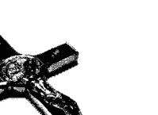

### III. 聖彌額爾總領天使

他的形象也是魔鬼所懼怕的，因為魔鬼曾經敗在聖彌額爾總領天使手下。所以，當聖彌額爾的聖像出現時，也象徵著天主要委派聖彌額爾，重上戰場，打敗魔鬼。

### 7. 熱心善工

個人熱心善工也能夠幫助被附者自己。如果能夠有其他信友團體共同參與的話，個人的力量，加上教會團體的力量，將會更增強其抗魔的信心與毅力。這些熱心善工包括：朝聖、朝拜聖體、短頌祈禱、參加聖體降福、念玫瑰經等，都具有驅魔及防魔的功效。當然，在平時配戴聖物、聖像，或玫瑰念珠等，這些也是具有防魔的積極功效。

被附者本身若情況許可，他要做一些善工。積極的慈善服務事工也能夠讓他與天主間建立更好的關係，引進天主的能力來達到驅魔、防魔的效果。

總之，在教會內有許多各式各樣的聖物，這些聖物能夠或多或少，或輕或重地幫助被附者驅魔成功。當然，也要視被附者本身的熱心程度，效果才能夠相對地產生。

一般來說，隨著不同的附魔現象、魔附種類，各式聖物能有不同的效果。但是要注意避免將這些聖物予以「魔術化」或誇張地「絕對化」。因為所有附著在聖物上的能力展現，都是天主聖意的安排。天主願意藉著哪些聖物達到祂救恩的效果，都是由天主聖意決定的。人不能把這些聖物太過誇張，或予以神話，反而讓這些聖物失去它原本的意義，甚至有時會淪為魔鬼借力使力的工具。⁹⁸

## 附魔與驅魔

### DEMONIC POSSESSION AND EXORCISM

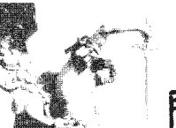

## 八、驅魔的三種層次

教會把驅魔列為耶穌基督實現其救贖工程的神聖使命之一。驅魔可以分為三種層次：防魔，去魔，驅魔。但僅是魔附的情況，就得依它的種類、性質、管道、急緩，和輕重而有所區分。

### 1. 防魔

是針對魔鬼一般性的誘惑，在逐漸侵蝕的過程中，使人魔化。譬如：利用人的身體及七情六慾、敗壞的世俗、混亂的社會現象，即所謂的「三仇」，逐漸滲透到人的身心靈裡，而受到牠的腐蝕。

---

98. 以上資料採自Balducci, Il Diavolo, pp.287-290。此外，此書中也提到，聖彌額爾總領天使在驅魔禮當中的特殊角色。因為聖彌額爾天使的原始名字就是Micha-EL（誰相似天主），意思是說，在這名字出現時，就已昭示著「天主的至高無上」，魔鬼再如何頑強，再如何使人驕傲自大，也不能夠戰勝天主。這標示了一個最清楚的大前提，此大前提就能夠讓魔鬼屈服於天主的能力之下。聖彌額爾天使代表了天主再次來執行驅趕魔鬼，與魔鬼戰鬥。當然，最後的結果就是再一次的得勝魔鬼。所以在整個過程中，若能經常誦念總領天使聖彌額爾祈禱文的話，也是很有助力的。資料請參考Balducci同本著作，頁290-296，他對總領天使做了長篇的描述。

對於此類的魔化現象，教會一般使用的處理方法，是以熱心善工、祈禱，或是藉著使用聖物的預防，或個人或團體的強化祈禱方式，以達到防魔的目的。實際上這些也可用於輕度附魔時的簡易驅除法。

### 2. 去魔

去魔是針對被魔鬼直接、間接干擾的現象：包括魔鬼的間歇式侵犯、壓制，或一般人所謂的撞鬼，都屬於此範疇。一般來說，此時的魔鬼對於人的干擾與侵犯，是常盤旋、徘徊在案主的四周，伺機而動。人的附魔現象也屬間接、短暫，或較輕微的。有時人的身體會受到牠某些箝制或侵犯，會出現局部功能的病變，或行為的失序，但還不完全像嚴重的附魔定義那樣清楚且激烈，姑且可視為一種著魔的情緒。患者情緒會有些較強烈的變化，例如沮喪、絕望、輕生等的負面情緒。不過，這些症狀多次也會與精神疾病相混淆。這時，驅魔者就應用較積極的方式來處理。

通常方法上可以是來自於個人的。案主本身除了要有個人防魔工作的準備外，同時可利用團體的治療方式，邀請信友團體共同為他治療。這種稱作「神恩性的釋放祈禱」，即所謂的「神恩性的治療」。

當然，此類神恩性的治療，釋放祈禱的施行人，不必全然是神職人員，一般教友或具神恩性的團體也能施予這種驅魔祈禱，但效果可能僅止於輕緩的個案。

在魔鬼的干擾中，祂也有可能兼含對人的干擾，或對物件、地方，甚至在動物身上出現附魔的現象。此時也可用驅魔的方式予以去除。當然，有時候有些原因是出自案主本身對魔鬼的靠攏、附和，譬如：委身於魔鬼，崇拜撒彈等宗教性的行為，也可能導致魔鬼對其的影響。當魔鬼視他為自己的同路人時，此時魔鬼就會積極地接近他，結果就是讓他產生更嚴重的魔附狀況。

這些現象有可能很緩慢且逐次地惡化。它可能從思想進到情感，再到意志，直到身體的某些部份被魔干擾、影響，甚至被魔鬼控制。在這種情況下，魔鬼是一步步地、漸漸地佔領了人的身、心、靈。

不過也有可能是魔鬼透過一些突發的機會、機緣，或突然地接觸到一些地方、一些事物而伺機進入。在這種情況下是沒有什麼先兆或原因，而純然是魔鬼主動的行為。當然，需要再次強調，魔附的一些現象，應該與疾病，尤其是與生理疾病、精神疾病做釐清。多次發現，直到教會開始執行這些驅魔儀式的時候，才能夠真正鑑別出是精神病，或者是附魔的現象。

值得注意的是，此類被魔鬼干擾的案件，有可能是個別性，也有可能是團體性的案件。

### 3. 驅魔

這是在三個層次中面對最嚴重情況下，最謹慎而隆重的處理方式。一般稱此驅魔為「大驅魔禮」，也是屬於狹義的驅魔定義。一般所謂的驅魔，即指此大驅魔而言。大驅魔禮是由教會所委派的神職人員，以教會名義向魔鬼宣戰。在此驅魔層次中，被魔鬼所干擾、附著的案主，其整體情況已經是非常嚴重的，因為這種被魔干擾，是來自魔鬼位格性地對案主的侵占，包括：身體的侵占、心靈的侵占。在這層次中對魔鬼的抗爭，將會異常激烈，是一種面對面的激戰，戰況也可能在時間上拖延得更久，涉及的影響層面也更廣泛。

## 九、驅魔的禮儀過程

通常在大驅魔禮當中，就能夠驅使魔鬼現出祂真正的原形，因此，更必須按照教會嚴格而確實的驅魔禮步驟來施行。

以下列出教會官方所定的驅魔禮當中的一些過程99。

### 1. 驅魔者本人的收斂心神

驅魔神父本人應懷著戒慎恐懼的心情，謙遜地依靠天主的大能，默念禱文。100 當然，遠期的準備尚包括驅魔者本人守齋、祈禱、告解、修德等。若情況許可，更可要求案主及所有參禮者也做好同樣的準備。

### 2. 開始禮

驅魔神父身著禮服（長白衣或長袍加穿短白衣，再加披紫色領帶），到達會場後入座，並以適當的致候詞，幫助案主及在場者收斂心神，準備禮儀的進行。致候詞的內容包含驅魔者帶領所有在場者，齊劃十字聖號，以慰問、貼心的語句問候案主及家人，並加強其抗魔得勝的信念。

### 3. 灑聖水

驅魔神父使用已祝聖過的聖水，灑向案主及在場者，並誦念禱詞¹⁰¹，做初步的潔淨，祝聖的工作。

### 4. 諸聖禱文

驅魔神父邀請所有人跪下，同心合意地向天主祈求，及懇請天上諸聖的轉禱，共同參與此次的驅魔行動。此諸聖禱文可由驅魔者本人誦念，或請另一人代念。在禱文中，可增加案主的主保聖人及聖堂的主保聖名字，因為驅魔不只憑藉個人的力量，且是整個普世教會的力量。誦念諸聖禱文後，驅魔者起立念以下經文：

> 「天主，祢看到我們因軟弱而信心不足，我們為這位弟兄（姐妹）懇求祢，從他（她）身上驅逐邪魔，使他（她）恢復祢子女的完整自由，好能與祢的聖者和被選者，永遠讚美祢。以上所求是靠我們的主基督。」（《驅魔禮典》，頁23，48號）

群眾答覆：「阿們。」之後起立。

### 5. 誦念聖詠

驅魔神父可選擇一首或數首聖詠，邀請在場者一同誦念，之後唸一禱詞。所選讀的聖詠，可以提振案主及在場者的鬥志，包含著悔罪、補贖、讚美、感恩及祈求的心願。例如：對經「主，祢是我的避難所」，聖詠第九十首「居住在至高者的護佑下」。

之後用以下禱詞做結束：

> 「主，我們的辯護者和避難所，請拯救祢的僕人（婢女）○○，脫免惡魔的羅網，以及迫害他的陰險言語，把他藏身在祢的翼蔭下，以祢堅固的盾牌保護他，慈祥地將祢的救援顯示給他。以上所求是靠我們的主基督。」（《驅魔禮典》，頁27）

### 6. 宣讀福音

驅魔神父誦讀聖若望福音第一章第1-14節，全體肅立聆聽。此段福音凸顯的耶穌基督在天主聖三內第二位天主聖言的位格及其凌駕全宇宙的尊位，也是以其在降生為人中二性一位的救主身份，打擊魔鬼，並完成救苦救難的救贖使命。

### 7. 覆手禮

驅魔的神父將右手按在案主的頭上，誦念禱文。覆手禮代表對天主堅定的信心，即離棄所有魔鬼行徑的決心，並懇求天主聖神、神恩與奇恩的灌注。經文102 如下：

- 啟：上主，我們依賴祢的寬仁，懇求祢對我們廣施慈恩。
- 答：上主，求祢垂憐！
- 啟：請祢遣發聖神，使萬物化生，並使大地煥然一新。
- 答：上主，求祢垂憐！
- 啟：我的天主，求祢拯救仰望祢的這位僕人（婢女）。
- 答：上主，求祢垂憐！
- 啟：上主，求祢在仇敵面前，作他的城堡。
- 答：上主，求祢垂憐！
- 啟：上主，不要讓敵人利用他，邪惡之子不要陷害他。
- 答：上主，求祢垂憐！
- 啟：上主，求祢自聖山幫助他，自熙雍護佑他。
- 答：上主，求祢垂憐！

### 8. 信德宣示

驅魔神父邀請所有在場者，共同以堅定的口吻誦念信經，或重發領洗時的信德宣誓。103

#### 信經

我信唯一的天主，全能的聖父，天地萬物，無論有形無形，都是祂所創造的。
我信唯一的主、耶穌基督、天主的獨生子。祂在萬世之前，由聖父所生。祂是出自天主的天主，出自光明的光明，出自真天主的真天主。祂是聖父所生，而非聖父所造，與聖父同性同體，萬物是藉著祂而造成的。祂為了我們人類，並為了我們得救，從天降下。（鞠躬）「祂因聖神，由童貞瑪利亞取得肉軀，而成為人。」祂在般雀比拉多執政時，為我們被釘在十字架上，受難而被埋葬。祂正如聖經所載，第三日復活了。祂升了天，坐在聖父的右邊。祂還要光榮地降來，審判生者死者，祂的神國萬世無疆。我信聖神，祂是主及賦予生命者，由聖父聖子所共發。祂和聖父聖子，同受欽崇，同享光榮，祂曾藉先知們發言。我信唯一、至聖、至公、從宗徒傳下來的教會。我承認赦罪的聖洗，只有一個。我期待死人的復活，及來世的生命。阿們。

#### 信德宣誓

- 驅魔者：為了度天主子女自由的生活，你們棄絕罪惡嗎？
- 眾人：棄絕。
- 驅魔者：為了使罪惡不控制你們，你們棄絕邪惡的勾引嗎？
- 眾人：棄絕。
- 驅魔者：你們棄絕罪魁禍首的撒殫嗎？
- 眾人：棄絕。
- 然後驅魔司鐸繼續問：
- 驅魔者：你們信全能的天主聖父創造了天地嗎？
- 眾人：我們信。
- 驅魔者：你們信我們的主耶穌基督，天主的獨生子，由童貞瑪利亞誕生，受難而被埋葬，自死者中復活，現今坐在聖父的右邊嗎？
- 眾人：我們信。
- 驅魔者：你們信聖神，聖而公教會，諸聖的相通，罪過的赦免，肉身的復活及永恆的生命嗎？
- 眾人：我們信。

### 9. 天主經

驅魔神父伸開雙手，領導參禮者一起誦念天主經。天主經（或稱「主禱文」）是耶穌在世時親自教給門徒的祈禱經文。經文中宣示著天主對信者的所有權及天人親屬關係，也宣示著魔鬼對人無權干擾；同時，也是案主及在場者，重整生活及人際關係的明確表白。

### 10. 十字聖號

驅魔神父雙手舉起十字架，以十字架祝福案主：「願我們的天主因十字聖號，自敵人手中拯救你。」（《驅魔禮典》，頁34）並大聲而有信心地喝斥魔鬼，有如耶穌基督在加爾瓦略山上決定性的一戰。

### 11. 噓氣

驅魔神父向案主的臉上吹氣，並誦唸經文：「上主，請祢以口中的神驅逐惡魔：求祢命令牠們離開，因為祢的國近了。」（《驅魔禮典》，頁35）噓氣是表示天主救贖的「再造」工程。

### 12. 驅魔式^104^

驅魔神父大聲而堅定地誦唸「驅魔經文」，是由「懇禱」及「命令」兩部份所組成。這是驅魔禮中最重要的一部份。若魔鬼一再頑強抵抗，驅魔式可一再重複，直到魔離為止。^105^

#### 懇禱式經文

天主，人類的創造者和保護者，請垂顧祢的這個僕人（婢女）〇〇，祢曾照祢的肖像形成了他，並召叫他分享祢的光榮；可是古蛇以詛咒折磨他，以尖銳的暴力壓迫他，以凶猛的恐懼騷擾他。請遣發聖神給他，在搏鬥中堅定他，在困擾中教導他祈禱，並獲得聖神有力的庇蔭。

聖父，請俯聽教會的禱聲：不要讓祢的孩子為謊言之父所佔有；基督以其寶血所救贖的這個僕人（婢女），勿為邪魔所俘虜；祢聖神的殿堂，勿被不潔之神所居住。

仁慈的天主，請垂聽真福童貞瑪利亞的懇求，聖子在死於十字架上時，曾踏碎古蛇的頭，並將人類託付給聖母作為子女；請將真理之光，照耀在祢的這個僕人（婢女）身上，讓平安與喜樂，進入他的心中，使他擁有聖德之神，因聖神的居住，使他享有安寧和潔淨。

上主，請俯聽聖彌格總領天使和所有事奉祢的天使們的祈求：諸德能的天主，請驅逐魔鬼的權勢；真理及慈愛的天主，請除去惡魔的虛偽的陷阱；自由及恩寵的天主，求祢解開邪惡的鎖鏈。

天主，祢喜愛人類得救，請傾聽祢的宗徒伯鐸及保祿和諸聖的祈禱，他們因祢的聖寵，曾克服了惡神：求祢拯救祢的這個僕人（婢女），脫離一切背叛勢力，保護他屹立不搖，使他能恢復平靜熱誠，真心愛祢，為祢工作，並以生命讚美祢、光榮祢、歌頌祢。以上所求是靠我們的主耶穌基督。（《驅魔禮典》，頁34-36）

#### 命令式經文

撒殫，人類得救的敵人，我鄭重驅逐你，你要承認天主父的正義與仁慈，祂以公正判決，懲罰你的驕傲和嫉妒；命你離開這個天主的僕人（婢女）〇〇，他是天主依自己的肖像所造的，曾賦予他恩寵，並收納他為子女。

撒殫，你這世界的首領，我鄭重驅逐你，你要承認耶穌基督的德能，祂在曠野裡克服了你，在山園裡勝過了你，在十字架上奪取了你的戰利品，並因

### 13. 謝恩

在案主離脫了魔鬼的干擾後，驅魔神父以及所有在場者，以一首感恩的詩歌表達對天主的謝恩，如謝主曲（路一46-55）、讚主曲（路一68-79）。驅魔者隨後以下列經文結束驅魔儀式¹⁰⁶：

天主，普世人類的造主和救主，祢仁慈地接受了祢所鍾愛的這位僕人（婢女）○○，以祢的上智照顧他（她），守護他（她）在祢聖子所賞給他（她）的自由中：上主，我們懇求祢，使邪魔不再控制他（她）；請祢使聖神的良善及平安進入他（她）內，因而不再懼怕邪惡，因為主耶穌基督與我們同在。祂和祢及聖神，永生永王。（《驅魔禮典》，頁39-40，64號）

### 14. 隆重降福禮

接著舉行遣散禮。
驅魔司鐸面對眾人、伸開雙手說：「願天主與你們同在。」
眾答：也與你的心靈同在。
驅魔者降福在場者，說：「願天主降福你們，並保護你們。」
眾答：阿們。
「願天主垂視你們，並賜給你們平安。」
眾答：阿們。
「願全能的天主聖父、聖子＋聖神，降福你們。」
眾答：阿們。（《驅魔禮典》，頁40，65號）

## 附魔與驅魔

### DEMONIC POSSESSION AND EXORCISM

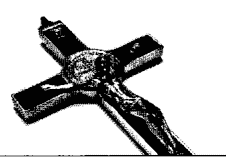

99. 見《驅魔禮典》的程序。
100. 同上，頁16，39號：「主耶穌基督，天主父的聖言，一切受造物的天主，祢曾給予祢宗徒們權力，因祢的名征服邪魔，並壓制仇敵的一切權勢；神聖的天主，在祢的一切奇事中，祢曾命令我們：驅逐邪魔。強有力的天主，因祢的德能，撒彈如閃電般自天跌落；我以恐懼和顫抖，懇求祢的聖名，使我在祢大能的保護下，滿懷信心去攻擊那困擾祢這位受造者的邪魔。祢是那要以火來審判生者及死者和世代者。阿們。」
101. 同上，頁19，44號：「願這水成為我們領洗的紀念，並追念以苦難及復活救贖我們的主基督。」
102. 同上。
103. 同上。
104. 通常儀式進行到這部份，魔鬼的反應會非常劇烈，也會現出牠的原形。此時，所有在場的的人都要留意避免魔鬼在困獸之鬥下可能造成的傷害。
105. 在這段期間，驅魔神父或在場的服務者，可適時地以其它有效的聖物助陣。這段時間可能耗時甚長，甚至超過驅魔神父的體力負荷，而不得不暫時休息，留待下次的驅魔行動。
106. 驅魔時一般注意事項，請參閱附錄一：「天主教驅魔的一般原則」。

## 第五章

## 魔離後的復甦與關懷

完整的驅魔過程，包含有：原因的探討、附魔現象的鑑定、禮儀施行等。但在這整個過程中，不論是對案主本人、驅魔者、案主周遭的親戚、朋友、家人，或信仰團體，都可能造成不同輕重的影響。如何消滅這些影響，是耗時耗力的工程。本章針對魔離後可能有的後遺現象以及信仰復健的計劃，包括案主本人、家人、信仰團體，及驅魔者等部份，做概略的分析。

## 一、魔離後的可能現象

### 1. 對案主本人的影響

#### （一）生理上異常虛弱

經過長期的爭戰，案主本人的身、心、靈有如大病初癒，極為虛弱。在全部附魔過程中，由於魔鬼對案主身體上的折磨絲毫不留情，已到了殘忍的地步，因此在魔離後，案主的身體會呈現極度虛弱的情況，在飲食、生活上，狀況可能都大不如健康時期。

#### （二）心理人際關係上的障礙

心理方面，由於魔鬼老奸巨猾，頑劣而沒有同情心，造成案主在心理上可能產生自我質疑。也因為不斷地被魔鬼強烈逼攻，許多在對抗魔鬼時挫折與不悅的失敗經驗，更讓案主喪失自我價值感而顯得頹喪、失意。

當魔離後，尤其是當案主清醒時，可能會有強烈的羞恥感，覺得自己是不是精神異常、心智崩潰。許多非自願性的怪異舉止，連自己都覺得荒誕可笑。由於在附魔期間可能產生的暴力傾向，或是自殘的行為，都可能造成後續在人際關係上的障礙。

#### （三）信仰上的不安全感

靈性生活方面，由於與魔鬼爭戰的過程中，親身經驗到魔鬼力量的強大，案主可能因此質疑，天主為何始終保持沉默態度，無所作為？或是即使天主有祂的作為，但也只呈現出天主挫敗的假象，所以對天主的信仰，產生前所未有的消極想法。此外，也可能驚恐於魔鬼強大的勢力，而在信仰上受到劇烈衝擊，可能會因此對日後的復健工作產生退縮，或害怕再次被侵犯的不安全感。

### 2. 對案主周邊的親朋好友，以及家人所產生的影響

由於家人、親朋好友，在案主發病的時候，投入大量的心力，也會感到極度的勞累。這些投入包括：時間、體力、金錢。因為案主在發病時無法工作，不只發病的現象會讓家人恐懼，也可能間接造成家庭經濟的沉重負擔。由於附魔的過程可能很久，也許一個星期，半個月，一個月，甚至拖上數個月，都無法做徹底的清除與復原，家人所受的煎熬不難想像。而發病時的現象，會讓案主的外在舉止異於平常，看見的人可能不由自主地心生害怕，難以置信這是他們所熟識的家人、朋友嗎？如果家人中有人是非教友，對案主的不諒解可能會更加劇，甚至認為案主是家中的不祥之物，避之唯恐不及。如果有這樣的情形，將會造成案主更孤獨的消極處境。即使在治癒後，這些記憶和感受仍然會長期盤據在家人的生活與記憶中。

### 3. 對於信仰團體的影響

信仰團體也有可能在陪伴案主的過程中，受到魔鬼強烈的驚嚇，而產生了懼怕或退避。懼怕，來自於見識到魔鬼的勢力強大，也來自於他們看到這些案主所表現的一些怪異舉止。甚至，魔鬼透過案主一些生理狀態的表達，及臉部的恐怖表情，讓這些恐怖的畫面長久存在信仰團體的印象中。這些可能是魔鬼利用案主間接的攻擊，或是侵擾信友團體的方法。

顯然教會基本上是希望信仰團體用信仰的力量來支持受難的肢體，但在實際的行動上，卻不太願意信友們直接接觸這些魔附的案主及魔附現象。因為對他們來說，要解決心理上的困惑，也是需要一些治療的。魔鬼可能會利用這些機會，將能力施展到與案主無關的周遭人身上。這是一種魔化、附魔現象後的轉移效應。這種轉移效應也可能對信仰團體造成某種程度的干擾，久久揮之不去，並且可能延伸成為其他人受害的管道。
信仰團體除了懼怕以外，有可能還會退縮，因為怕受到牽連，被魔鬼侵擾而和案主一樣。如此在信德上可能感到困惑，在愛德上也可能有所保留或削弱的現象。

### 4. 對於驅魔者本人的影響

驅魔者，因為長期陪伴案主，不論是之前，或執行驅魔禮時，驅魔者都承受了非常大的心理和信仰上的壓力。若驅魔成功的話，對案主來說，可能是心理的平安；但若需長期地、不斷地、重覆地實行驅魔禮後，對驅魔者可能造成體力上的負擔，他也可能在屢戰屢敗之後，在心理和信仰上開始感到失望。如果成功的話，對驅魔者來說，還有犯驕傲的危險，以為是自己戰勝了魔鬼。所以為驅魔者而言，很容易陷入這種失敗與成功，得失皆憂的兩種極端情緒裡。

驅魔者在身體方面所承受的壓力是可想而知的。尤其是舉行正式的大驅魔禮，有時並非僅僅半鐘頭或一小時就能完成此驅魔工作，甚至長達三個小時、五個小時，甚至十數小時以上。

針對案主的家人、信仰團體所受的影響，負責驅魔者需更花些心思做一些團體性的治療；尤其是對案主親近的家人而言，更需要教會牧靈工作者給予更多的牧靈關懷。

### 5. 正面的意義與價值

但是除了這些負面的影響外，也可能會產生一些正面的效果。譬如，對案主本人而言，在經過此次大波折後，開始從身、心、靈各角度重新自我釐清：也許對於過去的生活方式，或生活經驗，或自我人格特質等，做自我重整。他也可能在信仰生活上，體驗到最後的勝利是屬於天主的，且天主的能力遠遠大於魔鬼的勢力，因而更加強他的信仰，對天主產生更深的愛與信靠。他也可能因為魔鬼的惡勢力，對魔鬼產生深惡痛絕的心態。因這種對魔鬼的厭惡，對他後來信仰上的精進，產生莫大的助益；同時，為了避免魔鬼再次入侵，他會開始在自我生活上做改善。如果附魔原因是來自於罪惡，或是過失的話，他會開始改邪歸正，調整他與天主、與人、與自己，以及與周遭環境的關係。這些積極的正面影響，都被教會相當程度的期待著。

## 二、復健期的牧靈原則

### 1. 守密

在整個附魔與驅魔的過程當中，教會應盡到保密的責任。基本上是不能夠做細部隱私的揭露，因為在整個附魔過程和驅魔禮儀進行的時候，可能會有許多怪異現象，不論是來自案主本人，還是魔鬼透過案主呈現出來的一些醜陋形象，都可能造成許多誤解、誤導，讓人覺得魔鬼的勢力強大。可以說，這種保密是為了避免聽到的人在不知情的情況下，誤將禮儀想像成魔術而盲目期待的錯誤觀感。因此，除了相關人士以外，教會規定，不可以將驅魔的過程和結果對外做詳細的描述，也不可以過份地誇大。特別是，在驅魔過程中，魔鬼可能利用其能力，揭發許多人內心深處的隱私，如此可能為一些不肖之徒利用，對案主及驅魔者造成二度傷害。驅魔者也可能會被人不當地推崇，描繪成神的形象。驅魔的委任主教有作長期的委任，或者是機會性的委派，如果有這樣的一個造神的情況出現，那麼對驅魔者本人也會造成很大的困擾。

驅魔個案成功以後，當事人必須對教會當局做一個完整的紀錄報告，呈報給教區。教區也應該把此紀錄報告，整起事件的經過和處理，放在教區秘密檔案中，不能隨意交給非相關人士參閱。教會內也應有專職的人，做此類特殊檔案的保管、彙整，或研究。

### 2. 受傷的肢體

客觀來說，案主在教會內被視為受傷的肢體，是一個被魔鬼打傷的人。因此在附魔期間所呈現出的各種非正常的行為儀態，不能歸咎於案主本身，因為這不是他有意識的主動行為，而是魔鬼在他內，藉著他顯露魔鬼的醜惡面貌。所以，不應當對附魔期間，附魔者（案主）所呈現的外表現象做太多聯想和倫理判斷。尤其是當魔鬼藉著案主表達出一些超人的思想與言行舉止時，不能將案主視為是魔鬼的代言人或同路人。他們並非魔鬼的化身，而是教會內，基督奧體的受傷肢體。如果是受傷的肢體，理應是被照顧、被治療及被陪伴的對象，而不應對其抱持冷眼旁觀，或放棄救治的態度。

### 3. 案主的合作

就如同身體復健一樣，人在生病以後，會感到疼痛、不方便、行動困難；同樣地，案主在心理方面，於復健時期也會有些在心靈上的病理現象。所以要以寬厚、仁慈的心腸，安慰、鼓勵、加強他在復健期的合作態度。

神師在這個復健過程中，扮演著相當重要的角色：指導他、陪伴他，並為他擬定具體而周密的復健計畫，分別從生活作息、生活習慣的調理著手，進而加強內在的信仰力量，這些過程全都需要案主的充分合作。

### 4. 教會的正視

教會需要認真的看待這類情事。魔鬼對人的傷害，是會利用個別案例而擴大、普遍影響。所以教會面對這類個案時，應含括救恩的普世性幅度。

基本上，魔鬼在整個魔附過程中，牠要傷害的不只案主這一個人，而是整個教會——破壞耶穌基督的救贖工程，顛覆救贖工程最顯而易見的標記。這樣的事件對教會或對社群人類而言，都不應該被視為個人的單獨遭遇，而是一種教會對魔鬼的宣戰與戰爭。教會實際上是代表著天主去對抗魔鬼的惡勢力，案主僅是管道，是這場戰爭的具體的平台。所以教會應當嚴肅、認真地去看待魔鬼在案主身上的行為過程，以及教會在整個過程當中所能扮演的角色。另外就是在復健期中，教會尤其需要投入大量的牧靈關懷。

### 5. 預防復發

聖經上也曾經記載：案主在康復後，若不再持續心靈重建和維持，可能會給魔鬼再一次侵犯的機會。路加福音第十一章24至26節中明白寫著：

> 「邪魔從人身上出去後，走遍乾旱之地，尋找一個安息之所，卻沒有找著；他於是說：我要回到我出來的那屋裡去。他來到後，見裡面已打掃清潔，裝飾整齊，就去，另外帶了七個比自己更惡的魔鬼來，進去，住在那裡；那人末後的處境，比先前就更壞了。」

如果魔鬼再來的話，那麼牠第二次來的時候就非同小可了，反而更加惡劣。經驗也證明，確實是如此。在驅魔成功後，再次復發的傾向很高。通常第一次附魔，驅魔比較容易，但第二次以後就會增加困難度，情況也比以往更嚴重，嚴重的程度日益增加，因此要盡量避免再復發的機會。

### 6. 持續的戰事

即使是復健期，也要持續預防復發的可能性。這段復原期必須是長時間的，也許比附魔時期更長，往往需歷經半年、一年或兩年，甚至是終身都得持續這場防禦戰事。魔鬼在經過大驅魔禮之後，牠的氣勢可能被打擊、削弱到很微弱，但不一定完全離開案主的身體，所以牠還會伺機而動。除非不斷地打擊魔鬼，不斷地堅強案主的信心，不然這隻蠢蠢欲動的魔鬼，會隨時隨地再次攻佔案主的身、心、靈。

### 7. 勿誇大魔鬼的力量，傷害脆弱者心靈

有時對魔附現象，或驅魔過程當中的不經意描述，因著以訛傳訛，失當描繪魔附現象，可能誇大魔鬼的力量，而間接造成許多脆弱心靈的傷害。雖然很多人沒有親眼看到附魔的情況，但在聽說（譬如報章雜誌等傳媒報導）的時候，他的心靈也會受到傷害的。舉例來說，譬如在觀賞一些有關驅魔的影片（如「大法師」）時，影片為達到它的戲劇效果或感官目的，往往誇大魔鬼的力量，或是縮小一些驅魔者、聖儀的能力。當許多人觀賞到這一類電影時，對他們的心靈都會產生不良的影響。所以基本上，無論直接或間接的描述，教會都認為是一個極不適當的作法。

## 三、復建期案主的調理

首先，要去除許多案主所處環境中的污染源，要仔細地了解附魔的原因為何，魔鬼又是透過何種管道、方式，進入他的身、心、靈。

為了杜絕魔鬼的再次入侵，必須先把這些原因去除掉。這些原因可能來自案主本身的身心靈狀態，或生活方式。若他的心靈過去受到污染、傷害的話，也必須先得到心靈的治療；若原因是來自生活環境，如過去或現今家庭的缺口或遺憾等傷害，也要加以改善；若原因是來自個人的生活方式、習慣，自然也要有所調整、改變。

### 1. 去除在生活上可能污染身心靈的原因
例如，遠離罪惡的生活，污濁的家庭生活環境、氣氛等。

### 2. 心理上的重建
因為案主在心理上可能受到很大的打擊，所以要利用心理諮商的方式，加強自信心的建立。透過家人的陪伴，及朋友團體的接納，能夠幫助案主心靈上的重整。

### 3. 生理上的調適
由於在過去這段期間，案主體力極度消耗，所以要重新調整日常的作息，注意營養、健康，建議可做某種程度的體力工作，幫助心靈與身體的復健成功。工作也能夠分散對魔鬼的一些注意力，讓魔鬼不那麼容易再次入侵。

### 4. 信仰上的修为
教會可以提供各種適合的方式，以加強案主本身信仰的深度及強度。譬如透過個人或團體性的閱讀聖經、讀經分享等，都能直接、間接的對信仰有所幫助。除了聖經外，也要透過個人的祈禱生活、刻苦及守齋，來達到他內在、外在的潔淨效果。

個人祈禱的內容，除了念玫瑰經和私人祈禱外，重要的是可以大量地誦唸聖人禱文，以及向聖彌額爾天使祈禱文。因為教會相信，這些經文對打擊魔鬼非常具有效力。

### 5. 積極參與聖事禮儀
尤其是和好聖事，及聖體聖事。所以在復健初期時，要積極地邀請案主參與彌撒，參與公共的祈禱，參與這些熱心祈禱善工的活動；或是加入善會組織，接受善會組織的滋養與幫忙。頻繁地接受和好聖事，是復健期非常重要的一項工作。因為透過和好聖事，能夠幫助案主個人的心靈更淨化，讓魔鬼無機可乘；而且天主也會為他建立良好的周邊關係，包括天主與他的關係，以及他和周圍人士、環境的和好。

### 6. 寬恕的重要性
對於受魔鬼勢力影響的人，如果能夠全心原諒，全心寬恕對自己造成傷害的人，特別是那些惡意傷害他的人；即使完全不認識對方，仍然會帶來極大的釋放效果。因為寬恕，最相似耶穌在十字架上的態度與風格。

### 7. 信仰的生活見證
如果情況許可的話，案主可以在能力範圍之內，做某種程度的信仰的見證。此見證能幫助案主重新調整自己，將所有思緒整合之後，藉著見證與分享，進而增強自己的內在能量。同時也可以藉著他的信仰見證，幫助其他一樣受到心靈影響的人心靈重整。由於他在整個過程結束後，跟耶穌一樣，成為一個勝利者，所以他可以把他勝利的經驗，以及一些附魔原因和預防方法，與其他人分享。這麼做對別人的信仰，和對魔鬼的抗爭經驗，將有非常的助益。但是見證時也要小心，避免聚焦在魔鬼身上，渲染魔鬼的能力與影響力。

### 8. 慈善事工的投入
在體力所及的範圍內，盡可能地投入慈善事工的服務行列。這些慈善事工能夠幫助案主建立一個和諧的關係，也使其在服務中增強自己信仰及愛的力量，讓魔鬼無法再次入侵。這種愛心的投入與服務，基本上是魔鬼最厭惡的事。因為魔鬼的本質是「非愛」，所以這種愛的磨鍊、愛德的訓練，也能夠防堵魔鬼日後再度入侵。

### 9. 定期見神師
這有點類似病癒後的回診。藉著與神師的交談，可以不斷地釐清自己，得到一些靈性滋養；也能夠藉著與神師的交談，調整自己日後的方向，按照神師的指導獲得信仰祈禱的力量，並堅持在既定的復建計畫上，並釐定後續的作為，不斷針對自己身、心、靈的情況，做適度的調整。

### 10. 佈置聖善的生活環境
包括居住地須予以「聖化」，周遭環境裝飾聖像，讓整個環境都呈現出神聖的氣氛。案主本人亦可配戴十字架、聖牌、聖像，以達到避邪效果。

聖像，尤其是十字聖架，會擊退惡魔。因為十字架是耶穌拯救人類的工具，是基督勝利的標記。十字聖架不僅在驅魔儀式中作用非常大，在平時也常可派上用場。
同樣的，關於聖像，或聖水、聖油、聖鹽等等，都有擊退撒彈魔鬼的類似效果。因此，可以將它們懸掛或放置在適當的地方，用以保護人，或是地方，同時也可以作為診斷時的一項證物。任何神父都可為這些物件進行祈禱，而予以聖化。經過神父們的祈禱，這些物件，在防魔或驅魔上，會有很大的效果。
總之，不論是防魔或驅魔，案主的基督徒生活是一個非常重要的關鍵。堅定的信仰能夠帶領人們走向救恩的道路，只要在生活當中實踐基督徒的生活要求，對於魔鬼而言，要施展祂的伎倆就困難重重。
許多向教會求助的人，實際上是過著與天主教教義相去甚遠的生活。因此，建議他們能多讀聖經、祈禱、守齋、刻苦、參加慈善活動。
藉著這些復健的調理，相信案主在與魔鬼爭戰之後，他將成為一個真正的勝利者。並且也因為他受到的牧靈關懷，讓他能夠在信仰上更有長進。所以復健期是一個收穫期，一個勝利期：從此以後，他不再是魔鬼迫害下的犧牲者；相反地，他將成為勝利者，就是所謂的「victim becomes victor」。

## 四、教會制度面的關懷與落實

耶穌來到這個世界上，祂的首要動機與目的，就是為了打擊魔鬼的惡勢力，將人類從魔鬼的束縛中解救、釋放出來。因此，教會承繼著耶穌基督救恩的使命，不論是在福傳層面，或者是在牧靈層面，都有重大的責任來打擊魔鬼，與魔鬼對抗。

驅魔是整個教會的救恩性行動。整個教會包括：堂區、教區，以及各地區的主教團，都有責任去落實處理附魔、驅魔的案件。

### 1. 堂區
一般而言，堂區的神父是與魔鬼對抗的第一線人員。堂區神父對於附魔與驅魔的認知、研究，及禮儀上的訓練、事後的復健技術等，都應該有相當的認識。

另外，堂區神父在牧靈工作上，可將附魔與驅魔當作是信仰推廣教育的重要素材。它著重在前幾章所提的，教育信友們了解魔鬼的本質、魔鬼的面目、伎倆，及魔鬼會經由哪些管道來影響人的心靈，以及附魔的原因、內在與外在或個人及群體的現象，或包括附魔的種類等等。這些都可透過講座來做推廣教育。同時，也可組成神恩治療小組，關懷有需要的人。當案件實際發生時，能夠迅速而適當地予以因應。

神父們平時也可以推動教友的個人、團體或神恩治療小組等，以祈禱的方式，來對魔鬼的誘惑與干擾予以預防。也可以針對那些曾被魔鬼干擾的案主，予以個人或團體的心靈治療與陪伴、鼓勵，或是安撫。

### 2. 教區
教區一旦得知堂區有類似魔擾案件發生時，有責任予以追蹤、監督，盡到教會主管的責任。對於那些已確定的案件要列檔管理，也可以由不同的神父組成一些研究小組，針對不同案件進一步地研究，以便釐清事件的真偽，或是當作日後類似案件判別的依據。這些研究小組彼此可以交換意見，做個案的探討。

某些教區主教特別重視魔附案件在自己教區內的影響力。例如：義大利熱那亞總教區泰西修·貝爾托樞機主教在他的教區內，組成了一支專職的「驅魔團隊」，釐定一些有關附魔與驅魔案件處理時的準備及研討。

> 貝爾托內樞機主教（Cardinal Tarcisio Bertone）在未掌理熱那亞（Genova）教區前，曾是教廷信理聖部的秘書長，時教宗本篤十六世任職該部部長。
> ZENIT The World Seen From Rome Code：ZE04032303 Date：2004-03-23 Genoa Setting Up a Team for Exorcisms Also a school of Confessors,Says Cardinal Bertone GENOA, Italy, MARCH 23, 2004 ( Zenit.org ) - The Genoa Archdiocese is undertaking the formation of a team of priests to care for possible cases of exorcisms. It is also establishing a school of confessors.Cardinal Tarcisio Bertone explained the initiative in detaIl, in statements published today by the newspaper Avvenire. The Genoa archbishop outlined the initiative last September in his three-year pastor plan for the archdiocese. First, the cardinal said, the archdiocese wIll offer 'a more profound formation' for priests in the exercise of the 'ministry of reconciliation and spiritual support.' The need to establish a 'school of confessors' is response to the times, which require will-prepared 'confessors and genuine spiritual## 3. 主教團的部份¹⁰⁹

主教團可運用他們的權責，為整個地區設立一個有關附魔與驅魔的研究單位，所有成員可以是來自各個相關的專業領域，並邀請心理學、精神病學領域的專家共同做綜合的會診、研究。

fathers, especially in shrines and churches visited especially for confessions.Unfortunately, this eminent form of pastoral charity has been left for too long to the good will of each one and to his talents from the beginning of the seminary,' the archbishop said in his pastoral program. 'It must no longer and cannot be like this!' Cardinal Bertone said that priests must be formed in current issues, such as 'the development of medical science, which poses new complex questions.' The cardinal announced that progress is being made in the establishment of a diocesan team 'specialized in the support of people who are suffering symptoms that are difficult to interpret, whether from the spiritual or psychological point of view, or in the framework of problems of exorcism.' Emphasizing the need for 'prior discernment' in this delicate matter, the cardinal said that in the case of diabolic possession, 'the person in question will be supported by an exorcist who will pronounce the prayers of the rite.' The cardinal said the names of the exorcists will not be published. He said the archdiocese will offer people the possibility of a preliminary contact, to discern those in real need, who will then be put in touch with 'one of the priests in charge of this ministry'. From: http://zenith.org/English/visualizza.phtml?sid=51106

## 第六章

### 個案訪錄

## 前提

- 一、訪談時間
二〇〇四年三月三十日，下午五點至六點半。
- 二、訪談地點
安平聖樂倫天主堂（台南市安平路850巷2號）
- 三、參與者
賴効忠神父、李若望神父、案主、陳怡萱等四人。陳以錄音方式做現場紀錄。
- 四、其他
本文是由賴、李兩人負責提問，案主本人以第一人稱自述事件始末，略為整理而成。

## 一、魔鬼侵犯的漸進過程與現象

### 1. 想法被控制

剛開始時，牠會讓你這樣子想、這樣做，你就照著做。

### 2. 身體被操控

原因不了解。可能原因之一是當時身體虛弱，易被控制。

### 3. 魔鬼強大的控制力

逐漸地，牠的力量大到我（案主）要呼求耶穌寶血，或唸聖言時，舌頭就吐出，變得非常僵硬無法縮回；連帶地，身體、手腳也失控。牠可以控制我的身體、變成牠的。

#### ※ 當事人身雖受控，思慮卻清楚

當時我清楚身體狀況，卻無法改變。我用意志說：「舌頭不要這樣子，我要唸經。」可是沒辦法。怒視人時，也沒辦法緩和下來，但那不是我願意的。我不了解為何我會完全被牠控制，但我確定我是被牠控制了。到後來變成：如果「我」（人的意識）有十分的話，其中九分都是「牠」的意識，只剩下一分是我（案主）的意識。

## 附魔與驅魔
DEMONIC POSSESSION AND EXORCISM

## 二、驅魔法器

- 1. 聖水
明明在皮膚上是清涼、不痛的，但牠卻發出淒慘的嚎叫，好像被嚴重灼傷的樣子。而且，好像還可以聽到「嘶～～」的聲音。

- 2. 聖蠟
痛到極點，好像被灼傷。我的皮膚對聖蠟的感覺，與牠的慘叫聲幾乎是同步的，連我自己也痛到快死掉。至於聖蠟是否使牠的力量削弱，可能神父印象比較深刻，因為我對當時沒有什麼印象。不過為我來說，這是最消耗牠元氣的東西。

當下，如果「我」被分成十分的話，我只剩一分，其它九分都是牠（魔鬼）的。所以，所有感覺都是牠的感覺與反應（如痛覺等）。因為十分當中有九分是「牠」，幾乎就是「我」了，所以我才會覺得很痛，連意念都覺得很痛。我的意念是要服侍天主，把魔鬼趕走。現在我仍納悶我怎麼會覺得那麼痛？

- 3. 玫瑰經
牠不喜歡玫瑰經，不讓我出聲念，得很費力才能夠專注。如果一個人的意志力薄弱，一定要有旁人支持，否則很難抵擋（或許有些人意志力很強，但是體力卻不堪負荷）。事實上，當晚如果沒有其他人鼓勵，告訴我該如何做，可能也支撐不了太久而任其宰割，因為已經虛弱無力了。所以，家人和朋友很重要。

### 4. 聖體
除了對聖水、聖蠟有直接地感覺疼痛外，牠拒領聖體。牠很害怕，不讓我去，一直後退。我執意要去領，知道牠在阻擾。領完聖體後，牠會做掙扎、苟延殘喘，然後虛弱。不過牠只是暫時虛弱，尚未離開。有次我跟一位教友說我不對勁，我被附魔了，他嚇壞了。但他的反應很快，一邊跟我講話，為我念經，當下也邊拿著手機飛奔到聖堂去，將手機放在聖體櫃內。當手機被放入聖體櫃時，我發出慘叫——可是當時我並不知道他在電話那頭做了什麼事。

### 5. 驅魔經文
令我印象較深刻的一段，是施神父念某段經文時。當時她們發生激烈的爭吵，但那只是一些經文，牠怎麼會吼叫到那種程度，我不能理解。可能對牠是很大的刺激。那吼叫的聲音淒慘無比，牠聲嘶力竭，使盡力量嚎吼，又哭又叫的。後來神父念了一段我聽不懂的經文，牠對那段經文的反應更為激烈。

- 6. 聖髑
牠會不舒服、討厭，但不是害怕。

- 7. 聖神、天使用的利器
只有聖神願意降臨幫助時，才有可能發生。譬如大天使在胞姐身上的降臨，使用人肉眼看不見的利劍，刺穿了魔鬼。

- 8. 聖經、聖言
讀聖經會使牠的力量消弱，變得比較安份、不活動。每次讀聖言時，牠就嘀咕、抱怨，其實牠跟人性沒兩樣。其他時候，牠有牠的感覺，我有我的感覺。但我認為每一樣方法都要去試，因為我們不知道牠到底懼怕哪一樣東西。

## 三、魔的性質

#### ※ 魔，是意志力

> 「我完全不知道牠在我身心裡的哪一個部位，也完全感覺不到身體有任何氣流流竄。」

#### **問：是什麼樣的力量？**

「一種意志力。」牠控制意志力。那是一股會控制肢體、看不到的力量。力量時大時小，只要不故意挑釁，彼此就相安無事；如果故意說話刺激牠，或者拿聖水灑牠就是挑釁。牠可能就會跟著你。

#### **※ 藉著神權柄的傳道士與魔的對峙**

印象深刻的一件事是，某天下午在聖母像前散步，我的裡面開始焦慮不安，但我沒有理由焦慮不安。當時四姐陪著我，我記得很清楚，牠瞪著四姐說：「妳到底做了什麼安排？」牠就講了這些話。

隔沒多久，來了一對傳道夫妻，他們一進門就槓上了。我裡面的靈開始異常兇狠地瞪視他們，和他們對罵。那一對傳道夫妻用很多聖經的話斥責牠（魔鬼），要牠離開我。他們告訴牠的話，與當晚驅魔禮儀中的一段話很接近，大意是說：藉著神的權柄，他用腳鐐銬住我，不准我走動，並以神的權柄命令我走進那房間。

#### **※ 看不見的天使**

那一對傳道人用神的權柄捆綁我的腳。當時我走路的方式確實是雙腳在地板上拖行！我真的覺得腳鐐在腳上，怎麼使勁都提不起來。

#### **※ 舉行驅魔禮前的進堂式**

當晚，施神父進入聖堂時，我覺得當下有天使，因為我發覺我的手和腳馬上被綁綁起來了。雙手像被肉眼看不見的繩子綁著，前舉於空中，我整個人就這樣被拖進去，而且像被「提」進去似的。

事實上當下沒有任何人拉我，但我就是一直被拖著與神父們進去。雖然我心不甘情不願，但是仍被拖了進去。

所以我很清楚他們的關係，宣道士也有神的權柄，但他們像是衛隊、侍衛長之類的身份，就像警察與流氓的對立，類似這樣的關係。

#### **※ 代表神權柄的神職人員與魔鬼的畏懼**

儀典中我看到施神父從更衣間出來，進到聖堂。他一出來時，牠很害怕，那種害怕與面對傳道士是不同的——那是畏懼。

牠對施神父畏懼，是屬下怕被上司打的那種畏懼感；對傳道人則是敵對、仇人的對立。

牠雖然能與傳道人吵架，但在聖堂的神父驅魔過程中，神父們用很多聖經的話斥責時，牠卻只能束手無策，因為牠沒力氣，只有坐在那裡乾瞪眼。（但牠沒力氣時，我也跟著沒力氣，因為牠已經幾乎佔據十分之九的我。）

#### **※ 與狡猾的魔鬼沒有對話的空間**

面對牠時要用神的話語斥責牠。不要挑釁，牠會講一些似是而非的事，所以不要浪費體力與時間和牠周旋，最好是直接講令牠致命的神的話語。

牠似乎可以了解不同人的特質，譬如：不同朋友來探望我，牠的反應也不同。牠似乎可以分辨，屬神的人還是與牠同夥的人（同樣受牠掌權的屬同類）。只要不惹牠，我就是我（案主），我也可以做我的事。但是一旦惹毛了牠，我又會被牠控制了。

#### **※ 魔鬼喜歡什麼**

只要跟天主無關的都無所謂，牠都可以跟你隨便亂講，原因是有威脅。但有時牠的反應讓人難以理解。我覺得這值得去深入探討。朋友來探望我，有時我可展露我的本性，牠沒什麼反應；但對有些人的反應就很激烈。

我想，或許個性比較溫和的人牠不會害怕；但面對個性較強悍的人牠就會有反應。這些人都是有信仰的。

對於不是教友的人，牠表現得好像是所謂。但若是教友，則又分成兩類。一類是很討厭（牠討厭，不是我討厭），牠看人不順眼時就罵、瞪。有些人只是看著我，沒說什麼話，但牠就是會罵他、瞪他；而對於另一類人，牠就沒有什麼特別的反應。所以牠的反應也滿難理解的。

#### **※ 魔鬼懼怕什麼**

牠唯一懼怕的，全都在禮儀過程中。
傳道士奉主耶穌的話斥責牠，牠的反應剛開始是排斥，像流氓面對警察；但在禮儀過程中面對施神父，則是一種面對權威式的懼怕，做困獸之鬥的反抗。
施神父剛從更衣間出來，牠就開始驚惶，好像嚇一大跳；在害怕的同時，手脚像被銬住似地。當時的我心想：「我怎麼會這樣？」然後我就被看不見的力量拖進聖堂。

## 四、探究分析

### 1. 此次事件的可能導因

#### I. 魔可能原本就在身內

我認為魔鬼早就在我身上，本來就跟我，只是我們沒有去挑釁牠。或許我們就是一個罪體，因常犯罪，所以是牠的居所。

#### II. 身心疲憊

那天因為某些事情心情不好、傷心難過、整晚沒睡。隔天早上我想這樣不行，就做舌音祈禱。之後，牠不讓我繼續舌音祈禱，開始掌控我的舌頭，我就知道事情不對勁了。

我在七十八年於聖母山莊做聖神祈禱時，沒有先告解就用舌音祈禱，那時就勾引牠來了。重點在於體力：身心脆弱時，用不當的方式勾引牠來。所以身體狀況很重要。我認為，身心疲憊是溫床，舌音祈禱是導火線。牠討厭舌音祈禱，所以當下控制我；又因我自己的身心疲憊無力抵抗，所以就順著牠的意思走了。

至於是否是長期，或醞釀期？應該是沒有辦告解，而且可能常做錯事，生活中屢犯，加上僅有的意志力無法控制，所以這軀體就成為牠犯罪的工具了。

#### III. 不被期許出生的孩子

這可能是遠因。從小我不被父母所期許，又是女生。打從娘胎我父親就不喜歡我出生，要我媽拿掉，所以未出生時我就被傷害，以至於從小就想抓住一些東西，譬如婚姻等等。

我的個性是求和諧就好，不跟人爭，所以會吃虧，但不會覺得那是日積月累的情緒導致。因為我已習慣了，無所謂，大家好就好。

#### IV. 習慣性放棄自己

我怕別人生氣不滿意，怕傷害到別人，不忍心看到別人難過，所以常犧牲自己成就別人。我好像常在做這種事。明明理智告訴我不可以，但肉體與情感卻還是做了。因為必須犧牲我才會讓別人不難過。我的婚姻、情感、小孩歸屬，沒有樣不是在做讓步。

雖然魔鬼會因人在習性或個性上的軟弱，找到投其所好的管道乘虛而入；但我覺得不是投牠所好，而是牠知道我的弱點。當牠知道我的弱點，牠就會在這事上一直打轉，讓我再跌倒、再犧牲自己。

從小一直被遺棄傷害，長大後自然也有所求，希望在感情生活上能得到想要的。但是後來期望變成失望，一而再，再而三，棄捨就像螺旋子彈的膛線，越轉越大。

#### V. 情感與理智之戰

我的情感面勝過理智面。牠給我一些情感上想要的，但理智上覺得不可以或不需要的事物。

#### 問：是否每種魔都有特點

我覺得是。不是有許多不同種類的魔鬼嗎？跟人的性格面一樣，也是很複雜的。

#### ※ 來自魔鬼的聲音：自由、滿足的假象

神父認為，人在被放棄時，處於空虛的狀態。但另有聲音會告訴自己：「我可以滿足你想要的，只要把你的意志給我就可以了。我也不會妨礙你的自由，只要你讓我在你內有點空間。我會順你意，讓你的生活過得很好。」

牠讓你感覺「好像很不錯啊，我也滿快樂、滿樂觀啊」等等。可是當你有一天碰到某個點時就不得了了。所以基本上也有你被牠幫助，或你幫助牠的那一類互惠。

牠會拿糖果給我吃，讓我嚐得食髓知味而意猶未盡，只要不去在意糖是誰給的，只要有糖吃就好，何況這塊糖的甜度也符合我的期待……就是說，牠也會給我安慰。

牠給人自由的假象。在生活中不太干擾你，可是實際上你已經在隨從牠的意思了。只要採取強烈的方式，朝相反的方向行動時，牠就會有反應：「奇怪！我（魔）跟著妳、培養妳這麼久了，妳竟然用這種方式對待我？」這是心理上的拉鋸戰。

### 2. 積極效果

#### I. 寬恕、釋放與異象

傳道士當下的確幫忙我很多。那一次我看到很多異象，在此我做個見證。

我做寬恕祈禱，寬恕了孩子的父親，寬恕他對我的傷害。我告訴天主，之後我是如何地不捨、非常心痛我的女兒當下的狀況。

傳道士問我：「妳現在看到妳女兒怎麼樣？」我說，我看到我女兒身上髒髒的、穿的裙子太短了；我看到沒有人照顧她的模樣，覺得很心痛難過。」他要把現狀交託給主，祂會代為照顧，並要我完全寬恕孩子的父親。之後帶我念一段祈禱文。他的方式是：他念一句祈禱文，我跟著他念一句。

後來他問我看到了什麼？我馬上看到：有主耶穌的形象，牽著女兒的手。我的女兒判若兩人，她變成了一個非常sunny的女孩，全身潔白發亮，笑得很開心，牽著主耶穌，一面揮手叫我。主耶穌站在她身旁，形象至今仍很深刻。

當下我馬上就釋放了，我想我女兒已被天主照顧了。你知道她的情況，在那樣的家庭長大，她還是那麼善良。我真的很感謝主，祂真的幫我照顧了。

#### II. 天國的位階

同時，我也看到另一個異象：我看到教堂的人，與那對傳道士在主面前的地位。我也看到自己的形象。釋放完後他說，主耶穌很愛我，因為在耶穌面前有我的地位。祂會讓你看到你在祂心目中的地位。我真的看到了，從來沒有想到過。

形象中有看到幾個人，各有不同裝束，位置不同。他的身份就像我形容他的一樣（傳道士像天界的隊長、警察身份）。在天堂上，他的角色就是那個角色。他拿一本聖經在手上，像護法之類的。

第一次驅魔與第二次相隔一星期。間隔的一星期中，遇到傳道士幫我做釋放祈禱。第二次做的時候感覺就較為平靜。接下來雖然身體虛弱，但是身心平靜，而且可以自我掌控：我想要做什麼，都不會像從前突然有個力量或意念干擾，譬如手腳亂抖等。

#### III. 驅魔典禮中的神權

問：「所以神父的角色和他們兩個傳道士的角色，或能力、權力也好，有何不同？」

儀式當晚有很多神父在場，但牠只對施神父特別畏懼，一看到就驚惶。（當事人事後才得知：當天施神父是被主教授權，並被指派為驅魔者，所以具有權威。）其他神父對魔鬼沒什麼作用，對牠而言只是站在那裡的人。這是當下的感覺，因為我幾乎可以感受牠內心的掙扎。

施神父的權柄是屬權威性的，與那一對傳道士的區別在於：傳道士是警察，魔鬼是流氓，牠會聽他的命令，乖乖地進去聖堂裡面，因為當下就已經被腳鐐銬住了，但牠是心不甘情不願的。牠有那種「為什麼要受你管轄，卻又不得不受你管轄」之意。但施神父不同，牠對他是完全地懼怕，他（施神父）就是天父的感覺啊！

但傳道士仍有他的神恩。

##### ※ 驅魔儀式執行

我只記得當時自己已癱在地上了，其他人對魔鬼起不了作用。我的姊姊在現場雖有陪伴作用，但她對魔鬼而言，也沒有任何作用。

儀式後半段，我的兩位姊姊有些反應，那時候魔鬼好像被施酷刑癱在地上，任人宰割了。

由神父先審判，後再定罪，之後由天使出來執行。那時我姊姊有如天使般，我現在想起來，那是一連串審判執刑的動作。

執刑方式是：天使用利箭刺穿牠，但牠會變換成狗之類的形象；再被利箭刺後，又變成另一種形象。事實上，有一段時間我在地上爬，我不知道牠變成了豬或狗，只記得魔鬼突然受驚嚇，就變成這樣子了。那時，牠開始搖動，大力地搖動，至於牠受驚嚇的原因我不知道。¹¹⁰

#### IV. 死灰是否能復燃

魔鬼在我身上顯示的就是死期已到的表情，之後牠就癱軟了。但結束後，我仍然覺得牠未完全離開，只是被刺成重傷而已。這一劍與聖蠟相比，聖蠟仍最為耗損牠的元氣。所以一定要找出滅除牠元氣的武器。

> > 110. 據參禮之一的神父描述，其胞姊變成大天使聖彌額爾的形象，刺了牠數劍後，魔鬼受驚嚇。過程非常類似搏鬥的場面。

## 五、復健期調養

### 1. 靈性食糧的補充

那時生理上很累，一切得慢慢來，但一切仍屬正常。

理論上來說，魔附當時我沒有餓到、冷到，但為何會導致後來的生理疲憊，我也不知道。

我雖然照吃照睡、早睡早起、生活正常，但靈性卻非常渴望、饑餓。上班後才不久，就想趕快回家讀聖經、唱聖歌，因為我的心內是空虛的，所以假設魔鬼走了，要趕快用東西填補，我覺得自己是空的、虛弱的，很餓、很餓，就是這樣。

### 2. 陪伴團體

其實，我覺得不宜讓一個人單獨，讓他落單，包括復原期。因為沒有人陪伴我，所以我才挑台南碧岳牧靈中心^{111}、玉井加利利山莊，能和神職人員較常接觸的地方，度過這段時期。那時讀聖言、聽聖歌是我唯一想做的。

在整個抗魔的過程中，家人所佔的地位很重要，我覺得不能讓他們失望、心力白費，因為這是高價贖回

111. 天主教碧岳牧靈中心，位於台南市南園街，專供神職人員、教友作為避靜與進修活動之處。

## 附魔與驅魔

DEMONIC POSSESSION AND EXORCISM

的，所以我告訴自己一定要堅強抵抗。支持的力量很重要，有家人、朋友願意這樣關心我，我覺得一個人的支持還不夠，一定要有團體，多一些人來支持，讓我感覺是被包圍在當中，是安全的。因此我要更努力回饋他們的愛。

對於旁人的關心，是需要真正的心疼，不是敷衍，這在當下及復健時是必要的。除非當事人的性格本來就很堅強，那我就不得而知了。

#### ※ 愛

神父您認為，魔鬼本身就是仇恨，牠是忌妒、狠毒，而真正使魔鬼討厭的是「愛」。不管這愛是出自兄弟姐妹或其他人，但就是這樣塑造出來的「愛的氣氛」，讓魔鬼很不舒服。

魔鬼是非常陰險的敵對勢力，從人這方面來感覺，愛當然是有，但或許沒有很明顯，因為我們有時會以神父或教友是否愛我來判定基督是否愛我。可是當你發現 in 耶穌基督面前的地位時，你會發現神的愛還有更具體的東西；而當你發現在天國裡的地位時，你開始認同自己，在這救贖過程中，魔鬼開始被拉掉、被拋諸於後。愛是出發點，在爭戰當中，完成這事。

### 3. 真正改善之因

#### I. 傳道士

在周遭的朋友中，很多人來看我，很感謝他們的關心。但我要說的是，那個傳道士的確也幫助我很多。那天晚上，在驅魔禮之前，他陸陸續續幫我做些事。因為傳道士每次來的時候，因著他的身份，對牠都造成震撼。魔鬼非常討厭他來，但我很喜歡他來。因為每次他一來，我就覺得牠又再次被打擊，但其他人對牠影響不大。

#### II. 天主教驅魔儀式

教會對我最大的幫助，是在禮儀中。主教座堂的聖母軍那晚來念玫瑰經，牠不喜歡人念玫瑰經，但只是不喜歡，所以煩躁，反應並沒有那麼強烈。最強烈的反應是在面對那對傳道士時，而我們天主教的禮儀對牠而言，可以說是是把牠推入悲慘世界。最痛苦還是剛說的酷刑（聖蠟），會瓦解、消耗牠體力。

#### III. 釋放、寬恕

整起事情能夠結束，最大的一股助力或因素是什麼，若一定得說是誰對牠較致命，當然包括釋放。我認為它是有幫助的。因著寬恕與釋放一些得罪我的人，讓我了解自己在主耶穌面前是怎樣的地位。讓我不輕看自己，並寬恕人，擔子就放下來了。

#### IV. 持續祈禱、讀聖經

我覺得要用牠最討厭方式打擊牠。而什麼是牠最討厭的？祈禱、讀聖經很有幫助。這是我們簡單而容易可以做到的；至於禮儀，平常不太容易做這些事情。

#### ※ 陪伴團體的重要性

若在無陪伴團體的情況下，可能會有幾類情形發生：

- (1) 如果沒有胞姊們的陪伴，也沒找到禮儀、聖事的方法，我可能又會回到民國七十八年時的情況。即使做完驅魔步驟，若沒有再持續，我肯定又會回到以前的樣子。這次是因姊姊們有提供我錄音帶、書籍。
- (2) 若是連第一次（民國七十八年）都沒有處理的話，我可能會被當作精神病患看待、處理。我想，很多精神病患很有可能都是這樣。我當下（第二次）想，還好有七十八年的首次經驗，所以這次經驗我大概知道是怎麼回事。
- 我所有朋友若知道這件事，他們難道不會說：「沒看病？沒吃藥嗎？」他們會把我當作是精神病患吧！看看我那時的反應：大吼大叫，亂瞪人、亂罵人等等，喪心病狂的人不就是這樣子嗎？
- (3) 若被當作精神病患治療，但當事人本身又很清楚他並不是患精神病，肯定是很痛苦的事，還有可能會選擇自殺。他會覺得自己百口莫辯，被大家放棄、不瞭解，又被誤解、當作病人，可是事實上他並不是，他再怎麼講也沒有用。所以，魔鬼的最終目的，就是讓當事人自己選擇毀滅。
- 不是魔鬼自己操刀，而是人自己。我想過，如果我沒有這個背景，我一定會被當作精神病患。雖然我知道我不是，可是當時我沒辦法言語！

#### ※ 是否附魔的肉眼判斷

依我現在而看，按照經驗，只要跟主的關係很好，看對方講話就知道他是否被附魔了。我所謂「跟主的關係不好」，是指跟祂親近的時間減少。這方面的敏銳度是聖神的幫助。

至於有哪些特點，或哪些管道、表現，我說不上來——「對上眼」就看得出來了。就像驅魔禮儀那晚，別人來探望我時也沒說或做什麼，牠就開始罵人。那是種感覺，我沒辦法說明是怎麼回事，因為沒有一定的表徵、言詞、舉止、想法或記號，而且幾乎都不一樣。

以那對傳道士為例，他們就像是磁鐵一樣，磁鐵相反的兩極，碰在一起馬上反應、排斥，根本不用什麼特色，馬上就知道是否有感覺。

至於賴神父問的：一個人若被附魔了，他是否可說出自己「我這個人被附魔了」呢？是否自己有辦法這樣肯定自述？是否自己可以看得這麼清楚？我認為當事人可能不清楚，因為所有思緒都是混亂或是錯誤的，他可能不知道。

## 附魔與驅魔
DEMONIC POSSESSION AND EXORCISM

## 附录

## 附录一

## 天主教驅魔的一般原則

> (本文取自Weller Philip T., Exorcism in The Roman Ritual, The Bruce Publishing Co., Milwaukee 1964, pp. 641-644)

- 1. 驅魔者必須是教區正權人（主教）明確所委派的神父。必須要是相當熱心、謹慎、善度內修生活、貞潔、謙遜的人，對於魔鬼慣用的人性弱點，具有免疫能力，他依靠的不是他自己，而是天主的大能。他必須具有成熟的年紀，他所得到的尊敬，不只是來自他的職務，更是來自他的道德修養。
- 2. 為能有效地驅逐邪魔，他必須依其認真的學習與經驗，請教權威人士，小心地依下列所舉的重點進行。
- 3. 特別的是，他不應該那麼容易地就相信此人真的是魔鬼附身。他必須區分出是否來自疾病，特別是心理或精神上的異常。真正的受困者可能有以下的狀況：能夠說一口流利的奇怪語言，或者別人用不同的語言與之對話時，也能了解或對答；能預知未來或洩漏一些隱密的事；表露一些超過受困者年齡及其本性的能力；以及許多特異行為彙集起來後所呈現的整體附魔現象。
- 4. 為了能更了解事件，可用一個接一個打擊魔鬼的行為，來試探受困者的身心；這些可以對後來的驅魔儀式提供一些有用的訊息，也可以收集得知什麼經文、聖物、儀式、情境是魔鬼所懼怕的，在正式的儀典中加以強化並大量、重複地使用。
- 5. 他必須不讓自己被魔鬼的花言巧語所蒙騙。經常，驅魔者會被牠們的謊言及難懂的回應，弄得勞累而灰心放棄，或者驅使受困者表現出已不再附著魔的假象。
- 6. 一旦牠們被認出，牠們就會隱藏起來，以及為逃避驅魔者的干擾侵犯，而暫時性地離開被附者的身體，使得被附者誤以為已經真正地自由了。驅魔者必須等到魔鬼完全被驅逐的記號出現，否則不能冒然停止而功虧一簣。
- 7. 在緊要關頭，尤有甚者，魔鬼會設下許多阻礙，使得病人不能配合驅魔儀式，或是讓驅魔者誤認被附者受著極大的痛苦，而於心不忍地鬆懈下來。同時，在驅魔儀式中，魔鬼會使受附者入睡；或者在牠們隱藏時，使受附者顯露一些得到釋放的假象或錯覺。
- 8. 有時，受困者會吐露出許多隱而未顯的罪過及犯罪的人；此時，應避免將受附者想成是巫師或通靈者，也應該避免這些資訊被不當利用。
- 9. 有時魔鬼也會讓受附者得到片刻的安寧，甚至領聖體，以佯裝牠已經離開了。事實上，魔鬼欺騙人的技俩是數不清的，因此驅魔者不能陷入這樣的圈套。
- 10. 所以，驅魔者必須牢記住主耶穌所說的：驅逐邪魔只有一種確定的方法，就是祈禱與守齋（瑪十七20），他必須確實力行。
- 11. 如果方便的話，驅魔儀式應在聖堂，或神聖的地方舉行，並應讓群眾遠離。但如果被附者是患病的人，則可在私宅舉行。
- 12. 如果被困者是在神智清楚、身體健康的狀況下，應該要求他祈求天主的幫助；而且他也要守齋，並按照神父的判斷，勤領和好聖事、基督聖體。在驅魔儀式中，驅魔者應該完全振作，翕合主的聖意，雖然承受痛苦，仍毫不疑惑。
- 13. 驅魔者應手握十字架，或置於眼睛看得到的地方。最好也能請到一位聖人的聖髑，並放置在受困者的胸前或頭上（聖髑必須被適當地保護與覆蓋），要有人專門注意這些聖物，以免在儀式進行中被邪魔褻瀆或破壞。無論如何，不能將聖體放在牠的頭上或身體上，或是牠能輕易接觸到的地方，以避免被褻瀆。
- 14. 驅魔者不應與魔鬼做無意義的閒聊，也不可因好奇而問牠一些不必要的問題，特別是牠在說預言或是透露隱密情事時，所有這些，都與驅魔者的職務無關。相反地，他應該在魔鬼透露這些訊息時，命令邪魔閉口，只有在問話時，才准牠們出聲。也不要給魔鬼做任何承諾。
- 15. 一些必須問的問題，例如：有多少魔鬼住在被附者體內，牠們的名字，何時進住的，什麼原因，形態如何等。對於所有來自魔鬼的嘲弄、嘻笑、無聊的舉止，驅魔者都應該立刻而斷然地制止、輕視之。（若在儀式進行中）他也必須告誡旁邊的人（這些人的數目須受限制），不要在意。
- 16. 驅魔者在正式進行對魔鬼的驅逐時，應以權威、命令式的喝斥聲音，懷著無比的信心、對天主的謙遜及熱忱，以強烈而生氣的眼神，威脅壓迫他們。如果驅魔者注意到在受困者體內有騷動不安，或者劇烈的痛苦，或某部位腫脹隆起，驅魔者就將十字聖架放在該部位，並灑聖水。
- 17. 驅魔者若發現某些字詞容易導致魔鬼的痛楚與戰慄，就不斷重複幾次。當他開始進行到驅魔的階段時，就要不斷、一再地重複。如果他感覺到有進展，就一直堅持下去，兩小時、三小時、四小時，只要他能支撐得住，就一直堅持到得勝為止。不得己的話，或是再另擇時間，重複舉行驅魔禮，務必使受困者完全脫困為止。
- 18. 驅魔者應避免為受困者投藥，這種工作應交給醫生。
- 19. 當在為一位女性受困者驅魔時，應該要有幾位好名聲的女性教友來協助攙扶。這些婦女，如果可能，最好是受困者的親戚，這樣可以避免魔鬼找到攻擊驅魔者的機會。
- 20. 在進行驅魔儀式時，應該使用典禮的經文，而不用自撰或其它的經文。他也應該讓魔鬼說出牠們是以何種方式進住到被附者身上，是以通靈（necromancy）、邪惡的記號（evil signs）或鬼符（amulets）等。如果魔鬼是由口而入，牠必須從口中被吐出；如果牠是躲藏在人格（person）中，牠必須要表露出來；當發現這些實物時，必定要予以焚毀。要求牠將一切誘感受附者的經過，全都告訴驅魔者。
- 21. 最後，在驅魔成功後，要告誡受困者，以後要戒避罪惡，持續祈禱，勤讀聖經，常領受聖體及和好聖事，以愛德工作及友愛眾人，重振教友生活，不要再給魔鬼下一次的機會，否則情況會比前一次更嚴重。
- 22. 在實行驅魔禮之前、進行中，以及完成後，絕對不許給傳播媒體空間。驅魔行動不可被視為魔術表演或迷信的舉動。在實行完畢，驅魔者及參與者不得傳布新聞，要保持應有的審慎。驅魔的所有過程，不論是驅魔禮之前或之後的情況，皆應詳實記錄，待結束後，呈交正權主教存檔。

## 附錄二

## 聖本篤驅魔聖牌

## 歷史

「聖本篤驅魔聖牌」是為紀念聖本篤（St. Benedict, 480-543）並向其求恩所製造的。

第一個聖本篤驅魔聖牌製造的確切時間已不可考，但是卒於1660年的聖文生（Saint Vincent de Paul, 1580-1660）已經熟識這個聖牌，他所創立的仁愛修女會（Sisters of Charity of St. Vincent de Paul, 1633）曾將此聖牌置於玫瑰念珠上（三角聖牌），其後的多年，盛行於法國天主教會。

這個聖牌上的縮寫拉丁文字母自始成謎。直到1647年在德國南部的一座隱修院Metten Abbey發現一件1415年的手抄本“Vade retro satana”（“Step back Satan”/《退到我後面去，撒殫》）後，其意思才得到印證。

這個聖牌在1741年由教宗本篤十四世正式認可，並在1880年為紀念聖本篤誕生1400年，由本篤會總會院打造成聖年聖牌。聖牌上正式的驅魔經文的完整縮寫（VRSNSMV SMQLIVB）的確定，至遲不超過1780年。

## 聖牌上的符號

### 正面

### 背面

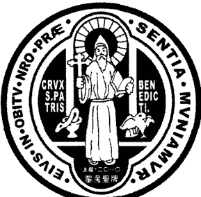

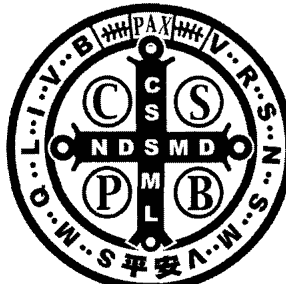

聖牌的正面是聖本篤手持著兩件東西。右手持著他特別熱心敬禮的十字聖架；左手捧著本篤會會規。右手下方有一盛滿毒藥的酒杯，有毒蛇從杯中爬出，聖本篤以十字聖號粉碎了它；左手下方是魔鬼誘惑他的有毒的麵包，被烏鴉叼走，免於誤食。

> 環繞在聖本篤像的四周，寫著：
【Eius in obitu nostro praesentia muniamur!】
May we be strengthened by his presence in the hour of our death.
在我們臨終時，願他來堅強我們
聖本篤常被人視為「臨終主保」。

## 附魔與驅魔
DEMONIC POSSESSION AND EXORCISM

聖牌的背面有一個十字架，在十字架的縱線上寫著五個字母縮寫：C S S M L

> 【Crux sacra sit mihi lux!】

May the holy cross be my light! 神聖十字架是我的光明！

橫線上寫著五個字母：N D S M D

> 【Nunquam draco sit mihi dux!】

May the dragon never be my overlord! 惡龍永遠不要作我的大王！

在十字架的四個象限有四個字母：C S P B

> 【Crux sancti patris Benedicti】

The Cross of our holy father Benedict . 聖本篤神父的十字架

環繞四周的是“Vade retro satana”驅魔經文的字母縮寫：V R S N S M V - S M Q L I V B

> 【Vade retro Satana! Nunquam suade mihi vana! Sunt mala quae libas. Ipse venena bibas!】

Begone Satan! Never tempt me with your vanities! What you offer me is evil. Drink the poison yourself!
滾開！撒彈！別想用你的虛偽來誘惑我！你所給的都是邪惡的。你自己去喝那杯毒藥吧！

## 此聖牌的用途：

- 1. 飾於脖子的項鍊上
- 2. 附掛在玫瑰念珠上
- 3. 置於皮包或皮夾中
- 4. 放在家中或汽車裡
- 5. 放在房子或建築物的地基下
- 6. 鑲嵌於十字聖架的中心

## 配戴此聖牌的特恩

- 1. 摧毀巫術與邪魔的侵犯技倆
- 2. 使心懷邪魔的人遠離
- 3. 保護人免陷於魔鬼的誘惑或干擾、侵犯
- 4. 使罪人悔改，特別是臨終的人
- 5. 抵抗潔德的誘惑
- 6. 保護母親順利生產及嬰兒的平安與健康
- 7. 雷電與暴風雨中（天然災害）的護佑
- 8. 身心疾病的痊癒及避免疾病的傳染

## 聖本篤祈禱文^112^

大聖本篤，聖德楷模，天主聖寵之器！我等跪爾前，求爾仁慈之心，主前為我代禱。我等日日深陷諸仇諸惡，吾願效法爾，助我抗敵，賴主恩祐，遠避邪惡，脫免諸罪。

大聖本篤，爾從未拒絕向爾投靠者，懇望藉爾轉禱，以爾常被天主憐憫之心，扶助我於困苦憂患之時；並使我等堅信切望，藉爾轉求，為顯主榮，為護我靈，隆賜我等生活所需各恩。

大聖本篤，助我等生時卒時，順從主意，獲享天堂永福。阿們。

> 112. 中文譯自：
Prayer To St. Benedict
O glorious St. Benedict, sublime model of all virtues, pure vessel of God's grace! Behold me, humbly kneeling at thy feet. I implore thy loving heart to pray for me before the throne of God. To thee I have recourse in all the dangers which dally surround me. Shield me against my enemies, inspire me to imitate thee in all things. May thy blessing be with me always, so that I may shun whatever God forbids and avoid the occasions of sin.
Graciously obtain for me from God those favors and graces of which I stand so much in need, in the trials, miseries and afflictions of life. Thy heart was always so full of love, compassion, and mercy towards those who were afflicted or troubled in any way. Thou didst never dismiss without consolation and assistance any one who had re-course to thee. I therefore invoke thy powerful intercession, in the confident hope that thou wilt hear my prayers and obtain for me the special grace and favor I so earnestly implore ( mention it ), if it be for the greater glory of God and the welfare of my soul.
Help me, O great St. Benedict, to live and die as a faithful chIld of God, to be ever submissive to His holy wIll, and to attain the eternal happiness of heaven. Amen.

# 附魔與驅魔牧靈計畫大綱——以台灣天主教為例

沈拉蒙

對教會來說，無疑地台灣是一個執行單位。目前台灣雖然劃分成七個教區，但整個台灣的規模不大，教區間的互動也相當頻繁，因此要有效率地推動一個牧靈計畫，必須要整合全台灣的力量。正因為如此，本計畫將由上至下分層進行。

1. 成立向主教團負責的委員會
一旦主教團決定進行附魔相關的牧靈工作，也就是該成立一個負責進行相關研究，及設計相關牧靈工作計畫的委員會的時候。此委員會需定期向主教團報告其成果，並在主教團允許後，方能執行其牧靈計畫。

2. 成立跨學科的研究團隊

# 附魔與驅魔
DEMONIC POSSESSION AND EXORCISM

由於附魔與驅魔相關領域的研究停滯已久，因此在著手之初，最需要的是搜集第一手資料。而因天主教信徒在台灣仍屬相對少數，教友在此議題上極可能受其它民間宗教的影響。我們須界定、釐清這些影響，並做進一步研究。為達此目標，成立一跨學科，並有能力與其他宗教學者合作的團隊，有其必要性。

在委員會成立之後，需搜集並整合如下的資訊：

- （1）過去在教友間曾發生過疑似，或確定的附魔案件，及過去的處理方式；
- （2）台灣教友對此議題的真正看法，及對教會的影響；
- （3）社會上其它宗教信仰對此議題的看法，及其對教友的影響；
- （4）其它宗教信仰解決附魔相關事件的實際作法。

匯整後，可進一步完成以下目標：

- （1）有關魔鬼的影響在現今教會的重要性；
- （2）與台灣教友的信仰與教會教義的異同之處；
- （3）台灣教友的信仰中是否有需加強與改進之處。並提出建議；
- （4）評估其它宗教的作法是否有其借鏡之處。然而此步驟僅嘗試找出符合台灣當地教友需求的可能作法，一切進行仍需依照「教會傳統」與「教會教義」的原則。

為了確實執行此目標，跨領域的研究小組，最好包含以下領域的專長人員：神學、聖經學、教會學、宗教研究、社會學、駐堂神父、牧靈人員、靈媒、民間信仰學者、醫護人員、心理醫生及心理學家等。

### 3. 成立進修教育中心

據 Gabriele Amorth 的看法，由於天主教對於附魔議題的長期忽略，幾乎已造成了「失傳」的現象114。

由於現今我們缺乏良好教育與訓練而能隨時擔任驅魔工作的神職人員，因此一旦被主教任命為「驅魔者」或「牧靈人員」的人，多半不知何處能提供正確的資訊及協助，以完成任務。現今台灣缺的不僅是整合資訊的單位，能提供牧靈工作諮詢與訓練的機構也付之闕如。

驅魔者的能力並非與生俱來，他們需要有：

- （1）完整的神學理論基礎；
- （2）實際操作上，需有「導師」提供完備的前導工作；
- （3）後續的進修與學習。

一個好的牧靈工作人員也需要受到相同的訓練。因此，除了成立研究小組外，還要成立一個進修教育的機構，及資訊中心。為了發揮其結構性功能，可在此小組外設一個可一同或分開運作的機制。最重要是，研究小組成員必須與此機構保持良好的互動聯繫，此機構可作為驅魔者及牧靈人員的專門養成機構。

> 114. Gabriele Amorth, *Habla un exorcista*, pp.177.

# 附魔與驅魔
DEMONIC POSSESSION AND EXORCISM

## I. 資訊中心

成立對外開放的資訊中心，只要有人需要這方面的協助，可任何時間向此機構洽詢。此外，成立專屬的網站，內容需有系統的（而非鬆散片面的），並將所提供的資訊分等級（如非教友、教友、牧靈人員、教會幹部等等），方便搜尋者搜尋。此外，這也需要具有一定權限者才可搜尋、閱讀與使用。

## II. 進修教育的學習中心

本中心運作分三部份：

- (1) 短期的前導課程：課程應多樣化。包括認識天主教教義、驅魔儀式的進行、心理諮詢技巧、心理輔導與牧靈工作等。
- (2) 驅魔儀式前導性的實際操作：以「實作」的訓練課程為主要目標。可在模擬下進行，或進一步延伸至陪伴驅魔者參與真實案例做觀摩學習。
- (3) 進修教育：提供給所有在此一領域的牧靈工作者，彼此分享經驗，增進學識管道。

> 在此，我們還要提出 Fortea 的看法：
目前的現象是，驅魔的實際經驗正逐漸集中累積在少數的驅魔者中。以往，一名驅魔者可能畢生只有一、兩次的實際驅魔經驗。然而在今天，由於數量減少，驅魔者必須處理日漸增多的附魔案例。現今驅魔者本身所累積的經驗，比起往昔的驅魔者們要豐富得多115。

因此，我們相信實際地參與，對於研究上有相當的幫助，特別是驅魔者若能給新手上課，分享自身的經驗，對驅魔者的養成訓練將大有助益。有經驗的驅魔者不一定要全程參與教育的課程，而是在實際操作的課程中，給缺乏經驗的驅魔者在課堂上學不到的經驗傳承。

## III. 出版品

有系統的出版品是具體協助的基礎。

- (1) 驅魔禮典：首先要出版的就是大公主教會議通過的「驅魔禮典」中文版。本禮典應包含可供遵循的規範。由於現實生活中真正的附魔案例並不多見，而驅魔儀式也只有神父才能進行，因此此書僅供專業人士，而非一般教友有興趣就能閱讀。

此外，也提供兩種範圍較廣的出版品，分別對負責照顧附魔案例的牧靈工作人員，及一般的教友，予以協助。

- (2) 給牧靈工作者的出版品：此牧靈指南為最重要的出版品，因它直接影響了牧靈工作該如何進行。此書應清楚載明：牧靈工作重心、理論基礎、實作時可能需要之指示等內容。並定時更新，寄給牧靈人員，以使資料更備全。

- (3) 給一般教友的出版品：應盡量簡便，因為這是給任何人在毫無準備之下緊急之用的。手冊必須包含三部份：第一，一個說明關於附魔與驅魔議題基本教會教義的備忘錄；第二，包含解放祈禱及撫慰人心的祈禱文；第三，則是給受折磨的人一些安慰及希望的經文。

### （三、教區層級）116

#### 1. 主教的角色

主教是教區所有行政的負責人。因此，他也一併負責了牧靈及驅魔的一切工作。只有主教擁有任命驅魔者，及准許驅魔工作進行的權力117。主教未授權之下，教區不能進行驅魔工作。台灣區的主教必須誠心地檢視自身教區的狀況，衡量牧靈工作的需要並訂出合適、妥切的牧靈工作方式。

主教不能規避自身的責任。Amorth 針對這一個現象特別提到：

> 「就如我指控的，一些主教放任其教區中的驅魔工作停滯荒廢，這是難以饒恕的罪。」他進一步指出：「如果一個主教，在經過正式的請求（非精神病患的請託）後，仍不願意親自採取行動或是委託神父進行處理，那他就犯了嚴重的失職罪過。」118

- 116. 原著標題編號。
- 117. 天主教法典第一一七二條。

## ## 2. 神父及驅魔者的角色

前面已提到，驅魔者的任命權在主教手中，教會法第1172條規定，從事驅魔工作的神父必須具備了：虔誠、學識、明智與正直等條件。而本人以為，要有道德、名聲、健康、堅定的信仰及專業的知識等亦是其應具備的條件。

然而，主教們在尋找願意被任命為驅魔者的適當人選時，往往會遇到困難。最根本問題在於缺乏養成教育，及一個平易可及的管道。「訓練一位驅魔者絕對不能倉促，指定一位神父當驅魔者，在某些方面，就如同將一位需動手術的病人送到他面前，並且要求他動刀是一樣的。」119

我們要進一步探討的，是拒絕擔任驅魔者的神父們，或已擔任者，「從來沒有行使過驅魔者的能力，因為缺乏信德，就害怕去得罪魔鬼。」120

從此方面來看，我們要再次引用 Amorth 的話來幫助這些神父們釐清一些事情：比起驅魔，魔鬼對於告解更感到憤怒。因為驅魔者僅僅是將魔鬼驅離人的軀體；告解卻是將靈魂引領回天主的身邊。魔鬼甚至更厭惡佈道，因為透過天主的話語，信仰得以發芽。因此有勇氣佈道及告解的神父不應該害怕進行驅魔。

因此，本人以為，一個驅魔者必須要有堅強的信仰，一定要相信天主的力量能夠驅除魔鬼。

### 3. 成立教區牧靈中心

由於管轄範圍有限，台灣的許多教區可能不需要，或無法維持成立一個自己的教區牧靈中心。然而仍有成立的可能性，只要幾個教區的主教們願意共同在數個教區的合作下，成立為這些教區教友服務的「跨教區牧靈中心」。

#### 1. 教區牧靈中心的目標與任務

我們認為此一中心在牧靈計畫的推廣上將是最重要的單位。此中心必須與堂區保持聯繫，好能提供適當服務；另外，也與其它研究附魔現象的基督教與非基督教團體合作，並維持在社會上的能見度。

現今許多個案並非發生在教友之間，而是發生在非教友身上。他們會來教會尋求協助，想知道這些他們無法處理的案例，教會內是否有辦法解決。

如果驅魔的牧靈工作能夠有效率的進行，不僅可吸引非教友更接近教會，也能幫助他們更認識主。也就是說，驅魔牧靈工作的成敗，對於鞏固或削弱教會的社會地位息息相關。

## II. 教區牧靈中心的人事結構

- 1. **中心主任與驅魔者**
   中心主任必須對整個教區內的驅魔牧靈工作負責。此工作亦可由驅魔者本身擔任，因為驅魔者對於案例的診斷，扮演著相當重要的角色。此外，中心主任還有其他驅魔者無法兼顧的任務（如：組織工作，行政工作等），就由修女或平信徒擔任。此情形下，中心主任需與驅魔者保持良好的合作關係，並在必要時彼此協助。

- 2. **初級看護人員**
   此工作是在中心內，照顧前來尋求幫助的每一個案。求助者，有可能包括堂區的教友與非教友。
   其工作包括：接待每一案例，耐心傾聽，使求助者感覺被了解與照顧。此外，搜集每一個案的基本資料（家庭狀況、教育程度、病史、症狀等），並對每一個個案的心理狀態做評估以決定下一執行的步驟。需要特別照顧的案例，需盡快與中心主任或驅魔者聯繫。最後，還要負責追蹤每個正在接受治療，或已完成療程的案例。必要時，將案件轉回堂區，並確保這些個案與堂區保持聯繫，追蹤個案的症狀日後是否好轉。這樣做是為了讓個案能夠在結束療程時，仍感覺到「被陪伴」且「貼近信仰」。

- 3. **其他人力資源**
   有時與其他團體合作是必要的。在此我們強調專業的醫護人員與心理醫師的重要性。這些專業人員可幫助我們在判斷案例時是否真為附魔現象，或只是精神不穩定而產生心理上的疾病。

## III. 具體的基本建設

每個教區牧靈中心的成立，皆是依據所能使用的資源自由設立。在此，我們僅強調兩個機構的重要性。

### (1) 初級看護中心與辦公室

辦公室是進行行政工作，以及牧靈中心與堂區，及所有對外聯繫的窗口。而初級看護中心是直接對前來尋求幫助的個案，提供照顧的場所。

### (2) 特別看護中心

我們相信為嚴重個案成立此中心是必須的。將需要進行驅魔儀式的個案安置在特別看護中心內，以方便觀察，並在需要時進行驅魔儀式。

附魔個案在看護中心休養的同時，必須安排一個負責照顧的人員，至少要由家人陪伴。

同時，此中心需要準備：

| 物品                 |
|----------------------|
| 驅魔禮典             |
| 聖書                 |
| 聖像                 |
| 白袍                 |
| 聖衣聖帶             |
| 水                   |
| 鹽巴                 |
| 聖油                 |
| 床墊與坐墊           |
| 清潔用品             |
| 繩子                 |
| 一個小禮拜堂         |
| 急救用醫藥箱         |
| 醫師聯絡電話         |

個案在經過驅魔後，還需要一個安靜的環境做長期修養，可向個案們推薦適合避靜或靈修的機構。

### 4. 祈禱與協助團體

在此指的是釋放祈禱的團體。此類團體對附魔個案仍具有相當的效力。中心可成立此類團體，整合在牧靈工作中，或由驅魔牧靈工作的神父，負責統籌其運作。Amorth 認為祈禱應該是「重新成為為病人牧靈工作的一部份」。他相信：

> 「如果附魔案件增多，祈禱團體應由專業且有準備的人成立，並處理較輕微的案件。至於較嚴重者，則交由驅魔者處理。在祈禱團體中，神職人員的參與是絕對必要的¹²¹。」

協助團體的組成可以是多樣性的：健康、信仰、祈禱、讀經、經驗分享等。

### （四、堂區領域）

#### 1. 本堂神父

首先探討本堂神父的養成教育。因為很多時候缺乏基本的教育，會導致神父處理附魔議題時的意願低落，但這不是他們的罪。由於沒看過這類事，可能對於魔鬼保持懷疑態度，也難以想像，直到親身目睹之後。而且即使親身目睹，可能也很難理解這類事為何會發生。我們的目標是要讓本堂神父在面對一個可能是附魔的個案時，有足夠的知識做正確的對待與回應；此外，還要能夠拆穿不實的恐懼，並在進行牧靈時保持心思細膩。

> 121. Amorth, *Habla un exorcista*, p.196.

#### 2. 牧靈人員

由本堂神父任命一名負責處理任何與附魔事件相關的牧靈人員。我們建議由醫療牧靈人員來擔任。一旦個案前來尋求協助，他必須初步判斷個案狀況，為個案祈禱、關懷；需進一步照顧的個案，則回報本堂神父。至於棘手個案，則必須立刻與教區的牧靈中心聯繫，尋求合作與協助。

#### 3. 協助團體

我們已提過，醫療牧靈與本堂神父及牧靈人員一同合作的重要性，透過合作牧靈工作才能保持機動性。驅魔牧靈工作，不僅是將惡魔趕走，還包括對個案性靈生活的改善，真正以基督徒的方式生活。這些後續工作可由協助團體來執行。

### （五、台灣牧靈工作的現狀：初步結論）

目前台灣的驅魔牧靈工作，與其它國家相比並沒有明顯的優劣之分。一般的神職人員，對於附魔與鬼附的認識有限，同時對於教會所能提供的驅魔牧靈工作也不是相當重視。

然而，近年來這個領域的工作已漸步上正軌。在二〇〇一年全國主教會議後，禮儀委員會頒布了中文版的正式驅魔儀典。禮典的頒布也正式宣告教會面對此一議題所採取的態度，及未來的方向。此禮典是所有驅魔牧靈工作的基礎，中文版的出版更凸顯了主教們為了滿足台灣教友的需要所做的努力。

對教會而言，附魔的案例並不多，也非急迫，但卻面臨嚴重挑戰。而台灣的教會對於附魔、驅魔的事件也沒有較有系統的運作或措施。現今的台灣的教會可說是處於「相對少數，且被外界對鬼神迷信眾說紛紜的包圍情況之下。」

如果教會真能對附魔的議題做出適時的回應，且成功的處理，不僅僅是對全體民眾提供了服務，而且一切的功勞將歸於主，主將被更多的人認識，其福音也將被廣泛的流傳。

因為，任何一個救恩的渴望，就是一個救恩的開始。他現在有渴望，他在別的地方找不到管道，他找到了天主教的神，這就是救恩的訊息。

## ## 附錄四

# # 王爺是否等於聖人

賴效忠 口述

民間宗教的神明中，有許多是善人過世後，在後人的追思與推崇下演變而來。他們受到信徒們熱烈供奉，在宗教儀式中顯過神蹟，雖然這些神蹟人不能了解也無法解釋，卻實實在在地發生在許多民間宗教活動中。

因此，有人可能會問，這類的神明，是否等同於天主教所供奉的聖人們？大前提是，如果所有的聖善都來自於天主，包括民間宗教所信奉的這些神明，他們所顯的神蹟，也是來自於天主的話，那麼是不是可以做此思考：民間宗教所供奉的神明等於天主教所崇敬的聖人們？我們可以從以下幾個角度來說：

在教會所冊封的聖人，需有幾個條件：

- 1. 他們在世時，信仰純正堅定，生活聖善，足堪為信徒們的表率，能引導人們更敬拜天主，更接近天主。
- 2. 聖人們需由教會認定，他們在信徒教友們的供奉、敬禮中，顯過至少三個奇蹟，才能被教會公開地冊封為聖人。

但除了教會冊封的聖人外，我們相信，在天堂上有許多無名聖人、隱名聖人。其實這些人確實到天堂去卻不為人知。教會冊封的聖人，一般而言，在教會歷史中常具有一定的影響力與普及性，是其他人所能接觸、看到的。教會發展時，許多在教會信仰中虔誠的人，因度聖善的生活，與天主十分親近，所以能夠成聖。

在教會福傳以外的地方，我們也相信：有許多懷著善意的人，在冥冥當中按著天主旨意去生活，在過世以後，天主也不會無視於他們的良善而不接納他們。所以我們相信有許多隱名或無名聖人，他們在天堂裡，卻不在教會禮儀制定的聖人節慶中。

從人類的歷史來說，這些隱名的聖人，一定多過於教會所公開冊封的聖人總數。也就是有眾多隱名的，藉著各種不同的文化、宗教，甚至信仰中所呈現的這些聖人，他們也在天堂裡。

如果這個前提正確的話，民間宗教中也有許多被供奉的神明，在世時也持守著良善的生活榜樣，不論是個人修為、善行或對社會的貢獻，都被人所推崇，而在死後受到民眾在寺廟內列位、祭祀供奉。民眾祭祀供奉他們，也依其受推崇的特性、原因，祈求他們相助，他們也顯過奇蹟。這些奇蹟，我們相信不是來自於他個人，一定是來自天主直接、間接的允許和協助，才能藉著他們來幫助百姓。

當然，教會公開冊封的聖人，與隱名的聖人之間的敬禮是不能夠相提並論的，兩者境遇也不同。不過，我們是否可將民間宗教中對神明的敬禮，當作是教會未公開冊封的聖人，而能和現今天堂上的聖人們等量齊觀？意思是說，民間宗教崇奉的神明，對天主教而言屬無名或隱名的聖人。而在對民間宗教中的無名、隱名聖人的神明供奉與崇拜時，我們姑且可將之視為人宗教情感的一種自然表達。當然，他們還沒有接受教會耶穌基督啟示的光照，仍處於這樣一個過程的階段。若如此，我們可以在某種程度上，接受民間宗教對神明的認定，或敬禮的活動。

我們可以大膽地假設：如果一個民間宗教接受教會公開冊封的一位聖人，將之納入他們的廟裡當作供奉的神明之一的話，那麼，教會能否接受這樣的安排？又或者，我們在廟裡面，看到除了達摩像、關公像、釋迦牟尼像、媽祖等像之外，還看到供奉聖母像，或教會所說的聖人，譬如：聖方濟各、聖道明、聖多瑪斯等；在這樣的情況下，教會要如何認定他們呢？是不是要禁止聖人們被其它宗教崇拜呢？或者，我們就禁止我們的聖人入到他們的廟宇裡接受崇拜？這可能是一個信仰的過程，這個信仰過程有待提升，有待淨化，但不能排除他們對未來終極目的的詮釋和期待。意思是說，天主會藉著這樣的方式來拯救這些人的。

當然，許多人疑慮這些民間宗教所供奉的神明並非真正的聖善，不合乎教會的要求標準，這部份是可做討論的。但是，不能太快就將所有民間宗教供奉的神明，皆視為邪神或偶像崇拜。在安平地區六個古老的角頭社區裡，有十五間廟宇。其中約有百分之八、九十以上，都供奉著各種不同的王爺。王爺信仰在安平地區非常興盛。除了公廟以外，幾乎每一個安平地區的私廟與角頭廟宇裡，都有自己的乩童，來當作王爺與信眾溝通的管道。乩童所扮演的角色，常是王爺藉著乩童來救世濟民，拯救人間的苦難和疾病，或是去邪除妖。這種宗教舉止，基本上是神明對信徒愛的表示，未嘗也不能夠代表天主藉著這些人，透過乩童，對人施展愛的一種方式：包括生理、心理的治療，或是心靈的撫慰，或是居家生活的平安等等，都有其直接、正面的意義在裡面。

當然，比較受爭議的點是，所謂的王爺附身在乩童身上。

乩童，是王爺或神明特別揀選的人。被選者在同意後，需要一段長時間受禁，約七七四十九天在廟內接受神明的教育：包括王爺傳達話語的方式、腳步技巧、咒語練習、符咒書寫、法器運用等，都必須在此四十九天的期限內，接受神明的教育，才能夠成為神明的真正代言人。

通常也認為，神明講話時，乩童會起乩，此時乩童儼然成為神的化身，或神明附身在此人身上。乩童被附身時，言談、舉止所表現的，都反應出附身的神明本來的人格特質。不論他所使用的語言、聲調、手勢、面部表情、身體的舉止等等，都反應出那位神明特有的風格。

此部份，可將它解釋為「附身現象」。但「附身」## 附魔與驅魔

### DEMONIC POSSESSION AND EXORCISM

在教會的觀點裡亦可隱約看出。教會對於靈界介入到人世間的情況，其實在聖經中亦有所記載。譬如，宗徒大事錄中提到，當伯多祿被囚時期間，天使顯現給他，與他說話，並帶著他離開了監獄。在與天使交往當中，他們也有對話，如同靈界的存有物是能夠與我們人世間的存有物做溝通的。方式上可能有所不同，但是基本上仍可以被理解。

教會也相信，聖人們能成為天主救恩的工具或媒介（使者）。藉著天主的派遣，聖人們來到世上對人說教，或警惕人們，譬如：聖母、聖人的顯現等，都能成為天主的救恩工具或標記。

這樣的想法，也表現在路加福音第十六章，關於富翁與拉匝祿的比喻裡。雖然身處於地獄的富翁，與在天堂裡亞巴郎懷抱當中的拉匝祿，兩者間有著絕對的鴻溝，而且天堂與地獄是不能相互取代的；但是富翁卻向亞巴郎提議，派已在天堂的拉匝祿到富翁的家裡，跟他幾個弟兄說教，他的弟兄就會悔改。但這請求被亞巴郎斷然拒絕。

我們可以隱約看到，拉匝祿再次回到富翁家裡，為富翁的弟兄說教的可能性。這間接說明了聖人們能夠在天主的旨意允許、指派的情況下，回到人世，對人施以直接的幫助：不論是透過顯現，或是替身的方式。

我們大概很難想像，當路德聖母或法蒂瑪聖母顯現的時候，她們的長相完全一樣，就跟歷史中在納匝肋居住的聖母是同一個模樣的聖母。

既然生活在納匝肋的聖母、路德聖母、法蒂瑪聖母等，顯現的樣子都不太一樣。那麼，我們是否可做這樣的大膽假設：聖母是藉著現場的人所能接受的形象呈現出來？如果說在非洲，或是在歐洲、亞洲，聖母顯現的情況還是按照她原來在納匝肋生活時的歷史形象的話，可能會讓在場看到顯現的人覺得唐突、不易接受。所以，聖母可能藉著一種形象顯現，也就是當地人能接受的觀點，包括她的面貌、舉止、衣著等。因為天主會因應人的需求來做呈現。

若是如此，我們也可以隱隱約約地看到這些聖人們，他們也能夠附著在一個人的身體裡面，來呈現他本然的特質與風格。這與民間宗教的王爺附身現象，是不是能夠有某種異曲同工之意、某種程度的相通？甚至可以作為交談的可能性？

當然，這種假設說法，需要更多的學術研究加以探討，也需要更多的鑑定。基本上，我們並不能太快在二者間劃上等號；但是我們也不能夠斷然地就為它劃上不等號。所以我們很需要從一些實際個案的背景資料，做仔細且客觀的推敲後，才能夠區分出哪些有可能，哪些沒有可能，甚至哪些是錯誤的。

我們相信，畢竟在沒有天主明確的啟示、光照下，人很容易就會陷於錯誤之中。我們可以在「梵蒂岡第二屆大公會議」的文獻當中，或是「教會訓導」裡找到一些依據。教會並不否定，在不同文化、宗教、社會、道德裡，可能隱藏著一種對人救恩性的安排。這種救恩性的安排是天主對人施救的一種特殊方法，雖然不是一個正常的方法，但是這個特殊方法還是有可能的。教會的目的就是設法在這些的不同當中去釐清，去分析，予以淨化，最後提昇到天主所要啟示、光照的層次去。所以，不同的文化、宗教與信仰之中，也有可能某種程度地蘊含著天主所要啟示的一些真理。因此，我們可以將民間宗教的這些現象，看作是一種宗教情感的表達，信仰情操的自然投射。

## 附录五
## 天主教对神视与神明显现的看法

赖效忠

在各种宗教中，几乎都存在着「神明显现」的说法。它与宗教信仰中的神明观，以及信徒的宗教素养，有着密不可分的关系。不过，也正因它的玄不可测，常会造成诸多混淆，使得宗教信仰变了质，更有甚者，成为神棍们迷惑信徒的工具。正本清源，实属必要。

## 一、神视与神明显现，实是一体的两面

神明显现，是神明主动的作为；神视，则是目击者的被动接受。

- 神视：是在人并未做什么努力的情况下，突然由内心深处浮现一种神明的形象或对神明的知觉，而此事件的发生，来自神明的特殊行动，超越人的能力所及；也可能是在潜意识中，「看见」或「听见」神明或神明的代表所做的指示。
- 神明显现：是指神明藉着人的感官所能觉察、接受到的形象或人物，显现给人。神明原本是无形无像的，但为了迁就人本性的限制，采取了有形的外体，以便與人接觸。神明顯現的目的是使人認識神明內在生命的活動，或是為傳達某種特定訊息與旨意。因此，神明的顯現，多少都帶著神秘的色彩，有時不但能使人見其形，也能聞其聲。

在神明顯現時，也常伴以大自然的特殊變化，以顯其威嚇，例如：閃電、地震、烈风、風暴等。

這種比人類更高的力量，直接介入到人的生活裡的神視與神明顯現等事件，天主教的聖師聖奧斯定將之區分為三種：肉身實體的顯現（ Corporeal ）、形象圖畫式的顯現（ Imaginative ）、在意念知覺中的顯現（ Intellectual ）。

## 二、肉身實體的神視及顯現

肉眼所能見，客觀超性（ supernature ）的顯現。這可能由兩種方式產生：第一種，在人的眼中是一個確定的肉身實體（ 本尊 ）；第二種，以一個替代物的形態（ 分身 ），直接透過人的肉眼感覺所產生出來的，並相合於本尊的形象或本質。 前者是通常的形式與方法，與目擊者的信仰相符一致，例如：看到在法國露德聖母顯現的聖女伯爾納德。如果顯現延續得夠長，或是多人同時看到，這意味著至少是一個奇蹟。

但是，外在形象的顯現，可以有兩種方式來理解認識出。有時是本體性的顯現，但有時亦可能被安排是由其不同的存在方式所形成。前者是活生生的人體，是一種超性現象，可同時在不同的地方現示，也可以不必停留在其在世時的形象。後者可以被理解為其復活後特殊體質的肉身顯現，或是其靈魂純精神體式的顯現。

## 三、形象畫面式的神視及顯現

客體藉著主體單純想像的行動（不靠肉眼）所呈現出的一個感覺所能及的表像，有時是無法抗拒式地直接映入腦海中，而不必是一種超性的幻想或幻覺。超性圖像式的神視或顯現，是來自超性的行動者（天主）的行為所致；所激發出的圖像來自於天主的作為，不會特別活躍（鮮活），而是在神聖且恩寵的情境下所完成；且目擊者也無力對抗，或自己構思（架構）出其本質的部分。如果目擊者嘗試加入個人的想法或影響因素，常會造成神視及顯現的縮小或斷絕的結果。

這種神視或顯現通常不會停留太久。一方面是因為這種強迫性介入人生活的力量，令人無法承受太久；另一方面，他也可能很快就會轉入到意念知覺式的神視領域。

這類神視或顯現，經常在睡眠中發生，那是因為在睡眠中，靈魂不會被複雜的思緒所打擾，因而敏感度較強，接受度較高，印象也較為清晰深刻。經常很難區分實體的顯現與形象的顯現。不過，如果是產生了一些外在的效果，如復活後的耶穌吃食物，則必然是實體的顯現。（或在某些記錄中所述，顯現的魔鬼在經過物體時所產生的灼燒痕跡。）但是如果閉上眼睛後仍在，或火球停留在頭上而未灼傷，則必然是形象式的顯現。當外在的感覺停止後，感受者經常仍會停留在精神恍惚的狀態（神魂超拔），雖然這種神秘境界仍有待深入討論，但無論如何，這種現象仍是由外力所造成的。形象式的神視，也可以是代表式（替代物）或是標記性的。許多先知們的神視就是如此，例如：雅各伯的梯子等。

## 四、意念知覺中的神視及顯現

是沒有能感觸到的形象。可以是以一個非超自然的現象來呈現。即使是我们認同Scholastic的主張：「每一種意念都是來自某些圖像」，也不能排除「影像可以脫離意念」的可能性。意念知覺式的神視也是一種超性現象，它超越了本性所能理解的限度，例如：靈魂的本質（本體），在他物身上看到主體（目擊者）的恩寵境界，天主及聖三的本體關係（看到或意識到天主的本體）。而且，有時此情況會延續一段相當長的時間，例如：聖女德蘭（她在自傳中說此情況超過了一年）。這種天主的介入，可由以下現象被認出：它的結果，持續的光照，天主的聖愛，靈魂的平安，對天主的事務持續熱愛，以及成聖的果實。

意念式的神視，是發生在理智的領悟中（understanding），而不是在理性思維的機能上（reasoning faculty）。如果客體是在人的理性範疇中被認知，那也是要靠天主的光照。如果不是在理性的範疇中發生，那就是由奇蹟所產生的。

在深層的領域中，神視將成為人類語言所無法形容的，但不是不可知論。無法形容，並不代表無法理解，許多時候得用「否定法」來形容。神視與聖德不必然平行的（成正比）。不過，在意念式的神視中，超性的秩序與天主聖三的奧秘是絕對一致的。

## 五、聖人的顯現

天主也常藉著聖人們的顯現而工作，但天主永遠是第一原因，因為他們是按照天主的救恩計畫而出現的；最終的工作者，還是天主自己。然而，聖人們也是工作者，因為天主是藉用不同聖人本有的不同個人特質來工作，因此也可能展現不同的神旨、神恩與訊息。

而目擊聖人顯現者，他本身也成為了天主救恩工程的合作者。他們在接受之餘，也應力求明白此顯現的意義，並盡力用其所能掌握的語言與形象，來形容及解釋此次天主性的行動。

## 六、魔鬼的顯現

魔鬼常以一個具體的形式來顯身（魔鬼本質性地遜於天主，因此其顯現，也不如天主般的神奧），例如：引誘原祖父母犯罪的古蛇形狀。保祿宗徒也認為，魔鬼常以光明天使的形象現身（常會與神聖超性的顯現相混淆。參格後11:14）。魔鬼的顯現，常是反真理、危害人的，但有時會披著美麗惑人的外衣、溫情蜜語，不談十字架、痛苦犧牲的價值。要觀察其自始至終，是否結出善果。

若能明確釐清神視與顯現的觀念，亦有助於對附魔與驅魔的分辨。

一般而言，通靈、招魂術是很有可能招來魔鬼的行動，而不是天主的救恩福份。

越來越多的神明顯現事件喧囂塵上，真假不易分辨，極易造成大眾的困惑與疑慮。若不能與神明的本質、其超越性及救恩性取得和諧，則無疑是對宗教信仰的一大打擊。天主教會一向對這類事件保持最審慎的態度，除非經過縝密的調查，絕不會輕易地宣信。

# 參考書目

## 中文

1.  中國主教團，《天主教要理》，臺北：天主教教務協進會，1996。
2.  王敬弘，《心靈的治癒》，臺北：光啟，1983。
3.  王敬弘，《見證》，臺北：見證月刊社，1997年4月。
4.  王敬弘，《談鬼事，話靈修》，臺北：光啟文化，2004。
5.  司馬道人，《不撞鬼驅邪護照》，臺北：紅蜻蜓文化事業，2001。
6.  台北聖神同禱會、耶穌會青年使徒工作室合編，《走過風火歲月，王敬弘神父合集》，台北：光啟，2004。
7.  朱秉欣，《怎樣辨別附魔與精神病？》，教友生活周刊（2002年3月10日）五版。
8.  江傳德，《天主教在臺灣》，高雄：善導週刊，1992。
9.  佛光大藏佛經編修委員會，「魔鬼，鬼」《佛光大辭典》，高雄：佛光，1988。（上）1056；（中）656，1879，491，4356，6369；（下）161。
10. 余燮寅，《國際鬼靈信仰特展》，基隆：文心，1999。
11. 李世偉，《台灣宗教閱覽》，臺北：博揚文化，2002。
12. 李哲修，《越界重逢》，臺南市：聞道出版社，1996。
13. 沈宇憲，《宋代民間的幽冥世間觀》，河北：商鼎文化，1993。
14. 谷寒松，「魔鬼」《神學辭典》，輔仁神學著編譯會，臺北：光啟，1996。
15. 阮德茂，《原罪論及其它》，臺北市：永望文化，1997。
16. 周克勤，《神學本位化點滴》，臺南：聞道出版社，2002。
17. 房志榮等，《輔大宗教系二〇〇〇年宗教交談研討會論文集》，臺北縣：輔仁大學，2002。
18. 秦家懿、孔漢思，《中國宗教與西方神學》，臺北市：聯經，1993。
19. 馬書田，《中國人的神靈世界》。北京：九州出版，2001。
20. 張春申，「靈異與迷信」《神思》50期，香港：思維，2001。
21. 莊嘉慶，《宗教交談的基礎》，臺北市：雅歌，1997。
22. 許慎，《說文解字》，臺北：天工書局，1992。
23. 郭淨，《難：驅鬼，逐役，酬神》，臺灣：珠海，1992。
24. 喬繼堂，《中國人的偶像崇拜》，台北：百觀，1993。
25. 黃文博，《台灣人的生死學》，臺北：常民，2000。
26. 黃文博，《台灣信仰傳奇》，臺北市：臺原，1995。
27. 黃澤新，《中國的鬼文化》，臺北：幼獅文化事業，1995。
28. 黃懷秋等，《宗教交談：理論與實踐》，臺北市：五南，2000。
29. 陳榮捷 ，《中國哲學文獻選編》，上、下冊，台北：巨流，1992。
30. 楊牧谷 ，「魔鬼」《當代神學辭典》，頁381，2921號，臺北：校園書房，1997。
31. 楊牧谷 ，《魔與眾生》，臺北：卓越，1995。
32. 楊信實，《道教與基督宗教靈修》，臺北市：光啟，1997。
33. 楊國樞 ，《文化、心病與療法》。臺北：桂冠，1994。
34. 楊舒媚 ，《驅魔主教鄭再發現身說法魔現場》，新新聞782（2002年2月28日～3月6日）（30- 34）。
35. 聖禮及聖事部頒布，天主教主教團禮儀委員會議，《驅魔禮典》（De Exorcismis et Supplicationibus Quibusdam），臺北：天主教教務協進會，2001。
36. 葉明翰 ，《從聖經來「談運說命」》，臺北：大光傳播，2001。
37. 董芳苑，《另一個世界的秘密》，臺北市：宇宙光，1994。
38. 董芳苑，《探討台灣民間信仰》，臺北市：常民文化，1997。
39. 董芳苑，《認識台灣民間信仰》，臺北：長青，1986。
40. 鄭昆如，《宗教與人生》，臺北市：五南，2003。
41. 趙熙，《虛無縹緲的鬼神世界》。北京：宗教文化，2001。
42. 劉立，《談鬼論怪說從頭》，臺北：尚宇，1977。
43. 鄭玉英，《由教宗驅魔談起》，教友生活週刊（2002年3月10日）五版。
44. 鄭志明，《神明的由來——中國篇》，嘉義縣大林鎮：南華管理學院，1997。
45. 鄭志明，《神明的由來——臺灣篇》，臺北：南華管理學院，1998，二版。
46. 盧勝彥，《靈的世界》，臺中市：新企業世界，1981。
47. 戴惠詰，《聖靈的醫治》，臺北：橄欖，1996。
48. 謝仁道，《衝突與征服：台灣所面對的能力會戰》，臺北：橄欖，1992。
49. 謝仁道編著，《衝突與征服》，臺北：橄欖，1992。

## 外譯中

1.  聖多瑪斯阿奎那著，周克勤等譯，《神學大全》，中華道明會、碧岳學社聯合發行，2008。
2.  教宗本篤十六世著，鄭玉英譯，《納匝肋人耶穌》，台南：聞道出版社，2009。
3.  Jone C. Dowd，劉德松譯，《夜盡天明：敵人》，臺北：上智，1998。
4.  Matthew Linn, Dennis Linn, Shella Fabricant合著，《心靈的奧秘與治療》，臺北：上智，2000。
5.  Rebecca Brown，吳美真譯，《走出撒旦教》，臺北：橄欖，1990。
6.  Rebecca Brown，王小玲譯，《踐踏撒旦教》，臺北：橄欖，1992。
7.  巴斯卡一多瑪斯小組，《輪迴或復活》，盧媛媛譯。臺北：上智，2000。
8.  史考特，《邪惡心理學實面對謊言的本質》，臺北：張老師文化，1999。
9.  史朗（Ron Steele），周麗文譯，《搶劫地獄》，臺北市：橄欖，1996。
10. 布萊恩魏斯（Brian L.Weiss），黃漢耀譯，《生命輪迴超越時空的前世療法》，臺北：張老師文化，1994。
11. 平野威馬雄，邱挺詳譯，《探索鬼怪的奧秘》，臺北：稻田出版，1993。
12. 孟克廉，吳光顯譯，《追根溯源從族譜談醫治》，臺北：橄欖，1992。
13. 法蘭克哈蒙，橄欖編譯小組譯，《豬在客廳裡》，臺北市：橄欖，2001。
14. 思高聖經學會譯，《思高辭典》「魔鬼」（2598，2595，1100號），臺北：思高聖經學會，1974。
15. 施安堂譯，《天主教訓導選集》「魔鬼」（286號），臺北：主教團，1975。
16. 施安堂譯述，《教父神學選集》「魔鬼」（256號），臺北：主教團，1972。
17. 科瑞福，《深度創傷、深度醫治》（上、下），臺北：以琳，1997。
18. 席琦瑪琳（Marillyn Hickey），吳德俊翻譯，《祝福永隨——除世代的咒詛》，臺北縣：橄欖，2003。
19. 桑得福（John & Paula Sandford），華秉珠譯，《靈的禁錮與釋放》（上、中、下），臺北：橄欖，2001。
20. 真野隆也，何宜叡譯，《天使事典》，臺北：尖端，2004。
21. 高科爾（Kurt Koch），溫聰美譯，《邪術的捆綁與釋放》，臺北市：橄欖，1997。
22. 高科爾，《鬼附與精神病》，香港：種籽，1978。
23. 發爾沃，楊成斌譯，《神恩的復甦》，臺南：聞道，1982。
24. 奧脫，《天主信理神學》，頁202-3，205-7，臺北：光啟，1996。
25. 神學辭典編譯委員會譯，《聖經神學辭典》「魔鬼」（227、226號），臺北：光啟，1978。
26. 葉光明（Derek Prince），以琳編譯小組譯，《趕鬼與釋放》，臺北市：以琳，2004。
27. 輔仁神學著作編譯會，《神學辭典》「魔鬼」（981-983頁），臺北：光啟，1996。
28. 聶斯（Alexander WIlliam Ness），《靈的轉移：透視靈界感染的奧秘》，臺北：橄欖，1991。
29. 聶斯（Alexander WIlliam Ness），磐石翻譯社譯，《靈的轉移》，臺北市：橄欖，2000。
30. 禱告動力小組，靈糧翻譯小組譯，《釋放潔淨禱告手冊》，臺北市：臺北靈糧堂，2002。
31. 羅勃迪格南（Robert De Grandis），黃莉莉譯，《祖先遺傳的醫治》，臺北：橄欖，2003。
32. 蘇姆洛（Lester Sumrall），吳文秋譯，《魔鬼的真面目》，臺北市：橄欖，2000。

## 外文

1.  A.A.V.V., Cura di Ignazio Sanna, *Questioni Sul Peccato Originale*, P.P.F.M.C., Padova, 1996.
2.  A.A.V.V., *Demon Possession*, ed. by John Warwick Montgomery, Bethany Fellowship, Minneapolis, 1976.
3.  Allegri Renzo, *Cronista all' inferno*, Mondadori, Roma, 1990.
4.  Balducci Corrado, *Il Diavolo*, Oscar Mondadori, Casale Monferrato,1994.
5.  Balducci Corrado, tr., Jordan Auman, *The Devil: Alive and Active in Our World*, New York: Alba House, 1990.
6.  Corte Nicolas, *Who is the Devil?*, Hawthorn Books, New York, 1958.

# 參考書目

- 7. Darlap, Adolf, 'Devil: Demons', *Sacramentum Mundi*, ed., Karl Rahner et al, vol. 2, London Burns & Oates, 1968, cols 70-73.
- 8. Dubarle A.M., Alberta Poltronieri, *Il Peccato Originale*, Centro Editoriale Dehoniano, Bologna, 1984.
- 9. Dupuis Jacques, *Toward a Christian Theology of Religious Pluralism*, Orbis Books, New York, 1997.
- 10. Fergusson Everett, 'Demon', *Encyclopedia of Early Christianity*, ed., Everett Fergusson, Garland publishing, New York: 1990.
- 11. Garret James Leo, 'Satan', *Encyclopedia of Early Christianity*, ed., Everett Fergusson, New York: Garland Publishing, 1990.
- 12. Fucek Ivan, *Il Peccato Oggi*, Universita Gregoriana, Roma, 1996.
- 13. Patrick John, Gillese, Begone, *Satan*, Our Sunday Visitor inc., 1974.
- 14. Warwick John, Demon Possession: *A Medical, Historical, Anthropological and Theological Symposium*, Montgomery, 1967.
- 15. John Kekes, *Facing Evil*, Princeton University Press, New Jersey, 1990.
- 16. Kurt E. Koch, *Occult Bondage and Deliverance*, Kregel Publication, Grand Rapids, 1971.
- 17. Mark Larrimore, *The Problem of Evil: A Reader*, Blackwell, Malden, 2001.
- 18. Renzo Lavatori, *Satana Un Caso Serio*, Centro Editoriale Dehoniano, Bologna, 1995.
- 19. Jean Lhermitte, *True and False Possession*, Hawthorn Books, New York, 1963.
- 20. Francis MacNutt, *Deliverance from Evil Spirits*, Chosen Books, Grand Rapids (MI), 1995.
- 21. Vidal Marciano, *Manuale Di Etica Teologica I*, Città della Editrice, Assisi, 1994.
- 22. Erik Mueggler, *Geographies of Pain: Exorcism and Landscape in Southwest China*, in Third International Conference on Sinology Academia Sinica. (中央研究院第三屆國際漢學會議), 2000/6/29~7/1.
- 23. Santangelo, Paolo, *Il ‘Peccato’ in Cina*, Gius. Laterza & Figli, Bari, 1991.
- 24. Karl Rahner, 'Devil: The Devil', *Sacramentum Mundi*, eds., Karl Rahner et al, vol. 2, London: Burns & Oates, 1968.
- 25. Girard Rene, *I See Satan Fall Like Lightning*, Orbis, New York: Books Maryknoll, 2001.
- 26. John Richards, *But Deliver Us from Evil*, The Seabury Press, New York, 1974.
- 27. Philip T. Weller, *Exorcism in The Roman Ritual*, The Bruce Publishing Co., Milwaukee, 1964.

## 聞道叢書發行旨趣

天主教聞道出版社發行各種叢書的目的，一方面是給教內同道提供研究現代問題的資料，以加強其對現代教會與世界的認識；另一方面是幫助教外朋友了解教會對現代各種問題的看法，進而認識基督救世福音的真諦。

現代社會的一個特徵是「忙」，沒有時間讀書；但在「知識爆發」的今天，作為一個現代人必須不斷充實自己，趕上時代。聞道叢書就是針對此一需要，為各位讀者提供忠誠的服務，每兩月出版一種書，讓大家享受一餐精神食糧。我們不敢奢想所有出版的書都能適合每一個人的「胃口」；但是，假如其中能有一本使您滿意，我們就會感到非常滿足，因為出好書是我們的最高理想！

「聞道」一詞，顧名思義，就是孔夫子所說「朝聞道，夕死可矣」的大道理；「聞道社」的英文名字叫做WINDOW（窗户），音同意亦略同。教宗若望二十三世召開第二屆梵蒂岡大公會議的動機，是要教會打開窗戶，呼吸一些新鮮的精神空氣。

聞道出版社同仁本此目標努力奮鬥，六十四年曾獲省府新聞處獎狀（編字新一字第一〇三一〇號），足見此一理想已獲得社會人士的認可。聞道社同仁自當奮勉前進，尚祈各位讀者以訂閱、批評、介紹的方式，協助我們成長並光大此一出版理想。

天主教台南教區聞道出版社謹啟
