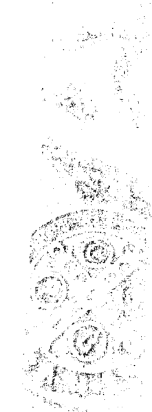
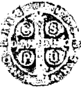
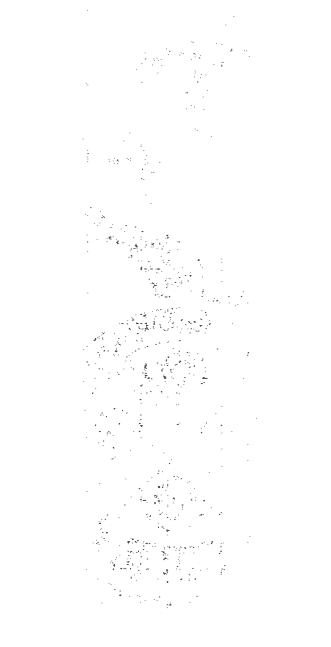
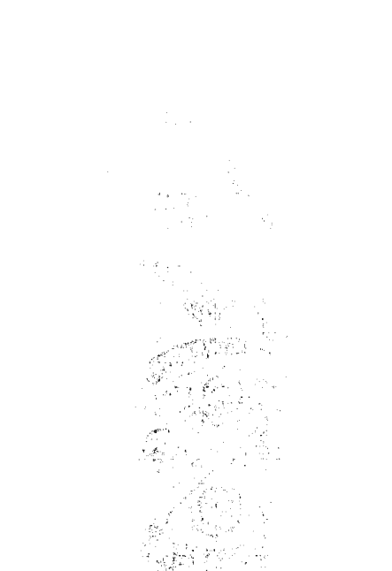
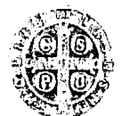
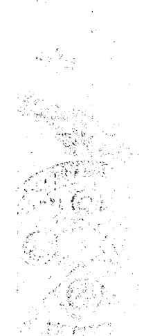
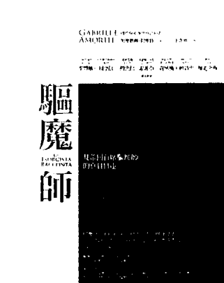
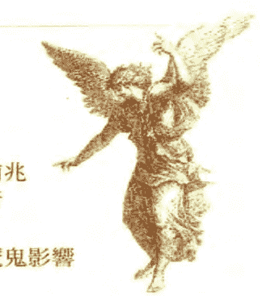

## 梵蒂岡首席驅魔師
GABRIELE AMORTH
著——加俾額爾·阿摩特

王念祖一譯

# NUOVI RACCONTI DI UN ESORCISTA
## 驅魔師II
從聖經到現代的驅魔實錄

《大法師》導演實拍作者驅魔現場
震驚威尼斯影展

與魔鬼交手30年，我講的是未經刪減的真實故事！

附魔或邪靈作祟會傳染嗎？自己做釋放的祈禱有效嗎？
女性比較容易受到魔鬼騷擾？佩戴聖牌、聖像有保護作用嗎？
被附身的人有什麼可疑的症狀？

本書以作者的驅魔實例為基礎，輔以其他驅魔師的經驗與建議，
對各種超自然現象提出從未曝光過的解答、觀察、可能的解決方法，
帶領讀者從辨認魔鬼作祟開始，實際瞭解驅魔的完整過程。

- 台灣主教團授命驅魔師 鄭文宏
- 香港天主教教區秘書長 李亮
- 輔大宗教系系主任 鄭印君
- 靈性圈知名傳訊者 Asha
——鄭重推薦

## St. Royal College
### 天使神秘学院

- 专业占卜预测机构
- 神秘学培训机构
- 水晶能量研究中心
- 神秘学资料库
- 官方微信：strcdts
- 微信公众平台：strc2011
- 读书交流QQ群：
  - 占星塔罗占卜师交流群：814594478（加入密码：PDF）
  - 神秘学其他综合群：659338717（加入密码：PDF）

微信号：strcdts
天使神秘学院
天使神秘学院 院长QQ：715104687

微信公众平台：strc2011

## 制作说明：

本书由《天使神秘学院》出重金从台湾购入的原版书籍扫描制作完成。为达到最好阅读效果，特地把原版书全部切开后，再经由专业扫描设备高精度扫描完成，并经过一张张的PS后期处理最终成书，其间花费大量的人力、物力以及时间，只为能给大家提供经济并优质的神秘学学习资料而努力。

本学院强力谴责某些机构和个人，把本学院花心血制作完成的电子书籍，包装后直接放在自家淘宝网上低价倾销的行为，以谋取不劳而获的经济利益。如果长此以往最终将无人愿意再为大家花心思制作电子书，那以后可能大家再无新书可读。

为让大家以后能够读到更多的好书，也为了本学院的良性发展。本学院恳请大家尽量做到如下几点：

- 一、尽量在本学院的网站购买电子书籍。
- 二、请勿用技术手段把电子书内的水印及加密去掉。
- 三、在收到电子书后小范围传阅即可，千万不要公开传播，更别挂到淘宝网上低价销售。

同时为答谢广大支持者，学院电子书将做如下调整：

- 一、学院会把一些早已收回制作成本的电子书折价销售。
- 二、最新制作的电子书籍会开放打印功能，大家购买后有条件的可自行打印成书。

天使神秘学院
2019年1月

## 從聖經到現代的驅魔實錄
## 驅魔師 II
# NUOVI RACCONTI DI UN ESORCISTA

梵蒂岡首席驅魔師

GABRIELE AMORTH

加俾額爾·阿摩特——著

王念祖——譯

## 目錄
CONTENT

- 專文推薦 瞭解魔鬼詭計的最佳參考書 鄭文宏 5
- 專文推薦 深刻瞭解驅魔的真相 李亮 8
- 專文推薦 為何我們喜歡看恐怖類型電影？ 鄭印君 14
- 專文推薦 戒慎自身，神與你同在 Asha 17
- 作者序 21
- 懷念恩師 23
- 前言 誠徵驅魔師 25

# Part 1
實際的驅魔過程

## 第一章
如何辨認魔鬼的侵擾

- 第一次諮商／初次的祝福禮
- 實際案例 被魔鬼完全控制的修士／一位精神科護士的告白 49

### 第二章
驅魔和釋放的祈禱

實際案例 自我釋放的例子／淨化邪魔作祟的手帕／為小男孩驅魔

### 第三章
魔鬼出現的原因及後果

實際案例 娜蒂雅的邪惡旅程／見證團體祈禱的力量 幫助驅魔的八種方法

### 第四章
困難和仍然存在的問題

實際案例 深陷邪教勢力的女子／最困難的驅魔案例／八項值得注意的事

### 第五章
魔鬼感染

一位法國驅魔師的經驗
魔鬼感染的原因／受魔鬼感染的物體／神恩與超感／受到魔鬼感染的動物
實際案例 羅西斯一家的故事：受魔鬼侵擾的房屋／從魔鬼感染到附魔

# Part 2
聖經中的驅魔

### 第六章 基督與撒旦的對抗

聖經關於驅魔的敘述／聖經中釋放的例子

相關資料 誰是撒旦？誰是惡魔？

### 第七章 「他們要因我的名驅逐魔鬼」

驅逐魔鬼的權力／早期教會的驅魔

實際案例 只有驅魔師能幫我／找到正確的釋放方式

## 第八章 撒旦的行動

關於魔鬼的教理／撒旦的「特別作為」

相關資料 教宗保祿六世論撒旦

## 驅魔問與答

### 結語 從邪靈中釋放的祈禱

## 專文推薦
瞭解魔鬼詭計的最佳參考書

鄭文宏

《驅魔師 2》是加俾額爾·阿摩特神父（Gabriele Amorth）的第二本書，全書共八章，分成二部分，第一部為「實際的驅魔過程」，由一到五章組成；第二部為「基於聖經的驅魔」，由第六章到第八章組成。

第一部分的內容講述了魔鬼存在的辨認、驅魔和釋放的祈禱、魔鬼出現的原因和其後果，以及魔鬼感染的物件、動物、住所等。第二部分寫到聖經中關於驅魔的敘述，包括基督趕鬼的案例、要因耶穌之名驅魔（是靠耶穌的權柄，不是靠自己的能力，是天主給的能力），最後則提到了撒旦的行動。

阿摩特神父以聖經的一個比喻——魔鬼來撒莠子，麥田的主人卻在睡覺——來說明當今很多人不相信魔鬼存在的現況，也不願面對、處理魔鬼相關的問題。有人不信撒旦的行為，有三個原因：缺乏陶成、缺乏經驗、很多教義錯誤。加上現代人常以心理學、精神異常來看待附魔，因而不相信魔鬼的存在與其作為。在我的經驗中，許多附魔的原因，常是由心靈的傷口所引起的，犯罪、仇恨、不願寬恕，另外還有符咒、巫術、算命、拜邪神、與鬼神交往等外在因素。要得到釋放，必須懺悔、辦告解、領聖事、祈禱、念玫瑰經、朝聖、守齋……等等。

被祈禱者須有四個心理準備：
1. 相信天主的愛
2. 相信耶穌的救贖
3. 悔改
4. 有自尊心

耶穌寶血的淨化，聖神活水的澆灌，耶穌的寬恕，來釋放心靈的束縛。想要祈禱有效，必須要有信德，相信天主的慈悲，找出附魔生病的原因，對症下藥，平常要多次的祈禱釋放，才能痊癒。每個人的境遇不一樣，有一組人共同組成祈禱團體，對療癒很有幫助；如果能有神父，有知識神恩、先知神恩的人，或有神視的人一起工作祈禱更有效。

我曾經碰到一個案例：有一位女青年發現自己的心臟瓣膜閉合不全，經過五、六次祈禱，我發現她有害怕之靈，因耶穌之名命它出去，她說怎麼出去，她裡面還有更大的生氣之靈，再次因耶穌之名命它出去，她說她裡面還有福德正神，是她祖先好幾代請進來的，最後因耶穌之名，一個一個地趕出去。另外，我還發現她從小被外婆養大，缺少父愛，而祖父母又偏愛大伯，讓父親怨恨祖父母，這生氣之靈是父親影響了女兒，害怕之靈也是由父親引起，因為父親重男輕女，從小就不抱她，使她個性畏縮、不敢見陌生人。釋放之後，她的心臟病好了，爸爸不酗酒了，父母子女的感情都變好了。

另外一個案例：瑪利不能遇到喪事，只要出殯隊伍經過她家，或是先生參加喪事回來，她就心神不寧，晚上睡不著，整天不舒服。用耶穌寶血、聖神活水來釋放她，幾次之後恢復很多。我請她多讀經、多祈禱、多領聖事，後來就完全好了。讚美天主，感謝天主。

在台灣，我沒遇到撒旦教的案例，最多遇到的是算命、去廟寺拜拜後的症狀，還有亡靈的影響、墮胎嬰靈糾纏等等。這本書是驅魔的實用好手冊，也是要瞭解魔鬼的種種詭計的最佳參考書。

本文作者為天主教蒙席、台中教區主教任命驅魔師

## 深刻瞭解驅魔的真相

李亮

在《驅魔師 2》中，著名的羅馬首席驅魔師阿摩特神父，繼續以天主教教義作為基礎，引用他本人和另一些驅魔師親身處理的多個案例，從牧靈和實用的角度來講論驅魔事工。

阿摩特神父慨嘆當代的人對純正的信仰——尤其基督信仰——不感興趣，反而嚮往傳統或新興的迷信風俗。的確，今日信神者減，信鬼者增，因為人總是渴求著從靈界得到一點對立身處世的安全感和指標。有關靈異能力的小說、電視節目、電影，如《哈利波特》（Harry Potter），或以「驅魔」為主題的電影，如《大法師》（The Exorcist），《驅魔》（The Exorcism of Emily Rose），《現代驅魔師》（The Rite）及《惡魔刑事錄》（Deliver Us From Evil），都是很受歡迎的。

自古以來，各種風俗文化普遍都有驅魔儀式，涉及呼求神明助祐及採用符咒禱文等。自新約時代以來，就有驅魔的職務，而且教會逐漸為此釐定了清晰的守則，以免流弊。

在處理附魔個案上，教會與其他宗教的一個顯著分別就是：教會一向採取極嚴格、審慎而平衡的態度，而且總是先透過適當方法（例如醫療、病理等方法），證實所謂「附魔」現象不是源於「自然界因素」，而是來源於魔鬼（邪靈），才會舉行驅魔禮。近年來，心理玄學的研究指出，許多以往被視為「超自然」的現象，其實只屬於「自然界現象」。由於附魔個案常涉及心理玄學現象，因此，教會處理這些個案時就格外審慎。此外，濫用驅魔儀式，會令那些實際上只受自然因素困擾的人士受到不良影響。

阿摩特神父指出，大多數向驅魔師求助的人士，真正需要的是放棄迷信，誠心悔改。

驅魔禮屬於靈界層次：教會不是「以魔驅魔」，而是以宇宙萬物的創造者和掌管者——天主——的名義制伏魔鬼（邪靈）；以真、善、美的泉源——天主——的名義戰勝邪惡之源和黑暗勢力的首領——魔鬼；以人類救主耶穌基督的名義和德能來驅逐魔鬼，使人擺脫其操控束縛。一如主耶穌曾教導我們，為擺脫魔鬼對人的束縛，不論受困者或嘗試解救他們的人士，都要有信德，並要熱誠地祈禱和守齋克己。如受困者是沒有信仰的人士，教會便要求他們要過符合倫理道德的生活。

按照基督信仰，冷淡的信徒和生活墮落或迷信的人士較易受到魔鬼的騷擾和試探，連虔誠的基督徒也有可能受到魔鬼的纏擾或侵犯。天主有時容許這些事發生，是為使那些虔誠的信徒在信仰生活上更成長，或讓他們透過受苦，間接地幫助他人悔改皈依。舊約聖經提及的約伯，就是一個顯著例子。

阿摩特神父重申教會的一貫立場：正如驅魔是救主耶穌救贖使命的其中一項職務，教會同樣要肩負這重要的職務。但為何這項職務往往不受重視？他認為理由有三，即：

1.  一般神父所接受的修院培育甚少涉及驅魔這主題，而神父的講道也鮮少提及魔鬼對人的滋擾或操控，以及教會能以驅魔禮助人解困。
2.  主教及神父對舉行驅魔禮的忽視。
3.  教會人士，包括某些神學家，對魔鬼和驅魔的錯誤觀念（認為是源於迷信和科學不符，或從信仰角度否認魔鬼的存在。

我們可以補充說，神父們對難以捉摸的靈界的確常有顧忌，或認為這範疇與他們日常的職務無關。再者，驅魔師亦非任何神父都可擔任，而必須由教區教長委派，且要具備虔誠、學識、明智及正直生活這些條件（這是主指主持大驅魔禮（Major Exorcisms）的神父，他們助人擺脫被魔鬼操控擺佈的「附魔」狀況）。然而，天主教教律也規定，一般的神父，無須特別委派，都可主持「小驅魔禮」（Minor Exorcisms），助人擺脫魔鬼透過外在環境或不同因素對人身、心、靈上所造成的「滋擾」。此外，受過訓練的一般信徒，也可在神父的帶領下作「釋放祈禱」，為那些受到較輕微的身心靈上困擾的人士代禱，使之享受到平安。

宗座宗徒之後大學（Pontifical Regina Apostolorum University）每年都舉辦為期一週的相關課程。對那些已擔任驅魔職務的神父，加入阿摩特神父創立的「國際驅魔師協會」（Association of International Exorcists），可使他們透過彼此交流得到支援。

我們認為，阿摩特神父的這本新作和他的前一本書，為神父、一般信徒及外教人士提供了有關天主教驅魔觀和驅魔禮精簡而全面的基本知識，兼顧理論及實踐兩方面。就如除了基本的學識以外，醫生不能欠缺臨床經驗、律師不能欠缺訴訟經驗、照顧人靈的神父不能欠缺牧養信徒的經驗一樣，同樣地，驅魔師也必須具備實際經驗。阿摩特神父的兩本驅魔相關著作的可貴之處，在於它們提供了很多案例，使讀者能印象深刻地領略驅魔的真相，並使擔任驅魔師的神父能汲取驅魔技巧。

受靈界騷擾或操控的人士，總是急於想知道，還要受困多久才能恢復正常生活？阿摩特神父指出，這是沒有常規答案的，時間可長可短，視乎天主的旨意。讓我們引用本書第四章的個案（阿摩特神父認為那是他所經歷過最難處理的個案），就「何時回復正常」這疑疑做個回應，作為本文的總結。

該個案涉及一位虔誠出眾、愛主愛人、剛退休的意大利籍男性教友安吉洛。他無緣無故地附了魔。阿摩特神父和他的導師肯迪度神父多次為他主持驅魔禮，卻不奏效。過了七年，這位受困者和妻子受盡考驗之後，終於靠另一教區的一位驅魔師主持的一次驅魔禮，霍然復元，並於短期內平安去世。

上述個案使我們領略到，我們固然不能常常充分理解天主的旨意，但有一點是肯定的：天地萬物都是掌握在天主手中。倘若我們把自己完全交託給天主和祂派遣到世上來救贖人類的聖子耶穌基督，那麼我們必定能在天主的安排下，從罪惡和魔鬼的束縛中獲得解救。

本文作者為天主教香港教區秘書長

## 為何我們喜歡看恐怖類型電影？
### 專文推薦

鄭印君

對於宗教研究、特別是比較宗教研究而言，「聖與俗」之間的關係性一直是相當重要的主題。由此一主題出發，我們可以看到各個宗教如何在其經典、教義與儀式的展演中，藉由敘事性話語向信仰者與世人呈顯出神聖與宇宙、世界以及人的關連性等諸面向，其中，也包含了「魔鬼」與「惡」等主題。

這些主題不僅與各宗教的信仰者如何藉由對於神聖敘事的閱讀、教義的理解、儀式中的體驗，來形塑自身的信仰與措置本身在世界中的存在座標有著緊密連結性，同時也提供了各個文化對於世界圖像三元想像的沃土，並藉由各種形式表現於文學書寫、影視展演與藝術創作等方面。

關於這一部分，可從一直以來不少恐怖類型電影的發展，例如早期的《大法師》（The Exorcist, 1973）、《天魔》（The Omen, 1976）一直到近期的《靈動：鬼影實錄》（Paranormal Activity, 2007）、《厲陰宅》（The Conjuring, 2013）、《安娜貝爾》（Annabelle, 2014）等電影的盛行窺得一二。這些電影如果缺少了在其敘事背後的宗教性意涵（許多故事除了從真實事件改編外，也大多涉及宗教信仰），或許就不那麼迷人而具有可看性。許多學生在觀看這些西方恐怖類型電影後，經常會來詢問的一個問題是：「裡面的魔鬼與驅魔都是真的嗎？我怎麼有些都看不懂？」

宗教學者依利亞德（Mircea Eliade, 1907-1986）曾提出「神聖」在現代社會中並非消失，而是以一種「擬宗教」的形式顯現出來。因為人仍然透過無意識的、作夢、藝術、旅遊等形式表達出對神聖的渴求，以及對超越和自由的嚮往。但現代人的「個體神話」不會上升到神話的本體論位置，因為它們不是被整個人類社會體驗到的，因此不會將一個特殊狀態轉換成具有範式意義的狀態，但它們從形式上來看，是具宗教性的。

或許這解答了為何恐怖類型電影一直以來都受到觀眾的歡迎，但是我們必須更深入地進行尋思，除了為何我們喜歡看恐怖類型電影這一點外，對於其敘事中所展開的世界觀，我們真的只是將其當成「娛樂」來進行消遣行為、進而消除某種心理的壓力，或是我們應該正視這些敘事與感受背後的「真實性」意涵。關於這一部分，或許對加俾額爾．阿摩特神父的這本《驅魔師2：從聖經到現代的驅魔實錄》進行閱讀，可以尋得一些解答。

阿摩特神父在本書中，除了條理式地陳述與分享了他在自身各式各樣的驅魔經驗中所獲得的經驗與心得，同時引經據典地說明在基督宗教信仰初期，即已對這方面相當關注並清楚地記載於《新約聖經》中，懇切地希望教會與社會能「正視」許多需要這方面協助的人們，並期望教會能在一定程度上注重神職人員的培育，與能對於信徒與世人有所提醒。

條理陳述與經驗分享，能帶領我們看到這個世界的更多元面向。

本文作者為輔仁大學宗教學系副教授兼主任

## 戒慎自身，神與你同在

Asha

如果這世間有魔的國度，我們如何保護好自己呢？

看完《驅魔師2》後，真的在我內心產生各種角度的翻攪。對於通靈的我來說，天使與邪靈、恩主與魔鬼就像是很表層的象徵字眼，驅魔或神恩救世對我個人而言，是可簡化成兩股分裂勢力的敵對與勢不兩立。我讓自己沉澱了幾天，也敞開自己、放下書中所使用的對立字眼進入書中的意涵，或許對我而言，超感能力（通靈能力）可取其「善解的意願」去明曉書中的生命能量。

我在書中得到了很深的主的祝福，我想用簡單方式列舉：

- 一、我何其榮耀地親臨恩典，可以進入穿越自己的頭腦、文字的表面狹隘，在書的本質裡，我得到了恩典的支持與轉化，祂透露了一段很美的訊息：心包容了黑暗亦包涵了光，所有称职的驱魔师必定经历过书中所描述的魔鬼经验，所以他们藉由此经历深知灵魂暗夜重生后的力量与爱是无懈可击的，「驱魔」是最原始在圣经布道时所使用的语言，也是最适合当时时代背景的词句，在最深的本意是想传达：戒慎自身所思所想，神与你同在。

二、我感觉到自己过往应也曾是担任这个职责的神职人员，在那时空背景下，跟今生的我有部分对灵魂世界有不同看法。那生，我认为停止人无谓被魔鬼侵犯感染是我在主恩前所立下的首愿，我深信基督国度中，人是纯净无暇、平安喜乐的，这份愿让我全然聚焦在驱魔、戒除、防护，当时，我完全没有可与另一世界沟通的能力，但我可感受到恩典与我同在，人们改善、恢复平静是我从双眼可企盼并确认的。

今生，一夕间的开启，接种而来的神、光、天使、邪灵或魔鬼成了我初期三年的紧密学习，我的精神导师白长老只教我用身体感受与心去认识无形世界。坦白讲，在很初期，我曾遇过一群很爆烈、充满愤怒的群灵，他们对我充满敌意，长达一周的时间，我进入非常诡异、失常的状态，如同书中描述，我被用力推挤，会突然在路上跳起来，也会不停呕吐，甚至昏迷，这些行为如同戏剧表演般，但内在很深的心里面是无惧的，白长老总会在适当时间告诉我，他们就是你过往想用力驱赶的邪灵（内心记忆的显化），你可以选择再度强烈征服他们，也可换个方式。

如何换方式？在我的认知里，我是毫无抵御能力的，而且非常痛苦难受。这部分，我体验到人若是毫无宗教神职人员的支持，是真的茫然与失去力量的。信仰是能支持到人的。

接着，我觉察到当我感受到白长老或我到教堂、佛寺的圣殿中，有正向无形力量全力支持着我，身心因此舒畅许多，所以，我尝试把这份温暖的光传送出没在我周围的「邪灵」，他们似乎也跟随着这份亲近而缓和许多。

我需要为自己的内在光明扩大到足以掩盖矫枉过正的不适，我静心、祈祷、忏悔过往的疏忽，突然间，有位代表他们的跟我对话了：

> 我们是在与你们同时共同存在的失落世界的灵魂，住进人的身体可以让我们停止地下世界无止境的痛苦循环，当你们用强大的另一光世界对我们进行驱逐时，痛苦的深渊便会产生更大的狂爆，因为我们无法将我们的意愿传递给你们，宇宙有我们的空间，但需要提升就要透过物质界肉身的你们介于光界、魔界之中有更宽阔的流动，整体才会共生共存，我们也不会以侵犯意图贪嗜你们的光，请以尊重态度回应我们。

我问魔鬼代表：如何尊重？大家可以不侵犯彼此地和平共处？

魔鬼代表说：让神恩的光护拥到另一学习空间，金字塔中神是在高点，我们触及不到的高点，人类是在金字塔的中端，你们有义务让我们提升并被神看照的。尊重在底层的我们，没有我们就没有完整的金字塔，如同你们将自己过度放在光明的顶尖，忽略了生命的全貌。

从那次沟通后，我瞬间恢复了，我也再也没见过他们，但我变得更能理解无形世界的运作法则，恐惧、抗争或排斥自己无法接受，都只是在摧毁成为完整的自己。

祝福与此书有缘的朋友，若你们有书中所述附魔的困扰，释放并带着尊重与爱，将误闯进你生命的迷失灵魂引领到他们的空间中吧！

本文作者为灵性圈知名传讯者、心悦人文空间创办人之一

## 作者序

我的前一本书《驱魔师：梵蒂冈首席驱魔师的真实自述》畅销的程度远远超过了我原先最乐观的估计，引起的回响比我自认为应该会有的程度还高。我只能引用圣经的经文「言语适时，何其舒畅」（箴言15:23）来解释这个现象，也就是说，最好的讲道都是在最恰当的时机宣讲的。

我相信这个世代对驱魔话题的讨论有迫切的需要，因此我觉得有必要将这些写出来。无可否认地，我不但为这本书的快速流传感到欣喜，也为这本书出版以后所发生的许多事情，深感欣慰。

鉴于神职人员以及一般信徒都对此一议题作出了极大的回响，我决定再接再厉地写第二本书，来为大家服务。当我在思考这本书的内容型态时，我原本计划的内容是只有一系列的案例再加上评论，但我后来意识到，我需要加深一些我在第一本书中为了避免太过沉重而轻描淡写带过的话题。

这第二本书的内容，仍是基于我在肯迪度（Candido Amanitini）神父的指导下所经历的个人体验，但也包括了其他驱魔师的经验与建议；我要感谢他们，以及其他教友对我作品的贡献。

就本书的型态而论，我相信具体的例子是了解这些主题的重要基础。因此，每一个特别的主题我都另起一章，每一章除了有很多故事外，还会有一个案例来作总结，如此才能最适切地阐明我的观点。这些案例都是从最近发生的事件中挑选出来的；事实上，有些案例还没结束。

我讲述的是未经删减的真实故事，但我更改了当事人的名字和重要的个人信息，以保护受害者和其他相关人士的隐私。

我为第二本书的出版感谢上主。愿它与上一本书一样成功，以荣耀天主和祂对灵魂的救恩。

### 怀念恩师

在写这本书的过程中，我无法抑制地不时停笔，来怀念我的恩师肯迪度神父。他于一九九二年九月二十二日归天家，那天也是他的主保圣人圣肯迪度的庆日。面对那些来祝福他安好的神职弟兄，他只简单地答覆说：「今天，我向圣肯迪度要求一件礼物。」因为当时他饱受病体的折磨，我们都猜到了他所要求的是什么，而他也如愿得到了这份礼物。一九一四年，肯迪度神父生于意大利圣弗洛拉（格罗塞托）的巴尼洛洛省（Bagnolo of Saint Flora[Grosseto]）。曾经教授圣经及伦理神学的肯迪度神父，除了学识丰富外，还有圣洁和智慧的恩宠。圣五伤毕奥神父（Padre Pio）说：「肯迪度神父是合乎天主心意的司祭。」他以身为罗马教区的驱魔师而闻名——他担任这个职务长达三十六年。人们从意大利和世界各地涌向他；他每天早上会和七、八十个人会面。他总是十分耐心，面带微笑。

他的建议常令人受到鼓舞。
他对圣母的热爱，在他所著的《玛利亚的奥秘》（Il Mistero di Maria）一书中表露无遗。后来因为他的祈祷（他常会整夜祈祷）和事工占据了他全部的生命，所以他无暇继续写作。一九九〇年，我开始察觉到他的健康状况不佳，担忧他丰富的驱魔经验将会因此失传——虽然他曾如此耐心地要将他的经验传授给我。
这是我急着要写前一本书并要求出版社尽快付印的原因：我担心没有机会请肯迪度神父阅读和指正。
然而，他在这第二本书出版的前夕，飞往天国领取他在天上的赏报。这本书也有他的心血在内。我对他满怀感念，愿他在天上为我转求。

## 前言

## 诚征驱魔师

一九八六年六月，当乌戈·波雷蒂枢机主教（Cardinal Ugo Poletti）指派我担任肯迪度神父的助手、协助他的驱魔事工时，他为我开启了一个全然陌生的新世界。不同于一般人可能会猜想的，让我印象最深刻的并不是那些极端的案例和最不寻常的现象（那种只有我们亲眼看到才会相信的事）。对于一个新手驱魔师而言，让我留下最深刻印象的，是我进入了一个灵魂受苦多于肉体痛苦的世界。活在这种痛苦里的人以信任和开放的态度求助于神父，他们亟需他的帮助和建议。

大部分时候，驱魔师的主要任务是安慰沮丧者、启发无知者、消除无谓的恐慌和被误导的行为（寻求巫术，塔罗牌等）。为此，他必须鼓励人灵与天主和好，重返信仰生活的正轨，祈祷及领受圣礼，并决心接受天主的话语。虽然我已担任了很久的神职，但我从未有这么多的机会，带领这么多人和家庭回归天主和教会。大多数求助于驱魔师的人并不需要驱魔，只是需要一个真心的转变。

首先，让我简单地介绍一些在我看来非常有意义的事，它们不仅增强了我对这个领域的了解和知识，也打开了我和国内与国际接触的各种管道。我的第一本书《驱魔师：梵蒂冈首席驱魔师的真实自述》出版之后，造成极大的轰动，这完全出乎我的意料。然而，新书上架后没几天，有一位中年神父在途中拦下我，告诉我：「我将你的书从头到尾读完，发现书中描述的现象，与我在工作中所见所闻并不相符。我告诉你，在我们教区里，没有任何一个人会像书中描述的那样，去寻求驱魔师的帮助。」

## 迷信增加的原因

第一个问题：为何现在对驱魔师的需求如此之大？我们能因此推论今世的恶魔比过去更加活跃吗？我们可以说附魔的案例以及其他轻微的恶魔侵扰事件的发生率正在上升。不久后，我开始收到来自其他驱魔师的热烈反应的信，他们都表示完全认可这本书。「我接后、一字不漏地看完了。我可以向你保证，你所写的内容，从来没有人告诉过我。」之后，一系列的评论和采访接踵而来；包括电视、电台，以及几乎所有的杂志媒体，大多数都是非教会的机构。隔年，听众遍及全意大利的玛利亚电台（Radio Maria）在二月十二日至九月二十四日期间，播放了一系列在利维奥神父（Father Livio）的专业带领下对这本书进行的讨论。不用说，这是传播这本书及其内容的最快速方式。此外，大量的聚会、信件和研讨会都引起广大群众开始关注我在担任驱魔师的期间逐渐发现的事情，也就是：人们对驱魔师的需求是如此之大，而且仍在继续增长，然而不幸的是，天主教会人士的作为和准备却是如此不足。我将在这篇介绍性的章节中讨论这两个主题。

吗？这些和其他类似问题的答案都绝对是肯定的。向大众宣讲的理性主义和无神论，以及糜烂的生活，这些西方消费主义的副产品，都是造成信仰惊人衰退的因素。这可以用数学式的定理来表达：信仰下降，迷信增加。
促成当前迷信增加的诸多因素，包括电影、电视、广播和报纸。媒体不仅播放色情内容，也提倡所谓的魔法：招魂术、邪教，以及神秘的东方仪式。某些群众聚会、演唱会、迪斯可舞厅也传播了潜意识的讯息，诸如撒旦摇滚等等。末了，警察被召来处理这些放纵行为的后果——犯罪。一个众所周知的事实是，在西方，星座是报纸中最受欢迎的部分。此外，我们都很熟悉与撒旦仪式有关的两种罪恶——堕胎合法化和非法药物的传播，更别提在意大利，各种算命的活动以及测字、占星等超自然学术，已经被法院正式批准为必须缴税的合法收入来源。
虽然各方估计差异很大，但是一般估计，由于上述「专业」的合法化，每年有超过一千两百万意大利人造访魔法师、巫师、塔罗牌等。这个数字出自一九九一年三月在佩鲁贾（Perugia）举行的「意大利的巫术新宗教和秘术」大会。如果再考量撒旦教爆炸性的扩张，我们可以明确地断言，意大利人民没有受到国家或教会人士的保护。
我希望这一千两百万意大利人民不是去找巫士，而是去看一位神父，但不幸的是，

他们没有，因为他们信仰的热火已经变成一个即将熄灭的小火星。根据意大利天主教杂志《基督徒家庭和耶稣》（Famiglia Cristiana and Jesus）委托「经济及社会促进发展研究院」（ISPES）所做的调查，只有百分之三十四的意大利人认为有魔鬼的存在。然而，即使有更大百分比的人相信魔鬼的存在，他们能期待得到什么样的帮助？

一位在这个领域的学者，阿曼多·帕韦斯（Armando Pavesse）在灵性杂志《牧职生活》（Vita Pastorale）上发表了一篇有趣的文章。他指出，在意大利，至少有十万名经验丰富的神秘教派「专业」人员在工作。相对于此，神父的人数只有不到三万八千名，而且他们在魔鬼学的领域中形同文盲。

在本章结尾，我将举一个例子，来指出一般人在寻求驱魔师时必经的痛苦过程。想要获得别人以同理心来聆听是多么困难的事啊，而这是基督徒德行的最基本要求！我们面临的是毫无道理的无知，这个议题我将在本章的后半部讨论。

现在，我们来看第二个问题：教会人士是否准备好了来面对这个挑战？在天主教的世界里，驱魔已经完全消失了不知多少年。在某些基督教新教的教派中，情况却非如此。以下我只是陈述一个事实，而无意羞辱任何人：天主教的主教们，几乎毫无例外地从未施行或是见证过驱魔。那怎能期望他们相信那些连驱魔师也难以接受的现象呢？

## Nuovi Racconti Di Un Esoorcista

事实是，圣经在这个议题上的教导是非常明确的。在整个教会的历史过程中，我们也有基督徒的实践和教导的见证。最后，我们还有《天主教法典》（Canon Law）。除了少数例外，我们与往日教会的教导之间已经竖立起了一面坚墙：没有驱魔。对于圣经，我们也筑起了一面沉默的高墙，更糟的是一些神学家和圣经学者对圣经的偏差解释。神父们（他们当中有些人将来会被任命成为主教）在学习神学的三大主干——教义神学、灵修神学和伦理神学——时，应该教导这个议题。

「教义神学」讨论的是造物主，也涵盖了天使与魔鬼的存在，这个课题应该以圣经和教会的教导来讲述。「灵修神学」则涵盖了魔鬼的一般作为（也就是诱惑）以及特别作为，包括所有魔鬼的恶行，最严重的是附魔。驱魔以及其他反制魔鬼作为的补救措施，都应在这个范畴内教导。唐克利（Tanquerey）和洛伊·马丁（Royo Martín）的著名教本仍然是很好的参考书。不幸的是，灵修神学多年来一直被忽视。因此，这个方向的教导几乎是荡然无存。

「伦理神学」应该教导违反十诫中第一条诫命的罪——迷信。它应该启发信徒，什么是合于上主的心意，以及什么会违反上主的心意，例如魔法和巫术。圣经以强烈言辞明确地谴责迷信，例如《申命纪》在列示迷信行为后，以全面谴责作为结语：「任何人做

这样的事情都是可憎恶的。」不幸的是，今天许多伦理神学家已经无力分辨邪恶与圣善了。他们不再教导什么是道德的罪恶，而什么不是。其后果是，信徒从来没有听说过这些禁令。只要看看最新版的《道德神学词典》，对「迷信」已不再明确的定义，就能证实我所说的并非妄言。

## 为何神职人员不相信驱魔

除了这些缺失之外，推波助澜的还有某些神学家和圣经学者传播了关于驱魔的错误信息，再加上缺乏实务经验，无怪乎我们会达到如此无知和不信的程度。这种错误包括

1 编注：本书出现的圣经章节、人名、相关名词，在全书首次出现时，以天主教、基督教之通用译名对照的方式呈现。若双方译名相同，则不另标示。

2 要得到对这个名词的正确定义，我们必须回到一九六一年思高版的《Robert-Palazzini神学辞典》(Dictionary of Moral Theolog)。

怀疑魔鬼的真实存在，更别说魔鬼活动的真实性了；有些人甚至否认耶稣驱逐魔鬼的事迹，而认为我们在福音书中看到的例证，应该简单地解释为对身体的治疗。总而言之，有三个原因造成神职人员对驱魔这些事抱持不相信的态度，使得民众转求于巫术：

-   缺乏知识和教导
-   驱魔施行的不足
-   教义的错误

容我不厌其烦的强调，今天神职人员所面临的客观环境，不完全是由于他们自己的过错，而是修院对神父的陶成中，没有讨论撒旦的存在、活动，以及打击他们的方法，也没有教导哪些事项会使人陷入魔鬼的罪恶中。如我刚才所说，原因是神学课程遗漏了教义神学、灵修神学和伦理神学在这个问题上的论述。绝大多数的神父从未施行或参加过驱魔，因为他们受到某些神学家和圣经学者的影响，认为研究魔鬼的存在及行为是一件过时的事。民众无法从神父那里得到指引、了解、帮助，甚至连同情的聆听都没有，这就是为何他们会转求于巫术。我要引用关于神学家的最新统计资料³ 来说明我的观点，这些资料非常丰富也非常骇人。我说「骇人」，因为它们导致了以下的结论：有三分之一的神学家不相信撒旦的存在；近三分之二的神学家相信撒旦的存在，但不相信魔鬼的实际行动，并且拒绝将此加入牧灵工作的考量中。这使得那些相信并且试图采取对应行动的人，没有任何施展的空间。那些例外的少数人被迫采取抗拒潮流的行动，经常被其他神职人员讥笑和排斥。《魔鬼邪灵、与附魔》(Diavoli, demoni, possessioni)⁴ 这本书中也有类似的统计数字。这些数据与我自己亲身观察所得雷同，在许多神学家的文章中也明显可见。虽然我提到的这些统计数字是针对神学家，但他们对神职人员观念的影响是显而易见的。如果这些神职人员的实际行为可以显示出某种趋向，我相信在神父之间做个意向调查，也会得到类似的结果。我在上一本书中，引述了某些主教在处理魔鬼事件时的回应，有些人对此大感讶异，也有人觉得反感。这些回应真实地代表了大多数主教的心态，但我也要提醒读者不

可一概而论，因为如果某个教区有一位驱魔师，就表示那里有一位了解这个问题重要性的主教。 在这里，我重复一些我在上一本书中已讲过的，主教常做的一些评论：「我不会指派任何驱魔师，这是原则问题。」「我只相信超心理学。」「我真想知道是谁灌输 了你这些白痴的观念。」「目前，我正在为一位被他的所属教区拒绝的年轻人驱魔。这位主教拒绝见他，也拒绝任命一名驱魔师，当年轻人的父母请求帮助时，他斥责他们说：『需要被驱魔的，是你们这两个人。』」 虽然主教们没有对我提供很多实际的帮助，但他们一直非常热诚地对待我。因为我从未失去初生之犊的勇气，我曾经告诉一位主教：「你被任命作为宗徒（使徒）的继承者。然而，是否要效法他们，是你自己的决定。如果你拒绝为人驱魔，你就没有施行宗徒之所行。」 我对另一位主教更不假以颜色，我建议他在主教公署门口张贴一个大型告示，声明：「本教区不执行驱魔，因为我们不相信主耶稣应许我们，可以因他的名驱逐魔鬼。所有想要驱魔的人都应该去寻求圣公会、五旬节教派或浸信会的帮助，他们相信主耶稣的话，并施行驱魔。」

## 一封写给主教的信

我得到的回报是这个许诺：「我会重新思考这个问题。」我将在后面章节列举一些 要点，供他作为重新思考的基础。

在很多的抱怨信中，我选择了一封感谢信来发表。这封信来自一个家庭的男主人，讲述他的妻子所遭受的痛苦——这十五年的折腾其实是可以避免的，如果神父相 信基督的话语和基督赋与他们的权力。我特别邀请你一起思考信末的几个问题。

主教阁下： 在看了一个讨论忧郁症所引发的各种问题的电视节目之后，我决定要鼓起勇气 写信给你。按专家的说法，这种疾病只有三种治疗措施：药物（镇静药、安眠药

等）、电击（电脉冲）以及心理治疗（精神病科、心理学、心理分析）。

节目中，一位受访的医生引用了圣安纳医院的一个病例（可能就是我的妻子）。

这位医生声称，这个世界上没有任何医生可以治愈她，因为她相信自己失去了灵魂，无法找到平安。精神科医师的结论是：「这是一个忧郁症的例子，病人认为自己已被诅咒了。教会将此称之为魔鬼，但其实只是『忧郁症』。」

这些医生从来没有考虑过咨询神父。为什么？当我在看这个节目时，这些被称为忧郁症专家的医生的无知让我深感惊讶。我问自己：精神病专家为这些人做了什么？
我的妻子的经历可能不是独一无二的，某些在精神病院受苦的人也一样可以得到治愈。难道教会认为附魔只是一种心理障碍吗？在福音中，我们读到许多附魔的例子。然而不幸的是，在与许多神父和修女们谈论后，我发现他们偏向于不相信撒旦的存在。修院里教了什么，才导致这种无知？

最近，有一位女修会的会长问我说，我太太的病最后是怎样治好的？因为在我太太生病的这许多年当中，会长常常帮助她，因此对她所受的折磨十分清楚（我必须说明，我的太太是被诊断为精神病）。我告诉她关于撒旦和他的力量，以及我幸运地终于找到一位驱魔师的事。我们讲到最后，她大叫说：「撒旦真的存在！我们的

> >「这是一个忧郁症的例子，病人认为自己已被诅咒了。教会将此称之为魔鬼，但其实只是『忧郁症』。」

> >「撒旦真的存在！我们的## 前言 誠徵驅魔師

神師竟然從來沒提過這些！

這些不是理論。我是以一個具體事件見證人的身分發言——這事件發生在我的妻子身上，我看著她受苦了十五年。她在十歲以前生活正常，之後才開始發生問題。她的祖母曾經請一位神秘教派的施法者到她家去召喚某些靈體，並透過這些靈體與已故家庭成員的靈魂溝通。

那時我的妻子還是一個小孩，有時她也會參與這些場合。從那時開始，她出現精神不安的狀態。她的父母對爺爺奶奶家裡發生的事情毫不知情，但覺察到女兒的行為發生變化，變得具有攻擊性、粗暴等等。

她的病情日益加重，並開始失去意識。醫生也無法解釋她行為異常的原因，因為她沒有任何疾病的跡象。她經常離家出走，看過許多心理醫師和精神科醫師也都沒有效果。診斷的結果總是千篇一律：沒有發現任何不對的地方，尤其是她的家庭生活健全，父母也非常疼愛她。

我們在一九七六年結婚。婚後第一年的生過相當平靜，但過了三年後，她的問題開始浮現。她再次感到喪失知覺。我們曾向很多專業醫師求助，但是他們找不出她病情的根由，所以他們只能持續地開鎮靜劑的處方。漸漸地，我的妻子開始在她

的信仰生活上發生了嚴重問題。她不再想去教堂，也不再想要祈禱。當她和我一起上教堂時，她僵硬地站在那裡，只想儘快離開。這讓她非常內疚，因為她一向非常認真地過她的信仰生活；但同時，她也不瞭解自己的行為。因此，她的行為加深了她自己的憂鬱症。

她曾多次試著向神父解釋她的感受！但他們從來都沒真正瞭解她的情況。他們只是給一些無關痛癢的建議，比如：「這些事情常常會發生……這種情況每個人都可能會發生……你需要祈禱。」但那正是她的苦惱：祈禱對她而言是如此可憎，而她無法克服這種感覺。所以她變得越來越抑鬱了，並且常常哭泣。醫生只是開更強劑量的鎮定劑和安眠藥處方。後來她會對藥物上癮，也就不足為奇了。

此後，有一段時期她嚴重地酗酒。酒精總是讓她行為脫序，而在這個混亂的時間內，她不知道自己在做什麼。她曾三次以割腕或吞下整瓶藥物的方式，企圖自殺。所幸，在最後關頭我們總是把她的生命搶救回來！

最後，因為她血液中的酒精含量高達三.八克，醫生決定將她送到醫院排毒。在那裡，工作人員驚訝地發現她沒有任何生理疾病，也沒有任何酗酒的跡象：我的妻子意識清楚，並且將她的信仰問題告訴醫院的每一個人。但醫生只是增加了她的

鎮定劑的劑量，於是她開始表現得像一個毒癮發作的人：對任何刺激都沒有反應，也不記得任何事物。因為我不知道還能做什麼，就把她帶去找一個靈媒。剛開始，我妻子的反應良好，但沒多久，她的情況逆轉；顯然，我選擇了一條錯誤的道路。我們婚後不久就發現她無法受孕，所以在她的問題發生之前，我們就已著手申請領養小孩。就在這艱難的期間，我們接到通知，得以領養一個三個月大的男孩。這個好消息讓我們喜出望外，冀望我們的問題也會因此結束。然而，她的病卻來勢洶洶地復發，並出現多重症狀。譬如，有一段時期，她會毫無預警地突然失明，在這樣的恐慌中，她會對每一個人嘶吼。但有時，她會像一個又聾又啞的人，或是發出淒厲的喊叫。她甚至試圖用長槍射殺我和嬰兒，並把自己拋出窗外。她養成一種習慣，自己開車離家幾個小時，而我也不知道她去哪兒了！夜裡，她會起床，跑過幾條街道，或是看到魔鬼的影像。有一次，我發現她不省人事地躺在浴缸裡，頭俯在水面下，我必須為她做口對口的人工呼吸。她也曾經在發生車禍後，卻完全不記得自己怎樣坐入車中。我經常不得不放下工作，趕回家處理她的緊急情況。這真是一場靈夢。

雖然經過了這一切，我仍深信，只要她能找回自己的信仰，只要她能再祈禱，情況就會好轉。但不幸的是，她無法祈禱。只要有一位神父在場，她就會被激怒。我開始絕望了，我的妻子不能自己一人在家，無法照顧我們的兒子。我的未來真的黯淡無光。 後來，我看到一線曙光。有位神父提到，我的妻子可能受到魔鬼的侵擾。在一個偶然的機會中，我發現葡萄牙有兩個女人有驅魔的能力。我不顧醫生及親友的勸阻，和太太開車去了那裡。那兩名女人一開始為我妻子覆手祈禱，就告訴我，她附魔了。她們的祈禱有令人難以置信的效果；這是多年來，我的妻子第一次不靠藥物或鎮靜劑而能整夜安寧平靜地熟睡。她感覺非常好。她滿懷自信地從葡萄牙開車回家，令我大感詫異。 在我們離開之前，這兩位葡萄牙女人交待我們，每天都要誦念某些特定的祈禱文。一段時間之後，我們能夠過正常的生活了，但她後來又復發了。最後，一位神父幫助我聯繫到一名驅魔師。這位驅魔師的工作如此忙碌，一直到我與他聯繫後兩個月，才安排到他會見我們的時間。驅魔禱文和我妻子的激烈反應，我就不細說了。每次驅魔結束時，她都感覺很好，得到完全的癒合。而每次復發時，驅魔師就

馬上看我們，並教導我們要如何保護自己免受撒旦侵擾。
另外，治好我妻子的驅魔師，還有一位協助他的夥伴。他具有一種神恩，能分辨物體受到魔鬼感染（我將在稍後的章節中談論這一點）。他來到我們家，發現三個被感染的物體。我相信，當我妻子的祖母在召喚死者亡魂的時候，她因為在場，而成了一個魔鬼勢力的受害者。民眾應該受到警告，這種做法是非常危險的。但為何所有我們諮詢過的神父，對這些事都一無所知？
現在我妻子復發的頻率很低，她的微笑再現，她很高興仍然活著，祈禱，照顧我們的兒子，並重拾往日的友誼。她與以前簡直判若兩人。我對那位治癒她的驅魔師的感謝，難以用筆墨形容。在我們找到他之前的十五年，真是可怕的經歷。說來奇怪，在第三個千禧年將臨之際，雖然人已能在月球上行走；我們將電腦、電子產品、機器人視為理所當然；但我們卻對魔鬼的存在和危險一無所知，而這是至少二千年以前我們就被警告過的事實。
嗎？教會是否有足夠的驅魔師神父來因應我們這個時代的需求呢？所有其他神職人員是否至少應明瞭福音中的這些真理呢？難道我們必須放棄所有受到魔鬼侵擾

## 著名神学家的反面意见

我相信，在梵蒂冈第二届大公会议之后，也许是出于对过去限制的反动，某些神学家经常以完全不恰当的方式广传他们的意见。他们开始将一些假设当作真理来教导。毫无疑问的，他们对今天的混乱和脱序情况实在难辞其咎。

然而，我不想以偏概全，因为仍有许多神学家谨守他们专业的界线，无意侵犯教会训导权的范畴，而做出非常有价值的学术成果。

我认同下面这篇由法国著名的神学家亨利·吕巴克 (Henri de Lubac) 发表的声明，我与他的意见经常一致：

我拒绝联署由神学家「公议会」团体于一九六八年十二月五日所发布的「宣言」。我

荷包满满吗？
我为我爆发的愤怒情绪致歉，但我深信，我们应该再宣布一次那些似乎已被人遗忘的事情。最后，我要感谢阁下，因为你任命的驱魔师治愈了我的妻子。
的受害者，而来施恩于那些江湖术士，使他们得以利用这一切痛苦来使自己的荷

## 前言 誠徵驅魔師

認為這完全不正當、謹嚴取寵，而且沒有目的（因為這些神學家實際上已享有完全的言論自由，而只是想要追求自己的獨裁權力）。以下是我的本文：

- 一、對於藉著新聞來彰顯某些事件的方式，我一直抱持保留的態度。他們訴諸最不適當、容易煽動、大部分是非基督徒的觀點。我不止一次地注意到這種發布方式的不宜。
- 二、在目前的情況下，這種方式似乎是雙重的不宜：(A) 它有增加混亂和議論的危險，這不是活力，而是分裂的象徵。(B) 教會真正革新的所有最後機會，都取決於維持並重建大公教會合一的認知，並在行動中確認。在現在的情況下，神學家們在為自己爭取更多（即使是合法的）自由和保障之前，有責任捍衛和促進這種合一。這是他們「無論何時，都負有傳揚聖言責任」的基本要義。如果只是單方面一意孤行，就變成只是需要，而別無其他意義了。
- 三、表達我的整個想法：太多事實表明，今天對許多神學派別的真正威脅是來自於非法權威的種種壓力、宣傳、恐嚇與排斥主義。看到這一切所造成、或沒有造成的結果，我堅信教會訓導權所受到的嚴重阻礙，已遠超過要求言論自由權的這些神學家所受到的阻礙。

最後一個問題：在訴諸此種集體聲明和宣言方法之前，這些神學家中是否有任何一

## 阻止冒牌者

人曾以必要的尊重和自由向主管機關提出了誠心的改革或重組計劃？5

馬里奧·內格里學院 (Mario Negri Institute) 的院長，西爾維奧·加拉蒂尼 (Silvio Garattini) 教授在一九九一年十一月號的《醫療訊息》(Corriere Medico) 期刊上刊登了一篇簡明扼要的文章。文章中表明，醫生們一直努力想要揭發那些江湖郎中的「醫療行為」，驅魔師對此是完全支持的：

今日，醫療領域的偽專家達到前所未有的猖獗。我們只要打開電視機，不論轉到公共或有線電視台，就可看到充斥的巫士、超心理學家、異能治病者，高談闊論各種疾病，及最佳的治療方法。

這些厚顏無恥的人除了癌症之外，什麼都敢討論。他們聲稱具有治療能力，從心臟病到關節炎，從糖尿病到坐骨神經痛，無所不能治療。他們以令人難以置信的大膽，他們回答與記者已套好招的問題，或接受常是預先排演好的人現場來電詢問。而他們沒有

提醒觀眾，他們正在觀看的是付費的廣告。

## 前言

安排在現場的醫生總是对他們表示贊同，以向觀眾保證這個採訪是合法的，並逃避可能的問題。雜誌廣告緊接著電視。他們提供各種各樣的商品，從減肥產品到天然食品，從水療按摩到草藥，以及無數消除脂肪和防止掉髮的產品。

由於大眾的輕信，廣告更加排山倒海而來。可以預期的結果是，許多人不僅是無謂地浪費了金錢，更嚴重的危險是，浪費了病患諮詢真正醫生的寶貴早期時間。任何有一點基本常識的人都應該問自己，欺騙自己身邊的人是否應該被視為合法。

義大利衛生部長對這些現象做了什麼？他有沒有試著提高他的聲量來提醒民眾？醫師同業組織呢？醫師同業組織能否革除那些出賣自己信譽、替違反醫療倫理的行為背書的醫生？多年來無人回答這些問題。但是，也許，為了維護公共健康而挺身站出來的人，是不會受到大眾歡迎的！

> 5 Henri de Lubac（巴丁尼）著，《At the Service of the Church》，Anne Elizabeth Englund英文翻譯，（San Francisco: Ignatius Press, 1983）·第三六六—三六七頁。

## I

## 實際的驅魔過程

Nuovi Racconti Di Un Esorcista

## 第一章

### 如何辨認魔鬼的侵擾

現在我們要進入討論主題的核心：有什麼症狀可以幫助我們辨別，一個身心失調的現象是由於魔鬼的侵擾，或是自然的起因？這個問題很重要，因為我們要按照這個結論來決定，應該要將求助者轉介給醫生，還是為他做釋放的祈禱、或甚至要為他驅魔。我要討論的是源自我自己經驗的結論。《驅邪禮典》建議的少數原則是不夠的，市面上也沒有處理這類問題的書籍。因此，每個驅魔師所使用的方式各有不同，都是他們從自己的事工中所得來的經驗。

有些驅魔師開始時會先做問卷調查，但大多數驅魔師會先與可能的受害者和他的家人諮商。家屬的見證是非常重要的，因為受到這些症狀影響的人，往往無法分析自己的行為和反應。初步的訊問至關緊要，因為我們要從中瞭解哪些症狀有助於診斷、哪些症狀沒有特別意義，以助我們辨認這個案例是否是由魔鬼造成。

首先，我們要記住：無論症狀多嚴重，我們無法以單一症狀來做出準確的診斷；必須要從幾個症狀來判斷，但最後，唯有經由驅魔，才能真正地確定。

我個人偏向在開始時做簡短的諮商，以確定是否存在「可疑」的癩兆；如果沒有這些症狀——這種情況經常發生——我只會提供一些適當的建議，而不會為他們安排看診。由於申請的數量非常、非常多，我都使用電話或郵件做第一次諮商，只有非常簡短

在我第一次與患者電話諮詢時，我會先問他為什麼要找驅魔師，是什麼跡象讓他決定打這通電話。我聽到的原因通常都是一些陳腔濫調，例如：「我聽說過魔鬼引起的疾病，我只是想知道我有沒有附魔。」但他卻沒有任何明顯症狀，談了幾句之後，我就會

而且必要的問題。
如果我注意到有「可疑」的跡象，我就會訂下一個看診的日期，並立即以測試性的驅魔開始。初步的驅魔是關係著兩件事的重要基礎——療效（解放）和診斷。第一次的驅魔祝福可能很短暫，也可能很費時，端視其反應而定。在驅魔的過程中，觀察當事人的行為是非常重要的，但往往其後幾天的反應更有意義。
在多次的驅魔之後，繼續追蹤患者情況的進展是至關緊要的，這不僅是為了受害者的利益，也是為了驅魔的成功。有時候，在第一輪驅魔之後，我就能夠做出明確的診斷，但也常碰到受害者的行為發生沒有預料到的轉變，因為在釋放的過程中，這種症狀會越來越明顯。

拒绝这个要求。在我结束这个案件之前，我通常会建议：「祈祷，常领受圣礼，按照上主的诫命生活，去除一切无谓的恐惧。」
有时，求助者会说：「神父，我的儿子变得易怒不安，我担心他是被人施放了符咒。」
这种情况下，同样的，如果在几个问题之后，我确定没有任何可疑症状，就只会给他我习惯常给的建议。也曾有人说：「神父，我丈夫为了另一个女人抛弃了我。他是这么地爱我，我，我肯定他是巫术的受害者。」询问过几个问题后，我再次确定没有任何异常的迹象。
没有巫术的问题，她只需要一些有用的建议。
有时在电话中会出现警讯，例如：「神父，请为我安排一个看诊时间，我遭人施了巫术。」我问：「谁告诉你的？」这时候，打电话的人可能感到自己的理由有些牵强，或是会被斥责，而自觉尴尬。但在我坚持询问之下，通常会得到一些透露讯息的答案：
「是一个吉普赛人。」或「他是一个非常圣洁、虔诚的人，他为我覆手降福。」或是「我去做塔罗牌占卜，她告诉我有人对我施放了一个咒语，要我付她二千五百美元，她帮我解咒。我想我应该要来找你。」
另一个例子是：「我参加了一个祈祷团体。他们在为我祈祷后，确定我有一些邪魔的感染，并告诉我，我需要寻求驱魔师的帮助。」也可能是：「我找了一个很好的神父，

雖然他沒有為我驅魔，但他給我做祝福禮。我的反應非常劇烈：我尖叫，自己摔在地上，並且說褻瀆的話。最後，神父告訴我，我需要接受驅魔。『或是『我去找了一個人，他是特異功能治療師還是生命能量（般那）治療師，我也搞不清楚。他為我做了一些儀式，給我喝了一些怪異的水。之後，我感到身體很不舒服，我意識到這事不對勁。』

現在有太多人號稱是聖人、神醫、塔羅占卜者、巫士、吉普賽人、特異功能者、神視者……等等。我們不太容易知道這些人的底細。我不贊成只是隨口罵一句『都是鬼扯、騙子』就算了事。即使其中絕大部分都是虛驚或詐欺，我們仍要分辨，因為有時我們還是會遇到值得注意的嚴重症狀。詐騙或巫術通常很容易識別。當我有疑問時，我會繼續做我前面提到的諮商，以尋找可疑的跡象。當我找到這些症狀後，我會訂下見面的時間，來繼續下一步行動。

有哪些早期的可疑症狀，會讓我覺得必須會見來電者？下面列示的是其中一些比較常見的狀況：

家人（通常都是家人打電話來，很少是當事人自己來電）告訴我，醫生對當事人的症狀感到困惑，因為無論使用什麼藥物，對這位患者都無法產生效果。當我說藥物『都沒有用』時，並不是說這些藥物沒法治治疾病；我的意思是不管施用什麼藥物，連應

該會有的短暫、治標的效果都無法達到。例如：即使服用強效的鎮靜劑或安眠藥都完全無效，甚至產生反效果。當醫生無法做出診斷、藥物也無效時，這就值得懷疑是否有魔鬼的侵擾。家人會繼續透露，這位曾經過著良好信仰生活的家庭成員，現在不再祈禱，不上教堂，別人邀他去時，他就大怒。他甚至會做出褻瀆的事，看到聖像也會激起他的憤怒。毫無疑問地，厭惡神聖的事物是分辨是否受到魔鬼侵擾的重要癥候之一。還有一些其他的可疑跡象：反常的突發暴怒，或無法控制的暴力行為（雖然這些也都是心理疾病的常見症狀），例如：隨意侮辱他人、褻瀆聖物（這個很重要），但是事後卻記不起自己做過的這些事。這時候，我會再問一些問題，例如：這些症狀什麼時候開始，是否與某個特別事件有關聯？一些可能會挖掘出來的重要資訊包括：曾經參加與靈異有關的聚會、常去找巫士，或是與毒癮者、涉足邪教者、常光顧夜店或舞廳的人交往。通常，問題發生的起點可以追溯到某一事件，往往是某個特定的人。然後，我會仔細聆聽這位受害者行為變化的描述，注意其中是否有任何異常行為，例如：怪異的動作、暴力行為、任何似乎會刺激他或使情況加劇的事物。通常在諮商過程中，家人都會

感到驚訝，他們原以為這些他們記得的細節和特殊事件沒有特別意義，卻被證明是非常有用的訊息。

### 初次的祝福禮

通常第一次「祝福禮」（為了不引起對方的緊張，我一般都這樣稱呼驅魔）顯示的跡象很少，因為打電話來的人往往會為了能得到看診的時間而誇大他的症狀，而我會以這些話來結束：『這不是驅魔的問題，而是接受信仰的問題。』

不幸的是，那些來向我求助的人往往都疏於祈禱和領受聖事。他們任意地不去主日彌撒，躲避和好（告解）聖事。我注意到，沒有辦告解是多年來一直在上升的趨勢，天主的誡命和教會的規律已經被人忽視太久了。我碰到越來越多非法、不正常、複雜的婚姻情況。現在，家人在一起時不再祈禱，而是大家都在看電視。家庭成員之間的對話逐漸消失，也就不足為怪了。

當我確定沒有任何理由懷疑這是受到魔鬼影響的情況時，我會為他們做一個簡單的祝福禮，如果情況適合的話，也會為患者念一段《驅邪禮典》建議的祈禱文。除此之外

外，在第一次驅魔——通常很簡短，但也可能因受害者的反應而增長——結束時，我都會給予關於祈禱、聖事與恩寵生命的忠告。根據我的經驗，一個完善的告解（我總是建議以此為開端）加上熱誠的祈禱生活與天主恩寵（恩典），就足以解除患者的這些問題。若沒有祈禱生活和恩寵，驅魔也不會有效果。

之後，我會繼續追蹤每次驅魔的結果，特別是當我有疑慮時。事實上，大多數的情況是，一開始時，驅魔過程中不會有特別的反應，任何正面的效果（一般非常短暫，但也可能持續很久）通常都是後來才感覺到的，這也顯示出我們必須繼續進行驅魔。隨著驅魔的進展，受害者會顯示出越來越多魔鬼臨在的證據：其中一個最早出現的跡象是眼睛的轉動，無論是向上還是向下，這都是驅魔師十分清楚的現象。此外，患者會變得更加憤怒，爆發出尖叫和褻瀆的話。最後，當魔鬼願意回答問題時，顯示出他的力量（或是弱點）已被完全揭露。

有些受害者在我為他驅魔幾個月後（有一個甚至是在兩年之後），凌虐他的魔鬼才顯露自己的全部力量。如果有人想要等到《驅邪禮典》上記述的三個附魔症狀（以自己不懂的語言說話、顯出超人的力量、洩露不為人知的神祕行為）全都表現出來才開始驅魔，那他永遠都無法走到「驅魔」這個階段。

我不用再多說，情況越嚴重，當然就越需要加緊祈禱，並請人代禱。同時也必須要找出受害者的生活中是否有任何阻礙他接受恩寵的問題，例如非法的婚姻、工作問題、財務糾紛、或有嚴重的不公義的事情。若有，就必須先消除這些恩寵的障礙。
發自內心的寬恕至關緊要，值得特別一提。有時我們幾乎確定這會造成異常的魔鬼侵擾。通常是由於某些非常不公義的事，造成親人之間或與其他人之間的惡劣關係。在這種情況下，我們必須要能全心寬恕，放下所有的怨恨，為那些傷害我們的人強烈地祈禱。寬恕常會消除所有通往恩寵的障礙，並使自己獲得釋放。
很重要的是，在釋放開始之前，所有的邪惡情況都必須先揭露出來才行。
我們是否總是能夠達到完全的釋放？需要多久的時間？這些是難以回答的問題。聖雅風 (Alphonsus) 論及驅魔時提醒我們，雖然我們未必總是能讓人得到釋放，但我們總是以能減輕受害者的痛苦。當我因為自己努力的成果不彰而感到氣餒時，肯迪度神父就會提醒我，我們只能盡力而為，但要把最後的結果交託給天主去決定。他總是不厭其煩地叮嚀：「想想看我們救了多少人靈！」事實上，我常常感受到這個事實：驅魔能帶給受害者力量，去接受自己的狀況，繼續前行。
在大多數情況下，我們能得到療效，而且常是完全的癒合。另一方面，我們無法預知道這會需要多長時間。這取決於病況的嚴重程度以及魔鬼對受害者的控制強度。這也取決於患者本身、他的家人和願意為他祈禱者的恆心，以及他對天主完全交託的程度、天主對這個人的計劃，以及天主允許這種試煉的原因。特別嚴重的狀況，我們需要花三、四年的時間來驅魔，這種案例也不罕見。我個人認為，達成釋放所需的時間，直接關係著雙重的益處：

- 第一，對於受害者本人而言，他本應恢復經常祈禱的習慣，過著恩寵和信賴天主的生活，但如果太快得到釋放，就未必會回復到這樣的生活。事實上，我常注意到，有些受害者很快就被完全治癒，但他如果停止了所有的信仰活動，隨後的復發會比原來的情況更嚴重。
- 第二，對於親戚和朋友而言，他們會有更大的動力去祈禱，並因著信德，相信眼目無法見到、但真實存在的事物。我只希望許多聲稱除非親眼所見、否則絕不相信的人，可以為驅魔做見證！許多神職人員也將會因這種經驗而受益。可以確定的是，每當天主允許惡事發生，總是為了更大的益處。

在我們繼續之前，容我先提出兩個非常重要而且實際的問題，我將在下一章試著回答這些問題：驅魔是否絕對必要？有沒有其他釋放的方法？

### 實際案例

### 被魔鬼完全控制的修士

這個案例中的主角賈恩卡洛是一名二十五歲、已經發願的修士，正在攻讀神學，準備成為神父。

當我去看他接受第一次驅魔的情形時，他的症狀正在發作：他被拋擲在床上，有五名修士正在努力地把他按住。他修會的弟兄們日夜輪流地看護他、幫助他。症狀爆發時，他會試圖跳出窗外，需要五、六個男人來幫忙克制他。他的一隻手包著紗布，因為他用拳頭打破了兩扇窗戶。

教區的驅魔師每週來為賈恩卡洛驅魔，我受邀來提供意見及協助驅魔。研究他病歷的精神科醫生和主教任命的教區驅魔師有相同的結論：他附魔了。然而，他的某些症狀無法令他修會的長上相信。由於他們仍有一些懷疑，遂安排了一位羅馬著名的神科醫生，預定在我到訪一週後做更多的測試。

賈恩卡洛是一位品格十分端正、非常優秀的修士，深受他的上司和同僚們的喜愛。他從準備進入修會前的保守期，到進入修會後的初學期、發誓願、發終身願，一直證明他有成為一位好神父的優良素質。他非常忠於祈禱生活，是一位性情開朗的好學生。沒人料想到他會突然受到這種打擊，雖然事後回想起來，有些事情可以看出不同的意義，例如他突然感覺自己無法祈禱或待在教堂裡，在一次暴力危機之後，他第一次試圖自殺。

從那時起，他每天會有好幾次（甚至在夜裡）遭受暴力危機，每次持續兩、三個小時。需要有人幫助他，例如強力地抓住他，而他則會高聲尖叫，時而發出陰冷的笑聲，時而說褻瀆的話。他瘋狂地衝撞，試圖傷害自己。他也遭受長時間無法動彈的詛咒，每次長達三、四個小時。在這期間，他無法控制自己，不能說話，對外界的刺激（即使用針刺）也沒有反應。雖然如此，他仍意識清醒，事後能記得曾經發生過的一切。

經過長時間的驅魔後，我深信在我眼前是一個被魔鬼完全控制的案例。我非常讚賞他的修會從上到下對他的全力協助。他的長上相信他可能被附魔（這在神職人員中是不常見的）。他盡一切可能希望得到治癒；他甚至給自己最艱難的工作，譬如徹夜祈禱。我也讚賞他的兄弟們，除了不斷地為他的治癒祈禱外，並輪流幫助他。我來到後，確認他們採取了所有正確的步驟，同時他們在等候羅馬的精神科醫生來做進一步的確認。

不幸的是，這位精神科醫生決定帶著他的妻子（一位心理學家）一同前來。在我看來，這位心理學家完全預設了患者的診斷結果。這次的看診包括與患者短暫平和的面談，但兩人拒絕留下來觀察就匆匆離去，而就在與他們面談後不久，受害者發生了又一次暴力危機。

毫不意外地，他們的診斷指稱，賈恩卡洛有歇斯底里症，建議他離開修會，度一個月後，就會痊癒。在這期間，他必須暫停所有宗教性的活動、驅魔，以及他人的協助。長上對這位名醫的處方感到非常困惑，因為他們知道，賈恩卡洛的暴力侵襲和自殺企圖需要有人嚴密地看顧。

與此同時，我可以看到，驅魔已經開始呈現正面的效果。我建議教會的長上再尋求第三個意見：他們已經聽過兩位精神科醫生的意見，再詢問第三個也無妨。此外我還建議，作為最低的預防措施，他們應從少數瞭解並具有治療附魔經驗的精神科醫生中選擇。

所幸他們採納了我的建議。被諮詢的精神科醫生做了徹底的檢查後，報告指出患者的身體與心理狀況都完全正常，並確認了他親自觀察到的情況，就是：賈恩卡洛顯現的症狀是對神聖事物感到恐懼，這是一種典型的附魔。

因此，賈恩卡洛繼續接受密集的驅魔，以及我們在類似情況下也會使用的其他方式。天主給了他豐厚的恩典。他的情況開始逐步並且快速地改善，超出了最樂觀的期望。我每個月去為他驅魔的時候，都可以看到他的進展，而教區的驅魔師則繼續每週一次的驅魔。我相信這個案子能成功解決，是由於整個團體的祈禱和賈恩卡洛的充分合作。他以堅強的意志與熱誠，依照我們的指示，與魔鬼的攻擊對抗。

在三年內他就幾乎完全治癒，剩下的幾個後遺症很快就消失了。要說到他附魔的原因，可以追溯到他出生時的情況（他被他的父親拒絕，因為他的父親不想要任何孩子，尤其是男孩），他的癒合真的很快。我們後來發現，導致他附魔的事故在他整個生命中不斷地積累，直到他第一次暴力襲擊時爆發，從而暴露了多年來所累積成的一切邪惡。

在我漫長的驅魔歲月中，沒有兩個案例是完全相同的，但我卻碰到過幾個需要較長時間才能釋放的受害者。面對這種情況，有時，我能做到的只是讓受害者的生活變得比較安適些而已。

### 一位精神科護士的告白

以下，是一位精神科護士的來信，非常真摯地講述了她的親身經驗與心路歷程。

閱讀了一位神父在一本著名的天主教雜誌上寫的關於魔鬼的文章，我忍不住要寫一篇文章來反駁。我相信這位作者是真誠的，但我在這裡證明，在我身上所發生的事情與他在文章中斷言的完全相反。

我現年五十四歲，從事精神科護士之職十六年。雖然我有很多過錯，而且我沒有很虔誠地履行信仰生活的義務，但我一直相信天主。小時候，我接受過領受聖體聖事的基本教導，但我一直疏於繼續接受信仰教育或增進對信仰的瞭解。我的信仰終至崩潰，自也不足為奇。數十年來，我不曾踏入教堂。我曾以自己的方式祈禱了一段時間，但後來停止了；然而我卻變得不快樂。我覺得我拒絕了我非常需要的愛。

七年前，我的孩子長大離家之後，我開始有更多自己的時間，而我感到一種想要與天主加深關係的渴望。我嘗試過，但是那需要付出很大的努力。我感到無趣、束縛、自我封閉，幾乎無法與人交往。這讓我害怕。同時，我注意到有許多同事逐漸受到精神病的影響，我害怕自己會成為下一個精神病患。所有企圖幫助我的人，包括醫院的牧師在內，都失敗了。我拒絕所有事物：一早醒來，我就對所有人、所有事都充滿敵意。

我覺得內心深處有一股想要殺人的暴力，那是根植於我很早期的生命過往，但由於自己所受的教養，壓制住了這種衝動。我滿懷沒有來由的怨恨，我想尖叫，但由於自我控制的習慣，我外表看起來非常平靜、友善。從青春期以來，我就有自殺的傾向，但我一直設法抑制住這些念頭。我一直生活在痛苦的狀態中。

夜裡，我常被同樣的兩個奇怪惡夢困擾，時好時壞地持續了許多年。第一個夢是，我看到一個人站在一個空的管道末端，我不知道這管道只是一個紙捲筒還是下水道。我從沒看到這個人的頭，但他不斷地重複：「你將是屬於我的人。」那時我就開始尖叫，我很害怕，但同時我又想跟隨他去。直到我先生發現我在做惡夢，將我搖醒，才會終止。

在另一個夢中，有人將一個九、十個月大的女嬰放在我的懷中，我也很高興地接受了。突然間，她的小身體變得像鉛塊一樣沉重，我努力地要抱住她，怕她會摔下去，但我雖然費盡力氣，最後還是讓她受傷，害了這個小生命。先生將我搖醒後，我會滿懷悲傷地向天主祈求，將我從這些惡夢或預感中救出。

一九八九年，我遇到一位驅魔師，雖然好像只是出於偶然，但我相信是上主的意旨。我盡力地向他解釋我的感覺，我生命中發生的許多怪異事情，以及我無法祈禱的情況。他告訴我，我是遭到魔鬼的侵襲，他可以幫助治療我。這真是太好了。

他開始為我驅魔，但沒有用任何戲劇化或驚天動地的手勢。一切都是以最慎重、最周詳的方式進行。

慢慢地，我所有的敵意，以及想要對周遭每一個人爆發憤怒的感覺，逐漸地消失。我不再滿懷怨恨，我不再受困於自殺或暴力的念頭。我的惡夢不再。似乎我一生中累積在心內，隨時想要爆發出來的所有邪惡，都消失無蹤了。

我開始忠實地過我的信仰生活。現在我常祈禱，但我知道我仍被「標記」。魔鬼不肯放過我，有時他會干擾我的身體和心靈。當這些侵擾變得難以忍受時，我又去找我的救護者——驅魔師。他恢復我的平安，並引導我將自己的痛苦與基督的苦難結合。我願意接受這個痛苦的使命，作為我為所有受到撒旦折磨之人的代禱。

我一直懇求聖神的幫助，我相信是祂在引導我，教我如何以自己的痛苦經歷來幫助別人。我們都曉得，一個小偷能看出另一個小偷，一個騙子會認出另一個騙子；事實上，雖然我謹慎行事，也避免驟下斷論，但我相信我能辨認出那些被魔鬼欺凌的人。例如，我懷疑困擾我們醫院中的一位病患西希莉亞的病，是魔鬼的侵擾所造成的。她在精神科治療了十五年，但是她的一些行為並非典型的精神病患——這與她的診斷不符。我建議她去看驅魔師，並經常陪她同去。經過幾次驅魔後，她幾乎完全痊癒。我們部門的精神科醫師承認，她已痊癒，並坦承他也不明白為何。雖然西希莉亞仍然受困於她以前的一些習慣，因為她需要重建自己的心靈，但是她的正式診斷書可以棄置不理了。成功的驅魔為她和她的家人帶來了無限歡樂。

在我向驅魔師提及我的部門的另外兩名患者，瑞琪和希薇亞之前，我再次猶豫了一陣子。他從未見過她們，卻為她們做了一些特別的祈禱。你一定會感到驚訝，這就足以使她們免於各種各樣的暴力，並得以出院。醫院的所有醫生都訝異地發現，「她們」的努力得到如此快速的療效。這讓我啞然失笑！舉一個例子來說，瑞琪在出院前向我透露，整整一個月來，她沒有吞過任何一顆他們給她的藥，而是把藥扔到馬桶裡。為什麼我們如此不願承認天主可以醫治呢？這是真實的。驅魔師不想聽我說「你治好了我」，他總是一再強調，天主垂顧以信德祈禱的人。

這就是為什麼我要寫這封信。我想告訴那位在天主教雜誌上寫那篇文章的神父，我的卑見是，魔鬼的侵擾有很多不同的程度。我沒有在學校學過這些；但我看到他們的行動。我想告訴他，我們需要真正合格、專業的驅魔師，但大多數的神父並不瞭解這些事情。我相信今天魔鬼活動的實情比以前更普遍；現在神父需要對魔鬼有所瞭解，比他們在修院陶成時更加地迫切。

引起我寫這封信的作者聲稱附魔的情況很少見。他這樣說也不算錯，否則就好像是在為魔鬼做廣告一樣。但是那篇文章有個盲點：沒有提及還有許多其他不像附魔那樣嚴重的魔鬼侵擾。文章最後建議，一旦我們意識到某些奇怪的現象或行為，就應去找一位好的精神科醫生。我想以我在精神科醫院工作十六年的經驗來告訴他：「如果你知道一位真正可以勝任的神父，就先去找他。」

我為所有驅魔師祈禱，我也請求你們為他們祈禱。願上主賜給他們履行這個艱鉅任務所需的一切恩寵。我祈禱教會將體認到所有在驅魔領域工作的人都明瞭的一件事：我們需要培養稱職的驅魔師，因為所有涉及這個領域的人都很清楚，現在驅魔師不足的現象無比嚴重。

## 第二章 驅魔和釋放的祈禱

聖經上說：「信的人必有這些奇蹟隨著他們：因我的名驅逐魔鬼，說新語言。」（馬爾谷／馬可福音16:17）耶穌首先將驅魔的權柄給了十二宗徒（使徒），之後又給了七十二個門徒。在這幾句話中，他也給予所有信他的人同樣的權力。這有一個條件：我們必須以他的名行事。一個能驅逐魔鬼的人，不管他是不是驅魔師，他的力量都在於他們對耶穌之名的信心。《宗徒大事錄》（使徒行傳）告訴我們：「除他以外，無論憑誰，決無救援，因為在天下人間，沒有賜下別的名字，使我們賴以得救的。」（4:12）因此，這種權力是直接來自於基督，沒有人可以限制或隨意解讀。為了更有效地幫助受害者，以及保護我們不致受騙，教會建立了一個特別的聖儀：驅魔禮。為免造成誤解和混淆，我們應以合宜的話來陳述：「驅魔禮是一種聖儀，因此，它是由教會建立的。只有獲得主教特別和明確授權的神父才可以施行（一般信徒絕不可以施行）。」所有其他讓人從魔鬼權勢下釋放的禱文，無論是由神父或是一般信徒來念，都是屬於私人祈禱，可以被視為「釋放的祈禱」。我無法容忍任何其他說法，因為那樣只會造成混亂，尤其是如果錯用「驅魔禮」這個名詞的人是個有名望的人。譬如，有些人將驅魔師舉行的禮儀稱為「隆重驅魔」，而由一般神父舉行的稱為「簡單驅魔」，我完全無法苟同這種劃分法。我們論及驅魔禮時，是專指教會制定的聖儀，只能由驅魔師執行，使用的是《驅邪禮典》中的特定禱文。現在神父和一般信徒使用的所有其他形式，不論是團體或個人的祈禱，都不是驅魔禮。洗禮是包含驅魔禮的唯一聖事。

### 驅魔和祈禱的效用

驅魔與祈禱的差別何在？何者更為有效？對於這個問題我會說，它們的目標是一致的：將人從魔鬼的附身或侵擾中釋放出來。但其療效在程度上有所不同，則是一個比較複雜的問題。

一位普通信徒為求使人從魔鬼權勢下釋放而做的私人祈禱，憑藉的是所有教友都具有的普通司祭職的身分和基督賦與所有信他的人的權力。神父為同樣目的所做的祈禱也屬於私人祈禱，與教友的祈禱完全相等，但更有效，因為他所憑藉的是公務司祭職的身分和祝福的權力。當驅魔師施行驅魔時，效力更大，因為他舉行的是一個聖儀，一個呼求整個教會代禱力量的公眾祈禱。

然而，我們應當明瞭：上主看重的是信德。因此，一個普通信徒的簡單祈禱，即使只是私人祈禱，也可能比其他任何人的祈禱更有效。同樣的，一位不是驅魔師的神父，以很大的信德所做的私人祈禱，也可能比一位經主教授權、但信德較差的驅魔師的祈禱更有效。舉例而言，聖加大利納（Saint Catherine of Siena）的神師及為她寫傳記的真福雷蒙加布（Raymond of Capua）曾說，當驅魔師無法使人從魔鬼釋放時，他會教這人去找聖加大利納。然後這位聖人會為他祈禱，使他獲得釋放。她的祈禱不是驅魔——她既不是驅魔師，也不是神父——但是，她是一位聖人！我們也要牢記另外一個因素：我們談論的不只是念釋放禱文的人的信德程度，我們也指受害者、他的家人以及為他祈禱的朋友的信德。福音敘述的一個癱子被治癒的奇蹟，他的朋友看到耶穌所在的屋內人太多，無法進入，就拆開房頂，將他垂降下去放在耶穌面前。這時基督看到了「他們的信德」，遂行了奇蹟。因此，他在乎的不只是癱子的信德，也包括那些與他一同的人的信德。關於驅魔和祈禱之間的關係，除了兩者的唯一目標都是要使附魔或受魔鬼侵擾的人得到釋放外，沒有什麼其他需要討論的。這兩者之間並沒有很明確的區別，而且可以用於同一個受害者。我再補充一點，驅魔是用於特別嚴重的情況。《天主教法典》論及驅魔時，惡魔的「一般作為」（誘惑）和「特別作為」之間，沒有明顯的區別。這一觀點與我們將要談論的補救措施也有關。舉例而言，如果我們像猶達斯（猶大）一樣，一再屈服於誘惑和某項重罪，就可能完全被魔鬼附身控制。補救、預防和釋放也是同樣的：獲得恩典的方法，通常是克服誘惑及從附魔中獲得釋放的根本要件。
只針對附魔者而言（法典一一七二條），也就是真正被魔鬼附身掌控的受害者。雖然沒有任何法規禁止對其他形式的魔鬼侵擾使用驅魔禮，而且所有的驅魔師也都這樣做，但對於輕微或不是那麼嚴重的情況，我們還有其他的協助辦法，例如釋放祈禱。一般常用的獲得恩典的方法——祈禱、聖事、守齋、行愛德的工作等等——可能也就足夠了。
以下是我的實際觀察。正如我之前前提過多次的，不幸的是今天很難找到一位驅魔師，因此，如果我們知道大多數的情況並沒有嚴重到需要驅魔師，將會有助於舒緩這情況。事實上，由於驅魔師的人數很少，最好只有在最嚴重的情況下才求助於他們，避免讓別人可以處理的情況來造成他們過重的工作負擔。這本書幾乎是專門討論驅魔，但我相信，提出幾個關於釋放祈禱的觀點仍然是很重要的。

#### ★第一個觀點

#### ★ 第二個觀點

我們必須藉著牧靈活動，從基督徒的良知中，喚醒對基督的忠誠以及對抗魔鬼的意願。每一位信友經由洗禮與堅振，必會感受到與惡魔進行的戰鬥。我們知道我們的身體是聖神的宮殿，魔鬼想從我們這裡奪走這個特權。我們知道耶穌來是為「消滅魔鬼的作為」，我們必須與他合作。正如魔鬼每天攻擊我們一樣，我們也必須每天與他對抗，而藉著聖神的力量，我們必會獲勝。 生活在天主的恩寵中，意味著我們必須信守我們領洗時所做的承諾：永遠向基督說「是」而向撒旦說「不」；我們若不這樣做，就會陷入罪惡。今天，我們的宣講和教理似乎缺乏這種戰鬥觀。然而，整本聖經（尤其是新約）一再強調此點。我們需要重振這種理念。護守並增強天主的恩寵是對惡魔一般作為（誘惑）的勝利，也是對惡魔的特別作為的最佳防範。

#### ★ 第三個觀點

現在我要繼續討論釋放的祈禱。讓我釐清一點：所有祈禱都是好的，特別是朝拜和光榮天主的祈禱，正如保祿（保羅）所說：「以聖詠（詩篇）、詩詞及屬神的歌曲……歌頌你們心中的主。」（哥羅森／歌羅西書3:16）

### 信理部對驅魔的提醒

近年來，仿佛出於天意，神恩復興運動團體在無意中促進並拓展了釋放的祈禱。然而，由於這些團體缺乏經驗，教會為他們提供了他們所需要的具體指導方針。1 我要為神恩復興運動的祈禱團體對遭受魔鬼特別作為的人的關懷，以及對所有在這方面有需要的人所提供的幫助，致上我萬分的謝忱。他們的工作具有非常特殊的重要性，因為今天幾乎已經沒有任何其他團體能夠體會這些事的重要性了。

> 然而我們仍需謹慎從事，因此，我們應當牢記教廷信理部於一九八五年九月二十九日發給所有主教的信中所言。我將根據信理部的這些準則，略加解釋哪些行為是被禁止的，以及哪些是必須當作的：

- 1. 我介紹兩本非常有用的書：L.J. Suenens著，Joseph Ratzinger樞機作序的《Renewal and Power of Darkness》（倫敦：Darton, Longman and Todd，一九八三年）；Matteo La Grua著，《La preghiera di liberazione》（Palermo：Edition Herbita，一九八五年）。

- 首先，除了獲得授權的驅魔師外，其他人不可舉行正式的驅魔禮；甚至包括教宗良十三世的驅魔禱文，雖然那些禱文現在已經屬於公有領域。私人使用教宗良十三世的驅魔禱文是另一回事；至少這是我對上述文件的理解。
- 我們必須避免直接詢問魔鬼，企圖找出他的名字或任何其他東西。且先不論其他因素，任何人若沒有獲得適當的教會授權，就冒然地與魔鬼進行直接對話，是非常危險的，因為他沒有得到教會的保護。

除了文件的指導方針外，我們應該注意以下幾點：

- 釋放的祈禱沒有固定形式。受害者可以獨自或與一些朋友一起做此祈禱。祈禱團體也可以誦念這些禱詞；這個團體可以非常大，代表幾個受害人祈禱。無論在什麼情況下，我們都應當謹記，上主是祈禱的中心。

這份文件最後提醒我們要重視祈禱和聖事，以及聖母瑪利亞、天使和聖人的轉求。

我们可以使用普通的方法，譬如用圣水祝福，以及展现十字架苦像。如果是较大的团体，最好是由神父用水祝福。我也相信，在家庭祈祷时母亲或父亲祝福孩子——用拇指沾圣水在额头上画十字圣号——是非常有效的，甚至应该在释放的祈祷之外，单独地推广这个做法。

非常重要的是，尤其是团体中，要避免一切可能引起好奇的事物，因为这会分散祈祷的热诚。举例而言，在祈祷时如果受害者发出尖叫或躁动，必须由他的家人或特别指定的人紧紧地按住或帮助他。如果一个祈祷团体中有些尚未准备好的人，那么只能由胜任的人在别处举行释放的祈祷。如果参加这些聚会只是出于好奇，而没有意愿要在祈祷中积极配合，则是有害无益的。

我也建议要极端谨慎地选择使用的手势。我知道在有些团体中，每个人都要将手放在祈祷对象的头上或肩上。为人覆手是圣经中常用的姿势，但建议只有神父或带领祈祷的人才能做这事。其他人可以依他们的习惯，朝向被祝福的人举右手或双臂，但不要碰触到他。可以使用方言（异语）祈祷，但必须有秩序地进行，以避免任何情绪激昂的现象。正如我已经说过的，最有效的祈祷是对天主的崇拜和赞美。

祈祷团体有很大的助益，无论他们是做释放的祈祷或是帮助驱魔师，因为他们带领受害者加强祈祷生活与对教义的了解。我经常使用祈祷团体，因为堂区常常无法提供这种服务（这是很不幸的一件事），虽然按常规，这应是他们的责任。

每一个受到魔鬼侵扰的受害者都应该经常祈祷，但他们需要协助。他应该要去教堂，但因为他不断地想要离开教会，所以需要有人陪着他去领圣体，因为他自己无法做到。他还需要参加一个教理班，因为受害者通常对信仰的了解不足。这是教宗所要求的「新福传」。我们可以自己做所有这些事情，或以团体的力量来执行。经由我们的工作，我们进入一个亟待我们耕耘的个别教导的领域。

最后，我必须强调一点，驱魔期间的行为准则与释放祈祷期间的行为准则，两者大不相同，后者远不如前者那么正式，因为除了我所提过的少数特殊状况外，释放祈祷没有特别规定必须遵守的形式。重要的是要怀着信德，跟随带领者，井然有序地进行。

## 第二章 驱魔和释放的祈祷

当从事释放祈祷的人应邀到驱魔的现场以祈祷来支持及协助受害者时，应由驱魔师按《驱邪礼典》的规范进行驱魔圣仪。若有其他神父在场，他们可以在驱魔师的带领下，诵念同样的《驱邪礼典》祷文。一般信徒的参与仅限于静默或悄声的祈祷，不可有任何不符合教会制定的手势（覆手等等）或举动。在场祈祷的人若是知道并谨守自己的角色，为驱魔师是很大的助益。

> 「你们要因我的名驱逐魔鬼。」——耶稣基督赐给所有信他的人的力量是惊人的。实际的应用需要很大的信德，要非常地谦卑，竭力避免突显自我。我记得，有一次约佐（Jozo）神父（所有去过默主歌耶（Medjugorje）朝圣的人都知道他）在为他堂区的某个人做释放祈祷，这个祈祷持续了几乎整夜；教堂里挤满了人，特别是朝圣者，他们也试图用自己的祈祷来支持他。

最后，专精于这个领域的约佐神父说，受害者无法得到释放，因为人群中有太多的人只是出于好奇才坚持待在教堂里，想要看到驱魔的结果。我自己注意到，即使只有一个人是出于错误的理由来参加，也可能危及驱魔的成功。

## 实际案例

### 自我释放的例子

我经历过许多被释放的个案，虽然没有任何两个案例是完全雷同，但我们可以按其类似的性质加以分类。现在我将举出两个代表某些特殊情况，并且对我们可能有帮助的例子。

自我释放。容我再说一次，耶稣基督赐给所有信他的人力量——「因我的名驱逐魔鬼」——指的不仅是释放别人，也是自己的释放。再次，我们必须牢记，最佳的防御方法是顺服天主的恩宠、祈祷、领受圣事，以及请求圣母玛利亚、众天使和圣人为我们转求。

我们已经看到，某些遭到魔鬼全力攻击的人，并不是由于他们自己有什么过错。有时上主也会允许魔鬼得逞地攻击人灵，其目的是为了受害者本身的净化，与作为别人的典范。例如，上主允许圣经中的约伯、许多圣人与良善的灵魂经历这样的审判，正如他允许我们每个人受到各种痛苦的考验。

在这一章中，我要特别强调一个事实，大多数时候，这些受害者是经由自己的努力，克服他们所受的试探并且完全挣脱了魔鬼的影响，而不需要依靠释放的祈祷，更不用说驱魔礼了。我们可以说，他们为自己做释放的祈祷。要驱逐某些魔鬼，只要使用普通的方法：仰仗天主的恩宠以及主基督所举出的三大工具就足够了。这些工具是什么？首先，在福音中，当九位宗徒无法治好那个附魔的男孩时，耶稣告诉这个男孩的父亲，他需要很大的信德。再来，他告诉宗徒们，他们需要祈祷和禁食（禁食就是第三项）才能驱逐某些魔鬼。我们必须记住，我们现在指的是圣经定义的禁食。

以下两个是相当近代的自我释放的例子：圣鲍思高（Saint John Bosco）以及真福若望·加拉布瑞（Blessed Giovanni Calabria）。从圣鲍思高的生活纪录中，我们得知他曾遭受魔鬼特别作为的侵扰达两年之久。我们不知道他到底如何使自己得到释放的，在这件事上，圣鲍思高非常地缄默。然而在字里行间，我感受到，他是因为谦卑而不愿向我们揭示他为克服试炼所作的重大补赎。

有一件事是肯定的：这一切都是他亲力自为的。也就是说，他不需要靠别人的释放祈祷，更不用说驱魔了。

另一个例子是若望·加拉布瑞，他创建了一个修会。一九八八年四月十七日，教宗若望·保禄二世（Pope John Paul II）造访维罗纳（Verona）时，宣布他列品真福。

在加拉布瑞神父的晚年，上主允许他经历一段真正附魔的日子。显然这个试炼的目的是为了净化和补赎。在他列真福品的正式审查文件中，清楚地指明这位圣洁的神父是为了以他的信德、谦卑和祈祷，将自己从附身的魔鬼下释放。他不需要依靠释放的祈祷或驱魔礼。我相信这些鼓舞人心的例子对每个人都有用，即使不是每个人都能够做到这一点。

### 净化邪魔作祟的手帕

这个有趣的个案是一个很好的例证，说明了在没有个人过错的状况下，仍然可能发生的事。

述说这个事件的是玛利亚·德勒莎（Maria Teresa）修女。她是意大利的传教修女，在巴西圣保罗附近的一所中学教书。该校约有七百名女学生，其中八十名外地学生与修女一同住校。她们当中的葛洛丽亚是位聪明、有礼、乐于助人的女孩，她是家中六个孩子的老大，这是她要完成小学教师训练的最后一年。她的父亲已过世，负担她学费的祖父希望她成为老师后，就能帮助她的弟妹。

葛洛丽亚返乡省亲回来不久，德勒莎修女开始注意到一些从未发生过的事情：老师对葛洛丽亚有些负评。她变了，她似乎十分落寞，且经常旷课。所以关心她的修女为了陪伴她，假装对她上的地理课感兴趣而来她的班上。

这位女孩进了教室后，一打开课本，就掉出一条颜色鲜艳，参杂着红、黄、绿色的折叠的手帕。当修女想要去抓住它时，手帕似乎自动躲开了修女伸出去的手，而在空气中消失。当葛洛丽亚看到这一幕时，大声呼喊说：「哦，天啊！我不能失去它！」

正在这时，上课铃声响起，修女把女孩送回去上课，并告诉她，稍后会帮助她找回失踪的手帕。

之后，修女在葛洛丽亚的书桌上，一页一页地翻遍每一本书和作业。最后，她看到手帕夹在最下面一本书的底部。她必须把手帕抓得很紧，因为它好像是通了电，企图逃走。这件事情太过怪异，修女立即感到必有蹊跷。带着一些颤抖恐惧，修女祈求圣母的转求。然后她对着小手帕，像是对着魔鬼一样地说：「可耻的家伙！至圣童贞圣母玛利亚已经粉碎了你。」她跑进厨房，把手帕扔进一个炽热的火炉里。手帕被烧毁后，葛洛丽亚食不下咽，日益衰颓。忧心她的德勒莎修女，私下苦苦地劝她讲出她回去探望家人时发生了什么事情。

这是一个关于劳苦终日、夜不成眠，和怪异遭遇的故事。她一回到家，就开始整天忙碌，照顾她年幼的弟妹，操劳家务，以便她的母亲可以外出帮佣，赚取微薄的工资。晚上她无法安眠，因为有一种震耳欲聋的声音——似乎是发自她的枕头——使她不能入睡。之后有一天，一个女人走进她的房间，蛮横地对她说：「你一毕业，就要和我的儿子结婚。现在，拿着这条手帕，小心地保管。如果你把它弄丢了，你就无法再读书，你所有考试都不会通过，而你必死无疑。」

女孩哭泣着继续述说她的故事。她说，她尽力按照那个女人所的话去做，因为她爱她的妈妈和弟妹。德勒莎修女专心地听完了她的倾诉之后，安慰她放心，并说：「信赖圣母，听我的话去做。」

首先，她们去了教堂，在那里葛洛丽亚做了一个完善的告解。然后当四下无人时，她们去了女孩的宿舍，修女查看了那个「吵杂」的枕头后，叫葛洛丽亚将枕头撕开。女孩颤栗恐惧地照做了。她们发现在枕头里面有一团用布裹着的东西。葛洛丽亚一见此物就面色发白地高声尖叫道：「我的头发！」然后她想起，在怪事发生的那天，那位不速之客曾眼明手快地剪了一撮她的长发并随手带走。然而，更教她吃惊的是，枕头里还发现一条与被烧掉的那条完全一样的手帕。

在校园的一边，有一个烧废纸的垃圾桶。两个人点燃了火，把枕头内的东西都扔进去：布包、头发、还有其他小物件，东西很快就烧起来，但是手帕比较难烧着。所以她们又丢了很多纸张进去，最后才烧尽。在过程中，她们一直都在祈祷——在这种情况下，这是非常重要的事。德勒莎修女不断地重复地念着：「愿至圣童贞圣母玛利亚的脚跟，继续踩碎你这应受诅咒的恶灵。」

此后，葛洛丽亚的食欲恢复了，她能够安稳地熟睡，她的学业成绩也很好，她感到平安、自由。德勒莎修女讲完这个故事后告诉我，她以前一直不相信有巫术，但是现在……

### 为小男孩驱魔

一九八七年，两位热心祈祷的神父（他们不是驱魔师）应一对堂区教友夫妇的请求，答应为他们的十一岁男孩驱魔。这名听话、安静、可爱的男孩，并没有显出任何异常迹象。神父带他进祭衣间去驱魔时，他的家人待在圣堂里祈祷。

神父一开始念祈祷文时，这男孩就开始尖叫、乱踢、吐口水、亵渎、咒骂。连续两小时，神父用尽各种他们认为可能有用的东西为他驱魔：画十字圣号、洒圣水、点祝圣过的蜡烛，以及烧香炉。这期间，小恶魔不断地暴跳如雷。两个小时后，他们决定停止。

十五天后，这对父母又把这个男孩带回教堂。这一次，他神情紧张。神父一开始祈祷，他就大发愤怒，当他们向圣母、圣方济、圣本笃（堂区的主保）以及总领天使圣弥额尔（天使长米迦勒）祈祷时，他就更加愤怒。在整个第二次的过程中，其中一位神父一直用一个大十字架画圣号，魔鬼就越来被激怒；很显然地，他即将要被降服。事实上，他开始大声求救，呼叫其他恶魔及所有邪灵的名字，特别是路西弗（路西法），但没有什么显著的效用。

突然，他喊道：「喔，不，不要是圣母！（也许他可以看到她来了。）不，不要是白鸟！（他能看到圣神（圣灵）的出现吗？）那只鸟在这里！他的力量最大！」在最后的厉声嘶喊中，男孩跳起来，接着又精疲力竭地跌倒在地上。

这时四周完全地沉寂下来。事件结束了。两位神父流下喜悦的眼泪，所有在圣堂里祈祷的人都猜想发生了什么事，冲到祭衣间，也流泪了。挣脱魔鬼束缚后的几天中，这个男孩从附魔者变为有神视的人（这是常有的现象，也是一个棘手并且危险的转换过程，魔鬼常使用这个伎俩，企图重返可怜的受害者身上）。这个期间并没有持续很久，这名男孩从那时起就非常健康。他现在固定会来教堂，轮到他在弥撒服务时，他会很高兴。

## ◆ 主教倡导释放祈祷

一九九二年六月二十九日，意大利伊塞尔尼亚·韦纳夫罗（Isernia-Venafro）教区的安德列亚·杰马（Andrea Gemma）主教在他的牧函中，向教区的所有神父下达了一个重要的指示。我希望每位主教都能效法他的榜样。在此，我只节录这个指令的关键要点，而不引述相关的圣经和神学的理论基础，因为那些将只是重复我之前已论及的内容。我们只要知道，圣经中论及魔鬼之处超过一千次，仅是新约就有近五百次，这就足够了。这封牧函给了我很大的希望，因为我可以指出，至少有一位勇敢的主教能够看到显然已被天主教界人士漠视的现状状况：

我谨依我的全部职权与牧民责任，提出此一倡议。切望你们接受此信的指示，并抱持神性的望德，将其付诸实践。如果上主愿意，恩赐我们努力的成果，我将会欣然地与你们分享。目前，我所能做的只是信赖祂。
当我告诉你们，撒旦的邪恶和黑暗的作为——正如教宗保禄二世所称——远比我们想象的更为广泛和致命时，请不要怀疑。俗世的假专家（其中有些甚至是基督徒和信仰导师）所发出的怀疑讽刺，是采纳错误资讯所造成的肤浅结论。隐藏在沉默下的怀疑主义，就是魔鬼得胜的主要成因之一。试问，牧养天主子民的人是谁？请不要轻忽这个问题。如果你这样做，这将是一个罪不可逭的疏失和耻辱。
我知道，我的牧职责任之一就是要以极大的耐心聆听我的所有神职弟兄。当然，所有事情都必须经过良好的分辨，特别是为神父们而言。然而，当我们遇到一个精神正直在受苦的人时，他可能在不自觉中受到了魔鬼的侵扰（毕竟，这不就是魔鬼擅长的工作吗？），我们绝对、绝对、绝对不可敷衍应付，只想简化问题，甚至更糟的，拒绝聆听他们。耶稣绝不会如此做！
难道我们的神职人员不知道，正是由于他们的冷漠，才导致许多单纯无知的人转而求诸魔法、巫术以及其他旁门左道吗？不幸的是，这些就是魔鬼侵扰的首要手段，也是他的胜利。我们要持续不懈地保护信友免于伤害！

我建议用释放祈祷的团体作为对抗魔鬼侵害的武器之一。唯有当这团体是由一位受命的神父主持时，我才会派遣这个团体。每一位信徒都可以祈祷。然而，在这种情况下，因为只有神职人员可以做驱魔礼，所以主教可以、也必须发布命令，规定所有受委托、专为这个特殊意象代祷以及做释放祈祷的团体，必须要由经过任命的神职人员来带领（主教在这里补充说，他会每月一次亲自参与一个释放祈祷的团体）。

当所有这些方法都竭尽所能之后，我们才可诉诸驱魔礼，而我们都明了，唯有主教和他正式任命的神父可以行驱魔礼。

任何时候神父都可以为个人或地方祝福。但他必须明确地指出，如果请求祝福的人没有信德，或没有迹象显示他拒绝罪恶、经常领受圣事，或是规律的祈祷，那么任何祝福都不会产生效果。当缺乏这样的信德时，祝福本身就只会被当作是一种护身符，从而无异于迷信。

为了持续地公开表明，我们有责任全力准备对抗那相反良善与人灵的敌人，我特此命令，在每次弥撒结束、神父降福之前，必须诵念以下祷文（主教以他的权柄赋与这些神职人员应当遵守）：

主礼：我们遵从教宗及主教的教导，怀着感恩之心牢记我们所受的洗礼和坚振，拒绝撒旦及其所有的作为及诱惑。
全体：我们拒绝！
主礼：圣母玛利亚，始胎无玷者。
全体：为我们信赖你，请为我们祈求。
主礼：圣弥额尔总领天使，在战争的日子里保卫我们，免我们陷入魔鬼邪恶的阴谋，和奸诈的陷阱中，我们谦卑地祈求，但愿上主谴责他。上主万军的统帅，求你因上主的威能，把徘徊人间，引诱人灵，使其丧亡的撒旦及其他邪灵，拋下地狱里去。阿们。
全体：阿们。
主礼：（以教宗及主教的意向）祝福会众。

## 第三章 魔鬼出现的原因及后果

更详尽地探讨这个议题。请记住，有些魔鬼侵扰的案例，我们无法找出它发生的起源。圣经在这问题上对我们没有帮助，因为虽然耶稣和宗徒经常将人从魔鬼的控制下释放出来，但他们从来没有透露过这些人附魔的原因。很多圣人的生活也给予我们很多释放的例子，但同样地，我们通常并不知道是什么原因导致附魔。我们只能看到简单的状况描述，但不足以进行诊断，例如，我们会看到魔鬼立即伏倒在基督的脚下，或是耶稣立即看出有魔鬼在这个人的身上。我们在圣人生活中看到的情况，也大抵如此。

不幸的是，为我们驱魔师而言，问题并不是如此简单。偶尔有些附魔者一看到我们就高声尖叫地大步倒退，全身蜷曲起来（但也可能是由于患者的歇斯底里，自己幻想或类似的原因），也有人在我们一为他覆手时就起强烈反应。但是，大多数时候并不会发生这种情况，因为魔鬼想要以身体或心理疾病来掩藏他的存在。但是，不管他多么努力地遮掩，终归会失败，因为他无法熬过驱魔师的祈祷和礼仪。甚至常常在驱魔师还没被请来之前，魔鬼就已承受不了家人及神父的祈祷、祝福、洒的圣水，而被迫露出痕迹，使人知道他的存在。

## 帮助驱魔的八种方法

接下来我们要讨论驱魔的技巧，这是相当困难的议题，也不可能得到众人的一致认可，因为它反映出个人经验，不可能所有驱魔师都相同。然而，尽管有这些缺点和风险，我们仍不能不加以研究。谈论这个议题的其中一个风险就是，我们会完全依赖人的研究，好像只要依靠我们自己的能力就能得到释放一样。其实不然，释放是完全取决于基督之名的权柄和福音中所列的三个先决条件：信德、祈祷和禁食。

然而，确定地诊断出魔鬼的存在只是一个开端。我们还需要找到下面这些问题的答案：是什么性质的附魔？是如何发生的是什么原因使得魔鬼持续出现？驱魔师问这么多问题是因为他们感觉到，在大多数的情况下，现在需要比过去花更多的时间才能使人获得释放。我们知道时间属于天主，我们不能预料需要多久才能使人释放；但是我们有责任尽己所能，减短附魔者的受苦时间。也因此，每一位驱魔师都会逐渐发展出一些个人技巧，包括手势和调查的方式，他也可能与曾经提供过有效助益的人合作，无论是经由他们的祈祷或是藉着他们的某些神恩或超感，以提供有用的讯息。

## 留意新的事证

另外一个风险是，我们会变得依赖某些方法，因为它们能获致很好的效果。不幸的是，当驱魔师使用「这些」方法时，他可能会陷入巫术的范畴，因此他的力量不再来自基督，而是来自其他不明的来源。譬如，我遇过一些驱魔师，他们陷入「使用钟摆来找出魔鬼存在」的陷阱。另外有些人将几滴油倒入装满水的盘子中，也获得了一些成功。还有更多的「捷径」，但我不赞成使用这些方法，因为在我看来，这些方法十分可疑。相反地，我将描述一些我可以放心保证的技巧。

在每次连续的驱魔之后，我们都会发现一些新的事证，或是对前几次驱魔中所发现的一些要素有更深入的了解。有一种常会出现的可疑类型是对天主恩宠的阻碍，这必须要查明，尤其是当我们无法得到任何进展的时候。例如，最常见到阻碍我们接受天主恩宠的就是「无法宽恕」。宽恕我们的仇人可能是福音中最困难的诫命。我们必须全心地宽恕，将一切怨恨抛诸脑后，为伤害我们的人祈祷，跨出和好的第一步。这些是对我们决心的艰难考验。

不遵循天主律法的生活型态也是一种对恩宠的障碍。我常遇到一些夫妇，他们要在相当久以后，才承认他们不是处于正常的婚姻状态。现代社会的纵容，模糊了许多良知的标准，特别是在这个议题上。有些人可能背负着过去所犯大罪的重担，因为他们所做的悔改或补赎不够，虽然他们曾为这罪（例如堕胎）办过告解。这些罪以及其他许多罪，都会造成接受天主恩宠的障碍，并且阻扰释放的进展。一旦障碍消除，我们就会立即看到进展。

## ◆ 避免吸收到负能量

我注意到，魔鬼疾病的受害者常常就像海绵或吸水纸一样，非常容易吸收所有朝他们而来的负能量，并因此受苦。负能量的根源可能是一个地方或是一个物体，但最常见的是来自一个人。有些人可能会注意到，当他接近特定的某人（去他们家或接待他的来访，甚至只是接近他的身边），就会引起持续数小时甚至数天的痛苦。值得一提的是，这种承载负能量的人往往并不自知，也没有邪恶的意图。
负能量的受害者通常能够感觉到其他的受害者，因为他们的出现会造成他的痛苦。在这种情况下，他们必须尽量避免（虽然有时不可能完全做到）与会造成他痛苦的人接触，因为接触是造成这种无意义痛苦的根源。有时甚至很不幸地，我们必须牺牲与朋友或親人的關係，以將接觸減至最少。 我們也可能從某些地方（譬如：房舍、辦公室或商店）吸收到負面能量。不用論及魔鬼感染的議題，我要說一個具有「吸收性」的人，當他進入某間房屋或商店，甚至某個教堂時，就可能會感到痛苦。這種受苦毫無益處，所以我們應該盡可能地避免這樣的地方，但是如果不可能（就像有時我們無法避免有負面能量的人），我們就應該採取我們能找到的最有效的防禦方式，例如聖像，而最重要的就是祈禱。 物體也可以傳播負面能量。當我們發現負面能量起源的物體時，就很容易避免與它接觸或銷毀它。我也發現，當一個人越來越得到真正的自由、不會受到魔鬼影響時，他的吸收能力也會下降。因此我總是說，當受害者被治癒後，他將會從「吸水紙」轉變為「防水紙」。

## ◆抗拒特殊的能力

特別的超感往往與魔鬼的騷擾並存，例如，能預測未來、能清楚地感覺到魔鬼的能量或是異常能量的出現、尤其是會聽到聲音和看到影像。這些聲音可能只是一個小小的困擾，但大多數時候這聲音可能會催促人去做一些事：某些行為、祈禱、或褻瀆。這聲音可能只是一個小小的困擾，但大多數時候這聲音可能會催促人去做一些事：某些行為、祈禱、或褻瀆。我們必須不斷全力抗拒所有這些超感，即使有時我們可能認為這是特殊的能力，或者是這聲音的訊息可能對我們有利。這些超感可以說是「撒旦的恩賜」，尤其是「聲音」，我們必須竭盡全力拒絕它們，絕對拒絕聽從它們的建議。我們必須不受這聲音所影響，無論多麼困難也只按照我們相信的正確途徑行事——正是這些掙扎，會幫助我們的療癒。雖然這些特殊能力可能像是強而有力的恩寵，但依戀它們是非常危險的。我們的依戀甚至可能會妨礙痊癒。當我們被釋放後，所有這些現像都會戛然而止。

## ◆ 斷絕與魔鬼的關聯

我們常聽到的與撒旦的關聯，可能是經由以下其中一個管道形成的：
- 我們自己的意願
- 我們自己無心的行為
- 別人的意願

無論其動機如何，必須斷絕這種關聯才能獲得釋放。在此三者中，最容易補救的是第一項：我們的自由意志。我們所要做的只是棄絕魔鬼。我們必須先查明另外兩個原因...我們必須查明原因，才能確定是什麼阻礙了療癒過程。將自己獻祭給撒旦、與他歃血為盟、參與撒旦教儀式或參加撒旦學校（意大利已經有很多這類學校）以成為撒旦的司祭，都是直接、自願地與撒旦建立關係。要得到治療，就必須堅決地拒絕撒旦，重發受洗時的誓言，以及賠償對天主和對身邊之人所行的一切惡事。我們常常會因為不夠謹慎而與魔鬼建立關係。例如，當我們去找巫士或以塔羅牌算命這類專行魔法的人，我們與他們建立了關係，也經由他們與魔鬼建立了關係。當我們與施行巫術及從事招魂會的人來往時，也是如此。當我們參與邪教的祭典，隨意地按占卜或星象來決定行事，就等於冒著與魔鬼建立關係的危險。所有這些關係都必須斷絕。再者，與魔鬼的關係也可能在非常隱蔽、幾乎無法察覺的情況下形成。例如，我們可能出於無知或好奇而參加撒旦的聚會；玩玻璃杯或硬幣的「遊戲」；我們按照許多隨手可得的說明書來模仿魔術師；或者在某些電視頻道看「魔法教學」的節目。有一次，我遇到一個十六歲女孩，我十分困惑是什麼造成她如此頹喪，她無法上學或做任何其他事情。她的父母感到絕望無助。我不知道她是否參與了什麼危險的事情。後來，知道她幾乎與外界完全隔離，我試探性地問了一個問題：「你喜歡玩牌嗎？」她肯定地答覆後，我繼續說：「你會試著預測未來，或是猜測某人做了什麼事嗎？」她又點頭。然後我問：「你的預測每次或幾乎每次都準確嗎？」她第三度回答說：「是的。」我再問：「誰賦與你預測的能力呢？會是天主嗎？」女孩不知怎麼回答。有可能就這樣天真地與魔鬼締結了關係。最後，我們可能由於別人的惡意而與撒旦建立關係。例如，一個嬰孩可能從他在母親腹中就已被奉獻給撒旦。

### 5 詛咒的類型

詛咒的領域是廣泛而多樣的，有些型態的獻祭不僅會造成魔鬼引起的疾病，也會與魔鬼建立真正的關係。在我們試著治療附魔的受害時，這些關係的起源會逐漸顯現而被我們發現。除了通常的釋放方法（祈禱、領受聖事、奉獻給耶穌和聖母、驅魔）之外，這些情況需要藉著重發洗禮的誓言，來斷絕與魔鬼的任何關係或對他的依賴，無論這些關係是什麼原因造成的。

## ◆ 誦念棄絕的祈禱文

找出所有隱藏的被詛咒過的物品，並將其焚毀。如果被詛咒的物質是添加在食物或飲料中，受害者必須使用祝聖過的聖水、油和鹽，將這物質從體內排泄或嘔吐出來。在這種情況下，懷著信德使用聖水、油和鹽這三項聖儀，是非常有益的。

詛咒也可能是由於家人的某些行為所造成，譬如：咒罵、經常褻瀆、參加共濟會，或使用靈異或魔法等等。補救的措施包括祈禱、寬恕、補贖和代禱（也為死者），依情況而定。

會造成特別反應、攻擊折磨人靈的邪靈，可能在驅魔師與受害者面談或祈禱（可能只是釋放的祈禱）時出現，例如憤怒、報復、不潔或自殺的邪靈都可能會不期然地出現。我的經驗是，誦念棄絕特定邪靈的祈禱文是非常有效的。

「棄絕」包括斷絕與惡靈的關係、宣示自己拒絕誘惑的意志，以及祈求釋放。常常當受害者誦念到棄絕某個邪靈時，會突然顯得異常不安，我就知道我已經命中目標了。

若我們不斷努力，就會看到受害者行為的轉變，性格逐漸地改善，寧靜及平和的時間增加，有如看到聖保祿（保羅）漫長的清單正在逐一實現一般。這個清單列舉了肉身的效

### 以耐心面對復發

釋放的歷程不會一直穩定上升，而會有高低起伏。突然的退步可能是由於受到新的詛咒（如果這是惡魔疾病的原因），或是與會造成負面影響的人會面——特別是當這種會面無法避免時，例如親人中有從事巫術或招魂的人。
在我剛開始從事驅魔時，有一位患者讓我記憶鮮明：這個女孩到現在仍然受到負面能量的影響。似乎這種邪術會定期地復發。當其復發時，症狀非常明顯，因為她來與我會面時，就好像又被負面能量「充電」了。我很沮喪地問我的老師肯迪度神父，如果我的工作沒有效果，這個案件怎麼可能結束。他毫不猶豫地答說：「天主是最強大的。釋放可能推遲，但不會被阻止。魔鬼使用許多伎倆企圖阻攔受害者和驅魔師本人。他們的嘗試或許能磨損他們的意志，讓他們相信，他們的努力將會徒勞無功。
通常，最嚴重的情況都是由多重因素所造成，幾乎沒有單一事件造成的後果。然而我們慣常於只責怪某一件事——我稱之為「催化劑」事件——這事件可能是詛咒、與一個邪惡的人會面，或只是無妄之災。舉例來說，一個好朋友邀請我們去他家，當我們到達時，他們正在舉行招魂會。不久之後，我們身體出現嚴重的症狀，而必須去看精神科醫生，最後要尋求驅魔師的幫助。因此我們認定，這個聚會或詛咒是造成魔鬼侵擾的原因，但通常事情並非如此。當我們調查受害者的成長背景時，可能會發現從他幼年、甚至他尚在母胎之時，就已成為魔鬼下手的目標。當他六、七歲時，可能就「復發」過，然後到十幾、二十歲時，可能又「復發」一次。每次復發，受害者都感到有些不適，但因為情況並不嚴重，也就掉以輕心。結果，「催化劑事件」成為壓垮駱駝的最後一根稻草，但此事件並非造成魔鬼疾病的唯一原因。

### 8. 切勿輕易相信

在我繼續之前，我想要補充一個重要的觀察。我們絕不能相信那些曾施行魔法、邪術或咒語的人，即使他們是親戚也不例外。我們當然必須寬恕、放下所有的怨恨、為這些人祈禱，但是，即使他們聲稱已經改邪歸正，我們仍須與他們隔離。

治癒的過程中要有極大的耐心，因為所有的創傷會逐漸被發現，而後一個一個得到治癒。這是為何嚴重的情況通常要經過很長時間和很大的努力才能治癒的另一個原因。只要他們一息尚存，就還有改變的可能，但即使如此，他們仍有最嚴重的罪：撒旦關係密切。我發現最壞的情況總是發生在我們相信這些人真的改變了，而與他們恢復了友誼的時候。我不是在譴責、審判他們，因為唯有天主能夠審判。這只是我基於許多痛苦經驗所得出的勸言。這是一個相反於聖神的黑暗罪惡領域。雖然只有天主能夠審斷，但我們仍須保護自己，不可懵懂無知。

下面這些實際經驗顯示，事件的前因後果與得到釋放的關聯。我將特別指出對病痛起源的研究，如何深入地進行，以及最後得到什麼樣的解救。

原名「猶大之獅及被祭羔羊團」的「天主教真福團」（Community of the Beatitudes）是法國一個隱修的默觀團體，他們在一九七七年成立了「聖路加醫療團」（Saint Luke Medical Group）這個靈修與神恩的醫療團隊，旨在救助由心理或魔鬼引起的病痛。創建一個專門幫助受魔鬼侵擾的受害者的組織，是一件非常有意義的工作。我很高興地強調這點，因為雖然教會的修會團體自始就一直在協助信友各方面的需要，但這是第一個專為此目的而建立的團體。很顯然過去大家都認為，將人從魔鬼的權勢下釋放出來的任務是完全屬於主教的責任。

下面我將用菲利普·馬德雷博士（Dr. Philippe Madre）所著的《免除自己的罪惡》（Ma liberaci dal male）一書中的例子來說明這個團隊的工作成果：

> 二十八歲的 E. S 先生是藥學系的學生，也是認真的基督徒。他來找我們，因為他會突然產生自我毀滅的衝動，譬如，從樓上的陽台跌下、跳到火車底下、上吊等等。衝動時來時去，沒有任何特別的原因。這種情況從幾個月前開始，並且越來越頻繁，雖然他很堅定地抗拒這種衝動。這是一種特別的神經恐懼症，無法以心理學來解釋和說明。無論是生理或心理的檢查，都沒有任何結果。經過我們團隊大家的分辨後，得出的結論是，這個人是邪惡詛咒的受害者。當我們詳細詢問他的時候，他終於想起了，在他八歲的時候，有一個滿懷仇恨的女人告訴她母親，她詛咒了她和她的兒子，並會以巫術來引導他去自我毀滅。我們發現疾病的原因之後，只做了一個簡單的釋放祈禱就讓這位年輕人從他的恐懼症中解脫出來。每位驅魔師都有他自己的方式，我會盡量利用我認為有幫助的方式。當我看到像前面我引述的方法時，我會等到有資訊再做判斷，但我仍會提出一些疑問，因為我相信有更好的方法來治療心理疾病以及魔鬼造成的疾病。當涉及後者時，我們的力量是完全基於基督以他的名號給我們的誡命，那就是：「人的能力是無用的，需要的只是信德。」

### 實際案例

### 娜蒂雅的邪惡旅程

娜蒂雅和她的先生（一位成功的商人）都來自傳統的天主教家庭，每日祈禱，主日參加彌撒，常辦告解，每週領受聖體。當他們知道自己無法生育孩子的事實之後，他們決定合法地領養一個男孩和一個女孩。

這件事引起了一些親戚惡毒而且危險的猜忌，這些親戚擔心會失去這對夫婦現在給他們的財務支助以及他們將來能分得的遺產。娜蒂雅的哥哥娶了一個會邪術的女人，特別是通靈和巫術。

一九七八年，娜蒂雅開始感到身體不適。特別是她患有奇怪的心臟、肝臟和脾臟的疾病，所有医疗措施都没有效果。接着她又有精神上的困扰。她开始感到无法祈祷和领受圣体，她有亵渎十字架和圣母玛利亚的欲望。她无法再参加任何宗教性的礼仪和聚会。

过了几年，在一九八八年的夏天，娜蒂雅割除了胆囊，但她的健康状况依然没有改善，她的医生建议她去一家有名的温泉疗养。在那里，娜蒂雅的疼痛加剧，痛苦难当，于是她去看了一名当地的医生。听完她的病历之后，医生问她是否为教友。娜蒂雅给了他正面回复后，他肯定地告诉她：『你的病超越了所有医药科学的治愈能力。我建议你找一位好神父：如果你愿意，我可以推荐一位在这附近，可以帮助你的神父。』

她采纳了这个建议。这位神父帮助娜蒂雅改善了她的祈祷生活；他鼓励她积极地进行这场属灵的战争，因为每一位虔诚的基督徒都蒙召来从事这场战争；他为她念了一段时间的释放祷文。最后，神父注意到她恢复的进度比预期的慢，因而开始怀疑有魔鬼作祟，并告诉她：『你需要一位驱魔师。问你的主教要一个名字；如果他不能帮你，再试另一位主教。』

娜蒂雅和她的先生一回到家，立即致电主教公署，并找到教区驱魔师的名字。他们在一九八八年八月十六日去见他。

## 第三章 魔鬼出現的原因及後果

经过三次会面和彻底的检验后，神父开始他的释放祈祷，旨在中断娜蒂雅与任何想要伤害她的人之间的关系，其中包括：一个朋友嫉妒她能够领养这么好的孩子、涉足邪教的妯娌，以及这对夫妇用来照顾他们乡间住家的佣人。

这栋房屋座落在一大片农地的中间，虽然处在偏远的乡下，这间房舍仍有很奇怪的嘈杂声。娜蒂雅和她的先生后来发现，以前的屋主是撒旦教的成员，并曾经使用这个地方来举办魔法仪式和黑弥撒。神父为这房舍驱魔并焚毁所有可疑物品之后，所有噪音都停止了，也恢复了宁静。然而那些使得娜蒂雅无法去教堂、祈祷、领受圣体和阅读圣经的「障碍物」仍然存在。神父继续不停地做分辨，并在咨询一位经常帮助他的精神科医生后，决定为娜蒂雅驱魔。虽然第一次驱魔后，情况没有任何改善，但患者的反应清楚地显示出她并没有任何心理疾病，而同时她的撒旦反应则逐渐恶化。最后，娜蒂雅变得如此愤怒，把所有附魔的力量都显露出来。

这位驱魔师使用经过验证的方法来对付魔鬼，试图切断娜蒂雅与所有负面能量的人的关系。这是他所用的经文：「因我们的主耶稣基督之名，赖至圣童贞圣母玛利亚之恩宠，藉总领天使圣弥额尔、圣伯多禄及圣保禄宗徒，以及所有圣人圣女之转求，我破除你这个邪灵（当他找出魔鬼的名字时，他就说出这个名字）和娜蒂雅之间的所有黑魔法（巫术、诅咒等等）的秘密关联。我束缚该邪灵的一切力量，命令他离开娜蒂雅，俯伏于主耶稣的十字架下。」[^1]
当神父呼求至圣童真圣母玛利亚、圣伯多禄及圣保禄宗徒、圣弥额尔，或是圣五伤毕奥神父、教宗若望保禄二世、圣若翰．卫雅司铎，都会引起娜蒂雅的强烈反应（许多驱魔师会询问患者最喜爱的圣人的名字）。逐渐地，她开始能够祈祷和领受圣体。她的先生助益很大：他和她一起祈祷，与她一起参加祈祷聚会，每当他感觉到她有需要时，都会为她代祷。受害者亲近的人所提供的协助，是至关紧要的。
随着驱魔的推进，神父使用越来越多的转求的祷文：圣咏（诗篇）、公用祷文、玫瑰经、赞美词。这些祷文使得魔鬼非常地困扰，因此他开始寻求妥协：「我们可以达成协议。」刚开始时，他停止亵渎，「只是」侮辱驱魔师。最后，有一天魔鬼提议：「留给我以下这六名亲人（并指名他想要的），我会离开娜蒂雅。」这时，驱魔师呼求圣神，祈求破除魔鬼想要的这六个人与所有黑魔法、邪术、巫术的关联。在这些事情的过程中，魔鬼越来越愤怒。最后，当驱魔师将此六人全都奉献给无玷圣母圣心时，魔鬼绝望地嘶吼：「如果你将他们夺走，我还剩下什么？我会变成什么样？」

在撰写本文时，娜蒂雅还没有完全治愈，但她的情况在不断进步中。值得一提的是，娜蒂雅使用很多圣水，除了用来自己祝福外，她也饮用。在驱魔期间，她对傅抹圣油的反应非常好，她以极虔诚的心接受病人傅油圣事。附于她身上的许多邪魔因此显现出来——这些邪魔听命于一个最强大的魔鬼。神父常在娜蒂雅领洗的周年纪念日为她驱魔，达成的效果非常好。有一次在为娜蒂雅驱魔时，有位主教也在场帮忙。主教非常高兴，不但因为娜蒂雅的情况得以改善，也因为他自己得以参与驱魔。
现在她与她的先生都经常办告解。她表示，这个圣事给予她很大的力量；她领养的两个孩子现在分别是二十岁及二十二岁，也都受益于这种热忱祈祷生活的陶冶。

### 見證團體祈禱的力量

有一次，我同意与一位身材高大的军人会面，因为在我们的电话交谈中，我感觉有足够的理由怀疑他被附魔。即使有时我们怀疑患者对症状的描述夸大其辞，甚至是完全捏造的，在我们排除他是受到魔鬼作为的影响前，仍有必要与他当面交谈。所幸此人是与他的父亲和叔父同来，这两个人都魁梧有如「泰山」，必要时，他们都能够派上用场。结果我真的需要帮忙！当我为这年轻人覆手时，他暴跳如雷。只经过三次驱魔，结果就已经很明显了。

我想顺便一提，大多数根源很久的附魔，并不见得是最暴力的情形，治疗的时间也未必最长。有时候，对驱魔反应最剧烈的人，反而只需要几次会面就能被释放。在另一方面而言，我也见过某些似乎只有轻微反应的受害者，但他们的附魔根深柢固，需要好几年的时间来驱魔才能成功结案。

让我继续来讲那位年轻士兵的故事：他打电话给我，取消了我们的第四次约会，理由是军事任务的关系。几个月后，我收到他的一封信。他告诉我，他必须离开罗马，因为他突然被调到意大利北部。他很感激我对他的帮助，并且欢欣地报告让他得到完全释放的事件：

我痊愈了。是耶稣基督的圣神将我体内的邪魔驱赶出去。因为那种痛苦是如此地强烈，我从不敢奢望我能痊愈，更别说是如此地快速。在一个偶然的机会中，我遇到了一个福音教会团体的成员，他知道我的情况后，邀请我去他的团体，接受他们的代祷。我去了，这个团体为我祈祷了很久。第二天，我就已经感到我的情况有很大的进步。

接下来的那个星期日，他们邀请我去他们的教会，在那里他们呼求耶稣基督的圣灵覆盖我。我感受到像你在为我祝福时那样强烈的反应。在祈祷以及与魔鬼战斗半天之后，他们需要休息一下，就请我在下午晚一点的时候再回来。当我再回去的时候，他们又开始祈祷，他们帮助我呼求基督洁净的圣灵的时候，我摔倒在地上。当我终能再次站起来时，我的痛苦消失了。我感到自由、光明。我恢复了自我——我曾经是的那个人。

再次感谢你为我所做的一切。我觉得我有责任写信给你，以见证耶稣基督为我所做的事。主行了各种奇迹；他治愈了染有毒瘾的人，他释放了受到比我更严重诅咒的受害者。我要为我所得到的救赎做见证，以光荣他。

这封信包括他的姓名和住址，以及上主曾用来医治他的五旬节福音派基督教会的地址。我必须承认，这封信原先让我感到有点不安，但是我想到了《马尔谷福音》的记载，耶稣斥责宗徒若望（约翰），因为他说：「师傅！我们见过一个人，他因你的名字驱魔，我们禁止了他，因为他不跟从我们。」（9:38）因此我试着去欣赏这个团体的信德，并从这位士兵的经验中汲取教训。

尽可能地以团体，而不是个人单独地祈祷是很重要的。最重要的是，我们应该怀着信心，长时间地祈祷。这是上主的行动，要使用什么工具，由他决定。

## ◆ 一個未解決的問題

我无法否认，在许多仍未解决的案例中，有些是由于缺乏神职人员的牧民关怀。因为我已经讨论过这个问题，所以我不再详细叙述很多令人感到不安的答案和行为，这些例子不但完全不符合福音的精神，也远远地脱离了教会的规则。

下面这个具有代表性的例子，我想已足以说明我的观点。我得到允许，可以说出事件发生的地点是在波隆那（Bologna）。在写本文时，这是意大利唯一没有驱魔师的主要教区。当他们任命驱魔师时，波隆那将保有最后一名的荣誉（这与我来自邻近的摩德纳教区无关。
年方十八岁的索尼雅，像现在很多年轻人一样，她已经到过很多地方，经历过各种冒险，其中包括与庞克族黑帮建立了某些关系，并参加了许多撒旦教的仪式，与他们一起起招魂。她的努力所得的回报，是一些非常怪异的现象。
她常引人侧目，因为她总是在脖子上围着一条黑色的围巾，戴着黑色的大太阳眼镜。她无法忍受阳光：只要一不小心晒到，她就会尖叫、蠕动，忙跑去躲藏。她声称夜里经常有鬼魂造访，使她无法入睡。有时候她会唱些奇怪的慢歌，具有东方风味的曲调。她常有突发性的晕眩，使得她随时随地都可能昏倒。
索尼雅和她的父母都不信神；他们遍访名医，寻求治疗之道，但没有人能够诊断出病因，遑论改善病情。她总是面容忧苦。当她向密友倾诉痛苦时，她显得十分恐慌。她相信大家都把她当作疯子。她常常没有来由的跌倒，不论是走路、坐在椅子上、上下公车或汽车，她总是说「有人」推了她一把。她从来没有因为跌倒而严重受伤，却会感到浑身不知哪里的疼痛，但即使是她摔倒撞到的部位，也看不出有任何真正的伤处。有一次她在学校中，确实像是被人推下楼梯，让旁边的朋友看得目瞪口呆：因为好像什么事都没发生过。她只淡然地说，好像有人用力推了她一下。目睹这件事故的人证实说，她

[^1]: 读者请参阅上一章中关于直接询问魔鬼的讨论。以上及本书其他地方所引用的驱魔祷文，专门给经正式任命的驱魔师使用。

看到索尼雅被一種「無形」的力量推下樓。

最後，她家的一個朋友，因為本身工作的關係，常出入主教公署，並與一些輔理主教（這是一九八六年的事）熟識，於是他向一位主教請益，並請他介紹驅魔師。得到的答覆是，不但沒有驅魔師，也沒有必要找驅魔師。主教還對她的恐慌嗤之以鼻，告訴她不要胡思亂想，因為神父有更重要的事情要處理，不能浪費時間在這種愚昧的問題上。之後她又向其他神父求助，結果也是徒勞無功，因為對這些人來說，這種事情似乎都是可笑的無稽之談。

從此之後，索尼雅足不出戶，連她僅有的幾個好朋友也都疏離了，沒有人知道要如何幫助她。

因為我對此案的所知僅止於此，我無法肯定地說索尼雅遭遇的是什麼問題。但是，僅憑我所知道的這一點資訊，就足以證明她確實需要驅魔師的協助。沒有找到任何驅魔師是令人遺憾的，那些被諮詢的教會神長的行為是可恥的。不幸的是，我必須要說，我已經記錄了太多、太多類似的經驗，包括被諮詢者的姓名及他們所給的答覆。我只能說，「信基督的人」，其做法必會不同（馬爾谷福音 16:17）。

## 第四章 困難和仍然存在的問題

### 八項值得注意的事

一般來說，除非在初期會談中就可以清楚看出沒有魔鬼侵擾的因素，不然會向驅魔師求助的案情都不會太單純。前者的情況只需要一些善言和忠告，在妥善的告解後，真心地悔改，重新過一個堪當天主恩寵的生活，以祈禱及領受聖事來滋養心靈。

若是在第一次會面時，就發現我之前提及的許多可疑記號中的任何一個，我們就需要開始嚴謹的調查。在過去幾年中，我遇過許多來自各國的驅魔師，他們每個人都有自己的經驗和習慣所得出的方法。我從他們那裡學習到很多，但我很少仿效他們。我是肯迪度神父訓練出來的，我仍然忠於他的方式。我也意識到，有時一位驅魔師得心應手使用的方法，另一位驅魔師使用時，卻未必能有同樣的效果。

### ◆ 在早期階段有兩個廣泛使用的步驟

- 方法一：驅魔師會先花很多時間來調查和詢問。在會面很多次之後，他才開始行祝福或驅魔禮。
- 方法二：一旦驅魔師發現可疑的跡象——這也是我採行的方式——就會開始做簡短的驅魔祈禱。如果後續的情況更明確，他會視需要延續祈禱。我之前說過，開始驅魔的目的是為了診斷，診斷確認之後，目標才會變成釋放。唯有藉著施行驅魔，我們才能確認是否有魔鬼侵擾的因素。

使用第二種方法的驅魔師——部分原因是不得不如此——多半都有應接不暇的案件。如果每個案件都用好幾個小時來訊問和調查，我們將浪費很多時間在那些並不需要我們幫助的情況。這些驅魔師將等待及觀望的時間縮短，而在驅魔的過程中視其逐漸顯露出的需要，才來決定介入的程度。我無法想像一位像肯迪度神父這樣的驅魔師，每天早上要看七、八十個人，如果在每次會面之前要先進行兩小時的詢問，那會是什麼樣的結果！我們的事工在這一方面需要很多的經驗，但最重要的是，需要很多的恩寵。

如我前面所說，我們首先做初步的測試，閱讀病歷，然後檢驗疑似魔鬼侵擾的因素。這時，我們會觀察在驅魔禮進行時，以及驅魔禮之後的幾天或幾個星期內，患者對驅魔的反應，並在後續的驅魔進程中持續注意患者病情的發展。有些案件可能會很快解決，也有的顯示出完全沒有魔鬼的影響，我們就不再繼續進行驅魔。

我們也可能碰到難以解釋、複雜或令人困惑的情形。當我看到有正面的效果時，即使這效果只持續幾天，我仍會繼續我的工作，雖然我知道這些效果可能只是由於心理因素的祈禱。正面的效果是真實的，即使只是由於心理因素。

常常有些情況令人十分困惑。醫生的意見無法令人信服，醫療沒有結果，驅魔也看不出跡象。這時我會比平常更加地要求醫生的合作——幾乎總是精神科的醫生——但我不會止步於此。當我不確定時，我會繼續進行驅魔。需要特別強調的是，很多時候，正是由於驅魔而使事情得以解決，我能得到某些確實的結論。即使我們無法藉此得出結論，繼續驅魔也不會傷害到任何人；反之，當病人面臨著醫學上的束手無策時，驅魔常成為他們所抱持的唯一希望，即使後來很清楚地顯示沒有任何附魔的跡象。

魔鬼顯現的情景與他們對驅魔的反應，都有各種各樣令人難以想像的型態。我將舉出兩個極端相反的情況。我曾遇過至少需要六個人才能壓制住的附魔人。他們可以說出他們所不知道的語言，或是怪異的舌音，並揭露他們自己或者是在場的人完全不知道的事情。我也曾驅逐一隻一直沉默無聲、完全保持鎮定、毫不顯示任何跡象的魔鬼，稍後我將描述一個這樣的案例。

我們會診斷錯誤嗎？當然會。但是，每一次當我（或是所有我知道的驅魔師）錯失了一個診斷，最後總會有某些事情指出我們的錯誤，並導引我們走向正確的方向。

### ◆ 我們未必總能找出惡魔引起病痛的成因

許多人相信這可能是由於自己成了「世代詛咒」的受害者，並列舉某些聖經經文為證：「上主……對萬代的人保持仁愛，寬赦過犯、罪行和罪過，但是決不豁免懲罰，父親的過犯向子孫追討，直到三代四代。」（出谷紀／出埃及記 34:7）實際上，這段經文是要以天主的寬赦過犯（萬代）與祂懲罰的公義（三代四代）對比，來說明祂的偉大寬仁。我相信，如果我們將這段經文與聖經中其他清楚指出每個人都要對自己的罪過負責的經文對照，這樣的解釋就很容易明瞭了。

我們應該很清楚，最常見的挑戰是分辨附魔和心理疾病。一個重要的線索是，附魔的人的情況總是時而平靜，時而激烈，而心理病患則是持續不斷的。有經驗的驅魔師能在驅魔的療程中確定患者的反應是否附魔的症狀，正如同精神科醫生知道患者所顯示的現象是否符合心理疾病的症狀。

最複雜的案例是，當驅魔師和精神科醫師交換心得之後，意識到患者同時有附魔和心理疾病的跡象，因而需要雙管齊下的治療。現在的情況是，驅魔師將病人轉介到精神科醫生是常見之事，但不幸的是，當精神科醫生意識到患者的反應超出所有已知疾病的變數，而且不只症狀如此，連對處方藥劑的反應（或是沒有反應）亦是如此時，卻很少尋求驅魔師的意見。

### ◆ 在當事人不知情的狀況下將他釋放

有人問我，是否有可能在當事人不知情的狀況下，將他從魔鬼的控制下釋放。根據我自己以及我的驅魔師朋友的經驗，有可能在當事人不知道的情況下將他釋放，但必須他自己同意——無論他是曾經明白表示或是暗示他有這種意愿都可以。我們不可能為拒絕驅魔的人驅魔。

常有受害者坦白地告訴我：「神父，我來看你，只是要讓我的家人放心，但我自己不相信這些事，也不想讓你對我進行任何儀式。」很顯然地，我們必須尊重個人的意願；我們能做的只是盡力跟他講解，並告訴他我們所看到的真相。在另一方面，我們可以為任何要求我們事工的人驅魔，包括非基督徒。

我們需要很堅強的意志力和決心，來追求獲得豐富恩典的方法——祈禱和聖事——並且過一個真正的基督徒的生活，絕不與任何罪惡妥協。這意味著不斷地與攻擊我們的邪魔對抗。有時我們甚至可以從遙遠的地方提供幫助：我經常用電話為定期來看我的人施行短暫的驅魔，而且效果很好。

有些病患抱著類似這樣的態度來找我：「神父，魔鬼正折磨我，請你把它從我身上趕走。」我總是如此回答：「我可以幫助你，但這場仗，必須你自己來打。」

### ◆ 關於鬼魂的存在

鬼魂出現的問題本身就可寫成一本書，因此我將只稍微討論這議題。我指的是死者的靈魂是否可能滯留在人世間的問題。這些可能是被詛咒的、遭到意外或暴力死亡的、祖先的、或是完全陌生的靈魂。另一個與此有關的問題涉及所謂的「遊魂」存在的可能性（這裡我指的是尚未找到他最後歸途的靈魂），甚至所謂「導引靈魂」的可能性。

這些仍然是沒有定論的問題。我希望神學家能夠回答這個問題，並按聖經和教會的教導，以及聖人的經驗來闡述這個議題。我們從聖經的教導確知：

- 我們只有一個生命，我們永恆的未來取決於此生。我們不相信輪迴，而只相信復活。我們知道每個人都會復活：有些人復活而進入永恆的光榮，有些人則進入永恆的責罰。
- 我們知道人死後，亡魂將立即進入地獄、天堂、煉獄，這三處之一。聖經清楚地揭示了這一事實，並在里昂及佛羅倫斯的兩次大公會議中被正式定為信理。這似乎排除了遊魂或導引靈魂的可能性。
- 對於其他的，我們所知不多。聖多瑪斯·阿奎那（Saint Thomas Aquinas）自己說過，我們很難從理性來說明，靈魂如何能夠沒有肉體而存在，而且（那些在天國的人）沒有了自己的身體，又怎能快樂。他補充說，我們對死者的靈魂生活所知甚少，因此必須參考聖人所得到的私人啟示。對於這奧秘，身體所知的事實告訴我們，身體死亡後，靈魂仍是活躍的。聖人以及在煉獄中的靈魂可以為我們祈禱；我們也可以請聖人轉求，為煉獄中的靈魂代禱，並祈求他們的幫助。

然而，仍有許多無法解答的問題。例如，我們如何確定死亡的時刻？神學家們思考的問題是，死者靈魂的存在是一種狀態或是一個處所：當我們推測他們可能會有的行動時，這是一個決定性的因素。我要先說明，《驅邪禮典》的序論就警告驅魔師，要提防邪魔可能的偽裝。禮典第十四條指出，當魔鬼要我們相信他是聖人、死者的靈魂、或是天使時，我們應當謹慎，切勿陷入圈套。

我只要補充一點，當我詢問其他驅魔師這個問題的時候，我聽到不同的看法，因為各人對此現象有不同的經驗，但每一個人都會很認真地解釋他的理由。例如，拉古魯阿神父（Father La Grua）和艾利堤神父（Father Emetti）兩人都提出了一個從自然界的觀點可能得出的解答，但他們都沒有假設自己有一個很好的答案。

我相信，我們必須繼續研究死後靈魂的問題，但請記住，不要將這研究限於我前面引用過的大公會議的定義。歷史性的研究也有助益。例如，聖潔的驅魔師、堪稱我們當代的聖安博（Saint Ambrose）和聖奧斯定（Saint Augustine）的聖吉米納諾主教（Bishop Saint Gimignano, 310-392），他也曾思考過同樣的議題。

有些我被問到的問題又引出了更多其他的問題，例如異能治療師、生命能量（般那）治療師、自動書寫及記錄人世以外的聲音，和超自然現像等問題。

### ◆ 具有超自然能力的治療師

這些都完全超出了驅魔師的範疇。這個領域很容易招致投機和詐欺。上面列舉的每一個現象都需要正確的研究，篩選好的、剔除惡的，分辨那是來自自然還是邪魔所形成的——也就是：區別魔法和真正的魔法。

讓我們以異能治療師與生命能量（般那）治療師為例。真正的治療師具有超自然的能力（源於自然的），他們的作為有助於醫治由於自然因素——而不是邪術造成——的病痛。不幸的是，也有許多所謂的異能治療師與生命能量治療師，他們只是騙子或者真正從事巫術的人。

關於自動書寫和記錄死者的聲音，我要提醒大家，這不是天主的方法，所以我們見到的可能是出於自然或是源於邪魔的現象。對於超自然現象，我們必須抱持非常謹慎的戒心——現在它被稱為「超心理學」：有些是有根據的，但很多不是。今天，我們常喜歡將所有我們不理解或不相信的事物歸於超心理學。因此，超自然成為掩飾我們無知的大斗篷。

### ◆ 對教會的信任危機

我提到異能治療師和生命能量治療師的原因，是我想要討論另一個問題：我們對教會愛得不夠，這是一個阻擋我們得到釋放的障礙。有些來找驅魔師的人甚至不知道驅魔師是教會的神職人員，以教會之名行事。常常我們只是將驅魔師視為另外一類治療師，將驅魔完全歸於他個人的能力，而與信仰毫無關連。這個嚴重的問題可能觸及到我們這個時代信仰危機的核心。

拉青格樞機（Cardinal Ratzinger，後來的教宗本篤十六世）在接受維多里奧·美蘇里（Vittorio Messori）的採訪時，非常清楚地表達了他對這個議題的看法。美蘇里問：

> 『所以，這是一場危機。但是，你認為，最危險的罅隙在哪裡？哪一個裂縫如果繼續擴大，將會威脅到整個天主教信仰結構的穩定性？— 這個問題在拉青格樞機的心中毫無疑義：『在所有警訊之中，我們首先必須專注在對教會的理解，專注在教會神學的危機上：』
>
> 『這就是造成誤解或真正錯誤的主要原因，它不只危及到神學的理論，同樣危害到天主教徒的普遍觀點。』1

在某次採訪中，肯迪度神父被問到：『難道你不覺得孤單嗎？當你在驅魔時，你心中有什麼感覺？』他很坦然地回答說：『那種感覺與我在主禮彌撒時的感覺相同，雖然這是兩件不同的事。我的心境是一樣的：我正在執行的職務，不是由於我個人，而是由於我的司祭身分。這是出於耶穌的命令：『你們要驅逐魔鬼』。這是教會——戰鬥教會——的行動。』

> — The Ratzinger Report (San Francisco: Ignatius Press, 1985). P.45

### ◆ 釋放的蹟象

所以，每個驅魔師最開始的挑戰就是：強調教會，培養對教會的愛。我們必須幫助那些來向我們求助的人知道，他們找尋的不是一個具有天賦異能的人，而是尋求一位已經受到教會委派執行一個特別任務的天主的牧者。我們的患者最缺乏的特質就是對教會的愛和對教會的信賴，超過對個人的。這就是效果不彰的原因。有些受害者換了一個又一個驅魔師，總是抱怨『某某人毫無用處，那個人什麼都不知道』等等。他們不明白，如果他們對教會沒有信心，如果他們不知道他們見到的神父是以教會之名行事的人，他們還不如待在家中。

我已說過，時間屬於天主。驅魔師無法預見從邪魔造成的病痛或附魔的情況獲得釋放需要多長時間。雖然有些跡象會有幫助，例如，有些受害者可能從第一次驅魔後就覺得情況逐漸好轉，而且他的病痛也會立即減輕。另一方面，有些患者會隨著逐次的驅魔而變得越來越煩躁，他的困擾也增多：這個跡象顯示隱藏的病兆正在呈現。之後，發病的強度會降低，顯示魔鬼的侵擾正在消退。當這種情況發生時，這是一個跡象，顯示我們正在朝著完全釋放的方向邁進。

有時，惡魔自己的話也會顯示出即將得到釋放：「你在凌遲我！我要離開了！你打敗了我！」等等。或是邪魔自覺逐漸轉弱，無法抗拒驅魔師的要求，從而援引其他魔鬼的幫助。另一個邪魔變弱的跡象是：一開始，驅魔師問他：「什麼時候會離開？」他會回答說：「永遠不會。」接近尾聲時，他開始回答：「快了。」有時他甚至會自己設定離開的日期。通常這不是正確的日期，但有時（感謝天主）這是真正的日期。當魔鬼的力量和傲慢減弱時，我們知道獲得釋放的時間近了，雖然可能不會立即將發生，因為他可能仍會滯留一段時間。

當魔鬼終於被驅逐出去時，受害者的反應各有不同。從不停的哭泣（因為喜極而泣）到全身乏力，不一而足。偶爾，這是一種驚喜到幾乎無法相信的感覺，因為發現體內的自由正在一點一點地復甦。這時候，更不可忽視當我們與魔鬼戰鬥時，那些使我們能夠持續並使我們獲得助益的行為：不斷的祈禱、與天主合一、領受聖事，以及寬恕他人。

### ◆ 個人的想法

我將以一些自己的想法作為本章的結尾。這個想法反覆地在我腦海出現，而且當我在執行我的事工時，這個想法就變得更加強烈。我想請其他驅魔師確認，他們是否也有這種經驗。我現在相信，在正常情況與嚴重的魔鬼侵擾之間，有一個中間階層的疾病。我知道有許多人似乎一直受到魔鬼的侵擾，嚴重程度各有不同，但我這裡說的是一種以醫療標準而言，比較無法察覺到的侵擾，他們也沒有嚴重到需要驅魔。然而，許多這類的魔鬼侵擾都可以藉著釋放的祈禱、寬恕、斷絕與邪術的所有關係，而得到治癒。常常這些病症從嬰兒時期就已開始，因此是源自家庭的問題。他們也可能是由於遇到不好的事物、從事不當的行為、或不自覺地與人結怨。確定這些魔鬼侵擾的起源非常重要。釋放的祈禱或治療總是有助益的，朝聖或是長時間祈禱與避靜（退省）也有幫助。我發現佩魯賈大學的塔斯效·梅瑞塔教授（Tarcisio Mezzetti）帶領的研討會也很有效，我希望很多人能從他的課程找到新而有效的幫助和治療模式。我也相信這些侵擾是魔鬼早期的行動，如果及時處理，會比較容易治癒。另一方面，拖延的時間越長，情況會變得越嚴重，最後當它們全部爆發出來時，不但治癒很困難，而且會留下永久的後遺症。

## 第四章 困難和仍然存在的問題

### 實際案例

### 深陷邪教勢力的女子

法國精神科醫生瑪利亞·多明尼加·富科伊（Maria Domenica Fouqueray）沉痛地報告了這個嚴重的附魔個案。

從一九八六年四月我受聘於一家醫療精神診所開始，已與教區的驅魔師合作了四年。我們的主教勒內·匹康地（René Picandet）相信附魔的可能性（不是每個人都像他一樣！）並支持、監督我們的工作。我從小接受基督信仰，一直以此為我生命的基石。感謝一位好神父的帶領，我在醫學院讀書時得以參加聖經神學的課程。

一九七四年，我找到了「在聖神內更新」（Renewal in the Spirit）的神恩運動，因而接觸到治癒祈禱和驅魔救贖。當教區因我在精神病學領域的資歷，提供我一個與驅魔師合作的機會時，我欣然地接受，並與這位驅魔師建立了良好的工作關係。開始工作不久，我被指派去協助一位四十歲的已婚婦女，她是四個孩子的母親，從事特殊教育工作。她的問題起源於她曾經參加一個撒旦邪教十多年。當她來向我們求助時，她已經三度試圖離開這個邪教。令人驚訝的是，這位女士與許多神父熟識，並且是其中一位神父帶她來找我們：她在過著雙面人的生活。雖然她認識許多神父，每個主日都在彌撒中彈風琴，但她從未領受過聖事。同時她也是威卡邪教派的大牧師，他們的首領是魔王路西弗。她逐漸地被這個教派接受，但一旦正式加入後，她知道除非自殺，無法脫離這個組織，這是她的新「主子」為她準備的暴斃之途。她十分恐懼，想要離開這個教派，但她知道會有這些風險。當我們第一次見到她時，她顯得十分憂鬱、沮喪、憔悴。她有睡眠困難的問題，但沒有精神問題的病史。經過仔細檢查後，驅魔師決定為她驅魔，剛開始時每兩週一次，然後每週一次。對我而言，這是一個充滿驚奇的經歷，豐富並提振了我的信仰。作為一名精神科醫生，我試圖找到「敞開的大門」，也就是促使她進入撒旦教派的動機。下面我簡單地敘述她的故事。

她所受的基督教宗教教育非常嚴苛，必須嚴格遵守傳統的規矩，但她並沒有在其中發現天主的愛。她在一個修女辦的寄宿學校就讀，在那裡她得到了良好的學識培育，卻少有精神上的支持。她的婚姻也乏善可陳。她嫁給一位成功的商賈，生活富裕。他強迫她辭去工作，只能在家照顧孩子。有時她想出去參加活動，但她的先生反對。即使在暑假期間，她也被迫只能與她年邁的雙親待在鄉下的小鎮。她覺得生活枯燥，而渴望變化。有一天，在一本通俗雜誌上，她看到一則廣告，邀請讀者加入一個團體享受幾天快樂的時光。她回應了這個邀請，並加入了這個團體成為其中的一分子，雖然她感覺到這些成員們相當地怪異。例如，所有新來者都受到鼓勵要逐漸地多喝酒，並提供他們非法藥物，然後被引介進入這個教派。這個團體的領導人表現得非常熱誠關懷，填補了她乏味的家庭生活。她陷入得越來越深：她棄絕了自己所受過的洗禮，而接受了新的洗禮，並被賦與了一個新的名字。她在大腿上烙印了一個秘密標記。在燒毀了她的基督徒領洗證後，她用血與撒旦立下了盟約。

清楚地看到這些儀式將基督信仰的儀式和祈禱變形及「妖魔化」。黑彌撒模仿聖體聖事，並在領聖體時變成了放蕩淫樂。驅魔師必須知道撒旦盟約的各種步驟，因為在釋放的過程中，必須邀請受害者逐一棄絕這些措施；在驅魔過程中徹底並且完全地棄絕撒旦，其經文如下：「我棄絕你，魔鬼（這裡，發言者將具體指出魔鬼的名字），我不要與你再有任何關聯，我棄絕所有源自於你的作為。」

撒旦的十二個步驟是：
- (1) 誓言放棄基督徒的洗禮（神父們，當有人要求你提供領洗證書時，要小心了）。
- (2) 誓言棄絕對聖體聖事的一切信仰。
- (3) 拒絕服從天主，並接受撒旦、路西弗，或貝耳則步（巴力西卜）的意志。
- (4) 拒絕聖母瑪利亞。
- (5) 拒絕領受聖事。
- (6) 踐踏十字架。
- (7) 踐踏聖母瑪利亞和聖人的圖象。
- (8) 以魔鬼的經文啟示，向黑暗之子宣誓永遠的忠誠。
- (9) 因魔鬼之名義受洗，並選擇合適的名字。
- (10) 在腿上烙印魔鬼印記，作為接受邪教的標誌。
- (11) 在邪教內選擇教父和教母。
- (12) 褻瀆聖體但不褻瀆聖體櫃，亦即領取聖體，並保留著這神聖的物體不要吃掉，以便在黑彌撒中加以褻瀆。

這些事情是我們在為她驅魔時逐漸發現的。在驅魔禮中，病患的眼神像野獸一般。她強力地拒絕了我們在她面前舉揚的十字架。每次驅魔結束時，她都會嘔吐（甚至吐到只有胃水），她的體溫高達四十一度。只有當我們為她灑聖熙澤爾孟（Saint Sigismund）聖水時——這是我們治療沒有來由的發燒的方法——熱度才會降低。瑪達肋納（Magdalene，這是我稱呼她的名字）參與了很多黑彌撒，她是一個能激發別人信賴、具有吸引力的女人，因為她在儀式中彈奏風琴。

我必須強調，在這種情況下，驅魔師僅靠自己的行動是不會成功的。之前兩次，分別由兩位驅魔師為她驅魔都失敗了，因為他們忽視了病患所顯露的事實，並且低估了邪教成員對她所施加的壓力和威脅。第三次，由於我們團隊的幫助，驅魔師終於使瑪達肋納得到釋放。這個案例顯示出受害者必須重新接受基督信仰教育。

當她有自殺的衝動和無法解釋的發燒時，她需要支持和協助。我們一直沒有離開她，總是在她周遭幫助她。

這個過程持續了三年。瑪達肋納在被釋放之後，仍然不願在有人認識她的教堂裡參加彌撒，但她已經可以祈禱及領受聖體。現在，她仍然需要學習教理，但那些讓她無法祈禱和閱讀聖經的「障礙物」已經逐漸消退。剛開始，我們必須避免提及任何關於血和獻祭的聖經經文。最令她驚嚇的是保祿書信以及福音。治療記憶和淨化腦海中的圖像需要很長的時間——她受到許多幻影和夢魘的困惱。直到瑪達肋納自己能夠進行這場靈性的戰爭時，我們才暫時停止為她驅魔。她能夠祈禱、辦告解、領受聖體，並用普通的方法對抗惡魔。我要補充兩個重點。第一，瑪達肋納從來沒有領過堅振。被釋放之後，她請求主教為她做了這個聖事。她先生、兒女以及為她釋放的團隊都在場觀禮。第二，經過了一段時間後，她在主教和所有曾參加她堅振聖事的人見證下，正式重回教會。多年來，為了要得到完全的釋放，她寫過許多向主耶穌和聖母瑪利亞祈禱的祈禱文。

下面這個例子，可說是我個人所經歷過最困難的案例。這個情況非常難以診斷和治療，因為它毫無症狀。我相信，只有像肯迪度神父這樣有能力與經驗的驅魔師才能對這個情況有些理解，雖然天主是讓另一位神父為此事帶來一個圓滿的結局。常常，我們的工作看不到任何成果，或是我們在收穫前人工作的成果。重要的是，每一個案例，我們都要將榮耀歸於主。安吉洛的漫長苦路始於一九八一年，他剛屆齡退休之時，持續長達七年。當他的症狀初顯時，每個人都認為他患了不明的怪病。包括從安吉洛年幼時就認識他，不但清楚他所有的病歷，也知道他的個性與行為的家庭醫生，也如此認為。剛開始時，他的怪異行為只是不願意洗澡和離開房間。他一直是個非常活躍的人，但突然間他把自己封閉在臥室內。他既不坐起來，也不看電視或聽收音機。他不再去教堂。要了解他的行為變化的嚴重性，我們需要知道安吉洛以前是怎樣的一個人，以及他在退休之前是如何生活的。他非常聰明，有極強的意志力，並且十分活躍，他輝煌的職業生涯完全是他辛勤工作的成果。他已經晉升到職務上的最高階，這個工作需要他全心專注投入。他熱愛他的公司，他的每個同事都喜歡和他說話；他的誠實、正直和許多其他美德為他贏得了眾人的敬重。他一生致力於認識和培育他的信仰。他每天參加平日彌撒及領聖體，從不缺席；我們只要用一個例子就足以說明他是如何堅定地要每天領受聖體聖事。在第二次梵蒂岡大公會議改變規定之前，信友必須從午夜開始禁食直到早晨領聖體。經常工作到深夜才返家的安吉洛總是滴水不進，因為他不願放棄第二天早上領聖體的資格。他總是非常體貼妻子，以尊重和摯愛待她。因此，他的個性激變令人難以理解。他的病況惡化到他不再離開他的床鋪，並且停止進食：他的親人只能哄他喝一杯茶，每個星期吃一、兩片鳳梨。他在病榻上，緊緊地握著一個總領天使聖彌額爾的小塑像，哭喊著：『幫幫我！我受不了了！』有時他會大聲怒吼：『滾開，你這個雜碎！別來煩我！我呸你！』這些話顯然是對魔鬼說的。事實上，他會使盡全力地對一個只有他自己可以看見的人吐唾沫。他的這種行為持續了很長一段時間，似乎他真的發瘋了。起初他被診斷為「憂鬱症」，但他的病情逐漸惡化成某種偏執狂或精神錯亂。讓我補充說明一下，按他的才智、良好的名聲、他對福傳工作的投入，退休並不意味著他缺乏活動。他期待著要花更多時間在自己覺得重要的活動上。因此，雖然退休的人常會因為無法適應突然從每日忙碌工作轉變為鎮日無所事事而導致憂鬱症，但這不是安吉洛的情形。經過多次診療後，精神科醫師仍是束手無策。他們嘗試過使用各種藥物，特別是心理藥物和鎮定劑，但都只會使他變得無精打采，昏昏欲睡。如果他想要起床，就會跌到在地，他的妻子幾乎必須將他整個身體抬起來，因為他自己無法使力。某天早晨，安吉洛捧著總領天使的塑像在抱怨時，他的妻子和他的一位好朋友在一旁看著他。這位醫生朋友也是虔誠的天主教友。突然，這位醫生轉過身對安吉洛的妻子說：「當他說『趕快離開我，否則我會吐你口水』，這句話是對誰說的呢？」他們決定打電話給著名的教區驅魔師肯迪度神父。醫生親自與神父聯絡，開車接神父到安吉洛的家。這位魔鬼的受害者坐在一張躺椅上歡迎驅魔師。在整個驅魔過程中，他幾乎都是閉著眼睛，表現得十分平靜，一言不發。然後他非常友善地跟神父談話。每次當肯迪度神父去為他驅魔並為他帶來聖體時，他的行為模式都一樣。驅魔之後，他們會談到常見的熟人；安吉洛言詞清晰，態度溫和，表現得完全正常。他慣常對人的反應——昏睡、冷漠、沉寂——要在驅魔師離去後才會顯示出來。實際上，仍然看不出他的情況有任何改善。當他斷然拒絕去參加聖誕彌撒時——相對於他以前每天去望彌撒——他的妻子沮喪至極。安吉洛的家人為他請來另一位驅魔師，也是他們的朋友。他的反應仍是一樣的：極度平靜，虔誠地接待聖體，結束後的談話……但一切都沒有改變。驅魔師離開時，安吉洛會憤怒地指責他的妻子：『是你把驅魔師叫來的嗎？你等著瞧，看你會得到什麼報應！』事實上，她開始碰到各種不幸的事件。有次她跌倒，撞斷了鼻樑。又一次，她踢到一塊舊鐵板摔倒，臉上割了大傷口，萬幸只差一點沒傷到眼睛。另一次，她過的車輪下。雖然她倖免一死，但肩部嚴重受傷，經過多年的復健後，仍然時時會感到不適。接著，第二位驅魔師得了重病，無法再來看安吉洛了。他的妻子聽說在托斯卡尼有一位神父，不但是驅魔師，還有特殊的治癒神恩。安吉洛同意去看這位神父，因為當時他有嚴重的喉嚨痛，他擔心是由癌症引起的。神父一見他就說：『別擔心癌症！這只不過是魔鬼的作為。如果你待在這地區一個月，我可以幫助你。』勉為其難地，安吉洛在此停留了八天。他的妻子絕望地去找神父，神父安慰她說：『帶他回去，但你必須回來。不要說任何話，如果他說什麼，也不要回答他。』所幸神父及時的警告。安吉洛變得讓人難以忍受地狂妄。在接下來的幾年裡，他會用粗鄙的言辭侮辱他的妻子，但她堅定地保持沉默。有次在肯迪度神父的鼓勵下，我去拜訪了安吉洛，並為他做了四十分鐘的完整驅魔禮。我還記得，他平靜地坐在他的躺椅上，相當沉默，說話時語調非常親切。但是，我什麼都沒發現。安吉洛的病痛更加劇烈，他遍訪意大利和國外的許多醫生，希望能夠治癒，但沒有醫生能診斷出他的病因，也沒有任何藥物對他有幫助。例如，有一次他抱怨眼睛疼痛難忍，好像兩眼充滿了水，但前後十八位眼科醫生都無能為力！

他的妻子鼓勵他繼續去看托斯卡尼的神父，但安吉洛每次都堅決拒絕。絕望之餘，她自己前往去見神父。神父安撫她的恐懼說：「放心。這一次他會來的。告訴我他等他下個月來。」當她向安吉洛轉述這些話時，他回答說：「幫我準備行李，我立刻動身。」

突然間，他又再度充滿活力，像是完全不同的人。他獨自前往，在托斯卡尼的一間小旅館住了一個月。當他回來時，他如同七年前一樣：善良、熱情、充滿關懷。別人問他原因時，他只說：「你知道的，他已經不在這裡了。」當他在這的時候，他讓我無法安寧。」之後，他平靜地過了好幾個星期，然後面帶微笑地回歸天父的家。

安吉洛過世後，肯迪度神父和我談論了幾次關於他的事。我想找到一些困惑我的問題答案。首先，受害者從未在驅魔過程中做出反應，驅魔師如何知道他是否附魔？毫無疑問地，肯迪度神父以他豐富的經驗能夠評論這個案例的各種因素：個性的突然轉變，尤其是厭惡所有與祈禱和聖體相關的事情；這麼多醫生臨床診斷和相關測試的結果（或說，沒有結果）；魔鬼不斷襲擊的特性，以及安吉洛處在這種情況下仍因他信德深厚、意志堅強而一直試圖自我控制。最後，在驅魔的期間，雖然沒有什麼明顯可見的反應，肯迪度神父仍能察覺到魔鬼的存在，因為他對那種感覺非常熟悉。我所學到的所有這些考量，對我日後面對類似情況時，都變得非常有用。

我還有一個最後的疑問：托斯卡尼的驅魔師怎麼會這麼容易地就讓安吉洛得到釋放，而他的驅魔師朋友和肯迪度神父卻無法做到？這裡，關鍵仍是在於上主。很顯然地，上主要安吉洛經歷這個特殊的淨化旅途。此外，雖然他們所做的驅魔似乎都沒有成果，但他們總是帶給患者一些舒緩，讓受害者可以領受許多聖事，特別是聖體聖事與和好聖事（告解），否則他將被剝奪這些恩寵而繼續受到試煉。畢竟，上主會用任何他想用的人來做最後的釋放。聖保祿會說，如此可以防止任何人以上主以外的事情誇耀。

關於安吉洛的一些生平資料：我講述的這位魔鬼受害者在國務院工作，他曾在他好友聖五傷畢奧神父創立的「受苦者的安慰之家」（Casa Sollievo della Sofferenza）擔任主管和首席主席。他從一九八一年到一九八八年持續被附魔。天主選派為他驅魔的是義大利阿雷佐省蒙特聖薩維諾教區的安吉洛·范東尼（Angelo Fantoni）神父，他現在已經過世了。

### 一位法國驅魔師的經驗

> 以下的段落，是來自法國亞威農教區的驅魔師、同時也是方濟會士的克里斯汀·柯迪神父（Christian Curdy, OFM）所口述：

我是在法國一個大城市的驅魔師，在童貞聖母瑪利亞的護佑下進行我的事工。由於我的工作，我幫助過許多不幸被撒旦折磨和迫害的人。我也聽過許多治療的告解，上主賜我得以見到許多人被釋放和治療的喜樂，這一切成果只能歸功於天主之母仁慈的轉求，藉著教會的驅魔祈禱，而我只是一個僕人和工具。在我的許多經驗中，我要分享一個讓我感到有些困惑，但我相信它可能會幫助別人的故事。

有一天，一位陌生、怪異的男人來到我的辦公室。他的一切都非常不尋常：他的外表、他的行為、奇裝異服，最主要的是強烈刺鼻的惡臭！這不是有毒的氣味，而是我無法確定的東西——像是臭雞蛋或硫磺之類的東西。我立即想到某些專事褻瀆天主的邪教所使用的一種香，如果常使用，最後會薰染到成員的衣服上。

若從這個人神秘而且東張西望的動作來判斷，我會覺得他是想要來刺探我，猜測我的想法和感受。然而，我感覺我不是他猜疑的對象，而是另有他人，因為當我們正在說話的時候，他會突然轉向門口或是壓低他的聲音，以致只有我才能聽到。

但這不是誰呢？這裡只有我們兩個人！起先，我以為他是害怕被其他來辦告解的人看到或聽到。最後我意識到，他害怕的是他的教派的一名成員——可能是奴役他的一個卑鄙傢伙——在跟蹤他、監視他。

這個男人的獨特西裝是紫灰色的，並且形式怪異。我漸漸地想起曾在一本雜誌上看到過類似的衣著，與撒旦教的黑彌撒有關，我知道我看見的是他們禮儀中的一件祭服。然後他證實了我的直覺，因為他說：「我的主人大部分時候是在晚上工作。」就在那時，我想起在那篇雜誌的文章中，有關敬拜魔王路西弗禮儀的描述。我的訪客告訴我，他練過秘術和黑魔法。他不是第一個向我承認這些事的人，以前我也遇過很多人像他這樣的自我告白，都是因為他們想要被解救。然而，我卻不明白他來找我的目的是什麼，因為雖然他承認與一個實行某種儀式的撒旦教派有關聯，但他似乎並不想斷絕這種關係。

我一直在想：他為什麼來找我？毫無疑問地，他想要掙脫撒旦的控制。也許他想要弄到一些被祝聖過的聖體，以便就在當天晚上加以褻瀆？他想要將我引誘到他的教派嗎？他只是想要宣告他主人的勝利？事實上，他不停地在說勝利。這場談話完全是單方面的獨白。似乎他有一個重要的信息要傳遞給我這個屬於基督的小神父。

從他一開始說話，我就開始做筆記，下面這些話是從我的筆記中摘錄的：「我的主人已經戰勝了你！我們正在摧毀你的教會。我的主人握持了國際間的權力平衡，並且壓倒了你的教會。你必須認出它！是的，撒旦在世界上的力量是顯而易見，聖母瑪利亞在她顯現時就曾警告過此事。正如基督徒的三大支柱（聖體、聖母、教宗）在你們基督徒之間已搖搖欲墜，也是顯而易見的；造成的後果是，他們的信仰也在崩潰。教宗保祿六世和若望保祿二世曾說過這些，但是最重要的是《默示錄》（啟示錄）也論及撒旦的戰爭。這是他的時代，但也是那位身披太陽的女子的時代。

當他的獨白稍微停歇，讓我有機會插嘴的時候，我指出魔鬼的勝利只是臨時的、虛幻的、短暫的。就在撒旦認為他已獲勝的那一刻，耶穌以他的十字架擊敗了撒旦。他的聖教會也是如此：他現在的受難帶來了我們內心的更新，那是在為我們準備全新的五旬節，這個訊息常被宣告，並為眾人所渴望。撒旦是天主創造的眾多生靈之一；他被創造為善，但由於他自己的過錯而成為惡。

「不！撒旦與天主是平等的！」我的話很快就被打斷。我意識到他不想談論耶穌，只想談論天主。他堅持說：「他的反叛成功了！」他不時地問我：「你不怕我的主人嗎？」他經常重複這句話，起初聽起來像是在威脅我。後來，我意識到他在表達他自己內在的恐懼，因為撒旦看得到一切，聽得見一切。我回答說，我是以耶穌之名對他說話，因為我是屬於基督的一名神父，除非主耶穌同意，沒有什麼能傷害我。

是以耶穌之名對他說話，因為我是屬於基督的一名神父，除非主耶穌同意，沒有什麼什麼事可以發生在我身上。此外，我受到聖母瑪利亞的護佑，特別是在驅魔的時候。

當我講到聖母瑪利亞時，他不喜歡，而一直試圖將話題轉換到他的主人撒旦上。因此我提醒他這個原始福音：「我要把仇恨放在你和女人之間。」（創世紀 3:15）他同意我的話，但是他有自己不同的解釋：「撒旦要傷害她的腳跟」（創世紀 3:15）意味著他將會戰勝她。我回答說：「如果女人將會踏碎他的頭顱，他怎麼能夠戰勝她呢？」

我繼續向他解釋〈默示錄〉中關於身披太陽的女人與紅龍的戰鬥，以及紅龍敗於總領天使彌額爾手中的神視。我認為，即使是福音中關於基督受誘惑的敘述，聖經經文也都是以一場戰鬥的形式向我們展示。但是每次當我論及瑪利亞時，我們談話的方向就改變了。反對這個論點讓他感到不安、痛苦、最後絕望。

我告訴他，他的主人不能帶給他心靈的平安，更別說幸福快樂了。反之，耶穌為人帶來平安和喜樂。他將我們從撒旦的奴役中釋放出來，而撒旦能給予我們的承諾，充其量不過是金錢、權力，以及人的虛榮。當我們在談話的時候，我一直在心中向聖母瑪利亞祈禱，我可以看出我的訪客逐漸地失守，答不上話來。很明顯地，他對他的主人的感覺只有恐懼。然後我對他述說了我主的愛，他為了救我而死，並寬恕了我們的一切罪過。他在全然的絕望中說出了自己的褻瀆（他的叛教）。一直到後來我在反思這次談話時，才想到福音中提及「反對聖神的罪」。在我看來，這個可憐又可悲的人，在這事上是完全有罪的。

我勸他悔改，離開他的主人；我告訴他，每天晚上我都乞求天主寬恕我的每一個罪過，甚至褻瀆。這個人顯得惴惴不安，糾結在兩種感覺之間：希望和絕望。我問他是否願意接受我為他祈禱。他似乎同意，我便進行了一個簡短的、內心的驅魔，以驅除撒旦；然後我再大聲地重複一遍。這使他無法承受了！他站起來逃跑，但他先匆忙地透露了他的名字：彼得，然後他跑了出去。

我仍在自問，這人造訪的意義為何。這人是撒旦派遣來說服我背離的使者嗎？是聖母遣送他來，讓我轉變他或至少為他祈禱嗎？有一件事是確定的：這次的遭遇讓我親身機會到一個撒旦教成員、一個已獻身給魔鬼的人，要重歸於天主是多麼地困難。

## 第五章 魔鬼感染

在前面的章節中，我強調了奧利振對魔鬼感染問題所做的觀察意義重大。從他的著作中，我們知道，早期基督徒不但為個人驅魔，也常為房屋、物品和動物驅魔。在教會還沒有對這些不同現象制定個別的名稱之前，我們將所有地方、物品、動物（除了人以外）受到魔鬼惡行影響的情形，都稱為「魔鬼感染」。這絕不是一個新的範疇，因為文獻顯示，自古以來各民族對這些狀況都有所認知並加以處理。當我們談論魔鬼感染時，不能忽視以下的事實：

一、除非自己實際經歷過，否則很難談論這個話題。每位驅魔師都可以證實，在他的事工經歷中，他必須親自處理一些非常怪異、令人無法想像的現象，因此，沒有這方面的經驗很可能造成不信。我們會看到這麼多（特別是來自神職人員）的懷疑，也不用感到奇怪了。容我再說一次，這樣的態度只是清楚顯示出他們對這類事情的無知。

二、我們能否認這類事情往往容易造成錯誤、誤導、無謂的恐懼、甚至完全的錯覺。我們必須意識到這些危險，否則無限上綱的結果，我們恐怕也會相信豬能上樹。

讓我們一如既往地引用聖經的話語來說明，更具體地說，我將引用舊約聖經的〈出谷紀〉，因為這是以色列民族中最具象徵意義的一卷書，其中含有許多廣泛的訊息。反思在埃及發生的十災的故事，對我們而言是具有特別意義的，原因有下列兩項：

首先，這卷書為我們指出，以天主之名的梅瑟（摩西）和以撒旦之名的巫士都可以喚起同樣的異象。這意味著當我們遇到不尋常的事件時，我們必須能夠辨別其起源。有時，事件本身無法告訴我們這是來自天主或是撒旦，也無法告訴我們這是神恩或是巫術所造成的。我們需要經過特別的分辨，才能瞭解其差異。

再者，埃及的十災故事在今日有特別重要的意義，因為我們也看到了同樣的現象。如我前面所言，我們往往只相信眼見為真，既然如此，讓我給你們舉一個例子。在埃及發生的第一個災禍是「水變成血」。我可以證明，我的許多驅魔師同儕看過從新建住宅的水龍頭流出來的是血，而不是水，而這水管是連接到市政府的供水線。

在我的第一本書中，我也談到了兩位帕多瓦大學（University of Padua）的著名教授（同時是科學分析師），他們以嘲諷的心態來觀察這現象，並裝了一瓶這種他們顯然不相信的「血液」帶回實驗室。他們分析了瓶內的液體後，意識到這確實是人的血液，而滿心恐懼，我們也無法說服他們再回到那個屋子去檢視。這就是我經常看到的「理性主義者」，不論是無神論者或是神父，他們共有的模式：先懷疑，然後驚恐。

## 第五章 魔鬼感染

我們再來談談第二、第三和第四災：入侵埃及人的家園的蝦蟆（青蛙）、蚊子（蠱子）和狗蠅（蒼蠅）。我們可以將第八災也包括在內，也就是蝗蟲的侵襲。常有人告訴我（或是我親眼看到）有的房子突然被成群的蒼蠅、飛蟲、噁心的蟲子（例如虱子或其他不知名的害蟲）侵襲，但當我們在整間屋子灑了聖水或為這地方驅魔之後，蟲害就突然消失無蹤了。

《出谷紀》也告訴我們一種使家畜暴斃的神秘疾病。第五災描述了一場「非常嚴重的瘟疫」，而在第六災中，我們看到人和牲畜都受到膿瘡的打擊。魔鬼能夠造成身體機能性的疾病，這種疾病醫生可以治癒；魔鬼也能造成純粹邪魔引起的病痛，若是這種病痛，所有已知的藥物都無效，只能以祈求天主恩寵的方法（包括驅魔）來治療。每位驅魔師都會告訴你他們曾見證過囊腫、腫瘤和其他各種被診斷出來的疾病，只經過一次驅魔後就消失，而使醫生困惑不解。

可以與我們現在的事件相提並論的，還有第九災——三天的黑暗。有些受害者由於魔鬼的原因而突然失明；然而，這就屬於魔鬼迫害，而不是魔鬼感染的領域。

魔鬼對某個地點的感染，例如房屋，商店，田地……等等，總是難以診斷和釋放；每位驅魔師都會使用自己的方法，而且有非常大自由發揮的空間。坦白說，《教會法典》和《驅邪禮典》只針對為附魔者驅魔，而忽視了所有與魔鬼感染有關的情形。我認為這是一個嚴重的缺失，因為這意味著任何人，包括神父或一般信徒，都可以自由地介入；另一方面來說，這也意味著江湖術士、巫士、巫醫也可在這個領域中佔有一席之地。然而，在《驅邪禮典》豐富的祈禱文中，我們發現一些驅魔儀式適合所有的情況，包括魔鬼感染。例如，禮典中有為家庭、住所、學校和田地祝福的儀式。神父和驅魔師經常用這些祈禱。除了聖水外，有些人也使用香或驅魔鹽。我再說一次，因為沒有指導的規範，我們在處理魔鬼感染方面的事，有完全的行動自由。我想重申，雖然我只提到我自己的親身經驗，但是魔鬼感染的現象並不需要驅魔師。例如，我發現在某些情況下，一台彌撒是非常有效的，而這是任何一位神父都可以做的；一群虔誠的教友在魔鬼感染的地方誦念祈禱文，也同樣非常有效。當驅魔師應邀去處理魔鬼感染的事件時，他們通常會採用與驅魔相同的儀式，只是會做一些適合住屋或場所的調整。當然，找出施行邪術的原因並做適當的處理，是非常有用的。造成魔鬼感染最常見的原因是什麼？以下是一些常見的原因：

- 這個房子曾用於舉行召魂或巫術的聚會，或者被用來作為撒旦教的基地。這類魔鬼感染最難解除。
- 有人在屋內被殺或自殺身亡。大量地為死者的靈魂代禱是最好的補救方法。
- 這間房子曾被用來作為賣淫或同性戀聚會的場所，或曾是褻瀆者、共濟會、罪犯、幫派頭子、毒販等等的住所。所有這些情況都需要非常多的補贖祈禱。
- 房子曾被人下咒。我們需要全面地查明其原因、方法和符咒，因為如果被詛咒的物品在該場所內，那麼必須找出這個物品並將其燒毀。只要這個被詛咒的物品仍在屋內，不論多少祈禱都不會有什麼成果。在調查過程中，居住在這被下咒房屋內的人可以提供非常大的幫助，因為他們能夠告訴我們問題是從何時開始發生、是否有人給他們某件傢俱、他們是否懷疑任何人有意詛咒他們……等等。

我不去討論「喧鬧鬼」的現象[^1]，這是與特定的人有關的自然事件，一般不會持續很久，需要由精神科醫生來解決。為了避免將喧鬧鬼的現象與魔鬼感染混淆，我們必須知道它們的起源及其造成的現象。兩者之間表面上有些相似之處，但稍微有一點經驗的人就可以準確地診斷；但是反過來說，有時也非常難以區分是邪術或是心理的問題。

[^1]: 譯注：poltergeist是指受害者覺得聽到各種噪音，而認為是鬼魂的吵鬧。

### **受魔鬼感染的物体**

對於受到感染的物體，我們更要格外地注意，避免無謂的恐懼、毫無根據的猜疑，以及杯弓蛇影。在與巫士或迷信的人接觸之前，我們必須當心江湖術士。實際上，物體被感染的唯一原因就是符咒。

理論上，每一個物體都可以被巫醫或是任何與撒旦有關係的人以撒旦教儀式來詛咒。然而在現實生活中，這種事件是非常罕見的；因此，我們必須非常謹慎地查考，才可斷言某件物體被魔鬼感染。在這種情況下，真正的智慧之舉，是要先抱著懷疑的態度去查究。

我們如何知道某件物體可能受到魔鬼的感染？有時可以由其來源，或是物體所造成的影響來判斷，或是詢問有神恩或超感的人。物體的來源通常是指重要的指標：如果巫士給我們一些東西，那麼它可能已經被感染了。護身符是典型的例子，這些東西通常非常昂貴，如果不是詐騙，就是曾被非常有害的負面力量汙染過。

當我說某個物體被感染時，我並不是說魔鬼就在它裡面！我只是說它曾經出現在一個邪惡的儀式中，一般是為了傷害一個特定的人，並為了實現一個特定的目標，因而有意使這物體具有特別的傷害性。

物體所造成的影響是對我們的第二個警訊。例如，有人躺在自己的床上時，就會無法入睡或感到嚴重的頭痛以及其他痛苦，但如果他睡在不同的床上，這些現象都不會發生。這時候，我們應當質疑是否床墊或枕頭有問題。假設換了枕頭後，所有不適都停止，但再使用舊枕頭時，症狀又都恢復，那麼我們可以猜想枕頭被詛咒過。此時，如果我們打開枕頭，可能會找到我在前一本書中所描述的某個或多個奇怪的物體。為了消除詛咒，要用聖水灑在枕頭上，並將它燒毀。

但在這種情況下，要注意我曾建議過的所有預防措施：在空曠的地方焚燒，同時要祈禱，並將灰燼灑到流動的水中，譬如河流，大海或下水道；我們也可以把它倒在垃圾桶裡，如果我們確定它會被焚燒。如果只是輕微的詛咒，用聖水灑在物體上就足夠了，不需要破壞物體。

有的人可能遇到一些狀況，沒有任何理由懷疑他是被人陷害，但一個有神恩或超感的人警告他有某些被詛咒的物品存在。這時，我們的常識再次告訴我們，我們必須避免對物體有無謂的恐懼或毫無根據的懷疑，尤其是當這些警告是來自江湖術士時（或是巫士、使用塔羅牌的人、吉普賽人……等等）。

## ### 神恩與超感

雖然我同時提到這兩者，但我們不要誤將他們混為一談。

有神恩的人擁有來自聖神的特別恩寵。使用神恩是為了整個教會的益處，而不是為了個人的利益。

超感的人天生具有較高的敏感度（我們常稱之為第六感），因此能夠感受到大多數人無法偵測到的東西。

我必須先申明，敏感度對我們的目的沒有助益，因為他們只能偵測到自然的現象（譬如疾病），對魔鬼造成的病痛就沒有作用。因此我只會討論具有神恩的人，雖然有時我們會誤將他們稱為具有超感的人。

神恩是什麼？有許多不同的聖神的神恩（或說是禮物），這裡我們特別關注的是釋放受魔鬼侵擾及附魔人的神恩（這種神恩極為罕見）以及分辨的神恩。分辨的神恩讓人可以分辨是否附魔，或是發現附魔的原因；前者有助於診斷情況，後者有助於確定適當的補救措施。這個議題值得單獨研究，因此超出了本書的範圍。確定某人是否具有某項特殊的神恩，需要非常謹慎。同時，我要介紹兩件大公會議文獻：《教友傳教法令》（Apostolicam Actuositatem）第三條，以及《教會教義憲章》（Lumen Gentium）第十二條確認：
(1) 為每一個具有特殊神恩的信徒，有使用這些神恩的權利和義務；以及
(2) 辨別神恩的真確性及其合理的運用，是主教的責任。

> 《教友傳教法令》（Apostolicam Actuositatem）第三條，以及《教會教義憲章》（Lumen Gentium）第十二條確認

我希望主教們能夠完善地處理這個需求，也許可以任命一個由相關專家組成的小組來研究每個案例，並向特定的教會神長報告，由他參考專業小組提供的資訊來做出明智的決定。同時，由於我們缺乏基本的指導方針，我從經驗中歸納出下列幾點對我頗有助益的準則：

- 1. 有神恩的人必定非常重視他自己的祈禱生活、他的信仰、他的愛德，以及他的判斷。
- 2. 完全依賴天主的聖言，用一般的祈禱，沒有任何奇異的姿態或誇張的舉動。
- 3. 完全不考量金錢的因素：「我們白白得來的，也要白白的分施。」
- 4. 充分謙卑。當論及神恩時，會宣揚自己具有此種恩寵的人，可能就是沒有任何神恩。真正具有神恩的人，喜歡低調行事。神恩為人所知，總是經由間接的方式，並且經過審慎的判斷，從來不是出於自我推銷。他的言談非常謙遜並飽含智識，也只有在經過分辨（而不是任何個人的判斷）之後，他才能確認自己是否需要介入事件中。
- 5. 要知道某人是否真的具有天主賦與的神恩，唯一的方法就是體驗他的恩賜。正如聖經對我們的提示，真先知與假先知的區別是：「由果子可認出樹來。」真先知所說的話，將會發生。

如果驅魔師遇到一位真正具有神恩的人，或是有幸能有幾個具有不同但彼此互補的神恩的人，無疑地，他能得到很大的幫助。我知道有幾位驅魔師公開承認他們從仔細挑選的一群人那裡獲得寶貴的見解，這些人以他們的祈禱和事工來支持驅魔師。

### **受到魔鬼感染的动物**

动物也可能被魔鬼感染，虽然这种情况很少见。福音告诉我们，有一个军旅的恶魔被驅逐出革辣撒（格拉森）的附魔人之後，耶穌允許他們進入兩群豬內。後來這些發癲的動物衝入湖中淹死了。我從來沒有經歷過這種情況，但是，如果我真的碰到了，我只會誦念釋放的祈禱文——這當然是可行的。

反過來說，不幸的是，巫醫卻經常使用動物（特別是焚燒他們的內臟）來進行魔法儀式，或利用動物來傳遞詛咒。最常用於傳遞詛咒的動物是蟾蜍或貓，尤其是後者。其他驅魔師和我自己的經驗，都可以證實這些說法。例如，我們感覺到房內有看不見的貓或其他不明動物的存在，然後就會找到他們在地板上的腳印或在床單上的爪痕。

我知道這樣一件事。有一天，有個女孩打開車門坐進她之前曾仔細鎖上的車內，看到後座有一隻大黑貓。她立刻下車，讓這動物出來，但是牠好像就在空氣中消失了一樣。我可以舉出很多類似的例子。為了讓讀者放心，我必須趕快補充說明，這些動物幽靈從來沒有攻擊或傷害過任何人。我們要如何解釋這些現象呢？這些事件通常是發生在那些已經有魔鬼侵擾症狀的受害者身上。因此，這些似乎是魔鬼對他們持續侵擾的一種模式。只要多行一般獲得天主恩寵的方法，就足以結束此類魔鬼侵擾。

羅馬醫院的一名醫生，常以魔法騷擾一位與他一起工作的年輕修女護士。某天晚上，當她回到房門鎖著的房間時，發現一隻貓不知如何已經進入了室內。她想要把貓趕出門外，但是牠在屋內亂竄躲避她。百般無奈的修女只好把鑰匙砸向牠，貓終於帶著流血的傷口逃離了。第二天早上，她上班時遇到了醫生，他的鼻子及上唇都貼著膠布。她問說：「發生什麼事了，醫生？」他回答說：「是你用鑰匙把我打成這樣的。」這個事件的證人記載得很完整，但我無法一一說明。我相信，這位醫生想要利用詛咒來窺視或驚嚇修女，但這一次——碰巧發生——詛咒反落到他自己身上。

### **實際案例**

## ### 羅西斯一家的故事：受魔鬼侵擾的房屋

下面這個真實故事，是關於一個小鎮的家庭整整一年間飽受惡魔侵擾的大概敘述。有些人可能認為這些都是虛構的，但是驅魔師對這樣的故事都非常熟悉。我們的社會自詡為「理性主義者」的社會，卻把所有聖經的教誨都棄如敝屣，代之以邪教、秘術以及各種魔法等神秘的事物。發現這些事件的往往是警察，而不是醫生或神父，因為受害者常會隱匿發生的事情，害怕被貼上瘋子的標籤。

在這個案例中，魔鬼的目標是一個家庭——羅西斯家。這個家庭中的父親是一名五十歲的藍領工人，母親安妮卡是家庭主婦；四個孩子中有兩個剛結婚不久，另兩個（十五歲的多梅尼科和十一歲的阿爾巴）和父母住在一起。這個家庭的經濟狀況頗佳，並於一九八七年蓋了一幢有院子的房子——這件事引起了安妮卡家族一些成員莫名其妙的嫉妒。

問題從一九九○年開始發生。當全家人都聚集在新房子里的時候，他們聽到了重擊在百葉窗上的巨響，聲音大到讓羅西斯家人以為是有人要破門而入，而要打電話叫警察。在十一月，他們就叫了警察三次，他們能夠精準地指出聲響的位置，但不知道聲音的來源。熟悉這件事的警察局長建議羅西斯去向靈媒求助。

鎮上著名的靈媒瑪麗蓮娜一開始調查此案，就宣稱這現象是由近親——一位叔叔或阿姨——的嫉妒或仇恨所造成。她建議他們在受到感染的大門或窗邊放些鹽。她指示他們要經常重複一句幸運的話，比如：財富、成功與平安。儘管如此，噪音仍然發生，因此瑪麗蓮娜來到他們家，舉行了一系列的儀式和祝福。

這次造訪帶來了災難性的後果。女兒阿爾巴馬上就開始騷夢不斷。在追問下，瑪麗蓮娜不得不承認自己所做的事毫無助益，坦白告罪說自己無能為力。她建議他們去找驅魔師。羅西斯去找他們的神父，但他不肯相信他們所說的話（很不幸地，這種情況常發生），只給了他們一個小十字架。我不知道他這樣做是為了保護他們還是為了叫他們離開。接下來，羅西斯走遍了附近的各個堂區，向每一位他們知道的、或是別人推薦的神父求助。他們沒找到任何一位同意來為他們家驅魔的神父。最後，有一位神父聽了他們的遭遇後，建議他們去向主教詢問教區驅魔師的名字。羅西斯一家人對於要去找主教感到忐忑不安，他們覺得他高不可攀（他們錯了。這位主教像父親一樣歡迎他們的到來，他們會發現主教並不像政府高官那樣無法接近），所以他們轉而向一個祈禱團體求助，這個團體派遣了一組人去為這個被魔鬼感染的房子祈禱。他們念了聖母德敘禱文、向聖彌額爾祈禱文，以及玫瑰經。他們也祝福了家中的每一個房間，並鼓勵這位父親要每天與全家人一起念這些祈禱文。即使在這群人祝福房屋時，也可以清楚地聽到敲擊牆壁、水管、椅子和阿爾巴床鋪的聲音。第一次祝福之後，安靜了兩天，但是隨後騷亂又重新開始，並且更加劇烈。祈禱小組的成員中，有人認識教區的驅魔師，便請求他的協助。他毫不遲疑地立即來到這個房屋。首先，他念了一段祈禱文以斷絕與靈媒瑪麗蓮娜的關係，然後，他祈禱破除任何人為了騷擾羅西斯一家而與魔鬼訂的盟約。最後，當孩子們不在的時候，他進入屋內，進行了第一次驅魔。驅魔之後，情況立即明顯地改善，但不幸的是，好景不長，雖然祈禱小組仍繼續不斷地為他們祈禱。

可憐的阿爾巴，她是受害最深的人。她不能再睡在自己的床上，只能到爸媽的房間過夜。即使在那裡，她在半夜時也會因為床頭板和床頭櫃受到重擊而被吵醒。之後，她身體的病痛加劇。她感到頭痛和腹痛，並開始出現無端的發燒和嘔吐。醫生也束手無策。腹部的超音波、驗血，以及其他檢查和化驗的結果，都沒有顯示任何異常。這一家人再次打電話給驅魔師求救，他帶著一位經常與他合作的精神科醫生同來。做了完整的驅魔儀式之後，情況仍沒有顯著的改善。那個祈禱團體堅持不懈地努力，也深深敬佩這一家人對天主和教會的堅定信心。然而情況卻日益惡化，似乎魔鬼的勢力正在報復他們所作的驅魔和祈禱。不幸的是，那位年老的驅魔師因為工作太多，無法更常來為他們驅魔。

這時候，第二種型態的心理折磨開始了。窗台上或百葉窗後面開始出現一些手寫的字條，上面寫著一些挖苦的話，例如：「我想那些邪術還沒被消除。你還好嗎？謝謝。」諷刺的意味十足。「今晚這個邪術要讓兩個人遭殃。」或「今天晚上，在你那華麗的家中（這好像是嫉妒的跡象？），你將可以享受一場美妙的表演。」祈禱小組的成員輪流在羅西斯家過夜，以鼓舞他們。這些威脅從來沒有成真，只是恐嚇而已。奇怪的是，這些字條下的署名都是「瑪賽娜」——這是一個與家人已失聯多年、下落不明的阿姨的名字。

折磨繼續加劇。對阿爾巴所施的邪術似乎不減反增：到了夜晚她就想要外出，並且試圖毀壞聖像。其他家庭成員也不能倖免：他們的身體開始有各種奇怪的疼痛，譬如被人掐住喉嚨、將要窒息的感覺。多梅尼科和他妹妹一樣，噩夢不斷，並有幻覺。我在寫這本書的時候（一九九二年），這樣的情況仍未改變。想必讀者會感到失望，因為我沒有告訴大家一個美好的結局。我們無法控制時程，這也可能耗費相當長的時間，不過我可以擔保，羅西斯一家必會得到釋放，因為他們選擇了天主的道路。我不知道到目前為止他們都試過哪些方法，但我有處理類似情況的經驗。我建議那家人在暑假期間到外地去住一個星期，看看對這些人的侵襲是否仍會持續。我通常很不願意建議這些人搬家，因為這樣做的結果，往往只是災禍如影隨形地跟著受害者到他們的新屋去。雖然緩慢，但最可靠的得救之道，就是羅西斯一家人所遵循的道路：時時祈禱，常領聖事，並為個人和家庭驅魔。

### **從魔鬼感染到附魔**

阿美姐是一位已婚的婦女，生於一九三六年，有一個十七歲的兒子。她 在一個有名無實的天主教家庭中長大：他們只在洗禮、婚禮、喪禮、復活節 和聖誕節時去教會，阿美姐也是如此。然而，在她內心深處仍有真正靈性的 需求，她渴望度一個不僅是徒有其表的基督徒生活。她試圖以對主耶穌的摯 愛來彌補她所欠缺的信仰陶成。她從很多地方都看到天主的存在：一顆長成 樹木的種子、四季的循環、奇妙的身體與其機能，以及所有創造的奇蹟。

一九五七年，阿美姐與一名工程師結婚後，生活平靜，直到一九七八年 才發生了一些令人困惑的事情。阿美姐立即指出它的起源——撒旦。剛開始時 的一些現象幾乎無關痛癢。有一盞燈會自己亮起和關掉，傢俱會發出木製品不 可能會有的嘎吱聲，以及牆上的相框會莫名其妙地掉落。接下來，電器開始出現故障，之後不久，更嚴重的現象逐漸浮現了。這對夫妻無法再安靜地睡覺，由於他們總是感到身體疲倦、心情煩躁，無可避免地會引發口角。這是以從前未發生過的事情。起初，他們吵得並不劇烈，仍會保持互相尊重；但是逐漸地越吵越凶，音量提高，很快地就變成惡言相向、穢語交鋒，進而惡化到大打出手；總是亂擲東西，一地破碎。事至如此，兩人之間的關係基礎只剩下暴力。

有一天，阿美妲拜訪了一位神父。她說明了自己的困境，並表示她需要驅魔。神父的回答很簡短：「這是不可能的。教會不再做這些事情了。」他勸她要祈禱。阿美妲失望地解釋說，她也想要這樣做，但現在她連以前每天誦念的最簡單的祈禱文也記不起來了。每次當她試著要念天主經（主禱文）時，這些句子似乎就在她的腦海裡糾結一團，使她連想都無法想，更別說去念出來了。但神父沒有聽進去。

後來她試著去教堂，並且排隊去領聖體，但每當她快排到前面時，就會被一些極端怪異的想法控制住，使她無法接近祭台或拿著聖體盒準備發聖體的神職人員。那都是一些非常沒有理性的念頭，例如：「神父可能有什麼傳染病，會藉由麵餅傳給我。」因此，她會盡量裝得若無其事地走開，沒有領受聖體就出了教堂。她相信天主不要她回到她的家。有時她會想像總領天使聖彌額爾背叛了上主，加入反對陣營，阻擋了她的祈禱，使她無法上達天聽。

她家裡的情況更加惡化。夫妻之間的爭吵，暴力不斷升級，甚至不顧已經飽受靈夢困擾的兒子是否在場。那個孩子會在夜裡突然醒來，看到沒有臉孔的可怕人影。不久之後，阿美妲也開始有同樣的幻覺：她最常見到的是一個面帶譏諷嘲笑的男人。絕望之餘，她興起了自殺的念頭，認為那是唯一的解脫之途。幸好還有兒子的愛心和關懷，讓她還有力量抗拒自殺的誘惑。

一九八○年夏天，這對母子按照往例去倫敦住了一個月，在那裡他們參加了一些英語課程。有一天，當她在反省自己與丈夫之間荒謬的爭吵時，阿美妲看見了一位英國聖公會的牧師。她想：「如果天主教的神父不肯相信我，這個人大概也會把我趕走。不過，至少我可以問他關於基督信仰的事。」她便前去告訴他自己的煩惱，包括一些最荒謬、最不合情理的事情。

令她大感驚訝的是，牧師並沒有生氣，只是非常專注地聆聽她的故事，並承諾將盡一切可能幫助她。他請她明天帶著她的兒子一起來，他會請另外一位也是驅魔師的## 第五章 魔鬼感染

牧师来帮忙，为她们母子驱魔。这两位仁慈的牧师在礼拜之后进行了驱魔。整个仪式中，阿美妲的反应正常。她只是感到非常累，当她要离开教堂时，整个人精疲力竭。她的儿子也感到疲惫不堪，虽然没有像她那么强烈。因此他们决定不去上英文课，而回旅馆休息。阿美妲头一沾枕就睡着了。她梦见了一个鼻子上有创伤的阿拉伯人。他死于暴力，但站在她面前浑身哆嗦，不知所措。阿美妲醒来，看到那男人真的站在她的床边。她没有感到惊慌，而是强行把他赶了出去。从那一刻起，母子俩就感到非常地宁静。他们看到所有东西都开怀地笑，因为他们很久没有这种感觉了，然后他们回到教堂去感谢那位圣公会的牧师。牧师对驱魔成功感到非常高兴，但严厉地警告他们不要被骗。他提醒他们说，那些刚离开的困扰很可能会去而复返，他特别向他们强调，回到意大利后应该立即去找一位天主教神父。这对母子感觉情况如此地好，是如此地自由，因此他们没有听牧师的劝告。他们认为他是过分谨慎才会说那些话。但是，他是对的。当他们一回到家中，问题又恢复了。阿美妲想要再回伦敦，但是不可能。她认为自己快要疯了，就去看精神科医生。这真是一个极大的错误！她所咨询的医生是位沉闷的物质主义者，他没有任何方法可以帮助她，她也很快意识到医生无法减轻她的任何痛苦。

在朋友的建议下，她去见一位以占卜闻名的女人。寒暄之后，这位占卜者惊恐地望着阿美妲，宣称困扰阿美妲全家人的冤魂恶鬼多到让她害怕，因此她拒绝卷入此事。她建议阿美妲去找当地的一个基督教团体，他们可能愿意为她的释放而祈祷。事实上，这个团体非常热情和慷慨地欢迎她，他们的祈祷带来了一些改善，但没有使她完全康复。

阿美妲继续寻求治疗方法，但她有一个感觉，是魔鬼正在引导她的脚步。最后她来到了一间所谓的东正教教堂。一位年轻的教士向她收取了高额的费用之后，告诉她要每周一次，在特定的时间焚烧一种草。每周的后续看诊，费用越来越高。尽管如此，等候室里仍挤满了「顾客」，阿美妲自欺欺人地认定这是一个好征兆。最后，她受邀去参加他们的星期天弥撒，并会见了房主，一位自称为主教、令人感到不安的人。阿美妲对他的印象非常不好，因此虽然这里有很多与她有类似问题的人，她仍决心要去别处。

这段时间内，她的家务事变得越来越糟。为她家整修房屋的公司是由一些与高阶司法人员有勾结的诈欺惯犯所经营，最后这对夫妇被骗了一大笔钱。接下来的另一个重大打击是，她的先生在一家公司认真工作了四十年，却突然莫名其妙地被解雇。阿美妲在路上被抢；不久之后，她又摔断了腿。这一连串的怪异事故，全家无一幸免，甚至连他们的宠物也不例外：他们细心照料、年岁不大的金丝雀突然死亡；猫走失了；他们年轻健壮的爱犬在人行道上被汽车撞到。甚至，学业成绩一向优秀的儿子也突然留级了。

最后，阿美妲找到了正确的途径。她得知在他们的教区有一位由主教正式任命的驱魔师。这位驱魔师虽然年老，工作负荷又过重，但他还是推荐了他的朋友，另一位驱魔师。那位驱魔师一听到阿美妲的故事和她家人的遭遇，对他们深表同情，立即开始着手帮助他们。

第一次驱魔的时候，阿美妲感到忽冷忽热，然后她闻到一种无法忍受的恶心气味，最后她感到像她上次在伦敦所经历过的那种极度疲惫。接着，是为她儿子驱魔。他除了有些意识不清外，没有什么特别的反应。

在驱魔之后，他们夫妻又和好如初：他们不再争吵，而彼此互爱互重。继续接受驱魔后，他们三人都感到完全地释放，但他们仍然担心魔鬼会去而复返。幸运的是，这一次魔鬼没有回来，而是他们完全地皈依天主，体验到唯有天主恩赐的宽恕才能带来的内心深处的平安。他们逐步地切断了与撒旦的所有关联，也感受到束缚他们的锁链一个一个地被挣脱了。现在这个家庭得以享受平静安宁的生活，他们可以尽情地赏花、看云、散步、聆听音乐。这些事情对我们来说似乎平淡无奇，但对那些曾经成为魔鬼恐怖权势猎物的受害人而言，这就像是全新的体验。阿美妲对每一位帮助她渡过这场灾难的人，从第一位英国圣公会的牧师到最后一位天主教的驱魔师，仍深怀感恩之情。她决定写下她的亲身经历，包括她自己所犯的错误，因为她希望能够藉此帮助那些可能正在经历同样试炼的人。

## II

## 聖經中的驅魔

## Nuovi Racconti Di Un Esorcista

## 第六章 基督与撒旦的对抗

我要说的一切，都是基于耶稣的行动、他的教导，以及他赐给门徒的权力。没有这些基础，就不可能了解他的救赎行动。我们可以将耶稣的计划概括在下列三段经文中：

- 天主子所以显现出来，是为消灭魔鬼的作为。（若望／约翰一书 3:8）—— 这句话描写得非常鞭辟入里。要了解天主神圣的工作，必须先思考这句话。
- （他）治好一切受魔鬼压制的人（宗徒大事录／使徒行传 10:38）—— 伯多禄（彼得）用这句话，来总结耶稣与第一个接受基督信仰的外邦人科尔乃流（哥尼流）相遇的重要场景中，所行的救赎行动。
- 要穿上天主的全副武装，为能抵抗魔鬼的阴谋，因为我们战斗不是对抗血和肉，而是对抗率领者，对抗掌权者，对抗这黑暗世界的霸主，对抗天界里邪恶的鬼神。（厄弗所／以弗所书 6:11-12）—— 保禄（保罗）简明且深刻地指出，基督徒为了忠于主，必须接受这场战斗，并以这些话来激励他的听众。

从这些经文中，我们可以明了福音非常强调基督与撒旦之间的直接争斗以及魔鬼的彻底失败，因为这些事在我们的信仰中具有基本的重要性。

### 圣经关于驱魔的叙述

第一个亚当选择了撒旦的圈套。第二个亚当——基督——选择了听命于天主，虽然他的忠实意味着要拒绝在尘世的王国，并且最后要在十字架上承受死亡。

换句话说，我们被要求在肉体的欲望（食物，成功，权力……）和圣神的旨意中，做出抉择。我们必须在撒旦的罗网和天主的许诺之间选择一项。

我们，这个诱惑的目的具有非常深刻的意义，因为它是我们自己内心受到试探的回响。玛尔谷用一段简短明确的话来描绘基督与魔鬼的对抗：「他 在旷野里，四十天之久，受撒旦的试探。」（马尔谷福音1:13）玛窦（马太）和路加告诉从一开始，耶稣在约旦河受洗、天父做了庄严的宣示之后，基督的公开传教生活就是以对抗诱惑的形态呈现。

撒旦从一开始就被击败。主的宣讲目的是建立天主的国，并预告他对撒旦的最后胜利。在全部福音中，基督的神性越来越显露，并以非常特殊的记号来显明：也就是他所行的奇迹。正因为他的行动全是为了摧毁撒旦的势力并将人释放，耶稣制服不洁之灵的事迹，具有特别的意义。

因此，圣史坚持指出这些事件——我也在本书中不断地强调——也明白而精确地区分「治愈疾病」和「驱逐魔鬼」这两种行为。 我从《马尔谷福音》开始说明我的观点。马尔谷开宗明义，在第一章就三次强调基督的权力胜过魔鬼：「当时，在他们的会堂里，正有一个附邪魔的人，他喊叫说：『纳匝肋人耶稣！我们与你有什么相干？你竟来毁灭我们！我知道你是谁，你是天主的圣者。』耶稣叱责他说：『不要作声！从他身上出去！』邪魔使那人拘挛了一阵，大喊一声，就从他身上出去了。众人大为惊愕，以致彼此询问说：『这是怎么一回事？这是新的教训，并具有权威；他连给邪魔出命，邪魔也听从他。』（马尔谷福音1：23-27）注意群众是如何感受的：他们将耶稣的教导与他驱逐魔鬼的力量相提并论。两者都同样证明了他的权威。 「到了晚上，日落之后，人把所有患病的和附魔的，都带到他跟前，阖城的人都聚在门前。耶稣治好了许多患各种病症的人，驱逐了许多魔鬼，并且不许魔鬼说话，因为魔鬼认识他。」（马尔谷福音1：32-34）耶稣不要魔鬼为他做见证。他的见证来自天父，并将引导我们成为他的见证人。此外，魔鬼的见证是危险的，因为他们本质上就是骗子，他们会选择在自己喜欢的时间，用自己喜欢的说法来透露关于耶稣人性的事实。 最后，马尔谷以下面内容作为他的福音第一章的总结：「他遂到加里肋亚各地，在他们的会堂里宣讲，并驱逐魔鬼。（马尔谷福音 1:39）在这里，我们再次将耶稣的讲道与他对撒旦的胜利联结在一起。

马尔谷也在其他章节中显示了耶稣对恶魔的权柄：『邪魔一见了他，就俯伏在他面前喊说：『你是天主子。』他却严厉责斥他们，不要把他显露出来。』（马尔谷福音 3:11-12）

耶稣与叙利亚的腓尼基女人相遇的故事，也值得我们注意。这位外邦女子，因为她极大的信德，得到女儿被释放的赏报。重点是，这次的救赎工作是在『远距离』外完成的，因为受害者本人并不在现场（马尔谷福音 7:25-30）。

此外，有两个关于释放的例子也很重要，因为马尔谷用很丰盛的细节来描述它们：一个例子是革辣撒（格拉森）的魔鬼（马尔谷福音 5:1-20），另一个是宗徒无法驱逐附在男孩身上的恶魔（马尔谷福音 9:14-29）。玛窦和路加也都描述了同样的事情，可见其具有特别的重要性。

我要以《玛窦福音》（马太福音）和《路加福音》中的一些例子来作结论，然后我将指出这些事件的一些不同面向。我将着重于耶稣自己如何注重这些事件，以及他将驱魔的权力首先赐给他的宗徒，然后赋予七十二门徒，最后普及于所有信徒。最后，第四位圣史——若望，他不在个别的事件中多费笔墨，而喜欢用恢弘的笔触来阐述耶稣战胜撒旦的观念。

有时，玛窦也用概述的名词来叙述耶稣的释放，而没有提到确切的数字：「他的名声传遍了整个叙利亚。人就把一切有病的、受各种疾病痛苦煎熬的、附魔的、癫痫的、瘫痪的，都给他送来，他都治好了他们。」（玛窦福音 8:16）「到了晚上，人们给他送来了许多附魔的人，他一句话就驱逐了恶神；治好了一切有病的人。」（玛窦福音 8:16）

路加叙述的释放的例子，有的是集合性的述说，也有的是个别的事件，譬如被恶魔缠身十八年的女人（路加福音 13:11-17）。

此外，还有这样的叙述：「日落后，众人把所有患各种病症的，都领到他跟前，他把手覆在每一个人身上，治好了他们。又有些从许多人身上出来的魔鬼呐喊说：『你是天主子！』他便叱责他们，不许他们说话，因为他们知道他是默西亚。」（路加福音 4:40-41）或是：「群众……来是为听他讲道，并为治好自己的病症；那些被邪魔缠扰的人都被治好了。群众都设法触摸他，因为有一种能力从他身上出来，治好众人。」（路加福音 6:17-19）以及：「还有几个曾附过恶魔或患病而得治好的妇女，有号称玛达肋纳的玛利亚，从她身上赶出了七个魔鬼。」（路加福音 8:2）

### 圣经中释放的例子

现在我将详细介绍两个更复杂、情节更丰富的事件。

我们先从释放革辣撒的附魔人开始说，他们遭受的是最严重的魔鬼附身，完全被控制的情况，故事的细节主要取材自马尔谷的描述（马尔谷福音 5:1-20）。

我们看到魔鬼的超人力量，他能够挣断锁链和捆缚；他是如此地暴怒，连与他擦身而过都很危险（附魔的例子各有不同的症状，例如，魔鬼造成的痛苦可能像是身体的疾病：请看关于释放附魔的聋哑人和伛偻女人的叙述。在今日，魔鬼附身的后果仍有许多不同的形态）。

重要的是，耶稣询问恶魔的名字，其答案也透露很多讯息：「我名叫『军旅』，因为我们众多。」（马尔谷福音 5:9）这也发生在今天。有趣的是，耶稣答应恶魔的要求，允许他们进入猪内，而不是「离开此地」（马尔谷福音 5:10），或甚至像路加叙述的那样「进入深渊」（路加福音 8:31）。

今天的情形也很类似，魔鬼经常会告诉驱魔师他希望去哪里，或是驱魔师自己可以指定一个地方。福音叙述这个故事的结局是，耶稣赋予与这位被治疗的人一个特别的使命：为他自己的释放做见证。耶稣这样要求并不是随兴的，虽然耶稣要被他治愈疾病的人不要声张，但他从来没有命令一个附魔的人对他的释放保持沉默。
第二个有丰富细节的释放故事，是发生在耶稣正与伯多禄、雅各伯（雅各）和若望三位宗徒一起在大博尔山上时，其他九位宗徒遇见一位附魔的男孩，却无法使他得到释放。我指的是〈路加福音〉记载的另一个极端严重的附魔事件（路加福音 9:38-43）。这一次，魔鬼的受害者先是变得哑巴，接着受到邪灵的折磨，被摔在地上，全身有如癫痫发作般的痉挛。更糟的是，这个恶魔非常残暴，想要置他的受害者——一位父亲的独生子——于死地，有时把他投到火里，有时投到水里（马尔谷福音 9:14-27）。
我要提醒读者注意两个重要的细节。首先，耶稣问：「这事发生在他身上有多少时候了？」（马尔谷福音 9:21）福音从来没有告诉我们任何特定附魔事件发生的原因，但在这个例子中提到了时间的长短：「从小的时候。」为什么这很重要？因为它显示受害者显然是无辜的。
第二个重要的细节，是耶稣对释放开出的处方。他要求附魔者的父亲要有信心：「为信的人，一切都是可能的！」（马尔谷福音 9:23）对宗徒们而言，他们因为驱魔不成而感到诧异和气馁，耶稣说：「这一类的邪魔，非用祈祷和禁食，是不能赶出去的。」（马尔谷福音 9:29）这是对他赋予宗徒的权力的限制吗？不是的，我相信这正是要明确地指出，驱魔是极为重要、也极其困难的事。驱魔的成功不是一蹴可几的，除了信德和祈祷外，往往还需要很长的时间。
现在我们看过了耶稣驱魔的力量，是该我们反思的时候了。首先，我们必须意识到，耶稣知道魔鬼的力量：

- 魔鬼可以进入一个人：「随着那片饼，撒旦进入 his 他的心。」（若望福音 13:27）这描述了犹达斯的结局。
- 即使魔鬼离开了，还可以带着七个比他更恶的魔鬼再回来（玛窦福音 12:43-45）。
- 魔鬼的行动可以让人惊讶，就像术士西满（西门）（宗徒大事录 8:9）。
- 在某些时候，魔鬼有更大的权势：「现在是你们的时候，是黑暗的权势！」（路加福音 22:53）
- 在末日的时候，魔鬼可以特别显示这个权力，正如〈默示录〉的末世言论所告诉我们的。

此外，魔鬼与天主的计划是对立的：

- 在撒种的比喻中，是魔鬼偷走了落在路旁的天主圣言的种子（玛窦福音 13:19）。
- 在种子和杂草的比喻中，他是那种植杂草的仇敌（玛窦福音 13:39）。
- 魔鬼试图将天主的儿女变成自己的儿女：『我不是拣选了你们十二个人吗？你们中却有一个是魔鬼。』（若望福音 6:70）『你们是出于你们的父亲，魔鬼，并愿意追随你们父亲的欲望。』（若望福音 8:44）『阿纳尼亚！为什么撒旦充满了你的心，使你欺骗圣神？』（宗徒大事录 5:3）『西满，西满，看，撒旦求得了许可，要筛你们像筛麦子一样。』（路加福音 22:31）

鉴于这些事实，耶稣展现的制服撒旦的力量，具有非常深刻的意义，并在经师（文士）和法利塞人中间造成了恐慌。他们试图找一些自圆其说的借口，说他是藉着魔王来驱逐恶魔，例如：『他们出去后，看，有人给耶稣送来一个附魔的哑吧。魔鬼一被赶出去，哑吧就说出话来。群众惊奇说：『在以色列从未出现过这样的事情。』但法利塞人却说：『他是仗赖魔王驱魔。』（玛窦福音 9:32-34）他们常常重复使用这样的指责：『现在我们知道：你附有魔鬼。』（若望福音 8:52）「他附有贝耳则步。他赖魔王驱魔。」（马尔谷福音 3:22）这个指控牵涉到基督的使命中最基本的一点。他来，是为了摧毁撒旦的作为，释放所有在撒旦权势下的人。耶稣回答经师和法利塞人的话非常明确、完整，并且关系着三个论点。第一个论点：他们的指责是完全无稽的，因为如果是真的，就会造成撒旦王国的自我毁灭。「撒旦怎能驱逐撒旦呢？一国若自相纷争，那国就不能存立……撒旦若起来自相攻击纷争，也就不能存立，必要灭亡。」（马尔谷福音 3:23-26）第二个论点：比第一个更强。虽然第一个解释显示出这个指责是绝对荒谬，但第二个解释显示了正在发生的这件事情的真正意义。「如果我仗赖天主的神驱魔，那么，天主的国已来到你们中间了。」（玛窦福音 12:28）驱逐恶魔标志着天主的神国临到这个世界，这个事件是至关重要的：「现在这世界的元首就要被赶出去。」（若望福音 12:31）「这世界的首领已被判断了。」（若望福音 16:11）正是为了这个任务，耶稣才来到世上：「这时刻，有几个法利塞人前来给耶稣说：『你离开这里走罢！因为黑落德要杀你。』耶稣给他们说：『你们告诉这个狐狸罢！看，我今天明天驱魔治病，第三天就要完毕。』（路加福音 13:31-32）

### 第三个论点：定论

耶稣清楚地揭示了他绝对至高的地位，以及撒旦的必然失败。「几时壮士佩带武器，看守自己的宅舍，他的财产，必能安全。但是，有个比他强壮的来战胜他，必会把他所依仗的一切器械都夺去，而瓜分他的赃物。」（路加福音 11:21-22）这个比喻非常明显，这个壮士指的是撒旦，他自认是安全的。当耶稣来临的时候，魔鬼透过附身的人抱怨说：「你来毁灭我们吗？」因为耶稣是更强壮的，他克服了恶魔。「世界的首领……在我身上一无所能。」（若望福音 14:30）「这个世界的首领已被判断了。」（若望福音 16:11）天主的王国开始了。这是为何当圣保禄被阿格黎帕（亚基帕）王质问的时候，他重复了上主的话：「我把你从这百姓及外邦人中救出，是要打发你到他们那里去，开明他们的眼，叫他们从黑暗中转入光明，由撒旦权下归向天主。」（宗徒大事录 26:17-18）提醒我们，这场对抗邪灵的战役将会持续到末日（参照《论教会在现代世界》牧职宪章第三十七条）。这就是为何上主赋予宗徒以及所有相信他的人特殊的权力。

### 相关资料

### 谁是撒旦？谁是恶魔？

我们对于可见的世界所知很少。我们对于不可见的世界所知更少。这就是为何我们宁可否认它的存在而不愿去研究它。然而，当我们否认它的存在时，我们也不自觉地否认了天主的全能和智慧。他所创造的万物，其尊严、完美的秩序和精确的结局是人类的心灵难以想像的。

当有人问我有多少天使的时候，我会引用《默示录》来回容说，有千千万万，这是一个天文数字，是我们难以理解的。当我被问到有多少魔鬼存在的时候，我用魔鬼自己藉着附魔者所说的：「我们是如此之多，如果我们是可见的，我们会遮蔽太阳。」

如果你想稍微体会一下天主创造的宏伟——这是一个我们很少想到，也无法理解的事——我建议你试着思考一下围绕着太阳的星体。天文学家远比我更能贴切地描述宇宙的奥妙，有一位天文学家肯定地说：「我不是相信：我是看见。」如果我们认真思考过宇宙的奥妙，我们就会万分惊讶。

例如：地球的引力牵引住月球，明智的自然律管辖着这些力量，让它围绕着我们的地球旋转，而不会撞击到它（或飞入太空）。整个太阳系只是有数十亿颗恒星的银河系中的一部分。我们知道这个星系的所有星体，都是被一个单一的引力源头所维持，天文学家认为这个源头距离我们的太阳系大约有三万光年之远。我们银河系的轴线大约有九万光年长。我们正在谈论的是一个不可测的次元！但从几百万光年的距离外来，我们的星系只不过是一个小小的光点。

我们可以看到许多其他距离我们几百万光年遥远的星系。有多少？这是我们不可回答的问题。天文学家希望能够找到宇宙的中心。他们希望能精确地指出所有天体的引力中心点，但是到目前为止，他们也只能无奈地接受这些假说。当我们赞叹宇宙的浩瀚时，科学家们则为无限极小的原子间的和谐而赞叹。

如果物质世界的秩序是如此令人惊讶，那么我们怎么看灵界的秩序呢？天主创造了千千万万有着奇妙秩序和令人惊讶的规则的天上星体，也以同样无上的能力和智慧，创造了千千万万天上的灵体。圣经描述九个天使的品位，早期教会教父和学者对此做了许多研究和著作。另一方面，现代神学家则忙于研究社会学。藉着这一切，即使在天上的灵体中，也存有这样的秩序、层级，以及雅緻的智慧（因为我们所讲论的是有智慧和自由的生命），只是为了喜悦、快乐、美善而存在。所有的安排都是为了赞美造物主。根据圣经的叙述，通常认为天主先创造了天使，然后创造了宇宙。物质世界的创造，本身就是不可思议的奥秘，因为它是从天主的全能和智慧开始的。但是，只有当人被创造后，物质世界的意义才得到满全。因为人，这整个美好的创造——人也属于其中一部分——才能与天主、造物主，合而为一。人是理性的生物，因为人是按照天主的肖像和模样所造（创世纪 1:26）。这意味着他可以与他的造物主重新合一与共融。但是从另一方面而言，同样源于上主的物质世界却是完全被动的，并且一切都须依靠天主。因此，在本质上它就不可能与造物主之间享有直接而亲密的关系。天使是天上的灵体，由于他们的本质，他们不会与任何物质有亲密的关系。因为他们是纯精神体，他们无法明白他们亲眼看到天主创造的这个世界的意义——这超出他们的智慧，事实上，整个宇宙的创造对他们来说似乎是完全荒谬的。直到最后，终于出现了一个理性的生物——人。人因为具有智慧和自由，能够与天主保持亲密的关系，并使整个物质世界变得有意义，因为人用此来赞美造物主。

我们相信天使的反叛先于人的创造。有一种理论认为，在宇宙竣工，并因人的创造而更形高贵之前，有些天使认为创造物质世界是可耻的。从一开始，这些天使就不赞美天主，因为他们从精神体的角度来看，认为物质世界是荒诞的，因而质疑天主。这是他们反叛天主的开始。看来，这似乎是由于他们的傲慢，而无法对天主的智慧给予应有的尊重，就像人在遭遇痛苦的问题时，也似乎无法相信天主的智慧。

谁是撒旦？犹太拉比的传统认为，他是天主宝座前最重要的灵体。他有十二只翅膀，是圣经中的色辣芬（撒拉弗）天使的两倍（参见《艾立泽尔拉比贤训》（Pirké of Rabbi Eliezer）十三章）。让我们设想，假使我们身处的星系不愿掌控行星不断运转的规律，而决定要自己随意地飞越天际，它们将会拖着无数的星体，在整个穹苍中造成毁灭性的影响。

大多数的初期教会教父将撒旦的开始堕落，归咎于他因骄傲而渴望超越受造物的身份，脱离天主而独立，并觊觎只应属于天主的崇高地位。多个世纪以来，也有其他人提出了不同的理论；然而，所有人都同意，撒旦的反叛是在自由的心态下，自己作出了不可逆转的选择，并连带影响了许多其他天使。这些天使也是出于完全的自由，依自己的意愿选择跟随撒旦。他们对天主无情的敌意始自于此。

人是天主最后创造的。人一出现，撒旦就开始努力地想使人远离天主为人所计划的目标，并且煽动人参与对抗造物主的行动。撒旦原是天主最杰出的创造：他是所有受造物的首领。一旦他刻意地以自己全部的力量和意志来反对天主，完全彻底地抗拒天主，他就踏上了一条不归路，成了离天主最远的生灵。反叛的罪性成了他内化的本质，永世不变。圣经以许多不同的名字来称呼他：撒旦、路西弗、贝耳则步（别西卜）、古蛇、红龙等等。也许最准确、最适合他的名字就是「亵渎者」。如果可以将邪恶具体地拟人化，比拟为某个角色，那么它的本质就是撒旦。撒旦堕落后的结果是什么？正如我前面说过的，由于他挟着尊贵的地位与权柄，来抗拒天主所赋与的伦理和灵性的秩序，撒旦也勾引了多如繁星的天使来追随他。这些天使追随他的意愿，是出于自己清明意识的同意与完全自主的抉择。但是撒旦仍不以此为满足，仍尽其所能地企图拉扯更多的人来追随他——同样地，这些人具有充分的意识和自由。天主从不遗弃他所创造的生灵，因为如此就无异于他遗弃自己。因此，撒旦仍然保留了他被赋与的权力。他曾是创造的典范，如果他没有选择歧途，他依然是。这就是为何基督必须经由童真圣母降生成人。基督来，是为摧毁撒旦的作为，并经由他十字架的宝血召叫天上和地上的一切生灵，重归于他。然而，撒旦仍是耶稣曾三次称呼的「这个世界的首领」，或者是如保禄所定义的「今世的神」（格林多／哥林多后书4:4）。他原是天主所造，应为受造物带来秩序，却反成了永不止息的毁灭者。撒旦有如存在于宇宙中的那些「黑洞」，吞噬了周遭的一切事物。他是所有邪恶的起源：罪恶、疾病、痛苦和死亡。基督的救恩已经恢复了宇宙中的秩序，并且因为基督而比起初更美好。救赎是第一次真实而伟大的驱魔；耶稣是第一位驱魔师，在每一场对抗恶魔的战斗中，所有的力量都来自他。想要从魔鬼的权势下被救赎、释放出来之前，人必须先愿意接受基督给予的恩典。「你们往普天下去，向一切受造物宣传福音，信而受洗的必要得救；但不信的必被判罪。」（马尔谷福音 16:15-16）受洗是从撒旦权势下得到释放的第一个行动。藉着这个圣事，我们被接枝到基督内；这就是为何领洗圣事也包括驱魔的仪式。在这同时，魔鬼的工作会继续不停，正如第二次梵蒂冈大公会议告诉我们的，被基督击败的撒旦，转而不断地与基督的追随者作战。上主警告我们，与反黑暗势力的斗争将延续到末日。

## 第七章「他们要因我的名驱逐魔鬼」

### 驱逐魔鬼的权力

我们已经讨论过驱逐魔鬼的权柄具有根本的重要性。这个「记号」彰显了基督是更强的那一位。他有摧毁撒旦的王国、建立天主神国的权柄。他的宣讲坚定地将人导向天主。若要继续救赎人类的工作，摧毁撒旦的作为，使人脱离魔鬼的奴役，这个「记号」就必须延续下去。这就是为何耶稣将驱逐魔鬼的权力，先交给十二宗徒，然后交给所有相信他的人。

《马尔谷福音》很快地就论及耶稣赋予宗徒的第一项权柄，就是驱逐邪灵。他就选定了十二人，为同他常在一起，并为派遣他们去宣讲，且具有驱魔的权柄。（马尔谷福音 3:14-15）「耶稣叫来十二门徒，开始派遣他们两个两个地出去，赐给他们制伏邪魔的权柄……他们驱逐了许多魔鬼，且给许多病人傅油，治好了他们。」（马尔谷福音 6:7,13）

另两部对观福音《玛窦福音》及《路加福音》所描述的也非常类似。「耶稣将他的十二门徒叫来，授给他们制伏邪魔的权柄，可以驱逐邪魔，医治各种病症，各种疾病。」（玛窦福音 10:1）「你们在路上应宣讲说：天国临近了。病人，你们要治好；死人，你们要复活；癞病人，你们要洁净；魔鬼，你们要驱逐；你们白白得来的，也要白白分施。（玛窦福音 10:7-8）「耶稣召集了那十二个人来，赐给他们制伏一切魔鬼，并治疗疾病的能力和权柄。」（路加福音 9:1）

这些耶稣的见证人显然都一致同意，主特别重视这项权力和权柄。随后，同样的权力扩展到七十二门徒。重要的是，即使驱逐恶魔的力量常与治疗病人的力量相提并论，但前者特别受到强调，优先于后者。当七十二个门徒从他们的派遣返回，并向神圣的主报告他们的活动时，他们以极为敬畏之心报告他们制伏恶魔的能力：「主！因着你的名号，连恶魔都屈服于我们。」（路加福音 10:17）

耶稣趁着他们情绪高昂之际，又再强调恶魔的失败，说：「我看见撒旦如同闪电一般自天跌下。」（路加福音 10:18）同时他也教导了我们重要的一课：没有什么可以伤害我们，「但是，你们不要因为魔鬼屈服于你们的这件事而喜欢，你们应当喜欢的，乃是因着你们的名字，已经登记在天上了。」（路加福音 10:20）很显然，对耶稣而言，最重要的是撒旦的彻底失败。

若望在他的第一封书信中，有一些非常强烈的言辞：「天主的子女和魔鬼的子女在这件事上可以认出。」（若望一书 3:10）「那犯罪的，是属于魔鬼，因为魔鬼从起初就犯罪：天主子所以显现出来，是为消灭魔鬼的作为。」（若望一书 3:8）还有最后：「我们知道：凡由天主生的，就不犯罪过；而且由天主生的那一位必保全他，那恶者不能侵犯他。（若望一书5:18）

驱逐魔鬼是很大的力量，但要抵挡这种诱惑，需要更大的力量。有些人具有指挥邪灵的力量，但那不足以拯救他们自己的灵魂。玛窦引用耶稣对此的可怕警语：「到那一天，有许多人要向我说：「主啊！主啊！我们不是因你的名字说过预言，因你的名字驱过魔鬼，因你的名字行过许多奇迹吗？」那时，我必要向他们声明说：「我从来不认识你们，你们这些作恶的人，离开我罢！」（玛窦福音7:22-23）

我们可以合理地推测，犹达斯也曾行过奇迹，并驱逐恶魔；然而「撒旦进入了他的心中」，这就是为什么我们不要因主赐给我们的力量而高兴，而应该为了我们的名字已被登记在天上，而感到欢喜。另外，马尔谷则是用耶稣将驱魔的权力赋与相信他的人这句话来结束他的福音：「他们要因我的名驱逐魔鬼。」（马尔谷福音16:17）

我们从《宗徒大事录》可以看到，耶稣的门徒很快地就使用了主赋与他们的权力。论及宗徒时说：「还有许多耶路撒冷四围城市的人，抬着病人和被邪魔所缠扰的人，齐集而来，他们都得了痊愈。」（宗徒大事录5:16）论及执事斐理伯（腓利），一群众都留意斐理伯所讲的话，都同心合意地听教，并看到了他所行的奇迹。因为有许多附了邪魔的人，邪魔从他们身上大声喊叫着出去了。」（宗徒大事录 8:6-7）

保禄的例子更多。这里我只提两件：『当我们往祈祷所去时，有个附占卜之神的女孩，向我们迎面走来；她行占卜，使她的主人们大获利润。……保禄……转身向那恶神说：『我因耶稣基督之名，命你从她身上出去。』那恶神立刻便出去了。」（宗徒大事录 16:16-18）「天主藉保禄的手，行了一些非常的奇事，甚至有人拿去他身上的毛巾和围裙，放在病人身上，疾病便离开他们，恶魔也出去了。」（宗徒大事录 19:11-12）

### 早期教会的驱魔

现在，我们已经为我们所要讨论的主题打下了坚实的圣经基础，我们可以继续来看几个在历史上早期教会施行驱魔的简要例子。想要在这些议题上做更深入研究的人，可以读几本市面上已有的、关于这些特别议题的书籍。

简单地说，历史演变的过程如下。在教会初期，每个人都可以依基督赋与的权柄驱魔。这一点，在护教学上具有重要的意义，因为它将基督徒置于与异教的驱魔者直接对立的位置（稍后会对此有更多的讨论）。不久之后，教会开始将驱魔的权柄限定于特定类别的人。在东方教会中，一般标准是必须要有被认可的神恩。在西方教会中，通常是由教会指定担任驱魔师的人。在这两种传统中，驱魔礼都发展成两种不同形式：(1) 为释放附魔者的独立祈祷文；(2) 在圣洗圣事中加入的祈祷文。我们应当知道，每一个文明对于邪魔的存在都是非常注意的。对于这些邪灵的描述和与之对抗的方法，则因各地风俗而异。在古代的亚述、巴比伦、埃及、以色列地区，都有驱魔师的存在：例如，在圣经〈多俾亚传〉中，我们看到总领天使辣法耳（拉斐尔）亲自释放了撒辣（撒拉），耶稣清楚地提及希伯来的驱魔者（路加福音11:19），著名的犹太史学家约瑟夫（Flavius Josephus）也特别提及他们。自古以来，在所有民族中，术士和巫师都宣称他们拥有指挥邪灵的力量。我们在世界的每个角落和每一个世代都会看到他们的踪迹。这带领我们进入了早期基督徒作家特别强调的、驱魔在护教学中的意义。哲学家儒斯定（Justin）是第一位著书讨论这个议题的人：「基督因天父的旨意而出生；为了救赎信徒并毁灭邪魔。你亲眼睛所见，会使你信服。在整个宇宙间和你所居住的城市（罗马）有许多恶魔，这是其他驱魔师、巫师和术士都无法治愈的。然而，我们基督徒能够治愈他们。我们以在罗马总督比拉多执政时被钉十字架的耶稣基督之名命令他们，我们将附于人身的恶魔贬至无能为力。」1 这份文件十分珍贵，不但因为它十分古老（第二世纪中叶），也因为它留传给我们一个用于驱魔的仪式。

> 1 《护教书下篇》（2 Apology）六章五至六节。

神学大师特士良（Tertullian）确认基督徒可以有效地从其他基督徒和异教徒身上驱逐魔鬼，他是第一个描写出驱魔时所使用的一些动作的人，例如，为人覆手及吹气。他证实了驱魔的力量来自于呼求耶稣之名。所有这些要件都可在领洗的礼仪中看到。

> 圣依勒内（Irenaeus）也写道：「藉着呼求耶稣基督之名——他在比拉多执政时被钉十字架——撒旦从人的身上被驱逐出去。」很有趣的是，我们看到不同的方式都以耶稣和保禄所使用过的同样话语开始，并提及基督生命中的主要事件。总而言之，我们看到最早对信仰宣认的开始。

> 儒斯定在《与特来弗对话录》（Dialogue with Trypho）一书中做了更多阐述：「任何恶魔，我再强调一次，都会因这个名字被制服和击败。反过来说，你们不妨试试看使用所有国王、义人、先知或居住在你们中间的族长之名来命令魔鬼，看看是否会有任何一个魔鬼被击败逃跑。」

早期的教会遵从耶稣的命令，行使驱魔的权力，为附魔的人以及被邪恶本质奴役的人驱魔。教会也为充满偶像崇拜和受到邪恶影响的社会驱魔。特士良很明确地指出：「除了我们，有谁能将你从那悄悄渗透并损害了你身心的邪魔的控制下释放出来？有谁能在恶魔强大力量的攻击下，将你解救出来？」

魔鬼一直不断地使用这种邪恶的手段，影响社会，也影响个人。若要从现代的观点来看，我将引用教宗保禄六世的三篇关于魔鬼的演说中的话（一九七七年二月二十三日）：「因此，我们毫不觉得奇怪，为何我们社会真正人性的水准日渐衰退，恶化成现在虚伪的成熟道德，而表现出对善恶、正邪之别的麻木不仁与漠不关心。无怪乎圣经严厉地告诫我们，『全世界屈服于恶者』。」

圣西彼廉（Cyprian）对于驱魔的力量有一个动人的见证：「来，用你自己的耳朵来听魔鬼。来，用你自己的眼睛来看他们。当我们对天主的恳求、对邪灵的鞭打，以及我们祈祷文的力量，将魔鬼打败时，他们就会放弃被他们占据的身体……你会看到被你们高高举扬、尊崇如同主子的魔鬼，被束缚在我们的手中，在我们的权下颤抖。」2 确实，每次驱魔时，我们都会感到驱魔师的话会让魔鬼饱受折磨，而且越来越难以忍受。根据魔鬼自己的证言，他们宁愿在地狱受苦，也不愿忍受我们的驱魔祷文。

神学家奥利振（Origen）在一篇反驳塞尔苏斯（Celsus）的文章中论及，以耶稣之名驱逐魔鬼的力量：「驱魔的力量在于耶稣的名号。当我们呼求耶稣的名号时，我们同时也是在宣讲他生命的事迹。」奥利振为他的前人添加了一些新的元素。例如，他告诉我们，我们以耶稣之名，不但可以为人驱魔，也可以从物品、地方以及动物身上去除邪魔。他坚决反对使用巫术，他恳求基督徒不要使用任何秘密的仪式或者邪术，而要用耶稣之名的力量来表达自己的信仰。

利格提（Righetti）写道：「在最初的三个世纪，所有基督信仰文学都经常会叙述我们在信仰内有特别神恩的弟兄们，他们的事工以及按照耶稣基督的吩咐，以祈祷和禁食来驱魔的事迹。每个小团体都有相当数量的这类人，他们逐渐形成一个独立的团体，并称自己为驱魔师。他们很快就受到低阶神职人员正式的承认。如此，教会可以很明确地区分这些有正确意图、以基督之名驱魔的教会驱魔师，与行骗的、异教的巫师。《希波吕托斯礼仪祷文》（Canones Hippolyti）警告我们要提防后者，拒绝他们接触信徒。」

2 《对德默特琉的讲话》（An Address to Demetrianus）第十五号。
3 《礼仪历史手册》（Manuale di storia liturgica, Ancora, 1959, 4:406）。

从历史的这一章，现代教会可以学习到很多，而不仅是需要提供足够的驱魔师以满足信徒的需求。教会还应尽力地警告信众，提防那些充斥在广告及电视节目中的江湖术士、魔法、巫术的活动。然而，我们从来没有在我们的教会中提及这类事情。

基督教史学家犹瑟夫（Eusebius）提及，教宗科尔乃略（Pope Cornelius）曾在一封信中，将驱魔师列于四品辅祭之后，其次是读经员和司门，说明了早在公元第四世纪中叶，驱魔师已被列入罗马教会的神职行列中。

从一开始，教会就采取步骤来分辨是否真正的附魔或只是疾病，并要求主教提供意见来帮助分辨各种附魔的症状。公元四一六年，教宗圣诺森一世（Pope Innocent I）被征询意见时，宣布除非经由主教指派，执事和神父不能施行驱魔。

教会最早的文件就已经明确了施行驱魔的各种要素。包括：以祈祷恳求耶稣帮助附魔的人，以基督之名义向魔鬼下达禁令——这一点我们已经见过——以及一些礼仪中的手势。为人覆手是最古老的传统，耶稣曾为在葛法翁（迦百农）附魔的人覆手。然后我们有十字圣号，拉克坦斯（Lactantius，c.250-c.317）曾为其功效作证。我们也在特士良以亚历山大的狄奥尼修（Dionysius of Alexandria）的著作中发现了以口吹气、祈祷同时禁食，是主耶稣亲自教导的方式（马尔谷福音9:29）。传油，使用的油与为病人所传的油相同，也被证明对驱魔有效，例如，圣马加略（Macarius）和圣狄奥多西（Theodosius）用传油来释放附魔者。我要再加上在头上撒灰和穿苦衣4，这些在悔罪的过程中有重要的作用。几个世纪以后，另外两种工具受到重视，因此直到今日仍然在使用。它们是：祝福过的圣水，这在古代礼仪中不存在的；另一个是将圣带5放在病人的肩膀上，这是公元十世纪才开始出现的做法。教会越来越常建议要领受圣体圣事，这圣体是在专为庆祝驱魔成功而举行的代祷弥撒结束时分发的。最后是驱魔仪式。我们可以看到原先的驱魔仪式非常简单。这些仪式是早在第八世纪末由阿尔昆（Alcuin, c.735-c.804）编制的，之后除了添加了一些祈祷文之外，就一直被我们使用。一六一四年教廷发布的《罗马礼仪经书》对驱魔仪式也没有做任何改变，直到一九九七年，负责更新驱魔仪式的特别委员会才发布了增订新内容的《驱邪礼典》。

- 4 译注：「苦衣」(hair shirt)原指用粗羊毛或骆驼毛编织的袋子，在圣经中，「身披苦衣，头上撒灰」是表达哀恸、痛苦及悔罪补赎的象征。
- 5 译注：「圣带」或称「领带」是天主教的执事、神父、主教等圣职人员在执行宗教礼仪时，佩于颈间长约八十吋之丝带（围巾），加在长白衣之外，象征神权。

## 实际案例

### 只有驱魔师能帮我

以下是两位受害者的自述，请注意这两种经历之间的区别。由于有不同种类的魔鬼和不同类型的附魔，每个案例的治疗方法不会完全相同，但所有情况都需要祈祷、圣事，以及禁食。

我的故事很难用文字叙述清楚。我把它写出来，只是因为我认为这样也许会对其他人有所助益，而且它似乎与福音的教导一致。我从一九七四年开始受到魔鬼的侵扰。医生无法解释我的怪异症状，精神科医生也困惑不解。譬如有：我会有突发性的哽咽窒息，全身颤抖，好像受到电击一样。有时，这种现象强烈到令人惊恐，以致我的先生必须在半夜致电值班医生。

在这同时，我开始远离天主教会。每当有人提及关于信仰的话题时，我都刻意贬低教会。你要知道，我一直都是个虔诚的天主教友，我在所属的堂区相当活跃。我是「天主教友行动」（一个意大利的天主教平信徒运动）的领导人之一。起初，我以为我是处于「成长的痛苦」阶段，然而我对教会的怨恨持续了十多年。过去我很快乐于花时间朝拜圣体，现在我只想赶快逃离圣体。所有事情似乎都变得荒谬：我把宗教视为神父表演给虔诚的笨人看的戏。

我的先生是一个虔诚的天主教友，我的行为使他很痛苦，不仅是因为我开始疏离教会，也是因为我开始把他推开。一九七八年，我开始与参与一些边缘团体，寻求灵异的体验，这是我开始毁灭真正自我的时期。我的强迫症越来越严重，我被那些危险人物吸引，当我自暴自弃地让自己屈服于这种权力之下时，我感到一种反常的快乐。多年来，我求教过各种灵性大师、异能治疗师，及巫医。

我的身体健康与心理状态都日益恶化。我的身体似乎被一个钳子夹住。我的消化系统不良，我的肾脏和关节都发生问题，我总是疲倦、消沉。只有当我参加一些能够激起我内在情绪的「心理」课程时，我才觉得自己是活着的。

我相信，如果那时我知道关于驱魔师的事，我就不会转向那些灵性大师寻求帮助，也会早点脱离我所处的地狱。令人难以置信的是，我积极参与教会这么多年，竟然从未听说过驱魔师。

隨著我所受到的試煉持續不斷，我開始狂熱地研究占星術。我從星象和輪迴的眼光來看一切事情。一九八一年，我遇到了一個瘋狂的精神科醫生，他是我所遇過最惡毒的人。後來，他自己也由於精神病而住院，而且我發現他已經與魔鬼立了盟約，誓言要竭盡所能地毀滅更多的人靈。
這個人找了一些藉口，邀請我到他的辦公室。藉著催眠，他玩弄了我的身體和靈魂整整一年。除非我們自己允許，才會被催眠，但魔鬼誘使我允許這個瘋子來折磨我。我深信，是因為聖母的庇佑——在我童年時，我的父母就將我奉獻給了聖母——他想置我於死地的企圖才沒有成功。
我不知道我是如何逃脫這場噩夢的。最後，我必須住院治療，在那裡我曾試圖自殺。兩個月後，我的病情開始有一些進展，但魔鬼仍然糾纏著我、控制著我。我開始做精神分析治療。這時，我與信仰的最後一點關聯也切斷了，我成了佛教徒。
我開始練習禪修，但我感覺孤立而且不快樂。我參加了一個訓練瑜伽教師的學校，並且開始在我的村裡教導哈達瑜伽（Hatha Yoga）。我對教會感到深惡痛絕，但在內心深處，我是絕望無助的。我不在乎任何人，甚至不關心我的丈夫和孩子。
一九八四年，我發現懷了我的第五個孩子，我歡天喜地。不幸的是，由於一連串怪病，使我的身體非常虛弱。醫生都幾乎無法相信，我的偏頭痛及身體的虛弱會嚴重到如此程度。兩個月後，一次嚴重的出血導致我的流產而必須接受手術，但上主在那醫院等候我。祂派遣祂的母親來安慰我。在病房裡，我感受到童貞瑪利亞的精神與我同在，幫助我，責備我的過去，並邀請我跟隨她。我深深感受到平安與光明，因此非常樂意地接受了她的邀請。這個奇妙的經歷使我重新回到天主的跟前。

接下來的幾年對我而言非常艱苦。一方面，我們的聖母幫助我清理了充滿我信仰中的污穢意識；另一方面，魔鬼以可怕的誘惑和懷疑打擊我，催促我回到他的身邊。我相信在這段時間裡，驅魔師會對我有很大的幫助。晚上，我感覺到魔鬼的具體存在，他不斷地重複：「我會讓你回來的。」我請神父幫助我，但他們無能為力：他們對我的情況毫不瞭解，因為他們沒有處理魔鬼侵擾的經驗。我很遺憾地說，我親身體驗了他們在這方面的一無所知。

一九八八年，我的困難更加劇烈，但是我跟隨主的決心是堅定的，我沒有回頭。因此魔鬼對我的先生和孩子進行報復，用怪異的疾病打擊他們。在十三個月內，他們被送進急診室十四次。屬靈戰爭的層級升高了；邪魔企圖破壞我們的家。晚上，我會突然醒來，滿心絕望，無論我多麼想要祈禱也無法做到。絕望的感覺來得突然，去得也突然，然後，我又能全心讚美上主。當我剛恢復祈禱生活時，我以為我不會再受到邪魔騷擾。這些痛苦的教訓讓我知道我做錯了什麼。他決心要摧毀我的抗拒，他的行為變得更狡詐。譬如，如果我去朝聖，參加一個靈修避靜，我就會被過多的懷疑困擾而產生絕望的想法。如果我回來時就會覺得我的身體似乎被打得血肉模糊。我祈禱、越行善，魔鬼就越多的壞念頭來折磨我。我全身每一個部位都痛，我睡不著覺，記憶力衰退。有時我想逃離自己的家。我度過了可怕的兩年。沒有人瞭解我。我相信如果有個驅魔師幫助我，這一切都可以避免。最後，幾乎只能說是巧合，我遇到了一位驅魔師，而我相信這是無玷聖母的安排。在他的支持下，我終能逃離我長期生活的黑暗痛苦的隧道。從他為我祈禱開始，一切都改變了。雖然我仍感到痛苦，但我現在生活在光明中；我的痛苦有了意義。驅魔能使感到平靜、安寧，持續幾個小時。當屬靈戰鬥再次升起時，我就更強力地祈禱，完全服從上主的意旨。我更瞭解我的家人，也更愛他們。他們對我的回報是對我有更多的信任。我的靈性生活也逐漸改善。我更渴望在上主之內生活。即使我背負著十字架，

### 找到正確的釋放方式

我的名字是亞歷山卓，我住在羅馬。魔鬼折磨了我的身體五年。我感到全身——尤其是在重要器官的部位——都有如針扎。我感到被咬、被刺，和其他類似的疼痛。我遍求羅馬的每一位驅魔師，並參加了各種神恩聚會，希望能得到解脫。我非常感謝他們每一位，因為每個人都曾幫助過我，但沒有人能醫治我。

最後，我要做些聲明（但並非意在指責）來結束我的故事。我們教區的主教和每一位神父，他們總是聲稱他們要與困苦的人休戚與共。但那些被魔鬼迫害的人呢？他們不也是困苦的人嗎？我在這種困苦中度過了十八年，但我所接觸的每一位神父對我所受的痛苦都一無所知，無法給予我任何幫助。耶穌說：「因我的名，你要驅逐魔鬼！」我認為這是一個責任、傳承，也是非常明確的職務。

一年前，我終於找到了得到完全釋放的正確之途：每天參加彌撒和禁食。根據我的經驗，這是除了辦告解和領聖體之外，最有效的救贖方式。《馬爾谷福音》告訴我們，耶穌親自向我們指示了這條道路，他說：

> >「這一類的邪魔，非用祈禱和禁食，是不能趕出去的。」（馬爾谷福音 9:29）

我現在為我和我的家人所經歷的痛苦，感謝並讚美上主。

## 第八章 撒旦的行动

### 關於魔鬼的教理

「在人睡覺的時候，他的仇人（魔鬼，天主的敵人）來，在麥子中間撒上莠子（雜草的種子），就走了。（瑪竇福音13:25）這段經文所描述的情形，每一個世代都可以看到，但是我們今天看到的似乎最令人不安，因為不同於這個比喻所描述的，我們拒絕相信雜草的存在，更不會相信魔鬼這個敵人的存在——我們可以說，僕人已經睡得非常熟了，熟到什麼也沒有發現。」

> （瑪竇福音13:25）

為何現代天主教的神職人員不願處理這些現實問題，我可以舉出至少三個原因，就是：缺乏陶成、缺乏經驗，以及廣泛的教義錯誤。

但從另一方面而言，教會的訓導一直都沒有差錯。在過去的幾十年中，關於撒旦及其作為，教會不斷地重申其不變的聖經神學教義。這些訓導可見於許多地方，包括第二次梵蒂岡大公會議發布的十八項文件、教宗保祿六世的三次講話，以及教宗若望保祿二世的二十二次演說。這些教導條理清晰並具有權威，但是，正如詩人荷馬所說：「我可憐的詩篇，撒在風中。」

> 「我可憐的詩篇，撒在風中。」

首先掀起這一波行動的是教宗保祿六世（即使不算其他影響，至少在非教會官方的新聞界引起了震撼）。這個震撼彈是怎樣投下的？一九七二年六月二十九日，教宗在聖伯多祿和聖保祿的慶日講道中提及了撒旦，並指責這個世界：「撒旦的煙霧已從某些縫隙滲入了天主的殿堂……這種令人不安的狀況也彌漫在教會內。第二次梵蒂岡大公會議後，我們威信教會的歷史將會進入陽光普照的階段，但相反地，這段時日變得醜陋、陰暗、烏雲密佈、與狂風暴雨。」

同年十一月十五日，教宗保祿六世再度論及這個議題，發表了關於魔鬼的基本教義的談話。他簡單地列舉了聖經與神學中關於魔鬼的教理後，接著譴責所有傳播錯誤訊息的神學家。在本章末尾，我列出了教宗演說的全文。教宗問說，今日教會最需要什麼？他說，有一件我們最需要的事，就是要防範他稱之為「魔鬼」的邪惡。教宗以此自問自答，開宗明義地勾勒出他整篇談話的論調。

教宗首先定義魔鬼在天主計劃中所佔的角色，並從整體觀來反省天主創世的計劃：「這是天主的傑作。天主喜愛祂自己創造的這個宏偉壯麗的世界，因為這外在形象反映出祂的智慧和大能……基督徒的宇宙和生命觀就是如此意興風發的積極樂觀。」

下一個觀點是為補充，而不是為對比：「這是全貌嗎？這是否正確呢？我們沒有看到世界上有多少邪惡嗎？在我們內心有一個黑暗、敵對的奸細——魔鬼。」教宗的下一句話對當代的一些神學家是個當頭棒喝：「邪魔不再是虛幻的，而是具體實在的；一個活生生、怪異並墮落的精神體。這是一個恐怖、神秘、而且駭人的事實。誰若拒絕承認其存在，或是試圖將其解釋為只是我們所犯的罪惡的一種概念性、擬人化的幻想，那就偏離了聖經和教會的教導。」

教宗引用聖經，繼續說道：「這就是為何察覺邪魔是很重要的事……我們怎麼能忘記基督把魔鬼當作他的對手，三次稱他為「這個世界的統治者」呢？聖保祿稱他為「今世的神」（格林多後書4:4）並且警告我們，基督徒必須對抗的黑暗，不只是一個魔鬼，而是許許多多可怕的邪魔。」

教宗的結論是：「魔鬼是人類的第一次災禍，原罪的根源……這個故事一直延續到今天。領洗時的驅魔儀式、教會禮儀以及聖經，都經常提及黑暗權勢的兇惡霸凌，就是要提醒我們這個事實。他是我們的頭號敵人，他是高明的誘惑者。因此我們知道這個黑暗擾人的生命確實存在，並且不斷奸詐狡猾地行動。他是造成人類歷史上錯誤和災難的幕後敵人。」這些話是如此地清晰有力，我們應該經常複習，用心研讀，深入探討。

現在我們已經認知了撒旦的存在，以及他黑暗勢力擾人的邪惡本質。在這本書中，我將只描述他的作為，因為驅魔的經驗是我的強項，我比較喜歡更深入地討論如何有效地面防和治療。

驅魔是個特殊的神學領域，是專門針對撒旦行為的研究；因此，我們不能將其敘述得像靈修神學家所寫的論文一樣，而必須包括實際的案例。譬如，洛伊·馬丁（Royo Martin）關於魔鬼作為的教科書，只論及魔誘、著魔和附魔；唐克利（Tanquerey）的舊教科書更簡短。我們必須採取進一步的行動來發展這些概念，因為這是我們所有實際活動——診斷和治療——的基礎。

這就是為何我們將同時從理論和實務兩方面來詳細地探討這個議題。要這樣做，就必會涉及一些我自己創建使用的方法，包括一些詞彙。這些方法尚未被正式認可，但我希望那些官方的負責人會念在我的努力而予以批准，並在必要處加以闡明。

### 撒旦的『特別作為』

對於撒旦行為，普遍認同的基本分類如下：魔鬼的一般作為就是誘惑，特別的作為則包括各類嚴重程度與性質不一的邪魔騷擾。著名的法國驅魔師通科德神父（De Tonquedec）非常強調這個歷久不衰的真理。

在這裡，我不討論魔鬼的一般作為——誘惑。我們只能說每個人都是他作為的受害者；事實上，耶穌自己也接受了這個試探。魔鬼的誘惑，加上我們本性的原始弱點（聖經稱之為「邪淫」）以及我們所處的世俗環境，是一個我們可以贏得偉大成就的戰場。聖經告訴我們，克服誘惑的人是有福的（雅各伯書1:12），「能作惡而未作」（德訓篇31:10）也是有福的。

我們要怎樣抗拒誘惑呢？聖經建議我們：「醒寤祈禱罷！免陷於誘惑。」（瑪竇福音26:41）每一個基督徒都必須決心在兩條愛的誡命中不斷成長：愛天主，以及愛近人。另一種抗拒誘惑的直接方法，是善用一般常用的獲得天主恩寵的方式。實際上來說，我們要達到的第一個目標「克服誘惑」，與第二個目標「預防和治療由撒旦特別作為所造成的病症」，兩者之間並非毫不相關。

## ◆ 魔鬼的六種特別作為

我將撒旦的特別作為細分為六類。在這本書中，我都會使用這些既非官方、也未被普遍接受的定義。每個類別之間的界限不是很明確，因為有很多混合及複雜的症狀，還是要以實際的情況而定。

- 1. 外在的痛苦：專指肉體所受的痛苦，包括由無法解釋的推擠、掉下來的物體……等等所造成的痛毆、鞭笞、和受傷。我們在許多聖人，例如聖若翰·衛雅司鐸（Cure of Ars），聖十字保祿（Paul of the Cross）以及聖五傷畢奧神父的生命中，都看到這類事件。這類事件並不如我們想像的那麼罕見，惡魔的作為通常只侷限於外在的行動，內在的活動（如果有的話）只是暫時的，僅在魔鬼侵擾的期間內發生。
- 2. 魔鬼附身（附魔）：這是最嚴重的魔鬼作為，它使得邪魔持續地出現在人體內。附魔意味著心智、意識、情感和意志間隔性地暫停。症狀可能包括受害者會說自己不懂的語言、有超乎常人的力氣，以及能得知神秘的事物或其他人的心思。典型的情況是厭惡並褻瀆所有聖物。但也有假扮魔鬼的騙子，因此，我們必須非常謹慎。
- 3. 魔鬼迫害：這會造成各種不同的不適。我們必須記住，每個案例的症狀和嚴重的程度差異可能很大。魔鬼的迫害會嚴重影響到一個人的健康、工作、情感、人際關係……等等。其症狀包括毫無來由的憤怒和完全逃避與人接觸的傾向。魔鬼迫害會影響到個人和團體（甚至非常大的團體）。
- 4. 魔鬼擾念（著魔）：這會導致幾乎分裂的人格。雖然我們的意志仍是自由的，但會受到妄念所壓制。受害者可能在理性上知道自己的一些想法是荒謬無稽的，但著魔的本質讓他無法自拔。著魔的人長久生活在精神虛脫的狀態中，會不斷地興起自殺的念頭。我們必須要注意，自殺的誘惑也會出現在附魔和被魔鬼迫害的受害者身上。
- 5. 魔鬼感染：這種情形的邪魔作為，對象是處所（房屋、辦公室、商店、土地），物件（汽車、枕頭、床墊、玩具娃娃）和動物，因此它只是間接地影響人。我在前一章曾說過，奧利振向我們指出，早期的基督徒在這些情況下，會求助於驅魔。
- 6. 屈服或依附魔鬼：這個名詞顯示受害者是出於自願——無論是默認或明確地表態——與撒旦締約，讓自己臣服於魔鬼的權勢之下。也有些人不是出於自願地與魔鬼發生關聯，這些案例應劃歸於上述的其他類別，特別是最嚴重的附魔情形。

## ◆ 陷入魔鬼作為的原因

在我們繼續下去之前，我想解釋一下為何我們會陷入這些特別的魔鬼作為之中。主要有四個原因，其中兩個是咎由自取的，另外兩個則是無辜的，我們必須先找出問題的根源，才能再談如何預防和得到釋放。

- 1. 純粹因為天主的許可：很顯然，若非天主允許，沒有任何事情會發生，但天主絕對無意要給人邪惡、痛苦或誘惑。祂給我們自由，也允許邪惡的存在，但祂知道如何將惡變為善。祂允許魔鬼折磨我們，是為了要加強我們的美德，如同聖經中的約伯，以及許多真福和聖人的例子。我們必須牢記，魔鬼侵擾的本身與受害者所受到的天主恩寵的狀態無關。
- 2. 受到詛咒：這種情況下的受害者也是無辜的，但是下詛咒或僱人下咒的一方是有罪的。我用「詛咒」這個名詞來指「藉著魔鬼來傷害他人」的意圖。以詛咒來傷害人的方式有很多種：下蟲（或符咒）、束縛、惡魔的眼光、咒罵……等等。這是個很嚴重的問題，但我們必須慎防誤解。就其性質而言，詛咒本身就會讓人聯想到各種惡行，特別是當我們想到目前日益猖獗的各種欺詐、誘導、狂熱等等。
- 3. 心硬的嚴重罪惡：依斯加略人猶達斯（加略人猶大）是古典的福音例子。許多放縱自己，耽溺於淫亂、暴力和毒品的人，都屬於此類。墮胎的深重罪惡使這種情況更加惡化；在驅魔時就可以清楚地看到它的可怕反應，因為要釋放一個曾經墮胎的附魔受害者，通常需要很長的時間。由於目前社會上家庭的瓦解和道德的鬆弛，由墮胎的罪惡所產生的負面作用比以往更加普遍。當我們把所有這些因素都加入考量時，我們就可以明白為何現在受到魔鬼病症打擊的人數倍增。

### 4. 靠近邪惡的地方或人

這包括參加靈媒的聚會、涉獵魔法、求助於魔法、巫術、塔羅牌等等，其他如從事邪教活動、加入撒旦教派、參與以黑彌撒為終極目的之儀式……等等，都會將我們置於險惡的境地。關於這個類別，我們還可以再上大眾傳播媒體的影響力，譬如許多電視台播放的色情節目和暴力恐怖電影。我們目睹了無所不在的搖滾樂的影響力，它的極致表現是在我們稱之為「搖滾教堂」的體育館、公園、夜店和迪斯可舞廳之類的場所演奏的撒旦式搖滾。我們對於今天這些活動爆發性的增加，應該不會太感驚訝，因為這與信仰生活的下降與迷信的增加有直接關聯。我不厭其煩地重複強調，神職人員沒有對所有這些邪惡之事作出任何反對或至少提出警告，是因為他們對這個議題完全無知，雖然聖經對此已有明確的教導。過去幾十年中，魔鬼侵擾的病症大幅增加，特別是在年輕人的族群中，這個簡短的總結，除了概括地論述魔鬼的存在和作為的一般原則外，也提醒我們撒旦且可能造成的病痛及其原因，以便幫助我們預防和治療魔鬼所造成的病痛。

### 教宗保祿六世論撒旦

一九七二年六月二十九日，教宗保祿六世發表了一篇措辭強烈、關於魔鬼的談話：「一撒旦的煙霧已從某些縫隙滲入了天主的殿堂……」教宗明確地指出，有一股黑暗的勢力企圖扼殺大公會議的成果：他的名字是魔鬼。國際新聞界幾乎將他的演說當作一個醜聞。現在只要一說到魔鬼，新聞記者就會忙不迭地嚴詞譴責，好像回到中古世紀一樣。由於他們的無知，他們沒有意識到我們回到的是比那更遙遠的時代——福音、聖經的歷史，甚至是亞當和夏娃！幾個月後，在同年的十一月十五日，教宗在廣大的聽眾面前更深入地討論此一議題。他從所有關於這個議題的聖經和教會的教導開始，清楚透徹地闡述。下面是我從錄音帶中抄錄的完整講詞（之前我們所引用的是《羅馬觀察報》所發表的版本）：

我深感自己必須要和你們談論一個不尋常的話題，這是在我的牧靈教導中，合

> 「一撒旦的煙霧已從某些縫隙滲入了天主的殿堂……」

理適切的主體。

這個主題是什麼？我要談的是教會需要什麼。今天我特別關切的一件需求，是非比尋常而且困難達成的：防衛。我常在反覆思考這個問題。防範誰？聖保祿宗徒告訴我們，我們必須要戰鬥。我們知道必須戰鬥，但與誰戰鬥？聖保祿經常提醒我們，我們必須像戰士一樣爭鬥。他說我們的戰鬥並不是對抗可見的血肉之軀，但是，我們仍必須加入戰役。我稱之為「對抗黑暗權勢的戰役」。我們必須對抗天界的邪靈，這些聚集圍繞在我們身邊的邪靈。

換句話說，我們必須對抗魔鬼。雖然現在我們不再認為這些是真實的，但我想要提醒你們應當注意這個恐怖而且無法避免的問題。我們必須對抗這個可怕、無形、張著羅網想攜取我們的敵人，我們必須學會如何保衛自己。

首先：為什麼我們不再談論這些事了？我們不談論這些事，因為這些事我們沒有親眼看見過。我們認為我們看不到的，就不存在。然而，我們打擊邪惡。但是，什麼是邪惡？我們所謂的邪惡是指「缺陷」，也就是缺乏某些東西。人生病，是因為沒有健康的身體。人貧窮，是因為沒有錢。以此類推。但是當我們論及魔鬼時，則是不同的狀況。這就是為何這是一個可怕的現實。

## 第八章 撒旦的行動

我們不是在處理缺陷，一種缺乏某些東西所造成的罪惡。我們必須意識到，我們面對的是一種本身就是邪惡的能量，一個實質存在的邪惡，一個有位格的邪惡；我們不能把這個邪惡歸類為善的敗壞。我們說的是一個確實存在的邪惡，如果我們沒有感到驚恐，我們應該要。

如果有人拒絕承認確實存在著這個可怕的實體，就是悖離了聖經和教會所教導的事實。我們必須意識到，我們正在敵對的是一個神秘而可怕的實體。如果有人說「我不去想這些事」或是「你的想法不符合福音」，我們必須反問：為什麼？

福音中多次提到魔鬼——我甚至要說福音中的魔鬼簡直是人口稠密。如果我要想像一個福音的場景、心理狀態、氛圍、或環境，我至少要感覺到這種我無法辨認的神秘存在。我所說的不是我的幻覺，我也不鼓勵你們迷信。我只是要告訴你們這個實質的存在。容我再次強調，福音中有很多、很多的篇幅向我們講述這些。這是為什麼察覺邪惡是一件很重要的事。我們必須要以基督徒的正確觀念來看世界、生命與救恩。

基督曾多少次警惕我們要正視撒旦存在的重要性？在他公開生活之始，福音的歷史正在開展之際，主耶穌就宣告了他在從事的戰鬥。記得他著名的三次接受魔鬼的試探嗎？

### 魔鬼誘惑的試探

這是福音中最奧秘的敘述，有很重要的分量。俄國著名的小說家杜斯妥也夫斯基也如此認為。在他的一部精心傑作中，他幾乎是以基督三受魔誘為基礎，給我們上了一堂教理課。

基督遭受飢餓的意義是什麼？這是與現代各種形式的唯物主義的抗衡。然後我們看到基督與精神誘惑的對抗。「你若是天主子，從這裡跳下去罷！因為經上記載：『他為你吩咐了自己的天使保護你。』（路加福音 4:9-10）——這是靈性的傲慢。

最後，我們聽到魔鬼狂妄自豪地說：「這一切權勢及其榮華，我都要給你……你若是朝拜我。」（路加福音 4:6）。

然而，耶穌拒絕了這些誘惑：「退到我後面去！撒旦！」——這些誘惑結束後，有天使來給他食物並幫助他。這段文字的意義實是深不可測而令人詫異。我們怎會看不出基督三次定義了魔鬼為何？他稱他為「他的敵對者」、「這個世界的首領」，又稱他是「世界的統治者」。

誰是這個世界統治者？福音告訴我們「惡魔是世界的首領」，我們都受到黑暗的誘惑，它能使我們沮喪、迷惑、生病、不安、卑劣……等等。如果我們把福音繼續念下去，就會發現魔鬼散佈四處，而耶穌治癒了一個又一個。

聖保祿回應福音，在他致格林多人（哥林多人）的第二封信中，稱撒旦為「今世的神」。誰會想到以屬於至高者天主的名號來稱呼撒旦呢？然而，我們從宗徒的口中聽到以「世界之神」的稱謂來指撒旦。我前面提過，聖保祿接著警告說：我們必須對抗魔鬼，雖然我們不知道他們在哪裡、他們是怎樣的……等等。他教導我們以正確的方法保護自己，免受此類敵人的威脅。我不再舉其他的例子，因為我的時間不夠了，但是你們可以很容易地在其他基督徒的著作中找到它們。

洗禮是上主恩寵的第一個行動。藉著這個聖事，祂將人類的致命敵人撒旦隔絕在遠方。為什麼？因為，從人類歷史的開端，自從亞當墮落以來，魔鬼就佔據了舞台的中心。那時候魔鬼對人有某種程度的統治權勢，唯有基督的救贖行動才能釋放我們。這個效果延續到今天，因為我們的原罪不是經由犯罪或災難而傳承，只是經由生育而繼承。

為什麼每一個禮儀中都會提到魔鬼？以領洗聖事為例。我不知道為什麼我們減縮了驅魔禮的部分，我不覺得這是非常實際或恰當的做法。不過，至少還是有驅魔禮的部分。

我想在此提醒大家注意，教宗公開明確地表達他的失望，這也是所有驅魔師都認同的。

我們一出生就意味著落入魔鬼的懷抱，而不是天主的懷抱。聖洗將我們從奴僕的身分贖回，使我們得到自由，成為天主的兒女。因此，「魔鬼」是我們的首要敵人。他的伎倆是什麼？誘惑的伎倆，就是利用我們的自我來反對自己。他的本質就是敵人、誘惑者。

因此，我們知道這個黑暗擾人的靈體確實存在，並且仍像狡猾的掠食野獸般活躍。他是一個隱匿的敵人，在人類歷史上撒下了錯誤、不幸、頹廢以及退化的種子。我們必須記住——這也是福音的真實寫照——在麥子中撒上野草種子的比喻所給我們的啟示。麥子長大抽穗的時候，耕種田地的僕人驚訝地問道：「這些雜草從哪裡來的？」象徵天主的園主答說：「這是仇人做的。」

遍佈世界各地的魔鬼有他們各自的性格與他們所行的事蹟。天主容忍這些事情的發生，幾近於為這種情況辯護：「不要拔這些雜草，免得你們連麥子也拔了出來……在收割時，我要對收割的人說：你們先收集雜草，把雜草捆起來，好燃燒。」

那一天將會來到，在末日時，兩者將被區分出來，接受終極的審判。耶穌也稱魔鬼是「從起初就是殺人的兇手」，是「撒謊者的父親」。魔鬼老謀深算，善於蠱惑人類的道德立場。他邪惡、狡猾、具有魅力，知道如何滲透每個人的心理。他尋找敞開的大門而進入：經由我們的感受、我們的想像，以及我們的慾望——現在我們稱之為病媒。再者，經由烏托邦的推理、混雜的社交、損友以及世俗敗壞的思想，他潛入我們的行動，從而導致更致命的偏差，因為它們似乎符合我們個人身心以及本能的結構——這是為何這些誘惑讓人如此沉迷。這些架構對我們的個性有深刻的影響。他利用我們自己的衣著、我們的妝扮，微妙地影響著我們的心理狀態。

我們應當重溫天主教教義，重新體認魔鬼及他對個人、團體、整個社會和事件的影響。但是今天我們很少想到這些。有些人認為，心理學和精神病學的研究可以定義魔鬼的奧秘。在其他偉大的國家，譬如美國，有些人則想藉著靈媒來尋求答案。我們害怕——雖然有時是愚昧的——會陷入摩尼教 (Manichean) 的古老理論，也就是基於雙重原則的二元論：不是天主，就是魔鬼。有些人陷入荒誕迷信的可怕歧途。沒錯，很容易就會變成這樣。

現在大家都希望自己顯得堅強、大膽。我們擺出積極、堅定的態勢，但把我們的信仰放在各種無聊怪誕和流行的奇想與迷信，諸如：當心十三這個數字，小心這個或當心那個！我們相信幻想出來的事物，而對其過分地畢恭畢敬，遵行不誤，幾至荒謬的程度。另一方面，當上主說「當心，問題不只如此！」的時候，我們卻拒絕相信。為什麼？

當我們論及魔鬼時，教義就變得不確定了。但是當我們講到我們自己所受的魔鬼誘惑時，就比較確定一點。多重存在的概念激起了我們的好奇：有不止一個魔鬼。讓我們以福音中描述的革辣撒的魔鬼為例。「你名叫什麼？」「我名叫『軍旅』。」

這就是一支軍隊。一群魔鬼附身在那位被基督釋放的不幸的可憐人。後來魔鬼進入一大群豬的體內，豬群衝進了附近的革乃撒勒湖，造成了可憐的養豬人的驚愕。

我現在回答兩個問題。第一：「魔鬼出現有什麼跡象嗎？如果有，是什麼樣的跡象？」第二：「我們有什麼方法可以保護自己免於這種隱伏的危險？」雖然答案可能非常冗長，但我會盡量簡短。

第一個問題需要非常謹慎的回答。魔鬼出現的跡象是什麼？魔鬼出現的記號對某些人、甚至對早期教會的一些教父而言，似乎是顯而易見的。例如，特士良說：

「這是魔鬼，一看就知！」他得天獨厚，有雙銳利的眼睛！我們可以推想，任何徹底否認天主的地方，就有魔鬼的邪惡活動。雖然我們的自然傾向是朝向天主，但在任何魔鬼活躍之處，我們都會發現對天主的徹底否認，你可能認為它是輕描淡寫、難以理解或強詞詭辯，但無論如何它是否認的。譬如，你聽說過「上帝之死」嗎？有誰會想出這種東西？

其次，在所有與真理背道而馳、虛偽和強力的謊言中，我們都會看到撒旦的介入。我們可以在所有愛情消逝不存的地方，所有冷漠殘酷自私的地方，以及惡意汙衊、反叛仇恨耶穌的地方，認出撒旦的挑撥。聖保祿告訴我們：無論誰否認耶穌基督，就應受詛咒。這個詛咒歸於隱藏在否認基督背後的魔鬼。福音精神被混淆和否認的地方，也是魔鬼活躍之處，在人心絕望的地方，也是魔鬼得勝之處。

雖然準確地診斷魔鬼的出現太複雜也太困難了，我們也並不假設能夠有絕對明確的診斷，但我要提醒你們：這個議題激起了些人高昂的興趣。現代文學有許多論及魔鬼的名著，但我要提醒你們：這個議題不是只侷限於做夢、幻想或休閒讀物。文學領域中有一個專注於魔鬼題材的流派；其中有些偉大的作家以這個主題寫了偉大的小說：

有些人試圖誇大魔鬼，另一些人則想要發掘最微妙和深入的診斷。

我們這個時代的一流作家貝爾納諾斯（Bernanos）也是其中之一。他以這個主題寫出許多智慧之言，因而贏得諸多尊榮。你們可能聽說過他寫的書《在撒旦的太陽下》（Sous le soleil de Satan）。也有許多其他書籍討論靈魂中的魔鬼現象，魔鬼摧毀、支解靈魂的能力……等等。這些作者們試圖找出構成人類心理的部分：魔鬼與邪靈的印記。福音傳揚者若望寫道：「我們知道我們屬於天主，而全世界卻屈服於惡者」——魔鬼。

### 第二個問題是：「我們要如何防禦？」

「醒寤祈禱罷！不要陷於誘惑。」有什麼工具能幫助我對抗我自己靈魂與人格中的魔鬼惡行？這個答案說起來很容易，但要實行很困難。我要說：一切捍衛我們免於罪惡的，也同時保護我們免於遭受這個無形敵人的侵擾。

天主的恩寵是我們的最佳防禦。這個世代領受聖事（特別是辦告解聖事）的人減少了，這為我們帶來了嚴重的危險，因為我們不再有足夠的恩典來抵禦包圍我們的入侵者。沒有罪過是堅固的堡壘：一個小孩子對抗魔鬼的力量比我們更強大，因為他純潔無辜。記住，宗徒列舉了可以使基督徒立於不敗之地的德行，並將這些德行喻為戰士的武器。

聖保祿宗徒在寫給厄弗所的書信中所列舉的德行，就像一張羅馬武器庫的清單：救恩的盔、正義的甲、聖神的劍……等等（厄弗所書6:13-17），並教導我們有有效的防禦，必須要多方面的準備。作為一名戰士，基督徒必須要保持警醒和堅強；

## ◆某些音樂的邪惡影響

許多天主教會的論述都警告我們，要提防撒旦與搖滾樂腐蝕人心的影響，特別是彼得洛·蒙特里奧（Pietro Mantero）的〈撒旦與其他人〉（Satana e lo）和克羅多·鮑杜熹（Corrado Balducci）的〈撒旦〉（Satana）。一九八二年五、六月號的《光與和平雜誌》（Lumière et Paix）中有提到相關的內容，我在這裡大略說明一下。

我知道今日我們的教會、我們的靈魂、我們的世界所面臨的惡劣環境。我提醒你們，每天當以〈天主經〉祈禱，誠懇熱切地呼求：「我們的天父……救我們免於凶惡！」這是我在為你們做教宗祝福時的特別祈禱意向。

當宗徒們無法驅逐魔鬼時，耶穌親自教導他們這個道理：「這一類，非用祈禱和禁食，是不能趕出去的。（馬爾谷福音9:29）因此，當我們必須要克服某些形式的魔鬼侵擾時，就必須使用這些方法。宗徒為我們指出了一條主要的防線：「你不可為惡所勝，反應以善勝惡。（羅馬書12:21）

祭獻給撒旦的唱片具有下列四個要素：

- 節拍：首要的因素是韻律，這裡稱為節拍，是模仿性愛的行為。聽眾猛然地陷入了一個故意要讓人變得歇斯底里的瘋狂氛圍。這是利用音樂節拍來刺激性的本能，所造成的結果。
- 音量強度：音量故意設定在超過我們神經系統能夠容忍的上限以上至少七個分貝。長時間暴露在這樣強烈的噪音下，會使人變得抑鬱、反叛、具有侵略性。當這種情況發生時，我們沒有意識到其嚴重性，而只是告訴自己：「畢竟，我沒有做錯什麼。我只是聽了整晚的音樂。」很多被蒙在鼓裡的教育學家和父母，對於這些唱片都抱著同樣的錯覺。事實正好相反！這是一個經過精心設定和算計的策略，而我們就是策略的犧牲品。這個策略是要越過我們神經系統以達成一個確切的目標：使觀眾陷入心智混亂而迷惑的狀態。到了這個程度時，幾近瘋狂的聽眾隨著他們聽了整夜的節拍舞動，不知自己已陷入可能被誘惑成為撒旦教徒的險境，作曲者也就達成其終極目標了。
- 潛意識的訊號：這是第三個要素。以如此高頻率傳播的潛意識訊號是我們無法聽到的聲音。這種訊號的目的是要使人精神混亂；在每秒三千赫茲的頻率下，它會影響我們的潛意識，但我們的耳朵卻無法捕捉它，因為它是超音波。在我們不知情的狀況下，大腦因為受到刺激而產生一種天然的滋生物，使我們神智不清。我們會突然有一種怪異的感覺，這種怪異感覺促使我們尋求真正的藥物或毒品，並造成對藥物或毒品的依賴性，使上癮者用量增加。
- 在黑彌撒中祭獻每一張唱片：這是第四個要素。每張唱片在發行上市之前，都經由一個真正的黑彌撒儀式獻祭給撒旦。

如果你曾經下過功夫分析這些歌詞的話（有些可能是隱藏的，只有當你把這歌曲倒過來聽才能察覺），你會注意到，主題總是千篇一律：反叛父母、反抗社會、反對一切現有的制度，釋放所有性的本能，以及鼓吹建立一個無政府主義國家，成就撒旦普世王國的最終勝利。有一些歌則是專門獻給撒旦的讚美詩。

> 「那條龍便對那女人大發忿怒，遂去與她其餘的後裔，即那些遵行天主的誡命，且為耶穌作證的人交戰。」（默示錄12:17）

## 驅魔問與答

### 驅魔師與巫士的問題

由於我的前一本書《驅魔師：梵蒂岡首席驅魔師的真實自述》的暢銷，引起來媒體對我的關注（但完全不是因為我本身有什麼了不起），除了不計其數的小型會議之外，我還接受過一百多次電視、電台、各大報的採訪。每次採訪未了，總是有討論時間。例如，我在瑪利亞電台的節目中，接受訪問一個小時後，我會花兩個小時來回答聽眾的電話提問。此後，我開始了一系列的每月專訪，每次一個半小時。我還定期為《默主哥耶的迴響》（Eco di Medjugorje）月刊寫稿，回答許多問題。我現在將列出一些常見的問題。

問：驅魔師的能力有強弱之分嗎，或是他們的能力都一樣的？

答：驅魔師是有差別的。他們驅魔的效力視各人的靈修因素而異，例如：祈禱生活的密度、與天主合一的程度、獻祭的行為……等等，我幾乎要說就是看他們聖德的程度了。至於其他的差異，是因為各人的能力不同，比如經驗、智慧、所受的訓練，以及直覺。要評估所有這些因素並不容易，我們不應該拿它們來比較，因為天主才是唯一的審判者。

曾有一位法國的主教問他的驅魔師這個同樣的問題，被問到的這位神父回答得很好，因為他只是列舉出他在長期事工中，年復一年所學得的一切。這位驅魔師的答說：「我只能拿自己和自己比較，而我體認到學無止境。但是我也瞭解經驗能帶來的益處。」

我們不可忘記還有其他許多因素會影響驅魔的效力，例如：受害者及其親屬的信德和對祈禱的認真程度、對教會代禱力量的信心，以及對於驅魔師只是天主工具的認知，因為驅魔師是由主教所任命。某些驅魔師對某些特定型態的魔鬼作為，比其他驅魔師更有效力。終究，總是天主按祂自己的意願來決定哪一位驅魔師會承受到祂的恩典，因為所有的感謝都必須獨歸於祂。

問：我們應該如何看待許多雖然不是驅魔師，但也為我們祝福的人，譬如神父、修女、一般信徒？

答：所有以信德、謙卑及愛心（所以不期盼任何物質報酬）所做的簡單祈禱，都是有效的。我們應互相代禱，這樣的建議一定是來自天主。每一位信友都可以祝福，因為他們在領洗時就領受了普通祭司職的權柄。神父的祝福更加上了公務司祭職的力量。

- 問：巫士與驅魔師有什麼不同？

答：一個真正的巫士不只是一個魔法師，而是在撒旦的權勢下行事。驅魔師則是仰仗耶穌之名以及教會轉求的力量行事。

問：我們因為找不到好的驅魔師而轉求於巫士，這是罪嗎？巫士真的能治癒我們嗎？

答：不幸的是，找到驅魔師真的很難。然而，也有很多人在沒有必要的時候也找驅魔師。因此，神父的祝福是一件很好的事情，希望有更多的神父會這麼做！然而，很顯然地，這些都屬於私人祈禱，與驅魔的聖儀無關。

另外我們要注意的是結果。我知道有很多人，他們的祈禱和祝福會有很多成果。我也知道有許多獲得「聖人」名聲的人，他們只不過是騙子或偽君子，甚或更糟的，其實是個巫士。我們不能期望教會對每一個案件都表達她的立場，因為太多了，而且它們不值得官方的認可。我們要用常識來判斷。當教友遇到這方面的問題時，堂區神父應該也能夠提供他們的意見。

師，其實他們只需要一般獲得恩寵的方法就足夠了。無論原因為何，求諸於巫士是觸犯第一條誡命的迷信之罪，這是聖經中特別譴責的罪。如果巫士真的能治癒呢？經驗告訴我，這種治癒幾乎總是暫時性的，隨之而來的則是更大的麻煩。所有被巫士治癒的受害者，都會經由巫士而與魔鬼產生關聯，因而受到禍害，因為巫士是受制於撒旦的人。所有這種性質的關聯都會帶來嚴重的後果，而且這種關聯很難打斷。

問：可以為一個不知情的人「遠距離」驅魔嗎？

答：是的，這是可能的。我已經說過，我曾經成功地在電話上驅魔。我也會為向我求助的受害者驅魔（也就是為他祈禱），即使他不知道我在這樣做，尤其是在晚上的時候。然而，我們不能違背一個人的意願而為他驅魔：上主願意給人恩寵，但祂絕不強加於人。例如，當我知道某人附魔，但他不去教堂、不祈禱、不相信天主，並且絕不會同意神父為他祝福時，我所能做的就只是為他祈禱。

問：驅魔師遇到的主要障礙是什麼？

答：即使有專業的醫生協助，要做出準確的診斷仍有很多困難。當我們面對魔鬼所引起的混亂狀況，如果受害者不合作，就是一個障礙。需要的是真誠的悔改、善度恩寵的生活、更多的祈禱，以及常領受聖事。人有惰性，而且往往是被動的。他們對我說：「神父，請把我從魔鬼的權勢下解救出來。」我會說：「不，你需要釋放自己。」

我們所遇到的其他障礙是受害者對天主恩寵的阻絕，例如：無法以真誠的心去寬恕，或改變罪惡的生活；當需要切斷某種關係時，無法斷絕與魔鬼的牽連；罪惡的情誼關係；根深蒂固的惡習。驅魔師的基本任務是將人靈帶到基督面前，他才是施予救贖的人。所有妨礙人與天主合一的事物，就是驅魔師工作的障礙。

> > 問：驅魔師可能出錯嗎？我帶我父親去見一位驅魔師，他沒發現任何值得懷疑之處，但我父親的行為顯示有魔鬼臨在，而且有一位「敏感」的人說我父親是邪術的受害者。
>
> 答：驅魔師可能會出錯的。以你的情況而言，我建議你再找另一位驅魔師諮詢。但是，我們不要忘記，有些人是歇斯底里的。也就是說，他們會從一位驅魔師換到另一位驅魔師，直到找到一位會告訴他們想要聽到的話的人。這種情況需要的是一位好醫生，或者，如果當事人肯合作，只需要一段從某個恐懼症釋放的祈禱。

### 教義相關的問題

> > 問：為何天主容許一個無辜的嬰兒出生時就患有邪魔造成的疾病，甚至附魔？
>
> 答：這是一個必須從痛苦與邪惡這個更廣的視野來理解的情況。當我們將目光集中在十字架上的基督和其後的復活時，就能體會一些苦難的意義。如果我們只著眼於塵世的生命，就無法對某些痛苦發生的原因做出合理的解釋，但是當我們從永生的角度來看這些事件時，就能體會到它的意義。為了要更深入地理解，讓我們拿出生就受到魔鬼侵擾的孩子與天生殘疾（譬如患有唐氏症的孩子）來做一個比擬。為什麼一位只願意見到善的天主，容許這些事發生呢？且讓我們相信祂的智慧，並接受這個事實，就像在所有情況下一樣，祂要的是善，並且知道如何從惡的事物中引發出善。

問：一切都是來自天主，善與惡一直都存在。我們必須接受這個現實，因為與其對抗是徒勞無功的嗎？

答：一切都是天主允許的——「沒有一片落葉未經天主的允許」——但並非所有事情都是天主的意願。若說善與惡永遠存在，這是不正確的。有些哲學和宗教基於這個錯誤概念而認為善與惡是兩個永恆並且相等的力量。若這個概念是正確的，善與惡這兩者就會相互抵消。但丁曾說：「我不容許這個矛盾的存在。」唯有天主是始終存在的。祂是萬物的唯一起源，而且祂只創造善的。聖經向我們啟示的這位天主，祂因祂所創造的萬物都是美善的，並以生命和喜樂為目標，而感到欣慰。

問：我想要知道自由意志與誘惑，以及自由意志與附魔之間有什麼關聯。

答：每個人都受制於撒旦的一般作為——誘惑。然而，所幸我們有自由意志，我們可以克服這個試煉。聖經向我們保證，天主不會讓我們受到超過我們力量的試探。我們能夠，而且必須，以「堅固的信德」抵抗撒旦（伯多祿前書5:9）。如果我們對抗魔鬼，他就必「逃避我們」（雅各伯書4:7）。我們只要用主耶穌慷慨賜予我們的恩典，按照他的訓誡，就可做到「醒寤祈禱，免陷於誘惑」（瑪竇福音26:41）。
天主想要創造一個偉大非凡的生命，就賦與他們智慧和自由意志，就在此時，惡進入了世界。自由意志（無論是天使的或是人的）都是不可取代的偉大特質。惡應運而生，因為先是天使，然後是人濫用了天主的恩賜。因此，惡並不是從起初就存在的。它起源於一些天使反叛天主，以及亞當和夏娃不聽從他們的造物主。即便如此，天主從沒遺棄祂的受造物，也沒奪去他們傷害別人的力量。雖然祂容忍惡，祂依然顯示出祂聖潔的慈悲和上智，因為祂能夠從惡中引發出善。因此，即使世上的疾病、苦難、迫害、背信和一切罪惡都不是源於天主，祂仍可以用這些惡來助我們成聖，因此，這些惡也是為了我們本身的益處。

自由意志與附魔鬼之間的關係更為複雜。有些附魔的情形是咎由自取，因為我們濫用自由，結果要為自己的過錯付出代價，而被魔鬼操控。如果是無辜的被附魔——因為這是天主允許的，或是由於邪術造成的——他所受的苦不是出於自己的意願，而是接受他的試煉，如同面對人生的所有其他逆境，譬如疾病。不論起源是什麼，附魔都不會使我們失去自由，除了在緊急的危險時刻，那時我們無法對我們的言語及行為負責。然而，自由意志仍然存在。我們仍可自由地選擇行善或作惡，聖化我們自己或自尋死路。

問：為何耶穌不將猶達斯（猶大）從撒旦的權勢下釋放出來？
答：天主永遠尊重我們的自由，即使我們將它用於不良的目的。我們知道祂希望我們每個人都得救，耶穌也因為我們而死，而且沒有人命中註定要入地獄。我們知道，當我們犯罪的時候，天主要我們悔改進入生命，而不是要我們死亡。然而，天主只是將祂的恩典擺在我們眼前，但不強加於我們：我們可以自由地拒絕接受。
我相信猶達斯有特殊的恩寵：他不但認識耶穌，而且與他生活在一起，但我也相信他有辦法克服他那可怕的偷竊傾向。誰知道主耶穌曾多少次試圖改變他！他會落得這樣的下場，只是因為他一直心硬地抗拒恩寵。我們當牢記，猶達斯與我們每一個無異。

問：我們被家中每夜都會聽到的怪聲攪得心神不寧，後來我們發現前一個住戶在這裡上吊自殺。我們依照一位來自「在聖神內更新」團體的朋友的建議，為他的靈魂奉獻了許多台彌撒，之後聲音停止了。我還可以告訴你一些可以歸因於這位亡者的其他現象。我們應該相信什麼？
答：這是一個非常廣泛的範疇，要回答這類問題，我們應當要比過往更仔細地探索這個領域，著重在聖經神學的觀點：這位亡者——以及魔鬼——過著什麼樣的生活，直到最後審判之時？他們做過什麼活動？我已經討論過一部分這些問題，但我很樂意再談論一下。教會通常的教導涵蓋了其中一些主題。讓我們先來思考一下天使的靈性。我們知道天使和魔鬼對我們都有影響，這些影響可以是美好的，也可以是邪惡的，端視我們說的是天使還是魔鬼。伯多祿和雅各伯都認為魔鬼被拘禁在地獄，等候最後的審判。保祿告訴我們，義人將會和基督一起審判天使。天使和魔鬼都作出了不可逆轉的決定性選擇，一方選擇隨同天主，另一方選擇與天主為敵。雖然魔鬼被拘禁，但無法阻止他們的活動，無論是一般的或是特別的魔鬼作為。如同我們所見到的，魔鬼的作為將會持續，直到世界的終結。
當我們論及人的靈魂時，我們知道人在塵世的試煉將隨死亡而告終。當他們在等待最後審判時，他們怎會與生者有所關聯呢？「諸聖相通」的教義告訴我們聖者靈魂的作為，他們可以接受我們的請求，而為我們轉求。同一個教義也告訴我們煉獄中靈魂的作為，他們可以接受我們的代禱，也為我們轉求。但是到目前為止，沒有論及受到罪罰的靈魂的作為。
世俗對這些議題非常感興趣。不幸的是，神學家們對此卻興致不高，特別是在過去幾十年中，他們完全忽略了死後的議題。由於神學家的論調總是會影響到牧靈的行動，我們的神職人員對此議題也同樣缺乏關注。舉例而言，荷蘭主教團在第二次梵蒂岡大公會議後所推出的新編成人教理，在講道和教理方面，就鮮少論及這些議題。這本教理在第一次出版時就飽受批評，但不幸的是，所有在第二次梵蒂岡大公會議之後出版的教理書籍仍都不脫此窠臼。
無可否認的，在這種大環境下，當驅魔師遇到超出自己所受過的神學陶成教育範圍的問題時，必會無所適從。這就是為什麼驅魔師在鑽研某些現象（譬如鬼魂的可能性時）顯得畏縮和猶豫。除非我們裝聾作啞，否則不可能不知道今日的世界仰望神父們解答在新的情境下所出現的新問題或爭議。不幸的是，他們發現我們這些身為神父的人對於某些議題缺乏確切的認知；在其他議題上，即使是與我們特有的事工有直接關聯的事項，我們就算不是完全不感興趣，至少也可說是置身事外。因為沒有更確切的指導方針，我只能贊同來電者在這個特殊情況下所採取的行動。

問：受到撒旦病痛傷害的人，男人占多數還是女人，年輕人比較多或是老年人？
答：每一位驅魔師都為比較多的女性驅魔。我相信部分原因是女人比男人更能放下身段請神父為自己驅魔。然而，僅是這個因素，加上以統計數字而言女性多於男性這個因素，都不足以解釋為何接受驅魔的男、女人數差別如此之大。我相信女人更容易受到魔鬼的侵害，因為魔鬼相信他也可以利用女人為餌，誘騙男人，有如延續他對第一個夏娃的侵害。話說回來，雖然我不能完全確定原因，但我很確定答案：遭到魔鬼侵擾的女性多於男性。
我對第二個疑問也非常確定：受到魔鬼侵害的年輕人遠多於老年人。只要再讀一遍我寫的關於撒旦侵擾的原因，我們就會理解為什麼：在那裡，我們很容易看到年輕人是如何成為更容易受到撒旦侵害的目標。

問：附魔會傳染嗎？如果我們幫助一個受魔鬼侵擾的人，我們是否也可能成為某種撒旦報復的受害者呢？
答：邪魔的作為不會傳染，但有可能整個家庭或一個大團體都成為受害者。但有時候，當家庭中的一個人受到侵擾，其他成員（例如配偶或子女）卻都沒有受到影響。關係越遠的，越不可能受到波及。
幫助這些受害者是非常有意義的，正如幫助任何有困難的人都是非常值得讚美的。
我們可以藉著常常祈禱、領受聖事和我們的日常行動來幫助他們。那些協助驅魔師工作的人，可能需要緊緊地按住不停扭動的附魔者，或者幫他把嘴上的泡沫擦乾淨：……等等。我從來沒有看到我的助手因為做這些事而有什麼不良的後果。我再強調一次，特別是對那些擔心為人驅魔會受到撒旦報復的神父們說，魔鬼已經在我們允許的界限內，盡其所能地傷害我們了。同樣愚昧的想法是，認為最強力與他對抗的人，會受到他最猛烈的攻擊。讓我們看看聖人的例證。
一般來說，我們看到的是，魔鬼最害怕那些與他強力鬥爭的人。一般正常狀況都是這樣，肉體遭受到魔鬼傷害的情形只是例外，通常不會發生在驅魔師身上，而只有聖人，例如聖若翰、衛雅司鐸這樣的聖人才會遭遇。

問：我的生命滿佈著一次次疾病所留下的傷痕，我已經有六十五次被送到心臟科急診的紀錄了，我的家人也是災禍接連不斷……
答：不幸的是，在我接受過的電台訪問直播中，這樣艱辛的人生經歷並不罕見。每位驅魔師都知道許多極其痛苦的案例，這些人的生命似乎充滿了各種不幸，沒有任何一件事不出差錯：健康、友誼或工作；他們的生命飽受各種打擊，譬如極端怪異的車禍、親友突然死亡……等等。如果我們做一次初步的驅魔，將不會發現任何異樣的事物，我們也沒有理由懷疑這是魔鬼的侵擾。就好像魔鬼是以無形的手段迫害這個家庭，也沒有任何一位家庭成員附魔。在這類情況下，任何神父都可以扮演一個非常重要的角色：那就是給予值得信賴和虔誠祈禱的支持。也許無法使災難不再，但總可以不要陷入絕望，並認識痛苦的價值。無論造成這接連不斷不幸事件的成因是魔鬼作祟，或是無法解釋的特殊情況，並不重要。重要的是給予安慰與支持。毫無疑問地，苦難是對我們信仰最大的考驗；它可以使我們失去信仰，也可以使我們信仰更堅定。這就是為何每一件只能在信仰光照下才能找到其意義的事情，都是基督徒——無論是神父或是其他熱心助人的信徒——的慈善工作的領域。

問：我注意到經常有些人雖然沒有任何心理或生理疾病的症狀，但被其他毛病困擾，譬如體溫過低、經常性的疲憊、嗜睡等等，因而變得消沉、怠惰。驅魔師也注意到這種情況嗎？
答：在瑪利亞電台的現場節目中，有一位心理學家，他可說是每一位驅魔師的寶貴資產，我也被他問過同樣的問題。答案是：「是的。」我們也注意到這些徵候，而且出現的越來越頻繁，特別是在年輕的族群中。在這些徵候之外，我再加上：失去信仰，有把自己封閉在家中的傾向，或是完全無法就學或從事任何形式的工作，就好像大腦被凍結了一樣。
最後，他們會演變成對各種食物都完全厭惡，一種自卑的感覺導致他們將自己與所有人事物都隔絕，最後到達把自己完全封閉的程度，絕望的感覺也越來越嚴重。舉一個案例來說，我曾在羅馬的傑梅里醫院（Gemelli Hospital）成功地為一位有厭食症的女孩驅魔。我必須再說一遍，在類似這種的情況下，驅魔師必須和心理治療的專業人員（包括心理學、精神病、精神分析等專業），特別是精神科醫師，密切合作。

### 讓我們來談談撒旦

問：撒旦的臉長得什麼樣？我們應當要如何想像他？他頭上長角、身後有尾的形象是如何來的？
答：撒旦純粹是精神體。我們給了他一個具體的形象，以便在我們腦海中勾畫出他的模樣。當他向我們顯現時，他會採取一個實體的形式。然而，無論我們心中所想像的他是多麼醜陋，他還是比那醜陋千萬倍。我講的不是他外形的醜陋，而是指他背叛並遠離了至善至美的天主。我們用角、尾巴、蝙蝠般的翅膀來代表撒旦，我想可能是要顯示一個原本被創造為非常美善的精神體，卻墮落了。因此，我們有意把他描繪成墮落到有如禽獸（角、爪、尾巴、蝙蝠翅膀）的模樣。
當然，這只是我們的想像。當魔鬼想要讓我們看到他時，會選擇一個實質可見的形體。他可能會顯現為一個可怕的動物或是恐怖的人，但他也可以偽裝成一個優雅的紳士。他會按他想要達成的效果來變換他的外貌——可怕或是吸引人的外形。
至於氣味（硫磺、焦味、糞便等）也是魔鬼故意要製造的效果，正如他能對物體造成物理性的影響，或是造成人身的病痛。他也能經由夢、思想、想像來影響我們的心理狀態。他能將他的思維，譬如憎恨與絕望，傳遞給我們。所有這些現象都可能出現在撒旦疾病的受害者身上，尤其是在附魔者的身上。這個精神體的真正叛逆性和醜陋，遠比我們人類所能想像或描繪的更惡劣。

問：魔鬼可以被拘禁在人體內，或是變成身體的一部分嗎？他能與聖神（聖靈）同住在人體內嗎？
答：因為魔鬼是純粹的精神體，他不能被拘限在一個地方或一個人的身體內，即使我們認為他可以，也會這樣做。這個問題並非關於拘限於體內，而是關於行動，關於約束。附魔並不等同一個人住在另一個人體內，或是像靈魂一樣，變成屬於我們身體的一部分。他是一種能量，能夠在心靈、整個身體、或身體的任何一部分行動。這就是為何我們驅魔師有時會感覺到：惡魔（我更喜歡稱之為「邪魔」）就住在某人的胃裡。實際上，這只是一種在胃裡面行動的精神力量。不要誤認為聖神和魔鬼可以同居在人體內，有如兩個對敵的人住在同一房間內。這兩者都是一種精神體的能量，他們可以在同一個主體內同時行動，但是以不同的方式進行。例如，我們說一位聖人遭受魔鬼附身的苦惱。聖人的身體毫無疑問的是聖神的宮殿。這意味著他的靈魂和精神與天主完全合一，並遵循聖神的帶領。如果我們認為這種合一是有形的，那麼即使是正常的身體疾病也無法與聖神的存在相容並蓄。相反的，聖神的臨在聖化了人靈，並帶領我們的思想和行動。這就是為何在我們靈內的聖神可以與疾病或其他任何事物——譬如魔鬼——所造成的痛苦共存。

問：為何天主不能阻止撒旦的行動？難道祂不能制止巫醫和魔法師的活動嗎？
答：天主不這樣做，因為祂創造了萬有，無論是人還是天使，都是自由的。祂允許他們以自由和智慧的本性行事。到了末日，祂會考量所有因素，根據他們所應得的來對待每個人。我相信在這事上，好種子和莠子（雜草）的比喻是非常恰當的。當僕人請求主人讓他們將雜草拔除時，主人拒絕了，而要他們等待收割的時候。天主不會棄絕祂所創造的生靈，即使他們的行為不好。如果天主阻止了他們，那麼在這些受造物能夠完全展現他們自己之前，就已經被審斷了。我們是有限的生命，我們塵世的日子可以數盡，我們不喜歡天主的忍耐。我們希望立即看到善有善報、惡有惡報。但是天主耐心地等候，給予人足夠的時間去改變，甚至利用魔鬼給人一個機會，來證明人對天主的忠實。

問：許多人不相信有魔鬼，因為他們是被心理學家或心理分析家治癒的。
答：在這種情況下，顯然這個人沒有遭受魔鬼的侵擾或附魔。我們不需要受到魔鬼行動的侵擾才能相信魔鬼的存在。在這件事上，天主的聖言是非常明確的，正如魔鬼對人類和社會生活的影響是非常顯而易見的一樣。

問：當驅魔師質問魔鬼時，他會回答。但若魔鬼是撒謊之父，質問他有任何用處嗎？
答：確實，魔鬼的答覆必須要經過過濾。但有時上主會命令魔鬼說實話，以證明撒旦已被基督戰勝，並被迫要服從以基督之名行事的基督信徒。魔鬼常會承認他是被迫開口發言，這是他不惜一切代價想要避免的。例如，當他不得已必須說出他自己的名字時，他會備感羞辱，因為這是他失敗的跡象。
驅魔師若只是出於好奇之心而詰問魔鬼問題，將會招致禍害。《驅邪禮典》明確禁止這種行為。讓魔鬼來主導對話是同樣地不明智！正因為他是撒謊之父，所以當天主迫使他說實話的時候，撒旦就被羞辱了。

問：我們可以說現在撒旦的勢力比以前更強大嗎？
答：這是可能的。雖然每個世代都有善也有惡，但歷史上的某些時代確實比其他時代敗壞。例如，在羅馬帝國末期，社會的腐敗現象毫無疑問地比共和時期更為普遍。基督戰勝了撒旦，因此，在以基督為主的地區，撒旦被迫退避。這是為何在某些異教盛行的地區，我們發現魔鬼肆虐的情況遠較以基督信仰為主的地區劇烈。例如，我的研究顯示，非洲的一些地區就有這種現象。
今天，魔鬼在一些傳統的歐洲天主教地區（例如義大利、法國、西班牙、奧地利）也更加強大，因為這些國家的基督信仰有著令人驚懼的衰退。正如我在談論魔鬼侵擾的起因時所說的，這些國家的許多民眾已經陷入無法自拔的迷信了。

### 釋放的方法

問：常有人因為我們的祈禱聚會而從魔鬼的權勢下解放出來，雖然我們所做的只限於釋放祈禱而不是驅魔。你相信這是我們努力得來的真實成果嗎，或者這只是我們的自我陶醉？
答：我相信這確實是你們努力的成果，因為我相信祈禱的力量。我在本書中提及，福音中有一個故事是最難獲得釋放的典型：有位年輕人，宗徒們為他驅魔都失敗了。耶穌說，要趕走這一類的惡魔，需要三件事：信德、祈禱、禁食。這些仍然是最有效的方法。毫無疑問地，正如福音所言，眾人的祈禱比單獨的祈禱更有力。我會不厭其煩地一再強調，我們可能僅憑祈禱而不用任何驅魔禮，就將人從魔鬼的權勢下釋放出來；反之，僅憑驅魔禮而沒有祈禱，卻絕不可能達成。

問：是否在某些地方驅魔會特別有效？我們常聽到這種說法。
答：我們可以在任何地方祈禱，但毫無疑問地，從創世以來，天主會在某些地方特別彰顯祂自己，或是某些地方是特別祝聖給天主的。甚至在希伯來的歷史中，天主也在許多這樣的地方向亞巴郎（亞伯拉罕）、依撒格（以撒）、雅各伯……等人彰顯祂自己。因此，我們聯想到我們的聖所，我們的教堂。通常被害者不是在驅魔結束時得到釋放，而是在一個聖地被釋放。肯迪度神父對洛雷托（Loreto）和露德（Lourdes）這兩個地方有特別深厚的感情，因為他的許多病人在這些聖地得到釋放。也有一點地點能使魔鬼侵擾的受害者感受到更多信心。例如，在薩爾西納（Sarsina）地區，聖維克紐（Saint Vicinius）苦修時所用的鐵項圈，對達成釋放常起很大作用。
我再補充一點，當我們祈禱時，天主給了我們所需的，並非因為我們說了什麼。我們不知道要如何祈求，而是聖神以「無可言喻的嘆息」代我們轉求。所以主給我們的，遠比我們所求或所希望的更多。我常在唐迪福神父（Father Tardif）為人做治癒祈禱時，看到受害者被釋放。我也曾在米林戈總主教（Archbishop Milingo）為人做釋放祈禱時，目睹了患者被治癒。讓我們繼續祈禱，天主會供給我們所需。
從前附魔者常會到卡拉瓦喬（Caravaggio）和克勞澤託（Clauzetto）聖殿去朝拜基督至寶血聖髑，許多被魔鬼侵擾的受害者在這裡得到治癒。我們也應記住，造訪聖地有助於增長我們的信德，這才是關鍵所在。

問：我自己從魔鬼權勢下得到釋放。祈禱和禁食對我的幫助多於驅魔禮，因為驅魔禮只能讓我得到暫時的舒緩。
答：這個見證也是有根據的。基本上，我已經回答了這個問題。我要重複一個非常重要的概念：受害者不能只是袖手旁觀，好像所有事情都應該由驅魔師來做，而是必須積極地參與救贖的過程。

問：我想知道經過祝福的聖水，與來自露德或其他聖地的聖水有什麼差別。另外，驅魔聖油與某些聖像流出的油或聖殿油燈所燒的油有什麼差別？
答：經過祝福、或是驅魔使用的聖水、油、鹽是聖物。然而我們必須明瞭，雖然這些聖物由於教會的轉求而特別有效，但們在特定情況下的效力，是基於我們使用它們時的信德。這個問題中所提到的其他物品不是聖物，它們的功效是出於我們在使用這些物品時，以信德向特定對象的聖者祈禱，譬如露德聖母或布拉格聖嬰，請他們為我們轉求。

問：我 不 斷 地 嘔 吐 出 濃 稠 多 泡 的 唾 液 ， 我 看 過 很 多 醫 生 ， 但 沒 有 一 個 能 為 我 找 出 原 因 。
答 ： 如 果 你 在 嘔 吐 之 後 會 感 覺 好 些 ， 你 可 能 正 在 逐 漸 脫 離 某 些 魔 鬼 的 侵 擾 。 因 為 吃 了 被 下 過 符 咒 的 食 物 或 飲 料 而 中 邪 術 的 人 ， 常 常 會 在 嘔 吐 出 濃 稠 多 泡 的 唾 液 後 愈 合 。 如 果 是 這 種 情 形 ， 我 建 議 使 用 通 常 的 辦 法 來 獲 得 釋 放 ： 多 祈 禱 、 常 領 受 聖 事 、 衷 心 寬 恕 。 此 外 ， 你 可 以 喝 些 祝 福 過 的 水 和 驅 魔 油 。

問 ： 我 不 知 道 為 何 ， 但 我 總 是 會 引 起 很 多 人 的 羨 慕 ， 我 擔 心 這 可 能 會 造 成 不 良 的 後 果 。
答 ： 唯 有 當 嫉 妒 和 羨 慕 導 致 他 人 使 用 邪 術 ， 才 會 造 成 魔 鬼 的 侵 擾 。 反 之 ， 懷 著 這 些 心 理 的 人 所 受 的 傷 害 會 大 於 他 們 嫉 妒 的 對 象 ， 但 是 無 疑 地 ， 他 們 將 會 破 壞 彼 此 之 間 和 諧 的 關 係 。 我 們 只 要 想 想 夫 妻 之 間 由 於 嫉 妒 所 引 發 的 問 題 就 會 明 瞭 ： 雖 然 他 們 不 會 造 成 邪 術 的 問 題 ， 但 會 傷 害 一 個 原 本 美 好 的 婚 姻 。

Nuovi Racconti Di Un Esorcista

問：有人建議我要定時誦念拒絕撒旦的誓詞，我一直不明白為什麼。

答：重發我們領洗時的承諾，總是非常有用。我們可以再次確認我們對天主的信德、我們對祂的承諾、我們拒絕撒旦和一切來自撒旦的事物。向你提出這建議的人，想必是認為你可能有一些需要斷絕的關係。凡是求助於巫士的人，都會與巫士（也與魔鬼）建立一個邪惡的關係。這種關係必須要斷絕。那些參與招魂法會、參加邪教等的人，也都是如此。整本聖經，尤其舊約部分，就是要我們破除偶像的羈絆，堅定地朝向唯一的真神。

問：佩戴聖像有任何意義嗎？現在非常流行穿戴聖牌、聖衣，以及苦像，我想知道這有沒有幫助。

答：如果穿戴這些物品是懷著信德，而不是因為迷信（像是帶護身符那樣的心態），那麼當然會有效用。用來祝聖像的禱詞有兩個主要的理念：效法聖像的人的美德，並獲得他的護佑。因此，如果有人認為自己可以涉足像撒旦邪教這類的險境，因為他的頭上戴了聖像可以保護他，那麼他就大錯特錯了。聖像應該是要激勵我們過一個表裏一致的基督徒生活。

獲取更多好書，請加微信號：strcdts

店鋪：http://strc.cr.cx

問：我的神父聲稱，最好的驅魔方式就是辦告解。

答：他是對的。這是對抗撒旦最直接的方法，因為這件聖事能將人靈從魔鬼的掌握中搶奪回來，加強我們對抗罪惡的力量，使我們與天主更密切地結合，幫助我們的心靈愈加符合天主的旨意。對所有因魔鬼的作為而受害的人，我都會建議他們要經常（最好是每週）辦告解。

問：關於驅魔的事，《天主教要理》怎麼說？

答：《天主教要理》（Catechism of the Catholic Church）有四段直接論及這個議題。要理第五一七點，講述基督的復活時，提醒了我們他所做的驅魔。要理第五五○點明確地指出：『天國的來臨挫敗了撒旦的王國：「如果我仗賴天主的神驅魔，那麼，天主的國已來到你們中間了。」（瑪寶福音12:26-28）耶穌藉驅魔使一些人擺脫了魔鬼的控制，提前了耶穌對『這世界元首』（若望福音12:31；路加福音8:26-39）的偉大勝利。』要理第一二三七點論及洗禮中的驅魔行為：「洗禮既然象徵使人從罪惡、從引誘人犯罪的魔鬼手中獲得解放，因此，主禮者向候洗者行一次（或多次）的驅魔禮，然後給候洗者傅抹候洗聖油或覆手，候洗者也明確表示棄絕魔鬼。如此作好準備，候洗者可以宣認教會的信仰，然後將透過聖洗「託付」給教會（羅馬書6:17）。要理第一六七三點最為詳盡，它告訴我們，在驅魔時，「教會公開以權威，因耶穌基督之名，祈求保護某人或某物件，對抗並脫離魔鬼（邪惡）的控制。」因此教會行使耶穌交託給教會的權柄與任務，驅走邪魔。」驅魔的目的是驅走邪魔，解放人免受魔鬼的控制。」

我要請大家注意，這節要理做了個重要的區別，指出除了附魔之外，還有其他形式的魔鬼侵擾。請見要理第一六七三點的完整全文。

## 結語

每當作者在重讀自己剛寫完的書稿時，常會有一種奇怪的感覺，就是他所寫的，比他想要說的少了許多。現在我完成了這本書，也有同樣的感覺。我想要涵蓋的主題非常多而且廣，每個主題都值得用更多的篇幅來討論。我再次盡力地謹守簡潔的界限。因此在每個議題及每個問題上，我只論述我認為比較重要的部分。我省略了沉悶的細節，因為我希望能吸引更廣大的讀者群，而不是寫一本只吸引到極少數的專家、卻讓大眾望之卻步的書。我希望我所寫的內容能激起一些人想要進一步研究這個問題的興趣。在這個議題上，除了少數獨立奮戰的努力外，太多的門戶依然是封閉的。我希望能有機會到神學院和教廷的學術研究機構演講，建議他們將這個久被忽視、但自古以來就被教會教父所關注的課題，重新納入課綱。未來掌握在天主的手中。

請容我小小自誇，我已將一本飽富第一手資料的作品置於本書讀者的手中。這些資料不是出於推測和理論，而是甘蒂度神父豐富的個人經驗以及我自己所經歷的：在過去八年內，我負責過兩萬多次的驅魔，我想這已足以說明一切。這些資料中，有許多解答、觀察、挑戰，以及嘗試解決的方法，都是以前從未報導過的。
我將特別感謝我的驅魔師同儕的回應。
最後，我希望我所做的對大眾有所助益，只要天主願意，我會繼續加強。

### †向吾主耶穌基督誦

我們的救主耶穌，
我主，我的天主，
我的天主，我的一切，
因著你在十字架上的犧牲，你救贖了我們，
摧毀了撒旦的權勢。
求你救我脫離每一個邪魔的臨在，
每一個邪魔的侵擾。
我這樣祈求是
因你的名，
因你的聖傷，
因你的寶血，
因你的十字聖架，
因無玷痛苦聖母瑪利亞的轉求。
願你肋旁流出的血水
洗滌我，
淨化我，
拯救我，
治癒我。 阿們。

### †向聖母誦

天上至高的母后，
天上眾天使的母后，
我們謙卑地懇求你，
以你得自天主的大能及任務，
踏碎撒旦的頭顱：

### †向聖彌額爾總領天使禱文

聖彌額爾總領天使，在戰爭的日子裡保衛我們，免我們陷入魔鬼邪惡的陰謀，和奸詐的陷阱中，我們謙卑地祈求，但願上主譴責他。上主萬軍的統帥，求你因上主的威能，把徘徊人間，引誘人靈，使其喪亡的撒旦及其他邪靈，拋下地獄裏去。阿們。

### †吾主耶穌基督至聖寶血禱文

*   上主，求你垂憐。
*   基督，求你垂憐。
*   上主，求你垂憐。
*   基督，求你俯聽我們。
*   基督，求你垂允俯聽我們。
*   在天的天主父，求你垂憐我們。
*   贖世的天主子，
*   聖神的天主，
*   三位一體，唯一的天主，
*   基督的寶血，永生之父的獨生子，求你拯救我們。
*   基督的寶血，天主聖言化成的血肉，
*   基督的寶血，新而永久的盟約，
*   基督的寶血，痛苦跌倒在地，
*   基督的寶血，受鞭笞血流如注，
*   基督的寶血，在茨冠下流出，
*   基督的寶血，傾倒在十字架上，
*   基督的寶血，我們救恩的贖價，
*   基督的寶血，唯獨因此我們罪得寬免，
*   基督的寶血，聖體的飲料與靈魂的滋養，
*   基督的寶血，憐憫的泉源，
*   基督的寶血，征服邪魔的勝利，
*   基督的寶血，殉道者的勇氣，
*   基督的寶血，認罪者的力量，
*   基督的寶血，帶來童貞瑪利亞，
*   基督的寶血，危難中的希望，
*   基督的寶血，負責者的解脫，
*   基督的寶血，悲苦者的慰藉，
*   基督的寶血，懺悔者的希望，
*   基督的寶血，垂危者的安慰，
*   基督的寶血，和平良善的心，
*   基督的寶血，永生的保證，
*   基督的寶血，釋放煉獄中的靈魂，
*   基督的寶血，堪受一切榮耀與讚頌，
*   求你拯救我們。

### † 祝福建築物禱文

天父，請臨於我們的家（商店、辦公室等），保護我們免於敵人的誘惑。願你的聖天使前來保護我們的平安，願你的祝福永遠與我們同在。因我們的主基督，阿們。

> 主耶穌基督，你曾對宗徒們說：「你們無論進了那一家，先說：『願這一家平安！』」

請眾同禱。全能永生的天主，你派遣你的獨生子作為世界的救贖者，並因他的血而平息了義怒。懇求你使我們堪當虔誠敬拜我們救恩的贖價，並因基督寶血之大能，保護我們免遭今生的兇惡，並得以在天上永享他的果效。因我們的主基督。阿們。

> 啟：主基督，你以你的寶血贖回了我們，應：並為了我們的天主，使我們成為國度。

*   除免世罪的天主羔羊，主基督，求你寬免我們的罪，
*   除免世罪的天主羔羊，主基督，求你俯聽我們，
*   除免世罪的天主羔羊，主基督，求你垂憐我們。

### 十 對抗「惡魔眼光」的禱文

我們祈求這平安也駐留在這個地方。我們懇求你，因著我們信賴的祈禱聖化它！願你的祝福傾注此處，使它成為和平之所。願救恩臨在我們的居所，如同你進入匝凱（撒該）的家。請派遣你的眾天使守護它，將所有邪惡的力量驅逐出去。願所有居住此處的人，他們的善行都蒙你悅納，當他們的時候來到時，得以領取你天家的賞報。我們這樣祈求，是因我們的主基督，阿們。

主，我們的天主，永世的君王，無所不能，全能的主，你創造了萬物，並惟以你的意旨轉換了萬物；在巴比倫你將燒得七倍熱的窯火變成甘露，保守了你的三個聖潔的孩子：我們靈魂的醫生和療癒者，仰望你的人的避難所；我們熱切地懇求你，我們苦苦地哀求你；請將所有邪惡的力量，所有撒旦的攻擊和陰謀，所有邪惡的窺探和傷害，以及心存傷害和惡意者的惡魔眼光都從你的僕人身上祛除、消滅、趕走。如果由於美貌、華服、財富、羨慕和嫉妒而發生了任何事情，噢，我主，你深愛著人類，請伸出你有力的手和你最強壯全能的手臂，當你俯視一切，看到你所創造的這些生命時，請派遣和平且強有力的天使，來護衛他們的靈魂與身體，為他們斥責並驅逐每一個邪惡的意圖、每一個巫術，以及毀謗和嫉妒的人的惡魔眼光。
那些祈求你的人，他們受到你的保護，會懷著感恩之心向你歌唱：「上主偕同我，我不怕什麼，世人對待我，究竟能如何？」又說：「我不懼怕惡事，因為有你與我同在。
因為，天主，你是我的力量，是大能的統治者，和平的領袖，萬世的父親。」
上主，我們的天主，請寬免你的受造物，拯救你的僕人免於一切傷害以及魔鬼的目光所造成的一切後果，請將他們置於所有邪惡事物之上；萬福尊榮，卒世童貞聖母瑪利亞，光耀的總領天使，及在天上的眾聖人，請為我等轉求。阿們。

> ——摘自東正教《禮儀儀軌》(The Euchologion)

# 驅魔師

## 梵蒂岡首席驅魔師的真實自述

加俾額爾·阿摩特 著
定價360元

*   哪種人最容易被魔鬼附身？
*   如何分辨是被附身還是心理問題？
*   驅魔過程中魔鬼會有什麼反應？
*   如何為邪魔作祟的房屋驅魔？

與魔鬼交手30年，進行過16萬次驅魔的傳奇人物現身說法
「光看瞳孔的位置，我就知道附身的魔鬼類型！」

魔鬼作祟是真實存在的，而真正的附身與驅魔又是怎樣的情況？當代碩果僅存的驅魔師、擁有將近30年驅魔經歷的阿摩特神父說：「電影『大法師』的呈現相當真實，但還有更多事情，是電影裡沒拍出來的！」
在這本令人震撼的書中，阿摩特神父講述自己為了解救身陷魔掌、遭受極端痛苦的人們，而與撒旦交戰的許多親身親歷。在本書中，他讓讀者見證驅魔師的行動，他揭露了魔鬼的力量與習性，讓我們知道魔鬼的攻擊會對日常生活造成什麼樣的傷害，要怎麼做才能避免成為魔鬼的目標；而在面對疑似魔鬼侵擾的情況時，又要如何分辨該求助於現代醫學還是驅魔師。
這本書不是關於魔鬼和附魔的教義或神學論述，而是透過阿摩特神父的第一手經驗與受害者的見證，帶領讀者體驗一個驅魔師的所見、所為，是了解「附魔」與「驅魔」的最佳經典。

*   李豐楙｜中研院兼任研究員
*   胡忠信｜廣播電視主持人
*   黃涵榆｜師範大學英語系教授
*   爆走金魚｜歷史小說家
*   周學信｜中華福音神學院教授
*   索非亞｜《通靈少女》文化顧問
*   賴效忠｜輔仁大學副教授
——鄭重推薦（依姓氏筆畫排列）

## 國家圖書館出版品預行編目資料

驅魔師2：從聖經到現代的驅魔實錄 / 加俾額爾·阿摩特(Gabriele Amorth)作；王念祖譯.-- 初版.-- 臺北市：啓示出版：家庭傳媒城邦分公司發行, 2018.08
面； 公分.-- (Knowledge系列；20)
譯自：Nuovi Racconti Di Un Esorcista

ISBN 978-986-96765-0-2 (平裝)

1.神學 2.靈修

242.5 107011792

### Knowledge系列020

### 驅魔師2：從聖經到現代的驅魔實錄

*   作 者／加俾額爾·阿摩特 Gabriele Amorth
*   譯 者／王念祖
*   企畫選書人／彭之琬
*   總 編 輯／彭之琬
*   責任編輯／李詠璇
*   版 權／吳亭儀
*   行銷業務／王 瑜、李衍逸
*   總 經 理／彭之琬
*   發 行 人／何飛鵬
*   法律顧問／元禾法律事務所王子文律師
*   出 版／啓示出版
台北市 104 民生東路二段 141 號 9 樓
電話：(02) 25007008 傳真：(02)25007759
E-mail:bwp.service@cite.com.tw
*   發 行／英屬蓋曼群島商家庭傳媒股份有限公司 城邦分公司
台北市中山區民生東路二段141號2樓
書虫客服服務專線：02-25007718；25007719
服務時間：週一至週五上午 09:30-12:00；下午 13:30-17:00
24 小時傳真專線：02-25001990；25001991
劃撥帳號：19863813 ；戶名：書虫股份有限公司
戶名：英屬蓋曼群島商家庭傳媒股份有限公司城邦分公司
*   訂購服務／書虫股份有限公司客服專線：(02) 2500-7718；2500-7719
服務時間：週一至週五上午 09:30-12:00；下午 13:30-17:00
24 時傳真專線：(02) 2500-1990；2500-1991
劃撥帳號：19863813 戶名：書虫股份有限公司
*   讀者服務信箱：service@readingclub.com.tw
*   城邦讀書花園：www.cite.com.tw
*   香港發行所／城邦（香港）出版集團有限公司
香港灣仔軒尼詩道 193 號東超商業中心 1 樓；E-mail：hkcite@biznetvigator.com
電話：(852) 25086231 傳真：(852) 25789337
*   馬新發行所／城邦（馬新）出版集團 Cite (M) Sdn. Bhd.
41, Jalan Radin Anum, Bandar Baru Sri Petaling, 57000 Kuala Lumpur, Malaysia.
Tel: (603) 90578822 Fax: (603) 90576622 Email: cite@cite.com.my

*   封面設計／李東記
*   排 版／極翔企業有限公司
*   印 刷／韋懋印刷事業有限公司

Nuovi racconti di un esorcista by Gabriele Amorth
Copyright © 2000 Centro editorial dehoniano
Complex Chinese translation by arrangement with Centro editorial dehoniano
Complex Chinese edition copyright © 2018 Apocalypse Press, a division of Cite Publishing Ltd.
All rights reserved.

### 【阿摩特神父的叮嚀】

*   好奇的旁觀者會影響驅魔的效果
*   年輕人比老年人更容易受到魔鬼的侵害
*   房子突然出現大量飛蟲，可能是魔鬼作祟的前兆
*   驅魔不一定要面對面，有時可以透過電話進行
*   可以在親友不知情的情況下為他施行驅魔
*   經常性的疲憊、嗜睡、自閉，有可能是受到魔鬼影響

> > 在我的經驗中，許多附魔原因，常是由心靈的傷口所引起的。這本書是驅魔的實用好手冊，也是要瞭解魔鬼的種種詭計的最佳參考書。
>
> —— 鄭文宏，天主教蒙席、台中教區主教任命驅魔師

> > 阿摩特神父的兩本驅魔相關著作的可貴之處，在於它們提供了很多案例，使讀者能印象深刻地領略驅魔的真相，並使擔任驅魔師的神父能汲取得驅魔技巧。
>
> —— 李 亮，香港天主教教區秘書長

> > 許多學生在觀看西方恐怖類型電影後，經常會來詢問的一個問題是：「裡面的魔鬼與驅魔都是真的嗎？我怎麼有些都看不懂？」關於這一部分，或許對阿摩特神父的這本書進行閱讀，可以尋得一些解答。
>
> —— 鄭印君，輔仁大學宗教學系副教授兼主任

> > 祝福與此書有緣的朋友，若你們有書中所述附魔的困擾，釋放並帶著尊重與愛，將誤闖進你生命的迷失靈魂引領到他們的空間中吧！
>
> —— Asha，靈性圈知名傳訊者

> > 本書描述了一位驅魔師的親身經歷，並說明了這些狀況必須如何處理。這本書沒有什麼聳人聽聞的情節，卻有扣人心弦的豐富內容。
>
> —— 詹姆士·歇爾（James V. Schall），耶穌會會士、喬治城大學政治哲學教授

> > 我曾參與很多幫助人從魔鬼權勢下得到釋放的事工，因此我深信撒旦勢力的真實與強大。我們應該真心感謝阿摩特神父，無私地和我們分享他作為羅馬首席驅魔師的靈修領悟與體驗。
>
> —— 斯蒂芬·雷（Stephen K. Ray），美國知名宗教研究者