# 星星的指引 数字的神秘 梦想的召唤

一本帮你了解魔法的神奇书

为你打开奇妙的通往魔法世界的窗口！

# A JOURNEY TO THE MAGICAL WORLD

# 魔法世界之旅

著 （日）天沼春树 水月留津

译 郁炜昊

辽宁教育出版社

# 魔法世界之旅

A JOURNEY TO THE MAGICAL WORLD

星星的指引

数字的神秘

梦想的召唤

......

一本帮你了解魔法的神奇书

为你打开奇妙的通往魔法世界的窗口！

责任编辑：柳青松 张国际
特约编辑：赵 平
装帧设计：申 磊

ISBN 7-5382-7557-6
定价：20.00元

# A JOURNEY TO THE MAGICAL WORLD

# 魔法世界之旅

辽宁教育出版社

图书在版编目（CIP）数据
魔法世界之旅/（日）天沼春树著；郁炜昊译.一沈阳：辽宁教育出版社，2005.8
ISBN 7-5382-7557-6
Ⅰ. 魔… Ⅱ. ①天…②郁… Ⅲ.魔术-通俗读物
Ⅳ. J838-49
中国版本图书馆CIP数据核字（2005）第092651号

**单击下载PDF图书**

A Journey to the Magical World by Haruki Amanuma and Rutsu Mizuki
Original copyright © 2003 by Haruki Amanuma and Rutsu Mizuki
Simplified Chinese language edition copyright © 2005 by Bertelsmann Asia Publishing
All rights reserved.

**单击下载PDF杂志**

辽宁教育出版社出版
（沈阳市和平区十一纬路25号 邮政编码 110003）
华东师范大学印刷厂印刷 辽宁省新华书店发行
开本：890毫米×1240毫米 1/32 字数：200千字 印张：6.5
印数：1—11000册
2005年11月第1版 2005年11月第1次印刷
责任编辑：柳青松 张国际 责任校对：良 一
封面设计：申 磊 版式设计：小 金
定价：20.00元

## 前言

魔法、炼金法、占星法、预言等都被称为神秘的现象，有时也被称为超自然现象。我之所以对这些现象着迷，是从读了 Korin Wilson写的《超自然现象》(1971年)一书开始的，我想这本书为我指明了一条光明的道路，使我对原本像包着一团迷雾一样的“魔法世界”有了清楚的了解。这些现象包含了人类用自己的智慧挑战自然界的神秘现象和奇异现象所做出的努力，也是人类的理性思维和想像力结合的产物。在许多流传下来的童话和传奇故事里，通过人们给史实和事实添上想象的翅膀，而记录了很多具有特异功能的人。人类本身就对这类人所具有的特异功能有着浓厚的兴趣，所以人们就开始了对神话、传说、格林童话等一类故事展开了摸索研究，当然这样一来，也一定涉及到了魔法世界。

然而，不管有多少理由，现代人一定会产生这样的疑问：所谓的魔法只不过是现代以前一切不合理知识的集合，事到如今是不是已经对现代社会没有任何意义了呢？魔法是不是只是空想的社会，和我们的现实生活有着截然不同的游戏规则呢？

首先，我通过一个实验开始对魔法世界有所了解。通过我和研究占星法的专家水月留津先生的谈话，开始验证依据天官图 (Horoscope) 进行的性格解析例子的正确性。在看了根据我自己的出生数据进行的性格解析后，的确让我对结果大吃一惊。让我觉得自己的内心好像被内窥镜查看过了一样。因为我实在没有想到自己的性格和意向能如此准确的、详尽得让人一览无遗。当然，也不是没有值得置疑的地方。总之，预测的语句总是运用很多模棱两可的，似乎是判断性的修辞手法。所以即使是用塔罗牌来进行预测，外行人也会在不知不觉中被牌中的话吸引过去，看上去就好像和自己的想法非常吻合一样。尽管如此，头脑里就是找不到可以否定的理由。并且，占星法解析并非是通过统计而得来的。那些根据每一颗星及其角度、样态而作出的注释，其实是由过去的占星法专家受到灵感的启示后，将内容体系化后的产物。其根据可以说是就像在黑匣子里那样，常人不得而知。

我写本书的目的，就是源于对以上这些现象的疑问和强烈的好奇心，所以才和前面提到的水月留津先生一起，尝试着通过本书的内容，带领大家步入一个即使是一般人也很容易入门的魔法世界之旅。

在本书中，我主要负责编写魔法通史这部分，实际应用的部分由水月先生归纳总结。在写作过程中，同样也结识了水月先生的朋友，画家宝永隆子先生，并有幸欣赏到了他的作品。恰好宝永先生受占星术专家Stellar先生之托，在画塔罗牌（tarot card），于是，在得到了Stellar先生的同意后，将宝永先生画的画用在了本书中，成为这本魔法世界入门的指南——《魔法世界之旅》的漂亮的封面。

2003年夏至晚 天沼春树

## 目录

- 前言
- 1 魔法世界之旅
  - 魔法
    - 魔法与科学
    - 魔法的分类
    - 魔法的实施
      - ● 魔法的实施类型
      - ● 男法师和施礼法师
  - 魔法师
    - 魔法师的起源
    - 魔法师的实践
    - 高等魔法和神秘主义的族谱
    - 【专栏】神秘主义（学）图表
  - 魔法师西蒙
- 2 犹太神秘哲学的魔法
  - 犹太神秘哲学的秘密仪式
  - 犹太神秘哲学的实践
- 3 施魔法的房间
  - 凯尔特的文化和魔法
    - 【专栏】凯尔特十字
    - 【专栏】凯尔特的装饰
  - 魔法师马林
  - 魔法之树
  - 护身符和驱邪符
    - 【专栏】石头的魔力
  - 如尼
    - 【专栏】如尼预测
  - 魔法仪式
- 4 星星的指引
  - 占星法
    - 由来
    - 十二宫（十二星室）的特征
    - 【专栏】占星法上的天体
    - 【专栏】出生图
    - 【专栏】星室所代表的意义
    - 【专栏】形态
    - 【专栏】占星法相关用语
  - 塔罗牌
    - 塔罗牌之谜
    - 吉普朗所说的埃及起源说
    - 预言家埃迪拉
    - 艾黎法斯·雷比和塔罗牌
    - “黄金拂晓团”的塔罗牌
    - 【专栏】用塔罗牌预测未来
    - 【专栏】得到塔罗牌的方法和种类
    - 【专栏】进行预测前的准备
    - 【专栏】代表性的平铺方法
  - 数字秘法
    - 关于数字的魔法
    - 诞生数字
    - 文字数码学
  - 水晶球透视
  - 天使体验
  - 和月亮有关的礼仪
    - 月亮的影响
    - 月亮的相位及其意义
    - 占星法里月亮所代表的意义
    - 【专栏】月亮女神
    - 【专栏】关于月亮的黑斑的传说
- 5 圣者之石
  - 炼金法
    - 炼金法的历史
    - 炼金法的目的
    - 炼金法的原理
    - 炼金法是一种想象中的方法
    - 炼金法的象征
  - 炼金法医学
    - 作为自然物质的肉体
    - 作为天体的肉体
    - 灵魂
  - 圣者之石
- 6 魔法博士
  - 阿格里帕
  - 浮士德博士
  - 卡里奥斯特洛
  - 圣日耳曼伯爵
  - 怪僧拉斯普京
- 7 迷幻的女魔法师们
  - 女魔法师
  - 搜捕女魔法师
  - 魔法药
    - 【专栏】魔法药实验
    - 【专栏】药草的功效
    - 【专栏】审判女魔法师
  - 药草
- 8 跳舞的神仙们
  - 神仙
    - 【专栏】控制神仙的咒语
  - 世界神仙名册
  - 魔法世界里的怪物
    - 冤魂野鬼
    - 幻想中的动物
- 9 秘密结社
  - 蔷薇十字团
  - 共济会
  - 黄金拂晓团
- [文末资料] 神秘学者列传

魔法世界之旅

## 魔法与科学

所谓魔法，是运用超自然的力量，使我们的日常生活发生变化的一种本领。它的历史甚至可以一直追溯到旧石器时代的石窟壁画。在一些壁画中，画有预祝人们打猎成功而举行的祭祀仪式的场面。

诅咒和巫术对于古代人和未开化的人们来说，是和生活紧密相连的、非常重要的一部分。Magic（魔法）这个英语单词的起源，就是来源于希腊语里的megus（伟大的）和magein（和拜火教有关的学问和宗教），意思是神秘的、伟大的智慧。当魔法师十分投入地研究一些事物的本质时，常常会发掘出一些令人惊奇的现象，这些现象对于普通人来说，肯定会认为是奇迹。这是16世纪的一本叫做魔法教科书里的一句话，但确实和我们所认为的科学是相符的。

魔法和科学是一对双生兄弟，而首先被人们认识的是魔法，当然这和我们的叫法有关。

比较让人能理解的就是“诅咒”这一类魔法。

这一类的“诅咒”，有在稻草人身上扎针，有的把蜡偶人放在火上烤。这样一来，稻草人和蜡偶人所代表的真人也会同时感受到痛苦，甚至死亡。这样的诅咒直到现代也没有绝迹，追根究底的话，其根据在于一种信念。就是同类的物质里有产生相同作用的力量，接触过的物质，即使离得很远后，相互之间仍然保持着联系。所以，根据这样的信念，在进行诅咒时，常常会利用到被诅咒的人的头发或指甲等身体的一部分。在现代，被诅咒的人的照片也能起到一定的作用。研究人类文化的学者把这种“诅咒”称为“共感魔法”。

被誉为人类文化学的创始人的英国人詹姆斯·G·弗雷泽举了这样一个例子。在未开化时代，当人们受了剑伤、枪伤以及箭伤后，在那些造成伤害的武器上涂上药膏后，伤口就能愈合。而且，某未开化时代的部落首领，当他听说敌人部落里的一个巫师正在对自己施咒的传言后，马上就倒地而死了。不管是前面所举的哪个例子，都可以看作是偶然现象，或者是心理上的影响。

> 【共感魔法】至今为止，伏都教（Voodoo教，流行于美洲等地的黑人中）的巫师们都利用这种“共感魔法”对别人进行诅咒。从非洲部落里的万物有灵论开始，到现在仍然在以海地为首的中南美地区流行的黑人魔法中，为了让死人起死回生就用还魂术，还常常拿动物作供品等，真是怪诞至极。甚至还有这样的报道，人们把鸡的头切下来，然后，巫师就翻着白眼处于神志恍惚的状态开始做法。

### ■ 魔法的分类

因为魔法本身就是一种很秘密的技法，所以有很多东西是不能为大众所知的。在这里，我要向大家介绍几种代表性的魔法。

- ☆ 咒语（符咒）……这是最传统的魔法。咒语使用的语言有很多种，有外语、古文和一些特殊的魔法用语。另外，在念这些咒语的时候，有时还要配合一些特别的动作和使用一些小道具。这些被当作小道具的物品有蜡烛、火、剑和刀、圣杯、植物、乐器、供奉用的动物、拐杖等。
- ☆ 仪式……仪式被认为是魔法中非常重要的一部分。仪式会因为举行仪式的人的不同而分为各种各样的形式。有耗费很长时间的仪式，也有很短时间就结束的仪式。仪式举行的场所有地下、山冈上、森林中、地上的空地以及特定的场所等。举行仪式的时候一般都会画一个魔圈。魔圈界定了一个神圣的、被净化的空间。现代的魔圈其大小一般直径为九英尺。

另外，魔圈不光用于诅咒的仪式上，也是巫师用来保护自己的一种方法。只要站在这个圈里，就能避免心灵上的攻击，也使自己不受入侵者和冤魂厉鬼的攻击。

- ☆ 化身……指把人和物变成其他的东西。
- ☆ 飞行……在空中飞来飞去的移动。通常都把扫帚、耙子、铲子等作为飞行的工具。有的人也会骑在冤魂厉鬼附身的山羊、马、母牛等动物的身上。
- ☆ 呼唤……把东西从别的地方呼唤过来。通常呼唤人或动物、物体等。
- ☆ 召唤……使感情等看不见的东西产生变化的方法。比如爱情魔法、希望灾祸降临在某人身上等魔法。
- ☆ 操纵……使场所、速度、重量或其他物理性质产生变化的过程。还有物体的移动，治疗疾病，透明化等都包括在内。同时也包括心灵上的时空转换（teleportation）。
- ☆ 预知和预测……指预测未来的事。或能推测在远处发生的人和事。

【魔法用具】
☆ 拐杖 质地一般为木材。榛木、欧洲花木、秋木、榛木、柳木为常用木材。尤其是榛木，自古以来就被认为具有很强的魔力。
☆ 斗篷和帽子 斗篷的材料有天鹅绒（velvet）、丝织品等各种物品。常用的颜色为黑色、深藏青色、金色、银色和深绿色等。有的斗篷上有花纹，有的则很简单。也有些绣有如尼文字和标志。帽子的样式多为宽檐，帽尖突出。也有些是带有帽兜，帽子和斗篷连在一起的样式。
☆ 大锅 这是使物体产生变化的工具。在里面将毒药、毒药和其他各种药放在一起调和。也有把人和动物放进去的例子。大锅通常为黑色、铁制的。
☆ 剑 剑象征着空气中的各种元素成分（element）。仪式中所用的剑通常和支配、控制、精神和智慧有关。由于这种剑有很强的装饰性，而且非常锋利，所以和一般人们使用的剑有所不同。
☆ 杯子 杯子象征着水这一元素。和感情、感觉、爱有关。杯子的材料通常为陶瓷、木、金、银、水晶等。
☆ 蜡烛（火） 蜡烛象征着火这一元素。是驱除邪恶，净化心灵的力量。并且和死去的人有很大的关系。
☆ 图章 图章代表了土这一元素。它和治疗、结合、保护、成长、力量有关。由羊皮纸、石头等各种材料制成。在地上画的魔圈也有图章的意思。图章也分为各种各样的式样。
☆ 药膏 以油为主要成分的调和剂，用在空中飞行，制作毒药和保存物质。
☆ 镜子 镜子被认为可以照出过去、现在和未来以及人的灵魂。还能照出丢失的东西和人等各种事物。
☆ 银 是女巫喜欢的一种金属。和金是代表男性一样，相对的，银就象征着女性。和有关月亮的魔法有关，是一种能提高神灵能力的金属。
☆ 扫帚 是用于空中飞行移动的工具。除此之外，还会使用到药草、动物、石头等各种物品。

## 魔法的实施

在会魔法的人中，有各种各样的人。

- ☆ 魔法师和女魔法师……一般来说，人们把男的称为魔法师（wizard），把女性称为女魔法师（witch）。魔法师和女魔法师在魔法的实施这一点上是相似的，但从严格意义上来说，他们的生活方式是不同的。女魔法师通晓自然界的法则。通常利用自然界和神灵的力量。而魔法师因为其名字来源于有智慧的、博学的这一单词，所以被认为是充满智慧的人。给人们一种类似科学家的印象。
- ☆ 萨满法师……他们也利用自然界的力量，从这一点上来说和女魔法师很相似。萨满法师通常是自己一个人代表整个部落或村庄来实施法术。不管怎么说，萨满法师多为男性，当然也有女性。相传萨满法师是由神灵指派的。他们以一种忘我的状态往来于日常世界和超日常世界。当他们处于出神的状态时，就能和神灵沟通，从而能够治疗疾病，击退冤魂野鬼和预测未来。
- ☆ 恶法师（黑魔法师）……指抱着不良的目的实施魔法的人。他们将恶魔和具有邪恶力量的生物体呼唤出来，实现他们邪恶的目的。
- ☆ 通灵术士……相传他们能通阴间，把已死的人呼唤出来后和他们对话，并和神灵打交道。

### ● 男法师和施礼法师

以实施魔法的魔法师来分，可以分为男法师和施礼法师两大类。男法师不需要借助仪式和咒语等就能自由自在的施展法术。很多都是要花大力气、突发的、并且大规模的施展法术。扔火球、拆墙、飞起来等等。这些法师从外表看是各种各样的，也有很多是普通人的样子。（普通的服装，或者还有很多人没有固定的住所，过着流浪的生活），请想象一下托尔金（Tolkien）所写的《指环的故事》里的甘道夫、SF《星球大战》中的约德。

施礼法师通常会花很多的时间和精力用于施魔法。而且在施行一些复杂的魔法时，仪式是必不可少的。他们尤其以呼唤和预测未来最为擅长。常常是斗篷加帽子，并拿着根拐杖，除此之外还经常使用各种各样的道具。这类法师的魔法是以哈里·波特为代表的形象。

## ■ 魔法师的起源

在古埃及，每当有祭祀活动时，就会有一些具有法事经验的人作为埃及国王——法老（pharaoh）的代替者来实施祭祀活动。

据《旧约全书》中记载，一个叫做约瑟夫的犹太人，因为他破解了法老做的梦，准确的预言了埃及将有七年的丰收和七年的歉收，因此而一跃成为了大臣。果然，当埃及全国面临大饥荒的时候，约瑟夫把事先早已储备好的粮仓打开，将饥饿的老百姓从死亡的边缘救了回来。在宗教上人们把约瑟夫尊为神，而有着不同宗教的埃及人则认为这也是一种魔法吧。传说中率领希伯来人摆脱埃及人奴役的领袖摩西（Moses）有把大海一分为二的本领，也被人们认为是可以支配自然的魔法。在古埃及时代，还有一些民间的法师，为人治病的法师，以及后来出现的男魔法师，都对以后欧洲的魔法的发展留下了深远的影响。其中最厉害的要数使魔法实现的语言——咒语了。

古代的埃及人想出了很多能带来魔力的名字，并在仪式上使用这些名字。其中最有威力的咒语要说一个由四句话组成的神的名字。被叫做特特拉格拉玛顿的神的四句话是《旧约全书》里的神的名字，希伯来语（Hebrew）和耶和华（Jahveh）《YHWH》。在当时，这些是属于神的语言，不允许人们常常提起，所以作为替代它的语言，《阿德纳一》、《爱罗西姆》等就被人们使用。事实上，究竟怎么样正确的发音已经不得而知了，现在人们把它读作“ya-we”和“ehobwa”等。

咒语就像佛教的经文一样，要人们大声地念出来，这样才能把神灵或者恶魔呼唤出来。在魔法密令里有一篇有名的用来呼唤恶魔的咒语。

Aguron · tetoraguramu · baikeon · sutwimyuramashion · ezufaresu · ritetoraguramaton · oraiamu · irion · esaion · egujisushion · eraiona · onera · orashimu · mozumu · meshiasu · soteru · emyueru · subaoto · adonai, te · adoro, e · te · inboko. amen.

这里就罗列了一些不知道意思的人名。在念这些咒语的时候，法师一定处于一种出神的状态吧。呼唤拥有法力的人，这顾名思义就是叫做召唤的魔法。

炼金法所用的科学装置—被叫做宇宙之炉（17世纪的法国）

## ■ 魔法师的实践

魔法的实践，或者说研究魔法的人虽然给魔法下了定义，但却很难准确的描述出魔法。有名的魔法实践家、研究家阿来伊斯塔·科洛乌里（1875~1947）作了如下的定义。“魔法是一种和本人的意思产生一致变化的科学、技法。”而艾黎法斯·雷比（1810~1875）说的是“所谓魔法，是从智者的时代传下来的，用来发现自然世界的秘密的传统科学”。

魔法可以用于善良的目的，也可以用于邪恶的目的。这是根据实施魔法的人的意图决定的。人们把它分为“白魔法”和“黑魔法”——这是直到现代才这样分的。基本上，魔法是一种超越道德范畴的，处于中立性的东西。就像现代科学所发明出来的炸药那样，它既能用于施工，又能用于战争，而且本身就是一种爆炸物。这两者之间的道理其实是一样的。

在魔法里，有诅咒、妖术和预测未来，这些魔法之间互相融合促成了魔法历史的发展。其中，形态最简单的要数诅咒。例如希望今年是丰收，或者希望打败敌人时，会照着敌人的样子做一个布偶，然后把这个布偶扔进火里烧。

古代的埃及人、波斯人、巴比伦人、希腊人、希伯来人、罗马人都有着自己的魔法体系，并且他们对西欧的魔法的发展带来了很大的影响。在希腊，把高级的魔法称为特乌鲁基亚，是一种接近于宗教的魔法。因为它意味着有灵性的魔法，所以要有人性化（仁慈）。而与此相对的，低级魔法被称为玛格伊，也就是念咒的意思。更低一级的魔法是格艾提亚，有一些人从事有关灵魂类的买卖。

### ■ 高等魔法和神秘主义的族谱

当基督耶稣悄悄地在伯利恒（Bethlehem）诞生时，在东方升起了星星，三位智者（圣人）前来祝贺耶稣的诞生。相信这个故事大家都已经听说过。东方是指波斯，来访的博士毫无疑问就是被称为东方三博士的拜火教的祭司了。大家都认为魔法的起源是从拜火教的祭司那里传出来的，因为一直到普利尼乌斯写的《博物全书》出版以后，人们认为所有的魔法类书籍都是由这位预言家编撰的。①

柏拉图（Platon）和毕达哥拉斯（Pythagoras）也从东方学习了魔法，以及被归类于犹太教的摩西传统也融入了进去。于是，犹太教的四个部分的关于魔法的思想就融合在了一起。他们追求“超越人世间各种制约，发挥全部的智慧，支配一切超自然的力量”的境界。也就是为了向神秘主义的目标前进而不断努力。另一方面，又必须和诅咒、护身符、预测未来等有关“今世的利益”的低级魔法加以区分。

其中，毕达哥拉斯（公元前6世纪）是这类高等魔法里的领袖，他致力于探求自我，还相信灵魂的转世，包括人会带着前世的记忆这一神秘主义思想。并且，他抱着数字是解释世界的关键这一信念，使和数字相关的魔法得以发展。

跳进艾德纳（Etna，意大利西西里岛东部的活火山）自杀的哲学家安普特格雷丝（Empedokles）和因为阴间传说而名噪一时的诗人奥尔非乌斯（Orpheus）等都在能发挥法力的神秘主义者（Occultist）的族谱之列。从那以后，公元1世纪出现了出生于小亚细亚（亚洲西部半岛）的阿波罗太阳神，他属于毕达哥拉斯派的，能施展各种超能力的圣人。据说连古罗马皇帝也十分惧怕他，甚至还特意为他建造了一座圣殿。

被初期的基督教视为异教的诺斯替教（Gnosis），起源于地中海东部，他们的中心思想是，在人类中蕴涵着神灵的光芒，所谓的“拯救”就是要把这种光芒释放出来。根据 R. 卡本迪修解释“拯救通过贩依者的守护天使而散发光芒。守护天使和每个人同时存在，这才是人类真正的、神的自我。”（母正行翻译），由此向世人展示了人即是神的理论。人类就是潜在的神——这句话在埃及所著的赫米斯书籍中是中心思想。

> ① 理查德·卡贝思迪修《魔法的历史》

诺斯替教的宝石做的护身符（阿布拉克撒斯）

神秘主义（学）图表

现代各种神秘学运动的过程

### ■ 魔法师西蒙

在基督教的《新约圣书》里的“使徒行传”一篇中，就已经出现了在以后的魔法界将会出名的人物。

在公元1世纪的罗马，有一个出生于撒玛利亚的魔法师和妖术师——圣·西蒙（Saint Simon）。另一个叫西蒙·马格斯。民众们认为他具有神秘的超能力，所以像看待神一样崇拜他。但是在圣书中却未对他的品行进行很高的评价。

当时，耶稣的十二个弟子中的约哈内（Johennes）和佩德罗（Petros）在撒玛利亚传教的时候，曾教导民众要把双手举过头顶来敬仰神灵。当西蒙看到这个场景后，就把他们两个人请来，出钱给他们，希望他们把这个敬仰神灵的能力转让给他。对于这个想出钱买神灵的能力的举动，约哈内和佩德罗非常气愤，于是便把西蒙逐出了教会。

但是，西蒙对此毫不在意，随后又来到了罗马。当他在罗马向人们展示了超能力后，又来到埃及学习并掌握了魔法。他能在空中飞行，并能变身为动物，这些本领着实让人瞠目结舌，而这些本领正是他的拿手好戏。除此，他还展示了在空中呼唤出人影，双手不触摸就能移动沉重的家具等超能力。

恰好当时罗马的皇帝是一个暴君。没有一件事是可以令他高兴的。所以西蒙就凭借他的超能力，立刻摇身一变成了宫廷魔法师。

西蒙的魔法用现代的话来说就是幻影（觉），就是戏法和催眠术一类的东西。使徒佩德罗特意赶赴罗马，愤怒地揭露西蒙只是个骗子。

根据基督教徒所说，西蒙恼羞成怒，想杀了佩德罗。于是唤出了一条巨大的魔犬来袭击佩德罗。但是，佩德罗拿出神笔，轻而易举的就把那条魔犬消灭了。然后，西蒙为了显示自己的本领，扬言自己可以飘浮在罗马广场的上空。于是，罗马的老百姓们争相去看，并为飘浮在上空的西蒙喝彩。

佩德罗对西蒙的表演不屑一顾，而是跪在地上祈求神灵，希望神灵能拆穿这个骗子的戏法。果然，西蒙在一瞬间就摔到了地上，当场毙命。不知道是神灵生气了，还是佩德罗的弟子悄悄地登上塔顶，把西蒙头上吊着的绳子剪断了。

西蒙·马格斯被基督教正教的教会打上了邪教的烙印，所以也被认为是邪教诺斯替教的发起者。

诺斯替教的思想就是认为上帝和宇宙并不是统一的创造世界。世界并不等同于上帝，而是创造并支配神灵下一级的各个势力，本性是“恶”的。只有隐藏在人类肉体和灵魂里的，同样也是宇宙一部分的神的要素——“灵”才是可以拯救的。所谓的拯救，就是让灵回归到魂。对于西蒙来说，只有“恶”世界和它的创造者进行斗争的“神灵的力量”才是魔法。在诺斯替教中，最激进的，最反社会的就是西蒙的那个派系了。但还有种说法是，“使徒行传”里的魔法师不是这个西蒙，而是另外一个也叫西蒙的人。但不管怎么说，西蒙·马格斯作为邪教之父而留名于世。

## 2 犹太神秘哲学的魔法

### 犹太神秘哲学的秘密仪式

被称为魔法、炼金法以及其他一些神秘的法术的根本知识都是来源于犹太教的神秘哲学。“卡巴拉”这个单词在希伯来语中是以“qabalah”为语源，意思是“传统沿袭下来的智慧”。而它的由来还是来自《旧约全书》中的摩西五书。

把以色列人民从埃及营救出来，并指引他们到达预定地点的英雄摩西，曾三次登上西奈山，聆听神灵的教诲。在最初的40天里，上帝传授给了他“十戒”，接下来是戒律的中心思想，最后40天里传授给了他一种叫卡巴拉的秘密仪式以及一些秘密的知识。摩西苦苦地领悟着来自上帝的秘法。但他从西奈山上下来的时候，发现他不在的时间里，以色列的人民开始堕落了。他们供奉着黄金做的牛像，并因为相信了邪教而整天狂欢作乐，大吵大闹。见此情景，摩西十分气愤，甚至把刻了十戒的石板摔在地上打碎了。

犹太神秘哲学的中心思想中最重要的是被称为“生命之树”的赛菲洛特。赛菲洛特是含有数字1到10的十个圆圈加上连接这些圆圈的22条带有数字的直线组成的图形。这些图形里蕴涵着神秘的智慧（见36页图）。图形里的数字按四种方式组合，分别代表上帝的世界、大天使的世界（基督教里把天使分为九个级别，大天使是第八级）、天使居住的伊甸园和人类居住的物质世界。数字1到22也各自代表了姓名、意义、相对应的神的名字、天使和太阳系的各个行星。恰好，这22项内容正好和塔罗牌里的22张牌对应。也有人说塔罗牌就是以犹太神秘哲学的内容为基础而发展起来的。

- 王冠
- 智慧
- 理解
- 慈悲
- 严格
- 美
- 胜利
- 光荣
- 基础
- 王国

由德国的希尔西亚发明的赛菲洛特之树

造成有生命的泥人（golem，犹太传说中的）的方法。但是，这篇文字从头至尾都是用希伯来语进行说明的，并且还用了密码写成。所谓密码，就是用数字来替代文字，每个单词上还要加上这个单词所用的字数，也就是说，一篇文章不仅有其表面上的意思，还有数字中所隐藏的意思，一共就有两重意思——这样的写法叫做数字秘法。这种方法还可以有效地利用在通过人名、出生年月、地名来预测未来。这里附带要说的是，名字可以写成666的人是恶魔，或者是恶魔的化身。在《约翰启示录》里也有记载，在世界终结的时候出现的恶魔的代表数字就是666，在电影《预言》里，这也是一个关键的数字。

其次，还有一种方法，它可以把一句很长的话语进行缩略。在基督教里，教徒们祈祷时说的“阿门”，就是从“asonai、mereku、namen”（主啊，或者是信仰的对象）这句话缩略而来的。这又被叫做省略法。

最后，还有一种在现代仍然在使用的文字颠倒（anagram）的文字排列方法。比如像把拉丁字母一个隔一个地错开排列，还要有一份针对错排字母做的置换表，不懂这张表的人，看到的只能是毫无意义的单词。一般来说，这种方法被称为文字置换法。

### 犹太神秘哲学的实践

犹太神秘哲学里的法术是多种多样的，但在其中有名的，要数造人术（犹太传说中的有生命的泥人）了。

关于用泥土做成的泥人，有一种说法是泥人身高八英尺（2～2.5米），力气很大，专门对付犹太民族的侵略者，但无法开口说话。

有记录说，泥人是在16世纪，由帕拉哈的犹太教会里的拉比（犹太教负责执行教规的人）做成的。

想要做泥人，首先要从没被常人的手触及过的山上挖掘采集黏土，而做泥人的人，更是要斋戒、沐浴、洗净身心，穿上白色的衣服，用泉水搅拌泥土，边念咒语边捏成一个巨大的泥人。据说，只要在泥人的额头上刻上真理（emeth）这个词语后，泥人就活起来了。但把“emeth”的第一个字母“e”去掉后，就成了“死”这个单词，于是泥人又变成了泥块。另外，还有种说法是，通过在泥人的额头上贴上护身符或撕下护身符就能控制他活动或静止。

1915年，由德国的格斯特夫·麦林克编写的《格雷姆》（《Golem》）得以发表。在随后的1920年，又有了《巨人格雷姆》这部电影。这是一部由帕乌路·贝格纳一个人担任导演、剧本和主演的电影，在巨型电影事业方面奠定了基础。也许这也是因为在电影界的初期，人才还比较缺乏。在同一年，著名的《卡里戈利博士》（洛贝尔特·威奈导演）也首映了。1922年，有关吸血鬼的电影《诺斯非拉特》（F. W. 姆鲁纳乌导演）也得以上映。所以20世纪20年代可以说是神秘（超自然）电影的创始期。而这些电影的创始者又可以说是格雷姆（Golem）。但是这些电影却忘记了格雷姆是犹太民族的守护神这一点，却把他拍成了一个纠缠着年轻女子，最后从塔上跌落下来，摔得粉碎的丑陋形象。

### 施魔法的房间

## 凯尔特的文化和魔法

凯尔特人就是比罗马人和日耳曼人更早定居在欧洲境内的土著民族。他们是印度、欧洲语系的一派，在公元前2500年左右，他们从现在的俄罗斯南部迁移到了欧洲。凯尔特系的各个部落定居在西起爱尔兰，东至土耳其的广阔的地域上。他们从公元前600年到300年左右，一直定居在大西洋沿岸（现在的英伦各岛）。

凯尔特人最初被罗马人打败，并被他们同化。在卡埃塞尔写的《高卢（Gallia）战史》中记载，高卢就是曾住在现在的法国的凯尔特人。在法语中叫做goroa。

在罗马人之后，日耳曼民族征服了剩下的凯尔特人的土地。由于被日耳曼民族同化，从此凯尔特人这个称呼就在欧洲大陆消失了。仅仅在爱尔兰的边境还残余着一些凯尔特人。

凯尔特人是历史上极其罕见的魔法民族。

凯尔特人有着“与生俱来的奇特的信仰”，并由能够施展魔法的僧侣——德鲁伊特指导他们。德鲁伊特曾说过橡树是圣者之类的话。作为魔法师、神主、能够预测未来的人、政治家、诗人、法官集于一身的，具有很重要的社会地位的德鲁伊特，是凯尔特民族的精神支柱。

【德鲁伊特（Druid）】
德鲁伊特（古代凯尔特人中一批有学识的人，担任祭司、教师和法官或当魔法师、预测未来的人等等）也被称为森林里的隐士，对于他们来说，森林是一个神圣的地方，树木也被他们视为神圣的东西。尤其认为槲树和橡树是神圣的树。
槲树这个单词在凯尔特语里是“可以治疗一切的东西”。德鲁伊特穿着白色的衣服，虔诚的、慎重的举行了一个仪式后，用一把黄金做的镰刀砍下了槲树。在砍的时候，还将两头白色的牛作为供品。槲树被当作万能的魔法药使用，经常用于解毒和治疗不孕。

要成为德鲁伊特，必须要经过很艰苦的训练，学习全面的知识和背诵所有的诗歌。不经过将近二十年的学习和训练是不可能成为出色的德鲁伊特的。德鲁伊特一个人就能起到圣者的作用，因为他们具有异常丰富的知识，所以到最后通常会被分成三类，各自发挥不同的作用。这三类也就是神主（德鲁伊特），预言家（瓦提斯）和诗人（巴鲁德）。诗人能背诵氏族的家谱，并且能边弹琴边将族长等人的战功和逸闻趣事唱给大家听。

德鲁伊特的教义，是“在这个世界上，物质和灵魂是永不灭的，所以人即使死了，他的灵魂也会再次转世复活。但是，犯过错的人在来世也许有可能不会再转世成人。然而，他的灵魂却能安定下来，只是因为他的死亡而改变了居住的地方”。如果说这样的信仰会带来什么后果，就是人们不再惧怕死亡，战士们就会变得勇猛果敢，不会厌烦鲁莽的战斗和牺牲。而且，不再贪恋现在的人世。甚至还有人在这一世有金钱的借贷时，都会在合同上写明“下一世会归还”。

### 【凯尔特的祭祀活动】

凯尔特起源的祭祀活动中很多都对欧洲的文化活动产生了很深远的影响。

- 万圣节（Halloween）10月31日
在凯尔特人的日历中，新的一年是从11月1日开始的。新年的前一夜是万圣节。这是一个用钟声呼唤死去的人和祖先的节日。在万圣节的第二天，所有的神灵都会聚集在一起，和灵魂和死去的人一起庆祝新年。这天也是祝愿当年能够丰收的节日，所以是十分值得庆祝的日子。

- 五月节5月1日
这是一个祈祷美好季节来临的节日。在五月节的当天，要点上火，在火堆和火堆之间，让被认为是神圣的动物的牛通过，来驱除恶魔。在五月节前一天晚上的节日叫做“瓦尔布尔吉斯之夜”。在“瓦尔布尔吉斯之夜”，恶魔们会聚集在一起狂欢作乐。而这个节日后来就演变成了劳动节。
万圣节和五月节是凯尔特民族的两大节日。

- 英波尔根2月1日
这是一个庆祝阳光重新回归的节日。这个节日的由来是母羊开始哺乳，人们开始挤奶的日子，是洗净家畜的节日。在现代，也是人们清理不要的东西的日子。另外，在魔法里，也是适合举行秘法仪式的日子。布里吉特是爱尔兰的女神，和预测未来、预言、治疗疾病、工艺等有关系，被称为家畜的守护女神。布里吉特这个名字是以意思为“闪耀”的词语演变而来的。后来，在基督教里成为了“光的弥撒”日。

- 卢克纳撒德 8 月 1 日
这是一个夏季的节日，卢克是光神的名字。对于凯尔特人来说，收获开始的那天是最令人高兴的。

### 【凯尔特十字】

顶着一个圆环的石造十字架是凯尔特教会的标志。叫做凯尔特哈依科洛斯。在凯尔特文化中包含了对石头的信仰。在民间有把石头作为神圣的物品而崇拜的传统。而后，因为凯尔特和基督教的结合，于是就形成了造型独特的凯尔特十字。

### 【凯尔特的装饰】

凯尔特的装饰图样是十分精美、富有想像力的。那些独特的装饰图样很多都留存在基督教的图样抄本里。凯尔特的修道士们在福音书的抄本里画了大量的凯尔特图样。他们不画圣母玛利亚，不画基督，却密密麻麻的画了许多像地毯一样的图案。这些图案都是由“绦子、线带”的图案和“漩涡”的图案复杂的互相缠绕和盘旋在一起组成的。就好像人的思想很混乱一样。这些装饰图案也许还是受他们自古信仰的德鲁伊特教所影响。也许在凯尔特人的思想中，如果不是看得见的物体，而是偏向于看不见的物体的话，就不能成为写实的图案。 尤其“绦子图案”是带有魔法性的。绦子和结扣在欧洲是和魔法、巫术有关系的。而且在神话中，绳子和结扣被认为具有世界的神力，并有能阻止恶魔、防止疾病和死亡的护身符一样的意义。

### 结扣的意义

把结扣系上和解开就意味着束缚和解放。例如，把结扣系上就能防止怀孕，解开又能有助于怀孕和生产。传说中，女魔法师和巫师把风装在结扣里，乘着船到处叫卖。用绳子或手帕打三个结，解开一个结后就能吹起和风，解开第二个结后就会吹起强烈的北风，解开第三个结后就会引起暴风雨。另外，在魔法里，结扣还作为心灵攻击和防御的道具来使用。在宗教里，因为人们相信在房间里装饰带有结扣的饰物，就能驱散恶鬼，所以那些祭司在举行法事的时候，就算穿有领子的衣服也不会系领带，就是因为这个道理。

### 魔法师马林

马林是在欧洲非常著名阿瑟王传说中的大魔法师。因为阿瑟王本身就是传说中的人物，所以魔法师马林的来历也一直蒙着一层神秘的面纱。只流传着许多关于他的轶闻趣事。

马林被认为是人间的女子和精灵所生的具有魔力的儿子。他具有出色的预测未来的能力，转眼间就长成了大人。他和同时期的炼金法法师所造的赫蒙克鲁斯十分相似，但他们所具有的能力是完全不同的。比如说，马林能用魔法把巨大的石头从爱尔兰搬到索尔斯伯利平原，形成了巨石阵（英国南部索尔兹伯里附近的一处史前巨石建筑遗址）。在考古学上，认为这是公元前3500年左右的先史时代形成的巨石文化遗址，但英语中“Stonehenge”的意思是“悬垂下来的石头”——给人一种好像是有个人把石头悬垂下来的感觉。和许多巨石遗址一样，人们推测这个石头有可能用于宗教的仪式、魔法以及天文学上的测量，但真正的用途仍然是个谜。这块由马林搬运来的石头，是由巨人从爱尔兰带来的用于避邪的石头，所以被建成了纪念碑来纪念在和爱尔兰人的战争中牺牲的撒克逊人。

传说中对于阿瑟王的诞生曾助过一臂之力的马林，曾组成了一支支持阿瑟王的圆桌骑士团。在1485年问世的，由托马斯·玛洛里所著的《阿瑟王之死》的中世纪骑士的故事中，记载了这样一个片断。马林曾预言国王乌泽鲁·潘德拉贡的真正的继位者是一个能把一把神圣的宝剑从石头中取出的人。而年轻的阿瑟王正是极其成功的拔出了宝剑，从而证明了自己是真正的继位者。在电影《阿瑟王的神剑》里，主演阿诺德也是多么轻而易举的就把宝剑从石头中拔了出来。毫无疑问，马林是吸收了德鲁伊特的血的魔法师，但他却在阿瑟王传说的初始阶段就突然消失了。有一种说法是，马林和湖里的少女相恋，并把如何在空中建造楼阁的法术教给了她，结果少女却用学到的魔法建造了楼阁，反倒把马林关在了里面。

### 【古比提恩】

让我们再回顾一下凯尔特神话的内容，会发现还有一个叫做古比提恩的魔法师。这是一个英雄式的男魔法师，同时也是北威尔士地区的游吟诗人。据说他是凯尔特民族女神的儿子。专门负责掌管学问、光和理性，彩虹是他的象征。在神话学中，相当于希腊神话中的赫米斯。作为一个本领超群的魔法师，他也和灵巧的盗贼们所具有的本领有相似的一面。

还有一点希望大家了解的是古比提恩也被称为是“愚人节”之父。有一段轶闻是古比提恩用魔力呼唤出了一场规模浩大的战争，骗了一个叫耶艾莉亚隆德的姑娘，而这一天就是4月1日。

### 魔法之树

凯尔特的僧侣德鲁伊特们所具有的魔力是来自自然界的力量。尤其是槲树这一类的寄生植物被认为具有特别的法力。要举行很严肃的仪式后才能砍下这些树木。在满月后六天的晚上，德鲁伊特必须穿着白色的衣服，用黄金做的镰刀砍下寄生植物。在砍树的时候，还要杀两头公牛用作祭祀的供品。槲树被称为“万能药”而作为一种万能的魔法药来使用。经常用于解毒和治疗不孕。

下面，让我给大家列举一些和称为森林隐士的德鲁伊特有关的、生长在欧洲森林里的代表性的树木。

- 枞树……这种树高30至60米。它的特征是树的外形呈圆锥形。属于北欧系的松科植物。和其他的松科树木不同，枞树一般是笔直的生长，树的外形呈圆锥形或金字塔形。作为一种常绿树，它代表了“高洁”、“不死”、“忠诚”和“再生”的意思。一般还把它作为象征诞生的树木，这一点通过基督诞生的那张图就能知道。基于这个原因，枞树也作为圣诞树来使用。

- 槲树……也被叫做橡树。在欧洲，一般被认为是“树中之王”。用来做徽章的话，可以很自豪的向别人展示，表示拥有美、力量和森林，橡树的叶子还能用来表示“作为军人的荣誉”。

- 菩提树……菩提树的花蜜有很高的滋养成分，因为它的木材不受虫子的叮咬，所以可以作为木雕的原料，十分珍贵。同时，它的内皮富含纤维，适用于制纸。并且用菩提树内皮做成的纤维布还用来制作可以防止伤口化脓的包扎带。相对于雄的菩提树来说，雌的菩提树被人们当作大女神来崇拜。在德国的童话中，当西格弗里德浸浴在龙血中时，有一片菩提树叶正好掉在他的背上，所以被树叶遮盖的地方没能成为不死之身，以至于后来当他在菩提树下喝水时，被别人用长枪从后面刺死。由于菩提树到了春天会生长得枝繁叶茂，蕴涵着爱的意味，所以在德国和法国的描写爱情的诗歌里经常被歌颂到。菩提树还被当作家庭和城寨的记号。据说卡尔大帝为了防止打雷引起的放电现象，就鼓励大家种这种树。

- 接骨木……接骨木属于落叶性的矮木，喜欢生长在水岸边等富含水分和排水性好的土壤中。它的枝干非常坚固，打磨后可以做成钓鱼竿和玩具（笛子和竹枪），或者是梳子。从它的粉红色的花朵中可以提炼出油，内皮层可用于做泻药。果实可以酿成果酒用于止咳。昆虫因为不喜欢接骨木树皮的味道，所以不会靠近它。还传说女巫在飞来飞去时乘的扫帚柄，就是用接骨木做成的。犹大在12月12日也是在接骨木上吊死的。女巫变身成为了接骨木，接骨木剥掉树皮后的圆头木在燃烧后，恶魔就会现身等传说都在民间流传着。

- 金银花……这是一种具有芳香性的爬山虎类植物。自古就是人们崇拜的对象，是用于酿造琼浆玉液的一种成分。人们用它来表达和象征爱情和恋人。也用于制作徽章。据说在物品外缠上金银花就不容易使物品损坏。

- 榛子树……在格林童话《灰姑娘》中，灰姑娘从父亲那里得到了作为礼物的榛子。根据德国人的习惯，榛子是一种代表继承权的树木。所以格林兄弟也许想通过灰姑娘从父亲那里得到榛子，来暗示灰姑娘得到了父亲的祝福。榛子树和大女神有关，并能代表“九”这个数字。在凯尔特民族里，它和苹果树一起被认为是最神圣的树木。如果谁随便砍伐榛子树，就会被判死刑。榛子树象征着智慧、知识和诗一般的美丽。

- 山毛榉……因为北欧的古代文字都是刻在山毛榉做成的板上的，所以山毛榉又被看作是“书本”的象征。它不仅能种植成森林，还被很多人种在房屋前。在很多古代的文学作品和诗歌里也经常出现。山毛榉的叶子还能做成皇冠，来表现名誉和胜利。在古时候，山毛榉的树阴是恋人们谈情说爱的固定的场所。而山毛榉的果实还能成为猪和其他家禽的饲料，人们在十分饥饿的情况下也会食用它。在冬天，它的圆头木还能作为燃料。

- 杜松、桧木……杜松的果实带有芳香的气味，所以在酿制烈性酒杜松酒时，可以作为香料。也是在格林童话中，杜松被描写成是具有魔力的树。那个被继母杀害的少年的尸骨就是在杜松树的根处被人捡到，然后他就有幸得以再生。

### 护身符和驱邪符

所谓护身符是本身就具有魔力和超自然能力，并且能将这些能力传递给拥有它的人的物品。是魔法的道具之一。它可以使化身和变化变得可能。护身符有以下几类。

护身符有拐杖、宝剑、长靴、头盔、戒指和挂件等装饰品，以及徽章等物品。如果是特意手工制作的话，护身符所具有的魔力会更加理想。

人们很容易把护身符和驱邪符混淆，但其实护身符具有更积极意义的魔力，而驱邪符是一种可以保护人免受危害和危险的，比较消极的物品。

经常被人们当作护身符和驱邪符的代表性物品有以下几种。

- 十字架……在全世界的驱邪符中，十字架（形）是最古老的一种。甚至可以追溯到基督教出现之前的几个世纪。十字架是用来对抗黑暗势力的武器。因为基督教的影响，十字架被作为宗教的象征。虽然它是基督受难的象征，但其实至今它还被用来当作可以保护自己免受邪恶侵害的驱邪符。

- 埃及十字架……这是一个带有圆环的十字架。在这个十字架中带有生命和带手柄的镜子的意思。象征着再生。十字架的支柱表示男性原理，圆环表示女性原理。在公元1世纪更改宗教的埃及人，他们把基督教的十字和埃及十字同时作为宗教的象征来使用。

- 十字钩……这是一个四周有着等长的弯曲臂的十字形。在古代被视为代表异教的各种文化，象征着幸福和神秘。但是，在20世纪，这个标志被作为纳粹党的标志来使用，并且在人们的印象中已经根深蒂固了。原本在希腊、埃及、印度、波斯、美国中部和南部、斯堪的纳维亚地区，古代的人们都把这个十字形做在工艺品上。十字钩（sukasuteika）这个单词是从梵文派生而来的，代表命运的意思。

- ☆ 钟……在世界各地，人们都把钟和神联系在一起，而且在各种各样的宗教仪式上使用它。根据民间的信仰，人们认为钟能驱散恶魔，还能预防邪眼①。人们在衣服上挂上钟，在身上佩戴钟，或在马、骡子、驴等动物的脖子上挂上钟。并且由于钟还具有治疗和净化的能力，所以吃药也是从钟这里演变而来的。

- ☆ 五芒星……有五个尖头的星形，是魔法中最重要的标志。

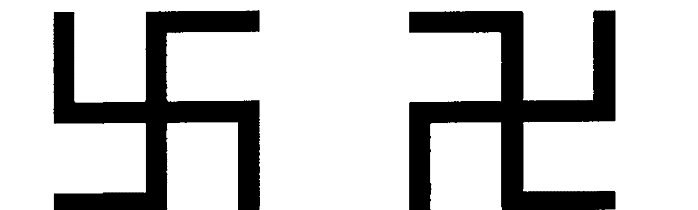

这是象征宗教的标志，也是现代武术的标志。人们这样写写画画的图形被称为五角星形（pentagram）。

魔法师们在衣服上缝上五角星形，在仪式和祭祀活动中的魔圈里也画上这样的五角星形。作为驱邪符来使用的五角星形，被人们认为可以保护自己不受恶魔和冤魂野鬼的侵害。作为护身符来使用的五角星形，可以召唤出恶魔和灵魂，并能够对他们发出指令。

但是，反向的五角星形却是用来表示魔王撒旦（Satan）的。因为撒旦的身上就佩戴着反向的五角星形标志，并且人们也经常能看到这样的图片。

### ☆ 所罗门的印章、六芒星……这是由六条边组成的星形。

也被称作“大卫之盾”或“大卫之星”。它作为非常有影响力的护身符和驱邪符来使用。

早在青铜器时代就已经出现了六芒星，在印章、灯、工艺品上都能找到。尤其是作为驱邪符时，可以免受邪眼和利里特（专门在半夜偷盗孩子的恶魔）的伤害。这也是犹太秘法主义者非常喜欢使用的一个标志。在中世纪以后，人们纷纷把它作为防火用的驱邪符。在炼金法里，这个六角星形的标志象征着“圣者之石”。因为这是由一个正三角形和倒三角形相互叠加在一起而组成的图形，所以它代表了由对立物的统一组成的统一体。

### ☆ 马蹄铁……在英伦各岛、欧洲大陆以及阿拉伯的民间信仰中，一直把马蹄铁当作驱邪符来使用。他们会在房屋、教会和马厩等建筑物的门口用钉子固定一个马蹄铁，因为他们相信这样能避免邪气进入。马蹄铁不能同时兼顾幸运和驱邪符的作用。当用于解除咒语和防止恶魔的时候，要把马蹄铁有开口的两端朝下放置。当用于幸运的护身符的时候，则必须把马蹄铁有开口的两端朝上放置。

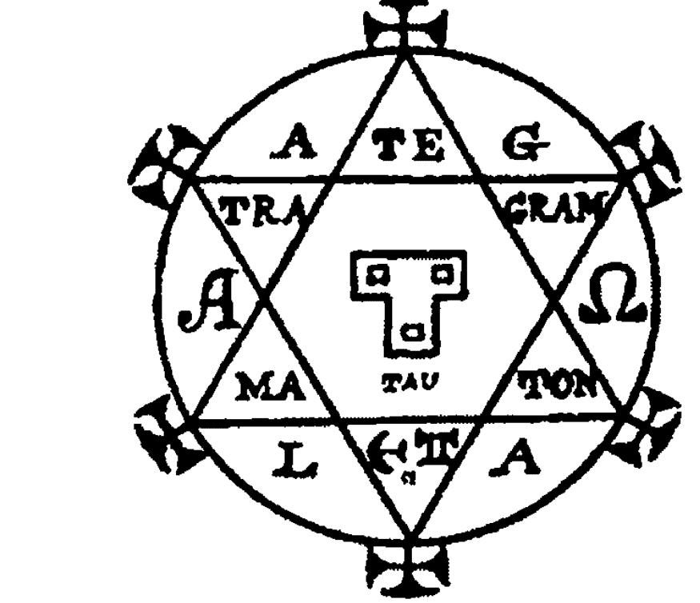

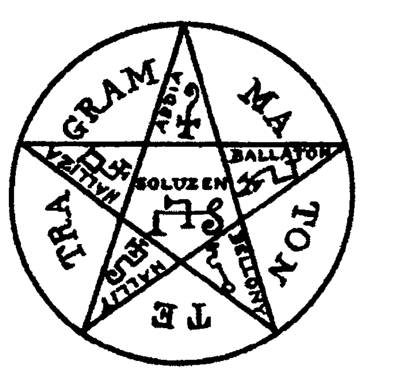

- ☆ 大蒜经常被作为驱邪符来使用。它能保护人们不受女巫、恶魔、吸血鬼、邪眼以及其他一切超自然的黑暗力量的伤害，还能作为药物里的一种成分来使用。把大蒜串成一串挂在脖子上，或者挂在家里的话，就能保护自己不被恶魔近身。另外，大蒜自古以来就被人们认为在预防和治疗感冒和其他疾病方面有很好的效果。

> > 由法国研究恶魔的学者可兰多·布朗西（1794～1881）具体化后的恶魔——源自他1863年出版的《地狱辞典》

- ☆ 石头……自古以来，石头就被用作魔法、治病、驱邪和幸运的护符来使用。尤其是宝石一类的石头被当作驱邪符来使用，可以保护人们不受邪眼和疾病的侵害。人们还相信在身上佩戴宝石可以带来好运。其中一些奇珍异石或有着特殊形状、特殊特性的石头因为具有更好的效果，所以尤其珍贵。珊瑚和鸡血石可以用来防止邪眼。有洞的石头是女性的象征，能带来丰收和好运。据说用小石头或圆的石头在地上围成圈，就可以防止女巫进入家里。

- ☆ 戒指……戒指是力量、神力、支配力和保护的象征。也是一种具有魔力的护身符。戒指佩戴在身上后，就能发挥超自然的魔力。刻了名字和咒语的戒指可以用来避邪，所以很受欢迎。镶嵌了重金属、宝石的戒指，会根据这些宝石的特性发挥不同的避邪功效，以及带来幸运。

### 石头的魔力

石头经常被作为驱邪符和实现愿望的工具来使用。

- 钻石……钻石是一种具有超强能量的石头。能使人远离不幸和邪恶的力量。它象征着永远和结合。但是，如果佩戴的人心里有邪念的话，钻石就会失去效力。
- 水晶……水晶自古以来就被宗教和巫师们作为有灵气的石头来使用。它代表了净化、清洁，还能带来幸运。水晶还有净化水质，净化肌肤的作用。
- 紫水晶……紫水晶是一种十分珍贵的石头，所以在古代的圣职者中，经常会使用它。这是一种提高直观力的宝石。它具有慈悲的力量和拯救的力量，所以能使人的心灵沉静下来。
- 印加玫瑰宝石……这是一种象征着玫瑰的、有着美丽的玫瑰色的宝石。它能很好的平衡肉体、精神和感情这三者的关系。还能唤起人们的热情，加强爱情运。
- 黄玉……这是一种象征着太阳的能量、能带来幸运的石头。它能为人们带来生命力、精神和自信心。还能使人与人之间的关系变得融洽。
- 肉红玉髓……这是一种被认为带有强大魔力的石头。它能加强人的行动力，使身体更强壮。在古代，因为它对肝脏起到很好的作用，所以被当作壮强药来使用。
- 石榴石……石榴石是一种具有很强魔力的石头，所以在古代埃及就经常被当作护身符来使用。它是爱情和忠诚的保证。另外，由于它和血液有关，所以能使血脉畅通，有理想的止血效果。在古时候，很多战士的身上都带着石榴石。
- 月长石……月长石还有一种别名叫做月石，人们认为这种石头里凝聚了月亮的力量。它能提高女性的感受力，加强恋爱运。另外，据说它也是保证旅途安全和航海顺利的护身符。
- 天青石（lapis lazuli）……天青石从古代开始就被世界各地的人们认为是一种神圣的石头而备受关注。这是一种带有很高精神性的石头。在日本，人们把它叫做“琉璃”。在古埃及，人们认为这种石头里蕴藏着神灵。因此，天青石能驱除邪念和不安，给人带来智慧和决断力。另外，还能保护人们远离危险。
- 蓝宝石……蓝宝石象征着智慧、爱和预测能力。在古代，很多圣职者们都会佩戴它。它能净化心灵，驱除不幸，帮助人们去更好的把握机会。
- 红宝石……它和蓝宝石同属于一类宝石。也是一种带有很高精神力的石头。它能唤醒人们的热情，提高爱情运。还能保护人们远离危险。但是，如果佩戴的人是很自私的、只是以自己为中心的话，红宝石就会失去它的效力。
- 祖母绿……不管是肉体还是精神上的伤害，祖母绿都具有很好的治疗功效。从古代开始，它就在治疗胃肠类疾病和眼睛的疾病方面很有效果。而且，它还象征着不老、长寿和幸福。祖母绿能提高人们的创造力。

### 如尼

在冰岛的神话《爱达》（古冰岛的文学集之一，1230年问世的古冰岛散文集或1200年问世的古冰岛诗集）中，有一个叫做欧丁神（北欧）的人物。这是一个渴求知识到了疯狂地步的人，就算到了地狱之后他仍然要努力探求知识。最后，他用枪刺穿自己的身体，在一棵能支配全人类的、神圣的树上上吊而死。他是一个有着强烈探求心的人，可以说他就是歌德在浮士德里描写的欧洲人的生活原型。据说欧丁神在树上整整吊了九天九夜，那时候，他失去了一只眼睛，所以人们认为在后来的北欧神话和德国神话所描写的很多神奇的人物中，那位独眼族长就是欧丁神。

欧丁神来到了地狱，学会了一种很神秘的文字。这种文字正是如尼文字，这是一种蕴涵魔力的、十分神奇的文字，在德国的上层社会里流传。据说，欧丁神从地狱里一个叫做贝尔索尔的儿子那里，学到了九首魔法歌。

> > 【魔法师和如尼文字】
>
> 为了不被女人背叛，就要在杯子和手背，以及指甲上都必须要刻上被称为“麦酒的如尼”的如尼文字。还要在手心里刻上“安产的如尼”的如尼文字。
>
> 在中世纪的欧洲，这些如尼文字被作为魔法师的道具来使用，并由师父口头传授给弟子。将如尼文字刻在榛子树、柃树或栎树等做成的柔软的棒子上，或者在剑、杯子、石板上刻上如尼文字，就能在战争胜利、治疗疾病、旅途安全和防止邪眼方面起到作用。还能有助于获得神灵的力量。除此之外，在日常的合同和协议书等公文上使用如尼文字，还能起到祈求公文能顺利履行的作用。

欧丁神是一个具有多种才艺的神，他兼魔法师、巫师和医师于一身。

现代社会已经废弃了如尼文字，但是在以北欧为中心的德国民族所生存的广阔地域上，仍然可以发现刻有如尼文字的石板和其他遗留下来的物品。从公元3世纪到公元13世纪为止的一千年间，从东到黑海、北到格陵兰岛的整个欧洲范围内，都留下了曾使用过如尼文字的形迹。以瑞典、丹麦为首，拓展到了法国、南斯拉夫、罗马尼亚等地。

这段历史是起源于意大利北部开创了文明的伊特鲁立亚人，这种说法是十分有力的。因为这个民族的人们是被罗马人、日耳曼人驱逐，或者被同化了的。伊特鲁立亚的子孙后代在接受罗马文字的传播之前，好像就曾在欧洲北部使用过如尼文字。

由垂直线和呈45度倾斜的线条组成的如尼文字，同时有着表音和表意的两种功能。同时，据说这个文字本身就具有一种魔力。这些像鸟的脚印一样的简单的文字，不太适合用来书写很长的文章。所以人们把它刻在特定的物品上，使它成为像护身符那样具有魔力的东西。根据古《爱达》里的描写，欧丁神从阴间拿回来的如尼有“拯救的如尼”、“治疗的如尼”、“让箭停止的如尼”、“盾牌的如尼”等，都是有着重要作用的。

在著名的格林童话《睡美人》中，睡美人因为受到了魔女的诅咒而一直沉睡了百年，而事实上，这个故事的原型可以追溯到北欧的欧丁神和瓦尔基里（北欧神话中欧丁神手下的女战士之一）之间发生的片断。而在这个故事里所施的咒语正是如尼文字。

勇敢的女战士瓦尔基里为了要反抗欧丁神而受到了睡眠灌木诅咒，并被关在了火炎之城。也就是说，是受到了“睡眠如尼”咒语的束缚。而拯救她的也不是王子，而是英雄西格弗里德（德国民间史诗《尼伯龙根之歌》中的英雄人物），西格弗里德把瓦尔基里所穿的盔甲打破后就救出了她。瓦尔基里为了表示感谢，就把各种如尼魔法都传授给了西格弗里德。例如，要在战争中取得胜利，就要在剑和盔甲上刻上如尼文字；为了航海的安全，可以在船头和船舵上烙上如尼文字等，瓦尔基里把各种各样的、多方面的使用方法都教给了西格弗里德。

### 【如尼文字和纳粹主义】

使如尼文字在20世纪又重新复活的，是德国的希特勒和纳粹主义。纳粹们将两个如尼文字作为纳粹党重要的标志。一个是表示大地女神的勾十字，另一个是表示斯堪的纳维亚人的雷神特尔所用的锤子的文字。纳粹的近卫队SS（有共同的特殊目的或要求的团体）的标志就是以如尼文字的造型设计而来的。

### 【如尼预测】

如尼文字还被用在预测上，就是把刻有如尼文字的棒和石头投向空中，根据落下来的形态来进行解释。和中国古代的龟甲预测和骨预测，也就是《易经》预测非常的相似。

基督教的异端审问变得严厉后，被认为是异教徒的产物的如尼文字也就从社会的表面销声匿迹了。

如尼文字列举如下

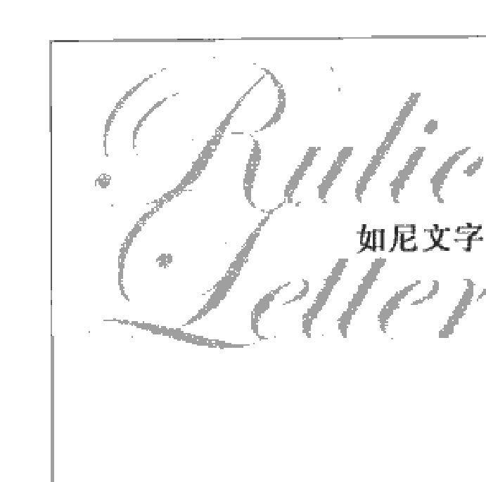

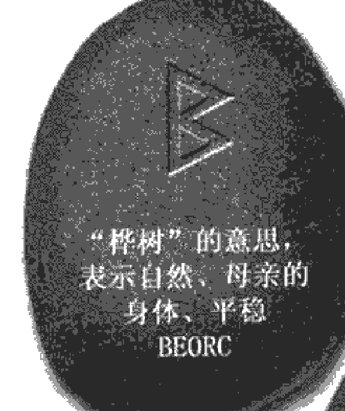

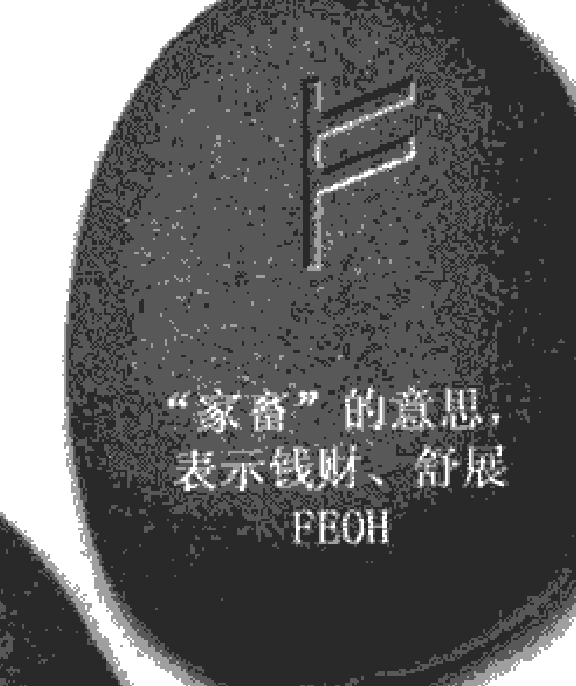

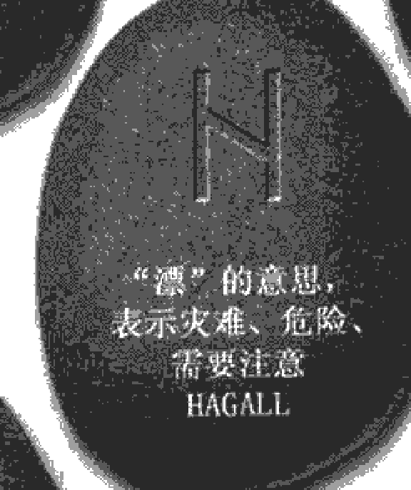

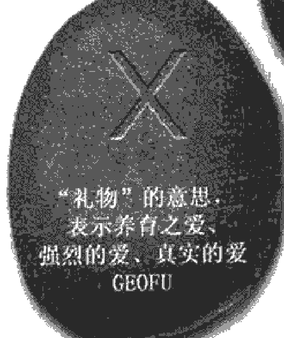

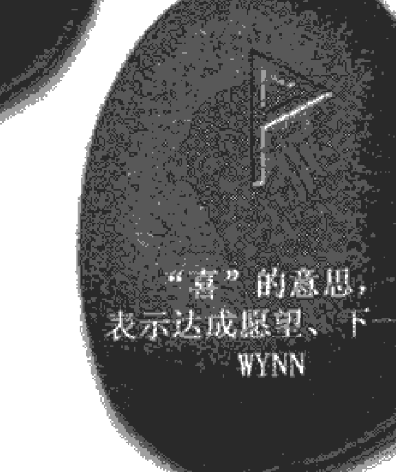

### 魔法仪式

很多人都应该知道作曲家迪卡斯所写的《会魔法的弟子》（1897年）。在迪斯尼电影《幻想曲》中，也有一只著名的米老鼠深受人们喜爱，而这本来是由狄更斯将德国文豪歌德的同名叙事声乐曲改编成交响诗后的作品。它描写的是，当魔法的师父离开时，还只有学到半拉子本领的徒弟就让扫帚吸上水后自动扫地取乐，但是他只知道怎么施魔法，却不知道怎样解除魔法，于是水瓶里的水满了出来，眼看就要变成大洪水的时候，他的师父正好回来解除了扫帚被施的魔法，避免了一场灾难。这里用幽默的手法描写了一知半解吃大亏这个道理，更说明了在魔法里，施魔法是很难的，但解魔法却更难。接下来向大家介绍在现代的魔法研究家迪比特·肯威斯所写的《魔法（实践篇）》（阿部秀典翻译、日本中央艺）

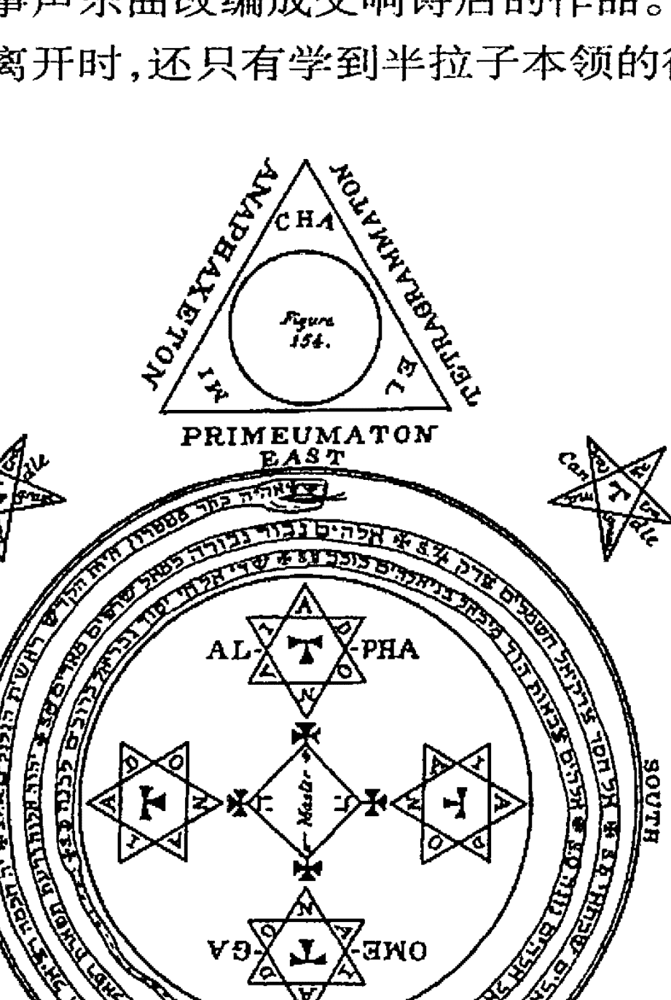

这是一个将五芒星放置在四个方向的魔法圈，在正中画了一个乌罗波罗斯（世界蛇）。

- 第一，希望举行魔法仪式的人，要清洁身体，尽可能的在仪式举行的几天前就停止吃肉食和停止饮酒。
这点无论是举行什么仪式都是一样的，但是如果是要呼唤具有超自然能力的神灵，就要和修行的僧人和修道士做一样的准备。

- 第二，准备祭坛。要选择一个能够画用来保护自己免受邪恶的力量侵害的魔圈的地方，作为举行仪式的场所。在魔法里，魔圈所圈定的范围是一个神圣的、净化的空间，是进入神秘世界的入口。魔圈的直径大约在九英尺左右，必要的话可以画两重并画得大一些。
在画圈前，先要确定房间东南西北的方位，在各个方位放上统治这四个方位的天王的标志。
北面受土地元素统治，统治者是乌列（基督教《圣经》和伊斯兰教《古兰经》所载天使长之一）。他的标志是岩石、砂和土，如果这些岩石、砂和土和圣地有关系的话就更好。例如，德尔泊神殿里的砂土等。即使和圣地没有关系，在十字路口取来的砂土也能起到很好的作用。
南面受火元素统治，统治者是米迦勒。所以要放置一些带有火的要素的东西，例如蜡烛、长明灯、金等。
西面受水元素统治，统治者是加百列。应该放置一瓶圣水。用玻璃瓶里取一点雨水，在里面放上一小撮表示永远的盐以清洁雨水，并一边在表面洒成五芒星的形状一边念“驱除水中的生物吧”。这个五芒星构成的五角星的形状是一个魔法阵，是保护自己不受冤魂野鬼侵袭的标志。美利坚合众国的国防部大楼就是五角星的形状，这也有种保护自己的国家不受外敌的侵入的意思。
东面是受拉斐尔统治的风的阵地，应该放置寄生植物。根据流派的不同，有时也有放置剑的情况。另外，放上画有代表风的标志△（○）和代表风的标志的◎也可以。

接下来是四个方向的守护。

在四面放置了代表四个元素的标志物后，就可以用粉笔画魔圈了。用雄鹿的皮、丝线和木棉等都可以。在进入魔圈前最重要的是将两头解开再进入。等进入魔圈后再将圆封闭上。为了保护魔圈的话，可以写上神圣四文字。

Syadai·eru·kai/tetoraguramaton/ararita

到现在为止的准备工作已经十分复杂了，但是还要在魔圈的东面的外边画上一个三角形。这样就完成了圆阵的布置。然后就要面向正东方做一个祭坛。这是因为所有的光线都是来自东方。当施行黑魔法等怀有邪恶目的仪式时，祭坛是面向北面的。

第三，要准备仪式所需要的用品。

准备一根柔软的、细的棒（权杖、魔棒）。这是由在春天到夏天里用小刀砍下的榛子树的枝条做成的。在北欧，常常使用棒树的枝条，或者，因为橡树是和德鲁伊特有关系的树木，所以也会使用到。严格说来，枝条必须是在4月10日至5月20日之间砍下来的。除此之外，还要准备五芒星、香炉、大锅、鞭子、阿塔美（仪式用的刀）、圣杯、绳子，把这些物品按顺时针的方向摆放在圆阵中，并在四个方向点上蜡烛。

就这样把所有的东西都准备好之后，把魔圈封闭起来。仪式所用的空间就布置好了。在这个魔圈里，一边念咒语一边摇晃鞭子和魔棒，就可以召唤神灵，施展魔法。

### 【阿塔美的由来】

阿塔美对于施魔法的人来说，是一件十分重要的道具。这是指仪式所用的刀。

关于它的叫法有很多个版本，阿萨麦、阿萨美、阿萨尼、阿萨米等。传统上来说，阿萨麦的刀柄是黑色的。据说在画魔圈的时候，通过使用这种刀，就有防止冤魂野鬼侵入的意思。

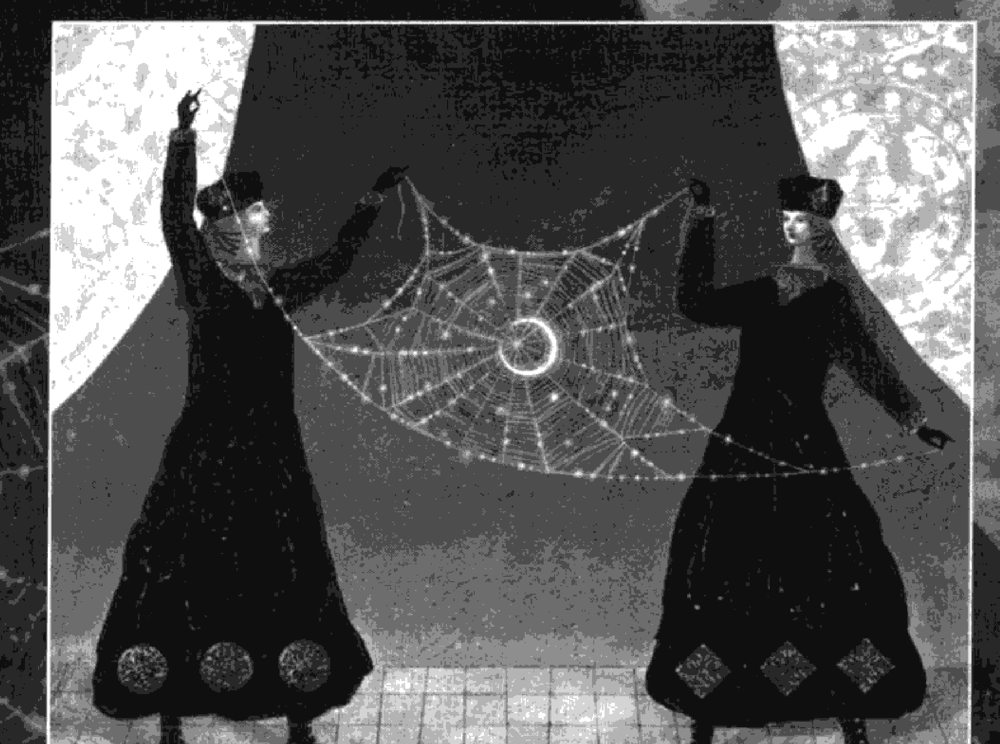

4

## 星星的指引

### 占星法

#### 由来

看看占星法是怎样以星星为根据而发展而来的。根据星星发展而来的预测，使从古至今无数人产生了浓厚的兴趣。太阳和月亮以及星星的运动对于古代的人们来说是特别神秘的，并且和他们的生活有着密切关系，是十分重要的。

占星法是根据行星、太阳、月亮等天体的位置关系，来分析对地球上的人、自然和事物等会产生怎样的影响的预测体系，它的起源可以追溯到人类起源的太古时期。在公元前3000年，创建了文明的美索不达米亚平原上的苏美尔人，对天体的运动进行了仔细的观测，制作了一个关于河川泛滥和用于耕作的日历。他们有着高度丰富的天文知识，能大致准确地掌握一个月或是一年的周期长短。后来，据说把天体的运行作为占星法而归纳成一个体系的，是在公元前600年左右出现的巴比伦人迦勒底。

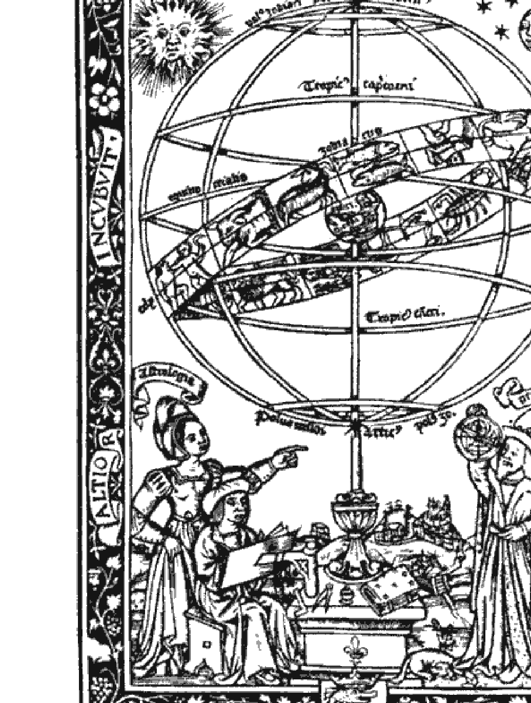

E·希恩所画的一幅赞颂托勒密（公元2世纪的古希腊天文学家、地理学家、数学家、地心说的创立者）的木版画（1515年）

占星法的基本思想，是以赫尔墨斯教理为基础的。赫尔墨斯的教理认为，宇宙（神灵的世界）和地面（现实的物质世界）就好比镜子一样是相互呼应的。也就是说天上发生的事和地上发生的事是一致的。他们认为当人们出生时的星星的方位，以及一件事发生时的星星的方位，是不是都会对其将来的性格、行为和今后的发展趋势产生影响。

占星法通过把十二星座的黄道带（黄道十二宫）、十二个星室以及运行的天体位置和角度进行组合，解读了其中的意义后进行预测。在2世纪以后，古希腊人将占星法进行了大众化，这对占星法的普及作出了巨大的贡献。此后，虽然占星法在欧洲经历了兴衰起落，但仍然留存了下来，占星法的传统在现代仍然持续着进化和发展。

占星法中最基本的，是要制作一幅准确的天宫图表。占星一说是来源于希腊语里的horoscopos，其语源是hora（时间）和skopos（观测者）。

将某个瞬间的行星的位置表示在十二等份的圆中，这就表示十二星座和十二星室。在现代，主要使用行星中的十个天体。它们是太阳、月球、水星、金星、火星、土星、天王星、海王星、冥王星。而且，在天王星、海王星和冥王星未被发现之前，只使用七个天体。

要制作天宫图表，首先必须通过精确的计算来得出天体的位置。必要的数据是根据出生年月、出生的时刻、出生的场所（地球的纬度和经度）为依据而计算出来的行星的位置。在现代社会，可以用电脑计算出这些复杂的数据，只要输入年月日、时间、地点后，马上就能找到相应的天宫图表。

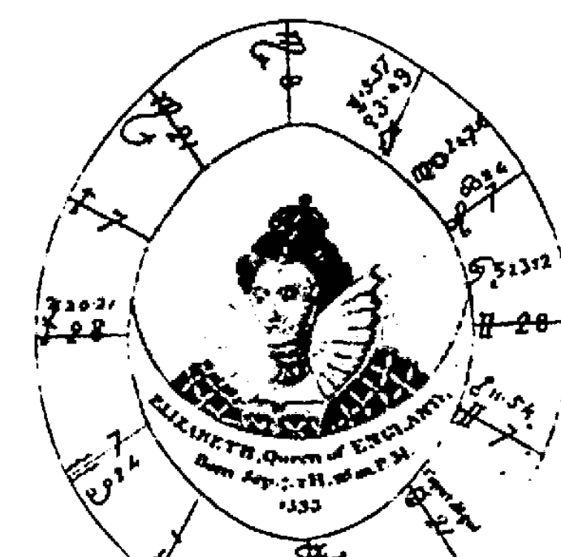

伊丽莎白一世的天宫图

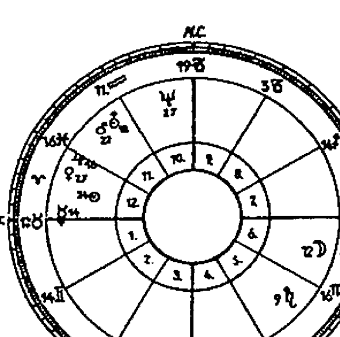

英国式

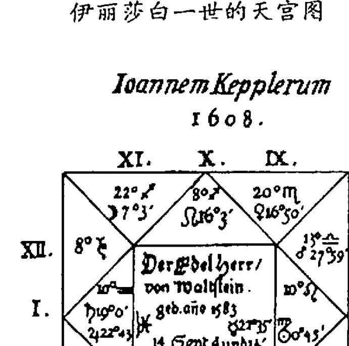

古代式

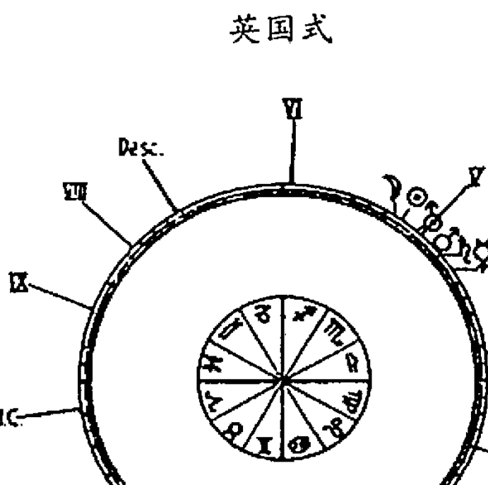

双环式

#### 中世纪的天宫图表的范例

天宫图表根据个人的情况也可以叫做出生图，因为这是只使用于自己的星星地图。这个星星的地图上画有个人的性格和可能出现的命运。这样一想，也许会让人觉得不可思议。

不仅对于个人，对于国家的诞生、公司的成立或事物开始的日子等，不论什么事都可以制作成天宫图。以这些图为基础，可以解读当时星星的运行和预测未来，可以有各种各样的解释。

通过看天宫图来进行解释是需要必要的解读知识的，关于天宫图的哲学依据是根据至今为止的传统不断积累而来的。要把十二星座、行星的度数和角度归属于哪个星室的行星，元素的分配怎么样等组合在一起来分析。通常在一些相关杂志上都可以看到以牧羊座、狮子座等来划分的十二星座，这是根据出生时太阳的位置来分的。总之，占星法有很多很多技法，占星法师们通过将传统知识和时代背景相结合来尝试着进行解释，现在还在不断的研究中。

关于详细的解读天宫图的方法，不论是日语还是英语都出版了不少学习的书籍，所以想要尝试解读天宫图的人们可以参考学习。

在这里，我大致的记录了一些十二星座的典型描述。

## ■ 十二宫（十二星室）的特征

被称为黄道带的天宫，各自都有着其特定的性质。黄道带是由十二星室（白羊座、金牛座、双子座、巨蟹座、狮子座、处女座、天秤座、摩羯座、射手座、摩羯座、水瓶座、双鱼座）所构成的带状的圆环。星室的名称和十二个星座是一一对应的，并在数千年前就已经被命名了。

> 【天文学上的星座和占星法上的星座之间的区别】
因为实际上在天空中闪耀的星座和占星法上的星座的名字是相同的，所以很容易让人觉得这两者是一样的，而其实是截然不同的。在天空中闪耀的星座在英语中叫做星座（constellation），而占星法中却是记号（sign）的意思，是完全不同的东西。在天空中实际存在的，可以看见的每一个星座，他们各自的大小和位置也是不均等的，各不相同的。
占星法只是运用了象征手法而做成的一个系统，所以才虚构地把各个星座平均地划分成呈30度的扇形。总之，占星法上的星座和实际上存在的星座有着位置和形状上的不同。

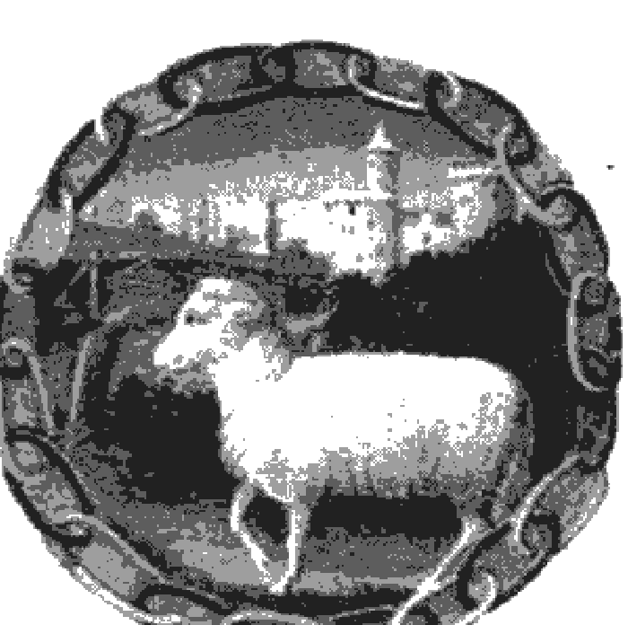

### 白羊座ARIES

男性星座 活动宫 火元素
对应的身体部分是头部和脸部
受火星支配
【关键词：开始、单纯、纯粹、抽象性、缺乏实际性、直观力、速度、鲁莽、行动力、新鲜感、力量、性情急躁、以自我为中心、勇气】

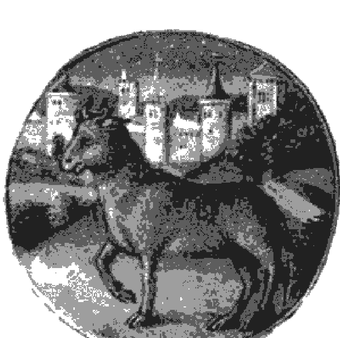

### 金牛座TAURUS

女性星座 固定宫 地元素
对应的身体部分是喉、脖子
受金星支配
【关键词：感觉、肉体·物质、美、幼稚、安静、忍耐力、反反复复、保守、职业性、顽固】

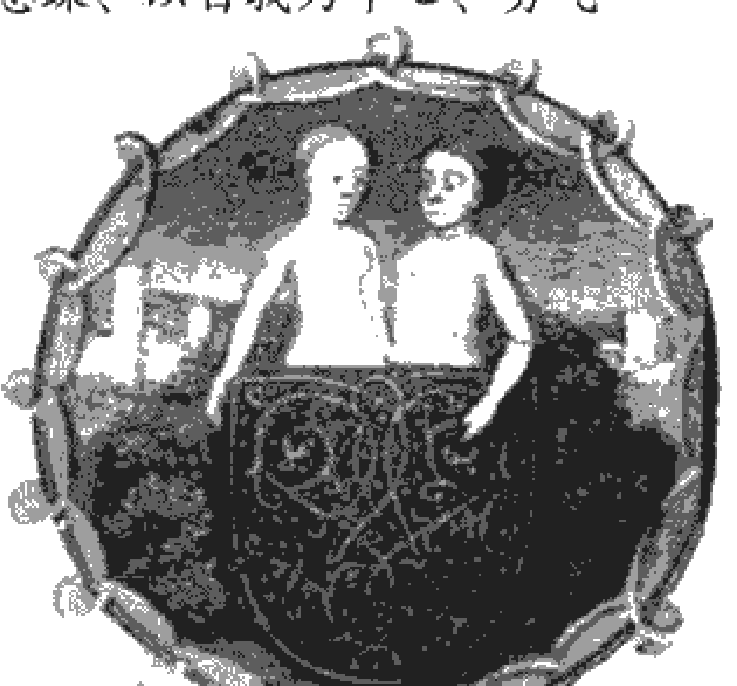

### 双子座GEMINI

男性星座 灵活宫 风元素 对应的身体部分是肺、手、神经系统
受水星支配
【关键词：机敏、知性、两面性、多才多艺、好奇心、变化、灵活性、有说话技巧、移动、旅行、轻率】

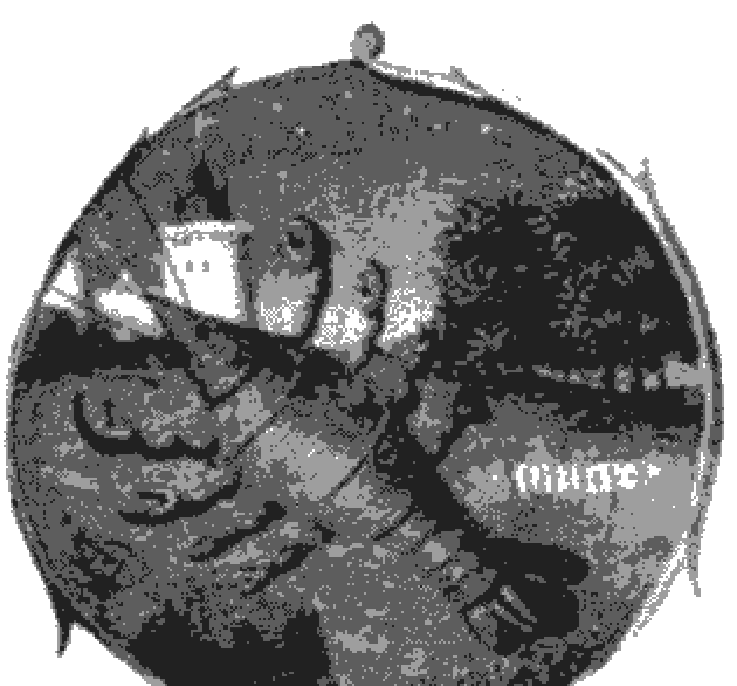

### 巨蟹座CANCER

女性星座 活动宫 水元素 对应的身体部分是胃、胸部
受月球支配
【关键词：共鸣、同情心、保护、母性、团体意识、反反复复、模仿、防备心、家庭、日常生活、动摇】

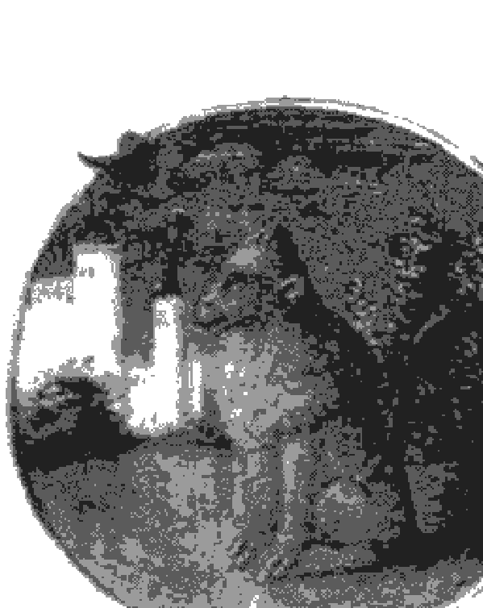

### 狮子座 LEO

男性星座 固定宫 火星座 对应的身体部分是心脏、背部 受太阳支配

【关键词：
- 创造性
- 冒险心
- 儿童的心
- 玩耍
- 感动
- 戏剧性
- 个性的表演
- 引人注目
- 心灵的光芒
- 自尊心强

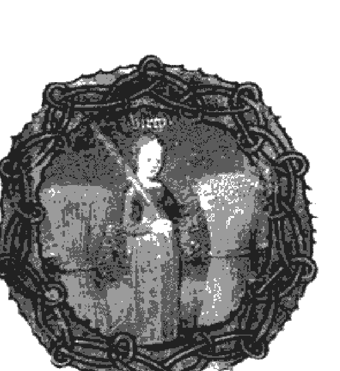

### 处女座 VIRGO

女性星座 灵活宫 地星座 对应的身体部分是肠、下半身 受水星支配

【关键词：
- 整理
- 分类
- 分析
- 调整
- 实用性
- 有才能
- 有奉献精神
- 自我管理
- 批判精神
- 规规矩矩
- 自我保护
- 医疗
- 害羞

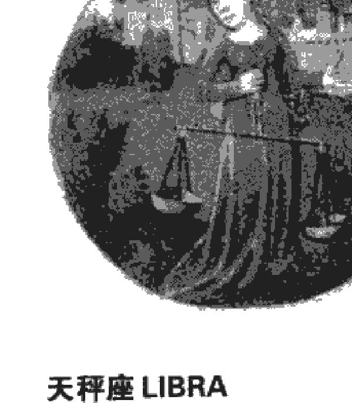

### 天秤座 LIBRA

男性星座 活动宫 风星座 对应的身体部分是肾脏、从下背部到臀部 受金星支配

【关键词：
- 平衡
- 公平
- 正义
- 人际关系
- 结合
- 智慧
- 美
- 和蔼可亲
- 优柔寡断

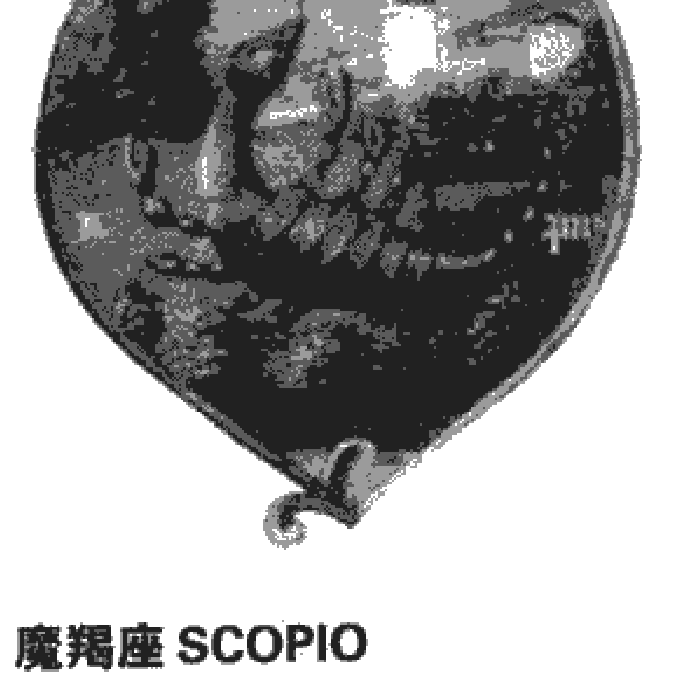

### 天蝎座 SCORPIO

女性星座 固定宫 水星座 对应的身体部分是性器官 受冥王星支配

【关键词：
- 死亡和再生
- 变化
- 性
- 一体化
- 集中力
- 彻底性
- 梦
- 深层心理
- 执著
- 支配力

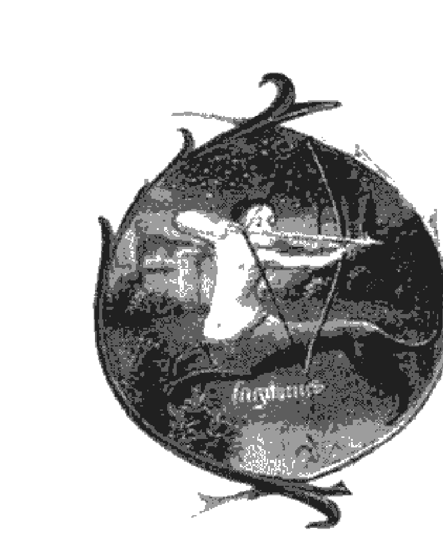

### 射手座 SAGITTARIUS

男性星座 灵活宫 火星座
对应的身体部分是脚
受木星支配
【关键词：宽容、哲学、智慧、抽象性、光明磊落、精神、竞争、运动、国外、冒险、浪费】

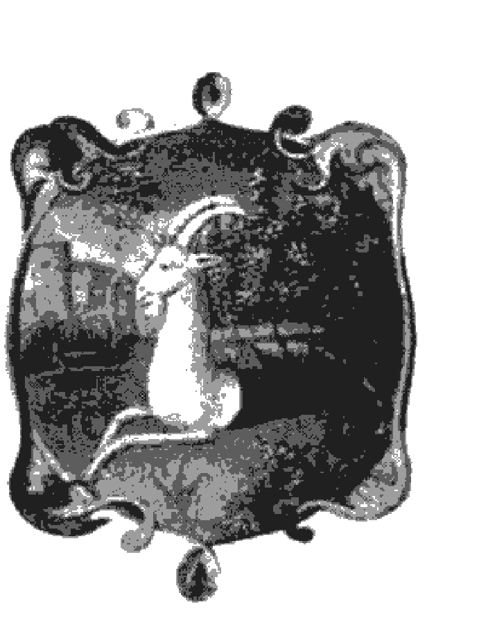

### 摩羯座 CAPRICORN

女性星座 活动宫 地星座 对应的身体部分是膝盖、骨头
受土星支配
【关键词：社会性、认真、勤奋、工作、野心、权力、现实、保守、忍耐力、责任感、心胸狭窄】

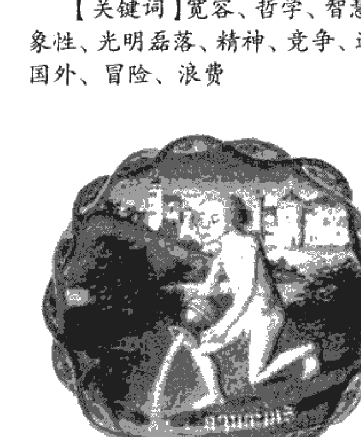

### 水瓶座 AQUARIUS

男性星座 固定宫 风星座
对应的身体部分是脚踝
受天王星支配
【关键词：未来性、理想、对现存社会的反叛、独特性、有博爱精神、友爱、有广阔的视野、冷静、古怪】

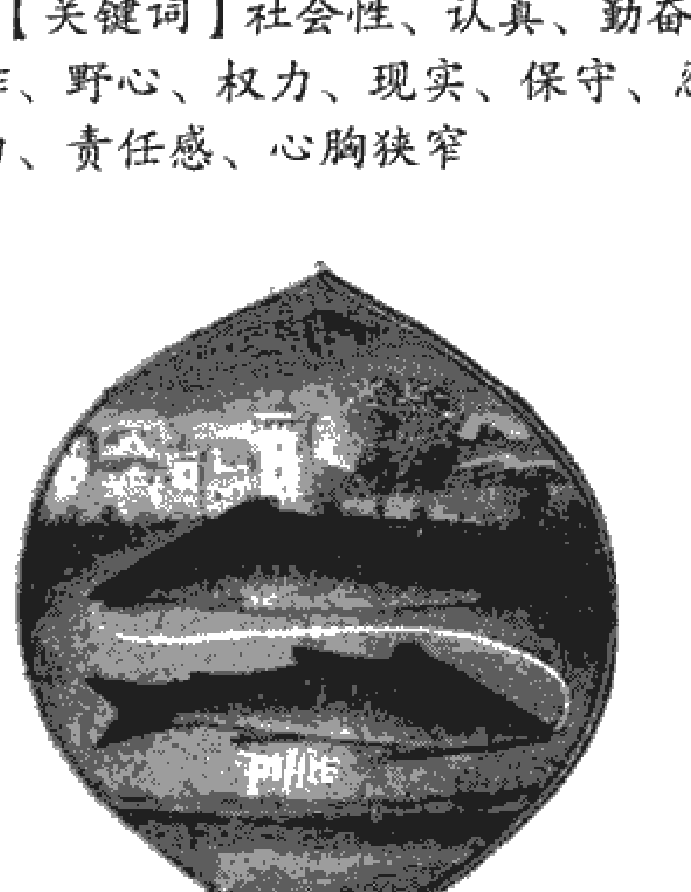

### 双鱼座 PISCES

女性星座 灵活宫 水星座 对应的身体部分是脚后跟、淋巴腺
受海王星支配
【关键词：净化、共鸣、同情心、有牺牲精神、感情细腻、感受性、灵感、艺术、神秘、脱离现实、混乱】

## 【占星法上的天体】

### 月球

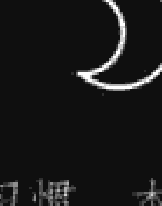

公转周期：大约28天
代表数字是2、星期一
象征：母亲、女性、感情、习惯、本能、想象力、日常、成长、被动、幼儿、食品饮料、家和旅馆

### 水星

公转周期：少于90天
代表数字是5、星期三
象征：知性、语言、神经、会话、通信、情报、传达、兄弟姐妹、工作、商业、年轻人、事务所、书店、学校

### 金星

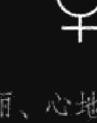

公转周期：225天
代表数字是6、星期五
象征：艺术、金钱、美、美丽、心地善良、协调配合、恋爱、年轻女性、沙龙、咖啡馆、美术馆、美容院、庭院

### 太阳

公转周期：365天
代表数字是1、星期日
象征：生命、活力、公、闪耀的东西、健康、男性、父亲、王者、家长、大门、庞大的建筑物

### 火星

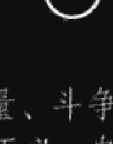

公转周期：2年
代表数字是9、星期二
象征：攻击心、活力、性能量、斗争性、武器、事故、刀刃、铁、正义、自我主义、男性、军人、警官、外科医生、企业家、气氛活跃的场所、机械工厂

### 木星

公转周期：12年
代表数字是3、星期四
象征：援助、宽容、幸运、成长、扩大、发展、善良的事物、放松、法律专家、外国人、宗教专家、大学、教会、宽敞的地方

### 土星

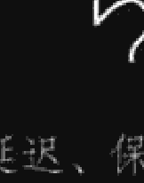

公转周期：29年
代表数字是8、星期六
象征：形式、责任、安定、延迟、保守、忧郁、反反复复、时间、老成、考验、坚韧、管理、学者、老人、实业家、农田、工作场所、目的

### 天王星

公转周期：84年
代表数字是4
象征：独立性、革命、改革、变化、科学、电磁波、创造力、占星法、飞机、突发性、发明家、个人主义、飞机场、天文台、广播局、科学研究所

### 海王星

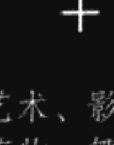

公转周期：165年
代表数字是7
象征：幻想、幻影、液体、艺术、影像、超感觉、暧昧、石油、药物、舞蹈、梦、艺术家、隐居起来的人、魔法师、医院、收容所、放映室

### 冥王星

公转周期：249年
代表数字是0
象征：死亡和再生、破坏、强制力、极端、绝对、无、黑暗、支配、异常、政府、军事、心理学家、侦探、科学家、地下室、黑社会、刑场

## 【出生图】

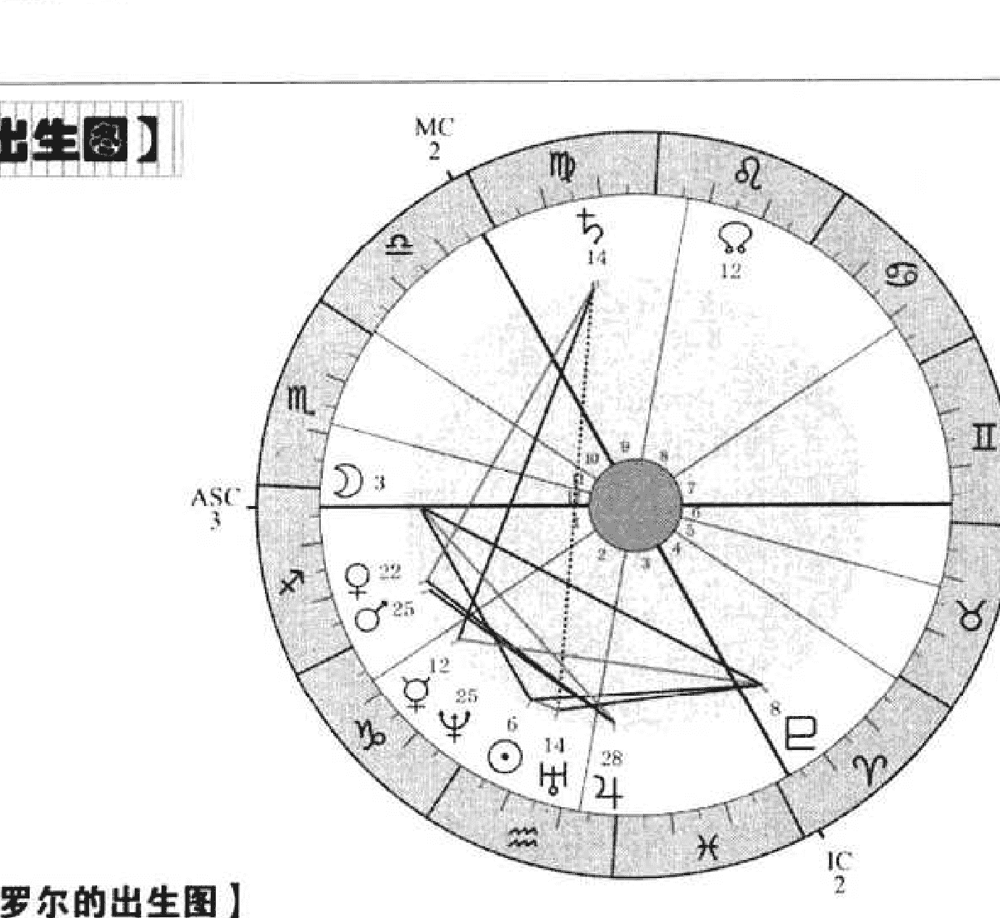

## 【卡罗尔的出生图】

这是一张十分有个性的，偏向于一个方向的图。
土星位于第九星室，偏向于MC的形态的人多半是学者和与教育有关的人、医生等。
路易斯·卡罗尔（Lewis Carroll，数学家、作家）
1832年1月27日 AM3：48 daresbury，cheshire，UK

## 星室所代表的意义

- 1 星室……认识自我、性格、个性特征。
- 2 星室……金钱、个人资产、身体。
- 3 星室……和环境之间的关系、兄弟姐妹、教育、信息。
- 4 星室……家庭、父母、土地。
- 5 星室……孩子、兴趣、恋爱、表现自我。
- 6 星室……健康、奉献、职场。
- 7 星室……人际关系、他人、伙伴。
- 8 星室……深层次的改变、财产、死亡、性。
- 9 星室……旅行、宗教、哲学、高度丰富的学问。
- 10 星室……对社会的关心、经历、权威。
- 11 星室……朋友、团队关系、社会性的理想和改革。
- 12 星室……秘密、隐藏的东西、超越自我。

## 形态

形态是指占星法上各个点之间的角度关系。也就是指天体间的角度。主要的形态有 Conjunction（0度，从地球看，行星和太阳处于同一直线上）、Sextile（60度，六十度角距）、Square（90度，直角）、Trine（120度，三分一对座）、Opposition（180度，反相）。除此之外，还有对立型的形态和特殊的复合样态。

### 会合

Conjunction 0 度 这是指两颗行星非常接近的样态。能量非常强。这个样态的特征是，所造成的影响往往是本人无法察觉的。根据相关行星的位置的不同，有好的影响也有坏的影响。

### 六十度角距

Sextile 60 度 这被认为是一个传统的吉利的样态。和同样是不稳定样态的120度样态相比，这是一个更容易让人认为机敏和灵活的样态。

### 直角

Square 90 度 在所有的稳定样态中，这被认为是最困难的一个样态。根据和它有关的行星的不同会有不同的情况。是一个对立的、不协调的样态。在两个行星间有种紧张感。虽然是一种很困难的样态，但是如果使用好了，能利用它的灵活性来用于创造性和自己的成长，变化和觉醒。所以根据最近的研究，不能简单的就说它是不好的。

### 三分一对座

Trine 120 度 是非常协调的不稳定样态。传统上认为这是个幸运的样态。

### 反相

Opposition 180 度 这是表示困难的不稳定的形态之一。处于正反两侧的天体互相会产生影响。表示紧张、努力，有时也表示互相牵引。虽然表示困难，但是两个天体间还是活跃的。

### 不连接

Inconjunct 150 度 和调整、训练有关。因为是互相捆绑的关系，所以就说明了在锻炼的时候是非常辛苦的，但是得到的利益也是很多的。还有一种说法是它在缘分上表示难解之缘，所以容易造成有很长时间的关系。

### 无形 态

这是那些无法构成形态的天体的总称。那些天体大都是独立的运行着。容易变成要么非常弱，要么过于强大的情况。

## 占星法相关用语

☆塞比标志……在 20 世纪初的美国，有一个女巫师将在各个方向出现的现象用语言记录了下来，而后，占星法研究家马克·埃德蒙德·琼斯和迪恩·鲁迪亚又把这些语言整理成理论性的东西，并给他们注明了意思。他们赋予了从白羊座到双鱼座的 360度的范围以诗样的、有象征性的语言。

☆元素……星室是根据四个元素（火、地、风、水）和三种性质（活动宫、固定宫、灵活宫）来分类的。占星法里所说的元素，是根据古代希腊哲学里的元素产生的。( ↓ 四大元素的概念）那是因为考虑世界是由固体（地）、液体（水）、气体（风）、能量（火）这四种体系构成的。古代的人们根据这四种元素对人类进行分析时，就将肉体看成土，将感情和情绪看成水，将思考看成风，而火就代表充满着活力。当占星法在古希腊被不断体系化的过程中，这些心理体系就正好对应12个星室。

☆小时占星法……这是占星法里的一种方法。这是将提出问题的那一刻的天宫图制作出来，然后通过解读这幅天宫图来回答问题的占星法。适合解答一些诸如寻找仪式的物品等比较具体的问题。

☆选择性占星法……小时占星法是解答已经发生的事情，与此相对的，这种选择性占星法是一种能提前决定事情发生的日期的方法。适合用于需要选择的情况。例如，适合结婚和搬家的日子是哪天等问题。

☆调和占星法……是占星法中的一种方法。是由英国的占星法师约翰·阿迪在 20 世纪中期确立的。所谓调和，是指将圆分割成整数块，根据它和天宫图表之间的关系来进行解释。以前因为需要有复杂的计算而有些困难，现在由于有了电脑的帮助，这个方法在近年来又受到了关注。

☆曼丹占星法……这是一种针对国家、政治、社会上的事情进行预测的方法。在古代，这种方法能用于除个人预测和小时占星法之外所不能预测的所有领域。我们不能忘记的是，本来，在可以预测个人的事情之前，其实占星法是一种为了帮国王预测国家的前途、疾病的发生、战争、国家经济状况等情况而发明的方法。曼丹这个单词是由拉丁语里的“世界”一词演变而来的。

☆附属星室……也被称为上升星座（Rising Sign）。指在制作天宫图表的时候，当制作完成时，从地平线上升起的那个星室。出生图上的附属星室对于那个人的性格特征会产生很大的影响。另外，据说还会对外表的特征产生影响。附属星室是解读天宫图表时的重点之一。

☆小行星……除了主要的十个天体以外，还有奇隆、希利斯、祖那等各种各样的小行星。

## 塔罗牌

### ■ 塔罗牌之谜

这是一种在喜欢预测未来的人们中十分流行的纸牌。有很多人都是一看到塔罗牌，就被它所具有的神秘的魅力所吸引。然后，一进入塔罗牌的世界后又惊奇于它的深奥。关于塔罗牌的历史，也是包着层层谜团……

接下来，我们就按顺序向大家介绍。

塔罗牌是指用于预言和预测未来的78张画有神秘的图画的纸牌。据说这些画有象征图画的纸牌是将西欧的秘教式的传统具体化后的产物。但是，这些纸牌的真正的起源和目的仍然无从知晓。它出现在欧洲的时间大约是在14世纪到15世纪左右。据说是因为罗马民族（吉普赛）到处流浪，才使得塔罗牌的使用方法被传播开来。在最初，据说这些画有图的卡片被意大利人叫做TAROCCO、TAROCCHI，但是当它们进入法国后，就被法语化，叫做TAROT。于是在英国和美国也同样被叫做了TAROT。塔罗牌共有78张，由分为22张叫做大阿尔卡那的卡片和56张叫做小阿尔卡那的卡片组成。小阿尔卡那又按照四种类型分成组合牌，这四种类型是“棒”、“杯子”、“剑”、“硬币（五芒星形）”。在今天深受人们喜爱的纸牌就是根据小阿尔卡那发展而来的。另外，阿尔卡那一词在拉丁语里是“秘密”的意思。

### ■ 吉普朗所说的埃及起源说

吉普朗是1725年出生在法国尼姆的语言学家和神秘学者。

吉普朗在一次拜访一位知识女性时，偶然地看到了塔罗牌。那时，他的知觉就告诉他那是起源于埃及的东西。吉普朗根据他所研究过的神话学和古代文字，认为这些卡片上画的是埃及魔法教义《透特之书》里的内容。在当时的法国，知识分子中间十分流行埃及热。根据吉普朗的说法，塔罗牌是古埃及的象形文字的变形，传递着哲学和宗教。并认为在这些纸牌里包含了所有的社会现象。因为里面有国王、法王、哲学家，还有结婚、死亡、复活和创造。在四种分类里，棒代表农民、杯子代表僧侣、剑代表国王和士兵、硬币代表商人，所以这就表示了古埃及的各个社会阶级。塔罗牌是以数字七为中心构成的，因为七在埃及是一个神圣的数字。在小阿尔卡那里的一斯特里有14张牌。大阿尔卡那是7 × 3共21张牌。所以愚蠢的人就用0来表示。另外，奥希利斯（古埃及神话中的地狱判官）用“战车”来表示，神用“塔”来表示。根据这些联想，吉普朗就相信塔罗牌是起源于埃及的。

### ■ 预言家埃迪拉

在塔罗牌研究史上，出现了和吉普朗同时代的一位著名的人物。吉普朗是一位学者，与此相对的，埃迪拉是当时在巴黎十分受欢迎的专业预言家。他通过纸牌预言、占星法和看手相来帮人们进行鉴别。除此之外，他还被称作炼金法师，并好像还出售护身符。因为他还关心印刷和出版业的事，并且出版了一些关于塔罗牌的书。埃迪拉也同样被塔罗牌那神秘的美丽所吸引，他认为那是集合了埃及所有有才智的人的智慧的结晶。

根据他的想法，当时上市的马赛版的塔罗牌在他看来是和埃及说相违背的。因此，他将埃及、炼金法、占星法等综合起来，设计了一个自己特有的塔罗牌。这套牌就是现在仍然在卖的“埃迪拉版”塔罗牌。这种带有强烈魔法色彩的塔罗牌，从传统里脱离了出来，在当时一部分的神秘主义者里十分流行。

### 艾黎法斯·雷比和塔罗牌

1810年，艾黎法斯·雷比出生于巴黎。他是学习神学的天主教副助祭司，但是，却对在教会里消失的左翼思想和魔法很有兴趣。他对魔法研究进行归纳后编写的《高等魔法的教理和祭祀仪式》①，直到今天，这本书仍然作为一本重要的书在研究犹太神秘哲学的专家间被广泛流传。通过他的努力，使塔罗牌包含了比以前更多的魔法色彩。如果有一副塔罗牌的话，他自称就可以解读出全宇宙所蕴涵的智慧和秘密。当然更别说预测人类的未来了。他的一大功绩就是第一个把塔罗牌和犹太神秘哲学结合在一起。他认为魔法的基础是犹太教的神秘哲学“cabala”。所以就尝试着把犹太神秘哲学里被称为“生命之树”的解释和塔罗牌里的各张牌对应起来进行解释。他的魔法哲学对法国近代的神秘学运动、现代西洋的魔法运动都带来了深远的影响。

### “黄金拂晓团”的塔罗牌

在说到塔罗牌时，必不可少的要提到“黄金拂晓团”( golden · don )的存在。1888年，黄金拂晓团在伦敦设立。现在流传在世的大部分的塔罗牌入门书，都是在雷比发明的基础上，传到意大利后由“黄金拂晓团”的成员们完成的。现在最

【塔罗牌的意义】
◇大阿卡那牌
大阿尔卡那牌上都标明了1~21的数字，并分别画有各自所象征的图案和花样。具体象征请看下面的介绍。
0 愚蠢的人 1 魔法师 2 女教皇 3 女皇帝 4 皇帝
5 法王 6 恋人 7 战车 8 正义 9 归隐的人
10 命运之轮 11 力量 12 小丑 13 死神 14 节制
15 恶魔 16 塔 17 星星 18 月亮 19 太阳
20 审判 21 世界

> ①《高等魔法的教理和祭祀仪式》《魔法的历史》《大神秘的关键》
这三部作品是现代神秘学运动的基础。

流行的“维特版”和臭名昭著的魔法师阿莱斯特·克劳利发明的“透特的塔罗牌”都是从这个结社里流传出来的。这个魔法团体被称为现在魔法运动的鼻祖，对现代神秘学的发展带来了压倒性的影响。这个魔法教团是以进行魔法的研究和实践为目的的秘密结社，建立了关于魔法、神秘学、塔罗牌、占星法、炼金法、意识的变化等很多的体系。其中，也对塔罗牌十分重视。教团里的成员制作了一些集合了魔法教义的卡片，也就是说，成员们通过用自己写下的东西来理解教义的内容。那样，就做成了各自的牌。

“维特版”是由阿瑟·维特博士发明的，由画家帕美拉·C·史密斯所画而成的，所以每一张牌作为图片来说都是具有划时代意义的。当时教团里的教义十分重视用颜色来表示象征，所以这一点也在牌的颜色的制作方面体现了出来。现在，从初学者到专业人士，几乎人手一副最流行的塔罗牌。塔罗牌的受欢迎程度可见一斑。现在，有许多原始的塔罗牌被不断地制作出来。也出现了许多不拘泥于传统印象的、有个性的塔罗牌。

### ◇小阿尔卡那牌

“棒”、“杯子”、“剑”、“硬币”这四类分别有10张牌，再加上代表国王、皇后、骑士和侍童的四个人物，共有56张牌。另外，表示人物的牌叫做宫廷牌，而“棒”、“杯子”、“剑”、“硬币”分别和代表西洋神秘主义的基础的四大元素（火、地、风、水）一一对应。

- “棒” = “火元素” · 勇气、行动力、斗争、男性原理、南方。
- “杯子” = “水元素” · 感情、受容性、生产、不安定、女性原理、西方。
- “剑” = “风元素” · 知性、理性、社交性、轻率、分离、男性原理、东方。
- “硬币” = “地元素” · 物质、实用性、忍耐、责任、女性原理、北方。

## 小阿尔卡那的样例

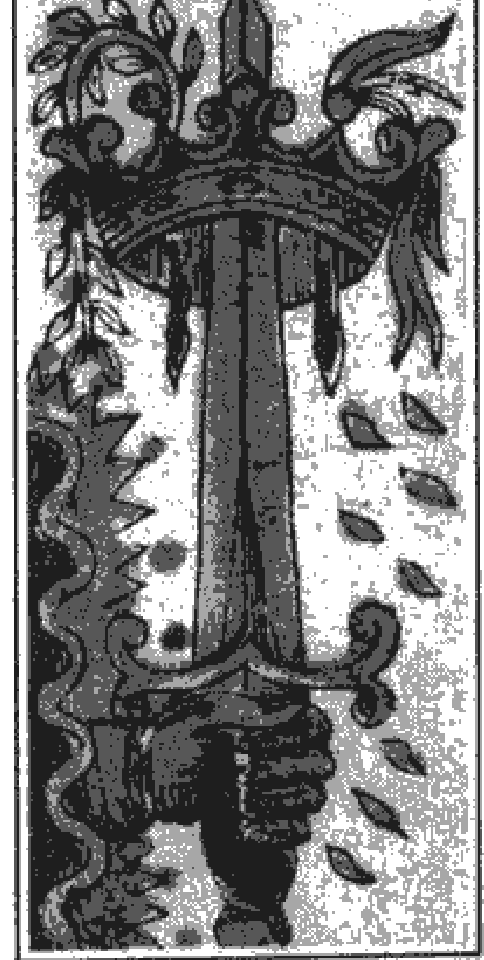

剑·A

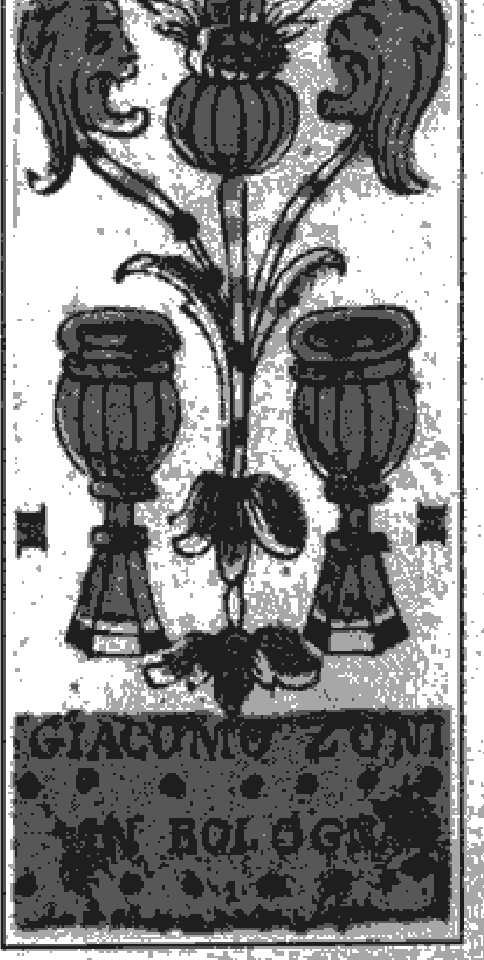

杯子·2

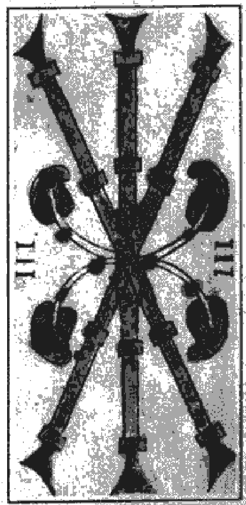

棒·3

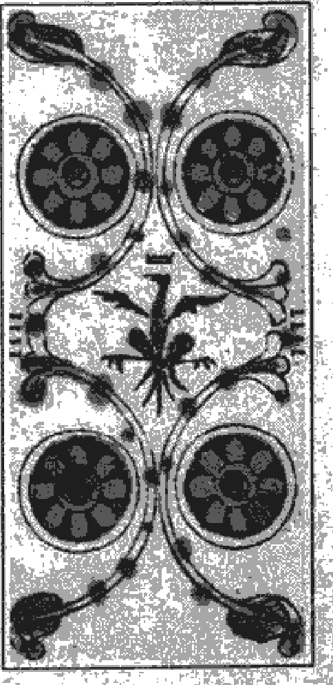

硬币·4

为了满足想进一步了解塔罗牌的人们的要求，在这里我向大家介绍几本参考书籍。和实践相关的书籍有翻译过来的书和日本出的书，由于作者的不同，书的内容也会有很大的不同。不如大家阅读几本书后比较一下。

## ☆了解塔罗牌的参考书☆

### ■ 研究类书籍
- 《塔罗牌的秘密》……巴巴拉·G·福克（女魔法师Books）1992年
- 《塔罗牌》……道格拉斯·阿尔福莱德（日本河出书店新社）1995年
- 《塔罗牌解释实践辞典》……井上教子（日本国书刊行会）2000年
- 《荣格和塔罗牌》……沙丽·尼克尔斯（日本新思索社）2001年
- 《塔罗牌 心灵图像学》……镜龙次（日本河出书店新社）2002年

### ■ 实践类书籍
- 《塔罗牌教科书》1~3卷（女魔法师之家Books）
- 《新·塔罗牌图解》……阿瑟·E·维特

## 【用塔罗牌预测未来】

在用塔罗牌预测未来时先要熟悉牌，必须理解每一张牌的意思。因为塔罗牌各自所蕴涵的意思是十分深奥的，所以可以说在全世界都有人在研究其中的象征意义。

但是，只靠牢牢地记住塔罗牌的意思并不等于可以准确地预测未来。因为能够按照当时显示的塔罗牌直接感受到其中蕴涵的意思并把它表达出来，这种能力是非常重要的。但是首先最根本的还是要理解塔罗牌本身具有的意思。在最初的阶段，在每一次进行预测未来的时候，还是要一边看着书上的解释一边体会其中的意思。

关于塔罗牌所具有的象征意义的具体说明在这里就省略了，我们只是介绍一下简单的意思。(字母R表示反方向出牌的时候。很多情况下都把反向的牌解释为和正向的牌相反的意思，但是也有例外的时候。)

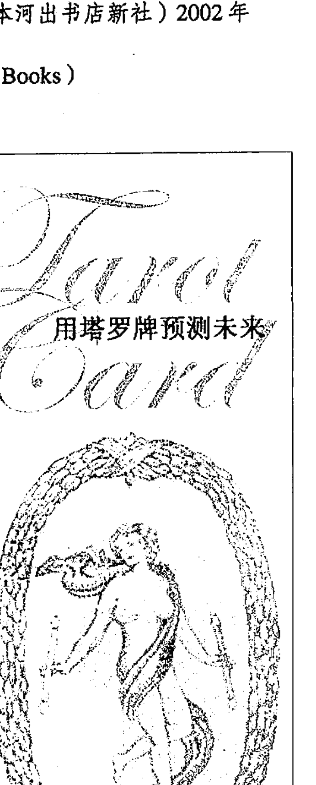

## 星星的指引

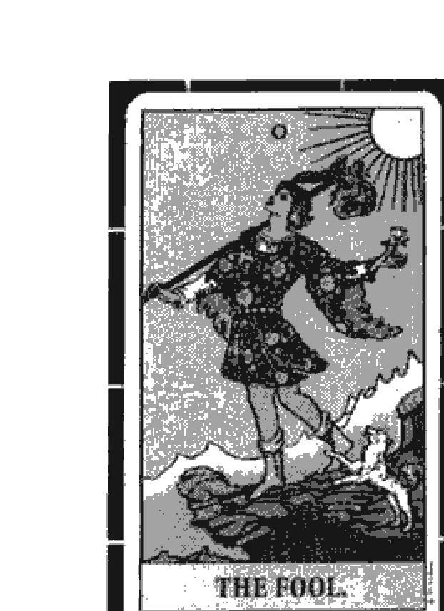

### 0愚蠢的人

创造、空想、灵感、出乎预料的事情、偶然的幸运、流浪、旅行、生活的变化(R)愚蠢的行为、鲁莽、孩子气的行为、不工作

◇代表颜色为柠檬黄

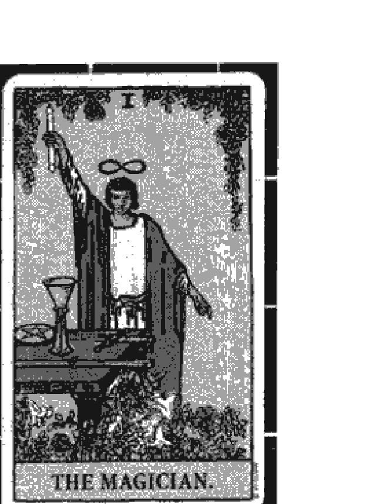

### 1魔法师

野心、计划的施行、自信、技术上的能力、有想法、创造性、表达能力、社交能力、有行动力的男性、有说话技巧(R)没有自信、无法行动、无决断力、容易说谎、利己主义

◇代表颜色为黄色

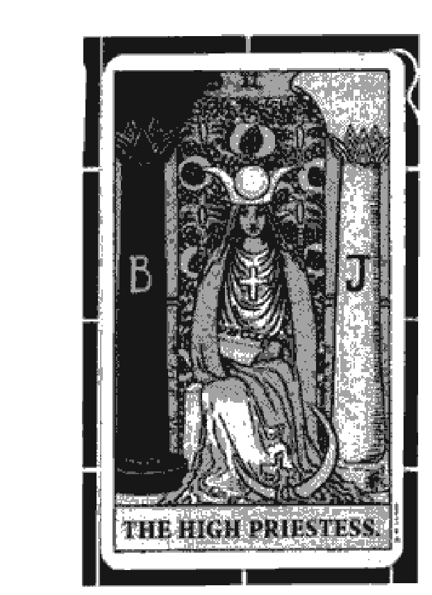

### 2女教皇

有知识的女性、直觉、研究、勤奋学习、被动的、内在的丰富、未婚女性、没有表现出来的隐藏在内的东西(R)感情的不稳定、偏见、孤立、没有远见

◇代表颜色为蓝色

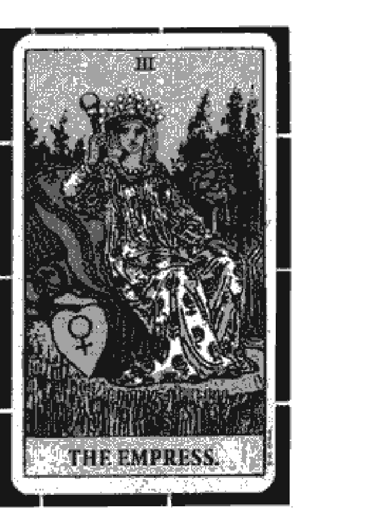

### 3女皇帝

母亲、女神、丰富、生产性、满足、安乐、爱情、创造性、美(R)任性、懒惰、过分的保护、停滞、健康问题、以自我为中心

◇代表颜色为祖母绿

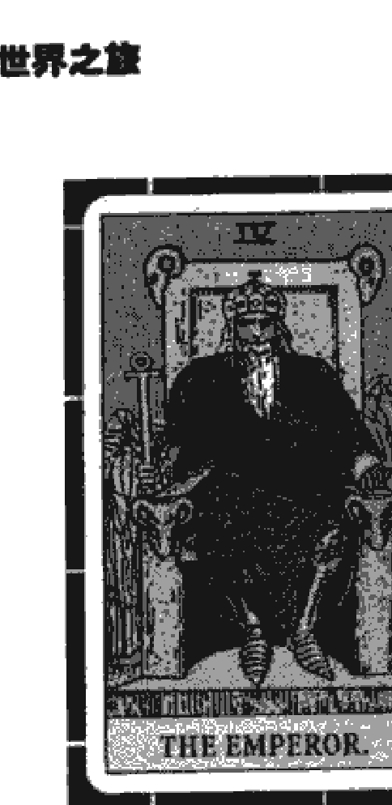

### 4皇帝

父亲、权力、男性力量、表达能力、理性、决断力、执行力（R）无法执行、无法决断、无活动

◇代表颜色为红色

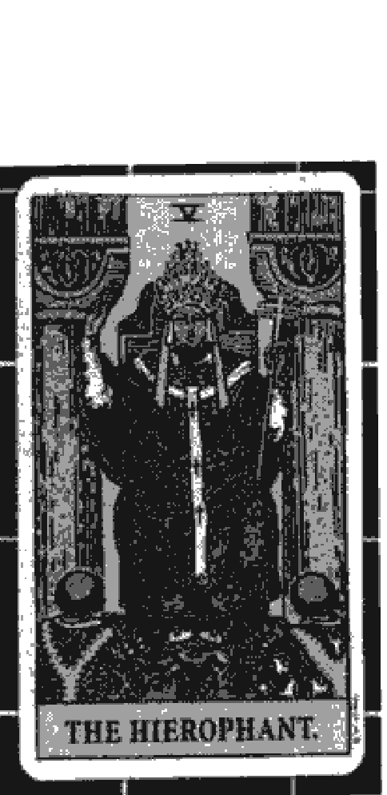

### 5法王

传统、道德、规律、常识、认真、圣职者、教师（R）违反道德、误解、现代的做法

◇代表颜色为橙色、红色

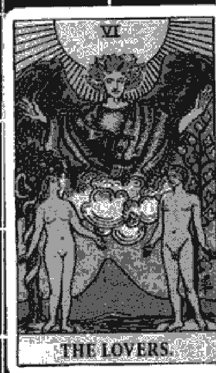

### 6恋人

犹豫、选择、良好的人际关系、平衡（R）无法决断、犹豫不决、错误的选择、不平衡

◇代表颜色为亮橙色

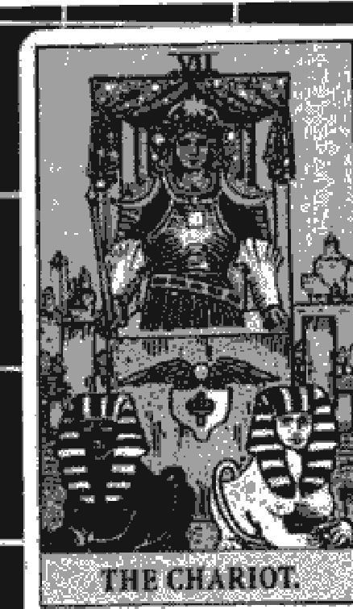

### 7战车

前进、充满勇气的尝试、自立、独立、经受住考验、胜利、有能量、和交通有关的事（R）无法掌控、误入歧途、失败、无法前进

◇代表颜色为琥珀色

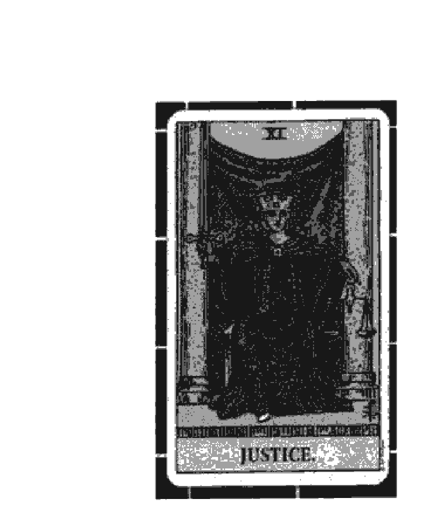

### 8 正义

审判、法律、秩序、显示结果、正确的判断、平衡、正确的结果（R）不公平、无法决定、偏见、判断错误、无法决断、不利的结果

◇代表颜色为黄绿色

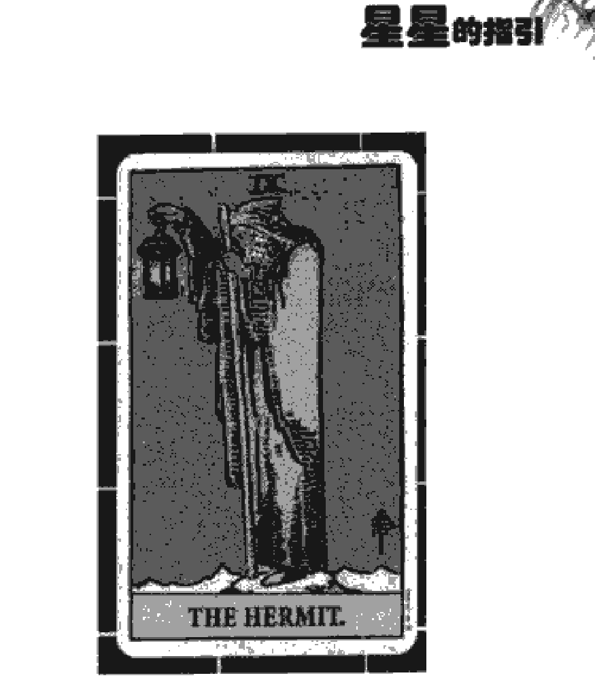

### 9 归隐的人

老人、孤独、探求者、研究者、含蓄、自我反省、深思熟虑、慎重、远离外界活动、精神性（R）顽固、不倾听别人的想法、隐居

◇代表颜色为浅黄绿色

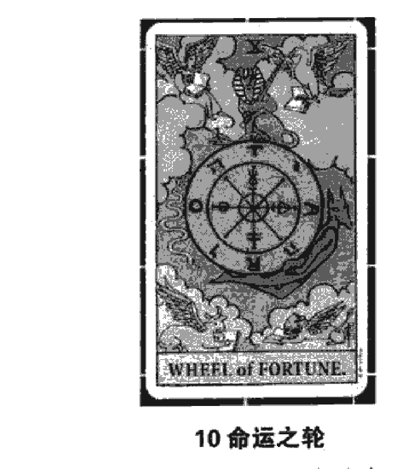

### 10 命运之轮

变化、转折点、机会的降临、幸运、自然的向好的方向发展（R）延期、向坏的方向发展、错过机会、时机不好

◇代表颜色为紫罗兰色

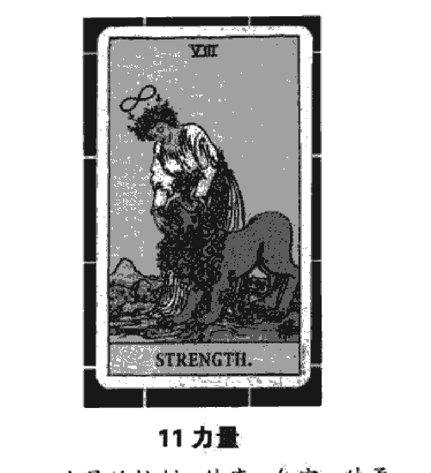

### 11 力量

力量的控制、健康、包容、外柔内刚、理解能力、达成目标、战胜困难、精神上的爱情、运动（R）失败、愤怒、没有勇气、任性、疲劳

◇代表颜色为黄色、黄绿色

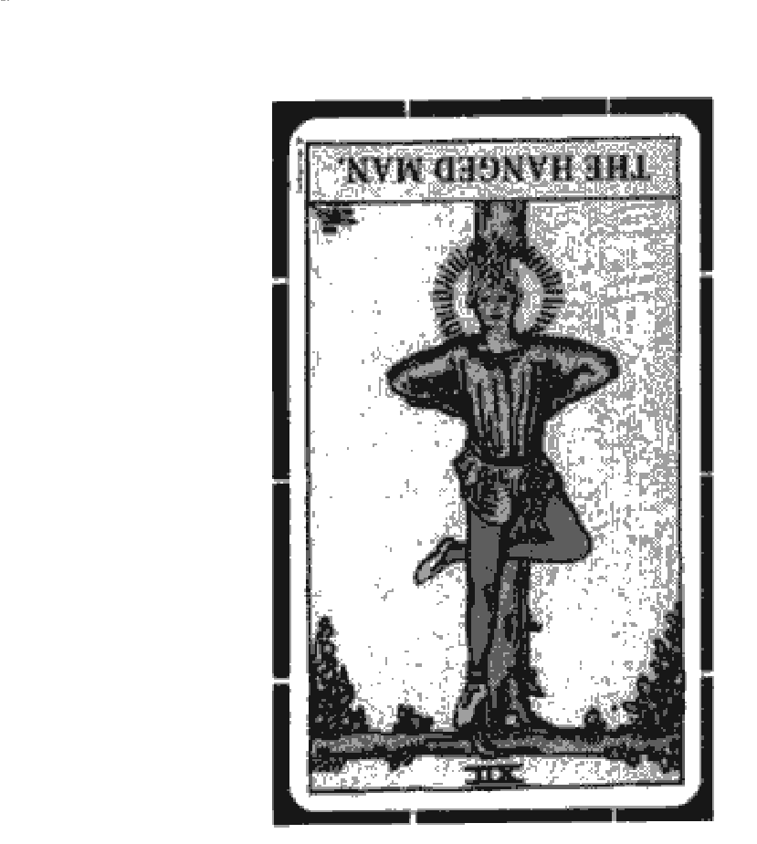

### 12小丑

牺牲、亲切的聆听、新的发现、适应环境、再生和救济、放弃（R）自我本位、任性、心胸狭窄、无法解放、想不出主意

- 代表颜色为海军蓝

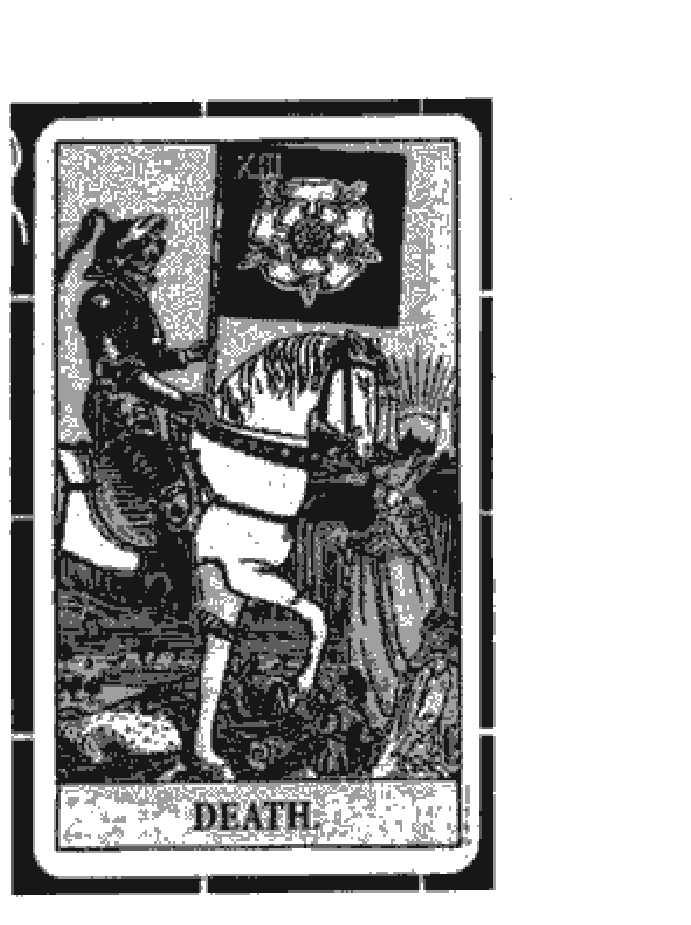

### 13死神

死亡和再生、变化、新的开始、忘记过去（R）不活泼、无法活动、惰性、需要长时间治疗的慢性疾病

- 代表颜色为铜绿色

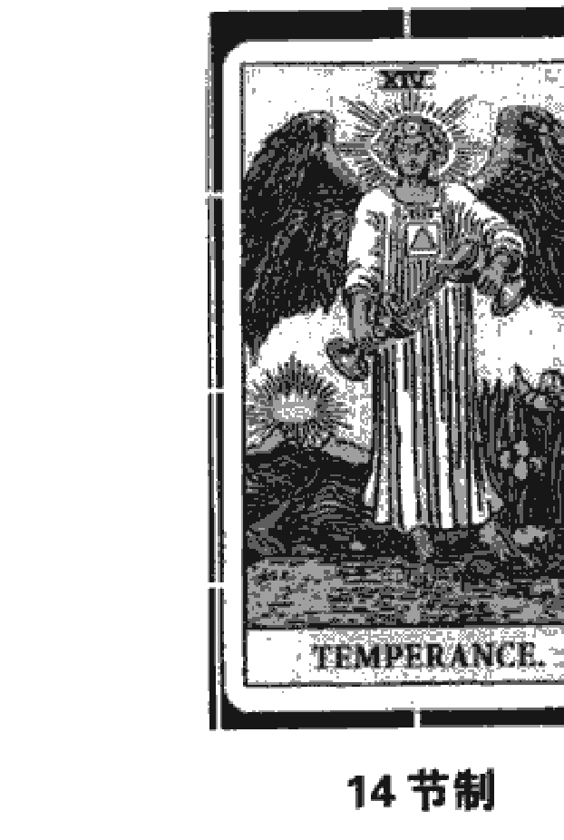

### 14节制

肉体和精神的平衡、安定、调整、充分的考虑、理解、自我管理、规则性、沉着（R）平衡被打破、不恰当的行为、时机不好

- 代表颜色为蓝色

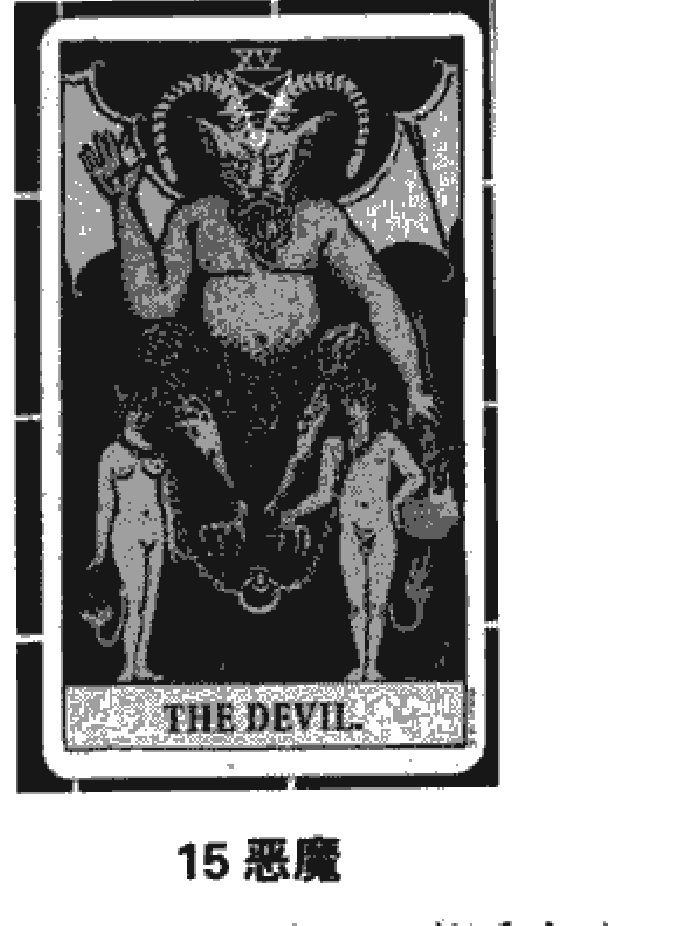

### 15恶魔

执著、被俘、支配、物质主义、虚荣、束缚、不正、坚持自己的主张、不安和令人担心的事（R）不安、被俘、正面的力量比较弱

- 代表颜色为蓝色

### 16 塔

突然发生的事、事件、事故、精神上的打击、吃惊、新的发现、真实的感受 (R) 能够躲避的事件、微小的变化

◇代表颜色为红色、深红色

### 17 星星

理想、梦想、愿望、才能、希望、梦想的实现、纯粹的爱、肯定、原谅、献身、援助(R)负面思考、忧郁、无法实现的梦想

◇代表颜色为紫色

### 18 月亮

不现实、不安的感觉、秘密、暧昧、梦和睡眠、灵感、潜意识、看不见的事物、意料之外的变化、神秘的能力 (R) 暧昧的感觉稍微有点显露

◇代表颜色为粉色系的紫色

### 19 太阳

诞生、达成目标、成功、综合、创造性、自我表现、自我实现、健康、协调、男性和女性的中和、结婚(R)离成功只差一步

◇代表颜色为橙色、黄色

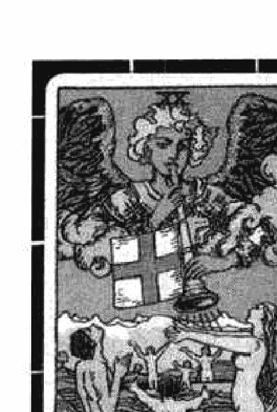

### 20 审判

死亡和再生、很大的变化、解放、变身、复活、再开始、决心、决断、生活上的大变化（变换工作、变换职位、搬家等）（R）得不到解放、停滞不前、重复过去

- ◇代表颜色为鲜艳的橙色

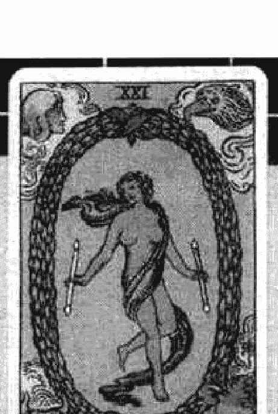

### 21 世界

宇宙、完全性、领悟、成就、责任、安定、海外旅行、结婚（R）局部的成功、停滞不前、不履行责任

- ◇代表颜色为蓝色、柠檬黄、橄榄绿

## 得到塔罗牌的方法和种类

塔罗牌分为海外进口的版本和中国出版的版本。另外，还有配有说明书的版本。对于想要实际操作的人还是配有说明书的版本比较便利。因为塔罗牌上有许多精美的图画，所以也有很多人并不是为了预测未来，而只是出于收集的目的将塔罗牌收藏起来。版本语言主要以英语、法语、意大利语、西班牙语和德语为主。印刷要数比利时等欧洲国家的纸质比较精美。大致区分一下的话，印有古典画的“马赛版”和“维特版”以及他们的改变版在市场上成为了主流。尤其在美国，受到新时代运动的影响，在现代，出现了很多原创的塔罗牌。在日本，也同样有漫画家和画家们自己创作的塔罗牌。

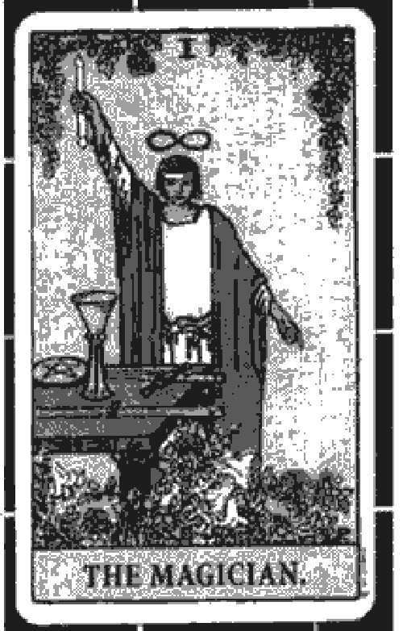

维特版

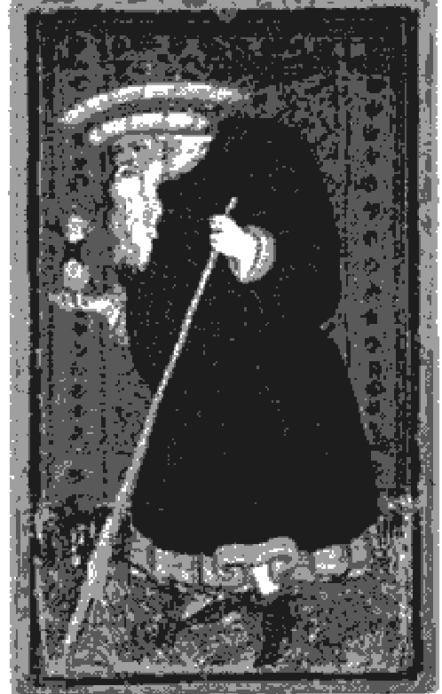

阿里斯版的塔罗牌

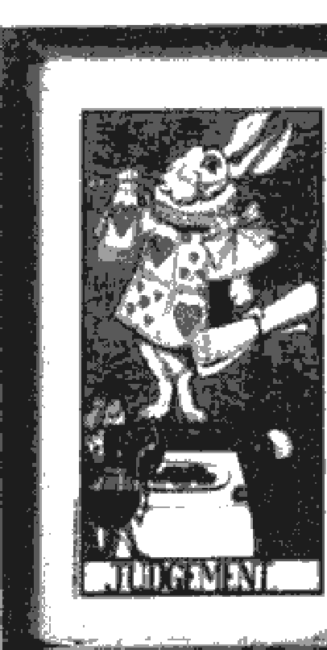

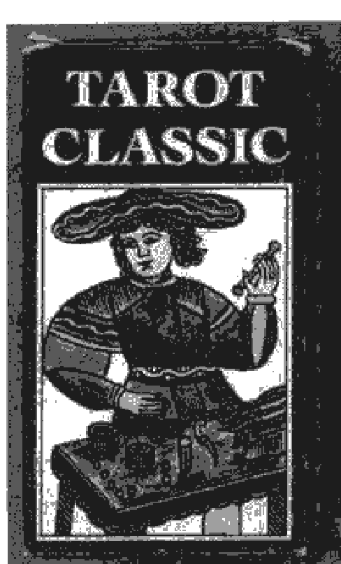

马赛版

← 世界上现存的最古老的塔罗牌是被收藏在巴黎的国家图书馆的17张大阿尔卡那。接下来是人们认为并不算古老的，收藏在纽约图书馆的35张叫做 "维斯康蒂·斯佛鲁其亚" 的塔罗牌。这个 “维斯康蒂·斯佛鲁其亚” 版本经过再版后，以 "维斯康蒂·斯佛鲁其亚·塔罗牌" 的名字在市场上出现。

## 【进行预测前的准备】

预测前的准备……如果是新买回来的牌，首先要做的就是熟悉这副牌。通过一张一张的翻看牌，对每一张牌有一个印象。在塔罗牌预测未来中，想象力是十分重要的。

在这里，我们向大家介绍一种最简单的，也就是将三张牌平铺来预测未来的方法。

（但是，将牌平铺的手法有多种，也有预测专家独创的方法。）

- 1. 准备一张桌子。建议在桌子上铺一块桌布。如果是比较讲究的话，可以铺上使用塔罗牌时的专用桌布。桌布的颜色最好是黑色或是深紫色一类的单一的颜色。
- 2. 把牌面翻转过去，在桌面上将它们打乱。一边将牌打乱的时候，一边在心里默念想要询问的问题。这个时候要保持自己的思想集中。在将牌打乱之后，就要进行洗牌。在洗牌的时候，也要思考自己想要询问的内容。在自己认为可以开始的时候，停止洗牌。如果是一个人预测的话，将三张牌从左向右的排列。（如果是替别人预测的话，应该把牌给提问者让他自己洗几次牌。）左边的牌代表过去，正中间的牌代表现在，右边的牌代表未来。

- ★塔罗牌排列的顺序是按照进行预测的人的方向为准的，而不是按照提问者的位置。
- ★在还没有操作熟练的时候，建议只使用大阿尔卡那中的三张来进行练习。
- ★希望得到预测的人应该坐南朝北，进行预测的人应该坐北朝南。如果是自己替自己预测的话，最好面朝东方就座。因为这和气的流动有关系。

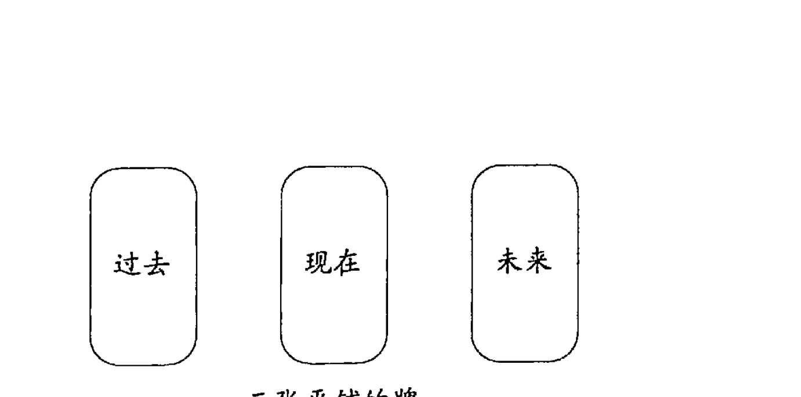

## 代表性的平铺方法

### 凯尔特十字法

这种平铺法适用于预测中具体提出问题时。（例如提问1：有一个交往了三年的对象。我想要和他结婚，但是不知道他是不是想结婚？我们能结婚吗？提问2：前几天接受了一家公司的面试。不知道能不能进入那家公司？等等，适合解答具体的问题。）

### 〈铺牌的顺序〉

一边在心里想着要问的问题，洗好牌后如下图所示将牌摊开。

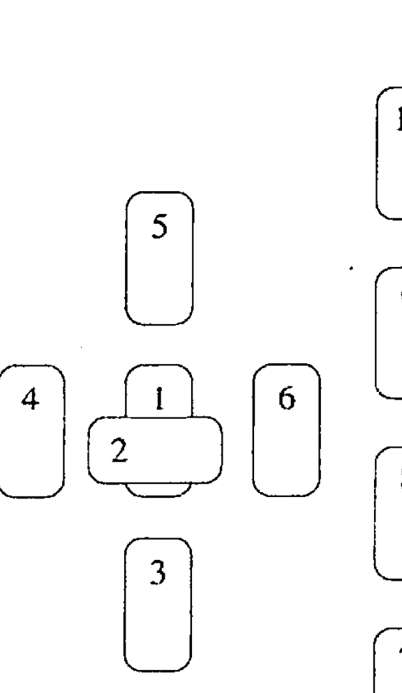

### ●各个位置的意义●

- **位置1**：表示提问者现在的状况和心境。
- **位置2**：表示目前会对提问者产生影响的事情或阻碍。
- **位置3**：表示提问者过去的状况。或者是提出的这个问题的最初的原因或最初的情况等。
- **位置4**：表示离现在最近的过去。最近发生的事情。
- **位置5**：表示离现在最近的将来。
- **位置6**：表示有可能发生在位置5所表示的事情之前的事情。或者还能表示解决问题的关键。
- **位置7**：提问者的心境。表示心中所想的想法、意志和愿望。
- **位置8**：表示周围的情况和环境。针对特定的对象还能表示对方的心情和情况。
- **位置9**：表示提问者未来的态度、意志和可能性。
- **位置10**：表示综合的最终结果。

## 数字秘法

### ■ 关于数字的魔法

在古代犹太的神秘哲学中，有一种叫做数字的魔法的数字秘法。数字本身有着各种各样的意思。这个现实的物质世界也受到了数字的支配。试图解开数字的神秘、法则和带来的影响，这就是数字秘法。

象征着个人与生俱来的性格、来到这个世界上的使命的诞生数字就是一种代表性的数字。因为这个数字暗示着前一世沿袭下来的个性和这一世应该学习的教训，所以知道自己的诞生数字就成为了解自己的关键所在。诞生数字是以出生的年月日为基础而推算出来的。另外，在犹太神秘哲学的数字秘法中，11 和 22 被看作两个特别的数字（控制数字）来对待。

### ■ 诞生数字

不同的诞生数字的主要意义如下所述。

- 诞生数字为 1【独立自主的开拓者】

关键词……自信、独立精神、开拓、指导性的、热情、男性的、有活力、自尊、光明正大、意志力、独创性、没耐心、以自我为中心、顽固、虚荣

个性……让人总觉得有一种威严。从头到脚透出一种威信，宽容，性格开朗，自尊心很强。适合在政治和艺术领域担任创始者或领导者。有从无到有的本领。因为强大的意志力和热情可以成就事业。

### 诞生数字的计算方法

例如：1953年5月30日出生的人
把出生年月的数字相加，直到结果为一位数为止。
1 + 9 + 5 + 3 = 18 = 1 + 8 = 9
5月 = 5
30日 = 3 + 0 = 3
9 + 5 + 3 = 17 = 1 + 7 = 8
所以这个人的诞生数字就是8。

另外，如果计算当中出现控制数字11或22的话，不要再进行相加。
例如：1966年11月22日出生的人
1 + 9 + 6 + 6 = 22（不要再相加）
11月 = 11（不要再相加）
22日 = 22（不要再相加）
22 + 11 + 22 = 55 = 5 + 5 = 10 = 1
所以这个人的诞生数字是1。

### ● 诞生数字为2【爱好和平的感情细腻的女神】

关键词……感受性、亲切、体贴、和蔼、和平、女性的、性情不定、依赖心、梦想、胆小。

个性……是一个有着温和的感受性，良好的关系性和平衡的人。对周围的状况和气氛十分敏感。能看清事物的表面和内在。容易受到别人的影响，优柔寡断。虽然欠缺实行力，但是在艺术和宗教领域还是能发挥自己具有良好判断力的优势。

### ● 诞生数字为3【天真而单纯的才艺术家】

关键词……乐观的、社交的、活泼、快乐、友好的、开朗、年轻、直率、虚荣、奢侈、欠考虑的。

个性……是一个喜欢开朗快乐的自由的人。有很强的好奇心并且多才多艺。能说会道且善于听他人说话。精神性很高，虚荣心强，一味地追求快乐和眼前的东西，有意志不坚定的情况。在让人快乐，给人勇气等表现精神上的喜悦的领域较为活跃。

### ● 诞生数字为 4【理论性的认真的努力家】

关键词……合理的、现实的、勤奋、保守的、安定、传统的、管理、顽固、疑心重、形式化。

个性……工作认真、容易和事物的维持、管理和安定产生关系。因为重视确实性而非常慎重。适合和经济、法律有关的工作，或是研究家。

### ● 诞生数字为 5【灵巧的、活泼的冒险家】

关键词……机敏、柔软性、活泼的、轻快、多才多艺、好奇心、分裂的、容易让人觉得狡猾。

个性……理性的，有说话技巧。在开拓知识的未知领域方面有浪漫主义色彩。因为对很多方面都很关心，所以可以同时从事几份工作。因为喜欢变化，所以一旦过度就容易产生虎头蛇尾的情况。

### ● 诞生数字为 6【爱·美·协调的艺术家】

关键词……温和、家庭、诚实、和蔼、献身、对美的直觉、惰性、独占欲。

个性……喜欢和平、很和蔼，喜欢帮助周围遇到困难的人。

> 【数字里所蕴涵的意义】
0象征着女性原理。表示子宫和月亮，其本身的意思表示无，但是在0前面放上数字后，就能由于十进制增加的原理变得丰富。
1象征着男性原理。综合、神秘的中心、光。在犹太神秘哲学里表示赛非拉（全能的神耶和华），在占星法里表示太阳。
2表示生和死、男和女。双胞胎、精灵。也有表示使者和间谍的意思。在罗马，因为2象征着地狱之神普鲁顿，所以被认为是不吉利的数字。
3是一个神圣的数字。和有着三种外貌的神灵有关。象征着天上、地上、地下这三个世界的构造。在民间流传的故事中，经常出现3匹、3人等数字。过去用3来代表复数。

充满献身的爱情精神，很多人具有艺术细胞。当平衡感一旦被打破后，就会陷入深深的妒忌中，变得很顽固。

## ● 诞生数字为7【精神性很高的哲学家】

关键词……理性的、自我反省、对内在的探究之心、独创的、很高的理想、直观力、奇特的人、孤独、顽固。

个性……是一个追求精神上的理想和探求真理的人。对世俗的事情很少关心。有着天才般的独创性和灵感。对所有的学问都有所涉猎。他们中的很多人对宗教等神秘的事情非常感兴趣。他们因为过分拘泥于自己的想法而容易被人认为是顽固的怪人。

## ● 诞生数字为8【充满力量的热情的人】

关键词……热情、自信、野心、实行力、现实的、大胆、战斗的、没有耐心。

个性……好强、喜欢竞争。充满能量。喜欢挑战危险的、不可能的事情。因为具有统率的能力，所以具有领导的潜质。由于有欠考虑的弱点，所以有时需要冷静的判断。

## ● 诞生数字为9【充满博爱精神的浪漫主义者】

关键词……同情、自我牺牲、情绪化、敏感、博爱、复杂、正义感、艺术、不安定、伤感的。

个性……有着一下子让人琢磨不透的性格。和蔼和自强的性格兼而有之。因为是浪漫主义者所以感情很丰富。有着现实的一面也有不现实的一面。把博爱的精神发挥到社会中去就更好。要注意精神上的分裂和不安定。

> 4 意味着地上的秩序，表示四大（火、水、风、地）以及东南西北等根本原理。表示具有两性和丰收。大多数的民族都有着四个字的最高神灵。YHWH（耶和华）、Zeus宙斯等。用希伯来语表示神灵。把四个字叫做四字母。
> 
> 5 像表示小宇宙的五芒星那样，表示永远的运动。有机体、黄金分割。表示爱，象征着由生命和宇宙的秩序产生而来的动态的自然节奏。
> 
> 6 因为这是神灵创造天地的天数，因此表示完全、协调。在希伯来语中的六角星形表示大卫之星。是创造、进化、丰收的数字。和水女神有关系。因为和7只差一点，所以表示恶行和不完全。《启示录》中，兽的数字就是666，罗马的暴君皇帝也用这个数字来代替。
> 
> 7意味着神圣、清洁。一般用来表示健康和光明。在犹太神秘哲学中，有七个天国。用7来表示天和地。罗马是建在七个山丘之上的。是表示安息、安全的数字。据说在民间故事中，第七个出生的孩子，有着特殊的天赋和才能。
> 
> 8复活。7意味着结束。所以紧接着它的8就表示开始。象征着永远、无限和异教的各个神灵。天体的螺旋运动。还意味着这一世和永远之间，也就是死亡。在希腊，8表示“所有一切”。
> 
> 9表示完成、完美和真理。一个周期的完成。自我再生。和月亮有关，意味着月亮带来的理性。表示死亡、阴间、地狱。另外，是一个和魔法有关的数字，在魔法中，咒语要念九遍，动作也要做九次。猫有九条命等；这些都是和魔法界有关的数字。
> 
> 10在毕达哥拉斯学派中，有着比数字1到9更高的地位，意味着世界的神秘。表示完全性、最终的宇宙全体。

## ● 诞生数字11【有着敏锐的感受性的天才】

关键词……理想主义、希望完成目的的强烈的意志、特别的才能、直观力、感应性、神经过敏、非现实的、以自我为中心。

个性……有着很高理想的梦想家。有着敏锐的感受性，良好的对事物的洞察力，更有人有着天才般的能力。针对目标能作出有效的成绩，但是那些没有目标的人因为有敏锐的感受性，所以对附和社会的一般常识这方面感到困惑。

## ● 诞生数字为22【面向未来的，有着超人般的使命的人】

关键词……有能力、理想主义、卓越、能量充沛、灵感、神经过敏、以自我为中心。

个性……隐藏着巨大的能量。感受性和精神性很强，有着多人有着特殊的才能。

因为有着很强的特殊的力量，不知道能不能把这种能量很好地运用在现实世界呢？这个问题非常重要。因为有着神授的超凡能力，如果不能很好地运用的话，只会变成一个怪人。是一个超越常规的开拓者。

## 文字数码学

这是一种把字母换算成数字的数字秘法。文字数码学是从把希伯来文字中的22个字换算成数值起源而来的。换算表有几种版本，一般现在使用的是文艺复兴时期的魔法师阿格里帕设计的和魔法师卡里奥斯特洛修订的换算表。

通过将字母换算成数值，可以算出名字里隐藏的数字，然后来判断那个人的性格等。这叫做犹太神秘哲学姓名数字。和诞生数字的不同在于诞生数字是显示这个人的深层次的本质，而姓名数字显示的是表面的第一印象。

换算表示例：

| 数字 | 字母 |
|------|------|
| 1    | AIQJY |
| 2    | BKR   |
| 3    | CGLS  |
| 4    | DMT   |
| 5    | EHN   |
| 6    | UVWX  |
| 7    | OZ    |
| 8    | FP    |

例如：天沼春树
AMANUMA = 1 + 4 + 1 + 5 + 6 + 4 + 1 = 22
HARUKI = 5 + 1 + 2 + 6 + 2 + 1 = 17 = 1 + 7 = 8
22 + 8 = 30 = 3 + 0 = 3
所以姓名数字就是3。

各个数字的意思和诞生数字的意思大致相同。

## 水晶球透视

从古代开始，魔法师和预测未来的法师使用水晶球来进行透视。通过看现在水晶球里的事物，来进行预测和判断。通过预测未来和对提问的解答，甚至可以找寻失物和找到犯人。水晶透视被叫做scrying。这种透视不一定非要使用水晶球。只要找一个光滑的、发亮的、像镜子一样的物体就可以了。比如说水池、湖水、装在碗里的水、镜子、打磨过的金属或石头、玻璃等。

透视在各种魔法秘法中都是一种很高等的技术。在格林童话《白雪公主》里出现的继母就对着镜子问道：“镜子啊镜子，全国最美丽的女人是谁啊？”这面回答了真话的镜子就是透视魔法的一种。

## 【水晶球透视的顺序和关键】

- 集中精神注视着水晶球。
- 过了一会儿水晶球开始起雾，出现了像牛奶状的、像漩涡一样的云团。
- 等云团散开后，就能看到东西了。

- 尽量在可以使精神集中、安静和不太寒冷的地方进行。照明要尽量调暗一点。
- 穿着的衣服最好是像斗篷那样宽松的，不要穿内衣。
- 要坐在椅子上进行。
- 在透视时最好眼睛半开半闭，这样比较容易。
- 不要进行太长的时间。
- 眼睛看见的也不一定是真实的。因为当你加入自己的愿望和想法后，呈现出来的东西就会不一样。至少是把自己凭空想象的东西加入了所看到的事物中。
- 当看到邪恶或恶魔的时候，一定要驱散它们。为了防止这种情况的发生，所以身边经常要有一个守护神。并且还要知道在魔法中如果遇到麻烦的时候应该怎么处理。看见天使是可以通过训练来完成的，但是，千万不要迷失自己，能使自己回到原来的状态是非常重要的。
- 在还没有熟练之前，不要单独一个人进行，最好有一个指导者在一旁监控进行的状态。
- 结束的时候，要进行深呼吸来调整自己的身体状况。然后再吃点甜的饮料或食物就更好。

## 天使体验

从古代开始就传说有天使的存在。很多神秘学家和宗教家都说曾看见过天使，从天使那里得到信息等和天使有过交流。天使一般都是以基督教为中心的一神教的产物，换句话说，她们是守护神、灵和人类的之间的居间人，也就是在各种宗教和神话里出现的联系天上和地下的使者。天使一般和人类同时存在。天使的概念分为很多种，经历的和天使有关的事情也有很多是相同的。

天使（angel）这个单词是从希腊语里的“angelos”这个单词起源而来的。拉丁语在沿袭了希腊语里的说法后，又转变成了其他各种语言。“angelos”是使者的意思，但是在当时，只用来形容保护死者的神灵。

和天使有过交流的人到底是怎样的一些人呢？

在旧约和新约中出现了很多个天使，她们向人类传递信息并且鼓励着人们。尤其在《爱诺克书》中出现了大量的天使。这是第一次展示了天使的概念的初期的描述。另外，在雅各的梦中出现的天使所呈现的感觉和（基督教的）天使报喜等，都把天使形容成了一个神灵的使者。

13世纪的哲学家托马斯·阿奎那所描述的天使是这样的。天使们是一种纯粹的、非物质的神灵。根据他们所具备的才能和对事情的完成度而被分成不同的级别。智天使和座天使（第一级别）、力天使、能天使（第二级别）、权天使、大天使、一般天使（第三级别）。天使是由神灵创造的，并且天使有自己的自由意识。所以出现了一些堕落天使。据说每个人都有一个守护天使。天使能够照亮人们的心灵，给予人们灵感，把他们朝好方向指引。

除了托马斯以外，相传还有弗朗西丝科、毕奥神父、珍妮·格卢克、圣艾格尼斯、圣克拉拉等很多的圣人都见过天使。在艺术家中也有很多人看到过天使。英国的诗人兼画家威廉姆·布莱克在看到了天使之后，画了许多神秘的画像。

斯维登堡是1688年出生在斯德哥尔摩的神秘学家。他在人生的后半段开始有通灵的能力，可以看见天国和天使。根据他的描述，天使有着和人类一样的外表，能和人类谈话并倾听人类的话。根据智力的不同穿着不同颜色的衣服，最有智力的人穿着像燃烧的火焰一样的衣服，或者是闪闪发光的衣服。最纯洁的天使是不穿衣服的。并且据说天使们根据自己的智慧的不同，使用着各自的语言和文字。天使们的智慧是无法用语言表达出来的。在斯维登堡的日记《灵界通信》中就是这样记载的。

20世纪德国的神秘学家，斯坦纳也曾经叙述过关于天使的事情。首先他认为要从矿物、植物、动物和人类这四个层面来分析人类。在人类的上一个层面有天使存在，而天使又要从植物、动物、人类和天使四个层面来理解。然后天使对人类的意识产生作用，起到了使人类进化的作用。在这些天使的上一个层面，据说还存在着更高级的天使。

只要经常有想着要和天使交流的意识就一定可以和天使交流——因为即使你看不到天使，她们也一直在你的身边。

### 【和天使交流的目的】

和天使进行通信，从天使那里接受信息，这些并不是只有具有特异功能的人才能做到的。其实每个人都有可能做到。

### ☆具体的方法☆

- 作为准备，在平时就要虔诚地想着想要和天使进行交流。
- 慢慢地进行深呼吸。让心沉静下来。因为呼吸和精神世界是有关系的。
- 在自然中放松身心。
- 沉思。
- 在临睡之前，心里想着天使。这样一来，天使就能出现在梦中。
- 准备好古典音乐、好闻的香气和花，这些都是天使喜欢的事物。
- 天使用各种各样的方法把信息传递给我们，不仅通过声音，还会通过幻影、感觉和突然的认识等。会渗透到人的五官。
- 不要忘了常常怀着感激的心情。

## 和月亮有关的礼仪

### ■ 月亮的影响

月亮在夜空中发出神秘的光芒。不断地变化着形状的月亮，自古以来就对人们的生活和情绪有着影响。随着月亮的盈亏，人们可以知道日期的更替。

月亮和女性、丰收、月经周期、养育、黑暗的力量、潮水的涨落、直觉、情绪等有着密切的关系。人们认为月亮的相位支配着人类生活的各个方面。满月意味着谷物的播种、生育、新的计划、繁荣，月缺意味着衰退，人们把月亮的形状和生活中的吉凶对照在一起。

在欧洲的文艺复兴时期，炼金法和魔法十分流行，当时月亮和所有魔法中的礼仪都有关系，这是自然的潮流。在魔法中很重视月亮的象征和月亮的相位。所以月亮和魔法道具的制作、净化、治疗疾病、咒语等所有的礼仪都有着很深的关系。到了现代，人们针对月亮对人体和人的感情产生的影响进行统计和研究，并结合魔法的传统，将月亮的相位经常用于预测未来。

### ■ 月亮的相位及其意义

- ☆ 朔月（新月）……这是一个新项目开展的好时机。这个时候出生的人有着单纯、开朗的性格，是一个爱憎分明的、活泼的人。
- ☆ 三日月（月牙）……这是事物得以发展的好时机。这个时候出生的人是一个冒险家。他们在现实和梦想之间徘徊但仍然努力向前。
- ☆ 上弦月（新四分之一月）……这是一个适宜冷静的判断来开展事物的时机。这个时候出生的人是一个建设者。他们能一边反省过去一边挑战现在。
- ☆ 凸月……这是一个和人沟通的好时机，这个时候出生的人有着沉稳的性格并善于照顾人。
- ☆ 满月……这是一个事物完成的时机。代表了收获。是实用性和创造力很好的融合的时候。这是一个感情容易亢奋，这个时候出生的人是有着丰富的感情。
- ☆ 缺月……这是一个和周围的人以及世界上的其他人进行交流的时机。这个时候出生的人是一个懂得照顾别人和对理想有着改革之心的人。
- ☆ 下弦月……这是一个大扫除和整理事物的好时机。这个时候出生的人有出色的理解力和平衡能力。有着解决问题的天赋，但有多愁善感和乡愁的倾向。
- ☆ 接近初一的月亮……这是一个静静的思考过去的事进行反省，准备向下一步出发的好时机。这个时候出生的人是一个能够审视自己内心的人。但是喜欢做梦，平淡的过着日子，是在精神上有着神秘的理解力的人。

### 【满月所具有的特殊的力量】

满月的时候，月亮、太阳和地球呈一直线。因此，此时的引力是最大的，当然也对自然现象会产生影响，也容易使人的感情出现紧张或兴奋的情形。人们作出缺乏理性的行为也大多在这个时候。要注意暴动和犯罪以及事故的发生。这也是恋人间容易亲热的时候。在这个时候怀孕和生产也很多见。据说在魔法里，到了满月时分，如果祈祷幸福、健康、爱情、富裕和上天的保佑等都能如愿。

### 【魔法和月亮的相位】

想要祈求爱情、富裕、健康和发展时，最好在凸月和满月的夜晚进行。想要学习施展加害于人的魔法时，最好在缺月的时候进行。此外，最最危险的魔法要在快到新月的时候进行。据说在新月的那晚施展害人的魔法会使魔法的效力加倍。因为会对施魔法的人产生同样的效力。

### ■ 占星法里月亮所代表的意义

在占星法里，很重视月亮，因为月亮代表了以下的意义：感情、欲望、幼年时期养成的无意识的习惯、心灵深处、本能的反应和倾向、想要得到安全感时的必要条件、母性等。月亮和感情有着密切的联系。代表了自己无法意识到的无意识的感情。

自己出生的时候，月亮处于哪个星座，以及相位是怎么样的，都可以查看天宫图或询问占星法师，知道了这些情况就能为占星作参考。下面就简单地向大家介绍一下每个和月亮有关的星座所代表的意义。

- ☆ 白羊座的月亮……是有勇气、积极的人。有出色的直观力和想象力。比较野性。性格开朗积极。自立，没有忍耐力。容易产生厌烦情绪，耐心不好。容易产生感情，像孩子般单纯。
- ☆ 金牛座的月亮……非常执著于自己的想法、感受和感情。非常慎重，有忍耐力。女性化。对开心不开心非常敏感。难以接受不协调的事物。有着优雅、大方的气质。
- ☆ 双子座的月亮……圆滑的、社交性的。在知识方面有强烈的好奇心。喜欢变化，一直能保持年轻的心态。没有定性。喜欢有趣的事物。对于喜爱的事物也很容易厌倦。
- ☆ 巨蟹座的月亮……很容易对他人的态度产生反应。性格细腻，母性的。非常渴望安全感。很敏感、善于自我防卫。很顾家。很容易从母亲那里受到影响。
- ☆ 狮子座的月亮……感情起伏激烈。有丰富的感情。开朗、心地善良。以自我为中心。正直。有吸引周围注意的魅力。希望受到尊敬。自尊心很强。
- ☆ 处女座的月亮……有很强的现实感。喜欢秩序井然的感觉。希望对别人起到帮助作用。能够发现最细微的事情。受理性控制。十分害羞于直接袒露自己的感情。爱操心、无法取悦别人。
- ☆ 天秤座的月亮……机灵。有很强的公平意识。希望能满足别人的要求。观察力很强。和蔼可亲。喜欢协调的事物。优柔寡断。不喜欢麻烦的事。
- ☆ 天蝎座的月亮……热心、有很强的妒忌心理。能集中思想、对事物有出色的洞察力。忍耐力强、有很强的生存意识。希望能够控制别人的感情。容易动感情。
- ☆ 射手座的月亮……开朗且容易亲近。喜欢自由。很宽容、乐观、适应力很强。不喜欢固定模式。遇到麻烦的事有逃避的倾向。
- ☆ 摩羯座的月亮……为人稳重，容易隐藏感情。小心谨慎。有很强的责任感，对工作很投入。认真。社会性的野心很强。忍耐力强。
- ☆ 水瓶座的月亮……非常冷静，但是开朗，对人热情友好。有很强的博爱精神。喜欢与众不同。不喜欢平凡。视野广阔有先见之明。
- ☆ 双鱼座的月亮……感情丰富，非常敏感。容易和人产生共鸣。和蔼。感情细腻。自己的感情容易受到环境的影响而改变。喜欢做梦。有艺术家的气质。

### 【月亮和银】

月亮和银是女魔法师必须要掌握的。想要提高女性的力量和直觉能力的人，不如佩戴月亮形状的，或是银制的饰品。

### 【月亮女神】

- 黛安娜……指的是希腊神话中的女神阿尔忒弥斯。阿波罗是太阳神，与此相对的，阿尔忒弥斯是月亮女神。她穿着白色的短白色束腰上衣，很多人把她描写成一个戴着三日月饰物的样子。
- 月之女神……希腊神话中的月亮女神。是太阳神赫利俄斯的妹妹。据说她的作用是引导月亮。
- 赫佳特……这是象征着月亮的黑暗部分的女神。给人的感觉是把自然怀在心中的伟大的母亲的形象。因为她是掌管黑暗的女神，所以常常被人认为是女魔法师的象征。
- 卡里……是在印度教里出现的，是掌管死亡和破坏的女神。象征着光明、黑暗和母亲。有着强大的甚至是危险的力量。能够控制卡里的激烈的脾气的，只有她的丈夫湿婆神。
- 福雷耶……以古代斯堪的纳维亚海王尼白的母亲被人们所知晓。象征着丰收和富裕、母性和养育之恩。象征这个女神的动物是猫。这个福雷耶也被看作是大海的守护神。
- 依西丝……这是埃及神话中一个像母亲一样的女神。作为月亮女神，她象征着丰富、生命、家庭、生产。她的身上佩戴着象征着三日月的牛角。象征她的动物是牛和猫。无论哪种都是可以用来供奉月亮的动物。

### 【关于月亮的黑斑的传说】

- 欧洲版……在欧洲，有把月亮上的黑斑看作是男人的样子的传统。在德国、英国、法国等地有着“月男”的说法，这种说法和日本所说的“月兔”同样普遍。在民间的故事中，很多都把这个男人描述成是一个罪犯。例如，1. 一个想要把月亮消灭的人，2. 一个抢劫、杀人的罪犯，3. 在圣诞节、复活节和星期天出来活动的，冒犯神灵的人等等。人们传说这样的罪人会被关在月亮里。
- 中国版……在中国，自古以来就认为月亮里有一只蟾蜍。也许根据太阳代表阳性、月亮代表阴性的想法，人们把月亮和水联系在一起，所以也就把栖息在水中的蟾蜍和月亮联系在了一起。另外，他们不仅认为月亮中有蟾蜍，还有些描述了月亮中有蟾蜍和兔子，或者只有兔子的石头。月亮中有兔子这一说法也是从古代就有的。但是从汉代以后，随着时代的变迁，蟾蜍的地位渐渐被兔子所替代，人们大都把兔子作为月亮之神来供奉。

## 魔法世界之旅

## 5 圣者之石

## 炼金法

### ■ 炼金法的历史

在西洋神秘哲学里，炼金法是一个不可缺少的重要组成部分。这是一个听起来让人产生奇怪感觉的单词，但是事实上这究竟是怎么一回事呢？

首先，炼金法究竟是什么时候、从哪里开始起源的呢？地中海周边地区是拉丁、希腊、东方文化交错在一起的地方。地中海文化在古代、中世纪和文艺复兴时期达到了顶峰。再后来，由于现代科学的发展优势，科学知识和哲学的舞台开始向北方移动。曾经出现在地中海地区的文化，是自然生命和调和后的魔法相结合而成的智慧。以这样的智慧为基础，继而就产生了炼金法这一概念。

关于炼金法的历史，人们一般认为是由地中海沿岸的非洲（埃及）、亚洲（阿拉伯世界）、欧洲（希腊）这三个地方的地域文化从古代开始融合而成的，从12世纪以后，尤其在文艺复兴时期的拉丁（意大利附近）最终形成的。

- 埃及和巴比伦的冶金法（实际操作的技术方面）
- 希腊的自然哲学（理论）

> **【炼金法的语源】**
>
> 这个单词是从在英语中叫alchemy，意大利语叫alchimia，以及阿拉伯语发展而来的。Al在阿拉伯语中是表示酒精、碱的定冠词，chemy，chimia是使金属产生变化的意思。
>
> 表示化学的单词chemistry，是单词chimika的语干。

- 赫尔美斯思想（宗教性）

炼金法是以这三大支柱为基础融合而成的。

### ■ 炼金法的目的

所谓炼金法就是指将在自然状态下的不完全的产物，通过某种方法使其转变成完全的产物的方法。这里面包含了物质方面的意义和精神方面的意义。

例如，从物质方面上来说，是希望将卑金属转化为贵金属。

还有就是制造出一种能够去除物质里的杂质使它们转变为完全物质的秘方药。在这个过程中得到的产物，通常就被称为“圣者之石”或“炼金药”。这也可以叫做可以使人长寿的秘药。

17世纪德国所画的象征着四大元素的铜版画

就像“金”这个词语所显示的一样，人们也试图想要把金以外的金属都变成金（从这一点来看，炼金法给人一种带来贪念和不可靠的感觉）。

从精神方面上来说，有着历练精神、灵魂和心灵的意思，在精神哲学上这一点被认为是十分重要的。不管怎么说，这两者的共通点就是低层次（卑金属或兽性之心）向高层次（贵金属或净化了的灵魂）发展，将主要目标放在变化上。炼金法带有一种通过变化而上升的印象。

如果说的更神秘一点，发现“圣者之石”和“炼金药（丹药）”是炼金法的终极目标。

### ■ 炼金法的原理

古代的人们对于物质的构成究竟是怎么想的呢。事实上，在炼金法这一思想的基础里，是十分重视亚里士多德的理论的。自然是由火、土、水、空气（风）所构成的，这被称为第一质量（四大元素）。后来，第五元素“精气”又被加上后所有的物质就都有了。这个“精气”是以太、灵魂、光和呼吸等一切非物质类的要素。当某些物质处于不完全状态时，就认为是四大元素和精气之间的组合出现混乱，或是它们之间的结合不够协调。土是固体（态）、水是液体（态）、空气是气体（态），火相当于能量。以太是物质本来的样态，由于能量的进出交换，物质的状态就会变成液体或气体。我们假设物质有着其根本的存在状态，组成这一根本的各种性质是不同的。也就是说，通过给予或剥夺物质所具有的性质，就可能使物质产生变化。

因此，炼金法师在密封的容器里进行加热、蒸馏、分解和腐败，以及将精气和物质分离后再结合。人们希望通过这些过程，能发现理想中的炼金药和圣者之石。

在炼金法中十分重视“对应”这一概念。也就是宇宙与外界（宏观世界）和人类的主观世界（微观世界）是像反射那样

混沌时期的哲学（18世纪初期）

会相互产生影响的。宏观世界如果产生变化的话微观世界也会发生变化。如果想要让宏观世界产生变化，就必须让微观世界也产生变化。因此，精神上的修行和内心的锻炼是十分必要的。宏观世界和微观世界的协调也是很重要的。

这里面也包括了相反的物质之间的协调。例如生和死、光明和黑暗、男和女等……

### ■ 炼金法是一种想象中的方法

炼金法是一种把卑金属转变成贵金属的方法，但是这只是炼金法师们无法实现的理想和梦想而已。意大利文艺复兴时代的自然研究者、魔法研究者德拉·波尔塔对待试图炼出金子的实验和圣者之石时始终保持着清醒的头脑，并指出那只是梦想。

装饰在手心里的象征着真知（诺斯替教用语）的“命运之手”（作者不详）

但是那些痴迷于炼金法的人们仍然进行着毫无结果的努力。他们的努力渐渐如人们所预料的那样，上升到了精神层面。也是因为这个原因，炼金法经常给人一种上升的印象。通过从劣等向高等转变的这个过程，灵魂得到了净化，也拯救了很多人。

到了17世纪，炼金法达到了鼎盛时期。后来因为进入了理性和启蒙时代，炼金法就消失了。但是作为一种意识变容的秘法，它仍然保持着自己的魅力。

### ### 炼金法的象征

在炼金法中，由于非常重视“对应”这一概念，所以就有了很多对应的象征。下面就让我们具体的来看一下。

#### #### 天体和金属

- 太阳—金：有着黄金般光芒的颜色。纯粹性。
- 月亮—银：白色。
- 火星—铁：红色。战争、武器。
- 水星—水银：金和银的混合物。同时具有两者的性质。
- 木星—锡：明亮。
- 金星—铜：浅蓝色。
- 土星—铅：没有生气。

#### #### 天体和炼金工程

| 天 | 炼金过程 | 天体和金属 |
|----|----------|------------|
| 第一天 | 烧 | 太阳（金） |
| 第二天 | 腐败 | 月亮（银） |
| 第三天 | 溶解 | 火星（铁） |
| 第四天 | 蒸馏 | 水星（水银） |
| 第五天 | 升华 | 木星（锡） |
| 第六天 | 结合 | 金星（铜） |
| 第七天 | 固定 | 土星（铅） |

### 各种各样的象征

有很多是现代人不知道意思的东西。

- 月亮的作用……把卑金属变成银的作用
- 太阳的作用……把卑金属变成金的作用
- 天使……升华、上升
- 土……公牛、狮子
- 空气……秃鹫
- 水……鲸、鱼
- 火……火蛇、龙

- 狗……硫磺和金 公狗代表固定、母狗代表挥发
- 白鸟……白、升华
- 王冠……金属的完成、化学之王
- 乌鸦……黑、腐败
- 不死鸟……红
- 泉水……硫磺、水银、盐
- 床……哲学的基础
- 结婚……结合、王子和王妃
- 雨……白、凝结
- 正方形……四大元素
- 王子和王妃……男和女
- 土星……铅、黑、腐败
- 尸骨……腐败、黑
- 墓……哲学的基础
- 球……物质的统一

## 炼金法医学

炼金法从三个角度对人类的体质进行考察。这三个角度为自然、天体和灵魂。

### ■ 作为自然物质的肉体

如果将人类的身体和金属对应起来的话，可以分为硫磺、水银和盐三种。在这三种物质当中，无论缺少了哪一种都会导致死亡，或者由于平衡的打破而产生疾病。根据帕拉塞尔苏斯的想法，认为四大元素和四大体质是对应的。

- 空气 血液 多血质（春）白羊座、金牛座、双子座
- 火 黄胆汁 胆汁质（夏）巨蟹座、狮子座、处女座
- 土 黑胆汁 忧郁质（秋）天秤座、天蝎座、射手座
- 水 粘液 粘液质（冬）双鱼座、巨蟹座、天蝎座

多血质的人一般都是肌肉发达的人。他们的身上有着一股暖气，皮肤有弹性，肠胃较好。但是他们容易感冒，还要注意关节炎。另外还有头痛和牙齿痛等。

胆汁质的人的皮肤一般是偏黄的，肌肉结实，脉搏跳动较快，消化能力也很强。但是容易患肝脏和肾脏类的疾病。

忧郁质的人的皮肤都没有血色，皮肤干燥。脉搏跳动较慢，听觉不太好，食欲也不强。有点神经质。

粘液质的人肤色较白，没有血色。肌肉松软带有湿气。脉搏较弱，肠胃也较弱，尿频。容易贫血。

根据冷、热、干、湿四种体质，有着不同的处方和药物。例如，针对冷体质有酸模草，针对热体质有母菊、洋艾草，针对湿体质有莴苣、罂粟，针对干体质有迷迭香。治疗疾病的关键在于维持平衡，所以要使用和自己的体质相反的药物。和四大元素相对应的医学是从古希腊就流传下来的传统医学，所以在当时，炼金法医学不太受到欢迎。但是，人们认为这是此后科学医术发展的萌芽时期。

### ■ 作为天体的肉体

炼金法师相信第五元素——以太（乙醚）的存在。人类的身体通过以太，而可以受到天上的星星所带来的影响。

中世纪的人体解剖图（当时人们还不知道有血液循环这回事）（16世纪 福罗依布鲁克）

天体和人体是这样一一对应的。
太阳——心脏 月亮——头 水星——肺 金星——肾脏
火星——胆囊 木星——肝脏 土星——脾脏
当行星间产生某种影响时，对人类的身体和体质也会产生影响，治疗时就要使用感受了七个行星的力量的七种金属。例如，要治疗脾气暴躁的话，就用银做的板顶在头上。
现代的治疗方法只关心患部的情况，而忘记了有机的整体，但是与此相对的，在炼金法治疗里，追求的是一种包括自然和天体在内的，注重全盘的统一和调和的治疗方法。当时，炼金法师在金属里最重视的是金。因为他们认为金可以作为药物来发挥作用。

### ■ 灵魂

当灵魂健全的时候，是不容易生病的。
灵魂、意志和想像力产生障碍时，会以生病的形式作用在人的肉体上。也许以灵魂、意志和想像力为基础，炼金法师们不断进行着实验，寻找炼金药。

谢尔德诺·布鲁诺所提出的人体五角形。他认为人体也可以有规则的进行黄金分割

## 圣者之石

我们发现在公元前的埃及和美索不达米亚平原，有许多运用天然的碳酸苏打等材料进行化学变化后制成肥皂和木乃伊的方法。尤其在埃及，碳酸苏打是制作木乃伊时所用到的防腐剂和干燥剂等化学药品中所不可缺少的成分。首先把这些技术和知识归纳在一起的是公元4世纪开始的由亚历山大发明的炼金法。 在当时著名的关于炼金法的传说类书籍《哲学家们的皇冠》中，记载了宝石的合成方法、使金属产生变化的方法，以及着色的方法。炼金法在被推广到欧洲世界之前，被传到美索不达米亚平原和波斯等东方的国家以及阿拉伯世界，并在那里得以发展。在欧洲，炼金法因为被视为异教而遭到焚书，以至于消失了大约有将近一千年的时间。在炼金法的术语中有很多都是以阿拉伯语为基础发展而来的。从炼金法（炼丹法）这个单词开始，一直到酒精、炼丹药等都是由阿拉伯语演变成拉丁语后的词语。阿拉伯的炼金法不仅是生成金属的技法，还包含了很多诸如治疗疾病的药等很多实践性的研究在里面，并被传到了欧洲。在当时，出现了有一个可以称得上是炼金法的圣人的人。

这个人就是赫尔墨斯·特里斯墨吉斯忒斯。这个名字的意思是“三倍伟大的赫尔墨斯”，来源于希腊神话中的智慧之神赫尔墨斯。这个人后来就写成了由四十二卷构成的《赫尔墨斯文书》这一西洋神秘思想和魔法的原本。

在《赫尔墨斯文书》里，涵盖的内容从占星法开始，一直到数学、医学、法律、宗教仪式等所有古代学问的体系。但是，即便是这样一套书籍，也被亚历山大焚烧后只剩下一片灰烬。在仅有的免遭焚烧的书中，有一本叫做《祖母绿的看板》的书成为了以后炼金法的基础。

赫尔墨斯·特里斯墨吉斯忒斯这个人物在本书的开头就已经提到过。

> “在天上存在的事物好像在地上也存在，地上存在的事物好像在天上也存在。这是因为同一事物是不会有任何不同的。”

根据美索不达米亚人的想法，在天上发生的事情在地上同样也会发生，基于这一点就有了占星法和看星相来预测未来。这就是他们所信仰的人类与地上这一小宇宙和神灵与天上这一大宇宙是完全互相对应的。用赫尔墨斯的话来说，就是在宇宙中有一个大法则，一切事物的生成和消灭都是根据这个法则进行的。

就是这个大圣人赫尔墨斯·特里斯墨吉斯忒斯，他所有的智慧都是从希腊的赫尔墨斯神那里得到的，但是他却梦想着把炼金法传播到已经被基督教教化后的欧洲。在基督教的世界里，是不可能允许教徒们崇拜异教的神的。

这样一来，在从7世纪到17世纪的一千年左右的时间里，炼金术和魔法一起没有任何发展。

我们把已经叙述过的炼金法师们的基本的目的概括一下，就可以知道他们的第一目的是把普通的金属炼成“金”或“银”。

- 第二个目的是要发现“可以让人不老不死的药”。
- 第三个目的是就是要创造一个人工的人“赫蒙克鲁斯”。

我们仔细想一下后不难发现，这三个目的不正和近代以来的科学家们一直追求的课题十分相似吗？例如用于制造宇宙飞船的硬铝合金和钛等新金属、攻克疑难杂症的新药、通过控制人工器官和遗传因子等进行的克隆技术。

但是有一点不同的是，在过去，要炼成金属和发明不老不死的药的关键在于是否能发现“圣者之石”。“圣者之石”到底是怎样的形态，有着怎样的功能等信息，不看到流传下来的秘教是无法知晓的。至于它到底是石头、粉末状的还是液体等也仍然是个秘密。

## 6 魔法博士

### 阿格里帕

在魔法史上，从古代到中世纪的过渡期时，有一个不能不提的大魔法师。这就是德国的医生兼炼金法师科尔奈利乌斯·阿格里帕（1486~1535）——这是一个真实存在的人物，于1486年9月14日出生于德国的科隆。大家常常把他叫做内特斯海依姆的阿格里帕。

阿格里帕从年轻时就崭露出出色的才能，他掌握八国语言，并精通古今中外的著作，不久又开始进行代表古代智慧的人的神秘学和赫尔墨斯文学。他从学者式的研究开始，然后又进入了炼金法的领域，年纪轻轻就被神圣罗马帝国皇帝马克西米连一世任命为宫廷秘书官，从语言到其他各种知识都一一掌握。但是，阿格里帕却未能以一个有才华的杰出人物而结束自己的一生。

也许是因为涉猎了神秘学，从此以后他的人生就呈现了波澜壮阔的景象。

根据马克西米连皇帝的命令，阿格里帕被派往巴黎。执行的是间谍的任务。他应该是去探听敌国的内部情报的，但是不知道因为什么原因，却卷入了法国国内的政治斗争，最后什么情报也没有打听到就逃了回来。看来一个年轻的魔法师是非常不适应这种血腥的政治领域的。作为一个学者，他在24岁之前，积累了丰富的知识并写就了三卷本的《神秘学的哲学》。

根据他的主张，“所谓的魔法，其实和恶魔、诅咒等触摸不到的黑暗力量根本没有关系，而是通过提高天生的超能力来实现不可思议的技能。”只有隐藏在肉体里的精神力量，才是一切魔法的根源所在。因此，他的目标就是研究自然法则，掌握其中的真理，并将它们很好地结合在一起，巧妙地运用后使自己的能力达到最高点。

虽说如此，他仍然学习并掌握了占星法和与数字有关的魔法，并对宝石和石头里所蕴藏的不可思议的力量产生了浓厚的兴趣，后来就能够操纵这些能力了。据传言说，他还曾施行过降灵术和召唤冤魂野鬼的事。但是，他的心灵也不可避免地遭受了恶意的攻击，而且相当一段时间还被冠以和恶魔同谋的嫌疑。

想以一个学者的身份生活的阿格里帕在法国的多尔大学取得了神学博士的学位，并站上了大学的讲台。他一心想要出人头地，更想娶一个有权人的女儿，所以不知疲倦地不断写出讨好女性的书籍，付出无比艰辛的努力，让人十分感动，但是最终还是被加以异教者的恶名，从德国逃亡而走。当他到过英国后，又开始在欧洲流浪，组织了神秘学的秘密结社，运用他的才能从事各种各样的职业以维持生计。这就是一种被学院式风气所抛弃的天才学者所过的生活。阿格里帕的敌人都是一些倚仗着教会的权威而不可一世的修道士们。那些修道士们仗着自己所掌握的过去的知识和权力，根本不是一本正经地研究学问，对于阿格里帕来说，他们才是真正的笨蛋呢。阿格里帕经过和他们的接二连三的吵架、争论之后，最终还是被关进了监狱、流放街头——实在是一言难尽。

除此之外，他的生活情况也没受到上帝的眷顾，和他结婚的妻子都相继死去，第三个妻子更是一个十足的恶婆娘，阿格里帕还要终日被妻子的恶劣态度折磨。据说苏格拉底的妻子也是天下第一大恶妻，但是如果自己的丈夫是这样一个不食人间烟火的、整天只知道研究哲学却不能赚钱的人（苏格拉底），或者这个人一天到晚研究的只是些魔法和魔术等和收入无关的学问（阿格里帕）的话，恐怕无论哪个妻子都会变得歇斯底里起来吧。

阿格里帕到了法国里昂后，总算被法国国王的王太后路易斯·德·萨贝阿认命为宫廷内的御医，但是这个王太后却是十分的吝啬，总是不给足工资，并且过了不到两年她就与世长辞了，老天是多么的捉弄阿格里帕啊！实在忍无可忍的阿格里帕递交了辞呈，搬到了一条叫梅斯的街上居住。在那里，他为被告发为女魔法师的女性们辩护。

> 【阿格里帕的流浪生活】
> 从巴黎开始，一直到巴塞罗那、马略尔卡岛、萨尔迪尼亚、意大利、阿维尼翁、里昂、多尔等，有记载显示阿格里帕辗转流浪于各地开展他的活动。

那时正是神学争论的最盛时期。那些告发的人无论在学识上还是在理论上都不是阿格里帕的对手，于是他们的诉讼被驳回，那些告发的修道士们甚至还被处以罚金，这些都是史无前例的。在阿格里帕胜诉了一次以后，他就被罗马教会当作敌人来看待，那些受到羞辱的异教审讯官们还反而把阿格里帕作为异教者而到处追捕他。

在当时那个年代，要把他人说成是女魔法师或异教者实在是一件非常容易的事。只要有一点和一般人不一样的地方，哪怕是长得漂亮，或者是非常有钱，或者比别人聪明，无论什么理由都能和恶魔联系在一起，并被别人当作诬陷的借口。黑魔法师，这就是阿格里帕被诬陷的名字。还有传言说，他常常牵着一条大大的黑色的狗到处走。他能呼唤出冤魂野鬼和灵魂，还能通过使用魔法镜来预测未来。他甚至能呼唤出古罗马的辩论家西赛罗的灵魂，让他在大家面前做演讲，还让他用假的金币去住宿——简直就是一个骗子。

传的最厉害的一个故事是使死人复生的事件。

当阿格里帕不在家的时候，有一个心术不正的年轻人潜入他的书房，窃取了他的魔法书。这个年轻人根本不懂魔法，在不知不觉中念起了召唤恶魔的咒语。不一会儿恶魔就出现了，并且勒死了这个年轻人。等阿格里帕回来发现后，害怕自己有杀人的嫌疑，于是他又一次召唤出恶魔，并让恶魔使死去的年轻人复生后在街上行走，并造成不久后在路上自然死亡的样子。

看上去他这样做是成功了，但是后来人们发现了死去的年轻人有曾经被勒过的痕迹，这样一来阿格里帕就有了杀人的嫌疑。因为大家认为能让死去的年轻人又在路上走的只有阿格里帕了。于是，阿格里帕就不得不带着全家从那条街上逃走了。

- 【关于阿格里帕的传说1】
据说阿格里帕能像灵媒师那样，可以呼唤出灵魂。在他书房的镜子里，可以看到流浪的犹太人的灵魂和过去的那些人。

## 魔法世界之旅

阿格里帕在生活上笨手笨脚，不懂任何谋生的本领，不过他仍然通过种种努力找到了一份固定的工作。就是在当时的神圣罗马帝国皇帝卡鲁鲁五世的宫廷里担任历史编写官这一比较清闲的工作。16世纪，德国的皇帝和罗马教会处于水火不相容的状态，因此被视为异端者的阿格里帕才有机会接近他。那时的阿格里帕正处于长期的贫困和怀才不遇的状况中，身心疲惫的他好像对魔法研究提不起兴趣。他时常把“魔法什么的东西简直就是浪费时间”、“只有神学才是唯一值得研究的学问”等话挂在嘴上。

什么事情都喜欢朝极端的方面去想这是阿格里帕的性格。1530年左右，他出版了针对所有学问和神秘学而写的攻击和批判的书《学术的虚伪和不确定性》。在这本书里这样写道“发现了人类智慧的极限，所谓的知识，其最终的结局只不过就是能不能醒悟，知不知道自己到底是什么”。这是一种哲学的境界，和苏格拉底的“自我意识”这一思想比较接近。

但是，这本看上去否定了这个世界的所有权威的书激怒了卡鲁鲁五世。结果阿格里帕在监狱中度过了一年的时光。在他被释放后，因为到处发动异端运动而被人追捕，最后他在德国待不下去了，逃到了法国。但是即便是到了法国，他仍然因为到处说过去那个小气的皇太后的坏话而被抓进了监狱。经过这段时间，也许他已经变成了一个顽固的怪人了。从监狱被释放出来以后，他又搬到法国东南部的格勒诺布尔居住，一直到1535年在那里去世。这样一个始终遭人怀疑和白眼的神秘学大学者和在大魔法师族谱里屈指可数的人物，只活到49岁就匆匆离开了人世。和他所写的著作《神秘学的哲学》一书对后世造成的影响相比，他的一生是何其悲惨啊。

- 【关于阿格里帕的传说2】
人们传说，他带着一条黑色的大狗，这也许是受了魔法师西蒙这个故事的影响，应该是没有什么根据的。
- 【和阿格里帕同时代的巴拉色苏】
瑞士的神秘学者巴拉色苏（1493～1541）与其说他是研究家，不如说他是实践家。但是，他和阿格里帕一样都是很骄傲自大的人，所以他们的晚年生活也同样过得十分凄惨。

## 浮士德 博士

这是一个和恶魔签下了出卖灵魂的契约，在靡菲斯特手下任职的人，他时而勾引妇女儿童，时而扰乱国家的秩序，因为他在女魔法师的集会上恣意妄为，所以当他和恶魔的契约期满后，被恶魔带到了地狱。

这就是关于在16世纪广为人知的约翰内斯·浮士德的评价。浮士德是从1480年到1539年（还有种说法是1540年）期间真实存在于德国的人物。是一个懂得炼金术和魔法的表演家，也许也有一些作假的成分在里面。有一次，他把自己关在实验室里做实验的时候，

浮士德博士的肖像画

不知道为什么发生了大爆炸，等人们冲进去一看，发现被烧焦的房间里根本就不见浮士德的身影，所以有传言说他被恶魔带走了。传言被人们不断地添油加醋、夸大其辞后甚至还编成了故事。也就是说，浮士德博士被说成了是一个长着红眼睛，带着条魔犬，会骑在干草、啤酒杯或洋酒杯上在空中飞行的人。更有甚者，说他能呼唤出死去的灵魂，甚至还能把特洛伊的美女海伦呼唤出来以供取悦。当然，随着他和恶魔之间长达16年的契约期满，他的恶行也同时中止了。魔王收取了他的魂魄，并把他的身体切成5个部分后带到了地狱。

这个关于浮士德的传说，首先被德国人编写成《臭名昭著的魔法师和降灵术师浮士德博士》一书印刷出版，并大受欢迎。后来，由英国的马洛改编成了戏剧《浮士德博士的悲剧》（1589年）。但是无论哪一种，都是把他写成把灵魂出卖给恶魔的骗子，流传下来的只是坏名声。

把浮士德写成一个因为过分追求知识才和恶魔签下契约，是一个知识的巨人的，是德国的文豪歌德。歌德从年轻时就对浮士德的故事感兴趣，开始尝试歌剧的创作，他以一生的精力，在去世前完成了惊世大作《浮士德》。让我们来看一下《浮士德》的开头吧。

- 【浮士德的新的传说】
也许浮士德这个名字本身就是个不祥的预告，作家在写了浮士德后不是去世了，就是濒临死亡的边缘。歌德在写好歌剧后立刻就死了，托马斯·曼也是因为执笔写了《浮士德博士》后患了肺癌并动了大手术。手冢治虫也是这样的。当然，要成功的描写为了追求永远的真理而不惜把自己的灵魂出卖给恶魔的浮士德，不是经验老道的、上了年纪的作家是做不到的，所以作家们往往都是上了年纪之后才开始写的。

啊——，哲学！还有法学、医学，甚至还有那可恶的、无聊的神学，针对这些知识，我都竭尽全力，研究到了深层。但是最后，我却发现自己是那么的愚蠢和可悲。因为比起以前，我没有变得丝毫的聪明。我被人们称为专家、博士，也就将近十年的时间了，我一直教导学生们要这样做，那样做，到现在才发现，我们只是一些什么都不懂的人——一想到这个，我就不由得感到心痛。

就算研究了所有的学问，也还是什么都不懂——这是只有追求永远的真理的人才会感到的绝望感。也许可以这样说，学到了所有的知识后才发现了自己的无知。这是那些没有很好地掌握什么知识却爱摆架子的大学教授们爱说的台词。明治时期的文豪——森欧外先生，每年春天都会反复阅读歌德所写的《浮士德》，也许这些文学家应该在书桌前贴上这样的格言警句。无论如何，歌德还是把浮士德从一个骗子式的人物变成了一个不知疲倦的追求知识，典型的具有欧洲精神的人物。也许这其中也有歌德自己的影子在里面。就好像浮士德和平民姑娘格雷特海恩坠入爱河那样，歌德一生中经历了很多次恋情，至少在追求女性这一点上也些许加了歌德自己的思想在里面。

歌德所写的《浮士德》给此后的艺术家带来了莫大的灵感，作曲家古诺和柏辽兹都把它改编成了歌剧。20世纪的诺贝尔奖得主，德国的托马斯·曼也在他所写的《浮士德博士》里，就把浮士德的命运和同时代的德国（纳粹时代）的悲剧结合在一起。另外，由于托马斯·曼把主人公写成了一个现代的音乐家，所以作为一个出色的研究家，他在小说里写了很多常人难以理解的音乐理论，实在令人折服。托马斯·曼也不愧是一个追求无止境的人。

## 卡里奥斯特洛

他是一个真正的魔法师，也是一个让人感到奇怪的意大利的骗子。也许有人看过动画片《鲁邦三世〈卡里奥斯特洛之城〉》，里面的主人公吹嘘自己是大魔法师，化名为卡里奥斯特洛伯爵亚历山大，年龄已经有5 557岁了，并到处宣扬自己曾经见过所罗门王、湿婆女王和克娄巴特拉。根据记载，其实他的本名叫乔泽贝·巴尔萨摩（1743～1795），出生于巴勒莫，父母都是西西里亚人。他的家庭非常的贫穷，可是他却非常聪明，有人说他有预言的才能。年纪轻轻就对神秘学产生了兴趣，来到了当时是炼金法和咒语术的中心城市马耳他岛，在马耳他骑士团里学到了理论知识并得到了实践经验。当时，他借着在西西里岛是贫乏贵族的祖母卡里奥斯特洛伯爵夫人的名声，自己也开始改称为卡里奥斯特洛伯爵。

卡里奥斯特洛的画像

他在罗马娶到了一位非常漂亮的妻子，卡里奥斯特洛夫妇以炼金法师的名义足迹遍布整个欧洲。令人意想不到的是，他们在各地都取得了成功，他通过吹嘘智者之石和炼丹药给他带来了巨大利益成为一个富有的人。他出入法国的宫廷，加入了意大利的共济会，十足一副名人的样子。他使用水晶预测未来、魔法治疗，还兜售降灵术、魔法药等，不择手段地赚钱。在预测的本领中，有一种是可以看到未来，所以，他曾准确的预言了玛丽·安托瓦内特生男孩这件事。

他的客户不仅仅是王侯贵族，并且还把给平民进行治疗当作一项慈善事业。所以，在法国人们甚至曾一度把他称为“神一样的卡里奥斯特洛”。

但是，好事多磨，他被卷入了法国宫廷内部的权力争斗中，被人诬陷后以骗子的名义关进了监狱。之所以被当成骗子，是因为他和一起诈骗案有关。后来经过种种努力，总算被放了出来，逃亡到了英国。但是从此以后就厄运不断。他打算回到故乡意大利再东山再起，可没想到又被教会里的很久以前就和他相处不愉快的人以异端者的名义告发，被判处了死刑。后来因为得到了教皇碧岳六世的大赦而减刑为终身监禁。但是，据说在经过了四年的地下牢狱生活后还是惨死在狱中。

在卡里奥斯特洛死后，仍然有“他曾出现过”、“他仍然生活在美国和俄罗斯等地”等传言不绝于耳。至今为止仍然保留着“神一样的卡里奥斯特洛”这个印象。但是，有一点让人不解的是，这样一个大魔法师被关进监狱后，为什么不能像鲁邦三世那样轻易地从牢狱中逃脱呢？也许是因为监狱里贴有破解魔法的护符吧。

## 圣日耳曼伯爵

圣日耳曼伯爵是在18世纪欧洲名噪一时的投机为主的魔法师中的一位。在滥泽龙彦所写的《妖人奇人馆》(1971年)中，就介绍了欧洲的怪人们，并把这三个男人列为不可思议的奇人。事实上正确地说，这是一些像江湖骗子那样，吹着海螺让烟把人们包围起来的、神秘的、不可思议的人物。第一个是编造出动物磁性催眠疗法的，爱耍花腔的奥地利人麦斯美尔；第二个是炼金法师卡里奥斯特洛；第三个就是被滥泽写作“不死之人，圣日耳曼伯爵”的这位。

圣日耳曼伯爵的画像

圣日耳曼伯爵和卡里奥斯特洛一样,也同样掌握着炼金法的秘法和预言能力,出没于欧洲的宫廷和社交界,把那些绅士淑女卷入烟雾后,使他们突然消失。关于他究竟是在哪里出生,出生在怎样的家庭等问题有着各种各样的说法,所以至今仍然是个谜。他出现在路易十五世的法国宫廷里,因为跟随当时社交界的中心人物蓬巴杜侯爵夫人,所以受到大家极大的信赖。他通过使用一些预测未来的方法和魔法一类的东西来吸引女性的注意,并对治疗头疼肩酸等小毛病有一手,然后还故弄玄虚、巧舌如簧来笼络人心。

当他出现在法国社交界的时候,就宣称自己早已超过了2千岁。因为他得到了一种可以使人不老不死的丹药,所以不会变老,一直保持着四十几岁的样子。但是,好像据说他并不是一个美男子,而且身高也不高。如果他既能长生不老,又有着模特似的容貌的话,肯定就不能生存的那么好了。

圣日耳曼伯爵能熟练的说出全欧洲所有国家的语言,甚至还通晓古代印度的梵语和阿拉伯语。据说没有他不知道的事,不仅博学而且还有出色的艺术才能,他在羽管键琴和钢琴方面的才能令同时代的作曲家拉摩都赞叹不已。他是一个相当出色的人才,这一点是毋庸置疑的。

以上的这些内容,不知道哪些是传说,哪些是真的。但是据说有个贵妇人曾在威尼斯遇见过圣日耳曼伯爵,过了四十年,年轻女子已经变成了老太太,他们又在路易十五、十六世的法国宫廷里再次相遇。那时的伯爵还是和当年一样年轻,而且还对只有他们两人记得的四十年前发生的事记得清清楚楚,并且还说正是他本人。

圣日耳曼伯爵在路易十五世时受到极大的信赖,被国王认命为密使经常出没在英国和俄罗斯等国家,从事着和秘密的外交工作相关的工作。不仅如此,据说他还成功的预言了爆发于巴士底狱的法国革命,并不止一次地警告国王和王妃安托瓦内特。

总而言之，他是一个不会老得神出鬼没的怪人。他常常向人们暗示他是德国秘密结社蔷薇十字团的成员之一，还在路易十六世时向国王进言也应该积极的加入这样的结社，只有这样才能避免革命。结果，法国国王夫妇果然被送上了断头台，即便如此，圣日耳曼伯爵还是可以预知革命今后的发展过程。于是他逃离了革命中的法国，来到了德国，受到了黑森国的卡赛尔伯爵的保护，据说最后还是在那里去世的。他是否真的有可能长生不老的丹药这一点的确令人怀疑，但是他是一个十足的天才是可以肯定的。不过，他的才能却没能很好地发挥出来，因为他是一个对社会上的事物袖手旁观的人。在神秘学教义的最深理念中，如果是一个真正的智者，就不要对那些令人烦恼的和政治、权利相关的事情产生兴趣，那样会让你一生不得安宁。

据说在圣日耳曼伯爵死后，突然又出现在了他朋友的面前。“从此以后，我将去东方旅行，还要去西藏，打算在那里休息一下。再回来也许就要等85年之后了。”——这是他留下来最后的话。这么漫长的时间对于大多数人来说，恐怕都是无法等到的了。

- 【圣日耳曼伯爵的身世】
有种说法是说圣日耳曼伯爵是一个征税士的儿子，出生于1710年。
- 【圣日耳曼伯爵和共济会】
他一直说自己是结社的成员，但是经过弗里德里希·奥古斯丁的缜密调查后断定，事实并非如此。

其实圣日耳曼的本质是一个能言善辩的科学专家兼可以骗来支持者的雄辩家。如果在今天，恐怕可以成为一个成功的电视演出者。柯林·威尔逊这样评论道。

## 怪僧 拉斯普京

拉斯普京是曾在俄罗斯最后一任沙皇，罗马诺王朝的尼古拉二世身边工作的魔法师，是极少有的能够进入国家权力中枢机构的魔法师。而且，这是发生在20世纪初期的事情。因为事实上，到了现代社会，科学世纪的大幕已经被拉开了。

戈利高里·埃菲希摩维奇·威尔金 (拉斯普京) 的肖像

虽然他叫戈利高里·埃菲希摩维奇·威尔金(1864～1916)，但拉斯普京才是他的本名。他是一个农民出身的修道士，因为他热衷于所有和魔法有关的技术，所以被冠以在俄语中表示“不道德”、“不单纯”的意思的外号——拉斯普京。而威尔金却很乐意接受这个名字。并且不断的进行着利用各种奇怪的魔法和催眠来治疗的方法。

拉斯普京在1907年出现在当时俄罗斯的首都彼得堡。当时，皇帝的儿子阿来克赛依患了严重的白血病，病卧在床上。他的病甚至严重到了出血无法止住的状态,而当时的医生们都对此束手无策。这时有一个女官向沙皇进言,作为最后一根救命稻草,不如让在佩特鲁斯布鲁克的自称圣者的拉斯普京来试一试。

被叫入宫廷的怪僧拉斯普京,对着非常痛苦又奄奄一息的阿来克赛依不时的说两句,并连续念了几分钟的咒语后,这个饱受病痛折磨的少年竟然一下子就痊愈了,并从床上坐了起来,好像在向大家展示他又恢复了活力。其他的医生们不禁对这个奇迹瞠目结舌。不知道是不是真的有超能力,还是拉斯普京用了催眠术后使这个少年暂时恢复了元气。但是不管怎么样,沙皇一家都非常感谢这个救世主,并把他作为神来崇拜。

对拉斯普京深表感谢的王妃亚历山大让他在皇宫里担任官职,后来,沙皇赐给了他一个“纽别克(新男人)”的名字并开始重用他。就这样,“威尔金=拉斯普京=纽别克”,在宫廷里担任咨询调停官,在人事和政策等方面拥有很大的发言权。于是他就把说他怪,反对他的奇谈怪论的人统统都换掉了。

至少,拉斯普京是一个能唤醒诸如生物体等的强有力的灵气的人物。他既有能通过超能力治疗疾病的能力,同时还擅长可以控制人的催眠术。

拉斯普京曾好几次受到死亡的威胁,但是令人不可思议的是,他都能巧妙地逃脱而生存下来。第一次,他被一个对他怀恨在心的农妇用刀刺伤。第二次,将校的一个团想要暗杀他,所以计划把一杯放有超过致死量十二倍氰化钾的酒给他喝,但也没能杀死他。但是,后来的一次,他被几发子弹打中,这已经够要他的命了，可是要杀他的人居然还把他扔进结有冰的涅瓦河。这样一来，就算再有超能力的怪僧也不可能再活下来了。两天后，人们在涅瓦河边发现了他的尸体，王妃十分伤心。按照王妃的旨意，拉斯普京被安葬在王室的墓地里。在他死后正好三个月的时候，爆发了俄国革命，王室家族里的所有成员都被葬在了这个墓中，这是此前谁都没有预料到的。

- 【犹太神秘哲学的心理学】
从流传下来的拉斯普京和沙皇一家的合照来看，他是一个有着异样的眼光，胡子拉碴的人。就是这样一个看上去奇怪的人，却能左右一个国家的命运，实在是让人觉得不可思议。可是，继拉斯普京之后，在1930年，蓄着小胡子、长相寒酸的希特勒也同样在民众间掀起一阵狂热。希特勒的助手约瑟夫·戈培尔也是一个在容貌上给人很奇怪的感觉的，形迹可疑的人物。人们忍不住会觉得被这两个男人欺骗实在是件不可思议的事。但是当时，在人们感到强烈的不满和不安为条件的这样一个社会里，很容易的就陷入了这样一个歇斯底里的状态和好像被集体催眠的情况。

## 7 迷幻的女魔法师们

### 女魔法师

在荷马的长篇叙事诗《伊利亚特》里，有这样一个片断：英雄伊利亚特从三个躲在山洞里的失明的魔女那里，偷偷学到了蛇发女怪的秘密。在莎士比亚的《麦克白》中，也是三个魔女告诉了麦克白不祥的预言。这个预言就是“只要巴拿马的森林不向你移动过来，你就是安全的”。结果这个预言果然实现了，敌人的军队砍下了森林里的树木作为掩护，一步步地向麦克白的城堡逼近。在主人公命运非常关键的时刻，魔女不停地说出了她们的预言。魔女的起源一直从古代魔法师的出现开始就有了。

瓦朗加尔的女魔法师去参加信魔者的夜半集会（中世纪时每年一次）

### 变了身的女魔法师们骑在木棒上飞行（15世纪的木版画）

据说，魔女们会把各种各样的草和生物放在大锅里炖煮，再加上她们特制的药膏，以及迷幻药和毒药混合在一起制成魔法药。

实际上，记载着魔法药的处方以书面的形式被记录保存下来，其中大部分都是使用了很多草药的民间疗法。当然，使用这些魔法药还必须配合各种各样的仪式和固有的惯例。

首先，草必须要在春天至初夏期间的满月之日进行采摘。在早晨的露水刚刚蒸发好后采摘是最理想的。因为从季节上来说，春天到初夏之间植物的生长十分旺盛，此时草类里含有的各种有效成分最丰富。如果说到要利用它们的果实和种子的话又是另外一回事了。古时候，人们认为满月的夜晚会对地面产生一种特别的作用力。据说人们在满月那天，如果把白天使用的镰刀放在外面，照射到月光后，第二天这把镰刀就会变得更锋利。这是因为人们想象能引起潮涨潮落的月球是离地球最近的天体，所以或多或少会对人体和动植物产生一点影响。根据至今为止的统计，在满月的夜晚，交通事故会特别多，犯罪数量也会上升等，也是众所周知的事实。

在德国，赫尔兹山地中的布洛肯山峰因为是女魔法师傅们集会的地方而闻名。在圣婴降临的前一天被称为瓦朗加尔之夜。

## 【异教和魔法】

随着基督教会逐渐掌握了很大的权威和财富之后，它也不再是当初那个贫穷的宗教了。但是与此相对的，也产生了许多提倡不同意见的派系。在13世纪初期的法国南部发生的对异教派系卡特利的镇压和出现的阿尔巴尼亚十字军，无一不是罗马教会所实行的政治行动。这是一场希望卡特利派系极端的忠实于自己的信仰，回到基督教的出发点上来的运动。另一方面，在12世纪的意大利，由皮耶罗·华尔特发起的提倡原来基督教的清贫福音主义的华尔特派也被视为异教，所以他们只能偷偷的在阿尔卑斯山脉间活动。在这个华尔特派的分支里，产生了一个屈从于恶魔的派系，成为了信魔者的夜半集会和黑弥撒的根源。就这样，他们就成为了陷害和告发华尔特派的借口。

全国的女魔法师坐着扫帚从四面八方赶来，和撒旦一起举行集会。在歌德的《浮士德》中，也描写了被恶魔靡菲斯特控制的浮士德在魔法师大会上被催眠后，无法解救平民姑娘格雷特瑞恩所遇到的危机。在赫尔兹地区，至今还盛行着和女魔法师有关的地方祭祀活动，还有很多和以格斯拉为首的女魔法师有关的著名遗迹。

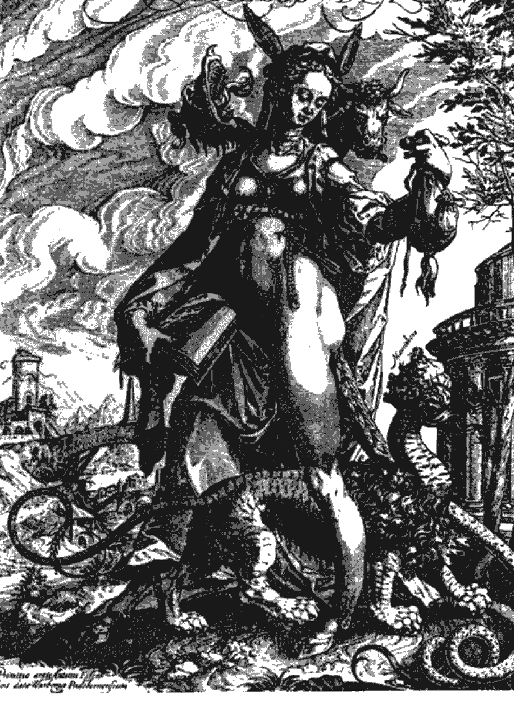

### 搜捕女魔法师

在15世纪末期，由于社会的动荡不安和瘟疫的传染、百年战争（1337年至1453年英国与法国之间的战争）、三十年战争（1618年至1648年以德国为首的欧洲各国参加的宗教战争）而给民众带来了极大的贫穷和疲惫，在这种时候，就流行起了魔法。人们认为魔法师（sorcerer）就是那种能够通过仪式和法术来改变人们命运的人。在这类法术里，当然也包含了很多邪恶的意图和与恶魔有关的成分。像华尔特派那样作为异教而受到镇压的理由，肯定就是被怀疑“崇拜恶魔”。异教派系和犹太教徒肯定是最先受到迫害的目标。女魔法师的信魔者的夜半集会也是来源于犹太教的“安息日”这个词语。

在很多有关女魔法师的评论中，很多都是罗马教会里恶魔学者的言论，他们尤其把10世纪德国的修道院长在《主教教典》里所写的“夜间在空中飞行的女魔法师”的形象加以扩大。从此以后，关于恶魔学的理论得到不断的稳步的发展，1484年教皇八世颁布的教典以及由约可夫·爵普连卡和耶利夫·克雷曼两个异教审判官编写的《女魔法师之槌》（1486年版）作为搜捕女魔法师的规范和指导书。从1480年到1520年十分倾向于由宗教法院主持的搜捕异教活动，但是从1580年到1670年间发生的第二轮异教审判中，许多由民间法院主持的搜捕异教活动却牵连了很多老百姓，出现了前所未有的、疯狂的、无休无止的镇压和检举女魔法师的情况。

因为在搜捕女魔法师的过程中，包括了很多不怀好意的人想用邪恶的手段折磨别人的人，所以搜捕到的大多数女性都是毫无关联的、被冤枉的。一旦有别人不知道的事或者秘密的事，马上就和恐怖的事情联系在一起。被施以火刑的女性中，大多都是无罪的人，是被别人诬陷的人。

## 【搜捕女魔法师的背景】

造成中世纪的社会动荡不安的根本原因在于常年无休止的战争。

宗教战争（1562~1598）、三十年战争（1618~1648）、福兰德之乱（1648~1649、1649~1653），再加上天灾所带来的饥荒，鼠疫的流行和经济的不景气等，都是造成社会不安的因素。

在宗教审判中，受到怀疑的人们都受到这样的引导：如果你承认了，我们就会拯救你。于是，很多人就承认了根本就没有参加过的信魔者的夜半集会和自己使用过的魔法。而教会所说的拯救就是通过火刑来拯救人们的灵魂。这把邪恶之火一直绵延到了17世纪末期。在16世纪末期的法国洛林，曾被证实了最多一次处死了三千人，在波尔多曾一次对四百人实行火刑。在德国、西班牙、意大利、英国等地，也同样或多或少地横行着搜捕女魔法师的活动。

### 魔法药

魔法药分为各种不同的类型。首先要说的是煎药。这是指把东西在大锅中咕嘟咕嘟地炖煮后提取出来的东西。接着加上一种叫做酊的酒精进行处理。然后把油和醋混合在一起作为油剂，在油剂中拌入粉末状的药草。最后加入有名的药膏。这些药膏是把药草的粉末和脂肪混合在一起后的产物。

关于调药膏的时机，一定要选在由水星掌管的那段时间。在占星法上，月球在风宫或地宫中，所以也一定必须满足满月这个条件。药膏的处方大致如以下介绍的那样。

芹叶、白杨的叶子、三分藜和煤等。

此外，由于在制作魔法药时要用到毒性很强的植物，所以在配置处方时要特别注意。因为好的处方可以使有毒的植物像药物一样发挥自己的效力。

在《魔法教典》中，记载了一些更加令人毛骨悚然的药方。

婴儿的脂肪、蝙蝠的血、教会里的钟上刮下来的削屑、颠茄（恶魔的杂草）、毛茛科植物的干燥后的根和茎、麻、大麻、曼陀罗草、黑莨菪的干叶、乌头草。

曼陀罗也叫曼陀罗草，在魔法界是极负盛名的奇毒的毒草。曼陀罗草（颠茄）是一种生长在地中海地区的毒性极强的药草，因为它的根部是像人的腿那样分开来的，所以经常被人们画成像人的外形那样。

据传说中描述，一旦有人靠近曼陀罗草，它就会收缩。一旦人直接去触碰它的话，就会丧命。而且如果要把它从地上拔起来的话，它就会发出惨叫，无论是谁，只要听到这种惨叫就会痛苦的死去。于是，人们为了把它拔出来，就把它拴在狗的尾巴上，让狗来拔。而自己却远远地躲在一边。这样一来，狗肯定会死去，于是，人们就更加相信曼陀罗草里蕴藏着灵性。

中世纪的女魔法师们认为，生长在处罚犯人的绞刑架下的曼陀罗草是最好的。因为她们相信曼陀罗草是由犯人们身上掉落下来的某一部分而生成的。

## 【自然灾害和搜捕女魔法师】

根据15世纪的公文里记载，雷根斯堡下了很大的冰雹，造成了很大的灾害。于是人们追究下如此大冰雹的原因，就抓了两个女魔法师并对她们施行火刑。人们把无法对自然灾害发泄的愤怒全都转嫁到了女魔法师的身上。

## 【魔法药实验】

在德国的戈丁更大学里的研究小组里，他们把山楂的果实、黑莨菪的干叶、芹菜和荷兰芹用公猪的猪油揉捏后，进行了飞行药的实验。两个坐在实验台上的学生，处于催眠状态，在被涂上飞行药后，他们说有一种在天空中来回飞翔的幻觉。在这种幻觉作用中，有一种女魔法师的飞行药带来的暗示。根据中世纪流传下来的记录中的记载，那些被当作女魔法师抓起来的人们，都会被涂上飞行药然后睡着，她们醒来后就会承认自己曾飞去参加过信魔者的夜半集会。那是因为她们的魂魄曾离开过身体的缘故。这些记录中还记录了一些更为离奇的事。这些女魔法师还会说自己曾去过哪个哪个草原，在那里化身为狼，咬死了三头羊。人们来到她所说的地方，结果果然发现了三头羊惨死的尸体躺在那里。

## 【药草的功效】

药草不仅具有药物功效，它们本身就带有某种神秘的力量。例如，当女性想吸引男性的注意时，在口袋里放上鼠尾草的种子就能起作用；准备七棵胡荽的种子，然后配合某种特定的咒语，想要的爱情就能实现。咒语是这样的：“温暖的种子，温暖的心灵，请不要离开我（warm、seed、warm、heart）。”当种子感受到温度后，就会发芽，这就使人联想到爱情也生根发芽了。这也许就是一种“共感魔法”吧。还有，据说把玫瑰花的花瓣晒干后也能用于祈求爱情的降临。能带来财运的据说是丁香花。据说当木星靠近的时候也能带来富裕。因为月桂树自古至今都是光荣的象征，所以人们认为在身上佩戴月桂树的叶子就能获得成功。欧洲的家庭中，都会在床边摆上一盆天竺葵，每到开花的季节，花盆里的红色的和白色的花十分可爱，使过路的行人纷纷驻足观看。天竺葵所散发出来的香味可以驱赶蚊虫。并且，它开出的花还能带来幸运。据说红色的花象征着生命力，白色的花象征着富裕。在冬天，人们很乐意在室内摆放仙客来的花，这能起到驱赶家中邪恶东西的作用。

女魔法师们的飞行药膏，是把小孩子的脂肪放在水里煮后，再加入芹叶和三分藜、白杨的叶子、煤等混合在一起制成的。还有另一个配方是把三分藜、罂粟的汁、毛地黄、白杨的叶子、雉席、蜜蜡、羊毛脂放入杏仁油里搅拌而成。

怎么看都认为飞行药膏是加入了麻药的药物，但事实上与其说是飞行，不如说是“精神上在飞”的幻觉。

如果想要进一步了解和感受女魔法师的世界，我就要向大家推荐《女魔法师图鉴》。这本图鉴里从作为自由主义者的女魔法师们的生活状态开始，到女魔法师们的食谱等都作以详尽的介绍。但是，食物的原料不一定是晒干的蚯蚓和烧焦的蜥蜴等，而是可以用一般人都可以使用的日用品来替代。

如果想要像看故事一样看有关女魔法师的事情，就要看德国儿童文学作家奥托福利特·普洛伊斯拉所写的《小小女魔法师》了。这本书里所写到的小女魔法师虽然面临着其他老的女魔法师的刁难和欺负，但她仍然为了向着成为一个出色的女魔法师这一目标而努力奋斗着。这个过程是艰辛而愉快的。这个故事和角野荣子（日本作家）所写的《女魔法师的宅急送》有着相似之处，但普洛伊斯拉运用了更简洁的描写手法，很巧妙的向读者展现了当时的时代和场所特有的气氛。从文章中，读者们仿佛觉得一股药草和干草的香味，以及潮湿的泥土味正扑面而来。

> 【瓦尔普尔及斯之夜】
女魔法师们每年都会在瓦朗加尔山上召开集会来度过瓦尔普尔及斯之夜。这是非常有名的一件事。女魔法师们通常都在信魔者的夜半集会上聚集在一起，据说她们会在疯闹狂欢之后骑在扫帚上，把放在大锅里煮好的女魔法师汤倒入海中。过不了多久，大海就会开始狂风大作，接着暴风雨降临，船只都遇难了。
女魔法师们会在地上小便，并把蟾蜍和蜘蛛关在灶头里。这样也会带来暴风雨。

### 迷幻的女魔法师们

## 【审判女魔法师】

在1591年，在苏格兰曾发生了一起女魔法师卷走国王的事件。国王詹姆斯六世（不久以后成为了英国国王詹姆斯六世）在和丹麦的王妃安一起回国的途中，海上突然刮起了飓风，不久就遇难了。有人说当时有三艘船一起在航行，但是只有国王乘坐的那艘船遇难了。据说，人们断定是由那些正在比利时南部集会的女魔法师们施了咒语，才使国王遇难的，所以就发动了大规模的审判女魔法师的运动。在这次审判运动当中，有超过70人的女性被告发而关进监狱，被指控为头领的人被施以火刑。

西班牙的女魔法师们会招来很大的冰雹，摧毁农作物。女魔法师们会使用斗篷上的扣子来控制风，并杀了公鸡做供奉的祭品来降雨。

在苏格兰，女魔法师们把破布浸在水里，并念着撒旦的名字把布头在石头上敲击三下。一边念着咒语一边呼唤暴风雨的来临。

> “我们把这破布在石头上敲击，以恶魔的名义降临暴风骤雨吧。如我们希望的那样，不要让暴风骤雨停止。”

### 药草

女魔法师们对药草所具有的药效十分了解，并且经常把它们用于魔法和法术中。能够控制自然魔法的就是女魔法师。就算她们在魔法中用到花草树木你也不要觉得惊奇。她们也可以说是民间疗法的鼻祖。直到现在，药草也被用于食材和制作一些带香味的小物品等应用于各种各样的地方。下面向大家介绍一下具有代表性的药草。

*   **干菊（chamomile）**……原产于欧洲。干菊一词来源于希腊语里的“大地的苹果”一词。而罗马干菊只是徒有虚名，因为这个种类的原产地其实在英国伦敦附近。德国产的种子种出的干菊都很长。如果说到汤剂的话，可以喝干菊泡的药草茶。可以治疗感冒和失眠，对妇科病的治疗也十分有效。
*   **百里香（thyme）**……原产于欧洲南部和地中海地区。据说百里香这个名字是从希腊语中的勇气一词派生而来的。它象征着勇气、高贵和品德。传说中，中世纪的骑士们会戴着绣有百里香枝叶的围巾赶赴战场。作为药草，百里香也有很多功效。对杀菌、防腐和治疗月经不调都有效果。还能驱除忧郁和不安。
*   **菊苣（chicory）**……原产于地中海沿岸、黑海沿岸、俄罗斯南部、伊朗和印度周围。对治疗头痛、理顺肠胃和预防口臭等都有疗效。还能作为一种催情药产生作用。在中世纪，人们把它和茴香一起作为驱邪符来使用。
*   **山萝卜（chervil）**……原产于黑海里海沿岸、欧洲东部和西亚。是荷兰芹的同类。深受法国人的喜爱。在中世纪的欧洲，人们认为山萝卜的种子里蕴涵了可以描绘将来和过去的魔力。因此，山萝卜的种子是一种肯定会出现在女魔法师药棚里的、用于魔法的道具之一。它是一种能净化血液，有利尿作用的药草。在复活节前的圣星期四，有这样一个习俗：全家人都要聚在一起喝山萝卜熬成的汤。他们认为这是“带着希望的药草”。
*   **罗勒（basil）**……原产于印度和东南亚。意大利名是basilico。罗勒里分为很多种类。但平时所说的罗勒多数是指斯威特罗勒。据说是亚历山大大帝把罗勒带到了欧洲。它和莳萝一起被认为是“爱的药草”。在意大利，人们习惯在求婚的时候加上一枝罗勒一起送给求婚的对象。罗勒这个词来源于希腊语中的国王一词。在印度，人们把罗勒当作可以净化被污染过的空气的“神圣之草”。
*   **茴香（fennel）**……原产于地中海沿岸。在欧洲，人们从公元前就开始种植茴香，并将它广泛地用于调理和药用。在古希腊时代，人们认为茴香能使身体变瘦，所以是一种珍贵的用于减肥的药草。到了中世纪，人们认为它是一种灵草，把它作为驱邪符挂在门上或窗口。在德国和法国，人们用它的茎和叶来去除鱼腥味。茴香在俄罗斯菜系和北欧菜系中经常被用到。在法国，茴香在烹饪蜗牛的过程中是不可缺少的一种材料。
*   **月桂（bay）**……原产于地中海沿岸和小亚细亚地区。别名也叫月桂树。在古希腊时代，月桂是一种象征着阿波罗的神圣的树木，还象征着光荣。它的叶子有抗菌和杀菌的功能。有很多人都为了驱除疾病和虫害都会把月桂的叶子铺洒在地上。另外，人们还认为它有驱邪的作用，所以在布置圣诞节和结婚典礼时经常会使用。在中世纪，恋人们会在情人节那天互相交换一支月桂的枝叶，并在睡觉时把它放在枕头下面。据说如果在那天晚上，他们互相梦见对方的话，他们就能在一年之内结婚。人们在煮肉和煮鱼等食物时也会使用到月桂。
*   **牛至属植物（marjoram）**……原产于地中海东部沿岸。和牛至是一类的。是古代药草中的一种。在古埃及时代，牛至属植物是制作木乃伊时所用到的香料中的一种。在希腊和罗马时代，它和牛至深受人们的喜爱，并一起被人们视为幸福的象征。也被用于医药和烹饪中。到了中世纪，牛至属植物作为一种可以驱邪的药草而受人们崇拜。它有着很迷人的香味。在中世纪的修道院里，大量种植着药草。但是据说由于牛至属植物所散发的香味太过于迷人，所以唯独它不能被种植在修道院内。
*   **薰衣草（lavender）**……原产于地中海沿岸。它的名字是根据拉丁语里的洗涤或青色一词演变而来的。在希腊罗马时代，好像熏衣草和人们的洗浴用水和洗涤用水有关。英国和法国的人们尤其喜欢熏衣草。在16世纪法国的香水工厂里，熏衣草香水被大量的生产。熏衣草也深受皇室里的人和贵族们的喜爱。非常出名的一件事是英国的伊丽莎白女王特别喜欢用熏衣草的花酿制的果酱。现在已在世界各地广泛的被种植。
*   **迷迭香（rosemary）**……原产于地中海沿岸。日本名字叫mannenrou。据说迷迭香这个名字是由拉丁语里的ros-marines、大海的波涛、英语里的rose-marine、大海的玫瑰，接着再是rose-mary、玛利亚的玫瑰发展而来的。作为药物来使用的话，迷迭香有强身健体、镇静、促进消化、利尿和消毒的功效。同时，作为美容用品也是十分有效的。熏衣草制成的精油还用在了化妆品和香料的制作中。

### 有代表性的有效使用药草的魔法

用于烹饪、做芳香剂和装饰房间。把药草放在一个小袋子里带在身上会比较有效果。

*   要提高恋爱运……玫瑰、迷迭香、薰衣草、头巾百合、香子兰
*   想寻找结婚对象……柠檬香草、罗勒、牛至属植物、薄荷、迷迭香
*   希望更容易受孕……曼陀罗、槲树、头巾百合、橡树
*   吵架后，希望对方原谅自己……罗勒

### 【受人们欢迎的花和花的象征意义】

● 茉莉花……能提高女性的魅力。另外，梦见茉莉花的人据说能享受爱情带来的幸福。
● 百合……象征着纯洁、天真。能提高发现精神性和美好事物的能力。如果拿白百合花束来装饰的话，可以平息嫉妒和愤怒的心情，有效地帮助人们忘却不愉快的事情。
● 延命菊……把延命菊花束摆放在家里的话，能使家庭和睦、快乐和幸福。
● 玫瑰……从很久以前，人们就认为玫瑰是象征着爱情的一种花。另外，日耳曼人认为玫瑰是一种神圣的花。
● 紫罗兰……把紫罗兰花束摆放在家里的话，就能使整个房间弥漫着一种充满爱意的、优雅的气氛。
在古罗马时代，紫罗兰是一种很受人们欢迎的花，人们在一些喜宴上会大量的抛洒它。

【能提高女性魅力的迷迭香】
迷迭香的香味从古代开始就深受人们的喜爱，经常被用在各种仪式中。例如用在结婚典礼和墓地上。希腊和罗马的人们认为它是一种有助于提高记忆力的药草。到了中世纪，迷迭香又被用来驱邪和预测恋爱运。据说在圣阿格尼丝的前夜（1月21日），睡觉时把迷迭香的一小段树枝放在枕头下面，睡觉时就能梦见将来和自己相伴终身的人。关于迷迭香有很多浪漫的传说。其中有一个是说当圣母玛利亚把斗篷挂在迷迭香上时，它的花就会从白色变成蓝色。

## 8 跳舞的神仙们

### 神仙

所谓神仙，是超乎自然的、存在于天国和地面之间的神灵。他们的形态和大小都是各有不同的。其中，有为人间带来帮助的神仙，也有给人类带来破坏的神仙。Fairy 这个单词是由拉丁语里的“命运”一词 fata 演变而来的。在英语里，表示神仙的单词是 fay，有施魔法、迷惑人的意思。然后逐渐演变成 fairy 就是神仙的意思。

虽然都是住在魔法世界里的人，但神仙们又有着各种各样的种类和名字。英国可以被称作是各类神仙的宝库。

特别是不列颠岛和爱尔兰岛上，传说中居住着大量的神仙。这里根据居住的地域来划分一些代表性的神仙，具体介绍请看下文。

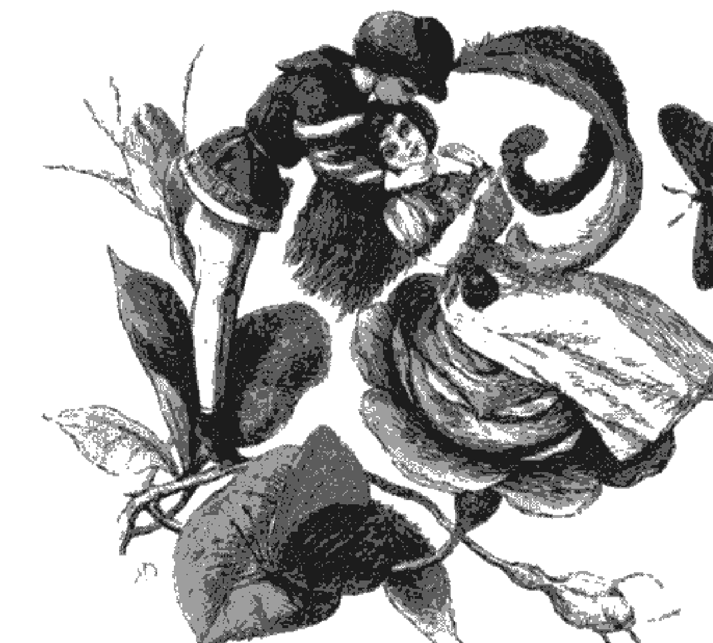

### 爱尔兰

克鲁拉恩……他们喜欢喝红酒和啤酒。会到人们的家里喝他们储藏的酒。是一些有点年纪的、个子很小的神仙。

杜拉汉……他们的样子是双手环抱、把头埋在里面。

### **跳舞的神仙们**

经常是在半夜里，乘坐在灵柩马车上出现的。他们把马车停在哪家门口，就预告这个家里有人会去世。

- **尼阿布**……她原来是不老国国王的母亲，是有着金发碧眼的美女神仙。后来和一个叫奥新的骑士相爱，骑士骑着白马把她带到了神仙聚集的地方。

- **潘希**……他的眼睛整天哭得又红又肿，鼻孔只有一个，绿色的牙齿。经常在半夜里又哭又叫的，在空中飞来飞去。他也是预告死亡的神仙。

- **普克**……他能任意的变身成公牛、山羊和秃鹫。但是最经常的还是变成马，载着人行走在山川间。最后还是把人扔下马。

- **麦隆**……这是一种和人鱼很相似，生活在水里的神仙。男性的麦隆长得非常丑陋，但女性的麦隆都是美女，有时会和凡人相恋。

- **利普拉恩**……是一个留着白胡子的、个子很小的老神仙。负责修鞋。专门修理那些喜欢跳舞的神仙们磨损的鞋子。在地下藏着放有金币的罐子。

### 男人岛

- **杜拿·巴拉**……是一种男性的人鱼。

- **布顿·巴拉**……是女性的人鱼。因为声音非常甜美，所以经常把男人引诱到海里，还会偷盗婴儿。

- **伯更顿**……黑头发红眼睛并且有着浓密的毛发。具有怪异的能力，擅长变换成各种样子。

> 【神仙们的生活】
在神仙中，有志趣相投而成群生活在一起的神仙，也有一个人生活的神仙。神仙们不会变老，也不会有痛苦，神仙的王国就意味着不老的王国。
神仙们喜欢的场所，通常是庭院里的立石、墓地、圆形的列石和一些古代的遗址。城堡和老房子、废弃的房子。据说他们还经常会住在大海、湖泊、沼泽地、森林和小丘陵中。

### 威尔士

- 塔罗乌斯·狄更……这类神仙在威尔士，有着常人一般的姓名。叫做“金发族”——因为他们喜欢长着金色头发的小孩。
- 古依希恩……他们住在山丘上，是非常天真的、负责照看山羊的神仙。
- 克布拉那依……他们住在矿山上，如果哪个矿山出现了这类神仙，这个矿山就会十分繁荣。
- 古拉凯斯·安诺恩……他们住在湖泊里，是十分美丽有气质的神仙。如果条件的允许，有的曾和凡人结婚。

### 苏格兰

- 哈本·希……传说是在高原地区的吸血神仙。他们通常变成美丽的姑娘来吸引男性。他们把长长的、像鹿一样的角隐藏在绿色的长裙下面。
- 布拉乌尼……经常出现在夜晚，是一个帮助人们在家里打扫和清洗的可爱的小精灵。
- 本·尼……也是一种向人类预告死亡的神仙。他们会在河边一边清洗去世的人留下来的衣物，一边哭泣。
- 博格鲁……是在人们家里的小精灵，会发出各种吵闹的声音。

### 英格兰

- 帕克……一种有着长长的尾巴、毛发浓密的生物。擅长变身。一旦被穿上了衣服就会消失。

- 哈贝托勒托……负责纺纱车的神仙。虽然嘴唇较厚长相丑陋，但对人类非常友善。
- 博格多……是住在农场里的神仙。全身黑黑的、毛发浓密。心地不善良并且非常调皮。
- 罗宾·古德·非勒……是由神仙王欧贝隆美丽的农家姑娘所生的半人半神仙。非常活泼、爱热闹，喜欢唱歌跳舞。对家务也有帮助。

### 康沃尔

- 斯普里更……是巨人神仙。经常出现在古代遗迹中，守护着宝藏。
- 诺卡……是住在矿山的通道里的神仙。会发出咯噔咯噔的声音，告诉人们哪里有矿藏。
- 皮格西……是可以帮助人们处理家务的、对人类非常友好的神仙。但人们赠送给给他衣服时，他便会消失。
- 布克……有黑布克白布克。
- 玛曼特……她的上半身是人的样子，下半身是鱼的样子。是住在海里的非常美丽的神仙。她一直想把人引诱到海里。
- 玛丽安……他的样子像蚂蚁，有把锡变成银的能力。

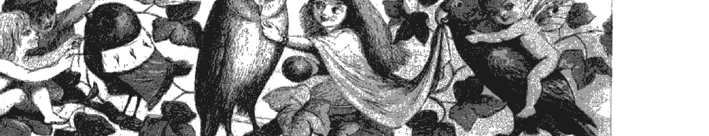

## 【控制神仙的咒语】

关于所有用途的咒语和仪式的操作方法，在中世纪时撰写的魔法教典以及它的手抄本中有所记载而流传了下来。但是这些内容的真正的意义，却没有通过文字流传下来，很多都是由师父口头传授给了徒弟们。

在这些文字记载中，收录在英格兰的《神仙辞典》中的、由神仙学大家——凯瑟林·布里格斯所编写的用来召唤某种神仙的魔法，是我想向大家介绍的。

首先，找一块大一点的四角的水晶石，或者是八厘米见方的威尼斯玻璃。把玻璃放在白色的雄鸡的血中，从星期三一直浸泡到下下一周的星期三或星期五。浸泡好之后把玻璃拿出来，用圣水洗干净后，再用烟熏蒸。然后取三支榛木的嫩枝，把上面的树皮剥干净，把嫩枝削成能够写上想要召唤的神仙的名字的宽度。然后一边把那个名字念三遍一边在嫩枝上写上名字。凭着这根嫩枝，就能在神仙出没的山丘的山脚下召唤神仙。

在召唤神仙的前一个星期三，要预先把写有神仙名字的三根嫩枝埋在山丘的山脚下。在下一个星期五把嫩枝挖出，然后在当日3点、8点以及10点开始召唤。因为这些时间是天体的运行时间和神仙的出没时间正好吻合的时刻。在进行召唤的仪式上，必须清洁身体，面向东方，当神仙出现的时候，用预先准备好的水晶石或威尼斯玻璃来固定神仙的行动。

如果要把神仙的活动看得更清楚，最好调制一些药膏，然后涂在上眼睑和下眼睑上。

把橄榄油放在东面采摘的玫瑰花和金盏菊制成的溶液里，直到油彻底清澈为止。把油装进药瓶里，然后把蜀葵的花蕾、金盏菊的花、野生的百里香的花或者芽、榛木的嫩芽和被称为神仙的宝座的药草统统放进药瓶里，放在向阳的地方三天后，这些东西就能彻底溶解。

关于召唤神仙的咒语，以“我，以父神、子神和圣灵的名义，召唤神仙 erabigyazen”开始，接下来念几乎要使人窒息的长长的咒语以及再念三遍“阿门”。

## 世界神仙名册

- 特鲁尔……是定居在斯堪的纳维亚地区的小神仙。他长得像一般小孩子那样的身高，外表丑陋，有一个很大的鹰钩鼻。原本属于掌管雾的巨人族，随着时间的变换，他却越变越小。他能施展魔法，把金银珠宝都藏入地下。
- 戈布林……是居住在英国的、品性不良的小神仙。据说肤色呈浅黑色，容貌十分奇特。在特尔金所写的《戒指的故事》中描写戈布林有一米高，事实上他们的平均身高只有60厘米。他们属于勘查矿山的矮人系的神仙，非常讨厌光，要到了晚上才会从洞里出来。在乔治·麦当劳所写的《公主和戈布林》（1871年）中，就详细描写了戈布林的生活状态。

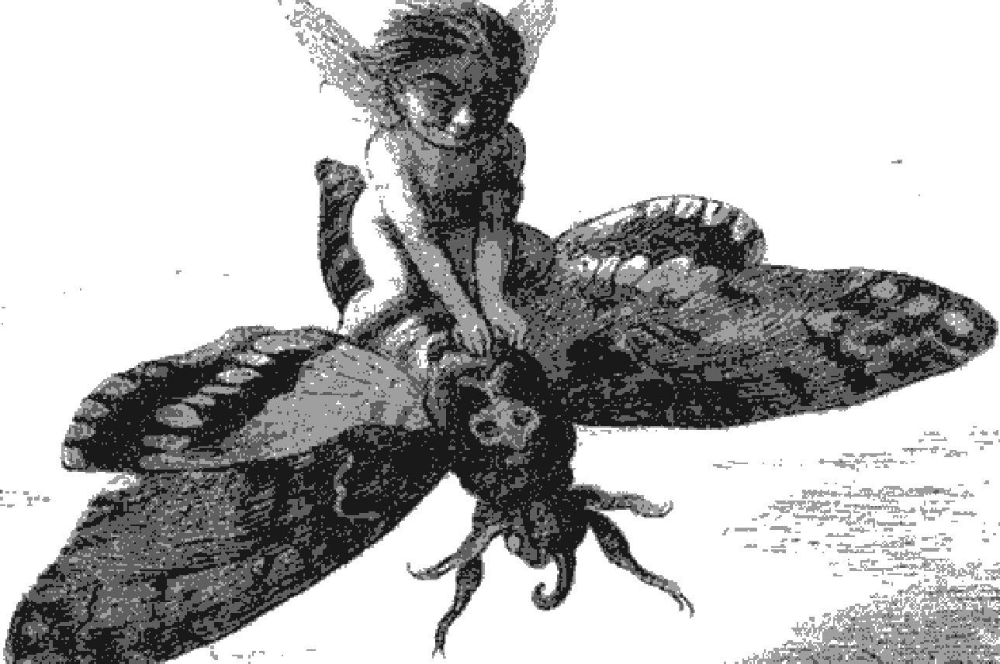

理查德·德伊罗画

- 英派特……这是一般被叫做小鬼或小恶魔的坏神仙的一种。全身乌黑、长相丑陋。虽然是坏的神仙，但也有憨厚的一面，也有很多被人们捉弄的故事。
在英国的民间故事里出现的特姆·体特·托特也是属于这一类的神仙。他们一旦被人们知道了姓名，所具有的魔力就会消失。
- 赫布戈布林……赫布戈布林是居住在人类家里或附近的非常调皮的神仙们的总称。他们中有帮助人们工作的善良的赫布戈布林，也有喜欢给人捣乱的、恶作剧的赫布戈布林。在苏格兰的布拉乌尼、男人岛的菲诺则里、英格兰的德比、爱尔兰的普克、约克夏的布戈多等都是属于赫布戈布林类的神仙。他们能变身成动物。对于他们的帮助，只要以一杯牛奶或一片面包作为答谢就可以了。如果给他们其他多余的礼物、或者叫错他们的名字，他们就会不高兴地离开。赫布戈布林也被认为是家庭的守护神。
- 克布路特……能把定居下来的那个屋子打扫得干干净净。在人们不知不觉中，帮助做好所有的家务。他们喜欢让家里的地板发出咯噔咯噔的响声，经常搞一些小的恶作剧，但又是非常糊涂的神仙。民间还流传着这样的说法，如果哪个姑娘被克布路特看中，那么那个女孩的求婚者就会被克布路特狠狠地惩罚，这样一来，那个姑娘将一生无法结婚。
- 布拉乌尼……是定居在苏格兰的家庭里的神仙，身高不满1米，全身毛发浓密、头发蓬乱、衣衫褴褛。好像甚至有一些只有鼻孔，没有鼻子的布拉乌尼。有时他们会住在人们的家里很长一段时间，从农业作业到饲养家畜，以及所有的家务他们都能帮上忙。因此，布拉乌尼被称为是家庭兴旺的根本。答谢布拉乌尼的礼物也只要一点点就可以了。只要在房间的一角放一杯咖啡或者牛奶、奶油、一片面包、蜂蜜就足够了。如果想要给布拉乌尼穿上衣服，他就会生气地离开。在格林童话《小矮人的鞋店》中也写到，如果他们受到的礼物是新衣服的话，就会迅速地离开那个家。所以从这点来看，布拉乌尼和赫布戈布林是朋友。
- 撒米阿德……出现在英国的儿童文学作家依迪斯·乃兹比特所写的《砂神仙》(1902年)。这是一种一天只能帮助人们实现一个愿望的神仙。他的长相像猴子一样，全身毛发浓密。耳朵像蝙蝠，眼睛像蜗牛的眼睛那样呈突起状。在很久以前，因为撒米阿德对人们的要求有求必应，所以人们开始捕捉他，结果使他们濒临灭绝。每天使用一次魔法都会使他们的魔力减弱，因为每使用完一次魔法他们就会很疲倦，拼命地钻到砂子里去睡觉。
- 涅尔福……涅尔福是一种居住在原野、山、泉和大海附近的，希腊神话里的神仙。根据居住的地点的不同，会有各种各样不同的名字。全都是漂亮的女性。

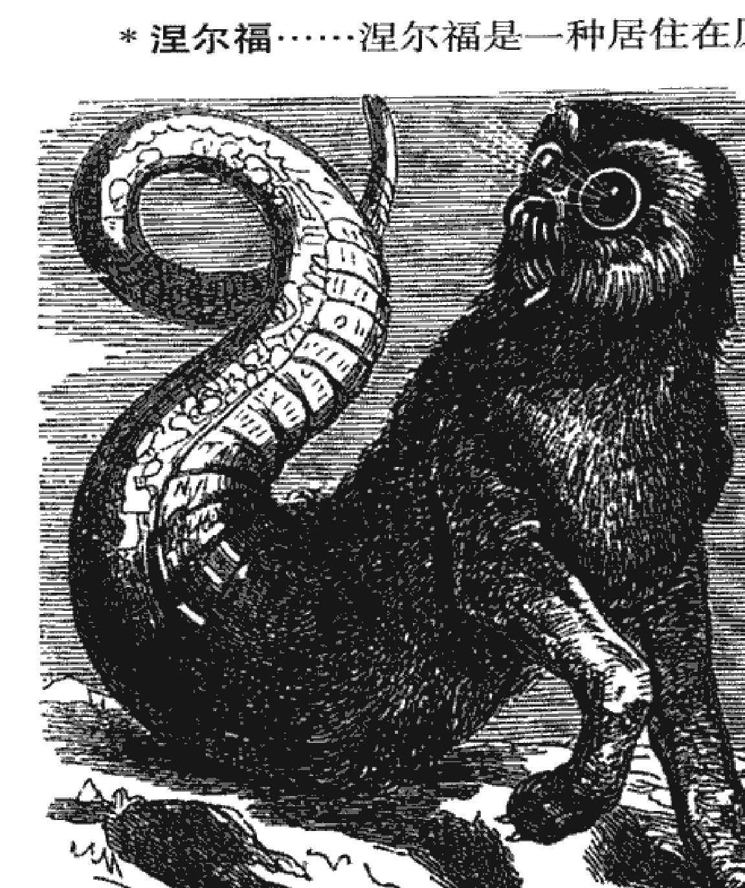

- 绿人……是居住在欧洲的森林深处的神仙，是森林的守护者。全身被树叶遮盖。大多为男性。据说在森林里工作的人们也会受到绿人的保护。一般来说，他们都居住在森林里，但根据有的传说，有些绿人是住在“月之东，星之西”的一个被施了魔法的城堡里。

地狱的侯爵，恶魔的盟友

- 赞特曼……是在德国的传说中的带有砂的小个子神仙。他们的外表是老人，是负责掌管睡眠的神仙。如果有人到了很晚还不睡的话，赞特曼就会在他的眼睛里撒上砂子让他睡觉。有一种说法是，如果孩子的眼睛里被撒了砂子，他们的眼珠就会弹出来，于是赞特曼就拿着这个眼珠送到月亮上，给自己的孩子当食物。这大概只是一个吓唬孩子的闲谈解梦的故事而已。德国浪漫派作家E. T. A霍夫曼写过同名的灵异小说《砂男》。
- 温迪纳……16世纪的炼金法师们认为，这是居住在山川泉水边的神仙，都是年轻貌美的女性。性格反复无常，非常大胆，举止行为像一个天真无邪的孩子一样。德国作家福戈在他所写的《温迪纳》（1811年）中写的水中的神仙也有着这样的性格。

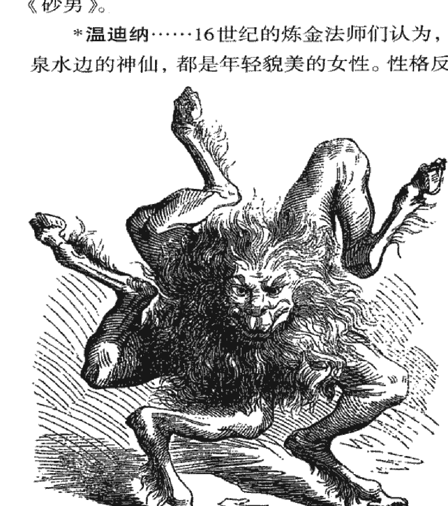

- 诺姆……同样根据16世纪的炼金法师的认为，这是一种居住在土里的神仙。他能自由地在土中活动，同时保护地底下的矿藏。他们非常长寿，实际上他们的年龄已经超过了400岁，但据说直到100岁也还是像孩子一样。到了300岁才是生长的旺盛期，到了400岁就会一下子变成老人的样子。
- 火怪……在炼金法中，这是指住在火中的蜥蜴。据说在把铅炼成金的火苗里会出现。
- 希尔福……希尔福和艾阿里阿尔并认为是在空气中居住的神仙。这也是炼金法中四大元素的象征之一。也有人认为他是背上有翅膀的小神仙。有自由控制风的能力，也能使航行的船遇到海难。
在莎士比亚写的《暴风雨》中，希尔福是魔法师普罗丝佩洛的一个下属。

卡以姆 俄罗斯军队的联络将校。长着斑鸠的样子。据说他的辩论的才能世界第一。

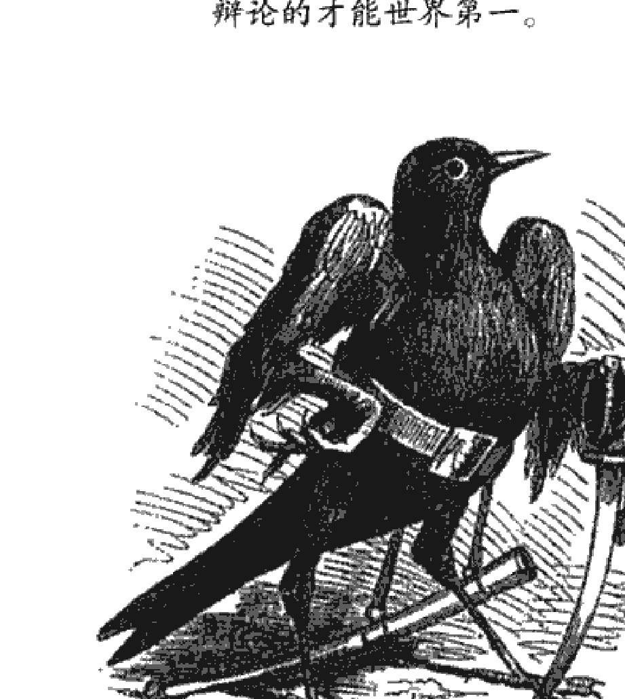

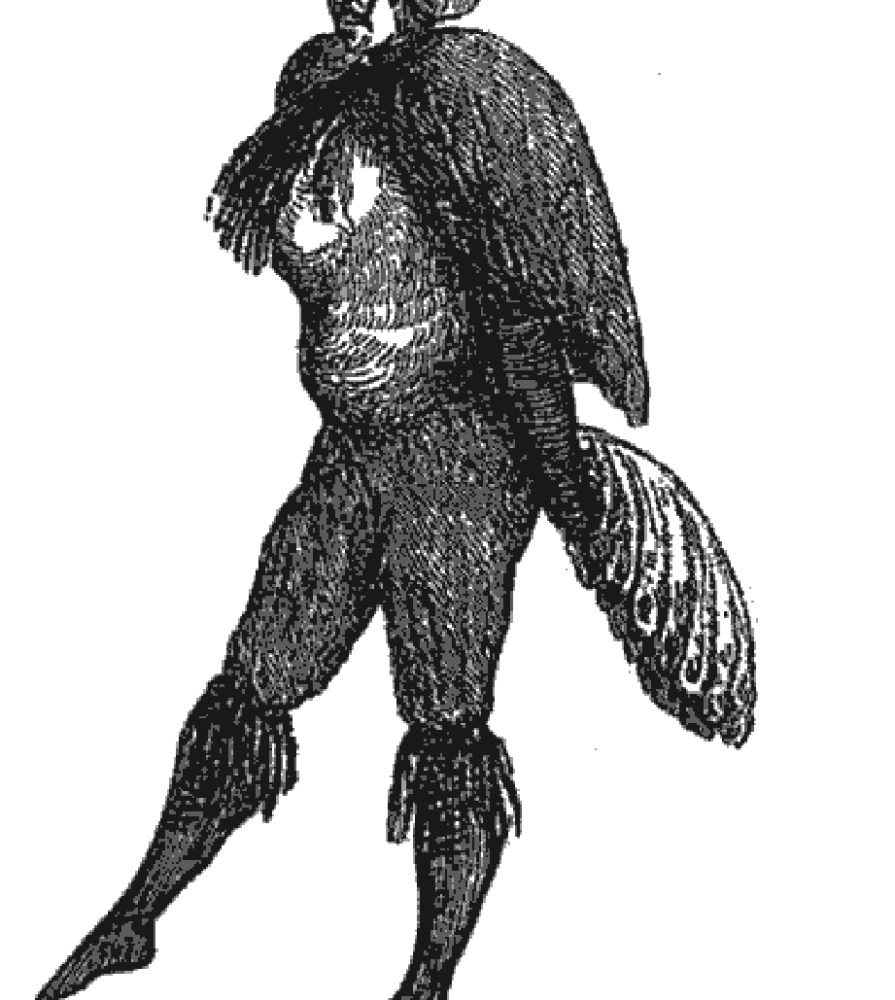

- 奥布隆……被称为神仙之王。在中世纪的欧洲十分有名。奥布隆一词来源于日耳曼的叙事诗《涅贝鲁恩琴》中出现的矮子王阿鲁贝利西。在奥布隆诞生的时候，有一个神仙没有被邀请出席庆祝宴会，所以他下了一个咒语说奥布隆3岁以后就不会再生长。但是，后来这个神仙又后悔自己下的这个咒语，所以把美貌给了奥布隆。于是就有了这样一个个子矮小，但外表帅气的神仙。在莎士比亚所写的《仲夏夜之梦》中，奥布隆和派克一起担当了重要的职位。

水世界之王阿里顿  是掌管水世界的女神

- 麦鲁基努……这是一个被下了咒语，每到星期六，下半身就会变成蛇样的神仙。她和法国的贵族雷蒙丹结为夫妇，两者发挥了极大的能量建造了一个城堡。也许是因为能力消耗过多，所以生出的孩子先天有些残疾，身体上长了野兽的脚。虽然如此，他们夫妇的感情仍然非常好。只是麦鲁基努的丈夫对每到星期六就消失的妻子产生了怀疑，于是就悄悄地跟踪妻子的行动，看到了下半身变成蛇的妻子的样子。麦鲁基努知道了自己的本性被丈夫识破后，哀叹不已，就保持着蛇的样子在上空不停地盘旋，不久就消失了。

## 魔法世界里的怪物

## ■ 冤魂野鬼

根据犹太教的教典《犹太法典》里所记载而流传下来的内容说，这个世界上有七十四万五千九百二十六个“冤魂野鬼”。这些既到不了天堂，也入不了地狱。游荡没有着落的冤魂野鬼常常围绕着和自己的死有关的地方和家庭阴魂不散，威胁着活着的人们。不论是心理上的还是生理上的，冤魂野鬼总让人和恐怖联想到一起。他们好像总是要向人们暗示自己的存在。

说不定他们是容易感到寂寞的一类，所以要告诉活着的人“我在这里”。

关于冤魂野鬼的概念直到现代也仍然存在着，写无头人和满身是血的男爵的科幻小说《哈利·波特》系列里也有很多描写冤魂野鬼的情节，不论是传说中的无头骑士，还是亡灵，在小说里都被写到了。一直住在女厕所里发出叹息声的女学生玛特尔，其实就是日本所说的厕所里的花子。玛特尔是在50年前被布依鲁德莫特杀死的女学生。

真正下手杀的据说是怪物八吉里希克，但根据神话中记载，其实是一条想要争夺王位的斑点蛇，通过眼睛里射出的毒，杀死了对方。到了中世纪，八吉里希克成了一只长着鸡冠、黄色的羽毛和翅膀，还有一条蛇的尾巴的四条腿的鸡。这是由于进化和变身的缘故。

阿姆德希亚斯——地狱的侯爵。能从长着一只角的野兽模样变身为拿着包的男性。他掌管着恶意中伤和谎言。

经常会进行自我反省的德比是专门打扫房间的仆人神仙。说起来也是属于传统意义上的戈布林。他们住在欧洲的各个家庭中，帮助人们打理家务，而相对的，他们也会发出各种噪音。在德国被称为克布路特，在格林童话《小矮人的鞋屋》中出现的神仙就是他。在英格兰和苏格兰被称为布拉乌尼，好像在俄罗斯被称为德莫布克的也是这种神仙。

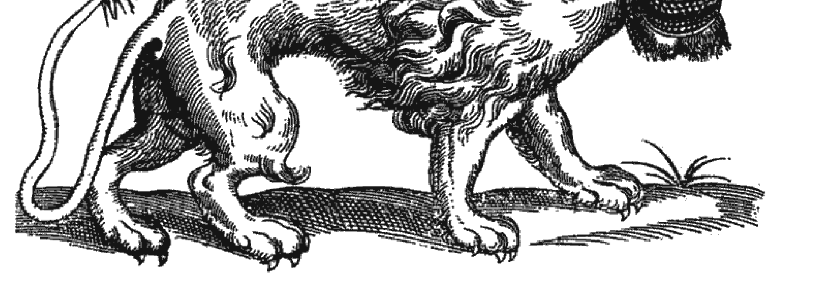

曼体高 住在印度、非洲的魔兽。有着人类的面孔，狮子的身体，蝎子的尾针

如果觉得戈布林给自己添了麻烦,就在地上撒上一圈亚麻的种子,他就会离开的。戈布林十分喜欢打扫,但是无论他打扫得多么卖力,每天晚上还是会在地上撒种子,不知道是他觉得疲倦了还是生气了。还有一点,一开始就很脏乱的房间他们好像是不会去的。

受到所有学生讨厌的皮普斯,实际上就是普尔特吉斯特 (Poltergeist,敲击作响闹恶作剧的小鬼)。这也是一个会在家里摇晃家具,制造噪音而给人们带来烦恼的小鬼。在电影《有冤魂野鬼的房间》里,观众只见刀子和菜刀在房间里飞来飞去。用研究心理学的专家的话来说,这大都是因为住在这个家里的小孩子的潜意识而产生的能量。

在中世纪的天主教教会里,神父会告诉教徒们,有的亡灵既上不了天堂也进不了地狱,只能在一个叫做炼狱的地方飘荡不定。以此用来告诫教徒们必须听从神的旨意。据说亡灵和普尔特吉斯特是女魔法师和会施展妖术的神仙。为了平息他们引起的事端,就有了其他的魔法师和女魔法师作为对抗。也就是所谓的驱魔人 (exorcist)。

这些冤魂野鬼要么做一些令人讨厌的事,要么报复别人,要么又非常吝啬,总之他们总是做一些十分低级的事情,所以人们才会给他们起这样的名字。而本来他们应该是被叫做迪蒙，维持神和人之间关系的神灵，或者说起到了守护神的作用。但是，基督教在推广恶魔学的时候，认为神灵都被赐予了邪恶的性格，是和堕落天使罗西菲洛一样都是被上天驱除的一类。

有的时候，冤魂野鬼也会以引诱人类的男女的样子而出现。据说女性会被梦魔看中并生下恶魔的孩子，男性会变成年轻貌美的女性来勾引人们。后来，基督教教会说有五种方法可以用来保护自己。

1. 接受告解的圣礼。
2. 带上十字。
3. 歌颂圣母玛利亚。
4. 搬家。
5. 请从事圣职的人来驱赶冤魂野鬼。

他们还认为在科幻电影中看到的圣水和祈祷都能起到保护自己的作用。

## 【魔法事件簿】

在R·E·格依林所写的《关于女魔法师和魔法的辞典》(1989年)一书中, 介绍了发生在17世纪英国的著名的普尔特吉斯特事件。1661年,在维尔特西亚州的一条叫拉德格斯豪尔德街上, 出现了一个不停敲打着鼓, 令周围人十分讨厌的男人。住在隔壁一条叫泰德华斯街的约翰蒙贝松向管理治安的法官告发了他。于是, 敲打鼓的男人被赶出了那条街,他的那只鼓也被暂时放在了约翰蒙贝松那里。
到了四月,蒙贝松的家里开始发生很多不可思议的事情。例如,在门外有暴风雨一样的敲鼓声,过了一会儿就蔓延到了房间里面,一直进入到放了那只鼓的房间。从那以后,就始终有鼓声,除此之外,还有冤魂野鬼出没，还出现了小孩从床上浮起来的奇怪的现象。后来法庭查出了这个“泰德华斯击鼓事件”的真相，就是被驱逐出去的那个敲鼓的男人因为怀恨在心，所以要让蒙贝松一家尝尝痛苦。这个男人被驱逐后只能离开那条街，到处流浪，但是每当他有机会路过的时候，都会到蒙贝松家去捣乱。这时候，来了另外一个魔法师，他说只要给他一百镑他就能把那个男人赶走，但是据说被蒙贝松拒绝了。仔细想一想的话，不能不让人觉得这个敲鼓的男人和另外一个驱赶他的人好像是有内在联系的。就好像一个人闯了祸之后离开，后来又针对闯的这个祸，装成一个善人的模样来给受害者补偿一样。这些都是骗子的惯用伎俩。

## 幻想中的动物

龙和独角兽、半人马座的巴吉利斯克等都是幻想中的动物，谈到这些动物的话，一定不能不提到阿根廷的怪人作家赫尔斯·海斯·布鲁海斯（1899 ~ 1986）。布鲁海斯是一个博闻强识的人，可以说是一个像图书馆和博物馆一样的作家。贯通古今中外的书籍，并把他感兴趣的幻想和奇谈怪论收集成册，还把各种奇兽的材料收集在一起写成了《幻兽辞典》（1967年初版，由晶文社刊翻译成日语）。此后，也有很多人写了关于神话、传说和故事里出现的幻兽的书籍，但是相比较之下，还是布鲁海斯的作品比较值得玩味。因为在布鲁海斯所写的作品里，不止是简单地罗列了幻兽的种类，而是把全世界的幻兽进行筛选。即使语言比较简短，却仍然能够通过出色的描写将这些幻兽生动的形象展现给读者。关于叫做八吉里希克（克卡托利斯），眼神里可以放毒的奇兽，此书中作以如下描述。

经过长年累月的变迁，八吉里希克变得越来越丑陋，变成了一个令人讨厌的人。到了现在，已经被人们彻底遗忘了。这个名字来源于希腊语，意思是“小小的国王”。根据《大普利尼乌斯》里记载：“这是一条头上戴着闪闪发光的王冠的、有斑点的蛇。到了中世纪以后，八吉里希克成了一只长着鸡冠、有着黄色的羽毛和宽大的翅膀，还有一条蛇尾巴的四条腿的鸡。”

但是据说八吉里希克的全身就是一个极其恶毒的毒瘤，谁只要被他看一眼，就会即刻中毒身亡。据说要消灭八吉里希克，只能让他照镜子看见自己在镜子里的样子，这的确也是一件讽刺的事。

> “如果看见过你的人还活着的话，那么你所说的一切都是谎话。为什么这么说呢，因为如果那个人还没死的话，就说明他根本就没看到过你的样子。而如果那个人的确死了的话，就无法说出他所看到的你的样子。”

——这句话出自16世纪西班牙作家凯贝德所写的传奇文学《八吉里希克》。但是能被布鲁海斯完全引用进书中，也可以说是一件了不起的事。

与其说布鲁海斯对那些幻想动物感兴趣，不如说他对想出这些动物的人们的想像力有兴趣。会使人联想到恐龙和爬虫类动物的龙，是让人出于本能地感到害怕的生物，但是大多数的幻想动物都是根据一个统一的规则而被人们想出来的——也就是说，我们人类觉得讨厌、恐怖的东西，也许是太多了，或者是平常接触太少了。

在希腊神话中被海格力斯消灭了的水蛇希多拉，长着九个头。在《哈里·波特》第一卷里出现的哈古利德饲养的宠物，那只守护着圣者之石的神狗福拉非，就是一只长着三只头的狗，在希腊神话中也曾出现过。这个狗曾跟随着掌管冥界的阎王。在神话世界中，3是个十分神圣的数字，那些具有和地狱有关的魔力的动物也和数字3有着一定的关联。除此之外，3还被称为自然界法则和命运之数，甚至在神话、传说和民间故事里也经常出现。

另一方面，9因为是3的倍数，被认为是和完成、完备、真理一起用来表示一个周期的结束。9也是一个带有神秘的魔法力量的数字，所以女魔法师使用的猫就有九条命，并且一般在施魔法时，咒语也必须念9遍之多。也就是说，虽然次数很多，但也不是随心所欲地增加的，而是要根据一定的理由才会念那么多遍。

下面要讲到的也是布鲁海斯书中所写到的动物，在印度的传说中，出现过一个拥有所有动物的头的百头兽。据佛经中记载，当年释迦牟尼无意中在海边散步时，渔民们从大海中打捞上来一条巨大无比的鱼。据说那条鱼长着一只猴子的头、狗的头、马的头等，也就是几乎所有动物的头，加起来一共一百只头。释迦牟尼这样告诉弟子们，这是因为一个叫卡皮拉的婆罗门在前一世不断地用动物的名字去辱骂无辜的人，所以到了这一世，作为报应，他就变成了这样一个怪物。

通过某种缺陷而被呼唤出来的力量也是令人害怕的。只有一只眼睛的小和尚、希腊神话中只有一只眼睛的巨人、北欧神话中的主神波顿也是只有一只眼睛的巨人。1这个数字表示将所有东西统一起来的意思，基督教里，在表示神的力量的场合，都是只描写一只眼睛。但是，更多的令人害怕的情况往往是通过比常人多的那部分。恐怕缺陷只是令人感到不舒服和讨厌，而过剩的话，顾名思义必定会带来很大的灾难。

围绕着1产生的幻想动物中，独角兽有着特别的地位。这是一只额头上长着一个螺旋状角的马，但是，希腊的历史学家、医师奇耶希亚斯却把他写成了一只生活在印度的、长着白毛的驴。也许他是引用了布鲁海斯书中所写的内容，普利尼乌斯在他的书中写到：“最凶猛的动物是独角兽，它的身体和马相似，头像公鹿，脚像大象，尾巴像猪。发出很大的呻吟声，额头正中有一个黑色的、长约三英尺的角。”也许布鲁海斯也是推理的，根据现在看得到的动物，和所描写的特征相似的动物毫无疑问就是犀牛了。

想要捕捉性格如此暴躁的独角兽的话，据说只要一个全身赤裸的未婚女子就可以了。在中世纪的宗教画中，就画有独角兽和圣女在一起的图画。这幅画所要表达的意思也许是世俗之爱和宗教之爱。

### 【西部的幻兽 半身人马座】

这是在希腊神话中出现的，被人们所熟悉的幻兽。但是，据说这是在荷马时代，希腊人还不懂得骑在马背上前进，所以当他们看到斯基泰人骑在马背上的情景时，就想到了半身人马座。也有种说法是因为半身人马座是赛萨利王和化身为云的海伦娜所生的孩子，并且赛萨利民族是一个骑马的民族，所以人们就认为他的样子应该是这样的。半身人马座一方面是一个拥有智慧的、神圣的教师，而另一方面，因为他有一半是马的身体，无法控制自己的情欲，所以十分好色，据说经常要骚扰女性。顺便提一下，占星法里的射手座和人马宫都是由于半身人马座的关系，所以掌管着黄道第九宫。这个宫的时期从11月22日到12月21日。被称为死亡的季节、狩猎的季节、思想涌现的季节和暴风雨开始的季节。在塔罗牌中表示“隐士”。这个星座出生的人在政治、学术和艺术领域会成为一个有野心的、激进的研究者。另外，虽然是一个理想主义者，比较注重外表，但是有着大器晚成的气质。前英国首相丘吉尔和作曲家贝多芬都是射手座的典型代表。

## 9

## 秘密结社

### # 蔷薇十字团

蔷薇十字团这个名字，顾名思义就是地下的秘密组织。所以，关于他们是何时成立等详细信息大都无从知晓。据说蔷薇十字团发端于16至17世纪的德国。在17至18世纪的欧洲各国，由于人们对当时现存的宗教非常失望，所以就出现了古代的秘密仪式的复活和秘密结社的流行。蔷薇十字团之所以会被一般的人们所知晓是源于一些书的出版。

除了《蔷薇十字团的名声》、《化学婚礼》之外，还有其他一些记录了蔷薇十字团思想的小册子。这些书籍的作者不详，有人说有可能是路德派的安德来耶。在这些书中，针对基督教的保守思想发表了强烈的批判，并提出了革新思想。在社会上引起了很大的反响。

根据这些书籍，人们猜测蔷薇十字团的创始人也许是传说中的克里斯蒂安·罗杰科洛依兹。

罗杰科洛依兹是德国人，以揭示耶路撒冷为目标，他学过犹太教的神秘主义和炼金法、（伊斯兰教）苏菲派禁欲神秘主义等东方的神秘主义。并且据说他能透视和预测未来，给人们治疗心灵，还能和神灵进行交流。

蔷薇十字团的基本思想已经在他们的标志中表示了出来。十字架表示基督教和男性原理，蔷薇表示魔法和女性原理。他们的目标是将这两者完美的结合。教团的主要目的可以归纳为以下几点。

-   废除君主主义（是此后出现的民主主义的原形）。
-   对艺术、哲学和学术的改革。把它们和自然、神秘以及古代的秘密仪式融合在一起。
-   要发明一种可以医治所有疾病的炼金药。使神灵性的知性更强大。

蔷薇十字团的神秘思想在以知识分子为中心的人群当中获得了很多的共鸣，并以德国为中心发展到了整个欧洲。蔷薇十字团是此后在19世纪英国诞生的蔷薇十字协会和黄金拂晓教团等神秘的秘密结社的基础。

### # 秘密结社的兴亡

#### ## 依路米纳迪

依路米纳迪是1776年5月在德国拜恩州的一个叫做英戈尔希他特地区创立的秘密结社。翻译成日语也叫做“光明会”。他们的创始人是一个深受共济会思想影响的大学教授阿达姆·巴布依斯哈普特。

这个秘密结社的目的和思想如下所述。

-   否定一切由王权和教会权利所统治的权利。
-   保持绝对的同志之间的关系。
-   通过已经觉悟了的超人们的帮助，实现神秘的共同财产国家。

在教团内部有着严密的等级制度和神秘的仪式。在1782年以后，随着这个教团的不断扩大，他们表现出越来越强的革命意向。例如，在教团的教义里写道，如果结果是好的，那么邪恶的事他们也能接受。可以通过一定的目的和手段来使其正当化。也许正是因为这个原因，这个教团在它成立十周年的时候就解散了。

## 共济会

被认为是秘密结社代名词的共济会，据说其起源可以追溯到古罗马时代的战士组合和中世纪的建筑工人。“mason”这个单词是“石匠”的意思，并且可以确定在14世纪，有使用熨斗、指南针和直角尺的工人所组成的行业工会。而我们现在所说的共济会其实是诞生于18世纪初期。现代的共济会虽然是从职业性的结社向思想上的结社发展，但是他们通常在集会场所举行不公开的入会仪式，仍然保持着古代传统秘密仪式的色彩。所有参加结社的会员，都是属于启蒙主义的知识分子，他们相信“博爱和宗教的多样性”；相对的，认为“无知、野心、盲信”这三点是不道德的。

### 【共济会的真相】

共济会这个名字是在1376年被首次使用的。

共济会的会员必须穿着标准化的写有石匠共同思想的围裙。据说这个传统源于中世纪的石匠们所穿的工作服。

“宇宙的伟大的建筑师”，这是共济会的最基本的解释。

据说莫扎特所写的歌剧《魔笛》就是以共济会的思想和入会仪式为基础而写成的。埃及的神和索罗亚斯德等东方的智慧好像也是包括了这些思想。

反对共济会的报刊杂志中的代表是雷奥·塔克希尔。他不断地出版了揭露共济会秘密的书籍，从中赚了很多钱。到了1875年，他坦白“所有的一切都是捏造的”。可是即便如此，对共济会所造成的伤害也是巨大的。

以下为曾是共济会成员的名人。

-   凯泽诺巴、萨德侯爵、伯鲁特路、斯坦德尔、菲里得力希大亚、本杰明·富兰克林、奥斯卡·维尔特、海依纳、马克·托耶因、贝特本、李斯特、路易·阿姆斯特朗、温斯特·香奈尔、林德巴古、爱德华·奥尔托林（美国，宇航员）

1723年，《共济会宪章》在伦敦出版。随后，共济会发展到了以英国为首的整个欧洲，贵族、圣职者、中产阶级都纷纷入会。共济会作为历史潮流中的一股地下势力，其力量在不断地加强。法国的孟德斯鸠、伏尔泰，德国的启蒙主义思想家莱辛、赫德和歌德，以及音乐家海顿、莫扎特等也通过秘密的入会仪式成为了共济会的兄弟。

基本上来说，这是一个以进步的知识分子为标榜的、主张“博爱、自由”的团体，而并不是一个图谋革命，统治权力的结社。但是天主教等保守派都针对它的神秘性，对它进行中伤，宣传它是恶魔教、黑弥撒、冒充神灵等。在人们心中造成这样一种影响：共济会是闭锁的秘密结社，给人一种毛骨悚然的感觉。

## 黄金拂晓团

这是一个在19世纪的英国以现代魔法集团而闻名的魔法结社。19世纪的欧洲是科学十分发达的时期，而另一方面，心灵主义、神秘主义、神秘学也十分流行。在这个时期出现了很多对现代仍然产生深远影响的历史上有名的神秘主义学者。有俄罗斯的布拉瓦茨基夫人、格鲁吉夫，德国的斯特那，法国的艾黎法斯·雷比等。

在英国还出现了吸收过去的“蔷薇十字团”的经验而组建的“英国蔷薇十字协会”。另外，据说雷比也参加了这个协会。然后，在1888年，出现了这个协会的分支——“黄金拂晓团”。这个团的主要设立者有威廉姆·温·威斯特考特、马克雷戈·梅泽斯等。这个教团的主要目的和活动是复兴古代的秘密仪式（埃及魔法、犹太神秘哲学、炼金法、蔷薇十字团），研究和实行更高级的魔法。这个教团从成立的那天起就内部纷争不断，到了1889年，由于阿雷斯塔·科洛乌利的加入，就进一步加剧了混乱和分裂。在这个教团里，还有神秘学研究学者阿瑟·E. 威耶特博士、还有诗人威里阿姆·耶依兹。威耶特做成了至今仍然流行的塔罗牌的威耶特版，在对塔罗牌的注释方面有着极大的功劳。科洛乌利也对塔罗牌的完成起到了一定作用，并将其他很多关于魔法的实践和研究进行了体系化。

> 【黛安·福琴】
> 这是一个参加了从“黄金拂晓团”里分离出来的魔法团体“AO”，然后又从“AO”里脱离出来，创立了“内光协会”的人物。这个团体甚至通过函授来教人们学习魔法，从这一点上来说，是具有划时代意义的。1890年，她出生于北威尔士，据说从幼年时就有灵媒的本领。不久就成为了神智会协会的会员，通过加入“AO”开始学习魔法。她还同时进行着心理学的研究，她的特征是将心理学导入魔法。这种理论和现代的流行紧密相连，对现代魔法、巫术和爱好神秘学的人产生了深远的影响。
> 《心灵上的自我防卫》（1930年）、《神秘的犹太神秘哲学》（1935年）这两本书是她的代表作品，她还写了其他一些有关神秘学的小说。

虽然由于争夺霸权、意见不同而造成的教团经常出现内部纷争和分裂，但是他们对于魔法的系统化和公开化仍然作出了巨大的贡献。在这个黄金拂晓团以后出现的魔法结社大都继承了这个教团已经完成的体系。现代的预言家所使用的方法、塔罗牌和占星法、魔法的最早的教科书里的内容很多都是根据这个教团里的研究家们所系统化后的内容来操作的。

“黄金拂晓团”后来分裂成了“晨星团”、“圣黄金拂晓团”、“AO团”（阿尔法·欧美加），并从这些教团中又分裂出其他许多派系。

### 主要秘密结社列表

| 时代 | 组织/事件 | 状态/备注 |
| :--- | :--- | :--- |
| **12世纪** | 希拉姆·阿比夫传说 |  |
|  | 共济会的起源 |  |
| **13世纪** | 教堂骑士团 | 解散 |
| **14世纪** | 石匠共同协会 (行业协会) |  |
| **15世纪** |  |  |
| **16世纪** | 基督教徒 罗泽科洛依兹诞生? |  |
| **17世纪** | 蔷薇十字团 (安德雷耶?) |  |
|  | 蔷薇十字系结社出现在美国 |  |
| **18世纪** | 地狱之火俱乐部 | 解散 |
|  | 蔷薇十字运动 | 埋没 |
|  | 共济会 |  |
|  | 英国总集会地点 |  |
|  | 光明会 | 解散 |
|  | 法国总本部 (大东社) |  |
| **19世纪** | 美国蔷薇十字团 | 埋没 |
|  | 烧炭党 |  |
|  | 英国蔷薇十字协会 |  |
|  | 蔷薇十字神秘学团 |  |
|  | 黄金拂晓团 |  |
|  | 东方之星 |  |
|  | 奥托·菲洛斯 |  |
| **20世纪** | 圣堂圣杯十字团 | 埋没 |
|  | 荷兰蔷薇十字协会 | 现存 |
|  | 内光会教 | 现存 |
|  | 立方石教团 | 休团 |
|  | 阿尔玛奈秘法传授团 | 消灭 |
|  | 新圣堂骑士团 | 埋没 |
|  | 黄金秃鹫骑士团 | 现存 |
|  | 日耳曼骑士团 | 现存 |
|  | 特雷协会 | 现存 |
|  | 纳粹运动 |  |
|  | 古代神秘蔷薇十字团 (AMORC) | 认可 |
|  | 东方圣堂骑士团 (O.T.O.) | 现存 |
|  | 独立奥特·菲洛斯 | 现存 |
|  | 丽贝卡 |  |

## 神秘学者列传

### 毕达哥拉斯

毕达哥拉斯在公元前582年左右，出生于希腊的萨摩斯岛。作为一个数学家而出名，当时还没有数学家这个职业，而毕达哥拉斯能通晓所有的知识，从神秘的视点进行研究。他一边巡游各地，一边学习各种各样的知识，并在意大利南部开了一所学校——叫做毕达哥拉斯教团。这是一个专门学习秘法的学校，所以经常举行一些神秘的仪式。所有的教义都不能告诉外人，把数学、音乐、自然、天文作为主要的研究对象。他认为“世界由数字构成”，“宇宙中的一切可以用数字来说明”，所以把数字看得十分神圣。另外，他在有关灵魂和宇宙方面也创立了一套神秘的哲学。

### 尼古拉·福拉美尔

1330年出生于法国。是一个炼金法法师。传说中他平时以从事出版业生意为生，另一方面又坚定不移地研究着炼金法。据说曾三次成功地炼出了金属。他经常向医院和教会捐赠大量的金钱，人们说他的钱是通过炼金法赚来的，但是真正的情况仍然是个谜。

### 马希里奥·费奇诺

他是一个在1433年出生于意大利佛罗伦萨的神秘思想家。他的父亲曾是当时大商人和政治家的主治医师。在文艺复兴时期，他为古代神秘思想的复活和流行作出了很大的贡献。他从事柏拉图的翻译和研究，把炼金法、占星法、自然魔法、宇宙论融合在一起。

#### ## 哥白尼

1473年2月19日的下午四点，哥白尼诞生于波兰的特尔尼。之所以会连出生的具体时刻都记载得那么清楚，是因为他所创建的天体图保存至今（根据天体图换算出来的数据，知道是2月29日）。哥白尼是一个知晓神学、医学、天文学和教会法的博士。他提倡日心说，给中世纪的宇宙论带来了革命性的改变。由于他的惊人的举动，至今仍广为人知。但是据说在当时，他只是一个圣职在身，一心钻研学问的沉默的老绅士。他是一个犹太神秘哲学主义者，他的弟子是占星法师。他取得了教会法的博士，这是成为一个祭司的必要条件，但是他却没有这个意向，因为他一心痴迷于天文学。就算他已经是圣职者的身份，但是对于公开发表的言论仍十分谨慎。因为他害怕被人说成是异端者而告发。他的弟子好不容易说服了他出版书籍，可他还是犹犹豫豫。结果，被出版的书的内容是被歪曲了的，根本就卖不出去。他非常沮丧，郁郁寡欢，最后生病而死。他所写的著作《转动》在19世纪前半期更是被当作禁书。

#### ## 帕拉塞斯

1473年左右，帕拉塞斯出生于瑞士的一个山村。父亲是医生。帕拉塞斯这个名字是他到了晚年以后才起的名字，其实他的本名叫做特奥福拉特斯·菲利普斯·奥雷奥尔斯·本巴斯特·赫汉姆。关于他的传说有很多。说他是一个到处流浪的炼金法师、能使用神秘的药物来治疗疾病等等。年轻时曾在矿山上从事成分分析的工作。就是这个工作成为了基础，对他以后进行的化学和炼金法起到了很大的帮助。他进入了维也纳大学，取得了医学学士的学位。后来，又进入了尤其以医学部而出名的费拉拉大学，取得了博士学位，成为了一个优秀的医生。1516年离开费拉拉大学以后，帕拉塞斯开始了他的流浪生涯。当时的学生都习惯于一边游历各国一边学习知识，帕拉塞斯更是通过八年的时间，走遍了欧洲所有的国家，不断地进行着体验式的研究。他不仅拜访了医学博士，更是访问了理发外科医生（当时，很多人都是兼理发师和外科医生于一身）、浴场老板、炼金法师和魔法师。这样一来，他不仅学到了大学里的医学知识，也深入研究了民间的许多治疗方法。并且他经常为一些贫穷的老百姓免费治疗疾病。

他相信自然的力量（自然魔法）。他认为治疗疾病不仅要医治身体，医治灵魂也是十分有必要的，所以他不仅利用大学里学到的医学知识，还着眼于民间那些从事实际治疗工作的魔法师们所用的方法。他之所以也被称为魔法师，是因为他是一个致力于研究自然的力量，并且将这种力量反复运用于实践的医生。他一直持有这样的想法，就是行星会对生命和物质产生影响。所以他把占星法和医学结合起来，把炼金法和医学结合起来进行了各种各样的实验。他认为身体、灵魂、行星和金属之间有着密切的关系。所以他随身佩戴着画有行星记号的护身符。我们现代所认为的精神上的疾病，在当时被认为是灵魂上的疾病，并告诫人们只要心里想，那些咒语什么的会对疾病产生影响。

他的有关自然和神的重要的观点如下：“医生是自然的仆人，灵魂才是自然真正的主人。因此，医生是不能医治好病人的，只有神才能命令医生代替他来医治病人。”

他还被称为医学界的改革者。例如，当人们在大学进行有关医学的演讲时，传统上都是用拉丁语来演讲。但是，帕拉塞斯却会改用德语，这是为了使听者更容易理解演讲的内容，也使接受知识的人的范围更广。就因为这一点，他就被人诽谤，更别说他还揭露了许多只为了保持医生面子的权威主义和只为了赚钱的药房。当然他也有支持者，但是他的这种不同于寻常的行医方式，最终也导致他与权威机构不断发生冲突。的反叛的态度还是招来了很多人的反感，最后他还落得被人当街追打的下场。所以，他只能过着从这条街流浪到另一条街的流浪生活。基本上一直是身无分文的状态，就这样一边从事着实地研究一边写作，度过了他的一生。在他的著作里，没有只写炼金法的书。但是，他是最早强调化学对医学来说是十分重要的一部分的人。他生存在一个科学和自然魔法领域尚未划清的时代。所以虽然他经常被人们叫做魔法师或是炼金法师，但其实应该称他为科学的先驱者更为正确。关于他的死因还是个谜，有人说他是从悬崖上突然跌落而死，也有人说他是被投毒而死的。

### 吉罗拉马·卡达诺

1501年9月24日，下午6点40分，出生于意大利。是数学家、医生和占星法师。他是文艺复兴时期的知识分子的典型形象，曾编写了很多畅销一时的书籍。虽然有很强的写作能力，但是现在的人很少能读到他写的文章。他的一生充满了跌宕起伏，作为一个奇人，他以占星法师留名于世上。

关于占星法，他在自传中这样写道：“关于预测未来这件事，我太过于专注了，甚至带来了损失。”并且他还在自传中解释了自己的天宫图。到了晚年，他也毫不隐瞒地告诉人们按照天宫图上显示的自己的死期，结果到了那个时候，果然饿死了。除了占星法以外，他还精通其他各种预测未来的方法。其中尤其以一种观察额头的方法最为特别。另外，曾经十分喜欢赌博的卡达诺就像一个数学家一样，对于概率和运气也有研究。总之，对占星法和神秘主义有所涉猎的卡达诺到了晚年甚至被剥夺了在大学中的地位，结束了他充满波折的一生。

### 约翰·迪

约翰·迪埋头于关于魔法的研究，作为一个能解读天使的语言的魔法博士十分著名。1517年出生于英国。是16世纪最著名的知识分子。并且作为伊丽莎白王室的皇家魔法师而出名。迪在数学和天文学方面都是一个优秀的学者，并且着迷于犹太神秘哲学和魔法。他在皇室中使用占星法，并通过预测和预言来提供建议。他没有所谓灵能者的灵感。但是却对和神灵打交道有着异乎寻常的兴趣。但是，他为了研究就必须要有灵媒师的能力。所以每当这个时候，迪就会去拜会一个叫做爱德华德·凯利的灵媒师。凯利是出生于爱尔兰的，一个脾气急躁的人。对于迪来说，和这样一个难相处的人结成伙伴的确很辛苦。但是他自己又没有这种能力，所以为了研究也是没有办法的事。迪通过凯利，尝试着向神灵和天使提出了各种各样的问题。凯利注视着水晶球，念着一种叫做爱诺克的语言（魔法专用的秘密的语言），把神灵呼唤出来。他们两人不止一次的吵架，最后只能解除了合作关系。当时曾使用过的水晶球、迪的魔法镜和研究过的书籍现在都保存在大英博物馆里。将一生都贡献给了魔法的迪，却常常陷入被周围的人排斥和贫穷的痛苦中。

### 第谷·布拉赫

出生于1546年12月14日，是天文学家和占星法师。其实第谷是双胞胎中的一个，另一个不幸夭折了，而第谷幸运地活了下来。第谷的父亲是瑞典海尔辛格堡城的城主，是一个资本家。在第谷13岁时，因为看到了一部分的日食而从此对天文的神奇产生了兴趣。这次的体验使他立志从此向研究天文的反向发展。因为他有着贵族的身份和富裕的家庭条件，使他得以顺利地开展自己喜爱的天文领域的研究。第谷花费了大量的财力，终于成为了一个优秀的天文学家。他在长达二十年的时间里一直把自己封闭在丹麦的一个小岛上进行系统的观测工作。他主要利用占星法里的月测来处理国家的事物，当然有时也帮助个人预测。在他城里的住所，经常会有很多王侯贵族来拜访。到了晚年，他离开了小岛辗转到了欧洲，定居在捷克的布拉格。当时的布拉格是由一个喜欢犹太神秘哲学的皇帝路德路夫二世控制的魔法之都。第谷在那里得到了路德路夫二世的肯定，继续着他的研究。第谷所研究的学术体系后来被他的后继者开普勒所继承。

### 约翰尼斯·开普勒

出生于 1571 年 12 月 27 日下午 2 点 30 分。是天文学者和占星法师。他继承了第谷·布拉赫的研究。虽然开普勒在当时是一个天文学家，但由于雇佣他的路德路夫二世陷入了财政危机，所以他为了维持生计，只能帮助周围的人预测未来。关于这件事，还有一段著名的话。

> 他说：“天文学是一个聪明的女儿，而占星法是一个愚蠢的女儿。但是对于母亲来说，最重要的是那个能赚生活费的女儿。”

他的功绩是继承了布拉赫留下的研究，完成了“路德路夫星表”。到了 17 世纪，这个星表成为了天文学家、航海家和占星法师们必备的向导图。

### 威廉·利里

出生于1602年5月1日，英国莱斯特城的一个佃耕户家庭。到了 18 岁来到伦敦，成为了一个盐商的随从。他的夫人是一个喜爱占星法的人。他感到占星法非常不可思议，所以后来就跑到占星法师那里学到了占星法。然后就作为一个占星法师，在中层阶级市民中预测一些他们关心的事。在利里的时代，占星法被大众化，达到了前所未有的繁荣景象。利里非常精明于赚钱，他的客户范围非常广，从一般的平民百姓到王侯贵族都是他的客户。另外，他还出版了占星日历和自传。他在《基督教占星法》中发表了他的理论，这本书在此后的两百年时间内一直作为英国占星法师的教科书而备受尊重。利里在占星法史上更是留下了许多脍炙人口的名言。

### 伊曼纽尔·斯韦登博格

这是一个被称为能看见灵界，和神灵打交道的心灵主义的鼻祖式的人物。1688年，出生于瑞典的斯德哥尔摩。父亲是一位很有地位的神学者。他的祖父曾是矿山主，也许受此影响，斯韦登博格的前半生也从事着矿山的经营，并作为一个自然科学家为后世创造了很多业绩。他也是一个很优秀的发明家，他的很多发明对如今的文明技术而言都是有前瞻性的。因为他的发明涉及到了光学、数学、解剖学、物理学、土木光学、磁学等各个方面。他能接触到神灵的世界这种能力，是从他55岁的时候开始的。他认为通过做梦、幻视、冥想等可以窥见神灵的世界。而后，他就在清醒的状态下，就能和神灵进行交流，并能将神灵的教诲和灵界的样子记录下来。

对于他来说，物质世界是神灵界的结果。物质世界的死亡，对于神灵来说，只不过是向神灵界移动的开始。神灵界没有时间的概念，也没有空间的概念。只要心里有这个意念，就可以在一瞬间到达任何想去的地方。他还说过天使是人类的灵魂净化以后的化身。所以，他定好了自己的死期，并提前告诉牧师，然后就真的死了。到了20世纪，斯韦登博格所留下来的众多的著作又再次引起人们的关注，受到了好评。他不愧为一个跨时代的，有着伟人般头脑的人。

### 艾黎法斯·雷比

1810年出生于巴黎。本名叫做阿尔法斯·路易·科斯塔恩。是一个贫穷的鞋匠的儿子。他被教会里庄严的弥撒所吸引，15岁的时候加入了教会学校。就在即将成为助理祭司、走上圣职者的道路时，他突然离开了教会，开始投身于社会主义运动。曾经还被关进监狱。他一边从事着社会主义运动，一边研究犹太神秘哲学，追求着他的理想。

1852年，他遇见了波兰的数学家和神秘思想家海涅·布朗。

### **爱莲娜·布拉巴兹基**

1831年8月11日出生于现在乌克兰的第聂伯罗彼得罗夫斯克。她的本名叫爱莲娜·汉。她的父母都出生于名门贵族。所以爱莲娜从小就因为脾气暴躁而出名。在她16岁时，就和一个比她年长24岁的军人结婚。她的理由只是为了可以离开家里。她长得并不漂亮，所以有人对她的父母说她也许嫁不出去，她一气之下就结婚了。理所当然的，这段婚姻很快就破裂了，她因此离开家，在全世界到处流浪。据说曾到过墨西哥、美国的得克萨斯、印度以及中国的西藏等地。

爱莲娜自己发现自己有神的能力，于是在几年的流浪生活之后，她又到了俄罗斯，并开始在社交界透露自己有降灵术。并获得了犹太神秘学者的名声。在她身上有种领袖人物的超凡魅力。42岁的时候，爱莲娜来到了纽约。在那里，她也以一个心灵主义者而成为明星，并且设立了“神智学协会”。这是一个从事心灵学研究的团体。

虽然爱莲娜·布拉巴兹基有很多信奉者，但是中伤她的人也不少。有很多人说她是骗子，还有人揭露了关于她的许多丑闻。然而，面对重重压力，她仍然完成了《秘密·主义》一书。这是一本集合了所有爱莲娜所追求的思想的书。她会降灵术、物质化以及如何控制敲击作响闹恶作剧的鬼等，与其说爱莲娜是一个魔法师，不如说她是一个犹太神秘哲学家更合适。

### 弗雷德里克·麦耶斯

1843年出生于英国。是英国心灵研究协会的创立者。事实上随着他的死亡，这个协会也同时就解散了。作为学者，他有一颗虔诚的心，但是随着他将兴趣转移到研究心灵现象后，就渐渐失去了对基督的信仰之心。他几乎对当时处于主流的大部分的灵媒现象都有所接触，在研究心灵学方面作出了很大的功绩。“思想感应”、“心灵感应”等心理用语都是从他那里说出来的。

### 柯南·道尔

1859年出生于英国。是一个推理小说作家。他也以在心灵学方面深有研究而闻名。是心灵研究协会的会员。

### 鲁道夫·史代纳

1861年出生于克罗地亚。这是一个罕见的人，他同时有着理性的思考能力和直观的灵感。他以自己特有的哲学、艺术和世界观创立了史代纳学校。作为一个教育家，鲁道夫也是十分有名的。1871年，他考入了维也纳大学。虽然他的专业是自然科学，但是他还热心参与研究诗人歌德的活动。毕业后，一直作为一个歌德研究家的身份从事着活动。他有一种与生俱来的灵感，能接近神秘的世界。他对歌德所写的诗歌中所蕴涵的犹太神秘哲学意义也有所研究，他还接触到了一些关于神智学的内容，这都借助着一份讲义。他的博学多才和新潮的思想，意外地博得了众多学生的支持。然后他得以遇见了神智学协会的主力会员玛丽·冯·吉菲尔斯，这是一个使他进一步向犹太神秘哲学转型的契机。

1902年，神智学协会德国支部设立，史代纳成为这个支部的管理事务的总负责人。但是从那以后，由于他和协会里布拉巴兹基的继承者之间有着不同的观念，所以就从协会里脱离了出来，自己创办了一个“人智学协会”。他相信通过训练和教育，无论是谁都能获得超越性的认识。他把有特别神灵能力的人作为弥赛亚来崇拜，反对在协会里设置教祖。他还主张从此以后必须将神秘学作为一门学问来研究。

在人智学里，认为人类是由“肉体”、“以太体”、“宇宙体”和“自我”组成而存在的。肉体和以太体相当于身体本身就有的那一部分，宇宙体相当于灵魂，自我相当于精神。在这四部分当中，处于最高地位的是自我，因为它能将其他三个部分统一在一起。对于大多数人来说，自我常常处于一种软弱的，无力的状态，但是根据人智学的理论，只要通过一定的修炼（学习和实践），就能增强自我的力量，并作用于其他三个部分，最终可以向更高层次的存在发展。史代纳对死后的世界、轮回转世、生命的进化等自古以来就是属于秘教的知识和有关灵魂的知识都合理的进行了解释。它不仅把观念性的、抽象的事物进行了体系化，更把研究的范围扩大到了有机农业的实践和艺术、社会运动等方面，还创立了学校，把这些知识向一般的普通人普及。现在，史代纳学校位于世界前一百所大学之列。他的精神对世人带来的影响是不可估量的。

### **吉奥第·伊万维奇·格鲁吉耶夫**

关于他的出生有很多秘密，确切的出生年月无法知晓，据说是出生于1866年左右。出生地在高加索地区的亚美尼亚。在这个地区曾经居住过很多民族的人，所以也存在着各种各样的宗教，是一个秘教气氛很浓的地方。那里的人们从小就对降灵术、预测未来以及用魔法治疗疾病等习以为常。格鲁吉耶夫在他的前半生不断地在亚洲各地流浪追求真理。他在漫长的旅途中，成为了一个自称是“追求真实的人们”组成的俱乐部。这些人主要是要探寻古代秘密结社的后继者“something教团”。然后格鲁吉耶夫得以和这个教团的长老会面，获益匪浅。

从那时开始，他就着手把从各个地方学到的秘教进行体系化。并不断的进行催眠术治疗以及关于超常现象的研究和实验。

对于格鲁吉耶夫来说，最大的转机出现在1912年。当时他来到了莫斯科，以智慧之师和魔法师的身份显赫一时。随后，在1915年，他见到了神秘思想家乌斯本斯基。曾经是作家的乌斯本斯基按照格鲁吉耶夫的说法，出版了《寻求奇迹》。据说这本书是了解格鲁吉耶夫思想的最好的入门书。然后，他又辗转于欧洲各地进行传教。在他身上有种领袖人物的超凡魅力，据说初次见到他的人也会被他所吸引。他的思想简单来说是这样的：大部分的人其本身的自我是处于休眠状态的。只是机械的活动着。人们觉得自己是有意识的在活动那是错觉。所以，要获得真正的自我，就必须要觉醒过来。格鲁吉耶夫把这个工作称为“自我想起”。也就是要让理性中枢、感性中枢和运动中枢协调在一起。他还提出了一种叫做“八度音阶法则”的神秘的宇宙论。1922年，他在巴黎的郊外创立了学校，并由他的弟子公开演示舞蹈。为了使大家觉醒的“工作”要经常使用到身体。由老师和弟子组成的这种团队关系，是一种新颖的形式，但是也很容易破裂，这是由于秘密教团而产生的关系。当然格鲁吉耶夫也不例外，也同样处于这种和别人建立起人际关系后又破裂的情况中。到了1930年前后，他与那些资格较老的弟子一一告别。但是格鲁吉耶夫绝不是盲目地创立了这样一个团体，而是真的想要寻求一种发现自我的方法，也许在他看来，弟子们已经充分学到了知识，在这样的时刻，他就自然会想到要和弟子们告别了。1949年，格鲁吉耶夫在最繁忙的时候突然离开了人世。令人觉得不可思议的是，据进行尸检的医生说，格鲁吉耶夫的内脏已经完全腐烂，其实应该早在几年前就已经死了。另外，在他去世前的一年，由于一场交通事故而生命垂危，可最后还是奇迹般地活了下来。类似这样的逸闻有很多。

### 卡尔·谷·荣格

1875年7月26日出生于瑞士的凯尔堡斯。是神经科医生和心理学家。他本身就具有灵媒的体质，他用人类的肉眼就能看见不可思议的景象，体验超常现象。他还同时进行心理学的研究，他对诺替斯教和犹太神秘哲学都有研究，还有和灵魂和深层心理相关的研究工作。

荣格的父亲是一位牧师。他的亲戚中也有很大一部分人是牧师和神学者。作为一个圣职者的孩子，荣格是在周围人的压力下长大的。他在9岁以前是独生子，并且是个非常内向的孩子。因为他通常都是一个人玩耍，所以有很强的感受性和容易受伤的心灵。然后，他进入了巴塞尔大学医学部，开始专心于他的研究。当时的欧洲恰逢一个科学发达、各种合理的启蒙思想十分普及的年代，但同时也是神秘主义和浪漫主义盛行的年代。另外，心灵术也十分流行。荣格对心灵现象和超心理学研究有着强烈的好奇心。并且认为思想感应和透视等超感现象应该被作为事实被人们接受。但是，他所持的立场是有关这些现象的研究方法必须是合理的。后来荣格成为了一个神经科医生，并遇见了弗洛伊德，但是由于两人思考方式的不同，在他35岁时和弗洛伊德分开了。从此以后，他开始了自己的潜意识对话。还画了许多张研究梦的曼荼罗图。和潜意识对话是一个漫长而痛苦的体验，他通过自己的经验发现了一个新的理论。他晚年时所写的《结合的神秘》一书被称为是荣格生涯的集大成者。其中炼金法是核心内容。

荣格所研究的心理学与其说是精神分析，不如说他的一生更接近于灵魂的旅程和灵魂的拯救。

### 阿莱伊斯塔·科洛乌利

他被称为20世纪最厉害的魔法师，由于他异于常人的举止行为而招致了恶名。1875年出生于英国，在一个严格的清教徒的家庭里长大，不知道是不是因为他的反叛，所以对基督教产生了强烈的反抗情绪，并对黑魔法产生了兴趣。在他16岁时，加入了“黄金拂晓团”这个魔法结社。但是，这个结社由于内部纷争而解散。于是科洛乌利就自己组建了一个黑魔法结社。他在墨西哥、夏威夷、印度等地流浪。创立了一套独特的瑜珈、佛教、秘教经典等魔法。在教团里，科洛乌利是一个独裁者。所以很多弟子都因此而发疯或横死。他的弟子大多数都是毒品的中毒者，据说他自己也是因为毒品中毒而死的。他的晚年因为受到很多人的唾弃而过得非常凄凉。但是作为一个有着领袖魅力的黑魔法师，再也没有人会像他那样有个性了。到现在为止，世界各地仍然有很多热情地信奉着科洛乌利的人们。

### 埃德加·凯西

1877年3月18日，出生于美国肯塔基州的霍普金斯。是个灵能者。主要从事催眠，另外也进行疾病的治疗和精神上的治疗。被称为治疗专家（尤指用宗教方式给人治病的人）和预言家。许多在肉体上和精神上感到痛苦的人都是因为凯西而有所好转的。凯西的父亲有着祖先遗留下来的土地，一直从事着农业，但是也许是不适合农业工作，所以后来就开始从商了。但是好像生意做得并不成功。所以凯西的少年时代，在经济上并没有很好的条件。虽然他的目标是成为医生或者牧师，但是因为家里的经济条件不好，所以他从16岁开始就不得不开始工作，从事过各种各样的工作。

在凯西小时候曾有过一次神秘的体验。那是在13岁时发生的事。凯西就像往常一样，在自己家附近的树林里看圣经时，因为已经到了傍晚，他也准备回家了。另外要说的一点是，《圣经》是凯西从小就爱看的书，他在从7岁到13岁的时间里，把《圣经》通读了 13 遍。在他回家的路上，忽然有一个声音叫住了他。凯西一看，那是一个被耀眼光芒包围着的女子，那个女子温柔地对处于茫然状态的凯西说：“请把你的愿望说出来吧！”凯西觉得十分不解，但是仍然把他想成为基督那样可以帮助病人和苦难的人的愿望告诉了神秘女子。然后这个像天使一样的女子就说：“你的愿望我已经知道了，今后无论在什么时候，都请你保持这个理想。” 说完就消失了。

在经历了这样一个神秘的事情之后的第二天，就发生了一件显示他的透视能力的不可思议的事情。凯西是一个集中不了精神的，对读书很头疼的孩子。对此，他的父亲十分气恼，叫他不背出单词就不能睡觉。正在此时，凯西好像听到了昨天那个女子的声音在说：“把头伏在书上睡一会儿吧。”于是在征得了父亲的同意后，伏在书上睡起来，得到了少许的休息。等他醒来的时候，就发现已经记住了教科书上所有的内容。无论提什么问题他都能回答上来。后来，在他 23 岁的时候，突然患上了不能说话的怪病。但是这个怪病通过催眠被治好了。事实上，正是催眠疗法研究家奥·瑞恩发掘了凯西所具有的超能力。瑞恩相信某些人可以在催眠状态下发挥出高度的智慧，于是就在凯西处于催眠状态时，尝试了前所未有的治疗方法。结果取得了很好的效果。凯西讲述了自己喉咙的治疗方法，还讲了瑞恩的肠胃病的治疗方法。那段时间，凯西正在照相馆里工作。通过瑞恩对凯西的劝说，他们两个一起开办了一个接骨的诊所。结果，有很多人通过凯西的催眠治疗病情都奇迹般的好转了。但是他却对自己所拥有的这种能力不太有自信。于是就搬离了这个地方，到另一个地方开了个照相馆。原本以为能比较顺当地生活下去，没想到照相馆遭遇火灾，使凯西负了很多债。除此之外，他最爱的妻子也患上了结核病。医生说已经到了无法治疗的地步了。而当时，还没有发明可以治疗结核病的抗生素。于是，凯西就进入催眠状态，寻找治疗的方法。采取诱导的方法治疗以后，他的妻子就恢复了健康。此后，为了救治病人，他又使用了诱导的方法，使很多人都奇迹般的恢复了健康。 到了他46岁的时候，因为有一次用诱导的方法说出了一个病人的前世，所以他也开始做起了前世的诱导。凯西是一个虔诚的基督教徒，所以在他刚开始告诉别人关于轮回转世的事情时，心里十分忐忑不安。但是当这些疑虑也能通过诱导的方法得到了解决时，这就成为了他的一种信念和研究成果。在他的一生中，共做了超过两万次的诱导，替人们解决了各种各样的烦恼。

他所做的诱导，可以分为以下几类：
- 身体上的诱导……关于疾病的治疗、美容、健康等方面。
- 身世的诱导……调查委托人的前世，从而使其在今生可以过得更充实而提出建议。
- 精神上的诱导……为了人们在精神上的进步而提出建议。
- 解析梦的诱导……对看见的梦作出分析，并提出一些对人生有帮助的建议。
- 商务的诱导……教人们怎样找到合适的工作，经营理念以及生存在物质社会的方法。
- 调查研究的诱导……以针对特定的问题进行研究为目的。例如为了知晓世界局势和金字塔之谜等。

因为凯西所做过的诱导都被记录在资料上流传了下来，所以对后人产生了很大的影响。埃德加·凯西财团和凯西研究中心至今仍然继承着凯西的遗志，一直从事着研究活动。