# 魔法圣经

## 編輯室報告

## 小心，神秘就在你身邊！

這是一個科學的時代，也是一個占卜的時代。在這個年代裡，出生要看日期、取名字要算筆劃、買屋要看風水、求姻緣要批八字。占卜既然就在我們四周，我們根本就無須逃避。說占卜是新時代的全民運動可是一點兒也不為過。

不過和東方人不同，西方人的占卜則被歸納到神祕學（Mysticism & Occultism）的體系裡。說占卜可能我們並不陌生，但是，談起「神祕學」可能很多人就要在臉上劃上三條線、外加幾滴汗了。可是如果我告訴你，觀測天空星象進行預測的占星是神祕學、認識自己手掌狀況的手相是神祕學、靈數和塔羅牌是神祕學、還有現在我們常聽到的芳香療法和水晶療法也是神祕學時，我想你的臉上一定露出了「哦，原來這就是神祕學」的表情了。然而，可也別因此以為西方的神祕學可全都是這些預測和魔法的「實用性」技術，研究宇宙萬事萬物的原理和了解人類本身的狀況，這一類「理論性」的探討也是西方神祕學的架構。然而，歐美國家這類相關書籍十分豐富，但對初次入門的國內讀者來說，除了語言的隔閡外，一些長篇幅的基礎論述則令人望而卻步，即使興趣濃厚，但能吸收的恐怕也只是些許的「神秘」營養。

尖端規劃的這一系列《神祕學苑叢書》所要提供的，是一個綜觀的神祕領域，理論與實用並行，從神祕學的源流和歷史、占星、塔羅牌、出體經驗到色彩療法，按部就班地整理出神祕學的全體概念。並以下列的方向規劃：

- 密契主義：提昇個人靈性修持
- 宇宙論：了解萬事萬物的原理
- 秘傳心理：了解人類本身狀況
- 預測學：在行為上趨吉避凶
- 魔法學：想辦法改變世界

> 有人曾經說過，「科學的邊界就是神秘學的起點，帶領我們去探索更多的未知。」

我們不是要搞神秘，因為即使被視為神秘學核心部份的天體運行，到今天每個人甚至可以隨時在各個媒體上看到星座運勢、並查到天體運行的位置、四季的變化，誰說這是神秘的？又或是我們經常在電影裡頭看到印弟安那瓊斯在追求的約櫃（可觀看《法櫃奇兵》）、甚至是康士坦丁對抗的天使和魔鬼（可觀看《驅魔神探》），這些不時在我們周圍發生，誰又能說這是神秘的？

我們不是宣揚神秘的異教徒，當然也別把我們當成大法師看待，我們只希望你和我們一樣，在看完《神祕學苑叢書》後，把這些曾經「隱密」的事件，當做「一般知識」來看待，並能從中找到自己的目標和人生定位，進而過著有意義的生活，同時還能保持身心靈的平衡，進而創造健康快樂的生活。

## 導讀

## 歡迎進入神秘莫測的魔法世界！

一般人對於魔法（Magic）存有許多幻想，但是真正深入了解與學習的人並不多，再加上許多小說與電影當中誇張的情節，更使得一般人對於魔法有許多的誤解，其实在西方的神秘學當中，魔法是流傳久遠的一套技術，雖然魔法的起源相當古老，但是經過許多魔法師的研究和改良，現代的魔法已經隨著時代的進步而有許多新的發展，不要以為魔法是少數人能學習的深奧秘技，當你用心學習魔法的觀念和實際作法，你也可以利用魔法來自助助人。

依照西方的主流說法，魔法是一種以神秘學的方式造成改變的方法，至於何謂「神秘學的方式」則會依照派別而有不同的解釋，一般來說時間、地點、目的、道具與儀式是最基本要考慮進去的元素，當中就會使用到許多神秘學的觀念和知識。有些人以為魔法代表的是「無所不能」，其實這是錯誤的看法，因為魔法不能違反自然與倫理的律則，當然會有基本的範圍和限制，同時也隨著每個人狀況的個別差異，施行魔法時的效果也會因此而有所不同。

相對於許多深奧難懂的古代魔法書，這本由安瑪莉·蓋勒格爾所著的「魔法聖經」，不但在觀念上十分中肯正確，能夠澄清許多人對於魔法的幻想和誤解，同時也有許多實用的部分，提供我們日常生活當中的解決方案。本書的主要內容分成兩大部分，在第一部分「魔法開始之前」，作者以平實的口吻介紹了魔法的基本概念，這個部分雖然篇幅不多，但是確實值得讀者細細品味，包括施行魔法的時間、空間、儀式及道具的介紹，都是十分重要的基本功。

第二部分「魔法指南」包含了一百五十則的各式魔法，依照功能與目的分成九大類，在介紹每一類的魔法之前，作者十分詳細地說明了該類魔法的特性與注意事項，以確保你所選擇的是最適當的魔法。在每一則魔法當中，分為「目的」、「魔法背景」和「如何施法」三大部分；其中關於魔法背景的介紹是本書的重要特色，不但可以讓你知道這則魔法的由來，也可以讓你更了解為何這則魔法會有效，比起一般只介紹施法方式的魔法書顯然可以學到更多。

作者對於各類魔法的取材非常廣泛，除了西歐的正統神秘學之外，也用到其他如北歐盧恩符文、古歐凱爾特傳統、歐洲巫術系統等等，如果想對這些魔法的背景更加了解，也可以再去尋找這些主題的書籍來研究。若是由實用的層面來看，本書當中的介紹已經足夠詳細，說明也十分清楚，只要能按部就班練習，應該都能得到這些魔法的幫助；但就如作者在書中所強調的「魔法並不是不勞而獲」，每個人在藉助魔法之餘，還是要自己腳踏實地去努力才行。

> Daniel 丹尼爾

## 推薦序

## 學習魔法的第一步是擁有正確的心態！

很多人常常問我，魔法到底有沒有效啊？當然！不管是魔法或是任何事情，最重要的就是自己本身的心態。你可能不知道許多心態不正確的人，有時連施起魔法來都會出錯也說不定喔！其實魔法、超能力都可分為先天和後天，先天是遺傳因子中已經有這些能力，只要加以開發就會顯現出來，這種人的第六感或是對事物的感應力會相當明顯，但是如果一直不理会自己這項天賦，他也會因為年紀的增長或是你的忽略而慢慢消失。而至於後天則是經過有計畫的鍛鍊，來達到一種修行的境界。

所以想要學魔法的朋友們，第一件事就是要先有正確的心態！就像學習跆拳道一樣，你絕對不是為了學來打架，而是要強身。而魔法你的學習應該來自興趣或是幫助他人絕對不是要害人的喔！

簡單來說，魔法可以是一種超自然現象，也可以說是潛在能力的開發，例如：想要變漂亮的小魔法，作法就是將一面鏡子放在自己面前，然後對著鏡中的自己說話，鼓勵加上微笑，這就是一種對自己潛意識的開發，讓自己由內在產生信心，慢慢的當然就變漂亮囉！

如果你想要正確學習魔法，或是更瞭解其中的奧妙，推薦此書給您，一定讓你獲益匪淺！
在魔法的路上共同加油喔！

藍月安

## 第一部

## 魔法開始之前

## 魔法聖經介紹

魔法這項古老的巫術日趨回熱，其實它一直都存在著，只是近來大眾對神話及魔法的關注，更讓這股魔法熱潮與日俱增。也許從表面上看起來很奇怪，在現今科技如此發達的時代，人們居然依舊著迷於這些古老的傳統與信仰，並對魔法這門學問還抱持著很高的興趣。對於這個現象，有許多不同的解釋，但其中最大的可能，是來自於現今人們對外在物質過度追求，如生活環境、美食、和生活方式等，造成了一種連宗教都無法填補的心靈空虛。所以人們才會選擇踏出教堂與寺廟，轉而去尋求新的方法，不啻就是希望能在浩瀚的宇宙中，找到一個心靈的寄託。

然而，跳脫宗教系統的束縛去探索靈性，可以是無比解放的，但也同時會令人無所適從。所以，許多人回頭汲取古人的經驗，參考過去祖先的信仰與做法，希望能從中得到啟發。

而大部分的人會驚訝地發現，原來魔法與超自然靈學竟有如此豐富的過去，正等待著人們的發掘。我們在民間傳說、迷信信仰及神話中，都可以發現魔法過去在祖先生命中所占的重要性。而從許多洞穴牆上刻劃的咒語或聖井中的鉛片（一種古老的巫術，祈求水源的充足），更可以了解我們的祖先不但實際地使用魔法，也深深相信它所帶來的效力。由於祖先的生活和大自然比較親近，因此他們尊敬並利用所有在生活周遭所發現的大自然能量和力量。這本書中的許多魔法元素、工具和技巧背後，也都可以看到那些古老傳統與習俗的影子，當你越來越上手之後，也可以利用其中的一些概念，創造屬於你自己的魔法。

你可以在魔法聖經中找到些什麼呢？裡頭有關於愛情、感情、工作、前途、健康、美麗、和自我防衛等豐富的魔法可以滿足所有生命中重要的需求。你還會發現，除了有大量充足的魔法可供使用之外，每一個針對類似情況的魔法都會有不同的使用角度與立場，這可以方便讀者選擇最正確的魔法，真正有效解決自己的問題。

魔法開始之前

書的章節重點之一，章節中將利用許多古代四季節慶為概念主軸，介紹實用的自然系魔法。

魔法聖經也相當具有教育意義。雖然本書是設計成使用指南的編輯形式，內容包括分類清楚的章節、背景資料介紹及詳細的使用步驟，讓你輕易地就能選擇使用，但除此之外，它同時也包含了許多重要的古老智慧與魔法知識。當看完每一個魔法介紹之後，你會發現其中蘊含了許多民間魔法的傳說，以及一些魔法風俗傳統的起源與意義。透過這些魔法介紹，你將會學到來自世界各地的魔法技術以及許多實用的魔法原則。

這本書就像是你的阿拉丁神燈一樣，蘊藏有豐富的魔法資訊，而每一則魔法介紹，也都涵蓋了相關歷史、習俗、象徵符號以及類似魔法術。你會認識各式各樣的魔法術與符咒，從唸咒、驅邪物、護身符、人偶、草藥、焚香、蠟燭、到繩索等，以及其他許多你料想不到的魔法寶物在這本魔法聖經中都可以看得到。即便對上述任何一項魔法工具完全不了解也沒關係，在本書前半部的介紹章節，以及每一則魔法解說中，所有的魔法一開始都有簡略的介紹和使用建議，讓讀者更容易了解各項魔法適用的情況。除此之外，書中也有許多消災解厄的魔法，可以讓人防患未然，包括占卜魔法在內都能夠幫助你找到人生方向，並朝著更好的人生方向發展。而魔法的自然節奏與能量，也是本書的章節重點之一，章節中將利用許多古代四季節慶為概念主軸，介紹實用的自然系魔法。

魔法聖經也相當具有教育意義。雖然本書是設計成使用指南的編輯形式，內容包括分類清楚的章節、背景資料介紹及詳細的使用步驟，讓你輕易地就能選擇使用，但除此之外，它同時也包含了許多重要的古老智慧與魔法知識。當看完每一個魔法介紹之後，你會發現其中蘊含了許多民間魔法的傳說，以及一些魔法風俗傳統的起源與意義。透過這些魔法介紹，你將會學到來自世界各地的魔法技術以及許多實用的魔法原則。

這本書就像是你的阿拉丁神燈一樣，蘊藏有豐富的魔法資訊，而每一則魔法介紹，也都涵蓋了相關歷史、習俗、象徵符號以及類似魔法術。你會認識各式各樣的魔法術與符咒，從唸咒、驅邪物、護身符、人偶、草藥、焚香、蠟燭、到繩索等，以及其他許多你料想不到的魔法寶物在這本魔法聖經中都可以看得到。即便對上述任何一項魔法工具完全不了解也沒關係，在本書前半部的介紹章節，以及每一則魔法解說中，所有的魔法一開始都有簡略的介紹和使用建議，讓讀者更容易了解各項魔法適用的情況。除此之外，書中也有許多消災解厄的魔法，可以讓人防患未然，包括占卜魔法在內都能夠幫助你找到人生方向，並朝著更好的人生方向發展。而魔法的自然節奏與能量，也是本

也有詳細的介紹與使用方式。
另外很重要的一點就是所有魔法聖經中所介紹的魔法都是來之有據的，與那些流行大眾文化中對魔法無知的假想與錯誤的定義完全不同。來自於好萊塢電影的不當曲解以及煽情小說中任何沒有根據的誇飾，在在扭曲了大眾對魔法的認知，以為魔法世界就一定要有蠟人像與大釘子。
最後，歡迎進入魔法聖經的世界，它將成為你的魔法大全。無論你需要的是什麼，你都一定可以在這本書中找到一個咒語和魔法，來解決你的問題。
裡頭的魔法，不但融合過去與現在的習慣，還有來自世界各地的風俗與傳統，並根據使用目的、使用時機和背景來分類編排。在接下來的內容中，這些來自世界各地的知識與觀念，將會慢慢帶領你，發展出屬於你自己獨特的魔法力量。

## 學習魔法必備的條件

## 倫理道德、態度與腳踏實地

在嘗試任何魔法工作之前，你必須先知道使用魔法的原則和態度，這是非常重要的。施法時的態度是決定魔法是否成功的關鍵，也與你是否有潛力成為一個魔法師有直接的關係。為了避免你先跳過這個章節，我們必須先把話講在前頭，若是不理會本章節裡頭的建議，那麼未來不管你施什麼魔法，也將只是白費功夫，更甚者，可能會陷入無法擺脫的困境。別擔心！這裡不會有沉重的教條訓誡你濫用魔法的後果。當你漸漸進入情況後，你自然會明白，魔法本身並不像電影或文學中所形容的，總是被導向邪惡一方的用途。但是，使用魔法的確要注意，你必須要確保你所期望的改變是就任何方面而言，都必須顯現出好的結果。

首先，我們先來討論魔法世界的「關聯性」。如果可以，試著想像一下，在這個世界上有許多看不見的線牽引著所有的人事物，進而連結成一張組織綿密的網絡。所有的網絡都緊密地連接著彼此，形成一種多面的網絡型態，就代表著這個複雜的世界。當這張網越大，網絡間的關聯性也就越錯綜複雜，牽一髮便動全身。而這張網的組成物質，也就是隱身在魔法背後，那個重要的「第五元素」—人的精神意念。因此，當我們在舉行魔法儀式或施法時，我們便正在這張龐大的意念之網中編入新的網絡，這些意念的介入，也必將影響這張大網中其他的部份。所以在施法之前，都必須要問自己一些重要且基本的問題來確保整個網絡的安定。

以下有一些問題，是你必須於施法之前在心中先自我檢視一遍。第一，腳踏實地。你必須先細想，你需要魔法為你解決什麼？若單單是物質方面的需求，那你就不用再浪費時間了，因為魔法是絕對不能被用來滿足物質慾望的。懷抱著這種不實際的妄想，只會讓你逃避現實，以為可以不用努力付出就能解決現實的困境。

第二，問你自己，真正需要的是什麼。每當有人想問愛情的魔法，十次經驗中就有九次發現他們真正需要的並不是愛情。例如，有些人相信，如果能找到愛情的伴侶就能解決他們缺乏自信的問題；而另一些人以為若是遇到另一半，就能讓他們的生活更快樂。事實上，他們所祈求的，可能根本不是他們真正需要的。其實大部分，他們真正需要的是找人談談，透過獨立思考再慢慢地自我成長，並同時在自己身上多下點功夫來增加自我內涵，進而獲得自信。於是，一個增加自信的魔法，不但可以使人產生十足的活力，並能補強之前所下的功夫的不足，而愛情魔法在他們的身上，反而不能發揮多大的作用。「我真的需要這個魔法嗎？」、「我真正需要的是什麼？」，如果你能在準備施法前，思考這兩個問題，你就不太可能會走岔路了。除此之外，還有一些施法時需要考量的問題，是關於「人們覺得魔法是什麼」，以及「魔法實際上是如何作用的」，這兩者之間的差別。

魔法界有許多法則，就像物理界的法則一樣，而有些法則很明顯就能看出來，有些則否，這部份就必須靠你漸漸進入情況後才會發現。

在其中，大部分的初學者最常從魔法傳說中看到的法則，就是所謂的「三倍回報法則」。有些魔法師把這個法則視為不容置疑、天經地義的自然鐵律。但是其實站在客觀的角度來看，這個「三倍回報法則」，事實上只是一個信念，它是指無論我們對這個宇宙中的任何人、事、物做了什麼，最後一定會三倍回報到自己身上。因為相信這個法則，讓許多巫師及魔法師皆不敢利用魔法來加害他人。雖然完全沒有根據，但是卻讓巫師們相信，如果他們對人下了「詛咒」，那個「詛咒」將會加重三倍，報應在他們身上。就這個立論而言，相反的，若我們下的是「祝福」或是把魔法用來做好事，那麼魔法也必然會送回三倍的好運到我們身上。這是一個很棒的理論，這個理論也為魔法界人士帶來許多正面的形象。雖然如此，但實際上並沒有這麼嚴肅，這並不真的是一個不可動搖且快速靈驗的定律法則，「三倍回報法則」只是一個提供人在心中參考的原則而已。

## 魔法開始之前

但它善有善報、惡有惡報這個概念是很好的，讓人相信做善事就會有好報，同樣的，做壞事就不會有好下場，就像俗語所說的「多行不義必自斃」，或「自作孽不可活」。當某人在傷害別人時，的確，他同時也是在傷害自己，因為他無法得到心理上以及靈魂上的成長與提升，而這最後終會對他造成真正的傷害。但是，這與不管你做什麼都必定會得到三倍的報應是不一樣的，限制他靈魂發展的結果，和他惡行所造成的苦難，兩者之間根本不能相提並論。雖然我們覺得害人將會害己，但並非真的會有三倍報應的降臨。 其實，這種報應的說法只是一個參考而已，它真正要說的就是魔法的道德觀念。正如必須注意審視自己日常生活的行為一樣，我們也必須注意魔法的行為。一定要先慎重地思考，並且衡量我們想利用魔法所做的改變會對我們的生命造成什麼影響，並會對別人的生命帶來什麼影響。

## 學習魔法必備的條件

為可怕的心魔。這反映了一個普遍的魔法法則，即是越是想要利用魔法來達成自私的目的，越是不可能成功，最後反而讓原本的問題更加嚴重。

舉例來說，魔法沒有改變他人心智的能力，但更重要的是我們根本不能利用魔法去控制別人的意志。當一個人想利用魔法去控制別人的意志，到最後反而會造成自己心神不寧、神智不清，甚至容易走火入魔。若想利用控制別人，來彌補自我的缺陷，反而會因為不當的使用魔法，而讓問題更加嚴重，最後成為可怕的心魔。

談到這個魔法法則，就必須解釋另外一個法則，就是魔法結界的放大特性。幾乎所有的魔法都有一個魔法結界，一旦你開始施法，結界隨即出現，魔法便在裡頭醞釀著直到趨於成熟，魔法才會被釋放到宇宙中完成它的任務。在這之中，不管你施的是什麼魔法，它都會一直跟著你，效能會逐漸變強，並時常盤踞在你的腦海中，直到魔法完成才會停止。如果你施的是貪婪、淫欲或是使人沉迷的魔法，那麼當初想利用魔法解決的問題，反而會因為結界的放大力量，而被不斷擴大並纏困著你，必須直到你清醒或正視這個問題為止。

總而言之，學習魔法就是要腳踏實地，不違背一般的道德常識。如果，你是抱持著自我尊重以及尊重他人的態度進入魔法世界，那麼你就一定能順利成功，並從中得到更豐富與充實的人生。

### 魔法的基本認識

### 魔法的等級與種類

### 基本的魔法技巧、工具和元素

在魔法聖經第二部份中，所收錄的每一則實用魔法都有一段簡短的介紹，解釋這項魔法使用的目的、需要的工具、象徵的意義以及最佳施法時間等，並且提供了相關的施法技巧。因此，當你讀完所有的章節之後會發現，自己已經在不知不覺中了解許多魔法的工具與使用的方法。

魔法已有好幾千年的歷史，能延存至今最大的關鍵是因為有許多懂得因時制宜的優秀魔法師，他們能善用身邊的資源，讓魔法跟上時代的腳步，而免於被淘汰的命運。書中大部分的魔法也都以日常生活中可取得的素材為主要工具；至於其他少部分的魔法則是保留古代魔法的傳統，使用較為神秘珍貴的材料，如獨特的草藥或燻香，以達到特定的功效。本書大部分的魔法是源自於傳統的感應巫術（認為透過持續的無形聯繫，可使一事物影響遠處的另一事物），使用象徵符號來代表人、物及欲達到的目的，而其中許多元素、工具、和方法都可以重複應用於其他的用途或目的。當你越來越有自信並成為一個經驗豐富的魔法師後，你可以大膽放手去嘗試這些象徵符號的多種可能性。

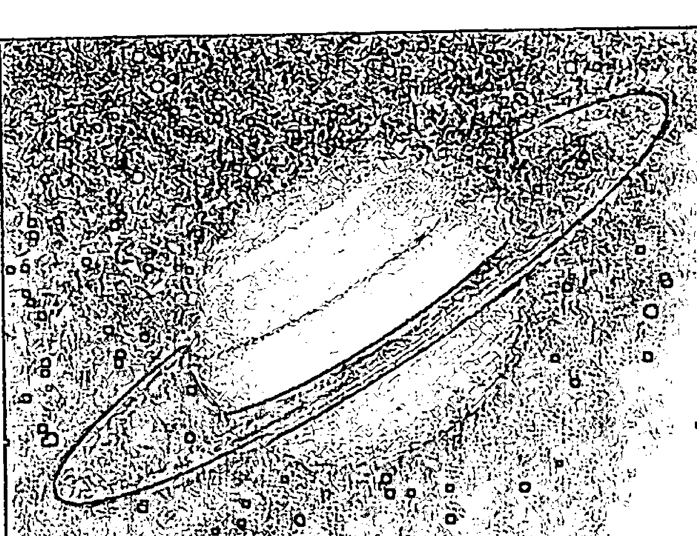

感應巫術是非常簡單易懂的。除了象徵以形補形的轉移系統外，也同時採用其他的象徵系統。其中一個例子，就是月相。雖然月亮的位相會改變自然能量，使不同時期產生不同的潮汐變化、並影響動植物的生態反應，但月相還有另一層象徵的意義。

舉例來說，在月亮漸盈的時期（從新月到滿月），較適合象徵成長、增加或是吸引的魔法；相反的，月亮漸虧的時期（從滿月到新月），則象徵衰敗、驅逐與反感。暗月，習慣被稱為新月，此時適合新的計畫、建立保證以及轉讓出售。滿月則是象徵深思熟慮、幻覺、揭露真相以及完整健全。

而另一種象徵系統，則是以一週內不同的日子為象徵，各自與代表不同人類力量的行星相互連接。禮拜一是象徵月亮的神秘力量，適合與願望、超自然活動及金錢相關之事務；禮拜二為火星之日，象徵勇氣、意志及防衛的星球；禮拜三是受主掌傳播溝通的水星支配；禮拜四則是木星之日，代表寬容及超強幸運的行星；禮拜五則奉獻給了金星，代表愛與合諧；禮拜六是土星，象徵嚴格與紀律；禮拜日則是帶來歡笑與成功的太陽。

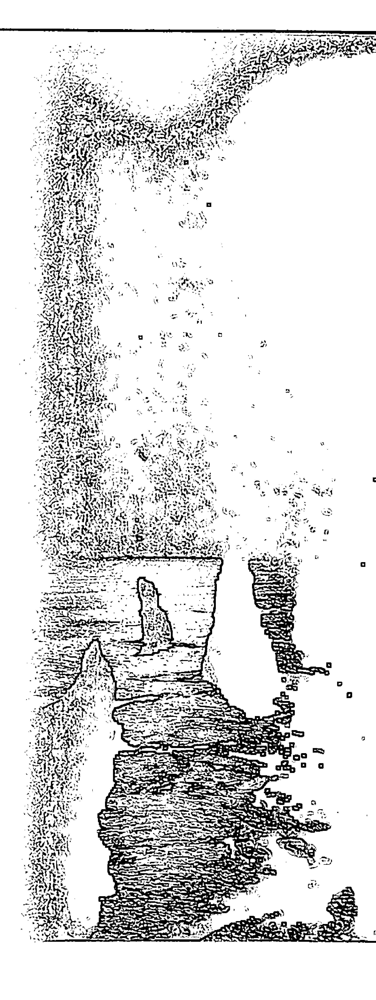

## 魔法開始之前

除此之外，還有一個在魔法世界很重要的象徵系統，就是五大神聖元素：土、氣、火、水以及靈。這五個象徵代表物，涵蓋了人類存在的所有需要。土代表實質的世界，提供庇護場所、食物及生理的健全。氣則代表了溝通、記憶、想法與學習。水則與愛、療癒、和夢想相關。火則象徵了勇氣、意志力與靈感。而靈，也就是第五項神聖元素，代表聯繫及蛻變，它預見了出生、成長交流與死亡。

除了上述的象徵系統外，魔法有時也與天神及女神有關。本書中的魔法，若是有祈求或召喚到相關神祇，除非是大家已經熟知的對象，否則都有相關解釋，說明那些神祇的重要性及影響力。

本書魔法的編排方式是以生命重要的問題類別來劃分，但就算是不同類別的魔法，也常有相同的施法技巧。其中最常見的，就是宣告魔法目的的技巧。舉例來說，在儀式一開始，點燃第一根蠟燭後，都要大聲的說出施法的目的，這樣做有兩種效果：第一，喚醒你的潛意識，讓魔法潛力得以被激發出來；第二，讓自己能專注在正被喚起的能量上。

要喚起能量來增加魔法的威力，就通常可經由反覆地唸咒、專心地投入或是在腦中將目的具象化來達成。喚起能量的方法各有不同，有些魔法必須依照書上的指示，例如反覆唸咒或是進入冥想而具象化你想要的結果。

有些魔法則是需要在施法時百分之百地專心投入。當你越來越有把握時，可以考慮使用其他的技巧，如跳舞、擊鼓或是入定等。

反覆的唸咒很容易就能夠了解，但是將目的具象化就必須要多一些練習。在排練之前可以先使用一些放鬆的技巧，例如先慢慢呼吸，讓思緒平靜下來，然後靜坐一段時間。但是，如果你是大家口中喜好幻想的那種人，那麼不用懷疑，你就已經是這方面的天生好手了。

再來要說相關的工具，魔法的工具配件其實非常簡單。雖然有些魔法派系堅持採用複雜且專門的刀劍、魔杖和繩索，但本書中所使用的工具都是非常基本的。雖然傳統上，法師們都會有一把魔杖、或是亞連（法師專門的小刀）來施展他們的魔法，但我們並不需要你具備這種專門的魔法工具。本書中大部分的工具，也可被形容為材料，例如蠟燭、繩索、植物、燃油器、木炭鐵餅、薰香等等，都是日常生活中方便找到的物品。

要執行本書中的魔法，最好的方針就是讓它越簡單越好。書中所有的魔法規則都不複雜，其中只有一點，要在這裡特別解釋一下，就是要「安全」地燃燒蠟燭。通常並不是每施一個魔法就得換一個新蠟燭，如果當書中要求要保持某物「安全」時，這是指在你的願望被實現之前，你都不可以丟棄那一樣物品，或是將它拿到日常生活中再次使用。

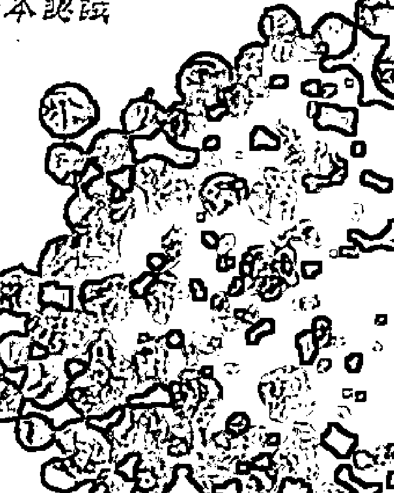

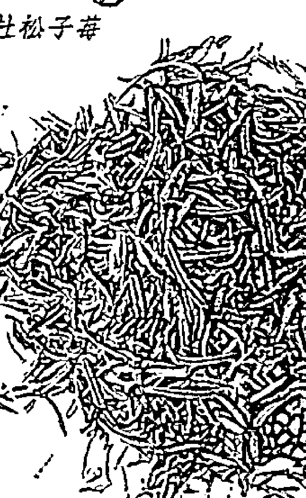

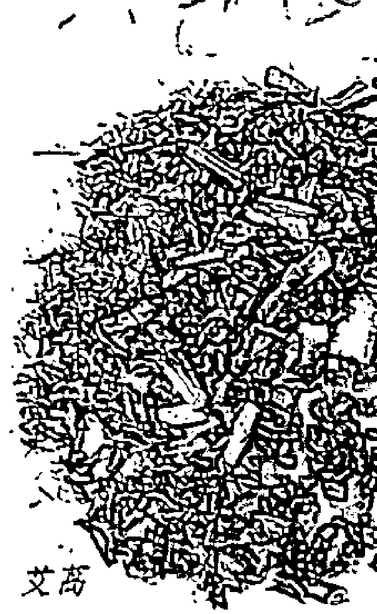

## 魔法開始之前

## 魔法與自然節奏

對於經常從事魔法事務的人來說，大部分的人都認為魔法歸屬於大自然的一部分，它來自於人本身以及四周的環境。而對其所立身的世界或宇宙的理解，也是來自本身的精神靈性。所以對這些人而言，魔法工作就等於是心靈的工作，而協調那些自身與四周能量的方法也是心靈工作的一部份。當更親近或試著更了解大自然的節奏就能變得更多魔法上以及心靈上的成長。

為了更熟悉在魔法和儀式中的大自然力量，就必須先熟悉地球上的潮汐與季節變化。月相變化與魔法活動的交互作用是大家最熟知的，但是，第六感能力與天賦最強的法師卻知道，若要利用地球的能量，即必須更進一步理解行星節奏的特性。因此，除了必須了解地球的四季以外，還要隨著太陽系的軌道變化，去體驗生活周遭的自然改變。親身體驗接近季節的交替並學習相關的古老傳統，是開始了解來自週遭世界的魔法本質最好的方法。一年的變化之輪（年輪），如同在西方的魔法傳統中所見，被劃分成八個節日並都與四季及天文的自然變化有關。這些節日有時候被形容成年輪中的八個輪幅，這個畫面，可以幫助初學者更容易理解這個觀念。嚴格來說，一年中並沒有真正的開始與真正的結束，雖然不同的文化傳統，都會不約而同的選擇一、兩個時間點當作他們的「新年」。

人們一直在觀察大自然更迭的節奏，這不是光指年曆上的日期，而一年的開始與結束，而會被視為不可或缺的節日，則是因為它們是連接年與年的關鍵。上述八個節日的產生，結合了太陽系活動（夏至、冬至、春分以及秋分），和凱爾特族及北歐民族重要的火節。其中主要的四個太陽系節日，是出現在以下的重要天文日中：Yule，為日照最短的日子，也是冬至，通常是在12月21或22日；Litha，日照最長的日子，也就是夏至，發生在6月21或22日；Eostre，春分，大約在3月21日；以及Mabon，秋分，大約在9月21日。

在這四個節日當中也穿插著許多著名的火節，之所以被稱為火節，是因為人們會在這些日子搭設篝火慶祝。火節包括：Imbolc，代表「母羊之乳」，落在2月初第一株雪花蓮開花之時；Beltaine，也稱為「五朔節」，大約在5月1日，即五月花盛開之時；Lammas，也稱作Lughnasadh，在8月初穀物收割之時；以及Samhain，代表「初霜」，是個古老的慶典，大約在10月快結束時。有許多的風俗習慣，與這八個依循四季變化而生的節日有關，本書第210到259頁的章節內容就特別在講述關於這些節日的魔法。雖然當中對此都有詳細的解釋，但我們最好還是先認識一下這些節日的基本內涵。

Yule是一個古老的節日，來自於古挪威語，是「輪子」的意思。從英格蘭、蘇格蘭、威爾斯及愛爾蘭等地所發現的一系列史前石化遺跡中，可以很清楚地發現先古祖先們將冬至視為一年中很重要的時節。從西元四世紀以來，冬至便一直被視為是一個重要的節日而慶祝著，基督教會還特地宣佈12月25日為基督生辰，其實真正的目的是希望讓基督徒有理由參與這個一直以來被異教徒所慶祝的冬至慶典。在這一年當中日照最短的日子裡黑暗多於光明，但是相反地這也意味著這天過後白晝將會慢慢地開始增加，就像是太陽「重生」一般，在某些地區則被稱為「太陽返回」，主要都在強調白晝逐漸返回的概念。雖然在冬至左右，太陽的能量是處於衰退的階段，但Yule仍被視為是一個充滿光明、希望與前途的節日。因為這個時期缺乏陽光與溫度，反倒讓大家都聚集在一起，讓漫長、荒涼的冬夜顯得格外地明亮與溫暖。在這個時節也會有許多人覺得需要如動物般冬眠，因而產生北半球常見的「冬季憂鬱症」或是「季節性情緒失調」。此時的蟄伏，正好適合人們往自己的內心深處找尋蘊藏在其中的自我潛力。就魔法師而言，則正適合沉潛省思、從事自我創意潛能的開發並多加注意自己的夢境，因為這正是一年當中夢境較深入、豐富以及鮮明的時期；此時也應該多多注意身邊的事物並觀察月相和冬夜裡較閃亮的星宿。所以，Yule是一個冥思、並從中發掘新能源的季節。

Imbolc，就在一月底，正是歐洲開始出現雪花蓮的時候，也是羔羊出生的時節。這個節日代表著大地正溶雪重生，也同時歡迎著植物與穀物的播種。Imbolc是凱爾特族的火節之一，被認為是屬於布莉吉妲的節日。布莉吉妲是深受凱爾特人所鍾愛的女神，專司火與療癒，也被認為是特別照顧老幼婦女與新生動物的女神。因此，她所代表的這個時節正是象徵公平與正義。Imbolc也是代表重建的節日，此時嚴峻的寒冬鬆開了對大地的箝制，讓河流與小溪隨著溶雪重回世界，白晝也明顯地增長，就好像布莉吉妲幫助羔羊的出生一般，Imbolc幫助了春天的降臨。此時可以看見大地正在甦醒，感受到身邊的力量正在轉動著生命的齒輪，處處充滿著春天與初夏勃發的生命力。在經歷漫長無盡的冬夜後，Imbolc正是開始往外發展的季節，適合人們開始進行生命的「春季大掃除」，並期望著其他季節的到來。

Eostre是代表另一個天文現象—春分，也就是白晝與黑夜的長度等長、呈現完美平衡的時節。春分之後，白晝的時間會慢慢超越黑夜，直到夏至那天，白晝長度會達到極限。Eostre是在崇拜一個專司生產、名為Eostre的女神。她的代表圖騰是一隻野兔，這我們可以從復活節的兔子以及外包著巧克力的彩蛋而發現，這是一個祈求生產豐饒的古老節日，仍遺留至今的傳統。到了這個時節，樹汁開始豐沛分泌，大地重新充滿綠意，白晝光明的時間也越來越長。Eostre節日多與平衡、富饒以及成長有關，最有利於思考自我生命的平衡、未來成長的潛力並跟上週遭大自然奔流能量的腳步。這時也是一年中最佳時刻，讓自己倚靠在樹上，去沉靜的感受從樹根、樹幹以及樹枝湧現的生命力。因此，Eostre也被稱為「樹節」，正適合熟悉那些與樹有關的傳統、習俗以及魔法。

「Beltaine」是慶祝山楂樹梢開滿五月花的時節，落在5月1日太陽落下的那一刻，也是另一個慶祝豐饒的節日。它宣布了夏季的開始，也啟動了和綠林有關的活動，如過去五朔節遊戲，藏在綠葉小屋中的男人或男孩、羅賓漢及綠林好漢們或英女王瑪麗一世的支持者等都活躍於這個時節。此時綠林的靈氣逐漸向外發散，而存在人類世界與凱爾特傳說中的精靈世界之間的屏障，同時也是最稀薄的時候。Beltaine也是萬物肉慾最強的時節，幾世紀以來，它的相關慶典多被崇尚禁慾的基督教會所禁止。在過去慶典中，人們會崇拜男性與女性的性器官象徵物，例如，圍繞在用花卉、彩帶裝飾的柱子邊跳舞，並將圓形的花圈套入柱子中。五朔節的慶祝活動多像是這樣，與性而有所連結，這也再次證明了這個節日的起源是與生產有關。而許多人背著不准慶祝Beltaine的禁令仍大肆舉辦慶典，顯示了這個節日不服從當權者的傳統。因此，五朔節也被用來讚頌勞動者的權益，並且逐漸在西方社會中，成為藍領階級走上街頭抗爭的日子。

Beltaine正是一個適合與綠林靈氣交流、許下承諾與誓言並以自己的性慾為榮的時節。

## 魔法開始之前

「Litha」一夏至：慶賀白晝終於戰勝夜晚的節日。此時，英國島上的民眾會在許多的圓形石圍牆、山坡以及其他重要的史前遺址中露營守夜，等待日出的晨曦，一起迎接一年中白晝最長的一天。在這個時節，你可以從太陽汲取力氣並且專心於外在能量的培養；因此，這個時期非常適合走出戶外、認識新的朋友並且學習新的事物，同時也是遠離都市燈火到野外露營的最佳時刻，你可以坐在戶外欣賞美麗的夜空。若是天氣晴朗，你也可以到海邊或是其他廣闊的水域去遊玩，融入水一也是生命的起緣一的能量當中。

「Lammas」或稱為Lughnasadh，代表著穀麥豐收的時節。在這個時期的傳統中，最著名的就是稻草人以及其驅逐惡魔的習俗。在這個小麥從穀殼中被篩出來的季節，也正是我們該注意哪些東西應被丟出生命之外並慶祝個人收穫的時候。

此時應該要分享豐收並且確保明年也要有同樣的收穫。從上述這些古老的慣例與風俗民情就可以發現祖先們所關心的事，其實與現代的我們大同小異。對魔法師而言，則是應該在此時融入這個豐碩的季節中聆聽大地的靈魂。

「Mabon」正值秋分時節，也代表了白晝與黑夜的完美平衡。但是，就這個節日而言，這樣的平衡將逐漸偏向黑夜，因此，這個時節也蘊含了某種悲哀，好似象徵著美好的夏日將離我們遠去。Mabon在年輪中，是位在西側的位置，也正是太陽下山的方向，對祖先而言，那也是人們死後將前往的方位。這個季節，人們開始走入黑暗，許多與黑暗和寒冬的荒蕪有關的神話也隨之而起。此時正好適合浸淫在黑夜與相關傳說當中，從中找出智慧與真理，去發掘只有少數人能理解的神秘知識。這個時節也適合拋棄悲傷，並將過去置於身後、學習真正地放下。

「Samhain」，有時被稱為凱爾特族的新年。這個初霜乍現的時節，代表著隨後而來的將是黑暗無益的冬夜。藉此節日紀念一年即將的結束，並且榮耀祖先的偉大。此時是介於生與死世界的交界，也是最模糊的時候，亡靈會在此時接近並逗留在我們的身邊。Samhain被認為是占卜的吉時，我們的夢境在這個時候也會越來越生動清晰。這個季節給予我們機會去探索自我的超自然能力以及死後的歸屬。這股神秘力量提醒著我們生命與死亡的難解以及人類和宇宙萬物之間複雜的關連。這是一個研究死亡為何物以及重新思考舊有信仰的時節。

讓自己融入地球在太陽系中運轉的節奏，是鍛鍊魔法能力最好的方法。如果你能隨著太陽運行的週期來活動並且仔細觀察月相和行星的變化，要成為一位能善用自身及週遭力量的優秀魔法師將指日可待。

## 淨化神聖的空間

被用來從事靈性活動的空間是非常神聖的。在這空間中，我們可以看清楚自己在宇宙中的位置並且認清人類的真正本質，甚至能體會所謂的「神性」。同時必須身處其中才能實際地操作神聖的魔法藝術，魔法之所以被認為是神聖的，乃是因為它利用超自然的知識去影響世界的變化。

要創造一個神聖的空間其實是很簡單的，但精神必須要非常地專注，同時清楚自己的目的，並且能抗拒任何心理上及生理上的誘惑。在家中即可創造一個供冥想或施法的空間，並不需要特別去找其他的地方。首先，在家裡找一個可以活動的空間，最好是能在施法時不易被打擾、施法後能輕易恢復日常使用狀態的地方。對大部分的人來說，要在家中清出一個空間是很簡單的，反而要清除心理上的雜念會比較困難得多，這需要多加練習。當你開始依照本章所提供的準備工作，著手進行幾次之後，你會發現要讓自己很快進入神聖嚴肅的狀態，會變得跟清出房子的空間一樣地簡單。

神聖空間最自然的形狀就是圓形，幾世紀以來，法師們都以此當作施法結界的形狀，以供防衛之用。要畫出一個圓形結界其寔很容易，如果是在家中，先選一個在施法時最不會被打擾的房間，施法長度通常至少要1個小時。

在房間的中間清出一個地方，讓你可以很舒服地坐在中央的地板上。然後

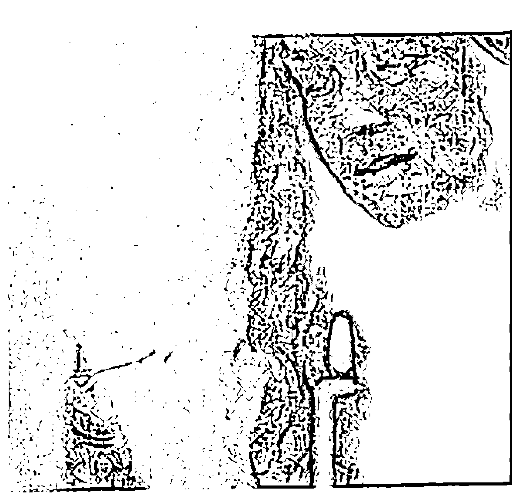準備黃、紅、藍、綠色的蠟燭各一個，並將它們安置在穩固的燭台上，遠離房中的火源。以你為中心點，找出東南西北的方位，在房間的東方放置黃色的蠟燭，南方放置紅色的蠟燭，西方放置藍色的蠟燭，北方放置綠色的蠟燭。這四種顏色的蠟燭，依序是代表五大神聖元素的其中四種：氣、火、水和土。而在中間的位置，你必須擺上紫色的蠟燭，代表靈，也就是第五個魔法元素。

大部分的魔法師喜歡在畫出施法結界前先「淨化」整個房間。他們會先淨化清水並加持於鹽，將兩者混合之後再噴灑於房間的四周。實際的步驟是，先用一隻手，將裝著水的酒杯或器皿包住一半，想像杯中的水已經吸收了許多能量，並變化成深色的煙霧，開始向杯外釋放，此時大聲說出：「水中之靈，我驅逐汝」，接著，將你的另一隻手放在鹽巴上，並開始加持：「讓祝福降臨於此鹽之上」，然後將鹽巴放入水中攪拌，再依順時鐘方向噴灑於房間四周。

## 魔法開始之前

接下來，拿起一根魔杖或者是一把小刀，不然用你的食指也可以，從東邊開始，以順時針的方向，也就是往右轉，想像在房中「畫出」一個圓，這個圓必須能包圍整個房間；在此同時，由你的雙腳開始，試著將大地的能量往上提運，經過你的軀幹，延伸到手臂，最後將能量傳遞到正在畫圓的魔杖、小刀或是食指上。當你完成這個圓後，你必須宣佈工作完成：「我召喚你，結界的能量，汝必須成為防衛之線，保護這個空間，與外隔絕。」

當結界被設好後，便要開始召喚魔法五元素。有些人喜歡將這些元素擬人化，想像成天使、天神或是女神的模樣。有些人則是喜歡把這些元素想像成自然的能量。不管你喜歡哪一種，重要的是在完成結界之後，一定要記得召喚這些元素。喚起這些元素並不等同於在這個時間、地點召喚出強大的力量，而應該是喚起它們在我們心中所代表的意義。簡單來說，我們相信它們存在於萬物之中，並在這結界當中將它們的存在具像化。在接下來的作業中，盡量將所有的召喚詞簡單化。首先，從東方開始，召喚氣元素，並宣讀：「東方的氣，你在這神聖的結界中被賦予使命」，接下來隨著圓，往右方依序召喚其他元素，並照上述召喚詞稍作修改，依序宣讀下去。在召喚完四方元素後，最後才回到中間召喚靈。每當召喚完一個元素時，就點燃代表那個元素的蠟燭，並說：「降臨吧，歡迎！」

最後，在你完成施法儀式後，於結界中朝反時鐘方向移動，與召喚時的順序相反，由土到靈，吹熄各自的蠟燭去關閉這個結界。

習慣上，要在結界裡頭走動，都是以順時鐘方向移動，但有時也有例外，像是某些除厄的巫法就必須以逆時鐘方向移動，不過大部分魔法都是遵行傳統的習慣。

在設好結界之後以及施法儀式的期間，絕對不可以跨越或是離開結界，除非有不可抗拒的緊急事件發生。這都會幫助你在施法時精神更加地專注，並保留結界中的力量直到儀式結束。在許多新石器時代的聖地遺址中，發現許多由石柱、溝渠以及天然地形所作的圓，這都被認為是祖先們用來崇拜生命輪迴的象徵─出生、死亡與重生。在魔法的世界，所有與圓相關的事物，事實上都跟前人設立那些歷史遺跡的想法非常雷同─所有的圓其實都象徵同一個圓，那就是，所有事物不變的輪迴本質。

画出一個圆

## 建立聖壇
### 魔法工作及靈性提升的重要關鍵

你可以在任何地方建立一個讓心靈冥想的中心聖壇。表現上看來其實很簡單，就是在家中、辦公室或學校，在任何地方找到一個位置並擺上對你而言是神聖的物品就可以了。但就細部來看，其實也可以很複雜，像是所需要的蠟燭、圖像、人偶或是代表的女神、自然元素、月相的象徵符號等等。通常最美好的聖壇，最好是設置在花園，並且採用石頭、木頭以及各類自然的素材來搭建。如果你希望以謹慎的態度對應你對魔法的興趣，建議可以將聖壇設在戶外，並且把它設計成花園景觀的一部分，如此一來，你也不需要時常搬動家中的任何東西。但如果，你已經很幸運的擁有一個不被打擾而且獨立清幽的房間，那麼這裡就是設定結界、建立聖壇以及提升靈性的最佳場所。

法師們喜歡在安排結界時，設立結界焦點。有些法師喜歡將桌子擺在圓的中心點，有些法師，則喜歡將桌子放在圓內北方的位置，這是因為北方對某些異教徒及巫師來說是屬於較為神聖的方位。

本章所說的聖壇通常只被建立在結界使用的期間，等到魔法儀式結束後，聖壇即被拆解，聖壇上的物品也被包裹收起，直到下次需要時再拿出使用。究竟聖壇該放上哪些物品呢？你可以依照自己的喜好去決定該放些什麼物品。但是仍有一個大概的準則需要遵守並且指示你說哪些物品是聖壇上不可或缺的。

通常必須在聖壇擺上代表五大元素的象徵物。在傳統上，焚香就代表氣；亞連(法師專用的匕首)、蠟燭或是油燈則是代表火；高腳杯或聖餐杯就是代表水；刻上五芒星(五角星形)的石頭或木材則是代表土；而代表法師特定長度的細繩 (細繩的長度，應等同於法師身高，加上其心臟到頭的長度)，則是靈。前四項象徵物，自古以來便被認定為法師的施法工具，甚至到了現在，仍常見許多法師們會使用魔杖、亞連或雙手來施法。也可以使用其他的元素象徵物，有些人會以羽毛代表氣、火焰代表火、貝殼代表水、盆栽代表土、水晶代表靈。

但最重要的是你所選擇的象徵物，對你而言必須是具有意義的，並且能幫助將自然界的五大神聖元素帶入你的心中，如此才能在施法時展现出所有的力量。代表太陽與月亮的象徵符號同樣也很常見，這可以在燭臺或小塑像上找到這類記號。象徵行星以及黃道的符號也同樣頗為人知，不過它們通常是在壁掛飾品或聖壇的桌布上出現。而天神及女神，則通常出現在框畫中，或是被做成小雕像，甚至有時是以圖騰的形式出現。舉例來說，我最喜歡的雅典娜象徵物，她是一位專司智慧的女神，便是一個木質雕刻的人像。

除了先前所說的蠟燭之外，仍然要另外擺上一到兩根的蠟燭，這兩根蠟燭的顏色，通常是代表正要執行的魔法儀式的屬性顏色。顏色可能會受季節的影響(如果是關於八大節日魔法的話)、魔法類別的影響或者是當時月相的影響。許多法師將聖壇視為能量的集中點以及魔法的中心。要讓魔法成功，並不一定要建立一個聖壇，但如果它能幫助你更專心，至少許多法師是如此認為，那麼除此之外，聖壇可以在魔法的範圍之外，幫助你獲得心靈的提升。一個小而私密的個人冥想與靈魂表現的空間，足以引起強大的回應力量，它的重要性可是不容小覷。

在個人的聖壇中點燃蠟燭去緬懷某人，如此簡單的一個動作都可以比你身處在大教堂中所舉行的追思彌撒，還更能產生更多的靈性的意義。記住，私人聖壇與你的靈性道路以及希望從中得到的啟發是息息相關的。

創造一個自己的聖壇可以給你帶來非常大的力量，甚至，可視為在你靈魂及魔法成長上不可或缺的一環。記得在家中或花園裡，找一個獨立的空間來建立你個人的神聖場所。自古以來，法師們都為了神聖及魔法的目的，建立屬於自己的聖壇，未來你也將傳承這古老模式，依循你所相信的神聖目的，建立起屬於自己的聖壇。

# 暮雪的藏书阁

# 第二部 魔法指南

## 魔法指南使用方法

在接下來的第50到387頁的章節中，一共包含了150則魔法，並根據不同的主題加以分類。雖然每個章節的主題都非常地淺顯易懂，但我仍建議先仔細地閱讀每章前面的介紹，以確保是否符合你真正的需求。

在找到似乎適合你的魔法後，先仔細閱讀前言介紹的部份，核對「目的」中所提供的建議是否與你的需要相符。而「魔法背景」的部份則會提供相關的歷史，並解釋魔法工具與象徵物的意義。接下來很重要地是必須完全了解施法的所有步驟，越了解魔法就越能讓咒語產生更大的能量，而你的施法意念更是左右了魔法是否成功的關鍵。

「施法時機」是出現在「如何施法」中，主要是說明適合施法的月相時機。月相變化與魔法的運作息息相關，甚至有時候最佳吉時也會受到行星變位的影響。因此，應當認真遵行本書中所建議的施法時機，有時只是月盈與月虧的差別就會帶來完全不同的結果。魔法中偶爾會出現的「暗月」，其實就是天文術語中所指的「新月」。通常在日誌或日曆上會記載滿月及半形月何時出現，許多全國性報紙也會列出新月、滿月以及上、下弦月出現的日子，這些都是你應該要參照的圖表和表格資料，直到真正地熟悉了並能直覺反應出月相變化的節奏為止。

大致上來說，北半球月亮漸盈，會從右方開始慢慢地往左方移動，然後逐漸形成滿月；月亮漸虧也是從右方逐漸往左方移動並縮小。而你可以從月弧出現在哪一邊來判斷它是處於月盈或月虧。如果是出現右邊的月弧，那就代表正處於漸盈的狀態；若是出現左邊的月弧，則代表處於漸虧的狀態。半形月也是同樣的道理，如果是出現右邊的半形月則是漸盈；相反則是漸虧。

# 魔法指南

所有的魔法當中除非有特別的指示，否则都需要在圆形的結界中施展，本書第36至39頁都有詳細的解說。但如果真的沒有足夠數量或相同顏色的蠟燭來設立結界，那麼就只好用其他的東西來代替。可以把小型的造型蠟或蠟凍放到寬口瓶中，擺放到正確的位置，來代替原本標準的黃、紅、藍、綠、紫蠟燭。

如果在設立結界上有某些困難，例如永久性或暫時性的行動不便，那麼可以省掉繞圓行走的程序，而用想像的方式來完成這個部份。其實並不困難，你只是把原本控制結界力量的手腳，改由心智操控而已。這樣的結界會與用亞述或手指畫出來的效果完全相同。

有些魔法會用到香精油，香精油能為魔法帶來強大的效力，但若需要塗抹在身上，則必須混合基底油稀釋才能使用，否則會刺激皮膚並引起疼痛發炎，而孕婦及高血壓患者絕對不可使用。若有其他任何嚴重的健康問題，就必須依照專業醫師的指示安全使用。雖然在正確的使用方法之下，這些精油具有相當療效，但是對於某些特定疾病則可能造成相當大的危險，這是需要事先注意的。

所有在魔法中使用的蠟燭都必須被放置在穩固的燭台上。除非書中有特別的指示，否則都應該「安全」地燃燒蠟燭，也就是指，在魔法實現之前，都不可以將它們再拿出來使用或丟棄。

但是也有例外，代表五大元素的蠟燭，可以在下次設立結界的時候再被拿出來重複地使用。確保所有的蠟燭遠離紙張及布幔，或是其他的可燃物。建議最好在家中放置滅火器，以防火災發生。

焚香柱以及香錐也必須放置在穩固的支架上，支架最好有接收香灰的容器以確保安全。而木炭則必須放在防火的盤子或香爐裡，但千萬不要放在球形的香爐中，會因為搖晃而影響香的燃燒，反而容易引發意外的產生。另外要注意的一點，就是與焚香柱及香錐比較起來，木炭比較不容易冷卻，因此在處理時要更多加小心。

書中大部分的魔法原料都很容易取得。但裡頭有些會用到的材料，譬如草本植物就含有毒性，這些具危險性的材料就必須要放於屋內高處或是孩童及寵物所碰不到的地方。若是找不到相關的草本或焚香，你可以到專門的雜誌上，尋找相關供應商的廣告，郵購產品或者利用網路訂購也可以。
最後要注意的部份，在第一部的介紹中也有提到，雖然本書主要是為沒有相關魔法經驗的人所設計，但大家一定要抱持著誠敬與愛的態度來使用魔法，如此一來，魔法才會幫助你達成心中所想的願望。

# 暮雪的藏书图

# 情与爱的魔法

## 情與愛的魔法介紹

愛情魔法大概是所有魔法中最常被詢問的項目。從對愛情魔法的需求範圍及頻率，可以看出人們是多麼急欲地想找尋伴�並且渴望著引人注目。關於情與愛的魔法無論是傳統的或是現代的，不但數量多、種類也很多，其中有些魔法甚至已經有悠久的歷史。這些都在在肯定，愛是根生於人類基因中亙古不變的需要。也是對愛的著迷，才能讓人類經歷幾千年的時空持續地繁衍至今。

接下來的魔法，涵蓋了許多大家容易遇到的感情問題，有增強吸引力的魔法、宣示準備迎接新戀情的魔法或是得到心上人注意力的魔法等等。當然，愛情的魔法不只有關於新戀情而已。

本章裡頭也有針對既有戀情的魔法，包括重燃兩人的激情、幫助雙方的溝通、以及讓感情更加穩定合諧的主題等。假如你的感情正處於平淡的膠著狀態，這裡有許多魔法，可以幫助感情生活再度地活躍起來。

如果不確定自己是否真正需要愛情魔法，你可以參考「健康、美麗、與幸福魔法」章節（第138-181頁），這部分主要是關於獲得自信及內心平靜的魔法，常與愛情魔法混淆。常常經過這樣的比較與思考，可以幫助你釐清迷思，讓你知道自己究竟想從感情中得到什麼。記住，有時候愛自己並接受自己，反而會讓人更有自信，相對地在對方的眼中也能顯得更有魅力。

在準備鑽研本章內容之前必須先掌握一個要點。通常一般人會認為，被施法的對象一定會毫無招架、別無選擇地愛上你，這是對愛情魔法的刻板印象，而且還大錯特錯。你不能利用魔法來改變他人的自由意志，若是意圖如此，則將註定失敗。若是一意孤行地想利用魔法來達成這種願望，那麼將無法得到心靈以及魔法能力的提升。因為就愛情魔法而言，你有正面的行為才會得到正面的回應。

# 情與愛的魔法
### 玫瑰花瓣魔法
#### 召喚真愛

【目的】適合準備好迎接真愛的單身貴族。為你釋出魔法訊息，宣告準備與真愛定下來的心意。

【魔法背景】玫瑰一直以來都被認為是愛情與女性外在魅力的象徵，它美妙的香味也常被用在香水的配方中，提供一種浪漫及性感的氛圍。尤其是紅玫瑰，代表了真愛與激情—讓愛情天長地久的必要元素。對魔法及異教信仰而言，玫瑰是專司愛與情慾的古羅馬女神—維納斯的象徵，她對愛情的強大影響力，正是構成魔法能量的重要元素。
本魔法利用玫瑰這古老的象徵物來代表一個人準備好迎接真愛的心意。為了確保一切順利，必須要選擇花瓣較多的玫瑰，因為此魔法便是利用這些花瓣來製造一條真愛之路好引領愛情走到你的門前。

##### 如何施法

施法时机 在月亮渐盈期间进行，让真爱降临在你的身边。最佳的施法日是礼拜五（维纳斯之日）并于日落之后施法。

##### 施法步驟

1. 根据第36到39页的指示，设立圆形结界，想象房子被结界完全围绕。
2. 点燃红色蜡烛，并说：“伟大的维纳斯，请保佑这个结界，并赐予我魔法力量吧。”
3. 用左手将酒杯拿起，让右掌浸入水中，并说：“被女神祝福的纯净之水，我将赐福于你，并命令你，将真爱引领到我的身边。”然后将水洒在玫瑰花瓣上，并说：“让真爱与我的心一样纯净真诚。”
4. 从大碗中取出3朵花瓣，将其余的花瓣拿到家门口，从门口台阶开始摆放花瓣，一路通往你的睡床。
5. 将针线准备好，穿过之前3朵花瓣的基部，将它做成一条玫瑰花瓣项链。戴着它过一夜，隔天再将它放置在枕头底下，阴历一个月后才可取出。
6. 阴历一个月后，把玫瑰花瓣项链放到自然的水源中，便可等待真爱的降临。

##### 所需工具與材料

- 1根長6～8吋或15～20公分的紅色蠟燭
- 火柴或打火機
- 1/4杯用酒杯裝的乾淨泉水
- 6朵玫瑰花，將其花瓣全數摘下，放入大碗中
- 1根縫紉用針
- 1條長48吋（也等於120公分）的紅色棉質縫線

# 情與愛的魔法
### 櫻桃核魔法
#### 招來新情人

【目的】適合正在尋覓新戀人的人，此魔法將會為你釋放出訊息，宣告準備好開始投入新戀情的心意。

【魔法背景】櫻桃與魔法及占卜的關係，要從很久以前開始說起。這是流傳在單身者之間的風俗，他們會藉由數櫻桃核來預測自己是否能結婚以及何時可以結婚，這個習俗至今仍會廣為流傳。另外，一首古老的孩童順口溜：「補手、縫手、戰守、水手、富首、空手、伸手、扒手」，也與櫻桃核占卜術有關，因為過去在數櫻桃核的同時，口中也必須要唸著這段順口溜。上述的風俗習慣，其實都是仿效古老的傳統，利用石頭或骨頭等工具，拿來進行魔法占卜。在以往化妝品並不盛行的年代，女人也會將櫻桃沾在嘴唇上，增加自己的魅力，這個魔法也蘊涵了些許的隱含意義。

就魔法而言，櫻桃象徵成雙成對、豐碩富饒以及美好的未來。這樣的象徵意義，其實在許多文化中早已根深蒂固，甚至有些文化會以「生活就像一碗櫻桃」，用以形容生活很美好。在本則魔法中，櫻桃核是代表未來情人的優點，因此，必須要保持櫻桃核的平穩無恙，才能確保為你帶來美好的戀情。

##### 如何施法

###### 施法工具與材料

- 1根長6～8吋或15～20公分的白色蠟燭
- 1根長6～8吋或15～20公分的紅色蠟燭
- 火柴或打火機
- 9顆成熟的紅櫻桃
- 1杯白酒
- 1茶匙純蜂蜜
- 1張邊長4吋或10公分的方形紅布
- 1條長24吋或60公分的細繩或麻線

施法時機 在月亮漸盈的期間施法，讓對象逐漸靠近身邊。避開象徵限制的土星所操控的禮拜六，必須在日落後進行。

##### 施法步驟

1. 根據第36到39頁的指示，設立結界。
2. 點燃白色的蠟燭說：「我心誠意堅，願郎／娘心似我。」接著，點燃紅色的蠟燭說：「愛情似火、明心可鑒，讓這光芒為我傳遞情意，到你心中。」
3. 開始食用櫻桃，並將果核吐進酒杯中。每吐入一顆果核，便同時要唸出以下咒語中的一個詞，依序為：「美麗、甜美、活力、青春、信心、忠誠、熱情、真誠、愛情。」
4. 將蜂蜜倒入酒中攪拌，並說：「甜美引你近，愛情醉你心」接著，將杯中的酒全部喝光，只留下櫻桃核。
5. 將所有的櫻桃核放置在紅布的中央，並用細繩將紅布包起。
6. 將綁好的紅布袋掛在睡床上方，直到新戀人進入你的臥室，才可將櫻桃核取出。最後，將取出的櫻桃核埋在你的花園中，以確保你們的愛情會逐漸滋長茁壯。

### 阿弗洛狄特之護身符魔法

#### 增加吸引力

【目的】幫助想吸引異性注意而增加戀愛運的人。

【魔法背景】在魔法世界中，護身符是符咒的一種，含有達成特定任務的潛在魔力。而在本魔法中，護身符的主要任務，便是增加持有者的魅力，以吸引異性的注意，進而增加戀愛機會。為了讓護身符達此功效，你必須專心於那些自認為最迷人的特質。這些特質可能是外在的容貌，例如動人的雙眼，或者是美麗的秀髮，也有可能是內在的個性，例如絕佳的幽默感或者是樂觀的天性。任何你自認為迷人的特質都可以成為施法的重點。

本魔法中，在下方有一個小圓的圓形象徵符號，便是阿弗洛狄特女神的代表，這位專司愛情的希臘女神，相當於羅馬女神維納斯。而這個象徵符號，至今仍被天文學及占星術用來代表金星，這幾千年來皆被認為與愛之女神有關的行星。

##### 如何施法

施法時機　在月亮漸盈期間進行，接近滿月的時候效果更佳，並儘量在金星所支配的禮拜五施法，應避開代表土星的禮拜六。

##### 施法步驟

1.  根據第36到39頁的指示，設立結界。
2.  先點燃香柱，再點燃蠟燭，並說：「我召喚汝，夜晚的星辰，讓汝於海上閃爍的熠熠光輝，如同我的美麗閃耀出炫目的光芒。」
3.  在穿好洞的銅片上，以釘子的尖端，於洞的對面再穿一個孔，代表阿弗洛狄特的象徵符號。
4.  將銅片放於雙掌之中，開始想像自己最有魅力的那些特質，接著一邊唸咒：「如同巨蟒脫皮一般，我的美麗將開始綻放。」至少要唸9遍以上。
5.  向四大元素一氣、土、火、水，展示這個護身符。然後將護身符過香柱，並穿過蠟燭的火燄，再將泉水噴灑其上，最後朝護身符吐一口氣。
6.  等待象徵巨蟒的綠色蠟燭燒盡，代表巨蟒已經脫皮完畢，此時，便可以將護身符繫上細繩，並直接佩戴。

##### 所需工具與材料

- 1根伊蘭花香柱
- 1根長6～8吋或15～20公分的綠色蠟燭
- 火柴或打火機
- 1根尖銳的釘子
- 1個圓形小銅片，如圖所示，在其下方打洞，以方便佩帶之用
- 1茶匙的泉水
- 1條長24吋或60公分的繫繩

### 魔鏡魔法 走進情人的夢裡

【目的】可讓你了解情人的心意，或幫助撫慰相隔兩地的戀人。

【魔法背景】在魔法的傳說裡，鏡子佔有很重要的地位，在全世界許多文化傳統中，也可以看到鏡子的出現。雖然是平面的鏡面，卻能照映出三度空間的影像，甚至可以放大或扭曲影像，這讓鏡子被視為是能放大魔法能量的強力工具。

一般古老的迷信，相信鏡子具有神秘的力量，認為鏡中反映的影像，會吸取人的「靈魂」。但本魔法雖然是藉由鏡子，讓你的影像進入對方的夢中，這種「意念形式」的意識傳遞，持續的時間並不長，所以不用擔心你的影像會產生靈氣或生命，或者將遺失一部分的靈魂等等。

##### 如何施法

##### 所需工具與材料

- 1根茉莉花香柱或香錐
- 1根長6～8吋或15～20公分的白色或銀色蠟燭
- 火柴或打火機
- 1面罩上黑布的半身鏡或全身鏡
- 1大碗泉水

施法時機 最好是在滿月時以及天黑後進行。一個禮拜中任何一天皆可施法，但是代表月亮之日的禮拜一是相較起來比較吉利的日子。

##### 施法步驟

1.  根據第36到39頁的指示，設立結界。
2.  點燃香柱。
3.  點燃蠟燭說：「召喚滿月的力量！黑夜的光明，請增強我的魔力，將鏡中的我帶入他的夢中，並照亮他的夢境。」

這個魔法，就像是一場精神的探險。你可藉此安撫遠方的愛人，也可藉由對方在夢中的反應，弄清楚他對這段感情是否認真。魔鏡魔法，可以讓你與情人之間更加靠近，但是如果是已經分手的情侶則不適用於此魔法。

4.  將鏡上的黑布掀開，專心地凝視鏡中影像的雙眼。
5.  將碗中些許的水，灑在鏡中的影像上，並說：「你的名字叫（替鏡中的影像取一個假名）。」將鏡子舉起，接著對鏡中的自己說：「（假名），我將賜給你一個夜晚的生命，代替我走進（情人的名字）的夢中，讓我看看他的夢。」
6.  接著馬上將黑布蓋起，並將蠟燭吹熄。

### 水祈禱

#### 祈求讓愛情走進生命

【目的】適合想認真開始一段新感情的人

【魔法背景】在五大元素中與愛情最有關聯的就是水。水也是地球上最強的力量之一，水滋養了萬物的生命，卻也能在一夕之間吞沒一切。因此在魔法中，水便擁有溫柔與冷酷、一體兩面的特質。如同水一般，在感情世界中，的確同時存在溫柔與冷酷這兩種特質，而愛情也跟水一樣，是這個世界上最強的能量之一。

五大元素中的水元素，象徵感性的自我及潛意識，常在超自然活動與祈願時被召喚應用。就魔法而言，向水許願，不只會召喚出水的象徵意羲，也會同時召喚出水中其他所有物質、各自不同並強大的特質。因此，向水祈求愛的人，必須要對即將到來的強大力量有所心理準備，因為也許表面看來平靜無波，但其實隨之而來的是如海嘯般洶湧的情感能量。

這個魔法必須在戶外及大自然型態的水源旁邊進行，如海洋、河流或湖泊。

##### 所需工具與材料

- 1顆成熟的蘋果
- 1把水果刀
- 1根粗的刺繡針
- 1茶匙的糖
- 1個任何樣式的藍色蠟燭

##### 施法時機

在月亮漸盈期間的禮拜一進行，用以向潮汐的女皇一月亮致敬。如果前往的是有潮汐變化的水源處，則須在漲潮中並接近退潮時施法。

##### 施法步驟

1.  在水邊找一個安全隱密的地方。
2.  深呼吸並放鬆，站在中央處。
3.  將蘋果從中間橫向切開，蘋果籽從切面看來，必須呈現五角星的樣子。將這兩半蘋果的切面向上，各至於兩手掌中。眼睛看著水面，並唸誦以下咒語9次：「體內的血液、大地的河水與月下的潮汐啊！為我帶來一個懂我真正價值的人吧！」
4.  將右手的半顆蘋果放到旁邊，拿起粗針在左邊的半顆蘋果上，刻出一個頂角向下的等邊三角形(水的象徵)以及你的名字(不要姓)和漸盈的新月形狀(月弦在右邊)。
5.  將半茶匙的糖灑在刻字的半顆蘋果上並投入水中，越遠越好。將剩下的糖，灑在另一半的蘋果上，將它吃完。
6.  回家後點燃藍色的蠟燭來啟動你的願望，並讓蠟燭安全地燃燒殆盡。

### 愛情精油

#### 吸引對象的調和精油

【目的】適合追求愛情遊戲以及渴望愛情刺激的人。

【魔法背景】大部分經驗豐富的法師都會知道調和精油的傳說，據說這種調和油會引來許多難纏的求愛者，並讓本來很害羞的舞會壁花一下子變成熱情如火的性感女人，但這至今仍只是個傳說。不過現實生活中，的確有一些香精調和使用之後，會對使用者的心情與心境帶來明顯正面的效果。

其實，若是希望吸引浪漫的追求，一些香精油是可以幫助將一時的迷戀轉為愛情。而若是將促進感情投入的精油與刺激情慾的精油混合，則會產生有趣的結果。

##### 如何施法

##### 所需工具與材料

- 1根長6~8吋或15~20公分的紅色蠟燭
- 1根長6~8吋或15~20公分的藍色蠟燭
- 火柴或打火機
- 30滴杏仁基底油
- 肉桂、天竺葵與柳橙精油各4滴
- 1茶匙的水
- 1個精油用的燭火燃燒器
- 1個消毒後的有蓋空精油瓶
- 4根消毒後的滴管

施法時機 於月亮漸盈期間施法用以招來愛慕者的注意。一個禮拜中任何一天皆可，但是禮拜五，也是象徵愛情的金星之日，則是效果最強的日子。

##### 施法步驟

1.  根據第36到39頁的指示，設立結界。
2.  先點燃紅色的蠟燭，再來是藍色的蠟燭，並說：「水精靈、火精靈啊！以不傷害任何人為前提，將別人對我的好感轉為吸引並讓吸引轉為渴望吧！」

這種調和精油具有強大的誘發力。在這個魔法中，與太陽行星有關的肉桂是主要用來激發內在的熱情；而天竺葵則可以散發出愛情的感應電波，以吸引別人的好感；柳橙精油，則主要在吸引愛情的靠近，並且讓使用者散發更迷人的風采。

3.  拿出4根滴管，各使用於不同的精油中。取5滴杏仁基底油，肉桂、天竺葵以及柳橙精油各3滴，加上準備好的水，放入精油燃燒器中。
4.  將其餘所有的杏仁基底油倒入空的精油瓶中，再加入肉桂、天竺葵、及柳橙精油各1滴，仔細攪拌後，將蓋子蓋上。
5.  點燃精油燃燒器，讓精油的味道瀰漫四周。同時，坐在結界中間，想像有一個極具魅力的人，正朝你走來，而你也正張開雙臂歡迎他。
6.  取一些精油瓶中的調和精油，輕拍在脈搏處，並將燃燒器的火熄滅。在接下來的日子裡，每天都要擦一些調和精油，直到完全用完為止。

### 蛇皮魔法

#### 增強性慾並讓感情生活更有情趣

【目的】可刺激恢復性慾，並散發出性感的感應電波。適合已有感情對象或積極尋找性伴侶的人。

【魔法背景】就上述目的而言，相較於書中其他的魔法元素，蛇皮是最被建議的材料。傳統上，蛇皮常在魔法和咒語中，被用來促進性能力。其中原因，除了蛇形明顯的象徵男性陰莖外，蛇與女性性慾之間，也有著古老的象徵關係，也因為如此，本魔法男女雙方皆適用。

蛇所脫下來的皮，含有很大的精神隱喻。尤其蛇利用脫去老舊、無用的皮，來重建新外表的能力，更象徵著蛻變與活力，這也跟本魔法的目標不謀而合：重新活化、改善你的性慾，讓性感魅力更加迷人，致使現有或未來伴侶無法抗拒這股吸引力。

有時可以在野外找到蛇皮，但如果你住在城市，可以前往地方寵物店，與商家協議，也許就可拿到蛇皮。

##### 如何施法

施法時機 為達最佳效果，應在月盈新月時進行。一個禮拜中任何一天皆可，但禮拜二，象徵活力的火星之日，則效果更佳。

##### 施法步驟

1.  根據第36到39頁的指示，設立結界。
2.  先點燃香柱，再來是蠟燭，並說：「燃此火苗，以答謝為我惱怒而賜蟒皮之蛇。」
3.  將蛇皮打開，並將準備好的肉豆蔻、紅辣椒、辣椒粉以及泥土放入蛇皮中央。
4.  將蛇皮捲起，並讓材料安全包覆其中。接著用紅緞帶將蛇皮捲綁緊。
5.  把蛇皮捲拿到蠟燭火苗上方，灑上準備好的灰燼，並說：「灰燼之後，火勢再現；蟒皮之後，慾望重生。」
6.  將蛇皮捲置於枕頭底下，持續一個月亮週期（一個月），至下一個月盈新月出現時才可拿出，並埋入土中。

##### 所需工具與材料

- 1根香草香錐或香柱
- 1根長6～8吋或15～20公分的紅色蠟燭
- 火柴或打火機
- 1只脫下的蛇皮
- 1條長24吋或60公分的紅色細緞帶
- 1茶匙的肉豆蔻
- 1茶匙的切丁的紅辣椒
- 1茶匙的辣椒粉
- 1茶匙的新鮮泥土
- 1撮火舌下的灰燼

### 猫薄荷魔法

#### 吸引並促進玩心與熱情

【目的】讓另一半在床上能更有勇氣，大膽嘗試各種性愛可能性。最適合感情穩定並希望增加愛情情趣的戀人或夫妻。

【魔法背景】Nepeta Cataria又被稱作為「貓薄荷」，它最著名的便是它對家貓產生的神奇影響力。在魔法世界中，與貓薄荷一樣象徵愛情的元素，還有水元素及金星。而結合戶外的野草與室內最沉靜的寵物，可以成功讓你的愛人，由原本溫馴的家貓，轉變成狂野的猛虎。將少許切碎的乾燥貓薄荷放入小布囊中，很快地就能讓你的貓咪情人，開始忘我地在地板上翻滾以及瘋狂的嬉鬧。這個魔法的目的，就是希望讓你的另一半與貓咪一樣，能拋開自我矜持，隨著性幻想大膽地盡情放縱。

貓薄荷是埃及貓之女神 -「貝絲特」的象徵物，也因如此，必須在魔法的一開始，召喚借助她的力量。

##### 如何施法

##### 所需工具與材料

- 1個精油用之燭火燃燒器
- 9滴伊蘭花精油
- 1茶匙的水
- 1根長6～8吋或15～20公分的綠色蠟燭
- 1根長6～8吋或15～20公分的紅色蠟燭
- 火柴或打火機
- 2大湯匙乾燥的貓薄荷
- 2張邊長3吋或7.5公分的方形乾酪包布（一種粗眼薄紗織物，原來用於包乾酪，現在也用於食品和製作衣服、窗簾等）
- 1條長30吋或75公分的紅色縫線
- 1根縫紉用針

施法時機 必須在月亮漸盈或滿月時進行，並應於禮拜五施法，因為這天是維納斯及芙瑞亞的代表日，芙瑞亞為挪威女神，所騎乘的雙輪戰車便是由貓所驅駛。

##### 施法步驟

1.  根據第36到39頁的指示，設立結界。
2.  將精油和水放入精油燃燒器中，點燃燃燒器燭火後，再點燃準備好的2根蠟燭，並說：「貓之女神貝絲特，請見證、祝福並帶給我魔法力量。」
3.  將貓薄荷放在右手手掌，並將左手覆蓋其上。此時，想像你與伴侶正以心中想要的方式纏綿著，保留住這個感覺，並將力量傳遞到手上的貓薄荷中。
4.  將手中的貓薄荷放在一張乾酪包布上，再將另一張乾酪包布覆蓋其上，將布邊完全縫起，使貓薄荷完全的包裹其中。
5.  將貓薄荷小布囊，於燃燒的精油上方來回過香9次，再於兩根蠟燭上方各過香1次。
6.  最後，把小布囊放在與伴侶共眠的床上，直到一個月亮週期（一個月）結束。

### 紫蠟燭魔法

#### 帶來熾熱的激情

【目的】幫助渴望性伴侶且不需要長久感情關係的人。最適合不想付出承諾、有自信的單身貴族。

【魔法背景】紫色在傳統上被認為可以提升能量共鳴以及增強被魔法所喚起的力量。就魔法而言，紫色代表第五大元素－「靈」，象徵交流。而本魔法便是希望藉此得到身體方面的交流，利用紫色較世俗面的象徵力量，散發出強而有力的電波。事實上，因為感覺較為肉慾色情，所以在魔法師之間，紫蠟燭魔法一向都是惡名狼藉的。本書中所獻的魔法是最簡單的版本，大家一定要存著敬意來施法。有些法師並不認同利用魔法來獲得性滿足，也反對在正常穩定的感情之外得到性滿足。但其實，性需要就和飢餓、口渴等其他自然的需要一樣。本魔法中唯一要注意的，就是必須確定這是你真正想要的並且確定能對自己的作為負責，當然，要謹慎注意安全。

##### 如何施法

##### 所需工具與材料

- 60滴葡萄籽基底油
- 虎尾草精油、伊蘭花精油各3滴
- 3根消毒的滴管
- 1個消毒的空精油瓶
- 1根長6～8吋或15～20公分的紫色蠟燭
- 火柴或打火機
- 1株開花的百合或蘭花花朵
- 1個外殼完整的橡實
- 1個小的束口袋

施法時機 必須在滿月前進行，一個禮拜中任何一天皆可，但須於月亮升起後才可施法。

##### 施法步驟

1.  魔法進行中須全裸。
2.  根據第36到39頁的指示，設立結界。
3.  以不同的滴管汲取準備好的精油與基底油，並全數滴入空精油瓶中攪拌混合。取少許調和精油，依照大腿、下腹部、乳房、喉嚨的順序，塗抹在身上。

4.  接著，將精油塗於蠟燭上，避開燭蕊，從下往上、再由上往下、停於蠟燭中央，照此順序來回塗抹3次。
5.  跪下，並在花朵及橡實上塗滿精油，並說：「我為你塗上滋潤之油，你也該為我塗上同等的歡愉，給予我最甜美的慾望，讓我品嚐無與倫比的激情。」
6.  點燃蠟燭，讓它完全燃燒殆盡。將塗滿油的花與橡實，放入束口袋中，掛於床柱上，直到願望實現，再將它埋入土中。

### 忠誠手鍊

#### 彌封愛的誓言

【目的】幫助希望維持彼此忠貞宣言的戀人。

【魔法背景】莓果是愛情誓言中常用的傳統元素，因為它們同時擁有水果的營養，以及可供未來結果的種子。本魔法便是將歃血為盟的誓言「收藏」在莓果中，以其獨特的魔法特性，幫助誓言成真。如果你是見血就暈作嘔的人，那麼可以用唾液來代替，雖然這樣浪漫的氣氛會大大削減。請注意你所使用的針頭都必須完全消毒，基於健康和安全的考量，也要避免讓任何傷口或擦傷接觸到對方的血液。

在這裡，冬青莓代表忠誠；杜松莓會保護誓言；而槲寄生則是生產力的象徵，可以讓感情逐漸滋長。這些莓果的結合象徵對彼此忠貞與忠誠的承諾，將會為感情帶來正面的變化。

##### 如何施法

##### 所需工具與材料

- 3根消毒後的縫紉用針
- 乾燥的冬青莓、杜松莓、槲寄生莓各10個
- 1條長30吋或75公分的黑色縫線
- 1根長6～8吋或15～20公分的白色蠟燭
- 1根長6～8吋或15～20公分的紅色蠟燭
- 1根長6～8吋或15～20公分的綠色蠟燭
- 火柴或打火機
- 1個有蓋的罐子，以便棄針之用
- 止血的膏藥

施法時機 在月亮漸盈或滿月時進行，並於代表莊重嚴肅的土星之日一禮拜六中施法。

##### 施法步驟

1.  根據第36到39頁的指示，設立結界。
2.  與另一半一起說：「我倆今日在此，彌封彼此的愛與承諾，願一年後愛情依舊、誓言如昔。」
3.  將線穿入針頭，並在尾巴處打個大結。拿起另一根針刺破大拇指，擠出一滴血並抹在其中一邊的線上。在傷口上擦藥，並立刻將用過的針丟棄。
4.  另一半用另一支消毒後的針，做同樣的動作，但要將血抹在線的另一邊上，切莫讓另一半的的血抹在線上你已抹過之處。
5.  拿起冬青莓、杜松莓、槲寄生莓各5顆，縫於線上。接著，將其餘的冬青莓也縫入線上，點燃白色的蠟燭說：「願我倆保有信心。」然後，將其餘的杜松莓也縫於線上，點燃紅色的蠟燭說：「願信心守住真心。」最後，將其餘的槲寄生莓縫入線上，點燃綠色的蠟燭說：「願此誓言之下，愛情滋長綿延。」
6.  將線的兩頭綁緊，使呈圓形手鍊狀。最後將此物掛於壁爐牆邊，持續一年又一天之後才可拿下。

# 情與愛的魔法

### 紅辣椒魔法
恢復感情的熱度

【目的】幫助恢復在忠誠穩定的感情中漸退的熱情。

【魔法背景】有時候，魔法的象徵是很表面、很直接的，本魔法就是如此。紅辣椒眾所皆知便是它刺激的辣度以及能幫助暖化食用者身體的特性。因此，當魔法想重燃感情中逝去的熱情，紅辣椒便成為了最佳的材料。

在這裡，青辣椒與紅辣椒各代表不同的熱情：個人的性渴望及對伴侶的熱情。當施法完成後，必須將紅辣椒料理在菜餚中，例如美味可口的紅椒咖哩，讓另一半吃掉，如此一來你們將有機會擁有一個浪漫的夜晚。無論如何，本魔法都至少能在某種程度上加溫你的感情生活。

要小心的是勿將辣椒汁液靠近眼睛或身體其他的脆弱部位，否則將會帶來難受的灼熱感。

##### 如何施法

##### 所需工具與材料
- 1根肉桂香柱或香錐
- 1根長6～8吋或15～20公分的紅色蠟燭
- 火柴或打火機
- 6根紅辣椒與2根青辣椒
- 1根情人的頭髮
- 1條長12吋或30公分的紅色緞帶
- 1條長36吋或90公分的花卉用金屬線
- 1把鋒利的菜刀
- 1把可剪斷金屬線的剪刀

**施法時機** 在月亮漸盈時進行。可於禮拜五施法，將金星的愛情力量帶入魔法中；也可在禮拜二施法，以召喚火星強大的能量。

##### 施法步驟
1. 根據第36到39頁的指示，設立結界。
2. 先點燃香柱，接著是蠟燭，並說：「火啊，撩起他的慾望吧！讓激情更長久、熱度更濃烈。」
3. 拿刀將青辣椒切開一個小縫，將另一半的頭髮塞入，接著把紅緞帶綁在青辣椒中間，便完成了辣椒人型的軀幹部分。
4. 將金屬線平分成5等分，並以此串聯紅辣椒與青辣椒。首先拿起青辣椒軀幹，以兩根金屬線串連軀幹與兩個紅辣椒「腿」(如圖5)。注意要以辣椒較粗的部份作為連接處，金屬線也必須從較細的尾端刺出來，刺出辣椒外的金屬線，須長1吋或2.5公分。
5. 將雙臂連接到軀幹上，完成辣椒人像的「四肢」，連接方法與腿部相同。最後，將最肥大的紅辣椒當作「頭」接上去。把完成的辣椒人像，穿過蠟燭的火焰，給予能量。
6. 將辣椒人像放在床底下，直到感情熱度恢復。把各剩一根的紅辣椒與青辣椒，拿來準備一道嗆辣的菜餚，讓情人品嚐。

### 克拉達夫魔法
#### 維持感情的平靜與和睦

【目的】為邁向不合與爭執地步的感情帶來平靜與和諧。

【魔法背景】克拉達夫(Claddagh)是一種圖像，是由兩隻手托住一顆心，上頭還有一個王冠所組成，代表友誼與愛情的相互了解與融洽。這個象徵符號起源於愛爾蘭，常在珠寶上，尤其是戒指上見到，經常被情侶或好友間拿來當作情誼的象徵。在許多的文化中，緊握的雙手代表敵意的化解或是友誼的產生，就好像握手的意涵一樣。在本魔法中，緊握的雙手象徵，正處於爭執觸礁的感情找到和平的出路。

在施法之前必須要先想過，為什麼感情會變得如此不穩定。如果你的另一半會做出危險的舉動或暴力的行為，那麼魔法是無法幫助你的，你真正需要的是專業的建議與幫助，並且儘早離開這段感情。如果不是這麼嚴重的問題，只是兩人常會意見不合或是敏感易怒，那麼一些感情的諮詢加上本魔法的效力就已經足夠幫助你了。

##### 如何施法

**施法時機** 須於滿月時進行，一個禮拜中的任何一天皆可。

##### 施法步驟
1. 根據第36到39頁的指示，設立結界。
2. 點燃蠟燭並說：「滿月與漲潮請祝福我，沖走我倆的敵意，帶來彼此的和諧。」
3. 將右手放在一張白紙上，用筆描繪出手掌形狀。接著，在另外一張紙上，想像並描繪出另一半的左手手掌線條。於各自的掌形上，寫下各自名字的縮寫。
4. 將右手放在你的掌形上，左手放在另一半的掌形上，反覆唸誦以下的咒語9次：「讓我們之間，從此以後只有和平與融洽。」
5. 將雙手握緊說：「讓我雙手中的力量生根吧！」接著，將畫上兩個掌形的白紙，面對面交疊並折起，共需折5摺。
6. 將馬鈴薯切半，並將果肉挖去，使摺紙能放入其中。將摺紙放入後，把兩半的馬鈴薯接合，並以細繩綑綁固定。最後，將馬鈴薯即刻埋入土中便完成。

##### 所需工具與材料
- 1根長6～8吋或15～20公分的淡藍色蠟燭
- 火柴或打火機
- 1支黑色墨水的水性筆
- 2張邊長8吋或20公分的方形白紙
- 1個大顆的馬鈴薯
- 1把鋒利的菜刀
- 1條長24吋或60公分的紅色細繩

### 鏈環魔法
幫助雙方感情上的溝通

【目的】幫助雙方在感情中能夠敞開心房並且樂於溝通。

【魔法背景】在感情中順暢的溝通管道是很重要的，否則將會常常造成誤會，因而引發爭執及壞情緒。若其中一人有困難，卻無法與另一半溝通煩惱，是相當令人沮喪的事。因此，本魔法便利用氣元素，鼓勵雙方坦率與清楚的溝通，以幫助建立良好及深厚的感情。

魔法中用來代表氣元素的象徵物，也同時被用來當作施法的工具：象徵氣元素的羽毛，同時被當作羽毛筆使用。當然，這是需要小刀的修剪及多一些練習，因此，在魔法儀式之前，應先拿幾根羽毛來練習羽毛筆的寫字技巧。

##### 如何施法

##### 所需工具與材料
- 1根薰衣草香柱或香錐
- 1根長6～8吋或15～20公分的黃色蠟燭
- 火柴或打火機
- 1支羽毛筆
- 1罐綠色墨汁
- 1包裝飾紙環

**施法時機** 須於逐漸月盈時進行以利於感情的溝通。若在代表溝通使者的水星之日（禮拜三）施法，則效果更佳。

##### 施法步驟
1. 根據第32到35頁的指示，設立結界。
2. 先點燃香柱，再點燃蠟燭說：「氣之元素，為我傳遞禱告。」
3. 用羽毛筆在紙環條上寫上你的名字，在另一張紙環條上寫上另一半的名字。

在魔法中出現的「紙環」，其實是由細長的紙條所做成。先將紙條連成一個圓圈，再陸續將其他的紙條，像鍊子般彼此接合起來。如果你無法買到現成的紙環條，則可以自行裁下長4吋x 1吋或10公分x 2.5公分的長方形紙條來代替即可。

4. 在不同的紙環上，但必需在同一面，各寫上下7個字：說、聽、看、摸、給、取、信。等待墨跡全乾後，將寫上你名字的紙條黏成一個紙環，但注意要將寫字那一面朝內。
5. 在名字紙環之後，接著依序將7個紙條黏成紙環，形成鍊子狀。最後，再接上寫有另一半名字的紙環。
6. 將紙環掛在與另一半最常走動的房間內，讓陽光照耀在紙環上。

### 鞋符魔法
#### 得到心儀對象的注意

【目的】幫助得到迷戀對象的注意。

【魔法背景】在本書的愛情魔法中，像這樣專為特定對象所設計的魔法較為少見。就如同之前所講，並不能利用魔法讓某人愛上你，並且魔法規則中也強調關於吸引的魔法不可以用在特定的人身上。然而，本魔法並沒有不尊重這些魔法倫理與規則，因為此魔法目的並非在吸引某人，而是得到某人的注意，希望藉此增加被你吸引的機會進產生交往的機會。

鞋符是個非常古老的魔法，立基於花草知識以及感應魔法上。你必須親手蒐集全部的材料，如果你或朋友有自己的花園，這樣會更方便。但若沒有，不妨走一趟花市，也可以讓你買到各式各樣的花卉及草本盆栽。

##### 如何施法

##### 所需工具與材料
- 1根長6～8吋或15～20公分的白色蠟燭
- 火柴或打火機
- 2片薄荷葉
- 2朵三色堇花的花瓣
- 2片琉璃苣的莖葉
- 2根墨角蘭的樹枝
- 1個小陶碗

**施法時機** 在逐漸月盈的早期階段施法，可以幫你得到對方的注意。一個禮拜中任何一天皆可，禮拜六除外。

##### 施法步驟
1. 根據第36到39頁的指示，設立結界。
2. 點燃白色蠟燭說：「我召喚月娘，讓我在（心儀對象的名字）的眼中出色耀眼；我召喚星辰，讓我在（心儀對象的名字）的面前銘光四射；我召喚晨曦，讓我溫暖融化（心儀對象的名字）的心；我召喚聖火，照耀引領他走向我的道路。」
3. 將薄荷葉放入陶碗中說：「當我出現時，讓他注視著我。」再放入三色堇的花瓣說：「當我靠近時，讓他的心感到舒服。」接著放入琉璃苣的莖葉說：「當他喜歡我時，讓他充滿勇氣。」最後放入墨角蘭的樹枝說：「當他擁抱我時，讓他感到欣喜。」
4. 將裝滿花草的陶碗，放置在月光下，持續一個小時。
5. 當下次與心儀對象見面時，將陶碗中的花草藏在你的鞋裡。必須穿著藏有花草的鞋子，直到滿月的隔天為止。
6. 若是一個月亮週期（一個月）過後，心儀的對象仍未對你感興趣，則要放棄與他成為情人的念頭。

### 水晶石魔法
#### 幫助你在多位情人間做出抉擇

【目的】可幫助你在一位以上的追求者之間做出明確的抉擇。

【魔法背景】若有兩個人正在競爭與你共度人生的機會，要從中選出較好的對象的確很困難。你可能喜歡他們身上不同的優點，各自的優點可能也都非常有力，此時要選擇或放棄哪一段感情，確實會讓人很困擾。

但事實上，在你深沉的潛意識中，早已有了決定。本魔法便是幫助你，讓這個答案浮現在你的夢中。其實內在智慧時常將線索放入夢境中，只是人們時常因為不知道而忽略了。

魔法中所需的晶石可以在許多石頭或水晶石專賣店中找到。你必須根據追求者的特質，找出在外表及特性上皆最能代表他們的水晶石。

##### 如何施法

**施法時機** 越靠近月盈的新月時進行越好。一個禮拜中任何一天皆可。

##### 施法步驟
1. 根據第36到39頁的指示，設立結界。
2. 先點燃香柱，再點燃蠟燭。
3. 閉上你的雙眼，慢慢地想像自己走進一條小又淺的河流，但越走水會越深越湍急。當走到滅頂時，便開始潛入水中、往水源處游去，當水裡已經是完全漆黑時，睜開你的雙眼。
4. 將薔薇石英放入高腳杯中，並說：「讓我懂我的心。」接著，再把其中一個追求者的晶石放入杯中，並說：「讓我的心懂（追求者的名字）。」最後，將另一個追求者的晶石丟入杯中，並重複上一句話。
5. 在高腳杯中倒滿泉水，並在睡覺前喝掉一半。將剩半杯水的高腳杯放在床邊，直到滿月隔天，再將杯中的水倒掉，並把裡頭的水晶石藏在枕頭底下。一個月內，答案將在夢裡出現。

##### 所需工具與材料
- 1根茉莉花香柱或香錐
- 1根長6～8吋或15～20公分的藍色蠟燭
- 火柴或打火機
- 1個小的薔薇石英
- 1個高腳杯、聖餐杯或玻璃酒杯
- 2個代表追求者的水晶石
- 1罐新鮮的泉水

### 枕頭符咒
#### 夢見真愛

【目的】在夢中瞥見你的真愛。

【魔法背景】有許多古老的咒語和魔法都可以幫助揭示真愛的容顏。除外，有許多有趣的民間信仰，還提示一年中適合看見真愛的吉時。這些其實都來自於早期的魔法智慧，也是祖先留給我們，重要的魔法知識。與此古老的知識有關，本魔法會為你透露出真愛的面貌，這代表你將會在夢中「看見」你的真愛。人類的夢境，其時常提供許多生命的暗示，當所有支離破碎的線索拼在一起時，將會出現令人驚訝的重要資訊，甚至可以幫助選擇正確的人生道路。此魔法能促進夢境中的象徵、雙關語及畫面，顯露出真愛的實體。若他並非你目前所認識的人，那麼當真愛真正出現時，可以幫助你認出他來。努力地在人海中尋找吧！

##### 如何施法

##### 【第一部分】
1. 根據第36到39頁的指示，設立結界。
2. 點燃蠟燭，對照映在鏡中的身影說：「並非出現在月光下，而是出現在鏡中的身影，替我將真愛的秘密，全都帶進我的夢中吧！」
3. 開始削蘋果皮，要注意的是不能將果皮削斷。削完後，便轉而注視鏡子，並把蘋果丟到肩後。
4. 蓋上鏡子並吹熄蠟燭，把蘋果放在熱源處使其乾枯。

##### 【第二部分】
5. 根據第36到39頁的指示，設立結界。
6. 點燃蠟燭。
7. 用搗杵與研缽，將乾枯的蘋果皮磨碎。
8. 將磨碎的果皮放入縫好的乾酪布包中，用藍色緞帶將開口束緊，並放在枕頭下。在接下來的2個禮拜內，特別注意所夢到的不尋常的夢。

##### 所需工具與材料
- 1根長6～8吋或15～20公分的淡藍色或銀色蠟燭
- 火柴或打火機
- 1面半身鏡
- 1顆成熟完美的蘋果
- 1把黑色刀柄的鋒利小刀
- 1條罩在鏡子上的黑布
- 搗杵與研缽
- 2條邊長3吋或7.5公分的方形乾酪包布，以線縫住三邊，呈布袋狀
- 1條長8吋或20公分的藍色緞帶

**施法時機** 本魔法必須分成兩部份進行。第一部分要在暗月(新月)時進行，並須於真正午夜時(絲毫不差地在日落與日出中間)施法。第二部份，則必須在滿月當天的真正午夜時進行。

### 愛香囊
將愛與情感帶到你身邊

【目的】幫助認為需要愛與週遭支持的人，週遭支持可能來自於情人、家人或朋友。

【魔法背景】愛有很多種的形式，因此愛的魔法也有各式各樣不同的種類。這個魔法便是幫助你得到許多週遭人的關愛與情感，包括親人、朋友或是同事等等。人都是需要被愛的，尤其是較為脆弱或沒有自信的時候。此魔法便可以幫助鼓勵你身邊的人，表達他們對你的愛，讓你知道你是被愛所包圍的。魔法同時也鼓勵你更加的愛自己，這是許多忙碌或低潮時，時常會忘記去做的事。這個愛香囊裡頭包含著許多傳統上與愛和感情有關的元素與材料，包括紫羅蘭和玫瑰。玫瑰與愛有關，紫羅蘭則與人際和睦有關。有時候若覺得玫瑰價格太過昂貴，可以改用玫瑰香水做為替代品，在香水專賣店或是一般百貨公司中都可購得。同樣地，紫羅蘭香水通常也比紫羅蘭精油容易買到。

##### 如何施法

##### 所需工具與材料
- 2茶匙的水
- 6滴天竺葵精油
- 1個精油用之燭火燃燒器
- 火柴或打火機
- 1根長6~8吋或15~20公分的粉紅色蠟燭
- 玫瑰香水與紫羅蘭香水各3滴
- 1個邊長2吋或5公分的正方形乾酪包布袋
- 1塊可吸水的棉花
- 6片粉紅玫瑰花瓣
- 6朵風信子
- 1茶匙乾燥的鳶尾根 (通常被磨成粉用作藥物和香料)
- 1條長30吋或75公分的黑色細繩

**施法時機** 在逐漸月盈時進行，可帶來愛與情感。應在由愛之女神所操控的禮拜五施法。

##### 施法步驟
1. 根據第36到39頁的指示，設立結界。
2. 將水及天竺葵精油放入精油燃燒器中並點燃其燭火。
3. 點燃蠟燭，並說：「愛的精靈，請眷顧我。當愛的需要來臨時，讓真誠的愛降伏所有的苦難。」
4. 將玫瑰香水與紫羅蘭香水滴入吸水棉花中，並將棉花放入乾酪包布袋裡。接著將玫瑰花瓣、風信子、及鳶尾根粉都裝入布袋中。
5. 將香囊置於雙手，唸誦以下咒語，給予香囊能量：「所有的願望都將實現，所有的願望都將實現，在愛的魔法下，我的世界終將圓滿。」經驗豐富的法師，唸一次便能感受到能量的高峰，但如果你是初學者，則必須至少唸咒21次以上。
6. 以細繩將香囊束緊，再加個吊繩便可完成。完成後的愛香囊需隨身攜帶。

### 愛情媚藥
增加電力的愛情配方

【目的】適合希望自己更具魅力的單身貴族

【魔法背景】一般刻版印象中可能會以為，愛情媚藥是一種神秘、催情的液體，並會被偷偷注入別人的飲料中用來迷惑他人，事實上，這是非常不正確的誤解。其實這種愛情飲劑是供個人飲用的，用以增加自身的吸引力。它能活化你最有魅力的特質，這些特質被增強放大後，你也會自然而然地變得更有吸引力。這個愛情媚藥中，也包含了許多有益健康的材料，提供多種維生素，並增強消化功能。因此，就算不能將你完全變為仙女摩根那樣地迷人，至少也帶給你身體健康這個額外的好處。

「媚藥」這個詞彙，本來只是單純象徵一種「魔法液體」，而本魔法利用了相關魔法材料，讓它變成一種可以飲用的茶。在設立結界施法之前，必須先動手將完全乾燥的薄荷葉以及乾燥的蘋果片磨碎，才可以開始進行。這個愛情媚藥必須靠著所有材料的混合與唸咒才能給予它魔力，一旦完成後，必須每天喝一次，直到喝光為止。

##### 如何施法

##### 所需工具與材料
- 1根長6～8吋或15～20公分的綠色蠟燭
- 1根長6～8吋或15～20公分的白色蠟燭
- 火柴或打火機
- 搗杵與研缽
- 3大湯匙被磨碎的乾燥薄荷葉
- 3大湯匙被磨碎的乾燥菸草
- 1大湯匙的乾燥墨角蘭
- 1大湯匙的玫瑰花瓣
- 1個可收放茶葉之用的大盒子或有蓋容器

**施法時機** 在月盈半月或滿月時進行。一個禮拜中任何一天皆可施法，禮拜六除外。

##### 施法步驟
1. 根據第36到39頁的指示，設立結界。
2. 點燃綠色蠟燭說：「為了我沒有的東西。」接著，點燃白色蠟燭說：「為了我所擁有的東西。」
3. 把所有材料放在一起磨碎，並說：「我將發揚我所擁有的，獲得我所沒有的。」
4. 將磨碎的混合材料放入小盒子中，將蓋子蓋緊。把盒子放在雙手之中，閉上雙眼，開始想像自己進到一個房間中，且站在一個全身鏡前，看著鏡中的自己，你看見開朗、有魅力、迷人的笑容及深邃的眼睛等等。
5. 當這些影像已經深植你的腦海中後，將盒蓋打開，朝盒內吐氣，將剛才影像的力量吹在混合材料上。
6. 當你想要喝茶時，取出2茶匙的混合茶葉，沖入8液體盎司或225毫升的熱水，等待數分鐘之後，再利用泡茶用的過濾器過濾，再視個人口味酌量添加蜂蜜，即可飲用。

### 草环符咒
#### 看穿情人的谎言

【目的】揭露爱人的谎言

【魔法背景】当对你所信任的对象产生怀疑时，人们会希望有一个简单的方法让他们知道真相。但是除了测谎机和“吐真药”（能使精神病患者、罪犯等吐露被压抑的思想、感情、真相的各种催眠或麻醉药物）外，事实上没有任何一种方法，可以保证对方说的是实话。在爱情中这种不确定感，是一种让人痛苦的折磨，而人们毫无防备的相信对方，就等于是进行一场精神上的冒险。本魔法乃是师法于一个传统的古老符咒，那在过去是专门用来审问犯人的工具，可帮助让真相摊在阳光底下。

这是一个非常强的魔法，若是滥用它，最后结果会让你无法招架。不正确的使用本魔法，最后反而会揭露你自己最不欲人知的秘密，因此除非必要，否则不要使用，若一定要本魔法的协助，也必须要有正当的苦衷。但是，若你正处于感情的初期，却已经开始互相怀疑，那么你不如考虑结束这段感情吧！

所需工具与材料

- 1个放着木炭的香炉
- 火柴或打火机
- 乳香粒（乳香为一种胶质树脂，采自东非、阿拉伯等地的乳香树，用作祭祀仪式等场合烧的香料）
- 1根长6～8吋或15～20公分的黑色蜡烛
- 3根缝纫用针
- 1根长6～8吋或15～20公分的白色蜡烛
- 1个白色的小蜡烛
- 1大束斗篷草
- 1大束香草
- 1条很长的蓝色羊毛毛线

施法时机 在暗月当天、日落之后进行。这个魔法需要多一点时间，因此你要确保2至3小时内，不会有人打搅。

##### 施法步骤

1. 根据第36到39页的指示，设立结界。
2. 点燃木炭，并将乳香粒洒在上头，然后点燃黑色蜡烛。
3. 将一根针放在火盆中加热，然后刺入白色蜡烛中，需刺于烛蕊下方0.5吋或1公分之处，并说：“真相。”接着拿起第二根针，刺入白色蜡烛同样高度、不同位置上，并说：“证明。”再拿起第三根针，重复上面的动作，并说：“正确。”最后点燃白色蜡烛说：“指引。”从白色蜡烛中抽起第一根针，在小蜡烛上刻上卢恩符文(Rune)的Daeg符号：2个均等的三角形，相对且顶点相碰，类似横放的8。
4. 将准备的植物围着小蜡烛周围摆放，放在大约直径12吋或30公分内的范围，接着点燃小蜡烛说：“火苗藏于石缝之间，真相藏于皮囊之下。”
5. 当小蜡烛上的卢恩符文已经看不见时，用羊毛线和所有的植物，编织一个直径4吋或10公分的草环。
6. 将草环挂在窗户上，让它在房里产生一道阴影。在一个月亮周期内，真相便会大白。

### 花冠魔法
#### 保持爱情长青

【目的】保佑一段深厚的感情，并让它保持新鲜度。

【魔法背景】植物的象征常被用在魔法中，而人类早期的魔法或医药材料，也都是那些生长在四周土地上的植物们。在19世纪的英格兰，曾有一群人，努力地搜集并编辑了一个花语的完整名单，这其中也纳入了一些植物原本的古老意涵。对魔法来说，魔法目的与这些花语象征意义之间的关联是非常紧密的，本魔法中所使用的植物便是如此。

在花语中，冬青代表忠诚，常春藤代表恒久不变，紫杉代表持久。冬青，在盖尔语中称为Tinne，也是一种保卫的植物，被认为可以抵抗坏脾气－任何美满的感情都需要的特质。常春藤也被称为Gort，鼓励合作及互助。而紫杉，也称为Ioho，促进情感的恢复与成长，是感情在经历人生变化时，非常需要的力量。

对于已经在一起一段时间的情侣或夫妻，这个有魔法加持的花冠，也是一个非常理想的纪念日礼物。

##### 如何施法

施法时机 必须在月亮渐盈时期进行，并于礼拜五施法，因为礼拜五是专司爱情的维纳斯之日。

##### 施法步骤

1. 根据第36到39页的指示，设立结界。
2. 点燃蜡烛说：“让愿望被烛光照的更明亮，让(情侣的名字)被星光照的更闪耀。”
3. 将冬青、常春藤与紫杉分成几小部份，把一小部份插入花圈海绵中做支撑，其他的部份则依种类的不同，照固定的模式交错编结成花冠。
4. 当内圈海绵已经被植物完全掩盖时，将花冠放在蜡烛前。
5. 用左手端着水，将右手盖住杯口，并说：“保佑并净化这杯水，让它流经之处，皆降临活力与爱情。”
6. 在花冠上洒上少许的水，接着将其余的水倒在内圈海绵上，以供植物吸收之用。

##### 所需工具与材料

| 工具与材料 |
|------------|
| 1根长6～8吋或15～20公分的绿色蜡烛 |
| 火柴或打火机 |
| 1大束冬青 (最好有结红莓) |
| 1大束常春藤 |
| 几大枝的紫杉 |
| 1个直径7～9吋或17.5～22.5公分、结花圈用之绿色内圈海绵 |
| 1杯用酒杯装的泉水 |

# 事业与前途的魔法

## 事业与前途的魔法介绍

在接下来的内容中有各式各样与事业、前途有关的魔法。在浏览过这20个魔法后，你将会发现本书对于“事业与前途”的解释还包含着冒险精神和上进心，此外学校教育和职场提升的准备也在此范围之内，另外还有沟通能力、技能、工作、前途、升迁、创业等。在人类的历史中给薪工作是近代才出现的工作形态，这让本来自给自足、只图温饱的工作模式渐渐式微，所以许多相关的古老魔法和传统，也因应这个时代的趋势转而应用到受雇的工作模式中。

本章节中，有些魔法是帮助找到工作、获得升迁以及摆脱事业道路的阻碍，而有些魔法则是帮助提升职场与学习的能力，着重在帮助提升自信和勇气、专注力、以及口语和文字沟通上的技巧。

对于需要帮助与指引的人，本章节也有魔法，可以吸引指导者注意你的表现与想法。职场上和学校里的气氛，同样对工作和学习也很重要，而一点小魔法就能帮助改善气氛，并保持彼此相处间气氛的和睦融洽。另外，沟通能力，这个在职场与学校环境都非常重要的能力，可藉由施展本章节中的任何一个魔法来改善提升这方面的问题。如果你发现自己的发展受到阻碍，或是职场及教室中笼罩着消极与否定的气氛，后面的章节中即将会出现保卫以及赐福魔法，这也可以帮助解决这样的问题。

如果你是在职场上、学校中或是在教室里受到欺负与歧视，那么应该寻求相关的建议，并且采取适当的措施才是正确的方式。虽然可以在以下的内容中，找到帮助各式各样职场问题的魔法，但也应该同时利用直觉的常识来应付，以更实际的方式来解决。

本章的魔法主要以古代的传统与魔法知识为依据，具有非常强大的力量。这些古老的传统与知识都是很有弹性的，可以应用到现代工作、事业、与学业的不同环境背景中。也因为这样，这些魔法无论在概念上或实际操作上，皆有将过去的传统与现代的思维融合其中。

### 提尔护身符
#### 得到工作机会

【目的】适合希望求得工作的人。

【魔法背景】在神圣的卢恩符文中，“提尔 (Tyr)”是代表“寻求的目标得到的成功与胜利”。一位称作“Tiw”的北欧神祇，他是个伟大的战士，他代表了在逆境中需要的特质。卢恩符文有24个表意符号系统，在Tiw所代表的八个卢恩符文的符号中，提尔(Tyr)是其中第一个卢恩符文符号，也因此提尔拥有了Tiw的保佑能量、决断力以及毅力。提尔所蕴含的魔法能量会强化你所需要的决心与智慧，以确保能成功地找到工作。

从图例中可以看出，卢恩符文的提尔 (Tyr)很像一个箭头，其实这是在强调，找工作时心中应怀抱有清楚的目标。此外，箭头也代表栖身之所，暗示施展本魔法，主要是为了需求而非贪婪，为了需求而施法，才有可能获得真正的成功。

##### 如何施法

施法时机 在月亮渐盈期间进行，可让目标更靠近。代表水星与沟通之日的礼拜三是最佳施法日；而以Tiw命名的礼拜二，则是礼拜三之外次佳的施法日子。

##### 施法步骤

1. 根据第36到39页的指示，设立结界。
2. 点燃蜡烛并说：“胜利之神，请眷顾我、并降临在我的身上吧！”
3. 将卵石紧握于双手之中，想像自己看起来很快乐、已经找到工作、钱包和口袋里也有了钱。
4. 准备好后，深吸一口气吐在卵石上，并想像自己刚才的愿望，全都进入了石头当中，接着说：“以吾之气，命令汝。”
5. 用画笔和颜料，在平滑的卵石上，画上卢恩符文提尔(Tyr)的符号。将它放置在蜡烛旁边，让它自然风干。
6. 隔天，将卵石放入外套或裤子的口袋中，并随身携带。直到你的目标达成后，再将卵石丢入最近的自然水源中即可。

##### 所需工具与材料

- 1根长6～8吋或15～20公分的黄色蜡烛 (若是在礼拜二施法，则改用红色蜡烛)
- 火柴或打火机
- 1颗表面平滑的小颗卵石，需够轻、够小，让你方便携带于外套或裤子口袋中
- 1条油漆涂料
- 1枝一般的笔刷

### 太阳十字徽符咒
#### 找到正确的事业道路

【目的】帮助你在未来的事业计画中做出选择。

【魔法背景】决定或计划未来的职业与事业的发展是非常困难的。在与朋友、家人、同事以及职业顾问谈过之后，下一步就得靠自己决定。但是究竟该选择哪一条路呢？

当人被许多资讯、意见和建议淹没时，其实很难有更大的进展，此时反而应该要回归到内在的自我思考。本魔法便是将这个传统的智慧，完全活化应用在现代社会中。

符咒上所刻的记号，是一个古老的符号，本意其实与它和基督教近代的关联完全无关。太阳十字徽的特色是等长的两条直线，代表了灵性与俗世思想的交错并存。等长并交叉的线条，其实又象征了神秘学的奥义名言：“天人相应”（日常生活的体验，其实皆映照出宇宙星体变化的缩影）。除了上述两者意涵，本魔法还包括了第三种意涵－交叉路口的象征，藉由这三个象征意义，相信可以帮助促进个人自我认知，并找到最适合自己未来的康庄大道。

##### 如何施法

施法时机 在暗月(新月)时进行，此时适合着手新的计画与新的开始。一个礼拜中任何一天皆可，但与太阳星相关的礼拜天会更加合适。

##### 施法步骤

1. 根据第36到39页的指示，设立结界。
2. 点燃木炭并将焚香丢入其中。
3. 点燃所有的蜡烛并说：“照亮宇宙的永恒太阳，请点亮并保祐我的未来吧！让我今后的道路更加清晰与光明。”
4. 将黏土放在手中揉搓滚动，使成为圆形扁平状。拿起钝刀，在黏土的其中一面刻上太阳十字徽。让十字互相垂直，并在垂直轴顶点上方，以刀尖钻出一个洞。
5. 将黏土放在焚香烟雾上，想像自己站在午夜的交叉路口，并尽可能地在脑海中维持这个影像。之后将黏土放在一旁风干。
6. 当黏土已经干硬后，将黑线穿过黏土上已凿好的洞。随身穿戴，直到你已做出决定为止。答案将于一个阴历月后出现。

##### 所需工具与材料

- 1个装有木炭的香炉
- 融合没药(作为香料或药品的一种树脂)、安息香与肉桂的焚香
- 1根长6～8吋或15～20公分的金色、黄色或橘色蜡烛
- 火柴或打火机
- 1个拇指指甲大的可自乾球状黏土
- 1把钝刀
- 1条长30吋或75公分的黑色细绳

### 黑胡椒魔法
#### 让面试或考试更专心

【目的】帮助唸书或让准备考试及面试时更专心，也就是让注意力集中在准备的事情上。

【魔法背景】在考试、竞赛或面试前夕常常需要花费很多时间、心力准备，但是庞大的压力常会使人很难专心。这个魔法仪式可以让人在准备的期间，带来专注力，甚至可以让人冷静下来，更专注于即将到来的重要日子。

芳香疗法目前是一种广为大家所接受的治疗法，使用嗅觉特性及香味特征，来刺激专门传递讯息到大脑的神经末梢。治疗师所使用的挥发性精油，可以让人在吸入时被吸收到身体血液中。本魔法便是以黑胡椒精油的强大力量，为你唤醒专注力。

黑胡椒也称作Piper nigrum，是一种著名的兴奋剂，也是肌肉缓和剂，可以帮助学习，也可以舒缓因为考试或面试的焦虑所引起的生理症状。若想要在睡前使用本魔法必须三思而后行，尤其是那些有睡眠问题的人。它的催欲特性也许也算是好处之一，但对于想要休息的人则否。

##### 如何施法

施法时机 在逐渐月盈时进行，尤其是代表纪律严格的土星之日一礼拜六，为最佳施法日。

##### 施法步骤

1. 根据第36到39页的指示，设立结界。
2. 点燃蜡烛说：“我召唤气元素，请让我头脑更清澈，意志更坚定，思绪更专注。”
3. 将水放入精油烛火燃烧器，并点燃精油燃烧器。
4. 将装着黑胡椒精油的罐子握在掌中，并于脑中专心的想着欲达到的目标。将6滴黑胡椒精油滴入精油燃烧器中。
5. 把乾杜松莓放置于乾酪布中央，并滴入6滴精油。将乾酪布的4个对角互相打结，让杜松莓稳固的被包覆其中。
6. 将包着杜松莓的布包挂在你念书的地方。每当你在用功努力时或在考试与面试前，把黑胡椒精油拿出来燃烧，便会有相当的帮助。

##### 所需工具与材料

- 1根长6～8吋或15～20公分的黄色蜡烛
- 火柴或打火机
- 2茶匙的水
- 1个精油用的烛火燃烧器
- 1罐黑胡椒(Piper nigrum)精油
- 1盎司乾杜松莓
- 1条边长7吋或17.5公分的方形乾酪布

### 符咒魔法
#### 帮助面试成功

【目的】让面试得到成功的结果。

【魔法背景】符咒是“将所有分散的符号或文字合成为一个复合的象征来代表某物”。传统的符咒是没有母音的存在，并且是以正正方方的正楷将子音一个个叠上去。完成的符咒便会赋予文字所代表的事物强大的浓缩能量。 在本魔法中你将会写下一个符咒来象征面试获得成功。面试的成功的确是它最直接的效果，但它的好处还不只这些。这还是个保卫符咒，虽然并不能马上看到效果，却能帮助保证你的兴趣，例如可以避免找到不适合你的工作。

虽然是帮助面试的魔法，但却不是万灵丹，如果你对期望的工作或职位毫无准备或资格不符，这个魔法也是无法发挥效用的。记住，符咒魔法是在做好准备及适任的前提下，让你在面试中发挥出最大的极限。

施法时机 在逐渐月盈时进行，可以带来成功。应于礼拜六施法，因为这天是带来健康纯阳及祝福的太阳星 (Sol) 之日。

##### 施法步骤

1. 根据第36到39页的指示，设立结界。
2. 点燃蜡烛。
3. 沾水笔的尖端沾上墨水，在画纸的中央依序写上正楷的V、C、T、R，彼此重叠。
4. 在画纸写上下面三行句子，形成正三角形的三边，每个句子需等长，并围住刚刚在中央画下的符号：“Auxilio ab alta”，“Sol victorioso”，“Sol omnipotent”。
5. 把画纸对折两次，并说：“我的胜利，美好的未来。”
6. 在面试时，将完成的符咒带在身上即可。

##### 所需工具与材料

- 1根长6～8吋或15～20公分的黄色或白色蜡烛
- 火柴或打火机
- 1枝沾水笔
- 1罐绿色墨汁
- 1张边长4吋或10公分的方形粗厚画纸

### 钢铁魔法
#### 促进面试及考试所需要的自信与勇气

【目的】帮助因为面试或考试紧张而减少自信的人。

【魔法背景】考试及面试常常会让本来脑筋很灵敏及准备万全的人变得软弱、没有自信。钢铁魔法就是要让那些很紧张的应试者增加自信以及勇气，跳脱出紧张的心情，使其变得更加地冷静沉着。

钢�常被用在俗话或谚语中象征面对困境时的勇气和耐力。我们常会用“钢铁般的意志”或“钢铁般的沉着”来形容令人敬佩的坚定毅力。在传统的炼金术中，铁器是代表战神的金属象征意志力与决心。在本魔法中，钢铁便是用来维持你的沉着和毅力，让你在高压的情形下也能有最佳表现。而钢铁的材质形式也带有带走麻烦和负面紧张情绪的象征。本魔法可以无限制的重复施展，因为它主要是在加强自我的肯定，重复施展可以产生强大的累积效果，对于正在经历紧张情绪的人很有帮助。

##### 如何施法

施法时机 在逐渐月盈时进行以获得勇气。战神主管的礼拜二是施展本魔法的最佳时机。

##### 施法步骤

1. 根据第36到39页的指示，设立结界。
2. 将水及精油都装入精油燃烧器中，点燃精油燃烧器。
3. 点燃蜡烛说：“战神之矛，刺穿胆怯；钢铁之盾，阻挡软弱。”
4. 把沙子倒入小碟子中，并将表面推平。以铁钉的尖端，在沙子上写下“恐惧”两个字，然后把字跡擦掉。接着在沙上画一个X及一个□，注意要让X被□完全围住才行。
5. 等到蜡烛烧尽后，把沙子拿到室外，洒在风中。
6. 将铁钉放入口袋裡，直到面试或考试那天为止，应试当天，把铁钉半钉入壁炉附近的木头中即可。

##### 所需工具与材料

- 2茶匙的水
- 2滴罗勒精油
- 2滴琉璃苣精油
- 1个精油用的烛火燃烧器
- 火柴或打火机
- 1根长6～8吋或15～20公分的红色蜡烛
- 大约2汤匙的沙子
- 1个小碟子
- 1根长6吋或15公分的铁钉## 事業與前途的魔法

### 箭頭魔法
#### 得到升遷

【目的】幫助想要在工作上有所進步或是想要變換工作跑道的人。

【魔法背景】我們常常會感覺到工作運停滯不前，特別是當事業觸礁時。本魔法便是為你點燃讓事業前進的燃料，並重新朝令人滿意的方向出發。一般來說，這個魔法主要的目的是得到職務的升遷，但是對於想離開現有工作，並跳槽到可以讓金錢、心理或是精神各方面皆獲得進步的工作環境的人，也同樣有所幫助。

你應該會覺得很有趣，箭頭其實從很早以前就已經被魔法所廣泛使用。以前常會在袋子中裝入大量的箭頭來當作具有保護作用的護身符。甚至有一種占卜方式——箭頭軌跡占卜法（belomancy），是將箭頭拿來當作算命的工具，利用箭頭指示的方向來預測未來。在這裡，箭頭是拿來象徵你今後的未來將會落在哪個方向。將紙上所畫的箭頭折成摺扇狀，讓箭頭靠近箭尾，象徵將可以加速達成你心中的目標，也保祐這段旅程能將你帶往更美好的境界。

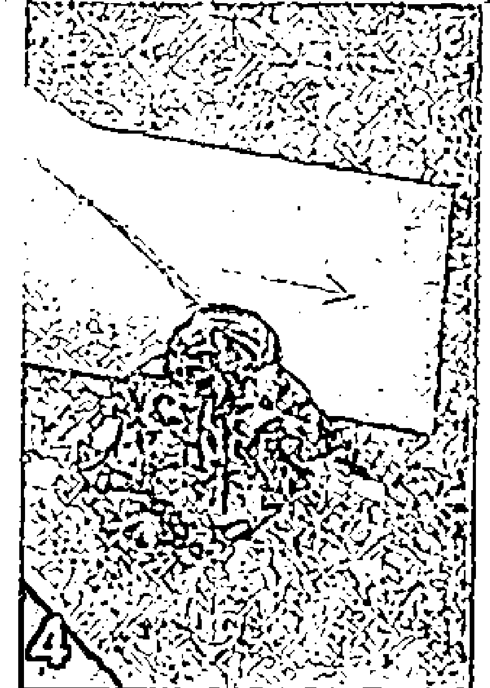

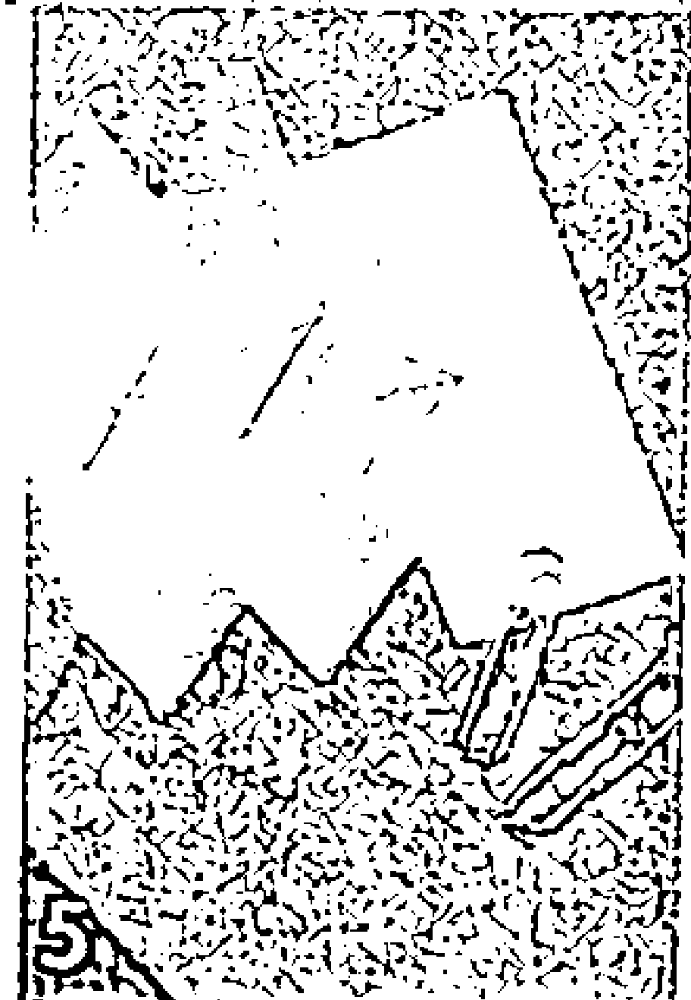

##### 如何施法

##### 所需工具與材料
- 2茶匙的水
- 3滴羅勒精油
- 3滴薄荷精油
- 1個精油用的燭火燃燒器
- 火柴或打火機
- 1根長6～8吋或15～20公分的紅色蠟燭
- 1根長6～8吋或15～20公分的黃色蠟燭
- 1張大約10 X 3吋或25 X 7.5公分的紙
- 1枝紅色墨水的鋼筆
- 2個迴紋針

施法時機 必須在逐漸月盈時進行，此時是與心中目標最接近的時候。而由充滿鬥志的火星所操控的禮拜二是施法的吉日。

##### 施法步驟
1. 根據第36到39頁的指示，設立結界。
2. 將水及精油都放入精油燃燒器中，點燃燭火。
3. 點燃紅色蠟燭說：「偉大的火星，為我射出命運之劍。」接著，點燃黃色的蠟燭說：「敏捷的水星，為我指引命運的方向。」
4. 在紙上畫出一個箭頭向右的橫向箭頭。
5. 將紙折成摺扇狀，使箭頭與箭尾之間距離最短，用迴紋針將摺紙扣住。
6. 將摺紙放入雙手中，並專心冥想欲達成的目標，接著唸誦以下咒語6次：「命運之風，載著我的未來，飛翔之箭，帶著我更加前進。」最後將摺紙放在安全的地方即可。

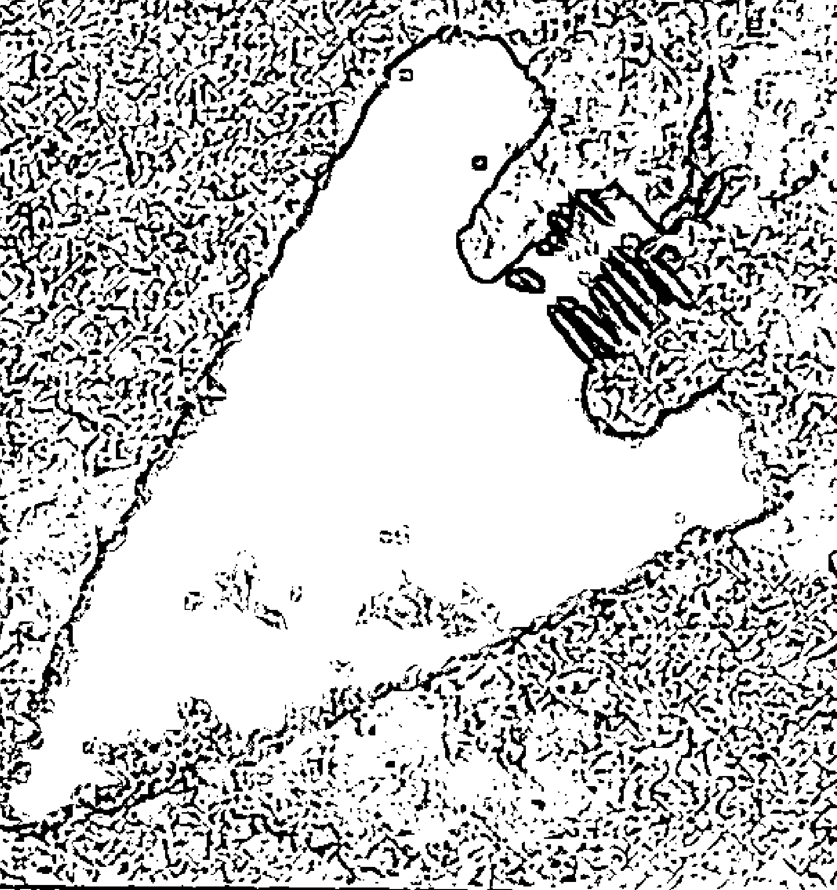

### 蒲公英護身符
#### 在工作場合或學習環境中獲得他人注意

【目的】幫助在職場或學校中被忽略的人。本魔法可幫助吸引他人注意、廣結朋友並且讓你變得更加受歡迎。

【魔法背景】蒲公英或藥用蒲公英乾根有許多與草藥和魔法有關的傳統與歷史。因為草藥學家所熟知蒲公英的利尿特性，所以有時候蒲公英也被稱為「尿床花」，除此之外，蒲公英葉子的高營養價值以及解毒功能也廣為人知。在魔法的傳統中，認為若是將蒲公英的黃花與全裸的人體摩擦，則此人無論走到何處都將大受歡迎。這個信念可能是來自於蒲公英的花精靈傳說，認為蒲公英花精靈可以賜給人們「能言善道」的口才。

這個護身符是幫助那些在職場或教室中被忽略的人，可以藉此吸引同事或上司的注意，在別人眼中變得更耀眼。若使用本魔法之後，建議搭配每日飲用蒲公英花茶可以幫助你增加自信心。蒲公英會驅逐自閉害羞的個性，而花茶滾燙的表面則可以幫助你釋放出憤怒和受傷的情緒。就這方面來看，蒲公英是一種能影響心理想法的食物。

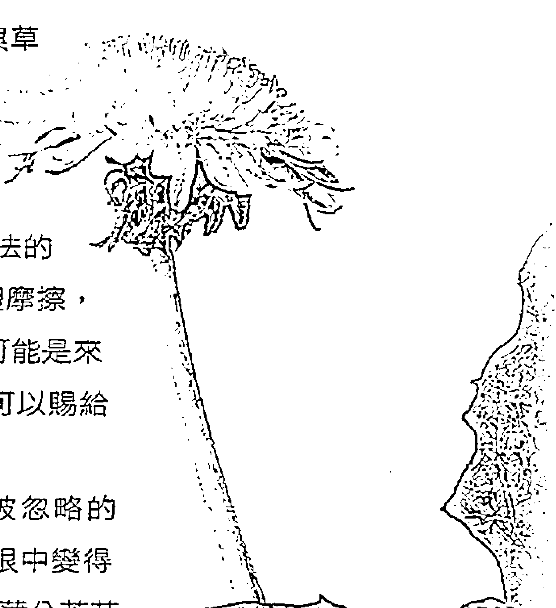

##### 如何施法

施法時機 在逐漸月盈時進行以吸引注意，並應於太陽星所保祐的禮拜天施法。

##### 施法步驟
1. 設立結界時需全裸。
2. 根據第36到39頁的指示，設立結界，並點燃小蠟燭。
3. 將蒲公英放入雙手中，想像一個最近很想被注意，但是卻遭到忽略的事件。然後，於腦中再重建一次現場，這次必須是正面的結果。
4. 把蒲公英放在乾酪布上，再放上檸檬葉，接著滴入6滴稀釋過的精油。然後以緞帶將乾酪布綁緊。
5. 點燃2根蠟燭，並說：「屬於太陽的神力，請愛護我；屬於太陽的花朵，請保佑我。」接著，將做好的乾酪布香囊擦拭全身，避開眼睛及皮膚較脆弱的部位。
6. 將香囊帶到工作的地方。回到家後，在澡盆中滴入6滴稀釋的精油浴洗，往後每日沐浴皆需如此，直到將所有混合稀釋的精油用光為止。

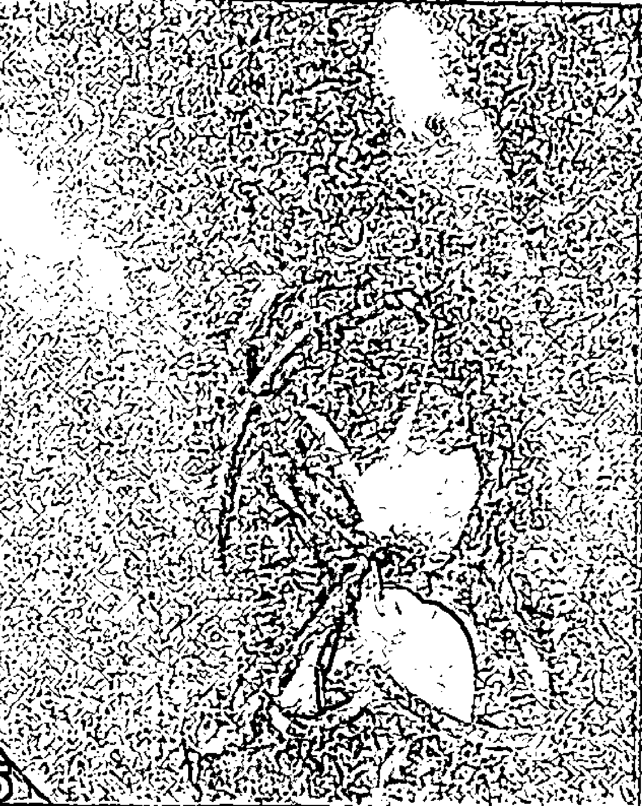

##### 所需工具與材料

| 材料 | 數量/規格 |
|---|---|
| 小蠟燭 | 1個 |
| 火柴或打火機 | - |
| 新鮮的黃色蒲公英 | 6朵 |
| 乾燥還留有檸檬味的葉子 | 1把 |
| 香蜂草精油 | 6滴，並加入60滴杏仁基底油稀釋 |
| 方形乾酪布 | 1張邊長6吋或15公分 |
| 黃色緞帶 | 1條長12吋或30公分 |
| 黃色蠟燭 | 2根長6~8吋或15~20公分 |

### 芝麻魔法
#### 移除事業上的障礙

【目的】幫助在事業發展上似乎有所阻礙的人。

【魔法背景】如果你曾經想要在事業上獲得成功，但卻在半途中遭遇突如其來的阻礙而失敗，這個魔法就正好適合你。本魔法可以幫你釋放出被封鎖的潛能，而且是以更戲劇化的形式來達成目標—直接破壞阻擋的障礙。芝麻籽象徵發現與出路，可以對你的目標有所幫助。

本魔法中所使用的元素還包括烽火，這是一種為了魔法而起的火，所以本魔法的第二部份必須於室外進行。烽火必須由一般天然的燃料—乾柴與火種所組成，千萬不要意圖再去使用其他人造的燃料，如汽油或木炭。而若要在烽火中加入其他的元素，必須注意保持火焰的安定，這樣才能確保控制烽火燃燒與熄滅的時機。因此，你必須要在火焰溫度最高的時候，才能丟入其他元素。

##### 如何施法

##### 所需工具與材料
- 12粒芝麻籽
- 水
- 1個12格的冰塊製冰皿
- 1束乾燥的白色鼠尾草
- 火柴或打火機
- 1個防火的盤子
- 1根長6～8吋或15～20公分的黑色蠟燭
- 2茶匙的芝麻油
- 1束乾燥的花園雜草
- 乾柴與火種

施法時機 必須在逐漸月虧時進行才可摧毀阻礙，並且於象徵破壞的土星所操控的禮拜六施法。

##### 施法步驟

在施法之前，將12粒芝麻籽分別放入12格的冰塊製冰皿中加水冷凍。

1. 根據第36到39頁的指示，設立結界。
2. 點燃鼠尾草葉子的一端，讓它自然悶燒。將燃燒中的鼠尾草以順時鐘的方向繞著結界走，讓燃燒的煙霧可以劃過整個結界。然後將鼠尾草放在防火的盤子上。

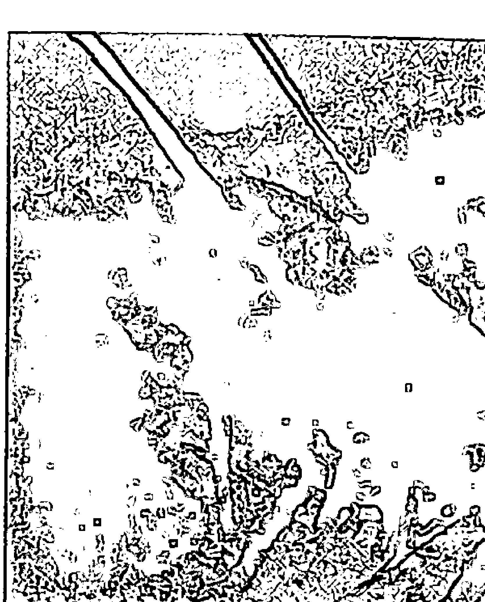

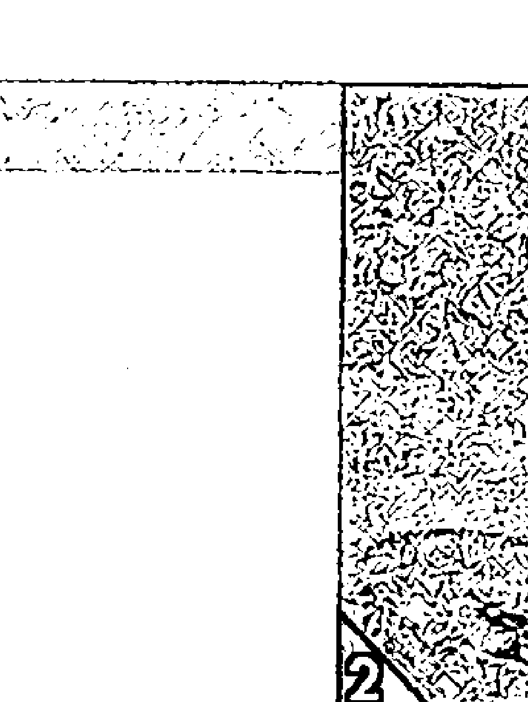

3. 由下而上在蠟燭上塗滿芝麻油，避開燭蕊。之後將蠟燭立在燭台上點燃，此時要說：「障礙的破壞者，請淨化這個火焰，並施展你的魔法，將所有的阻礙消滅。」

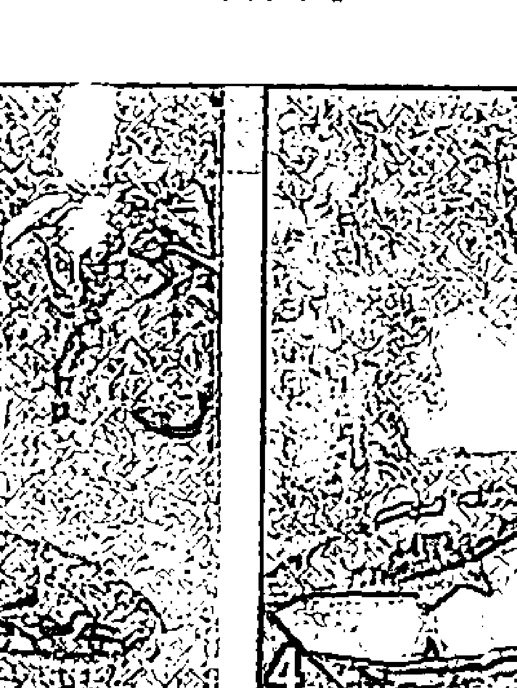

4. 結束結界，帶著製冰皿、雜草、鼠尾草和燃燒的蠟燭到室外。用燃燒的黑色蠟燭點燃乾柴與火種，等到火焰的溫度達到最高時，將雜草丟入火焰中，並說：「所有的障礙都離開，隨著燃燒的煙霧消失吧！」接著，將冰凍的芝麻籽冰塊丟入火中，讓冰塊馬上融化。
5. 以逆時鐘的方向將悶燒的鼠尾草煙霧，在烽火外圍繞圈通過3次，然後再把鼠尾草丟入烽火中。
6. 讓黑色蠟燭被安全地燃燒殆盡。

### 打火石魔法
#### 為事業帶來靈感

【目的】適合在工作或學業中尋找靈感的人。

【魔法背景】你也許會聽過這樣的說法，俗語常形容靈感就像「被雷劈到般的電光火石」。本魔法便是以這樣的背景出發，並且同時召喚偉大的非洲女神歐亞（Oya），歐亞是掌管雷電的女神。她被認為是激烈狂熱的神祇，所以向她所召喚出來的恩惠與力量都是強大而令人無法忽視的。

要施行本魔法，則必須外出到花園、社區公園或是綠地之中，才可以找到所需要的特殊材料。這項材料就是太陽底下燒燙的石頭，這顆石頭必須要夠小，小到可以剛好放入口袋或皮包中；同時也必須要圓滑沒有棱角，才能被完全地握在手中。這個石頭也必須至少有一邊是平坦的，如此你才能在上面畫下需要的象徵符號。用你的直覺來選擇這個石頭，如果它握在你手裡的感覺很棒，那很明顯地就是它了。

本魔法所需要的塗料，在大部分的美術社或模型工藝店中，即可找到。

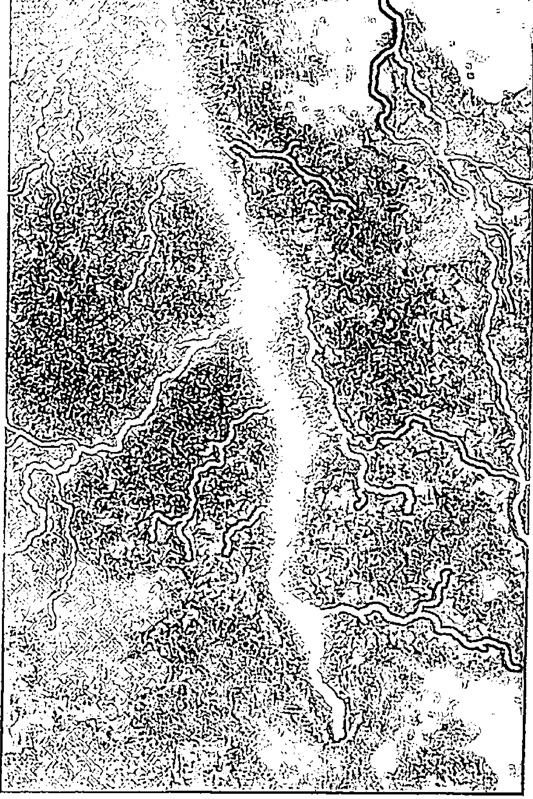

##### 如何施法

施法時機 在逐漸月盈時進行，來迎接靈感。一個禮拜中任何一天皆可，但要避開象徵限制的土星所掌管的禮拜六。

##### 施法步驟
1. 點燃木炭，接著將乳香與準備的精油混合。
2. 根據第36到39頁的指示，設立結界。
3. 將混合的乳香與精油，灑在木炭上。
4. 點燃蠟燭說：「我召喚你，歐亞！閃電的神祇，雷火的女王，帶給我所渴望的火花吧！」
5. 用畫筆和顏料在石頭上畫出一個火焰的輪廓，於輪廓中央再畫上垂直的閃電線條。將畫好的石頭穿過木炭的煙霧，再穿過蠟燭的火燄，然後握在手中，並說：「以歐亞之名，無論熟悉或陌生，我將在其法力下，尋找到靈感。」
6. 在腦中想像閃電劈到你手中的石頭上，並將能量劈入石中，然後結束結界。當顏料風乾後塗上亮光漆，將象徵符號封印其中。之後每當你需要靈感時，緊握住這顆石頭來召喚火花。

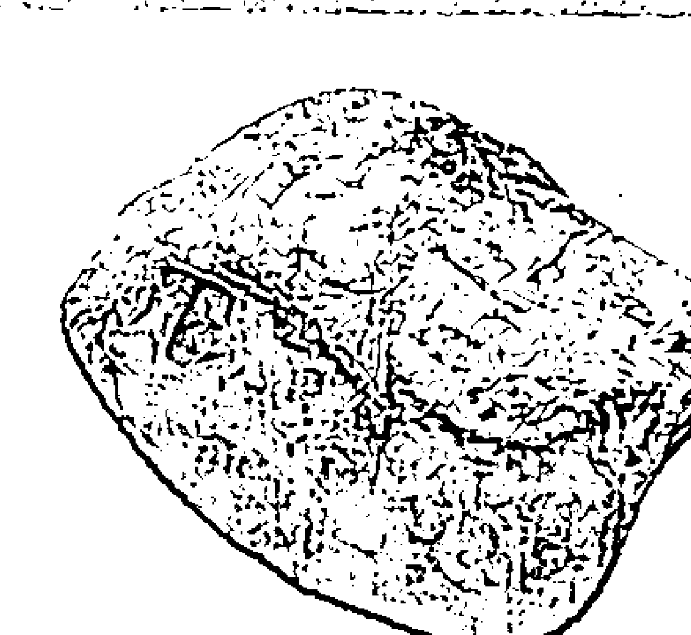

##### 所需工具與材料
- 1個放在香爐或防火盤的木炭
- 火柴或打火機
- 1茶匙的乳香（一種膠質樹脂，採自東非、阿拉伯等地的乳香樹，用作祭祀儀式等場合燒的香料。）
- 3滴生薑精油
- 6滴肉桂精油
- 1根長6～8吋或15～20公分的紅色蠟燭
- 1顆石頭
- 1枝美術專用筆刷
- 1條紅銅色的油畫顏料
- 1瓶亮光漆

### 銀蠟燭魔法
#### 幫助職場上以及學業上所需要的機智

【目的】幫助你在學業上及職場上更快地凝聚起應有的智慧。

【魔法背景】在資訊爆炸的時代能很快地篩選、吸收重要的資訊，並且做出及時的判斷，這是非常重要的。忙碌的生活方式需要明快的速度來反應，因此保持急智與靈敏對現代人來說可是非常重要的。而也這和過去祖先們冒險採集草藥與果實並且注意避開大型的狩獵動物時所需要的急智是一樣的。本魔法可以幫助開發你在學習環境與工作環境中所需要的機智。

本魔法主要在召喚莫丘利（Mercury，是個商業神及雄辯家），這位敏捷先知的力量。英文Mercury也是水星及金屬汞的意思，汞又叫作水銀，都是依這位神聖的莫丘利先知所命名。水銀的英文亦稱為quicksilver，前面的quick是代表活潑的意思。水銀最著名的就是它易變得特質，在不同的溫度中，水銀可以任意擴大與縮小，也可以隨著倒入的容器不同，變化出不同的形狀。而這種易變得特質，正好與水星是傳播能力的守護神有關，也完全符合本魔法的需求。因為我們必須在快速變動的世界中保持很強韌的適應力和彈性，如此才能在職場或學業中有效率地吸收、選擇並且分析資訊，進而有效地進行。

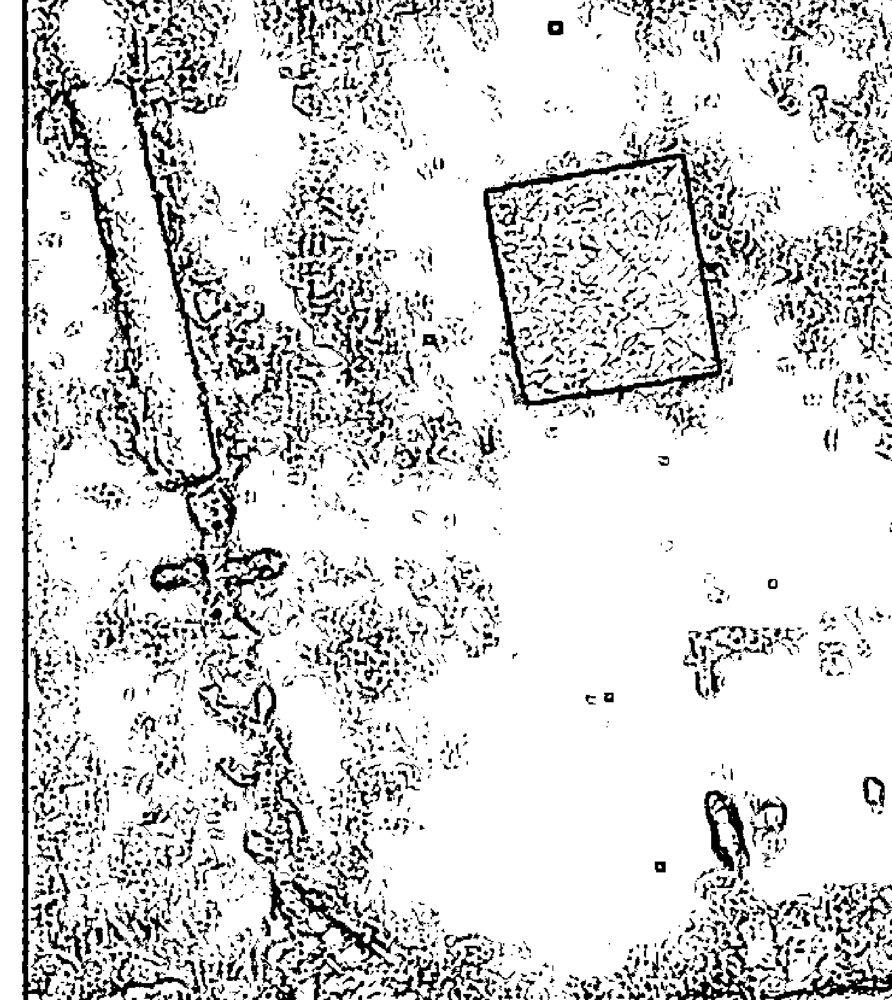

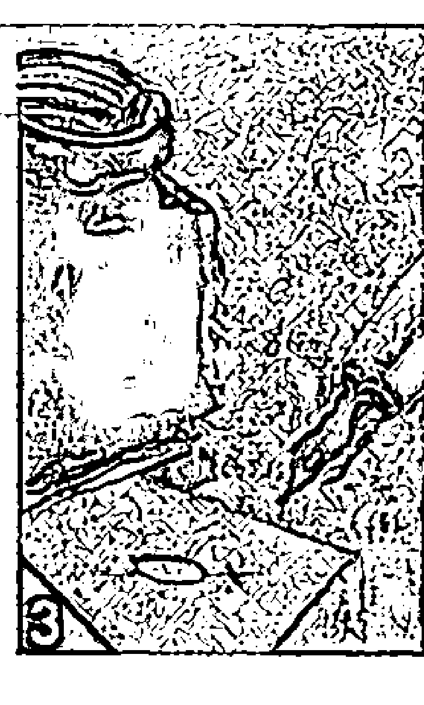

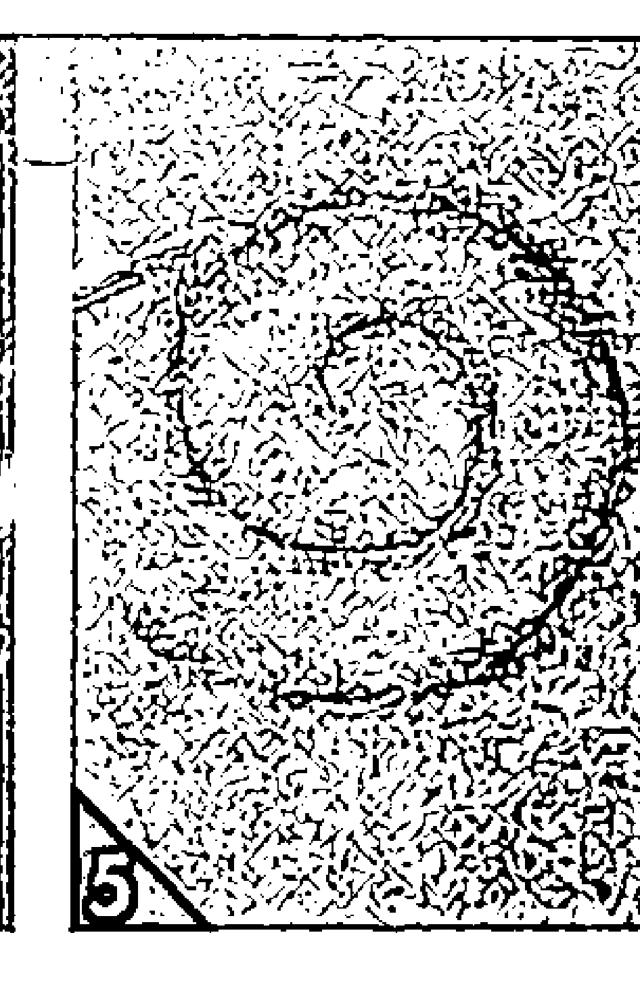

##### 如何施法

##### 所需工具與材料
- 1根長6～8吋或15～20公分的銀色蠟燭
- 火柴或打火機
- 1張6 x 6吋或15 x 15公分的正方形黃色紙張
- 1枝黑色墨水的鋼筆
- 1條容易塗抹的強力膠
- 1罐銀色小亮片

施法時機 在逐漸月盈時進行，以吸引機智的到來。須於水星所操控的禮拜三施法，庇祐魔法的成功。

##### 施法步驟
1. 根據第36到39頁的指示，設立結界。
2. 點燃銀色蠟燭說：「踏著銀鞋跟的莫丘利，請讓我跟上你靈敏的步伐，賜給我迅速的判斷、與敏捷的機智。」
3. 在黃色紙張的4個角落，塗上莫丘利的象徵符號（與維納斯的符號相同，先畫一個圓圈，於圓的上方再加上一個「角」，模似十字，如圖3）。
4. 從紙的中央開始，用筆向外畫出一個螺旋。接著，沿著畫好的螺旋線條，從外向內均勻的塗上膠水。
5. 把銀色亮片灑在紙上，使其沾於膠水中，等待數秒後，把多餘的銀色亮片從紙上倒掉。將紙張放在燈燭旁，讓膠水完全風乾。
6. 將這張銀色螺旋，懸掛在你最常思考的地方來代表莫丘利與機敏的智慧。

### 薰香魔法
#### 在職場或教室中溝通你的想法

【目的】確保你在工作上或教室中的意見獲得支持。

【魔法背景】在魔法上，氣元素與溝通的關係是非常密切的。本魔法便是要幫助你的想法能被別人所接受，其中薰香與氣元素則是幫助你的意見被執行。薰香會產生煙霧，使我們能暫時看到氣元素，另外薰香所散發的香氣，也同樣會讓我們感受到氣的存在。本魔法中的薰香製作配方，同時包含象徵的特質以及心理的益處。代表水星的象徵物薰衣草所散發出的氣味可以讓人安神放鬆，也能讓吸入者更加地辯才無礙，同時善於接受他人的意見。安息香在藥草或薰香中是象徵氣的代表，這會在職場上或教室裡帶來正面的效果，進而產生合諧與共鳴。松木是象徵氣的樹木，它的氣味會刺激引發某種程度的注意力，讓旁觀者對普通平凡、及下意識的訊息會更加警覺留意。

##### 所需工具與材料

| 材料 | 數量/規格 |
|---|---|
| 1個放在防火盤上的木炭 | |
| 1根長6～8吋或15～20公分的黃色蠟燭 | |
| 火柴或打火機 | |
| 2茶匙安息香粒 | |
| 1茶匙松針 | |
| 1茶匙乾燥的薰衣草 | |
| 搗杵與研缽 | |
| 3滴松木精油 | |
| 3滴薰衣草精油 | |

施法時機 必須確保在逐漸月盈時進行，如此才能鼓勵溝通的暢通，並應於由水星所操控的禮拜三施法。

##### 施法步驟
1. 根據第36到39頁的指示，設立結界。
2. 想像有一圈亮銀色的圓，圍繞這個結界。
3. 點燃木炭說：「召喚氣元素，請見證並賜予我魔法能量。」
4. 將所有準備好的乾燥材料，全部倒進研鉢中仔細搗碎，使裡頭材料大小一致，並說：「赫米斯之花、松木之葉，請帶著我的言語，傳入他人的耳中。」接著，把精油全部倒入鉢中混合。
5. 將些許薰香料灑入燃燒的木炭中。閉上你的雙眼，想像你的言語隨著空氣奔流，並藉著氣元素的羽毛，使言語更加有力。想像受到影響的人或可敬的對手，都對此有正面的反應。
6. 將剩下的薰香料，放入密封的袋子中，以便未來使用於溝通魔法上。當你希望溝通能力可以得到多方面提升時，把香料裝入小香囊中，並隨身掛在脖子上即可。

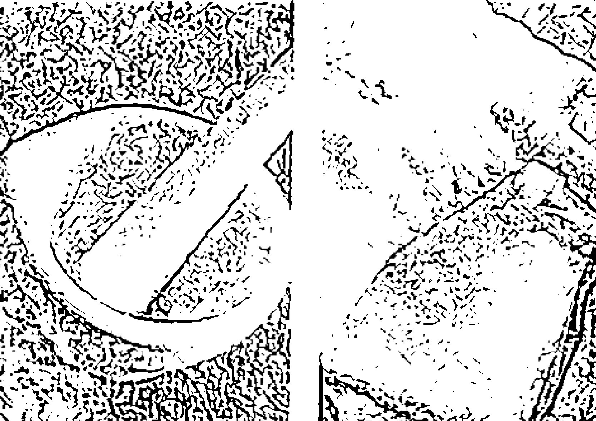

> (註)【希神】赫米斯（眾神的使者，司掌商業、科學、奸詐、雄辯等的神；被描繪為頭戴有翼帽子和腳登有翼草鞋的樣子；相當於羅馬神話中的Mercury）

### 貓頭鷹護身符
#### 增加寫作能力

【目的】增進寫作能力，並幫助文字溝通更加地順暢、更具效果。

【魔法背景】在現代社會中，除了考試能力外，也需要許多其他的技能。這點我想只要是雇主與老師都會非常贊同，人際關係、負責任以及自我管理等，也都是成功的員工或學生必須具備的重要能力。在所有需要學習的能力中，最重要的就是溝通能力，這表示無論是在文字溝通與口語溝通，都必須要有相當的自信與競爭力才行。

本魔法主要在召喚希臘女神雅典娜的能量，雅典娜是專司智慧、學習、溝通與寫作的守護神。她的代表圖騰就是一隻貓頭鷹，而貓頭鷹是典型代表智慧的象徵，因此有時候會以「貓頭鷹的才能」，來形容出色的寫作天份。本魔法中的護身符，必須要使用到真正的貓頭鷹羽毛，並且必須是自然脫落的。你可以到鳥禽中心或鳥獸禁獵區，尋求相關人員的協助。

如果真的非常煩惱自己粗劣的寫作技巧，可以到社區大學報名基礎寫作班，本魔法可以幫助在學習過程中自然而然地幫助你，讓你對寫作工作能夠更加地專心。

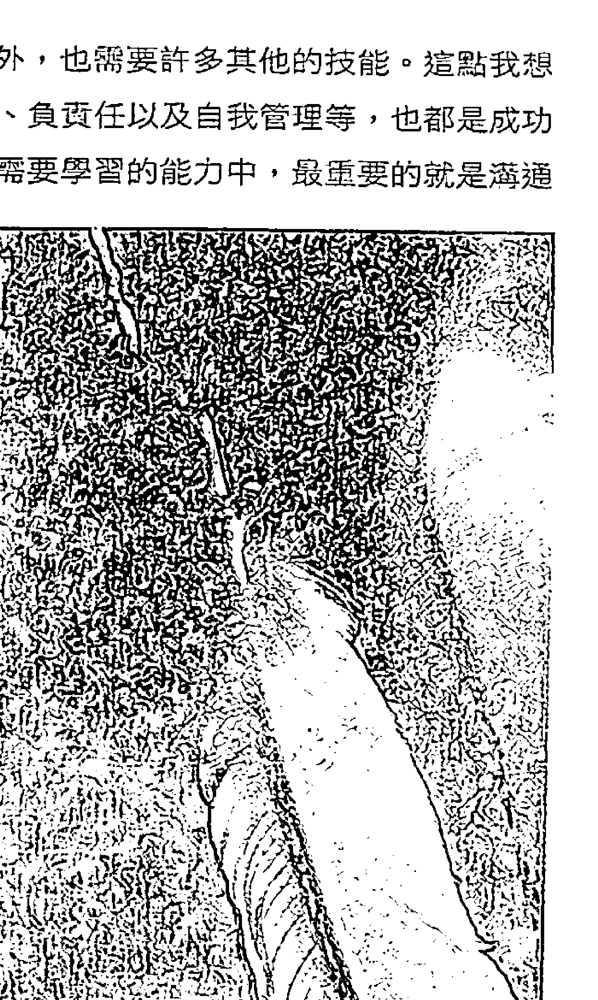

##### 如何施法

施法時機 在逐漸月盈時進行，以增加寫作的能力，並在水星之日禮拜三施法。

##### 施法步驟
1. 根據第36到39頁的指示，設立結界。
2. 分別點燃3支蠟燭，並依序說：「我點燃這把火焰，向智慧致敬」、「我點燃這把火焰，向學識致敬」、「我點燃這把火焰，向寫作天份致敬；望此後三者將為我所有。」
3. 用寫字的手握住羽毛，用另一隻握住石頭，並想像自己的寫作能力，得到上司或老師的認同。
4. 將羽毛拿到蠟燭前方，並說：「願雅典娜了解我的想法，讓思考飛躍紙間。」接著，同樣將石頭拿到蠟燭前方，並說：「願雅典娜明白我的心思，將思緒化做文字。」
5. 將石頭放入抽繩袋中並繫緊，用刺織粗繩將羽毛牢固的綁在抽繩袋旁。
6. 在抽繩袋上加綁一條細繩，使可懸掛。將抽繩袋懸掛在最常寫作的房間中即可。

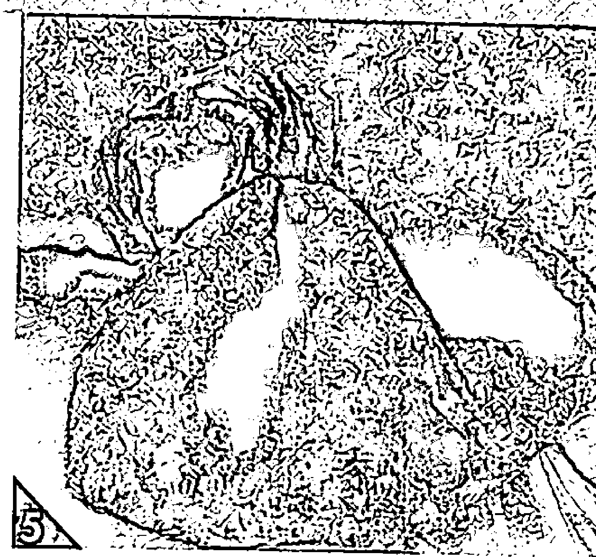

##### 所需工具與材料
- 3根長6～8吋或15～20公分的黃色蠟燭
- 火柴或打火機
- 1根貓頭鷹羽毛
- 1個拇指大小的平滑白色石頭
- 1個棕色小抽繩袋
- 1條長30吋或75公分的棕色刺織粗繩
- 1條長30吋或75公分的細繩或皮條

### 鼠尾草魔法
#### 幫助口語溝通

【目的】賜與既清楚又具說服力的溝通天份。

【魔法背景】這個魔法和愛爾蘭的布拉尼石有異曲同工之妙，傳說若是親吻這塊石頭就會變得能言善道，並且說出令人陶醉的言語。鼠尾草 (Clary Sage)拉丁學名又稱作 Salvia sclarea，是本魔法最主要的材料，可以帶來智慧與清楚表達的能力，而兩者剛好皆是優秀口語溝通的要素。鼠尾草也常被當作草藥使用，可以增加自信及幫助洞察力。

許多古文化都會特別突顯那些口才能力佳的人，特別是那些必須靠著說書人、流浪詩人、牧師及女祭司才能夠流傳下來的傳統文化。凱爾特族對說話技巧及能言善道的能力就特別地崇敬，就像在傳說中，聖·派翠克能用他辯才無礙的口才，讓異教傳教者或參事啞口無言，甚至說服他們轉而皈依基督教。另外，讓企業著迷的優異口條常被認為是屬於精靈的天賦，而被認為是「優異的人種」。從這些流傳悠久的信仰可以看出，在許多傳統中，流利的口才一直被視為非常重要的能力。

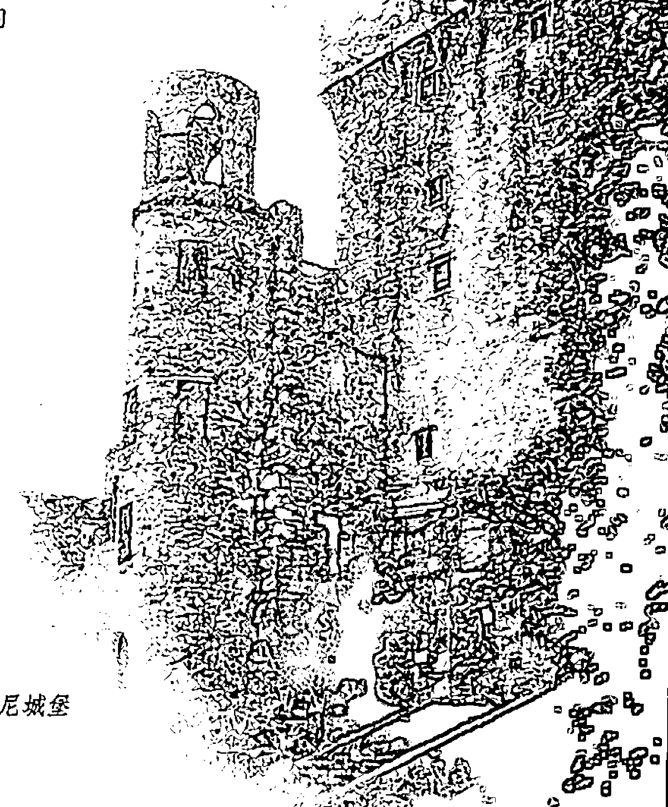

> (註) 聖派翠克 St. Patrick是一名基督教傳教士，他在4世紀時來到愛爾蘭，一方面帶來了基督教，也帶領愛爾蘭經歷一連串的蛻變，蠻荒的時代可以說是在St. Patrick的教導下結束，所以St. Patrick一直被愛爾蘭人視為愛爾蘭民族的象徵。

##### 如何施法

##### 施法时机
逐渐月盈时和月亮之日礼拜一，是最佳施法时机。

##### 施法步骤
1. 根据第36到39页的指示，设立结界。
2. 点燃木炭与蜡烛说：「古老的力量、月神的力量，请赐给我不会伤害任何人的出色的口才吧。」
3. 在木炭上洒下一些檀香焚香，接着丢入3片鼠尾草叶片，并说：「以此献给古老的力量。」
4. 拿出另外3片鼠尾草叶，以缝线绑好固定住，放于蜡烛之下说：「以此献给伟大的月神。」
5. 再拿出最后的3片鼠尾草叶，放到杯子中，倒入1茶匙的蜂蜜，接着倒入滚烫的热水，并说：「以此献给我自己。」当杯中的水完全冷却后，一口气将它喝光，并把杯中的3片鼠尾草叶，埋入屋外的土中。
6. 下一个满月来临时，将之前用缝线绑住的鼠尾草，拿到屋外满月下并亲吻鼠尾草叶，最后将其丢入自然水源中，越快越好。

##### 所需工具与材料
1个放在防火盘上的木炭
1根长6～8吋或15～20公分的银色或白色蜡烛
火柴或打火机
檀香木焚香
9片鼠尾草叶子
1条长18吋或45公分的黑色缝线
1茶匙的蜂蜜
1杯250毫升的滚水

暮雪的藏书阁

### 平衡精油魔法
#### 促进办公室的合谐
【目的】帮助办公室创造更合谐融洽的气氛，特别是在同事间有争吵的时候。
【魔法背景】当周遭工作环境失去平衡时，自己也会开始失去平衡，甚至连累到家庭的和睦，尤其是同事间的争吵已经无法控制时，常常会波及到其他无关的人。就算你很聪明，总能让自己不被卷入争吵当中，但是办公室的低气压也会对你造成影响，这时候便可以利用魔法来帮助恢复同事间的合谐。

本魔法所调制的魔法药水，便能够帮助让事情稳定下来并且恢复办公室的宁静。你和同事将都受惠于这麽安宁的气氛，而成为双赢的局面。但若争吵的引发，是因为受到恶意的欺侮，那么我建议这时候应该要对公司的寻人反应，或是寻找其他同事的协助。本魔法主要在帮助让争端冷却下来，不过是帮助那些有道理、有立场、且有所准备的人，确保他们能顺利找到正确且实用的解决之道。另外，在施完魔法后，记得要定期照顾魔法中所设立的盆栽。

##### 如何施法

##### 所需工具与材料
* 1根长6～8吋或15～20公分的绿色蜡烛
* 火柴或打火机
* 5片老叶
* 5滴檀香木精油
* 5滴甘菊精油
* 5滴伊兰花精油
* 4根消毒过的滴管
* 1个消毒过的空精油瓶
* 1张4吋X 8吋或10公分X 20公分的干酪布，需缝成小袋子状
* 1条长12吋或30公分的白色线
* 1根针

施法时机 在逐渐月盈时进行效果最大，并应于象征合谐的金星之日－礼拜五施法。

##### 施法步骤
1. 根据第36到39页的指示，设立结界。
2. 点燃蜡烛，将5片老叶拿到烛火前，并说：「前辈将会带来保护，爱将会指引我的方向。」
3. 将5滴梔香木精油滴入空精油瓶中，说：「敌对，驱散。」再滴入5滴甘菊精油，说：「合谐，降临。」最后再滴入5滴伊兰花精油，说：「争吵和平落幕。」
4. 取出3滴混合的精油，滴在5片老叶上，再将其中一片缝入干酪布中。
5. 将另外4片老叶，放在办公室的4个角落，并且必须随身携带缝有老叶的干酪布坠，让合谐的气息可以随时向外散发。
6. 等到气氛慢慢缓和后，把5片叶子全部埋入盆栽中，而盆栽必须摆放在办公室里。

【警告】有特殊疾病或是怀孕妇女要特别注意，本魔法中所使用的精油可能会对身体造成不良影响，使用前请先征询医师的意见。

### 灰烬之圆魔法
#### 保护并严防来自于同事的忌妒或刁难
【目的】提供防护，避开职场上的捣乱者。
【魔法背景】同事间引发的讨厌行为，尤其是那些无法证实或约束的小动作，可以让办公室变成如同炼狱一般。本魔法可以帮你抵挡那些恶劣的行为，也可让那些讨厌的小动作无法如愿成功。

经验丰富的魔法师都知道灰烬之圆具有保护的功效。壁炉的炭渣和灰烬是燃烧后的菁华，象征有火的保护以及壁炉般坚硬的防卫。在本魔法中有两种灰烬之圆，一个代表现在的情势，另一个则代表未来改善后的情况。这两个圆分别是灰烬本身的保护能量和灰烬上头的保护能量。

后者是来自于一个概念，就是当一个物质被烧尽后，它原本所象征的意义，便会被浓缩加强在灰烬上头。举例来说，如果你燃烧了一个恶毒者的木偶或肖像，则燃烧后的灰烬，便会包含那个人所有的恶毒特质。如此一来，这些恶毒特质，最后便会和这些灰烬一样，烟消云散不复在。

最后要提醒一点：魔法是必须与一般常识与智慧一同使用的，如果你已被欺骗，则应该在施法之前就该寻求建议与帮助。

##### 如何施法

施法时机 在逐渐月亏时进行，以压除恶行。应于象征严守纪律的土星之日一礼拜六施法。

##### 施法步骤
1. 根据第36到39页的指示，设立结界。点燃两根蜡烛。
2. 手上拿着石英晶石说：「我命你为(自己的名字)。」将石英放在镜面上。
3. 在一张纸上，画上职场扰乱者的大概样貌，接着用黑色蜡烛将纸点燃，放入防火锅炉中完全燃烧。将燃烧后的灰烬，以石英晶石为中心，围成一个圆，并说：「邪恶将亡，正义重生，你将于此地从此消失。」将灰烬吹走。
4. 在另一张纸上画上一只眼睛，用白色蜡烛将纸点燃，放入锅炉中完全燃烧。
5. 把锅炉中的灰烬洒在地板上，形成一个圆，接着踏入圆中间说：「如同竖立于圆内般，我将永远获得保护。」
6. 将石英晶石放入布袋中绑紧，并摆放在稳固安全的地方。

##### 所需工具与材料

| 工具与材料 |
| --- |
| 1根长6～8吋或15～20公分的白色蜡烛 |
| 1根长6～8吋或15～20公分的黑色蜡烛 |
| 火柴或打火机 |
| 1颗石英晶石 |
| 1面小镜子 |
| 1枝铅笔 |
| 2张纸 |
| 1个防火锅炉 |
| 1个小抽绳袋 |

### 塔罗牌魔法
#### 在职场中招来一位良师益友
【目的】帮助在职场上变得良师与贵人。
【魔法背景】经验总是值得聆听吸取的，若是在工作上得到具影响力前辈的有效建议或是好感，都会对你的事业大有帮助。本魔法便是使用历史悠久的塔罗牌智慧来帮助你获得良师和贵人的注意。
在塔罗纸牌中，与指导者有关的就是人头牌，即描绘有国王、皇后、杯子、剑、和五芒星的纸牌。在施法之前，必须要在以下的纸牌中，先找到一个适当的指导人选特质，其中皇后是代表女性指导者，国王则代表男性指导者。
旁边有五芒星的国王或皇后会给予你财务方面的正确建议。
拿有杯子的国王或皇后，会给予富创意的意见和建议，特别是针对艺术、科学、和旅游的领域。
拿着权杖的国王或皇后会帮助沟通，特别是针对教育、新闻或商务的环境。
拿着宝剑的国王或皇后会提供一针见血及敏感的优秀见解，特别是在法律或保险的领域，也可以提供事业提升的相关建议。

##### 如何施法

##### 所需工具与材料
1个精油用的烛火燃烧器
2 茶匙水
6滴缬草精油
1根长6~8吋或15~20公分的深蓝色蜡烛
火柴或打火机
1张塔罗牌
1枝蔷薇
1面可直立的镜子

施法时机 在逐渐月盈时进行，用以招来良师益友。须于象征慷慨丰饶的木星所操控的礼拜四施法。

##### 施法步骤
1. 根据第36到39页的指示，设立结界。
2. 点燃精油燃烧器，并接着将精油和水放入燃烧器中。
3. 点燃蜡烛说：「神圣的木星，我召唤汝，请为我带来丰富的建议。」
4. 选一张牌，将牌面背对镜子，让牌面和镜面都朝向你。
5. 将蕊绫穿过精油的香气中，并说：「带来公正的言语。」接着，将蕊绫穿过蜡烛的火焰，并说：「带来确实的忠告。」将蕊绫放在塔罗牌前方，并说：「慷慨的老师与智慧，请以友善之眼看顾我，在下个月亮降落时，找到我并给予最真诚的忠告。」
6. 将塔罗牌放在镜子前，持续一个月亮周期或直到良师出现为止。

### 常春藤魔法
#### 让新生意或事业获得成功
【目的】保护新的生意与事业，并且保佑其未来的成功。
【魔法背景】本魔法为新的事业提供庇祐与保护，并帮助促进未来成功的机会。本魔法使用的常春藤也是凯尔特族所说的勾特(Gort)，象征保卫与持久，而两者刚好都能帮助新事业的长久经营。常春藤是生长快速的植物，而且附着力很强，可以在许多阻碍中找到出口与生长的方向。任何经过常春藤的能量所庇祐的案子，一定可以发现它所带来的益处是非常受用的。

虽然开创自己的事业是非常令人兴奋的，但也常让人缺乏安全感，尤其当这个事业能决定你成败的关键，则会更加地令人不安。为自己工作可以让人在这个世上开创属于自己的道路，但它所带来的责任与风险也是在之前的工作经验中所无法体会的。而利用本魔法除了可以保护并促进事业的进展，也可以帮助消除疑虑及稳定新手经营者的心神。为了让魔法的功效能发挥到最大，必须在满月前的7个夜晚逐一燃烧杜松莓，并将常春藤稳固的盘绕在床柱之上。

##### 如何施法

施法时机 在逐渐月盈时进行，可以招来成功，并建立保护与持久，并于吉祥的木星之日一礼拜四中施法。

##### 施法步骤
1. 根据第36到39页的指示，设立结界。
2. 点燃木炭，接着点燃蓝色蜡烛说：「命运女神福耳图那，请对着你的子民微笑。」再点燃绿色蜡烛说：「长青女神艾丝，请对着我的事业微笑。」
3. 把杜松莓丢入木炭中燃烧。
4. 将花楸细枝穿过木炭烟雾中，并说：「坚定不摇并纯净、毅力持久并常存。」
5. 把常春藤由下而上、再由上而下的缠绕在花楸细枝上，然后再将缠绕常春藤的花楸穿过烟雾，并说：「长存、长存、长存。」
6. 将绕着常春藤的花楸放在蜡烛的前方，并用双手将木炭的烟雾，搧往自己心的方向，并说：「看守并保护我，并勿伤害任何人。」

##### 所需工具与材料
- 1个装有木炭的防火盘
- 1根长6～8吋或15～20公分的深蓝色蜡烛
- 1根长6～8吋或15～20公分的绿色蜡烛
- 火柴或打火机
- 2茶匙干燥的杜松莓
- 1根8吋或20公分有岔枝的花楸细枝
- 1条约长24吋或60公分的野生曲扭常春藤

### 磁铁魔法
#### 吸引顾客上门
【目的】为你的新事业招来顾客。本魔法只能为基本需求而施法，不会因贪婪而产生作用。
【魔法背景】若是发展出的订购商品无法获得顾客的青睐而滞销，实在是令人万分沮丧，对于生意的杀伤力也很大。本魔法便是让潜在客户注意到你的生意或商品，进而使顾客上门。至于其他的部份，则必须靠你自己，包括商品好坏或服务等，不过至少能让顾客进门，就已经算是踏入成功的门槛。

本魔法是取自于古老的隐喻和象征。大家应该都可以了解蜜蜂寻蜜背后的象征，我们便希望顾客能如蜜蜂采蜜一般飞向你。大家一定也知道，蜘蛛网捕猎昆虫与磁铁的自然吸力原理，而这些也是本魔法所使用的象征原理。以上所有都是希望能吸引顾客的好奇心，当然实际上我们并不能「捕猎」顾客，但是却可以藉此提供对顾客有益的产品，并让你从中获利得以营生。

##### 如何施法

##### 所需工具与材料
- 2茶匙水
- 3滴薰衣草精油
- 1个精油用的烛火燃烧器
- 火柴或打火机
- 1根针
- 5个白色小蜡烛
- 1张6 x 6 吋或15 x 15公分的黄色方纸
- 1个小磁铁
- 1茶匙的蜂蜜
- 1张蜘蛛网

施法时机 在逐渐月盈的前期进行，并于商业守护神水星所主宰的礼拜三施法。

##### 施法步骤
1. 根据第36到39页的指示，设立结界。
2. 将水和精油放入精油燃烧器中，并点燃燃烧器。
3. 用针在所有的小蜡烛上，刻划上人型的火柴棒人。
4. 将小蜡烛摆放在纸上，围成一圈。将磁铁放在中央，并说：「我以北方的力量招引你向前。」将1茶匙的蜂蜜倒在磁铁上，并说「愿财富似蜜蜂飞向蜂蜜般朝我前进。」把蜘蛛网放在蜂蜜上，并说：「并像苍蝇飞向蜘蛛网般紧贴于上。」
5. 点燃所有的小蜡烛，并说「在此光明之中，水星能量之下，磁铁、网络、与蜂蜜将你层层包围。」
6. 当所有的小蜡烛烧尽后，将磁铁、蜘蛛网、蜂蜜包覆在纸中，藏在工作的地方即可。

### 扫帚魔法
#### 确保生意兴隆
【目的】帮助稳固的事业、生意更加地兴隆。
【魔法背景】扫帚是巫师最具代表性的象征，在好莱坞的劣质电影与历史的描述下常常可以看到扫帚的出现。扫帚的原本的意义其实非常地有趣，传统上扫帚是拿来划清界线，而非拿来飞行用的。在人行道和柏油路没有出现之前，人们会拿着扫把在自己家附近扫出自我领域。人们也会将扫帚放在前门门口来说明主人是否在家。

在本魔法中，扫帚是用来庇佑事业的版图，并且象征会继续毫无阻碍地飞行。其中气元素与土元素也被召唤出来，增加生意的交易频率与稳定性。

你必须购买一支魔法中所需的扫把，通常在知名的花卉中心可以买到。在施法后要注意，扫把必须放在客人进门的上梁处。

##### 如何施法

##### 所需工具与材料
- 1个装有木炭的防火盘
- 火柴或打火机
- 1茶匙安息香粒
- 1茶匙切碎的罗勒
- 1根长6～8吋或15～20公分的绿色蜡烛
- 1根长6～8吋或15～20公分的黄色蜡烛
- 1枝扫把
- 1束迷迭香
- 2码长麻绳
- 1条长12吋或30公分结有杜松莓的干燥藤蔓
- 6滴薄荷精油

施法时机 在逐渐月盈时进行以利成长，并于商业守护神水星所主宰的礼拜三施法。

##### 施法步骤
1. 根据第36到39页的指示，设立结界。
2. 点燃木炭，并洒入安息香与罗勒。
3. 点燃绿色蜡烛说：「土，请见证我的魔法。」接着点燃黄色蜡烛说：「气，为我传送魔法的力量。」
4. 将迷迭香围着扫把与扫帚的连接处，以麻绳将其缠绕于扫把上，接着念诵：「自土而生，随气而走，财富渐增，运行自若。」接着将麻绳绑紧，并将杜松莓藤蔓绕于其上。
5. 在扫把与扫帚上，涂满薄荷精油，接着将涂好的扫帚穿过木炭烟雾，来回3次，并说：「第一次赋予生命，第二次留下印记，第三次赐予庇祐。」
6. 将扫帚放在生意场所的门口即可。

### 旭日光芒符咒魔法
#### 让衰败事业命运重生
【目的】帮助重整逐渐失败的事业。
【魔法背景】看到自己白手起家努力建立的事业逐渐瓦解实在是非常令人沮丧的。有时候生意的失败是因为事先没有缜密的计划、适当的宣传或是足够的资金。但有时候生意开始走下坡则是因为市场局势超越了自己的掌握。如果后者是你的情形，并且已经尽力采取许多挽救措施，那么本魔法便可以帮助你拯救事业危机。

在魔法及许多占卜术中，如塔罗牌，太阳都是代表欢乐、幸福与成功的象征。而旭日光芒的象征符号是在一个圆圈之外围绕着有如锯齿般四射的光芒，这被以往的祖先用来象征神圣的庇祐。我们都相信太阳的保佑神力，就像在谚语中，要形容一个人非常幸运或努力有成，我们会说「幸运的光芒正照耀在他的头顶上」。

旭日光芒的符咒就是要吸引太阳的保佑力量来挽救你的事业。若是魔法成功后，则应该要将所得的一部份，捐给那些更可怜、更需要帮助的人。

##### 如何施法

施法时机 符咒需要在逐渐月盈时制作，这象征着不断地增加与进步，并在由太阳所主宰的礼拜日施法。

##### 施法步骤
1. 根据第36到39页的指示，设立结界。
2. 点燃木炭，并洒上乳香，点燃蜡烛说：「我召唤太阳无限的力量，照耀在我的事业（店铺／工作）上。」
3. 用金色锡箔纸盖上土盘，然后用笔尖很钝的笔，在锡箔纸上画出旭日光芒的符号。
4. 在旭日光芒的中央点出一个小点，在小点周围写上「保佑，太阳，事业」。
5. 将安息香、肉桂、硝石放入研钵中捣碎，并全数倒入木炭中，接着重复念着「保佑，太阳，事业」，并将旭日光芒符咒穿过木炭的烟雾中。
6. 将符咒挂在生意场所中央的最高点即可。

##### 所需工具与材料
- 1个装有木炭的防火盘
- 火柴或打火机
- 1茶匙乳香
- 1根长6～8吋或15～20公分的橘色或金色蜡烛
- 1个中间有洞的圆形陶土盘
- 1片盖住盘子的金色锡箔纸
- 1枝笔尖很钝的笔
- 1小撮的安息香
- 1小撮的肉桂
- 1小撮的硝石
- 捣杵与研钵
- 1条长30吋或75公分的细绳

# 健康、美丽与幸福的魔法
## 健康、美丽与幸福的魔法介绍
本章节的内容非常广泛，包含许多关于健康、外貌与幸福的相关主题。在这里健康是代表生理和心理的健全，并不单指没有病痛而已。同样的，幸福也必须与内在合谐及平衡同时存在。完美的外貌是一种非常主观的感觉，而在这里所指的完美外貌，不是社会和文化上所认为的标准，而是另一种外表和内在的美。

总体而言，这里所认为的健康、外貌与幸福都是比较正确的概念，不似一般较武断狭隘的定义。魔法并不用为了完美的曲线而花大钱，也没有既定的标准让女人为了身材而烦恼，更没有过重的负担而让人焦虑，取而代之的是给予足够的空间与隐私去实践。

在本章里有些关于身体疗愈的魔法，它们都拥有悠久的历史与传承。在古代，我们的祖先都是使用这些传统习俗来治疗或驱散病痛与疾病。几千年前，当专业的医学与手术还未出现之前，治疗师就已经拥有丰富的解剖与草药知识，并常常与民间巫术及宗教一同进行诊疗。许多疗愈的魔法都被保存记录在民间信仰中，并在古老的村庄与乡间术士之间流传着，他们多被称为江湖郎中或女巫，而这些知识最后再逐渐的流传到民间习俗或古书的搜集者中。至于其他的魔法则是一代传一代，通常是母亲传给女儿，到最后反而因此被认为是「迷信」或「妇人间的传说」，久而久之，人们便将这些知识与女巫连结在一起。

魔法不但可以舒缓身体的症状，也有许多魔法配方可以克服情绪的问题、缓和忧郁以及消除悲伤的性情。这是因为健康与幸福，不只是身体无恙而已，将自己摆脱出不健康的习惯，并且得到心理与生理的平衡，两者是同样的重要。而美丽的条件包括外表与内在都必须## 健康、美麗與幸福的魔法

須與自信、健康和心靈內在的和諧緊密地連結，這些也同樣是幸福的必備條件。因此在本章中，你會看到許多魔法目標都與放鬆有很大的關聯，藉此讓你獲得整體的身心健康。

### 治療石魔法
治療身體的疾病

【目的】治療各種疾病。

【魔法背景】本魔法是來自於一個感應魔法中非常古老的傳統，這古老的傳統認為病痛或疾病可以轉移到別人身上或其他物體上。在未開化的時代，這些疾病都是被轉移到牲畜身上的。舉例來說，古代若要治療疣，則會將疣往蟾蜍身上摩擦，然後將蟾蜍溺死於池塘中。

雖然本魔法是利用上述的象徵轉移原則，但卻沒有如此殘忍。它是選擇一個不會傷害任何生命的物品一石頭做為其主要材料。這個沒有生命的物品絕非次要的選擇，石頭、水晶或其他大地生成元素的能量都廣為祖先們所熟知，在許多古老的轉移魔法中，也都有提到不同的石頭或卵石素材。

在施法之前，必須先找到一個平滑、白色、橢圓形的卵石，並必須可緊貼在你的手掌中才行。它必須是被天然的水源或氣候所塑造出來的，因此你必須要遠行到大海、河邊或湖泊才可找到。

##### 如何施法

施法時機 在月亮漸虧期間進行，可將病痛帶走，並於神秘月亮之日（禮拜一）施法。

##### 施法步驟

- 1. 根據第36到39頁的指示，設立結界。
- 2. 想像一個白色圓圈，圍繞整個房間。
- 3. 在白色小蠟燭的表面刻下一個X，並讓燭芯位在X的交叉中心點上，並說：「禍害已被驅散，疾病已被滅除。」
- 4. 點燃蠟燭，將乾酪布對摺，並用針線縫起3邊，使成一個開口的小布囊。
- 5. 用卵石摩擦讓你煩惱的身體部位，想像你想要驅逐的疾病，幻化成黑煙，從你的身體裡跑出來，並重複咒語：「逐漸虧缺的月，即將幻滅沉潛，請帶走石裡所有的病痛，隨你灰飛煙滅。」
- 6. 將卵石放入小布囊中，以細繩綁緊，最後丟入地方上最深的水源中即可。

##### 所需工具與材料
| 材料 |
| --- |
| 1根尖銳的鐵釘 |
| 1個白色的小蠟燭 |
| 火柴或打火機 |
| 1張4x8吋或10x20公分的長條乾酪布 |
| 1根縫紉用針 |
| 1條長24吋或60公分的白色縫線 |
| 1顆白色、橢圓形的卵石 |
| 1條長9吋或22.5公分的黑色細繩 |

### 健康聖杯魔杯法
增加自信

【目的】建立自信。

【魔法背景】現今時尚界千變萬化的審美標準常讓人失去自信，而忘了欣賞我們所擁有的內在美及真正的自己。本魔法就是對付這種想法的解藥，讓人能看到自己真正的美，這會幫助你發掘自我外貌、個性、和靈魂的美麗與價值。

聖杯的象徵與許多北歐及西歐的傳說有關，而聖杯的追尋，則是一個最近的傳說象徵為基督教中可供療癒與超自然追尋的聖物。Mabinpgion是古威爾斯超自然傳統與傳說的著作，其中也記載認為聖杯是一個擁有復活能力的物品。而在西方魔法傳統中，聖杯是代表水與愛的神奇療癒力量。

在本魔法中的聖杯，是一個具有療癒力及愛的杯子，而建立自信便需要這種愛自己的力量以及治癒被社會價值所扭曲的傷害。

##### 如何施法

##### 所需工具與材料
- 1根固定於支架的乳香焚香柱
- 1根長6～8吋或15～20公分的綠色蠟燭
- 1根長6～8吋或15～20公分的淡藍色蠟燭
- 火柴或打火機
- 1根尖銳的圖釘
- 1塊乾淨的銅片
- 1個高腳酒杯或高腳玻璃杯
- 1個紅色的玫瑰花蕾
- 1株迷迭香
- 1杯3液體盎司或85毫升的蘋果汁
- 1杯3液體盎司或85毫升的自然泉水

施法時機 在月亮漸盈期間進行以增加自我肯定的感受，並於象徵愛與和諧的金星之日（禮拜五）中施法，須於月亮升起後才可進行。

##### 施法步驟
- 1. 據第36到39頁的指示，設立結界。
- 2. 燃香柱及綠色和藍色蠟燭。
- 3. 圖釘在銅片上，刻下你名字的縮寫（不要姓），及一個愛心的記號。
- 4. 銅片放於高腳杯中說：「這代表我自己。」接著把玫瑰花蕾放入說：「這代表我最大的愛。」把迷迭香放入說：「這代表我尊重。」在2根蠟燭之前，用雙手將蘋果汁倒入高腳杯中，並說「這代表甜蜜與純淨。」
- 5. 高腳杯安穩的放在月光下，靜置一個小時。然後再將完成的魔法藥劑全部喝光。
- 6. 將銅片、玫瑰花菡、迷迭香埋入花圃或最近的公園中最喜歡的植物底下即可。

### 四風魔法
促進生活的和諧

【目的】為你各方面的生活帶來和諧與平衡。

【魔法背景】本魔法是召喚四道神風的能量為你帶來平衡的生活。雖不能保證能完全杜絕生命中所有的危機，但來自魔法中所得到的平衡生活，可以讓你在災難出現時有能量及心思去應付它。 有許多關於控制風的傳統多半與女巫有關，在歐洲她們被指控在高空中施法控制暴風雨造成船難或農作物的毀壞。而女巫們被認為用來召喚高空風雨的方法之一，就是在布或繩子上「打結」。(Wind的名詞是風，而動詞是纏繞的意思) 在這些迷信的故事中，只有在繩子上打結可以用來施法是正確的，女巫會以打繩結來施法，但主要是彌封暫時的記憶而不是拿來造成壞天氣。在製造本魔法的施法工具中，你將會使用到真正的古老技巧。

##### 如何施法

施法時機 在月亮漸盈期間的半形月時進行，無論在一個禮拜中的哪一天進行都無所謂，重要的是月相的時機。

##### 施法步驟
- 1. 根據第36到39頁的指示，設立結界。
- 2. 將水、鹽、木炭、和小蠟燭擺放成圓形狀，讓彼此間間距等長。點燃木炭和小蠟燭，最後點燃2根蠟燭，並說：「我站在黑暗與光明之間。」
- 3. 在絲質細繩上打4個結，讓彼此間距等長，每打一個結，便依序念出一句下列咒語：「以我的氣息召喚東風」、「以我的體溫召喚南風」、「以我的血液召喚西風」、「以我的骨肉召喚北風」。
- 4. 將細繩埋入鹽中說：「我帶領你進入土中。」接著，再把細繩浸入水中說：「我帶領你進入水中。」最後將細繩穿過木炭的煙霧說：「我帶領你進入氣中。」
- 5. 把細繩穿過小蠟燭的火焰中說：「我帶領你進入火中。」
- 6. 將細繩舉起並宣示：「讓我的生活週遭平衡穩定，不管四風何時吹向我，讓我永保真正的安詳。」最後把細繩收好即可。

##### 所需工具與材料
- 1碗水
- 1碗鹽
- 1小撮乳香
- 1個放在燭台上的小蠟燭
- 1個裝有木炭的防火盤
- 1根長6～8吋或15～20公分的黑色蠟燭
- 1根長6～8吋或15～20公分的白色蠟燭
- 火柴或打火機
- 1條長24吋或60公分的淡藍色絲質細繩

## 健康、美麗與幸福的魔法

### 平静咒語魔法
得到平靜與內心的安詳

【目的】幫助想要得到內在平靜的人。

【魔法背景】我們常常都會經歷到困難，若是能以冷靜或平靜的心來面對，則會更有辦法來應付那些問題。有時說比做簡單，要得到平靜其實並不容易，必須要有耐心、毅力和決心，並且要能在需要的時刻隨時即時應用。其實，每當你使用你的冷靜力量時，它本身的力量就會再增強一點。
反覆的唸誦咒文是非常古老的技巧，在世界上許多宗教中皆能見到。有一個理論是認為由理性的左腦來支配反覆唸誦的動作，可以藉此讓支配靈性的右腦跳出來主導。確實是這樣沒錯，反復吟誦的動作可以改變人的意識，並且促進達到不同的精神狀態，反復是非常能夠鎮定人心的。雖然你可以照以往一般，待在結界內完成所有的魔法步驟，但若是到結界外反復吟誦平静咒語，你會發現效果也會一樣的強烈。

##### 如何施法

##### 所需工具與材料
- 13根不同長度的白色蠟燭
- 火柴或打火機
- 1個裝有木炭的防火盤
- 2大湯匙混合檀香木、甘菊、沒藥和6滴蘋果精油的焚香
- 1個小手搖鈴

##### 施法步驟
- 1. 所有的蠟燭，在施法處圍成一個圓。根據第36到39頁的指示，設立結界。
- 2. 點燃木炭並灑上焚香。
- 3. 由東方開始順時鐘方向點燃所有的蠟燭。坐在圓心處深呼吸，直到感覺平靜下來為止，此時大聲的說：「艾瑞斯，平靜的女神，請幫助我的請求。」
- 4. 搖鈴以示準備開始唸咒儀式。

施法時機 無論在一個禮拜中的哪一天進行皆可，但必須在滿月的晚上施法才行。

5. 反復吟誦以下咒文，並找到最合乎咒文節奏的音調：「空氣氛流於我的體內與周圍，空氣氛流於我的體內與周圍，生命氛流於我的周圍與體內，生命氛流於我的體內與周圍，生命氛流於我的周圍與體內。」依序代換五大元素的其餘元素—「火焰」、「水流」、「大地」、「靈性」，持續念咒（例如「火焰氛流於我的體內與周圍，火焰氛流於我的周圍與體內」）。咒語的最後兩句則是「平静氛流於我的體內與周圍，平静氛流於我的周圍與體內」。

6. 重複吟誦以上14句咒文9次，最後搖鈴以示念咒儀式結束。

### 燭刺魔法
促進心理的健康與澄淨

【目的】幫助帶走惱人的煩擾與心靈的「雜音」。

【魔法背景】在這個工業化的時代，壓力已成為主要的健康問題，找到帶走煩惱的方法逐漸地變成達到健康的首要之務。要達到健康的心理狀態，其中一個重要的部份，就是要有能力去拋開那些在心中懸掛已久且無力改變的煩惱。常常當一天工作結束或週末時，雖然自己不是主要解決那些問題的人，但卻仍無法放下工作上的那些煩惱。如果你有這樣的經驗，那麼本魔法便可以幫你驅散這種厭煩的心理狀態。

其實不難看出本魔法的象徵從何而來，如果當某人不斷的成為我們的心頭患或煩惱的來源，我們會稱這種人為「眼中釘」。在這裡，刺在蠟燭裡的針就是代表抽象的煩惱，因此當蠟燭燒盡後，煩惱也將一併消失，剩下的是清楚的腦袋以及在未來能更有效率處理這些煩惱的心力。

##### 如何施法

##### 所需工具與材料
- 1個裝有木炭的防火盤
- 火柴或打火機
- 1大湯匙乾燥的杜松莓
- 1根長6～8吋或15～20公分的淡藍色蠟燭
- 1根長6～8吋或15～20公分的黑色蠟燭
- 代表你的煩惱的玫瑰刺，數量與你煩惱的數目相同。

施法時機 在月亮漸虧時施法才能夠成功地帶走煩惱，在一個禮拜中的任何一天皆可進行。

##### 施法步驟
- 1. 根據第36到39頁的指示，設立結界。
- 2. 點燃木炭，並灑上杜松莓。
- 3. 點燃淡藍色蠟燭。
- 4. 雙手握住黑色蠟燭，閉上眼睛，專心的想著那些盤旋在你心中的煩惱，想像那些煩惱全都變成黑色的烏雲，並從你體內被吸附到黑色蠟燭上。
- 5. 將黑色的蠟燭放到藍色蠟燭上受熱，使其一邊的蠟軟化。準備拿起玫瑰刺，刺入黑色蠟燭軟化的蠟中，並說：「我淨化你，(內心的煩惱，例如錢的問題、辦公室的問題等等)。」
- 6. 當你說完了所有的煩惱後，點燃黑色蠟燭，並說：「燃燒吧！你將被釋放，而焦慮也將停息，燃燒吧！你身上的刺將會脫落，而煩惱也將消失。」

### 瓶中魔法
激發幸福的感受

【目的】刺激幸福感的產生。

【魔法背景】幸福感是來自於外在的健康及內心的健全。有時候一個能夠為你帶來幸福感的小魔法是可以幫助你達到生活上、健康上的平衡狀態。

本魔法便是利用傳統健康與幸運的守護神－太陽的力量，為你更有效率的達到生命的平衡。主要是讓你能感受到幸福的感覺，進而更加注意生命中其他的部份，達到身心的平衡並關注周遭需要關心的人事物。如果只是施法並不夠，還必須要你自己仔細去注意健康或生活方式等其他的部份才可以。本魔法所提供的幸福感只要你耐心、用心及努力去做就可以得到的感受。

##### 如何施法

##### 所需工具與材料
- 2茶匙的水
- 6滴肉桂精油
- 1個裝有蠟燭的精油燃燒器
- 火柴或打火機
- 1根長6～8吋或15～20公分的橘色或金色蠟燭
- 1株金盞花花蕊
- 1個高腳酒杯
- 2液體盎司或50毫升的蒸餾水
- 1組消毒過的有蓋空瓶及滴管

施法時機 本魔法須於白天施法，在月亮漸盈及象徵寬厚的太陽之日一禮拜天中進行。

##### 施法步驟
- 1. 根據第36到39頁的指示，設立結界。
- 2. 將水和精油倒入精油燃燒器中，並點燃燃燒器。
- 3. 點燃橘色的蠟燭說：「願太陽永恆的力量永存於這高貴的花朵中，並賜給我身心的健康。」將金盞花及燭火向東、南、西、北四大方位朝聖，而後放回中心位置。
- 4. 將金盞花放入高腳酒杯中並倒入蒸餾水，將酒杯拿到戶外使其內含物受到陽光的照耀。接著回到結界內，將酒杯內的水及金盞花倒入空瓶中。
- 5. 將瓶中3滴水放入舌中，並說：「這正是我所追尋，請讓我言之鑿鑿。」接著，在你的眼皮上也塗上水，說：「這正是我將了解，請讓我開明通曉。」在耳朵上也塗上水說：「這正是我將接收，請讓我體現成真。」最後將水塗在額頭上說：「當智慧靠近時，請從這裡開始。」
- 6. 把瓶子放在安全的地方，當你想要沾染太陽的能量時，取用瓶中的水即可。

## 健康、美麗與幸福的魔法

### 朝露魔法
使你美麗

【目的】將你的內在美散發出來。

【魔法背景】美的認定是非常主觀的，不但每個文化的標準不同，標準也一直在變。過去認為的美麗在另一個時空背景的價值觀判定下可能就不怎麼吸引人，而一個文化所認為美麗的象徵在別的文化中可能淪為俗氣或醜陋。簡而言之，世界上並沒有一把世界通用、衡量外在美麗的尺。

但如果你想要發揚自己最吸引人的特質，讓別人看到你的內在美，那麼這魔法便非常地適合你。這個魔法是根據一個非常古老的習俗，且必須要去尋找沒有受到農藥或化學物質污染的青草，才可以蒐集到最純淨的露水。最好在5月以後的夏日行動並於日出的時候進行，因此在那一天你必須要早起。

本魔法是露天進行施法，這是與之前的魔法比較不一樣的一點，因此在隱私部份可能要多注意。找出一天出門進行魔法應該不會很困難，不過要記得注意安全，為求保險起見最好再帶一個朋友一起同行。

##### 如何施法

##### 所需工具與材料
- 1個裝在罐子裡、被縮短的綠色蠟燭
- 火柴或打火機
- 1根盛有晨曦露珠的綠色牧草

##### 施法時機
在月亮漸盈時進行，在5/1～8/31之中，除了禮拜六之外，找一天凌晨施法。

##### 施法步驟
- 1. 不要照以往的方式設立結界，轉而到太陽地下進行。分別向東、南、西、北敬禮，並依序分別唸出以下四句：「東方之氣，被賦予力量在此」、「南方之火，被賦予力量在此」、「西方的水，被賦予力量在此」、「北方的土，被賦予力量在此」。
- 2. 朝向逐漸升起的旭日說：「萬物中心的氣，被賦予力量在此。」
- 3. 點燃綠色蠟燭說：「我召喚綠地之靈魂、大自然之精華，在我身上反映出你耀眼的光芒和自然的美麗吧！」
- 4. 把牧草上的露珠全都倒到手中，並且以這些露水洗臉。
- 5. 重複9次1～4項的動作，每次都要複頌一次所有的咒語。
- 6. 吹熄蠟燭並帶回家中，於日落時再點燃，並讓它燃燒殆盡。

### 療癒大釜魔法
幫助撫平憂傷及情緒的痛楚

【目的】結束憂傷與情緒的痛苦。

【魔法背景】雖然不想如此地憂鬱與悲觀，但憂傷和情緒上的痛楚卻是人類必經的經驗。有些人會認為若是沒有經歷過這些人就不會長大和成熟。但是當悲傷或哀慟的時間已經過去，那麼就應該健康地讓這樣的情緒離開，但是真要這樣做其實不是那麼簡單，所以有些文化習俗會提供一些儀式，讓人去憑弔、讓哀傷離去。

死亡並不是唯一會讓我們感到悲傷的事情，一段快樂時光的結束或分手都會引起痛苦的感覺。比較健康的方式就是多花時間去表達這種情緒，好好地記住失去的人或時光然後重新出發並從這段經驗中更加成長。從悲傷中走出來是很困難的，但是如果難以放開憂傷的情緒是因為它們已經變成了一種習慣，而不是排除失落的健康情緒反應，那麼本魔法將可以幫助你對付這種問題。

##### 如何施法

##### 所需工具及材料
- 1根長6～8吋或15～20公分的黑色蠟燭
- 火柴或打火機
- 1個紅銅或青銅色的硬幣
- 1個大型的金屬大釜或圓形陶鍋
- 1顆暗色、圓潤的小卵石
- 1茶匙的水
- 2鏟子的泥土或盆栽植土
- 4液體盎司或125毫升的紅酒或葡萄汁

施法時機 在月亮漸虧時進行，讓悲傷能隨著漸退的潮汐而去，一個禮拜中任何一天皆可，但放逐者土星之日一禮拜六，是最適合的日子。

##### 施法步驟
- 1. 根據第36到39頁的指示，設立結界。
- 2. 點燃蠟燭說：「燃燒哀愁，驅散痛苦，淚水不再，幸福到來。」
- 3. 把硬幣放入大釜中說：「心結已被解開，憤怒已被沖散。」把卵石接著放入大釜內說：「打開糾結的眉鎖，讓心漸漸放空。」然後倒入水說：「自此之後，淚水不再。」
- 4. 在大釜中倒入泥土或植土，將剛剛大釜內的東西全部掩蓋。然後舉起紅酒說：「為悲傷的離去舉杯，願它不再回來。」
- 5. 喝掉一半的酒。把其他的酒倒入大釜中說：「所有的悲傷都歸塵土，只留下手中的空杯一只。」
- 6. 把大釜放在蠟燭的前方，直到蠟燭燒盡為止。然後將大釜放在隱密的地方藏好，直到一個月亮周期過後才可拿出，並把大釜中的所有東西，在太陽下山之後，埋入離家很遠的地方。

注：大釜即大鍋之意，用以大量混煮材料的器具。

### 烽火魔法 摧毀煩惱

【目的】讓你的煩惱隨煙霧散去。

【魔法背景】如果你想要一個戲劇化的方式來擺脫糾纏你的麻煩，這個魔法就是你所需要的救星。不是抵抗煩惱，本魔法是摧毀煩惱。當然，本魔法並不能為你解決所有的煩惱，而是利用魔法中的烽火將你的煩惱象徵性地燒去。

任何魔法中所設的大火都叫烽火，烽火非常適合燃燒所有準備的魔法材料。這種烽火在結界中所召喚出來的破壞力量，其殺傷力都非常大，若要讓破壞力發揮到最大的秘訣就是保持簡單。試著用一個字來召喚你的煩惱，如果是一個討厭的人，只要寫下他的名字就可以了，但別擔心，你並不會傷害他們。這點必須要再重申一次，本魔法是消滅煩惱，而不是製造煩惱的那些人。

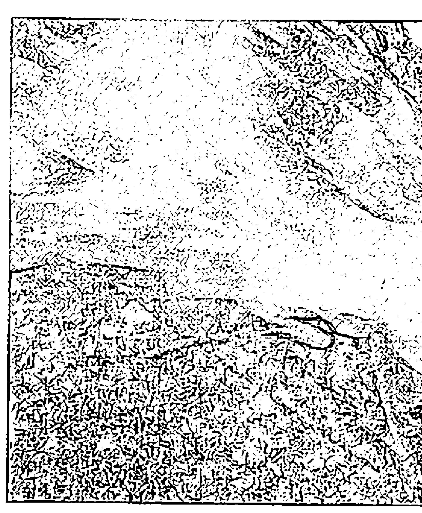

##### 如何施法

##### 所需工具與材料

- 1大捆乾柴
- 1個放在燈籠或瓶子中的小蠟燭
- 火柴或打火機
- 1枝紅墨水的鋼筆
- 有足夠數量可代表所有煩惱的紙條
- 1大捆乾草
- 1大捆蓍草
- 5顆柳丁的乾燥柳丁皮

##### 施法時機

在月亮漸虧時進行，任何一天皆可，但須於黑夜中施法。記得要事先提醒一下你的鄰居將晾曬的衣物拿進屋內，因為烽火會產生大量的煙霧。

##### 施法步驟

- 1. 到戶外將乾柴聚集在一起，以此設立點燃營火。
- 2. 想像一道白色亮光，圍繞著營火以及施法的地方。
- 3. 點燃小蠟燭，於蠟燭旁在紙條上寫下你的煩惱，一張只能寫一個。
- 4. 將乾草丟入營火中說：「藉此毀滅，煩惱根除。」把蓍草也接著丟入火中說：「由此恩惠，心寬體輕。」接著，說出煩惱，並將紙條一個個丟入火中。最後把柳丁皮也丟入火中說：「煩惱消失，快樂即現。」
- 5. 待在戶外，直到營火燒盡為止。
- 6. 移走灰燼，在離家很遠處將灰燼掩埋。

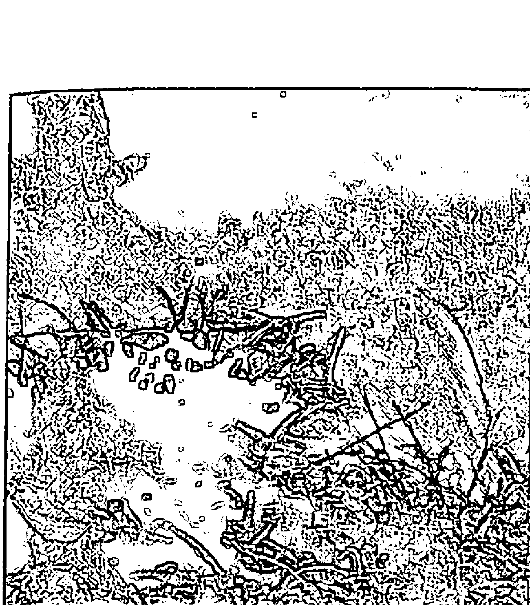

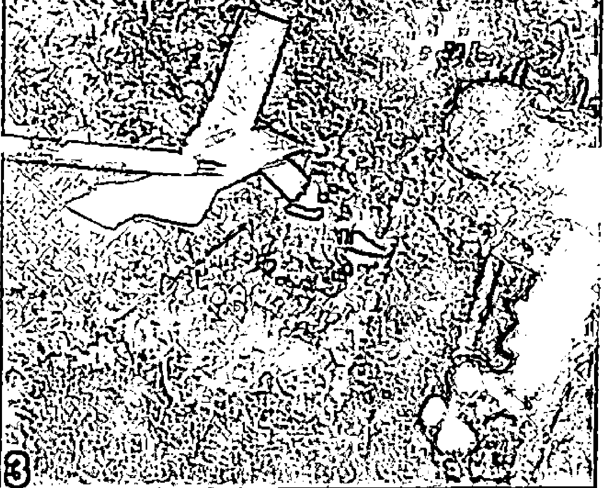

### 蛇眼符咒

#### 將焦慮阻擋在千里之外

【目的】驅逐焦慮，讓它離開。

【魔法背景】蛇眼是療癒之眼，也是埃及神祇霍露斯的象徵（外型為鷹頭的太陽神），根據埃及的神話，蛇眼是代表月亮的力量。長久以來一直被用做保護的符咒，通常是成為隨身攜帶的護身符或是畫於門外的符號。在本魔法中，蛇眼是用來召喚出保護的力量以對抗外來的邪惡勢力，如忌妒、惡意或是其他不好的感覺。要讓魔法成功必須要先去解決那些引起焦慮的原因。本魔法所使用的象徵是師法於大約在4000年前的埃及咒語。

##### 如何施法

##### 所需工具與材料

- 1個白色大盤子
- 1枝繪畫專用筆刷
- 1條黑色油畫顏料
- 1個裝有木炭的防火盤
- 1茶匙的乳香樹脂焚香，須於其上塗滿蜂蜜及天竺葵精油
- 1根長6～8吋或15～20公分的黑色蠟燭
- 1根長6～8吋或15～20公分的銀色蠟燭
- 火柴或打火機
- 1個樸素的茶杯小墊盤（或是平的甜點盤）

##### 施法時機

在暗月時施法，一個禮拜中的任何一天皆可，但要在天黑後進行。

##### 施法步驟

- 1. 在設立結界前，先在盤子上用畫筆和顏料寫上以下這些字，「每個邪惡的字、每個邪惡的言語、每個邪惡的中傷、每個邪惡的想法、每個邪惡的陰謀、每個邪惡的人、每個邪惡的爭吵、每個邪惡的打算、每個邪惡的事、每個邪惡的夢、每個邪惡的物。」等待顏料乾後，才可開始設立結界。
- 2. 根據第36到39頁的指示，設立結界。
- 3. 點燃木炭，再點燃焚香。
- 4. 點燃黑色的蠟燭，並大聲地朗誦盤子上所寫的字，唸完之後馬上將盤子摔碎。
- 5. 點燃銀色的蠟燭，接著在茶杯小墊盤(或甜點盤)的中央，畫上蛇眼的符號。
- 6. 小墊盤上的顏料風乾後，將其放到家門前擺放。在離家很遠處，把摔碎的盤子埋入土中。

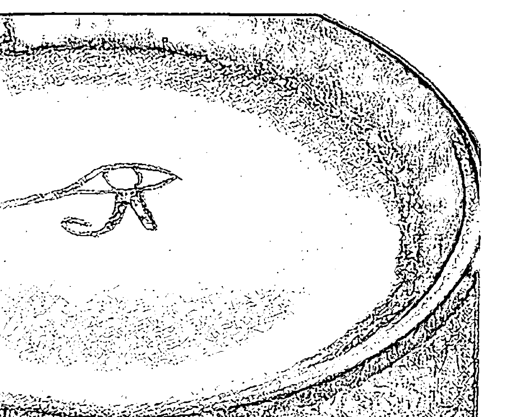

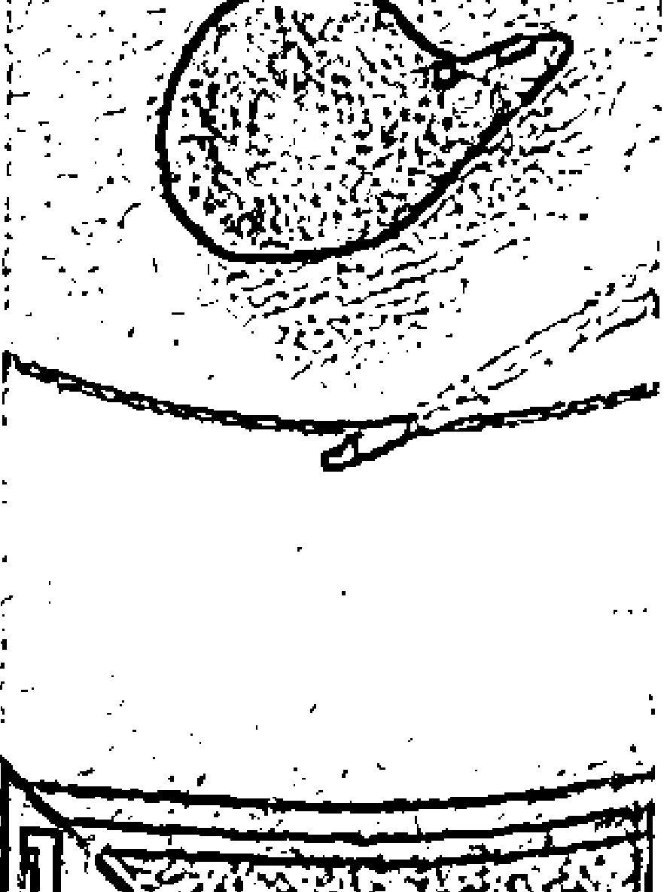

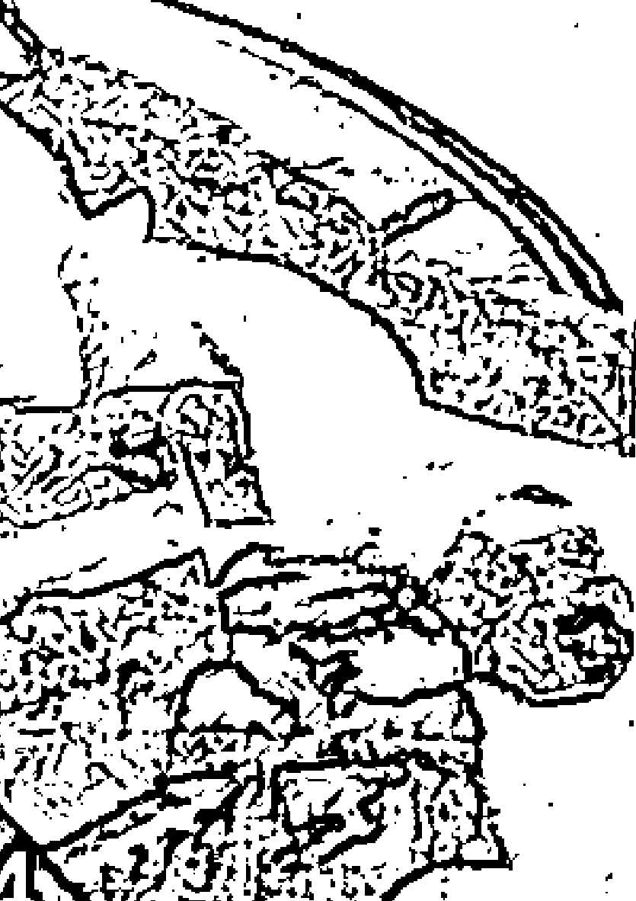

### 奧洛賓洛斯魔法 幫助身體的平衡

【目的】達到身體的平衡，而為你鋪好通往健康的康莊大道。

【魔法背景】本魔法是取自於一個古老的法則，此法則至今仍被大家所看重，那就是「萬物中庸之道」，也是健康的基本道理。這並不只是在警告萬事都不要過量，還正面積極地要求生活中重要物質的平衡，任何一樣生理慾望或需求都可以影響身體其他部分的合諧。

在本魔法中所使用的象徵，就是奧洛賓洛斯 (Ouroborus)，「一條咬著自己尾巴的蛇」。這是一個非常古老的煉金術符號，象徵統一、完整以及宇宙萬物生生不息、輪迴不斷的平衡。蛇與治療之間的連結建立以久，從近東、北歐到西歐皆是如此，並且進化為一種象徵智慧的符號。有許多女神皆有專司療癒的能力，但與治療并有關的愛爾蘭女神布莉吉妲，則與蛇有更緊密的相關。

##### 如何施法

##### 所需工具與材料

- 1個裝有木炭的防火盤
- 火柴或打火機
- 安息香粒
- 1根長6～8吋或15～20公分的黑色蠟燭
- 1根長6～8吋或15～20公分的白色蠟燭
- 1枝綠色墨水的鋼筆
- 1張1x 1/2吋或2.5x 1公分大小的長紙條
- 9條長18吋或45公分的棉質刺繡粗絞繩，黑色、紅色、白色各3條
- 1條長18吋或45公分的灰色棉質刺繡粗絞繩

##### 施法時機

在月亮漸盈時的半形月中施法可以得到正面的平衡。一個禮拜中的任何一天皆可，但禮拜一效果更強。

##### 施法步驟

- 1. 根據第36到39頁的指示，設立結界。
- 2. 點燃木炭，並灑上安息香粒。
- 3. 將黑色蠟燭放在白色蠟燭的左邊，點燃2根蠟燭，並說：「代表永恆的僧侶赫密士，請賜給我完美自然的平衡。」
- 4. 用鋼筆在紙條上畫出奧洛賓洛斯的象徵符號—1條捲曲的蛇正在吞食自己的尾巴。

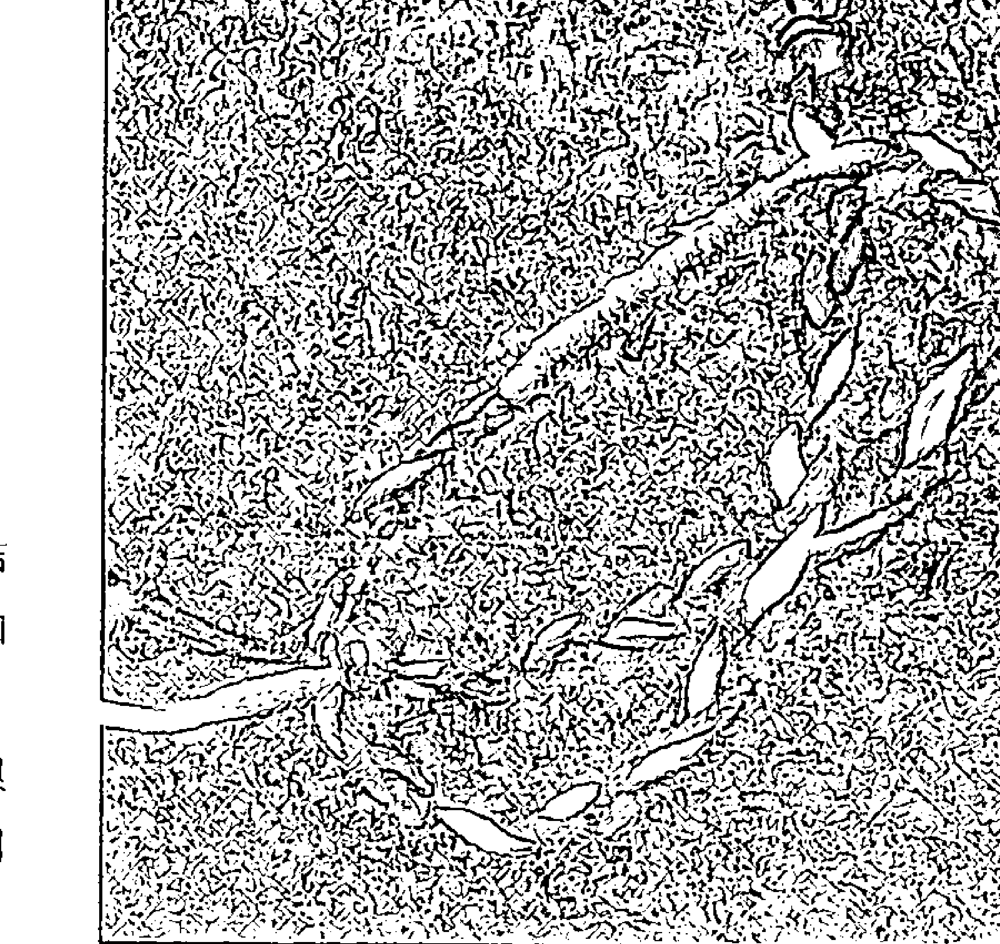

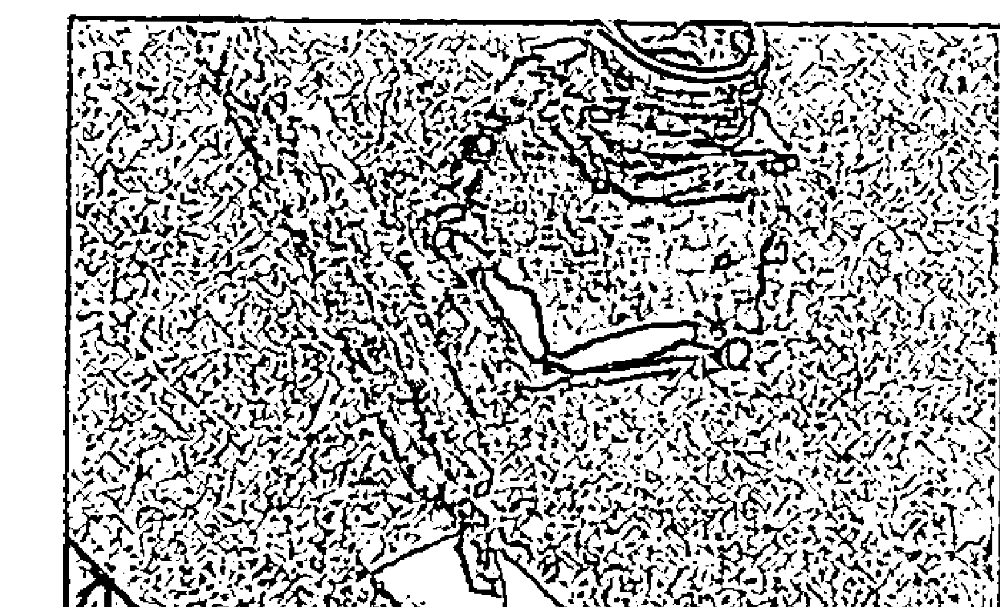

- 5. 當墨跡乾後，把紙條穿過木炭煙霧，將其放在一旁。接下來開始編織刺繡粗絞繩，將黑、紅、黃3色絞繩編成辮子的樣子，其長度要剛好符合你左手手腕的寬度，最後打結。

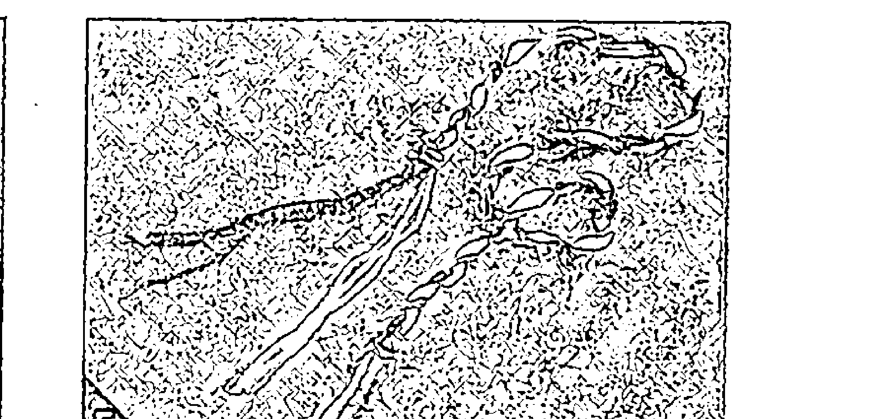

- 6. 將畫有奧洛賓洛斯的紙條，捲曲在編好的手環辮上，接著，將灰色刺繡粗絞繩沿著紙條，同樣捲曲在手環辮上，固定後打結成手環。戴著你的奧洛賓洛斯手環，直到它脫落為止。

### 向日葵魔法 激發快樂的性格

【目的】喚起快樂的情緒。

【魔法背景】什麼是真正的快樂？這個問題在不同的人身上或在人生中的不同時期就會有不同的答案。那些在這個世界生存已久並且時常冥想這個問題的人會告訴你，真正的快樂就是找到內在的自在平靜。那些受過折磨或經歷困苦的人會告訴你，真正的快樂就是讓身體及靈魂活下來最簡單的物質：食物、溫暖、衣物、庇護所、自由、友誼和愛。而那些問問題的人，在自己心中也都會有屬於自己的答案。

本魔法是利用太陽的能量帶來溫暖、健康和歡樂。太陽神的力量有時候也會濃縮在特定的草藥或植物中，而其中以向日葵籽的能量最強。以營養學來說，向日葵的籽保存了陽光的特質，也就是維他命D。維他命D可以幫助鈣類的吸收，並幫助調整新陳代謝。因此，不只是向日葵在魔法傳統上是代表太陽的力量，向日葵籽更包含了太陽神更強的能量，可以為你帶來健康與快樂。

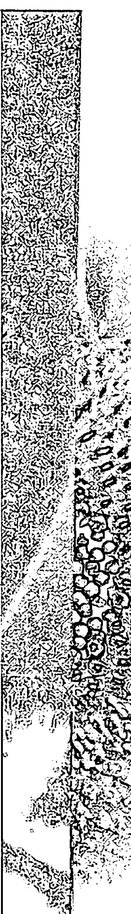

##### 如何施法

##### 所需工具與材料

- 1個裝有木炭的防火盤
- 火柴或打火機
- 安息香粒
- 1根長6~8吋或15~20公分的橘色蠟燭
- 15顆向日葵籽
- 1個小抽繩袋
- 1條長26吋或65公分的皮條或細繩

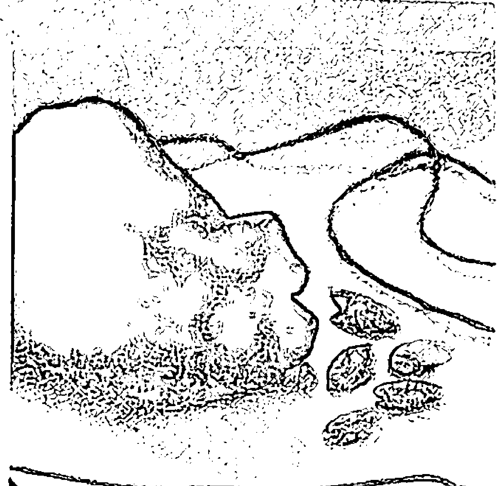

##### 施法時機

在月亮漸盈時施法可吸引快樂的到來，並於象徵偉大太陽神的禮拜天中施法。

##### 施法步驟

- 1. 根據第36到39頁的指示，設立結界。
- 2. 點燃木炭，並將安息香粒丟入其中燃燒，接著點燃蠟燭說：「偉大的太陽神，被賦予力量在此，請將庇祐照耀到你的子孫上吧！」
- 3. 將5顆向日葵籽放到左手手掌上，然後舉高右手說：「把你的能量傳遞我的身上。」接著吃掉這5顆向日葵籽。
- 4. 拿起5顆向日葵籽，放入抽繩袋中，並說：「讓你的力量存在我左右。」綁緊袋口，再於袋口綁上細繩，將袋子繞於脖子上，並說：「快樂在我體內，快樂在我左右。」
- 5. 把木炭和防火盤拿起，沿著結界順時鐘行走3次，再向蠟燭火焰鞠躬，並說：「偉大的太陽神請保佑我，讓施予有同樣的回報。」
- 6. 將其餘的5顆向日葵籽種植於耕地中，並埋入土中約1/4吋或5公分左右即可。

### 薰衣草魔法 幫助平靜的睡眠

【目的】幫助獲得放鬆安穩的睡眠。

【魔法背景】在所有具有香氣的草藥當中，薰衣草是世界上最著名、最受歡迎的植物之一。除了防腐的特質，由薰衣草做成的精油對頭痛、疤痕、濕疹以及其他皮膚問題也有神奇的治療效果。若在小袋子裡裝入這種催眠的草藥，便會成為一個很棒的放鬆劑，常放置於睡枕中，可以幫助舒適自然的睡眠。若在睡前，將薰衣草精油滴入溫暖的浴池中或是枕頭套上也可以帶來濃厚的睡意。

本魔法所使用的方法，在魔法悠久的歷史中已行之有年。這個方法需要一個箍環，讓施法者可以全身穿過。讓人穿過一個洞或環是一種非常古老的象徵，穿過之人將獲得祝福，而一些古老且中空的立石，也被認為可以保佑那些穿過洞內的人。本魔法中的花圈就是採用這個類似的象徵原則，當一個人穿過神聖的空間後，空間的庇祐力量將會被完整的封存。

##### 所需工具與材料

- 1根任何尺寸的薰衣草直立式蠟燭
- 火柴或打火機
- 1根長6～8吋或15～20公分的白色蠟燭
- 1根可以彎曲的柳條鞭，其彎曲後的寬度須剛好可供一個人穿過
- 1條長36吋或90公分的堅固麻繩
- 1大束乾燥的甘菊
- 1大束乾燥的薰衣草
- 1捲花卉用麻繩

##### 施法時機

在月亮漸盈時施法可幫助休息，一個禮拜中的任何一天皆可施法，但要避開象徵限制的土星所掌管的禮拜六。

##### 施法步驟

- 1. 根據第36到39頁的指示，設立結界。
- 2. 點燃薰衣草蠟燭，拿起蠟燭隨著結界，以順時鐘方向繞行，讓氣味瀰漫四周。
- 3. 點燃白色的蠟燭說：「純潔的燭光，請引領我到溫暖的夢鄉，讓我了解與感受到平靜與安詳。」

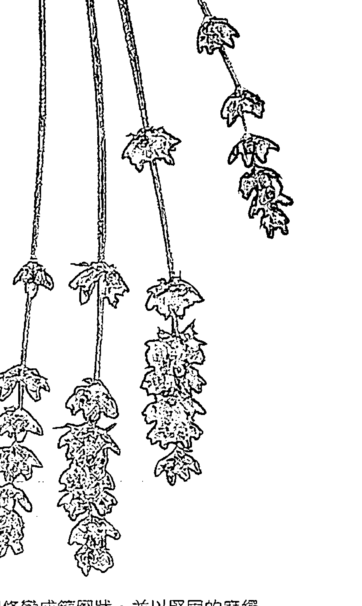

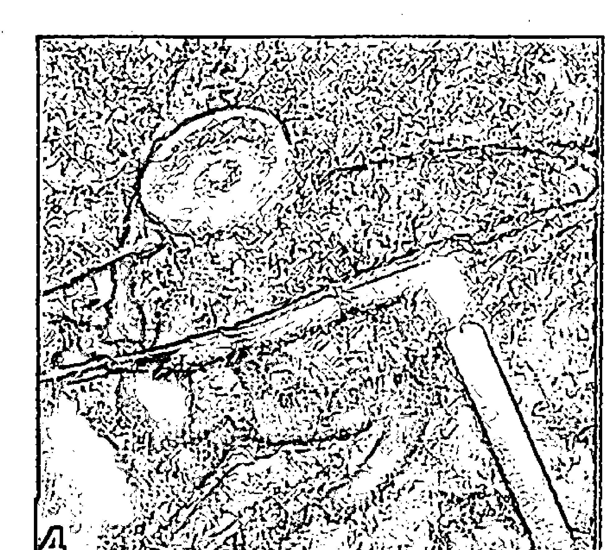

- 4. 將柳條彎成箍圈狀，並以堅固的麻繩將其連接處綁緊固定。將甘菊和薰衣草以花卉用麻繩，固定在箍環上，直到箍環完全被蓋住為止。
- 5. 在白色蠟燭前垂直拿著箍環，並說：「穿過此圓後，我將踏上通往睡神的道路，我的睡眠魔法也將被賜與法力。」將箍環從頭到腳，穿過你整個身體，最後雙腳踏出箍環。
- 6. 將箍環掛在你的床上即可。

### 蜘蛛魔法 帶來快樂的夢境

【目的】帶來快樂、健康的夢。

【魔法背景】美國本土的捕夢網是像網子一般，讓好夢可以穿過，惡夢則會被阻擋在外，直到晨曦的出現才會將它們融化。但是，不同種類的網子也有不同的使用目的，在本魔法中的蜘蛛網是為了捕捉到快樂的夢，豐富你的想像力並讓你的夜晚更美好。

本魔法的靈感是來自於蜘蛛在魔法上和超自然上的象徵，雖然蜘蛛常被誤解為和邪惡與欺騙有關，但事實上，許多文化也對蜘蛛抱持正面的態度，認為它是創造力與靈魂活力的象徵。在西方魔法世界裡，蜘蛛網就象徵魔法、超自然和萬物之間的聯繫。蜘蛛是一種非常驚人的生物，也因為織網的能力而享富盛名，很好的蜘蛛網會利用葉子來固定、用樹枝來當作支柱，是一種自然的建造能力，而象徵上也可以改變夢的流向。在九月秋分之後，我們會走進黑夜較長的日子裡，同樣的也會走進富創造力的自我當中，此時也是一年中夢境最豐富清晰的時節。

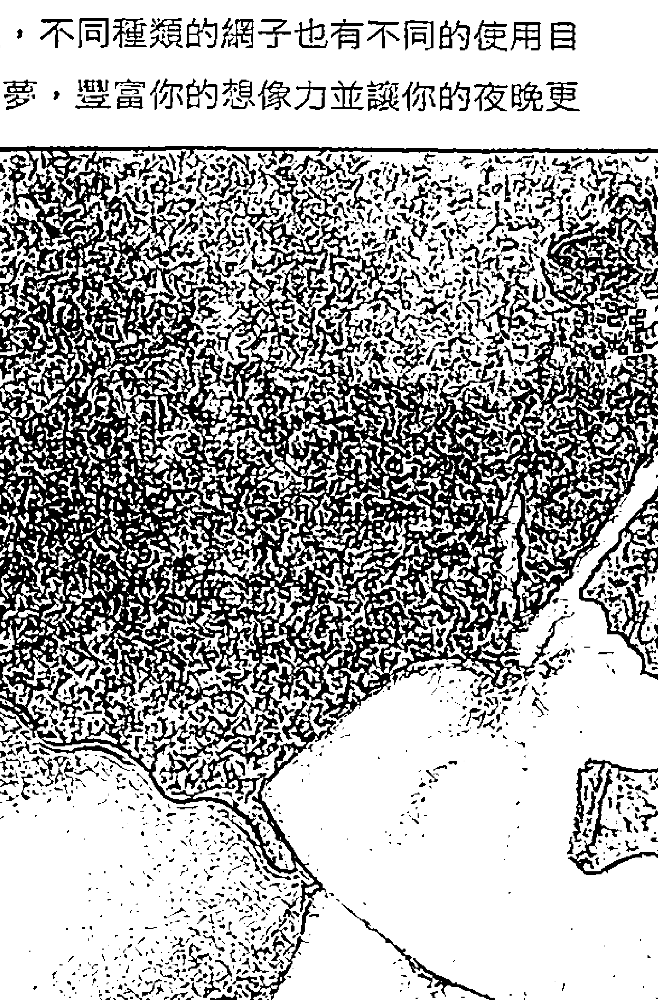

##### 如何施法

##### 所需工具與材料

- 1個裝有蠟燭的精油燃燒器
- 2茶匙的水
- 6滴罌粟花精油
- 火柴或打火機
- 1根長6～8吋或15～20公分的白色蠟燭
- 1塊小的天然黃鐵礦礦石
- 1個蜘蛛網
- 1個抽繩袋
- 1條長24吋或60公分的白色緞帶

##### 施法時機

在月亮漸盈時進行，而控制夢境的月亮所代表的禮拜一是施法吉時。

##### 施法步驟

- 1. 根據第36到39頁的指示，設立結界。
- 2. 點燃蠟燭燃燒器，並將水和罌粟花精油倒入燃燒器中。
- 3. 點燃白色蠟燭說：「月亮姊姊、蜘蛛奶奶，請將你們的魔力織入我的夢中。」

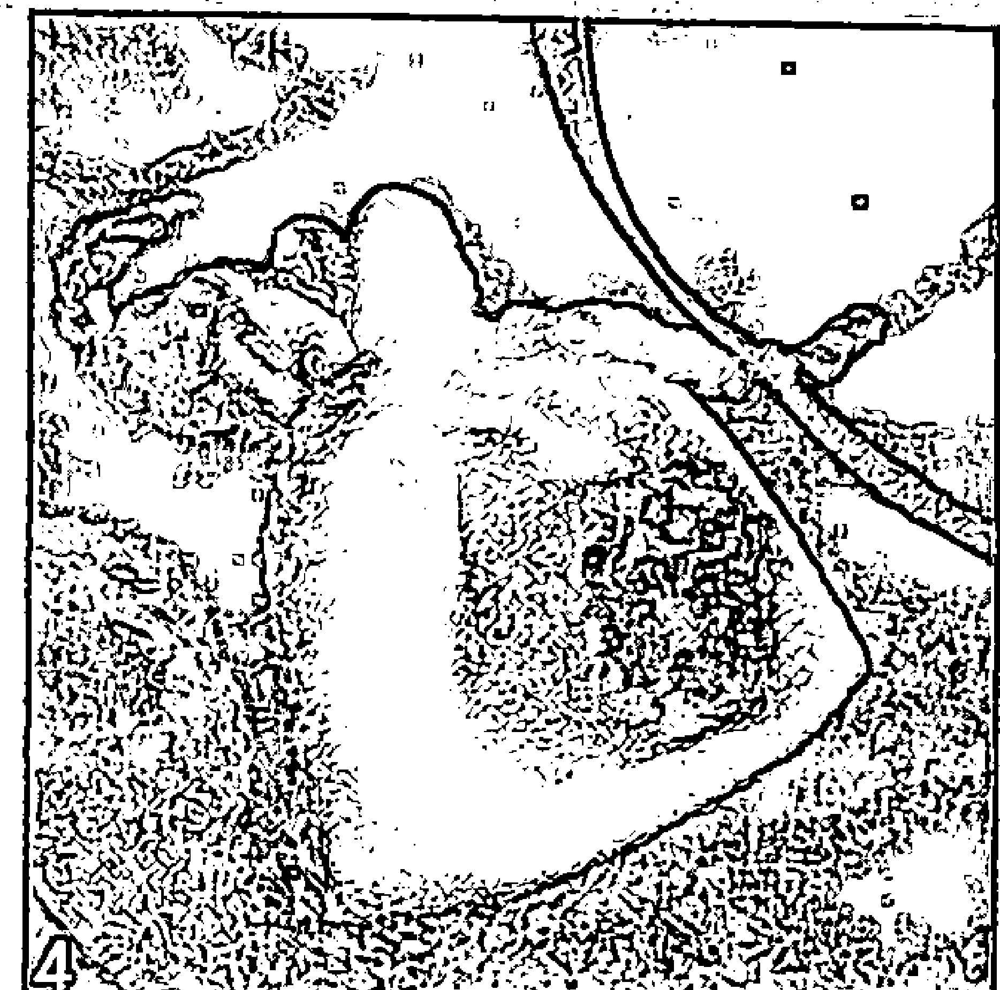

- 4. 將黃鐵礦包入蜘蛛網中，然後放入抽繩袋中。
- 5. 用緞帶的下半段將抽繩袋綁緊，然後放入雙手中。唸誦以下咒語，並於60下心跳之後，再重新唸一次：「蜘蛛奶奶，請為我織起捕夢網，讓包覆於網內的只剩下美麗的夢境。」
- 6. 將抽繩袋掛在床柱上或床頭上。每個晚上當你要休息時，用手輕觸它並說：「讓我做個好夢吧！」直到下個滿月為止。

## 健康、美麗與幸福的魔法

### 仙客來符咒 防止惡夢的發生

【目的】抵抗不好的夢境。

【魔法背景】每個人或多或少都有作惡夢的時候，畢竟做夢是一種安全的情緒出口，讓壞情緒會在夢中發洩出來。但是，如果做惡夢的頻率太高，也看不出來是什麼隱藏的心理創傷所導致，那麼這個魔法便可以幫助舒緩這個現象。

這個魔法是取自於一個古老習俗，用來解決那些侵擾孩童的惡夢，當然也可以應用到大人的身上。專家都知道，仙客來可以用來抵抗不好的感應。將這種花放在臥室，可以幫助減少惡夢的發生，有時候也可以撫平憂鬱。仙客來會有這種象徵是來自於這種花生長在花園或樹林中較陰暗的角落，而這種花多采多姿的顏色與香氣，可以讓那些本來很陰暗的地方變得明亮可人。

另外必須要注意，本魔法中所需要的血，必須是取自希望從這個符咒中受惠的人，若是從施法者身上取得，則符咒只會受惠於施法者。

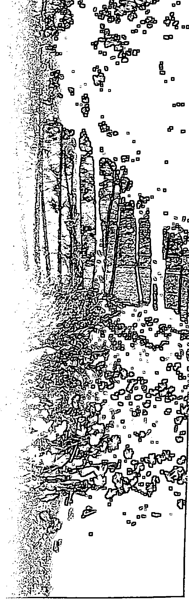

##### 如何施法

##### 施法時機

在暗月時進行增加保衛的力量，一個禮拜中任何一天皆可，但主掌放逐的土星所代表的禮拜六是特別吉祥的施法日。

##### 施法步驟

- 1. 根據第36到39頁的指示，設立結界。
- 2. 點燃木炭，並灑入焚香。
- 3. 點燃黑色的蠟燭說：「黑暗的女神黑卡蒂，光明的女神維納斯，為我帶走惡夢，換來好夢。」
- 4. 用針刺破食指，擠出血來滴入仙客來盆栽的土壤中，並說：「請捍衛皮囊之下的靈魂，保護莫讓外物侵入，並帶來內在的光明。」
- 5. 將紅色緞帶穿過焚香的煙霧說：「讓純淨的夢與我常存。」將紅緞帶綁緊在盆栽上，並打上蝴蝶結。
- 6. 將盆栽日夜放在你的房間中，如果你希望讓惡夢遠離，則必須時時照料它。

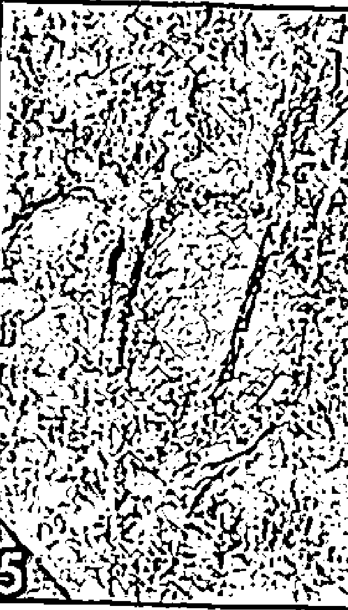

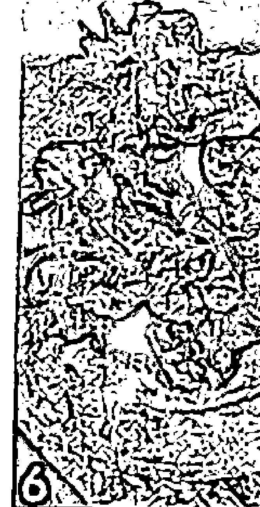

##### 所需工具與材料

- 1個裝有木炭的防火盤
- 火柴或打火機
- 由等量的柯巴脂、杜松莓、及乾燥的仙客來花所混合的焚香
- 1根長6～8吋或15～20公分的黑色蠟燭
- 1根消毒後的針
- 1株健康的仙客來盆栽，任何顏色皆可
- 1條長24吋或60公分的紅色緞帶

### 驅魔魔法 趕走不健康的習慣

【目的】幫助擺脫不健康的習慣。

【魔法背景】你有曾經想要戒掉吸菸、咬指甲、吸拇指或玩頭髮的習慣嗎？不用再苦找解決的方法了，這就是最適合你的魔法。一點魔法的幫助和信心的增加可以幫助你擺脫那些不良的習慣。但你必須先問自己，造成這個壞習慣的需求會不會因為這個習慣的消失，而以另一種不健康的方式繼續來滿足。如果你的答案是不會，那你才有可能可以重回正常的生活習慣，這樣花時間來準備這個魔法才會值得。

首先你必須要確認造成這個習慣的原因，例如可能是緊張、缺乏自信或是焦慮，然後再思考趕走這個壞習慣之後的結果。如果你是個愛咬指甲的人，你不會希望這個習慣改掉之後，反而變成一個酗菸者或愛吸大拇指的人，所以你必須要確保取代壞習慣的，將會是健康的好習慣。好好的問自己這些問題，並且誠實的回答。然後，你便可以開始準備將你的壞習慣丟到垃圾桶了。

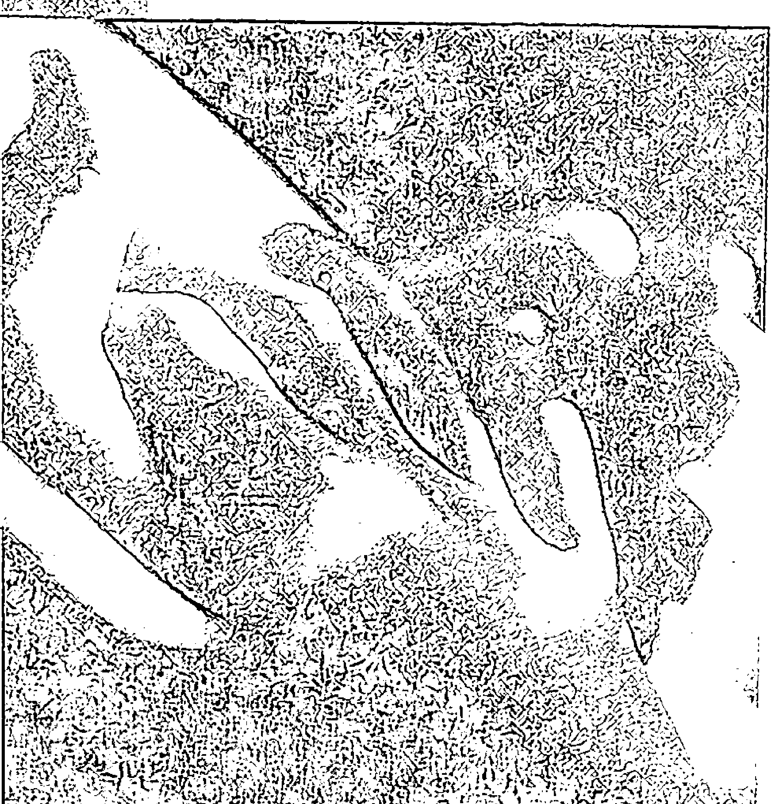

##### 如何施法

##### 施法時機

在月亮漸虧時進行增加驅逐的力量，並於紀律之神土星所代表的禮拜六施法。

##### 施法步驟

- 1. 根據第36到39頁的指示，設立結界。
- 2. 點燃木炭，並灑入焚香。點燃棕色蠟燭說：「土星，請見證並賜與魔法力量。」
- 3. 用燭火將鐵釘的尖端加熱，並以此在一根蠟燭上，刻下想要改掉的壞習慣，從下往上刻。
- 4. 將刻字的蠟燭拿到燭火前面說：「將它燒掉。」繼續穿過木炭的煙霧說：「讓它飛走。」然後放在雙掌中說：「在我體內的壞習慣，都飛向你吧，並讓火焰將其燒盡吧。」接著點燃該字的蠟燭。
- 5. 用燒熱的鐵釘，在另一枝蠟燭上，由上而下刻入「健康」。
- 6. 點燃第二根蠟燭，並讓兩根蠟燭在結界內燃燒完全即可。

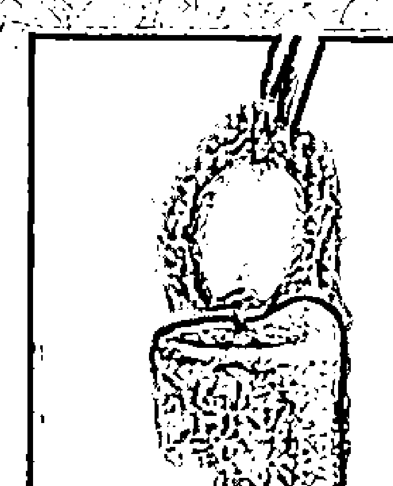

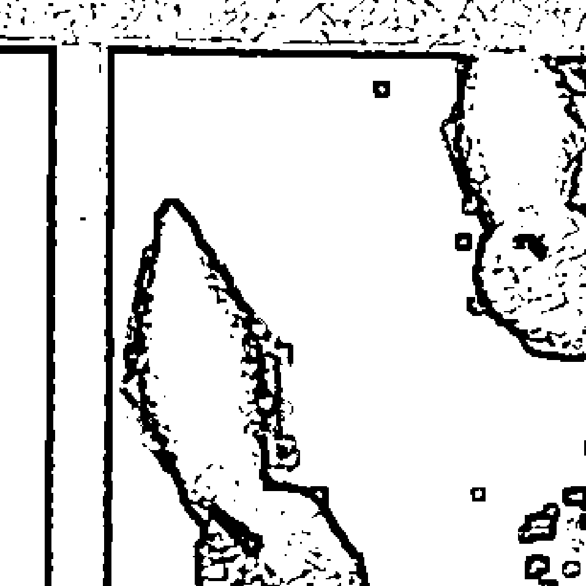

##### 所需工具與材料

- 1個裝有木炭的防火盤
- 火柴或打火機
- 黑色的柯巴脂焚香
- 1根長6~8吋或15~20公分的棕色蠟燭
- 1根長6吋或25公分的尖銳鐵釘
- 2根大約長6吋或15公分的家用白色蠟燭

## 健康、美麗與幸福的魔法

### 凱爾特石魔法

#### 防止經常性的頭痛

【目的】驅逐經常發生的緊張性頭痛。

【魔法背景】有許多治療經常性頭痛的藥的藥方，包括治偏頭痛的小白菊及解除疼痛的舊阿斯匹靈或柳樹皮。若你飽受緊張性頭痛的折磨，但經過醫師檢查之後也沒有什麼大礙，那麼你就可以試試這個古老的治療方法。

本魔法是來自於感應魔法的轉移原則，認為病痛可以從人的身上轉移到其他的物品上，而病痛便會被困在物品裡頭，無法再出來傷害人。本魔法便是用石頭來當作這個物品，並師法崇尚自然的凱爾特族作法，將聖物或魔法物丟入深水中。

在這裡我們利用水的療癒和保存特質，以確保轉移到石頭中的病痛，會被完全的彌封，並讓頭痛漸漸痊癒。

##### 如何施法

##### 所需工具與材料
- 1根長6～8吋或15～20公分的黑色蠟燭
- 火柴或打火機
- 1塊尖銳的打火石或釘子
- 1塊灰色或白色的蛋型石頭
- 2液體盎司或50毫升的蒸餾水
- 2液體盎司或50毫升的紅酒
- 1罐鹽巴

**施法時機** 在月亮漸虧期間進行，將病痛驅逐，一個禮拜中的任何一天皆可。

##### 施法步驟
1. 根據第36到39頁的指示，設立結界。
2. 點燃黑色蠟燭：「讓病痛隨蠟燭消失，隨月亮退去，隨石頭離開。」
3. 用打火石或釘子，在石頭表面刻出一個橢圓形，然後再橢圓形上畫上一個叉。
4. 用石頭摩擦最容易頭痛的地方，並說：「把頭痛放入石頭中，不再為它呻吟難過，病痛消失無影無蹤。」將水倒到石頭上，並舉起紅酒說：「你就是我的病根。將酒倒在石頭上。」
5. 將鹽巴倒在地上，圍繞住石頭的周圍，並說：「凋謝與喪亡，從此不再靠近。」
6. 將石頭丟入附近最深的自然水源中即可。

### 陽光元氣符咒 防止憂鬱

【目的】預防掉入憂鬱的情緒中。

【魔法背景】這是一個可以讓你時時記得樂觀思考的魔法，尤其是對那些生性就比較悲觀並容易憂鬱的人更有效果。可以幫助提振精神的太陽力量，在許多諺語中都可以發現，我們常形容一個開朗的人「很陽光」或「笑得跟太陽一樣燦爛」。這個魔法便是召喚太陽的力量，讓你可以不再沉浸於憂鬱當中。如果你真的深為憂鬱沮喪所苦，也應該要去尋求諮詢和醫師的建議。

如果你要施行此魔法，必須要在心中懷抱著一個信念，相信太陽力量可以驅散內心的陰霾。在溫帶地區，人們逐漸認為在缺乏陽光的冬天，的確會造成嚴重的憂鬱情緒。就算你沒有這種感覺，每天盡量撥點時間戶外，對你也是好事，人體若缺乏陽光是會生病的，適量的日曬可以幫助提振你的精神。在施行此魔法的期間，最好多從事一些戶外活動，如此可以讓太陽的力量，在你身上發揮最大的效果。

##### 如何施法

##### 所需工具與材料
- 4根長6～8吋或15～20公分的白色蠟燭
- 1根長6～8吋或15～20公分的黃色蠟燭
- 1根放在支架上的肉桂焚香柱
- 火柴或打火機
- 1枝棕色墨水的鋼筆
- 1小塊從橡木樹枝砍下來的橡木圓片
- 1罐亮光漆
- 1條長24吋或60公分的皮繩或細繩

**施法時機** 在月亮漸盈期間以及禮拜天進行，這天是由健康與快樂的守護神—太陽所掌管。

##### 施法步驟
1. 根據第36到39頁的指示，設立結界。
2. 將蠟燭排成一排，而黃色蠟燭必須擺在中間。
3. 點燃焚香柱與所有的白色蠟燭。
4. 用鋼筆在橡木片上畫一個圓，圓外幾個小點，象徵太陽的光芒，在圓內寫上「慰藉」和「太陽」。
5. 點燃黃色的蠟燭說：「召喚太陽重生的力量，召喚太陽烈火的力量，讓憂愁燃燒殆盡，讓快樂顯現重生。」將橡木放在蠟燭前，使墨跡陰乾，並讓蠟燭燃燒完全。
6. 在橡木上鑽出一個洞，並塗上亮光漆，以保護墨跡不被磨損。將繩子穿過橡木洞，並隨身掛在脖子上。

### 覆盆子葉茶包 緩和分娩的痛苦

【目的】適合懷孕末期與接近分娩時期的滋養補品。

【魔法背景】幾世紀以來都是村莊裏的女人與產婆握有草藥及助產術的學問，並由母傳女的方式代代口耳相傳下去。在16及17世紀的巫術迫害時期，因為這些知識，讓許多婦女被視為「女巫」，幸好，這些草藥智慧與知識並沒有隨著對女巫的迫害而消失，現今許多的法師仍認為女巫和助產術之間有深厚的關連。因此，魔法聖經是不可能忘記將這種傳統的魔法收錄進來的。本魔法中所使用的魔法材料，大概是本書所有魔法中最有健康益處的材料。

##### 如何施法

##### 所需工具與材料
- 1根長6～8吋或15～20公分的淡藍色蠟燭
- 火柴或打火機
- 9片乾燥的覆盆子葉
- 1張6x3吋或15x7.5公分的長方形白色乾酪布
- 1根縫針
- 1條長18吋或45公分的白色縫線
- 剪刀
- 1個裝有乾燥覆盆子葉的小容器
- 1個茶杯

**施法時機** 在象徵萬物成熟結果的滿月時進行，一個禮拜中任何一天皆可。

##### 施法步驟
1. 根據第36到39頁的指示，設立結界。
2. 點燃蠟燭說：「滿月，孕育生命的子宮。」
3. 將9片覆盆子葉放到雙掌中，並反覆唸誦以下咒語，至少9次：「萬物之母、大地之母，請賜予我分娩時的自在與放鬆。」
4. 將這9片覆盆子葉放在乾酪布中，並將乾酪布對摺，縫好四邊固定，使成一個茶包，並說：「請保佑。」
5. 將茶包放在容器中保存，直到生產日，再將它與你一起帶入分娩室。
6. 在施法後，每日需取容器中的覆盆子葉飲用，每天2~4杯，每杯配以2茶匙的覆盆子葉與一杯滾水沖泡，即可飲用。

覆盆子葉一向被認為對懷孕末期很有幫助，裡頭的成分可以舒緩子宮，可以幫助分娩時的收縮。

魔法中的乾燥覆盆子葉，可以向知名的栽種者購買或是自己培育烘乾，一定要確認沒有農藥的存在才能安心使用。

**警告** 有流產經驗或懷孕28週前，不可飲用覆盆子茶葉。在懷孕期間，若要使用任何草藥，必須事先諮詢草藥醫師同意。

### 主婦藥湯魔法 讓身體健康

【目的】產生良好的健康體魄，並指示可能生病的部位。

【魔法背景】幾世紀以來，婦女們所調製的飲品都被認為可以帶來療癒的效果與身體的健康。這些飲品都是結合草藥與魔法的知識，因此對於身體與心靈健康都有很大的幫助。其中茶又稱作湯藥，其剩下的的殘渣或葉子還可以順便用來做為占卜的工具。本魔法包含了2種功能，不但可以為你帶來健康，也帶給你預先的警告，讓你知道身體哪部份在未來可以較容易生病。

要看懂茶葉分布的意涵，則是另一門深厚的學問，然而這裡的篇幅不夠，因此無法告訴你杯底茶葉所有的分布情形各代表什麼意涵。但是，這裡會給予你一些指示，幫助去試著了解茶葉中的訊息，其餘的則必須靠你自己的努力發掘和第六感。單就草藥本身而言，這些藥材皆提供非常豐富的維他命、解決消化問題並幫助睡眠，全部都是對身體健康有益的藥材。

##### 如何施法

##### 所需工具與材料
- 1根長6～8吋或15～20公分的淡藍色蠟燭
- 火柴或打火機
- 1大把切碎的新鮮蒲公英葉
- 3朵切碎的乾燥甘菊花蕊
- 5大把切碎的新鮮薄荷葉
- 1個茶杯及小碟子
- 滾燙的熱水

**施法時機** 在月亮漸盈及代表月亮之日的禮拜一中進行，以尊崇其中婦女與男人的智慧。

##### 施法步驟
1. 根據第36到39頁的指示，設立結界。
2. 點燃蠟燭說：「太陽、風和雨，請降福保佑此湯藥。」
3. 將草藥材料放入茶杯中，並倒入滾燙的水，用小碟子將杯子蓋上，以防止熱氣散出。待湯藥泡好後，說：「眾神的力量蘊含其中，病痛消失、健康重生。」
4. 將湯藥放在旁邊冷卻5分鐘，再將小碟子拿起，並把湯藥喝光。
5. 把杯內的沉澱物倒於小碟子上。
6. 以下的形狀，即指示身體未來應該多加注意的部分：

| 形狀 | 對應部位 |
|---|---|
| 馬蹄形或杯子狀 | 腎臟或膀胱 |
| 動物狀 | 大腿與臀部 |
| 臉部表情 | 頭 |
| 線條和角度 | 關節或手臂/手掌/小腿/足 |
| 八字形 | 胸部或鼻竇部位 |
| 波浪狀 | 胃或腸 |

# 家庭、朋友與居家的魔法

## 家庭、朋友與居家的魔法介紹

本章節包含了許多與住家有關的魔法，主要著重在家庭、室友、鄰居、朋友以及居家環境上。住家的合諧在現代生活中是非常重要的，保持住家的寧靜與神聖才能維持健康的身心，也才能放鬆地在外工作和交際應酬。當生活環境穩定的「基礎」岌岌可危時，那麼生活中許多重要的東西也將會飽受威脅。在自己的居住環境中快樂及穩定的生活，才是讓生命平衡及健康的關鍵。

本章的魔法有提到許多保持居家歡樂的方法。很明顯地彼此間若經常不和睦會讓人很沒有安全感，因此，面對抱怨能抱持公正的態度，對維持居家生活的平衡安定來說是非常重要的。這裡的魔法可以幫助讓你的室友或親人變得貼心好相處，撫平口角爭執，並讓不受歡迎的親戚不會靠近。如果很重視居家的娛樂，也有一些魔法可以幫助吸引受歡迎的訪客前來。如果你施一個魔法去擋開一些不合的親友，你可以緊接著施一個吸引友好訪客的魔法。

你會在其中發現許多魔法都會談到實際的家庭環境和內部的家庭氣氛。這包括保護自己居住空間的方法、驅散爭吵後尷尬的氣氛或各式各樣的家庭緊張並幫助促進家人間的溝通。也有許多魔法是教你如何保衛自己的家園以及照顧院子裡的花園等等。

在考慮用魔法來提升居家品質之前，必須要先有一些正面的實際行動作為基礎。例如一些實際的問題，像家事的分工與責任，便不能單靠魔法來解決，這必須要經過誠實及公平的溝通才有辦法。如果原本的問題一直存在沒有解決的話，就算實施促進合諧的魔法，也不能改變家裡的氣氛。同樣地我們也必須考慮物質方面的問題，例如金錢或其他形式對家庭的投入。必須要捫心自問家中的財富要如何公平的分配，其他形式的貢獻，例如家事或家庭的維持是否也有公平的分工。如此一來，可以幫助去釐清一個人的要求或抱怨是否合理或理由是否正當，也會讓爭執更容易被解決。以實際行動作為基礎，魔法才有辦法發揮出最大的功效。

### 栽種魔法 促進家庭的和諧

【目的】為家庭生活帶來和諧的氣氛。

【魔法背景】本會中有大量的魔法都使用到植物這項材料，這也反映了植物是一種很常見的魔法元素。很多植物光從植物的名稱就已經告訴我們它的特性，如本魔法所建議的植物一黑種草也不例外。大馬士革黑種草是一種攀附在複雜蕨菜中的美麗藍色花朵，又被稱作露中之愛。它不只是被用在愛情上，也被用在親情與各種情感上。

本魔法會需要一些園藝的技術，但是種植黑種草的報酬率很高，因為這種植物常年都生長在土質很差的地方，但最後都會成長得很好，是一種可以信賴的植物。

##### 如何施法

##### 所需工具與材料
- 1個裝有木炭的防火盤
- 1根長6～8吋或15～20公分的淡綠色蠟燭
- 火柴或打火機
- 1茶匙切碎且等量的澤芳與白色檀香木屑
- 1個裝有1袋黑種草種子的高腳酒杯
- 1杯裝有5液體盎司或150毫升水的高腳酒杯

**施法時機** 本魔法必須在室內進行，並於早春的新月以及除了禮拜六之外的任何一天施法，因為禮拜六是由象徵嚴峻的土星所操控。第一部份必須在室內以及日落後進行，但栽種的部份則必須要到戶外，最好是在自己的花園中。

##### 施法步驟
1. 根據第36到39頁的指示，設立結界。
2. 點燃木炭，再點燃綠色蠟燭說：「綠色大地的精靈，請讓我種下的願望，能夠開花結果。」
3. 將澤芳與樺木屑，以及一小撮黑種草種子，丟入木炭中燃燒，並說：「霧中之愛，甜美的果實，受大地之福澤，將綿延不絕的成長。」
4. 將裝有種子的杯子握在雙手中，閉上雙眼想像你的家人，正開心融洽的在一起。此時深深吸一口氣，並將氣吐入這些種子中。
5. 將杯中的種子全數取出，將它們平整的種植在植土中，接著將另一個酒杯內的水倒入土壤中，並說：「請保佑。」

當黑種草開花後，它的種子便可以被採收或乾燥處理，你可以把它們打包作為禮物，或是留下來在明年重新播種種植。採收這些種子，可以為所有的家人帶來歡樂的時光，但是建議必須戴著橡皮手套，才會不會讓一些容易對種子敏感的人造成傷害。

### 新月魔法 交到新朋友

【目的】適合剛搬到新環境並試著交新朋友的人，可以幫助拓展你的生活圈。

【魔法背景】向星星許願，特別是流星是已經流傳已久的習俗，但很少人知道，向月亮許願也有一樣悠久的歷史了。有許多的傳說都是與月盈有關的，例如：若看到月盈期間的第一道新月，而且將口袋裡的硬幣翻過來的話將會為你帶來金錢運。而另一則傳說則與上述的相反，若你是從室內經由玻璃看到這第一道新月的話，將會把你的金錢運終止。

這二則傳說便是與月相變化有關，而暗示一定要從戶外看見新月，是因為希望你能親自去接觸大自然的節奏，這是一個非常聰明的傳說。月亮掌管了自然的潮汐與週期變化，包括海洋的移動以及生態活動的改變等。而在魔法世界中，不同於其他事物，月亮主掌夢境、超自然能力與神秘事物。就如同月亮是靠陽光的反射才有光芒，月亮就像是我們靈魂與內心深處欲望的鏡子，因此是天體中許願的好對象。

##### 如何施法

##### 所需工具與材料
- 1大湯匙的粗糖
- 6顆你吐出的櫻桃核，並須在太陽下曝曬
- 1個小碗
- 1根縫紉用針
- 1個放在罐子裡的白色小蠟燭
- 火柴或打火機

**施法時機** 必須在出現新月的那3天中施法，並須於戶外進行，最好是山坡上或高處。

##### 施法步驟
1. 將糖與櫻桃核放入碗中。
2. 以針的尖端，在小蠟燭的右邊刻上新月的樣子，在左邊刻上維納斯的象徵符號（一個圓下方有個十字，也就是一般的女性符號）。
3. 點燃小蠟燭，並抬頭看著新月說：「我從你的弓弦下射出一箭，願快樂將隨著幸福的潮水到來。」
4. 將你的右手放到櫻桃核及糖的上方，並說：「我將你射往東風、南風、西風與北風，朋友與同伴將隨著召喚前來。」
5. 向月亮鞠躬，並朝東、西、南、北方，灑出糖與櫻桃核。

### 守門員魔法 守護你的家園

【目的】 製造一個守護者來保護你的生活空間。

【魔法背景】用魔法來保衛家園是流傳幾千年的古老習慣，在全世界也可以看到許多使用古老雕像的例子。居住處所的安全穩定一直是為人類所重視，因此設立守門員來保衛住家的習慣會流傳如此地久遠與廣泛，的確不令人意外。大部分來說，多是以人類的形象來作為守門人的雛形，有時也會以知名、有保衛能力的神祇或女神形象來代替。

要在守門者符咒身上注入魔力是非常容易的，從一些古老的魔法傳統可以知道如何使用這些方法。不只可以在它身上注入自己的願望，還可以灌輸一些保衛的神祇的力量。

雖然製造蠟人像常被刻版的與「詛咒」連在一起，但在這裡，蠟人像是作為守門員的替身，用以保衛我們的家園。

##### 所需工具與材料
- 3個白色家用蠟燭
- 1個空玻璃罐
- 1枝筆
- 滾水
- 1根長6~8吋或15~20公分的黑色蠟燭
- 火柴或打火機
- 1個防熱盤
- 1個網球般大的可塑形軟黏土
- 1個黑莓刺藤的刺
- 1個鐵釘
- 1片乾燥的桂葉

##### 如何施法

**施法時機** 在暗月的晚上施法。

##### 施法步驟
1. 設立結界前，先把家用蠟燭放到空罐子中，並把空罐子放在平底鍋上，隔水加熱，直到罐子裡的蠟融化。
2. 根據第36到39頁的指示，設立結界。
3. 燃黑色蠟燭說：「黑卡蒂、黑安妮、凱莉塞克麥特、李莉絲，請見證並賜給我魔法力量吧！」
4. 塑形黏土做一個中空的人形，大約4吋或10公分高，並放在防熱盤子上。
5. 融化的蠟倒入黏土模型中，此時將黑莓刺、鐵釘、桂葉、和杜松莓皆放入溫熱的蠟中，並說：「以尖爪利齒保衛這個家，讓邪惡無法進入。」
6. 模型中的蠟已經堅硬，將周圍的黏土拿起。把完成的蠟人像守門員，埋入靠近家的前門或後門附近即可。

### 紫草袋魔法 抚平争吵

【目的】可帮助悬挂此袋藻的住家平息争吵。

【魔法背景】紫草被称为可治疗一切的草药，这是大家对紫草医疗特性上的认识。过去，它的叶子常被拿来当作敷药，解决许多的皮肤问题，而叶子所做成的茶也可帮助加速扭伤、骨折与肌肉疼痛的复元。现代也因为其富含的尿囊素、钙、钾和磷，而将其作为帮助修护骨头细胞和肌肉伤害的草药。在魔法上与其草药方面的修复功能相同，紫草可以平缓愤怒的情绪，导向平和。有许多很好的解释都提供了很合理的理由，说明为什么人们应该对家人发出自

##### 如何施法

##### 所需工具与材料
- 1个装有木炭的防火盘
- 火柴或打火机
- 1茶匙等量的乳香和肉桂
- 1根长6～8吋或15～20公分的蓝色蜡烛
- 2片干燥的桉树叶
- 2个丁香
- 紫草的根、叶、和花
- 1个边长3吋或7.5公分的方形天鹅绒布袋
- 1条长24吋或60公分的提绳

**施法时机** 在月亮渐盈且靠近满月时采取紫草，并于满月之后施法。

##### 施法步骤
1. 根据第36到39页的指示，设立结界。
2. 点燃木炭，并递入乳香及肉桂。
3. 点燃蓝色的蜡烛说：「让和平存在你我之间，现在到永远。」
4. 将桉树叶及丁香也放入木炭中，并说：「让关系在你我之间痊愈，现在到永远。」

自己的意见，表现自己的沮丧或愤怒，但是若在亲友间延长这种不愉快的时间则应该避免。本魔法便是在帮助让事情平静下来，并为你的家带来一点和平。

本魔法需要植物的叶子、花朵以及根部，所以不要忘记要感谢地球的牺牲。留下一枚硬币以及浸过红酒的面包来答谢大地的恩惠，让用过的紫草再次重回大地则会更好。

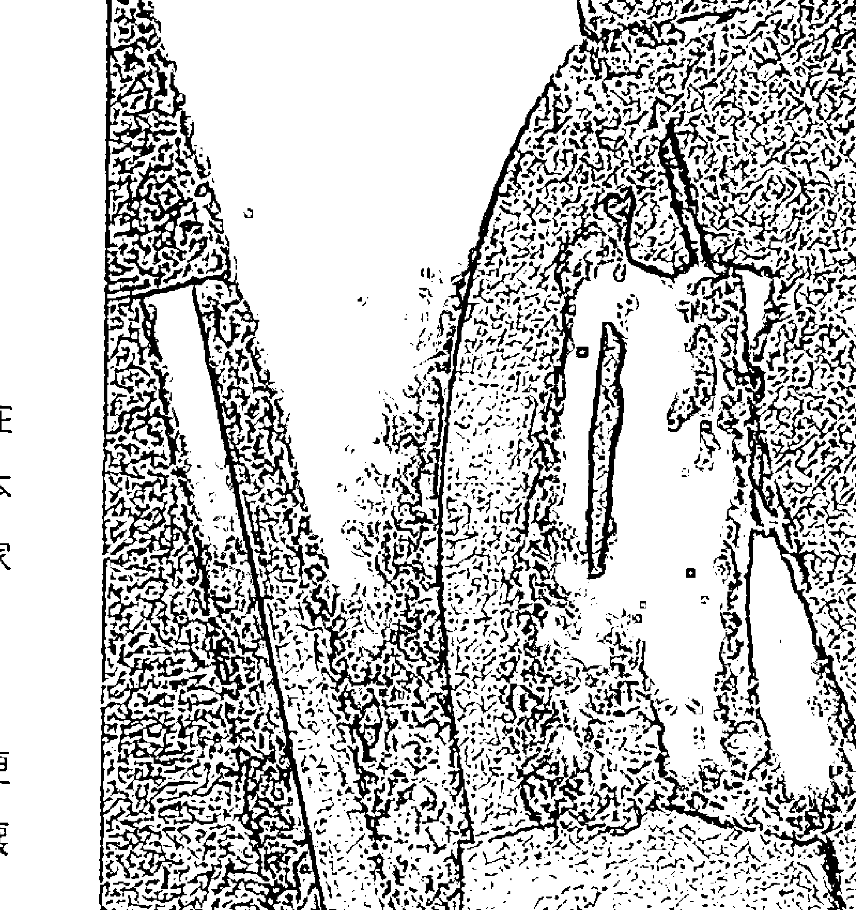

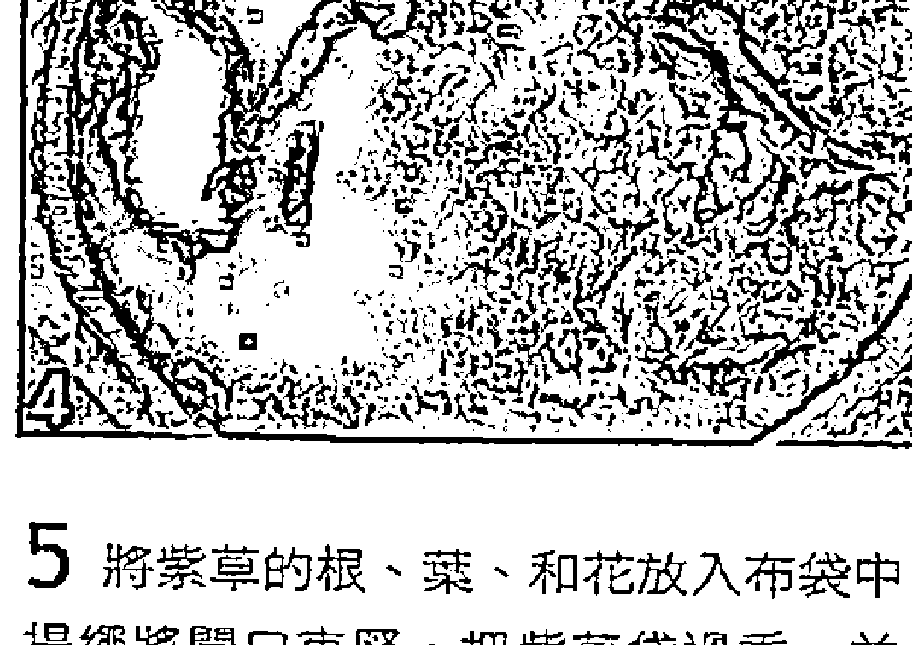

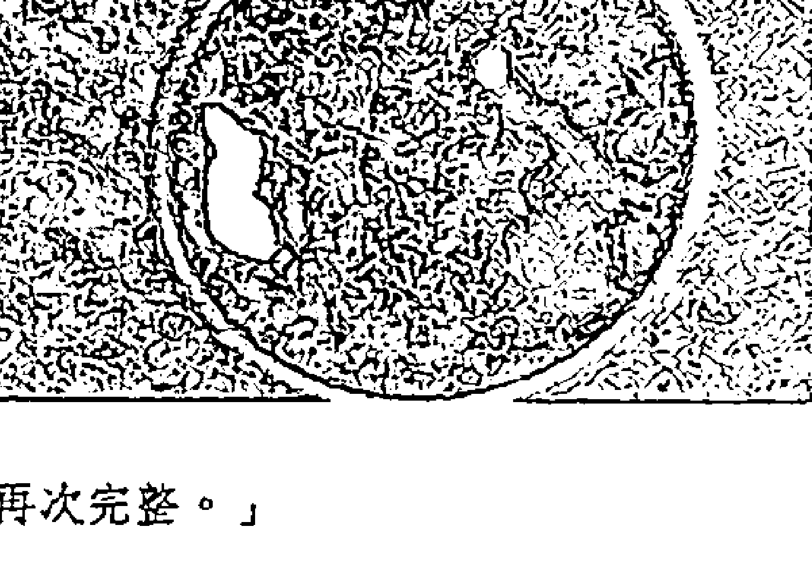

- 5. 将紫草的根、叶、和花放入布袋中，用提绳将开口束紧。把紫草袋过香，并念诵以下咒语至少8次，并想象争吵后的平静：「平息争吵，抚平伤痛，所有人的心将再次完整。」
- 6. 将紫草袋挂在家中最重要的地方即可。

> 平息争吵，抚平伤痛，所有人的心将再次完整。

### 精靈箭魔法

#### 讓討人厭的親屬遠離

【目的】不讓親戚來打擾你的生活，並打消他們不請自來的念頭。

【魔法背景】打火石箭頭在地球上不同地方各具有不同的意義，這項東西是從兩萬五千年前便開始出現，至今在英國及歐洲仍可以發現大量的打火石箭頭，其中大部分都是新石器時代的產物。在許多廢地被犁耕、大雨沖刷或是洪水退去後仍可以發現這種史前工藝品的存在。也因它們是如此地常見，因此鄉間民众多叫這些打火石箭頭為「精靈箭」，並賦予它們較不尋常的起源。
從它的俗名可知，精靈箭被認為是精靈所遺留下來的武器，並被認為是精靈用的標槍，當精靈不高興或想惡作劇時，便會向人類或動物射出精靈箭。它們也有魔法的意義，並且被當作護身符或避邪物，其中最重要的長處就是保護的力量，也就是本魔法所利用的力量，可以讓討人厭的親戚遠離。
如果你沒有這麼好運，剛好有新石器時代的打火石箭頭的話，那麼則應該去找一個拇指大的尖頭打火石，你可以到打火石很多的區域去找一個或是向石頭或晶石業者詢問。

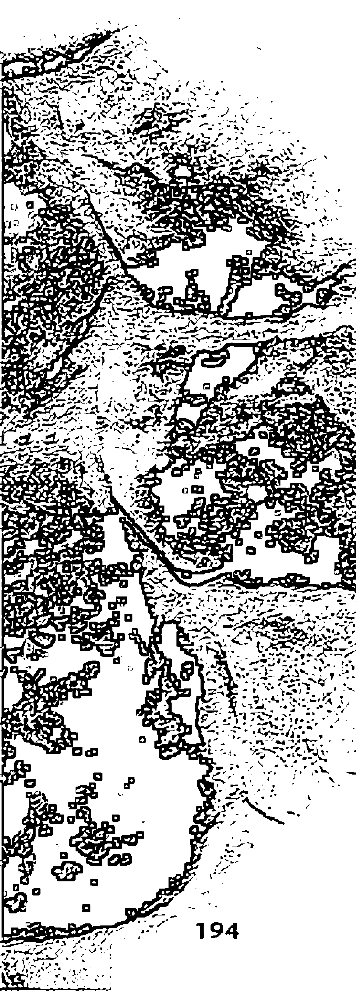

##### 如何施法

##### 所需工具與材料

- 1個裝有木炭的防火盤
- 火柴或打火機
- 1根長6～8吋或15～20公分的黑色蠟燭
- 1根長6～8吋或15～20公分的紅色蠟燭
- 1小塊打火石
- 火鉗子或鑷子
- 1茶匙的杜松莓
- 1個2x2吋或5x5公分的黑色抽繩袋

**施法時機** 在暗月或月亮漸虧時進行，而守衛力強的火星所支配的禮拜二，是最佳施法日。

##### 施法步驟

1. 根據第36到39頁的指示，設立結界。
2. 點燃木炭，再點燃黑色蠟燭說：「在黑暗的月光下。」接著，點燃紅色的蠟燭說：「在火星炙熱的光明下，魔法開始。」
3. 將打火石放在雙掌中，閉上眼睛想像，箭頭正指向那些正要進門且不受歡迎的親戚。

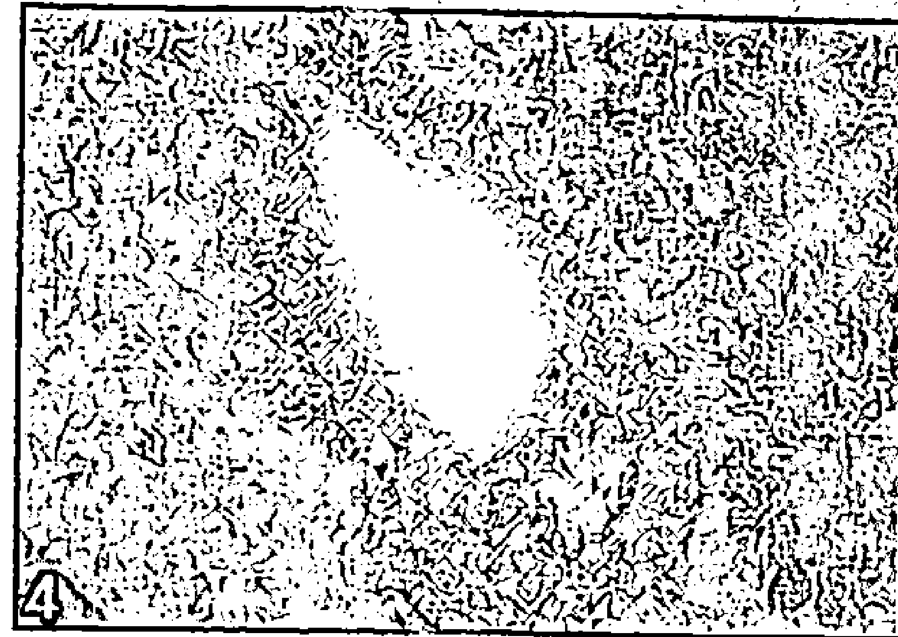

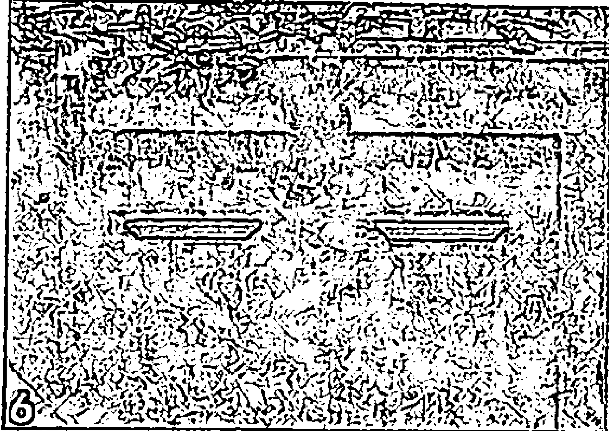

4. 將火鉗把打火石放在紅蠟燭的火焰上燃燒，並說：「在火焰中鍛鍊你，我的意圖將使你更堅硬。」
5. 將杜松莓灑在木炭上，並將打火石過香。
6. 將打火石放入抽繩袋中，掛在前門上。

# 家庭、朋友與居家的魔法

### 和諧焚香魔法

#### 促進家庭內的和諧

【目的】為你的家帶來和睦與平靜感。

【魔法背景】在魔法上焚香有許多的用途，它可以用來「淨化」心靈的空間、傳送心靈的訊息及幫助改變你的知覺狀態。除了它所散發出的電波外，焚香內組成的原料是進入象徵系統及其他超自然聯繫的關鍵，例如與女神或行星影響力之間的關係。本魔法中所使用的焚香原料，便是包括了上述焚香所有的功能，裡頭的元素不但有強大的淨化與冷靜力量，也有類似的魔法象徵意義。藉由焚香來召喚並散出魔法的意圖，其法力是非常強大的，因此，利用本魔法的混合焚香來煙燻整個家，將會帶來相當顯著的影響。

這個混合焚香裡的那些主要原料，可以在許多其他的魔法中看到。薰衣草被廣泛的使用在愛情、治療、及淨化的儀式上，也被拿來增進溝通，而溝通，正是為家庭帶來合諧的重要特質。蔥尾根也經常被用在愛情魔法上，乾燥的柳丁皮則可以促進友好的關係及增加心靈的成長。番紅花則可以增強洞悉力與第六感。這些材料的特質，相信將可以讓家中沉重的氣氛，更加「輕盈」。

##### 如何施法

##### 所需工具與材料

- 1個裝有木炭的防火盤
- 1根長6～8吋或15～20公分的粉紅色蠟燭
- 火柴或打火機
- 1茶匙的鳶尾根粉末
- 1茶匙的乾燥薰衣草
- 1茶匙的番紅花
- 搗杵與研缽
- 2茶匙切碎的乾燥柳丁皮
- 1個真空罐

**施法時機** 在月亮漸盈時進行可帶來和諧，應於熱愛和平的金星所操控的禮拜五施法。

##### 施法步驟

1. 根據第36到39頁的指示，設立結界。
2. 點燃木炭，再點燃蠟燭說：「愛之星、和平之星，請見證並帶給魔法力量吧。」
3. 將鳶尾根、薰衣草和番紅花放入研缽中，完全搗碎，並同時唸誦：「願愛隨著所有的改變而來，願所有的改變隨著愛而來。」

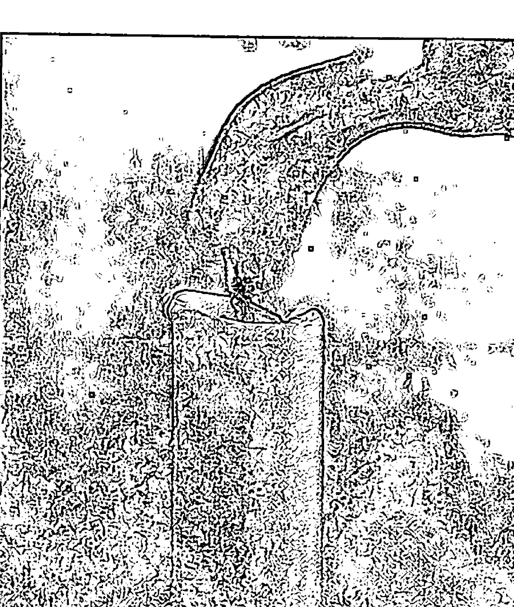

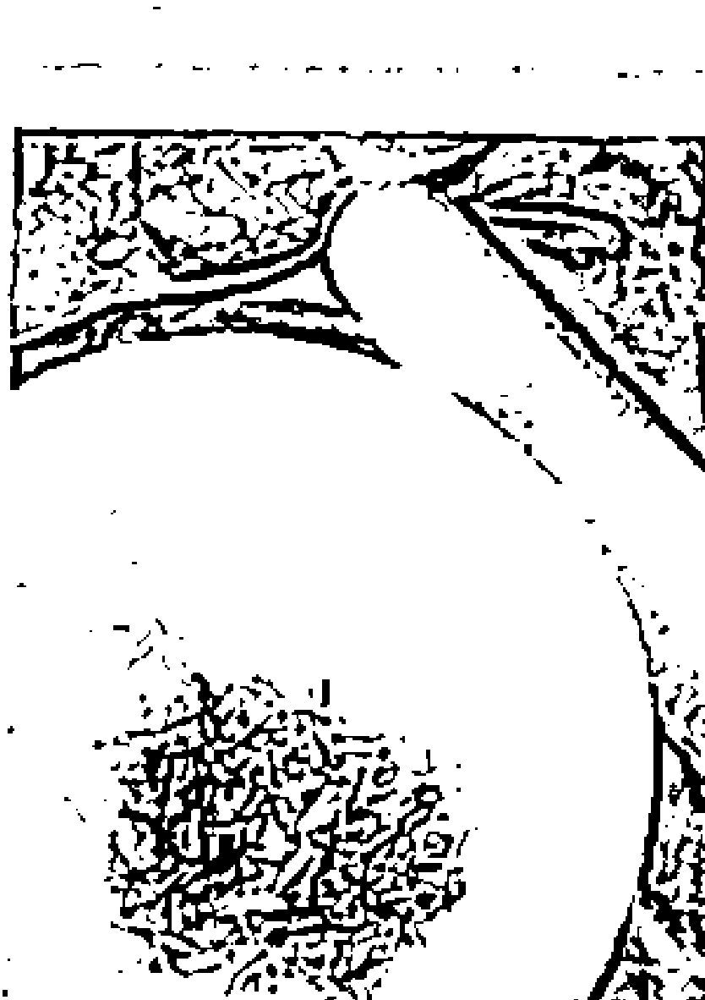

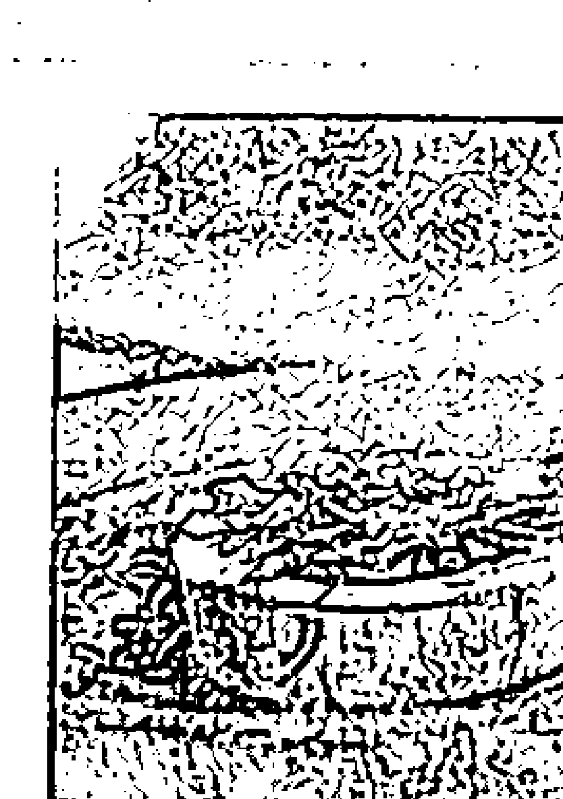

4. 再加入切碎的柳丁皮，拿起一些磨碎混合後的焚香，灑入木炭中說：「結界已經打開，魔法將無堅不摧。」
5. 將正在木炭上燃燒的焚香，以順時鐘方向，香薰家中每一個房間，並於過程中適時加入適量的焚香。
6. 返回吹熄蠟燭，魔法便完成。將剩下的焚香密封在真空罐，如果密封的好，則焚香可以放上一段時間。你也可以去增加2倍或3倍焚香的量，這樣一來，當家中又有麻煩產生時，便可以隨時重複香薰的步驟，帶來家庭的合諧。

### 馬鈴薯魔法
消除不好的氣氛

【目的】消除任何原因所造成的壞氣氛。

【魔法背景】如果你正在翻找本書尋覓可以消除低氣壓的魔法，那麼看到這裡，你大概就知道本魔法是應該被用在怎樣的情況下了。有時候你可能會在家中某個房間或是某個地點感覺到不舒服，或有「不好」或「令人戰慄」的感覺。這種感覺，就像不小心踏進一間正在爭執的房間或是充滿對峙敵意和緊張氣氛的公司一樣。有些比較膽小的人可能會認為家中「鬧鬼」。

人類對一個地方所產生的感覺是一種神秘的第六感。有些人初到某處卻感覺到有歸屬感，沒有其他的原因，只是因為這個地方，讓人感覺像在家中一樣的平靜。所以，人類也有感知壞氣氛的能力並會希望移除這種感覺。當你消除了不好的氣氛後，可以用更好的氣氛去取代它，舉例來說，你可以使用本章第196-197頁的合諧焚香，來帶入合諧的平靜感。

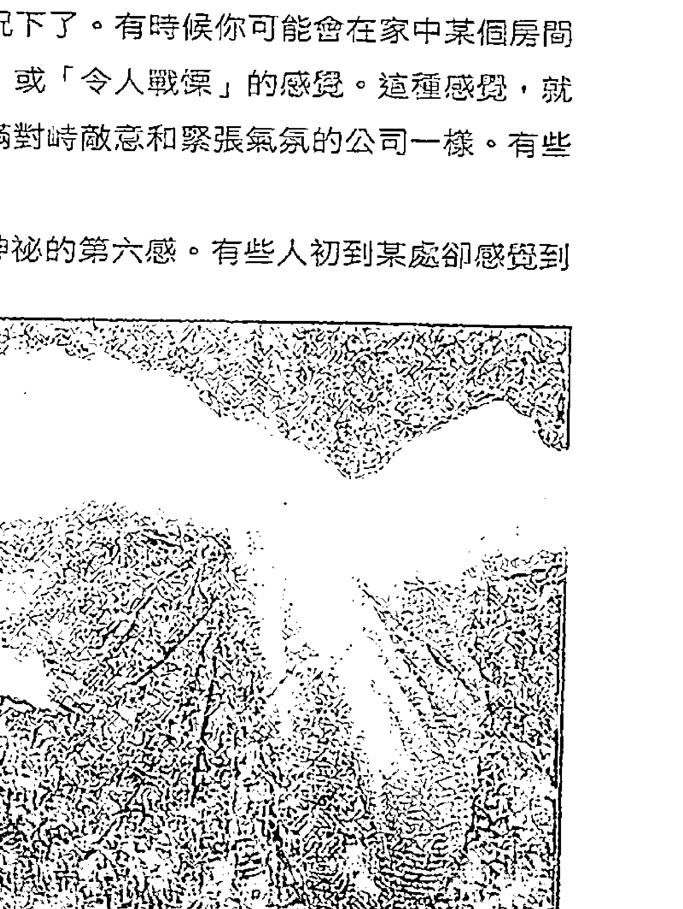

##### 如何施法

**施法時機** 在暗月或月亮漸虧時進行，由驅逐者土星所支配的禮拜六，是最佳施法日。

**施法步驟** 在設立結界前24小時，先將馬鈴薯切半，將兩半馬鈴薯，放到感覺有問題的房間內的北方與南方。而欲開始施法前，在感覺到有問題的房間內，照東、南、西、北四個方位，依序點燃火柴棒，並讓火柴棒完全燃燒。將切半的馬鈴薯及燃燒後的4根火柴棒帶入結界中準備開始施法，注意施法的房間必須不能是感覺到有問題的那個房間。

1. 根據第36到39頁的指示，設立結界。
2. 點燃黑色蠟燭說：「召喚驅逐者土星，請賜給我魔法力量。」
3. 用燒過的火柴棒，將兩半馬鈴薯重新接回去。把火柴棒的一頭插入其中半顆馬鈴薯，另一頭插入另外半顆馬鈴薯中即可。
4. 把接好的馬鈴薯放到乾酪布中，並將四角綁起。

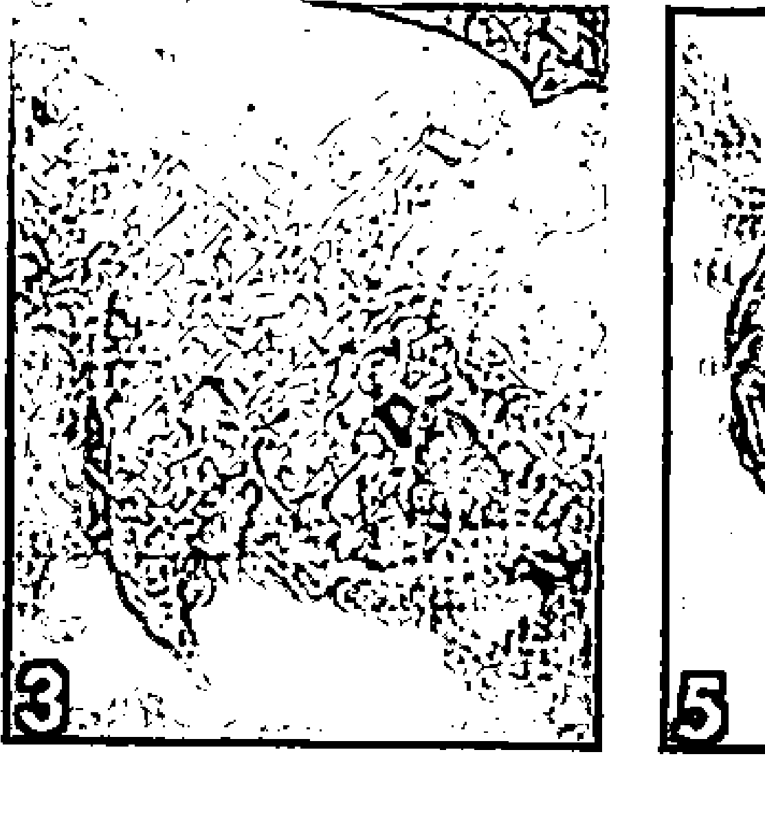

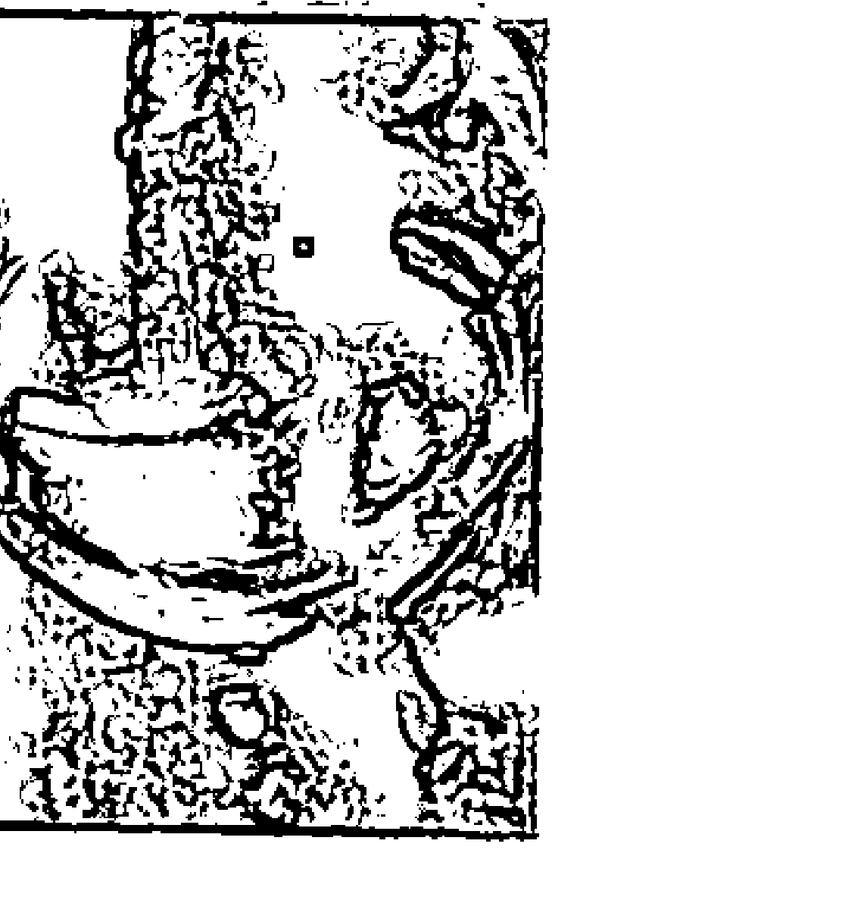

##### 所需工具與材料

- 1個大馬鈴薯
- 1盒火柴
- 1根長6～8吋或15～20公分的黑色蠟燭
- 1條長12吋或30公分的白色乾酪布
- 1茶匙放於蛋杯中的鹽
- 1杯裝水的高腳酒杯

5. 將鹽倒入水中，並說：「兩者的結合帶來真正的純淨。」接著重回有問題的房間，將鹽水灑在房間的四周，並說：「這個房間已被淨化，唯有女神才可進入。」
6. 將包著馬鈴薯的乾酪布，遠離住家掩埋。

### 蜜糖魔法

#### 吸引受歡迎的訪客上門

【目的】幫助喜歡在家裡度過愉快時光的人。

【魔法背景】本書中有許多魔法都有我推你拉的元素在內，因為它們都是在吸引、驅逐相關的人事物。對於喜好交際的人來說，這個魔法是非常吸引人的，它可以為你帶來許多受歡迎的訪客。本魔法是使用感應魔法中較直接的象徵，以通往前門的糖霜軌跡來象徵可以吸引有趣的客人前來。
使用「魔粉」是在世界各地是廣為熟知的魔法傳統。有些魔粉是混合製作用來驅散敵人，不過大部分仍主要在吸引愛人或是帶來金錢與好運。本魔法所使用的魔粉則是用來將好同伴帶到你的身邊，而你也可以因此經常製作本魔粉，需要一些耐心。

另外需要注意，本魔法所建議擺放魔粉的方位是需要不受干擾，並能接受陽光照射，以方便晒乾。

##### 如何施法

##### 所需工具與材料

- 1根長6～8吋或15～20公分的紫色蠟燭
- 火柴或打火機
- 4盎司或115克的砂糖
- 1小撮的番紅花
- 1茶匙磨碎的蒲公英根
- 3滴柳橙精油
- 1個碗
- 1個木質湯匙
- 1張報紙
- 1個真空罐

**施法時機** 在月亮漸盈時進行，來吸引訪客上門，並應於象徵風趣的木星所掌控的禮拜四施法。

##### 施法步驟

1. 根據第36到39頁的指示，設立結界。
2. 點燃蠟燭說：「偉大的愛，歡樂的提供者，請將有趣的同伴帶來這裡。」
3. 將砂糖、番紅花、蒲公英根和柳橙精油全放入碗中攪拌，並唸誦：「就像蜜蜂迷戀蜂蜜，陽光親吻花朵，潮汐追逐河岸一樣，讓歡樂迎向我吧！」

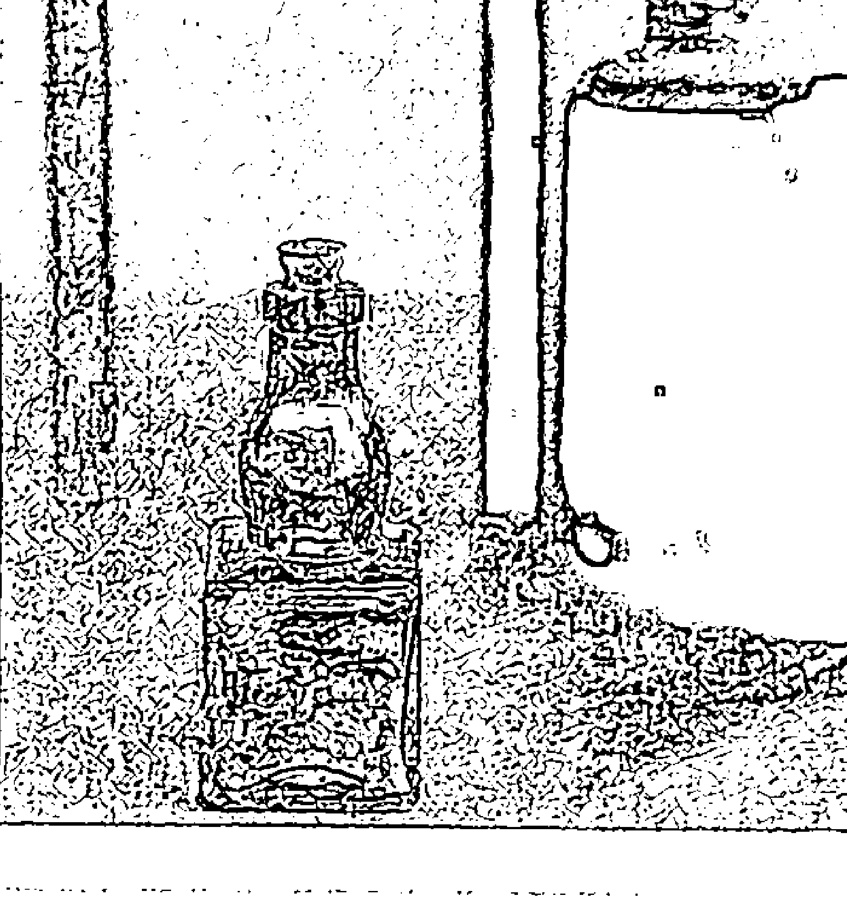

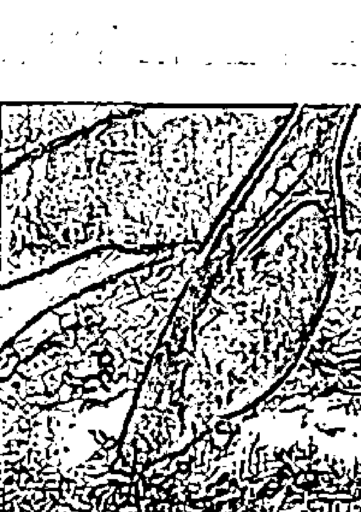

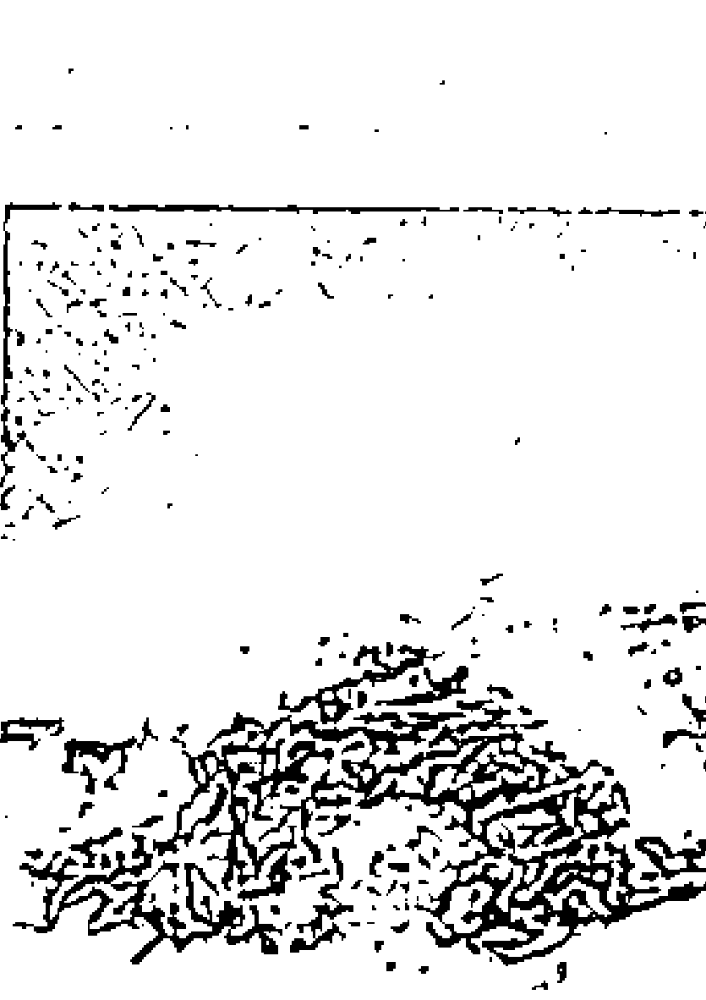

4. 當你在攪拌的同時，讓你的思緒隨著咒語漂流，試著想像從你的家門，往外面的世界射出一道耀眼的金色光芒，許多親朋好友，正從世界各地，隨著這道金光前你家門前。持續唸誦咒語並攪拌，直到碗裡的東西，完全均勻地混合為止。
5. 將碗中攪拌均勻的混合物，平整的舖在報紙上，並放在太陽下晒乾。
6. 將晒乾後的魔粉放入罐子裡，當你需要朋友前來陪伴時，用湯匙將罐子裡的魔粉，放在前門外擺出一條直線即可。

### 魔法罐魔法

#### 保護不受惡鄰居的侵擾

【目的】避開惡意與刁難。

【魔法背景】穩定的家庭生活空間若是任何外界的干擾都會危及我們的健康與內心的平靜。隔壁鄰居惡劣或自私的行為所造成的憂慮，就好像讓一切都失去了控制，連原本的平靜都被侵害。這種情形當然要溝通，但常常是非常難處理的，但有時也是可以達到彼此的折衷點，在施法之前，先試著和鄰居溝通出一個合理的妥協方案是會有相當的幫助。

將密封魔法元素的容器埋入土中，是一個流傳許久的風俗，這樣做有許多不同的目的，包括封印危險的事物或抵擋邪惡的力量。本魔法在幾經流傳後，產生了許多不同的版本，在這裡的版本，是在世界許多地方最常看到的版本。

本魔法所召喚的女神是安妮絲，是保衛旅人的女神，專門保護那些深受迫害的人，因此你要確定自己的立場是正義的，並在與鄰居的爭執中所代表的是有理的一方。

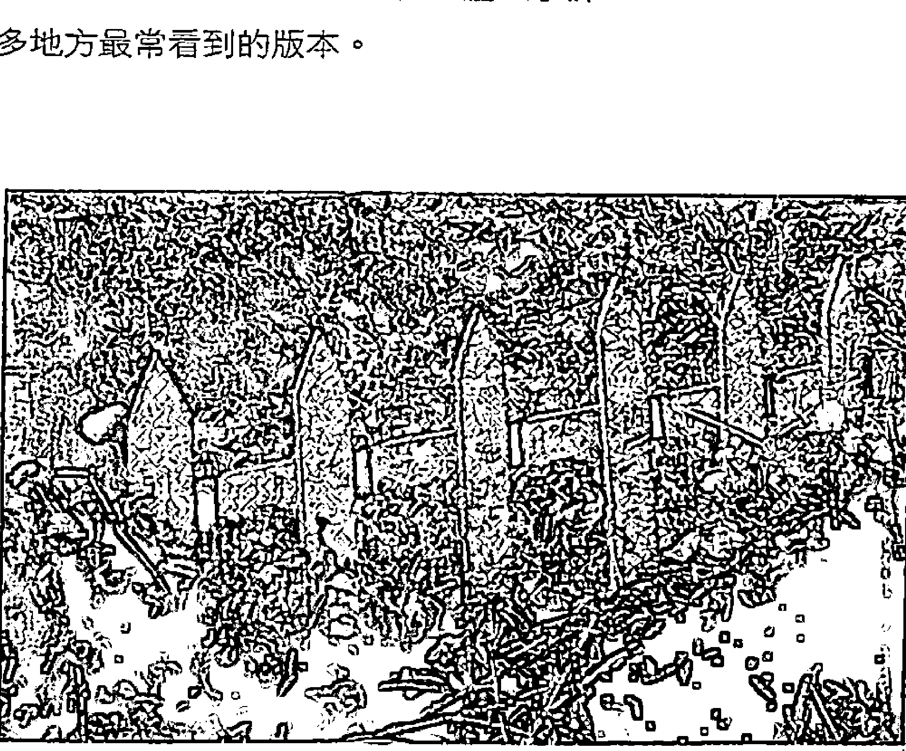

##### 如何施法

**施法時機** 在月亮漸虧、接近周期尾聲時進行，而與土星有關的禮拜六是較適合的施法日。

##### 施法步骤

1. 根據第36到39頁的指示，設立結界。
2. 點燃燈燭說：「有著嚴峻面容的土星，請賜與法力並傳達訊息，為我抵擋外來的邪惡，讓始作俑者得到三倍的不幸。」
3. 將刺放入罐子裡，並說：「把你自己丟入荊棘中，只流下污穢的鮮血。」
4. 將紅辣椒也放入罐子裡，並說：「讓惡言惡行者，咬人卻被反咬。」

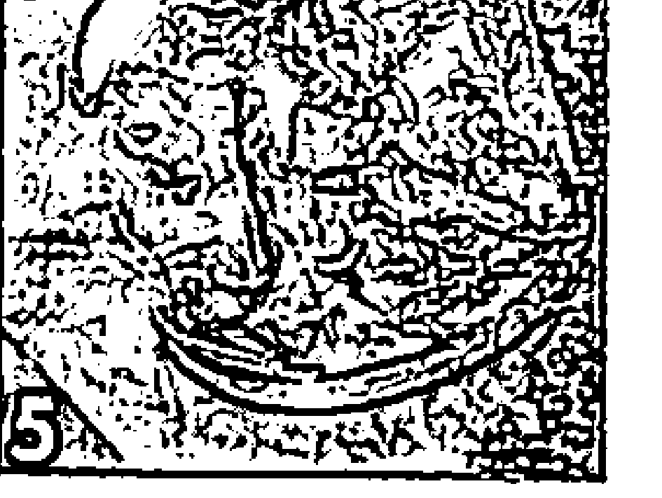

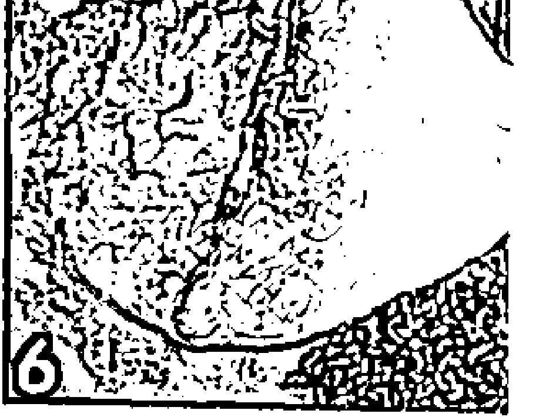

##### 所需工具与材料

- 1根長6～8吋或15～20公分的黑色蠟燭
- 火柴或打火機
- 9根黑刺李樹的刺
- 1個真空罐
- 3根紅辣椒
- 1茶匙的辣椒粉
- 1條可包住罐子的乾酪布

5. 將辣椒粉也放入罐子中，並說：「南方的烈火，飛入邪惡之口。」將罐子封緊。
6. 將罐子以逆時針方向，繞燭火3圈，每繞一圈便說一次：「不再與你相往來。」用乾酪布將罐子整個包起，並埋在靠近前門的土裡。

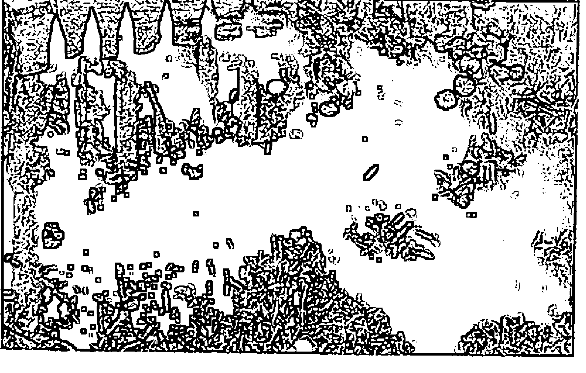

### 水星魔法 幫助家裡的溝通

【目的】讓家中的溝通更加順暢。

【魔法背景】有效溝通的能力是人生中非常重要的技巧，而人際關係之間的溝通更為重要。在同一個環境中生活的人，更必須要能夠溝通彼此的需求和意見，否則，家人或室友間的誤解，會讓家中生活更加地分裂與混亂。

與各種溝通有關的水星就是本魔法中主要召喚的力量。可塑性很大的物質－汞，又稱作水銀，被認為是一種「活性」的物質。由於那是一種有毒的物質，因此在這裡是用融化的蠟來代替。而蠟上所刻入的象徵符號，同時代表水星，也代表金屬汞。這個符號將會成為護身符，幫助更順暢地溝通，讓家中運作地更有效率，彼此間的誤解也能降到最低。

##### 如何施法

##### 所需工具與材料

- 1個裝有木炭的防火盤
- 1根長6～8吋或15～20公分的黃色蠟燭
- 火柴或打火機
- 2茶匙等量的薰衣草、松針及檸檬草
- 1個白色家用蠟燭
- 1個塑膠或金屬的茶杯墊
- 1枝拿來在蠟上刻字的小松樹枝
- 1個邊長2吋或5公分的方形抽繩袋

**施法時機** 在月亮漸盈期間以及由訊息使者－水星所主宰的禮拜三進行施法。

##### 施法步驟

1. 根據第36到39頁的指示，設立結界。
2. 點燃木炭，再點燃黃色蠟燭說：「親愛的水星，敏捷的訊息使者，請保佑並賜與魔法力量，請站在我這邊吧！」
3. 將薰衣草、松針以及檸檬草混入木炭中，並將木炭隨著順時鐘方向在結界中移動，接著點燃白色蠟燭。

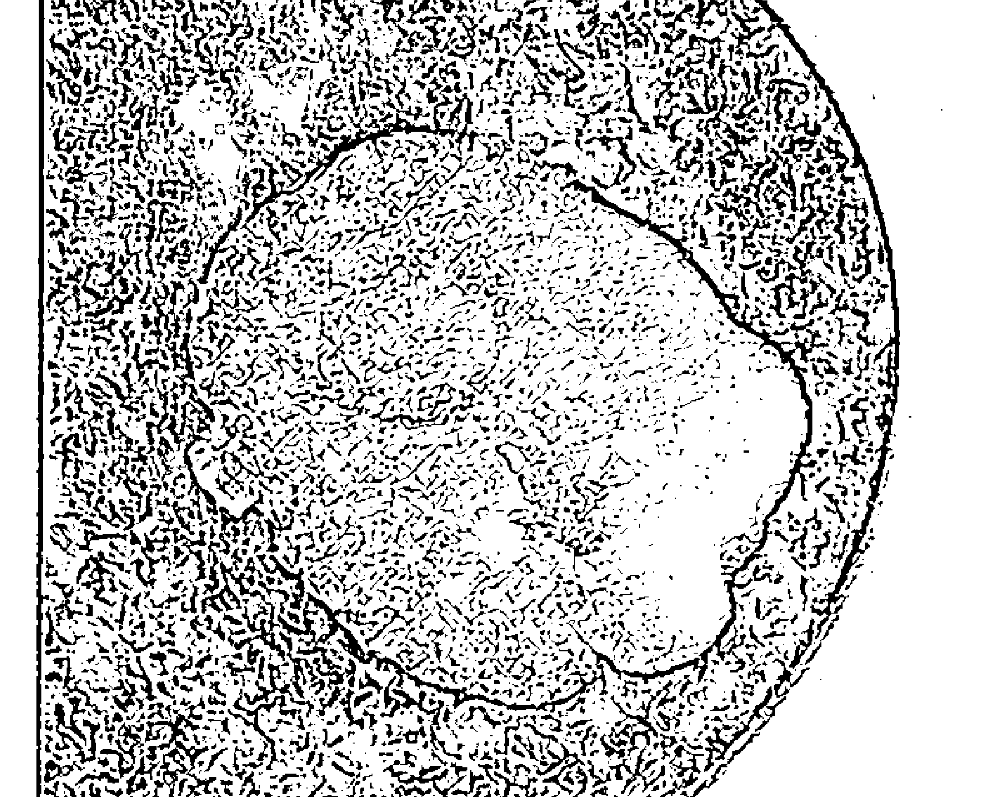

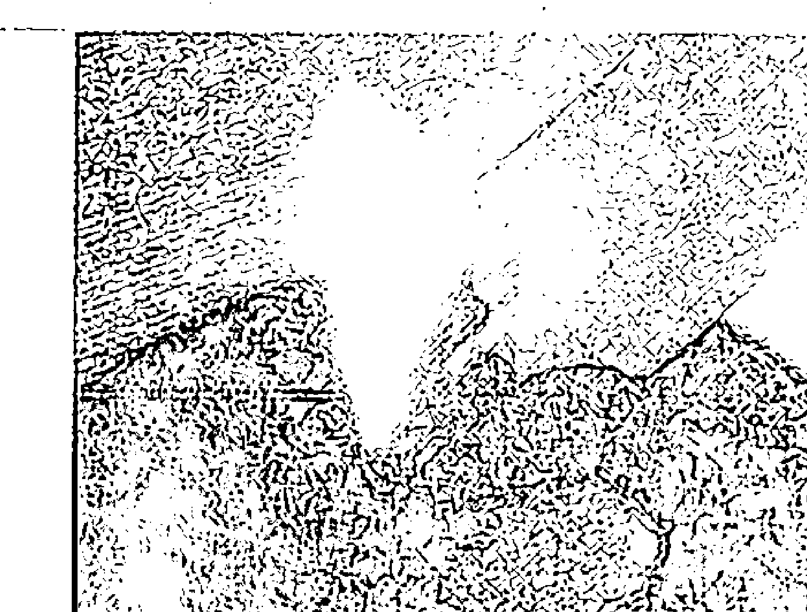

4. 讓白色蠟燭上的蠟滴落在杯墊上，形成一個直徑大約1吋或2.5公分的橢圓形小薄。當蠟仍未凝固前，在上面刻上水星的象徵符號 (上方有一個箭頭的圓)。
5. 讓蠟自燃乾硬後，將蠟完整無缺地拿起，放入抽繩袋中綁緊。朝袋上吐氣，並說：「用我的氣息將你彌封，用我的渴望指示你的方向。」
6. 將布袋掛在大家最常走動的房間門口。

### 地龍魔法

#### 讓花園美麗茂盛

【目的】讓花園裡的花草植物生長得花團錦簇、生氣蓬勃。

【魔法背景】古老的風俗、習慣或傳統都充斥著關於自然管理、豐收與四季變化的「信仰」，這顯示出魔法長久以來皆被用來確保未來的豐收與成長。有個非常古老的習俗，認為在收成之後夫妻應在農地上交媾，因為這在象徵上是為明年的穀類繁殖作準備。你可以放心，本魔法並不會要你在四周街坊鄰居面前照著上面的指示去做，而是依照這個原則，以象徵物質來代表地球從貧瘠到豐收的轉變。

這裡最重要的元素就是空蝶蛹，這是一般代表轉變的象徵。如果你是一個很注意生態並會種植吸引蝴蝶植物的人，要得到一個蝶蛹並不會太困難。但是在這裡，這兩者你都不需要，你只要與地方上的蝴蝶保護中心聯繫，看看對方是否願意幫忙，或是到一般的昆蟲標本商店詢問即可。

本魔法是召喚巨龍的力量，它代表大地無窮的自然能量。認識並尊敬這種力量可以幫助你走進更深的魔法領域，在這個領域中自然的律法和生命的力量都非常地驚人。

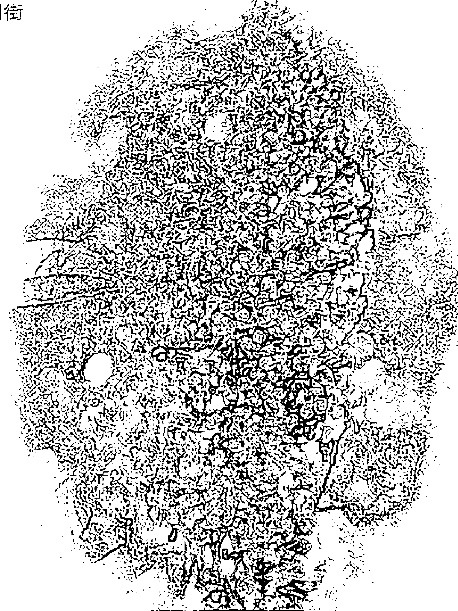

##### 如何施法

##### 所需工具與材料

- 1個裝有木炭的防火盤
- 1根長6～8吋或15～20公分的綠色蠟燭
- 火柴或打火機
- 檀香木
- 3滴虎尾草精油
- 1枝綠色墨水的鋼筆
- 1張1x 1/2吋或2 x 1公分的紙條
- 1個空的蝶蛹
- 1茶匙的芥末種子

**施法時機** 本魔法須於早春時進行並於新月時施法，能夠產生最大的成長。

##### 施法步驟

1. 根據第36到39頁的指示，設立結界。
2. 點燃木炭，再點燃蠟燭，並說：「發自於體內、環繞於四週的大地力量，生命即將吞噬火焰並乘風破浪而來，美好的大地將成為生命孕育的搖籃。」
3. 將檀香木和虎尾草精油放入木炭中。
4. 用鋼筆在紙條上寫下：「巨龍」、「大地」、「豐收」。將紙條捲成一小捲，並塞入蝶蛹中，接著也把芥末種子放入蝶蛹中。
5. 讓蝶蛹穿過木炭煙霧中，反覆吟誦紙捲中的字3次。
6. 將蝶蛹埋入花園的中心。

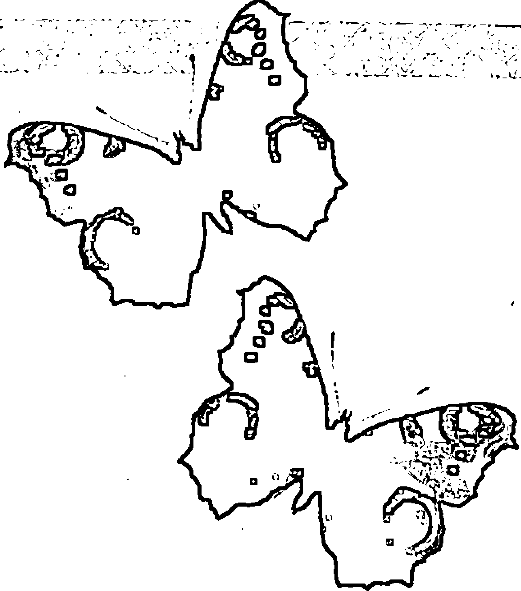

# 自然節氣的魔法

## 自然節氣的魔法介紹

在神聖年輪中的慶典都有自己所代表的魔法力量和意義，許多巫師及法師都會注意到一年中不同的時節都有各自適合的不同魔法。這些魔法都與不同季節的人類需求有關聯來應付在每個季節中普遍存在的需求或力量。舉例而言，在Yule，人們強烈的渴望太陽，因此便會利用魔法來汲取太陽的能量，讓自己在寒冬中更加有力量。同樣的，在Eostre，當人們開始進入一年中逐漸明亮的時節，我們會更需要外在與內在的平衡，讓自己增加往外面發展的能量，來幫助渡過並前往下一個季節。

在第26~35頁中有這一年中重要的八個節慶的相關介紹以及它們的中心意義與個別的傳統。但這部份的介紹仍未屇詳盡，事實上，若要詳細解釋這八大節慶的歷史、習慣和魔法意義，那麼每一個節慶皆可獨立成為一本書的內容。這部分只是提供大概的架構介紹，讓讀者能對後面的部份有整體的概念。在接

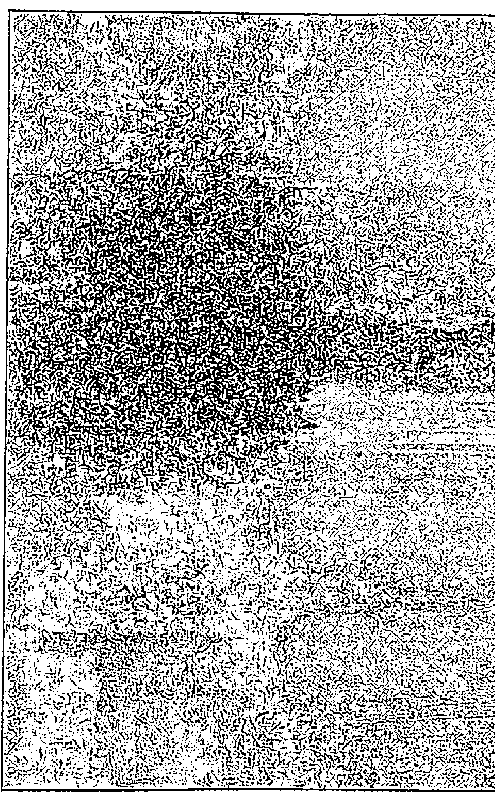

下来的內容中，你會發現這裡的魔法會根據時令的特性來安排最適當的魔法，而且每個節慶都是由3則與它相關的魔法所組成。例如來說，Imbolc初期是在融雪後適合開始播種的時期，因此有關於施行新計畫的魔法便應運而生。而由於Imbolc是由凱爾特火與療癒的女神—布莉吉妲所控制，因此也關於療癒或帶來健康的魔法。Imbolc也和正義及改變有關，所以包括得到正義的魔法。

以上是示範這個章節中的魔法安排，它們都與這八個時令的習慣或傳統息息相關。而不同的節慶魔法也會有特定設立結界的方法。例如，所有與Beltaine有關的魔法都必須在五月時進行來慶祝五朔節。而所有與Litha有關的魔法，則必須在專門慶祝夏至的結界中進行，以此類推。有些魔法感覺很像季節慶典中的部分儀式，這些魔法相對較有彈性，而可以被群體使用或進行，也因此可以召喚出更強大的集體能量。

### Yule—灰烬魔法

#### 讓即將來臨的一年繁榮與旺

【目的】為新的一個太陽週期帶來繁榮昌盛。

【魔法背景】關於Yule圓木的傳統要追溯到西元前的北歐世界，一般相信是與崇尚自然的宗教信仰有關，並且是在基督教出現之前就已經存在了數千年的時間。祖先們認為萬物都存在著生命力，而其中樹木更是聖人、神祇或是女神的靈魂住所。而某些特定的樹木被認為是神聖的植物，如果將這些樹木砍掉並以此升火燃燒，那麼燃燒後的灰燼被視為擁有強大的力量。Yule圓木的傳統其實是源自於11世紀早期的北歐，在那裡冬至被稱為 Yul (輪子的意思)。事實上，從許多的歷史遺跡可以知道，在史前的英國及愛爾蘭地區，冬至也已變為一年中固定的慶祝節日，而來自於丹麥的入侵者，只是將他們故鄉的傳統加於其上而已。

其中以橡木作為Yule圓木所蘊含的能量最大，但其實也是可以拿其他種類的樹木來使用的。

##### 如何施法

##### 所需工具與材料

- 1個開放的壁爐或戶外的營火
- 1根任何樹木的樹枝，需包覆完整樹皮
- 1把尖刀
- 6片乾燥的冬青葉
- 1根綠色的蠟燭

施法時機 於Yule施行本魔法，詳情請見第26~35頁。

##### 施法步驟

1. 在Yule慶典的前一天晚上，先在你的壁爐爐或室外升起大火。
2. 用尖刀在Yule圓木上刻下「聖足」。
3. 將圓木放入大火中，並將冬青葉置於圓木上。當大火中開始出現灰燼時，將這些灰燼從火裡取出。接下來為Yule慶典中的一部份，需於仔細設立的結界中進行：
4. 在綠色蠟燭上刻下你的名字（不要姓只要名字就好），並點燃蠟燭說：「你將代替我，為我帶來祝福與庇祐。」
5. 將一半的灰燼，繞著蠟燭圍成一個圓，並說：「就算歷經風雨，你也絕不動搖。」
6. 在另一半灰燼中，拿起一小撮的灰燼，保留到明年的Yule的灰燼魔法時使用。將其餘的灰燼，放在門階上，以確保繁榮豐收能在接下來的一年中找到前往你家的路。

### Yule—槲寄生魔法在冬天帶來力量

【目的】幫助你得到足以渡過寒冬的力量。

【魔法背景】槲寄生在草藥的領域中有著非常令人尊崇的地位，並且是督伊德教教徒的聖物。可能是它們半寄生的習性，而與繁殖力有深刻的關係，在Yule中所盛行在槲寄生下親吻的習俗，就是與這種特性有關。槲寄生會與力量有關，則有另一個原因—乳白色汁液的果實，祖先們認為蘊藏在果實之內、包圍在種子周圍的乳白色汁液和精液非常地相似，這種汁液象徵了創造生命的特質，也讓槲寄生因而知名。在魔法中，槲寄生代表了許多不同的能量與氣力，而本魔法所採用的象徵，來自於槲寄生與「太陽之樹」—橡樹之間的關聯。

將太陽帶回黑暗的大地是Yule慶典的部份目的。在這黑暗的時期，我們不只慶祝祈求太陽力量的重現，還積極的以此激發助長，也就是說，當我們在慶祝的同時，我們其實正在試著將太陽找回來。會這麼做其實並不是出自於人類能改變自然信念，而是對太陽將不在這嚴寒冬季中出現的恐懼。必須要了解很重要的一點，我們不只慶祝祈求太陽的重現，我們還藉由近代的感應魔法來促進助長黑暗中的光明，也就是利用螢光、金箔和閃亮耀眼的飾品等。本魔法是利用太陽的力量，就像是槲寄生利用「太陽之樹」—橡樹一般。

##### 如何施法

##### 所需工具與材料

- 6根長6～8吋或15～20公分的白色蠟燭
- 1束乾燥的槲寄生
- 搗杵與研缽
- 3張邊長3吋或7.5公分的正方形白紙
- 1枝綠色墨水的鋼筆
- 1個防火盤

施法時機　於Yule施行本魔法，詳情請見第26~35頁。

##### 施法步驟

接下來為Yule慶典中的一部份，需於仔細設立的結界中進行：

1. 將所有的蠟燭圍成一個圓，並點燃其中3根，未點燃的蠟燭必須間隔在點燃的蠟燭中，並說：「在這太陽即將重回的季節中，願生命與力量也將再現。」
2. 以搗杵與研缽，將乾燥的槲寄生磨成細粉。
3. 選擇在你生命中，目前最需要力量的3個部份，將它們以名詞各寫在3張正方形紙中。例如：健康、活力、情緒等等。
4. 將槲寄生粉末倒入寫字的紙中折起，並將它們以燭火點燃。
5. 把點燃的紙與粉末，放在防火盤上燃燒，並點燃其餘的蠟燭。
6. 將燃燒後的灰燼，埋入長青樹下。

> 在這太陽即將重回的季節中，願生命與力量也將再現。

### Yule -Yule水果蛋糕魔法 找出新一年的發展關鍵

【目的】幫助在新的一年當中發現生命中主要的影響與改變。

【魔法背景】傳統上Yule是回顧過去一年的時刻，此時也正是冬至的時節 (此時太陽保持靜止)。在這個最黑暗的季節提供了人們一個喘息的空間，讓人可以回頭評估過去一年來的重要事件。此時，也正是向前看的時候，本魔法便是希望能幫助你如此。

在維多利亞時代的英國，將銀製符咒放入耶誕節或「豪華裝飾」銀製符咒布丁中的習俗在中產階級家庭中很盛行，而在較貧窮的家庭裡則是以硬幣來代替銀製符咒放入布丁中。其實這種習俗是仿效自一個更古老的傳統，在以往於Yule節慶中的慶祝者都會試著在Yule中所烤出來的豐富蛋糕中挖找，希望能找到裡面的葡萄乾或其他豐富的水果配料，這會預測他們在新的一年是否將會非常順利或得到幸運的收穫。相較之下，較古老的傳統似乎比較安全，不會有不小心被銅幣或金屬符咒噎到、劃破嘴巴或咬斷牙齒的風險。

你將會很高興，因為本魔法所使用的Yule水果蛋糕占卜的版本，不但安全又美味。這也同時是對那幾世紀以前的古老傳統致敬。

##### 如何施法

##### 所需工具與材料

- 1囤6盎司或175公克發酵過的全麥麵糰
- 4盎司或115公克的紅砂糖
- 4盎司或115公克的奶油
- 2盎司或55公克的混合乾果
- 1茶匙的五香粉
- 木質湯匙
- 12個蛋糕容器
- 12張2 x 1/2吋或5 x 1公分的紙條
- 1枝筆
- 12張3 x 2吋或7.5 x 5公分的鋁箔紙條

##### 施法時機

於Yule施行本魔法，詳情請見第26～35頁。

##### 施法步驟

1. 用湯匙或手將所有可食材與調味料混合直到完全均勻後，最後才放入水果。將所有的混合物，分裝在12個蛋糕容器中，以華氏400度或攝氏200度，放入烤箱中烘烤，使蛋糕變得結實、呈現金黃色為止。
2. 接下來為Yule慶典中的一部份，需於仔細設立的結界中進行：
3. 將下列文字，各寫在12張紙條上：健康 旅行 財富 心靈、家庭 朋友 愛情 開始、小孩 長輩 工作 時間。
4. 將紙條捲起，各放入錫箔紙條中包好，然後將所有的錫箔紙彈弄濕。將每個錫箔「紙彈」各埋入一個蛋糕中。
5. 選一個蛋糕，將裡頭的錫箔「紙彈」挑出。待蛋糕吃完，閱觧錫箔「紙彈」中的文字。
6. 將其他的蛋糕分送給朋友，並告知蛋糕的目的。要注意，須確保朋友吃蛋糕之前有先將錫箔紙挑出。
7. 你所選到的文字就是代表在接下來的一年中，你主要的發展與成長的部份。

### Imbolc—種子魔法 讓願望逐漸發展，並為新計畫帶來成功

【目的】保佑願望和照顧新計畫的進行。

【魔法背景】以季節上來說，Imbolc是代表春天第一朵花開的時節，也是融雪的季節，在歐洲代表的正是冬天正遠離、春天將降臨的訊號。此時也是開始播種的時候，在氣候比較寒冷的地區，農夫會開始特別注意泥土，看看是否夠溫暖而播種。同樣的，也正適合播種其他的「種子」－希望今年能進行的想法、計畫或方案。

本魔法的概念便是根據感應魔法的第一個原則－以形補形。你現在所種植的種子代表在未來數月之後將成真的願望。必須要在Imbolc結界中施法，將你對計畫的期望投入種子當中，接下來，你將種子種在良好的泥土裡仔細地餵養、施肥以及照顧它們，並要信任大自然會幫助它們成長，就像我們將願望委託在魔法身上一樣。當你在照料這些種子時，魔法也會同時幫忙照料你的願望。你必須好好的照顧它們直到Imbolc過去，如此才能確保你的願望會有美好的成果。

一年中的此時有許多種類的植物種子可供挑選，資源豐富的花匠應該都會有去年保存至今的種子。植物的種類並不重要，重要的是你照顧這些種子的心意以及種子本身是否夠大並容易處理。

##### 如何施法

##### 所需工具與材料

- 3根長6～8吋或15～20公分的白色蠟燭
- 火柴或打火機
- 9顆任何品種的種子
- 1枝筆和數張紙
- 品質好的一般土壤或盆栽植土
- 1根園藝小鏟子
- 1個室內花盆

施法時機 於Imbolc施行本魔法，詳情請見第26～35頁。

##### 施法步驟

接下來為Imbolc慶典中的一部份，需於仔細設立的結界中進行：

1. 點燃蠟燭說：「布莉吉妲請顯靈，我歡迎你的到來。」
2. 以在未來一年中希望能實現的願望，為每一顆種子命名。將這些願望寫下來，直到下次的Imbolc再拿出來回顧。
3. 把所有的種子放在右手中，左手呈杯狀覆於其上，並說：「她的氣息瀰漫大地，她的溫度帶給種子生命，神聖的布莉吉妲，請庇祐在我雙手中的生命吧！」
4. 將這些種子種入一般土壤或盆栽植土中。

### Imbolc—布莉吉妲之井魔法 恢復或帶來整體的健康

【目的】減低身體不健康的情形發生，並為新的一年帶來安康。

【魔法背景】Imbolc又被稱作為布莉吉妲的節日，這位專司療育的守護神是一位備受鍾愛的愛爾蘭女神。許多在布列塔尼、英格蘭、愛爾蘭、蘇格蘭和威爾斯的泉水及河流都是象徵她的代表，並且皆以布莉吉妲命名。但與她療癒力量關係最深的水源卻是井水。

在西元前，人們是非常地尊敬地方精靈，並將一些自然區域視為聖地。其中從地下冒出的泉水和井水，在當時的人眼中，不但是非常的特別，且具有治療的功效，包括一些眼疾或皮膚病等，並逐漸地被認為是布莉吉妲的神力所致。在本魔法中，你必須要象徵性地以陶器、石缽或杯子來重建布莉吉妲之井。由於布莉吉妲療癒之井是一種超自然的象徵，所以我們所重建的象徵物，與代表布莉吉妲的克戴爾之井、愛爾蘭之井水及威爾斯的河流都具有相同的力量。你可以有3個關於恢復健康的請求，但其中要有一個是要求整體的健康。

##### 如何施法

##### 所需工具與材料

- 6根長6～8吋或15～20公分的白色蠟燭
- 1個石頭或陶器做成的杯子或碗
- 3顆水邊的小卵石
- 1小杯鹽
- 泉水
- 火柴或打火機

**施法時機** 於Imbolc施行本魔法，詳情請見第26～35頁。

**施法步驟** 接下來為Imbolc慶典中的一部分，需於仔細設立的結界中進行：

1. 將蠟燭圍繞在杯子的四周。
2. 以希望痊癒的疾病來命名每一顆石頭。取適量的鹽，灑在每顆石頭上。朝石頭吐氣，並說：「藉由我的氣息。」接著用你的雙手將石頭包覆其中說：「藉由我的血肉。」然後將它們放入杯子中，並倒入水，直到淹過石頭，並說：「藉由布莉吉妲的生命之泉，讓能量湧現，健康常存。」
3. 點燃所有的蠟燭說：「現身吧！火之女神。」
4. 將雙手緊握，並朝燭火靠近，閉上眼睛想像石頭的污點在水中被溶解而且懸浮於水面，並在燭火的燃燒下灰飛煙滅。
5. 反覆唸誦以下咒語，直到感覺到結界的能量為止：「大地、流水與火焰，行以布莉吉妲之名；大地、流水與火焰，實現我的願望吧！」將雙手舉到空中，釋放被召喚出的能量。
6. 在入夜之前，盡快的將所有的石頭放回原本的水邊。

### Imbolc—長布條魔法 獲得正義

【目的】 幫助有正當理由去抗辯的人。

【魔法背景】 Imbolc的守護女神布莉吉妲是個很保護女人、小孩和動物的守護者，也是正義與平等的支持者，而這個時期正適合祈求布莉吉妲這方面的力量。就像是此時逐漸增加的白晝光芒，讓藏在陰冷冬日裏的灰塵與污垢被照得更清楚，布莉吉妲的光芒，讓黑暗的惡行無所遁形，不過，春季大掃除用拖把及水桶就可以清乾淨，但要伸張正義則需要更特別的東西，也就是祈求得到正義及公平的魔法。

人們通常會在聖井上面的樹結上3條布條來祈願，因為這裡的超自然力量最強，不過這個古老的習慣在過去是為了在樹上留下請求痊癒與寬恕的標記。除了結在樹上的布條，本魔法還會召喚太陽、風和大地的力量來為你將正義的辯詞送入平衡的意念之網中。藉由布莉吉妲的庇祐，你的魔法並非復仇，而是彌補之前造成的嚴重不平衡。Imbolc是讓萬物有機會重來一次的時節，而恢復平衡也是整個過程的一部份。

##### 如何施法

##### 所需工具與材料

- 1個裝有木炭的防火盤
- 火柴或打火機
- 1茶匙的沒藥
- 1根長6～8吋或15～20公分的白色蠟燭
- 1根長6～8吋或15～20公分的紫色蠟燭
- 13條長12x3吋或30x7.5公分的白色棉質布條
- 1根枯樹枝

施法時機 於Imbolc施行本魔法，詳情請見第26～35頁。

##### 施法步驟

接下來為Imbolc慶典中的一部份，先於仔細設立的結界中進行，接下來再到戶外的樹下進行，並要盡可能讓你的魔法不被打擾：

1. 點燃木炭，並灑上沒藥。
2. 點燃白色蠟燭說：「布莉吉妲已顯靈。」
3. 點燃紫色蠟燭說：「正義即將降臨。」
4. 對著所有的布條訴說你對不公平對待的憤怒、恐懼和絕望，然後一條條將每個布條穿過木炭的煙霧，把怨言封存在布條中。
5. 將這些布條鬆散的掛在枯樹枝上，並將手放在最高的細枝上說：「布莉吉妲，請可憐這枯樹枝，但使敵人的立場和它一般枯萎頹敗。」
6. 外出到戶外的大樹旁，將布條鬆散的綁在大樹較下方的樹枝上，並說：「願樹根下的大地聽見我的心聲，願微風為我傳遞不平的哭訴，願太陽為我實現正義的請求，願月亮責難對方不實的毀謗，願布莉吉妲站在我的身旁，為我伸張正義光芒。」

# 自然節氣的魔法

### Eostre－野兔魔法 增強生育力

【目的】幫助沒有醫學理由所能夠解釋的不孕。

【魔法背景】野兔和生育力之間有著深厚的關係，一部分是因為這是自然界的事實，另一部份則是野兔與月亮女神之間的象徵關係。野兔強韌的繁殖力是眾所皆知的，一隻雌兔可以在一年之內生出42隻小兔子，所以兔子會與大地以及人類的生殖能力有所關聯是可以理解的。兔子在交配季節會在野地裡瘋狂地奔跑，這個時節正好就是Eostre，而此時也正是由日耳曼專司繁殖的女神歐斯達所支配。在一些文化中，兔子及生殖力常會和眾多的月亮女神之間有所關聯，但這樣的關聯是有他們自己的道理在的。其中一個可能的解釋就是從地球上所看到的月亮形狀很像一隻兔子。另外一個原因是月亮的週期常與女性月經的週期很相似，也因此兩者之間漸漸地也變成同義詞，月亮女神也漸漸成為是生育力、懷孕和分娩的守護神。也因為這樣，野兔變成許多女神的代表圖騰，包括英國的安德雷絲特女神、斯堪地納維亞半島的芙萊雅女神以及北歐的哈佛拉女神等。

##### 如何施法

##### 所需工具與材料

- 1根長6～8吋或15～20公分的綠色蠟燭
- 火柴或打火機
- 1枝筆
- 1條邊長12吋或30公分的方形白色描圖紙
- 剪刀
- 1條邊長12吋或30公分的方形黑色描圖紙
- 1顆家禽下的蛋
- 1條長18 x 1吋或45 x 2.5公分的黃色緞帶

施法時機 於Eostre施行本魔法，詳情請見第26～35頁。

##### 施法步驟

接下來為Eostre慶典中的一部份，需在仔細設立的結界中進行：

1. 點燃綠色蠟燭說：「讓歐斯達降臨吧，讓她的子民甦醒大地，喚醒歐斯達吧！」
2. 在白色描圖紙上劃下圓周約長9吋或23公分的兔子形狀，並將其剪下。
3. 将剪下来的兔子头放在黑描图纸上。把蛋放在剩下的白色描图纸上并用白色描图纸包住。
4. 用黑色描图纸包住白色描图纸及蛋，并说：「在子宫中孕育。」
5. 用黄色缎带将黑色纸包绑好，完全包覆其中的物品。
6. 将绑好的黑色纸包拿到室外，放入深约12吋或30公分的洞里，并说：「当野兔跳跃、月亮露出脸时，让我们一起长大吧！」

## 自然佈氣的魔法

### Eostre—門柱魔法

#### 平衡外在與內在的健康

【目的】幫助生活中各方面的平衡。

【魔法背景】人們除了在Eostre讚揚生育力的蓬勃，也同時慶賀著秋分這個時節。在此時，白晝與黑夜的長度相等，而白晝也將在未來逐漸增長，人們將進入一年中較光明的季節，這讓Eostre成為祈求自身外在與內在平衡的最佳時刻，最適合去留意健康狀況以及思考現在的生活方式，以了解如何可以幫助心靈與身體的平衡。

Eostre中的光明與黑暗的力量是相等的，我們將用白色與黑色蠟燭來代表它們，這也象徵是不同時空的門柱，穿過這裡人們將進入光明的季節。而站在這門柱之間，也就代表進入了魔法的世界，這裡沒有光明與黑夜的競爭，只有兩者完美的平衡。進行本魔法時，你必須要進入這樣的空間中去尋找平衡的源頭。因此，在設立結界之前需要花一點時間去思考生命中重要事物的優先順序、是否過分不平衡的部份以及得到平衡的可能性。

##### 如何施法

##### 所需工具與材料

- 1個裝有木炭的防火盤
- 火柴或打火機
- 等量乳香和沒藥混合的焚香
- 1根長12吋或30公分的柱狀黑色蠟燭
- 1根長12吋或30公分的柱狀白色蠟燭
- 2茶匙裝於淺碟中的杏仁油
- 1蛋杯量的鹽，並裝於盤上

接下來為Eostre慶典中的一部份，需於仔細設立的結界中進行：

##### 施法步驟

1.  點燃木炭並加入焚香。
2.  點燃黑色的蠟燭說：「在我左邊的為夜之柱，存在於其中的是沉潛蟄伏的萬物。」
3.  點燃白色的蠟燭說：「在我右邊的為光之柱，存在於其中的是成熟活躍的萬物。」
4.  在你的腳、膝蓋、胸部、嘴巴、和額頭，塗滿杏仁油，並說：「我以虔誠莊嚴的身軀進入神聖的聖地。」
5.  將鹽灑在兩根蠟燭之間的地板上，並踏在上頭說：「我以真誠淨化的心進入純淨的聖地。」接著反覆吟誦以下咒語：「站在白晝與黑夜的交界處，我只留下「平衡」兩個字，並祈求隻字片語的降臨。」
6.  閉上雙眼等待任何隻字片語的降臨。而出現在你腦海中的字便是在新的一年中得到內外平衡的關鍵。

施法時機 於Eostre施行本魔法，詳情請見第26～35頁。

### Eostre—黄水仙魔法

#### 得到生命中各方面的成长

【目的】許下和生命中各方面有關的願望。

【魔法背景】因為即將進入萬物滋長的夏季，這讓Eostre成為最適合許下新願望的時候。將魔法元素種在土中是一個由來已久的習俗，以花苞來施法，不但非常簡單、有趣，而且最重要的是很具效果。向潛藏生命的花苞許願是魔法世界非常喜歡的方式，但是截枝續養的技巧則是園藝家比較喜愛的方式，而非魔法師，因此本魔法在這方面與此有些不同。

黃水仙是一種春天的花，多出現在三月的英格蘭中，本魔法便是以此花命名。然而本魔法中所使用的花苞卻不是黃水仙，因為在Eostre的時節裡，黃水仙早都已開花。這裡的概念是對到夏天才會開花的花苞施法，並將施法的花苞與開花的黃水仙種在一起，讓黃水仙生育的力量可以轉移到花苞上。而花苞便可以得到黃水仙的特質並吸收你的願望，在未來成長並開花。

在許多將於夏季開花的花苞中選擇較堅毅、生命力強的品種，這樣你的願望才不會被害蟲吃掉破壞。

##### 如何施法

##### 所需工具與材料

- 1根長6～8 吋或15～20公分的綠色蠟燭
- 1根長6～8 吋或15～20公分的黃色蠟燭
- 火柴或打火機
- 數個將於夏季開花的花苞，一個花苞代表一個願望
- 裝有一般泥土或盆栽植土的中型室內花盆

施法時機 於Eostre施行本魔法，詳情請見第26～35頁。

##### 施法步驟

1.  點燃綠色蠟燭說：「藉此花苞。」
2.  點燃黃色蠟燭說：「藉此花朵，我召喚歐斯達的力量。」
3.  以每一個願望來為每個花苞命名。
4.  將花苞握於雙掌中，反覆唸誦以下咒語：「當夜晚逐漸縮短，花苞進入生命的開始；當白晝逐漸增長，我的願望也將隨之成長。」
5.  將花苞種入一般泥土或盆栽植土中。將雙掌放在盆栽的泥土上，並想像你所許下的願望，逐漸成長即將到來。
6.  將花苞盆栽放於室內，直到霜氣的威脅沒有了，再將花苞移至室外種在黃水仙中的旁邊。

### Beltaine－堅果魔法

#### 幫助堅守承諾

【目的】增強你的意志力，幫助堅守對自己的諾言。

【魔法背景】在一些異教徒神話中，Beltaine是慶祝綠林守護精靈和大地女神婚姻的季節，因為此時五月花叢盛開，就像是慶賀著女神的婚禮一般。而由於婚姻是必須要綠林守護精靈及女神共同宣示她們對彼此及後代守護的承諾，也因此讓Beltaine成為許下承諾並慶祝尊崇諾言的最佳時節。

事實上，此時不只是立下誓言而已，在接下來的一年中更要堅守信念的完成誓言。因此，在設立Beltaine結界之前必須要仔細思考承諾的內涵，詢問自己這個承諾是否必要或是流於不切實際以及可能要承擔的犧牲。你對自己的承諾可以與習慣、行為特徵或慾望等相關，並藉此讓自己改善生活各方面的的事物。但是要記住不管是什麼承諾必須都是你真正需要的，而且不能利用改變他人的習慣、美貌和習俗內涵等等來達成你的承諾。

堅果用來代表諾言也是在五月裡代表繁殖力的常見象徵。將堅果吃下肚，也就代表將魔法封印，幫助讓你將承諾逐字地吸收並豐富你的生活。

##### 如何施法

##### 所需工具與材料

- 1根帚柄
- 2根長6～8吋或15～20公分的綠色蠟燭
- 火柴或打火機
- 代表承諾的新鮮杏仁果，一個杏仁果代表一個諾言
- 1枝胡桃鉗
- 1顆檸檬榨出的檸檬汁
- 1個裝滿糖的醬油碟

施法時機 於Beltaine施行本魔法，詳情請見第26～35頁。

##### 施法步驟

接下來為Beltaine慶典中的一部份，需於仔細設立的結界中進行：

1.  將帚柄放在你的行走路徑中。
2.  將蠟燭各放在帚柄的兩頭，並點燃蠟燭說：「獻給在木頭裡的瑪麗安，獻給翠綠美好的傑克。」
3.  將杏仁果放在雙掌中，想像心中的承諾被保存在果核中，並對果核說出誓言。
4.  用胡桃鉗將杏仁果撬開，將果核的一邊沾上檸檬汁，並說：「雖然痛苦心酸，我仍將實現我的諾言。」
5.  將剛剛沾過檸檬汁的那一邊，再沾些糖上去，並說：「甜美的果實，我將真實的牢牢握住你。」
6.  將果核咬在齒間，並跳過帚柄，然後再將果核吃掉。如果你有一個以上的承諾，則需重複以上的動作進行一次。

### Beltaine—緞帶魔法

#### 吸引一個令人興奮的愛人

【目的】吸引一個新情人。

【魔法背景】Beltaine在過去一直被認為是一年中最充滿情慾的時節。許多十六世紀的英國教會都相當反對Beltaine的慣例儀式，就因為它沉浸淫樂的特質以及設在4月30日「歡迎五月」的戶外露營都給年輕人有機會離開長輩及地方神父戒備的耳目，而沉浸在交媾的歡娛中，這也難怪許多倡導反對婚前的性行為，並視這種行為為罪孽的教會人士會極力地想要禁止。

還好，仍有一些鄉村仍保持這個傳統，讓五朔節也可以繼續流傳，也能在英國繼續看到五朔節花柱。源自於過去的娛樂及遊戲，較晚期又新興另一種娛樂，稱為「Baltane愛的追逐」，這個習俗會讓每個人都變得有點瘋狂。遊戲本身有點像捉迷藏，男人會用緞帶將鈴鐺綁在他們的衣服上，而女人便要在樹林裡追逐這些男人。一旦被抓到，男人便要給女人一個吻，然後再回到派對中，繼續追逐交換彼此的口水。當然，有時也會有同性的伴侶或群體的派對，不過只是要追求單純的快樂而已。本魔法便是利用在Beltane愛的追逐遊戲或五朔節花柱上會看到的緞帶，藉以吸引還未出現的情人來到你的身邊。

##### 如何施法

##### 所需工具與材料

| 物品 | 數量/描述 |
| :--- | :--- |
| 精油用的蠟燭燃燒器 | 1個 |
| 水 | 2茶匙 |
| 伊蘭花精油 | 6滴 |
| 火柴或打火機 | |
| 綠色柱狀蠟燭 | 1根長12吋或30公分 |
| 橡皮筋 | 1條可以綁在蠟燭上的 |
| 紅色細長緞帶 | 2條長18吋或45公分 |
| 綠色細長緞帶 | 1條長18吋或45公分 |

施法時機 於Beltaine施行本魔法，詳情請見第26～35頁。

##### 施法步驟

在仔細設立的結界中進行：

1.  將精油和水放入精油燃燒器中並點燃燃燒器。
2.  將蠟燭緊握在雙手中，並說：「我所設立的五朔節花柱有我最多情的誓言，我的愛人將會在不遠的未來看到我的存在。」
3.  將蠟燭燭蕊下方1吋或2.5公分處綁上橡皮筋。
4.  將其中一條紅緞帶的尾端塞入橡皮筋中，並說：「他是如此美好，我將不再煩惱。」接著也將綠色緞帶的一端塞入橡皮筋中，並說：「他是這麼活潑調皮，請將他送到我身邊。」
5.  將另外一條紅緞帶的一端也塞入橡皮筋中，並說：「他將帶給我愛情，我將不會再離去。」
6.  點燃蠟燭，接著抽起所有的緞帶，將緞帶編織在一起並綁在手腕上，直到愛人出現為止。

### Beltaine—山楂魔法

#### 與綠林的靈氣交流

【目的】適合想要與大自然溝通交流並探索新心靈之路的人。

【魔法背景】在八個的節慶中，有其中兩個是在年輪中面對面的季節，它們之間有著許多很相似的特質，但也有許多方面正好相反。Beltaine和Samhain就是在一年之中相對的兩個季節，同樣也是不同世界的交界處最薄的時候。不過不同的是：在Samhain是死人和活人最接近的時候，而Beltaine則是人類與精靈世界最為靠近的時刻；也因為這樣，Beltaine成為最適合與自然界及綠林精靈溝通交流的時節。

許多的民間信仰也與這個時節有關，其中之一就是不能將綠色植物和山楂花帶入屋內的習俗。其實這反映了自古以來人類對精靈種族的畏懼，這些精靈在歐洲一些地方又被稱作「妖精」、「仙女」、「矮人族」、「照亮者」或「幽靈」。但近代的異教徒，反而是認為將綠色植物及山楂花拿進屋內是會帶來幸運的行為，不但能夠藉此顯耀戶外一片生氣蓬勃的生命力並會為家中帶來自然繁殖的力量。

有些人甚至會把一盤牛奶放到屋外來顯示對自然精靈的善意，不過大部分仍會懷疑那些自然精靈是否真會以優雅的貓或家犬的形式出現來接受屋主的善意。

##### 如何施法

##### 所需工具與材料

- 樹下一個私密的地點
- 1個裝有木炭的防火盤
- 火柴或打火機
- 1個小蠟燭
- 1個乾淨的罐子
- 2大湯匙乾燥的艾蒿

施法時機 於Beltaine施行本魔法，詳情請見第26～35頁。

##### 施法步驟

接下來為Beltaine慶典中的一部份，需於仔細設立的結界中進行：

1.  在樹下找一個地方，點燃木炭。
2.  坐下並將你的背靠在樹幹上，把小蠟燭放在罐子裡點燃。
3.  將艾蒿灑在木炭上，深吸一口薰香，並大聲地說：「綠林的精靈擁抱著愛與信任來到這裡，讓我虛心地向你學習，我別無所求，只望我們之間沒有胡鬧或傷害。」
4.  閉上雙眼開始冥想樹的生命力。讓你自己的思緒漫天漫遊並偶而加入艾蒿到木炭中。
5.  當你準備要離去時，從附近拿走一片葉子、樹枝、石頭或羽毛，回家後放到枕頭底下，直到下個滿月為止，這將會讓你好夢連連。

### Litha—火焰護身符魔法

#### 帶來太陽的能量與氣力

【目的】得到能量並且伴隨著你一直到冬至。

【魔法背景】Litha也稱為夏至，人們會在此時慶祝太陽的能量達到最高峰。在這個白晝最長的一天，人們會趕在白晝開始縮短前而崇敬太陽的力量。大部分的人都知道太陽對人體有一些正面的影響，所以在這個時節，人們會越來越外向、變得比較快樂和健康。本魔法便能幫你捕捉一些太陽的能量，並且伴隨著你渡過整個夏季、日照漸短的秋季及早冬，一直到冬至。

太陽元素的象徵就是「火」，就算是蘊藏一點點太陽的力量，也能帶給施法者莫大的能量。這個護身符便是利用太陽光芒這個強有力的象徵符號來具現這股力量。

本魔法必須在破曉之前到室外迎接夏至的日出。當天空破曉時，將護身符放在石頭或磐石上，讓第一道陽光可以照耀到它身上吸收太陽的能量。

##### 如何施法

##### 所需工具與材料

- 1根長6～8吋或15～20公分的紅色蠟燭
- 1根長6～8吋或15～20公分的白色蠟燭
- 火柴或打火機
- 1根尖銳的鐵釘
- 1個有上頭有穿洞的平坦圓銅片
- 1條長24吋或60公分的細繩
- 1個放在罐子裡的小蠟燭

施法時機 於Litha施行本魔法，詳情請見第26～35頁。

##### 施法步驟

接下來為Litha慶典中的一部份，第一部分需在室內仔細設立的結界中進行，完成後再到戶外迎接Litha的晨曦：

1.  點燃兩根蠟燭。
2.  用鐵釘在銅片刻下一個圓，並畫八條各穿過圓心和圓周的直線。
3.  將銅片握在左手手掌中，並將右手覆於其上，接著閉上眼睛。專注留在眼皮後暫留的蠟燭火燄，看著它慢慢地在你體內移動，穿過胸口，接著穿過雙手進入銅片中。
4.  將細繩穿過銅片的洞口，並將它帶到室外以迎接日出。
5.  將銅片放在石頭上、小蠟燭的旁邊，小蠟燭必須要等到破曉後才可點燃。當陽光灑上銅片時，舉起你的雙臂說：「將聖火點燃於其中。」
6.  隨身帶著此護身符，直到冬至為止。

### Litha—螺旋魔法

#### 製造旅行和認識新朋友的機會

【目的】創造旅遊的機會，為你帶來新的友誼。

【魔法背景】Litha正是一年中白晝與黑夜各佔一半的時刻，我們傾向將更多時間留在戶外。許多人會在夏季時開始計畫旅行，不只 是放鬆的假期，還有拜訪親朋好友的種種計劃等。人類在這個日照正好占半天的時節，似乎更加地群聚相處，也許是因為戶外活動 給我們更多安排旅遊或社交活動的彈性，或者是因为在這個太陽能量最強的時候，人們 擁有更多的能量往外發展。不管理由是什麼，此時是外出、計畫旅行機會和施行新友誼相關魔法的最佳時機。

在這裡所使用的螺旋形狀是一個象徵生命、死亡和重生秘密的古老符號，正是靈魂交流的符號。本魔法的目的就是幫助你招來旅遊的機會和認識新朋友的機運。由於你必須要到沙灘上施法，但在這個時節，充滿遊客的海邊應該沒辦法讓你擁有完全的隱私，不過如果你穿著泳衣並帶著毛巾就比較不會讓你看來這麼奇怪而受人注目。

##### 如何施法

##### 所需工具與材料

- 1個沙灘
- 1根至少長18吋或45公分自然掉落的樹枝
- 5個一樣大小的卵石

施法時機 於Litha施行本魔法，詳情請見第26～35頁。

##### 施法步驟

接下來為Litha慶典中的一部份，需於沙灘上進行：

1.  用樹枝的一邊，在沙灘上畫出一個邊長5呎或1.5公尺的正方形區域。
2.  想像一個白光圈完全圍繞著你和這個區域。
3.  站出區域外，用樹枝從區域的中心點開始，順時針方向畫出螺旋，螺旋內至少要有5條平行的線條，畫到碰及區域邊線為止。
4.  以順時針方向繞著螺旋走並將5個卵石放在螺旋的外圈上，每顆石頭的距離需相等。
5.  想像從各個石頭中，射出一條條亮光直線，並且會合於螺旋的中心點，形成一個有5個輪幅的輪子。看著這個輪子越轉越快，直到從地面升起並消失在空中。
6.  走進螺旋的中心，要小心不可破壞它的形狀，然後花些時間開始冥想，思考為了什麼想去旅行以及怎樣的友誼對你來說才有意義。

### Litha—海洋魔法

#### 帶來健康

【目的】賜與健康與痊癒的力量。

【魔法背景】這是另一個在海邊的沙灘上進行並與Litha有關的魔法。溫暖季節的樂趣就是較容易有出外旅遊的計畫，也較容易沉浸到大自然之中。許多人在此時都被吸引到海邊，在這裡人們可以盡情享受五大元素中的水，這個幾百萬年前，在這裡孕育了許多細胞並逐漸發展演化至今的生物圈。而在魔法的領域中，水代表了愛、平衡、自然正義和療癒，而最後一個正是本魔法所採用的象徵。

就如同Litha是在慶祝夏季陽光的力量—代表健康和幸福的象徵，我們便利用一個特別的魔法儀式，將太陽強大的能量與水的療癒能力結合。你必須在夏至日出的海邊進行這個魔法儀式來喚醒海洋女神—亞瑪娜，祈求她賜與你健康及療癒的能力。為了尊崇這位廣受愛戴的海洋女神，記得帶綠松石、珍珠或青貝來提醒你她所帶來的庇祐。

##### 如何施法

##### 所需工具與材料

- 1個海邊的沙灘
- 1根長12吋或30公分自然掉落的樹枝
- 3個裝於罐子裡的小蠟燭
- 火柴或打火機
- 1個高腳酒杯
- 1個不透水的大海貝

施法時機 於Litha施行本魔法，詳情請見第26～35頁。

##### 施法步驟

接下來為Litha慶典中的一部份，需於沙灘上進行：

1.  在凌晨時走到海水的邊緣，接著用樹枝在沙灘上畫出一個邊長6呎或1.8公尺的正三角形。
2.  將點燃的小蠟燭，放在三角形的三個頂點。
3.  站在三角形的中心，手拿著高腳酒杯，面向大海說：「海洋女神亞瑪娜，請懂我如你的子民並賜給我痊癒的力量。」
4.  當太陽升起時，帶著高腳酒杯到海邊裝滿水。
5.  回到三角形的中心，用海貝舀杯中的水，倒到腳上說：「讓我健康地行走。」舀水倒在頭上說：「讓我痊癒。」舀水倒在雙手上說：「如同我療癒我自己，讓我也有療癒他人的能力吧！」
6.  將杯中剩餘的水倒入三角形的中心點，並熄滅燭火說：「感謝亞瑪娜之恩典。」

### Lughnasadh—簸穀魔法
#### 帶走不好的習慣

【目的】幫助帶走有害的習慣。

【魔法背景】Lughnasadh正好是落在穀麥收割的時節，而在收割稻穀時要做的動作之一就是將穀子從粗糠裡篩出來，這又稱作「簸穀」。這個動作代表了我們人生中代表「收成」的象徵，而且在這個時期，我們認為好的事物都將開花結果，懷抱著感恩之心接受這些恩賜，並知道該將什麼東西丟出生命之外。

你需要多花一些時間去思考你在今年的個人收穫，體認並珍惜你生命中的一切，那些一直在支持你、回報你的外在及內在的特質。生命的事件也可以當作收成的一部份，舉例來說，一個心中懷抱的計畫終於開花結果、得到健康或獲得價值的經驗等等。從這些成果所得到的快樂更可以讓你知道有哪些東西是該被丟出生命之外，尤其是那些你可以掌握的事物，如行為的傾向等等。卸下不再需要的部份和慶賀豐足的收成是一樣重要的喔！

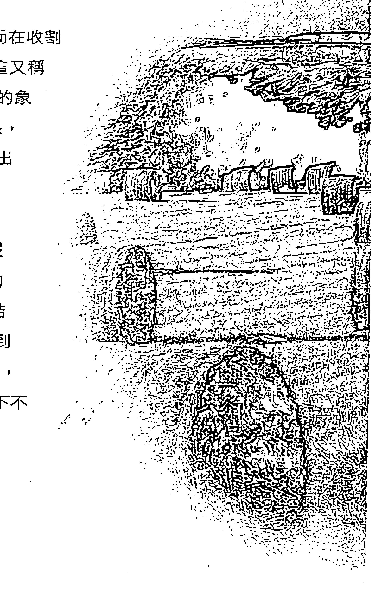

##### 如何施法

##### 施法時機
於Lughnasadh施行本魔法，詳情請見第26～35頁。

##### 施法步驟

接下來為Lughnasadh慶典中的一部份，本魔法第一部分需於沙灘上進行，然後再到室外已準備好的營火旁繼續施法：

- 1. 點燃蠟燭說：「那些從收成而來、我需要與不需要的果實，我將保留一些報酬，丟棄其餘的惡習。」
- 2. 在每張紙條上各寫下一個降臨到你身邊的好事或你希望丟棄的壞事。
- 3. 點燃寫下壞事的紙條，放在防火盤上燃燒成灰燼。
- 4. 將灰燼灑在寫下好事的紙條上，將每張紙緊緊地摺起。
- 5. 走到營火旁，將紙團一個個丟入火中，並說：「來自身邊的祝福和詛咒，請都重回大地，繼續滋養明年的收成。」

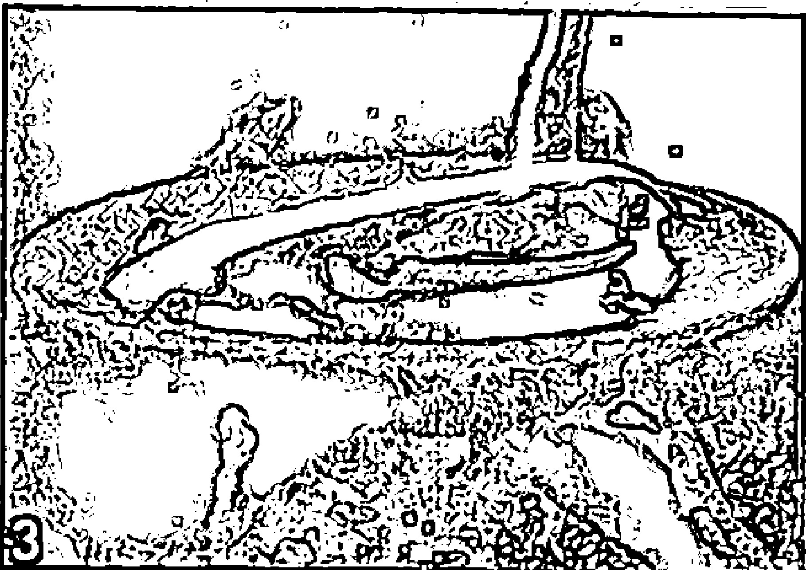

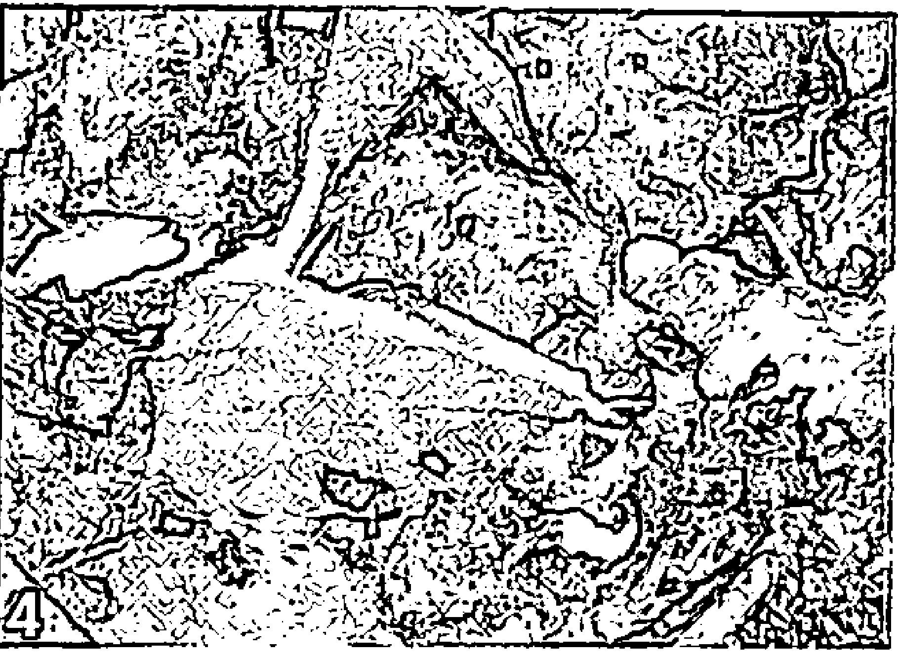

##### 所需工具與材料

- 3根長6～8吋或15～20公分的橘色蠟燭
- 火柴或打火機
- 1枝棕色墨水的鋼筆
- 數張3x1吋或7.5x2.5公分的紙條，每個庇祐收成或壞習慣各一張
- 1個防火盤

### Lughnasadh—豐收祝福魔法
#### 分享好運氣並得到保佑

【目的】從得到的收成中將神奇的好運分給朋友。

【魔法背景】通常在收成之後會有一個慶賀收成結束的鄉間宴會，這個風俗從中古世紀以來便一直被保留在歐洲各地的文化中。許多歷史的傳統都與餐點有關，包括剛剛所提到的最後一捆穀物(英國則是指小麥)的收成餐宴。在某些地方，這道晚餐是屬於農夫付給收割者的部份報酬，先不管它的意圖究竟是什麼，這道家庭收成餐宴主要便是感謝勞動者的辛勞與努力。而Lughnasadh正好就是慶祝分享豐收的日子。

本魔法便是使用分享及最後一捆穀物的習俗將祝福傳給朋友們。你必須至少要與另一個人一起合作，而且人數越多效果越好。在設立結界之前，每個人都必須思考他們想要召喚出哪一個字，這個字會讓他們一整年都能得到它所代表的偉大力量所庇祐。那些希望與朋友互相幫忙、一起度過難關的人可以用「友誼」來代表；而想得到物質方面庇祐或得到一部車的人，可以寫下「行動力」來代表。記住被分享的祝福並不會被削弱它原本的力量。

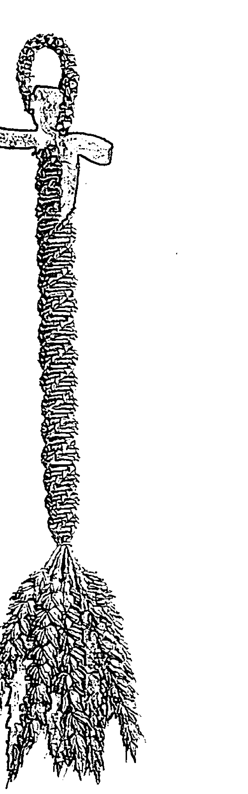

##### 如何施法

##### 所需工具與材料

- 6根長6～8吋或15～20公分的橘色蠟燭
- 火柴或打火機
- 每人9根成熟的穀物(小麥)
- 每人1條長9x1吋或22.5x2.5公分的紅色緞帶
- 每人1張長3x1吋或7.5x2.5公分的紙條
- 數枝筆
- 1個大籃子

##### 施法時機
於Lughnasadh施行本魔法，詳情請見第26～35頁。

##### 施法步驟

接下來為Lughnasadh慶典中的一部份，需於仔細設立的結界中進行：

- 1. 在結界的中央點燃所有的蠟燭，並說：「收割的時節、豐收的時節，所有的收成全部完成，辛苦已經結束，饗宴即將開始。」
- 2. 開始分發成熟的穀物(小麥)束，每人9根。每個人必須將手上的麥束編成一條辮子，並在頭端做出一個拎環，再用紅緞帶固定綁緊，並在製作的同時，念誦以下咒語：「我們編織你並召喚你，穀物的女神，在這豐收的時節，在你被播種的時刻。」

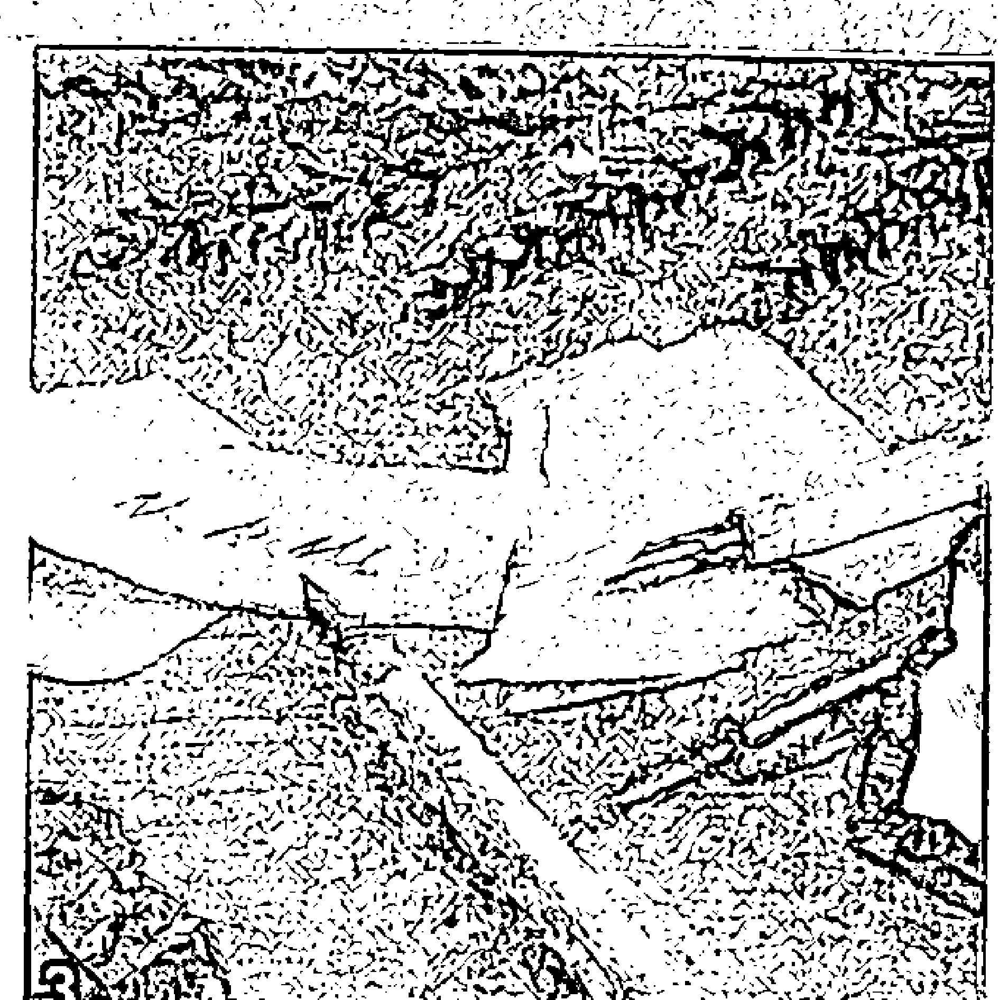

- 3. 每個人都必須在紙上寫下想要得到的祝福(例如：友誼或行動力)，並且不能讓別人看到或知道。將紙條折起並放在谷束辮上。
- 4. 將所有的谷束辮放入籃子裡，接著所有的人都需閉上雙眼，從籃子裡選取一條谷束辮。
- 5. 當所有人都拿到之後，便將上面的紙張打開來閱讀。
- 6. 將谷束辮掛在室內，直到Imbolc才可拿下，並將谷束辮焚燒完全，把剩下的灰燼灑到你的花園中。

### Lughnasads—穀物精靈魔法
#### 確保在來年生命中的收成

【目的】為你的家帶來一整年的豐足。

【魔法背景】稻草人（由穀物或小麥所編成的人形模型）在今日被當作是幸運符來販售。將稻草人放在家中通常是一種捕捉穀物精靈的方法，也藉此確保明年穀物的豐收。在小麥為主食的文化中收成是一件非常重要的事情，因此有這種稻草人習俗其實並不令人意外，它和異教徒之間已經有非常悠久深厚的關係。現在我們在商店中看到的稻草人是一種流傳下來的工藝品，是用來尊崇大地的精靈，而稻草人複雜的外型也可以證明編織工匠的高超技術以及這份任務的重要性。

你應該會很高興，因為本魔法並不需要和經驗豐富的編織工匠一樣的技術，但仍會應用到一些稻草人基本的製作精神和技巧。在這裡，你將會編織一個精靈籠子，但它並不像名字那般的殘酷嚇人，主要的功用就是去捕捉你自己的穀物精靈來確保你家中來年的豐收。這也可以突顯你對來到身邊及家中的恩賜的重視與感恩，同時也在魔法上保留了一些今年的福氣來為明年的收成先「播種」。

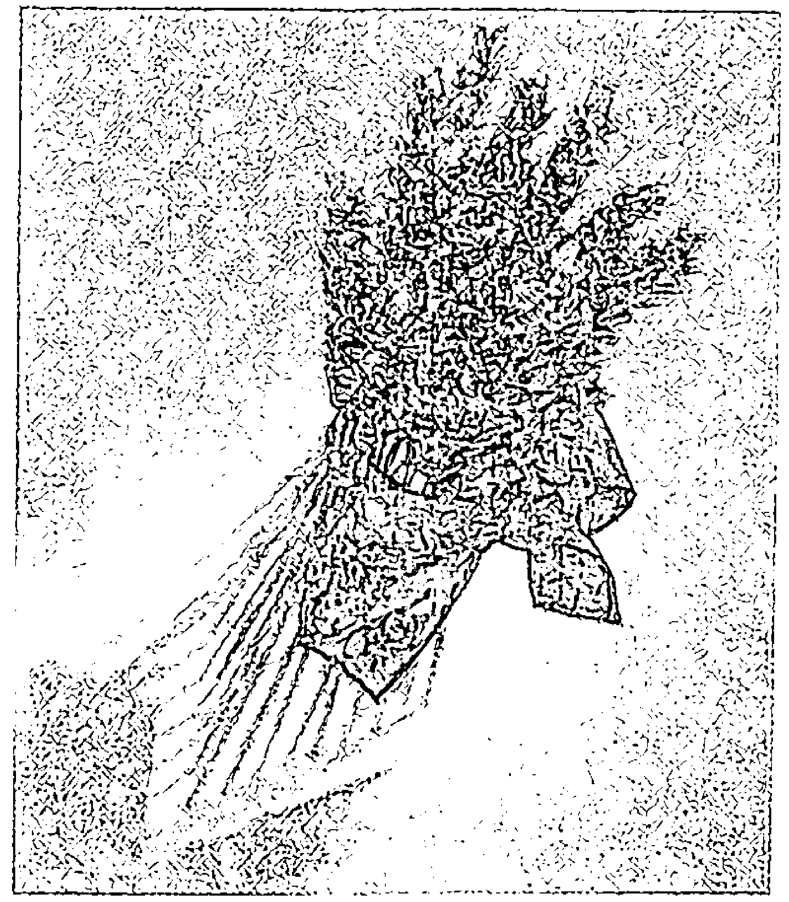

##### 如何施法

##### 所需工具與材料

- 1根長6～8吋或15～20公分的綠色蠟燭
- 火柴或打火機
- 24根成熟的穀物(小麥)
- 1根刺繡用針
- 1塊邊長4吋或10公分的正三角形厚紙板
- 1條長9×1/2吋或22.5x1公分的綠色寬緞帶

##### 施法時機
於Lughnasadh施行本魔法，詳情請見第26～35頁。

##### 施法步驟

接下來為Lughnasadh慶典中的一部份，需於仔細設立的結界中進行：

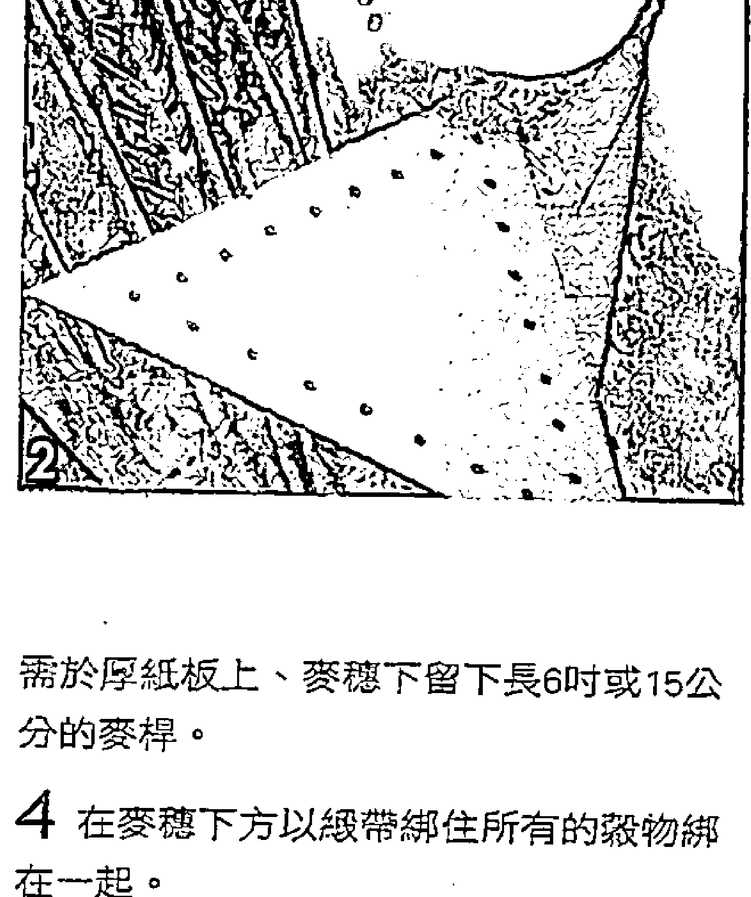

- 1. 點燃蠟燭說：「我召喚地元素來庇祐這個結界。」
- 2. 用刺繡針在三角形厚紙板的三個角上各刺一個洞，在三邊的洞與洞之間再加刺上7個洞。
- 3. 將24根穀物(小麥)的根部插入厚紙板的洞中，並於三角形厚紙板下打結，且需於厚紙板上、麥穗下留下長6吋或15公分的麥稈。
- 4. 在麥穗下方以緞帶綁住所有的穀物綁在一起。
- 5. 舉起你的精靈籠子，並說：「穀物的精靈請降臨，並駐足在這個房間中，留在大地與屋頂的空間裡，不再漫遊流浪於浮世中。」
- 6. 將精靈籠子掛在廚房裡，直到Imbolc時再取下燒掉，如此可幫助在播種時節，將穀物精靈釋放重回大地裡。

### Mabon－石榴魔法
#### 得到智慧

【目的】促進心靈的發展以及增長智慧。

【魔法背景】在Mabon，白晝與黑夜的長度呈現平衡，也是即將步入黑暗的時節。在這個時候許多樹的樹葉、果實和種子都已經開始掉落，為即將來臨的寒冬作準備。世界上有許多的神話便是與這個季節的變化有關，許多更與進入冥府的死亡之地有關。

其中一個在4千多年前的古老神話就是伊南娜(Inanna)下冥府的傳說。在這個傳說中，伊南娜墜入地府又重回人間象徵這個季節的輪替。這個神話與珀耳塞福涅（Persephone為冥王Hades之后）的希臘傳說有著非常神奇的相似處，珀耳塞福涅會從地球上消失是因為她的母親，也就是大地女神狄蜜特（Demeter：專司農業、豐饒、婚姻的女神），因為她母親的離去而悲傷，造成了世界上第一個冬天的到來。再仔細的研究下去，兩個傳說都可以說是兩位神聖的女英雄的冒險故事，皆進入黑暗的世界並得到了智慧。事實上，許多人類學者認為伊南娜進入冥界7道門而逐一褪去衣裳的行為，是代表為了得到心靈能量而脫去的自我意識。

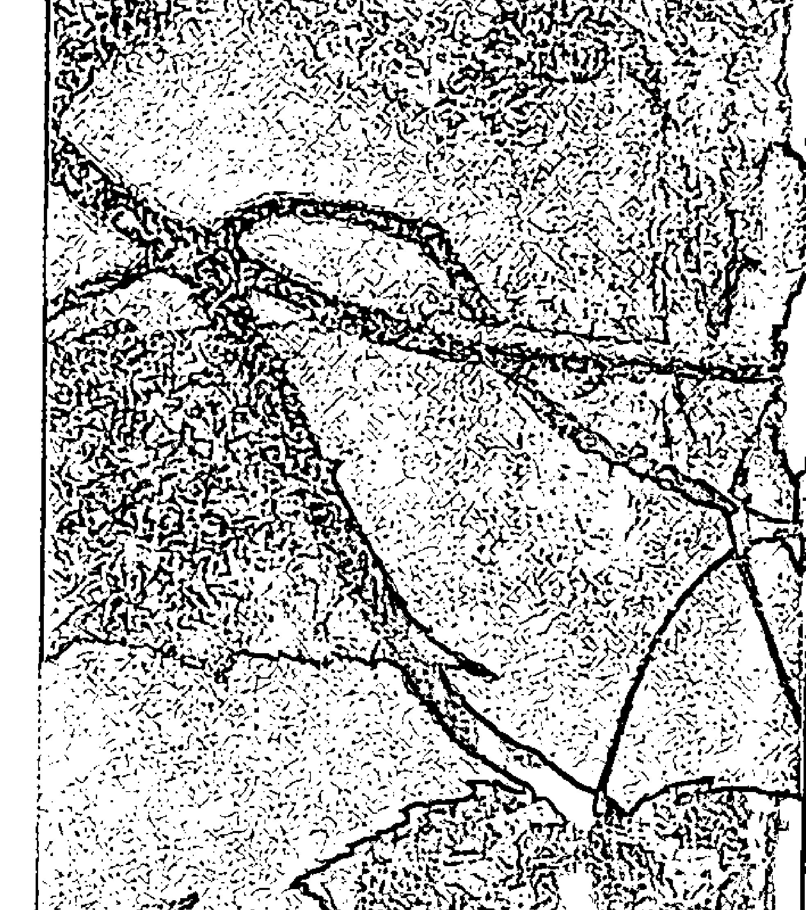

珀耳塞福涅的傳說裡又說到，當她到達死亡之地時，她用6顆種子來綁住自己，使她能在6個月後重回人間。因此，在本魔法中，你將會吃掉6顆石榴籽來幫助你探索冬季的黑暗世界及內心的平靜，讓你可以得到心靈上的智慧。

##### 如何施法

##### 施法時機
於Mabon施行本魔法，詳情請見第26~35頁。

##### 施法步驟

接下來為Mabon慶典中的一部份，需於仔細設立的結界中進行：

- 1. 點燃木炭，再點燃蠟燭說：「我召喚伊南娜，天堂人間與冥府的女王，請以深不可測的智慧，保佑我對心靈的探索，指引我在黑暗中的腳步。」
- 2. 將白蘚灑在木炭上。
- 3. 切開石榴，並取出6顆石榴籽食用。
- 4. 閉上雙眼，想像自己逐漸沉陷到黑暗中並越沉越深，在無盡黑暗的地底，什麼都沒有只有完全的寂靜。讓自己儘可能的待在那個黑暗的世界中，然後再慢慢地返回結界。
- 5. 吹熄蠟燭並於日後每天太陽下山後燃燒一個小時，持續到蠟燭被完全燒盡為止。

##### 所需工具與材料

| 所需工具與材料 |
| --- |
| 1個裝有木炭的防火盤 |
| 1根長6~8吋或15~20公分的紫色蠟燭 |
| 火柴或打火機 |
| 2大湯匙的乾燥克里特島白蘚 |
| 1整顆石榴 |
| 1把尖刀 |

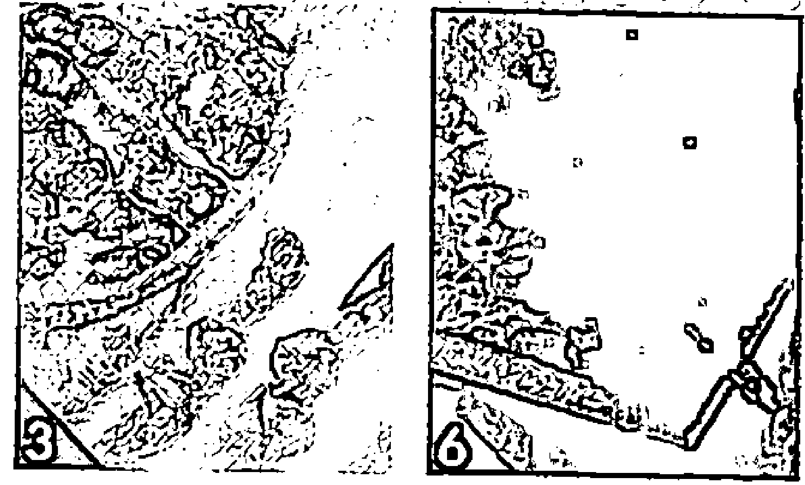

- 6. 將石榴深深地埋入自家花園中，並開始紀錄每天的夢境直到冬季結束。

### Mabon—柳木船魔法
#### 放下憂傷

【目的】幫助你停止沉浸在过去。

【魔法背景】Mabon位在年輪中的西邊，這個方位也代表水元素的方位。當夏季的記憶與光明一起逐漸消失，許多人便開始傾向悲傷。以超自然來說，我們正處於水的方位，這是個充滿情緒、有時候不免陷入悲傷的地方。太陽下山的西方也象徵是開始出發的方位，祖先們認為這是死者往生的地方。所以在Mabon我們可以開始放下憂鬱的想法，並將這些憂思送到「水的另一邊」，也就是太陽下山的方向。

本魔法需要你到戶外找尋有潮汐變化的河流或海洋送你的憂傷上路。這裡所使用的概念就是「海葬」，就如同北歐傳說中通過柏德之門(通往異世界的門)的準備，

也就是阿拉伯旅人艾柏法德在西元920年在蘇俄所看到的儀式一樣。要建造柳木船模型非常地簡單，而且也不會對水域造成任何的汙染或是留下危險的廢棄物。

你必須要去思考你悲傷的成因，因為必須要先確認並了解背後的原因才能施法。

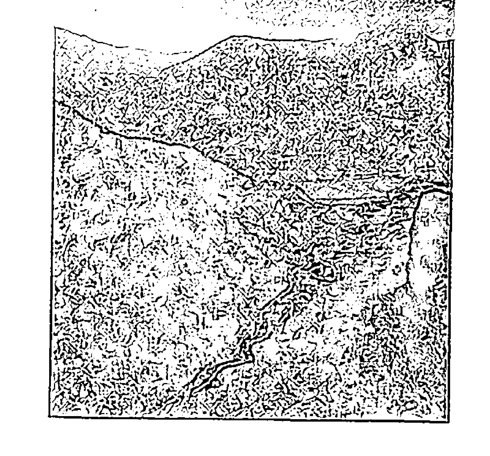

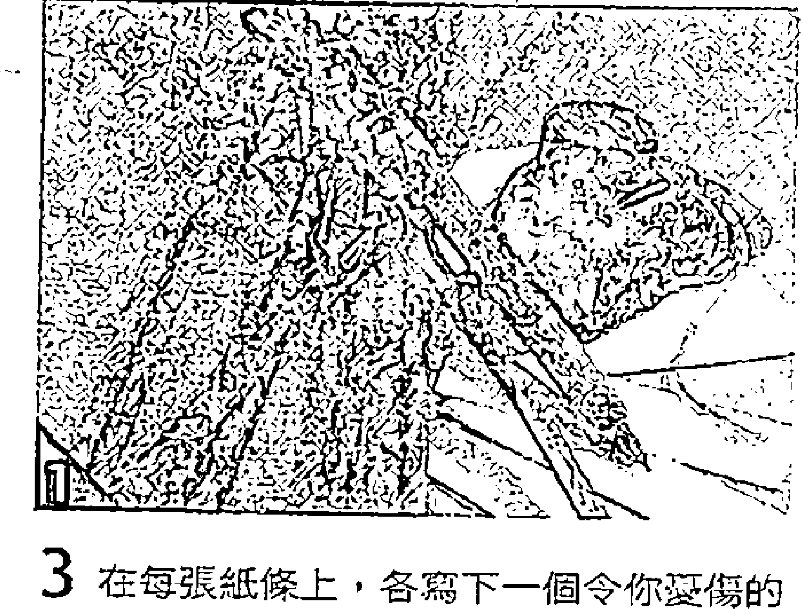

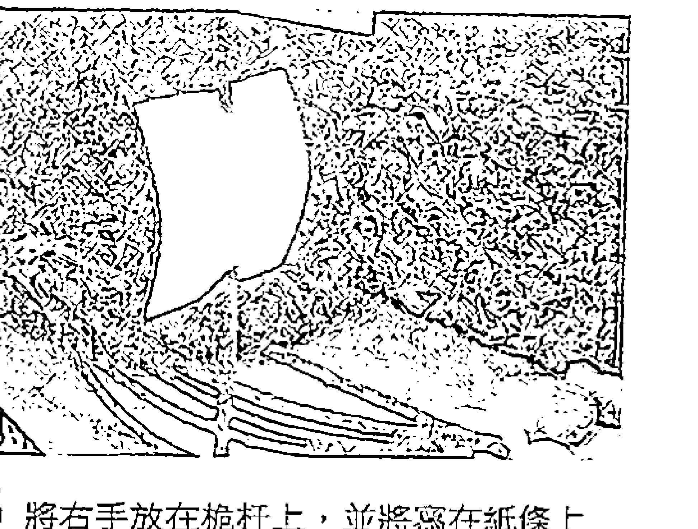

##### 如何施法

##### 所需工具與材料

- 5條長12吋或30公分的柳木條
- 1捆天然(非加工)的麻繩
- 1枝長8吋或20公分的細樹枝
- 1張邊長4吋或10公分的正方形白紙
- 數張3x1吋或7.5x2.5公分的紙條，數量與憂傷的事相同
- 1根長6~8吋或15~20公分的白色蠟燭
- 火柴或打火機

##### 施法時機
於Mabon施行本魔法，詳情請見第26~35頁。

##### 施法步驟

接下來為Mabon慶典中的一部份，需於上述所指示戶外區域進行：

- 1. 彎曲並固定柳木條，來建造一艘「長船」，用2根柳條來當作船身的邊緣架構，其餘則依附此架構來建造。
- 2. 將一根長8吋或20公分的樹枝，牢固綁在船身上當作「桅杆」，接著將正方形白紙穿過桅杆，當作是「風帆」。
- 3. 在每張紙條上，各寫下一個令你憂傷的事並將它們固定在桅杆上。
- 4. 把模型船帶到水邊。將蠟燭插入土中點燃，並說：「所有的煩憂，從我的心中離去，隨著船帆穿過河水、航向西方。」
- 5. 將右手放在桅杆上，並將寫在紙條上的那些痛苦和遺憾傳送到船上。
- 6. 把蠟燭的蠟滴到柳木船上，將它點火燃燒放入水中。看著它在水上隨波逐流，直到看不見為止。

### Mabon—蘋果籽魔法
#### 獲得神秘的知識

【目的】改善你的魔法能力。

【魔法背景】Mabon剛好是蘋果收成的時節，而蘋果及蘋果樹也剛好是神秘世界的象徵，兩者皆和得到神秘知識以及進入另一個神秘領域有關。在猶太神話中的亞當與夏娃因為他們吃了智慧之樹上面的禁果，而產生了人世間第一對的男人與女人，最後跨出伊甸園的大門進入另一個世界。而在亞瑟王傳奇中的阿瓦隆（即西方樂土島，據說亞瑟王及其部下死後屍體移去該島），有時也被稱為蘋果之島，是凱爾特族的來生世界。在本魔法中，你會使用蘋果籽來穿梭於魔法世界之間，並且得到神秘的知識促進你心靈的發展和魔法的能力。

將蘋果水平切開你將會看到一個五芒星形狀，這剛好是人類及第五元素的象徵，五芒星或五角星形的符號是代表「靈」的象徵，在結界中所畫的五芒星則代表「人間」。由於靈是結合萬物的元素，而人間被魔法界人士視為神聖之地，因此法師們都非常喜愛五芒星記號。如果你希望得到更多巫術或「智慧之樹」的智慧，那麼就好好利用蘋果籽符咒吧！

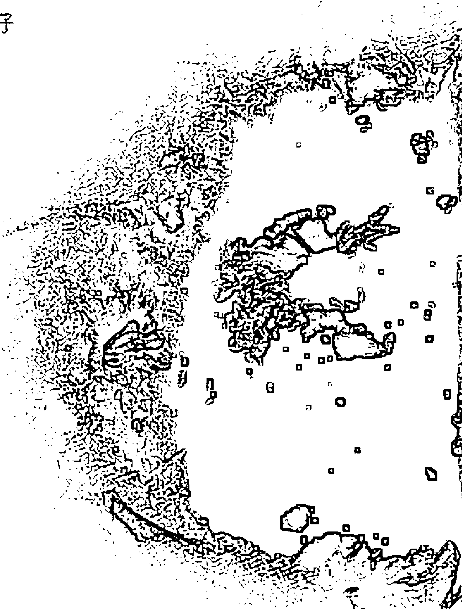

##### 如何施法

##### 施法時機
於Mabon施行本魔法，詳情請見第26～35頁。

##### 施法步驟

接下來為Mabon慶典中的一部份，需於仔細設立的結界中進行：

- 1. 點燃蠟燭說：「蘋果中的智慧，正等待著鐮刀的降臨，請賜給我無比的勇氣，讓我因你的知識而成長。」
- 2. 將蘋果水平切開，接著將所有的蘋果籽放入抽繩袋中，綁緊並掛在脖子上。
- 3. 吃掉半顆蘋果，接著閉上雙眼。
- 4. 想像你正走在一個蘋果園裡，在果園正中央佇立著一棵老樹，在樹下站著一位老婆婆。你逐漸向她走去，嘴裡並重複著剛剛唸過的最後兩句咒語。仔細的注意老婆婆所有的動作與話語，當她結束後，從你腦海中的內在旅程回到結界中。
- 5. 將剩下一半的蘋果埋入戶外的土中。
- 6. 持續一個陰曆週期隨身帶著蘋果籽符咒，並且紀錄你所有的夢境。注意身邊任何的「巧合」並試著去解釋這些巧合背後的象徵和意涵。

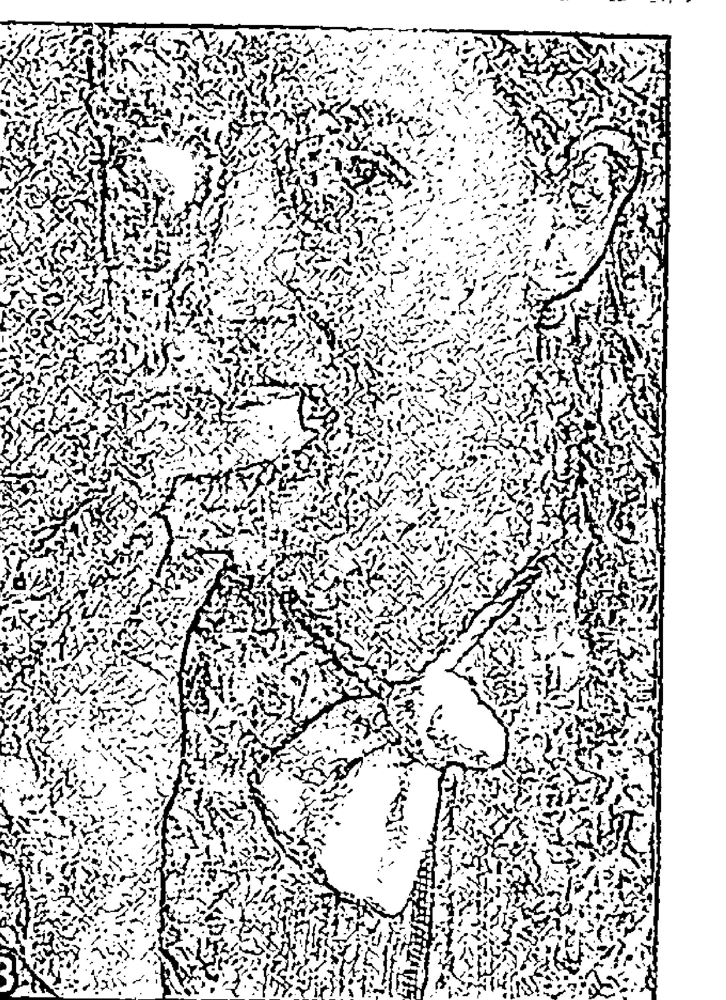

##### 所需工具與材料

- 1根長6～8吋或15～20公分的黑色蠟燭
- 火柴或打火機
- 1顆有籽的蘋果
- 1把尖刀
- 1個邊長2吋或5公分的正方形白色抽繩袋
- 1條長24吋或60公分的細繩

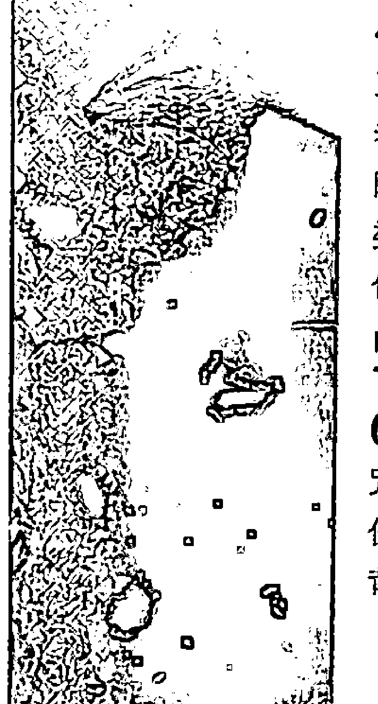

### Samhain—老巫女魔法
#### 夢見超自然的夢

【目的】幫助提升全面性的超自然發展。

【魔法背景】Samhain是老巫女的季節，老巫女也是一個「老」女神，是個神聖的助產婦將我們迎接到這個世上，也幫助我們度過死亡的煎熬。她是掌管出生的神聖守護神，她可以製造、編織我們的生命之線，也可以切斷這條線。因此，她常常被形容成一隻蜘蛛或是網，有時被又稱作母夜叉或是雪女。老巫女與超自然的力量有很強的關係，並有能力游走於不同世界之間，可以穿越各種現實的界線，例如精靈的世界或冥府。傳說中，當薩滿教僧在施法時也可以橫跨許多世界，隨著直覺到處遊走，或是進入清晰的夢境中帶回重要的訊息或增廣對超自然知識的了解。

##### 如何施法

##### 所需工具與材料

- 2茶匙的乾燥艾蒿
- 1茶匙的老菸粉末
- 6滴絲柏樹精油
- 搗杵與研缽
- 1個裝有木炭的防火盤
- 1根長6～8吋或15～20公分的黑色蠟燭
- 火柴或打火機

##### 施法時機
於Samhain施行本魔法，詳情請見第26～35頁。

##### 施法步驟

接下來為Samhain慶典中的一部份，需於仔細設立的結界中進行：

- 1. 將艾蒿、老菸和絲柏樹精油放入研缽中搗碎混合。
- 2. 點燃木炭，再點燃黑蠟燭說：「黑卡蒂，無間道的守護神，請指引我；生命之線的編織者，請帶領我至世界夾縫中。」

做為一位靈媒或超自然靈者，並不是要預知未來，而是藉著在這些「無間道」之間穿梭得到成長。「黑卡蒂」一是眾多老巫女名字中的一個，是製造與編織生命之網的守護者，這讓她成為召喚增加超自然能力的最佳女神。另外在魔法進行中，你必須要盡力想像老巫女的樣子來能讓魔法進行順利。

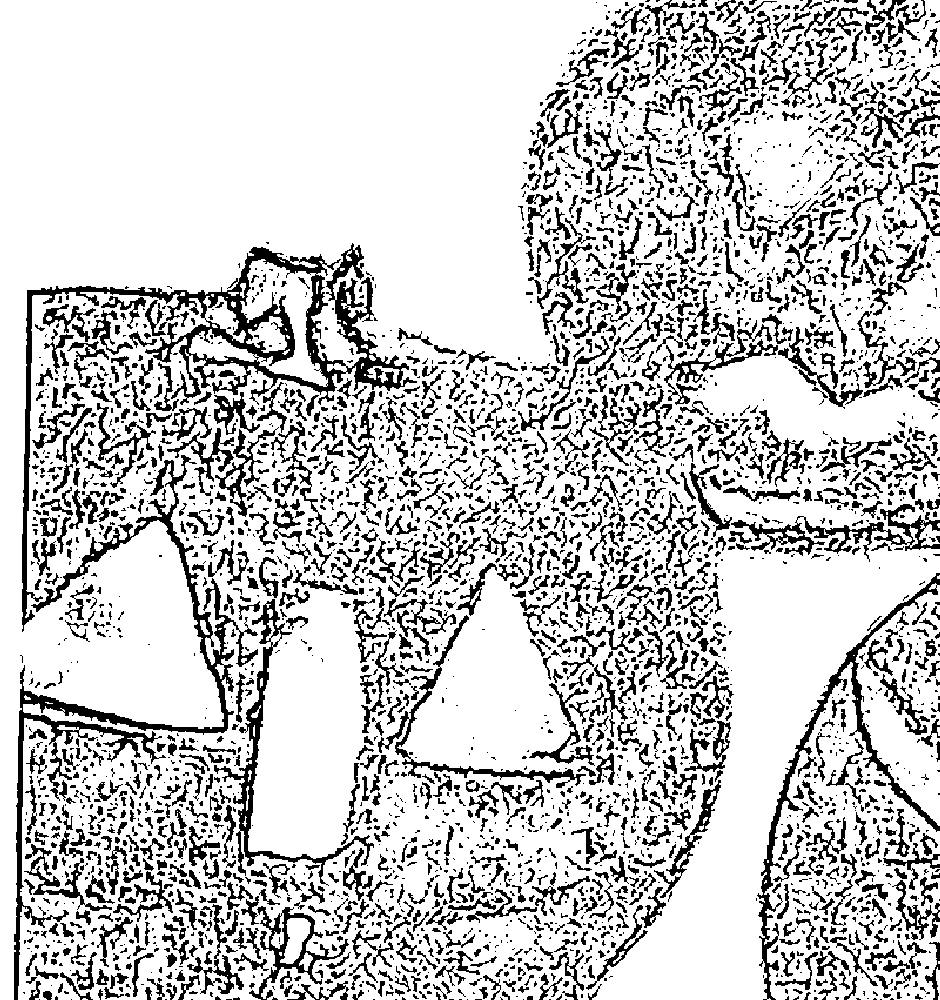

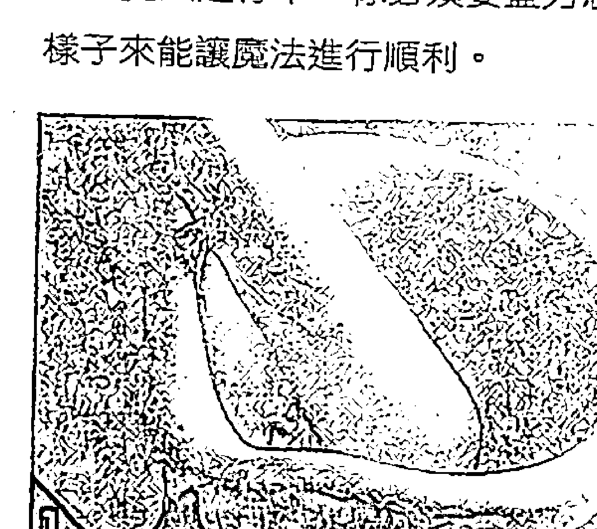

- 3. 將剛剛搗好的混合焚香灑入木炭中，並深吸散發出的香氣。
- 4. 閉上眼睛，開始想像自己從東邊，走到太陽下山的無間道，停住並面向北邊。此時，一個黑色人影開始靠近你，她就是老巫女。當她停下來時會示意你跟著她。她將會帶領到世界的交界處的入口，不要在此時穿過這個交界，而是注意入口的模樣，是否有特殊的符號在上面。這個入口，就是未來能讓你穿越世界的通道，在接下來冬天中清晰的夢境中，你必須設法找到這個入口或它的符號。
- 5. 從現在開始到Imbolc，留意你的夢境。

### Samhain—道道魔法
#### 與死者溝通

【目的】和我們去世的親人說話。

【魔法背景】Samhain是人間與冥府界線最薄弱的時候，也是在此時，我們會追忌祭祖並懷念那些逝世的親人，甚至會設立結界，創造與西方極樂世界接觸的通道，藉此與死去的親人會面一晚。

給我們自己一個特定的時間面對失去朋友或親人的痛苦是一種健康的發洩方法。西方的社會大多不鼓勵與死者有太多的接觸，所以親人的屍骨總是被安置在離家很遠的專業墓園，好讓我們的悲傷被排除，以免在公共場合中丟臉。

在Samhain中，我們可以讓自己盡情的感受到分離的痛苦，但是仍必須面對親人已經死去的事實。Samhain結界便可以提供一個安全的空間，讓我們以自己的方式緬懷我們所失去的摯愛親人。

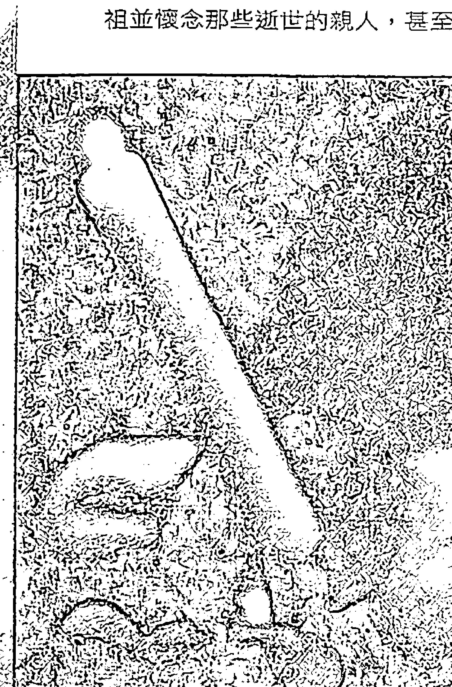

##### 如何施法

##### 所需工具與材料

- 2根至少長12吋或30公分的藍色蠟燭
- 1根至少長12吋或30公分的白色蠟燭
- 1個裝有木炭的防火盤
- 火柴或打火機
- 2茶匙乾燥的蕓蔡(又稱作所羅門的封印)
- 大約25個海邊的卵石

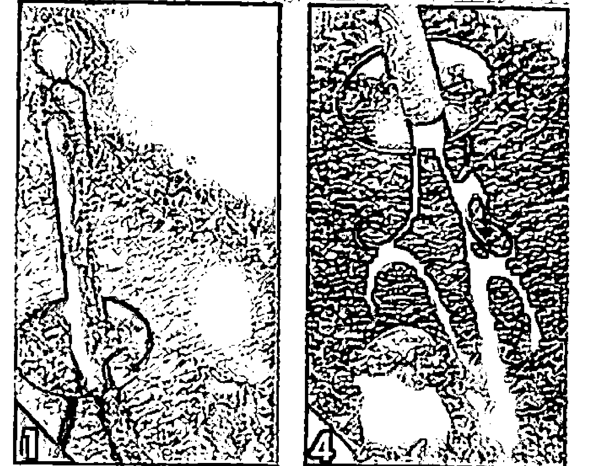

##### 施法時機
於Samhain施行本魔法，詳情請見第26~35頁。

##### 施法步驟

接下來為Samhain慶典中的一部份，需於仔細設立的結界中進行：

- 1. 將藍色蠟燭放在結界中的西方，並將白色蠟燭放在左手邊。
- 2. 點燃木炭，再點燃藍色蠟燭，面向「通道」說：「祖先的血肉、祖先的靈魂，你在此被賦予力量，我召喚死去的摯愛來到這裡，唯有存有善意的靈魂，才得以進入。」將蕓蔡灑在木炭上。
- 3. 說出在過去一年中逝世的好友或親人的名字：「我記得（名字和關係），並希望和你說（想跟他說的話）。」
- 4. 想接觸幾個人就在白色蠟燭旁放幾顆石頭。接著，回憶那些去世超過一年的親友，然後將想紀念的親友聚集在一起。
- 5. 當完成後，石頭必將堆滿在白色蠟燭旁，此時點燃白色蠟燭說：「我已哀悼、紀念及追思所有的摯愛。」
- 6. 與親友告別，並在結界關閉前先關閉通道。把所有的卵石再放回海邊。

### Samhain—塔福蛋糕魔法

#### 預測來年的好運

【目的】知道來年的運勢。

【魔法背景】塔福蛋糕有許多不同的製作食譜，但全部都和這個時節有關，因為都包含這個時節的基本材料─燕麥。在Samhain食用塔福蛋糕可以幫助預測食用者的未來。這關連到一個古老的風俗，人們會準備一個普通的蛋糕在中間參混一點點較暗色的麵粉，傳說可以預測下一年誰可能會死亡，如果有人拿到有暗色「陰影」的那塊蛋糕，那麼他就是這個人選。而這裡所使用的塔福蛋糕魔法並沒有這麼的恐怖，相反地它反而是預測在未來的12個月中，你的好運將會在哪裡出現。

這裡所使用的方法和茶葉占卜有異曲同工之妙，因為它們都是利用喝完或吃完的沉澱物或殘渣來預測未來。在這裡，塔福蛋糕的蛋糕屑要倒入另一個碗中翻轉混合，並照著相關的指示引導來解讀排列形式背後的意涵。塔福蛋糕(Tharf cake，Tharf是古英文「未發酵」的意思)，是從盎格魯薩克遜及維京人的時代所流傳下來的，而且都是在一年中的此時食用。

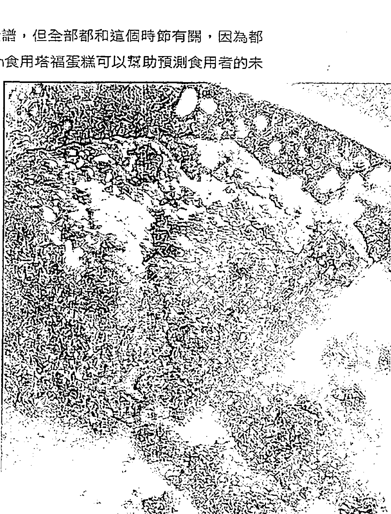

##### 如何施法

##### 所需工具與材料

-   1根長6～8吋或15～20公分的黑色蠟燭
-   火柴或打火機
-   奶油、燕麥和全麥麵粉各4盎司或115公克
-   2盎司或50公克的糖
-   1茶匙的五香粉
-   2盎司或50公克切碎的蘋果
-   1人一個茶碟
-   1個小碗

施法時機 於Samhain施行本魔法，詳情請見第26～35頁。在設立結界前，需先烤好Tharf cake。

##### 施法步驟

1.  除了蘋果外，將所有的材料混合，最後才放入蘋果。揉搓分割麵糰，使蛋糕呈圓形狀，放入攝氏350度或華氏180度的烤箱中，直到蛋糕烤得結實為止。
2.  接下來為Samhain慶典中的一部份，需於仔細設立的結界中進行：
3.  點燃黑色的蠟燭說：「為蛋糕歡呼，為廚師歡呼，為即將到來的一年歡呼。」

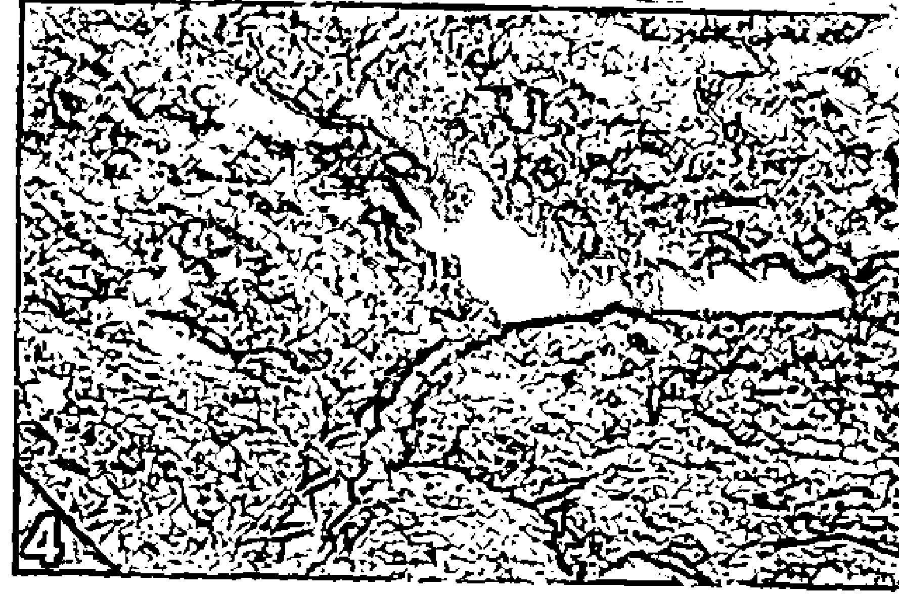

4.  每人一塊蛋糕，接著將蛋糕吃掉一半，把另一半蛋糕弄碎，放入盤子中。
5.  輪流捏下一角蛋糕屑丟入碗中，然後再將碗中的蛋糕屑各倒回一點到各自的盤子中，照以下的指示，去解讀盤子中的蛋糕屑：
    -   多在邊緣上：將會為了生活而工作
    -   多在中心點：生活的必需品不虞匱乏
    -   多在左邊：運氣離去
    -   多在右邊：好運將至
    -   多在上方：將會成功的度過逆境
    -   多在下方：保衛你的健康
    -   螺旋形、曲線或圓形：債務將會還清
    -   直線或角度：穩定的收入
    -   馬蹄形：旅行將會帶來好運
    -   動物的形狀：保衛你的家
6.  在結界結束後，將蛋糕屑置於室外，讓鳥兒吃掉。

# 開運魔法

## 開運魔法介紹

從開始有魔法以來，法師常和好運扯上關係，時至今日大眾對它的興趣，從為數眾多的報紙上的星座專欄到塔羅牌解讀或算命的服務廣告可見一斑。我們對於可以改變生命的機會都非常地關心注意，就算我們知道社會地位和大部分相關一切並不一定和「命運」有絕對的關係。巧合、機緣或是幸運，不管我們選擇怎麼稱呼它，這些命運的機會都可以輕易的改變我們的人生。人們長久以來對運氣的著迷，其中一部分是起源於一個觀念，認為魔法可以操控運氣，也可以確保為請求者開示一條明路。

某種程度來說，魔法是一種複雜的層層關聯，包括機緣或巧合都一起被織入這龐大的意念之網中，而魔法有辦法可以改變網絡的格局。本章中的魔法便都反映這個概念，魔法是有這個可能去編織、改變這個網絡，為你加入有利的機會。在這裡你會看到許多傳統的魔法幫助達成願望或讓「內心的渴望」成真。而一般會關心的基本問題也都有包含在內，包括帶來物質的繁榮或確保不間斷的基本物質需求等，也有關與保佑新的事業或讓幸運女神向你的職業微笑等魔法。你也會看到關於庇祐新家或新生兒的魔法，賜與健康、財富和幸福。

也有許多解決運氣問題的魔法，不管是好運或壞運。這些魔法會將好運帶到你身邊或將你的好運「借」給別人——這是個很奇妙卻流傳已久的感應魔法原則，或是讓你可以逃離壞運。這裡也有魔法是關於解決被下咒的問題——是在全世界廣為流傳的民間傳說。

不管你需要的是什麼樣的運氣，你都可以在本章中發現適合你的魔法。本章中許多的魔法都是來自全世界的民俗作法。而其中許多魔法更可以依據不同的特殊需要，在基本的大前提下量身改編。我們常常會聽到「命運是自己創造的」這句話，這句話在某種程度上是正確的，但有時候一點魔法的幫助，是可以讓命運可以更容易走向更好的康莊大道。

### 回文魔法 讓願望成真

【目的】保護內心的希望。

【魔法背景】回文是一種從前面開始唸和從後面開始唸是一樣的文字，從古代便開始被魔法廣泛的使用。在早期的基督教魔法中仍可以看出這個傳統的遺跡，首次出現是在西元第三世紀，而一路流傳下來也吸收許多早期的異教文獻及習慣。ABRA-CADABRA這串字是由舞台上的魔術師所開始使用，每當即將有神奇的事情要發生時，他們就會講這串字，但事實上，這串字是來自於一個早期的回文—ABLANATHANALBA。雖然兩者都不是最正統的回文，但一千八百年來都有被拿來使用，並且都帶正面的效果，所以本魔法將選擇最初的版本來使用。

當回文被用來讓某事物消失時，便需用漸減的金字塔排列。

回文的原則並非這串字有什麼特別的意涵，雖然在後古典時代中所發現的遺跡裡，發現認為一些回文是拼錯女神的名字。其實回文是用特殊的排列方式來代表希望發生的事物。

-   ABRAXARBA
-   BRAXARB
-   RAXAR
-   AXA
-   X

在本魔法中，因為我們渴望某事物來到我們身邊，便用漸增的金字塔排列來撰寫回文，就像下面你所看到的一樣。

-   TH
-   ATHA
-   NATHAN
-   ANATHANA
-   LANATHANAL
-   BLANATHANALB
-   ABLANATHANALBA

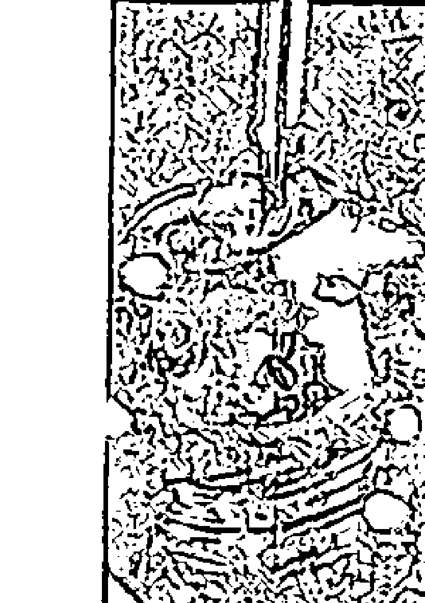

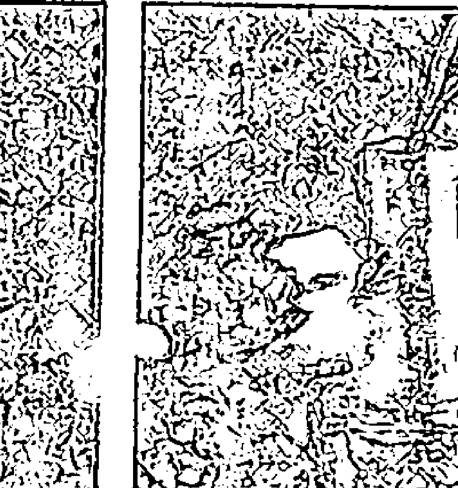

##### 如何施法

##### 所需工具與材料

-   1個裝有木炭的防火盤
-   火柴或打火機
-   由等量的香薈尾根、肉桂和肉豆蔻所混合而成的焚香
-   1根長6～8吋或15～20公分的深藍色蠟燭
-   1根根部削尖的羽毛
-   1罐紫色墨水
-   1張邊長4吋或10公分的黃色正方形紙

施法時機 於月亮漸盈時進行，可幫助願望成真，一個禮拜中任何一天皆可，但由幸運木星所操控的禮拜四，則是施法的最佳時機。

##### 施法步驟

1.  根據第36到39頁的指示，設立結界。
2.  點燃木炭，將焚香灑在木炭上。
3.  點燃蠟燭說：「Abraxas偉大的魔法，魔術師之術，請保佑我。」
4.  將羽毛尖端輕沾墨汁，在紙上以工整的大寫字母寫下下列文字，並同時在腦中想著願望：

TH
ATHA
NATHAN
ANATHANA
LANATHANAL
BLANATHANALB
ABLANATHANALBA

5.  將紙張穿過薰香，並大聲的唸出剛剛寫下的字串，從TH開始，用自己喜歡的方式，一路唸到ABLANATHANALBA。反覆唸誦直到字跡墨水乾掉為止。
6.  將紙張捲成一捲，並用燭火點燃，放置木炭防火盤上燃燒，並說：「將我的願望帶到廣闊的蒼穹吧！」

# 開運魔法

### 燈籠草魔法 達成心中的慾望

【目的】將心中的渴望放入儀式行動中保證。

【魔法背景】將天然的元素放入魔法中是非常普遍的，但有時自然會以讓我們驚訝的型態出現，可供我們作為魔法之用。秘魯酸漿－又稱做好望角鵝莓或中國燈籠草便是其中一個例子，包圍在果實四周的是生長型態特殊、外型與燈籠很相似結構。這種植物可以在水上漂浮，甚至有時可以載運很小的物品。

本魔法便是使用中空的酸漿，因此必須將中間的果實剔除，它的果實不但香味濃郁，口感也極佳，這應該是本魔法的額外福利。但是其中要注意的一點，是必須儘可能地保持酸漿外型的完整，這樣才能讓它順利地浮在水上，因為魔法的最後，必須將酸漿放流在河水或小溪中。

在魔法領域中常會說：「小心地許下你的願望」，這個警告是因為魔法常會以意想不到的作用方式帶來令人驚訝的結果。尤其本魔法又與水有關，這樣的魔法力還會比平常來得更大，所以必須要確保，你內心的慾望是善良的、也是真正你所需要的。

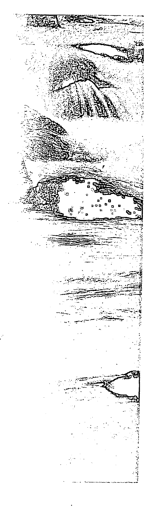

##### 如何施法

所需工具與材料

-   1根放在支架上的茉莉花香柱
-   2根長6～8吋或15～20公分的淡藍色蠟燭
-   火柴或打火機
-   由等量的香鳶尾根、肉桂和肉豆蔻所混合而成的焚香
-   1根縫紉用針
-   1茶匙的杏仁油
-   7株秘魯酸漿

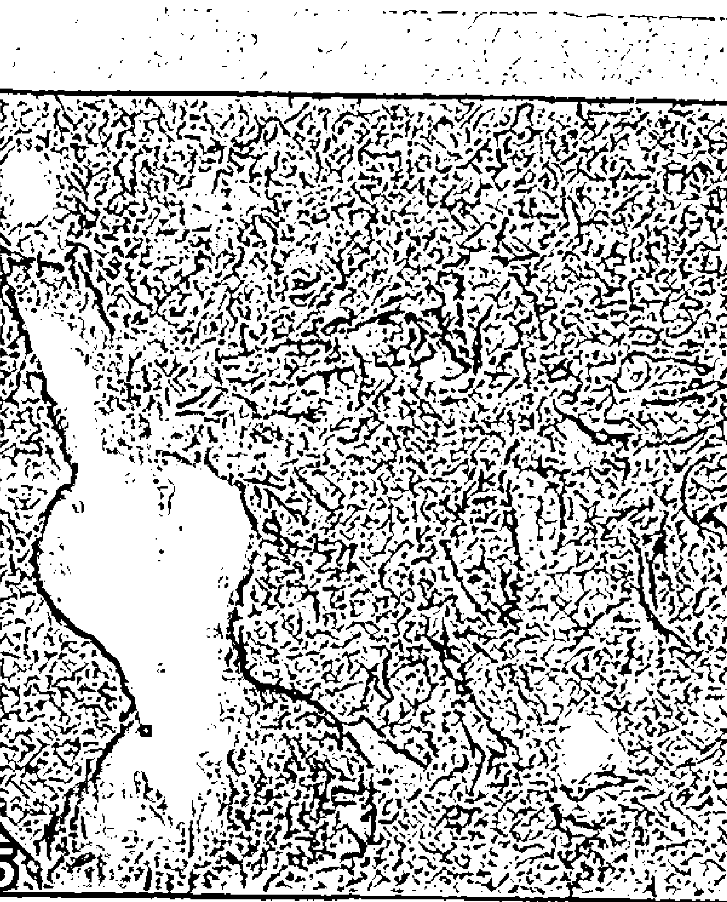

施法時機 於月亮漸盈時進行，可幫助渴望成真，由掌管人內心深處慾望的月亮，所守護的禮拜一是最佳施法日。

##### 施法步驟

1.  根據第36到39頁的指示，設立結界。
2.  點燃香柱以及一根蠟燭說：「獻給月神最虔誠的敬意，高掛天空的珍珠，請傾聽我的心聲並賜予我心中的渴望。」
3.  用針的尖端，在另一根蠟燭上，由底部向上刻下你心中的慾望。
4.  將杏仁油塗在蠟燭上，由下往上再往下，如此重複兩次。最後從下往上，再往下停在蠟燭中間即可。
5.  點燃這根蠟燭，當蠟開始融化並最接近剛剛所刻的字時，將蠟各在每株酸漿中滴一滴。
6.  結束結界之後，在月盈中的某一天帶著這些酸漿到自然的水源處，將它們浮放至水中流到大海裡，而每放一株酸漿都必須說：「讓我的願望渴望實現吧！」

### 命運之輪

#### 將平庸或壞運氣轉成好運

【目的】幫助轉運。

【魔法背景】在中古世紀的歐洲，命運之輪是用來形容命運的無常。人們常常形容國王和乞丐都各在命運之輪的一邊，其實主要的寓意主要在安慰窮人，讓他們接受窮苦是上天所注定好的。命運之輪的象徵其實是代表神聖的命運女神的地位，例如：伊特魯里亞的佛圖娜女神（Vortumna）、希臘的堤喀女神(Tyche)以及羅馬的福耳圖娜女神(Fortuna)。女神的輪子代表瞬息萬變的星辰、行星、潮汐和四季。在威爾斯，月亮是代表大自然和魔法的神秘力量，就像阿爾利安娜豪得之輪，阿爾利安娜豪得(Arhianrhod)是個法力強大的女神擁有編織命運和未來的力量。但在現在的德國，這種輪子的象形圖案，則是代表幸運的象徵，這種圖樣也仍被印度及佛教所使用，也幾乎是象徵改變命運的符號。我們應都有經歷過人生的低潮，在那段時間什麼事情都不順利。如果你有這樣的情形，並且是因為缺乏運氣所致而非其他的因素，那麼這個魔法則非常地適合你。

##### 如何施法

##### 所需工具與材料

-   5片羅勒葉
-   1小撮乾燥的薄荷
-   1小撮的硝石
-   1個裝有木炭的防火盤
-   1根長6～8吋或15～20公分的紫色蠟燭
-   火柴或打火機
-   4根廚房用的長火柴
-   1條長6呎或1.8公尺的紫色棉質刺繡粗線

施法時機 於月亮漸盈時進行，吸引好運氣的前來，由象徵幸運的木星所守護的禮拜四是最佳施法日。

##### 施法步驟

1.  在設立結界之前，先將羅勒、薄荷和硝石放在一起磨碎做為焚香。
2.  根據第36到39頁的指示，設立結界。
3.  點燃木炭，再點燃蠟燭說：「福耳圖娜，銀眼的女神，將你的幸運之輪轉向我，庇祐我的好運。」

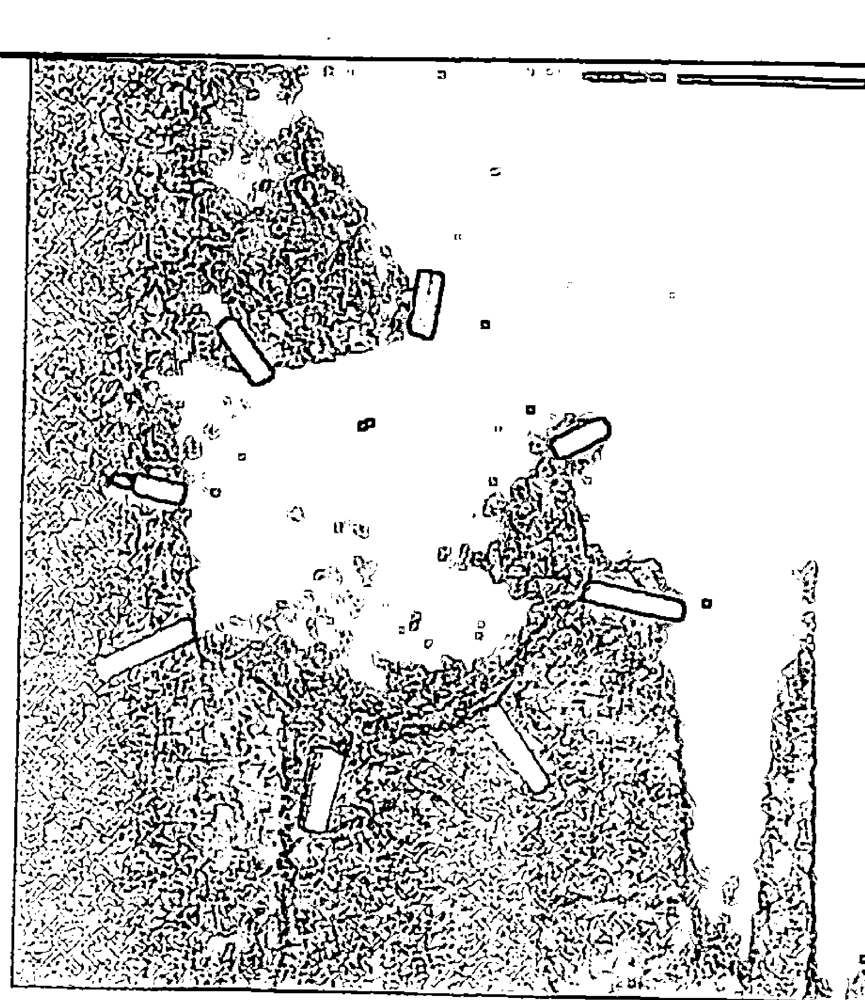

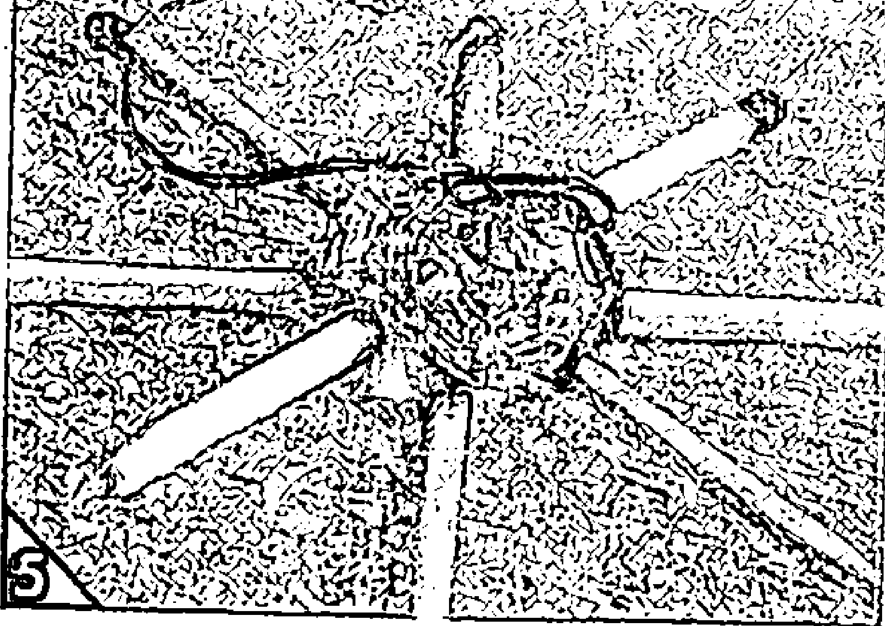

4.  將4根廚房火柴棒交於同一個中心點，互相交錯擺放，且中心點外每根火柴的長度要相等，然後用繩索的另一端將火柴們綁住。
5.  繼續將線編織在火柴上，直到線快用完為止，並從開始編織時便反覆唸誦：「編織者，編織線的經與緯，將好運都編入我的生命裡。」
6.  留下一點線，讓做好的幸運之輪可以掛在壁爐上。將焚香灑在木炭上，並將幸運之輪穿過薰香，把法力彌封住。

### 金色薄荷魔法 帶來基本物質的繁榮

【目的】當有基本的物質需求時，便能為你解決與滿足問題。

【魔法背景】鳳梨薄荷在薄荷科植物中有著迷人的香氣及很好的口感。它多變的葉子上有著乳白色的色塊，因此在花園中群生的鳳梨薄荷看起來會有點條紋的感覺，而它的外表也讓原本都是綠色的薄荷增加更多的變化。各種種類的薄荷在魔法中都有實用的特質，而鳳梨薄荷它的金黃色外表，特別適合用來從意想不到的管道中得到成功繁榮。

在所有和物質繁榮有關的魔法，你都必須只能祈求基本的物質需求，如果你是要一輛新款名車或名牌衣服，那麼魔法便不會發生作用。它只會在滿足生活需要的原則上作用，而非貪婪。

過去認為一間圍繞著薄荷葉的房子裡頭通常是住著真正的有錢人，但是對這些工業革命前的人們來說，他們所認為的富有是指擁有食物、衣服、遮蔽處和愛。從這裡便可以看出這個魔法象徵意義的端倪。

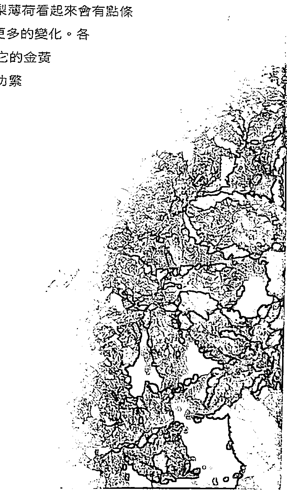

##### 如何施法

##### 所需工具與材料

-   1根長6～8吋或15～20公分的綠色蠟燭
-   1大湯匙的杏仁基底油
-   6滴薄荷精油
-   火柴或打火機
-   1條長6吋或15公分的金色細緞或緞帶
-   6片鳳梨薄荷葉

##### 施法時機

施法時機 於月亮漸盈時進行會為你帶來繁榮，一個禮拜中任何一天皆可，但須避開由象徵約束的土星所守護的禮拜六。

##### 施法步驟

1.  根據第36到39頁的指示，設立結界。
2.  將基底油和精油混合均勻，並且避開燭芯，由下而上、再由上而下塗抹在蠟燭上6次，最後由下而上、再由上而下停在蠟燭的一半處。
3.  點燃蠟燭說：「請保佑我的繁榮；請讓我的好運增加，就像月亮逐漸月圓一般；請讓我的需求逐一實現，就像大海回應岸邊的呼喚一般；請讓食物、衣服和遮蔽處，像呼吸般的圍繞在我身旁；我以我體內的血液和骨肉祈求。」
4.  用細緞或緞帶，從葉柄處將所有的鳳梨薄荷綁緊，並拿至蠟燭前說：「願我的伙食、衣服和屋瓦，能像花園中的薄荷葉一樣，繁榮豐足。」
5.  將薄荷葉隨身放在你的皮包或錢包中。
6.  在你家四周種下薄荷葉以增長魔法的效力。

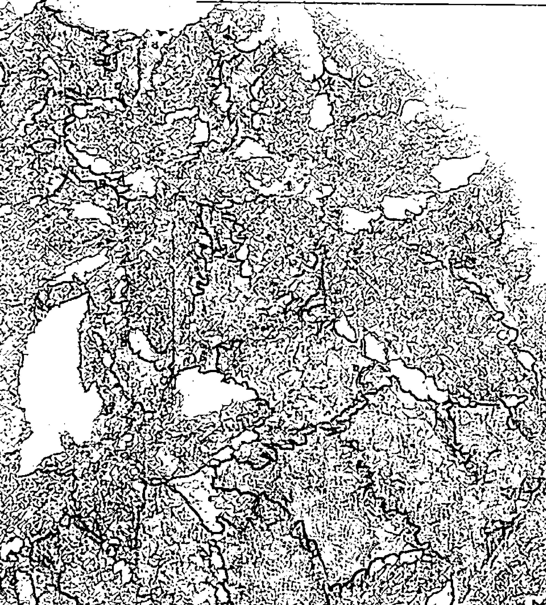

### 三魔法 庇祐新的投資事業

【目的】為新事業帶來好運氣。

【魔法背景】三倍或同樣的事物出現三個對魔法來說是很重要的。在一些文化中，數字3是與超自然的事物有關。若在傳說中，同樣一件事或道理反覆出現3次以上，研究學者認為其中可能是隱含了作者很強的心理態度。凡事說一次，能夠讓我們開始注意到這件事；說兩次，則讓人更加地不會誤解、更加地明白；若於故事中重複第三次，可以幫助作者或吟唱詩人讓觀眾的記憶更加地深刻，因此上述的理論是有它的道理的。在魔法中，數字3對於受到保佑事物是有特殊的意義的。
本魔法所使用的三曲腿圖是在許多凱爾特的文化中被發現，主要是來自於不列顛布列塔尼(Brittany)，現在位於法國西北部的一省。三曲腿圖是代表大地、火和水三者的交叉點，可以為你帶來祝福與保佑。在北美的督伊德教便是以此為教會的標誌，並常常在旁邊出現「Beannaithe ag Draoith」的字，代表「督伊德教保佑」的意思。

##### 如何施法

-   所需工具與材料
    -   1根長6～8吋或15～20公分的黃色蠟燭
    -   火柴或打火機
    -   1個自然脫落的大羽毛
    -   1個直徑長3吋或7.5公分的小平底盤，上頭裝有柔軟可自行乾硬的黏土
    -   3根新鮮的迷迭香樹枝
    -   1條長6吋或15公分的細長紅色緞帶或毛線
    -   1根放在支架上的薰衣草香柱

施法時機 於月亮漸盈時進行，並於代表事業的水星所守護的禮拜三施法，剛好也與數字3有關。

##### 施法步驟

1.  根據第36到39頁的指示，設立結界，你的新事業將從這裡開始。
2.  點燃蠟燭說：「地、水、火在此匯集，請賜福於我的（新計畫/新商店/新事業），讓好運降臨。」

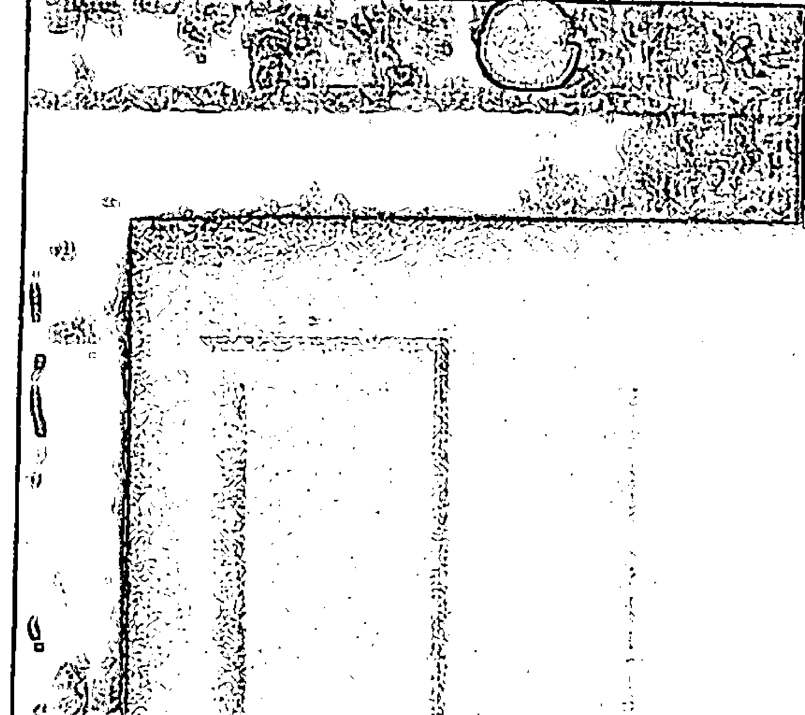

3.  用羽毛較堅硬的根部在柔軟的黏土上刻下三曲腿圖(右邊的照片)。
4.  用緞帶或毛線綁緊迷迭香樹枝的根部。
5.  點燃焚香，並且用迷迭香束指引薰香的方位，讓整個結界都籠罩在薰香中。然後用同樣的方法煙薰三曲腿圖，並將它放置在蠟燭旁邊，讓它自然風乾。
6.  在第二天快凌晨以前，將三曲腿圖黏土板放在正門口前即可。

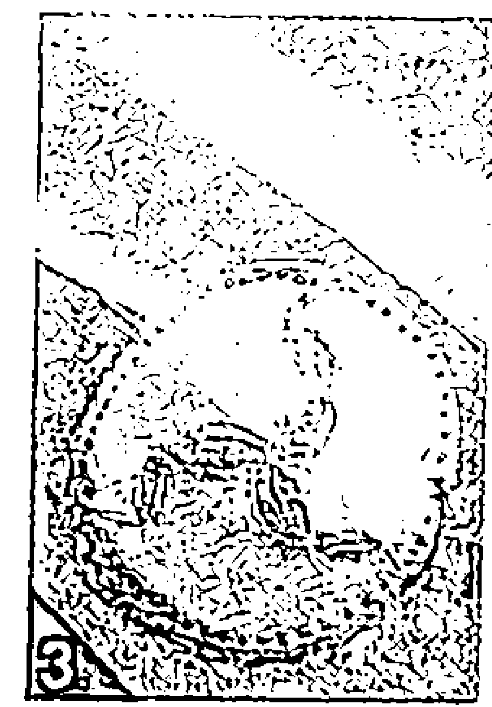

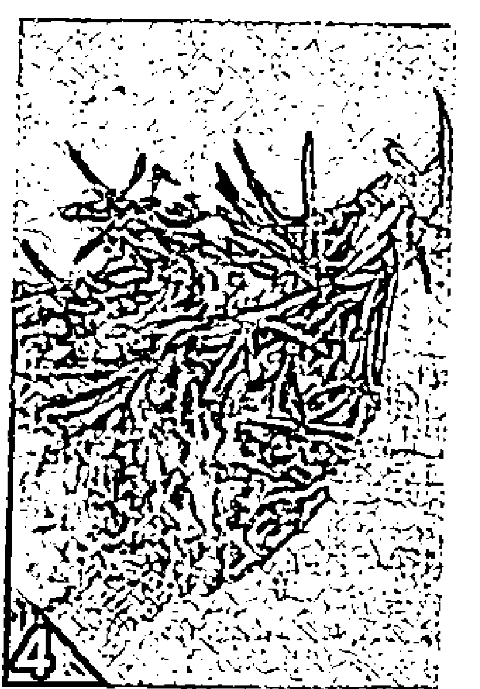

### 幸運之手魔法

#### 讓手邊的事都能進行順利

【目的】帶來好運。

【魔法背景】這是一個帶來一般好運的魔法，適合那些單純想要獲得好運的人，可能是在旅程啟程之前或是正要進行人生重大改變的時刻。這個魔法融合了許多傳統，包括中古世紀的榮耀之手符咒以及古英國的「描摹」的習慣。每個傳統都可與感應魔法的目標及方法相容，而本書中幾乎大部分的魔法，也都立基於感應魔法的原則上都為魔法帶來它們的力量。

其中比較恐怖的是光榮之手的傳說，它來自於一個被吊死的重犯被砍下的一隻手，上面塗滿某種動物的膽汁與肥油。如果燃燒這個符咒，可以讓小偷進入一個家如入無人之境。而若符咒中的其中一根手指頭被燒出「啪」聲，則表示屋中有人已經醒來，可以讓小偷有足夠的時間逃跑，逃離這隻手的主人逮住的命運。但是到了後來，用蠟所做成的榮耀之手反而得到可以帶來運氣的美名，與原本符咒的目的大相逕庭，可以防止小偷的進入。

在本魔法中，你也需要「描摹」你的右手，用筆在紙上描出你右手的輪廓。而巫師的描摹法，至今仍是以細繩沿著身體來框出一個形狀，不是用筆來畫，而這樣的方法，可以幫助魔法緊隨在你的身旁。

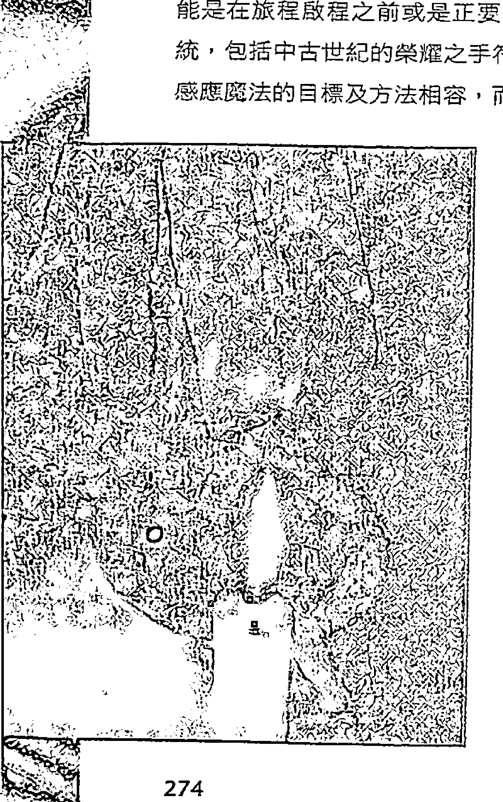

##### 如何施法

施法時機 在暗月時進行，此時新月正是象徵準備全力成長的時候。並於代表好運的福耳圖那(Fortuna)女神所掌管的禮拜四施法。

##### 施法步驟

1.  根據第36到39頁的指示，設立結界。
2.  點燃蠟燭說：「福耳圖那女神，請保佑這個魔法以及我的未來。」
3.  把你的右手手掌放到紙張上，用筆描摹出右手的輪廓線條。
4.  在紙上的手掌上寫下「從卑微到榮耀。」，然後說「掌中的魔法，請為我抵擋傷害；封印的力量，請為我帶來幸運。」
5.  用剪刀沿著紙上的線條，將手掌剪下，並說：「將我的願望隨霧飄散成真。」用燭火從手掌符咒的手指開始點火，並將符咒放到防火盤中完全燃燒。
6.  於夜晚時，將剩下的灰燼埋入土地中，並說：「存於灰燼中的願望，將隨著新月成長茁壯。」

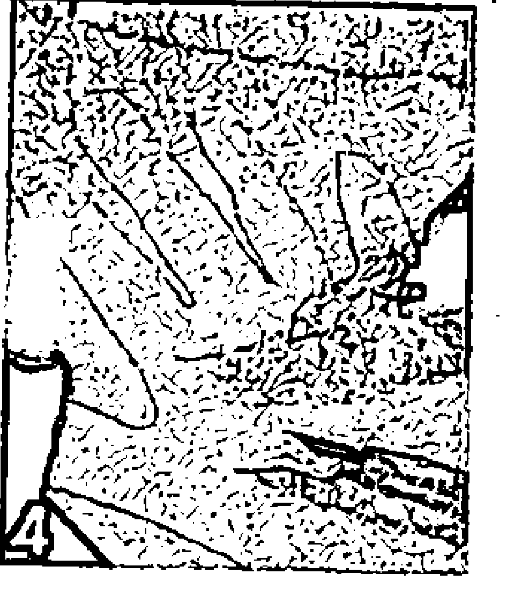

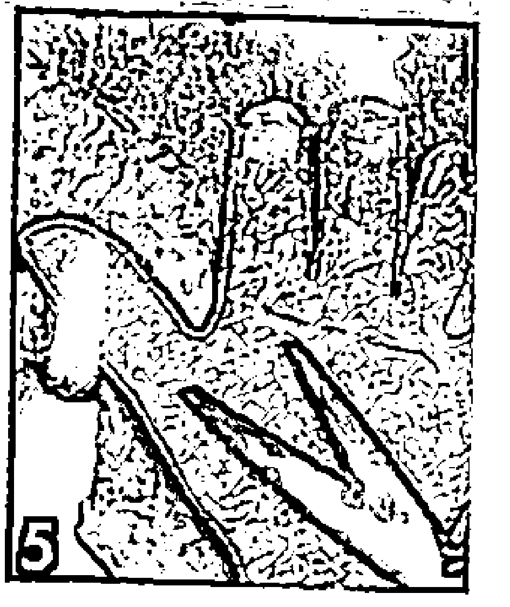

##### 所需工具與材料

-   1根長6～8吋或15～20公分的深藍色蠟燭
-   火柴或打火機
-   剪刀
-   1張用來描摹手掌線條的紙張
-   1枝紫色墨水的鋼筆
-   1個防火盤

### 魔酒幸運袋魔法

無論走到何處，讓好運都伴隨身邊

【目的】提供一個可以隨身攜帶的幸運符。

【魔法背景】「魔酒」(Mojo)這個字，被認為是來自於一種非洲的語言，意思是「法師」或「巫醫」。而魔酒袋則是一個裝有許多魔法物品的小袋。這種符咒可以是招來特定能量的符咒或是抵擋有害力量的護身符。魔酒袋和裡頭的物品是因為某種原因而被放在一起，舉例來說，驅逐敵人的憤怒或得到貴人的幫助。雖然這種魔酒袋是起源於美國黑人的魔法習慣，但許多不同的版本仍在世界各地流傳著。無論是稱作魔酒、古古 (gris-gris)或符咒袋，袋子裡頭所放的幸運材料，其實都大同小異，主要都是為了抓住好運並將幸運隨身帶在身邊。

在本魔法中裡頭所裝的材料，在草藥及魔法工具的知識中都是傳統上用來代表好運的物品，這些材料都必須被安穩的彌封在魔酒袋中並隨身攜帶。這個魔酒袋，對你那些需要運氣的朋友來說也是一個不錯的禮物。

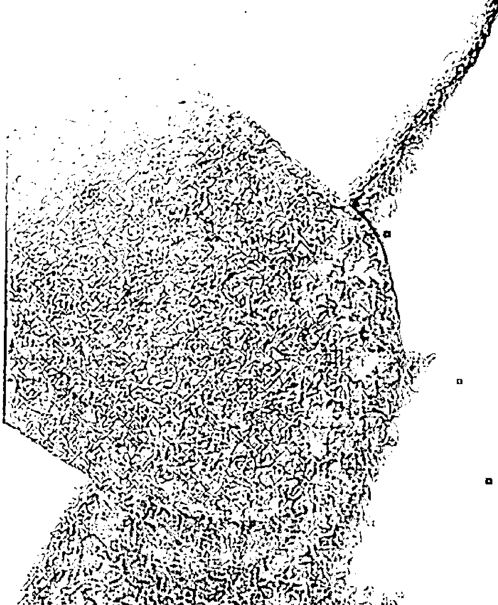

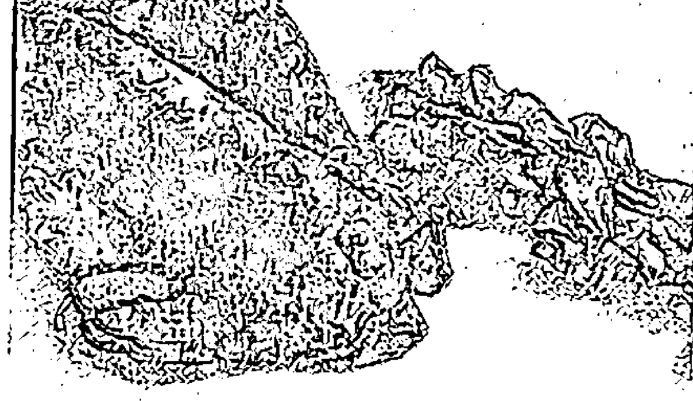

##### 如何施法

##### 所需工具與材料

| 左列 | 右列 |
|------|------|
| 1個裝有木炭的防火盤 | 1個邊長3x3吋或7.5x7.5公分的紅色天鵝絨抽繩袋 |
| 火柴或打火機 | 1個小的白色卵石 |
| 乾燥的杜松莓 | 1束乾燥的白色鼠尾草 |
| 1茶匙的蜂蜜 | |
| 1根大約長12吋或30公分的乳白色柱狀蠟燭 | |
| 1捲紅色棉線 | |

施法時機 在新月後的第六個晚上，當於夜空中可清楚看到月亮時，製作魔酒幸運袋。

##### 施法步驟

- 1. 根據第36到39頁的指示，設立結界。
- 2. 點燃木炭並將杜松莓灑於其上。
- 3. 避開燭蕊，在燭蠟上方長2吋或5公分處塗滿蜂蜜。接著點燃蠟燭說：「請聽我說，我站在光明與黑暗之間、高峰與谷嶽之間，但願所有的逆境與壞運，都能被封印於在這空無一人的空間裡。」
- 4. 用棉線量你右手手腕的寬度，並打結成一個「手環」的樣子放入抽繩袋中。
- 5. 將石頭穿過薰香並放入抽繩袋中。接著也將3片鼠尾草葉放入袋子中。用燭火將剩下的鼠尾草點燃並讓它持續悶燒。
- 6. 用鼠尾草的煙霧煙燻魔酒幸運袋，並說：「裡面所有都是純淨與安全，包含所沒有的一切，實現心中的渴求，請開始符袋的魔力吧！」接著馬上將袋子彌封起來。

### 山梨「神」木魔法

將好運借給別人

【目的】被用於當你有太多的好運，而朋友卻壞運連連時。

【魔法背景】如果你覺得自己的運氣很好，甚至可以分享一點給朋友，那麼這個魔法便非常適合你。當然實際的建議和物質的幫助是要先考慮的部份，但如果實際上你朋友的困境是因為運氣不好而不是沒有能力，那麼此時應該要採取的是魔法的幫助。使用本魔法並不是代表你的運氣會被取走，而是相反的，運氣和愛一樣，若是與他人分享則會得到三倍的回報，也就是因為這個原因，當魔法的接受者運氣開始好轉時，施法者也會同樣從中受益。
人們聽見別人非常的僥倖或幸運時，你可能會聽到他們會說：「也許他的好運有天會降臨到我身上。」事實上這種反應就是來自於借運能力的古老民間信仰。本魔法中所使用的山梨木(花楸)便是傳統上用來象徵「神」的代表物，這是由來於一個更早的歐洲信仰，人們在當時會崇敬某些特定的樹木，認為自然界的靈或神祇是住在這些樹木之中。

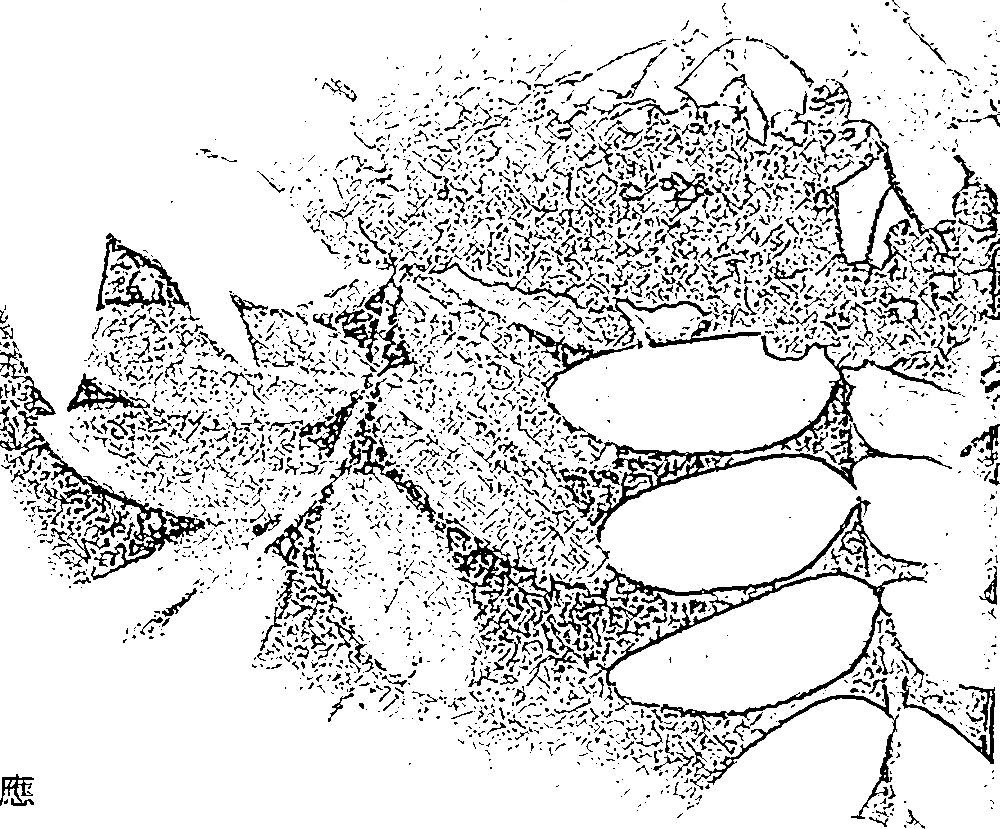

##### 如何施法

##### 所需工具與材料

- 1根長6～8吋或15～20公分的綠色蠟燭
- 火柴或打火機
- 1把鋒利的黑色握把菜刀
- 1個長2吋或5公分的細長山梨木 (花楸)，在木頭頂端1/2吋或1公分之處，以鑽洞器打洞，讓細繩可以穿過
- 1條長24吋或60公分的細繩

施法時機 在逐漸月盈時進行，並於象徵慷慨寬宏的木星所守護的禮拜四施法。

##### 施法步驟

- 1. 根據第36到39頁的指示，設立結界。
- 2. 點燃蠟燭說：「深根可以盤據至河水和石頭，樹梢可以觸碰到蒼穹與雲朵的大地之神，請將你的恩典賜與 (朋友的名字)，就如同你藉由流水、石頭、天際、樹木所帶給我的一切。」
- 3. 用尖刀在山梨木正面的樹皮上，刻下X型交叉符號。
- 4. 朝所刻的盧恩符文字上吐口水，並說：「以我的精華賜與你，」接著朝文字上吐氣，並說：「以我的氣息賜與你，以此萬聖的神祇賜與你一好運。」
- 5. 將山梨木神過燭火，讓上面的唾液被烘乾，以將魔法力量彌封。
- 6. 將細繩穿過山梨木的洞，並隨身掛在脖子上，直到你可以將這個符咒拿到你朋友手中為止，同時記得給朋友一個吻。

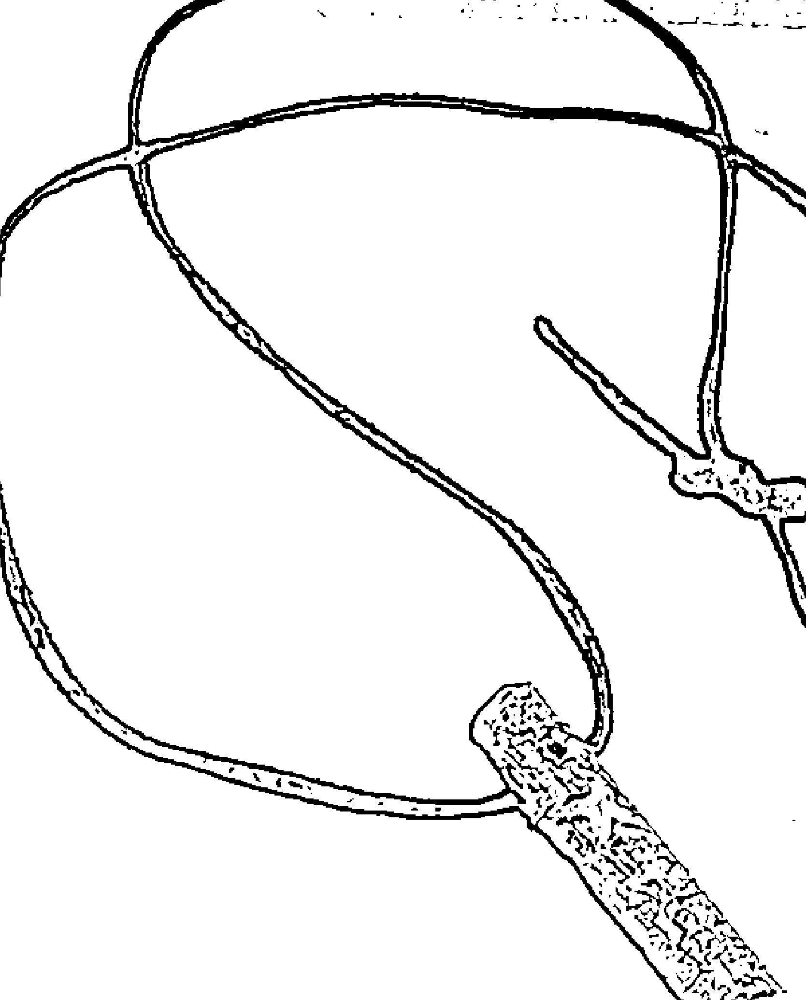

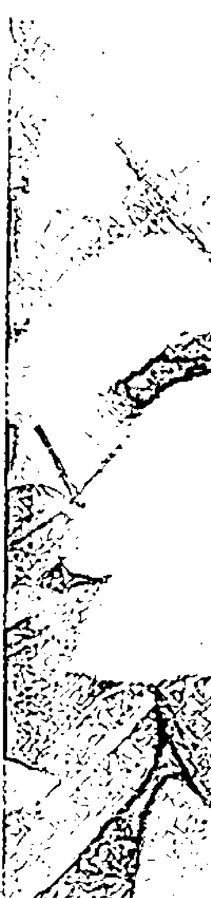

### 蛋魔法

#### 除去身上的厄運

【目的】幫助你消除壞運。

【魔法背景】幾千年來，在許多的文明中都可以發現蛋是代表人生的本質以及繁衍。在這裡，蛋是用來代表封鎖及驅離你的厄運的象徵。

本魔法所指的情況並不是由你自己造成的，而是經由一連串的機運或巧合，讓事情或你陷入有害的困境中。當我們有點太過依賴運氣時，我們會說自己有「一連串的壞運」。因此，在你進行本魔法之前，非常重要的是你必須要先仔細檢視最近所發生的事件，確定它們的不順利是來自於「壞運氣」，而非自己不盡心或怠忽職守。

在這種情形下，通常事情發展是超乎你所能掌握，而且總是擠在一起發生，此時魔法的介入幫忙是非常合宜恰當的，且流傳幾世紀之久的蛋魔法背後，更可以幫助像這樣的難題。而且一般認為若是從本魔法中獲益後，再將魔法介紹給朋友將會得到好運。

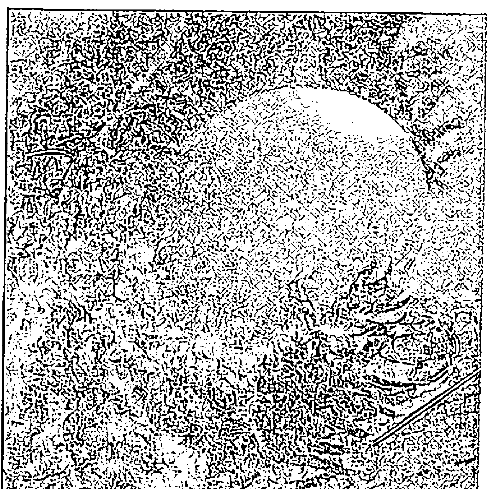

##### 如何施法

施法時機 在逐漸月虧時進行，於破壞者木星所掌控的禮拜六是建議施法日。

##### 施法步驟

- 1. 根據第36到39頁的指示，設立結界。
- 2. 點燃黑色蠟燭說：「請以驅逐的力量，讓惡運消失。」
- 3. 將蛋放入水中浸洗，並說：「你的房子是潔淨的，而我的卻陷於泥沼中，願你能幫助我實現心中的願望。」
- 4. 用針在蛋較窄的那一頭腸穿一個洞，並向洞內吹氣過說：「惡運從我房子立刻退去，從滿是屍骨的堂廊，到石頭遍佈的小徑，汝從此將在我家中消失。」將番紅花從洞口灑入蛋中，彌封咒語。
- 5. 在花園中挖個至少深12吋或30公分的洞，將硬幣和紫杉丟入洞中，再將蛋放在它們上方，並很快的用土掩埋。
- 6. 在1個月亮週期後，你的運氣將會逐漸轉好。

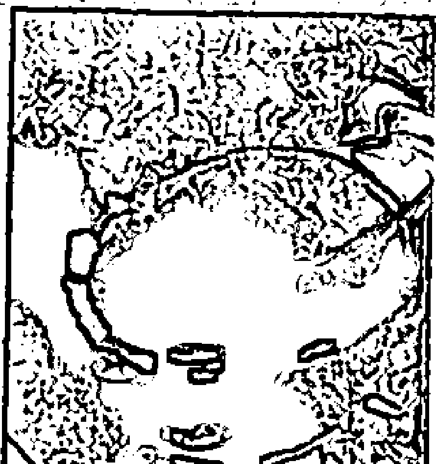

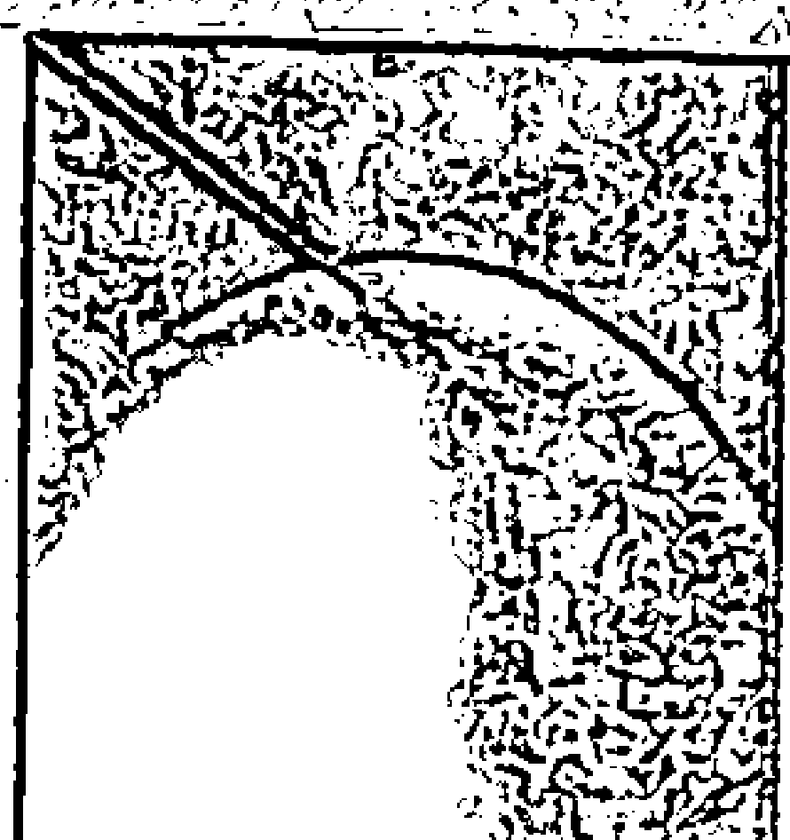

##### 所需工具與材料

| 項目 |
| --- |
| 1根長6~8吋或15~20公分的黑色蠟燭 |
| 火柴或打火機 |
| 1個家禽所下的蛋 |
| 1杯裝有新鮮泉水的高腳酒杯 |
| 1根尖銳的縫紉用針 |
| 1小撮番紅花 |
| 1枚青銅色或金色的小面額硬幣 |
| 1根新鮮紫杉樹枝 |

### 鐘魔法

逆轉做壞事者的命運

【目的】讓想做壞事的壞人計畫失敗。

【魔法背景】現存許多魔法是和消災解厄的魔法有關(看第366-387頁)，但常常會被誤認為「詛咒」。但事實上，這些魔法是用來阻擋那些壞人卑鄙下流的想法與野心去防止他們去傷害別人，而不是好萊塢的那些煽情、劣質電影情節所說的。消災解厄並不是為了傷害別人或復仇，而是阻止傷害的發生。那些做壞事的人應該也要受到同樣的教訓，一個熟練的時間魔法可以將那些壞人，也受苦於那些惡行所帶來的結果。
本魔法是屬於一種顛倒的魔法，是來自於盎格魯薩克遜的消災魔法。雖然魔法的作法是將鐘的指針回轉，但並不是代表它的目標是想要讓時間倒轉。我要將本魔法獻給我的姪兒─喬瑟夫・萊特，是他給了我這個魔法靈感。小孩的智慧有時候是無法理解與測量的。

##### 如何施法

##### 所需工具與材料

- 1個可以使用的指針時鐘 (非電子時鐘)
- 1個壁爐架
- 1根長6～8吋或15～20公分的黑色蠟燭
- 1根長6～8吋或15～20公分的白色蠟燭
- 火柴或打火機
- 1枝黑色墨水的鋼筆
- 1張4x4吋或10x10公分的正方形黑紙
- 1條長81吋或202.5公分的粗黑棉線

施法時機 在逐漸月虧時的禮拜六進行，並必須確定那天的午夜要正好是半夜十二點。

##### 施法步驟

- 1. 根據第36到39頁的指示，設立結界。
- 2. 將時鐘放在壁爐架的中間，並將黑蠟燭放在左邊，白蠟燭放在右邊。
- 3. 點燃黑蠟燭說：「讓邪惡的行為消失無蹤，」接著點燃白色蠟燭說：「讓善良取代它的位置。」
- 4. 在紙的中央，畫上一個很大的「O」，接著將紙對折兩次，並用棉線將只包裹細綁，並說：「我所吟誦的魔咒啊，無論是從圓圈或直線、肉體或骨頭、大海或天空、太陽或月亮，請為我見證邪惡的意念將不會成功。」
- 5. 將時鐘的指針調回一小時前，並說：「所有邪惡的念頭，我看到他們回到原點。」繼續將指針再調回一個小時，並說：「所有邪惡的言語，我看到他們回到原點。」繼續將指針再調回一個小時，並說：「所有邪惡的行為，我看到他們回到原點。」將時鐘面向牆壁。
- 6. 把剛剛綁好的紙團，深深的埋入花園中，並說：「你將被深埋在此，直到你付出代價，願智慧天天茁長，讓你的善良逐漸顯露。」

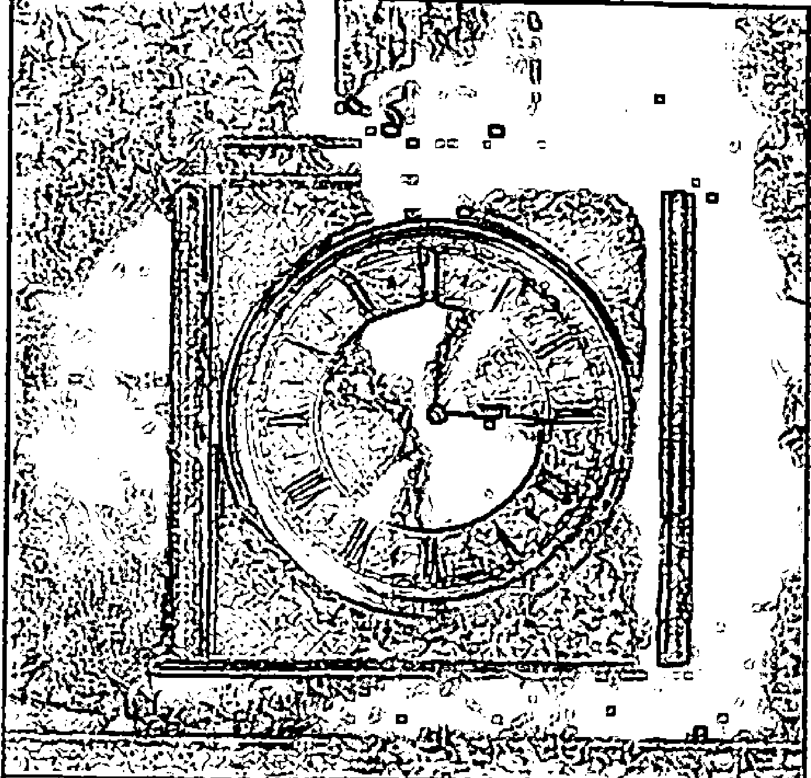

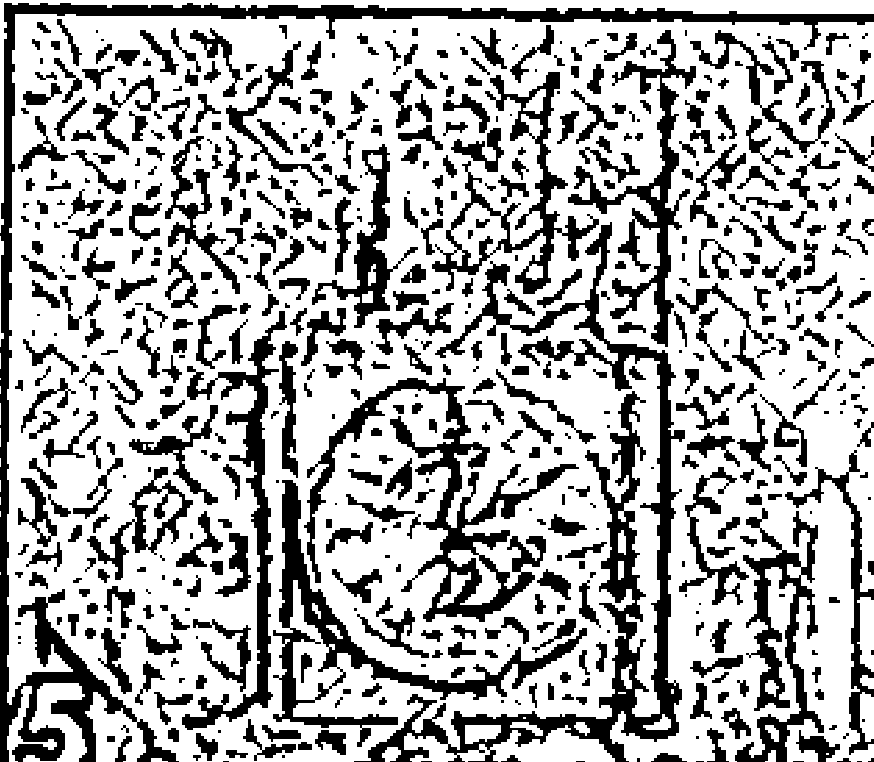

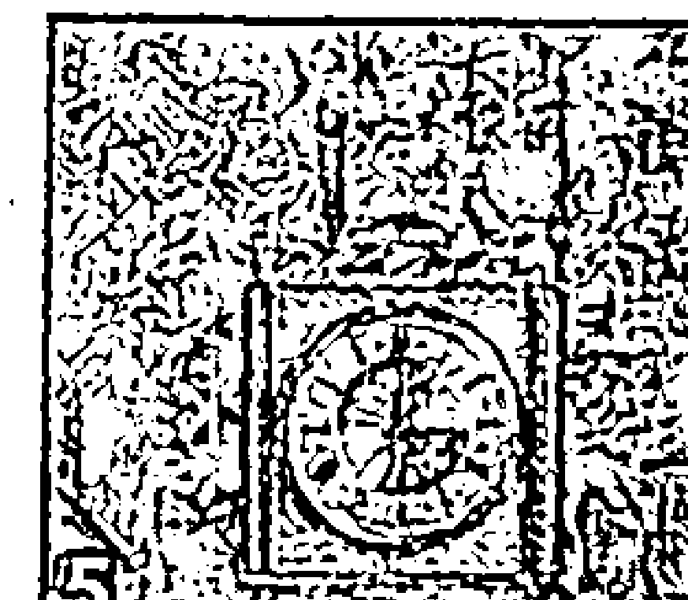

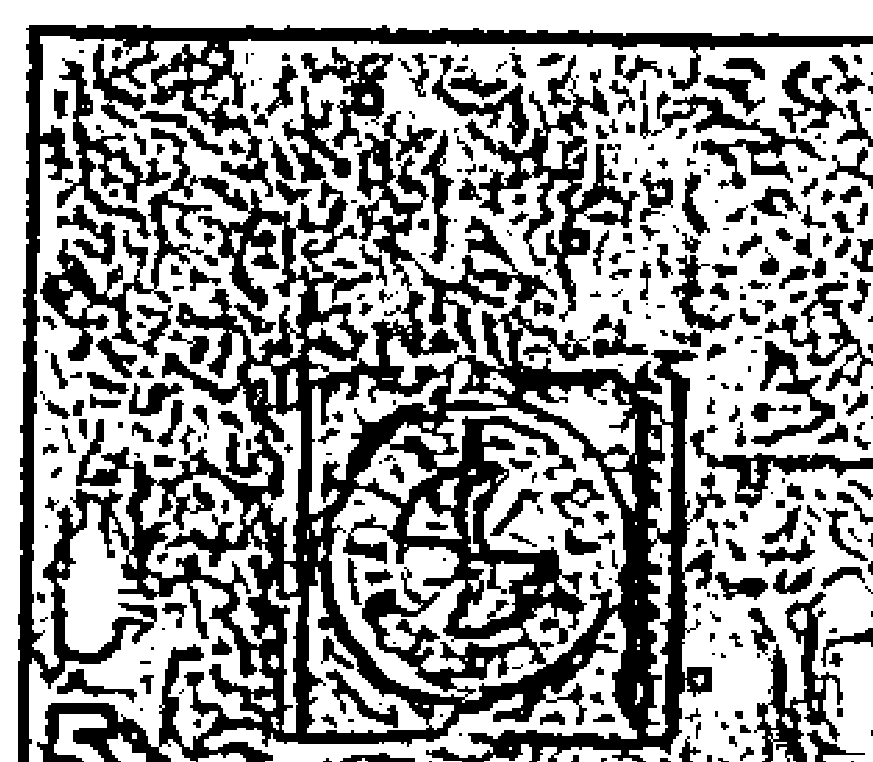

### 橡木魔法

#### 庇佑持續不斷的物質繁榮

【目的】確保持續不斷的物質繁榮。

【魔法背景】在德魯伊教的傳統中，橡樹與土元素有密切的關係，同樣也和太陽的週期有關。從魔法的觀點來看，橡木也與安全、繁殖、財富、健康有關。因此，當你想確保家中的物質供應能源源不絕時，橡木便成為最理想的召喚對象。

本魔法的作用就是利用一種應該放在家中大門口的魔棒。而你在魔棒上所刻下的符號，就是類似盧恩符文「火(Ken)」這個字的反面。這個盧恩符文字是代表橡木的力量，並放在其他代表安全和富足的魔法符咒文字旁。這根魔棒絕對不能被家中成員以外的人所拿到並亂揮，否則魔棒的力量會被大大的消耗毀損。因此，將此根魔棒放在不能輕易觸及的地方，也許是門口上方的掛鉤。這可以保佑你的辛勞將不會白費，如果有任何的疑問或問題產生，魔棒也會指引貴人上門幫助你。

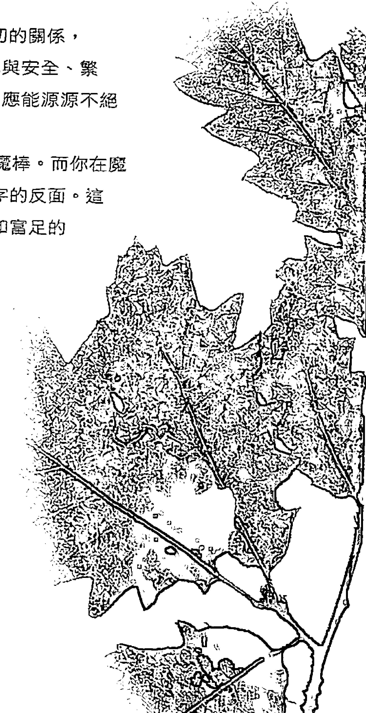

##### 如何施法

施法時機 在逐漸月盈時進行，並於由太陽所掌管的禮拜天施法，因為太陽的力量將會被包覆在橡木之中。

##### 施法步驟

- 1. 根據第36到39頁的指示，設立結界。接著點燃蠟燭說：「我將召喚出偉大的杜依兒(Duir)，橡木的力量。」
- 2. 用小刀在橡木棒的一邊，從底下往上1呎或30公分處，刻上符號「V」，並說：「那些已經賜與的一切，一樣也不會減少。」
- 3. 在V符號的上方6吋或15公分處，刻下一個頂點向下的正三角形，並說：「所有帶來的財富，一樣也不會消失。」
- 4. 在三角形符號的上方6吋或15公分處，刻下一個鑽石菱型，並說：「將確保家人不愁吃穿，不虞匱乏。」
- 5. 最後，在鑽石菱形的上方6吋或15公分處，刻下一個與盧恩符文火字相反的符號（>），並說：「偉大的杜依兒(Duir)，請杜絕所有的惡煞，無論是詛咒或禍害，降臨於居住在這大地與屋樑之間的任何人。」
- 6. 在魔棒的頂端下方2吋或5公分之處，開始纏繞麻繩，直到快碰到盧恩符文文字「火」為止。同樣的，從魔棒底端上方6吋或15公分處，纏上麻繩，直到快碰到V符號為止，藉此將魔法彌封在魔棒上。最後將魔棒掛在門口上即可。

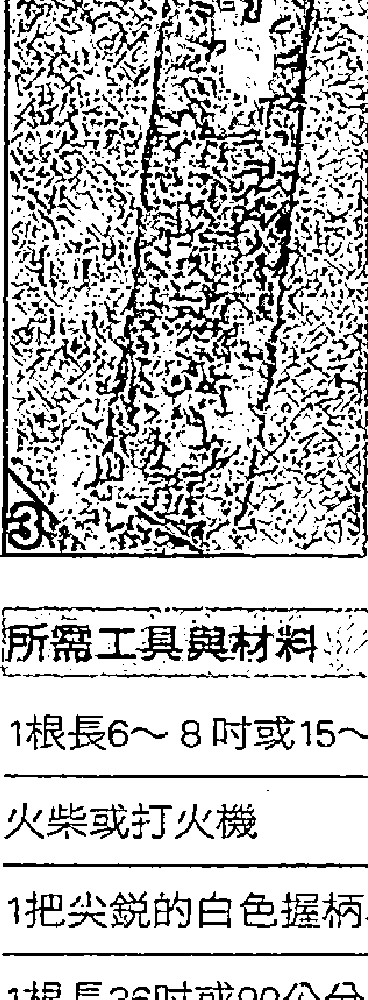

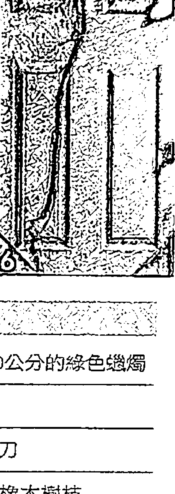

##### 所需工具與材料

| 項目 |
| --- |
| 1根長6~ 8 吋或15~20公分的綠色蠟燭 |
| 火柴或打火機 |
| 1把尖銳的白色握柄小刀 |
| 1根長36吋或90公分的橡木樹枝 |
| 1條長9呎或2.7公尺天然製成的麻繩 |

### 三角形魔法

#### 得到需要的東西

【目的】幫助得到你真正需要的東西，若你輕浮地使用本魔法，那魔法將沒作用。

【魔法背景】如果你想要利用魔法來得到收穫，你必須時常去思考，在使用接觸魔法之前，真正需要做的是什麼。不要因為這個問題好像很愚昧就不去思考，無論在魔法世界中，或是你生命中其他任何的領域，你都需要時常使用這一類的常識來思考。將你的力量花在魔法上，若只是為了並非真正需要的東西，那麼你只是在浪費力氣，無論是招來財富、人或其他真正必須的事物，這些並非最實際、最直接、最重要的方法與行動，並不會為你帶來任何的好處。除此之外，對這些身外之物花太多的心力，魔法本身也不會有所反應，而且將這種癡心妄想帶入魔法的結界中，魔法力量只會逐漸突顯放大你真實世界的悲慘，必須直到你真正的面對問題為止。但如果你確定這個需求，是必要的、也是好的，而且是因為你缺乏實際的解決方法去獲得它，那麼此時才可以轉而試試看魔法的力量。這個魔法會帶來一些不尋常的結果，你必須做好準備去應付所有的可能。因為冬青和禮物有關，所以你心中所想要的東西，將會從令人意外的管道中出現。

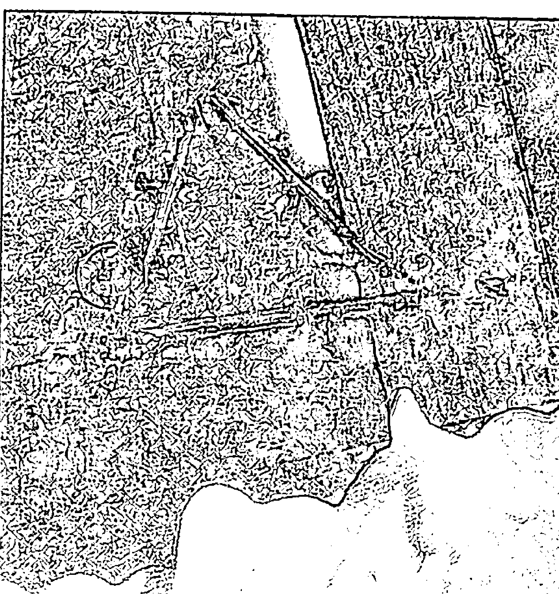

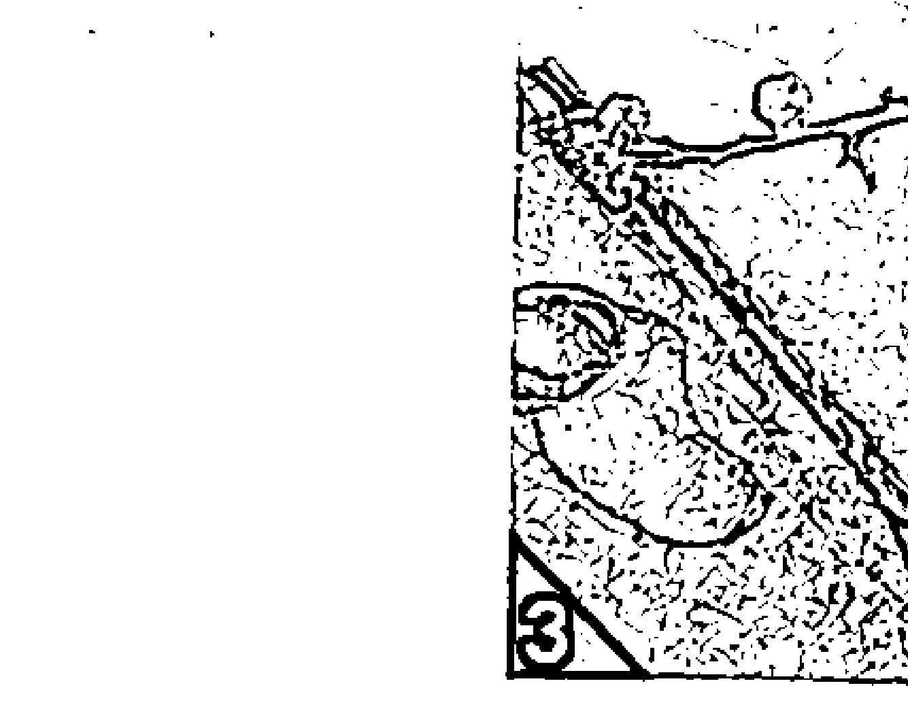

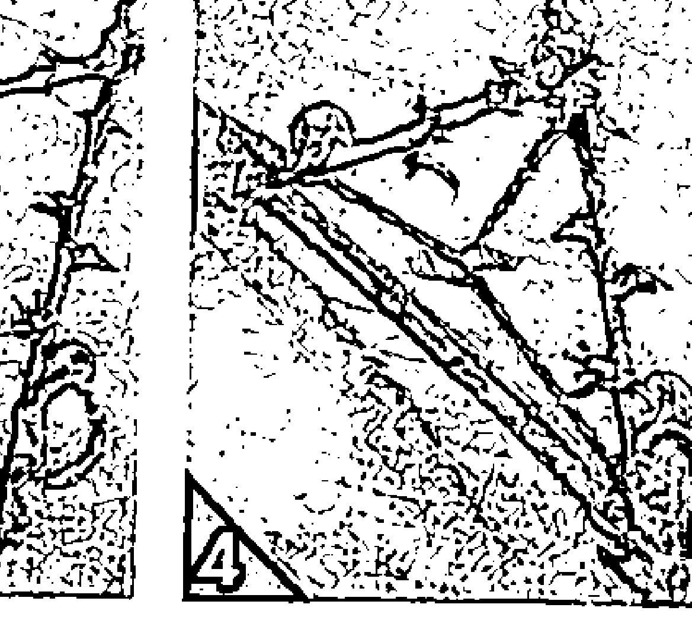

##### 如何施法

##### 所需工具與材料

- 1個裝有木炭的防火盤
- 火柴或打火機
- 乾燥的冬青莓
- 1根長6~8吋或15~20公分的紫色蠟燭
- 3根長5吋或12.5公分的冬青細枝
- 1條長18吋或45公分的紅色棉線
- 1條長18吋或45公分的紅色毛線

##### 施法時機

在逐漸月盈時進行，並須於新月後第7到14天中施法，一個禮拜中任何一天皆可。

##### 施法步驟

- 1. 根據第36到39頁的指示，設立結界。
- 2. 點燃木炭，並在上面灑上冬青莓。接著點燃蠟燭說：「冬青樹中的精靈，我召喚你前來，見證並實現我的魔法。」
- 3. 用棉線將3根冬青細枝綁在一起，形成一個正三角形，冬青枝須互相交疊，並使邊長同為3吋或7.5公分。
- 4. 在三角形的一個角上，綁上羊毛線，並將此線另一端綁在另一個角上，注意要讓線有鬆垮的感覺。接著，用另一條羊毛線綁住第三個角，線的另一端則綁在剛剛鬆垮的線中間，讓羊毛線最後呈現雙臂等長的Y字型。
- 5. 將三角形穿過木炭的煙霧，想像你內心的願望，並唸誦：「恩賜的植物，需要的需求，請都從我的夢中，出現到我面前吧。」
- 6. 將三角形掛在你臥室的天花板上，直到願望實現為止，再將它拿下來燒掉。

### 天然磁石魔法

增加財運

【目的】吸引金錢財富的前來。

【魔法背景】天然磁石或稱作磁鐵礦，在歷史上是用來治療男性的性官能障礙、避免愛人出軌和吸引金錢或運氣。至今，在世界各地仍有許多不同種類的魔法使用磁石，包含剛剛所說的那些用途。現在在晶石和寶石商家都普遍可以看到磁石的存在，而且有時候會因為不同的用途，而在磁石上塗上不同的顏料。舉例來說，在美國若是磁石漆成綠色，則是為了吸引金錢運，因為美國的紙鈔是綠色的，這是一種近代感應魔法中，以形補形的變種。

在本魔法中，天然磁石是被當作護身符，可以招來物質運。一般來說，魔法應該要著重在最後的結果，而不是獲得物品的手段，如此一來，金錢才會在這樣的大前提下進入你的錢包。本書已經叮嚀過很多次魔法「健康」的警告，施展這類的魔法應該要「基於需要，而非貪婪」，在這裡當然也不例外。

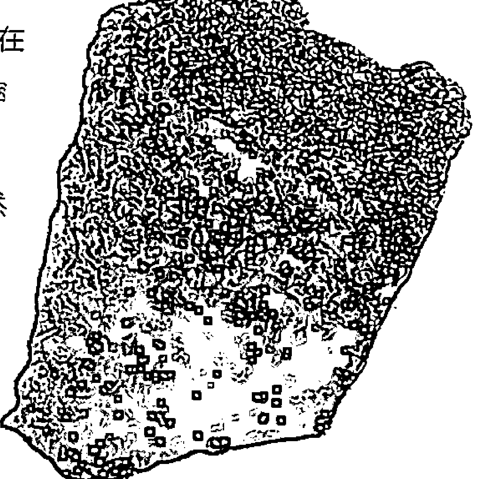

##### 如何施法

##### 所需工具與材料

- 1根長6～8吋或15～20公分的綠色蠟燭
- 火柴或打火機
- 1顆小磁石
- 1小碟的泉水
- 1茶匙的鐵挫屑
- 1茶匙的杏仁油
- 1個2x2吋或5x5公分的棕色抽繩袋
- 1條長24吋或60公分的細繩

施法時機 在逐漸月盈時進行以吸引財運，而因磁石象徵金星維納斯，故應於由金星所掌管的禮拜五施法。

##### 施法步驟

- 1. 根據第36到39頁的指示，設立結界。
- 2. 點燃蠟燭說：「美麗的維納斯，請照顧我的魔法。」
- 3. 將天然磁石拿到蠟燭火焰之前，並說：「維納斯，請注視著你的子民。」將磁石放入水中，並說：「請盡情飲用，並讓力量變得強大。」
- 4. 將磁石吹乾，接著將鐵挫屑灑到磁石上，並說：「請盡情吃飽，並讓力量變得更強大。」
- 5. 幾分鐘過後，將磁石上的鐵屑刷掉，而用杏仁油塗滿在磁石上，接著反覆唸誦以下咒語至少9次：「這就是我所缺乏的寶藏，請與你的愛，將它帶來我的身邊吧。」
- 6. 將磁石放入抽繩袋中綁緊，以細繩綁住抽繩袋當做項鍊的吊鍊。隨身佩戴著磁石符咒，直到需要的錢出現為止，再將符咒拿下，掛置於床柱上。當下次需求出現時，再將符咒取下，重複施行本咒語。

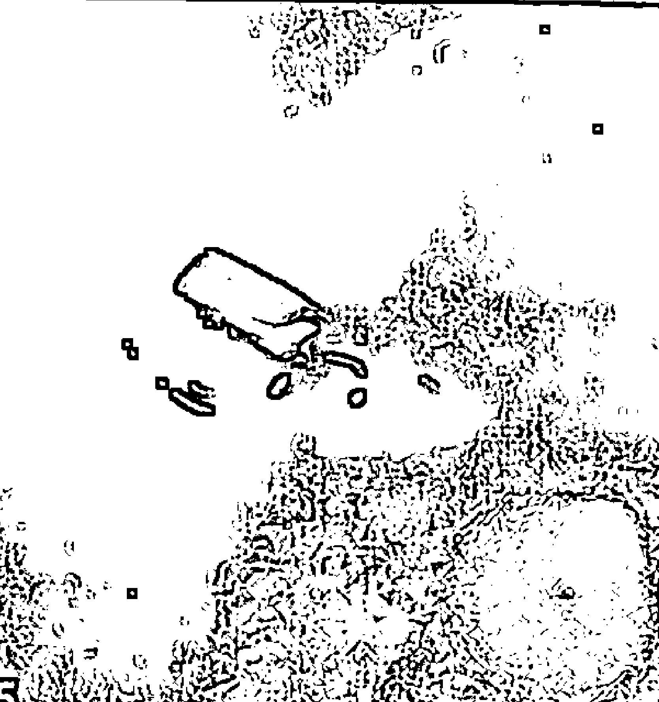

### 幸運鞋粉末魔法

將你帶往好運

【目的】讓好運時時跟隨著你並指引你的腳步。

【魔法背景】有許許多多的符咒都規定需要將符咒放到鞋子裡頭，如果你認識很多魔法的話，便不會對這樣的要求感到驚訝。在西方的文化中喜好使用隱喻，以此提供重要的線索讓人們知道雙腳的重要性。舉例來說，如果我們希望告訴對方，要他們先以設身處地的觀點思考過後，再做評斷時，我們會說：「先用我的鞋子走一英里，再去下判斷。」當某人以對方的角度來看事情時，我們會說他們是「正站在對方的鞋子上」。我們也形容人生方向為「道路」，而當我們選擇這個人生方向時，我們會說「我們已開始走上這條人生的道路」。雖然這些隱喻，主要都是針對沒有行走障礙的人，但是希望那些使用輪椅的行動不便者能夠了解，從魔法的角度來看，這些腳的象徵或重要性，其實根本從頭到尾都和能不能行走無關。我們在沙上、泥上、或墨汁上的腳印，其實是與我們的「輪廓」有關。而在魔法上，從我們身上所描繪下來的輪廓或尺寸，其實都代表我們的精華與本質。因此，將符咒放到自己的鞋子里是可以喚起非常大的魔法力量的。

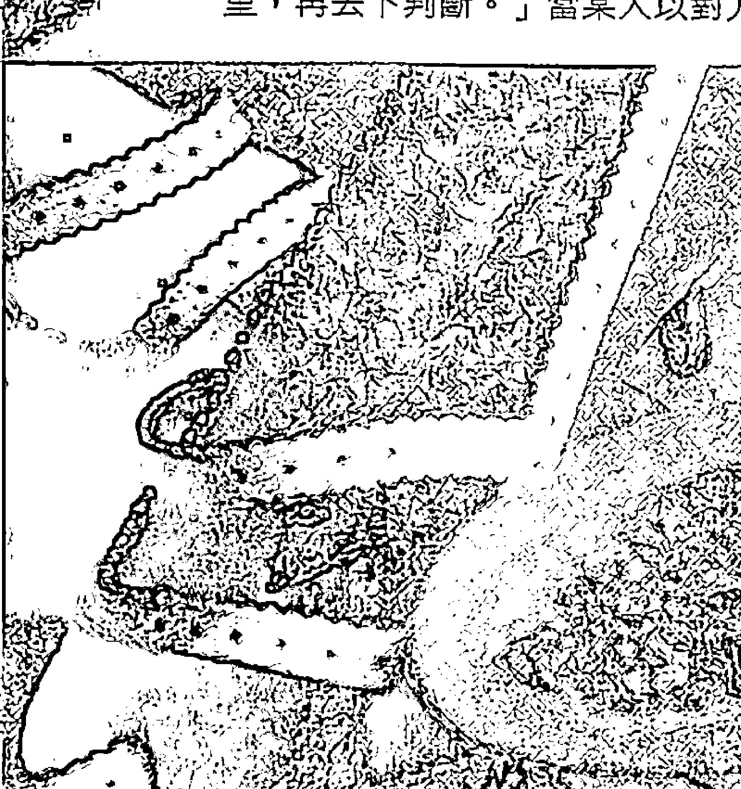

### 幸運鞋粉末魔法

##### 如何施法

**所需工具與材料**
- 3滴胡椒薄荷精油
- 30滴基底油
- 1根長6～8吋或15～20公分的綠色蠟燭
- 火柴或打火機
- 1根長6～8吋或15～20公分的黃色蠟燭
- 1枝綠色墨水的鋼筆
- 1張辦公用紙
- 1個防火盤
- 6片乾燥的薄荷葉
- 6片乾燥的羅勒葉

施法時機：在逐漸月盈時進行以將你帶往好運，而由代表徒步旅行的水星，所守護的禮拜三是最佳施法日。

##### 施法步驟
1. 根據第36到39頁的指示，設立結界。
2. 將精油完全混合，並用精油摩擦你的腳底，並說：「如此，我將被指引。」拿起綠色蠟燭，避開燭蕊，摩擦你的腳底，接著點燃蠟燭。
3. 點燃黃色蠟燭說：「以我的方式旅行，好運將指引我，讓我不致迷路。」
4. 用筆在辦公用紙上，寫下：「撫慰，福耳圖那，撫慰。」
5. 將紙放到綠色蠟燭的火焰上點燃，並放在防火盤上，让它完全燃燒成灰燼。接著，將粉碎的羅勒葉和薄荷葉，都加入灰燼中。
6. 用手將灰燼、羅勒葉、及薄荷葉完全混合，在下次出門前，將混合物灑在兩隻鞋子裡，並讓鞋中的混合物自然消失。

### 解咒魔法：消除他人對你的厄運詛咒

【目的】讓任何人對你所發出的忌妒或邪惡念頭都無法成功。

【魔法背景】我們常常會聽到別人說最近厄運連連，但是其實有時候他們相信，他們的厄運是別人的詛咒或惡意念頭的影響。詛咒常是那些認為自己有魔法力量的人，為了個人私利而設下的威脅。不過幸好，這些沉淪腐敗的靈魂唯一有的力量就是膨脹自己的自我意識。然而，他們力量中所挾帶的忌妒仇恨以及其他的惡意，的確是讓人有保護自己、對抗邪惡力量的需要。如果你覺得被希望傷害自己的某人所「折磨」，這個魔法可以將任何不良的影響，而且還可以將這些惡念，包括知道別人對你有惡意的焦慮感通通消除。這是來自於一個在世界各地常被發現的民間信仰，將你所有的衣服混亂搭穿，有時將衣服翻過來，或是將它們頭尾顛倒，讓邪惡的力量搞糊塗。在本魔法施行後，一整個月裡，你必須離開自己的房子，至少一個禮拜一次，並且帶著內外相反、或上下顛倒的衣服。

##### 如何施法

**所需工具與材料**
- 1根長6～8吋或15～20公分的黑色蠟燭
- 火柴或打火機
- 1個小型掌鏡
- 1罐鹽巴
- 黑布

施法時機：在暗月的晚上施法，此時最適合破壞魔法，及製造超自然的保衛防護罩。

##### 施法步驟
1. 根據第36到39頁的指示，設立結界。
2. 點燃黑色蠟燭說：「本來是滿的，現在空了；本來是空的，現在滿了；在這個時間中，沒有時間；在這個空間中，沒有空間；我站在超自然的世界裡。」
3. 將鹽巴倒在正面向上的鏡面上，呈現X型，並說：「從此我將消除所有的厄運。」將鏡上的鹽巴吹散，並說：「從此我將享有更多的好運。」
4. 將你所有的衣服都拿出來，將衣服都翻過來，並頭尾顛倒。
5. 用鹽巴在鏡面上，灑出一個圓形，再於圓形的中間灑一條垂直線，貫穿這個圓，並說：「月亮是空的、月亮是圓的，猜猜誰才被愚弄。」
6. 將鏡子上的鹽巴吹掉，並用黑布將鏡子包起，放在黑暗的地方，持續一個月。

### 石板魔法：將詛咒送回始作俑者

【目的】當你確定某人正希望對你或你的週遭一切做出傷害時，幫助你將詛咒送回施惡者身上。

【魔法背景】在北歐的民俗傳說中，石板是象徵家和遮蔽所對我們的意義。在現在的年代，大部分人的家中，都是使用水泥或木頭地板，而極少人使用石頭地板了。所以為了實行本魔法，你必須去找到一個鋪路石板，以作暫時之用。而這些建材，現在都可以在大部分的房屋裝修店或花園中心找到，不會很困難，也不會非常昂貴。

用石頭擺出特殊的模式，是一個非常古老的手法，甚至這在世界某些地方，被認為是整理家務中很重要的部分。文化歷史學家發現，在前門階梯設計使用複雜的石板模式，是在威爾斯非常普遍的習慣，這個習慣並一直被延續到西元12世紀。雖然表面上看來，家人的驕傲是製作這些精緻繁複石板工藝的背後動機，但其實這些特別的石板模式都是代表力量強大的象徵符號，前人可能以此來保護家人，並宣稱及識別自己的領土和邊界。在本魔法中，你將會標示出邊界和受保護的領土，並將所有的詛咒送回惡人的身邊。

##### 如何施法

施法時機：在暗月時進行，幫助將惡意驅散。在魔法進行的第一年中，每三個月要翻新一次，在12/21，3/21，6/21，9/21，用粉筆重新畫出符號。

**所需工具與材料**
- 1根長3吋或7.5公分的黑色蠟燭
- 火柴或打火機
- 1個邊長8-12吋或20-30公分的正方形鋪路石
- 1根粗粉筆

##### 施法步驟
1. 根據第36到39頁的指示，在你家的前門旁邊設立結界。
2. 用熔化的蠟，將蠟燭直立在石板的中心。
3. 用粉筆在石板上，畫出一個指向左邊的箭頭，並穿過蠟燭下方。
4. 將石板放在你的前門前方，並說：「讓你受傷。」將石板轉向，讓箭頭指向門外，並說：「我將你擊潰，就像將你的詛咒轉向一般。」
5. 在石板的左上角，畫上一個小的正方形，並說：「家庭。」在石板的右上角，畫上一個X，並說：「愛。」在石板的左下角，畫上一個向上指的箭頭，並說：「屋頂之上。」在石板的右下角，畫上一個中間有一小點的圓。
6. 讓蠟燭完全燃燒，再用地毯將石板蓋上，放在前門旁邊。

### 廚房女巫魔法：讓你和你的心永遠不會感到飢餓

【目的】製造一個幸運符，讓你和你的家人將不會缺乏食物。

【魔法背景】在美國及歐洲一些國家的店舖中所販賣的廚房女巫通常是一個騎著掃帚的可愛老婆婆木偶，廣告商聲稱這尊木偶可以讓你的廚藝不會太可怕。事實上，藏在這個吊飾符咒背後的觀念是起源於歐洲，在那裡是不是人偶，而是鹹味生麵糰，它包含了穀物被收割前的靈氣。將麵粉以這種方式保存，被認為可以確保來年穀物精靈將會重回麥穀中。有些想法認為以好女巫樣式所捏成的生麵糰，一旦被烘烤過後可以嚇走所謂會破壞穀物的惡女巫。

在本魔法中所做的鹼麵糊樣式，並不會需要你太多藝術天份，因為畢竟只是要召喚出鹼麵糊原本的象徵意義—確保富足。你的廚房女巫並不會有尖尖的帽子或掃帚，但是可以保證，這樣的廚房女巫的法力，絕對比市面上所販售的「可愛老婆婆」大上非常多。

##### 如何施法

**所需工具與材料**
- 1根長6～8吋或15～20公分的紅色蠟燭
- 火柴或打火機
- 1滿杯的家用鹽
- 1滿杯的白色麵粉
- 1滿杯的水
- 1個大碗公
- 1顆蛋的蛋白
- 1茶匙的常用於烘製糕餅的罌粟籽
- 1個烤箱
- 1條長12x1/2吋或30x1公分的紅色緞帶

施法時機：在月亮漸盈進行，並盡量越靠近滿月的時候越好。

##### 施法步驟
1. 根據第36到39頁的指示，在你家的廚房設立結界。將你的烤箱溫度設在華氏100度或攝氏38度。
2. 點燃紅色的蠟燭，將你的雙手放在燭火的兩邊，前後移動3次，並說：「我召喚生命之靈，我召喚大地之靈。」
3. 將鹽巴和麵粉放到大碗公中混合攪拌，並持續加入水，直到麵糰已經平滑且柔軟為止。持續揉捏麵糊至少三分鐘，並同時反覆唸誦以下咒語：「財富到、好運到，富足不愁勞。」
4. 將麵糊捲成一個平滑長條狀，並將它做成8字型。
5. 將蛋白完全塗抹在麵糊上，並將罌粟籽均勻的灑在麵糊表面。將麵糊放入烤箱中烘烤，必須烤到敲擊表面時，會發出中空的聲音為止。每一台烤箱的烘烤時間都不一樣，所以請時常去檢查烘烤的狀況。當烘烤完成後，將它放在一旁放涼。
6. 將紅緞帶捆在麵糊上，並掛於廚房中即可。

### 開運魔法：羅馬豐饒角魔法——賜與新家好運

【目的】將好運帶到新家中，是祝福情侶第一次一起搬入新家的理想魔法。

【魔法背景】豐饒羊角或是「豐饒角」的符號是出現在文藝復興時代的西方藝術中，被用來代表富饒。事實上，這是一個羅馬的古老魔法符號，羊角是代表無止盡提供食物的象徵。這個符號通常是出現在羅馬的宗教藝術上，並為女神所拿著的圖騰，但因為實在太受歡迎，到後來許多神祇也變的與這個符號有關：阿班達提亞（代表豐盛），史貝斯（代表希望），柯皮亞（代表財富），席瑞絲（代表成長），賈斯緹緹亞（代表正義），和康科迪亞（代表和平）等，在這些神祇旁邊，也都可以看到豐饒角的符號。這個符號時常在古代文化出現，甚至逐漸演變成項鍊符咒，也許可以反映人類經年不變的煩惱，也就是確保資源的豐沛足夠。

另一個古羅馬人所留給我們的習俗，也與豐饒角有密切的關係。這是一個賜與新家庭麵包、油、和鹽的儀式，主要是為了保證這些主食在未來都不會短缺。本魔法便是利用這個儀式，並使用豐饒之角這個古老的符號，為家中帶來好運。

##### 如何施法

施法時機：在月亮漸盈進行以確保資源會流至你家中。在一個禮拜中任何一天皆可施法，但須避開象徵貧瘠的土星所掌管的禮拜六。

**所需工具與材料**
- 1根長6～8吋或15～20公分的綠色蠟燭
- 火柴或打火機
- 1把尖刀
- 1條小麵包捲
- 1茶匙的純橄欖油
- 1小撮鹽巴
- 1條長18吋或45公分的麻繩
- 1張邊長為12吋或30公分的正方形毛氈
- 1捲紅色縫線
- 1根縫紉用針

##### 施法步驟
- 根據第36到39頁的指示，設立結界。
- 點燃蠟燭說：「我召喚席瑞絲，擁有繁殖力與生長力的穀物女神，請見證並保佑我的魔法。」
- 將麵包捲切半，並將一湯匙的橄欖油倒入其中的一半麵包，並說：「願女神降臨於此。」將鹽巴灑到另一半的麵包上，重複剛剛的咒語。
- 用麻繩將2半的麵包結合並綁緊，說：「所有需要的一切，都已被彌封在這間房子裡。」將毛氈弄成圓錐形，並用針線繃緊固定。
- 將麵包放到圓錐上，並用針線將將開口縫緊固定。
- 將這個符咒放在自己的家中，或是到朋友家拜訪時，送給朋友，並說：「豐饒將被庇祐，豐饒即將到來。」

### 紅手環魔法：賜給新生兒美好的未來

【目的】製作一個可為新生兒帶來好運的符咒。

【魔法背景】細繩和縫線在魔法中是很重要的，沒有其他的東西比它們更能代表生命和命運。在本魔法中的習俗，在世界不同的地方就會有不同的變化，但它們都代表新生兒未來的命運，因此被人們深深的崇拜著。人類學家常會發現，在不同文化的儀式中，將細繩當作綁在新生兒手上的幸運帶，是一個世界共通的普遍習俗。在這個傳統習慣中，紅線是用來代表力量、健康和長壽，而這些目的也剛好被使用在本魔法中，但其中更多加了一些獨特的凱爾特文化的味道。在凱爾特的信仰中，布莉吉妲女神(Brigid)是所有新生生物的守護者，她有三種能力，她是治療者、火的提供者及詩人和工匠的諤司女神。也由於她的三重力量，使得莉吉妲與三重性，也就是事物以三倍的力量、數量或型態出現，有很深的關連，因此，人們常以三線辮來裝飾布莉吉妲的衣著，或是做成她模型的框架外型。在這裡，我們便是要召喚布莉吉妲，賜予力量給辮形紅色手環，以保佑新生兒有美好的未來。

##### 如何施法

**所需工具與材料**
- 1個裝有木炭的防火盤
- 火柴或打火機
- 3根長6～8吋或15～20公分的紅色蠟燭
- 3條長18吋或45公分由15條線所編成的紅色刺繡粗紋線
- 1枝鉛筆
- 3茶匙的乳香
- 剪刀
- 1蛋杯的水
- 1小撮的鹽

施法時機：在月亮漸盈進行以帶來好運氣，而為了尊崇火一般的布莉吉妲，應於禮拜天施法。

##### 施法步驟
1. 根據第36到39頁的指示，設立結界。
2. 點燃木炭。
3. 點燃所有的蠟燭，並且每點一根蠟燭，必須依序唸誦以下咒語：「布莉吉妲，治療之井的女王」(第一根蠟燭)，「布莉吉妲，烽火的女王」(第二根蠟燭)，「布莉吉妲，生育的女王，歡迎妳的降臨」(第三根蠟燭)。
4. 將3條線綁在鉛筆上，開始綁辮子，並一邊重複唸誦咒語：「你的生命將健康長壽，你將安然度過未來的困境，你的內心將永遠安祥快樂。」當辮子的長度比嬰兒的手圍長4吋或10公分時，則停止再編下去，並將辮子打結。
5. 將乳香灑在木炭上，並將辮子穿過木炭的煙霧說：「氣將加速你的成長。」將辮子穿過蠟燭的熱氣說：「火將強化你的力量。」將水灑在辮子上說：「水將帶給你愛。」將鹽巴灑在辮子上說：「土將賜給你健康，而布莉吉妲將隨著你的腳步，伴你左右、與你同行。」
6. 把手環綁在嬰兒的手腕上，然後再將它取下，擺在嬰兒床的床墊下。

### 漿果項鍊魔法：帶來健康、豐足與幸福

【目的】保佑你健康、豐足與幸福。

【魔法背景】漿果是有著許多種功能的材料，多被用在混合焚香和魔藥中。它們傳統的象徵也在魔法中被廣泛的使用，並蘊含強大的魔法能量，並且就算因為魔法需要而被掛在家裡，看起來也非常的美觀。這個符咒主要是取自與山梨、杜松和冬青莓有關的傳統，利用它們的魔法磁場為符咒帶來保持健康、豐足和幸福的力量。

在3個傳說中，山梨和杜松主要是抵抗邪惡的力量，因此它們的漿果擁有特別的保護能量。它們多被用在象徵淨化和保護的混合焚香中，若是將它們的混合物放在後門處，將可以阻擋小偷闖空門。而冬青樹也有相同的特質，雖然它的漿果是與約束誓言和封存愛人的承諾有關。而在這三個材料當中較神秘的特質就是確保健康、豐足和幸福的能力，本魔法便是召喚出這個較少為人所知的力量，賜給符咒得到健康、財富和幸福的能力。

##### 如何施法

**所需工具與材料**
- 1根長6～8吋或15～20公分的紅色蠟燭
- 1根長6～8吋或15～20公分的綠色蠟燭
- 火柴或打火機
- 1條長48吋或120公分的黑色繩線
- 1根鋒利的針
- 1個碗
- 4盎司或115克的乾燥杜松莓
- 4盎司或115克的乾燥山梨漿果
- 4盎司或115克的乾燥冬青莓

施法時機：在月亮漸盈進行，並於象徵保護的火星所掌管的禮拜二施法。

##### 施法步驟
1. 根據第36到39頁的指示，設立結界。
2. 點燃紅色蠟燭說：「健康與快樂與我永在。」點燃綠色蠟燭說：「豐足與幸福生生不息。」
3. 將繩線穿過針頭。
4. 把杜松莓倒入碗中，並將你的手掌放在杜松莓上說：「在我家中的黑色漿果，不會將我的豐饒帶走。」然後將山梨漿果倒入碗中，重複同樣的動作說：「在我家中的紅山梨果，保佑讓我健康又長壽。」接著將冬青莓重複上面動作說：「冬青莓請看顧我，讓我幸福又快樂。」
5. 依照杜松莓、山梨漿果和冬青莓的順序，將所有的漿果依序穿入縱線中，並反覆吟誦：「我將擁有三大寶藏，健康、豐足和幸福，保佑我健康永在、豐饒不息、幸福長存。」當線已經穿滿漿果後，便將線打結掛在你的脖子上。接著走到房子裡最重要的心臟地帶，將項鍊掛在那個地方的最高點即可。

## 保衛與賜福的魔法介紹

幾世紀以來，在西方的社會中保衛與賜福的力量一直被崇敬及畏懼著。這是因為魔法的本質常被大多數人所誤解。人們常會認為祈福和尋求保衛的儀式和符咒是絕對不變的，也就是一旦一個人或物被賜福後，將永遠不會再被外界所傷害。這種想法對於自認為經由魔法就可所向無敵的人以及施法者來說都是一個很危險的誤解，最後當事情出錯，人們反而強烈的埋怨和指責魔法的不是。也因為這樣的誤解，使得那些原本是為了保護或治療的魔法，反而被指控為「詛咒」甚至是「謀殺」。

對於保護和賜福魔法力量的恐懼和誤解，來自於人們認為在降福的力量之後隨之而來的將是詛咒的力量。這種錯誤的觀念加深了人們對魔法界人士的畏懼和反感，甚至在多年以後演變成對巫女或法師的迫害和殘殺。這種想法來自於一種心態，一種非常普遍的心態，認為所有的觀點和原則只有白與黑，並將世界劃為純粹的正反兩面。但是魔法並不是依照這樣的原則在運行的，那些聲稱保衛和賜福的魔法，也只是單純像它們所說的那樣。保護的儀式並不是詛咒，而是藉此駕馭魔法的力量提供防衛能力，讓別人打消不誠實、邪惡或欺騙的念頭。同樣的，賜福魔法並不是自動防止危害發生的工具以及可以讓自大無腦的人可以永不受傷害。事實上，保衛和賜福的魔法是那些希望祝福降臨到自己身上並尊重超自然力量的人，傳送到魔法網絡的訊息。

因此，請不要擔心本章的賜福魔法是邪惡的魔法，那些召喚出來的保護力量並不會詛咒到任何人。本章的魔法主要都是著重在祝福家人、新生兒或祝福情侶能夠甜甜蜜蜜、白頭偕老。你也可以發現一些魔法可以保護你的家不被外人或小偷入侵、讓你識破別人所設的騙局、阻擋他人邪惡的意圖並讓邪惡的力量不要靠近。

在本章的最後，你會看到一個非常特別的祝福魔法，這在法師之間是非常的有名，可以幫助你聚集自己的力量，讓你可以隨時面對逆境和困難。

### 墨西哥之眼魔法

#### 防衛惡毒的眼光

【目的】讓邪惡的怨念無法成真。

【魔法背景】Ojo de Dios又稱作「神眼」，這是本魔法所使用的符號，也是擁有保護力量的符咒。墨西哥的惠丘族人會紡紗織出這樣的符號，做為抵抗邪惡及召來超自然力量保護的工具。與神眼功能很類似的工藝品也出現在南美、非洲及東方一些地方。「神眼」會以不同的藝術形式來表現，其中最為普遍的就是一個圓圓的眼睛，中間有被陽光光線所圍繞的虹膜，但最簡單、最常見的代表符號多在紡織的樣品中看到，與本魔法中所創造的神眼非常相似。

邪眼的信仰，是認為若某人以邪惡的念頭和眼光，一直看著別人，則將會對人造成人造造成傷害，這個信仰在全世界各地都可找到。其實，這常常是一種對詛咒或惡念力量的恐懼，若持續為了詛咒煩惱或發愁，反而會讓詛咒或怨念在你生命中留下更大的發展空間。告訴別人不要為此煩惱是很簡單，但要他們真正忽略內心的恐懼卻很困難，因此，本魔法著重召喚太陽的保護力量，增強你內心的安全感。當你在織Ojo de Dios時，請試著反覆唸誦或低吟咒語，以喚起並增強魔法的磁場及力量。

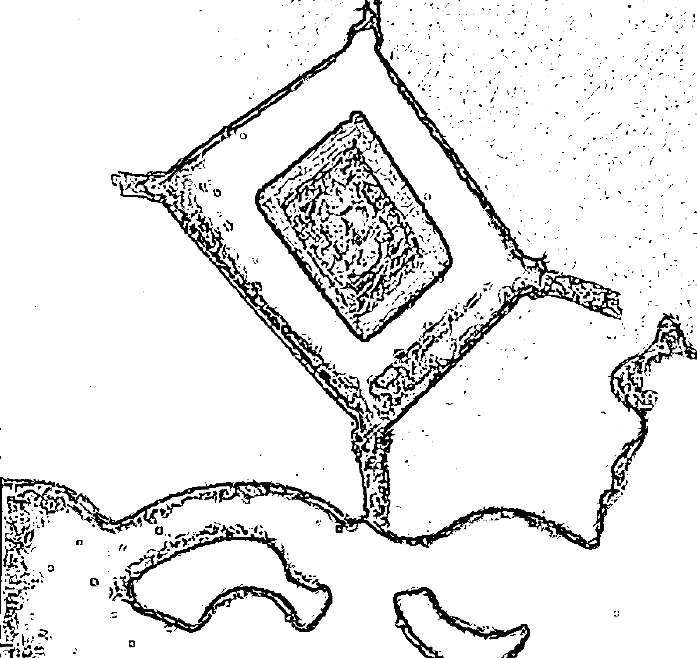

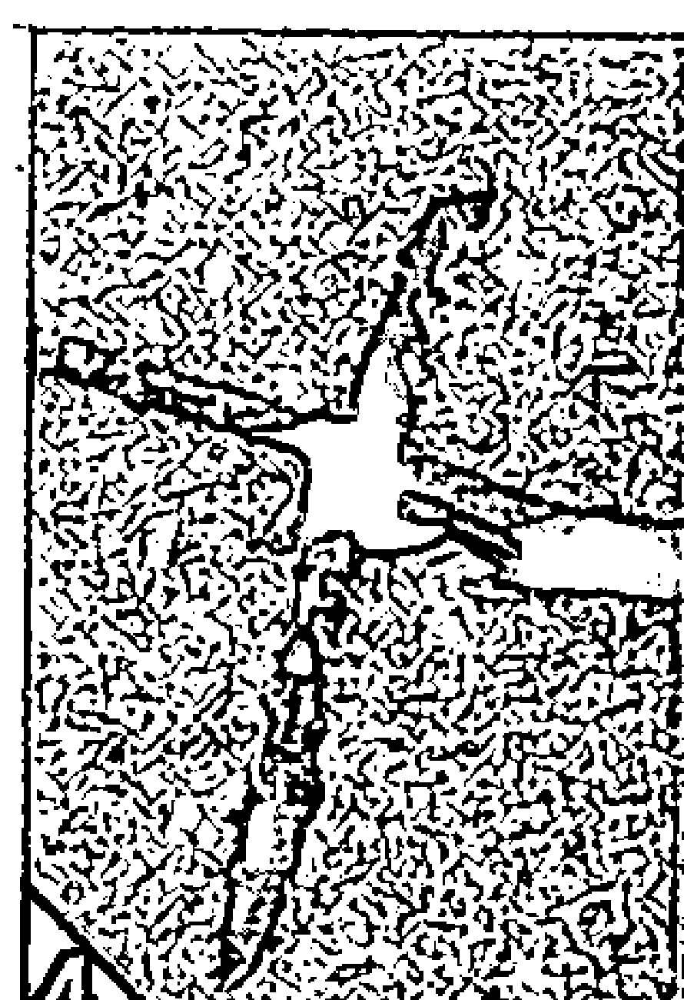

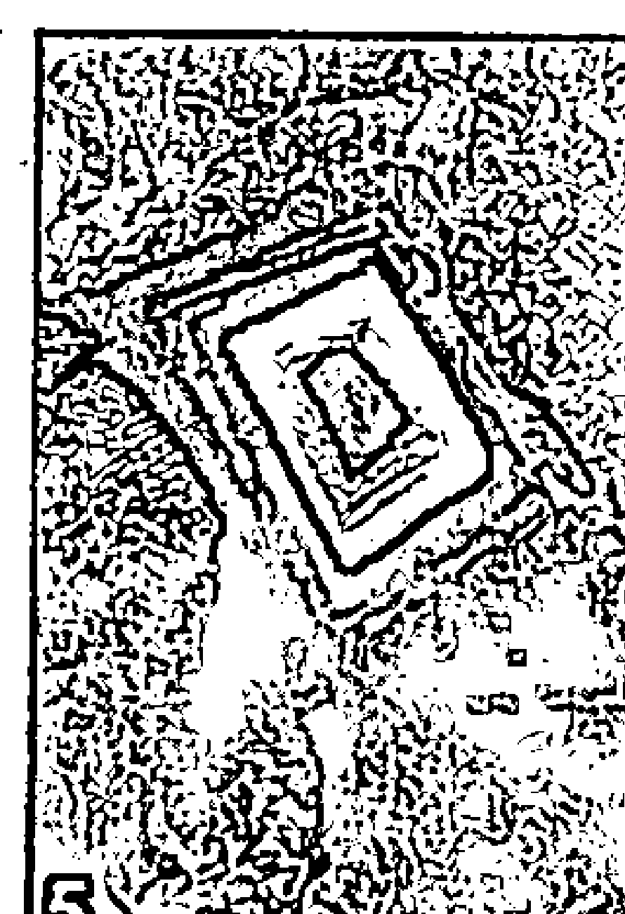

##### 如何施法

- 所需工具與材料
    - 1個裝有木炭的防火盤
    - 1根長6～8吋或15～20公分的橘色蠟燭
    - 火柴或打火機
    - 1茶匙的乳香
    - 2根長8吋或20公分的橡木細樹枝
    - 黑色、紅色、橘色、黃色、綠色、藍綠色和天藍色的毛線球各一個
    - 1小撮的肉桂

施法時機 在禮拜天施法以崇敬本魔法的守護神，並於逐漸月盈時進行來增加魔法力量。

##### 施法步驟

1. 根據第36到39頁的指示，設立結界。
2. 點燃木炭，再點燃蠟燭說：「萬能的太陽，透視的雙眼，請讓隱藏於藍天之下的敵人通通現形，擊潰所有的邪惡力量，讓惡勢力無所遁形。」
3. 將乳香灑在木炭上。
4. 把2根樹枝成直角交叉相壓，並用黑毛線將交疊處綁緊。
5. 將毛線依照黑、紅、橘、黃、綠、藍綠、天藍的順序，於樹枝上各繞9圈。由中間開始，將毛線上下穿過樹枝，讓毛線完全織在樹枝上。
6. 當織完之後，將毛線尾巴綁緊收尾。接著將肉桂灑到木炭上，並將你的神眼穿過木炭的煙霧，並說：「我封印並宣布，世上沒有任何事物可以毀壞你。」將神眼掛在你的床上。

### 金魚藻魔法

#### 防衛惡意

【目的】保護抵抗他人邪惡的意圖。

【魔法背景】金魚藻（Snapdragon）又稱作Antirrhinum majus，是一種很受小孩子喜愛的花，小孩子喜歡捏住金魚藻花的底部，因為它很像「龍口」一開一合的樣子。金魚藻具有保護單純心靈的力量是眾所皆知的，除此之外，它更可以阻擋抵抗他人的邪惡意圖。金魚藻花更是深受蜜蜂所鍾愛，它的顏色鮮豔且多彩，其中最亮眼的顏色就是鮮豔的黃色與紅色，而這正好也是屬於龍的顏色。

在我小的時候走在前往市立公園的途中，這一路房子前面的花園都種滿了金魚藻花，我和我的朋友還互相鼓勵，偷偷摸摸的摘了好多美麗的金魚藻。我很高興的發現直到現在有了自己的小孩，我的小孩們仍和我當年一樣對金魚藻非常的著迷，也同樣喜歡捏著金魚藻花的基部裝作是龍的嘴巴，彼此大吼並追逐著嘻鬧。小孩子似乎都是這樣有著發現魔法的天生直覺。

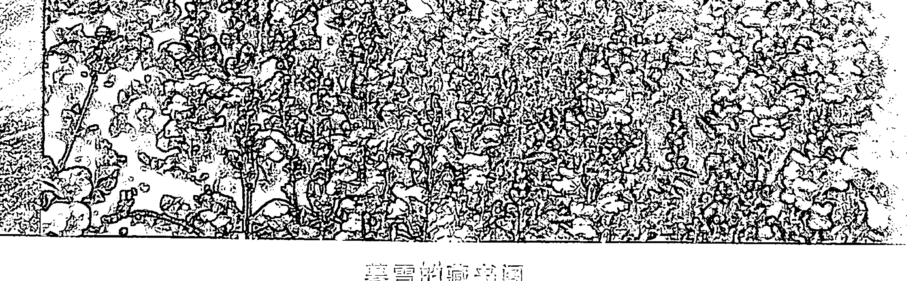

##### 如何施法

施法時機 在逐漸月虧時進行來驅退邪惡的力量，並應於象徵激烈好鬥的火星所掌管的禮拜二進行。

##### 施法步驟

1. 根據第36到39頁的指示，設立結界。
2. 點燃木炭，再點燃紅色蠟燭。
3. 將鐵釘放到燭火上加熱，接著用鐵釘在蠟燭燭蕊下方1吋或2.5公分處，刻下一個頂點向上的正三角形。
4. 將迷迭香灑在木炭上。
5. 將金魚藻花一個個丟入抽繩袋中，每丟入一朵，就依序唸誦下列一句咒語：「第一個力量，是萬能的太陽；第二個力量，讓善良真理永在；第三個力量，是蜜蜂的尖刺；第四個力量，讓邪惡勢力哀嘆；第五個力量，是蜂巢中的鳴聲；第六個力量，讓傷害無法發揮作用；第七個力量，危害將消失不再。」
6. 將抽繩袋握在雙掌中，並且想像魔法的力量就像龍吐出的火焰一般，將附近的惡念或刻薄全都燃燒蒸發。把抽繩袋穿過木炭的煙霧，以將魔法彌封其中。
7. 將細繩繫在抽繩袋上，可將抽繩袋掛在脖子上做為個人護身符之用，或將它掛在你的家中來保衛你的家人或室友。

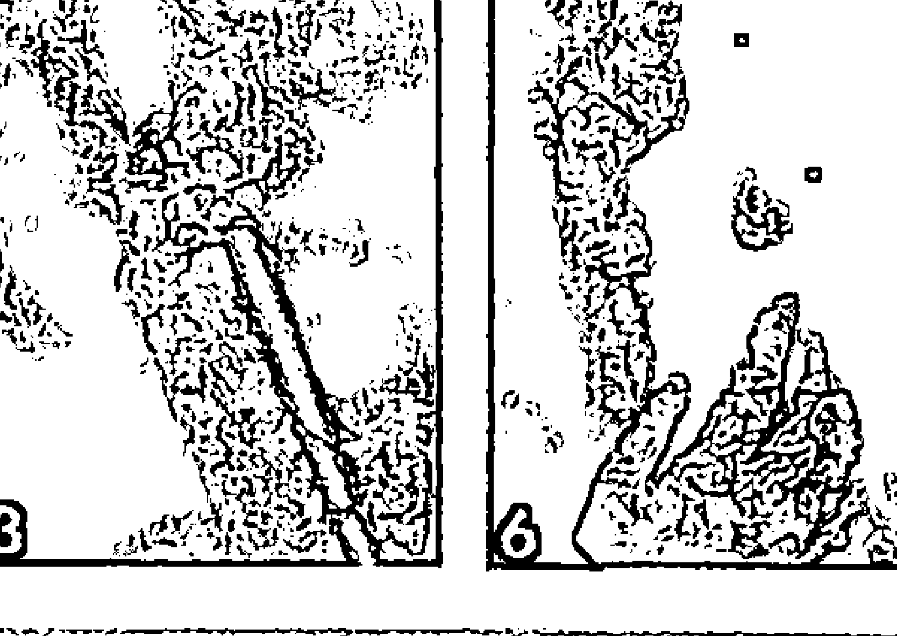

##### 所需工具與材料

| 項目 |
|---|
| 1個裝有木炭的防火盤 |
| 1根長6～8吋或15～20公分的紅色蠟燭 |
| 火柴或打火機 |
| 1根石工釘 |
| 1茶匙的乾燥迷迭香 |
| 7朵金魚藻花 |
| 1個2x2吋或5x5公分的紅色抽繩袋 |
| 1條長24吋或60公分的細繩 |

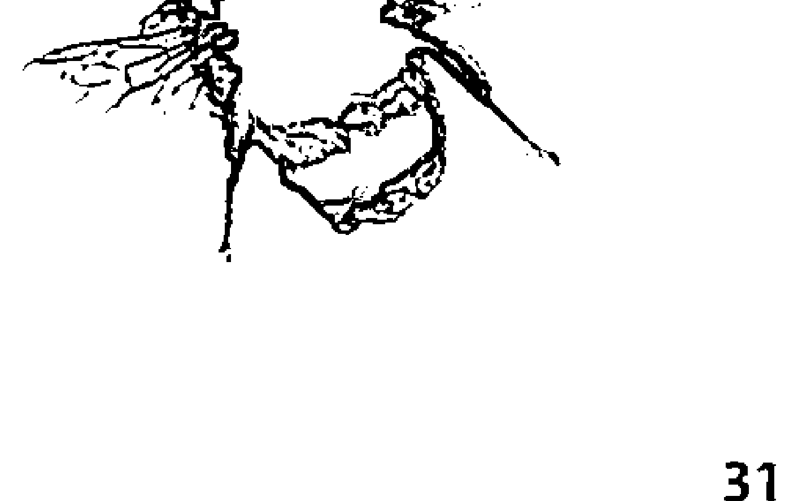

### 植物守護者魔法

#### 防止家中遭強盜或小偷

【目的】震懾住小偷。

【魔法背景】防止小偷的符咒要追溯到好幾個世紀以前，而關於家庭守護者的傳統則需要追溯到好幾千年前。許多關於嚇阻小偷的古老魔法都和草藥知識以及魔法和宗教的象徵有關。其實，創造家園守護者的方法是來自於一種魔法技巧稱作「塑神」。而本魔法便是由植物及塑神技巧所組成。

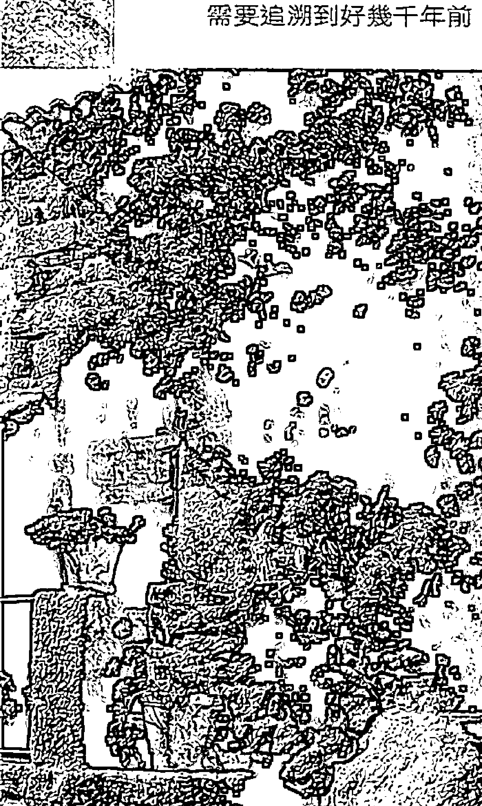

杜松莓在魔法世界中擁有驅逐惡念的力量，因此也被視為是對付小偷的守護者。在這裡我們會將果莓以及對抗小偷的意志放入蠟人像中，杜松莓會漸漸成為蠟人像的「心」，但你可以放心，你創造出的這個守護者將只會為你保護家園及財產而已。在本魔法中，你必須要用模形黏土來建造一個模型，再以此創造出你的植物守護者。因為這個植物守護者其中一隻手（右手）必須要拿著一支迷你劍，因此必須要確保這隻手夠粗，這樣一來就算針嵌進去也不會造成手臂脫落毀壞的意外。最後要提醒你，這個魔法需要事先準備以及足夠的耐心和毅力。

##### 如何施法

施法時機 在逐漸月虧時進行並應於象徵破壞的土星所掌管的禮拜六施法。

##### 施法步驟

1. 在設立結界之前，用塑形黏土捏出一個大約高4吋或10公分的人形模型，並將模型放在防熱盤上。將所有的家用蠟燭放入玻璃罐中，並將玻璃罐置於平底鍋上隔水加熱，直到罐中的蠟燭全部融化為止。
2. 根據第36到39頁的指示，設立結界。
3. 點燃黑色蠟燭說：「當土星的光環圍繞整個大地時，我的守護者將開始保護我的家。」
4. 將融化的蠟倒入模型中，並且灑上鼠尾草。在等待蠟冷卻乾硬的期間，反覆唸誦以下咒語：「邪惡的行為和邪惡的言語，將都被你的寶劍完全消滅。」
5. 當蠟幾乎快乾硬時，將杜松莓嵌入蠟人像心臟的地方。將針眼也嵌入蠟人像的右手掌中，並且讓針頭指向外突出。
6. 當蠟人像已經完全乾硬後就停止唸咒。將蠟燭熄滅，並將蠟人像埋在靠近你寶物的位置，讓劍指向外面並將蠟燭放在它的旁邊。

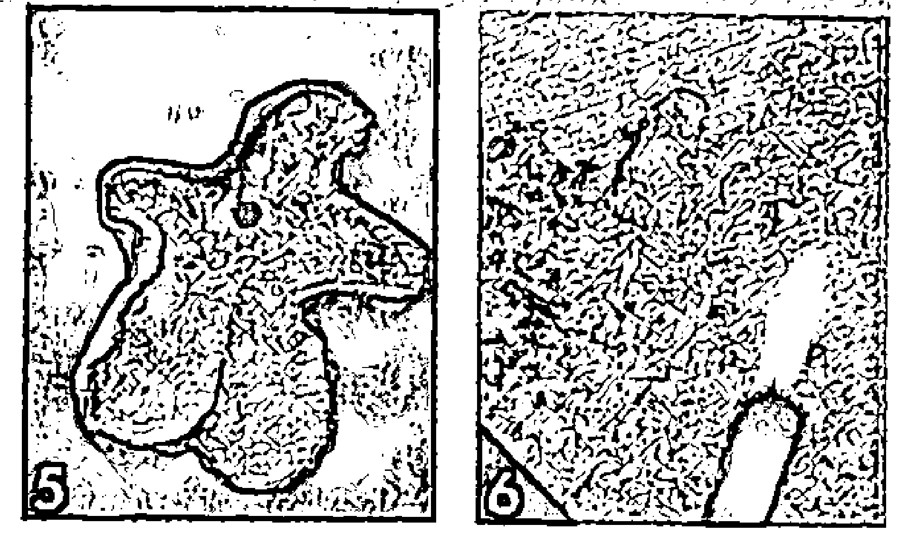

##### 所需工具與材料

- 1大球的塑形黏土
- 1個防熱盤
- 1個玻璃罐
- 1平底鍋量的沸水
- 12根家用蠟燭
- 1根長6～8吋或15～20公分的黑色蠟燭
- 火柴或打火機
- 1茶匙的切碎鼠尾草
- 1顆杜松莓
- 1根縫紉用針

### 寶劍魔法

#### 防衛各種入侵者

【目的】防止入侵者的非法入侵。這個魔法長久以來都被法師拿來守衛自己的家園和工作室。

【魔法背景】本魔法中主要的技巧就是在許多魔法中會用到的，範圍可大可小的技巧：形象化。當你還是小孩子的時候，若曾被說喜愛做白日夢，那麼你對於這種魔法技巧，便特別的有天份，會更容易了解上手。

在魔法當中想像的技巧是非常重要的，因為它可以幫助你專注在魔法的目的上，並且同時也可藉由你的意志力增強魔法的力量。而這種技巧更進階的方式就是創造一個念相來依照你的指示進行。

當我們使用與我們外貌相似的念相時（這也是鏡子魔法的一項特點），你便創造了一個「活魂」。但是在本魔法中，你並非創造一個與你相似的念相，而是一個充滿能量的物品—寶劍，一個代表防衛的典型象徵。這是一個簡單的方法，但它需要完全的專注以及自我約束。你可以多花一些時間在結界中練習形象化的技巧，直到你有自信可以根據魔法的目的控制自己專注力時，便可以開始進行本魔法。

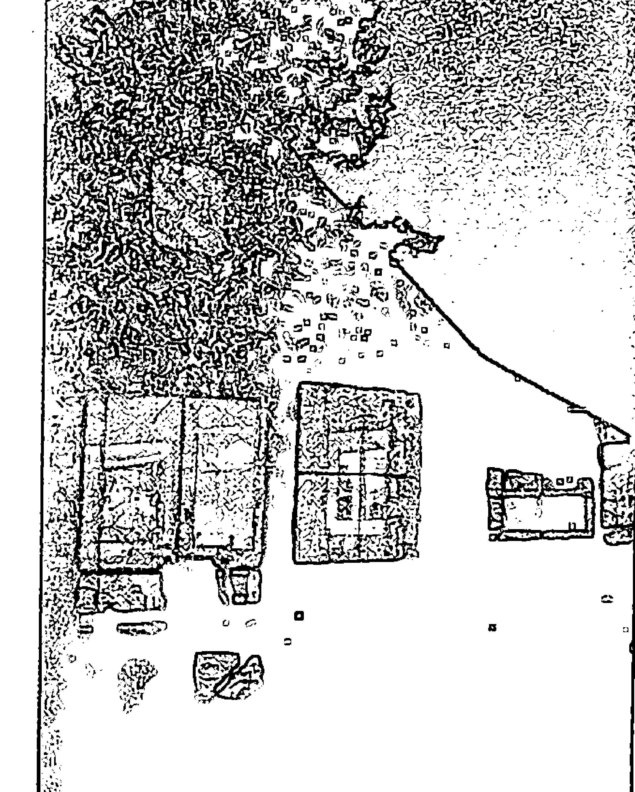

##### 如何施法

##### 所需工具與材料

- 1個裝有木炭的防火盤
- 火柴或打火機
- 9個穩固放於燭臺上的小蠟燭
- 1茶匙的艾蒿
- 1茶匙的克里特島白蘇

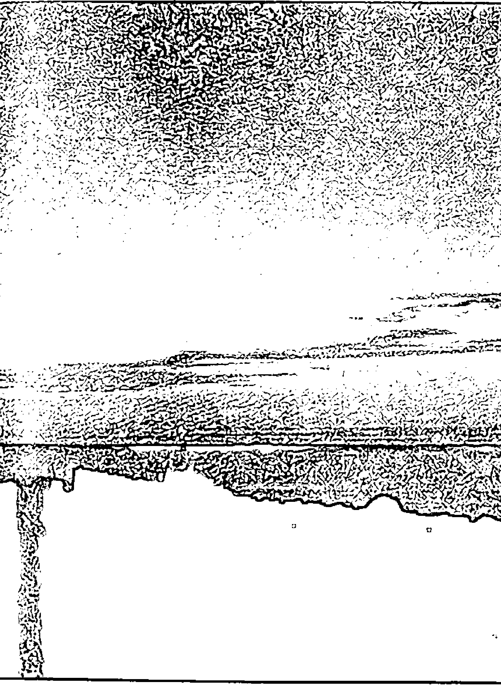

施法時機 在暗月時施法可以增強魔法的力量。

##### 施法步驟

1. 根據第36到39頁的指示，設立結界。
2. 點燃木炭。
3. 坐在結界中間的地板上，面朝北方，接著將小蠟燭依照等距的距離，放在圓的邊界上。
4. 將艾蒿和白蘇混合，並灑在木炭上，深深吸一口薰香。
5. 閉上你的雙眼，逐漸舒緩你的呼吸，並讓自己漂流在黑暗當中。當你準備好時，想像結界的北方有一面盾，在東方有一根魔杖，在南方有一把寶劍，在西方有一只高腳杯。想像盾、魔杖和高腳杯全都合併在寶劍中，寶劍接著飛過你的頭頂插立在你面前的地板上。現在在腦海中指示寶劍該如何保衛你的家園，並讓寶劍以垂直弧形旋轉。最後將旋轉的寶劍移到家園邊界的正前方。
6. 必須確保寶劍的力量有被持續的更新，在每天晚上就寢前都需想像寶劍在它的位置上旋轉一週。

### 胸花魔法

#### 抵擋不想要的關心或注意

【目的】阻擋所有不受歡迎的關心或注意。

【魔法背景】魔法世界存在著許多吸引追求者、有影響力同事的注目和認識新朋友的魔法。但是因為生命既存的複雜性，所以魔法傳統也提供給我們因應不同目的、更多元化的魔法，其中之一，就是驅逐別人對我們的注意力，尤其是當這些關心是不受歡迎或討厭的，而本魔法可以幫助你驅散這種不想要的注意。你想擺脫的可能是一個你不喜歡的追求者或者是常常欺負你的惡霸，又或者是他人討厭的個性等。本魔法並不是讓你在這些情況下隱形，面對現實吧！沒有一個在領子上戴著胸花的人是可以隱形的，但是那些植物的力量以及你傳入的意念能量，可以幫助驅逐那些你想避開的人事物。戴著本魔法所製造的胸花符咒，在魔法上宣告你的意圖，可以讓你想迴避的人不會與你遇到，也不會入侵到你的私人領域。

> > 「將你的心穿在你的袖子上」是一句諺語，用來形容一個人將他的真心展露出來而容易讓心受傷。

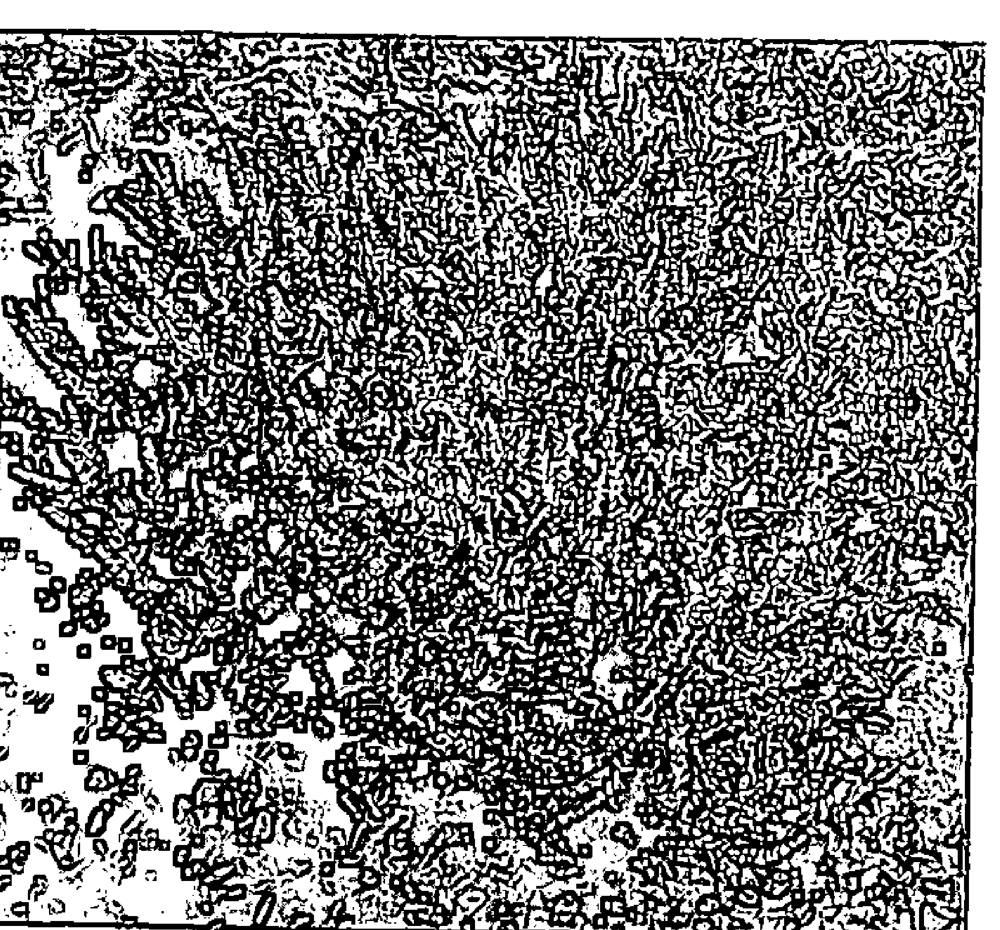

##### 如何施法

##### 所需工具與材料

- 1根長6～8吋或15～20公分的紅色蠟燭（代表火星）或黑色蠟燭（代表土星）
- 火柴或打火機
- 1枝白石南
- 1枝百里香
- 1條長9吋或22.5公分的天然麻繩
- 1球吸水棉花
- 1碟水
- 1節鋁箔紙

施法時機 在月亮漸虧或暗月時進行，並於代表堅定的土星所掌控的禮拜二和代表強烈自衛的火星所掌控的禮拜二，這兩天是比較適合的施法日。

##### 施法步驟

1. 根據第36到39頁的指示，設立結界。
2. 點燃蠟燭說：「火星/土星，請賜與結界和魔法力量，讓敵人不再靠近，讓我逃離令人害怕的注意。」
3. 用麻繩將白石南和百里香樹枝綁在一起，將吸水棉花沾水並擠乾，接著把棉花包在白石南和百里香的根部，最後再用鋁箔紙包在棉花外頭。
4. 把胸花拿到燭火前，想像你所不希望遇到的人已經被驅逐。
5. 對著胸花，反復念誦以下咒語9次：「卡爾地亞・奧弗雷特・愛來亞・狄克塞特。」
6. 將胸花戴在你衣服的胸口處，直到植物凋謝為止，再將植物乾燥並丟入火餘中粉碎以封印魔法。

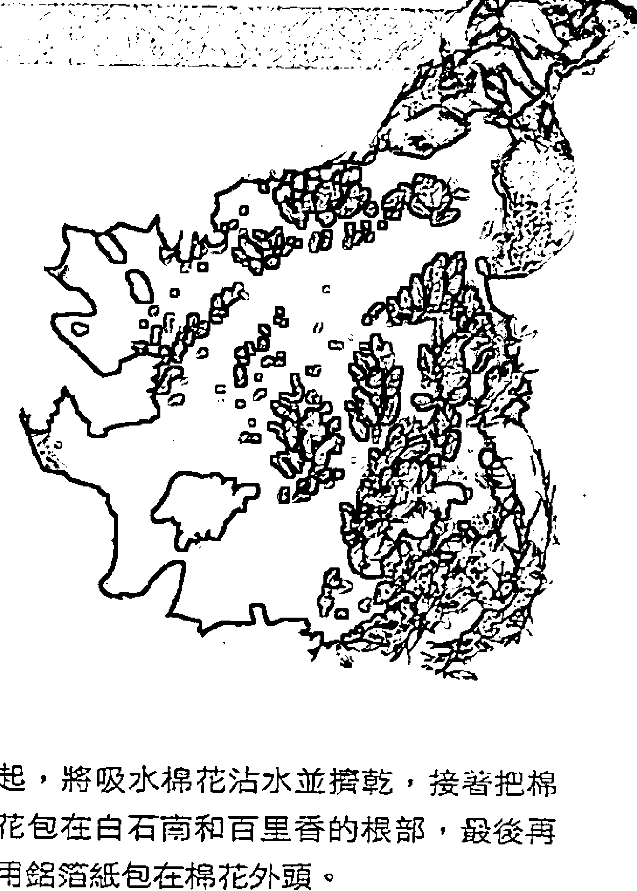

### 三曲腿魔法

#### 保護旅人

【目的】保護你在旅程中安全、順利。

【魔法背景】三曲腿是來自於希臘文，代表「三條腿」的意思。這是一個非常古老的符號，在經過這麼長的歲月中也產生了許多不同的意義，並不可避免的與三倍法則的神秘本質有所聯結。本魔法中的三曲腿是來自於曼島的傳奇，認為若是將這個符咒獻給旅人，那麼在他們在旅途中遇到困難時，魔法會幫助他們安然度過。

> 「愛倫范尼」(Ellan Vannin)，也稱作男人之島，是混合維京和凱爾特歷史的地方。象徵男人之島最主要的標誌就是三曲腿符號。起源於模糊的遙古時代目前這個符號被發現最早是出現在義大利的史前雕刻遺蹟中，但它其實是與一個非常引人入勝的傳說有關。傳說法師曼拿拿(Manannan)以薄霧來保衛這個男人之島，由於感知到基督教以及新時代即將到來，法師曼拿拿便將他的追隨者們全都變成三曲腿的襪子，並將他們從「史內佛山」一男人之島中最高的山滾入大海中，使他們從此居住在海浪之下的王國裡。這個關於改變及倖存的傳說，創造了一個曼島諺語：「Quocunque Jeceris Stabit」，曼島人喜歡將它翻譯為：「雖然你拋棄了我們，但我們仍屹立不搖。」

##### 如何施法

##### 所需工具與材料

- 1根長6～8吋或15～20公分的淡藍色蠟燭
- 火柴或打火機
- 1個單面的小型扇貝殼
- 1枝筆刷
- 1條朱紅色油彩
- 1條長24吋或60公分的黑色細繩

施法時機 在月亮漸盈時進行，並於由太陽所守護的禮拜日施法。

##### 施法步驟

1. 根據第36到39頁的指示，設立結界。
2. 點燃蠟燭說：「水中的愛傘傘，旅人的愛傘傘，請看顧（名字），保佑他健康的出發，健康的歸來。」
3. 用細筆及顏料在扇貝殼的內側塗出三曲腿符號的輪廓。

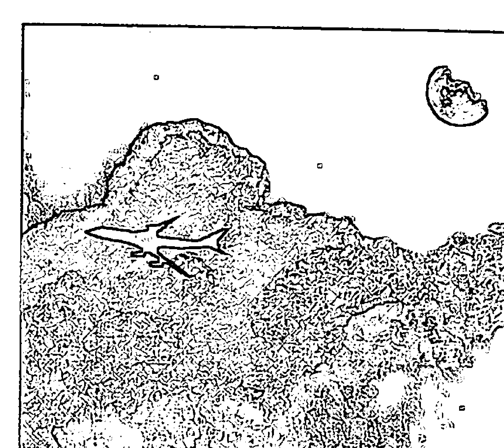

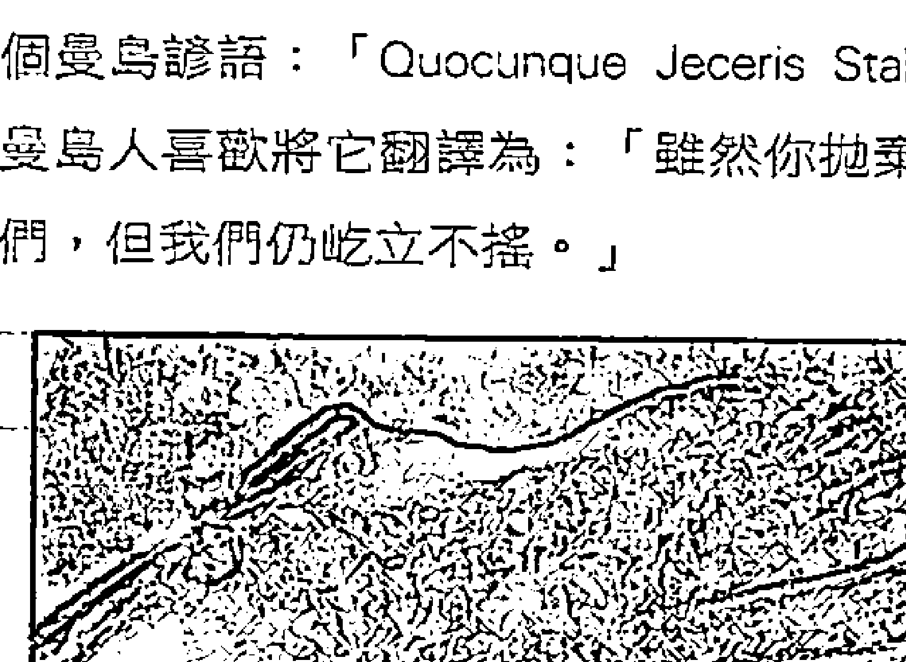

4. 坐在結界中間的地板上，將朝上的扇貝殼放在朝上的右手手掌中，而右手手掌必須放在朝上的左手手掌中。閉上雙眼想像你蓋在貝殼上的三曲腿，以順時鐘方向開始旋轉，並且越轉越快直到三曲腿符號變得模糊為止。
5. 當你準備好時，朝扇貝殼吐出一口氣，代表氣元素將會賜給它力量。當顏料乾了之後將線穿過扇貝殼，並利用最近一次到海邊的機會，將符咒浸入海水中。
6. 此三曲腿符咒項鍊必須戴在希望得到保護力量之人的脖子上。

# 保衛與賜福的魔法

### 巫木魔法

#### 驅逐邪惡的意圖

【目的】讓邪惡離開。

【魔法背景】山梨木（花揪）被法師認為可以提供最高的魔法保護力量。有許多古老國家的諺語和格言都與山梨木有關，而幾乎是所有的諺語都和驅逐邪惡的力量以及保護持有者不受到傷害有關。山梨木又被稱作巫木，從字面上看來好像是山梨木也可以將巫師阻擋在外，而這樣的解讀是出現在巫師被認為等同於邪惡的時代。但是事實上，巫師們從來都沒有被山梨木「阻擋」在外過，山梨木又被稱作巫木，其實正確來說是來自於它美好的本質。

山梨是一種很棒的樹木，若與其它樹種種在樹園中，山梨總是長得又快又好，因此被認為是那些長得慢而且脆弱的幼苗很好的自然保護。山梨喜歡充足的空氣和陽光，常常被人發現生長在海拔很高的地方，它們在蘇格蘭高地便非常的普遍。它們都至少能活上兩百年，與其他樹種相較之下，山梨不容易生病或損害。山梨這種堅韌的生命力讓它們成為最適合代表持久和保護的象徵。

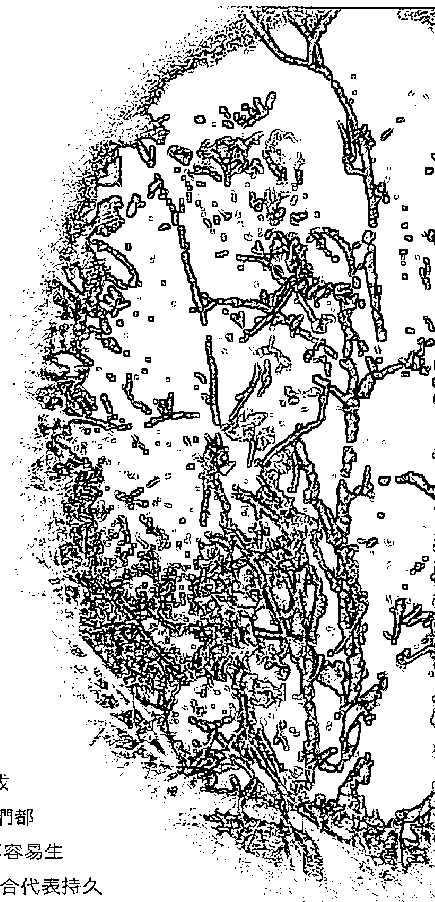

##### 如何施法

##### 所需工具與材料

- 1個裝有木炭的防火盤
- 1根長6～8吋或15～20公分的紅色蠟燭
- 火柴或打火機
- 1根長2吋或5公分的山梨枝，並於頂端往下1/2吋或1公分之處鑽洞
- 1把尖銳的修削刀
- 1條長36吋或90公分的紅色毛線

施法時機 在秋天的暗月時進行，讓你的保護之盾能夠成長。挑選一根小枝的山梨樹枝，並將粗糙的邊緣弄得更圓滑。

##### 施法步驟

1. 根據第36到39頁的指示，設立結界。
2. 點燃木炭，再點燃蠟燭。剪起一段長4吋或10公分的羊毛線，並置於燭火上燃燒，並說：「就像火焰燃燒了這條線，山梨木也將消除我心中所有的恐懼。」
3. 將山梨木的樹皮全部削掉，並將削下來的樹皮放到木炭上悶燒。在山梨木上所鑽的洞下方削下一片木頭，讓山梨木有一片平坦的平面。
4. 在平面上刻下一個頂點向上的正三角形，並刻下一條直線穿過三角形的中央。
5. 將山梨木穿過木炭的煙霧說：「良善進入，邪惡竄逃，在我正直的手中，所有的邪惡即將消散。」
6. 用線在山梨木的頂端處繞三圈，並打結固定，然後將線的一頭穿過洞口形成一個項鍊。需隨身掛在脖子上。

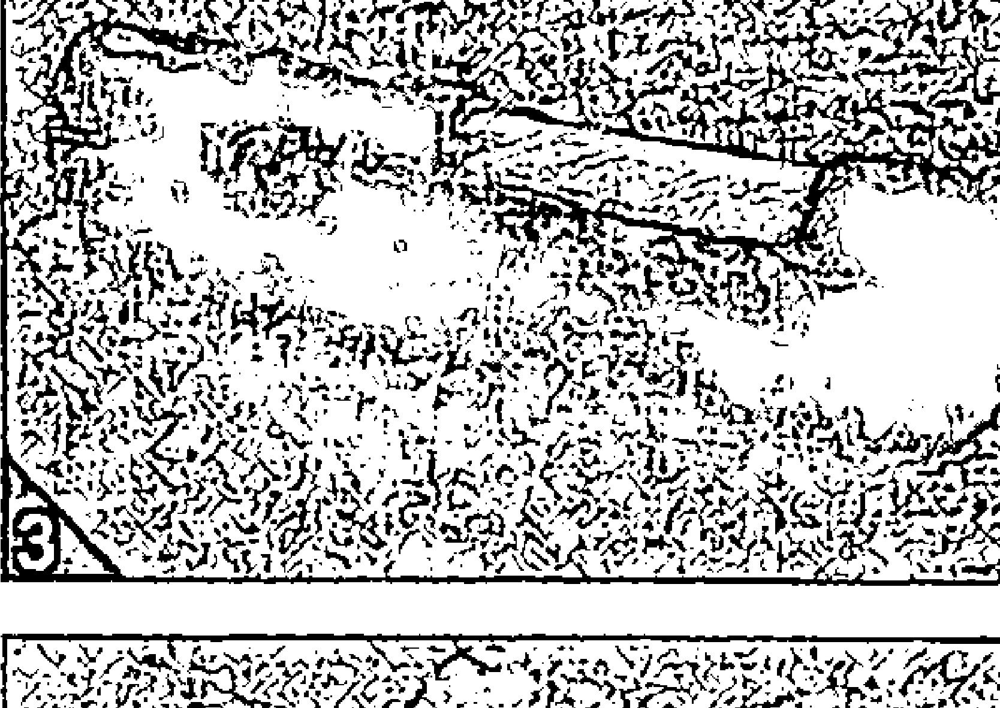

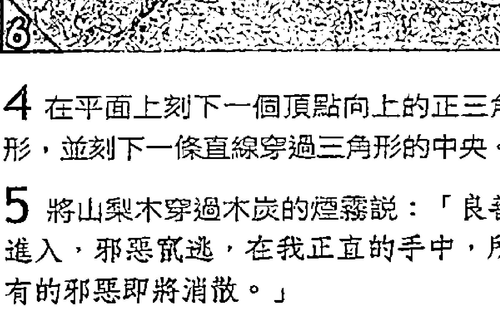

### Daeg盧恩符文魔法

#### 打擊謊言

【目的】幫助你看清謊言和欺瞞。

【魔法背景】Daeg是本魔法中所使用的盧恩符文字，也是24個古盧恩符文字中的一個。這裡所用的盧恩符文字系統又被稱作「Tyr's aett」，是和人類本質及特性最相近的一個版本。Tyr是正義的守護神，也是邪惡力量的對付者，因此這個版本中的所有盧恩符文字都和Tyr的特性有關。而就Daeg來說，字面上是「白晝」或「光明」的意思，也就是代表所有與欺騙有關的惡行或惡念將會被光明照得很清楚，並讓人看到事情的真相。

人的一生中，若是曾經被欺騙一次，將會不再容易或願意去相信別人。有時候，這是耍生存下去必需的心態，就像一句俗語所說：「如果我被人騙第一次，那麼那位騙子該感到羞恥；但如果我被同一個人騙第二次，那麼是我該感到羞恥。」但其實有的時候我們更應該要積極的強力訓練自己的直覺，這就是Daeg盧恩符文魔法所努力的目標。

Daeg代表敏銳的洞察力，並讓我們在需要時能帶來全面縝密的思考能力。Daeg所有的特性與優點讓它成為本魔法召喚的對象，用來幫助保護人們不要受謊言的欺騙。

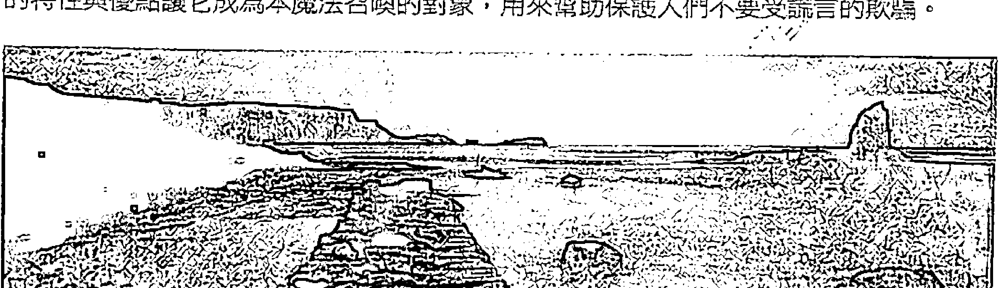## 如何施法

1. 根据第36到39页的指示，设立结界。
2. 点燃蜡烛，并轻声说出可能欺骗你之人的名字，尽量靠近烛火，让你在说名字的时候，烛火会摇曳闪烁。
3. 拿起粉笔，在石板或石头上画下Daeg的符号。接着将盐巴倒在粉笔所写的Daeg符号上，并注意要一路流畅不能中断。
4. 将石板拿到蜡烛前说：“让所有藏在阴影下的一切，全都摊在太阳下吧！让（欺骗者的名字）说出真正的事实吧！”
5. 将盐巴吹散并将粉笔画的Daeg符号展示在烛火前。
6. 将石板放到屋外，直到大雨将粉笔笔迹冲掉为止。在3个月亮周期之中，你将会发现事情的真相。

施法时机 在逐渐月盈时进行，并于代表光明的太阳所守护的礼拜天施法。

##### 所需工具与材料

- 1根长6～8吋或15～20公分的金色蜡烛
- 火柴或打火机
- 1枝粗短的粉笔
- 1个托盘大小（中型）的石板或石头
- 1罐盐巴

### 植物布偶魔法
#### 让你不再为艰困的生活所苦

**【目的】** 让你远离贫困的生活。

**【魔法背景】** 本魔法主要是利用布偶，并且将人的愿望放入其中，这是一个非常古老的魔法技巧。这个布偶是一个填充玩偶，是用两块布做成大概的人形，然后将它们缝在一起并填充其他材料。另一个是关于阻挡讨厌之人的古老符咒，就是在布偶内所填充的荨麻和荆棘。本魔法便是立基于这些意义相近的原则上，只不过做出来的布偶符咒主要是在抵抗艰难困苦的生活，而不是令人厌恶的人。在这里所使用的植物便是以它们吸引好运、抵抗坏运的特质闻名。“像蒲公英”主要就是帮助在你困难的时候，吸引良师益友前来关心帮忙。“蓟”也是另一种有保护功能的植物，而“百里香”则是以驱逐厄运知名。上述所说的植物，都应该采集成野外，并在进行魔法仪式之前将其自然风干。

将布偶放在哪里其实都没有影响，只要它不会离开家或是被忌妒你的人找到即可，但如果这种事情真的不幸发生，则必须要尽快重新施法一次，如此才不会让你之前的努力前功尽弃。

##### 如何施法

##### 所需工具与材料

- 1根长6～8吋或15～20公分的黑色蜡烛
- 火柴或打火机
- 1个装有木炭的防火盘
- 从布匹上剪下2片大约高6吋或15公分的人形布
- 1根缝纫用针
- 1条长36吋或90公分的黑色棉线
- 1大束的干燥蒲公英
- 1大束的干燥百里香
- 3朵切碎的蓟

施法时机 在逐渐月亏时进行，以驱逐厄运并远离贫困。

##### 施法步骤

1. 根据第36到39页的指示，设立结界。
2. 点燃木炭再点燃蜡烛，接着将准备好的植物各拿一点洒在木炭上。
3. 用针将两片人形布的边缘缝起，只留下头部不要缝并念诵：“请保卫我的财富和好运，没有人来忌妒、没有人会偷走。”将蒲公英填入布偶双脚中，并说：“我将走在丰足的路上。”将百里香填入布偶其他身体部位中，并说：“保护我所需要的一切。”最后，将蓟填入头里，并说：“为我防范愤怒、忌妒和贪婪。”
4. 将头的边缘也缝好，接着缏上眼睛和嘴巴。
5. 把布偶穿过木炭的烟雾，并展示在烛火面前，并说：“除了我，你不会听从其他人的意志。”
6. 将布偶放在家中收好，便可以防范其他忌妒的眼睛。

## 壁炉魔法 庇佑你的家

**【目的】** 利用本魔法保护你的家与住在家中的人。

**【魔法背景】** 想要自己的家园或家人得到保佑是非常自然的愿望，但是光是这种魔法就有成千上百个，要从这些魔法中找到一个最适合的魔法，实在是一件累人的事。本魔法不但符合这样的需要，而且简单操作又美观。但是，为什么要选壁炉魔法呢？这是因为壁炉从远古时代便被视为是一个家的中心。而本魔法便是召唤凯尔特的火神布莉吉妲（Brigid）来庇佑你的家，其中所建造的象征物便是代表布莉吉妲的象征。当家里开始开火后，壁炉便成为家中煮饭、烘干、取暖、照明和团聚的中心。现在还有一些比较古老的房子没有瓦斯或电热设备，而是设有开放的壁炉来燃烧木炭、泥煤或木柴，在这种房子里壁炉就是这个家的中心点。但如果你的家没有壁炉而是中央暖器系统，你就必须自己决定房间的中央位置。以直觉思考，想想家人們多聚集在家中的哪个地方，这里就是你们家的中心，也是放置本魔法符咒的地方。

##### 如何施法

##### 所需工具与材料

- 1个装有木炭的防火盘
- 1根长6～8吋或15～20公分的红色蜡烛
- 火柴或打火机
- 1茶匙的安息香
- 12根大约长6吋或15公分的笔直树枝
- 1捆自然麻绳
- 1小撮的肉桂

##### 施法时机

在逐渐月盈时进行，以带来好运，而太阳之日的礼拜天或月亮之日的礼拜一都是最佳施法日。

##### 施法步骤

1. 根据第36到39页的指示，设立结界。
2. 点燃木炭与蜡烛，并说：“神圣的布莉吉妲火之女神，请保祐以妳之名所设的符咒。”将一些安息香洒在木炭上。
3. 将树枝三根分在一组，共分成四捆，并相互垂直交叠，在中心形成一个边长2吋或5公分的正方形。
4. 用麻绳将四捆树枝的交界处绑紧固定。
5. 在放木炭上放入更多的安息香和肉桂，并将符咒穿过木炭的烟雾，并说：“我召唤四大微风，温柔轻吹过我的家园，我召唤布莉吉妲的庇祐。”
6. 将符咒挂在家中的壁炉上或中心位置。

### 月桂摇篮符咒
#### 庇佑并保护新生儿

**【目的】** 保佑新生儿。

**【魔法背景】** 月桂树的叶子又称作「Laurus nobilis」，是烹饪时很常用到的食材，但是在魔法上，月桂是具有保护及正面特性。月桂常被用在熏香上，并且常被带在身边做为护身符，或是被放在小布袋中用作疗愈及保护之用。有时候，人们也会在地上用月桂叶画成一个圆圈，以此驱逐不好的东西。

在本魔法中，月桂主要就是拿来做保护之用，希望藉此得到庇佑与祝福。传说月桂可以驱散邪恶的想法和意图，这让月桂成为保护庇佑新生儿的最佳选择。月桂的另一个特质就是可以召唤出它的守护者－「太阳」的能量，包括健康、成功、财富和快乐。就魔法观点来看，月桂就等同于成功、荣誉、成就，并能让你了解自己潜在的优点。所有和月桂有关的神祇多代表成长及丰足，这也反映了月桂本身的特性。

另外，为了安全考量必须要确保符咒要安全的放在婴儿床底下。并注意不可用于出生少于6个礼拜的婴儿。

##### 如何施法

施法时机 在逐渐月盈时进行，以获得保佑并应于与月桂相关的太阳神之日一礼拜天施法。

##### 所需工具与材料

- 1个4x2吋或10x5公分的干酪布
- 1根绣花针
- 1卷刺绣红丝线
- 1根长6～8吋或15～20公分的金色或橘色蜡烛
- 火柴或打火机
- 9片月桂叶

##### 施法步骤

1. 根据第36到39页的指示，设立结界。
2. 在干酪布的一端，用针线缝上三个 X，并让三个 X 为成圆圈。
3. 将干酪布对折，并让三个 X 都在同一边，用针线将其中两个边收缝起，接着将干酪布袋的内面翻出来。
4. 点燃蜡烛说：“光明的太阳，请让这个孩子看看你的脸旁吧，用你的欢乐，温暖（小孩的名字）的人生。”
5. 将月桂叶一片片的依序放入小布袋中，并说：“第一光明伴随始终如一，第二让你保持优雅高贵，第三让心中充满欢愉开朗，第四为你带来超强运势，第五让你坚强的度过痛苦，第六让你仁慈友善，第七开启你的智慧灵气，第八让你扬名立万，第九让你活得长长久久。”
6. 将剩下的开口缝紧，并把月桂符咒放到婴儿床垫下。

### 玫瑰花环魔法
#### 庇祐保护情侣和他们的爱情

**【目的】** 庇祐保护情侣和他们的爱情，可以将这个魔法献给自己、新婚夫妻或打算同居的情侣。

**【魔法背景】** 在感情初期的激情褪去后，接下来便是面对日常生活的相处与互动，这种现实考验对任何一段感情来说都不是一件简单的事情。本魔法便是帮助保持感情的浓度，并保祐两人走得更长远。有可能是你的好友正经历一段真爱，看到两人慷慨无私的奉献彼此，而你希望能做些什么来表示你对他们感情的支持，并让他们知道他们的爱对周遭朋友的影响是如何的大。此时，这个魔法所做的花环就是一个很贴心的礼物，而且当它干燥之后外表也非常的美观大方。

玫瑰是象征爱情的典型代表，尤其是红色、粉红色以及白色的玫瑰。但是黄玫瑰根据花语记载是代表纯洁的友谊，因此不能将它献给情人，人们常常会搞错它的意义而表错情。红玫瑰代表爱情与激情，粉红玫瑰代表爱慕、好感和对对方的欣赏，白玫瑰则是代表纯洁无瑕的爱，象征你对他的爱是坦白、真挚以及无私的。

不用说大家一定知道，本魔法是偏爱红色、粉红色以及白色的玫瑰，千万不要将代表友谊的玫瑰送给情人喔！

##### 如何施法

施法时机 在逐渐月盈时进行，以获得保佑，并应于代表爱之行星的金星，所控制的星期五施法。

##### 所需工具与材料

- 1根长6～8吋或15～20公分红色、粉红色或白色的蜡烛
- 火柴或打火机
- 红色、粉红色以及白色的玫瑰各6朵
- 1卷花卉专用的绿色铁丝
- 1卷花卉专用的绿色胶带
- 1捆天然麻绳

##### 施法步骤

1. 根据第36到39页的指示，设立结界。
2. 点燃红色的蜡烛说：“里头有我的热情。”
3. 点燃粉红色的蜡烛说：“里头有我的好意。”点燃白色的蜡烛说：“里头有无限的光明。”
4. 将花卉用铁丝围成一个圆圈，把各色玫瑰花参杂分布，用其余铁丝在玫瑰花朵下方1吋或2.5公分处以及下一朵玫瑰花朵的前方1吋或2.5公分处，将玫瑰花固定，再用绿色胶带固定整个花环。
5. 当花圈完成后，将麻绳以顺时钟方向，绕在玫瑰花朵之间，并说：“将花圈绕成圆形，让爱和祝福形影不离。”
6. 将玫瑰花环挂在情侣的卧房中。

### 旅人魔法
#### 保佑旅人的魔法

**【目的】** 为即将出发旅行的旅人带来祝福与保祐。

**【魔法背景】** 有一句非常有名的爱尔兰祝词是这样说的：

> > 希望道路在你要行走时升起。

这句话是比较诗意的方式来祝福旅人在路途中将不会遇到任何艰难的阻碍。本魔法也有相似的概念，希望能藉由魔法为旅人带来好运，让他的旅程成为一段值得、安全和有趣的经验。其实，旅行者的基本的需求和大部分人在家中所需要的基本需求是一样的，就是庇护所、温暖、食物、健康、好的伙伴以及一点点运气。而本魔法便是确保能满足旅人的这些需求。

本魔法召唤了3位与开放道路有关的女神的力量，藉由她们来指引旅行者正确的方向。安妮丝（Annis）是一位非常受英国及欧洲旅人欢迎的女神，她是旅行者在平坦大道上的好朋友；另一位是威尔斯女神海伦（Helen）是主掌岔路的神祇，专门帮助需要指点方向的旅人；最后一位是罗马女神卡地亚（Cardea）是守护学习经验和智慧大门的女神。

##### 如何施法

##### 所需工具与材料

- 1根装在罐子里的小蜡烛
- 火柴或打火机
- 1个开口布囊
- 1大汤匙家中壁火或营火燃烧后的灰烬
- 1大汤匙的干燥牛膝草
- 干燥薄荷叶、糖和面包丁各3茶匙
- 3片新鲜的罗勒叶

##### 施法时机

在逐渐月盈时的室外进行，并需于出发前一天晚上施法。

##### 施法步骤

1. 想象有一道白色的光芒，以半径大约12呎或3.6公尺的距离围绕着你。
2. 点燃小蜡烛说：“守护旅人的女神，请聆听我的心声；指引岔路方向的女神，请聆听我的心声；守护智慧大门的女神，请聆听我的心声。”
3. 将灰烬、牛膝草、薄荷、糖、面包丁以及罗勒叶，全都放入布囊中混合。转向东方，丢洒混合物说：“气元素，请赐给我平坦的康庄大道。”转向南方，重复刚刚动作说：“火元素，请赐给我热情健谈的同伴。”转向西方，重复刚刚的动作说：“水元素，请让巧遇的陌生人，都能指引我正确的方向。”转向北方，将剩下所有的混合物，全都丢洒出去说：“土元素，请赐给我食物、庇护和保护。”
4. 站在结界中间，面向旅途的出发的方向，并说：“安妮丝、卡地亚和海伦，请保祐我这一路平安，并用雨水刷洗我将路上的道路，就像你们的庇祐降临在我的旅途。”

### 盾魔法
#### 提供压力下的保护

**【目的】** 避开压力的伤害。

**【魔法背景】** 现在绝大部分的人都认为过度的压力对于生理与心理的健康会产生很大的伤害。而经常处于压力下的症状之一就是降低身体及心理，面对问题的反应能力。肾上腺素能帮助我们逃离危险，但是压力会逐渐削减这种面对突如其來恐慌的反射能力。而本魔法便是提供保证作用，帮助你摆脱持续或突然出现的压力。

当你施法后可以很容易的就在需要的时刻召唤出魔法力量，这只需要专心以及屏除其他令你分心的想法，其实这个魔法的本身就是练习专注力的最好练习，可以帮助将压力抛到九霄云外。本魔法主要是使用盾墙，这是一种称作「龟甲型掩蔽」的步兵战斗技术，来自于罗马军队作战时这是对抗行进军队的战斗队型。当你经历工作上的压力时，本魔法能让你穿过困难，继续开朗的向前走。

##### 如何施法

##### 所需工具与材料

- 1根长6～8吋或15～20公分的黑色蜡烛
- 火柴或打火机
- 1条长12吋或30公分的细绳
- 1个可锁上的小盒子

施法时机 在逐渐月亏时进行以驱逐焦虑，并于象征保卫的火星所掌管的礼拜二施法。

##### 施法步骤

1. 根据第36到39页的指示，设立结界。
2. 点燃蜡烛说：“驱散我的恐惧。”
3. 坐在结界地板的中央面向北方。闭上你的双眼，并且渐渐放松你的呼吸，让你的心放空平静。当你准备好时，想象一个椭圆形的盾牌，保护着你下巴到膝盖的部分。接着在绳子上打一个结。
4. 想象现在有越来越多盾牌，开始重叠在你的左右两边、背后和头顶，每增加一个盾牌就在绳子上打一个结（目前绳子上共有5个结）。让你自己放松的待在盾牌“壳”中，让自己感觉安全并平静。
5. 当你准备好后，睁开你的双眼，将蜡烛上的蜡滴到你打的结上，一个结一滴。
6. 将打结的绳索锁在盒子中，并将盒子收藏在安全的地方。当你认为需要召唤盾牌的力量时，便闭上眼睛在脑海中想象自己被龟甲型盾式所包围着、保证着即可。

## 保术与赐福的魔法
### 盐和水的魔法
#### 困境中的自我力量

**【目的】** 帮助面对困难时所需要的强打自我力量。

**【魔法背景】** 当自己处在艰难的情况下，常常会无法找出那最简单的解决方法，并且忘记自己到底有多坚强。有时候面对的困境，可能会持续一段很长的时间，当困境就像无止尽的黑暗隧道时，我们便需要为自己点燃一点希望的光明。

这种自我力量只能用在真正需要的情况下，如此一来才能保存它的能量。许多巫师和法师都知道召唤这种灵魂能量的仪式必须要尽量少去使用，如此才能让能量更加强大。本魔法的象征物，其实非常的简单易得，“盐巴”代表大地之盾和保护，“烛火”则是带来希望和勇气，而“水”则是带来灵魂的蜕变与净化，最后“焚香”是将愿望送往天际的媒介，让我们的魔法能停在意念之网中。

在使用本魔法之前，想一个你最喜欢的神祇或女神，并在魔法进行时呼唤他的名字来看顾你的自我力量。若是在面对困境时，将象征那位神祇的符号或图腾带在身旁，则可以增强你的内在自我力量。

##### 如何施法

##### 所需工具与材料

- 1个装有木炭的防火盘
- 1根长6～8吋或15～20公分的白色蜡烛
- 火柴或打火机
- 1茶匙的乳香
- 1个装有盐巴的罐子
- 1个装满泉水的高脚杯

##### 施法时机

在任何需要的时候便可进行，不需要顾虑月相的变化。

##### 施法步骤

1. 根据第36到39页的指示，设立结界。
2. 点燃木炭，再点燃蜡烛，并说：“我走在充满勇气的道路上在这里真理会带来光明。”
3. 将乳香洒在木炭上，并吸入蒸香说：“我伟大的（神祇的名字），请在这最黑暗的夜晚，倾听我的心。”
4. 倒一些盐巴在你的左手手掌上，并将右手手掌放在水里说：“水啊，请冲走所有的邪恶吧。”接着，再将你的右手放到盐巴上，并说：“盐啊，请驱逐不洁之物。”将盐巴沾水，依序擦拭你的双脚、膝盖、肚脐、胸部和额头。
5. 依顺时钟方向，将盐巴倒在你的四周，形成一个圆圈，围绕着你，并说：“（神祇的名字），请跟随我的脚步，看顾着我。”接着踩在四周的盐巴圈上，依顺时钟方向绕行，最后回到圆圈中央。
6. 闭上你的双眼，安静的请求神祇赐与你希望度过难关、化险为夷的能力。

# 预测占卜的魔法

# 预测占卜的魔法

## 预测占卜的魔法介绍

在魔法的歷史上充斥著許多與預知未來能力有關的古老習俗。有個傳說認為未婚女子若是將別人婚禮上的蛋糕放到枕頭底下，她們將會夢見未來的夫婿，這個傳說有另一個比較可怕的版本就是可以夢見誰將在明年死亡。在這些迷信或毛骨悚然的故事背後，我們可以看到魔法傳統的骨架。在本章中你將會發現許多魔法的內容，看起來非常的眼熟，這是因為它們的起源都是來自於一些大家已經耳熟能詳的習俗或傳統。

當然，預測占卜並不只是預測未來而已，它還包含有系統的解讀現在的生命，並且更清楚的理解最有可能的未來。舉例來說，大部分塔羅牌的使用者並不是「算命者」，他們只是對現存的模式以及不同的紙牌象徵排列有心得研究的而且有經驗的人。同樣的，手相分析者也許有預測的能力，但其實他們的智慧主要仍是在有系統的解讀你的過去與現在，以及相對應的星象象徵系統。本章所指的預測占卜是一種較廣泛的稱呼，並不只是單純的預測未來。裡頭的魔法種類非常的多，包含許多可適應不同使用目的的魔法。在這單元中的魔法可以幫助你找到解決問題的方法，以及發現周遭的人到底誰真誰假。對於那些擁有浪漫靈魂的人來說，可以從中找到屬於你自己的真愛特質、了解你付出的愛是否變得回報以及提供你未來伴侶的特徵線索。這些都是告訴你該如何解讀未來線索的魔法。

當你施任何魔法時，你都應該要記得未來並不是已經被刻在石頭上，未來是根本還未發生。本章所有的魔法所能給的是和其他自封為算命師的人一樣的能力，就是理解可能的未來生命模式。完全相信「命運」、很認命的人是很愚蠢的，事實上，魔法正好抱持著相反的態度，反倒總是與改變及轉變有關。另外必須在這裡警告大家，如果為了同一個問題，反覆的使用同一個魔法，那麼你將會得到扭曲失真的結果。如果你抱持著誠心誠意而且實際的態度來施法，那結果一定不會讓你失望的。

### 骨头与石头魔法
显現一個人的未來

【目的】顯示你未來的人生選擇。

【魔法背景】在南非有一個習俗是在古老的祭祖儀式中使用骨頭來預測占卜。使用親人的手指骨頭，主要是為了召喚出異世界的亡魂，為我們帶來未來命運的線索。而親人骨頭的出現與擺放方式，各代表著不同的意義。但是解讀這些象徵的背後意涵，其實非常的簡單：這些骨頭會被丟入畫好的圓內，而它們所掉落的方式，以及彼此之間的關係都可以提供給占卜者一些未來的線索。

在本魔法中還會包含運用石頭占卜這個古老的方法，主要是解讀石頭卦象的一種占卜方式。魔法中所需要的這些石頭可以在大部分的晶石或石頭專賣店以及週遭環境中找到。而其中會使用到的骨頭，則是以耆草莖來代替，請依據下一頁中的指示截取不同長度的耆草莖。

要解讀石頭和骨頭掉落擺放的卦象，你必須要使用到你的想像力、創造力和直覺，因為每一種卦象都是獨一無二的。在占卜魔法中，第一次的理解和解讀都是力量最強大、意義最深刻的占卜。因此，如果你第一次審視卦象時，覺得看不懂，那麼可以試試看，並且和你此刻生命中所發生的事比對一下，應該可以提供你新的想法。

##### 如何施法

施法時機 為了和古老魔法的起源一致，必須要在暗月時進行本魔法。

##### 施法步驟

- 1. 根據第36到39頁的指示，設立結界。
- 2. 將黑色蠟燭放在你的左邊，白色蠟燭放在你的右邊，並皆點燃。
- 3. 用手指在沙子上劃一個大圓，並劃一條水平線穿過圓的中央。
- 4. 將石頭和骨頭拿在手中搖晃，並擲到沙盤上的圓圈中。
- 5. 解讀卦象的意涵：
  - 在圓的上方：社群生活
  - 在圓的下方：私人生活
  - 在圓的左邊：挑戰
  - 在圓的右邊：現實生活
  - 1吋或2.5公分的蓍草莖：即將到來
  - 2吋或5公分的蓍草莖：不遠的未來
  - 3吋或7.5公分的蓍草莖：長遠的未來
  - 海邊的卵石：問題的所在
  - 石英石：朋友
  - 玫瑰石英：內心
  - 紫水晶：技能和事業
  - 黃水晶：知識
  - 打火石：開始

##### 所需工具與材料

- 1根長6～8吋或15～20公分的白色蠟燭
- 1根長6～8吋或15～20公分的黑色蠟燭
- 火柴或打火機
- 1個盛滿沙子的茶碟
- 3根蓍草莖，各自為1吋或2.5公分、2吋或5公分、3吋或7.5公分
- 1顆海邊的卵石
- 1顆處理過的石英石
- 1顆處理過的玫瑰石英
- 1顆處理過的紫水晶
- 1顆處理過的黃水晶
- 1顆小而尖銳的打火石

### 大阿爾克那塔羅牌魔法

#### 為問題找出一個答案

【目的】為一直困擾你的問題找到答案。

【魔法背景】從塔羅牌上只能看出一個大概的方向，而不是那種「是」或「不是」的絕對性答案，大致上來說，由78張牌所組成的排列可能，是可以讓占卜的結果很具體、很精細的。有些經驗豐富的塔羅牌占卜者，同意有一些方法可以讓人從塔羅牌上預知問題事件發生的時間以及可能有效的解決方法。而其中一部分的方法是天下皆同的，但其他的方法則會因人而異。常常使用塔羅牌的人應該會注意到，當某些特殊的塔羅牌出現時，就是代表占卜結果正告訴他們某些特定的訊息，甚至是紙牌本來意義之外的意涵。

本魔法主要仍是立基於一般通用的塔羅牌原則。如果紙牌所提供的答案，與你原本所期望的更加的仔細細微，那麼你必須要花多些力氣與時間，去好好的思考紙牌所提示的線索。如果你的要求是正直神聖的，那麼請放心紙牌會給你最誠實的回應。請盡量採信第一次的占卜結果，並依據下面的指導來好好解析占卜的結果。

最左邊的牌代表你問題的本質；中間的牌代表現在的影響；最右邊的牌則代表未來的結果。

##### 如何施法

##### 所需工具與材料

- 1根長6～8吋或15～20公分的紫色蠟燭
- 火柴或打火機
- 22張大阿爾克那塔羅牌

施法時機 在月亮漸盈時的半形月中進行（有時候稱之為1/4月），來占卜預測紙牌中所隱藏的寓意。

##### 施法步驟

根據第36到39頁的指示，設立結界。

- 1. 點燃紫色蠟燭說：「福爾圖那，命運的女神，請為我的問題找到真理吧。」
- 2. 開始洗牌，並將洗好的牌面朝下，排在結界中心。
- 3. 將你的問題在心中默默複誦，同時用你慣用寫字的手從紙牌中抽出3張牌。
- 4. 依照你抽出的順序，由左至右將紙牌翻開放在我面前。

##### 根據下列所示的意義來找出紙牌背後所代表的意涵：

- 偶數：真相
- 奇數：假象
- 男人：立刻
- 女人：在一年之內
- 男人與女人：讓事情自由發展
- 一個杯子：是
- 一把寶劍：不是
- 太陽、月亮或星星：你自己的判斷是正確的
- 動物：你將得到合理的結果
- 水：搬家、旅行或改變

# 预测占卜的魔法

### 钟摆魔法

#### 发现遗失或急欲寻找的物品

【目的】告诉你失物、或正在寻找之物品的位置。

【魔法背景】钟摆是一种很古老的占卜工具，因为方便操作及惊人的力量而受到欢迎。在比较近代的使用方法中，人们是将地图加入其中，而钟摆便是被悬挂在2度空间的区域中以便找出欲寻找物品的位置。

传统上来说，这个魔法会有2种不同的回应方式，第一种是指针自我的反应，第二种是问题的沟通及确认。前者是代表指针的任何反应，一旦指针移动之后便会指出相关的位置，它会在正确的位置上产生强烈的反应。后者则是一种「是」或「否」的回应，主要也是靠指针的摆动方向来确定答案，若是顺时钟方向旋转则代表「是」，反时钟方向则代表「否」。

在开始施法之前，你必须要先测试一下钟摆是如何移动以及你要如何的使用它。你可以先问一个答案已经很明确的问题来测试，例如「今天是礼拜一吗？」，然后看看你得到的是哪一种方式的回应。这个魔法将可以帮助你得知你已遗失或寻找以久的物品。

##### 如何施法

##### 所需工具与材料

- 1根长6～8吋或15～20公分的白色蜡烛
- 火柴或打火机
- 1枝黑色墨水的钢笔
- 1张办公室用纸或1张欲寻找方位的区域地图
- 1根缝纫用针
- 1根长24吋或60公分的黑色棉线

施法时机 在没有月亮的晚上施行本魔法。

##### 施法步骤

- 1 根据第36到39页的指示，设立结界。
- 2 点燃蜡烛说：「帮助旅人寻找方向、指示鸟儿飞向何处的精灵，请赐给我的魔法力量，让我找到（物品的名字），帮助实现我的请求，指引我究竟是上、下、东、西或南、北。」
- 3 如果你的要找的东西是遗忘在家中，便画一张大概的家中平面图，如果不是则准备一张适当的地图。
- 4 将针穿过线打结，用你的大拇指和食指捏住针线的打结处，将针悬挂在地图上。
- 5 当你将针在地图上移动，测试针的反应时，让你的脑中保持空白并且保持耐心慢慢来，一切端看你需要花多少的时间去感觉针的反应，没有任何时间上的限制。
- 6 当你对答案满意之后，便将蜡烛吹熄，并用针穿过烛蕊附近融化的蜡，让蜡抹在针上即可。

### 针和蜡烛魔法
揭穿谎言

【目的】揭穿他人的谎言。

【魔法背景】这个和测谎很像的魔法有着很有趣的出身。在几百年前，要测试谁才是小偷的方法就是将很多针插在一根蜡烛上，而四周则坐满了所有的嫌疑犯，每根针都对着一个嫌犯。当最后蜡烛烧尽时，指向谁的那根针最早掉落，则代表他是真正的小偷。就本魔法而言，这是一个谎言侦测工具，而不是传说中的抓犯人工具，但是原理其实很类似。但是在开始真正的魔法之前，你必须要先问自己一些很困难的问题。首先，问问你自己，究竟是有理由的在怀疑那个谎言或只是自己单方面偏执或不理性的感觉。如果是后者，那么你从魔法中得到的，将会是不准的答案。第二，在本魔法之外，是否有著手其他更重要、更有效的解救办法。如果沒有，那麼欺騙你的人將會繼續吃定你的軟弱，而一直故技重施。上述兩個問題，如果都能有明確、滿意的答案，那麼你便可以開始進行本魔法，它將可以幫助你判斷，究竟誰說了謊言、而誰又說了實話。

##### 如何施法

##### 所需工具与材料

| 材料 |
|------|
| 1根长6～8吋或15～20公分的白色蜡烛 |
| 火柴或打火机 |
| 1张办公室用纸 |
| 1枝绿色墨水的钢笔 |
| 1根长6～8吋或15～20公分的蜜蜡蜡烛 |
| 7根缝纫用针 |

施法时机 在满月时施行本魔法。

##### 施法步骤

- 1 根据第36到39页的指示，设立结界。
- 2 点燃白色蜡烛说：“在月光之下，黑暗远离。”
- 3 将纸横放，让较长的一边当长，短的一边为宽，并在纸张的中间画一条垂直线。在纸的其中一半画上7枝宝剑的轮廓并且都指向中心方向；而在另一半纸上的中心位置画上一个圆圈，并在圆心画一个小黑点。将蜜蜡蜡烛置于稳固的烛台上，并且放在办公用纸的中心位置。
- 4 把针的尖端加热，水平的刺入蜜蜡烛烛蕊下方约1吋或2.5公分的地方，并让针与针之间的距离相等。
- 5 点燃蜜蜡烛说：「7枝神剑，请为我判断话语的真假。」在你等待烛烧到针刺位置的期间，反复的念诵以下咒语：「针掉下来的时候，就是真相大白之时。」
- 6 当第一根针掉下来的位置是落在画剑的那一方，则代表你正在被欺骗；但如果第一根针掉下来的位置是落在中间有点的圆那一方，则代表没有人在骗你，一定是你自己想的太多了。

### 雏菊魔法 找到人生的任务

【目的】帮助你找到人生的目的。

【魔法背景】在我们曾自问的重要问题中，其中一个就是我们为什么存在以及我们人生的任务到底是什么。这并不是在寻找事业的道路、伙伴或生活环境，而是直接切入到问题的中心去寻找我们存在的目的。不管你的宗教或心灵信仰是什么，都可以问自己这个问题来找出自我的智慧，以及你存在于这个世界中的位置与目的。这最后的答案会从你许多的人生经验中显露出来，但是在这条路上没有头绪的寻找答案，的确让人感到气馁怯步。而本魔法便可以帮助你，在这条探索之路上找到你的方向。你必须在雏菊当季的时候施法，因为雏菊是本魔法中最主要的施法材料。雏菊自古以来都被大量的使用在占卜的目的上。我们常会看到小孩拿着雏菊，一边拔下雏菊的花瓣，一边念着：「他爱我，他不爱我。」有时候，雏菊的用法和樱桃核的用法差不多，都是在找出你人生中未来的情形到底是什么。在这里，雏菊可以帮助你找到线索，知道在人生过程中可以对别人或社会带来什么样特别的贡献。

##### 如何施法

##### 所需工具與材料

- 1根裝在支架上的榴香木焚香柱
- 1根長6～8吋或15～20公分的白色蠟燭
- 火柴或打火機
- 1根縫紉用針和適當長度的線
- 7朵新鮮的雛菊

施法時機 最適合在滿月的晚上施行本魔法。

##### 施法步驟

- 1. 根據第36到39頁的指示，設立結界。
- 2. 點燃焚香柱，再點燃蠟燭。
- 3. 用針線穿過6朵雛菊的尾端，將它們串聯起來，做成雛菊花環。
- 4. 將剩下的一朵雛菊放在你的左手上，並將上面的花瓣一片片的摘下來，每摘下一片，就依序唸出下列的一個名詞，如此重複到最後一片花瓣：「製造者。革命者。照顧者。分享者。治療者。」
> 「製造者。革命者。照顧者。分享者。治療者。」
- 5 拔下最後一片花瓣時所說的名詞，就是上天賜與你的天賦，也是你存在這世界上的角色：
  - 製造者：你有製造強大實用價值或美觀物品的天賦。
  - 革命者：藉由你的言語或行動，你有可以讓事情改變的能力。
  - 照顧者：你的力量在於幫助扶持其他的人。
  - 分享者：你是一個能夠達到公平、正義的談判者及調解者。
  - 治療者：你有治療的天賦。
- 6. 將雛菊花環放到你的枕頭底下，在接下來七個夜晚所做的夢，將會進一步的提供你關於未來任務的線索。

### 灵魂魔法

#### 知道心仪对象是否也对你有兴趣

【目的】知道究竟你心仪的的对象是否也对你有同样的好感。

【魔法背景】和灵魂有关的传统背后都存在着许多不同的故事。在爱尔兰传统中认为灵魂是一个人死后的样子；北欧传统则认为灵魂是一种图像，一种人类力量的呈现；英国传统则认为灵魂是活人的灵，主要是在帮忙在特定对象身上取回想知道讯息。

就本魔法而言，你必须要将你心仪的的对象放在你的心中，才可以将你的灵魂送到对方的身边，知道对方是否对你有同样的兴趣。若是就送出你的形貌到别人身边这一点，本魔法与第60到61页的魔镜魔法是非常的相似的，同样都是在帮助你将安慰和爱意送到爱人的身旁。然而本魔法主要是希望将对方对你的感觉，藉由你的灵魂让你知道，所以在方法上也有点不一样。

在这里要先告诉读者，关于本魔法的「健康警告」：如果当你知道对方对你没有兴趣之后，就不要再继续使用本魔法送出你的灵魂，否则你会发现自己的能量逐渐外流，身体也会越来越虚弱。这并不是代表本魔法有危险的力量，而是因为迷恋本身会从迷恋者身上吸取力量，而魔法则会加强这样的力量、加速这个过程。

##### 如何施法

施法時機 在滿月的時候就是送出你靈魂的最佳時刻。

##### 所需工具與材料

- 1個裝有木炭的防火盤
- 1根長6~8吋或15~20公分的銀色或灰色蠟燭
- 火柴或打火機
- 1小撮粉末狀香鳶尾根
- 1茶匙的乾燥月桂葉
- 1小撮的艾蒿
- 搗杵與研缽

##### 施法步驟

- 1. 根據第36到39頁的指示，設立結界。
- 2. 點燃木炭，再點燃蠟燭說：「我召喚所有法師的女王，請借給我魔法的力量吧，黑卡蒂。」
- 3. 將香鳶尾根、月桂葉和艾蒿全放入研缽中搗碎，直到完全混合為止，再將它們灑到木炭上。
- 4. 坐在結界中間的地板上，面朝北方，閉上雙眼並開始緩慢放鬆你的呼吸。想像你自己的靈魂走出你的身體，從地板上站起，並將臉面向你。
- 5. 告訴這個在你面前的靈體，他應該要去哪裡，該出現在誰的面前等，並且要警告他只有一個月的生命，一個之後他將會從這個世界消失。
- 6. 如果你心儀的對象對你有興趣，那麼在40天之內你將會知道這個訊息。

### 茶葉魔法
看到未來

【目的】幫助你看出來未來的方向。

【魔法背景】茶葉占卜的學問被認為源自於中國，而且已經擁有幾千年的歷史。這是一種超自然的學問，有大概的原則概念卻沒有嚴格不變的教條內容。茶葉占卜者是根據茶葉排列的樣子來解釋背後的意義，而若要讓技術精進是需要豐富的占卜經驗，而非死記排列樣式與意義之間的關聯。但是幸好，對初學人來說還是有些大概的簡單準則可以供學習對照。

本魔法主要是在幫助你知道未來一年的運勢如何，所以你只能在一年中施法一次，直到12個月後才能再重新占卜。如果你對這個魔法裡面的茶葉解釋有興趣，並希望能夠增進茶葉占卜的技巧，那麼你可以對有意願的朋友施法來多作練習。

如果你希望在本魔法中，針對你未來一年的運勢問一些較詳細深入的問題，那麼這些問題必須要非常的聚焦明確，如果太過模糊或範圍太廣，那占卜出來的結果將會失真，也會讓你對茶葉占卜漸漸失去信心。

## 6. 如何施法

##### 所需工具與材料
- 1根長6～8寸或15～20公分的紫色蠟燭
- 火柴或打火機
- 1內裝有1茶匙茶葉及1杯滾水的茶壺
- 1個茶杯和碟子

施法時機 若要得知來年的運勢必須在逐漸月盈或盈月的時候進行。若是想要為朋友施法，則在任何的月相時機皆可。

##### 施法步驟
1. 根據第36到39頁的指示，設立結界。
2. 點燃蠟燭說：「命運女神請指引我，為我展現所有的命運之線吧。」
3. 將未過濾的茶倒入茶杯中。
4. 將茶杯中的茶水喝掉，直到杯底剩下有約1茶匙的茶渣為止。
5. 將杯中的茶渣攪拌大約13次，然後把茶杯倒過來靠在碟子上。

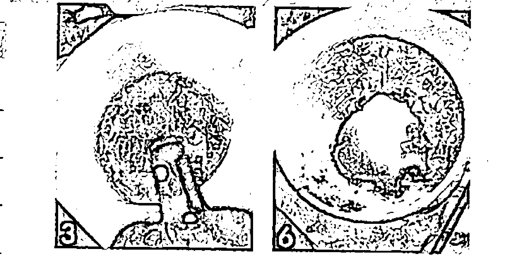

6. 根據以下的準則，解讀判斷茶杯中茶渣排列的模式，與背後的意涵：
- 茶葉大部分都在杯緣上：將有事件發生
- 茶葉多在杯壁上：將在不久的未來有事件發生
- 茶葉多在杯底：在很久的未來才有事件發生
- 馬蹄形：好運連連，可能有機會旅行，也有結婚的機會
- 球形：來年將是大起大落，好壞參半的一年
- 圓形：未來的一年將會有令你驚奇的事發生
- 箭頭：新消息將會出現
- 圓盤形：未來一年財源滾滾來
- 籃子或袋子狀：將會有小孩到來
- 靠近把手處的籃子或袋子狀：將會遇到陷阱或被人欺騙
- 在杯內其他地方的籃子或袋子狀：未來一年財源滾滾來
- 動物形：來年事情多在你掌控之下進行順利
- 線條：將出現許多煩惱與問題
- 正方形：未來一年將事事平安

### 五彩紙花魔法

#### 發現未來伴侶的特徵

> > 【目的】幫助單身者發現未來另一半的特徵。

> > 【魔法背景】世界上有幾千個風俗或傳統都是與顯露未來人生伴侶的特徵有關。從這裡可以看出忠誠的感情在人類的人生中是佔了多麼重要的地位。如果你是單身貴族正在尋找一段認真的感情，並且準備好和另一個人長遠的走下去，那麼這個就是最適合你的魔法了。

在感應魔法中，常會說「以形補形」，其實事實上若以相似的情境來施法，也會幫助讓它在現實上發生，這就是為什麼許多與尋找伴侶有關的信仰多與婚禮有所關聯。本魔法需要你去剛剛完成的婚禮上蒐集一個重要的物品—碎紙花。你必須要多去蒐集相關訊息，並潛伏在一旁伺機而動，你也可以跟地方教堂、註冊結婚處或鄉鎮市公所的清潔服務員情商合作。

你最好是帶著袋子前去，這樣在新郎和新娘離開結婚場合後，你可以在很短的時間內用袋子舀起大量灑落在地上的碎紙花。

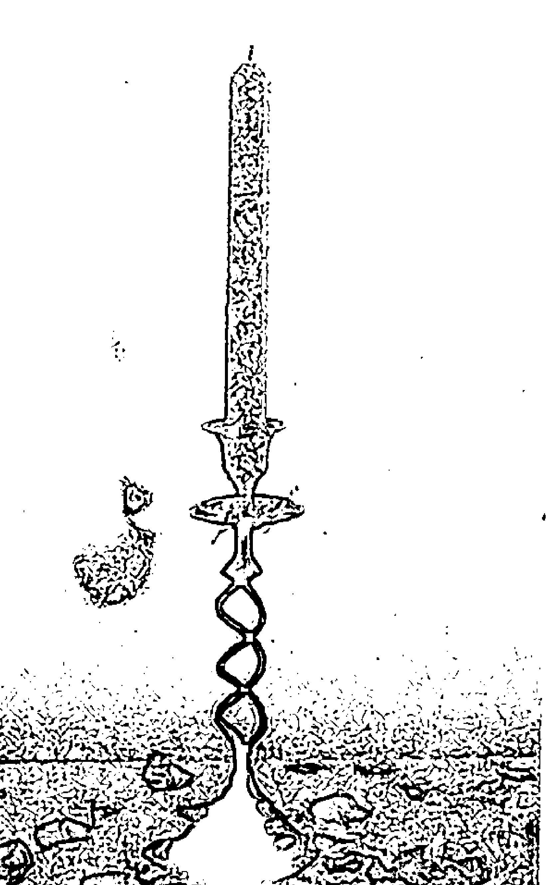

##### 如何施法

##### 所需工具與材料
- 1根長6～8吋或15～20公分的白色蠟燭
- 火柴或打火機
- 1個用來裝婚禮後留下的五彩紙花的袋子

施法時機 在暗月後，於天際出現第一彎弦月時進行。

##### 施法步驟
1. 根據第36到39頁的指示，設立結界。
2. 將白色蠟燭立在結界東方，並點燃說：「耀眼的星辰高掛天際，閃耀著無比的光芒，請也照耀我的結界，為我照出真愛伴侶的模樣。」
3. 站在結界的中央，並向北方鞠躬行禮。接著面向東方並閉上雙眼，將所有的碎紙花灑到自己的頭上。
4. 繼續將眼睛閉上，默默數到13再睜開你的雙眼。

5. 檢視掉落在你四周的碎紙花，根據以下的準則，解讀判斷未來伴侶可能的特徵：
- 1個圍繞著你且頗完整的圓： 他是你所認識的人。
- 形成一堆堆的紙花團： 他一個富有或很會賺錢的人。
- 形成許多直線： 他是一個誠實的陌生人。
- 許多弧形或圓形： 他是一個體貼、有風度的人。
- 角度或正方形： 他是一個長的很高且嚴肅的人。
- 形成各種形狀： 他是一個感性且有趣的人。
- 無法辨識的形狀： 你們將在不尋常的場合中相遇。
- 多落在你的背後： 他是一位比你年長的人。
- 多落在你前方： 遇到他，你將會永遠快樂。

### 家门灰烬魔法

#### 讓敵人現形

【目的】提供一個方法，讓你發現對你存有惡意的人。

【魔法背景】這個魔法的起源已經不可考了，但是這種讓邪惡者或背後敵人現形的方法，在不同時期都有出現不同的版本。本魔法主要的目的就是讓你知道哪些人其實是假裝是你的朋友，但其實卻老在背後中傷你。這個魔法最適合用在當你已經在懷疑某人或是這個擾亂你的人，正逐漸威脅到你的家園或家人的時候。也許這聽起來很匪夷所思，但其實那些設計欺騙別人的行為，也常常是令人非常匪夷所思的。

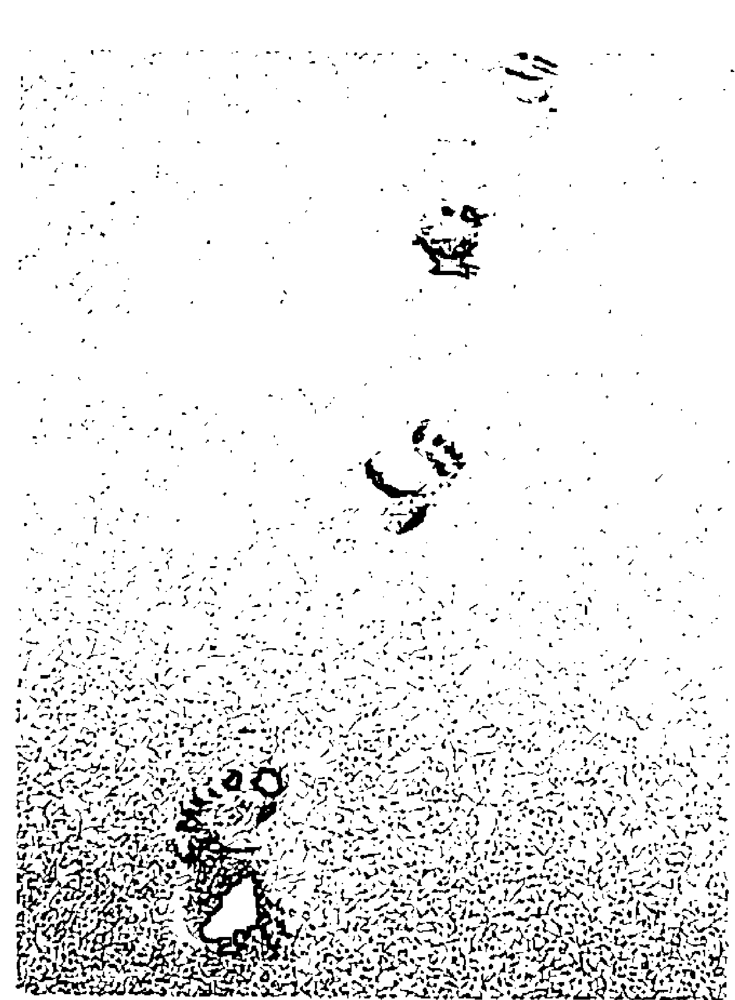

有時候他們會做一些擾亂你生活的事情，例如寄給你恐嚇的匿名信或是故意問一些莫名奇妙的問題來警告你、甚至是常常出乎你意料之外的出現在你的周圍。如果你懷疑有人在對你做這些壞事，你可以在他出現在你家之前，找個時間設個陷阱或是讓他每次的造訪都落空。

當然，如果你懷疑將有危險或是無法反抗的事情發生，請馬上尋求支援和外界的幫忙。但如果你想要靠自己的力量去揭露這個藏在黑暗中的敵人，那麼這個古老的魔法可以象徵上的幫助你阻止他的詭計。

##### 如何施法

施法時機 在暗月的晚上進行第一部分的魔法，並在隔天執行第二部份。

##### 施法步驟
1. 根據第36到39頁的指示，設立結界。
2. 點燃黑色蠟燭說：「在月亮的頭顱中，敵人將要現形。」
3. 將灰燼全部倒入碗中，並將雙手手掌覆蓋在灰燼上頭說：「在雙手之間，是可靠和安全的力量，請為我開啟一條通往真相的道路。」
4. 把灰燼灑在家門前的走道或私人汽車道上。在第二天的晚上到門外的走道檢視，看看是否有嫌疑者的腳印，或是有不知名的腳印在你家附近徘徊。
5. 用小刀在地上畫出一個圓圈，將鞋印圈住，並用鐵釘釘在腳印說：「鞋印的主人，你將得到公平的報應：公平的報應，你將應驗在鞋印的主人上。」
6. 將鹽巴灑在腳印周圍。在一個月亮週期中，敵人將會曝露出他的身分。

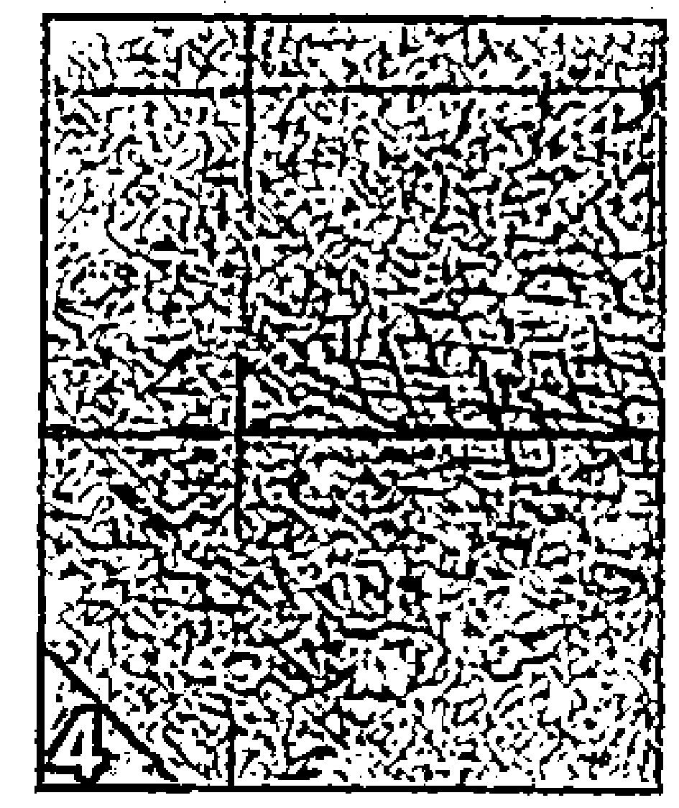

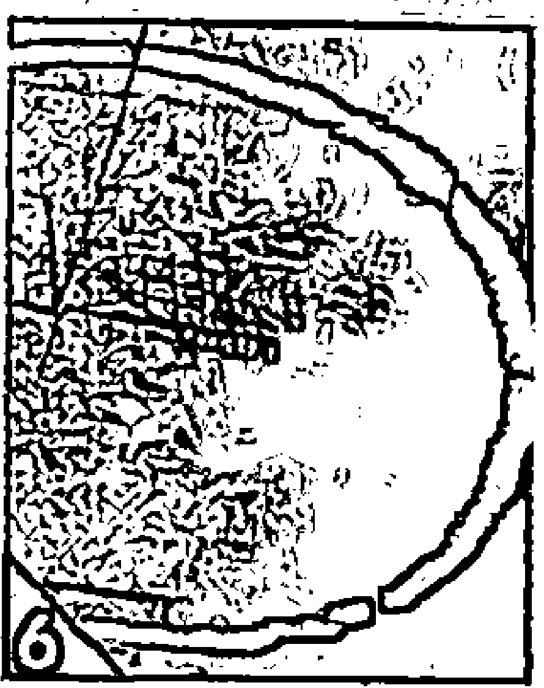

##### 所需工具與材料
- 1根長6～8吋或15～20公分的黑色蠟燭
- 火柴或打火機
- 1磅或450公克燒柴後的灰燼
- 1個碗
- 1把黑色握柄的刀
- 1把鐵鎚和1根鐵釘
- 1個裝有鹽巴的罐子

### 橡实魔法
预测是否将在一年内结婚或遇到人生伴侣

【目的】帮助单身贵族预测在未来12个月之中，是否会遇到能够长相厮守的人生伴侣。

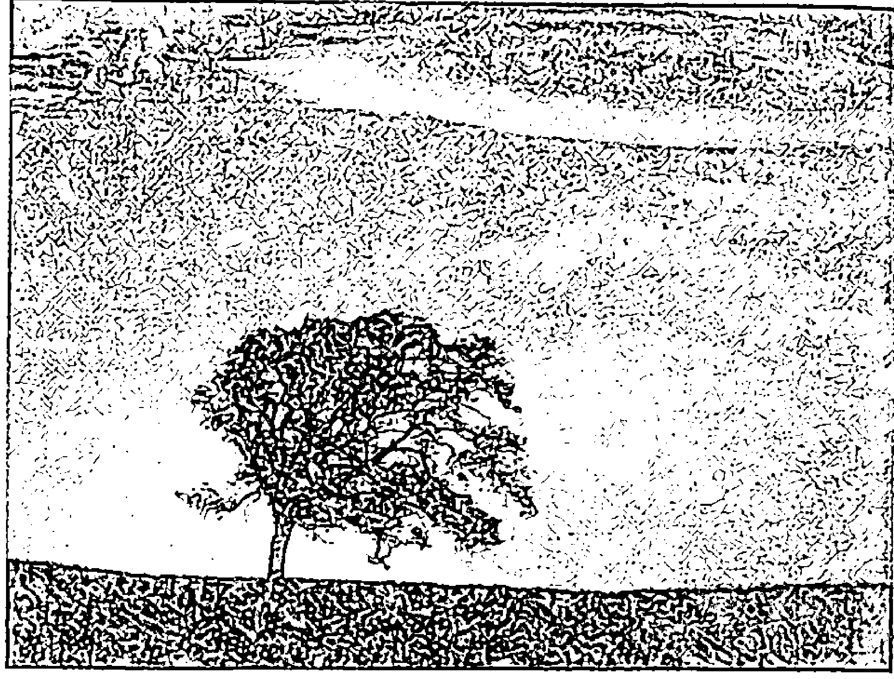

【魔法背景】如果朋友愿意的话，这是一个可以和他们分享的可爱魔法。非常适合在新娘或新郎的婚前送礼会上分享，尤其是大部分参加派对的人是单身贵族时，更可以以此用来庆祝新一年的来临。本魔法的概念就是在预测你未来的一年中是否有可能会结婚，或是遇到你的人生伴侣。虽然这是一个轻松有趣的魔法，但也必须严肃的面对它，如果你一旦进行了本魔法，则应该对它的结果抱著尊敬的态度，不可以在接下来的12个月内重复施法。

本魔法是立基于一个与树有关的传统风俗。在古老的文化中常常认为树是一种很神圣的生物。而橡树更是在英国及爱尔兰的某些地区备受尊崇，相较于其他树种，橡树被认为是代表事实和坚定不移的象征。橡实－“伟大之树的种子”，曾经一时被认为是精灵喝酒的容器。而且橡实的壳斗更被认为是代表神圣的潜力，因为蕴藏在这小小果壳里的生命，竟然能在未来成长为一棵巨大的橡树。在本魔法用来占卜未来幸福的橡实，便是一种充满力量的魔法材料，就如同乡间俗语所说：“小小的橡实却拥有成长为伟大橡树的力量。”

##### 如何施法

##### 所需工具與材料
- 1人1個橡實殼
- 1枝不掉色的軟毛筆
- 1根長6～8吋或15～20公分的綠色蠟燭
- 火柴或打火機
- 1大碗的水
- 1枝長柄的木質湯匙

施法時機 可以在任何月相時機以及一個禮拜中任何一天施法，但必須注意一年只能施法一次。

##### 施法步驟
1. 讓每個人用不掉色軟毛筆，在橡實殼內側寫下自己的名字。
2. 點燃綠色蠟燭，並讓每個人輪流說出以下咒語：「偉大的橡樹，高大的綠木，請告訴我幸福將於何時到來。」
3. 用木質湯匙在碗中，以順時鐘方向攪拌碗中的水，再以逆時鐘方向攪拌一次，最後再快速的以順時鐘方向攪拌一次。
4. 讓第一個占卜者將他的橡實殼丟入水中並數到7。
5. 如果橡實殼在數到7之前，有碰到碗的邊緣，則他將會在未來1年內結婚，或遇到人生伴侶。其他人則依此繼續下去。

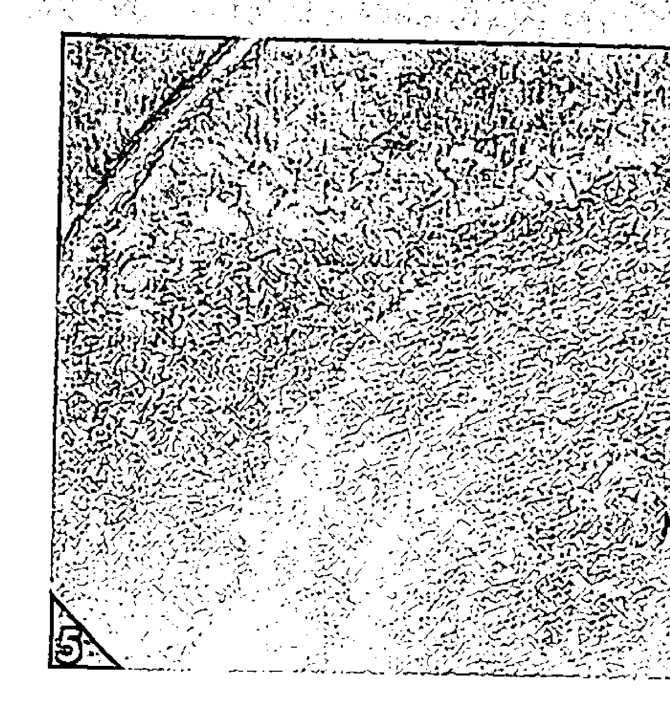

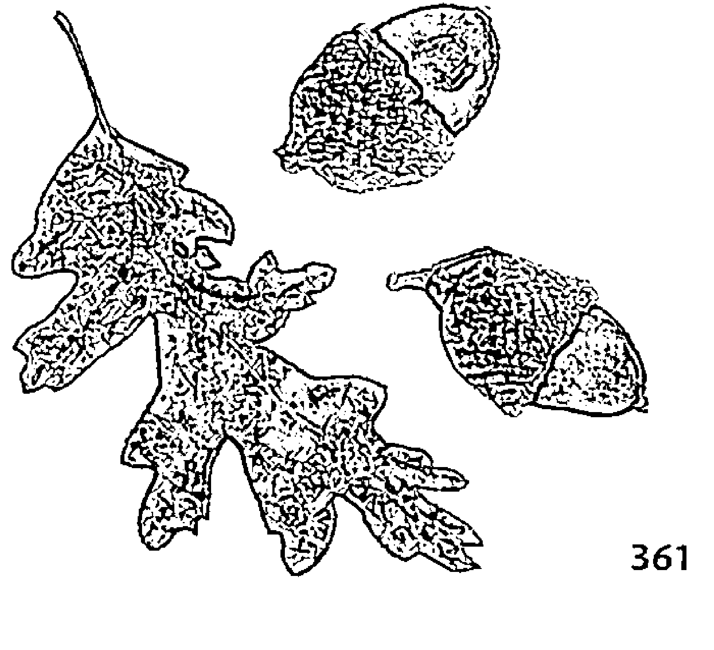

### 古結魔法
帮一個問題找到答案

**【目的】** 為想要找到答案來解決困難問題的人帶來靈感。

**【魔法背景】** 對於那些正面臨尷尬的處境或是努力從困境中找到解決方法的人來說，聽到魔法可以幫助他們解決困難，也許乍聽之下會覺得很可笑，但是其實這是有所助的。通常要想出辦法，不外乎是需要想像力和聰明的智慧，不過通常一般人總是因為缺乏靈感而苦於想不出解決的方法。其實大部分我們下意識都知道問題的答案，只是我們的意識總是無法知覺它們的存在，因此，本魔法採用古老的符咒來為大家打開下意識的封鎖，幫助找到問題之鑰。
在西方的世界，當人們說到困境時，都會用「陷入」或「掉進」困境和問題

##### 如何施法

##### 所需工具與材料
- 1個裝有木炭的防火盤
- 1根長6～8吋或15～20公分的淡藍色蠟燭
- 火柴或打火機
- 1茶匙的苦艾
- 1條長9吋或22.5公分的細繩

施法時機 必須在滿月之後到下一次暗月之前施法。

##### 施法步驟
1. 根據第36到39頁的指示，設立結界。
2. 點燃木炭，再點燃蠟燭，並說：「你知道藏在原石中的秘密，你的光芒在黑暗之中閃耀，請點亮指引我尋找答案的路吧。」
3. 將苦艾灑到木炭上。

「扭打」在一起、陷在窘境「中」或被問題「綁住」來形容這種情形。而複雜的問題則會用「打不開的結」來形容。本魔法便是使用打結，這個年代久遠的魔法技巧，來幫助你解開糾結的煩惱。在施法後連續7天都要將夢境記下來，因為夢中將會浮現答案的線索，信任你的內在智慧並注意雙關語或特別的象徵，將會對你的問題有所幫助。

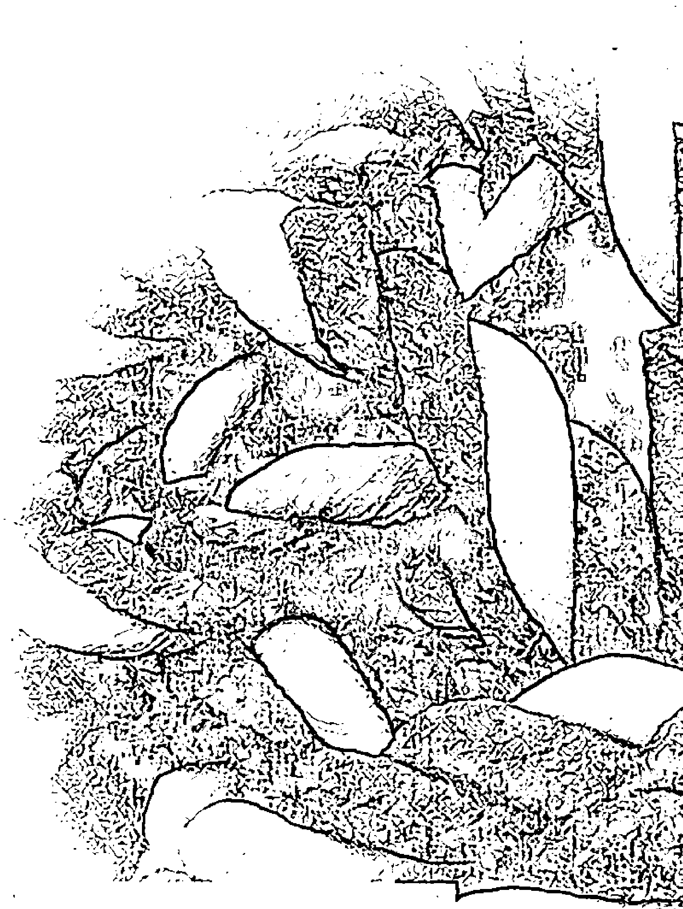

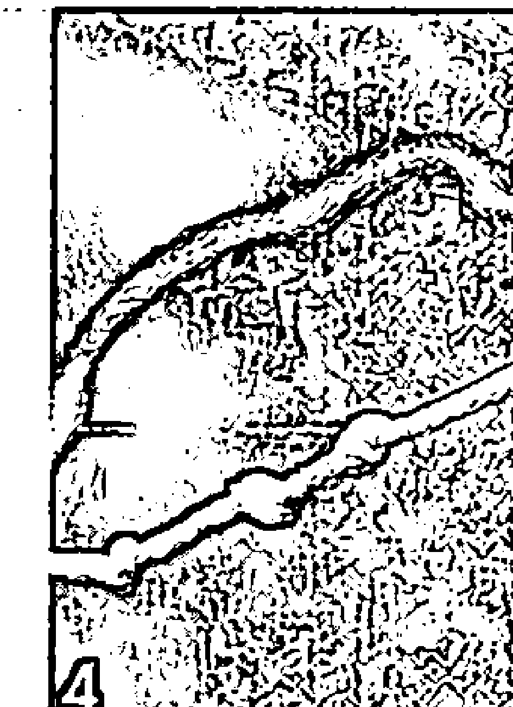

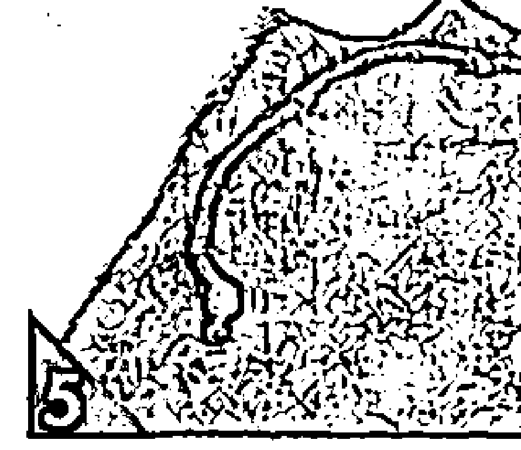

4. 在繩子上綁上7個結，每打一個結，並依序念誦下列其中一句咒語：「第一是帶來光明的太陽；第二是在黑暗中閃耀的星辰；第三是高掛在黑暗天際的月亮；第四是穿過皎潔月光的雲朵；第五是在月亮下的嬰孩；第六是在我口中的疑問；第七是我所不知道的秘密；全部都將在7天之內，解開所有的謎團。」
5. 在接下來的7天，將打結的繩索放到枕頭底下，並在每天睡前，鬆開一個結。
6. 問題的答案將會在你的夢中浮現。

### 蘋果魔法

#### 夢見你的真愛

【目的】為你揭露真愛的特徵。

【魔法背景】蘋果和愛情的關係就像是手套和手的關係。屬於凱爾特族另一個世界的果實一「蘋果」和水元素有非常密切的關聯，而水元素正好是魔法中主掌感覺、情緒和夢境的元素。蘋果常在世界各地的神話中出現，並時常被用來象徵人類內心最深沉的欲望。在本魔法中，蘋果是代表你的真愛，並會同時用到果皮或果肉來施法。

當我還是小孩子的時候，我最早學的魔法之一就是用蘋果來找出未來老公的名字。這個魔法當然是特別專給女孩和女人所使用，主要是將蘋果皮完整的削完，而且不能削斷，之後將果皮丟到肩膀之後，則未來丈夫名字裡的第一個字將會出現。另一種改編於這個魔法的作法，則是在鏡子前削蘋果皮，同樣的，如果你沒有將蘋

##### 如何施法
- 1個裝有木炭的防火盤
- 1根長6～8吋或15～20公分的紅色蠟燭
- 火柴或打火機
- 1茶匙等量的香蘭尾根和時蘿
- 1顆新鮮的紅色蘋果
- 1把黑色刀柄的尖銳水果刀
- 1面邊長至少6吋或15公分的可攜帶鏡子
- 1個邊長3吋或7.5公分的正方形抽繩乾酪布袋

施法時機 在滿月時施法。

1. 根據第36到39頁的指示，設立結界。
2. 點燃木炭，再點燃蠟燭說：「愛之女神，請以妳高貴的力量，為我展現他的容顏。」將香蘭尾根和時蘿灑入木炭中。
3. 用刀子在鏡子上削蘋果皮，並且小心不能將蘋果皮削斷。

果皮削斷，你將可以在鏡子裡看到未來丈夫的名字縮寫以及他的容貌。我曾經和朋友試過一次，但後來因為害怕，所以我們便放棄這個實驗，並從此沒有再試過。

本魔法也需要完整的削完蘋果皮，但是並不是讓未來丈夫的臉出現在鏡子裡，而是出現在你的夢裡。

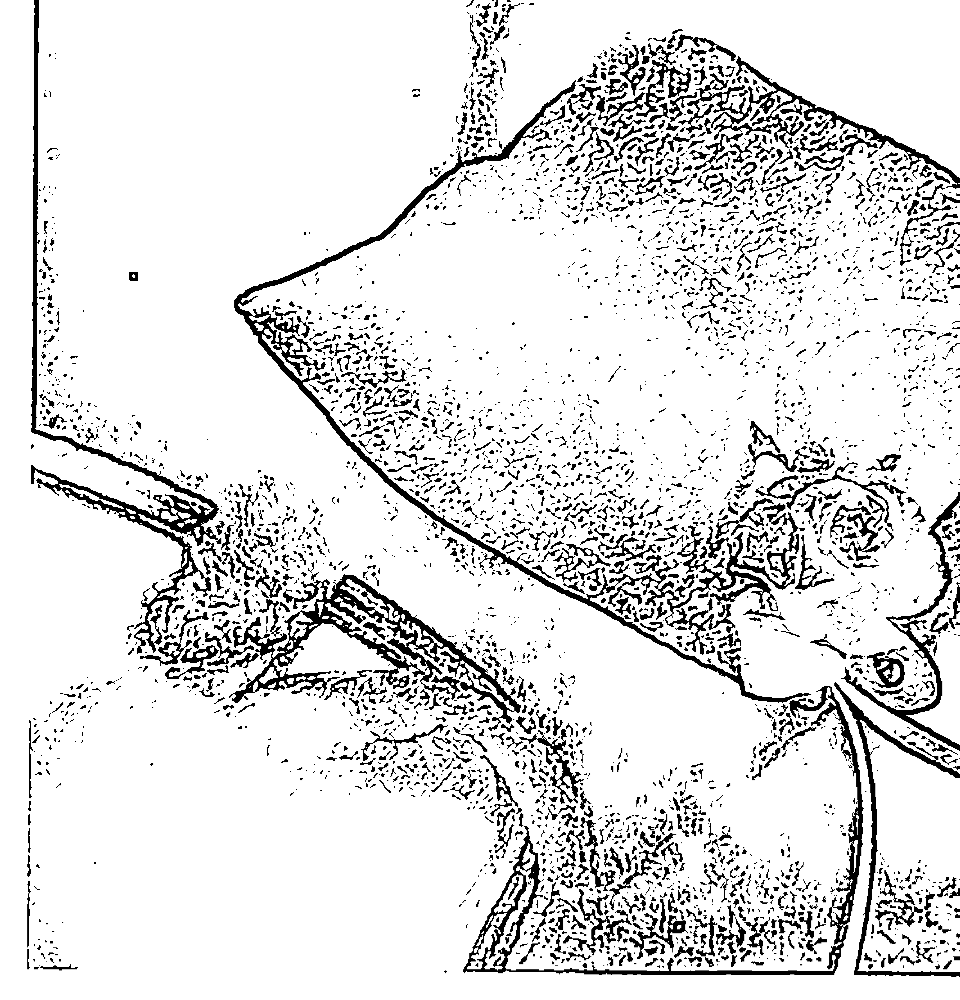

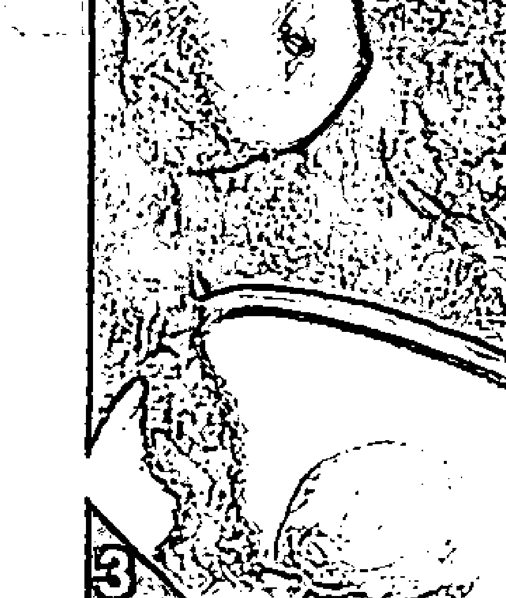

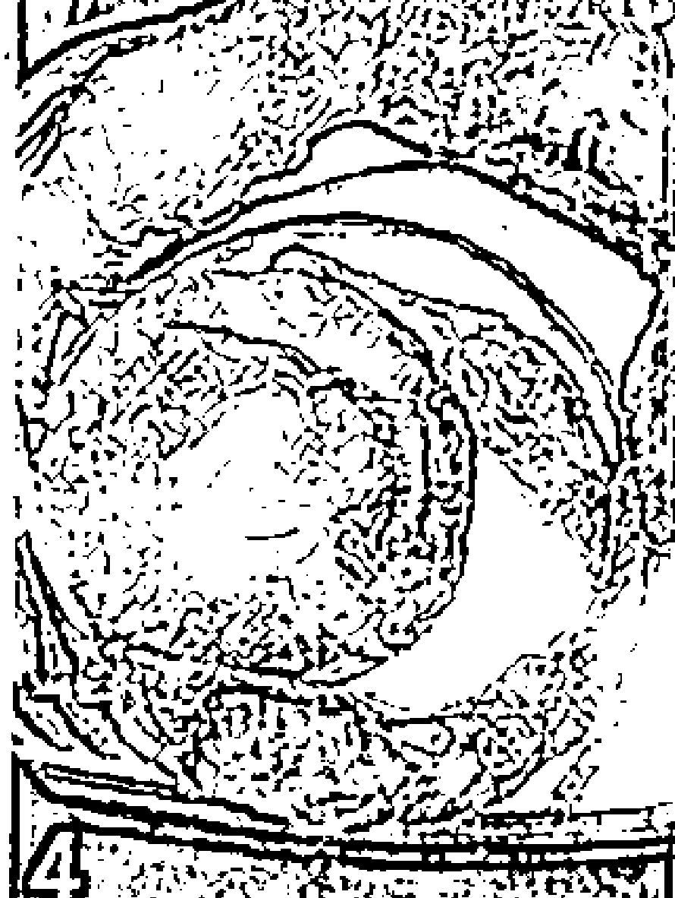

4. 讓蘋果皮自然掉落在鏡面上。將鏡子拿到木炭煙霧上，以順時針方向轉3圈。
5. 將蘋果吃掉，並注視著鏡子說：「我已吃掉智慧的果實，但留下了智慧的外皮，我送回這智慧的外皮，為我帶來屬於未來的秘密。」
6. 將蘋果皮放入袋子裡，並掛在你的床上，直到你夢見真愛為止，再於隔天將果皮取出，並埋入土中。

# 消災解厄的魔法

## 消災解厄的魔法介紹

一般大眾普遍會認為當有人因為別人的惡行而向魔法師求救時，魔法師會用一些令人畏懼的方法來抵抗這具備些具有傷害作用的力量。有些人甚至會認為這種形式的魔法就是在危害他人的詛咒或迷咒。但是這些都是錯誤的觀念。用來阻止惡霸、迫害者或壞人的魔法，主要是在避免傷害的產生，而不是對抗傷害的力量。消災解厄就是這樣的概念。「消災」是指將受害者移到別的地方或是移除那些造成同事、鄰居和同事困擾的問題，而「解厄」則是阻止別人使壞的力量。

消災的魔法有許多不同的層次，它可以將受害者移出會受傷的情境之外，本章的「荊棘椅刺魔法」就是屬於這種形式的魔法；它也可以削弱傷害的力量，「細繩與蠟燭魔法」便是屬於這一類。另外一種層次是利用魔法消除因為傷害所帶來的痛苦，本章的「紫色墨水魔法」便是一個例子。而另外一種則是幫助消除因為過去的傷害事件，所追留在心中無法揮去的悲傷

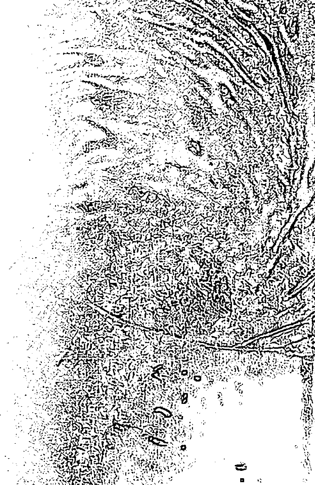

情緒，「切斷魔法」便是在阻斷這種過去的記憶。消災魔法也可以幫助你驅逐不良的習慣，在接下來的章節中，你將會逐漸熟悉這些魔法。由此可知，本章包含了許多不同的消災魔法，但是絕對和詛咒扯不上任何關係。

解厄魔法則是讓做惡者自作自受的魔法。本章裡的「鹽之結界魔法」便是將壞人和他的惡行限制在結界當中，如果持續作惡，則惡行將會反彈到他們身上，直到他們決定向善為止。「鳥巢魔法」也是延續這個主軸，不過它是提供一種讓你可以看到的對抗力量，也就是讓做惡者自食惡果。其實，這一類的解厄魔法都有給予壞人「向善」的機會，如果他們仍然執迷不悟、一意孤行，那麼不好的結果將會不停的報應在他們身上，直到他們停止做壞事為止。另外，解厄魔法也可以讓大家看到壞人醜陋的面目，而本章的「水元素魔法」便能幫助揭發壞人的謊言和惡行。

### 盐之结界魔法

#### 让坏人也为自己的行为所苦

**【目的】** 让坏人不再继续做坏事伤害别人。

**【魔法背景】** 如果某人所做的恶行对其他人产生不良的影响，而无论是谅解、劝说或对抗都没用时，那么就是魔法该出面的时候了。这是一个典型的解厄魔法，是用超自然的方式监禁恶行或恶念。我们是用一个象征坏人的物品放在盐圈中，代表坏人会被桎梏在盐圈的结界里，而无法再跨越出来伤害别人，坏人的恶行也将与他自己一起被监禁在结界里。简而言之，「恶行」并不会跑出结界外去伤害其他人，反而是反弹到施恶行者的身上。这个魔法不但对从以前到现在都深受恶行所苦的人有用，对于其他周遭的人也有同样的效果，让这些遭到恶行所伤害的人有机会可以改

**所需工具与材料**
- 1根长6～8吋或15～20公分的黑色蜡烛
- 火柴或打火机
- 1束坏人的头发
- 1条长4吋或10公分的黑色毛线
- 1面直径至少4吋或10公分的圆形镜子
- 1个装有盐巴的罐子
- 1个在壁炉、火盆或户外所设立的烽火

**施法时机** 本魔法可以依需要在任何时间点施行。但是暗月是建造超自然结界的最佳时刻，此时的魔法力量最强大。

**施法步骤**
1. 根据第36到39页的指示，设立结界。
2. 点燃蜡烛说「黑暗的月亮，请用你全能的力量庇祐这个结界吧，在我随着结界行走的同时，邪恶将被监禁，伤害将被阻拦。」

變這個困境。
在魔法的世界中，鹽巴是拿來作淨化的工具，通常是和水一同混合，在儀式開始前灑在施法處的四周以淨化這個空間。除此之外，鹽巴還代表健康完整以及抵抗保衛的力量，形成阻擋外來傷害的保護盾。

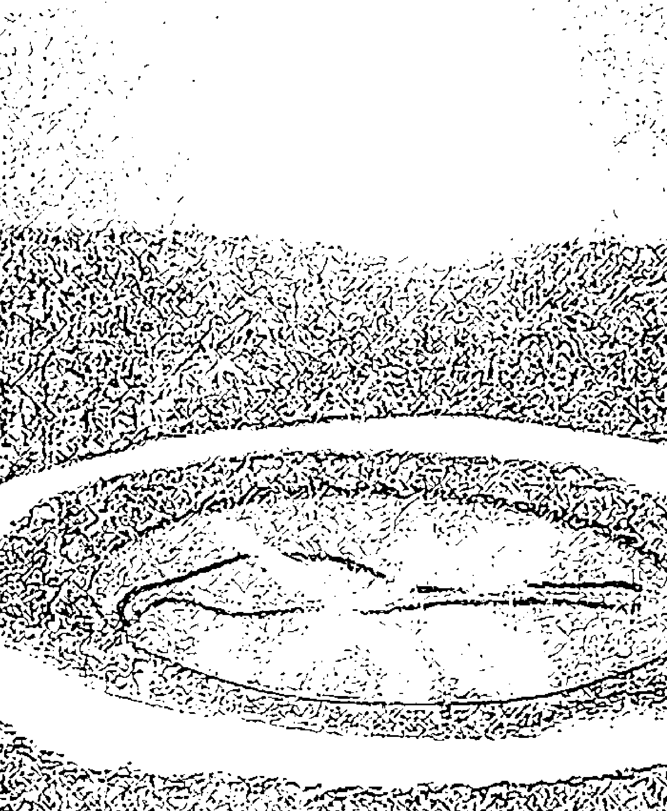

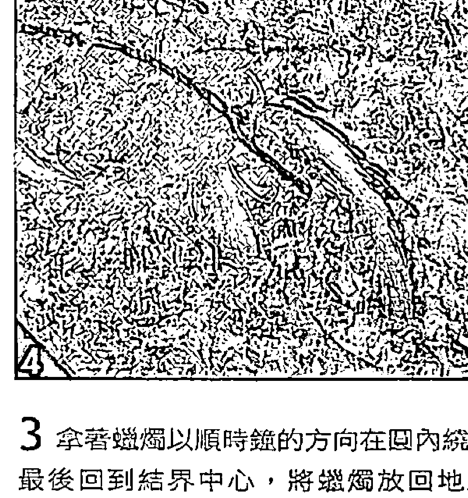

4. 用黑色毛線在頭髮上打結，並綁緊說：「(壞人的名字)，經由我的魔法，你將被束縛。」
5. 將頭髮放在鏡子的中央，並在周圍倒上一圈鹽巴說：「我製造這個結界監禁你的惡行。」
6. 朝鏡子吐一口氣，並將頭髮和鹽巴丟入烽火中說：「在我氣息之間，邪惡已經死亡。」

### 細繩與蠟燭魔法

#### 削弱騙子的力量

**【目的】** 取走別人騙人的能力。

**【魔法背景】** 當沒有任何證據足以證明，但是你卻知道有人正在欺騙你的朋友、同事、或你自己，這個魔法便是應付這種情況的最理想的魔法。就如同本書中其他魔法的基本道理一樣，魔法會反應在真正有錯的人身上。如果你的判斷錯誤或是將魔法施在不對的人身上，不用擔心魔法會在那個無辜的人身上發揮作用。如果他們是無辜的，那麼他們的真誠與誠實便會彰顯出來。但如果他們不是無辜的，那麼他們騙人的能力將會被削弱，他們的計謀也會失敗。

進行本魔法有一個很重要的地方，就是你必須要把蠟燭穩固的立在盤子上，如此，當蠟燭逐漸往下燃燒時，才能順利的將綁在上面的細繩及紙條燒掉。當然，所有燃燒的蠟燭都需要仔細的看顧，在這裡則要更用心的全程守護，因為細繩和紙條一旦被點燃就會掉落，所以要特別注意。這張紙條上，必須要有你懷疑是騙子的人的親筆簽名或簽名影印，而且必須要將紙條剪到最小，並不可以破壞掉簽名的部份。

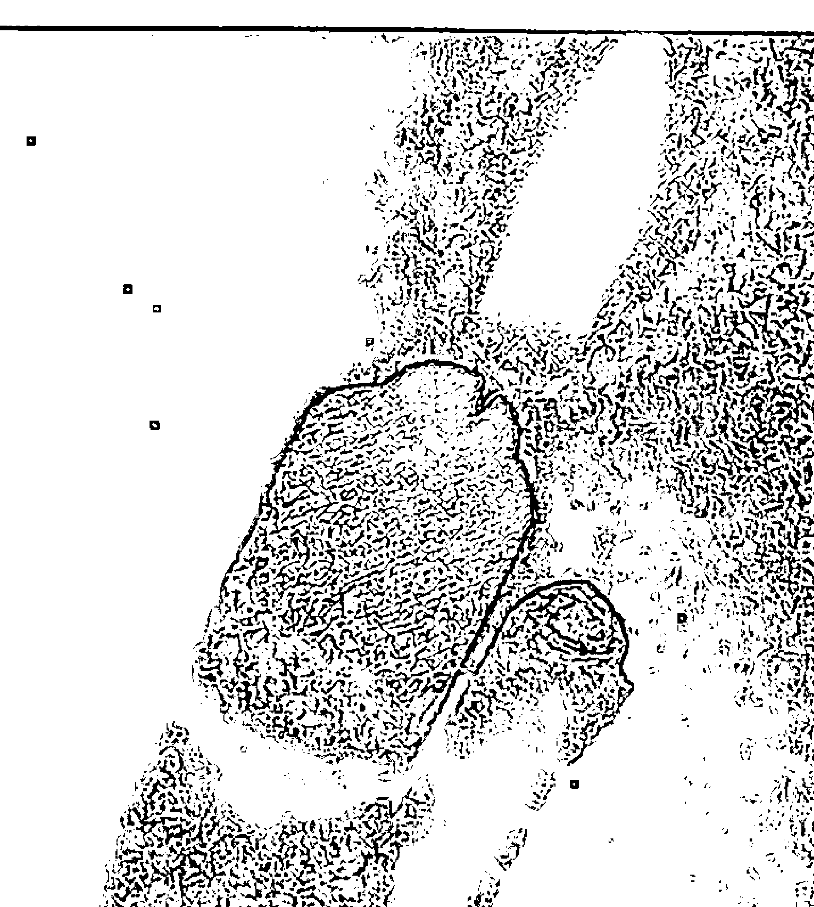

##### 如何施法

施法时机 本魔法可以依需要在任何时间点施行。但是新月后的隔天是魔法力量最强大的时候。

##### 施法步骤

- 1. 根据第36到39页的指示，设立结界。
- 2. 点燃小蜡烛，并将铁钉的尖端置于烛火上加热。
- 3. 用加热过的铁钉在白色蜡烛烛蕊下方约1吋或2.5公分处，刻下一个眼睛的轮廓。
- 4. 将有签名的纸条紧紧的卷起，并将它绑在黑色棉线的中间。接着将纸条及棉线绑在白色蜡烛上，并要让棉线经过眼睛轮廓的中间，将线绑紧。
- 5. 点燃白色蜡烛说：「（骗子的名字），如果你真的是一个骗子，那么你的恶行将无所遁形，所有伎俩将被识破。」在旁边看着烛火逐渐往下燃烧，烧过眼睛轮廓、细绳以及纸条。
- 6. 将蜡烛熄灭，并将蜡烛以及烧完的细绳与纸条，一起埋入不会受到打扰的土中。

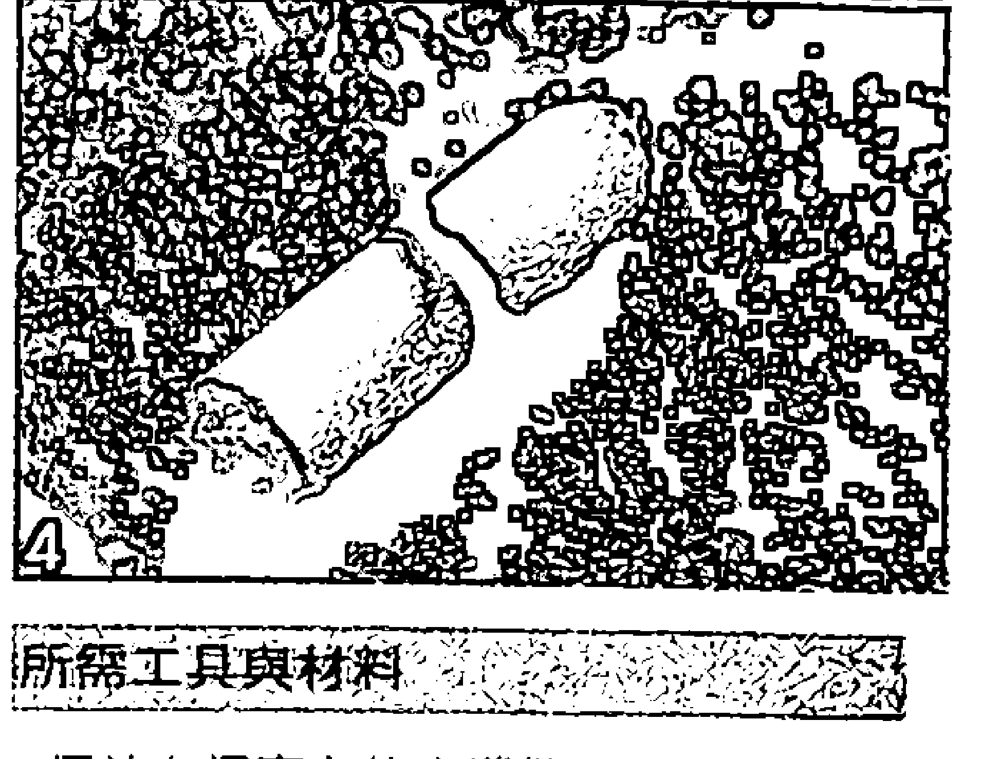

##### 所需工具与材料

- 1. 1个放在烛台上的小蜡烛
- 2. 火柴或打火机
- 3. 1根尖锐的铁钉
- 4. 1根长6～8吋或15～20公分的白色蜡烛
- 5. 1张有骗子签名的纸条
- 6. 1条6吋或15公分的黑色刺绣棉线

### 镜影魔法
#### 混淆敌人的视听

【目的】本魔法是帮助想要伤害你的计划受到阻碍。

【魔法背景】镜子在世界上的许多魔法中都被广泛的使用着，因为镜子与神秘和魔法之间的确有着深刻的关系。镜子就象征是真实世界和虚幻世界的界线，镜子上面所出现的影像，也绝非如表象所示如此简单。镜子虽好像是单纯的反映照镜者的2度空间，但其实它可以让影像呈现3度空间的立体感，并且有时可以让影像无限延伸。镜子里面所隐藏的常常都比它所揭示的多，本魔法便是利用这项特质来干扰混淆敌人的视听。

将镜子挂在窗户外面的传统就是利用镜子反射或反弹的力量，让危险的力量返回坏人的身上。本魔法中所使用的镜子，不但混淆敌人的视听，还借此向外反射出一道无形的盾来抵挡坏人的恶念。本魔法中所使用的镜子是双面镜，并且必须要悬挂在家门口，所以要确保镜子是被安稳的挂着。

##### 如何施法

##### 所需工具与材料

- 1个装有木炭的防火盘
- 1根长6～8吋或15～20公分的蓝色蜡烛
- 火柴或打火机
- 1茶匙的艾蒿
- 2个一模一样，且直径都为大约4吋或10公分的圆面镜
- 1茶匙的罂粟籽
- 1罐强力胶
- 1卷可轻易弯折的铁丝

施法时机 在满月的晚上施法，这天是代表真实和虚幻的日子。

##### 施法步骤

- 1. 根据第36到39页的指示，设立结界。
- 2. 点燃木炭，再点燃蜡烛说：「月亮的子民、水之元素，请为我反射并混淆改变（坏人的名字）的诡计，让他步履蹒跚、计划失败。」
- 3. 将艾蒿洒在木炭上，用两只手各拿着一面镜子，接着将它们的镜面穿过木炭的烟雾，并说：「我在这里赐给你力量，为我呈现事情的真相。」
- 4. 将罂粟籽也洒在木炭上，重复刚刚的动作，并说：「我在这里赐给你力量，请迷惑哄骗敌人的耳目。」
- 5. 用强力胶将两面镜子的背面，紧紧的黏在一起，然后用铁丝绕过镜子，将镜子绑紧，并留下一个挂圈，可以让镜子悬挂。

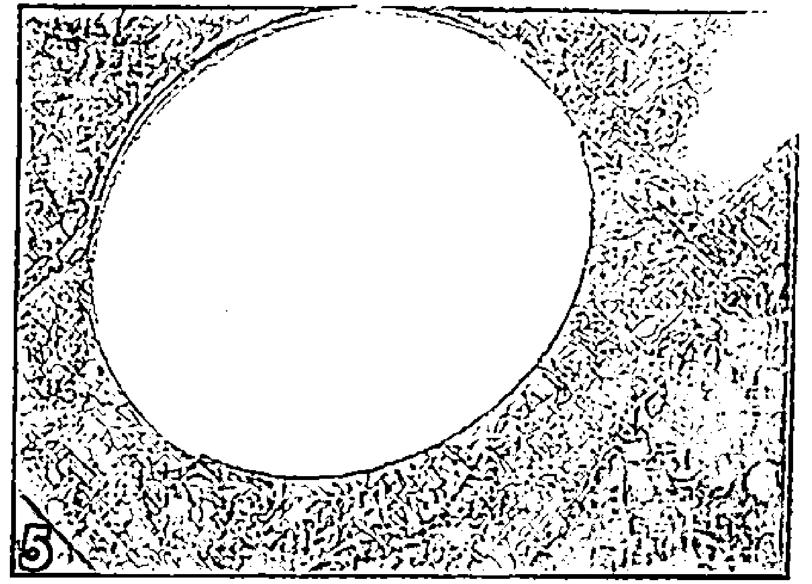

- 6. 让绑好的镜子拿到烛火前说：「就像我所说的，去迷惑敌人吧。」最后将镜子挂在门上。

## 消灾解厄的魔法
### 荆棘椅刺魔法
让你摆脱恶霸的威胁

【目的】让恶霸不能作怪。

【魔法背景】恶霸的恶行有很多种形式，但是毫无例外的人们都应该起身对抗这种恶势力。但是对于那些已经被威胁恐吓的人来说要战战兢兢的起身对抗，实在不是一件容易的事情，而也就是为什么需要采取实际的方法去寻求外界的援助。如果你是被室友或同事所欺负，那么你应该寻求信赖的人的帮助或是请求舍监、工会或人事部的协助。如果你是被家中的成员骚扰或威胁，请向家扶中心寻求支援或是采取法律的途径。也许你会觉得很奇怪，一本关于魔法的书竟会提出上述的建议，这是因为魔法是建立在实际的准备之上的，这当中当然包括一些常识的反应。

其实，魔法长久以来扮演的角色，都是在提供那些无助的人面对困境的方法。这也就是为什么会存在这么多和保卫抵抗有关的传统。本魔法必须要和其他实际的解决方法一同使用，才会有效果。

##### 如何施法

| 所需工具与材料 |
| --- |
| 1根长6～8吋或15～20公分的黑色蜡烛 |
| 火柴或打火机 |
| 1个装有木炭的防火盘 |
| 6条干燥后的大荆棘刺 |
| 6个裁缝专用的大头针 |
| 1个装有1个螺丝帽的小玻璃罐 |

施法时机 在满月的晚上施法，这天是代表真实和虚幻的日子。

##### 施法步骤

- 1. 根据第36到39页的指示，设立结界。
- 2. 点燃蜡烛说：「我在这里将软弱和胆小送出结界，你的恶势力即将结束。」
- 3. 点燃木炭，将5根荆棘刺放在木炭上，让它们完全燃烧殆尽。
- 4. 将别针和刚刚烧掉的荆棘刺灰烬一起放到玻璃罐子里，并说：「我在手中握着你的胆怯，直到你的残酷逐渐消灭，这些代表你的残酷荆棘，才会随着你良善的到来，从此不见。」
- 5. 将玻璃罐的盖子紧紧盖上，并将罐子放到安全的地方，直到恶势力离开为止。
- 6. 将剩下的荆棘刺放到恶霸常坐的椅垫下，并要藏在最不容易被发现的位置。

### 鸟巢魔法
#### 让做坏事的人自作自受

【目的】确保坏人将会尝到自己恶行的苦果。

【魔法背景】有一句英文古谚是说：「只有笨鸟才会弄脏自己的巢。」这是在批评人们在自己的家中做错事是非常愚蠢的一件事，因为这样一来你就会被自己的行为所波及，本魔法便是利用这个概念。一旦坏人做了坏事，那么最后报应将会回到自己的身上，这个魔法让坏人也受到别人所受的苦，甚至让他们周遭的人知道谁才该为所有发生的问题负责任。这样一个警告意味浓厚的魔法给了恶棍其他的选择：是要打消念头还是要补救他们的恶行，因为如此才能让恶行被消除。

为了进行本魔法，你必须要搜集到一个旧巢来施法。如果你从以前开始就会在家中摆放鸟巢箱，那么你已经熟悉如何清除去年的旧鸟巢，让来年春天的鸟有空间放新的鸟蛋，也可以顺利的取得魔法中所需要的巢。如果没有鸟巢箱的话，你可以请求有经验的邻居来帮忙，或是和地方上自然鸟禽保育区的管理者成为好朋友。无论如何，请都尽可能的让鸟巢保持完整。

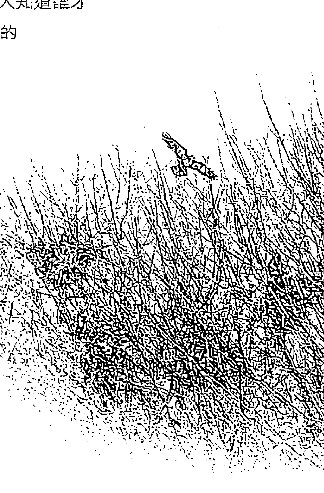

##### 如何施法

##### 所需工具与材料
- 1个装有木炭的防火盘
- 1根长6～8吋或15～20公分的黑色蜡烛
- 1根长6～8吋或15～20公分的白色蜡烛
- 火柴或打火机
- 1茶匙干燥的杜松莓
- 1个废弃不用的完整鸟巢

施法时机 在暗月潮汐转换的时刻进行，以确保坏人能够自作自受。

##### 施法步骤

- 1. 根据第36到39页的指示，设立结界。
- 2. 先点燃木炭，再于你的左手边点燃黑色蜡烛，并说：「受苦的日子已经过去。」
- 3. 点燃白色的蜡烛说：「报应的日子即将靠近。」
- 4. 将杜松莓洒在木炭上。
- 5. 将鸟巢捧在双手中，并穿过烟雾，反复诵读：「在海浪开始退潮的时候，也就是开始报应的时候，在海浪正式退潮的时候，就是得到报应的时候。」
- 6. 在同一天晚上，将鸟巢偷偷的放在敌人的门阶上。

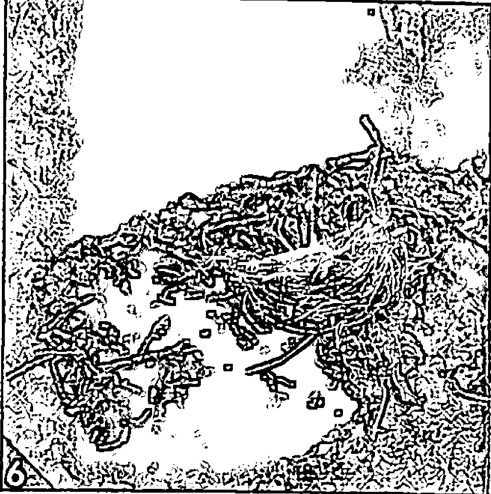

### 水元素魔法
#### 让大家看到坏人的恶行恶状

【目的】撕破坏人的假面具，并揭露他真正的罪行。

【魔法背景】有时候，对坏人最严厉的惩罚和最好的教训就是揭露他的罪行。这会让他们失去别人的信赖，让大家起而反抗他的恶行，断绝与他的友好关系。揭露真相也可以让诡计胎死腹中，无法让这个诡计顺利发挥作用。本魔法对于澄清错误的指认也有很大的帮助，因为如果你错怪了某人，魔法会帮助还原真相并洗刷他的清白、证明他的无辜。

本魔法需要到户外、靠近水域的地方进行施法。同时，你必须用到一个相当高阶的魔法技巧——「召唤术」，所以，建议你最好是先培养一些施法的经验，再来进行这个魔法。在魔法中，你需要一个鼓，最好是在正式施法前，好好的练习一下击鼓，魔法进行时需要以3/4拍的节奏来击鼓，因为这是召唤水元素最有效的节奏。在你离开水域之前，记得在水边留下一个谢礼，如花、贝壳或树叶等等。

##### 如何施法

##### 所需工具与材料
- 1个装在罐子里的小蜡烛
- 火柴或打火机
- 1根檀香木焚香柱
- 1个鼓

施法时机 在满月时的湖边、海边或河边进行。

##### 施法步骤

- 1. 根据第36到39页的指示，设立结界。
- 2. 点燃罐子里的小蜡烛，将焚香柱插在地上并点燃。
- 3. 用你的双手以3/4拍开始打拍子，并专心的在心中数着拍子。当你觉得准备好可以开始的时候，在心里召唤水中的精灵。
- 4. 直到你觉得围绕在你四周的能量有明显的改变时开始击鼓，并跟着连诵三次
- 5. 唸诵以下咒语：「照耀月亮的镜子，请现出他的容颜，揭露他的真面目，让我看到真相吧。」
- 6. 继续持续的击鼓，直到你觉得水元素围绕在你的身边为止。直到力量逐渐消失时，试着想像有一股水流，冲向那个人的家门口，那个人就是你想要揭露他丑陋恶行的人。
- 7. 在离去之前，在水边留下一个礼物来感谢水元素的帮助。

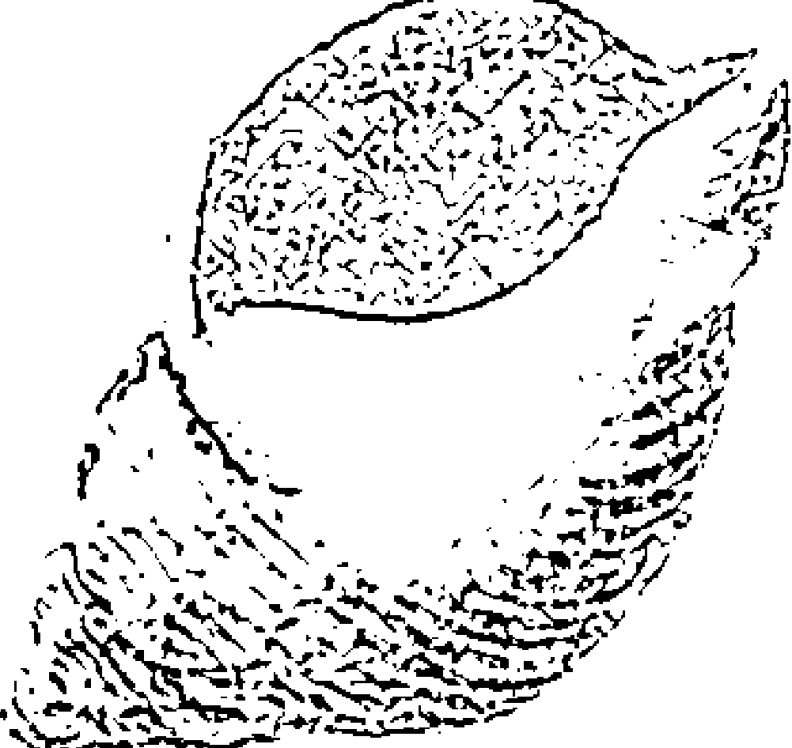

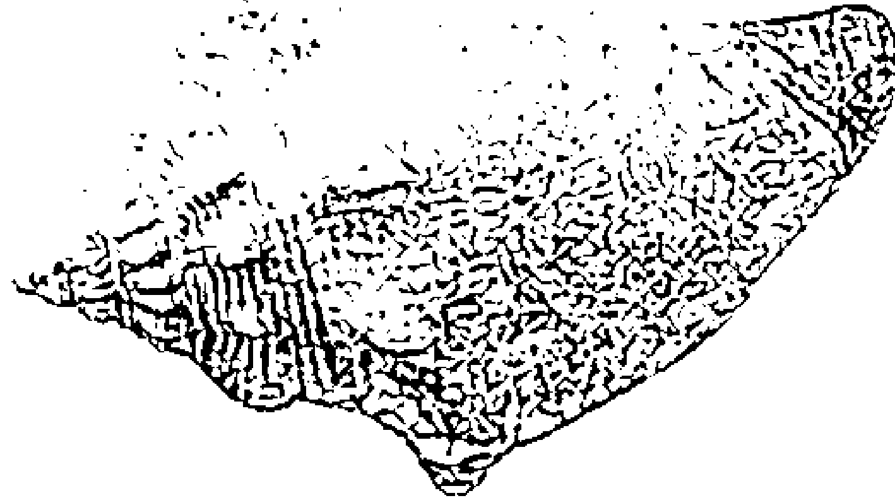

### 紫色墨水魔法
#### 抹去别人所造成的伤害

【目的】适合曾经被他人的欺骗或恶行所伤害的人，可以帮助疗愈心中的伤口。

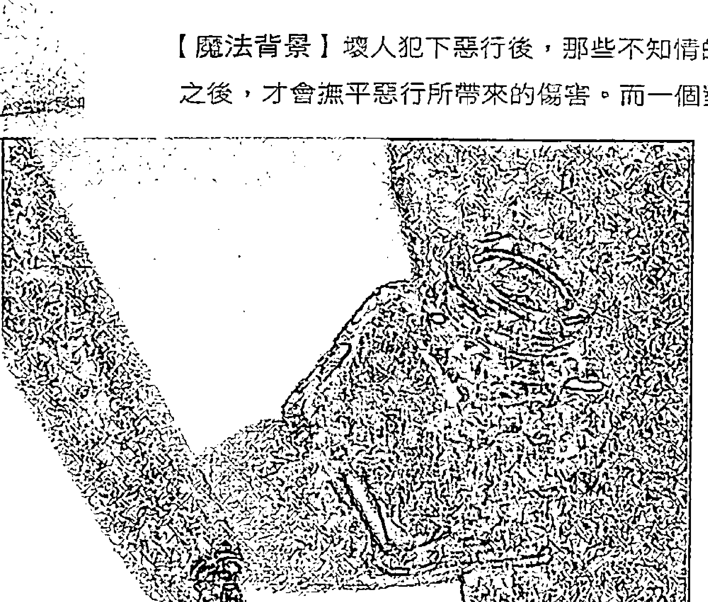

【魔法背景】坏人犯下恶行后，那些不知情的或易受骗的目标可能要等到一段时间之后，才会抚平恶行所带来的伤害。而一个对自己伙伴不忠诚的人，不只是会留下一个受伤且生气的伙伴，其他一连串被纳入名单中的无辜受骗朋友或亲戚，也会受到波及。那些被攻击的朋友、亲戚和伙伴，都必须承受被伤害后的痛苦以及无知的罪恶感、无力感和气愤的情绪。对于这种情况，除了一些可以帮助受害者的实际发泄方法外，本魔法也以治疗性的方法来帮助减少那些遗留在受害者心中的伤痛。很多心理学家都认同利用仪式来抒发痛苦的效果与价值。虽然本魔法的起源远远早于心理学出现之前，但是仍被视为有效的心理治疗方法。

##### 如何施法
##### 所需工具与材料

- 1根长6～8吋或15～20公分的黑色蜡烛
- 火柴或打火机
- 1罐紫色颜料调成的色汁
- 1枝自来水笔
- 1张办公室用纸
- 1碗水
- 1只平底玻璃酒杯

施法时机：在月亮渐亏时的暗月之后进行。

##### 施法步骤

- 1. 根据第36到39页的指示，设立结界。
- 2. 点燃蜡烛说：「只保留有价值的东西，丢弃所有有害的东西。」
- 3. 用自来水笔笔尖沾染紫色色汁，并在纸张的一面，用三个字写下困扰你已久的伤害。将纸张拿到水碗上头，以酒杯当作勺子，舀水冲洗纸张，将纸上的颜料冲掉。
- 4. 把纸张拿到烛火前烤干，必须小心不要着火。
- 5. 在干掉的纸上用三个字写下，你希望取代之前伤害的正面特质。
- 6. 同样把纸张放到烛火前烤干，然后将纸张卷起收藏，直到1年又1天后，再将纸张拿出来烧掉，并把灰烬洒在你的花园中。

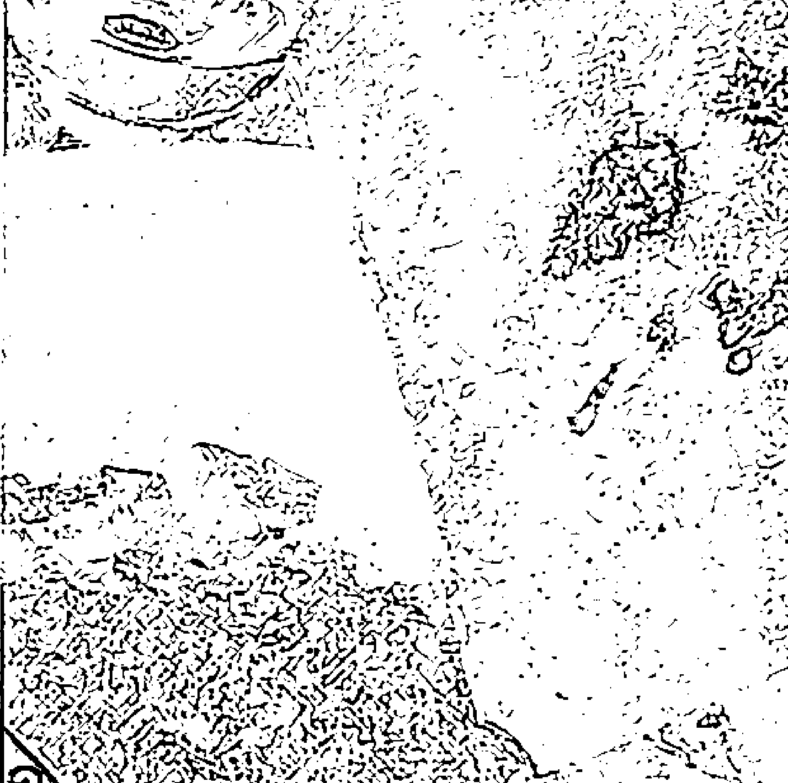

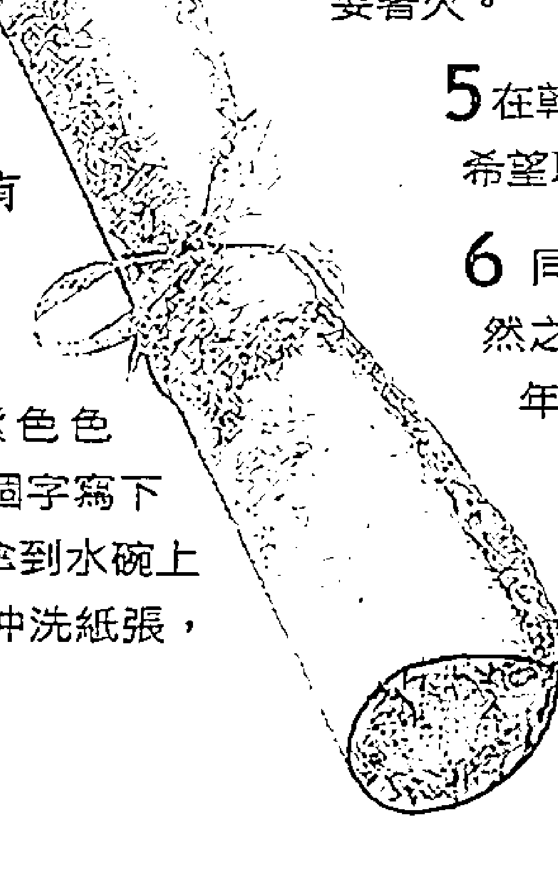

### 切断魔法
#### 断绝过去伤痛的记忆

【目的】摧毁一直让你无法忘怀并且一直折磨你的过去事件的记忆。

【魔法背景】这是另一个具有治疗功效的魔法，最适合那些希望彻底忘掉过去的人。如果过去事件的记忆一直在你身上产生不健康的影响，那么就不应该让它继续这样下去。将过去的记忆忘掉并不是去缩小那些事件所带来的痛苦或折磨，而是确保未来在你身上会产生最好的结果。不管对任何人来说让过去的痛苦或仇恨，一直持续在心中翻腾，只会给负面的情绪太多的空间，并让人沉浸在悲伤的情绪当中，而阻断快乐的知觉。

如果你发现，过去分手、丧亲或受伤的经验，一直萦绕在你的心头，无法藉由其他管道将悲伤排出，那么你应该要好好跟朋友或是咨询师谈谈。如果你想要断绝这种持续的负面情绪，那么这就是最理想的魔法。这是利用超自然的方法去阻断你的情绪和过去事件之间的关联，让你有办法甩掉这些痛苦继续过着你的幸福人生。

##### 如何施法
##### 所需工具与材料

- 1个装有木炭的防火盘
- 1根长6～8吋或15～20公分的黑色蜡烛
- 火柴或打火机
- 1茶匙的没药
- 1条长9吋或22.5公分的黑色细绳
- 1个防火盘
- 1小撮的番红花

施法时机 在暗月时进行，此时是象征结束和开始的时刻。

##### 施法步骤

- 1. 根据第36到39页的指示，设立结界。
- 2. 点燃木炭，再点燃蜡烛说：「藉此象征，我将从黑暗束缚中自由，迎向光明的未来。」
- 3. 将没药洒在木炭上。
- 4. 在细绳的一端绑上一个结，代表你想要丢弃的记忆。在线的另一端绑上另一个结，代表你想要脱离痛苦，迎向光明的决心。
- 5. 左手拿着代表「过去记忆」的结，右手则拿着代表「未来光明」的结，将绳索拿到烛火之上，使代表「过去记忆」的结，被完全的燃烧，注意不要烧到代表「未来光明」的结。
- 6. 将番红花洒在代表未来的结上，并将绳结放在安全的地方。

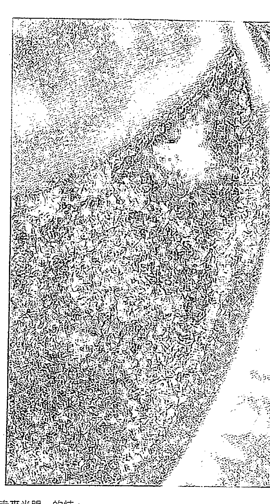

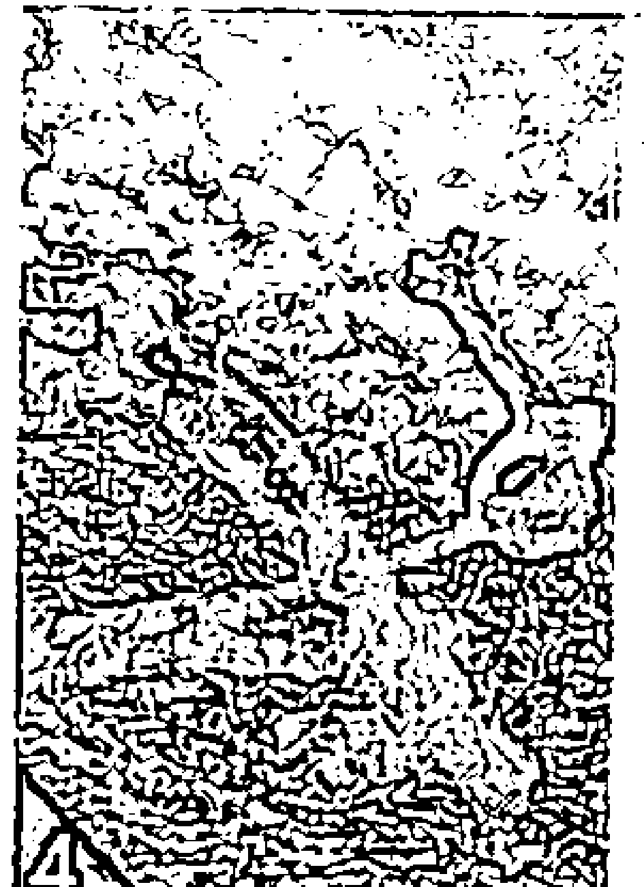

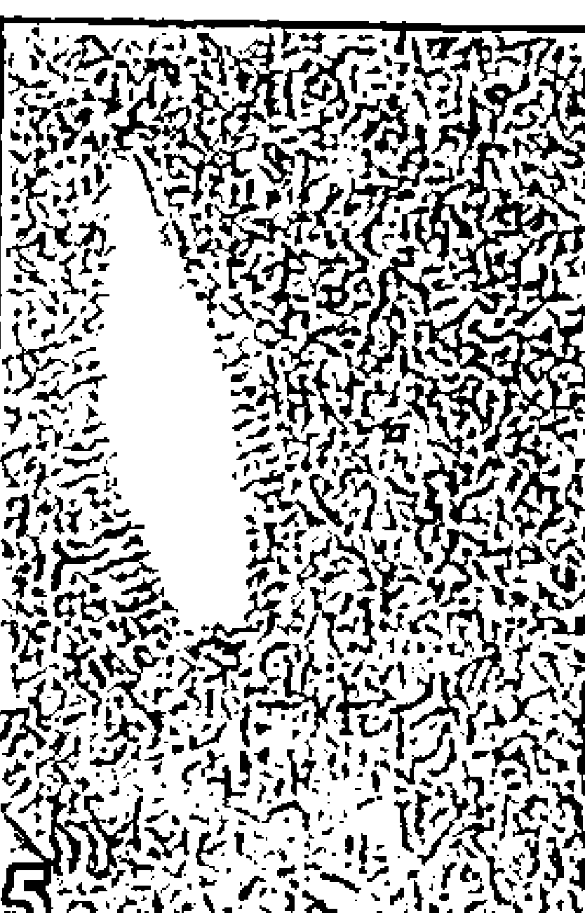

### 火渍魔法
#### 让想要做恶的人计划失败

【目的】破坏坏人的恶行。

【魔法背景】本魔法被认为是起源于苏格兰，但在许多欧洲国家里也可以看到类似的魔法。适用的情形例如非法驱逐，也就是屋主不顾道义的将原本租屋的家庭赶出去，只因为想要将财产或土地以更高的利益出售给更高出价者。因此在这些将要离去的家庭间便兴起了这种风俗，就是在屋内的壁炉中摆放石头以取代一般的木炭，主要的目的，就是希望藉此打消屋主原本不好的念头。古代使用的咒语是很含蓄的：「让冰冷的石头取代壁炉中火热的木炭。」苏格兰人会将石头烧红留下火渍，这便是有效的消灾解厄符咒，帮助确保让坏人的计划失败。在本魔法中你不必真的进入敌人家中壁炉施法，但你仍必须要重演过去的仪式，因此你必须要将一些特殊石头所堆成的石堆摆放在敌人的围墙或大门旁。

> 「让冰冷的石头取代壁炉中火热的木炭。」

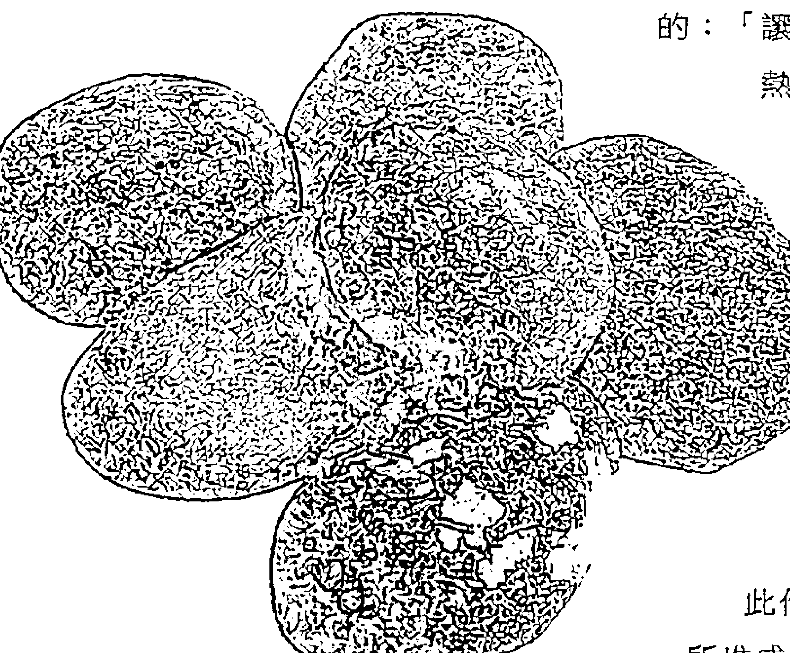

##### 如何施法

施法时机 在暗月前一晚进行，如此来能让符咒在第二天早晨顺利出现。

##### 施法步骤

- 1. 根据第36到39页的指示，设立结界。
- 2. 点燃木炭，再点燃蜡烛，并将双手覆盖在蜡烛的两旁说：「在我双手中所燃烧的温暖，将来自于（坏人的名字）的温暖。」
- 3. 将迷迭香洒在木炭上。
- 4. 将盐巴洒在所有的卵石上，并对每一个石头说：「没有任何东西可以让你成长。」将泉水也倒在卵石上，并对每一颗石头说：「没有任何东西可以滋养你。」
- 5. 将每颗卵石穿过木炭的烟雾，并对每颗石头说：「你将不会得到任何的好处。」
- 6. 在早晨来临之前，把石头堆放在敌人的前门或围墙边。

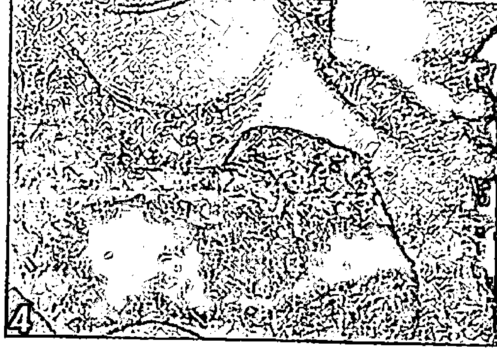

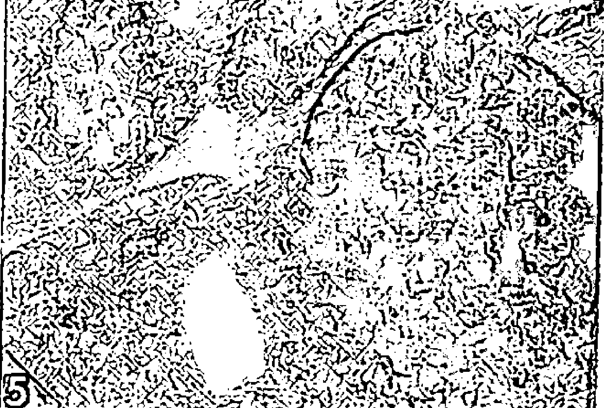

##### 所需工具与材料

- 1个装有木炭的防火盘
- 1根长6～8吋或15～20公分的黑色蜡烛
- 火柴或打火机
- 1大汤匙的干燥迷迭香
- 1个装有盐巴的碟子
- 5颗来自于自然水源、手掌大小的卵石
- 1杯泉水

## 附录词汇表

**人型布偶** 布娃娃样貌的人偶，用来代表魔法施法的对象。

**三分性** 魔法世界中，特别是凯尔特文化中的自然定律，认为所有符号、超自然或神圣的生物都有三重面向。

**三曲腿图** 一种凯尔特符号，起源于布列塔尼，图像是由三条弯曲的腿组合成螺旋状。

**子夜** 恰好在日出和日落中间的时刻。

**元素蜡烛** 5种不同颜色的蜡烛，象征5大神圣元素。

**五大神圣元素** 代表世上万物灵魂上或实体上的存在象征，被划分为土、气、火、水和灵。

**五芒星** 一种线条交错而成的五角星型，是代表魔法和交错元素的神圣符号，若是在五芒星外围上一个圆圈，则是象征土元素的符号，若只是单纯的五芒星，则是代表灵元素。传统上，圆内的五芒星和没有圆的五芒星是有明显的分别，各自代表不同的意义，但是两者的定义时常在变，到了今日，两者之间已经没有这么严格的界定，并可以随时交换使用。

**太阳回归日** 冬至的另一种说法，这“一年中最短的一天”多发生在12/21当天或前后。

**月亏** 是月亮从满月逐渐变成暗月和新月的过程。在月亏期间，月亮是逐渐变小的，且在北半球，月亏时的月亮，无论是半形月或新月都是露出左半边的月弧。

**月盈** 是月亮从暗月或新月逐渐变成满月的过程。在月盈期间月亮是逐渐变大的，且在北半球，月盈时的月亮无论是新月或半形月都是露出右半边的月弧。

**加持** 让体内充满魔法力量，或是给予魔法工具能量。

**年轮** 地球一年中季节变迁以及太阳、月亮、星宿和大自然变化的轮回。

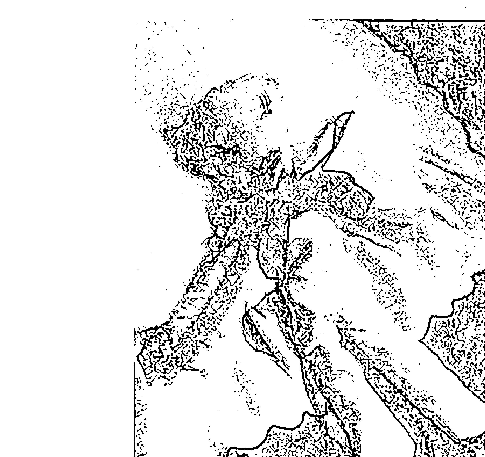

**克拉达夫** 一个爱尔兰海边的传统小镇，在那里特殊的戒指图腾设计已经流传了好几个世纪。它是一种爱尔兰的符号，也就是交握的双手，暗示真正的友谊、爱情和和谐。

**希缇** 精灵的爱尔兰语。

**长布条** 绑在树上的布条或缎带，通常是在神圣之井上方的树上，主要是代表对地方神祇的崇敬或是用来象征自己的愿望。

**念灵** 由你自己的意念和意志所创造出来的魔法型态，通常需要镜子的帮助来协助达成。

**神符** 一种保证符咒的型态，通常是木头的质地，让符咒可以吸取树木的能量。

**香囊** 用布料及针线缝制而成的小布袋，里头并装有植物或其他的物质材料。

**茶叶占卜** 用解读茶叶分布排列来占卜的学问。

**幽灵** 用魔法创造出来，与你长相相同的灵体，通常被指派到远方，代替你出现在某人的面前。

**烽火** 为了进行魔法而设的营火。

**描摹** 传统上是用绳子而非卷尺来描绘轮廓或测量长度的方法。可以用來描摹头或心，或是测量从头到脚的长度，总而言之，也就是人体轮廓的描摹。用这种方法所描绘出来的形体轮廓，被认为会和本尊有所感应与交流。

**亚连** 法师专用的匕首，用来指挥魔法的能量。

## 附錄詞彙表

### 智慧長老

熟知魔法或自然傳說智慧的人，具有治療、施咒或用占卜來丈量及預測的力量。

### 智慧巫女

傳統形容對魔法和自然習俗非常了解，並且擁有治療施咒或用占卜來丈量及預測力量的女性，又稱作「女巫師」。

### 順時針方向

也就是向右轉的意思。

### 湯藥

這是藥草茶的另一個說法，是由滾水熬製而成的。

### 暗月

也就是「新月」的時候，但此時的月亮被陰影完全遮住，而無法被看見。

### 奧洛賓洛斯

一種象徵永恆的古老符號，圖像內容是描繪一條蛇正在吞食自己的尾巴。

### 感應魔法

有時又被稱作「以形補形」，是一種魔法派系。是使用代表某人或某物的象徵物來施法，象徵物可能與某人或某物有身體上的關聯，如頭髮、指甲、簽名等，或是製造一個物品來影射，如人型布偶或魔法人偶。施法者會對這個象徵物作法來影響那個人或物。

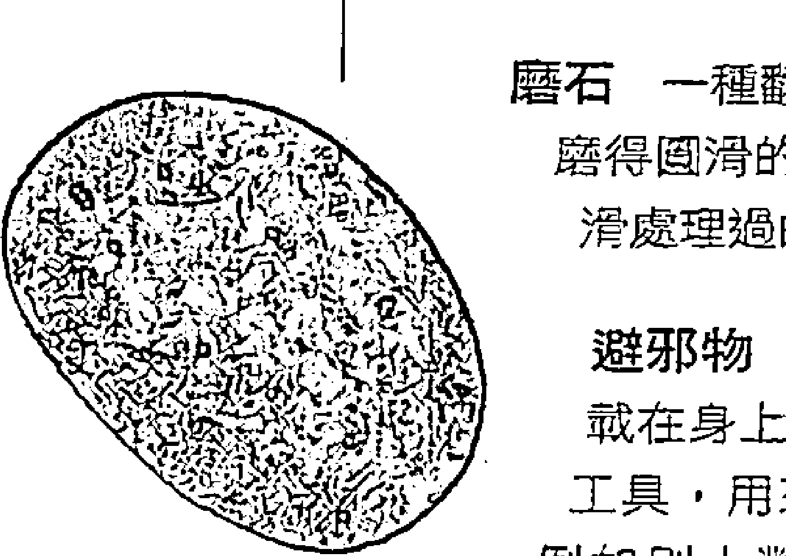

### 稻草人

用成熟的麥穀所編成且並被心靈及魔法力量所加持的人型偶。

### 盧恩文

一種古老的文字，源自於北歐，主要是使用在冥想、占卜或魔法中用來喚起古老文字背後所代表的能量或意涵，有時也在魔法中用來代表某人或某種情境。

### 磨石

一種翻滾石頭，將天然石頭磨得圓滑的過程。多用來形容光滑處理過的晶石和原石。

### 避邪物

嚴格來說，這是一種戴在身上或在屋內展示的魔法工具，用來阻擋特定的能量，例如別人對你不好的念頭、忌妒、邪惡的詛咒或壞運氣等，但通常也可以稱作「護身符」，有時候也會用它來代替「符咒」的說法。

### 護身符

嚴格來說，是一種戴在身上或陳列在屋內的物品，不同的護身符，可以吸引不同的能量，如運氣、財富、健康、愛情等等，通常也可稱之為「避邪物」。

### 轉移

將某地的情況轉移到另一個時空地點的魔法。舉例來說，當一個人長疣的時候，若用石頭在長疣處摩擦，並將摩擦施法後的石頭埋入土中或丟入深水底，則疣將會從這個人身上消失。

### 繩結封印

將能量安穩的封印在繩子上的魔法技巧，通常當繩結被鬆開之後，魔法能量也會被釋放出來。

### 魔法人偶

代表某人的象徵物，並非總是如此，但通常是以布偶的形式來呈現。

### 魔法之繩

因應不同的魔法目的，在施法時所使用的繩子。

### 魔藥

可飲用的魔法的飲劑。

### 魔符

魔法的符號或圖像，和盧恩文的使用方式相同。

### Beltaine

八個異教慶典中的一個節日，傳統上是從4/30日落後開始慶祝，直到5/1日落時結束，或是在山楂樹開花的時候慶祝。

### Eostre

八個異教慶典中的一個節日，慶典是在春天或春分的時候，通常是在3/21及3/22兩天。節目名稱是來自於日耳曼繁殖女神歐絲妲（Oestra 或 Ostar）。

### Imbolc

八個異教慶典中的一個節日，是代表凱爾特女神布莉吉妲的日子。傳統上，多在2/1或雪蓮花出現的時候慶祝。

### Litha

八個異教慶典中的一個節日，在夏至或是「最長的一天」中慶祝，而最長的一天，大約是在6/21當天或前後。

### Lughnasash

八個異教慶典中的一個節日，在7月底的時候慶祝，此時大約是穀類收成的時節。

### Mabon

八個異教慶典中的一個節日，通常在9/21當天或前後，慶祝秋分的來臨。是代表豐饒之母女神「媽嬰」(Mabon) 的日子。

### Samhain

八個異教慶典中的一個節日，在10/31當天或前後，或是在初霜降臨時慶祝。

### Yule

八個異教慶典中的一個節日，在「日照最短的一天」，或在12/21當天或前後慶祝，也稱作太陽回歸日。

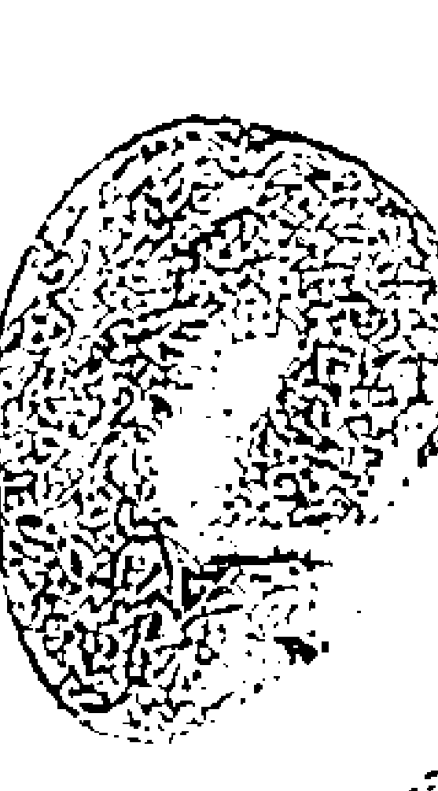

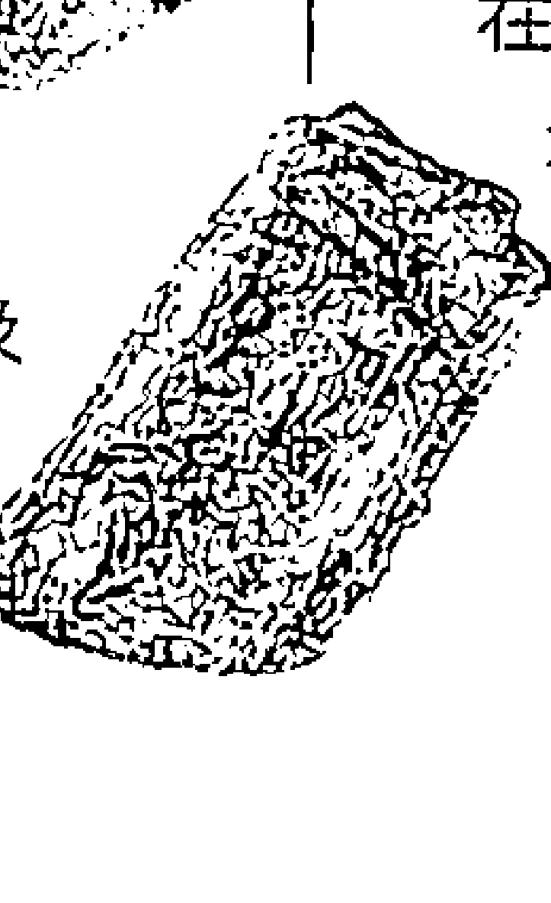

## 索引

### 3劃

- 土星 23
- 三倍報應法則 19
- 山楂魔法（與綠林的靈氣交流） 234～235
- 大地女神 230
- 三魔法（庇祐新的投資事業） 272～273
- 山梨「神」木魔法（將好運借給別人） 278～279
- 三角形魔法（得到需要的東西） 286～287
- 大阿爾克那塔羅牌魔法（為問題找出一個答案） 344～345
- 三曲腿魔法（保護旅人） 318～319

### 4劃

- 木星 22, 23
- 月亮 23, 47, 188
- 火星 23, 107
- 水星 23, 116～117, 119, 205
- 五大神聖元素 24, 37, 38, 118
- 火節 27
- 公曆 27
- 五朔節 31, 211, 234
- 五朔節花柱 31, 232～233
- 水祈禱（祈求讓愛情走進生命） 62～63
- 水晶石魔法（幫助在多位情人間做抉擇） 82～83
- 太陽十字徽符咒（找到正確的事業道路） 100～101
- 水星魔法（幫助家裡的溝通） 204～205

### 5劃

- 月桂搖籃符咒（庇祐並保護新生兒） 328～329
- 火焰護身符魔法（帶來太陽的能量與氣力） 236～237
- 天然磁石魔法（增加金錢運） 288～289
- 五彩紙花魔法（發現未來伴侶的特徵） 356～357
- 水元素魔法（讓大家看到壞人的惡行惡狀） 380～381
- 切斷魔法（斷絕過去傷痛的記憶） 384～385
- 火漬魔法（讓想要做惡的人計畫失敗） 386～387
- 北歐神祇 Tiw 98
- 打火石魔法（為事業帶來靈感） 114～115
- 平衡精油魔法（促進辦公室的合諧） 124～125
- 平靜咒語魔法（得到平靜與內心的安詳） 144～145
- 四風魔法（促進生活的合諧） 146～147
- 布莉吉妲，凱爾特火和療育的女神 163, 211, 220, 222, 300
- 仙客來符咒（防止惡夢的發生） 170～171
- 主婦藥湯魔法（讓身體健康） 180～181
- 布莉吉妲之井魔法（恢復或帶來整體的健康） 220～221
- 石榴魔法（得到智慧） 248～249
- 石板魔法（將詛咒送回始作厲者） 294～295
- 占卜 340～341, 342
- 石頭占卜 342
- 古結魔法（幫一個問題找到答案） 362～363
- 老巫女魔法（夢見超自然的夢） 254～255

### 6劃

- 回文魔法（讓願望成真） 264～265
- 灰燼之圓魔法（保護以防止同事的忌妒或刁難） 126～127

### 7劃

- 旭日光芒符咒魔法（讓衰敗事業命運重生） 136～137
- 杜松莓 25, 312
- 向日葵魔法（激發快樂的性格） 164～165
- 貝絲特，埃及貓之女神 68
- 安妮絲，保護旅人的女神 242
- 克拉達夫魔法（維持感情的平靜與和睦） 76～77
- 守門員魔法（守護你的家園） 190～191
- 芝麻魔法（移除事業上的障礙） 112～113
- 合諧焚香魔法（促進家庭內的合諧） 196～197
- 吸引顧客上門 132～133
- 地龍魔法（讓花園美麗茂盛） 206～207
- 巫術迫害 178
- 灰燼魔法（讓即將來臨的一年繁榮興旺） 212～213
- 門柱魔法（平衡外在與內在的健康） 226～227
- 巫木魔法（驅逐邪惡的意圖） 320～321

### 8劃

- 金星 23, 54, 58, 68
- 玫瑰花瓣魔法（召喚真愛） 54～55
- 阿弗洛狄特，愛之女神 58
- 阿弗洛狄特之護身符魔法（增加吸引力） 58～59
- 亞連 60～61
- 芙瑞亞，挪威女神 69
- 忠誠手鍊（彌封愛的誓言） 72～73
- 枕頭符咒（夢見真愛） 84～85
- 花冠魔法（保持愛情長青） 92～93
- 芳香療法 102, 125
- 非洲女神歐亞 114
- 治療石魔法（治療身體的疾病） 142～143
- 長布條魔法（獲得正義） 222～223
- 阿瓦隆的傳說 252
- 命運之輪 268
- 命運之輪（將平庸或壞運氣轉成好運） 268～269
- 阿爾利安娜泰得，命運和運氣的女神 269
- 金色薄荷魔法（帶來基本物質的繁榮） 270～271
- 幸運之手魔法（讓手邊的事都能進行順利） 274～275
- 幸運鞋粉末魔法（將你帶往好運） 290～291
- 金魚藻魔法（防衛惡意） 310～311
- 玫瑰花環魔法（庇祐保護情侶和他們的愛情） 330～331

### 9劃

- 神聖的空間 36～39
- 施法時機的重要性 23
- 春、秋分 26～31, 168, 226
- 紅辣椒魔法（恢復感情的熱度） 74～75
- 保佑生意興隆 134～135
- 柳木船魔法（放下憂傷） 250～251
- 紅手環魔法（賜給新生兒美好的未來） 300～301
- 神符 312
- 盾魔法（提供壓力下的保護） 334～335

### 10劃

- 氣元素 24
- 夏至、冬至 27, 236～237
- 草環符咒（看穿情人的謊言） 90～91
- 瓶中魔法（激發幸福的感受） 142～143
- 埃及神祇霍露斯 160
- 栽種魔法（促進家庭的合諧） 186～187
- 馬鈴薯魔法（消除不好的氣氛） 198～199
- 海洋魔法（帶來健康） 240～241
- 海洋女神牙瑪娜 240
- 骨頭與石頭魔法（顯現一個人的未來） 342～343
- 胸花魔法（抵擋不想要的關心或注意） 316～317
- 旅人魔法（保佑旅人的魔法） 332～333
- 針和蠟燭魔法（揭穿謊言） 338～339
- 茶葉魔法（看到未來） 354～355
- 家門灰燼魔法（讓敵人現形） 358～359
- 荊棘椅刺魔法（讓你擺脫惡霸的威脅） 376～377

### 11劃

- 情與愛的魔法 44～95
- 蛇皮魔法（增強性慾並讓感情生活更有情趣） 66～67
- 莓果，愛情的果實 72
- 得到心儀對象的注意 80～81
- 符咒魔法（幫助面試成功） 104～105
- 常春藤魔法（讓新生意或事業變得成功） 130～131
- 掃帚魔法（確保生意興隆） 134～135
- 健康聖杯魔法（增加自信） 144～145
- 烽火魔法（摧毀煩惱） 158～159
- 蛇眼符咒（將焦慮阻擋在千里之外） 160～161
- 帶走不好的習慣 172～173, 242～243
- 堅果魔法 230～231
- 鳥巢魔法（讓做壞事的人自作自受） 378～379
- 野兔魔法（幫助生育力） 224～225
- 堅果魔法（幫助堅守承諾） 230～231
- 蛋的象徵 230
- 通道魔法（與死者溝通） 256～257
- 蛋魔法（除去身上的厄運） 280～281
- 細繩與蜥蜴魔法（削弱騙子的力量） 372～373
- 紫草袋魔法（撫平爭吵） 192～193
- 焚香用法 196
- 番紅花 197

### 12劃

- 黃水仙魔法（得到生命中各方面的成長） 228～229
- 紫蠟燭魔法（帶來熾熱的激情） 70～71
- 詛咒 292
- 紫羅蘭的象徵 87
- 植物守護者魔法（防止家中遇強盜或小偷） 312～313
- 提爾護身符（得到工作） 98～99
- 植物布偶魔法（讓你不受艱困生活所苦） 324～325
- 黑胡椒魔法（讓面試或考試更順心） 102～103
- 紫色墨水魔法（抹去別人所造成的傷害） 382～383
- 雅典娜，智慧女神 120

### 13劃

- 凱爾特族 122, 130, 175
- 意念之網 16～17, 168
- 朝露魔法（使你美麗） 154～155
- 感應魔法 22, 80, 175, 214, 218, 356
- 凱爾特石魔法（防止經常性的頭痛） 174～175
- 聖壇 40～43
- 陽光元氣符咒（防止憂鬱） 176～177
- 愛情精油（吸引對象的調和精油） 68～69
- 愛香薰（將愛與情感帶來你身邊） 86～87
- 愛情媚藥（增加電力的愛情配方） 88～89
- 鼠尾草魔法（幫助口語溝通） 122～123
- 塔羅牌智慧 128～129, 344～345
- 塔羅牌魔法（在職場中招來一位良師益友） 128～129
- 聖杯的追尋 144
- 奧洛賓洛斯魔法（幫助身體的平衡） 162～163
- 新月魔法（交到新朋友） 188～189
- 塔福蛋糕魔法（預測來年的好運） 258～259
- 福耳圖娜，改變的女神 268
- 解咒魔法（消除他人對你的厄運詛咒） 292～293

### 14劃

- 綠林守護精靈 31, 230
- 箭頭魔法（得到升遷） 108～109
- 蒲公英護身符（在工作場合或學習環境中變得他人注意） 110～111
- 銀蠟燭魔法（幫助職場上及學業上所需要的機智） 116～117
- 磁鐵魔法（吸引顧客上門） 132～133
- 蜘蛛魔法（帶來快樂的夢境） 168～169
- 精靈箭魔法（讓討人厭的親戚遠離） 194～195
- 蜜糖魔法（吸引受歡迎的客人上門） 200～201
- 種子魔法（讓願望逐漸發展，並為新計畫帶來成功） 218～219

### 15劃

- 精靈籠子 246
- 稻草人 32, 246
- 鞋符魔法（得到心儀對象的注意） 80～81
- 箭頭魔法（得到升遷） 108～109
- 緞帶魔法 232～233
- 確保來年的收成 246～247
- 賜給新生兒美好的未來 300～301
- 漿果項鍊魔法（帶來健康、豐足與幸福） 302～303
- 槲寄生魔法（在冬天帶來力量） 214～215
- 緞帶魔法（吸引一個令人興奮的愛人） 232～233
- 穀物精靈魔法（確保在來年生命中的收成） 246～247
- 廚房女巫魔法（讓你和你的心永遠不會感到飢餓） 296～297

### 16劃

- 貓薄荷魔法（吸引並促進玩心與熱情） 68～69
- 鋼鐵魔法（促進面試及考試所需要的自信與勇氣） 106～107
- 貓頭鷹護身符（增加寫作能力） 120～121
- 橡實魔法（預測是否將在一年內結婚或遇到人生伴侶） 360～361
- 燈籠草魔法（達成心中的慾望） 266～267
- 橡木魔法（庇祐持續不斷的物質繁榮） 284～285
- 壁爐魔法（庇祐你的家） 326～327
- 漿果項鍊魔法（帶來健康、豐足、與幸福） 302～303
- 墨西哥之眼魔法（防衛惡毒的眼光） 308～309

### 17劃

- 幫助事業成功 126～127
- 獲得美貌 154～155
- 幫助身體的平衡 162～163
- 繩結封印 146, 362～363
- 燭刺魔法（促進心理健康與衛生） 150～151
- 療癒大釜魔法（幫助撫平憂傷及情緒的痛楚） 156～157
- 燭蠟魔法（趕走不健康的習慣） 172～173
- 繁殖女神歐絲妲 224
- 螺旋魔法（製造旅行和認識新朋友的機會） 238～239

### 18劃

- 薰香魔法（在職場或教室中溝通你的想法） 118～119
- 薰衣草魔法（幫助平靜的睡眠） 166～167
- 覆盆子葉茶包（緩和分娩的痛苦） 178～179
- 豐收祝福魔法（分享好運氣並得到保佑） 244～245
- 豐饒角 298
- 雛菊魔法（找到你的人生任務） 350～351

### 19劃

- 鏡子魔法 60, 374～375
- 鏈環魔法（幫助感情上雙方的溝通） 78～79
- 蜑殼魔法（帶走不好的習慣） 242～243

### 20劃

- 羅馬豐饒角魔法（賜與新家好運） 298～299
- 鏡影魔法（混淆敵人的視聽） 374～375

### 21劃

- 櫻桃核魔法（招來新情人） 56～57
- 護身符 58, 136～137, 236～237, 288
- 魔鏡魔法（走進情人的夢裡） 60～61

### 24劃

- 讓身體健康 180~181, 220~221, 240~241

- 靈魂魔法 (知道心儀對象是否也對你有興趣) 352~353

### 25劃

- 鹽和水的魔法 (困境中的自我力量) 336~337

- 鹽之結界魔法 (讓壞人也為自己的行為所苦) 370~371

### B

- Beltane 28, 31, 211

### D

- Daeg盧恩符文魔法 (打擊謊言) 322~323

### E

- Eostre 27, 30~31, 210

### I

- Imbolc 30~31

### L

- Litha 27, 32, 211, 236

- Lughnasadh 28, 32

### M

- Mabon 28, 33

### S

- Samhain 28, 34, 234

### Y

- Yule 27~29, 210

- Yule水果蛋糕魔法 (找出新一年的發展關鍵) 216~217

## 志謝

在此感謝以下作者授權同意本卷翻印其版權圖片資料

- 第22頁 歐圖·洛基 (Otto Rogge)

- 第46、47頁 格琳赫福攝影工作室 (Greenhalf Photography)

- 第52、53頁 馬修·艾倫 (Matthew Allen)

- 第68頁 馬克·亨利 (Marc Henri)

- 第74、75頁 賴瑞·威廉斯 (Larry Williams)

- 第80、81頁 瑞克·賴帕德 (Rick Rappapart)

- 第84、85頁 詹士·赫司 (Jens Haas)

- 第100、101頁 歐瓦季·庫拉 (Owaki Kulla)

- 第113頁 吉姆·李察德森 (Jim Richardson) (Michael St. Maur Sheil)

- 第146頁 藍帝·法理斯 (Randy Faris)

- 第158、159頁 安東尼·庫柏 (Anthony Cooper)

- 第170、171頁 淡娜·愛瑟察爾 (Hanan Isachar)

- 第172頁 大衛·帕帕季恩 (David Papazian)

- 第179頁 史帝夫·布萊德 (Steve Prezant)

- 第186、187頁 馬修·艾倫 (Matthew Allen)

- 第188、189頁 李藍登·巴伯 (Leland Bobbe)

- 第202、203頁 詹姆士·保布萊爾 (James P. Blair)

- 第214頁 馬修·季塗 (Matthew Kitto)

- 第278、279頁 察爾斯·克萊伯斯 (Charles Krebs)

- 第302、303頁 珍妮佛·克納德 (Jennifer Kennard)

- 第314、315頁 班傑明·藍登 (Benjamin Rondel)

- 第319頁 察爾斯·歐立爾 (Charles O'Rear)

- 第320、321頁 雷夢德·吉門 (Raymond Gehman)

- 第328頁 提姆·潘尼爾 (Tim Pannell)

- 第360頁 雷夫·艾 克萊文爵 (Ralph A. Clevenger)

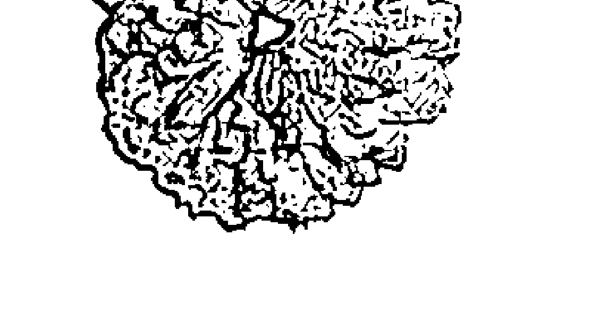

## Introduction | 介绍 |

魔法圣经是一本实际教导如何使用魔法的终极指南，一共介绍150种魔法符咒，可以帮助你成功提升生活品质。本书利用自然魔法，帮助改善运气、健康、事业、与家庭状况，甚至找到真爱。并以逐步解说的方式，介绍许多与日常生活息息相关并且相当实用的传统咒语和魔法。

## Author synopsis | 作者简介 |

安玛莉·盖勒格尔是一位女巫，在英国兰开夏郡中央大学担任资深讲师，同时也是政治行动家、历史学家的她，著有许多与魔法、巫术、超自然相关之著作，安玛莉平时除了在许多节庆中举办免费魔法与超自然灵学的研讨会、组织社区活动、与主持合唱团外，也是一位热衷的园艺家。

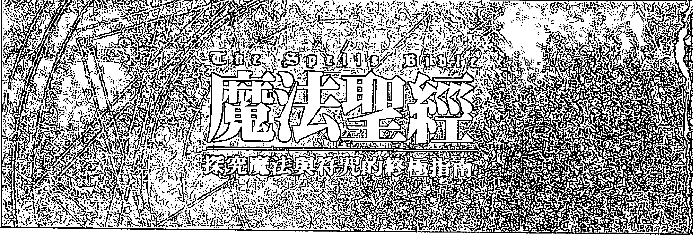

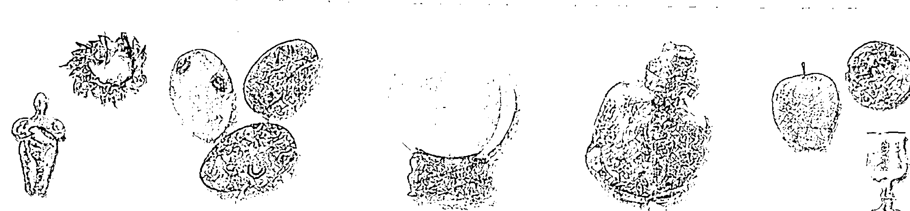

## 魔咒全书

作者：安瑪莉·蓋勒格爾/著 Ann-Marie Gallagher

## 應付各種問題的超級魔法150招

魔法占星專家 薇薇安/推薦

西洋神秘研究專家 丹尼爾/導讀

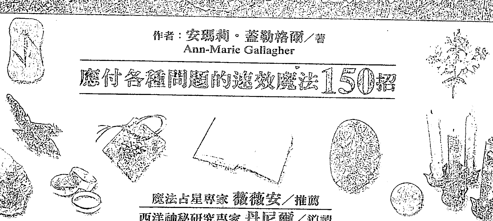

慕雪的藏書閣