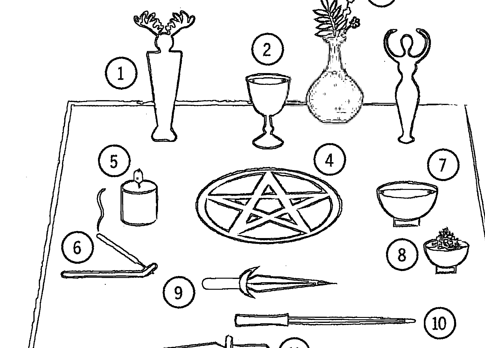
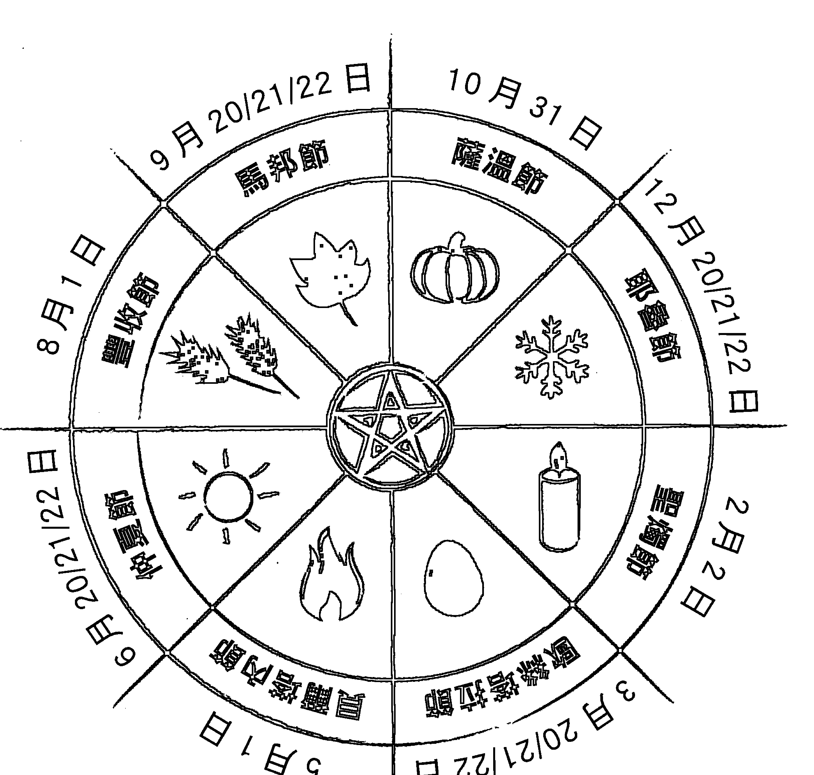

# 原始魔法卡

# 唤醒你内在的神圣魔法

# Wicca Made Easy: Awaken the Divine Magic within You

菲莉丝·库洛特 Phyllis Curott 著

陈莉 ◇ 译

思逸 Seer 荒人巫思手抄秘典 魔力推堂

讓生命潛能 帶你探索心靈世界的真、善、美

Life Potential Publishing Co., Ltd

# 魔法威卡

唤醒你内在的神圣魔法

# Wicca Made easy Awaken The Divine Magic Within You

菲利絲·庫羅特 著

周莉萍 譯

# 魔法威卡 喚醒你內在的神聖魔法

# 各界推薦

> 「《魔法威卡：喚醒你內在的神聖魔法》是純正的魔法。我從第一頁開始就沉醉其中。菲利絲·庫羅特闡明了被稱為威卡的古老語言與神性實踐，它與我們的深層本質對話，並歡迎我們回到日常生活中的神聖家園。」
—克莉絲汀·諾斯魯普 (Christiane Northrup)，醫學博士，紐約時報《女神永不衰老》、《女人的身體》、《女人的智慧》暢銷作家

> 「在這本生動而引人入勝的入門書籍中，我看到了一種古老智慧之道的重生，菲利絲·庫羅特邀請我們擁抱整個天地萬物，因為它充滿了神聖，而我們的身體也是無限的神聖。這本書是對集體的呼喚，是對女性領導力的支持，是對我們與生俱來的共同歸屬與美麗魔法致敬。」
—米拉貝·絲塔爾 (Mirabai Starr)，《愛神》與《不絕望的商隊》作者

## 各界推荐

> 「威卡提供了长久以来流行文化所缺失的灵性智慧与整体性。菲利丝·库罗特带领我们超越过往父权体制下的错误信仰，藉由拥抱女神，为所有人带来激情、真理与自然的疗愈。他的这本实典在日常练习中恢复了威卡那强大又可实践的仪式。在与大自然母亲共同创造的过程中，我们可以消除因被误导的历史而养成的习惯，获得内在的和谐、优雅与感恩。」

—— 马雅·蒂瓦里（Maya Tiwari），阿育吠陀作家，人道主义者与和平领袖

> 「本书将古老的宗教与现代的自然之灵相结合，对任何探索巫术与更多萨满层面，并将其纳入现代巫术实践的人来说，这本书是必备的。」

—— 珍妮特·法拉尔（Janet Farrar）与盖文·伯恩（Gavin bone），《女巫圣经》、《女巫的女神》、《内在奥秘》与《揭开面纱》等书作者

> 「這本為新手與內行人所寫的書，相當成熟又有創見，菲利絲在書中以輕鬆、熱切的語調透過他具凝聚力且流暢的寫作方式，分享了他的智慧與生活體驗。清晰而具啟發性——在能量面與實踐面上都是如此——而且揭露智慧與實踐的方式條理分明。我喜歡其中閃耀著的強大薩滿智慧。」
— 費歐娜·霍恩（Fiona Horne），《流行！走向女巫》、《裸體女巫》作者

> 「在人類需要重新認識所有生命神聖性的時代，這是一本你非常需要的入門書籍。這些書頁將使你內在的神性與所有創造物之內的神性融合。無論是對只是有點好奇，或是想深入探究的人而言，都是一本傑出的小書。」
— 艾倫·埃弗特·霍普曼（Ellen Evert Hopman），《新英格蘭的真正女巫》、《你花園裡的秘密良藥》、《德魯伊的遺產》作者

# 各界推薦

> 「菲利絲·庫羅特將威卡的復興與薩滿的核心交織在一起，這本受歡迎的書籍提供了易於理解的指引，協助人們將綻放的直覺轉化為個人魔法的覺醒、意識與目的。他以令人耳目一新的清晰度，向所有性別的人傳達現代巫術的吸引力，這巫術能為這樣的世界服務——急需穩健地組織並重新平衡喜樂的世界。」
—麥可·約克（Michael York），英國巴斯泉大學教授（Bath Spa University），《異教徒倫理學》作者

> 「《魔法威卡：喚醒你內在的神聖魔法》涵蓋了威卡理論與實踐上的許多奧祕，並顯示出這是一本積極的工作手冊，而非典型的參考書籍。基本的原理被包裹在菲利絲多年實踐所磨練出的敏銳洞察力中，他愉快地將大自然和它的美放在他神秘實踐的最重要位置上。對於渴望開始體驗大自然的強大、靈性範圍和所有神奇事物的新入門者而言，本書是一份完美的禮物。」
—安德魯·泰伊特（Andrew Theitic），《女巫年鑑》發行人、《威卡解謎》一書的作者之一

# 推薦序

# 威卡道路的心靈指引

得知菲利絲的書籍要出版中文版時，內心真的為華文世界的讀者開心。這是一本非常可愛而且專注於個人經驗分享的書，相較於非常多的資料與知識堆砌的工具書而言，這反而是一本更貼近威卡或自然巫術之道（我習慣稱為自然之道）應該如何走入的入門指南，相信也會協助更多對於自然巫術與自然魔法有興趣的人們深入體驗大自然的魔法力量。

我常常認為，其實學習薩滿或自然巫術的人們是非常能夠感知以及隨著世界的律動前進的，因為學習在大自然中生活並且與自然一起共存，一直以來都是我們遵循的道路。這條道路上或許沒有什麼規矩和規範，因為都是因地、因族群而制宜的，所以總是有人誤認為學習薩滿或自然巫術之人是一群散亂的娛樂份子。然而在這本書裡，清楚地向所有人介紹了關於走上這條自然之道時，所有可以也應該嘗試進行的各種練習，甚至提到如果儀式或魔法效果不好、失效了應該怎麼辦。所以這一本書的中文文化，或許也讓許多華文世界裡渴望追尋自然之道的人，有了更多心靈上的指引。如同作者分享他走上自己的威卡道路一樣，有過掙扎，有過懷疑，然後一切自然而然地發生。

在多年前進於自然之道的探索過程裡，我一直感覺到這是一條自由，但也極講究自律的道路，因為沒有宗教信仰的戒律和規矩，也不講究名師指點的衣缽傳承。我們希望每個走在這條道路上的人們都能夠依照自己與大自然、所有女神男神的互動，發展出持續讓自己珍愛生命以及願意時刻保持內在力量的方式，在自然之中學習走入儀式與力量之中後，發展出自己的儀式與力量。或許也是因為這條自然之道非常自由，也重視個人生命力，所以在世界各地經過各種文化與宗教的掠奪、消滅之後，依然能夠在現代與未來持續遍地開花，持續引領願意接受大自然力量的人們，持續成為連結自然與人類的橋梁。

願這本書也點亮您心靈中的燈火，讓您重新與大自然力量連上線，意識到您自己的神聖力量就在自己內在之中！

思逸 SEER
荒人巫思手抄格主

## 目录

各界推荐 2

推荐序 威卡道路的心灵指引 思逸 Seer 6

练习清单 10

引言 14

如何使用这本书 26

第一章：智慧之人 28

第二章：神性 46

第三章：魔法 64

第四章：灵性 82

第五章：大自然 100

第六章：建立魔法圈 132

第七章：女神 164

第八章：男神 190

第九章：年度之轮 212

第十章：施展魔法 248

第十一章：智者之術 272

第十二章：前方的冒険 304

關於作者 328

# 練習清單

- 鹽水淨化 52
- 引導式冥想：神性的存在 54
- 留意神性 57
- 引導式冥想：呼吸 61
- 神奇的吟唱 73
- 觀想一 77
- 觀想二 78
- 引導式觀想：敘述故事 83
- 透過時空遊歷尋找力量動物 90
- 引導式冥想：喚醒你的感官 103

# 根植大地 112

# 與大自然一起創造魔法 119

# 尋找你的力量之地，與該地的守護靈相會 123

# 建立個人祭壇 142

# 一步步地建立魔法圈 146

# 女神的祝福 165

# 大地母親的心跳 170

# 女神頌歌 172

# 引導式觀想：與女神相遇 177

# 為你的女神建立祭壇與獻供 179

# 呼請你的女神 183

# 迎接月亮 188

# 男神的咒語 192

# 引導式觀想：尋找內在的男神 197

# 迎接太陽 201

# 種下改變的種子 205

# 與有角的神祇共舞 208

# 運用年度之輪 219

# 太陽慶典的步驟 223

# 施法的步驟 250

# 施展簡單的防護魔法 264

# 施展簡單的療癒魔法 266

# 施展简单的勇气魔法 267

# 施展简单的富裕魔法 268

# 施展简单的和平魔法 270

# 施展简单的爱之魔法 270

# 解除命名 280

# 聆听植物 283

# 调制药剂 286

# 为力量物件灌注能量 297

# 每日占卜 309

# 创造个人仪式 312

# 自我奉献的仪式 320

# 引言

> 我覺得我已經回到家了。

我們都在旅途中，朝聖者尋求我們的力量、我們的目的與我們的高我。我們尋求內在的平靜與外在的繁榮，尋求面對恐懼的勇氣並實現我們的命運，拋卻孤獨，找到愛，改變我們的思維習慣與我們的生活方式。我們在追求整體的過程中期待神靈的指引。我們希望喚醒內在的魔力。

生命是複雜的，但你的靈性不應如此。

生命也是不可思議的，而你的靈性也應該如此。

大約四十年前，當我發現威卡時，只有幾百個人在一個布滿灰塵的舊掃帚櫃後面，在歷經數百年的迫害與負面刻板印象後，一個隱於世界之外的先祖智慧傳承被復原了。今天，在美國有超過一百萬公開的威卡信徒，而且威卡一個新宗教的誕生相當稀有，而一個最古老的宗教重生則令人矚目。這從不再適合我們生活的世界，或靈性所渴想的神聖夢想中覺醒而來。許多人被威卡所吸引，因為它提供了幾千年來所缺失的靈性智慧與整體性，歡迎女神的回歸、女性的崛起，並尊崇女性為精神領袖。

在環境破壞日益嚴重的危急時刻，威卡尊崇大地母親為神性的化身。在高度發展並受良好教育的全球文化中，其特色便是對傳統宗教的信仰明顯衰退，而威卡是非教條主義與無等級制度的。它是任何人都能精通的神性體驗，是一種深刻的個人靈性實踐。你不必成為一個威卡信徒，就能從其智慧或實踐中受益，就如同你不必是個印度教徒或佛教徒，才能從瑜伽與冥想中得益一樣。

威卡的練習幫助我拿掉了受到歷史與習慣束縛的眼罩，我並未意識到我一直戴著它。我看到了我從不知其存在的靈性領域。我看到了我每天生活的世界，它真的是——神聖的。我也開始體驗到自己是神聖的。威卡喚醒了我內在神聖的魔力，讓我接觸到我周圍世界的神聖魔法。

# 我的二三事

當我發現威卡時，對任何的靈性事物都不感興趣，也完全不相信魔法！我已獲得美國一所長春藤盟校的哲學學士學位，並從頂尖的法律學院拿到法學博士學位，才開始從事法律工作，打擊工會中的組織犯罪。我不期待這世界是個天堂，更不用說魔法了，但我確實期望盡一己之力，使其變得更美好。

我是這麼長大的：在一個知識分子、人道主義的家庭，父母一生獻身於社會正義。他們教導我要相信人心的善良，而不是特定的宗教，並依循以下的黃金法則生活：以我希望被對待的方式對待他人。這對我來說已足夠，直到我在法學院的第二年……

我的預感開始成真，直覺也被證明是真的。電話響起來之前我就會知道，而且清楚是誰打來的。我在課堂上不用讀案例就知道答案。我的感官變得敏銳，有一段時間，我有了照相式的記憶，你可以想像，這對我通過律師考試非常有幫助。最誘人的是一種……存在感，這世界彷彿是活的，而且有意識。

還有一個反覆出現的夢境，有一個女人，坐著，頭上戴著皇冠，腿上放著一本書，她的心口閃爍著柔和的光。

我無從理解究竟發生了什麼事。我從高中開始練習瑜伽，然而我太年輕，不曾參與迷幻的六〇年代，而且我住在紐約，而不是加州。身為一個理性主義者，我開始閱讀量子物理學的書籍，接著是量子物理與意識之間具有特別連結的書籍。我瞭解到，實相比我在學校所學到的還要多。但我所讀的書都未能解釋為什麼我會發生這些情況。

儘管如此，我還是相信我所經歷的一切。我承認實相的可能性超出了我應該相信、實現的極限。就這樣，我在夢境、事件、預兆與共時性，還有一位自稱白女巫的朋友引導下，有了世界上最不可能、最難以想像的遭遇：在一間被稱為「魔力之子」，滿是灰塵的老舊書店後方那一扇隱藏的門後方，有一群正在練習威卡的女人。

有一群女巫，正在練習巫術。

我被邀請加入他們，而這是世界上最不感興趣的事情。畢竟，他們是女巫。換句話說，怪異，十分怪異！我婉轉謝絕。生活還是繼續，而之前的夢境、直覺與活力，都消失了。我就要變得麻木，我正在恢復「正常」。然而後來我夢中的女人再度出現。

我在大都會藝術博物館的周圍遊蕩，試著弄清楚我職涯的下一步發展，這時候他出現了，就像我的夢一樣：他像石雕一樣安靜地坐著。世界充滿了光，一個警衛不得不扶著我坐下。當我好一些後，我看到他旁邊閃閃發亮的黃銅牌寫著：「利比亞的西比爾」（The Libyan Sibyl）。回到家，我搜尋「西比爾」這個字：「古代的女知或女巫」。我接受了邀請。

這很古怪。一屋子的女人站成一圈，對著四個方向打手勢，說著我聽不懂的話，盛滿葡萄汁的銀色高腳杯傳遞了一圈，談論著女神。但他們聰明而有趣，有各種不同的年齡、種族與背景；部分是同性戀，其他是異性戀。每一個禮拜我受邀回到那個地方，我也赴約了。慢慢地，他們在做什麼、為什麼要這麼做，變得很清楚。

我讀過《歐洲的獵巫狂潮，燃燒的時代》（The European Witchcraze, the Burning Times）——一場將近五百年的迫害，有超過十萬名女性，也有這些男性，甚至是孩童，因為信奉古老的宗教而被指控、折磨，以及殘忍地殺害。

我開始意識到我對巫術的概念是來自童話、電影與萬聖節裝飾的負面刻板印象——這些都受到獵巫狂潮的影響——與這些女性實際上的信仰和實踐毫無關係。我瞭解到，威卡（Wicca）是一個非常古老的英文單字，也是女巫（Witch）這個字的字根，兩者的意義都是「有智慧之人」、「看見神圣之人」。

我開始觀察。我看見在猙獰的女巫面具之後，是女神美麗的容顏，並且發現父權體制將他們對女性及其力量、性別的恐懼投射而出，加諸在女巫身上。現代的女巫，就像其所崇敬的女神一樣，是女性主義者的終極偶像。身為一個年輕的律師，我每天都要面對性騷擾和歧視，這很能打動我。這些啟示是解放與賦能。接著，非常神奇地，我終於見到了女神。祂在我們形成魔法圈時出現，在每個女性的體內閃耀。我看見阿提米絲（Artemis）的力量與勇氣、拉克希米（Lakshmi）的性感、布麗姬德（Brigid）的療癒詩歌、雅典娜（Athena）的智慧、席芮絲（Ceres）的母愛與慷慨、摩莉甘（Morrigan）的戰士力量、佩蕾（Pele）的火焰與赫卡特（Hecate）的暗黑奧秘。在女神的映照中，我開始看到自己內在神聖陰性能量的火花。我瞭解我們的身體是神聖的，我們的直覺是一份禮物，我們的智慧是無價的。神，不再是個在雲端另一邊對我們進行審判的遙遠白種人、無法企及的男性。女神有著生命且真的存在，而且復原了全體的神性。在每一個太陽慶典（Sabbat）——八個季節性聖日，向大自然的神聖智慧致敬——當男性加入和我們一起慶祝，我發現這世界有個不一樣的男神存在，祂和女神共舞、相愛並且合作。

# 魔法威卡 唤醒你内在的神圣魔法

這是激進的，也是革命性的。最重要的是，這是真的。我不相信女神或男神。但我經驗過祂們。威卡不是個關於神性的信仰系統，而是提供神性體驗的靈性實踐。我所堅守的立場再度改變了，它變得神聖。而且它不複雜。威卡並沒有要求我放棄我的理性懷疑，或是要精通冗長、奇怪的魔法咒語，或是列出一些古怪成分的清單。它很單純，很令人愉快，而且很自然。這感覺就像是回想起某些我早已知道的事情。而且最重要的是，它起作用了。我內在的魔力正在覺醒，隨著它的覺醒，我開始體驗到我周圍世界的神聖魔法。

當我開始冒險，我感覺到的出現又出現在我眼前。儘管我住在世界上最偉大的城市之一，我看見自然世界具體展現了神性。風是氣息，火是靈性，水是血液，大地是身體。威卡的練習幫助我調整自己——思想、身體和心靈——與大自然、元素、季節性週期、月亮和諧共處，月亮的節奏與靈性智慧屬於女性。我看到了，愛，是大自然的一種力量，無論我們的信仰是什麼，我們都是大地母親的孩子。

我的直覺綻放並發展成更高的意識。我開始發現我的生命有了一個更大的目標，實現我想要的一切變得更容易了。神聖的魔法發生了，因為神聖在我的生活中顯現。我學會了『施行魔法』，改變我的意識，設定意圖，向女神和男神祈請，提升並接收能量，施展咒語，表達感謝並為賜予的祝福與顯現的魔法而喜悅。這就像吸引力法則的類固醇。

同時，我開始在很有名的布魯克林團體練習『核心薩滿（Core Shamanism）。這項由麥可·哈納博士創辦的計劃，著重於世界上最古老的靈性傳統的基本實踐，是歷史上與全球大多數原住民文化所共有的。這世界進一步地擴展到靈性領域，靈性盟友與力量動物陪伴並引導我。我在『那裡』學到的，對我在『這裡』有著深遠的價值，我認識到了現代威卡的薩滿根源，也改變了我實踐威卡的方式和原因。

我被啟蒙了——我在自己的第一本自傳《影子之書（Book of Shadows）》說過這個故事——並成為威卡高階女祭司。我是一個將威卡與核心薩滿作為一項完整的神聖技術，並融合在一起的女祭司，二十年後，我的教學被正式認定為亞拉傳承（Tradition of Ara），Ara在拉丁語是祭壇的意思，是創造的中心點，在那裡，大靈與地球是一體的。

我拒絕被負面的刻板印象所限制——作為一名威卡信徒，一個女巫或一個女人——也是美國第一批「走出掃帚櫃」的威卡女祭司之一。我處理或諮詢了一些開創性的案件，確立了威卡信徒的合法權利，也是挑戰負面刻板印象的全球媒體運動的倡導者。

我不會說那很容易。我失去了一些客戶與朋友，面對背叛與哀傷，而且因為不能生孩子而悲痛。我面對自我懷疑與缺乏自信，在憂鬱與絕望中掙扎，因為我把別人與大地母親的痛苦當成自己的痛苦。我逐漸明白，我們是被祝福與挑戰所塑造。真正的魔法會發生在我們將創傷轉化為祝福、將損失轉化為新生命、將黑暗轉化為光明之時。我所獲得的遠超過我失去或犧牲的一切。

我創立了一間成功的法律事務所，撰寫了一些讓全世界接觸到威卡並暢銷國際的書籍，這幫助成千上萬的人發現他們所生活的世界中的神聖魔法。

在美國，《珍》雜誌（Jane Magazine）將我評定為「年度十大最勇敢女性之一」。我兩度被推選為「世界宗教大會」（Parliament of the World's Religions）的代表。

编註：Come out of the broom closet, 此標語可能有雙重意義，一方面借用了「LGBTQ+族群常用的「出櫃」一詞，加上讓人聯想到女巫的掃帚，意指公開自己的女巫身分；亦跟作者初次發現威卡時，是在「布滿灰塵的舊掃帚櫃後面」有關。

## 如何使用這本書

《魔法威卡：喚醒你內在的神聖魔法》不是典型的魔法指南。這本書不是照本宣科的施法和速食式的食譜、配方。這是一本喚醒你內在神聖魔法的指南。

這本書的關鍵是要求你與其互動。你不能只是閱讀，你需要練習，以喚醒你的魔力。我保證，如果你跟著做，就一定會有效用。這些練習是依照順序呈現，能培養你的靈性技能與天賦，你可以獨自運用，或是小組學習，甚至是在集會中使用，依照你自己的節奏。

## 你的魔法日誌

在你學習這本書的過程中，你要寫一本魔法日誌。我將要求你寫下你的經歷與遭遇、反思與發現、夢境與旅程、直覺與共時性，還有你自創的咒語和儀式。當然，只要你有感而發都可以記錄下來。持續書寫一本魔法日誌對於記住你所做的、所經歷的、所感覺到的、你的洞察力、領悟和啟發，以及看到你的突破、成長與進步都非常有用。最重要的是，它會幫助你看到模式與課題、神與命運的跡象，以及你生命中出現的偉大與神聖的故事。

## 你的影子之書

如果威卡對你來說，是一種你想追求的靈性實踐，那就開始你自己的影子之書。我在第十二章提供了一個簡單的指導。就像寫日記一樣，這是一項神奇得不可思議、富有創造力，並且能賦予力量的計畫。

我希望你會覺得這本小書為你打開了一個神奇和神聖的魔法世界。那就讓我們開始吧！

# 魔法威卡

喚醒你內在的神圣魔法

神性連結，並喚醒你的魔力。

每個人都會被拍拍肩膀，從神聖的召喚中醒來。若閱讀這本書時，內容好像是你一直都知道的，如果感覺到這可能是那個召喚，或者是肯定你已經收到的召喚，讓我第一個對你說：歡迎來到內在的神聖魔法。歡迎回家！

# 第一章 智慧之人

威卡是進入不可思議世界的靈性之路。它是一條進入你內在世界的道路，真正的魔法從這裡開始；一條進入神靈居住的另一個世界的途徑；一條帶你回家的路，轉化、賦予你力量，並能夠看見世界上的神聖性。

這趟旅程將打開你的意識和你的心，能療癒並將你與你生活其中的神聖環境重新連結。平凡的變成非凡的，非凡的則成為可能的，因為造物是神聖的。這時，你內在的魔力開始被喚醒，並在你周圍顯化。

威卡的根基來自祖先，而它的復興恰逢其時，直指我們現代的生活、渴望、挑戰與命運的核心。威卡是深度的個人化，同時也很普遍。實踐很簡單，成效卻很深刻。

威卡並沒有聖書，沒有先知或制度來指示該相信什麼，或如何實踐；沒有單一的定義、沒有一條真正的道路。威卡尊重並鼓勵個人的方法、經驗與結果。在我們的共同旅途中，我鼓勵你信任你的直覺、你的感覺、你的經驗，因為你會找到你的方式——對你有效的方式。

威卡是一條個人靈性實踐、責任與啟示的道路，但你不孤單。雖然每個人都有自己獨特的道路，我們都在同一片神聖的景致中旅行，沿途上總是有 一個老師、一個嚮導與一位神靈。在非凡的個體與多樣性中，我們似乎都在 分享一些主要的靈性實踐與原則。我們有相似的經驗、慶祝同季節性的聖日（太陽慶典）與月亮的週期（月亮儀式），最終，我們對神性、大自然與人性有了非常相似的見解。我們共享一種主要的神聖智慧，我們稱之為威卡。

## 簡要回顧威卡的迷人歷史

要真正了解當代的威卡、其智慧與實踐、你要怎麼做與其原因，很重要的是要知道它從何而來。要了解威卡的起源和發展是很費功夫的，而且不斷有著爭議。所有的宗教都有其起源神話，但就威卡而言，其現實比神話更迷人。威卡被稱為「智者之術」是有原因的。

## 根源

威卡這個字本身就是一個很好的开始。威卡，是在五世紀中葉隨著盎格魯撒克遜人抵達英國，但它的歷史非常悠久。它的起源可以追溯到五千五百年前，當時世界上最廣泛使用的一種語言——「原始印歐語」（Proto Indo European），以及「weid」這個字。「weid」的意思是「看見」或「知道」，這個字也是古英語「wiccan」的字根，意思是「發揮智慧或使人了解」。這也是占卜或與神靈對談的根源。最初，「wicca」意指男性，「wicce」代表女性。現在，我們使用「WICCAN」（大寫），作為無性別的特定名詞¹，「Wicca」（威卡）則關乎靈性。

威卡是如何被連結到女巫（witch）的呢？很簡單，在十六世紀「wicce」的發音是「witcha」，現代英語的拼寫就變成「witch」。但這兩個字的起源提出了與邪惡的、撒旦崇拜的巫婆之負面刻板印象截然不同的形象，而且提醒著我們，早在基督教與錯誤的刻板印象來到之前，在英格蘭就有當地的傳統，事實上，整個歐洲與肥沃月灣（中東）都有當地的傳統。

> 1 譯註：本書將Wiccan譯為「威卡信徒」。

## 威卡與薩滿

威卡信徒，是知道並看見神聖的智者。
直到數百年前，威卡信徒都還是村莊裡的薩滿巫士。

威卡根植於人類最古老的精神信仰——薩滿。有些人稱其為最古老的宗教。儘管經歷了數世紀殘酷的殖民統治，直到今天，在世界各地仍有大約三點七億的原住民信仰薩滿（基本上是當地人或原始住民）。

我們通常不認為歐洲有本土原住民，但是，大部分的歐洲人被認為是原住民；然而，對於先祖傳統的當代實踐，像斯堪地那維亞半島北部的薩米人（Sami people），以及西班牙北部與法國南部的巴斯克人（Basque）這樣的，

已經很罕見了。現代的威卡信徒和其他人才剛重新發現、復原並重建他們原住民祖先的傳統。

而有一種由許多薩滿傳統共有的基本做法組成，但不屬於任何特定文化的現代形式「核心薩滿」，正被越來越多來自歐洲、俄羅斯、非洲與其它地方的移民後裔所實踐，他們也在重新發現自己原住民祖先的傳統。

在世界各地，薩滿巫士都扮演著相同的角色。他們是村莊裡的治癒者；嬰兒、迷路的靈魂與逝去的靈魂的助產士；儀式、祭儀與人生大事或慶祝儀典的指揮者。他們是夢境與徵兆的解釋者、世界之間的旅行者、奧秘的守護者與揭示者。薩滿巫士在時間中向前、向後旅行，穿梭在靈性領域之間，又再度回到家，為他們自己、他人與世界帶來療癒和幫助。薩滿的智慧傳統與居住的荒野之地的神靈（拉丁語為genius loci），特別是無人

萬物皆有靈，薩滿巫士與風、火、水，特別是大地母親的靈一起合作。他們知道所有的生命都互相關聯著，動物是老師，植物是治癒者與協助者，還有守護神、力量動物、靈界助手、祖先和盟友會協助我們。

如果在薩滿與威卡的靈魂中有一個核心智慧，那就是所有生命都是神聖的。一個在神靈與大自然、神性與人類、人類與大自然之間沒有分離的實相。所有一切都是相連的，萬物皆是一體。

薩滿巫士是平衡、協調，並統一內在與外在、有形與無形、神靈與世界的大師。在世界各地，薩滿巫士使用相似的技巧，對神聖敞開自己，與自然和諧相處。他們以擊鼓、唱頌、舞蹈、時空遊歷、祈禱、靈境追尋、與神聖植物親密交流、和大自然的能量與元素合作、儀式與儀典等狂喜式的實踐來轉換並開啟他們的意識。

許多年前，當我第一次開始同時練習威卡與核心薩滿時，那些改變我的感知，並讓我進入另一個世界（非慣常實相）的出神練習，是極為重要又強而有力的。

它們改變了我對實相本質的理解，證實了我的體驗，並恢復我不知道自己本有的靈性能力。一個新的維度，一個靈性世界對我敞開了。這改變了我的生命。

當我同時參加每週一次的威卡信徒聚會與薩滿活動時，我發現了相似之處：在魔法圈內工作、禮敬四方並與元素合作、敬重大地母親、太陽父親和月亮、季節的變化與月亮的節奏，以及那些開啟我的意識的出神舞蹈與唱頌練習，還有獻上感恩等。

多年來，我逐漸了解，薩滿也是我們每天所生活的這個世界裡，尤其是自然界的神聖預言家。在這個不安定的時刻，因為我們對造物固有的神性視而不見，而使未來備受威脅，這可能是薩滿與威卡最偉大的禮物之一。儘管持續性已經被打破，尤其是在歐洲，許多傳統和許多智慧已經佚失，但這種智慧的基本來源仍然存在。我們有同樣偉大的靈性導師、我們的大地母親、相同的基本薩滿練習（核心薩滿）、協助我們的神祇，以及天生就能體驗神聖的能力。

不是每一個人都會成為薩滿巫士，但是任何人都能練習薩滿。不是每一個人都會成為祭司，但是任何人都能練習威卡。然而，數百年來，練習威卡、練習巫術，甚至被指控為女巫，都能讓你喪命。

## 敵對

可悲的是，我們（西方殖民者）對其他原住民所做的，我們先對自己做了。
基督教傳入整個歐洲是逐進式的，往往是暴力地同化並抹煞現存的原住民傳統。

獵巫狂潮或所謂「燃燒的時代」（Burning Times），始於十四世紀末，終於在五百年後的十九世紀初期結束。一四八四年，羅馬教皇英諾森八世（Pope Innocent VIII）頒布了一項教皇詔書，授權對巫術相關的一切使用酷刑以進行逼供（至今尚未廢除）。兩年後，兩名德國僧侶出版一本名為《女巫之槌》（The Malleus Maleficarum）的手冊，這是一本講解如何執行教皇命令的反女性樣板論述，而在一五四二年，教皇保羅三世建立了宗教裁判所神聖辦公室（至今仍然存在）。這其中大部分是女性，但也有兒童與男性被指控施展巫術、與魔鬼勾結，導致氣候突然變冷，並施放邪惡的咒語來傷害牲畜、農作物與人類。他們被宗教和非宗教機構監禁、拷打與謀殺。這種恐怖蔓延到大西洋彼岸，在北美殖民地，有二十五名女人和男人被當成女巫處決，西班牙與葡萄牙的宗教裁判所為整個美洲原住民帶來了極大的恐怖。獵巫狂潮被稱為女性大屠殺。僅僅只是被指控，就會帶來死亡，在這種長期的恐怖中，婦女失去了個人控制或自主的所有權力。他們不被允許學習或閱讀，更不用說是接受教育。他們不能繼承或是擁有財產，他們被認為是父兄或丈夫的財產。他們的傳統角色是薩滿與治癒者、助產士與有智慧的女人，他們對於村莊的靈性與身體健康極為重要，於是，他們要不是消失，就是轉入地下，或是化身為社會更能接納的形式，就像他們的男性同行與他們的傳統一樣。有些學者對於獵巫狂潮是迫害女巫的論點提出質疑，但其他的學者，如卡洛·金茲伯格 (Carlo Ginzburg) 則認為，審判紀錄與其他證據都證實了存在歐洲各地的 benandanti、streghe、wicce、noaidi、gonagas、volur、seidkonur、tietaja 2 所實行的本土與薩滿傳統的存在與遭受的壓制。

歐洲薩滿實踐的碎片，演變為民間傳統、草藥傳說，甚至是教會曆法與聖人的形象，現今，星期天上教堂的女性或五朔節（May Day）在村莊草地上跳舞的男性，都在謹慎地施展一點點魔法。但是，這種迫害對女性和男性、地球與靈性的痛苦影響仍持續著，對女人的自由、力量與靈性角色的限制依舊存在，對地球與我們靈魂產生毀滅性的影響。至今，在曾被殖民的非洲、印度、尼泊爾和其他地方，暴力仍持續著，被指控的女巫遭到酷刑與謀殺。

> 2 譯註：以上英文詞彙皆指世界各地的異教徒，benandanti 為十六至十七世紀義大利東北部具有靈視能力的農業團體成員；streghe 為義大利的女巫／巫士；wicce 指女性威卡信徒；noaidi 為薩米人的巫士；gonagas 是斯堪地那維亞半島北部地區的薩滿巫士；voiu 亦作 o:iva，為北歐薩滿中的一種女性先知；seidkonur 原文為 seidkonur，修習斯堪地納維亞鐵器時代晚期挪威社會中的一種魔法，修行者有男女之分，女巫被稱為 seidkonur；tietaja 則是傳統芬蘭－卡累利阿文化中一個具有神奇力量的人物，其和巫士、巫醫被認為是宇宙平衡的保護者。

儘管有這段殘酷的歷史，威卡還是重新現身了，它的歸來有著一種神奇的光環。

## 重生

在一九三〇年代初期，一群英國反傳統信仰者的團體，開始尋找他們祖先的宗教信仰。為什麼是這個時候？或許是對百年工業革命的抗議運動，工業革命對土地與人民造成破壞，也造成第一次世界大戰和經濟大蕭條的懲罰性效應。

靈感也可能來自浪漫主義者、唯靈論者、神智學者的反主流文化，以及成立於十九世紀末與二十世紀初，擁有葛雷戈里夫人³與詩人葉慈等著名成員的玄學神祕組織——黃金黎明協會（Hermetic Order of the Golden Dawn）。他們都在尋求一種不一樣的神性，其中包含陰性法則。或許那是大地母親正在召喚他的孩子回家。巨大的石圈、龐大的墳塚與刻在山坡上的白堊巨人、仙子的故事、阿瓦隆神話 (myths of Avalon)、高文爵士與綠衣騎士⁴、季節性的鹿角舞⁵和雕刻在教堂中的綠人之臉；名為布麗姬 (Bride)、布麗姬德與布麗甘蒂雅 (Brigantia) 的女神（有人說，英國的名字就來自祂們），以及森林之神科爾努諾斯 (Cernunnos) 與赫尼 (Herne)，那些無畏的靈魂就生活在其中。還有季節性的慶典被記載在當地的民間傳統中，並被保存於基督教的曆法中，古老的男神與女神也被偽裝成聖徒。所有一切如琥珀般被凝結，其中保存著早期生活存在的證據。還有一位傑出的埃及古物學家與支持女性參政者——瑪格莉特·莫里博士 (Dr. Margaret Murray) 所提出的革命性理論，他是「威卡的祖母」 (grandmother of Wicca)。莫里的著作《西歐的女巫崇拜》一九二一年由牛津大學出版社出版，他認為巫術是一種泛歐洲的宗教，其信仰、儀式與組織和任何宗教一樣，有著高度的發展。儘管多年後莫里的名聲大損，他發現在基督教之前，就有徵象顯示某些神聖事物存在於英國和歐洲。

> 3 編註：Lady Gregory，愛爾蘭劇作家，也是愛爾蘭文藝復興的代表人物。
> 4 編註: Green Knight and Sir Gawain, 《亞瑟王傳奇》中的經典篇章。
> 5 編註: stag-antlered dances, 一種英國民間舞蹈，其起源自中世紀。

不管受到什麼樣的鼓勵，要從粉碎的碎片與損壞的名聲中復原一個宗教是很難的。然而，在英格蘭出現了三個女巫集會或團體：漢普郡的紐佛斯特（Hampshire's New Forest）、諾福克（Norfolk）與柴郡（Cheshire）。這些巫術團體謹慎又隱密，但在一九五一年，一七三五年的《巫術法》（Witchcraft Law）被廢除了，一個名為傑洛德·加德納（Gerald Gardner）的人忽然將巫術帶入了群眾的視野，此人是一位退休的英國公務員，他說，自己是被紐佛斯特的團體所啟蒙的。

加德納撰寫了第一批給巫術實踐者的數本書籍，並在公開場合向媒體發表演談——考慮到對巫術揮之不去的成見，這是一項不小的成就。他也與一些威卡圈的重要女性合作，例如女巫會的高階祭司多琳·瓦蓮特（Doreen Valiente）。瓦蓮特寫過著名的女神祈請文〈女神的守護〉，他和加德納對建立「加德納傳承」的基礎儀式與技法賦予了血肉。

加德納聲稱，他實踐了莫里博士所描述的宗教，稱其為威卡，而他的理論成為威卡公認的「起源神話」。多年後，經過謹慎考察，歷史學家與巫術實踐者得出結論，「加德納傳承」並非完整、世代相傳、泛歐洲的傳統，不符合莫里的理論。

加德納與瓦蓮特以莫里的理論、倖存的歐洲本土傳統元素（包含盎格魯薩克遜與凱爾特人的影響、民間習俗與知識）、古典學術與西方神祕學、煉金術與秘傳教派、共濟會，甚至是東方智慧的某些面向，編織出一條富有創造力與效果的神奇魔毯。

今日，仍有許多人贊同莫里的理論，將其視為如實的真理，但其他的威卡信徒感謝他辨別出能持續產生共鳴的原型式真理——偉大的母親女神、森林與田野的獸角神、小社群組成一個有著訓練有素的女祭司與祭司之女巫會（covens）、運用出神的練習、慶祝季節性的聖日與月亮儀式、啟蒙儀式與保存一本被稱為《影子之書》的智慧之書。

無論是現存的、隱藏的、世襲的傳統，或是一場有著古老根源並受到啟發的新宗教運動之誕生，加德納為世界提供了人們重視並需要的靈性技法與見解——最明顯的是陰性的神性、女性的精神領導力，靈性練習提供了個人內在的神性體驗、對地球的崇敬與大自然智慧之間的調和。還有，真正的神圣魔法。

隨著其他被遺忘的歐洲本土文化與在亞伯拉罕宗教（猶太教、基督教與伊斯蘭教）之前就存在的萬神信仰被發現，尤其是女神被納入威卡實踐和宇宙論，威卡向下扎根，並開始在不列顛群島以外的地方發展。女性找到一個尊敬他們為精神領袖的靈性家園，出版業與網路連結了人們，提供社群支持並獲取被隱藏的訊息；不畏懼迫害的領袖出現在公眾視野中，挑戰刻板印象。這場運動的發展，催生了歐洲本土與現代「異教徒」之傳統更廣泛的復興。今天，威卡有許多變化與形形色色的世系與傳承，每一個都有自己的組織結構。有許多合併為宗教組織、教堂或寺院，雖然法律和學術界現在承認威卡是一種宗教，但許多實踐者更喜歡「精神性事物」一詞。在正式調查中，全球威卡的擁護者人數從幾十萬到數百萬不等。威卡信徒是律師、醫師、搖滾明星、卡車司機、訓犬師以及身為神體一位論派教徒的牧師，他們可能是你隔壁的鄰居、你的牙醫。威卡信徒真的無所不在。威卡的正統性不需要來自它的過去，而是來自它每天為實踐者提供深刻的、變革性的靈性體驗、洞察力與價值觀。從這個意義上來說，威卡是一種新的宗教運動，它的（再）誕生是人類歷史上最罕見的重大事件之一。那為什麼有這麼多人相信？

## 威卡不是一種信仰系統

關於威卡，我喜歡的第一件事情是，我沒有被要求去相信任何事。我也沒有被要求去接受別人所說的，誰是神或誰不是，或是神要我做什麼或不能做什麼，甚至神是否存在。我也沒有被要求必須相信女神。老實說，如果有人說出「只要相信」這句話，我一定奪門而出！

祭司只是單純地開始練習。他們並不解釋他們所做的，或為何這樣做。這很陌生，而且坦白說，讓我感到不舒服。但是部分的我對於美與詩意、音樂與運動有反應，充滿好奇並享受快樂，還是個女性主義者，我信任我的直覺與我的心，部分的我被喚醒了。我那些無知而聰敏的部分，體驗到某些我之前從未感受過的——當女人（還有男人）聚集在一起圍成一個圈，他們所尊崇的神不僅是男性，也是女性，因而產生了非凡而神聖的能量。我不斷地回去那裡，而且感覺越來越強烈。

當我在曼哈頓公寓的小工作室建立魔法圈、在滿月下跳舞，或用我在魔法圈裡學到的新方法冥想，我感覺到了！我感受到自己的能量——我內心的焦點、我的情緒，甚至我的身體——隨著月相的變化與季節的週期改變。

我的月經週期隨著月亮與其他圈子裡的女性一起進入節奏時，我體驗到我的生理期不再是骯髒或不舒服、不方便的，而是我生命力的一部分，我也注意到總是被我忽略的——一種我學會尊重並培養的高度心靈敏感性。

## 威卡是一種靈性實踐

我開始理解言語和手勢的涵義、世界各地的女神和男神的名字與天賦，並理解在我周圍的自然界與內心等待著的智慧。我可以感受到生命、喜悅與愛在我周圍和身上流過。我感覺到我的靈魂變得鮮活，我認出生活在我周遭世界的神靈。這就像魔法，而且感覺十分自然。事實上，威卡信徒相信男神或女神的程度，跟你相信風、樹，或小狗、小貓就躺在你身邊的程度差不多。

威卡是一種智慧傳統與靈性實踐的系統，任何人都能掌握，不論其年齡、性別、種族、文化，甚至是宗教信仰。威卡是一條個人啟迪、賦予能力與責任的道路。你的靈性體驗、你的異象與洞見，都會像你自己一樣獨特。

但這不是一個主觀的實相。當你練習威卡，尤其是和其他人一起時，你會發現你有類似的經驗、遭遇和見解。你的異象與經驗將會被活生生的宇宙所印證。

## 魔法威卡
喚醒你內在的神聖魔法

你的信心會增強。最奇妙的是，即使在它最不可思議與神奇之時，練習威卡，感覺就像你想起某些你早已知道的事物，喚醒絕對自然的神性天賦，回到始終存在的神性中。

在神聖的存在中找到自己，會改變一切；在你內心發現神聖的存在，會改變你。有些變化發生在一瞬間，彷彿你真的揮動了魔杖或唱誦咒語。但有些改變需要時間與耐心，你不能揠苗助長。

改變需要自我覺醒、勇氣與努力。你必須改變阻礙你的夢想、天賦與目標的文化及童年制約，那可能包含對女巫揮之不去的刻板印象。這是一項艱鉅的工作，但威卡提供你進行這項工作的工具、智慧與魔法。

意識到你住在一個神聖的世界，也代表你必須非常勇敢，真的去正視我們周遭的世界到底有什麼問題：為什麼受傷了？為什麼失去平衡？你必須擔負起責任，協助修復被人類所破壞的一切，療癒被我們傷害的一切。這真的需要很多的努力，而且可能非常困難，因為世界上大部分的文化，對造物過程的神聖顯化視而不見、漠不關心。

我們創造的社會與環境危機，都是出自我們錯誤信念的症狀——我們錯誤的相信神性是不是不存在，就是存在於「外面」，在別的地方，而靈性是超越我們居住的世界和身體的「光」。但我們需要的一切都在我們之中和周圍。神聖在我們之中，也圍繞著我們。那些練習釋放出這種改變生命、維持生活並賦予力量的連結，沿途都有神靈與嚮導幫助我們。修習威卡就是成為一個有智慧的人，一個能看見並在世界之間移動，而且知道這些世界是一體的人。靈性領域是世界的靈魂，世界則將靈性具體化。這是開啟真正生命神聖魔法之關鍵。無形的將變成可見的，可見的將變成神聖的。

# 第二章 神性

我六歲時，一個孤單的午後，我一半的朋友去了猶太教學校，另一半的朋友在天主教學校，我問母親，我們信仰的宗教是什麼？神是誰？她驚訝地看著我，然後微笑著要我坐下。「人們認為他們需要神來幫助他們區分對錯，在他們做壞事時懲罰他們，做好事時獎勵他們。」我母親謹慎地慢慢說著。「你父親和我不這麼認為。我們相信的是人心的善良，我們每一個人都要對我們所生活的世界負責，讓它變成一個更好的世界。你真正需要的是黃金律則：己所不欲，勿施於人。」她停下來，看著我陷入沉思。「這對你有意義嗎？」她問。「是的，」我點頭。「你希望別人如何對待你，你就怎麼對待別人。」我想到對街的朋友瓊安，穿著他的白色聖餐禮服。

「但誰是神？」我問，「祂是真的嗎？」

「這是一個大人們爭論了好幾百年的大問題，」我母親回答我，「如果你長大了還對這個問題感興趣，到時候你可以去尋找答案。」

正如我之前所說，我對這些答案很滿意，直到與我兒時朋友的「神」截然不同的事物來找我。喚醒你的神性，無論其為男神、女神，或不曾被人格化，在愛爾蘭的山頂上、在克里特島的洞穴裡，或是在嘎嘎作響的地鐵列車上閱讀的書籍中所呈現的形式，無論祂是誰，無論這種表達的方式出現在哪裡，這啟示是你的，也將被其他的威卡信徒所尊重。

大部分的信仰都有特定的神學與神祇觀點，就像亞伯拉罕信仰，我們大部分的人在成長過程中都會將神人格化為父神，有時還有一個兒子，或是超然的、無性別的神，雖然總是以男性的詞彙來描述。

現代威卡能夠接受你對神性的觀點，可以和其他威卡信徒的看法完全不同，而且威卡信徒的觀點是多樣的。有的威卡信徒將神性尊為女性與男性，或是二元論（就像道家的陰與陽），這在西方文化中是相當具革命性的（希伯來語中的 Shekinah 在很大程度上是被隱藏的；聖母馬利亞不被認為是神聖的，而任何穆斯林女性的發言都被嚴重地遮蔽）。對於有些威卡信徒，尤其是信仰加德納傳承的人來說，神性被尊為大母神（Great Mother Goddess）與動物、野獸之獸角神（Horned God）。

有些威卡信徒認為神是大地母親，以及反映在月亮（和女人）上的少女、母親、老嫗的三位一體女神（Triple Goddess of Maiden, Mother and Crone），而男神是女神的兒子與情人，是綠人、植物之神、橡樹國王與冬青之王，還有太陽神。

對許多威卡信徒來說，女神和男神是神聖的伴侶，展現了宇宙能量之愛。他們是伴侶、母親與兒子、老嫗與少年、少女與時間／死亡之主；不論他們展現何種樣貌，女神與男神總是以一種創造生命的關係而連結。在兩極之間，他們展現了在愛的連結下，萬物的多樣性得以合一。他們在一起，是一體的，超越了性別與對立。

有些威卡信徒認為自己是多神論者，他們尊重許多不同的女神和男神，是相當獨特的存在，通常與全球非亞伯拉罕文化的特定地點或諸神有關。對其它威卡信徒來說，眾多的女神都只是一個偉大女神的不同面向，眾多的男神則是一個偉大男神的不同面向。還有一些威卡信徒，就像黛安尼克傳承，是主張一神論的，只尊崇女神為造物的唯一來源，或是既非女性也非男性的神性。

有些威卡信徒認為，神祇是真實存在的實體，有些信徒則將神祇視為榮格格式的原型，或是造物的根本力量之象徵。許多威卡信徒都有一種泛神論的觀點，將眾女神和眾男神視為生命力具現為造物的化身，是大自然力量的具體化，以及某種特定類型的能量或力量的擬人化表現形式。

許多威卡信徒結合了這些觀點，或是更喜歡使用「摯愛之人」與「愛人」來描述神性。

## 澄清你的觀點

我們將在接下來的章節中探討其中一些觀點，以及所有威卡信徒最常分享的觀點——重新發現早於基督教之前的遠古神祇與祖先神靈，在靈性領域的相遇、神性在自然界的展現和存在的經驗，因此，那是得以親近的；當人類採取適當的方式，神性也願意與我們密切接觸。神性就像是一種無法理解的奧祕，將我們帶入無盡的探索之舞中。

僅是談論神性永遠無法取代神性的體驗。因此，讓我們拿掉被這個世界綁住的眼罩——這世界告訴我們神是男性，無法觸及或理解，或沒什麼是神聖的。那就讓我們看看隱藏在眾目睽睽之下的奧祕。

這種無性別的語言，依然承認造物那創造性面上的兩極性，但拋卻了異性戀本位（heteronormative）的語言和限制。威卡信徒也會遇到自然界的靈性存在並一起合作，就像地方的神靈、元素（元素之靈）、精靈等，有人將其描述為泛靈論的世界觀。

每當我被問及是否抱持某種觀點時，我的回答總是：「是的」。

# 第二章 神性

淨化，是一種簡單卻強大的技術，能讓人拿掉眼罩。淨化自己不是因為你生來帶有原罪，也不是因為你月經來潮而不純潔，或者你吃了禁忌的食物或接觸禁忌的人。對威卡信徒來說，人的靈性與身體、大自然的靈性與身體都是神聖的。但我們生活在一個混亂而緊張的人類世界中，充斥著擔憂、懷疑與扭曲。

假如我覺得自己不夠好，我就無法實現我的夢想與我的潛力。如果我認為自己不值得愛，我的心與我的幸福之間就會出現障礙。假如我認為神在審判我，或是在別處且無動於衷，或是我居住的世界毫無生氣且冷漠，如此的想法會將自我與神聖分開。

淨化可以幫助我們清理傷口，令其得以癒合，移除障礙，疏通能量，使能量自然地流經我們，並具有維持生命的力量。它使我們的思維、心靈、靈魂清明，使我們能清楚地看到、充分地感受到我們與靈魂、神性、世界同在。

淨化的方法有很多種，很多都會運用大自然的元素，例如，風、水或火。這裡有一個熟悉、簡單又有效的淨化方法，使用水與鹽（代表大地的元素）。

### 練習：鹽水淨化

### 在家裡

在一碗溫水中放一些鹽。你可以在浴缸中或淋浴時進行淨化。

- 用鹽水洗手，慢慢來。如果你願意，可以說：「我潔淨我的手，所以我所有的行為都是出於良善的意圖。」
- 將鹽水抹在你的前額或第三眼上，說：「我淨化我的雙眼與我的思想，以便清晰地看見與思考。」
- 將鹽水抹在你的胸口上，並且說：「我淨化我的心，並感覺到這裡的愛、慈悲與喜悅。」
- 將鹽水抹在你的胃部上，並且說：「我淨化我腹部的火，因此我所有的力量都可以用來實現良善的目的與美好的生活。」
- 將鹽水抹在你的雙腳上，並且說：「我淨化我的雙腳，所以我帶著感恩，輕柔地行走於大地母親之上。」

## 第一章 神性

- 慢慢來，讓自己感受每一個淨化部位所釋放的能量。釋放你需要釋放的，讓它離開。如果你受到感動，就哭吧！眼淚也是鹽水，是身體淨化的方式。
- 清洗你的臉。雙手捧著碗，將鹽水倒掉，看著水消失在排水管，把你的憂傷、擔憂、障礙、壓抑、壞習慣與模式都帶走。

### 在海裡

只要可以，就到海裡洗澡。感覺海水喚醒你，感受潮汐拉動或推動你的身體，你血管裡的血液也以同樣的節奏流動。嚐嚐你嘴唇上的鹹味。

- 感謝回歸大海的鹽水帶給你淨化之禮。享受這種清晰、自由與釋放的感覺。
- 漂浮，伸展雙臂，任陽光照耀你的臉，使用任何能讓自己浮起來的東西。感覺自己的失重與自由。感覺自己被托住的身體、心與靈魂。
- 讓鹽水帶走憂傷的毒素、帶走未完成的苦澀、帶走你準備釋放的障礙物。漂浮並讓它離去。釋放你需要釋放的，讓自己被淨化。

準備好之後就回到陸地上。感覺你自己在愛之水中被淨化、煥然一新並重生。

## 體驗神性

淨化能幫助你擺脫「你與自身的內在神性是分離的、與所屬自然界的神性是分離的」這種錯誤的想法與感覺。讓你全然面對神性的存在。「是的，但我如何體驗神性？」我聽到你的提問了，以下就是答案。

### 練習：引導式冥想：神性的存在

你可以背下或錄下這段冥想引導，然後邊練習邊聽，或先行閱讀內容再想像。找一個你可以坐下的地方，而且不會受到干擾的地點，室內或室外皆可。關掉你的電話、手機，舒適地坐著，閉上雙眼。

讓我們開始吧！你會記得你已經知道的。深呼吸，完全地吸氣、吐氣。深呼吸五次。從你的頭頂開始放鬆，放鬆你的身體、釋放你的緊繃、放鬆你的肌肉，一直放鬆到你的腳指頭，邊放鬆邊深呼吸。當你準備好，聚焦在當你意識到神性存在那一刻的記憶。將它完整而清晰地帶進你的腦海中。你看到了什麼？清楚地看見。當那發生時你在做什麼？你在哪裡？清楚地看到你周圍的狀況。那是什麼時候發生的？那時你幾歲？清楚地看到當時的自己。回想當時所發生的狀況。將事件、影像與感覺清楚地帶進腦海中。你的感覺如何？專注在你經驗到的身體感受。你有沒有突然感到一陣迅速流竄的刺痛震顫？你有沒有起雞皮疙瘩？你有沒有感覺到一陣熱？你心跳加速了嗎？再次去感受它們。聚焦在你所體驗到的情緒。你的感覺是震驚、興奮還是寧靜？你的感覺改變了嗎？你是否開始笑、唱歌或祈禱？慢慢來。記住你此刻所體驗到的感覺。再次去感受它們。發生了什麼？你開始哭了嗎？祈求神性、女神或男神，或二者都與你同在，並引導你。留在你身體與情感的感覺中。當你準備好，就說聲謝謝。張開你的眼睛，停留在這些感覺中。寫下你在這神聖時刻所體驗到的一切。

## 請留意

你天生就有一種體驗神聖的能力。感受到的這種連結是能夠創造滿足、和諧與愛的生活魔法之源。

留意你首次與神性相遇時身體的感覺，那是一種辨認並邀請神聖降臨的可靠方式。這是一種古老的薩滿方法，具有實用的價值，也是威卡和靈氣實踐者在傳送與接收療癒能量時所仰賴的光、熱與神聖能量的物理感覺。

當女神最初召喚我之後，我開始體驗到一股能量的湧動，並起了雞皮疙瘩，一切看起來都很明亮，然後是一種存在感，仿佛空氣中帶著電。隨之而來的是喜悅、寧靜與愛。無論你身體面所經驗到的是什麼，你情感面感受到的是奇妙的，甚至是狂喜的。這是當我們體驗到一些奇妙的、不可思議的、奇蹟般的事情時的感覺。這是我們體驗到神聖時的感覺。因此，留意你身體與情感上的感受。

你也將會關注並發展其他的微光和感受，就像預感和共時性、夢境與異象、遭遇意識狀態的改變等，這些我們都會探討。當你越來越放下與神聖分離的老舊故事與其創造的錯誤意識（神不在天堂，而自然界、物質世界，比方我們的身體，遠比不上神靈和我們可以開發的事物，而人類已經「從恩典中墮落了」），並將你的意識轉移到當你留心時所出現的存在感，你遭遇意識狀態的改變會越來越多，也越頻繁。

我對女巫的定義是，一個留意到神之存在的人。

但我們如何學會在充滿壓力與紛亂的日常生活中留意到這些？這其實很簡單。建立一個日常或規律的練習，喚醒你在神性來臨時身體的感覺。當你體驗到奇蹟，你就知道它起作用了。

### 練習：留意神性

當你醒來，在開始你的一天之前，花點時間專注在你的身體上。伸個懶腰，打開窗戶，問候這個世界。

## 魔法威卡
喚醒你內在的神聖魔法

- 向太陽問好。保持臨在，並心存感謝。
- 感受你臉上的溫暖，感覺賦予生命的能量充滿你。深吸一口氣。
- 感受能量在你體內流動，為你的一天注入活力。看到世界被照亮。
- 找到一種自然美的生動表現方式。即使是在城市裡，你也能找到——藍天、白雲、小鳥。
- 感謝生命中新的一天，然後開始你的這一天。

- 我的清晨儀式包含問候我的愛人、太陽、水、讓人開心的狗兒、餵鳥、向四方致意（稍後會探索這點）。我以正確的方式開始我的每一天，帶著愛、連結與活力，還有感謝。每天都要練習留意神性，你會改變體驗世界的方式。

在——你與其他人、植物與動物、土地與天空、風與水、季節與天氣、天地萬物皆展現了神聖。神性在自然界中無處不在。一切的存有——月亮與太陽、星辰與星系、夸克與量子、物質與反物質、可見的與不可見的、顯現的與神秘的——都是一種形式、一種展現、一種神性的表達。

那就是你拿掉眼罩後所看見的——隱藏在眾目睽睽之下的奧秘。一旦你體驗到那個實相，一切都會改變。你會改變，而這就開啟了威卡核心的魔力。

## 呼吸

呼吸可以成為你體驗神性最具力量的練習之一。這是當你來到這個世上時，第一件做的事情，也是當你離去時，最後做的事。我們持續地呼吸，無須思考，沒有意識到我們每一次的呼吸，神就在呼吸之間。有意識地呼吸或呼吸冥想，是當我們建立魔法圈時最先做的事情之一，你可以在任何時間、任何地點運用這個技巧。這也是強大魔法技能的基礎，我們將在之後進行更多的探討。讓我們從呼吸與呼吸冥想的基本原理開始。首先，呼吸是自然的淨化方式。每一次你呼出二氧化碳時，你的身體就被淨化。呼吸冥想能淨化你心理的混亂與身體的緊繃。當你心智清醒，你的感知就會清晰。畢竟，如果你的心智混亂又喋喋不休，就不可能聽到神的聲音；如果你的身體緊張而阻塞，也不可能接收到智慧與能量。隨著每一次呼吸，你的身體與心智會變得放鬆又平靜。漸漸地，你的意識改變，你全然地存在於當下。

### 存在於當下

初學者時常擔心，他們無法不讓自己的思緒不再游蕩，或再度變得混亂，即使只是幾分鐘，更不用說更長的時間。我有一個好消息——你的思緒會自然地混亂，就算你已經練習了很多年，而這沒有任何問題。

冥想有一個訣竅，理解並接納那些來到你心中的思緒，讓它們走。只要注意以及釋放，不要給你自己找麻煩。還有另一個竅門，當你的心思開始游蕩，只要將注意力帶回呼吸上就行了，那會把你帶回當下。當你的思緒飄向一個念頭、游離到過去的記憶，或擔心未來，呼吸會把你帶回來。

用你的呼吸來集中注意力，這也是使用咒語、密語或符號的目的，我們很快會探討到這部分。而且請記住，不要批判你自己。

了解到自己的心思游蕩是很自然的，而且我能夠透過呼吸回到當下，這對我來說十分重要，不再有執行上的焦慮。我可以坐五分鐘，然後十分鐘，最後坐到我需要或想要的時間。我的思緒依舊會游蕩，但我不再被自我批判所困擾。相反地，我注意到自己的思緒在游蕩，我放開這些念頭，將注意力放在我的呼吸上，再次地處於當下。還有其他的好處，那幫助我變得對自己溫柔，並接納自己，那對我這個完美主義者的許多生活面向都十分有用。

提升注意力，甚至在商業上獲得更大的成功。另一個將冥想整合進我們靈性工具箱的重要原因是，神性就在呼吸之間。近來，每個人都會冥想。冥想實際上的好處廣為人知，從更棒的健康到

### 練習：引導式冥想：呼吸

你可以背下或錄下以下內容，然後邊聽邊練習，或事先閱讀再行想像。你可以在任何地點進行這個冥想，室外總是最棒的。找一個能吸引你的地方，在那裡你可以不受干擾地坐著。若你在室內，則舒服地坐或躺著。在你的房門掛上『請勿打擾』的牌子並關上門。別忘了關閉你的電話、手機。

閉上眼睛。深深地呼吸，完全地吐氣，緩慢而充分地吸氣。感覺你的身體放鬆了，你的心智安靜了。緩慢而充分地吸氣，感覺氧氣進入身體，充飽你的肺部，血液帶著氧氣，由心臟推送至全身。感受氧氣流經你身體的每一個細胞。感覺它為你帶來生命的活力。

吐氣並感覺二氧化碳離開你的身體。當它離開時，從你的頭頂開始放鬆。隨著每一次的吐氣，放鬆的感覺也往下蔓延，你的脖子與肩膀、手臂與手指、胸部與骨盆、雙腿與腳趾。吐氣並放鬆。緩慢而充分地吸氣，屏住呼吸數到三，身體漸漸安寧而平靜。

繼續呼吸，讓你的心智變得清晰，讓念頭流過，就像隨風飄過的樹葉，只要注意力它們的出現，並讓它們飄走。注意力回到你的呼吸，緩慢而穩定，吸氣、吐氣。

心智變得平靜，身體十分放鬆。

繼續完全地呼吸五次，吸氣，吐氣。吸氣，停住，從一數到三。感覺能量流經你、滋養你、支持你、給你活力。徹底地吐氣。繼續深呼吸，充分地呼吸。感覺你與造物神聖能量的連結。感覺造物的能量流經你、滋養你、祝福你。

當你準備好，請張開眼睛。

你從不孤獨，每一次呼吸都讓你與神聖連結。

# 第三章 魔法

我們生活在視魔法為愚蠢迷信的文化中。我們相信科學、理性解釋，但是昨日的魔法就是今天的科學。在科學止步之處，魔法又會開始。它存在於我們理解的極限。只要你能體驗神性，你就能體驗魔法。

那喚醒內在的不尋常、神秘和美妙，在沒有警告、解釋或明顯的原因下，在世界中顯現，發生在我們所有人身上。當它發生時，我們會驚訝地說，「太神奇了！」

在內心深處，我們渴望魔法能讓我們的夢想成真。這也許是你為何會閱讀本書的原因，焦急地等待魔法與咒語，等待改變你生命的真正秘密。威卡一直是一種不可思議的靈性。但是對於你所要求的必須謹慎：……因為魔法是真的有效。

# 第三章 魔法

我們生活在及時行樂的時代，這就是很多人對魔法的看法，他們想要咒語和有效的藥水，簡單又容易。自從威卡走出掃帚櫃之後，已經有無數的書籍、數不清的網站、YouTube影片與線上課程提供「秘密的」咒語和「古老的」法術、強大的藥水和所有你可能想要或需要的，以直接又不可思議的方式滿足你。

有時候那甚至會生效，但大多數不會，於是人們丟了那堆東西，並得出結論：魔法不是真的。他們闔上書籍、吹熄蠟燭、敲響鐘聲。我不希望那是你，因為我知道魔法是真的。我知道你的生活，就像這個世界，可以是充滿魔法的。我希望你能如此；我希望這世界可以如此。

### 被誤解的魔法

要了解真正的、神聖的魔法，你必須先知道什麼不是魔法。人們一直用一些非常奇怪的觀點來看待魔法，而那與真正的魔法完全無關。

> 1 編註：此處應是指基督教或天主教堂的鐘。作者此處想表達的是，因為威卡被這些宗教視為異教，對威卡失去信心的人，可能會改信或回歸這些宗教。

魔法並非以咒語、配方或法術來喚醒的。魔法並非讓這世界屈服於你的主觀意志。魔法並非控制大自然的神秘力量。魔法並非藉由學習控制超自然事物而產生。魔法並非操縱性的、機械性的或不擇手段的。魔法並非像管理機器般地管理宇宙。

這些都是父權時代遺留下來的現實觀點，在這個舊觀點中，神賦予人類對無生命世界的支配權，能夠隨心所欲；或是在現代的看法中，人類有了智慧的力量而解開機械的、無生命的宇宙法則，然後為自己的目的去操縱和利用宇宙。

無論是科學或魔法。你可以擁有所有的道具、藥劑、植物，還有足夠的自我、競選總統的意圖與意志力，但除非你了解魔法的秘密，否則，施法就像駕駛一輛沒有汽油的車子。你可能在路上開個一兩英哩，但最終你哪裡也去不了。

謝天謝地，想像一下，若這個世界這麼簡單又容易的話會怎樣。

> 但是真正的魔法，神聖的魔法，是簡單而容易的。它絕對地自然。

## 真正魔法的秘密

魔法不是你對這個世界所做的某件事。一旦你意識到宇宙的神性和你的神性，魔法就是一個活生生的宇宙對你所做的。真正魔法的秘密是你與神的夥伴關係，因為讓所有魔法產生效應的能量都是神聖的。就像是所有的造物都是神性的展現，所有真正的魔法都是神性的顯化。

當你敞開自己，有意識並保持連結時，魔法無處不在，在你接收到的共時性、徵兆與訊息中；在實現的夢想中；在違抗醫師對疾病預測的治療中；在開始顯現的命運與你放棄時卻出現的愛中，還有更多更多。

當我撰寫第一本自傳《影子之書》時，我意識到，魔法不只是我們經常使用的咒語。最偉大的魔法，是神開始出現在我日常生活中的特別方式。魔法改變了一切，首先改變的就是你。它撼動你的牢籠，並打破你的障礙，就好像你本來一直活在一部黑白的電影中，改變你的感知並喚醒你的靈魂。

卻突然間充滿了色彩。魔法是一個當下對你開啟的實相維度，是你的維度，現在為你所知。

現在為你所知。

魔法是造物的過程中那重要而神聖的品質。

你透過施法、儀式、冥想、舞蹈、吟唱、性愛、藝術創作、寫詩、尋求異象、自我照顧、置身大自然之中、拜訪另一個世界、表達感激，或你選擇的任何方式產生的魔法，都是因為你使用的力量是神聖的。而且，你越是運用它，你越能意識到這是愛的力量。魔法在你的生活中顯現，是因為你與神聖的連結，就像神聖的阿瓦隆島²，魔法也會在迷霧中消失，但是一旦你知道它在哪裡，你總能再次找到它。

## 任意地改變意識

就像有很多邀請神聖進入你生活的方法——我們將在之後的章節中繼續探索並發展——有一些方法能邀請魔法進入你的生活，並開始以不可思議的方式共同創造一種被神聖賦予力量的生活。黃金黎明協會的成員與作家狄昂·福瓊（Dion Fortune）將魔法定義為「能任意改變意識的藝術」。這是一項重要的定義，但不是體驗或創造魔法的唯一方式。

薩滿、威卡信徒、女巫和許多信仰的神秘主義者很早就知道，改變我們的意識狀態能讓我們對神敞開；使我們進入靈性領域，在時空的限度之外自由地活動，並深入其中。

你已經開始了隨意改變意識的魔法——透過冥想。這是改變你的意識最快、最容易也最有力的方式之一，你第一次嘗試的時候就會改變你的大腦。神經科學正在驗證，長期持續的練習，冥想會永久性地改變大腦，增加腦容量、活化的腦部區域，以及腦波的產生。

冥想，就像魔法一樣，能夠改變你。研究證實，冥想能降低焦慮與憂鬱，並提高創造力、想像力、觀想的技能、記憶力、注意力以及身心平靜。它能夠提升學習能力、感知力、專注力、自我意識與自我控制。

## 魔法威卡

### 唤醒你内在的神圣魔法

練習冥想時若把愛的注意力集中在心臟區域，冥想者就能發展出感受自己與他人的愛與慈悲之能力。長期的練習能永久性地改變大腦，擴大專注與學習的能力，就算不進行冥想也能感受到快樂、慈悲與對他人的關愛。人們稱之為狂喜。
威卡信徒的冥想還有待研究，然而，練習者描述了類似的效果，這是有道理的，因為我們通常使用非常相似的技巧。冥想也讓我們與神聖連結，隨著我們的關係加深，我們與讓魔法顯化的真正力量合而為一。

## 另一個秘密

薩滿、威卡信徒、女巫和神秘主義者一直都知道科學開始發現了什麼——心靈具有影響事件結果的深刻能力（這是神經生物學與量子物理學正在探索並確認的），另一個被人類遺忘的人類能力之領域）。改變意識可以釋放被人類遺忘的能力，而這些能力是……神奇的。冥想是一種轉換意識的普遍、自然而有效的方法，它也是一種施展魔法的古老又強大的技能。
人們普遍認為，咒語在梵文中的意思是「聲音的工具」，是用來維持我們在冥想時專注而不分心。就像呼吸，給了我們一些能夠專注的東西。但這方法之中的神奇之處尚待人們去解開：

在冥想期間，當你處於意識轉變的狀態並與神連結，你所關注的——咒語、真言、字詞、符號、想像或意圖——就會顯現。

肯定語是以重複、積極的短句來改變我們的自我認知與行為，並在我們的心理與生活中表現出預期的變化，這是一種適合現代的方法。露易絲·賀（Louise Hay）了解，肯定語的力量會改變一個人的意識與生活，同時也幫助其他人去解這件事。你會在吸引力法則、狄巴克·喬布拉（Deepak Chopra）的吠陀教義、奇蹟課程、新思潮運動⁴、夏克蒂·高文⁵的觀想技法，還有許多其它例子，包含威卡信徒的咒語中，找到關於「意圖的力量」的類似看法。

| 編號 | 內容 |
| :--- | :--- |
| + | 編註：Deepak Chopra，國際知名靈性導師，著有多本暢銷著作。 |
| - | 編註：New Thought Movement，起源於十九世紀初期美國的靈性運動，其基礎為世界各地的宗教與玄學智慧。 |
| - | 編註：Shakti Gawain，知名的新時代書籍作者。 |

在你與神連結的狀態下重新建構一個肯定語，在意識改變、開啟的狀態下使用它，那就像在你的引擎中添加火箭燃料。那是一種魔力。

## 施法

我有有點像偵探，這是為什麼我喜歡辭源學（etymology）的原因，研究語言的起源與發展。詞語的含義中隱含著失落的智慧與魔法，這是我最喜歡的其中之一：chant 的字根是拉丁語 incantare，意思是透過歌唱來施行法術或固定咒語。

吟唱是改變我們的意識（科學已經證明）並創造魔法最快樂的方式之一。一個有著魔力的吟唱可以是模仿大自然聲音；可以是具有深刻象徵意義的單字；一個表達你的意圖、目標的單字或一句短語；也可以是一個神的名字。如果你能使自己的吟唱有韻律——這是許多咒語的共同特性，你將在稍後學到——並給它一個節奏，那就更好了。事實證明，大腦對韻律、節奏與重複，會產生積極的反應。

和其他人一起吟唱會放大效果。許多年前我開始學瑜伽時學會了吟唱，而當我在我的威卡魔法圈吟唱時，會更強而有力。研究顯示，集體吟唱實際上會讓同一個圈子裡的成員腦波與能量同步。當我們一起吟唱時，我們的身、心、靈都在互相配合。我們真的進入了和諧的狀態——每一個聲音都是獨特的，但加在一起卻創造了不可思議的放大效果。不管是獨自一人或與其他人一起，我們都與天地萬物同步，尤其是當我們的吟唱是模仿天地萬物的聲音時，那就是在創造魔法。

### 練習：神奇的吟唱

把你希望在生活中改變、完成或創造的事物，化為一個字或短句。不要過度思考，讓你頑皮的一面有些樂趣，創造出你喜歡的韻律。

- 你可以使用這句改編自露易絲·賀那充滿智慧的肯定語：「我和創造我的神聖力量是一體的，我帶著愛、成功與慷慨使用我的力量。」
- 我也推薦這個經典而有力量的威卡頌歌，讓你的創造力與神奇的能量朝著積極的方向發展：「他改變了他所接觸的一切，他所接觸的一切都會改變。」
- 誦讀幾遍你的頌歌，當你能確實掌握，就將其寫在魔法日誌裡，並且牢記。

舒適地坐在一個你不會被干擾的地方，閉上眼睛。慢慢深呼吸，直到你感覺自己的身心變得安靜而平和。感覺能量流過你並環繞你。
感覺你的意識轉換，感知變得更清晰。感覺你的心敞開；感覺你自己與神的連結越來越緊密。你正在進入合一與完整之中。感謝造物接受你的意圖、你的能量、你的魔法。

充分而自然地吸氣，吐氣時吟唱你的頌歌。深深地吸氣，在靜默中休息，感覺造物的力量與潛能流經你。吐氣時吟唱你的頌歌。帶著喜悅吟唱。繼續自然地吸氣、吐氣，讓你自己在寂靜中休息。
當你吸氣、吐氣時，從你的橫膈膜吟唱，感覺振動穿過你。享受振動在你內在與身體之外被創造出來的感覺。感覺創造之源在你之內。感覺你的意圖，帶著喜悅走入世界。

繼續吟唱，直到你覺得圓滿。完成後，在靜默中休息，感受快樂、和平與幸福。
感謝神接受你的能量、你的意圖、你的魔法，並以你想像的形式，或對你的幸福與快樂最好卻意想不到的形式，歸還給你。當你準備好，張開眼睛。在你喚起的感受——你在心靈、思想與精神中感受到的變化——中安歇。
恭喜！你創造了自己第一個咒語。將它記錄在你的魔法日誌中。

注意你的感覺與能量的變化，留心你的生活與你周圍世界中顯化的跡象。
剛開始可能很幽微，但如果你每週花幾分鐘的時間，進行幾次這種專注的冥想來施行魔法、滋養魔法，就會像一顆在春天種下的種子，你的意圖將會生根、發芽並成長。

定期地練習神奇的吟唱，你將會開始看出意識遠比思維更為重要。魔法也是如此。你正在進入造物的生成之流，那也是真正魔法的出處。

你所吟唱的、重複的、觀想的、想像的，都能喚起你內心與世界的改變。

## 觀想

如同聲音能改變你的意識；一個短句能幫助你展現魔法一樣，一個圖像或符號能為冥想或魔法提供視覺上的焦點。在傳統的魔法術語中，你所關注與投射的能量（我們很快就會討論到），被稱為「念相」（thought form），也被稱之為「設定你的意圖」，你可能對這句話很熟悉。 若你無法先觀想，你就不能顯化你的魔法、你的目標、意圖或是渴望。 觀想的練習幫助你精確、清晰並自信地專注在意圖上。你會發現，當你規律地一天練習幾分鐘（每天兩三分鐘應該就夠了），而不是久久才練習一次，一次練習很久，就會更容易。觀想的技巧，也為其他重要的練習提供了強大的基礎，包含進入異象或出神狀態，我們很快就會探討到這些。 你還將運用其他的感知，這些感知會令這個技巧更容易掌握、更有趣，也更有用。你對你所想像的越多感覺，你就越能全然地將之帶入存在。 所以，就讓我們練習觀想或創造一個念相吧！

### 練習一：觀想

> 從《引導式冥想：呼吸》開始（見六十一頁）

1.  當你感覺到放鬆，而你的心智也很平靜，請想像一個圓圈。清楚地在你的腦海中看到這個圓圈。
2.  接著，想像一個三角形，接著是一個正方形。在腦海中看到它們飄浮在你面前的空間。如果你的思緒游移，只要將其拉回你想像的形狀上。以舒適的節奏練習，依照你的所需，每一個步驟多練習幾次。
3.  當你能維持住一個影像而不分心時，在空間中旋轉它。把平面的圓圈變成一個圓球，三角形變成金字塔，四方形變成一個四方體。
4.  接下來，想像圓球有著不同的顏色，從光譜中的紅、橙、黃、綠、藍、靛、紫，再回到紅色。也以同樣的方式想像金字塔和四方體。
5.  想像各種有機體，例如一顆蘋果、一棵樹或你的動物夥伴。先看著它們，然後閉上眼睛，呼吸並想像，這很有幫助。

### 練習：觀想二

如果你在想像方面有困難，接下來的技巧會特別有幫助。你要在你的練習中增加更多的感覺。

就像你閉上眼睛想像蘋果或其他有機體之前，先從物質性的體驗開始，然後用你的想像力重新創造它。

1.  點一根白蠟燭，盯著蠟燭數秒。現在閉上你的眼睛，看見白蠟燭：燭火跳躍著、燭光的亮度、顏色與形狀、變化。重覆這項練習，直到你能清楚地看見燭火，並在你腦海中保持這影像。
2.  接著，是溫度的想像。把手靠近蠟燭，你可以感覺到燭火在你皮膚上的熱度，小心不要燒傷。把手拿開，閉上眼睛，想像你皮膚上的熱度。
3.  下一次當你練習觀想技巧時，不要點蠟燭，只要想像蠟燭，並體驗溫暖的感覺。盡可能清晰地尋回你的記憶，並且集中注意力。
4.  運用其他的感知。想像橘子的感覺、味道與氣味。剝開橘子，嗅聞它的香味，然後品嚐果肉。接著閉上你的眼睛，回憶或想像這些感覺，再找一天，想像你看到、剝開、嗅聞並品嚐橘子，但先不要拿著一顆真正的橘子。

## 量子魔法、神聖魔法

在沒有工業技術之下生活的原住民發展了神聖的技術：我們人類與生俱來的精神能力，以感恩、慷慨與崇敬參與了天地萬物的創造。這是真正的魔法。

我們不需要科學來解釋靈性。但是，儘管科學可以解釋它，我還是想要了解為什麼我們所做的會有效。魔法畢竟是自然的，我們越了解它，對我們正在體驗的實相就越有信心。量子物理學、神經科學和其他研究領域都證實著薩滿、威卡信徒、女巫與神秘主義者長期以來所理解的。萬物皆以無數的方式相連結，這違反了我們的空間、時間、分離與因果的老舊模式。而且我們的意識——不只包括你的心智，也包含我們的身、心、靈——可以與這張生命之網、造物的能量互動。

魔法總是被用於實用的目的，例如療癒、確保農作物收成或狩獵豐收，並體驗愛的喜悅，我們稍後將探討魔法在這些和其他目的上的藝術性。

## 魔法的新定义

真正的魔法不只是任意改變意識，或是將意志投射到念相中以顯化我們的渴望。我們改變意識是為了拿掉眼罩，體驗造物中那無處不在的神聖，包含我們自己。神聖的魔法，真正的魔法，並不是源自於自我和衝動，而是來自我們與神的連結。

魔法是改變生命式的覺醒，讓你意識到你心中和周遭世界的神性。魔法是當你覺醒後所顯化的，那是人類發展的下一步。

這是我的定義，也是威卡對這個失去神聖感的世界之巨大貢獻。雖然神聖的總體內容將永遠保持神秘，最終亦不可知（原因無非是我們人類的侷限性），但世界展現了神性，而你也是。這就是真正的、神聖的魔法之來源。

正如天地萬物是神性的顯化，一切真正的魔法亦是神性的顯化。

當你與神聖的創造之源，以及原本就在你內心中和周遭世界的神聖連結時，你將會發現，魔法是為了展現「你是誰」與「你生命中最想要的最佳狀態」的一項禮物、一種技能、一種神聖的實踐。這是一種非凡的方式，能夠與神聖共同創造你的生命。

你將運用的能量之神聖本質，改變了你的願望與你創造魔法的方式。以尊重與崇敬、喜悅與感恩、幽默與自發性的心來施行魔法。你越是滋養你與神性的關係——在你的內心中與你周遭的世界——魔法就越容易、越簡單、超越自然。它會成為第六感，一種存在的品質，一種啟示的維度，讓生活成為不可思議、英勇的冒險。

這本書是我對你的咒語：願你喚醒你生命的神聖魔法！

## 第四章 靈性

數千年來，我們的祖先知道另一個世界的事情。精靈與仙子王國、蘋果島阿瓦隆、聖杯城堡、凶險的教堂¹及奧比斯阿留斯²都是我們記憶中的名字，我們也依舊說著這些偉大的故事。這些靈性的領域以及居於其中的存有，會定期出現在英雄、探險者面前；出現在先知與智者面前，他們冒險追求智慧、療癒、祝福，甚至是愛。

幾百年來，除了故事、地名與地球上一些據說可以進入的聖地，另一個世界，一直是隱藏且不可見的。但在適當的狀況下，只要有正確的技巧與正確的魔法，世界之間的門戶就會開啟。我之所以知道，是因為我一生中大部分的時間都在那裡旅行。

> 1 編註：Chapel perilous，〈亞瑟王傳奇〉中聖杯藏匿之處。
> 2 譯註：Orbis Alius，原為拉丁語異世界之意，此為描述凱爾特異世界的術語。

你已經發展了能夠幫助你的技巧——冥想、吟唱與觀想都能轉換你的意識並擴展你的感知。它們會協助你拿掉眼罩，讓你看到原本看不見的，並進入另一個世界。

很久很久以前。。。。。。

薩滿有許多技能，被稱為出神練習，能夠讓你進入另一個世界；其中有舞蹈、擊鼓、時空遊歷、禁食、儀式，並與神聖植物合作。還有說故事的古老魔法，現在被稱為引導式觀想。以正確的動機、適當的方式說正確的故事，能帶領你進入靈性領域。

### 練習：引導式觀想。敘述故事

你可以背下或錄下以下內容，然後邊聽邊練習。把你的魔法日誌放在附近，這樣你就可以寫下你的異象與經歷。找一個不會受干擾的舒適地點，如果你能在大自然中進行，那就更好了！讓我們開始吧！

舒適地坐著或躺下。閉上眼睛，深深地呼吸並且放鬆。吐氣時，感覺你的身體放鬆；吸氣時，你的頭腦變得平靜。將手放在你的心臟上，感覺心臟在你的手掌下穩定、有規律地跳動。

繼續慢慢地深呼吸，完全地吸氣、吐氣。感覺你的氣息向外，進入一個寬闊的空間。感覺進入你體內的空氣，其進入你體內，並移動至更深處。吸氣、吐氣，連結內在與外在，外在與更深遠處（beyond），更深遠處與內在。

感覺你的意識正在改變、轉換，開啟那在你身體內及超越身體的，光芒四射的維度，並且進入。當你持續呼吸時，始終與你的心連結，感覺自己正在上升，能夠自由地前往任何地方。

在你面前是一扇門。只有當你準備好進入靈性領域時，這扇門才會出現。這是一扇古老的門，以木頭製成，有著美麗的雕刻。手把是黃金做的，呈現彎曲的樹枝狀，上面覆蓋著樹葉與漿果。握住手把，拉動。這扇門很重，用力一拉。門打開了。

你站在緩緩飄蕩的霧氣中，薄霧像一件柔軟的斗篷落在你皮膚上。你什麼都看不見，甚至看不到腳下的地面，你勇敢地向前走出一步。薄霧閃爍著，逐漸散去、蒸發。一片連綿起伏、蒼翠繁茂的綠色景觀出現了，你的腳下是一片鋪滿春日紫羅蘭的綠草之毯。太陽升起，天空蔚藍，還有柔和又溫暖的微風。

吸氣，讓自己充滿這地方的能量，吐氣，把能量還回去（稍後的女神與男神引導式觀想便由此接續）。

一條歷史悠久的小徑出現在你面前，遠處是一片樹林。隨著這條小徑穿過一片草地，進入森林。陽光變得柔和。空氣充滿鳥鳴與溪流潺潺的聲音。朝著水的聲音走去，當你經過時，螺旋狀的蕨類植物展開了。你在溪邊停下，坐在一塊布滿青苔的岩石上。

看著光在水中閃爍、舞動。感覺柔和的水花落在你身上，這是聖水的祝福。深深地吸一口氣。你聞到什麼？潮濕的土地？花？落葉？看看你的四周。你看到什麼？水是什麼樣的？光是什麼樣的？植物是什麼樣的？石頭是什麼樣的？抬頭往上看，樹是什麼樣的？上面的天空是什麼樣的？閉上你的眼睛。你聽到了什麼？風聲？溪流？鳥鳴？是否有歌聲？有個聲音在對你說話嗎？仔細聆聽。

張開你的眼睛。在你面前的是一個純粹的愛與慈悲之存有。祂可能以女神或仙子的形象出現，祂也可能是男神或綠人的形象出現。祂可能是祖先、智者或其他的靈性存有，祂們是你的嚮導。聆聽祂們的智慧，傾聽你被給予的祝福。敞開你的心，接收祂們為你準備的禮物。無論你需要什麼，都會提供給你。仔細聆聽。

## 魔法威卡

喚醒你內在的神聖魔法

閉上眼睛，感受祂們輕撫你的心。感覺祝福進入你，能量流向你身體內的每一個細胞。感覺造物的能量在你身上流淌，創造之力造就了你、造就這世界與世上所有的生命、造就其他世界以及宇宙；現在，你已被允許進入世界與世間所有的地方。

讓這生命的能量、這地方的能量、這靈性的能量充滿你。感覺到愛、喜悅與美好，這是造物的能量。感受你的存在之禮。你可以用這份能量創造任何你所希望的，這就是你被賦予的生命。

你的身體被灌注了光與能量、愛與靈性。你手上有些東西，那是你用這股能量塑造的。一份由你的心所創造的禮物，一份對你所獲得的表達謝意的禮物。將這份禮物送給你的嚮導並感謝祂們。你們相聚的時間現在即將結束。閃閃發亮的薄霧在你的嚮導身旁環繞，祂們離開了。

是時候回來了。感受你的心跳。聆聽我所說的，那會把你帶回小溪旁，並走出樹林，沿著小徑穿過草地，穿過在你身後關上的那扇門。回到房間裡，進入你的身體，回到現在。感覺自己的身體，動動你的手指與腳趾。

你已經帶著造物的力量回來了，去展現愛與美，給予靈性形體和形式，去創造你渴望的生活。這是你尋求的魔法。當你準備好，張開你的眼睛並坐直。拍手三次，幫助你根植大地，並回到自己平常的意識狀態。感受自己完全處在當下，回到你的身體與這個房間。在這些感覺中安歇，並把這些感受記錄在你的魔法日誌中。

## 時空遊歷

我想和大家分享我最喜歡、最信任的練習之一，也是我個人工作與傳承一個重要的部分：時空遊歷。這改變了我實踐與教導威卡的方式，也轉化了我的靈性與我的生命。

時空遊歷是最古老、最普遍，也最強大的薩滿技巧之一，可以進入靈性領域、非慣常實相等許多地方。我使用的，並在此分享的形式來自核心薩滿，這是一種基本而普遍的技法，不屬於任何文化。這代表你可以依據自己的需求增添文化上的細節，這樣你在進行其他靈性文化的擊鼓與時空遊歷時就會感到更自在。

許多歐洲本土文化，包含凱爾特人、斯堪地那維亞人、薩米人、高盧人、埃及人、希臘人與羅馬人，會以擊鼓和沙鈴創造一種轉換的、出神的意識狀態。時空遊歷以薩滿的擊鼓，而在某些傳統中，會使用沙鈴、鼓錘，或其他打擊樂器來『劈擊』大腦，以確實地改變我們的意識。研究發現，每分鐘將近兩百下的薩滿擊鼓，能將腦波從日常生存模式的貝塔波（β）轉變為幻象狀態的西塔波（θ），在這種狀況下，你能夠感知並進入其他維度和靈性領域中，這是普通意識狀態下無法做到的。

薩滿意識是一種自你出生以來就一直存在的能力，你沒有意識到它已經消失，是因為幾百年來，它並未成為我們文化的一部分，而且你未曾使用過。現在，你可以培養你的能力，你將發現神奇的世界。而且你將遇到存在於那裡的靈性存有，他們將與你一起合作，以獲得療癒、智慧、力量，與其他的協助和祝福。

時空遊歷有一個關鍵：你需要一個嚮導，祂是你的同伴、守護者與老師。在許多的薩滿傳統中，你的嚮導通常是一隻力量動物——一般是野生的，而非馴養的。威卡信徒在這個領域和其他領域總是有動物嚮導與協助者，包含動物夥伴，比方女巫的隨從。這隻動物經常被描繪成一隻貓，但可以是任何與你建立深刻靈性關係的動物。

許多亞伯拉罕宗教之前的神靈都有圖騰式的力量動物，例如：西柏莉（Cybele）的獅子，雅典娜的貓頭鷹；赫卡特的豬、狗和馬；摩莉甘的烏鴉、塔利埃辛 (Taliesin) 的鮭魚和奧丁 (Odin) 的馬。或者像鹿角神赫尼與獅頭女神賽克美特 (Sekhmet) 一樣，他們本身就是部分的動物。

## 第四章 靈性

你的嚮導也可以是靈性存有，祖先、賢者，或古老的存有，或者是歐洲本土的靈性存有，就像仙子、精靈或巨人，或是神話中的生物，例如：龍、不死鳥或美人魚，或是天使。無論是何種形式，為了安全而有效地進行時空遊歷，並過著充滿祝福和魔法的生活，你的嚮導會知道你所需要的一切。在你的首次時空遊歷，將會找到你的嚮導或力量動物，並花些時間與其相處。如果你已經進行過時空遊歷，請你為尋找新的動物／嚮導，或是你所需的幫助，再次進行時空遊歷。

### 推薦麥可·哈納博士³的CD《薩滿時空遊歷之獨奏與雙鼓》(Shamanic Journey Solo and Double Drumming)

薩滿擊鼓的錄音可以在網路上找到。薩滿擊鼓要求精通與嫻熟，因此我推薦麥可·哈納博士³的CD《薩滿時空遊歷之獨奏與雙鼓》(Shamanic Journey Solo and Double Drumming)；或者，你也可以前往我的網站 http://www.phyllicurott.com，薩滿擊鼓的長度約二十分鐘。

³ 編註：Michael Harner，人類學家，也是將薩滿知識引介到全世界的第一人。

## 練習：透過時空遊歷尋找力量動物

重要提示：先完整地閱讀以下內容，你無法邊看內容邊遊歷。在你不會被打擾的安靜地點佈置好以下物品：在地板上鋪一條毯子，你可以躺在上面（如果你會冷，多準備一條，蓋在自己身上）；你的魔法日誌和一支筆、一些白色鼠尾草與燃燒的器具、一根放在燭台或碟子裡的蠟燭，在你需要時提供照明；火柴。

以下是時空遊歷的禁忌：
1. 進行時空遊歷前請勿吃大蒜或飲酒。
2. 不要在沒有你的力量動物／嚮導的陪伴下游歷（第一次除外，那時你正在找尋祂們）。
3. 請勿靠近時空遊歷中出現的爬蟲類與昆蟲。有些人確實發現烏龜、無毒的蛇、某些蜥蜴、蝴蝶、蜜蜂或瓢蟲會前來幫助他們。然而，如果牠們露出牙齒，或以任何方式打擾你，牠們就不是你的力量動物。
4. 不要帶回任何東西。
5. 如果什麼都沒發生，別擔心，你可以隨時再進行一次或使用其他方法，例如
6. 不要預測你的經歷。

我們開始吧！

關燈，點上蠟燭。淨化你自己和空間。傳統的淨化方式是燒一些白色鼠尾草（你可以在網路上購買，或使用廚房裡常用的乾燥鼠尾草）。美洲原住民稱此為「煙燻」；在歐洲本土的傳統中，鼠尾草也被用來作為淨化的藥草。拿著燃燒的鼠尾草以順時針的方向環繞房間一圈，也把煙燻到自己身上與周圍。將鼠尾草以安全的方式放在一旁。

躺下來，以布巾蓋住你的眼睛，若需要，則蓋上毯子。呼吸、放鬆。現在播放擊鼓音樂。說出你時空遊歷的目的，大聲地說出來或對自己說：「我此行是為了尋找我的力量動物或靈性嚮導。」讓自己放鬆，不要預測接下來會發生什麼事。

想像大地上有一個開口。那可能是樹幹上或樹根裡的洞，一個洞穴或動物的地道。那可能是你知道並曾經造訪過的，或只是你想像中的一個地方。進入其中。在你面前有一條斜斜往下的通道，讓鼓聲幫助你通過。你可能會步行，或發現自己在滑行。你會看見前方的光亮，那是通道的終點，也是進入非慣常實相的入口。當你到達入口，離開通道，並進入非慣常實相。

你可能會發現自己置身於一處非常美麗的自然景觀之中。待在那裡。大聲說出你進行時空遊歷的理由：「我是為了尋找我的力量動物、我的靈性嚮導而來。」耐心地等候。這可能會立即發生，也可能會需要一些時間。

可能會有一隻或很多隻動物出現，你會認出你的力量動物，因為牠至少會出現在你面前四次，或非常明確地堅持牠是你的力量動物。如果牠是一個靈性存有，祂可能是唯一一個會出現在你面前的，並且明確地說出其目的。當你確認這就是你的力量動物／嚮導時，請擁抱祂。

你可能會感覺好像祂進入了你的身體，或是你融入祂的身體（這是薩滿變身的方式——這是女巫著名的技能，也是你要培養的技能）。花些時間與其相處。

當鼓聲停止，你聽到一組非常快的節拍，重複了四次，這就是返回的信號。感謝你的力量動物／嚮導，告訴祂們，你要回去了，並請祂們和你一起回來，在慣常的實相中指引你。

回到非慣常實相通的入口。鼓聲將以更快的速度再次響起。進入通道，回到平常的實相。當你又聽到四組快速的節拍時，時空遊歷就結束了。深呼吸幾次。睜開你的眼睛，伸展，坐起來。將你從力量動物／嚮導那裡獲得的智慧教導以及你所經驗到的，記錄在你的魔法日誌中。

雖然不太可能發生，但如果你覺得自己沒有完全回來，就回到返回的信號，再播放快速的鼓聲。坐起來，站起來，把燈打開，寫日誌。

你可能也會想要再次播放鼓聲，和你的力量動物共舞——當牠表達與你在一起的喜悅時，確實地歡迎牠進入你的身體。以你所想像的力量動物移動的方式移動，很快你就會自然地感覺到牠和你一起移動（這也是學習如何變身的第一步）。

下一次你要進行時空遊歷時，淨化並播放擊鼓的音樂，先與你的力量動物共舞。當你感覺到牠與你同在時再躺下，進入非慣常實相。說出你進行時空遊歷的目的，並呼喚你的力量動物到身邊。一旦牠到來，牠會引導你前往需要去的地方；你需要學習、接收的事物等。

## 感恩之心，以及你與嚮導的關係

很重要的是，你要知道來到你身邊的力量動物或嚮導，是你現在所需要的。祂有力量、智慧與天賦，能在此時帶給你最大的幫助。我的一個學生，名叫杰克的大塊頭，當他得到一隻花栗鼠，而不是自以為適合他的灰熊時，他非常失望而尷尬。但那隻花栗鼠正巧有著杰克需要的技巧、知識與魔法，而他們的關係對杰克的生命賦予了力量。

當時機到了，你可能會尋獲其他的力量動物或嚮導。我主要建立關係的對象還是我的第一隻力量動物，但我也獲得了其他不同的力量動物，每一隻的到來都是我當時所需的，而我對祂們有著深深的感恩之心。表達你的感激很重要。我以捐贈的方式向致力於保護我的動物與其環境的組織做出貢獻。

我也藉由定期的時空遊歷和祂們一起合作，以培養我們的關係。和祂們共舞，想辦法在大自然中做祂們喜歡做的事情。在我的祭壇上、我的辦公室和我工作的作用物品中，都有祂們的雕像與圖像，這些都蘊涵著祂們的力量。

你可能會發現你的動物／嚮導，以各種意想不到的方式出現在你的生活，尤其是當你需要祂們時。在你的魔法日誌中記下這些經歷。你是否要告訴別人，取決於你自己，但不管你是否這麽做，你可能會發現人們自發地送給你他們的雕像、卡片、填充玩偶。每當我在某人的家裡看到他們有許多某種動物的相關收藏品時，我就知道那個動物是一直保護著他們的守護靈。

當你工作時，也會培養出一群靈性助手，那可能包含植物之靈、元素存有，和其他有特定目的與天賦的存有，祂們和你一起工作，進行療癒、占卜，時空遊歷既簡單又容易，但就像冥想一樣，可能需要一些練習來停止你內心的喋喋不休與批判。你只要放鬆，並讓它發揮作用。如果你一開始就懷疑你所經歷到的，我想讓你放心。

我最初的時空遊歷之一，是為打鼓圈裡的一個陌生人而進行的，雖然我第一眼就很喜歡他。我的時空遊歷很生動，雖然我從一個混亂的場景轉到另一個場景時有點不連貫。接近尾聲時，我遇到一個老婦人，他告訴我他的名字，並給了我一個象徵，和一些非常具體的訊息，要我轉達。當我們返回後，每一個人都開始分享自己的旅程，我沉默地坐在那裡，認為這一切都是我的想像。但是每一個人都鼓勵我，因此我描述了自己所見的，而對那個和我一起進行時空遊歷的女人（也就是那個打鼓圈的陌生人）來說，那有著極大的意義，當我告訴他老婦人的名字時，他立刻就知道老婦人是誰——一個幾個月前過世的朋友——我給他的象徵與訊息也具有深刻的意義。這很令人驚奇，對他和我來說都是一項祝福，因為我意識到非慣常實相是真的。許多學生擔心他們所經歷的不是真的。與他人合作的好處之一是，人們會帶著類似的經驗從遊歷中歸來，這協助了每一個人對自己與技術建立信心。就算是你自己，你也會看到非慣常實相給你的建議和幫助，這在你的日常生活中是多麼珍貴。人們對他們的經驗有各種不同的描述。對有些人來說，就像是看了一場電影。也有些人感覺他們彷彿真的置身於他們進入的那個世界。有些人說，這就好像VR虛擬實境，也有人說是夢幻般的超現實。有時候體驗非常連貫而線性，有時則沒有規律，伴隨著隨機的影像、色彩與聲音。有時候你可以很輕易地進行遊歷，有時候卻非如此。如果你發現自己很難進行時空遊歷，不要批判，也別擔心。許多年來，我最親愛也最年長的朋友之一，他是世界上最偉大的核心薩滿老師之一，就很難進入時空遊歷。相反地，他為每個人擊鼓。然後有一天，他進入通道，發現自己置於非慣常實相之中。

在你練習的過程中，你將探索靈性領域，非慣常實相的不同層面稱之為上部、中間世界與下部世界。要尋找你的力量動物／嚮導，你必須進入下部世界，這與西方觀念中的冥界（underworld）毫無關係。要有耐心，堅持與專注。時空遊歷是一種深刻的靈性練習，將改變你看待實相的方式。它將轉變你生活的方式，也將改變你。

### 懷疑

你的力量動物或你的嚮導是什麼，這取決於你自己，但不管你是否這麼做，你可能會發現人們自發地送給你他們的雕像、卡片、填充玩偶。每當我在某人的家裡看到他們有許多某種動物的相關收藏品時，我就知道那個動物是一直保護著他們的守護靈。

當你工作時，也會培養出一群靈性助手，那可能包含植物之靈、元素存有，和其他有特定目的與天賦的存有，祂們和你一起工作，進行療癒、占卜，時空遊歷既簡單又容易，但就像冥想一樣，可能需要一些練習來停止你內心的喋喋不休與批判。你只要放鬆，並讓它發揮作用。如果你一開始就懷疑你所經歷到的，我想讓你放心。

我最初的時空遊歷之一，是為打鼓圈裡的一個陌生人而進行的，雖然我第一眼就很喜歡他。我的時空遊歷很生動，雖然我從一個混亂的場景轉到另一個場景時有點不連貫。接近尾聲時，我遇到一個老婦人，他告訴我他的名字，並給了我一個象徵，和一些非常具體的訊息，要我轉達。當我們返回後，每一個人都開始分享自己的旅程，我沉默地坐在那裡，認為這一切都是我的想像。但是每一個人都鼓勵我，因此我描述了自己所見的，而對那個和我一起進行時空遊歷的女人（也就是那個打鼓圈的陌生人）來說，那有著極大的意義，當我告訴他老婦人的名字時，他立刻就知道老婦人是誰——一個幾個月前過世的朋友——我給他的象徵與訊息也具有深刻的意義。這很令人驚奇，對他和我來說都是一項祝福，因為我意識到非慣常實相是真的。許多學生擔心他們所經歷的不是真的。與他人合作的好處之一是，人們會帶著類似的經驗從遊歷中歸來，這協助了每一個人對自己與技術建立信心。就算是你自己，你也會看到非慣常實相給你的建議和幫助，這在你的日常生活中是多麼珍貴。人們對他們的經驗有各種不同的描述。對有些人來說，就像是看了一場電影。也有些人感覺他們彷彿真的置身於他們進入的那個世界。有些人說，這就好像VR虛擬實境，也有人說是夢幻般的超現實。有時候體驗非常連貫而線性，有時則沒有規律，伴隨著隨機的影像、色彩與聲音。有時候你可以很輕易地進行遊歷，有時候卻非如此。如果你發現自己很難進行時空遊歷，不要批判，也別擔心。許多年來，我最親愛也最年長的朋友之一，他是世界上最偉大的核心薩滿老師之一，就很難進入時空遊歷。相反地，他為每個人擊鼓。然後有一天，他進入通道，發現自己置於非慣常實相之中。

在你練習的過程中，你將探索靈性領域，非慣常實相的不同層面稱之為上部、中間世界與下部世界。要尋找你的力量動物／嚮導，你必須進入下部世界，這與西方觀念中的冥界（underworld）毫無關係。要有耐心，堅持與專注。時空遊歷是一種深刻的靈性練習，將改變你看待實相的方式。它將轉變你生活的方式，也將改變你。

## 一個靈性的世界

過去，人們將時空遊歷用於實際的目的——幫助他們找到庇護所、水或獵物，或是診斷疾病並了解何種植物能治療他們。也能用來療癒心靈創傷，並取回失落的靈魂，幫助那些已經死亡的靈魂進入靈界，以及拜訪祖先。

你可以，而且應該透過時空遊歷幫助在身體與情感兩方面幫助自己療癒；在做出生命重大決定時獲得指引，像是尋找住處、新工作或找個愛人；拜訪已故的愛人等。因為，薩滿一直是療癒與協助的實踐方式，一旦你覺得更有信心，技巧更好，你可以，也應該為其他人進行時空遊歷。技巧是相同的，當你進入非慣常實相時，說明你的遊歷目的，並要求你的力量動物或嚮導協助你。

我們轉換自己的意識並開始改變實相。改變你自己，你也改變這個世界——以真正的魔法和實用的方式。敘述故事、時空遊歷，和其他的實踐方式，也是體驗住在大自然中的靈性與神性的非凡技巧，而大自然是我們接下來發現並喚醒魔法的地方。

# 第五章 大自然

造物的過程賦予了「靈」形體。

如同在你之前的薩滿巫士與女巫一樣，你將帶著無盡的祝福與禮物從靈性領域中歸來。其中一項最珍貴的禮物就是靈視 —— 在你周圍的自然世界中看見神聖的能力。大自然就是啟示。

世俗世界是一個被施展了魔法的世界，因為其中充滿了神性。而且隨著時間與實踐，就像你的薩滿祖先一樣，你將學會怎麼聽見植物在說話、動物在思考，而宇宙在歌唱，即使你是處於所謂的尋常意識狀態。

你將能夠看見大自然所展現的神聖，你也能夠看見自己是大自然的一部分，以及你人類的本質有多麼神聖。

### 置身於大自然之中

有許多方式能發現自然世界中的神性。最簡單的方法是待在大自然之中。那是一次值得拋開手機的冒險，它將喚醒你內在的神聖魔法。

我在猶他州一個偏遠峽谷的冬季露營中了解到，大自然是多麼的神聖。猶他州是美國四十八州之中最荒蕪的地方之一。我的婚姻結束了，任何擁有孩子的可能性也破滅了。我的心破碎了，我的精神也是。我想這次荒野旅行也許能幫助我療癒。在這片荒蕪的土地上過了幾天之後，而且晚上的氣溫只有嚴酷的個位數，我知道若沒有這些高科技的露營裝備——衣服、零度以下用睡袋、飲水過濾器、火柴與糧食——我就死定了！

終於，氣溫變暖了，我走到一個高聳且充滿陽光的岩棚上坐下，心臟被緊緊抓住的疼痛慢慢放鬆。我環顧四周，彷彿第一次看見事物，在高聳陡峭的峽谷岩壁上，有一幅超脫世俗的人形石壁畫，其以新月為冠，又或者是角。

四千年前，人們居住在這個沒有任何現代科技的荒涼峽谷中。大地母親哺育他們，賜予他們水源和棲身之處，他們不只生存了下來，還創造了藝術，那神秘的藝術作品至今仍舊在此。

徒步在峽谷的岩壁之間，我仿佛步入了一個能量場域。我知道，如果我留意的話，大地母親會教導我，並提供任何我生存所需的一切。那提醒了我還在祂肚子裡的日子裡，生命就向我展現了它自己——每當我唱歌，就會有沒人見過的野驢出現；晚上有小老鼠在我的睡袋外跑來跑去；每天都有老鷹從熱氣蒸騰的頭頂上飛過。當我終於重回俗世，有個訊息等著我，那就是好了。

我希望並為之努力的書籍交易成功了。我的生活再度出發，而且我已經準備好了。

### 大自然使『靈』變成可見的

你不必跋山涉水，進入荒涼的峽谷去體驗大自然的神聖力量。但首先你必須意識到你有多麼需要這些體驗。我們之中的許多人，並未意識到我們的活力已經枯竭——我們被壞消息與社交媒體那使人上癮的點擊（按讚、分享）持續轟炸而麻木；我們大部分都生活在室內，簡直是受到大自然匱乏症的折磨，這導致了焦慮、憂鬱，以及注意力匱乏。更不用說我們的靈魂已經迷失方向。我們脫離了存在的基礎，與自然界及其揭露的神聖斷離，我們的生活脫離了這樣的環境。

但是治療的良方就在手中。研究顯示，我們在自然美景中體驗到敬畏，而那份敬畏會轉化我們——使我們的皮質醇¹濃度降低，我們的壓力與攻擊性會降低。我們變得不再自我中心、更寬容、富同情心而樂觀。我們在大自然中變成更好的人。即使你只有一個後院、一個小小的城市公園，或是太陽來到你的窗前，大自然總是存在，如果你留意感官，並打開你的心。

### 練習：引導式冥想：喚醒你的感官

你可能會想錄下以下文字，在室外聽，或只是在開始之前先閱讀。你需要帶一些供品——餵鳥的穀粒總是很受歡迎——還有某個可以拿來坐的東西。

讓我們開始吧！

在大自然中找一處吸引你或召喚著你的地方，而且在那裡不會被干擾。在你的後院、社區公園，甚至只是打開窗戶也可以。坐下來，閉上眼睛，深呼吸，放鬆。

將注意力帶回自己的身體。注意你的感覺——冷？溫暖？放鬆？疲倦？僵硬？

¹ 譯註：cortisol，壓力賀爾蒙。

吸氣，把氣帶到身體中吸引你注意的地方，並感覺到其改善。繼續深呼吸，直到你感到整個身體放鬆。現在把注意力放到你感官的其中之一。我們從聽覺開始，聆聽被風帶來的聲音。注意！是否有分散注意力的聲音，像是交通、機器、飛機或人的聲音？那些聲音來自哪個方向？它們停下後又開始了嗎？是否有它們所創造的節奏或音樂？傾聽人類哼唱的聲音。注意聲音帶給你的感覺。

現在張開眼睛，看看你的四周。你能確定各種聲音的方位嗎？當你覺得準備好了，就再度閉上你的眼睛，並專注於自然的聲音。放掉任何干擾的噪音汙染，就如同你已經學到的，在冥想或時空遊歷時放掉干擾的念頭。把你的注意力放在自然的聲音上。謹慎聆聽，全心留意。

你聽到什麼？一隻鳥？不同的鳥？一群鳥？他們在哪裡？他們是否像烏鴉一樣彼此交談？他們在唱歌嗎？他們的歌聲讓你有什麼感覺？你可聽見風吹過的聲音、樹葉的沙沙聲與樹木的低吟？你聽見狗的吠叫聲嗎？你有沒有聽見蜜蜂的聲音或蟬鳴？你是否聽見你過去從未注意到的聲音？大自然的聲音是否是一種節奏、一種樂音？聽見聲音之間的靜默。你覺得如何？如果你的思維開始遊蕩，就透過專注於自然的聲音而回到當下。

當你準備好，張開你的眼睛。看你能否定位眾多大自然聲音的來處。聆聽大自然的聲音。然後感覺如何？喚醒你的感官感覺如何？請記得感謝這個地方與這裡的神靈，並留下你的供品。在你的魔法日誌中寫下你的感覺與經歷。

隨著時間的流逝，當你重覆這項神聖覺醒的練習時，你可能會聽見一首歌或一首詩，或是其他某些靈感或智慧的表達。你可能會收到一份洞見之禮，或來自地方的靈性存有、守護靈的力量之歌。你可以用同樣的方式去發展你的其他的感官——視覺、嗅覺、觸覺，甚至是味覺。把你的每一種感官獨立出來，然後專注其上，仔細留意你所處的自然環境中的體驗。

如果夠安全，就在白天與夜晚的不同時段、不同的天氣與不同的季節，在同一地點進行喚醒感官的練習。注意你感受上的不同之處。隨著時間，每一種感官將會變得更為敏銳，而你也會更加意識到與你一起生活的其他存有，更理解大自然的智慧與祝福。下一次你到室外，甚至是為一盆植物澆水時，注意自己身體的感覺。留意你所感覺到的，以及你變得多麼處在當下。

## 元素魔法

你待在大自然中的時間越多，就越能具體表達你的靈性。但我們與自然世界是如此隔絕，我們忘了大自然不只是「很棒的戶外」，僅限於一次度假或一場極端的荒野旅行。與風、火、水、地這些元素合作，能幫助你認出大自然無處不在，在萬物之中，也在你之中。

我學到的是老式的元素魔法，利用風、火、水或地，帶來預期的改變或結果。這很有趣，也很有創意，有時也很有效。但我花了很久的時間才意識到，在元素之中有更深的魔法等待著。你無需等待著去發現那種魔法，你就是要從那裡開始。

和元素一起工作，是一種積極的冥想，一種讓你與神聖智慧、大自然力量更加調和的靈性實踐，你會發現自己和地球是如何相互連結的，而你也是大自然的一部分。當你利用元素創造魔法，它們的能量會協助你發現、轉化，並實現你自己。這些元素向你展示神性是如何存在於世，以及這些維持生命的神性是怎麼存在於你身上。每一個元素都是你的一部分，元素的力量也與你的力量相對應。

元素魔法使你成為一個整體，並釋放無限的神聖能量流，自然地進入你生命中相對應的領域，靈感、轉化、療癒、滋養等。你會發現你的身體與創造物的身體是一體的；你的內在世界與外在世界是合一的；你的人性與外在的大自然是一體的，圍繞著你的魔法，也在你內在之中。那是神聖的魔法，那是自然的魔法。

## 四大元素

每一個元素都是你的身體和靈性的一部分。

- 風（空氣）是生命的氣息，也是你的心智、你的智力與直覺、你受到啟發與鼓舞的能力。
- 火是產生生命的能量，也是你的能量、意志力、激情、勇氣，與改變的能力。
- 水是潤澤生命的液體，也是你的情緒、你的感覺與愛和夢想的能力。
- 地是生命的食物、血肉與骨骼，也是你的身體、創造力、你的成長、創造與顯化的能力。

## 風之魔法

每一種元素都有不同的天賦，能賦予你力量。

### 用途

靈感；創造性思考；深思熟慮；自在溝通；心境平和；保持冷靜或專注；涉及你的心智或溝通的工作，例如：學習、寫作、講課、考試、培養你的直覺。

### 運用風之魔法的方式

呼吸；吟唱；冥想；寫詩；寫咒語或禱文；寫日記；放風箏（上面寫著你的咒語）；把你的祈禱寫在一根羽毛上，並綁在一棵樹上讓風之靈帶走；在刮風的日子站在外面，大聲喊出你的肯定語；跟隨你的直覺；一整天對一切說「是」；製造並使用薰香。

# 第五章 大自然

## 火之魔法

### 用途
力量；改變；轉化；勇氣；熱情；決心；快速顯化；淨化；清潔與祛除；啟發；照明。

### 運用火之魔法的方式

每天清晨向太陽致意；在紙上寫下任何你想要「祛除」的內容，然後燒掉——這是破除或擺脫難題、壞習慣，或不需要的狀態之咒語；帶著你的目的雕刻蠟燭，放在盤子上並放上你的祭壇（稍後會詳細介紹），點燃蠟燭，直到其燃盡，將你的手圍在火焰周圍，把火的力量吸入你的腹部——感受你將其顯化的力量；在室外升起篝火，守望著火並舞蹈。

## 水之魔法

### 用途

愛；夢想；拜訪祖先；培養你的直覺與感情；幫你的情緒流動與變動；撲滅衝突與憤怒之火；清潔與淨化；化解情感障礙與治療情感創傷；以自愛滋養你的內在景致。

### 運用水之魔法的方式

製作藥水並用來洗澡；製作藥草茶飲用；沐浴；漂浮；游泳；下雨時外出，並淋雨；急流泛舟或駕船航行；跳入很深的水體之中；為你的花園澆水；洗臉；站在一處海邊，其白浪拍打著海岸線。

## 地之魔法

### 用途

- 適應大自然的節奏與出生
- 成長
- 死亡與重生的週期
- 思想與願望的展現
- 培養創造力
- 創造繁榮
- 創造你想要的生活
- 根植大地，滋養並照護你的身體與靈魂，以體驗豐盛。

### 運用地之魔法的方式

- 將你的手放入泥土中
- 種下一顆種子並培育它，想像你的目標隨著植物的生長而成長
- 除草時想像你正在拔除難題、煩憂或障礙
- 照顧並鍛鍊你的身體
- 回收你的垃圾
- 坐在大地上感受你的心跳
- 與一棵樹或其他植物建立關係
- 根植大地
- 遛狗
- 與一處大自然中建立關係，將其作為你的力量之地。

## 地之魔法

讓我們以『根植大地』來看看地元素——練習運作來自大地母親的能量，使其流經你的身體，並再度回歸大地母親。這是威卡信徒最強大與獨特的技術之一，能連結你與大地母親與其神聖的生命之力——為所有生命提供活力、滋養與療癒。

### 練習：根植大地

你可能會想錄下以下內容，這樣就能夠邊聽邊練習。『根植大地』可以在室內進行，但是為了獲得最大效益，你應該在室外練習，直接坐在大地母親上，背靠著一棵樹。帶著供品，例如鳥吃的穀粒。讓我們開始吧。

找一棵吸引你的樹，而且你可以不受干擾地坐在那裡。請求樹的協助。它可能會以某種信號回應你，像是樹葉的沙沙聲或鳥兒的歌唱聲，或只是一種喜悅與被接受的感覺。去知覺並感謝它，背靠著樹幹坐下，閉上你的眼睛。呼吸，當你感覺自己放鬆而平靜，你的意識開放並擴展，就將你的注意力移至流經樹木的生命力。感覺賦予這棵樹生命的力量、能量與活力。身體坐直，並感覺你的背部如同樹幹一樣，變得強壯而結實。請這棵樹告訴你，身為一棵扎根於大地母親之內的樹，是什麼感覺。

吐氣，感覺你從脊柱底部送出根系，往下進入你腳下的大地母親。剛開始，你可能需要「想像」，但是很快地，你會有自己的根系在成長的感覺，往下推進，將你與大地母親連結起來。感受祂在你之下，環繞著你的根系並擁抱它們，用愛支持它們。

感覺祂以愛與歡喜接納你。

吐氣，感覺你的根系繼續下降、擴張、伸展，來到濕潤又營養充足的大地母親懷中。感覺你的根變得越來越細，像成千上萬的細微毛髮，依偎在大地母親的愛中。

現在吸氣，感覺祂的能量進入你的身體。感覺大地母親的能量透過你的根系向上流動，沿著你的脊椎，進入你體內所有的神經，這些神經就像支撐著你的樹一樣，向外分枝。感受祂的能量往上流經你的脊椎、穿過你的肌肉、你的器官、你的意識。吸氣，把大地母親的能量、神聖的生命力量往上吸入你的身體。感受祂的能量在你的脊椎中上升，在你體內擴散、在你體內循環、充滿你，使你精力充沛。

吸氣，將能量往上吸。現在將能量引導至你的身體，或精神面上任何需要療癒的部分。感受溫度、滋養與活力流經你、療癒你。你可能會感覺到刺痛或愛、光與力量。感覺自己被療癒、被滋養、被強化。呼吸並感覺你自己立足於大地母親之上，根植於大地母親內，被大地母親所愛。感覺你的心充滿了喜悅、充滿了生命、充滿了愛。將這能量留在你的心裡面。

當你準備好，輕輕地、慢慢地、感激地將你的根系從大地母親那裡收回。感覺它們朝向自己捲曲，較小的根併入大的根，較大的根從慷慨、產生生命的大地中慢慢收回。感覺它們整齊地蜷縮在你脊椎底部。深呼吸。感謝大地母親與樹木的庇佑。

當你準備好，張開你的眼睛。你可能會因為看見的美而頭昏目眩。樹與你自己的身體可能會發光，你可能會看見光量或能量從你周圍的一切放射而出。如果你感受到頭暈，將你的手掌與腳掌放在地上，把過多的能量還給大地母親和幫助你的樹。

在你的魔法日誌中反思你的經歷——思索自己與大地母親建立個人關係的感覺，以及這如何改變你的思維與行動方式。

你掌握了一項能夠協助你發現並深化你與大地母親關係的重要技能，祂最珍貴的孩子之一——樹木也教導了你如何根植大地（這也是一項不朽的薩滿指引，能連結這世界與靈性領域。

## 對應表

有許多運用元素魔法的方法。有一個「意義」與「象徵」的優雅系統，被稱為對應表，其將會協助你創造魔法。這種組織系統的一部分來自古老的希臘，可以在歐洲的秘傳與儀式魔法中發現；有些則是最近才發展而出。它也反映了歐洲原住民的智慧，在世界其他地方的原住民傳統中，亦可找到相似之處。簡單地說，這四種元素的每一種，不只是對應人類的特質與大自然的各個面向，也包含了四個方位、一天中的時間與季節，還有元素精靈、神祇、動物、植物、顏色、星象、塔羅牌等。隨著時間與練習，元素對應將成為一個熟悉的詞彙，一個具有豐富靈性意義的藝術家之調色盤。當你在生命的神聖圓圈中行走時，每一個元素都提供了一條自我覺醒、平衡與實現的道路。以不可思議的方式運用這四種元素中的每一種，你將學到如何分辨與憑直覺去感覺、如何擁有熱情與勇氣、如何拥有爱与疗愈、如何培育与创造。

还有更多与每一个元素相关的面向与特质、动物与植物、女神和男神，但是对应表提供了一些范例（请见下表），让你能开始探索与运用。

就像你建立魔法圈时，我建议你从风（东方）开始，然后是火（南方），接下来是水（西方），最后是地（北方）。当你反思并开始运用每一种元素创造魔法时，你会发现自己是在何处失去平衡，你也将恢复自我各面向的平衡：你的内在与外在本质、你的内在生活与外在的表达。

例如，你的心灵与头脑是否失去平衡？你是否过于理智而与自己的感觉脱节？与水元素一起工作能释放情绪，让自己对爱敞开。你是否太容易发怒？与土元素合作将疏导你的火气，并教导你耐心。你是否容易见树不见林，看不到全局？和风元素一起工作将使你提升，让你你的视野更为清晰。

# 第五章 大自然

| 自然界 | 其他面向 | 特质 | 颜色 | 象徵 | 时间 | 季节 | 动物 | 植物 |
| :--- | :--- | :--- | :--- | :--- | :--- | :--- | :--- | :--- |
| 风、微风 | 心灵、知晓 | 想像力、智慧、直觉、沟通、诗歌、音乐 | 白色、浅蓝色、淡紫色 | 羽毛 | 黎明 | 春 | 翅膀 鸟、蝴蝶、蜻蜓 | 薰衣草、菩提树 |
| 太阳 | 意志、大胆 | 热情、勇气、决心、欲望、力量、转化、行动 | 红色、橘色、黄色 | 蜡烛 | 中午 | 夏 | 利爪 狮子、龙、蜥蜴 | 没药、橄榄树 |
| 海洋、河流、雨、湖泊 | 心／子宫、感觉 | 爱、慈悲、情感、梦想、祖先、反思、净化、连结 | 蓝色、海洋绿 | 贝壳 | 傍晚 | 秋 | 鳍 海豚、鲸鱼、水獭、鱼 | 圣约翰草、柳树 |
| 山、森林、田野、洞穴 | 身体、显化 | 创造力、重生、繁殖力、力量、丰富、慷慨、扎根大地 | 绿色、金黄色、咖啡色、紫色 | 种子 | 午夜 | 冬 | 爪子、蹄、角 熊、狼、野牛、雄性动物、马 | 广藿香、橡树 |

元素，將你的發現寫在魔法日誌中：思索每一種元素特質所代表的意義。根據你的長處與弱點來研究每一種

## 與元素一起合作

| 工具 | 星座 | 神靈型態 | 女神 | 男神 |
|------|------|----------|------|------|
| 剑、仪式刀 | 双子座、天秤座、水瓶座 | 風精靈西爾芙 (Sylph) | 曙光女神奧蘿拉、愛希斯、阿莉安蘿德 | 赫爾墨斯、托特、羽蛇神 |
| 魔杖／權杖 | 牡羊座、獅子座、射手座 | 火精靈沙羅曼達 (Salamander) | 天照大神、布麗姬德、火山女神佩蕾 | 荷魯斯、蘇利耶、盧、蘇爾 |
| 杯子、爐子 | 巨蟹座、天蠍座、雙魚座 | 水精靈烏丁娜 (Undine) | 阿芙蘿黛蒂、海洋母親葉瑪亞、緹亞馬特 | 波賽頓、尼約德、阿格威 |
| 五芒星、石頭 | 金牛座、處女座、魔羯座 | 地精靈諾姆 (Gnome) | 迪米特、雪山女神帕爾瓦蒂、芙蕾亞 | 戴奧尼索斯、科爾努諾斯、歐西里斯、綠人 |

# 第五章 大自然

- 你具有哪些豐盛的特質？你需要多一點這種特質，還是少一點？
- 哪一個元素與這些特質有關？它所對應的是什麼？它們與你有共鳴嗎？
- 你能用什麼方式將元素的能量帶入你的生活？
- 當你的某種特質過多或太少，哪一種元素能協助你平衡？你如何才能達成更大的內在平衡與外部和諧？

你可能馬上就知道，也可能要花些時間來認識你自己、你的天賦與欠缺之處。以下是一個簡單的計畫，讓你以創造性、神奇的方式運用這些元素，並逐漸地、有系統地從內到外變得平衡與完整，而對應表將提供你需要的基本訊息。

## 練習：與大自然一起創造魔法

花一個月的時間研究每一種元素。信任你的直覺與創造力，思考該元素在你生活中的意義。

編註：威卡建立魔法圈的繞行方向是模仿太陽的行進方向，各方位對應的元素亦與此（或當地自然環境）有關，因南北半球的太陽行進方向相反，各方位所對應的元素亦不同。本書是以北半球為基準，亦即順時鐘方向。臺灣也在北半球，讀者直接參照本書「對應表」即可。

- 7. 每個禮拜以該元素創造不同方式的魔法。例如：水元素，運用心靈的禮
- 6. 寫一份該元素的邀請函或祈請文，請元素現身並祝福你。有些關於我的亞拉
- 5. 在大自然以及你所處的環境中觀察該元素的跡象。
- 4. 向與該元素有關的自然生物學習：細心留意、運用你的直覺、轉換你的意識、聆聽你內心的聲音。
- 3. 穿著符合該元素顏色的衣服。
- 2. 使用與該元素相關的工具。你不需要聖餐杯、劍或魔杖，你的工具可以來自你的廚房。你可以用一個葡萄酒杯、一把廚房刀與一根樹枝。
- 1. 建立一個獻給該元素的祭壇，並放在對應的方位（這將取決於你居於北半球或南半球）。鋪在祭壇上的布和蠟燭都是對應的顏色。將該元素與象徵元素的物件放在祭壇中央，包括與該元素相關的動物圖片、雕像與神祇。以該元素相關的植物（藥草）製作薰香、精油或藥水。

# 第五章 大自然

物——以情感、夢想與願景來工作。在那月之內注意自己的感覺與夢境，並寫下夢的日記。

你的第一個水魔法可能是一場淨化的沐浴，第二個是以水為自我祝福。第三個可能是把一碗水放在滿月的月光下過夜，為水「灌注能量」。拿那碗水祝福自己、祝福你的工具、你的魔法圈（後續會有更多這兩方面的內容）、你的住家、一個你渴望實現的夢想象徵。餘下的水，請帶著愛澆灌植物。

或者你可以去游泳，或是在漂浮艙裡待些時間。讓供品在附近的水域上漂浮，以獻給海中的女神或男神，或只是獻給水本身，感謝祂們的祝福。時空遊歷時與水元素、水精靈或水中生物（例如鯉魚）相會並合作。了解你安息在西方的祖先，也就是威卡中與水對應的方向。

了解關於聖杯與凱爾德溫的大釜³——女神的象徵與其重生的生殖力量。早晨當你喝下第一杯水，以及你淋浴或泡澡時，先感謝水元素。

> 3 編註：Cauldron of Ceridwen，釜意指大鍋。凱爾德溫為凱爾特神話中的女神，有著老嫗的形象。在神話中，祂為了讓自己醜陋的兒子獲得智慧，而在釜中煮藥水。

持續將你的元素魔法、你的經驗與反思記錄在你的魔法日誌中。

## 與元素相會並合作

我最喜歡的練習之一是培養我的力量之地與我的關係。那是願景、療癒、啟迪、滋養靈魂與魔法之處。你的力量之地不一定要在一座神聖的山峰，或是一處古老的洞穴，雖然這些地點充滿了神性，如果帶著崇敬與開放的態度接近，它們就會與你合作。你的後院也充滿了魔法與恩典，如果你要求，它就會給予祝福，因為所有的自然之地都有一個靈性存有，稱之為地靈。

自然之靈也存在——一種特定植物或動物的靈——而元素之靈性存有被稱為元素精靈。你可以在進行時空遊歷時與其相遇，當他們與你交流時進行冥想，或只是留意並尊重自己的直覺。如果抱持尊重的態度接近，他們會教導、協助並療癒你。

## 練習：尋找你的力量之地，與該地的守護靈相會

你可以僅透過自己的直覺就找到你的力量之地。去散步、留意、聆聽、感覺、觀察、漫步與思考，當你覺得自己被一個地點、一顆樹、一塊岩石、一個窪地、一條溪流、一處對你招手的自然美景所吸引，問問它是不是你的力量之地。如果你有喜悅、接納、舒適的特殊感覺，就知道你找到了。關係的培養要求專注、努力與堅持。試著定期拜訪你的力量之地，清理它、帶著水或其他供品、種植花草或力量之地告訴你它所需要的。觀察、聆聽並學習。隨著時間過去，你會了解地靈，也就是這地方的守護之靈，其將成為你的老師、你的友伴、你的守護者，相反地，你也會成為祂的。如果你沒能立刻遇見地靈，請保持耐心。有鑒於我們對大自然造成的可怕破壞，要讓他們信任我們會需要時間。下次，你拜訪自己的力量之地時，務必表達你對大地母親與該地點的愛。分享你共同合作的真誠意願，以療癒並修復大地母親受傷的地方。並且為鳥類與動物們帶來獻禮。當你們相會並開始一起合作之後，你也可以針對你的生活、你的靈性旅程、你面對的挑戰與你設定的目標尋求建議。

## 大自然的祝福

與各元素合作，你就是在療癒自己與大地母親、神聖的分離，那就是讓我們所有人承受許多創傷的根源。當你療癒了，大地也會跟著療癒。

以下是四元素的祈請文，也稱為禮敬四方，或用以前的話來說，就是召喚四部。傳統上，這些都是在開始建立魔法圈時所執行的，你很快就會學到更多。現在就和它們一起合作，尤其是當你與每一種元素進行為期一個月的合作時（見一一九頁〈與大自然一起創造魔法〉的練習），將讓你在建立魔法圈時讓自己做好運用它們的準備。

## 元素祈請文

大聲朗讀祈請文，重複會讓你將其記住，再以此為範本寫下你自己的祈請文。從面向東方開始，太陽升起的地方，誦讀對風的禮敬，然後轉向南方，向火元素致詞。接著轉向西方，對水說話。繼續轉向北方，禮讚大地，最後轉回東方，因為我們總是在我們開始的地方結束。完成這個圓圈，你將會對自己的變化感到驚奇！

## 東方／風

> 我呼喚東方古老的神靈，
> 風之力量，
> 清晨太陽升起的地方，
> 奇蹟與想像的力量，
> 清晰與溝通，
> 笑聲、音樂、鳥兒歌唱、微風吹拂，
> 蝴蝶與鷹的祝福，
> 所有飛翔的生物，
> 我邀請你們進入這神聖的圈子，
> 歡呼與歡迎！（這最後一句話是一種傳統）

## 南方/火

> 我呼喚南方古老的神靈，
> 火之力呈，
> 太陽於日正當中高掛天際，
> 熱情與決心的力量，
> 勇氣與轉化，
> 光、能量、跳動的火焰、燃燒的火，
> 獅子與龍的祝福，
> 所有具備尖牙與利爪的生物，
> 我邀請你們進入這神聖的圈子，
> 歡呼與歡迎！

# 第五章 大自然

### 西方／水

> 我呼喚西方古老的神靈，
> 水之力量，
> 太陽西下與我們祖先安歇之處，
> 愛與夢想的力量，
> 慈悲與療癒，
> 子宮、水、海洋流動、落雨，
> 鯨魚與水獺的祝福，
> 所有具備鰭與會游泳的生物，
> 我邀請你們進入這神聖的圈子，
> 歡呼與歡迎！

### 北方／地

> 我呼喚北方古老的神靈，
> 地之力量，
> 一切奧秘的居所，
> 孕育與創造的力量，
> 重量、力量與顯化，
> 種子、山脈、豐沛的森林、成長的田野，
> 所有披著毛皮與爪子，有蹄與角的生物，
> 我邀請你們進入這神聖的圈子，
> 歡呼與歡迎！

你練習越多威卡的技術，就會變得越簡單而容易，你的體驗也會越深。
我清晨的儀式是在我的花園進行，我會在轉圈時朝每一個方向致意，並撒下鳥食，內容是這樣的：「願我的思想清晰、願我的決心堅定、願我的心開放、願我的工作有價值、願我今天保持覺醒而心存感激。」
而我，就是如此。

## 神靈的具現

美國最傑出的生物學家之一約翰·繆爾（John Muir）指出，「所有的自然之物都是神性的導體」。大自然賦予神靈其形體，這使神靈得以被認識。如同它對我們的原住民祖先代表的，它是我們最偉大的靈性導師。你在大自然中所花的時間越多，你將會越清楚，大自然不只滋養我們的身體，它還滋養我們的靈魂。

大自然為我上的最深刻的一堂課是，萬物揭露了一張神聖的藍圖、一個神聖的秩序。大自然有著神聖的魔力，我們必須重新發現，所有生命——兔子、蜂鳥、蘑菇、鯨魚、一切生物——都關心著這個照顧牠們的世界。

無論大自然的孩子為了生存而做什麼——吃飯、建立家園、繁殖、再創造、撤離——都是為了使牠們生活的地方、牠們生活的地球更有利於其他生命。

## 魔法威卡
### 唤醒你内在的神圣魔法

卻只有人類忘記了！但是我們必須記住，為了過著健康、豐盛而充滿喜悅的生活，讓世界對萬物來說能成為一個更好的地方，就在這裡——我們的內心與我們的四周。與元素一起工作，你會發現，就如同大地母親是神的化身，你也是。元素魔法療癒了我們和本質自我的分離；我們與大自然、神性的分離。內在與外界之間的界限變得不那麼明顯，神聖能量、愛與祝福的深層流動開始了。你變得完整，而你的靈性在你的生活中充分具現。你掌握著具現靈性的方法，這是一條由大自然的深層靈性智慧所引導的道路，一條歸鄉之路，通向一個充滿神性的世界，一個充滿神性的生活——心靈、靈性與身體。你正與萬物融為一體。你正在喚醒內在的神聖魔法。

# 第六章 建立魔法圈

现在是午夜，是传说中的女巫时刻1，我独自在自己的花园中，对着从树林冉冉上升的玫瑰圆月2伸出双手，将它捧在我的手上，带入我的心中。我深深地吸气，更清晰地听到夜晚的乐音，我闭上眼睛，感受月光在我内心闪烁。时间消失了，当我睁开眼睛，月亮在树顶闪耀，世界沐浴在银色之中。我面向着东方，太阳与月亮升起之处。吸气，我感谢树木的生命气息。吐气，我将礼物还给它们。缓缓地，我顺时针转向南方，知道月亮与看不见的太阳火焰一起闪烁。我再度转了方向，面对西方，感受我居住处的潮水与我体内的潮水一起被月光充盈。最后，我向北转，面对北极星，知道我的生命是一个永恒的循环，就像月亮一样。

- 1. 编注：Witching hour，通常指午夜十二点，一般相信此时是女巫现身的时刻，也是一天之中魔力最强的时刻。
- 2. 编注：Full Rose Moon，指六月底的满月，据说这个说法是因为此时是采收玫瑰的季节；也有一说，认为这个名称来自于这个时期满月的颜色。

## 神聖的魔法圈

魔法圈很古老，是大部分原住民文化中的一種基本靈性元素。魔法圈是造物及其永恆循環的召喚。它是我們創造、召喚、意識到的已存在空間。我們踏入一個魔法圈，走出時間與空間的限制。在魔法圈內，我們回歸神聖，成為完整的。這是一個安全而神聖的空間，用於舉行儀式、療癒、轉化、魔法與交流。

創造魔法圈的過程，就如同威卡信徒所說的，「建立魔法圈」很簡單，其意義有著不同層次，而時機是很重要的。當你建立魔法圈時，第一件事情是開啟你的覺知與你的心。剛開始，你可能會覺得尷尬或不確定，也可能會覺得沒什麼不同。但逐漸地，自我意識被當下的臨在所取代，抗拒讓路給喜悅，就像冥想、時空遊歷、根植大地與其他威卡練習一樣，建立魔法圈能轉換你的意識。我從一開始就感覺到了，到時候你也會的。建立魔法圈也能啟動神聖能量的流動，就算是第一次，你也會感覺到非凡的力量在你身上流轉，如果你與其他人一起，你會感到魔法圈內的每一個人也是如此。這可能會很令人震驚，釋放深層的情感，消融彼此的防禦，但魔法圈永遠是安全的空间。而就像你掌握的其他靈性練習一樣，當你放手並專注在當下、在體驗中，神性就會降臨——在你之中、在魔法圈內——魔力也隨之而來。

## 魔法威卡
### 唤醒你内在的神圣魔法

## 魔法圈與女神
### 女神魔法圈 女神魔法圈 女神魔法圈 女神魔法圈 女神……

魔法圈是一個獲得了回應的祈禱，它是神聖女性的象徵，這可以追溯到舊石器時代，是人類意識、對創世奧秘迷戀的第一個象徵。為了任何神聖之目的而圍成一圈，就是在向神聖女性，也就是女神祈求。無論人們是否有意識到，他們只要坐在一起，手拉著手，在圓圈裡表示感謝，女神就會出現（我們將在第七章探討）。你將體驗到的，是祂的智慧、能量與祝福。

魔法圈是女神的具現。你感覺被滋養、被保護、被愛包圍，因為你在偉大母神的子宮當中。這是魔法圈福佑的力量。沉浸在這個神聖的空間裡，我們與神聖的生命力量融為一體，所有的造物皆由它所形成，也是其流動的源頭。當魔法圈「關閉」或「開啟」時（這些詞語可以交替使用，意指結束），回到這世界時，我們已經改變，有能力創造我們在這裡的生活。

## 神奇的大釜

凯尔特女神凯尔德温有一个智慧与重生的大釜，那是女巫大釜的神话起源，也是造物子宫的象征。魔法圈就是大釜，你在其中施行能改变你与你生活的魔法。它是一个炼金术的容器，你的灵魂在这里被唤醒，而你的挣扎、伤痛、怀疑和伤害被转化为光明、慈悲与力量。

我们为什么要建立魔法圈？最常的解释是，建立一个容器来容纳我们在施行魔法时使用的能量，就像你烧水需要一个锅子一样。这听起来可能像个童话故事，但这是你体会到的物理现象。我第一次学习到这一课，是我在入门仪式后不久，为一个陌生人建立魔法圈之时。

当时是深夜，在新罕布什州的户外，我们在魔法圈内已经度过了几个小时，我们在对季节的变化表示敬意，奉献酒水、分享故事与欢笑。我们感到温暖而舒适，但是突然间，我们冻僵了！有一个人离开了圈子，当他回来时，他承认他忘记『登出』，这是一种简单的方法，藉由开启与关闭圈子周围的『门』来保持魔法圈的完整性。他打破了容器，瞬间，所有的热能都冲了出去。

当结束魔法圈时，温度会下降。

## 移動能量

所有的能量都以圓的方式移動。從不可見的量子層面之次原子粒子在其軌道內旋轉，到浩瀚的銀河系在它們的軌道內旋轉，宇宙以圓的方式移動著。在魔法圈內，你與能量的自然移動合作。為了顯化或創造，我們順時針移動：太陽在天空中「移動」的方向，在北半球是順時針，由左至右；在南半球是逆時針，由右至左。這也是帶來增長的移動。我們逆時針移動以降低能量，用於驅除、淨化或某些療癒工作——這在北半球是逆時針方向，而在南半球是順時針方向。就像一個碗或鍋子裡攪拌配料一樣，在圓圈裡朝一個方向移動是運用能量流最有效、最自然的方式。這就是真正的魔法運作的方式——向大自然學習，與自然的能量運動一起合作。我們生活在永恆的創造循環中，生命與季節的週期、月亮與太陽、潮汐與在我們頭上轉動的星辰，它們的節奏就是我們的節奏。圓圈使我們的靈魂和宇宙神聖的節奏，以及我們所居住的自然界相互協調。其效果確實很神奇，能改變並強化你的感知、你的能量和你的能力。我們將在第九章〈年度之輪〉中，討論更多永恆的循環之舞。

## 神聖空間

建立魔法圈經常被描述為創造神聖空間。這究竟是什麼意思？讓我們從熟悉的神聖空間開始。在西方佔據主導地位的父權式宗教，規定了在教堂、寺院或清真寺內進行禮拜的時間。禮拜的空間反映了宇宙學及其權力動態：信徒（大部分是被動的）一排排地坐著或跪著，靈性上的專業人士通常或完全是男性，在一個高台上指揮著，從那裡引導儀式、祈禱與供奉，他們反過來又隸屬於一個遠在其上的父神。教堂、寺院或清真寺的結構，反映了父權體制的權力關係與能量動態。

威卡不需要一棟建築，或一個被任命的代理人來體驗神性的存在，你也是。建立魔法圈，你就在神聖空間裡。在大地母親之上排放一圈石頭，走進去，你就進入了神聖空間。站在環繞於頭頂的星辰下，你就進入了神聖空間。張開手臂，慢慢旋轉，你就在一個完全神聖的宇宙圓圈之中。

魔法圈也表達了一種非常不一樣的靈性觀點與社會關係。那物理上的形狀——圓形——是女神的具現。有老嫗和長者、女祭司和牧師，他們主持儀式，被尊為靈性導師與領袖，但沒有高高在上，並將他們與群眾分開的講台。他們的主要角色不是解釋或調停，而是促進。在魔法圈內，你與神之間沒有隔閡。

## 你的魔法圈

在魔法圈內的每個人都是平等的，每一個人的能量、存在與貢獻都是重要的。就像煮飯的鍋子是圓的，是為了提供等量分配的熱能，一個魔法圈將神的能量平均分配給所有的參與者，雖然我們每一個人都以個人獨特的方式作出回應。同樣深具意義的是，我們在魔法圈中望著彼此，看見對方的眼睛，體驗我們的相互連結。即使有數百個人，魔法圈會創造出社群，尤其是你在任何地點建立你的魔法圈，在你家裡、力量之地、大自然、神聖之地，或另一個世界。它是你尊崇的神聖空間。在自己家裡能有一個專屬的空間真的很棒，但是大部份的人無法享有這種奢侈，所以我們會在起居室、房間或後院建造魔法圈。首先一定要淨化這空間，這同時也是淨化自己，讓你做好準備；完成後，永遠都要正確地關閉（開啟）或「解除」你的魔法圈。累積的魔法能量對於電子設備特別敏感。

當我在寫「你的魔法圈」時，有老鷹降落在我的魔法圈中。這是我後院一處很美的地方，我已經在這裡工作超過十六年的時間了，其受古老、彎曲的黃楊木樹叢保護。老鷹提醒我要告訴大家，當你在同一個地方建立魔法圈時，隨著時間的累積，那地方會「產生電荷」。當你拜訪古老神聖之地時會感覺到它。當它發生時，老鷹和狐狸，及其他自然界的生物、精靈和神祇會和你一起住在那裡。因為魔法圈是世界與世界之間的門戶，所以它們也會來。這就是我遇到綠人的原因，祂出現在義大利一個神聖的魔法圈中心。在魔法圈內，你可以在時空的限制之外移動。你可以到另一個世界、到靈性領域旅行、重返過去以及前世、拜訪祖先、進入未來並改變它。你可以遇見進入你神聖魔法圈的靈性助手和現身的神祇。你可以施行魔法。

建立你的魔法圈，漸漸地，你將發現你不是真的在建立神聖空間。相反地，你會發現你居住的空間之神聖性。那是深刻的意識轉變，這才是真正的魔法。

# 第六章 建立魔法圈

你的祭壇
祭壇是神靈與地球合而為一的地方。不可思議的是，它是宇宙的中心，最常見的是被放在魔法圈的中心位置。它也是日常靈性修習時的焦點，用於沉思、冥想與魔法。在我花園裡的魔法圈是一張圓形鐵桌，老鷹就降落在那裡。
祭壇可以是專用、永久的，或只是臨時的——一張專門用作祭壇的小桌子，或是一張咖啡桌。當你準備建立魔法圈時，清理它，淨化一下；你書櫃上的層板或是你櫃櫥的最上層；地面上鋪一塊布；巨大的岩石上，或是成為你力量之地的樹幹。我喜歡和人們一起建立群體的祭壇——它們很令人驚嘆！是臨時卻極具創意的神聖藝術作品。就像一幅佛教的曼陀羅，或納瓦霍族³的沙畫，祭壇可以作為一種積極的冥想、祈禱或供品而被創造，然後「解除」。
如果空間與時間允許，可以在四個方向各設置一個元素祭壇，這會幫助你掌握對應關係，也是你元素魔法的重點。

³編註：Navajo，北美洲普布羅（Pueblo）村落印第安區的半遊牧民族。

## 練習一：建立個人祭壇

建立一個個人祭壇，無論是永久或臨時的，都是一個表達你神聖自我的絕佳機會。威卡的祭壇有一個傳統的、基本的構思，還有魔法／儀式工具的放置；四元素或其象徵；具現女神、男神、無性別神祇的雕像或自然物件；季節性的裝飾品；蠟燭和個人的力量物件。

以下的圖解，讓你可以按照構思來設置你自己的祭壇。在第十一章，你將會學到其中的傳統力量物件與儀式工具。同時，你的祭壇也可以簡單到只有一碗水，裡面放著一根蠟燭——這是兩極結合的自然象徵，太陽／父神的豐饒之光與地球／母神的生命生成的子宮——被各種果實與花朵所圍繞。

無論你選擇在祭壇上放置什麼，都要讓它是美麗的。

## 關鍵的物品與工具

- 1. 男神與女神的雕像。
- 2. 女神的聖杯／碗／杯子。
- 3. 花朵／自然之物。
- 4. 五芒星。
- 5. 蠟燭（火）。
- 6. 薰香（風）。
- 7. 碗／貝殼中放水（水）。
- 8. 鹽／種子放在碗中（土）。
- 9. 儀式刀（巫刀）。
- 10. 魔杖。
- 11. 有著白色刀柄的刀。

## 魔法威卡
### 喚醒你內在的神聖魔法

面貌。如果你設置了祭壇，就不要忽視它；它值得每天奉獻與維護，就像表達感謝與保持整潔一樣簡單。
最重要的是，祭壇必須是發自你內心的宣示，同時也觸動著你的心。它可能是你的神聖表達，是你以任何對你有意義的狀態與形式對神性的奉獻。你可能希望建立一個特定神祇的祭壇，你正在與祂合作，或祂將成為你的守護神，這是了解神祇並與其互動的絕佳方式。
你的祭壇是冥想、沉思、占卜、書寫你的魔法日誌與施行魔法的地方。
它是一處為你的珠寶、你進行中的計畫、某個象徵、護身符、藝術創作和其他有意義、有力量的物品，甚至是像「許願板」 4 這樣的東西灌注能量的地方。
果。你也可以為你的祖先建立一個祭壇，或為了你正在進行的特定魔法之成果，或個人的轉化。例如：找到你的靈魂目的、一份新工作或新的感情（我們將在第十章更進一步探討）

> 4 編註：Visionboard，在一個板子上以圖片或文字拼貼，其代表個人的願望或目標，並以此作為前進的動力。

# 第六章 建立魔法圈

關於你和祭壇的最後一個重點是：就像我稍早解釋過的，我這一派傳承的名字「亞拉」，在拉丁文中的意思是祭壇。據說很久以前，女祭司就是祭壇。今天，我們了解到，我們每一個人都是祭壇。你是祭壇。你是神與地球的結合，是生活在這世界的神之神聖魔法。

魔法圈
現在你已了解我們要創造魔法圈的原因，讓我們來看看如何建立魔法圈。
接下來是基本步驟，跟隨詳細的指引能幫助你了解該怎麼做、怎麼說、何時要站起來，甚至是在關鍵點該如何打手勢。自在地使用以下內容。重複能幫助你牢記，最後你可能發現自己是發自內心說話。你也可以在我的YouTube影片中看到我如何設置祭壇與建立魔法圈：「How to Set Up a Wiccan
Altair」
慢慢來，如果你發現自己漏掉一個步驟，搞混了一個方向或忘記字句。
很多時候，在「錯誤」之中會有一些神奇的訊息或幽默。
精通這件事需要時間與練習，但這是一種快樂的靈性鍛鍊，你的經驗會鼓勵你持續練習。請記住，如果你努力，就會起作用！一個禮拜建立魔法圈一次，你會驚訝於自己掌握方法的速度與神奇的體驗。

## 魔法威卡
### 喚醒你內在的神聖魔法

## 練習：一步步地建立魔法圈

- 1. 淨化、清理你自己和你的空間。
- 2. 設置你的祭壇。
- 3. 淨化並使空間神聖化。
- 4. 建立魔法圈——使用以下描述的任一種方式。
- 5. 呼吸——在建立魔法圈之前或之後。
- 6. 根植大地——建立魔法圈之前或建立時。
- 7. 禮敬四方（為元素開啟「門戶」）。
- 8. 致敬／祈請神聖存有／女神／男神。
- 9. 說明魔法圈的目的或意圖。
- 10. 使用運行或移動的神聖能量施行魔法。
- 11. 獻上酒水／敏銳的智慧，分享蛋糕／麵包。
- 12. 感謝神聖的存有／女神／男神。
- 13. 對每一個方向致上謝意（關閉元素的門戶）。
- 14. 關閉魔法圈（也稱為「開啟魔法圈」）。
- 15. 收起你的祭壇。

聖杯——敞開你自己以接收神聖能量，為你的意圖與魔法灌注能量。

# 第六章 建立魔法圈

## 建立魔法圈的指南

## 步驟一：淨化並清理你的空間

永遠從淨化你自己和你的空間開始。泡澡或淋浴，或是洗淨你的雙手和臉。你可以燃燒藥草，例如，白色鼠尾草或是沿著你的魔法圈周圍灑鹽水。從這個步驟開始，將你的注意力從日常的紛亂轉移到當下的神聖。

## 魔法威卡
### 唤醒你內在的神聖魔法

## 步驟二：設置你的祭壇

享受佈置祭壇的創意與美。把你執行時需要的物品放在下面或旁邊，包含供奉的酒（步驟十一）。花幾分鐘的時間深呼吸與根植大地（步驟五至六）。你也可以在魔法圈建立後再進行。你會開始感覺到自己的心正在敞開，你的感知開始轉變，大地的能量在你體內流動。

## 步驟三：以元素淨化並獻供

傳統上，下一個步驟是淨化，並對祭壇上的元素獻供／並使元素神聖化。使用每一種元素來淨化你自己與空間。用每一種元素來祝福並使你自己和他人神聖化最簡單的方法，就是碰觸它們，或是從你的第三眼、你的心口到你的腹股溝，將其依序傳經這些部位之前。從風元素開始，然後是火、水，最後是地元素，順時針環繞一周，從東方開始，也結束於東方，那麼，魔法圈就被每一種元素淨化、祝福與神聖化了。

## 步驟四：建立魔法圈

下一個重要的步驟是劃定魔法圈的周長，這也是被稱之為「建立魔法圈」的具體步驟。你確實創造了一個邊界，就像一個容器的內壁一樣，能量將會被含納在其中。

#### 方法一

以魔杖、儀式刀、劍或手設立魔法圈
在英國傳統的巫術中，就像加德納與亞歷山大傳承，以及許多新的、兼容並蓄的威卡傳承中，這個步驟通常是由祭司拿著魔杖、儀式刀或劍（你將在第十一章學習到這些「力量物件」），繞著那些站著或坐著的參與者的周圍，如果只有一個人，就繞著祭壇的周圍。
當你為自己建立魔法圈時，就使用方法一；但不用擔心，你不需要使用儀式工具就能創造魔法圈，你可以用自己的手、一根樹枝、一支羽毛、一朵花——大自然中任何能吸引你並擴展你的範圍之物。你也可以站在那位於魔法圈中心的祭壇前方，順時針（北半球順時針，南半球逆時針）轉三次。

傳統上，一個魔法圈的寬度是九英呎（二點八公尺）並在地上作標記，但是不要擔心尺寸或地上的標記。只要舉起你的手或是你面前的任何東西，順時針繞著你的祭壇走（如果有其他人一起參與，則走在參與者外圍）。

- 從東方開始，確認方向，慢慢地繞著魔法圈走三次，在開始的地方結束。為什麼是東方？因為這是太陽升起之處。

當你行走時，想像一圈光從你的指尖，或你正在使用的工具上湧出。逐漸地，你將能夠感覺能量從大地升起，流經你的身體，在你行走時創造出魔法圈。慢慢來。

在剛開始的時候，靜靜地創造，並在設立時將注意力聚焦在感受能量。如果你沒有感覺到，就繼續想像。稍後，你可以加入口頭祈請。

以下是方法一的變化，它融合了傳統風格及其詩意的古老語言，還有我的傳承中更多的薩滿式元素。行走時邊看邊誦讀，還要感受能量並不容易，

- 因此當你準備好要說的時候，請記住它。無須擔心忘詞或做錯。當你準備好，用你自己的話寫出來，最終，你將自發地由你的內心表達出來。

## 第八章 建立魔法圈

- 第一次繞圈時，說：『我創造這個魔法圈，以作為一個神聖空間，一個世界與世界之間的地方，各世界的交會處。』
- 第二次繞圈時，說：『我召喚這個魔法圈來容納我（我們）將在此接收並提昇的能量。』
- 第三次繞圈時，說：『我將這個魔法圈神聖化，以作為一個安全且神聖的地方，在此，神靈與大地在純粹的愛與絕對的任信中合而為一。』

停在東方，你開始的地方，並宣佈：『魔法圈已經完成。我們／我在世界與世界之間。』

看著你繞著魔法圈旋轉而出現的光擴散成一個球體，以能量包圍你和整個區域。繼續面向東方，因為……。

但首先，讓我們回到建立魔法圈的第二個方法。

#### 方法一
### 手牵手建立魔法圈

当我和超过一个以上的人一起建立魔法圈时，这是我喜欢的方法，因为每一个人都能参与。它连结了我们每一个人，而且在情感与能量上都非常动人。

每个人一起站或坐着，形成一个圆圈。从坐在祭坛前面的人开始，传统上会是祭司，或是身为领导者的你，或是推动这个魔法圈的人。转向左边的人，眼神交流并微笑。用你的左手牵起你邻居的右手，说：“手牵手，我创造这个魔法圈。”

第二个人现在转向他左边的人，牵起对方的手，目光接触，充满希望地微笑，说：“手牵手，我创造这个魔法圈。”

这个过程持续到每个人的手都牵起来。你，作为起始者，最后说：“手牵手，心连心，我们建立魔法圈。因此，我们记得我们在何处，以及我们为何在这里。”

有个很有帮助的提示：当你牵手时，每个人都把他的大拇指朝向左边。

#### 步骤五至六：呼吸与根植大地

这能帮助能量流动——每个人的左手掌心都向上，右手掌心向下。这是一种从呼请女神的姿势中提供能量的方式。每个人都应该说话，这样它们才能被听见，每个人都应该有眼神交流。微笑可以获得额外的魔法分数！我们已经探索过吟唱，以及分享或“运转”，也就是在魔法圈中移动能量，那些都很有力量。人们常常是第一次感受到团体的能量。一个简单的嗡（OM）音就能自然地开始、建立、结束，这是一种让人们感受到他们能量融合的强大方式。或者你可以使用许多威卡颂歌，有一些你可以在本书中找到。运转或移动能量是简单又强大的做法，也能够将魔法圈中的每一个人与绿色植物、大地本身连结起来。我指导人们移动能量，要求他们扎根并将能量从大地带上来，在他们的身体里运转，并保存在他们的心中。接着，我要求他们吐气，从他们的心中将能量往下送，经过左手臂、手掌，到他们左手边的人身上。然后，我们一起吸气，将能量往上吸，经过我们的右手进入我们的心脏。我们持续吸气、吐气，当我们吐气时，将能量往下方与周围传送，吸气时把能量往上吸入我们的心。

## 魔法威卡
### 唤醒你内在的神圣魔法

我邀请人们感觉并想像能量在魔法圈中流动、环绕，将我们所有人连结在一个充满爱、喜悦与保护的魔法圈中。吸气，将能量往上吸；吐气，将能量往下与周围传送。而且，即使你独自在你的魔法圈中，还是能唤醒你的能量交换，因为每一次呼吸都将你与植物连结在一起。这种体验总是很深刻。
我总是在这时检查参与者，因为有些人可能会感到有些恶心或头晕。他们只需要简单地接触地面——手肘碰地，不要扎根，将多余的能量回流给大地母亲。吃些无糖的食物、喝水，正常的呼吸也会有帮助。
当他们的身体感觉好一些，就继续进行礼敬四方（步骤七）。在照顾一个人的需求与每一个人的需求之间，总是需要微妙的平衡，因此，如果他们没有在几分钟内改善，就请他们到魔法圈外坐着，直到他们觉得好一点，再接续后面的步骤。
这样的经历可能会让某些人觉得受伤或生气，他们之后可能会将情绪投射到你身上，因此要有耐心与同情心。但是，请记住并且提醒他们，魔法圈是神圣空间，他们无须恐惧或担忧。

#### 步骤七：礼敬四方

下一个步骤也被称为对四方或元素的祈请或欢迎，旧式的说法是呼请瞭望台的守护者并为元素开启门户，这是遗留下来的祭典语言。
礼敬四方是原住民传统中共通的部分，他们也尊崇天上的太阳父亲，底下的大地母亲与中心，即造物的源头（美洲原住民的药轮就是一个例子）。
这个做法是一种积极的冥想，让我们绕着罗盘分割图前进，引导我们的灵性穿过我们居住的世界以及我们的内在旅程。
从仪式传统承继而来的旧模式，是召唤并命令每一个方位的元素精灵现身，并执行魔法师的命令。我的做法不同。我邀请、尊重并表达我对大自然生命、元素与其灵魂之崇敬与感激，因为它们存在并祝福我的生活、我的魔法圈以及我生活的世界。
当我们向四方致意时，我们体验到内在与外在的界限如何变得可以穿透，我们是如何与所有的创造物融为一体。详读元素祈请文。藉由重复并理解其意义，你会发现你能自然地记住。再用你自己的文字书写，最后，发自你

> 5 编注：Compass rose，一种常见于地图、海图等的图案，用于指示方位。

## 魔法威卡
### 唤醒你内在的神圣魔法

请五角星——如同你在纸上画的五角星一样，为该元素打开进入魔法圈的门户。我们会想象一个颜色相且正在燃烧的星星，并呼请该元素现身。我更喜欢简单地向外伸展我的双臂，敞开我的心，这样当我邀请元素与自然界的精灵加入的时候，也开启了魔法圈。

在东方的风与南方的太阳/火，我的双臂向上；在西方，我举起一只手掌朝向大地母亲，有时候会跪下来触摸祂。

如果你在北半球，你从东方开始，然后依序转向南方、西方与北方。顺时针，慢慢地，感受每一个方位的能量以及元素精灵抵达魔法圈，触动你并祝福你。感觉世界的一部分如何成为你的一部分。

顺时针绕着魔法圈并移动到下一个方向，直到你回到东方。举起你的双手向东方致意，然后回到你的祭坛，向上伸展对太阳父亲致敬，向下礼敬大地母亲，并且对中心、神灵、造物之源表达崇敬之意。元素祈请文（礼敬四方）

# 第六章 建立魔法圈

#### 步骤八：礼敬/祈请神圣存有/女神/男神

在传统的威卡魔法圈，女祭司通常会迎接女神，以祈请其在魔法圈现身。有时候，会由男祭司迎接男神。现在，女性迎接男神，男性迎接女神，还有更多超越传统性别认同的尝试。迎接，是一项强大的技法，需要时间才能掌握，但有许多方法可以体验到女神、男神与超越性别的神圣其生气蓬勃的存在。我们已经在前面的几个章节探讨过其中一部分，我们将在专门探讨女神与男神的章节中进一步探索。

结束的时候说：“我（我们）的魔法圈已建立，我（我们）在世界与世界之间。”你可能想要吟唱这首古老的可爱颂歌：

> > “我是风，我是火，我是水，我是大地与神灵。”

请见一二五页。

#### 步骤九：说明魔法圈的目的与意图

这也可以在礼敬/祈请神圣存有之前完成。

#### 步骤十：施行魔法

运用移动/运转的能量：

#### 圣杯

敞开你自己，去接收神圣的能量，为你的意图与魔法灌注能量。我们已经开始以冥想、呼吸与根植大地来探索这部分，我们将在后续的章节中探讨这些做法。

#### 魔杖

提升你内在和大地的能量，以显化你的意图与魔法。我们已经透过吟唱与根植大地探索这部分，在后续的章节中将更进一步探讨其做法。

#### 步骤十一：献酒并分享蛋糕/面包

当你完成魔法时，献上一杯酒——倒一杯葡萄酒或果汁做为虔诚的供品，这是一种古老的做法。这也是我最喜欢的时刻之一，当每一个人分享他们获得的智慧时，总是令人深深地感动。

一如既往，单纯之中蕴藏着恩典。当你设置好你的祭坛，将葡萄酒或果汁倒入圣餐杯（杯子）或碗，把面包或蛋糕放在祭坛下。将女神的圣餐杯绕着魔法圈顺时针传递，每一个人都献上他们的酒。轮到你的时候，拿着圣餐杯和你自己的杯子，说出你的心声，表达出你和神圣交流所学习到的。你可能会想在你的魔法日志中写下这些感受。

然后从你的杯子/圣餐杯倒一些酒或果汁进女神的圣餐杯，接着喝一口你自己的酒。如果你和其他人一起进行，就将女神的圣餐杯传递给你左边的人，他会重复你刚才的动作，继续把圣餐杯传下去。如果你想，也可以保持沉默。

当每一个人都献上自己的酒之后，在面包上洒一些酒或果汁。传统的祷词是：“祝福这面包如同祝福我们的身体，赐予健康、财富、喜悦，以及永恒的祝福，那就是爱。”

#### 步骤十一至十四：感恩与开启/关闭魔法圈

正确地关闭魔法圈并且解除，并驱散已经产生的能量是很重要的。我听过无数的人因为忘记关闭而导致他们的电脑当机。
当你准备关闭时，感谢神圣存有、女神、男神与你同在并祝福你。从东方开始，伸出手感谢元素与自然界的精灵与你同在并祝福你。你可以诵读祷词，但不要呼唤或邀请他们进入魔法圈，感谢祂们现身于魔法圈并和你在一起。最后以古老的短语“欢呼并再会”（Hail and farewell）作结。
绕着魔法圈逆时针移动，在每一个方向停下，表达你的感激并说再见，直到你回到东方。最后，转向祭坛说：“魔法圈是开放的，但永远不会被破坏。”（这句话可能就是我们提到结束魔法圈时，交替使用“开启”与“关闭”的原因）如果你与其他人一起，就再加上一句传统的说法：“快乐的相聚、快乐的分离、快乐的再次相聚！——然后拥抱、亲吻所有人。

#### 步骤十五：撤除你的祭坛

清理空间，将一切回复到设置魔法圈之前的样子。

## 更多魔法圈礼仪的建议

### 剪开

如果你需要离开魔法圈，只要面朝外，举起你的手，在略高于头部的位置，由左至右划出一个拱形的出入口。走过去，用手穿过这个“门”将它在你身后关闭。当你要再度进入时，就只要划出另一个拱门，这次是由右至左，然后走过去，再次把门关上。这么做很重要，请不要忘记。

### 在魔法圈内移动的方向

传递食物、饮料，或你施行魔法要使用的材料，或在圈内的人们移动时都是采顺时针方向，除非魔法本身需要采取逆时针方向；但是一旦该步骤完成，魔法圈内其余的移动都是采顺时针方向进行。

### 保持安静

在魔法圈内的人们通常精力充沛，也会变得很健谈；然而，留意女祭司或主导魔法圈之人的引导是很重要的，注意每个人的能量流以及其他人分享时的发言，特别是献酒时。换句话说，要有礼貌、要尊重、要专心。

## 魔法圈的保护

魔法圈的边界在现实中有另一个古老的用途：保护。这是古老仪式传统的遗留物，魔法圈不只是一个维持魔法能量的容器，也是防止负面能量进入的保护屏障。我并不强调对抗不友善或破坏性能量的保护需求，但有些时候，当你需要，魔法圈可以成为一个有用的屏障，包围并保护你。

想象并感觉这个光球围绕着你。想想北方的善良女巫葛琳达乘着他闪亮的能量泡泡四处旅行。听起来可能很傻，但是当你需要时，保护性光球是强力又有效的。

6 编注：Glinda，绿野仙踪里的人物。

# 第六章 建立魔法圈

## 魔法圈的中心点

建立魔法圈，并全然存在于每一个重要的交流之中，这是一场通往平衡与完整的旅程。每一步都是与你自己的神圣相遇，与围绕着你世界的神圣分享。你建立魔法圈，并欢迎神圣进入这个世界，发现介于世界之间的魔法，创造能够改变世界、改变你的魔法。建立魔法圈，你就在它的中心，是灵性进入天地万物的地方。你是宇宙创造的魔法。

因此，让我们以一首美妙的颂歌，在我们开始的地方结束：

> 我们是一个圆中之圆，没有起点，亦无终点。

# 第七章 女神

“我们都来自女神，也将归返女神，像一滴雨，流向大海……”
吟唱声消失了。我伸出手抓住亏月¹锐利的曲线，在我生命中这个明智的时刻赢得它所收集的力量。我听到别人和我一起歌唱的声音，但我在自己的花园中，独自一人，在我建造的魔法圈内。手握镰刀，我感觉到女神临在，为我提供能量，包围着我，和我一起移动，我开始摇摆、起舞、收获我的梦想……。

我看见女神是在我的梦中，但我第一次在这世界上认出祂，是在我的第一个魔法圈中。祂歌唱、舞蹈并欢笑着。祂的光芒在我身旁的女人眼中闪耀着。祂将他们的能量、性格与热情具现：阿提米丝存在于一个人的力量中；佩蕾在另一个人的性感之火中；瑞亚在女祭司的母性力量中。
我开始意识到，如果女神存在于他们身上，也许祂也存在于我之中。你不必相信女神，你只要体验祂。祂透过所有女性而具现，并存在于我们所有人之内，不论性别为何。祂对男人、对所有那些挑战父权体制破坏性限制的人，皆同等重要，无论他们的性别认同为何，因为祂恢复了平衡与整体性。
祂是无穷无尽的创造之源，以无限的多样性展现于创造之中。祂自人类觉醒以来就与我们同在，因为被压制而隐藏了数千年。人类无视于祂的智慧以及方法，创造了一个失去平衡的危险世界。但是伟大的女神，万物失落的那一半，已经回来了！

### 练习：女神的祝福

站在一面镜子前，双臂交叉于胸前，看着自己的眼睛，朗诵以下内容：

> 居住于我之内并围绕着我的伟大女神，
璀璨明月与丰饶大地之女神，
星空与造物子宫之女神，所有的祝福都来自这位女神，请祝福你的孩子。

闭上你的眼睛，深呼吸并感觉你的心敞开。邀请女神与你同在，并安歇在你感受到的爱之中。睁开你的眼睛，看到女神的光芒在你身上闪耀。完成后，收紧你的双臂，给自己一个拥抱并感谢女神。将你的经验写在你的魔法日志中。

## 女神的守护

女神是一面镜子，我们在其中找到自己和这个世界失落与神圣的部分。祂不只是一个符号或内在原型。伟大的女神是存在的基础，是超越理解的神秘，是宇宙与天地万物的泉源。我们与祂的关系，对我们生命的实现与地球的未来极为重要。

有许多方式可以欢迎祂在我们心中与这个世界现身。最美的女神祈请文之一就是〈女神的守护〉，世界各地的魔法圈都会宣读或朗诵，还有“迎接女神——这是一种出神技巧，女神进入祈请者体内，观看、说话并祝福现场的人。

〈女神的守护〉是多年前由多琳·瓦莲特撰写。以下引用的是他的最新版本，他的基金会慷慨地允许我们在此转载，这是他最经典的版本，也是官方的版本。祈请文的语言由多种来源编织而成，相当古老，但其美丽、智慧与力量是不朽的，它对演说者与聆听者的影响非常不可思议。

## 女神的守护

-   要听大母神的话，祂在远古也被称为阿提米丝、阿斯塔蒂 (Astarte)、黛安娜 (Diana)、美露莘 (Melusine)、阿芙萝黛蒂 (Aphrodite)、凯尔德温、黛娜 (Dana)、阿莉安萝德 (Arianhod)、爱希斯 (Isis)、布丽姬德，还有许多其他的名字。

> 只要你们有所需要，一个月一次，最好是在月圆之夜，你们应该聚集在某个秘密地点敬拜我的灵，我是一切巫术的皇后。你们要聚集在那里，那些乐于学习一切巫术，却尚未得到深奥秘密的人，我将教导他们尚未知晓之事。

## 魔法威卡
### 唤醒你内在的神圣魔法

你们必从奴役中获得自由，在仪式中赤身露体，以作为真正自由的标记；
你们将在对我的歌颂中跳舞、歌唱、享受盛宴、创作音乐与做爱。
因为灵性的狂喜是我的，尘世的欢乐也是我的；我的法则是热爱万物。
保持纯粹是你的最高理想，永远为此努力，不要让任何事物阻止你，或将你拒之门外。
我是打开青春之地的秘密之门，我是生命之酒的圣餐杯，是凯尔德温的大釜，是不朽的圣杯。
我是仁慈的女神，带给心灵喜悦的礼物。在地上，我赋予永恒的灵性知识；死亡之后，我给予宁静与自由，并与逝去的人们重聚。我也不要献祭，因为，看啊！我是众生之母，我的爱倾注于大地。
倾听星辰女神的话语，祂脚下的尘土是天堂的主人；祂的身体环绕着宇宙；我，是绿色地球的美好，是群星中的白月，是水中的奥秘，是心灵的渴望，呼唤着你的灵魂。起来，到我这里来吧！
因为我是大自然的灵魂，为宇宙带来生命；万物从我而生，万物必归于我；在我面前，众神与凡人所钟爱的，你内心最神圣的自我，将在无限喜悦的狂喜中呈现。

## 大地母亲

让我的崇拜存在于喜悦的心中，因为，看啊！所有爱与欢乐的行为都是我的仪典。因此，让你的内心有美丽与实力、力量与慈悲、敬意与谦恭、笑与敬畏。

这些想要寻找我的人，要知道，你的寻找与渴望对你无益，除非你知道这个奥秘：如果你欲寻的无法于内心找到，你也永远无法于外在寻获。看哪！我从一开始就与你同在；我就是在渴望的尽头得遂所愿。

我们都诞生并生活在女神的怀抱之中。无论我们是什么宗教、文化或性别，我们全都是大地母亲的孩子。你第一次听到大地母亲的说法是几岁？在某种程度上，我们都知道祂是真的。就像其他的原住民一样，我们的祖先也崇敬祂。人类对神最早的描述，可以追溯到公元前两万八千年的象形文字与阴性象征、女性雕像。
伟大的母亲，盖亚（Gaia）、迪米特（Demeter）、特拉麦特（Terra Mater）、赛利丝（Ceres）、娜图丝（Nerthus）、达努（Danu）、布丽甘蒂雅（Brigantia）、芙丽格（Frigga），还有很多很多，祂们的仪式是我们第一个文明的基础。大声说出祂们的名字，大地就会震动并再度苏醒，回应祂孩子们的呼唤。大声地说出来，你就会重新觉醒，回应祂对我们的召唤。在这个环境危急的时刻，当地球上生命的未来受到威胁时，祂呼唤着我们。正如祂滋养我们的身体，祂也滋养我们的精神、我们需要知道的一切，并将死亡转化为重生，在身体与灵魂上活得丰富，重新发现我们的目的，并体验创造之爱就在我们面前。我们只要留意并且尊重。

### 练习：大地母亲的心跳

带上一些供品，例如鸟食、捐赠给环保组织的收据，或你对祂关怀的承诺，还有你的魔法日志，前往你的力量之地，或某个召唤着你的地方。

坐在地上，深呼吸并扎根，慢慢来。感觉大地母亲的能量充满你、滋养你。

将手放在大地母亲的胸口。感觉你脚下的土地，那份温暖与能量。

用你的手轻轻拍打自己心跳的节拍：砰、砰、暂停……砰、砰、暂停……，感觉你的心跳节奏与大地母亲的心脏一致。感受祂在你脚下的力量，祂的能量流经你，祂的爱充满你。想想祂对你无尽而慷慨的祝福，祂如何滋养并维护你的身体与灵魂。感谢祂。倾听大地母亲的声音——鸟儿、树叶的沙沙声，以及与你分享祂的祝福的其他孩子。你有什么感觉？

在你的魔法日志中写下你的体验。思考如何回馈，感谢大地母亲。做出你的奉献。下一次，你可能会想以击鼓来进行这个练习。留意你每天如何对待大地母亲，记得感谢并回报其祝福。

## 女神有无数的名字

女神既是一，也是多，这位伟大的母亲不只是一个母亲。祂是伟大的女神，也是千万众生。

女神在全球与整个人类历史中备受崇敬。女神是魔法与文明的创造者、战事与和平的赐予者、动物与猎人的守护者；她们是无法遏止的性欲、有更重要事物要照料的老妪、是创造与毁灭的源头。

女神恢复了我们对女性的尊重，同时也挑战了关于性别、关于什么是女性、关于什么是男性的旧观念。女神使我们的思维超越二元性与非此即彼的性限制。神性提醒我们拥抱两者，并经常展现相反的特质。虽然经常被想象为人类的样子，但祂是超越拟人化外观的自然力量。有些女神的一部分是动物，就像狮头女神塞克美特（Sekhmet）；有些是大自然的力量，例如，伟大的风暴奥雅（Oya），揭露了大自然的神圣力量与秩序；有些则是人类无法理解的奥秘。

### 练习：女神颂歌

爱希斯、阿斯塔蒂、黛安娜、赫卡特、迪米特、迦梨（Kali）、伊南娜（Inanna）。

一遍又一遍地重复迪娜·梅茨格²的这首颂歌。吟唱的时候跳舞，直到你感觉到自己的心敞开，直到你感觉神与你共舞。

2 编注：Deena Metzger，具有诗人、小说家、导师、药女、治疗者等多种身份，具有多年教学与咨商经验。

寻找祂，你将看见祂。呼唤祂，祂就会来到：蜘蛛女（Spiderwoman）、薛奇纳（Shekinah）、叶玛亚（Yemaya）、玛特（Maat）、马利亚（Mary）、观音、迦梨、迪米特、密涅瓦（Minerva）、芙蕾亚（Freya）……。唱诵祂们的名字，总感觉我正参与祂/她们重生的魔法，也参与了我自己的重生。

## 简短的女神名单

-   创造 特芙娜（Hefnut，埃及）、夏克缇（Shakti，印度）、伊什塔尔（Ishtar，巴比伦）、天照大神（Amaterasu，日本神道）、阿蕾特（Al Lat，阿拉伯）、女娲（中国）、度母（佛教）。
-   大地、繁荣、肥沃 盖亚（希腊）、迪米特（希腊）、席芮丝（罗马）、芙尔图娜（Fortuna，伊特鲁里亚）、芙蕾亚（北欧）、主权女神（Sovereignty，凯尔特）、布丽甘蒂雅（Brigantia，凯尔特）。

甘尼萨（英国）、拉克希米（Lakshmi，印度）、莫克什（Mokosh，斯拉夫）、玛米瓦塔（Mami Wata，非洲）、妈祖（中国）。

### 魔法与转化

爱希斯（埃及）、赫卡特（希腊）、凯尔德温（凯尔特）、塔娜（Hana）、洛薇塔（Loviatär，芬兰、萨米）、伊特鲁里亚（伊特鲁里亚）、托格德（Thorgord，冰岛）、芙蕾亚（北欧）。

### 穿越黑暗的指引者

爱希斯（埃及）、赫卡特（希腊）、波瑟芬妮（Persephone，希腊冥后）、伊南娜（Inanna，苏美）。

### 爱

阿芙罗黛蒂（希腊）、维纳斯（罗马）、布朗温（Bronwyn，威尔士）、芙蕾亚（北欧）、奥顺（Oshun，西非约鲁巴伏督教）、夏克缇（印度）。

### 文化、艺术、智慧

- 雅典娜（希腊）
- 蜜涅瓦（罗马）
- 霍克玛（Hokmah，希伯来）
- 布丽姬德（凯尔特）
- 蜘蛛女（美洲原住民）
- 柳杏公主（Princess Liễu Hạnh，越南道母信仰）

### 疗愈与重生

- 凯尔德温（凯尔特）
- 布丽姬德（凯尔特）
- 爱希斯（埃及）
- 赫拉（Hera，希腊）
- 黛安娜（罗马）
- 观音（佛教）
- 度母（佛教）

### 战士

- 摩莉甘（凯尔特）
- 天照大神（日本神道）
- 迦梨（印度）
- 杜尔迦（Durga，印度）
- 雅典娜（希腊）
- 阿提米丝（希腊）
- 塞克美特（埃及）
- 贝罗娜（罗马）
- 伊克谢尔（Ixchel，玛雅）
- 赫尔（Hel，北欧）

### 正义

- 玛特（埃及）
- 塞克美特（埃及）
- 特米丝（Themis，希腊）
- 赫卡特（Hecate，希腊）
- 奥雅（约鲁巴伏督教）
- 迦梨（印度）
- 赫尔（北欧）

### 指引你的女神是谁

女神有无数个，每个女神都有自己的祝福、天赋、力量、目的、象征、故事、图腾动物、魔法植物、咒语、能量、显化与奥秘。有一位特殊的女神在召唤我们每一个人。当我们的心对她敞开，她将引导我们。她将挑战、转化、滋养、赋予我们力量，使我们变得完整、变得神圣，成为我们注定要成为的人。

你要如何找到她？当然，你可以阅读、研究或思考。当我开始我的旅程时，有很多关于女神或是神圣女性的书。现在更有无数的资源，以及这个章节，我希望，这能够帮助你。但在你沉浸于这本书之前，邀请女神以她知晓的方式到来——梦境与直觉，跟随你的第六感，还有她给你的信号。

使用一副女神塔罗牌，抽一张卡，以揭示她的名字，或是打开一本女神的书籍，阅读关于她的描述。在诗歌与冥想中、在你内心神圣的悸动中，聆听。

### 练习：引导式观想：与女神相遇

这个引导式观想改编自《引导式观想：叙述故事》（见八十三页），你可以录下来听，也可以读。跟着故事的内容观想，直到你进行到「吐气，把能量还回去」，就回到这里，再接续以下内容。

一只娇小、美丽的猫头鹰突然出现，无声地飞越你的头顶。它在你的上方盘旋，然后飞走，接着又飞回来，当你跟着它穿过你以前去过的神奇草地时，它又飞走了。

远方是一片森林，当你进入凉爽的森林时，你感觉自己的心兴奋地跳动。猫头鹰引导你穿过以前走过的小溪。你走进林间深处，那里的光线变得柔和而翠绿，阳光被浓密的树叶和高处交错的树枝遮住。

猫头鹰消失了，当你担心自己孤身一人在这黑暗森林时，一阵狂野的气流从空中卷来，猫头鹰落在你肩膀上。「你可以感觉到它的爪子刮着你的皮肤，让你兴奋的是，与这只生物如此接近，能够感受到它的力量与超尘脱俗的智慧。你望着猫头鹰一眨一眨的大眼睛，看见它羽毛上繁复的图案，突然意识到自己正处于魔法之中。」

听她的声音。尊重你与她相遇的渴望，相信你有能力敞开你自己，献上你的心，就像圣杯一样，接受她。她将会找到你。

## 魔法威卡：唤醒你内在的神圣魔法

猫头鹰说：「在你面前的是女神的神圣森林。唯有那些带着纯粹的爱与绝对信任的人能够进入。」

它爆发出战斗力，它以翅膀的力量用力地将你推向出现在你面前的橡树守护圈。空地中央站着一个女人，她背对着你。当她说话时，她的声音响遍整个橡树圈，她问你：「你在寻找什么？」她转身面对你。她是一个年轻女人？一个母亲？一个老婆婆？她可能暗黑如夜，或由光组成，身旁环绕着花朵或火焰，漂浮在水上或空中。她就是指引你的女神。

你的手中有供品，把供品放到她面前的地上。敞开你的心，告诉她，你的心中有什么。诚实地说，不要害怕她的评断。向她要求你所需的。仔细聆听她说的话。

她伸出手，碰触你的心。

闭上眼睛。感觉女神祝福的能量流进你的身体。感觉你的心正在愈合、你的身体正在疗愈。感觉你的灵魂疗愈着。感觉她的能量流经你、更新你、强化你，给你所需的一切——洞察力、自信、爱与成就感。感受她对你的祝福，感受她对你的爱。在她的祝福与爱中安歇。

张开你的眼睛。你独自一人在神圣的树林里。她带走了你的供品，她将她的名字留给你，并且你知道她会守护着你。你转身，沿着小径返回，穿过森林、穿越草地。

现在太阳已经落进地平线了。再转个弯，太阳已经西下，月亮冉冉上升。草地消失在夜色中。是时候回来了。感觉自己的身体，伸展你的手指、脚趾、手臂和双腿。当你准备好，张开你的眼睛。在你的魔法日志中记下你的奇遇、发现与感受。

与你的女神相遇之后，用能够代表她的天赋与力量的象征与物件，为她建立一个祭坛。

在生活中为女神挪出空间，也为你自己挪出空间。

### 练习：为你的女神建立祭坛与献供

#### 祭坛

使用与女神相关的颜色、花朵、植物、药草、水果与元素。为祭坛画或找一张女神的图片。用对女神有特殊意义的药草制作药水或熏香，或是以与她相关的花和药草做成花束，并以对她来说很神圣的食物、水果、蔬菜准备一道菜。

#### 供品

为女神创作一份能表达你创造力的感谢之礼，并反映出女神在某些方面对你的意义与祝福。

写作或创作一份艺术作品，或是表演，烹饪或种一些植物，缝制或制作任何的手工艺品——只要能表达你最好的一面。除了美、真诚与赞赏，不要有任何评判。

祭坛将比你所能想像的更美。你体现了她的精神与你的精神——花些时间享受你所创造的美。

## 三位一体女神与月亮

月亮掌管地球的潮汐与生长周期。虽然也有月亮之神，但是月亮仍是女神最古老、最有力量的象征之一：黛安娜、露娜（Luna）、阿提米丝、赛乐（Selene）、伊什塔尔、尼特（Neith）、叶玛亚、阿莉安萝德、恒奥（Heng O）、拉卡（Raka）、月亮之母（Mama Killa）与赫卡特——她们经常被描绘成三重型态、三位一体，也就是少女、母亲与老妪——甚至是从爱希斯那里借来新月王冠的圣母马利亚³。

对每个人来说，无论身在何处，月亮都是一面镜子，是通往我们内在神圣女性、潜意识、直觉、最深的情感，以及我们所有人内心深处灵性力量的循环领域之门户。但是神圣的月亮不只是一个象征——她是分享女性那富韵律又具体的女性智慧之女神。

经过了几千年的统治、限制与禁忌，女性正重新发现并回收他们与生俱来的精神力量、他们的奥秘。其中有许多是血的秘密——月亮每个月二十八天的循环与女性月经周期之间的连结，及身为少女、母亲和老妪的女神与女性生命各阶段的连结。月亮的血之奥秘提醒了女性，我们的身体是神圣的。

当「诅咒」解除，生命力量显露时，在感知、自由与赋予权力（empowerment）方面所发生的深刻变化，是无法解释的。一场宗教革命正在进行，女性重新获得他们身体的神圣智慧与生命赋予的力量，重新创造了自

³ 编注：爱希斯头戴新月王冠，而圣母马利亚的画像中，则常有新月在其脚下；圣母抱着圣婴耶稣的形象，也源自于爱希斯抱着其子荷鲁斯的姿势。一般认为圣母马利亚的形象受到爱希斯不少影响。

### 月亮的隐藏意义——超越性别

当然，不是所有女人都会流血，不是所有女人都会生孩子，不是所有女人都会因自己的身体而被定义为女人。今天，性别与自我认同都发生了巨大的变化与挑战。

女性的姊妹情谊有着越来越容易穿透的界限。这种动力与西柏莉的祭司执行自我阉割、有着双重或双胞胎灵魂的萨满传统，以及原住民年轻男性的启蒙仪式一样古老，都是在他们的大腿上方切一个伤口而流血。这些都是不同的神圣奥秘，是通往女神的不同途径，有自己的智慧、力量与魔法。

而且有许多地方的途径互相交缠、圈子有所重叠，或移动到更大的圈子里。对那些自我认同为无特定性别或性别流动者来说；或对那些认为月亮女神与其他形式的女神，是他们灵性旅程与整体性的重要部分之人来说，也有男性的途径。女神恢复了我们失落的部分，为我们被父权制度伤害的心理与灵魂提供疗愈。

最重要的是，我们支持并尊重每一个人被揭露的真相与奥秘。无论性别为何，月亮女神为我们每个人祝福，我们可以一起分享与欢庆。在这些祝福中，有转化、成长与显化的魔力。

### 练习：呼请你的女神

以下是一种简单但有力量，用以呼请你的女神的方式，无论是月亮女神或其他女神。

1. 设立你的女神祭坛。
2. 建立魔法圈。
3. 将你的供品放在祭坛上。
4. 呼请你的女神。依照以下方式：
    - 预先写下祈请文，或只是发自内心地说出来。
    - 说明你的供品，以及她要如何满足你的需求与渴望。
    - 请求她的指引，请她展现如何将其力量融入你的生活、如何接收她的祝福及回报她。
5. 冥想并想像她的鼓舞改变了你的生命。感受她存在于你内心与周围。思考、吟唱、舞蹈，让她进入你内心并透过你行动。感谢她给予你的祝福。
6. 关闭你的魔法圈。你可能会想维持祭坛的存在，将它作为日常冥想、供奉，还有与女神、月亮、你/她的奥秘一起进行魔法工作的焦点。

为你的女神工作写一本日志。写下女神的智慧、力量与天赋，以及你是如何将它们整合进生活中。

## 月亮魔法

月亮的相位经常决定你要进行何种灵性与魔法工作。以下我改编了一个深奥的传统做法：迎接月亮，你可以将其调整，好与月亮的三个阶段与三位一体女神的不同面相，也就是盈月/少女，满月/母亲，亏月/老妪一起合作（使用我接下来提供的月亮之智慧）。

### 月亮之智慧

#### 少女

- 月相：新月/盈月
- 少女神：阿提米丝、柯蕾（Kore）、雅典娜、黛安娜、露娜、妮慕埃（Nimue）、塞克美特、摩莉甘、野兽之女（Lady of the Wild Things）。
- 特质：自由、独立、贞洁（一个女人对自己的定义）、野性、活跃、力量的觉醒、年轻有朝气、猎人与野生动物保护者、战士。
- 魔法：新计划、为战斗做准备、寻获你的力量、尊重你的直觉、找到你的自由与勇气。
- 颜色：白色。
- 祈请文：「我呼请伟大女神（黛安娜）的力量、新月的力量、野兽之女的力量。强化我、释放我，让我过我想要的生活。看顾并祝福我。」
- 吟唱：「野兽之女，释放我，强化我。」

#### 母亲

- 月相：满月。
- 母亲女神：爱希丝、哈索尔（Hathor）、赛梅尔（Semele）、西柏莉、盖亚、迪米特、席芮丝、叶玛亚、夏克缇、帕恰妈妈（Pachamama）、芮艾侬（Rhiannon）、芙蕾亚、神圣母亲、大母神。
- 特质：爱与慈悲、强大、创造与创造力的源头、性、肥沃、多产、培育、慷慨。
- 魔法：让事情成长并显化、给予他人祝福、疗愈、创造整体、尊重有创造力的计划。
- 颜色：红色。
- 祈请文：「伟大的月亮母亲女神，我祈请你。以你的光在我身上闪耀。用你光芒四射的力量祝福我，令我美梦成真。赐予我丰盛。」
- 吟唱：「在母亲身上，在母亲身上，一种状态变成了另一种状态。」

#### 老妪

- 月相：亏月或暗月
- 老妪女神：凯尔德温、卢萨赛特（Lusaaset）、赫卡特（现代的概念）⁵、巴巴雅加（Baba Yaga）、蜘蛛女祖母（Grandmother Spiderwoman）、克托尼娅（Chthonia）、智者、特芙娜、赫尔。
- 特质：智慧、魔法、放逐、选择、死亡、穿越黑暗时代与冥界的挑战者与指引者。
- 颜色：黑色。
- 祈请文：「在十字路口的魔法女神，我呼请你。你行走在所有的领域，请帮助我摆脱阻碍我的一切，引导我穿越黑暗、穿越光明。以你的智慧祝福我。」
- 吟唱：「她改变了她所接触的一切，她所接触的一切都改变了。」
- 对女性来说，发现三位一体女神的每一个面向都涵盖其前一个面向，是一种深刻的力量——因此，母亲也是少女，老妪也是母亲与少女——莫忘记在你的工作与生活中敬重他们。

⁵ 编注：作者此处想强调的可能是赫卡特与现代异教信仰（包含威卡）的连结。

### 练习：迎接月亮

迎接月亮是一种强大的出神技巧，传统上是由女祭司执行，用来启发与祝福。假若你才刚开始接触女神，以下是一种容易理解，却同样强大的迎接方式。

1. 首先，反思自己处在生命中、在灵性旅程中的什么位置。思考三位一体女神的哪一个面向能对你带来最大的帮助。留意月亮的相位，当时机到来，如果可以，前往户外，站在月亮下。或者，至少试着从你的窗户看到月亮。
2. 在你周围创造魔法圈。
3. 朗诵《女神的祝福》（见一六五页）或阅读《女神的守护》（见一六七页）。
4. 双臂交叉于胸前，凝视月亮——黛安娜的镜子；激励我们满怀希望的新月，神圣母亲显化的镜子，准备铲除你生命中的陈腐之老妪镰刀。呼吸，让女神临在的感觉来到，从内到外。
5. 如果你想的话，就闭上眼睛。当你感觉能量开始流动，充满并溢出你心中的圣杯时，放开交叉的双臂，手肘仍然弯曲，掌心向外，与你的肩膀齐平——这是女神的姿势——只要她与你同在，就能感觉她的临在。当你感觉能量消退，放下你的双臂。
6. 用一条温暖的毯子包围自己，为女神倒一杯酒。吃或喝一些东西，让自己扎根。在你的魔法日志中写下你的经历。晚上好好休息。

## 女神的祝福

我们正站在历史的十字路口，一个必须选择我们的未来之时刻。在这个十字路口有一位女神——古老、睿智，充满恐怖与挑战、魔法与正义。如果我们有勇气面对她，勇于面对我们曾经的真相，她将引导我们穿越愚昧、贪婪与控制之黑暗。

她将粉碎我们枯燥无味的制度、价值观与假设，并引导我们安全地穿越死亡的荒芜之地，揭示宇宙的神圣魔法，并祝福我们重生。她将引导我们了解，我们注定要成为什么样的人，以及我们为何在此。当你准备好，就呼唤她。

# 第八章 男神

这是一个阴暗且被大雪覆盖的冬天，但今天照射在皮肤与大地上的太阳感觉强烈而温暖。白雪已融，大地向新兴的魔法敞开大门。一支淡绿色的长形嫩叶，显示神归于世。我站在孕育着希望的土地上。

威卡重新发现的男神，不是独自住在遥远的天堂。他既是一，也是多，在这个世界、在我们身上。而且这个男神，总是以某种形式成为女神的伴侣。展现了爱。

女神与男神的关系，是神圣的夫妻，是威卡圣历的神话诗歌。他们的年度舞蹈是地球与太阳永恒、季节性的、形成生命的循环。他们一起统一了相反的两极与两极之间所有的部分，他们的结合，涵盖了传统性别定义之内与之外的一切。我们将在第九章〈年度之轮〉中探讨他们的关系，并对身为一位爱侣的男神有更多的了解。

## 重新发现男神

像女神一样，重新发现一个喜悦、充满爱的男神之存在，能将神性的想法转化为神性的体验，并改变我们的人性。男神恢复并治愈了男人、女人、这世界失落的部分。他爱玩、性感、情绪化。这个男神被具现化并等待着相遇。发现他的地方不是在书本或思想中。你将会在其他世界找到他，但最重要的相遇是在你之内，以及自然世界中你甚少留意之处。当你全然专注于追求你热衷的事物时，就最容易接近他——专注于你钟爱的事物，男神将现身。男神展现一种全新的男性气质，并对女性产生了深远的影响。他是父权制度中神的反面，释放了男人，并赋予女性权力，造成文化与宗教长期以来对他们的否定。敞开你的心，邀请男神进入，他就会现身。

### 练习：男神的咒语

接下来一个礼拜的每一天，站在镜子前面，将手臂交叉于胸成男神的姿势，看着自己的眼睛，念诵以下的咒语（照镜子时背诵或录下来播放）：

> 居住在我之中以及周围的伟大男神，
> 生命的气息与灵感皆来自于他，
> 灿烂的太阳与洁净海洋之男神，
> 野兽与我内在新生命种子之男神，
> 爱与喜悦之男神，
> 在我之内重生吧！

当你完成，闭上眼睛，他临在的感觉从你内在之中升起。感觉那份能量、活力与喜悦在你身上奔流，疗愈你的心，以爱和力量填补所有的空隙。当你准备好，张开你的眼睛，看见男神的光芒从你身上显现。当能量到达高峰时，闭上眼睛，致上谢意。感受能量的消退，当你准备好，请张开眼睛。露出笑容。

在魔法日志中写下你的体验。

## 指引你的男神是谁

当我们在自己的内在之中发现男神，我们就能开发出更强大的能量、创造力与自信心的源头。在你内在之中的男神，就是此刻要在你生命中指引你的神。他以无数的面向与显化形式出现，当你那具现的灵性达到圆满时，他会提供许多智慧、成长与赋予能力的途径与来源。有一个男神在召唤你，他照看你并指引你，他将以你需要的任何形式出现，以达到平衡与满足。

## 一份简短的男神名单

与许多女神一样，男神展现的特质不只一种，往往结合了相反的面向。这些男神通常是自然能量的化身，是具有人类特征的自然力量。这是一份精选的名单，可以让你开始探索男神，并鼓励你更进一步研究。

### 创造

- 宙斯（Zeus，希腊）、丘比特（Jupiter，罗马）、尚戈（Shango，约鲁巴、伏督教）、彩虹大蛇（Rainbow Serpent，澳洲原住民）、阿蒙（Amun，埃及）、帕恰卡玛克（Pacha Kamaq，印加）、艾尔（El，迦南人、希伯来人）。

### 大自然、繁殖力

- 植物：戴奥尼索斯（Dionysus，希腊）之于葡萄树¹、阿多尼斯（Adonis 希腊）、欧西里斯（Osiris，埃及）、塔姆兹（Tammuz，苏美）、杜牧兹（Dumuzi，美索不达米亚）、梅斯卡利托（Mescalito，美洲原住民）、奥索西（Oshosi，约鲁巴、伏督教）、绿杰克（Jack in the Green，英国、凯尔特）、绿人（英国、凯尔特）、富方斯（Fufuns，伊特鲁里亚）。
- 动物（角神）：戴奥尼索斯之于公牛、潘（Pan，希腊）、科尔努诺斯（凯尔特）、赫尼（英国）、阿庇斯（Apis，埃及）、阿贾（Aja，约鲁巴）。

¹ 编注：戴奥尼索斯为葡萄酒之神，教导人们种葡萄树、酿葡萄酒，因此与葡萄树有着强烈的连结。其在希腊的艺术作品中，也常以公牛的形象出现，象征着生命与繁殖力。

### 魔法、转化

- 格温狄恩 (Gwyddien, 威尔斯)
- 尚戈 (约鲁巴、伏督教)
- 韦莱斯 (Veles, 斯拉夫)
- 托特 (Thoth, 埃及)
- 赫尔墨斯 (Hermes, 希腊)
- 蓝舌蜥蜴 (Bluetongue Lizard, 澳洲原住民)
- 奥丁 (Odin, 北欧)

### 爱与性

- 厄洛斯 (Eros, 希腊)
- 安古斯 (Aengus, 凯尔特)
- 马邦 (Mabon, 威尔斯)
- 赫马弗洛狄特斯 (Hermaphroditus, 希腊, 性别流动)
- 克索奇皮利 (Xochipilli, 阿兹特克)
- 敏 (Min, 埃及)

### 文化、智慧

- 米米尔 (Mimir, 北欧)
- 奥丁 (Odin, 北欧)
- 奥格玛 (Ogma, 凯尔特)
- 乔克马 (Chokmah, 希伯来)
- 象神 (Ganesha, 印度)
- 梵天 (Brahma, 印度)
- 阿波罗 (Apollo, 希腊)
- 赫尔墨斯 (Hermes, 希腊)
- 托特 (Thoth, 埃及)
- 奥伦米拉 (Orunmila, 约鲁巴、拉丁美洲)
- 老子 (中国)
- 恩基 (Enki, 美索不达米亚)# 魔法威卡
唤醒你内在的神圣魔法

### 狡猾的骗子

洛基（Loki，北欧）、草原狼（Coyote，美洲原住民）、乌鸦（澳洲原住民）、赛特（Set，埃及）。

### 疗愈

阿波罗（希腊）、阿斯克勒皮厄斯（Asclepius，希腊）、凯龙（Chiron，希腊）、阿格乌（Agwu，非洲）、伊克斯特立顿（Ixtlilton，阿兹特克）、迪安·切赫特（Dian Cecht，爱尔兰）、华佗（中国）、曼陀梵利（Dhanvantari，印度）、埃林勒（Erinle，约鲁巴、伏督教）。

### 战士

阿瑞斯（Ares，希腊）、马尔斯（Mars，罗马）、奥贡（Ogun，约鲁巴、伏督教）、米克斯考特（Mixcoatl，阿兹特克）、契科鲁伊斯（Cicolluis，爱尔兰、高卢）、特塔斯特斯（Teutates，英国、高卢）、安胡尔（Anhur，埃及）、曼加拉（Mangala，印度）、达伊逊·腾格里（Dayisun Tngri，蒙古萨满）、奥丁（北欧）、索尔（Thor，北欧）、乌尔（Ullr，北欧）。

### 正义

奥丁（北欧）、弗赛第（Forseti，北欧）、提尔（Tyr，北欧）、宙斯（希腊）、丘比特（罗马）、尚戈（约鲁巴、伏督教）、罗德（Rod，斯拉夫）、安利尔（Enlil，苏美）、湿婆（Shiva，印度）、豪金（Haukim，前伊斯兰阿拉伯）、伊西托克（Issitoq，因纽特）。

### 练习。引导式观想：寻找内在的男神

以下的引导式观想可以用用来与指引你的男神相遇。跟女神一样，你也可以在时空游历时见到他。

这个引导式观想改编自〈引导式观想：叙述故事〉（见八十三页），你可以录下来听，也可以读。跟着故事的内容观想，直到你进行到“吐气，把能量还回去”，就回到这里，再接续以下的内容。

一头胸膛宽阔，有着巨大鹿角的雄鹿站在你面前。他绕着你转一圈，然后跑掉了，他又绕回你身边，接着再次跑开。你跟着他穿过你曾经走过的草地。你看见草地尽头矗立的森林，你的心再次因兴奋而跳动。你进入森林，雄鹿领着你越过小溪。你走入林间深处，阳光被上面的树冠遮住。

小溪。你走入林间深处，阳光被上面的树冠遮住。雄鹿不见了，当你担心自己孤身一人在这黑暗森林时，他又出现在你身后。你可以感觉到他落在你皮肤上的呼吸，这神奇的生物距离你如此之近，你感受到他的力量与超凡的智慧，这令你兴奋。你望着他漆黑的双眼，意识到你正处于魔法之中。

雄鹿说：『在你面前的是男神的神圣森林。唯有那些带着纯粹的爱与绝对信任的人能够进入。』他旋即转身跑开，他移动的力量将你推进在你面前开启的橡树守护圈。

在这圈高耸的树林中，立着一圈古老的石头，高高地耸立在你面前。中间有一个男人，高大、宽阔的肩膀，背对着你站着他没有转身，问你：『你在寻找什么？』你抬头看着在树林、在石头、在你们两个上方，是高挂天际的太阳。你因灿烂的阳光而暂时看不见，你闭上眼睛，当你张开眼睛时，他正面对着你。他看起来年纪大吗？还是年轻的？他是否戴着鹿角冠？还是太阳在他头上制造了一个光环？他是否被树叶覆盖？

回答他。告诉他，你心中的想法。诚实地说，不要害怕他的评断。问他你需要问的，分享你的感受。仔细聆听他对你的回应。

# 第八章 男神

他对你敞开双臂，你走进他的怀抱。感觉他以爱、仁慈与疗愈的力量拥抱你。接收他赐予的祝福。让这份祝福流进你体内。让你的心敞开，你的创伤被疗愈了，让你的腹部感受他的火焰。感受能量、力量与新生命在你身上流动。感觉你的勇气、你的自信与你生命的回归。张开你的眼睛。你独自一人。表达你的谢意，留下你的供品，从石头圈、从神圣的树林、从林间穿过草地，回到你开始之处。感觉你的身体。感受它的力量与活力。

在你的魔法日志中写下你遇到了谁、你问了什么问题、他如何回答、你发现什么，又感觉如何？

就像你对女神所做的一样，在阅读与研究之前，透过梦境与观想、共时性与直觉来寻找男神。第一次与他相遇并发现他是一种深刻的经验。这是一份深刻的感动，证明了超越理性的认知方式。而且，请记得，他可能不是祖先。你可能是北欧人的后裔，却有一位印度神祇召唤你；或你可能是非洲人的后裔，却是由美洲原住民的神来回应你。运用你看到与学到的来建立一个祭坛，以向内在的男神致敬——那位指引你的男神。

当我们与这世界伟大的节奏调和一致时，魔法会在我们的生活中显现。我们的祖先将太阳尊为伟大母亲之子以及大地母亲的伙伴。他是北欧的巴德尔（Baldr）、罗马的太阳神苏尔（Sol）、约鲁巴的尚戈、希腊的赫利俄斯（Helios）与阿波罗、凯尔特的贝勒努斯（Belenus）以及爱尔兰的卢（Lugh）。正如光明与黑暗不断地循环，月亮永恒的盈亏对女人来说是一面镜子，也为男人与性别流动者提供智慧，太阳影响男人的生活最为密切，也提供智慧给女人与性别流动者（当然，也有男性的月神，以及女性的太阳神）。就像月亮的二十八天周期与三个阶段，正好对应女性的神秘、月经与生命周期一样，太阳的周期也反映在男性的身体、心理与精神生活的节奏中。男人的生命随着他们从少年时代到成年，从依赖到成熟而丰盈，也随着年岁的衰老与死亡而缺损。但是太阳每一年都会回归，就如月亮每个月的回归。

我们从男神获得最大的祝福之一，就是他『腹中的火』。就像女神是腹部，男神就是腹中的火。这是我们分享创造性的新思想、新形式与新生命的力量。这也是欲望与性欲之火：睾丸酮这种荷尔蒙使每个人都有性欲、肌肉的力量、乐观和决心的感觉，研究显示，它受到太阳每天和季节性消长的影响。男神是你内在燃烧的火焰。

### 练习：迎接太阳

如同迎接月亮是为女性设计的一样，这个灵性练习主要是为男性设计，但是可以由任何人来完成，不分性别与身份。一年中最有力量的时刻是在冬至到夏至之间，那时太阳的力量正在增长；一天当中最强力的时刻是太阳高挂在天际之时，最好在室外，在你的力量之地。让我们开始吧！

- 1. 创造你的魔法圈。站在中央，双臂交叉于胸，此为男神的姿势。呼吸并扎根。阅读或背诵太阳神的祈请文：

# 魔法威卡
唤醒你内在的神圣魔法

藉着火焰与光明，我呼请你；
藉着热度与能量，我呼请你；
藉着智慧与热情，我呼请你；
强大的太阳在正午的天空中，
在我内心点燃你的火焰，
照亮我的心灵、点燃我的热情、磨练我的意志，
以你的力量祝福我的生命。

- 2. 当你感受到男神的降临，伸出手抓住太阳的火焰。感觉它在你两只手掌之间燃烧，并将火带入你的腹部与两侧腰部。感受太阳的能量为你带来的力量。体验这份感觉是多么美好而充满活力。想像你的工作、创造与设定的目标。

- 3. 吟唱、击鼓、跳舞、跺脚、拍打胸部。感受能量在你体内流动。当能量减退，将双臂交叠在你的胸前，张开眼睛。看看你周围的一切是如何成长的。看见万物迸发光芒：植物、动物，甚至是石头与你脚下的大地。太阳存在于万物之中。

- 4. 致上谢意。将你的经历、目标与计划写在你的魔法日志中。

当你敬重自己内在的光芒，觉醒、创造力与成长的能量会流入你的生活。你的精神得以具现化。它闪耀并照亮你面前的道路与你周围的世界。

## 绿人的魔法

多年前，我在一片成熟的玉米田中庆祝秋分的丰收，挥动着镰刀。在收割的时候，我听到男神说：“太阳进入种子里了！”这是一个启示。形态会改变，但生命的能量是永恒的。太阳是火，它激发了大地承受与滋养生命的能力。它是包裹在生命中的永恒能量。

这种转化与超然的循环是威卡与所有本土智慧传统的核心——在无尽的创造循环中，光与物质、神祇与大地的结合。在母亲子宫里休眠的种子，总是会重生。这是绿人的魔法。照料大地母亲，你就会发现绿人。他是大地母亲的儿子、朋友与伙伴、拥护者与守护者。如同女神有三重形态一样，绿人也有——他是神祇、植物与人类。他是全身被绿叶、藤蔓、花朵与果实覆满的神。

# 魔法威卡
唤醒你内在的神圣魔法

的男人，死后重生。他是树木与森林、玉米与谷类、藤蔓与果实，佩约特²节奏——他教导所有的生物。他展现并教导生命力与我们生命循环的确实性； 还有所有动物的生命，包含人类，都是由他来维持。 正如月亮教导女性自己体内本具的神性一样，绿人教导男性自己的神圣 欧西里斯、戴奥尼索斯、塔姆兹、阿多尼斯、羽蛇神（Quetzalcoatl）、 梅斯卡利托、奥索西、耶稣、圣乔治（St. George）、绿杰克以及三叶天南 星（Jack in the Pulpit）共享绿人的象征与故事。他的形象被雕刻在英国 反复向新一代的年轻人诉说。 与欧洲各地的教堂中，他也一再出现在罗宾汉的故事中，透过书籍与电影中

走入大自然、森林、田野、公园或花园，绿人将教导你由大自然展现的 丰盛、慷慨与深奥的灵性智慧。他将引导你经历自己的生命周期，分享能令 你梦想成真的能量。他将教导你在收割完成后，如何接受突然的切割，并信 任种子里的太阳，在黑暗中梦想并安歇。

² 译注：peyote，墨西哥的致幻仙人掌。

### 练习：种下改变的种子

一年当中和绿人一起施行魔法的最佳时机是在春天，第一次霜降之后，但你也可以在室内进行。准备一包百日草或其他耐寒植物的种子，以及装有土壤的盆子。

让我们开始吧！

走向大自然，如果你的力量之地有树木，就去那里，或是去找教导你根植大地的那棵树。称呼那棵树为绿人，询问你是否可以和它一起合作。你可以这么说：“绿人，森林的力量，谷类的力量，所有成长自大地母亲绿色之物的力量，绿人哺育我，哺育我的灵，教我如何成长。”

坐下来，背靠着树干。把种子和装满土壤的盆子放在你的腿上。留意你看到、听到、闻到与感觉到的。闭上你的眼睛，扎根并归于中心。感受那令万物成长的生命力量，感受它的上升与移动，并赋予你力量。感觉你自己成长得更强壮、更健康、更快乐。意识到你在自己生命中创造的所有美好事物。将那份能量引导入种子与土壤。聆听绿人对你的教导。

当你准备好，张开你的眼睛。观察你周围焕发的活力。将三颗种子埋在土里，将你的能量、绿人的能量礼物，引导入盆子里的种子，为其灌注能量。想像你的目标、梦想与愿望正在成长。

感谢绿人、树木、你脚下的草地、你周边的植物。感觉、听见、看到它们对你致谢。带回盆子里的种子，为它们浇水。每天照料它们。如果种植失败了，再试试看。

在你的魔法日志中写下你的经历。

只要记得，每一次你吃下一片面包、一碗谷物、蔬菜或水果，你每一次的呼吸，都是在接收来自绿人、来自所有植物的生命赠礼。带着感恩回馈，并知道你从不孤单。

## 有角的神祇

一万七千年前，在法国拉斯科（Lascaux）洞窟的墙上有一幅画。那是一个有着雄鹿的头与多叉角的男人。他是另一种大自然的力量，动物之主，在大地母亲的子宫内舞动着他的播种魔法。有角的神祇是动物的力量之神、性与生命力之神；是本能的智慧、是狂野的自由、是身体与地球的圣洁。

他是鹿角神赫尼，古代不列颠的猎人与凯尔特的科尔努诺斯。他是庖阿

# 第八章 男神

斯，是埃及公牛与女神爱希斯的儿子、是希腊的海洋公牛波赛顿、罗马的太阳神米特拉斯（Mithras）与海神尼普顿（Neptune）。他是长着羊蹄的牧神潘、是黎明之门的风笛手，他被教会妖魔化，教会愚蠢地将他们的撒旦、邪恶的化身投射到他身上。如同女神黛安娜一样，他统合了猎人与猎物的对立——这提醒我们，我们都是生命与死亡循环的一部分。就像我们的祖先，我们狩猎、屠宰并食用动物，但我们也是他们的猎物，一如我们是时间的猎物般。有角的神祇将我们与动物兄弟姊妹连结起来，提醒我们对他们的依赖，以及我们对他们的义务：他们牺牲了自己的生命，我们才能活着。他也提醒我们，我们也是动物的一部分，这部分充满了被遗忘的智慧，若没有这部分，我们永远无法成为完整或神圣的人。所有的萨满巫士都知道，在我们身上动物的那部分、滋养我们的身体与精神的动物，都有神圣的智慧、力量与魔法。他们是我们的向导与老师——不只是在其他的世界，在这世界也是如此。猫、狗、马和我们生命中更多的友伴，从自然的荒野中来到我们身边。假若你留意，如果你要求，他们会告诉你如何信任并遵循你的直觉，那些是能立即拯救并改变你生活的即时知识。

有角的神祇会恢复你身体与性欲那完整的乐趣、力量、愉悦。这世界充满了魔力与神性，但需要你动物的那部分来感知它，充分欣赏并享受它。有角神祇将引导你。呼请他，他会现身。他会引导你进入你那具现了的灵性之舞中，但要为挑战与改变做好准备。

### 练习：与有角的神祇共舞

你可能会想要使用一整套的鹿角或一副公牛角，来做为有角的神祇之象征。赞美诗〈跳舞之主〉（Lord of the Dance）的曲调来自于著名的震教歌曲³〈简单的礼物〉（Tis a Gift to be Simple），你可以在网上找到，并在这个交流的仪式中唱出来。

- 1. 深夜，当明月高挂，雄鹿自由活动时，最好在户外，在你的力量之地，建立你的魔法圈。
- 2. 呼请有角的神祇，说：“我以蹄和角呼请你，我以皮与骨呼请你，我以肌腱与肌肉呼请你。请你到来，与我共舞，以铭记我身体神圣智慧的礼物赐福于我。

³ 编注：Shaker，起源于十八世纪英国的基督教派。

# 第八章 男神

- 3. 我刚开始慢慢移动。在地上重重地踩踏，低下头再抬起，感觉你的鹿角、你的角，缓缓长出来，为你的头加冕。感觉雄鹿的力量、公牛的力量、山羊的力量向你涌来。感受有角的神祇之临在与力量，无论你的性别为何。跳舞并感受他的喜悦；跳舞并感受他的温柔、他的仁慈与慷慨。他将他的生命给你，他将以生命充满你。
- 4. 跳舞，跳舞，边跳边唱“跳舞之主”：“跳舞，跳舞，无论你在哪里，因为我是跳舞之主，他说，我将带领你们所有人，无论你在哪里，我将带领你们所有人跳舞，他说。”
- 5. 边唱边跳，直到你气喘吁吁地倒在地上，满心欢喜，充满力量。感受他的能量在你体内流动。当你感觉他离开时，低下头感谢他。
- 6. 扎根，吃些食物。关闭你的魔法圈，回家好好睡一觉。留意你的梦境。在魔法日志中写下你的经历。

# 魔法威卡

# 唤醒你内在的神圣魔法

## 具现化的神

神不是一种概念，不是抽象的、超然的或不可知的。在某种程度上，我们的人性限制了我们充分了解神性的能力——总是有奥秘需要寻找，但神是有一个神就住在其中。神性提醒我们，我们的人性就是神性的表达，一个活生生的神，让你深植于自己生命的魔法中。你具现了男神，一如你具现了女神，因为你也具现了超越性别或极性的神性。邀请他进入你的生命，他会到来，闪耀着光芒，披着绿色树叶，带着只属于你与全世界的智慧，吹着风笛，在狂喜中跳舞。

# 第九章 年度之轮

> “……所有坠落的都会再度升起！——”

没有任何讯号，笑声、吟唱与舞蹈突然就停止了。我们几十个人抬头凝视着五颜六色的彩带，欣喜若狂地缠绕在木杆上。它碰触到我们头上的太阳，深入我们脚下的地球。我们沉默，屏住呼吸，虔诚地走近，跪着、伸展着，把手放在世界之树、世界之轴上，感受能量的流动以及我们一起创造的魔法。

## 威卡信徒的八个太阳庆典

欢笑与诗歌、美丽与创造力、喜悦与反思是我庆祝太阳庆典——威卡历法圣日的体验。太阳庆典的仪式，使我们适应大自然滋养、转化、神祇复兴与我们更新灵性的所有方式。

大约每六周，年度之轮就会转动，揭示具现神性与灵性智慧的另一面向。

太阳庆典有多层意义、隐喻与神话，但在转轮的中心是一个不变的启示：大自然持续的更新过程。形式会变，但创造的精神是不变的。

## 年度之轮

太阳庆典是对大地的农业周期致敬，当我们庆祝时，我们调整自己与我们的生活，以适应这深刻的节奏。我们学习创造、耕种、收割与释放，为下一段灵魂的繁荣，在我们的生活中挪出空间。在和谐中与大自然合作，我们会与神圣能量融合，那会带来智慧与力量、满足与和平，而其来自于与生命周期一致的生活。

威卡信徒通常以凯尔特的名字来称呼太阳庆典，但在整个欧洲与中东的新月沃土¹也都发现了相似的神圣历法，而且经常在当代的太阳庆典中进行调整。因为这些仪式是向大地与太阳致意，它们与全球的原住民文化有共同之处，尤其是那些有着相似气候与生态系统文化。

¹ 编註：Fertile crescent，两河流域及周遭的土地，因呈新月型，故有此名。包含現今的科威特、伊拉克、敘利亞、黎巴嫩、約旦、以色列和埃及。

### 以下为庆祝大地农业周期的四个太阳庆典：

- 萨温节（Samhain，后被普遍化为万圣节或万圣节前夕）
- 圣烛节（Imbolc，以圣布丽吉德节【St Brigid’s Day】与土拨鼠节）
- 贝尔塔内节或五朔节（Beltaine, or May Day，斯堪地那维亚半岛广泛仍庆祝该节日）
- 丰收节或拉马斯节（Lughnasadh or Lammas，爱尔兰仍庆祝该节日）

### 其他四个太阳庆典为伟大的太阳活动而庆祝：

- 耶鲁节或冬至（Yule, or Winter Solstice）
- 欧丝塔拉节或春分（Oestara or Spring Equinox，以德国的春天女神命名，是复活节的起源）
- 仲夏节或夏至（Litha, or Summer Solstice）
- 马邦节或秋分（Mabon, or Autumn Equinox）

季节性周期的精神智慧深深植根于人类的经验中，在亚伯拉罕历法中也可找到相同并融入基督教的节日。

## 爱的舞蹈

女神与男神，爱人与挚爱之人，我的传承经常使用性别的术语，将一段神圣的伙伴关系拟人化。威卡太阳庆典所庆祝的这个爱的故事，正是由地球与太阳所展现。它们的能量与爱，转动了创造之轮，一种永恒的舞蹈在年复一年的时间中展示并参与着。女巫的太阳庆典被基督教离谱地扭曲：教会中被压抑的性与厌女式的投射，被想像成在撒旦淫秽目光下的纵酒狂欢。这并不是巫士、巫术，以及我们其他的原住民祖先神圣仪式的实相。希腊人称这神圣的结合为hieros gamos，意即神圣的婚姻，这个专有名词被荣格学派用来指称自我的女性与男性面向的内在结合。每个太阳庆典都探索他们关系中的某个阶段，因为女神与男神进入形式的领域，出生、生活、衰老、死亡，并在永恒之爱的力量中重生。这是透过季节循环而编排的生命之舞。在他们的爱情故事中还有另一个事物——美国神话学家乔瑟夫·坎贝尔（Joseph Campbell）所提出的“英雄之旅”——这是世界上所有信仰的核心。

## 运用轮之魔法

太阳庆典的启示、喜悦与仪式，使你的身心灵与我们所居住的神圣世界进入相同的节奏。庆祝活动会唤醒你周围与内在的自然魔法。

这是一个关于伊南娜、波瑟芬妮、爱希斯、塔木兹、阿多尼斯、戴奥尼索斯、欧西里斯，透过下降与死亡、挑战与转变、回归与重生的启蒙故事，在埃及的天狼星周期（Sirius cycle）、希腊的厄琉席斯秘仪（Eleusinian Mysteries）、北欧与凯尔特传统、全球的原住民神圣故事中都有类似的描述。甚至是亚伯罕诸教与东方信仰也叙述了摩西、耶稣与佛陀这类原型历程的故事。这是地球上所有生命的神圣故事。它也是你的英雄故事。当你庆祝太阳庆典时，你参与自然界中不断发生的生命、死亡与重生的伟大爱情故事。太阳庆典的仪式，调和了你、地球及太阳的创造、毁灭、再创造的伟大循环，将你的内在与外在世界带入这环绕并支持你的自然世界之和谐中，这神圣的状态赋予我们的生活深度意义与真正的魔法。掌握这些能量，你就会成为自己的英雄。

## 第九章 年度之輪

年度之輪（見二二三頁）是一年度的自我發現之旅，大自然再一次成為你的靈性嚮導。在生命的成功與損失中，太陽慶典為深度的和諧與安寧提供了一個宇宙的範本。你要巧妙地駕馭季節性能量的起落、流動，明智地引導你自己的能量，更輕鬆地實現你渴望的生活。你要參與季節的自然流動並與之合作，而不是與其背道而馳。太陽慶典的儀式利用創造的魔法來滋養你的夢想，使夢想成為現實並獲得回報，從失敗中學習，也釋放失敗，並在你選擇的——愛、健康、工作、智慧等生活領域，繼續展現新的願景。

運用年度之輪會轉化、啟發你的生活，並賦予力量。

一個簡單又快樂的開始，是藉由設定並努力實現與季節同步的目標。你將在太陽慶典的週期中播下你夢想的種子，培育、收割、榮耀、慶祝，以及分享它們，反思，休息，接著又再度開始。

## 練習：運用年度之輪

你可以在一年當中的任何時候開始，但是薩溫節是一個自然的起始點。

- 因為所有的生命皆始於夢想，從薩溫節開始，在黑暗中安歇並孵化你的夢想。
- 在耶魯節，大聲說出你的夢想，它將照亮你前方的道路。
- 在聖燭節慶祝其在你內心引起的第一次激動；在歐絲塔拉節（春分）慶祝其首次出現於世界。
- 在貝爾塔內節培育並慶祝它，在仲夏節為其生氣勃勃的創造力（還有你的）而歡慶。
- 在豐收節慶祝第一批果實作物。
- 在馬邦節（秋分）收成你的努力，享受你工作的成果，對那些過時而不再適合你的事物表示感謝並放手。
- 當年度之輪再次轉動到薩溫節時，休息，反思，當你準備好，就可以尋求新的願景。

一定要在你的魔法日誌中紀錄你的儀式、見解、挑戰與成就。並且記得專注於你居住的大地母親之智慧。你的太陽慶典應該反映你的自然環境與氣候之現況。

如果你身在南半球，與北美洲、北歐的季節變化是相反的，或可能被希臘、義大利、中東、埃及或原始的季節性智慧所取代。威卡信徒與地方的神祇合作，但總...土地的神祇會引導你。我和一位約魯巴的祭司有一場收穫頗豐的對話，他的非洲祖先是被強行帶到美國的奴隸。他的做法是尊重他居住地的神靈，也尊重他的祖先與他們的傳統，一如他所受的教育那般，那對我們這些不再居住於祖先故土的人來說，是很實用的一課。

### 通用的太陽慶典薰香

將同等分量（一茶匙）的廣藿香、檀香、鳶尾、玫瑰、茴香、百里香、馬鞭草，以及幾滴安息香精油和薄荷精油混合。依據你的嗅覺來調整。

## 慶祝太陽慶典

太陽慶典的儀式遵循一種類似、基本的結構，你會透過建立魔法圈而對其日漸熟悉。那不是你被動地觀察人們執行的某種正式、明確的儀式。你創造儀式，參與其中，並使它們強大又具有意義。如果你被召喚前去探索太陽慶典，並將其看作你個人追求的一部分，而不是作為愛情故事的一部分，那是非常恰當的。如果你想要向一個地方的特定神祇、太陽行進的階段、地球的庇蔭致歉，這就是你應該要做的。我們正在重新發現、重新創造這些古老儀式，它們必須與我們相關、與我們現在的靈性需求相關、與地球目前的智慧與需求相關。我們說「摯愛之人與愛人」，而不只是說「女神和男神」，就是一個例子。性別只是我們感知並表達宇宙天生的創造式極性的一種方式，但有許多形形色色又各自不同的表達方式。我在以下的太陽慶典範例中使用女神與男神，部分原因是我認為尊重女神，並療癒祂被壓制所造成的不健康失衡是很重要的，但是如果你願意，你也可以自由使用其他稱號。關於要尊崇哪些女神和男神，有些威卡的派別會

### 太陽慶典範例

與特定的神靈一起合作，但我自己的亞拉傳承則鼓勵你傾聽守護神／神祇與地方神靈的召喚，祂們會在你與祂們一起合作時指引你。

過去的每一年，都會有更多關於歐洲本土傳統的習俗與倖存的民間智慧、儀式與慶典的研究，當你創造自己的慶典時，你可能會想將它們整合於其中。

還有一些普遍的稱號，像是母親、父親、大地母親、太陽之父、愛人與摯愛之人，以及其他表達太陽慶典的稱號，都很適合使用。

我想鼓勵你的創造力與信心，而不是給你劇本照本宣科，以下是一份有著基本準則的範例，能協助你創造強力且具個人意義的太陽慶典之慶祝活動。

每一個太陽慶典都會提供季節性的智慧、女神、男神和其他神聖面向、活動、舞蹈、象徵、顏色、供品、吟唱等。也有描述每一個太陽慶典目的的語言，歡迎使用，直到你覺得準備好撰寫自己的太陽慶典。

記住，沒有錯誤，只有學習的機會。如果你覺得很有趣，那你就做對了。

太陽慶典充滿了喜悅、遊戲與創造力。即使是最陰鬱的太陽慶典儀式，也就是紀念祖先與所愛的人離世，也充滿了愛與感激。只要有可能，就在戶外舉行你的太陽慶典。運用對應表（見一一六頁）幫助你創造自己的慶典。

## 練習：太陽慶典的步驟

1.  為太陽慶典決定適合的顏色。收集適當的季節性神聖象徵，以及要表達的語句。準備酒水、麵包或蛋糕。
2.  思考該季節的神聖屬性、人格化身與動力。
3.  使用適當的物品、象徵、神祇的畫像或雕像來建立你的祭壇。穿上代表該季節的顏色。
4.  淨化自己與空間。呼吸並扎根。
5.  建立你的魔法圈。
6.  向地方的神靈致意。
7.  宣告太陽慶典的意義，包含該地區的神靈給你的指引。
8.  致意／祈禱／邀請季節性的女神、男神、神祇。針對他們季節性的面向發出一個簡單、發自內心、詩意的邀請，效果會很好。
9.  以適合該季節的活動或魔法來慶祝。使用季節性的舞蹈、吟唱、留存的民間習俗與你自己的創造力、占卜、時空游歷、分享回憶、日記。以盛宴、說故事、玩遊戲來慶祝。以下是對每一個太陽慶典的具體建議。
10. 感謝女神、男神、神祇、祖先與地方神祇，並關閉魔法圈。以告別的詞句作結。
11. 在儀式的前後花點時間觀察你周遭的自然世界。天氣、大地、植物、動物、鳥兒與昆蟲有什麼變化？你看見、聽到、聞到、感覺到什麼？你周遭的事物有變化嗎？你的內心呢？你的生活呢？你的生活是如何與季節的能量同步？

如果你和其他人一起慶祝，就擁抱並親吻所有人。若你在戶外進行，則留下供品，讓這個地方變得比原來更好。在杯碗中的酒應該倒入流動的水中，或灑在地上。如果不能這麼做，則在它流入下水道時致上謝意。

在你的魔法日誌中記錄下你的觀察。反思你正在學習的課題。

### 薩溫節，或凱爾特新年

發音是 [Sow-en]，北半球的十月三十一日，南半球的五月一日。

### 目的

這個夜晚，是世界與世界之間的薄紗最薄之時，我們拜訪祖先，對其致意，並進入夢境，尋求新生活的夢想。我們打開心門，開啟我們的魔法圈，歡迎我們所愛及失去的人，還有將智慧與我們共享的祖先們。

在這個時間之外的時刻，在這個世界之間的地方，呼喚我們的祖先、呼喚那些你鍾愛但已離世之人。邀請他們與你同在，對你說話、給你建議，並慶祝即使生命形式已經改變，卻依然存在的愛與精神。

### 顏色

黑色、紫色、金色、橘色。

### 祭壇

那些你所愛或尊重，但已離世的人或寵物的相片、他們的物品、一顆石榴——波瑟芬妮的象徵、為神靈提供的食物和飲料、與他們對話的占卜工具、一個鼓。

### 主導的神

任何「黑暗」的女神或死亡與重生之男神。魔法與轉化的老嫗女神赫卡特會引導所有穿過冥界的人；還有波瑟芬妮，少女與冥界之后，以及主宰薩滿冥界（此指靈性領域，而非基督教的地獄）及時間的黑帝斯（Hades）。以上雖然是希臘神祇，但經常在薩溫節被呼請。

### 慶祝

在你建立魔法圈，宣告太陽慶典的目的並呼請神祇後，站在西方，創造一個開口——只要簡單地用你的手逆時針畫圈。坐下來，運用任何一種你已經掌握的意識轉換技巧，深化你的意識，例如：呼吸、扎根、吟唱，以及與心跳節奏相同的擊鼓。

### 吟唱

感覺薄紗消失，你所愛的人來到身邊。歡迎他們。使用你將在第十二章學到的占卜方法，要求一個訊息，或只是簡單地在你的魔法日誌中紀錄，因為你感覺到，你的祖先正在與你交流。

尋求建議，表達你的愛與感激，分享你想說，但未能在他們活著時說出口的話。仔細聆聽他們的答覆。當離別的時刻到來，你會感覺到他們的撤退。

感謝他們，在西方關閉入口。宴席開始，如果你和其他人在一起，就分享回憶與故事，向你的祖先敬酒，為你的生活以及你所接收到的任何指引表示感謝。切開石榴，吃些石榴子。

薩溫節也是一個為自己尋求前世影像或未來願景的太陽慶典。使用你的占卜工具（見第十二章）探查過去，並為你的新生活接收夢境。將你學習到的記錄在魔法日誌中。

我們都來自女神，也將回歸女神，像一顆生命的種子，在地球深處作夢。

完成後，向你的祖先致敬並感謝。感謝指引你的女神與男神，關閉魔法圈。在薩溫節與耶魯節（冬至）期間寫下你的夢日記。

### 耶魯節，或冬至

北半球是在十二月二十日或二十一日，南半球則在六月二十日或二十一日。

### 目的

最漫長的夜晚，女神——宇宙的子宮——生下了光明。太陽重生了，從這天起，光開始變得越來越強，直到夏至。為光的回歸而歡欣鼓舞，禮敬大母神，因為祂孕育了所有的可能性，使其成為實相的無限子宮，包含我們的夢想。向你自薩溫節以來尋獲的新生活夢想致意，並為其命名。

### 顏色

白色、紅色、綠色與金色。

### 夢想

### 祭壇

將你的祭壇奉獻給大母神與回歸的光。以松枝、冬青、忍冬與槲寄生裝飾。在大鍋或大碗中放置一支大的黃色蠟燭，蠟燭象徵男神與回歸的太陽，大鍋或大碗是女神、大母神與造物子宮的象徵。

### 主導的神

大母神、重生的太陽/兒子，身為新生命助產士的智慧老嫗、在冬至慶典上達到力量高峰的冬青國王，以及重生的橡樹國王。

### 慶祝

在一支與你的目標/夢想顏色相同的蠟燭上，刻上你的名字與目標，並放在祭壇上。在女神的大釜/碗中點燃黃色的太陽蠟燭，承認你自己的力量能將夢想變成現實。感覺母親的滋養與愛環繞著你。感覺新計劃的光芒在你之內璀璨閃耀。繞著祭壇唱歌/吟唱與跳舞，拿著你的蠟燭，注入你喜悅、愛與重生的力量。

跳舞的時候吟唱（見下文）。當你感覺能量到達高峰時，點燃你的蠟燭，高舉在空中，說出你新年的希望／夢想／目標。將蠟燭放在燭台上，當你準備好關閉魔法圈時，熄滅蠟燭並許願。繼續上述的太陽慶典步驟，歡慶、感恩、關閉魔法圈。將蠟燭放在你的祭壇或某個安全的地方，待聖燭節時使用。

### 吟唱

祝福生育的母親，祝福我們在地球上的生活，
看到在我們之上回歸的太陽，感受內在燃燒的火焰。

### 聖燭節，或在肚子裡

發音是 [I-MA-OHK]，北半球在二月二日，南半球在八月二日。

### 目的

布麗姬德女神的聖日，『Imbolc』在蓋爾語中（Gaelic）的意思為『在肚子裡』，指的是活潑的胎動——懷孕的綿羊體內生命胎動的第一個跡象。這個太陽慶典慶祝的是現在開始活躍並形成的生命——在我們與地球內部。聖燭節時，社群成員聚集在一起，以詩歌與音樂振奮每個人的精神，記住，我們在社群中是最強大的——每年的這個時候，能供應的生活用品數量是最低的，但當我們聚在一起，就有足夠的量給予每一個人。許多小蠟燭會創造出一道巨大的光。如果你是獨自一人，則禮讚自己的創造天賦。

### 顏色

- 橘色
- 黃色
- 紅色

### 祭壇

將此奉獻給大母神與成長的光。使用很多蠟燭，包含放在女神的大釜／碗中的黃色太陽蠟燭、你的供品、某些與你的目標相關之物，以及布麗姬德的祝福。

### 主導的神

凱爾特女神布麗姬德，也是詩歌與藝術家的繆斯，火焰、聖泉、療癒與金屬工藝（文明的創造）之女神，以及在祂體內的男神——神話中的愛爾蘭詩人塔利埃辛。

### 慶祝

建立魔法圈，說明目的並呼請布麗姬德／神祇。在你的魔法圈周圍平均地放置八支蠟燭。從東方開始點燃蠟燭。拿出你在耶魯節留下的蠟燭，用大釜中的太陽蠟燭點燃它。

吟唱（見下文）時拿著蠟燭。當你感覺能量到達高峰，宣布你的目標並說：『我為這世界貢獻我的光！』將蠟燭放在祭壇上。如果你完成了，就創作或製作你的供品：寫一篇短文或詩，讚頌你的夢想、你的火焰與使火焰持續燃燒的女神之滋養。大聲地朗誦，再放置於你的祭壇上。

鼓勵你自己與同在魔法圈內的人能夢想成真。用音樂、歡笑、說故事或寫日記（如果你是一個人）的方式慶祝。當你關閉魔法圈時，拿起你的蠟燭繞著圈子說：『火焰封住魔法圈，讓它消失在地下，讓所有一切有如太初之始。』一邊走邊熄滅魔法圈周圍所有的蠟燭。獨留下你手中的蠟燭，以安全的方式放在祭壇上燃燒，直到燃盡。

### 吟唱

我是光，在光的圓圈中。我是燃燒的火焰，燦爛地燃燒。

### 歐絲塔拉節，或春分

發音是 [Ostara' ah]，北半球是在三月二十、二十一或二十二日，南半球是在九月二十、二十一或二十二日。

### 目的

生命的歸返！慶祝生命在冰凍的冬眠之後，從大地母親之中再度甦醒的魔法。禮敬日與夜、光明與黑暗之間完美的平衡，因為轉輪轉向光明、生命與成長。當女神與男神回歸生活／出現時，「希望」就會得到回報，而且夢想開始在這世界上顯現。感受大地的能量穿過你並進入這個世界。

### 顏色

綠色、黃色、紫色、粉紅色。

### 祭壇

春天的象徵：蛋、兔子的圖片、春天的花朵、年輕神祇的圖片、一籃種子；如果你在室內就用盆子裝滿土，若在室外就把土放在手上。

### 主導的神

歐絲塔拉（Oestara、Ostara 或 Eostra，盎格魯薩克遜的春天與黎明之女神）、戴奧尼索斯、綠人、少女女神與年輕男神、有著孩童形象的神。

### 慶祝

藉由春季大掃除清理你的道路，送出過時的衣物及你準備好要放棄的過往物品、捨棄你準備要破除的習慣。如果可以的話，請在室外進行。留意所有生命復甦的跡象，植物的出現、鳥兒歌唱、太陽的溫暖、大地蓬鬆的土壤。

在女神的杯子或大釜中裝滿種子。當你準備好，就建立魔法圈，為生命回歸的能量，以及你為自己創造的新生活而歡慶。跳舞，如果你和其他人在一起，就跳傳統的春分舞，也就是大阿勒曼德舞（Grand Allemande）：兩個交織的圓圈，一個順時針走，另一個逆時針走，彼此經過的時候先握右手，接著是左手，再右手……。跳舞的時候吟唱。以你的喜悅與能量為種子灌注能量。當你感覺能量達到高峰時，將能量引導至種子上。種下種子，並繼續吟唱。當第二波吟唱的能量高峰到來時，為種子澆水。歡慶、反省，並且務必留下你的供品。滋養你的種子，無論是在你之內或大地之內的種子。

### 吟唱

在母親身上，在母親身上，一種狀態變成了另一種狀態。

### 貝爾塔內節，或五朔節

發音是「Beltane」，北半球是在五月一日，南半球是十月三十一日。

### 目的

女神與男神，愛人與摯愛之人在愛中結合，地球在狂喜中綻放。慶祝他們的結合，在生活與我們身上展現。太陽是溫暖的，地球在美麗中盛開。渴望之舞將命運交織在一起。

### 顏色

所有的顏色，選擇一個特別的顏色來代表你的目標。

### 祭壇

花朵和早春的蔬果、絲帶。以花朵製成花冠或頭飾，用來裝飾祭壇或自己配戴。神祇的圖片。你也可以只設置五朔柱，而不設祭壇。

### 主導的神

成熟的少女與青年、花之女神與舞蹈之主。

### 慶祝

可以的話，和他人一起在室外慶祝。傳統上，人們會繞著五月柱跳舞。

如果你獨自一人，可以將絲帶編織在一起，編織的時候吟唱，然後將絲帶纏繞在你的魔杖、棍子，或一根大樹枝上。或者，若你那群朋友還沒有準備好五月柱，就請他們協助你種下一棵小樹。

製作傳統的五月柱至少需要十幾個人，每個人要帶一條長二十英呎（六公尺），寬至少一英吋（二點五公分）的絲帶，顏色與他們正在施展的魔法同色。你要將絲帶繫在五月柱的頂端（八至二十英呎／五至六公尺高）。然後在地上挖一個小洞，至少要有兩個人扶著，把柱子放進去。

跳大阿勒曼德舞時，每個人都拉著自己的絲帶，將人們分成兩個一組，背對背站好，距離相等地站在魔法圈周圍。一開始「的信號一下，面對著順時針方向的人，在向前移動的同時舉起他們的絲帶。面對逆時針方向的人往前移動時，則躲在絲帶底下。接著逆時針那一圈的人高舉絲帶，讓順時針那一圈的人通過。然後換順時針那一圈的人高舉絲帶，讓逆時針那一圈的人通過。

### 吟唱

你可以將吟唱與對照的女神吟唱混合：

- 玉米和穀類、所有倒下的都將再站起來。
- 蹄與角、所有死去的都將重生。

每一個人繼續跳舞，舉高然後放下，舉起自己的，然後躲到迎面而來的絲帶底下，在絲帶上下穿梭，直到五朔柱被包裹起來。預計會有相當程度的混亂與笑聲，尤其是當你越靠近柱子的時候。當你跳舞、吟唱時，建立起力量與喜悅，並使其增長。當絲帶短到連一步都走不了的時候，就將絲帶綁起來，每個人都把手放在杆子上，感受在天地之間奔流的能量。看著你周圍的美景。傳遞能量給大地母親，並感謝祂的祝福。感受那不可思議的力量及你的力量，為你的目標塑形。感覺你的喜悅與愛穿過你，進入這個世界。和你愛的人度過這一天剩下的時間。或者，若你是一個人，就愛你自己。五朔柱可以當成一個力量物件保存下來，明年再繼續編織。

### 仲夏節，或夏至

發音是『Litha』，北半球為六月二十日、二十一日或二十二日，南半球是十二月二十日、二十一日或二十二日。

這是最長的白晝，此時太陽最強烈，地球上的生命繁盛地成長，但從這一天之後，光會逐漸減弱。太陽和地球表達了男神和女神、愛人與摯愛之人的愛之結合，在他們創造生命的力量達到高峰時交織在一起。

慶祝並感謝你生命中的祝福，體驗在你之內與周圍世界顯化的創造能量之威力。尊重你的能力、你的天賦與你創造自己想要的生活之決心。如同地球將太陽的能量轉化為生命，我們也將內在的光與神性轉化為生命的目標。

感謝大地母親，感謝祂以全然的慷慨給予的豐饒，感恩你生命中所有的祝福。

### 顏色

綠色和黃色、棕色與紅色。

### 祭壇

用當地產的當季水果、蔬菜與花朵擺滿祭壇，尤其是玫瑰花——這是代表地球之美的花朵，玫瑰的刺則象徵太陽離去的痛苦。一個象徵你正在滋養的目標之物件。

### 主導的神

肥沃大地的母神、成熟的燦爛太陽之神與權力高峰之橡樹國王，你可能也想要有特定的女神，例如：主權女神、席芮絲、迪米特；以及太陽神，例如：盧、赫利厄斯與蘇爾。

### 女神之吟唱

- 愛希斯、阿斯塔蒂、黛安娜、赫卡特、迪米特、迦梨、伊南娜。

### 男神之吟唱

- 潘、奧丁、巴風特 (Baphomet)、科爾努諾斯、歐西里斯。

## 慶祝

在室外慶祝！躺在地上，吸收地球與太陽孕育生命的能量。感覺能量轉化為物質、夢想化為形式的運動。前往改變發生的地點，或是在這個生命力與成長的時刻拜訪大地之靈。

跳一支螺旋舞，紀念太陽的下降與地球不斷增加的肥沃。手牽著手帶領大家，如果你是一個人，跳舞吧！順時針旋轉，朝祭壇前進。唱著太陽之神與大地女神的名字。當你抵達祭壇，轉身以反方向向外舞動，逆時針旋轉，越過那些仍向內移動的人。當你到達魔法圈周圍，轉身，順時針向內移動，直到每個人都圍繞在祭壇周圍。是一個代表著繁榮的強力太陽慶典，因此，你可以要求太陽帶走障礙物與貧乏，並請求大地母親以豐盛回報你辛勤的工作。

一起將能量送進象徵著你的目標之物品中，以獲得豐碩的成果。仲夏節是一種傳統的獻酒儀式，象徵女神與男神；愛人與摯愛之人的神聖婚姻或結合，把儀式刀插進杯子時說：「長鎬對大釜，長矛對聖杯，靈性對肉體，肉體對靈性，愛人對摯愛之人，男神對女神，太陽對地球。我們為這種結合帶來的祝福表示感謝。」

#### 丰收节，或拉马斯节

发音是『Loo' nesa』或『Loo' na sod』，Lammas发音为『Lah'mahs』，北半球的八月一日，或夏至与秋分正中间的日子，南半球是在二月一日至二日，或是冬至与春分之间。

## 目的

庆祝丰收的开始，将第一批果实献给男神卢。这一项盖尔族的传统，既是葬礼，也是对生命的庆祝，至今仍於爱尔兰流传。

仪式是为了『第一批果实』而对大地、神灵献上感谢的供品，也为了保护其成熟中的农作物，而献上供品，也表示是收获第一批谷物的时候了。有游戏与竞赛、舞蹈与赛马、前往圣泉的旅行、篝火、烘烤并享用面包。

## 颜色

- 绿色、棕色、黄色。

## 祭壇

Lammas 的意思是麵包的盛宴，所以應該以麵包為主，再加上當地產的當季水果、穀物、玉米、蔬菜與花朵。還有象徵你的目標與豐收的物品。

## 主導的神

大地母親、女神泰蒂（Tailtiu or Halti）與其兒穀物之神盧，還有綠人。

## 慶祝

烘烤麵包，放在你的祭壇上。儀式結束後帶一些到食物銀行作為禮物。

對大地母親與即將離去的太陽之賜福表達感謝。

從玉米葉鞘中切下一段玉米，從小麥梗上割下一顆小麥，或是從一整塊麵包中切下一大塊，然後說：「我們感謝母親的禮物，綠色的男神犧牲了他自己，使我們得以存活，也讓祂再度復活。我們尊重平衡，知道所有的付出都必有回報。我們為未來豐收的滋養、耐心與力量而感恩。」

吃吧！享受吧！留下一些作為供品。將酒水直接倒在地上感謝母親。這也是一個適合跳舞與遊戲的偉大太陽慶典。

## 吟唱

見貝爾塔內節的吟唱。

## 馬邦節，或秋分

發音是『Mabon』，北半球的九月二十、二十一或二十二日，南半球的三月二十、二十一或二十二日。

## 目的

慶祝大豐收，感謝大地的慷慨、豐盛與祝福，認識白晝與黑夜、光明與黑暗的完美平衡，現在正朝著前方的黑暗冬日靠近。我們被提醒要與他人分享，這樣我們都可以在困難的時期獲得支持。在戶外慶祝！

## 顏色

- 綠色
- 橘色
- 黃色
- 紅色

## 第九章 年度之輪

### 祭壇

把當地秋收的花朵、水果與蔬菜堆成一堆，如果可能，放一穗連著莖的玉米，加上一把鐮刀，象徵豐收與老嫗。還有，有著老嫗形象的女神以及智慧老人形象的男神之圖片。

### 主導的神

大地母親、老嫗女神赫卡特、穀物／玉米的男神盧、永遠的綠／冬青國王之智慧老人男神。

### 慶祝

獻上供品，為你一整年收到的祝福與豐收而感恩。思考你生命中那些不再為你的成長與幸福服務的部分，將它們寫在一張紙上。

如果你和其他人一起，你可以透過秋分舞蹈來提升能量，跳大阿勒曼德舞（見春分）或吟唱（見貝爾塔內節）時自己旋轉。當能量來到高峰之時，拿起一支蠟燭，點燃寫有你要釋放之事物的紙張，扔進大釜裡，作為轉化之火的供品。

在我的傳統之中，最年長的女人代表老嫗女神，一手拿玉米，一手持鐮刀，走進魔法圈內，說：「我們被太陽與地球的果實所祝福。這裡揭示了一個奧秘：儘管型態有所變化，但生命能量是永恆的。太陽進入了種子！」當他說完，他會從玉米莖上切下玉米，然後高舉，通常這會引起歡呼。假如你是一個人，你可以自己說、自己執行。撕碎或燒掉寫著你想釋放之物的紙張。把玉米當成祭祀的酒吃掉，並留一些給動物。

### 吟唱

見貝爾塔內節。也可與蘇珊娜·布達佩斯特寫的禱詞混合吟唱。

我們都來自女神，也將歸返女神，像一滴雨，流向大海……。

> 6 | 譯註：Zsuzsanna Budapest，一位居住在美國的匈牙利作家、記者、劇作家和作曲家，他以Z.Budapest的筆名撰寫女性主義靈修和戴安尼克威卡。他也是「蘇珊·B·安東尼第一女巫會」的創始人，是第一個女性專屬的女巫會。

## 轉動的年度之輪

當年度之輪完成一個循環時，拿出你的魔法日誌，看看你改變與實現的旅程。反思你完成了多少？你在什麼面向有所成長？你放棄了什麼？在這個偉大的轉化週期中，關於自己、自然世界與神祇，你又學到什麼？還有，問問你自己，接下來呢？

## 更新

慶祝太陽慶典使你與你生活的自然世界、祖先與社群結合，而你的社群之成長超越著人類的大家庭。隨著轉輪轉動，你與大自然一起歡慶，你會發現自己生命中深刻的靈性節奏與愛的故事。加入地球與太陽的永恆之舞，你將會發現，面對最大的挑戰，你擁有更新的力量、創造的能力，讓你的生活與世界再次變得迷人。

# 第十章 施展魔法

> > 「星光，星光燦爛……。我希望我可以，但願我可以，可以在今晚實現我的願望。」

當時我五歲，牽著媽媽的手，尋找在夜空中出現的第一顆星星。我記得當我找到時那快樂的感覺。我記得自己重複這首童謠。我還記得當我對一個我知道的活生生之宇宙送出願望時的激動心情。而且我記得自己的願望實現了。

我在自己的內心找到了這個地方，在那裡，凡事皆有可能。

還記得你童年時對著星星許願、吹熄生日蛋糕上的蠟燭，或寄信給聖誕老人的力量嗎？你記得那些以女巫與巫士、仙女教母與魔法師，甚至是以勇鬥惡魔，騎著飛龍並穿著紅寶石鞋的小女孩與小男孩為主題的童話故事、故事書、電視節目、電影與網路遊戲嗎？你知道那份力量一直都在你身體之中。

我們現在是成人，但我們仍然渴望那種感覺與力量。我們渴望持續地被肯定、一支可以揮舞的魔杖、一個可以唸出來的咒語，而且可以使我們的夢想成真。但現在你知道真正的、神聖的魔法需要什麼才能施展。它比大多數人以為的更簡單、更容易。

人們往往以為，咒語是一組神秘的字詞，在特定的時間與組成下，能為他們帶來魔力。這些字通常是押韻的。最後一部分是真的，咒語是一種咒文、一種魔法，其原本的意義就是唱出魔力。

幾乎在每一種宗教傳統中，字母和語言、圖片與象徵都是神聖而有魔力的，威卡也不例外。我們祖先所掌握的咒語已被現代科學證明——押韻對聽者的心智、情感和喜好有著強大而積極的影響。換句話說，咒語會改變你的意識。正如你已經體驗到的，當你轉換意識時，魔法就開始顯現。

施行魔法將我們帶到內在那一切皆有可能之處。在那神聖之處，魔法被喚醒了，我們能夠在我們的生活與世界做出改變。但就像我們在〈魔法〉那一章所探討的，它並不像大部分人，包含威卡信徒與女巫認為的那般運作……。

## 練習：施法的步驟

我被教導的是大多數人至今仍在使用的基本方法：

- 1. 建立魔法圈，以作為你能量的容器。
- 2. 依照你想要的結果，具體想像精確的細節，創造出「念相」，這也被稱為「設定你的意圖」（置身在「阿卡西平原」，一個能量平原或純粹潛力的場域）。
- 3. 祈請／要求相應的神祇或元素之靈協助你。
- 4. 藉著吟唱咒語、舞蹈，或其他狂喜式的練習升起能量。
- 5. 以你的意志力將能量導入一個力量之錐（祭壇上方能量的高峰點），從那裡進入你的念相。
- 6. 想像你的目標正在顯化。
- 7. 相信它會發生，並在日常生活中採取一致且必要的行動，使意圖成為現實。
- 8. 至少二十四小時內不要談論這個魔法，以避免懷疑或干擾你啟動的法術。

## 機械式的魔法

有時候這個方法有效，但通常無效，這讓人好奇為什麼無效？就像當吸引力法則不起作用時，他們會懷疑是否自己不夠相信。他們是否讓懷疑潛入而破壞了魔法？或許他們沒有使用正確的材料，或未能在每個月適當的時間執行？或者他們需要另一個咒語、一個新的腳本、一個不同的韻律？有什麼秘密是他們不知道的？有的，如果你跳到這一章，希望找到成功施法那既簡單又容易的秘密，我現在就可以跟你分享，但是你得回到第一章，去解開真正的力量。以下就是原因。

傳統的施法方式有一個根本，甚至是致命的缺陷。修正它，你就能過著魔法的生活。舊的魔法模式，將宇宙視為無生命的物質，我們可以將它變成任何我們想要的形式或表現。法術是公式，宇宙是機器，只要使用對的字眼、材料與手勢，按下按鈕，宇宙自動販賣機就會送來你要的好東西。或者，在真正古老的模式中，會讓宇宙屈服於你的意志，聽從你的吩咐。

你不能透過將你的意志力強加給萬物而施展真正的魔法，這種態度與威脅卡的胸懷與精隨背道而馳。

## 量子魔法

牛顿的物理学只解释了宇宙运作的一部分：创造现代财富与破坏的那部分。但是最近的一百年，量子物理使我们对实相的理解典范转变了。现在我们知道，维度不只有三个，在这些维度中运作的物理定律非常不同，甚至可能是精神领域。

在量子现实中，万物的能量都有关联，我们的意识与期望似乎能影响这些能量。想想看，尤其在我们一直探索的意识转变状态下，你的意图往往能够实现。

这是带着专注或真言（mantra）进行冥想的潜在目的，也是观想、想像与设定你的意图的根本目的，这些是魔法的基本要件（还有肯定语以及吸引力法则）。提升能量与其他的出神练习也能转换你的意识、你的情感与你的身体能量，这些都是成功施法所必需的。

威卡与实行萨满的传统文化培养了灵性的技能，这些技能可与对意识改变的理解，及积极地相互连结的实相一起运作。当你掌握了《魔法威卡：唤醒你内在的神圣魔法》书中的做法，产生了威卡信徒、萨满、瑜伽士、治疗者与其他人所能达到的高度意识与敏锐状态时，你也可以对事件的结果产生显著、變革性與治療性的影響。在一個非常真實的意義上，施行法術就是量子魔法。

但是，當你擴展你的意識，打開你的心，你會發現你並不是住在一個單純的量子力學式的宇宙中。我們不是量子創造者的主人，無權為了自己的目的，將轉換的意識與意志力強加於它。你需要比量子意識更深刻的事物，才能使真正的魔法與咒語發揮作用。

## 施法得以成功的秘密

當你心智清明、敞開心靈，而且你承認造物的力量是活生生又神聖的，魔法就會發生。你施法所使用的能量是神聖的，你也是如此。你的思想、意志力、感覺與身體的運行，都是神聖能量的表達，就像風、火、水與地，還有大自然的一切，都是神聖能量的表達。當你體認到這些，體驗並尊重生命神聖的能量，你將創造出真正的魔法，而且施展有效的咒語。

施法得以成功的真正秘密在於你與神性的連結。

## 神授的魔法与神圣的法术

当你施法时，你是与充满活力、神圣的创造之源合作。你也将进入你自己内在神性的神圣之源，以汲取这种能量，并在一个神圣的世界中使其具体成形。

魔法是你自身力量的表达，而不是经常促使人们祈求神介入的无助感。

当你为爱、金钱、健康或灵感、和平或赋予能力而施法时，你是在表达对自己、对创造的信念，以创造你应得的生活——能让你实现自己的潜力、你的热情与你的目标之生活。魔法是你自身神圣力量的表达，用以创造这样的生活，与世界的神性和谐共处，而你是其中主要的部分。

咒语是施展魔法的一种方式，是体认造物神奇力量的一种方式，但它是最具创造性、喜悦与艺术性的方式之一。当你施行咒语时，你成了一个艺术家，使用可见和无形的、灵性与大自然的、能量与生活的调色盘工作。当你施行咒语时，你与神性共同创造，为其无限的潜能赋予形状、美丽与生命。

## 施法的步驟

那麼，我們來施展一個魔法吧！

## 步驟一：設定你的意圖

為什麼你要施行魔法？你的目的是什麼？你需要什麼額外的幫助、療癒、力量或創造的能量？是為了成功、新工作、新家、新的愛情？你想擺脫陳舊的習慣、麻煩、模式嗎？你對自己未來的願景是什麼？假若你能夠在生活中展現魔法，會帶來什麼變化？

薩滿的做法一直被用於現實世界的實際所需，某人該在哪裡居住或尋找愛情？被疾病折磨的人需要如何治療？某人的人生目標是什麼，又該如何實現？某人的守護者與嚮導是誰，又將如何協助他？這些都是施行魔法的適當理由。

## 步驟二：共鳴的魔法

我喜歡這個詞彙，它喚起親密的關係，一種與大自然呼應的和諧之感。

共鳴的魔法是使用連結起你的靈魂與神性之象徵、文字、物品來施行魔法，並以象徵性的行動來顯化你的目標。綠人的魔法（第八章的〈種下改變的種子〉）就是一種範例：你在一盆土裡種下一顆種子，每天照顧它，種子的成長象徵你的目標顯化，並由你每日的冥想、咒語與行動中獲得滋養。

你的魔法是使用代表該目標或與目標有關的物品或活動，進行一種藝術性、象徵性的目標設定。這就是你要使用力量物件、藥水、薰香、蠟燭、所有道具與視覺效果的地方（你會在第十一章學到這些內容）。

對應表（見一一六頁）與第十一章，是對你的創意調色盤提供選擇的指引。列出你的清單，並蒐集你施法所需的物品——薰香或藥水需要的藥草及油品、用來雕刻的蠟燭、一塊正方形的布料、一段顏色適當的毛線或緞帶、用來書寫護身符／符文或其他類似之物的羊皮紙和筆、成熟的水果與黑巧克力、一塊黑麵包和蜂巢式頂針、在海灘上找到的三根白色羽毛、你母親佩戴的玫瑰石英項鍊，或是可以聽到海洋歌唱的鸚鵡螺貝殼、一個銀杯與一把黑柄小刀、一支柳條做的魔杖和一個銅製的五芒星。可能性就如你的創造力一樣無窮無盡。

你可以運用任何能捕捉、表達你的想像力，並表達你對連結的創造之網那不斷增長的理解之物來創造魔法。除了你的思想、勇氣與心靈，還有你與神連結的能量之外，你也可以在沒有任何物品的狀況下施行魔法。

施展魔法既是技術，也是藝術，一旦你培養了你的技巧與信心，掌握你的調色盤與對自己的了解，這會是一場華麗的創造性過程。為了使魔法有效，你需要讓自己融入其中，這就是為什麼一旦你準備好，你就會開始寫自己的腳本，而不是仰賴他人腳本的原因。

## 步驟三：準備供品

互惠是一項大自然的明智法則，因此具有魔力：當你要求獲得某些東西時，你也要有所回報。製作供品提醒你，施行法術，就算是關於自我照顧，也絕非是自私的事情。你的供品應該不受限又真誠，以誠懇與慷慨的態度製成。與你的法術相情。

## 步驟四：安排你施行魔法的時間

魔法的施展是和大自然的能量與節奏共同合作。你要為你的魔法安排時間，就像農夫為他們的工作安排時間一樣。他們知道季節的循環與月相的力量，不會在該收割的時候播種，或是在該除草的時候澆水。在滿月期間進行祛除，就像試圖逆流而上：能量實際上是把你的目標，推往相反的方向。如同你從太陽慶典與月亮儀式中學習到的，配合月亮、地球、太陽和宇宙的週期工作，就像乘著巨浪，你會走得更遠、更快、更容易。透過練習來決定一天、一週、一季、月亮相位的最佳時間來施法或創造儀式，這將會成為你的第二天性。一年之中的虧月、日蝕之時，是祛除、釋放、放手、改變壞習慣、擺脫不必要的麻煩、結束不良關係的時刻。

一年之中的盈月或滿月、太陽盈滿、日正當中、當太陽高掛且猛烈之時，是顯化、創造、建設、成長、設定意圖與行動的最佳時刻。

晦月、薩溫節、薩溫節到耶魯節（冬至）之間，特別適合占卜、作夢、拜訪祖先、回想前世、休息，還有與你的無意識合作。

## 步驟五：淨化

淨化你自己、你的空間、工具與意圖。

## 步驟六：建立你的魔法圈

見第六章。

## 步驟七：禮敬／呼請神祇

下一步是承認並感覺你與神的連結，古老的說法是呼請女神或男神。這 是對神的邀請，請祂加入你的魔法圈，並協助你完成正在塑造的法術。你從內在吸引女神、男神，或無性別的神祇，並邀請祂，從另一個世界，或從圍繞著你、支持你的自然世界加入你。

雖然傳統上，我們大部分是以人類的形式與神祇連結，但威卡也尊重萬物那所有超越人類隱喻和性別的天生神性。對應表（見一一六頁）以及＜大自然＞、＜女神＞、＜男神＞這幾章，是確定哪一個神祇或神性的面向是最適合你魔法目標的良好起點。與神祇交流、感激、尊重與崇敬，是你在施法時邀請神祇幫助時應採取的姿態。

## 步驟八：提升能量／接收能量

魔法需要能量才能運作——來自內在與外在的神性能量。你需要自己的精神、思想、心靈與身體的能量。到目前為止，所有的步驟都是敞開自己，以接收這些能量，或幫助你提升或生成能量。

除了這些步驟，你熟悉的呼吸練習，能讓你與風、綠色植物與生命的神聖之網連結；扎根讓你與大地的能量連結；建立魔法圈會使你的心靈敞開，讓你與神性和圈內的其他人相互連結。

狂喜出神的練習，諸如吟唱、舞蹈、奔跑與擊鼓，都會轉換意識、身體與靈魂，為自然能量建立一個管道，並在你施法時「提升」身體能量，供你使用。最重要的是，你需要正确的能量：神圣的爱之能量。

## 步驟九：力量之锥／成为圣杯

### 引导能量进入力量之锥

你会感觉到能量到达高峰的那个时刻。传统上，能量透过你的双手被引导至观想出来的『力量之锥』，其升起于魔法圈中心的祭坛之上。在阿卡西或能量平原上，能量会进入你的念相，以及观想的魔法目标。

这就像把一股能量送进有着无限潜能的领域，或是在造物子宫内种下一颗种子，由于这个领域和子宫是鲜活的神圣本体的一部分，传送能量的先决条件是感激、尊重、崇敬与爱。而且，我总是传送一些能量来作为供品，以回报我所要求得到／创造的东西。

### 将能量保留在圣杯中

你将会进行的某些最重要的魔法和施术，就是我所说的圣杯魔法。你已透过冥想、呼吸和扎根这么做了，因为当你这么做时，就是对著神性的祝福力量敞开你自己的身、心、灵。

这些能量会留在魔法圈和你体内，你也可以将它们导向你的任何目标：疗愈、启发、激励或简单的交流。当你完成後，当你歇息了，能量灌注完成並受到鼓舞了，请带着感恩的心情将剩下的能量归还於其源头。就好像魔法圈是一个大釜，你在其中被转化一样，你是一个圣杯，神在里面施展其魔法。

## 步驟十：設定你的魔法、表達感謝、關閉魔法圈、採取相應的行動

設定與解除你的魔法，就像你完成缝纫时在线的末端打结一样。将你的能量與意圖锁在适当的位置，並解除或为了使其成形而传送它。另一种设定魔法的方式是，只要你对自己運用的神聖能量懷著崇敬之心来施法，有一句古老的谚语这么说：「正如我所做的那样，但愿如此。」

## 表達感謝

感谢，是另一个施法得以成功的秘诀。在你关闭魔法圈之前，献上你的供品，如果那涉及日常生活中的行动，请持续进行。

## 關閉魔法圈

見第六章。

你的魔法的任何實質性表達，例如：護身符、蠟燭或其他物品，應該放在一個受到敬重的地方，像是你的祭壇或其他安全的地點，直到魔法完成，然後它可能會被恢復成最初用來製作的基本元素，並再度表達感謝。

## 採取相應的行動

這是最後一步，大部分人只是稱之為「相信」。但只是相信是不夠的，如果你不配合，魔法就不會起作用。要讓你的魔法實現，你必須在這個世界採取必要的行動。回到校園取得你的學位、開始網路事業、去找治療師或申請離婚。你不能指望魔法或咒語幫你做你還沒準備好要去做的事情。你的生活就是你的魔法，採取相應的行動吧！

## 魔法威卡
唤醒你内在的神圣魔法

### 练习：施展简单的防护魔法
想象一个光球在你的胃部中央，感受它的能量、热度与力量。拍一拍光球，将它传送到外面，使其环绕着你周遭，从头到脚、肩膀到肩膀，再到几英吋以外。感觉能量、热力与力量围绕着你。除了空气与讯息，没有什么可以穿透。当你不再需要光球的保护，伸出你的双臂，抓住光球，将它拉回你的胃部。

## 伦理、魔法和咒语
你是否会祈求某人身上发生不好的事？当然不会。出于同样的原因——你呼请神祇——你永远不会施法伤害别人。祈祷和咒语唯一的区别是，施行咒语时，除了寻求一个比自己更伟大的神圣力量之协助以外，你进入了自己内在的神圣之源。

有些威卡信徒说，不使用法术伤害别人（邪恶魔法）或对人施展魔法（此处的「魔法」单字是 hex，而 hex 被误解为有害的魔法），是因为「三倍法则」——你给出去的，会乘以三倍回到你身上。多年来我一直在挑战这个观念。对威卡信徒的伦理来说，三倍法则不是一个适当的基础。为什么不是？

因为，这是一个透过惩罚而执行的规则——我不会去伤害别人，因为假如我这么做了，我将受到更严重的伤害。换句话说，我会被惩罚。

这是父权制度残存的思想——当神不在这世界的时候，你需要律则来确定是对错，并藉由惩罚的威胁来执行律则。你违反十诫就要下地狱，但是以惩罚为动机的行为不符合伦理：这只是为了避免痛苦的自利行为。

对于将万物都视为神圣的灵性而言，这是错误的方式。

我的威卡伦理很简单：我们寻求神圣的生活方式，因为我们生活在神圣的世界，并且是它的一部分。这是正确行动的正确基础，也是威卡信徒常引用另一条伦理戒律的原因：在不伤害别人的原則下，做你想做的。

我们为何不该伤害别人？因为我们生活在一个神圣的世界。

但是，仅仅只是避免伤害别人是不够的。生活在一个神圣的世界，会促使我们采取积极的行动。那意味着带着崇敬、尊重、感激与互惠的心態与他人和大地母亲生活。生活在一个神圣的世界代表着，在和谐与平衡中生活，

也就是学习生活，就像所有生物一样，让世界变得更有利於生活。生活在一个神圣的世界，就表示要细心关注，并接受大自然的智慧与各种方式的指导，因为大自然展现了神性。

### 练习：施展简单的疗愈魔法
建立魔法圈，并坐在中央。植根大地，让能量从大地母亲那升起。引导其能量进入你的身体、精神、灵魂需要治疗的部分。带着感激，将部分疗愈的力量送回大地母亲。持续地采取行动，以疗愈我们施加在大地母亲身上的创伤。

## 魔法无效怎么办？
当一个魔法奏效，世界会感觉无比神奇。但是当魔法无效呢？或是起作用了，但是结果却不是你所期待或希望的？任何施展爱情魔法的人都知道，

我们仍然要弄清楚，以神圣的方式生活是什么意思。举例来说，寻求正义而非复仇，或决定是否要吃动物，何时以及是否参战，或是在公民不服从的状况下违反法律。当我们重新发现，如何与大地母亲和彼此生活在神圣而正确的关系之中时，这些都是我们可以在正确的前提下进行的对话。

# 第十章 施展魔法
它们可以产生非常特别的结果——看似完美，但实际上却非如此。

威卡是智者的工艺。无论你施法的结果如何，总是能发现智慧。当你辨识出你的功课，真正的魔力才会释放。认识自我能引发自我接纳与改变。

无论外界发生了什么事，魔法会改变你的内心。你将开始发现「生命中的一切都是神圣的，包括苦涩和甜蜜」。

无论你的魔法是否实现了你预想的目标，所有魔法真正的核心目标，是在你的内心与每一种状况下发现神圣。

当你能做到这一点，你会意识到，魔法最重要的改变，就是改变自己。

### 练习：施展简单的勇气魔法
做一些你害怕的事情。当你做的时候，大喊：「正如我所做的那样，但愿如此。」

## 豁达开朗的魔法
你不一定要将你的目标一路想像到最后，事实上，这可能会适得其反。多年来的施法让我学习到信任宇宙，我极力主张你也要这么做。设计一个开放的魔法，只是简单地要求对你而言最好的事物。与其要求一辆你无法负担，也因为限速而无法享受的法拉利，不如要求一辆最适合你的交通工具。当你在生日当天得到一辆十段变速的脚踏车时，也要感恩，因为，这是帮助你避免得到心脏冠状动脉疾病的好东西。

### 练习：施展简单的富裕魔法
拿一支大的绿色蜡烛，在上面刻下你的名字和大大的美元/英镑/通用货币的符号。将蜡烛放在铺满月桂叶的盘子上，并点燃蜡烛，让它燃烧。重复这段富裕的咒语，直到你感觉自己的内在能量转变，大自然母亲丰盛、兴旺与慷慨的祝福流向你：

所有的祝福都来自母亲，
帮助我，使我财富增长，
有我热爱的工作，使我获得丰厚的报酬，
以我所做的一切帮助众人。

奉献时间、经历或一些有用的东西给资源比你少的人。采取相应的行动。列一份感恩清单——每周只要花一天的时间，把你感恩的人事物加到清单上。

## 最后的秘密
魔法是个人的、创造性的、宗教性的仪式，是一种与神圣的、活生生的宇宙共同创造与交流的仪式，是视我们自己与世界为神圣的艺术。它们来自你内在的神性之源，使你的生命成形，当它们受到神性的启发，并以形塑万物的神圣能量创造时，运作的效果最好。

### 练习：施展简单的和平魔法
点一支白色的蜡烛，祈求你的内心静谧而明晰。呼吸，感谢树木。感谢大地母亲。魔法可以很复杂，也可以像敞开心，向你今晚看到的第一颗星星许愿那般简单。最重要的秘密是，从某种程度来说，所有真正的法术，都是爱的魔法。

### 练习：施展简单的爱之魔法
在你的浴缸里放温水，倒一些玫瑰精油，并洒玫瑰花瓣。进去泡一泡。如果需要，就哭吧！感觉水的柔和力量包围你、拥抱你。感觉你的心敞开，充满了爱，就像一个丰盛满溢的杯子。感觉你的心被填满，并将它献给值得接受你的爱的人。感觉接受爱的感觉是多么美好。在爱的感觉中漂浮，享受与感谢。爱你自己。

完成后，将自己用温暖的浴袍包起来。取几滴洗澡水（不含肥皂），滴入一大壶干净的水。清洁你植物的叶子，浇灌植物，就像你在诉说着有多爱它们。写一封情书给自己，或给那些爱着你的人，把它保留在你的魔法日志中。

# 第十一章 智者之术
> 「……妙丽举起他的魔杖，在空中划了一圈，一个由圣诞节的玫瑰做成的花环，在他们面前绽放……。」
——《哈利波特7：死神的圣物》J．K罗琳

女巫以魔杖与扫帚、猫与大釜，还有其中的药水和其他事物闻名。这些刻板印象的背后是关于精神能量在物质世界中形成的真相，这些方式使生活变得真的很神奇。

## 护身符与工具、药水与力量物体
用于疗愈、转化、显化，还有更多其他用途的咒语、祭典、仪式与神圣实践，经常与大自然和人类制造的力量物件之神圣力量合作。这就是Materia Mystica（拉丁语中的神秘物质），一旦你摒除了对威卡的神圣艺术与技术的刻板印象，会发现它与其他的萨满传统有很多共同之处。

所有的自然之物都是一个导体、一个管道、一个神性的媒介。大自然的创造物与我们制造的物品，如威卡信徒的「艺术工具」，都是很能唤起联想的象征，甚至可以说，它们具现了神圣的能量。

当我们为了神圣的目的，以神圣的方式运用自然或力量物件，它们占据了精神与物质交替的过渡空间(Liminal space)。它们是世界之间的桥梁，神圣的能量在其中流动。

「灵」以物件的形式，或藉由物件进入世界，并对这世界发挥作用，物件本身就是一个进入灵性领域的门户。一个自然之物或力量物件也可以是灵的容器或家园。它能指导灵如何在这世界上成形与生活，并帮助我们在这世界活得更好。

一切都是能量，而威卡信徒智慧的一部分，就是了解能量如何在这物质

世界展现：如何辨识出自然与人造力量物件那独特、有助益的特质，如何向它们学习并运用。
威卡的仪式、祭典、魔法和技术不只依靠你心灵或意志的力量，也仰赖你的身体、你的感官天赋与自然世界神圣的祝福。你正在学习一种感官的、具身化的灵性，尊重大自然与生俱来的力量以开启你的意识、转换你的情绪、疗愈并滋养你的身体、教导你如何生活并鼓舞你的灵魂。这就是与大自然及其创造物、我们的创造物共同合作的意义所在。这就是巫术的工艺。

## 隐藏的意义
### 大釜
古代凯尔特女神凯尔德温的象征，女神再生的子宫、生命之源、魔法与转化的容器、圣杯。

### 猫
女巫的随从，或动物伙伴，亦或魔法助手。那不一定是只猫，我的随从韦伯斯特，是一只凯恩梗，一位睿智而神圣的老师。

### 扫帚
据说女巫会骑着扫帚飞行，这似乎可追溯到意大利传统的古老宗教——拉维奇亚（la vecchia）宗教，以及使用精神药物（psychotropics）来诱发意识转换的状态，使用者在其中体验到不同世界之间魔法飞行。也作为清洁与净化之用。

### 尖角帽
关于帽子有两种说法，一种是施展魔法时升起的力量之锥的象征，另一种是关于女巫负面描述的一部分，使他们显得过时、邋遢、跟不上流行。

### 药水
治疗药剂的发明是现代医学的基础。

### 美
自然之物最明显的优点之一是它们与生俱来的美。大自然母亲可能让某些东西显得怪异，但是仔细观察，一切都有着惊人的美丽。威卡的仪式、实践与物品之美、艺术与工艺，能除去你的眼罩，唤醒你去感受周遭世界的美、唤醒你内在以及大自然具现的神圣魔法。

欣赏与创造美，本身就是一种启发与喜悦的实践。女巫的魔法圈与仪式，近似于佛教的曼陀罗与纳瓦霍人的沙画创作——其过程就是祈祷、献供，是在创造的瞬间制造出变幻的美，然后魔法圈关闭、祭坛拆除、形式消解，回到这个世界，一切都被抹除了。但创造和参与的人却永远被转化了。

因此我们也改变了这个世界。

每个场所，就像事物一样，都蕴含着能量，我进入任何敬拜的神圣场所时，总是被深深地感动。但威卡最具力量、变革性的一面是，我们「创造」了神圣的空间、祭坛，而且我们沉浸于其中的美，这可以在任何地方创造出来。威卡是深具创造性的，那意味着你也深具创造性——从你要创造的仪式、咒语、魔法，到你要使用的所有物品。

## 对应关系
当代的威卡信徒已经在药草、精油、石头、水晶、元素、工具，还有许多其他用于魔法的物品之能量基础上，发展出一种复杂的艺术。这个能量关系与象征意义的系统就是一种对应，你已经在经典的对应表当中使用过了。威卡信徒使用这个系统，是因为它反映了我们所居之处气候与地理的实际状态（虽然在南半球，南北和季节的时间是相反的）。有这么多要学习、要牢记，一开始可能会让人退缩——如何设置祭坛、要用什么颜色的蜡烛、哪些药草需要混合——但你越是练习，就越容易、越有创意，是的，也越有趣。当你运用意义与关系系统时，使用对应表和书中或其他出处的列表（现在到处都有丰富的讯息，只要仔细确认来源的专业性）来指导你。渐渐地，这有用的智慧结构将变成第二天性，在这过程中，你很可能会找到独特的热情、技能或天赋，这将使你的生活与灵性更为丰富。

## 自然之物的力量
自然与人造的力量物件有许多有益的用途，例如：疗愈、占卜、祈祷、容纳、形塑与引导能量等。许多归因于自然之物与对应系统的治疗、疗效，甚至是不可思议的特质，已被科学研究所证实，而这并不奇怪。绿色巫术、草药传说和疗愈，是威卡重要的智慧传统，其中大部分得以在猎巫狂潮中幸存，为现代医学奠定了基础。我们将探讨如何及何时使用工具、护身符、药水与力量物件，而且我希望，你会释放出你可能不知道自己拥有的精神性创造力。自然之物包含水晶、石头与各种元素本身，还有来自大地母亲其他孩子们的礼物，例如：植物（通常被称为药草）、兽皮、骨头、鹿角，或动物的其他部分：羽毛、贝壳与蜘蛛丝。自然之物展现了神圣的能量并拥有自身与生俱来的特质、力量与目的。如果接触得当，它们会将天赋、祝福与智慧和我们分享。很多时候，你所要做的只是要求、询问。

## 尘世的化身
如果怀着崇敬与尊重的态度接近，大自然中的一切都必能教导我们，并贡献一些东西给我们。学习聆听并敞开你自己，以接收大自然的智慧，是以自然与人造的力量物件施行魔法的第一步。
关于魔法的古老信念是，如果你能为某物命名，你就能控制它。某种程度来说，就像诊断一种身体疾病或心理问题一样，为某物命名确实给了你支配它的力量。但当我们为其贴上标签，我们也拉开了与它的距离——我们将其客体化，因此我们创造了理解与掌控的错觉。举例来说，当你称某物为树时，你以一种优越的方式将你自己与树隔开，本质上是对你自己和树说：「我知道你是什么、树是什么。」但是你真的知道吗？
我改编了一个由生态心理学家麦可．J．柯恩博士（Dr. Michael J. Cohen）所开发，被称为「解除命名」的绝妙练习，这会让你发现你正在互动与操作的任何事物的真实身份、智慧与祝福。我们将揭开标签，看看你能在其下发现什么。

### 练习：解除命名
你需要纸张和一支笔。

前往户外，让自己被某个自然之物或自然之存在吸引或召唤。那可以是一棵树、一朵花、一块岩石、一根树枝、一根羽毛、一块石头、一个沙滩上的贝壳。

问它是否愿意和你一起合作。如果你感觉它对你的提问有开心、乐意或温暖的回应，你就知道它同意与你合作。如果那是一个物体，而且你也得到正向的感觉，就捡起来。若你无法去户外，就去翻找你收集的自然之物，问问谁愿意和你一起合作。

坐下，闭上眼睛，放松和呼吸。双手握着该物体，然后让它靠近你的心脏。

你现在要撕下它的标签，例如「树」。不用「树」这个字，也不用橡树、苹果、松树、树枝、叶子、根，或任何其他的标签来形容这棵树。这个技巧的关键是，要描述这棵树，你必须要求它向你展示它自己、对你说明它自己。你的

谦恭与尊重，会鼓励这棵树或其他物体以它的灵和你合作。观察、倾听、仔细留意。要有耐心并保持开放。它告诉你什么？写下你对这未命名的神秘之物的观察，好比：

- 「一个鸟儿与松鼠居住于其中的家。」
- 「一个制造氧气，而且需要二氧化碳才能生存的生命体。」
- 「一个强壮，却因风暴而折断的存在……」

完成后，感谢教导你关于它自己并与你合作的对象。承认它是一位老师，感谢它向你展示的美丽、智慧、祝福与喜悦。

如果你和一个自然之物合作，问它是否愿意成为一个力量物件并和你回家。若它同意，就将它放在你的祭坛，或一个慎重、尊重之处，以便将来一起合作。阅读并研究，以更为深刻地了解你的自然老师。记录你的体验与研究。

这是一种聪明地认识世界之方式。你开始发现，你所看到并与之互动之物深层而真实的本质。最重要的是，你开始辨别大自然各个部分之间的

关系。你开始看见并体验到所有生命的相互连结与相互依存。让大自然教导你，你会学到我们应该如何生活的深奥课题，大自然——以提升所有生命的生命特质方式——的一切都在相互依赖与平衡的关系中共同生活。大自然揭示了神圣秩序的睿智完美，你与大自然和谐相处，也就与神性和谐相处。你也在过一种神奇的生活，因为你以不同的方式看待世界——以神圣的感官。而且，或许你是第一次清晰地看见这世界。如果你想要，可以称之为和谐的振动。

## 植物
植物是有灵魂的生命体。在萨满传统中，人们知道它们是以老师、治愈者与盟友的身分和我们一起合作。我下一本回忆录的主题是与绿人的邂逅，其挑战并深化了我的灵性基础与实践，也加深了我对大地母亲的崇敬，尤其是祂的植物小孩。古代的植物智慧有一个完整的分支，被称为绿魔法、绿巫术、篱笆工艺，甚至是厨房巫术，它们成功地在猎巫狂潮中幸存下来，其中大部分是关于植

### 练习：聆听植物
物的疗愈、魔法，以及与精神世界沟通的力量。那是代代相传的，当时没有实验室能提供药草的信息给我们的祖先。与其他萨满巫士一样，他们最初学习植物的疗愈力量，是因为被植物所告知。萨满巫士聆听万物的灵魂，那是与所有自然之物合作的关键：学习聆听。

在你的力量之地与植物一起工作。问问它们是谁、它们的目标是什么、它们是否需要你的帮助。询问自己需要从它们身上学到何种课题。倾听答案。
将你学习到的记录在你的魔法日志中。将你从植物身上学习到的，与你找到的优良植物书籍的内容进行比较。

现在，科学已证实了我们祖先的智慧，这些智慧用来制造精油与熏香、药水与沐浴用品、灵药与配方，它们带来疗愈与协助，是的，也彰显了魔法。
胡椒薄荷让你精神振奋，薰衣草使你放松。圣约翰草可以改善忧郁，毛地黄则有助于心脏疾病。还有，若一株植物是有毒或有害的，就像有毒的常春藤，

它的解毒剂通常就生长在附近，你知道吗？经验告诉我们，要尊重植物教导我们的事物。如果有一种植物告诉你，它能治愈身体中受损的心脏，而科学也证明了它可以；那为什么当一株植物告诉你，它能疗愈一颗情感上破碎的心，你却不相信呢？一切都是能量，万物皆相互连结——这包含一颗破碎的心与植物疗愈心灵的能量。我们通常称之为药草的植物，被运用于各种魔法药剂之中，例如熏香、洗浴灵药、魔法袋、敷剂、食物与供品，用于各种目的，例如：爱、疗愈、繁荣、保护、心灵平静、转换并提升你的意识，还有祛除等。接下来是基本的药草列表，你可以很有创意地组合，并用于各种广泛的目的。你应该能在当地的健康食品店，甚至杂货店、威卡商店、农夫市集买到大部分的药草，能亲自栽种的话最好。研钵和杵对研磨和混合很有帮助，你可能会想把它们专门用于魔法工作，而不是拿来做酪梨酱。记得，重要的是你使用植物的哪一个部位，以及如何使用，一片叶子可能是良药，但它的根却会致命。

## 基本的药草及其用途
| 药草名称 | 用途 |
|----------|------|
| 月桂叶 | 繁荣与成功、祛除 |
| 洋甘菊 | 放松、净化、宁静、梦、对超自然的敏锐度 |
| 肉桂 | 爱与激情、祛除、繁荣与成功 |
| 乳香 | 一小撮就可以使一切加速 |
| 薰衣草 | 平静与保护、对超自然的敏锐度、男神能量 |
| 艾草 | 放松、净化、疗愈、平静与保护、梦境、对超自然的敏锐度 |
| 没药 | 梦境、预言、对超自然的敏锐度 |
| 广藿香 | 爱与激情、女神能量、疗愈、祛除 |
| 胡椒薄荷 | 爱与激情、疗愈、净化、放松 |
| 红辣椒 | 净化、提神，一点点就可以使一切加速 |
| 红玫瑰花瓣 | 一点点就可以使一切加速 |
| 迷迭香 | 放松与净化、平静与保护、爱 |

### 练习：调制药剂
决定你的目的，用药草调制一种能协助你的药水。用此药水沐浴是掌握这类魔法的绝佳方式。

用手帕或洗脸毛巾将你的药水包起来，让它漂浮在放了温水的浴缸中，进入浴缸浸泡——可以吟唱你自己的简短咒语，直到你看见并感觉你的目标正在显化，或是任何你需要祛除的都被洗涤。或者在淋浴时用它来擦洗自己。完成后，感谢水元素与植物。

| 植物 | 功能 |
|------|------|
| 马鞭草 | 净化、放松、平静与保护、繁荣与成功 |
| 檀香 | 净化、梦境、提升心灵敏锐度、宁静 |
| 鼠尾草 | 净化、疗愈、平静与保护、对超自然的敏锐度 |

## 精油

使用精油来进行疗愈、转化情绪、施行魔法与其它众多用途可追溯至数千年前，这是威卡很重要的部分。气味科学可以做出很多解释，但随后就由魔法接管了。在我第一个魔法圈中，有位女士是一位画家，他被如何调制精油给全然迷住了，几个月内就制造出最非凡的调和油，能够治疗感冒、修补破碎的心，还能召唤新的爱情。

我仍然保留三十年前所调制的爱希斯精油，经过多年，它的香味与力量变得更为浓烈，我将它装在一个水晶球中，上面有爱希斯女神的半身像。它被放在一个尊贵的位置，为我最宝贵的事业做出奉献。

把油涂抹在你自己与你的工具上、用于草本药水与薰香（不要抹太多，否则无法燃烧）、为了仪式与咒语抹在蜡烛上，还可用于疗愈、情绪、能量与施展魔法。
涂抹身体时，以不到一滴油的量涂抹在每一个脉搏点，喉咙、心脏、腋下、手臂弯曲处、手腕、腹股沟、膝后侧与脚踝，想要的话，也可以抹在第三眼。或只是简单地触摸你的第三眼、喉咙、心脏、腹股沟与脚踝。

## 魔法威卡
### 唤醒你内在的神圣魔法

芳香疗法已经非常普及，你可以在当地的药局或礼品店买到精油。尽量寻找有机精油，因为现在有很多假货，但要记住永续性的重要，因为精油的制造与其来源会引起环境问题。

| 精油 | 用途 |
|------|------|
| 杏仁 | 爱、繁荣 |
| 佛手柑 | 繁荣、保护 |
| 尤加利 | 清洁、净化（小心其刺激性） |
| 乳香 | 详见药草列表 |
| 茉莉 | 爱、性爱、女神 |
| 薰衣草 | 详见药草列表 |
| 广藿香 | 详见药草列表 |
| 檀香 | 详见药草列表 |

## 水晶

关于水晶的力量，很早的时候我就已经上过了一堂非比寻常的课，那就是我的石英水晶对包裹它的深绿色天鹅绒织布的影响。我用这个水晶保存珍贵的记忆，透过水晶观看场景，将记忆留在我的脑海与水晶中。它在梳妆台的抽屉里躺了几个月，就在我公寓中央的壁橱里，完全避开了阳光与其它光源。当我终于将它从抽屉取出时，绿色的绒布已经被漂成了红褐色。

我们以为水晶是无生命的，但它们却在同一时刻，于全球不同的地点，以相同的方式成长和变化。没有它们，电脑无法运作——世界上的信息都储存在微型的晶片上。就像人们已经发现，水分子会随着拿着水的人的情绪变化一样，石头中也蕴藏着一个神奇的世界。

水晶与石头都能戴在身上、放在祭坛上、放在小囊袋或包包里、枕头下、或床旁边，以作为护身符或辟邪物。如果你的力量之地的灵同意，就放在你的力量之地。我并不鼓吹购买水晶——大地母亲将它们放在祂想要的地方，我们必须留意“收获”它们的环境与道德问题。

水晶是助手、向导、灵性助手、老师与治疗者，它们会与你分享。它们帮助我们与地球、颜色、光线的力量连结，其能量似乎对我们的心身灵有深层的平衡作用。这些效果是真的还是安慰剂？科学界（尚未）确定水晶的疗愈力量，所以我会说用它们来补充，而非取代传统的医疗。

### 寻找你的水晶

发现一颗能够使用的水晶、宝石或石头，是一个深刻又神奇的过程，让你发现最重要的力量物件之一，实际上，它是一个灵性盟友。我以为是自己找到我的水晶，但在多年的合作之后，我确定是它召唤我、引导我去寻找它。

### 净化

不要用盐水泡。在温水中加入温和的洋甘菊溶液或沐浴用香皂，效果会很好。根据其能量，将它放在室外一处安全的地方，让它补充或吸收太阳、月亮，或大地的能量。

### 建立关系

与你建立关系的水晶，会加速、放大并集中你的能量、思想、意图与成果，因此，你会想使用与你的目标自然地调和的石头或水晶。就像你使用其它的自然之物一样，握在你的手中，敞开你的心，留意并聆听它要教导你的内容。

### 水晶、宝石及其用途

| 石头 | 用途 |
|------|------|
| 紫水晶 | 平静与安宁、有助于睡眠与作梦、激发快乐与积极性、缓解压力、帮助戒除毒瘾 |
| 红玉髓 | 助长激情、性感、性能量、力量 |
| 钻石 | 繁荣、力量、勇气、良好的健康、太阳能量 |
| 祖母绿 | 繁荣、智力、对超自然的敏锐度、以揭露真相而闻名 |
| 石榴石 | 创造力、魅力、吸引爱情、保护旅行者的辟邪物 |
| 花岗石 | 稳定、坚定、平衡 |
| 赤铁矿 | 力量、平静、安心、对血液与压力问题有助益 |
| 翡翠 | 平静、激发仁慈之心、长寿与好运、吸引友谊、保护旅行者的辟邪物 |
| 黑煤玉 | 祛除并防止负面能量、促进同理、疗愈 |
| 青金石 | 女神爱希斯／神圣女性的宝石、灵性、神秘、智慧、真理、正直、丰盛、财富 |
| 大理石 | 更新、慈悲、力量 |
| 月光石 | 黛安娜、阿提米丝及其它月亮女神的宝石、吸引恋人、强化美感与奉献的精神、保护旅行者的辟邪物 |
| 黑曜石 | 真相大白、消除负面能量、安心、美洲原住民巫医用以疗愈 |
| 蛋白石 | 创造力、繁荣、好运与力量 |
| 透明水晶 | 疗愈、净化身心灵、真相大白、维护魔力 |
| 玫瑰粉晶 | 维纳斯女神的水晶、爱、喜悦、快乐、平静、和谐、通常在爱情魔法中使用、平衡喉轮 |
| 红宝石 | 好运、繁荣、知足 |
| 蓝宝石 | 爱、友谊、保护、力量、灵感、缓解忧郁 |
| 虎眼石 | 洞察力、诚信、克服障碍 |
| 黄水晶 | 正义、力量、心智清晰 |
| 绿松石 | 保护，尤其是保护家庭、校准能量与调和友谊、舒适、和平、在美洲原住民文化中是一种具有巨大力量的宝石 |

## 颜色

一开始要辨识出水晶、药草或精油真实的能量可能很困难，但就算人们在上美术课或自然科学课时睡着了，也知道颜色有不同的波长：红、橙、黄、绿、蓝、靛、紫。红色有可见光中最长的光波，紫色最短。颜色在我们创造性的灵性工作中特别有用，因为每一种颜色有被科学所证实的特定属性与效果。红色是力量与热烈的爱情之颜色，心理学家发现，人们在被红色包围一段时间后，会感觉精力充沛，甚至变得凶猛。在光谱的另一端，蓝色是平静与疗愈的颜色，研究显示它的确对人们有这种影响。

许多人知道颜色与七个脉轮有关。它们还与方向、神祇有关，是仪式、祭典、施法与各种魔法的重要组成部分。例如，当你为爱情或赋予能力创造一个仪式时，你会使用红色的祭坛布、蜡烛、石头、花朵，甚至食物，衣着也是红色的，以红色来代表爱与激情。以下的图表对创造仪式与施展魔法时运用的颜色，提供了更多有用的信息。对应表（见一一六页）中也列出了颜色与灵性的关联。

| 颜色 | 红 | 橙 | 黄 | 绿 | 蓝 | 靛 |
|---|---|---|---|---|---|---|
| 关联 | 火 | 火 | 火 | 地 | 水 | 水／神灵 |
| 特质 | 热情、勇气 | 成功、疗愈 | 启发、成功、疗愈 | 创造力、丰盛、成长、再生 | 疗愈、平静、梦、静止的子宫 | 作梦、转换的状态、灵性 |

### 颜色分类

| 颜色 | 分类 | 描述 |
|------|------|------|
| 紫 | 灵魂 | 神灵、灵感、预言 |
| 粉红 | 女神 | 神圣女性、喜悦 |
| 咖啡 | 地 | 大地母亲、土壤、成长、正义 |
| 白 | 灵性 | 净化、神灵、起点、和平 |
| 黑 | 奥秘 | 未知、深度休息、死亡、所有颜色 |
| 银 | 女神 | 神圣女性、月亮 |
| 金 | 男神 | 神圣男性、太阳 |

## 创造力量物件

自然之物可以因为各种目的而成为力量物件，基于它们本具的天赋以及和你一起合作的意愿，也可为特定目的而为它们“充电”。“充电”意指为一个物品灌注意图、目的与能量（见下一则练习）。

你也可以创造一个力量物件。就像一切事物一样，所有的力量物件与它的成分最初都源于大自然，像是一支作为魔杖的树枝、一个作为杯子的贝壳、一把由元素锻造的金属刀配上木头雕刻的手柄、同样以元素塑造而成的五芒星、一张以兽皮制成鼓面并以树制成鼓身的鼓，或是以柳枝制成顶端镶有水晶的魔杖，其充满了你在月光下完成的所有仪式能量与记忆。

力量物件可以是任何召唤你或对你说话的东西，邀请你为了一个特定的目的而合作。力量物件可以拾得、购买或手工制作，然后被注入力量，以具备特定目的，例如疗愈或占卜，或是作为供品。

护身符与辟邪物，是一种为了广泛的魔法目的而创造的神圣力量物件，与其相关的象征意义与传说，领域相当广泛。它们也十分简单而自然——一张写有你的咒语或简单符号的羊皮纸、脖子上戴着一块有着魔法目的的水晶、一个绿色织物做成的小囊袋，上面绑着金色的线，里面放着一枚大银币与一刺月桂叶、罗勒、肉桂与糖制成的药水。

### 练习：为力量物件灌注能量
### 步骤一：清洁、净化你的物件

只须用水与盐（除了水晶与银器不可之外，因为盐会使其受损）或洋甘菊、沐浴用香皂、有机肥皂清洗，或是埋在地底二十四小时，或是以鼠尾草等药草将其烟熏净化即可。

### 步骤二：为你的物件灌注能量

这也可以简单地完成。在你开始之前，想想哪一个元素与此物件有关，因为你将以那种力量来为其灌注能量。建立魔法圈，将你净化过的物件放在祭坛上，阐明你的意图与目的，以及为物件灌注能量的目的与力量。感谢该物件将它自己、力量和智慧借给你。呼请神祇、灵或元素前来协助你，双手握住该物件，抵在你的心脏上。以下为风水火地四元素灌注能量的方式：呼吸时将气息注入，然后高举，以风的能量为其灌注能量，再放到你的第三眼；将物件放在火焰上方，取得火的力量，然后放到你的胃部，使其成为火的物件；将它放入水中或洒上水，使其获得水的力量，再放到心脏的位置；让自己扎根，使大地能量透过你而进入这个地元素的物件，将物件放下，碰触大地。

你也可以用所有元素的组合为你的物件灌注能量，或是放在太阳、月亮的光芒下，以日月的力量为它灌注，也可以埋在地下二十四小时，然后握住物件，抵在你的心脏处（再一次），将你的能量、意图与感激引入该物件。感觉它吸收你的能量，你应当会体验到温暖、刺痛与相互交流的感受。

如果你想要，你可以说：“我呼唤此物件内在的神圣力量觉醒。我以我的祝福为其灌注能量。以你的（说出物件的天赋或力量）；以女神、男神与整体的天赋庇佑我，在我变得完整、明智与全然地活着时帮助我。”

感谢神灵、大地母亲与物件的协助。

- 如果是女神的物件或工具，例如圣杯，你可能想要装满水或葡萄酒，然后放在月圆之夜一整晚；
- 若是男神的物件或工具，好比一把巫刀（见下文），你可能会想放在太阳底下一整天，之后再将它放回你的祭坛，或是小心翼翼地包起来，置于某个安全又私密的地方，直到你准备好用它来工作。

当你使用时，总是带着尊重的态度。

## 威卡教徒的艺术工具

“艺术工具”或“工作工具”是传统威卡教徒的力量物件，它们起源于仪式的魔法传统，女巫不太可能拥有并使用魔法剑，但艺术工具所象征的自然元素与神性面向，可以追溯到早期的希腊人以及萨满传统，也与基督教之前的圣杯奥秘有关。
你不需要使用它们来练习，但它们不仅是元素与神性的象征，还很强力，并能增强工作能力。

- 传统的艺术工具包含以下物品：
    - 一把仪式刀（巫刀）：一种双刃刀，通常有着黑色的手柄。
    - 一支魔杖。
    - 一个杯子（银色）。
    - 一个五芒星（铜制或石制）：呈圆形，扁平，上面雕刻或标记着五芒星。

除了这四种，你还需要一把“白柄刀”，用来雕刻蜡烛、把凝结的蜡从烛台挖出来、切割各种东西，从丝带到线还有水果，它可以是一把有任何手柄的厨房小刀。

| 工具 | 目的 | 元素 | 象征 |
|------|------|------|------|
| 五芒星 | 灌注能量与祝圣 | 地、灵性 | 女神与男神、爱人与挚爱之人、身体、四元素、方位与神灵 |
| 巫刃/剑 | 引导能量 | 风或火 | 男神、思想、意志 |
| 圣杯 | 盛装液体、保留能量 | 水 | 女神、心智、子宫 |
| 魔杖 | 引导能量 | 风或火 | 男神、思想、意志 |

其它基本的工具包含一个火盆或其它防火的容器，以作为风元素焚香之用，火元素的蜡烛与烛台、装水的小碗或大贝壳、另一个装地元素的小碗（通常是放盐或种子）、一个大碗（一般是银制的）、用来祭酒与献供的圣餐杯或高脚杯，还有一个施展魔法用的小锅，两者都象征女神；一个鼓和一支沙铃。详见第六章的传统威卡祭坛示意图，图中展示了这些工具的位置。

慢慢地，你也可以收集雕像、各种不同颜色的祭坛布、魔杖，也许是一把剑、护身符、辟邪物、珠宝、占卜工具，还有制作一个魔法囊袋（美洲原住民传统的“药袋”）。

### 威卡祭坛

我们会在第十二章探讨你的魔法日志与影子之书，这也是力量物件，还有你的祭坛。只要记住，少即是多。你不是一定要这些物品来施展魔法或施咒，虽然当你使用它们时，的确能为你带来协助。你也会经历一些阶段，在这些阶段中，你既不需要，也不想使用力量物件，或只是喜欢少数几个。

关于礼节的简短说明：未经他人的允许，请勿拿起别人使用的工具。

祭坛是你施行魔法时，你的工具与力量物件驻留的地方。一般会放在魔法圈的中央，也可以置于你工作时最能对应的位置，例如：为了繁荣而施法，就放在北方。你的祭坛可以在你每次工作时才设置，也可以永久地设立，然后接受你每天的奉献，即使只是片刻的致谢与打扫。最重要的是，你的祭坛应该提醒你，你自己就是那灵性与形体合一的祭坛。关于布置与更多信息请见第六章。

当你再回来使用它们时，你会更欣赏它们的艺术性与其它力量。

### 那灵性与地球合一之地

当某个人的冒险开始时，每一个英雄都会获得一个神奇的工具——桃乐丝的红宝石鞋、洛克的光剑、哈利的魔杖。当他们在充满挑战与魔法的领域冒险时，工具提供服务、保护与力量。工具与护身符、力量物件与药水，是最具说服力的老师。但是没有任何东西可以为你带来魔力，然而，它们将与你一起创造魔法。它们是神性的传导者，经过长期使用，力量物件会和你建立起深厚的关系，并产生惊人的力量。最终，所有的英雄都将学习到你将学到的——魔法就在你的内心之中。当你虔敬、有意识地与在你的配方、力量物件、工具中苏醒的神威一起合作，就会引发你内在神性的觉醒。

# 第十二章 前方的冒险
## 个人练习的养成

个人的练习，是唤醒拥抱着你的内在魔力与世界魔力的关键之一。这是连接你与神圣的简单日常活动——一种敞开心的练习或活动，让你活在当下，沉浸于此刻的正向感觉中，帮助你关注并体验你与自然世界之间的连接，及其神圣与祝福。你可以每天在祭坛前冥想，为你窗台上正在成长的植物浇水，或在你的院子里喂鸟。你可以依照你所施展的魔法行事，重读昨天的日志，或带你的狗儿散步，留意它感兴趣的东西。这不需要花太长的时间，只要几分钟就足以体验能量的涌动、正念与感激，这些都能唤醒魔法。这是我一天的开始，也是结束一天的美妙方式。无论你选择什么，日常的、个人的仪式都很不可思议。生活在这种被唤醒的魔法感觉中是美妙的，但也可能会很有挑战性。神圣的魔法会破坏、扰乱、切割你与你神圣自我之间的事物。过往的模式受到挑战、自我怀疑浮上表面、我们曾经珍视的梦想不再有意义。而且有时候，我们为新梦想倾注心血与灵魂，为其精心设计最具说服力的咒语，而梦想却未能显化。有时候，魔法似乎不起作用，神似乎忘记我们了。那怎么办？

## 占卜

你永远不孤单。你可能会遗忘或是怀疑，或发现自己处在一个沉默而静止的凛冬循环中，但是有一个特定的方式，总是能将你与神性连接起来，那就是占卜。

占卜，不仅是一种预测未来的方式。它真正的目的是在这个字本身：占卜是一种让你与神性对话的方式，以接受你在日常生活与灵魂的伟大冒险中所需要的指引、洞见与鼓舞。

占卜，是一种总能获得回应的祈祷。这是一种交流的行为，是神性为你提供的爱与智慧之体验。可靠的是，当你了解，神知道你并且在你需要帮助时出现，你的内在魔力就会觉醒。

### 不只是看见未来

占卜还为你提供另一份礼物：一面让你看到内心深处的镜子，以了解你自己的力量与阴影。任何占卜的方法都是一种神谕，它实际上意味着神性之口或声音。是神圣引导你找到黑暗中的黄金。

占卜揭露了你灵魂真正的目的，这帮助你了解生活事件的深刻意义——好的与坏的——进而协助你将损失、渴望或困难，转化为智慧、力量与成就。

占卜其实是教导你，未来不是命定的。当你尝试看到未来时，占卜依据你现在的感觉、信念与行为，显示你最终会走向何方的可能结果。它展示的是可能性，而不是必然性。藉由神性指引的神谕，我们可以了解我们自己、我们习得的模式与无意识的冲动，并了解目前的状况、关系或困境的意义。

占卜提供的洞察力能够帮助我们改变我们的感受、思考与行为，也改变我们的未来。假若确实有一个命运，那就是占卜解放你去实现的命运。

在通往魔法领域的道路上住着奇迹，你将在那里接受考验，占卜是一个神圣的GPS。它帮助你理解要往哪里去，以及如何抵达。透过占卜，你也在培养自己的直觉与自信。最重要的是，你每一次占卜，都在接受神圣的指引：你永远不孤单。

### 占卜的实际建议

有无数的方法让你接收并传递信息，几乎所有方法都仰赖根植于自然界的符号系统，无论是占星、塔罗或神谕卡、卢恩符文、易经，或直接解读自然界的信号。事实上，神会利用手上的任何东西与你沟通，无论是共时性、cleon（古希腊语，意指自发的神圣讯息）、梦境，或其它许多方法。你只需要留意即可。

寻找你第一个占卜工具并不复杂，只要让你的直觉引导你，找到最吸引你的事物。购买、找到或将其创造出来、净化它、培养你与它的关系，睡觉时置于你的枕头下，放置一个月亮周期的时间，然后像其它魔法工具一样将其神圣化，接着开始使用它。带着尊重与感激的态度对待它。它是一道神谕，神圣之声。

最简单和有用的日常练习之一是，以一个简单的问题与简易的占卜，开始或结束一天。这会帮助你了解任何状况下的目的与智慧。它能让你运用赋予你的洞见，将任何的挑战转化为力量。每日占卜也会培养你的直觉、自知识（self knowledge）与信心，在这个过程中，你将掌握一种占卜的语言与系统，培养你与神性的关系，这是一种奇妙的练习。

## 第十一章 前方的冒險

## 練習：每日占卜

> 「每天早上，花一點時間專注於呼吸、扎根、清理你的心與思維。接著拿起占卜工具，放到心口處，問一個簡單的問題，例如：『我需要知道什麼，才能擁有最美好的一天？』

抽出一張塔羅牌或神諭卡、盧恩符文或易經六爻卦等，研究它，讓圖像本身對你說話，讓你的想像力與直覺去「看」。

然後查看你的工具所附的指導／說明手冊。寫下符號與意義，只要有一些關鍵字就夠了。

使用另一個我喜歡的方法——你隨機打開一本書，讓自己的眼睛落在一個句子上時，請求圖書館天使的協助。或是直接「解讀」大自然的跡象，仔細注意動物的外觀，路上的一根羽毛、雲的形狀、樹的低語。

將牌卡的內容、圖像、符號或句子放在你整天都看得到的地方。當那天有件事發生時，斟酌一下你得到的建議。在一天結束時，重溫這個訊息，並寫下它的意義，以及它如何在今天協助你。

## 魔法威卡

喚醒你內在的神聖魔法

神性也以共時性與領悟來引導你，揭露你生命中神聖的奧秘。占卜幫助你辨識並了解祂們的意義，以及你獨特的英雄之旅。

## 創造個人儀式

一個簡單、容易、規律地重複的個人行為，會成為一個儀式，這可以是你的日常練習。你也可以在每週、每個月，或季節性的儀式中建立魔法圈，以施行魔法，喚醒並向你內在與周圍的神聖魔法致敬。

除了慶祝太陽、地球與月亮週期的儀式之外，生活中充滿了值得、需要儀式的重大抉擇時刻與事件。那是深刻地影響你是誰以及你會成為誰的過程。有些是自願承擔，有些是時間的力量或意外的悲劇、勝利或命運。我們長大了，友誼與愛情開始又結束；我們結婚又離婚，孕期結束，生下孩子或夢想；我們衰老；意外或疾病改變了我們的人生軌跡，並深化我們生活的意義。愛人離世；我們衰老；意外或疾病改變了我們的人生軌跡，並深化我們生活的意義。

而儀式是發現、成為與慶祝過程的一部分。這本書為你提供了所有的技能與訊息，我希望還鼓勵了你，去創造儀式以向你生命中所有的神奇時刻與轉折點致敬，無論那是困難還是充滿喜悅的。

而且請記住，儀式不僅是為了重大事件服務。它們也適用於日常生活的簡單事物，無論是一天之始的意圖設立，或是一天結束後的壓力釋放；在做出艱難決定時尋找慰藉或靈感，還是獲得實現目標的能量。個人儀式是自我照顧、反省與提高你需要，也應得的能量的寶貴時間。不管是什麼場合，大或小，創造個人儀式將使你的生活充滿魔力。

威卡儀式也可以是團體的慶祝活動：創造美麗、充滿意義又有助益的儀式是你為他人做的事情。這是一份我們可以給予的禮物，用來尊重、支持並協助我們所愛的人，加深友誼，並建立以我們共同生活的神聖性為基礎的關愛社群。儀式具有轉化生命與改變世界的力量。

有兩個我經常分享的例子，它們曾經是會削弱力量的禁忌——一個女孩的初經與一個女人的更年期——獨身女性與魔法圈越來越常以「賦予能力」及「姊妹情誼」的儀式向這兩個禁忌致敬。而且越來越多的年輕人、年長者、跨性別與無特定性別者創造具有意義的個人儀式。

### 練習：創造個人儀式

想想你生活中應該被儀式化的事件。你的儀式目的是什麼、你要紀念的事件之意義，與該事件在你生命中的意義是什麼？

使用占卜來協助你更充分地了解自己，以及那件事在你生命故事中的深層意義。想想它如何反應大自然的偉大週期，並決定地球、太陽或月亮的自然週期何時能夠與你儀式的目標吻合。

決定你是否想與一個特定的神祇、靈性存有或元素合作。考慮哪一個對你的目的及與其合作的方式更為有利。使用對應表來決定要與哪些神祇、顏色、藥草與植物、象徵與圖像合作，以創造你的儀式。運用你的直覺與創造力。

建立一個祭壇，展現出你將與之合作的能量、神祇、神靈與元素。

創造一個能象徵與表達你儀式目的或目標的物件、護身符、辟邪物、藝術品、詩歌或供品。

寫下你對四個方位與各個元素的祈請文，說明元素與你的目標之間的關係。

寫下你對神祇的祈請文，將祂們的祝福與轉化之力與你的儀式目標連結。

建立你的魔法圈，創意性地運用你所學習到的咒語、技巧與訊息，以表達你的儀式目的。

施行你的魔法——尊重你自己或儀式的對象。為自發性與神性留些空間。獻上供品並對儀式所帶來的改變表達感激。尊重你的生活就是你的魔法之道。

關閉你的魔法圈。反思並將其記錄在你的魔法日誌中。

### 創作你自己的影子之書

影子之書是一本匯集了威卡教徒的祈請、祝福、儀式、智慧與表達感激的書籍。你也可以創造一本魔法書，並創造另一本配套書籍，包含咒語、食譜、配方、符號字母、魔法知識與工作，與更多智慧。持有一本影子之書是一種現代的做法。早期的威卡是原住民薩滿智慧的傳統，因此大部分是口傳。後來，即使你懂得閱讀，你肯定不會在遭受致命的迫害時，還保留你的宗教之證據。但在二十世紀中期，現代威卡之父傑洛德·加德納開始保有一本智慧之書，他稱之為影子之書。他與高階女祭司多琳·瓦蓮特創造並保存了一套連貫的神聖儀式系統，並藉由加德納傳承的影子之書傳遞給入門者。入門者應該是手抄原件，因為此原件從未離開過女祭司之手。今天，你不需要在某個傳承中被啟蒙，才能創造你自己的影子之書。它是一種持續的靈性創造，保留了你認為有意義、令人回味又有效的祈請、儀式、咒語和做法。你的影子之書也要充滿美感：無論你是不是藝術家，添加圖片、壓花，甚至是塗鴉與其它裝飾，不僅只是「可以」，那會「很棒」。雖然影子之書有傳統的結構與內容，你可能還想包含重要的夢境；占卜的結果與解讀；聖歌與歌曲；詩歌與鼓舞人心的散文；從你的嚮導與力量動物、迎接儀式或時空遊歷與其他來源獲得的智慧。你可能也會想將這些記錄在你的日誌、日記或魔法書中。剛開始的時候，我以一本線圈活頁筆記本做為我的日誌，並用漂亮的空白本子做為我的影子之書，書的封面則是加工的皮革或印花的絲綢。是的，影子之書不只一本，如果你繼續修習威卡，你將獲得大量的非凡智慧與美好。這本書提供你基本的主題，讓你閱讀與記憶，如果你想要，還能複製到自己的影子之書中。隨著時間過去，你會擴大自己的內容，並利用其他資源，當然最重要的，是你自己的創造力。一切將自然而然地來到你身邊，尤其是在大自然中。可能的話，你完成之後，將你做過、說過、體驗過的寫下來，這樣你就不會忘記。你的影子之書是你最美麗的力量物件之一，所以將它放在某個安全的地方，以愛與尊重對待它，還有你，也值得如此，享受吧！

## 第十二章 前方的冒險

### 影子之書基本的內容

1.  書名頁：「這是——（你的名字）的影子之書」。
2.  獻詞頁：這是發自你內心的簡單聲明，關於你走在威卡之道的靈魂旅程上所希望的。思考是什麼吸引你來到這個覺醒的時刻。如果你想對這本書施法，這頁是很合適的地方。寫下日期與占星相位，並簽名。
3.  《女神的守護》：每一本影子之書都要有這篇女神祈請文（見一六七頁）。你也可能會想增加你自己或其他女神的祈請文。
4.  男神的祈請文：你可能也會想增加你自己或其他男神的祈請文。
5.  你的祭壇圖解：如果你要傳承你的書，這會非常有用。
6.  為你用來工作的工具做標記：這是非常古老的作風：為盧恩符文灌注能量和製作其他標記，通常是在手柄上繪製或雕刻。在我的網站可閱讀到更多這方面的內容：www.phylliscurott.com
7.  淨化：你自己與魔法圈。
8.  呼吸冥想。
9.  根植大地並歸於中心。
10. 建立魔法圈／創造神聖空間。
11. 禮敬四方。
12. 呼請神祇／女神／男神。
13. 儀式主題、賜福、吟唱、力量之歌、魔法旅程、占卜、冥想、觀想、魔法、能量工作、舞蹈的步驟、咒語，雖然有些人更傾向將這些放在他們的魔法書中。
14. 接收智慧的獻酒與表達方式。
15. 表達感激及獻上供品的方式。
16. 感謝並關閉四方。
17. 關閉並解除魔法圈。
18. 月亮儀式——盈月、滿月、虧月、暗月的儀式；呼請月亮的祈請文。
19. 太陽慶典——為年度之輪中的八個聖日舉辦的個別儀式。
20. 自己的儀式——奉獻（見下一則練習）。
21. 啟蒙儀式。

## 創造你的魔法書

你可能也想持有一本魔法書。這也是神性所具現的威卡藝術作品。一本魔法書包含所有能引發你的感官、轉換你的意識、幫助你形塑並引導你能量的事物——化平凡為神奇。這本書提供了大量的訊息，當然，你也能在別的地方找到其他資源，但是一定要確認來源的專業性。這是綠魔法的所有元素——使用藥草、油、藥水、秘方與配方；這是很 有創意的魔法——運用吟唱、舞蹈、詩歌、動作、語言等；這是傳統的魔法——使用象徵、工具、護身符、辟邪物、符文等。

### 你的魔法書的基本內容

1.  書名頁（見影子之書）。
2.  獻辭頁（見影子之書）。
3.  關於神祇的訊息。
4.  關於大自然與元素的訊息。
5.  關於你家自然環境的訊息。
6.  藝術工具：列出每一種工具，畫出它們，並描述其魔法用途、與元素的連結及其象徵意義。
7.  魔法訊息：
    *   對應表。
    *   聖歌、舞蹈、歌曲、祈禱、咒語、智慧之言、他人的名言。
    *   你在儀式、冥想、時空遊歷等過程中接收到的智慧與洞見。
    *   藥水。
    *   熏香。
    *   占卜：描述你正在使用的占卜工具，畫出它們的符號並描述其意義。這可以是盧恩符文（畫出盧恩符文，寫下意義與解釋）、塔羅牌、占星符號、你的星象圖。
    *   象徵與魔法字符。
    *   重要的占卜解讀。
    *   咒語。
    *   護身符。
    *   符文。
    *   徵兆。
    *   關於藥草、精油、寶石、蠟燭、水晶的資訊。
    *   使用魔法的方法，例如：元素、出神、繩結魔法、水晶球占卜和其他——你可以在我的網站學習到更多訊息：www.phylliscurott.com。

## 完整的循環

現在是時候回顧你探索的起點了：打開你的魔法日誌，閱讀第一頁，其描述了你所尋求的。閱讀你的省思、對你自己已經經驗的印象與描述。想想你已經改變了多少、實現了多少，關於威卡、魔法和你自己，你又學到了多少。

或許你能創造的最重要儀式之一，就是表示了你對自己、對大地母親、對神性的靈性承諾。這是一個回顧的儀式，紀念你走了多遠，以及改變了多少。這是一個展望未來的儀式，因為你對自己與前方的道路做出了承諾。

這是一個歡慶並尊重你是誰的儀式，在這個時刻、在這個地方；在你的生命、你的身體、你的靈性之中。這是尊敬並喚醒你內在神聖魔法的儀式。

我們稱此為自我奉獻的儀式。如果你願意，這也是一個你承諾繼續實踐威卡的儀式。我們下方是一份簡單的範本，你可以用來補充只有你才能寫的內容。你可以隨意調整它。

### 練習：自我奉獻的儀式

1.  整理你儀式中需要的所有物品，在滿月的夜空下為你的聖杯或女神之碗中的水灌注能量，以便在你的儀式中使用；在太陽下為你五芒星上的蠟燭注入能量，以便在儀式中使用。
2.  當自我奉獻的儀式時間到來，當月亮與太陽從豐盈漸至圓滿，就進行淨化。
3.  寫下你的誓言：這是一份簡單的承諾，對你自己、對你的靈性成長。全然而勇敢地生活，並對大地母親所具現的靈性與你所具現的精神奉獻。發自內心地寫。
4.  製作你的獻禮。準備你的力量之地，室內或戶外皆可。
5.  用你旅程中的象徵設立你的祭壇：包括你的魔法日誌、你製作與收集的力量物件與工具、你的守護神象徵、力量動物、靈性嚮導、你的神諭／占卜工具、月亮之水與太陽蠟燭、你的女神之碗或聖杯。你的祭壇應該盡可能深刻地表達出你對靈性旅程的奉獻之心與精神。你也可以在沒有祭壇、工具或象徵物的狀況下舉行儀式，也就是只有你自己。
6.  帶著你的聖杯與你的影子之書。將你的巫刀或魔杖放在地上，作為你力量之地的入口，這裡也是你魔法圈的界限。坐在「外面」，坐在你的巫刀與魔杖前面。
7.  在一張紙上寫下自己過往的一部分，那是你希望釋放、交出、消除的部分。然後將這張紙燒掉。
8.  留意已經開始轉換的能量。反思你的天賦、你的目標、你的道路、你的起始之地、你已經走多遠了、你想去哪裡。用一個表達未來道路的字、圖片或短句來象徵它。
9.  當你準備好，張開眼睛並站起來。說：「我已經準備好將自己奉獻給我真實而神聖的自我，奉獻給前方的道路。我帶著完美的愛與全然的信任奔向我的未來。」
10. 帶著你的影子之書與聖杯，跨過你的巫刀／魔杖。讓自己全然地體驗跨越門檻，進入未來的過程。感覺你的能量改變、感受你所進入的神聖能量、感覺你的心敞開。拾起你的巫刀／魔杖，將你的影子之書與聖杯放在你的神聖空間／祭壇中央。
11. 建立你的魔法圈。扎根、歸於中心並呼請女神與男神、摯愛之人與愛人，呼請圍繞著你與自你內在升起的神性。你可能會想說：

> 偉大的母神，我以花朵與水果呼請祢。
> 偉大的父神，我以蹄和角呼請祢。
> 在明月與太陽之下，站在大地母親之上，
> 被綠人的祝福以及造物之子所圍繞，
> 我歡迎你們來到這個神聖空間，來到我心中的殿堂。
> 擁抱我並轉化我。祝福我，並以祢們的臨在充滿我。請接受我的獻禮，因為我將自己獻給一條美麗、智慧與愛的道路。

12. 如果你要將自己獻給威卡之路，你應該加上：

> 我將從神聖中汲取我的力量，喚醒造物的魔法，我永遠對其祝福感恩。

13. 以你聖杯中的月亮之水使你自己聖化，將一滴水滴在你的第三眼、心口與腹股溝，說：以生命之水，我祝福並奉獻我自己。

14. 以太陽之燭使你自己聖化，將燭光依序傳遞經你的第三眼、心口與腹股溝，說：以生命之光，我祝福並奉獻我自己。

15. 感覺自己被愛所充滿並圍繞，感覺愛經由你流向世界與神祇。將影子之書放在你的心口，為其灌注能量。為你的珠寶或紀念這個傳承儀式的力量物件灌注能量。

16. 獻上你的供品，向女神、男神、愛人與摯愛之人、大地與大靈，還有你自己敬酒，因為這些都有所關聯。感謝造物賜福於你，並接受你奉獻的誓詞：我意識到我內在的神圣魔力。

17. 解開你的魔法圈，如果你在戶外，像往常一樣，在神聖空間為你的同伴留下供品。你可能會想要將你為紀念這個儀式而製作的供品，放在你的神聖工具與力量物件中。走進你的新生活，採取相應的行動。

你重新走入的世界，將是被施了魔法的世界，因為你已經喚醒了你內在與周圍的魔法。

## 我對你的祝福

雖然我們（還）沒有見過面，但我創作這本書的時候已經意識到你的存在，當我寫作時，你彷彿就站在我身後閱讀；在我精煉每一個練習時，在我們一起在魔法圈中。因為，這是真的，我就像在夜空中看著一顆新星，我感受到你內在魔力的覺醒。現在你知道了，魔法最先改變的是你。你變得有智慧，生活也越來越迷人。好似在歷經了一生的黑白之後，看見了彩色的世界，好像在失聰後聽到你所愛的人跟你說：「我愛你」。你已經喚醒了最重要的感覺——你的神聖之感，這正是一切魔法的來源。

這是一種很好的生活方式，這可能會很困難，因為在一個否認地球上生命神聖性的世界中，你的心現在是完全敞開的。但是要說你從這本小書中學習到什麼，那就是你從不孤獨——神性總是與你同在。如果你忘記了，假若這世界似乎變得陰暗不堪，或魔法好像已經消失，請運用本書中任一練習來重新連結。

而且，請記住，在這個地球的未來生命面臨挑戰的時刻，你誕生於這個地方，是有原因的。

我希望我們一起經歷的旅程比你期待的還美好，我是一個帶來幫助的嚮導，而這本書將繼續喚醒並滋養你的神聖魔法。願你所有的咒語都充滿了愛，願你所有的魔法都是神聖的。

說再見很難，因此我只想說：

## 汝是男神／女神。

我們的魔法圈是開放的，但永遠不會被破壞。

> > 快樂的相聚、快樂的分離、快樂的再次相聚。

## 關於作者——

菲利絲・庫羅特是美國第一批公開的威卡女祭司之一，她是律師、作家，其開創性的書籍讓威卡為全世界所知，並喚醒了一整個世代對女神的認識。她被國際媒體廣泛報導，入選「馬丁路德・金神職人員和學者學院」，是二〇一五年世界宗教大會的榮譽副主席與亞拉神廟（the Temple of Ara）的創始人。庫羅特在布朗大學獲得她的哲學學位，在紐約大學獲得法學博士學位。

- FB: phylliscurrott
- Twitter: @phylliscurrott
- www.phylliscurrott.com
- www.templeofara.net

生命潛能文化事業有限公司
台北市士林區承德路四段234號8樓

感謝所有支持及關心生命潛能的廣大讀者群，即日起，掃描生命潛能官方LINE@ QR Code，您將能夠：

- ◇ 官網專屬購物金
- ◇ 當月出版新書資訊
- ◇ 不定期享有獲得活動特殊好禮機會
- ◇ 新舊書優惠特價資訊
- ◇ 最新活動及工作坊開課資訊

## 生命潛能出版社 讀者回函卡

姓名：________________ 性別：□男 □女 年齡：______
電話（含手機）：____________________________________
E-mail：____________________________________________
購買書名：魔法威卡
購買方式：□書店 □網路 □劃撥 □直接來公司門市 □活動現場 □贈送 □其他 ______________
何處得知本書訊息：□逛書店 □網路 □報章雜誌 □廣播電視 □讀書會 □他人推廣 □圖書館
□演講、活動 □書訊 □其他 ______________
購書原因：□主題 □作者 □書名 □封面吸引人 □書籍文案 □價格 □促銷活動
感興趣的身心靈主題：□天使系列 □高靈/魂系列 □塔羅牌/占卜卡 □心理諮商 □身體保健
□兩性互動 □親子教養 □水晶系列 □冥想/瑜珈
對此書的意見：
期望我們出版的主題或系列：

> 【聆聽您的聲音 讓我們更臻完美】

謝謝您購買本書。對於本書或其他生命潛能的出版品項，若您有任何建議與感想，歡迎您將上方的「讀者回函卡」（需黏貼郵票）或掃描線上版的讀者回函表，填妥後寄出，讓我們更能了解您的意見，作為出版與修正的參考。非常感謝您！

## 內在價值工作坊

深入你內心的真實

你有多久沒有傾聽自己內心的聲音？
你經常神色匆匆過生活嗎？
常常感到無聊、厭倦、悲傷、易怒、甚至失眠嗎？
知道原因，卻又不是太有把握......

請問，你曉得身體在跟你說些什麼嗎？
了解情緒如何控制你的生活，從內在找到自我價值。
擁抱脆弱，你會變完整。

更多內在價值工作坊介紹## 魔法威卡：喚醒你內在的神聖魔法

- 原著書名 | Wicca MADE EASY : Awaken The Divine Magic Within You
- 作者 | 菲利絲·庫羅特 (Phyllis Curott)
- 譯者 | 周莉萍
- 發行人 | 王牧絃
- 總監 | 王牧絃
- 執行編輯 | 林德偉
- 封面設計 | Scott Wang
- 內頁設計 | 陳柏宏
- 出版發行 | 生命潛能文化事業有限公司
- 聯絡地址 | 台北市士林區承德路四段 234 號 8 樓
- 聯絡電話 | (02) 2883-3989
- 傳真 | (02) 2883-6869
- E-MAIL | tgblife66@gmail.com
- 網址 | http://www.tgblife.com.tw

購書八五折，未滿 1500 元郵資 80 元，購書滿 1500 元以上免郵資

- 印刷 | 博創印藝文化事業有限公司。電話 | (02) 8221-5966
- 法律顧問 | 大壯法律事務所 賴佩霞律師
- 版次 | 2022 年 1 月 5 日 初版
- 定價 | 480 元

ISBN : 978-626-95318-1-3 (平裝)

WICCA MADE EASY: AWAKEN THE DIVINE MAGIC WITHIN YOU

Copyright © 2018 by Phyllis Curott

Originally published in 2018 by Hay House UK, Ltd.

Complex Chinese Translation copyright © 2022 by Life Potential Publications

All Rights Reserved.

行政院新聞局局版台業字第 5435 號 如有缺頁、破損，請寄回更換

版權所有・翻印必究

國家圖書館出版品預行編目 (CIP) 資料

魔法威卡：喚醒你內在的神聖魔法 / 菲利絲. 庫羅特 (Phyllis Curott) 著 ; 周莉萍譯 . -- 初版 . -- 臺北市 : 生命潛能文化事業有限公司, 2022.01

面 ; 公分 . -- (心靈成長系列 ; 236)

譯自 : Wicca made easy : awaken the divine magic within you

ISBN 978-626-95318-1-3(平裝)

1. 巫術

295

110020772

## 讓生命潛能 帶你探索心靈世界的真、善、美

Life Potential Publishing Co., Ltd