# 魔法师大全

## 前言

雷蒙德·巴克兰

数千年来，魔法一直是深深吸引世人、令人着迷的主题。在前基督教时期和基督教早期，人们对魔法的看法与其本质相同，即一种由智者进行的异教活动，这些智者就是了解草药、治疗、占卜和巫术的普通人。“魔法”一词源于古盎格鲁—撒克逊语的 wicce 或 wicca，有“聪明人”之意。在基督教诞生后的前一千年中，作为那个时代的“新”教，基督教与魔法相安无事，共同存在。实际上，许多早期的基督教牧师都身兼两职，他们既是旧宗教牧师，又是异教信徒的领袖。

宗教和魔法早在人类诞生之初就自然而然地产生了盘根错节的关系。时至今日，大部分宗教仍带有魔法的元素。就其起源而言，魔法本身并不是宗教，而是一种方法。在西欧，异教信条中包含了对与自然和土地本身紧密相关的神和女神的信仰与崇拜。他们礼拜四季，礼拜太阳的行程和不同的月相。魔法是异教不可分割的一部分。

直至基督教诞生一千多年后，新教领袖们才将魔法和异教渲染上晦暗的颜色。早期的基督教领袖决定通过消灭异教，将他们的教派宣扬成“唯一的真理”。为此，任何非基督教的理念都被说成是反基督教的，因而为世人所不容。异教和魔法均在此之列。

这一时期，魔法全都被归为恶魔主义（实际上，这也是基督教派生出来的概念）、邪术和各种歪门邪道的东西，以便达到消灭它们的目的。宗教裁判所的出现加剧了对它们的迫害，开启了宗教历史上最黑暗的一幕。据估计，有 900 万人因“魔法”获罪并被处死，他们中的许多人在死前都饱受折磨，行刑者以上帝和慈爱的主的名义对他们进行严刑拷打。直至 20 世纪末，约翰·保罗二世代表罗马天主教廷为那些歪曲正义的行径做出道歉，这一时期方才宣告结束。

截至 18 世纪中叶，所有的迹象都表明，魔法已经在教廷的高压政策下销声匿迹。虽然关于魔法仍然存在的传言不时出现，但却找不到任何证据。偶尔有一小部分恶魔崇拜者出现，马上就会被教廷贴上“巫师”的标签，不过再也没有早期曾有过的大规模异教徒聚集的迹象。到 19 世纪末，民俗学者查尔斯·戈弗雷·利兰在意大利遇到一群据称是巫师的人。根据他后来的报道，这些人崇拜古代的异教女神黛安娜，礼拜四季并自称巫师。

人类学家玛格丽特·穆里于 20 世纪早期提出，巫术是基督教前期的一种宗教，分布在当时的异教徒群体中，但是组织松散。穆里根据中世纪的巫师审判记录，发现了许多有关巫术组织与施法方法的详细介绍。她甚至还发现了旧石器时代的宗教魔法师与遭受迫害的巫师之间的直接血统关系。人们对她的理论毁誉参半。直至 20 世纪中期，仍未发现任何与巫术实际存在相关的迹象。

1951 年在英格兰，反对巫术的最后一条法律条文被废除。三年后，自称是真正巫师的杰拉尔德·加德纳创作的书出版。根据加德纳的理论，旧时的巫师并未完全绝迹，他们仅仅是隐藏了起来，在不受干扰的情况下继续他们的信仰和活动。这成为新异教以及旧宗教复活的开始。加德纳提出，巫术是基于自然、宽容和爱的积极宗教，有严格的条规以禁止伤害他人。因为自然界存在雄性和雌性，所以人们认为神灵也必然存在雄性和雌性——神和女神。通过与古希腊和古罗马一些宗教的对比，巫术被认为是神秘的宗教之一。没有人天生就是巫师，加德纳在书中说，需要在入会仪式上宣誓才能成为巫师。

随着文字逐渐开始传播，越来越多的人认识了巫术并高声呐喊：“我想成为其中的一员！”本书的作者也是他们中的一员。我一直在研究从 20 世纪 40 年代中期开始就被称为“神秘主义”的学问，并阅读了利兰、穆里和加德纳等人的书籍。加德纳的书使我产生了共鸣，在面对宗教问题时，我终于可以作出其他的选择。感受到这种精神震撼后，我联系到加德纳，帮助他将巫术介绍到美国。

在美国，加德纳的书售出一空，我开始写其他的书以帮助传播加德纳的巫术。随着人们开始认识到巫术的真正意义，一个大型的现代化图书馆缓慢地开始了筹建，而参与其中的筹建者又会将他们发现的东西传播开来。虽然传播过程比较缓慢，但是巫术的实质会渐渐地传开。许多先驱曾遭受无知者给予的磨难，而最终我们的宗教权利会得到承认。1955 年，关于巫术宗教存亡的讲座在巴黎大学举行。瓦拉尼亚克教授把加德纳的观点加入到索邦神学院的课程中。1955 年，民俗团体接受巫术宗教存在的事实，将巫术宗教归于当代英国的巫术及凯尔特教残余的范畴。1959 年，法国高等研究实践学院的塞尔与坦博士撰写了相关书籍，称杰拉尔德·加德纳为“该领域最权威的专家”。1964 年在纽约，新的社会研究学院安排一门由约瑟夫·卡斯特博士讲授的课程，我作为客座讲师讲解关于巫术、魔法和与魔法相关的知识。多年来，我在美国的许多学院和大学演讲，人们总是很快就接受了我的观点。

20 世纪后期，巫术教徒也建立了教堂并向美国国税局申请免税。申请免税是教堂才享有的权利，可令人惊讶的是，他们的申请居然通过了。美国陆军部在其内部手册的第一百六十五款第十三条中，就详细地列举出包括巫术宗教权利，以及伊斯兰教、锡克教、印第安土著信仰、基督教、日本和犹太团体的宗教权利的说明。

过去的小说、电影或电视节目常常用旧时邪恶的女巫形象来象征巫术。《绿野仙踪》在当时或许比较特别，因为它塑造了一个善良的女巫。后来的电视剧《家有仙妻》则为观众展现出巫术更加新颖、光明的一面。现在，大量的电影和电视节目中出现一个或多个女巫，这些女巫极其准确地展现了巫师与人为善的形象。

用现代的眼光来看，巫术的乐趣之一在于其灵活性。它根据固定程式和层级构成，但并不死板地局限于此。许多有关巫术的不同教派或传统，使各类人找到什么是最适合自己的，而且巫术宗教的每一个传统，都会遵循相同的基本原则，在一年中举行季节性庆祝活动。虽然有很多不同的名字，但所有人礼拜的是同一类神或女神，这些团体或巫师聚会都是自发性的组织，没有所谓的领导者。

然而这种松散性对巫术宗教的发展是不利的。在 20 世纪 50 年代、60 年代和 70 年代早期，有教规专门强调巫术是一种宗教。事实上，我们中许多人努力要建立的正是这一观点——巫术是一种宗教。但是近几年来，对新加入者重点强调的方面从礼拜变成了咒语和魔法。事实上，没有必要为了或试图使用魔法而成为巫师。然而，如今正是使用魔法或巫师这一名称吸引了许多人，而且一些有名的作家也促进了其宣传，但这些作家并没有真正的巫术基础。想要成为巫师的人，常常被这种大众兴起的学习巫术的新方法吸引，不过还有很多人没有完全抛弃对巫师的误解，尤其是单纯对施法的误解。要知道，巫师团体形成的主要目的是施法于事物，而不是敬畏神明。

宗教形式的极度松散以及宽松的入教要求，使所有事物都被冠以“巫术”之名，因为所有准则都易于通过。依据一些传统，很容易说出巫术可以接受什么，不可以接受什么。即使是现在，也有很多人认为巫术几乎可以包容所有的事物，且只有很少的标准。但是，令人庆幸的是这些一知半解者似乎只占极少部分。我相信，将会有一个坚持真正传统的核心人物来维持巫术的存在。作为巫术的信徒，我是一个传统主义者，首先持有巫术的旧价值观，只在有需要的时候，才能施魔法。我相信我们已经跨越了巫术作为纯粹神秘宗教的阶段。现在被称为“流行巫术”的教派显然在人们心中占有一席之地，它是否会继续存在，及其所带来的长期影响将怎样，我们拭目以待。

在本书中，我尽量详细介绍巫术的所有方面：历史的和现实的。为了做到这一点，我得同时分析基督教理念和巫术理念。

当早期基督教传教士在非洲和其他传统社会中见到当地人的一些做法时，他们不理解或认为不能归入《圣经》的类别，于是他们将这些做法称为巫术。自此，巫术一词开始被广泛使用甚至滥用，常常被用作魔法或幻术的同义词，因此在基督教徒撰写的对巫术错误理解的书籍中，可以找到关于如非洲巫术、美国土著巫术和澳大利亚土著巫术等内容。本书没有涉及这些地区，因为更确切地说它们应该归于人类学。虽然我已经利用了一些有关伏都教以及一些类似的教义和信仰来达到对比的目的，但在这里，我会集中在西欧以及往后的巫术和魔法的新世界。

最后一点，在互联网的持续发展中，越来越多的异教和与巫术相关的网站相继成立。许多网站在开通后又立即关闭，我就不一一列举了。还有，这些网站上的一些信息可能准确，也可能不准确。再次声明，这些网站没有统一的管理，也无人督审网站上发布的巫术内容。我能做的所有事就是鼓励你去寻找、阅读并学习。阅读你所能找到的任何可读物——书籍、杂志上的文章、网站，好的以及不好的，然后自己作出判断。

## 致谢

首先，感谢我的老朋友布莱德·斯泰格向出版商推荐我作为创作本书的最佳人选。同时感谢我的代理人艾格尼丝·比恩鲍姆。在创作本书时，大地出版公司决定解散显墨出版社，但是马丁·康纳斯不同意。通过他热情和积极的帮助，显墨出版社成为独立的实体，这本百科全书式的创作才得以继续，因此我特别感激马丁。

同时还非常感谢布拉德·摩根，本书前期的编辑，感谢他的帮助和建议。还要感谢罗杰·詹尼西克和赫里斯塔·布雷林，以及在显墨出版社工作的对本书及其出版作出贡献的其他人员：拉里·巴凯、迪·摩根、玛丽·拉姆齐、迪亚娜·塞文斯基、克里斯·斯坎隆、特里·斯凯尔、克莉丝汀·丝劳温。

感谢各界现代巫术先驱为我提供了他们的生活经历，并允许我将这些写进本书。纪念并感谢玛格丽特·穆里博士和杰拉尔德·加德纳博士，他们发起并建立了在当今美国迅速发展的宗教活动。

虽然我个人的图书馆可以提供所需的大部分研究资料，但我还是要说明互联网所起的作用，它直接将材料输入到了作者的电脑。原本需要在图书馆花好几个小时的研究，现在通过点击少数按键就可以实现，大大缩短了该书的编写时间。

最后，对我的妻子塔拉表示深深的感谢，感谢她不断的鼓励、并提出建设性的意见，以及对我创作时期的工作不断的支持。

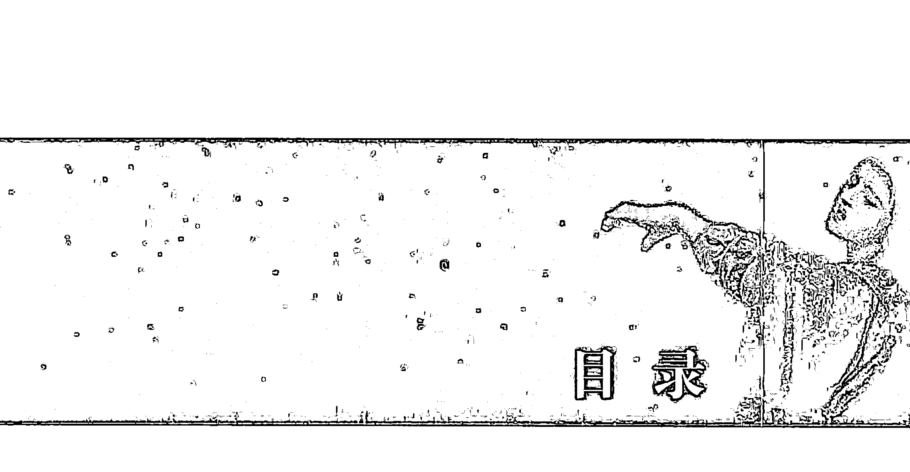


## 爱尔兰巫术

爱尔兰针对巫术的第一次审判出现在1324年，最后一次是在1711年，而在这期间，也仅仅只有几次的审判。

1324年对爱丽丝·吉蒂勒夫人的审判尤为出名，因为吉蒂勒夫人是基尔肯尼最富有的人。她被一心想将她的财产充公的理查德大主教指控。两人争斗了很长一段时间，最后主教将吉蒂勒夫人逐出了教会，而吉蒂勒夫人则使得主教被监禁。吉蒂勒夫人的女仆厌倦了双方的相互攻击，在极端痛苦的折磨下供认了所有的罪行，并于1324年11月3日被烧死。

被起诉，其中有一个是黑人妇女。关于这次审判的详细情况人们知之甚少，但毫无疑问的是，这三个女人最终都被烧死。

伊丽莎白女王1563年颁布的《巫术法案》在1586年被爱尔兰议会采纳。20年后，一位牧师被指控操纵鬼魂，但直到1661年9月才有真实的案例出现。那一年，一位住在约尔（后来以“约尔女巫”而著名）名叫弗洛伦斯·牛顿的女人被指控对玛丽·伦敦施法。玛丽·伦敦是约翰·佩恩的女仆，她曾在1660年的圣诞节拒绝分一块腌制牛肉给身份卑微的牛顿。然后牛顿转身离开，同时嘴里还在小声嘀咕。一星期以后，牛顿在大街上遇见了玛丽·伦敦，并在强行亲吻伦敦时将她撞倒在地，接着哭诉道，她是伦敦的好友，伦敦不应该拒绝分给她牛肉。几天后，伦敦梦见牛顿和一个身穿银色衣服的老男人站在她的床边，伦敦觉得那个男人就是鬼魂。

被牛顿亲吻后的几个星期，伦敦开始一阵阵地呕吐，并做了许多荒诞的梦，有时还会无缘无故地痉挛。当她痉挛时，颤抖得十分厉害，甚至三四个成年男子都无法将她镇住。接着伦敦开始失忆，还不时地吐出针、钉子、马蹄铁、羊毛以及稻草。而且不管在室内还是室外，她周围总会下石头雨，而那些石头刚一落地就消失不见。

弗洛伦斯·牛顿被传召到科克进行审判。当她被拷上手铐时，玛丽·伦敦停止了痉挛，而一旦牛顿的手铐被解除，她又会抽搐。

人们认为女巫不可能毫无差错地念出主祷文。这种情况在牛顿身上试验时，她的确无法流利地背诵出整篇主祷文。一个名叫大卫·琼斯的男子被指派教她主祷文，但是毫无效果。有一次出于感激，牛顿亲吻了大卫·琼斯的手。在接下来的几天，琼斯的那只手感到非常疼痛，然后疼痛蔓延到整个胳膊，最后他得了重病，两星期后便病死了。

1661年3月24日的听审中，牛顿为向玛丽·伦敦施法感到抱歉。她还供出了另外两个当地的女巫。关于对牛顿的审判无记录可查询，但她被处死的可能性很大。牛顿死后，玛丽·伦敦也恢复了正常。

爱尔兰另一桩巫师审判案发生在1711年3月31日安特里姆郡的卡瑞克福格斯。经历了几个星期的闹鬼后，一位名叫海特里奇的寡妇莫名其妙地死亡。而新雇佣来照顾海特里奇儿媳的女佣玛丽·邓巴开始痉挛和产生被许多女人折磨的幻觉。她把当地几个女人指认为女巫，这些人立刻被逮捕。在长达八小时的审判中，主要的证据就是邓巴吐出的各种各样的异物。被邓巴指控的人都是勤劳、虔诚的人，其中一个名叫安东尼·厄普顿的法官认为她们是无辜的，但是另一名法官詹姆斯·麦克卡蒂尼认为她们有罪。最终，她们被判处一年监禁和枷刑。

距现今最近的爱尔兰巫师案发生在1808年号称卡尔莫尼女巫的玛丽·巴特斯身上。不过，她侥幸逃脱了所有的指控。巴特斯受卡尔莫尼的亚历山大·蒙哥马利的邀请，去为他家的一头无法产奶的奶牛治病，因为蒙哥马利的妻子认为是某个女巫给奶牛下了咒。巴特斯到达后，告诉蒙哥马利和另一个叫卡纳罕的年轻人到牛棚去，把背心外穿，然后站在奶牛旁等待召唤。巴特斯则走进房内，和蒙哥马利的妻子、儿子及一位叫玛格丽特·李的老妇人坐在一起。

蒙哥马利和卡纳罕尽职尽责的等候在奶牛旁，但直到黄昏也没等来巴特斯的召唤，于是只好无精打采地返回房内，结果他们吃惊地发现房中的四人全都瘫倒在地。屋内弥漫着一股很浓的硫黄味，好像是从巴特斯放在火上的一个大锅中散发出来的。巴特斯在锅中放了一些牛奶和许多锋利的物品，如针、钉子和碎玻璃；而且烟囱被盖住了，门和窗都被关得死死的。蒙哥马利的妻儿都已经死去，那个老妇人不久也停止了呼吸。气急败坏的蒙哥马利把巴特斯踢出房外，踢到了一个粪堆上。这时她终于恢复了知觉。

审讯于1808年8月19日在卡尔莫尼进行。所有的证据都表明，遇害者是由于玛丽·巴特斯那口大锅中产生的烟窒息而死。巴特斯声称，在她向锅中放完材料后，一个身穿黑色衣服的神秘男子突然出现，挥舞着一根巨大的木棒将她打晕，并将其他的人杀死。巴特斯在次年春季的宗教法庭巡回审判中再次受审，在这之前，对她的所有指控都被撤销。

有史以来，爱尔兰几乎没有巫术，但却有大量关于异教的资料。达努或达纳是最初的地母神，与三性女神一样，地母神达努是少女、母亲和老妪。据R．J．斯图尔特说，达努是诗学的守护者、灵感女神和预言女神。

摩利甘（寓意“幻影女王”）同样也是三性女神，掌管着死亡和性。库夫林是爱尔兰传统中重要的女战神。生育女神玛卡与宗教游戏和节日有关联，尤其是那些需要技巧和兵器的比赛。

太阳神卢格是爱尔兰重要的男性神之一，在收获的节日中备受尊崇。爱尔兰另一个重要的男性神是达格达，在后来的神话中，他是三性女神之父。今天爱尔兰的巫术教派用各种各样的名字来称呼他们的神。

## 澳洲巫师霍恩

菲奥娜·霍恩是罗马教天主教徒，后来成为澳洲威卡教的代言人。在女子学校接受教育的霍恩曾经的理想是成为一名修女。她学习《圣经》和其他推荐读物，但很快便发现书中有太多不一致和矛盾之处。她质疑得越多，就越发现答案并非唾手可得。霍恩发现，书里有很多从别处借用来的故事和神话，以及未经解释的道理和大量被剥夺权利的女性刻板形象。她对此深感失望，并开始在别的宗教中寻求解答。

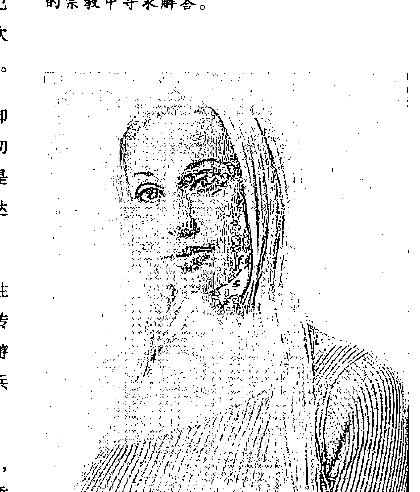

研究过恶魔崇拜后，霍恩觉得这种崇拜有极大缺陷，于是转而研究玄学，然后便发现了威卡巫术。与魔鬼崇拜和她之前碰过的其他形式的巫术不同，她觉得威卡巫术是正面的，以自然为依托的宗教。她说：“威卡教承认许多不同的女神和神，最重要的是，它承认神存在于个体之中，并不在人们遥不可及的天上。这点深深吸引了我。”

随后，霍恩把巫术当作自己真正的事业，她自行举行了一个入会仪式，成为了一名巫师。接下来的几年，她以隐士的身份从业。

二十岁出头时，霍恩开始在一个乐队中演唱。她为乐队创作了很多歌曲，并借歌曲抒发她的宗教情怀。

霍恩在澳洲已经是广播、电视、音像名人，她希望可由此拓宽她的视野。她在澳洲主流杂志社做记者，还是一名独奏音乐家。她称自己是一名作家、记者、录音师及电视名人，此外她还是一名巫师。

## 爱情魔法

爱情魔法似乎是所有魔法中最为流行的，通常用于女性劝说一名男子爱上她，或是男性劝说一位女子爱上他。巫师在施展爱情魔法时，一般也是非常谨慎小心，这是因为当你让另外一个人爱上你的时候，你其实正在同这个人的意志作斗争。而使用魔法迫使某人去做他们不愿做的事，就是伤害他们。因此，使用爱情魔法与使用黑魔法相似，因为两者都伤害了不该伤害的人。

这或许可以解释16世纪英格兰法律中对爱情魔法的限制。在英格兰法律中，“利用祈求神灵、巫术、加持魔法或魔法非法让人恋爱”是一种重罪，据说安妮·博林就曾用巫术引诱亨利八世与她结婚。

但这并不是说爱情魔法不可以使用。一般情况下，爱情魔法是施法者对自己施法，使自己变得更有吸引力，而不是对被追求者施法。另外一种做法是：用魔法来吸引某人，但不是特定的人。在使用爱情魔法时，追求对象的某些类型是可以被限定的，如长相、兴趣和魅力等。这样才能获得特定的人的关注，但是也可能获得之前没有意识或者考虑到的某个人的关注。

爱情魔法有很长的被视为“黑魔法”的历史，因为那些施法者在施法时，所用的人偶是用布料、泥土或蜡做的，还经常会在里面加入碎片、头发或血滴，使之变得更为有效。在1950年苏格兰维克北部的被起诉的巫师中，有一位叫约翰·费尔尼的巫师，他是娄田地区索尔特潘斯学校的校长，喜欢上了一名学生的姐姐。这对姐弟之前常在一起睡觉，在当时的条件下，这是很正常的。费尔尼要求小男孩去弄到他姐姐的三根头发，并且给了他一个很特殊的盒子来存放。不走运的是，男孩在拔头发时，弄醒了他的姐姐，于是姐姐向母亲报告了这事。这位女巫母亲猜出了费尔尼的动机，便从母牛的乳房上拔了三根毛放进盒子。小男孩将盒子交给了校长，欣喜若狂的费尔尼将毛发和其他物品混杂在一起，做成了人偶。最后的结果当然显而易见，无论费尔尼走到哪，那头母牛总会跟着他。

人们认为一些药草，如曼德拉草等香草有引起性欲的作用，特别是在做爱的时候很有效。在爱的名义下，人们制作了护身符、符咒和辟邪物，并点亮蜡烛操办仪式。吉普赛人会使用很多爱情魔法，这些魔法可以吸引一位他们喜欢的人，也可以让一位他们不喜欢的人远远地离开。

## 爱捣蛋的小妖精

人们常将小妖精说成是潘神或萨梯（希腊神话里半人半羊的森林之神），长着一对山羊的角。小妖精有时也被人称做罗宾·古德菲罗。巫师们总是将他与角神及丛林联系在一起。

小妖精是一个总喜欢搞恶作剧的精灵，据说小妖精拥有神奇的力量，这种力量能够让人听懂动物的语言，但同时他也喜欢将旅行者带入歧途。因此，基督教常常把小妖精与恶魔相提并论。

在爱尔兰的克里县，至今仍然存在着一个有趣的异教节日。每年八月前夜，克里县的奇罗格林村都会举行“小妖精节”庆祝仪式。仪式上，人们会把一头角和蹄涂成金色、脖子上套着花环的山羊封为“晚会的妖精之王”或“爱尔兰的妖精之王”。“小妖精节”一般会持续三天，人们把那头被封王的山羊放在一个平台上展示，这个平台的高度每天都会不断升高。在节日的最后一天，人们给山羊加冕，然后把它放回大自然。当然，在早期的仪式中，这头山羊加冕后会被立即宰杀烤熟，然后分给大家吃掉。

## 艾叶

艾蒿是一种在南北温带都非常常见的植物，其名称源自古希腊的月亮与狩猎女神阿尔特弥斯。艾叶可以用于缓解分娩的疼痛，治疗多种妇科病、癫痫症和癔症。几个世纪以来，巫师都将其当做具有治疗魔力的草药，也可以泡茶饮用，以避免诅咒、提神醒脑；将艾叶塞入枕头，能够驱散噩梦，甚至能在梦中见到未来。

在法国和德国，由于人们在圣约翰节前夕采集艾叶，因此艾叶也叫圣约翰草，人们认为它能够保护庄稼免遭鼠害。一些现代巫师会利用艾叶茶浸泡魔力水晶、护身符和辟邪物，有些巫师甚至在满月之夜将饮用艾叶茶作为一项仪式。

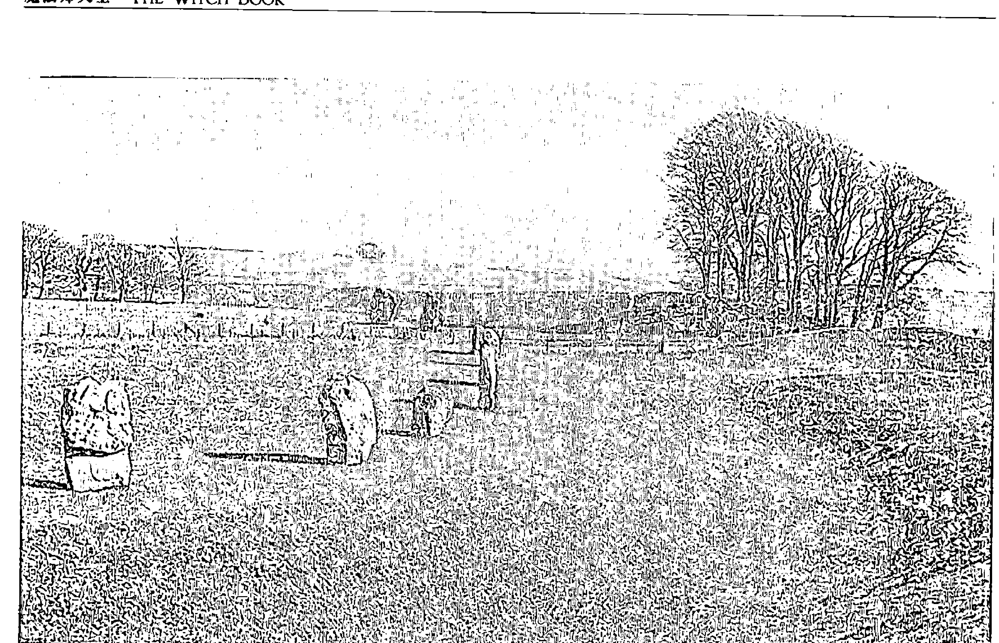

## 埃夫伯里石圈

威尔特郡的埃夫伯里石圈是英国最古老的巨石石圈，它可能是由青铜器时代的“宽口陶器人”建造而成。埃夫伯里石圈矗立于浅谷的一端、邻近肯尼特河流，并且离欧洲最大的人造土丘锡尔伯丘陵不远。埃夫伯里石圈占地28英亩。在外圆矗立的最大的石头有25英尺高，六十多吨重。巨石阵中有一条约1.5英里的大道，从埃夫伯里石圈延伸到另一个被认为是圣地的小型石阵。埃夫伯里石圈的主要大圆中，有两个大小相同的石圈，都是由近六十块砂岩石组成。这些巨大的砂岩石经过风化，早已变成了砂岩残块。埃夫伯里石圈常被用来和有名的索尔兹伯里巨石阵作对比，巨石阵距离埃夫伯里石圈20英里，如今也只剩下砂岩残块。考古学家估计这个神圣的宗教场所从新石器时代到青铜器时代至少已使用了一千年。据说这里经常闹鬼，在许多情况下能看到人、光，并能听到音乐。英国的巫师认为这是一个灵魂的中心，相信它是用来敬拜女神的。

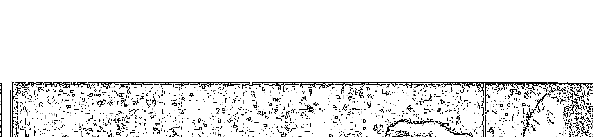

## 巴雷特的魔法

化学教授弗朗西斯·巴雷特，是神秘学经典著作《占星家》的作者，该书于1801年出版。书的副标题是“天堂信使，一个神秘哲学的完整体系。”后来的许多书籍和汇编都大量引用巴雷特著作中的内容。

巴雷特住在伦敦马里波恩的诺顿街，一个18世纪末被众多艺术家青睐的地方，他召集了很多学生并教他们魔法。

蒂莫西·德门·史密斯，在大学书社再版的《占星家》的序言中，指出巴雷特的著作是当时唯一试图再现魔法和超自然现象的书，巴雷特为此付出了很多时间和努力。“他显然花了很长时间辛苦地翻译魔法和超自然知识，出现在17世纪的那些英文资料在那之后，直到现在都很罕见。”

> 巴雷特在序言中称：“我们已经投入了巨大的人力和精力、时间和费用，收集任何可能被视为奇怪和罕见的东西——用于自然魔法的秘诀、天体和我们的猜测、魔法和磁性……因此，我们以最简洁易懂的方式来解释被用于各种目的的护身符是怎么制成的……在适当的时间里，我们出于同样的目的观察星座和行星某方面的特征，探讨什么时候它们最能影响我们的行为……”他接着列举书中出现的插图、魔法表、密封件和法器都被用于许多后来的书籍、魔法和超自然现象中。

巴雷特认为，巫师利用魔力是出于邪恶目的，但并不认为魔力的来源是邪恶的。该书的核心部分是哥特式复兴时期超自然现象在英国的蓬勃发展。这本书是巴雷特年轻时撰写的，本书出版之前他还不为人所知。

## 被误译的《圣经》

欧洲最初的“睿智女人”扮演着当地医生、法师、先知、精神领袖和所有事件的仲裁者等多重角色。作为医生，她需要懂得所有药草的知识以及它们的用途，包括对那些不小心误食导致意外中毒后，如何使用解毒剂的知识。这些在《圣经》里都有记载，只是翻译成英文后内容不甚正确。比如《出埃及记》第22章第18节说：“行邪术的女人，不可容她存活。”这句话被用来当做对巫师们的第一个和最后的宣判，达数百年之久。

沃尔特·斯哥特爵士指出，最初的希伯来词语 chasaph（或 kaskagh）的意思就是“投毒者”。很明显“投毒者，不可容她存活”更为贴切。但是为了能够解毒而研究毒药的人，却绝不可与投毒者相提并论。

英格兰国王詹姆斯一世应对这一误译负有责任。因为他和贝里克郡的巫师有嫌隙，所以对魔法很是憎恶，这在很大程度上影响了由他所钦定的翻译《圣经》一事。当将《圣经》从拉丁文翻译成英文时，他可能是无意混淆了 veneficus 和 maleficus，即“投毒者”和“女巫”这两个词，但更可能是有意识的将这两个词等同起来。然而正如斯哥特指出的那样：“假如希伯来的巫术仅仅是符咒、祈求或者类似的无毒害的方式……那摩西律法上的巫师与魔鬼之间的关系将完全是另一种图景，后世之人也就不会从该律法推断出巫术是邪恶的了。”他还说：“没有服从邪恶势力的统一契约，没有这种所谓的致命联盟的可憎标志或符号，没有对撒旦和他手下女巫罪行的揭发，在好人身上没有施加疾病和不幸，至少在《圣经》上没有什么文字让我们相信有这样一个体系存在。”斯哥特用了大量篇幅力证《圣经》，以证实国王詹姆士一世命人翻译的《圣经》与《圣经》原文中对巫师的描述迥然相异。

圣经中第二个常被提到的“女巫”是“恩多女巫”。詹姆斯一世又一次对其动了手脚。在《撒母耳记》第二十八章第三页中，原文是“扫罗已经将那些鬼使和巫师驱逐出境”。第七节是这样的：“扫罗对他的仆人说，去帮我找一个懂巫术的女人，我要审问她。他的仆人回答道：‘您看，在恩多那边就有一个女巫’”。但詹姆斯一世的译本里，这两个章节的标题是：“三：扫罗已毁灭那些女巫”、“七：扫罗暗地里处决了一个女巫。”

如文中所说，很显然，恩多的女巫只是个能与死去之人进行交流的灵媒。对于其他方面，文中并没有描述，比如她年轻或者年长，或是居住在什么地方等。但后来的许多人总是将她描述成住在“简陋破屋”里的“巫婆”，如约瑟夫·格兰威尔的《与女巫和幽灵有关的完整直接证据》中的插图和其他地方都是如此描述的。

> “假如希伯来的巫术仅仅是符咒、祈求或者类似的无毒害的方式……那摩西律法上的巫师与魔鬼之间的关系将完全是另一种图景，后世之人也就不会从该律法推断出巫术是邪恶的了。”

罗纳德·霍姆斯说，威尔士的《圣经》最早出现于1567年，或许由于缺乏合适的威尔士词语，该版本就很少有上述误解。威尔士《圣经》对恩多女巫提出了新见解，认为她仅仅是与某种生物沟通的灵媒，但是却未能做出详尽的描述，只是用gwrach一词来指代“女巫”，该词并没有“恶魔使者”的含义。

在中世纪，那些参与迫害巫师的人，往往借用《圣经》中给出的检测方法来检测某人是否是巫师。即当一个人被指控为巫师，就依据《圣经》的重量来权衡她的罪行。乡村《圣经》的卷册总是体积庞大，通常由当地的庄园主捐赠，其重量惊人，比大多数人都要重。如果被指控者比《圣经》卷册重（这种情况很少存在），那么她就无罪；如果被指控者比《圣经》卷册轻，那就表明她有罪。有少数被指控者的确比《圣经》重，但是她们又会接着面临着其他的检测方法。

1604年召开的汉普顿宫苑会议决定重译《圣经》。而在这之前，《圣经》已有数个译本，如14世纪的约翰·威克里夫译本，此译本后来出现了两个版本。再比如1525年版的《新约全书》，是威廉姆斯·廷代尔直接从希腊文翻译而成。继1539年的《大圣经》后，紧接着又出现了1568年的《主教圣经》。但是汉普顿宫苑会议上的重译本，却在后来成为《圣经》唯一 的标准，这就是詹姆斯一世钦定的译本。

虽说人们常从《圣经》里引述谴责巫术和占卜的言辞，但《哥林多书》里第十二章第四、十二节和第十四章第一、三、三十一、三十二和三十九节，都劝告人们接受并且善加利用这些赠礼，包括预言、卜语等，认为它们可以创造奇迹，可以治病。诗歌《约伯记》曾写到：“向动物学习，它们会教你；或者询问空中的鸟儿，它们会告诉你……或者让海中的鱼儿告知你。”

## 巴克兰的威卡魔法

1934年8月31日，雷蒙德·巴克兰出生在英国伦敦，他的父亲斯坦是吉普赛后裔，英国卫生部高级行政主任，还是戏剧和音乐类杂志的自由撰稿人。巴克兰12岁时，他的叔父乔治向他介绍了唯心论，这是巴克兰对神秘事物感兴趣的开端。20世纪50年代，巴克兰和他的朋友们首次开始阅读玛格丽特·穆里的《女巫的神》。尽管名义上属于英格兰教会，但他的兴趣很快就转移到了巫术宗教。1955年，巴克兰与罗斯玛丽·莫斯结婚。在英国皇家空军服役两年后，巴克兰出任伦敦出版公司的零售经理，并定期出现在诺丁汉人民大剧院和诺丁汉话剧场。

20世纪50年代，阅读了杰拉尔德·加德纳的著作《现代的巫术》后，巴克兰意识到，这就是自己一直在寻找的宗教。于是，他开始与加德纳和加德纳的高级女祭司莫妮卡·威尔逊（奥恩小姐）通信。1962年2月，巴克兰移居美国，成为加德纳在美国的代言人。

## 女巫大全 THE WITCH BOOK

1963 年末，在一次去苏格兰佩斯的旅途中，由奥恩小姐主持，巴克兰最终成为了加德纳巫术中的一员。

20 世纪 60 年代的美国，人们对巫术有着极大的兴趣，因此巴克兰和莫斯的纽约巫师大聚会从不缺乏申请入会者。不过他们很谨慎，未经正当程序不会让任何人入会。他们的谨慎受到大量的批评，但是直到现在，巴克兰仍然认为，他所做的决定是正确的，并指出他看到的许多问题正是由于不加选择让人入会的结果。

然而由于许多人缺乏耐心，在没有与巫师大会取得联系的情况下，擅自决定开始组织巫师聚会。由于没有适当的培训和入会仪式，导致大量的伪巫术横行。伪巫术的仪式全都建立在错误概念之上，这些错误的概念信息来源于如艾拉·雷文写的《罗斯玛丽的婴儿》、仪式魔法和其他非教派的原始资料。

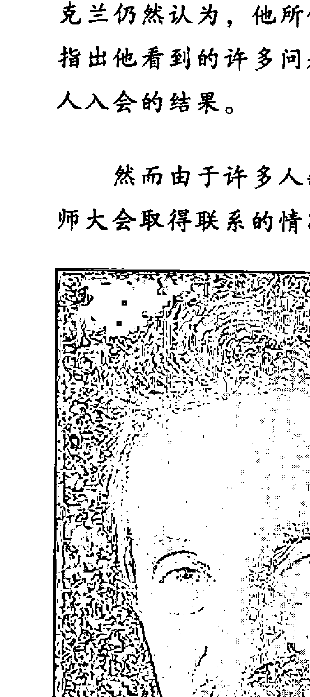

巴克兰通过报纸、广播和电视等传媒，纠正关于巫术的错误概念，他的一系列尝试都是匿名进行，这一匿名方式遭到《纽约周日新闻》记者利萨·霍夫曼的反对，于是巴克兰便用真名发表了相关文章。这给他自己、妻子和两个孩子带来了巨大的灾难性后果。此时，加德纳的书已经不再印刷，因此，巴克兰开始创作《巫术内幕》继续向大众介绍巫术。

巴克兰发现他的生活方式和加德纳有很多相似之处，其中之一就是大量收藏史前古器物。在马恩岛，加德纳有一个魔法和巫术博物馆，也是世界上最大的巫术博物馆，于 1968 年正式对外开放。起初，博物馆位于加德纳长岛家的地下室，只在指定的时间开放，后来则被迁进维多利亚湾岸边的老房子里。在这里，许多较大的报纸和期刊对其进行了评论。而且博物馆中收集的史前古器物还曾被转借到大都会艺术博物馆和纽约民间艺术博物馆进行专题展出。

与此同时，巴克兰最初的纽约巫师大聚会慢慢衍生出新的巫师聚会，将加德纳巫术教派传播到整个美国。

巴克兰依然没有停止创作。1969 年，埃## 鞭笞可以增加法力

古埃及生育女神伊希斯的追随者、小亚细亚自然女神西布莉的牧师、酒神狄俄尼索斯的信徒，以及崇尚异教的斯巴达的狂热追随者和其他不同宗教信教派都认为鞭笞是宗教仪式中不可缺少的一部分。从广义上来说，鞭笞被认为是净化心灵的一种方式。

在意大利庞贝城，一间神秘别墅的墙上有一幅与真人同样大小的湿壁画，其中就有酒神狄俄尼索斯的女祭司在鞭笞一个新入会会员的场景。威卡教也将类似的鞭笞作为轮回的一部分，这是所有成长仪式的中心主题，象征重生前的死亡。正因如此，所以鞭笞仪式并非是在伤害新会员。事实上，仪式所用的鞭子，是用丝绸带或类似的柔软材料制成。

鞭笞或鞭打也常被一些巫师在施魔法时用来增加能量。增加能量的方法有很多，例如：跳舞、唱赞美诗、唱歌、性，而鞭笞只是形式之一，它并不是用来制造痛苦的。被鞭笞的人（一般是巫师聚会中的神职人员）被反复抽打，但鞭子划过人的身体就像催眠一样。《影书》中说：“鞭笞只是把人的血液带到肌肤表层，而非制造痛苦。”

然而，中世纪的巫术确实实用鞭笞来伤害他人。如1662年苏格兰的奥德兰巫师案中，女巫伊泽贝尔说：“巫师聚会中的首脑连续鞭打她们，直至其疼痛难忍。一旦缺席或是忽视应该做的事情，就会遭到鞭笞……她会上下左右狠狠地打，毫不留情。”1673年的巫师案中，据说那些伤害过别人的人，都讲述其“保护者”是如何折磨和鞭笞无辜者的。

## 帮助飞行的软膏

人们普遍认为，巫师是骑着扫帚、干树叉或木头去参加夜半聚会的，这便是所谓的空中飞行。而最早对其进行描述的，则是尤瑞克·莫力特，他在1489年的雕刻中，刻画了三名长着动物头的巫师，分别骑在长长的、分叉的树枝上。从许多古老的插图来看，那些能飞的巫师都在身上涂抹了一种能使他们有飞行能力的软膏。那时的资料显示，软膏的主要成分是未受洗礼的小孩的器官的脂肪。其他一些被提到的成分包括乌头、铁杉树、颠茄。

公元九世纪，人们开始怀疑巫师是否有飞行能力。公元九世纪的《主教会规》中提到，巫师根本就不能飞行，更别说能变成鸟或动物了。

那些被魔鬼诱惑和幻觉蒙蔽的妇女坦言，她们晚上与异教徒女神黛安娜的一些野兽一起在天空飞行，在陆地奔跑。很多妇女将黛安娜视为主人，情愿在晚上为其效力。无数妇女被这种错误观点欺骗，信以为真，偏离了正确信念，认为除了上帝之外，还有其他的神明和力量。

后来的宗教法庭审判却忽略这些，认为飞行是巫师与魔鬼同流合污的证据。此外，大量被控使用巫术的人都承认自己在身上先涂抹过一种软膏，然后才在空中飞行。

> >《女巫之锤》这本臭名昭著的书说：
> “他们涂抹软膏，就等于听从了恶魔的旨意，用小孩的四肢，尤其是洗礼之前被杀害孩子的四肢来制成软膏。将软膏涂抹在椅子或扫帚柄上，无论白天还是黑夜，只要他们愿意，就立刻能飞离地面，而且魔鬼还借助某种物质帮他们完全隐形”。

在1664年的萨满赛特巫师案中，就曾经提到过类似的软膏。据其中一位被控的、名叫伊丽莎白·斯泰勒的女巫说，她们身上涂着一种绿色软膏，这是一位身着黑衣的无名首领给她们的。斯泰勒说，当涂抹完后，她们喊着“快，快飞”的咒语就能飞起来。落地时，则只需大喊“下来，下来”。

弗朗西斯·培根在《赛尔西亚维亚》曾提到飞行软膏的成分，包括从坟墓中挖掘出的孩子的脂肪，并补充道，“我认为催眠药在其中起了最大的作用”。培根所说的催眠药，包括天仙子、毒芹、曼德拉草、颠茄、鸦片、干藏红花等。雷金纳德·斯科特在《巫术的发现》一书中，详细叙述了从墓中挖掘出的孩子们的器官组织是如何被放在锅中煮的，剩下来最厚的油脂就被用来制作飞行软膏。但是斯科特认为，巫师无论是否涂抹软膏，他们都不能飞。

巫师的飞行被喻为圣人的升空：前者被人谴责，后者为教会赞颂。据说丘珀蒂诺的圣约瑟在17世纪飞行了70次。还有就是西班牙科瓦多的女修道院长马格达莱纳·克鲁西亚在许多场合都能自由飞行，但她后来承认自己是女巫。1855年，丹尼尔·邓格拉斯从伦敦维多利亚大街街道上的一扇窗户飞到了另一扇窗户，而且距离地面约七十英尺。目击者有阿代尔市长、德高望重的林德赛大师和查尔斯船长，这真让人难以置信。

正如彼得勒斯·马默在他的《邪恶制造者的鞭子》一书中首次提到，巫师从巫师村庄出行最流行的方式是通过烟囱，巫师站在盛着软膏的大锅旁，为自己涂抹后，或许还需要在一位老巫师的协助下，跨越壁炉，通过烟囱直冲云天。在巫师们看来，任何火花和煤灰都是微不足道的。

> >《亚伯拉罕·梅林的神圣魔法之书》写到：
> 在利兹，我与一位年轻女子一起工作，一天晚上她邀我与她一同飞行，并许诺说没有任何危险，她将带我去一个我急切想找回自我的地方。我相信了她的话。之后，她递给我一种软膏，让我用来涂抹手脚上的主要脉络，她也这样做了。开始，我似乎就在自己希望的地方飞，而我并未告诉她这个地方。在那儿盘旋了一会儿后，我感觉就像从噩梦中苏醒一样，头痛，情绪低落，我转过身来，发现她坐在我旁边，她向我详细讲述她所看到的一切——与我目睹的大相径庭，对此，我惊诧不已。在我看来，我似乎的的确确去过那里，并经历了那儿发生的一切。

> >在玛瑟尔1932年译的《犹太人亚伯拉罕写给儿子拉玛的书》中，有某些片段与作者本人1963年在苏格兰的亲身经历极为一致。书中记载，杰拉尔德·加德纳的高级女祭司，也就是奥恩小姐，在《影书》中一个古老配方的指导下成功制成了软膏，其成分包括：萎陵菜、毛地黄和罂粟汁。我和她将软膏涂抹在手腕、肘关节内、膝盖下面及脚踝。我们围坐在火边，不一会儿，感觉自己从地面升起并飞向空中，这种状态持续了好长一段时间，直到恢复正常状态。奥恩说，她们中的一位女巫使用软膏后，的确感到自己飞出房间冲出草坪，看起来似乎是这些药物给了她飞行的幻觉。杰拉德·加德纳说，软膏最初只是用来涂抹在身上抵御寒冷的，因为去参加聚会的巫师通常会一丝不挂。在《影书》中，有一个传统的英国飞行软膏配方：

- 猪油100克
- 麻醉剂（高质量）5克
- 罂粟花一把，篙芦根末一撮，向日葵落地籽一撮。

涂在耳朵后面的皮肤、颈动脉、腋窝、左侧的交感神经、膝盖后面、脚底以及手臂弯曲处。涂完后，巫师必须裸睡在火边或女神雕像旁。

《影书》中另外一个配方：

- 3克的安纳姆
- 50克的鸦片提取物
- 30克的莨叶提取物
- 6克的萎陵菜
- 15克的毛茛
- 15克的颠茄
- 15克的普通毒芹
- 250克的印第安大麻
- 5克的斑蝥
- 树脂
- 糖末

可以和其他油混合，例如：纯橄榄油、羊毛脂。只能外用，不能内服，否则极其危险。

也有一个现代配方：

- 一勺护手霜
- 一勺植物油
- 两勺颠茄
- 三滴洗涤剂
- 两勺附子草汁
- 也可加入你选择的香水

穆里在《西方的巫师狂热》一书的附录中，约瑟夫·克拉克给出了三份法国配方：

1. 欧芹、毛茛水、杨树叶和煤烟。
2. 欧洲萝卜水、菖蒲、萎陵菜、蝙蝠血、颠茄和油。
3. 婴儿的脂肪、水防风草汗、附子、萎陵菜、颠茄和煤烟。

煤烟用来防止巫师晚上飞行被别人看见。婴儿的脂肪（猪的脂肪）只是一个打底物，而蝙蝠血似乎是一种惰性成分。但是加入附子、颠茄及萎陵菜后，就不用怀疑软膏的灵验度了。

戴乐·波特是最早调查飞行软膏成分的。他的书《自然魔力》出版于1558年，书中包含了介绍飞行软膏的章节。由于了解这些事情，他被教堂审问，被教皇传讯并向其解释巫师的飞行软膏以及巫术魔法。

现代的巫师并不相信他们能飞到空中。他们极其讨厌用麻醉药，所以今天没人再用麻醉药，甚至他们根本不会去幻想飞行。某些人可能也会做实验，但软膏就只具有某些历史价值，而非某种实用价值。

## 被烧死的巫师

在德国，巫师被处死的数量是英国的一百多倍。英国的巫师不会遭受拷问或火刑，而德国巫师则在遭受拷问的同时也要被处以火刑。罗塞尔·霍普罗宾斯说，1590年，在芬比特，用于焚烧巫师的柱子使得焚烧现场看起来像个小树林。1631年，科隆附近城镇和村庄外矗立的无数柱子上有许多妇女被烧死；1651年，行刑者在塞纳建造了一个烤炉，一年中有42个妇女和女孩被烧死，其中包括二到四岁的小孩（他们相信魔法可以由母亲传给小孩，甚至由祖母传给孩子）。九年时间里，这个烤炉烤死的人数超过了一千人。

就像审判直到16世纪才出现一样，德国人对魔法的恐惧出现得较晚。然而，德国人很快就以残酷无情的暴行弥补了与其他地区在时间上的差距。1563年，在意大利召开的天特会议（指1545至1563年间，罗马教廷在北意大利的天特城召开的大公会议）把真正意义上的魔法，或者说类似魔法的东西带入德国。神圣罗马帝国的法律规定了对魔法成员的拷问和折磨，而成百的法律和上千的布道辞则告诉了人们魔法是如何强加到人们头上的。如同多明尼加共和国的审问者在先前的两个世纪把魔法带入欧洲一样，天特会议在16世纪和17世纪时把它带入到了德国。里奥·卡罗胡·巴罗扎说，虽然16世纪的一些神学家继续援引《主教教规》，并把黛安娜视为魔法界的女神，但当时大部分的审判者都把恶魔看做是巫师最主要的领导。

> > 德国作家古德尔曼说：“大多数人都相信，德国所有的巫师在五月的第一天晚上会被带到布鲁斯特里地区一个叫做布罗克伯格和海因伯格的山上，为自己受膏……他们整晚在宴会上享乐，与爱人跳舞。”

布罗克伯格是以前萨克森哈茨山最高峰，许多地图称其为布罗肯山。五月的第一天是古老的五月节或五朔节，同时也是巫师的聚会日。

霍普罗宾斯指出，所有的宗教都进行过对巫术的迫害。清教徒同天主教徒一样想要毁掉魔法。1589年的某日，仅仅一天时间，就有133名巫师在奎德林堡被烧死。1587年到1594年间，在圣马克西敏天主教会的裁判下，22座村庄的村民被认定为巫师，并遭到迫害和驱逐。有两个村庄完全被摧毁；还有两个村庄只有两名妇女得以幸存。据统计，22座村庄共有368名巫师被烧死在火刑柱上。

> > 麦博·艾立克说，从法官到提供用于火葬木头的平民，审判巫师和对巫师处以死刑已成为许多人谋生的手段。因为实施死刑所需的费用由被判死刑的人自己承担，而一旦被判处死刑，则死者的财产会全部充公，所以麦博说：“一旦被处死者的遗产充公的做法停止，那么被判处死刑的人数就会减少。”在《实验者的历史》一书中，林登·约翰说：“公证人、抄写员和旅馆老板开始变得富裕。刽子手的妻子们像贵族一样骑在有漂亮马具装饰的马背上，或坐在绚丽缤纷的马车里。而有罪的和受处罚的人的子女被流放，他们的财产则被充公。”

这就是对所谓的巫师的迫害，或许从一两个地方发生的事就能看出整个国家到底发生了什么。

德国的维尔兹堡和班贝克地区由艾伦伯克·冯·菲利普·阿道夫和被称为魔法主教的冯·多黑姆统治。冯·多黑姆于1623至1632年统治期间，处死了班贝克地区600名所谓的巫师，数量是前任的两倍。他建造了一个特殊的“巫师的房子”，在那里，被指控者受到审问和拷打。“巫师的房子”由他的属下，副教主弗奥纳·弗里德里希掌管。酷刑包括夹手指、钳腿、在身体的任何部位悬挂重物、在炽热的椅子上烧烤、拉伸四肢、给犯人穿上西班牙靴子、用生石灰水洗澡、用烧红的钳子烫人的皮肤等。而在使用之前，所有刑具都将受到牧师的赐福。冯·多黑姆对巫师的审讯速度非常快，从指控到被处死可能不超过三个星期。

班贝克的副法官汉·乔治不愿看到整个过程，尝试着减缓屠杀的速度。很快他被认定为“喜欢巫师的人”，也遭到指控。直到他指控出其他人，才免酷刑。有段时期，班贝克地区所有的市长都被一一定罪，之后，这些市长及其妻子、儿女在1628年被处以火刑。霍普罗宾斯指出，1631年4月，赫森豪斯有22名囚犯。他们总共加起来有22万弗罗林，最后这些财产全部落入主教的腰包。另外，主教还从已被处死的囚犯那里预先得到了50万弗罗林。

班贝克的居民后来向国王报告了那些对正义歪曲的事件。斐迪南二世很不想对此做出回应，但他的幕僚们指出公众舆论的不利影响后，斐迪南二世还是做了一些少许改革，在某种程度上减缓了迫害。

然而，冯·多黑姆的堂兄弟艾伦伯克·冯·菲利普·阿道夫并没有停止对巫师的迫害。1623到1631年间，他烧死了维尔兹堡的900名巫师。大卫·哈芭记录了发生在1629年2月16日的29次大屠杀，共有157人被处死，其中有13个不到12岁的孩子。这些被屠杀的人来自社会的各行各业，有的人很富有，有的人则直到被处死的那一天才被注意到。市民、教区牧师、学生、老人、女人以及孩子们都遭受过酷刑。一个最富有的市民及一个村庄的村长被烧死，一个放走许多犯人的守卫和一些外地人被处死。甚至连艾伦伯克·冯·菲利普·阿道夫的继承人艾伦伯克·冯·欧内斯特也被烧死。

16世纪后期，巫师迫害活动从卢森堡和罗莱尼传到了神圣罗马帝国的特雷维斯教区。该教区的法官是声名狼藉的尼古拉斯·雷米。他夸口说在15年间烧死了900名巫师。

1581年，约翰·冯·斯孔纳伯格接管特雷维斯教区后，开始镇压异教徒，先是新教徒，接着是犹太教，最后是巫师。该地区连续九年收成不好，还遭受虫害，这些都被认为是由巫师引起的。1586年，特雷维斯的副总督佛莱德·迪特里希博士不赞成大规模对巫师的迫害。之后不久，大主教范赞特·约翰捏造了迪特里希博士出席巫师夜半聚会的伪证，指控他为巫师。在多次调查、检举和拷打后，迪特里希博士于1589年9月18日被烧死。

在欧洲，专业的巫师发现者有很高的收入。最有趣的巫师发现者是莱姆戈市的科斯曼。科斯曼的母亲被处以火刑，他被迫逃生。几年后，科斯曼回到莱姆戈，于1666年当选为莱姆戈市市长。之后，科斯曼开始了复仇之路。他与几个同伴一起有计划的控告了几乎所有的位高权重者，并处死了他们的母亲。直到1684年去世之前，科斯曼一直担任市长职务，在那期间，有90人被他处以火刑。

## 编织魔法的女巫

“巫师的职责，”朱迪思说，“就是将众神给你的各种迥然不同的力量巧妙地编织在一起。每一次编织都是愈合和进化，为生活的网修补裂口，同时创造新的东西。这就是我认为的魔法。”

阿诺蒂·朱迪思于1952年12月1日出生在俄亥俄州伊利里亚市，她的名字“阿诺蒂”，意为“女神之仆”。

朱迪思大部分时间都待在祖母的农场，在那儿她可以亲近自然并阅读希腊神话故事。在母亲的第二次婚姻中，朱迪思接触到了基督教科学——通过祈祷和神奇的仪式来治愈实体。“这让我知道意识是怎样作用于现实的，而这正是魔法的基本法则之一”，她说。

朱迪思继续说：“作为50年代出生的孩子，我正好遇上妇女解放运动和60年代的思想革命。”从一位论派到卫理公会、天主教以及基督教科学会，朱迪思接触了各种基督教教派，不过这取决于她母亲嫁给谁或者和谁做邻居。因为来自离异的家庭，所以朱迪思认为父母离异是我们文明的神话框架。“唯一的不同点在于，基督教神学中，往往是父亲独立抚养子女；而现代文明中，最后通常是母亲抚养子女”。她说。

在康涅狄格郊区的一所中学完成学业后，朱迪思前往马萨诸塞州的克拉克大学心理系学习，随后又转到加利福尼亚工艺美术学院转学艺术，并因在天花板上绘制云景而出名。1975年，一次神奇的灵魂离体体验让她开始学习和研究瑜伽中的气轮系统。11年后，朱迪思的研究随着她的第一本书——《生命的车轮：气轮系统使用指南》的出版而结束。在这本书中，她讲述了一些早期冥想中看到的东西。1993年，朱迪思和多年的好友兼合作导师西丽妮·薇格共同出版了第二本书——《七重旅行：通过气轮系统改造思想、身体和灵魂》。1997年她出版了第三本书——《东方身体：西方思想》。

20世纪70年代中期，朱迪思曾独自一人在加利福尼亚一座山顶上的帐篷中待了两个月。这顶帐篷由朱迪思的一个名为“疯狂的以色列药剂师”朋友搭建而成，他把朱迪思留在那里后就消失了。这一次，朱迪思发现了巫术，并且练习了气象魔法。朱迪思说，她感觉自己直接受到了女神的教诲。

1977年，朱迪思遇见寰宇教的蒂姆·泽尔和莫宁·格劳力·泽尔，同时也与“永久森林”的创建者格威迪恩·彭德文交往密切，并帮助她发展了圣堂。

1981年，朱迪思和彭德文结婚，之后移居到安文芬，那是彭德文在门多西诺郡的地产。1982年彭德文逝世，朱迪思成为那片地产的五位管理者之一。

1983年，朱迪思成立了“生命之道”，开设了关于魔法、仪式、治愈术和巫师发展的课程和研讨会，并于五年之后成为寰宇教的圣殿会长。1988年，朱迪思和已有三个孩子的理查德·伊利结婚。1989年，她获得罗斯桥综合疗法研究生院的超自然心理学硕士学位。随后在1999年，她又取得心灵治愈术的博士学位。

20世纪90年代末，朱迪思认为随着寰宇教的壮大，会很专注于魔法体验。于是便将职位传给他人，退到被称为“后座”的次要地位。“如果女神准许我退休，”她说，“我将回到艺术家和森林女巫的生活”。她的宗旨是“两极分化在意识的提升中是很重要的一步，但是它也留下了一个极大的深渊。因为被分开了，所以现在的任务是把我们隔断的部分重新组合成一个新的、更好的整体。”

## 捕获灵魂的工具

许多故事、神话和传说中，镜子和魔法有着千丝万缕的联系。人们曾相信映在镜子或其他反光表面上的身影是灵魂的一部分。因此，镜子也被视为“捕获灵魂的工具”，在行将就木的病人的房间，需要用黑布将镜子盖起来。今天流传的“打碎镜子会招致厄运”的说法就源自这些古老的传说。沃克指出，古埃及语中的“镜子”一词也有“生命”的意思。佛教则认为世间所有的一切都是镜中的倒影。

魔法师大多会用镜子进行预言。预言者会凝神注视反光表面，就像看进水晶球里一样。有些预言镜是黑色的，它们可以消除其他无关的影像，有些则采用凹面玻璃制成，以便将视线吸引到图像中。

庞贝古城神秘别墅的前厅壁中就有新教徒注视牧师高举铜镜的画面。壁画中的新教徒观看并重新经历了酒神狄俄尼索斯之死。莱昂纳多·达·芬奇也曾在一幅画中描绘了两位用魔镜预见未来的魔法师。在18世纪，有关“不死炼金术士”——桑杰尔曼伯爵的手稿中也可以看到类似画面的缩影。德·吉维尔认为法兰西女王凯瑟琳·德·美第奇就拥有一面能够预见法国未来的魔镜。伊丽莎白一世的占星学家约翰·迪也拥有一面由抛了光的黑曜石和黑色火山玻璃制成的魔镜。这面镜子收藏在大英博物馆中。约翰·迪和他的助手爱德华·凯利，正是利用这面镜子为众The request was rejected because it was considered high risk我们在自身身上寻求整个宇宙的女性规则，并视自己为女造物主的女儿。

我们认为，如同是时候为争取自由支配自己的权利而斗争一样，是时候为争取女性灵魂的愉悦而斗争了。

我们认为，为了斗争并完成革命，我们需要几代人的努力，我们必须找到可行的方式。我们认为只有得到一种强大的精神力量的支撑，我们才能取得胜利。

我们认为，我们是那些具有变革意识的人群中的一部分，然而许多人畏惧这种变革。

我们认为，女性思想统治时期是一段美好并充满和平的时期。在这一时期，大地被视为人类的母亲，妇女是她的教士。这是女权制的黄金时期。

我们认为，那些被流放的男人侵略了女性的权利，形成了强暴女性、压迫女性的家长制社会。女性因此失去了至高无上的地位。

我们认为，女性控制着（男性）死亡的本质，推动着人类的进化。

我们致力于关爱自己和我们的同胞。我们致力于寻找欢乐、关爱，树立对生活的信心。

我们致力于自身的胜利及生存，与家长制的压迫作斗争。

我们致力于用魔法知识保护我们及同胞们的利益。这些魔法知识包括：祈祷、诅咒、治愈术及妇女自身的智慧。

我们反对攻击无辜的人。

我们致力于平等的对待政治、公共和个人事物。

我们致力于教授女性如何以女巫的身份开展组织活动，并与女性一起分享我们的传统习俗。

我们反对给男性传授我们的魔法和工艺。我们目前的目标是依照古老的女性制定的法律，把大家组织起来，缅怀过去，重新聚集我们的力量，在众多神明中重新确立女神的地位。

吉利表示，从文学和大学课程中有关女神和妇女精神内容的增加中，可以看出黛安娜女巫聚会的影响力。

## 德鲁伊神奇的治疗法术

德鲁伊是凯尔特人的神职人员，排位仅在国王之下。除此之外，人们对他们所知甚少，根据恺撒大帝的高卢之战记载，德鲁伊所有的知识都是经口头方式流传下来的。约公元前五百年，恺撒把他们安置在高卢的南部和中部地区。罗马历史学家阿米亚诺斯（公元前330 — 395 年）曾经说，德鲁伊是“为探索最神秘、最高尚的事情而振奋”。他们的行为后来被提比略和克劳狄斯禁止，主要是因为他们用人来祭祀。普林尼在他的《自然史》一书中指出，德鲁伊具有神奇的治疗法术。

德鲁伊这个称呼本身的来源不为人知。有人认为它源自爱尔兰的盖尔德鲁伊，意思是“智者”或“魔法师”，然而又有人认为它是来自古英语中的drud，是“有识之士”的意思。老普林尼则认为它是希腊语中的drus，意为“橡树”。

麦卡利斯特在其著作《爱尔兰考古学》中认为，爱尔兰的德鲁伊一直在学习圣歌，“像古印度的吠陀经，就是通过口述的传统方式留存下来的，因为这些诗歌一旦被用于艺术，就将会被亵渎。”在那个时候，希腊文和古爱尔兰欧甘文字都已经产生，而且为德鲁伊所熟知，所以这些学问是有意识的不以文字的形式留存下来。

德鲁伊寺庙常常建在橡树林里，一般呈圆形或椭圆形，有时被一道栅栏或堤岸和一条沟渠围绕，在寺庙的中央，有一块代表神的大石头。德鲁伊的男祭司和女祭司有着一个等级制度，分为诗人和巫师。W. B. 科劳认为，德鲁伊对树有一种狂热的崇拜，因为那时的大部分欧洲被广阔的森林覆盖，主要的树种就是橡树。我们知道他们敬奉一种植物——槲寄生，这是一种依附在树上的半寄生植物，尤其常见于橡树上。因为槲寄生不能着地，所以德鲁伊祭司会用一把金色的镰刀把槲寄生从树上砍下，使其落在一块布上。我们所知的关于这个仪式的唯一细节来自普林尼，他说槲寄生要在月升的第六日被砍下，在砍伐结束后，要献祭两头白色公牛，并且还要举行盛宴。

巫师庆祝的节日德鲁伊也同样庆祝，其中比较重要的是万圣节、圣烛节、贝尔坦节及收获节。

一些现代社团称自己为德鲁伊。一个名为吟咏诗人奥瓦德和德鲁伊的社团成立于1717年，后又于1964年重组。1964年，在北安普敦郡的亨斯伯里山，该社团举行了第一场夏至仪式。另外一个是德鲁伊世俗会，其总部位于索美塞特夏的弗罗姆。英国的德鲁伊会开始于1979年。古代的德鲁伊会自称是“所有德鲁伊社团的母体”，据该世俗会的文献记载“它成立于近两百年前”。

也有一些现代异教团体沿袭了德鲁伊的传统。作为新异教徒的一部分，美国德鲁伊的主要领导人艾萨克·鲍威兹建立了北美分裂者德鲁伊会，他发行了《德鲁伊纪事》期刊，后被命名为《五星期刊》。

### 邓薇琪的预言

葛瑞娜·邓薇琪于1959年12月出生在伊利诺斯州，早在年幼时，她就痴迷于神秘的事物。她记得还是小孩时，曾和一个女朋友坐在一棵大树下，突然间，她毫无来由地抓住朋友的手，用力将她推开。几乎与此同时，一根大树枝从树上断裂脱落，恰好砸在她们刚刚坐着的地方。那个小女孩的母亲是一位虔诚的基督徒，她认为这种预见力表示邓薇琪具有超自然的能力，于是她便中断了两个女孩的友谊。

邓薇琪还记得从前做过的一个梦，梦里她是个被钉在木桩上烧死的女巫。她也知道她的母亲在其童年时也有过相似的经历。

1969年夏，邓薇琪的一个表姐把《魔法书》介绍给了她。邓薇琪读过的有关巫术的最早两本书是赛比尔·里克的《巫师日记》和雷蒙德·巴克兰的《巫术内幕》。她声称这两本书均带给她深远的影响。

1977年春，17岁的邓薇琪搬到南加利福尼亚。她开始对占星术和纸牌占卜产生了兴趣，并且很快就开始占星、研读塔罗牌。最初这只是作为一种爱好，随后这种爱好便带给她额外的收入。三年后，她开始编辑并出版一本叫《金色伊西斯》的小型文学季刊。该刊物涉及诗歌、小说和以女神与当代巫术场景为主的艺术作品，而最终的发行量则超过了3500册。此次成功激励邓薇琪开始每天写诗，并很快投入到搜集魔法诗歌的工作中。她所撰写和搜集的魔法诗歌在十年后以《影之圈》为名而被出版。

20世纪80年代初，邓薇琪遇见了音乐家兼业余摔跤手艾尔·杰克特。两人对占星术、灵异现象和招魂术有着同样的兴趣。他们都坚信对方就是自己的灵魂伴侣。1984年，他们搬迁到离塞勒姆不远的马萨诸塞州。1987年，邓薇琪成功地与一个重要的出版社签订了出版合同。第二年她的第一本书《烛光魔法》出版。人们对此书的评价褒贬不一，但销量却出奇的好。

20世纪80年代末，邓薇琪和杰克特回到南加利福尼亚。四年后，他们穿越大半个美国，又搬到纽约北部。在纽约，他们搬进坐落在阿迪朗达克北部山区一幢有百年历史的房子中。据说这所房子闹鬼，曾居住过一个可怕的老妪，许多人都认为她是个女巫。有关这所房子的传说激起了邓薇琪的好奇心，她将房子的一部分改装成一个古典与新时代相结合的商店，称它为乡村女巫。商店本身的成功与否是次要的，但它却是当地异教徒聚集的大本营。

1996年，一个叫曼陀罗草巫师聚会的社交圈在圣烛节那天成立，邓薇琪任高级女祭司；同年，智慧之轮学校和异教徒诗社成立；还有一个名为北国巫术的组织也成立了。

1998年，一场巨大的暴风雪袭击了纽约，使得纽约北部的许多地区连续几周断电。邓薇琪的房子被严重损坏，但许多损失不能向保险公司索赔。已经经受两年考验的曼陀罗草巫师聚会也开始四分五裂。邓薇琪承受不了这些压力，感觉到即使努力去维持一切也是徒劳的，于是巫师聚会正式解散。此时，有关曾在“邓薇琪庄园”举行过撒旦膜拜仪式和动物祭祀的谣言四起，小镇上的生活让邓薇琪愈发不能忍受。出于对基督教团体的惧怕，她关掉商店，卖掉房子，南下至佛罗里达，在那里待了几个月后，就又一次回到南加利福尼亚。

邓薇琪本人很喜欢猫，并且是一本关于猫科魔法、传说和崇拜书籍的作者，她创立了一个她自己称为巴斯特巫术的独特巫术传统。这种巫术囊括了埃及法术、古典法术和观猫占卜等诸多法术类别。它的主神是古埃及女神贝斯蒂。邓薇琪相信，所有的猫都拥有巨大的超自然魔力。她说在巴斯特巫术中，猫是神圣的，几乎每次施行巫术都必须要有猫在场。

邓薇琪的著作包括《影之圈》、《巫术》、《巫术钟爱魔法》、《每日巫术》、《魔水》、《你神奇的猫》。她是巫术（异教）徒出版联盟中的一员。

## 大地女神盖娅

盖娅，希腊神话中的大地女神，从远古的混乱中生长出来。她的孩子有天神乌拉诺斯，与天空之神结合生下的泰坦巨神、复仇女神、独眼巨人以及百臂巨人赫卡顿切尔。据海西奥德所说，古希腊人崇拜大地女神，视盖娅为万物之母。她不仅创造了宇宙，而且孕育了人类。

尽管希腊人崇拜盖娅，但是其他神的地位也渐渐开始得到提高，从而取代了盖娅的地位。许多地方都有供奉盖娅的圣殿，比如雅典和斯巴达，在德尔菲、埃迦伊及奥林匹亚，盖娅尤其受到崇拜，人们认为她是伟大的先知、医师和婚姻守护神。

即使当盖娅已不再是主神，希腊人也依旧崇拜她，在祭祀仪式上，大麦饼、蜂蜜依旧会放在大地（盖娅）之上。据说盖娅的预言都显示在裂缝中，尤其在德尔菲和多多纳两地。据蒙娜甘记载，希腊人只对盖娅许下最神圣的誓言。

马丽加·金布达斯在《神圣的欢爱性、神话与女性肉体的政治学》中说，大地母亲最欢愉的时节在八月。金布达斯说，8月15日正是“圣母”升天庆典，爱尔兰、立陶宛与马耳他之间的所有天主教国家都会用香草、花、谷物来举行盛大的宴会。人们带着谷穗、鲜花和香草来到教堂，接受女神的赐福。

很多新异教徒在保险杠贴纸及T恤上写着：“盖娅万岁”，这代表了当代巫术与异教徒的环保口号。他们高度重视环保，也强烈意识到要通过抑制污染来恢复人与自然的和谐。20世纪70年代早期，寰宇教领袖蒂姆·泽尔认为地球是一个有机生命体，所以在所有生物之间建立起精神感应交流是可能的，但由于地球受到污染，因而需要所有巫师和异教徒都行动起来，保护环境。直到现在，盖娅仍……

## 大蒜的魔法功效

民间传说认为，大蒜可以阻挡吸血鬼的侵袭，同时也可以遏制魔法和邪眼。在欧洲，人们大量使用大蒜来预防瘟疫。而在那以前，罗马士兵经常食用大蒜，因为士兵相信大蒜可以带给他们力量和勇气。

据说，大蒜生长的地方就是撒旦离开天堂后，左脚首先着地的地方。有时候，人们将大蒜称为臭草，把它挂在房屋的入口处、窗户上以及床的周围，尤其将它放在小孩的床边，以阻挡吸血鬼和邪恶魔法的侵袭。

罗马的三面神赫卡特把大蒜放在十字路口，旅行者也常把大蒜当做护身符或辟邪物。

## 带角的头盔

当代表角神时，巫师大会的高级祭司将戴上带角的头盔。在夏末节仪式上，为了象征由冬季向夏季的季节更替，高级女祭司会把一个带角头盔戴到高级男祭司头上，表示力量的转换。冬季男神占主导地位，而夏季则是女神占主导地位。这一原因可以追溯到最早的时期，那时冬季必须要猎取食物，而夏季可以种植作物。

## 打结的魔力

打结魔法可以追溯至古代的埃及人，和中世纪的巫师联系在一起。“结”被认为是一种强大具有神奇魔力的武器，通过打结，能阻止一个人或一件事，或者打开结就可以释放结中所包含的力量。比如，打结可以避免怀孕，或者把两个人的心栓在一起。

在古埃及，伊希斯有一个魔法结，被称为“伊希斯结”。埃及人会在长袍前面系一个伊希斯结。瑞格拉认为那是女性生殖器的象征，人们把它当做有生育能力、健康和运气的护身符戴在身上。

犹太教禁止人们在安息日打结，除非这些结可以用另一只手解开。凯尔特的编结工艺很有名，但结一直只是他们的一种装饰品。

古老的民间传说相信：在一条长长的红线上打一个结就可以止住流鼻血。如果孕妇难产，解开结就可以缓解难产。吉普赛人将两条围巾或两块布打结在一起，这个结被用来擦拭性交后男女的生殖器，如此方才可以将两个爱人栓在一起。人们还会把一条红丝带打上七个结来维持婚姻。吉普赛妇女则会打一条和爱人勃起的阴茎一样长的红丝带，据说这会让爱人永远忠诚于她。

1555年的一幅雕刻画中：一名巫师将打了结的长袍卖给两个水手。据说如果打开其中一个结，西北方就会吹来一阵微风；打开第二个结，会使北方刮起大风；打开第三个结，会引起一阵可怕的暴风雨。沃尔特·斯科特爵士说，一位名叫贝茜·米莉的女巫也做了同样的事，像芬兰和拉普兰的女巫一样，将风卖给水手。

## 地母神伊师塔

伊师塔是苏美尔女神伊南娜的闪族名，她是古巴比伦和古亚述人神话中伟大的地母神。对伊南娜的崇拜很快在中东、埃及和希腊传播开来。公元前2350年，阿卡德的国王萨尔贡之女恩黑度阿娜创作了一首题为“伊南娜颂”的长篇赞美诗献给女神。赞美诗讲述了伊南娜和月神南娜的战斗，以及她最后被至高神安努认可的故事。

伊南娜是爱和丰产女神，但是和所有伟大的近东女神一样，她还是杀戮女神、战争女神和毁灭女神，通常被刻画成骑在她的神兽狮子上。伊南娜是丰收之神塔姆滋的爱人，而在一些神话传说中，塔姆滋有时是她的兄弟，有时却又是她的儿子。塔姆滋被杀后，伊南娜下到冥界，成功地把爱人带回了阳间，丰收和快乐于是也重返人间。

伊南娜称自己为“晨之女神”和“夜之女神”。据一些神话记载，她是天神安的女儿，但也有人说她是太阳神的女儿。她喜欢圣妓，据说在她下到人间时，身边都有妓女陪伴。她有时也会自称为“神之妓”。毋庸置疑，伊南娜拥有许多情人。

此外，伊师塔和伊南娜是被许多巫术传统认可的用来指代地母神的名字。

## 低级巫术

高级巫术是一种比较正式的仪式，需要精心准备的“设备”，配合使用的召唤和咒语。和高级巫术相比，低级巫术就比较简单，可以说是一些初级巫师或狡猾的人的魔术，包括使用常见的工具，如棍子、石头、草药及树根。低级巫术的“力量”来自大地或巫师自身，不需要通过“力量咒语”从上帝或天使那里得到。

低级巫术也叫民间巫术或自然魔法，因为它不遵循正式魔法的严格规定，也不作为仪式魔法使用。

## 对“真人全身”的魔法考验

在魔法中，考验指的是一种“真人全身”的魔法考验。通常在入会仪式上用一根长度与教徒身高相同的绳索对个人进行考验，通过打结标出胸围和腰围等全身重要的尺寸点。然后，将这根绳子绕成一个密实的线球，并用教徒身上流出的鲜血进行封印。最后，将线球交给教会首领保管。该仪式旨在保证新教徒的忠诚，让其知道这种魔法能够检验他们是否会做出对教会不忠的行为。

## 带有能量的姓名

某些特定的名字被认为自身带有神秘的能量。因此，魔法师们经常通过运用这类名字提升自己的法力。在仪式魔法中，上帝的名称要避讳不能直呼，无论是读还是写，都是对神祇的不敬。在基督教的《旧约全书》中，圣名均以耶和华来指代。巫师往往会以神祇、天使或者大天使的名义召唤某些实体现身，因为巫师们相信，这些名字对相应的实体拥有极强的震慑力。

一旦某人能够获悉神祇的真名，他就能够控制该神祇。同样的道理，如果一个人知道了敌人守护神的名字，他就可以彻底控制对手。因此，只有极少数幸运的神职人员知道神祇的名字。

根据詹姆斯·弗雷泽爵士的著作《金枝》，我们得知，正是在掌握埃及神话中太阳神瑞的名字之后，伊希斯才变成了一位女神。伊希斯了解瑞的生活习惯，他每天早晨都会在自己的花园里散步。因此，伊希斯潜伏在花园里，等待太阳神的出现。当瑞走近伊希斯时，朝地上吐了一口痰，伊希斯灵机一动，迅速凑上前去，将那口痰同泥土裹在一起，变成了一条毒蛇。随即，她把毒蛇置于瑞返回时的必经之路，结果瑞被那条毒蛇咬中。太阳神大声说“向诸神的孩子们呼救，因为他们的话语能治愈病痛，他们的双唇能安抚情绪，他们的能量能直达天庭……”这时，伊希斯手持毒蛇来到瑞的身旁，她的口中充满了生命的气息，她的魔咒能够驱散病痛，她的话语能够起死回生。瑞乞求伊希斯为自己疗伤，不过后者要求，除非太阳神说出自己的真名，否则绝不为他治伤。瑞先后说了很多假名，伊希斯每听到一个就回应道“那不是我想要听到的名字，告诉我你的真名，蛇毒立解。”瑞觉得自己越来越虚弱，不得不说出了真名，伊希斯也兑现承诺解去蛇毒。从那以后，世人将伊希斯视作“众神之女皇”，这一切，都是因为她知道了太阳神的真名。

时至今日，在巫术教派的启蒙仪式上，新加入者只有在进行保密宣誓后，才会被告知该教派神祇们的真名。

## 大头针的魔咒

很多魔咒的施展都离不开大头针，特别是那些邪恶的魔咒更是如此。英格兰谚语说：“见到大头针就将它拾起，你一天都会交好运”，意思是把大头针捡起来后，能避免邪恶的巫师用它来施展巫术害人。在一个广为人知的魔咒中，施咒者就是用大头针来刺戳象征受害者的蜡烛或玩偶，以此给他带来伤害。类似的做法还有将黑头大头针刺于柠檬内，再将此柠檬送予受法者，当受法者触碰到这枚大头针时，厄运就会降临到他头上。

除了少数有消极作用外，使用大头针也有很多好处。将大头针和针、钉子、螺丝钉、碎玻璃等一些锋利物品一起放入装有尿液的瓶子，能起到辟邪的作用。如果想除去身上的疣，可以先把大头针扎入白蜡树，然后再用这根大头针把疣刺破，最后将大头针重新扎回树上。英国有这样一个古老的传说：如果一个女孩被男友抛弃，她可以在午夜时分将十二根大头针扔进火堆，同时口中反复念诵着前男友的名字，这样就可以对其实施报复。

《旧约》中提到了圣林，以及在神圣的橡树下设祭坛等。这种对生命之树的崇拜后来表现为简单的直立的树干。接着出现了将树干描述为石柱的说法，树干被称为直立的石柱或石椅。再后来，在树上或柱上安上一副面具，代表神在其中，甚至将树桩雕刻成男神或女神的模样。

## 第六感

第六感也被称为超感官感知能力，通常表现为能够预知未来，或者了解那些与现实情况毫无逻辑关系的未来事件。人们认为，那些能够预知未来的人都拥有“第六感”。

人们认为灵魂居住在树中。在古埃及，尤其在神圣的梧桐树中可以看到这些灵魂，而这些梧桐树往往存在于这个世界与下一个世界之间广阔无垠的沙漠的边界。当死者的灵魂到达此边界时，圣树中的灵魂就会拿出食物和水款待长途跋涉到来的灵魂。这样的场景在《亡灵书》中有过描述。波斯神话中也提到过树是神的居住地，柏树就是阿胡拉·玛兹达的神圣象征。

## 第三只眼

第三只眼的位置，通常指脸部眉毛之间稍微向上之处，这里是松果腺的位置，也是第六脉轮所在。瑜伽中，这里是眉间轮的位置，同时也是东方神秘主义冥想的汇聚点。

与树关联最密切的是代表女性灵魂的树神或树妖。人们认为树妖是树的灵魂的化身，尤其是橡树的灵魂化身。树妖对于树的成长和健康至关重要，树妖触碰了树根，则大树会开花结果。只有树死亡了，树妖才会死。有些地区则认为，居住在树上的灵魂需要安抚，否则就会危害人类。与埃及魔鬼类似，阿拉伯的灵怪栖息在树上。在斯堪的纳维亚，据说有以苔藓遮体的男人和女人生活在树下。

## 代表树的字母

在欧洲大部分地区，都有崇拜树的传统。

橡树、白蜡树、桦树、山楂树、接骨木、花楸树、榛树和冬青树受到英国和其他北部温带国家的尊崇，认为它们是抵御邪恶的保护神。他们将从这些树上砍下的一小片木头带在身边，认为可以保护携带者；在房屋中放置一根树枝，也能够保护家庭免受火灾、雷击和入侵者伤害。

罗伯特·格雷夫斯将巫师和其他异教徒使用的树字母表称为“真正的德鲁伊教遗迹”。树字母表使用的方法与尼文字母表大致相同，都用于占卜和神秘写作，字母表的每个字母都有一个树或灌木的名字。通过将一种特别的树的叶子串到一根绳子上，可以解读并传递信息。芭芭拉·沃克建议说，也可以不时引入非字母表上的树的树叶，如此信息就会更加神秘。树字母表代表的树如下：

| 字母 | 对应的树 |
| :--- | :--- |
| A | 银枞（Ailm） |
| B | 桦树（Beth） |
| C | 榛树（Coll） |
| D | 橡树（Duir） |
| E | 白杨树（Eadha） |
| F | 桤木（Fearn） |
| G | 常春藤（Gort） |
| H | 山楂树（Uath） |
| I | 紫杉（Idho） |
| L | 花楸（Luis） |
| M | 葡萄树（Muin） |
| N | 白蜡树（Nion） |
| O | 金雀花（Onn） |
| P | 矮接骨木（Pethboc） |
| R | 接骨木（Ruis） |
| S | 柳树（Saille） |
| T | 冬青树（Tinne） |
| U | 石南属植物（Ur） |

芭芭拉·沃克说，辅音字母还与农历、异教节日和农业的季节相关。

橡树代表权力。爱尔兰教堂曾称为“橡树屋”。据沃克说，古希腊罗马传说中，橡树代表狩猎女神黛安娜和她的情人——橡木国王。很少有树像橡树一样受到如此广泛的崇拜。

白蜡树被认为是大地之母。宇宙之树是北欧神话中世界之树的名字，它的根须直抵地狱，枝叶高达天堂。

桤木则与众多的异教神灵相关，被认为是复活之树，代表神圣的凯尔特神布朗。罗马人将桤木与罗马·凯尔特神科齐迪乌斯联系在一起。

山楂树也称为五月树，代表五月女神盖娅。盖娅女神掌管爱情和死亡，既与性相关又与毁灭相联。五朔节庆典时，山楂树的花被制成花环放在五月柱的顶端，象征约尼（女性生殖器像），作为勃起的林伽（男性生殖器像）的基座。

柳树，代表神圣的凯尔特女神阿莉昂若德。据中世纪神职人员所说，巫师会到一棵柳树下向上帝发伪誓。人们也流行用柳枝做的魔杖进行水魔法和其他形式的预言。

花楸，或欧洲花楸树代表神圣的新娘。花楸被用来破解咒语。

冬青树是献给库·柯朗和凯尔特女神霍利或海尔的树。霍利是大地之母，是所有新生儿的保护神。在房屋周围种植冬青树，被认为可以保护家宅免受恶灵入侵。

胡桃树会庇护女性，而胡桃壳与女性生殖器密切相关。据说女巫驾着胡桃壳，就像顺风行驶的小船那样轻灵。

最有魔力的三种树是橡树、白蜡树和荆棘。据说手执这三种树的树叶，嘴里念着秘密的咒语，就可以召唤沃登神来协助自己。信徒们总是将秘密咒语从女人那里传给男人，再由男人传给女人。

## 独角兽

独角兽是一种虚构的野兽，也是至高无上的权力象征。它看起来像马，但它的蹄又是分开的，而且前额正中还长着一根长长的角。独角兽的角，令人不由自主地想起独角鲸的螺旋状长牙。传说中的独角兽，有羚羊一般的胡须。有时，还有人将它描述成拥有羚羊的后腿和狮子的尾巴。

公元前四世纪，希腊历史学家克泰西亚斯在他的书中最早描述了独角兽。他说，在印度有一种野生的白色驴，它们有一根一肘半长的角。这些独角兽被描述为拥有白色的马身、蓝色的眼睛和红色的头。古希腊哲学家亚里士多德和古罗马学者普林尼均提到过独角兽。

欧洲人迷信，认为用独角兽的角制作的器皿可以防止中毒。这种说法一直持续到英国国王查理二世时期，那时有很多用犀牛角做的杯子，上面雕刻着独角兽的画像。甚至到1789年，法国还在用“独角兽的角”制成的器皿检查皇室的食物是否有毒。

波斯的宗教及宗教经典中，也提到独角兽只有一只角。独角兽的角据说是由纯金构成，中间是空的。很多佛教寺庙也有关于独角兽的绘画和雕塑，据说独角兽经西藏传入中国，现今人们熟知的麒麟就是它了。麒意为“雄性的”，麟则意为“雌性”的。独角兽实际上是雌雄同体，这等同于炼金术中的阴阳人，含有彼此对立的意思。炼金术士兰姆斯普林克在其《兰姆的炼金哲学》中，讲述了一只头上长了一根独角的牡鹿。文中说：“一种鹿，前额有角。上帝保佑能有人捕获并驯服它。”

中世纪时期，关于独角兽的故事非常流行。据说，只有纯洁无瑕的处女才能俘获独角兽。少女独自坐在树林里的一棵树下，独角兽会来到她的身边，将它的头靠在少女的膝盖上。独角兽会允许少女的轻柔抚摸，然后慢慢睡着。

## 大祭司维斯切克

卡尔·卢埃林·维斯切克1930年9月10日出生于美国明尼苏达州的圣保罗，1948年毕业于圣保罗私立中学。随后，他前往马萨诸塞州的巴布森学院进修，于 1951 年获得了商务管理学士学位。毕业后，维斯切克进入家族制药企业工作。但不久他发现自己真正感兴趣的是出版行业，并梦想着有朝一日能成为一个出版商。

出生在罗马天主教家庭的维斯切克对纯粹哲学萌生了浓厚兴趣，这或许可归因于其担任美国神智学协会副主席的曾祖父的鼓励。维斯切克的父亲和祖父都相信轮回。在长达数年的时间中，维斯切克对许多纯粹哲学课题进行了研究，并且与蔷薇十字会员以及内心之光社团一道进行研究。他的研究范围很广，涉及占星术、仪式巫术、神秘哲学、萨满教、密教经典以及道教等。二十世纪五六十年代，维斯切克转而热衷于公民权利和公民自由运动，并在美国全国有色人种协会和明尼苏达州美国公民自由协会中任职，还在推动圣保罗地区公平的住房立法方面居功至伟。之后，维斯切克加入金太阳教会（1987 年在大不列颠成立的国际性魔法教会），但在 1991 年又宣布退出。

1960 年，维斯切克收购了卢埃林出版公司。该公司是一个创立于 1901 年的占星学出版公司，其创始人卢埃林·乔治是《星象制作和绘制 A 到 Z》、《实用占星术》、《占星家启蒙》等书籍的作者。卢埃林出版公司起步于俄勒冈州波特兰，随后迁往洛杉矶，主要从事邮购业务，直到卢埃林于 1954 年辞世。维斯切克收购了卢埃林出版公司后，将其迁到圣保罗，并立即扩大经营范围。1964 年，维斯切克购入一栋位于圣保罗萨米特大街的石头建筑，将其作为自己的住所和卢埃林出版公司的新址。

维斯切克接手后的最初 20 年，卢埃林出版公司出版了数量惊人的图书。在 20 世纪 80 年代末，其出书速度更是达到了每年 30 至 50 种，还有大量的音像制品，以及后期的录像带和计算机软件。公司还出版了一系列大获成功的杂志，如《新维度》、《诺斯替教徒》、《当代占星术》、《一分钟范围》、《新时代》和《新世界》等。最近，公司还收购了年代颇为久远的杂志《命运》。

1970 年，维斯切克在明尼阿波利斯市创办了诺斯替教派书店以及私立诺斯替教派学校。次年，他又成功举办了首届美国占星术和神秘学阿奎里安节，简称为“诺斯替教节”。阿奎里安节成功举办了数届，在一定程度上降低了人们对巫术、巫术崇拜、魔法、占星术和异教信仰的成见。1972 年，美国凯尔特人的巫术崇拜教派依照传统接纳了他，并让他成为其中的大祭司。

大约就在此时，维斯切克结识了桑德拉·黑格慕——一个精通凯尔特人传统巫术的女祭司。1972 年的一个月圆之夜，二人结为连理。第二年秋天，在维斯切克的帮助下，美国巫师理事会成立，维斯切克任首位主席，起草了《信仰的十三条法则》的声明，后来成为现代巫术的奠基石之一，这让他颇感自豪。

1973 年，维斯切克的儿子加百利出生。他开始减少公共活动时间，将精力更多地放在家人和事业上。加百利在一神教派中长大，然后和父亲一样进入巴布森学院学习。随后，加百利在纽约佩斯大学获得出版科学硕士学位，尔后进入卢埃林出版公司。

维斯切克从萨米特大街的住所搬到了乡下，将生活和事业分开。为了全心打拼出版事业，他中止了阿奎里安节活动，关闭了诺斯替教派书店。他的事业蒸蒸日上，公司也扩大为卢埃林全球有限公司。到现在，维斯切克的公司已经成为全球最大且最为推崇新时代生活方式（摒弃西方现代价值观，基于精神思想信仰、占星术等）的出版公司之一。

## 电影和电视中的巫师

电影和电视中，巫师往往被塑造成反面形象，这已经是众所周知的事情。由于基督教会长达几个世纪的曲解，当今荧幕上的巫师几乎都是一成不变的中世纪形象——邪恶的咒语、阴暗的黑魔法、恶毒的诅咒还有对魔鬼的崇拜；而且对犹太教、佛教或其他宗教团体的行为片刻也不能容忍。虽然，真正的巫师们花了近半个世纪来打消人们的误解，而电影公司的摄影棚却依旧我行我素。

很多老套的电影剧本围绕着在火刑柱旁烧死的巫师展开，很多电影都提到了女巫塞伦被处以火刑的故事。但有趣的是，在新英格兰根本就没有巫师被处以火刑，他们都是被绞死的。这说明很多剧本是在没有经过任何查证的情况下凭空捏造的。

随着20世纪60年代的电视连续剧《家有仙妻》的热播，荧屏上的巫师形象终于有了些许改观，巫师以一个在普通环境下生活的家庭主妇的形象出现在世人面前。《家有仙妻》在某种程度上受到了索恩·史密斯的小说《我娶了一个女巫》的影响。但是巫师形象的改变还得益于约翰·范·德鲁登的舞台喜剧《逐出教会》。在剧中，虽然巫师吉莉安·霍尔罗伊德依靠魔法让心上人钟情于她，但是她的形象更接近于一个普通人。

莉·欧文和吉莉安·欧文的故事。姐妹俩被姑母带大，小时候就经常用魔法嬉戏。当她们长大成人后，发现魔法中竟然带有诅咒。原版小说讲述的是一个轻松诙谐的故事，电影进行了精简和改编，使其剧情惊悚而又浪漫。

L·弗朗克·鲍姆1900年的著作《绿野仙踪》中，出现了“正直女巫”的形象，但是与之对应的是“西方的邪恶女巫”。1939年，米高梅电影制片公司的导演维克多·佛兰芒将《绿野仙踪》搬上了银幕。

《魔女游戏》是1996年哥伦比亚三星公司推出的电影，主要讲述了四个十几岁的女巫的故事。然而，电影中所表现的与其说是巫术，还不如说是施魔法。片中确实有几个巫术崇拜的镜头，比如说海滩上的祭祀圈和仪式用匕首，而且还提到了曼依神（电影中虚构的神明）。《魔女游戏》极大刺激了电视连续剧《圣女魔咒》的热播，后者远比《魔女游戏》更贴近真实的巫术崇拜。

玛丽·诺顿的流行儿童读物《篝火和扫把》和《万能飞天旋钮》在20世纪50年代被BBC制成了录音带。这些故事中，女巫埃格朗婷·普莱斯被塑造成一个平凡的老年姑母。1971年，这两本书被合拍成了著名的迪斯尼电影——《飞天万能床》。1986年，罗伯特·M·杨根据吉尔·墨菲的儿童故事书改编的电影《淘气小女巫》中，一个做事总是欠点火候的见习女巫被刻画得栩栩如生。电影主要讲述了在女巫和她的助手所创立的魔法学校中发生的事。

斯百林电视台拍摄的《圣女魔咒》于1998年开始播放，主要讲述海利韦尔一家三姊妹（普鲁、派珀和菲比）某天发现自己原来是巫师，并从祖母的一本古老的《影书》中学习了魔法。虽然添加了特殊效果，但故事大体还是与巫术崇拜的真实面目接近。更重要的是，电视剧传达了巫师不是邪恶之人，也不会动用邪恶力量的信息。剧中有很多地方再现了真实的巫术崇拜，这或许是公众对巫术崇拜认识的最高水平了。

最近，随着如《巫法闯情关》和《魔女游戏》等电影以及电视连续剧《圣女魔咒》、《少女巫师塞布丽娜》等的播放，人们在日常生活中对巫术甚至是巫术崇拜的接受显得更容易了些。《巫法闯情关》是华纳公司于1998年根据爱丽丝·霍夫曼的小说改编的电影。影片讲述了一对出生在巫师家庭的姐妹——莎莉·欧文和吉莉安·欧文的故事。

《少女巫师塞布丽娜》是美国广播公司推出的面向年轻人的电视连续剧，于1996年面世。虽然剧中人物仍以施魔法为主，而且施魔法也并不总出于积极的目的，但也再一次证明了，巫术已经走入人们的日常生活。

然而，好莱坞似乎并未打算停止给巫术抹黑。1990年华纳公司上映的根据罗尔德·达尔的小说《大巫师》改编的电影《女巫》又回到了以前的老套路，片中的巫师们甚至密谋将全英格兰的孩童都变成老鼠！

好莱坞打算在电影制作中将对巫术的大肆诽谤进行到底，但巫术崇拜者们仍寄希望于偶尔一两部作品的出现能还原一个真实的巫术世界，以宣扬他们尊重所有生灵，不与人为恶的纯粹信仰。

## 恩多的巫师

基督教的《圣经》提及到“恩多的女人”，将其描述为“恩多的妖精”。尽管索尔（罗马神话中的太阳神）想肃清巫师，但他还是在巴尔博阿战役前夕去找“恩多的女人”商讨，因为他害怕腓力斯人的大部队。虽然索尔有伪装，但“恩多的女人”立刻便认出了他，索尔向她保证不会伤害她。于是，恩多的女人，其实不过是个招魂巫师，向索尔讲述了她可预见的一切。她可以让索尔联系到塞缪尔神。

詹姆士国王翻译的《圣经》中，这一章是这样记载的：“索尔消灭了所有的巫师，开始惧怕冒犯上帝，于是便求教于一个女巫。”但在后来的章节中再也没出现过“女巫”这一字眼，“恩多的女人”也仅被简单地描述为“妖精”，而且没有关于她本人年龄或其居住房屋的描述。然而，后来的作者称这个妇人为女巫，把她描写成一个住在又小又脏的屋子里的老巫婆。确实，公认的巫术权威蒙塔古·萨默斯说：“惊恐交加，怒不可遏，那位面容枯槁的老太婆（而不是女巫）朝他（索尔）尖叫：‘你为什么骗我？’”

沃尔特·斯哥特爵士早在1584年就曾质疑过女巫的存在，认为索尔除了幻觉或欺瞒外，什么也没看见。

## 非洲的巫术

非洲是世界第二大洲，但其人口只有四亿，仅为欧洲的2/3。尽管如此，非洲却有一千多种民族和六千个不同的部落，每一个民族和部落都有自己的生活方式、语言、宗教和社会风俗。非洲大陆有丰富的民间传说、异教和魔法。虽然近五百年来受到了殖民、剥削、奴役和饥荒的摧残，但非洲人民从未放弃过他们的信仰。

如今，在许多方面，非洲人民开始步入现代化，现代化改变了他们的习俗、风尚、工作和生活的方式，但是对超自然力量的坚定信念仍深深植根于非洲大陆的每一个角落。尽管当地法律和政府杜绝了一些古老的习俗，但这些习俗仍在继续，甚至在最大的城市中心扎根。

宗教是大部分非洲家庭生活的一部分，并且非洲有庞大的宗教种类。例如，苏丹的努尔和坦桑尼亚及肯尼亚的马赛教关注与太阳和雨有关的神。他们没有崇拜祖先的传统，然而尼日利亚约鲁人敬仰他们的祖先，相信祖先已经加入到神的行列；喀麦隆的卡卡人相信造物主，尊重死者的灵魂，而且每个家庭都有一个神灶；加纳的阿善提人相信护身项链与护身符不仅仅是为了防身，还用于影响其他人及神灵；祖鲁人对神的崇拜的特殊性在于他们只崇拜一位女神，他们将女神与地球以及彩虹的美丽联系到了一起。

其实，所有的非洲人都相信上帝，但还是有些人已经忽略了上帝。因为他们认为，上帝已然脱离了人类的日常生活，所以他们更多关注的是能够提供帮助和建议的小神和祖先；其次则是魔法和医药的力量。

对非洲人来说，女巫是一类人，巫医是另外一类人，能够运用白色或保护魔法的魔法师是第三类人，运用黑色或破坏魔法的魔法师是第四类人。非洲魔法师通常被认为是男性，他举行宗教仪式、念诵咒语，并且从巫医那里获得魔法力量和器具；女巫通常被认为是女性，她不使用宗教仪式，不念诵咒语，她的力量是与生俱来的；魔法师可以在白天或晚上的任何时间施法，而女巫只能在晚上施法。

白魔法或者白色巫术，有治疗和保护的作用，是巫医所擅长的。白色巫术之所以得名，是因为它是光明的，并且公开进行；与之相反，黑魔法或者黑色巫术，是邪恶的魔法，常在黑暗处秘密进行。

苏丹西南部的赞德人认为女巫是普通人。他们认为每个人体内天生就存在一种物质，利用这种物质可以伤害他人。但是除非是在施法时，否则没人能感到体内有这种物质存在。

非洲的巫师们相信死后有生命存在。这种观点认为，没有人是由于自然原因而死亡，生命的终结是因为受到了“干扰”——死亡要么是由于人自身的原因，要么是由于精神的原因。因此，当一个人死后，他或她并没有离开，而是继续以精神的形式生活在现在的世界。

另外，大多数的非洲异教徒对石头建筑并不通晓，他们更喜欢在自然圣殿和小树林里进行礼拜和魔法活动。在这种神圣的地方，有可能没有举行仪式的小屋。然而，在尼日利亚，约鲁巴寺庙和神殿却被建造得几乎像个军营。

动物被认为是神圣宗教的一部分。非洲北部的埃及，许多神和特定的动物有关，神都是被赋予人性的动物。在整个非洲，尤其是东部和西部，对蛇、特别是巨蟒的崇拜很常见，“巨蟒庙宇”的分布非常多。

人们认为非洲的巫师都有熟悉的朋友或有超强法力的仆人供其驱使。非洲西南部的宽雅玛·巴图的巫师们的仆人是猫头鹰和豺狼；其他地区的巫师则是蝙蝠和土狼。

欧洲巫师和非洲巫师之间还有一个相似之处，这一点不怎么令人高兴，那就是人们相信，使巫师丧失法力的最好办法，是将他们烧死。

在世界许多地方，铁被看做是有魔法的物质，铁制的工具带有特殊的魔法性质。古埃及人称铁为“天上的金属”，阿兹特克人称其为“来自天堂的礼物”。G·斯道姆称：“很明显，铁是因为其可以用作制作工具的特性才被认为不同寻常的，比起木头和石头，铁更好，也更稀有。第二个原因是最初发现铁的过程极具传奇色彩：铁是在陨石内被发现，需要专家或技工从矿石中将其提取出来，然后将其硬化。事实上，我们发现很多人把铁匠当作魔法师。非洲人一直认为他们的铁匠是魔法师和治疗师，他指点人们怎样用火，教给人们有关畜牧和动物的知识。肯尼亚和坦桑尼亚的马赛人认为，在铁匠小屋周围走动，会带来疾病和死亡；然而生活在西非环境恶劣地区的多贡人，则把铁匠的小屋放在村庄的中心位置，以示尊重。

## 焚烧巫师的时代

15世纪中期到18世纪中期，是巫术遭受迫害最严重的时期，烧死巫师是这一时期惯用的处罚方式。当时很多国家的极刑是火刑，而英国和美洲殖民地的最高刑罚则是绞刑。

乔治·L·布尔说：“宗教裁判所称巫术为异端邪说，在14世纪首次将巫术列为邪恶的宗教。”巫术于是被诋毁成异教，巫师也被当成异教徒烧死。这是源于圣奥古斯丁的神学理论，在《上帝之城》中，他说：“大多数人毫不怀疑地坚信：不仅是异教徒，所有的犹太教徒和分裂基督教的人都应走进为恶魔及其爪牙点燃的永恒之火中。”

教会法庭和世俗法庭都认可了火刑。在西班牙和意大利，异端教徒会被活活烧死。而在其他地方，如果罪犯悔过并且请求宽恕的话，那么他们可以在绞死之后再处以火刑。

天主教最先开始对巫师进行迫害，后来一些新教也紧随其后。在《巫师的魔鬼术》中，让·博丹表示：“即使女巫从来没对人类、野兽或者植物做过坏事，即使她们常常解救被蛊惑的人或者驱走大风雨，那都是因为她们已经背叛了上帝并与撒旦立下了契约，因此被烧死也是罪有应得……无论是烘烤致死或者被慢火煎熬，任何能想到的用来惩治巫师的刑罚都不过分，其痛苦都比不上撒旦给这个世界带来的灾难。”

为了极尽侮辱之能事，烧死巫师的费用必须由他的家人承担。同样，当一个巫师被囚禁时，所有的花销也由自己承担。很多人由于付不起监狱的费用，即使刑满释放之后仍然被囚禁在那里。在欧洲，针对巫师的罚款都是出于政治目的，教堂、政府或者封建地主都能从被告被没收的财产中获利。因此，对一个巫师的指控常常是出于金钱的诱惑。

朱斯特·丹聂德是16世纪在批判法律领域公认的权威。他在1554年所著的《指南》中说：

> > 用巫术或符咒杀人的人，应被投入到大火中燃烧。这不仅是单纯地杀人，而是巫术已经使其精神堕落，所以被烧死是应该的。

法国图卢兹拉巴尔特人安吉拉，是已知最早一位被控诉并且被烧死的巫师（1275年）。英格兰出现的最后一次火刑是在1717年，而苏格兰则在1727年。据梵蒂冈的官方记录，1523年，因巫术被指控而被烧死者超过一千人。1581至1591年，拉巴尔特的审判官尼古拉·雷米曾吹嘘他烧死了900人。在迫害期间，成百上千的人被烧死。有人估计死亡人数为50万，还有人估计死亡人数高达900万。

正如罗斯玛丽·吉利指出：当今天的巫师提及回到“焚烧时代”的可能性时，意味着曾经的宗教迫害可能再次复苏。

## 弗吉尼亚女巫

1689年，在弗吉尼亚州新成立的安妮公主郡，木匠詹姆斯·舍伍德和他的妻子格里斯·舍伍德把邻居理查德·卡普斯告上了法庭，理由是卡普斯曾经中伤过他们。詹姆斯夫妇要求得到50英镑的赔偿（相当于现在的一千美元），卡普斯为此道歉后，此案最终庭外和解，因此没有留下任何庭审记录。然而六个月后，舍伍德夫妇再次来到法庭。这次他们带来了两项无端诽谤的起诉，要求从每项起诉中得到一百英镑赔偿。第一项起诉的被告是约翰和简·吉斯伯恩夫妇。舍伍德夫妇称，简·吉斯伯恩“诽谤、冤枉以及辱骂”了格里斯·舍伍德；此外，简还到处宣扬“格里斯·舍伍德是一个女巫”，“正是由于她施展巫术，才导致吉斯伯恩农场的幼苗全部枯死。”

第二项起诉的被告是安东尼和伊丽莎白·巴恩斯夫妇，起诉理由还是“冤枉”和“谩骂”。安东尼夫妇说，有一次，格里斯·舍伍德变成一只黑猫出现在巴恩斯的农场，随后还跳上伊丽莎白·巴恩斯的床，像“一个男人对待一匹马”那样骑在伊丽莎白·巴恩斯身上，并且用鞭子抽打她。最后，格里斯·舍伍德从钥匙孔里离开了那间屋子！

法庭驳回了舍伍德夫妇的两项起诉。不仅如此，法官还向他们征收了诉讼费用，以及接待九位证人所产生的一切花销。

接下来的几年，安妮公主郡的居民们都相安无事。期间，詹姆斯·舍伍德去世，留下了妻子格里斯·舍伍德和三个儿子（约翰、詹姆斯、理查德）。

1704年秋，格里斯·舍伍德再次来到法院。这次她控告伊丽莎白·希尔对其进行殴打，给她带来了“巨大的伤害”，并且要求得到50英镑的赔偿。伊丽莎白·希尔没有否认打人，不过她坚称是由于格里斯·舍伍德用巫术攻击她在先，她是迫于无奈才以武力进行反抗的。最终，格里斯·舍伍德得到了20先令（即一英镑）的赔偿。然而，伊丽莎白·希尔和她的丈夫卢克立刻起诉格里斯·舍伍德，理由就是“涉巫、传巫”。

此前，格里斯·舍伍德一直是以原告的身份出庭，这一次却成了被告。1706年3月7日，安妮公主公开了一份报告，内容是由“谨慎且知性的妇女”所组成的陪审团提供的。陪审团仔细检查了格里斯·舍伍德，称在她身上找到了很多标记。其中包括痣、疣、丘疹以及其他多种污点。陪审团认为，这些污点是“魔鬼印记”。

## 风骚女神

主持审讯的大法官分别是亨利·查普曼船长、约翰·考尼克先生、乔治·亨德科克船长、爱德华·莫塞利上校、约翰·理查森先生、威廉·史密斯先生、亨利·斯普拉特少校、亚当·索罗古德中尉以及霍雷肖·伍德豪斯船长。妇女陪审团则由安·布里吉特、玛丽·博格斯、玛丽·卡特尔、维尼福德·戴维斯、汉娜·迪米斯、莎拉·古达尔德、厄休拉·亨利、莎拉·诺里斯、莎拉·瑟基恩特、玛格丽特·沃特金斯以及伊莎贝尔·沃普莱斯组成。女陪审团主席不是别人，恰恰是格里斯·舍伍德的老对头伊丽莎白·希尔。很快，她就在舍伍德身上找到了“好几个污点”，证明“她与其他女人不同”。法官们因此毫不犹豫地判定舍伍德有罪。

由于在安妮公主郡，甚至在弗吉尼亚州都没有类似的案件发生，因此，莫塞利上校和他的法官同伴们不知道该如何进行下一步审判。他们建议伊丽莎白·希尔夫妇带上起诉书去找位于威廉斯堡的州长委员会解决问题。威廉斯堡的州长委员会是殖民地内最有影响力的机构，其成员为终身制，且全部是男性，皆由国王亲自任命，并被冠以“上校”头衔。1706年4月，州长委员会聆听了伊丽莎白·希尔夫妇的陈述后，仔细审阅了起诉书，将案件提交给了首席检察官。

仔细阅读了起诉书后，首席检察官指出，对格里斯·舍伍德的控告疑点颇多。首席检察官作出批示：安妮公主郡的爱德华·莫塞利上校及其领导的法庭，应该全权负责本案的审理工作，检察官本人不参与具体事务。就这样，伊丽莎白·希尔夫妇又回到了安妮公主郡。

安妮公主郡长奉命搜查了格里斯·舍伍德的家，试图找到诸如玩偶、图片或者这一类的东西，以便在法庭重新开庭后提交相关报告。与此同时，法庭决定使用一种名为“女巫入水”的鉴定方法来确认格里斯·舍伍德是否真的是女巫。这个方法的理论基础是：水是基督教用来洗礼的元素，它的特征之一就是接受善良、排斥邪恶。因此，如果女巫在被投入水中后沉入水底，那么她肯定是无辜的；而一旦她浮出水面，则肯定是有罪之人。当然，如果被告人真的沉入了水底，她肯定会在溺水而亡之前被救出。最终法庭决定，于1706年7月5日进行测试。

不巧的是，7月5日这一天的天气非常糟糕，因此法庭宣布推迟一周进行测试。1706年7月10日，郡长将法庭设在林黑文海湾的约翰·哈珀的种植园内。当时，郡长旁边站着几名男人，海湾里还停着几条船。为进行“女巫入水”测试，法警将格里斯·舍伍德的右手大拇指与左脚大脚趾捆在一起，左手大拇指与右脚大脚趾捆在一起。随后，格里斯·舍伍德被带上一条船，水手将船驶到了水深“约一人高”的位置，随即将她丢入水中。也许是由于穿的衣服过于肥大兜住了大量气体，总之，格里斯·舍伍德没有沉入水底，而是飘在了水面。看到这一幕后，水手将其重新拖回船上，并把她带回岸边。一上岸，法庭马上组织女性陪审团重新检查她的身体，“完成宣誓后，五位女性长者对格里斯·舍伍德进行了详细的检查，最后她们称，格里斯·舍伍德不仅与她们五个不同，而且跟她们见过的女人也都不相同”。于是，格里斯·舍伍德被戴上手铐脚镣，重新关入监牢，等待进一步审判。

据后来的记载，对格里斯·舍伍德的进一步审判永远也没能到来。1740年，格里斯·舍伍德的三个儿子向官方呈递了母亲的遗愿和死亡证明。她给自己最大的儿子留下了145英亩的土地，给两个年龄较小的儿子分别留下了少量遗产。史料中没有格里斯·舍伍德年龄的相关记载，不过几乎可以肯定的是，去世时，她已经是八十高龄的老人了。如今，格里斯·舍伍德当年被投入水中的地点，已经被命名为“女巫入水点”。

17世纪末的苏格兰、法国以及英格兰的部分地区，异教徒依旧遭受着令人震惊的迫害。在新世界（即美国）的波士顿，古德温家的爱尔兰洗衣女格洛沃被控“以巫术引诱主人家的孩子们”，最终她被认定有罪并被处以绞刑。而在附近的塞勒姆村，19人因“施行巫术”被处以绞刑，另有一人被“重压致死”。在康涅狄格州，来自各个行业的妇女被指控“施行巫术”，她们中的很多人最终都被定罪。与上述案件相比，弗吉尼亚的当权者显然更加宽容。

爱尔兰以及西欧其他地区的古老教堂中，都有希拉·纳·吉格浮雕，其具体形象为：一个女人，双腿分开到极点，展示着她那被放大到极致的外生殖器。在这些教堂里，一般都有代表自然和狩猎之神的树叶面具。这些面具与希拉·纳·吉格浮雕一样，都是由当初那些被迫建造教堂的异教徒工匠留下来的。石匠和雕刻匠在教堂留下自己信仰的神灵，一旦将来被强迫在这些教堂参加祭祀活动，那么他们依旧可以偷偷膜拜自己信奉的古代神灵。

希拉·纳·吉格浮雕是风骚女神，又是女性的象征，这些浮雕往往被放置在建筑物的进口。据珍妮特和斯图尔特·法拉说，希拉·纳·吉格浮雕不仅存在于教堂，一些小型修道院、女修道院甚至某些城堡中，都能找到其踪迹。比如说，在剑桥镇怀特莱斯福德村圣玛丽教堂的南门顶上，以及在亨廷登郡圣艾夫斯的一个小修道院里，都有希拉·纳·吉格浮雕。

## 伏都教

与巫术相同，伏都教也是一种宗教。它不是黑魔法，并没有将别针吸附到布娃娃上之类的法术。伏都教源于非洲象牙海岸的达荷美共和国，由17世纪末的奴隶引入西印度群岛。达荷美共和国的语言是丰族语，意思是“王者”。伏都教或伏都是丰族语中“灵魂”或“上帝”的意思，也指神圣之物。

伏都教中有很多神灵、圣职、各种节日和典礼仪式。仪式通常在圣殿或神庙进行，或在我们熟知的伏都庙宇中举行。仪式的大小和类型根据邻近社区的富裕情况而定。有些仪式非常详细周到，祭坛区域有很多的列柱；而有些仪式则非常简单。

伏都教的神父是胡干，女祭司则是曼波。入会成员和非入会成员均可参加仪式。然而，仪式的开始部分只能由神父、入会者以及即将入会者参加。随着仪式的深入，参加者和观众会逐渐融入其中。入会者被称为“神的配偶”，他们身穿白色礼服，在仪式中协助神父和女祭祀，并称呼其为“爸爸”和“妈妈”。正在接受训练并准备入会者则身穿红色礼服。

入会仪式由女祭司主持，先从一系列的公共祈祷开始，连续六天，每天晚上不间断进行。最后，准备加入伏都教的信徒会被蒙住双眼然后隔离。连续九天，他们待在一座孤立的小屋。在小屋中，他们必须躺在床的左侧，只能吃白色的食物。在此期间，只有女祭司和她的助手可以进入小屋，这被称为安置睡眠。

第一次进入小屋时，准备入会的人要脱光衣服下跪，接着用女祭司准备的药草调和物沐浴头发，然后将身体的所有毛发剃除。在这九天里，入会者要学习众多的祷告、歌曲、各种秘密咒语和符号。

伏都教的众多神灵有他们特定的名字和各自的既定职责。他们被召唤到仪式上，通过支配崇拜者并像骑马一样“驾驭”他们的信徒来彰显其存在。神灵有两种：一种是拉达——地府的神灵，也是“和蔼的神”；一种是佩德罗——充满仇恨的不屈的神。与佩德罗相比，拉达神更为重要，他得名于古代达荷美共和国的首都阿拉达。拉达神包括：

蛇身的丹巴拉神——据称是“尊敬的年长的父亲”，被认为是智慧和生命的起源。丹巴拉神还被认为是狡猾阴险的神灵。在很多圣殿庙宇的角落，总有一棵树，树旁有一个池塘（或一旧浴缸浸在地里），传说这是丹巴拉神特定的家，因为丹巴拉神还被认为是泉水、湖泊和池塘的守护者与保护神。还有些寺庙，是由中间的支柱支撑起列柱廊的屋顶，然后在列柱周围建立起圣坛，这些列柱也被认为是象征丹巴拉神的树。据说丹巴拉神住在树的顶部，两只鸡蛋是供奉他的特别礼物。

阿伊达·维道——丹巴拉神之妻，她也被描述为一条大蛇。阿伊达·维道和丹巴拉神是所有雌性和雄性的代表，符号是一只巨蛋（代表整个世界）。

雷格巴——最重要的罗阿，也是十字路口的守护者（与希腊神话中司夜和冥界的女神赫卡特类似）。有时他也被称做“十字路口领主”或“十字路口之神”。雷格巴可以消除凡间与冥界之间的屏障，因此在众多罗阿中，他必须首先被祈求。虽然雷格巴有着超乎寻常的力量，但他通常以一个衣衫褴褛、手拄拐杖、步履蹒跚的老翁形象出现在人们面前。

阿格维（又名艾格瓦·塔罗约）——伏都教的海神，附身于海贝、鳗鲡或池中蝌蚪身上。他是海洋和海生万物的主宰，包括动物、植物、航行船只和沉船遗骸。阿格维是一个皮肤金黄、眼睛青绿的白黑混血儿，身穿海军军官制服。他的徽记是船只模型、蓝色或绿色的船桨以及各种各样的贝壳。

埃尔祖莉（又名埃祖莉）·弗雷达·达荷美——是与希腊神话中爱与美女神阿弗洛狄忒极其相似的角色，被奉为母神和美神。她出身于一个海洋精灵之家，生活奢靡，沉溺于漂亮衣服、化妆品和香水而无法自拔。埃祖莉的生活十分讲究，但行为却非常风骚放荡。她总是戴着三只结婚戒指，以炫耀她作为蛇神、海神和战神妻子的身份。在列柱走廊旁，通常有一间专门为埃祖莉准备的小屋，里面有一张黄铜大床，梳妆台上堆满了化妆品、香水和脂粉，衣橱中挂满了各式各样的漂亮衣服，而这一切都是社区居民供奉的。

奥贡（又名奥古·阿兰若）——风暴之神。作为一名天神，奥贡被描绘为手持大刀受伤的勇士形象。他的另一个身份是“诸神的铁匠”，和希腊神话中火与锻冶之神赫菲斯托斯相似。

扎卡（又名阿扎卡爸爸）——掌管庄稼和农业的神。扎卡一身农夫装扮，身着深蓝斜纹粗棉布衬衫、头戴一顶草帽、嘴叼一支短陶土烟斗、肩背一柄大砍刀。

盖德——掌管死亡和性别的罗阿，是不折不扣的地狱之神，经常说出和做出一些猥亵的言行。盖德被描述成身穿正式的出殡服、戴一副黑框眼镜的形象。然而他同时又是一个伟大的拯救者。由于其刚正的一面，盖德在不同的场合也被称为“安息日男爵”、“十字架男爵”、“墓地男爵”和“三把铁锹”。他的标志是一个十字架，或是一柄铁锹、铁镐、锄头或扁斧。

布里奇特（布里奇特夫人或大布里奇特）——盖德之妻，她经常戏谑地称盖德为“尸体和阳具、国王和小丑”。盖德家族其他成员有盖德·尼布和盖德船长（即蛇神船长）。

每个罗阿都有专属的符号或徽记，与人们在巫术仪式上所发现的类似。在拜祭特定的罗阿时，这些被称做维弗的符号或徽记将会被绘制在伏都教寺庙的地面。女祭司抓起一小把玉米粉，让其从指缝间淌出，然后飞快地使用及其复杂的手法，在地上画出精确的图案。

典型的伏都教仪式上，村民们通过凉亭依次进入列柱走廊，然后在中央圆形区域周围摆放的座椅和板凳上坐定。仪式场所通常为棕榈叶顶棚，四周使用柱子支撑，但没有外墙。正中间设有一根支柱，周围即是祭坛。这根被称为“中柱”的柱子是专门为丹巴拉神设立的。祭坛上方和周围摆放着蜡烛、朗姆酒瓶、干的香草花束、天主教圣人雕塑、铁质十字架、葫芦做的拨浪鼓以及五颜六色的串珠等。

鼓手负责将祭祀队伍带进列柱走廊并安排他们落座。鼓手对于祭祀仪式而言非常重要，在女祭司的指引下，他们可以引导罗阿附体时所必要的灵魂出窍。仪式中共使用三种鼓：妈妈鼓、爸爸鼓和宝宝鼓。另外有一名乐坛成员手持一种被称为欧甘的金属棒，按照拍子的节奏对钢条进行连续的敲打，使鼓声更加饱满。

伴随鼓手急促的鼓声，众人在被称为拉普拉斯的仪式主持的指引下，虔诚地列队进入中央场地。拉普拉斯手持一把军刀，在他身后是几名护旗手，肩扛伏都教寺庙及其所辖社区的旗帜。随后是男祭司和女祭司，然后是众信徒以及接受洗礼的伏都教成员。当所有人进入列柱走廊后，众人向中间的柱子敬礼并围着祭坛站定。女祭司手持祭祀法器（点缀有彩色串珠和蛇椎骨的葫芦拨浪鼓），在四个方位的基点来回不断地摇动，和巫术中女祭司走过四个基点如出一辙。男祭司跟在女祭司身后，向这些点喷洒朗姆酒，这和巫术中喷洒盐和水又有几分相似。

雷格巴是首先被召唤的罗阿，他的作用是“开启凡间和冥界之间的大门”。女祭司继续带领着信徒吟诵圣歌、做祈祷和进行礼拜仪式。在其中的某个点上，女祭司在祭坛前方的地面画出所需召唤的罗阿的符号。不同目的下召唤的罗阿不尽相同，但所有的罗阿似乎都急于一试身手。有时错误的罗阿被召唤出来后，祭司不得不重新将其召回，直至想要的罗阿现身。

在女祭司画完召唤罗阿的符号后，沸腾的鼓声达到了顶点。所有人都围着祭坛起舞，人们蜂拥着踩向地上的图符，直至其变成列柱走廊中飞扬的尘土。最终，有人被罗阿附体。

男祭司负责确认想要的罗阿出现，此时被附体的村民将会依照神的特征装扮。比如说，如果是阿格维出现，被附体的村民应戴上船长的帽子，然后在腋下夹一只望远镜；如果是盖德，被附体的村民则应戴上黑色的大礼帽和黑框眼镜，有时也可以点上一只大雪茄；被埃尔祖莉附体的村民应退到专属于埃尔祖莉的小房间内，穿着盛装，在一番梳妆打扮后洒上香水，返回到崇拜的人群中。

有时埃尔祖莉会附体到一个男人身上，而有时盖德会附体到女人身上。不过这并不紧要，因为对于崇拜者而言，在他们面前出现的是罗阿自身，而绝非仅仅是乔装成他或她的凡人。因此，伏都教的信徒们可以与所笃信的神交流，甚至是进行面对面的交谈。

伏都教吸收了大量基督教元素。多年以来，基督教传教士都试图铲除伏都教，说服它的信众皈依基督教。基督教徒残忍地迫害原住民，将他们的列柱走廊、鼓、旗帜、串珠、法器以及所有的伏都教服饰全部付之一炬。为了保全自己，海地人最终选择了对基督教的假意迎合。而私下里，他们仍继续坚持自己的信仰。

在基督教中，圣帕特里克经常被描述成被大蛇围绕的神，因此海地人就用他来代指伏都教中的蛇神丹巴拉。同样，玛丽代指埃尔祖莉；圣乔治代指奥贡；耶稣代指全权大使雷格巴。设想一个基督教的牧师造访一个海地家庭，看到里面显眼的位置放置了许多基督教的标志和图形，心中自然欣喜。然而他并不知道，对于住在房子里的人而言，这些仍然是“异教”神明的化身。同样，伏都教信徒见识到了教堂的力量，于是将某些仪式引入到他们的信仰中。正因为如此，在典型的伏都教仪式中，也会出现祈祷、圣歌、主祷文，甚至是万福玛利亚。

海地虽然是伏都教的中心，但在其他地方也有伏都教存在。例如，在新奥尔良和路易斯安那以及美国的许多大城市，由于大量伏都教徒的存在，非洲护身符、蜡烛、浴盆、香粉和其他物品的交易非常兴盛。这里同样还出现了伏都教“国王”和“王后”。其中最著名的是19世纪初期的玛芮·拉芙。这个特立独行的黑白混血女人在庞恰特雷恩湖畔上演了多场精彩绝伦的舞蹈。

南美的许多国家存在着伏都教的变种。在整个拉美地区，伏都教的变种随处可见，如马库姆巴、巫班达、金班达和康多拜等。伏都教的信仰并没有被时间湮灭，反而在巴西和其他南美国家中更加如火如荼地展开。或许是由于信众与他们所信仰的神明之间可以进行私密交流的缘故，这些变种的伏都教信众人数与日俱增。同样在巫术中，信众不仅仅充当看客，更是其中的参与者，是绝对可以与神明交流的。

年，有74人被控使用巫术。被酷刑拷打后，安妮·玛丽最终承认参加了由山羊主持的巫师聚会。1352年，图拉斯有七人被控试图参加巫师聚会。虽然未果，但仍因膜拜山羊被控有罪。

## 法国巫术

因处决大量被控为巫师的人，所以法国巫术可能是最引人注目的。在博得森蒂教堂，曾有一本记录名单记录了涉嫌巫师共306人，这些人反过来又供出了1500多位嫌疑者。最后，总共有6000多人被记录在册。到1350年，宗教裁判所在法国南部的两个镇就已处决了1000多人，并烧死了其中的600人。

1390年，巴黎的议会鼓励非宗教法庭裁决巫师案件。渐渐地，非宗教裁判法庭取代了宗教裁判所。但同时，宗教裁判所依然继续裁决案件，例如1592对贾尼尔的裁决。贾尼尔被控使用把人变成狼的法术，这个案件引起了公众的关注，为此当地议会还专门发出公告。贾尼尔最后被控袭击并吃掉孩子，他被处以火刑。

公元500年，法国通过了一项巫术法案，该法案规定，控告某人有罪必须拿出证据。没有证据，控告者就得付给被控者赔偿金。就像罗伯逊指出的，如果这个法律依旧有效力，那么那些被控参加巫师聚会的人就不会被处决了。但是据神学家，例如托马斯·阿奎那、大主教纪尧姆·阿维拉、加布里埃尔·比尔、皮埃尔德兰克及邓斯·司各脱等神学家推断，确实有一幅巫师与魔鬼达成契约的画。

在1428年到1448年间，有110名妇女和57名男子被烧死在多菲内的布里扬松。1438年，皮埃尔承认他骑着一根棍子飞去参加巫师聚会，并与一个女人模样的魔鬼交配，还把自己的女儿献给了魔鬼。1477年，安东·尼罗斯承认自己在棍子上滑行，她说她曾在巫师与魔鬼的午夜聚会中见到许多男女，他们尽情吃喝、尽情跳舞。尼罗斯还曾被一位她崇拜的男人打上了印记。

最早的巫师裁决案发生在1275年的图卢兹，安吉尔·德拉巴特成为第一个被处决的人。1278年，教皇皮特和他的侄子被控利用巫术谋害菲利普三世。1308年，教皇托里被控利用巫术谋害菲利普，1331年，罗伯特阿图瓦伯爵因制作了路易五世的蜡像被控。1335年，方济各会的阿尔芬斯提到，多菲内和加斯科尼的巫师数量众多。很多作家也说，这个国家存在着大量的巫师。似乎任何不同寻常的事物都与魔鬼的力量有着千丝万缕的联系。

1456年至1457年，法国东部的梅兹市持续着一种异乎寻常的怪天气，农业收成锐减，这被怀疑是巫师所为。紧接着，大范围搜捕巫师的行动开始了。1488年梅兹市的夏天异常寒冷，这又被归因于巫师，最终有28名疑似巫师者被活活烧死。1460年，阿拉斯的基督教神职人员审讯了大量有嫌疑的民众。在经受酷刑后，许多人都承认曾参加过巫师聚会，并承认在那儿膜拜魔鬼，亲吻魔鬼的臀部，用自己的血与魔鬼签订契约。30多个嫌疑者中有12个人被处决。

理查德·卡文迪许指出，几乎所有关于巫师午夜聚会的指控，在更早期都是用来攻击异教派别的，例如圣殿骑士。吉尔斯·德·莱斯和圣女贞德被控告为使用巫术。15世纪末，这种指控数量剧增，越来越多的人被控告并被判处死刑。最疯狂的时期是1580年到1620年之间。那时，很多人被民事法官处决，许多巫师被活活烧死。1579年，死刑的适用人群扩大，甚至包括用占卜术的人。仅仅在阿拉维斯、波恩、伯格等地就有超过3000人被判死刑。

17世纪早期，巫术突然出现在法国的修道院中，而且通常以修女被魔鬼附身的形式出现。1661年，巫术竟然出现在路易十四的皇宫，1680年的“火焰室事件”曾使许多贵族中毒，最终演变成贵族之间的互相投毒。

极受欢迎的占卜家凯瑟琳被称为“投毒者”。她九岁时就扬言，自己被传授了这项技能。除了算命，她还兼卖化妆品、壮阳药以及堕胎的药物等。渐渐的凯瑟琳有了一些名气，也变得极其富有。在她位于博格德街道的一座大房子的花园里，她建了一个特殊的小教堂，用来膜拜古老的神。巫师聚会就在那里举行，她也通过向贵族传授旧宗教的神秘技能赚取更多的钱。据其女儿玛格丽特说，在成长仪式上，有头衔的贵族妇女被脱光衣服，裸露在圣餐台上，主持宗教礼仪的牧师站在她的双腿之间。圣餐杯被放在这个女子的腹部，作为仪式的一部分，牧师还要亲吻女子的生殖器。还有许多的细节跟现代的巫师“大祭典”很相似。当时很多名媛，包括路易十四的情妇蒙特斯庞侯爵夫人，都在凯瑟琳的花园里举行了这一成长仪式。1680年2月23日，凯萨琳被送上火刑架。在这之前，她在刑讯室忍受了46个小时的拷问。

至1625年，迫害巫师的狂热逐渐减退，虽然偶尔此类事件还会发生。例如，在1670年，有多达525人被控为巫师，路易十四对其中的12人予以缓刑。他谴责了主持抓捕活动的诺曼法庭，责令法庭归还被控方的财产，还将死刑改为放逐。1682年，路易十四颁布了一项法令，终止了全法国对巫师的搜捕活动。也许，最后一场对所谓巫师的判决发生在1745年，也就是神父路易·德巴拉兹因聚众举行亵渎圣灵的仪式而被判火刑。

## 篝火仪式

“篝火”可能是由凯尔特语演变而来，意思是“明亮”；或者是由盎格鲁—撒克逊神话中的“bael”演变而来，意思是“火”。

七世纪和八世纪，基督教曾试图以异教传统的罪名取缔篝火仪式，第三次君士坦丁堡（公元680年）会议第六十五条教规中提到：“那些火由一些在公共场合进行恶作剧的人在他们自己的店铺或房前点燃，他们按照古老的习俗荒诞可笑地跳过它。我们命令，从此以后停止这样的行为。”“古老的习俗”指的是围绕在庆祝旧的异教徒节日的篝火旁跳舞，并跳过篝火。这些篝火燃烧在跨越了英国和大半个欧洲的草原和山峰上。

节日到来的前一天，人们会熄灭自己家中的火，然后在节日当晚月亮升起时，点燃篝火或“需要之火”。接着，当仪式开始后，参与者会按照太阳升降的轨迹或者按顺时针方向围着篝火跳舞，有些夫妇会手挽手地跳过火焰，以祈求多子多孙。此外，有时还会有两堆篝火，人们赶来自己的牛群、羊群在两堆火之间穿梭，希望能保佑牲畜多产仔。

长诗《岁时纪》的作者奥维德提到，农牧节时，人们祭拜罗马女牧神帕拉斯就有跳火焰的习俗。1661年，对苏格兰巫师琼妮特·沃森和达奇斯的审讯证明中，也提到一群巫师举行了“最后一个篝火晚会”。

在第二天的月亮升起和篝火熄灭前，可以把从篝火中采得的火焰重新在家中点燃。火焰的灰烬是神圣的，被用于护身符、符咒和咒语，甚至占卜中。占卜是在火燃烧的时候利用火焰进行的活动。

弗雷泽称，巫术传统中，有两个研究篝火的学派。一个学派认为篝火仪式是在用魔法模仿自然：“点燃篝火，模仿自然中的光和热，祈祷人类、动物和植物将有充足的阳光。”而另一学派则认为：篝火与太阳无关，仅仅是一种单纯的净化模式，用来消除一些有害的东西。

英国诺森伯兰的沃顿村村民在旧仲夏前夕（7月4日）会点燃篝火。这一习俗始于“远古时代”。在传统习俗中，由两匹马拉着装满荆豆和其他燃料的马车一直行驶到村庄的边界，然后在欢呼声和号角声中，人们将燃料搬下马车。当地的地主们会为这一节日奉上啤酒和食物。

如今，巫师都继承了这些仪式和习俗，其中包括在供奉神灵时向火焰泼洒，在火焰中占卜，他们还常常把祝福和祈祷或者希望摆脱的事物写在纸片上，然后点燃扔进篝火中烧掉。

在英国，篝火一词多用于营火，可能这源于法语“bon”，意思是“好的”或“很棒的”，当然也可能来源于“祝福之火”。从祝福之火中，人们可以接受祝福或恩赐。

### 锅与巫师

异教传说中，锅是大母神的宇宙子宫。凯尔特人则认为，锅是好客的象征，也是好客的源泉，其意义几乎达到了宗教的高度。而且维系生命的食物，也是来自于锅。

甘德斯特拉普大锅是1891年在丹麦日德兰半岛的一个泥炭沼泽中被发现的，它由纯银雕刻而成，边缘宽27英寸，其历史可以追溯到公元前一世纪。考古学家们认为它被当做战利品从中欧带到了丹麦，锅上精雕细凿的各种画面，说明它与爱尔兰史诗《夺牛长征记》有关。

古不列颠的锅在许多宗教神话中扮演着重要角色。在古巴比伦，锅预示着变换，所以会经常改变外形，就像子宫孕育着重生一样。这是由众星之母昔利斯掌控的。芭芭拉·沃克将昔利斯的锅说成是蓝色的天堂，在那里，她摇动了再生的蜂蜜酒。巴比伦的寺庙将锅称为阿卜苏或“无底洞”，用它来举行洗礼和重生的仪式。北欧的众神之父奥丁，从地球女神的洞穴子宫中的三口大锅中获得了力量。他化为一条蛇，欺骗地球女神与之做爱。芬兰民间传说中，魔法锅是地球上一切事物的起源。这口锅的名字叫桑普，被安放在精灵的仙岛下。法国的维克斯也发现了一个希腊的青铜锅，其制作年代可以追溯到公元前500年。

美狄亚是希腊神话中科尔喀斯国的巫师，赫卡特的女祭司，也是月亮女神。美狄亚有一口大锅，还有12名少女帮助她主持宗教仪式。女神的大锅中，存放着许多关于国王和其他人的故事，之后是他们的重生。包括约瑟王、迈诺斯国王、珀罗普斯以及弗里吉亚国王的儿子。

□ 夜半聚会期间，女巫将麦芽酒混合在锅中。 1687年 科斯特·福亨图片库

## 高级女祭司

古不列颠掌管生育的凯瑞德文是另一位和锅有关的女神，她的大锅里酿造的啤酒能将知识和灵感带给喝下啤酒的人。古不列颠女神布朗温，有一个能让死者重生的大锅。而有关那些半人半神的英雄偷盗锅的故事更是早期神话里一个流行的主题。据说，爱尔兰的五大宴会厅中，每一宴会厅都放有一口魔锅，它能为客人提供充足的食物。

帕特里夏·克劳瑟是位高级女祭司，生活在英格兰谢菲尔德的约克郡，被称为行会的“祖母”。通过演讲或媒体采访的方式，帕特里夏多年来一直是旧宗教的主要代言人。1960年，杰拉尔德·加德纳亲自主持了她的入会仪式。之后，克劳瑟孜孜不倦地为寻求这一古老宗教的复兴而四处奔波。

锅总与巫师有关。莎士比亚的《麦克白》中，围绕大锅跳舞的三个巫师也许是典型的代表。可以说，巫师向锅中扔陌生以及奇怪物品的想象来源于《麦克白》，例如：把沼泽蟒蛇的肉放入锅中煮或烘烤，其他放入锅中的东西还有：蝾螈的眼睛、青蛙的脚趾、蝙蝠的绒毛、狗的牙齿、蝮蛇的信子、盲虫的刺、蜥蜴的腿以及夜枭的翅膀等。莎士比亚毫无疑问受到被基督教扭曲的旧宗教的影响。然而，巫师的确会向锅中投入一些东西。

克劳瑟的外祖母是名草药医生和占卜师，从布列塔尼移居谢菲尔德后，嫁给了都柏林的威廉·道森。克劳瑟母亲的名字叫做伊丽莎白·麦琴，其含义是“仙女”或“精灵”。

克劳瑟家隔壁住着看手相的梅尔巴夫人，她送给克劳瑟一个水晶球，说她能准确地预见月亮在克劳瑟生活中的重要作用。其实，还是个孩子的时候，克劳瑟就与月亮和女神联系在一起了，她童年的很多事情似乎都预示着她后来会成为异教徒。在早期的圣诞节聚会上，克劳瑟被选为“月亮上的仙女”，得到一个象征智慧和重生的蛇形手镯。克劳瑟表演过一些节目，其中有名叫《永世的孩童》的舞蹈和一首名为《月亮谷》的歌，她还出演过英语哑剧中的罗宾汉（当时男性的角色通常由年轻的女性出演）以及讽刺滑稽剧《月亮女神传奇》中的主角。

当大批巫师参加夜半聚会时，他们中的许多人不得不徒步行走相当长的距离。他们带着鸡、鸭、鹅，拿着一个大钵或者大锅。在聚会地，他们从小溪中取水，在当地采集草药，然后烹饪家禽。因此，巫师们在聚会时确实会用到锅，但他们不会干煮婴儿之类的事。

克劳瑟接受过唱歌、跳舞方面的训练，年轻时曾在整个大英帝国巡演，而且非常成功。

1956年，克劳瑟在怀特岛的尚克林进行夏季巡演时，遇上了舞台魔术师阿诺德·克劳瑟，而这场邂逅，早在两年前，就被曼彻斯特的一个占卜师预测到了。阿诺德强烈地意识到他们曾经在前世相识。他给克劳瑟看一些木偶，说这些都是他自己做的，很像她。而克劳瑟则送给阿诺德一本最近才淘到的加德纳所著的《巫术之今日》。阿诺德告诉克劳瑟，他认识加德纳，还打算写信给他。很明显，加德纳早就预见到阿诺德会遇上一位金发女郎，而这个女人将会带领阿诺德步入魔法的世界。

来的报道的标题赫然写着：“女巫为巫师大会寻求新成员”。报道一经面世，当即引来了大量的申请，可惜的是，好像只有一位男士是真心实意想加入巫师大会的。

加德纳和克劳瑟夫妇始终保持联系，克劳瑟发觉自己常常和加德纳做着同样的梦，还常常与他在梦境中交流古老的魔法知识。一次电视采访后，有位老妇人找到了克劳瑟，称自己是一个古老的巫师家族的后裔。过了一段时间，她交给克劳瑟一把古老的刀，并向她详细介绍了家族三百多年来的传统。而这件事情，加德纳竟然也预言到了。

克劳瑟夫妇合著出版了《巫师有话说》和《古老巫术的秘密》，并录制了第一套巫术节目——《巫术的符咒》。

克劳瑟的著作很多，包括1973年的《约克镇的巫术》、1974年的《巫血》、1981年的《揭开锅盖》以及1992年的《十二生肖经验》。克劳瑟也曾为许多期刊撰稿，经常上广播电视节目，到全世界演讲，以完成她要改变人们对巫术的误解的愿望。她还对唤起伟大女神的记忆起到了至关重要的作用，这正如她自己所说‘是为了推行精神层面的二元神圣之和谐，以及为女士争取平等的权利与机会。’

阿诺德·克劳瑟是帕特里夏·克劳瑟的丈夫，他声称自己是‘古老的灵魂’。后来他成了杰拉尔德·加德纳的好友。阿诺德于1909年10月6日出生在英格兰肯特郡的查塔姆，他的父亲是约克郡的眼镜商，母亲则是加洛韦马地区的苏格兰人。年少时，阿诺德被舞台魔法表演吸引，常常独自一人秘密地练习手腕魔法。从学校毕业后，阿诺德也成了一名眼镜商，然而他对这份工作毫无兴趣，于是便转行从事自己喜欢的魔法表演。20岁时，阿诺德已经成为专业的魔法师和口技表演家。

1938至1939年间，阿诺德曾被邀请到白金汉宫，为伊丽莎白和玛格丽特公主表演魔术，这时他被‘娱乐协会’吸纳为成员。阿诺德还是木偶表演行业协会的创始人之一，其协会包括了五百多位木偶表演者。他也是一名古董收藏家，收藏了很多古代的宗教艺术品。

在英国民俗专家克里斯蒂娜·何理开设的讲座中，阿诺德遇见了杰拉尔德·加德纳和他的妻子唐娜，随后他们成为要好的朋友，加德纳关于巫术的谈论吸引了阿诺德的注意。加德纳告诉他，一位‘特别的女士’即将出现，这位女士将带领他步入魔法的世界。

一战期间，阿诺德加入到‘国家服务协会’，在欧洲和北非战区巡演，他的‘黑魔法’给军人们带来不少乐趣。‘黑魔法’是由非洲的巴苏陀合唱队命名而来。在北非，一位非洲巫医赐予他特殊的福灵，称他为‘白色巫术医生”。在巴黎，他拜访了一位擅长看手相的布鲁夫人，布鲁夫人告诉阿诺德，他前世是一位藏族隐士。后来在一次聚会中，布鲁女士和一位神灵进行了交谈，该神灵声称自己是阿诺德前世的老师，今世的引路人。接着，阿诺德遇到了一位来自西藏的喇嘛，他称要归还前世欠阿诺德的债务。

几年中，阿诺德收藏了许多与西藏有关的工艺品，比如人的头颅制成的鼓、腿上骨头制成的喇叭、黄油灯和人皮手鼓。一位英国博物馆专家告诉他，这些物件都归一个四处云游的瑜伽圣人所有。

阿诺德在奥克尼郡居住期间，曾获得一本阿莱斯特·克劳利的《魔法理论与实践》的抄本，阿诺德被深深迷住了，后来他和杰拉尔德·加德纳拜访了克劳利。这次拜访，在克劳利的日记中也有提及。克劳利1947年的日记这样记着：“5月1日星期三，杰拉尔德·加德纳博士、魔法师阿诺德·克劳瑟和一位魔法学教授，一起喝茶……”

1956年，正如加德纳预料的那样，在怀特岛的一次夏季演出中，阿诺德遇见了帕特里夏·克劳瑟。

1974年5月1日，阿诺德去世。应他的要求，一位苏格兰的吹笛人在墓旁吹响了一曲挽歌。随着笛声的消失，大家都听到潺潺流水的声音和来自另外一个世界的叹息。

## 鬼眼

鬼眼的观念似乎很普遍。有种想法认为，拥有鬼眼的人，只需目视他人一眼，就会使那人遭殃，而且这人可能知道，也可能不知道自己会伤害到别人。在一些地区，如果一个人因鬼眼而遭殃，就说这个人被“忽略”了。在爱尔兰则被称为“眨了眼”。在某些地区，使用鬼眼叫做“着魔”。

被有鬼眼的人瞥一眼，可能会造成奶牛不产奶、母鸡不生蛋、小孩生病、田地贫瘠，甚至会当即死亡。不同寻常的眼睛才被认为是“鬼眼”。人们认为，许多中世纪的巫师都有鬼眼，所以一个老先生或老太太可能就因为眯着眼睛、斜视，或白内障而被送上绞刑架。

有很多护身符可避鬼眼，希腊和罗马众多的方法到今天仍然适用。人们公认，明亮的蓝色珠子可以免受鬼眼的伤害，而各种手势和那些有避邪意义的姿势也有同等效力。罗马式的 mano pantea，是将一只手的拇指和前两个手指竖起，其他手指朝下。意大利式的 mano cornuta 或“角”，是将一只手的第一个小指竖起，其他手指朝下。还有一种是将所有手指都蜷缩起来，拇指插在头两个手指中间。这种姿势还是多产的标志，因其被作为生命的标志，所以可以避邪。

人们认为，以青蛙或其他不受欢迎的生物为形象的避邪物可以有效防御鬼眼，因为它们可吸引鬼眼，把能力转移到它们身上，而不是有鬼眼的人。另一种抵御鬼眼的方法是吐口水。古希腊、罗马和其他一些地方都用过这种方法，如今吉普赛人也用。被认为对避鬼眼有作用的还有三叶草、大蒜、大麦、刀豆、红丝带和铃铛等。

要使孩子们免遭莉莉丝的伤害，就得在护身符上刻上山微、山参微和瑟曼耳夫三位天使的名字，人们也可以把这三位天使的名字写在孩子们房间的门上。中世纪的犹太人认为，莉莉丝能使男子在夜间遗精。莉莉丝的后代被称为莉莉恩，它们长着翅膀和驴的尾巴。但是在苏美尔地区出土的陶像中，莉莉丝是一个带有翅膀、双脚像鸟的爪子的女妖。不列颠、希腊、德国、墨西哥甚至美国都有关于莉莉丝的民间传说，也都有关于莉莉丝的故事。

### 孤寂女子莉莉丝

犹太民间传说中，莉莉丝与吸血鬼多多少少有些相似。莉莉丝的称谓和身份来自巴比伦和亚述的女神贝里蒂莉或利利图。传说她有一种特殊的力量，能将邪恶施加在孩子身上。在希伯来文献中，莉莉丝是亚当的第一任妻子。但是为了和亚当保持平等，莉莉丝反对在做爱时被亚当压在身下，当亚当试图强迫与莉莉丝做爱时，她就飞走了。

很多巫师把莉莉丝当做自己的保护神。作为月亮女神，所有遇到莉莉丝的女人无不为她的美貌倾倒。

### 关于来世

巴比伦传说中，“孤寂的女子莉莉丝”最初居住在伊甸园。而在亚述文化中，她变成了长发飘飘的会飞的风精灵。此外，犹太法典中的莉莉丝是一位女妖，是常在夜间出没的恶魔，她和人结合生下的后代也全是恶魔，会在黑夜里攻击独自睡觉的男子。莉莉丝还是黑夜的天使、能使女人怀孕的女神，这种说法在中世纪极具权威性。

巫师相信死后还有来生。或许个人的观念可能会有差异，但是大部分巫师都认为来生其实就像人们的现世生活，是人们对刚刚过去的一生进行检讨的所在。在那里，人们规划必要的课目，以备来世的需要。

巫师不相信所谓的“审判日”，不相信有最后的惩罚与奖赏。巫师相信的是，怎样度过今世，就会获得怎样的奖赏，或受到相应的惩罚。

据说孩子们在出生的第一周会受到莉莉丝的影响；也有人说女孩出生后20天一直都处在危险之中，而男孩则在出生后的八年都有危险。

“伟大的巫师”杰拉尔德·加德纳在唤醒人们对旧宗教的兴趣方面比任何人作出的贡献都要多。他使巫术在人们心中不再是邪恶的代名词，而是一种独特的哲学观。加德纳出生于英格兰北部的一个富裕家庭，曾在大英博物馆工作过一段时间。1939年，他在英格兰的New Forest地区遇到了一个自称是古老巫术传统的巫师团体。这个团体吸收他为成员，并以古老的仪式对他进行启蒙。加德纳后来根据自己的理解和体验，创立了现代巫术中最重要的一派——加德纳巫术。

来世的景象：神府城池，由 J.M. 斯特巴德威克于 1891 年绘制后，再进行雕刻。 科斯特·福亭图片库

献都大，而且他对早期唯灵论也很感兴趣。在唯灵论中，来世被称为“萨摩兰”，这个词是安德鲁·杰克逊·戴维斯在 19 世纪中期提出的。

根据 1980 年盖洛普民意调查的纪录，71% 的美国人认为存在来世。许多宗教将来世定位于某个地方，那里没有传统神学中涉及的“天堂”和“地狱”。

生命在来世度过的时间不能确定。因为在来世，没有时间这一概念，可能是按分钟计算，也可能是按世纪计算。巫师们认为，现世的智者可以通过种种途径与生活在萨摩兰的灵魂进行交流。

## 高级女祭司奥恩

杰拉尔德·加德纳培养了多名不同的高级女祭司，在其死前所培养的最后一位是莫妮卡·威尔逊，巫名“奥恩小姐”。威尔逊1928年出生在越南海防市（即后来的法属印度支那），其父是驻扎在那里的法国海军军官。当威尔逊还是个孩子的时候，第一次在海防见到了加德纳，并且认下了这位“杰拉尔德叔叔”。威尔逊亲眼目睹父亲在河内被杀害，为了安全，母亲带着她移居到了香港，在那里与“杰拉尔德叔叔”又有过一次短暂的邂逅。同样是在香港，威尔逊与在英国皇家空军轰炸机司令部服役的坎贝尔·威尔森偶遇。不到四个月，他们就订婚了，再不久就完成了婚礼。

婚后待在苏格兰的威尔逊与加德纳第三次相遇时，她已经对巫术产生了浓厚的兴趣，甚至写信给《当今巫术》的作者，希望得到进一步的信息。她认为《当今巫术》的作者是“巫术方面的老前辈”，但最后却惊奇的发现，作者正是她小时候就认识的“杰拉尔德叔叔”。就这样，杰拉尔德·加德纳与莫妮卡·威尔逊重新建立起被时空冲散的友谊，威尔逊也如愿进入了巫术和魔法的世界。她成了高级女祭司奥恩小姐，她的丈夫则被赐名为高级男祭司罗伊克。他们的女儿伊薇特在孩童时代就接受了洗礼，赐名“莫文”。

□ 高级女祭司奥恩小姐（莫妮卡·威尔逊）
□ 思德·巴特兰提供

奥恩在苏格兰佩斯地区建立了多个女巫组织，加德纳担任她们的长期顾问。1964年2月，加德纳因病辞世，他将遗产留给了奥恩，包括马恩岛上的博物馆、博物馆里的所有藏品，以及卡斯尔敦马鲁街上的住所——里面的古器物和魔法资料的规模丝毫不亚于马恩岛上的博物馆。加德纳虽然也将部分遗产赠与他人，但留给奥恩的却这么多，这就引发了不列颠巫师们的强烈不满。奥恩一家随后搬去了马恩岛，住进加德纳的故宅。

马恩岛上博物馆的财政来源是它附带的餐厅“巫师厨房”。加德纳将餐厅赠给了他的传记作者杰克·布拉斯林。后来，奥恩和罗伊克从布拉斯林手中买回了餐馆，这样他们就有了稳定的经济来源。奥恩夫妇受到很多媒体的报导，大部分都是积极的。但由于《世界新闻报》中的一篇文章有意误导，邻居们开始谣传莫文在宗教祭祀中出言无状，结果被处以在感化官的监视下生活三年的惩罚。

祸不单行的是，奥恩开始酗酒。这让罗伊克饱受折磨，他催促奥恩卖掉博物馆，但奥恩一口回绝。最终，罗伊克还是自行将博物馆处理给美国里普利公司，随后带着奥恩和莫文搬到西班牙安达卢西亚的托雷莫里诺斯——一个非常安静的小村庄。奥恩和罗伊克在20世纪中期双双离世，其中罗伊克死于车祸。

### 供品

献给神祇的礼物叫供品。巫师用餐之前，总会在地面、祭坛或者火堆中洒下酒水，以此表示对神祇的感激。在“蛋糕和葡萄酒”仪式以及每一次巫师聚会上，这都是必不可少的环节。除此之外，每次重要的狂欢节宴会，巫师们也会以泼洒酒水的方式祭祀神祇。实际上，无论何时何地，巫师们都可以供奉神祇。不过，人们往往在丰收庆典上举行大规模的供奉活动，以感谢神祇的慷慨和帮助。

某些原始教派认为，要想获得神祇的帮助和眷顾，必须要以供品贿赂神祇。詹姆斯·弗雷泽爵士说，人们把国王视为神的代表，因此，他们往往把第一季果实供奉给国王，随后，才会继续种植新一季的农作物。萨摩亚人则往往把首季果实供奉给祖先的灵魂和首领；而起源于西非的伏都教认为，飞鸟和走兽都是理想的供品，信徒们会把禽畜肉类的最佳部位供奉给神祇。

### 鬼神崇拜

1530年，尼古拉斯·雷米出生于法国洛林的夏密小镇，他的父亲热拉尔·雷米，是当地的教长。尼古拉斯曾经就读于图卢兹大学的法律专业，那里也曾是让·博丹任教的地方。童年时期，雷米曾目睹过各种审判巫师的过程，这给他留下了极深的印象。33岁时，雷米前往巴黎，七年之后的1570年，他离开巴黎前往孚日山脉接替他叔叔的职务，成为了一名中将。45岁时，雷米任洛林地区查理公爵三世的枢密院官员，九年后又被授予布洛瓦和布里耶领主的封号。61岁时，尼古拉斯·雷米成为洛林的司法部长。

由于童年时受到巫师审判的不良影响，雷米自己也发动了多次迫害巫师的运动。1582年，他曾经拒绝一名女乞丐的求助，不久以后，他的大儿子就去世了。由此，雷米认定，正是那名女乞丐用巫术害死了儿子，于是便把那名女乞丐告上了法庭。1595年，尼古拉斯出版了《鬼神崇拜》一书，在书中，他自称曾将900名巫师定罪并处以火刑，还列出了其中128位受害者的姓名。

据称，有一次为了躲避瘟疫，雷米曾在乡下居住过一段时间，正是在此期间，他写成了《鬼神崇拜》。这本书大体上可以分为三部分：第一部分讨论了恶魔崇拜，第二部分谈到了巫师开展的与性有关的活动，第三部分则是作者自己的总结。

## ROBIN GOOD-FELLOW, HIS MAD PRANKES AND MERRY IESTS.

Full of honest Mirth, and is a fit Medicine for Melancholy.

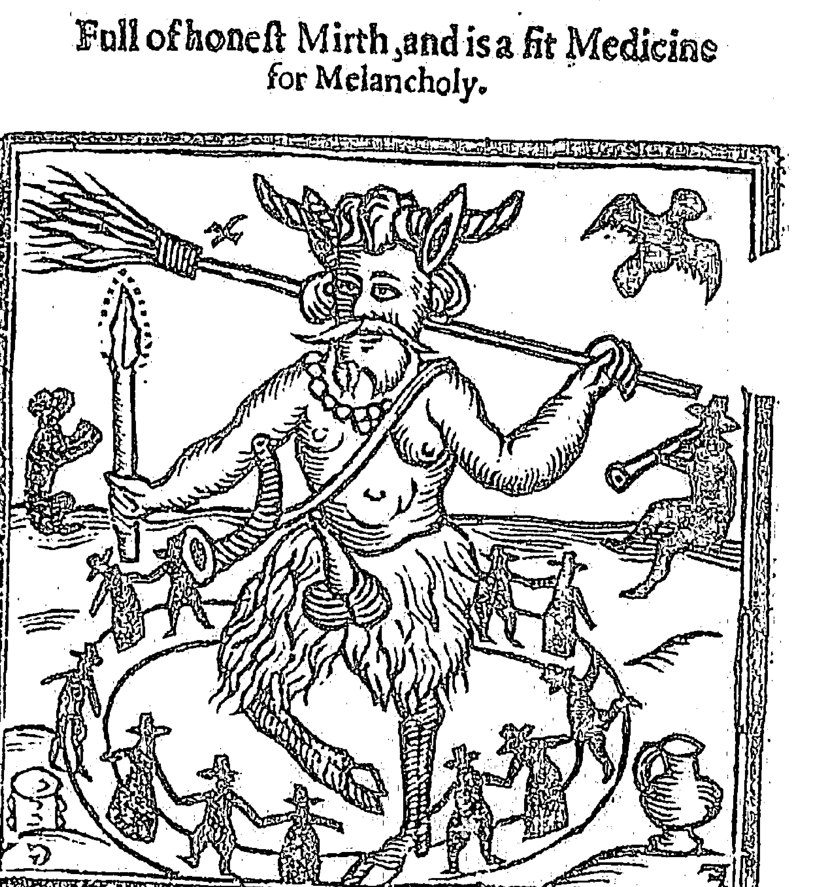

Printed at London by Thomas Cotes, and are to be sold by Francis Grove, at his shop on Snow-hill...ere the

□ 1639 年版《罗宾·古德非罗》的封面 科斯特·福亨图片库

## 赶跑厄运的马蹄铁

马蹄铁是好运的象征。英国海军上将纳尔逊阁下在他的旗舰“胜利”号的船桅上钉上马蹄铁，认为这会在战斗中带来好运。据说马蹄铁之所以是好运的象征，是因为它是新月形的，像月亮；也因为是由铁这种“具有魔力的”金属制成；还因为跟马有关，而马常与神和女神联系在一起。

古老的吉普赛民间传说讲到，一个吉普赛男子半夜骑马赶回营地，却突然见到有四个魔鬼：厄运、疾病、忧郁和死神在追赶他，而且厄运已经开始渐渐接近。当四个魔鬼穿过一条小路时，吉普赛男子的马甩出了一只马蹄铁，正好击中厄运的前额，当即使它丧命。吉普赛男子飞快地捡起马蹄铁，奔回了营地。而其他三个魔鬼则停下来埋葬了它们死去的兄弟。吉普赛男子把那只马蹄铁挂在他马车的门上，告诉其他部落的人，这只马蹄铁是如何杀死厄运的。

第二天，三个魔鬼来寻仇，但当它们见到挂在门上的马蹄铁时，便仓皇逃跑了。直到今天，吉普赛人仍相信马蹄铁可以赶跑厄运。

根据传统，在地上找到的马蹄铁是最适合挂起来祈求好运的。如果碰到的是开端朝向你，而底铁（胫骨底部的“脚趾”）朝上的马蹄铁，那么只要把它从你的左肩投出，同时吐唾沫，这样也能带来好运。但是，如果找到的是开端向你，而底铁朝下的马蹄铁，那么最好把它悬挂在附近的树木或篱笆上，这样厄运就会远远地离开。如果封闭的一端指向你，底铁或朝上或朝下，那么就把马蹄带回家，挂在前门，尖端朝上。这样会留住运气，让所有的厄运远离房屋及其住户。

有种迷信的说法说，把马蹄铁挂在烟囱上，可防止骑着扫帚的巫师飞进来。另一种说法是，把马蹄铁放在床头可以防止做恶梦。

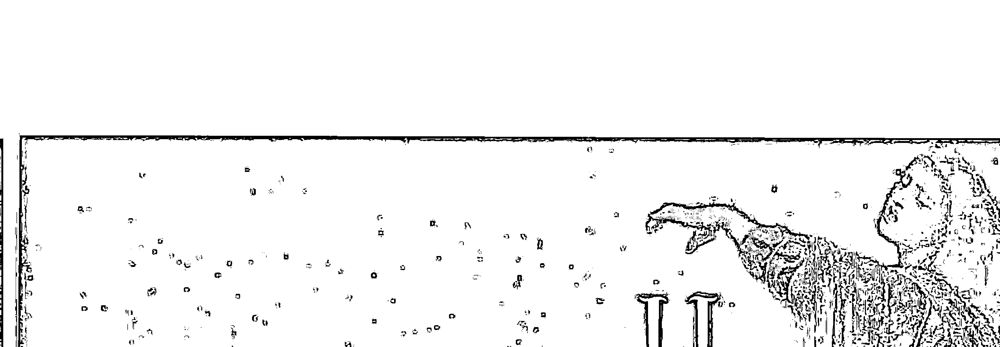

## 琥珀和碧玺与巫师有关

有两种石头与巫师紧密相关——琥珀和碧玺。然而，在真正意义上，它们并不是石头，碧玺是一种石化的树木，中世纪时被誉为“黑琥珀”；而琥珀实际上是石化的树脂，源于已经灭绝的针叶树。这些针叶树曾在七千万至四千万年前生长于波罗的海沿岸和其他地区。琥珀呈不规则块状、颗粒状或多角形，且近于透明。琥珀之所以透明，是因为树脂中含有微小的气泡。

希腊神话中，琥珀被认为是法厄同的母亲和妹妹的眼泪形成。法厄同是太阳神赫利俄斯与海洋女神克吕墨涅的私生子，他驾驭不了父亲那熊熊燃烧的带翼太阳车，最终被宙斯的闪电劈落在埃达努斯河中。他的母亲和妹妹为此抱头痛哭，她们的眼泪变成了晶莹的琥珀，法厄同温柔的妹妹赫利阿得斯则变成了白杨树。斯堪的纳维亚神话中，众神之父奥丁巡游世界各地时，他的情人弗雷亚撒下的眼泪就形成了琥珀。荷马史诗《奥德赛》第十八卷中，奥德修斯的妻子珀涅罗珀曾被赠与一条犹如金色阳光的精致琥珀项链。

尽管很稀少，但从红宝石到蓝绿色的不透明和半透明颜色的琥珀都有。琥珀颜色的变化取决于树脂中所含外界物质的多少。琥珀已经被雕刻成用作装饰的珠宝，或烟嘴之类的物品，它可能是被用于个人装饰品的第一种非宝石材料。

自石器时代以来，琥珀作为护身符被开始佩戴。人们认为琥珀可以治愈许多疾病，尤其对治疗哮喘非常有效。琥珀还能治疗的疾病包括甲状腺、耳聋、黄疸、咽喉疾病、视力不佳、丹毒（以皮肤突然发红，色如涂丹为主要表现的急性感染性疾病）、结膜炎、头痛等。正因为如此，能带来好运的琥珀就被制成了许多护身符。

琥珀受到如此推崇的原因之一，是当摩擦它时，它会产生负电荷的静电，而这种静电能够吸附小的纸片。希腊语中，“琥珀”是“电”的意思，从中我们也衍生出“电”这个词。

传说中提到的琥珀是猞猁尿液的固化物或者是石化的海豹和海豚的油，但希腊人和罗马人都知道其实琥珀来自树脂。

罗马的尼禄大帝曾把他妻子头发的颜色比做琥珀色，所以在他统治时期，古罗马人经常使用琥珀。中国人在制造熏香和香水时也大量使用琥珀。

## 黑魔法师克劳利

阿莱斯特·克劳利1875年10月12日出生在英格兰沃里克郡的来明顿，原名爱德华·亚历山大·克劳利，后来改名为阿莱斯特·克劳利。克劳利是富有的啤酒商爱德华的儿子，他的母亲叫埃米利，据说是个很普通的女人。爱德华是普利茅斯兄弟会中激进的牧师，普利茅斯兄弟会自称自己才是唯一的、真正的基督教。

克劳利在马尔文和汤布里奇接受教育，也请过私人教师。私人教师教会了克劳利喜欢女人、歧视异族和嗜好赌博。对此克劳利感激不已。1895年，克劳利进入剑桥三一学院，他读书很勤勉，并且开始写作，曾偷偷出版了第一首诗《流血之地》。在之后的十年中，克劳利写了30本书，其中很多是诗集。他还是个优秀的棋手、旅行家和狂热的登山家，有记录记载：1902年，克劳利曾登上了喀喇昆仑山。

童年时，克劳利曾和父亲一起传道，但他很快就厌倦了普利茅斯兄弟会，厌倦到他的母亲将他称为《启示录》中的大怪兽666。这引发了克劳利的灵感，他把自己看做是那大怪兽，还鄙视他的母亲，称她为“盲目的崇拜者”。

克劳利11岁时，父亲死于癌症，给他留下一笔巨大的遗产。此时，克劳利开始对神秘学产生了兴趣，在读完A．E．威茨的《黑魔法与条约》后，克劳利给威茨写了一封信，决定加入净光兄弟会。1898年11月18日，他成为伦敦洛奇“金色曙光”的成员，这个组织一年前刚成立，是净光兄弟会的外围会社。在入会仪式上，克劳利取名为普特波斯，意思为“我会一直坚持到最后”。

撒母尔·黎德二世·麦克逵格·马瑟斯是金色曙光的领导人，之后改名为麦克格雷格·马特斯。由于克劳利表现出他在魔法仪式方面的才能，所以和马特斯之间形成了竞争关系。由于他和马特斯的竞争，以及马特斯管理失误，导致了金色曙光的瓦解。

克劳利后来去了墨西哥，在那儿继续研究魔法，还成立了自己的魔法会社——银星会。

克劳利后来去了墨西哥，在那儿继续研究魔法，还成立了自己的魔法会社——银星会。

1903 年，克劳利与艺术家凯利·杰拉尔德的妹妹凯利·罗斯结婚。在去开罗考察途中，克劳利来到埃及博物馆展出的第二十六王朝遗留下来的一个木制石碑前，石碑上有荷鲁斯的形象。令克劳利感到惊奇的是，展览上的数字为 666，这是他作为《启示录》中的大怪兽的数字。在开罗期间，克劳利坐在自己建的庙里，三天后，他声称听到了神圣守卫天使爱华斯的声音，爱华斯口授给克劳利一些东西，这些东西后来被他收录进《律法之书》，该书还记载了克劳利的一句名言：“律法就是按照你的旨意行事。爱是法律，爱在意志之下。”早在 150 年前，弗朗西斯·达什伍德就曾写过类似的句子，他把“做你想做的”这句话刻在他那臭名昭著的“地狱之火俱乐部”的大门。后来，杰拉尔德·加德纳对此进行了改编，变为：“既然不伤害别人，那就做你想做的。爱是法律，爱是纽带。”

1909 年，克劳利在银星会的官方杂志《春秋分》上刊载了金色曙光的各种仪式，这让麦格雷格·马特斯非常生气。后来，克劳利又与德国一个强调情爱魔法的神秘组织——东方神殿教过从甚密。1909 年，克劳利与诗人维克托·诺伊堡发展成为同性恋人。1911 年 9 月 27 日，凯利·罗斯精神失常，克劳利又和玛丽·德埃斯特·斯奇斯同居。此后，克劳利和许多女人有染，他把所有的这些女人都称为性伴侣。

1915 至 1919 年间，克劳利生活在美国。1919 年 1 月，他在纽约遇见利亚·费西，便用一把烧红的刀子给她打上烙印，称费西是他的女人。第二年他们去了法国，在那儿，克劳利遇到了尼内特·沙姆韦，后者被他的魅力吸引，成了他的情人，并和克劳利移居到西西里岛的切法卢。在切法卢，克劳利举行一个为时极久的仪式，目的是替一只代表拿撒勒人耶稣的蟾蜍施洗，然后把它钉在十字架上。此时，克劳利的言行已引起地方政府的注意，1923 年 4 月，墨索里尼将克劳利驱逐出境，从那时起，他流浪于法国、突尼斯和德国之间。

1934 年，克劳利开始诽谤他的老友——雕刻师尼娜·哈玛尼特。而哈玛尼特则在她的传记里写到，克劳利就是传说中的黑魔法师。

二战结束后，克劳利退隐到英格兰南部沿海的黑斯廷斯。在那里他过得很低调，尽管有时也会有新闻报纸对他进行报道。1947 年 12 月 1 日，克劳利在黑斯廷斯去世，四天后被火化。葬礼上，路易斯·威尔金森朗读了克劳利的《泛赞美诗》。

阿诺德·克劳瑟和杰拉尔德·加德纳在克劳利生命的最后几个月里曾拜访过他。加德纳说，克劳利懂得巫术，但却认为巫术“太乏味”。克劳利赠给加德纳一个特许证，让其在马恩岛建立东方神殿教的分支。

### 火星魔法的一部分

几乎每种文明都将火神列入他们供奉的众神之列。最熟悉的如：古代波斯的光明之神，希腊的太阳神、壁炉女神，挪威的火与魔法之神，凯尔特人的太阳神，埃及人的太阳神，古罗马以及印度教中的太阳神。世界上许多宗教都承认火是神圣的象征，因此，通过凝视火焰来达到与神合二为一或赎罪的现象并不少见。

巫术中，火是魔法的一部分，与神明有关。威卡教上的圣餐台上必须有火，形式可以是蜡烛或燃烧的香。凝视火焰是占卜术中一种很流行的形式。就像孩子盯住即将燃尽的火焰，想象动物或其他场景一样，这样巫师或先知就能预测未来了。这种占卜术被称之为火占卜。

蜡烛魔法是另一种流行的火魔法。蜡烛代表着特定的人或物，用在仪式中是为了影响它们所代表的人。蜡烛也被用于占卜术中，其形式和凝视燃烧殆尽的火焰的方式相似。

### “灰色”魔法的捆绑符咒

起积极作用的魔法称为“白”魔法；起消极作用的魔法由于会给人们带来伤害，因而称为“黑”魔法；在两者之间，既不起积极作用，也不起消极作用的魔法称为“灰色”魔法。捆绑符咒就是一个典型的灰色魔法。

若干年前，有一群魔法师准确研究仪式魔法，他们试图通过念咒，召唤出在过去几个世纪庆典仪式上使用过的实体。然而，另外一个人知道了他们的实验，认为自己可以用关魔法师的故事赚钱。但他没有意识到，自己的做法很可能会毁坏别人的声誉，甚至于给魔法师们带来生命危险。

### 霍尔茨的魔法

汉斯·霍尔茨于1920年1月26日出生在奥地利维也纳，他对魔法的兴趣源于他对《魔法的真相》一书的研究，这是他第一次研究巫术主题。

霍尔茨成长在奥地利，就读于维也纳大学，之后又在哥伦比亚大学继续深造。他获得了伦敦大学应用科学博士学位，还是纽约技术学院的教授，曾在那儿教了八年的超心理学。

二次世界大战后，霍尔茨成为一位自由撰稿人。1949到1960年间，他担任《伦敦一周体育述评》的评论家，同时也是一位电视顾问。他是美国全国广播公司旗下电视剧《找寻……》的编剧，还参与了很多其他电视剧、纪录片和脱口秀的制作。他也创作剧本、舞台剧、音乐、音乐剧，为杂志写文章。

霍尔茨因为撰写了很多关于鬼怪和邪灵的书而声名鹊起。他说虽然他之前见过一些女巫，但激发他对魔法的兴趣的人却不是她们。他说：“是魔法本身深深吸引了我。”他相信人不能仅仅靠普通观察去了解一样东西，而必须深入其中。因此在美国和英国，他加入了巫术团体并参加了大量的仪式。

《新异教徒》是霍尔茨的第二本书，这是关于现代魔法和异教的一本著作，紧接着霍尔茨出版了《魔法报道》的平装本。第三本关于魔法的书是一本叫做《希瑟：一个女巫的自白》的小说。接着，霍尔茨又出版了《异教徒和魔法》和《魔法：魔法的方式》。尽管巫师很少认同他的观点，但这些书的确能使人们更加了解巫术。

2001年，霍尔茨仍在写作，大多是为电视剧和电影写剧本。霍尔茨说：“我正在考虑在今年做出一个大的转变——更多地转向视觉媒体。”

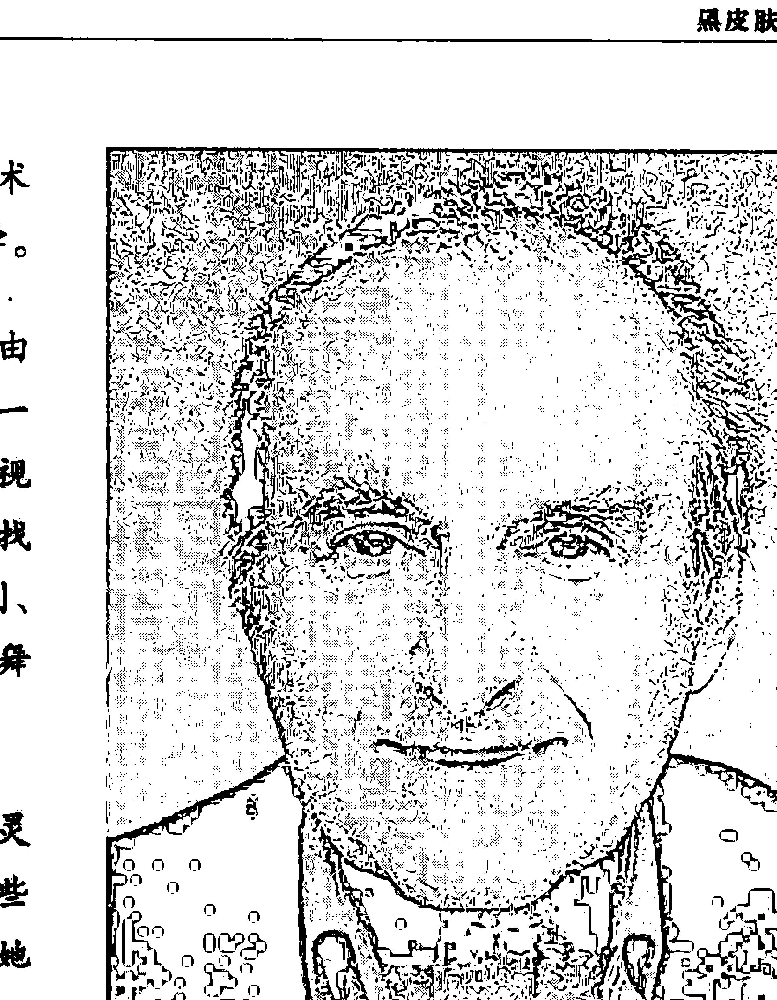

## 黑皮肤的女神

伽梨的字面意思是“黑皮肤的”。在印度神话中，伽梨是指湿婆的妻子雪山女神帕尔瓦蒂对事物的破坏性。通常她被描述为：挂着几个人头，踩在她丈夫的身上。伽梨女神是至高女神德薇的一个侧面。

伽梨女神常被称为马伽梨或“黑皮肤母亲”，除了是一个毁灭者外，她还是一个具有强大创造性的女神。关于伽梨女神的所有宗教仪式都带有狂欢性质，据帕特丽·夏摩纳罕记载，伽梨女神第一次出现，是在恶魔拉克塔维拉威胁上帝的时候。伟大的雪山女神帕尔瓦蒂对拉克塔维拉很是不满，恶魔的行径激起了她的愤怒，于是从她身上跳出手持三叉戟的伽梨将恶魔逐出了天堂。从此，伽梨作为一个强有力的女神而被她的信徒们膜拜。

据说伽梨击退恶魔后，与湿婆共舞。她跳得越来越疯狂，双脚不由自主地大力践踏土地，使大地动荡、山川崩塌，令三界众生的生活都受到影响，因此湿婆为减轻众生的痛苦，就躺在伽梨的脚下，任其践踏。尽管有不少缺点，但伽梨在印度女神中却有极高的人气。

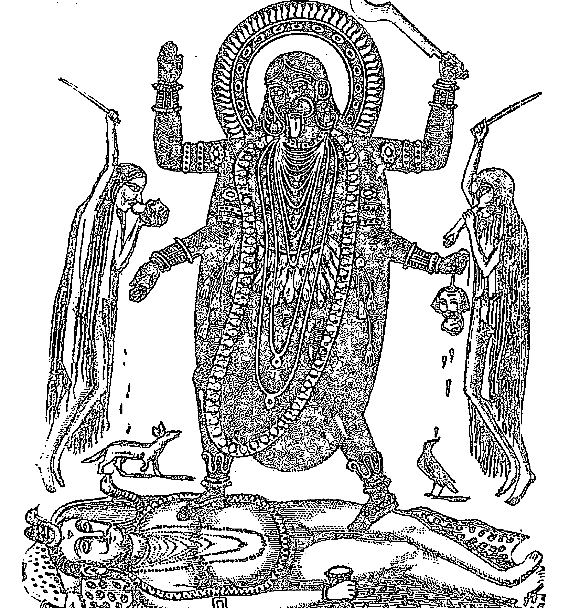

□ 19 世纪印刷的伽梨跳舞的情景 科斯特·福亨图片库

## 唤醒人体内的能量

在一些超自然体系中，人们认为昆达里尼是潜藏在所有人体内的一种能量，唤醒它就是“唤醒沉睡的大蟒”。因为人们相信，这种能量像蛇一样从人的脊椎一直延伸到头顶，该能量必须以正确的方式唤醒，否则就会非常危险。一般情况下，这条大蟒是沉睡着的，它盘绕在脊椎上。昆达里尼可以通过一定的瑜伽训练唤醒，随着能量沿着脊椎向身体的上方移动，它会流经七个脉轮点，并把潜藏在每个脉轮中的能量激活。

许多巫师让昆达里尼向上运行，经脉轮点来唤醒体内的“大蟒”，这是他们在施法前所做的准备工作，据说这样可以使法力增强。

## 红帽婆婆

红帽婆婆是对年老的巫师、治病术士或女巫的统称。红色总是与巫师密切相连。在爱尔兰，人们深信巫师在骑上扫帚前往巫师聚会之前要带上红色的帽子。

## 哈里·波特

哈里·波特是乔安娜·凯瑟琳·罗琳小说中的年轻男主人公。到本书创作时为止，已有四本关于哈里·波特的小说问世，另有三本也正在创作。哈里·波特系列丛书的第一本是《哈里·波特与魔法石》，该书赢得了多个文学奖项，成为世界上最受欢迎的儿童读物之一。迄今为止，该书已经先后在16个国家出版发行。

1965年，罗琳出生于威尔士南部格温特郡的齐普斯托，六岁时，她便创作了第一个故事《兔子》。罗琳毕业于埃克塞特大学，曾经当过一段时间的教师。在成为单身母亲后的某一天，罗琳在爱丁堡（也是其现居地）的一家咖啡馆开始了第一部哈里·波特小说的创作，当时女儿就睡在她身边。实际上，早在一列从曼彻斯特开往伦敦的火车上，罗琳便迸发出撰写哈里·波特的灵感，可惜的是当时她身边没有纸和笔。后来，她用了整整五年时间，才将当时的灵感付诸笔端。

《哈里·波特系列》讲述了一个少年魔法师的故事。故事以年仅11岁的哈里·波特与姨夫、姨妈以及表兄生活在一起开始，表兄的欺侮使得哈里的生活痛苦不堪，他一直被关在楼梯底下的壁橱里，甚至从未拥有过属于自己的生日聚会。有一天，一只猫头鹰给哈里送来了一封信，信的内容是要他去一所魔法学校学习魔法。哈里与他的父母一样都是魔法师，而姨妈一家人却没有任何法力。尽管姨夫和姨妈反对，但他还是背着姨妈全家前往霍格沃茨魔法学校报到。该系列共有七本，讲述了哈里在魔法学校七年的生活，期间他有过无数的冒险经历。

2001年11月，由该系列丛书改编拍摄的电影终于上映，丹尼尔·拉德克利夫饰演哈里·波特，艾玛·沃特森、鲁珀特·格林特分别饰演哈里的朋友赫尔米奥尼和罗恩·韦斯利。这部电影是由克里斯·哥伦布执导，片中的很多特技效果堪称一绝。

## 火精灵萨拉门德斯

在巫术中：空气、火、水、土等自然界中的“元素”，是“瞭望塔的卫兵”，守护着魔法圈的四个角落。后来这些元素被进行了拟人化的处理：空气精灵塞尔弗斯在东方，火精灵萨拉门德斯在南方，水精灵安丁丝在西方，土精灵侏儒在北方。

火精灵萨拉门德斯负责向人类传授用火的技能。在深夜的储水池或者沼泽地里，人们偶尔会看到化身为球形闪电的萨拉门德斯，后来基督徒将他出现时的样子命名为“圣艾尔摩之火”，并把萨拉门德斯说成是一个半人半蜥蜴的动物。

## 呼风唤雨的巫师

詹姆斯国王乘坐海轮驶向丹麦迎娶其15岁的王后安妮的途中，他的座船曾因一阵极不寻常的暴风雨而剧烈摇晃。根据当时北贝里克郡巫师事件的被告人之一——艾格尼丝·桑普森供述，当时正是她和其他巫师施法召唤来的暴风雨。

长期以来，民间都认为巫师们能够呼风唤雨。直到13世纪，人们对此都确信无疑。公元700年，大主教西奥多在他的《忏悔书》中下令：凡利用巫术呼风唤雨者，一律处以五年苦修的惩罚。其中，至少有一年的时间，受罚者仅允许以面包和水为生。

1595年，尼古拉斯·雷米在他的《鬼神崇拜》中宣称，他在与若干巫师进行了交流后，了解到他们是如何利用一根小木棒卷起池塘里面的水，并最终将其演变为暴风雨的全过程。巫师说，他们先将水变成云，进而控制云来形成雨水和冰雹。其他求雨的方法还包括：朝地面的小洞里小便，然后用魔杖把尿液和土壤混合在一起搅拌均匀；把一块燧石，从左肩的上方朝西扔出；挥动一把湿漉漉的扫帚；烹煮短毛猪；掩埋鼠尾草直至其彻底腐烂等。

据1716年亨廷顿一次审判记录记载，当时有证据显示被告人玛丽·希克斯用长袜和肥皂弄出一个大泡沫，随后一场暴风雨就产生了，最终导致众多船只葬身海底。1645年，自称为“首席巫师判官”的马休·霍布金在对17岁的布拉德斯顿牧师约翰·劳斯进行严刑拷打后，指控后者“制造了一场暴风雨，令一艘来自诺维奇的轮船沉入海底，导致14名船员罹难。”

如果说“所有”二字过于绝对的话，那么我们可以肯定的说，绝大多数关于巫师呼风唤雨的故事或者供词，要么是来自屈打成招，要么就是故事讲述者个人想象力肆无忌惮膨胀后的结果。

## 护身符

“护身符”一词源于希腊词根teleo，意思是“奉献”。它是一种被赋予神奇魔力的事物，通常起保护作用。一串念珠、圣克里斯托弗勋章，或耶稣受难的十字架，都可以是一种护身符。为关心的人特别制作的护身符拥有的法力最为灵验。因此，一般在商店购买的十字架或圣克里斯托弗勋章由于太过普通，没有特别的意义，起不到真正的护身符应有的效果。然而，如果是雕刻而成的护身符，则将拥有更强大的法力，如果再举行一下供奉仪式，那么正如其名称所暗示的，护身符将更为神奇灵验。

> 皮埃尔·布尔格在《护身符条约》中说：“护身符无非是些印章、数字、字符，或天体、行星或星座的预兆。它要么是一块灵石，要么是来自宇宙的金属，匠人在特定的日期、特定的时刻，在某个幸运之地和晴朗无风的天气里，当行星位于天空的最佳位置时，再以全副心思精心刻印、打磨而成，其间必须全神贯注，不被任何事物打扰。要使护身符获得更强的能量，可以采取同样的方法，同时亦与制符者的品德相关。”

> “……以全副心思精心刻印、打磨而成，其间必须全神贯注，不被任何事物打扰……”

当布尔格说这句话时，他指出了很重要的一点：要获得灵验的护身符，制符者必须全身心投入，心无旁骛地雕刻、绘制，且不能心系“完成”，亦不可去思量为何人所做，绝对的与世隔绝。

护身符可以是任何形状，由任何材料制成。很多护身符用羊皮纸或纸张绘制而成，其他一些为金属刻制物。出于不同的目的，制符的金属必须经过挑选。例如，银是代表月亮的金属，金是代表太阳的金属。

□ 一个护身符，据说有使诸天星辰都护佑佩戴它的人的能力 科斯特·福宁图片库

明亮的金属，因此可以用银来制作于与月亮相关的护身符：梦想、失窃或经营。更进一步要求，制作该护身符必须在某个星期一，因为周一是月亮日，同时应在月亮日的特定时段，即白昼的第一个小时或夜间。

金属与每周的对应及其属性如下：

- 星期日——太阳——金：运气、希望、金钱。
- 星期一——月亮——银：梦想、经营、失窃。
- 星期二——火星——铁：敌人、婚姻、监狱、战争。
- 星期三——水星——水银/铝：债务、恐惧、损失。
- 星期四——木星——锡：衣物、欲望、荣誉、财富。
- 星期五——金星——铜：友谊、爱情、陌生人。
- 星期六——土星——铅：建筑、教条、生命、保护。

根据金色黎明修道会的说法，护身符是一种带有其象征意义的神奇魔力的形体，它通过铭文和开光获得力量。铭文可以书写或铭刻于护身符上，书写在纸张或羊皮纸上的铭文，通常是用手工磨制的墨水，以羽毛制成的羽毛笔撰写。之后，还必须将符纸洒过盐水，过了香火，开光才算完成。

加诸在护身符上的事物是仪式过程中最重要的一部分。它可以是一个字或一句话，也可以是一种图章或其他的传统图案。中世纪的许多护身符是几何花纹夹杂神奇的符号标志组合而成。护身符制作时所注入的能量越多，其功效越为灵验，遵循此教义，通常会要求制符者必须倾注极大的专注力，然后在符上加入一个个神奇字符。符咒可以由诸如幻方一类的元素构成，同时还要将其所代表的意义注入强大的能量。在羊皮纸上绘制幻方时，幻方应着黑色，而数字或字母为红色。绘制全过程必须将羊皮纸竖直放置，以防制符者的影像投射在纸上，而且红色字体不得接触任何黑色部分。和所有的魔法物品相同，护身符完成投入使用前必须进行适当献祭。

制作护身符第一步，首先要明确其用途。它将作为何用？是用于保护、祈求爱情、治愈伤害、获得力量，或一些其他的目的。一旦确定了需要，还应将该需求浓缩为一句简单的语句。如此，巫师或魔法师才能判断出对应于该目的的行星以及周日。例如，星期二适合婚配，星期五适宜产生爱情，星期四有助于欲望达成。那么这三天哪一天更适合该护身符呢？制成的护身符会产生一段新恋情吗？还是会影响到对爱情的渴望甚至是一段已经存在的婚姻？

护身符使用前还必须进行供奉。只要佩戴上该护身符，它将持续发挥其功效，从宇宙吸收所需的能量。

## 黄道十二宫

占星学和天文学中，黄道带是指一年中太阳、月亮以及主要行星的轨道在太空形成的重叠区域。当一个观察者站在地球观察宇宙时，会发现行星基本上都运行在一个非常狭窄的区域，其大致范围在黄道（即太阳在天球上的路径）两侧正负八度左右。占星学的基础是“地球中心说”，实际上行星真正的运行方式是在一个大平面内围绕太阳运行。

公元前3000年的两河流域，人们把很多看起来距离很近的天体分别组合在一起，并且以与之形状相似的动物或者物品为它们命名，这就是星座。黄道带附近的星座大多是以动物命名的，因此希腊人称这个区域为“动物圈”，这就是黄道带一名的由来。

进入“希腊化”时代以前，两河流域的数学和天文学得到了长足发展，天文学家能够精确地确定黄道带附近星座的数量以及星座间的边界。根据太阳在天球上运行的轨迹，人们把黄道带附近的天体分成了12星座，它们分别是：白羊座、金牛座、双子座、巨蟹座、狮子座、处女座、天秤座、天蝎座、人马座、山羊座、水瓶座以及双鱼座。其实这12星座中，只有狮子座名副其实。而且至今人们仍然不清楚，当初这12星座的名称究竟是如何得来的。中世纪晚期，这些星座的符号首次出现在一些希腊文的手稿中。

公元前三世纪，埃及正处在希腊的统治之下，也正是在此时，“黄道带”的概念传入了北非国家。当时，占星术思想得到了突飞猛进的发展，这一思想将来自埃及、希腊以及巴比伦的诸多元素融为一体，对天体的能量以及天体与黄道带之间的关系有着一定的理解。随后，占星学思想传入了罗马、拜占庭、印度以及其他一些国家。在古代墨西哥的法律中，就出现过占星术的用途及其相关使用范例。

某些理论认为，世界各地的石质历史遗迹都与占星学和天文学有关。这些理论还相信，这些遗迹，实际上就是古代的计算机。据杰拉德·S·哈金斯在20世纪60年代早期的研究结果，英国的巨石阵就是上述理论的一个最佳例证；而位于美国新汉普夏州神秘之山上的“美洲巨石阵”以及位于法国卡纳克小镇的史前纪念巨碑，尽管规模比英国的小，但依旧是这一理论的证据。德雷克和茱莉亚·帕克说，在所有的古代天文学遗迹中，埃及的金字塔当之无愧的排在榜首。因为金字塔的顶端指向当时埃及人心目中的北极星。

巫术传统中不存在占星术，不过依旧有很多巫师喜欢通过它来预测未来。甚至有很多人认为，占星术是魔法的根基之一。一部分巫师将草药运用、预测占卜方面的心得成果，写入自己的《影书》；而另一部分巫师则在书中记录了有关占星术和黄道带的其他发现。

占星术的核心思想，是通过研究行星与地球之间的关系来获取能够影响人们生活的信息。赫尔墨斯·特利斯墨吉斯特斯（魔法大师，据称与埃及神话中的月亮之神透特有密切的联系）的《翡翠碑文》上有这样的文字：“下界之物与上界相同，而上界之物也与下界无异”，或者“天堂会在人间有所反映”。

## 祭坛制作方法

祭坛被认为是神庙中最神圣的部分。其实，祭坛只是一张桌子，其作用是放置仪式中用的各种用具。在原始社会，祭坛是用来摆放贡品的地方，通常是一个大的、自然而平整的石板。新罕布什尔州塞勒姆的一座小山上，可以看到一个祭坛石，上面嵌有一道深沟，这道深沟沿着石头的四周运转。这就是传说中的“血道”。虽然没有确切的证据可以证明血祭要在特定的场所进行，但人们在各种社会，如阿兹特克文化中，就发现过血祭，甚至是人祭，比如南美的阿兹特克人在举行祭祀太阳神的仪式时，其国王亚威佐特一次性就祭杀了两万战俘。这次祭祀活动中的祭坛石长五英尺、宽三英尺、高三英尺。

血腥。事实上，如果不是最具宗教色彩的仪式，是无论如何也不会要求进行血祭的。古代埃及祭坛通常以小桌子的形式存在，只能摆放焚香炉和罐子。而且许多地方的祭坛：如美索不达米亚、叙利亚和巴勒斯坦，是用石头相互垒砌的方式再在其上加一块燧石或火盆组成。许多希伯来祭坛呈正方形，而且祭坛的每个角都会延伸出一部分，这被称做“角坛”，米吉多古迦南遗址中的祭坛就是其中的典型代表。

希腊人有两个祭祀各种神灵的公共祭坛，祭坛中的火连续不断地燃烧。希腊人还有家用祭坛供家庭使用，庞培城中，可以看到家用祭坛被放到居民自家的厨房；而在其他一些情况下，家用祭坛会被放在特定的房间。一般来说，早期的希腊祭坛是三角架的形式，在德尔斐和其他地方作为女巫和女预言家的座位来使用。芭芭拉·沃克说，祭坛的三条腿的模式是女祭司和三种精神预言的组合。

美洲原住民也使用祭坛。霍皮人和其他印第安村庄的居民用沙子建造了他们的祭坛，并在祭坛的后面装饰屏风。密西西比河以东的筑堤人，总是在土堆中间建造一个中空的黏土祭坛。这些祭坛长六英尺，并且其中填有木炭和人体的骨骼碎片，暗示这其实是祭奠死者的仪式。

海地伏都教的神庙中，其列柱廊式神庙在形式上为圆形，通过中间一个柱状物支撑屋顶。此柱状物被称为波托·米坦，在柱状物的周围建有一个祭坛，主要礼拜的神灵是丹巴拉神。丹巴拉神是一条神蛇，被认为生活在波托·米坦的顶部。

巫术传统中，祭坛是宗教聚会的中心。巫师在神圣的圆圈处聚会，这就是他们的神庙。巫术传统中没有任何的祭献，因为所有的巫术教派都认为，生命是神圣的。巫术传统的祭坛通常放在圆圈中心，虽然根据特殊的传统，也有可能在北边或东边。但在加德纳巫术传统中，祭坛确确实实是放在圆圆的中心部位，上面摆放着两支白色的祭坛蜡烛，以及香炉、神和女神像、五芒星、天罚之锤、灯芯绒衣、白柄刀、剑、魔杖、盛有盐和水的容器、葡萄酒酒杯、女祭司和首席祭司在仪式上使用的双刃匕首。

巫术传统中，如果仪式在户外举行，祭坛可能会是一根树桩、一块岩石、一个原木或一张圆形的桌子，然后在其上放置一个白色的祭坛蜡烛、神和女神的塑像、香炉、盐、水、角杯、剑和被称为“树”的仪式书。首席祭司或女祭司还会把他或她的大砍刀放在祭坛上。

不同的巫术传统对祭坛的布置各不相同。总之，祭坛会摆上蜡烛和香炉，然后是作为饮酒器的高脚杯、角、圣杯，和一些形式的受膏，如盐、水或者油。此外，一些祭坛似乎可以盛放任何东西，包括现场每个人的刀，而另一些祭坛所能摆放的物品种类可能很少。再就是祭坛可以使用祭坛布，也可以不使用。

斯哥特·坎宁安建议用三块石头建一个祭坛：两块大小相同的石块分别竖立在两旁，较大的石块作为祭坛面放在它们上面。把较小的石块放在顶部可能代表神或女神，但是不清楚的是，为什么两块支撑的石块反而不能代表神灵。

一些巫术仪式，如蛋糕和葡萄酒等较大的祭祀中，女祭司将坐在祭坛的边缘，而且如果祭坛够长的话，则可能会被清洗干净，以便裸体的女祭司平躺在上面。如果做不到这一点，女祭司将会躺在祭坛前的地面上。

> 多琳·瓦林特说：“用女性的裸体作为祭坛的礼拜和呼唤生命力量的方式，可以追溯到基督教开始之前，回到古代对伟大自然女神的膜拜，自然女神面前所有的事情都将合而为一。”

宗教仪式或仪式魔法中，祭坛代表宇宙的中心。西方超自然传统中，理想的祭坛是用石头建造的，但是大多数祭坛却通常用木头制成，为一个两英尺宽乘两英尺高的双立方体。在多种形式的仪式魔法中，祭坛的建造尺寸很精确，其表面刻有一个来自传统魔法字母表的雕刻或魔符，这些雕刻或魔符通常是底比斯、埃及象形文字或符文。一般来说，雕刻或魔符没有仪式魔法那样讲究，不过根据个人喜好，这些雕刻或魔符往往会带有巫师的个人风格。

一些巫术祭坛被精心雕刻出神灵的模样，或植物和动物的形状。有些则什么也没有雕刻。桌子、树桩、盒子，甚至是抽屉柜都可以用来制作祭坛，对于怎样构成祭坛也没有标准。英国的巫术崇拜者使用的祭坛由两个巨大的紫杉原木制成，顶部安放着一个坚实的石头；法国则更为简单，一块白布直接铺在地上，再在其上放置木头、石头、陶土、土、砖或者混凝土，都可以组成神圣的祭坛。

部分巫师在祭坛上都摆放有代表神和女神的小雕像，但有时蜡烛会被用来作为神和女神的代表。所以买到被塑造成男性或女性形状的蜡烛是可能的，而且用这些蜡烛来代表神和女神再合适不过了。

## 祭坛用的蜡烛

《影书》说：祭坛上应该有火。在一些巫术传统和单独的仪式里，只用一支蜡烛，这支蜡烛被称为祭坛蜡烛。而在其他的传统中，一般使用两支蜡烛，分别代表神和女神。大部分巫师在祭坛上都摆放有代表神和女神的小雕像，但有时蜡烛会被用来作为神和女神的代表。

祭坛上的蜡烛通常是白色的，但是巫师们为了特殊的巫师聚会或者季节性庆典，通常也会使用某种颜色适宜的蜡烛。例如五朔节的深绿色蜡烛、圣烛节的棕色蜡烛、收获节的黄色蜡烛、万圣节的橘色蜡烛、复活节的白色蜡烛。此外，还有用于其他目的的颜色：红色用于激情和力量；粉色用于爱与友谊；蓝色用于和平与宁静；黄色用于学习和成功；绿色用于生育和财富；紫色用于灵性和力量；黑色用于驱逐负面能量和献祭。

## 祭坛布

许多巫师不使用祭坛布，他们把祭坛器皿放在裸露的木质或石质祭坛上。但有一些巫师喜欢用素色或彩色的布来装扮他们的祭坛，更有些巫师会在布上缝制或描绘一些复杂而深奥的符号。和祭坛蜡烛一样，祭坛布的颜色与巫师聚会和一年中的某个时间有着某种特别的联系。

## 金字塔文

约公元前二千五百年，古埃及的《金字塔文》被认为是最古老的著作，书中提到沐浴仪式有净化和复活的作用。《金字塔文》提及此仪式可以确保死者能成功复活，并且这一仪式同样适用于活着的人。据说在依洛西斯教派的秘密仪式中，第一项内容是在海水中沐浴，以净化身体和精神；在神秘的锡贝尔勒和阿提斯教派中，同样也有一个称为牛祭的沐浴仪式。之所以称为牛祭，是因为该仪式需要宰杀一头公牛，人们将在牛血中沐浴。

沐浴仪式是为了净化心灵，是许多文化的一部分，已有几千年的历史。《死海古卷》中说，新的成员加入宗教团体之前，“洒水来清理肉体的不洁，再用净化之水为他洗礼。”

大多数巫术传统中，每画一个魔法阵之前都要进行沐浴仪式。这个仪式特别重要，沐浴仪式要在第一个仪式内容开始之前进行。沐浴时身体部分浸泡在水中，水中要加入象征着生命的盐或者草药（如薰衣草、柠檬叶、迷迭香、缬草）及油。

## 教会对巫术的看法

《主教会规》是早期的宗教文件，其来源不详。几个世纪以来，罗马天主教对巫术的了解都来源于《主教会规》。大约在公元十世纪，特雷维斯修道院院长，勃鲁姆的雷吉诺首先引用了《主教会规》中对巫术的界定；大约在公元十二世纪，博兰尼亚的格拉提安将《主教会规》并入到《教会法》，从此《主教会规》就成为《教会法》的一部分。

早期的教会法认为巫术是异端邪说。由于只有上帝拥有超自然的神奇力量，所以诸如骑着扫帚飞过天空或破坏农作物这种事情是不可能存在的。但后来，教会理论家不但全盘接受了这一观点，还因此走上极端，开始了极其残忍的宗教迫害运动。

《主教会规》认为，巫师被恶魔制造的谎言与假象欺骗。他们相信并且公然声称，在夜深人静之时，巫师们骑在一群牲畜上，与异教女神黛安娜以及无数游牧部落的妇女飞过广袤的土地。巫师们听从黛安娜的命令，把她看成是自己的主人。某些晚上，巫师们会聚集在一起，倾听她的旨意，为她服务。

相信这些事情或类似事情的人会丧失他们的信仰，真正相信上帝的人才是上帝的子民。因此，教会认为巫术是一种谎言，相信这个谎言的人都是邪恶的异教徒。

### 旧事幻现

“Déjà Vu”是法语单词，意思是“已经看到的东西”，心灵学家用它来指人们在经历的一些事情中重生的感受。

人们感到一系列发生的事件好像在以前就发生过，这些事情有着完全相同的对话和场景。这可不是寻常的经历，它有时与转世投胎这一说法有关。人们认为早期的经历实际上发生在一个人的前世。旧事幻现这一现象没有任何的预兆，可能会持续一秒、一分钟或者更久。尽管人们强烈的感觉到当时发生的事情在以前经历过，但是却很难查证是否真的发生。大多数巫师们相信旧事幻现是前世生活的一个预示。

### 汲取月亮或太阳的能量

巫术中，月亮和女神有联系，太阳与上帝有联系。太阳和月亮不像神灵那样被崇拜，只是被看做神灵的象征而已。月亮的性别是多变的。埃及神透特是月神；格陵兰岛的布西曼族认为，月亮是男性；在阿留申神话“太阳姐妹，月亮兄弟”中，月亮是男性；在南美印第安人中也流传着类似的神话。然而在北美洲，月亮在这一种情况下可能是男性，在另一情况下又可能是女性。墨西哥北部的科拉印第安人认为，月亮和太阳既是男性又是女性。

巫术中的月亮总是和女神联系在一起，满月被认为是跟女神交谈的最适宜时机。这样做在仪式上称为“汲取月亮的能量”。在满月举行的仪式上，大祭司跪在女祭司面前祈求女神，用魔棒的末端轻轻触摸她身体的某些部位，同时嘴里念道：我祈求并召唤你，我们伟大的母亲啊，给我们带来丰收的神啊！我用种子、用根召唤你；我用茎干、用蓓蕾召唤你；我用叶子、用花朵、用果实召唤你，我用生命、用爱召唤你，我恳请你屈尊降临到这位大祭司和仆人（名字）身上。用她的舌头讲话，用她的手触摸，用她的嘴唇亲吻，那样，你的仆人会很满足。

因而，女神被请求进入女祭司体内，并通过她说话，尽管实际的言语措辞可能在不同的传统中有所不同。

太阳的能量通常在春分或夏至时汲取，因为这些时候太阳的力量被认为是最强大的。仪式通常在日出时开始，参与者面向东方，迎接初升的太阳。大祭司或女祭司会念诵祷文，请求上帝（或男神）赐予力量、洞察力和祝福。在某些传统中，人们会在阳光中站立或缓慢旋转，想象金色的能量流经全身，净化并充能。

无论是汲取月亮还是太阳的能量，核心都在于建立与神性象征的连接，并通过仪式行为将宇宙能量引入个人或仪式空间，以达到疗愈、增强魔法力量或促进灵性成长的目的。

## 精灵

精灵信仰历史悠久，流传甚广。苏格兰人、爱尔兰人、威尔士人和布列塔尼的凯尔特人、斯堪的纳维亚的日耳曼人、德国和英国人都将精灵视为同类。精灵们过着群居生活，有自己的家庭与住所。在爱尔兰语中，精灵被称为 sheehogue。据《阿马书》载，精灵是“土地神”。作为达努神族，精灵是爱尔兰异教徒崇拜的神。在苏格兰高地，精灵被称为“迪娜精”或者“和平之人”。

J . F . 坎贝尔在 1890 年写到：

我相信在这些（英国）岛屿上曾生活过一小支人类的分支族人，他们就是精灵。与精灵相关的信仰并不仅限于苏格兰高地，他们的故事流传如此之广，如此之真实，如此之连贯，就连整个大不列颠王国的人们对此也深信不疑，因此我相信在这些岛上曾有过精灵的存在，他们的个头比凯尔特人要小，使用石箭，像拉普兰人那样生活在圆锥形土堆中，知道一些机械知识，会偷物品和孩子，也许还与野牛和野马等一些物种生活在同一时代。

精灵个头的大小备受争议。坎贝尔认为他们“比凯尔特人要小”，但也不是极小。在对巫师的审判过程中，人们也有过相似想法。琼安·泰尔曾谈到，她从前在陶顿的市场上碰见一个手拿白色棒子的男人，她走向这名男子，想跟他交个朋友，但接下来她眼前有一会儿什么也看不见。很显然，在很多时候，精灵们不愿被人们看见，因此看到他们的人会失去视力一段时间。琼安显然没有意识到拿白色棒子的男人就是个精灵，而只把他当成市场上的普通人。1615 年，奥克尼·琼尼·德弗被判有罪，因为她“在韦斯特雷的山区抚养孩子，有一天还拜访了她的精灵邻居”。法夫郡的阿方索·皮尔梭在 1588 年说：“一个穿着绿衣服的男人出现在她面前，身体强健，身后还跟着很多男人和女人。”她还提到精灵们在制药：“邻居们用锅和火制药膏，在日出前采集好药草。”约翰·沃尔什大师 1566 年拜访了居住在多西特内瑟伯里的精灵，他们的谈话是“在山间进行”的。1662年，苏格兰的老巫师伊索贝尔·顾代说，她从“唐尼山区”精灵王仙后那里得到了吃都吃不完的肉。”她接着说，“精灵王后穿着白色亚麻布制的白棕色衣服，看起来很华美，精灵国王看上去就像天之骄子。”所有这些例子中，精灵们有着几乎和人类一样大小的体型。有时人会偶遇精灵而不自知，后来才醒悟过来那是精灵。甚至还有人和精灵通婚的记录。在《温莎的风流娘们》中，莎士比亚确认过精灵的大小，他笔下的佩奇夫人体态成熟，不仅穿得像个精灵，还希望人们把她当成精灵。

瑞士主教奥劳斯·马格鲁斯讲述了骑士拜访精灵山的情景。精灵要比骑士矮小，但绝不是极其微小的人。据说，有时精灵喜欢上人类的小孩后，会把人类的小孩带走，而把自己的小孩留下。这种交换的方式数年来都未曾发现，因为这些孩子的身高不相上下，没什么明显的区别。

拉普人、皮克特人及精灵都是身材矮小的种族。据说精灵生活在空山洞和地底。在苏格兰和英国其他地区，有很多地下建筑和人工土丘，其内部结构显示曾经有人居住于此，它们被称为“精灵山丘”，在有些地区，这也是“皮克特人”的房屋。1443年，奥克尼主教在其手稿中写到，哈拉德·赫拉法基在九世纪征服了奥克尼，那里的居民就是现今早已灭绝的帕佩族和佩蒂族，而佩蒂族正是皮克特人。

据说奥克尼的皮克特人“仅仅比侏儒高一点点，但他们修建的城市却令人惊叹。他们日日夜夜辛勤劳作，只在每天中午把自己藏在地下的小房子里”。克里斯蒂娜·赫尔谈到：“凯尔特入侵者征服了这些原始部落，而身材矮小、行动快捷的皮克特人则分散到荒郊野外，居住在草皮覆盖的房子里，他们的房子乍一看，就像绿色的山丘，很容易被漫不经心的旅行者忽视。”

赫尔继续说：“他们经常同征服者结婚，这一点似乎可以从很多故事（如精灵妻子的故事，或人类妇女被带至精灵王国的故事）中找到确凿的证据。”

巫师可能对这个小种族的历史知之甚少，但二者有着许多的共同点：如都熟谙草药，并使用草药治疗疾病，而且都会使用魔法。除此之外，他们都使用“精灵螺栓”——一种从手指间射出去的箭。

精灵常活动于英国达勒姆的众多地区。据当地传说，彼普顿与林汉姆附近有两座山丘，过去常常被精灵占据。甚至位于达林顿与德汉姆之间的轮渡山，也因众多的精灵出没而被称为“精灵山丘”。

日本的耶索矮人，也是幸存至17世纪初的侏儒种族。他们身高四英尺，生活在地表浅处的洼地里，近年来，人们越来越开始相信他们曾经的存在。在居住于库页岛和北海道的阿伊努人的阿伊努语中，“低地居住者”与牛蒡叶发音相同，因此就有这样的说法：耶索矮人的名字表示他们“居住在牛蒡叶下”而The request was rejected because it was considered high risk

## 黎明女神的诅咒

多恩的女儿阿莲赫德是威尔士的黎明女神。凯尔特神话中，麦斯昂威之子麦斯强行将他的双脚放在年轻少女的大腿上。唯一一次他没有这么做，是他即将参战时。麦斯的外甥吉法斯威爱上了“托脚”少女格埃温，他利用哥哥格威迪恩的阴谋强行与其发生性关系。听到这个消息，麦斯将他的两个外甥变成了动物。第一年，他们变成了鹿，之后变成了野猪，一年过后，又变成了狼。格威迪恩变回人形时，他提议让他的妹妹阿莲赫德来填补“托脚”少女的空位。在接受请求前，麦斯要求阿莲赫德跨过他的魔法棒以测试其贞洁。阿莲赫德失败了，她跨过魔法棒时，两个婴儿掉了下来。其中一个是狄伦·伊尔·顿，另一个被反应灵敏的格威迪恩接住，然后后藏了起来。这个婴儿就是后来“聪明的巧手”——卢·劳·芝弗。恼怒的阿莲赫德诅咒芝弗永远不会使用武器，永远不能与人类婚配。后来，她被诡计多端的哥哥格威迪恩欺骗，她哥哥用橡树、金雀花和绣线菊的花瓣做成威尔士最美丽的少女布罗德韦德。阿莲赫德以美丽著称，是一个小有名气的女神，她名字的意思是“银轮”，与极地附近的星星相关。她是生育女神，也是月亮女神和启蒙女神。她的圣物是柳树。斯图尔特·法勒认为，麦斯的恋足癖实际上认可了女性主权原则——女性即是君王，是国王权威的验证。法勒说，阿莲赫德的居所在北极星周围的星盘。现代巫师的聚会中，有描述通往那里的路径，巫师沿着螺旋形的道路，一步一步向里走，从外围慢慢向中心靠拢。

## 来自石头中的力量

自古以来，一些物体被赋予了超自然的能力。幸运石——宝石和准宝石已经被占星师和魔法师使用了千百年。而且希腊人和罗马人也相信石头中有一种力量。

通过石头的颜色，可以判断出它具有的特殊力量。因此，不同的石头常有不同的能力。例如，在宝石疗法中，红宝石、石榴石和珊瑚红能促进血液循环，因为他们的颜色与血液的红色对应。由于人们认为蓝色有保持镇定的效果，所以蓝宝石、绿宝石和天青石被用于治疗发烧。

诞生石和生日有关，会给特定时间出生的人带来好运、健康和兴旺。中世纪占星术建立了出生日期与诞生石的关系，尽管为了适应石头的成本、流行度，以及考虑到石头的供求，特殊的日期一直在变动，但人们还是乐于相信这些。

最初有人认为，在犹太大祭司亚伦的胸甲上，可以找到与自己相对应的石头，但是经过研究发现，这并不符合事实。还有人说，12颗石头代表了以色列的12个部落、一年的12个月和黄道12宫的12星座，它们三个为一排，共有四排。按照《出埃及记》第二十八章17~20页的内容，石头是如下排列的：第一排为红宝石、黄玉和红榴石；第二排为绿宝石、蓝宝石和钻石；第三排为紫玛瑙、玛瑙和紫水晶；第四排为绿宝石、黑玛瑙和碧玉。这些名称也许与现在的称呼不一致。例如，圣经中的“蓝宝石”很可能是青金石，而不是我们现在说的蓝宝石。而且“钻石”很可能是我们今天知道的白色黄玉。

因此，诞生石不是一成不变的，它们随着时代而改变。以下是一些从魔法师和巫师那里获得的星座与宝石的对应关系：

- 白羊座：红宝石、鸡血石、红碧玉
- 金牛座：黄玉金、珊瑚、绿宝石
- 双子座：水晶、红水晶、海蓝宝石
- 巨蟹座：绿宝石、月长石
- 狮子座：红宝石、红纹玛瑙、琥珀
- 处女座：粉红色的鸡血石、绿松石、锆石
- 天秤座：蛋白石、钻石
- 天蝎座：玛瑙、石榴石、黄玉
- 射手座：紫水晶
- 摩羯座：黑白相间玛瑙、绿玉石、宝石
- 水瓶座：蓝宝石
- 双鱼座：钻石、翡翠

如果你希望知道你的诞生石直接对应的是一星期中的哪一天的话，下面是宝石与星期的对照表：

- 星期日：金色和黄宝石
- 星期一：珍珠和所有白色石头
- 星期二：红宝石和所有红色石头
- 星期三：绿松石、蓝宝石和所有蓝色石头
- 星期四：紫晶石和所有紫色石头
- 星期五：绿宝石和所有绿色石头
- 星期六：钻石和所有黑色石头

因为诞生石与黄道十二宫有联系，戴维和朱丽亚帕克给出了下面的对照表：

- 白羊座：钻石
- 金牛座：蓝宝石
- 双子座：玛瑙
- 巨蟹座：珍珠
- 狮子座：红宝石
- 处女座：红纹玛瑙
- 天秤座：蓝宝石
- 天蝎座：乳白石
- 射手座：黄玉
- 摩羯座：绿松石
- 水瓶座：紫水晶
- 双鱼座：月长石

有些麻烦的是，许多官方使用的是阳历时间，而不是黄道十二宫。所以，在《命运》一书中被称做“大东方”的亚瑟·爱德华·怀特给出了以下对照表：

- 一月：石榴石、锆石
- 二月：珍珠、紫水晶
- 三月：碧玉、红宝石
- 四月：钻石、蓝宝石
- 五月：海蓝宝石
- 六月：玛瑙
- 七月：红宝石、红玉髓
- 八月：月长石、红纹玛瑙
- 九月：贵橄榄石、蓝宝石
- 十月：蛋白石
- 十一月：黄玉
- 十二月：孔雀石、绿松石

《大英百科全书》认同其中的一些，并给出了古代和现代石头名称对照表：

| 月份 | 传统的 | 现代的 | 合成的 |
| :--- | :--- | :--- | :--- |
| 一月 | 石榴石 | | 石榴石 |
| 二月 | 紫水晶 | | 紫水晶 |
| 三月 | 鸡血石 | 海蓝宝石 | 海蓝宝石 |
| 四月 | 钻石 | | 刚玉 |
| 五月 | 翡翠 | 翡翠 | 翡翠 |
| 六月 | 珍珠 | 紫翠玉 | 养殖珍珠 |
| 七月 | 红宝石 | | 红宝石 |
| 八月 | 红纹玛瑙 | 橄榄石 | 橄榄石 |
| 九月 | 蓝宝石 | | 蓝宝石 |
| 十月 | 蛋白石 | 电气石 | 玫瑰锆石（粉红色或绿色） |
| 十一月 | 黄玉 | 黄玉石英 | 黄玉（黄水晶） |
| 十二月 | 绿松石 | 锆石 | 锆石 |

## 灵魂出窍

灵魂面是肉体之外的第一个平面或空间。肉体死亡后，所有的灵魂都会与肉体分离，进入这个平面。但是灵魂也有可能在人们出神或睡眠中暂时与肉体分离，来到灵魂面。这就是所谓的灵魂出窍。福多提出，灵魂面是细微结构的物质。事实上，我们知道所有的物质都是由不同振动频率的原子构成。神秘学家认为，宇宙被这些振动分成了许多平面，每个平面都以不同的频率振动。灵魂面似乎就是将物质世界的外观复制到了灵魂上。

肉体有一个完全不可见却具有强感应的复制体，这就是人们常说的“灵魂”或“分身”，这是一种在恍惚状态下、睡眠中或死亡时灵魂脱离肉体的形式，所以也可以看成是灵魂的形式，至少是死亡时灵魂立即采取的形式。正如福多的观点所述，灵魂面是细微结构的物质，因此它与灵魂体是一起的。当它离开肉体时，能够穿过看起来很坚硬的物体。

在灵魂面上，我们的灵魂可以瞬间移动，想到哪里就立即到哪里。对此不必感到奇怪，想想无线电波以光速或每秒18.6万英里的速度传播吧，这相当于一分钟绕地球行走450次。

经常灵魂出窍的人谈到最初察觉到这种状态时所表现出的疑惑：他们在卧室四处走动，却不知道自己是在梦中行走还是真正的灵魂出窍。其实，只要发现灵魂能飘至天花板或者房间之外，就是真正的灵魂出窍。

通过有效的练习，可以使灵魂出窍，许多巫师就能做到这一点，因此有人认为飞往聚会地点的巫师就是灵魂出窍。

有些例子中，幽灵的出现也是因为灵魂出窍。当看到活人的幽灵出现时，最明显的解释是这个幽灵其实就是那人的魂魄。这点仅仅可以通过证实那一刻该人所在的环境而得以验证。幽灵是最常见的逝者灵魂，普通人就能看到。

死人和活人灵魂的区别是，活人的灵魂本身和肉体本身之间有联系。它们以脐带的方式连接，这是一个非常微妙并可以无限延伸的连接，仅在死亡的时刻断开。当肉体受到干扰，比如突然的响声和接触时，远离肉身的灵魂会以极快的速度借助脐带的牵引力返回。通俗小说中提到，“恶魔”会在灵魂离开主人的那一刻割断主人的脐带。且不说这些理论的真实性，干扰脐带的目的是导致灵魂立即回到肉体中，所以这样的“灵魂谋杀”不是犯罪。

既然活人和死人的灵魂都能在灵魂面中找到，活人的灵魂就有可能会遇到死人的灵魂。这就是对梦中活人的灵魂遇到死人的灵魂并与其进行对话的解释。这些梦是灵魂面中两个灵魂夜间邂逅的记忆。

有一个著名的灵魂出窍案例。奥利佛·福克斯和他的朋友艾尔金顿与斯莱德决定进行一个灵魂出窍的实验，他们约好在特殊的日期和时间在灵魂面会面。福克斯和艾尔金顿遵守约定在英格兰的南安普敦地区的灵魂面上见面了，但是斯莱德并没有出现。几天后福克斯询问斯莱德，对方抱怨说他根本无法做“梦”，因此没有出现在灵魂出窍后约定的地点。

他为狡猾的男人或女人。绿色巫师对草药或植物的用途，尤其对它们的治疗功效都非常了解。

## 力量之锥

举行仪式时，巫师们聚集的力量与能量汇聚成一个圆锥，圆锥的底部就是所谓的仪式圆圈，或称做力量之锥。力量之锥中的力量可以变幻：换而言之，就是产生了魔法。

## 绿色精灵

绿色精灵有时用来指代由叶子做的面具，或者代表着古代自然之神；有时指一个木质或石质雕刻上的一张藏于叶子丛中的面庞，或者是由叶子做成的面颊，它也指 “Jack i’ the Green” 或者 “罗宾斯树林”，代表着树林的花朵、树木和植物。

巫师们增加能量的方法有跳舞、念咒以及很多其他途径。这可以由一群巫师完成，也可以由单个的巫师完成。这种能量来自身体和大地，有积极的特性。在巫术中，它并不涉及任何神灵或魔法实体。

欧洲曾经有绿人的游行活动，通常是把一个浑身由绿色树叶覆盖着的人装在柳枝制成的笼子里。在一些地方，人们称他为绿色乔治，代表着植物和即将到来的春天。

当能量用完后，任何残留物都可能被留在地面，或者重归大地。许多巫师认为，残留下来的能量对他们是有益的，而另一些巫师则认为有必要处理好残留的能量，所以要将能量埋入地下。在埋能量时，巫师们会用手掌拍打地面、虔诚地匍匐在地，或者用自己认为可以将能量重新归还给大地的各种类似方式进行。

## 蜡烛的颜色所代表的意义

蜡烛魔法是一种感应巫术，最早出现在二万五千年前的旧石器时代。蜡烛魔法中的蜡烛代表人和事、特征、情感和影响力。通过点燃、操控蜡烛，巫师能操纵蜡烛所代表的物体。

## 绿色巫师

在罗马天主教会和其他一些祭祀仪式上，可以看到一种简单的蜡烛魔法，祈愿者点燃一根蜡烛，祈求生病的朋友或者亲戚康复。请求上帝帮助是仪式中的一部分。在中世纪欧洲的犹太赎罪日期间，点燃一根蜡烛，将其放在一个风吹不到的地方是犹太人的风俗。而在赎罪日来临之前，把蜡烛放在无风的某处十天，如果蜡烛熄灭，就将暗示点燃这根蜡烛的人活不过今年。

绿色巫师是树篱巫师的别称，有时也称

有一种古老的蜡烛魔法占卜形式，即女孩在未婚夫的房前点燃一根蜡烛，如果烛火倒向房子内侧，她的爱人就是忠诚的；反之，如果烛火倒向外侧，则表明她的爱人不忠。

大量的蜡烛应用在蜡烛魔法中，并以不同的颜色来区分。各种蜡烛颜色所代表的意义如下：

- 红色：勇气、健康、性爱、力量、活力
- 粉色：荣誉、爱、道德
- 橙色：适应力、吸引力、鼓励、激励
- 黄色（金色）：吸引力、魅力、信心、说服力、保护
- 白色：纯洁、真诚、真理
- 黄绿色：愤怒、怯懦、无序、嫉妒、疾病
- 绿色：丰饶、财富、康复、幸运
- 褐色：犹豫、中立、不确定
- 浅蓝色：健康、耐心、安静、理解
- 深蓝色：变化、压抑、冲动
- 罗兰紫：康复、耐心、灵性
- 紫色：雄心、业务进展、权利、张力
- 银色（灰色）：取消、中立、僵持
- 黑色：迷惑、无序、邪恶、损失

代表个人的蜡烛颜色与星座有关：

| 星座 | 生日 | 基本色 | 第二色 |
| --- | --- | --- | --- |
| 水瓶座 | 1月20日—2月18日 | 蓝色 | 绿色 |
| 双鱼座 | 2月19日—3月20日 | 白色 | 绿色 |
| 白羊座 | 3月21日—4月19日 | 白色 | 粉红 |
| 金牛座 | 4月20日—5月20日 | 红色 | 黄色 |
| 双子座 | 5月21日—6月21日 | 红色 | 蓝色 |
| 巨蟹座 | 6月22日—7月22日 | 绿色 | 褐色 |
| 狮子座 | 7月23日—8月22日 | 红色 | 绿色 |
| 处女座 | 8月23日—9月22日 | 金色 | 黑色 |
| 天秤座 | 9月23日—10月22日 | 黑色 | 蓝色 |
| 天蝎座 | 10月23日—11月21日 | 褐色 | 黑色 |
| 射手座 | 11月22日—12月21日 | 金色 | 红色 |
| 摩羯座 | 12月22日—1月19日 | 绿色 | 褐色 |

一个人的代表蜡烛可以是一种基本色或者基本色蜡烛和第二色的结合，即蜡烛的一半是一种颜色，另一半是另一种颜色，或者是两种颜色成条带状交替。如果此人生日不详，那就用白色代替。商店出售的蜡烛可以用在蜡烛魔法中，但是多数人更喜欢自己亲手制作，使这些蜡烛更具有个人特性。

由一支蜡烛代表的执行宗教仪式的人（或为某人所举行的宗教仪式）称为祈愿者，这是一个人精神世界的颜色。其他相关的蜡烛位于祈愿者蜡烛的周围，它们可以一直燃烧，但是大多数情况下，人们会周期性的移动蜡烛以此来影响法术。一个仪式中用过的蜡烛不能用于另外一场仪式，即使仪式目的类似或者相同。所有新的仪式都必须用全新的蜡烛。

使用蜡烛魔法还可以聚集财富。最简单的做法是：点燃祈愿者的蜡烛，由祈愿者为它命名，接着将橘红色的蜡烛摆放在第一根蜡烛后面，表示它是用来吸引人的。然后是代表金钱的绿色蜡烛，放在离祭坛最远的地方。随着仪式的进行，将绿色蜡烛逐渐移向祈愿者的蜡烛就行了。有象征意义的橘色蜡烛表示为祈愿者祈求财富。

尽管蜡烛魔法比这些简单的例子多少要复杂一些，但它们仍旧是最基本的操作，而且花费的时间和金钱也少。因此，蜡烛魔法世世代代都受欢迎。此外，人们已证实蜡烛魔法极其有效，现在已经广为流传。

## 猎人赫恩

赫恩是塞尔纳诺斯的简写，拉丁语的意思是长角的，是古代的狩猎之神和动物之神。在英格兰一些地区，塞尔纳诺斯被简称为塞尔，然后又变成赫恩。传说中，猎人赫恩居住在伯克郡温莎森林，人们认为他是旧时上帝的形象，他会骑着他的猎犬出现在月圆之夜。亨利八世统治期间，萨利伯爵曾偶然在温莎大公园里见到过幽灵狩猎团。赫恩是许多巫师崇拜的上帝，其地位等同于威尔士的安努恩神和格温神。

## 罗马天后朱诺

与希腊神话的赫拉相应，朱诺是罗马女神。被誉为“天后”的她作为保护者，掌管着女性的生命。朱诺以她的一种或者另一容貌陪伴每个女人的一生，从出生到死亡。

朱诺被孕妇们视为罗马神话中的生育女神朱诺·鲁西娜。罗马城建立几年之后的公元前735年，人们就在埃斯奎里山上为她建立了一座庙宇。罗马的主妇们会在三月初一欢庆主妇节，或者说欢庆朱诺·鲁西娜。朱诺还作为鲁诺·库埃拉，与月亮有着联系。她最古老的一个名字之一就是朱诺·露西提亚，意为天之荣光的女神。朱诺和黛安娜都是月亮女神。新月之时的初一就由她守护。

除了两面神杰那斯，朱诺似乎和朱庇特或其他神没有什么独特的关联。但是后来朱诺被认为是朱庇特的妹妹或妻子。六月就是以她的名字命名的，尽管供奉她的“卢柏加利节”在7月7日。孔雀是她的神鸟。

## 炼金术士凯利

爱德华·凯利是英国兰开夏郡人，生于1555年，他有时喜欢使用塔尔博特这个名字。

关于凯利的早年生活，人们知之甚少，官方的记载也仅是：在兰卡斯特州因“铸币”罪，被割掉了耳朵。从那之后，他戴了一顶黑色的帽子来遮丑，后来则以药剂师的身份任教于伍斯特大学。

凯利致力于点金术的研究，并锲而不舍地寻找点金石。据说，凯利是一名巫师，可以使死去的人开口说话并预测未来。因此，约翰·迪（伊莉莎白女王一世的占星师）的助手，占卜师索尔辞职后不久，凯利便接任了索尔的职位，用他异乎寻常的想象力来描述从约翰·迪的“神奇的水晶球”里看到的让人难以置信的场景。很快凯利赢得了约翰·迪的信任，并成为他的一名得力助手。

约翰·迪详细地记录了他和神灵们在水晶球占卜术中召开的所有会议。1659年，梅里克·卡索邦出版了《一种真实可靠的关系：发生在约翰·迪博士和众神之间》一书。随后，约翰·迪博士和凯利的名声很快传遍了欧洲大陆。

不久，约翰·迪和凯利应巴拉汀伯爵艾伯·特拉斯基的邀请访问波兰，与伯爵一起过了一段奢华的生活。从表面上看来，他们用伯爵的黄金做实验来生产黄金。但当他们耗尽艾伯·特拉斯基伯爵的财产后，又去访问葡萄牙国王鲁道夫二世，国王知道约翰·迪的名声，但却小心提防凯利。短暂停留后，他们不得不迅速搬走，因为罗马教皇的特使指控他们是异教巫师。

接下来波兰国王斯蒂芬迎接了他们，但很快厌倦了两人对黄金的贪婪。随后，罗森·博格伯爵留下了他们。在伯爵热情款待下，约翰·迪和凯利与伯爵在波西米亚的崔波纳生活了两年。在很多场合，凯利向约翰·迪表明，他不喜欢让那些神灵告诉他该如何去做，他打算辞职。每当这时，约翰·迪总会给他加薪，然后凯利也就留了下来。最后，凯利告诉约翰·迪，神灵要求他们互换妻子。约翰·迪和妻子对此强烈反对。但是当凯利离开又回来后，约翰·迪对此非常高兴，并且默许了换妻一事。他们甚至还签订了一份合约，合约规定他们可以分享彼此所共有的东西。

慢慢地，远离家乡的约翰·迪变得焦躁不安，他把凯利留在波西米亚，自己回到了英国。凯利则想去葡萄牙，不料却被葡萄牙国王下令逮捕。凯利设法获释，之后在德国游荡，以算命为生。在德国，他第二次被当成异教徒和巫师入狱，当他试图逃走时，却从墙上掉了下来，摔断了双腿和两条肋骨。并于1593年2月死去。

## 莱思布里奇的魔法

1901年，托马斯·莱思布里奇出生在英格兰西部的一个村庄。有关他家族的记载可以追溯到12世纪。莱思布里奇的家族曾出过士兵、探险家、教士和国会议员，他们都是个人主义者，而且其中许多人的性格比较古怪。莱思布里奇讲了一个有关他祖父的故事：一次，正在午睡的祖父突然从卧室窗户跳出来，射杀了一只把自己吵醒的公鸡，他因此而被捕。

尽管这个家庭的传统是进牛津大学学习，但莱思布里奇却选择了剑桥大学的考古学专业，并且把大量时间都用在阅读图书馆的藏书上。在图书馆，莱思布里奇结识了馆长路易斯·克拉克。当莱思布里奇毕业时，克拉克邀请他加入考古挖掘工作，在这一过程中，莱思布里奇结识了著名的希尔里·福克斯、里奇·威廉姆。最后，莱思布里奇成为剑桥大学盎格鲁撒克逊古迹的管理者，一直到1957年。他也是剑桥文物发掘协会主任和稀有古董收藏家协会的会员。

莱思布里奇还结交了伦敦大学的埃及古物学者，《西方欧洲的巫术崇拜》和《女巫的上帝》两本书的作者玛格丽特·穆里。莱思布里奇对穆里所说的巫术是基督教出现之前的自然宗教理论特别着迷，因为这和他在剑桥附近的考古发掘相吻合。他发掘出一些画像，这些画像中的人物和阿巴斯巨人很相似，他们被雕刻在铁器时代万德伯里营地的壁垒上。莱思布里奇所挖出的物体的详细资料已无从查证，但是根据调查，可以推测他发现的其中一个骑马挥剑，身后有一个月亮标志的女神是玛特罗娜。在凯尔特，玛特罗娜与罗马的狩猎和旷野女神黛安娜相提并论。莱思布里奇以此为主题撰写了《玛特罗娜：入土的神灵》一书。几年后，他又写了一本关于巫术的作品。在后一本书中，莱思布里奇对穆里的著作作了进一步的阐述，还特别研究了与魔法相关的部分。

1957年，从剑桥大学退休后，莱思布里奇写了很多著作，其中许多作品都提及到精神制动术、心灵占卜术、探测术、超感应力、愈合术和心灵感应术。1971年，莱思布里奇在索美赛的不兰斯科姆去世。

## 卢丹修女

1633年，法国的卢丹乌尔苏拉女修道院传出被恶魔霸占的谣言。事件源于一场反对神父乌尔班·葛林迪的政治运动。葛林迪27岁就被任命为卢丹市圣·皮埃尔·多·马希教堂的教区神父，由于他不是当地人，而是曼特斯人，所以，当地的神职人员对他产生了强烈的敌意。

葛林迪 1590 年出生于布埃尔，在波尔多跟随耶稣会士学习。尽管他接受的是教会教导，但并不妨碍他成为一位非常讨女人喜欢的男人。在卢丹，葛林迪被怀疑是一个叫菲利帕的女子所生的孩子的父亲，而且葛林迪还公开承认，他的一位忏悔者玛德琳·德·布鲁是他的情妇。1630年6月2日，卢丹的普瓦泰主教指控葛林迪道德败坏、生活糜烂，于是葛林迪被法庭定罪。但由于和波尔多大主教索迪斯之间有着特殊的关系，所以葛林迪于同年获释。葛林迪的朋友们都建议他去别的地方，但他仍然坚持留在卢丹，还四处炫耀他的风流韵事。

向葛林迪忏悔的除玛德琳·德·布鲁外，还有乌尔苏拉女修道院的佳能·达林以及该修道院中众多的修女。敌视葛林迪的神职人员让佳能·达林说服其他修女，让她们先是装疯，然后再起诉葛林迪对她们施了魔法。于是，佳能·达林和女修道院长安格斯·珍妮一起装疯，称自己是被葛林迪神父派来的恶魔给弄疯了。后来，受修道院长的挑唆，所有的修女都开始装疯，她们一起指控葛林迪对她们施了魔法。

许多神父闻讯赶来，试图驱除修女们的恶咒，更有大批群众争先恐后跑来观看驱魔仪式。葛林迪也来到了乌尔苏拉女修道院，当他用希腊语和其中一位修女交谈时，这位修女也用希腊语告诉他曾被教过要说的话。葛林迪最终起了疑心，他揭穿了所有的谎言，但却没有反击。因为他相信，凭着与波尔多大主教索迪斯之间的关系，他不可能被定罪。然而，1633年11月30日，葛林迪被关进昂热监狱。在那里，曼瑙瑞医生力图寻找他身上的恶魔印记。他先是用刀尖狠狠扎了一下，葛林迪痛得叫喊起来。然后，医生用刀柄又扎了一下，称葛林迪感觉不到疼痛，不过另一位医生揭穿了这一把戏。

出于政治目的，红衣主教黎塞留想通过公开驱魔来给新教徒留下深刻印象，然后撤回支持宗教自由的南特敕令。黎塞留任命他的代理人，也就是女修道院长安格斯·珍妮的亲戚亲自主持对葛林迪的审讯。这么一来，审讯便极具讽刺意味。同时，被葛林迪抛弃的众多情人也前来攻击他。据德尼奥先生在《卢丹真正的历史》中记载：“有 60 个证人证明被告曾经通奸、乱伦、亵渎圣物，而且他还被指控不分昼夜的在教堂最隐秘的地方，甚至是保存圣体的祭室乱伦。”

1634 年的审讯完全是一场法庭闹剧。任何证明葛林迪清白的证据都被压制或漠视。一份据说是葛林迪签署的“恶魔的契约”成为他与撒旦交易的证据。

安格斯·珍妮与另外一两名修女经再三考虑，想撤回诉讼。但无人理会她们，并且还被禁止提及此案。对葛林迪的判决于1634年8月18日宣布，他被判有巫术罪、亵渎上帝和导致几名乌尔苏拉修女被恶魔控制。为了赎罪，葛林迪不得不在脖子上拴着绳索，手捧两磅重的烛芯前往圣·皮埃尔·多·马希教堂。在教堂，葛林迪必须跪着祈求上帝宽恕。除此之外，在他被烧死前，他的所有财产被国王没收，还被严刑拷问同党的姓名，而且他所有的书籍和手稿也一同被烧毁。

乌尔班·葛林迪死前受到特朗奎尔神父和其他托钵僧最严酷的拷问，他的双腿被打得粉碎，骨髓从骨头中流了出来。当他在痛苦中大声呼喊上帝时，特朗奎尔神父却说葛林迪祈求的正是撒旦。圣芳济修会的神父拉克坦斯和德·拉巴德姆特点燃了柴堆。据说，他们得意扬扬地看着葛林迪被活活烧死。

葛林迪死后，修女们的“发疯”并没有停止，在众目睽睽下，她们在地上打滚、掀起衣服自我暴露。正如尼欧所记载的“她们表情下流得让最放荡的男子也感到羞愧，她们向周围人进行的引诱和挑逗行为，让这个国家最低级的妓女和嫖客都感到震惊。”直到很久以后，当黎塞留不再向修道院支付费用时，这一切才又慢慢恢复正常。

## 狼人

狼人是指人变成狼的过程，一个人如果变成了狼，就被称为狼人。凡是在世界上有狼或是发现狼的国家，都会有许多关于人变狼的传说。在那些没有狼的国家，也有一些类似的，如关于虎人、熊人、豹人或者狐狸人的传说。

有些人认为，人变成狼人仅仅是人的思维发生了变化，换句话说，不会发生任何生理上的改变；还有一些人则认为，人变成狼人之后，外表也会跟着发生改变。

16世纪末，有许多和狼人有关的事例，如格勒·冯·凯泽贝尔有关巫术的书《迪埃迈斯》中就有一幅人受到狼人袭击的插图；16和17世纪德国的作品中也有此类插图，在对巫师的审判中，有许多关于巫师变成各种动物的记载，如变成野兔、猫、狗、老鼠、乌鸦和狼。1573年，法国多尔涅地区的吉勒·卡尼尔承认他变成狼人，杀掉了一个十岁的女孩，用他的爪子和牙齿把她的尸体撕成了碎片。1589年，科隆附近的贝德堡的彼得·斯图姆夫在严刑拷问下供认，他有一条魔鬼所给的魔带，只要系上这条魔带，他就会变成狼人。

罗马诗人维吉尔在他的田园诗中写到：“我常常看见莫里斯变成狼藏在森林中，还常常看见他在别处把坟墓里的幽灵召集到一起。”罗马作家老普林尼说，安瑞由斯的一个部落人来到阿卡迪亚区的一个水池，他把衣服挂在附近的一棵橡树上，先游过水池，再跑到远方的树林，他跑着跑着，最后竟然变成了一只狼。威廉·斯托克斯在其著作《凯尔特人的宗教》中说，圣帕特里克诅咒了爱尔兰的一个村庄，让他们及他们的后代每隔七年都要变成狼。

## 炼金术士帕拉塞尔苏斯

帕拉塞尔苏斯出生于瑞士施维茨州的艾因西德伦附近，原名菲利普斯·奥瑞利斯·特奥弗拉斯特斯·博姆巴斯特·冯·荷恩海姆，他之所以给自己改名，可能是想表明自己比塞尔苏斯（公元一世纪罗马的医学家）更加高明。帕拉塞尔苏斯曾就读于巴塞尔大学，后师从于修道院院长斯庞海姆。后来，帕拉塞尔苏斯在母校教授医学。当时加伦和阿维森纳的著述仍被奉为医学经典，而帕拉塞尔苏斯居然当着学生的面焚烧两人的著作，因此在任教三年间饱受争议。1529年，帕拉塞尔苏斯被迫离开巴塞尔大学，随后周游欧洲各国。1541年，在大主教兼巴伐利亚公爵恩斯特的保护下，帕拉塞尔苏斯定居于萨尔茨堡，当年九月，他在萨尔茨堡与世长辞。

帕拉塞尔苏斯被世人称为“炼金术士”，他医术高明，是一位极具天赋的医生。他认为，在给病人以药物治疗的同时，还应辅之以心理疗法，这样才能达到最佳的治愈效果。尽管帕拉塞尔苏斯瞧不起巫师，但他还是相信巫师比当时的内科医生更加擅长治病。他坚信，世间存在着一种来源于神祇赋予的自然魔法，其使用者具有真正的治愈能力。帕拉塞尔苏斯还认为，护身符的确能起到某种保护作用。此外，他时常研习占星学，其著作《天文学与占星术集》中有一幅木刻插图十分抢眼，图中他手持一把长剑，剑柄上刻有“佐斯”的字样。人们认为，那把剑里面囚禁着魔鬼的“万应灵丹”，然而格里罗特·德·杰弗里却指出，“万应灵丹”，其实是炼金术士们所用的极其重要的水银。

帕拉塞尔苏斯是第一个讨论化学元素“锌”的人，他还将化合物引入医药学。他的医学理论著作《外科大全》于1536年出版。

## 雷加迪的巫术

1907年11月17日，弗朗西斯·伊斯瑞·雷加迪出生于英格兰。他曾经是神秘主义者阿莱斯特·克劳利的秘书，也正是因曾经为这个声名狼藉的家伙服务，他才为世人所知。1920年，雷加迪来到美国，八年后在巴黎与阿莱斯特·克劳利相遇。雷加迪曾经阅读过查尔斯·斯坦菲尔德·琼斯的作品，从中了解到一些超自然的玄妙事件，并且一直为之着迷。在与克劳利交往的过程中，雷加迪表现出了非凡的文学修养，很快就成为克劳利的助手兼秘书，当然这一切都是义务的，并且一干就是六年。克劳利曾给他的秘书们起过类似“毒蛇”的绰号，据弗朗西斯·金称，有一次克劳利称雷加迪为“那个爬虫”。

1932年，雷加迪出版了《生命之树》和《石榴园》两部著作。他将《生命之树》献给了克劳利，献词中，雷加迪称克劳利为“玛尔叙亚斯（希腊神话中半人半兽的森林之神）”。1934年，雷加迪加入斯泰拉·马图蒂纳会社（晨星会），当时金色黎明修道会日渐衰落，而晨星会正是其分会。在晨星会中，雷加迪全身心地投入到神秘魔法的教学中，并得到逐级晋升。后来，雷加迪意识到与其这样注定默默无闻、永无出头之日，还不如将自己的工作成果公之于众。于是在1937至1940年间，他整理并出版了自己的讲义——《金色黎明修道会：实用神秘学百科全书》。尽管雷加迪的初衷是为魔法教学事业的长远利益考虑，但是讲义的出版也就意味着他违背了自己最初立下的保密誓言。随着雷加迪这部作品的问世，晨星会的发展也就走到了尽头。

弗朗西斯·金曾经讲述了这样一件趣事：在“从阿尔法到欧米伽”组织（金色黎明修道会的姐妹组织）中，所有的标语、旗帜、魔法器具，都被藏在一个小盒子里，这个小盒子则被置于英格兰南部海岸边的崖顶公园中。1966年，公园的悬崖逐渐消蚀，小盒子因而落到了悬崖下的海滩上，随后被观光客发现。《每日电讯报》报道称，盒子里装有某位已故巫师的私人财产。

后来，雷加迪成了一名按摩师，定居在加州的电影城。他撰写了一部阿莱斯特·克劳利的传记《神眼》，很多人认为此书非常权威。在去世前的几个月，雷加迪曾与克里斯多佛·海厄特有过一次会面，在两人的谈话中，雷加迪说生命就是一种“血腥而又不可思议的历程”。

## 洛尔莱特石圈

洛尔莱特石圈位于英格兰牛津郡奇平诺顿西北方三英里处。据当地人的传说，在丹麦国王及其军队入侵此地时，他们遇到了一名女巫，国王问女巫：“我能否成为英格兰的国王？”女巫回答说：“只要您向前跨七大步，并且登上前面的山脊看到坎普顿村，您就能成为英格兰国王。”丹麦国王照着女巫的话做了，不料他看到的却是古代的坟墓群，此时女巫高声念诵咒语道：“埋葬这个男人，升起石头，你永远无法成为英格兰国王！”随着女巫的咒语，丹麦国王和他的士兵变成了石头。丹麦军队的第二梯队与国王保持着一定的距离，实际上这支部队反对丹麦国王，不过他们同样被女巫变成了石头。做完了这一切后，女巫将自己变成了一棵接骨木。

如果您去牛津郡游览洛尔莱特石圈，会发现一个高八英尺的石头，这就是丹麦国王变成的“国王之石”；周围的一圈石头，则是当时追随在国王身边的部队；另外，您还能看到由五块石头组成的“低语骑士”。按照当地的传说，士兵变成的石头是不能去数的。人们还相信，每到新年前夜，这些石头就会到附近的小河边去喝水。

相传，那座最大的“国王之石”曾经被移到一条小河里，不过做这件事情的人此后却夜不能寐，直到他把“国王之石”移回原址才得以安然入睡。还曾有人，特别是即将上战场的士兵，会从国王之石上敲下一些碎片来作为护身符。

1949 年以前，洛尔莱特石圈都是现代巫师们聚会的场所，不过随着时代的发展以及大众的干涉和反对，巫师们现已经无法继续在此聚会了。

## 裸身巫师

裸身，或者说是把天空当做衣服是巫师们用来表达自己清清白白、毫无掩饰的一种方式。迈克尔·乔丹指出，裸身这一说法很有可能来自印度耆那教的天衣派，其派名的字面意思便是“以天为衣”。天衣派的信徒认为，真正的苦行者应该不着片缕。乔丹认为，没有证据能表明确实有裸身巫师的存在；然而很多早期的图片却能够证明，巫术传统中确有裸身的传统。在很多油画、木雕、石刻作品中，都描绘了准备启程前往巫师庆祝仪式之前，裸身女巫在身上涂满油脂的情景；其他一些证据表明，在巫师节日的庆祝仪式现场，有的巫师赤身裸体，有的则穿着衣物。16 世纪，德国人汉斯·巴尔冬·格伦在其诸多作品中都记载了有关裸身参与节日庆典的内容。阿尔布雷奇特·杜尔的《四名男巫》同样是关于裸身巫师的作品。牛津大学图书馆的杜斯藏室中，藏有一幅名为《布鲁肯山上的巫师集会》的画作，画中的巫师均是赤身裸体。在西班牙画家戈雅的绝大多数关于巫师的油画里，女巫们也都是裸身的。

## 灵魂

灵魂一词有多种含义：逝者的灵魂、生命的神圣本质或活跃因素、带有某种魔法的实体；或者恶魔、天使、神祇。“灵魂”一词源于拉丁文“呼吸”。因此，它不仅能用在人类身上，还能用在走兽、飞鸟以及其他动物身上。在巫术传统中，树木和植物同样拥有灵魂，很多巫师甚至还相信土壤、石块等无生命的物体也都拥有灵魂。

仪式魔法中，魔法师会通过祈求、命令的方式要求各种各样的灵魂、存在实体“显灵”并遵从自己的命令。在唯灵论的思想里，逝者的灵魂会被招魂师召唤出来，与它们生前的亲友谈话。而在巫术传统中，人们会因为各式各样的原因与灵魂交流，不过这一切都是出于积极和正面的意图。

## 炼金术士的象征

三叉戟是炼金术士的象征，源于希腊海神以及水神波塞冬。波塞冬是克洛诺斯的儿子，也是宙斯的兄弟。据希腊诗人荷马说，波塞冬用他的三叉戟分裂了地球，从而获得了“地震之神”的称号。

在印度，湿婆神是印度教女神迦利的三叉戟的承载体。最初三叉戟被认为是三角的阴茎，后来在基督教传统中又与撒旦的干草叉相关。

仪式魔法中，很流行用榛木制作降神的三叉戟。要制作三角戟，必须在满月之时，用一把未开刃的刀从一棵从未结果的树上切下木材。之后，在三角戟的手柄上刻上魔法咒语Tetragrammaton 和 Jehova。

查尔斯·普卢卡在《自然与神》中，将三叉戟与用于水魔法的魔杖相提并论。米卡·埃利亚代认为，三叉戟最初代表海兽的牙齿，与海神波塞冬的世界和三头冥府守门犬克耳柏洛斯相关。

## 流行文化中的巫术

巫术已经成为流行文化中常见的元素。很多摇滚乐队使用了早期“黑色安息日”的创意。近来，有更多的乐队以“巫师”或“巫师团”命名，如“十三女巫大集会”、“血腥女巫团”、“两个巫师”、“七个巫师”、“女巫”等，甚至还有一个英国乐队取名叫“摩根勒菲”。“上帝气息”乐团最近在沃尔玛和凯马特等连锁超市举办的演出引起了不小的轰动。由于他们新唱片的封面印有一颗代表巫术崇拜的五角星，所以他们的唱片立即被各种信奉正统派基督教的社团打上了“邪恶”的标记。

“女巫”乐队是以色列的摇滚乐女子三重唱乐队；“两个巫师”是属于芬兰的哥特式摇滚乐队；“七个巫师”则是来自美国的重金属乐队。“血腥女巫团”成立于1993年，代表作有《午夜祭》、《黑暗的和声》以及《雕塑》等。

“十三女巫大集会”乐队成立于美国马萨诸塞州，是积极且专注于巫术音乐的新生代乐队中的一员。乐队中的部分成员信奉异教和巫术，音乐也多以《鬼魂出没》、《影书》等命名。“十三女巫大集会”目前已完成在各地的巡回演出，他们越来越受到巫术和异教团体的欢迎，也正逐渐将音乐中邪恶的元素剔除，进而向纯粹的巫术崇拜靠近。另一个类似的巫术乐队是“神经错乱”，他们已经发行了数张CD，其中一张名为《自然林中的巫师》，其他发行的唱片名称和歌曲也都围绕着巫术展开。

《新华美通》报导，“上帝气息”的主唱萨利·埃尔纳是一名巫师，已经在巫术界活跃了十年之久。乐队目前正在为新专辑《伏都教》录制视频，他们选择在马萨诸塞州拍摄。

巫师还频繁出现在喜剧图书中，形象也慢慢从中世纪旧印象向现代巫术形象转变。目前，沃提哥出版公司已经出版了一系列喜剧图书，名称分别为《巫师》、《魔法书》（主人公形象为哈利波特式的）和《魔女之刃传奇》。从1951到1954年，一套名为《巫师故事》的丛书被出版，丛书包括《善良巫师》以及《瞌睡虫》两个系列，其内容囊括了神话学、中世纪历史以及维多利亚时代的传奇，还讲述了罗马时代发生的谋杀和强奸的复仇故事。

很多迪斯尼动画片中也可以觅得巫术的影子，比如《幻想曲》中就有大量的异教信仰内容。动画片中的男巫师给人留下深刻印象之处，是他在宗教仪式上施展魔法的力量。在其中名为《田园交响曲》的一章中，人首马身的怪物、飞马佩加索斯、酒神巴克斯、宙斯、火与锻冶之神伍尔坎等诸神悉数登场，并且还有黛安娜弯弓射向一轮新月的精彩场景。此外，彩虹之神艾丽丝以及太阳神阿波罗等也有短暂的露面。影片最感人的一章是《荒山之夜》，切纳博在指尖的火苗上形成了一系列符咒，符咒从阴森森的荒山往上飘，直刺代表邪恶的夜空。

与《幻想曲》形成对比的是1952年的动画片《好女巫黑兹尔》。片中，巫师黑兹尔和她的扫把别卜西的形象非常可爱。她的形象其实是随后上映的电影《飞天万能床》中的女巫埃格朗婷·普莱斯和《淘气小女巫》中装模作样地施魔法的小女巫的结合。而与黑兹尔形成鲜明对比的是比《幻想曲》早三年上映的《白雪公主》中邪恶的皇后。所有关于女巫的误解都来自于对影片中女巫形象的拙劣模仿：又老又丑的外形、像魔爪一样的手指、长疣的鼻头、消瘦的下巴以及驼背。

继《白雪公主》之后，迪斯尼动画的另一部新作是1985年推出的《黑神锅传奇》。这部动画片取材于劳埃德·亚历山大的《威尔士历代记》、《金角》、《老巫婆黛尔本》、《童话国王爱丁勒格》以及《莫瓦的女巫：奥格奇、奥都和欧尔文》。女巫们是黑神锅的拥有者，三个女巫中有两个是又老又丑的老太婆，只有欧尔文类似于可爱的女巫黑兹尔。但是欧尔文却有着发育过度的胸部，并一直坚信她才是性感之神。三个女巫唯一的可取之处，就在于她们从来不令人感到恐惧。

卡通中的巫师很可能会继续保持与“传统”类似的形象，但愿这只是为了增加幽默效果而已。报纸和漫画也是如此。女巫布鲁姆·希尔达是罗素·迈尔斯创造的女巫，该漫画由《芝加哥论坛报》辛迪加负责发售。希尔达初次与读者见面是在1970年4月19日，刚开始，她被塑造成一个精力过剩、烟不离口而且大腹便便的女巫，最好的朋友是一根钓绳和一只美洲兀鹰。1971年，阿奇电视漫画在周六早晨的展播时间播放了希尔达的动画片，但似乎并没有在报纸上那么有吸引力。

## 绿野仙踪

《绿野仙踪》拍摄于1939年。导演维克多·弗莱明（金·维多担任他的助手），主要演员有朱迪·加兰、弗朗克·摩根、雷伊·博尔格、波特·拉尔、杰克·海利和玛格丽特·哈密尔顿，以及比利·伯克、加斯·维恩和克莱拉·布朗迪克。这是L·弗朗克·鲍姆1900年出版的《绿野仙踪》系列儿童读物第三次被改编并被搬上银幕。1939年的电影《绿野仙踪》是一部音乐剧，由哈罗德·阿伦和E.Y.哈博格谱曲。

加莱·多萝西（加兰饰）是一个孤儿，她和叔叔婶婶一起生活在堪萨斯的农场。多萝西希望有一天能“乘着彩虹去旅行”。终于有一天，她梦想成真。一阵龙卷风将她卷到空中，然后将她带到一个奇幻的世界。在那里，她冒犯了一个邪恶的女巫（哈密尔顿饰），但是由于脚上红宝石拖鞋的庇护，女巫根本奈何不了她。在善良女巫格琳达（伯克饰）的指引下，多萝西沿着黄砖路前往绿水晶城，去找大魔法师寻求回家的办法。在路上，她遇到了各式各样的人，并说服他们陪她一起去找大魔法师。

## 魔法与四大元素

魔法圈中，空气、水、火、土四大元素分别与东、西、南、北四个方向相对应。

空气与生命息息相关，也与魔法和神秘主义中的灵魂相关。许多巫术传统将空气和东方联系起来，并且更进一步地将它和黄色与空气精灵联系在一起。空气还与交流、意识和思想的力量一一对应。

宗教仪式或仪式魔法中，空气与治愈天使拉斐尔和塔罗牌中的神剑、春季、黎明、文字相关。

土、气、火、水四大元素在印第安土著的药方中被分配到不同的方向，而且各部落间各不相同。

## 魔法能让白芷排汗

白芷是巫医采用的植物和草药中的一种，其拉丁名称是白芷属紫叶澳洲朱蕉。白芷是一种药物兴奋剂、滋补剂、芳香剂或发汗剂，用于肾脏、脾脏和心脏的排汗。作为发汗剂或增加排汗的药剂，人们在就寝前服用白芷，能起到最佳的发汗效果或增加排汗的作用。

从魔法角度来说，白芷能用于治疗，通常和马鞭草、甘菊、石蚕一并使用。据说把白芷叶戴在脖子上能避邪驱咒，所以15世纪的人们将其当做护身符。

## 马萨诸塞州的巫师

劳里·卡伯特被称为“塞勒姆的官方巫师”。自1986年以来，劳里·卡伯特始终积极致力于推动巫术的发展。卡伯特于1933年出生在俄克拉荷马州的维沃卡，1947年，她随母亲来到波士顿，在那里完成高中学业的同时，开始学习比较宗教学。在此期间，卡伯特得到了一个图书管理员的鼓励。图书管理员告诉卡伯特，她其实是一名巫师。后来，这位图书管理员成了卡伯特巫术知识的启蒙者。

卡伯特后来成为波士顿拉丁区的舞蹈家，她有过两次婚姻，和前后两任丈夫各生过一个女儿。第二次离婚之后，卡伯特开始穿黑色的长袍，化黑眼圈妆，彻底过起了“女巫生活”。她曾和一个朋友在礼拜堂开设了一间名为“巫师商店”的小店铺，但最后以停业关门而告终；她的第二间店铺叫“乌鸦天堂”，运作得非常好，现在由她的一个女儿接管。

从20世纪70年代开始，卡伯特就获得了“塞勒姆的官方巫师”的头衔，并且于1977年得到地方长官的褒扬以及对她头衔的认可。

1987年，卡伯特开始参与竞选市长，不过后来又退出了。她说，她想“证明巫师享有民主权”。1980年，她加入礼拜堂的上午内阁，服务于执行委员会。

1988年，卡伯特建立了伊希斯寺，两年后，她又创立了巫师公共觉醒社团，旨在纠正人们对巫师和魔法的偏见。卡伯特的主要成就之一是揭露所谓的“文档18”。这是由一位警官编写的巫师通讯录和专门从事暗杀活动的巫师的名单，名单涉及到大量巫师，错误地将他们与一些疑案联系在一起。卡伯特同美国民权同盟一道努力解决了这个问题。

## 魔法圣歌

圣歌是有节奏地将话语重复，是法术的一个重要组成部分。圣歌有催眠的效果，并且能让人的注意力集中。

圣歌的神奇之处是不需要刻意背诵，因此能更容易聚集起能量。圣歌都有简单的调子，并伴有有节奏的鼓声、拍手或舞蹈。

祈祷是最普遍的形式，世界上的任何一种宗教都有祈祷。很多宗教的祈祷就是圣歌。法国占卜家李维说：“在魔法中，说即是做；确信或者用意念说什么应该做，就是在做。”也就是说，话语是改变的重要条件，这就是魔法的所在。也有人说魔法由两方面组成：所言与所为。圣歌是“所言”的部分。

圣歌的节奏可以缓慢，也可以铿锵有力，这样会感觉到有一种不断增强的兴奋感。当感觉到魔力逐渐提高时，巫师们就会围成圈，唱起圣歌，并且依照顺时针跳舞，以此来调整意识，调动情绪，直到感觉有力量将要迸发出来。

## 美国的第一个新异教

作为美国第一个新异教，寰宇教于1968年获得了联邦政府的认可。从罗伯特·海因莱因的科幻小说《奇异之境》受到启发的两个大学生蒂姆·泽尔和理查德·克里斯建立了一个名叫At1（阿兹特克语，有“家和我们的祖先”两个意思，同样有“水”的意思）的组织。这个组织对新奇的政治和社会的变迁抱有浓厚的兴趣，最后形成了寰宇教——一个不存在任何神的教条、来世和报应概念的教会。

寰宇教由许多组组成，每一组叫做一个巢，该教没有任何教条，认为伪善是唯一的罪，而唯一的罪行就是干预他人的意愿。到1974年时，寰宇教在世界各地已有12个巢。但在之后的两年，泽尔因再婚离开。后来的十多年里，寰宇教陆陆续续更换了许多领袖，位于圣路易斯的教派总部也在泽尔离开后的五年解散，不过世界各地还存留着一些巢。

20世纪80年代后期，寰宇教主要活跃在加利福尼亚州，并与塔纳默顿——一个新异教组织合并，随后又产生了新的下属教派，如“大地之母”等。后来，泽尔返回寰宇教，为组织注入了新的血液，使教派开始恢复昔日的声望。但是经过多番蜕变，寰宇教变得更加趋向于相信巫术，因此它的焦点也集中在角神、大地之母和八个季节性的节日庆典上。

## 魔鬼的标志

中世纪受到迫害的巫师们声称，魔鬼在它的信徒身上做了特殊的标记，这些标记隐藏在身体任一部位，通常不会被其他人注意。这些地方包括腋窝下、生殖器或妇女的乳房下面。调查者往往会仔细查看这些部位，他们会当着人群的面扒掉被指控者的衣服，并剃光他们身上的毛发来找寻魔鬼的标志。

只有被魔鬼碰触之后，恶魔的标志才会在人身上产生作用，因此，调查者会使用长针来扎被控告的人。胎记、疤痕、疣、痣、污点，甚至是痔疮，所有这些都有可能是魔鬼留下的记号。如果有人不幸多长了个乳头，那么这个人无疑会被认为是魔鬼的亲属，或者调查者会认为那个多余的乳头是用来哺乳小恶魔的。由于很多人都有一处或多处这种与生俱来的瑕疵，所以对于遭受迫害的人而言，人们很容易证明他就是魔鬼的信徒。

1608年，意大利的隐士马赫·高休斯在《马勃夫卡拉姆汇编》中说：

> 1590年11月，在审问波伽塔·克劳迪娅时，按照风俗，先要将她的毛发剃掉。人们在她已刮掉的眉毛处发现了一道伤疤。审判官怀疑这道伤疤是魔鬼用爪子做的一个记号，以前被她的头发遮住了。审判官用针深深地刺进伤疤里，然而她却没有感到任何疼痛，也没有一滴血从伤疤里流出来。克劳迪娅坚称自己不是魔鬼的信徒，伤疤是以前受到石头的击打留下的，所以她现在不会感到疼痛。

后来，在酷刑的摧残下，她屈服了，承认自己犯有“可恶的罪行”。

仪式魔法中，火与米迦勒及一组塔罗牌排中的魔杖、夏天、正午以及希伯来字母 Vau 有关。

土、气、火、水四大元素被印第安人指定为他们的医药轮的四个方向，其联系因部落而异。

## 魔法圈中的土

魔法圈中，空气、火、水、土四大元素分别与东、南、西、北四个方向相对应。

土与大地女神相关联。土肥沃，哺育力强，稳定而结实。许多不同的巫术组织都将土用于北方，并将土与绿色或棕色以及小矮人联系到一起。土代表可靠、稳固、法则及天地万物的秩序。

仪式魔法或庆典魔法将土与黑夜、冬天、五角星、塔罗牌及希伯来字母 Heh 联系到一起。

## 魔线

魔线是指古代用来连接大地能量自然点的直线。摄影师兼针孔照相机发明家阿尔佛雷德·沃特金斯在其著作《古老的直道》中，给读者展示了英国一个巨大的直线系统网，这一直线网相互交错，把许多古老的景点、工事、矗立的巨石及坟堆串在了一起。沃特金斯说，世界各地都有此类的魔线网。

许多人认为，魔线显示了隐藏在大地之下的能量路线。两个或两个以上的魔线交叉点就是一个能量点。在过去，人们自然会在这些地方建造神殿或教堂。如今，人们使用探测棒来寻找魔线。在威尔士边境，就有一条蒙哥马利魔线，它起于奥发大堤，经蒙哥马利教堂、蒙哥马利城堡、诺曼城堡和福登盖尔教堂，是一条半英里长的直道。威尔士边境的另外一条魔线从索默塞的格拉斯顿伯里修道院开始，经巨石阵直到坎特伯雷大教堂，总长超过一百五十英里。

从格洛斯特郡到圣伯里莱的巫线，图中的白色圆圈是主要的能量点。 保罗·德福极 科斯特·福亭图片库

## 魔法圈中的火

火与上帝相连，它代表光和热，有治愈能力，是欲望、丰收的象征，同时也能毁灭陈旧的事物。许多巫术传统中，都将火与红色联系起来。火还与信任、团结、律法以及秩序息息相关。

## 魔法书

魔法书是一本有关魔法的书，其内容包括符咒和咒语，常为仪式魔法师所用。魔法书详细介绍了怎样制作需要的工具、护身符以及礼服，同时也告诉人们怎样通过计算，选择最好的日子和最佳的地点举行仪式。

许多魔法书都重点阐述了卡巴拉、犹太神秘哲学的魔法和占星术知识。也有许多人称，魔法书中很多内容都来自《圣经》中的所罗门国王的作品。一些著名的魔法书有《所罗门国王最重要的》、《所罗门国王次最重要的》、《阿巴太尔魔法》、《七日谈》、《洪诺流的魔法书》、《黑色小母鸡》、《万事通占卜家鲁道夫》、《神圣的魔法》。

## 魔法花环

扎线是一种魔法咒语，可以导致男性性无能。在17世纪的法国，有时也用扎线来指绳带，意大利巫术中的扎线被称作魔法的花环。扎线在拉丁语中称为“威卡迪亚”，也指由黑魔法造成的性无能。

一根线被打了若干个结，就有了施咒者想要的效果。据推测，这可能是用在婚礼仪式上的咒语。事实上，如果丈夫是性无能者，婚姻便可称作无效。《女巫之锤》一书列出了七种可能发生扎线的情况：

- 当夫妻其中一个比较讨厌对方，或者他们互相讨厌；
- 身体障碍使得夫妻分居，或者有些事物或幽灵介入夫妻之间；
- 无法射精；
- 精液无繁殖能力；
- 阴茎无法勃起；
- 女性不想怀孕，而服用天然药物；
- 女性阴部闭合，或男性的性器官萎缩。

由此可以看出，除了扎线外，药物也会起到一定的避孕作用。然而，人们通常认为仅仅使用扎线的咒语就可以造成阴茎无法勃起、阳痿或不育。

## 麦克白中的“怪姐妹”

> 沼地蟒蛇取其肉，
脔以为片煮至熟；
蝾螈之目青蛙趾，
蝙蝠之毛犬之齿，
蝮舌如叉蚯蚓刺，
蜥蜴之足枭之翅，
炼为毒蛊鬼神惊……

这段话出自莎士比亚戏剧《麦克白》三女巫中女巫乙的一段台词（第四幕第一场）。看了这段话，大多数人都会不由自主地联想到三个老巫婆围着滚沸的大锅，投进各种可憎的材料搅拌调制，这样的画面是人们对巫师和巫术典型而又普遍的误解。

《麦克白》大约著于 1605 年。剧中，麦克白在三个女巫预言的指引和怂恿下，为登上王位而杀死了国王。最终，他与女巫们在荒原相遇，带着对她们的诅咒而死。有趣的是，莎士比亚从未在剧中称这三人为“女巫”，而是称她们为“怪姐妹”。

《麦克白》中的女巫场景源自人们对女巫以骇人可憎的材料调制邪恶药水的观念。其实，这种观念是受基督教会大肆宣传的影响，当时基督教为一举铲除巫术和异教这两个敌人用尽了方法。事实上，巫师们确实要在仪式上煮汤烧水，但那只是普通的供吃喝的汤肴。而那些投进大锅中所谓令人可怖的材料，也不过是当时有着绚烂多彩名字的药草和草根而已。这些名字多源于植物的外貌，如叶子的形状或质地、花的颜色等。

《麦克白》中的女巫提到了蜥蜴的腿、蝮蛇的信子、沼地蟒蛇之肉和狗的牙齿。其实，虎须草过去常被叫做蜥蜴尾巴或蜥蜴腿；狗牙堇被称为蝮蛇的信子；沼地蟒蛇之肉是指繁缕草；狗的牙齿是指琉璃草。所以，在《麦克白》或其他地方提到的材料大多数都只是植物和药草的名字而已。莎士比亚笔下的女巫酷似赫卡忒（希腊神话中的魔法女神），这为她们平添了异教徒的色彩。

研究莎士比亚的学者认为，《麦克白》的原作要比我们今天读到的短一些。普遍的看法是：巫术场景是在剧本主体完成后才加进去或扩展的。有些人暗示，这可能不是出自莎士比亚的手笔，而是米德尔顿做了添补——他的戏剧《女巫》早在 1600 年就出版了。

## 魔法与魔法师

“Magick (魔法)” 是 “magic” 的旧式拼法，当代很多神秘学者常使用它来区分灵学形式和舞台魔术多样的表现形式。“magic” 有很多含义，其中一些列举如下：

- 创造属于自己的现实。
- 看似非自然结果的发生，其实都是因为使用了人类的方法。
- 言行影响了真实存在的的世界。
- “用意愿导致科学或艺术变化发生。”（阿莱斯特·克劳利）
- “借助自然界的能量实现预期的结果。”（斯科特·坎宁安）
- “使希望变成现实。”（雷蒙德·巴克兰）

我们不曾在意和注视生命的流逝，事情的发展却遵循着因果循环。在看似杂乱无章的现象中，如果中断或改变看似混乱的生命流动，使某一件事情在我们希望的时间和空间内发生，这就是使希望变成现实的“神奇”。

斯科特·坎宁安说，神奇有三种来源：个人的力量、地球的力量和神的力量。个人的力量存在于每个人体内，维系着我们的身体和生命。通过正确的刺激和引导，这种力量可以被激发、释放、指引直到实现目标。地球的力量存在于行星之内，通过任何途径都能感受到，如石头、树木、植物、风、火、水等，它也可以被激发、控制、指引而达到目的；神的力量是通过前两者实现的推动力而达到的，它是通过人体和地球来作用的万能力量，是我们能感知到的神。

坎宁安指出：神奇并不是超自然的。虽然它显得隐蔽，看似神秘和玄妙，只有少数人才知道它，但它是自然的。尽管少有人知晓它运作的规律，也无法冠以科学之名，但这并不意味着它就不存在。

任何使用魔法的人都可以被定义为魔法师。需要强调的是，魔法师仅是一个从事魔法工作的人，换言之，他与宗教信仰和崇拜无关。使用魔法、做一个魔法师无须成为巫师、基督徒、犹太教徒、僧人或任何其他宗教的信徒，甚至无须相信无形的魔力最终是来自于神，魔法仪式也无须成为某种宗教仪式。

魔法的种类林林总总，魔法师也各有差异，有“低等”和“高等”魔法、仿效或交感魔法、仪式魔法，也有民俗魔法及可以得到健康、财富、爱情、权利和保护的魔法，魔法师同样如此。一般来说，魔法可分为正面的和反面的，当然也有一些行为介于两者之间，比如“灰色”魔法。在一些魔法中，由于实体的变换或灵魂的召唤，会给从业者带来潜在的危险。其他魔法如果仅依靠自然力量，则一般是无害的。

施法者有个人与集体之分。仪式魔法大多由个人完成，巫术则一般由巫师们集体完成，但两者也都存在例外。仪式魔法中，魔法师要做几天甚至数周的准备。所需的器具都是按古法认真准备的，举行仪式的时间和地点也需精心策划与定夺。魔法师可以借神灵之名获得法力，迫使魂灵遵从自己的意愿。

在巫术中，需详细筹划，目的是要了然于胸。魔法师们通过使身体达到兴奋的状态或出神，即“灵魂出窍”而获得法力。这可以通过舞蹈、歌唱、念诵、鞭笞和性交等实现。当法力已足够时，就将它们释放、导引出来，以达到预期的结果。在有些巫师传统中，是在每个人都做好准备后集体释放法力；而在其他传统中，则是每个人将法力输入大祭司的体内，由大祭司一人来集中释放。

在树篱巫术、麦汁蛊术和很多民俗魔法中，与获得法力相比，魔法师们更重视护身符或辟邪物施法以产生法力。

实施魔法的时间非常重要。仪式魔法或蜡烛魔法中，魔法师会使用图表或依照设定的规则审慎地确定施法时间。而在大多数民俗魔法和巫术中，更普遍的一个方法是在月圆时做正面魔法，在月亏时做反面魔法（即消除某种事物的魔法，如摆脱不中意的追求者或去除重感冒）。

## 魔方

在方形表格中排列数字，使每一行、每一列和两条对角线的数字之和相同，这个数叫常数。方块中，每个数字只能出现一次。魔术方块自古就为人们所知所用，被雕刻在金属辟邪物或画在羊皮纸上。公元纪年早期，魔方传入到欧洲，现在很多仪式魔法书上都发现了它的身影。

考内利乌斯·艾格里帕创立了几个秘密的魔法社团，并写了一些魔法书籍，其中最为著名的是《秘传智术》。他还建立了七个不同的魔术方块，按照七大星（土星、木星、火星、太阳、金星、水星和月亮）的方位排列，这已成为仪式魔法的标准。

弗朗西斯·巴莱特和艾利法斯·雷韦分别在《占星家》、《超自然魔法》中和其他人一起追随艾格里帕的指引，为各种各样的目的，从保护刚出生的婴儿到使人获得权势而运用魔术方块。1932年，麦克格雷格·马特斯出版了据称是一部15世纪的魔法书《魔法师艾伯拉·梅林的神圣魔法之书》的英译本，书中的很多内容是关于不同目的的魔术方块，但其中大多数魔术方块不是由数字，而是由字母排列组成。其中一个叫做萨托方程，它的第一个单词穿过方块的顶端。无论从上下左右哪个方向，读出的单词都是一样的。后来，人们在英国赛伦塞斯特附近的一处罗马帝国时期的房屋中发现的水器和残骸上也刻有它。

绘制魔术方块时要小心谨慎。在羊皮纸上的方块要用黑墨水绘制，数字或字母用红墨水。整个绘制过程中，羊皮纸要竖起，以免制作者的影子落在上面。红线和黑线不可以接触。和所有魔法用品一样，在使用前也要对其进行洗礼。

曼德拉草是野生植物，为防止他人采集，那些卖曼德拉草的人就四处散布谣言，说直接采集曼德拉草会带来很多麻烦。曼德拉草的根呈人形，人们传说它是活的，若把它从土里采出，就像把人从家里抢走一样。因此曼德拉草被拔出时会发出惨叫，惨叫声会令采集者精神失常甚至丧命。采集曼德拉草有一种特殊的方式：需要猎号、长绳、饥饿的狗和一块肉。据说曼德拉草只生长在绞刑架下，靠尸体滴下的脂油灌溉方能成长。因此在月圆之夜，魔法师用绳子将草套住，绳子的另一端绑在狗的项圈上，然后魔法师退到安全的地方把肉扔出，狗因饥饿而扑向肉，连着的绳子就把草从土里拉了出来。此时，魔法师要大声吹号盖过草的惨叫。狗会因听到惨叫声而毙命，而魔法师则得到了曼德拉草！

## 魔法家

法术娴熟而高超的魔法师被称作魔法家。在古代波斯，麦吉（魔法家的称呼）是祭司中的智者。在金色黎明修道会这样的秘密魔法团体中，该头衔被授予法术最高超的人。在巫术中，如果祭司长成为巫术女皇或魔法女皇，这个头衔会无偿地授予大祭司。

## 曼德拉草

曼德拉草，茄科植物（含致命的茄属植物和天仙子），根大，呈人形，因此被认为有很大的魔力。美洲的曼德拉草是盾叶鬼臼根茎，与欧洲的并不是同一种植物。

在中世纪，曼德拉草价格昂贵。水手们常常买一小片根以保佑自己在海上平安。把小片的曼德拉草放在大门上，可以防止火灾和失窃；放在枕头下会有利于睡眠；放在床垫下（尤其是婴儿的床垫）可以防止做恶梦。完整的曼德拉草草根价格更为高昂，根越像人形，价格就越高。

酷似人形的曼德拉草价格要高出一般的许多，很多魔法师在草的生长过程中会对草根进行修饰。他们找到小曼德拉草，小心挖出检查之后，用刀雕刻得更像人形，如果有需要，甚至会刻出人脸的形状，然后把草重新植入土中。过一个月左右，再次把草小心地挖出来检查，然后再次修饰，植入土中。这样，等到草长成挖出时，似乎天然就长得极像人形，可以售得高价。也正因为如此，曼德拉草会被做成雌株和雄株。

另一个传说是，曼德拉草在黑暗中会发光。多琳·瓦连特解释说，这是因为它的叶子吸引萤火虫。萤火虫盘聚在叶子上，就像# In Lib. quartum Dioscoridis. 535

□ 雄株和雌株曼德拉草 1544年版迪奥斯·克理德斯所著《药物论》插图卷四 科斯特·初亨图片库

叶子自己能发光一样。瓦伦特还说，曼德拉草有很强的催眠作用，在过去的手术中常被当做麻醉药使用。

曼德拉草原产于地中海地区，在15世纪或更早被引入英国。大小与曼德拉草相似、有肉质根、白色或黑色灌木植物的泻根会被认为是它的优良替代品。

## 魔法师梅林

梅林是威尔士语梅尔汀的拉丁文写法。梅林是一个著名的魔法师，从中世纪的手稿到现代小说都能找到他的身影。英国各地也有许多不同的地名与之相关。

梅林是一位与亚瑟王过从甚密的魔法师，吉雷认为，梅林创造了凯尔特神话中的英国太阳神玛邦。据蒙茅斯的杰弗里编纂的不列颠人历史记载，伟大的魔法师梅林与吟游诗人塔莱森将受伤的亚瑟王带到幸运岛。

托马斯·马洛礼在《亚瑟王之死》中对梅林的描写最广为人知，该书于1485年月初次出版。书中将梅林描述成在尤瑟·潘达刚国王归西时辅助亚瑟王继位的魔法顾问。尽管早期的文献将梅林描写成一个面无须髯的年轻才俊，但近期的许多记载则将他说成是一位留着胡子的老伯伯。

### 莫里斯舞

莫里斯舞是源自异教徒祈求人丁兴旺的一种舞蹈，在英格兰的各个村庄承传数百年。在欧洲的其他国家，也流传着各种不同形式的莫里斯舞。有些舞蹈中，舞者会高高跃起，巫师也会用这种方式来预示庄稼可以长多高。在某种传统的舞蹈中，男性会做出在地面“挖洞”或打桩的动作模仿播种的情景，然后将木桩合击一处，发出巨响，以便驱走各种邪魔和灾难。同样地，手帕波浪舞也是许多舞蹈中的一部分，此举也可以吓走各种阻碍生产兴旺的恶灵。面具化妆舞是一种类似于莫里斯舞的表演。舞蹈的名字可能源自“摩尔人”一词。实际上，有些地方的人会将面部涂黑跳舞，这表明舞蹈的发源地可能是北非或中世纪西班牙的摩尔地区。而且化妆舞是在英格兰地区流传的唯一一种摩尔舞蹈。它似乎更像是承传自前基督教时期祈求生产兴旺的仪式，而最早将面部涂黑只是一种装饰行为。

莫里斯舞的大部分列队都由六名舞者组成，两名乐师为他们伴奏。青年男子会装扮成少女、愚人和骑士。舞者的腿上点缀着铃铛，能够随着舞蹈发出和谐一致的铃声。他们的白色衣服上装饰着缎带和鲜花，交错点缀的缎带和伏都教巫师的装束很像。时至今日，莫里斯舞已遍及英伦、美国和其他国家。许多现代魔法师和异教组织会将莫里斯舞作为其常规仪式的一部分。

### 魔鬼的契约

基督教编年史中，早期巫师审判的庭审记录里，均有关于被告与魔鬼撒旦订立契约的记载。其中的契约是一份签名文件，上面规定：署名者签订契约是为了在这段时间获取某些利益，他的代价就是在若干年后，将自己的灵魂交由魔鬼处置，约定之时一旦来临，魔鬼便会出现，契约上的若干年，通常为七年，有些不止七年。许多审判记录都谈到被控的巫师“签署了魔鬼之书”。比如在1653年，安妮·斯代尔斯在加入索尔兹伯里的巫师团时，其他的巫师“用一根钉子将她的手刺破，然后将血挤出，滴入一支笔中，再将笔放在一个女仆手中，并握住女仆的手在一本大书上写字”。《与巫师和幽灵有关的完事直接证据》的作者约瑟夫·格兰维尔称，美国萨默塞特的一些巫师也曾在此书上签字，他们当中甚至还包括文盲，不得不用画圈、画叉来代替自己的名字。而圣杰曼的修道院院长纪尧姆·艾德琳在与撒旦签署契约时被人当场抓获。

□ 恶魔将带有魔力的契约交给提阿非罗 科斯特·福亨图片库

中世纪的文学充斥着将灵魂出卖给魔鬼的故事，但其中仅有一个关于奥利弗·克伦威尔的故事看似可信。据克伦威尔的侍卫林赛船长回忆，伍斯特之战前夜，克伦威尔于午夜时分离开了营帐，称要到附近的树林里散步，而且还特别叮嘱林赛不要随行。由于职责所在，所以林赛仍然跟着克伦威尔，但他注意保持了适当的距离。他看到克伦威尔进入树林中的一块空地，与一位拿着一卷羊皮纸的老者会面。两人交谈了片刻，好像争吵了起来。最后，老者将羊皮纸卷递给克伦威尔，后者签下名，老者随即便消失了，随后，克伦威尔也返回了营帐。次日清晨，克伦威尔率军大败保皇党，后来他成为由英格兰、苏格兰及爱尔兰构成的英联邦的护国主，执掌大权七年。与林中老者会面后的第七年，也就是1658年9月3日，克伦威尔与世长辞。据说在他去世当晚，伦敦上空电闪雷鸣。

1521年出版的《红龙》一书中曾出现过魔鬼契约的一种版本，书中还配有一幅契约魔法圈的插图。在马拉维北部的劳登，有一位声名狼藉的牧师俄本·格兰德尔，据说他也签了这种契约，并有一份副本保存在巴黎的国家档案馆。根据1673年出版的《女巫趣事》记载，年仅12岁的科尔多瓦女修道院院长马格德林·德·拉·克鲁瓦，也曾与魔鬼签订了一份“为期30年”的契约。

## 魔五星印

魔五星是一个五角的星形图案，通常一角朝上。魔五星又被称为所罗门封印、洛格尔之星、恶魔之足、巫师十字架以及德鲁伊之足等。

作为一个魔法图案，魔五星的起源早已无从考证。在埃利法斯·利维看来，魔五星预示着“人类思想对物质元素的统治”。魔五星与生命的力量有着广泛的联系，这一点上，它与古代埃及的T字形十字架非常相似：能够使人联想到一个微缩人体的形态，四肢伸展被附在一颗五角星上。中世纪的炼金术士、魔法师和哲学家们认为，魔五星象征着一个缩小的人。芭芭拉·沃克说：“人类就是整个世界，整个世界就是一个人，人的生殖器官就是宇宙的中心。”这一论述，可以视为是对“上下一体”原理的阐释。

魔五星总是与魔法联系在一起，其下半部分的四个角代表着土、气、火、水四种元素，它们被顶角所代表的“精神”所控制。按照14世纪《高文爵士和绿骑士》中的说法，魔五星是凯尔特死亡女神摩根的神圣之物，把它置于血红色的盾牌上，就是向死亡女神表示敬意。

在“金色黎明”的魔五星祭祀仪式中，祭祀者用仪式刀在自己身上画一个五角星，这是一种自我献祭的做法。在一些巫术传统中，也有类似的献祭方式：祭祀者把手指在油或盐水中蘸一下，然后触摸额头、左胸、左肩、右肩、右胸，再回到额头。而一些等级体系较为森严的教派中，则会将上述的祭祀方式稍作改变，即为一级祭祀；若将魔五星倒置，使两个角朝上的话，即为二级祭祀；若将一个三角形置于魔五星之上，即为三级祭祀。

倒置的魔五星并不一定是邪恶的象征，而“如何使用”以及“由谁使用”才会有善恶之分。但是，撒旦的信徒总是在山羊的头上画倒置的魔五星，在这种情况下，倒置的魔五星就成了一种邪恶的符号。然而，在巫术中，它却是一个积极的符号。现代巫术中，魔五星由祭祀者用双刃仪式刀在空中画出，它的作用是封闭祭祀用的圣圈。祭祀者可以将其顶角画得非常突出，以此表示虔诚；也可以画成两角朝上，这表示驱除邪恶。

□ 此五芒星图案来源于14世纪的一份手稿，它是用来方便人们获知“世间的一切奥秘”的。 科斯特·祖亨图片库

## 魔杖

魔杖是巫术仪式中使用的有魔力的工具，其功用在很多情况下和仪式中的双刃匕首一样，在献祭中指引神明的力量。很多巫术传统中，巫师使用魔杖“将神明从月亮上请下来”然后附身到最高女祭司身上。权杖从魔杖演变而来，象征着至高无上的权力。希腊神话中，赫耳墨斯所持的蛇杖就是魔杖。在罗马尼亚出土的，于公元前250至267年制造的硬币正面，就是赫耳墨斯手持魔杖的裸体形象。罗马使节出使他国时，也总是手持一根魔杖或权杖，如果他用杖在自己周围画个圆圈，则划定的区域就是神圣不可侵犯的。

魔杖是代表权力和生殖的符号，是生殖崇拜的象征。有些魔杖的末端会被雕刻成阳具的形状，另外一些则被雕刻成松果的形状，因为松果通常被认为代表阳具。在巫术中，魔杖可以储存巫术仪式中积聚的能量，并且在需要的时间和场合将这些能量释放出来。

15世纪一本小册子《异端的错误》记载，巫师在受到点化时会被授予一根魔杖。而在当今的巫术世界中，巫师被授予的已经不是魔杖，而是双刃匕首。苏格兰北贝里克郡的巫师约翰·费安博士称，他曾遇到一个手持白色魔杖的恶魔的挑衅，当费安将他的魔杖击碎后，恶魔立即消失得无影无踪。

巫术中的各种魔法书列出了林林总总的魔杖制作方法，所选用的木材更是品种繁多，如紫杉、欧洲花楸、梣树、山楂、榛树或柳树等。魔杖的长度也不尽相同，有些魔法书规定长度必须等同于巫师的小臂，即从肘部至中指指尖，而其他书中规定必须为19英寸半，也有的说是21英寸。大部分魔杖都是笔直的，但也有例外。魔杖的末端可以是叉形或嵌一颗水晶。有时，魔杖的末端必须镶有某种符号。很多情况下，魔杖的杆上雕刻有各种咒语或魔符。

《圣经》中摩西和亚伦所用的将红海分开、让水从岩石中涌出的就是魔杖。据埃里克·迈普载，犹太传说中，亚伦的魔杖源自伊甸园的亚当，经过数代祖先相传至亚伦手中。迈普同时还列举了一幅三世纪早期的耶稣肖像画，画中耶稣手持一根魔杖，站在地下墓穴中。不管长度和材质如何，在被视为圣物之前，任何魔杖都只是普通的木杖而已。

## 魔法圈中的四角

有些巫术传统采用了仪式魔法的某些观念。这些传统认为，元素体是魔法仪式圈中四个角的“瞭望台守护人”。这些元素是被赋予空气、火、水和土的特性的拟人化生物。空气元素在东方，与被称为空气精灵的灵魂相关；火元素在南方，与传说中的火蜥蜴或火精灵相关；水元素在西方，与水神相关；而土元素在北方，与地精相关。

水神也被称为海中女神（涅瑞伊得斯）、海洋女精（奥克阿德尼斯）、居于山林水泽的仙女（纽墨菲）以及美人鱼等。水神通常都是女神。

## 美国军队中的巫术

现将美国国防部令字第DODD-1300.17号中，美国军队对“宗教容忍”的规定，摘录如下：

| 条款 | 内容 |
| :--- | :--- |
| 第 DODD-1300.17 号令 | |
| A. | 本指令是依照参考(b)和(c)对参考(a)做出的新版本的修订，规定了在三军中宗教活动的政策、程序和责任…… |
| C.《政策》： | 美国奉行宗教信仰自由，国防部高度重视三军成员遵守各自的宗教信仰的自由。在不对军队战备状态、标准和纪律带来不利影响的条件下，三军成员可以报告司令官批准进行各自的宗教活动。 |

本指令同时还列出了军事部门的管理目标，包括礼拜服务、宗教活动、宗教物品和宗教饰品，如珠宝等。

“陆军部第165-13号手册《特定群体宗教要求和活动——牧师手册》”由陆军司令部颁布，包括了对各种基督教宗教团体的要求和活动规定，这些宗教包括神的儿女、曼斯圣阶、门诺派教会、美国友爱教会、上帝普世教会。所列出的印第安宗教包括神圣之光团、世界计划执行委员会。另外还有三个伊斯兰教团体、三个日本宗教团体、五个犹太宗教团体和两个锡克教团体。手册中还包含了其他的宗教，比如说撒旦教会、科学论派教会、加德纳巫术、普世教会。手册中所说明的加德纳巫术教派信息基本完整，只是在最初的版本中，男女祭司被列为“当今世界的领导者”，这在巫术崇拜中是一种诅咒。在手册的最近版本中，对部分内容进行了更新和修订，并增补了女神誓约的地址——一个票据交换所。

尽管如此，巫术在美国三军中的开展仍困难重重。国会议员罗伯特·巴尔和参议员杰西·赫尔姆斯都对巫术进行了抨击。罗伯特·巴尔议员甚至致信给军队领导，要求对在得克萨斯州基林附近胡德堡所进行的巫术仪式予以取缔。他甚至承诺，如果军队排斥巫师的话，他将筹集2900亿美元的国防资金。

1999年5月，罗伯特·巴尔在阵亡将士纪念日的城镇集会上对第七选区的选民发表了演说。在此之前，巴尔已经对《第一修正案》发表了一系列评论。而在集会上，巴尔又语出惊人，他认为军队是特殊的机构，可以不受《第一修正案》的保护。先前，他在新闻发布会和媒体访谈上曾抛出一系列反对巫术崇拜的言语，并且在国会山鼓吹反对对巫术崇拜进行立法。巴尔还千方百计地努力废除美国军队巫术崇拜活动中的设施。集会上聚集了大量的巫术崇拜者和异教徒，他们向巴尔提出了许多尖锐问题。巴尔闪烁其词地回答，凸显了他对《第一修正案》的无知。现场还有很多退伍的老兵，其中一位老兵手举一个长方形浅玻璃箱，里面装满了自己的军事勋章，希望巴尔给出一个明确的说法，但是巴尔还是予以推托。

集会后，《美国新闻与世界报导》以《真实的巫术崇拜》为题，报导了军队中巫术崇拜者对《第一修正案》所赋予权利的要求。《华盛顿邮报》以《巫术崇拜引爆军队辩论》为题对此进行报道。

《费城每日新闻》也在1999年6月8日专门发表社论。1999年6月6日，《亚特兰大宪法报》和《考克斯日报》以《用政治手段驱逐巫术崇拜的失败》为题深入报道了此事。

一些基督教的政治团体，如基督教联合会、传统价值观联盟、基督教励行网络美国家庭联合会和自由国会协会等组织发起呼吁，要求基督教徒拒绝从军，除非军方禁止军队中的巫术崇拜仪式。如果这种抵制不是针对巫术崇拜，而是针对犹太教、美国原住民或伊斯兰教，那么则势必会引起骚乱。

自由派组织全美政教分离联合会的巴里·林恩牧师对巴尔及其他对巫术崇拜进行干预的偏狭的宗教机构提出了严厉的谴责。他向国防秘书威廉·S·科恩致信，谴责那些伪善的“宗教权力”机构：“宗教权力激进分子一方面主张宗教自由，一方面又极力打压那些不接受他们说教的团体的自由。这无疑与美国的思想相悖。好在有《第一修正案》，所有美国人的权利都得到了保护，包括巫术崇拜者。无论怎么顽固的宗教激进者的权力都无法改变这些。”

1985年，众议院议员罗伯特·沃克向美国众议院提交了一份法案，提议恢复对巫术教堂的征税，参议员杰西·赫尔姆斯也向美国参议院建议了类似的立法。虽然沃克的提案最终被束之高阁，但赫尔姆斯的修正案并没有受到任何阻挠，而且即将成为正式的法律。美国公民自由联盟、其他的宪法自由组织、成千上万的巫术崇拜者、异教徒和其他宗教的成员，还有关注此事的市民向他们选出的代表表达了强烈的不满。无数信函、电报、电话涌向了国会山。终于，民意选举出来的官员明白了巫术崇拜其实是真正的宗教，应和其他信仰享受同等的待遇。所幸的是，国会联合委员会会议在确定法案的最终版本时，投票否决了这个提案。如今，军队异教徒网站上已经更改了他们关于宗教偏好的记录，所提供的选项包括异教、德鲁伊、萨满教、巫术崇拜、西克斯巫术、丹尼克巫术和加德纳巫术。但是在很多美国军事基地，巫术崇拜者仍需要努力争取他们的宗教权利，在联邦收容所，情况也是如此。

### 女巫的福音

19世纪末，吉普赛学问社团的第一任议长、民俗学家查尔斯·戈弗雷·利兰，帮助了意大利佛罗伦萨的一个自称是女巫的年轻女子玛达莲娜。玛达莲娜来自该国一个很荒芜的地方——罗马的涅托斯卡纳，她声称她母亲的亲戚已经有好几代人在研究巫术。因此利兰从玛达莲娜那里获得了大量有关巫术研究和巫师的信息。利兰是一个多产作家，其著作涉及的学科领域很广，并且在他的两本书——《吉普赛巫术与占卜》和《民间传统中的伊特鲁利亚·罗马遗迹》中提及了一些玛达莲娜提到的信息。不过，有关玛达莲娜提供的有关巫术的最主要资料，利兰将其写进了他在1899年创作的《阿拉达，女巫的福音》一书。在该书的序言中，利兰写到：

如果读者曾经拜读过 G.皮特的民俗作品，或是研究过德维尔夫人为意大利杂志撰写的文章，或J.H.安德鲁森的民间传说，就会意识到在意大利，有许多占卜者或巫师，他们利用纸牌占卜，举行一些奇怪的仪式来召唤灵魂，制作并出售护身符。而事实上，无论是使用美国黑巫术的法师或是来自任何地方的巫师，他们都认为自己的所作所为是正确的，并且习惯这么做。但是意大利的巫师，或者幻术师在某些方面与他们有所不同。在大多数情况下，他们都受到家庭中几代人从事该职业的影响……甚至在北方的罗马涅，竟然还有不少老人知道伊特鲁利亚十二神灵的名字，他们向酒神巴克斯、天神丘比特、爱神维纳斯、墨丘利神、守护神拉列斯或先祖之魂祈祷，妇女们则准备好奇异的护身符，对著它低声念咒。他们谈论拉丁与加图、忒俄克里托斯的神话，对这些神话的熟悉程度让一些饱学之士都感到吃惊。1886年，我与其中一人过从甚密，特地聘请她收集各种流传的秘密咒语。

利兰说，除了一些奇异的遗迹，玛达莲娜还帮助他得到了福音，他认为福音就是神灵的口谕，于是在75岁高龄时出版了《阿拉达，女巫的福音》一书。该书出版后，许多民俗学研究者都认为利兰受到意大利“女巫”的欺骗。因此，这本书卖得不是很好。托马斯·莱思布里奇认为“这本书在一定程度上受到了既得利益者的压制”，所以很自然，该书也被著名的人类学家玛格丽特·穆里和巫术研究者彭立托·休斯忽视。直到1968年，该书才由纽约的巴克兰巫术魔法博物馆重印，从那之后，这本书一版再版。

利兰出版这本书时，其语言是意大利原文加英语的译文，书中很大部分篇幅以诗的形式出现，还有一部分则是散文的形式。

莱思布里奇猜测，玛达莲娜帮助利兰得到的“福音”可以追溯到14世纪，而这些“福音”最初的口头流传形式却可以追溯到远古时代。

《阿拉达，女巫的福音》讲述了月神塔纳（黛安娜），即“女巫中的皇后”爱上了她的哥哥路西法。他们结合后，阿拉达降生并成为巫术信徒的救世主。利兰说，阿拉达就是希罗底，她很早就与女巫皇后黛安娜有关系。（莱思布里奇将阿拉达与威尔士女神阿莲赫德做了对比。）塔纳告诉她的女儿，她必须变成凡人，下界向人类传授巫术。阿拉达做到了这点。之后阿拉达告诉她的信徒，她必须返回天堂。如果需要更多的魔法传授，信徒们应在每月满月时聚集在一起恳求黛安娜。聚会要熄灭所有的灯，并一起做一个所谓的贝文内托游戏。从根本上说，这是一个性交配的游戏，游戏之后，会举行神圣的晚餐仪式。

阿拉达返回时，她向信徒赠送礼物：祈祷或诅咒的力量，与灵魂交谈的能力；她告诉人们如何发现宝藏、了解风声、水如何变成酒、用纸牌和手相占卜、治疗疾病、驯服野生动物以及更多。

后来出现了另一个版本，在这一版本中，人们说黛安娜才是最初的造物主，她将自己分为黑暗和光明两面。路西法，是她的兄长，也是她的另一半光明。黛安娜掌管着人类的生活，她将老鼠变成星星，让它成为天堂、女巫和雨水的皇后。但是黛安娜对路西法想毁灭旧世界，然后和他选中的人一起开启一个全新时代的野心不寒而栗，于是就在他们一起重返人间时，黛安娜引诱了路西法，生下了阿拉达。

许多女巫学会了阿拉达教给她们的东西，有些已经领悟了部分福音的内容。阿拉达控制着信徒们，劝她们“崇拜我的母亲——你们伟大的女皇黛安娜最强大的灵魂”，被多琳·瓦林特引用并改写后，成为加德纳巫术。

## 女巫的魔力之源

有趣的是，沃尔特·斯哥特爵士评论到：

> 我们听说意大利的女巫按照黛安娜和唱诗班的共同领导人希罗底的指示来打扮自己。

这句话在1831年记录下来，比利兰出版的著作早了近七十年。

宙斯和勒托的女儿、阿波罗的孪生姐姐阿尔特弥斯，罗马神话中的黛安娜是奥林匹斯十二主神中的一位，也是奥林匹斯山的女神。她是一位与野生动物和人类出生密切相关的希腊女神。起初她是一位伟大的母神，充当少女猎手和纯洁女神的角色。作为阿波罗的孪生姐姐，她被称为光之神，尤其是日月之光，就其本身而言，阿尔特弥斯对女巫原型的塑造有很大的影响。雌熊就象征着她，而且她与大熊星座相关。

阿尔特弥斯出生在萨吉理安月的第六天，也就是她弟弟出生的前一天。她在他最喜欢的阿卡迪亚长大，60位海洋女神和20名仙女随同她狩猎。带着父亲宙斯赐予的弓和箭，阿尔特弥斯为自己赢得了一个绰号“阿波罗萨”，意思就是“毁灭者”。因为这，她也成了猝死之神。阿尔特弥斯受到阿卡迪亚人的崇敬，也受到整个希腊、克里特岛和小亚细亚人的敬拜。

阿尔特弥斯在罗马的地位相当于黛安娜，被尊为“永恒的女性”。她是女巫魔力之源，所有女巫会在满月之时聚集起来膜拜她。十世纪的“主教会规”对“相信自己在晚上与异教徒的女神黛安娜骑着野兽飞过天际”的巫师们进行过谴责。阿尔特弥斯是一位纤瘦美丽的少女，头发梳在后面，身穿一件有多里安人风格的短上衣，常有年轻的雌鹿或狗陪同她。作为生育女神，她有时被描绘为拥有很多的乳房。

阿尔特弥斯为贞洁制定了严格的法律，尽管她自己也爱上了俄里翁，后来她射中了俄里翁的头部，哄骗他是按照阿波罗的指示才这样做的。阿尔特弥斯心胸狭隘，报复心强，许多冒犯她或忘了膜拜她的人会被处以死刑或受到惩罚。但是她也有温柔和善良的一面。她还是热爱唱歌跳舞的音乐女神。

许多女巫将阿尔特弥斯或黛安娜尊为“三位一体女神”——月神、养育之神和保护神。她鼓励狩猎、女权主义和巫术传统。

## 男女结合的仪式

对于五朔节的来历，人们仍存有疑惑。公元908年，卡瑟尔大主教科马克指出，五朔节源于太阳神巴力和凯尔特语忒内，意思是“火”。五朔节有很多种拼法：五朔节、夏节、贝尔坦节、比尔·泰内节或者贝尔太节，还可以叫做瓦尔普吉斯之夜、鲁德节、路德马斯节和五一节，是巫术八大节气之一。身体健康，并将此当做一种净化仪式，保佑接下来的一年。

旧时，一年大致分为两个部分：种植农作物的夏季和靠打猎获取食物的冬季。丰产女神掌管夏季，角神掌管冬季。五朔节（五月前夕）和夏末节（十一月前夕）标志着季节的改变，这两个节日直到今天都要举行大型的庆祝活动。

五朔节的主题是繁殖和生育。其实在巫术出现的早期，五朔节是一个男女结合的仪式。在节日前夕，男人和女人会外出搜集鲜花和绿色的树枝，在外面过夜。清教徒菲利普·斯塔布在《滥用的解剖》中说：“我从那些勇于承认的人口中听说，有一百个少女在树林中过夜，这之后，她们中只剩下六人是处女。”罗德亚德·吉普林的歌词代表了人们的看法，歌词被当代的巫术信徒们当做他们的“五朔节圣歌”，他们围绕着跳舞时会唱这首歌：

> 哦，不要告诉祭司我们的仪式，因为他们会称之为罪恶；
> 但是，我们将整晚待在树林中，等待夏天的到来！

五朔节对凯尔特人来说无疑是夏季的开始，是凯尔特人四个节日中的第二个节日（紧随二月前夕的大聚会），也是人们祭拜贝雷诺斯神（凯尔特人心目中的古老太阳神叫做贝尔或贝雷诺斯）的时刻。这时，人们会为此举行专门的仪式，带上礼物，奉上蛋糕和剖开的动物的头，他们相信这些可以使神满意，从而赐予他们更好的生活。仪式中，人们还会把家畜从燃烧着的橡木和红豆杉的烟雾中赶过，因为橡木象征着健康和繁殖。

五月的第一天，罗马人会祭祀家中的守护神拉列斯，或者祭祀阿特拉斯的女儿，七仙女之一的玛雅。玛雅后来成了赫尔墨斯的母亲，她用自己的名字给五月命名。

法拉（他曾说在五朔节时，当国王在塔拉山上点燃第一场篝火之前，没有任何人可以点燃篝火）认为贝尔是“一个正义的神”，有太阳神的特征，所以德鲁伊教徒会跳起旨在赞美太阳的舞蹈。五朔节的篝火必须用摩擦生火、钻木取火或者使用打火石的方式点燃，因此爱尔兰人有时称五朔节的篝火为“摩擦生火”。

德鲁伊教徒让人们“日落之前饮用井水，用清晨的露珠沐浴，用绿色植物作装饰……坐看日出，围着五月柱舞蹈，否则就辜负了这一季节”。用清晨的露水洗漱是一种常见的五朔节仪式，据说用露水清洗身体会使人变得更加美丽。巫师们也收集露水，用露水制药剂或者辅助提高咒语的效果。

从点燃的火堆上空跳过是五朔节的传统，事实上，大部分的主要节日都有这种传统。人们跳过火焰，希望求得人丁兴旺和身体健康。

五朔节与山楂极有渊源。格雷夫斯说：“山楂的兴奋效用……类似于对女神弗洛拉的祭拜，而且……这解释了中世纪的习俗——在五月的清晨骑马外出采摘山楂树枝，然后围绕五月柱起舞。”对很多男性来说，山楂花有一种强烈的女性荷尔蒙气味。

## 女神诫命

在“以月为伴”的仪式上，最高女祭司将会和最高祭司一起拿起法器，用魔杖唤醒女神，并请求女神进入她的体内，通过她向聚会的巫师们讲话。但是女神并不是每次都出现，如果女神没有出现，最高女祭司将会代表女神背诵那些被称为“女神诫命”的话语。这些话语正如查尔斯·戈弗雷·利兰所说的那样，主要是赞扬阿拉达对意大利女巫所做的讲演。多琳·瓦林特于20世纪50年代初重新编写了该演讲的意大利版本，当时她正和杰拉尔德·加德纳一道撰写《暗影之书》。

## 女巫会

女巫会是一个定期的巫术大会，与巫师夜半聚会不同，女巫会每年在固定的日期举行，聚会每月至少一次，而且最好在月圆之日。鉴于女神与月亮有关联，满月之日被认为是最吉祥的聚会日期。另外，在受迫害的非常时期，当巫师们要秘密会面时，他们可以借助满月的亮光去看清道路和所做的事，他们不会再因为使用灯而泄露行迹。巫师夜半聚会是纯粹用来庆祝的聚会，而女巫会是用来讨论问题、制订计划、训练提高巫师、举行入会仪式、施法术以及开展占卜、敬奉和治疗等活动。只要病人有需要，女巫会随时都可召开。女巫会是某个女巫聚会的宗教会议，而夜半聚会则是许多巫师一同庆祝。女巫会以高级祭司或女祭司画圈、敬奉圈及圈内之物而开始。鬼神们也被邀请参与，接受祈祷。这个仪式有一部分叫做“蛋糕和葡萄酒”（有的团体也称“蛋糕和酒”），是表达对鬼神赐予生活所需食物与饮料的谢意。婚约仪式和命名仪式也会在女巫会上进行。婚约仪式与威卡教的婚礼仪式相同，而命名仪式则是象征性地向鬼神供奉一个孩子——相当于基督教的洗礼。

## 女巫的多面吊袜带

女巫之王或者女巫夜半聚会中的女王通常会穿吊袜带来作为自己地位的象征。另一个女王的象征是一个前面做成新月状的银质王冠。传统上，吊袜带由绿色的皮革（通常是蛇皮）做成，衬里是蓝色的丝绸。吊袜带上有一个大的银质的扣环，代表女王手下的女巫群体，这些女巫身上有小的银质扣环，穿在左腿膝盖上方。

巫术团体中的信使通常穿着红色的吊袜带。在宗教迫害时期，巫师聚会时，会派信使去通知他们的成员，红色的吊袜带对其他人来说意味着信任。

佩尼松·修斯提到，当一个被捕的巫师想要出卖其他巫师时，他或她可能会被其他巫师杀死在监狱里，以阻止更多的巫师被拘留或被虐待。为了表明被杀者是由巫师杀死的，他们会在被杀者的喉咙上系一个吊袜带。这种潜在的告密者被称为“术士”，表明他是背信弃义的人。

吊袜带与英国的嘉德勋章有关。嘉德勋章是大英帝国最权威、最古老的骑士勋章。最常见的说法是：索尔兹伯里市的伯爵夫人与国王爱德华三世在聚会上跳舞。跳舞过程中，伯爵夫人的吊袜带掉在了地上，国王捡起吊袜带，为了避免伯爵夫人感到尴尬，国王一边把它系在自己的腿上一边说“心怀邪念者蒙羞”，接着国王创立了嘉德勋章，并把这句话作为勋章的格言。由于记录文献的丢失，具体创立勋章的日子已不得而知，有说法是1344年，也有说法是1350年。然而，最可能的时间是1348年。

玛格丽特·穆里指出，在14世纪，没有什么比吊袜带掉在地上更让一位女士感到尴尬的了。如果在宗教仪式上掉了吊袜带，这就表明它的主人是旧宗教的领袖。因此，爱德华三世的行为非常明智。把吊袜带系在自己腿上，不仅挽回了伯爵夫人的颜面，也告诉众人，他愿意像庇护基督教一样庇护异教徒。考虑到当时舞会上很大一部分人是异教徒，这不失为一个明智之举。

爱德华三世的话使穆里感到困惑，但如果考虑到旧宗教本身而不是他的做法或吊袜带，那么爱德华三世确实让人钦佩。之后爱德华三世授予包括他自己、威尔士王子以及24名骑士在内的26人嘉德勋章，或者说是两倍巫师聚会的人数（巫师聚会通常有13人）。作为首领，国王戴着由168个微型吊袜带装饰的蓝丝绒斗篷，加上他腿上的吊袜带一共169个，也就是13乘以13。

## 男巫

“男巫”一词是指男性术士、魔法师，有时也指男巫师。“男巫”源于中世纪英语，意思是“聪明”。据罗斯玛丽·吉利研究，“男巫”一词最早出现在1440年，是“聪明的男人”的同义词。16世纪，开始指代炼金术士、赐福者、男术士、巫师和其他神职人员。威廉·韦斯特说：“占卜者也有男巫，他们占卜并预言即将到来的事，还使用某些迷信的咒语抵抗邪恶的灵魂，他可以向神明发问，还可以收到神明的回信，或者在镜子中、水晶球或指环中看见他们想知道的未来。”

英格兰在1542、1563和1604年的《巫师法案》中规定：进行算命、占卜、巫术、通灵和施爱情魔法等行为将会被判处重罪。尽管如此，很多男巫们却继续进行这些活动，而他们的客户对他们之间的交易也只字不提。“巫术”和“仪式魔法”也成了那时的忌语。

津巴布韦的巫医 柯提斯·辛西娅·辛德摄 科斯特·福亭图片库

作为一种护身符，女巫石很受巫师们的喜欢，因为他们认为女巫石象征了女性的根源，也代表了大母神。然而，有一段时期，农民们认为可以用它来对付巫师。在农民看来，巫师会偷走他们的马，然后骑着它去参加巫师夜半聚会。当巫师第二天早上回来时，马总是大汗淋漓并且疲惫不堪。为了防止马被偷走，农民会把女巫石挂在马厩的铁钉上。人们会在自己的枕头下放女巫石，认为……

## 女巫石

女巫石是一种上面有天然的孔的石头。

## 女巫之锤

第一个直接反对巫术的教谕是由教皇亚历山大四世在1258年颁布的，两年后，教皇又颁布了第二个教谕。此后，不同的教皇颁布了类似的教谕，但都没有像英诺森八世在1484年颁布的那样引起重视。这主要不是因为内容，而是由于当时出现的印刷术使教皇的教谕得以广泛传播，比之前的教谕造成的影响更大。随后，英诺森八世的这一教谕在1486年作为《女巫之锤》的前言出版。

《女巫之锤》是有史以来最险恶的书。事实上，这是一本教女巫猎人和法官如何识别巫术，如何检验女巫，可以（或应该）施以怎样的酷刑，问什么问题以及在行刑后会得到怎样的回答。它证明了当时基督教会的凶残。书中详尽描述了所有诱人认罪的招数和酷刑，还包括对因巫术而被起诉的人作有罪的推定的原则，强调为了获得供词可以无所不用其极。

《女巫之锤》分为三部分。第一部分论述了“巫术的三个必要条件：魔鬼、女巫和万能上帝的许可”。读者首先被告诫巫术是异端，不要相信巫术。随后的内容有：女巫与魔鬼的交配，女巫能否支配男人的爱恨，女巫能否制造幻觉将男性生殖器完全移走，女巫杀死襁褓中胎儿的不同方式等。

第二部分论及“辅助和导引巫术生效的方法以及如何成功破解”，包括：魔鬼通过女巫引诱无知的人进入这个可怕行业的几种方法；与恶魔签订正式契约的方式；他们如何从一处瞬移到另一处；女巫如何妨碍生育的力量；如何夺走男性的生殖器官；女巫如何犯下杀死孩子的恐怖罪行，更可怕的是把孩子交给魔鬼；女巫如何伤害牲畜，引起冰雹和风暴，使闪电击伤人类和动物。接下来是上文诸项的应对措施。

第三部分是关于“在基督教和世俗法庭起诉女巫（事实上是所有持异端者）的诉讼程序”，这是最重要的。这部分也涉及到审判过程。第一个问题是：“什么样的法官适合审判女巫？”接着论述了“启动程序的方法；证人庄严地发誓和问讯；证人的资格与条件；仇人是否可以作为证人”。对此，书中写到：“声誉不佳的人、罪犯和起诉主人的仆人的证词均可被采纳……需要注意的是，证人不会因任何仇恨而被取消资格。”在审判女巫时，任何人都可以作证，即使这个人在其他案件中没有证人资格，甚至儿童的证词也都被认可。这部分接下来是关于审判如何进行和继续，女巫是否被监禁；逮捕之后需要做哪些事；在关押和行刑地点做正式讯问前，法官应注意的事项；怎样质问女巫；连续行刑；如何剃去隐藏着她们魔鬼印记和标志的毛发；如果她们保持沉默拒绝认罪，应该如何撬开顽固不化的女巫的嘴；使用烙铁审判；宣判的方式。

MALLEVS MALEFICARVM, MALEFICAS ET EARUM hæresim framea conterens,

EX VARIIS AVCTORIBVS COMPILATVS, & in quatuor Tomos iustè distributus,

QVORVM DVO PRIORES VANAS DÆMONUM uerfacias, præsingulas cæcæ delusiones, superstitiosas Strigiarum cærimenias, horrendos cæcum cum illis congressus; exæquandæ denique tan pestifera fœta disquisitionem, & pænitenam complectitur. Tertia præstat Exercitationem ad Dæmones, & Strigiarum maleficia de Christi fidelibus pellendâ; Quarta verò Artem Doctrinalem, Benedictionalem, & Exorcifmalein continet.

### TOMVS PRIMVS.

Indices Actorum, capitum, rerumque non deficiunt.

Editio novissima, infinitis pene mendis expurgata; cuique accedit Fuga Daemonum & Complementum artis exorcisticæ.

>> Vir scire volueris, in quibus Pythomices, vel divinationis furoris spiritus, moratur Levitici cap. 10.

Sumptibus CLAVDII BOURGEAT, sub signo Mercurij Galli.

M. DC. LXIX.

CVM PRIVILEGIO REGIS.

由此可见，《女巫之锤》的作者沉迷于某些东西。例如，大量章节都涉及到巫术中的性行为。但正如朱利奥·巴罗亚所言，神学家和哲学家并不为把这些沉迷付诸实践负责。该负责任的是法律和律师（无论是天主教还是新教）。正是他们，从15世纪末这本书诞生之日起，一直到18世纪早期都一直在大量使用它。

这本臭名昭著的书的作者是詹姆斯·斯普伦杰和亨利·克雷默，两个多米尼加修道士、德国的审判长。据记载，克雷默曾收买过一个老妪，让她爬入一个面包师的烤炉中，高喊是魔鬼把她带到那里的，然后让她不断喊出当地女巫的名字，克雷默随即逮捕了这些被叫到的女巫，给她们行刑，直到获得满意的供词为止。

《女巫之锤》的出版标志着宗教迫害的正式开始。霍普罗宾斯说：“它打开了疯狂的如洪水般的审判大门。”在此之前，教会只是漫不经心地扫除旧宗教的残余。而从这一刻开始，他们将清除所有的异端。

杰拉尔德·加德纳在《巫术的意义》、H. C.李在《巫术研究材料》中都记述了关于《女巫之锤》作者的一件趣事。《女巫之锤》出版时，指定科隆大学审查。当克雷默和斯普伦杰把作品递交给审查委员会时，除了四个教授之外，其他人对这本书毫无兴趣。即使是那四位不完全拒绝这本书的教授，也仅仅只是评论了一下该书的前两部分中没有一处不符合天主教教义。加德纳说：“两个混蛋并没被吓倒，而是伪造了一份全体委员都‘批准’出版的文件。”科隆大学的档案保管员约瑟夫·汉森在1898年揭露了这一伪造事件。斯普伦杰死于1495年，尽管他是神学委员会的成员，却未能在科隆大学享有传统的安魂弥撒。

## 女战神莫莉安

爱尔兰的生育、战争与司法女神莫莉安与马和大地紧密相关。她是古爱尔兰神话中三位一体的女战神——莫莉安、内曼和马赫中的一位。有时也将三者统称为莫莉安。她们在战场上化身为乌鸦和夜鹰，以死尸为食。莫莉安意为“伟大的女王”，是艾尔马斯之女、达格达之妻。她在万圣节时与达格达圆房，保证大地万物繁衍不息。莫莉安可以化身为纯洁的少女或年迈的老妪。她曾帮助丹努之子在麦格图雷德战役中打败了丑陋的巨人。

莫莉安爱上了爱尔兰英雄库丘林，为其育有一子，取名为鲁格。库丘林在战场上遭到重创，莫莉安试图挽救他的性命，但为时已晚。

## 女巫皇后

皮埃尔·德·兰卡是一位法国的法理学家，他在其著作《邪恶天使之图》中，提供了一幅极其详细并充满想象力的插图。图中，一头四角山羊坐在王权宝座上主持一项仪式，它的右边有一个附属的王座，上面坐着的就是女巫皇后。玛格丽特·穆里认为，这位女巫皇后就是16、17世纪巫师聚会中的领袖。穆里指出，在1579年，温莎的伊丽莎白·斯泰尔说过：“住在救济院的赛德尔院长，是所有巫师的领导。”穆里还提到，17世纪初，法国的每个巫师组织，都有一位公认的女巫皇后，这是很常见的事；“每个村庄都有一个女巫皇后，在聚会时她总是坐在神祇代言人的身边”。

尽管在某些人看来，女巫皇后能够得到巫术教派内全体信徒的认可，然而实际情况却并非如此。当然，即便如此，在各种不同的巫术教派中依然存在一定数量的女巫皇后，她们以女主祭的身份领导多个巫师组织。例如，在加德纳巫术中，当女主祭将某位女性信徒提拔为三级女巫时，意味着该女巫就可以脱离原来的组织转而去自行组织一个新的巫师团体。前巫师团体的女主祭就成了女巫皇后，在新团体组建过程中，“皇后”可以提供帮助、给予建议。当成为女巫皇后或者巫师聚会上的皇后以后，女主祭将接受一个加冕礼，在加冕仪式上，信徒们会把一种神秘油脂涂在她身上，而女巫皇后的男主祭则会因此获得占星家的荣誉。在传统的巫术教派中，并没有“男巫之王”这一头衔。

## 女神与猫头鹰

希腊人把猫头鹰视为神圣和智慧的象征，智慧女神雅典娜就一直与猫头鹰为伴。在古代希腊的许多花瓶上，都有猫头鹰形象的装饰物，其中一些甚至还有乳房和阴户。雅典娜、安娜塔（闪族传说中的爱情和战争女神）、布罗德维德（威尔士传说中的春之女神）、莉莉斯（闪族传说中的女妖）、玛丽（巴斯克的司法女神）、密涅瓦（罗马神话中的智慧、技术及工艺女神）等女神都与猫头鹰有着千丝万缕的联系。从新石器时代到青铜时代早期，艺术作品的一个突出特点就是女神们均以猫头鹰的形象出现。

中世纪时，猫头鹰常被描述成巫师的同伴或仆人。人们认为，有些猫头鹰会变成妖魔。猫头鹰能够将自己的头旋转360度，根据这点，基督徒们便认定它是魔鬼的仆人。

关于猫头鹰有很多负面的说法，比如在罗马，人们认为听见猫头鹰的叫声，或者看见猫头鹰形象，是一种预示死亡的凶兆；如果梦见猫头鹰，那么必将会有厄运降临。

但人们仍然认为猫头鹰是智慧的象征，有神秘的力量以及转化邪恶的能力。德·杰弗里认为，猫头鹰和猫、蟾蜍一样，总是与巫师形影不离。

□ 一封信函上的装饰：正在锅中搅拌的女巫和她顶上的猫头鹰。 科斯特·福亨图片库

## 女巫狂欢节

女巫狂欢节一词源于法语，原意为“狂欢、嬉戏”。女巫狂欢节特指巫术界的八个主要节日，这些主要节日平均分布在一年之中的各个时段。现在看来，这些时段所对应的往往都是一年中与农业生产、太阳与地球的关系比较特殊的日子。

最初，人们将一年划分为夏、冬两季。在夏季，农作物、牲畜等得以生长，丰饶女神监管着这一切。然而在严冬，特别是人类未掌握在冬季储存食物以前，狩猎成了人类赖以生存的唯一手段。此时，狩猎之神便重新接替丰饶女神，成为人们顶礼膜拜的对象。按照西洋旧历历法，夏季和冬季的时间分界线分别为每年的4月30日和10月31日，这两天分别被称为“五朔节”和“万圣节”。在这两个日子里，异教徒们会庆祝神明的更替。后来，在夏季、冬季各自过半的时点上，他们又增加了两个节日，这两个节日的确定，也标定出农业生产中的两个特殊节点，它们分别被命名为“圣烛节”和“收获节”。这四个节日为当代巫师所熟知，他们将这四天视为“大女巫节”或者“主女巫节”。

再到后来，异教徒们又在一年之中增加了四个与太阳相关的节日：夏至、冬至、春分、秋分，这些节日均与农业生产密切相关，也被称为“小女巫节”或者“次女巫节”。玛格丽特·穆里认为，英国人从未提出过所谓季节二分点的说法，不过后来的研究表明，英国的前凯尔特人确实曾经提出过这一观点。

所有的庆祝活动都从节日前夜开始，并持续到第二天太阳升起之时，祈祷丰收和人丁兴旺是永恒的主题。在五朔节庆典上，现代女巫引用了英国作家鲁德亚德·吉卜林的一段诗词：

> 哦，不要把我们的仪式告诉神父，因为他们视之为罪恶，
> 我们会在树林中整夜狂欢，迎接一个梦幻般的夏天的到来！

异教徒高度重视繁殖，然而这却成为被基督教迫害的最主要的借口。在那个时代的美术作品中，女巫们的形象几乎一成不变：赤身裸体，淫乱无度。而臭名昭著的《巫师之锤》，则高度关注异教徒的性器官和性交活动。那时的基督教教会认为，女巫狂欢节是对基督教礼拜仪式的拙劣模仿，她们崇拜的是魔鬼，庆祝节日的高潮时刻则是淫乱活动。

1335年，法国图卢兹的某次审判就牵涉到一次女巫狂欢节。1440年有报道称：一名妇女公开宣称，她从16岁开始就一直参加女巫狂欢节。15世纪，“女巫狂欢节”一词开始频繁出现在文献资料中，欧洲的某些地点也成为女巫狂欢节的固定场所。有“老妇人山”之称的喀尔巴阡山，被认为曾是女巫狂欢节的一个庆祝地点。在法国，多姆山是一个传统的女巫节日庆祝地点；此外，德国的霍塞……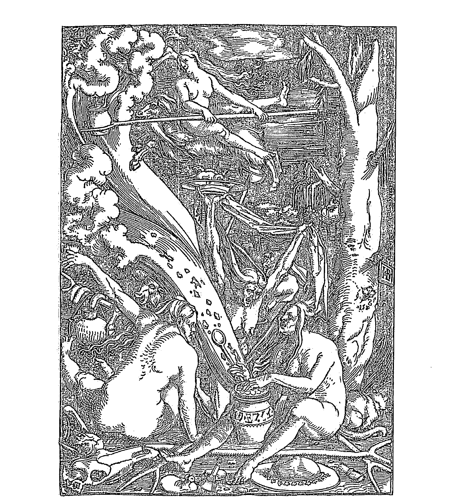

□ 女巫集会 汉斯·巴尔冬·格里恩作于1510年 科斯特·福亭图片库

尔伯格山、胡伊博格山、科特博格山，意大利博洛尼亚的帕特诺、贝尔加莫的托萨勒，也都是女巫狂欢节的庆祝地点。

宴会是女巫狂欢节最重要的组成部分。大多数情况下，宴会的场面都很大，地理位置接近的巫师团体总是聚集在一起庆祝。据说，在法国的圣迭山，曾经有50至100名女巫共同进行过庆祝活动。而16世纪意大利神学家巴托洛米奥·斯比纳说，有超过六千名女巫同时参加了一次女巫狂欢节。在抵达庆祝地点后，她们会在宗教仪式进行先进食。她们到处追赶家禽，埋锅造饭。1612年英国兰开夏郡的一次审判记录，是迄今为止较早有关女巫狂欢节的记载：巫师们在老德戴家中聚会，她们先是偷了一头绵羊作为食物，随后畅饮麦芽酒，并且计划炸毁当地的一座城堡，营救因犯有宣扬巫术罪而被捕的家眷。尽管这次晚宴是在室内进行的，不过与后来的女巫庆祝宴会也没什么不同。今天，现代巫师们也会在狂欢节上准备晚宴，不过，通常都是各自带上一些现成的食物共同分享。

女巫们被认为是骑着扫帚飞往节日庆祝地的。这种说法，来自早期基督徒对巫师的描述。实际上，基督徒正希望通过如此歪曲的描述来败坏这一古老宗教活动的声誉。按照基督徒的说法，为了提高农作物产量，异教徒们像骑竹马那样叉开双腿，骑着扫帚、干草叉赶往农田，在田地里跳舞，并且不停地高高跃起。按照异教徒的信仰，跳得越高，农作物就能长得越高。

后来，这一说法点燃了异教徒的思想火花，她们认为自己能够骑着长杆、耙子或者扫帚飞到女巫节日的庆祝地点。毫无疑问，对于早期的教会来说，这种说法成为反异教徒最有力的宣传武器。基督徒们宣称，女巫们是在为魔鬼工作。

## 女祭司雷希薇

雷希薇生于1956年9月11日，在十几岁时就开始研究玄学，以寻求能够取代传统宗教的信仰。雷希薇称，五岁时，她就一直在思考，为什么上帝不是女人。十一二岁时，雷希薇从一位年龄稍长的表亲那里弄到了一副塔罗牌，两年后，她竟因此被身为正统基督徒的邻居们指责为女巫。

在17岁那一年，雷希薇的母亲因身患白血病而与世长辞。失去了母亲，同时也失去了宗教机构对母亲的长期支持的事实，促使雷希薇放弃了对传统宗教的信仰。在不懈的求索过程中，雷希薇发现了巫术崇拜。如今，她已经成为一位资深巫师，而她的四个孩子，也都是巫术信仰者。

欧式巫术是巫术与德国、美国民间魔法的混合体，雷希薇一直坚持对欧式巫术的信仰。1991年，雷希薇建立了“黑森林家族”教派，许多巫师团体都成为这个教派的下属组织，但是，各组织之间从未真正地融为一体。雷希薇自称是莫里根教派的女祭司，因为这一身分能够体现出她沿袭了迈克尔·里根创立的爱尔兰教派传统（经本书作者引荐，迈克尔·里根加入了撒克逊教派，后来他创立了爱尔兰教派，随后，瑟芬特勋爵又将这一教派的思想传给了雷希薇）。

雷希薇的第一任丈夫暴虐成性，两人分手后，雷希薇才获得了真正意义上的解脱。现在雷希薇已经再婚，丈夫迈克尔非常支持她的事业。迈克尔自称是“异教徒而不是巫师”，他一直陪伴妻子四处游历，将一切有关古老宗教的事件，都做了详尽的记录。

1993年，卢埃林世界出版社出版了雷希薇的第一部著作《骑上银色的扫帚》。很快她又出版了《搅动魔法炉》、《少年巫师》、《点燃圣火》等多部作品。现在，雷希薇已经成为独具风格的知名作家。


□ 雷希薇 雷蒙德 · 巴克兰提供

### 女祭司瓦林特

多琳·瓦林特是杰拉尔德·加德纳的女祭司之一。瓦林特和加德纳一起合著了后来的《影书》，这本魔法书被广泛地用于各种巫术传统中。尽管《影书》收集的资料有广泛的来源，但大部分都来自于瓦林特。瓦林特是在巫术仪式上影响最大的一群人中的一个。

多琳·瓦林特出生在英国伦敦，其家族来自汉普郡新森林地区的多塞特郡塞恩·阿巴斯村。瓦林特广泛阅读了通神论以及阿莱斯特·克劳利的著作，对神秘事物的好奇心与日俱增。1944年，瓦林特遇到了一名从西班牙内战中受伤回来的难民，在他康复之后，瓦林特与之结了婚。

在得知塞西尔·威廉姆森于1950年创办的位于马恩岛的卡斯尔顿的巫术民俗学中心之后，瓦林特开始与威廉姆森通信。从威廉姆森那里，瓦林特知道在新森林有一个巫术聚会。慢慢地，瓦林特与该聚会的成员杰拉尔德·加德纳熟悉起来。加德纳把《高等巫术手册》的抄本介绍给了瓦林特。瓦林特的丈夫对巫术不感兴趣，但是并没有阻止她。1953年，加德纳将瓦林特引入他的巫师会，当时，加德纳已经从原来的新森林组织脱离出来了。

瓦林特研究了加德纳建立在新森林巫师会基础之上，而后又做了大量修改的《影书》。但该书的最终成功，得益于瓦林特的神秘文学知识，以及阿莱斯特·克劳利、吉普林、亚历山大·卡迈克尔、查尔斯·戈弗雷·利兰和其他加德纳在文中提到的人，他们都为此书提供了独一无二的珍贵资料。瓦林特潜心编辑整理了该书，使得这本书不再那么明显地充斥着各种外来材料，她在书中掺杂了很多自己的看法，包括巫术崇拜中的“女神的诫命”。这部分内容，瓦林特完全以诗的形式写成，之前大部分是利兰写的，还有部分由克劳利所写，但她修改了不少诗句。瓦林特从1954到1957年间与加德纳一起合著《影书》，直到两人都满意后，才停止了对该书的整理。该书也自此成为现代巫术的难以企及的丰碑。

1957 年底，瓦林特离开加德纳的巫师会，与一位名叫内德的男子成立了自己的巫师组织。从 1964 到 1966 年，她与一名自称是巫师的灵魂进行了一系列的感应交流。巫师的灵魂告诉瓦林特，他的名字叫杰克·布莱克斯皮尔，来自 19 世纪早期，当时他也成立了一个巫师会。1978 年，瓦林特将杰克的一些精神加入到她的《巫术的未来》一书中。在该书中，瓦林特还批评了一些人，如自称“美国巫术女王”的希巴，希巴将加德纳的《影书》以她自己的名义出版，声称“这些文字都来源于世代的口耳相传”。更有不少人声称他们的巫师传统历史悠久，但事实上都只是摘抄了加德纳和瓦林特书中的一部分而已。

瓦林特的丈夫于 1972 年去世。之后，她住在英格兰南海岸的布莱顿·苏塞克斯郡，直到 1999 年 1 月去世。

## 女性外阴与男性生殖器

自史前时代以来，从黏土质地的模型发展到骨骼、象牙材质的雕刻品，再到壁画……人类从未停止对男神和女神性特征的描绘。古埃及神庙的外墙上，随处可见用来表述“阴茎崇拜”思想的图案。

一直以来，人们往往会把生殖器官的雕塑做得异乎寻常地大，其目的是为了强调它们的力量和重要性。罗马神话中，男性生殖之神普利阿普斯的形象从来都被描述成挺着一根巨大、笔直的男性生殖器。古罗马人认为，每一个罗马贵族的新娘都应该将自己的初夜献给普利阿普斯。

> 圣·奥古斯丁在《上帝之城》中说：“罗马女性一度认为，这（将初夜献给普利阿普斯）是非常真实和虔诚的，她们要求年轻的新娘必须坐在极富男性特征的普利阿普斯的雕像身上。”

人们也常把普利阿普斯的生殖器雕像作为一种护身符，这种护身符被称作“神圣生殖器”，相传它能够增强佩戴者的生育能力。

古尔德伯格曾经这样描述印度各地的牧师：他们赤裸着在街上行走，手中的铃铛叮当作响。这是在通知妇女们走出家门，“履行宗教责任，虔诚地拥抱他们神圣的器官”。古尔德伯格进一步指出，基督徒们至今仍然相信男性生殖器圣洁无比，他们对圣包皮非常尊敬。他说：

> “直到最近，欧洲的教堂依旧存有 12 个圣包皮，而且人们创造了很多与之相关的传说。位于法国沙特尔市的库伦修道院主教教区的教堂内，就保存着一个‘圣包皮’。相传这个‘圣包皮’拥有神奇的力量，能大大增强不孕妇女怀孕的机率。”

按照古罗马和古希腊的风俗，人们会在坟墓上放置一个男性生殖器的象征物，这是为了当着死神的面宣誓他们对永恒生命的信仰。在意大利的那不勒斯，阴茎的图样经常被用在花瓶、戒指、奖章甚至贵重宝石的设计上。

从花瓶上垂下一个圆柱体，圆柱体末端又被嵌入一个基座，这就是印度寺庙中祭坛的一个组成部分。基座象征“梵天”，是宇宙万物的基础；花瓶象征毗湿奴，代表印度教的女神以及“阴”；花瓶上的圆柱体则象征湿婆，代表神和男性生殖器；花瓶和圆柱体组合在一起就表示性交。在这一思想的基础上，印度的神话和传说才得以发展。印度人还认为，杵和臼分别代表男性生殖器和女性生殖器，用杵捣臼象征着创造生命的行为——性交。

巫术传统中的“蛋糕和葡萄酒”仪式上，双刃剑代表男性生殖器，高脚酒杯代表女性生殖器。男主祭一边将双刃剑浸入高脚杯，一边念诵：“若双刃剑代表男人，高脚杯代表女人，愿两者的结合能够给他们带来欢愉。”在巫术传统里，带有阴茎崇拜色彩的魔杖以及巫师骑着的干草叉或者扫帚，都能代表男性生殖器。

## 男巫泽尔

1942年11月30日，蒂姆·泽尔出生于美国密苏里州的圣路易斯市，他的父亲是一名美国海军陆战队队员，曾参加过第二次世界大战。二战后，泽尔一家搬到了宾夕法尼亚州的克拉克斯·萨米特行政区，随后又辗转迁至伊利诺斯州的水晶湖市。长大后，泽尔进入密苏里州富尔顿市的威斯敏斯特学院学习。

在威斯敏斯特学院，泽尔开始阅读希腊神话以及其他一些异教故事，耳濡目染之间，逐渐接受了其中的思想。客观地说，泽尔是一个内向的人，他把自己绝大部分业余时间都用来与大自然交流：先是在宾夕法尼亚离家不远的林中散步，搬到伊利诺斯州后，水晶湖又成了他打发时间的好去处。泽尔一度认为，自己拥有心电感应的特异功能，他能凭此知道别人的所思所想。

在大学就读期间，泽尔与理查德·克里斯蒂结为好友，后者是艾因·兰德和亚布拉罕·马斯洛的忠实追随者。当时，罗伯特·A·海因莱因的科幻小说《神奇土地的陌生人》引起了泽尔和克里斯蒂的强烈兴趣，受书中“寰宇教派”的启发，两人决定创立其在现实生活中的同名教派。起初，他们把自己的组织命名为“阿特尔”——这个名字源于阿兹特克语，原意是“水”和“我们祖先的家园”。后来，该组织被正式命名为“寰宇教”。1967年，“寰宇教”向管理部门提交了成立申请，在得到批复后，于1968年3月4日正式成立。在美国历史上，这是第一个得到联邦政府认可的异教组织。随着“寰宇教”的成立，泽尔创造了“新异教”这个新词。

1963年，泽尔与第一任妻子玛莎相遇并结婚，随后，他们的儿子布莱恩出生。这段婚姻只维持了短暂的时间。婚姻维持了八年，期间，泽尔在威斯敏斯特学院获得了社会学与人类学以及心理学的学士学位。1970年，一段奇幻经历给了泽尔极大的启发，促使他提出了“大地之母”思想。这一思想认为，地球是一个统一的、有意识的生命体，万物之间皆存在着微妙的平衡关系。以“大地之母”思想为基础，泽尔又提出了著名的“盖娅假说”，很快，这一假说被传播至各个异教团体，且得到了广泛的认同。1973年，“诺斯替教宝瓶节”庆祝仪式在美国明尼苏达州东南部城市明尼阿波利斯举行，泽尔以“锡詹尼西斯：女神之降生”为题，宣讲了他的“盖娅假说”。

在那次节日庆祝仪式上，泽尔遇到了莫宁·格罗瑞，两人均深感相见恨晚。

莫宁·格罗瑞原名迪亚纳·摩尔，1948年5月27日出生于加利福尼亚州的长滩市。她的外祖父是卫理公会教派的牧师；而她的父亲则是密西西比人，拥有爱尔兰和乔克托印第安人血统，同时也是圣灵降临教派的信徒。12岁那年，摩尔加入了圣灵降临教派。不过四年后，她就厌倦了该教派的男权作风，转而开始研习佛教，加入了吠檀多社。摩尔后来发现，佛教同样是一个“重男轻女”的宗教。不过在吠檀多社，她接触到的女神的概念也算有所收获。接下来的日子里，摩尔开始广泛接触希腊神话和异教思想，以及一些其他的宗教信仰。

17岁时，摩尔读到了塞比尔·里克的《巫师日记》，开始研究有关黛安娜和阿耳特弥斯的神话故事。从此，她真正接触到了巫术。次年，摩尔自行改名为莫宁·格罗瑞，随后她外出旅行，游历于俄勒冈州的尤金市。在旅途中，她偶然结识了一个名叫加里的同路人，两人迅速坠入爱河。一年后，她们的女儿瑞恩伯尔（后改名为盖尔）降生。格罗瑞与加里的婚姻是一桩开放式婚姻（指双方都能接受对方有婚外情的事实），因此当前者与蒂姆·泽尔相遇并再度结婚后，她与加里依旧能够维持朋友关系。按照格罗瑞的说法，她曾经在梦中遇见过蒂姆·泽尔。因此，当两人在诺斯替教派的节日庆典上见面时，她有一种美梦成真的感觉。

1974年，也就是蒂姆·泽尔与格罗瑞首次相见的六个月后，两人登记结婚，成了一对合法夫妻。随后，明尼阿波利斯市举行了“诺斯替教派春季庆典”，蒂姆·泽尔和格罗瑞在该庆典上举行了结婚典礼。当然，两人的婚姻依旧是开放式的。十年后，迪亚恩·达灵走进了蒂姆·泽尔和格罗瑞的生活，三人之间形成了一桩三方婚姻。

1968年，蒂姆·泽尔为“寰宇教”创办了一本名为《绿蛋》的期刊，这本期刊发行了将近九年。1976年，蒂姆·泽尔夫妇买了一辆二手轿车，并以此为交通工具，开始了自己的旅程。蒂姆·泽尔夫妇的足迹遍布美国西部，在加利福尼亚州的门多西诺县，他们参观了柯登·布里斯，当时那块土地还在阿里森·哈洛名下。在门多西诺县短暂停留后，泽尔夫妇继续前往俄勒冈州的尤金市，当年秋天，泽尔花了两周时间来“求兆”。他独自在野外一眼温泉旁生活，除了羊皮书包和一把猎刀外，他身无长物。这两周中，泽尔完全融入到大自然，甚至产生了一种“涅槃重生”的感觉。从那以后，他开始自称是盖娅女神的“命定祭司”。

1977年，泽尔夫妇回到曾经短期停留的柯登·布里斯，在那里潜心探求“独角兽”概念。据泽尔讲，他脑中的独角兽实际上是山羊的一种，不过头上只长了一根羊角，这与传统神话中“马身、独角、羊须、狮尾”的独角兽形象大相径庭。当时，柯登·布里斯依然归哈洛所有，泽尔负责为她看守土地，并建立了一个异教徒的休息场所，也即是“寰宇教”的办公地点。同时，还在那里进行异教传统方面的研究。此外，他们还与当地的一家抢险队有过合作。莫宁·格罗瑞则组织了一个名为“动物精神圈”的异教研讨班；另外，作为一个极具天赋的诗人、歌曲作者以及作家，格罗瑞的作品曾经多次发表在期刊和诗文集中。格里玛斯认为，格罗瑞的毕生成就是“开创了一个新天地，将我们带入行星演化的新纪元——盖娅体系，这是科学与宗教、生态学、女权以及性学的完美结合”。

1979年，为了庆祝日全食，泽尔在俄勒冈州达勒斯市举行了一场盛大的仪式。出席完这一仪式后，蒂姆·泽尔决定改名。某日，泽尔与莫宁·格罗瑞坐在一条流经柯登·布里斯的小河旁，他偶然接到了女神传达的信息：其新名字应该是“奥特尔”。同时，他还按照安妮·麦克弗雷的幻想小说系列《龙骑士》的格式，把自己的姓氏改成了G·泽尔，这是格罗瑞和泽尔两个名字的结合。

接下来的几年，G·泽尔夫妇游历于美国各地，大力推广他们的“独角兽”概念。1984年，G·泽尔与“林灵兄弟巴纳姆和贝利”马戏团签署了一份合约。次年，G·泽尔从柯登·布里斯搬到了加利福尼亚州的尤凯亚附近。当时，他们一家的成员包括：G·泽尔、莫宁·格罗瑞、布莱恩、瑞恩伯尔、迪亚恩·达灵及其儿子扎克。在新环境里，泽尔一家创办了“尤凯亚之家乡节”，随后每年都组织庆祝该节日的游行活动。1987年，泽尔又开办了名为“两界之间”的奇幻用品商店。

自20世纪60年代以后，泽尔就成了独立的艺术家，他曾经为多部科幻杂志和书籍绘制插图。20世纪80年代早期，他创作了很多关于女神和神兽的雕刻作品。1990年，泽尔开办了“神话图像”艺术馆，专门制作符合美术馆等级的图片、祭坛雕塑以及各种各样的神祇图像。四年后，泽尔再度改名为奥贝隆。

1989年，泽尔与迪亚恩·达灵堕入爱河。随后，后者加入到泽尔的家庭，组成一个“一夫二妻”的三方之家，这样的关系维持了五年。在此期间，莫宁·格罗瑞与沃尔夫·迪恩·斯泰尔斯发生了关系，后者也于1995年加入到泽尔一家，相关三人（泽尔、格罗瑞、斯泰尔斯）于1996年订立了婚约。同年，温特·罗斯介入到莫宁·格罗瑞和斯泰尔斯之间，而丽萨·加布里尔则与泽尔发生了关系，这样，他们形成了一个五人“线型婚姻”，而这同样是受《神奇土地的陌生人》的启发。为了描述他们的生活方式，莫宁·格罗瑞专门创造了一个新词：“多角性爱关系”，所有的成员都把他们家庭命名为“拉文哈特”。

作为女神的大祭司，莫宁·格罗瑞自认是一位女神历史学家，同时也是一位“大自然的知识女性”。奥贝隆则是一位造诣颇深的仪式研习者、玄学家、萨满祭司、雕刻家、艺术家以及作家，他曾经创作过一系列有关神祇、女神以及传统神话中神兽的雕刻艺术品。此外，他一直都自称是一名男巫。

## 年轮

巫术中，“年轮”被用来表示季节的更替，并通过代表大大小小的巫师半夜聚会节日的轮辐进行划分：万圣节、耶稣圣诞节、圣烛节、春天、五朔节、夏天、秋收节、秋天。这些日子中，主要的巫师夜半聚会依照凯尔特人农业历法来确定，而次要的夜半聚会则依照太阳变化的周期来定。

并不是所有的巫术传统都沿袭同样的夜半聚会。比如说，许多苏格兰巫师只采用万圣节、耶稣圣诞节、五朔节、仲夏节为轮辐的四等分年轮，而不是传统的八等分。

## 欧甘文字

欧甘文字是盖尔文字的最古老形式，爱尔兰、苏格兰、威尔士、康沃尔郡、德文郡以及马恩岛，人们都曾经使用过欧甘文字。在爱尔兰的凯利郡和科克郡，人们发现了大量的欧甘文字，这也是迄今为止最集中、规模最大的欧甘文字遗迹。最早的欧甘文字，都被刻在直立着的石块的边缘上。

欧甘文字很有可能建立在拉丁字母表的基础之上。值得庆幸的是，有些直立石块上同时刻有欧甘文和拉丁文，这有助于后人翻译和理解欧甘文字。当然，对研究欧甘文字帮助最大的文献，莫过于14世纪的《巴里莫特之书》，因为此书收录了一篇关于书写欧甘文字的论文。

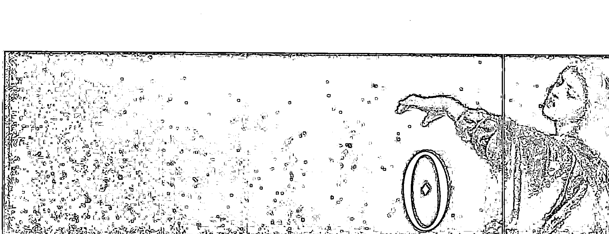

■ 黎隆耶斯普林山脉上的欧甘之石 科斯特·福亨图片库

## 普利阿普斯魔杖

希腊神话中，普利阿普斯是一个半人半羊的神祇，他的生殖器永远直立向上。普利阿普斯是爱神阿弗洛狄忒的儿子，掌管作物、动物及人类的繁衍，同时也是植物、蜜蜂及渔业的保护神。由于阿弗洛狄忒的怀孕惹怒了赫拉，普利阿普斯还在母亲腹中时就已经遭到了诅咒。赫拉诅咒他长出硕大而丑陋的各种器官，其中就包括巨大无比且一直挺立的生殖器。普利阿普斯出生后，阿弗洛狄忒发现自己的儿子竟然如此丑陋，于是就将他交给牧羊人抚养。

普利阿普斯魔杖也称男性生殖器状魔杖，它经常出现在现代巫术的仪式中，被雕刻成男性生殖器形状，或者其尖端带有一颗象征生殖器官的松果。

### 秋分，巫术八大节气之一

秋分也称为梅奔和埃尔费德·奥尔本，是巫术八大节气之一。秋分在九月的第21天左右到来（取决于太阳进入天秤座的时间），这是最后一个收获的时间，因为马上就要正式进入严冬了。

庆祝这一丰收的季节时，许多巫师将依洛西斯神话传说引入到仪式中。依洛西斯神话与能让土地肥沃、五谷丰登，也能让田园荒芜、万物凋零的丰收女神德墨忒耳寻找她的女儿珀尔塞福涅（或称为科莱，意思是“少女”）的故事有关。珀尔塞福涅被爱慕她的冥王哈迪斯绑架，带入了地狱。女儿的失踪令德墨忒耳异常伤心，她满世界找寻自己的女儿。当她得知是宙斯默许他的兄弟哈迪斯绑架了珀尔塞福涅时，便离开了奥林匹斯山，从此不理世事。于是，世间植物不再生长，到处是贫瘠的土地和饥饿的难民，代表死亡的黑色慢慢取代了生命的绿色。宙斯最后不得不答应德墨忒耳，让她在一年中有三个月下到冥界，陪伴自己的女儿。自此以后，德墨忒耳离开凡间的这三个月，不宜耕作，大地也不再有作物产出。

加德纳巫术中，也有一位女神进入地狱的传说，只不过她的目的是：“揭开所有的未解之谜，甚至是死亡之谜”。撒克逊巫术中，则有费雷娅下到地狱，去寻找被捣蛋鬼洛基偷走的项链的传说。所有这些传说，都与即将到来的冬季有关，而等待春天的万物复苏，就是秋分的主题。正如珍妮特·法拉和斯图尔特·法勒所说：“秋收是收获粮食的真正聚会，秋分标志着收获的完成，对丰收的感谢。”

秋分的节日标志包括小麦和玉米秸秆、葫芦、南瓜、松树果和扫帚。稻草人通常由The request was rejected because it was considered high risk

## 神奇的铁

铁被认为是近乎神奇和有超自然能力的物质。最早的铁质工具出现在大约公元前三千年的美索不达米亚。阿兹特克人称铁是“来自天空的礼物”；古埃及人称铁为“天上的金属”，铁质流星状护身符被放在埃及法老图坦卡蒙的墓中。罗马历史学家普林尼称，如果将铁棺材钉摆在大门上，那么这栋房子就可以免遭恶灵的侵犯。

G.斯托姆斯博士指出，铁之所以拥有力量，是因为“这种物质在用于制作工具方面比木材和石头更好，更为稀有。而且铁最先是在陨石中发现的，所以它有神秘的力量”。铁需要专家从矿石中提取后将它硬化。这些专家，也就是铁匠，被视为术士。挪威众神的铁匠韦兰是最著名的铁匠，他被刻画在七世纪的诺森伯兰郡的弗朗克斯盒上。

怀特洛克指出，公元前1000年，当使用青铜的大不列颠人被使用铁的欧洲移民击败。

## 圣女贞德

1412年1月6日，圣女贞德出生在法国的小山村雷米，原名珍妮特·达克，父亲为雅克·达克，母亲为伊莎贝拉·达克，她还有两个哥哥，皮埃尔和让·杜莱斯。贞德的父亲是雷米村的管理者，拥有为数众多的马群和牛群，还是虔诚的天主教徒。因此，当雷米村的其他与贞德同龄的女孩们在跳舞时，贞德的大部分时间是待在教堂祷告。

1425年，13岁的贞德在父亲的花园里听到一个她自认为是来自神的声音。随后的五年间，她一周能听到两到三次这种声音。贞德说，这些声音分别来自圣凯瑟琳、圣马嘉烈和圣米迦勒，有时候，他们甚至带着花冠出现在她面前。于是，贞德决心保持处女之身，终身供奉耶稣基督。

这时，英法百年战争正在激烈进行，节节败退的法军在王储查尔斯的带领下，奋力抵挡占领了法国大部分领土的英国入侵者。

1428年5月，贞德在亲戚杜兰德·拉苏瓦的陪伴下，与驻扎在距雷米村12英里的沃库尔勒的法军指挥官罗伯特·博得里卡特会面。贞德告诉博得里卡特，自己是神派来的使者，能帮助查尔斯王储打败英国入侵者。她本想和王储面谈，但指挥官只是嘲笑了她一番，便打发她回家。

1428年7月，雷米村被英国人攻占，村民们纷纷逃到一座新建的城堡，直到同年十月才返回被焚烧殆尽的家乡。也就在此时，英国人包围了奥尔良。当消息传到雷米村后，贞德决定再次去拜见查尔斯王储。不料在沃库尔勒，她又碰到了罗伯特·博得里卡特和他的侍卫让·梅斯。这一次，让·梅斯借给贞德一套男装，而博得里卡特也同意贞德去面见西农城堡的查尔斯王储。动身前往西农城堡时，沃库尔勒人送给贞德一匹快马和一把长剑。

贞德被旺多姆的伯爵路易斯·波旁引见给王储，并与王储交谈了整整两小时。据贞德的神甫让·巴斯吉勒记载，贞德对王储说：“我是神的使者，神让我告诉你，你才是法国真正的国王！”查尔斯对此半信半疑，他命令兰斯大主教带领主教团对贞德进行了审查，主教团做出有利贞德的判决，证明了她的忠诚。随后，贞德向查尔斯保证，她能解奥尔良之围。

### La Pucelle

□ 圣女贞德 科斯特·福亨图片库

1429年4月28日夜，身着白色盔甲的贞德在法兰西元帅德·莱斯·吉尔斯的陪同下，率领一支4000人的军队突入奥尔良。5月5日，法军对土列尔堡垒发起猛攻，继而占领了土列尔。5月8日，法军举行了首次感恩节游行，后来的奥尔良节就起源于此。接着，贞德于6月14日攻下兰斯城。兰斯的重要性在于，它一直是法国国王进行加冕典礼和祝圣仪式的传统地点。1429年7月17日，在贞德的拥戴下，查尔斯王储加冕为法国国王查尔斯七世。

1430年5月，贞德率军在贡比涅附近与英国的盟友勃艮第公国交战时，不幸被俘，随后被交给法国博韦地区的主教皮埃尔·科雄。主教是英国人的强硬支持者，一个野心勃勃的人，时刻觊觎着空缺的卢昂主教职位，并认为自己有责任确保贞德会遭受惩罚。在皮埃尔·科雄的组织下，由10位勃艮第神学家、22位卢昂教士以及一些来自不同修道会的修道士组成的审判团，对被指控为异端的贞德进行了审判。

审判于1431年2月21日进行，审判团炮制出的证据多达七十项，贞德被指控为占卜师、女预言家、女魔法师、女巫、咒法师以及恶魔。最后这些指控缩减至12项，但所有的指控都和审判中的记录相互矛盾。在各种方式的逼迫下，贞德签下了一份完全看不懂的公开弃绝书，这等于直接认罪，但在官方留下的记录上，却是另一份不同的文件。

据说贞德被俘和囚禁期间，查尔斯七世没有做出任何努力去帮助和营救贞德。实际上，在听闻贞德被俘后，查尔斯七世曾派使者前往勃艮第众国告知勃艮第公爵腓力三世，如果不释放贞德，那么他会为了贞德处决所有勃艮第俘虏。有信函写到：“尽管法国国王做出了威胁，但英国却想把贞德当做异教徒给烧死。”

贞德被烧死24年后，应法国异端裁判所首席法官让·布雷勒的请求，教皇卡利克斯特三世授权重新审判贞德一案。遍及欧洲各地的许多神职人员参加了审判，审判的过程也遵照标准的规定进行。由神学家组成的小组分析了115名目击者的证词后，让·布雷勒于1456年7月7日正式宣布贞德无罪。之后，教会宣布，由于贞德在奥尔良的光荣事迹，特地将奥尔良列为朝圣的地点之一，并对当地的罪犯颁布了一次特赦。

天主教于1909年对贞德进行了赐福礼，教皇本尼迪克十五世在1920年5月16日封贞德为“圣女”，她的纪念日被定在5月30日。

## 生命之树卡巴拉

卡巴拉是犹太教的见神论、魔法、哲学、科学及神秘学构成的一种理论，卡巴拉的意义是“通过传统接受的知识”。传说上帝将卡巴拉的秘诀传授给摩西，摩西又先后将它传给70个长老，长老们又先后传给他们的继承者。这样，卡巴拉作为一种口授的知识流传下来。在中世纪，有大批已出版的关于卡巴拉的著作是由一些作家匿名著成的，但是也有人认为，直到今天，卡巴拉最秘密的某些部分，只有最初的传授者才知道。

卡巴拉最重要的两本书之一是《光明篇》（又称《光辉之书》），由摩西·德莱昂与谢菲尔·耶茨拉于13世纪末在西班牙编写；另一本是《创造之书》，写于三至六世纪的巴比伦或者巴勒斯坦。

卡巴拉中，上帝无处不在；宇宙中的所有事物都是某个有序整体的一部分，但是这个整体受各事物间的隐蔽联系的神秘法则支配；十个源体来自上帝；男人和天使构成了包含各种预言的生命之树。生命树呈三个三角形，它代表着人的身体，生命树的第十个端点指代生殖器官。这十种源体成为宇宙和人类的基础，有22条道路将它们连通。这些道路又和希伯来字母表中的22个字母联系在一起。

生命之树还表明了上帝是如何从天上降落到大地，以及人类又如何能够接近上帝的过程。

卡巴拉教义和诺斯替教教义很相似，在基督教刚刚建立的时候，诺斯替教在地中海东岸国家很活跃。卡巴拉教徒和诺斯替教教徒都认为只有通过知识才能接近上帝，无知是唯一的罪恶。

卡巴拉被很多礼仪魔法师所用，因为卡巴拉吸收了犹太教的一神论和严格的行为准则，所以它不属于巫术，然而，许多巫师却对卡巴拉很感兴趣。

## 所罗门之钥

《所罗门之钥》是古代的魔法书，或称礼仪魔法书。尽管这本书被认为是《圣经》中的以色列国王所罗门创作，但却不可能是他所著。《所罗门之钥》被多次修改，有些版本甚至可以追溯到14世纪。《所罗门之钥》渗透着犹太人的思想，所以弗朗西斯国王认为该书是“稍微带点基督教风格的犹太教神秘哲学”。

另外一本可以追溯到17世纪的书叫《所罗门或雷蒙盖特之钥》，该书主要讲如何用咒语唤起处于深渊中的不同等级的人，书的第一部分是幻术，主要内容是为22种不同的幽灵或恶魔根据自己的力量或职位施法，并且详细介绍了这些幽灵和恶魔的魔力和活动场所；第二部分是神仙术，论述了四方的灵魂；第三部分是波琳艺术，是将幽灵分配给十二星座的每一宫和三百六十度的每一度；第四部分介绍奥马戴尔，论述了四种唱诗班，或“心态的四种维度”；第五部分是所罗门王用的宣言和主祷文。

## 圣殿骑士团

12世纪早期，耶路撒冷国王博度安二世允许法国贵族雨果·德·弗英同其他九名贵族组建骑士团，与医院骑士团联合对付异教徒，以及保护朝圣者和所罗门圣殿。由于博度安二世将圣殿山上的阿尔—阿克萨清真寺的一角让给这些骑士们居住，他们因此获得了“圣殿骑士团”这一称号。圣殿骑士团的慈善、宽容、忠实与虔诚得到了许多国王、统治者以及东方基督教徒的赞许，他们定期给骑士团提供赞助。

圣殿骑士团由骑士、军士和教士组成。当圣殿骑士团成员加入组织时，不仅要发誓遵从三大规定：守贞、守贫、服从，而且还要发誓保护朝圣者。

圣殿骑士团成员绝不允许亲吻别人，甚至是自己的母亲，并被告诫不得与女性为伴。他们公开声明自己极度贫困，不得使用贵重的家具和金银器皿，不得穿戴丝绒装饰，有纹章模型的头盔，丝制的肩带、腰带或其他多余的衣物配品。1128年，在特洛伊教会会议中，雨果·德·弗英向与会者呈递了一封来自耶路撒冷教皇与主教的信，证明教会正式承认了骑士团，并为他们设计了一枚徽章。圣殿骑士团身穿象征纯洁的白色长袍，教皇尤金三世在白色长袍上加了一个红色的十字，以此提醒他们别忘记基督教。圣殿骑士团训练有素，在战场上是一支十分强大的军事力量，也是耶路撒冷王国最精锐的军队。从1129年围攻大马士革到1291年阿科陷落，圣殿骑士团几乎参加了圣地所有的战斗。

圣殿骑士团建立50年后，举行了第一次有3000骑士参加的聚会。骑士们推选杰勒·德·雷达福特为大团长，这样一来，骑士团就从耶路撒冷王国的掌控中解放出来。圣殿骑士团的每一位骑士都要发誓效忠大团长，视他为最高统治者。

由于圣殿骑士团获得了越来越多的捐赠，因此财力迅速增长。1135年，那瓦拉国王将他的全部财产统统捐赠给骑士团，那时的骑士团仅在巴伦西亚王国就有17处据点。圣殿骑士团很快变得极其富有，而且大部分财产都储存在伦敦。

圣殿骑士以勇敢和忠诚享有极高的声誉，他们只对教皇负责，具有免税权，且不受世俗法律的控制。但是在13世纪，十字军东征失败，圣殿骑士团离开了圣地。由于第五次十字军东征一直没有发生，所以基督教只满足于在自己身边寻找异教徒。于是，圣殿骑士团将总部迁到塞浦路斯，在那里开始和医院骑士团展开漫长的对抗。最终教皇不得不出面调停，要求这两个骑士团重建和平与友好的关系。从那之后，圣殿骑士非常注意积累他们的财富和实力，以致谣言四起。

1307年10月13日，法国国王，有“美男子”和“公正王”之称的腓力四世以异端为名，突然逮捕了所有的圣殿骑士，其中包括大团长莫莱。140名圣殿骑士在巴黎受审，除了三人外，其余的骑士都被迫承认他们向十字架吐口水，崇拜异教偶像，同性恋以及膜拜大黑猫。

虽然有573名证人为其佐证，但圣殿骑士团还是没有逃脱被宗教裁判所审判的命运，他们中的很多人死于狱中，剩下的则被送上了火刑架。随后，教皇克莱门特五世要求各国采取行动，彻底取缔圣殿骑士团。

有人认为，对圣殿骑士的某些指控是有事实依据的，因为圣殿骑士在十字军东征过程中，在圣地所暴露的仪式和信仰表明他们可能吸收了部分诺斯替主义，但是，正如世人所熟知的，真相一直没有被揭露出来。

## 施法的时辰

为了达到不同的目的，施法者必须选好施法时间，只有这样才会获得更好的效果。选定施法日期当然是首要问题，而对于有些巫师来说，甚至还要选定恰当的时辰，即行星时。比如说，如果要施展爱情魔法，仪式就不仅要在周五进行，还要精确到维纳斯（爱神）时刻。要确定维纳斯时刻，就必须首先了解当地的日出、日落时间。众所周知，各地的日出、日落时间都各不相同，即使在同一个地点，每一天的日出、日落时间也有差异。

举例来说，在施法地点，施法当天的日出时间为6:25，日落时间为20:20，这就意味着这一天的白天比黑夜长。再将白天和黑夜的时长分别除以12，如此则白天的835分钟（上午6:25至傍晚20:20）和夜晚的605分钟就被分成了12份，我们就得到12个日间时段，每段为69.58分；以及12个夜间时段，每段为50.42分。为了根据行星时来进行施法仪式，人们把这些不同于常规一小时的时段都称为“小时”（当日，白天69.58分为一小时，夜间50.42分为一小时）。

星期五白天的第一个“小时”是维纳斯星的行星时，而星期三的第一个“小时”则是水星的行星时。以此为始，随后的每个“小时”，就按照12个行星的排列顺序依次命名。在上文的这个例子中，当日白天的每个“小时”是69.58分钟，黑夜的每个“小时”是50.42分钟。根据一年中每个地方每天不同的日出、日落时间，行星时的时长也有所不同。

以下是某日白天的行星时列表，其中，小时这一项表示的是日出后的小时数：

| 小时 | 星期日 | 星期一 | 星期二 | 星期三 | 星期四 | 星期五 | 星期六 |
|---|---|---|---|---|---|---|---|
| 1 | 太阳 | 月亮 | 火星 | 水星 | 木星 | 金星 | 土星 |
| 2 | 金星 | 土星 | 太阳 | 月亮 | 火星 | 水星 | 木星 |
| 3 | 水星 | 木星 | 金星 | 土星 | 太阳 | 月亮 | 火星 |
| 4 | 月亮 | 火星 | 水星 | 木星 | 金星 | 土星 | 太阳 |
| 5 | 土星 | 太阳 | 月亮 | 火星 | 水星 | 木星 | 金星 |
| 6 | 木星 | 金星 | 土星 | 太阳 | 月亮 | 火星 | 水星 |
| 7 | 火星 | 水星 | 木星 | 金星 | 土星 | 太阳 | 月亮 |
| 8 | 太阳 | 月亮 | 火星 | 水星 | 木星 | 金星 | 土星 |
| 9 | 金星 | 土星 | 太阳 | 月亮 | 火星 | 水星 | 木星 |
| 10 | 水星 | 木星 | 金星 | 土星 | 太阳 | 月亮 | 火星 |
| 11 | 月亮 | 火星 | 水星 | 木星 | 金星 | 土星 | 太阳 |
| 12 | 土星 | 太阳 | 月亮 | 火星 | 水星 | 木星 | 金星 |以下是某一夜的行星时列表，其中，小时这一项表示的是日落后的小时数：

| 小时 | 星期日 | 星期一 | 星期二 | 星期三 | 星期四 | 星期五 | 星期六 |
|---|---|---|---|---|---|---|---|
| 1 | 木星 | 金星 | 土星 | 太阳 | 月亮 | 火星 | 水星 |
| 2 | 火星 | 水星 | 木星 | 金星 | 土星 | 太阳 | 月亮 |
| 3 | 太阳 | 月亮 | 火星 | 水星 | 木星 | 金星 | 土星 |
| 4 | 金星 | 土星 | 太阳 | 月亮 | 火星 | 水星 | 木星 |
| 5 | 水星 | 木星 | 金星 | 土星 | 太阳 | 月亮 | 火星 |
| 6 | 月亮 | 火星 | 水星 | 木星 | 金星 | 土星 | 太阳 |
| 7 | 土星 | 太阳 | 月亮 | 火星 | 水星 | 木星 | 金星 |
| 8 | 木星 | 金星 | 土星 | 太阳 | 月亮 | 火星 | 水星 |
| 9 | 火星 | 水星 | 木星 | 金星 | 土星 | 太阳 | 月亮 |
| 10 | 太阳 | 月亮 | 火星 | 水星 | 木星 | 金星 | 土星 |
| 11 | 金星 | 土星 | 太阳 | 月亮 | 火星 | 水星 | 木星 |
| 12 | 水星 | 木星 | 金星 | 土星 | 太阳 | 月亮 | 火星 |

## 史上最有名的女巫审判案

史上最有名的女巫审判案是1324年爱尔兰基尔肯尼城女巫爱丽丝·吉蒂勒夫人受审案。有趣的是，爱丽丝·吉蒂勒夫人似乎是古老宗教的追随者。她不是因巫术本身，而是因异端邪说被起诉的。从现存的对于此次审判的记载看，当时在爱尔兰的基尔肯尼，似乎有一个女巫聚会。

吉蒂勒夫人有四任丈夫，她的前三任丈夫都去世了，给她留下了大量的财产。吉蒂勒夫人的第一任丈夫是奥特洛·威廉姆，他们有一个儿子，吉蒂勒夫人对她的儿子非常溺爱；吉蒂勒夫人的第二任丈夫是布拉德·亚当；第三任丈夫是巴列·理查德；第四任，也就是现任丈夫，名叫约翰·普尔。吉蒂勒夫人的麻烦始于她被指控使约翰·普尔感染上了慢性病，为此，吉蒂勒夫人和她第一任丈夫所生的儿子，以及一直对她怀有异心的两个女仆建议夫人趁早离开约翰·普尔；而反过来，她们又暗示普尔，吉蒂勒夫人想要除掉他，并特别提及到吉蒂勒夫人有许多神秘的柜子。约翰·普尔信以为真，他强迫吉蒂勒夫人交出了柜子的钥匙。打开柜子的约翰·普尔发现，柜子里堆满了各种各样的粉和油膏，他立刻把这些东西与巫术联系到一起。

约翰·普尔将柜子里发现的东西交给了奥索里主教，并认为吉蒂勒夫人害死了她的前三任丈夫，现在又想谋害他。奥索里主教是在法国受过训练的英国人，被当地人称为“卑鄙的、粗野的、圆滑的教士”。主教认为，吉蒂勒夫人不是谋害前三任丈夫的凶手，而是一位女巫。1324年，奥索里主教指控吉蒂勒夫人和她的女伴是宣扬异端邪说的巫师。主教列出了吉蒂勒夫人的七条罪状：

1. 拒绝信仰耶稣基督；
2. 在被视为巫术聚会的十字路口供奉祭品；
3. 用巫术与恶魔进行交流；
4. 在夜间聚会中“模仿教会的仪式，是对教会的亵渎”；
5. 用毒药、药粉、蜡烛和油膏引起他人生病或死亡；
6. 使前几任丈夫都自愿将遗产赠给她的儿子，还使约翰·普尔染上慢性疾病；
7. 最后，她有一位魔鬼情人罗宾·阿缇森。两人约会时，罗宾·阿缇森时而是黑人，时而是只黑毛狗或一只猫。

有人说，他们曾见到吉蒂勒夫人在晚上打扫镇上的街道，她把所有的垃圾都扫向她儿子家。一边扫，一边念着咒语：

> 去我儿子家吧，所有财富都去我儿子家吧。

古代有一个迷信的说法，第一个打扫房间的人必须是房间的主人，这样好事才不会被扫掉，吉蒂勒夫人很明显是要把所有的财富和好运都扫到他儿子家去。

奥索里主教给基尔肯尼城的大法官写了一封信，要求逮捕吉蒂勒夫人。碰巧的是，基尔肯尼大法官罗杰·奥特拉瓦是吉蒂勒夫人第一任丈夫的好友，而且基尔肯尼城的总管阿诺德也与吉蒂勒夫人的第三任丈夫交往颇深，两人都拒绝了主教的要求。后来，奥索里主教把吉蒂勒夫人逐出了教会。为了报复，吉蒂勒夫人利用她的影响力使主教被监禁了17天。

主教出狱后，立刻传讯了吉蒂勒夫人的儿子，规定他一天要听三首弥撒曲来忏悔，并且要持续一年，此外，他要给穷人提供食物，还要给教堂的高坛和小礼拜堂重新吊顶。主教不断想在法院起诉吉蒂勒夫人，但一直被禁止入内。

最终，吉蒂勒夫人带着她的主要追随者萨拉米斯逃到英国，而她丢下的其他追随者（布里斯托尔的罗伯、特威廉·佩恩·博利、伊娃卓乃斯顿、爱丽丝·法贝尔、约翰·艾伦、西索·科佳湖·塞恩、阿诺兰格以及米斯·彼得·罗尼亚）都被逮捕并定罪。为了杀一儆百，主教对米斯·彼得·罗尼亚严刑拷打，直到她供出了她自己、吉蒂勒夫人及其他人以前的各种暴行。1324年12月3日，罗尼亚被鞭打后逐出教会，最后被烧死在火刑架上。米斯·彼得·罗尼亚是爱尔兰因巫术罪而受害的第一人。

关于其他人的遭遇没有任何官方的记录，有人说他们有的被烧死，有的则被流放，而吉蒂勒夫人在英格兰度过了她的余生。讽刺的是，奥索里主教之后也被都柏林天主教指控为异教徒，国王爱德华二世在1329年查封了他所有的财产，他被流放了近二十年，于1360年死去。

### 神圣祖先的力

“玛那”是一个遍布宇宙，在人、动物和无生命体的体内都存在的神秘精神力量的名字。在大多数的民族习俗中，它象征着一种精神力量，用于发现神圣的事件、地点、人物和物体。最初，玛那是美拉尼西亚和波利尼西亚特有的词语，表示源自神圣祖先的力量。一些人认为玛那是超自然的，但实际上它是自然的。它被女巫、魔法师和医师用于治愈疾病、控制力量、祝福和诅咒。

伊利亚德说，所罗门岛拥有大量玛那的人被视为萨卡，即“燃烧”之意。人们通常把这种神秘的热量视为魔力。很多原始部落都用表示热或燃烧的词来形容玛那的能量，萨满教中尤其如此。在巫师或其他人为病人做接触治疗时，病人一定能够感受到他们的手释放出来的巨大热量。有时尽管没有真正的身体接触，但病人的身体上也会留下红印。

童男或处女有很大的魔法值（尤其在小说或电影中作为祭品时）。这是因为人们相信性交会使精液流失，产生的热量就流入了尘土。因此，在哥伦比亚，古奇布查人把处男供奉给太阳神。但如果男孩此前已有性交经历的话，他会被释放，因为他已丢失了玛那。

巫术仪式上，从任何物体中（无论是水晶还是树木）发现的力量都被视为玛那。

### 神秘字母表

人们使用神秘字母主要有两个原因：保密和获得力量。在中世纪，当基督教会无情地迫害魔法师时，置身于教会的许多显贵却在练习仪式魔法。由于这只是一种实践行为而不是宗教，因此他们并没有被视为有反对教会的意思，因而被允许练习。

魔法师通常都小心翼翼地对自己的研究保密，因为他们之间的竞争很激烈。为了安全，魔法师会用秘密的或“神秘的”字母来记录魔法书中最重要的部分。神秘字母种类很多，如《过河》、《天使》、《三博士之书》、《玛拉基母字母》、《以诺派字母》、《欧甘文字》和《底比斯字母》。还有很多古代字母，如埃及象形文字。

使用神秘字母的第二个原因——力量，这也许更为重要。在日常书写中，人们只是简单地记录而没有真正思考过文字本身，即字母的构成。但如果使用不熟悉的字母，人们就会关注每个字母的构造。魔法师认为，这样人们就会把精力或力量投入到书写中。这对于书写辟邪物尤为重要。在书写辟邪物时投入的力量越多，效果越好。因此使用神秘字母既为了保密，也为了使能量进入文字。

现在魔法师和巫师仍然使用神秘字母。然而一些魔法师早已忘记或忽视了使用神秘字母的初衷，而只是为了显示自己精通这些文字，甚至可以像英文一样流利书写。这当然背离了使用神秘字母的原意。

| Letter | Theban | Passing the River | Malachim | Angelic | Runic |
|---|---|---|---|---|---|
| A | 𐌀 | 𐊀 | 𐊠 | 𐋀 | ᚠ |
| B | 𐌁 | 𐊁 | 𐊡 | 𐋁 | ᚡ |
| C | 𐌂 | 𐊂 | 𐊢 | 𐋂 | ᚹ |
| D | 𐌃 | 𐊃 | 𐊣 | 𐋃 | ᚦ |
| E | 𐌄 | 𐊄 | 𐊤 | 𐋄 | ᚨ |
| F | 𐌅 | 𐊅 | 𐊥 | 𐋅 | ᚱ |
| G | 𐌆 | 𐊆 | 𐊦 | 𐋆 | ᚲ |
| H | 𐌇 | 𐊇 | 𐊧 | 𐋇 | ᚷ |
| I | 𐌈 | 𐊈 | 𐊨 | 𐋈 | ᚹ |
| J | 𐌉 | 𐊉 | 𐊩 | 𐋉 | ᛃ |
| K | 𐌊 | 𐊊 | 𐊪 | 𐋊 | ᚴ |
| L | 𐌋 | 𐊋 | 𐊫 | 𐋋 | ᛚ |
| M | 𐌌 | 𐊌 | 𐊬 | 𐋌 | ᛗ |
| N | 𐌍 | 𐊍 | 𐊭 | 𐋍 | ᛜ |
| O | 𐌎 | 𐊎 | 𐊮 | 𐋎 | ᛟ |
| P | 𐌏 | 𐊏 | 𐊯 | 𐋏 | ᛞ |
| Q | 𐌐 | 𐊐 | 𐊰 | 𐋐 | ᛒ |
| R | 𐌑 | 𐊑 | 𐊱 | 𐋑 | ᛈ |
| S | 𐌒 | 𐊒 | 𐊲 | 𐋒 | ᛉ |
| T | 𐌓 | 𐊓 | 𐊳 | 𐋓 | ᛊ |
| U | 𐌔 | 𐊔 | 𐊴 | 𐋔 | ᛏ |
| V | 𐌕 | 𐊕 | 𐊵 | 𐋕 | ᛒ |
| W | 𐌖 | 𐊖 | 𐊶 | 𐋖 | ᚹ |
| X | 𐌗 | 𐊗 | 𐊷 | 𐋗 | ᛃ |
| Y | 𐌘 | 𐊘 | 𐊸 | 𐋘 | ᛇ |
| Z | 𐌙 | 𐊙 | 𐊹 | 𐋙 | ᛉ |
| | | th | ᛊ | | ng | ᛇ |

着太阳神荷鲁斯的眼睛，可以用来防御魔鬼。它是一种印在护身符、宗教类珠宝、石棺及其他陪葬品上的印章。它还可以被画在船头帮助认路。

如今荷鲁斯之眼广为人知，但芭芭拉·沃克认为它之前就是真理正义之神马特的眼睛，是透特（埃及神话中月神）之眼，是太阳神之眼。

许多现代巫师用荷鲁斯之眼作为护身符和第三只眼。

## 上帝之眼

古埃及人认为 udjat 或“上帝之眼”，象征

## 死灵之书

《死灵之书》全名为《死者姓名之书——狂人阿卜杜拉·阿尔哈萨德的杰作》，据称，

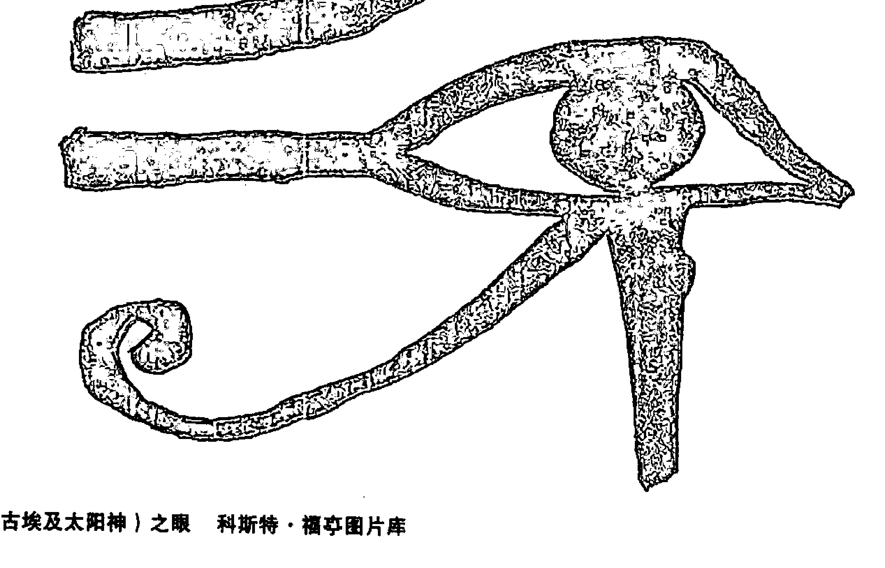

这是一部堪称史上最邪恶的小说，书名是恐怖小说作家霍华德·菲利普斯·拉夫克拉夫特在他的短篇小说《猎犬》中杜撰出来的，只是通过它来增添自己作品的玄妙性而已。然而后来，很多作品打着《死灵之书》的幌子，所有作者都声称自己的作品是真正的《死灵之书》。这些作者有的是言不由衷，有的则是彻头彻尾的胡编乱造。这些人包括：L.斯普拉格、科林·威尔森、乔治·海耶、大卫·朗福德、罗伯特·图尔纳、西蒙、弗兰克·G·利贝尔、林·卡特等。

过去，人们普遍认为《死灵之书》成书于公元735年，在公元950年被译成希腊文，而拉丁文版本则译于1228年。据说，该书的英文译本由约翰·迪博士捉刀完成，不过从未有人见过此译本。当然了，所有这些所谓的“翻译本”和原著一样，都是根本不存在的。

## 神谕传达者

古希腊有这样一群人，他们能够与神祇交流，同时还能代表神祇回答信徒提出的问题，他们被古希腊人称为“神谕传达者”。当时，神职人员要带领民众开展膜拜活动并提供必要的祭品供奉神祇；而神谕传达者则帮助人们与神祇交流并且传达神的意愿。在工作时，神谕传达者往往陷入一种昏迷状态，时常变换嗓音，而且事后从不记得做过什么。

神谕传达者的言辞往往艰深晦涩，模棱两可，有时甚至无比荒谬。这时，神职人员就会对他的言辞加以解释。如果提问者是外交使节，同时他的问题又带有很强的政治色彩的话，那么，神谕传达者的回答将会变得更加难以理解，此时，神父的解释就显得更加必要。

希腊的德尔斐被视为神谕传达者的中心。在这里，神谕传达者一年只工作九个月，每月只能亮相一天。提问者要通过抽签来确定先后顺序，当然，某些特权人士往往能够获得优先提问权。

神谕传达者并非只存在于希腊，很多古代文明国家都有。在《人、神话以及魔法》一书中，詹姆斯·维拉德认为，所有的预言家实际上都是神谕传达者，非洲部族、澳大利亚土著民族、中世纪的通灵师和占星家以及现代社会中的精神病专家，都是不同类型的神谕传达者。

## 神秘之事

神秘之事指的是那些隐匿、秘密或者深奥的事物。神秘学则是指对神秘事物，如灵异现象、超自然的影响力、魔法以及占卜等的研究。“神秘之事”一词，来源于拉丁语，意为“隐藏”。

### 生殖器崇拜

“生殖器崇拜”特指对男性生殖器官的崇拜，不过，它也常常被用于指代任何一种对性的崇拜或尊敬。英语中的生殖器、外阴，印度语中的男性生殖器、女性外阴等词汇，都用来指男性或女性的生殖器官。在人种学和民间传说中，生殖器崇拜一词，则仅限于与魔法和宗教有关的信仰和活动。

德墨忒尔是希腊农业之神，人们常常在田间为她举行春季礼拜仪式。祭祀者通常为农夫、农妇以及他们的女儿们，这些人排成长队，由一位手持男性生殖器的少女引领。祭祀奥西里斯的仪式，也是由手持其肖像的女性列队进行的。据希罗多德称，祭祀仪式上，奥西里斯的肖像旁往往配有巨大的生殖器作为装饰。有趣的是，无论是男性生殖器还是女性生殖器，多被塑造得异乎寻常的巨大，这是为了突出其力量以及重要性。

本杰明·沃克尔说，繁殖能力是宇宙间最重要、最根本的能量。大多数基督徒认为性器官是肮脏的，然而世界上绝大多数人却不认同这一观点。很多埃及的神庙中，都绘有象征生殖器的壁画，这些史前艺术表明，人们对生殖器的崇拜由来已久。壁画中的图案及雕刻还证明：在不断遭受大自然喜怒无常的困扰时，人类的祖先就已经逐渐意识到自我繁殖、饲养家畜以及种植作物，是赖以生存的必经之路。

整个印度以及中国和日本的很多地区，也存在对男性生殖器的崇拜；而在爱尔兰、非洲、古罗马、古希腊，与性有关的诸多神祇都得到了人们的认可和极大的尊敬。

巫术传统中，扫帚柄、干草叉的末端，通常被雕刻成代表生殖器的形状。在人们乞求土地丰收的仪式中，这些物件被当做竹马骑在身下。某些现代巫术教派，将类似于男性生殖器的权杖引入到了祭祀仪式中，这种权杖可以被雕刻成女性外阴的形状，也可以在其末端装饰一颗象征男性睾丸的松果。

最初未经审查的《圣经》也频繁提及生殖器和生殖器符号。最典型的一处是《旧约》中亚伯拉罕对以利以谢的起誓：“请你将你的手放在我的股骨之下，我将使你向主宣誓……”“股骨”一词，便是生殖器官的专门术语。《圣经》中，将手放在作为圣物的生殖器上宣誓，是很常见的说法；“腰”、“石头”等词，也已成为生殖器的讳饰语；“知识”一词，则指性交行为。戈德堡曾经指出，圣包皮（即耶稣的包皮）是神圣的，据说在欧洲的诸多教堂中散藏着12块圣包皮，但只有位于法国沙特尔的库伦修道院保存的那一块，才拥有让不孕妇女恢复生育的超能力。实际上，这又是一个基督教中存在异教思想的例证。

### 诉说愿望的祈祷

祈祷就是向神明诉说愿望。祈祷本无固定形式，随着宗教信仰的发展，祈祷逐渐成为一种有着固定模式的仪式，同时非常强调措辞恰当得体。不过在巫术传统中，人们还是更加倾向于用发自肺腑的话语来祈祷。

主祷文和三遍圣母颂，以表示对圣父、圣子、圣灵三位一体和圣赫伯特的尊敬。这样，他们就能够抵御任何疾病、巫术、疯狗及魔鬼的侵袭。

阿尔弗莱德·梅特劳在谈到印加人时指出，传统祈祷的措辞“就像在朗诵圣诗”般庄严、气势磅礴。而生活在亚马逊河流域的查科部落中，人们向太阳神阿皮纳耶提出请求时的措辞则极为简短，往往只是陈述一下愿望。

祈祷的语气各式各样，有哀求的、命令的，也有威胁的。祈祷者的姿势也各不相同，有人直立，有人双膝跪地；有人弯腰，有人俯卧；有人将头部遮住，有的人不遮盖头部，所有这一切都取决于不同宗教的规定。玛利亚·里奇认为，如果祈祷的形式被严格规定，那么它就成了一种魔法形式。

很多时候，祈祷都要用祭祀品表示祈愿者愿意为神明的慷慨援助付出回报。在伏都教的祈祷仪式上，鸡、山羊、小牛等是必不可少的。在罗马天主教的祈祷中，人们常常要点燃一根蜡烛。而在巫术传统里，祈愿者不需要提供祭品，只需要简单地向神明提出请求。

玛格丽特·穆里指出，为了削弱异教徒的魔符和咒语影响，基督教鼓励信徒们祈祷。基督教有一种九日养生法，在这九天里，信徒们只食用圣饼与圣水，同时还要朗诵三遍

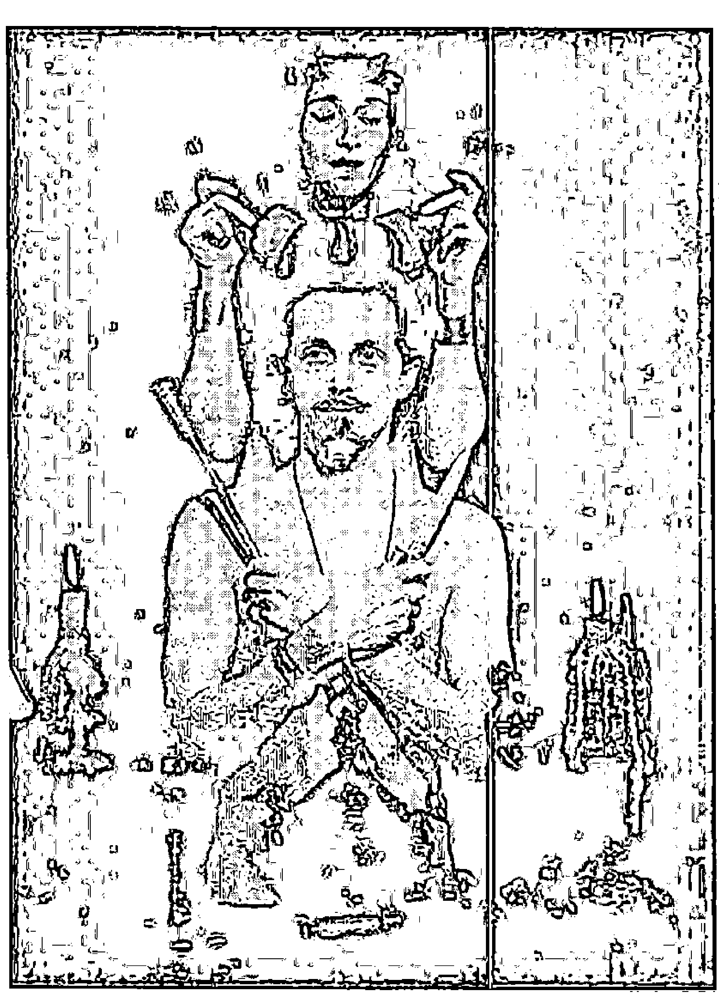

## 神的使者

男女祭司是巫师团体的领袖，这一说法源自“元老”一词。在宗教仪式或魔法仪式中，男女祭司是仪式的主持者和实施者，他们被认为是人与神之间的使者。但是，由于巫师可以单独进行祭祀活动，每一位巫师都可以不通过中间人而直接与神交流，因此所有的巫师都可以作为祭司。有鉴于此，巫师团体的领袖常常被称为男主祭或者女主祭。

在古亚述和古巴比伦，僧侣的两项职责是施展魔法和预测未来。在古埃及，法老本人就可以履行神职。在古希腊，主要的宗教仪式都是由男祭司来组织实施，而国王则被授权代表人民进行祭祀。亚里士多德的《政治学》指出，男祭司是宗教活动的特权者，他们负责完成“为神所做的所有事情”。古罗马诗人维吉尔也在叙事诗《埃涅阿斯纪》中提到了一位女祭司神奇的能力：“通过念诵咒语，她能轻松地使人心境平和或得到极大的安抚；她能让江河不再流动，还能使星宿停止运行；她能召唤黑夜的精灵：你们将看到大地在你们脚下颤抖，白蜡树从山上滚落。”

巫术传统中，女主祭并不具备《埃涅阿斯纪》中那位女祭司超强的能力。在大多数巫术教派里，男、女主祭地位同等重要，然而在某些特殊的教派，女主祭的确要比男主祭更加重要，在这些教派的巫师聚会上，女主祭可以单独主持会议，而男主祭则必须在女主祭的陪同下完成相同的任务。在某些等级观念森严的教派，男、女主祭一旦被任命为巫师团体的首领，那么他们将终身拥有这一身份；而在其他一些无等级观念的教派，领导或者说领导层则需要定期更换。

## 圣约翰草

圣约翰草又名山羊草、迪普顿草、琥珀、约翰草、克拉玛斯草，它的拉丁语学名为贯叶连翘。圣约翰草能起到防御疾病、促进健康、带来幸福、增强力量的作用，在巫术和魔法中得到了广泛的应用。日出之前，人们拔起一棵挂着露珠的圣约翰草可以预测爱情。圣约翰草是由太阳主宰的草，基本元素是火，因此被视为带有男性气息的草本植物。如果在夏至这一天收集圣约翰草，将其戴在身上，那么它能使佩戴者变得不可战胜，同时还会散发出令异性难以抵挡的魅力。此外，圣约翰草还能在最大程度上遏制精神病，对抑郁症也有极好的治疗效果。

将圣约翰草的花朵或者叶子悬挂在房屋正门前的梁上，能将闪电、火灾甚至邪恶精灵拒之门外。人们还相信，圣约翰草能够保证房屋主人不受鬼魂、幽灵、恶魔的伤害。相传，如果把圣约翰草的草根压在枕头下，人们就能在梦中与未来的配偶相会。早期迫害异教徒的基督徒相信，把圣约翰草放到巫师的嘴里，就能让他招供罪行。

圣约翰草还能作为焚香使用，与欧洲蕨、珍珠菌、雏菊、陆英、茴香、常春藤、绵马、艾蒿、景天、马鞭草以及欧蓍草相似，人们会在夏至这一天焚烧圣约翰草，祈求生命的纯净与安康。

如果对着光线观察圣约翰草的叶子，会发现叶面上有红色的斑点，据说这是魔鬼用针在上面刺的。有人说，只有在8月27日，这些红色斑点才会出现，因为相传这一天是圣约翰被处决的日子。

## 撒旦

撒旦一词在希伯来语中本意是“对手、敌手”。最开始，这个词并非纯粹代表“邪恶”，而仅仅是“对手”。直到在圣约翰的书信中，才最早成为“基督敌人”的代称。近代人总喜欢人为地将至高无上的权力划分为“正义的”和“邪恶的”，这种做法是人类文明复杂化和进步化的结果。在古代，人们普遍认为上古之神在各个方面都表现得非常人性化，他们既有“善”的一面，也有“恶”的一面，从来不会是纯粹的邪恶或者纯粹的善良。

纯粹善良的神最早在波斯出现，同时还有一位十恶不赦的恶神与之对立。据《阿维斯陀经》载，波斯拜火教的创始人是琐罗亚斯德，该宗教比基督教早出现了大约一千年，其起源是古老的波斯教或亚利安民族宗教。琐罗亚斯德教信奉多个神祇，其中就包括广为人知的因陀罗（战争之神，屠龙者）。在《阿维斯陀经》中，邪恶精灵则指的是戴瓦。琐罗亚斯德在其新教义中最早对“善”和“恶”给予了明确的划分，他指出，世上本来有两股大小相当的力量，一种是“善”，一种是“恶”。“善”包括善神或者光明与真理之神阿胡拉·玛兹达；“善神”的对立面即为“恶神”，他代表着黑暗、消极以及罪恶。后来，这种把神祇分为善、恶两方的思想被罗马的密特拉教采用（拜火教中，信徒们相信，密特拉是阿胡拉·玛兹达的后代）。在基督教刚刚创立的日子，密特拉教是其最有力的竞争者，久而久之，基督教也采纳了密特拉教用善、恶来划分神祇的思想。就这样，与其对立面的“恶魔”就叫撒旦。

> 古老宗教的早期信徒对基督教这一思想丝毫不感兴趣，他们认为大多数神祇都是有善、恶两面性的，从来没有人考虑过将邪恶拟人化。随着新教日益蓬勃的发展，无论是男女老少，农民还是奴隶都受到了越来越重的压迫。在这些压迫中，就包括强制禁欲。布拉德·斯泰格尔在其著作《性与撒旦》中指出：教会宣布，周日、周三、周五做爱是非法的，这就意味着人们在一年中有五个月无法享受性爱的快感。然后，先驱大教堂变本加厉地要求人们在复活节的前40天内、圣诞节的前40天内禁欲。中世纪的这些教令，使得普通人在一年中有将近八个月的时间不能做爱。接下来教会又宣布，在接受圣餐的前三天，神职人员必须禁欲。随后这项措施针对的人群，扩大到了普通公众。如果说，此前人们每年还有四个月的时间可以用来做爱的话，那么，新条例又剥夺了人们至少一个月的行乐时间。

教会先后出台了各式各样的禁欲令后，一年中留给普通人用来做爱的时间只剩下三个月左右。可以想象，人们在这两个月时间里的做爱将带有极强的目的性——繁衍后代，这自然会大幅度降低男女双方本该获得的乐趣和快感。在诸多法令的限制下，人们自然而然地开始反抗，教会慢慢发现，人们对基督教中敬奉的爱神失去了兴趣。很多人决定改变立场，开始接近黑暗王子，试图从他那里获得某种解脱。在这种背景下，必然会出现像撒旦主义这样反抗教会的冷酷政令的思想。尽管人们从撒旦那里同样也没得到什么好处，不过至少知道自己是在与当权势力对抗，这一点让他们感到非常满足。撒旦主义以反抗教会的名义产生，然而在组织结构上却诙谐地模仿基督教的形式：刻意倒过来念主祷文，使用黑色蜡烛，倒置十字架，做渎神弥撒（将基督教弥撒仪式完全歪曲的一种弥撒）等。

些喜欢夸夸其谈的人。他们这么做，有的是为了摆脱来自侪辈的压力，有的纯粹是出于无聊或者显示自己与众不同。这些人中，一个典型的事例就是芝加哥的霍华德·斯坦顿·李维。某天，他把自己的名字改成了安东·山德·拉维，并且开始着手创办撒旦第一教堂。然而，此君如此行事完全是一次商业投机，唯一目的就是赚钱。最终安东·山德·拉维成功了，那些试图显示自己与众不同的人、那些喜欢夸夸其谈的人以及那些愤世嫉俗的人，都对他的教堂给予了极大的关注。

撒旦主义是基督教的一个副产品。因此，在基督教教义出现前并不存在。那时的欧洲是古老宗教的天下，异教徒们甚至根本不认为有魔鬼存在，就更别说去供奉他们了。

接下来的几个世纪，人们对撒旦主义的兴趣与日俱增。期间，还涌现出了一些广为黑暗信徒所知的个人和团体。然而，撒旦主义的追随者是否真的认为撒旦是一位神，他们是否真是怀着一颗虔诚的心去敬奉撒旦，这些都值得怀疑。实际上，绝大多数魔鬼信徒都是

18 世纪中叶，有一个人似乎离成为真正的魔鬼信徒仅有咫尺之遥，他就是弗朗西斯·达什伍德爵士——西维康比圣弗朗西斯修士组织的创立者。达什伍德14岁时，去世的父亲给他留下了大笔遗产。那时期的年轻贵族都喜欢环游欧洲，他自然也不例外，长期与其私人导师在欧洲游历。表面上，达什伍德是在游览意大利、法国以及德国的同时学习艺术。其实，整个旅程他一直都在放浪形骸、花天酒地中度过。一次，达什伍德在意大利喝得酩酊大醉，回到住所后就直接瘫倒在床上昏昏睡去。等他恍惚醒来时，已是午夜时分，有两只猫正在他窗外对面的屋顶上发出交配的嚎叫。正当达什伍德睡眼惺忪地朝窗外看时，他的私人导师身着白色睡衣赶走了那两只猫。随后达什伍德再度沉沉睡去。次日清晨，达什伍德坚信，昨日夜里，有两个魔鬼曾经为了控制他的灵魂而打斗，最后一位身着白衣的天使救了他。自此达什伍德性情大变。他立刻返回英格兰，向教堂捐赠了价值不菲的祭品，而后成了一位极其虔诚的信徒。然而，达什伍德在意大利的真实经历最终被外界获知，他迅速沦为人们的笑柄。为此，他一怒之下脱离基督教，与12个弟子一道建立起撒旦教派。在西维康比，达什伍德购买了一处中世纪荒废的修道院，并将其修缮一新。但是，他有意给房舍装上污迹斑斑的玻璃，以显示出他本人及其追随者的猥琐和下流。花园里，到处都是姿态淫荡的塑像，而且在修道院正门上方，还有这样一幅铭文：为所欲为。不过达什伍德故意隐去了巫师们常说的后半句——“只要别伤害别人”。每当在这座修道院内举行宗教仪式时，达什伍德总会雇用一些妓女，吩咐她们穿上修女的服饰，以取悦他本人及其信徒。

基督教指责古老宗教的理由之一，就是后者会滑稽地模仿前者的弥撒仪式。实际上，古老的宗教在基督教盛行之前，就已经有了自己的弥撒仪式。至于他们为什么会浪费时间去模仿后者，至今仍是个谜。达什伍德的地狱之火俱乐部就不厌其烦地恶意模仿基督教的宗教仪式，不过由于其成员特殊的社会地位，这个教派从未受到过任何指责和非议。达什伍德的追随者包括桑威治伯爵威廉·贺佳斯、布特伯爵查尔斯·丘吉尔、梅尔库姆勋爵乔治·塞尔文以及本杰明·富兰克林。随后大约三十年时间，达什伍德一直主持撒旦仪式，期间他的追随者有的离开，有的去世，又不断有新成员加入。最终，由于成员去世以及内部不和，地狱之火俱乐部彻底瓦解。1781年12月11日，达什伍德爵士也离开了人世。

19世纪的法国，艾伯·布尔兰在卡梅尔教堂主持的撒旦仪式上以婴儿作为祭品，该教堂由此受到罗马教皇的强烈谴责。卡梅尔教堂由尤金·温特拉斯建立，当时此君声称自己从大天使迈克尔那里得到了启示，因此才建立了教堂。1851年，温特拉斯被捕，罪名是做渎神弥撒以及将同性恋行为作为其宗教仪式的一部分。温特拉斯死后，他的一个信徒查尔斯·巴乌隆成立了以自己的名字命名的教派。巴乌隆对撒旦主义极为痴迷，他甚至包养了一个拥有修女身份的情妇。

如上所述，基督教指控巫术的理由主要有两个：首先是恶魔崇拜，其次是恶意模仿基督教仪式。为了更能起到混淆视听的效果，基督教编年史作者在记录对巫师的审判时，往往会将巫师口中提到的“神祇”直接记录为“恶魔”。因为在他看来，二者之间没有什么区别，甚至根本就是同一对象。久而久之，在基督徒看来，巫师敬奉的“神”（自然神、生命与爱情之神）就变成了“恶魔”，巫师就成了敬奉恶魔的人。

### 身份不明的摩根勒菲

摩根勒菲是《亚瑟王传奇》中亚瑟的姐姐，她的名字来自法语，其形象以威尔士莫德伦—阿瓦拉的女儿和法国布里多尼民间传说中的水中仙女为蓝本，也和古代的女河神玛特罗纳和爱尔兰人的莫莉安女神有关。摩根勒菲是贵妇也是荡妇，是女巫也是亚瑟王的姐姐，是金卡墨的情妇也是“美好的仙女”。她拥有两种截然不同的形象，一个是美丽的少女，另一个则是年迈的妇人，而有些传奇故事更将她说成是梅林的姐姐。无论她真正的身份是什么，摩根勒菲通常都是邪恶的化身且精通医术。一方面，她与亚瑟势不两立；另一方面，她又在剑栏之战后运用自己的魔力为亚瑟疗伤。

□ 弗里德里克·桑迪斯绘制的摩根勒菲画像  科斯特·福亭图片库

## 苏格兰巫术

人类历史上对巫师最为残忍的迫害，毫无疑问发生在德国。苏格兰则紧随其后。在苏格兰，神职人员常常扮演法官的角色，而法庭则承担着用世俗的法律来迫害巫师的重任。囿于落后的科技水平，在审讯过程中，人们无法制造出精良的刑讯工具。因此，被告所受到的严刑拷打，残酷到令人咂舌的程度。在艾格尼丝·桑普森一案的审讯中，法官使用了一种专门用来对付女巫的“笼头”刑具。这个铁质刑具上带有四根尖刺，行刑人将它强行塞进桑普森的嘴里，其中两根尖刺紧紧压住她的舌头，其余两根则死死顶住她的双颊。

苏格兰历史上出现过许多“涉巫、传巫”案件，它们证明了那些近乎偏执狂的新教徒和天主教徒对所谓“魔鬼仆人”的残酷压迫。

苏格兰教会发现了巫术宗教的起源，于是根据巫师的聚会制度设法打入内部，最终抓到13名巫术信仰者，其中包括一名巫师团体的领导。

尽管苏格兰有多种简单的民间魔法存在，然而直到16世纪末，真正意义上的巫术教派却始终没有出现。在那之前，针对巫师的审判都带有极强的政治色彩。1479年，苏格兰东北部麻省的伯爵被控“使用巫术谋杀胞兄——国王詹姆斯三世”。1537年，格拉米斯女士被活活烧死，罪名是“拥有女巫身份，且诅咒国王詹姆斯五世”。还有弗里斯女士被控“利用符咒、蜡烛以及毒药等方式杀死巴尔纳格万夫人，以便自己能够嫁给巴尔纳格万君主”，不过最终她被无罪释放。

北贝里克郡女巫的审判发生在1590至1592年。起初，只是一位名叫盖尔斯·邓肯的女仆因制作草药而被起诉，随后外界盛传，邓肯被指控为女巫。邓肯曾经用某些玄妙的方法给他人治病。最后，盖丽斯·邓肯的主人大卫·西顿决定对她进行调查。爱丁堡附近有一个名叫特兰特的小镇，西顿是这个小镇的副法替，在他看来，邓肯的能力绝对是来自恶魔的馈赠。由于西顿本人就是执法者，于是他开始审讯邓肯，为此还动用了用螺钉锥刺手指的刑罚。在西顿的严刑逼供下，邓肯被迫承认确实与恶魔有联系。

邓肯随即被西顿移交给官方接受进一步的盘问，并开始把其他人牵扯进来。洛锡安区的一名男教师约翰·费恩就是被邓肯拖下水的人之一，在邓肯口中，费恩成了巫师组织的秘书。

费恩被屈打成招，在供词上签字画了押。这份供词中，费恩把国王的表兄弟——波斯维尔伯爵弗朗西斯牵连了进来。之后，费恩成功越狱，似乎是为了给弗朗西斯通风报信。但很快，他再度被捕。在接受审问期间，费恩推翻了此前的全部供词。严刑拷打没有让费恩再吐出一个字，他最终在沉默中被处死。

盖丽斯·邓肯把哈丁顿的艾格尼丝·桑普森也说成是女巫。很快，桑普森被捕，并在霍利鲁德城堡接受了审讯，詹姆斯国王亲自到场旁听。为了在她身上找到“魔鬼印记”，法庭将桑普森全身的毛发剃光。严刑拷打下，艾格尼丝·桑普森编造出了一些惊人的故事。她声称，已经有二百名左右的女巫坐着筛网走海路，一路开怀畅饮、载歌载舞地抵达北贝里克郡的一座教堂。桑普森还绘声绘色地说，盖丽斯·邓肯当时还在教堂里为大家吹奏单簧口琴。听到这里，詹姆斯国王要求邓肯当场吹奏一段舞曲。后者的表现让国王非常满意。

桑普森继续供称，在北贝里克郡的教堂里，魔鬼代言人向聚集在那里的女巫们布道。在离开之前，魔鬼代言人还要求女巫们把各自的罪恶吸盘交给他。庭审记录对这一段的记载是：“地狱使者对女巫们发出警告后，他走下神坛，要求所有人都去亲吻他的耳朵，后来女巫们声称，这么做给她们带来了幸运。”

詹姆斯国王对艾格尼丝·桑普森的故事并不是很感兴趣，他甚至认为桑普森是一个骗子。然而据詹姆斯国王本人讲，桑普森随后准确地说出了他与王后大婚当夜两人的对话，这让国王极为震惊。要知道，当时他们身在挪威的奥斯陆，而且，这是常人不可能知道的事情。因此，他不得不相信桑普森所说的一切，这其中就包括一个诅咒国王的故事。据桑普森说，诅咒者先从一只蟾蜍身上取得毒液，然后将毒液洒在国王的某些贴身物件，比如衣物上面，如此这般就能够成功蛊惑国王。

詹姆斯国王乘坐海轮驶向丹麦迎娶15岁的王后安妮的途中，他的船曾经在一阵极不寻常的暴风雨中剧烈摇晃。艾格尼丝·桑普森说，当时的暴风雨正是女巫们施法的结果。施法过程是这样的：女巫们首先抓住一只猫，在为其洗礼后，再把从坟墓里找来的死人的四肢绑在猫的四个爪子上，最后将它丢进海里。就这样，暴风雨产生了。

另外一种形式的巫术是为国王做“蜡画像”，桑普森自称曾经与其他女巫一道施展过。过程如下：首先把画像小心地卷起，用亚麻布包裹好，然后把它带到与魔鬼见面的地点，由魔鬼亲自检查后交给在场的女巫们传阅。每个女巫都说：“这就是国王詹姆斯六世，他在贵族波斯维尔伯爵弗朗西斯的掌控下注定将油尽灯枯！”在随后一次聚会上，一个名叫格雷·米尔的老农脱口而出“国王现在还很健康，他应该感谢神的保佑”。据记载，魔鬼重重赏了他一记耳光！

詹姆斯国王几乎可以肯定，出现在聚会现场的魔鬼就是戴着面具的波斯维尔伯爵弗朗西斯。这件事发展到最后，至少有七人被牵连进来。这些人中包括卡乔吉尔地主的妻妹芭芭拉·娜皮尔、克利夫顿豪国王的女儿尤菲米亚·麦克卡兰夫人。1591年7月25日，麦克卡兰夫人被捆在木桩上烧死，而当时自称有孕在身的芭芭拉·娜皮尔则被无罪释放。麦克卡兰夫人之所以被处死，极有可能是因为她与波斯维尔私交甚笃有关。另外，其罗马天主教徒的身份也对她非常不利。尽管波斯维尔伯爵弗朗西斯矢口否认自己与女巫有关，但是他依旧被关入爱丁堡城堡的监狱中。不久，弗朗西斯成功越狱，逃往意大利的那不勒斯。两年后，詹姆斯国王赦免了他的罪愆，然而弗朗西斯选择继续留在意大利，直到死去，这对他来说或许是一个明智的决定。

1597年，爆发了阿伯丁女巫事件。当年出版的《鬼神研究》引起了一场席卷阿伯丁的反巫师狂潮，并直接导致24名男女巫师被处以火刑。这些巫师中的一个典型是珍妮特·维莎特，她被指控对亚历山大·汤姆森念咒，导致后者浑身战栗、直冒冷汗；安德鲁·韦伯斯特更是由于被珍妮特蛊惑而丧命。另外，据称拥有魔鬼之眼的珍妮特也导致了多个受害者死亡。被逮捕的巫师中，有一名因转做污点证人而逃过了惩罚，此人公开表示曾经见过多达二千名女巫，对她们有着足够的了解，她们每个人都有魔鬼印记。

1607年3月10日，伊索贝尔·格里尔森在爱丁堡接受审判。格里尔森与她的丈夫约翰·布尔生活在爱丁堡以东的普雷斯顿潘斯小镇，她受到六项罪名的指控。首先是她曾经变成一只猫的模样，和一大群猫进入邻居亚当·克拉克的家中，这些猫在亚当家制造了高分贝的噪音，造成了很多麻烦，甚至使得亚当夫妇因处于极度恐惧而近乎发疯。第二项罪名是格里尔森试图通过“魔鬼般的手段”谋杀威廉·伯内特。第三项是在格里尔森受到指控的九年前，格里尔森曾经令罗伯特·培丹生病。培丹作证称，格里尔森曾经借给他一笔小钱而他忘了还，格里尔森遂用巫术诅咒他，让他想起这件事，然后把钱还给了格里尔森，后者这才撤掉诅咒。罗伯特·培丹是第四项指控的原告，他声称当自己正在酿啤酒时，格里尔森伸手抚摸了他的猫，这导致了啤酒的变质。培丹的妻子是第五项指控的原告，她说，正是因为受到格里尔森的诅咒，她才变得久病缠身，每当身体日渐好转的时候，格里尔森就会通过散布谣言来诅咒她，然后她的病情就会再度恶化。第六项指控是“格里尔森是一个普通的魔术师和女巫，通过诅咒人生病随后再将其治愈，以此方式虐待普通百姓。”所有证人都出庭作证以后，伊索贝尔·格里尔森被判有罪——处以先勒死后焚烧的刑罚，随后所有的财物被国王没收。

1618年对玛格丽特·巴克莱的审判是当时苏格兰“涉巫、传巫”案件的另一典型。巴克莱是欧文市市民阿奇巴尔德·迪恩的太太，她与丈夫的兄嫂相处得不太融洽。当地教会试图调解双方之间的矛盾，不过巴克莱拒绝了教会的好意。当巴克莱丈夫的兄长去法国旅行时，有传言称巴克莱盼望轮船失事。刚巧，一个叫约翰·斯图尔特的流浪汉经过欧文市，他声称那艘轮船即将沉没。不想，后来真的传回了发生海难的消息，那艘轮船上只有两个人生还。随即，斯图尔特以“先知”的罪名被捕，而巴克莱也受到“涉巫”指控。在法庭的严刑逼供下，斯图尔特说，他曾经看到巴克莱做了一个蜡制的轮船，随后进一步交代，巴克莱还有一个共犯，即她八岁的女儿因丝·伊索贝尔。伊索贝尔也承认，在一间废弃的房子里和母亲制作轮船的蜡像，那里还有一条魔鬼般的恶狗，其下颌部位发出的光照亮了整间屋子。伊索贝尔交代完所谓的罪行之后，被羁押在教堂的钟楼，她试图逃脱，不想却从楼顶跌落身亡。约翰·斯图尔特在严密看管下自杀未遂，而玛格丽特·巴克莱则在经过严刑拷打后被判有罪，处以先勒死，然后烧成灰烬的刑罚。

1623年，苏格兰的珀斯进行了一场女巫审判；1662年，又进行了对伊索贝尔·古迪埃的审判。古迪埃是苏格兰最著名的女巫之一，据说她曾经于1647年在奥尔德恩的一座教堂与魔鬼见面。当时，她与魔鬼订立了一份契约，同时还改名珍妮特。随后魔鬼吸取了她的鲜血，并为她重新施洗。古迪埃称，她去参加巫师聚会，并且把一根扫帚放在床上迷惑丈夫。后来，她骑着一根麦秆飞到了庆祝仪式的所在地。在《巫术及鬼神学百科全书》中，霍普罗宾斯写到：“尽管通过其陈述，我们可以得知古迪埃认为自己所说的一切都是真的，不过那个女人明显是疯了。”霍普罗宾斯说的没错，古迪埃所做出的一切供述都是在没有接受任何刑罚的前提下完成的，不过她所说的一切，基本上已经囊括了当时对女巫、巫术的一切无知偏见。诸如包括她自己在内的女巫都能变身成走兽和飞鸟，射击精灵们自制的飞镖，女巫能够控制天气并召唤暴风，女巫们在集会上的工作情况等。玛格丽特·穆里在《女巫邪教在西欧》一书中提供了大量以伊索贝尔·古迪埃的狂热臆想为基础的证据。

梅杰尔·维尔于1670年被处以死刑，他被认为是苏格兰历史上最臭名昭著的男巫之一。维尔曾经是一位优秀的国会议员和新教领袖，然而在70岁这一年，他却主动交代了自己曾经犯下的一连串罪行，其中包括鸡奸、与母驴和母马发生性行为、乱伦（与妹妹珍妮的乱伦关系，从她16岁维持到了50岁，与继女玛格丽特·布尔顿乱伦）、私通（与女仆贝西·威姆斯）、涉巫等。

梅杰尔·维尔在散步时，经常拄着一根多刺的木杖，甚至在祈祷时都要靠在这根木杖上。后来人们认定这是一根男巫专用的魔杖，它能给维尔带来魔鬼的指示。在一次审判记录上，有这样的记载：1651年或1652年，一位妇女曾经看到维尔与一头母驴在交媾，后来这位妇女被处以游街和鞭刑的处罚，理由就是“诽谤维尔这样德高望重的人”。

玛格丽特是维尔的妻妹，她披露说，她曾经看到维尔与其胞妹珍妮在牲口棚里交媾。珍妮也讲述了一些神奇的事情，她说曾有精灵为她施魔法；另外，她和哥哥曾乘坐一辆魔法马车从爱丁堡飞到穆塞尔堡，然后又返回来。最终，梅杰尔·维尔被判有罪，于1670年4月11日被烧死；她的妹妹珍妮则在4月12日被绞死。

在苏格兰，对巫术信仰的宗教迫害一直持续到18世纪中期。1720年，国王卫士罗伯特·邓达斯拒绝以“传巫、涉巫”的罪名将一众卡尔德妇女投入监狱。不过1729年，珍妮特·霍恩还是在罗斯郡的多诺赫镇被处以火刑，罪名是把女儿当做马匹，让魔鬼给她钉上马蹄铁，最终使其落下跛足的终身残疾。

1736年，迫害巫术的法令正式被废止。据估计，大约有四千四百名苏格兰人因“传巫、涉巫”的指控而被烧死。在苏格兰历史上，重要的一些审判发生在下列年份：

-   1590至1592年的北贝里克郡女巫审判
-   1590年的约翰·费恩博士审判
-   1597年的阿伯丁女巫审判
-   1607年的伊索贝尔·格里尔森审判
-   1618年的玛格丽特·巴克莱审判
-   1623年的珀斯女巫审判
-   1662年的伊索贝尔·古迪埃审判
-   1670年的梅杰尔·维尔审判
-   1697年的伦弗鲁女巫审判
-   1704年的皮特思维姆女巫审判

## 蛇与龙

过去，人们认为蛇是一种能够永生的动物，因为它们能通过蜕皮来实现重生。大毒蛇是一种最古老的女权符号，也是月亮的象征。前古典时期的爱琴海文明认为，大毒蛇和女人一样圣洁无比，因为她们都具备孕育生命的能力。在埃及和印度，第一条大毒蛇被说成是圣母的图腾。同样是在印度，土壤之神和“一切生物之母”通常被冠以“萨帕拉尼”或者是“大毒蛇女皇”的名号。在古埃及，根据刻在金字塔上文献的记载，大毒蛇之母尤萨塞特是上天神蛇。而据古希腊诗人赫西奥德指出，大地女神盖娅是所有神灵的母亲，她本来就是一条名为盖娅·佩洛佩的大毒蛇。

在有等级观念的巫术传统中，女巫皇后或者巫师聚会活动中的皇后通常都会穿一条带有银扣环的吊袜带，这条吊袜带是其地位的象征。一般而言，这条吊袜带由绿色蛇皮制成，上面还配以蓝色丝质花纹。在海奇巫术教派中，蛇皮被认为是治疗风湿病的良药；而在密苏里州和阿肯色州的肯塔基和奥扎克地区，人们取下响尾蛇尾部的响环，然后将其磨成粉末冲水给孕妇服下，据说能够治疗难产。当地人还相信，如果把响环当做头饰的话，能治疗头痛。

诺斯替教派给大毒蛇起了一个颇为男性化的名字奥菲昂，意为“光之永恒”或“太阳神”。这一教派的信徒，被认为是大毒蛇的兄弟。在其他一些神话故事中，大毒蛇还扮演着“智慧树”或者“生命之树”守卫的角色。如在诺斯替教中，大毒蛇变成了含尾蛇——一种生活在母系氏族社会的不死精灵。含尾蛇的符号是一条含着自己尾巴的大毒蛇，它的躯体因此形成一个环，这是一个象征永远不会终结的图案。诺斯替教中的纳森斯分支，则采用了大毒蛇的形象作为教派的标志——纳森斯即意为“蛇”。

据P. Z. 古尔德伯格说，在坦柏林，已婚妇女只要进入大毒蛇的栖息地就能怀孕，因为大毒蛇是一切生命繁衍的源泉。在寺庙中，大毒蛇会变化成人形，并且“以他神赐的性感风采为女性崇拜者祈福”。以这种方式产下的后代，人们称为“蛇的孩子”。不过古尔德伯格认为，“在具体的生育过程中，牧师往往成了大毒蛇的代言人”。

蛇象征着草地线、龙线或者土壤线——连接着巨大权力和无穷能量的“线”。许多关于征服大毒蛇的神话故事大多都与蛇能够控制地球的超能力有关。英国维尔特郡的埃夫伯里石圈纪念馆内有两座石圈，这个纪念馆接近一条石质街道，街道的另一端连接着圣堂，而圣堂所在的位置就是毒蛇山。在威廉·斯图克雷等人看来，这条街道代表民众对大毒蛇的崇拜。

龙，曾被认为是大毒蛇的变身之一。如今，关于龙的传说也比比皆是。人们认为龙能够带来丰饶的物产，甚至有人说，龙的尾巴能撒下大量的树叶，嘴里能喷出无数葡萄和水果。大多数人都相信，龙与农作物、牲畜家禽的丰收丰产之间有着千丝万缕的联系。《古代英国神话》中，珍妮特和科林·伯德指出，“许多传说中都提到了由龙看守的宝藏，令我们感到疑惑的是，这些故事中，龙是否真的代表着曾经被史前人类运用过的地球能量？如果使用不慎的话，这些能量是否真的会像传说中所描述的那样会带来摧毁一切的大灾难？

## 所罗门封印

好几位作家都不约而同地在他们的作品里提到了乌菲顿的白马峭壁，他们认为，那上面刻画的不是白马，而是一条龙。就在距乌菲顿白马峭壁不远的地方，有一处环形隆起的地貌，人们将之命名为“龙之山”。这似乎为“白马峭壁上画的是龙”这一说法提供了依据。“龙之山”是一座小山，相传，圣·乔治曾在这里屠过龙。其实，这种说法只是对一则更为古老的传说故事的再加工。基督教早期，曾经将圣·乔治塑造成大天使迈克尔的形象，在他献身于异教之神巴尔以前，就负责守卫圣山。

所罗门封印是一个六角星的图案，由两个相互贯穿的三角形组成，其中一个三角形顶角朝上，另外一个则朝下。所罗门封印还有个名字叫“小宇宙之星”，是“个体精神潜能”的象征。组成所罗门封印的两个三角形中，顶端朝上的代表火，顶端朝下的代表水。因此，所罗门封印被视为水与火的统一。在印度文化中，所罗门封印又被看做是男性与女性的统一。根据西方的传说，所罗门国王创造了一个六角星，通过它来镇压邪恶的精灵。在炼金术和通神论中，所罗门封印被称为“封印星”。1682年，G.吉奇特尔在谈到所罗门封印时说：“它能带来智慧和顿悟，可以引领我们向前。”现代人则往往把所罗门封印作为护身符，以求避免灾祸。

六角星形状的所罗门封印也被称为“大卫之星”，其实它被用作犹太教的官方符号也不过是最近这一百年的事。中世纪时，印度的密教经典给犹太的秘法师们带来了极为深远的影响。就这样，所罗门封印进入了犹太人的世界。芭芭拉·沃克说，“犹太秘法师们谈论着神与其配偶斯凯娜（闪米特人崇拜的女神，类似于印度教中的圣母卡利·沙克蒂）重新团聚的相关事项，他们的重聚就是以印度教密宗的两性曼荼罗（象征宇宙的球形）为象征的”。

米尔希·埃利亚德在《天国花园里的神秘遗物》中指出，中东的很多神灵经常被描述成“手持毒蛇”的形象，阿尔特弥斯、赫卡特、波尔赛弗涅、克里特蛇之女神美杜莎以及厄里倪厄斯，都是如此。

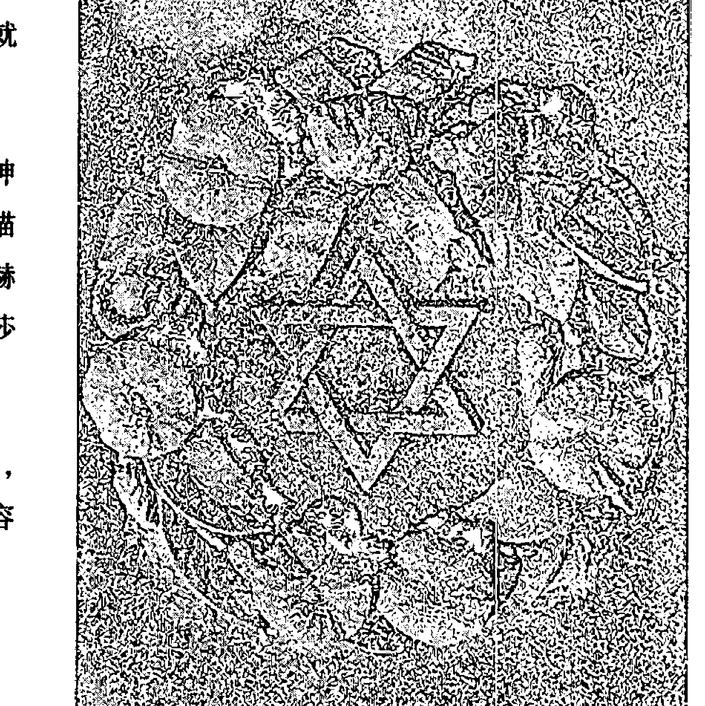

苏格兰的圣新娘节（圣布莉吉妲日）这天，人们会反复念诵一首赞美诗，这首诗的内容表明大毒蛇代表着人间的能量：

> 在圣布莉吉妲日的拂晓，
> 大毒蛇即将出洞。
> 我不会去骚扰大毒蛇，
> 也不愿它来骚扰我。

## “逝者世界”交流的中间人

唯灵论认为，生者能够与逝者灵魂交流。1980年，盖洛普民意测验显示，有71%的美国人相信“逝者灵魂仍在”的说法。在包括招魂术、巫术在内的很多宗教思想中，逝者灵魂并无“上天堂”和“下地狱”的区别，任何一个死去的人，他们灵魂的去处只有一个“既不全好，也不全糟”的地方。安德鲁·杰克逊·戴维斯专门为这个地方创造了一个新字眼：“夏日圣土”。由于巫术传统思想认为，人死后灵魂仍在，因此，杰拉尔德·加德纳把这个词正式引入巫术教派。

唯灵论者相信，有些人能够充当“人世”与“逝者世界”交流的中间人，也就是“通灵师”。借助通灵师，生者能与死者进行交流。根据唯灵论思想，通灵师能通过视觉（透视力或者清晰地看到）、听觉（透听力或者清晰地听到）、感觉（超感知力）甚至被灵魂控制（灵魂借这些中间人之口来直接表白）的方式，接受来自逝者灵魂的讯息。人们还可以通过“不受控制的书写”、水晶球占卜、冥想以及使用谈话等方式与逝者的灵魂交流。

为了与逝者灵魂交流，通灵师要一个或几个坐在一起与灵魂取得联系，这就是所谓的“通灵秘坐”。

如果把与鬼魂的交流视为宗教膜拜的一部分，那么在一定程度上，唯灵论就与基督教的宗教哲学十分相似。此时，它就成了一种宗教信仰，而不再仅仅是一种思想。我们不妨称之为“唯心教”。世界上有很多唯心教教堂，但在践行唯灵论思想的过程中，每一个唯心教教堂都相对独立，没有任何隶属关系。

巫术传统中，巫师们常常在节日的庆祝仪式上与逝者灵魂取得联系。他们进行这种宗教仪式时，并不像唯心教那样需要通灵师的帮助。很多时候，整个巫师团体能够通过视觉和听觉，直接与灵魂交流。

## 萨默斯的巫术

1880年4月10日，阿方索斯·约瑟夫玛丽·奥古斯图斯·蒙塔古·萨默斯出生于英格兰克利夫顿的巴顿雷吉斯区——距离布里斯托尔城不远。萨默斯的父亲是一位治安法官兼银行家，他是家中最小的孩子，排行老七。

萨默斯很小的时候就迷上了戏剧，16岁这一年，他还亲手制作了一个剧院模型，供自己时常把玩。尽管从小就在英国国教的氛围中长大，然而萨默斯却深深沉迷于罗马天主教的宗教仪式，并最终成为一名罗马天主教徒。从1899年开始，萨默斯先后在三一学院、牛津大学以及里奇菲尔德技术学院学习；1905年，他获得学士学位，次年得到硕士学位。28岁时，萨默斯成了罗马天主教的一名执事，同时还得到巴斯市助理牧师的职务。在巴斯市，萨默斯和另外一名牧师一起受到了鸡奸的指控，好在最终被无罪释放。1909年，作为一名罗马天主教的牧师，萨默斯定居于吉尔福德镇附近的瓦诺什村。

尽管萨默斯拥有牧师的头衔，不过其神职授任的确切地点目前尚存在些许疑点，但有一种说法是他在意大利成为牧师的。1911至1926年间，萨默斯任教于一所私立学校。期间，他出版了多部以“王政复辟时期文学”以及“18、19世纪哥特式小说”为主题的著作。后来，萨默斯迁居至牛津郡，在那里完成了一系列的学术专著，其中很多涉及巫术、撒旦主义、吸血鬼以及狼人等超自然主题。

萨默斯对奥斯卡·维尔德以及阿雷斯特·克罗雷极为崇拜。在他看来，巫术与撒旦主义本来就是一回事，所有的巫师都应该被烧死。据传言，萨默斯有人格分裂症：一方面他表现得虔诚、善良；另一方面，他又对魔鬼非常迷恋。在《神秘主义与诡异心理学百科全书》中，作者谢巴德将萨默斯描述成为“有着一张别致却又稍带邪恶的面孔，身披宽大的黑色斗篷，手上戴满珠宝首饰，声音尖利得像一个娘们。”

萨默斯最有名的几部著作均被后人深入地研究过，包括《巫术与鬼神学的历史》、《巫术地理学》、《吸血鬼、他的邻居及亲属》、《吸血鬼在欧洲》以及《狼人》。萨默斯的其他作品也涉及到了巫术，比如《巫术通俗发展史》和《巫术与黑色魔法》。萨默斯还做了许多翻译和注解方面的工作，其中包括1928年的《巫师之锤》、1929年的《巫师概要》以及1930年的《鬼神崇拜》。

玛格丽特·穆里指出，在基督教出现前，巫术就已经成为了一种宗教。然而，萨默斯并不同意她的观点。他相信，那些巫师在受到严刑拷打之后招出的供词，都是实实在在的；鲁塞尔曾经明确指出，“萨默斯的所有专著以及经典巫术手册的译著，充满了过分随意的翻译、极不准确的参考文献以及愚昧无知的主观臆断”。1948年8月10日，蒙塔古·萨默斯因病与世长辞。

## 三重法则

三重法则也是三倍法则，是一种回报的法则。巫术中业的概念是指做善事可以得到付出的三倍回报，或三倍的回报强度。然而做坏事，报应同样也是三倍的。这些回报或报应将在有生之年应验。在基督教中，业的回报或报应没有推迟之说，全部都是现世报。因此，巫师没有任何诱因为恶，由此出现了必然的结果——巫术忠告：“在不危害别人的前提下，去做你想做的事。过自己的生活，只要有意识地不去危害他人，就不会引起恶报。”

一些巫师认为，业报并不会是三倍，而是简单的以牙还牙，当然，还有其他人认为是七倍。 查尔斯·戈弗雷·利兰在《阿拉达，女巫的福音》中提到过双倍业报。然而，大多数巫师还是相信三重法则。

三重法则逐渐成为巫术中的基本原则，不过，直到雷蒙德·巴克兰的《论古今巫术》一书才正式以书面形式提出。

涅和赫卡特。三角是三性女神的象征：少女、母亲、老妪。

三角按照正常的位置，即一角朝上时，象征着火；颠倒过来，即三角的一角朝下，象征着水；三角颠倒并削去朝下的一角，则象征着大地；直立并削去朝上的一角又象征着空气。

在有等级体系的巫师传统中，颠倒的三角是第一等级的象征。顶点向上，将三角放在五角星上则是第三等级的象征。希腊字母D，或河流的三角洲呈三角形，被认为是代表女性外阴的字母与圣门。

从梯子下走过是不吉利的。因为梯子倚墙而立，正好与墙形成一个三角，而人从梯子下走过则打破了这个三角，从而也就打破了神圣的三位一体。

数字命理学中的三、三角形中的三，与调查人员、科学家和探寻者相关，受罗马神朱庇特统治；数字三还与字母C、L和U有关。

## 三位一体

三角相当于数字三，代表三位一体。古埃及三位一体的神灵包括：伊希斯、奥西里斯和荷鲁斯；印度教的三位一体或三神一体的神灵包括：婆罗门、毗湿奴和湿婆神；希腊的三位一体神灵包括：阿尔特弥斯、塞勒涅和赫卡特。

## 数字 13

尽管被一些人认为是不祥的，但13其实应该是个幸运数字。一年有13次月圆——对应的，月亮女神也有13位。传统的巫师聚会的人数是13；基督教里的耶稣有12个弟子，但事实上总共是13个；炼金术里有13种召唤死者返回人间的通灵术；面包师的一打面包往往要多一块额外的，即13块面包；古希腊哲学家毕达哥拉斯认为，12+1创造了无限的数字13，通过这个公式诞生了诸多的奇迹；卡巴拉教义的文字数码学系统中，13等同于“爱的唯一”。

有人将13是不吉利的数字的原因归咎于最后的晚餐桌上坐了13人，但其实这种信仰早在基督教出现很早之前就已经存在。例如，罗马人将数字13与死亡和不幸联系在一起。12被认为是一个完美的数字（白天有12个小时，夜间也是12个小时，一年有12个月，生肖是12个，以色利有12个部落等）；超过12，达到13，稳定的数字出现了一个多余的，就会招来厄运。

## 使用酷刑

大部分使用酷刑的证据来自于欧洲的宗教迫害期间，这些证据表明，巫术在当时被归于黑魔法以及恶魔崇拜。多琳·瓦林特说：“如果我详细地讲述这样一个故事，所谓基督教慈爱的上帝的追随者们是如何在人类历史上将他们的双手沾满鲜血的，我就会被指控为反基督教了。然而，每一次这样的迫害都会有相应的文字记录，证据多得几乎难以相信。”这就是最好的说明。

酷刑曾经在欧洲大陆盛行。当时的英格兰并不允许施酷刑，但包括“巫师发现总长”马修·霍布金在内，一些巫师猎人还是成功地在大部分情况下绕开了这项规定。

一些审判中，法官宣称他们并未使用酷刑让犯人招供，这其实根本就是谎言。弗里德里克·冯·思贝在他的《罪犯刑事》一书中说：“我一直在思考这个问题并进行了调查，最终得知，事实上很多人都受到了酷刑。他们用带锋利边缘的烙铁烙在人的皮肤上，把人的皮肤当蛋糕一样切割，造成难以忍受的疼痛，这一切被他们称为所谓的不含酷刑的招供，实际上只是欺骗那些对宗教法庭的陈述无甚知晓的人们。”多琳·瓦林特补充到：“囚犯先被剥光衣服，尤其是女囚犯的衣服，本应是由女监舍长剥的，但事实上她们多被男性拷问者粗暴地剥掉，有时候还会被拷问者的助手强奸；然后进行酷刑的初步阶段，如鞭笞，或者使用烧红的尖尖的铁钳夹手指或脚趾。这样的预备审讯通常不被认为是酷刑，在法庭上，如此这般情况下的招供会被陈述为未用刑的主动交代。”

1486年，《女巫之锤》强调了酷刑的适合度，认为只有在极端情况下的招供才可能真的有价值。书中说：“有些女巫比较软弱，稍微用点刑就会招供一切。其他一些女巫则冥顽不化，无论如何拷问，都很难从她们口中得知只言片语。还有些曾经受过刑的，第二次受刑时会变得更能忍耐，因为她们的胳膊变得适应了审讯中的拉伸和扭曲。”

1631年，著名魔法师莱茵巴赫行政官海尔·励茨受审。在忍受长达24小时的酷刑后，励茨仍然拒绝坦白，两天后被审判官伯曼下令烧死。 科斯特·福亨图片库

《女巫之锤》规定了第一阶段的酷刑，以及第二阶段的酷刑或者是终极酷刑。第一阶段的酷刑包括剥光衣服进行鞭笞，躺在受刑台上承受西班牙靴子的碾压。西班牙靴子因西班牙宗教法庭首先使用而得名。它有两种样式：一种是能够调整的，像虎头钳，用来碾压脚和腿；另一种是很大的金属装置，可以向里面倒入开水或滚油。第二阶段的酷刑有吊刑、烧红的铁钳夹手指、手臂反绑，脚悬重物后吊起和坠下，以及车轮碾压等。在德国的奥芬堡城，曾发生过这样的酷刑：被指控者被剥光衣服，按到一张布满铁钉的铁椅上，下面再生火烘烤。 被控女巫最好的招供就是证明其巫术，尤其是与魔鬼的契约。控告者相信酷刑是获得供词的必要手段，很多被施行的酷刑手段在同时代的一些雕版上有过描述。其中一段写到，30 个人被囚禁在一间小屋内，一对对地被捆绑在一起，而且没有食物和水。最后，他们因饥饿过度而精神错乱，开始将其他人撕成碎片。另外还描述说，囚犯被剥光衣服，沿着一根紧绷的绳索拖曳，绳索像锯齿一样将人体锯成两半。还有人被绑到木桩上，在不远处生一堆火，就这样慢慢将人烧死。其他的方法包括开膛破肚、挖眼、鞭笞、火烧，以及向人体胃部大量灌水，直到肚子鼓起、爆开，此外还有使用吊刑、烤箱和烧红的钳子夹。

比较常见的是吊刑，该词来源于拉丁文，有拉伸的意思，包括将受害人的四肢拉伸到脱离躯体。拷问者将受害人的双手反绑在背后，通过滑轮拖拉绳索，将受害人吊离地面，然后在脚上加负重物，直到肢体与躯干分离。拷问者还常常将受害者吊起，直到接近天花板，然后放开绳子让其落下，但在快近地面时又将其吊起。如果是孕妇则会让其肚子着地。

不少人在刑台上被拉伸到肢体支离破碎，血管爆裂。还有人被悬挂的重物拉伸到下肢近乎碎裂，整个身体扭曲到变形。也有人被钳口物将嘴巴撑大，并向胃内注入大量的水，当腹部肿胀到最大时，再用水龙头、水管或其他工具刺穿胃部，于是腹中的水便猛然间喷涌而出。

年龄也不能成为酷刑的障碍。无论是年老的还是年轻的，都无一幸免地遭受类似的暴行。1573 年，在法国阿尔萨斯，一名妇女被新教徒指控，但因无罪而被释放。四年后她又被指控，这一次的指控者是天主教徒。他们拷问了她七次，直到获得供词，之后将其绑在木桩上烧死。 1614 年，在班伯格，一名 84 岁的妇女因受酷刑而死；在英格兰萨福克郡卡顿，一名 80 岁的妇女被多次强迫坐到布满刀尖的椅子上；1617 年，英国卡斯尔敦马恩岛，马格瑞特·奎恩和她十岁的儿子一起被绑在木桩上烧死；1689 年，在林特尔，一名九岁的小女孩一边被鞭打，一边看着她的祖母被烈火焚烧；在德国的维尔茨堡，也曾有两名 11 岁的小女孩被烧死。

## 术士

术士一词是从苏格兰英语和古英语中“waerloga”一词演变而来，意思是背叛者或违背誓言的人。术士一词常用于男巫师，但巫师们却从不这样称呼自己。

在巫师受排挤和迫害的年代，宗教审判官在拷问巫师时，会急切地想知道社区内其他巫师的情况。因此，很多巫师遭受了极为严酷的拷打。一些巫师的心理防线被攻陷，从而供出了其他巫师。由于轻易屈服，这种人就被打上了术士的标签。

佩尼松·休斯在其作品中提到，当一个受尽折磨的巫师被察觉有供出同伴的迹象时，他将会在监狱中被其他巫师杀死，以防止社区内其他巫师遭到逮捕。为了区分这种情形下的杀害，巫师们会在尸体的喉咙处用吊袜带打上一个宽松的结。1618年，欧文地区的约翰·斯图尔特谋杀案以及1696年伦弗鲁郡的约翰·里德谋杀案皆出于此种情况。

## 神话、传说和童话中的巫术

从早期的故事中，我们可以发现人类的希望、恐惧、信仰和回忆。神话故事似乎是人们对传说和传奇、奇特和怪异生物、仙女和巫师的回忆。再往后一点的神话故事中，主人公有很多是希腊和罗马神话里巫师的后代。

几乎所有人对巫师在社会中的角色都有着自己的认识，并将他们记录到神话、传奇、传说和童话中。但是遗憾的是，由于时空的限制，并不能为这些故事一一找到来源。

希腊神话中，女巫美狄亚是科尔基斯国王爱提司的女儿，因掌握魔法而闻名。美狄亚的魔法是从太阳神那里习得的，并在对赫卡特神殿的拜访中得到不断提升。当伊阿宋到访她的国度时，美狄亚不能自拔地爱上了他。借助赫卡特赐予的魔法，美狄亚成功地帮助伊阿宋降伏了两只鼻孔喷火的黄铜蹄公牛。随后她又在赫卡特的庇护下，向警醒的守护龙眼中滴了几滴魔水，帮助伊阿宋顺利地取得金羊毛。美狄亚嫁给了伊阿宋，同他一起返回了希腊。在希腊，她劝诱老国王珀琉斯到她的大魔法锅内洗澡，谎称这会让他重新恢复青春。珀琉斯就这样被活活烫死，王位留给了伊阿宋。然而，希腊人对他们的悖逆行径非常不满，因此伊阿宋和美狄亚不得不流亡到伊奥科斯。在伊奥科斯，美狄亚怀孕了，而伊阿宋却开始向格劳斯公主大献殷勤。恼怒的美狄亚送给了公主一件衣服，任何穿上这件衣服的人都会无比痛苦地倒地而亡。接着，美狄亚抛弃了伊阿宋，杀死了他们的两个孩子，然后驾着龙车潜入了科林斯湾。

前奥林匹亚时代的希腊大地女神赫卡特总是和月光、鬼魂、精灵、魔法、巫术和妖术联系在一起。她是著名的不可抗拒的死神、无法战胜的女王、妖术和魔咒女神。赫卡特似乎来自小亚细亚西南，并且掌控着所有的三叉路的交叉口。赫卡特在很多方面和阿尔特弥斯非常相像，随着时间的推移，人们逐渐将二人混为一谈。赫卡特在地面和天空都有很大的权力，出行时总有一群狗为其保驾。火炬是赫卡特的标志，借助它，赫卡特才得以在阴曹地府与德墨忒耳一起救出珀尔塞福涅。赫卡特为人熟知的身份有鬼魂女王、黑魔法女主人和地狱钥匙掌管者。她是伟大的魔法女神，地位比瑟茜还重要。

美杜莎有时也被人当做女巫，她是三个蛇发女怪中唯一的人类。美杜莎的面容太过恐怖，以至于所有一睹其真容的人都会瞬间变成一块石头。据说，美杜莎本是一个很漂亮的年轻少女，她因与海神在供奉雅典娜的寺庙内行苟且之事而玷污了神明，为了惩罚她，雅典娜将美杜莎的头发变成了蛇。最后，美杜莎的头被宙斯之子珀尔修斯砍下，呈送到雅典娜面前，雅典娜将她的头颅放置在挂于胸甲上的羊皮盾（是雅典娜和宙斯所专有的令人敬畏的护具）中央。在断头之处，美杜莎的血渗入地面，诞生了克律萨俄耳和飞马佩加索斯。

说到童话，就不能不提到雅各布·格林和威廉·格林。兄弟二人是《格林童话》的收集者和编辑。雅各布是一个文法学家，而威廉则是一个文学学者。他们从小到大都亲密无间。在读完卡塞尔的公立学校后，二人又继续进入马尔堡进修，并取得了法学学位，但是他们对文学萌生了浓厚的兴趣。受海德堡浪漫派，尤其是约阿希姆·冯·阿尼姆和克莱门斯·布伦塔诺的影响，他们开始搜集民间素材。1812至1814年间，兄弟俩共出版了三本《格林童话》，在1815年，他们又出版了另一本民歌小册子。格林如实记录了所收集的童话故事，没有经过任何加工和改动。在序言中，他们写到：“我们的初衷是收集这些真实准确的故事，没有擅自添加任何内容，也没有修饰故事中的任何事件或故事特征，我们只是将我们所接收到的内容如实奉上。”

1830年，格林兄弟搬到了哥廷根大学。雅各布·格林担任大学教授和图书馆管理员，威廉·格林担任图书馆管理员助理。1835年，格林兄弟出版了《日耳曼神话》，对德国的历史大加赞美。在他们笔下，德国人的异教信仰是万物有灵的自然信仰，包容所有的灵魂，不管其是好还是坏，而且他们所信奉的神明也颇具人类的特征。1856年，格林兄弟发表声明，他们采用的德国民间故事全都是印欧语系的神话版本。

《格林童话》收集的童话还包括许多源于拉丁语的故事、16世纪的传说以及传奇、谜语、传说、诗歌、咒语和轶事等。在传说中，魔法随处可见，还有很多恶意的或善意的法术、魔法算式、人与动物甚至植物与矿藏之间的转换公式等。与魔法相伴的有巫师、魔法师和仙女，其中最让人难忘的莫过于《汉赛尔与格莱特》、《白雪公主》和《睡美人》了。此外，在《灰姑娘》中，没有出现巫师或仙女，为她变出漂亮衣服和鞋子的是小鸟，在之后的版本中则变成了仙女或友善的巫师。而《睡美人》中，巫师以王国中最聪明的13个人的形象集体出现。（只有12位被邀请参加派对，因为国王只有12个金盘子！）同样在之后的版本中，这些巫师变成了仙女。

故事中的某一些在当今被重新编辑。比如《白雪公主》的结局：邪恶的王后穿着炽热的铁鞋跳舞，最后被摔死了。而《灰姑娘》中，两个异父姊妹为了让水晶鞋合脚，一个砍掉了一根脚趾，一个削掉了脚跟。

《汉赛尔与格莱特》是一个关于俄罗斯芭芭雅加的故事，芭芭雅加是类似于巫婆的女巫。她住在丛林深处河边的小屋里，小屋支撑在鸡腿上，而且一天到晚转来转去。小屋周围设有尖木桩篱笆，上面挂着人的头骨。芭芭雅加喜欢偷人类的孩子，并在她的烤箱中烹熟后享用。芭芭雅加还经常和死神一同巡游，因为死神会供给她人类的灵魂。她坐着铁锅在天上飞来飞去，用手中的魔杖掀起暴风骤雨，以及使用魔法扫帚扫清路上的障碍。有人认为，芭芭雅加是生命之泉的守护者，有时和两个姊妹一起出现，她们三个都被称作芭芭雅加。芭芭雅加最常见的姿势是仰面朝天躺在小屋里，头冲着门，两只脚伸进两个角落，鼻子顶着天花板，有时甚至会顺着烟囱伸出去。

奥扎克族印第安人的民间故事和传奇中充斥着巫术。曾经有人非常肯定地告诉万斯·伦道夫：“在普拉斯基的乡下，巫师比虱子都多。”但是，那里的巫师一般都指代女性，是和恶魔达成不可告人交易而获得某些超自然力量的人。依照当地人的说法，决定成为巫师的妇女在两个裸体信徒的见证下，需要在子夜的月光下修葺自家的祖坟，在那里宣誓效忠恶魔，还要宣告自己放弃基督教信仰。然后她将脱光衣服，将身体奉献给恶魔的代表——一个可以将她引入“神秘世界”的人。仪式会连续进行三天。在第三天，也就是最后一场仪式完成之前，新入教的信徒可以选择在仪式完成之前的任何时候退出。

爱尔兰的传说中，有很多故事与国王有关。其中一个长篇故事讲的是国王去捕猎一头黑猪，一直追赶它到一个施了魔法的小岛上。结果猪变成了女巫，然后给国王生了一个有魔力的孩子。女巫热衷于德鲁伊教魔法，并且只做善事。

西班牙流传着这样一个故事，一个小女孩目睹了女巫祖母向身上涂抹飞行油膏，她的祖母一边涂抹一边还念念有词：“见鬼吧上帝！见鬼吧圣母玛利亚！我要在城镇之间飞行！”然后就飞出了窗户。小女孩暗自记住了咒语，并且试着照祖母的样子做。不幸的是，她记错了咒语，她念道：“快来吧上帝！快来吧圣母玛利亚！我要在横梁和横梁之间飞行！”结果她不停地从一根房梁撞到另一根房梁上。祖母发现了她，用治愈术治好了她的伤口。然后向小女孩传授了全套巫术，让她成为一名真正的女巫。同样的故事还发生在墨西哥，一个男人和女巫妻子一同去拜访同为女巫的丈母娘，然后亲眼目睹两人念着类似的咒语飞上了天空。

很多故事中，都是三个巫师同时现身，而且通常她们都是姊妹。此外，巫师通常以某种动物的形象登场，然后才现出原形，不管她是不是一个漂亮的女人。

## 神力语言

圣歌或咒符的语言可以启发巫师对神力的感知，并且帮助他们在现实生活中将这种神力发挥出来。语言本身可以成为控制人物情感和事件的一种手段，成功施法的基础在于语言的神力和奥妙。杰克·康菲尔德说：“萨满巫师认为：要控制令你感到畏惧的事物，一个行之有效的方法就是为它命名。”

特里亚尔的《巫术手册》记载：“伽林描述了某位男巫，用不断咕哝咕哝一个词的方法，可以直接或间接杀死蛇和毒蝎。贝妮维纽斯指出：‘人们发现一些人在做伤天害理的事，而且让人震惊的是，他们竟然使用某些庄严神圣的语言。’”

埃利法斯·利维曾经说过：“巫术中，只要说得出就能做得到，要坚定不移并下决心去创造。”构成巫术的两个必备条件就是：强烈的信念、愿望和决心，以及准确的语言。寻找准确的语言通常要经过反复的实验，或者从前人有效的、经过时间考验的语言中提取。

据《创世记》载：“上帝说：‘要有光。’于是便有了光……上帝说：‘众水之间要有穹苍。’……上帝说：‘天下之水要汇于一处，使干涸土地显露。’……上帝说：‘让大地生长出青草。’”这些事情果然发生了，因为这是上帝的旨意。据《旧约全书》载，上帝用他的话语创造了世界。在巫术中，也会发生相同的事：把准确且强有力的话语集合在一起就会产生神力。（我们没有上帝强大，我们也没有试着去创造整个世界，但这并不影响神力的产生。）

神力语言，特别是圣歌和咒符中的语言，必须按照沉重、响亮的拍子有节奏地说出。这些语言不仅会产生催眠作用，也能使人出神——这是达到兴奋和走出自我的必经状态。

埃及文字记载：古埃及的祭祀法师会在他们的魔法操作中使用外来语。希腊最早的历史学家希罗多德说：埃及法师念的神奇咒语使他们能够举起建造金字塔所用的巨大石块。在巫术中，语言本身必须以一种特殊的方式被说出。它们必须由权威人士和圣人说出，这也是现代巫师用古老的拉丁语、希腊语和其他他们并不完全明白的神秘文字作法，但却很少成功的原因之一。鹦鹉学舌般或者在发音上模仿过去巫师在巫术中使用的神力语言，并希望它们能有效果的方法根本不起作用。如果你不知道这些语言的含义，你就不能在这些语言中投入必需的感情，巫术也就不会成功。然而当我们用神力语言的文字施法时，情况却正好相反。所以如果你不熟悉某种语言，那么在施法时使用文字形式的神力语言会达到最好的效果。

中世纪的巫师会花几年时间来完善对咒语和字符内涵的理解，然后在施法念咒时发出命令。接下来，巫师会把他们实验的结果记在书中，人们称之为魔法书。这些书用拉丁语、希腊语、希伯来语或是其他一些巫师熟悉的语言编写，而且某些章节必须选择用底比斯、玛拉基母、天使、神秘河、罗巴特或者伊诺克这些所谓魔法字母中的一种来编写。这样做的原因有两个：第一是为了保密。巫师不想让自己多年的苦心钻研轻易被看过此书的人掌握。第二个也是最重要的原因，组成这些语言的字母拥有神力。它们不仅使魔法书拥有神力，同时也是组成护身符的字母和辅助巫师施法的语言工具。巫师对他所用的字母越是不了解，法术的效果就会越强，因为这意味着他必须在每次用字母施法时都全神贯注。通过这种方式，他的能量和神力将会传递到他写的文字中。

### 世界之树的三条主脉

斯堪的纳维亚神话中，世界之树万年长青，荫蔽着世界任何一个角落。世界之树是神祇的守卫树，天堂和地狱就是通过它的根和枝权连接在一起的。每天，神祇们会在世界之树的树荫下裁决世事。相传，世界之树实际上连接着九个世界，其中包括巨人界、神界以及冥界。

世界之树巨大的树根分为三条主脉：一条伸向仙宫，那里居住的三位命运女神每天用乌尔达泉水来浇灌这条根脉；一条伸向冥界，赫瓦格尔之泉浇灌着它；一条伸向人世，由凡间巨人米密尔用智慧之泉浇灌。据说奥丁的武器“奥丁神枪”，就是用世界之树的枝权打造的。

北欧神话中，奥丁是死亡和战斗之神。他的地位近似于日耳曼神话以及盎格鲁—撒克逊神话中的沃登。人们认为，奥丁把那些在战场上阵亡的勇士的魂魄迎进了自己的宫殿。相传，奥丁曾经将自己倒吊在世界之树上长达九昼夜，期间，他不仅水米未进，而且还用长矛不停地戳刺自己，以这种方式来自我献祭。后来，奥丁能弯下腰并将神符拾起，正是这些神符，使人类了解了世间的隐秘之事。

维索夫尼尔是一只站在世界之树顶端的金色公鸡。此外，在世界之树最高的枝权上，还站着一只鹰，它的头上栖息着另一只猎鹰。树荫遮蔽着瓦拉哈拉殿堂，鹰和猎鹰每天都能看到神祇们在树下会面。在世界之树的根部，有一条名为尼德霍格的世界之蛇，它不断啃咬着树的根系。此外，一只名叫雷塔托斯克的松鼠往返于毒蛇和雄鹰之间，总是试图挑起它们的不和。

戴恩、杜内尔、杜拉索以及达瓦林，是四头体形硕大的鹿，它们以世界之树树冠上的嫩芽为食，同时，它们的鹿角还不断滴下露珠，滋润树下的世间万物。海德伦是奥丁的山羊，为其提供天界酿酒所需的羊奶，它也以世界之树的枝叶为食。

### 兽形术

兽形术是变形术的一种特殊类型，它必须通过魔符来施展，同时只限于人与动物之间的互相变化。《苏格兰刑事审判》一书的作者罗伯特·皮特凯恩描述了一段巫师变身为猫之前需要念诵的咒语：“带着极大的哀伤，我要变成一只猫，然后再变成一个黑影迅速消失，我将以魔鬼的名字给自己命名并重新回到家中。”而从猫变回人形，则需要念诵：“猫啊猫，神祇赠与你一身黑衣，刚才我拥有一只猫的外形，不过从现在开始，我要变回一个女人的样子。猫啊猫，神祇赠与你一身黑衣。”据说，只要将上面两段咒语分别念诵三次，巫师就可以在人和猫之间来回变换。后来，人们把这种能变成猫、牛、狗、兔子以及狼的魔法，分别称为化猫意念、化牛意念、化犬意念、化兔意念以及化狼意念。

萨满教的兽形术必须在一个星形的平面上施展。在拉普人、西伯利亚人、澳大利亚人、非洲人、美洲印第安人以及其他种族的部落里，均有萨满教信徒。萨满教认为，尘世间的一切元素，都能在精神世界中找到其能量的源头；一张巨大的网络将一切生命形式有机地联系在一起。通过萨满旅程，萨满教徒能够与自己的灵魂交流，从而达到获取知识的目的。萨满教徒一般降生在坑、洞之内，并且总是变成动物，特别是穴居动物。当然，他们也能变身为飞鸟，飞到高空观察世界。

## 三面女神赫卡特

赫卡特是奥林匹亚的地球女神，她与阴间、夜晚、月亮、鬼魂、灵魂、魔法、巫师和巫术都有着密切关系。她被认为是普利坦尼亚的死神或无人能及的女皇，是拥有强大法力的女神。赫卡特最早出现在小亚细亚西南部的民间传说中。在卡里亚一希腊地区，人们常常以她的名字命名，比如赫卡泰奥斯是最常见的。在一些文献记录中，她被认为是珀尔塞斯和阿斯特里亚的女儿。由于她曾帮助宙斯对付独眼巨人，所以她有巨人一般的力量。

赫卡特与三条路的交叉路口有关。因此，她常被描述为有三张脸的女神，同时守望着三条道路。在圆柱和雕像上，赫卡特的形象是三个头或者三尊完整的躯体背对背站立。罗马人称她为戴安娜·特里弗米斯，即戴安娜、赫卡特和普洛斯伯皮娜，希腊人则称其为：阿尔特弥斯、赫卡特和珀尔塞福涅。赫卡特有时还认为有三个动物头：狗头、雄猪头和马头。

赫卡特是色雷斯人，在许多方面像阿尔特弥斯，有时甚至被认为是同一个神。无论在天上还是人间，她都拥有强大的法力，一群狗常伴随着她。火炬是赫卡特的象征，因为她曾与德墨忒耳一起到冥府寻找过珀尔塞福涅。

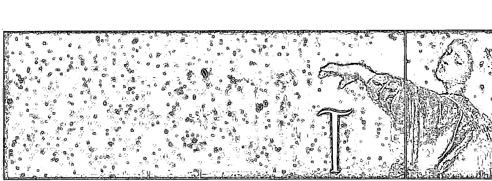

## 天上的金属

无论单个的巫师，还是在巫师聚会中的巫师都要使用魔法刃。一般来说，魔法刃是一把笔直的双刃刀，刀柄呈黑色，有助于使用者吸收能量。根据不同的巫术传统，魔法刃的刀柄或刀身都刻有不同的图形。

魔法刃的名称出处不详，不过古代的魔法原稿或1572年的魔法书《所罗门的锁骨》中提到过与之类似的仪式用刀。

就所有的魔法工具而言，最好的魔法刃应是纯手工制作的。如果从店铺购买的现成刀具符合物主的心意，那么他会对刀具进行加工，使刀具上雕刻出的符号更好，因为这样就可以将个人能量注入到刀身中。

铁是一种有魔力的金属。古埃及人称铁为天上的金属，阿兹特克人称其为来自天堂的礼物。铁比木头或石头稀少，当制成工具或者武器后，其性能远远优于木头与石头制成的器具。铁制的工具需要专家来进行雕琢和打磨，因而人们也认为专家和铁匠都拥有魔力。

魔法中所用的刀或剑通常都是铁制刀片，以反映出铁的力量，但弗罗斯特巫术传统是一个例外，该教派的巫师不用铁而用黄铜来制作刀和剑。

非洲一位酋长的妻子阿丽莎告诉我，她有一份16世纪的手稿，其中提到了魔法刃的制造：由纯钢打造，在鹅血或紫蘩篓液中进行热处理，在礼拜日圣化，并将其置于有月桂冠和马鞭草燃烧的火中以驱邪。而在其他的手稿中，则提到应当在水星日进行圣化。

从掉落到地球的陨石中发现的铁被认为具有魔力。

魔法刃不用于物理切割，它是一种在仪式中使用的工具，仅用来画魔法阵，或者破坏魔法阵使人进入或离开，它还用于祈祷和召唤。

英格兰克努特国王于公元1030年颁布的《民法》规定，通过巫术杀人者，将被判处死刑。《民法》中还提及了“巫术显形法”，该魔法是通过虐待代表某人的形象或雕像而伤害这个人。1419年，牧师理查德·沃克因施用妖术而被温彻斯特修道院院长逮捕。在沃克的个人物品中，发现了两个蜡像，还有两本关于魔咒的书。

## 替身术

替身术是一种相似的东西会互相影响的感应巫术。替身术最早的例子发现于2.5万年前的旧石器时代法国南部洞穴，洞穴中建造着用黏土制成的熊和野牛模型，上面都带有坑洞凹点。这是因为在仪式上它们要被矛和标枪攻击。那时，人们相信只要成功地杀死这些动物，接下来的狩猎就会收获颇丰。在法国的阿里吉地区，曾发现过有坑洞的野牛模型，以及有相似凹点的熊模型，熊模型的脖子上还有个洞，据推测，曾有一根刑柱和一个真正的熊头挂在上面，这是为了增强魔法的威力。

从那以后，许多类似的想法逐渐兴起。大约公元前1200年，古埃及的一位官员就通过制作法老拉美西斯三世的蜡像来诅咒他。公元1325年，二十多人因鞭打一尊蜡像而引发了一起谋杀案。17世纪，法国国王亨利二世的妻子、亨利三世的母亲凯瑟琳被传使用蜡像魔法来帮助自己的儿子取得王位。在中世纪，巫师的控告者假装在巫师的家中找到蜡像或土像，这些蜡像或土像往往成为巫师使用过替身术的证据。

14世纪晚期，英格兰国王爱德华三世被一个名叫爱丽丝·佩勒斯的女人诱惑。这一事件后来被归咎到佩勒斯的朋友圣·奥尔本斯隐士身上。他制作了国王和佩勒斯的蜡像，将它们放在一起施法。奥尔本斯在1376年被捕。1633年，11岁的埃德蒙·罗宾逊被他的邻居带去兰开夏拜访巫师弗朗西斯·迪科森时，他声称观察到三个女人从光束中取走了六张图，有很多刺或者类似刺的东西扎在图中的人物身上。

“用魔法夺走生命的最快方式是制作一个黏土形象，做成想杀害的那个人的样子，然后烘干。当你想让这个人身上的任何部位生病，只需拿针或者刺去扎相应的部位。当你想让此人失去身上某个部位时，只需拿出替身，烧掉你想让他消失的部位就成。”

除了用针或者刺将蜡像破坏，火焰也会或快或慢地将蜡像熔化。土制的人偶有时会被放在溪流中，流动的水会将黏土渐渐冲掉，这带给被施术者的是一种缓慢并且疼痛的死亡过程。

替身术中的人偶很常用，尤其是在治愈疾病的积极魔法中。人偶是一个代表参与魔法者的玩偶，里面填充的是治疗用的或者与爱有关的药草。如果人偶包含部分形象主体，那么形象或者人偶能量的加强是可以感觉到的。剪掉的头发、指甲、布条，甚至这个人留下的脚印和灰尘都被看做是含有能量的东西。

替身术曾一度被认为是影响一个人最有效的魔法之一。在现代巫术中，巫师主要用它来治疗疾病。

## 通灵的魔法仪式

人逝世时，巫师们会举行通灵的魔法仪式。从某种程度来说，巫师们能看到亡灵从身体层面到精神层面的过渡，这个仪式就是帮助逝者实现这一过渡。

巫师们相信轮回，这种仪式是对实现另一次重生以及随之而来的经验和教训的庆祝。

仪式的形式也各不相同，有些仪式上要跳与新生或重生主题有关的旋转舞。其他的仪式则需演奏，比如再次展现阴间女神的血脉和她的平安回归。

## 通过魔法漂浮

漂浮是指通过魔法或其他神秘手段使人或物体漂浮在空中，这违背了万有引力定律。据《诸圣传记》载，库比蒂诺的基督教徒圣·乔瑟夫·玛丽·德苏能够漂浮，她至少漂浮过70次。亨利·摩尔在《无神论解毒剂》中称，哥多华与马格达·莱纳·克鲁西亚的修道院的女院长都曾经漂浮到离地四分之三手肘长的高度。据报道，其他可以漂浮在空中的人还有圣·邓斯坦、圣·亚丰索、圣·安德鲁·福奈特、弗朗西斯·苏亚雷斯和圣维。

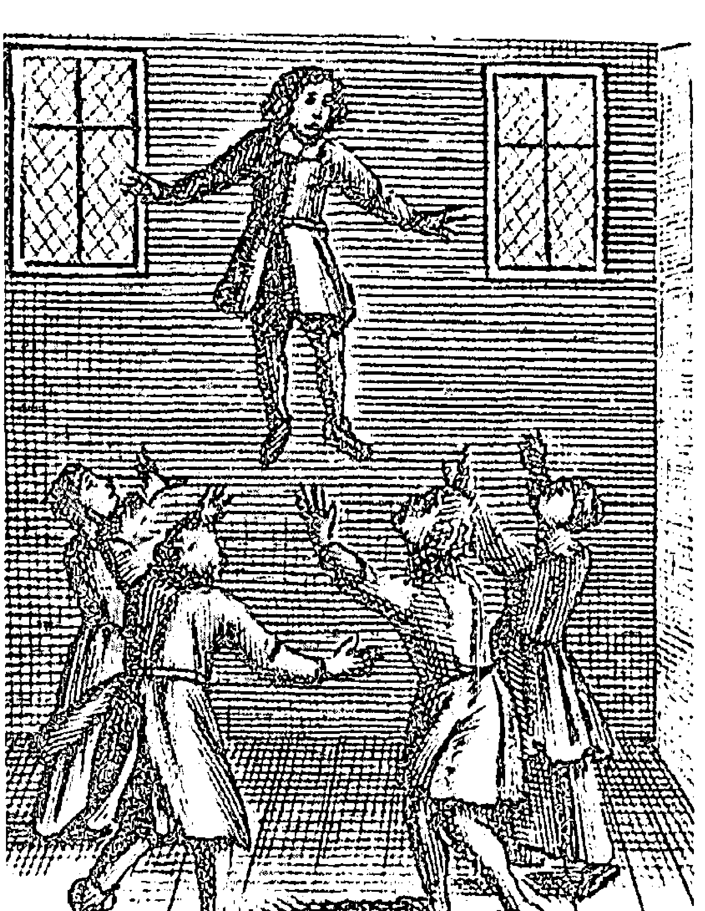

拉港的圣·特雷莎。欧·勒罗伊教授的评论《漂浮》中列举了155次漂浮现象，所有基督徒的漂浮都被称为奇迹，然而其他人的漂浮则被基督徒称为“恶魔的杰作”。中世纪的基督教认为，巫师在空中飞行是魔鬼的杰作。然而，仍然有许多人和物的漂浮事例，经过若干世纪被记录下来。

其中最著名的漂浮事例当数苏格兰出生的巫师丹尼尔·邓格拉斯。1868年，丹尼尔·邓格拉斯从一扇窗户中飘出，悬浮在离地70英尺的高空，然后穿过了另一扇窗户。当时的目击者有阿代尔市长、查尔斯船长和德高望重的林德塞大师。在意大利布隆尼亚，阿梅代·祖卡瑞尼被拍摄到漂浮在离桌面两英尺的上方。同样，英国人科林·埃文斯也被拍摄到悬浮在伦敦的康伟礼堂上空，距地面足有三英尺。当然，过去和现在都有许多弄虚作假的事例，但也有经过仔细观察得到的、有文件记载的实例，其数量之多，足以证明漂浮确实存在。

伊斯兰教、印度教和佛教中都有关于漂浮现象的记录，超自然冥想的实践者们声称，他们也可以随意飘在空中。

## 通灵术

中世纪时，人们普遍认为，逝者的灵魂能够预测未来。因此，如果人们能够与幽灵进行对话，就能提前知道将要发生的事。某些巫师试图通过还魂术与幽灵交流，具体做法是：通过魔法赋予尸体短暂的生命，在此期间，巫师就能与幽灵对话。后来，人们将这种魔法称为通灵术。

要施展通灵术，先要挖出一具刚刚下葬的尸体，并通过通灵三叉戟或者通灵魔杖等法器来施法。随后，被施法的尸体便会如实回答施法者提出的各种问题，并说出他知道的未来世界。马蒂厄·吉拉尔多的《奇妙历史和神奇之石》一书的卷首有这样一幅插图：约翰·迪博士及其助手爱德华·凯利站在一个魔法圈中，其对面则是一座坟墓以及一具裹在尸布内的死尸。不过在约翰·迪的私人日记中并没有关于他曾经施展过这类魔法的记载，因此，这幅卷首插图很有可能是马蒂厄·吉拉尔多臆造的。

马库斯·安纳尤斯·鲁卡努斯在公元65年的《内战记》中提到，庞培大帝之子塞克斯图斯·庞培曾经雇用过一位名叫伊利克霍的通灵师。他们把刚刚战死的士兵尸体从战场上拖回来，然后通过魔法仪式对其施展通灵术，以帮助庞培大帝提前获悉未来战争的胜败得失。施法完毕后，他们将尸体全部火化。

## 涂油

自古以来，世界各地的魔法和宗教仪式都有一个不可缺少的程序，那就是涂油。在法老图坦卡蒙墓中出土的一幅画作上，图坦卡蒙的母亲就正在往他身上涂油脂。印度教中，湿婆的追随者会给一根象征男性生殖器的物件上涂油。古希腊人则会把油脂存放在一种有细长的柄的长油瓶中，然后把油瓶放置在坟墓中留给死者。此外，古罗马人会把油脂洒在死者的骨灰上。

东方和拉丁的教会里，信徒将橄榄油和香油混合而成的油视为圣油。在濯足星期四（耶稣受难日）的仪式上，拉丁教会的大主教用圣油祭祀神祗，到时，有12名助手、7位教会执事以及7位执事助理将辅助大主教完成祭祀活动。在大主教献祭、圣坛祭祀、圣餐以及牧师任职仪式上，人们都要用到圣油。

某些巫术教派中，在女巫皇后的加冕仪式上，她全身上下都会被涂满献祭的油脂。而最令法国国王引以为傲的莫过于他们能够用一种神圣的油脂来涂抹身体，这种油中含有著名的克洛维斯之油。在英国，祭祀仪式之前也要在头部、胸部以及双手涂油。

很多现代巫术教派中，信徒进入魔法圈之前要在身上涂抹油脂。绝大多数教派的新成员，会在启蒙仪式上抹油脂。此外，在伏都教、萨泰里阿教、天主教、犹太教的献祭仪式上，信徒们都要抹油脂，而在共济会中，油脂与谷物、葡萄酒一道成为祭祀活动中不可缺少的元素。

## 投胎转世

投胎转世，是指精神或灵魂在不同的肉体中得以连续再生。印度教和佛教传统中，投胎转世思想是非常重要的组成部分。根据本杰明·沃克尔在其《人类、神话和魔法》一书中说：“投胎转世正被其他宗教的大量信徒作为宗教思想之一来信奉，并将其体现在他们各自的宗教术语中”。罗斯玛丽·吉利认为：“有近三分之二的宗教信徒将某种转世或再生的思想，作为最基本的宗教信仰。”

事实上，投胎转世的思想已经存在了几千年。古希腊的奥尔菲斯教派认为，根据毕达哥拉斯学说，灵魂可以通过一系列的肉身得到重生。通过高尚的生活，灵魂得以净化，灵魂在不断投胎转世的轮回中，不断得以净化直至完全纯净，最终永恒不朽。这种说法，与巫术信仰中的投胎转世思想相似。传统的巫术思想认为，借助于一系列的肉身，灵魂通过不断学习和体验，最终将领悟世间的一切奥秘，到那时，灵魂将与神同在。这一过程就好比在学校里学习，在完成一定的课程后，学生就可以毕业。此外，不论是从精神还是物质的角度讲，男性与女性的体验都是不同的，因此要想获得全面的知识，灵魂必须要经历两种性别的生活。传统的巫术思想并不认同其他宗教所谓的因果报应的概念。巫术崇拜者信仰三倍回报法则，即如果你做善事就会有善报，这种善报，要么是（与你善举同等程度）三次，要么其程度会是你善举的三倍。相应的，如果你行为不端就会有恶报，这种恶报，也将是你恶行的三倍。但不论是善报还是恶报，都会在你行善或行恶的这一世中出现，而不会有所谓的来世报应。印度教和佛教的教义中，投胎转世的主要意义在于——在来世的生命中去赎前世的罪过，前世的生活决定投胎时所用肉身的形式。而巫术信仰中，投胎过程中所借用的肉身，并不取决于前世的生活，每一次生命都是一段相对独立的经历。

### 通灵秘坐

通灵秘坐并不是普通的“坐”的动作，而是坐下来与逝者的灵魂进行交流。这种宗教活动需要一个“媒介”，通过“媒介”的作用，现实世界中的生者才能与逝者的灵魂进行交流。进行通灵秘坐时，媒介可以是一个或者多个打坐者一起来起到“桥梁”的作用。

如果是多人同时通灵秘坐的话，应该围坐在一张桌子旁。参与者手拉手，以便将能量聚集在一起。仪式开始前，参与者要合唱几首歌，这样可以使参与者进入到一个和谐融洽的状态，同时，也为了平复“媒介”的情绪。接下来就到了仪式的主要阶段，期间，“媒介”先是陷入一种恍惚的状态，随后通过一个“门卫”或者“哨兵”向参与者转达他们逝去亲人传来的信息。

尽管巫师从来不进行通灵秘坐，不过他们坚信自己能够与逝者的灵魂交流，巫师们有很多种途径实现这一点。

### 泰德沃斯的幽灵鼓手

泰德沃斯的幽灵鼓手是以敲击作响骚扰居民的一个典型案例，最早由乔瑟夫·格兰威尔记录在其《与女巫和幽灵有关的完整直接证据》一书中。故事发生在1661年4月，英国泰德沃斯小镇治安官约翰·蒙珀森家中。

事情的起因源于一起简单的流放案件。威廉·杜瑞是一名巫师，同时也是一名鼓手，他被抓捕入狱。地方官员没收了他的财产，他的鼓也在其中。杜瑞被证实有罪，法官判决将其流放，因而不得不离开当地，他的鼓则被治安官放在家中。

治安官后来离家一段时间，自他离开后，家中就一直有奇怪的声音扰得人畜不得安宁。那声音听起来仿佛是从墙里和屋顶传来的敲鼓的声音，“咚咚咚”的敲击声日夜不停。很明显，那确实是鼓声。治安官蒙珀森于是拿出杜瑞的鼓，亲自将其销毁。然而，鼓声依然持续。

查理二世的牧师，神职人员乔瑟夫·格兰威尔被邀请就此事进行调查。根据他书中的记载，格兰威尔在楼上发现两个小女孩，一个七岁，一个十一岁，她们神色惊恐地坐在床上，而且从床头的靠垫和墙板处传出刺耳的噪音。格兰威尔能够完全看到两个女孩的双手，因此他知道她们不是噪音的制造者。接下来，格兰威尔做了非常仔细彻底的检查，但却无法找出噪音的来源。

格兰威尔注意到，在第二张床的一根床柱上挂着的一只亚麻布袋在轻轻地摇晃，仿佛里面藏着什么东西。他一把抓住袋子翻了个底朝天，却什么也没发现。

许多天后，噪音渐渐平息。蒙珀森得知杜瑞在格洛斯特城犯了盗窃罪，被流放到殖民地，噪音似乎也随着杜瑞的离开而消失了。然而，几个月后，随着杜瑞回到英格兰的消息传到泰德沃斯，噪音再次响起，而且变得更加强劲，更有甚者，还伴随着其他恶作剧声响的灵异现象：鞋子在房间里乱飞，尿壶在床上洒尿，整间屋子还弥漫着令人害怕的硫黄味。

鼓声大得小镇里的其他人都听得清清楚楚，但却无据可查。噪音一直持续了一年之久。蒙珀森想找到威廉·杜瑞，但他却仿佛失踪了。再没有人听说过威廉·杜瑞的消息，他的鼓也再没响过。

## 塔罗牌

塔罗奇或塔罗牌，是迄今所知用于占卜的最古老的纸牌，其确切起源已经不得而知。一些神秘学者以及塔罗牌专家，包括埃特伊拉、埃利法斯·利维和撒母尔、黎德二世、麦克逵格·马瑟斯在内的一批学者认为，塔罗牌的起源可溯至古埃及，同时也有人认为，塔罗牌来源于中国。然而，无论哪种理论，都缺少或没有确凿的证据。塔罗牌似乎更有可能是由罗马人或吉普赛人带到欧洲得以传播的。可追溯的最早的一副塔罗牌出现在14世纪。德夫里声称最早的塔罗牌可追溯到1329年，出现在德国，然而他并未作出详细的说明。

一副塔罗牌共有78张，可分为两部分：大阿尔克那（大秘仪）和小阿尔克那（小秘仪）。大阿尔克那由22张纸牌组成，每一张牌都是一幅寓言图画，复杂的场景蕴涵着无限的象征意义。一些神秘学者将它们归于希伯来的22个字母：

- 1. 魔术师——希伯来文第一个字母
- 2. 女祭司——希伯来文第二个字母
- 3. 皇后——希伯来文第三个字母
- 4. 皇帝——希伯来文第四个字母
- 5. 祭司——希伯来文第五个字母
- 6. 恋人——希伯来文第六个字母
- 7. 战车——希伯来文第七个字母
- 8. 正义——希伯来文第八个字母
- 9. 隐者——希伯来文第九个字母
- 10. 命运之轮——希伯来文第十个字母
- 11. 力量——希伯来文第十一个字母
- 12. 倒吊人——希伯来文第十二个字母
- 13. 死亡——希伯来文第十三个字母
- 14. 节制——希伯来文第十四个字母
- 15. 魔鬼——希伯来文第十五个字母
- 16. 高塔——希伯来文第十六个字母
- 17. 星星——希伯来文第十七个字母
- 18. 月亮——希伯来文第十八个字母
- 19. 太阳——希伯来文第十九个字母
- 20. 审判——希伯来文第二十个字母
- 21. 世界——希伯来文第二十一个字母
- 0. 愚者——希伯来文第二十二个（最后一个）字母

有人将这些牌按照此处所列顺序归类，还有一些人，包括保罗·凯斯，将愚者置于开始（因其数字为0），重新调整其他牌的顺序如下：

- 0. 愚者——希伯来文第一个字母
- 1. 魔术师——希伯来文第二个字母
- 2. 女祭司——希伯来文第三个字母
- ......

亚瑟·爱德华·伟特和保罗·凯斯将8号定义为力量，11号定义为正义，与其他先期的学者定义完全相反，这也使问题更加复杂化。

小阿尔克那分为四组：为通常所知的权杖牌组（权杖一、权杖二、权杖三、权杖四、权杖五、权杖六）、圣杯牌组（圣杯一、圣杯二、圣杯三、圣杯四）、五芒星牌组（五芒星一、五芒星二、五芒星三、五芒星四）和宝剑牌组（宝剑一、宝剑二、宝剑三、宝剑四）。每组牌可以从A牌数到第十张牌，再加上随从、骑士、王后和国王。通常每副牌有四种花色——红心、方块、梅花、黑桃。演变过程中，随从成了现在扑克牌里的J，骑士不再使用，大阿尔克那的愚者则成了鬼牌。

有些纸牌的小阿尔克那只显示每组牌的数字，如六把宝剑、三只圣杯或十颗五芒星。但更多的纸牌上都描绘了一个完整的场景，数字符号通常也包含其中。

解读塔罗牌时，求卜者先洗牌，然后从中抽出几张，解牌者将牌以一种特定的模式排列——可以使用很多不同的占卜方式。每张牌的位置都有其独特的意义，这就需要解牌者解读，牌意可能会暗示求卜者未来几个月将要发生的事。正如塔罗牌的任何一种占卜方法一样，没有什么是一成不变的，塔罗牌的力量可以改变你的命运，但你也可以通过自己的努力改变塔罗牌。

## 巫师的护身符

护身符是一种用来祈求财富、好运和健康的物品。与辟邪物不同，护身符是天然物体，非人工制成。但是两者的作用大致相同。C·纳尔逊·斯图尔特把辟邪物比做剑，把护身符比做盾，认为前者是压迫者，后者是保护者。的确，护身符主要起预防作用，而辟邪物则是保护佩戴者不被邪恶的东西侵扰。

护身符通常由巫师制作并使用，然而它们并非专属于巫师。因为护身符和辟邪物是庞大魔法世界的一部分，所以使用护身符的魔法师也不一定就是巫师。

护身符基本上由天然物质，如琥珀制成，但也会通过人工雕刻进行改良，或者其他护身符与辟邪物共同使用。大多数使用者在使用护身符前，都认为应该把护身符作为祭祀用品。而另一些人认为，护身符的特征就在于它是天然的，所以没有必要把它用来献祭。曼德拉草根就很好地体现了这两种不同的观点。曼德拉草根天然长成人形，所以被认为拥有强大的魔力，尤其在预防和治愈疾病方面。而且据说曼德拉草根长得越像人类，拥有的魔力就越强。因此，人们将曼德拉草根进行雕刻，使其更加像人形，栩栩如生，魔力非凡。

另一个例子就是称为巫师石、女神石或者女巫石的石头。这种石头能够用绳子或者皮带穿起来，戴在脖子上以求获得庇佑和保护。有些人可能会首先在盐和水里把石头清洗一下，然后用熏香熏，在熏的同时祈求神保佑它的佩戴者。这种献祭的行为会使得石头护身符的魔力更为强大。

在非洲，大象的毛发、狮子的牙齿或爪子被人们普遍用来制作护身符。大象的毛发通常被编织成便于佩戴的手镯。在欧洲和美洲，兔子的脚也许是最普遍的护身符，被人们带在身边以寻求好运。

有一个与护身符有关的“形象学说”，即人们认为事物之间有一种奇妙的联系，看起来相似，曾经又相连在一起的事物，现在却被分开。因此，携带熊爪可能是给予所有者熊的力量和威猛，携带猴爪是赐予所有者灵性。而女巫石与女性阴道很相似，所以人们认为女巫石有助于分娩。

橡树护身符在苏格兰女巫中备受欢迎，它象征着力量和保护。橡树护身符可以放在口袋里，或者用橡籽串成项链。全株植物或植物的一部分也会被当作护身符，常见的如四叶苜蓿等。

某些情况下，发现护身符的地方对护身符有着重要意义。例如，如果登山者在山脚下发现了一根羽毛，则登山者应该带着这根羽毛来到山顶，因为羽毛象征着上升的能力。尽管有些物品既不是天然形成，也不是人造加工，但根据发现它们的环境，依然可以将它们当做护身符而不是辟邪物。例如，一个人希望得到某种东西，如一栋房子、一份新工作或者是一段婚姻时，他却得到一把古老的钥匙。这时他就会认为这把钥匙将会给他带来好运，因为钥匙象征入口。所以这把钥匙会被他一直带在身边或者佩戴，直到目标实现。

## 万物有灵论

拉丁文中的“生命”指的是“灵魂”或者“呼吸”。在此基础上，爱德华·伯内特·泰勒创建了万物有灵论。万物有灵论是灵性的存在体学说，认为自然界的万物，无论是有生命的还是无生命的，都存在意识。泰勒这样描述他的理论：原始时期的人们相信人由两部分组成，即躯体和他所描述的“幽灵”。后者存在于梦里并处于恍惚状态。泰勒相信，早期的人类通过类比推理，确信幽灵存在于万事万物中，并且存在于寿命之外。换句话说，人死后，他的灵魂会以“鬼魂”的形式存在。

万物有灵论与祖先崇拜和自然崇拜有一定的联系。许多巫师都是万物有灵论的信徒，他们相信自然界的万物，无论是有生命的和无生命的，都拥有灵魂。

## 巫师的弯刀

巫师的弯刀称为博林，这是一把小刀，刀片弯曲，只能用于割草药。博林是巫师雕刻其他巫术用具的工具。一般的博林从刀刃的顶部到手柄的尾部有六英寸长。手柄的尾部有一个圆形的孔，握住手柄的时候，大拇指或小拇指可以放在这个孔中。博林手柄通常由樱桃木制成。

## 巫婆与男巫

布鲁佳和布鲁琼是墨西哥巫师的称谓，布鲁佳是女性巫师，布鲁琼是男性巫师。女性巫师一般认为比男性巫师更有力量，所以布鲁佳一名仍在全美的西班牙裔社区中使用。

## 微妙感应与光环

几百年来，人们相信某些人拥有深厚的灵性，头上会散发出多彩的光环，还有一些人甚至全身发出彩色的光芒。在早期基督教艺术和其他宗教艺术中，这些光被描述成“光晕”或者“荣光”，但是更多时候，它们被称为光环。王冠和神父的头饰就是头部所发出的这种光环的象征。

不是只有圣者才有光环，只要具有微妙感应，所有的生物和非生物在适当的条件下都可以拥有光环。16世纪，瑞士医学家帕拉塞尔苏斯将光环描述成“生命的力量，它不仅仅存在于人体内，而且像发光的球体一样放射在人体四周”。福多·南多称其是“人体周围永久的发光物”，而且还说“神秘主义者将光环分成四种不同的类型：光轮、光晕、光环和光耀。前两种来自于头部，光环来自于全身，光耀是两者的结合。通神论者将其分成了五种类型：健康光环、生命光环、命运光环、性格光环和精神光环”。

几乎任何经过训练的人都能看见甚至感觉到光环。人们相信，光环能反映出一个人的身体健康状况。所以，通过观察光环的颜色和亮度能诊断疾病。一般来说，人的心境可以左右光环的颜色，比如，生气时是红色，潦倒时是紫色，恋爱时是粉色，说谎时是绿色。只要观察一个人的光环，就差不多能判断出一个人的心情。

## 巫师如何祝福

许多传统仪式中，祝福是一个简称，其完整的步骤如下：

- 祝福你的脚，这会给你带来好运气。
- 祝福你的膝，应跪在神圣的祭坛前。
- 祝福你的子宫/生殖器，生活的源泉，没有它我们将不能生活。
- 祝福你的乳房，使之高高耸立，挺而有力。
- 祝福你的嘴唇，它将讲出神圣的名字。

对其他人说“祝福”，暗含对其全部的祝福。

## 巫师与血

对血液的描写出现在莎士比亚《亨利六世》第一部分第一场第五幕。人们认为莎士比亚是第一个描写血的作家，但我们一般认为，还有其他四个作家也受到了莎士比亚的影响：皮尔、马洛、洛奇和纳什。《亨利六世》中，塔伯特勋爵对圣女贞德说：

> 我要与你较量；
> 我认为你就是恶魔。
> 我要抽你的血，你是个女巫，
> 出卖了你的灵魂，给你的主人。

这就是说，“放血”将带走女巫的能量；而另一种说法则认为，血对女巫的头部很重要，甚至“超越呼吸”。

血液不仅被视为生命的力量，而且还是魔力的源泉。据威卡教巫师讲，巫术进行之前跳舞是使血液流经血管的另一种方式。

“测量”是很多巫术传统中都有的内容。人们用细线来测量初入会者身体某一个部分的长度。涂抹有入会者血液（用针扎在入会者手指上来获得血液）的细线被卷进一个球中，由巫师首领来进行这种“测量”，以确保组织的秘密不被泄露。这是一种类似魔法的仪式，测量代表了新巫师的加入，测量过程中的任何步骤都可以影响到该巫师。

同样，一滴血也可以作为魔法的“见证者”；它代表了被施法的人，因此这个过程中的任何举动都会影响到这个人。血液可能涂抹在一个蜡制人偶或一张纸上。在威卡教中，当接受法术的人不能到场时，这种方法可以用来作为隔空治疗的魔法。

人们相信“巫师之血”会遗传到家庭成员身上——巫师的孩子天生就是巫师。由于这个原因，很多巫师的孩子连同父母一起被处死。

马萨诸塞州的塞勒姆有带深红色斑点的玉髓，而真正的鸡血石是绿色的带有红色斑点的石头。宝石疗法中，鸡血石被认为是用于止血的最好石头。

鸡血石也称为赤铁矿。人们相信从鸡血石上刮的石粉能帮助止血和妇女分娩。鸡血石可以用于治疗眼睛充血、蛇咬，还被认为是能预防凶眼的宝石。红珊瑚、红碧玉、红大理石和玛瑙在一些情况下都是指鸡血石。

## 巫师与扫帚

早期的扫帚用苏格兰金雀花植物的干制成，然后在一端扎上树枝或者树叶。而长扫帚最初是清扫用具的惯用名称，是一端由石楠属植物或桦树的细嫩枝扎起来的工具。

扫帚后来成为女性的象征，也是女性干家务活的证明。在中世纪，当一个女人离开家时，她将把她的扫帚靠着房门立起，以表示不在家。有时候在一间小屋子里，她还可能把扫帚立起来，挂在烟囱的通道里。这就是后来巫师们骑着扫帚从烟囱里飞出去，参加夜半聚会的由来。

巫师骑上飞天扫帚、长柄草叉、铲或任何一种动物飞过天空被称为空中飞行。最早关于空中飞行的描述出现在乌利希·莫里特的雕刻中。他雕刻了三个长着动物头的女巫，骑在分叉的扫帚上。最早承认空中飞行是1453年，在巴黎附近的圣日耳曼昂莱巴，威廉·埃德森声称他就有过这样的飞行体验。1563年，在格恩西岛，马丁·托洛夫说他看见他的母亲骑着飞天扫帚飞过烟囱，并喊道：“走，以魔鬼和路西法的名义，飞过岩石和荆棘。”

有一种促进庄稼成长的古老形式的感应魔法，需要村民、异教徒拿着扫帚、长柄草叉和棍子到田地，像骑马一样骑着它们，并围绕着田地跳舞，有时还要跳起来，跳得越高，庄稼就会长得越好。这一做法可能引发了他们骑着工具在空中飞行的念头。然而，这也给了早期教廷反异教宣传的口实。

多琳·瓦林特指出，一个与女性生殖器有关的古老俚语就是“扫帚”，而“扫帚柄”的意思是假阴茎。“进行清扫”的意思是进行性交。如她所说：“这真正解释了在巫术仪式与古代的民族舞中，为什么扫帚总是有着重要的作用。”

在威尔士，扫帚婚礼非常流行。人们将扫帚放在一对新婚夫妻的门前。当夫妻二人第一次进入新房时，必须手拉着手跳过扫帚。如果这对夫妻后来决定分手，他们可以再从扫帚上跳回来。第二次跳过扫帚必须在结婚时跳过扫帚之后的一年内，而且两次都要有证人在场。在一些吉普赛人的婚礼中，作为婚礼仪式的一部分，夫妻同样也将跳过扫帚。

爱丽丝·吉蒂勒夫人被认为是爱尔兰女巫，她称自己常常骑着飞天扫帚旅行。她的指控者说，“她能在云间漫步”。

在一些地区，横跨过扫帚柄被认为会走霉运；如果扫帚掉到地板上，则意味着有极其倒霉的运气。如果一个未婚女孩跳过扫帚，就预示着她会有私生子。人们不会带着扫帚从水上经过，一把老扫帚也不会被带到新房去。

中国民间习俗认为，掌管晴朗的天气女神叫“扫帚女神”或“扫晴娘”，即能扫走阴霾、使天气晴朗的女孩。下大雨时，女孩们会裁剪出扫晴娘的模样，然后把她们挂在大门上。

## 巫师插图书

插图书的发行始于伊丽莎白时代，它提供了有关巫师审判的详细资料。诺特斯坦说：“巫师插图书是一个独特的品种，在那些年代，插图书就像我们今天所说的‘号外’，刚一面世就吸引了大批公众。”

很多有关审判的信息可以在这些插图书里找到。书中总是赞扬法官及他们为打击巫师而做的种种努力，而且有很多未被记录的审判细节总能在插图书中找到。

1566年，一本名为《伊斯兰教纪元1566年7月26日王权审判前埃塞克斯各县市一些巫师的检查和忏悔》的插图书发行，后来的一本是《琼·弗劳尔的女儿——玛格丽特和菲利普·弗劳尔关于巫术的奇妙发现：于1618年3月11日在林肯郡执行》。

## 巫师存在的证据

《马勒夫卡拉姆汇编》于1626年在米兰出版，由牧师里维朗德的父亲马赫·高休斯所著，主要内容为“废除巫术”，宣扬古老的宗教都是恶魔崇拜与黑魔法的观点。书中内容包括大量的雕刻，描绘了巫师夜半聚会的场景，如参拜撒旦、举行召唤魔鬼的仪式等。高休斯还描

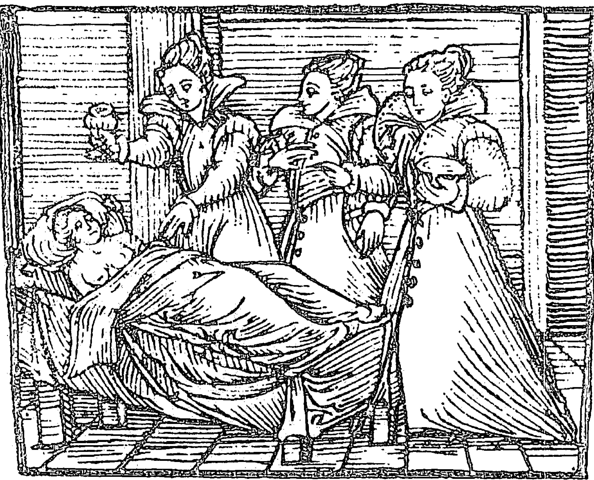

> □ 《马勒夫卡拉姆汇编》中的三个女巫 科斯特·福亨图片库。

绘了巫师骑着山羊去参加夜半聚会的场景，不过他同时又在思考：是否所有在夜间聚会的都是巫师呢？书中还有一幅插图描绘了一小群巫师站在保护圈内，但长着牛角和蝙蝠翅膀的魔鬼还是能强迫他们与其立下契约。

吉洛德日夫里在他的《巫术、魔法和炼金术》中，重新对《马勒夫卡拉姆汇编》进行了说明，并且对其加以评论，他说：“书中的插图似乎为中世纪巫师的真实存在提供了明确的证据。”

## 巫师围成的圆圈

不像其他宗教那样需要固定和神圣的礼拜场所，巫师可以在自认为合适的任何地方、任何时间进行祭祀仪式。举行仪式时，巫师们在田野中，或者一片干净的树林里，又或者其他对所有成员都方便见面的地方静静地围成一个圆圈。

巫师们围成的圆圈被称为“世界之间”，既不属于这个世界，也不属于下一个世界。长期以来，人们一直认为圆圈很神圣，一个身处异域的罗马大使可能会在身边画一个圆圈，确保自己不会受到攻击；巴比伦人会在病人的床四周用面粉画上一个圈，用来击退恶魔；德国的犹太人会在孕妇的床四周画一个圈，保护孕妇免受邪灵的侵扰；英国和欧洲的其他地区，有很多古老的石圈，这些石圈折射出不同时代的多种宗教和魔法动机。

圆圈的尺寸取决于画圈的人和画圈的目的。巫师画的圆圈通常直径为九英尺，虽然也可以根据被包围的人数来决定画小一些或大一些。但在仪式魔法中，圆圈的大小讲究精准，所以巫师们一般画三个圈，直径分别是九英尺、十英尺和十一英尺，同时还要在线上写下各种魔法语言。仪式圆圈的目的是将其他力量隔绝在外，保护魔法师不受负面干扰。巫师的圆圈则是要保持仪式中产生的积极自然的力量。

巫师的圆圈首先被标记在地面，来显示祝圣的具体位置。如果仪式在户外举行，那么可以简单地在地面上画条线来表示圆圈的位置；如果仪式在室内举行，可以用一支粉笔或木炭片来作标记，或者也可以放一条绳子，又或者在地板上用漆喷出一个圆圈。一些当代巫师会在地毯上画一个永久的圆圈，不用时可以把地毯卷起来，聚会时再将其拿出。

在标记的区域内，当主持仪式的祭司用剑或刀沿着线的轨迹走一圈时，魔法圆圈就形成了。有些传统中，需要用扫帚来清扫仪式范围，以此来驱除所有的消极因素。然后这条圈线会被洒上盐水，巫师拿着香炉一个传递下去。这一过程是按顺时针方向进行的，如果按照逆时针方向进行，将被认为是不祥的预兆。

为了将圆圈定位，需要把蜡烛放在东、南、西、北四个基本方位。接着，在圆圈中心（或某一面，根据传统而定）设立一个祭坛，上面放着祭司用具或个别巫师用具。所有放置在圆圈内的东西都是神圣的，因此不会有没经净化的东西被摆进来。

尽管这些物品在仪式前进行了清理和净化，但是负面影响也有可能存在。因此仪式过程中，如果有人需要走开，就要小心地“打开”圆圈，待人离开后马上封住。这种打开和关闭的次数越少越好，当然，最理想的情况是，仪式过程中不需打开圆圈。

神会被邀请到圆圈里，参与到巫师举行的仪式中。与仪式魔法不同，这种仪式不需要命令，也不需要祈求神灵或灵魂实体，因此任何神灵或实体，只要愿意，都可以加入进来。仪式的最后，巫师会感谢神的加入，随后圆圈被打开。

巫师的仪式是在圆圈内举行的，“圆圈”这一术语就成为仪式的代名词。所以巫师会谈到“每个礼拜既定一个圆圈”或“计划一个愈合圈”等。

## 无用的供词

在对巫师进行迫害时期的英国，巫师的供词并不重要。因为英国的法官们要寻找具体的证据来断定巫师是否有罪，比如恶魔的印记等。但在欧洲大陆，供词是诉讼过程的一个重要部分。多数情况下，被指控者的供词是很重要的，因为法庭通常很难找到具体的证据。

1486年，詹姆斯·斯普伦杰和亨利·克雷默合著的《女巫之锤》认为任何被起诉为巫师的人都有罪，他们主张实施酷刑让被指控者承认有罪。他们在书中的第三部分提出：“审判应该如何进行并继续；巫师是否要入狱；关押后应怎样处置；正式拘留和拷问之前，法官应注意哪些事项；如何审问巫师；持续使用酷刑；如何把巫师们用来隐藏魔鬼的标志和象征的毛发剃掉；使用各种方法使他们不再保持沉默；用红烙铁审问；宣布判刑的方式……”酷刑是审问的一个必需环节，持续折磨则是为了确保他们招认所犯下的罪行。

17世纪上半叶，德国耶稣会信徒弗里德里希·冯施佩试图减轻恐怖的迫害，他写下《谨防控告者》一书。在书中，他说：“酷刑会迫使一位无辜的人承认有罪，还要被迫检举揭发那些他根本一无所知的人。这就是他们的遭遇。因此对于控诉者和被告人来说，这几乎没有尽头。没有人敢撤诉，否则所有的人都将被判处死刑。”

据说在对塞勒姆巫师的审判中，没有酷刑，但却有不同程度的胁迫，比如让被告几天几夜不眠，使她挨打受饿。对于审判者来说，罪犯的供词是十分重要的。因为只要被告认罪，他们就可以把被告的所有财产据为己有。但是，除非被告自己认罪，否则是不可以判刑的。80岁的农民加尔斯意识到了这一点，因此当他被起诉后，他一言不发。他的妻子玛莎被起诉并被判有罪。为让加尔斯开口，法院将他平放在地面上，并在他身上堆放岩石，但加尔斯直到被岩石压死也没有屈服。

一旦被指控为巫师，即使立刻招供也不能保证自己免受酷刑。无论如何，被告都要被刑讯逼供，以让其坐实罪名。得到供词的审判官们，在第二次的审讯中，就需要被告承认供词并非严刑逼供所致，而不管这一供词是不是受害者因惧怕再次被拷打而胡乱招供的。

## 巫师大聚会

一群巫师在一起被称为巫师大聚会。在巫术中，巫师聚会是一个小群体在一个经常聚会的地方见面，举行他们的宗教活动。对大多数巫师来说，这就是一个大家庭。事实上，许多聚会成员认为与同伴们的关系要比他们与亲属的关系更密切。

1662 年，在对苏格兰巫师伊泽贝尔·高迪的审问中，他首次提到了“巫师大会”。高迪说：“让·马尔藤是我们巫师大会的女巫……我们巫师大会共有 13 人……上次我们巫师大会成员碰面是在厄尔西亚特的山上……”这是第一次有记载的巫师大会。而在此之前，巫师聚会已经在很多场合被提及。也是这一次，第一次明确了一个巫师大会的人数：13 人。这个数字可以追溯到 1567 年的对巫师贝西·邓洛浦的审判中。邓洛浦供称，她的组织有五男八女。甚至更早前的 1440 年或更早之前，吉勒得利斯的组织里便有十一男两女。实际上，尽管没有必要提及这些审判，但是在任何一个地区遭逮捕的巫师及被审判的数量常常都是 13。玛格丽特·穆里对此分析说，大多数的巫师审判中，成员的数量都是 13 个。但正如其他人指出的，穆里只是操纵数目来支持她的理论。当然，许多审问记录中都提到 13，但并不像穆里提到的那么频繁。

当然，并不是每个巫师大会都有 13 名成员。比如在 1658 年的埃罗审判中，玛格丽特·达切尔称她的聚会中只有七名女性。如今，巫师聚会成员有相当大的差别，小型的巫师聚会则更加常见。

聚会规模的大小受聚会地点空间大小的限制。传统上，巫师们聚集在直径为九英尺的魔圈里，13 个人是这个圈能容纳的最大限度，为了确保一定程度上的舒适，以及能够容纳更多的参与者，也可以扩大规模，但这不符合传统，也带来了一定的困难。当施法的时候，参与人数与圈子大小的关系对于建立“力量之锥”至关重要。力量之锥作为动能在魔法背后起着驱动作用。要是单纯地为了庆祝，一大群人聚在一个大圈里还行；但若要施魔法，数量少一些则会更好。若聚会成员很多，最好将他们分成独立的两组。

乔叟在《坎特伯雷故事集》中提到了巫师聚会，当提到 13 个人的聚会时，“13”这一数字在当时暗指非巫师范畴的群体。多琳·瓦林特在她的《教会纪念馆》一书中提到：

> “任何一间房子中的人都少于一个巫师聚会的数目，也就是说少于 13 人。”

有些传统中，巫师聚会成员的最大数目是 13，但是它包括了年长者——那些地位较高、经验丰富的人的小圈子。聚会最多能容纳这样的年长者八人。

谈到数字 13 暗含的意义，多琳·瓦林特引用了农历有 13 个月的事实。在星座中，算上太阳，总共有 12 个黄道带。罗穆卢斯有 12 个同伴（侍从）；丹麦英雄赫罗尔夫有 12 位狂暴战士；基督耶稣有 12 个门徒；奥丁神有 12 个神灵跟随；查理大帝有 12 个骑士。因此 13 这个数字是由领导者和 12 个随从组成，这对很多群体来说意义重大。

## 巫师信仰原则

巫师聚会的13名成员由男人和女人混合组成，许多组织除了领导之外，试图在数量上使男女均衡，但他们始终无法实现。如今，有很多巫师聚会都以女神或上帝为中心。然而只有一部分组织意识到只有通过自然的力量，才能在聚会中实现真正的男女均衡。这两种能量的均衡似乎也对聚集能量、驱动魔法十分重要。

巫师聚会首要的事情是祭拜神灵，向他祈求和感恩，这与大多数的宗教相同。不过，这种祭拜只在巫师聚会上举行。

美国巫师委员会于1973年秋天成立于明尼苏达州的圣保罗，第一任主席叫卡尔·卢埃林·维斯切克。美国巫师委员会最初由73名传统各异的出席者组成，尽管他们之间存在很多不同的意见，但还是达成了一致。为此，维斯切克制订了“信仰的13原则”的第一稿，这也成为巫术的奠基基石。五年后，这份材料被并入美国陆军部手册165号13条“宗教要求和特定群体的惯例：随军牧师指南”。

维斯切克说，他想把委员会改名为“美国巫师委员会”而不是“巫师的美国委员会”，因为他强烈感觉并且一直认为美国的巫师不同于欧洲的巫师。他说：“我尤其反对认为巫术‘当局’属于‘古老国家’的想法，我也很害怕巫术会变得制度化，比如《圣经》研讨班、《圣经》学院、等级制度、教条以及官方历史等。”

巫术一直是个人、个人聚会和传统的宗教。这就是为什么在所有的巫师中，没有一个是国王或女皇。但也正因为过于松散，所以很难组成任何有凝聚力的机构，这正是美国巫师委员会很快解散的原因。然而他们努力制定了一份足够完整的巫术信仰原则：

- 1. 我们举行的仪式，是为了使自己与生命力量的自然节奏保持一致，这种生命的力量以月亮的盈缺和季节的变化为特点。
- 2. 我们意识到，智慧赋予我们对环境一种特有的责任。我们试图与自然和睦相处，维护生态平衡，实现生命的价值，并且对物种的进化有所觉悟。
- 3. 我们承认每个普通人都拥有比其外表更强大的力量，这被称为“超自然”，我们认为存在于所有人体内。
- 4. 我们把宇宙中创造性的力量看做两极分化——男性化和女性化，而且所有人都有同样的创造力，通过男性和女性的相互交流表现出来。我们对上述两者不作评论，因为我们知道一方是对另一方的支持。我们视为满足，是生命的象征和载体，是用于魔法变化和宗教崇拜的能量来源。
- 5. 我们认为不论是外部世界还是内心世界，都能被称为精神世界、集体无意识等。
- 6. 我们不承认任何专制等级制度，但我们为那些教书育人的人感到自豪，尊敬那些与别人分享伟大知识和智慧的人，我们也承认那些在领导职位上勇于奉献的人。
- 7. 我们把生活中的宗教、魔法和智慧视为统一的整体，人们以这种方式看世界，并生活在其中。这是一种世界观和生命哲学，从魔法的角度，我们称之为巫术。
- 8. 称自己为“巫师”并不一定就能成为巫师——遗传本身不是，头衔或入会仪式也不是。为了健康地生活，巫师试图控制自身的力量，使其在生活中尽可能不伤害他人，并且与自然和谐相处。
- 9. 我们相信在不断进化的过程中对生命的肯定和满足，渐渐意识到我们熟知的宇宙及人类在其中所发挥作用的意义。
- 10. 我们对基督教或其他宗教或是生命哲学的唯一憎恨，在一定程度上是因其机构声称的“唯一的方式”，试图否认他人的自由，压迫其他宗教习俗与信仰。
- 11. 身为美国的巫师，我们并不介意关于历史上提到的关于巫术的种种争论，或是其他种种名称，我们了解不同的传统都有其合法性。我们关注我们的现在和将来。
- 12. 我们反对“绝对邪恶”这一概念。我们也不崇拜任何基督教定义为“撒旦或恶魔”的实体。我们不会从别人的痛苦中寻找力量，也不接受仅通过排斥异己来实现个人利益。
- 13. 我们认为要在自然范围内寻找对我们的健康有益的事物。

## 巫师的舞蹈

从早期开始，舞蹈就已成为宗教礼拜和魔法的一部分。舞蹈在许多方面可以被看做是一种祷告、符咒或祈求。库拉恩·普罗克什·格特鲁特在《芬克和瓦格纳尔斯民俗、神话和传说标准词典》中指出，“民间舞蹈是以运动的方式表示出对生命周期的一种反映”。休斯·潘纳斯将舞蹈描述为“一个团体最早的将情感和韵律相结合的表达方式”。全世界的人们都用舞蹈来颂扬生命及他们与神明的交流，舞蹈起源于对早期人类追踪和杀戮猎物的模仿，也是狩猎巫术仪式的一部分。

五朔节时，围绕花柱跳舞就是这种古老习俗的一个明证。在英国教堂的彩色玻璃窗上，就描绘了亨利八世统治时期的五朔节舞蹈，其中一扇窗户上描绘了一个人横跨在木马上的场景。同样出现在英格兰斯塔福德郡的一种古代集体舞中也有类似的骑木马场景。这种集体舞在每年9月4日后的第一个星期天表演，它是英国现存最古老的一种舞蹈，包含史前萨满教魔法中的阴魂咒法术。

直到17世纪，尤其在西班牙，舞蹈仍是基督教礼拜的一部分。1282年，在苏格兰的里沃葵斯，乡村牧师们受到训诫，因为他们带领教区居民跳象征着阴茎的舞蹈来庆祝复活节。

因此，舞蹈如同巫术一样充满生命力，它是宗教不可分割的一部分。跳跃式舞蹈、跨越式长柄草耙、竹竿及扫帚是生产仪式的组成部分，用来促进农作物的生长。舞蹈也是庆祝巫师夜半聚会的重要部分。玛格丽特·穆里称，聚会中主要有两种类型的舞蹈：一种是圆圈舞，另外一种则是跳舞者紧跟着领队的舞蹈。

> 皮埃尔·兰卡在他的《邪恶天使之图》一书中描述圆圈舞时说：“一旦宴会结束，舞会就开始了，跳舞者背对背成环形绕着大树跳舞。”

> 库珀·托马斯则在《女巫论述》中写到：“舞蹈既奇妙又怪异，似乎又很凶残，跳舞者自己来回转动，抓住另外一个人的胳膊，把他从地面举起，然后就像安迪克人一样来回摇晃头部，并发疯似地旋转自己。”

巴黎国家图书馆的一本画册就详细描述了这种背靠背的舞蹈。

1590年，北贝里克郡的巫师们在教堂墓地旁跳舞。皮特开恩·罗伯特说，“邓肯·格里吹奏喇叭，约翰·费安领舞，桑普森·艾格尼斯和他的女儿还有剩余的人听从芭芭拉的指挥，一共有140名舞者”。他们有各种各样的乐器，包括邓肯·格里的喇叭、小号、小提琴、鼓和铃鼓，也有很多人在歌唱。如今那里是巫师聚集地。

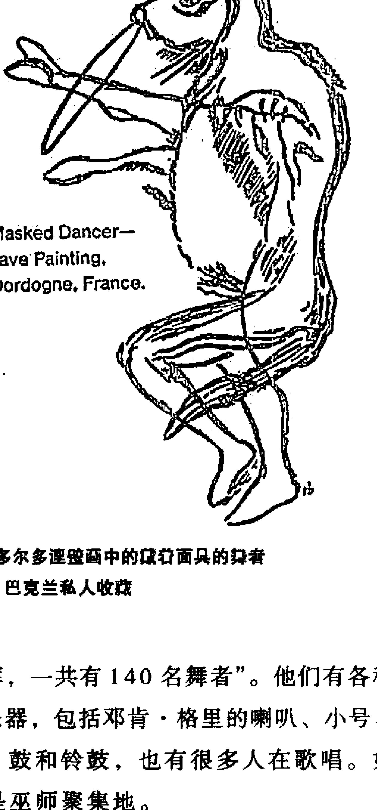

法国多尔多涅洞穴中的戴着面具的舞者 图片由·巴克兰私人收藏

不管是男舞者还是女舞者，他们都在古代的巫师聚会中扮演着重要的角色。穆里说，“给特定的人指派任务。这些指派任务的人也许没有什么官职，或许是另一方面的主要官员；这些人通常就是管理人员，也是舞蹈的领导者。正如步法是舞蹈中最基本的组成部分一样，活跃又年轻的领队人也很重要”。大多数传统中，使用最广泛的舞蹈之一就是一种螺旋式的聚会舞蹈，舞者时而在舞池中心，时而又舞向边缘。随着巫师们一个接一个彼此经过，男女巫师们问候对方并互相亲吻。

今天我们可以看到许多古老的异教舞蹈，比如说莫里斯舞，舞蹈中的一部分就是将棍子戳进土壤，并和种植植物紧紧联系在一起。在这一过程中，棍棒的碰撞声和手帕的挥舞象征驱除消极情绪。在莫里斯舞中，舞者时不时地跃向高空，就是向人们展示庄稼能长得多高。

对巫师而言，跳舞是增强法术能力的方式之一。有节奏的转动、鼓掌、轻拍身体，或是念咒，也就是在元神出窍的状态下指挥聚集到的法力。伏都教中，人们通过跳舞、有节奏地敲击鼓乐来达到类似元神出窍的状态，随之而来的狂喜将人们带入到伏都教的神灵中。

## 巫师的等级

有些巫术传统中，一个人的身份只有两种：或者是入会巫师，或者不是；而另一些巫术传统则维持了晋升的等级体制，用以表示巫师在入会后的各个发展阶段。

通常，在经过长期的引导学习阶段后，新来的巫师们先入第一等级。这一阶段，他们至少要待“一年零一天”，也就是传统的等待时期。这段时期，新巫师们要学习的各类科目有宗教仪式、占卜术、草药学和占星学。在巫师聚会上，当年长者觉得新巫师们已经掌握了这些科目，他们就可以进入第二阶段。接着，他们继续待上一年零一天，同时还要接受一个学习过程。最终，他们会进入到第三阶段，也就是最高阶段。

如果愿意，第三阶段的巫师们会教授其他巫师；或者脱离原来的巫师组织，形成新的巫师聚会。在任何一个巫师聚会中，所有的巫师均被称为祭司或高级女祭司。第三等级的巫师属于最高级别的祭司或女祭司。长者也是从第三等级中筛选出来的。

就等级制度而言，巫师们的意见都存在分歧。但是根据巫师所处的等级，人们会对巫师有大致的了解，同时他们所处的等级也是刺激他们晋升的动机。

## 巫师与恶魔

恶魔一词来源于希腊“鬼神”，意思是一种能产生积极或者消极精神的神力。早期的教堂谴责所有的异教精神为邪恶的精神，使得恶魔一词产生了现在的贬义。恶魔学则是对恶魔的研究和分类。

中世纪时，魔法师试图统计恶魔的数量，建立起他们的等级制度。1459 年，阿尔芬斯·斯宾纳称，世上一共有 133,306,668 名恶魔。

## 巫婆的特效药

□ 1870年雕刻的头戴王冠的恶魔和他的崇拜者，还有其他的恶魔。科斯特·福亭图片库

1577年，约翰·韦修改了这一数据，称一共有7,405,926名恶魔和72名恶魔王子。其他人也试图统计恶魔的数量，结果却大相径庭。当然，人们认为恶魔都有自己的名字，他们也有自己的等级制度。

现代巫师不再相信恶魔的存在。我们无法证实过去被指控的巫师们是否相信有恶魔，然而，当那些受害者在被指控与恶魔勾结时，他们并没有反驳。据说，巫师们经常和恶魔一起聚会，跳舞、尽情享受美食，甚至和他们发生性关系。虽然直到12世纪，教堂都否定人类与恶魔发生性关系的可能。然而随着无数大概是捏造出来的证据被提交到法庭，巫师和恶魔之间发生性关系的可能也得到了承认。

恶魔应该去拜访人类，特别是那些巫师们，因为他们曾睡在一起。恶魔会强迫自己和受害者发生性关系。与妇女发生性关系的恶魔称为梦淫男妖，取悦男人的则称为梦淫女妖。据说，梦淫男妖和梦淫女妖的生殖器都是冰冷的，所以人类与他们发生关系时很少有快感。很多神学家们相信梦淫男妖和梦淫女妖的存在，包括托马斯·阿奎那和主教奥古斯丁。

普通毛地黄的叶子晾干后被称为洋地黄。1775年，英格兰伯明翰的一个内科医生威廉·韦瑟灵顿从什罗普郡一个老巫婆那里得知，在她的一种药剂中，洋地黄对心脏病的治疗有特效。于是，韦瑟灵顿把洋地黄单独提取出来，作为治疗心脏病的主要药材。韦瑟灵顿为医药学作出了很大贡献，人们为他在埃德巴顿旧教堂立了一座纪念碑，纪念碑上雕刻的装饰就是洋地黄。

韦瑟灵顿把洋地黄作为药材之前，许多聪明的农妇用洋地黄治疗包括癫痫和结核在内的很多疾病。尼古拉斯·库尔佩珀评论说：

> “洋地黄是治疗癫痫最有效的药材之一。”

然而，迈耶却警告说：

> “不遵从医生的嘱咐而自行使用会非常危险。”

洋地黄含有剧毒，民间称它为死神的丧钟。

三种治疗心脏病的葡萄糖不能与洋地黄一起使用：黄毒苷、吉妥辛和吉他林。任何合成药都不能代替洋地黄来治疗心力衰竭。由于服用洋地黄后，药效产生得比较慢，因此病人有可能会服用过多的剂量，但是大剂量长期服用洋地黄，可能会产生心脏功能紊乱的副作用。

## 巫师的精怪

精怪是一种作为随从的鬼怪，常以动物或鸟类的形式出现。中世纪时，人们相信每个巫师都有一个魔鬼送的、帮助他们实施妖术的精怪。巫师会喂它们一滴血，有时会用自己身上一个多余的奶头给它们喂奶。如果某人被指控是巫师，人们就会在他身上寻找这样一个奶头。任何相像的各种尖凸的物体、痣，或乳突都被认为是足以定罪的证据。马修·霍普金将寻找拥有精怪的巫师作为工作中的头等大事，他会仔细搜寻每位被告多余的奶头和魔鬼的印记。

1604年，英国国王詹姆斯一世在颁布的巫术法案中，详细说明了“对任何妖怪恶魔进行商讨、立约、招待、雇佣、喂养或奖赏的行为都将处以重罪”。雷金纳德·斯科特《巫术的发现》也指出，恶魔会变为动物，并被巫师当作宠物，向它们喂养牛奶和鲜血。理查德·伯纳在《大陪审团指南》中说，巫师通常有一个以男人、女人、男孩、狗、猫、马驹、鸟类、兔子、鼠、蟾蜍等形状出现的密友或幽灵，并且他们会为这些幽灵起名。

养宠物在中世纪是会被指控的，尤其是主人特别溺爱的宠物，很可能本身就是精怪。如果人们看到某种动物，甚至不属于被控之列的动物跑向被怀疑是巫师的人，有时仅仅这一点就足以证明该动物是精怪。

□ 在某些地方，杰克灯也用于指在沼泽或湿地看到的磷光。科斯特·福亭图片库

1692年发生在马萨诸塞州的塞勒姆巫师审判案证明了莎拉·古德和莎拉·奥斯伯恩都有自己的精怪。莎拉·古德的精怪是一只猫和一只黄鸟；这只鸟“在她食指和中指之间吮吸”。据孩童目击者讲述，莎拉·奥斯伯恩的精怪“有一对翅膀和两条腿，头部酷似女人”。在塞勒姆，莎拉·古德五岁的女儿多尔卡斯声称，自己的母亲有一个精怪，化成一条蛇来吮吸她。

当问起精怪吮吸哪里时，多尔卡斯指着她的食指，检查官看到“一个很深的红斑，像跳蚤叮咬一样”。

在芬兰、拉普兰和挪威的民间传说中，精怪常常以苍蝇的形状出现，而马来西亚巫师的精怪是猫头鹰和獾。欧洲人认为，猫和狗、兔子以及蟾蜍是最常见的精怪。猫、野兔，经常被称为女仆。

1324年，爱尔兰基尔肯尼市的爱丽斯·吉蒂勒夫人被指控拥有一个猫样的精怪，而且有时会以长毛狗和黑人的样子出现。吉蒂勒夫人称其为罗宾·阿提森，说这个精怪给她带来了巨额财富。

巫师多次将他或她的精怪赠与他人。

1566年，切姆斯福德巫师中一位名叫伊丽莎白·弗朗西斯的，自称她已从她的祖母那里得到了一只叫沙坦的白色斑点猫。之后，伊丽莎白又将它送给了她的姐姐艾格尼丝·沃特豪斯。

1582年，奥西蒂的一名巫师厄休拉·肯普有四只精怪：一只蟾蜍、一只羊羔、一只灰猫和一只叫做杰克的黑猫。

## 无所不知的地精

地精是一种与仪式圆圈的四个转角东、南、西、北有关的精灵。地精在仪式魔法和巫术中的仪式圆圈中都起着类似的作用。地精与北方的土地有关，有大地的力量。地精一词来自拉丁语，有“知识”的含义，这就暗指了地精“无所不知”。

许多的巫师和异教徒相信，他们在工作时可以从地精的做法中得到灵感，比如说远距离治愈病人。

## 巫师的婚约

婚约是结婚和离婚的巫术仪式。在巫术的婚约典礼上，夫妇被连接在一起“像爱一样永恒”。当两人之间的爱消失时，他们会在婚约典礼后自由地分开。巫师很珍惜他们的爱，因此很少会分开，他们只会寻找一个心灵上的伴侣。

婚约典礼在神圣的新月形区域内举行，并邀请巫师成员和其他非巫师成员作为证婚人。典礼由祭司或女祭司来主持。通常新人会相互交换戒指，戒指上刻着古北欧文字或其他字母。婚约对“外界”来说有可能是合法的，也有可能是不合法的，这由当地主持婚约典礼的教士的信用度来定。婚约典礼的合法性与否对新人来说不重要，他们更看重心灵的结合。

婚约典礼非常个性化，有的新人不依照风俗来跳过扫帚，还有的新人不按照传统把双手绑在一起。着装也有可能是一丝不挂、穿长袍，或是平时的服装。一些夫妇会在婚约典礼上进行大祭。在大多数的婚约典礼中，新人可以写下自己希望的仪式内容和不希望出现的仪式内容。

## 我娶了女巫

1942年，由雷内·克莱尔执导，弗雷德里克·马奇、维罗妮卡·莱克与苏珊·海沃德出演的一部电影中，一位17世纪的巫师（莱克饰）被烧死在火刑架上，她给指控她的人（马奇饰）下了诅咒，诅咒他所有的子孙后代的婚姻都不会幸福。巫师的诅咒成功了，并且持续了好几个世纪。电影接着将场景切换到现代，当州长候选人华莱士·伍利（马奇饰），即指控者的后裔，即将迎娶社交名媛埃斯泰勒·马斯特森（海沃德饰）时，闪电使死去很久的巫师的灵魂重获自由，她改头换面以新的姿态（珍尼弗饰）出现在伍利面前，不料却爱上了伍利。她利用魔法使伍利在大选中获胜，但后者却受到舞弊的指控。伍利最终爱上了珍尼弗，伍利的爱使她的灵魂获得了自由，也使她再次成为凡人。

《我娶了女巫》根据索恩·史密斯的小说《热情的巫师》改编，也是电视连续剧《家有仙妻》灵感的来源。

## 巫师的首饰

大部分现代巫师都会佩戴奇特的首饰，尤其是那些指代其宗教信仰的首饰。当然，肯定有些巫师不会佩戴任何首饰，而且同样能够肯定的是，有一些巫师佩戴的首饰确实很多。那些佩戴首饰较多的巫师们，每根手指上都会戴一个或两个戒指，脖子上戴着一层层的项链和挂饰。然而不管平时如何选择，在宗教仪式上，巫师们总会佩戴一些特定的首饰。

因为传统不同，所以要求不同，现在，让我们先来看看典型的加德纳巫术教派中的巫师们是如何佩戴首饰的。加德纳巫术教派的主要信仰之一是重生，因此所有教徒都会佩戴象征轮回的圆形项链。传统的圆形项链是琥珀或玉做的，但如今它的材质也可以是任何种类。加德纳巫术教派不提倡佩戴过多的首饰，不过只要教徒们愿意，依然可以被允许戴一个或两个戒指。最高女祭司有一个宽大的银手镯，手镯上镶有象征身份等级的标记和符号。最高男祭司则不佩戴任何特别的首饰，然而在冬至日的仪式中，他会戴上一个有角的头盔，以此表明他是神灵的代表。

加德纳巫术教派中，高级女祭司如果领导一个巫师集团长达数年之久，那么可能会有一个或多个三级女巫（加德纳教派有等级体系）从集团分出，建立起分支机构，如此，则原来的最高女祭司便会成为巫师女王。为了表明身份，她会佩戴一顶四周镶有银边、前方饰有一轮银新月的王冠，银新月上穿有由丝绸内衬的绿色动物皮制成的被称为比格斯的吊袜带。吊袜带上有两个银质带扣，一个代表女祭司领导的巫师集团，另一个则代表从这一集团分化出来的分支。如果该分支机构有多个，那么吊袜带上的银质带扣会随着分支机构的增加而增加。因此巫师女王佩戴的首饰一般就包含有项链、戒指、手镯、王冠和吊袜带。此外，巫师女王的大祭司被称为马格斯，他会佩戴一个同样镶有身份等级标志的金手镯。

巫术有许多不同的教派，并不是所有的教派在首饰佩戴上都遵从相同的准则。有些教派的所有高级女祭司会佩戴王冠，而有些教派的所有女巫会佩戴银手镯。在一些巫师组织中，几乎所有的女祭司都有吊袜带，而且只有吊袜带上出现三个带扣的最高女祭司才能称为巫师女王。这些不同的教派之间，没有对错之分，但是每个教派中，都规定了什么能做，什么不能做。

## 万圣节的杰克灯

最重要的巫术庆典是11月1日的万圣节。万圣节标志着一年的转换，即从夏天转到冬天。在古老的凯尔特历法中，时间是按黑夜而不是按白昼来计算的，冬至是新的一年的开始。公元527年，历法出现了变化，新年被定在3月25日；大约一千年以后（在公元1600年的苏格兰，公元1751年的英格兰），又被改为1月1日。

在基督教诞生之前，人们采用的是阴历，节日庆典都是在月出之时开始。换句话说，就是在节日的前夕庆祝。历法从万圣节开始，转回万圣节结束。对凯尔特人来说，这种庆典是对创世纪的纪念，从此混乱的宇宙变得井然有序。在万圣节晚上，逝者的鬼魂可以四处游荡，回到人间拜访他们所爱的人。据说在这个特别的夜晚，人、鬼、神之间的结界很是稀薄。

当巫师和异教徒去参加夜半聚会和万圣节庆典时，会随身提着一盏灯笼，象征故人的灵魂一直跟随着他们，这就是杰克灯。为了避免火焰被风吹熄，他们会将一个大的芜菁挖空，然后把蜡烛放入其中。多年以后，美国人用南瓜替代了芜菁。因为南瓜个头更大，挖起来也更容易。为了融入人手提的是逝去亲人的灵魂这一概念，在南瓜的一边还会刻一张脸。鬼魂在万圣节出来游荡的说法也从这一习俗中衍生出来。

在爱尔兰，杰克灯有时被叫做“亮光杰克”。据凯尔特人称，有些人相信那些火是逝者的灵魂，他们正在四处游荡，搜寻某人或某物。

## 巫术审判官德兰克

皮埃尔·德兰克是一位巫术审判官，他吹嘘曾烧死过600名巫师。1612年，他出版了《恶魔天使的善变面目》。他的另外两本著作《对巫术的错误迷恋》和《巫术》于1627年出版。

皮埃尔·德兰克于1553年出生在法国的波尔多。他的父亲曾是一位富有的庄园主，后来成为皇家官员。德兰克在意大利的都灵学习法律，于1579年取得法学博士学位。三年后，他成为波尔多市最高法院的一名律师。

1608年10月10日，两名海员向亨利四世递交了请愿书，请求国王派宗教裁判官前往拉布赫地区进行调查。海员们称，该地区已成为巫师活动的大本营。1609年2月4日，最高法院任命德兰克为拉布赫地区的巫术审判官。于是，德兰克开始狂热地搜寻巫师，特别是查找那些所谓的恶魔的标志。他相信该地区所有的人都被巫术“感染”，并逮捕了包括牧师在内的三万余人。德兰克在拉布赫地区发现了恶魔研究、魔鬼的契约以及巫师的夜半聚会，他也提到了变狼狂和吸血鬼。一位叫玛格丽特的妇女第一个认罪，还没待进行严刑逼供，她就供出了许多同伙。根据玛格丽特的供词，德兰克开始了大规模的抓捕，几乎牵涉到当地的每一个家庭。德兰克特别相信孩子们的供词，即使有的孩子只有五岁。他收集了巫师聚会的详细资料，其中包括多达两千名裸体的巫师在一起跳舞、饮酒和性交。

由于圆满地完成了任务，1610年，德兰克被奖励去罗马和那不勒斯游玩。两年后，他成为巴黎国家法律顾问，直到1631年去世。

## 巫术博物馆

1949年，塞西尔·威廉姆森在马恩岛卡斯尔敦阿波利街的魔法研究中心举办了第一次魔法展。他原本把地点选在埃文河畔的斯特拉特福，但当地媒体披露了他将开办魔法展的消息后，给当地政府带来很大压力。于是，他被赶出斯特拉特福，辗转来到马恩岛。威廉姆森举办展览的这座房子是建于1611年的一座石制作坊和谷仓。19世纪，谷仓内发生一场大火后，这座房子就成为阿波利当地巫师聚会的场所。在马恩岛待了三年后，1952年，威廉姆森带着所有的收藏返回英国。在温莎，他买下一处叫做老钻厅的房子和一个名为戈斯维尔的老酒馆，重开巫术与魔法博物馆。几年后，他来到伯顿，打算举办巫术与魔法展。但是当地报纸的标题却是：“巫术重返中土”、“黑魔法掌控伯顿”和“巫术展不会长久”。1960年，一场大火将博物馆付之一炬，威廉姆森只好来到博斯卡斯尔重开博物馆。

杰拉尔德·加德纳与马恩岛的魔法师工厂 雷蒙德·巴克兰提供

也许杰拉尔德·加德纳经营的、那个位于马恩岛旧魔法师工厂的博物馆是最著名的魔法博物馆，但这个博物馆却是加德纳于1952年从塞西尔·威廉姆森那里接管的。从一开始，加德纳就渴望拥有马恩岛的地产。由于家庭财产的争端，他在那里待了12周。威廉姆森返回英国后，加德纳将那里买下，建立了博物馆，展示他环游世界、穷尽一生所收藏的令人叹为观止的宗教和魔法物品。

马恩岛魔法师博物馆之所以闻名，主要是由于加德纳本人的名声。作为当代魔法的非官方发言人和第一个将实践魔法著书立说的人，他总是处于公众的视线，这也使他成为众矢之的。加德纳的魔法师博物馆的展览有两个特点：其一是种类繁多，有魔法、巫术、占星术、驱邪物、护身符、占卜、炼丹术、通灵术、魔鬼崇拜和黑弥撒等；其二是展品来源广泛，从阿莱斯特·克劳利、金色黎明会社、弗朗西斯·达什伍德爵士和他的地狱之火俱乐部到古埃及展品，以及来自世界各地的宗教魔法物品等。

加德纳于1964年去世，博物馆留给了他的大祭司奥尔文女士。她和丈夫在短暂经营后，把它卖给了美国的雷普利博物馆。

加德纳的收藏激发了雷蒙德·巴克兰的热情。1966年，巴克兰在纽约长岛的布伦特伍德创办了自己的巫术与魔法博物馆。博物馆最初位于巴克兰家中的地下室，通过指定个人或老年人、童子军等参观，一直到1975年才迁到位于贝肖附近他的房子里。巴克兰的博物馆获得了巨大成功，电视台拍摄了一部时长一小时的纪录片，报纸杂志也给予了广泛关注。1979年，巴克兰定居于弗吉尼亚，博物馆关闭，此后尘封多年。

20世纪90年代，几个人曾试图买下巴克兰的博物馆的藏品，但未获成功。1999年，来自路易斯安那州霍马的蒙特·普莱圣斯终于将博物馆买了下来，并授予雷蒙德·巴克兰董事会顾问的职位。博物馆保留了“巴克兰巫术与魔法博物馆”的名字，于2000年在霍马试展。2001年，巴克兰巫术与魔法博物馆的收藏品已经在新奥尔良的法国街区找到自己新的永久的家。和加德纳的藏品一样，巴克兰的收藏品类别繁多，包括阿莱斯特·克劳利、西比尔·里克、杰拉尔德·加德纳等许多名人的物品及当代的魔法器具。

汉姆·金和伊丽莎白·克劳。该博物馆在博斯卡斯尔开放至今，很受欢迎。

博斯卡斯尔博物馆从四月开到九月，展览了阿莱斯特·克劳利等人曾拥有或使用过的物品。另一个不同寻常的展品是厄秀拉·坎普的遗物。厄秀拉·坎普是圣·奥西斯的著名女巫，于1582年2月18日被处死。1992年，威廉姆森把博斯卡斯尔魔法博物馆卖给格拉

## 巫师猎人马特尔

科顿·马特尔是新英格兰的一位清教徒牧师和巫术的公开反对者，因克里瑟·马特尔之子，生于1663年2月12日，12岁时考入哈佛大学，1678年获文科学士学位，1681年获文科硕士学位，1690年27岁时成为研究员，25岁时就已成为父亲所创办的马萨诸塞州波士顿北教会的领袖。马尔特认为自己是受上帝选派来救赎清教徒的，于是致力于研究酗酒、舞蹈和巫术的罪孽。他坚信土著美洲人都是魔鬼的信徒，崇拜恶魔。关于巫师和巫术，

> > 他说：“巫术是对神权最邪恶的背叛，巫师也不被天堂和尘世所容忍。”

马特尔虔诚地相信生活中存在超自然力量。他在《关于巫术与鬼魂附体的命运故事》一书中收集了很多超自然力量的事例。这本书成为1692年塞勒姆巫术大恐慌的导火索之一，他的另一作品《无形世界的奇迹》也促成了塞勒姆审判。当塞勒姆的巫术恐慌达到顶峰，殖民地官员威廉·菲利普斯爵士和议会询问波士顿牧师的意见时，马特尔在回复中鼓励对巫师进行起诉，他也被任命为官方的审判记录者。在罗塞尔·霍普罗宾斯看来，马特尔可能是当时新英格兰最活跃的巫师猎人。

马特尔还调查了早期古德温孩子的巫术案例。为了方便治疗，他把年纪最长的孩子，13岁的玛塔·古德温带到家中住了三个月。马特尔使用了医学疗法、祷告，还经常使用手触疗法。然而，据他记载，女孩仍然“举止古怪，不可挽回地向女巫的方向发展”。关于这段故事，约翰·费斯克在1902年写到：“女孩似乎知道马特尔的偏见，所以像演员一样故意做出一些行为。”而马特尔所谓的“古怪举止”不过是女孩像骑马一样骑在椅子上前后摇晃。

一名塞勒姆巫术大恐慌的受害者乔治·布鲁斯牧师在临绞刑前，向围观者大声朗诵主祷文。若他真是一个巫师的话，绝不会做出这种行为的。因此，这可以证明他的清白。但这时马特尔赶到了刑场，在他的坚决要求下，布鲁斯还是被处决了。

马特尔结过三次婚，有15个孩子，他的孩子中，只有两个活得比他长。他于1728年2月13日去世。

## 万灵草药槲寄生

早期人类将槲寄生视为一种具有神秘疗效的植物，称其为万灵草药，可用于治疗胸膜炎、痢疾、癫痫和眩晕症。此外，槲寄生还有预防闪电、火灾和疾病，促进添丁加口的效果。也有人认为它可以抵御巫术，从而将它放在婴儿的摇篮边和病人的病榻上，猎人和水手会带着槲寄生趋利避害，将槲寄生挂在马鞍上也能够辟邪祛病。希腊人会用槲寄生祭拜太阳神阿波罗。凯尔特人的德鲁伊教士对槲寄生顶礼膜拜，他们在月圆后的第六天用金镰刀采集槲寄生，不让它们掉在地上，然后让贞洁的少女用白布将它们裹起来。如今，在英国已经很难找到槲寄生了，曾经盛极一时的英国槲寄生，现在已经被法国槲寄生取而代之。

## 巫术的起源

间万物都有灵性，这就是所谓的“万物有灵论”。这一理论，是宗教得以产生和发展的强大助推力。时至今日，在南太平洋诸岛、澳大利亚土著民族以及非洲部落，依然有人信仰“万物有灵论”。

对早期人类来说，狩猎无疑是得以生存的最主要手段。如果没有兽肉果腹、兽皮蔽体，如果没有兽骨、兽角来制造工具和武器，人类显然无法延续。在狩猎之前，人们会根据各种征兆预测狩猎的结果。这些迹象和预兆相互影响、纷繁复杂，以至于后来人们相信，与狩猎有关的一切事物都由一个神明——狩猎之神掌管和控制。自然而然地，人们要想获取更多的猎物，就必须想方设法博得狩猎之神的青睐。从现存的洞穴壁画来看，当时人们通过祈祷、祭祀等方式敬奉狩猎之神。在仪式上，大祭司扮演狩猎之神，指导其他几个参与者进行狩猎表演。早期人类就是通过这种形式来表达对狩猎之神的崇敬的。由于当时的猎物主要是有角走兽，因此人们认为狩猎之神也头长双角。在法国，阿雷格三兄弟山洞以及多尔多涅魔鬼熔炉的壁画上都描绘了身披兽皮、头戴面具、长有兽角的狩猎之神。

我们早已无法考证巫术的起源。即便如此，玛格丽特·穆里博士依旧没有放弃。她研究了从旧石器时代至中世纪巫师被迫害时期的漫长历史，试图追溯巫术的起源。实际上，与其说那段早期历史是巫术本身的起源，还不如说是宗教魔法的起源。

上古之时，人类对于大自然充满了敬畏。太阳、飓风、霹雳、闪电等诸多自然现象，无不拥有神秘的力量，人们便开始设想这些自然现象背后一定存在着支配者，由此开始信仰神明：风神、河神、树木之神……总之，世此外，人们还通过施展感应魔法来获得更多的猎物。在某些史前遗迹（例如在阿雷格的蒂多杜贝尔）中，我们能够得到这方面的证据。比如，在代表狩猎过程的仪式上，人们会在一些泥塑的熊和野牛身上戳出小洞，以此象征狩猎成功。在北美大平原，曼丹族印第安人举行的“水牛之舞”，就是感应魔法存在于近代的有力证据之一。

早期人类还认为存在一位重要的女神——丰饶之神，因为没有风调雨顺，就没有足够的猎物供人类捕食。此外，女神还保佑人类的繁衍生息，这是部落得以发展的重要前提。后来人们意识到，丰饶女神还控制着农作物的成长，换句话说，她是人类全年都能获得充足食物的保证。因此，女神也得到了人们的敬奉。早期人类在描绘丰饶女神时，往往着重强调其女性气息，以及她的生殖和繁衍能力。如今在维伦多尔夫、劳塞尔、阿布里·帕坦德、锡雷尤尔等处都发现有女神塑像。为了强调其丰饶的属性，这些塑像的胸部和臀部都被塑造得异常丰满，而且腹部像怀孕般隆起，外生殖器也被放大。随着农业技术的突飞猛进，人类逐渐摆脱了对狩猎的依赖，丰饶女神的重要性也逐渐超越了狩猎之神。

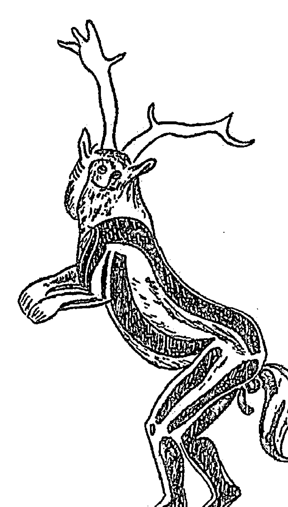

□ 阿伦格三兄弟山洞的鹿角图
法国维尔德·巴克兰提供

后来，一种充斥着魔法和泛灵论思想的宗教形式逐渐形成。在这一宗教中，大祭司充当了人类和神祇之间的沟通者。

旧石器时代晚期，人们开始将死者的尸体进行掩埋处理，标志着“转世”思想的出现。人们在死者尸体周围撒上红赭石代表生命，在下葬的同时，还在尸体旁边放置食品，以供死者转世所用。这样一来，狩猎之神又成了死亡和来生之神，因此重新获得了与丰饶女神同样重要的地位。

随着时代的变迁，人类走出新月沃土（约旦河与底格里斯河、幼发拉底河流域），开辟了一片全新的生存空间。在此期间，人们依旧没有摒弃神祇、宗教仪式以及魔法思想。当然，由于国家和地域的限制，各个地区所信奉的神祇在形象和气质方面均有不同。不过从本质上讲，这些神祇都是以上古时期的狩猎之神和丰饶女神为原型的。圣母和角神的形象，在各地的神话传说中都有出现。在凯尔特神话中，神祇瑟努诺斯被认为是一个头部长角的神；在法国巴黎圣母院地下的石质祭坛、希默兰半岛的甘德斯特鲁普出土的铁器时代的银锅上，我们都能找到他是角神的证据。到了青铜器时代，无论是在欧洲大陆，还是在近东、中东地区，角神的形象均已深入人心。

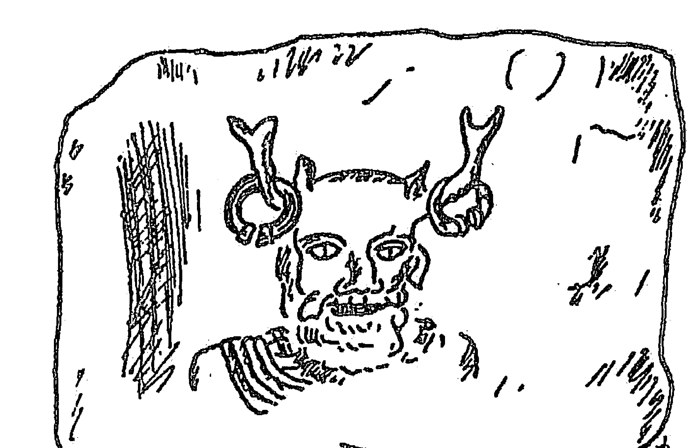

在整个西欧，人们都认同角神，同时受到敬仰的还有丰饶女神。特别是在进入靠放牧和农耕为生的时期，人们对丰饶女神的崇敬更是到了无以复加的地步。人们开始组织祭祀仪式，或单独或群体，乞求或感谢神灵保佑他们获得更好的收成。甚至农民家庭也以自己的仪式敬奉神灵。通常，农民大多都使用感应魔法——比如一对农民夫妇在刚刚犁好的第一垄田间做爱，以此换得新一年土壤的肥沃和作物丰收。

各个地区都有所谓的“牧师”，不过他们在主持宗教仪式的同时还掌管着草药。后来，这些人变成了所谓的“巫师”(或者说“智者”)。由此，巫师一词诞生了。

许多巫师被指控使用荣誉之手闯入教堂，使教堂的人不能移动，然后做一些亵渎圣物的事。苏格兰北贝里克郡盐场镇的一个巫师约翰·凡就曾被指控用荣誉之手干过坏事。

## 巫师的玩偶

魔法仪式中，玩偶是用来代表受法者的人形物，多由布料、蜡、黏土或者其他原料制成。有些玩偶与它所代表的受法者外形极为相似，有些则不那么相像。甚至有些时候，一根普通的蜡烛就可以充当玩偶来代表受法者，巫师可以任意移动它、熔化它，或用大头针扎它，通过所谓的感应魔法对它所代表的人施加影响。

绝大多数的玩偶与现实中的人都有着某种相似之处。布质玩偶是魔法中最常见的，常用于某些治疗魔法。布质玩偶通常的制作方法是：将两块布分别简单地裁剪成人的轮廓，然后将它们缝起来，顶端不封口，接着向其中填充一些草或其他利于施法的小物件，最后才将顶端缝合起来。如果是用于治疗魔法的话，玩偶中可以填充有治疗效果的草、羽毛和石头。若将病人的头发、指甲、衣物布料，甚至照片作为填充物封进玩偶中，那么施展的魔法则更有效。为了让玩偶与它所代表的受法者更加相似，施法者可以用刺绣或者绘画的方式，给它增加某些面部特征，再以病人的名字为玩偶命名，然后就可以施法了。通常施法者口中念诵“我对此物所作之事，都是我要对（求医者的名字）做的”的口诀。

如果施法者的目的是邪恶的，那么他通常会用大头针扎玩偶，以此来伤害受法者。

一般来说，刺头部是为了引起对方头痛，刺心脏部位是为了致人死亡；如果是蜡制玩偶，施法者还可以把它放在火焰上熔化。早在公元前1100年，埃及的一位官员就与法老拉美西斯二世的妻妾们合谋，对法老的蜡像施法，最终致其死亡。

几个世纪以来，许多巫术案件都与玩偶有关。如1590年，北贝里克郡的巫师们为了反抗苏格兰国王詹姆斯六世的迫害，特地制作了一个蜡像，并将其置于火焰上熔化。1594年，第五任德比伯爵溘然长逝，后来人们在他的卧室发现了一个蜡像。英格兰西南部的萨默塞特郡有一个“温坎顿”的巫师组织，1664年，这个组织的成员每人制作了一个蜡像，请他们的首领对这些蜡像施法使其具有魔力。其中一个叫安·比谢普的女人，要求首领为其蜡像命名为约翰·纽曼，然后把棘刺插入了蜡像。1678年，苏格兰的佩斯里巫师组织曾试图用玩偶谋杀他人，据此组织中的一位男性成员讲：“魔鬼要求他们每个人都要制作一个黏土肖像，好取走乔治·麦克斯韦爵士的性命。”

乔治·基特里奇讲述了威尔士王妃卡洛琳的故事：卡洛琳与英国王储乔治四世的婚姻毫无爱情可言，她时常用大头针刺、用火炙烤代表自己丈夫的蜡像，甚至在一些闺中密友面前都毫不避讳。1916年，英国西苏塞克斯郡的一位妇女把一个用萝卜雕刻成的粗糙人像交给了当地的牧师，在人像的胸口处扎有两根大头针。这位妇女声称，是她的丈夫按照她的形貌雕刻了这个人像，而她本人确实感到胸口传来的剧烈疼痛。

过去，玩偶主要被用以达到某些邪恶目的，比如说用玩偶来伤害甚至谋杀他人，然而在今天，信仰巫术传统的巫师只会将玩偶用在救人方面。

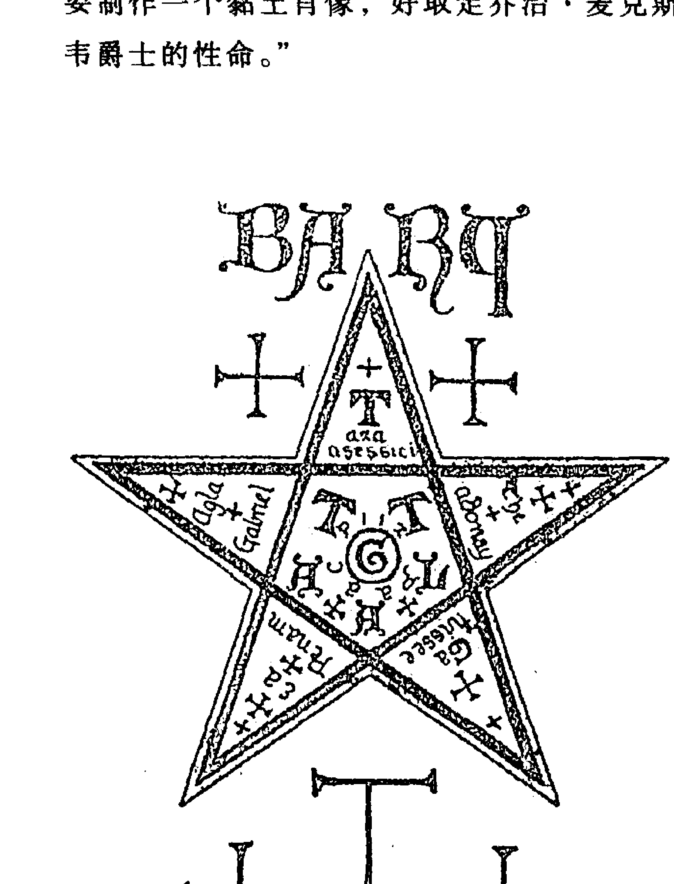

## 五芒星

最初的“五芒星”指的就是五角星，不过后来，它特指那些在魔法仪式中使用的圆盘，这种圆盘多为木质或金属质地，上面刻有魔法符号（通常包含一个五角星图案）。在魔法仪式中，由于盘面上刻有五角星图案和其他各种具有能量的词语及人名，因此五芒星盘常常被用于辟邪。

加德纳巫术中的五芒星由红铜制成，上面刻有三个等级符号，此外它还是致敬和惩罚的标志，以及神的象征。其他教派的五芒星多为木质或者银质，上面可能刻有不同的魔法符号。

## 巫医

巫医，指的是那些居住在宾夕法尼亚州荷兰人聚集区和奥扎克地区的“智者”。在奥扎克地区，他们也被称为“神医”。罗斯玛丽·吉利认为，当地的早期居民从美洲土著那里学到了草药的相关知识，这些美洲土著在治病的过程中还使用了一些灵符和咒语。

巫医与治疗巫师有很多相似之处，只不过大多数巫医都自称是虔诚的基督徒。巫医总是想尽一切办法替人驱除诅咒、帮忙找回丢失的财物以及治疗疾病。他们精通占卜，熟知各种草药的药性。大多数巫医都自称是家中的第七个孩子，同时他们的父亲或母亲也是排行第七，据说这样的人天生就拥有神奇的魔力。

还在幼年之时，巫医们就显示出了自己在治病方面的天赋。与巫术传统类似，巫医也不能把自己的超能力传授给同性，因此男性都是拜女性巫医为师，反之亦然。宾夕法尼亚州雷丁附近的巫医霍曼认为，巫医所从事的各项活动旨在治病救人。

通常情况下，巫医不会接受货币形式的酬劳，他们更加乐于接受物品或者他人的服务，以此作为自己应得的报酬。

## 巫师的荣誉之手

被绞死者的手风干或被腌渍后，再绑上蜡烛加以燃烧，就是荣誉之手。为了制作荣誉之手，人们会砍下被绞死者的手，在每根手指上绑一支小蜡烛，然后点火让它彻底燃烧。据说燃烧的荣誉之手能打开所有的锁，并能使整间屋子的人进入深度睡眠，而已经入睡的人则会处于昏迷状态。当人们熟睡后，他们的房子会被洗劫一空。1772年出版的一本书中，详细介绍了怎样制作荣誉之手。首先，荣誉之手必须是被绞死的重刑犯的手，左手或右手都可以。一旦把手割下，就得紧紧把它包起来。之后，将它和铜锈、硝石、盐、荜拨粉末一起放在陶罐里两星期。然后再取出来放到太阳下晒干。如果阳光不是很强烈，就得将手放进烤炉里，用马鞭草和蕨类植物烤干。

同时，将重刑犯身上的脂肪与没有用过的蜡、芝麻及马粪一起做成新的蜡烛。一根手指可以制作一支蜡烛，五根手指一共可以制作五支蜡烛。

> 书上说“如果房子的主人使用一种由黑猫的胆汁、白色母鸡的鸡油与鸣角枭的血做成的药膏涂在房门前，那么荣誉之手将会失效”。

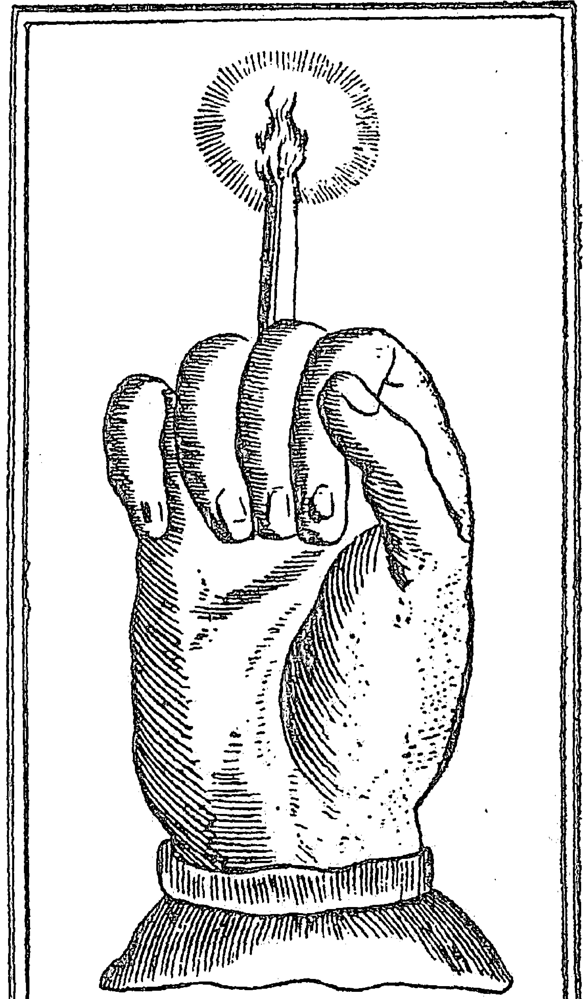

阿伯特斯巴尔夫斯的巫法书里的插图——荣誉之手 科斯特·福亨图片库

## 万圣节

每年的10月31日的夜晚是巫师们狂欢聚会的时刻，这一天是四个“主巫师节”之一，也被基督徒们称为万圣节前夜。对于异教徒来说，万圣节标志着农作物生长季节的结束以及冬季的开始。对古代的人来说，万圣节的到来意味着他们必须重新通过狩猎来获取生活必需的食物。在巫术历法中，万圣节意味着前一年的结束，同时也是新一年的开始。

巫师们相信，万圣节这一天是人鬼两界相隔最近的时候。因此，如果想与前一年刚刚去世的亲友的灵魂交流的话，这一天是最佳时机。许多巫师也认为，在万圣节，很多死去的人都会与他们一同狂欢、庆祝。这种想法令人们创造出了很多与万圣节有关的鬼故事。也正是由于这个原因，人们相信万圣节是占卜未来的良机，尤其是在古时候，人们总会饶有兴趣地预测下一个冬天的气候。

无论过去还是现在，万圣节晚宴都是非常丰盛的。每年到了万圣节，人们都要把放牧和牲畜饲养的规模大幅度缩减，只留下足够来年继续繁衍生息的种牛和种羊。人们把多余的牲畜屠宰后，将肉腌渍并保存起来。因此，在万圣节盛宴上，人们会在圣火旁烹制鲜肉。而且在万圣节这天，从西欧到英国全境的每座山峰的峰顶都会熊熊燃起庆祝万圣节的篝火。如果高空俯瞰，就会见到一幅清晰的异教徒组织分布图。事实上，在所有重要的巫师节日，这样的篝火总会熊熊燃烧。

巫术传统中，丰饶女神控制着夏季；而到了冬季，狩猎之神则接掌权力。因此，万圣节这天，王冠的交接成了一个重要的宗教仪式。在庆祝仪式上，大祭司戴上一个带有牛角或者鹿角的头盔，这一过程象征狩猎之神已经接过了丰饶女神的权力。

每年的11月1日，人们会庆祝水果的大丰收。因为这一天是古罗马的古老节日——波摩娜节。波摩娜就是“果树之神”。波摩娜节将苹果、干果与万圣节联系在了一起。凯尔特人曾把苹果树叫做银枝树，认为苹果是冥界的果实，它代表着爱、多产、智慧以及预言。“咬苹果”的游戏起源于波摩娜节，游戏过程既代表着苹果已到成熟期，也表达了人们想要预见未来的愿望。游戏中，人们会先在一个大桶或者大盆内装满水，尔后将苹果丢入水中。游戏者只能通过牙咬的方式将苹果从水中取出。接下来，游戏者要削掉苹果的外皮，但不能削断，之后再将长长的果皮抛向自己身后。据说，落在地上的果皮会呈现出游戏者未来配偶名字的首字母。

罗马学者普林尼详细讲述了德鲁伊教徒欢度万圣节时的情景。在这个节日，德鲁伊祭司会手持黄金镰刀割取槲寄生。因为在德鲁伊教传统中，槲寄生永远不能与地面接触。因此，德鲁伊祭司必须亲自爬上橡树割取。而当槲寄生从树上坠落时，信徒必须用白布将其接住，避免它落到地面。

17世纪，在苏格兰西北海岸外的刘易斯岛上，人们以一种奇怪的仪式庆祝万圣节。说这个仪式奇怪，是因为它居然将基督教和异教的信仰结合在了一起。仪式的开头和结尾都在圣马尔维教堂进行，仪式过程中会有人走进海水，用歌声赞美海神肖尼。歌词如下：

哦，海洋之神，
在波浪中撒下海藻，
为了陆地的富饶，
为了给我们带来食物。

仪式过程中，人们会用麦芽酒祈求海藻丰收。因为在此地，海藻是来年的农家肥料。同时，人们会安排一个人去安抚上帝，另一个人则熄灭教堂内祭坛上的蜡烛。整个庆祝仪式会持续一整夜，人们载歌载舞，为感谢神祇而大量饮用麦芽酒和葡萄酒。次日清晨，所有人都要集中在海滩上，恳求布莱恩纽尔神用强风将海藻从海水中卷到岸边。

## 巫师之王桑德斯

1926年，亚历克斯·桑德斯出生在英格兰的曼彻斯特，他称自己是“巫师之王”。幼年时期，桑德斯就读于休姆地区的乔治小学，随后进入威廉·休姆文法学校学习。毕业后，桑德斯干过一段时间的木匠，随后进入一家化工厂。21岁那一年，他与19岁的多琳相识并结婚，不过，这段婚姻并没有持续很久。

桑德斯不停地换工作，同时他成了一个酒鬼。在混乱无度的生活中，桑德斯被巫术深深吸引，他参与了一些敬奉魔鬼的祭祀仪式。后来，他又研究了亚伯拉罕·梅林的魔法。最终，他吸引到的追随者足以组成一个他所说的巫师团体。桑德斯曾经表示，他控制着一百多个巫师团体，总人数高达1623人！当然，所有这些他所提供的数字从未得到过证实。按照桑德斯的说法，他的每一个追随者都支持他做“巫师之王”。不过尽管自称“支持者众”，然而桑德斯却没有哪怕一位女祭司。而且他所宣扬的巫术，仅仅是其他相关书籍内容的大杂烩。如弗朗西斯·巴雷特的《魔法师》、弗朗茨·巴顿、艾利菲斯·李维的著作以及魔法仪式的一些相关书籍，都成了桑德斯早期的资料来源。再后来，桑德斯从帕特·科潘斯基那里得到一本杰拉尔德·加德纳的巫术书，他立刻把其中的内容与自己原来掌握的资料混合在一起。当被问及这些书籍的来源时，桑德斯声称是在他七岁时，祖母送给他的，而且祖母还曾经“启发”过他。按照他自己的说法，祖母是通过戳刺他的阴囊来告诉他他是一个巫师的。

1963年，桑德斯遇到了出生于1946年的马克辛·莫里斯。莫里斯比桑德斯小20岁，是罗马天主教徒。当时，桑德斯依旧没有一位属于自己的女祭司，在来往一段时间后，两人订立了婚约。

桑德斯继续游说人们加入“亚历山大”巫师的行列，同时还继续以“祖母所授”的名义派发那些由他自己一手炮制的“大杂烩”资料。桑德斯把自己的信徒命名为“沃比尤斯”，而他祖母的则是“美狄亚”。在桑德斯组织的仪式上，他总是身披长袍，而信徒们则赤身裸体。

渐渐地，桑德斯在公众心目中拥有了一定的知名度。1969年6月，《曼彻斯特晚报》记者约翰斯撰写了一部以桑德斯为主题的书籍《巫师之王：亚列克斯·桑德斯的世界》。这真是一个奇妙的世界，尽管他所派发的资料全部都是自己炮制的，然而桑德斯确实也曾招揽到一些值得培养的巫术探索者，其中最著名的两个人，无疑是斯图尔特和珍妮特·法拉。通过自身的努力，此二人后来成了巫术界受人尊敬和崇拜的导师。

象；而剧作家米德尔顿，也从《巫术的发现》一书中获益匪浅，他创作了戏剧《女巫》。1603年，苏格兰国王詹姆斯一世对斯科特的《巫术的发现》异常不满，下令毁掉所有已经出版的《巫术的发现》，直到1651年，这本书才得以再版。

1988年4月30日，桑德斯因肺癌死于黑斯廷斯市，然而他所创立的“亚历山大”教，至今仍然以各种形式流传。

## 巫术的发现

1574年，斯科特撰写了《啤酒花花园》。这是一部指导农民们如何种植啤酒花的书籍。1582年，在埃塞克斯郡的布赖特灵西镇附近，一个叫圣奥西斯的村子里有14名妇女被指控“涉巫、传巫”，最终全被处死。而导致她们被判有罪的大部分证据，却都来自六至九岁的儿童。圣奥西斯村与斯科特的家乡相距不远，他被这14名妇女的惨死深深震撼，随后便著成《巫术的发现》一书。书中，斯科特猛烈抨击了当局对巫术的迫害，同时谴责了宗教法庭对异教徒的偏见。

1584年，雷金纳德·斯科特所著的第一本《巫术的发现》正式出版，这是第一部用英语撰写的与巫术相关的书籍，同时也是英文著作中对“反巫术”偏见抨击最为猛烈的一部。莎士比亚从《巫术的发现》一书中得到灵感，创作出《麦克白》中经典的巫师形。

斯科特撰写《巫术的发现》以前，曾经发生过这样一件事：据传，恶魔精灵控制了一个名叫米尔德雷德·诺灵顿的17岁女孩，通过她指控一位名叫艾丽斯·韦斯特维尔的老妇传播巫术。不过后来，诺灵顿承认恶魔精灵一说纯属无稽之谈。这件事就发生在距斯科特家不到六英里的地方。无独有偶，伦敦的两位妇女——艾格尼丝·布里奇斯和蕾切尔·皮德尔，自称“被巫术蛊惑”，症状表现为呕吐出了麦秆和别针。后来，此二人也被证明是骗子。这两个故事让斯科特总是带着怀疑的态度去审视所有对巫术的指控。

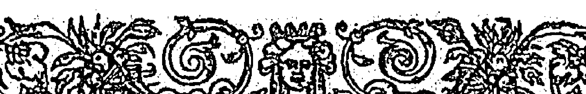

# # The discouerie of witchcraft,

Wherein the lewde dealing of witches and witchmongers is notablie detected, the knaverie of coniurors, the impetie of inchar tors, the follie of soothsaiers, the impudent fals hood of cousenors, the infidelitie of athcists, the pestilent practices of Pythonists, the curiositie of figurecafters, the vanities of dreamers, the begger lic art of Alcu myftic, The abhomination of idolatrie, the horrible art of poisoning, the vertue and power of naturall magike, and all the conuiances of Legierdemaine and iuggling are deciphered: and many other things opened, which haue long lien hidden, horbeis verie necessarie to be knowen.

> > Heerevnto is added a treatise vpon the nature and substance of spirits and diuels, &c: all latelic written by Reginald Scot. Esquire. I. Iohn.4,1. Beleeue not euery spirit, but trie the spirits, whether they are of God; for manie false prophets are gone out into the world, &c.

1584

斯科特并非律师，但拥有许多法律方面的藏书，这让他能够以法律的知识为原则思考问题；同时，他还对神学和宗教圣典有着深入的了解。为了搜集资料，斯科特旁听了很多对巫师的审判，调查了大量被盖棺定论为“涉巫、传巫”的案例。在《巫术的发现》一书中，他用了三分之一甚至更多的篇幅来展示那些被视为“巫术”的戏法花招、魔术以及舞台表演，几乎所有那些被视为“超自然力”的表演方法，在该书中都有所涉及。

不过，对斯科特来说，还是有一些所谓的事实难以从物质层面解释清楚，他依旧不得不面对这些。因此，他必须首先从鬼怪的本质角度来抨击那些神学上的魔鬼概念。斯科特写到：“在巫术中，‘神’的名字意味着毁谤、庸俗、亵渎，他的超能力来自一个邪恶的人（恶魔）……巫术是一种超自然能力，它通过一个能与恶魔建立联系的老妇人来实现。这种联系是隐秘、神秘甚至神奇的，至今仍然没有可靠的证据来证明它。”在斯科特看来，大多数被指控为女巫的人通常是一瘸一拐、眼神迷离、面色苍白、浑身恶臭的老妇人，她们脸上堆满了皱纹。接着，斯科特进一步描述了这些老妇人是如何成为人们眼中的“女巫”的：首先她们因生计所迫不得不向邻居们乞讨，在被拒绝后，人们臆想这些老妇人会诅咒那些拒绝向她们施舍的人，进而还会制造出一些事端。

自始至终，斯科特都未全盘否定巫术的存在。因为那样做，就意味着否定《圣经》。不过在《巫术的发现》中，他有力地证明：对巫术的指控，永远都不能代表人们在与恶魔势力进行对抗。在那个时代，几乎没有人敢像雷金纳德·斯科特这样说。几乎可以肯定的是，乔治·基福德曾经拜读过《巫术的发现》，他于1587年、1593年先后著成《论恶魔对女巫的诡异操纵》、《一段有关女巫和巫术内容的对话》。这两部著作的问世，标志着对无辜妇女残酷惩罚的结束。

## 威卡教

1973年，雷蒙德·巴克兰建立了威卡教。这一教派有着撒克逊巫术的背景，但该教派的信徒声称，他们并不是原始撒克逊巫术的重现或者再生。

巴克兰建立威卡教的最初目的，是为了满足个人的宗教信仰需要。在加德纳教派，巴克兰曾经担任了长达十年的领导。20世纪60年代初，正是他把这个教派引入到美国。随后巴克兰认为，在宗教信仰方面，他需要拥有属于自己的东西。因为在他看来，宗教本是为了满足个体的需要，所以，他不应该为此向别人作出任何形式的妥协。由于在巫术界拥有深厚的背景，同时还对宗教仪式有着相当深刻的认识，因此巴克兰认为自己完全有能力建立一个古老宗教的新教派。由于在加入加德纳教派时，曾经发誓保守该教派的秘密，因此，巴克兰并不愿意利用自己在该教派所掌握的一切资源。于是，在属于他的新教派中，所有的仪式都是全新的。教派的组织结构也与此前的巫术教派截然不同。在加德纳教派及其他巫术教派中，有很多东西都源自“仪式魔法”。巴克兰在创立自己的教派时，对“仪式魔法”的繁文缛节进行了简化，最终形成了他基本的宗教信仰框架。

对于其他巫术教派来说，逐级晋升的制度会带来一些问题。为了避免这些问题，威卡教并未设定等级制度，该教派的领导（或者领导层）由教徒选举决定，任期一年。选举将在现任领导任期内的最后一天进行，现任领导将自主决定是否作为新一年的候选人。这一制度，从根本上杜绝了领导权被滥用的可能。同时，它还让所有的巫师都拥有了担任高级圣职的机会。如果一个人拥有卓越的领导才能，他可以连续多年担任主教或者高级圣职；如果没有领导才能，则很可能会落选。

巴克兰非常卖力地大力宣传古老宗教，为了达到众人都熟知古老宗教的目的，最好的办法是建立一个开放的教派。尽管最初巴克兰是为了满足自己的需要才创立威卡教的，不过当其他人了解了他的教义后，都希望分享他的成果。为此，巴克兰专门撰写了一部关于其宗教思想的著作《大树：撒克逊巫术完全手册》。实际上在威卡教中，巫师们自己手写的仪式记录，不论是关于个人的还是团体的，都被称为《大树》，而且封面都是绿色的。

“非巫人士”指的是那些正在考虑是否加入威卡教的人们。威卡教成立以前，任何一个想要成为巫师的人，都必须接受信仰上的启蒙。否则，他便不能参加巫术崇拜仪式。不过在巴克兰的教派中，“非巫人士”可以以客人的身份参加教派内部组织的宗教仪式。这样，他们就能得到关于巫术崇拜仪式的真实感受。这种感受，有助于他们更为理智地决定是否做一个巫师。一旦此人正式加入威卡教，那么他就成了一名“哥赛特”（普通教徒）。巴克兰的教派没有等级晋升制度，因此，所有教徒都是“哥赛特”，在一年一度的领导选举中，他们也都是候选人。

传统的巫术教派中，成员都必须加入一个巫师团体。如果得到了组织的批准，该团体中的成员还可以另成立一个新的团体。在威卡教，教徒们可以像独修巫师那样自成一派，也可以成立自己的团体，前提是该教徒必须脱离自己此前所属的团体。威卡教中的“非巫人士”、普通教徒“哥赛特”以及巴克兰自己的封号“菲德尔”或者说“教派之父”，都来源于古盎格鲁撒克逊语。1993年，辛苦经营自己的教派20年后，巴克兰终于决定从领导岗位上退下来。他任命自己以前的学生迈克尔·B·史密斯为威卡教的掌教。在经历了差不多四分之一个世纪之后，威卡巫术教的影响遍及全球，澳大利亚、新西兰、南非、日本、俄罗斯以及欧洲和北美洲的国家都有该教派的信徒。

1729年珍妮特·霍恩在罗斯郡的多诺赫镇被处以火刑的罪名就是“把自己的女儿当成马，并邀请恶魔为她钉马蹄铁”最终导致其终身残疾。设想一下，如果她确实给自己的女儿钉马蹄铁，那么我们只能假设，她真的相信自己已经把女儿变成了一匹马。

## 巫师变形记

中世纪时，有很多巫师遭到了审判。在留存的审判记录中，我们经常能够看到，控方证人作证称，巫师曾经把自己变成走兽、飞鸟甚至昆虫。许多巫师也自称，他们曾经变身为其他动物。猫和兔子，是巫师最喜欢变的样子，狗、老鼠和乌鸦也是他们常见的选择。人们对变身术深信不疑，原始人更是如此。

1607年3月10日，伊索贝尔·古迪埃被控犯有六项罪名，头一项就是她曾经变成猫的模样，给邻居制造了麻烦。1612年，伊索贝尔·古迪埃在接受审判时供认称，她与姐姐都变成过猫、兔子、乌鸦及其他动物。有一次，她们甚至还因此被一条狗追逐撕咬。伊索贝尔说，当我们要变成兔子时，会念诵三遍咒语：

1673年，诺森伯兰郡的安·阿姆斯特朗说，一个名叫安·拜特斯的巫师“多次变为猫、老鼠、长腿猎狗以及蜜蜂”。她指出，当她在巫师团队唱歌时，其他的巫师们“纷纷变成各种动物来跳舞，先是变成兔子，然后变回自己的模样，接着再变成猫，有时候变成老鼠或者其他一些动物”。

> 我要变成一只兔子
带着悲伤、叹息还有极大的牵挂
我将以魔鬼的名义前去
不久后我将重新回家

伊索贝尔·古迪埃接着说，念完三遍咒语后，我们一下子就变成了兔子。当我们想变回人形时，就会念下面的咒语：

> 兔子，兔子，神给予你眷顾
现在我仅仅是拥有一个兔子的外形
不过此刻我要变成女人的样子

玛格丽特·穆里指出，世界上根本就不存在“变身术”，巫师们自称的变形，仅仅是他们按照自己的描述进行的一种宗教仪式表演而已。在听到一个巫师称自己是一条狗时，另外一个会认定自己也是一条狗，后一个也像前一个那样四处宣扬自己是条狗。就这样，巫师们相信，他们真的是动物。而事实上，他们的外形根本就没有发生任何变化。不过，伊索贝尔还交代了变成猫、乌鸦等动物所需要念诵的咒语。她表示，只要简单的几句咒语，其他女巫就能和她一起变身。“‘我祈求你，跟我来！’念完这句咒语后，她们就能和我一样变成猫、兔子或者乌鸦。”

罗马作家阿普列尤斯的《金驴记》中，有一段女巫变成乌鸦的描写。首先，女巫脱光衣服，把两粒谷物放入点燃的灯，同时口中低声默念咒语。接下来，她打开一个装满药瓶的柜子，从里面拿出一个瓶子，把瓶子里的油状液体涂抹在自己身上。这时，这名女巫就长出了翅膀和鸟喙，同时发出刺耳的鸣叫，最后从窗子飞了出去。一个当事人也想试着变乌鸦，结果由于拿错了药瓶而变成了一头驴。

在人们的想象中，变形之前总会用到一种带有魔力的药膏。因此，骑着扫帚在天空中飞行也要使用类似的东西。

## 巫师与春分

很多巫师把春分这一天举行的节日叫做“奥斯托拉”或者“约斯特雷”，这两个名字分别来源于日耳曼神话中的太阳女神奥斯托拉以及盎格鲁撒克逊神话中的丰饶女神约斯特雷。无独有偶，现今的传统节日，复活节也被命名为约斯特雷。

春分日，白昼和黑夜的时间完全相等。与秋分、冬至、夏至类似的是，春分的确切日期也要根据历法来确定。一般来说，某月的21日为“分”或“至”的概率较大，不过提前或者延后一天左右的时间也是正常的。玛格丽特·穆里指出，在凯尔特不列颠和日耳曼欧洲的历史上，人们从来没有庆祝过“分”这个日子。不过，现代巫师已经把它们纳入到了“巫师狂欢节”之中，用春分、夏至、秋分、冬至四个节气把一年平均四等分。

> > 珍妮特·法拉和斯图尔特·法勒指出：“在古代，春天是一个特殊的季节。这个季节在当时有一种献祭交配的习俗。后来，人们把这种仪式称为圣婚。在献祭交配中，女人们把自己当做女神，男人们则完全投入到女神们的怀抱中，毫不吝惜地献出自己的男子气概。献祭后，男人们会显得更加的神采奕奕。”因此，巫术传统中的“大祭祀仪式”——即巫师们的圣婚仪式，也在春分这一天举行。

> > 希尔在《人类、神话以及魔法》一书中写到：“饮酒、跳舞、盛宴、喧嚣、做爱，男人们通过这些方式庆祝他们共同的快乐……不过，自史前时期开始，男人们对季节更替时的庆祝仪式抱着极大的热情。特别是在春季，他们的情感往往迸发得更加强烈。毕竟，春天是世间万物摆脱严冬束缚的日子。”

与其他巫师狂欢节类似，在春分日，巫师们也会在山顶点燃篝火。这样做的目的，是为了促进阳光尽快温暖大地，同时也让农作物和树木重新生长。这一天，许多巫师还会在播种前为种子祈祷，以便它们能够更加茁壮成长。

## 巫师的工具

巫术会用到各种各样的“工具”，包括巫师聚会以及个人使用的。巫师聚会中的工具，正如其名称所暗示的，是用于巫师聚会场合的魔法用具，仅可供巫师聚会使用。个人魔法工具属于个人所有，仅供巫师个人使用。

巫师聚会工具的数量和种类取决于巫术教派的传统。例如，有些传统使用剑来标识和献祭魔法仪式圈，还有些传统也许使用长扫帚或扫帚柄以“清扫”魔法圈。当然还有人用刀或拐杖，而不是用剑。以下列举了魔法中使用的一些工具：

- 剑——通常用于标识和献祭魔法圈，同时也用于入会仪式。只有祭司才能用。
- 魔杖——魔杖是魔法力量储存与释放的媒介，同时还可用于“召唤”神灵下界。
- 双刃匕首——真正的魔法工具，用于在其他魔法工具上标识或刻画魔法符号。
- 鞭子——用于入会时，作为生命中一部分的死亡象征。一些巫师会用鞭子施展魔法。
- 香炉——用于焚香以制造仪式所需要的气氛。
- 盐——代表生命或生命的力量，通常是祭祀过程中必不可少的一部分。
- 水——代表灵魂，和盐一样，也是祭祀过程中很关键的部分。
- 绳——入会时会用绳将人捆绑，还将绳用于魔法的施法工作。
- 五芒星——用于占卜，是作为水晶球推算吉凶的工具。
- 圣水掸酒器——用于献祭过程中掸洒盐水。
- 魔法刃——这是巫师私人的魔法工具。每位巫师都应拥有属于自己的魔法匕首，这是一种仪式工具，不用于任何实际的砍切，且绝不能沾血。
- 长扫帚——就是用于生殖祭典的扫帚柄，巫师用其开启或封闭魔法圈。
- 拐杖——旧时权力的象征，表现为国王的权杖，同时还可以是主教的牧杖、权杖、权棍或其他任何形式。巫师使用时，其作用类似于魔杖或剑。
- 蜡烛——见于祭坛上以及魔法圈周围四个基本方位。
- 铃铛——不少巫师在很多仪式中使用铃铛。

## 巫术洗礼

巫术中的洗礼和基督教中的洗礼类似，是婴儿从出生、起名到信奉神明过程中必要的仪式。虽然在洗礼中，婴儿的名字已经被告知了神明，但在到了青春期，有了自己的判断能力时，可以重新选择一个新名字。如果青春期的少男或少女决定选择别的人生道路，则有权离开仪式现场，并按照自己的意愿继续成长。

在对小孩进行洗礼时，会将盐水洒在他身上，并带他穿过熏香的烟雾，从而让他的灵魂得到净化，这一过程中，神父或父母可以不在场。

威廉姆森吃住全在私立小学，就连假期也是在不同的亲戚家中度过。他有个叔叔叫威廉·拉塞尔·福克斯，是北波利的教区牧师。有一年，威廉姆森在叔叔家过暑假，第一次遇见了巫师。

## 巫术箴言

巫术中没有戒律、教义手册或类似的教条，只有一条法则：“随心所欲，切勿害人。”即你可以做任何想做的事，但前提是不能伤害到任何人，包括你自己。

其他的宗教信仰中也有相同的观点。比如婆罗门教和佛教中，就有类似于儒家思想“己所不欲，勿施于人”的教义，同样的观点基督教中也有。伊斯兰教宣扬：“只有当你祈祷你的兄弟得到你希望得到的东西时，你才是真信徒。”犹太教中规定“别对你的同伴做你憎恨的事”；道教中也有“见人之得，如己之得；见人之失，如己之失”的说法。而拜火教则认为：“不与人为恶，才为人性真善。”其他很多宗教都认为需要对这条基本法则予以补充，但在巫术中却是不必要的，一条箴言足以涵盖所有含义。

威廉姆森七岁时，曾受到诺福克豪斯学校一名叫本瑟姆的男孩欺侮。本瑟姆常常会追得他躲在灌木丛或树篱中不敢出声。有一天，威廉姆森在躲藏时，遇到了一位采摘嫩枝、自称是树篱巫师的老妇人，她教给威廉姆森如何使用让折磨他的人消失的咒语。这的确有效，因为被诅咒的本瑟姆在滑雪时摔伤并住进了医院，这让威廉姆森终生对树篱巫术敬畏有加。在与树篱巫师偶遇后不久，有一次，威廉姆森听到叔叔屋外的路上传来骚乱声。他立即冲了出去，发现一群醉醺醺的农夫正撕扯着传授他咒语的老妇人的衣服。农夫们认为她是一个巫婆，是当地牲畜受诅咒的罪魁祸首，因此要搜查老妇人身上“魔鬼的乳头”。虽然威廉姆森当时还只是个毛头小子，但还是义无反顾地冲进人群保护老妇人。在那之后的某一天，他在小溪旁的一棵柳树下又碰见了这位老妇人，她教给威廉姆森更多关于巫术和魔法的知识。

## 威廉姆森的巫术

塞西尔·威廉姆森于1909年9月18日出生于德文郡佩恩顿一个富足的家庭。他的父亲是一战时期的一名海军军官。由于父亲经常要被征召，所以母亲就一直跟在丈夫身边。

随后，威廉姆森进入伍斯特郡的莫尔文学院学习，并在法国的第纳尔与祖母度过了好几个暑假。祖母是一个占星家，通过她，威廉姆森结识了阿莱斯特·克劳利、玛格丽特·穆里、蒙塔古·萨默斯和华莱士·巴吉等人。一战爆发后，威廉姆森的父亲接到海军部的征调，因此一家人得以在伦敦团聚。在那里，威廉姆森经大学同学肯尼迪·库克斯引荐，认识了著名的占卜师蒂·拉·海伊太太。在她的一些降神会上，威廉姆森担任与精灵接触的角色。

威廉姆森一共结识了82位巫师。他说：

> “在这些年，我越发了解到这些简单普通的巫师们是如何将积极有益的魔法奉献给世人的。对我而言这就是全部，其他的一切都是在浪费时间，而其他诸如什么仪式圣杯或别的对我而言都是没用的东西。”

有一段时间，威廉姆森的父母在新森林地区的纽兰兹庄园居住。那是一栋巨大的哥特式建筑，四周有大片的森林和九英亩的湖泊。在新森林地区，威廉姆森结识了当地最著名的巫师伍德福德·格赖姆斯夫人、桃乐丝·克拉特布克以及当地其他巫师。

从1930年5月开始，威廉姆森开始着手编写巫术档案。他的作品更大程度上像是一本日记，一直记录到1997年6月。威廉姆森在书中这样描述自己：

> “在过去67年发生的1120起巫术事件中，我起初只是看客，后期成为有经验的参与者。”

他同时还说明，自己与82位巫师的相识相知和受到的各方面的巫术指导。在书中，威廉姆森给出了在所有的1120起巫术事件中，成功率大约是60%。

1933年，威廉姆森迎娶了英国电影制片人和导演赫伯特·威尔科克斯的侄女格温·威尔科克斯。五年后，威廉姆森加入了英国情报局，在整个二战中搜集纳粹组织的机密情报。

1947年，威廉姆森访问了大英博物馆附近的亚特兰蒂斯书店。这家书店自古至今都是神秘学爱好者最钟情的地方，现在仍被卡洛琳·怀斯经营。亚特兰蒂斯书店的创始人迈克尔·霍顿是一个神秘学者和出版商，他在书店的地下室创立了一个名叫“隐匿大师读书会”的沙龙。亚特兰蒂斯不仅仅是一家书店，而且还是一个交流的场所。在这里，大家可以手捧一杯茶或咖啡，或读，或讲，或探讨神秘事件。在这里，玛格丽特·穆里将威廉姆森介绍给了杰拉尔德·加德纳。那时，杰拉尔德·加德纳正在撰写《高级巫术救助》一书。威廉姆森告诉穆里，华莱士·巴吉先生曾经赠给他一些护身符作为礼物，并就打算将它们陈列在博物馆询问穆里的意见。穆里建议陈列一些公元前6000年古埃及的物品，但加德纳却坚持应该陈列“凯尔特神话、月亮女神以及所有相关的物品”。显然，穆里和加德纳已就这个问题产生了分歧。

直到1949年，威廉姆森才在他的巫术研究中心举办了第一场巫术展览。巫术研究中心位于马恩岛卡斯尔敦阿波利街的巫师工厂。他原本打算在埃文河畔的斯特拉特福举办，因为那里是莎士比亚戏剧《麦克白》中三个巫师的所在地。他所熟识的一个医生已经为他准备好了场所，但当地媒体却称斯特拉特福将会建一个巫术博物馆。于是，来自当地居民的舆论压力迫使威廉姆森离开了斯特拉特福，进而转移到马恩岛。巫术展览开展后不久，杰拉尔德·加德纳就找上门来，希望威廉姆森让他进入博物馆任“官方巫师”，并向威廉姆森推销他的新书《高级巫术救助》。

在威廉姆森看来，加德纳是一个“非常自负、非常以自我为中心且非常吝啬的人”，并且“没有四两拨千斤的外交手腕”。这与华莱士·巴吉先生产生了鲜明的对比。对于后者，威廉姆森如是评价：“他是我见过最和善的人……他会抽出时间和后辈交谈，我对他与对玛格丽特·穆里博士一样，都是至高无上的尊敬。”

1952年，威廉姆森携所有的史前古器物返回英国。虽然博物馆只剩下一个空壳，但加德纳仍将其买入。威廉姆森来到温莎，在那里购入一栋被当地人称为“古老操练大厅”的建筑以及一座小旅馆，然后重新开放了巫术和魔法博物馆。几年之后，威廉姆森又迁往鲍顿。在这里他遇到一大堆麻烦事：当地基督徒称他的博物馆为“撒旦之家”，想方设法驱逐他；报纸等媒体也以“巫术重回中部”、“被黑魔法控制的村庄”以及“巫术展览或将中断”等标题大肆渲染。而且更加雪上加霜的是，一场大火将博物馆的部分器物付之一炬。

最终，威廉姆森于1960年撤出了鲍顿，将博物馆重新选址在博斯卡斯尔。但因为并没有多大吸引力，博物馆不久就关闭了。

威廉姆森在博斯卡斯尔的博物馆从四月维持到九月，展示了阿莱斯特·克劳利等人使用或拥有的物品。他展示的最不寻常的藏品之一便是乌苏拉·肯普的遗骸。这个圣奥西斯的著名巫师在1852年2月28日被处死。执行死刑后，她那被沥青浸泡的尸体在绞刑架上吊了21天。教区牧师是不会为乌苏拉·肯普举办基督教葬礼的，因此她被葬在了废墟中。1921年，乌苏拉·肯普的遗骨在圣奥西斯修道院的墙外被发现，她的膝盖、脚踝和手腕都被钉入长长的金属钉，一直钉进地面。展示了一段时间后，乌苏拉·肯普的尸骨又重新被碎石掩埋。直到20世纪40年代末，威廉姆森才搜集到了她的遗骸。

那些年里，威廉姆森经常被请去研究最近故去的巫师或魔法师的遗体、遗物和财产。对此他说：“作为一个巫术博物馆所有者，最大的奖赏就是总会接触到与巫术有关和有趣的人。”

威廉姆森为推广巫术作出了不懈的努力，尤其是在“智者的魔法”——树篱巫术或乡间有灵性男人和女人的智慧上。

1992年，威廉姆森将博斯卡斯尔巫术博物馆卖给了格雷厄姆·金和伊丽莎白·克劳，该博物馆现今仍在开放且颇受欢迎。

## 巫师与巫术

当今很多词典和百科全书将“巫师”定义为在撒旦的协助下施展黑魔法的人，而且，很多人仍然认为巫师是一个又老又丑的女人。然而在《奥德赛》中，荷马笔下的巫师却是一个“有着一头秀发……容光焕发的女神……她用非常甜美的嗓音哼唱……她穿着一件精致的熠熠发光的长袍，腰间系着一根金色的腰带。”在希腊传说《金羊毛》中历经种种风险的巫师美狄亚，被描绘成美貌的年轻公主。在大英博物馆的石刻中，女神赫卡特的形象也是美貌的女子。即便是被称作“巫师”的恩多，在《圣经》中也找不到其年轻还是年长的描述，而后期的许多作家都将其说成如蒙塔古·萨默斯笔下的形象：“一双阴冷的眼睛，混沌而且不断分泌出液体。”因此，巫师的干瘪老丑婆形象只是近代的产物。

“巫师”一词的确与“智慧”有关，两者的词根都是“有智慧”、“通晓”的意思。巫师一词来源于盎格鲁撒克逊语，意思是“聪明的人”，可以为男性或者女性。依照玛格丽特·穆里在《大不列颠百科全书》中的定义，“巫师”一词直到15世纪才被人们用来称呼施行巫术的男性或女性。她说：“占卜或预测未来是巫术最普遍形式中的一种，如果是以某神明或某种既定宗教的名义进行，则被称为‘预言’，但是以异教徒神明之名进行的占卜只能称之为巫术。”

巫术一词已被人们误用了数百年。基督教的传教士在其他地方传教时，如果遇到当地居民持有与他们不同的信仰，则自然而然地将他们的信仰和风俗贴上“巫术”的标签。除了受西非巫术的影响外，美洲土著巫术、澳大利亚土著巫术和其他任何形式的巫术都与西欧基督教出现之前的信仰没有任何关联。

事实上，巫术在基督教产生前就已经存在。巫术是对异教中众神的信仰、对自然和所有生命的敬畏，以及对植物、动物及人类自身的认知。在西欧，巫术慢慢演变成组织松散的信仰，其信徒在每年的特定时期进行崇拜仪式，比较重要的是一年一度的“夜半聚会”，还有其他的小型活动，即巫师会。夜半聚会与农业历法中的某些特定时间一致，并且依照太阳的运行轨迹确定。而小的巫师会则根据月相的变化决定。

早期的基督教徒容忍了异教徒的古老信仰，但随着基督教的扩张和决心要使其成为唯一的宗教，巫术的古老信仰就被认定是撒旦般的恶魔崇拜以及邪恶的黑魔法。而实际上，巫师们并不信奉基督教中的撒旦，也不会违背教义做出任何对人和事物造成伤害的事。但基督教下决心肃清所有的异教，他们对巫术信徒严刑拷打，并且在大迫害中以最残忍的方式杀害他们。铲除异教徒的号角在15世纪吹响，直到今天，在很多信奉正统基督教的教徒心中，那些错误的想法仍然根深蒂固。罗马天主教和新教的教堂成为中世纪的宗教裁判所，被宗教裁判所残害的异教徒估计有数百万之多。在德国、瑞士和法国，最严酷和最强硬的刑罚随处可见。罗斯玛丽·吉利说：“政治和社会的动荡成为主要诱因，在1618至1648年间的30年战役中，德国和欧洲其他地方的审判越来越多。庄稼歉收、瘟疫和村子里爆发的传染病，都会引发对替罪羊的抓捕。”

18世纪早期，法国成为最后一个仍在迫害巫师的国家，这种迫害一直到1745年才告一段落。在英格兰，最后一次对异教徒实施的绞刑发生在1684年，而最后一次审判则是在1717年。人们逐渐淡忘了巫术是恶魔崇拜的说法，巫术又重新在民间魔法、治疗、祈福和占卜的领域恢复了活力。

以个人或小组的名义聚集在一起，进行宗教礼仪的巫师被称为“巫师团”。与其他大多数信仰一致，巫术仪式也有对所信奉神明的礼拜、对他们赐福的感恩以及对所渴望事情的祈求。

The request was rejected because it was considered high risk杰拉尔德·加德纳，被认为是现代巫术的创始人。科斯特·祖亨图片库

不久，加德纳被提升为桑凯的海关关长，他的生活开始变得很刺激，时而会去搜捕非法交易地点，时而会去海边巡逻，截击那些偷运枪支、军火、毒品、大麻等的走私贩。

再后来的鸦片组织视察员的工作给了加德纳更多闲暇时光。他把时间花在学习以及思考马来文化和日本文化上，甚至经常去探访那些古城的遗址。他尤其对一种刻有波纹刀身的、名为克里斯的匕首很感兴趣。大约在二十年时间里，加德纳研究了两种分别叫做克里斯玛雅帕黑特和克里斯比切特的神奇匕首，并为皇家亚洲学会马来分会撰写了一篇关于这两把刀的论文。当他最终出版《克里斯和其他马来武器》一书时，被公认为是研究马来武器的权威，后来他被新加坡大学聘请为名誉博士。

在考古学方面，加德纳也颇有建树，最突出的就是发现了古城新家普拉的遗址，同时还证明了该古文明拥有用于远洋航行的船。他为这些船制作了相应模型，其中一个模型陈列在新加坡博物馆，另一个陈列在英国维多利亚和阿尔伯特博物馆。

1936年1月退休后，加德纳动身返回英国。他本想留在马来西亚，但他的妻子朵娜不适应那里的气候。回家途中，加德纳在伊斯坦布尔、雅典、布达佩斯和德国都有过短暂停留。回家的第一个冬天，加德纳是在塞浦路斯度过的。在那儿，他见到了多次出现在梦中的地方。这地方位于塞浦路斯的凯里尼亚，而且那里的很多事物都和他梦中的一模一样。加德纳据此得出结论：他前世肯定住在那里。于是，他买了一块残存着一座弃庙的土地，打算为塞浦路斯女神建一座神庙。遗憾的是，当地政府并不把他当回事。1939年，加德纳在英国发表了第一部小说《女神来了》，书中的时间设定在公元1450年，主要描写对阿佛洛狄忒的膜拜。

在诸多旅行和形形色色的工作中，加德纳一直对超自然现象怀有极大的兴趣。1905年，他在一次外出中遇见了瑟振逊，瑟振逊是加德纳一个“有点古怪”的远亲。说他古怪是因为他们家的女儿都能看手相，或者能通过水晶球占卜，而且他们全家都相信转世投胎。加德纳还注意到，瑟振逊家其他的亲戚朋友中也有叫加德纳的，因此这两位加德纳经常被取笑，并被问到是否参加过巫师午夜聚会。加德纳后来发现，他祖父约瑟夫的第二任妻子安妮，可能是一名巫师。加德纳现在见到的亲戚都是安妮的后裔，他认为这些亲戚可能像安妮一样，也会使用巫术。然而直到1938年，加德纳才接触到真正的巫术。

二战爆发前夕，加德纳住在英国的海克里夫。在附近的基督教教堂，他接触到一个由梅贝尔·比桑·斯哥特夫人创办的组织“蔷薇十字会”。

之后，加德纳开始频繁参与一个被称为“社中社”的各种活动。社中的新朋友告诉加德纳，他在前世见过加德纳时，加德纳多少有点吃惊。那人继续描述曾经在加德纳梦中反复出现的地点——塞浦路斯的凯里尼亚。

不久，加德纳参加了“社中社”的入会仪式，仪式由社长桃乐丝·克拉特布克主持。加德纳意识到，自己的这些新朋友，包括自己，现在都是巫师了。自离开远东以来，加德纳第一次有这种无比欣喜的感觉。通过阅读玛格丽特·穆里的书，他了解到巫师不是教堂很久以来声称的撒旦或恶魔的崇拜者。事实上，他很快知道很多关于巫师的事，他想与他人分享这些事情，便询问是否可以写一本有关巫术的书，但被告知不可以。“社中社”的社长兼加德纳的高级女祭司“老桃乐丝”指出，只有保守秘密，巫师才能生存。

经多次劝说，加德纳成功说服巫师组织同意他将关于巫术的真相写出来，但仅仅是以小说的形式，这本名为《高级巫术救助》的小说于1949年出版，封面签署的是加德纳的巫名“塞尔”，但扉页上也有他的真名。该书虚构了三个年轻人寻找巫师的经历。

1947年，加德纳开始在圣·阿尔本的布里克特伍德创办自己的巫师团，成员们在一处被称作“巫师小屋”的地方聚会。

一年后加德纳移居到马恩岛，与1947年结识的莫妮卡·威尔逊定居在那里。莫妮卡四年前在曼岛城堡镇的一处始建于1611年的磨坊建立了一个巫术研究中心。这个所谓的“巫师磨坊”是1850年阿波里巫师聚会的地点。莫妮卡帮助加德纳购买了一间小屋。在马恩岛，加德纳常坐在莫妮卡的博物馆里，身旁放着一摞他的《高级巫术救助》。当莫妮卡决定卖掉博物馆回国时，加德纳买下了博物馆，用来存放自己的收藏。

1951年，最后一部反对巫术的法律被废除。同一年，加德纳的高级女祭司“老桃乐丝”克拉特布克逝世。加德纳觉得发表一部关于巫术真相的书的时机已到。于是1954年，加德纳的《当今巫术》问世。1959年，加德纳又出版了《当今巫术》的姊妹篇《巫术的意义》。加德纳认为，澄清原有的对巫师和巫术的错误观念是他一生的使命。他在巫师磨坊的博物馆也助了他一臂之力，这儿很快成了那些对巫术感兴趣、急于学习更多巫术的人的交流中心。

1953年，加德纳推荐多琳·瓦林特加入共济会。瓦林特后来对加德纳式巫术的形成起了至关重要的作用。加德纳撰写了《影书》，即记录巫术仪式有关程序的书，这正好是他原先的巫师组织所缺乏的。经过几代巫师之手，《影书》中增添了些新项目，也遗失了某些部分。加德纳觉得这样使得《影书》很不完整，因此决定对其进行校订。他一方面根据自己的巫术知识，另一方面借鉴了大量的参考资料。瓦林特辨别出加德纳借鉴的大多数资料来源于阿雷斯特·克罗里著作中的片段，因此着手与其合作，以使该书内容看起来更有古宗教的哲学感觉。作为一个造诣颇深的诗人，瓦林特加入了很多原创的引人深思的片段，这些片段自此成为巫术仪式的经典。

1955年，“巫术作为宗教的生存状况”的讲座在巴黎大学举行，瓦拉尼亚克教授以加德纳的著作为他的授课依据。同一年，人种学会接受了巫术信仰存在的事实。1959年，法国高等研究实践学院的塞尔与坦博士在《英国现代巫术及凯尔特巫师热的生存》一文中讨论巫术，并称杰拉尔德·加德纳为“该领域最权威专家”。1964年在纽约，社会研究学院开设了“巫术与魔法”课程，由约瑟夫·卡斯特博士执教，该课程将加德纳的著作列入必读书目。

1960年，加德纳应邀参加了一次白金汉宫的招待会，伊丽莎白二世接见了他。在之前的一年，他的妻子辞世，加德纳自己也深受哮喘之苦，英国的气候不利于他身体的健康，他坚持去亚洲大陆过冬。同往常一样，加德纳去了他喜爱的黎巴嫩。 1964年2月12日，加德纳在返程时乘坐的苏格兰王子号上逝世。他的遗体被运上岸，埋葬在突尼斯。加德纳将博物馆及马恩岛的小屋留给了他的女祭司莫妮卡·威尔逊，另外的遗产则分给了其他成员。

莫妮卡·威尔逊和杰拉尔德·加德纳 雷蒙德·巴克兰提供

## 性仪式

宗教中出现值得欢庆的事都会举行大祭。在巫术传统中，大祭是一个性仪式，参加者扮演成神和女神，这种活动将作为他们神圣婚礼的一部分。

许多教派都拥有与古代的秘密宗教相似的仪式。而伊留西的神秘仪式更是广为人知。作为膜拜得墨忒耳的仪式，伊留西的神秘仪式在公元前600年的阿提卡达到顶峰。早期参加者不受限制，仅仅是出于宗教目的。与赛斯摩弗洛斯节和其他得墨忒耳的节日仅对妇女公开不同，伊留西神秘仪式同时对两性公开。包括西坡利达在内的许多作家提到了作为仪式一部分的神圣婚礼，有人说这是宙斯和得墨忒耳的婚礼，而伊留西传说却指的是冥王哈迪斯和珀尔塞福涅的结合。

主教阿斯特里斯写到，庆祝“教皇和女祭司之间的结合”代表的是庆祝上帝和女神之间的结合。在巫师第三等级的仪式上，大祭发生在初入会者与高级祭司或者高级女祭司之间。大祭不会增加一个人的法力，这只是一个神圣的交合过程，象征着与神灵的完整结合。如同莫尼卡·乔和芭芭拉·沃克说到的“无论对伟大母亲的崇拜在什么时候发生，典礼的重点都是生命的神圣……所以才有了性典礼、朝拜和礼仪联盟。不要对性仪式产生怀疑，这是神灵无处不在的神秘旨意的一部分”。

福瑞泽·詹姆斯在《对大自然的膜拜》中，写到男人和女人沉迷于纵情狂欢时，提到了太阳神和印度尼西亚大地女神的神圣婚礼，他说 “太阳神和大地女神在歌曲与舞蹈之间结合，戏剧性地将两性的真正交合展现在世人面前。”克里特岛有雷森和得墨忒耳之间的神圣婚姻；在希腊，类似的结合发生在宙斯和赫拉之间。与性仪式非常相似的是巴比伦阿金图仪式，国王代表上帝与被选定的女祭司共同庆祝他们神圣的婚礼。

巫术传统中的大祭，没有纵情的狂欢，没有大规模的性行为，而且即使有性行为发生，也不是单纯地为了欲望。性行为是非常神圣的结合，它的高潮不仅是典礼的高潮，也是新加入者穿越所有程度、穿越多年旅途的高潮。

大多数传统中，进行性仪式时，其他巫师都要面朝外站立。

大祭作为庆典的高潮也可能会发生在每次重要的巫师聚会上。然而，它并不是强制性的。如果参加者有某些不能完成活动的原因时，他们可以象征性地参加，但必须有正当的理由。因为在传统人士看来，象征性的参加活动是很不合适的。在象征性的活动中，高级祭司把刀捧在手中，把酒倒入女祭司的高脚杯里，这象征阴茎进入了阴道。

大量的能量在性行为中被释放出来，这也是性魔法被认为具有很强效果的原因。因此，大祭被看做是巫术仪式的高潮，当然，它并不是一项一般的仪式内容。

珍妮特·法拉和斯图尔特·法勒说，巫术利用性典礼或性别典礼来作为入会最高等级的标志，因为它表达了巫术的三个基础原则：“第一，所有的魔法或创造工作的基础是对立补充的两方面。第二，‘上下同形’，我们是大自然的上帝，一个完全被具体化的男人或女人是那个神性的引导力量，是上帝和女神旨意的体现。第三，从肉体到精神的所有阶段都是神圣的。”

多琳·瓦林特补充到：“性仪式是一个古老的概念，或许和人类自身的历史一样久远。显然，它与淫乱不同。”

1950年以前的《影书》 科斯特·福亨图片库

## 向撒旦致敬

杰尼科特是一个与巫师有关的巴斯克神，人们认为他的名字来自古罗马的两面神杰那斯。在前拉丁时期，杰那斯是太阳神，与他相对应的是月亮女神杰娜（黛安娜）。作为罗马的两面神，杰那斯的雕像被放在大门入口处。

宗教裁判所审判员皮埃尔·德兰克曾自夸烧死过600名巫师。17世纪初，他受亨利四世之命，前往法国贝亚恩的说巴斯克语的拉布赫地区，该地区位于吉耶纳的西南方，与西班牙接壤。皮埃尔·德兰克很快认定包括拉布赫牧师在内的三万人全是巫师。因为他发现那儿的人都参加古老的巫师夜半聚会，连主教都加入其中，有时主教还允许在教堂举行异教徒仪式。皮埃尔·德兰克说，聚会在波尔多的公共广场举行，有时候聚会的人数超过十万人，其中大约有两千名孩子。通过审讯，皮埃尔·德兰克了解到更多关于当地的具体情况。

皮埃尔·德兰克说，巴斯克人把他们的神称为杰尼科特，他们有一首韵文是这样的：

> 请以圣父，亚拉贡之父，卡斯提尔的杰尼科特名义，在我的臀部给我一个吻。

巴斯克语中，杰尼科特就是上帝。正如杰那斯有两张面孔一样，拉布赫地区的人们会在巫师聚会中的神像臀部刻上第二张面孔，供膜拜者亲吻以示敬意。多琳·瓦林特在提到今天的流行语“吻我的屁股”时，依然还有种敬意。她说，跪拜和亲吻撒旦的屁股是撒旦的追随者向其表示敬意的一种方式。不过，这在基督教的年代史编者看来多少有些令人厌恶。

### 性魔法中的性行为

坦陀罗是性魔法的一种形式，在诸多魔术圈内起着举足轻重的作用。这种高度专业的实践，其先决条件是长期坚持不懈的训练。通过一定的练习，达到对各种自主神经功能，如体温、脉搏跳动率以及触发射精的条件反射的控制。呼吸练习也是该学科很重要的一部分。

坦陀罗一词是印度教文对坦陀罗系统的称谓。根据密教哲学，宇宙由两大基本力量构成，一是拟人化的男神——湿婆神，二是他的妻子帕瓦蒂——女神。女神占据主导地位，而男神为其下属。在诸多仪式中，都认为女性与男性完全平等，甚至还被赋予更高的地位，如作为母神的生命化身。

本杰明·沃克讲述了一种密宗仪式：“被称为脉轮礼拜或圆圈礼拜，参加者围坐成一个圆圈，寓意所有人完全平等。男性和女性彼此相邻而坐，圆圈中心坐着一对代表湿婆神和帕瓦蒂的夫妻……包括酒、肉、鱼和面包的仪式餐之后，是所有参与者的性交仪式”。在密宗圆圈礼拜中，参与者不能选择他们的伴侣，即个人喜好是不被允许的。各种方法确保参与者是随机配对而非经过选择，因此一名男子可能会与他的妻子配对，也可能与另一名男子的妻子配对，或与他的姐妹、女儿甚至是他的母亲都有可能配对。一篇密教哲文如是说：“谙知湿婆神的火热形式的人在每一次性交中重生自我。他的身体焕发激情，他的思想透明如水晶，他的灵魂与宇宙和谐相融。”

### 象征性能量的萨梯

萨梯是指希腊神话中掌管森林和山峦的大自然之神。人们往往将他和狄俄尼索斯联系在一起。他们都是森林精灵，常常会突然出现并惊吓到牧羊人与旅行者。萨梯外形半人半兽，天生淫乱放荡，他的生殖器官随时都处于勃起状态，常常出现在成群少女的周围。萨梯的相貌异常丑陋，长着尖尖的耳朵、低矮的额头、翻鼻孔，头上长着山羊角，还长有分成几瓣的蹄子。人们认为，萨梯有着像潘（希腊神话中的牧羊人之神）那样的山羊躯干，而在人们的早期认识里，他还长着一条类似于马的尾巴。传说中的萨梯是狂热的音乐爱好者，能演奏各种乐器，甚至连排箫都能运用自如。很多时候，他都手持巴克斯的酒神杖出现，那根神杖看起来与巫师手中带有松果头的生殖器崇拜魔杖极为相似。

荷马从未提及过萨梯。不过，赫西奥德指出，萨梯是高山女神的兄弟，他们有一种非常特别的舞蹈——“西金尼斯”。这种舞蹈在萨梯剧（希腊戏剧的一个剧种）中得到了完善。而在古希腊的阿提卡地区，有一种名为“萨梯里克”的歌剧，据说这种歌剧的合唱队成员全都是萨梯。

萨梯象征着性能量的原始活力。古代壁画曾记录了膜拜狄俄尼索斯的性仪式，其中就有萨梯的身影。参与如此狂放的仪式以及与伟大生命力相交流的经历，使信徒们感受到了巨大活力，他们甚至有重生的感觉。

> 一篇密教哲文如是说：“谙知湿婆神的火热形式的人在每一次性交中重生自我。他的身体焕发激情，他的思想透明如水晶，他的灵魂与宇宙和谐相融。”

萨梯的喜剧描述，1922 年。 科斯特·祖亨图片库

## 新异教主义

“新异教主义”是“异教思想”的复兴，具体表现形式多种多样，其中就包括巫术教派和德鲁伊教。“新异教主义”这一名词在美国家喻户晓，不过在欧洲却很少用到。众所周知，新异教主义是异教主义的延续和重生，但人们在经过深入研究后发现，二者之间的传承也曾出现过断裂。

新异教主义关注的焦点，是那些在基督教出现之前就以大自然为基础的宗教，这些教派尊重大自然。新异教主义的发展，受到了诸多因素的启发，比如对现有宗教思想的不满、生态意识的发展、对平等权利的诉求以及对返璞归真的渴望等。作家迈克尔·乔丹指出，与男性相比，女性显然更加青睐新异教主义。

## 性魔法

世界上有许多各不相同的施法方式，不过它们有一个共同点：都需要利用、控制能量以促使、激发某一事件发生。巫师们施法时，主要是利用人体内部的能量。而为了增加这种能量，必须首先让人达到一种灵魂出窍或者癫狂的状态。为此，巫师们想出了很多办法，比如跳舞、咏唱、唤醒瑜伽思想中所谓的生命力、击鼓、鞭笞以及包括性交在内的种种方式。古代宗教的信徒们最初就深知，无论是农作物、家禽家畜还是人类，都需要不断生长、繁衍。因此，他们往往会毫不犹豫地通过使用性魔法来促进繁殖。

无论是单独施法还是群体施法，重中之重都是要有足够的能量。没有能量，任何法术都无从施展。性魔法是一种通过性交，特别是性高潮，来实现某些目的的法术。约翰·穆福德在《性神秘研究》一书中指出，对于一个人的一生来说，在精神、肉体两个方面，性高潮都是最重要的东西。性魔法的施法以及能量提升的过程中，人们总是以几乎相同的方式达到性高潮：开始阶段节奏很缓慢，随后逐渐累积，最终达到顶峰。

按字面意思来看，性魔法的顶峰就是性高潮。它的具体施展形式并不重要，因此，无论是独修巫师，还是一男一女两个巫师，甚至是整个团体的巫师，都能施展性魔法。在整个施法过程中，最重要的是性高潮要在恰当的时候到来。只有如此，积聚完毕的能量才能用来达到某种目的。达到性高潮的方法也不重要，任何能够激发性冲动并最终达到性高潮的方法都可以拿来使用。这就意味着，同性或者异性之间的手淫和口交，都可以被用在性魔法中。

## 邪术

尽管性魔法的施展形式并不重要，然而整个巫师团体同时施展性魔法的情况还是极为罕见的。绝大多数巫师，都是以结对或者单独的方式来施展。迄今为止，我们仍然无法确切地解释为什么巫师们会作出这种选择。或许对于现代人来说，整个巫师团体同时施展性魔法显得过于放荡了些，因此最好避免这一幕发生。此外，要整个群体施展性魔法，必须取决于其内部关系是否融洽，成员之间相处得是否愉悦才行。更为重要的是，如果整个团体同时施展，就很难控制所有参与者同时或几乎同时达到性高潮。如果做不到这一点，那么团体施法的优势将荡然无存。

这里必须强调一个与性魔法相关的事实：在巫术界，没有人会强迫他人去施展性魔法，所有教徒都是自愿参与的。性魔法只是许多法术中的一种，并不是每个人都适合。因此，所有强迫信徒参加性魔法的团体，必定不是一个真正的巫术教派。

巫师认为，人体本身就是宇宙。男人将女人视为女神在现实世界中的代表，反之亦然。因此，男女之间的性交被视为古代神秘宗教中圣婚的重现。具体到现实生活中，即便在极度沉溺于性爱带来的快感时，巫师们依旧会有意无意地认为，他们是在重现圣婚。值得注意的是，“宏大巫术仪式”是一项纯粹的圣婚仪式，而并非一场性魔法的演出。

邪术主要涉及施展魔法和制作符咒。邪术一词来源于法语，有“咒语”的意思。罗斯玛丽·吉利指出，邪术是“低等魔术”。换句话说，邪术等同于民间魔法，是巫师的把戏，与敬奉神祗扯不上丝毫关系。然而在非洲，巫术和邪术的概念，却刚好被搞反了。那里的人们认为，邪术更为接近宗教信仰，巫术却被看做是通过魔法来做罪恶的事。

某些人类学家把邪术等同于“有害的魔法”，这其实是种误解。西方世界是这样为邪术定义的：它是巧妙地运用自然力，从而达到自己预定目的的一种方法，而其预定的目的，并不一定就是邪恶的。《圣经·使徒行传》第八章写到：“有一个人名叫西门，向来在那城里行邪术，妄自尊大，使撒玛利亚的百姓惊奇。百姓无论大小，都听从他，说这人就是称为神的大能者。百姓听从他，因他常用邪术使他们惊奇。”《圣经》中提到的西门，即为陀西修的学生，他是一位奇术士或者说是一个邪术士。

罗塞尔·霍普罗宾斯声称，“邪术是一种控制自然产生善果或者恶果的企图，它通常能得到邪恶灵魂的帮助。在另一方面，巫术包括邪术，不过前者远比后者有前途”。罗斯玛丽·吉利指出，直到中世纪晚期，邪术一词还经常被用在受过良好教育的人身上，当时的炼金术士、内科医生以及仪式魔法师，都曾经背负过“邪术士”的恶名。1432 年的英格兰，在几天之内，就有两个修道士因为涉嫌邪术而被捕。托马斯·诺斯菲尔德是英国中西部自治市伍斯特的一位圣芳济会的修道士，当局不仅将其逮捕，同时把他的所有书籍以及其他有关邪术的资料一并没收。另外一位修道士约翰·阿什维尔也被逮捕，与其同时身陷囹圄的还有他的两位同伴：办事人员约翰·维尔雷以及一位名叫马格丽·若尔德马伊的妇女。

15 世纪，英格兰的很多显赫人物都曾被指控为“邪术士”。一个典型的例子就是在亨利六世统治时期的格洛斯特公爵夫人，而在她之前一百年，还有一个更著名的案例，即爱尔兰基尔肯尼的爱丽丝·吉蒂勒夫人一案。奥索里主教坚信，吉蒂勒夫人并非是致其丈夫死命的下毒者，而是一个邪术士。1324 年，奥索里主教以包括“涉嫌施展邪术”在内的七项罪名指控吉蒂勒，与她一道被起诉的还有她的十个“同谋”。

## 远程治疗术

巫师会采用许多形式的治疗法，其中一种称为隔空疗法。正如其名所示，隔空疗法采用的是一种病人无须在场的治疗方式。在这类治疗中，通过很多途径可以直接将治疗的能量聚集到病人身上。有些是通过巫师聚会的形式，让众人将自己的能量联合在一起；还有一些是巫师独自一人施法。巫师通常只会在病人请求时才会进行这样的治疗，否则巫师不会刻意去给某人进行治疗。还有，巫师认为病人应该先做医学检查，因为在治疗方面，医生都是经过专业训练的能手。

现代巫术中，所有治疗开始前都要经过病人的同意。无论如何，巫师不会以任何方式干扰任何人的意愿。他们相信，每个人在自己的生命中都有要学习的东西，所以特殊的疾病或许是一堂要经历的课程。如果病人强烈地感觉到所受的痛苦是学习过程的一部分，那么他就可以不治而愈，无须依靠魔法救治。

先来看看巫师聚会中一个典型的治疗方法，所有巫师都应该得知所有的情况：病人的名字和位置；他或她怎么了；是如何出现这种情况的；病人所处的环境；如果经过医学治疗的话，医生推断出的是哪些可能性。成员们讨论使用何种方法来增加必需的能量，以及确定每一个巫师要扮演的角色。在一些巫师聚会上，巫师们举起魔法杖，然后直接将它指向病人。在另一些组织，能量被传送到女祭司或其他巫师领袖那里，经领袖将能量传向接收者。治疗魔法中，所有形式的魔法，重点都放在结果上。换句话说，也就是巫师以病人完全康复为主要任务，而不是仅仅使病情得到缓解。

单个的巫师也会处理同样的事。首先是对病人病情的综合评估，然后决定使用何种方法来聚集能量。如果是治疗一种慢性疾病，巫师们将有规律地进行远距离治疗，这一过程需要经过几天、几周、几个月，甚至几年时间。

巫师团体和单一巫师活动中，应用的治愈方法也能体现下一个决定。仅发射治疗能量是有可能的，但是也有可能通过木偶、蜡烛魔法、彩色投影和其他方法来进行治疗。虽然所有的方法都可以使用，但巫师团体更倾向于将能量直接发射或者通过彩色投影，而单个的巫师则倾向于采用蜡烛魔法或木偶魔法。

## 拥有超能力的女人

女妖源自爱尔兰语“拥有超能力的女人”和盖尔语“仙子”，意思是“仙境中的女人”。在爱尔兰和其他凯尔特民间传说中，女妖一般只在晚间恸哭哀号，她的哭声具有神秘的力量，听到女妖哭声的家庭可能会有人死亡。据说，只有那些纯正爱尔兰血统的家庭会听到这种哭声。这正如沃尔特·斯哥特爵士所言：“纯正爱尔兰血统的家族，或者从未染过傲慢的诺曼底人血统的家族以及冒失的撒克逊血统的家族，才能遇到这种情况。”

据说傍晚时分，女妖会在某所房屋边哭泣，用哀号发出一种无人能懂的语言。有时她会几个晚上待在那里。虽然死去的并不是这所房屋中的人，但是女妖一定会出现在死者生前居住的地方。

斯哥特还提及苏格兰人信仰女妖：“古代的苏格兰高地中，有些家族认为拥有一个守护神（比如说爱尔兰妖）是一件光荣的事。守护神可以随着情景不同而变换形体，而且并不是只能预言人的生死，还能为高地居民做其他的事，如让他们避开战争的危险，或者保卫那些未成年的后代不受伤害，并且有时还干涉酋长们的决策。”

凯瑟琳·布里格斯这样描述女妖：“她面色苍白，穿着一条绿裙，外面套着一件灰色的斗篷。她有着丝质般的长发，双眼因哭泣而略显红肿。”但是据其他人说，布里格斯所说的，只是一个穿着裹尸布的老巫婆。

彼得·海宁认为女妖的形象有三种：爱尔兰女战神巴伯德；掌控凯尔特人生育、战争和魔法的女神摩里根；苏格兰女巫，她是一个正在清洗沾满鲜血衣裳的老妪，能预言战争中的死亡。

## 有破坏力的魔法

破坏魔法是一个中世纪的术语，被用来描述巫师对庄稼、人类和动物的生育能力的破坏。如果农民的庄稼收成不好，他们可能把这些问题归咎于巫师，因为是巫师使农作物歉收。如果一个女人流产，她会断言自己被诅咒了。有人说，巫师的魔力可以剥掉猫、蜥蜴、蛇或蟾蜍的皮，这些动物的皮会被由紫杉、山楂和接骨木组成的火堆烧成灰烬。巫师将这些灰烬撒到农民的田里，或喷撒在他们的家门口。

事实上，真正的巫术有益于繁衍和生殖，而不是去抑制。但是早期教廷却宣传说，巫术会影响人、牲畜与作物的繁衍生殖，是一种真正的异教。《女巫之锤》第三部分第二节中，谈及到一些性行为事件，包括女巫使用某种办法来降低人畜生育能力和阻碍性行为，还描述了女巫如何使男人不能射精，如何杀死子宫中的孩子，如何伤害牲畜和如何带来暴风雨等。

编写《女巫之锤》的两位牧师在描写这些行为时表述得非常详细：“女巫使用两种方法（阻碍生殖功能）。首先直接干扰男性生殖器的勃起。这并不是没有可能，尤其当你想到女巫能让世间所有的东西丧失功能时。第二种方法，阻止精液流动，关闭输精管，使精子无法到达生殖器，或者使其无法射精。”

破坏魔法也可以通过邪恶的眼睛施展。施咒者看着某个人或物，然后将咒语逐字逐句念出来就行。许多巫师不承认自己施展过破坏魔法，然而错误的裁决太多了，他们几乎不可能为自己平反。

## 影书

巫术最初是一种口头文化，所有的仪式和信条都没有任何形式的文字记录，而是通过口头流传下来。中世纪时，教廷开始了对巫师的迫害。由于巫师必须秘密会面，彼此无法保持联系，因此便出现了有文字记录的巫术。有鉴于巫师在“暗地里”见面，因此这本书也由此得名《影书》。

如果谁被发现收藏有《影书》，则必死无疑。因此，无论是由一个单一家庭还是不同家庭和个人组成的巫师团体中，只允许保留一本《影书》。如果个别巫师保存了《影书》，那么在他死后，这本书将连同他的尸体一起被烧掉。

后来，当迫害落幕，许多幸存下来的巫师仍然保留了这本书，不过都不完整，可能某人手上拿的是有关药草知识的章节，另一个手上是有关占卜术的，还有一个手上则可能是有关占星学的知识。而当巫师们聚会时，由各章节组合起来的完整《影书》，却只能由大祭司或女祭司保管。《影书》的内容包含了入会、巫师聚会、安息日、婚约和分手约定、治疗、占卜、咒语、赞美诗、跳舞和唱歌等各种仪式。它还包括了我们所知的，特别是巫师聚会的历史，以及巫术的法律与道德、巫师戒条和聚会必要的附则等。

现在，一些巫术教派仍然不鼓励个别巫师聚会成员保存完整的《影书》。因为所有的仪式都是由完整的团体来执行的，所以就没有必要由个人保存完整的《影书》。当然也有些教派认为，所有巫师聚会成员都应抄录该书，只是那些等级森严的组织会规定你到了哪个级别，可以抄哪些内容而已。

《影书》应该是手写的。因此，它被认为是一本神圣的、有魔力的书。当抄写者将书中所有的内容都抄写一遍时，书的一些力量将会转移到抄写者身上。所以，《影书》绝不能用电脑或打印机打印。而且，这本书的扉页总是会出现“《影书》由巫师（例如威罗娜）亲手抄写”的字样。

普通公众接触到的《影书》，很可能是1899年女巫玛达莲娜送给民俗学家查尔斯·戈弗雷·利兰的。书的标题是《阿拉达，女巫的福音》。该书提出了围绕女神崇拜（尤其是对女巫皇后黛安娜和她的女儿阿拉达的崇拜）为基础的宗教，所以这本书在那个时代非常引人注目。

后来很长一段时间，《影书》没有再出现，直到20世纪50年代，杰拉尔德·加德纳作为宗教权威，开始撰写有关巫术的书籍。1939年，在英格兰新罕布什尔州的新森林，加德纳被介绍加入到巫师聚会中。他兴奋地发现，巫术依然存在，并且是一个慈善的、以自然为基础的宗教。他想告诉世界这一消息，但他的高级女祭司桃乐丝·克拉特布克阻止他这样做。直到十年后，他才最终被允许以小说的形式写一些解释真正巫术是什么之类的书籍。1951年，限制巫术传播的法律条文被废除，同年，加德纳开始写非小说类书籍，以帮助纠正关于巫术的一些流行的错误概念。他的第一本书就是《当今巫术》。

加德纳是从桃乐丝·克拉特布克那里得到《影书》的，她善解人意，知道加德纳如果得不到《影书》的话就会觉得非常遗憾。加德纳凭借对神秘学的研究，努力充实《影书》的内容，加上认为需要包括的内容，删除认为不应存在的内容。他加入的资料多种多样，因此珍妮特·法拉和斯图尔特·法勒在他们的《女巫的道路》一书中指的《影书》是加德纳版本A的修订版。随着时间的推移，加德纳继续对《影书》进行润色，把该书变成了版本B。

1953年，加德纳结识了多琳·瓦林特，他们两人开始一起修订《影书》。瓦林特坚持删除书中一些无关紧要和重复的材料，而且自己重写了大部分内容。这就成了版本C，这个版本的《影书》也才开始被全世界知晓。

## 仪式中的刻刀

没有两本《影书》被发现是完全相同的，然而，每本书却有着相同的基础知识，例如巫师聚会、蛋糕和葡萄酒仪式等。多年来，总会有人声称他是古本《影书》的拥有者，“是家传的”，不过大多数的古本最终都被证实是在加德纳《影书》基础上的改编本。这就导致许多人开始怀疑巫师聚会使用的原版《影书》根本就不存在。不过，多琳·瓦林特搜集到了有关女祭司桃乐丝·克拉特布克存在的大量证据，以及加德纳入门的一些背景材料等，从而证明了加德纳所说的一切都是真的。

刻刀是用于巫术和魔法仪式中的带有尖角的工具，用于标记其他魔法物品。许多巫术宗教都有在手柄和刀片上刻符号和标记的传统。同样地，人们把名字刻在蜡烛上，用于蜡烛魔法，还会用刻刀进行其他的雕刻。
刻刀与魔法刃用途相似，是许多教派聚会使用的工具。但是魔法刃仅用于仪式上，而由于刻刀是个人工具，所以可以用于巫师聚会之外的其他用途。

## 仪式中的蛋糕

蛋糕和葡萄酒，或者蛋糕和麦芽酒的巫师盛宴是被用来感谢上帝赐予人类生活必需品的仪式。蛋糕是特意为仪式准备的，通常做成新月状，并且商店出售的蛋糕也可以用在仪式中。仪式开始时，将蛋糕摆放在盘子里或者直接放在五芒星形上。葡萄酒或者麦芽酒（具体情况根据巫师聚会的喜好而定）盛在高脚杯里，也可以使用蜂蜜酒、苹果汁或者不含酒精的果汁。

仪式的形式自始至终都没有改变。盛在高脚杯里的酒由教士端起来献给女祭司。女祭司将双刃匕首捧在手掌间，并且将它降低至酒杯边说：“只要双刃匕首是男性，那么杯子便是女性，它们结合就会带来幸福。”接着巫师和教士会从高脚杯里抿一小口酒，再下来就是传送给其余的巫师或者其余的巫师列队过来轮流喝杯中的酒。

下一步是由教士向女祭司献蛋糕。女祭司先将双刃匕首浸入酒中，然后用双刃匕首轮流接触每块蛋糕。就在她做这个动作时，教士说：“哦，最神秘的女皇，请保佑这食物到达我们体内，给予我们健康、财富、快乐、力量、和平，及永恒的幸福。”

如果巫师是在室内会面，那么祭神用的酒或者蛋糕就可以盛放在与之相配的盘子里，并且在宗教仪式之后要拿出去倾倒在地上，作为祭品献给上帝。

可能具体仪式与上述情况略有不同，但是根据传统，每位巫师都须遵守仪式的主要形式，《圣经》的耶利米书14章中曾提到：“大多数”人对耶利米的威胁做出回应：

> 你以上帝之名对我讲的那些话，我绝不会再次讲给你听。但是我们肯定会去做我们说出的任何事情，向天堂女皇焚香，将我们的酒水倾倒出奉献给她，就如我们已经做过的那样，我们、我们的父亲、我们的国王、我们的王子，无论是在犹尼亚还是在耶路撒冷。那时我们拥有富足的食物，我们的生活很美好，我们看不到邪恶。但是只要我们停止向天堂女皇焚香，停止将我们的酒水奉献给她，我们所得到的一切，就只能是战争和饥荒。当我们向天堂女皇焚香，将我们的酒水奉献给她时，即使没有领队，我们也要问问自己，是否制作蛋糕礼拜她，是否为她倾倒酒水？

利兰的《阿拉达，女巫的福音》讲述了为准备蛋糕和葡萄酒仪式祈求面粉的事情。文中是这样说的，“你可以带上面粉、盐、蜂蜜和水”并且念咒语，咒语的一部分是这样的：

- 我祈求你，哦，面粉
没有你，就没有我们的身体
即使你们刚开始是种子，没有你也无法活下去
在开花之前深深地埋在土壤中
那里隐藏着所有的秘密，然后就长出了地面
你如风中的灰尘般翩翩起舞了吗？或许那时还没有
你与它们一同翩翩起飞了吗？那是个秘密

后面又说：“你可以用面粉、酒、盐和蜂蜜制作蛋糕，可以把它做成新月形或者是带角的月亮形……所有人都围坐在晚餐前，赤身裸体，不论男女。盛宴完毕之后，可以跳舞、唱歌、演奏音乐、做爱……”

## 仪式魔法

中世纪时，许多基督教的高级牧师公开举行仪式魔法，他们并不害怕遭受谴责。因为巫术作为一种宗教来讲是邪教，而魔法不过是一种仪式而已。仪式魔法需要大量的知识、大量的时间和雄厚的财力支撑。具备这三个条件的，大多是基督教的高级神职人员。许多主教、大主教，甚至有些教皇都举行过仪式魔法。盖尔贝特主教，后来成为教皇西尔维斯特二世，就被看做是伟大的魔法师。其他进行仪式魔法的著名人物包括教皇利奥三世、霍诺里乌斯三世、乌尔般五世、尼斯福鲁斯君士坦丁堡大主教、德国皇帝鲁道夫二世、法国国王查理五世、屈斯迦耶坦红衣主教、伯纳德·米兰德拉卡塞塔主教，乌达瑞克·弗朗斯伯格特伦托主教等。

仪式魔法也称作高等魔法，是向神灵祈求的一种魔法。仪式魔法中的神灵可以是存在的实体，可以是魔鬼，也可以是邪恶的东西。阿尔芬斯德·斯宾纳曾在1459年说，世上共有133，306，668个实体。后来在1577年，约翰·韦将其“纠正”为7，405，926个恶魔和72位王子。其他人也试图计算这一数字，但结果都大不相同。不过可以肯定的是，这些实体都被命名并且按规律划分等级，每个人都有专攻的领域。根据每个人心愿的不同，得用相关的咒语进行召唤。例如：如果言语不清，得召唤阿加雷斯；如果想学习天文和哲学，得请教福科斯；如果想摧毁城市、杀死仇人，那么找雷蒙准错不了。

这些实体都不愿意现身，更不用说听从调遣了，因而召唤者不得不威胁它们，而且还得证明自己有强大的魔力。他们会念“有力量的语言”，通常以上帝、天使或者天使长之名，然后这些实体将会极不情愿地听从调遣。

仪式魔法的细节可以在一本叫《魔法书》的书中找到。许多欧洲和美国的图书馆和私人收藏中，都保存有《魔法书》，尽管有好多是复印版。

魔法师在施法之前要做大量的准备工作，所有的仪器都得亲自制作。比如，用来做魔杖和刀柄的木头，必须在特定的日子、特定的时间从特定的树上砍下。一切都必须经过净化，包括魔法师自己，也必须经过斋戒、沐浴、祈祷等仪式。而且施法所在的寺庙也必须精心准备，并且彻底净化。

亚伯拉罕·梅林建议魔法师的“年龄应该在25至50岁之间，不能患有遗传性疾病”。魔法师必须穿上特殊的长袍，头戴羊皮纸质的王冠，从腰带到脖子周围挂着护身符和五芒星。之后，魔法师会在一个巨大的、用法力精心构筑的魔法保护圈里作法，圈外是一个小三角形，同样也是由法力构筑而成。这个三角形里面就摆放着要召唤的实体的木偶。

召唤仪式需用的时间非常长，并且要求用拉丁语或者希腊语说出咒语。如果魔法师成功的话，那么实体将会出现在三角形里。一旦召唤的实体出现，不管以何种形式，都必须遵从魔法师的指挥。到此时，仪式还不算结束。当魔法师的要求得到满足时，魔法师应让实体立即离开，而这些实体却不愿离开。因此魔法师会再次念更多的“有力量的语言”进行威胁。只有当魔法师完全确定实体已经离开的时候，才敢离开自己的保护圈。

## 与神沟通

某些巫术仪式上，祭司或女祭司可能会与神或女神沟通。这时，祭司就被当做与神沟通的媒介，代表神向众多崇拜者讲话。在以月为伴和以日为伴的仪式上，神被唤醒后，会进入到主持仪式的祭司或女祭司体内，通过祭司对大家讲话，而这时的祭司并不知道自己在说什么。

《阿拉达，女巫的福音》中，大家熟悉的“女神诫命”里，阿拉达说：“当月圆的时候，你们应该聚集在野地或森林里，一起赞美你们的女王、我的母亲——伟大的黛安娜……”

据说从那时开始，女神就能够向她的崇拜者们讲话了。

神灵也可以决定什么时候讲话，而不需要指定时间，所以任何时候都可以沟通，不过最有可能的沟通还是发生在宗教仪式中。

## 月亮女神赛丝

作为太阳神和海神的女儿，金发的赛丝以魔法艺术而著称，她的哥哥是科彻斯的精灵王和美狄亚之父埃厄忒斯。赛丝因对自己的丈夫下毒而被流放到爱伊亚岛上。因为她住在岛的西面，所以被称为月亮女神。但是，赛丝看上去似乎更像爱神，尽管这有点贬低了爱情。

在爱伊亚岛，赛丝有一个习惯，那就是让所有登上岛的人喝下她从魔法杯中倒出的药水，以此来把人变成猪。她把这个方法同样用在奥德修斯和他的同伴身上，但这没能令奥德修斯起变化，因为奥德修斯曾得到赫米斯的魔草——一种神奇药草的保护。奥德修斯命令赛丝把他的同伴变回原样，并在岛上陪她度过了一年。后来，赛丝生下奥德修斯的儿子忒勒戈诺斯。

> 赛丝可能与被称为“野兽夫人”的古地中海女神有关，女神的肖像据说刻在米诺斯的宝石上。赛丝最后被忒勒马科斯——奥德修斯与佩内洛普的儿子所杀。赛丝被比做巴比伦的伊什塔尔，因为伊什塔尔也是这样引诱吉尔伽美什的。

## 有灵性的乌鸦

乌鸦被认为是聪明的鸟，能与地球上最聪明的动物，如海豚和灵长类动物媲美。约翰K·特莱斯认为鸦科——包括乌鸦、大乌鸦、喜鹊，是所有鸟类中智商最高的。

在古希腊，乌鸦犹如阿波罗一样神圣，人们认为它有预言的能力。在挪威，奥丁神有两只乌鸦——赫金和穆宁，它们每天外出，然后向神报告看到的一切，因此，奥丁神也被称作“乌鸦之神”。而在北美洲的西北部，乌鸦本身就是神。1643年，罗杰·威廉斯描述了阿尔刚琴族人对乌鸦的敬意。在大西洋西北部，夸扣特尔人和海达族人的部落都被称为乌鸦部落，并设有乌鸦牧师。在加拿大东部的奇帕维安族中，乌鸦是魔法师；那华荷人把传教士看做是乌鸦，因为他们穿着黑色的长袍。

希腊人和罗马人认为乌鸦可以预测天气。乌鸦有时也被希腊人称作“雷鸟”，因为它能够预测暴风雨。一个古老的爱尔兰传说认为，“有了乌鸦的学识”就意味着有了传达神谕的能力，能够了解并看穿所有的事。在威尔士，看到乌鸦要脱帽是一种习俗。

乌鸦的寿命很长，《变形记》一书中，奥维德提到，巫师梅迪亚在老杰森的大动脉上注入了一只乌鸦的血，结果他活了四五百年。在西藏，大乌鸦是至高神的信使。

## 幽灵证据

人们普遍认为，在世界的某一角落，每个人都拥有另一个自己，假如一个人与自己面对面，那就预示着他或她将要死亡。约翰·奥布雷在他的《混合物》中讲到，戴安娜·李奇夫人在伦敦荷兰住宅区散步时遇见了另一个自己，一个月后她便死了。埃里克·梅坡在《人类、神话和魔法》中说，当凯瑟琳女皇看到另一个自己在向她靠近时，命令卫士向其开枪。画家但丁·加布里埃尔·罗塞蒂，曾在他的作品《他们如何遇见自己》中描绘了一对男女与他们的另一个自己相遇，其中的女人已经不省人事。

在新英格兰塞勒姆进行的女巫审判中，争论的焦点之一就是是否允许采纳“幽灵证据”。人们认为目击者可以观察到住在某一地点的巫师是无罪的，但巫师的另一个自己可能在另一个地方做坏事。经过一番争论后，幽灵证据得到了认可，因此，有许多人因这些证据而被处死。类似的证据不仅限于新英格兰。基特里奇说：“例如在1593年、1612年、1616年、1621年、1633年、1645年、1650年、1653年、1654年、1658年、1660年、1661年、1663年

英国的伦敦塔中，至今仍有乌鸦活动。据说只要乌鸦存在，英国就永远不会被外敌征服。

## 英格兰的巫师

1209年，英格兰的第一场巫术审判在世俗法庭举行，当时一名妇女控告另一名妇女使用妖术。经过漫长的审讯，被告被宣布无罪。1279年，一名男子被控告谋杀一位巫师，据被告称，该巫师之前袭击了他。1325年，考文垂市有27人被控密谋对国王爱德华二世的蜡像施法。在那之前的1303年，考文垂和利斯菲尔德的主教、爱德华一世的前财政大臣沃尔特因涉嫌巫术被审判，虽然他是出于政治上的动机。

更早年间，英格兰还偶然地发现来自撒克逊时代的手稿中关于巫术的记载。从手稿词汇的丰富程度可看出，在诺曼征服前，各种巫术和妖术的形式曾十分盛行。有人称在阿尔弗雷德大帝、爱德华、古德龙、埃塞雷德、克努特及其他国王的律法中提到超过30个盎格鲁撒克逊词汇，包括巫术、女巫、男巫、巫士、占卜者、预言者等。那些早期的记载中，与巫术有关的魔法包括了咒术、下咒及护身符的使用。

14世纪初的欧洲，巫师会聚集起来庆祝夜半聚会的思潮盛行。作为旧异教徒信仰的残余，巫术被基督教徒用漫画夸张地描述、模仿，表达他们对巫术的反感。后来，有关巫师夜间聚会的想法竟逐渐发展成为一种信仰，甚至巫师被认为可以凭借扫帚柄和干草叉在空中飞行。到了14世纪末，巴黎大学认为，所有巫师都和撒旦缔结过协议。在对巫师的审判中，基督徒从自己精心准备的问题中得到灵感，于是把协议与从前骑在扫帚柄的巫师联系起来。但是，这种想法直到百年后才在英格兰立足。伊丽莎白一世统治时期，对巫师的迫害才真正开始了。

1542年，亨利八世通过了第一条专门针对巫术的法案，虽然该法案尚未提及巫师与魔鬼的协议，但巫师施展黑魔法被更多地提及，比如，用蜡像或玩偶来诅咒对方等。后来，爱德华六世在1547年废除了该法案，1559年新的法案又被起草，所以该法案最终没能成为法律。直到1563年，伊丽莎白颁布的新法中，才有禁止巫术的新法规。

伊丽莎白时期的许多清教徒，亲眼见证了巫师在欧洲大陆的盛行，他们敦促女皇采取强硬措施对付巫术。主教约翰·乔威尔有着强烈的加尔文教倾向，也没有明确地将巫术与天主教区分开来，而是严肃地为女皇讲解了天主教女皇玛丽执政时期发展起来的“迷信的开枝散叶”，并极力影响女皇对巫术的决策。

伊丽莎白·弗兰西斯是切姆斯福德地区唯一一名被指控使用巫术犯罪的，她对教会的一系列指控都轻易认罪。她说她从祖母伊芙那里得到过一只名叫沙坦的白色斑点猫，当她喂它面包、牛奶和自己的一滴血时，它就会给予她想要的一切。她说她想要富人安德鲁·拜勒斯当她的丈夫，那只猫便满足了她的愿望。而当安德鲁·拜勒斯在没有与她结婚的情况下虐待她时，她让那只猫去“触摸他的身体”，随后拜勒斯便死去。那只猫接着又给她物色了一个丈夫，两人有了一个孩子，但婚姻并不美满，伊丽莎白让猫杀死了自己的孩子，弄瘸了自己的丈夫。那只猫被利用了15年后，伊丽莎白将它送给了自己46岁的姐姐艾格尼丝·沃特豪斯。

沃特豪斯被审讯，承认曾收到过伊丽莎白·弗兰西斯的猫。但她把猫变成了一只蛤蟆，用它去杀邻居的牛、猪和鹅。接着她用它杀了一个邻居和她的丈夫。沃特豪斯18岁的女儿琼安证实，她的母亲确实养过一只蛤蟆。琼安也曾用这只蛤蟆去折磨邻居一个12岁的小孩。接着那个孩子被审问，调查继续进行。最后，伊丽莎白被判戴着颈手枷在监狱服刑一年，琼安无罪，而艾格尼丝·沃特豪斯则被判死刑。

切姆斯福德似乎是巫术犯罪的温床，在1579年4月，来自切姆斯福德的四个女人再次被指控使用巫术，其中三人被处以绞刑。这三人包括伊丽莎白·弗兰西斯，显然她仍不知悔改（事实上，1572年她再次面临指控，罪名成立，判决跟之前一样，戴着颈手枷服刑一年）。其他两人是艾伦·史密斯和爱丽丝·诺克斯。第四个被指控的是马格丽斯·多顿，但她被判无罪。

十年后，切姆斯福德发生了第二起巫术案。这次审判的两个法官分别为财政部长罗伯特·克拉克男爵，以及女皇的侍卫约翰·帕克瑞。巫术案中涉嫌的被告为九名妇女和一名男人，她们中有三人被判绞刑：80岁的老寡妇琼安·卡尼是其中之一；琼安怀孕的女儿被判缓刑，直到1590年生下孩子后才被送上绞刑架；另一名被判处绞刑的则是阿普尼修女。

切姆斯福德审判中，值得注意的一点是法庭接受了儿童的证词。法官还特别对提供证词的儿童提出表扬。将来在英格兰和新英格兰的审判，都将因这些来自儿童的证词而发生改变。

1582年，在艾塞克斯的布赖特灵西附近的圣奥西蒂村，14名妇女被控使用巫术。玛格丽特·穆里为支撑她关于巫师夜半聚会的理论，将巫师的数目减少到13个，但实际上，圣奥西蒂村所谓的巫师有14个。这次审判的绝大多数证词出自六至九岁的儿童之口。

对温莎的巫师——伊丽莎白·斯泰尔、邓敦修女、戴维尔修女和玛格丽特修女的审判发生于1579年。证物是三位女性的蜡像，这些蜡像被硬毛刺穿后，埋在一个粪堆里。修女们矢口否认对她们的控告，然而最终她们仍被宣告有罪，并处以死刑。

## DAEMONOLO-GIE, IN FORME of a Dialogue, Divided into three Bookes.

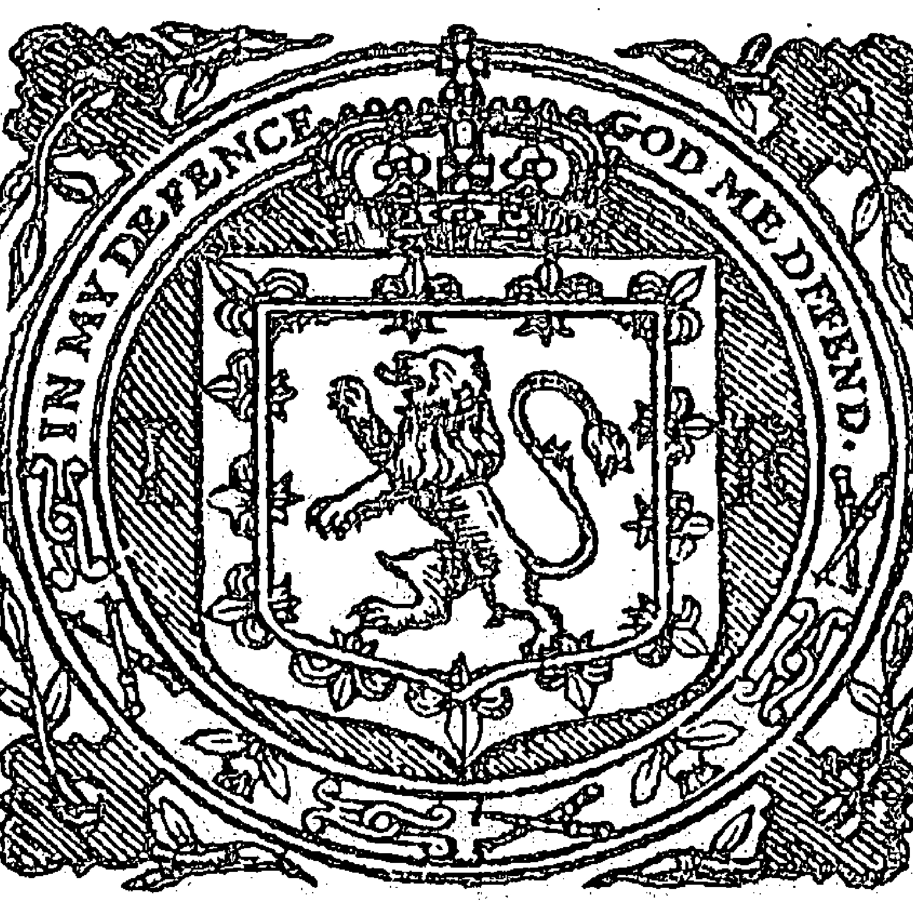

EDINBVRGH Printed by Robert Walde-graue, Printer to the Kings Majestie. An. 1597. Cum Privilegio Regio.

《鬼神研究》的扉页，它是一本詹姆斯一世反对巫术的书，出版于1597年。 科斯特·福亨图片库

1589年，另一场审判发生在亨廷登郡的沃博伊斯。最初，罗伯特·斯洛克莫顿爵士的一个孩子病了。邻居爱丽丝·塞缪尔正好前来拜访。这时，生病的孩子紧张地说：“你们见过比她更像女巫的人吗？摘下她的流苏帽，我要看看她的长相！”孩子的父母当时没把这番话放在心上，而在场的巴罗医生此时也无法让孩子恢复健康，他询问爵士，是否可以采用巫术治疗，但爵士夫妇不以为然。直到后来，爵士夫妇的其他孩子相继病倒——这一切都在暗示塞缪尔是个女巫。

爱丽丝·塞缪尔被带到孩子们面前，孩子们立刻倒在地上，“忍受着莫名的折磨”。克伦威尔夫人（奥利弗·克伦威尔的祖父亨利·克伦威尔的第二任妻子）上门拜访，在见过爱丽丝·塞缪尔后就开始做关于女性的奇怪之梦。一年后，克伦威尔夫人因此去世。爱丽丝·塞缪尔被迫住在斯洛克莫顿家中，面对孩子们和爵士夫妇的诘问，很长一段时间里，她都否认对这一情况负责。但最后，被频繁骚扰的她投降了，于是她被带到主教面前，出于恐惧，她不得不再次招供。她的女儿和丈夫与她关在了一起，亨廷登的大审中，塞缪尔一家被带到芬诺法官面前接受审问。在持续五个小时的审判中，塞缪尔一家的罪名成立，被判死刑。这件案子在很大程度上影响了英格兰大众对巫术的看法。1604年，在詹姆士一世召开的议会中，与会的成员通过了一项新的更严厉的巫术法案。此法案规定，即使是初犯，也被强制性地处以绞刑，且无论被害人是否死亡——只要他们被“杀死或身体及其他部位被伤害”，就足以给施害者定罪。

当时，神秘的巫术大规模地传播到诺福克、萨福克、剑桥、百福郡以及其他英格兰周围的郡县。华莱士·诺斯特恩评论到：“16、17世纪人们的生活很少不被那种肮脏的信仰（巫术）影响……14世纪后半期到17世纪末，那种思潮控制了全欧洲。”

诺斯特恩提出了一点，被处以绞刑的巫术案子中，有很大一部分都在司法上独立于法庭。庞杂的市政法庭对法律不够熟悉，不能准确合宜地给犯人定罪。以1560年肯特郡菲沃斯汉姆的琼安·卡森一案为例。卡森被控对一名三岁小孩施法致其死亡。通过卡森自己的辩护，在法庭上可以很明显地看出，作证指控她的邻居是出于恶意而无任何实证。陪审团判她无罪，但一位律师却指出祈求鬼神是重罪。因此，虽然卡森拒绝认罪，市长还是判处她绞刑。

英格兰巫术经常与詹姆士一世长达22年的统治联系在一起。詹姆士对巫术非常怀疑，在他还未继承伊丽莎白女王的王位，仍是苏格兰詹姆斯六世时，就受过贝里克郡巫师的惊吓。他对巫术的看法非常固执，1597年，他编写并出版了《鬼神研究》——一部专门宣扬对巫术采取严厉措施的书。

1616年7月18日，两名地方法官仅凭一名神志不清的孩子的证词就对九名妇女施以绞刑。这与发生在沃博伊斯的爱丽丝·塞缪尔的案审有很多相似之处。詹姆士国王恰好在行刑几天后访问莱斯特，发现有六名妇女赴审。国王于是会见了那名着了魔的男孩，把他送到坎特伯雷大主教处进行审问。很快，他发现男孩是在说谎。最终，五名妇女被释放，但另外一名已死在狱中。詹姆士谴责了两名地方法官缺乏洞察力，不能明辨是非。从那以后，法官们对上呈的证词和证据更加小心谨慎。在詹姆士一世余下的九年统治中，英格兰只有五人因巫术而被处决。

詹姆士统治时期最出名的一起巫师案是在兰开斯特。这也表明了旧宗教信仰在农村地区的延续。事件发生在东兰开斯特郡山区的彭德尔森林，主要围绕着伊丽莎白·索森和安妮·韦托两大家庭发生。伊丽莎白·索森被称作“德戴老修女”，而安妮·韦托则被称为“老夏托斯”，这很可能都是她们在巫师界的密名。

据说年轻时的伊丽莎白·索森在密林里的一块石头附近遇见一个年轻男人，经他介绍加入了旧教。随后两人发生了性关系，那个男人向她承诺，如果伊丽莎白·索森坚定她的信仰，以后的生活将会丰衣足食。伊丽莎白·索森照做了，多年来，她把家人和邻居都推荐进了旧教，她和邻居安妮·韦托都成为著名的巫师。与现代巫师不同，她们既施法术也施妖术，因此害死了不少人。长此以往，两个家庭互相之间成了对手，当老夏托斯的女儿安妮·莱德菲尔偷走了德戴的女儿艾莉森·德万斯的物品后，两家人彻底断绝了关系。

1612年3月，艾莉森·德万斯被捕，她对从事巫术一事供认不讳，因此艾莉森、德戴和夏托斯被关到兰开斯特城堡里。在老德戴家，也就是英国巫术魔金（魔金是一个女巫的猫最喜爱的名字，那只猫被认为是神）塔，召开了一次会议。据举报称，聚集的巫师分食偷来的羊，喝浓啤酒，并密谋捣毁城堡，救出她们的亲人。几周内，官方展开了抓捕行动，这一团体有18人被捕，老德戴则死在了监狱里。

本次审判还有一个引人注目之处，即老德戴的九岁孙女洁尼·德万斯的证词。她站在桌子上，向法庭提供不利于家人的证词。艾莉森、艾莉森的弟弟詹姆斯及儿子和11岁的女儿都被判处死刑，老夏托斯及其女儿和其他五人也一样。尽管洁尼·德万斯由于年纪尚小得以逃脱惩罚，但她也在20年后作为女巫被处以绞刑。

一些指导地方法官执法的手册很快面世，其中值得一提的是迈克尔·道尔顿的《乡村司法》和理查德·伯纳的《大陪审团指南》。两本手册都坚称指控巫师的主要证据就是拥有妖物，通常这些妖物以动物，如猫、狗、蛤蟆或兔子的形象示人。他们还说，妖灵的证词也是可信的。

英格兰巫师被迫害最厉害的时期，是在查尔斯一世执政的17世纪40年代，这主要是因为当时的“巫师发现总长”马修·霍布金的频繁搜捕活动。霍布金的搜捕行动给东部郡县带来了强烈恐慌。虽然英国法律不允许严刑拷打，但霍布金却通过逼迫犯人取得了许多口供。他命令犯人不停地走来走去，直到他们精疲力竭，还用针刺他们，以便能找到所谓的“魔鬼印记”。霍布金的大多数犯人都是年岁已高的农民，容易犯糊涂，证词又都是出自年幼儿童、牧师和心怀不轨的邻居之口。

尽管马修·霍布金积极地搜捕，但其实在查尔斯一世统治时代极少处决巫师。这并不代表没有巫师被处决，查尔斯一世统治时期，处决过巫师的地方有：达拉谟、兰开斯特郡、莱斯特郡、米德尔塞克斯郡、诺森伯兰、萨默塞特、斯塔福德郡、威尔特希尔郡以及约克郡。在这些地方的案件中，最引人注目的是1663年兰开斯特巫师案件，来自于1612年纠纷的延续。

11岁的男孩埃德蒙·罗宾森在放牛时，碰到了两只猎犬，便想让猎犬去帮他追兔子。但两只猎犬都不愿意，恼怒的罗宾森顺手抄起牧牛用的鞭子，猛力抽打它们。据罗宾森说，突然，两只猎犬分别变成了女人和小男孩。他认出女人是他邻居的妻子——弗兰西斯·迪肯森。变回人形的弗兰西斯·迪肯森给罗宾森许多钱，让他对此事保密。被罗宾森拒绝后，弗兰西斯·迪肯森就将旁边的男孩变成一匹马，驮着罗宾森来到一个巫师聚会中，在那儿，巫师们正在举行膜拜撒旦的仪式。吃了点食物，喝了点酒后，乘弗兰西斯·迪肯森不备，罗宾森逃到了附近的村庄。

罗宾森在彭德尔森林长大，知道关于40年前魔金塔里那场巫师盛宴的所有故事。有人甚至将当时被指控的一些人指过给他看。

罗宾森失踪后，他的父亲去找他和由他照看的牛。罗宾森的父亲在法庭上称，当找到罗宾森时，他的儿子正处于恍惚状态。这无疑是呈报给地方法官的一份有效的证词。虽然在伦敦的第一审时，罗宾森承认这个故事是他编的，但后来他又翻供，坚称这就是事实，并一一指出他在巫师大会上亲眼见过的18人。其中一人是洁尼·德万斯，也就是40年前亲手将自己家人送上绞刑架的关键性人物。

诺斯特恩说，每个城镇都在赞扬罗宾森，称他为“一个伟大的奇人兼巫师侦察员”。兰开斯特的大审中，罗宾森再次出庭作证，并得到父亲的附和。于是，更多的人被指控。当时的一则报道说，有多达60人被指控，19人罪名成立。不过，到了最后，罗宾森证词的真实性遭到了质疑，七名被告被送到切斯特的主教亨利·布莱奇曼那里去问讯。查尔斯国王也介入其中，而且主教和国王一致认为这七名被告无罪。接着，法庭对罗宾森与其父进行单独审问，罗宾森承认在父亲的指使下，编造了整个故事。于是，罗宾森父子二人双双入狱，所有被告全被释放，但有几人却已死在牢中。

英格兰最后一起针对巫师的绞刑发生在1684年的埃克塞特，被处死的巫师名为爱丽丝·莫兰。而对巫术进行最后一次官方正式审判是在1717年的莱斯特，主审官是帕克爵士，诺顿修女和她的女儿是被告。据说，有25名邻居指控诺顿母女是巫师，并将她们投入河中，接受女巫入水的测试，还不断殴打她们，当众剥去她们的衣服，然后用尖锐的利器戳刺她们。可是，当诺顿母女被带到法庭接受审判时，法官和大陪审团却找不到任何实质的证据，于是便宣判母女俩无罪。

詹姆士一世1604年颁布的巫术法案最终在1736年被乔治二世废除。不过，此举对仍旧十分相信巫术的乡村居民并无多大效果。乔治二世的新法案宣布：“不得对从事巫术、妖术、魔法或魔咒的任何人，或因此类案件控告他人的任何人在大英帝国的任何法庭展开或执行迫害、起诉或诉讼。”该法案的另一部分还宣布：“不论何人，如果假装使用任意一种巫术、妖术、魔法或魔咒，或者使用其在任何神秘学或玄学上的知识技能，来发现本已丢失的物品或财产可以被寻回的人，都要为此罪行承担监禁一年的惩罚。”然而，在超过约两百年的迫害巫师的热潮中，英格兰至少有一千人被处以绞刑，更多的人则被疯狂的巫术搜捕者私下处死。

兰开斯特彭德尔森林德戴和夏托斯修女的案子表明，旧宗教的确残余在落后的乡村地区，甚至延续到中世纪晚期。穆里、莱思布莱奇及加德纳等学者都提到，似乎有理由相信，虽然存在巫术迫害，但巫术仍延续至今，实属幸运。1921年，玛格丽特·穆里出版了《西欧的巫师狂潮》，十年后出版了《巫师的上帝》。在这些作品中，穆里试图说明，巫术是前基督教异教徒宗教的残余，可以一直追溯到旧石器时代的宗教巫术。但是，她的许多论据都很空洞，其他人类学者对此纷纷持反对态度。不过，并不是所有人都不认同她的观点，许多人还是赞同她的总体思想，而且她的所有证明并非一无是处。

随着英格兰反巫术法律的废除，将意味着若还有幸存的巫师，那么他们就可以自由出现在公众的视野中。然而由于教训过于惨痛，因此巫师们还是不愿露面，直到杰拉尔德·加德纳出现。加德纳认为，是时候让公众认识真实的巫术了。虽然，加德纳努力纠正人们对巫术的错误观念困难重重，并且他还受到许多迫害，但他仍旧坚定地将真实的巫术公之于众。最终，巫术或威卡，作为一种宗教，不仅在英格兰，在全世界都重新稳固地确立了自己的地位。

## 叶子面具

早期巫术的代表是猎神。据说猎神经常戴着茸角和他猎杀动物的鹿角。例如，帕里斯人的洞穴艺术、公元前一世纪的克劳迪亚尔，以及巴黎圣母院下发现的罗马圣坛上都有猎神的形象。因为狩猎是人们生存的必备条件，所以猎神的作用极其重要。

随着农业的普及，以及食物储备能力的提高，人们对狩猎的依赖逐渐减弱，因而神也变成一个广泛的自然之神而非单一的猎神。这样一来，关于神的描绘也就加入了叶子的形象，有时还会加入茸角或鹿角。用叶子围着脸的人就因“叶子面具“而闻名。

当英国建造第一批基督教教堂时，大多数参加建造的石匠及雕刻匠都遵循旧宗教仪式。在建造新教堂时，这些工匠把他们古老宗教的雕塑融入进教堂的装饰之中。被刻进木头及石头的人物都是自然神，其脸被叶子、果实及坚果环绕，被称为“叶子面具”，同时也被称为“绿人杰克”或“林中罗宾”。

女神的形象也出现在教堂的雕塑中。现在英国教堂还有很多“孕育之神”的雕塑，其两腿分开，生殖器裸露。

## 摇摆木马

尽管伴随着时间的流逝及人为的破坏，民歌、童谣及民间舞蹈依然继续承载泛神论者的情怀，它们保留着神话及魔法的因素，依然是传承古老信念的一种方式。许多英国的民间舞蹈就包含着古老仪式的舞步及手势，而最显而易见的，是盛行于世界各地的莫里森舞。众人皆知的童谣“骑着公鸡马”是保留至今的有关泛神论的典型例子。

> 骑着公鸡马前往班伯里路口
> 去看一匹白马旁的美丽女子
> 她手上戴满戒指，脚上系着铃铛
> 她走到哪儿，哪儿就音乐不断

摇摆木马常作为道具出现在莫里森舞中，例如，闻名于世的艾伯特鹿角舞的道具中就有公鸡马。摇摆木马由木板框架做成，木马的前面是马头，通常有能活动的下巴，骑马者拽住绳子时，下巴就能来回移动。木马的后面有尾巴，框架及马鞍通常被布覆盖，因为这样就能遮住骑马者的腿。木马的框架及马鞍附有来回摇摆的铃铛（在巴里尼斯就能发现类似的形象，在仪式的舞蹈中也会有相似的舞步）。早期那些在田间手舞足蹈，为祈求丰收的感应巫术的表演者骑在木头、扫帚及干草叉上，相比之下，摇摆木马已经大有改进。

铃铛响起来，是为了驱赶动植物身上的邪恶力量。系在骑着马并哼着童谣的女子脚上的铃铛或许也能起到驱魔的功效。此外，在圣乔治纪念日，人们骑着挂满铃铛的白马，穿过伦敦（准确地说是穿过斯特兰德大街）、雷斯特及其城镇及市区的街道。由于某些未知的原因，有关伊波娜女神及圣乔治的传说很有可能已经合二为一了。圣乔治，一直被认为是春天播种的英雄，直到1348年，才被尊为英国的守护神。据路易斯·斯宾塞说：“杀了龙，打开野兽所看守的、那装有孕育生命之物的盒子。他的传奇故事已凌驾于英国古老的生育女神的故事之上了。”

由于伊波娜女神与马有着千丝万缕的联系，因而白马在英国民间传说里是一个极其古老的形象。跨越英国南部山间的乌菲顿白马峭壁就刻着巨大的马的形象。圣乔治是英格兰的守护神，最初，他是古老的羊、牛、马及植物之神。

英国康沃尔郡赫尔斯顿法里的皮毛舞，是延续了几个世纪的古老泛神论的残留形式。皮毛舞的表演从五朔节持续至5月8号，它同时还被称为福瑞节、佛力节和范德节。“皮毛”这个词来源于康沃尔郡的“毛皮”，意指一个

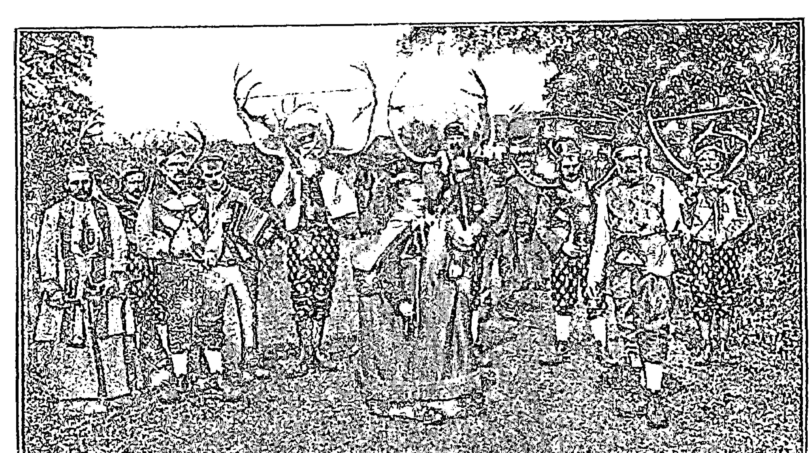好日子或值得庆祝的日子。一个乐队在五朔节穿越城镇，后面尾随着成百上千的当地孩子，他们身着独特的服饰，并手舞足蹈。在剩下日子里的不同时间，不同年龄的人们会跳不同的舞。很显然，这些舞蹈都是即兴演出而非已经预演或组织过的。在这期间，村子里的房屋都用西克莫槭树枝、花及常青树装饰。据说，这些装饰物在夏天会唱歌。而最主要的舞蹈聚会则在5月8日中午举行，市长和市政官员们身着最正式的服装，人们在主要街道、花园、房屋及商店旁跳舞，从一家转到另一家。其目的是迎接夏天，赶走任何与冬天有联系的消极的事物。

五朔节花柱可追溯至史前，而围着五朔节花柱跳舞是一个延续至今的传统。今天，人们围绕斯塔福德郡的教堂跳舞，其中就包括摇摆木马、装扮成小丑和五月女王等形式。舞者原本跳的是一种双人圆舞，为了配合曲子，舞者有时和其他人共舞，有时也会独自跳舞。

鹅舞出现在康沃尔郡其他一些地方的圣诞节，这一舞蹈显然可以追溯至古老的圣诞庆祝。在锡利岛，鹅舞被称为“天鹅舞”，就像一般的双人圆舞，但舞伴却是身着女装的男子或身着男装的女子。

## 英格兰“淑女”

英格兰最主要的女神是弗里格，撒克逊巫师们将其称之为弗蕾亚，意思是“淑女”。

弗蕾亚是内萨斯（大地母亲）之女，遗传了大地母亲的很多特质。她相当于希腊神话中的阿佛洛狄忒（罗马神话中的维纳斯），是爱之神，母亲、孩子与孕妇分娩的保护神。在挪威神话中，弗蕾亚被称作“最可爱的女神”，同时，她又相当于英国女神布兰温。布兰斯顿说，古老的诺尔斯传说和埃达诗都指出：有一个古老的女神，她是主神天空之神的妻子，这位女神也就是人们口中所说的内萨斯、西格、弗蕾亚、聂亚。

## 异教徒聚会

许多异教徒都使用过“异教徒聚会”这一术语。“异教徒聚会”在很多情形下与巫师聚会一词等同。

20世纪60年代早期，巫师聚会很少，这使得那些被宗教吸引的人很难与他们取得联系，更不用说是加入到巫师的行列了。1967年，杰拉尔德·加德纳在他的《异教徒道路》一书中认为，任何人都可以加入到异教徒行列中。通过这本书，巫术爱好者可以模拟参加仪式，追寻巫术年份的周期循环直到他们可以参加真正的仪式。最早通过这种方式入会的教徒被称为“格罗夫”。

加德纳的著作后来发展成为一篇完整的“影子之书”，并被作为许多团体加入巫师行列的捷径，这些团体还把巫师聚会一词作为他们团队的名字。今天，许多新异教徒使用格罗夫一词作为他们团队、聚会地的名称。

## 药草的用途

药草是用于烹饪、医疗及施展魔法的芳香植物。许多药草知识是一代一代口头流传下来的，只有在距现在相对较近的年代才有文字记载。希波克拉底曾列出了四百多种“单纯”或者单独的药草，不过迪奥斯科里德斯的记录更加详细，有六百多种。一些罗马皇帝让植物学家从统治范围以外很远的地方采集药草，将它们运到罗马。西班牙的探险家在新世界也是如此。

人们认为草药能治疗很多疾病，也有助于伤口的愈合。当今很多医药知识都源自于最初的植物。由于一些草药具有较强的药效，因此一些合成药物在出现后反而被摒弃。1775年，英格兰伯明翰的威廉·威瑟林发现洋地黄能治疗心脏病。几个世纪以来，巫师都推荐心脏不好的人群服用洋地黄茶。斯坦福大学的切尼博士，发现并证明生卷心菜汁有助于治疗胃溃疡，而巫师们早在几个世纪前就已经知道这个方法了。

人们对巫师抱有一种普遍的误解，认为巫师将所有令人恶心的材料都煮在他们的大锅里，比如一只老鼠的耳朵、一条蜥蜴的尾巴、一只青蛙的脚或一条蛇的头。实际上这些以及其他材料的名称指的都是各种各样的药草。

药草。在植物没有得到正规的拉丁文命名之前，它们在不同的国家和地区有着各种各样的名字。其中很多是根据它们的形状或者颜色，或者叶子的形状来命名的。比如鼠耳草就是鼠曲草，它的学名是绿毛山柳菊；蜥蜴尾巴是哺乳草或三白草；青蛙脚是球根毛茛属植物或毛茛属鳞茎植物；而蛇头则是窄叶舌头草，或者龟头茯苓。这些植物的名称没有几百个也有几十个，大量的植物名称使人们误以为所有的药剂和药膏都是由可怕的材料做成的。“用一种草药的物理外形表明它的用途”这一概念被称为形象学说。

除了制作纯露、糖浆、茶，药膏和软膏，药膏剂和散剂，以及汤剂和浸剂外，巫师们还用药草作为魔法装饰。作为魔法装饰的药草必须根据行星的运行轨迹，在合适的月相下采集，而且应用一种很神奇的专用于采割药草的刀。为了治愈病人，巫师会将药草填充到代表病人的人偶中。药草也可以撒在房子周围或散在一个人身上，用来辟邪，它们甚至还可以放在浴室，用来保护洗浴者或者给予洗浴者力量。将草药当作护身符可以招财，汲取力量和祝福。药草也常常在魔法仪式中被当做香来烘干和焚烧。

## 有魔力的六芒星

六芒星由两个三角形组成，其形式为一个倒三角形重叠在另一个上面。早在青铜时代，人们就已经使用六芒星来做装饰了。六芒星的两个三角形代表男性和女性的力量，同时也标志着火和水。另外，它们还代表了“上”与“下”。

六芒星是所罗门印玺的一部分，在仪式魔法中，这是一种代表强大力量的符号，用来驱逐恶魔。六芒星也被称为大卫之星，其实，这一符号直到17世纪才与犹太信仰等同。然而，严格说来，它作为一种魔法符号，早在12世纪就已在犹太人的项链上被发现。

## 与神有关的马

据说因为大海中激起波浪时，浪花拍击的响声听起来就像马蹄声，所以海神波塞冬创造出了马。很多神和女神与马有关，如希腊的富饶女神德墨忒耳有时被描绘成马头，凯尔特女神伊波娜几乎总被描述成骑在一匹白马上。英格兰波克夏郡著名的乌菲顿白马峭壁，在公元一世纪时是一道白垩悬崖，此地可能对伊波娜来说是很神圣的地点。

挪威的奥丁神有一匹八腿种马，名叫斯雷普尼尔，被认为是最上等的骏马。奥丁骑着它前往冥府。赫尔莫德神就曾骑着斯雷普尼尔前往地狱，救出了巴尔德。

马身上会挂着马颔缰以辟邪，并能促进马身体健康、有力、多产。马颔缰由很长的皮革制成，上面绑着各种形状的黄铜辟邪物，也就是人们所知的马铜。马铜的形状有太阳、新月、马蹄、星星、橡子、橡树叶、三叶形，以及心形。

据说巫师会把人变成马，其常用的方法是把一个魔法缰扔到目标的头上，这样可以立刻将那人变成马。如果那人动作够快，他可以脱去魔法缰，再把它反抛回巫师头上，这样反过来就可以把巫师变成马。

木马是许多旧异教仪式的一部分，有的到今天仍然存在。木马有一副木制或柳条制的框架，身体有布遮盖，由站在里面的人操控。木马有一个仿造的马头，也有可能是真正的马头盖骨，还有一条尾巴。根据《大不列颠百科全书》说，木马“是一种多产动物的伪装品，出现在季节交替的时候……它追赶妇女以促进生命的循环再生，给到访的家庭带来好运，以此交换食物或金钱”。全欧洲都可以找到木马，英格兰最有名的是康沃尔郡帕德斯托的“老伙计”，它参加过五朔节的狂欢；还有萨默塞特郡的迈恩黑德马，由一个戴着高尖帽子和金属面具的男人“骑”着。许多早期的基督教会因为木马与异教的关联而在禁令中专门提到木马。

## 意大利巫术

公元500年，罗马帝国驱逐了所有的巫师，并且禁止私下占卜。1181年，威尼斯共和国的总督颁布法令，惩处巫师和投毒者。一百年后，西西里王国的皇帝腓特烈二世开始雇用撒克逊占卜师，还邀请苏格兰巫师迈克尔·斯科特前往他的宫廷。在13世纪的意大利，巫术被视为一种邪恶的活动，但占星术却不是。于是，通过绘制星宿轨迹的占卜术重新流行起来，学者们既钻研占星术又研究占卜术。15世纪的意大利，很多教皇的决策都是在占星师的帮助下制定出来的，而且在所有的宫廷，都有御用占星师。

和欧洲其他地方一样，意大利有许多地位低下的“女巫和男巫”。他们会配草药和药剂，还会一点魔法，但是这些人却成为宗教法庭的目标。

横扫欧洲的猎巫运动和宗教迫害起源于1484年的意大利。那一年，教皇英诺森八世颁布了反对巫术的诏书《最高希望》。两年之后，诏书作为亨利·克雷默和詹姆斯·斯普伦杰合著的《女巫之锤》的前言重印。诏书强调权利大于生育力，并引用了性交“两性之间不能避免的……和魔鬼、梦淫妖和女梦淫妖”的内容。实际上，在15和16世纪，每一位教皇都曾经颁布过反对巫术的诏书。英诺森八世颁布的诏书之所以占有如此重要的地位，是因为当时印刷术的发展导致诏书的广泛传播，而这又使得敌视巫术和叫嚣烧死巫师的思潮愈演愈烈，甚至穿越大西洋来到了新大陆。诏书出现的第一年，科摩地区有41名巫师被烧死。1510年，布雷西亚地区烧死了140名巫师，梵尔卡莫尼卡则有70名。四年以后，科摩地区又烧死了三百多名巫师。

曾经治愈过病人的巫师们如今发现，自己被指责为疾病的诱发者。任何不寻常的事件都会归咎于巫术，如果母鸡停止下蛋或者奶牛不产奶，人们也会马上联想到巫术，而当权者们则会毫不犹豫地使用严刑进行逼供。

意大利巫术独有的一个特征是巫舞，也就是众所周知的伏尔特舞。严肃古板的基督教徒称，巫舞是巫师在聚会仪式上跳的舞。伏尔特舞的节奏急而快，是一种魔鬼教授的舞蹈。

当宗教迫害的狂潮席卷整个欧洲时，在许多遥远偏僻的地方，旧式宗教仍然存在。如西西里岛的罗曼尼亚、托斯卡纳的乡村和其他小地方的人们仍然崇拜古老的神明。

甚至在今天，西西里岛还存在大量旧时神明的信奉者，仍然可以找到许多为德墨忒耳、珀尔塞福涅、黛安娜、密涅瓦和其他神祇建造的古教堂遗迹。

## 因果报应

“因果报应”一词的原意指的是一种“行为”，但是根据婆罗门教、印度教、佛教的教义，它的实际意思是“一分耕耘，一分收获”。因果报应与轮回这一概念相关，每个人都要经历许多次生命的轮回，而每一次轮回都是为前生赎罪。人死之后究竟会发生什么事，每个神学家的解释各不相同。根据印度教和佛教的教义，人死之后随之而来的是一系列的奖赏和惩罚，那些生前就是各方面楷模的人死后会在天堂享受一段愉快的时光，而那些作恶多端的人死后根据罪恶深重，在不同层级的地狱饱受折磨。但是这些奖赏与惩罚也不过是提醒人们做了什么和将会发生什么。最后所有的人都将转世轮回，在下一次新生命中根据前世行为享受奖赏或接受惩罚。人们将经历一次又一次的轮回，直到把生命中的污点清除干净。

巫术中，因果报应的概念有所不同。有一种“三重法则”，即三倍回报法则，也就是做善事的人会得到三倍的回报，做坏事的人也会得到三倍的报应。而且这些回报是在今世完成的，没有将对人的奖赏与惩罚推迟到来生之说。显然，有了这种信仰，人们就没有动机去作恶。因此就有了巫师的忠告“尔之无恶，何须加惩”。在生活中，你有意识不去伤害他人，自然也不会招致三倍的报应。

印度教和佛教教义中，再生就是轮回，在再生里赎回前世犯下的罪孽。当赎尽所有的罪后，就没有下一世的轮回了。然而，巫术中因果报应的目的与印度教和佛教却不同，巫术里的因果报应是为了体验经历。一个人经历世间各种生命，为的是学习和体验世间万物。只有学会和体验了一切事物，整个过程才会停止。但是每一次再生都和前世无关，这一点和印度教及佛教教义不完全同。

## 月亮与施法的关系

19世纪末的查尔斯·利兰德在介绍意大利魔法师的书中曾记载：“现在阿拉达已经学会了怎样运用各种魔法……她对自己的门徒说：如果你们有任何需要，请在月圆之夜聚集在沙漠或森林中的某个角落，一起虔诚地向你们的女王、我的圣母——伟大的月亮女神黛安娜祷告。”在利兰德的书中，稍后还提到了和黛安娜女神有关的咒语：“你是日月星辰的女神……”早在远古时期，巫师之神就和月亮联系在一起，巫师们会在满月时聚会，膜拜她们的神。这种集会也被称作巫师聚会。多琳·瓦林特曾提到过《圣经》的约伯记和其中关于月亮崇拜的记载，并将其看成是一种古代祭月仪式的证明。芭芭拉·沃克认为对月亮的崇拜是信仰亚当的宗教，而早期的基督教徒则坚持认为耶稣受难日是满月之日。巴比伦人将月亮奉为女王和太阳的祖先，其能力甚至超越了太阳。

并非所有人都将月亮视为女性。也有许多男性的月亮神。在爱斯基摩人的传说中，月亮是男性的，太阳是女性的，他们是一对情侣。古老的英国故事提到了月亮上住着男人。日本神道教的传奇故事也提到过太阳女神，即天照大神和她的哥哥月亮神月夜见尊。兄妹俩大吵一架后，天照大神愤然将自己的哥哥流放，从此日月相隔，再也没有见过面。纳瓦霍人的神话认为，第一个世界对于最早的两对男女来说太小了，所以他们搬到了第二个世界；在第二个世界中，两位男性分别变成了太阳和月亮。伊兹雷达、杰姆斯、陶斯和特瓦等印第安部落都供奉月亮老人。在亚马逊河上游等地，流传着少女如果盯着月亮看，就会怀上月亮之子的说法。闪族的月神——辛住在西奈山上，而埃及人则将透特视为月亮之神。

月相也和施法息息相关。魔法师会在月盈的过程中进行与扩张、变强、吸引和种植有关的正面魔法；在月亏的过程中，进行减少、消除、终结、收割等负面魔法。月亮的公转周期是28天，与女性的月经周期有一定的关系。此外，月相也会影响螃蟹、蚝、青口贝和海胆等各种海洋生物的产卵和潮汐的重大变动。许多农民会根据月相进行栽种播撒、修剪羊毛、宰杀牲畜。有些人将太阳和月亮本身作为神来崇拜，而巫师则简单地将月亮视为女神的象征。在满月的巫师聚会上，会有“招月”仪式，大祭司召唤女神附身到女祭司身上，通过她向聚集在一起的教徒说话。古希腊人将塞萨利巫师的招月法术当做是召唤月亮力量的仪式。

## 预言家西普敦

乌苏拉·西普敦生于约克郡的纳尔斯伯勒，相传其母阿加莎·苏西尔不但是巫师，还是恶魔的情妇，是恶魔让苏西尔怀孕，生下了西普敦。据说苏西尔有预见、治疗和诅咒的能力，还有人说她能够利用魔法呼风唤雨。既然西普敦是恶魔的女儿，也就顺理成章地继承了母亲所有的天才能力，在少女时期，她就能够利用魔法伤害那些嘲讽她相貌丑陋的小孩。据《大英百科全书》载，正因为相貌丑陋，所以西普敦才被当成“恶魔的孩子”。尽管西普敦相貌丑陋，但还是嫁给了一位名叫托比亚斯·萨森的建筑工人。后世对这位男子知之甚少，在有关西普敦的许多资料中都没有提到过他。西普敦不喜欢爱嚼舌头的邻居，而且常常会对他们施法落咒，但后人还是称她为“西普敦婆婆”，将其奉为巫师和预言家。由于她的预言非常准确，时常有人不远万里前来问卜。相传，她曾预言到汽车、无线电、互联网、铁皮船、加州淘金热和1851年的伦敦博览会上的水晶宫。

西普敦的预言诗是这样说的：

> 车辆前行不再需要马匹，
> 讯息在空中瞬间传遍整个世界。
> 铁船漂浮在水面上，
> 像木船一样顺水而行。
> 不知名的小岛上出现了黄金。
> 一座没有翅膀的水晶宫从天而降，
> 落户英格兰！

西普敦婆婆对红衣大主教沃尔西·萨克福马、公爵福德·珀西和英王亨利八世时期的其他达官显贵作出了准确的预言。她还预言过1881年将是世界末日，引起了人们极大的恐慌，全国各地的人们纷纷逃离家园，在田间和教堂中彻夜祈祷。

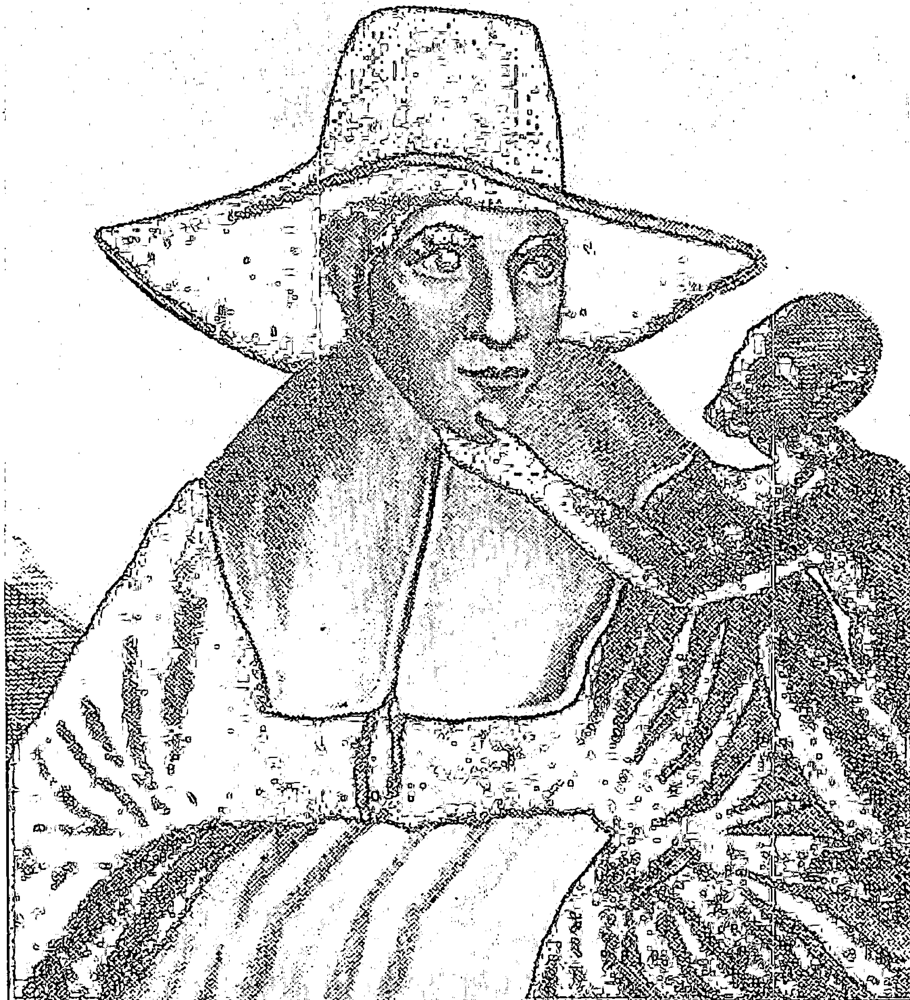

女预言家西普敦婆婆 科斯特·福亨图片库

## 与巫师有关的吻

与巫术有关的吻被称为肮脏的吮吸、邪恶之吻或耻辱之吻，据说巫师在夜半聚会中，尤其在仪式开始时，会吻主持宗教仪式者的臀部。

1575年，兰伯特·丹纳在其著作《女巫的对话》中写到：“有些人跪在他的膝下，有些人给他拿来正在燃烧的黑色蜡烛，还有人吻他裸露身体的其他部分。”托马斯·库珀在其1617年出版的《巫术的奥秘》中说：“在对仆人忠诚与否的试探中，撒旦让他的仆人来吻他的后脚跟。”法国多姆山省的一名女巫珍·博登说：“所有的巫师都有蜡烛……他们背对背转着圈跳舞，亲吻主持者的屁股，祈祷他能够帮助他们。”苏格兰勇士阿伯丁说：“所有参加聚会的人都要亲吻克里斯·宋德和爱尔法姆女皇的屁股。”

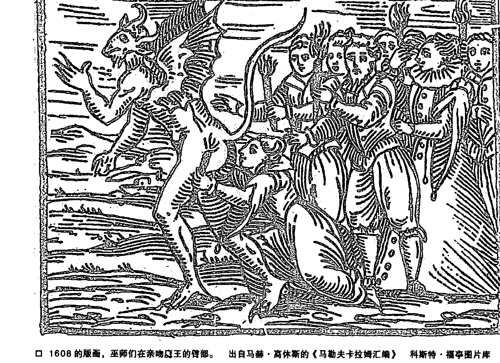

□ 1608的版画，巫师们在亲吻魔鬼的臀部。 出自马赫·离休斯的《马勒夫卡拉姆汇编》 科斯特·福亨图片库

巫师不仅要亲吻恶魔的屁股，还要在他们的命令下亲吻他们身体的其他部位。然而臀部似乎是比较普通的部位，这很明显是为了表示某种礼节性的敬意。有些巫师说，他们亲吻的不是领袖的臀部，而是他的第二张脸，那里一定戴着一个面具，或许这还和古代两面神或别的神仙有关呢。

尽管亲吻礼依然存在，但是今天的巫师不再亲吻任何人的臀部了，事实上，许多亲吻都只是礼仪的一部分，尤其是在启蒙礼仪中。

两个巫师见面时打招呼的传统方式是嘴对嘴的亲吻，在宗教仪式中，还有三重、五重和八重吻。正如这些名称所言，巫师身体的三个、五个、八个部分分别形成一个三角形和五角星形，这种吻法是一种打招呼的方式。

三重吻，或者说最低级别的吻（吻是分级别的）是指吻嘴唇、左胸部、右胸部，因此就吻了三次，这些吻构成一个三角形；同理，五重吻（即吻的第二个级别）是指吻生殖器、左脚、右脚、左膝盖、右膝盖，这几个部位呈五角星形；八重吻是第三级别的吻，由三重吻和五重吻构成。

## 预测未来

有些迹象或者提示。流传甚广的说法是，某一事件发生之前，它的影子会提前投射到人们面前，这就是所谓的“预兆”。举例来说，如果一只黑猫从右向左从你面前经过，那么就意味着你要倒霉了；然而也有一些民间说法恰恰相反，认为看到从左往右经过的黑猫，才表示有坏运气来临。如果有一群飞鸟，从左往右在你面前飞过的话，好运就即将降临在你头上。此外，斑点狗能给人们带来好运，而白马和红发妇女，则意味着霉运。

有些自然界的预兆是非常容易被感知的，然而，过去人们还是把预兆当做一门神秘的学问，并且试图揭开它的面纱。4000年前，古巴比伦人会将绵羊作为祭品杀掉，然后通过研究其肝脏，来预测未来的吉凶。当时的人们认为，羊肝的颜色、纹理以及表面的污点，都是某些特定事件的预兆。在古罗马，人们把一只小公鸡放在谷物圈的中间，谷物下面放有字母表，当小公鸡去啄食谷物时，就会露出某些字母，人们就把这些露出来的字母组合在一起，形成一个或者一组词语预测未来。

过去，如果一只白鸽落在圣女贞德的旗帜上，人们会认为这是一个好兆头。古人看来，彩虹、日食、彗星、流星以及其他并不常见的自然、天文学现象，都是某些事情的先兆。在古代，先知和占卜者靠帮助他人“解卦”为生。直到今天，某些预言家、解卦师、占星家以及其他占卜者依旧在坚持不懈地预测未来。

## 异教徒

异教徒一词源自拉丁语，意思是“居住在乡村的人”，或者“居住在荒野的人”。当基督教作为一种全新的宗教逐渐传遍欧洲之时，城镇居民远比乡村居民要更早接触、接受这一信仰，这就意味着当大多数城市人成为基督徒时，大部分的乡村居民仍然信仰那些古老的宗教。

异教崇拜，指的是那些非基督教、非犹太教、非伊斯兰教的宗教信仰。实际上，很多宗教信仰及其相应的行为都是被冠以“异教”之名，现代巫术崇拜当然也未能幸免。为了避免由此产生的负面影响，许多现代异教徒更加倾向于“新异教主义”一词，意指一种全新的异教形式。

当代异教徒崇拜自然，他们常常直接照搬欧洲、中东、古埃及以及美洲印第安部落的古代宗教信仰，因为他们通常都是多神论者。与巫术崇拜者类似的是，异教徒中有人选择独居，有人喜欢群居，每个群体相对独立。一般而言，人们可以把异教崇拜理解为一种宗教形式，也可以把它视为一种生活方式。

## 有魔力的标记

沙士魁海纳河之间的区域（位于特拉华州与宾夕法尼亚州南部）居住着一个极端迷信的群落。比如说，他们认为在门闩把手上画一个十字，就能阻止魔鬼闯入。在这种思想的指导下，居住在该地的人们创造出了一系列实用的魔法标记。比如，他们会在谷仓和房屋的墙壁画上一些装饰性的记号或标志，并相信这些符号能驱除邪恶、帮助作物生长，带来健康、幸福，甚至可以呼风唤雨。

除了美国和加拿大的亚米胥派和门诺教派等常规教派不使用这些魔法标记外，路德派、改革派、摩拉维亚教派都会使用魔法标记。随着时间的流逝，魔法标记的各种图案逐渐定型，其形态主要包括：各式的星星、橡树叶及其果实、心形、金翅雀（早期宾夕法尼亚州荷兰拓居者的幸运鸟，以蓟草籽为食，并以蓟草丛为巢）、郁金香以及其他几何图案。其中，许多图案还被印制在各家各户《圣经》的皮革封面上，此外像出生证、埃夫拉塔修道院里的乐谱上也有类似的图形。

这种使用魔法标记的巫术又被称作无药自愈术、帕瓦（以语言和手势治病）、六角符号、驱邪符等。在密苏里州的奥扎克以及阿肯色州的某些地区，也存在类似的迷信和巫术，当然，它们的魔法图案并非六角形标记。

## 预言

“预言”指的是通过神的感召而获得的、能够预示将来的话语，直到18世纪，它的动词形式才出现。如今，预言未来就是指传达神的感召或以神的名义讲话。

预言者往往被看做是神祇的代言人，他们不会向神祇提问而是等待神祇的感召，常常通过祈祷或者禁食的方式，以期使自己更加容易获得来自神祇的启示。

周边国家的影响下，罗马人才接受了黄金指环，铁质指环随之被冷落，最后竟成为奴隶的标记。从社会地位上来说，脱离奴籍（因特赦等原因获得自由的奴隶）的人比奴隶要高一等级，因此他们可以佩戴银质指环。

## 永恒的指环

指环由于没有起始和终止之处，便成了永恒的象征。作为一个微型魔法环，指环也有护卫的含义。在埃及古墓中，曾发掘出一些黄金指环，其上都刻有神的名字，以及向神祈祷的祷文。可以说，这些指环既有实用性，又具有某些神奇的魔力。

日耳曼神话中，众神之父奥丁有一枚以制作者的名字命名的魔法指环。在爱子博尔德的葬礼上，奥丁将这枚指环投入火葬堆中。

据说，很多英国和欧洲其他国家的贵族拥有的指环有治疗的功效。爱德华二世就有一枚可以治疗癫痫病的指环。1263年，法国的特鲁瓦通过一条法令：除非有病在身，否则禁止修女们佩戴镶嵌贵重宝石的指环。此外，在某些情况下，病人会在喝酒或喝水前先往杯子里放一枚指环。

最早的指环是铁质的，因为当时人们认为铁是一种有魔力的金属。斯托姆斯曾经指出，“从两点看来，铁明显显示出了它的能量。其一，铁比木头或者石头都稀有，而且铁制工具比木制、石制工具更加坚固、便利；其二，人们最初是在陨石中发现铁的，这让铁显得十分神秘。要想获得铁制工具，人们必须请专家和技术工人首先将铁从矿石中冶炼出来，然后才能将之锻造成器具。实际上，我们确实发现有许多人把铁匠看做是魔法师”。

指环上通常会刻有一些特别的图案，不同的图案代表不同的目的，如抵制厄运、带来草药知识、隐形、利于健康等。在仪式魔法中，人们会用一套冗长、复杂的仪式来制作指环并赋予其魔力。由于不同的神灵和行星对应着不同的日期和时刻，因此指环的制作、雕刻，以及赋予魔力的过程都必须在特定的时间进行。

大英博物馆内收藏着一枚希腊罗马时代的青铜指环，上面镶有一块紫水晶，据说，这枚指环是用来抵御邪恶目光的护身符。罗马人将铁质指环视为力量的象征，在战斗中获胜的将军都要戴上铁指环。直到三世纪末，在

## 仪式的三个阶段

仪式是宗教或魔法的典礼形式，它通常遵循某种传统的程序。按照艾萨克·博内威所说：“‘仪式’一词来源于拉丁语词根，意为‘数字’或‘计数’，也就是指做事的方式（即‘一个接一个地’）……在所有的仪式中，最重要的一点是以恰当的顺序、恰当的方式来完成仪式，这些顺序和方式通常都是由习俗或传统决定的。”一般而言，一个仪式通常由“说”和“做”两部分构成。

范·根内普将每个仪式分为三个阶段：分离、过渡、合并。第一阶段是指从某个世界脱离；在第二阶段，接受仪式者“处在两种世界之间”，这是巫术崇拜者用来描述处在神圣献祭圈中的说法；在最后一个阶段，即合并阶段，某种变化就融入到接受仪式者的生命之中。在很多原始社会的成人仪式上，也有上述三个阶段的体现：开始阶段，接受仪式者与当时的正常生活完全分离，在这一阶段，他通常会在其导师的监督下独自生活在一个与世隔绝的地方，在伏都教中，这一阶段要持续九天；随后，真正意义上的成人仪式举行，这标志着接受仪式者向一个全新生命阶段过渡；最后，接受仪式者带着刚刚获得的知识和经验回到家人身边。正如范·根内普观察到的，整个过程都被压缩在仪式的各个环节中。仪式就是一种手段，它能使人们集中精力，以便获得典礼所传达出的某些重要信息。

罗斯玛丽·吉利认为，最有效的仪式能“吸引人们的注意力”，“转变人们的意识”，“开启人们的想象之门”。有效的仪式通常包含以下要素：特殊的服装、祭坛及其附属品（蜡烛、熏香和圣像）、圣歌、祷告词、舞蹈以及歌曲。一个仪式需要包含哪些要素，取决于人们举行仪式的目的，并应该遵循某一固定的规则。詹姆斯·弗雷泽爵士认为，原始仪式往往都是魔法仪式，无法起到安抚情绪的作用。

巫术仪式中，男、女主祭分别或者同时担任主持者，某些特定时候还需要得到随从的协助。巫术仪式包括：季节庆祝仪式，出生、结婚或死亡的仪式，治疗仪式，预言仪式等。巫术仪式可由个人独自举行，也可由巫师团体共同组织举行。

## 一次对巫师的审判

塞勒姆村位于现今美国的马萨诸塞州，曾被称为塞勒姆农场，现在则是丹弗斯。1692年，这里见证了英国北美殖民地历史上最著名的一次对巫师的审判。“塞勒姆”一名来自“耶路撒冷”，作为一个清教徒活跃的地区，早在“巫术”一词出现之前，巫术便已经在这里盛行了。

1692年以前，新英格兰地区的马萨诸塞州发生过12起与巫术有关的案件。这个数字小得简直可以忽略不计，要知道当时英格兰正处于查尔斯一世的统治之下，巫师遭受到的迫害与日俱增。因此，大批清教徒离开英格兰到其在世界各地的殖民地。在这一背景下，马萨诸塞州的12起巫术案件，实在是不值一提。在新英格兰地区，第一位宗教迫害的受害者是查尔斯镇的玛格雷特·琼斯。1648年，她因配制草药而被处以绞刑。另外一位较早的受害者是安·希宾斯。在《殖民地记录》中，仅仅记载了对她的审判结果以及执行死刑的授权令，具体罪名却只字未提。据牧师约翰·诺顿说，安·希宾斯之所以被处以绞刑，“仅仅是因为她比邻居更加聪明”。

1688年，一位名叫格洛沃的爱尔兰女天主教徒卷入了“古德温儿童事件”。格洛沃是古德温一家的洗衣女工，当时有四名儿童指控格洛沃试图蛊惑他们。这一案件与几年后的“塞勒姆巫师案”极为相似，科顿·马特尔对此案显示出了极大的兴趣，这与数年后他在“塞勒姆巫师案”中的所作所为如出一辙。

实际上，无论是古德温一家的四名儿童还是后来“塞勒姆巫师案”中的女孩们都清楚地知道巫师是如何施展巫术的。因为在当时，关于这方面的传单和书籍几乎随处可得。在英格兰，针对巫师进行的每一次审判结束后，其细节迅速被公开，并且在极短的时间内传向新世界。1902年出版的《新法兰西和新英格兰》中，约翰·菲斯克写到：“1692年的社会环境非常有利于巫术的传播，而且与任何个人的影响毫无关联。在这块曾经是撒旦的领土上，有迹象表明，恶魔正试图卷土重来。最终，虔诚的天主教徒路易十四发动了战争，自此，上帝的子民便陷入了万劫不复的境地……很明显，恶魔正在自我苏醒，这是一个巫术盛行的时代，一次大爆炸所需要的所有条件都已具备，所欠缺的，仅仅是一个导火线而已。萨穆埃尔·帕里斯是塞勒姆村一座教堂的牧师，正是他的孩子和仆人，充当了这根至关重要的导火线。”

对神学产生兴趣之前，萨穆埃尔·帕里斯在拉丁美洲的巴巴多斯生活了很多年。在那里，他曾经有两个仆人——蒂图巴和约翰·因迪安。经过漫长的交涉后，萨穆埃尔·帕里斯终于同意出任塞勒姆村的牧师。实际上，帕里斯的谨慎不是没有道理，因为塞勒姆村历来对牧师非常吝啬。最终双方达成一致：帕里斯年薪66英镑，其中1/3以现金支付，余下部分以货物的方式予以补足。在塞勒姆，帕里斯不得不认真修缮自己庭院的篱笆墙，因为双方的合约中有这样一条：“如果上帝缩小了帕里斯先生的居住面积，那么帕里斯先生的薪水也将按照相应的比例降低。”

帕里斯一家有四口人，除他本人外，还有他的太太、七岁的女儿贝蒂以及贝蒂九岁的表姐阿比盖尔·威廉姆斯。大多数情况下，蒂图巴负责照看两个孩子，她会安排她们在厨房或者房子周围做一些力所能及的家务活。在清教徒的生活中，男孩往往跟随成年男子到田地里干农活，而女孩则在家里做家务。帕里斯家的两个小女孩聪明绝顶，她们知道，蒂图巴宁愿坐下来讲自己在西印度群岛生活的故事，而不是干那些体力活。没多久，更多的女孩加入到贝蒂和威廉姆斯姐妹的行列，帕里斯家的厨房成了她们的“据点”。在那里，蒂图巴会给她们讲很多有趣的故事。这些孩子包括12岁的安·帕特南、17岁的玛丽·沃尔科特和伊丽莎白·哈贝德、18岁的伊丽莎白·布丝和苏珊娜·希尔顿，以及20岁的玛丽·瓦伦和莎拉·丘吉尔。有时候，安·帕特南家的佣人，17岁的摩西·刘易斯偶尔也会参加她们的活动。

蒂图巴究竟给女孩们讲了什么故事，现在已经无从考证。但是其中极有可能包括与伏都教、魔法相关的内容。听了蒂图巴的故事后，女孩们自然而然地试图重现那些有趣的事，甚至有可能会陷入精神恍惚、胡言乱语的境地。伏都教是一种盛行于海地及其他加勒比岛屿的信奉多神的宗教，拥有自己的教士以及固定的祭祀仪式。伏都教徒举行仪式的一个最主要目的是与神祇或者罗亚进行交流。而伏都教的神祇则会通过其信徒的言行来“显灵”。丹巴拉·维多是伏都教中一个半人半蛇的神。被他“上身”时，信徒起初会在地面上翻滚、扭动，随后发出像蛇那样“嘶嘶”的叫声。聆听蒂图巴讲述伏都教故事的女孩们，似乎也被“上身”了。其中一个迹象是，她们会在地上一边爬一边像狗那样狂吠。不过从某方面来说，这些行为更像是狗而不是蛇。因此也可以认为，女孩们是在演戏而并非真的被“上身”。

1692年1月初，贝蒂的父母发现她似乎比原来安静了许多，而且经常会呆呆地坐很久。更糟的是，据帕里斯讲，“她会发出类似于狗的狂吠声”。紧接着，贝蒂的表姐威廉姆斯也出现了类似症状，两姐妹时常会围着家具爬来爬去，一边爬一边狂吠。帕里斯为孩子们祈祷，然而没有丝毫效果；随后，村里的格里格斯医生对两个孩子进行了全身体检，结果表明她们的身体非常健康。格里格斯由此断言：贝蒂和威廉姆斯是被巫术蛊惑了。帕里斯随即再次为两个孩子祈祷，不过似乎大家都没有注意到，每当这两个孩子“发作”时，仅仅是做一些在当时社会环境下禁止小孩子做的事，比如惊声尖叫、在地面上打滚、在房间里攀上爬下、乱扔东西——甚至《圣经》都不能幸免。以后不久，其他曾经听蒂图巴讲故事的女孩也先后出现了与贝蒂、威廉姆斯同样的症状。当时，科顿·马特尔撰写的关于“古德温事件”看法的书籍已经广为流传，帕里斯家中就藏有这本书。因此，塞勒姆村孩子们的反常举动，自然而然地让人们联想到古德温家四个孩子的遭遇。帕里斯找来附近大量的神职人员前来探望村里这些“饱受煎熬的女孩子们”。这些神职人员中，尼古拉斯·诺伊斯牧师来自塞勒姆村的第一教堂，约翰·哈雷来自附近的贝弗利城。此前，哈雷在贝弗利曾经处理过与巫术相关的案件，他对孩子们的这种“表演”深恶痛绝。塞勒姆村的女孩们意识到自己干得实在是有些过分了，然而现在，她们已经没有了回旋的余地。没过多久，人们便强烈要求这些女孩交代：究竟是谁用巫术蛊惑了她们。

安·帕特南是女孩子们的“头领”。帕特南的母亲是一位受过良好教育的女人，但她患有一种怪病。在帕特南之前，她生过几个孩子，但都在分娩时夭折了。帕特南的姨妈同样患有这种怪病，并且在分娩时不幸去世。因此，牧师们认为帕特南的母亲很有可能是希望以自己的女儿作为与蒂图巴之间的联络人，以便与夭折的孩子取得某种联系。

贝蒂的表姐阿比盖尔·威廉姆斯则上演了一出“个人秀”：当牧师们为她们进行祈祷时，威廉姆斯发出了声嘶力竭的号叫。随后牧师们决定，逐个念出与这些女孩子有过接触的人的名字，以此观察究竟是谁的名字能够让她们有反应。事情发展到这个地步，女孩们已经意识到必须说出某个人的名字才能摆平眼前的一切。贝蒂说出了蒂图巴，随后，牧师们从其他女孩那里得到的答案也一样。此外，女孩子们还供出了莎拉·奥斯伯恩和莎拉·古德这两个老女人。古德是塞勒姆村的乞丐，她有许多孩子，事发时正好有孕在身。古德喜欢抽烟斗，语速奇快且言辞粗俗。考虑到其平时邋遢的形象以及粗枝大叶的个性，镇上的人都认为她肯定在某种程度上与最近的怪异事件有关。事发之时，莎拉·奥斯伯恩恰好卧病在床，不过她在塞勒姆村的名声同样不好，这主要是因为她曾与自己的第二任丈夫威廉未婚同居了相当长的一段时间。就这样，蒂图巴和这两个老女人被捕了，塞勒姆村似乎重获新生。

为了决定是否将本案送交法庭审判，塞勒姆村召开了一次听证会，会址原本定在村内教会执事英格索尔的办公地点，不过由于参与的人数太多，最终迁到教堂举行。乔纳森·科尔文和约翰·霍桑是当地的行政长官，由于清教徒殖民地禁止使用法律，所以他们都没有接受过相关的法律培训，因此不得不在听证会前阅读大量的资料，其中包括科顿·马特尔关于古德温事件看法的书籍、伯纳的《大陪审团指南》以及加兰维尔的《英格兰周日审判选集》。但如果去查阅《圣经》的话，他们会发现“巫术”一词根本就没有明确的定义。由于对巫术有着特殊的恐惧，詹姆斯一世在自己主持翻译的钦定版《圣经》中，严重歪曲了原文的意思，而在这个版本之前，几乎没人提到过“巫术”一词。

整个听证会过程中，三名被告都没能得到律师的援助。实际上从一开始，她们就已经被认定是有罪之人了。听证会于3月1日星期二召开，首先接受讯问的是古德，这位老女人直截了当地声称自己与整件事没有丝毫关系。古德的辩解没有任何作用，因为有好几个人都作证说，曾多次听到她在乞讨遭拒后喃喃自语：“一两天后，这里的母鸡将停止产蛋，母牛也不再产奶。”而这，似乎就成了控告她最有力的证据。

已病入膏肓的莎拉·奥斯伯恩，被强行从病榻上带到了听证会现场，每当这位倒霉的妇人的目光注视到那些所谓的“受害者”时，女孩们就装出一副正在受到蛊惑的样子。不过除此以外，控方几乎没有掌握奥斯伯恩有罪的任何有力证据。然而，蒂图巴的情况就十分明朗了，她的出现引起了一阵轰动。自始至终，蒂图巴从未试图否认什么，她甚至公开承认自己就是一个女巫。接下来的三天里，蒂图巴一直在讲她自己的故事。按照她的说法，她曾经与一个来自波士顿的男子接触，对方要求她将自己的名字签在一本书上，而古德和奥斯伯恩则已经在那本书上签了名。蒂图巴还透露说，那本书上共有九个人的名字，她的这一言论引发了公众的担忧，因为这意味着还有更多的女巫存在。

随后，三名被告被移送到波士顿。几周以后，古德和她尚未出生的孩子死在了狱中。贝蒂和她的朋友们继续留在塞勒姆村，与其他女孩不同的是，她的“症状”在很短时间内就痊愈了。约翰·普罗科特连哄带吓，想尽办法希望他的主人玛丽·瓦伦能好起来，哪怕仅仅是短期康复也好。然而地方法官不顾他的抗议，还是将玛丽·瓦伦传唤到了法庭。法庭上，年长的村民以及牧师们不断为女孩们祷告，试图通过这一做法来了解其他女巫的特征。安·帕特南迅速供出了玛莎·克雷——这是一个一年前才刚刚搬到村里居住的心直口快的女人。据说，玛莎·克雷曾经在公开场合大声质疑巫术的存在，这被认为是她有嫌疑的最主要原因。

作为第四名被告，玛莎·克雷否认一切指控，同时公开指出，公众根本不应该信任本案中的那几位所谓的“受害”女孩。女孩们则迅速想出了对策，那就是无论玛莎·克雷做任何事，她们都学她的样子。如果玛莎·克雷咬嘴唇，那么所有女孩都会咬住嘴唇，直至鲜血长流，然后她们一口咬定这是在玛莎·克雷的控制下做的。更有甚者，其中一个女孩公开表示她能看见玛莎·克雷身边站着一个“黑衣人”，他一直在与被告窃窃私语。

玛莎·克雷的事告一段落后，塞勒姆村的女孩们再次掀起波澜，带头的依旧是安·帕特南。这次，她们将目标锁定在又老又聋的诺斯·瑞贝卡身上。已经70高龄的瑞贝卡，最近一直在病榻上度过。而且多年以来，瑞贝卡一直是塞勒姆村的智者和虔诚的基督徒。女孩们对瑞贝卡的指控更加离谱，说她尽管表面上卧床养病，然而她的“影子”或者说“分身”却在塞勒姆村四处游荡。

在对瑞贝卡的审讯过程中，有39位村民联名上书，力图证明她的清白。然而，每当瑞贝卡出庭时，“受害的女孩们”就会旧病复发。在某些时候，明明主审官看来已被瑞贝卡的正直和坦率所打动，可安·帕特南总会恰到好处地狂喊“那个黑衣人没跟你一起来吗？你真的没有命令我引诱神灵、没有让我去死吗？”瑞贝卡绝望地举手向天，女孩们则迅速将她的这一举动当作信号，集体“旧病复发”。霍桑认定，正是瑞贝卡抬手的动作导致女孩们陷入癫狂，可怜的她因此被投入监狱，等待审判。

瑞贝卡之后，不断有人被捕入狱。截至当年的暮春时节，至少已有125人被投入监狱，其中包括两个所谓“受害”女孩的仆人——约翰·普罗科特和乔治·雅各布斯。塞勒姆村一个叫约翰·威拉德的人曾大声疾呼：“那些女孩才是真正的女巫！她们才应该被处以绞刑！”可惜他的呐喊声立刻被淹没了。

如果说之前发生的一切都还不够疯狂的话，那么最令人震惊的莫过于乔治·布鲁斯牧师的被捕了。1680年，布鲁斯开始在塞勒姆村担任牧师，不过由于与当地教会不和，1682年便定居于缅因州的威尔斯。对布鲁斯来说，最大的不幸就是曾经与安·帕特南的母亲结怨。5月初，布鲁斯在威尔斯被捕并被押解到塞勒姆村受审，罪名依旧与巫术有关。几位主审官经过商议，对布鲁斯提出两项指控：首先，在所有子女中，他只安排自己的长子受洗，这非常可疑；其次，他忘记了最近一次供应圣餐的时间。其实，这完全都是莫须有的罪名。人们剥光布鲁斯的衣服，试图在他身上寻找所谓的“魔鬼印记”，但最终徒劳无功。

塞勒姆村设立了一个名为“听审判决”的特殊法庭，专门负责审理巫术案件。法庭的负责人威廉·斯托顿与萨穆埃尔·休厄尔一道，加入到霍桑和科尔文（塞勒姆村主持前期听证会的负责人）的行列。

紧接着，一个名叫波罗兹的人被捕，他被控告是一个杀人的精灵，每当有一个塞勒姆籍的士兵在与印第安人作战中牺牲，就是他在作祟。据塞勒姆村的女孩讲，波罗兹的两个亡妻都曾在审判过程中“显灵”，并证实是波罗兹杀害了她们——当然，也只有这些女孩们能“看到”那两个幽灵。波罗兹身高体壮，他曾经自豪地表示自己能够“单手持一柄枪筒长达七英尺的猎枪”，还能“轻松将满满一桶苹果汁搬下货船”。不过，曾经令其引以为豪的健壮体魄，如今成了证明他一直从事诡秘活动的不利证据。

听证过程中，控方试图通过“触碰”的方式获得某些他们认为有用的信息。当那些“受害女孩”满地打滚并惊声尖叫时，听证员要求被告去触摸那些女孩。如果女孩们停止尖叫，那么就证明被告有罪，因为“恶魔的罪行重返被告肉身——哪怕是暂时的”。控方不厌其烦地重复进行这种测试，并且每次都能证明被告有罪。

6月2日，听证程序结束，审判正式开始。布里吉特·比谢普成了第一位真正意义上的被告。实际上，自从被传唤至听证会开始，她就已经被戴上镣铐，随后，她看到了越来越多的人有此遭遇。在所有的被告中，有一位名叫道科斯·古德的五岁幼女，她是在波士顿监狱死去的古德的女儿。就是这样一名幼女，也被塞勒姆村那些“受害女孩”指证，并被当做女巫一样用手铐脚镣锁了起来。

尽管最初的调查仅仅是以听证会的形式进行，然而法官们还是对所有的证据进行了详细的记录和审查。从那以后，法庭的唯一工作就是搜集此前没有听说过的新证据。布里吉特·比谢普曾经是一家小旅馆的老板，这家小旅馆有两个分店，一个在塞勒姆村，另一个在贝弗利城。她犯下的最主要的罪行是“穿紧身上衣”以及拥有很多带有蕾丝花边的衣服；此外，青春永驻也成了她的“新”罪行。塞勒姆村各行各业的所谓体面、正直的已婚男子都作证说，比谢普总是闯入他们的梦境，强行与他们发生性关系。

“受害女孩”作证说，比谢普曾经参与女巫节日的聚会，还给一个蛇形怪物喂过奶。控方把比谢普剥得精光，声称“在阴部和肛门之间找到了她多余的乳头”。比谢普最后的结局不言而喻，6月10日，她被送上了绞刑架。

接下来的26天，案情没有任何进展，就是否接受一些“灵异”证据，法官们争论不休。这些“灵异”证据，依旧是来自塞勒姆村的那些女孩。当时所有被告都已经投入监狱，然而这些女孩们宣称她们曾在监狱之外的某个地点看到过被告们的“分身”。最终各方达成共识：魔鬼不仅会化身为那些有罪的被告，甚至还会化身为无辜的人们，后面的一点，是此前曾经受到质疑的。

诺斯·瑞贝卡的案子进入审判阶段。最初，陪审团认定瑞贝卡无罪，这一裁定引起了轩然大波，主审官明确表达了对陪审团所作结论的不满。陪审团团长后来写到：“当我们给瑞贝卡作出无罪的裁定后，遭到整个法庭的反对。法官认为，陪审团没有注意到瑞贝卡本人说的一句话，这句话是针对转做污点证人的霍布斯及其女儿（几天前，这两人刚刚承认她们曾经在魔鬼的书本上签字）说的，原话是‘她们俩怎么能作为证人来出庭指证我？要知道，前两天她们还跟我们一样！’在法庭表达了强烈的不满后，几位陪审团成员宣布，他们希望退庭重新考虑裁定结果，这获得了法官的批准。然而在重新思考整个案件的过程中，我始终想不明白，如何把瑞贝卡的那段话理解为对她自己不利的证据，除非她愿意再说一遍。”

无罪裁定被驳回之后，陪审团退庭重新考虑裁定结果。当陪审团再次回到法庭时，瑞贝卡成了有罪之人。此前霍布斯已经承认自己是一个女巫，然而她摇身一变却成了“受害者”。而可怜的瑞贝卡在指责霍布斯及其女儿时所说的“前两天她们还跟我们一样”，指的是“她们与我们一同被囚禁在监牢中”，而不是说“她们是我们这些女巫中的一员”。不过，法庭拒绝接受她的解释。更糟糕的是，瑞贝卡的听觉一直都有问题，因此她无法回答法官的质疑。她的沉默，被外界理解为对自己罪行的“默认”。结果，诺伊斯牧师开除了瑞贝卡的教籍。7月19日，这个又老又聋的妇人与莎拉·奥斯伯恩、伊丽莎白·豪、莎拉·维尔德以及苏珊娜·马丁一道被处以绞刑。

一个月后的8月19日，又有五名被告被处以绞刑，他们分别是约翰·普罗科特、约翰·威拉德、玛莎·克雷、老乔治·雅各布斯以及乔治·布鲁斯牧师。作为一位神职人员，布鲁斯受到塞勒姆村那几个女孩的指控。她们认定他就是负责组织巫师聚会的“黑衣人”。与其他被告不同的是，在绞刑架旁，布鲁斯得到了最后一次自我辩解的机会。他谨慎的措辞以及富有感染力的表白极具说服力，现场已经有人开始呼吁“释放布鲁斯”。事实上，当时有一个非常简单的方法能够判断一个人是不是巫师，因为巫师是不可能连贯地念出《主祷文》的。绞刑架旁的布鲁斯，清晰、完整地背诵出了《主祷文》。照常理，他绝对应该被立即释放。就在此刻，科顿·马特尔出现了，他高声警告那些要求释放布鲁斯的人们，“魔鬼已经控制了乔治·布鲁斯，背诵《主祷文》只是魔鬼为蛊惑民众作出的努力”。布鲁斯没能在最后时刻成功自救，绞刑按计划执行。

9月19日这天，执行了一场不同寻常的死刑。因为当一个被告在接受审判以前，他必须表态“认罪”或者“不认罪”，如果被告不表态，那么审判就无法正常开始。因此，有些被告会通过拒绝表态来阻挠审判的进行。为了避免这种情况发生，法律专门为这些“聪明”的被告创造出了一项残酷的刑罚。其具体行刑步骤是：首先，把受刑者背部朝下拖到平整的地面上，然后分别朝四个方向拉紧其四肢，最后把铁块、石块等重物压在受刑者的身上。这样一来，受刑者要么赶快表态“认罪”或者“不认罪”，要么就会被不断累加的重物活活压死。后来，人们称这种刑罚为“重压致死”。

加尔斯·克在4月份因涉嫌参与巫师聚会而被捕；之前，他的妻子从3月份开始就一直在监狱中度过，并于9月10日被判处死刑，而加尔斯也在其后的两三天里接受了审判。当时加尔斯已经年过八旬，在他的字典里从来就没有“恐惧”二字。然而，在妻子的悲惨遭遇告诉他后，如果他拒绝“认罪”的话，不但对他的审判会受到干扰，而且当权者们还无权没收他的财产；而一旦他作出表态，那么政府肯定会想办法通过审判来判定他有罪，然后席卷其所有财产。思忖再三，加尔斯决定在接受审判前拒不表态，结果他成了历史上唯一一个被处以“重压致死”刑罚的被告。直到死，加尔斯都紧闭双唇，一言不发。

事情发展到最后，塞勒姆村那些得意忘形的原告们干得一发不可收拾。她们试图把一些有头有脸的大人物也拉下水，甚至包括科顿·马特尔一家、州长夫人菲普斯女士、德高望重的萨穆埃尔·威拉德牧师以及约翰·哈雷的夫人哈雷太太。事后证明，她们做得实在太过分了，她们对这些大人物的指控让约翰·哈雷重新审视这件事的整个过程，并且开始反对塞勒姆村提出的一切检举。后来哈雷承认，从一开始他就错了，而且错得很彻底。与此同时，还有一些人产生了与约翰·哈雷同样的想法，越来越多的当权者站出来支持哈雷的做法，法庭不得已暂时休庭。

对那些自命为“巫师天敌”的人来说，该来的致命打击总会来的。在马萨诸塞州的安多佛，一群被控与巫术有关的人指责原告造谣中伤，奋起反击，给原告造成严重的打击，导致塞勒姆村人人自危，唯恐被指与巫师有关联。此时，马萨诸塞州州立法法庭在波士顿成立，此前负责本案审理的法庭也彻底撤销。当时，塞勒姆村的监狱关押了大量犯人，他们中的一些人甚至被押送到其他监狱去服刑。马萨诸塞州州立法庭是在新宪章生效后成立的第一个法庭，1693年1月，法庭正式开始受理案件，但不再受理有关巫师的一切指控。至于存留的相关起诉，大陪审团作出了无罪认定，被告人全部无罪释放。尽管在法庭上，某些人对此并不满意，不过陪审团成员接受新鲜事物的速度显然比法官要快得多。

1693年5月，菲普斯州长签署命令，释放所有在狱中等待审判的“巫师”们。至此，塞勒姆村“反巫师”运动终于画上了句号。被开除教籍的人重新获得了神的眷顾，在接下来的数年，本案所有幸存者（包括在狱中被关押了几天乃至数月，等待审判的以及险些丧命的）提出的赔偿要求都得到了官方的支持。

五年以后，萨穆埃尔·休厄尔法官在老南教堂公开表达自己对“塞勒姆审判”的羞愧和悔恨。从那以后，每年他都会在同一天为自己的错误禁食和祷告。作为“塞勒姆女孩”中的一员，安·帕特努14年后在塞勒姆教堂内公开承认，当初她和她的同伴们使村子里的许多人无辜丧命，对此她感到罪恶深重。“……虽然是我做了对不起他们中任何一个人的事，我还是可以在上帝和所有人面前真诚和坦率地说，我对他们中的任何一个人都没有怨恨或者心怀恶意，因为我与他们从未发生过矛盾。但是，我真的不是有意要那样做的，我被撒旦迷惑了。特别是，每当回忆起自己曾经带头指控诺斯女士和她的两个姐妹的时候，我真想被人们永世唾弃，因为的确是我和那几个女孩给她们以及她们的家庭带去了深重的灾难。”

有人认为，“塞勒姆审判”中那些女孩们之所以会出现“癫狂”、“受折磨”的状态，并非完全出于欺骗，而是她们患有“歇斯底里症”。还有一种看法认为，女孩们之所以会表现出各种不正常的症状，是因为她们曾经吞下过某些草药，不过这种说法缺乏足够的依据。无论起因于何，“塞勒姆审判”还是造成了19人被处以绞刑、一人被“重压致死”的悲惨结局。然而，这里发生的一切与当初席卷全欧洲的对古老宗教信徒的迫害相比，简直不值一提。

## 有神奇魔力的盐

与铁一样，盐也被认为拥有神奇的力量，因此成为不可缺少的东西。常用的“薪水”就是从拉丁语“食盐补贴”而来，这足以证明盐的巨大价值。盐是生活中的必需品，与人类从游牧到农业的生活方式转变休戚相关。人们之所以崇拜神灵，是因为人们相信是神赐予了他们生活所需的食物。因此，盐经常与面包一道成为人们供奉给神明的贡品。特别是在希腊和罗马，这种做法非常流行。

无论对人类还是其他动物来说，盐在生活中都是必不可少的。因此，它象征性地被人们用来代表生命。盐在宗教活动中的用途颇多：洗礼用水需要加盐，驱魔用水需要加盐，巫师祭坛上所用的圣水中同样需要加盐。在某些巫术教派中，巫师们会用盐来标识他们的魔法圈。据说，这样做能够在最大程度上抵抗邪恶的侵袭。也正是由于这一原因，中世纪的人们相信盐是预防巫术蛊惑、消灭巫师的利器。时至今日，如果生活在奥沙克地区的某个妇人抱怨她的食物太咸的话，那么人们会认定她绝对是一个女巫。因为这个地方的谚语说“魔鬼恨盐”。

既然盐象征着生命，那么，食盐撒落自然是不好的征兆——这预示着流血。在炼金术中，盐代表身体运转的基本原理，代表雌性，同时也代表土壤。而对于巫师来说，盐意味着土元素。在英国古老的风俗“跨年第一步”中，对于新年后第一个跨入别人家门的人来说，盐是送给主人的必备礼物之一。

盐还被人们在饭桌上用来划分亲疏远近。如果双方的关系非常亲密，那么他们会坐在桌子上盐罐摆放位置的上方；如果双方关系比较疏远或者尊卑有别，那么拜访者或者说地位相对较低的一方则会坐在盐罐摆放位置的下方。

古时候，无论是宗教活动还是经济生活，盐和熏香都是必需品。拉拉里亚大街是意大利最古老的街道之一，当初修建它的目的就是为了将盐从奥斯蒂亚运往塞宾。而那条连接利比亚沙漠中多个绿洲的交通要道，在希罗多德看来就是一条运盐的通道。

巫术传统仪式上，所有品种的盐都可以拿来使用，不过最受欢迎的还是海盐。制备海盐的方法有很多，最传统、历史最悠久的方法是在浅滩处以黏土围成清洁的池塘，然后将海水引入，再靠阳光和风力蒸干水分得到海盐。照此方法，布列塔尼人制出了世界上最纯净、品质最好的海盐。

## 用水晶球占卜

水晶球占卜就是通过凝视水晶球，预测未来。其实，只要能反射光线的物品都可以用来占卜。

意大利的庞贝城近郊有一栋神秘的别墅，在第一间屋子的四面墙上均有壁画，内容就是初学者用水晶球在占卜未来。维特里奥·马奇奥洛教授在《神秘的别墅》一书中写到：“初学者是希腊神祇扎格列欧斯的转世。一开始，她过着神的生活，然而，可怕的考验正等着她。希腊神祇希勒诺斯坐在座位上向她展示一个半球形的银质器具，银器上呈现出一个年轻人。这个年轻人正在出神地凝视着什么，而他身后的同伴则高高举起一个酒神狄俄尼索斯面具……年轻人人神凝视着的半球器具是一个魔镜，他在镜中看到的一系列场景，其核心和起始点都位于狄俄尼索斯的面具和身体的位置……他像狄俄尼索斯那样凝视着镜子，以便自己能变成后者。”

如上所说，所有能够反射光线的表面都可以用来占卜吉凶，比如说磨光的铜或者其他金属、水、镜子、水晶球，甚至一滴墨水，都曾经成功地被用来占卜。北美洲的切洛基人和阿巴契人、波罗洲人、新几内亚人以及某些大洋洲的土著部落，都通过水晶预测未来；而玛雅人则用磨光的石头占卜吉凶。约翰·奥布雷在《混合物》中表示，像绿宝石那样有绿色光泽的东西是用来占卜的最佳器具；而其他一些人，则对海蓝色的宝石情有独钟；此外，还有人用黑曜石进行占卜活动。

某些关于仪式魔法的古老书籍，即那些黑魔法手册，都曾详细注明了水晶球支架的布置方法。书中规定：支架上必须要刻上一些玄妙的魔诀和词语，而事实上这些统统都不是必需的。黑魔法手册总是能说服其他人，在用水晶球进行占卜活动之前需要做好大量的准备工作，其中包括一段时期的禁食、长时间祷告以及召唤各种各样的精灵等。当然，这一切也不是必须要做的。不过，在占卜仪式开始前做一些净化环境、净化心灵的工作倒是有其必要性。巫师们往往在一个魔法圈中进行占卜活动。这时，他必须集中精神。需要注意的是，占卜用的球或者水晶，最好摆放在一块黑布上，这样就能避免水晶球附近存在影响占卜效果的干扰物。占卜过程中，占卜者必须保证意念一片空白，只有这样才能见到水晶球中的景象。当然，所谓“凝视”，并非是不眨眼地盯着，放松同样重要。大多数占卜者事后表示，占卜用的那个水晶球（或者水杯等其他东西）先是逐渐充满了烟雾，当烟雾散去后，水晶球里出现的画面就是占卜者想要看到的。

### 异教徒的神

塞尔纳或者塞尔农诺斯，是异教神灵的名字，代表着冬天和狩猎，存在于敬奉他的国家。塞尔纳的名字在早期的近东就有记录，但西欧却直到罗马时代才有正式的文字记载。罗马人将上帝命名为塞尔农诺斯，意思是“有角的人”。有些地区，塞尔农诺斯被变为凯尔农诺斯，而另一些地区则将其简化为塞尔。英语中就是赫恩（Herne），意思是“猎人”。

巴黎圣母院地下圣坛发现的塞尔农诺斯的形象被雕刻在石板上，该形象和石器时代壁画上的巫师非常相似，都有着胡须，长有鹿角。

长期以来，人们一直认为赫恩是被猎犬陪伴着的幽灵，时常在月圆时徘徊于温莎大公园。在法国和德国的民间传说中，法国的枫丹白露宫与德国的黑森林都出现过类似的幽灵。

英格兰威尔特郡的因塞尔纳亚巴斯有一些巨大的人像，人们认为这是塞尔农诺斯。人像完全勃起的阴茎代表了他的力量。

□ □尔纳或者寇尔农诺斯，异教徒之神，代表冬季与狩猎。 科斯特·福亨图片库

### 治病的咒语

治愈系咒语有很多种，其中最常见的是有某种神秘力量的咒语。这种咒语通常会将一句话重复诵读好几次，在诵读时，每一次都有一个字母从它上面减掉。接受治疗的人首先将此咒语完整地说出来，然后在念诵时依次减掉一个字母，直到念完。如果病人病情严重，无法开口说话，那么其他人可以代他念完咒语。这被称之为交感巫术。随着字母的减少，疾病也会随之减轻。写有这种咒语的纸或羊皮纸随后会被挂在病人脖子上，用亚麻绳系好。病人每天都要念诵这些咒语，到了第九天，病人会带着咒符来到一条流向朝东的河边，在最后一次诵读完咒语后，将咒符从自己的左肩丢入河中，流逝的河水会把它和疾病一起带走。

治愈系咒语被用来治疗发烧。最早提及这一咒语的是公元208年罗马皇帝塞维鲁的医师昆图斯·塞里纳斯·塞姆尼克斯。然而，E.A.巴奇先生认为这个咒语的由来应该比这还要古老得多。

```
A B R A C A D A B R A
A B R A C A D A B R
A B R A C A D A B
A B R A C A D A
A B R A C A D
A B R A C A
A B R A C
A B R A
A B R
A B
A
```

> 治愈系咒语，需要先口复整个单词，然后在念诵时依次减掉一个字母。雷蒙德·巴克兰提供

许多人曾尝试解释“咒语”一词。A.E.巴奇先生认为它更像是源于迦勒底语abbada ke dabra，其意为“死亡喜欢这个词”。

著名的犹太学者——摩西·加斯特博士，提供了让发烧的病人念诵的这一咒语：

Ab Abr Abr Abrak Abraka
Abrakal Abrak Abrak
Abraka Abrak Abr Ab.

咒语的意思为：愿上帝赐福，治愈所有的发烧者，让所有人不再发烧。念完后，人们便会求助于摩西，摩西又向上帝祷告，就这样，燃烧的火会逐渐熄灭。

阿门 阿门 阿门 西拉 西拉 西拉

巴奇将以上文字描述为“完美的希伯来语护身符”，因为它包含了一个神奇的名字——Abrakala，这相当于异教徒咒语的祈祷文，也相当于“三倍的阿门和三倍的西拉（圣经中来历不明的希伯来语）。

有一个与之相似的犹太咒语被用来驱逐引起眼疾的魔鬼。病人怀着疾病将被逐渐治愈的信念，重复念出这个魔鬼的名字：“Shebriri Briri Riri Iri Ri”。

## 占星术

占星术能根据行星的运动来预测地球上的事，所以虽然不属于巫术的一部分，却有许多巫师都在研习占星术。一些巫师把自己的《影书》作为记录药草或占卜知识的手册。例如，有很多巫师就用《影书》来记录占星术的心得和教义。

占星术主要研究与地球相关的行星以及它们对人类生活的影响。赫尔墨斯·特利斯墨吉斯特斯的《翠绿之书》中记载：“要造出‘唯一之物’的奇迹，须明白，下界之物与上界相同，而上界之物也与下界无异。”这句话被简称为“上下同形”，意思是说天上有的，在地上也能找到相应的。

通过研究行星的轨迹，占星家们画出了“黄道十二宫图”或者“本命占星”。这是一幅天空诞生图，是从地理位置看到的初始时期天空的诞生图。地图被分成了十二宫，每一宫都有不同的管辖权。就这样，通过分析星体的位置，占星家能够为人占卜，预言一些即将发生的事。

有人认为占星术是虚假的，因为占星术诞生的时期，人们仍相信地球是宇宙的中心，行星只是围绕在其周围而已。但是，占星术的基础是从地球上观察行星与地球的相对位置的变化，因此行星是围绕地球或太阳旋转，对占卜没有任何影响。

占星家们认为，除了太阳和月亮，地球的其他行星包括水星、金星、火星、木星、土星、天王星、海王星和冥王星。一年分为十二宫：1月21日至2月19日（水瓶座），象征符号为一个水罐；2月20日至3月20日（双鱼座），象征符号为鱼；3月21日至4月19日（白羊座），象征符号为雄性绵羊；4月20日至5月19日（金牛座），象征符号为公牛；5月20日至6月20日（双子座），象征符号为双子；6月21日至7月22日（巨蟹座），象征符号为蟹；7月23日至8月21日（狮子座），象征符号为狮子；8月22日至9月22日（处女座），象征符号为少女；9月23日至10月22日（天秤座），象征符号为天平；10月23日至11月21日（天蝎座），象征符号为蝎子；11月22日至12月21日（射手座），象征符号为弓箭手；12月22日至1月20日（摩羯座）象征符号为山羊。（实际日期会根据晚上月相的变化而改变。）24小时被称为“月角”，尽管这个术语被明确用于新标志的起点。

从命盘的十二宫来看，第一宫也叫做上升宫，它掌管体质、童年期、性格、环境及性格的形成。第二宫掌管财物、金钱及人们对这些所持的态度。第三宫掌管家庭关系、教育和沟通。第四宫掌管遗传性格、房屋、土地和父母的家。第五宫掌管生殖、性欲、子女、娱乐、运动、投机和冒险。第六宫掌管健康和一些附属物。第七宫掌管合作、婚姻、亲密关系、团队和主要的敌人。第八宫掌管死亡和来世、意外、配偶的金钱、股票、债券和遗产。第九宫掌管哲学、宗教信仰、心理探索、精神、异邦人、语言和旅行。第十宫掌管行业、抱负、职业和公众生活、外表和惩戒。第十一宫掌管友谊、社团、希望和愿望。第十二宫掌管隐退、逃避、自我牺牲、隐藏的困难和敌人。

在一本名为《星历表》的书中，可以找到行星的实际位置。《星历表》详细记载了不同时间不同行星的位置，以及60年以前，甚至百余年之后的这些行星的位置。就这样，占星家就能预测出任何时候、任何地点行星对人们的影响。测量时间是“恒星的时间”，而不是通过太阳。因为星星在天空中的运行速度比太阳快，所以必须考虑到恒星的时间。

占星术可能是由巴比伦人和埃及之神透特（罗马人叫做墨丘利）发明的。罗马人对占星术的喜爱可谓狂热，特别是提比略统治时期。占星术最初起源于美索不达米亚，当时主要流行于王公贵族之间。大约在公元825年，精于此道的阿拉伯人将其完善，并推广开来。之后，随着摩尔人入侵信奉基督教的伊比利亚半岛，征服大半个西班牙，他们又将占星术带到了这些地区。当时，仪式魔法正风靡整个欧洲，所以占星术相继在英格兰、法国、意大利和德国传播。到18世纪早期，随着天文学的发展，人们对占星术产生了质疑，因此占星术慢慢隐退到幕后。到了19世纪末期，人们又对它产生了强烈的兴趣，其中尤以英国为甚。第一次世界大战前，德国人也重新接纳了它。占星术在欧洲的复兴，主要是那时的人们对异教的兴趣大增，其中“金色黎明修道会”这一魔法研究组织的成立，及该组织对巴比伦占星术的研究，以及海伦娜·勃拉瓦茨基夫人的召唤术、卡巴拉教义和通神论的流行使得人们对神秘学产生了极大的兴趣。如今，人们对占星术的热情依旧，与其有关的活动也越来越多。

人们认为行星可以统治万物，从草药、宝石到某些行动的时间无一例外。魔法师和巫师都要遵循它们运行的规律。举例来说，要想使某一草药发挥最大功效，就得在水星日的金星时采摘。如果有两种功效相同的药草，木星主宰的可能比土星主宰的好上许多。如果想制作一支魔杖，必须得选择一个特殊的日期和时间切下木头，然后在某一时刻对其刻字或受吝，最后在出现某种异象时净化它。17世纪早期，著名的占星家尼古拉斯·库帕尔就一直严格遵循行星运行规律对草药的影响。

利用占星术来解答问题被称为问卜卦占星术。此外，还有政治占星术或世俗占星术，这些都可以解释无生命的物体、人类和政府。因此占星术是非常强大的工具，在魔法和巫术中发挥着重要的作用。

## 诅咒仪式

“丢失信仰”的人源自八世纪中叶罗马天主教中“开除教籍”或“革出教门”仪式——相当于一个天主教的诅咒，诅咒那些违背教规，或者公然诋毁基督教教义而不知悔改的人。

人们认为，铃声代表诅咒仪式的宣言，书则是主教施咒的权威，而蜡烛象征着如果有足够虔诚的忏悔，该诅咒就可以被解除。

诅咒仪式通常在公众场合举行。大主教和十二祭司聚集在一起，手持火把。主教宣布：“我们将他驱逐……从主高贵的身体和血液中，从所有基督徒中，从我们如母亲般的教会中将他驱逐……我们宣布他被逐出教会，我们宣判他死刑，诅咒他与撒旦和他的使者们永远生活在炼狱之中，让他摆脱不了恶魔的束缚，让他忏悔并屈从于教会。”待主教合上经书，钟声响起。祭司回应：“就这样吧！”接着祭司们依次熄灭火把，将蜡烛熄灭、踩碎，这象征着受诅咒者从此与教会毫无瓜葛，他的灵魂再也不会受到上帝的庇佑。在一些国家，当地教徒随后还会抬着棺材到受诅咒之人的家门口，也会有人向他们家丢石头。

## 钟铃女巫

钟铃女巫其实不是女巫。她的举动很像吵闹鬼，或者更像一个淘气的幽灵。但吵闹鬼很少会伤害人类，而钟铃女巫不但会害人，有时候她甚至会杀人。

约翰·贝尔是19世纪初田纳西州罗伯森县的一个农民。他从1817年开始就遇到了麻烦，那时刚好是唯灵论被承认之前的30年。同样遇到麻烦的，还有海德斯维尔的福克斯一家，而且贝尔遇到的麻烦，与福克斯一家所遇到的在许多细节上有相似之处。这些麻烦开始表现为敲墙声、抓挠东西发出的刺耳噪声、有岩石砸在屋顶上的声音、床柱周围传来的痛苦呻吟、抓挠地板和天花板的噪音。看起来就是典型的闹鬼现象，尤其是这种现象似乎总围绕着贝尔九个孩子之一的贝茜。贝茜时年12岁，正处于发育期，而闹鬼现象一般都会出现在这个年龄段的孩子周围。在很长一段时间，贝尔试图忽视这些声音，但他最终告诉了一个朋友，也是他的邻居詹姆斯·约翰逊。

约翰逊为贝尔举行了驱魔仪式，之后骚扰停止了，但很快再度出现，甚至比以前更严重。鬼怪们拉扯着贝茜的头发，狠狠扇她的脸，在她脸上甚至能看见手印。孩子们都在恐惧中大声哭，贝茜则在痛苦中尖叫。

贝尔于是向很多邻居请教。邻居们开始很感兴趣，因为他们居然能与一个幽灵谈话。确实，幽灵乐于同他们对话，人们要它敲敲墙壁，果然就传来了敲墙壁的声音。一个邻居问它到底是谁，回答说，它“可以来自任何地方……在任何时间任何地点，已存在了数百万年”。在人们的继续追问下，它说它是女巫凯特·巴茨，曾经是贝尔的邻居，可是两家关系很不好。在那之后，人们知道了幽灵就是巴茨，也知道了她的女巫身份。

贝尔家的孩子在上学路上，总是有人向他们扔棍子和石头，也总有人不停向他家的房顶扔石头。贝尔家的孩子们都尝过被拳头殴打的滋味，贝茜则开始出现昏厥和呼吸急促的症状。

与此同时，“钟铃女巫”模仿两个地方元老的声音，重复着他们的说教。很快，这些说教变成了污言秽语，她开始诅咒杰克·贝尔，约翰·贝尔的另一个孩子，发誓要折磨他一辈子，更试图拆散贝茜与男友的亲密友谊，让两人都断了订婚的念头。这最终使得约翰·贝尔卧病在床。

1820年的秋天，也就是这种骚扰持续了三年之后的某天，当贝尔起床要到外面去的时候，一记重拳打在了他头上。他的精神瞬间崩溃了，眼泪顺着脸颊流下来，并很快陷入昏迷状态，于第二天死去。人们在贝尔的医药箱里发现了一小瓶黑色液体，但这并不是医生开的药，人们给猫喝了瓶中的药，结果猫抽搐着死去。

贝尔死后，他家遭到的袭击逐渐减少，七年之后，一切都恢复平静。

## 诅咒

诅咒也被称为妖法。黑魔法中使用的诅咒，会给受害者带来不幸，甚至是死亡。诅咒通常是一种讲出来的咒语，其形式可以简单到只是一句希望让人倒霉的话，复杂的时候则可能是一种咒语，甚至是一种仪式。诅咒能带来负面效应，巫师们不会使用它，只能由黑魔法师们来施展。

像其他所有咒语一样，诅咒的意图非常重要。简单地说一句“我诅咒你”效果不大，必须要对诅咒对象恨之入骨，这样才能形成强有力的力量，从而使得咒语产生作用。临终之人在床上的咒语是最有效的，因为施咒者将全身所有的力量都灌注到了咒语中。

在16、17世纪的许多巫师审判案中，都会有这样一些情景：看到被指控的巫师念念有词时，有人总会认为自己受到了诅咒。1493年，艾琳娜·达洛克被指控施法下雨。当时是这样说的，“她诅咒了很多人，使很多人死去”。1596年，基特里奇说，约翰·琼斯被狗咬了，她的邻居给了她一些治疗腹痛的药。然而，约翰·琼斯却摔倒在地，于是，琼斯诅咒她的邻居，希望她生病，生很严重的病，而且终身不能痊愈。自那以后，琼斯的邻居长年卧病在床，生活在极大的病痛中。1646年，英国亨廷顿郡的弗兰西斯·摩尔说：“如果巫师诅咒了任意一头牛，然后将狗放在牛身上，牛立刻就会死去。”在另一场对巫师的审判中，伊丽莎白·凯特渥斯说：“不管她诅咒谁，只要念完咒语，然后放猫，这个人很快就会死去。”从历史的角度而言，也存在着“家庭咒语”，就是说整个家庭成员都被诅咒，也许祖宗七代都要受到影响。

古老的许愿池在英国随处可见，咒语井却少为人知。不过，在北威尔士靠近科恩湾的兰尼莲·亚恩·罗斯就有一个。想要诅咒他人的人，可以把一个写有他想要诅咒的人名字的铅盒扔进这个井里。在收取一定的费用后，看井人可以帮助下咒者完成心愿。

海地，如果想要给人下咒，则可以花钱请一个黑魔法师，黑魔法师会根据费用的高低而念诵不同的咒语。

## 智者与巫师

智者，在许多方面与巫师类似。从15到19世纪，甚至进入20世纪，智者都以普通人的身份出现，他们存在于各个领域，包括从切除肿瘤或查询遗失的财产到主要疾病的治疗。智者通常是精湛的占星师，掌握着丰富的有关药草及其用途的知识。他们中的很多人被称为上帝之子，人们相信他们拥有遗传的心灵和魔法力量。

最知名的智者是穆里尔，他来自英格兰埃塞克斯市哈德雷镇。年轻时，穆里尔师从一位测量员，后来又在一名化学家的蒸馏厂工作，然后成为一名鞋匠。据说，他养育了二十多个孩子。

穆里尔居住在哈德雷镇教堂对面的一个小屋。小屋中，成串的干草药悬挂在微微裂开的天花板上，一排排的架子和壁炉台堆满了盛有神秘液体的老式五彩瓶罐，这就是被埃里克·马普尔称为“穆里尔派”的中心。虽说开始时毫无奇异可言，可是穆里尔作为智者的名声却越来越大，后来甚至远在伦敦的富人们都会不辞辛劳地赶来向他寻求建议及帮助。穆里尔草药知识广博，是一个伟大的医师，他凭借魔法、护身符或辟邪物来治疗病人。穆里尔还有一个巨型的木箱，人称“巫师箱”，里面盛放着许多他的书籍和工具。

对于自己提供的服务，哪怕是非常复杂的魔法，穆里尔每次收费都不会超过一先令。如果只是简单的魔法，他只收取六便士，当然，这一数目对当时的劳动者来说仍是可观的。穆里尔常常会问顾客是需要高端的帮助还是低端的帮助，也就是精神上的或物质上的。对于高端的帮助，穆里尔会召唤善良的天使来驱逐邪恶的力量。

占星术是穆里尔工作的主要部分，他在木箱子里查阅大部头的书籍，并测定占星图。由于他的占卜相当准确，曾请他占卜过的各个阶层的人们不止一次地向他求助。穆里尔逝世后，在他的遗物中发现了维多利亚女王的天宫图。

用水晶球占卜也是穆里尔生意的一部分。他通常用一个窥探的魔镜，或者用一桶水或其他能够反光的物体来预见未来。

有一个故事，讲述了穆里尔怎样用巫师瓶来破解加在一个农家女孩身上的邪恶的魔咒的。女孩被一个老妇人诅咒后常常会莫名其妙地晕倒，穆里尔把一堆东西与女孩的尿液放进一个小金属瓶子里，然后把瓶子放在火焰上灼烤。不久，施咒者赶来敲击屋门，乞求穆里尔停止作法，但穆里尔不为所动。接着，瓶子爆炸了，祈求的声音也随之消失，而女孩则立刻恢复了正常。

穆里尔希望他的孩子可以继承他的事业，然而他却失望了。穆里尔死后，他的儿子巴克烧掉了巫师箱中的大多数珍藏。1880年，小说家阿瑟·莫里斯拜访了穆里尔的故居，有幸见到了穆里尔的遗物，多数是有关占星术和草药学的书籍。

## 占星术

占星术。标题。上帝的名号。

西仓符咒和五芒星的这一页来自于“智者”和里尔的咒语，和里尔一直居住在埃塞克斯市，直至1860年去世。
超自然图片库

## 占克顿伯里圈

占克顿伯里圈位于英格兰西埃塞克斯一个被树木覆盖的山顶，在沃辛以北六英里处，是罗马皇帝哈德良兴建的石山要塞的所在地。数百年来，当地居民会到这个圆形山顶迎接五朔节日出的到来。多琳·瓦林特注意到那些迎接日出的人都是异教徒，他们在野外庆祝，“在树林里住一晚，魔法夏日就会到来”。现在，很多埃塞克斯的巫师在该地举行仪式。

据说占克顿伯里圈在史前（石器时代）是河岸和水渠，18世纪时还生长着树木。有人说此地闹鬼，如果逆时针绕着占克顿伯里圈跑七圈，魔鬼就会出现，它会递给你一碗粥、一杯牛奶或一碗汤，如果喝了，魔鬼就会带走你的灵魂。还有传说，当5月1日日出时，此地会有一名无头的白衣骑士往来驰骋，也许还会有一个可能是德鲁伊教徒的白胡子老头在林间寻找埋藏的珍宝。

## 早在壁画中就有的术士

玛格丽特·穆里说：“最早所知的代表神灵的形象是在法国阿列日省的山洞里发现的。” 这是一幅人物壁画，人们称之为“术士”，创作时间大约是公元前两万年前。旧石器时代的人们靠打猎为生，留下了一些生火工具、石壁上的雕刻以及绘画。特别值得注意的是，“术士”以及其他类似的壁画一般被描绘在偏远地区的洞穴墙壁上。在那里，即使是最小的动物壁画，都有15英尺高。

如同穆里所说，壁画上的术士代表神灵，但并不是特定的某一个，它很有可能代表狩猎神。就那个时期而言，能够成功狩猎至关重要，祈求神明的保护是很自然的事。

法国的多尔多涅地区也发现了类似的壁画。阿列日省山洞壁画中的术士戴着面具，披着兽皮，头戴雄鹿角；多尔多涅地区的壁画中，人物戴着面具，披着兽皮，头戴公牛角。而在意大利北部卡摩尼加的一个岩石山洞中，一幅公元前四世纪中期的壁画展示了一个头戴雄鹿角的男性，旁边还有一条似乎长着角的毒蛇。

> 在奥地利维伦多夫发现的旧石器时代晚期的“维纳斯”雕像。
罗宾·巴克兰提供

许多壁画看来与确保狩猎能顺利进行的魔法有关。西班牙长达270米的阿尔塔米拉山洞中，画着一只长着红色心脏的长毛象。汉斯·鲍曼说：“当猎人们翩然舞动时，他们有着强烈的想击中心脏的欲望。他们犹如跑道上的运动员，虽然已经看到了胜利在招手，但还没有跑到终点……狩猎前，猎人们就已经对狩猎做了充分的准备，以期狩猎时一击必杀。在举行狩猎舞时，他们会钻进被杀死的动物皮毛里，因为他们希望钻进动物身体中去……这样当真正狩猎时，他们会用最少的代价，获得最多的猎物。”

人们不仅仅为了确保狩猎的顺利进行而举行仪式，在动物繁殖时，人们也会举行同样的仪式，以确保食物的正常来源。法国塔克德奥多贝尔的山洞里发现的正在交配的野牛泥雕，说明这种仪式是旧石器时代生活的一部分。

怀孕妇女的泥塑模型是这种早期仪式的重要部分。人们发现了许多这样的例子，并把它们统称为“维纳斯”，包括法国多尔多涅地区一块厚岩石里的雕刻“劳塞尔的维纳斯”、“阿卜里·帕陶德的维纳斯”、马耳他的“维纳斯”，以及奥地利维伦多夫的“维纳斯”。类似的女性雕像还有乌克兰的“科斯坦金”、罗马尼亚的“摩尔多瓦”，这些雕像的遗址从法国到意大利，再到西伯利亚，直至俄罗斯北部都有。所有雕像的共同特征是没有面容，但却夸大了女性的特点。奥地利维伦多夫的“维纳斯”是一个典型的例子，雕像上的人物乳房下垂，腹部被夸张处理得很大，好像怀孕了一般。而且很多这类雕像都放大了女性的生殖器。

女性雕像通常被认为代表着母亲之神，但是她们也可以被简单地看做带有法力的玩偶，她们展示了部落女性的生育能力，代表了部落女性本身，而不是女神。

巫师把山洞艺术看做宗教魔法的开始。它们或许不是巫术自身的开始，但无疑为巫术指明了方向。

## 占星家约翰·迪

约翰·迪是伊丽莎白一世的数学家和占星家。他对那一时期科学知识的发展作出了卓越的贡献。约翰·迪于1527年7月13日生于伦敦，15岁时就读于剑桥大学圣约翰学院。之后，他到布鲁塞尔和巴黎做研究，并举办过很多关于几何学的讲座。迪是“光学派”的成员之一，这个组织经常在罗雷·瓦尔特家秘密聚会，讨论一些神秘的事物。迪声称自己是威尔士国王罗德里克大帝的后裔。

1551年，迪为爱德华六世效力，担任阿普顿·阿普·塞文河的教区长，该地区隶属乌斯特郡。但是在1553年，他被指控试图用魔法杀害新任女王玛丽，因此被关押到汉普顿法院，直到1555年才被释放。因为，玛丽的继承者——伊丽莎白女王（当她是公主的时候，迪为她画了一份占星图），要求他选出最吉利的一天作为其加冕日。后来迪的大部分时间都在给国王教授玄学。

迪花了30年时间为水手们提供航海方面的意见和指导。他建立了一个庞大的科技数字馆。从1583年开始，迪对水晶球占卜逐渐产生了兴趣。用水晶球占卜的试验源自其对自己和妻子福让萌·简所做的梦的专注。尽管迪对水晶球占卜感兴趣，但他并没有将其用在自己身上，而是让其他占卜者为自己占卜。不幸的是，他不擅长观察人的品行，其中至少有两个为他占卜的人都是江湖骗子。第一个人叫巴拿巴·索尔；另外一个是塔尔波特·爱德华，后来他改名为爱德华·凯利。

凯利称，他在水晶球占卜中看到了天使，他告诉迪，天使们用自己特有的伊诺语进行交流。1583年，迪与波兰国王的代表拉斯基·阿达尔波特·康来一起参观凯利举行的用水晶球占卜的试验。随后，迪和凯利一道去了波兰，直到1589年才回国。在波兰，迪和凯利游览了很多地方，并受到波兰王室的热情款待。

凯利是一个脾气暴躁的人，有时候拒绝为迪占卜。但是，1587年的一天，他替迪占卜后，声称天使们要求他和迪交换妻子，刚开始迪和简都不愿意这样做，但是最终，他们屈服了，答应换妻。自那后不久，凯利离开了约翰·迪，不再受雇于他。

有传言说，迪是伊丽莎白的间谍，他用占卜、炼金术和魔法欺骗当权者和贵族。那时，人们允许自然魔法存在，但教派之间均认为只有白魔法才是自然的，而黑魔法则是邪恶的。1586年5月6日，罗马天主教皇指控迪犯有巫术罪。由此，迪被国王鲁道夫二世驱逐出布拉格。

迪回到英国后，在曼彻斯特的基督教学院当了典狱官。1608年，他死于位于摩特雷克的家中。

## 占卜是上帝的礼物

占卜被人们视为上帝赐予的一件神圣的礼物。占卜是一门利用征兆、迹象、幻觉和占卜工具来预言未来的艺术。占卜远非巫师所独精通，而且现在很多古老宗教的追随者仍然精通占卜的各种形式，但大多数巫师确实是一个或者多个占卜领域的专家，包括占星术、读牌术（也叫纸牌卜卦）、手相术、掷符文或骰子和水晶球占卜术。在占卜者看到的事物中，他们可以辨别出什么是重要的，并且将它告知询问者。

占卜的方法大概有好几百种，包括茶叶阅读（读茶叶术）、梦的解析（解梦）、凝望烛火（烛台术）、使用数字（算术占卜或数字命理）、观察烟（烟占卜术）、使用钟摆（感应力占卜）、水上浇油（油浇水占卜），操作对象（心理测量）、抽签（抽签决定）和观察动物的行为（动物占卜术）。火占卜，或者通过凝视火焰看见图像，是许多人都经历过的，然而人们可能没有意识到，其实他们是在进行占卜。但是不管使用何种工具，都仅是充当了对心灵感应的一个焦点。占卜是对所见到的重要符号的解释，占卜者必须看到并且解读这些符号，利用符号来唤醒人们心灵所具备的特异功能，去识别对于求卜者来说什么是重要的并提出警告，警告的内容包括危险、疾病，甚至死亡。就死亡来说，由占卜者来决定如何以最好的方式向求卜者展示他所看到的，不至让对方受到过多的惊吓。

几千年来，占卜还是牧师、先知、巫师、占星家、医者、吉普赛人的一种工具。在一些文化中，只有特定阶层的人才被允许进行占卜活动。古希腊人有传圣言者和女先知，罗马有预言家，古埃及人有特殊的祭司，凯尔特人则有德鲁伊。占卜可以预测个人或群体的命运，甚至可以预测一个王国的兴衰。

占卜最简单的方式是只需通过判定一只鸟的飞行就可以预测未来可能发生的事。而较复杂的方式是通过数字命理进行推算。由简单到复杂，占卜的方式有很多种，大多数人通过练习都能获得一定成果。

## 招魂术

招魂术用于仪式巫术中，命令、召唤鬼魂现形。招魂与威卡教仪式中的乞灵不同，乞灵是对神灵的请求或邀请，而不是命令。

被唤出的鬼魂会被召到一个用标记符号画成的三角形中，继而被魔咒口令封在三角形内。为使鬼魂现形，巫师会进行一个漫长和复杂的仪式，此时鬼魂会被口令劝诱或者威胁，等到要被呼唤的时候，它会叫出所有为人所知的名字，法师们再辅以各种姿势将它召唤出来。这可能是一个漫长而无趣的仪式。

## 障眼法

魔法古籍或魔法书中提到了仪式巫术，还提供了详细的施法工具的使用介绍。据说，实施招魂术对巫师来说极其危险。

魔法是一种具有魔力的妖术或符咒，目的在于使观察者相信事物的表象与其本身不同。《女巫之锤》中第一部分第十个问题是“巫师能否有魔力把人变成牲畜”。圣·托马斯在《第二审判》第八卷中讨论到“恶魔用魔力能否影响肉体的判断力”，对此《巫师之锤》提供了肯定的论据。拉姆塞·艾伦在《诗集》中说“当恶魔、巫师或者变戏法者利用人们的视觉行骗时，他们就说给观众制造了魔法”。

## 智慧女巫

人们有时用“女巫”来表示三性女神，即少女、母亲和老妪，代表着人类与自然的循环规律。虽然有时候将女巫与地狱之门联系起来会很可怕，但她却代表了智慧。

罗斯玛丽·吉利认为，女巫一词源于古埃及前王朝时期（约公元前4000年）母系氏族的首领哈吉，她懂得语言的力量。此外，在古诺尔斯语中，哈吉代表了“宗教祭品”或“女巫菜肴”，它们都是由动物的内脏混合做成，至今仍在斯堪的纳维亚半岛供应。

苏格兰通常把女神卡里亚哈称为带有熊齿或野猪獠牙的巫婆，她因为擅长念咒而为人们熟知。在苏格兰人保存下来的一些不完整的资料中，记录了卡里亚哈是如何创造地球及建造山丘、湖泊、村庄和山脉的过程。苏格兰庆祝新年的活动似乎就源于异教徒庆祝的圣诞节。“除夕夜”一词来源于古英语“女巫的月亮”，代表着一年中的最后一个夜晚。不同的人们会在这天晚上聚在一起，直到午夜才彼此吻别，然后各自离去。

芭芭拉·沃克认为女巫最早是“神圣的女人”的意思。希腊人称她为死亡女神赫卡特，因为整天用面纱围住脸庞，所以没人知道她的容貌。古高地德语用“月亮女祭司”来描述聪明的女人。而且在16世纪，女巫是仙女的同义词。格拉夫罗·伯特在提到“磨坊女巫”时，认为它是白色女神的另外一个名字，希腊人称女巫为“大麦面粉女神”。

在英国，“哈吉”的意思是将田地或牧场围住的树篱，同时也指山体上像伤口一样的缺口。英国有一个叫哈格盆的高地，其中“hag”是蛇的意思，而“pen”是山丘的意思，因此这很有可能说明女巫代表了蛇和龙。

“女巫”也是像蛇一样的八目鳗鱼的名字。人们认为蛇代表了大地的力量，魔线与所谓的龙线也能代表这样一种关系。或许这可以说明女巫、蛇和大地母亲息息相关。

## 怎样变成野兔

安妮·阿姆斯特朗是诺森伯兰郡的巫师，她在 1673 年的一次巫师聚会上称，另一名巫师安·百特可以变成野兔、猫、灰狗和蜜蜂：“她想让恶魔知道自己可以变化成多少动物。”

据苏格兰奥尔德尼的巫师伊莎贝尔·高黛所说，只要念出下面的咒语就可以变成野兔：

- 我将开始怨恨
- 用悲伤、同情和谨慎
- 我将以恶魔的名义
- 我将会再回到这个地方吗

为了变回人形必须说这些：

- 野兔，野兔，上帝给了你关怀
- 我刚像只野兔一样
- 但我必须拥有女性的形象
- 就是现在

高黛喜欢讲述巫师活动的场景，她说有一次她变成野兔后，被一只狗追赶，她只好在自己的房门前跑来跑去。这有可能是取材于典礼上的追赶游戏，由大教士和聚会典礼的首领扮演猎犬。

玛格丽特·穆里指出，巫师对其他巫师宣布说他们应该变成哪种动物，之后其他的人就会变成相应的动物。但是观察这些巫师的普通人将看不出什么变化。

一些异教徒组织把野兔看做神圣的动物。

爱西尼女王布卡迪就挂有画着月兔的旗帜，月兔同时也与春季女神有关。事实上，“复活节的兔子”正来源于后者。凯尔特人认为月兔是引起月球表面斑点的原因。

野兔是女神的象征，也是未来的象征。很多人认为，兔子脚印可以带来好运。在古希腊，兔子与巫师的月亮女神赫卡特有关。在德国、法国及荷兰，兔子代表了谷物，收获最后一颗谷物就被称为“收割野兔”。在罗马，人们以仔细观察野兔的动作来预测未来，而且只有神职人员才可以吃兔肉。

## 智者的巫术

年长的智者精通巫术，其实或许他们精湛的治愈术更为有名。“狡猾的矮人”、“巫医”、“魔法师”只是对这些“医者”众多称谓的一小部分。实际上，他们拥有大量的草药知识。利用草药，他们可以治愈任何使邻里饱受折磨的疾病。而且在必要情况下，他们会根据对毒药知识的掌握去医治意外中毒。

正是由于对毒药知识的掌握导致人们产生误解。詹姆斯国王时期翻译的《圣经》中写到：“你不应容忍一个巫师的存在。”其实，如果译成“你不应容忍一个投毒者的存在”似乎更准确。但是除了利用草药，许多智者也使用魔幻治愈术或者尝试多种形式的手触治愈术。时至今日，巫师团体和单独修炼的巫师仍在使用这些治愈术。

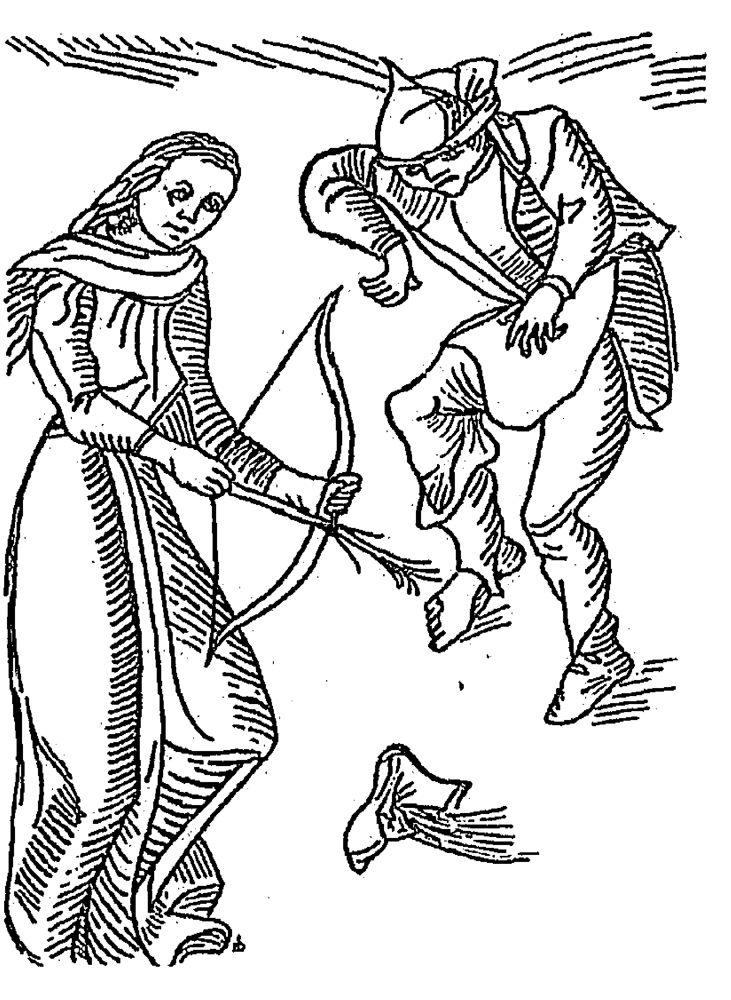

一位女巫正在治疗一位男士的脚疾。选自乌里希·莫里特尔作于1489年的绘画。 底德·巴克兰提供

治愈术是巫术里最重要的一部分，任何巫师在开展治疗之前，第一件事便是得到治疗对象的允许，因为巫术的头条原则就是不得干扰他人的自由。人们除了自主决定是否愿意接受治疗外，还可以决定什么时候选择死亡。因此，巫师治愈术的第一步总要得到病人愿意接受治疗的允许。

在一切允许的情况下，巫师会在治愈开始时将病人放在圆圈里。虽然隔空治疗是可能的，但是直接的接触治疗效果会好很多。巫师在手触治愈过程中需要与病人接触，而其他巫师则将力量输送给负责与病人直接接触的巫师。这种方法通过巫师们围绕圆圈时个人的位置情况得以实现，或者巫师们可能会在病人身体上确定一个接触点，让每位巫师都能直接参与。巫师在开始施展治愈术前，首先会驱散不良气场，然后传递直接和积极的气氛甚至是聚会上的能量。

通过投射色彩治疗（色彩疗法）和改变病人的光环来进行治疗也是可行的。可以将彩色凝胶、彩色宝石和次等宝石放在病人身上，然后投射色彩来进行治疗。20世纪80年代末，巫师认为水晶能增强法力，便经常在治愈术里使用这些东西。在自然情况下，身体可以从阳光中吸取任何自身需要的颜色并吸收这些颜色产生的能量。使用投射色彩治疗的原则是确定缺少的颜色，然后补给这种颜色。人们可以通过上述疗法来治疗疾病，也可以直接饮用带有颜色的水。

如果不能使病人出现在治愈术的范围内，“力量”的发射则可以在远距离处做到，无论是用色彩疗法的形式或仅仅是康复的能量。燃烧蜡烛是另一种在远距离处减轻痛苦的有用方法。蜡烛魔法不仅受到巫师的欢迎，也同时受到基督徒及其他人的喜爱。蜡烛魔法是以感应巫术为基础的，在感应巫术中，蜡烛通过代表不同的物体、人物、思想来改变事物。

另一种远距离的治愈术是使用人偶。巫师制作人偶来代表病人。人偶由药草、石头及其他材料填充而成。如果有可能得到病人的头发、指甲、衣服的一部分，或者将病人的照片添加到里面的话，效果会更好。

一些被攻击的人会感受到胸前有一股沉重的压力，那股压力就是来自于梦淫妖或者梦淫女妖。据说畸形儿童，甚至双胞胎都是女性和梦淫妖结合生下的。

## 中世纪的梦淫妖

在中世纪，人们认为梦淫妖和梦淫女妖会在夜间拜访无辜的人并且引诱他们，而那

梦淫妖在拉丁文中意为噩梦，字面意思是‘躺在上面’。梦淫妖和梦淫女妖源于古代的神和女神诱惑人类的传说，但是直到宗教迫害时期，在巫师审判中，对两性极感兴趣

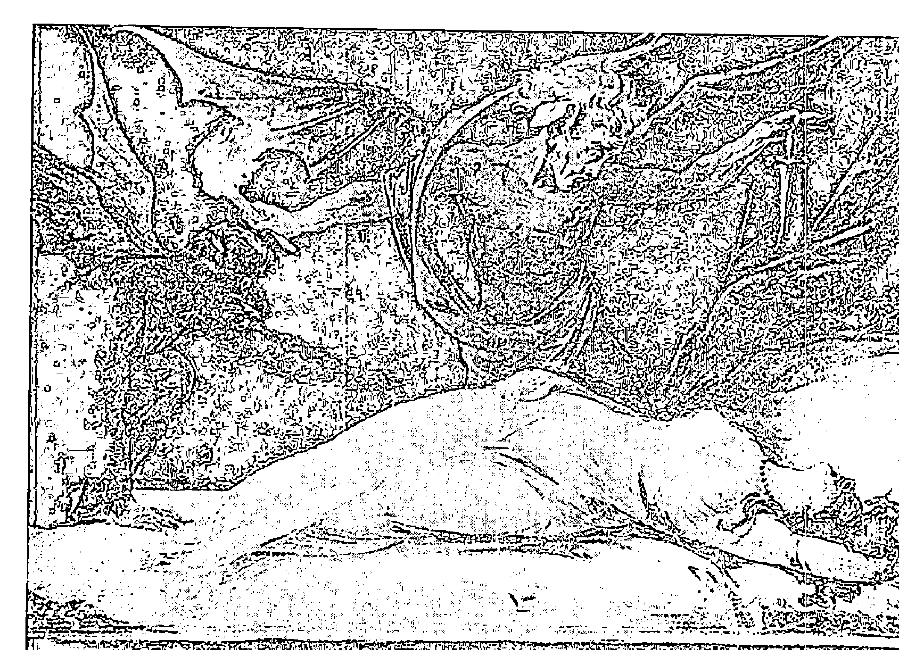

正在熟睡女人身体上方盘旋的梦淫妖  科斯特·福亨图片库

的审判者才让人们意识到它们的存在。

据说梦淫妖能够以男性或者女性的模样出现。首先它以女妖的身份出现，从男人身上获取精子，然后再以男妖的身份出现，把精子射入女人体内。托马斯·阿奎那在《神学大全》中说：“因为梦淫妖为男子幻化成女妖，又为女子幻化成男妖，所以如果有孩子是因为母亲和魔鬼的交配而生，那么这不是靠魔鬼自身或他们幻化成的身体射出的精子，而是靠为达到受孕目的的魔鬼从人类男子中获得的精子。”

修女们似乎很容易受到梦淫妖的侵犯。在《邪魔、梦淫妖、梦淫女妖》中，卢多维科·玛利亚讲述了一个修女被梦淫妖侵犯的故事。这个修女长期在晚饭后就进入房间。另一个修女透过房间之间薄薄的分隔物听见了低吟和性交的声音。在墙上钻了个洞后，她见到那个修女正和一个清秀的年轻人在做爱。大部分较早的关于梦淫妖和女人，或梦淫女妖和男人性交的记录中，都提及到妖和人的交合带来的极大快乐。但在15世纪末，当局似乎意识到这种侵犯不应该让人们觉得很有吸引力，所以后来的描述开始谈到包括梦淫妖拥有大而粗糙的生殖器，能够射出冰冷的精液等内容。

《女巫之锤》将被梦淫妖诱惑的女性做了三种分类：作为女巫，主动屈服于梦淫妖的；因为巫师的操控，女人们违背自己的意愿和梦淫妖发生性关系的；违背意愿被强奸的。随着对女巫审判热情的高涨，审判者们开始猜想女巫和梦淫妖有关系，那时每一个女巫都会被折磨，直到承认自己犯下和梦淫妖发生关系的罪行。由于女人被认为比男人放荡得多，所以人们推断梦淫女妖与梦淫妖的数量之比为9:1。

圣安东尼据说曾被梦淫女妖诱惑过。亚大纳西的《圣安东尼传》说：“一天晚上，邪恶的魔鬼幻化成女人的模样，模仿女人的动作去引诱安东尼。”西坡利达曾遇见过一个裸露的女人，当他把十字架抛向女人，准备遮盖她的裸体时，女人变回了原样——一具早已冰冷的尸体。

### 宗教法庭

乔治·L·伯尔说：“直到14世纪，宗教法庭才完全拥有对巫术的审判权，并且把巫术当做异教，把巫师当做撒旦的使者。”从此，巫术逐渐落得异教的称号。从15世纪中期到18世纪中期，被绑在火刑柱上焚烧是对异教徒实施的最严厉的刑罚（在英国是绞刑，巫术被认为是一种民事犯罪，所以那些因为巫术被指控的人将会受到非宗教的法律的制裁）。圣奥古斯丁在《上帝之城》中说：“每一位异教徒，甚至每一位犹太教徒、异端和教会分裂者都将走向为魔鬼和堕落天使准备的永恒烈火中。”这一观点被收入到1234年教皇格列高利九世颁布的诫令中。后来此观点被尼古拉斯·艾美瑞克和托马斯·阿奎那发展和推广。

那些被指控为异教徒的人将会受到宗教法庭和世俗法庭的严刑拷打，直到认罪为止。在西班牙和意大利，所有的异教徒都会被活活烧死；而在其他地方，犯了罪的人有可能在焚烧之前先被扼死，但只有罪人表现出忏悔和祈求原谅后，才能被准许实施此特例。

宗教审判始于天主教会，不久，新教也开始了同类案件的审理。让·博丹在其著作《巫师的魔鬼术》中写到：

> 即使巫师没有杀人或者对人类、动物、植物施恶，即使他经常治愈生病的人，驱赶暴风雨，他还是应该被烧死。因为他不相信上帝，还和撒旦有交易。不管人们对巫师施以怎样的刑罚，在火中将他们烤死和煮死都不算什么。因为这和撒旦带给人间的痛苦根本无法相提并论。

罗斯玛丽·吉利指出：

> 宗教审判本质上不是对巫师的迫害，而是对异教徒和教会敌人的迫害。但指控巫术犯罪是审判者们达到目的的一种有效途径。

在欧洲的许多案例中，对巫术的指控上升为纯粹的政治原因，所有受指控的人并不都是穷人（例如爱丽丝·吉蒂勒夫人）。教会、政府或者统治者都将在指控人充公的财产中获益。因此，许多案例都充满了金钱与财富的诱惑，而对巫术的指控就被视为获得财富的最佳途径。

随着时间的推移，教会的势力变得更加强大。到1184年，在教皇卢修斯三世的带领下，所有背离教会教义的人都要受到主教的调查。宗教法庭成立于1227至1233年间，法庭的审判官四处巡游，并调查、惩罚那些散布异端邪说者，包括对异教徒进行严刑拷问。

1275年，在法国图卢兹，因巫术被指控烧死的第一人是拉巴特夫人安吉拉。在英格兰，最后一次对巫术的指控是在1717年，苏格兰是在1727年。在对巫术的指控中，死亡的人数无法准确计算，但应该记住，被指控的人中很少是真正的巫师。据梵蒂冈官员巴尔托洛梅奥·斯皮纳记载，他在1532年一年间，就烧死了一千多名被控是巫师的人。1581至1591年，洛林的首席检察官尼古拉斯·雷米自夸曾经烧死过900名被认定有罪的巫师。宗教迫害时期，像这样被烧死的人不计其数。有些人估计，死亡的总人数在50万左右，但也有人估计死亡人数高达900万。

罗斯玛丽·吉利指出，今天的巫师们担心有回到“焚烧时代”的可能性，从中传递出他们害怕现今会重蹈过去的覆辙。而这种担心来源于许多信奉正统基督教人士的言辞和行为。

## 众神之神伊希斯

伊希斯是古埃及伟大的女神，原名为阿赛特（有“非常女王”之意），但希腊人将发音改为伊希斯，并把她奉为希腊的女神。作为爱之女神，伊希斯是阿芙罗狄蒂；作为司夜和冥界的女神，伊希斯是赫卡特；作为众神之神的妻子，伊希斯是赫拉；作为农业之神，伊希斯还是德墨忒耳。一篇罗马铭文上写到：“伊希斯女神，你就是众神。”

伊希斯是大地之神盖布和天神努特的女儿，是奥里希斯、赛特和内普特斯的妹妹。也是奥里希斯的妻子。他们的兄长赛特因为嫉妒奥里希斯，把他给杀了。关于赛特杀死奥里希斯，有各种各样的故事。其中一个源于约公元前2400年铭文镌刻说，奥里希斯被赛特淹死在尼罗河。还有一些故事则说，奥里希斯被赛特关在一个精致的箱子里扔进了尼罗河。经过多番搜寻，伊希斯找到了奥里希斯的尸体，并带回了埃及。然而，奥里希斯的尸体很快被外出打猎的赛特发现。他将自己的弟弟分尸成14块，扔到了埃及的各个角落。

伊希斯只得再次搜寻奥里希斯，最终，除了被鱼吃掉的生殖器外，她找到了其他所有的部位。于是，伊希斯做了一个金质的生殖器作为替代品，并设法让奥里希斯复活了。随后，奥里希斯和伊希斯生下荷鲁斯。再后来，奥里希斯去掌管冥界，只在教授荷鲁斯如何与赛特搏斗时才现身人间。

在世界各地，伊希斯的各种化身已被崇拜了近六千年。关于伊希斯教会的献祭仪式在卢修斯·阿普列尤斯的《变形记》或《金驴记》中有详细的叙述。在许多方面，伊希斯教会的入会仪式和今天的魔法仪式相似。

伊希斯教会最先出现在罗马帝国，罗马人为伊希斯举行过多次大型的朝拜活动，而且整个节日都是用她的名字命名。

伊希斯是今天许多巫师组织使用的名字之一。1976年在爱尔兰，奥利维亚·杜丁·罗伯逊和他的哥哥劳伦斯共同创立了伊希斯协会，总部设在多尼戈尔城堡。如今，伊希斯协会在全世界拥有12000名会员。

## 左手路径和右手路径

右手路径是指巫术的目的是好的、积极的，而左手路径指巫术的目的是邪恶的、消极的。好的巫术叫白色巫术，消极的巫术则称黑色巫术。恶魔主义的追随者即是左手路径的追随者；巫术崇拜者相信他们不会伤害他人，所以是右手路径的追随者。

## 占星家伊立法斯

利未·伊立法斯是法国著名的占星家之一，真名伊立法斯·路易斯·卡斯特。1810年，利未·伊立法斯出生在法国巴黎，就读于罗马天主教学校和圣苏尔比斯神学院。1835年，25岁的他被任命为教会执事。约二十年后，他对占星术产生了兴趣，专门拜读了科尼利厄斯·阿格里帕、蒙德·卢里和吉约姆·波斯特尔的著作。

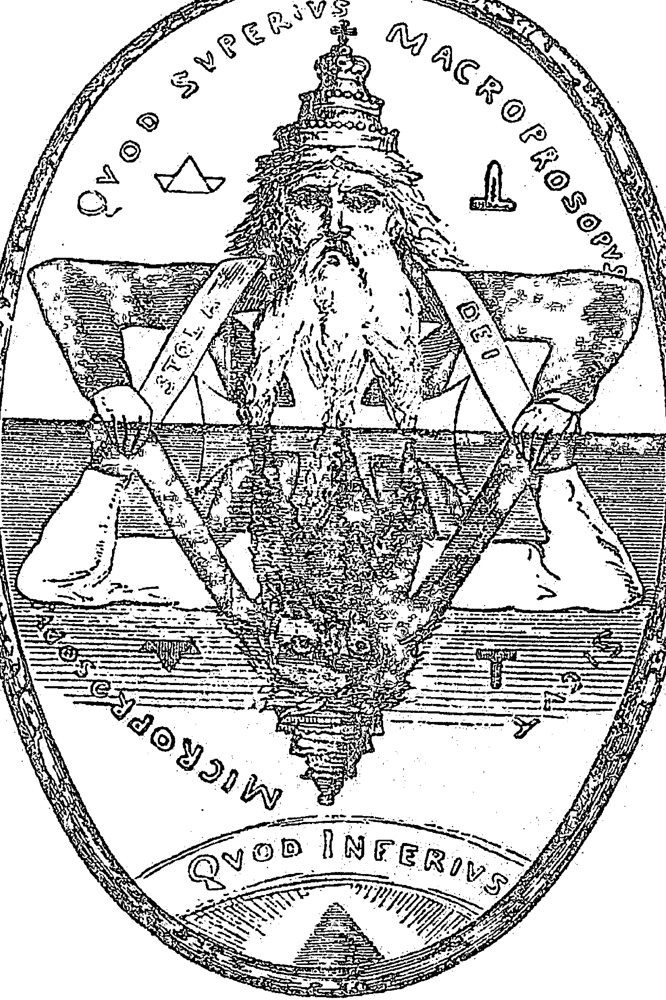

伊立法斯后来因为在圣苏尔比斯神学院宣传与教会相违的教义而被开除，之后又因写了一本小册子《自由的福音书》而被关进监狱六个月。获释不久，他与比自己年龄小一半的诺埃米·卡迪特结婚，但这段婚姻只维持了七年。

伊立法斯曾与赫内斯·朗斯基、阿方斯·爱斯克斯以及一个名叫伽纳忒的占星家一起做研究，他自己也开始教授魔法艺术。1854年5月，伊立法斯来到英国，因为语言障碍，所以这次旅行并不像他预期的那样好。在英国，伊立法斯结识了占星家爱德华·布尔沃·利顿女士，并勉强同意为她举行一次魔法仪式。多年之后，伊立法斯在其著作《超自然的魔法》中，提到那次仪式是成功的。回到法国后，伊立法斯身无分文，无家可归。此时，著名的占卜家阿道夫·达斯巴若斯向他伸出了援助之手，将他安置在巴黎的德·比朗大街19号，那是一幢醒目的三层建筑。在德·比朗大街19号，伊立法斯通过讲授占星术为生，直到1875年去世。伊立法斯最重要的著作是《教条和高等魔术仪式》《魔法的历史》和《宗教的关键所在》。

## 主祷文可以对抗巫术

中世纪的巫师猎人认为，基督教的主祷文拥有对抗巫术的魔力。早在公元400年，圣奥古斯丁在他的著作《抵制预言家和算卦者的布道》中说：“以上帝的名义在胸前画个十字，虔诚地向上帝祈祷，这样就可以得到上帝的帮助。”

主祷文也用来测试一个人是否是巫师。1579年在英国切姆斯福特，艾格尼丝·沃特豪斯就被怀疑是巫师，因为她根本就不会念主祷文。1682年夏，德文郡的三个妇女在埃克塞特因使用巫术而被受审，审判官马斯·雷蒙德和弗朗西斯·诺斯以她们不清楚主祷文为由而判她们有罪。1663年，在对朱利安·考克斯的审讯中，法官要求被告背诵主祷文。1712年，在哈夫特郡，斯特拉特先生要求简·温汉姆说出主祷文，她没有背出来，借口是头痛。

当然，一字不差地把主祷文背下来，并不能保证被告会被判无罪，1692年8月19日，在马萨诸塞州的塞勒姆，一辆马车载着五名罪犯去希乐绞刑架，当车停在绞刑架前时，一个叫乔治·布鲁斯的罪犯要求在大众面前背诵主祷文。尽管他的话真挚感人，并且清晰地、一字不差地背了主祷文，但还是和其他四人一同被绞死。

## 自然魔法

所谓自然魔法，是指借助自然之物来施展的魔法。野草、油脂、石块乃至护身符，都能成为巫师施法的道具。实施自然魔法，不需要向任何神灵或者实体对象祈祷，也不需要使用其他法器，甚至不需要举行任何仪式。设障巫术、民间魔法以及治疗术，都需要通过自然魔法来实现。自然魔法是一种低级魔法，农民、异教徒和独修巫师对之十分青睐；与此相对，魔法师们在仪式魔法中施行的叫高级魔法。

## 掌管一周的星辰

不同的日期由不同的星辰来掌管，而各个星辰都有自己的特征，这些特征有利于实现不同的施法目的和意图。比如，想要给人治病的话，最好选在星期一，因为这一天由月亮掌管。值得注意的是，在占星学中，包括太阳和月亮在内的天体都被称作行星。以下列出了各个行星分别掌管的日期，以及每一天分别适合施展哪一类的魔法。

- 星期日——太阳——农业、美貌、创造力、好运、守护、期望、财富、自我表现、成功。
- 星期一——月亮——祭祖、分娩、做梦、康复、本能、记忆、买卖、纯洁、偷盗、贞洁。
- 星期二——火星——仇敌、启蒙、忠诚、结婚、入狱、保卫、战争、财富。
- 星期三——水星——事务、交际、债务、恐惧、损失、游历。
- 星期四——木星——服装、愿望、收获、尊敬、结婚、誓约、财富、协议。
- 星期五——金星——美貌、家庭生活、友谊、丰收、发展、和谐、爱情、天性、乐事、性生活、陌生人、水域。
- 星期六——土星——建筑、教义、自由、礼物、生命、保卫、房产、播种、坚韧。

## 治疗药水

任何有治疗作用的饮品都可以称为药水。作为各个村落中的智者，巫师精通各类草药的用法并且为病人配制药水（当然，这一术语也可以用来指代毒药）。许多草药茶也被称作药水，或许它们更准确的叫法应该是煎熬的药或者冲泡的药。在过去，特别是在某些文学作品中，药水总是与爱情魔法或者性欲魔法联系在一起。

## 自我启蒙

既然巫术是一种神秘的宗教信仰，那么，就有必要对其进行深入的了解。19世纪60年代早期，巫术慢慢进入美国人的视野。当时，对许多美国人来说，想要深入了解巫术并不是一件容易的事。在接触到古代宗教后，如果一个美国人想成为它的信徒，他会发现自己很难找到一个宗教团体加入。这一窘境发展到最后，终于促使大量的巫术宗教团体如雨后春笋般冒了出来。遗憾的是，这些团体的建立者大多没有接受过真正意义上的巫术训练，也正是由于这一原因，美国产生了很多独修巫师。他们或者是因为找不到合适的团体加入，或者是主观上不愿意加入任何团体，但相同的是，他们依旧愿意信仰巫术这一古老的宗教。

接下来的很多年中，加入社团的巫师与独修巫师之间一直存在着矛盾。随着时代的发展，直到有一类更加折中、更加兼容的团体产生以后，他们的冲突才慢慢平息。当然，他们的冲突也许永远都不会彻底消失。

中世纪早期，人们在加入巫术教派前必须要举行一个入会仪式，这称为启蒙仪式。启蒙仪式上，教派的领袖会把一只手放在平躺着的申请加入者的头顶，另一只手放在其脚底，这意味着申请加入者将把领袖两手之间的部分——即他本人的全部，都奉献给上古之神。这是当时苏格兰最主流的“献堂礼”，实际上也是其他巫术教派中启蒙仪式的一个组成部分。

与现在的情况类似的是，在中世纪早期，同样有一些巫师不属于任何团体。比如说一个农民，他的家距离村镇，或者说距离正规的巫师团体很远，但他依旧需要膜拜、祭祀、感谢上古之神，以便在神灵的帮助下获得更好的收成。在客观条件不允许完成正式仪式的情况下，独修巫师会自行组织简单的献礼仪式，把自己和子女全都献给神灵。直到今天，依旧有这样一些巫师，他们不能或者不愿加入到已有的巫师团体，而是在一个简单的自我启蒙仪式上将自己献给上古之神。既然早期的独修巫师与归属于某一团体的巫师具有同样正当的宗教身份，那么现在经自我启蒙的独修巫师，自然也应该与经团体启蒙的巫师同样名正言顺。和杰拉尔德·加德纳一道，多琳·瓦林特奠定了现代巫术信仰的理论基础。她明确指出：

> 据我所知，很多人都质疑自我启蒙……我有一个简单的问题需要这些怀疑者来回答：是谁，启蒙了第一个巫师？

### 咒语使魔法生效

咒语是魔法的一部分，是魔法得以生效的原因。如果说魔法本身使得某些你希望的事情最终发生的话，咒语就是能够为你带来预期结果的仪式。

一个仪式，往往由“说”和“做”两部分组成，咒语通常归于说之列。对咒语来说，节奏韵律是重中之重。很多咒语都是要靠吟诵，甚至需要唱出来的，它们都有规则的节拍，并且通常还要求押韵。在念咒时，当事人往往会陷入一种精神恍惚的状态，这一状态能够帮助他把目标形象化，同时也能够积蓄能量，达到施法目的。

然而，并非所有咒语都讲究韵律。祷告也是咒语的一种，是祈祷人向神祇表达某种愿望，同时也包含了希望实现其愿望的想法的话语。祷告通常都是一些发自内心的话语，因此祈祷者很少会考虑韵律的问题。祷文中蕴涵的强烈情感，足以消弭缺少韵律的遗憾。可以说，祷告是最缺乏动感的咒语，不过它的效果同样惊人。

巫术传统中，念诵咒语的人一般要坐在其他巫师围坐的仪式圈内，这是为了保护念咒人免受负面因素的影响。巫师一般不会施展消极魔法。不过禁咒往往被视作处于“灰色地带”的魔法，对于被施咒者来说，禁咒既没有帮助也没有危害。如果一位巫师认为，有必要让某人停止讲话，那巫师就会对他实施禁咒。大多数情况下，巫师们只需一个玩偶代表被施咒者便可启动禁咒；甚至一张被施咒者的照片或者他的笔迹，都能让巫师成功施咒。施展禁咒的过程中，用到的玩偶一般是由蜡、布、黏土或者其他相似材质制成。可以肯定的是，被施禁咒者不会受到任何身体上的伤害。不过，巫师将会视具体情况的需要，让他失去语言或行动能力。

## 诸神的化身

柳树用于祭祀阿莉昂若德、瑟茜、赫卡特和珀尔塞福涅。在被瑟茜施了魔法的岛屿上，专门有一片用于悬挂尸体的柳树林。赫卡特的原型是守护赫利孔山的赫利凯，她手持一根柳树拐杖，这根柳树拐杖被视为掌管宇宙星辰的象征。

大约从中世纪起，柳树开始象征悲痛。《圣经》中记载，被放逐的犹太人在巴比伦河畔痛哭，他们的竖琴就挂在柳树上。然而，这些树更有可能是幼发拉底白杨，而非我们所说的柳树。

柳树可以制作用于占卜的手杖。很多当代巫师都在治愈仪式中使用柳树，并且相信种植在花园中的柳树可以接收来自月亮上女神们的赐福。柳树还有其他的别名，如“菜色树”、“魔法树”、“巫师的阿司匹林”等。

> 斯科特·坎宁安认为柳树与月亮、水同等神圣，是阿尔特弥斯、色列斯、赫卡特、珀尔塞福涅、赫拉、墨丘利、贝莱纳斯诸神的化身。他指出，在所有被用于吸引爱情的魔法混合物中都可以加入柳树叶，而柳树的所有部分都可以防护邪恶。在治愈魔法中，柳树的树叶、树皮和木材都可以被利用。

## 主神沃登

公元五世纪，在入侵英格兰之前，盎格鲁撒克逊人向日耳曼民族的主神沃登祈福。在德国，沃登被称为沃丹或沃坦。在罗马人眼中，沃登的地位和他们的神明墨丘利相等，因为他们都掌控着精神世界。据说沃登是一个口才极佳的人，经常出口成诗。他还是一个变形者，能将自己变成任何想要的模样，就如同希腊神话中的宙斯。

英国的许多地名与沃登有关，比如说从汉普郡到萨默塞特郡的沃登堤土方工程、奥尔顿普赖厄斯的沃登矸石场、西顿的沃登谷、泰晤士河上游的沃登平原、三维治附近的伍德内斯伯勒沃登牧场等。沃登有个昵称叫“格里姆”，意思是“用头巾裹面的男人”。沃登喜欢裹着头巾或戴着一顶松松垮垮的帽子穿梭在两界之间，因此世人送他这样一个昵称。和昵称“格里姆”有关的地名有：格里姆斯堤（似乎在英格兰南部随处可见）、格里姆斯比、格里姆利和格里姆斯索普。

沃登有类似于魔法师或巫师的神奇力量，他用魔法统治世界，并专注于其中的内涵。尽管沃登喜欢战争，但却不直接插手，而是用魔法力量让敌对势力感到莫名的恐惧。沃登的魔法还被用于治愈病人，从北欧流传下来的古老魔法配方可以得知，沃登经常替人治疗扭伤和脱臼。沃登同样被战士们祭拜，因为他可以帮助战士们取得胜利。沃登的双肩各坐着一只乌鸦，一只叫休金，代表思想；另一只叫穆宁，代表记忆。它们可以飞往世界的任何角落，然后告诉沃登它们的所见所闻。两头狼同样也是沃登的忠实伴侣。

撒克逊人征服英格兰后，至少最初五代人都还在继续信奉异教。他们主要崇拜四位神：沃登、托尔、蒂尔和弗雷娜。在一直沿袭至今的撒克逊巫术中，沃登和弗雷娜是他们最尊崇的神明。撒克逊人心中的沃登，不完全等同于北欧居民信奉的奥丁，因为沃登并不像奥丁那样热衷于唤醒战死沙场的武士的英灵，然后把他们编入自己的队伍，而是更喜欢在英格兰游荡，关注着他的子民们。

## WITCH BOOK

### 从“千年魔咒”到“黄道十二宫”

《魔法师大全：一部关于魔法、巫术和新异教主义的百科全书》从A至Z全面解读那些曾经让世人着迷的与巫术有关的人物、地域、事件及文献。

本书从近六百个方面深入探讨了一系列巫术主题，对比《麦克白》、《绿野仙踪》与《哈利·波特》中的女巫形象，研究所有臭名昭著的巫术审判案例（揭开塞勒姆女巫案与宗教裁判所的真相），解释一些专有名词的意思（例如灵体投射或通灵的含义），同时涉及并讨论占星术、伏都教等与巫术相关的主题。本书配有一百多张照片和图解，还包括资料来源等。

几千年来，人们一直对巫术抱有浓厚的兴趣。经典著作《巴克兰完全魔法书》的作者，高级祭司雷蒙德·巴克兰将在《魔法师大全》中带你认识巫术，全面体会魔法的力量。

丰富的巫术主题与魔法再现，《魔法师大全》将是你了解现代魔法的不二选择。

建议上架：玄幻/神秘文化

ISBN 978-7-229-02260-0

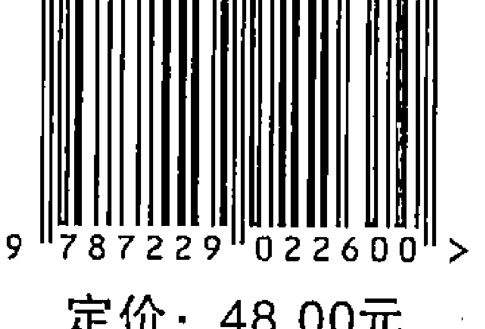

定价：48.00元