# 格瑞魔法学校 必修课程 02

# 如何施展魔法？从基础魔法到黑魔法的16堂必要魔法课程

# Spells from the Grayschool Magic Academy

# From the Grayschool Magic Academy

[美]奥伯伦·泽尔-诺文斯基 著

罗迪 译

江苏文艺出版社

# 魔法课

上卷

如何施展法术？

从蓝魔法到黑魔法的 16 堂魔法实践课

[美] 奥伯伦·泽尔-雷文哈特

罗越 译

江苏文艺出版社

# 图书在版编目（CIP）数据

魔法师学徒的伴侣书：如何施展法术？从蓝魔法到黑魔法的16堂魔法实践课：全2册 / (美) 泽尔-雷文哈特等著；罗越译. -- 南京：江苏文艺出版社，2014
书名原文：Companion for the apprentice wizard
格瑞魔法学校秘密教程
ISBN 978-7-5399-7261-9

I. ①魔… II. ①泽… ②罗… III. ①魔术-通俗读物 IV. ① J838-49

中国版本图书馆CIP数据核字(2014)第050504号

> Companion for the Apprentice Wizard
by Oberon Zell-Ravenheart and Faculty of the Grey School of Wizardry
Copyright © 2006 by Oberon Zell-Ravenheart and Faculty of the Grey School of Wizardry
This edition arranged with New Page Books,
through CA-LINK International LLC.
Simplified Chinese edition copyright:
2013 © The Shang Shu Culture Media Co., Ltd.
c/o Jiangsu Literature And Art Publishing House
All rights reserved.

版权登记号：10-2011-583号

| 项目 | 内容 |
| :--- | :--- |
| 书 名 | 魔法师学徒的伴侣书：如何施展法术？从蓝魔法到黑魔法的16堂魔法实践课：全2册 |
| 著 者 | [美] 奥伯伦·泽尔-雷文哈特 等 |
| 译 者 | 罗 越 |
| 责任编辑 | 孙金荣 |
| 策划编辑 | 夏小晴 |
| 特约编辑 | 钟 原 |
| 出版发行 | 凤凰出版传媒股份有限公司 江苏文艺出版社 |
| 出版社地址 | 南京市中央路165号，邮编：210009 |
| 出版社网址 | http://www.jswenyi.com |
| 经 销 | 凤凰出版传媒股份有限公司 |
| 印 刷 | 三河市嵩川印刷有限公司 |
| 开 本 | 700毫米 × 1000毫米 1/16 |
| 印 张 | 27 |
| 字 数 | 360千字 |
| 版 次 | 2014年11月第1版 2014年11月第1次印刷 |
| 标准书号 | ISBN 978-7-5399-7261-9 |
| 定 价 | 58.00元 (上、下卷) |

(江苏文艺出版社图书凡印装错误可向本社调换)

# 读者对《魔法师学徒的伴侣书》的评价

> 《魔法师学徒的伴侣书》是一本具有里程碑意义的书，它是一本多元化的综合书籍，内容涉及到多个不同领域，你既可以把它当成一本有关历史研究的书，也可以把它当成一本心理分析读物，或者自学书籍，当然，更可以把它作为魔法入门修炼的教辅书。

它不是一本类似《梅林传奇》(Merlin)那样的魔幻小说，这本书中所描写的魔法是真实可行的，它里面传达的中心理念和现实世界基本一致，那就是全世界的成功人士大多数最初都不得不努力成为工厂的头领、公司的主席，和称职的父母。这也是为什么我要买这本书给我的孙子们的主要原因（当然，这样一来，我也就不用再忍受他们会在我看这本书的时候，一直嚷嚷着也要看了）。

——詹姆斯·索尔
（James Sawyer）

> 《魔法师学徒的伴侣书》内容是如此的博大精深，以至于我想向每一个‘行走’在魔法道路上的人推荐，不论年龄大小。它里面不仅包含了大量的指导和参考资料，而且还有非常全面和可靠的心灵学。书中还配有大量的插图、表格、魔法字母表、植物草本手绘以及相应的详细图解。同时，里面还有很多解释得非常易懂的抽象概念（甚至包括现代量子物理学知识）。

——皮提亚女士 (Lady Pythia)

> 这是一本很杰出的书，作者为有抱负的魔法学徒以及热心的读者们介绍了许多了不起的知识和理论。因为书中配有大量图解，所以读起来比较轻松，而且里面关于魔法练习的部分值得一遍遍阅读和回味，我会永远保存好这本书的，并且记得它的内容。

——加布里埃尔·穆尔豪斯
（Gabriel Moorhouse）

> 《魔法师学徒的伴侣书》为年轻的孩子们提供了很多有用的设施和方法，使得他们能尽快穿越自己思维的迷宫，找到正确的人生方向。我极力，极力地向各个年龄阶层的读者推荐这本书，相信我，不管你是青少年还是年长者，都会喜欢这本书的。我很开心能看到一个作家不仅向他的读者们展现了一个新颖的开放的‘哲理世界’——其富有价值的历史和丰富的实践经历同样值得赞扬，而且他也成功地履行了自己的理念。

——格里芬（Griffin）

> 奥伯伦·泽尔-雷文哈特非常清楚自己所要表达的东西，而且在分享自己数十年来对魔法的研究心得方面，他有罕见的语言天赋。作为一个资深魔法师，他知道怎样用友好的语气来阐述内容，并且在适当的地方给予修炼者最好的指导。

这本书一定会被新魔法学徒们一抢而空，热烈追捧，因为里面正好可以解答他们此刻遇到的无数问题。这本书非常有趣，这让人觉得非常惊喜，无论在实体书店还是网络上都能找得到它。我想这本书一定会非常流行，它有可能会引起诸如尼尔·盖曼（Gaiman）以及戈登·摩尔（Moore）的注意，甚至出现在霍格沃茨学校（Hogwarts，《哈利·波特》中的一所魔法学校）里。我已经迫不及待的想要得到它的交易卡了。
——瑞文·马奎斯 (Raven Marquez)

这本书收纳了各种各样的知识信息和有趣的花边新闻，而且里面还巧妙地安排了特别的边框、手绘的插图和详细的图解。我的孩子们只要捧起这本书，看起来就再也舍不得放下。我也已经从头到尾仔细地阅读过了，真的太有趣了，无论你打开这本书的哪一页开始读，都会觉得非常有意思，而且这本书老少皆宜，无论是老年人还是小孩，都非常适合阅读。这本书绝对值得你为它花的每一分钱，而且我相信它一定会在你的生活中存在很长很长的时间。
——安 (Ann)

这本书可以为你解答所有曾经你想知道（但无人可问的）有关于魔法的东西。父母们真的应该为你的儿子或者女儿们买这本书，并且和他们一起阅读，这样你就可以知道他们在想些什么，他们想做些什么。如果有足够多的少年学徒们最终能够进入格雷魔法学校委员会，那么我们这个星球就真的有希望了！
——芭芭拉·阿丁格 (Barbara Ardinger)

再也没比这更好的书了，它就好像是一个可以穿越各种时间、各种地域、各种文化的神奇窗口，来帮助你提升你的魔法修炼，精神性的或者非精神性的。我极力向那些想要增长自己知识和见闻的人推荐这本书，相信一定不会让你失望。
——马瑞娜·K·佩妮 (Marina K. Payne)

这是我读过的有关魔法的书籍中最不可思议的一本，它的内容非常丰富而且全面，不仅能够为初学者的修炼打下坚实的基础，而且更有利于以后进一步的提高。它传达的并不是唯心主义理念，但是却有很多奇幻和充满想象力的暗示——而且这也正是一个真正的魔法师所必须具备的。这本书包容性非常强，无论你的魔法修炼现在是哪个等级的，它都将是你的最佳选择。奥伯伦先生，我为你喝彩！
——欧克·瑞文 (Oak Raven)

伟大的天才啊！如果你仅仅只能买一本有关魔法的书籍，那么毫无疑问你该选择这一本；如果你正在找一本科学与艺术的完美结合体，以便修炼成为一名真正的现代魔法师，那么毫无疑问这本书会是你的最佳选择，因为在这本书中你会找寻到曾丢失的种种‘宝藏’，就像在纪念品游戏中那样。
——特瑞·默克 (Terry Mook)

如果哪天我没有阅读和学习这本神奇的书，那么那一天对我来说就会度日如年。《魔法师学徒的伴侣书》不仅仅是一本很棒的阅读书籍，而且还包含着很多其它有意义的东西，它能帮你打开曾经一直对你紧闭的、通往神奇和魔法以及生命之源的智慧大门。

这本魔法书同时也是格雷魔法学校（一所同时对大人和小孩都开放的网络魔法学校）的主要教科书。最后透露一个超好消息，那就是这本书的续编已经在进行中啦！

—— “书月人”（“Moonwriter”）

作为魔法团体的忠实成员，仅仅因为奥伯伦·泽尔-雷文哈特这个名字我就决定要买下这本书，奥伯伦先生就像《哈利·波特》中霍格沃茨魔法学校中的邓布利多校长一样。

——米尔丁 (Myrddin)

这本书研究透彻，语言组织极好，所以读来让人觉得浅显易懂。写出一本这样性质的书真的很棒，很特别，我强烈向每一个人推荐这本书，不管你是什么年龄，什么身份，什么宗教信仰，你都会觉得它很有趣（并喜欢上它的）。

作为格雷魔法学校的一员（我刚刚已经提到过），我可以很负责任的告诉你，邓布利多先生——哦——不是——我的意思是我们的校长奥伯伦·泽尔-雷文哈特先生，为每一个真心想要成为一名真正魔法师的学员们创造了一个温暖且富有魅力的学习环境。

——米尔丁 (Myrddin)

虽然最初《魔法师学徒的伴侣书》的定位是主打青少年群体的，但其实写出来后并不是这样，它里面包含了非常非常丰富的各种内容，几乎囊括魔法知识的所有方面，所以其实任何年龄的人都适合阅读。

读奥伯伦·泽尔-雷文哈特先生写的这本书，就好像他正坐在你的面前在给你上课一样，你能感觉到他很关心你（他的学生），并且很清楚他自己在讲些什么——很少有作者能做到这一点的。

我想强烈的向每一个人推荐这本魔法书，还有格雷魔法学校，现在，我热烈地期待着奥伯伦先生的下一本书。奥伯伦·泽尔-雷文哈特先生，你的作品真是太棒了。

——索拉里斯 (Solaris)

这是一本很珍贵而且实用的魔法书，它可以被有效地用于教师们的魔法教学和学徒们的魔法训练，同时它也非常适合作为初学学徒们的入门读物。这本书相当于是一个人类和一个非基督教崇拜的魔法师共同谱写的结晶，如果有任何人想要知道通往霍格华兹魔法学校的路，那这本书绝对是你最好的向导。

随着《魔法师学徒的伴侣书》的大卖，也给格雷魔法学校带来了很多福利，目前奥伯伦·泽尔-雷文哈特教授担任校长。站台见，伙计们！

—— “神谕”（“Oracle”）

如果你只想买一本魔法书，那么《魔法师学徒的伴侣书》绝对是你的不二之选！

——莉莉斯·罗斯 (Lilyth Rose)

# 写在前面：魔法伴侣书和格雷魔法学校

文/杰西·沃夫·哈丁格雷学校校务委员会

我挚爱的朋友奥伯伦·泽尔-雷文哈特是现如今最资深和最强大的魔法师，他传承并发扬着高尚的魔法传统和精神，这种精神可追溯至梅林（亚瑟王时期最著名的魔法师）的传奇时代；可追溯到那些第一次开始借助自然力量的“原始医学者”身上；可追溯到那种第一次有了探索未知世界的强烈渴望上。虽然我们一直都力求我们的学习和研究能保持正统和专业，但是毕竟留下的书面记载不多，大多数都只能靠师徒的代代以身相传而得来。

不过随着《魔法师学徒的伴侣书》的正式出版，我们终于拥有了第一本可靠的、现代的魔法修炼指南书，它里面同时包含了很多魔法信念和具体的魔法实践。在这本伴侣学习书中，我们则进一步的提供了一系列的指导和大量的实践方法以及步骤，以便增加学习者的理解能力、参悟能力、责任感、可支配力量以及个人的魔法能力。

在这本书里，你能找到更多的手把手式的实践指导，更多有趣的挑战，以及更多可以改变自我和自我现状的魔法设施。同时，书中还配有大量对神奇魔法以及可以指导和增强自身法力的常用魔法的图解，甚至还有帮助你如何成为宇宙进化神秘推动者的提示。在伴侣学习书中，学习的重点将不再是仅仅学习理论（如何“学”），而是学习如何“做”，以及比以往任何时候都要多的多的真正的魔法实践。

很多人喜欢读魔法书或者对魔法感兴趣，这并不足为奇，可是如果你心甘情愿地每天花大量时间和精力来研究或者学习魔法，而且长期如此，那么你绝对是与众不同的一员。

大多数人的一生都是千篇一律的：出生，长大，老去。大多数人一生都生活在一个没有真诚没有真心的虚假社会：说着言不由衷的话，做着身不由己的事，身边还围绕着一个个表里不一的人——好像每个人都被迫带着面具没有灵魂地活着，整个社会都充斥着“非天然”：从我们穿在身上的人造皮革凉鞋到挂在脸上的虚伪笑容，再到生活环境中塑料假花假树。

可能很多时候我们读到的有关魔法的东西都是充满了惊险、刺激和神奇的幻想，但是从另一个角度来看，我们每一个芸芸众生同时又被赋予了保持真我、追究真理的权利和义务，即使这可能会付出一定的代价。我们出生在一个充满着奇迹和神秘的世界里，其实有很多“真”的东西值得我们去在乎和追求，比如我们自己，我们深爱的人，以及与我们生活在同一个星球的其它生灵，甚至这个美丽星球的本身——大地之母盖亚（盖亚在希腊神话中被赋予大地女神的美誉）。其实我们每个人同样也被赋予了各种各样的机会，正如你手中这本书里的主角们一样，无论此刻你是否已经历经艰难地探索找到它们，或者幸运的已经将它们为你所用，你都已经被赐予了拥有这些机会的权利（因为你也是被神眷顾的孩子）。其实除了真正的魔法师，卡通魔法师和业余魔法师同样能做出很多让人惊叹的事。你的生命就是你的机会，甚至是一种把梦想变成现实的使命：去创造真正的奇迹，去使这个世界变得更加美好。

相信自己！你已被赋予了智慧的头脑，顽强的精神，强大的力量，还有无限的潜能去实现你内心最深处的梦想，去创造奇迹。英文单词 “mysteries” 是指神秘的、难以破解的事，它来源于希腊单词 “musterion”，这个单词本身的意思是说：“其实所谓未知或者神秘就相当于是指那些只有发起者或者内行才知道的事。” 作为学习这些魔法书的学生之一，你完全可以把自己归类于优秀的神秘创造者或者秘密揭开者之列，但前提是，你必须永远对一切未知保持不倦的好奇心和不竭的探索欲。

最近我召集了大批的魔法学徒和学生们在荒地大圣堂 (wilderness sanctuary) 上课，荒地大圣堂是一个古老的仪式中心，是一个充满了神秘力量的地方，来这里的学生各个年龄阶层各种身份背景的都有。在授课过程中，当我突然意识到我使用的所有教辅书，以及我出版的包括《大地女神盖亚和爱神厄洛斯》 (Gaia Eros) 在内的五本书都是四十多年，一万六千多个日日夜夜孜孜不倦地探索和研究的结晶时，我不禁思绪万缕，感慨万千。当我还仅仅是一个懵懂少年的时候，我就开始接触对魔法的修炼。从此，这种修炼几乎占据了我的一生，修炼魔法时精神的高度集中，以及修炼过程中必然会遭受的种种阴森恐怖的感觉，使得我从此踏上了孤独的灵魂之旅——很少有人能够理解我的感受，也很少有人能坦然接受我所拥有的特殊能力。当年，当我仅仅才 13岁的时候，我逃离了严酷呆板的军事学校，从此开始了对智慧、真理和人生意义的无尽追求，可是我极度渴望知道和经历的一切却在任何一门国家批准的课程中都找寻不到，在格雷魔法学校成立（或者说我开始进入格雷魔法学校学习）之前，没有一个地方可以教授我有关意识、实践、责任以及响应某种召唤和艺术的魔法。

我不得不在成千上万本所谓的“伟大之书”（糟粕）中筛选，以挑选出极少数的真正精华。我没有任何一个资深长者聚集的组织可以求助，我不得不花上数年去一个一个寻找，不得不走上成千上万公里去和他们见上一面进行一些探讨，这其中包括：
- 得道高僧艾伦·华兹 (Alan Watts)
- 激进诗人盖里·奈德 (Gary Snyder)
- 土著巫术医师 (Medicine Man)
- 桑德·雷电 (Rolling Thunder)
- 陶斯印第安精神领袖特里斯·古德茅宁 (Telès Goodmorning)
以及数不清的拥有秘传的诸多地方的牧师或者祭师。在这个漫长的取经过程中，我向他们学习了东方神秘主义、巫术崇拜 (Wicca)、原始魔法、应用萨满教 (Shamanism，原始宗教的一种，曾广泛流传于中国东北部到西北部边疆地区阿尔泰语系通古斯、蒙古、突厥语族的很多民族中)，不过尽管如此，我知道学习的大部分所得还是得益于大自然的启发以及我自己沿途领悟到的精神精髓和使命感。

虽然我不曾后悔我有过如此艰难的取经之路，但是我还是不得不说今日有格雷魔法学校的存在的确是你们的万幸，在这里你们不仅可以得到理解，还能寻求到无尽的帮助、建议和鼓励，而且这里更可以为你们提供丰富的魔法资料，齐全的魔法设施，以及有效的实践训练。你们真的很幸运可以拥有这本书，因为它的确无愧于“学习伴侣”的称号。这本书可以在你们接下来的修炼中为你们解答有关想象力，神圣的目标，尊严的仪式，智慧以及力量等许多方面的疑难问题，这样在你们修炼的过程中就不会再如我当年那般的孤独无助。
在你刚开始读这本书的时候，也许有些单词和概念会让你觉得难以理解，但这是很正常的情况，随着学习的深入，这些问题都会慢慢被解决，而且我确信这本书一定值得你的努力。奥伯伦先生不会故意降低书的难度，因为他确信每一位读者（学习者）最终都能胜任其中的种种挑战，而且你们还有另一个优势，那就是虽然他如今已是“白胡飘飘”，可他依然有着一颗年轻的充满童真和喜悦的心。也许，就像你一样，从他出生那天开始他就有点像一位古老的巫术医师了。
从加入奥伯伦先生的阵营开始，我，以及格雷魔法学校的全体教师和学生就立志要穷尽毕生的努力去学习，去提升自己，去使身边的每一个人都变得优秀，去保护我们赖以生存的地球，最终成为一名关怀众生的杰出的魔法师，我相信我们一定能做到的！
努力去实现吧！

> > ——杰西·沃尔夫·哈丁 (Jesse Wolf Hardin)
> 地球灵性计划 (The Earthen Spirituality Project)
> 荒野大毒蜥 (Gila Wildlands)，新墨西哥州

## 魔法师学徒的伴侣书 | 上卷

## 序言：第三个愿望

文/奥伯伦·泽尔-雷文哈特

当我还是个小孩子的时候我就知道了“三个神奇愿望(Three Magic Wishes)”的传说，几乎在每种不同的文化背景中，总有这样一个关于某种信物可以帮你实现三个愿望的童话。它有可能是阿拉丁神话中的神灯，你可以对着神灯许愿；也有可能是格林童话中神奇的魔法鱼，它会帮你实现愿望；还有可能是W. W. 雅各布(W.W. Jacob)著名短篇奇幻小说(1902)中的猴爪。而从所罗门(Solomon)到托尔金(Tolkien)(撰写《魔戒》三部曲的英国著名作家)的作品中，这种神奇的信物变成了一枚戒指；在最近的一部电影中，它又被设定成了一种神奇的粉末。

这些具有魔法的信物常常都来自于各种各样的神，就好像主神宙斯之妻赫拉(Hera)，智慧与技艺并重的女神雅典娜(Athena)，司爱与美的女神阿佛洛狄特(Aphrodite)，她们分别把各自的“赃物(bribes)”赠送给了特洛伊王子帕里斯(Paris)，最终导致了特洛伊战争(Trojan War)。在基督教神话中，“愿望”总是由撒旦提供，首先就是由引诱耶稣开始(马克1:13；杜克4:2)。欧洲中世纪文化时期歌德所著的《浮士德》中主要角色浮士德和靡菲斯特(Mephistopheles)的成功塑造，引发了这类型题材的现代文学创作和电影拍摄热潮，比如《天堂的幽灵》(Phantom of the Paradise), 特瑞·普拉切特的《艾瑞克》(Eric), 电影《与魔交易》(Bedazzled)中的伊莉莎白·赫尔利(Elizabeth Hurley)和布兰登·弗雷泽(Brendan Frazer)。

圣经里记载，撒旦为了引诱耶稣，首先为他提供了无尽的财富，然后是无上的权力，最后还有无尽的荣耀，但是这些都被耶稣断然拒绝了，并且他还严厉警告撒旦：“永远滚出我的视线！”然而这些诱惑却成为了人类的原始欲望，拥有无尽财富、无上权力、无尽荣耀成了大多数人的毕生愿望和追求，甚至还包括那些曾宣誓追随耶稣的信徒和政客们。

‘九枚拥有魔力的戒指被赐予给了那些极度渴望拥有魔法和权力的人类种族。’——这是《指环王》中的经典台词，我还在至少其他两部电影中看到过类似情节，《可显神迹的人》(The Man Who Can Work Miracles)和《冒牌天神》(Bruce Almighty)，至高法力被一时赋予在了某个凡人的身上，可最终却只能滑稽的带来毁灭性的灾难。

几乎这类故事的每个版本都是一个“智慧故事”，中心思想也总是：“一定要谨慎对待你想要的东西，那么最终你才能真的得到它。”剧情常常是这样：一开始主人公非常想要得到前两个愿望——财富和权力，于是不惜一切去追求，最后终于经过万难实现了自己的愿望，可同时也带来了很多难以弥补的后果。

不过这类题材的电影倒也都是这样的中心思想，有些会弘扬出更深层次一点的主题：主人公更加看重第三个愿望（也是最伟大的愿望）——荣誉，并最终走向了一条正确的光明大道，不再是自私盲目地为自己谋利，而是无私地为他人祈福，把那三种愿望对人类的诅咒变成了一种祝福。

其实，这类故事的目的都是为了让我们反思我们自己的理想和追求，以及我们此刻正在做的事（因为这是我们实现自己理想的途径，我们也在此寄托下热切的希望）——而这些也正是魔法的本质——实现自己的愿望。

所以当年在我还是一个天真孩童，读到这些故事后，就开始认真的去思考那第三个愿望，并且决定那第三个愿望将会是我毕生的第一愿望，而我最终想出来的就是一种给予他人的“魔法的授权”：“我希望能唤醒全世界每一个人灵魂的潜力。”——而不仅仅是我自己的。人性本善，我一直坚信世界上的好人远远多于坏的人，而这也将是我（们）的最大优势。

现在每一个魔法使用者都知道，你不能许下一个愿望，然后转头就离开，忘记。

当你许下一个愿望后，你就必须集中意念于你生命中的每一件事和每一个思想，然后一直为其努力付出，直到最后“使其实现”。五十年前当我自己唤醒大众灵魂潜力的愿望后（前文已提到），而今我半个世纪的精力和时间都是为之奋斗，只为一个目的，就是“使其实现”。

到了70年代早期，我把我的愿望范围从人类扩大到了整个地球上的生灵，包括大地之母盖亚本身。于是神圣宗旨宣言就变成了：“……去逐步建立起一张融合了知识信息、神话教义和个人经验的无形网络，去唤醒神性，去为进一步唤醒大地之母及重新团结地球上所有生灵创造适宜氛围和提供必要刺激，去为地球的主宰管理者和每个生命灵魂的进化做贡献。”

其实，我毕生的追求，毕生的努力，毕生的付出都只为一个词：“唤醒”。

## 魔法师学徒的伴侣书 | 上卷

## 致谢

首先，我要感谢我一生的挚爱牵牛花·格洛瑞（Morning Glory），32年来她一如既往的支持着我的工作和创作。正因为有了她莫大的支持和鼓励，才有了《魔法师学徒的魔法书》和《魔法师学徒的伴侣书》的顺利出版，以及格雷魔法学校的顺利成立。这些工作都花费了我大量的时间和精力，但是她却包容地给予了无限的谅解，并慷慨地与你们一起分享我。

其次，我要感谢茱莉亚·爱普拉·奥赖恩（Julia Epona O’Ryan），感谢她给予我的诸多明智的建议和无限的支持。无论何时，只要有需要，她总会第一时间主动伸出援手，没有她就没有这本魔法伴侣书的顺利出版。

然后，我要把我最真挚的敬意和感激送给格雷魔法学校的全体教职员工，感谢他们对这本书所有无私的奉献和伟大的付出，在书中正文部分你们将有机会看到他们各自的杰作。首先我不得不提到的就是伊丽莎白·巴纳特（Elizabeth Barrette）女士，她是格雷魔法学校的教务主任，也是我的“头号得力助手”。她的诗见解独到，寓意深刻，此次在这本书中将有幸见到她用诗为每个章节作的介绍。在学校中，她几乎参与了各个方面的工作，她所作出的贡献是无法估量的。

另外，我还想特别提到的是：苏珊·“书月人”·佩斯尼克尔、约翰·“阿波罗尼乌斯”·奥普斯帕（John “Apollonius” Opsopaus）、亚瑟·“豹舞者”·德克（Arthur “leoparddancer” deKirk）。他们分别是魔法学校的系主任、学院长和宿舍长，也是学院里的全职教授，担负着学院里最重要的教学工作，同时他们还是负责编写这本伴侣学习书的最大贡献者。

以及我最亲密的朋友和兄弟杰西·沃尔夫·哈丁（Jesse Wolf Hardin），他是格雷魔法学校校委会的成员之一，也是地球灵性计划的负责人，他为这一本伴侣学习书和上一本魔法书都撰写了很多重要的章节，贡献了很多他自己独一无二的魔法艺术。

由于在我们写作中期，面临不得不另寻一个新家的问题，所以在此我还要感谢那些帮我们募捐，使得我们能顺利度过这个难关以及所有给过我们帮助的人们，感谢你们！

最后，请允许我把我最珍贵的感谢和感激送给可爱的“五月女王”——特蕾西·斯万纳（Tracy Swangler）和她的丈夫乔伊·布特（Joe Butt），他们都是超级厉害的刺青艺术家，在我们创作接近尾声的时候，他们拜访了我们一段时间，并为我们描画了大量精美的图画，使得这本书更加完整和出色。

尊敬的各位，我真心地感谢你们每一个人！

奥伯伦·泽尔-雷文哈特
2011/11/05

## 目录

前言：“很久很久以前……” / 1

引言 / 5

# 第一章：法术（靛蓝色） / 9

- 1. 简介
- 2. 你的魔法日记
- 3. 对魔法的认知
- 4. 感知和幻想
- 5. 光学动画
- 6. 动画电影中的魔法师和魔法
- 7. 旅程

# 第二章：自然（银色） / 32

- 1. 简介
- 2. 盖亚，充满生命力的地球
- 3. 与自然同行
- 4. 业余的自然主义者
- 5. 写日志并收集
- 6. 生火
- 7. 野外烹调
- 8. 蒲公英和蚂蚁：城市魔法师的动植物指南

# 第三章：练习（金色） / 54

简介 /

### 第一部分——工具

- 1. 你的魔法工具包
- 2. 行头
- 3. 便携式圣坛
- 4. 制作魔杖
- 5. 制作照明魔杖
- 6. 制作星球时间计算器
- 7. 魔法对应表

### 第二部分——魔法操作

- 1. 自己制作护身符和辟邪物
- 2. 用蜡烛魔法点亮你的人生
- 3. 用于各种目的的咒语
- 4. 力量之石
- 5. 在公共场合不惹眼的魔法

# 第四章：心灵学（浅绿色） / 100

- 1. 简介
- 2. 你需要学会的第一件事
- 3. 冥想
- 4. 实用心灵研究
- 5. 创造自己的星体圣
- 6. 探索明亮之地：梦境的魔
- 7. 行动指南
- 8. 感应小贴士

# 第五章：治疗（蓝色） / 122

- 1. 简介
- 2. 治疗的历史和象征符号
- 3. 实体治疗
- 4. 东方西方及替代疗法
- 5. 精神疗法：审视众多疗法
- 6. 足底按摩和反射疗法
- 7. 自我治疗
- 8. 治疗他人
- 9. 魔法的应急和安全

# 第六章：草药学（绿色） / 142

- 1. 简介
- 2. 草药学是什么
- 3. 草药学——术语表
- 4. 安全地使用草药
- 5. 培植一个简单的草药园
- 6. 一个简单的盆装草药园
- 7. 你的四季蔬果园
- 8. 一些关于野生蘑菇的话
- 9. 薄荷的草药用途
- 10. 饮剂和洗剂
- 11. 最后的建议

# 第七章：占卜（黄色） / 164

- 1. 简介
- 2. 先知的使命
- 3. 设计问题
- 4. 来世的赌博：占卜的基本形式
- 5. 制作一个占卜盒子
- 6. 百搭牌的世界：纸牌占卜
- 7. 茶叶占卜
- 8. 焚香占卜
- 9. 探测术：用占卜探矿或者探水源
- 10. 怎样制作你自己的如尼符号

# 第八章：表演魔法（橙色） / 187

- 1. 简介
- 2. 魔法师的原型
- 3. 奇异魔法
- 4. 魔法师准则
- 5. 元素魔法
- 6. 道具匣子
- 7. 举办一个吟游诗会

## 前言：“很久很久以前……”

我最喜欢的画作是一幅挂在查兹（Chaz）和黛比·拉菲亚（Debi LeFaye）家里起居室墙上的真迹，黛比·拉菲亚是美国北加州太浩湖（Lake Tahoe）附近一所古艺术学院的校长。这幅长47厘米、宽33厘米的画作是由詹姆士·C·克里斯丁森（James C. Christiansen）所画，名字就叫《很久很久以前》（Once Upon A Time）。作为一名魔法师和故事讲爱好者，我对这幅画中坐在正中间的人物有一种莫名的认同感和亲切感。所以，在征得查兹和黛比同意的情况下，我把那幅画复制在了这里。

那是1961年的9月，两个年轻的大一学生在密西根州乡下一所小型的学院第一次见面了，他们是兰斯·克瑞斯汀（Lance Christie）和蒂姆·泽尔（Tim Zell），他们都出生于50年代，都觉得自己与周围的一切格格不入——好像他们和自己的父母以及周围的人并不是同一类人一样。他们可能就是我们今天所谓的“神灵转世”吧：本是仙境的孩子，但是却莫名其妙投胎到了一个凡间的家庭。最终他们为了寻找自己真正的同类而离开了家。

他们都狂热地喜欢读科幻小说和喜剧类的书，任何有关人类进化的消息都能让他们入迷，比如新智人（homo novus）或者“新新人类（New Man）”。他们认为自己是未来人类新种类的变异先驱者，他们拥有科幻或者魔幻小说里面所描述的所有灵异能力。

他们最喜欢的类型科幻小说是珍娜·亨德森（Zenna Henderson，美国女性科幻小说家）的作品《生灵》（The People），讲述的是关于一群本来自外星的孤儿的故事，很久很久以前他们自己的星球在运行轨道中即将爆炸，于是他们的祖先驾驶着生命之舟开始带着他们在宇宙中流亡，可最后生命之舟坠落到了地球，他们散落到了不同的地方，彼此之间失去了联系。他们变得害怕而无助，并且深受自己所拥有的“非地球能力”的困扰。最后，生存下来的人学会了隐藏自己的“与众不同”，但是却变得神秘而偏执。这个感人的故事主要就是讲述每个失散的个体最后如何一个个找到彼此，并让自己的种族时代延续下去。

从兰斯和蒂姆的第一次见面，他们就认定了彼此是自己的同类，在接下来几个月的相处中，他们经常彻夜长谈，讨论如何去寻找和联系其他的“同道中人”，以及找到了他们要做些什么——他们想要建立一个俱乐部，一个社团，一个组织，一个学校，一个机构甚至策划一个运动（如果到时候已经找到足够多的同伴的话）。

为了学习如何建立刚刚提到的那些组织，蒂姆暂时参加了一个大学兄弟会社团（fraternity），兰斯和学校里其它的“异类”们则建立了一个非主流的“动物之家”，取名为 Mu Omicron Alpha（分别为希腊字母表中的第十二、第十三和第一个字母），首字母缩写下来就是 MOA——“Moa”这个英文单词是新西兰的一种没有攻击性的大型鸟类的名字，不过如今已经灭绝了。

## 比小说更荒诞

1961年10月，一本由罗伯特·A·海因莱因（Robert A Heinlein）撰写的名叫《异乡异客》（Stranger in a Strange Land）的科幻小说作为科幻小说俱乐部当月首选精品书籍被放进了兰斯的信箱，然而辗转到了第二年的3月他才读到这本书，不过待他读过后，正如他所说的“有一种令我感到狂喜的被认同感”，然后他立刻又把这本书推荐给了蒂姆（那年的4月4号），并告诉他这本书不仅可以解决很多他们之前思考和讨论过的问题，并且里面的很多思想也能跟他们自己的思想缜密地衔接起来。

该书的主要内容是一个在火星上出生长大的地球人瓦伦丁·麦克尔·史密斯（Valentine Michael Smith）回到地球的故事。史密斯出生于火星，是我们第一支去那里的远征队中唯一的人类幸存者。他被火星人养大，然后被25年后的第二支远征队所“搭救”。他认为自己是火星人，并且使用看上去与火星人没有什么不同的火星人能力——悬浮术。此时的迈克尔·史密斯对地球和人类一无所知，以火星人的眼光来看，他觉得这个新世界简直不可理喻，人与人之间充满尔虞我诈；这里没有爱，只有冷漠。在阅读过程中，读者可以跟随麦克尔不一样的视觉一起去审视我们人类根深蒂固的一些东西。

慢慢的麦克尔开始明白自己的使命，为了帮助那些灵魂刚被唤醒但羽翼未丰的人类，麦克尔建立了世界大教堂，并且帮助他们取得美国第一修正案的保护，宪法规定：“国会不得制定以下法律 建立宗教，或者禁止宗教自由集会。”

由于火星是一个干燥寒冷的星球，所以水被看成是那里最为珍贵的东西。在这个故事中，喝水，以及与人分享水就被看成是最交心的理解和承诺。只要两个人成为了“水兄弟（Water Brother）”，那么就意味着这是一种比血缘、比婚姻还亲密的毕生情谊了。1962年的4月7日，兰斯和蒂姆这么做了，并且彼此许诺要开始他们全新的梦想，让更多的人加入他们的行列。他们新建立了一个“水兄弟”社团，并取名“Atl”——这是一个阿芝特克语单词，同时包含“水”和“古老的祖先之家”的意思。

就在这时，惊奇漫画公司（The Marvel Comics）推出了著名的《X-战警》（The X-Men）漫画。它讲述的是一群年轻的具有特殊能力的变种人在一个智慧的领导者查尔斯·泽维尔（Charles Xavier）教授——也就是漫画中的X教授的带领下，聚集到了一起，并在他专门为有特殊能力的年轻人创办的“天赋异禀学校（the school for gifted youngsters）”学习，后来他们又组成了一个世界维护小组，一起努力对抗各种威胁，以X-战警的名号维护着世界的和平。这个故事也让当时60年代的“水兄弟”们大受鼓舞和启发。事实上，蒂姆为此决定一定要继续学习，拿到教师资格证——做老师，传播自己的思想。所以之后很多年他都一直在公立或者私立学校当老师和咨询师，不过这距离他真正梦想的实现却还是遥远的，直到40多年后的今天——他正式成为格雷魔法学校中的一员。

在过时期，曾创立过一个真正的“世界大教堂”，并且蓬勃发展了近四十年，然而最后却因为成员间意见不合，权力斗争导致内部冲突而解散。世界大教堂的解散使得原先的成员纷纷投入到不同的组织中，开始新的生活，因此蒂姆也有很长很长一段时间都是用其他身份存在着的，开始那些年是沃特（Otter），然后很多年一直到现在都是奥伯伦——是的，没错，蒂姆就是我，随时都戴着尖尖魔法师帽的奥伯伦-雷文哈特。在这漫漫的人生旅途中，我成为了一名真正的魔法师。

现在我也是格雷魔法学校的校 长……魔法之船已扬帆起航，正快速地驶向彼岸！

## 格雷魔法学校

我想此刻你一定很想问：“格雷魔法学校到底是个什么样的学校啊？”别着急，且听我慢慢道来：正如我（作为一个魔法师）生活之外的每件事一样，它也有自己的故事，当我开始写《魔法师学徒的伴侣书》时，我并没有打算要创办一所真正的魔法学校，我只想好好把这本魔法书写出来，作为一种重要的学习资源，然后把它放到各个网站或者网上已有的魔法学校上，以便广大的魔法爱好者或者修炼者可以进一步地学习。由于我在撰写这本书的时候，花费了很多心血以便使这本书也能适合青少年阅读（尤其是诸多的哈利·波特迷们），所以我希望到时候我推荐给读者的网站也能是有益于青少年浏览的。

可是我写作的过程中，我越来越发现，几乎没有针对严肃巫术或魔法的网站或者聊天室，并且它们并不适合青少年，另外，大多也没有明确地说明其是否是异教（Pagan）或者威卡教（Wiccan，威卡教是一种在英国和美国盛行的、新兴的、多神论的、以巫术为基础的宗教）性质——异教徒和威卡教徒的修炼都是以宗教为基础的，而魔法和法术则是完全独立于任何宗教之外的一种学习和修炼。我意识到自己很想要保持和明确这种重要的差异性。而且，正如我前面已提到过的，很多已有的魔法网站或者网上魔法学校都只针对18岁以上的成年人开放，要求已基本具备大学水平，再加上他们的收费也很高，所以青少年可选择的余地少之又少——这也让我有了自己创办一所对所有人（尤其是青少年）都适合的魔法学校的念头。

当我很想办成一件大事，但仍未办成的时候，我会非常重视，会抱着一种这是一件“不可能完成的任务”但必须完成的心态来完成它。而这件事就是这样，于是我快速地行动起来，首先招聘了一个杰出的网站设计师史蒂芬·戴（Steven Day）来设计网站，然后又招聘了大批优秀且具有奉献精神的教师，再然后经过我们全体人员的不懈努力，终于让“格雷魔法学校”在 www.GreySchool.com 这个网站上和大家正式见面了。

我们招生的最低年龄限制是11岁，课程设置主要是针对已具备初中或高中水平的学生，不过其实我们招收的学生中各个年龄阶层的都有，甚至还有70高龄的。目前由我担任格雷魔法学校的校长，而《魔法师学徒的魔法书》是主要的学习教材——它里面的很多内容都被实际运用到了课堂中。就像这本魔法书里描写的一样，格雷学校目前采取的是7年制教学（以后有望变革为4年制），也就是说7年后只要你考试合格就可以正式从格雷魔法学校毕业，并得到有效的毕业证书和魔法熟练证书。

写《魔法师学徒的魔法书》花费了我2003年一整年的时间，其后创办格雷魔法学校又花费了我2004年一整年的时间，待到所有事都刚刚走上正轨，出版商又要求我们写下一本书，也就是这本《魔法师学徒的伴侣学习书》；很明显，这件事只要一开了头就不知道何时是个尾了：到这时候这本伴侣书写完，就又得考虑写什么《魔法师高级学徒的魔法书》，然后是相应的伴侣学习书，再然后又得写《魔法熟练者的魔法书》或者伴侣学习书，而且在写书的过程中我们制定的一系列培训措施也得相应改进，比如一开始我们是教学习者们如何入门，如何成为高级学徒，然后是如何成为魔法熟练者，再然后就是如何成为魔法高手，以及最终如何成为大师级别的高级魔法师。

下面是格雷魔法学校一名学生对未来十年的设想：

> 我的想象：十年后，超过一千名魔法高手从格雷魔法学校成功毕业了，还有上千名学徒们在学校继续修炼。到时我们身上所穿的斗篷已不仅仅是自己母校的一种标志，而是我们身上所肩负使命的象征，这种象征也不再只被我们自己人认识和认可，而是全世界的人们——不管是魔法界还是一般的凡人们。我们受到高度的崇拜和尊敬，被看成是一群值得信赖的智者，可以为我们共同生存的世界带来正确的指引和美好的希望。我们被国会、军队、女巫大会（covens）、教皇议会（conclaves）所承认。因为我们所做出的贡献，我们被看成是一个致力于帮助世界发展和人类进化的伟大组织。

我想接下来很长一段时间我都有得忙了，不过还好，我自己很喜欢这种刺激的魔法冒险活动。所以，引用比尔博·巴金斯（Bilbo Baggins）的话说就是：

> “在消失于世上之前，让我们快乐地度过每一天吧！”

## 引言

> 没有一艘非凡的战舰能像一册书籍
> 把我们带到浩瀚的天地；
> 也没有一匹神奇的坐骑能像一页诗扉
> 带我们领略人世的真谛……
> 
> ——艾米丽·迪金森
> （Emily Dickinson）

> 世界上没有任何地方是书本不能到达的，书本可以解开世间的一切谜题，知识就像一只在无声歌唱的百灵鸟，正展开它美丽的翅膀飞向书本，让其字里行间充满着无限的隐形力量。
> 
> 书本就是我的老师，此刻我正坐在她年迈的双腿旁认真的倾听，几乎没有什么是不能从她身上学到的，书本就是知识的海洋——也是我一直寻找的，想要一生徜徉的地方。
> 
> ——伊莉莎白·巴雷特
> （Elizabeth Barrette）

我最亲爱的朋友们，欢迎来到神奇的魔法世界。

我的上一本书，也就是《魔法师学徒的魔法书》，主要是从各个不同方面对魔法进行了详细的介绍，我把我所有的东西以及格雷校委会委员们认为可能对魔法初学者有用的东西都放了进去，因为这更有助于他们打下扎实的基础。不是我想自夸，但我不得不说这本书的确是目前最正规、最全面、叙述最详尽易懂的魔法书籍。自我们开始着手写这本书的时候，我们就希望能把各自漫漫魔法旅程中的所有有意义的见闻都记录下来——

——我们也的确做到了。真希望此刻你们早已买下，并阅读过它了，因为虽然我愿意一直热情地向你们推荐它，但任谁也不愿一遍遍说同样的话对吧？相信我，它值得你们那样做！

上一本书《魔法师学徒的魔法书》强调了如何成为一名魔法师，而现在这本伴侣学习书则将带你进入下一个阶段——重视实践的训练，所以我将不会再讲那么多的理论知识，而是更多的注重实践的指导——这更有利于增强学习者们的心智和魔法能力。在这本伴侣学习书中，设置了很多的具体实践和训练，同时还配有大量的插图、图解，以及很多你可能需要做或用到的魔法道具样板。这样的书更大意义上讲就是一本魔法实践书籍，所以当时我很想给这本书取名为《魔法师学徒的魔法实践书》，然而出版商方面却认为读者可能不会为这个名字买账，所以才又改名为《魔法师学徒的伴侣学习书》。很多在上一本魔法书中就做过“贡献”的格雷校委会成员们依然会在这本书中继续贡献出自己的研究成果，而且这次还有很多格雷魔法学校的老师们也参与了具体的写作。书中的很多素材都来自于格雷魔法学校课堂教学的实验成果，在格雷学校，以及在这本书中，教授内容都被分成了十六个章节，并且每个章节都和一个特定的颜色相对应。

## 颜色密码

根据历史和传奇的记载，许多“魔法学校”、徽章以及许多的魔法或法术修炼者都有自己特定的派别，所以他们大都会用不同的颜色来区分彼此。就像《哈利·波特》中，霍格沃茨魔法学校的每个学院都代表了一种不同颜色的魔法，比如格兰芬多学院（Gryffindor）代表红色魔法，拉文克劳学院（Ravenclaw）代表蓝色魔法，赫奇帕奇学院（Hufflepuff）代表黄色魔法，斯莱特林学院（Slytherin）代表绿色魔法，而处在不同学院的学生们也会各自自主修自己学院所代表的魔法。格雷魔法学校紧跟那些学校的步伐，同样也吸收了色彩魔法的理论，所以我们学校也分有黄色魔法、绿色魔法、白色魔法、黑色魔法（黑魔法是使用比一般魔法更加黑暗的魔法，注重于给敌人附加负面状态的辅助性魔法，比如投毒、诅咒）等等不同的颜色魔法种类——甚至还有自称为“彩虹魔法”的学习者们，他们不局限于某一种颜色魔法的学习，而是涉足多种不同魔法领域。一般女性魔法师和精灵们则更加偏向于学习白色魔法和绿色魔法。

在J. R. R. 托尔金的《指环王》中，中世纪的五大魔法师（艾斯塔瑞的精灵族）都拥有一种颜色作为自己的象征。当白袍魔法师萨鲁曼（Saruman）投靠黑暗势力魔王索伦（Dark Lord Sauron）后，灰袍魔法师甘道夫（Gandalf）摧毁了炎魔巴洛格（Balrog），成为了“白袍甘道夫”。五大魔法师中的另一褐袍魔法师瑞达加斯特（Radagast the Brown）对动物有着非同寻常的控制力。还有另外两位精灵族的魔法师在指环王三部曲中没有提到，不过他们在其他书籍中出现过，他们代表的颜色都是蓝色。这种以不同颜色长袍代表身份的现象在现实世界的正派学术界中同样存在，很多大学中的教授会根据自己教授的知识领域穿上相应的传统长袍。这种风气的兴起可追溯至欧洲的12世纪和13世纪，当时第一所大学被罗马天主教会（Roman Catholic Church）批准建立，当时学校里大部分的老师和学生都是虔诚的天主教徒，平时教授的主要内容也大都是与教义有关的东西，他们在学校时也基本是教徒的打扮，所以现在的学士帽、学士服（长袍）以及学士领巾可以说都来源于那个时期教会的影响。1222年，英国坎特伯雷大主教斯蒂芬·朗登（Stephen Langton）在牛津校委会颁布法令，要求在他管辖范围内的所有教士以及神职人员都必须穿上披肩长袍——看起来就像一件大大的被缝合住的斗篷，从此，这种封闭式的飘逸长袍开始流行起来。因为牛津大学和剑桥大学都在他管辖的省份内，所以也都遵循了这条法令。很多年后，英国的教徒（士）们开始尝试其他款式的教会服装，不过学院内的教授们——其中大多也是魔法师，保留了这种服饰，并使之逐渐成为了今天专属的学士服。

各大学之间还根据学科的不同对学士服的颜色作了相应的统一的规定，目前已对27门学科作出了这样的规定，下面是其中的一些：

- 科学——金黄色
- 人文——白色
- 法律——紫色
- 医学——绿色
- 音乐——粉红色
- 工程学——橘色
- 美术——棕色
- 哲学——蓝黑色
- 演讲学——银灰色
- 神学——深红色

同样的，在格雷魔法学校，二年级的学徒们也会被要求考虑哪种颜色的魔法是他自己最想学的，因为颜色的选择不仅关系到后面他们的主修系别，而且毕业证上也会有相应的颜色以证明他们具体是哪种魔法熟练者。同时，在格雷魔法学校中，学徒们还被鼓励去设计徽章（如果谁做出了某种特别的魔法就会被授予这样的徽章，是一种荣誉的象征，佩戴在其肩部），和根据自己学习的魔法颜色设计相应的魔法道袍。学徒们在各种不同的魔法中也会用到那些颜色，比如蜡烛的燃烧、光谱治疗、祭祀服装以及个人首饰的宝石选择。

很多读者可能已经注意到了，这本伴侣书比我在上一本魔法书里多列举了四种颜色，这是有原因的。12种传统的魔法颜色有：浅绿色（主要是心灵研究，代表心灵魔法）、蓝色（代表治愈魔法）、绿色（草药学研究，代表草本魔法）、黄色（占卜代表预言魔法）、红色（代表炼金术和魔法科学）、橘色（主打魔法表演）、棕色（野兽支配魔法）、紫罗兰色（宇宙学和形而上学）、无色（数学魔法）、白色（魔法仪式）、灰色（经验知识和传说）、黑色（巫术和黑魔法），这些颜色都会单独成章出现在这本书里。

然而还有一种不常被外界或者魔法初学徒们知道的隐秘颜色，那就是粉红色。这种颜色的魔法一般是达到了魔法熟练者水平才能修炼的，但是在经过很多次讨论后，我和格雷学校的老师们决定还是把它介绍给魔法初学者们——设置在生活方式系，同样的我也把它收纳在了这本伴侣学习书中，并会有独立的章节给出详细介绍，这部分的学习将非常有助于你人际关系的改善和提高。

另外三种颜色严格意义上来讲并不代表某一种独立魔法，而是涉及法术的具体学习，这对魔法的修炼也是非常有帮助的，所以我才会把他们也收录在学校的授课和这本书里。他们分别是靛蓝色（代表法术），银色（代表对自然的学习），金色（代表魔法实践）——它们分别都会以各自不同的方式吸收和利用其他颜色魔法中有力的东西。

考虑到这些颜色（魔法）代表的都是某一个专门的领域，就像大学里面的专业，所以待到从格雷魔法学校毕业时也会有像一般大学的专业学位一样——就好像你在大学学的植物学毕业后能拿到植物学学位一样，如果你在格雷魔法学校主修的草本魔法，那么毕业后你就会得到相应的“绿色魔法师”称号。

### 关于本书写作格式的说明

接下来是关于我写作格式的一些说明。第一点，你会发现我在一些重要的历史人物后面都标注上了他的出生日期和死亡日期，就像这样：（1475-1520），如果这个日期很明显是与我们西方目前的日历时期较接近的（比如我现在写作的时间是2005年），那么我就像这样标注，不会再特别注明时期。

由于在这本伴侣书中你会接触到很多新的单词和概念，所以对于一些比较长和晦涩的单词我会列出它的发音关键，比如，“pronunciation”对于英语不算太好的人来说会比较难以掌握其读音，但是如果我在后面这样标记：（pro-NUN-see-AY-shun，大写字母是重读音节），那么就会容易得多。（其实这种方法有点类似于刚学英语的中国小学生会利用记单词的中文谐音来记英文发音。）

由于很多魔法词汇都来源于比英语更早的语言——尤其以拉丁和希腊语居多，所以在很多首次出现的新词汇后面我都会给予一定的解释，比如polyhedron我会在其后面用括号标注：（Gr. “many-sided”）一意思是：（希腊语）“多方面的，多性质的”，同时我也会用斜杠标记这些单词，以引起你的注意。

# 第一章
法术（靛蓝色）

这么说来，你想成为一名
魔法师？

你想学习魔法
让世界不停“转动”
的魔法？

那么，你就已经对魔法略知一二了！

你想成为一名魔法师
学习古老的知识？
那我告诉你，搜寻者
我早就听过那首歌
了！

但你并不了解……
你还不能了解……

这并非所有的咒语和
火光，
不要介意修道士的
话，
那是一份责任和一种
特权
会日夜缠绕着你。

首先，我并没有什么
好教你的
也没有什么好给你，
所以去看看世界，然
后回来，

也许这时我就能帮助你。

但你并不了解……
你还不能了解……

你要和阴影耳语
倾听光的声音
在火中穿行
和夜晚跳舞。

你要顺着激流而下
直到大海
与暴风雪分享泪水
直到双颊冰冷。

但你并不了解……
你还不能了解……

你要在疾风峡谷中躲藏
爬过滴着水滴的岩洞
在墓地中搜寻
在坟场里作梦。

你要驱使自己爬上高山
进入沙漠、平原和沼泽
从悬崖峭壁跳下
然后循环往复

但你并不了解……
你还不能了解……

你要降低自己的期望
最后放弃寻找
不管是现在还是将来
都变得像过去一样缥缈

你会看见星辰变得缠绕
就在上方的天空里
你会听到千百个声音
怀疑自己是否已死。

但你并不了解……
你还不能了解……

哦，突然你就能感觉到它
就像心脏被利箭射中一样
刺穿秘密，带来力量
你知道那是开始的时候了。

你要爬上我的塔
就像以前你做过的一样，
在一阵惊讶过后
走出敞开的大门。

但你并不了解……
你还不能了解……

> 我会对学生一样和你
> 寒暄
> 你要听我说的话：
> 要获得知识，
> 你必须放弃一切。
>
> 要获得权力
> 你必须保有荣誉；
> 要学会魔法，
> 你必须与其分享灵魂。
>
> 但你并不了解……
> 你还不能了解……
>
> 你见证了大地、空气
> 和水
>
> 还有火焰与灵魂
> 这个世界教谕你一切
> 我知道你学识丰富
>
> 在你心中有一处地
> 埋藏着一份奖赏
> 让我成为你的魔镜：
> 在我眼中看到自己。
>
> 但你并不了解……
> 你还不能了解……
>
> 现在你知晓了最深的
> 秘密：
> 魔法师的一生都在学习，
>
> 拉起魔法的手
> 就像一对连理。
>
> 感觉心中的力量轰鸣，
> 用一生的时间：
> 魔法师，从此时此刻
> 开始，
> 尽自己最大的全力。
>
> 现在你明白了……
> 终于明白了。
> ——伊丽莎白·巴雷特

## 1. 简介

魔法与智慧有关。魔法是一个魔法师智慧的结晶，正如艺术是艺术家们天赋和灵感的展示。

智慧者和愚昧者的区别在哪呢？很简单，智慧者往往对一件事都会看得更深更远，会充分考虑到每件事、每个动作、甚至每句话所带来的后果；而愚昧者往往只知道着眼于眼前，着眼于事情的本身，而忽略了其可能带来的更深远的影响，这个类型人的典型特征就是只管做事，不计后果。

一般来说，与魔法有关的颜色就是靛蓝色，因为它代表着一个人的洞察力、想象力、幻想能力以及透过现象看本质的能力。看起来如紫外线阴影的靛蓝色常常被称为“魔法之色”。魔法师们的长袍也很流行选用这种颜色，再在上面缀以星星、月亮或者其他的天文图案。在本章中，我们将探索自身感觉和幻象的奇妙，还将动手制作一些有趣的小“玩具”，这些小玩具在很多世纪前就被发明出来了，他们通过帮助我们充分利用大脑和眼睛的工作原理来创造出我们想看到的世界。你将学习如何操控感觉，以及如何制造幻象。不过在我们达到那个高度之前，你得开始坚持写魔法日记的习惯。宇宙学和玄学系主任苏珊·“书月人”·佩斯尼克尔将讲授这重要的第一课。

## 2. 你的魔法日记

文 / 苏珊 • “书月人” • 佩斯尼克尔

### 关于日记的历史

很多资料的原始记载大都是以日记的形式记载在卷轴上的，所谓卷轴就是由羊皮纸、纸莎草纸或者普通纸张卷成筒状而成，用于书写，之所以卷成筒状主要是更便于存放。

羊皮纸是将绵羊、山羊、羚羊、小牛或其它动物的皮进行加工处理，弄薄后形成光滑的表面，可以在其上书写文字。纸莎草纸源于公元前3000年左右的古埃及，由尼罗河流域的一种特殊芦苇的杆部纤维制作而成，更接近于现代的纸张，在古希腊较常使用，但是在公元前1000年左右开始传入西亚地区，当时西亚地区的人们还处于使用泥简（即泥板文书）的时代，所以方便的纸莎草纸很快就风靡起来。

纸莎草茎部富有纤维，利于造纸，把硬的外层除去后，里面的芯剖为长条，彼此排列整齐，放入水中浸泡直至腐烂，然后连接成片，在其依然饱含水分的时候充分敲打，最后再铺在一张薄板上充分晾晒就可以了。

### 卷轴和图书

卷轴主要是在公元1世纪前，图书还未面世的时候，被古代居民所广泛运用。当时许多生长在埃及的纸莎草都被用来造纸了，不过后来当图书开始出现后，纸莎草就主要只用于编制凉席。

“Codex”是一个拉丁语单词，意思是“手写的书籍”，这种书籍可以追溯到中世纪，它在卷轴的基础上又有了很大改进，基本上已经有了现代书籍的雏形。它把很多页装订在一起，非常方便阅读，而且一页纸的双面都可以书写，更有效地利用了纸张，同时因为它可以立放在书架上，在图书馆中也更易于分类。

史料记载，自从有了书写的载体后，人们就一直保持着记日记的习惯。日记在史事记载和研究领域占有非常重要的地位。当一艘轮船远渡重洋后，其最有价值的财产就是关于轮船本身和船长的航行日志，而日志记录者在船上也享有仅次于船长的崇高地位。日志上记录的许多航行细节可以作为回航后君主或者科学家们评价和研究的重要依据。如果没有这些日志，航行中许多有价值的东西将会永久丢失。

同样的道理，研究者们的日记可以标注和记录下他们的研究成果，你的魔法日记也能记录下你从一个魔法初学者成长为一名魔法熟练者，甚至魔法大师的整个魔法旅程。通过日记，你可以见证自己的一小步一小步的，可渐渐地就变成了一大步一大步的。在日记中，可以记录下你的发现、回忆、感悟以及教授给予的那些有用的点拨。最重要的是你可以记录下那些珍贵的“顿悟”时刻，因为那也是你最接近魔法真谛的时候。

总而言之，通过记日记和辅助一些相关的工具，你能学到很多东西，并快速的成长起来。

### 仅仅因为乐趣

动手做一个属于你自己的卷轴吧！你需要一张较大的纸，一条10英寸的缎带，还有一个木制的汤勺，或者一根稍粗的圆木棍。首先从纸张窄的这一边开始，绕着圆木棍，把整张纸紧紧地卷在一起，待卷完后再用缎带将其牢牢系住，这样就基本完成了，然后再放置一周将纸张定型即可。最后松开缎带抽出圆木棍，一个如假包换的卷轴就这样制作而成了，你可以在上面写魔法符咒、画秘密地图或者记录月球星相。

### 你的魔法日记

选择一本魔法笔记本。作为一名魔法初学者，最重要的事情之一就是拥有一本属于自己的魔法笔记本，为什么这会显得如此重要呢？

- 记录下你学到的新技能和新能力可以见证你的每一步成长。
- 写下一些重要单词的拼写，记下一些重要的符咒或者仪式有助于你日后的回顾和复习。
- 通过观察和记录日期、月相以及气候变化等等信息，可以帮助你与其它魔法或者自然力量产生联系，并借助他们来增进自身的法力。
- 自我约束是魔法中很重要的一部分，所以你可以在日记中写下你需要注意和遵守的每一个规范，以便时刻警惕自己。

### 你应该选择什么样的日记本

首先，你应该选择一本不管外观还是样式都合你心意的，因为这会让你更常用到它，并喜欢上写日记。许多魔法初学者一般都选择了传统的纸张笔记本，有些是有格子的有些是空白页的，不过也有一些同学喜欢活页式的笔记本，因为那样方便增加页数或者重新整理。

你的笔记本尺寸最好能选择不大也不小的，因为这样既让你用起来较舒服，又便于装在背包之中随身携带。笔记本的外壳分硬装和软装，区别不大，但一般来说硬装的要比软装的更耐用一些，不易损坏。

现如今的笔记本一般都带有装饰性的封面。所以你可以很容易就选择到一本跟你的魔法专业、魔法名字、灵性动物和图腾相匹配的笔记本，而且你还可以根据你所学魔法代表的颜色来选择你笔记本的颜色，比如绿色代表草本魔法，而黑色代表黑魔法。当然，如果你愿意你完全还可以自己动手装饰自己的笔记本。

对于学习与科技有关的魔法熟练者，我建议你们可以选择用电脑来记录你们的魔法笔记，把日记存在一个单独的文字处理文档中。不过，即使你选择用电脑来记日记，你也最好还是准备一个纸质的小笔记本随身携带着，以便你灵感突现但电脑不在身边时能及时记录下有价值的信息。

### 圣化你的笔记本

很多学徒会举行一些仪式来圣化或供奉他们的笔记本，或者在笔记本封面的内页写上一些祈福语。不过无论是举行圣化仪式还是写祈福语都是希望自己的笔记本能够成为使自己更智慧、更专注，并守护自己的神圣工具，比如下面这个例子：

请守护我在这片珍宝岛中（喻指笔记本）写下的每句话，并保佑它们永远安全！

### 保证你日记的安全

魔法日记是一个很私人、很私密的东西，所以没有经过你的允许，任何人不得偷看它。有些魔法学徒甚至认为，即使观察或者过问别人的魔法日记也是不允许的，因为这会削弱笔记本本身的法力。

所以当你不使用魔法笔记本时，一定要把它放在安全的地方，以防落入他人的不良之手。你可以选择把它放进书架，也可以锁进抽屉，还可以把它置放于专属的盒子里。最好再给它穿上一件与你专业相匹配的美丽外衣（即包上书皮）——这点可以参照前面关于魔法颜色的介绍。

### 如何使用你的笔记本

### 我应该写什么？

答案很简单：写下一切你想写的，或者你认为可能有助于你魔法成长的东西。不过每篇日记中都应该至少包含以下几点：

- 日期
- 时间
- 天气
- 地理位置（这既可以指你写的内容的来源，也可以指你所写内容发生的地点和场景）
- 主要内容和你的中心思想

根据各自所学的不同专业还可能包含以下内容：

- 月相和黄道带位置
- 在你的魔法学习过程中发生了哪些事
- 在你的现实生活中发生了哪些事，如与家人、朋友、工作、学校、旅行等等有关的事情
- 现实世界中最近发生哪些事
- 你的梦想，或者所有与梦想相关的想法
- 你对某些触动你的事情的感觉、心情以及看法
- 最喜欢的名言或者言论
- 原创的一些诗歌、故事、素描、地图、图表或者其它有创意的东西
- 魔法作品，如魔法仪式、符咒、护生符或者字母表
- 魔法书籍、电影或者其它的学习资源
- 对于将来的计划和目标

当你的日记记录到一定阶段的时候，你就可以开始考虑一下下面的问题：

- 你是否有发现自然世界中一些规律如天气、月相、日夜、季节等等和你内心世界之间的联系？
- 你是否已摸索到一套自己的学习方法？
- 在你的学习中你是否有进步？
- 在你的日记记录中你是否能感受到自己在情感和精神上的提升？

一些魔法学徒们喜欢给自己制定固定# 我该什么时候写日记

首先，如果你还是一名初学者，那么你应该尽量坚持每天都写，因为这有助于你的生活和学习进入一个较为规律的模式，而保持纪律性和规律性对于成为一名合格的魔法师是非常重要的。当然，当你的技艺变得更加熟练时，你就可以只在你认为有必要的时候写。

此外，作为一名魔法师，无论什么时候只要有对你重要的事情发生，你都应当立即记录下来，比如当你参加了一次魔法修炼者们的盛大聚会，或者是你又掌握了一个新的魔法技能。

# 让你的日记充满美感

# 对于书写工具的选择

有些魔法师比较偏向于用圆珠笔来写日记，因为这样写出来的文字不会像钢笔写出来的那样，一遇水或者受潮就会变得模糊不清。还有些魔法师更喜欢中性笔，不过不管是用圆珠笔还是中性笔，只要使用较高级的墨水，记录的内容都可以完好无损地保存数十年。

不过如果使用中性笔的话，有一个好处就是它可供选择的颜色更为丰富。这样你就可以轻易选得一个颜色，使得你的文字和你所学的魔法专业相一致，比如你学的是治愈魔法——其代表颜色是蓝色，那么你就可以选择蓝色的中性笔芯；如果你学的是草本魔法那么你就选择绿色笔芯。中性笔芯又分金属性的和闪亮性的，金属性的材质更为稳定，闪亮性的就更有趣一些，不过这种闪光性并不是永久的，当其书写的文字受到书本页面间一定的摩擦后，闪光就会慢慢消失。

铅笔是我非常不推荐的选择，因为其本身易涂改的性质使得它不适合用来书写非常重要，或者需要长期保存的内容。

有些魔法师还会单独准备一支特殊的笔用来专门记录重要的内容。我就有这样一支很精致的纯银制的笔，我用它专门记录一些我认为很特别或者对我很重要的东西。

另外，即使在今天也还是有些魔法师偏好使用羽毛笔来书写文字，这种笔是在羽毛的硬梗下端开一个切口，写字时从一个专门的墨水洞或者墨水瓶中蘸取墨汁。不过不得不承认，这种书写工具和书写方式很有趣，而且是最有魔法范儿的。但是如果你想要尝试这种方式的话，我建议你最好确保自己是在一个较“安全”的环境中，因为鉴于其蘸墨写字的情况，写字时墨水很容易洒出来，而且这种墨水大多都是永久性的，所以任何一滴都有可能酿成一场“灾难”。在第九章炼金术中，我会具体向大家介绍魔法墨水的制作配方。

# 书法

充满艺术细胞的魔法师们有些会使用彩色铅笔或者钢笔来装饰他们的日记页面，使得他们的日记本成为独一无二的“艺术杰作”，还有的会通过扎实的书法功底来使得他们的日记熠熠生辉。书法的英文单词“Calligraphy”来源于两个希腊单词“beauty”和“writing”的结合，表示具有艺术和美感的书写。英语书法中有一种特别的字体风格叫做“手写体”，比如书法这个单词的手写体就是这样的（下图），非常具有美感。

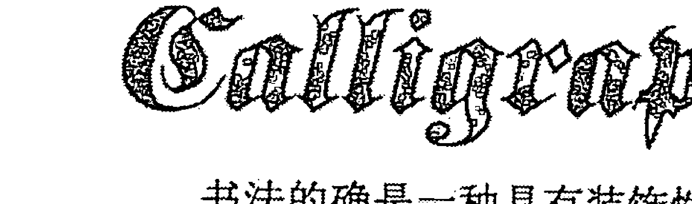

书法的确是一种具有装饰性的书写艺术。如今人与人之间普通的书信式交流都越来越少，艺术性的书法就更只会在一些特别场合或者特别有意义的事件上才会出现，比如结婚请柬上对客人的邀请，或者婚礼致辞。不过如果你想学的话，还是有很多途径的，你不仅可以在书店买到一些关于书法入门的教程，而且有些网站上面也有专门教授书法的课程。如果你足够幸运有在复古俱乐部（Society for Creative Anachronism）的朋友，那么说不定你还能找到一位超高水平的书法老师。

# 充分运用你的所学

下面是一些有助于提高你技能的活动建议：
- 选定一种具体的颜色和墨水类型来记录日记。
- 找一个可以教你书法的人或者自己到书店买一本书法教程书，一直努力练习，直到自己能够很熟练地写好每一个单独的字母，然后利用你已学到的书法技能在魔法日记中写下一则日记。
- 利用你学到的书法技能给家人或者朋友写一张特别的问候卡。

# 3. 对魔法的认知

文 / 杰西·沃尔夫·哈丁

对于魔法师来说，每分每秒都是一个决定性的时刻，任何一件我们要做或者不做的事情都必然是深思熟虑后的选择，我们绝不是愚昧的受害者或牺牲品，所以我们也绝不能抱怨或者发牢骚——也正因为这样，所以我们才能不同于常人，我们才能拥有比穿衣吃饭更多更智慧的能力。事实上，一个魔法师最明显的特质就是拥有高度的自我认知能力。魔法能力最神奇的部分在于只有当我们完全地认知一切——认知自己所有的潜在能力，认知任何可能存在的局限性，认知当前的情形和环境，认知其他人的意图和魔法能力……以及认知我们所画咒符、所念咒语、所施咒法可能产生的一切有意或者无意的影响，我们才能最大化地利用它，并使之服务于我们的魔法目的。我们魔法师拥有这个星球上所有物种中进化最先进最完善的大脑去思考和推理，但同时也需要发展一种古老的动物式的认知能力，这种能力不仅存在于心智中，更存在于每一寸皮肤每一块骨头，甚至每一个细胞基因中。举一个简单的例子，一只猫平时显得温顺可人，可当它在捕抓老鼠或者其他猎物时，一瞬间它的眼神中就会射杀出如史前剑齿虎（Saber tooth Tiger）一般令人生寒的凶残目光，这是它对敌人的一种本能反应。其实，这种能力在我们古老的部落时代祖先或者年代更为久远的原始人类身上非常常见。

当我们身处一个新的或者危险的环境时，这种能力会突然显得尤为明显，好像一瞬间，周围的一切都变得更为清晰明朗，我们的思维更加活跃，脑子转得更快，考虑事情也变得更加专注有条理，甚至仿佛我们能通过这一刻的所听所感来预测下一秒即将发生的事。很多时候这类事情或者行为的发生甚至不用经过大脑的判断，就好像当我们在路上看到一条蛇，脑子里甚至还没有浮现出“蛇”这个词时我们就已经飞快地跳开了。

这就是佛家常说的当下之存在感，去体会当下的生命存在。魔法师和精神术士把这种高度的认知能力和有意识的行为以及崇高的信念相结合，以帮助一些大事件的形成，进而有意地改变我们的世界。只有有了完整的认知，才能做出正确的选择，对于一个魔法师来说，任何行为无论大小，都必须做出谨慎的选择。

人生来就有一定的认知能力，但是如果不注意修养自己的心性，那么随着年龄的增长，越来越多的世俗的东西就会污浊内心，或者有的人为了逃避更多的责任而故意去降低自己的认知能力。与之截然不同的是，魔法师们会赋予自己更多的责任和使命，会通过有意识的修炼和实践来提高自己的认知能力，而这样的自我提升过程往往需要耗费毕生的精力。罗马不是一天建成的，任何事情都需要一个漫长的努力的过程，新生的婴儿也是要通过一遍遍的摔倒一遍遍的练习才能最终学会走路。

世界上跑得最快的人必然是受过长期专业训练的人，他们每日刻苦地练习，促使自己每次都能做得更好，最终他们在日复一日的练习中发掘了自己的潜力，提高了自己的能力。勤学似春起之苗，不见其增，日有所长，魔法师的修炼亦是同理。除了睡觉之外，魔法师（学徒们）应每时每刻都保持刻苦修炼的状态，虽一时难见其效果，但最终你会得到应有的回报——如生命般崇高的智慧。

你可以尝试以下这些可以提高自身认知能力的练习：
- 每日关注太阳的升起和落下，无论是在陌生的小镇还是当天有阴云；每日关注月亮的阴晴盈亏；每日观测河水的流向，并记录风向以及风力大小。
- 自然界是最适宜修炼认知能力的地方，即使是在一个充满花草树木的小院子或者公园里也不错，但一个魔法师的修炼并不仅仅局限于此——除开必要的睡眠时间外，你们应该每时每刻都保持练习的状态。
- 每一次当我们近距离地观察周围的一切时，这种注意力是给我们自己最好的礼物。当我们走在人行道时，留意生长在道路两旁的小草或者树木，留意水泥路面的裂缝，留意努力想探出头的蒲公英，留意车辆来来往往的不同声音，留意并享受鸟儿们各种各样美妙的声音，即使你正忙着和某人交谈，也千万别错过路边这些美丽的风景。
- 试着一次只用某一个器官来感知这个世界，这样可以加强这个器官的能力。其中一个练习的方法就是先蒙住你的眼睛，然后通过朋友发出的声响来找到他，或者到一个草坪上，在你附近放上一个橘子，你只凭嗅觉来找到它。另一个方法就是蒙上你的眼睛，让别人喂你吃某样东西，让你凭味觉来猜出吃的是什么——这些操作起来可比你想象中难得多，但坚持练习会有非常好的效果。
- 不管你在哪，一定要留意那些可食用植物和可饮用水的位置，并提防任何潜在的威胁，比如危险的交通、倒塌的电线、某人阴郁的表情、结冰的路面等等可疑的东西。
- 如果你知道谁刚好也正致力于提高自己的能力，那么你们可以做一些游戏来挑战彼此。比如在对方毫不知情的情况下，让你的一位朋友从你们的教室外面走过，然后问对方他们刚刚注意到了什么：谁刚刚经过，他（她）穿的什么衣服，他（她）还做了什么，他（她）的手上是否有拿着东西，他（她）是否和教室里的其他人有过什么互动，是否留意到他（她）来这有何目的等等。
- 留意你身边的人。当某人在告诉你某个故事或者某件事的时候，注意观察他的肢体语言，由此判断他所言是否属实。通过某人的穿着、发型以及动作来揣测他想在别人的心目中留下什么样的形象，以及他对自身的看法——比如他是否肯定自己精神上的力量，如果他是持肯定态度的，那么对于他拥有的力量他又有何打算：是引导使之即刻产生一定的作用，还是改变使之创造出更强大的力量？试着去思考别人又是如何来看待你的，人与人之间又是如何一点点产生联系的，试着去找出你对某个人或者某件事恐惧的根源，同时更要努力去找出那些恩赐和关爱之源。
- 试着用感觉去感知和领会你已经拥有的力量和其本质，尤其是精神层面的。一旦你修炼到了能用心而非眼睛看世界的境界时，你的认知过程就会如“冰与火”的游戏一般，越接近真理就会越觉得意义重大、越激动、越热血沸腾，可是当你一转身或者在某个路口转错了方向，那么一切感觉就会瞬间消失……然而这样的过程是必须的，越多练习你就越能掌控“火”的感觉。
- 留意什么是最难的，然后特意去挑战或者战胜它，以此来增强你的能力。留意哪些东西是需要技巧才能完成的，然后从中认真学习。留意保守承诺的意义，然后诚心向全世界承诺。
- 留意哪些东西让你感觉舒服，而哪些东西让你感觉不安。记住，对于一个魔法师来说，安逸反而容易带来更大的危险，我们能力的增长更多的是依赖于对不安、恐惧以及逆境的战胜和克服。
- 永远不要忽视你对别人，或者是周围环境的影响。你的态度，你做出的表率，你关注到的或者你忽视的，你的想法以及你的行为对那些和你接触过的人都产生了哪些影响呢？他们有因此而使灵魂受启发，变得更好吗？你生活的方式是否有直接或者间接地影响到大地之母盖亚的其他具有魔法生命的孩子们——土地、水和空气？他们是否因为你而变得更好或者更糟呢？努力去改善你的感知和行为吧，以便更好地造福于他人和整个世界。
- 专注并增强你的意志力，然后看看会有哪些改变。你曾努力祈祷和希望的那些事看起来是否要成真了？曾经的朋友、谈话、活动、某个好看的电视节目，或者个人的一些习惯，都会分散你的注意力或者削弱你的意志力，以致减弱理想的魔法效果，但现在这一切是否已不再成为你的障碍？
- 当每一天结束时，试着去回想当天发生的每一件事的每一个细节：这件事是怎么样的；你有什么样的感受；你又是怎么做的，并把这些记录在你的魔法日记当中，不过记得不要仅仅只记录你观察到的那些东西，更要把你是如何应对以及你做出的行为产生的影响记录下来。

# 4. 感知和幻想

文 / 奥伯伦

正如我之前曾在上一本《魔法师学徒的魔法书》中解释的一样，大多数魔法师都会用异于常人的眼光来看待事情。而其中一个有趣的方式就是一些修炼长达数年的魔法师们会通过视觉幻象艺术来展示和增强自己的能力。

许多幻象无非都是与透视有关。我们的大脑总是容易自动地把物体的尺寸大小和距离远近扯上正比关系，比如当我们看到某样东西比其他东西显得更小，就会觉得它一定离我们更远；而如果某样东西离我们比较远的时候，我们就会觉得它一定看起来会更小。我们一直理所当然地持有这样的观念，直到文艺复兴时期才慢慢相信平面立体的透视图并不是艺术家们搞的把戏。在中世纪的很多作品中，艺术家们就是这样来表现远处的物体的，使得它们在图画中看起来就像是近在眼前的一样，正如我们大脑中对他们真正大小的印象。如果此刻你的某位朋友正站在离你有一定距离的地方，那么你可以闭上你的一只眼睛，然后另一只眼睛只用透过你手指间细小的缝隙就能看到你朋友整个人的身影。但是这只是幻象，是我们的大脑自己创造出来的，以致我们好像感受到了物体本身真正的大小。这也正是中世纪较常用的一种绘画技巧。

这幅生动的作品于1754年由威廉·霍加斯（William Hogarth）创作，他主要是想通过这幅画来教大家如何利用透视的手法形象贴切地画远景，他曾说：“如果谁设计了一幅作品，但却没有任何透视的画法，那么这幅作品看起来将是荒谬而不可信的。”

皮特·杰克森（Peter Jackson）在《魔戒》三部曲的拍摄中就充分利用了透视原理。他创造了“强行透视法”的摄像角度使得霍比特人（Hobbits）在电影中看起来比演员实际的身材小得多。比如，在拍摄中他只要让弗罗多（Frodo）或者比尔博（Bilbo）站得比甘道夫或者阿拉贡（Aragorn）更远一些，拍摄下来弗罗多和比尔博在镜头中自然就会相对显得小一些，同时杰克森还在场景中置放一些显得稍大的道具，这样拍摄下来就显得更自然逼真了。

“月亮幻象”是最著名的例子之一。一轮满月在刚刚升上地平线的时候仿佛显得比在正空中要大得多——虽然实际上月球距离地球长达238,000英里，基本上无论它在空中哪个位置，我们在地球上看到的角度都一样，那为什么我们还会觉得它在地平线处时显得更大一些呢？那是因为我们大脑理所当然地认为地平线比正空更远些，远处背景中的树木、房屋等小得使人看不清楚，月亮在这种背景下升起来当然就会显得更大些了。

上面这幅名叫“地下世界（Terra Subterranea）”的画出自罗杰·谢博德（Roger Shephard）之手，这是一幅基于错误透视绘画理论的作品。从图画上我们可以得知，前面的这个“小”人正被后面的一个“巨人”追赶，很明显，两者在体型上相差很多。然而事实上，这两个人却是同卵双生的兄弟，大小高矮、容貌衣着，几乎各个方面都是一模一样的……这是透视绘画技巧带给我们的又一种错觉。

另外还有一种视觉幻象是基于多（歧）义性理论的，意思是说同一幅画中同时有两种或两种以上的画意，这种画真的是非常神奇，不同的人基于不同的角度或者思维方式就会在同一幅画中看到不同的形象，所以它们又被形象地称为“变形画”。比如以下这张出自G. H. 费希尔（G. H. Fisher）的小小的人头像，你看出了几种不同的形象呢？乖巧的女儿？温柔的母亲？还是慈祥的父亲？

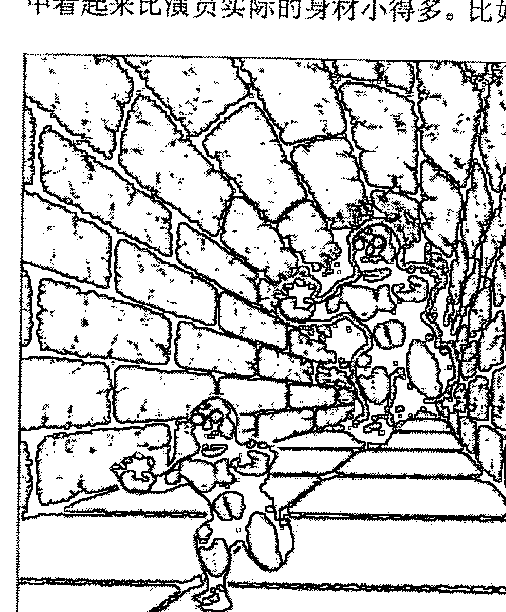

或者下面这一个怎么样？它是一只天鹅呢还是一只松鼠？

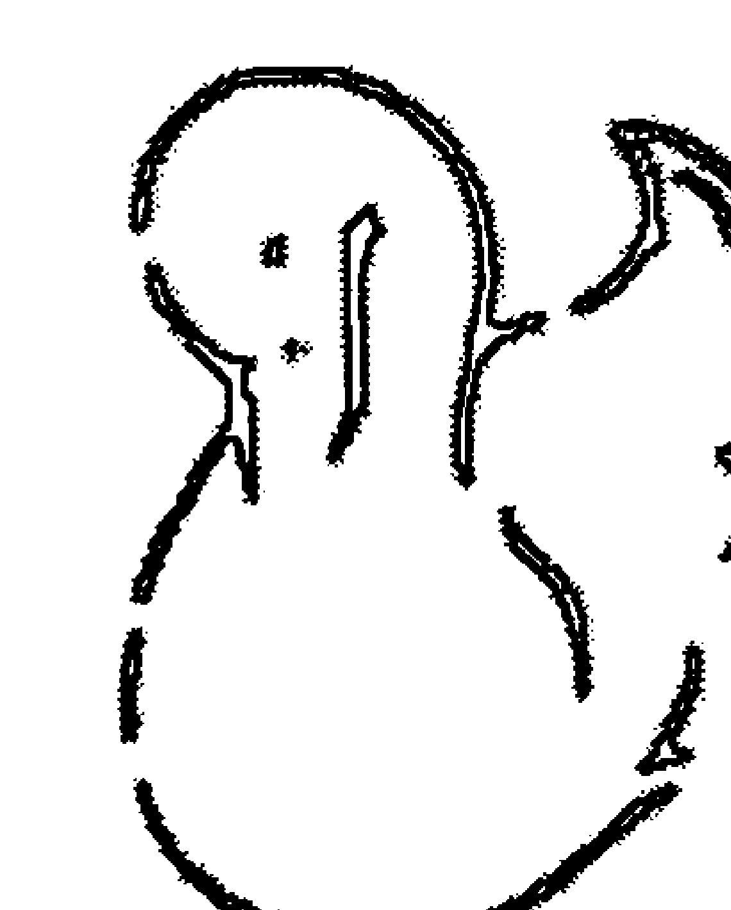

在下面这个著名的例子里面，这样的效果由一个背景的正面对着这个背景反转后的一面产生，不同的效果取决于你是将黑色部分看做背景还是白色部分。你能既看到花瓶又看到两个侧脸吗？

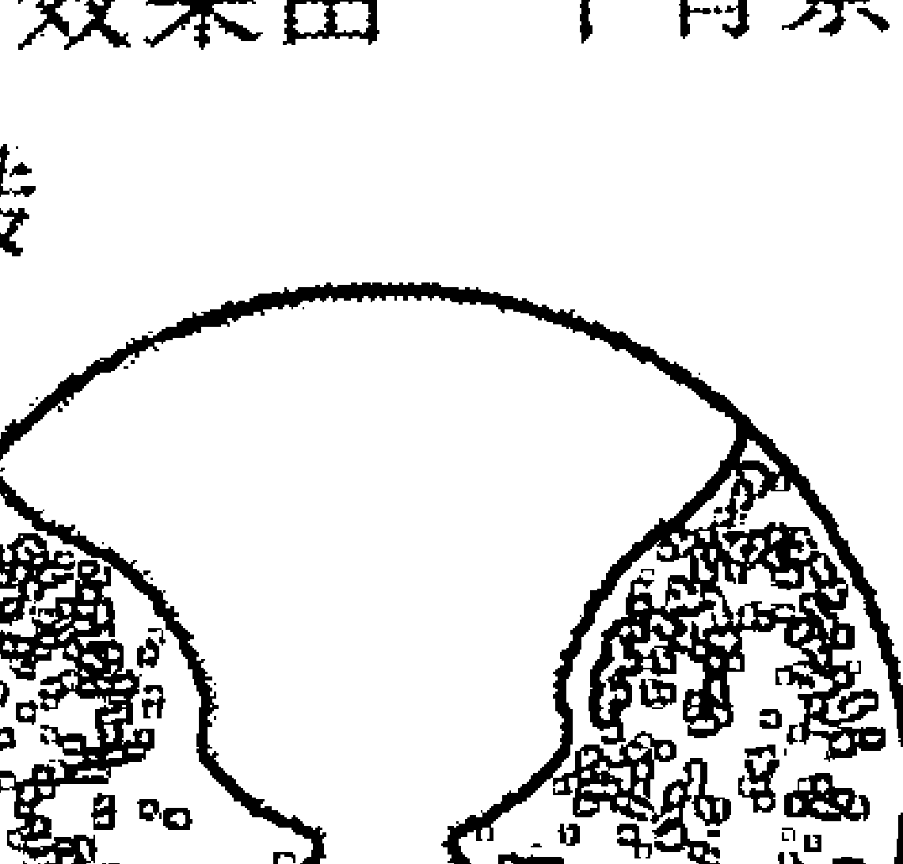

再看下面的图片是什么？

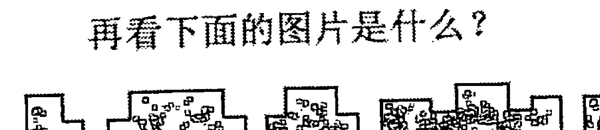

这些图片只要你稍稍转到不同角度去看，它们就将是完全不同的。你会相信中间的图像是个人像吗？

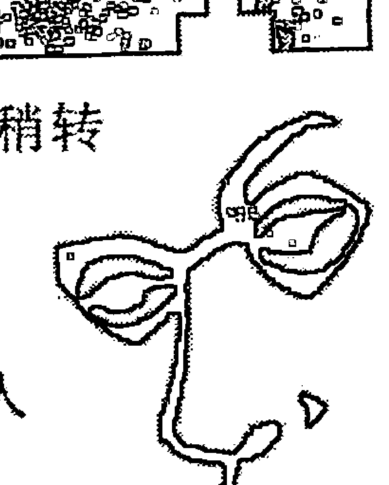

这些图片其实是在和你的思维玩骗术！将第三张纸拿到一英尺或者差不多那么远，然后盯着下面这个圆的中心的黑点看，将你的头向前或者向后移动。看看发生了什么！

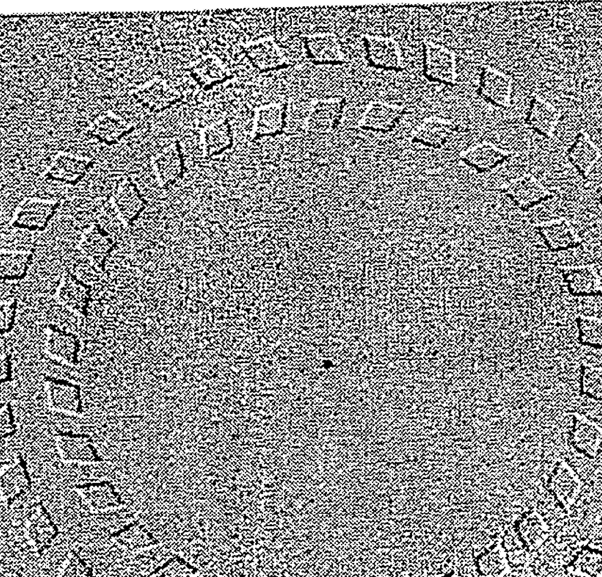

这里还有一些在纸上看起来足够真实，但是却是不可能实际存在于真实的世界中的东西。

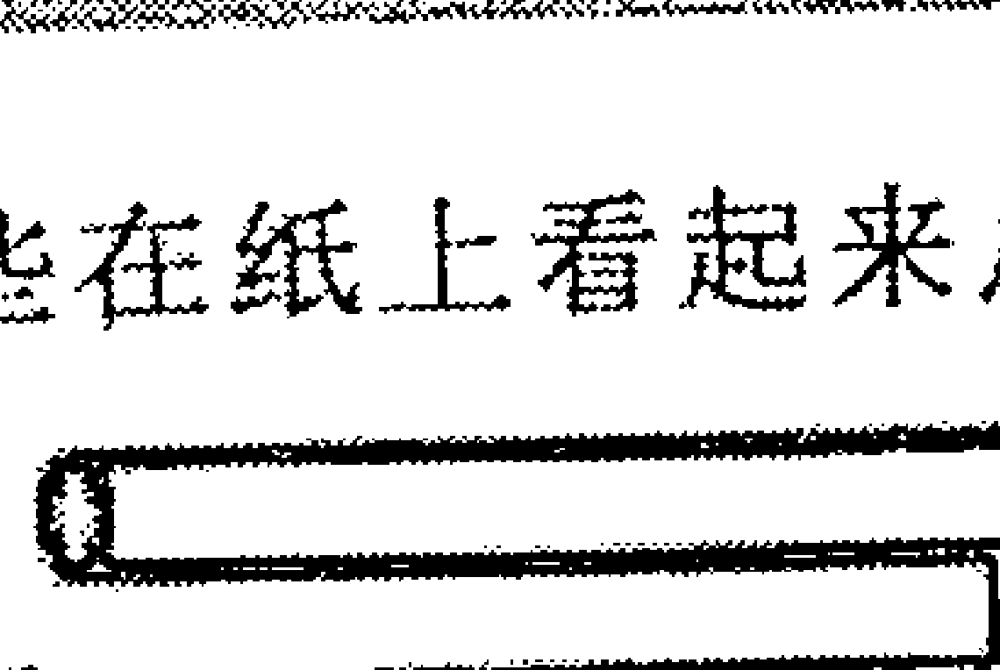

举例来说，上面这个是非常有名的“舒斯特尔之谜（Schuster’s Conundrum）”，或者叫做不可能存在的叉。有无数种变化在这上面，诸如下面这个大象，这只大象有多少只脚呢？很多很多类似的视觉错觉的图片相当多的一部分都能够在“惊奇艺术”（Amazing Art）网站上看到，地址是：http://member.lycos.ns/amazingart。

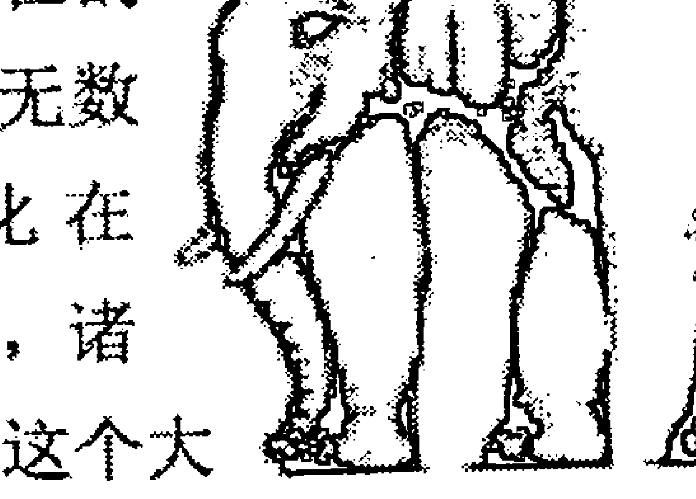

# 看看鸟

还有另一种视觉错觉的效果有许多实际用途。它把真实物体渲染成3D图像，让其凹面多过凸面。因为我们会认为真实的东西应该是凸出来的，这种视觉错觉可以轻而易举地愚弄我们。这种视觉错觉的确是非常古老了，我曾经在2000年前的克鲁马努人（Cro-Magnon）的洞穴里看到过！在图画上，动物们仿佛正沿着这段长长的通道向洞口走去。有些被画在平坦的表面，另一些被更加聪明地画在了岩石墙面上自然凸起和结块的地方。但是最令人称奇的是被画在凹陷石头上的动物，当你从它们旁边走过，油灯中闪烁的光线会投射到凹陷的地方的影子上，变化的光线使得这些图案看起来像活过来了一样。

现在这种技术在空心铸件和制造面罩上已经非常流行，将凸面画得逼真到就像真的一样。设计得就像普通肖像一样，他们以一种幽灵般的形式出现并在房间里如影随形。

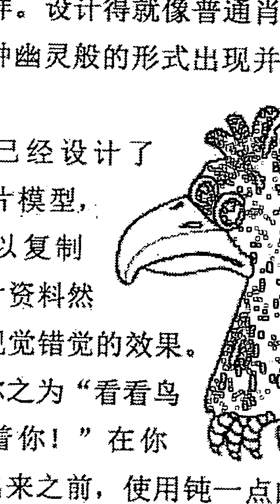

我已经设计了一些纸片模型，你们可以复制这种卡片资料然后剪出视觉错觉的效果。我将它称之为“看看鸟正在看着你！”在你将它剪出来之前，使用钝一点的餐刀和标尺将要剪裁的边缘画上虚线。另外对这个和其它所有的剪裁图案都要使用白色的乳胶。

当你都收集好了之后，将它放置在一个齐目高度的架子上，闭上一只眼睛，然后在它前面后移动。这时鸟儿的头就会转动，不管你怎么变化位置，它的眼睛都会跟着你移动。但是当你两只眼睛都看着它的时候，这种视觉错觉就会消失。你能找出其中的原因吗？

顺便提一下，当你将看看鸟放置在带有环形面的玻璃杯或者玻璃鱼缸中的时候，这种效果会得到极大的增强。

# 5. 光学动画

在19世纪早期，几个科学家和发明家发现使用一系列的静态图片可以形成动态影像。这一切形成的原因是因为人的大脑会自然地将看到的图片进行短时间的保留，使得人在眨眼的时候分辨出不是因为天变黑了的缘故。

这一现象被称为“似动现象”，或者通俗地说，就是“视觉残留”。“似动现象”第一次被彼得·马克·罗格（Peter Mark Roget）记载于1820年，视网膜（就是我们眼睛后面的光敏投射屏幕）会在短时间内保留上一幅画面。如果我们观察每十分之一秒或更短时间的闪光，我们会感觉它是连续的。每一个闪光的印象或感觉会存留在视网膜上至少十分之一秒。也正是因为这个持续感觉，我们不能分辨哪儿是一次闪光的结束和哪儿是一次闪光的开始。取而代之的是我们感觉到的是连续的光。

这个现象是动画片和电影的基本原理。一系列持续性变化的图片必须在至少速率为10次每秒的情况下呈现到眼睛里，而且在每一幅图片之间必须要有空白的空间，使得画面之间不会互相干扰。之后大脑将会在两幅画面之间形成精神上的桥梁使之衔接起来，让静态的画面看起来确实在变化。（你是否曾经近距离地观察过电影的胶片，并发现所有的图像都是独立的被分开的？电影通过每秒24帧的速度连续投射到荧幕上使你的眼睛确信这些画面是连续的！）

## 留影盘

在 1824 年，英国内科医生约翰·埃尔顿·巴里斯 (Dr. John Ayrton Paris) 发明了一个简单的装置给英国皇家学院的内科医生们展示“似动现象”。这个装置由一个两面都印有一些画面的圆盘构成，另外还有两根线系在圆盘上。当这个圆盘在这两根线之间旋转的时候，圆盘正面和反面的画面同时呈现，形成一幅连续的影像。两年后，他开始在伦敦售卖这种前所未有的动画玩具。他称之为留影盘 (Thaumatrope, 英语读音近似: THOM-a-trope)。受欢迎影像包括笼子里面的鸟和老鼠、马戏团表演、猫狗打闹等。留影盘是第一个出现的光学玩具，简单的装置就能提高连续的动画娱乐，这种玩具的流行持续到现代电影技术的形成。

当胶水晾干后，在两边指示的地方开一个小洞。然后将大约 8 英尺长的线从每个洞里面穿过去并把两头打结，或者你也可以将长的橡皮筋穿过去绕成环。我还是推荐着色的时候上淡黄色，给树叶上绿色。

想要使用你的西洋盘，用食指拿着绳子或者橡皮筋的两头，然后将圆盘一圈一圈地拧起来。拉动你的手指使得距离增加或者减少，将会使圆盘连续地转动起来。如果它转动了起来，那么你将会看到两边的图画都会混合成一个。死掉的树将会有茂盛的叶子；鸟儿将会出现在笼子里；单词将会变成“魔术”。

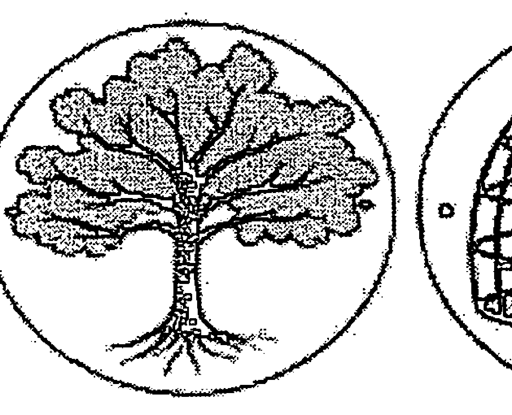

根据我在本书后面提供的设计，可以轻易地制作出自己的留影盘。仅仅需要按百分之一百五的比例复制这些图片，然后将一对图像粘在一块硬纸板的上面，就像后面的这种笔记本一样。将硬纸板和图片剪裁成一个圆形，然后将另一幅图画粘在圆盘的背面。（重要提示：一面必须跟另一面是颠倒的！）

它是什么？魔术（“奇迹般的操作”）是希腊单词实践魔法的意思。

现在试一试制作你自己的留影盘画吧。奇思妙想！画一匹马儿在一边，然后在另一边画上一个人，使得这个人正好是在骑马。画一个杂耍演员在一边，然后在另一边画几个在空中的球；一个光头男人的头在一边而假发在另一边；一条鱼和一个钓鱼的人。在制作“一半图画”使得转动留影盘的时候“整个”图画变化得好看的过程中享受乐趣。

## 幻透镜

动画发展的下一步是幻透镜 (Phenakistiscope, 英语读音近似: FEE-na-KASS-ti-scope)。1830年，比利时的约瑟夫·安托尼·费迪南德·普拉图 (Joseph Antoine Ferdinand Plateau) 发明了幻透镜。几乎同时，奥地利

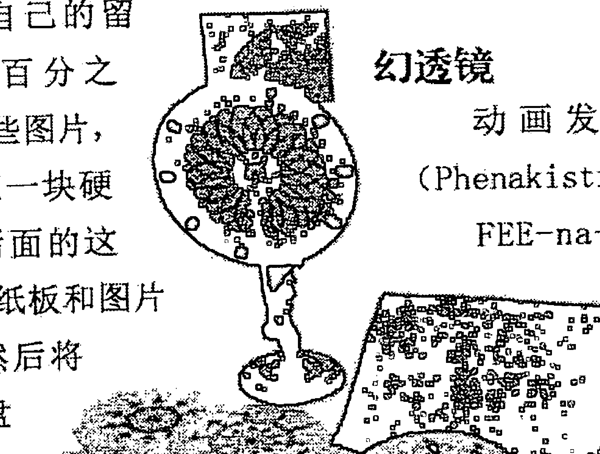

利工业学院的西蒙·利特·梵·斯坦福（Simon Ritter von Stampfer）教授在1832年也独立发明出了幻透镜。普拉图称他的发明为幻透镜。梵·斯坦福教授称他的发明为“频闪观测器”。在1833年，阿克曼（Ackerman）在伦敦开始售卖这些被命名为“幻视器”的圆盘，它成为我当时的最爱。同时它也被称为卡雷多拉马（kaleidorama），或者魔法圆盘。

幻透镜看起来是一张类似老唱片的圆盘，上面会画上一系列八到十六个具有连续性动作的卡通形象，这些卡通形象环绕圆盘外侧边缘而画，垂直排列在一个近似圆圈上，并且在图案与图案之间的圆盘上会留下一定的空隙。一般常画的图案大都是一些抽象的形象或者表演者，比如杂耍演员或者特技演员。这种装置需要借助镜子来进行观看，当圆盘被安置在某种转轴上后，只要转动它，人们便可以从圆盘的后方，透过圆盘上的细缝，在镜子上看到连续移动的图画。

斯坦福发明的频闪观测仪是在原有的幻透镜基础上做了一些改良，他在原来可旋转的圆盘上面又安装了一块静止并且带有楔形“窗户”的圆盘，这样只要透过这扇楔形窗口（而非借助镜子）便可以看到连续移动的动画形象。

如果你们想要为自己也制作一款神奇的幻视镜，只需把本书后面的圆盘图案描摹在一张硬卡片纸上（包括其中一张圆盘上的要开的那扇小“窗户”），然后用图钉穿过带有窗户的那张圆盘中心，将其固定在一根木棍的末端，并且用胶带把它固定到圆盘上合适的位置——不能挡住“窗户”的开合处——这样当把这根木棍水平放置时，才能像图片所示的那样透过“窗户”看见圆盘的下面部分。然后用同一个图钉再把画有图案的圆盘也固定起来，当然有图案这页一定要朝上，这样透过上面圆盘的“窗户”才能被看见。

为了检查制作的效果，你可以透过上面圆盘的“窗户”看向下，然后转动下面的图案圆盘直至各个单独的图案仿佛一起奔跑了起来，如果制作成功的话，你将有幸第一次目睹自己亲手创造出的动画。

如果有闪光灯的话，你甚至不需要上面的“窗户”圆盘就能看到同样的动画效果。

好了，现在就试着自己动手做一个吧，仅仅需要把一个大的圆盘平均分成12或者16等份，就像切披萨一样，然后画上自己喜欢的具有连续性动作的图案就行了。

> “世界之间” 现在，一堂真正的魔法课即将来临，由幻视镜为我们揭晓： 我们在真实世界所感知的一切最终都会以不同频率的振动反映到我们的感官

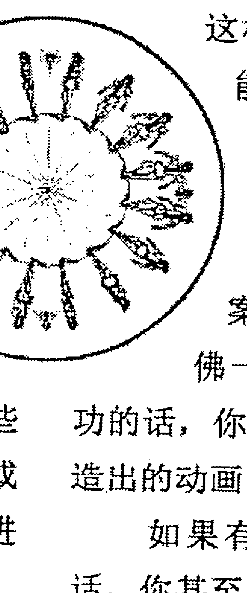

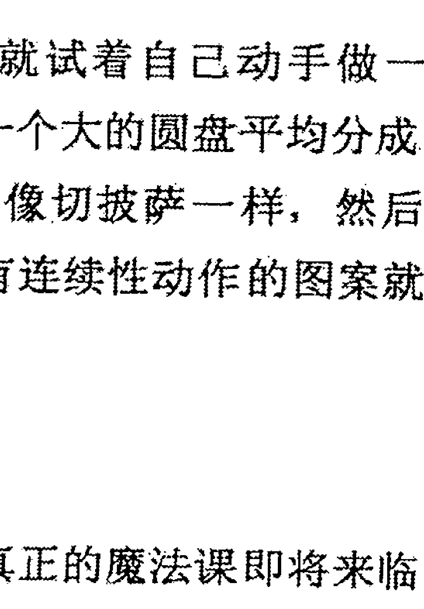

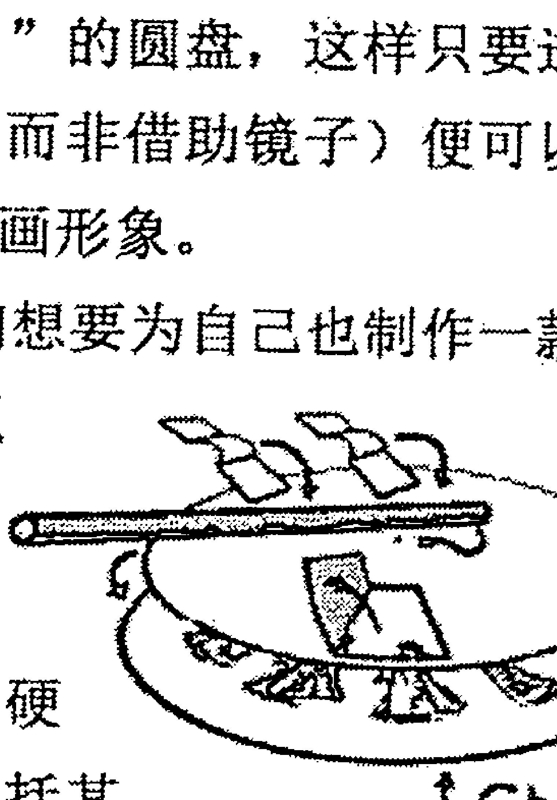

## 魔法师学徒的伴侣书 | 上卷

（觉），或者科学仪器上面来。不论我们谈论的是电子的振动频率还是电磁能光谱，又或者是声音，其实所有一切——物质、能量、时间、空间都不外乎是以不同的振动频率存在于不同的振动频率之中。作为一名魔法师，我们的感官天生就是被用来寻求这些不同频率的特殊区间（及特殊性），比如可以看见的光线或者是可以听到的声音。我们需在自己的大脑和感官中建立起一种特殊的思考机制，用以顺畅过渡各种振动间存在的间断，这样我们才能把它们，甚至整个世界当成一个连续的整体来看待。

事实上，我们就像是收音机或者电视的频道选择者，我们可以随意按键，从无数个不同的频道中选择一个自己喜欢的电台或者频道。不过不同的是，我们自身内在的“频道选择者”却永远只有一个固定的频道可以选择——其他的都被“停台”了。

幻视镜很简洁明了地揭示了这一本质：依靠不同的旋转速率（即速度频率），一个微不足道的图案也能变化出千变万化的形象。

现在想一想，如果我们所感知到的一切不过是频率循环上与我们感官相匹配的一部分，那那些频率与频率之间的间隙部分呢？幻视镜上各个图案之间都有一定的间隙，而我们与生俱来的“视觉暂留”使得我们常常忽略对这些间隙部分的感知。那如果我们在这些间隙部分中也添上图案，并且让它以不同于原有图案的速率旋转，又会是怎样的呢？比如普拉图制作于1832年的16位芭蕾舞者形象的圆盘，为了能看到连续的动画效果，圆盘必须以每秒一圈的速率旋转，也就是说每秒要有16位舞者形象呈现在我们的眼前，这样我们的视网膜才不会察觉出舞者的间断。

但是现在，让我们再在这16位芭蕾舞者之间添上四个相同的仙女图案，把她们安置在另一个圆盘上，使之处于芭蕾舞者之间的空隙部分，然后用图钉钉到那支木棍上，不过这样一来，你将不得不用另一只手将木棍和“窗户圆盘”固定好，以便“窗户”现在能处于顶端位置。

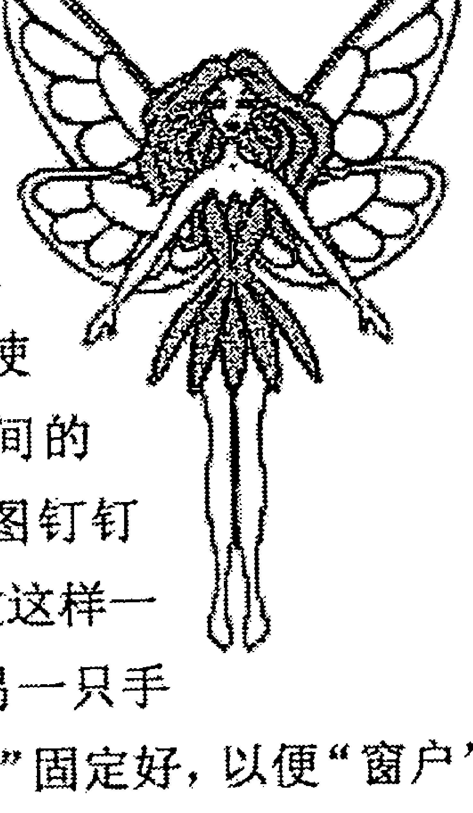

当我们现在还是以每秒一圈的速率旋转时，你会发现16位舞者依然优雅地连续不断地跳着芭蕾，不过当我们加快旋转的速度，以每秒四圈的速率旋转时，你便会发现芭蕾舞者的样子渐渐模糊不清，直至消失不见，而此时仙女的图案却满足了我们视网膜每秒“看”16个形象的条件，所以此时我们会惊喜地发现登场的仙女。

我不禁疑问，那还会有多少个其他世界——平行宇宙或者另维空间与我们平时所见所闻的世界同时存在呢？在“世界之间”存在着仙境、梦境或者我们的来世？——也许这就是为什么历史上会有那么多我们一直解不开的谜题的原因吧！

> 如果我们从不去观察和聆听我们周围的世界，那我们的存在还有什么意义？
——弗兰克·赫伯特《沙丘》
（Frank Herbert [Dune]）

## 幻影箱 (Zoetrope)

1834年，英国人威廉·乔治·霍纳 (William George Horner) 发明了幻影箱，当时他把它叫“代达拉姆” (Daedalum，苏格兰语，意思是奇特的轮子)，然而直到数十年后，当它被法国 (1860年)、英国和美国商人 (1867年) 当成儿童玩具在商店售卖时，才逐渐被人们所知，随后就风靡一时。后来，美国开发人员威廉·林肯将它重新命名为“Zoetrope” (希腊文，寓意“生命之轮”)。

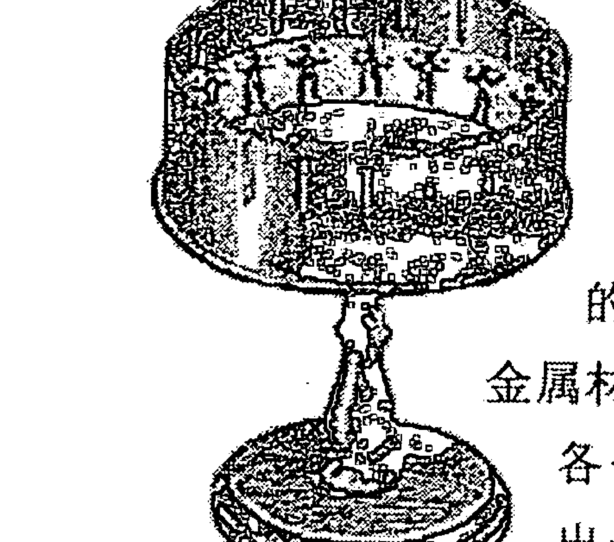

幻影箱和幻视镜的工作原理一样，但是幻影箱的图案是被画在一个转筒的内壁。转筒一般是金属材质的，在转筒上部各个图案之间均匀切出一些细小的缝隙。转筒被安置在一个转轴上，这样当转筒旋转时人们透过转筒上的细缝就能看到图像的连续活动了。

幻影箱的速度可变，转的速度越快，那么看到的动画效果就会越顺畅越连续，不过当其速度减慢到每秒每个图案经过人的眼睛低于10次时，这种连续幻象就会被打破。

### 真相机

幻影箱的问题在于过小的缝隙使得其转筒内不能射入足够的光线，所以1878年法国巴黎的艾米·雷诺 (Emile Reynaud) 在幻影箱的基础上做了一些改良，用镜子取代了转筒上的细缝，他把新的装置叫做真相机 (Praxinoscope)，或称“真相观察者”。基本的装置还是保留了和幻影箱一样的设计，一个金属转筒，在转筒内壁画上具有连续性动作的图案，以及转轴。唯一不同的是现在不再是通过转筒上的细缝来观察动画效果，而是将其反射到置于转筒外缘和中心转轴之间的镜子上，再在装置的上方放置一支蜡烛，使得动画效果可以反映得更加清晰。

真相机放映装置中同样布满了图案，可以使得整个实验更加完整。转筒被放置在一个木盒子里，木盒子的盖子上留有一个方孔，通过这个方孔观察者们可以预先看见为“主角”们登场设置的场景。

所有这些旋转装置在维多利亚时期都被统称为“科学玩具”。就像幻影箱转筒上的图案条后面发展成电影胶带一样，这些“玩具”都是激发动画创作灵感的先驱。不过真正的动画电影意味着要画上成百上千张这样的图画，并把它们打印到一卷透明的胶带上，这样才能借助专业仪器以及强烈的光线在荧幕上制造出图案，就像我们用手在光下制造出的阴影画面一样。最后只要再让这些图片以够快的速度移动起来，那么就能在荧幕上也制作出连续的幻象了，现代电影就这样诞生了！

现代电影（胶卷）大多以每秒24张图画或画面的速度运转，而VCR和磁带大

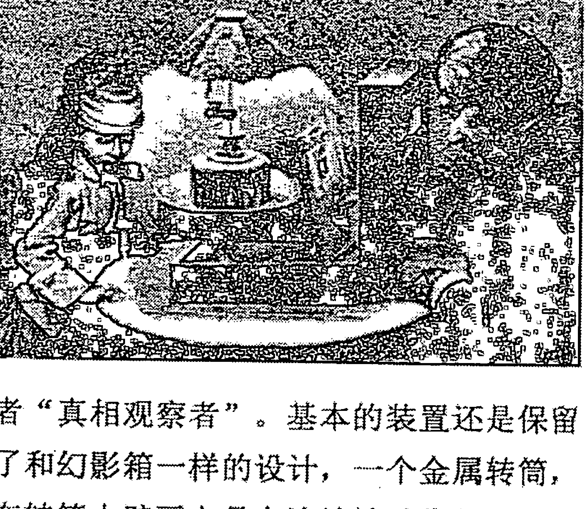

多是每秒 30 张画面的速度，不过以前的无声电影较慢些，一般是每秒 16 至 18 张的速度，以致那些电影画面上的动作看起来都是如此之慢。

以上讲到的这些将带领我们进入下一课的学习：动画电影中的魔法。将由魔法学院的教务长伊丽莎白·巴纳特女士为我们呈现。

## 6. 动画电影中的魔法师和魔法

文 / 伊丽莎白·巴纳特

> > （ 改编自《迪斯尼动画的神圣主题：这是一个神奇的世界！》[It's a Magical World: Sacred Themes in Disney Animation]， 潘 · 盖 亚 [Pan Gaia]， 2000 年秋。）

许多电影都借助了魔法或者魔法师来讲述故事，本节课的目的就是来探讨动画电影中这样的写照。作为一个魔法初学者，你们不能仅仅注重现实中的施法能力，同时也要注重潜在的思想能力。我们的其他课程主要讲授严格的职业道德和魔法技巧，而这节课则主要是讲创造力和语言阐述，安排这节课的目的也是为了让你们开始思考什么是魔法，什么是魔法师，以及他们对你来说意味着什么。

下面根据电影的发行时间，列举出了 13 部有关魔法和魔法师的电影，请你们将仔细观看每一部电影，并在你们的魔法日记中做好相关记录（这些电影不论是在网上，还是实体商店中都非常容易找到）。在魔法的世界里任何问题的答案都不是唯一的，所以请尽情写出自己的真实想法。

### 电影

### 日版《西游记》(Alakazam the Great)

日版《西游记》是今天所有提到的电影中历史最悠久的一部，和现如今的电影相比，这部电影的制作可能略显粗糙，但其故事本身还是非常有意思的。故事讲述的是一只叫孙悟空的猴子，不满足于仅仅做一个猴王，它想要得到更多的法力。于是它开始从神仙们那偷取法力，可是慢慢地，它所偷来的法力超出了它的控制能力，后来在高人的指点下，它开始穷尽余生去努力学习如何正确地使用法力。

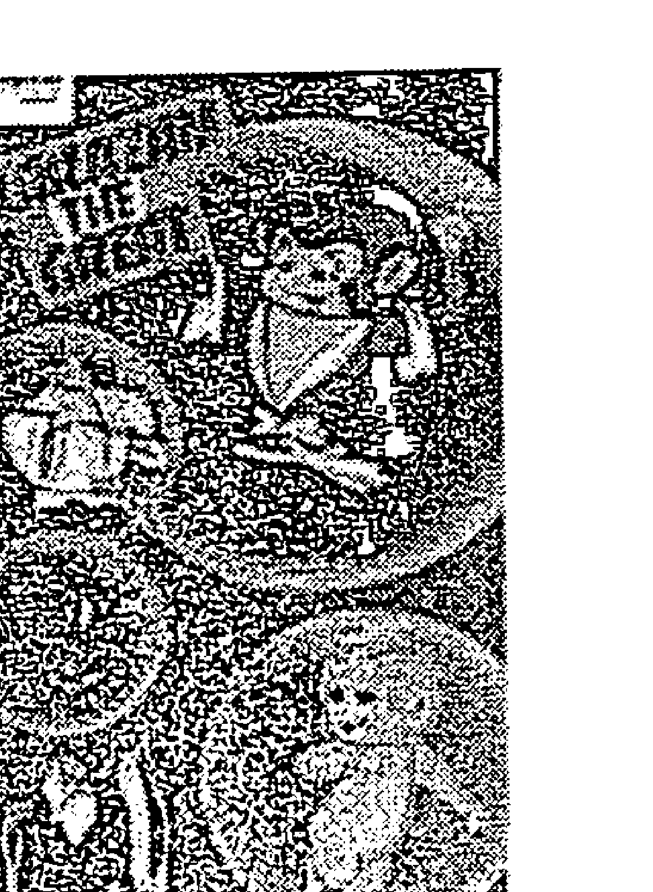

### 《石中剑》（The Sword and the Stone）

1963 年 由 迪 斯 尼 公 司 出 品 的 电 影， 改 编 自 T.H. 怀 特 (T.H.White) 的 同名小说。电影在原有故事的基础上进行了异想天开的创作，不过主要还是围绕亚瑟王早期的一些重要故事来写的。这部电影包含了许多关于魔法的独到见解，正如梅林法师说得那样：“永远不要愚蠢地以为魔法就能解决一切问题！”

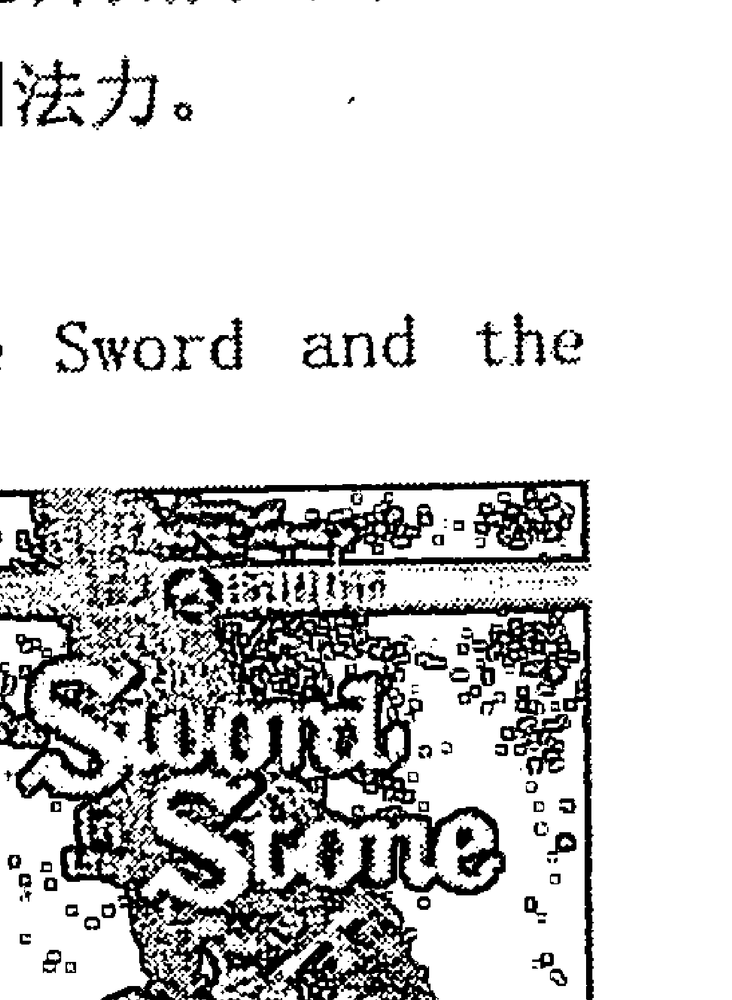

电影中有一段情节设置是关于变身术的，在这期间年轻的亚瑟分别变成了一只鸟、一只松鼠和一条鱼，同时体验了在海陆空三种不同空间的感受。电影中梅林法师和疯狂的米莉太太（Mad Madame Mim）的变身决斗不仅为影片带来了很多笑点，同时也向我们传达了一个很严肃的信息，那就是拥有魔法的人一定要有很好的道德操守，就像最后梅林法师是利用自己的聪明才智打败对手，而非违反自己的原则一样。

魔法和科学是可以完美结合的，智慧的梅林法师就将它们运用得得心应手。这部电影不止一次向观众传达出一个理念，那就是智慧永远胜于蛮力。并且在电影的最后，也让我们明白了原来亚瑟可以拔出石头中的宝剑，并不是因为他有多大的力气，而是他有一颗最纯净的心灵。

### 《霍比特人》（Hobbits）

本片是根据J.R.R托尔金的同名小说《霍比特人》改编。这部电影讲述了一位魔法师带领13个小矮人和一个霍比特人——矮小的男孩比尔博·巴金斯东去寻宝的故事，主人公毕尔博·巴金斯机缘巧合得到了一个魔戒，最开始这枚魔戒好像很有帮助，可最后它却招来更多的厄运。影片的高潮是战胜恶龙斯矛格（Smaug），以及为地下宝藏如何分配而引发的战斗场面。对于冒险，比尔博有自己精辟的见解：“充满了险恶和不幸，总让人错过和家人团聚的快乐！”

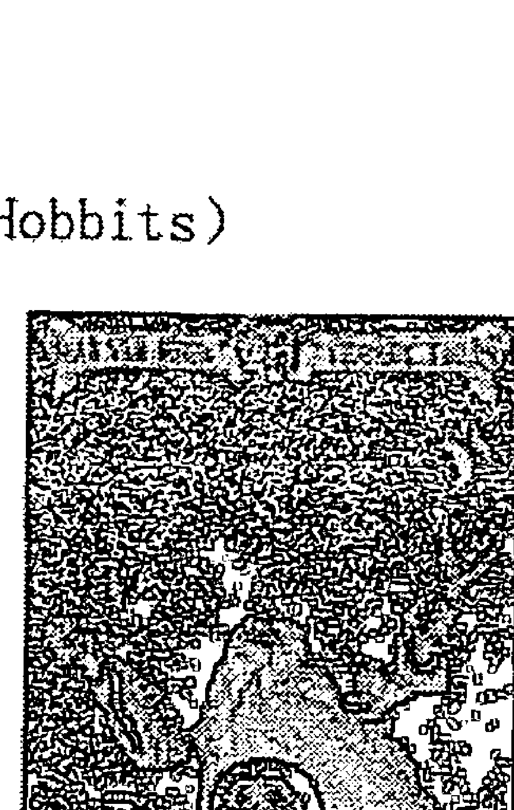

### 《魔法师的战争》（Wizards）

影片1977年由拉尔夫·巴西克（Ralph Bakshi）执导，其科幻大于魔法的主题在类似电影中还是比较少见的。其故事梗概是：人类由于核战争已经湮灭，灰烬上兴起的种族精灵族、仙女族、矮人族和突变种族继续在地球上繁衍生息。仙女族女王生下一对双胞胎儿子，都是强大的魔法师。阿凡达（Avatar）是一个善良的小精灵，而黑狼（Blackwolf）却是一个邪恶的突变种。他们为世界的命运而战，但是各自使用的却是截然不同的方式。

### 《最后的独角兽》（The Last Unicorn）

改编自彼得.S.毕格（Peter. S. Beagle）著名的同名小说。作者用他的生花妙笔，给我们展现了一个险象环生而又浪漫优美的魔幻故事。一只孤独的独角兽，一直平静地生活在一片美丽的森林里。当她得知自己可能是世界上最后一只独角兽时，毅然离开了熟悉的森林，踏上了寻找同类的漫漫征程。一路上，她和她的人类朋友——一个半吊子的魔法师和一个古道热肠的女贼，历尽艰险，深陷巫魔会、夜困

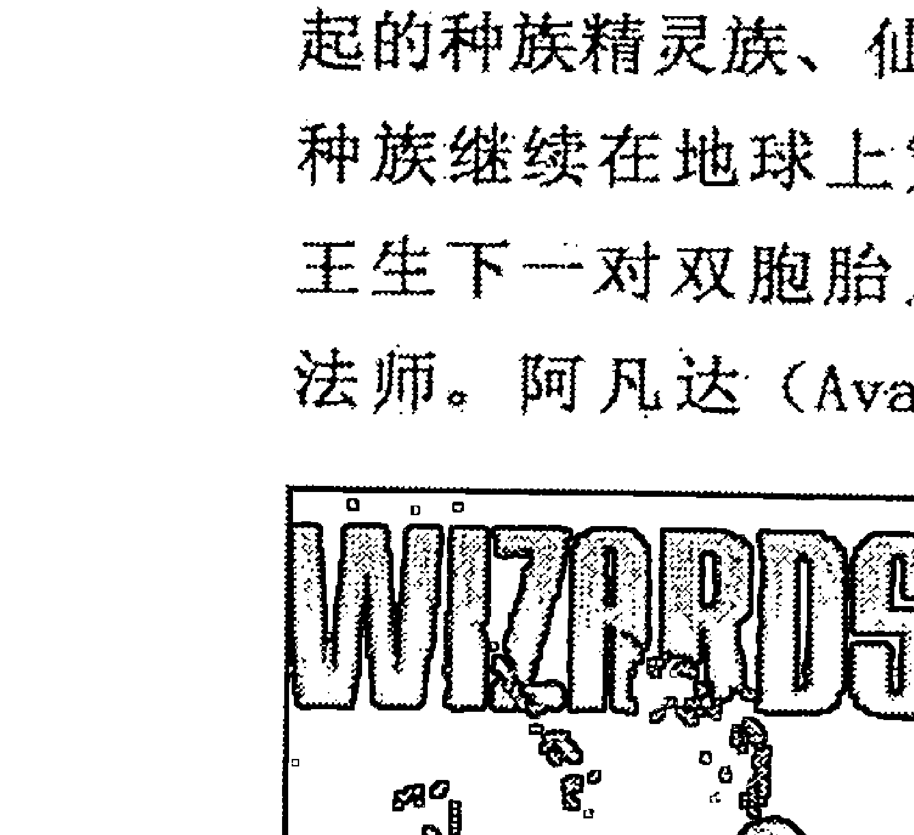

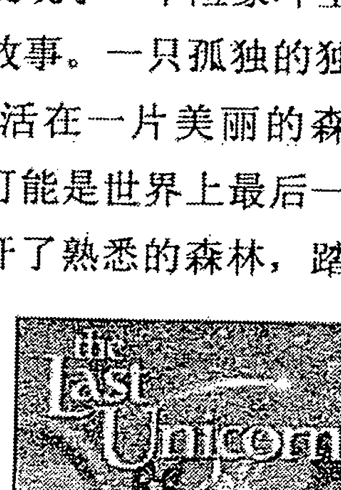

黑森林、探秘女魔城，险象环生，几经生死……影片的最后，独角兽在王子爱情力量的助力下战胜了红牛，解放了被驱逐到大海深处的同伴们。

### 《狮子王》 (The Lion King)

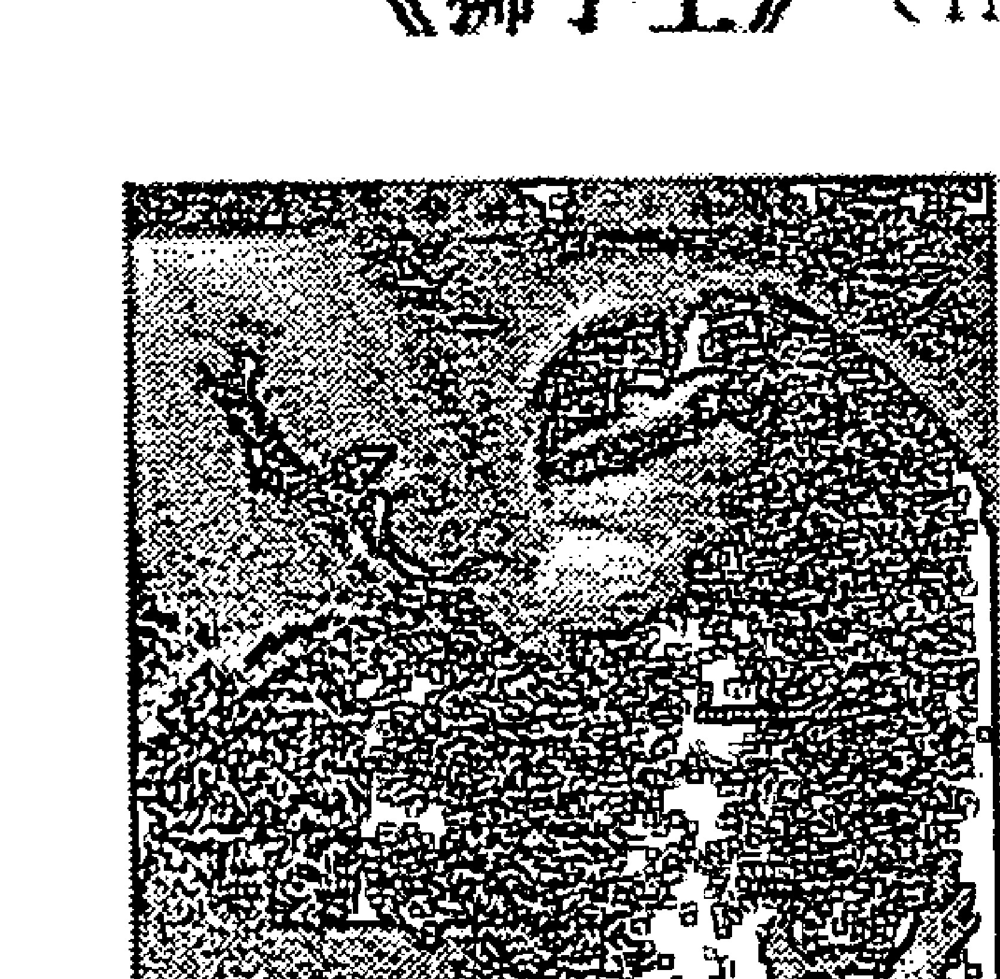

这部影片围绕着对王权的探讨，对于一个国王来说，和其息息相关的就是他所拥有的领地。影片中主人公辛巴（Simba）的叔叔设计害死了辛巴的父王，并赶走辛巴，篡夺了王位。后来在逃亡途中，辛巴结识了两位好心的朋友——机智聪明的猫鼬丁满（Timon）和心地善良的野猪彭彭（Pumbaa），并且和他们快乐地生活在一起。渐渐地，辛巴成长为了一只英俊的雄狮，但是他并不想回到王宫去，直到一次他仿佛看到自己的父王突然出现在他的眼前，他才明白了自己身上肩负的责任。辛巴回到了王宫，并向暴戾的叔叔宣战，后来取得了胜利，夺回了本属于自己的王权。

### 《幻想曲 2000》 (FANTASIA 2000, 迪斯尼, 1999)

是 继 1940 的《幻想曲》之后，由多位名家共同执导的古典音乐动画电影续篇，通过最先进的科技，将经

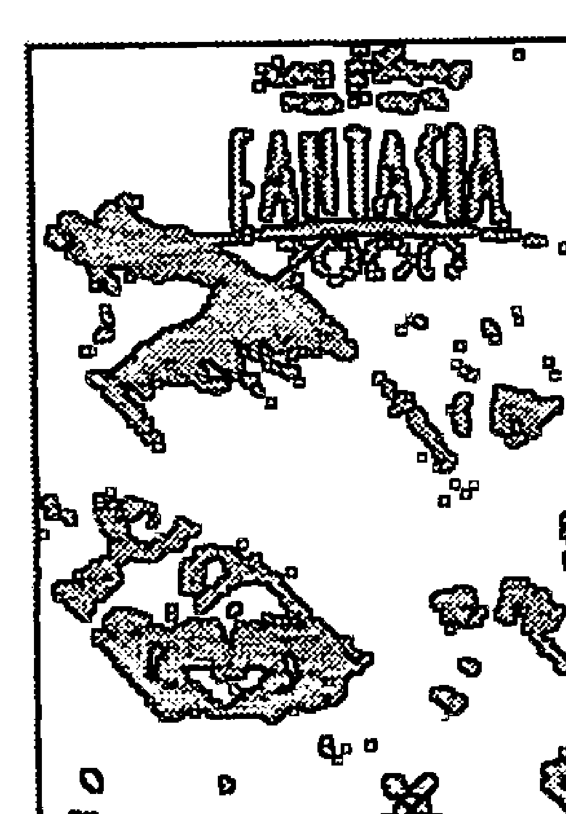

典音乐和动画艺术融为一体。法国著名作曲家保罗·杜克斯 (Paul dukas) 所作的《魔法师的弟子》 (The Sorcerers Apprentice) 更是其中不可或缺的经典乐章。故事讲的是魔法师的弟子趁师傅外出时，偷偷地摆弄起师傅的魔法扫帚来，结果其魔法力量比它想象的难以控制，搞的水漫金山，十分狼狈。这首乐曲生动有趣，富有戏剧效果。另一个经典乐章是《火鸟乐章》(Firebird Suite)，是作曲家艾格·斯特拉文斯基 (Igor Stravinsky) 的著名作品之一。故事大致讲述的是一只雄性麋鹿对一块冰柱低语施法，将之变成了一个可爱的精灵，这个精灵的法术可以唤醒大地上的一切生命，可是很不幸，她也唤醒了山中可恶的火鸟，并因此险些丧命。这个故事主要探讨了魔法的来源，以及魔法的正确使用。

### 《千与千寻》 (Spirited Away, 迪斯尼家庭娱乐, 宫崎骏, 2001)

故事讲述的是一个叫千寻的小女孩随父母一起搬到一个新的城市去，可在途中他们迷路了，一条林间小道将他们带入了一个完全陌生神秘的国度，很快小女孩的父母因为贪婪，被变成了猪。但是在锅炉爷爷、小玲以及白龙的帮助下，千寻努力在这个陌生的地方站住了脚，并且靠她的努力成功救回了自己的父母。这部电影主要呈现了信任、奉献和家庭责任的主题。

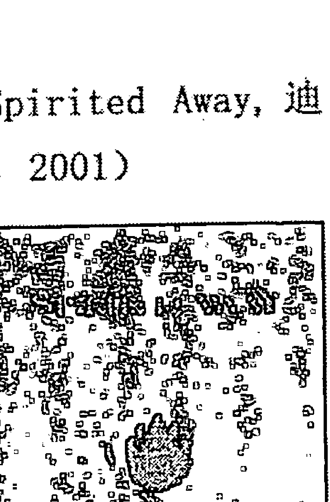

## 7. 旅程

文/书月人

你们正在经历着一段只属于自己的魔法旅程：努力学习魔法知识，练习魔法的技能，定时写魔法日记。慢慢地，你们还会开始得到或者自己制作出一些魔法道具，以及魔法长袍，使得自己更像一个魔法师。

当然，还远远不止这些。

魔法修炼是一个漫长的旅程，在魔法的道路上，你的每一个脚步都将不同于你的前一步。

到目前为止，我们已经讲到了很多关于魔法旅程的基本要素，比如，你可以通过记日记或者一些其他的工具来协助你的练习。

但是撇开一切外在的来说，最重要的还是你内心的修炼。魔法旅程是属于你自己的。

请仔细阅读下面的两个故事，并思考他们各自的象征意义是什么，以及那些象征对你意味着什么，你本身是否也和故事有相似之处。

---

## 故事一

当到达一个薄雾笼罩的区域时，小舟被无声地划向了岸边，掌舵的是两个有着古铜色皮肤的男子，他们穿着粗糙的短裤。最后，船停靠在一个有沙滩的岸边，我静静地跳下船，走进齐膝深的海水里，水温温的，很舒服。我没有转身向他们道别，但我可以感受到他们静静远送我的目光。

我独自向沙滩上走去，我想真正的考验就要从这里开始。一些妇女站在沙滩上认出了我，她们没有对我微笑，不过目光中倒也并没有不友好的东西。她们用手向我指明了去往树林深处的路。当我踏上这条小路时，我能感觉到她们也静静地跟在我的身后。太阳此时已经爬到了正空，微风中满是浆果诱人的芳香，路边的草和树绿得仿佛能流出汁水来，我不禁恍惚，就好像此时突然身在别处——那个我在梦中曾到过的地方。

又走了一些时辰后，小路变得开阔起来，前面空地上静静伫立着一幢由石头和木头搭建而成的建筑。我被告知要独自进入这里面。

刚进去时，我的眼前一片黑暗，过了好几分钟才适应了里面的环境。我摸索着穿过走廊，进入了主室。壁炉里的火还燃烧着，火焰偏向一边。壁炉旁边站着一个女人，这个女人不像我曾见过的任何女人，可是她看起来又像是我所见过的每一个女人。她的头发漆黑，但又夹杂着丝丝银白；她的眼睛是灰色的，直直地凝视着我。她穿着深蓝色的长袍，脖子上戴着一块美丽的月亮石，月亮石上面雕刻有北欧文字。她的右手上拿着一根小小的魔法棒，棒的末端镶嵌着晶莹的水晶。我注意到在她的右手腕处有一个新月图案的纹身，纹身颜色和袍子一样，是神秘的深蓝色。她的腰间还系着一个用皮毛做成的袋子，袋子很鼓，我想一定是收藏了很多我无法想象的东西。

房间的另一边放着一张小小的圆桌，上面铺着森林绿的桌布，布料上隐隐闪着光，就好像有无数的金色斑点。桌子的款式很时尚，并不很古老，桌上随意地摆放着很多东西，我能看见有蜡烛、贝壳、装满水的圣餐杯，以及闪闪发亮的银质刀叉等等。桌子后面的墙上摆放着很多架子，架子上陈列着各式各样的瓶子，有的里面装满了透明的液体，有的里面装满了晒干的树叶和种子，旁边还摆放着用来称重的小秤，以及一本皮制的笔记本和一支羽毛笔。壁炉的另一边是一张中等大小的餐桌和两把椅子，桌子上只单调地铺着一张蓝色桌布。桌子的一边放着一盘水果，一根粗粮面包和一瓶看起来像葡萄酒的东西，另一边却放了一本书，一本看起来很华丽的书。书皮是皮制的，周围还镶有银色的边，它看起来好像在发光一样，又好像是有什么东西在它里面微微颤动。书的封面上还刻有很多高深莫测的符号和标记，不幸的是我几乎全不认识。此刻，我却突然注意到自己棕色的外衣和空空如也的双手。这时，那位神秘的女人突然对我微笑起来，并指着水果和面包说：“你一定饿坏了吧，来，先吃饭吧，然后我们就开始……”

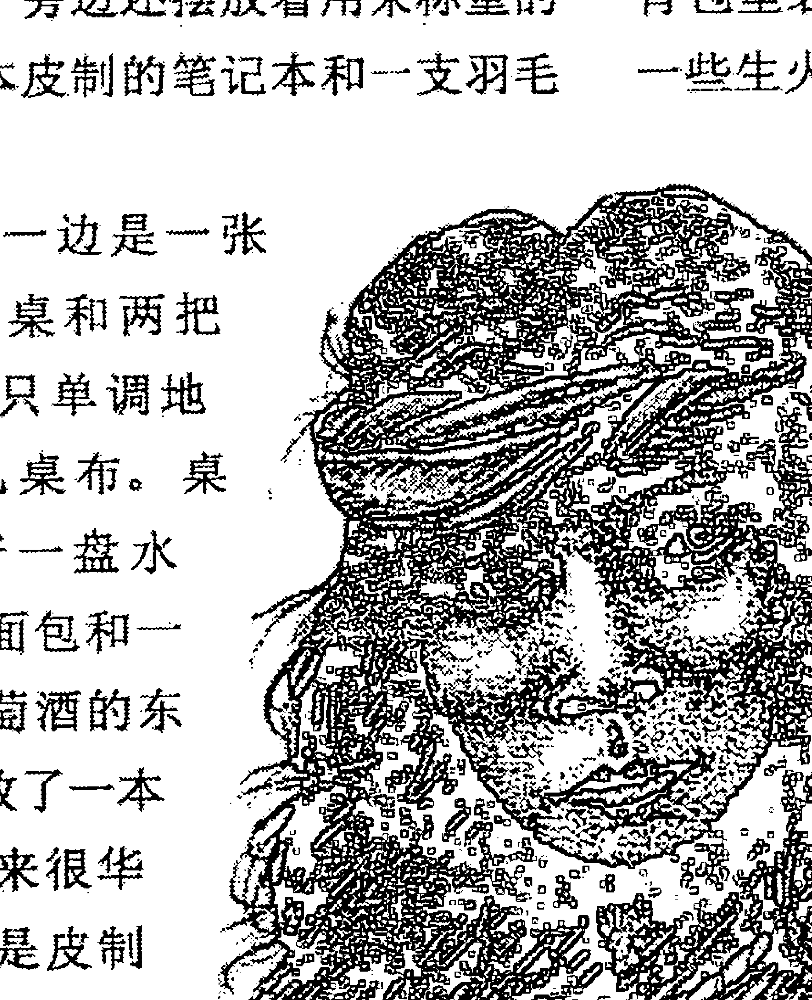

## 故事二

这个男孩独自走进了丘陵之中。他头上戴了一顶看起来很暖和的帽子，脚上也穿着结实的靴子，但身上却只随意地穿着一件无袖短上衣和防雨的斗笠。他背上的背包里装着土豆、匕首、绳子、毛毯以及一些生火的材料。借着桤木雕刻出的阶梯，他开始带着水袋向上爬。他在山上发现了一处很适合过夜的较高点，于是他快速地打扫出一块地方用来生火，并将火堆生在悬崖的边缘以便温度能够反射回来抵御寒冷。在检查水袋的时候，他很满意地发现水袋几乎还是满的。他拿出匕首，走向树林，弄回来了一些冷杉的枝叶，他要用这些冷杉的枝叶在悬崖火堆旁铺一张“床”。他知道如果他晚上睡在空地上的话，一定会非常冷，而这些枝叶正好能够用来做天然的床垫。这个事情也做好后，他开始给火堆收集柴火，并用喃喃的声音表示对森林的感谢。不一会儿，他就已经弄到一大堆柴火了。这个男孩正在进行他的探索之旅。他被告知呆在山中直到圣景的出现。他在寻找自己的灵魂动物——甚至还有更重要的，一个新的名字，一个新的开始。他迫切地渴求着。其实对于参加这个仪式来说，他还有些年轻，才刚刚满14岁。但是，他却主动提出了这样的要求，并且得到了允许。他知道有很多人希望他失败，因为那些人不相信他已经强大到可以独自忍耐到圣景的出现。他知道事实并不是他们所想的那样。当他还在家生活时，如果去户外，他早就已经知道如何通过观察天空和倾听大地的韵律来判断天气。他能找到食物和水源，会做结实温暖的帐篷，而且还可以在动物发现他之前就听出动物的动向——他感觉自己已经完全的准备好了。

傍晚来临的时候，这个男孩在一堆环形的石头中围起了一堆圆锥形的火堆。靠太阳落下去的方向辨别西方，他用火堆边的石头标明了基本的方位。当太阳完全落下山时，他喃喃地做着晚餐前的祈祷，从四面八方召唤荣耀并感谢火所带来的力量，然后点燃了火焰。火堆很快燃烧起来，哔哔啵啵地响着，并且很快带来了暖意。火堆燃起来了之后，男孩把一个土豆放进了火堆的灰烬中。

太阳慢慢地从地面落下去，夜幕静静地拉了下来。男孩背靠着悬崖壁，在火堆反射回来的温暖中舒服地坐着，土豆已经吃完了，他又喝了一些水。他凝视着火堆，整理了一下自己的心情，然后任思绪飞扬。

> 西方之神啊，水是生命之源，水融入我的寸寸肌肤，滋润着我。西方之神啊，您沐浴着我的灵魂。

> 北方之神啊，您赐予我坚硬的岩石，高耸的悬崖和绿色的森林，陪我度过黑夜，保护着我。

> 东方之神啊，请用洁白的云，芳香的风和纯净的空气共同清新这个世界，让我在您无尽的智慧中深深呼吸。

> 南方之神啊，火之摇篮，请与我的心灵共舞，用愿景温柔我的双眸。

他静静地坐着，凝视着跳动的火焰，观察着火花朝着空中的翻滚，听着木头发出的破裂声，闻着辛辣的烟，感觉热量扑面而来。在寒冷的夜中，他拉过毛毯盖过肩膀，然后睡去。

第二天早上，这个男孩在冷晴的日出中醒来。早上美丽莫名的颜色展开着，覆盖着他和他周围的一切。尽管没有等到神圣愿景，但他还是睡得很好，并且做了一个美梦。现在，在早晨甜甜的空气中他感觉自己精神抖擞。他微笑着，拨动着火堆，从火堆边缘拿出一块木炭，他在两边的手臂上都画下一个长而直的标记——第一个夜晚他就这样度过了。

今晚，他沉思着。今晚……
无声地，他开始了他的一天。

## 第二章 自然（银色）

### 命盘循环

命运是一种迫于外部的力量，
生命是一种从内部产生的力量，内心
愿望的表面现象，本质的必然表现。

王子注定会成为一名国王
橡子的命运则是成为一棵橡树

生存或死亡，
进化或灭绝，

灵魂把自己塑造成自己原本的模样，
自然而永久地成长。

火星变成营火。
种子变成大树

然而我们人类不用经历这些就能利用
自身的魔法来满足自己；
我们能够学习自我的发展。

你不能直接改变原来的自己
或你将要变成的人
但你能影响你自己，你不能违背你的
本质而改变。

橡树不会变成一棵柳树，
柳树也不会变成一朵玫瑰。

但是你能塑造你的枝干获取最好的阳光，使得小的生命能在你的保护下茁壮成长。

每一瞬间都是
一次机会，让你运用你所拥有的来做得更好。
在过去漫长的时间里，
你的生命的螺旋钟没有松开。
你出生，开花，结果，一直前进然后
更加完全地进入你只会的领地。
你的成长不是进入一个模具而是一种
运动，进入一种永恒的不费力地从灵魂里
打开自己。
每一个想法都使你更接近你自己的结论。
河床不会创造河流。
河流冲刷河床，流进海洋，顺着它自己的意志而行事。
随着我们创造了人类，我们创造了一个可以自由穿行的世界，可以站立的舞台，为我们最终的完美的生活设定一个框架。
命运是唯一的一个可以成为愚蠢的借口和责任的赦免。
生命是由最大限度的形状的容忍组成的，不是因为外部力量形成的道路，而是因为内部显露的一种模式。
生命是经历从一个你到另一个你的过程，这样的你会变得更加忠于自己。
坚信你的优秀，坚信你用你自己的方式创造了一个完美的你而没有受到任何影响。

> 用你的一只眼睛一直关注你的心，那坚定的信念会带领你找到你生命的轨迹。

## 1. 简介

欢迎来到自然的世界！

自然的学习包括玄学和与自然相关的神秘学的所有方面。这对拥有巫术且被称为自然哲学家的魔法师来说是非常重要的方面。

在这部分，你将学到非常重要的自然学习方法，同时，你会变得很惬意也会对自然世界非常地了解。你将得到在自然这个领域对徒步旅行、探险、露营、园艺和享受有益的冒险的有用的建议，不管是在郊外还是城市，你同样能学习生态，学习自然环境现在所面临的威胁和如何保护他们。

与这部分相关的颜色是银色，银色代表着女性对直觉、洞察力、梦想、天赋和预言的力量。银色代表月亮的颜色、自然的秘密、女人的神秘和魔力，以及巫术。

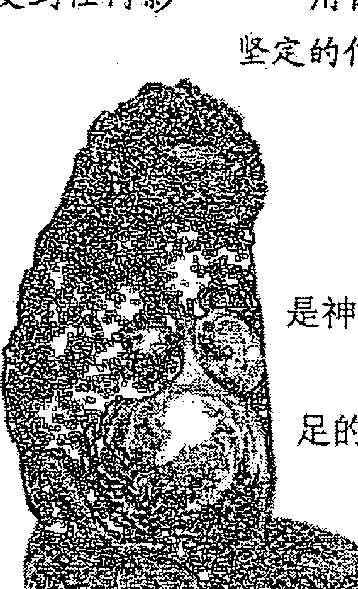

是神圣的。

- 思考……
1. 自然的本质是精神。
2. 自然不是一场随意的意外，它有自己的意义、重要性和目的。
3. 自然的某些方面是无形的。
4. 自然是一个整体的巨大的一部分，超越时间和空间。
5. 自然的美拥有内在的价值。
6. 维持美和自然的和谐是好的。反之则是不好的。
7. 所有的动物、植物和自然景色都是神圣的。
8. 所有的生物都有平等的自我满足的权力。
9. 内心世界是自然的一部分。
10. 我们应该用歌声、舞蹈、艺术、诗歌和故事来庆祝创造。
11. 科学是用来学习关于自然知识的必不可少的工具。

> （拉里·盖茨 [Larry Gates]; http://portalproductions.com/spiritNature）

### 2. 盖亚：充满生命力的地球

文 / 杰西·沃夫·哈丁 (银色)

坐落在我家圣坛中间的是一个极富魅力的森林色雕像，她就是掌管神权的安详而又漂亮的女人：盖亚！当我在外面开会或者表演节目的时候，她的优雅和吸引力总是吸引着我们调皮的男巫艺术家——奥伯伦——把她雕刻成一个正处在繁育期的形象：她双腿盘坐，脸部呈现出不属于单一种族的特征。她表现出的不仅是一种极具母性的保护力，还有年轻女性的欲望。她的腿上雕刻着大量的生活在海洋里的鱼类和贝类，有古代的，也有现代的。盖亚的两只绿色的手臂——显现出原始植物的生命状态，也是最近处于被北加利福利亚的伐木公司砍伐的危险中的——巨大的红杉树。她美丽的头发编成 DNA 状的螺旋辫子，各种各样的野生动物攀附在她编起来的长发上，最终呈现出最古老和最简单的生命形式。她的头部高一点的部分是比较现代和复杂的动物的样式，在她皇冠的最高点是具有精神感应术的鲸，双手各拿着一个我们都有责任去关心和学习的、代表着星球的蓝色球体，她就是盖亚——大地之母，她使我们能在地面行走，使我们同其他植物、动物共同生存和穿行。

它被不同地域的人冠以不同的名字：西布莉（Cybele）、女神阿露露（Mâmi Aruru）、女娲（NuKwa）或者特拉（Terra）。在约鲁巴和库纳皮皮（Kunapipi）的土著居民中，大家都称其为安萨亚（Assaya），印度人叫她普利提维（Prithivi），秘鲁的土著人称她巴查妈妈（Pachamama），意为我们被孕育和生长的地方！我们从古希腊语中得到了盖亚这个名字（通常根据“Maya”音节来发音）。根据他们所说的，她是由混沌之中的光和爱所造，她所生的第一个神是乌拉诺斯（Ouranos），即天神。由于得到爱神的力量的浇灌，她象征着生命。像奥伯伦的雕塑，盖亚的意识正在最需要感情移入的地方和意识中传播，正如人类似乎最需要智慧和古代的盖亚的结合体一样！

最早的大地母亲的雕刻品要追溯到3万年至10万年以前了，他们属于最古老的人类仪式的证据和艺术品。引用荷马的话来说，“盖亚是最年长的，是众神之母。”是她鼓舞着创始者并告诉每一个以自然为本的进行精神或魔法练习的实践者包括男巫和女巫，泛神论和近代信仰，深奥的生态学和德鲁伊学说。不管我们怎么称呼我们自己，盖亚是我们人类的起源和我们理想的场所。她是所有追寻者能够寻求勇气和方向的力量，她的梦想会给每一种精神和魔法练习的形式带来清晰、重点和力量。对每个人来说都是如此，即使是那些否认或不尊敬她的人，当我们去世的时候——从我们起初成长起来的肉体和祷告，她是圈和圣火。

> > 盖亚是最年长的，是众神之母。

早期文明教育了我们必须遵守与大地母亲达成的神圣公约，一旦违反，我们的厄运就会迅速到来。很明显，忽视她或者与她相关联的东西，及对她的责任会给文明带来灾难和极大范围的环境危机。同时，我们所需要的一切在此时此地都是可以得到的，是盖亚的精神礼物。我们每个人都被保佑着使我们能够求助于自然，为了梦想，为了成为追梦者所需要学习的课程，为了成为我们时代的英雄。

基本的练习：

- 练习着把地球设想成一个发光的生命，她能够用她自己的方式来感觉满足、喜悦和痛苦……盖亚！这样的事你做得越多，那么将来你在这些方面伤害到她的程度会越小，你更多地会关注她的行为、教导、祝福和修行。
- 试着把你看见的形象画下来，不要着急管她是否完美。她本应该是想象高于现实的。
- 现在设想你的身体是盖亚的延续，是一个她的感觉和知觉器官。不管什么时候你想做对你精神肉体不诚实，或不敬的事情，并且你知道是有害的事，像无节制的狂欢或使自己饥饿，喝过多的酒或吸食毒品之类的，记住你对你所做的事同时也是对她做的。
- 把你画成盖亚的一部分，然后用你内心感受到的盖亚的灵魂再画另一个自己。
- 尊敬，但不是崇拜盖亚。你代表着盖亚所做的最坏的事，这是你与生俱来的，同时你也有能力去把她提出来的事做到最好。
- 用一个空间专门建一个圣坛奉献给大地母亲。包括强大的，代表盖亚的每一个宗族的铸造物品（例如鸟族的羽毛，矿族的石砾，用容器装的代表她的小河和海洋的水，少许毛皮或者四条腿动物的角等等）。加上其他过去当你经历重大的事情时收集的东西，当你成为一个肆意的术士的时候，用来提醒你那些来之不易的教训。
- 在你的圣坛中间放置一个东西，来代表盖亚的整体，以一种你最能联系到一起的形式。这可以是一幅装裱好了的画像，或一种你从杂志上剪下来的自然风景图，然后把他们粘成一个圆形的球或者一个妇女的轮廓。你还可以使用雕像，除了购买奥伯伦的雕塑作品或者人像作品，你也能拿些粘土然后自己制作。你也可以把像贝壳、化石、木头或水晶这一类能在自然界中发现的材料按进粘土里。如果你能做的都是最基本的形状，随你的爱好自由发挥。它会看起来非常像古代的维纶多尔夫（Willendorf）和其他我们所发现的大地母亲的形象。
- 不要像一个顽固的传教士一样强迫任何人接受盖亚信条。尽管如此，你依然能在最佳时机伸出援手，更好地帮助其他自愿的追随者去感受、触摸他们周围和他们心中的盖亚能量。用这个方法来接触人们是有好处的，对所有依赖于地球的生灵来说也是有好处的。
- 选择一种可以让你去激励你的族群以外的人的词汇。不要再用“盖亚”这个词，你可以用“大地母亲”来代替。几乎没有人会为此生气。这会增加你的话语被别人听进心里的几率，与你交谈的人们也会得到帮助的。
- 练习感受生命是失去平衡所带来的痛苦，不管是在你的内心，还是在世界上你的周围。这是一种盖亚感受失调的方法，然后她便可以开始放慢进行必要的魔法和进化更正的速度。
- 练习承认你自己是一个特殊的人，有天赋的人，在得到礼物，和把那些礼物给予其他人的过程中获得满足。盖亚通过我们感觉到满足。
- 练习感受没有尴尬和束缚的愉悦，感受整个知悉的盖亚是如此地让人欢悦。
- 创作一首歌或者赞美诗来颂扬盖亚，然后把你和所有的一切联系起来。
- 在每一个你所举行的仪式和创建的魔法圈中，承认盖亚是所有灵、实体和生命课程的源头。
- 写下并表演个人的和公众的关于大地母亲的仪式，旨在唤醒在场的每个人心中盖亚的内在感觉。
- 在每一次你对盖亚提出要求之后，都要保证你会用行动和努力做为回报。

### 3. 与自然同行

文 / 艾比·维诺如特 (Abby Willowroot) (银色)

成为自然的追随者，是对那些围绕或深入我们内心循环的铭记过程。它是学会尊重小奇迹和稍纵即逝之瞬间的过程，它抛开“占有”去体验世界，去了解整个自然世界。一旦有了这种习惯，它将来就能更好的为你服务。你的感知强弱和你的练习频率直接成正比。遗忘已久或从未唤醒过的本能和能力会在苏醒之后变得强大而可靠。能够察觉周围世界微妙的法师才能称得上一位好法师。

每天早上，你起床开始你全新的旅程。你如何醒来会关系到你将如何度过这一日。学习在日常的挑战中用一个更积极、健康和充满幻想的方式来和生命互动，这就要求你用一种细致的方式来开始每一天。调整你的生物钟比你的闹钟提前半小时响起，这样会保证一天的开始是积极的，醒来时没有负担，并且伴随着睡梦状态里的想法和图像，告诉你的大脑什么时间醒来是进入意识清醒的最佳时机。同时它也能帮你控制你的睡眠和做梦周期。

跟随着法师的旅程，有很多学习的机会，但不比学习自然的神秘和秘密更为重要。这些都是为所有其他的东西而打下的基础。在每一天里都有无数可以向大自然学习新东西的机会，即使你是居住在城市里的人，每天都看看天空，对识别天气有很大帮助。注意感受你皮肤在空气中的状态会教会你察觉一小时后即将到来的雨。每天认真盯着你经过的一棵树，你会发现自然微妙的变化。练习与你遇见的动物们进行心灵的对话。这些全是简单的事情，对于一个术士来说可以培养出强大的洞察力。

我们周围的世界时刻都在变化。有些变化压力重重，其他的变化为我们的梦想、理想和任何可能性的复燃。一旦我们学习更多的神圣生存方式并使用我们的力量，长期坚持的习惯和信念将会发生改变。我们生活在复兴的时代，思维和艺术百花争鸣的时代，一切皆有可能的时代。同时也是面对环境巨大挑战和气候变化的时代。身处训练的术士们将变得非常重要，因为他们的技能会对未来的事件产生强大的影响。因为我们正处在人类历史上一个不稳定的时刻，化身自然追随者的能力对于所有术士来说都是相当重要的技能。

神秘主义、灵性、自我表达与来自自然世界的影响合一。魔法师、萨满、女祭司、和尚、部落长老和来自其他文化的人们汇聚一堂，为共同关注的事和全球改变寻找解决办法。我们的双眼看到的不仅有古老的秘密还有未来的科技。我们发现我们共享的基因遗产和文化差异对充实和团结边界之外的我们有很大的作用。矛盾的是，这些丰富的资源只能掩埋生活的秘密，

## 魔法师学徒的伴侣书 | 上卷

和使能量变得机械化。对于练习形而上学艺术的人而言一点都不重要。

大地母亲的声音是传达给我们所有人的。有时候在微风中，有时候在沉思或仪式中，有时候在笑声中，我们听见了她的信息。那些庆祝女神在月亮下跳舞的人经常唱到“我们都来自女神之手，我们应该回到她身边；像一滴雨，漂浮在海洋里……”这些词提醒我们，我们和大地被永恒之线连在了一起，它把我们的生命捆绑在一起，凝聚了我们的命运。

年轻的魔法师和巫医们都在为治愈世界环境工作着，为重燃自然的神圣灵魂而工作着。如斯丁（Sting）、巴诺（Bono）和阿·格尔（Al Gore），正不知疲倦地分享着关于我们之间的联系和脆弱环境的讯息。即使是像泰德·特勒（Ted Turner）和比尔（Bill），还有梅琳达·盖兹（Melinda Gates）这样的商业梦想家也在为人们的健康工程和地球的环境保护倾注资源，因为他们知道我们是联系在一起的。强有力的、积极向上的改变正在进行中。作为魔法师，我们从宇宙和地球吸取能量。我们正需要利用我们的力量去治愈和拥抱我们的地球家园。我们所有的技能是建立在我们对自然、同伴和自己的理解上的。

作为一名魔法师的你是未来的雕刻师。你对自然和宇宙规律的理解越深，刻画未来的能力就越强。我们正在进入这样一个时代，一个让魔法师的能力对恢复世界平衡起到至关重要作用的时代。学习自然的教训——或简单或复杂——能为你做好准备。每天都要仔细观察学习至少一件关于自然世界的事物，这个简单的练习会使你的感知力和魔法技能得到提升。

使你的感知力和魔法技能得到提升。

在你身体的每一个细胞深处都有基因记忆。对每一个魔法师来说，打开意识大门并进入存于这些记忆的强大智慧是一件意义重大之事。学会了解自然，你便学会了解自己，了解一个无限的真我。

从对自然的学习渐进到对耀眼法术的修炼，真正的力量都是建立在自然运转的基础上。

## 4. 业余的自然主义者

文 / 书月人（靛蓝色）

什么是自然主义者？自然主义者就是学习自然并和周围的自然世界相互交流的人。通过观察和互动，自然主义者开始理解生命的脉络，明白世间万物是如何联系在一起的。用格雷学校的座右铭来说：“世间万物都有生命；世间万物息息相关。”

## 你将需要什么

你可以在电视上看节目或者到当地的动物园去参观来了解自然。但没有什么比得上你亲自走出去到自然世界里学习观看你周围发生的事。为了完成这堂课里的活动，你需要以下工具，也许大部分的东西你家中都有：

- 空白的日志（生命之树）
- 圆珠笔
- 铅笔
- 3-4支黑色蜡笔
- 红色玻璃纸
- 空的鸡蛋纸板箱

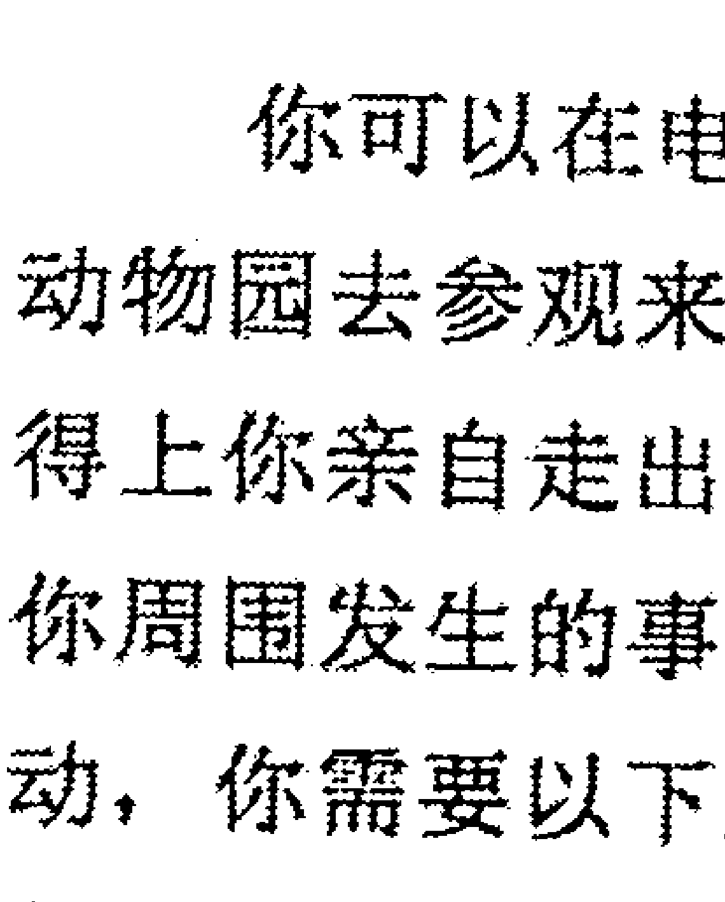

- 旧的电话书
- 8×11纯白色纸
- 纤细的记号笔
- 彩色铅笔（如果你想给你的素描着色的话）
- 大的和小的拉链式保鲜袋（用来装日志）
- 一瓶白色的液体纸
- 小的容器：空的胶片筒、盒子等
- 盖紧盖子的空罐
- 有盖子的玻璃罐，盖子顶上戳一个很小的洞
- 闪光灯
- 放大镜
- 小刀或者多用工具
- 镊子
- 园林剪子（自己选择，但非常方便）
- 剪刀
- 棉线
- 透明胶带
- 卷尺（至少3英尺长）
- 白胶（例如 Elmer 的）
- 胶棒
- 一张折叠报纸
- 相机（一次性相机或数码相机都行）

## 伦理和设想

字典里定义的荒野为：“一片荒凉的区域，荒芜且空旷、荒废或尚未开发。”

我最喜欢的荒野定义是：“人们只愿作为参观者前去，但不愿意留下的地方。”

走出家门便跨出了通往荒野的第一步。当然，你的后院也许不是片野地（如果幸运的话，它也有可能是），但是远离你前门的每一步将使你更接近野外的地方。

当你进入户外，进入到一个神圣的地方，这是一个依从于滚滚向前的季节车轮的地方，一个游荡着生与死的地方，一个进行创造的地方。当你在做的每一件事情的时候，都要记住你正走在神圣的大地上，地球和群星是你的归宿。我的字面意思是：形成我们身体的微粒来自于群星在生死之间的演化过程，它们穿过无穷无尽的太空，进入我们的大气层，掉在地球上，促成生命的形成。正如天文学家和宇宙学家卡尔·萨根（Carl Sagan）说的，“我们是由诸如星星之类的东西组成的。”

成为一个自然主义者需要具备一定的道德规范：

1. 不要轻易采摘植物或花朵，除非它们漫山遍野。
2. 只收集最小的样本。
3. 可用摄像代替收集。你不能收集濒临灭绝的物种，惊扰任何动物的家园，驱逐任何一位带有美洲印第安残余文化的人。一张照片能让你在不打扰他们的情况下就把这些发现珍藏起来。
4. 谨遵“不留任何踪迹”的原则。

> > **注意**：最近的许多“户外书籍”资讯能上网查询。带1-2本户外书籍在身边是非常好的习惯。赫伯·兹姆（Herbert Zim）写的《超级口袋指南》（Golden Pocket Guides）可谓物美价廉：在亚马逊（Amazon.com）上，每本价格低至0.69美元！

## 安全

当您在户外工作的时候，要提前做好安全计划。把您所需要的一切都放在手边，确保那些潜在的危险——诸如锋利的工具、火种都在受控制的范围之内。和魔法一样，安全可以从四个方面来考虑：土、气、火和水。

### 土

爬山的时候用拐杖来保持平衡，它是一个有用的工具。

选择一根直径大约为 2 英尺，至少齐肩高的棍子来制作拐杖。如果愿意，您可以用小刀把树皮削了。有很多方法可以装饰您的拐杖，当然，您也可以不用装饰。在顶端系上一条皮带来支撑您的腕部，如图所示。

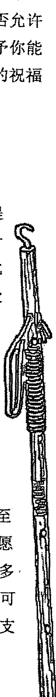

### 气

在准备去户外或举行户外仪式之前，您也许想查询一下天气情况。眼观天空会帮您避开天气所带来的“惊喜”，同时也将保证您的安全和舒适。以观察和做记录的方式学习“阅读”天空和云朵的形状。练习占卜也会帮助您提高预测天气的能力。

这里有一个很棒的网址，能准确预测两天内的天气：http://www.wunderground.com。

### 火

不管你在户外用的是哪一种火（蜡烛、酒精灯、营火等等），都要确保防火工作到位。

纸应该放在远离火苗的地方！同时，确保火苗附近没有易燃物。

不要穿着会触碰到火苗且易燃的长袍、披肩和有宽松袖子的衣服。

如果你是一名年轻的学徒，当你在用火柴的时候，请确保有成年人在身边。

营火应该固定在架好的火圈或烧烤炉上。确保周围没有易燃的物质和悬挂的树枝。

千万不要让火苗自生自灭。

不要直接通过望远镜看太阳。否则结局将是永远的失明。

### 水

当你在户外的时候，不要直接从小溪、湖、池塘、小河或任何水体取水喝。那些水有可能受到污染或充满细菌，这会使你生重病。在喝水之前，必须用以下方法之一进行处理：

- **过滤**——使用便携式饮水过滤器
- **煮沸**（烧得滚烫的沸水）长达 1-2 分钟
- 用**食碘片**进行化学处理（从野营店购买）

## 5. 写日志并收集

如何运用自然日志 对于自然主义者来说，最有用的工具便是他的日志。他们的旅程、观察和发现都写在上面。他们记录下观察蝴蝶破茧的情景，或享受月食时那种奇妙的感觉。 当你在自然中冒险时，你的日志应该是小到可以放入工具箱或者袋子里的那种。它是可以用螺旋铁丝绑定的简单笔记本或者花哨的精装空白书。理想情况下，它要有至少数页的空白，以便于画草图或者地图。 除了书写的笔记，你的自然主义者日志同样应该包括那些看起来比较精确的草图、地图、图表、图和其他的一些东西。你可能会想粘贴照片或其他东西在上面。 用你的日志来对远足、野营、观星或者家庭户外冒险做出跟踪记录。附加一只有趣的蝴蝶或迷人的彩虹速写，或者画一张药草园的地图。把它粘在一张你最喜爱的郊游照片中。无论你如何使用日志，尽情地乐在其中吧！ 下面是一些助你开始记录的格式：

- 你在什么地方？
- 今天是多少号？
- 天气如何？
- 月相怎样？

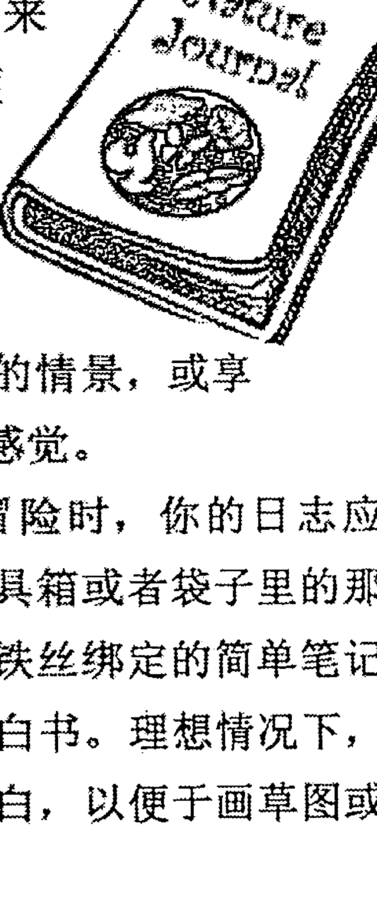

尽你所能地多用不同的形容词来描述 你所在的地方： 你有看到什么生物吗？ 你有感到什么能源或灵气吗？ 闻起来是什么味道？ 你听到什么声音？当你在仔细听什么的时候，你可以闭上双眼，静静地坐着。事后，把你所听到的写下或画下。 在一天中不同的时间回到同一个地方。有什么不同呢？有什么相同呢？在不同的天气情况下回到同样的地方。又有什么不同和相同的呢？ 你能找到多少种不同的植物？把他们画下来！这些植物有什么共同点？有什么不同点？ 静坐户外，写一首关于周围自然世界的小诗。记住，诗歌可以押韵，但并非绝对需要押韵。谁说每一句诗歌的字数都必须相同？如果你写一朵花，试着从它的形状进行描述。试着写一首俳句，这种日本诗歌的格式主要是三行：第一行有5个音节，第二行有7个，第三行有5个。 你也可以坐下写一个故事。 或者，如果你对周围环境的神奇感觉记忆深刻，激发出一场仪式的灵感，那就起草一首祈祷或祝愿之词。

## 观察

观察，是通过仔细和直接地关注来了解某些东西。观察意味着在仔细打量之后，把所观察到的各类事件和现象记录下来。 希望你足够细心、机敏，拥有快速的觉察能力。 对于我们大多数人而言，观察力并非

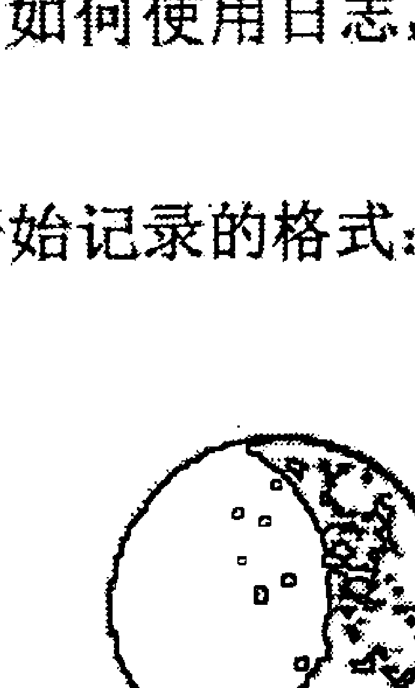

与生俱来。在我们每天繁忙的生活中，我们倾向于关注我们当前所关心的事，所以我们通常不能真切地看到我们周围发生的一切。幸运的是，观察的技能——在你正在经历的学徒生涯中，它和其他神奇的技能是一样的——能够练习和学习。

作为一个后院自然主义者，你将得知优秀的观察力关乎两个方面：耐心和重复。

如果你真的想看到在自然环境发生了什么事，你必须心甘情愿地花费大量时间和耐心去观察。只有做到以下几个方面，即找到一个自然地区，一动不动地静坐下来，对周围的事件边听边看，才能得到最好的结果。在野外的生物对你的出现日益习惯之后，它们将慢慢地和你亲近。

至于重复，为了了解植物、动物和天气，你必须一遍又一遍地观察他们。这将让你观察到以前从未看到过的动物，同时也会让你看到伟大的季节车轮转动的景象。

当你在练习观察的时候，你将发现自己在用全新的好奇心和理解力去观看自然世界。同时还将发现自己正慢慢倾心于自然的神奇特点，逐渐明白融入仪式的方法。自然也是巨大王权的物质源头和神奇工具：树枝、倒了的树、贝壳、石头、草药、干植物、松球等，数不胜数。它们会进入你的魔法、草药和仪式练习之中。

## 采集和固定植物标本

在天蒙蒙亮的时候采集植物，那时它们的颜色最为鲜艳，最富含天然油脂。倘若可能，将它们轻轻放入塑料袋，这可以减慢它们的枯萎速度。

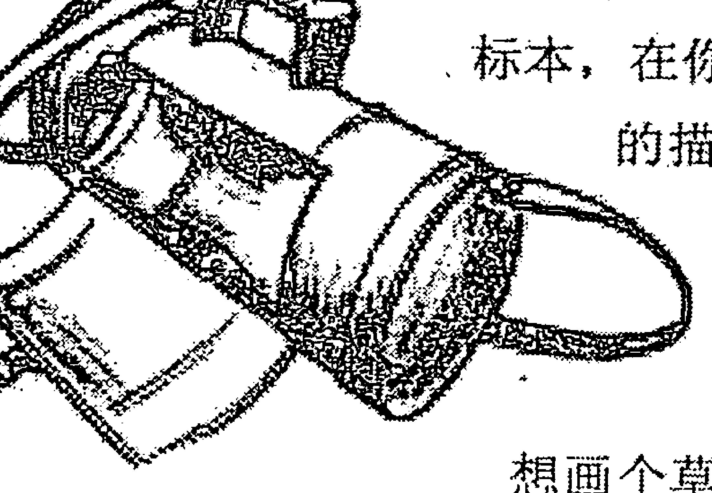

一旦采集起来，把植物放在阴暗的地方，避免阳光直晒。尽可能迅速地把它们放入植物挤压设备，这距离它们被采集的时间不能超过3-4小时。

专业的植物学家通常用植物标本采集箱来保持植物的安全和完整，直至放入植物挤压设备。当你收集到每一种植物标本，在你的日志里制作一个关于它的描述性记录。如果你一次性收集了几种植物，这将尤为重要，之后这会帮你辨别每一种植物。你也许还想画个草图或者描述一下你在哪儿发现这种植物。是在荫蔽处发现的？阳光下发现的？是长在岩石间还是在树下？

用一个植物挤压设备来使植物变干。当把标本放入挤压器的时候，请小心谨慎地放置，因为你摆出的造型将是它们干燥之后永远的样子。

将干标本固定，放在一张纯白的纸上。在右下角处，像下面一样用永久性墨水给植物标本注标签：

- 植物的通用名称
- 属性和种类（选填）
- 植物发现地
- 描述
- 植物发现日期
- 自然主义学者的名字

一个完整的标签看起来是这样的：

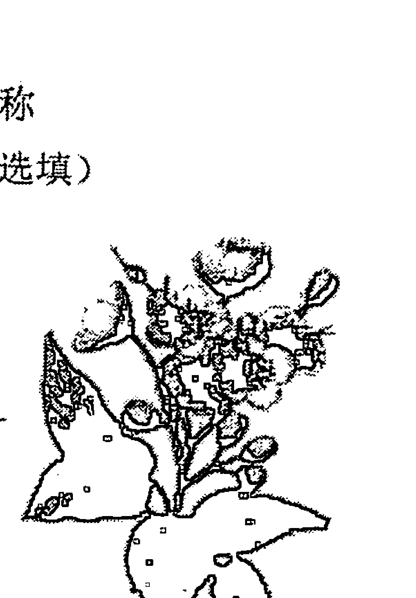

## 魔法师学徒的伴侣书 | 上卷

西部耧斗菜 (Western columbine) 耧斗菜属 发现于森林边，当日阳光普照 短小的植物（大概高 10 厘米），带红穗的黄花。 2006 年 8 月 6 日 伊玛（Ima），自然主义者

你可以给每一张完成了的标注套上纸套，以加强保护。做好的标注可以放入一个笔记本里，或平堆在一个盒子里，甚至用框架裱起来挂在墙上。

## 使用植物挤压设备

植物挤压设备用来压平和干燥植物标本，好让它们能被固定和保存。 新闻纸是一种柔软且吸水的纸。每一个植物挤压设备都装满了新闻纸。植物被放置在纸张中间，被大量的纸紧紧捆压在一起长达数日，直到植物完全变干。 最简单的植物挤压是把植物放在纸张的中间，再把纸张放在几本很重的书中间，然后进行挤压。另一种简单的挤压方式是用电话本。电话本的纸就是新闻纸做的，把所有植物直接平放在书页里。然后用几本厚重的书压在电话本上面，一起放在一个安全的地方。每周去检查一次，当它们完全干了就把书移开。

## 采集岩石，给岩石加标签

矿物里含有特别的化学成分和独特的晶体结构。岩石是由两种或更多的矿物的结合物组 成。例如，石英就是一种矿物。花岗岩是一种由石英和正长石或微斜长石组成的岩石。 岩石有以下三种：

火成岩：火成岩是由联锁矿物晶体组成，由岩浆冷却而成（地球内部融化的岩石）。玄武岩是火成岩的最好的例子之一，被发现于地壳的最普通的岩石。实际上，大多数海洋的底层都是由玄武岩构成，在美国西北部尤见甚多。花岗岩是另一种重要的火成岩。内华达山脉的大部分都是由花岗岩组成。 提示：记住火成岩的构成有一个很简单的方法，就是记住“火成”这两个字。这个表示燃烧的词语能让你联想到热火，还有生成火成岩的融化岩石。

变质岩：变质岩的形成是由于地壳运动造成的巨大压力和高温，使得原先的岩石改变成各式各样的新岩石。片麻岩是由破碎且融化了的花岗岩形成的变质岩。大理石则是另一种变质岩。

沉积岩：沉积岩是岩石（沉淀，有各种形状）的颗粒沉积下来后受到挤压而形成的新岩石。沉积岩通常在水下形成。石灰石就是沉积岩的例子。

当你在采集岩石的时候，用报纸把它们每一块包起来，或用塑料袋装起来。这样能防止他们互相划破或刮烂。 在包裹之前，制作一本日志，记录你在什么时候、什么地方

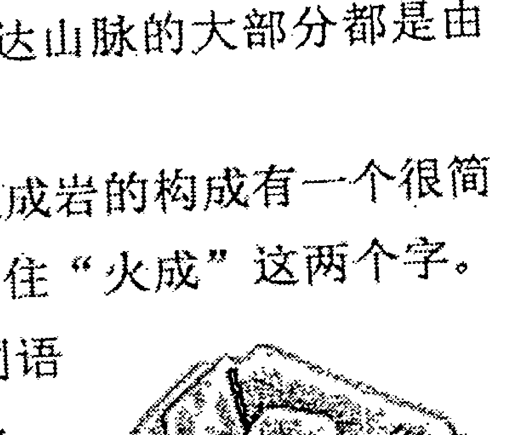

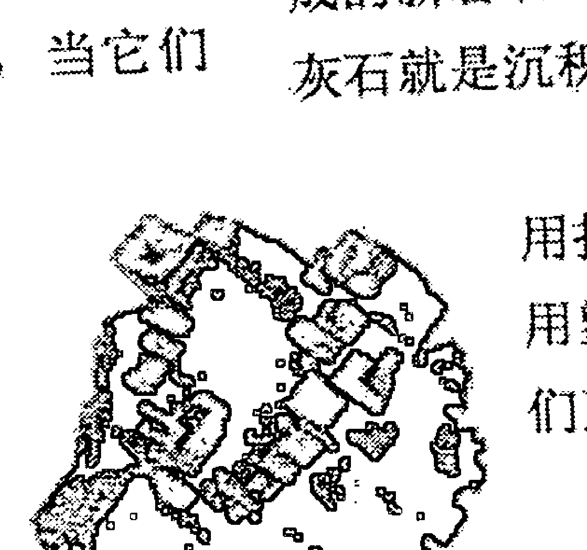

方发现的每一块岩石，并对岩石进行描述。给每一块岩石编一个号码。把同样的号码写在角落或者纸页上；把号码撕下来和岩石包裹在一起。这样，以后在对每一块岩石的辨别上你就不会有任何麻烦。

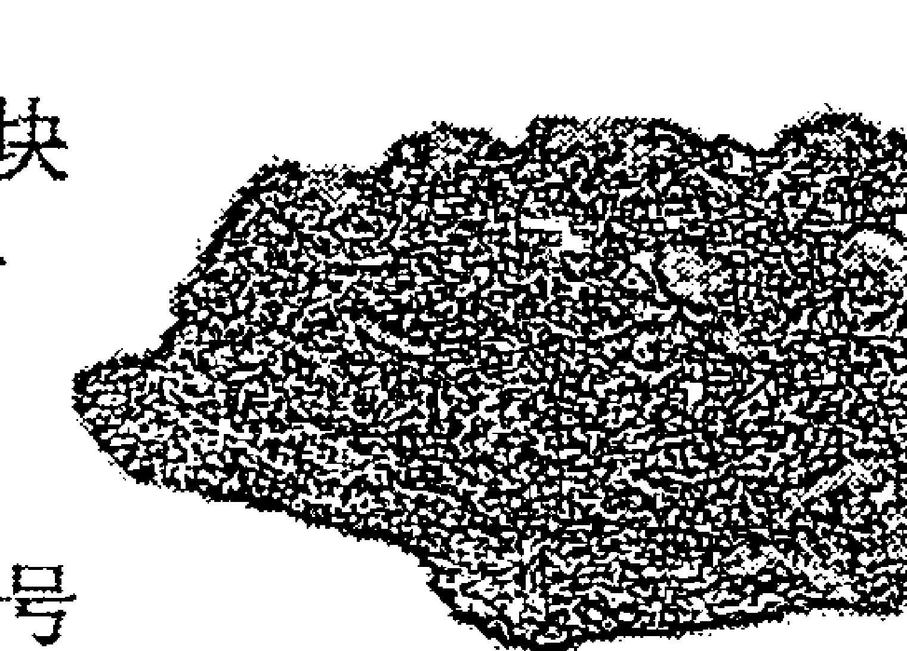

回到家里的时候，把每一块岩石都仔细地清洗一下，去掉上面的灰和土等等。然后把岩石自然晾干。

现在来决定哪一个面是岩石的“顶”，哪一个是“底”，目的是为了如何展现你的收藏。拿一瓶液态纸，朝着岩石的底面滴一滴豌豆大小的纸液。让液态纸完全干透。然后用圆珠笔和永久性记号笔在白色的地方写下岩石的鉴定号码。

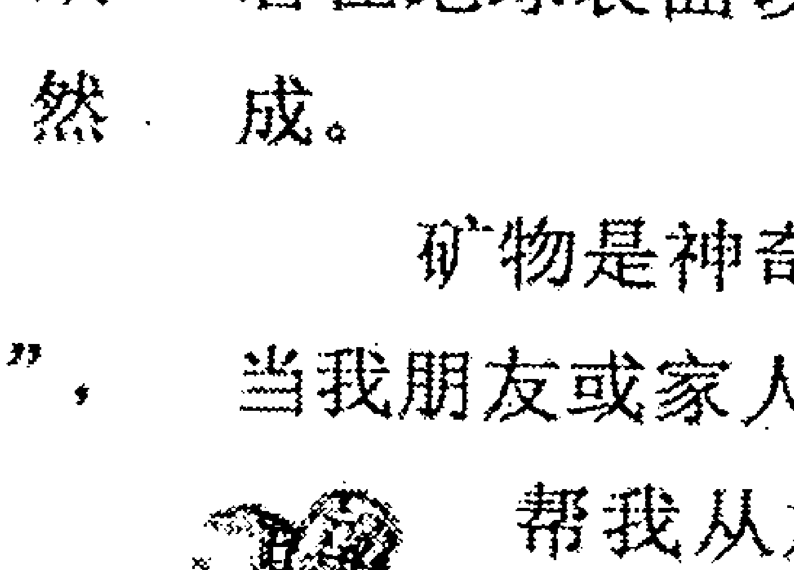

最后，在你的日志里专门建立一个有序的页面，用于记录你的岩石标本和它们的号码。你可以在最后写上发现的地点，以及地形等信息。也许你还想增加一幅标本草图或者周围地形的草图。留一点额外的空间以备日后他用。

鸡蛋纸箱是储存岩石和矿物标本的绝佳容器。分隔器不仅能固定住标本还能防止它们互相碰撞。每一块岩石的标签可以写在箱子内侧的上表面，也可以粘在里面，打开箱子时一目了然。

有些人喜欢把岩石陈列在小的开放式的白色盒子里。把一块毡呢或棉絮垫在盒子的底部会有助于固定标本，防止表面受到刮划。

收集矿物对自然主义学者来说是对真正意义上的好奇心的满足和奖励。

岩石形成的过程要经过几十亿年。在德克萨斯州的瓜达卢佩山脉，我们可以站在2.5亿年前曾是热带海域珊瑚礁的石灰石上。在佛蒙特州的绿山，我们可以看见曾经是浅海泥泞边缘的片岩，它是一种变质岩。加州的优胜美地山谷，现在的海拔已达到8800英尺，是由石英、二长岩、花岗岩、火成岩在地球表面以下几千英尺的地方固化而成。

矿物是神奇的护身符。不管什么时候，当我朋友或家人外出旅行，我都会叫他们帮我从旅行地捎回一块岩石。同样，不管什么时候，只要我出去旅游，我也会捡一些岩石。现在，我拥有来自世界各地的岩石，包括内华达山脉的花岗岩、夏威夷的绳状熔岩，缅因州海岸的一小瓶沙，俄罗斯、瑞典和北极的鹅卵石。我在不同的仪式上为它们中的大多数赋予了防护的方向。

## 寻找东西南北

当你在画地图的时候，找到罗盘上的四个方向是相当重要的。当你想要辨认方向以助你回到一个地方，或者当你想要举行一场仪式时，请把它叫做“四方”。

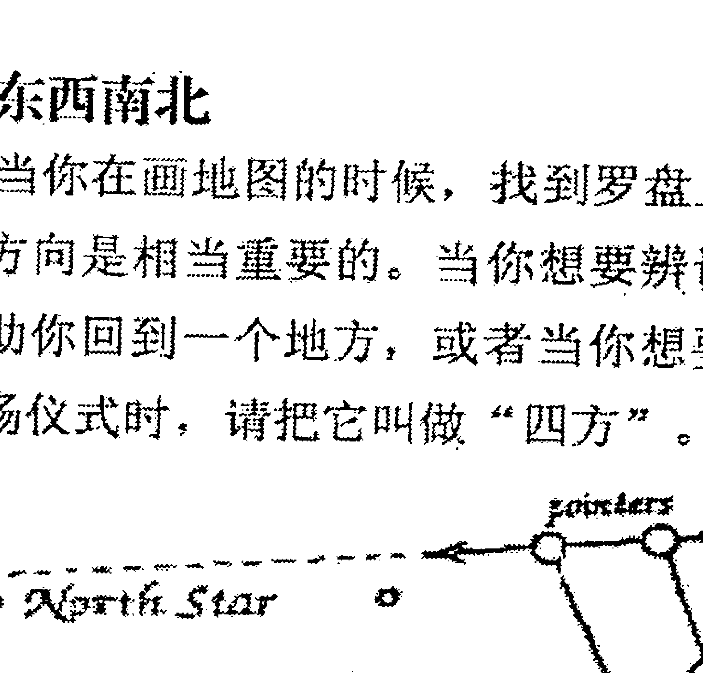

最简单的寻向方法是使用罗盘。在一个标准的定向罗盘上，红色的（磁化）针一直指向北方。把罗盘拿在你的前面，和地面保持平衡。现在慢慢地转动身体直到你和红针都指向同一个方向。你现在正面向着北方！南方就在你的身后，东方在你的右边，西方在你左边。还有一个简单的定向方法便是看太阳。太阳总是从东方升起，西方落下。正午之时，它位于东西中间。确定了太阳在哪儿，你就能估算出其他的方向。如果现在大概是下午4点，太阳正往地平线的一端下落，那是什么方向？（答案：西方。太阳总是在西边落下）如果你正面对着落日，北方在哪儿？（答案：在你的右边。如果你面对着落日，那你就面对着西方，所以北方在你的右边。）在晚上寻找北方，只需要寻找北极星。确定北斗星（大熊星座）的位置，想象一条线通过（从北斗星的尾部到顶部，不管星座的位置怎样）组成北斗星的外部边缘的两个“指针”星。现在，在这两个星之间去寻找一个五倍距离的点，你会找到众所周知的北极星。

## 蟋蟀温度计（奥伯伦）

通过蟋蟀的唧唧声，你就可以非常正确地测算出温度。在15秒内数唧唧的声音然后加上40，其结果就是当前的华氏温度。这就是著名的贝里多贝尔定律：A. E. 贝里多贝尔（1837-1910）是塔夫茨大学（Tufts College）的一名物理教授。蟋蟀制造出来的唧唧声被称作鸣声，来自拉丁文Stridulus，意思是“吱吱”。蟋蟀通过摩擦翅膀上的小“牙齿”来发出这种声音。只有公的蟋蟀会发出唧唧的声音，只有母的蟋蟀能听见这个声音！

## 保持与闪电的安全距离（奥伯伦）

如果你在户外遇到一场风暴来临，你应该立即找一个防护所，尤其是在你看到闪电的时候！从云层打到地面的闪电会通过直接或间接的方式造成伤亡。雷击电流能够劈开躲在树下、篱笆旁、电杆附近或其他高建筑上的人。而且，若闪电击中附近的一个高大物体，它就能通过地面导电到人的身上。电流可以通过电源、电话线，或管道传到正在使用电器、电话或者管道夹具的人的身上。同样地，物体会被直接袭击，这可能会导致爆炸、火灾或者彻底的毁灭。所以，不要让自己变成一个孤立的高大物体，也不要靠近任何其他可能是孤立的高大物体的东西！最好的防御是在雷暴发生的时候避免暴露在闪电之下。要知道安全的防护所在哪儿，然后在闪电的威胁掠过头顶之前留出足够的时间到达那儿。

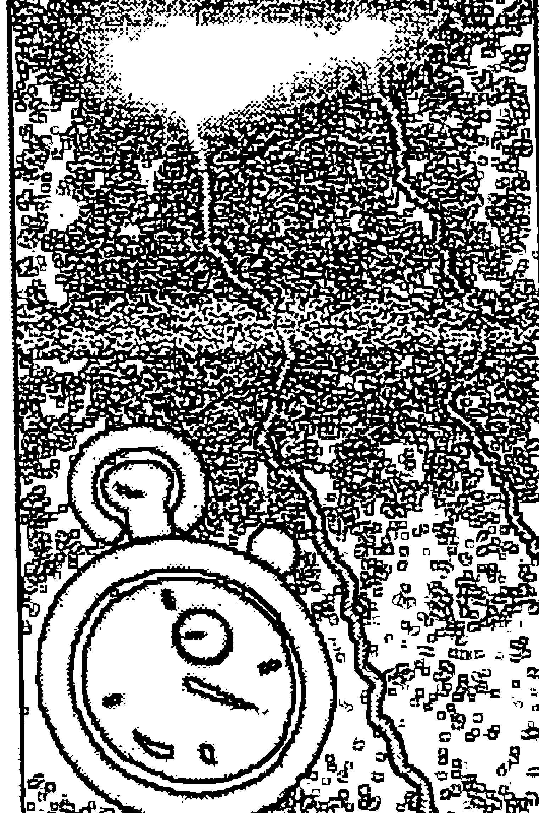

## 安全远足

1. 制定一个“旅行计划”。让别人知道你要去哪儿、和谁去、什么时候出发、什么时候回来。为为了安全，有些人喜欢随身携带手机。

2. 遵循“四个”原则。当你出去远足或野营的时候，你的团队里至少要有四个人。那样的话，如果有人受伤了，一个人能留下来照顾伤员，另外两个可以徒步出去寻求帮助。

3. 携带“10个户外要素”。只要是外出都带着它们。你无法得知它们会在何时救你一命。
- 食物
- 手电筒
- 小刀
- 急救箱
- 额外的衣服
- 地图和罗盘
- 打火机和点火器
- 雨具和太空毯*
- 防晒霜或防晒用具
- 水和水壶或水杯

> * 太空毯是很轻便的镀铝织物，可以裹在徒步旅行者的身上，或用来做篷布防护所。

## 其他物品：
- 绳子或线
- 昆虫防护剂
- 暖和的帽子
- 塑料的口哨（不要金属的，零度以下的温度会把它粘在嘴唇上）

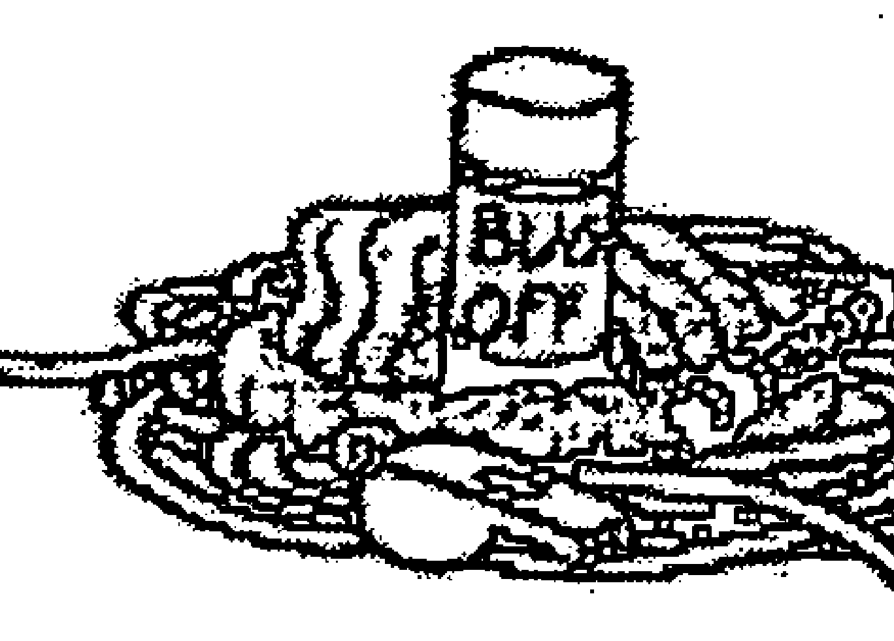

## 创造一个自己的工作室或“博物馆”

你可以留一些空间，用来作为自然主义者的工作室、博物馆。

你的工作室里面应该包括有一张大的工作台，货架和储藏空间。你会用到一个水槽和一台炉灶。你的课本上关于“技术和设备”这一章里有数百条用于在工作室进行调查和实验的方法，所需要的设备以及如何把一切都设置好。

你的自然历史博物馆其实可以简单如鞋盒，但又可因各种原因而变得异常复杂。大多数自然主义者喜欢陈列他们的田野调查结果。你不妨置留出一个货架和桌面来储存，并陈列你的标本、户外书籍，或日志里相当漂亮的一页。

用创造性的鉴赏力来陈列你的东西。无论是用来放东西还是陈列物品，雪茄盒与其他小而坚固的盒子都是极佳的选择。

你也许能够在车库或者标签销售处那里用低价买到小书架或橱柜。用板子和煤渣块便可以做出一个简单的架子。许多商店都有这种廉价的塑料架子和盒子。

## 6. 生火

文 / 奥伯伦（灰色）

当你出去野营的时候，你应该随身携带小刀和打火机。这些打火机绝对物有所值，比火柴的效率高得多。但为了以防万一，身为魔法师的你必须知道怎样空手生火。这毕竟是我们最古老的法术！

摩擦生火很容易，诀窍就是从火花里取火！你将需要特殊的火种：极为干燥的环境、有机物质粉末、易燃物，最后点燃熊熊大火。除了书月人下面描述的预制起火器，你还可以运用鼠巢、干桦树皮、干杂草、雪松树皮、从衣服或板子上刮下的刮皮棉、干布，或者从你的夹克或睡袋上取下的绝缘棉。

### 起火器（书月人）

起火器是你应急包的重要组成部分。已做好的起火器点火很快，燃烧时间长，它的热度足以保证火苗的持续燃烧。下面是两个简单的“配方”：

1. 把2-4张报纸卷成长而宽松的“长筒”，在每隔2英尺的位置系上白色棉线，紧紧打上结并留出长棉线的尾端。用剪刀把棉线间的报纸卷儿剪下来，把石蜡融化在一个罐子里，把罐子放置在一个盛热水的锅里。拉住线的尾端，把一片片的报纸卷放入融化的石蜡里面，浸几分钟。从石蜡里拿起报纸卷，用起火器干燥和硬化纸卷。
2. 从你的干衣机里选出洗衣皮棉(自然的纤维皮棉——羊毛、棉布、亚麻布——效果最好。用皮棉堵住纸板鸡蛋箱上的洞。融化一些石蜡，把融化的蜡倒在皮棉上。等其放凉、变硬后，用剪刀剪成一块一块的，这样可以剪出大概12个起火器。
3. 一支旧蜡烛的残余部分也是很好的起火器。

一旦火种燃起来，你就已经成功了一半。现在你所要做的就是按照正确的频率往里面加燃料，使火势能够如你所愿。你应该小心翼翼地放每一块木头——这是一整套艺术！当它们在燃烧和往下垂的时候，确保你手边有一个戳棒来帮你翻整木头。

### 燧石和钢：

当你用钢刀敲击的时候，燧石、石英，或者其他硬质岩石会产生火花。用你的火种去引燃火花，手呈杯状，将其捧于其中，从下面轻吹那个亮点，直到它蹦出火苗。学会识别燧石，如果当你在远足的时候遇到一块，赶紧将之装进你的口袋。

### 镜片：

一个放大镜可以把太阳的光线集中到火种之上，而后将其点燃。你也可以用眼镜、双筒望远镜或者相机镜头。如果你在冬天的时候外出，你可以用冰块来做火器镜片！找一个结冰的池塘、小溪、水坑——或者倒一点水到盘子里等它凝固。打碎一块冰，取大概半英尺到一英尺厚，直径为2-3英寸的碎片。把它放在你光溜溜的手掌上，前后翻转直到它融化成一个镜片的形状。然后你所需要做的就是等待阳光！

把上面的任何一个起火器，放一个在你的火坑里。把小树枝和稻草放在起火器周围，然后点火。当火升起来的时候，开始往火里加木头，慢慢加些大木头，小心点以防把火给盖灭了。

> （奥伯伦）往火苗上吹点风有助于燃烧，如果你能用到一个中空管、芦苇或者管子一类的东西来吹，效果尤为明显。

### 火钻：

在没有燧石、钢或者放大镜的时候，你也可以在现场制作一个火钻。这需要：**炉床、主轴、弓、轴承。** 你可以用刀或锋利的石头来制作它们。

**炉床必须**是用枯死的干木，为了保持稳定其形状必须扁平。厚树皮或枯树板的效果更好。在靠近边缘的地方挖一个圆孔，在圆孔旁边挖一个直到边缘处的钥匙大的缺口。（图1.）

用一根大概一英尺长，一英寸厚的直棍来制作一个主轴，它的两头需是圆的，把边上刮成八角的形状（系上一条质地很好的皮带，图2.）。

轴承就是套在主轴顶端的套子。它需要适用于你的手掌，也必须适合主轴的尺寸。

你可以用木头、骨头或者一个平滑的坑石来制作一个弓。有条件的话尽量选用骨头或石头，因为木质的弓升温过快。（图3.）

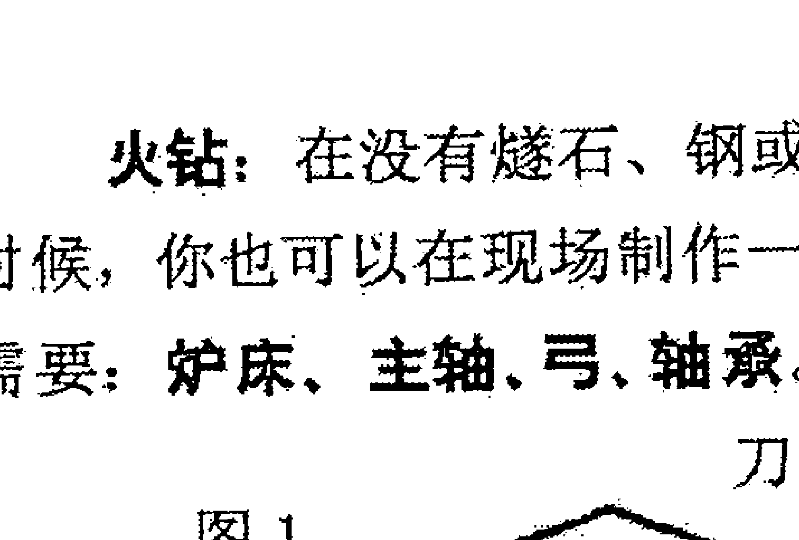

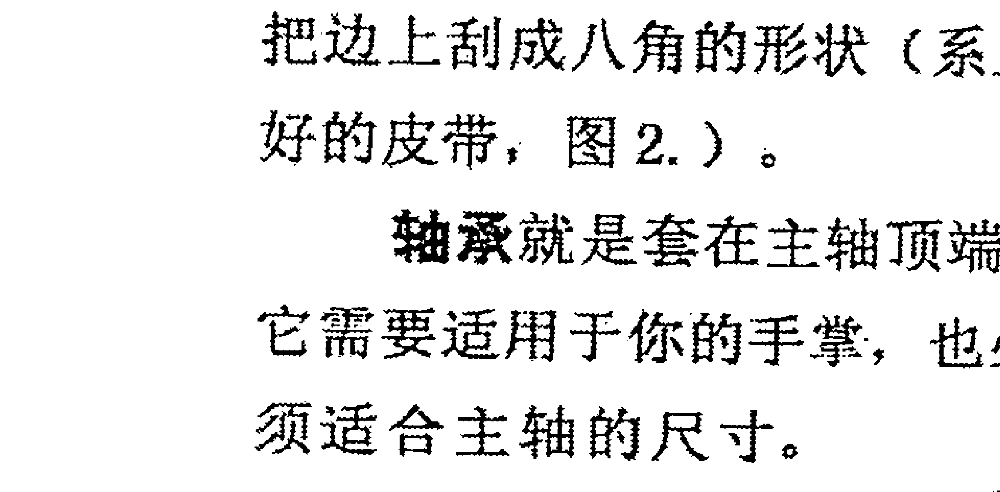

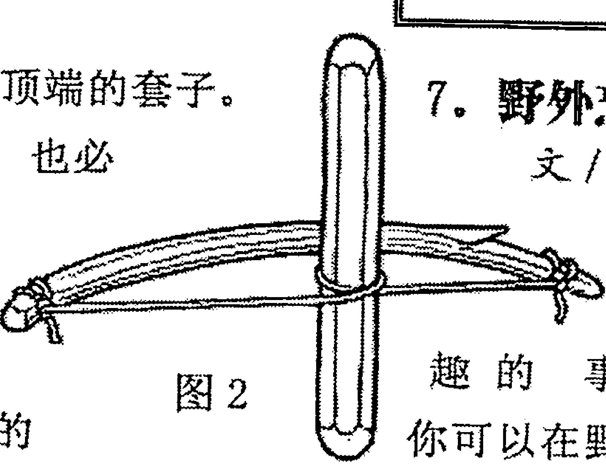

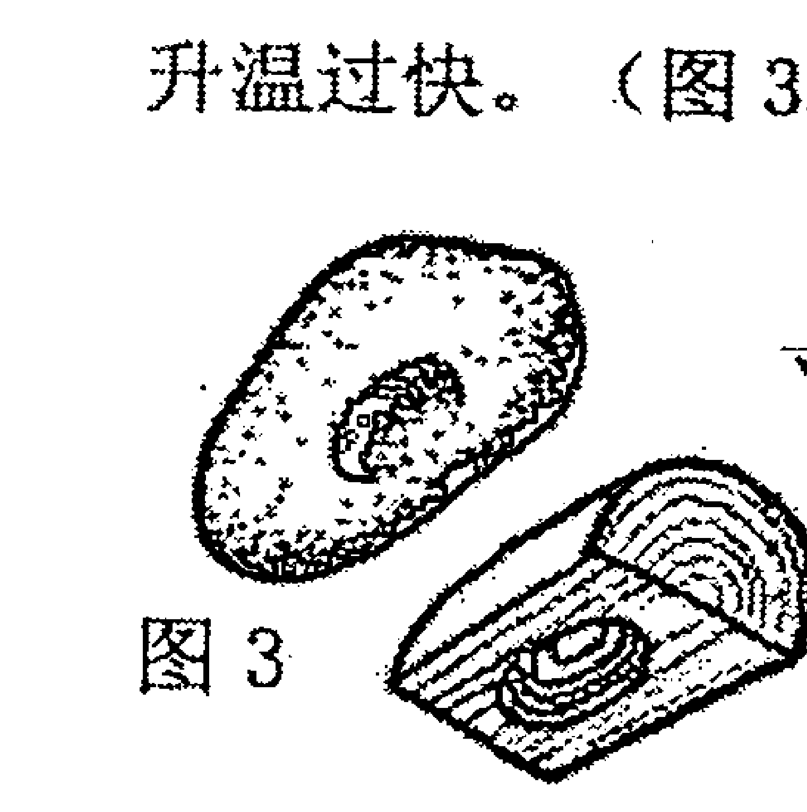

弓是一根大约2英寸长的弯曲枝干，用皮带像弯弓一样捆扎起来。如果你没有什么其他的绳子，鞋带是一个很棒的选择；在紧急情况下，你可用衣服条、散开的织带甚至是强韧的草或树皮纤维编织一个。把它拉紧，然后将主轴套在皮带或者编织的绳索上（如图2.）。

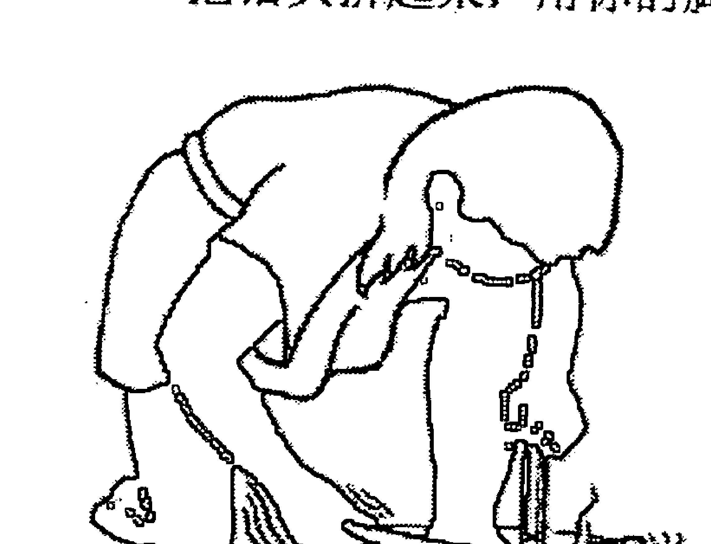

把钻头拼起来，用你的脚定住炉床，然后快速地前后移动弓，将皮带绷紧并不停旋转。过一会儿你就会看到炉床冒烟儿了。把煤块丢进引火绒中，然后吹气，让它燃烧起来。

> 注意：让火自己燃烧——哪怕刚开始只有几缕青烟！确保最后一个睡觉的人把火完全扑灭，把水和土撒在上面，直到没有火星或者烟雾。

## 7. 野外烹调

文/书月人（靛蓝）

在外面烹调食物是很有趣的事，不仅仅是在野营的时候。你可以在野外烧烤，也可在家中的壁炉上练习。你甚至可以在你自己的院子里做一个永久的或临时的火炉。

### 制造一个你自己的后院火炉

在做这个之前，如果你用的是别人的院子，你应该先获取别人的允许，例如你的房东，或室友；如果你住在家里的话，请先征寻父母的意见。同时你还应该去调查一下当地的火险保单。许多地方是不允许“开放式生火”的，只允许以烹调为目的的生火。

确保火炉远离灌木、树木和任何房屋，火炉上也没有任何悬挂的东西。当你在使用火炉的时候，在旁边要时刻放一把铲子、一桶水和一根水管。

要制造一个永久性的火炉，先铲平直径为3-4英尺的草皮和植物。用大块的石头或砖头砌围出一个炉子，就大功告成了！

制造一个临时的火炉，在草地上圈出一个四英尺的圆。用一个锋利的方边铲子，往土里挖大概3英寸，然后使劲铲向一旁，使你能够把草皮的表面铲掉。不断地重复直到你圈的那个地方的草皮都被铲完。把一块一块的草皮放在一个背阴的地方，用湿毛巾盖起来。

在没有草皮的位置生火。用完火以后，让它完全烧尽。在当天稍晚的时候，把冷却了的木头和灰烬铲开，拿去处理掉（把灰掺进坑里）。用水管或其他东西冷却火坑，然后把先前铲掉的草皮盖在上面，好好地浇浇水。草皮会在2-3周的时间内自动恢复。在这期间要确保偶尔会去浇浇水。

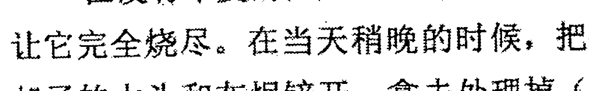

## 用棍子来进行烹饪

许多食物可以在棍子上进行烹饪。你将需要一根手指粗细的棍子。用小刀把树皮剥了，将一端的尾部削尖。如果要做热狗棍，得选择一边是尖头的棍子。

然后，你将需要一个用木炭生的火或者木头生的火，把它们烧尽，留下一堆热炭。炭是提供稳定的、均匀热的必需品。在棍子上生火来烹饪食物，不太合适；他们的热度太大，会在食物里面还没热的时候把食物外面烤烂。

食物既可以穿在一根烧烤棒上也可以裹在上面。最常见的穿起来烤的食物是热狗和“烤串”——大块的肉、水果和蔬菜。所有的这些东西都慢慢地在炭上翻动着烤直到它们烤成诱人的焦糖色。

这是一场特殊的招待，把热狗纵向切开，呈口袋状。把一条奶酪装进去。现在，把一块生咸肉裹在热狗的外面；用牙签把裹在热狗外面的咸肉固定住。在火上慢慢地翻烤直到咸肉烤熟。

棉花糖和立方体状的蛋糕也是用棍子翻烤的不错选择。慢慢地把它们放在炭上加热，让它们发出噗噗声，烤出金黄色。如果一个棉花糖着火了，不要将它四处晃动！热的棉花糖会变成一团烧化了的糖，如果甩到别人的皮肤上会导致严重的烫伤。烧化了的棉花糖会作为一种特殊的祭品掉进火里，招待爬行其中的火蜥蜴。

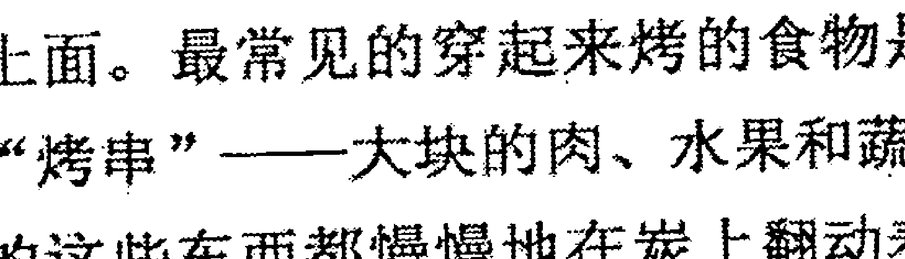

至于天使蛋糕，你要先把蛋糕放进炼乳沾一下。穿在棍子上翻烤直到烤好。

烧烤棒也能用来烹饪软饼。你应该用拇指粗细的棍子，把饼干放进一个小碗里，加水，或者牛奶搅拌，把它和成一坨面团。

在一个干净、平滑的面板上，把面团揉成比你拇指直径大一点的蛇状物。把蛇形面团绕在烧烤棒的一端，紧紧地把它捏来绑在上面。现在慢慢地把饼干放在热炭上烤，多翻动它使它烤得均匀一点。烤软饼最重要的就是文火慢烤，使它的内部也能够烤到，这对于一个有志气的魔法师来说是一次很好的练习！当软饼冒烟并变成金黄色的时候就大功告成了。用黄油和果酱蘸着吃。

## 用箔进行烹饪

要用箔来做晚餐，首先需要的是一堆完全烧尽的煤、木炭或木头，都可以。你同样还需要一卷箔，一副长手套和一把钳子。如果你用营火烹调，可以用野营铲代替钳子。

任何可以烤的东西都能放进箔在热煤上烹调。最普通的菜谱就是传统的箔制晚餐。先用一块16-18英尺厚的方形箔，在中间放一块1/4磅的生碎牛肉。加半个土豆（去皮，切成立方体）和一小撮蔬菜：你可以选择切片洋葱、芹菜、蘑菇、胡椒、胡萝卜等等。上面浇上2-3大勺未经稀释的罐头蘑菇汤和1-2勺水。现在，小心翼翼地把箔折叠起来然后密封好，使它成为一个气密包。把包放在煤上。烤大概40-45分钟，每10-15分钟就用钳子或者铲子翻一次。如果你的耳朵出奇敏感，将能听到烹调时发出的嘶嘶声！小心地把包打开——如果尚未烤熟，就把它再次封装，再烤上10来分钟。

一旦你搞定了这个基本的食谱，你可以改变一下食材。试一下切丁火腿加红薯凤梨，猪肉配苹果洋葱，或者鸡肉加育空黄金土豆（Yukon gold potatoes）、韭菜和甜洋葱。不同的“酱汤”将增加不同的风味，可以试试香草及其他调味料。

玉米棒用箔烹调非常简单。在烹调之前，把玉米放在冷水里浸泡至少30分钟（叶片和稻壳都不要去掉）。把玉米沥干水，然后紧紧地包进箔——此时是湿的，叶片和稻壳还在上面。在煤上烤大概30分钟，每5-10分钟翻一次。用黄油、盐和胡椒拌着吃。

烤土豆是另一种箔烤主食。把土豆擦洗干净，在每一个上面挖4-5个深洞。用箔紧紧地包住然后把它们塞进煤层。烤30-40分钟，每5-10分钟翻一次。当你把小刀插进去，感觉土豆很软的时候，就熟了。加点盐、黄油、酸奶油和鲜韭菜拌着吃。

制作一些特别的箔制点心，试试香蕉船。把一根香蕉剥一半，沿着它的缝切下去。把巧克力条和小棉花糖插入缝里，将满载的香蕉船放进箔里。对了，你还要确保香蕉的缝口“位于上方”。在煤上烤20分钟。不要翻动它，你也不想把巧克力和棉花糖都给倒出来吧。用勺子吃。

烤苹果是另一道美味的箔制美食。把苹果直立地放着，用一个切瓜器从苹果的上面去掉它的核——确保苹果的底部完好。用一把小刀从苹果顶部去掉一英尺的皮。往空腔里塞点红糖、葡萄干、坚果和黄油。加大约1/2茶勺的水。把苹果竖着放进一张正方形的箔里；把箔紧紧地抓起来包住苹果并保持它的直立。然后埋在热碳里烤15-20分钟要成功地制作箔制品这有几条原则需要铭记在心。首先，箔包必须密不透气，里面的汁不能流出来。第二，箔包必须每隔10分钟翻一次，翻的时候要小心谨慎，以免撕烂。如果你家里有一个壁炉，那在寒冬中制作箔制晚餐将是一件颇有意思的事情！你也可以在烤箱里制作它们：350度的高温烤40分钟。

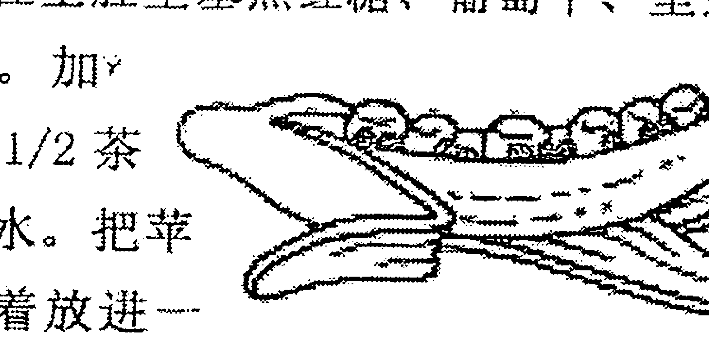

## 洋葱杯和橘子杯

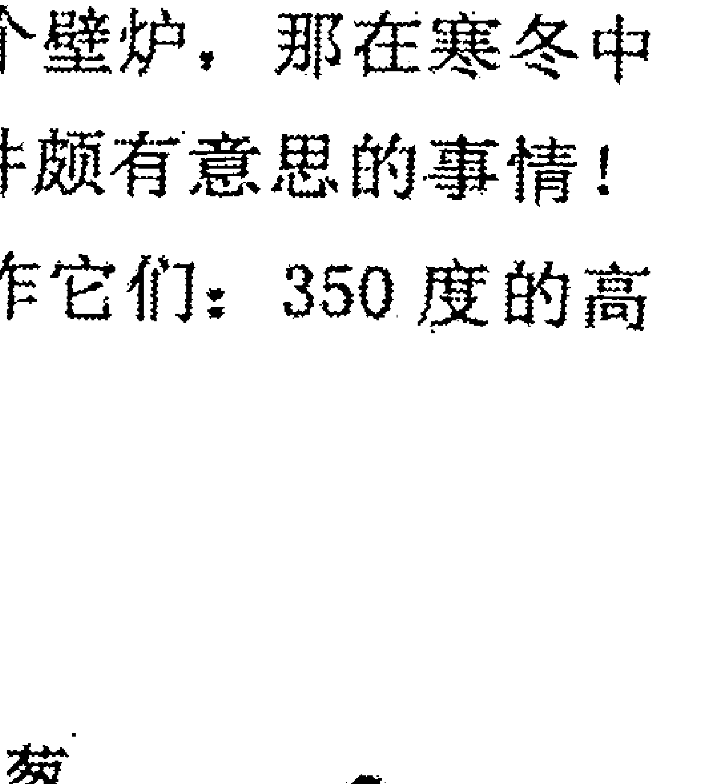

洋葱杯：把大洋葱齐腰切半。去掉中间的部分，留下3/4英寸的外壳。往里面装上调好味的牛肉。

用长钳子把洋葱杯直接放在煤上，用楔把它固定住使它不会翻倒。把它放在那儿，直到肉看起来熟了，散发出浓浓的香味！（注意：如果你担心灰会吹到肉上，盖一块箔在上面）

至于橘子杯，把一个橘子切成两半，挖出大部分的果肉，保持果皮的完整，以方便制作杯子。（把挖出来的橘子留下来制作沙拉，或者作为明天的早餐。）准备黄色或白色的蛋糕粉。把蛋糕粉倒进橘子杯，然后像制作洋葱杯那样把橘子杯放在热碳上。做好之后，你将享用到一个可口的橘子蛋糕杯！

## 在纸袋里烹饪咸肉和鸡蛋

这是会给人带来惊喜的趣事。你将需要一个和午餐袋大小相当的独立纸袋，三片咸肉，1-2个鸡蛋和一根烧烤棒。同时，你还需要一个煤床——不要火焰哦！

把袋子打开。把咸肉片放在袋子的底部，如果需要的话从中切断以便他们能够完全地覆盖住袋子的底部。（如果一些咸肉跑到袋子的边上面去了，是没问题的。）把包的顶部折叠起来，然后封住，把纸袋拴在烧烤棒的一端——用双绞线、金属夹或任何你能想到的东西来做。

现在，把袋子伸到热碳上。起初会有点麻烦：你想让袋子和里面的咸肉在不着火的情况下慢慢地热起来。理想情况下，当袋子和咸肉热起来时，咸肉将流出油脂，袋子将慢慢变得被咸肉的油脂浸透。

一旦袋子的温度升高，变得油沥沥的，咸肉就要熟了，把袋子从热的地方移开，打开，把捣碎的鸡蛋倒进去，把他们倒在咸肉的上面。包里不能漏出任何油脂！封好袋子，放回棒上，继续烧烤。到了这一步，你的工作就是要慢慢地烧烤咸肉和鸡蛋，直到烤熟为止。保持刀子与煤的距离足够远，以免着火。

每5分钟检查一下咸肉和鸡蛋。当他们熟了的时候，把袋子放在盘子里，把上面切掉，加点盐和胡椒，在袋子里直接吃。

## 在平整的岩石上烹饪

这是另外一种有趣的野餐。它需要反复试验，但它值得你花时间去学习。岩石是大家所知的最古老的烹调面板，在金属和金属锅发明之前的古代世界中广泛使用。

你需要找到一块大而平坦的岩石，大概有12-14平方英尺，4-5英寸厚。不要在小溪或者河床上找岩石，因为这些石头里面通常都有水，加热的时候可能会爆炸！

用肥皂和水把岩石仔仔细细清洗干净，然后再将成为上表面的那一面涂一层薄薄的植物油。岩石烹饪需要热碳——木炭或烧尽了的营火都可以。用耙或铲子打造一个厚厚的煤床，稍加调整以让烹煮的表面平整。等30-40分钟，让岩石热起来。辨别岩石是否足够热的一种方法是滴水在烹煮面上。如果水嘶嘶地流动或者到处跳动，岩石就可以用了。

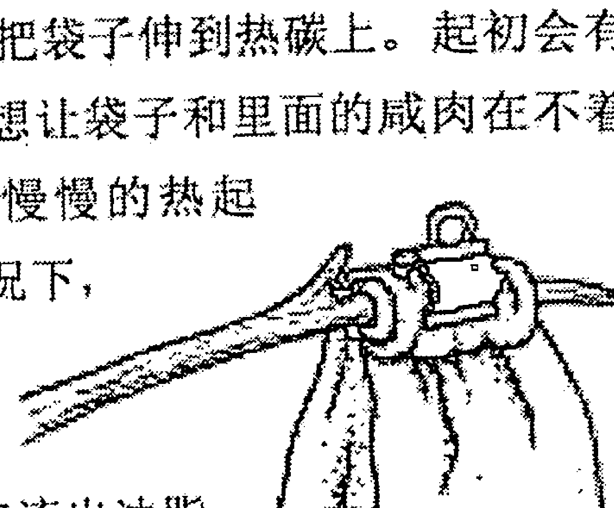

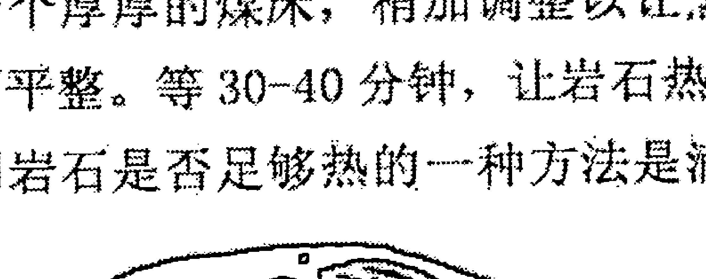

一旦岩石热了，你可以用把它当成一个炒锅或者煎锅用。在用之前抹点油，然后把咸肉、鸡蛋、煎饼、汉堡等直接放在岩石上面，把食物煮熟为止。用完以后，熄火并让岩石冷却。第二天，把岩石擦洗干净，抹一层薄油，裹上一张干净的毛巾，然后收起来以便以后使用。

## 8. 蒲公英和蚂蚁：城市魔法师的动植物指南

文 / 伊丽莎白·巴纳特 (Elizabeth Barrette) (灰白) (1996)

这些在城市环境中的图腾精神从1996年开始就以一种客人的身份出现在城市异教徒的团体之中。从那以后它开始纵向发展，变得越来越复杂。它就是异教的全新分支——城市魔法师。

异教徒通常很难融入城市生活。我们中的有些人很自然地就接受了，但大多数人都觉得好像是丢失了自己的一部分，那便是与生命周期的重要连接。然而自然拥有远超城市世界的力量——记得旧金山的地震，洛杉矶的热浪，坦帕的飓风。即使是用混凝土和金属制成的“混凝土野兽世界（指资本主义国家中弱肉强食的大城市）”，也不得不依赖于地球。

不管环境如何具有挑战性，生命都能找到利用生态环境的办法。树根紧扣人行道。拾荒者急急忙忙地穿过小巷。绿叶和空肚皮的生存之道便是融入这个环境之中。适应能力是一种优点。坚持造就成功。思考一下，这些居住在混凝土野兽世界里的人教会了我们什么。

### 植物指南

> 兰草：“看一看团结一致的成就。”

你从没见过一棵单独的草。草是群居的。团队合作可以创造一块毛绒绒的绿草坪，让你得以放松劳累的双脚——走在上面也不会把它踩死。草教会我们合作和韧性的重要性。

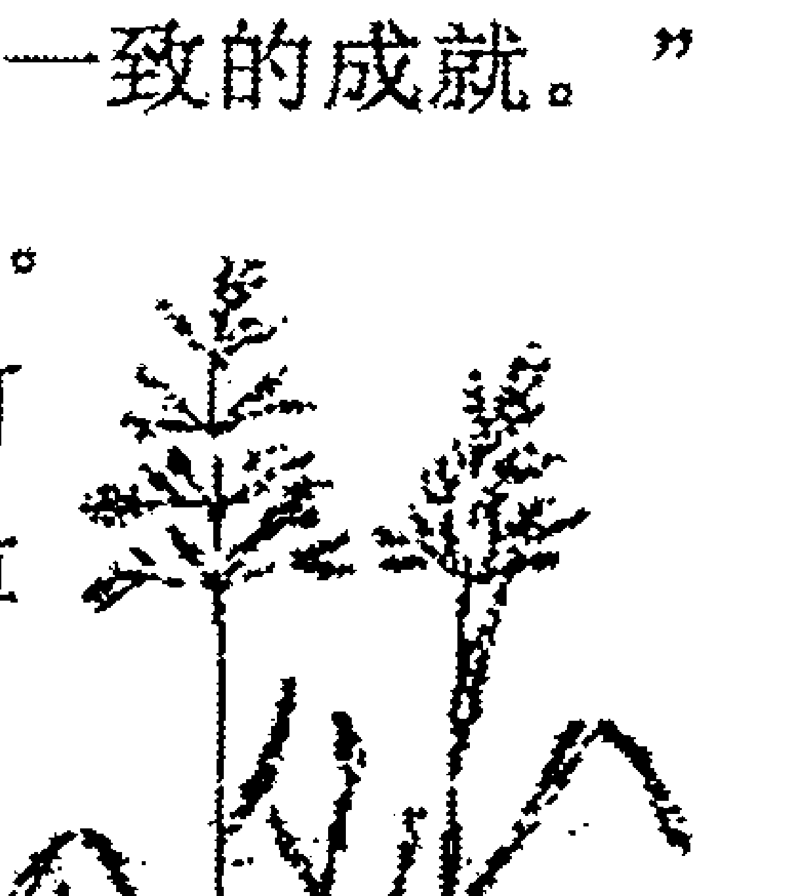

> 蒲公英：“你抓不到我们。”

蒲公英的力量就是坚持。如果你把叶子撕掉，它的根还在。如果你把根刨掉，它的种子还在。蒲公英的足智多谋提醒我们要深挖、坚持、死守。我们的言语和行动像种子一样四处散播，把根带到遥远的地方。

> 连翘：“不要害怕重新开始。”

一种罕见的植物，连翘在深冬的时候冲破泥土，绽露出它优美的黄色花朵。它靠苗和种子从容散播，即使是被修剪来掉到地上也能再生。此乃重生。

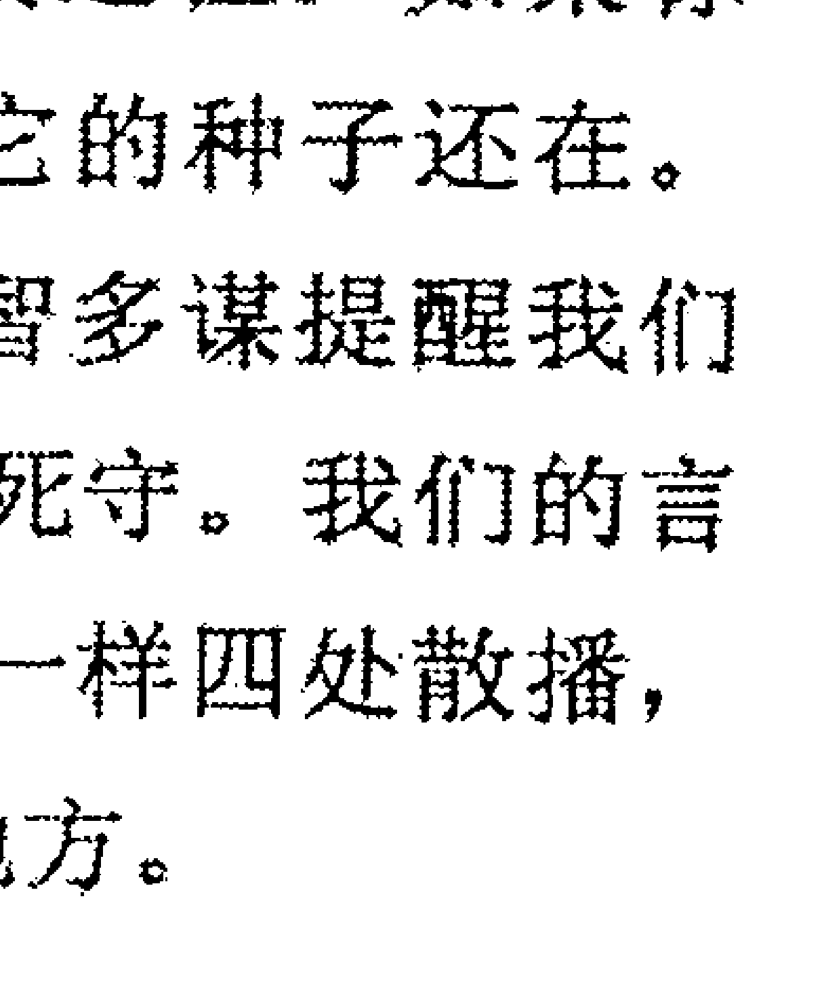

> 银杏：“三思而后行！先计划，考虑后果。”

这种古老的树树荫宏伟——但如果你种植的是雌性，那一到秋天她将在地上洒满臭臭的果实。

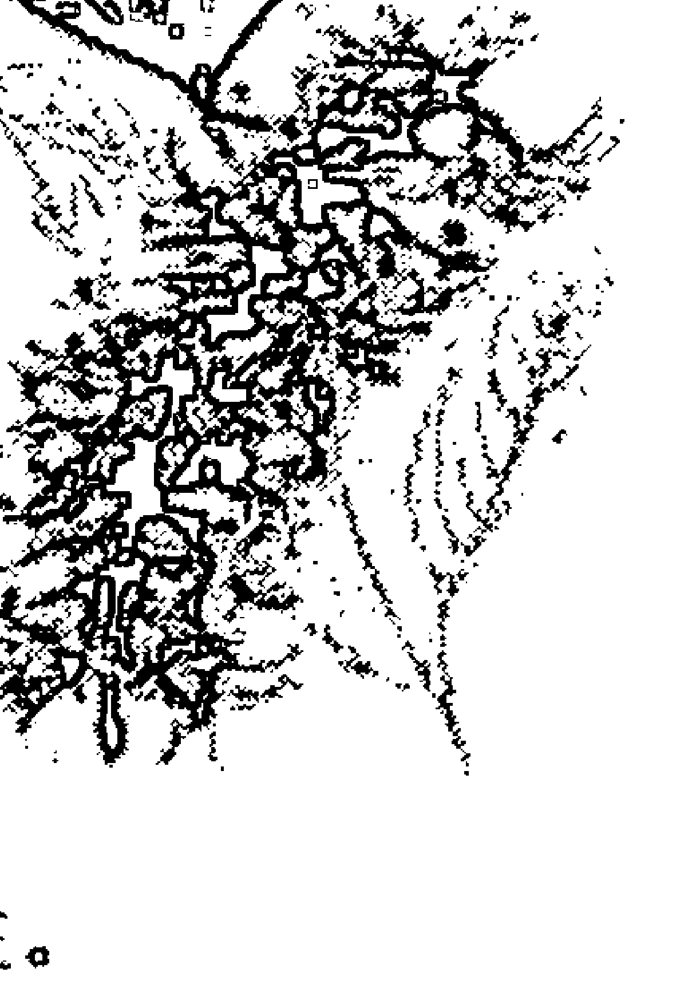

银杏的力量来自年长和经验，小心谨慎做每个决定。

> 水蜡树篱：“好的篱笆造就好的邻居。” 无处不在的园林绿化植物创造出整齐的绿化墙。水蜡树坚持生长在贫瘠的土壤，承受着烟雾的冲击。它擅长设定界限。如果你需要帮助躲避，看这里。

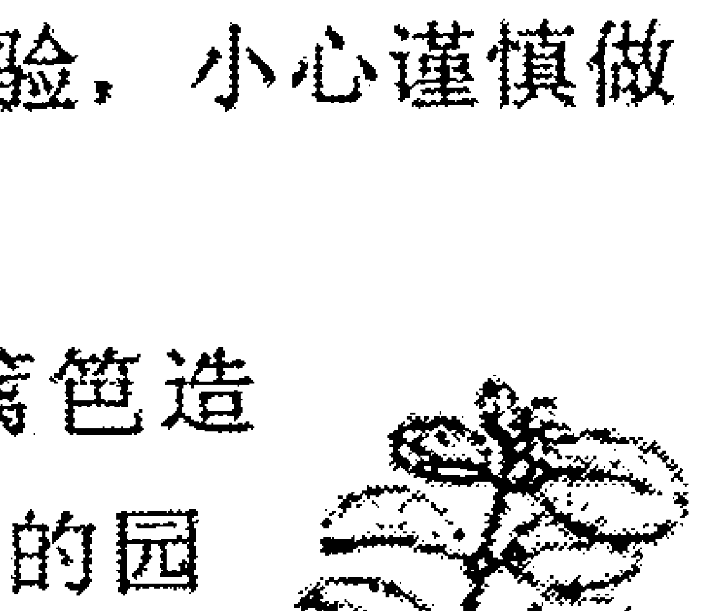

> 天堂树：“真乱啊！没问题，我能搞定。” 城市开发的人讨厌这种树；苗圃业主通常拒绝买这种树；然而它却再次出现在种植计划里。天堂树只生长在被破坏的土壤中；它是一种补丁类型的植物。也像是煤矿里的一只金丝雀，可以预言即将到来的麻烦。天堂树的力量是改变；它在恶劣的环境中旺盛生长，改善土壤之后自己又让路给其他的植物。

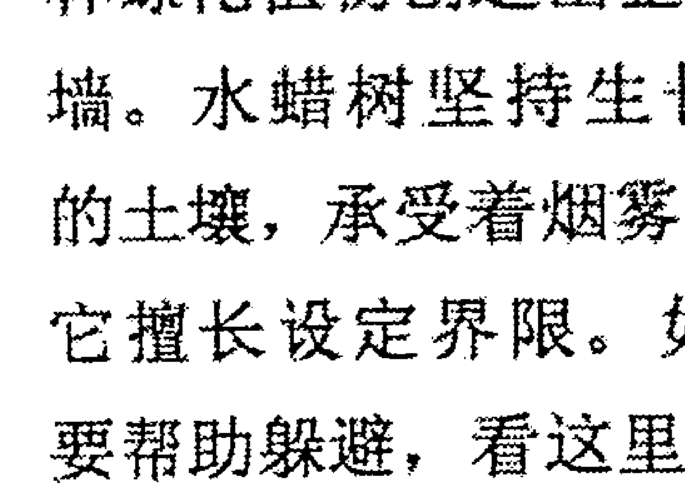

### 动物指南

> 蚂蚁：“在这儿全都一样。” 蚂蚁的力量是渺小的。它太小了以至于根本就不被注意，所以不会受到惊扰。它的世界集中在如此小的范围内以至于城市所产生的任何变化对她影响都不大；它也没有注意到他们。蚂蚁能向你指出文明的程度没有改变。

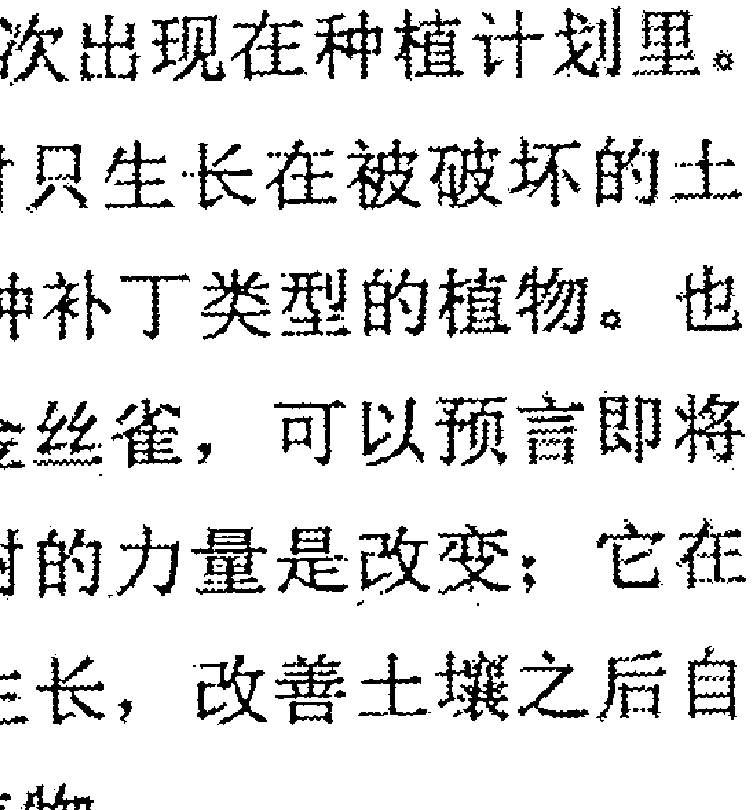

> 猎鹰：“永不放弃。” 几十年前受到濒临灭绝的威胁，如今这种凶残而美丽的猛禽已经华丽再生。它已经克服了栖息地的丧失、农药和其他环境的突变。当你对一个个负面力量感到绝望的时候，记住你也能在它们之上翱翔。

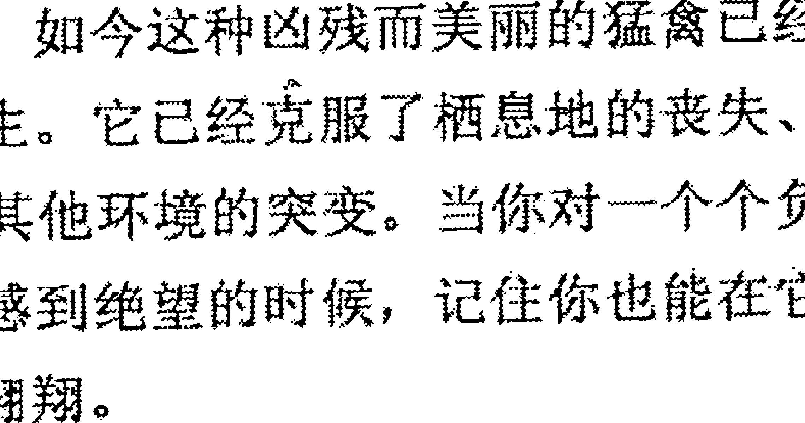

> 鸽子：“一个仿造的悬崖，多么了不起的鸟巢！” 鸽子，在另一方面来讲，欣然接受改变。“没有任何区别的区别”对鸽子来说就是“没有区别”。如果你是一个技术型异教徒，请到这里来寻找灵感。鸽子的力量是寻找合适的仿造巢而不是自然的原生态。

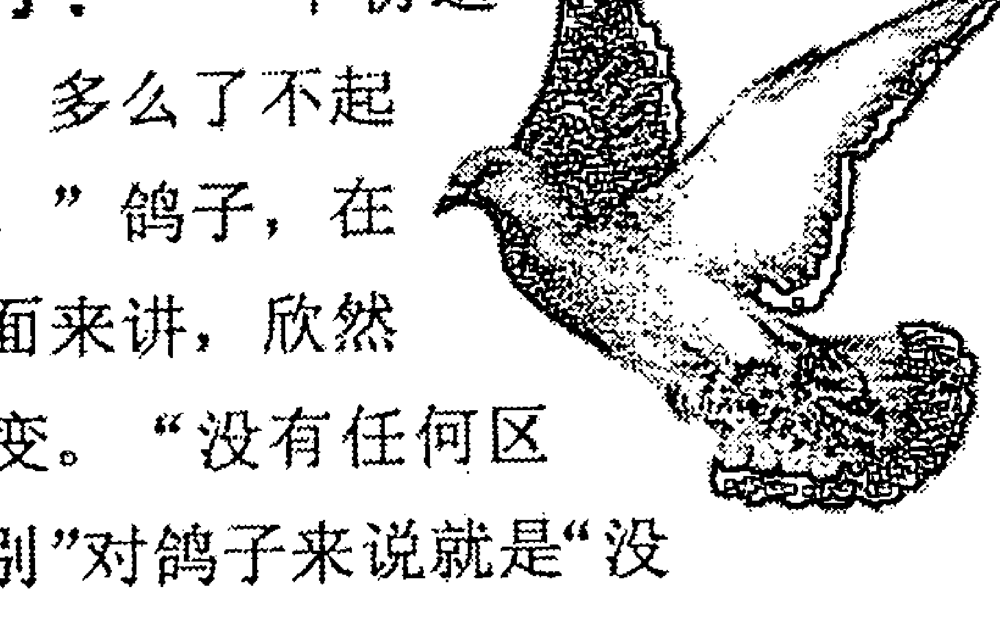

> 老鼠：“你是什么意思，垃圾？给我。” 这个勤劳的馋嘴提醒我们小心隐藏的用途。和天堂树一样，老鼠也能变废为宝。老鼠的力量是足智多谋的：它可以在任何一个地方生存，什么都吃，什么都用。如果你想改变浪费的习惯，想少买一些一次性用品，去老鼠身上寻找灵感。

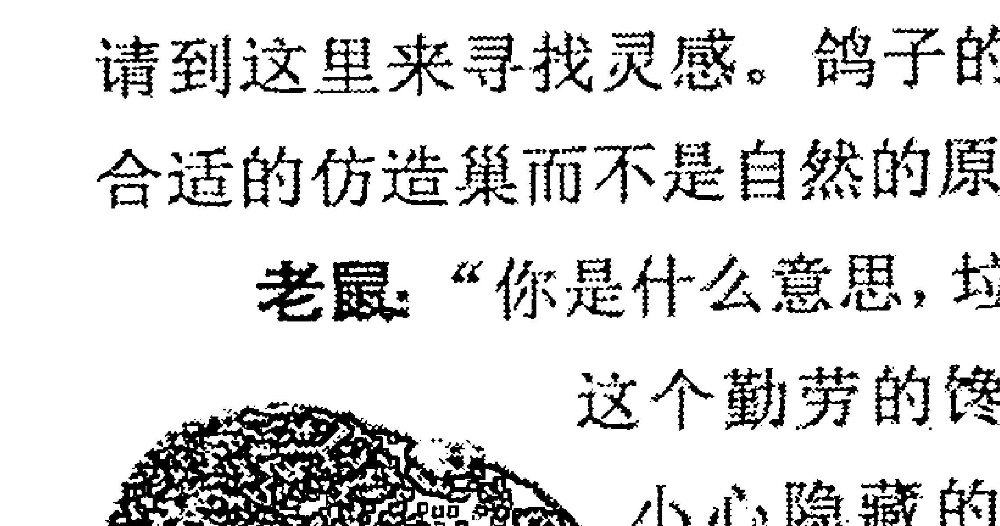

> 麻雀：“没有哪片面包屑是渺小的。” 在人群中疾飞闪躲，抓起丢下的面包屑。这种小鸟能利用巢址去躲避其他的鸟，然后藏在密集的草堆或杂乱的地方躲避追捕。麻雀教会人们节俭和通过掩护躲避危险。

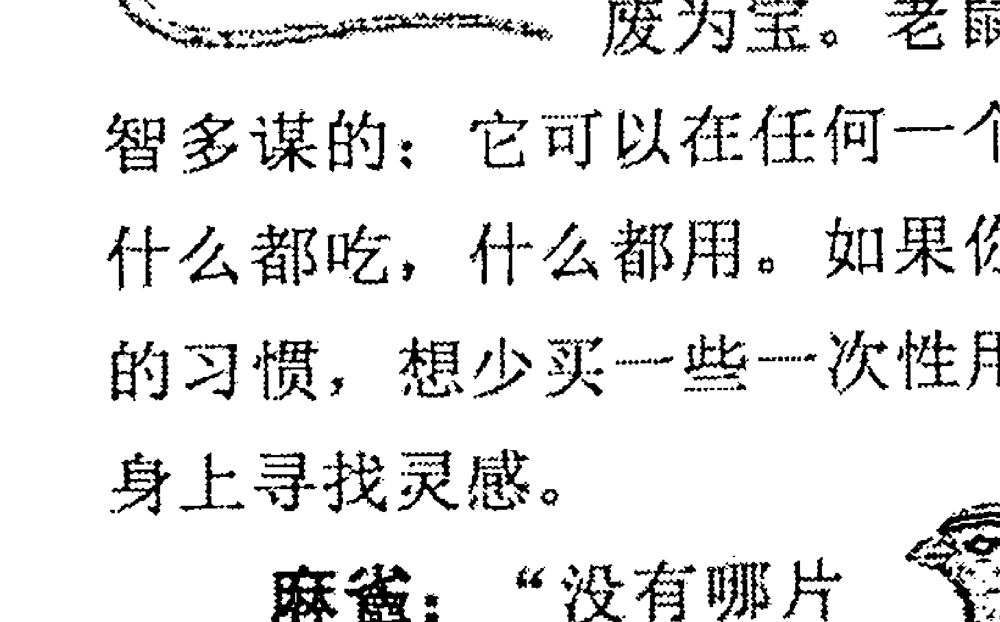

> 松鼠：“在雨天的时候储存一点东西。” 这种活泼可爱

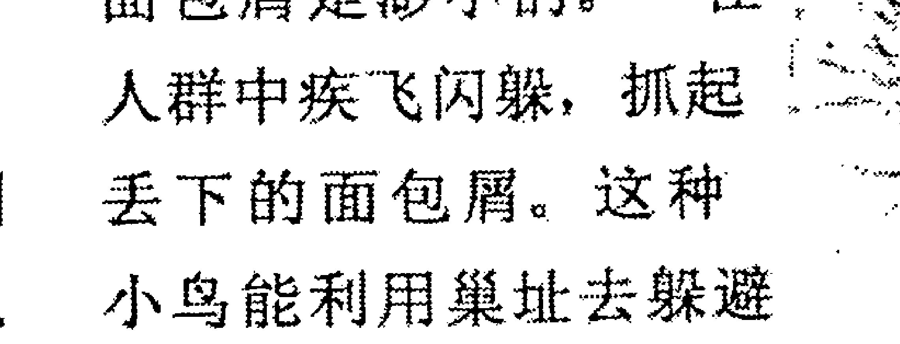## 第二章：自然（银色）

的哺乳动物住在公园和城市花园里任何有树洞或地洞的地方。有句俚语——“松鼠方式”，指的就是像松鼠一样储存东西。在冬天观看松鼠埋坚果，你就什么都明白了。要人帮忙修理自己的储藏室？找松鼠！

### 城市修行

你可以直接或间接地使用城市图腾。间接的方法更为简单，但需要更慎重。在你的房间里设置一个圣坛，用你的动物或者植物象征物来装饰它。可以用相片或艺术品作为图腾。你也可以加上一些实质性的物件，例如植物的叶子或一勺蚁穴上的土。当你开始沉思的时候，把你的圣坛作为一个中心。

直接的方法包括做一些事来改善城市的环境。如果你有一个院子——或者只是一个阳台，就可以制造一个“袖珍花园”来吸引野生动物。拿出一个喂鸟器。种植守护植物和其他能够吸引动物的植物。你还得提供水源：它可以吸引野生动物，因为干净水很难找到。然后看哪些动物会出现。

如果你没有自己的地方，寻找公共资源。你可以在附近的公园喂鸟和松鼠，享受植物带来的惬意。询问当志愿者的机会，能让你有机会帮助种植树木或维护花坛。一些城市甚至有一个“社区花园”项目，让你和其他的城市园丁共享一小块土地，种植一些东西。

### 总结

是的，以上的动植物并不是特别地富有魅力。是的，在一些地方他们甚至臭名昭著。但是看看鹰和大熊还有红杉树，然后把他们现在的地点和都市对比一下。蒲公英、蚂蚁都在学着适应。这些幸存者在城市环境中蓬勃发展，通常还超额完成了它们在自然环境下能够完成的目标。他们也许看起来微不足道，但是他们的力量影响到地球上的每一个城市。下一次，当你感觉到在城市的世界里格格不入的时候，可以向它们求助。它们每一个都能教给你一些东西。

### 探索

如果你住在镇上，咨询下你的邻居：如果你住在市里，为这个项目区寻访一个附近的镇。你能找到多少种不同的植物和动物？他们有强大的魔法光环吗？在旅行小组里讨论你的发现。

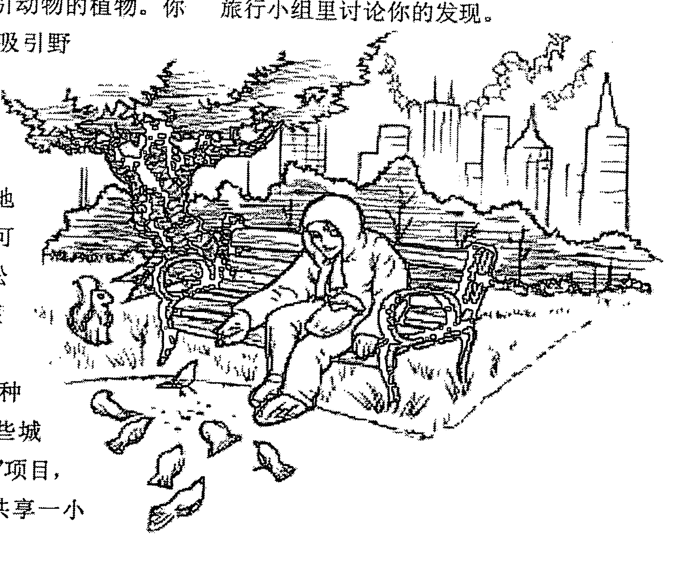

## 第三章 练习（金色）

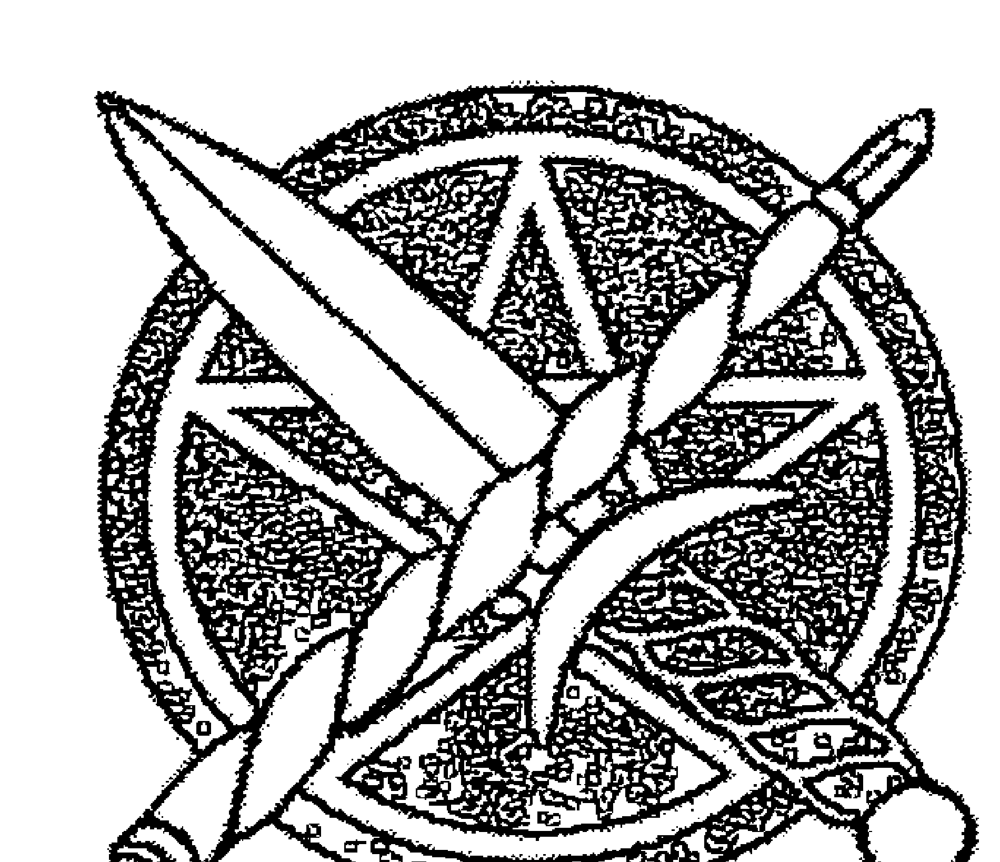

### 太阳之子，魔杖之歌

> 火的孩子
明亮而野性
站起来高大又强壮
温暖又发亮
没人感激
太阳之子和魔杖之歌

王室
友谊的忠诚
带领着走向光明
肆无忌惮的陌生人
危险的提示
紧握火炬在你的眼前！
——伊丽莎白·巴纳特

### 简介

欢迎来到魔法世界。在这一章里，练习是我们的重点，从中你将获得最重要的装备，有实体的也有概念性的，它们都能协助你使用魔法，比如你的魔法工具、行头和圣地，还有标志、象征、法术和魅力。

和这一章有关的颜色是金色，展现男性力量的能量，领导力和活力。金色代表着太阳的颜色，狮子座的标志，青春期，丰盛的收获和贵族。学习魔法的男性通常喜欢魔法系列的工具、护身符和金子，还有青铜或者黄铜做的珠宝。

魔法的练习分为两个主要的部分。第一部分主要是工具和王权；第二部分法术和魅力是重点。练习魔法，运用这里和魔典里所学的内容，首先你需要装配你的魔法工具包。格雷学校教授书月人列出了以下课程：

### 第一部分——工具

文/韦月人（靛蓝）。

### 1. 你的魔法工具包

一个魔法师必须时刻准备好所有的东西。而作为一个魔法师的学徒，你更应该装配一个属于自己的魔法工具包——一种工具盒，将它放在手边以备所需。

你将需要一个牢固的背包或者书包，也可以是化妆盒。软体的工具盒——特别是用有很多隔层的。许多相机盒也不错，特别是那些有可移动分频器的。不过它的大小或形状，应该是方便外出携带的，然后能够装下你所需要的东西。

一些魔法师就是用他们的工具箱，去装魔法的用品和材料。这儿是一些能装在工具箱里，有用的用品和材料：

- 小的笔记本
- 有色的和常规的钢笔、铅笔
- 塔罗牌或者其他占卜工具
- 干草药和/或涂抹棒
- 书
- 一次性相机
- 火柴
- 蜡烛
- 线
- 剪刀
- 急救箱
- 小刀
- 野外指南
- 卷尺
- 你的魔法杂志
- 生存装备（看第十条户外必备，例在第二章学习自然里的“远足安全”下面）
- 装东西的盒子：小盒子，塑料袋等等
- 玉米面的包*

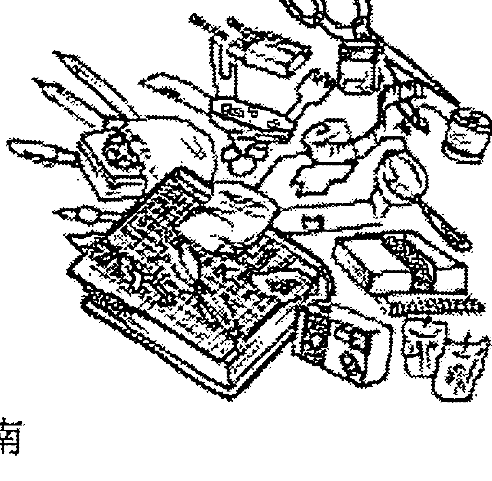

* 研究学院院长伊丽莎白·巴纳特写道：“我用玉米面去完成美国本土的任务。但是离开我自己的设备，我更想用一些即用的东西给地球：家禽饲料，花肥和本土的野花种子都是我的喜好。有进取心的法师会把种子和肥料卷成一个球，用一层粘土把它保护起来，防止它在雨中慢慢被溶解掉。”

这只是一部分清单。当你变成魔法师的时候，你将自己动脑筋增加，或者改变你的魔法工具。例如，如果你对学习自然感兴趣，你可以着重学习野外指南，收集材料在你的工具箱里。如果是魔法表演，你的工具可能会包括花招戏法之类的东西，或者当你有时间的时候，也可以细读一些仪式类诗歌集。如果占卜是你的长处，你可以保留塔罗牌或者符文在你的工具箱里。
快乐地构筑你的工具包吧，看着它与你共同成长！

### 你的魔法师工具

在你学习魔法的进程中，你将开始学习一个魔法师的“工具”。
现在让我们明白一件事情：成为一个法师不一定要拥有一个斗篷，或者可供挥舞的东西！但是去观察和感受这些是很简单和充满乐趣的！像其他任何事物一样，成为一种职业、技能或者爱好，而当你有一些符合它的穿着时，法师的工作会变得更加有趣。同样的，在一些情况下，一件好的魔法工具或者合适的着装，将给你提供一些无形的帮助。
关于魔法的工具，这有一些事，也许需要你仔细思考一番。

### 备存纪录

对于记录的备存，你将需要杂志、钢笔、铅笔、胶棒等等，你也许想要获得特殊的盒子、笔记本、柜子，甚至是一个文件柜来存放你的记录、项目，以及在杂志或报纸上剪下来的花边新闻等等。

### 衣服和工具

你的工作是成为一名法师，也许你就会想把自己打扮成魔法师真正的样子。许多魔法师喜欢自己制作他们自己的衣服和工具，魔典中有一部分就是关于制作自己的魔法工具和服装的。布料店将为你提供制作斗篷、长袍、礼服和其他神秘的或者仪式的衣服布料和图案。

### 书和杂志

圣庙里的圣坛没有一个是完整的，如果没有一个魔法图书室，当你对魔法的兴趣日渐浓郁和增长时，毋庸置疑，你将想要读到更多的书籍。其中最省钱的一个方法就是通过购买二手（经验丰富的）书。Powell.com 和 amazon.com 是两个信誉良好的二手书网站，通常只要几美分。另一个最大的资源是 ABE 书城，在全市拥有大约 1 万个二手连锁书店。其实你还可以购买一些魔法方面的期刊和杂志，或者以魔法为主题的 DVD。

一些魔法师更喜欢购买他们的工具和服装。许多社团有商店，在出售一些关于魔法的物品。文艺复兴、异教展览会和节日聚会，都是挑选这些东西的好时期，比如梦幻公约、古装公约和聚会 / 戏院商店。

十月是寻找魔法物品的最佳时机，因为世俗的人们都在准备万圣节。你也许能找到衣服、化妆品、荧光棒、特殊的蜡烛和更多其他的魔法产品。一般在这个时候，布料店会把所有的魔法布料和有图案的魔法服装都拿出来出售。

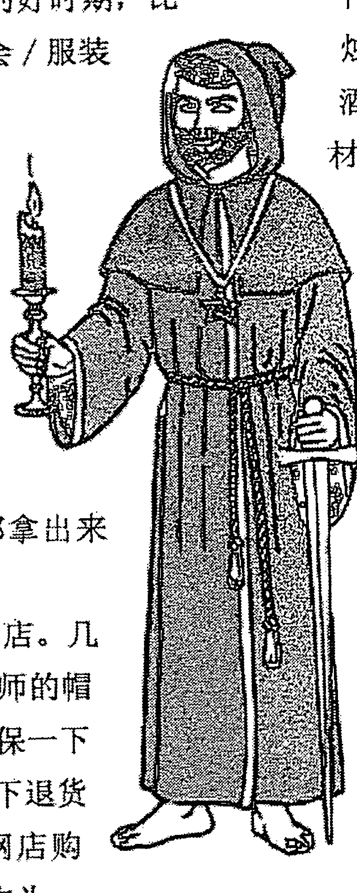

### 各种物品

一个魔法师能用的物品多不胜数！蜡烛、雕像、草药、污迹设备、圣坛布、酒杯、油扩散器、占卜镜子、占卜材料、魔法相关的工具、水晶、小样品瓶、盒子、钟、日历、塔罗牌、艺术品、珠宝、书法材料、羊皮纸、钢笔和天文设备，这些都是你所需要的东西，也许它们是一次性的，又或者其他。

大一点的物品包括书架、文件柜、桌子、珠宝盒和其他一些能帮助你进行魔法师工作的东西。

然而，这些东西里面很多都是可以制作的，或者便宜购买到的。你可能也想保留一张愿望单，作为建议，以便如果有人想送你礼物，

在网上也有很多魔法商店。几家信誉好的网店，在卖魔法师的帽子和斗篷。在买之前，先确保一下物品做工是否良好，查询一下退货政策。一些魔法师拒绝在网店购买无法看到的魔法工具。作为一个魔法师学徒，这也许是一个值得借鉴的行为。

### 把这些元素带到你的魔法空间去

自从元素成为你的家和魔法空间的一部分，它们便开始影响着我们魔法生活的方方面面，使你从中受益。

土：土为我们提供场地，给我们中心。用天然石器或者陶器放在你的桌子上，把石头、岩石和水晶放在你家的周围。而厨房使用的是天然海盐。

魔法财产。一些魔法师喜欢记录下什么时候在什么地方他们曾获得的（或者制作）每一个物品。

### 气：

气能够激发，并且提升思想的明晰度。你可以通过开窗，将气带入自己的家里；也可以点燃蜡烛、焚香或者植物精油；还可以在你的窗户外面悬挂风铃、旗帜，或者在家里挂一些非固定的物体。

### 火：

火是气最纯粹的能源。燃烧蜡烛和污迹能带来火；如果你有一个壁炉，使火一直燃烧成一个聚焦的点，它便会成为一个沉思的地方；还可以把菱形水晶挂在床边；以及用超辣的香料和辣椒烹调食物，都能创造火元素。

### 水

水让人感到平静、抚慰和治愈。把水带进你的地方的最好办法之一就是，用一个小的桌式喷泉，或者试试制作一个碗装水，用花瓣或者漂浮在表面的蜡烛、贝壳、海玻璃和珊瑚片制作可爱的陈列品。

### 灵：

灵支撑我们的能量和情感，把我们和世界联系在一起，鼓励我们去做些更伟大的事情。你可以通过储藏你心爱的人的照片，或者家庭的纪念物来获取，总之，选择一些对你来说意义深远的个人物品。

### 任务

在你的魔法杂志上选择一篇空白页。在这一页上列一个单子，用于记录你希望为你的魔法工作所需要获得的10样东西。对每一个东西，写下注意 (a) 你是否能制作它和你将怎么做，(b) 如果你需要买它，如何用最低价实现。你可以用这种方法去计划和监控你的魔法财产。一些魔法师喜欢记录下什么时候在什么地方他们曾获得的（或者制作）每一个物品。

### 2. 行头

### 你的法衣

文 / 奥伯伦（灰色）

在魔法宝典里，我写了整整一部分关于如果制作魔法行头（服装）的方法。在这儿，我不会再重复任何一点，但是我想加几条我没有真正细致描述的内容，或者解释一下它们到底是如何制作的——尖顶帽、旅行斗篷和靴子。

### 你的尖顶帽

高高的尖尖帽子，自古以来一直都和魔法师、魔法师有关。早些时候，在柏林博物馆研究历史的学者认为，青铜时代的欧洲神谕法师的圆锥帽子上，装点着错综复杂的图案和占星符号，有助于他们预知太阳和行星的运行轨迹。这些人物，指的是拥有超自然能力的“祭司王”，因为他们能准确预知播种、种植和丰收的时间。“他们被视为时间的主人，学习神圣的知识来使人们能够预知未来。”柏林博物馆的主维尔弗里德·门京（Wilfrid Menghin）这样说道。青铜时代有着一个3000年

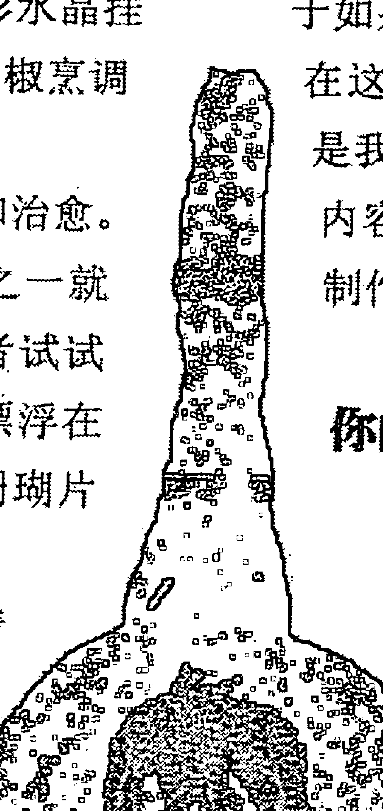

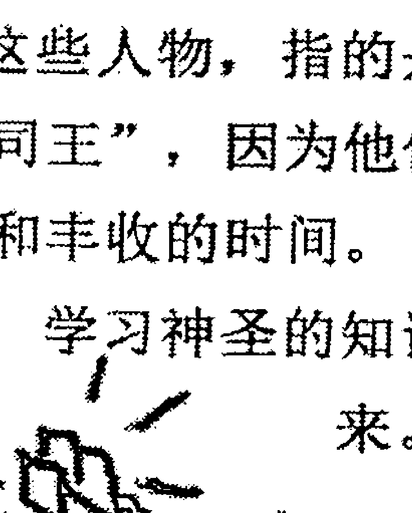

历史的高锥金箔，这是通过详细研究后得出的结论，此物1995年在瑞士发现，于第二年被博物馆购买。

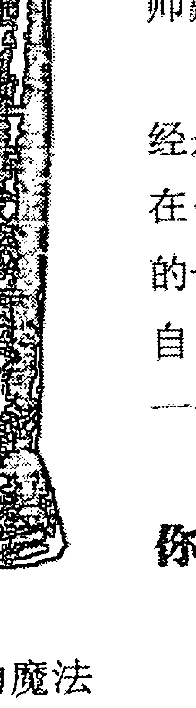

门京先生和它的研究员发现，修饰柏林锥体表面的1739个太阳和半月符号构成了一个科学代码，这个代码和在公元432年被希腊天文学家默东（Meton）发现的“默冬周期”几乎是一样的，大概500年后锥体才被制作出来，并解释了月亮和太阳年之间的关系。“帽子上的符号是一个对数表，使得太阳和月亮的运行时间能提前给计算出来，”门京先生说，“他们表明青铜石器的魔法师，已能在进行长期的实验和占星术的观察。”

1835年在德国的斯坎伏思达特（Schifferstadt）镇上，另一个圆锥形的帽子被发现了。上下帽沿相连接，而上面缀满了太阳和月亮的符号，它是最早发现的例子，可以追溯到公元前1300年。

其他的德国考古学家表明，在横跨史前欧洲的很多地方，发现了戴金色帽子的祭司王。萨宾·杰罗夫（Sabine Gerloff）教授，是德国埃朗根大学的考古学家，他找到了一些证据——在16世纪到17世纪的爱尔兰，泥炭挖掘机发掘出了5个相似的金色锥体。

（以上是摘自2002年3月17日《柏林新闻电报》[The Berlin News Telegappg]上，托尼·帕特森[Paterson]所写的：《神秘的金色锥体“古代魔法师的帽子”》[Mysterious gold cones "hats of ancient wizards"]。）

wizards"]。）在戈壁沙漠里，中国以西，一个白种女人的木乃伊（下图）被发现戴着一个高高的黑色尖尖帽子，就像那些传统的魔法师戴的一样！

男魔法师和女魔法师的帽子现在已经是非常流行的服饰，以至于现在你可以在任何一家服装店里挑选到一顶非常好的——特别是在万圣节的时候。如果你想自己制作一个简单的样式，下图展示出了一个精致的魔法师带边帽如何制作。

### 你的旅行斗篷

旅行斗篷，顾名思义也就是说当你在旷野中休息的时候，它还可以当作被子来使用。大部分的斗篷非常像一件超大的长袍，只是衣角是圆形的。甘道夫在《护戒使者》中就穿了一件。要亲手制作自己的斗篷，你需要36英寸宽的深色毛毯，这种材料会使你在晚上的时候很难被发现（橄榄绿，深灰，靛青，棕色，或者黑色都是最常见的选择）。你甚至可以使用迷彩色！

测量从你的肩膀上方到足部上方的长

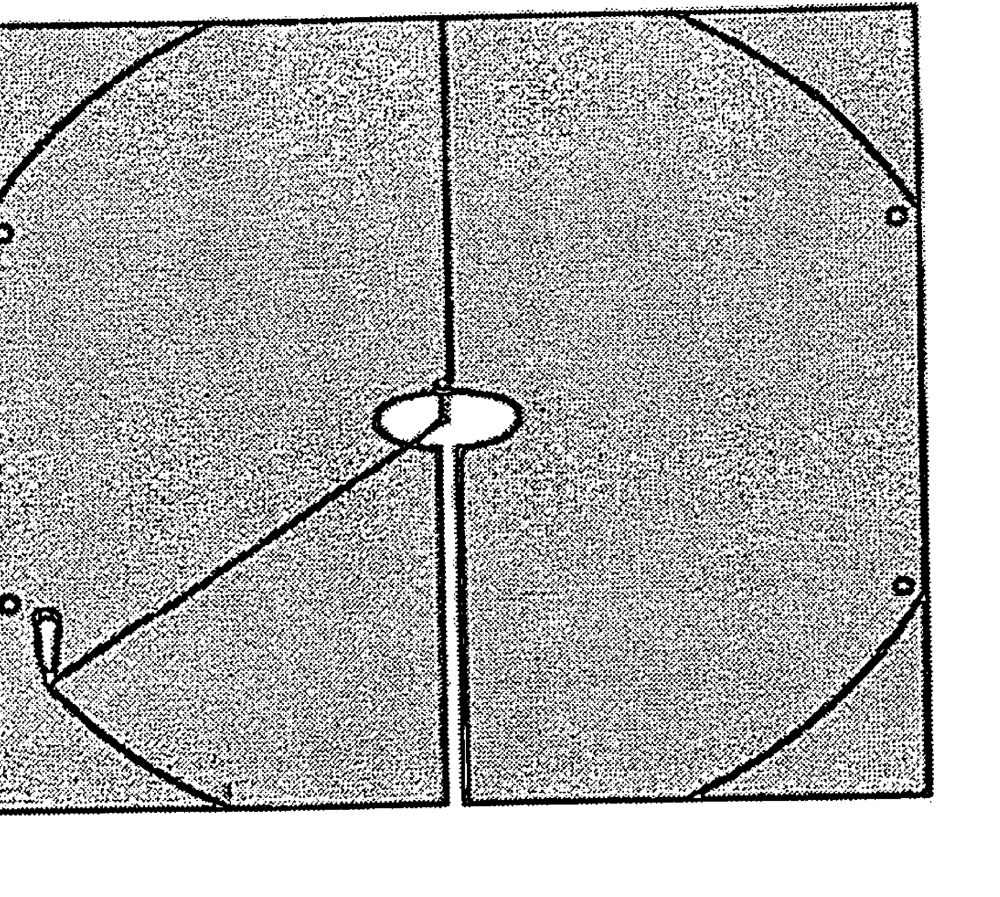

度，用两块两倍于这个长度的布料来制作斗篷。然后把它们从中间的地方缝起来。缝起来的那部分作为斗篷的背面，没有缝起来的地方则垂挂在前面——像你的长袍。

在中间的位置，每边都剪下一个短的（3英寸—4英寸）衣角缝，来为你的脖子制作一个“T”字形开口。将裁减过的边缘卷边，让翻领自然垂坠。最后，可以给斗篷加扣子来把前面固定在一起。

现在，把你的斗篷放下，或者甚至放在地板上摆出一个大矩形。放一块平的木头在中间位置，插一根图钉，正好在“T”字的交叉位置。拿一根长线，在一端系个环，套在图钉上。把线拉伸到斗篷前缝的长度，再系一个环。在环里系一只记号笔，然后，把线拉紧，像圆规一样在下前方和斗篷的后面，画一根曲线（你应该让另一个人来帮你拿着中间的板子和图钉，防止它滑动。）然后再从中心和外边缘的中间部分开始画圆。（见上图）

把多余的部分切除掉然后卷边。如果你想加一个兜帽，你可以按照《魔法师学徒的魔法书》里面的图案用裁减下来的布料做一个。

旅行斗篷的最后一步是要在前后侧的两侧中间，附上一根12英寸连线，这样就将它们连在一起，形成腋窝部分。当你用你的斗篷当铺盖的时候，只需要打开这些线就可以变作一张舒适的毯子！

### 你的靴子

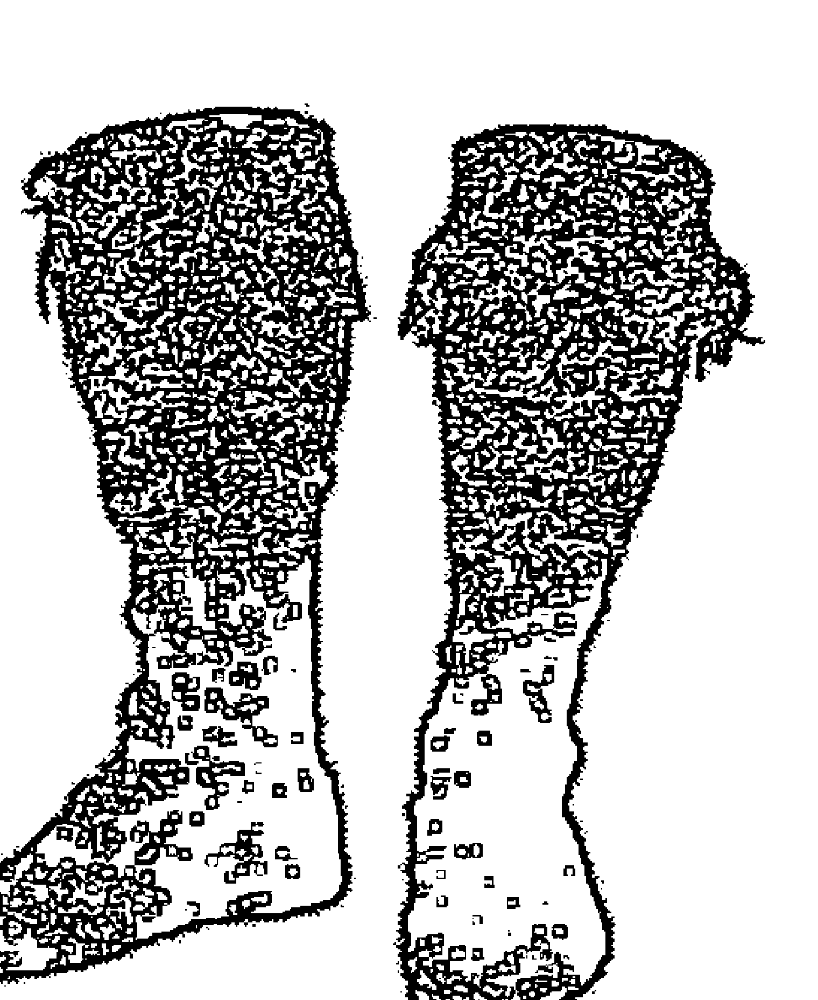

当然，如果你有制作皮革的工作技巧，你也能制作自己的靴子，但这比在这儿解释还棘手。对于我自己来说，我建议你为自己买一双合适的靴子。我所知道的最值得购买的一双靴子，是来自慕斯维仿制品股份有限公司。（www. Muswum Replicas. com，浏览“男士服饰：鞋子，靴子，凉鞋。”）这些当中最具有魔法师气质的是系鞋带的鹿皮低口或高口的靴子。这就是甘道夫在电影《护戒使者》中穿的那种。不管是带边的或者不带边的，黑色或者棕色的都能够买到。他们穿起来非常舒服，价格也非常合理。我就很爱我的这双靴子！

### 你的魔法披肩

文/书月人（靛蓝色）

对于魔法师的徒弟来说，魔法宝典教会他们制作一件徒弟的长袍，即悬垂在你的肩膀，也搭在你的胸前的衣服。根据介绍里面对16个颜色的构成规定，长袍也是有颜色编码的，会和穿衣人的魔法特性相符。

一些魔法师，尤其是女孩和妇女，也许更喜欢制作一件魔法披肩而不是长袍。和长袍一样，一件披肩的颜色是需要协调的。披肩可以穿

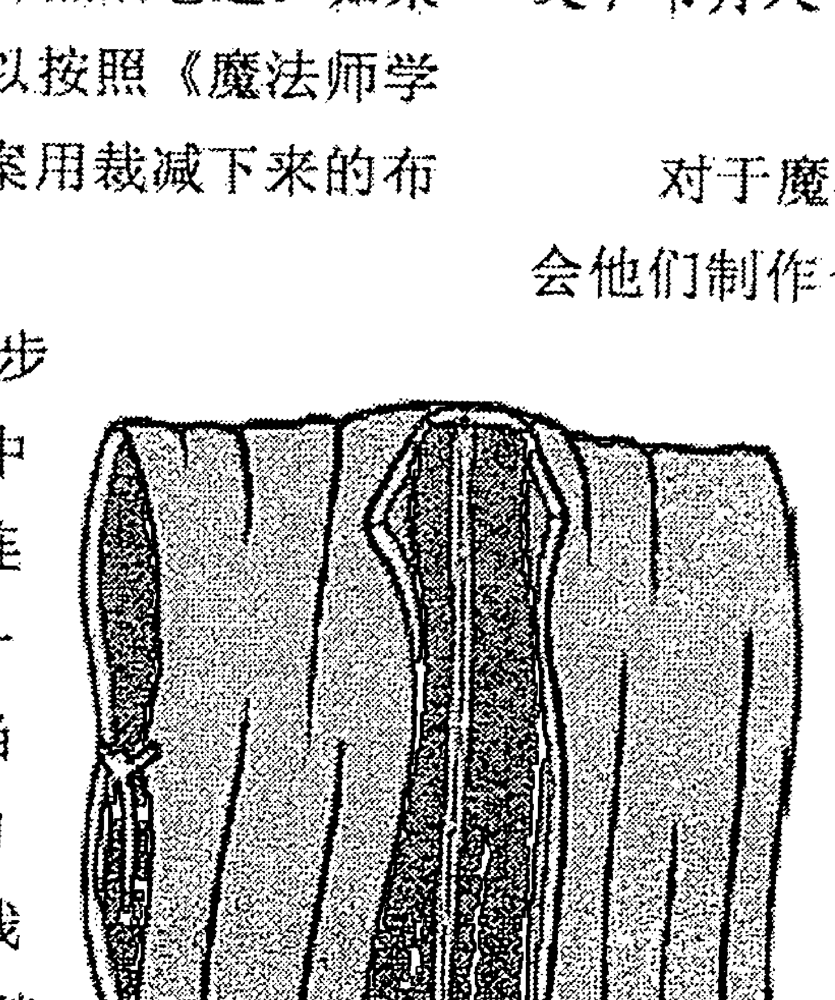

在任何一种衣服的外面——魔法的或者其他——很容易就穿上了。它也能用作仪式的服装，或者当你坐下写你的魔法日志时，将它简单地披在你的肩上即可。

制作一件披肩是非常便宜的，而且不需要花费太多时间。因为披肩很容易做，你可以多做几件用于不同的场合，或者对应不同的魔法特性颜色。

要缝制一件披肩，你将需要这些东西：

- 30-36 英寸宽，和你伸出的指间到胳膊的距离一样长的一块布料
- 相匹配的线
- 一个缝纫机
- 一个熨斗

在选择你的布匹方面，你可以选择一块能反映你魔法兴趣的颜色。你也可能想要寻找特别的图案。例如，我有一件草药系的绿色披肩，上面遍布橡子和橡树叶子。我还有一件紫蓝色缎料做的宇宙式披肩，上面印有月亮和星星。

在开始缝制之前，要根据你购买面料的螺栓指示，来清洗你的布匹；再根据指示在烘干机里烘干。这个步骤称为“缩水”，这对任何一种缝纫都是很重要的步骤。

在处理完“缩水”后，用你的剪刀把磨损的边缘修剪掉。

缝制好披肩四边后，一件漂亮、完整的披肩就制作完成了，整个步骤就是这么简单。

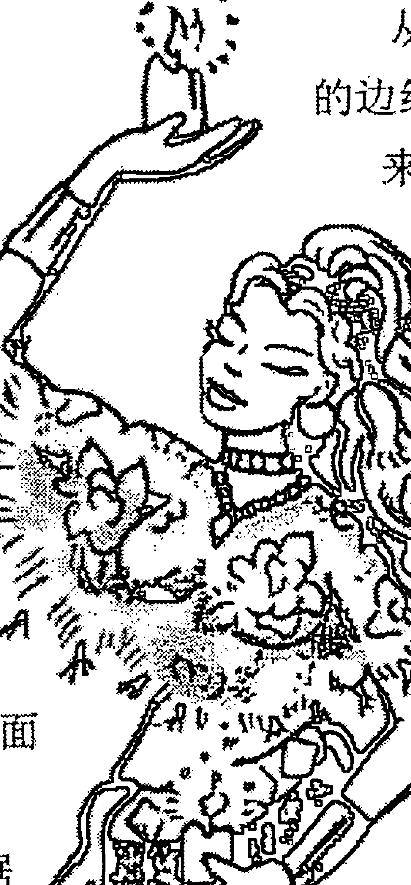

最后把边缘的部分翻过来卷个边，那样的话就不会有磨损或者开叉的地方。

以翻转四个边开始，一次一边超过1/4朝向布匹的“反面”，用熨斗把每一个翻过来的地方熨成一个折痕，再用直针把折痕的地方固定住。把它们翻转过来，然后再以任何顺序把这些边缘缝起来。

完成以上步骤后，用你的缝纫机沿着披肩的周长缝一圈，把折起来的地方缝起来，只缝里面的褶皱。确保你缝的一定是布匹“反面”，如果制作得不是很完美，也不要着急，毕竟它还没有要面世出售。

一旦做好了那些，你将再一次把每一边折一次，做一个真正的下摆。

从披肩长的一边开始。把先前缝过的边缘再折5/8的样子，用直针固定起来。像先前一样，确定折叠布匹的“反面”后，用你的缝纫机从布匹的边缘1/2处，把折叠缝起来。另一边也如此。等两边都缝好了，再缝短的两边——用同样的方法，一次一边。

最后，把每一根针都去掉，然后把四个折角边都熨平整和光滑，熨的时候要从布匹的“反面”开始，如果用的缎或者其他“异样”的布匹，就得使用冷的熨斗，以防把材料烫坏了。

这就是整个制作过程，现在你可以拥有一件披肩了！

### 你的坛布

文 / 书月人

坛布就是一张简单的装饰布，用来垫在圣坛下面。坛布也可以用作其他魔法的工作，例如放塔罗牌或者占卜镜子的地方。和其它的魔法服饰、行头一样，你坛布的颜色也将和你的魔法兴趣，或者目的相匹配。
你可以选择多做几张。
对于一张非常简单的坛布来说，选择一张2或者3尺见方的材料，并且它的颜色，或者图案都能满足你的魔法需求。选择的大小也要根据自己的需求、放置的地方来决定。
像先前指导披肩的洗法来先把布匹清洗一遍。再修剪下边缘，像先前描述的缝披肩那样把布的边缝上，也可以把织带给熔了。（注意：记住要翻到布匹要缝边的“相反的那一边”）

### 3. 便携式圣坛

文 / 奥伯伦（灰色）

如果你经常出去旅行，或者离开家，你也许想要制作一个便携式的圣坛，随身携带方便你走到哪儿都可以把它放起来。通常的办法是用一个硬面的公文包，然后找一个你最喜爱的、大的，对你来说能象征魔法本质的图画

（日历是很好的资源），把它贴在盖子的内侧。你可能还需要一张够大的透明塑料罩，这样你可以放几张打印纸在下面，然后把你在任何特殊场合都想看到的那张放在最前面。
之后拿几块塑料泡沫，把它们切成比公文包内的尺寸稍大的样子。它们中的两个应该一样厚。另外的应该和剩下的公文包深度一样厚，以便三块泡沫都能紧贴着包。放一块1英寸的泡沫层到包的底部。
最后，你将需要一块硬的东西切成同样的大小用来放在上面，保持一个硬的表面来放置你的圣坛。厚重的纸板是个不错的选择，或者你可以用1/8的木头，又或者是福米卡镶板。
现在选择一套小的东西来代表四个元素。如果你有特殊的魔法工具，例如魔杖、仪式刀、杯、香炉和五角星，还有（许多人用微型的特殊套装来实现这个目的）一对许愿烛或者放蜡烛的烛台（白色和黑色）最好也包含在内，以及香、备用蜡烛和一个打火机。
然后还需要些特殊的东西，例如小的神像、图腾、个人珍品、相片、符咒等等你所喜欢的东西。
当凑齐了所有你想放在便携式圣坛的东西后，把它们整齐地放在公文包的底部，再把盖子打开，看看你的摆设是什么样子的。也许你还想把什么东西拿出来，或者放进些其他的东西。
然后拿出所有你想要的东西放在厚的泡沫板上，布置成一个谜的样子，在每样东西之间间隔一定的距离。紧贴着每个东西的周围用记号笔画上圈。把东西拿开，然后用一个非常锋利的刀或者剪刀，把你

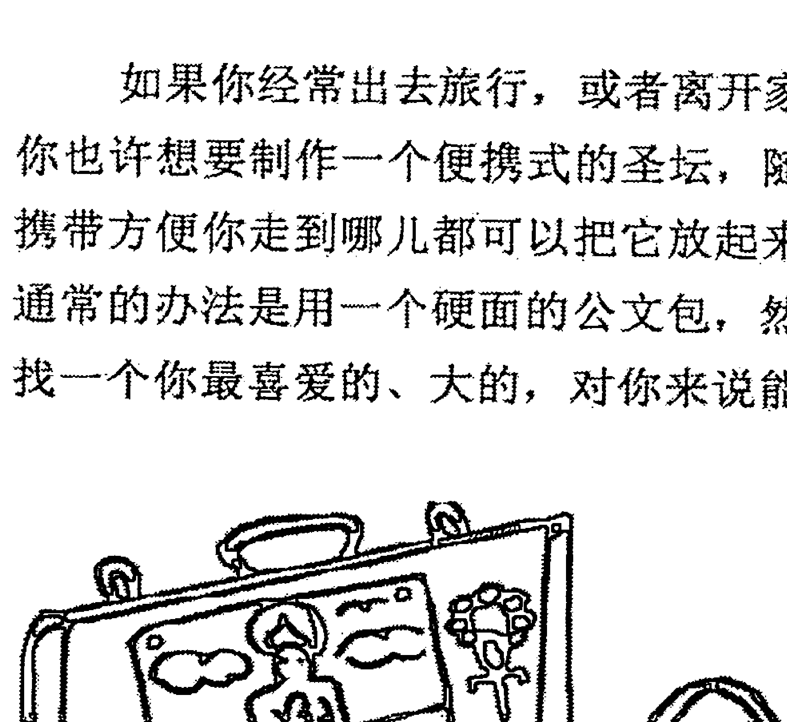

## 魔法师学徒的伴侣书 | 上卷

画的圈沿线切下。如果这个东西和泡沫一样深，那就把洞的深度切到底。但是如果它们很浅（像你的神像，仪式刀，或者蜡烛），那么切下的洞就只需要能装下它们即可。（不要为完全平面的东西像羽毛、香棍或者照片而烦恼，这些东西只要放在泡沫上面就行了。）然后把切下的泡沫放到其他东西的上面。

你可以拿一张薄的弹性天鹅绒面料来使圣坛变得特别神奇，盖住整个切下的泡沫，把四周的边塞到箱子里面。留下足够宽松的空间，使得东西能放进切下的布匹里面。你可能想用同样的布匹去盖住剩下的泡沫，那它可以用作遮盖切下部分的盖子。

同样的，拿一块尺寸合适的漂亮坛布去遮盖公文包的里面，并把延伸到外面的边也给遮住。

外出旅行时要把便携式圣坛打包，把所有的东西放进适合他们的小洞里。然后把剩下的泡沫放在物品的上面。随便加一些平的物品，把坛布折叠一下盖在所有的东西上面。将硬面的板子放在上面，把盖子盖上。现在你拥有一个很棒的便携式圣坛，你可以在任何地方，任何时间施展你的魔法！

另外有一个办法，你也可以用一个小盒子，像一个烟盒那样的，在上面涂画或者将一些图片粘在它的表面，或者用尼龙搭扣将一个迷你的祭坛样的立体图片贴在上面（很多人购买一些特制的迷你尺寸的工具就是为了这个目的）。盒盖会成为祭坛的底部，而祭坛的顶部是盒体，这样看起来就像是一个立体的模型。如何装饰这个盒子是你个人的选择。

“烟盒”也可以变成一个“口袋祭坛”。

这些祭坛在墨西哥以及一些“拉美”文化中被经常使用。它们看起来真的很酷。你也可以在家里使用它们，那样如果你不希望它们被一览无余，可以因为隐私而轻易地合上它们。

### 4. 制作魔杖

文 / 艾比 · 维诺如特（银色）

魔杖的制作需要挖掘你的内在能量，让你自身能够向新的经验和挑战开放。扩展你对技艺的认知，让宇宙的能量跟随于你是一种强大而具有疗愈效果的体验。魔杖不仅仅只是一种静态的物件；它是动态而有生命的一种工具，一个强大的能量通道。

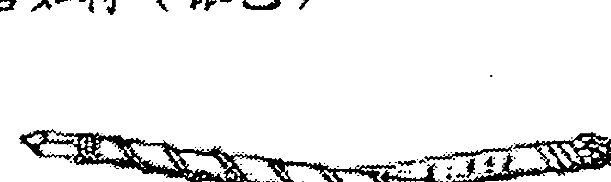

这一刻，你开始带着这样的意图和力量来制作魔杖，将这种意图和力量传递到这些材料中去。能够用于制作魔杖的材料是无限的。

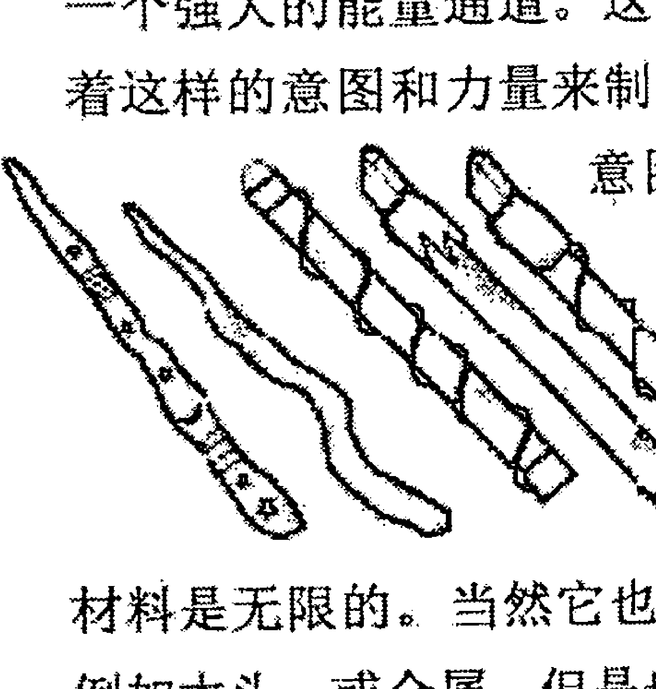

当然它也有传统的材料，例如木头，或金属，但是也有其它的材料。我们活在 21 世纪，过去我们将其看做是魔法师的标志，在现在和未来它也完美恰当地扮演着这个作用。一个十三世纪的魔法师不一定比这个世纪的魔法师更加地真实或强大。传统是很重要，但是它们不能永远地限制你。努力开放地面对任何开拓的可能性。

制造一件魔法工具的准备工作中是创造过程的最重要部分。它涉及到是否信任整个宇宙和你自己的感受力的一个承诺。技术是很重要，但是它是制造强大的超自然工具最后的关键部分——位于意图和专注力之后。设置超自然的基础开始于冥想你想要带来的是什么。专注于魔杖的无形方面——例如感觉，元素能量，预期的使用范畴，以及你的意图都是这根魔杖的本质。它看起来怎么样，有多长，或者它是否有石头或者符号标志都是外在的，对于这根魔杖的核心本质都是次要的。

当你对这根魔杖有了清晰地认识之后，你将会开始制造。首先从挑选材质开始。让你自己能够开放地面对任何改变你对于魔杖最初设想的样子的观点。通常当我们在大脑中拥有美好观点的时候，宇宙将会给我们带来更加美好的东西。

永远不要操之过急——你的魔杖制作完成时间会在它应该完成的时间到来。你越有耐心，你就会在这个过程中承受越少的挫折，就跟生活一样。如果你到了某个阶段不知道该做什么的时候，就什么都不要做吧。将魔杖放下来，出去走走，问问宇宙苍穹接下来会发生什么。这段时间可能是一个小时也可能是一个星期；就随波逐流吧，不要妄图推动河水流动。花必要的时间让魔杖生成魔法和力量是值得的。

金属的魔杖可以用五金店买来的管子制成。能够在这些店里买到任何长度的红铜管、黄铜管或铬管，店主会为你进行切割。传统来说，很多魔法师推荐魔杖的长度与手肘到指尖长度一致。尽管这个长度被推崇备至，但它并不是一个硬性的规定。所以请选择一个适合你自己的长度吧。

制作魔杖有用的工具有烙铁、无铅焊料、助焊剂、砂纸、马毛、环氧树脂胶水，与金属管两端大小合适的端帽。

木质的魔杖可以用掉落或收割的枝干，或是木销钉来制作。我偏好用掉落的树枝来做，因为我认为没有必要去砍伐一颗活着的树木。木头在干燥或者湿润的时候都可以进行雕刻，两种情况下都各有优势。对于哈利·波特式的魔杖而言，可以用木销钉来制作，用砂纸打磨木销钉的长度以塑形。柄端进行雕刻然后再打磨抛光。

制作木质魔杖有用的工具有11号手持雕刻刀，一包额外的刀片，不同等级的砂纸，研磨纸，马毛，刷木器的油，缎子，蜡，和环氧树脂胶水。

玻璃或亚克力魔杖可以用长的玻璃或是亚克力棒来制作。中空的玻璃棒中间可以装一些干燥的天然物质，如橡子、种子、鹅卵石、宝石，或油炸玉米粒儿。一根收割的魔杖可以是捆成一捆的麦子，或一把草装进的一根中空的玻璃棒里，两端用软陶锚定。这种类型的魔杖里面不要再放任何的其它东西以免损坏里面的谷物秸秆。无铅焊料和烙铁可以用于装饰这种类型的魔杖。

皮革包裹的魔杖可以用舒展柔软的皮革包裹在一根木棍上来制作。有两种不同的类型：一些是皮革缠绕在木棍上，一些是用皮革包裹在木棍上，一侧或两侧用针线缝合。这些皮革都可以用符号、设计图画、条纹、小珠子，或符咒和护身符来美化妆点。

这些都是最常见，最基础的魔杖类型。你选择的魔杖类型取决于你个人的品味，信仰以及偏好。记住，你是在制作一件供你自己使用的魔法工具，所以要信任你自己的内在知识。魔法师往往有数个魔杖用。

### 5. 制作照明魔杖

文 / 奥伯伦（灰色）

在普通人的脑海中，以及一些故事和电影中（如指环王、哈利·波特），魔杖最常见的一个特点就是在末端有一个晶状体，专门用于照明。我很喜欢这一特点，于是把我所有的魔杖都赋予了同样的功能。而你，当然也能做到。

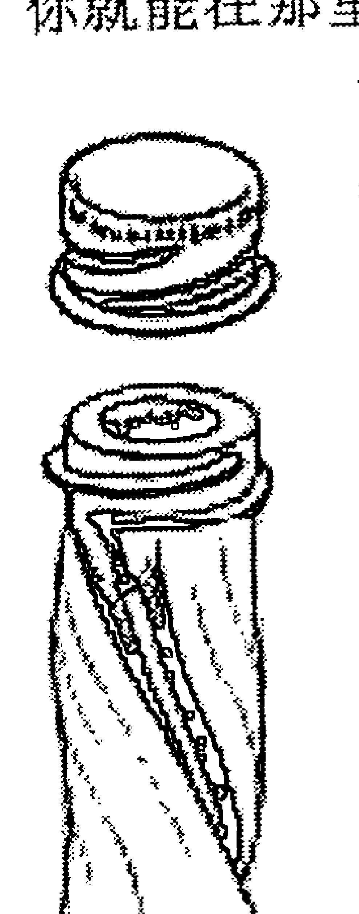

要制造一根发光魔杖，需要一根直径至少为5/8英寸，且有底部的棍子，那样你就能在那里钻出一个小洞，以供安装一节AAA电池。顶端需要一颗相同直径的晶状体。这些东西你几乎都能在新时代商店或五金店买到。

然后，你需要找一个光源。明亮的白色LED灯最适合放置于魔杖，因为其使用时间长，又附有电线。不过你还得试着去找一根2英尺长的电线，一个小的笔形电筒弹簧，以及一些备用电线。这些你都能在无线电器材公司买到。

你还需要从小味精瓶上拧下一个金属帽。将棍的末端修整成5/8英寸的直径，以使此金属帽能与魔法棍的末端紧紧咬合（图.1）。

但最重要的是要准备一根有藤蔓缠绕的树枝，在剥除树皮时留下一道螺旋型的槽，以便将电线从电池处接到亮灯处。棍的直径不应小于5/8，尽量要直，长度以从你的肘内侧到中指顶端为宜（即古代所谓的一肘尺）。万一你找到的树枝是弯的，你可以将其在热水中浸泡一个小时左右，然后用C型夹将其长度改为2×4英寸，并在约200华氏度的烤箱内烘干（图.2）。

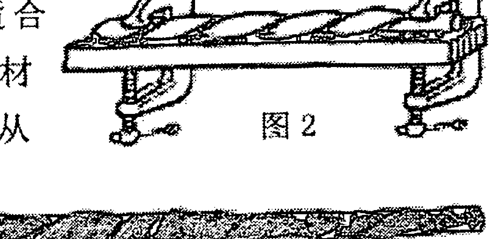

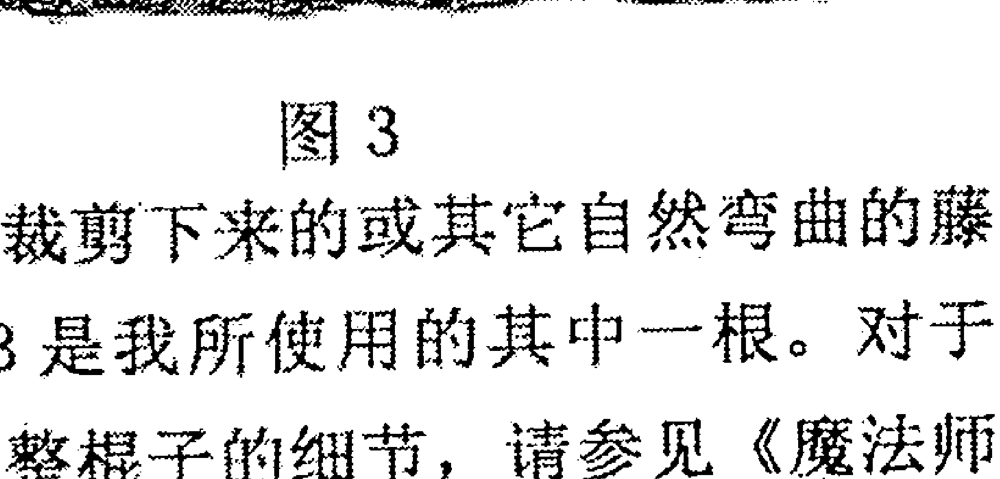

最适合的藤蔓材料，要数从葡萄藤上裁剪下来的或其它自然弯曲的藤条。图.3是我所使用的其中一根。对于剪裁和调整棍子的细节，请参见《魔法师学徒的魔法书上》第187至188页。

在修剪完树皮以及将其用砂纸打磨光滑之后，将其在低温下，以50：50的比例混和橄榄油和蜂蜡进行抛光。然后用软布的一角，沾少许该液体混合物擦到棍子上，让其更亮。

此时需要在手部位上钻出一个足够轻易放入及取出电池的孔。确保该孔只比电池长1/4英寸，以便让弹簧将其撑到盖帽处（图.4）。在另一端，钻出一个直径跟棍子相近的圆锥形的孔，以便放入LED灯泡。记得用胶水（橡胶胶水为宜）粘住反射器。然后在孔中放入一小片铝箔纸及一个小橡皮擦将其弄平。等胶水干了之后，小心地将多余的铝箔纸取出（图.5）。然后再钻出两个足够穿入电线的小孔，呈45°角方向，通过螺旋形外槽将LED孔与底部电池连接（图.5,6）。你可以用德雷工具钻具来将外槽进行修整或挖深。如果LED灯的线长度不足以连接至棍子底部，就需要增加长度。将线的末端两两拧紧，然后涂上橡胶水绝缘（图.7）。将电线从LED处的孔中穿出至反射器末端，然后沿着螺旋形外槽下拉。将一根线的末端拉至螺旋帽铜线处，然后将其接好，用强力胶水粘好。确保裸线在末端伸出，且没有胶水或绝缘物覆盖（图.1）。对于LED那一头的线，你需要将其从把手处拉出1/3至木棍表面。然后在外槽处打一对孔，将线稍微拉出外槽之外。把它当成一个末端，在此处插上一颗可随时插拔的铜质小平头钉，将裸线缠在上面（图.8）。现在拿一根短电线，并将其末端缠在笔形电筒上。将弹簧放入电池孔底部，把电线从45°角的小孔穿出。将其拉紧，然后用该线的另一端做成一个末端，大概距另一头1/2远，并切除多余部分（图.6）。拧紧金属帽，放入电池检测线路，将拇指按在两头的末端上，电流会流通你的全身，然后LED灯就会亮起！当一切都正常工作以后，用强力胶水将晶状体粘到LED灯处，再用一些银丝把连接处缠绕起来。将此线路沿外槽往下缠盖住电线，然后在其末端嵌入螺旋帽前的小孔，最后沿此线路涂上强力胶水。在金属帽上，用胶水粘上一颗圆形宝石，并在其周围缠上一些银线。现在，跟故事里一模一样的一根真正属于你自己的发光魔法棒就做好了！

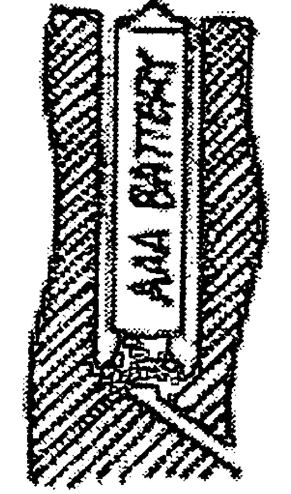

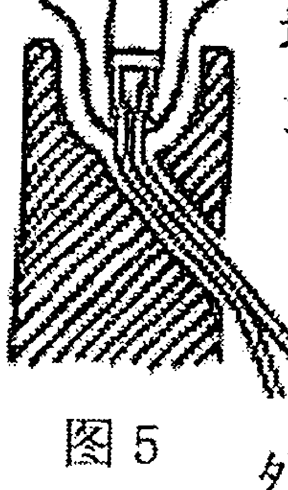

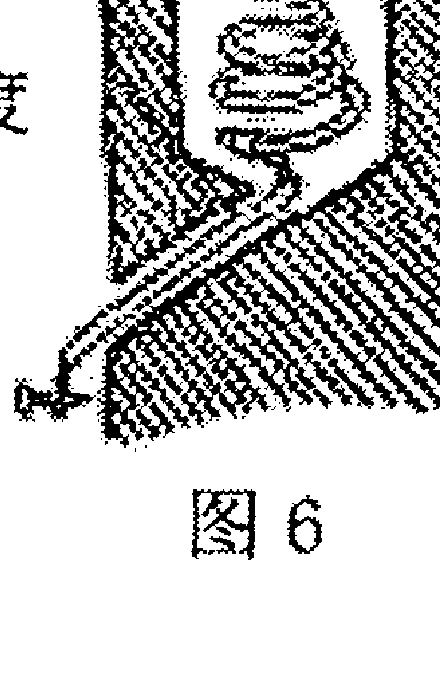

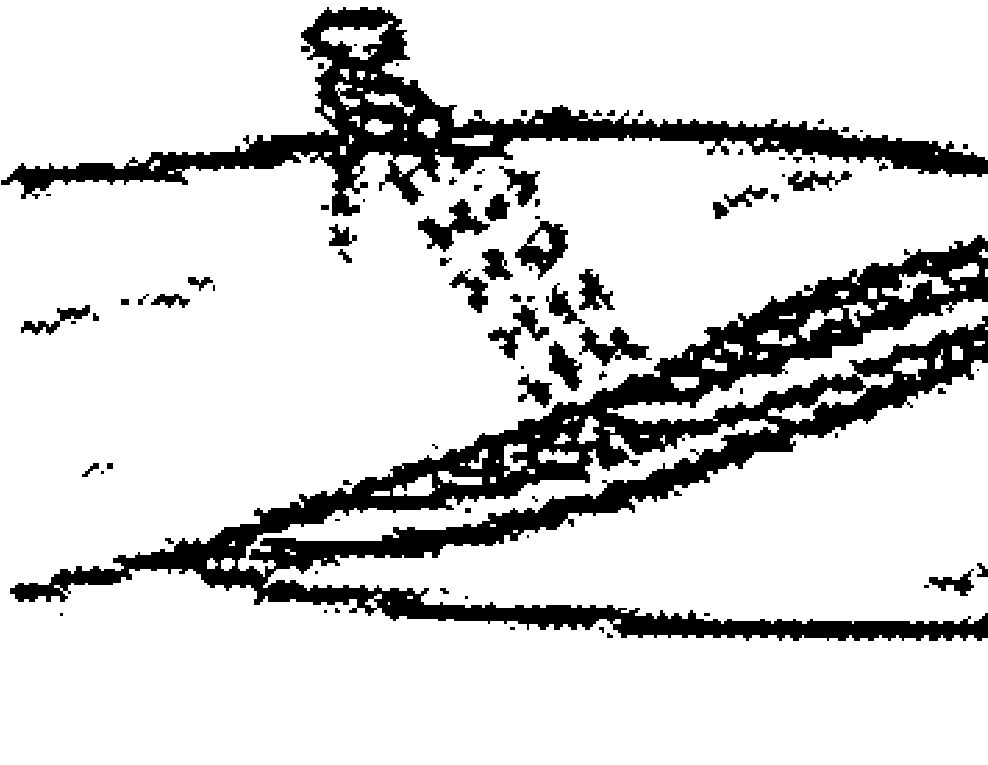

### 6. 制作星球时间计算器

文 / 约翰 · “阿波罗尼乌斯” · 奥普斯帕（白色）

星球魔法利用七颗神秘行星的力量来施行魔法，比如制作一个辟邪符，或者用金星的力量向你的生活注入爱，又或者木星的力量可使人致富（有关行星力量的内容请参见《魔法学徒的魔法书》，2. VI. 5及4. VII.3）。此种魔法在行星力量最强时操作会更有效。由于一周七天都各有一颗行星掌管，所以木星的法术在木星日（即周四）施行比较好。还有每一颗行星都对应掌管当天的某一个小时，所以最好在其掌管的小时内施法。比如，后面你将学到，在周三这天，木星掌管白天的第四个和第十一个小时，以及晚上的第六个小时。最好将这种日期和小时的对应结合起来，比如你可以在木星日的木星时施行木星魔法（就像你会看到的一样，掌管某一天的行星也会掌管那一天白天的第一、第八个小时及夜晚的第三、第十个小时）。因此了解这些星球时间对于魔法相当有用，但我们怎么来判断呢？星球时间计算器在这方面会给你提供很大的帮助。它还能加强你对于行星力量圈的基本掌握。

## 制作计算器

星球时间计算器由两部分组成，行星刻度盘和时间刻度。行星刻度盘也有两个部分：分两圈刻有数字1到12及天使娃娃的背景盘，以及刻有七芒星、行星标志的刻度盘。将计算器从此书背面复制到硬纸片上，然后小心的剪出背景盘及刻度盘。剪下背景后，你需要将刻度盘装到背景盘上，使其能自由转动。最简单的办法是使用两翼的铜纸扣，铜纸扣可以到文具店买到。小心地在刻度盘和背景盘中间打洞，然后将其撑大到能穿过纸扣为止，再穿过刻度盘和背景盘。最好能使用金属扣眼，金属扣眼在布店里可以买到。

计算器的另一部分是时间刻度。它也有两个部分，小时格（有很多用三栏数字标志的线）和小时标尺（从左到右有从1到12的数字）。将小时格和小时标尺从本书背后复制下来并剪好，这样准备工作就做好了！

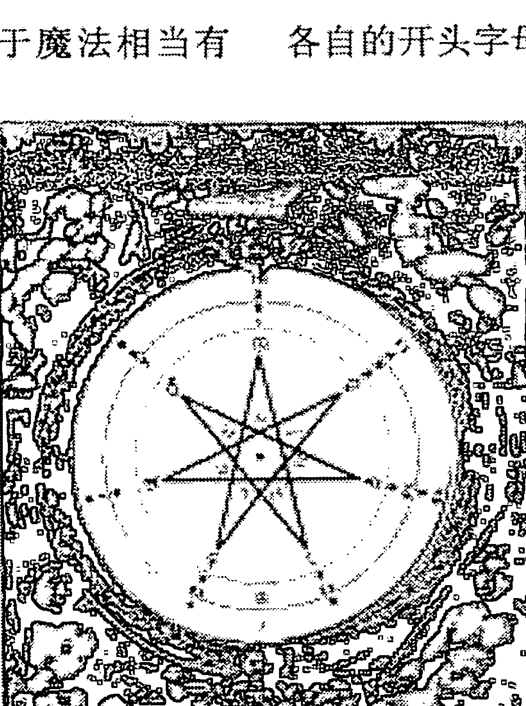

## 行星刻度盘的使用

注意，刻度盘的点上标有一周七天各自的开头字母（M, Tu, W, Th, F, Sa, Su）。一定不要把M和W弄混淆了；字母的底部是朝向刻度盘中心的。只需要将刻度盘转动到日期点，呈垂直状态，然后指向背景盘顶端的“1”，便可以查询一周内特定日期的行星小时。试试吧！现在你就能从行星标记中，读出行星早晚每小时的指数了。注意，内圈（标有太阳标志）指示白天的十二个小时，外圈（标有月亮标志）指示夜晚的十二小时。比如，要找到周三的行星小时指数，将标有“W”的点调到最顶端。然后可以看到白天第一个小时属于水星，第二个小时属于月亮，第三个小时属于土星，以此类推。同样，夜晚第一个小时属于太阳，第二个小时属于金星，等等。另外，类似木星掌控白天的第四个和第十一个小时，以及夜晚的第六个小时之类的最佳使用星球魔法时间，也能轻易算出了。

## 时间刻度的使用

行星小时的长度跟普通钟表上60分钟 / 小时的长度不一样。相反，出于魔法目的，魔法师们将白天和黑夜各分为十二个等分。由于一年中日与夜的长度会变化，行星小时的长度也会变化（所以有时候也称其为不平均小时数或季节小时数）。季节在小时上的变化也取决于你的纬度，就如你所知，在极点和赤道日与夜的长度变化会很大。这看起来可能很复杂，但有了小时刻度就没那么困难了。

第一步，是要决定你所施行魔法之所在地的日出时间与日落时间。你可以从诸如《旧版农民年历》之类的书中，查询出日出日落时间，实验后改正年历里获取的此信息。也有一些具有此类信息的网站。“每日太阳月亮完全数据”就能提供任一天任何地点的日出及日落时间。你也可以获得整年的表格。

让我们举例说明，假如你计划在某一个周二白天的水星小时施法，使用行星刻度可知那天的第五个和第十二个小时是由水星掌控。要决定它们什么时候发生，就需要将那天白天的小时数除以12。假如你发现你所在的地方的那一天，太阳早上六点五十升起，晚上八点三十七落下。

然后看看小时格，宽的线代表钟表时间，从4到12和从1到9（从下到上）；窄的线代表一刻钟。对于日夜小时数，格子下半部是早上，上半部是下午。因此，下半部的左边角落可以找到日升的线（或估算线之间的空白）。所以对于早上六点五十来说，会看见其在较低的7下面一点的位置。这条线从何开始并不重要；重要的是其垂直对应的位置，以及从网格底部到上面的距离。现在看看小时刻度，将1左边的箭头放至网格的日升处，然后在网格右上角找到日落的时间。而晚上八点三十七会在八点半和八点四十五之间。然后调整刻度尺直至右边的十二跟日落时间成直线。你可能需要调整一下刻度尺，以使其停留在图上，但还要重新核实以保证最左边的箭头仍然跟日出时间成直线，最右边的跟日落时间成直线。

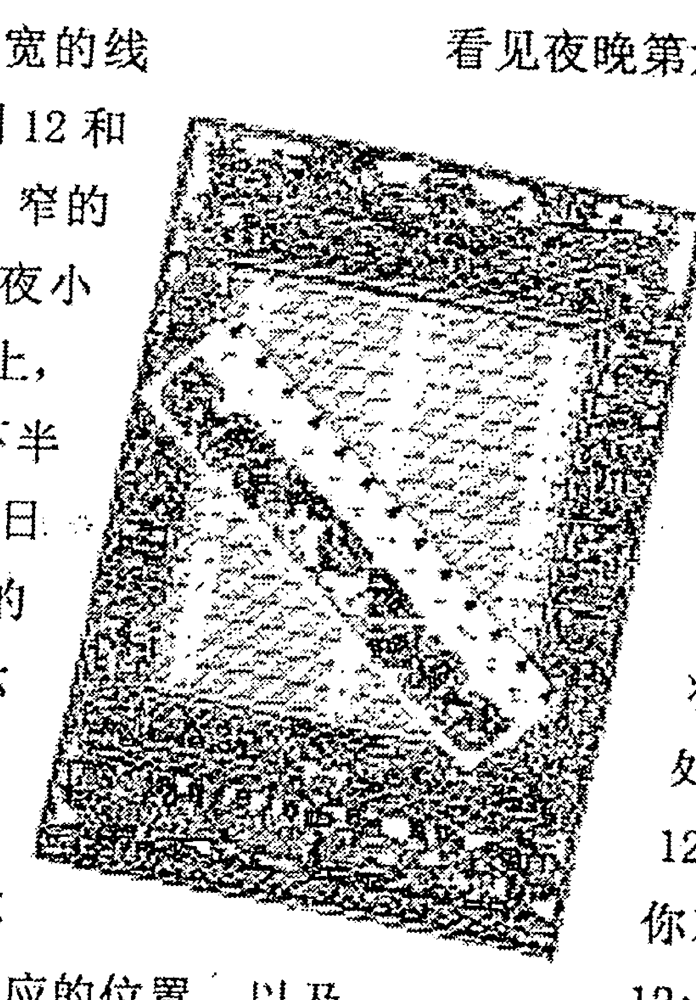

现在你可以通过从刻度尺上读取和获知每一个行星小时的钟表时间了。所以，如果你想在第五个小时施法，可以看看5附近的箭头在网格上的位置，你会看到第五个小时开始于大约早上11:26，结束于下午12:36（通过练习你可以对放置刻度尺及读取时间更加熟悉）。

计算夜晚时间的方法与此类似。但是我们必须将从日落至第二天日出的时间除以12，特别是在晚上，小时格的下半部分是下午，上半部分是上午。我们来解释一下，比如我们想在一个周日夜晚由月亮掌管的小时里施法。从你的行星刻度盘可以看见夜晚第六个小时是由月亮掌管。我们查看周日的日落时间（假如是晚上8:32），以及第二天的日出时间（假如是早上6:55）。此种情况下，我们将日落置于网格的左下角，日出置于右上角。像以前一样调整刻度尺，但此时将日落处最左边的箭头调至1处，日出处最右边的箭头调至12处。读取第六个小时的时间，你就会发现它大概开始于凌晨12:52，结束于凌晨1:43。

有一个简单的方法，就是记住一天的第一个小时跟掌管那一天的行星相同。所以如果你能在早上施法，就可以跳过所有的计算，只要你知道你所在的地方的日出时间。但是这样的机会，你可能要等上一个星期才最终施法！

我必须提到，小时刻度相比极点附近的地点，在第五十根线处不会生效，所以要尽量向北实现操作，比如在西雅图。（更靠近极点的日与夜极限长度超过了网格的最大指数。）当然，你可以去获取能计算

## 魔法对应表格 5

### 西方（德鲁伊，卡巴拉，炼金术）魔法

| 元素 | 灵（能量） | 气（气体） | 火（等离子体） | 水（液体） | 土（固体） |
| :--- | :--- | :--- | :--- | :--- | :--- |
| 方向 (n.h.) | 中心 / 向上 | 东方 | 南方 | 西方 | 北方 |
| 方向 (s.h.) | 中心 / 向上 | 西方 | 北方 | 东方 | 南方 |
| 季节 | 冬天 | 春天 | 夏天 | 秋天 | 年末 |
| 月相 | 新月 | 渐盈月 | 满月 | 渐亏月 | 月黑之夜 |
| 性质 | 稀有 | 雾状 | 易燃 | 流动 | 稳定 |
| 身体元素 | 精神 | 呼吸 | 光环 | 血液和体液 | 肉体和骨头 |
| 感觉 | 听觉 | 嗅觉 | 听觉 | 味觉 | 触觉 |
| 手指 | 大拇指 | 食指 | 中指 | 无名指 | 小指 |
| 凯尔特元音 | Ailm (A) | Onn (O) | Ura (U) | Eadha (E) | Idho (I) |
| 生命阶段 | 出生 | 启蒙 | 完善 | 修养 | 死亡 |
| 血液通道 | （女） 诞生 | 初潮 | 破贞 | 生产期 | 更年期 |
| 女神 | 女神（科莱） | 少女（阿耳特弥斯） | 爱人（阿佛洛狄特） | 母亲（得墨忒耳） | 老太婆 |
| 男神 | 男孩（库罗斯） | 青年（福纳斯） | 英雄（塔姆兹） | 父亲（达格达） | 圣人（梅林） |
| 谜语 | 我是每个小树林的子宫 | 我是每座小山上的烈火 | 我是每个蜂房的蜂王 | 我是每个脑袋的盾 | 我是每个希望的坟墓 |
| 灵体 | 天使 | 气精灵 | 火蜥蜴 | 水精灵 | 土地精 |
| 四人像 | 狮身人面像 | 人 | 狮子 | 鹰 | 牛 |
| 大天使 | 卡西尔 | 拉斐尔 | 米迦勒 | 加百列 | 乌列尔 |
| 意识 | 启蒙 | 智能化 | 意愿 | 智慧 | 记忆 |
| 透视 | 整体 | 向外 | 未来 | 向内 | 过去 |
| 卡巴拉行为 | 实质 | 移动 | 膨胀 | 收缩 | 稳定 |

### 中国（道家）魔法

| 元素 | 水 | 木 | 火 | 金 | 土 |
| :--- | :--- | :--- | :--- | :--- | :--- |
| 方向 | 北 | 东 | 南 | 西 | 中 |
| 季节 | 冬天 | 春天 | 夏天 | 秋天 | 每季末月 |
| 气候 | 寒冷 | 有风 | 炎热 | 干燥 | 潮湿 |
| 阶段 | 储藏 | 发芽 | 成长 | 收获 | 转化 |
| 星球 | 水星 | 木星 | 火星 | 金星 | 地球 |
| 感觉器官 | 耳朵（听觉） | 眼睛（视觉） | 舌头（语言） | 鼻子（嗅觉） | 嘴（味觉） |
| 类别 | 属性1 | 属性2 | 属性3 | 属性4 | 属性5 |
| 味觉 | 咸 | 酸 | 苦 | 辛辣 | 甜 |
| 声音 | 呻吟 | 喊叫 | 笑 | 啜泣 | 歌唱 |
| 能力 | 意志 | 精神 | 灵感 | 命脉 | 智力 |
| 动物 | 乌龟 | 龙 | 凤凰 | 老虎 | 牛 |
| 颜色 | 黑色 | 绿色 / 蓝色 | 红色 | 白色 | 黄色 |
| 器官 | 肾脏 | 肝脏 | 心脏 | 肺 | 脾脏 / 胰腺 |
| 脏腑 | 膀胱 | 胆囊 | 小肠 | 大肠 | 胃 |
| 情感 | 恐惧 | 生气 | 愉悦 | 痛苦 | 同情 |

### 印度和西藏魔法

| 类别 | 以太（阿卡莎） | 气（风神伐由） | 火（火神阿格尼） | 水（阿帕斯） | 土（普利提南维） |
| ---- | ---- | ---- | ---- | ---- | ---- |
| 元素（五行） | 以太（阿卡莎） | 气（风神伐由） | 火（火神阿格尼） | 水（阿帕斯） | 土（普利提南维） |
| 方向 | 中 | 北 | 西 | 东 | 南 |
| 颜色（印度） | 黑色或者靛蓝色 | 蓝色 | 红色 | 银色 | 黄色 |
| 感官 | 听觉 | 触觉 | 视觉 | 味觉 | 嗅觉 |
| 动作 | 步行 | 触摸 | 说话 | 生产 | 排泄 |
| 内在声音 | 雷，鼓 | 长笛 | 蜜蜂，蟋蟀 | 海，瀑布 | 钟，锣，铙钹 |
| 禁戒 | 伤害 | 虚假 | 贪婪 | 肉欲 | 盗窃 |
| 利 | 清洁 | 专注，纯粹 | 身体调节 | 自我探讨 | 满足 |
| 弊 | 占有 | 厌恶 | 欲望 | 利己主义 | 愚昧 |
| 中心（西藏） | 头盖骨 | 会阴 | 喉咙 | 心脏 | 肚脐 |
| 动物 | 狮子 | 揭路茶金翅鸟 | 蓝绿色龙 | 大象 | 马 |任意地点行星小时数的电脑程序，它们很有用，尤其是在你很赶时间的时候，但它们不像你自己制作的计算器，可以增强你的精神力量。

## 7. 魔法对应表5

在魔法书中，我列出了第2组（二价元素）、第3组（三价元素）、第4组（四大元素）、第7组（行星或工作日，以及脉轮）、第10组（生命之树）、第12组（黄道十二宫）及第13组（树）对应的魔法指数。对于学徒来说，这些很有用。但是，我想在这一部分内容中，加入针对第5组的魔法对应表。请参见上面的表格。

### 第二部分：魔法操作

> 我的生活满是这般魔力；
看我化铅石为黄金。
随着每一扇门开开合合，
钥匙变得越发荣光。
一座木桥，磨损的木棍；
被咬过的铅笔头撕裂了文字。
叫我法师，诸如此类，
因为这就是我的魔杖。
——伊丽莎白·巴纳特

现在，我们开始这一章的第二部分：用于魔法练习的咒语和符咒。首先，我们将会学习怎样创造护身符、辟邪物以及魔符。然后会学习咒语的创造和使用！我知道你们想要跳过这一部分，直接进入咒语的学习，但是我得警告你们，必须要完成第一步之后才能开始咒语的学习。必须先将地基打好，才能筑墙，最后才能盖上屋顶！

### 1. 自己制作护身符和辟邪物

护身符：一种被赋予了魔力的物品，也称之为符，可以自己制作，也可以通过其他途径获得，随身携带以带来好运，或者作为一种能达到某种特殊目的的工具。通常会在上面刻些适当的符号，护身符可以自己制作，也可以购得，所有的物品都可以通过注入魔法，而变为护身符。

辟邪物：充满了保护力量，能避开厄运，还能作为私人物品随身携带。辟邪物通常是用一些天然的物品制成，例如神圣的石头、化石、水晶、贝壳、陨石、橡树子、骨头等等。然而，辟邪物既可以制作，也可以绘制。

> （奥伯伦，《魔法师学徒的魔法书》）

辟邪物在历史上一直都占据着重要的地位。从远古时代开始，各种各样的装饰品都被制作为特殊的护身符和辟邪物。常常为了某些魔法目的，而对它们进行自我装饰，并且从天神那里吸取祝福，好像成为了一种我们种族与生俱来的，而且必不可少的习俗。

制作辟邪物或者护身符是根据你的想象力，以及材料和转变这三者之间来进行制作的。记住，你是在和你所挑选的材料一起，共同创造你的护身符和辟邪物。创造护身符或者辟邪物并不仅仅是改变你所使用的材料，同样也是在改变你自己。你要积极参与到创造自己的魔法工具和装饰品的过程中来，用你的行动转变你的精神，扩展你的感知技巧和能力。

现在存在着许多数不尽的材料，可以用于制作私人辟邪物。你的表现力只会被你自己的想象力所束缚。记住这一点，自己观察周围的环境。作为一位21世纪的魔法师，你可以适当地将任何可用的材料混合在一起，做成辟邪物和护身符，你所能找到的所有物品都是你世界的一部分，而且都携带着能量。

金属，炉灶中烧制过的粘土，环氧基树脂，木头，纸张，麻线和棉线，织物，以及几乎所有能够找到的物品，都能够按照你自己喜欢的方式组合在一起。

在选择你要使用的材料之时，一定要开拓思想，绝不偏颇。仔细想想你想要通过你的辟邪物或者护身符表达什么，以及你想要用它来吸引何种能量。如果你想要创造一些吸收火力和电力的东西，便不能使用与海洋有关的元素物质，也不能使用一些看起来太多世俗的物品。如果你已经花费时间想清楚了，你想要利用的是何种能量来制作特定的辟邪物，那么材料的选用便会变得更为简单。

使用现成的物品是一种非常好的循环使用途径，而且可以使你所制作的辟邪物，真正地称为独一无二。现成的物品包括：坏掉了的首饰或者陶器碎片、小玩偶、缎带、照片、齿轮，以及其他的机械零件，电脑组件或者零件、珠子、皮革肥料、瓶盖子、硬币、坚果、豆荚、干花、玻璃、卵石、生锈的金属碎片、球形把手、表盘、印刷电路板、CD及其他。

宝石，水晶，玻璃宝石，纽扣，以及其他的一些物品可以加入辟邪物中，也可以成为辟邪物的重要部分。很多质量优良的辟邪物，一般是用一片柔软的皮革，或者是一个可以穿线的水晶制成的。你可以将皮革缝在一起，并用如尼文字、魔法符号或者其他的符号修饰。

皮革可以通过将其润湿，来拉伸塑形。

### 皮革制护身符

材料：柔软的皮革，炉灶烘焙粘土，水晶，珠子，一颗尖锐的、刺绣用的针，地毯用线或者刺绣用的丝棉线，一根颈线。

用“软陶”或者可烘焙的粘土，做一个圆圆的、2英寸到3英寸大小的泪珠状物品。将一颗水晶柱压在粘土底部。在水晶柱的上方压入玻璃珠或宝石，再在它们的周围留下足够的粘土，以便把它们固定住。当你对你制作出来的外形满意了之后，你便可以将粘土放在烤板上的厚纸片上烘焙，而且还要根据包装方法放入烤炉中。你也可以将其塑造成一种扁平的泪珠状，不规则的抽象形状，或者圆形，将水晶和宝石放置在粘土的一面。你所制作的粘土应该至少有 3/4 英寸厚。一旦粘土驱邪物烘焙完毕冷却后，在你的驱邪物上盖一张软皮革，依照驱邪物的大小切割皮革，但是切割下的皮革要比驱邪物略大，并在顶部留有足够的皮革制成一个坚固的环，以便悬挂。将皮革浸入温水中，并令其包裹在驱邪物之上，留下一个小口，使得水晶可以探出头来。用皮革将辟邪物包裹起来，并留下一些小口子，以让每一颗宝石都可以露在外面。将皮革拉紧，并将边缘缝起来，如果你想要流苏，可以将缝制后留下的皮革剪开。如果你喜欢光滑的边缘，你可以采用包缝的针法缝制。在两面都缝起来以后，整理一下，让整颗宝石或者珠子都能露出表面。皮革干了之后便会固定，一旦固定后，将少量的洗革皂或者洗革油，放在手上清洗皮革面。然后将位于辟邪物顶部，之前切割的那个环缝好，或者就直接用一根线将其缠绕起来。现在你便拥有了一个可以使用很多年的漂亮且结实的辟邪物。你可以用记号笔、颜料、缎带，或者其他材料来装饰皮革。制作皮革制的辟邪物使用粘土，是为了保证珠子、水晶、宝石等，能永久地固定和稳固。当然，你也可以不使用粘土。

### 金属辟邪物

金属辟邪物可以和木头或者小的金属零件一起制作。在所有的五金店都可以买到的金属丝包括：铜丝、镍丝、扎肋铁丝以及黄铜丝。你需要购买那种标注有“柔软”的金属丝。不要购买焊丝，因为焊丝中含有铅，佩戴后会中毒。使用粗细不同、种类不同的金属丝会让你的设计更具灵活性。金属丝可以编织在一起，也可以在设计中作为点缀。设计出一种图案，使得金属丝可以彼此固定，达到最大限度地紧压效果而不至于松散。如果你喜欢环，可以将金属丝编织成一块布。你可以在一块废弃的木板上画出设计图，并在金属丝需要弯曲的位置，钉入一半的无头钉（平头钉），这便可以为金属丝制作一块弯曲的夹具。当你准备好之后，将金属丝按照设计图缠绕在钉子上。用橡皮锤或者皮锤在废弃的木头上，轻轻地敲打你编织成的辟邪物，使其变得坚挺硬朗。再用好的钢丝绒和金刚纱布将它磨光。另外你还可以使用质量好的砂纸。

如果你想要在钢丝上串入金属片或者珠子，那么可以在你缠绕金属丝的时候穿上去。你也可以绕着一颗钉子将金属丝缠绕多次，如果你喜欢的话，还可以将它们和一根亮色一些的金属丝缠在一起，或者加上一两颗珠子。你可以使用另一种材料来做图案背景，将皮革或者木头切割成适当大小，用细金属丝或者线扎牢。无论你制作的是什么，你都要充分发挥你的想象力，并且考虑各种各样的选择。大胆创新！

## 2. 用蜡烛魔法点亮你的人生
文 / 月舞女士（Lady MoonDance）

无论你知道与否，在你生命中的某一时刻，你也许就会拥有参与蜡烛魔法的机会。你上一次面对你的生日蛋糕许愿并吹熄蜡烛是什么时候？这里讲述的是最简单的蜡烛魔法形式。同样地，在全世界的教堂中，从天主教徒到一神普教论者，人们都在通过点燃蜡烛来施法救治朋友，寻求指导，或者探索问题的解决方式。在冬季假期（光明节，冬至节，圣诞节，宽扎节，以及圣烛节）来临之季，点亮蜡烛是一种交感魔法的行为，意为召唤温暖和太阳的光辉——这种通俗的传统起源于古罗马时期，在那时的农神节，人们会将蜡烛作为礼物相互交换。甚至在印度，排灯节（另一种“光的节日”）的庆典标志着冬季的开始，此时，人们会在家里摆满蜡烛和电灯，在恒河上放河灯，代表着新生，并且还会带来来年的希望。

自从世界的开初，我便普遍地认识到了火焰的力量，是它为我们的生命提供了温暖；是它释放出菜肴的可口香味；是它为我们富有启发性的神圣故事，提供传颂的篝火；它为浪漫的约会营造完美的氛围。它黑暗中的光明引起了我们的注意，而我们，也很容易便在摇曳的火光中陷入沉思。这便是我们在寻找的驾驭蜡烛魔法的力量，在这种魔法中，我们使用蜡烛本身作为我们施法的焦点。施展蜡烛魔法和点燃蜡烛之间仅有的、真正的不同之处在于你本人的意图不同。你施出的魔法的难易复杂程度，和你的愿望是一致的，但是在你准备点燃蜡烛的时候，你所做的一切都是为了将你的意图和你想要的结果灌输到蜡烛中。然而，你还要记住，在蜡烛魔法中，一切都是随意的，除了蜡烛（在必要时，你甚至可以想象一根蜡烛就在你跟前），因此，面临任何的施法你都要放轻松，将其余的杂念都抛在脑后。

### 挑选蜡烛

蜡烛的种类有很多：纯蜂蜡——通常都会被碾成薄片，制作的时候将融蜡倒入罐子或者容器中塑形，再浸入蜡烛芯做成蜡烛。蜡烛的形状包括猫状（通常用于祈求好运，或者用于对付宠物的魔法中），头盖骨状（用于治疗），人物形状（用于施法求爱和确定恋爱关系），还有很多其他的形状，你可以尽情发挥想象力。在你刚开始练习蜡烛魔法的时候，要随意大胆一些，不要以为只有特定种类的蜡烛才能为特定的目的施法。在挑选蜡烛的形状和尺寸时，更重要的是想一想你需要它燃烧多长时间。一盏小小的茶蜡烛在几个小时内就会燃烧殆尽，而祈愿蜡烛却可以使用一个或者两个晚上。柱形蜡烛的持续时间更长一些，但是你需要为它们排放蜡油或者进行修整，以保证它们可以完全燃烧。柯腊德七天蜡烛是一种经过特殊设计的蜡烛，其中的每一节都足够使用一天，一共可以使用七天，而细长的玻璃杯装蜡烛（名为祷告蜡烛或者诺维娜蜡烛）使用的时间就更长了。（包裹在这些蜡烛上的塑料，在必要的时候都是可以剥离，但是在挑选的时候依然要考虑一下蜡烛中已经被灌输了的能量。所有蜡烛在挑选的时候都要注意这一点。）重复点燃一根蜡烛，并在此期间对这根蜡烛多加关照，这样的行为有助于集中一个长期的目标，或者你想要强化的任何东西，或者对其输入额外的能量。你可以根据自己想要达成的效果进行挑选，然后在特定的几个小时或者几个晚上，让它简单地燃烧殆尽。

### 工作问题和“世俗”问题

在蜡烛魔法中，最重要的考虑因素在于颜色。你所挑选的颜色应该与你的魔法相得益彰，而且在你施法的时候，你也需要将你的意图传达到你的潜意识中去。以下是很多可能的选择，还有它们通常所代表的意思：

- 白色——阳性能量，光，纯净，团结，治疗，精神和所有颜色的内涵、反射，可以用于任何颜色的魔法
- 黑色——阴性能量，黑暗，虚无和纯净的潜能，驱逐，释放，保护以及霉运或者妖法的结束 – 使所有的颜色和能量无效
- 灰色——中立，僵局，亏损，非此也非彼，隐藏的食物，优柔寡断
- 金色——神性“阳性”的一面，太阳，繁荣和充裕
- 银色——女神或者女士，月亮，繁荣和充裕
- 红色——火，爱情，激情，情绪，勇气，性，力量，权力，愤怒，血，能量
- 粉红——尊敬，爱情，浪漫，阴性，友谊，女孩子
- 橘色——吸引，鼓励，激励，火，勇气，秋季
- 黄色——气，想法，思想和交流，吸引，魅力，自信，幸福，快乐，夏季
- 绿色——土，丰饶，繁荣，充裕，成长，运气，治疗，春季
- 蓝色——水，成功，物质，耐性，宁静，治疗，明晰，智慧
- 淡蓝色——天空，和平，男孩子
- 蓝绿色——治疗，平衡，水
- 紫色——精神和精神命运，权力，和平，忠诚
- 褐色——土，有基础，稳定，工作，

一些蜡烛是为了某种魔法而特制的，这种蜡烛下面一半的表面上，浸染了黑色的外衣，这样，在蜡烛融化流下的时候，便可以将黑色覆盖，因而它们便被用于逆转霉运，在施展与爱情(红色)、金钱(绿色)以及其他目的(白色)相关的魔法中被称为“逆转魔法”。相反，如果黑色在内、红色在外的话，黑色的融蜡覆盖在红色外衣上，则意味着两人之间关系的结束，在使用这种魔法的时候要极度小心。

在挑选蜡烛的时候，记住它是你的聚焦点——你的意识和潜意识能量——因此，你需要选择对你来说效果最佳的颜色(一种或多种)。我通常喜欢在我最喜欢的商店中购物，像塔吉特百货、迈克尔商店以及乔安妮商店这样的地方，在店中寻找那些会与我“对话”的蜡烛。同样地，我可能会挑选手工制作的、有色或者无色的，有香味或者含有草本的，以及一些与我当时心境相合的蜡烛。

同时你还要记住，白色的蜡烛（有时也可以是黑色的）可以用于任何目的。试着这样做：闭上眼睛握住一根有色的蜡烛，然后想象一下这根蜡烛应该是什么颜色：银色和紫色的漩涡形或者螺旋形，地面和天空的颜色，绿色上面点缀着红色的波点——让你的想象力为你的蜡烛上色。这样做是一种开始将你的能量和意图注入你的蜡烛的极好方法。

如果你挑选蜡烛是为了给某些特定的人施法（最好还得征求他们的同意），你可能需要了解他们（西方人）的星座。传统的对应关系中，与行星有关的颜色统治着每个星座，包括：

- 白羊座（火星）红色和其他的红色（从粉红到深红的所有渐变的颜色）
- 金牛座（金星）粉红，淡紫色，亮黄色和灰蓝色
- 双子座（水星）黄色，绿色，紫罗兰色
- 巨蟹座（月球）海绿色，银色，白色
- 狮子座（太阳）黄色，橘色，金色
- 处女座（水星）铁锈色，海军蓝，灰色
- 天秤座（金星）淡蓝色和薰衣草色
- 天蝎座（冥王星）暗红色（深红色，紫红色，栗色）
- 射手座（木星）紫色，深蓝色
- 摩羯座（土星）暗绿色，褐色，深灰色，蓝色，海军蓝
- 宝瓶座（天王星 / 土星）亮黄色，靛蓝色，钢青色
- 双鱼座（海王星 / 木星）灰绿色或者海绿色，蓝绿色，靛蓝色

如果这种颜色“感觉”不太适合这个人，记住，一定要相信你的直觉，挑选一个适合的颜色。你可以就使用适合你目的的颜色，并且在心中想象你要导入能量的那个人。

在施展这种或者其他的任何魔法时，只要你所施展的法术会对其他人造成影响，那你一定要遵从你自己的个人魔法道德观。同样地，根据你所有施法中的魔法陈述和魔法意图，像“这是一种公德心的表现”和“我这样做是为了某人好”这样的话语最好记在脑中。

### 附魔、装饰和打扮你的蜡烛

给你的蜡烛附魔（译者注：也就是赋予某种物质能量与魔法，有点像中国的开光）最简单的方法就是双手握住它，并将你的意图灌输到它的内部，想象一下你想要的结果，或者直接说出来。在你进行这些步骤的时候，你可能也想要给你的蜡烛“打扮”一番。这听起来是有一点奇怪，但这并不是真的给它穿上衣服化上妆。“打扮”是一种运用你的意志和传统的方式，赋予给你蜡烛能量的方式。首先，选择一种精油：那种含有植物精油或者与你的目的相一致的香味精油，亦或者使用一种基础精油，无香味的精油——甚至可以使用你厨房中的纯橄榄油或者纯玉米油。传统上来讲，你应该用你的左手（或者接物的那只手）握住蜡烛的底部，右手（或者递物的那只手）握住蜡烛的顶部，每只手都向两端摩擦蜡烛。在你感受你的目的时，你也可以根据你所希望的能量流动方式，来将精油涂抹在蜡烛上，这意思是说，你可以由下往外或者由上往内地、轻轻地沿直线移动，或缓慢画圆，呈螺旋形旋转而入。对于玻璃杯装的蜡烛来说，你可以倒几滴精油到蜡烛中，让精油散布在蜡烛顶部。

你还可以使用很多其他的方法来将额外的能量加入到你的蜡烛中。用牙签或者钢笔在蜡烛上刻字，刻如尼文，刻符号或者图案。你可以使用杂志或者目录中的图片，装饰放置诺维娜蜡烛的玻璃杯外部。小心照料保护好蜡烛的火苗，将装饰好的蜡烛裹入干药草中，或者挑选一些加工时就已经添加了的药草，或者其他物质的蜡烛。每天在点燃蜡烛之前，都要在蜡烛中加入几滴香精油，在旁边点上焚香，或者选择一些可以反映你愿望的、有香味的蜡烛。

### 蜡烛的布局

你可以在圣坛上放一根蜡烛，也可以摆放几根蜡烛来反映你的目的。有一种传统的布局是将两个或者多根“守护蜡烛”，放在你的圣坛后方或者周围（代表主、圣母和方位，或者其他的神圣力量）。然后将一根蜡烛放在离你近的位置，或者放在中间，这根蜡烛便代表了你施法的目的或者意图。在这根蜡烛的前面，你可能会想要放一根用于接收的蜡烛，通常被称为“灵魂蜡烛”。在这种布局之中，能量会流入被保护的空间，经过与目的（或者意图）有关的蜡烛，然后将你的目的聚集在此，带来你所想要的结果，倚在接收蜡烛或者灵魂蜡烛之上。

你会找到很多有关蜡烛布局的书籍，但是你可能也想要自己设计自己的布局，只需将蜡烛摆放得能够非常直观地展现你的目的便可：

- **想要吸引一些东西靠近你吗？** 选择两根蜡烛，一根代表你的目的，一根代表你自己。连续几个晚上都将它们点亮，每一次都让它们更靠近一些。当它们靠在一起时，让它们自己渐渐燃尽。如果它们在融化的时候，慢慢地彼此融合在一起，那就是最佳效果了。
- **想要驱逐一些东西远离你吗？** 做与上面那条相反的事情。
- **想要看到自己被好运环绕吗？** 选择一些蜡烛来代表你的所需（金钱、新工作、爱情，等等），然后将它们放在你的灵魂蜡烛周围。
- **想要稳定？** 四根呈现正方形的蜡烛可以代表稳定，就像一张桌子或者一个椅子有四条腿一样，然而两根蜡烛代表处于恋爱关系中的两个人，三根蜡烛代表神圣（神或者女神的三面）。

在你的圣坛上添加你想要的其它象征、草药以及物品，将其装饰一番用以创造，并将你自己的愿望呼唤到你身边。你可以添加任何可以帮助你集中能量，并代表自身意图可被接受的东西。

### 捏熄、掐灭或者吹熄？

在绝大多数情况下，最好是让你的蜡烛燃烧殆尽，这样便可以完成整个法术的释放。然而，你可能想让它只在特定的时间里燃烧，或者一次只烧一点点，分几个晚上，几个星期，甚至几个月燃烧。熄灭蜡烛火焰的最佳方法有很多种，但我更想让火焰的能量流向何处来决定，而不是只采用一种“正确的熄灭方式”：我是想让能量封存在蜡烛中（捏灭或者掐灭蜡烛），还是将其送往宇宙之中呢（吹熄蜡烛）？在你选择捏熄蜡烛的时候，首先你要注意的是不要被火焰灼伤。这样做同样也会将你的能量融入到施法之中，而用与个人无关的熄烛器，就无法达到这样的效果。通过在火焰上方拍手，能够获得一种戏剧性的微效应。通过不断吹出的空气熄灭蜡烛，在吹灭的过程中，会分散火焰的能量。

### 在你的施法完成之时

每一根蜡烛都应该只用于它所已经附魔的目的，而且所有的遗留物都应该被烧毁，然后及时将它们和你的垃圾一起扔到垃圾堆里。如果施法是为了净化或者释放，你可能也会选择在附近的活水体中丢弃残骸，但是在这样做的时候，你一定要意识到这种行为对环境的影响。在创建蜡烛魔法的时候，如果你喜欢，可以精心安排你的整个魔法，但是同样你还要记住，有时，你真正需要的只是一根蜡烛，然后花上一点时间将它点燃。

## 3. 用于各种目的的咒语

### 摒弃、捆绑和驱邪

#### 摒弃消极的想法

所有人都会有一些消极的思想，重要的是你会怎样应对那些事关重大的想法。拥有了魔法之后，你可以记下那些消极的想法，并对它们采取一些物理措施。例如：用不防水的墨水将它们写在一张小小的米纸上，揉成一团，并将它们扔进流动的水中。或者在月黑的夜晚将它们埋入土里；或者在一个小坩埚中，将它们烧为灰烬；亦或将它们投入仪式祭火之中。当你这么做的时候，你可以背诵一小段咒语，例如：

> 木棍和石头可能会打断我的骨头，
但是思想却不能伤害到我。

> 或者：

Avante, avante, maleficante ! (发音为 a-VON-tay, a-VON-tay, MAL-ef-e-KON-tay, 意为“散去，散去，所有的邪恶！”)。

#### 冻死坏人

在一张纸上写三遍会伤害到自己或者他人的人名，然后将这张纸横折三次，再纵折三次。用一根红绳和一根白绳（或者棉线或者纱线）将它绑起来。在一个纸杯中装满水，将系好的纸扔入水中，直到它沉入水底。随后将这杯水放在冰箱的最里面。在此过程中，念诵：从现在开始让此人不能再伤害我，
让他慢慢变冷，冻结，并远离我的思想。
现在，我将会吸引一些善良好心的人。
只要杯子一直放在冰箱中，那个人就不能伤害自己或者其他任何人。
（——雅典娜·谢弗 [Athena Shaffer] 和厉兰娜·德·维纳斯 [Lilana D' Venus]）

掉旧扫帚，再为你的新房子买个新扫帚。
（——雅典娜·谢弗）

## 三滴血

这是一种在中世纪时期阻止别人伤害自己的符咒。念诵三次以下的咒语：
我，（你的名字），轻轻地告诉你（想要你受到伤害的那个人的名字）。
从你那里吸收三滴血：
第一滴取自你的心脏，
第二滴取自你的肝脏，
第三滴来自你充满活力的生命，
而你便会陷入冲突之中。
（——雅典娜·谢弗）

## 切除

将某人驱逐出你生命之中的一种方法，就是找一张你们的合照，然后将另一个人剪下来。（——雅典娜·谢弗）

## 镜箱捆缚

用金属箔给一个可以完全关闭的盒子做衬里，有光泽的一面朝向盒子中心。将想要伤害你的那个人的照片（或者将他的名字写在纸上）放在盒子里。然后关上盒子。只要盒子一直关着，他便不能够伤害到自己或者他人。
（——雅典娜·谢弗）

## 美丽

### 好皮肤

在红色蜡烛的底部放一滴玫瑰精油，然后在你的圣坛上将其点亮。取一瓶冷霜，在里面加入 7 滴精油，用白色的羽毛将其搅拌均匀！（是的，这确实有点邋遢！用手边的纸巾将其清理干净）。然后用这瓶被施了魔法的冷霜洗脸，任何时候都可以。
（——雅典娜·谢弗）

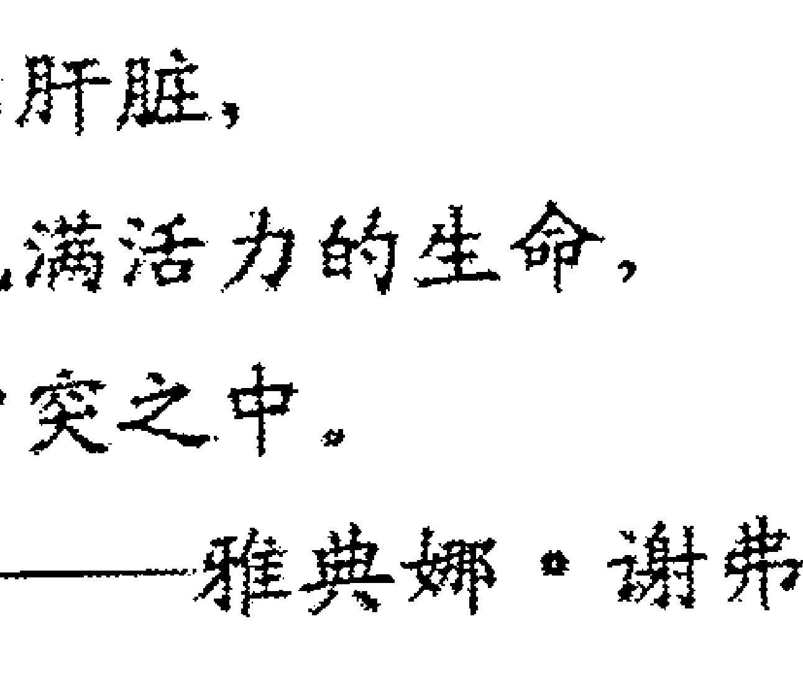

## 将他们扫地出门

想要摆脱一位不速之客，你可以在门后放一柄扫帚，帚把朝向那个人。他们不必看着扫帚，扫帚可以放在房屋中的任何位置，只要是放在门后，而同时帚把大体朝向不速之客的方向。顺便说一句，当你搬家的时候，不要将旧扫帚带到新居。它会将老地方的所有不好的东西都带到新的住处。扔掉旧扫帚，再为你的新房子买个新扫帚。

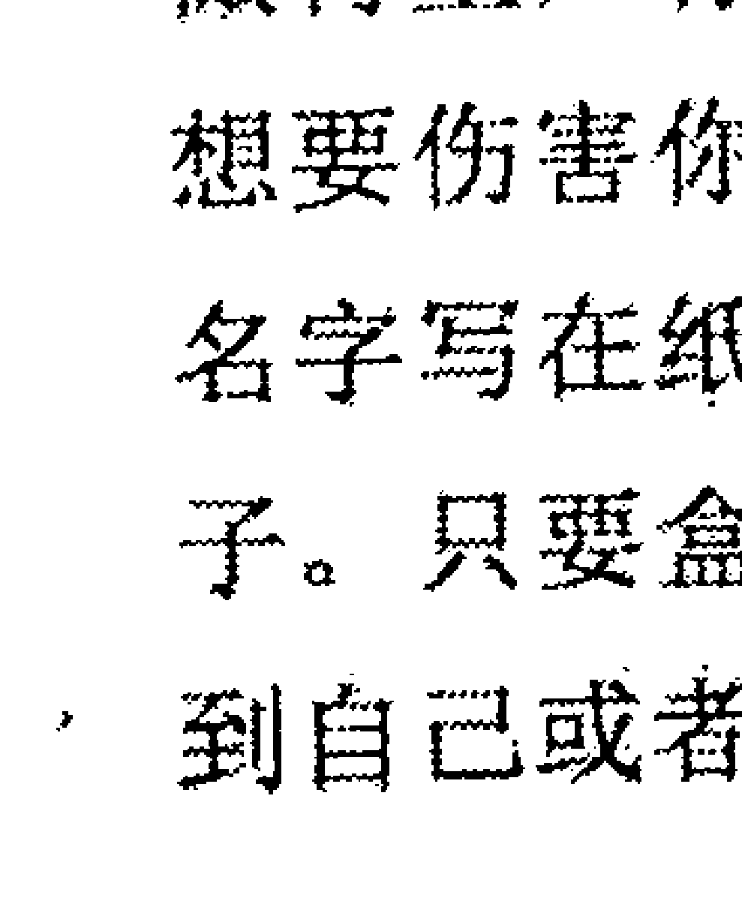

## 养护出漂亮的头发

用高质量的角蛋白香波清洗头发。用双手的指尖按摩头皮，边按摩边重复以下的话语三次:

我的头发会变得浓密漂亮；
就像一条河流，会流动。
越长越长，越长越快；
它会随风飘动。
施展我所了解到的这种魔法，
我便会成功，它便会更加漂亮！

在你洗完头发之后，用一张毛巾将头发拍得半干，然后抹上定型摩丝，用一把硬猪鬃梳子梳理定型，同时再重复三次咒语。

（——奥伯伦）

## 净化

### 流水赐福（排解忧郁症）

在附近公园里，有一条潺潺的小溪，我就是在溪上的一座小桥上想到了这个办法。你也可以站在一条溪流中间的岩石上，或者跪在岸边，将你的手放入水中。在这个施法过程中，一条更小一点的水流是关键，最好是能够靠近它，以便倾听或者感受它的水流。

站在桥上，或者岩石上倾听水声，让负离子注入你的体内。首先面朝水流的方向。看着水流从你这里流远，说出你想要放弃的所有事情，例如：

- 我将我的沮丧和焦虑给你，
- 我将我的痛苦给你，
- 我将我的悲伤给你，
- 我将我的眼泪给你，
- 我将我的冷漠无情给你。

说得尽可能大声一下。你也可以在自己心中默念这些话语，随个人爱好。在你将这些说出来时，这些烦恼就都丢给水流让它带走了。

现在，走到桥的另一边，或者转过身去面向水来的方向，迎接你所寻求的一切：

- 我欢迎你的到来，疗愈。
- 欢迎你，力量，
- 欢迎你，勇气。
- 欢迎你们，幸福和快乐。

感谢溪流给你带来了你想要的治愈力和祝福，结束的时候说：“必将应验！”
最好是能够流利地说出这些话语，将物品变得恰如其分，而且还可以在你日常的自然拜访或者冥想的时候，进行这样的祷告。

（——月舞女士）

### 流水净化

另一种方法是简单地面向流水。即使你是站在水流的上方，也可以闭上你的眼睛，想象水的能量在对你进行清洗，温柔地流经你的身体。将你的双臂打开（既要展开你的身体，也要打开你的心灵之眼），感觉自己稳稳地站在水中央。在水流经你身旁时，你会看到它从你身上带走了所有肮脏和粗糙的东西，这些都代表着你所需要摆脱的事物。在这个版本中，你无需为它们命名，你甚至会为一些脱落下来被冲走的东西感到惊讶。就像它会从你身上带走东西一样，水流也会带给你一些新鲜干净的东西，并成为你的一部分。

（——月舞女士）

## 圣化

你属于我！
这是圣化你的魔法工具时，所使用的咒语。

材料：需要净化的工具，代表土元素的盐，代表气元素的焚香（檀香或者广藿香），代表火元素的打火机和蜡烛，一碗水。

打开魔法圈。召唤祖先，请求他们的帮助，指导，以及祝福。冥想，将精力集中在你想要完成的事情上。点燃蜡烛。用蜡烛的火焰点燃（和绑定）焚香。将盐混入水中（绑定）。将魔法工具放在焚香上来回熏，念诵：

> 我用气的力量祝福你。

将魔法工具放在蜡烛火焰上烧，念诵

> 我用火的力量祝福你。

在魔法工具上滴上几滴盐水或者洒上盐水，念诵：

> 我用水的力量净化你，
> 用土的力量让你获得新生。

将魔法工具举在空中，宣告：

> 必将应验，
> 你属于我！

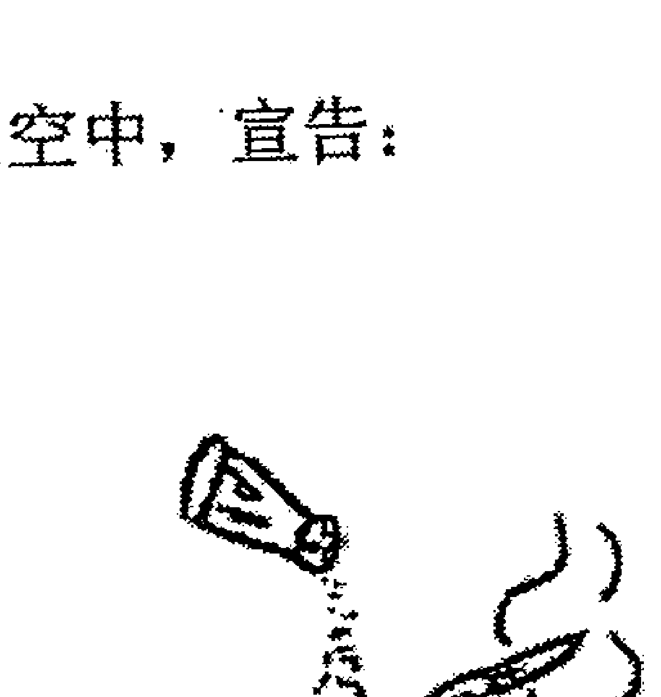

在你关闭魔法圈之前，记得感谢祖先的帮助、指导和祝福。

## 引导

### 巨龙卫士

这个咒语是为了克服你内心深处的恐惧和秘密。放松自己，让自己处于一种最舒适的状态，深呼吸，将注意力集中在你的呼吸上。

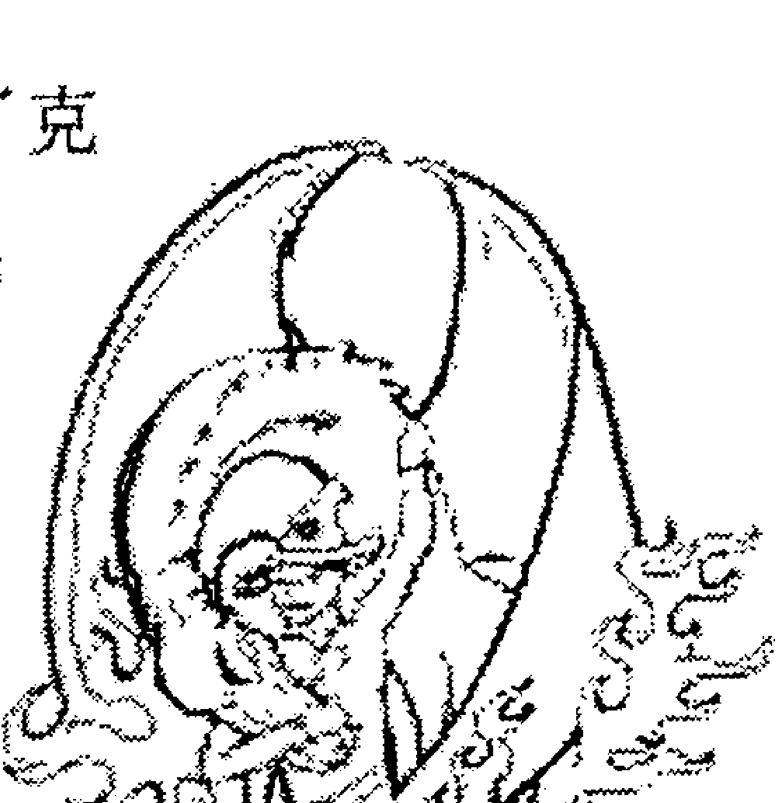

在脑海中设想你自己处于平静的河谷中，站在悬崖边上，看着下方波光粼粼的河水。将所有的忧虑和担心都投入河水、海水中，完成之后立即转过去背对河谷。这些烦恼会从你心中离去，不再存在。在你面前的是巨龙卫士，等待着你的召唤。现在你的大脑非常清醒，你可以向它提出以下的要求：

- 向我展现我想看到的东西，
- 萦绕在我心中最黑暗的秘密。
- 给我真正地答案和知识，
- 让我知道我该怎么做。
- 平衡的心态，灵魂，和自我，
- 是健康的关键。
- 帮助我克服途中的困难，
- 那一天到来的最深层的秘密。
- 路途遥远，而且还有岔道，
- 巨龙，告诉我该怎么做。

> 让你的巨龙卫士向你展现你心中的路，或者睁开你的眼睛，看看这条出现在你生命之中的道路。
> ——阿迪娜·月亮·龙星

> 将失眠从此人身上驱走。让他/她整晚有个香甜的睡眠。必将应验！
> 将点燃的线香放在宿主床边的香炉中。感谢守护神的帮助。
> ——阿迪娜·月亮·龙星

## 占卜

### 占卜袋，占卜咒语

- 需要：紫色小袋子、艾蒿、丁香、迷迭香、百里香、紫丁香、金银花、薄荷、紫色的马克笔。

将这些草药集中在一起，放入一个紫色小袋中。用一支紫罗兰色的马克笔，在袋子的两面画一只眼睛。晚上睡觉的时候将袋子放在枕头下。当你需要通灵视力或者做占卜时，将这个袋子在你的三眼轮处摩擦。

> ——豹舞者

## 梦境，灵魂，噩梦

### 梦境咒语：放松

你需要一支樱桃线香、茉莉线香，或者广藿香线香，并在里面加入一些东西。在脑中想着你所希望的结果，将香点燃并念诵：

> 睡眠时间的守护神们，请赐予我无限的力量。

接下来，伴随着线香的烟雾缭绕，在宿主的上方画一个五芒星，并念诵这些话语：

> 土，气，火，水，以及灵，融合在一起共同发力。

## 影响

### 三之咒

这种方法只适用于打破或者约束一个人的坏习惯。记住，你可能需要不断地重复施法，而施法的效果也不会立竿见影。一个人应该要将精力集中在把这种想法传送给他的保护神的基础上。不要在你的心脏不舒服（心脏有病）的时候施展这种魔法，否则它会反噬。

> 北边的风吹过树林，三次三欢呼，让它们看，让它们看。
> 东边的沙让土壤肥沃，三次三欢呼，给它们自由，给它们自由。
> 南面的火熊睡梦中醒来，三次三欢呼，让它们看，让它们看。
> 西方的水，流入大海，三次三欢呼，给它们自由，给它们自由。
> ——豹舞者

## 爱

### 爱情绳结咒

- 需要：三条缎带或者三根绳子，可以是任何能让你想起爱情的颜色。

心中想着你的心上人，同时将绶带紧紧编织在一起。编织出一截之后打一个牢固的结，然后再继续编织，整根绳总共应有七个结。一直讲这根绳结佩戴在身上或者随身携带，直到你找到你的爱情。找到真爱之后，你便可以将绳结烧毁，将灰烬撒出去，尘归尘，土归土。
（——豹舞者）

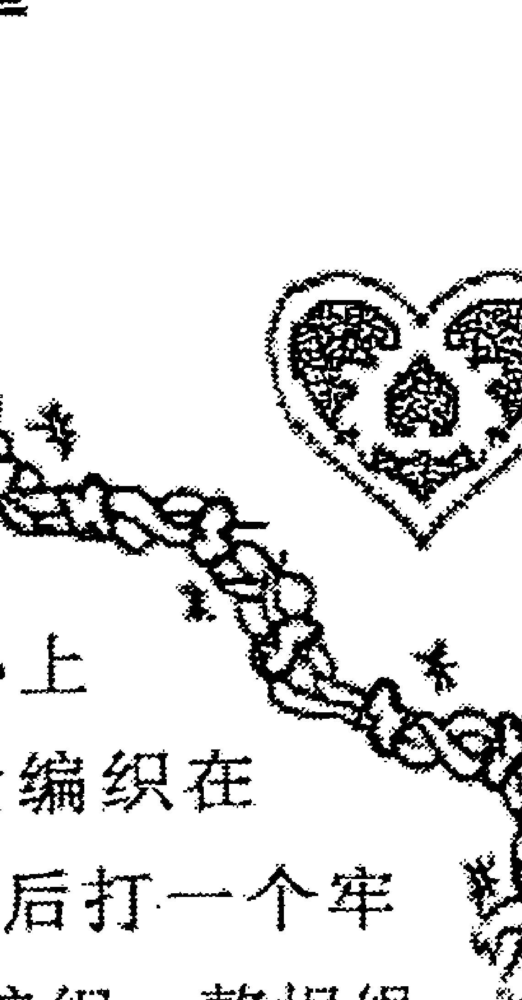

### 异地恋

符咒——事实上是咒语——从心底向自己心爱的人传递信息。这种咒语适用于你的爱人或者你远离对方的时候。
材料：塔罗牌——每一种花色中的A，以及所有能够帮助你传递信息的纸牌；你心爱的人的照片；魔杖。
首先，你需要扫除家里的消极能量，然后打开魔法圈，念一段你自己编的咒语，或者甚至可以是神秘的韵文（下文中神秘的魔法咒语）。将照片摆放在光滑的表面上，最好是地板。将A纸牌围绕着照片，摆放在各自所代表的元素所在的方向上（如图）。再用四张其他的纸牌围绕着照片封闭魔法圈，边念边想：

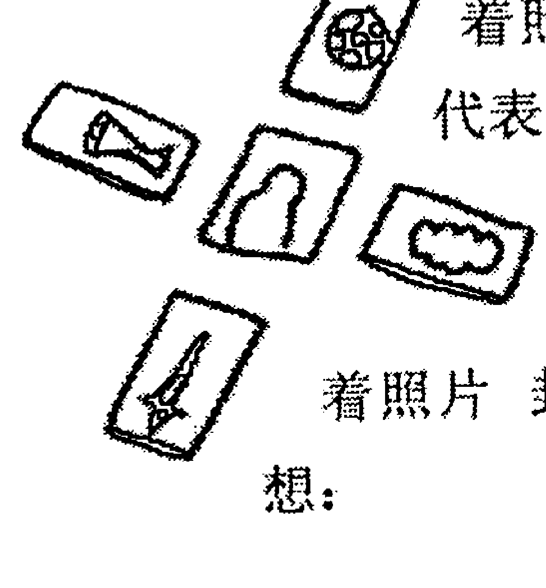

> 我将（纸牌）的力量送与你，
> 因此你应该（用于何意？）

为了传递这些信息，如果需要，你可以使用另一张纸牌给予自己力量，或者其它你所需要的帮助。用你的魔杖拍打每一张纸牌（一共八张），心中想着你心爱的人，然后将你要传达的信息分别传送给她/他。顺时针方向旋转，用作积极性的目的。完成了之后，将魔杖握在手中，闭上眼睛，想着你的心上人，传送你的信息。一定要始终将你心上人的照片保存在你的脑海中。完成了之后，再顺时针拍打一次，念诵：

我给你（卡片的力量）

每一张纸牌念诵一次。如果你想要它变得更加强大，可以凝视着那张照片，在心中念诵你想要说的话。在凝视的时候，你的魔杖要一直接触那张照片。
当你感觉你已经完成了整个施法过程之后，你要说“必将应验”，或者“愿神保佑”，甚至可以说：“我必定以完整的爱和完全的信任遵守巫士原则。”

用神秘的魔法咒语关闭魔法圈（或者使用任意一种你喜欢的韵文关闭魔法圈）。一定要在你打开魔法圈的相反的方向关闭它。
（——阿迪娜·月亮·龙星）

### 月亮咒语

想要看到或者收到你想念的人的消息，你可以在月盈的时候，抬头望着它，念诵下面的咒语三次：

> 我看着月亮，
> 月亮看着我，
> 也看着我想要看到的人。

> （然后默念那个人的名字三次）
> 如我所愿，必将应验。

> （——阿迪娜·月亮·龙星）

注意，你每转一圈念诵那人的名字三次，一共要念九次。（——雅典娜·谢弗）

## 运气和好运

### 好运

（这种法术来自克宇空部落[Koyukon Tribe]——但是我在运气前加上了一个“好”字，因为运气也分好运和厄运。我早已学会要将事物描述得更加准确一些！）念诵三次：

> 现在的大乌鸦，过去的大乌鸦，
> 未来的大乌鸦。
> 向大乌鸦祈祷。
> 大乌鸦，带给我们好运吧！
> （——雅典娜·谢弗）

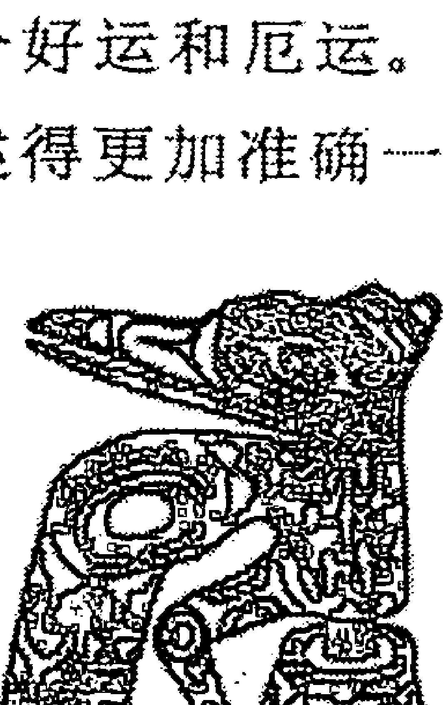

## 显身

### 神秘魔法

这是一个常用于在需要的时候，寻求帮助的符咒。在结束的时候重复三次，每一次的最后一句都不一样。

神秘主义的力量，纯粹的欢愉。
告诉我哪条道路是正确的。
它也许凹凸不平，也许曲折蜿蜒。

- 1. 神秘的魔法，倾听我的歌谣。
- 2. 演奏我的歌谣。
- 3. 吟唱我的歌谣。

### 召唤力量

> 我举起我的双手，我的心，我的声音
> 来召唤生命的力量。
> 土，气，火，水，和灵
> 五大元素合为一体
> 三位一体的三性女神，倾听我的呼唤
> 我召唤少女代表新的开始
> 母亲代表生活
> 老妪代表经验
> 女神保佑，赐福
> 三位一体女神，我呼唤你。
> 神秘的力量，必将应验。
> （——阿迪娜·月亮·龙星）

### 蜡烛力量

> 来自上天的女神和男神，
> 赐予我力量，和平与爱吧。
> 赐予我希望，
> 从蜡烛的火焰中而来。
> 我的内心从战争中获得平静，
> 帮助我找到和平，我的朋友。
> 蓝色的火焰，我的心愿，
> 这个咒语通过燃烧的火焰应验。
> （——阿迪娜·月亮·龙星）

## 金钱，财富，繁荣

### 金钱

在绿色蜡烛的底部滴一滴广藿香精油。在圣坛上点燃你的蜡烛，同时焚烧冈醐6号香。念诵三次（或者三个一组）：

> 环绕轨道运行的木星，三分一对座的太阳，让财源滚滚来！（——雅典娜·谢弗）

### 钱袋

需要：绿色蜡烛，六枚一角的硬币，绿色的袋子，肉桂。

将硬币摆在蜡烛周围，然后点燃蜡烛。念诵下面的话语三次：

> 金钱增加、金钱溢满、金钱闪耀、金钱都是我的！

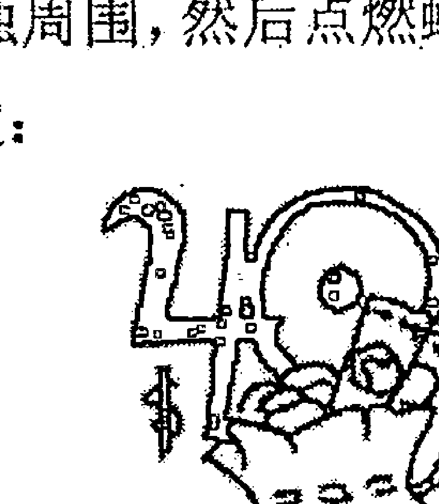

在袋子上撒一些肉桂，然后（大约15分钟之后）将硬币一个一个捡起来，装入袋子中，同时念诵：

> 让财源不断滚滚而来吧！

随身携带这个袋子，或者把它放在你的周围，直到你感觉咒语起作用后。（——豹舞者）

### 银币咒语

（这种施法需要一个星期的时间）

将一个碗放在一个显眼的位置，连续七天每天都往里面放一个一角硬币。在第七天的时候，将装有硬币的碗和插在烛台上的一根绿色蜡烛，带到一个适合施展咒语的地方。在开始施法之前，将你自己想象成一个富人，并且你并不需要为金钱担心。将蜡烛握在手中，想象金钱奔涌而来，而你也已经踏上了挣得大钱的林荫大道。将蜡烛放在一个平面上，端起装有硬币的碗，将硬币倒入你的左手中，把每一颗硬币都放在蜡烛周围，每放一颗念诵一次：

> 财源滚滚，财源闪耀。财富增长，皆属于我。

当所有的硬币都放在蜡烛周围之后，将蜡烛点燃。想象金钱的力量从硬币中流出，经过火焰，来到你的身上。在财源蜡烛前坐十分钟，想象蜡烛燃烧尽后，你就会拥有一生都用不尽的财富，所有的账单都会立马得到支付。想想你应该怎样明智地去使用这些财富，可以投资；也可以为以后的生活做一定的储蓄；终止所有有关债务、税金或者怀疑的想法，这些都会让你的咒语失效。十分钟之后，你可以让蜡烛自行燃烧殆尽。在蜡烛燃尽之后，将硬币捡起来放入碗中。把碗放回原位，继续每天往里边放入银币以补充你咒语的能量。一次或者两次以后，便可奏效。（——豹舞者）

### 吸金咒

需要：绿色和白色蜡烛，神和女神蜡烛，茉莉或者广藿香焚香，塔罗牌：世界、魔术师（或者你的自我牌）、太阳。虎眼石，平衡石英 / 烟晶石。同样地，如果你喜欢，准备：将这些东西摆放在你的圣坛上，最好是在一个满月的夜晚。念诵：

> 在这个夜晚，我为自己召唤，
> 成功，好运，以及金钱的力量。
> 女神万岁，我召唤你的帮助。

点燃女神蜡烛。

男神万岁，我召唤你的帮助。

点燃男神蜡烛。（将手举向天空，闭上你的眼睛，想着你的要求，点燃焚香。）

当火焰在香味中点燃之时，也将力量带给了我。

点燃白色蜡烛。

当我点燃蜡烛，也将蜡烛的力量带给了自己。

在三颗宝石上方从左往右晃动静止燃烧的烛火，每经过一颗宝石晃动三次。将焚香吹熄，放在绿色与白色蜡烛之间的安全位置。闭上你的眼睛，在第一句话的时候将手举向天空。再次睁开眼睛，每掐灭一支蜡烛的时候念一句。（不要使用吹熄的方法熄灭蜡烛，这种行为会被认为是对神的不敬！）

> 感谢你，女神，
> 我以平和且充满爱的心送你回家。
> 感谢你，男神，
> 我以平和且充满爱的心送你回家。
> 啊哈，以三之名，
> 咒语完成，必将应验！
> （——阿迪娜·月亮·龙星）

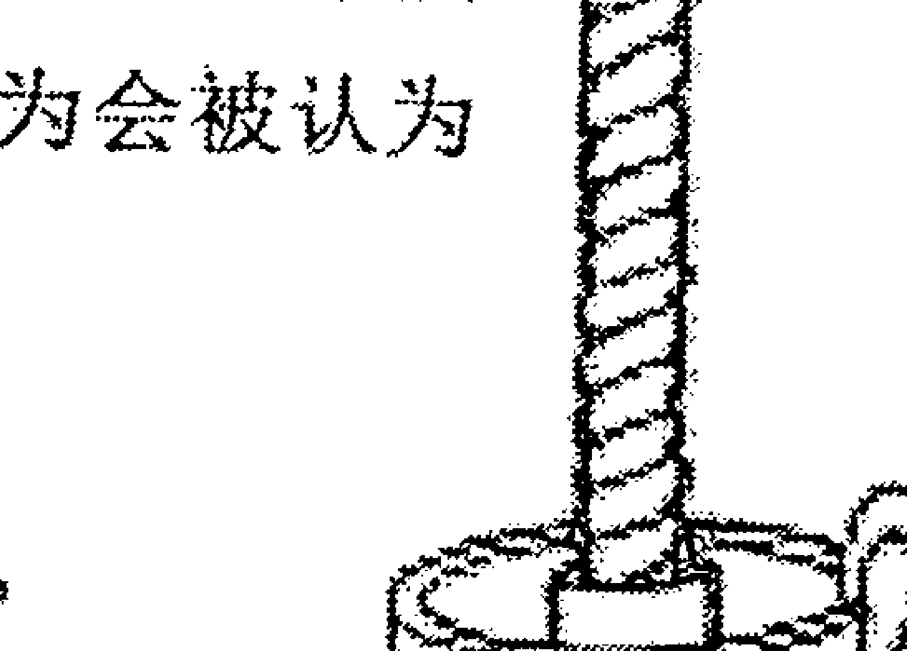

## 和平

### 甜蜜咒语

这个咒语用于对待那些你再也无法和睦相处的人，但是却因为某种原因而不得不见面——因为你们在共同经营一个项目，因为你们在共同抚养一个小孩，诸如此类的关系。

你需要一片羽绒；一个信封，蜂蜜；一张你的和对方的照片，或者一张写有你名字的卡片和另一张写有对方名字的卡片。在每一张照片或者卡片上拍上一点蜂蜜，念诵：

> 让我们像蜂蜜一样甜蜜，
> 你对我如此，我亦然；
> 彼此尊重，彼此称赞，
> 为了我们的共同目标团结一致。

将羽毛放在两张照片（卡片）之间形成三明治状，念诵：

> 我们的话语会像羽毛一样柔软，
> 智慧的言语，清晰地聆听；
> 让我们和睦融洽：
> 这是我的愿望，必将应验。

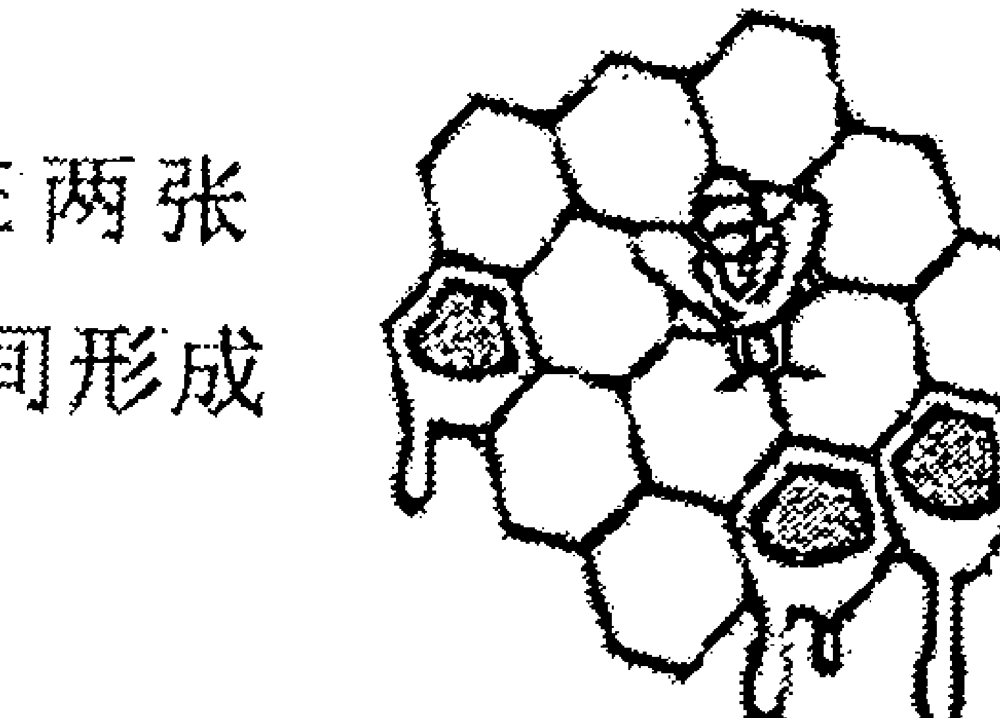

将“三明治”放入信封中，封上信封不要让“三明治”散开。你可以在信封上放置一个分享的象征物。在咒语结束之前将信封放置在安全的地方。
（——伊斯特拉·蒂西莱 [Estara T’ shirai]）

[Frederick Lamond])

## 防护和安全

### 力量咒语

当你需要一点额外的力量时，你可以这么做。你需要集中注意力将以下的话语传递给你的守护神。

> 日之力量，夜之力量。
> 赐予我看不见的力量吧。
> (——豹舞者)

### 守护镜

这个咒语用于圣化镀银防护镜。在围绕你想要保护的房屋、圣殿或者卧室顺时针走动的时候，背诵这个咒语。手中握着镜子，玻璃面朝向外，以此防止消极能量的入侵。施咒结束之后，将镜子玻璃面向外挂在门上。

> 镀银的艺术之镜，
> 以女神之名保护我，
> 拯救我于痛苦，羞愧之中，
> 将可恶的想法送回其原来的地方
> （念诵三次女神的名字，以增强效果. 这一步属于选用步骤，只有在面临故意且恶意的攻击时才使用。）
> 只让爱贯穿我心！
> (——弗雷德里克·雷蒙德 [Frederick Lamond])

### 羽毛光

想要得到全方位的保护，你需要从工艺品店买回一个小篮子。将其放在你的前门上(或者你们主要使用的门上)。只要那篮子羽毛还在那里，它就会保护你和你的家人不受负面或者邪恶的意图所伤害。
（——雅典娜·谢弗）

## 成功

### 为了成功

在圣坛点燃一根金色或者黄色的蜡烛(在蜡烛的底部滴上一滴广藿香精油)以及冈嗣六号焚香。准备一个小盒子。一片翡翠，上面放一点蜘蛛网。再将翡翠放入盒子中。然后准备一个代表你所想要的成功目标，或者将你的意图写在一张纸上，放入盒子中。
将盒子放在圣坛上的蜡烛前方，念诵三遍：

> 你钢铁般的意志，有耐性的技巧，
> 徐徐灌输进这个护符中，
> 这样我便能顺利经营。
> 如我所愿，必将应验！

然后关上盒子，将护符放在安全的地方。
（——雅典娜·谢弗）

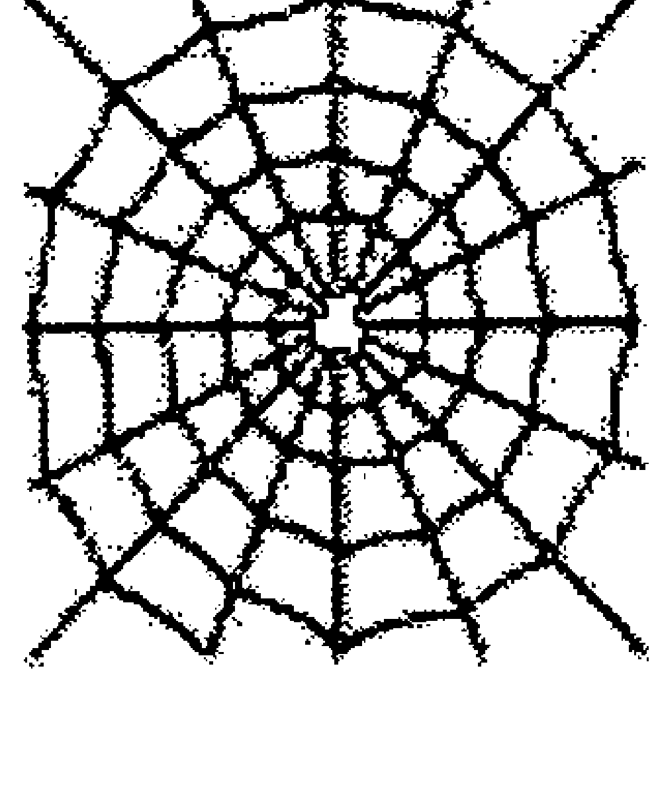

### 新年咒

这个咒语需要在夏末节(凯尔特新年)或者一月一日完成。

## 第三章: 练习 (金色)

需要的材料：代表12个月的石头，索引卡，钢（铅）笔，打火机，装好水的防火碗（最好是大汽锅）或者将水放在触手可及的位置，蜡烛（最好是白色），石质项链（在上面串一颗积聚能量的防护类型石头）。

在开始之前，将你前一年中最后悔的想法写在索引卡片上。

在远离可燃物的一个安全位置上，设置好你的迷你圣坛。在设置圣坛时，想想在即将到来的这一年中，你最想要的东西。将蜡烛放在迷你圣坛上，将代表12个月的石头放在蜡烛周围围成一个圈。和平常一样建起魔法圈，点燃蜡烛。将项链上清洗过的石头在火上来回摆动，念诵：

随着新年的前进，
愿这颗石头带给我________。

将卡片对折两次，然后在碗里将其点燃。为了安全，你可以将碗放在水槽里再点燃卡片。这样，你就可以用水将火熄灭。

通过火之火焰，
过去的一年已经过去。
随着新年的开始，
将我想要的带给我。

和往常一样，关闭魔法圈，收拾残局。（——阿迪娜·月亮·龙星）

## 学业成功

### 黄水晶学习咒

需要：两根黄色的蜡烛和一颗黄水晶。

用柠檬精油涂抹蜡烛和黄水晶。点燃蜡烛，将黄水晶放在两根蜡烛之间，这样烛光可以照在水晶上。念诵：

让烛光附着在石头之上，
让我的大脑充满智慧之光。
让我的思想不断变更更加明晰
这样就没有灾害可以入侵
让我所阅读过的书籍成为我的知识
好奇心永存
我所有的生命与我同在
如我所愿，必将应验。

在你学习的时候，让蜡烛保持燃烧，确保水晶吸收光芒。将水晶随身携带，以帮助你的研究、学习、论文写作等等。（——豹舞者）

## 愿望

### 愿望星

在黄昏的时候，随着日落，太阳的光芒渐渐隐去，看着西方第一颗出现的星星（可能是行星金星）。当看到它，亲吻你的手，并将这只手举起来指向这颗星星时，念诵：

星光，明亮的星光，
我今晚看到的第一颗星，
我希望我能，我希望我可以，
在今晚跟你许下这个愿望：
（许下你的愿望）
（——传统）

### 许愿井咒语

我在井中投下一枚硬币
许下一个小愿望
首先，我希望诸事顺利
现在，我将会许下我秘密的愿望：
（将你的愿望许入井中，并聆听回音）

> （——奥伯伦）

### 生日蜡烛

以下是你吹熄你的生日蜡烛前要说的话：

新的一年到来了，旧的一年已过去。
在这最后一刻，我许下我的生日愿望！

魔法力量，旧的和新的，
让我的生日愿望成真！

（许下你的愿望，一口气吹灭所有的蜡烛！）

> （——牵牛花·泽尔·雷文哈特 [Morning Glory Zell-Ravenheart]）

## 4. 力量之石

文 / 弗朗西斯科·蒂格阿迪斯 (Francesca DeGrandis)

魔法师相信自我表述和个人探索，这一点与莽撞的狂热，盲目的遵从，以及被媒体荒唐可笑地称之为自我发现、独一无二以及表述自由是相反的。但是，你从哪里找到成就自己的力量？自信，勇气，自我决断？你怎么获取冷静、坚韧，或者任何你需要用于面对生活中其他挑战的特征？答案便是创造一个力量之石。以下是一些制作细则：

力量之石可以授予你任意所需类型的内部力量。然而，力量之石并不仅仅在体内起作用。作为一种强大的幸运符，它同样还能影响外部世界。你可以同时从内部和外部接收力量。正如你在咒语中会看到的一样，石头会给予你力量——所有的以及各种各样的力量。例如：当你外出寻找工作，参加体育比赛，或者尝试其他较棘手的，竞争激烈的活动时，这种护身符可以带给你好运。

为了制作幸运符，首先要寻找一颗你非常喜欢的石头。喜欢的理由无关紧要，也许你是喜欢它摸上去滑滑的感觉，也许是石头的形状像极了你所喜欢的动物。你甚至不需要知道为什么你会喜欢这颗石头。然而，如果一块岩石不知道为什么会唤起你脑海中的力量，那么，它便是最佳选择。但是，如果你没有找到“正确”的石头，那你便可以找一颗“有用”的石头。正如你将从下文中看到的一样，所有的石头天生就是力量之石；它们所缺少的就是你的利用。

为石头赐福时，将选好的石头握在手中，同时念诵（你可以大声朗读也可以默念）：

这颗石头来自大地，里面充满了盖亚的力量。大地的每一小片都拥有其所有的力量，而我是大地的一部分，所以盖亚所有的力量都存在于我体内。我很强大。

接下来念诵另一段话语，加深魔法：

一颗石头，一个星球。来自盖亚之心的火焰给予了龙的呼吸，哺育了这颗石头。流逝的时间哺育了这颗石头。地心引力和地球旋转的重量哺育了这颗石头。水的鸣咽，水的浇灌，水的重量，都哺育了这颗石头。天空中的星星哺育了这颗石头。所以，当我携带着这颗石头之时我也携带了所有的这些力量。盖亚是一位炼金师，一位魔法师；是她为我锻造了这块护身符。

在你完成了以上所有步骤之后，将你的石头放在圣坛上，或者，如果没有可供使用的其它特殊位置，你可以放在任何地方。事实上，尽管上面念诵的话语这么说，你也不需要在工作的时候也随身携带。但是，在你想要记住你新发现的运气，以及内部的力量或者感觉的时候，你可以带着它，这样它可以帮助你更好地吸收这些能量。你还可以通过这样的形式来取得更多的能量：像唱诗一样重复念诵仪式辞中的一句或者两句。这样做可以增加力量、自信、决心、运气、平和，而且这些能量可以永久存在，因为这个护身符涉及了力量和循环形式的力量，记住，是大地的所有力量。事实上，一旦你做好了这个护身符，你所念诵的所有咒语都会产生额外的效应。

不要认为在咒语完成之后你便能避免生活中繁重的工作。你可能会拥有更多的运气、信心，以及你能想到的所有有用的能量。但是，你仍然需要在运动比赛之前加紧练习；书写一份简历；为即将到来的约会精心打扮。

理解力量也是非常重要的——无论是内部的还是外部的——因为力量就是这颗石头的真正含义。其称为“力量之石”，并不是因为这称号听起来不错。以下是力量真正的本质：

- 1) 每个人都想要力量。这颗石头可以给予你足够的力量，但是你必须理解它，将其按照你的意思来使用。
- 2) 毫无疑问，力量能够帮助你获得你想要的东西，而不是通过支配他人来达到目的。比如，不要把你的精力用错了地方，用攻击的行为推动自己的胜利，这种不可阻挡的争斗性往往会失控，而且会非常危险，也会导致你恃强凌弱。盖亚不会站在你的背后支持你的欺骗、报复或者以另外的方式将你的需求或者观点强加在他人身上。宇宙中的每一个原子在本质上都是可敬的。因此，无论你是多么的痛苦，多么地需要，或者你拥有多少的爱，你的石头——以及它所代表的所有盖亚力量——都只会在你的行为合乎伦理道德的时候才会帮助你。恶意的闲话和其他毁灭性的力量，可能会带来力量和自信暂时性的增强，但是最终它都会反噬。
- 3) 然而，你要记住：一旦你的咒语完成，你要对其充满敬意，所有的大地力量将会支持你，照顾你的痛苦、需求、爱。因此——噢，天哪，又是一些陈词滥调，大地灵性非常实用——加上仪式、祷告以及神学，女巫可以在世俗世界凭借明智的方法利用这些能量。那便是理解怎样协调你新发现的力量之石的一部分。
- 4) 但是还是得说——如果第一次你没有成功，那么你就需要再一次地尝试，一次又一次地尝试。
- 5) 你也需要对力量敞开心扉。这一点以及以上三点都是真正的石头和专家的秘诀！如果你自己或者你的生活没有取得实质性的变化，你不能认为是创造力量之石的尝试失败了。你需要经受一定的磨练才能感受到一点——只有一点——石头的天赋，采用低风险的尝试这样你就不会遭遇彻底失败。你可能已经获得了盖亚的所有力量——事实确实如此！——但是，你也许需要一些时间和练习对其进行开发利用。练习时你可能有如婴儿学步，但是，你最终会大跨步走在人生道路上，充满信心，好运连连，受到神的庇佑。

以下是一些开发力量的方法：社区服务可以培养内部力量；自重、自信、社交技巧、周游世界的实际知识，这些都只是其中的一些例子。至于运气，一旦你已经写好了纲要，你就需要彩排舞蹈表演，或者练习邀请某个特殊的人约会，放松一下。放松，试着让自己平静下来，观看一场演出。如果我们试着去相信事情会成功，那么成功的几率就会变大。匆忙慌乱与力量不会同时出现。

力量之石是一件非常宝贵的物品，随着你对它越来越深的了解，它的效力就会越来越强大，随着你使用能力的增加，力量之石的力量也会不断增长。优点：一直坚持使用，你就会获得巨大的、各种各样的、有利于你生命中所有事业的力量。随着时间的流逝，如果你的生命中出现了更大的挑战，你就会拥有更大的力量来面对这些挑战。你对石头的力量开发得越多，形式越丰富，石头的效果就会越好。去试试吧！

## 5. 在公共场合不惹眼的魔法

文／乌鸦。龙血树（Crow Dragontree）（灰色）

### 拥有魔法，四处旅行

至今为止，我估计你已经创造了一套相当壮观的魔法工具。你的魔杖已经过了精心的装饰，你的五角星印已经处于一种魔法状态，而这一系列的工具都已经形成了一种魔法的精神状态。我也知道你已经读过——甚至还用过不少的咒语。我甚至能想象得到——你，点燃了蜡烛，创建了属于你自己的魔法空间，设置好圣坛，并创造一个适合你施法的魔法氛围。我敢打赌，你已经激发了一些不可思议的魔法，创造了一些咒语并取得了很好的效果。做得很好！你应当获得这样的鼓励与赞美。

不过，你是否注意到传说和神话中的魔法师只需轻摆一下他们的手，或者低声嘟哝两句话，便能创造出强大的咒语，他们是怎么做到的？我甚至可以和你打赌，如果你将小说中一半的魔法师魔杖的尖顶帽拿走，然后给他们穿上寻常人的衣裳，你会发现，你们看起来和普通人并无两样。没人会真的告诉你他们会何时施展法术。也许它看起来就是随便地抬一抬手，或者只是轻声地低语，但是除了其他的魔法师，没人会意识到他（她）正在施法。也许甚至连秘密的手势和低语都没有——只有一个微笑，或者，如果周围还有其他隐姓埋名的魔法师的话，他会轻轻地点点头和眨眼。
现在魔法触手可得！事实上，如果你在科学课堂上遇到了突击性的小测验，而你想要使用魔法来推动你的记忆力，此时你却没有时间点燃几根蜡烛，并在课桌上设置一个圣坛！即使你有时间，你可能也不想引起大家的注意，而且不能公然对抗校园中不能出现明火的校规。同样地，如果你和朋友外出共进午餐，而有个人总是让你觉得不舒服，脸上挂着别样的表情，并试图靠近你，你可能想要为自己建立一个防护结界，但是却觉得掏出魔杖创建一个魔法圈似乎不大合适。此时，如果能够不动声色地施展法术不是很好么——在任何时间任何地点都不让任何人知道？

如果你想要这样的事情发生，你需要在施展实用、简便法术的时候遵守一整套的行为准则，以使你在公开场合施法的时候不会被看作异类。这本《伴侣书》中会有一部分让你有机会去探索这样的一些方法，让你可以将你的魔法从至圣所中带到你生活的世界中去，而不会被他人看作怪胎。

然而，首先，我们需要了解一下以下一些基本概念。

### 现在，你明白……

不惹眼的魔法基本步骤还包括一件普通的日常工具，比如糖果，或者一个填充布偶，以及一些魔法技巧，如放松和可视化。后面提到了这两种技巧特别重要，应当首先培养，并作为之后所有步骤的支柱。这一部分的课程将会涵盖所有按照指令增进你放松和可视化能力的练习。

你应该还记得，在《魔法师学徒的魔法书》（课程之四，第六课“魔法准则”）中的可视化的概念，是魔法的准则之一。也许有人会说，可视化在几乎所有的咒语中都会用到。只需将你的注意力集中在一个特别的意图之上，你便能做到一定程度上的可视化。在不惹眼的魔法中，这种小型的魔法工具变得非常重要。因为在你施展一种不起眼的法术时，你不会使用很多工具来帮助你建构一个魔法框架，所以，为了促成法术的成功，你必须有能力集中注意力去想象。可视化是促成不惹眼魔法的关键——是非常重要的核心工具。

我知道你可能认为你拥有了超凡的想象力——而且你也有可能是正确的——但是我敢打赌在最开始的时候，用于不惹眼魔法的可视化对你来说仍具一定的挑战性。不过不要担心，我会教给你一些练习方法，这些练习可以帮助你提高你头脑的可视化能力。

然而，首先我想要澄清一些非常普遍的误解。因为“可视化”这个词语中包含有“视觉”的意思，大多数人就会将可视化简单地看作是一种只需想象自己看到某物的能力。对于语义纯粹主义的人来说，这种说法是完全正确的，但是对于我们想要达成的目的来说，可视化是一种会用到多种感觉器官的体验。当你施展一种不惹眼的魔法之时，你可能需要去闻，去感受，去聆听，以及去品尝你施法的结果！同样还有一点需要你记住，可视化也许是一种比真实的感知力更强烈的感觉。也就是说，你能感受到那种气味、景象、味道，或者声音，这比你平时所闻到、看到、尝到，或者听到的更加清楚。

记住这些事情之后，现在我们开始增进我们一些必要的技能。此时，记住这些对于包括施法在内的所有事情都非常有用的练习，是非常有帮助的。比如，我们认为在任何情况下都能够放松的人们患上与压力相关的疾病的可能性会低一些，而且很可能会比那些不练习放松的人的寿命更长。此外，可视化练习不仅仅能够加强你想象的能力，而且还能有利于你注意力的集中。如果你在练习了这些技能一段时间之后，发现你的学习成绩有所提升，这一点也不奇怪！

### 练习一：只需放松！

在你施展所有不惹眼的魔法之前的第一件事情就是放松。我知道当你处于一种“继续施法”的情况中时，这一点比较困难，但是，如果你定期练习放松，你会发现你在想要放松的时候会越来越容易。我希望你在开始这一类的练习时，寻找一处安静的、灯光昏暗的地方，在此地，你要保证自己在15-20分钟之内的不会受到打扰。在你能够轻易地进行这一练习之后，你可以试着在各种地方进行精神上的放松，比如在起居室里，把电视打开，或者在去学校的公交车上。最终，你就会能够在任意位置任何时间做到立刻放松。

学会放松有很多种方法。其中最快最有效的方法也许可以被称为渐进型肌肉放松法（PMR）。要做到这一点，只需简单地拉紧你全身的肌肉，然后让它们放松。首先，将你的脚趾缩成一团，然后绷紧你的大腿，夹紧你的臀部，收缩你的胃，弯曲你的肱二头肌，并将你的脸皱缩在一起。现在保持这种状态几分钟，然后慢慢地，慢慢地，放松。

在你慢慢放松你紧绷的身体时，留心你的肌肉和你的躯体所发生的变化。感受你此时与之前相比的那种轻松感。随着你肌肉的放松，大声说出一些东西，相应地发出一些轻松舒缓的声音。将这些作为你的“放松语言”。很多人简单地将“放松”选为自己的放松语言，但是另一些与我共事的人选择了一些更加独特的词语，并加入他们自己的意思，比如“家”。无论你选择哪一个词语，你必须在每次放松时都使用同一个词语。最终，在很多很多次这样的练习之后，无论你在何地，你只需说出这个词语就能自动进入一种放松的状态。

然而，当你决定在公共场合做这些练习的时候，这种放松方式可能会让你觉得有些傻。PMR事实上是一种你想要在私人环境中进行的练习！如果你想要在公共场合使用某种不是放松语言的方式练习放松，而且你不愿看起来好像患有肠胃疾病，你可以试试下面这种练习方法：

尽可能舒适地坐着，脑中想着你的脚趾头。不要笑，我是认真的。想着你的脚趾头，感受你脚趾的重量，你脚趾的温度，流经你脚趾的血脉，如果你穿着鞋，感受一下你的脚趾在你的鞋里的感受。现在想象你的每一个脚趾都泛着金黄色的温暖的光芒。感受你的脚趾中这种光芒的温度。现在，让光芒慢慢地蔓延到你的双脚中，随着这光芒所蔓延的脚步，依次放松每一块肌肉。

让光芒从你的双脚延伸到你的小腿，你的大腿，你的臀部，穿越你的腹部，让光芒停留在你的背部，脊柱底部的位置。在几秒钟以后，让这股让人轻松，温暖的光芒慢慢地爬上你的脊柱，蔓延到你的双肩，放松其所经途中的每一块肌头。然后这股光芒会沿着你的脖子往上延伸，覆盖你的整个头皮，穿越你的脸部肌肉——尤其是你的下巴。在你想象这股光芒蔓延至你全身的时候，感受你身上每一块肌肉的放松。

现在你已经完成了整个放松练习，下面我们开始练习可视化！

### 练习二：蜡烛

这个练习是为了增加你可视化并没有真实存在的物品的能力。随着越来越多的可视化练习，这几乎会变成最简单的部分。刚开始的时候你需要选择一个黑暗或者昏暗的房间，在此，你需要至少15分钟不会受到他人的打扰。深呼吸几次，并做一些你喜欢的放松练习。闭上你的眼睛，想象一支蜡烛出现在眼前。有时，刚开始的时候想象蜡烛的火焰最简单，灼热跳跃的火焰加上里面正在燃烧的光秃秃的灯芯。接下来，想象蜡烛本身，尝试看它的颜色、尺寸以及每一个细节，包括从蜡烛的边缘上滴落的蜡油。

并不像你想象的那么简单，对不？不要担心，在经过几次练习之后，你就能看到一整支蜡烛，最终，你能看到你所喜欢的任何东西——甚至在你眼睛睁开的时候你也能做到！通常情况下我推荐你每天或者隔天练习，直到你在昏暗的房间中能够轻松地做到可视化。然后，试着在昏暗的房间中睁开眼睛练习可视化。在此之后，你可能会想要尝试各种不同的场景，比如在你和你父母进行漫长而枯燥的旅行时。只需记住：可视化更多的是一种感觉，而不仅仅是想象。

### 练习三：橘子

一旦你能够轻松舒适地做到练习二中所说的练习，试着可视化一些不仅能够看到其尺寸，而且能够刺激你各个感官层面的物品。橘子就是一种非常适合这种练习的物体！

一旦你处于放松状态，并且处于练习二中的开始状态，你便可以开始可视化橘子。想象它的颜色，它不光滑的纹理，以及它的表皮反射光的方式。现在，想象当你的手指触摸其表皮时的感受。用你想象中的手指将其剥皮，闻闻其果肉迸出的汁水的气味。想象自己慢慢地咬下一口，细细地品尝这个橘子甜甜的味道。我打赌你每做一次这样的练习你都会垂涎欲滴。

和练习二中一样，每天或者隔天都做这样的练习，然后在不同的场景中练习。试着在每次练习的时候使用不同的物品，让整个练习变得非常有趣，并练习你的可视化能力。只需记住：让你的练习尽可能刺激最多的感官，因此可口的食物和饮料是最佳的选择。

### 练习四：苹果凤梨

这种练习是我的女儿推荐的，它能将可视化提升到魔法层面。一旦你能够坚持完成练习三中的内容，并且越来越轻松地做到练习三中的可视化，你便已经准备好了进入可视化练习的最后一步。在不惹眼的魔法中，我们所想象的物品并不存在，我们所想象的场景也都还没有发生（比如，想象你在测试中取得了你还没有取得的好成绩）。为了能够做到这一点，能够详尽地想象出一种完全虚构的物品是非常有帮助的。然而，在开始这种练习的时候，创造一种虚拟的、跟你已经熟悉的物品有联系的物品可能会简单一些。为了完成这种练习，我的女儿发明了苹果凤梨。苹果凤梨是一种既是苹果又是菠萝的水果。

和之前的练习一样，放松，在你昏暗不受打扰的自由空间中坐定。想象一下苹果凤梨该是什么样子的。它看起来就像是一只笋瓜，黄色的表皮，上面有绿色的和菠萝一样的刺。用你的手指抚摸这种粗糙扎人的刺。这些刺很容易就能被拔下来，剩下柔软的、黄色的、多汁的果肉。深吸一口苹果凤梨的气味——闻起来有点像椰子的味道。最后，猛咬一口果肉，尽情享受它酸甜可口的滋味。

和之前一样，一旦你能详尽地想象出苹果凤梨的各个细节，那么就试着可视化其他你之前从未见过的想象中的物体。如果你缺乏灵感，你可以就借用路易斯·卡罗尔（Lewis Carroll）的经典诗作《蛟龙杰伯沃基就诛记》（Jabberwocky）中提到的那些物体。

### 糖果魔法

一旦你已经在可视化技巧上取得了一点进步，不惹眼的魔法世界将会由你掌控！然而，与此同时，让我们来看看一些在你施展不惹眼的魔法过程中，会用到的工具和道具。

在魔法中使用糖果这一想法，是我还在大学的时候萌发出来的。我选修了一门特别难的课程，而期末考试也即将到来。即便我为了这次测试非常勤奋，非常用心地准备，但是那天，我还是想将一点魔法小心翼翼地带进教室以帮助我记忆。当然，我不能在课桌上点燃一堆蜡烛，因此我感觉有一点点失落。

一位有点魔法基础的朋友建议我穿上黄色和橘色的衣裳——这两种颜色通常都与精神能力和沟通有关联。这当然是一种有效的施法方式，但是如果一只老乌鸦穿得像一只小雏菊一样地去上课，很难不引人注目！当我将这种情况解释给朋友听之时，她非常随意地递给我一块口香糖。这个小小的手势，一个随意地递给我一片箭牌薄荷味口香糖的手势，触动了我的一根心弦。像薄荷和留兰香一样的草药很早以前就已经与一个人的精神能力联系在了一起。为什么薄荷味的口香糖不可呢？

有关学习和记忆的实验一次又一次地表明，如果人们边考试边喝咖啡，那么他们会取得更高的分数——但是除了他们学习时也在喝咖啡！这种情况被称为状态依赖性学习。当然，我并不是在建议你带咖啡## 第三章：练习（金色）

啡上学。咖啡因对于你们的健康来说并不是很好。然而，这证明我们的味觉和嗅觉拥有一种非常重要的功能。例如，我们的嗅觉器官，只需通过我们大脑中的情感区来运作，是我们所有器官中唯一不需要在思维区进行转换的感觉器官。比如，我的儿子，喜欢苹果和肉桂的味道。一旦这种味道散播到空气中，他便会立刻想到他祖母的厨房，此时，他的心中就会充满快乐和爱意。因为嗅觉与味觉的联系非常紧密，所以像糖果一样微小、常见，而且非常易得的物品就能作为一种非常强大的魔法工具！

用糖果施展不惹眼魔法的基本方法相当简单。首先，搜集一些你想要用于施法的糖果。将它们放在你的圣坛上。现在，放松，构想。想象与你的咒语相关的能量进入特定的糖果中。也就是说，如果你有一块想要用于吸金咒以提升你的津贴的菠萝口味的糖果，那你便在脑中想象“金钱能量”充满了整块糖果。想象你自己已经拥有了你所需要的额外的金钱，你有什么样的感觉？你会将它用来做什么？将所有的这些构想都放入你的菠萝味糖果中。

为了帮助你决定用哪种口味的糖果进行施法，我在下文中列举了一些最为常用的糖果口味：

- 苹果——爱，治疗。
- 香蕉——成功，繁荣
- 蓝莓——防护
- 樱桃——预测
- 巧克力——直觉
- 丁香（试试焦糖口香糖）——防护和爱
- 椰子——防护
- 咖啡——成功，能量
- 葡萄——奖励力量和金钱
- 苦薄荷（一般被制成草药止咳糖）——精神力
- 柠檬——净化，友谊，长寿
- 甘草——爱，忠诚
- 棉花糖——健康，爱，防护
- 薄荷（普通种类）——学习和记忆
- 橘子——爱，金钱，预测
- 菠萝——运气，金钱
- 覆盆子——爱，防护
- 西瓜——健康，心灵能力

当然，这个列表中所提到的糖果口味都只是一些常用的，而对于魔法来说是远远不够的。然而，在雷克萨·罗珊娜（Lexa Rosean）的书《超市女巫》（The Supermarket Sorceress）中，她列出了一个相当完整的，与糖果和食物相对应的魔法符表格。

当你给你的糖果“附魔”之后，只需静待，直到你觉得魔法需要被释放出来之时。当那一刻到来时，将你的糖果放入口中。尽情享受糖果的味道，同时想象承载着你的意图的能量释放到宇宙之中。你将会施展强大的魔法，只有吃到这块糖果的人才能注意到你的魔法！

如果你不能吃，或者不吃糖果，不用觉得自己受到了冷落！只需在施法的时候用其他的食物代替糖果。将精力集中在一个苹果上可以给你带来健康；或者在学习的时候吃一把葡萄，可以帮助你的理解和记忆。不管怎么说，这样做肯定比吃糖来得健康！

## 魔法师学徒的伴侣书 | 上卷

### 象征符号的秘密用法

除非你有一个像威利·旺卡（Willy Wonka）或者比比多味豆（Bertie Bott）一样的，可以任你支配的神奇糖果店，不然你就无法在需要的时候及时拿出附好魔的糖果。此外，有时吃糖果可能会有些不太合适——比如在教室中或者在餐桌上。

不幸的是，不是所有不惹眼的魔法都依赖于万圣节的糖果袋子。你可能已经注意到，魔法象征符号的使用数世纪以来已经成为了魔法的主要组成部分。今天，你在很多地方都能找到这些象征符号，而且好像没有人会注意到它们。例如，五芒星作为一种装饰图案，几乎随处可见，却很少有人将它们看作是强大的防护和魔法符号！

一种非常流行的使用符号魔法的方式是使用如尼文字。事实上，日耳曼人的如尼文字也许是使用最为广泛的有聚合力的魔法符号系统。在这本书中确实有着一整套的剪贴如尼文字，其中还包含了这些文字所代表的非常有效地占卜意义！你也可以选择回顾一下《魔法师学徒的魔法书下》中的第33-34，里面有更多的有关如尼文字潜在意义的内容。

意义，那么它们的魔法意义也就显而易见了。例如，如果你还在上学，而你的老师对你进行了一次突击测试，你又想要做好这次测试，那么你就能使用如尼文字 Lagaz 来帮助你取得优异的学习成绩。

但是，我们要怎样才能做到不动声色，不引人耳目呢？

即使不同的教派在使用这些符号的方式上各不相同，但是你也可以看看这些内容。因为有些东西似乎是始终不变的：

- 你可以在一件物品上将如尼文字绘制或者雕刻出来（有时是不惹眼的，但是不总是隐蔽的）。
- 你可以通过直接喊它们的名字来使用它们（非常方便，如果没有人注意到你在轻声念咒，而且你的双手也已经聚满了能量）。
- 你可以在空气中追踪它们（能做到这样就可以做到完全不动声色，没有人能注意到）。

事实上，你使用你所选择的符号的方式依赖于你手中的资源。比如上文中提到的使用 Lagaz，你可以在你的试卷顶部写下这个如尼文字，但是这样做对于你的喜好来说有些过于明显。或许你更喜欢在做试卷的时候默念这个如尼文字的名字。个人而言，我觉得这样做会容易分神——我无法将精力集中在考试上，而老师也会认为我在传递答案！或许你可以选择用你的手指在试卷上写下这个如尼文字，这样做不会留下痕迹，而且，如果你足够小心，就没人会发现。

我最喜欢的施法方法之一是用我的魔杖在空气中画一个符号。因为我不能随时随地掏出我的魔法工具，我便会设法用我手上的任意东西来施法。例如，在几年前我带着一本供消遣的书登上了一架飞机，而且希望自己一路平安。在飞机准备起飞的时候，我靠在椅子上，拿起书装作要读的样子。在没人能够看到的书后，我画了一个如尼文字 Raidho，以保证飞行平安。这样，这个旅途不仅平安顺利，还充满了乐趣。

然而，在你施法的时候，你一定要放松，并且要尽可能多地做一些可视化。非常清楚地想象出，你完成咒语之后的样子、感觉，甚至是味道和声音。让你所使用的符号充满这些影像，然后释放。

### 制定你自己的符号

现在这一步将会充满极大的乐趣！

你自然不是一定要使用日耳曼人的如尼符号来完成这一类的魔法。我自己制定了有关一系列自创符号的一整套的占卜和魔法系统，我已经给它们制定了不同的意义。制作自己的符号系统用于魔法有相当多的优势。首先，这种非凡的经历自然会提升并加强你的魔法技能，比如创造性。制定自己的魔法象征符号通常会拥有更多的个人意义，而在制作过程中会增加你们之间的魔法联系。虽然不存在艰难快捷的制定象征符号的规则，但是我可以给你提供一些指南：

- 尽量简化：简笔画会比复杂的艺术品更容易在空中勾勒或者刻入物品之中。
- 刚开始的时候只需制定几个便可：当你刚开始的时候，只需要制定几个用于最基本魔法的符号（例如成功、防护以及诸如此类的）。这样，你便不需要一次性记住很多个新的符号。
- 给它们命名：你可以通过冥想，或者使用其他的直觉或者内省的方式为你的象征符号起个特别的名字。然而，如果你准备将它们用于魔法，你可以给它们起一些简短的、易于发音的名字，这样会易于记忆和使用！

除此之外，还要记得在创建自己的象征符号时将你想要的效果可视化。我知道我的这些话语有些老生常谈，但是一些魔法象征符号的美妙之处就在于它们会让使用者想起它们潜在的意义。例如，我自己用于表达“秘密”的符号就是一轮新月。对我来说，就像月亮一样，它代表着夜晚的神秘及其隐藏的奇迹。在你设计你的符号的时候，要试着将你这个符号的意图想象得尽可能的清楚。通常，在可视化的过程中你可能会非常清楚地看到某个形状。有可能是新月，三角形的火焰，或者圆圆的太阳。不论哪种情况，你都将会找到一个与你的意图有私人联系的符号。

让你自己能够在这一过程中体会到乐趣，充分发挥你的创造力和想象力。毕竟，这是你的魔法。

### 毛绒布偶的力量

这是我女儿最常用的低调魔法形式。她的施法过程非常简单。首先，她会从很多填充式毛绒布偶中选出一个，将自己的意图灌输进去。

以下是她最近常施展的一个法术。之前，她转学去了另一间学校，和她这个年龄的孩子一样，她相当紧张。她想要施展一个咒语，不仅能够为她提供防护，还要让她无论在何地都能像在自己家里一样放松。她的第一个任务是选择一种拥有这些属性的动物。乌龟看起来是不二之选，它的龟壳不仅能够提供保护，而且在任何场合都可以看作是一个家。而且还是一种在几乎所有的情况下都表现得十分冷静的动物。这些都是处于一个新环境下应该拥有的很好的品质！接下来，她便开始给这只乌龟附魔。她在缝合处剪开一个小口子，将拥有防护性能的草药塞进去，例如茴香、丁香以及金丝桃草。在缝合小乌龟的时候，她想象着防护能量也被缝进了乌龟体内。虽然她可以将这只魔法小乌龟带到学校，但是她仍然非常慎重。直到今天，这只魔法小乌龟仍然被放在她的房间里，在她的毛绒布偶大家庭中看起来毫不起眼。无论她在何处，只要她觉得自己需要保护或者安全感，她都会想象乌龟壳包裹着她，保护着她。

当你在用毛绒布偶施展自己的咒语时，你第一件要做的事情就是搜集适合的动物布偶。你会想要选择一只与你的意图有个人联系的动物布偶。以下是一些我自己家里有的拥有特定属性的布偶，对你可能会有用：

- 短吻鳄——防护，力量，秘密
- 熊——治疗，力量，家庭关怀
- 蝴蝶——趣味性，改变，美丽
- 奶牛——金钱，家庭收入，健康
- 狗——忠诚，勇气
- 龙——力量，想象力，信息
- 狮子——领导力，勇气，力量
- 猴子——聪明，恶作剧，敏捷
- 猫头鹰——智慧，秘密，精神力和通灵能力
- 兔子——繁荣，敏捷
- 天鹅——美丽，潜能，优雅
- 乌龟——安全感，坚持不懈，在压力下保持冷静的能力

> 在《魔法师学徒的魔法书》中，奥伯伦·泽尔-雷文哈特简要地说明了很多很有意思的动物的属性（敬请留意课程之六，第四课“变形和借体”）。在同一个章节，牵牛花·泽尔-雷文哈特提供了一系列“图腾动物”的内容，这对你在选择一种动物来代表你的咒语是很有帮助的。

既然你已经选好了毛绒布偶，你就会想要将你的意图灌输入这些布偶中。这个过程被我称为“准备长毛绒”。你可以依据自己的喜好，将其简化或者复杂化。你可能想要设置一个圣坛，并在上面摆放特殊的草药、石头，或者画有符号的纸张。

另一方面，你或许更喜欢坐在你的床边放松，并想象你的意图充满了整个布偶。在此我还有另外一个忠告，如果你选择在你为布偶附魔时候使用蜡烛，一定要非常，非常地小心。毛绒布偶通常很容易着火，所以最好在施法的时候放置一个气流调节器！

一旦完成附魔之后，你的布偶便可以使用了。不论你在何处提及了你的布偶，你都能够召唤其能量以施法。如果你在学校接受了突击测试，想象猫头鹰的羽毛和鸟冠包围着你，帮助你给出最明智的答案。当你需要额外的力量时，想象自己拥有熊的皮毛与肌肉；当你发现自己处于领导者的位置时，想象自己披上了狮子的鬃毛。使用这些魔法的时候要明智，更要对其负责，它们的能量对你的帮助将会不可估量。

## 总结

我们最喜爱的故事中的流浪魔法师很少会随身携带一整套的魔法工具箱。事实上，背负一整个圣坛四处云游是非常麻烦的！有了这些简单的工具和理念，你便拥有了在任何地方、任何时间施法的必要入门技巧。然而，你需要牢记在心的是，这些观念仅仅是一些工具，我所描述的过程都只是一些入门。在大量的练习，拥有丰富的创造力，以及大规模的实验工作之后，你才能真正完全拥有这本书中所描述的魔法。继续努力，好好练习！

## 第四章

### 心灵学（浅绿色）

> 相信吧，梦想者
火的孩子
相信吧，梦想者，
相信你的梦是真实的
因为它们投射了长长的影子
在这个觉醒的世界中，
无论你是否能够看见
它们阴影遥远的地平线。

相信吧，梦想者，
你在梦中所听到的一切
都是比日光所能承受的
更加深奥的真理在对你耳语。

相信吧，梦想者，
你的鼻子在梦中所觉察的东西，
因为在这个广阔的次元空间中
邪恶散发着
狂野的海浪冲来的鱼腥味
以及玫瑰的香甜。

相信吧，梦想者，
那些你在梦中品尝到的味道
因为不管是苦涩
还是甜美，它们找到你
都是有原因的。

相信吧，梦想者，
你的皮肤所触到的微妙的智慧
因为克己反思所带来的只有
痛苦
而丝绸带来柔软的魔法
无论如何，你可以转变你的皮肤
在这片柔软的区域中。

相信吧，梦想者，
你在梦中所做的一切
因为它们会改变你的一生
不会少于
太阳所见到的一切行为。

——伊丽莎白·巴纳特

## 1. 简介

欢迎来到心灵学的世界，或者说“意识魔法”世界。这个部分包括了所有类型的精神技能，以及它们的形成过程、冥想、梦工厂。这堂课中会讲述到很多文化的知识。这一部分魔法的颜色是淡绿色，代表了所有的精神魔法，比如冥想和精神协调。淡绿色与星期五和金星之间有联系，是一种代表平静和深厚反射的极佳的色彩。冥想是大多数东方魔法和巫术训练的基础，而且它对于那些想要学会掌握和聚集意志力的西方魔法师来说特别重要。意志力是隐藏在有效的魔法背后的力量。如果合理的使用，冥想可以打开个体成长和个人进步的大门。

### 2. 你需要学会的第一件事

文 / 伊斯特拉·蒂西莱（黑色）

下文中的练习对于所有魔法来说都是非常重要的。掌握这些练习中的技巧就可以为任何专门化的学习打下坚实的基础，同时也能掌握自我保护的方法。

将下面的内容记在心中：

1. 首先学会简单的方法。这些方法可以让你对其他练习和你想要做的事情产生一定的‘感觉’。简单的方法还可以让你在危难之时教会他人来拯救你们。
2. 至少要学会一种变体。在你已经掌握了一些简单的方法之后，你需要尝试至少一种变体，这样你便可以对可能性有一定的了解，还能鼓励你去不断试验，以找到一种最适合自己的方法。
3. 学习其他的变体。了解其他的派别是怎样练习的能够帮助你理解在事情发生之后，应该怎样去与这些派别的成员打交道。学习越多的魔法和宗教系统，你就越能明白其他人在做什么，以及做出怎样的反应才是最好的。

同时还要记住只看书是不够的。这些技巧只有通过有规律的练习之后才能更好地掌握，并有效地使用。

### 冥想

这个技巧是指将你正常的清醒状态转移到精力集中和平静的状态。能够触及这一境界的能力需要所有的魔法和精神上的努力。这样做还有利于你的世俗生活，其中的平静能够释放压力，提升你的专注度。

### 简单的方法：

最常见的冥想法是‘清空头脑’冥想法。舒服地坐着，做一些令人放松的深呼吸，然后轻轻地对着自己说‘清空’。努力彻底地清空你大脑中的所有想法。如果你捕捉到你头脑的思想片段，再次深呼吸然后对着自己重复道：‘清空。’这需要花些功夫才能够完全地清空你的大脑，但是几个回合之后，你将会开始注意到进步。

如果你发现这种清空头脑冥想法除了把你逼疯以外别无它用，那么就试试‘单一注意力’冥想法。舒服地坐着，做一些放松的深呼吸，这一次将注意力集中于一些挑选出来的词语、短语，或者图像上。用这些‘咒语’来集中你的精神清除其它的想法。与这些‘咒语’相关的想法是可以接受的，但是随着练习的增加这些想法应该逐渐消退。

如果以上两者都无法满足你的诉求，那么试试‘行为导向’冥想法。这个与单一注意力法相似，但是这种冥想法将注意力集中在了一种行为上而非一个词语或图像上。你可以使用太极、瑜伽、武术、纺线，或者任何相对简单的行为去清空你的大脑，集中注意力。我的一个朋友会一边冥想一边做刺绣。

### 变化：

符合标准冥想法的任何学习模式都是可以接受的。但是只要记住‘清空’和‘集中注意力’和‘放空游离’不是一回事儿：在电视机前进入轻度恍惚状态不是冥想。

### 唤醒其它感知能力

这些活动旨在训练你星体的感知能力（Astral senses），它们可能在你的物质生活中表现得萎靡或怠惰（除非你已经唤醒了它们）。但是这些感知能力却在检测和表演魔术方面以及与非物质存在之间的交流方面发挥着至关重要的作用。

### 简单的方法：

开始的时候，你可以针对某个你想要训练的感知能力选择一个简单的关注对象。举个例子，你可以选一个烛台来做视觉训练，或者某种特别的铃铛发出的铃声做听觉训练，某种喜欢的香氛做嗅觉训练，一片水果做味觉训练，一片羽毛或者某种质感的布料做触觉训练。

首先要研究实际的物体对象，密切关注它的细节之处。然后拿开这个物体，试着在你的头脑里重新再建造一个这样的物体，越精细越好。举个例子，静静地观察这个烛台，然后闭上你的眼睛，试着从你的大脑中去“看”它。

### 变化：

当你变得擅长于此之后，就可以开始选择更加复杂的物体来进行集中注意力的观察。然后，试着一次性将更多的感知能力集中于此：举个例子，试着再现铃铛的声音和外形，你需要能够将一个物体通过感知能力在你的大脑中清晰地重新，就仿佛它们就在你面前一样。

当你在做其它训练时，你会发现这些所使用到的其它感知能力也同样在进步。

### 集中：

集中就是将你的所有的注意力和能量都集中于你的物质身体。（你这样做就是所谓的“意守丹田”）这是自我清理和接地气的初级步骤，这种练习将有助于我们集中于个体脉轮从而取得平衡的能力——所有的其它技巧也会在其后随之而来。集中也能帮助你搜集能量，这些能量有可能之前因各种活动而分散，或者缺乏聚焦。集中与冥想有关，互为补充。

### 简单的方法：

做几个放松的深呼吸，开始想象你随着你的呼吸进入到你的体内。每一次呼吸都带你进入你身体的更深处，直到你在你的肚脐后面找到你的中心所在。

### 变化：

随着技巧的精进，可能集中练习起来不需要呼吸那么多次了。当你在集中的时候，你会想象你的周围围绕着大量的液体发散着光芒。（这样的经历会在你的其它感知能力觉醒之后更加生动。）注意一下这种光芒的颜色：这是一种你个人的能量色彩，这有助于你规划和控制你的能量。

### 接地气：

接地气将你身体的能量与地球的能量相连接。这对进行地球膜拜（Earth-honoring）练习者有着明显的益处，但是它也有额外的使用用途。1，它就像锚一样，有助于阻止你受外力而动摇。2，它就像一种额外能量的源头以保护或扩大你自己。3，它提供了一条渠道可以可以排除过多或者不需要的能量。

### 简单方法：

坐下来集中你自己的注意力。然后进一步地进入你自己直到你的注意力来到你的脊柱顶端。在这里，想象一根巨大的根茎向下生长，冲出你的身体，像一只尾巴一样，然后伸入地下。每一次的呼吸都让它更加深入地扎进土地里，向地球中心——她的发热核心靠近。感受这条根靠近核心的中心，充斥着金色、温暖、治愈的能量。现在，用你的呼吸将这一能量向上吸入你的体内。当这股能量靠近你时，将其通过你的脊柱向上吸入，让其放射到你身体的其它地方，直到你的整个身体都充满了地球核心之光。这时候，如果需要的话，你可以将你不需要的能量反送回到土地里，让地球回收利用（见以下的“自我清理”）。

### 变化：

接地气也可能会产生许多不同的效果。你可以神游到地球的中心，这样你可以得到除能量之外更多的收荻；你可以向下传送一只柱管来替代根茎，从而加强其锚定的作用；你可以在站立的地方向下传送根茎，然后从你的手臂上传送出变成一棵开花的树所发出的能量；你可任意伸长你灵魂的腿以碰到地球的核心，这的确会感觉很奇怪，但是有时候你能够办到。一旦你掌握了一种方法，请无所顾忌地与他人进行试验吧。

### 自我清理：

这是另外一种能够促进你个人能量的技巧，并且能够在你准备做严肃的工作时帮助你集中注意力。它也可以帮助清除附着在你身上的负能量，不管这些负能量是来自你的心态，健康，或是外在的影响。自我清理也是之后一些练习的初级步骤。

### 简单的方法：

集中你自己的注意力并且坐下来。将手放在地面上。一边做，一边深呼吸，并且想象所有你内在的疾病和负面能量被集合成一个球停留在你胸前。深深地呼进一口气，随着你呼气，你会看到收集的负能量从手臂处倾泻而出进入土地里。将其完全地释放到土地里，想象地球吸收了它，然后用她的方式将其净化。

### 变化：

如果跪下来双手着地让你看起来太过显眼，可以通过你的脚来开展这种释放；这可能会从你的双手轻弹出去（确保不会打到其他人！）将其释放进入你一直保存的烟晶里，将其埋到土里，或者用一句你记录下的用以释放消极能量且无害的口头禅来释放它。通过练习，同样的变化也可能在你想象中的一个人那里发生，他（她）也能受到清理——但是要确保得到了他（她）的事先同意。如果只是（或进一步）需要外在的清理，身体可能早已污迹斑斑（通过暴露在香火烟雾中得到净化——鼠尾草是这种情况最常用的植物），拨浪鼓可以用来打# 魔法师学徒的伴侣书 | 上卷

清扫身体周围的能量。如果你经历过用双手传送能量的过程，你也可以用你的双手清扫另一个人的能量（确保之后要清理你自己）。用这些方法，确保全身都顺利地得到了清扫，不要留下不必要的能量。你可以，举个例子，养成一种习惯，先从身体的前面开始清扫然后再转到背面，或从头部开始一直持续向下移动到脚部。

# 防护：

作为一位守护者，防护的技艺是很关键的。它其中的益处希望也是明显的。通过这层防护的强度和意图，它可以缓冲与激怒的同事之间的冲突，也可以武装对抗一次魔法的进攻。

# 简单的方法：

集中注意力清理你自己。在你的中心，能够看到一片彩色的光亮，这代表了你的个人能量。想象一下，那种颜色的雾从你的身体里升腾起来，完全地充满了你。它在继续扩张，从你的毛孔里，鼻孔里，嘴巴里窜了出来，直到它形成一枚包裹你全身的蛋。这枚蛋的光芒生成了一种坚硬的壳，让你远离所有不需要的能量。

# 变化：

关于魔法练习的最正规的书籍会给出至少一到两个关于防护的方法——有时候他们会呈现出“迅速”的铸造圆圈的形式。防护可以提前创造，然后通过口头禅来触发，存放在物体里，塑造成不同的形状，用符号装饰。

个人的脉轮，身体的部分，或物体可以拥有它们自己的防护，可以覆盖整个区域。这要比任何其它的基本技术更有优势的是，它能为个体实验提供空间。在任何情况下，你都应该在防护之前清理你自己或你的物品，以防意外封进了消极情绪（通过这种方法会有打开好斗魔法的有趣可能性，不过这超过了这节课的范围）。

# 脉轮平衡：

脉轮是位于脊髓的能量中心。每一个都被认为掌管着不同的功能，包含生理的，心理的，情绪的以及精神上的功能。确保这些中心相互之间是平衡的，充满了让每一项功能都能更加顺利运行的清洁能量。

# 简单的方法：

集中你自己的精力，然后向下移动到脊柱底部。你从这里开始移动到各个轮穴之中，去测量每一个轮穴的大小和亮度。它们可以被想象成球形或者轮形。如果其中某个轮穴太大或者太小（壁球般大小是最为理想的），记住这一个轮穴，然后在想象中将它变大或缩小，直到达到你所期望的大小。同样的，如果它们非常模糊而且昏暗，那么你就需要将它变得清楚而又鲜明。你可以使用通过接地气所获取的能量来喂养这些小的、模糊的、昏暗的轮穴。

1.  **海底轮**：在脊椎的最末端。它掌控着自我求生的本能。通常被视为红色。
2.  **生殖轮**：掌控着性器官（下腹部）。显然它掌控着性欲，但也掌控着基本的情感和本能的反应。橘黄色。
3.  **脐轮**：就是肚脐以上腹部以下的部位。这里是意志力的中心。
4.  **心轮**：就是心脏。掌控着同情心同时也是脉轮系统的平衡点。绿色（如你喜欢也可以是粉色）。
5.  **喉轮**：就是咽喉部位。掌控着智慧与沟通的能力。蓝色。
6.  **眉间轮**：前额，眉毛之间。掌控着星体的感觉能力。靛蓝色。
7.  **顶轮**：在头顶。这是精神领域与智慧的衔接点。紫罗兰色。

可以帮助你减少苦恼和焦虑。以上这些都是所有人一般可以体会到的好处，而且也很容易掌握。

# 变化：

通常会用颜色恰当的石头和蜡烛帮助平衡轮穴。如果你有兴趣，有许多关于轮穴的书可以用于进一步研究。特别推荐安鲁迪·朱迪丝的《生命之轮》和《脉轮的奥秘》。

作为一名魔法师，你自愿想要冥想的最主要的原因是，冥想可以使你全神贯注，集中注意力。这可以让你进入你的直觉，以其深邃的智慧连接到更高或集体意识。重点是通过冥想，你可以将你的能量导向你所希望的结果。通常，定期的冥想可以强化你的意志力。魔法需要集中你的意志力，并将你自身的能量引向你自己所期望的积极的结果。当你拥有了坚强的意志力，你的魔法将变得更加强大和有效。

# 3. 冥想

文 / 道娜塔·埃亨 (Donata Ahern)

在开始冥想前，为自己创建一个神圣的空间。这种行为可作为一种防护和容器来帮助集中你的精力。你可以简单地想象或幻想有一圈白色的光围绕着你，或者你通过你惯常的方式在你的周围创建一个魔法圈。

冥想有许多不同的形式……

冥想在字典中的意思是思想的一种放松集中的状态。对于一位魔法师来说这只是一切的开始，而不是主要的目的。为什么魔法师想要冥想呢？因为通过练习冥想可以得到许多的好处。首先你会发觉越来越平静和放松。要是坚持练习，当处在压力很大的状态下你会发觉冥想可以帮助你减少苦恼和焦虑。以上这些都是所有人一般可以体会到的好处，而且也很容易掌握。

主动冥想包含身体运动。如果你练习瑜珈或太极拳，你便会知道它需要你集中你的思想。这些就是主动冥想的形式。另一种主动冥想的形式是慢慢地行走，当你每迈出一步的时候，都要将你自己的注意力集中在身体的每一个动作之上，或者每迈一步便重复说一个字或者一个词语。

另一种主动冥想的方法是旋转。假设你的右脚大脚趾和旁边的脚趾之间有个钉子或木条（不考虑疼痛！）。当围绕它旋转时，这将作为一个稳定的支点。举起你的右手放在眼前，然后凝视你的掌心。这将帮助你集中注意力并防止跌倒。现在开始慢慢向右旋转，当你注视你的手掌时保持右脚平衡在想象中的那个支点上。如果你喜欢，可以用左手和左脚来做这种旋转，想象支点在左脚上。在附近准备一个柔软的椅子或沙发，因为开始的几次尝试可能会让你感到头晕！尽量延长你的旋转时间。约五分钟旋转后，你便会处于一种全新的意识状态之中。

## 被动冥想就是一般所说的“冥想”。

在做被动冥想的时候你就坐着一动不动。你可以坐在椅子上，把脚放地上（不要交叉你的腿或脚），挺直脊椎，或者你可以盘脚坐在地上或坐垫上，挺直脊椎。为什么保持脊柱挺直那么重要？因为在脊椎上有能量的通道，当挺直的时候能量更容易流动。这有助于你注意力的集中。

在做被动冥想时首先就是要放松。一个简单的放松方式是依次留意身体的每个部分。你可以把太阳想象成一个小的聚光灯直射于你正注意着的身体部分。从头顶开始，有意识地扩大面积然后放松。重复将你的意识移到你的眉毛，你的眼睛，你的脸，你的鼻子，你的嘴。然后专注于你的脖子。用这种方法，慢慢儿来，通过你的全身，一直到你的脚趾。感觉你的整个身体都处于一种深度放松的状态。

既然你已经舒服地坐下并且全身都已经放松了，那么便将焦点集中在你的呼吸上。感觉它流经你的鼻腔，然后向下流入你的肺。感觉你的腹部就像气球一样慢慢地被空气填满。当你呼气时，将你所感觉到的所有的紧张和压力都呼出来。你可以在你整个的冥想学习过程中都使用这种呼吸的方式来进行冥想练习。你也可以在你呼吸的时候数节拍。吸气的时候数“1”，呼气的时候数“2”。每一次呼吸的时候都重复这样的数数。

在你深呼吸的时候，你可能想要加上一些内容——一个字或者一个词——来帮助你集中注意力。有一种通用的咒语，或者词语是“Om”。你也可以使用“和平”、“爱”、“同意”，或者任何你所喜欢的词语。还可以使用句子，例如“我们是一个整体”，或者将几个词语组合在一起，例如“和平，爱，光明”。还有一些词语或者句子已经作为咒语使用了几百年。其中最常用的便是“唵嘛呢叭咪吽”。另一种咒语冥想的被动形式是念咒。在使用这种方法的时候，你可以大声念出你的咒语。可以是一个字，一个词，或者是一句更长一些的祷言。

## 沉思是另一种形式的被动冥想。

在沉思的时候，你可以在开始你的冥想练习之前选择一个字，一个词，或者一个句子。在练习的过程中，你便思考你所选择的这个字、词，或者句子，并不断地检测它。举个例子，你可以选择沉思或者冥想“于他人无害”。这句话真正的意思是什么？你怎样去避免所有的伤害？你能做到吗？这是否也意味着于你自己“无害”？这是一种自私的想法吗？对于吃肉你的观点是什么？或者作为一名士兵不得不杀害他人这一点你又是什么样的态度？在你冥想的时候你还会想到其他的一些东西。你也可以选择冥想“我们都被生命之网联系在一起”。这句话是什么意思？它是否包括了除人类以外的其他生物？动物？树？我们的行为会怎样影响到整个网络？你还可以找到很多用于冥想的其他词语或者句子。

# 镇定你的思绪

在被动冥想中，你可能会注意到一些让你分心的思想会介入你所集中的注意力中。想象你是一潭平静的池水，突然投入了一颗卵石，引起池面荡起了千层浪。看着池水直到波纹消失。这些浪就是你的思想。让它们慢慢消失。不要试图阻止这些思想的出现。你还可以想象一片晴朗的蓝天，而你的思想就是在空中飘动的云彩，你只需要看着云彩慢慢飘走。

冥想后你的注意力会更加集中，并会获得一种更深层次的放松状态，以及一种训练有素而且强化了的意志力。作为一名魔法师，有了这些品质之后你便可以更加有效地施展你的魔法！例如对水晶和蜡烛的赐福。决定好你要用这个水晶和蜡烛做什么——比如输送治疗能量。站在你的圣坛或者桌子前面，将水晶或者蜡烛放在上面。将注意力集中在你的呼吸上。按照上面的方式，从下方吸入地球的能量，从上方吸入天空的能量。让这些能量在你的心脏中心混合。将你的手放在水晶或者蜡烛的上方。感受你的意志在将治疗的能量输入需要治疗的物体之中，这个物体会保存这种能量，稍后再将它们释放出来。深呼吸，然后将你的能量集中在你的心脏中心。在你呼气的时候，让能量从你的手臂往下流动到你的手中，然后流入到水晶或者蜡烛中。感受你呼吸中的力量和能量从你的手中流出来，去保佑那件物体。

当你想要输出治疗能量的时候，聚焦在那件物品上（如果是蜡烛，点亮它），并有意识地将能量输送到需要它的人身上。你同样能用水晶进行同样的工作，而且不管何时，只要自己感到高兴、自信和成功就能将这些感觉加到里面去。保持增加此种通过入定而储存在水晶中的正能量。如果你觉得情绪低落就试着入定，进入一种轻松的境界，拉出一些水晶中的正能量。拿着水晶入定几分钟，你就能感到良好的变化！

在入定之末时，不管是主动入定还是被动入定，你都要花一点时间来感谢神灵或其它帮助你入定的存在。然后下地，将额外的能量传至大地，这将带你回到普通意识和意志里，避免出现“出窍”的感觉。让围绕在你周围的光环慢慢褪去。如果你制造了光环，那么就要用自己的方式将其褪去。将燃尽的蜡烛或焚香清理干净。好好享受平静的一天吧！

# 引导入定

下面是一份入定引导手稿，作者为格雷学校的老师霍莉·罗温德（Holllly Ravenweed）（靛青）。你也可以请一个人在你入定时念出上面的内容，然后将其录音保存，日后自己放来听：点一根蜡烛（这很有帮助，但并非必要），坐在或躺在舒服的地方，闭上双眼，调整呼吸，花一点时间来感受你身边的气味和声音，将此时此刻想象成夜晚，在你的头上，满月又低又大，闪烁着美丽的白光，你能看见这束光正笼罩在自己身上，你觉得它在你身边温柔地闪烁着，你通过皮肤吸收这些光芒，身体慢慢被平静和放松的感觉装满。你的全身都能感觉到它——手、腿、头和躯干——然后它慢慢到达你的中心，此时你被它完全填满了。你能感受到自己的心跳，心脏慢慢变得强力而稳健，因你正被大地的爱、她的人民、她的生灵、她的植被和水所包围，你能感受到月光在你体内穿梭，然后进入身下的大地。你知道你是造物主重要的创造，知道自己的言行需谨慎，知道你受到关爱。在平静中休整几分钟，当准备好回到属于自己的地方的时候，月光会将你带到那里。

# 4. 实用心灵研究（精神控制的技巧）
文 / 罗伯特·艾尔姆 (Robert Elm) (银色)

我写这篇文章的目的在于能为那些在起步时，就面临问题的人们，提供个人的热门解决方法，而不是告诉你们其古老训练本身是怎么样的。这样你就能将这些技巧和方法应用到可能会遇到的书本中去。
这些古老的技巧曾在世界范围内被使用过，包括可视化（这个名字实属无奈，因为其实际上并非只是幻觉而已）、意识引导练习、意识或经验的转化以及被称为气、普拉纳、吗哪、生命力、元气、玛吉斯，以及很多其他名字的“精神”能量。
这些技巧可能会有很多变化，每种都可能与众不同，但还是有一些比较简单、有助于更快更好发挥效力的。

# 自身世界的多感知体验

我要介绍的第一种，就是在简单练习时，将注意力集中于多感知体验的练习。很显然，我们具有同时感知多种事物的能力。最为熟知的五感包括视觉、听觉、触觉、味觉和嗅觉，但自己思想的感觉呢？思考的声音和图像又是如何呢？自己情绪的感觉又是怎样的呢？平衡的感觉呢？时间的感觉呢？你的理解力（词语就只是词语，那么又怎么会有没有意义的词语呢？）呢？
这些和其他更多的部分组成了你的全部感知。你同时获得的感知越多，那么你身边的环境就会变得越自然和真实，也就是说，你世界的真实音调也开始增大。这是一种意识的锻炼，非常重要。如果你想开发自己的本能，你需要用多感观来体验世界。通过引导体验获得的信息越多，你的内在就会变得更好更真实。你使用的感官越多，你的内在所获得的信息也就越多。
以此种方式来感知世界，刚开始的时候可能会很难，但这是一种比将各种感知分散开，只利用视觉或听觉更加自然的方法。有一个在全世界的科学课上都会做的简单实验能作为例子。学生被蒙住双眼，但允许说话，然后老师让其喝下一种液体，让他们说出自己喝到的是什么东西。他们基本上不可能说对。大多数人所说的味觉是一种味道、气味的混合，很多时候还包括触觉，尤其是在第一次尝试某种粗纤维的食物时。

我建议你找一处安静又自然之地，一处自己觉得美丽的地方，如公园、树林或漂亮的石林——如果你找不到我上面所说的这些地方，温室花园也行。现在，一旦你到了这样一个地方，坐下来，静静倾听、观看和嗅探……要点是让你的感知自由发挥，不要让某一种占据了主导地位。如果你觉得自己看得太仔细或听得太认真，那么就需要放松一下。放开自己的心，把世界装进去！

这个简单的练习非常重要。很多书里的可视化教程都会建议你想象一棵树或一块石头，但实际上几乎没有人知道如何在想象中将树还原出来——那么你又如何想象某种真实事物的感知呢？但了解你想要可视化的物品仅仅是个开始而已，因为当你对一个物品进行可视化的时候，你同样应该想象视觉之外的感官。越多的感官被用到，你会感到越真实的可视化效果。所以如果你要想象金字塔，那么不要只是在头脑中产生出图像，还要想象将其拿起，感受其重量、硬度和其尖角及边缘的锋利度，想象它的味道，并感受整个金属般的口感和气味。

在试图学习和控制精神能量的时候同样需要考虑再三，因为通常人们都看不见这种能量，只能感受到它。通过学习在开放和非破碎的方式下想象世界，你体会此种能量在身边围绕的机会大大增加了。我自己并不经常看到这种能量，但我知道它确实存在，在准备充分的时候就能感受到它。能否感知到此种能量完全是因人而异的。

## 问题的力量

多感知体验只是一种比较容易开始的技术。具体说来，还有一种我想在这里分享的方法，那就是对问题的使用及其力量。我并非说的是向老师请教问题的那种做法，而是问题本身对于下意识造就的力量。
在提问时，你实际上是在寻找一块迷失的内心拼块。通过问问题，你的潜意识会自动开始尽自己最大的努力填补空缺。我强烈建议在经过世界体验和思考多感知训练前不要使用下列方法，因为我所说的这种方法会加强你对问题的使用。
正如上文所言，问题是一种精神真空，大脑会寻找填补的方法。通过问多感知描述的问题，想象会自动被激发，在潜意识中就会产生可视化的效果。

### 例子：

> “棕色蛾子在房间里飞行的时候会发出什么样的声音？”
> “金色金字塔散发着冷光的表面的味道是怎样的？”
> “在用牙齿咬一颗红色草莓时的味道是怎样的？”

我确定这些问题中至少有一个会让你下意识地在脑中想到问题的答案。问题的力量不仅只是将图像呈现在脑中，还有情绪和欲望。

### 例子：

> “什么叫勇气？胸有成竹的时候感觉是怎样的？如果能看到的话，勇气应该是什么样的？”

提问的时候很容易获得某种特定的情绪，你也能使用陈述句达到这种效果。但问题是如果你自己并非勇者，你内在的一部分会说：“那不可能，我是个胆小鬼。”
通过提问，你不能说自己很勇敢或无畏正在你心中升起，但你能说我似乎觉得是这样的。当然，如果你的心很细，那么你就能察觉到自己确实感受到勇气在体内升腾。所有的问题都是这样的。记住，当你阅读问题的时候，图像、情绪或其他任何你试图在头脑中形成的东西都会按照自己的方式形成。你只需要细心一点就不会有任何抓住这些虚拟物体的问题。谎言无法成为问题，所以当你提问的时候一定会将其视为真实的，此信息会被轻易地传达给潜意识以帮助你完成任务。

通过提问，欲望能被轻易地强化。首先，为何人想强化欲望？欲望是潜意识的表现，所以如果你想鼓励某种精神能力的发展你就能通过提问制造和强化此欲望。

### 例子：

> “为何我想发展自主写作？为何我想让手中的铅笔自己写下一些我所不知道的东西？为何我想获得了解自己内心的能力以及我潜意识的想法和欲望？”

请注意上述例子中多感官语言的使用。请尽量多理解此种语境中的词汇，因为潜意识对生动的感知比抽象的理念更有兴趣。问题中涉及的感知越多，它对你潜意识的影响就越大。你能将此训练通过思考而连接起来。

### 例子：

> “通过训练我能获得何种知识？我能用自主写作帮助谁？它能被用来创造何种艺术？”

如果你继续在自主写作的原因清单上增加内容，你会渐渐感觉到自己的头脑对过程变得热衷起来。但是不要仅仅停留在那里，热情还只是个开始！你得要自己的潜意识继续运转以达到自动工作，然后感受自主写作给你带来的感觉吧。

这只是一个例子。通过思考提问来提升此种能力，你能让探索之旅的开端变得比自己所想象的更为容易一些。当你在此类训练中获得自己潜意识帮助的时候，你就是在和能造成或中断你成功的主要因素共事。如果没有直接的帮助，大多数的基础需要连续的潜意识的帮助以获得成功，因为实际工作都是由你的潜意识完成的！

# 预言

预言通常都被认为是用法力让某件事发生在某人身上。我不同意这种观点，但我仍然知道其在发展个人精神力量方面的重要性。我发现它在与先前提到的用提问来唤起想象、欲望和情绪的联合方面非常有效，原因在于，一旦你提出问题，引起了想象或感觉，它就会快速地消失，但如果问题涉及的东西是真实存在的，那么想象就会保持下去，而且要比只涉及食物存在更真实。

提问能开发个人的想象、情绪或欲望，并使其具体化，而预言会在头脑中形成固定的感知，这是一种思想无法比拟的存在真实感。

预言是通过正面词汇进行告知的，内容为你想让其发生或存在的事物，就好像它真的存在一样。理解“正面”的意思非常重要，其并不意味着有效的判断，就像好对于坏一样，但仅就陈述而言，它确实是这样的。表否定的词汇意味着“消极”和不认可。

用先前关于问题的例子，我们能说在获得勇气之后，我们能通过预言其存在而使其真正变为自己的一部分。

> 例子：
> “我感到勇气正充满我的心，使我变得强壮，用于面对一切大小事务。恐惧是我的仆人，我是它的主人。我变得永远勇敢。”

预言能被用在任何时刻，只要你想获得某种感觉或欲望，尽管在很多书中你会发现预言会导致自身心理的变化，甚至导致身边世界的改变。这是可能的，如上文所讲的，在预言之前先提出问题来将其固定下来，你将会发现自己不再需要只使用预言时那么多的力量来获得改变。

# 结论

我干嘛要学这些东西？这与心理能量书中所述的古老技巧和魔法有什么关系？答案很简单，这些技巧能帮助你在任何魔法学习开端“度过难关”。如果你并不精通于可视化，只能凭空想象空洞的内容，那么你会发现这三个基本技巧能自发地增强自己所希望得到的图像。如果你在进阶方面有某种问题，比如意志力环节，这会带来学习自身潜意识和使用提问、预言来提高某种或几种能力，以及对自身能力的信心和欲望。

# 5. 创造自己的星体圣地

文 / 道娜塔·埃亨（浅绿色）

圣地是什么？那是一个能让你进行精神训练的地方。这个特殊的地方成为了你仪式和入定的中心。当你进入此地时，不管它在哪里，只要你这样做了，就是在向自己传达一个信息：你正在进入其他的意识，与更高层次的自己建立联系。你进入的这个地方与自己的日常生活无关。不久之后这个过程会变得自动自觉，你会发现它对自己是非常有用的。一处圣地通常在中央设有圣坛。圣坛能帮助你将注意力集中到想作的事情上，不管是仪式、入定还是二者兼备。

你的圣地可以是一间房屋或房屋的一部分，比如你的卧室。圣坛可以建在桌子或梳妆台、架子甚至窗台上。如果你和别人同住一间房，则不需要将其建得那么醒目。如果你想要的话，一张花边桌布或一条围巾都能被当作圣坛的垫布。将对你特别有意义的物品放在上面，比如石头、水晶、一个小雕像或图片。一旦你设置好了，就尽量不要去移动它。你的圣地是你进行魔法工作的地方，让它保持不变有助于建立一种条件反射，让你一进入这个空间就能集中精力。

魔法师学徒的伴侣书 | 上卷

殊并且充满意义的物品放在圣坛上，水晶因其美丽和增强、储存能量的能力而被用于圣坛之中。它们能增强你进入光之通道的能力。将水晶握在手中，看着它，如果你许愿，你可以想象自己处在水晶的世界之中。这是一种充满喜悦的入定方式。你可以简单地用贝壳、小菊石（有螺旋的化石）或一株植物来当作女神像。简单的神像可以是任何直立的东西，如立起来的水晶、羊角、松球或小树枝。圣坛上的东西无需是所有人都认为是神圣的，只要对你自己而言是神圣的就好。此类自然之物能增加你空间的美感。圣坛及上面的物品都能保存你的能量，并将其扩大，于是你空间的气氛就会充满平静、强大的能量。当你远离家园的时候，如果你觉得有些压力，这时你只需要想一想你的圣坛，感受到与之的联系和其中的能量，就能重获平静，应对充满压力的环境。

在准备好自己所需的物品并有特定空间时，更容易保持普通的入定和仪式训练。你可以将蜡烛、火柴盒香料放到盒子里或圣坛地下，如果你的圣坛建在梳妆台上还可以放在抽屉里。你的圣坛成为你能量的中心，是你与神圣之间纽带的标志。意识到此种联系，或者说简单一点，通过入定或仪式每天都能意识到它，是非常重要的。毕竟，如果你与家人或其他人同住，而且每周只跟他们交谈一次而在其他时间里忽视他们的存在，你是无法与其和睦相处的！同样，与神灵和圣灵每天交流也很重要。尽量将你的圣地装饰得富有吸引力，当你赞美圣灵和神灵的时候，你同样也在赞美你自己。

你能在星盘或实体盘上创造自己的圣坛。为何你想做一个星体圣坛呢？原因有几个：首先，你会发现在这种训练后，会有放松和平静，这是一种其自身巨大的加持。除此之外，当你在星盘上遨游的时候，你就是在训练自己内在的创造力，这为你打开了你内在的智慧和信任之门，对魔法师极为重要。魔法师的工作大多要依靠发展内在进行，这种训练是一种创造性的可视化训练。你可能感觉自己只是在想象它——别担心。你正在运用自己的可视化能力，或想象力。这比“白日做梦”更具目的性。信任这个过程，在此种方式中你的想象力是一种强大的工具。

这种可视化训练是一种星体漫游的方式。星体漫游能让你神游在其他世界之中。创造星体圣地，你为自己建造了一处“本垒”，能在任何时候使用，进行星体旅行。你能在星体层面上离开、回到圣地，这增加了你的信心和安全性。在你学习如何运用想象力在星体圣地中旅行的时候，你能随时进入那里，想呆多久就呆多久。如果你在公车上或排在队列中，你也能用一点时间来进入星体圣地，任何时间你都可以这样做。如果一直坚持下去，你就能碰见自己的向导。你的向导能回答问题并在很多方面帮助你。这时你能在自己有意或无意的时候得到这个向导的帮助，你可能也希望和向导见面，在此星体圣地中和自己想相遇。

最后，拥有自己的秘密圣地也很有趣！你的圣地属于你自己！你创造了它，完全按照自己的意愿来建造。它是一处天堂、工作室、休息室，也是度假村，在里面你可以尽享舒适、方便和快乐。在那里玩得尽兴一点！

建造自己的星体圣地，你得进入实体圣坛，用四种元素（祝福盐和水、火与空气的香味）祝福自己。在此期间，你要有意告诉自己，你正在创造自己的星体圣地，你通过自己的想象力和正面的可视化来进行这个步骤。

现在想象你自己处在自然之地中，它可以是你已经知道的某个真实世界，也是能完全想象出来的。环顾四周，你看到了什么？现在是白昼吗？天上是否风轻云淡？还是晚上？你看到了月亮星辰吗？是冷还是热？你听到了什么？你能听见鸟鸣、兽叫，自己轻轻行走的脚步声。你闻到了什么？如果是在树林里，也许是松树的香味，如果是在草地上，野花可爱的香味会在你路过它们的时候袭来。花些时间进行训练，让自己体会各种感官，让自己感到平静和放松。

在独自散步的时候，你来到了一座流动溪流上的桥前，水的对岸是一个标志，意味着你进入了另外一种意识。现在越过这座桥，注意桥的结构——它可能是木头的或是石头的。它是新桥还是老桥？它跨过的是溪谷还是一条小溪？在你过桥的时候，桥梁可能会发出声响。在过桥时留意脚下的溪流，倾听它的声音，注意它的大小、是否平静以及水的流速。

在从另一边下桥时，你会发现自己处在美丽的自然之中。让这个地方尽量地变得美丽。包括树木、水流、山峦、沙滩，和一切你认为美丽的东西。如果愿意的话还可以建造一座寨子或房子。花点时间来做这个。在家里放置能让自己觉得高兴和舒服的东西。附近有花园吗？你能看到它吗？如果能，那它是什么样的？你想在房子里放一个圣坛吗？如果想，想象一下你放在家里实体盘上的东西。

准备完毕后，走出家门。就算你已经在想象的房间里建起了圣地，你就会更想在室外的大自然中建立一个圣地。你要一直走，直到发现一处让你感到舒服和特别的地方。这可以是一片林中空地，或一个石头圈、草地上的自然小丘；可以是一处可以俯瞰的水域或沙滩；可以是绿荫环绕的地方；或是一片开阔之地。找到并创造一处能吸引你的地方。花点时间来做。当你在此自然之地找到了自己的圣地之后，建立起你的圣坛并在上面放上东西——随便什么东西都行。用四元素供奉你的圣坛，就像你对实体圣坛做的那样。要给自己供奉此圣坛的心理暗示，而且要有规律地供奉它。现在花几分钟进行呼吸，完全放松至平静，感受你圣地的和谐与美丽。当你在造访实体圣坛的时候，要有意识地与此星体圣地创造联系，你要建立起星体圣地确实存在的意识。它是你巫术的主要施法场所。这里是你通往魔法师之门迈出的一大步！

当你准备好时，感谢此地的神灵，沿着原路越过溪上的桥梁。在你步下桥梁站在地上的时候，坐在地上，将多余的能量通过呼吸传达至身下的大地中，感受大地的能量，吐纳几分钟。你已知晓了通途，所以当你坐定的时候你就可以回到此处自然之地和你的圣地、圣坛。现在回到你的实体圣地、圣坛和打坐的地方，吐纳几分钟，回到现实。睁开双眼，你会发现自己处在实体圣坛前，感谢神灵和圣灵祝福了你的星体圣坛。把一切不需要的东西都移走，确保蜡烛完全熄灭，这时你就可以起身离开，开始清新平静的生活。

美好的祝福！

## 6. 探索明亮之地：梦境的魔法

文 / 伊丽莎白·巴纳特（灰色）

梦境的悲哀在枕头上留下真实的眼泪，梦境的荣誉在心里留下真实的骄傲。

梦的魔法是对所有人的遗产。有证据表明其它的哺乳动物也会做梦。尽管现代文化对夜里发生的事情不怎么重视，但传统文化却将其视为非常重要甚至关键的东西。不足或被打断的睡眠影响梦境，让人变得易怒。

不只是我们的身体需要时间休息和从白天的活动中恢复，我们的头脑同样需要时间休整，于是我们便会做梦。魔法师知道梦境的力量。这些画面会激活我们的潜意识并将我们与现实联系起来。梦境是一个充满魔法和神秘的地方，我们的所有言行都会得到重现。为了有效引导这种能量，你需要学会一些技巧。

### 学习梦境

在夜晚，普通人会经历梦境的几个阶段。第一个阶段发生在睡着后大约一个半小时，梦境产生于 REM（快速眼动）时期。大多数人的梦主要是图像，但也会有些其他感官体验，如苹果派的味道。专业的梦者能通过现实的事物来影响梦境。

除了在深度睡眠时期做的梦之外，在你快要清醒时也可能会做梦。临睡状态处在清醒与沉睡之间，正如你正在进入梦乡之际，而处在沉睡与清醒之间的临睡状态发生在逐渐醒来的时候。实际上这个名字来自一则我在大学时期读过的诗，作者用百货商店扶梯来描述睡眠，将临睡状态说成上下两层间的“明亮地板”，此诗主要表现的是作者总是回忆过去的悲伤，这也是全篇最有趣的地方，这让人百思不得其解，于是我告诉老师：“每天晚上我都是这样醒来的！”我发现了清醒和睡眠之间的界限，它是一种最有用的创造性内在发现，于是我学会了增加梦境中的时间。在那里我能直接进入夜晚的梦里，从里面获得更多的东西。

当然，梦有很多种，主要被分为回忆的梦、无意义的梦和真实的梦。回忆的梦只是最近经历的碎片而已，是大脑处理记忆的产物。无意义的梦非常奇特，甚至可能是些毫不相干的、没有实际意义的画面——比如你梦到自己在巧克力上滑冰，身后一群骑着鸵鸟的小丑在追你。真实的梦有很强大的画面，不管是从你自身法力的深井里升起的还是从更强的原力之处降临的，它们都可能会改变你的人生。还有很多更细的分类，包括传达信息的梦（里面往往包含某种特定的思想，通常源自外部事物）、顿悟（突然觉醒或突然想到了问题的答案）、迷惑的梦（你得想出梦境中符号的真实含义）、创造性的梦（在经历了某个故事或图片之后醒来）以及噩梦（充满焦虑和恐惧）。大多数人从青春期开始就在经历各种各样的梦境了。

我们在梦中的选择和我们所意识到的东西，都对现实世界有影响。魔法师学会使用这种法力，用于自我探索和原型研究。

只需通过阅读此类魔法书你就能从古诗、历史和科学的梦中学到更多的东西。大卫·方塔纳（David Fontana）的《做梦指南》（Teach Yourself to Dream）一书，是绝佳的启蒙读物。

### 基本技巧

为了将梦境发挥到极致，你需要学会一些基本技巧，其中一些很容易就能学会，剩下的则需要自己努力。

- 1. 记录梦境日记。将你的梦境记录下来，方便自己对其进行分析和建立长期模板。简单地将笔记本和铅笔放在枕边就能让你事半功倍。
- 2. 在入睡前就要给自己心理暗示。比如，你可以对自己讲：“我记得我梦境中的一切。”你也可以对当晚的梦境选择一个主题。
- 3. 学会顺利入睡。如果你折腾二十几分钟还不能入睡，你会让自己变得精疲力竭，这样对梦境的接受力就大大降低了。学会上床之后在大脑中制造放松的、容易做梦的感觉。
- 4. 学会回忆梦境。如果记不住梦的内容，那么它们对你就没什么用，所以你最好将梦境的细节尽可能多地记下来。
- 5. 醒来之后躺一分钟回忆梦境。这能帮助你在以往之前尽量多地记住它们。
- 6. 创建自己的梦境词典。借鉴别人的书是不错的开始，但你总有些东西是不同于别人的。符号在梦境中的作用很大，你需要自己将其破译。

这些技巧能帮你抓住梦境，你能通过其他方面的魔法增强自己对梦境的控制力，例如沉思或使用草药。同样，梦境也能帮助你的其他魔法进步。

### 梦境魔法技巧

大多数的梦都有引导或影响梦境本身的东西的介入。但是也有很多是在清醒时所做的事情与梦境相关的，这就属于专业知识所管辖的范围了。记住魔法的定义因其源头而各有不同，人们用不同的词汇来描述同样的东西。同样，一些技巧因其目的而有好坏之分。有些魔法师发现梦的力量非常强大，他们可利用梦境来威胁其他人或偷走他们的能量。

梦境搁浅——按照自己意愿从梦中醒来。要做到这一点，你需要意识到自己正在做梦，并且要有足够的意志力将自己抽离。这是最有效的控制噩梦的方法。

梦的制造——在梦境中施展魔法会在现实生活中产生共鸣。有意地将梦境用到你魔法活动的场所，你需要完全掌控你的梦境；但在你睡着的某些时候，你的潜意识则会控制你并对你施展魔法。如果你出现在并非很适合施展魔法的环境中，这会让任何想要获得你法力或用其骚扰你的做法变得异常困难。

梦的捕获——在噩梦或其他不好的梦进入某人头脑制造麻烦之前将其拦截住。某些特定的草药和石头拥有这种能力，一些手工艺品也同样可以。技术卓越的魔法师能在清醒或沉睡之时通过操纵梦境而达到目的。

梦的潜入——在回笼觉中回到先前的同一个梦境中。一些梦会自己重现，一遍又一遍地重复发生，期间会有些小变化。然而，在醒来的时候你能在昨晚那个梦之前制造同样的效果，只需故意回到梦中。

梦境漫游——在梦中造访遥远的地方、时代或世界。这与星体旅行类似，允许你离开自身思维和身体的局限。这两件事同时发生是很正常的，但目的地却经常变动，为了控制你的目的地，你需要引导梦境流动的能力。

梦的领悟——通过在梦境中行动或作决定来获得个人成长的顿悟，这对心理带来的好处会在生活中产生共鸣。这会自然而然地发生在某些人身上，也是梦境魔法师一直都在追随的。

梦的保持——获得特殊的梦，以让自己在早晨醒来之后能记住其内容，而且能够实际地长时间记住。这也与可视梦境的力量相关，能够影响现实世界。梦境词典和日记是记录梦境的重要工具。

梦的预见——占卜梦境中的未知物。这是能在梦境中施展的魔法活动中的一种。要做到这一点，你必须拥有某种影响梦境中事件的能力；但对于魔法天赋而言，“偶然”获得此能力并非难事，很多时候他们并非故意而为之。

梦的传播——制造一则信息或一个完整的梦，将其放在其他人的脑里。这是一种充满技巧的小把戏。尽管它大多数时候都被用作朋友间的交流，但也能被用于向某人施蛊，制造噩梦。

梦的定形——改变进行中的梦。你必须意识到你正在做梦而且想要改变它。这个技术经常被用于摆脱噩梦，尽管也能被用来制造欢乐。梦境是最初的“虚拟现实”！

梦境分享——和某人分享同一个梦。两个人，通常是密友或家人，同时出现在同一个梦里，这是一种非常亲密的经历。在现代文化中，这会偶尔并且自发地发生；但在很多部落文化里，这是非常常见的，甚至整个家庭都能共享同一个梦。其他的类似梦境包括不同的人做同一个梦的不同部分，能在早上像拼图一样拼接起来。

梦中唱歌——通过音乐或歌曲影响梦境，就像对婴儿唱摇篮曲一样。这是诗歌的传统用法之一。父母经常将其用于自己的孩子身上。精通梦境的魔法师能获得这种能力。它能极大地让梦境变得甜美、驱除噩梦和增加治疗效果。

梦中解难——利用潜意识、流动的梦境来处理现实生活中的挑战和得出答案。大多数人都只经历过一两次此种梦境，但要掌控其能量，你需要足够的控制梦境主题的能力。

梦中对话——介入他人或自己的梦境。这能让魔法师获得巨大的能量。你会对自己通过此法获得名号的速度感和其他不懂魔法的人前来请教的次数感到惊讶。为此你需要直觉，外加丰富的原型和符号知识。

梦的编织——通过选择开始的主题来控制梦境。就像纺纱一样，你能用模糊不清的思想来制造梦境。获得此种能力会让你得到很多以此为基点的东西。有一个词语被用来形容它“释梦”。

梦中取经——用某种方式经历梦境，将其中的思想带入现实生活中，例如故事或图片。这个名字的由来是因为思想想要呆在梦境中，移动它们就像试图用湿纸巾来搬动石块一样。你必须游到他们所在之处，将其搜集起来，再游上岸——如果它们掉了回去，你又得重新做一遍。这需要很多很细的技巧。

梦中醒来——在做梦的同时意识到你正在做梦。这通常被称为“清醒的梦”，此种能力构成了很多其他法力的基础，你首先必须知道它究竟为何。

梦中行走——进入他人的梦境。对朋友而言，这非常亲密，但如果是敌人的话则非常不友善。这也是专业造梦人帮助别人解决问题的方法之一。

梦中行走时从心理上进入他们梦境或潜意识的过程。最佳的时机为别人熟睡之时。从某些方面来说，这非常有效，只要这个人的意识开始发散和迷失就行。这并非是星体投影，行走者仍然处在自己体内，并拥有自我意识。这更像分身术，某人能利用其有意识地分离自己的意志，同时处在两个地方（贝朗格，2004年）。梦中行走是密友或爱人之间非常愉悦的经历，但同样也能被用作监视、操纵、偷窃能量和其他行为的有力手段。在未获得别人许可的情况下进入他们的梦境是一种精神攻击，所以不能随便做。——亚历山大-贝克，“抽象关系的创建”

学习梦境需要很多时间，因其是一种微妙的艺术和复杂的科学。每个人都会做梦，但要充分发挥自己的潜力，还需要更多的努力。你可以从现在开始学习梦境，开始获得知识——但要掌握它则需要一生的时间。这些技巧在你学习巫术期间将同你一起成长。

## 7. 行动指南

文 / 奥伯伦 (灰色)

下列课程将为你提供适用的、提高自身精神能力的训练。就像培养天赋的技巧一样——如音乐、舞蹈和艺术——关键元素就是训练！

在《魔典》，“第五章：魔法天赋”中，我列出了一些最为重要的精神天赋，以及针对它们的一些基础练习。请参考这些内容，我将不会在此进行重复。我会另外列出一些训练，主要针对某些我在前面并未深入阐述的部分。

大多数人所想的两种最为流行的天赋为感应和意志力。我在《魔典》中就此二者进行了一些阐释，还给出了一些不错的训练项目。下面是一些能提升你技能的方法。

### 感应（“远程感知”）

思想、想法和图像的脑对脑直接交流。感应包括在脑中“听见”其他人的想法，以及/或者能将自己的想法投递给其他人。这远比“天赋”珍贵，我们发现这种能力是一种我们大脑自身的功能，处在所有交流之下。

1996年，神经学家发现大脑运动前，皮层上有一簇特别的神经，这与在你看到其他人行为的时候，对其进行复制的大脑部分处于同一区域。因为这些细胞能够反映其他人的动作，神经学家将其命名为“镜像神经元”。进一步的实验证实，除了模拟动作之外，这些细胞同样能反映情感。

“镜像神经元表明，我们倾向于和其他人处于同一中情绪之中，”马可·塔克伯尼说道，他是UCLA医学院的一名神经学家，“实际上，有了镜像神经元，我们不用刻意就能进入他人的头脑里。”

镜像神经元能帮助认知学家解释儿童是如何发展出心理理论（Tom）的，孩子们认为其他人拥有与其相同的想法。多年来，认知学家已经想出了很多的理论，来解释Tom的发展过程。

模拟理论认为我们是天生的思想阅读者，我们将自己放在他人的处境中，并将自己的想法用作他人的模板。

维克多·威尔士，意大利帕尔马大学的一名神经学家，和镜像神经元发现者中的一位认为，当我们与他人交流时，我们不仅是观察他人的行为。他相信我们会在自己身上创造他人的行为、心理和情感内部模板，就像我们是对方一样。

很多科学家都认为镜像神经元预测了模拟理论。“我们和其他人不仅分享他们通常情况下会做的动作或主观上的情感经历和感受，还有激发这些动作的神经运动、情感和感知：镜像神经元系统。”威尔士对《生活科学》(Live Science)杂志说道。

（科学家称所有人都能阅读思想，作者科·覃[Ker Than]，《生活科学》特刊，2005年4月27日）

因为感应建立在镜像神经元运转的最底层，所以感应训练就必须基于情感、感受、想象和音乐的交流，与试图进行文字和句子的交流相比，这些都是比较好的开端。

在此书的最后一页上有三个部分，每个部分有五张牌，它们是用于感应训练和实验的。第一个部分为星星、圆圈、十字架、波浪线和方块，被称作齐纳卡，它们是由杜克大学的卡尔-齐纳博士在1920年代和哈佛大学的J-B-莱恩博士共同开发的。我在《魔典》中对其进行了介绍和使用详解。

除此之外，我还另外设计了两套卡片，用于帮助训练。其中一套基于塔罗王牌、魔杖、圣杯、剑、五角星，我往中加入了迷宫之斧（圣灵），作为第五“王牌”。

另外一套为情感符号：骷髅、肉体、蝴蝶、眼睛和万字符。要使用它们就要在白纸板上复制五张，然后将其建成三个一组的共二五张卡片。按照我在《魔典》中所说的使用齐纳卡的方法来使用它们。

但是，你不用只使用这些图像。你还可以通过另找五个不同的能让你有特殊感觉的图像来创造自己的感应卡片，让后再复印五份同样大小的卡片。你还能使用颜色——可以在这些图像中加入颜色，或者甚至用不同颜色的纸片都可以，如红色、蓝色、黄色、绿色和紫色。最重要的一点是你“传输”的对象不能看到这些卡片——就算在桌子的另一边看到都不行！

### 意志力（“精神移动”）

在不接触的情况下移动或影响物体。这是最为稀有和最难操纵的心理天赋之一，但很多人都能学习一些其中的基本技巧。通过训练，你能获得更多的技巧。

在《魔典》中（36、37页），我在“PK”中列出了一些不错的训练。我建议你先进行这些训练，直到你得到了些许进步为止。在此书的后面，我设计了一些“旋转器”图片，它们被广泛运用在PK训练中。将这些图片复制到纸板上，剪下来。当你能让旋转器旋转、停止、反方向旋转的时候，你可能会想试试色子。刚开始的时候使用一颗，然后将精力集中在抛出数字六尚。将你的得分记在纸上，看看自己能否越变越好。

另一个不错的PK训练时目标抛投。将物体抛到目标上是PK本身的意义所在，而训练能提高的不仅是你的技巧，也提高了你的PK能力。将对象换成小石头、保龄球、飞盘、篮球、飞镖、小刀、弓箭甚至高尔夫。

在高尔夫球场上打个一杆入洞是该项体育项目中最难的——想一下球和洞的大小，再想想它们之间的距离，这看起来几乎是不可能的。但有些职业高尔夫球手就能做到。加州的诺曼-曼里就是59次一杆进洞的世界纪录保持者！曼里在1964年打出了自己第一次一杆入洞，在1979年又打出了四次。最长的高尔夫一杆进洞是由罗伯特-米特拉在1965年10月7日在内布拉斯加奥马哈的奇迹山高尔夫俱乐部创造的。米特拉在444码的距离打出了一杆入洞！他击球的时候甚至看不到球洞的旗杆，最后他走到草地上，在洞里找到高尔夫球的时候才知道自己打出了一杆入洞。这一定是 PK 的功劳！你每天都有无数的机会进行 PK 目标投掷——最简单的就是将纸团丢到房间另一头的废纸篓里。将注意力集中在目标身上，在投出纸团的时候一直看着它，直到它落入篮中。“利用力量。”就像卢克·天行者将鱼雷投到死星上一样！

同时将其用在篝火上。让烟雾远离我们的眼睛！将香料放入精致的容器中就能为此训练营造一个良好的环境。在与上文中同等的黑暗平静的小屋中，将蜡烛放到一边的屏障后面，让自己看不到火焰。将点燃的香料放在离你8-10英尺远的地方，与眼平齐，这时它就与其先前的火苗处在同一位置，你能看得很清楚。重要的是，千万不能有丝毫的风吹！和上面的一样，慢慢儿平静地用鼻子呼吸，然后举起一只手，伸出一根或几根手指，通过用手指将你的光环投射到烟雾上而“改变”烟雾的形状。让它往上形成一条细线，然后将其斩断。把它变得弯曲、舞动、飘散。将其分成数股。当练到差不多的时候，你就能将此技能运用到造型、编制和舞动篝火的烟雾上了！

## 火热震荡（“火焰移动”）

仅凭意念来点火或控制火焰。拥有这种能力的人被称为控火人或点火人。火热震荡的基本技巧是在一间封闭的黑屋子里点燃一根蜡烛——没有任何的空气流动。舒服地坐下，在离你至少八英尺远的桌子上放一根蜡烛，火焰的高度与你的双眼平齐。用鼻子平静地呼吸，用前面“入定”章节所说的方法进入轻松的入定状态。让火焰充满你的整个意识，让其他的一切消散开来。现在，想象火焰越升越高，然后慢慢降低。让其越来越亮，然后暗淡下来。让其不停跳动，如果你通过盯着火焰来控制它的效果不怎么好的话，不如试着用手指着它，将你的光环放射出去，碰触并移动火焰。当练到差不多的时候，你就能够用这种能力来改变篝火或壁炉中火焰的形状。“烟雾编织”与火热震荡相关。我非常擅长这个部分，我总是在自己处于篝火

## 8. 感应小贴士

文 / 伊丽莎白·巴纳特（灰色）

下面是一些开发感应的基础小贴士：

- 不要大声朗读。如果你从别人那里获取某种信息，要等待他人将其表达出来而不要自己主动谈论它。这些人可能从未将其告诉过其他人，或其自身并未意识到。
- 不要窥探别人。在没有获得允许前进入别人的思想是非常粗鲁的做法。
- 不要轻易流露自己的想法，除非你试图与某人联系上。你不需要将你的购物清单公布于众，而且你也不希望自己将首先想到，但却不想说出来的粗鲁的东西脱口而出吧。
- 训练自己集中注意力和建立屏障的能力。它们能帮助你在不主动使用天赋的时候将想法保存在脑中，将别人的想法排除在外。
- 在训练感应的时候，你会获得更多的体验。最开始的时候你的施法距离可能很短，施法时间不长，也很难从繁杂的话语中获得某种特别的思绪。学会集中注意力你就能更清楚地听到和送出想法。
- 不要把自己逼得太凶。你可能会患上持续几小时的头痛症。一次就训练几分钟，然后再逐渐延长时间。
- 如果你从未接触过心灵研究和黑暗艺术，看看这里提供的内容吧，因为格雷学校提供很多材料，你能在其中找到有助于开发和控制感应的内容。
- 同样，你也得看看苏兹特 - 哈登 - 埃尔金关于“口头自我防备的温和艺术”的材料。此类训练与培养感应或换位思考的类似，也能在感应可能将你带入麻烦的时候把你拖拉出来。

一旦你能控制自己的天赋，你必须学会如何将其用在造福所有人上。感应能做的好事包括增强你的外语能力、找到迷路的人、传送或接收朋友处的信息、与非肉体生灵交流以及感知对话陷阱，这样你就能避开或化解这些问题。

## 第五章
治疗（蓝色）

## 七拼八凑

认识我，看着我
找到我，给我自由
从任何地方
也许会伤害，也许会妨碍
认识我，看着我，
在此找到我

触摸我，感受我
抓住我，治疗我
在你的怀中我能
忘记我的伤痛
触摸我，感受我
让我靠近你

塑造我，让我
我屈服
移动我，改善我
使用这力量
修整所有的伤害
塑造我，让我屈服
让我更加清楚

> ——伊丽莎白·巴纳特

## 1. 简介

欢迎来到治疗的世界！这一部分的颜色密码为“蓝色”。治疗指的是所有形式的魔法艺术和治疗疾病，接触苦闷和疼痛，提高身体修复能力，回复生命力和活力等等的方法。在历史上，治疗者曾是民间医生、护士和接生员——特别在乡村和没有正式医生和药剂师的“初期”社区里。

本章的任务在于获得各种治疗艺术的基础及综合知识——因其为巫术的标志。
与本部分相关的魔法颜色是代表水元素的蓝色。蓝色是情感的颜色：爱、和平、治疗和保护。蓝色被认为是智慧、头脑和天际的颜色，蓝色也代表星期五，与绿色（水色或蓝绿色）共同指代金星。蓝色标志着处女座和摩羯座，第五（喉咙）轮穴和自然科学。这个颜色充满了年轻的感觉。蓝色是和平与深刻反映的完美颜色。它也被用作治疗、和谐、创造力、交流和共鸣。

> 在中世纪的欧洲，使用植物作为医药司空见惯。尽管早期的基督教会是不鼓励这样做的，他们更赞同用信仰来进行疗愈，但是基督教僧侣仍旧保存着许多希腊医学文献。拥有药草园的修道院成为了当地草药治疗的中心。草药治疗也为助产士和女巫在她们当地的社区所实践。恐惧和迷信盛行，很多魔法也与草药治疗相关联起来，最终导致了很多助产士、女巫和草药治疗者的死亡。
>
> ——格里·M·汤普森，
> 《新时代图集》
> (Atlas of the new age)

这一章节的其余部分的课程，都是由格雷魔法学校的教职员弗雷德·雷蒙德和苏珊·佩斯尼克尔（书月人）提供，我可能对其内容没有发言权，它们是这样的：

## 2. 治疗的历史和象征符号

文/弗雷德·雷蒙德（蓝色）和书月人（靛蓝）

当健康“不再”的时候，我们会寻求治疗的方法。治疗能被粗略分为如下两种：

- 实体治疗：设计师及实物上的治疗方法或行为——比如草药、药品、宝石和按摩。
- 精神治疗：让生命能量从一处移动到另一处的治疗方法——比如气功、轮穴和灵气。

治疗可以从最简单的民间疗法开始，那是一种魔法和手法的结合，通常会用上草药、糊药、诵经和诸如此类的东西。对石器时代的人类来说，最为重大的进步是从到处迁徙、凑集食物（打猎）变为定居、种植食物（农业）。新石器时代的人类很快成了专业农民，种植上百种不同的植物，包括很多初级药草。对这些原始人来说，药品和魔法都是一样的，药草既有神秘的气息也有医疗作用。

草药的文献能追溯到公元前3000年甚至更早的时间，当时的苏美尔人将如月桂、脐橙和麝香草，这些常用的植物的药用作用记录下来。草药通常都是他们早期宗教仪式的一部分，直到埃及时代的到来（公元前2500年），当时“理智的”药品开始取代神秘医学。

印度和中国有对草药的最早的正式研究。那里的医学依赖元素“法则”和体内平衡的理念。在5世纪，《阿育吠陀》——一本基本的印度教医学百科全书编纂完成。

中国的医药是一种基于萨满的古老传统，最早的中国法师选择草药作为其祛除恶灵的武器。第一部已知的中国草药药典的历史能追溯至约公元前2700年，其中列举了365种草药及其功效。中国的草药师依靠自己的感觉和经验来诊断“不平衡状态”，疾病被其视为人体内的失衡和失调。治疗的重点为通过驱动和支撑身体的自我修复机能来重获平衡。

古希腊有很多划时代的医学进步，但他们却以其对人体解剖这种检查科学的研究而闻名。他们同样以希波克拉底的治疗方法而闻名，这种方法基于对患者系统性的观察并治疗。希波克拉底常被称作现代医学之父，将所有的草药按基本质量分为: 热、冷、干和湿。他主张将简单的草药治疗与新鲜空气、休息和适当的饮食组合起来保持健康。

希腊人和罗马人根据其元素能量（土、气、火、水）来描述草药及其味道（辣、苦、甜、酸、咸、淡），而同时期的印度人和中国人同样也使用这种理论。

罗马帝国以其对健康和保持健康的关注而闻名，建立起了第一座现代医院。盖伦，著名的罗马医生，相信身体由四种要素组成：鲜血、粘液、黑色胆汁和黄色胆汁。他是早期将实体健康与诸如脉搏和呼吸的生命信号测量相结合的人。

中世纪（约公元 400 至 1500 年，通常被定义为希腊罗马文明和文艺复兴之间的那段时期）是医学的黑暗时代。城市拥挤而肮脏。那是大瘟疫的时代，其与过度拥挤、肮脏和害虫的出现直接相关。

中世纪的教会不鼓励人们治疗或吃草药，将二者视为对耶稣无所不能的取代或仿冒。最终教会更加直接地开始压制这些古代传统。幸运的是，这些资料被保存在手稿中，记忆里，在老师和学徒那里——通常都是秘密地——传播了一个又一个世纪。

修道院被视为中世纪的学术中心，它们同样也成了草药中心和草药手稿中心。僧侣们在名为 “officinae”（拉丁语，意思是工作坊）的仓库里，后来演化出了拉丁文中的 offinalis 词根，该词现在被用于命名多种草药。修道院同时也以能让人恢复健康、活力的草药园而闻名于世，他们在日常食用的作物之间栽种草药。修道院后来变成了医学知识的中心，它们的花园、仓库和手稿都为科学和草药植物学奠定了基础。

虽然中世纪的男人和女人都在使用草药，但通常都是男僧侣或学者——记录并编纂不朽的著作。女人几乎无法获得正规教育，更加倾向于将时间花费在实际运用上，她们在日常生活中使用草药来满足家人和邻居的需要。通过这些机制，民间的医术盛行了起来，为科学和“异教”创造了条件。这些异教中包括最初的“巫女”，她们将数百年的秘密草药配方和神秘咒语及魔法保存了下来。这些女人大多数都变成了当时歇斯底里的女巫，草药更多地与基督教迷信联系了起来，反过来对二者也造成了损害。

十一世纪是欧洲医学院流行的时代，它们通常教授希波克拉底或盖伦的体系。最著名的学校在萨莱诺——那里也是著名的温泉和疗养胜地——他们追寻希波克拉底的饮食、锻炼、新鲜空气和对草药的明智使用的法则。

在文艺复兴时期，医学开始大跨步地进步。那时，脱离教会的政治独立和对该学科新兴的兴趣让科学和医学繁荣发展，在人类历史上空前绝后。很多伟大的草药都被记录并编纂印刷成册。维萨里改变了人类的解剖学。威廉·哈维解释了循环系统。

十六、十七世纪的公众不再尊敬草药。著名的医学科学家的活动、新医学技术的创造和化学及其他物理学的发展导致法学医学占据了 1800 至 1900 年代的统治地位。帕拉塞尔苏斯，一名瑞士医学家，例证了此种变化。帕拉塞尔苏斯既是炼金术师也是医学实践者，放弃了盖伦理论并在医疗中加入炼金术，包括铜、硫磺、砷、水银和铁的使用。他的成就将草药剔除了历史舞台，同时也让很多患者患上了与重金属中毒相关的疾病。

十八世纪，爱德华·詹纳证明了疫苗存在的可能性。在十九世纪，X光和防腐剂出现了。二十世纪的时候，植物仍然被医学、纤维染料和香水制造大量使用。民间医学继续支持并依靠本地草药。同种疗法开始，它基于希波克拉底关于通过帮助身体自己的复原能力来祛除疾病的理念。同种疗法宣称对植物药剂的微观摄入能刺激身体自愈。

现在的医学从生物学、化学和物理学的进步中获得了不少好处。医学影像方面的新进展提高了诊断和治疗二者的水平，也增加了医疗所需的设备。基因治疗科学在未来能通过改变基因来治疗以前无法被治疗的疾病。

今天，对自然治疗和民间传统的兴趣的再起已经让人们开始对使用各种魔法治疗法产生了兴趣。很多人都在致力于研究草药、自然治疗法和其他基于健康生活习惯而不是治疗疾病的原始方法。

### 治疗的象征

众神使者的手杖是一种神秘的医学和治疗符号。水银的翅膀是其基础，标志着纷争中的和谐。这个符号自身标志着超越。两条蛇——善恶的双胞胎——缠绕在手杖上。

你可能知道全球通用的急救符号：红十字。有时它会是白色或绿色的，但矮胖的十字永远都与急救或安全相关。

在现代，有 H 字母明亮的蓝色街头标牌指示着最近医院的方向。在格雷魔法学校中，蓝色是重要的治疗标志，与从宇宙流向我们的治疗蓝色光芒一致。学习治疗的学生（在第二年决定是主修治疗还是选修治疗）可能选择蓝色的权杖。他们同样可能会带上治疗者的试剂盒，里面不仅装着简单的急救品，也有具备特殊治疗功效的魔法材料。

### 3. 实体治疗

文 / 弗雷德·雷蒙德（蓝色）和书月人（靛蓝）

下面是一些最重要的自然实体治疗方法的条件和害处。

### 草药治疗

草药是理解和使用魔法、医疗和植物属性的方法。有一些有芳香的植物，其茎部不会产出木质结构，在每次生长季节之后都会死去。草药学是对草药及其功效的研究，其在魔法世界的古代名字为草药学。

草药治疗利用草药的医疗属性。下一章中有对草药学的详细解释。

### 宝石（和水晶）疗法

在此种疗法中，不同的宝石和水晶——每种都有自己的魔法属性和对应物——都被用于保持健康或治疗。其中很多被认为能够影响人体内的能量和“振动”。

在大多数情况下，宝石或水晶最为重要的方面包括颜色和透明度。石头的颜色通常被与其影响区域联系起来，依据透明度或透光度而被分成不同的质量。

下面是一些通常被用于治疗的宝石及其属性的例子：

- 紫晶（紫色）：治疗失眠，保护不受疾病侵袭（用于护身符时）。
- 鸡血石（红色和绿色）：止血、缓解瘀青和创口。
- 玛瑙（橙色）：减缓或保护皮肤不受失调影响。
- 水晶石英（透明）：缓解疼痛、头痛和感冒，具有广泛的治疗作用。
- 石榴石（红色）：调整心律，治疗炎症。
- 青金石（蓝色）：舒缓、平静，能帮助治疗。
- 孔雀石（靛蓝）：舒缓神经系统，提升睡眠质量。
- 蓝宝石（蓝色）：治疗眼疾和感冒。

在宝石治疗法中有一种将石头放在患处每天至少一小时，然后将其做成戒指、吊饰、手镯或护身符以影响患者体内的振动和/或将宝石的质量扩散至患者的全身。

宝石同样能被用在冥想或按摩中。有一种非常流行的按摩方法，重重的热石头被放在主要肌肉群上，这通常在按摩过后进行。

### 芳香疗法

在芳香疗法中，草药、香料、蜡烛和精油都被用作熏香。这些香味能够改变患者的情绪，从而影响其意识的级别。

芳香疗法也能直接起效。例如，如果患者感冒了，洗个热水澡，在里面滴入2、3滴杜松或迷迭香精油，就能治疗鼻窦缓解呼吸。

芳香疗法经常被用在其他的治疗方法里。如，烧薰衣草释放的香味能在治疗之中，舒缓患者的神经，让其更加愿意接受治疗。

下面是一些香味示例：

- 佛手柑：缓解悲伤和压抑情绪，舒缓紧张和压力。
- 天竺葵：提升并提供强大的能量。
- 杜松：深度净化。保护和清醒头脑。
- 薰衣草：放松、镇静、清除、缓解压力。
- 橘子：提升、鼓舞、平衡、振奋、缓解失眠。
- 迷迭香：保护、净化、清神、刺激大脑。
- 柏香：放松、净化、平衡情绪。

香是一种“提炼”后的精油。香存在于球果之中。使用的时候，它被放在燃烧容器点燃。精油同样也能被用于香烛中。

> **重要的安全说明：不要在没有人值守的情况下燃香或蜡烛，不要在某种你可能会睡着的情况下点燃它们，让它们持续燃烧。**

### 饮食疗法

很多疾病都能通过某种饮食类型而得到治愈或缓解。比如，有些人胆有问题，如果吃一些低脂食物可能就会感觉好一些，而有人患有糖尿病，如果不吃大量的糖份也会感觉不错。超重或胆固醇水平不正常的人能从低热量食物里获得不少的帮助。

胃肠道不舒服的人如果换吃简单的食物就会感觉不错，特别是避免那些高脂肪、高酸度（如果汁），或高纤维（水果、蔬菜、谷物）的食物。

禁食是另一种饮食疗法。禁食期间食物和流体的摄入都为了解人体内的毒而得到修改，这降低了体重也能带来其他一些好处。

> 说明：禁食可能是危险的，只能在熟练的、有经验的治疗师的指导下进行。

很多人因此选择节食或只吃某些食物。最为常见的例子就是那些素食主义者。思考一下下面的定义：

- 素食: 主要或全部为蔬菜、水果、谷物、坚果和种子的饮食。有些素食主义者吃鱼。
- 乳制品素食: 与素食主义者一样，但会吃蛋类和奶产品。
- 严格素食: 比素食主义更严格的一种饮食方式，只支持植物产品。有些素食主义者在日常生活中同样拒绝动物产品（如皮毛）。

## 4. 东方、西方及替代疗法

文/弗雷德·雷蒙德（蓝色）和书月人（靛蓝）

传统的西方疗法通常都是关于医学、医院的——是一种物理疗法，依靠医疗设备和手术。西方医学通常被认为是对症疗法。现代医学能创造奇迹，也能救人性命，其作用绝不应被低估。实际上，很多时候西方医学都是救人性命所必须的。魔法疗法同样也是西方疗法的一种，能够解决传统方法难以解决的问题。

### 例如：

头痛患者可能需要镇痛剂，但他们同样也能从舒缓引导、芳香疗法及其它治疗方法中得到释放。

吃抗生素治疗急性鼻窦炎的人同样也能从在水中滴入一些杜松或迷迭香精油的热水澡中获益。治疗仪式和圣人的教诲同样也能对他们起效。

东方医学一词通常被用于描述替代（非西方）疗法。著名的东方或替代疗法包括：

- 搓脊: 此系统认为疾病是由于神经系统的功能畸形产生的。治疗手法包括按摩脊柱和其他身体构造。
- 同种疗法: 一种基于管理药物或物质微量摄入的治疗方法，如大量摄入将产生并发症或产生该种疾病。同种疗法的原理是将身体以分钟为单位暴露在一种物质中以增加其对该物质的感知并帮助其建立起合适的防御。
- 助产: 助产士是执行者——通常是那些受过孩子生产时及生产后专业训练的女人。
- 物理疗法: 一种依靠自然药品如阳光、饮食调节和按摩以治疗疾病的疗法。
- 整骨疗法: 一种基于肌肉骨架紊乱会影响其他身体部分的理念的系统。整骨疗法整合了很多西方疗法，但同样倚重于按摩。

## 5. 精神治疗：审视众多疗法

文/弗雷德·雷蒙德（蓝色）和书月人（靛蓝）

在精神疗法中，治疗师从宇宙中画出生命能量，将其引导至患者体内。治疗师的意志对治疗的成功非常重要。你必须一直坚信病人的病情将得到缓解。你必须准确地看到它们日复一日地逐渐康复。

你的个人力量和条件同样对治疗很重要。如果没有正确地集中和串联精神力量，你可能变得精疲力竭或者患病。

### 轮穴治疗

轮穴系统是一种集合在人体中的七个能量中心。要让人保持健康，所有的七个轮穴必须恰如其分地运行。

轮穴疗法的学生开始会学习该系统是如何存在和运转的，包括轮穴不失衡的理念和如何保持轮穴能量的平衡。然后，学生开始学习鉴别一个或多个轮穴的过剩、亏损和平衡，如何加深互相间的联系以及如何治疗和平衡轮穴，从而获得健康。

### 光环疗法

每个人都有光环——从体内发出并环绕身体的生物电场。

在光环疗法中，治疗师通过用一种能修复并加强患者光环的特殊颜色的光线环绕患者从而改变其条件。光环疗法也是一种色光疗法。

### 颜色疗法（色光疗法）

色光疗法是“颜色疗法”，其内容就是颜色和光线——毕竟颜色只因光线而存在。色光疗法基于的理念是每种光都以特定谐振振动着，从而对活着的有机体（人类、动物和植物）有一种特殊的生物和精神影响。

色光治疗师通过将患者沐浴在从天堂引下的色光下进行治疗。每种颜色都有特殊的关联。例如，情绪低落的人能从靛蓝光中获得益处，绿色有助于让人冷静，等等。

在其他色光疗法中，彩色的饰物也有益于健康。

### 灵气

灵气是一种日本的治疗方法，在世界范围内开始流行起来。它是关于修炼者和病人间能量的转换和平衡，从而增强身体自愈的自然能力。

灵气是一种整体的、自然的能量治愈系统，能同时治疗所有的部分：身体、精神和灵魂。灵气同样与其他诸如精神疗法、光环疗法、水晶疗法、轮穴平衡法、冥想、香薰疗法、自然疗法和同种疗法的替代疗法有关联。

在大多数时候，灵气疗法并不需要实际接触。修炼者将手举在患者几英寸远的地方，从那里操纵能量场。

# 气场疗法

在气场疗法中，治疗师会传送能量——普拉那——从自己体内输送到患者体内。目的是为了刺激身体中受感染的部位，恢复此处的能量和正常的功能。这种类型的治疗通常需要身体接触，例如四手交叠，治疗性按摩，等等。

为了避免耗尽治疗师自己的能量，从治疗师体内输送到患者体内的能量通常来源于宇宙，或者通过召唤守护神来获得她（他）身上的能量。

# 远距离治疗

还被称作“隔空治疗”，它是指将治疗能量传送给一个并没有在现场的患者，或者与之隔有一段距离的患者。原理和气场疗法的原理很相似，往往是一种泛着白色光芒的能量。

# 6. 足部按摩和反射疗法

文 / 奥伯伦（灰色）

> 按摩她的双足。——罗伯特·海因莱因 (Robert Heinlein),《拉撒路·龙的笔记本》(The Notebooks of Lazarus Long)

你能给予他人的最简单，而且收效最为显著的治疗体验，就是一个简单的足浴和足部按摩。

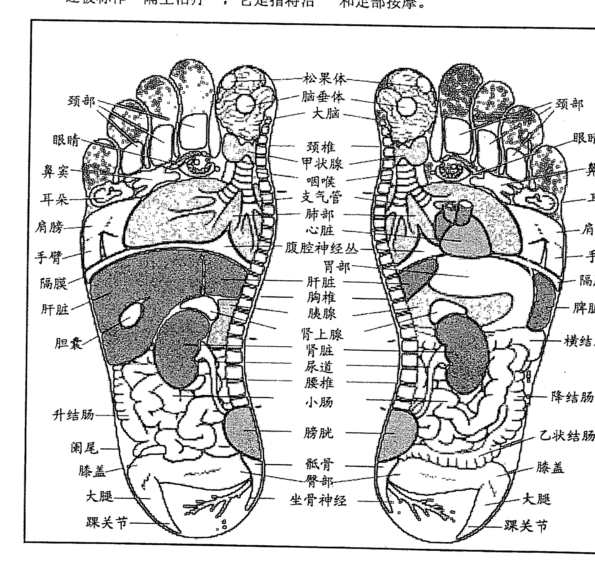

## 魔法师学徒的伴侣书 | 上卷

足部按摩的治疗艺术被称为足部反射疗法。这种按压治疗基于“冥想”的理念，或者能量的路径，比如地球上的能量线，从我们的头顶一直延伸到我们的脚底，包含了所有至关重要的系统。因此，脚底是由一种包含了整个身体的微观世界组成，足部不同的区域对应着全身所有的器官以及头部和躯干所包含的腺体。按摩足部的这些区域可以舒缓躯体上相对应区域的压力和疼痛，以达到天然的平衡和复苏。

现代的反射疗法起源于19世纪80年代伦敦亨利·黑德爵士的研究，他创造了反射疗法这个术语。1913年，医学博士威廉·菲特兹格拉得将反射疗法，作为区域疗法引进了美国。他将人的躯体分为了十个纵向的区域，并告诉大众“生物电能量”会流经这些区域，然后流入双手和双脚中的“反射点”。国际反射疗法协会的创建者尤妮斯·英厄姆，在20世纪30-40年代进一步发展了反射疗法，并将注意力集中在双足之上。她在双足上画出了人体的各个器官和腺体，创造了第一幅足部图解。

足疗师认为他们的按摩技巧能够减轻各种各样与压力相关的问题，包括头痛，经前期综合征，消化失调，血液循环不良，高血压，哮喘，以及关节炎和坐骨神经痛引起的慢性疼痛。

让患者坐在一张舒服的椅子上，脱下他（她）的鞋袜，首先轻轻地精心地为患者净足，使用一盆含有肥皂的水，洗完后用一张松软的毛巾擦干。然后，一次一只脚，主要使用你的大拇指，彻底地按压并摩挲这张反射疗法图解上的每一个区域。

如果患者抱怨很痛，或者痛得喊了出来，查看图解，看看疼痛的区域所对应的是身体的哪一部位。这也暗示了他（她）的这个部位有问题或者罹患疾病的潜在可能性。

按摩继续往上，一直到踝关节后面的浅凹处。慢慢来，通过你的患者享受的声音来判断。我敢保证你的患者会非常喜欢这种按摩！

这里有个由芭芭拉和凯文·坤茨创建的网站，上面有一个非常好的交互式足部图解：
http://uk.dk.com/static/cs/uk/ll/features/reflexology/extract.html

# 7. 自我治疗

文/弗雷德·雷蒙德(蓝色)和书月人(靛蓝)

## 个人健康习惯

健康的魔法师才能成为真正有效的魔法师！施展魔法意味着施展能量，为了能做好这一步，你需要身体强壮，健康，身体机能完善。

健康不仅仅是没有疾病。健康是一种有活力的，积极的状态，在这种状态下，身体、思想，以及灵魂都达到一种最佳的运转状态，打心底地觉得自己充满了幸福感和生命力。

以下是一些有关培养健康身体的建议：

- 保持正常的体重。
- 健康饮食，食用各种各样的新鲜水果，蔬菜，全谷物食物，以及富含蛋白质的食物，如肉类，鱼，鸡蛋，奶制品，豆类，以及黄豆。
- 避免食用一些加工过的或者油炸食品。
- 每天喝大量的水。
- 每晚睡眠至少要保证 7—8 小时。
- 一周至少有 4 天都锻炼至少半个小时。
- 培养一种爱好！研究表明拥有一种令人愉快的消遣方式能够很好地缓解压力。
- 和你在乎的人一起消遣时间。（另一种解压方式！）
- 每天都用一些时间来冥想或者从事精神练习。
- 定期看牙医和内科医生，进行例行的医学检查和免疫。遵从医生的建议！

## 预防和治疗仪式

在试图治疗他人之前，你应该知道怎样保持自己的身体健康，并且在生病的时候知道怎样进行自我治疗。以下是一种自我治疗仪式，你应该每天使用，作为一种强身健体的方式，保持身体健康，预防疾病。

每天花费至少 30 分钟时间——在起床之前，或者睡觉之前，或者都做——将注意力集中在你自己的身体以及其构成部分之上：双足，膝盖，大腿，身体各个器官的附着点，胃，消化器官，肺，心脏，等等。

在安静的房间中，在一张舒服的椅子上，或躺或坐，放松。接着，集中精力，（奥伯伦——将它们和其他地方讨论过的核心能量技巧联系在一起），用几分钟时间来进入一种冥想的状态。然后，沉思你身体的各个部分，从头到脚。

将注意力集中在体内的每一个部分并与之对话，就像它是一个独立的人一样。告诉它，你很感激它为你生活中的幸福和快乐所付出，而且你很爱惜它。然后去体会你身体的那一部分所反馈给你的感情或者感觉，并准备好给予回应。

如果你得到讯息，觉得自己的身体生病了，受伤了，或者有些疼痛，你需要在那一部分上花费更长的时间。花费尽可能多的去能量去召唤它，仔细聆听它所恢复的信息。

当你生病的时候，你可能无法时常召唤你体内的能量治疗生病的部位，而你的整个能量模式自身可能已经感染了疾病。因此，当你在进行治疗性愈合时，一般要请求宇宙中的充满爱心和治疗力的力量的帮助，而你则需要呼唤你平时惯用的那个名字。想象一股强烈的蓝色光芒从宇宙中来，并将你包裹在其中，然后将蓝光的主要部分引导到你体内受感染的部位。每天重复两次这样的冥想，每次 30 分钟，直到你恢复健康。同时，使用创造性的可视化：将那股能量想象为你自己的复仇骑士，对巡行作案的细菌穷追不舍，直至将其灭口！这种类型的导向性可视化已经接受了正式的研究方法的研究，而且研究结果表明可视化可以提升几乎每一种治疗的有效性。

如果你卧病在床（或者病倒在沙发上！），那么你将会有时间经常举行治疗仪式。与很多对症治疗的药物不同，宇宙中蓝色的治疗光芒没有任何副作用，因此，你不需要担心自己摄入过量。

> > 说明: 在你进行治疗仪式之前和之后尝试记录下你自己的生命体征 (Vital signs)。至少在几次的情况下这样做，这样不仅能够在实践中更加熟练，而且它可以显示出你在进行治疗仪式之后所发生的变化。

在仪式完成之后，双脚着地，集中精力，然后慢慢坐起来或者站起来。

### 例子

让我们想象你引导了一次自我治疗的仪式，并将注意力集中在你的双脚上。如果它们做出疼痛感觉的反应，这就表明你的鞋子太紧或者不太合脚，或者说你用脚过度。

你可能通过冥想仪式来将治疗能量输送到你的双脚中。然而，它也许还会让你做出明智的决定，采取一些直接的支援措施，比如购买一双质量好一些的鞋子，或者试着不要站立太长时间。

如果你觉得胃胀并且很不舒服，你可能已经吃太多了，或者吃错了东西。如果这样的话，将治疗光芒或者能量传送到你的胃部，也许可以帮助你缓解症状。一杯泡好的姜茶或者薄荷茶可以缓解反胃。你可能还想要更改你的膳食以避免更加地不舒服。

如果你采取了合适的治疗行动，你应该会在一两天之内感觉病痛缓解。如果你的症状还在持续，你可以考虑咨询一下你的执业医师。

这种类型的预防仪式可以加入到你日常的放松和冥想练习之中，不会花费你太多的时间与精力。

## 8. 治疗他人

文 / 弗雷德·雷蒙德（蓝色）和书月人（靛蓝）

当你已经掌握了自我治疗的技巧，而且能够保证自己在大部分情况下的身体健康，那么你便可以开始学着治疗他人了。

### 亲自治疗他人

> > 重要的注意事项: 除非你的病人处于昏迷或紧急状况，否则你应该在进行治疗前得到他（她）的准许。如果你的病人处于昏迷或紧急状况，你需要采取的第一步是拨打 911（在中国应该拨打 110 以及 120 电话求助——译者注），尽快让病人得到紧急医疗护理！

如果患者同意了，然后你需要问: “你能否想象自己正在身体，思想和精神上接受着治疗？”为了让患者进入治疗状态，你需要刺激他（她）自己的自我治疗力量，并让她（他）成为他自己治疗的一部分。将患者的意图加在自己身上，治疗效果会变得更加强大。

在你开始之前，记录下患者的生命体征 (VS)，同时还有患者病情的检测结果。

现在，双脚着地，集中精力冥想。然后，慢慢地从宇宙中吸收至少七股生命力进入自己体内。在你这样做的同时，提醒自己宇宙中治疗的能量正在通过你输入患者体内；这些能量并不是来自你的体内。
现在，在心中召唤宇宙来帮助你。（一些人可能也会选择召唤对他们非常重要的或者与他们的魔法教派相关的守护神明提供帮助。）在治疗他人的时候，帮助你的宇宙就像是一个通道，将能量传送给你。如果你想要试着只用自己的能量来治疗，你可能撑不了多长时间就会精疲力竭，而且你还可能深受患者病症的伤害。
在你治疗他人的时候，让你自己保持开放状态，接受宇宙中的治疗能量，让自己成为宇宙中蓝色治疗光芒的通道。使用这种能量来将你的患者裹入一个蓝光气泡之中，将大多数的光导向他们的病区或者疼痛部位。你也可以将光引向患者体内一个特殊的位置或者特殊的轮穴点。在你这样做的时候，让你的意识中的每一种意志力指向患者的治疗，并想象你的治疗成功后的场景。
你能坚持多久，就让这种治疗持续多久，或者直到患者感觉到了明显好转。为了达到最佳效果，让整个仪式进行半个小时。然而——尤其是因为你还是一个入门从业者——你必须非常小心，不要让自己的精力耗尽。如果你感觉有些累了，那你就该停下，别再继续。
在你完成之后，一定要接地冥想，恢复自身能量。然后在自我冥想结束后暂停一会儿，再离开治疗的地方，回到物质位面中。

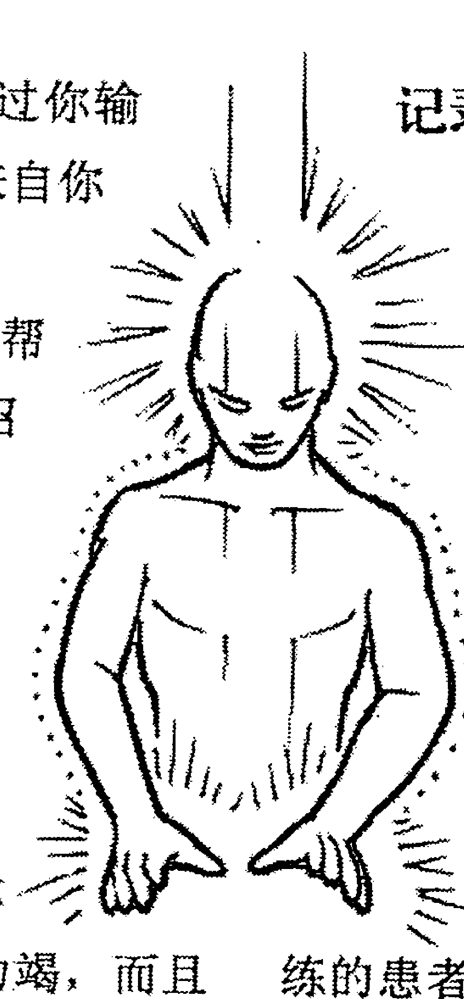

记录仪式后的 VS 和观察报告
如果可能，你可以教你的患者自己进行自我治疗仪式。轮流指着或者触摸身体的每一个部位，告诉他们用意志力驱使自己尽可能多的能量流向那个部位，然后与之对话，将它看作一个独立的人。告诉他们每天都要凭借自己的力量至少练习两次自我治疗，即使你不在场。即使是对于一个未受过训练的患者，这样做也不会造成任何伤害，反而有很多好处。你也可以帮助他们使用可视化。

### 隔空治疗

想要隔空治疗他人，你需要建立一种物理连接。如果你爱着那个人，或者非常了解他（她），那么这种情感就使得这种联系已经存在。否则，你需要让他（她）给你一张照片和一络头发。如果你有艺术才能，你也可以根据他（她）的照片为他（她）画一幅素描或者其他类型的画，或者你可以制作一个泥塑，然后用患者的名字为其命名。
在建立了物理连接之后，你便可以准备开始了。在一个安静的空间中，将连接物放在你跟前的圣坛上。接着，集中精力，向宇宙能量打开你自己，然后用宇宙的治疗蓝光，将连接物（你的患者的精神或者物理肖像）包裹起来，对于那些生病的身体部位要特别关照。如果一会儿之后你发现宇宙治疗蓝光并没有通过你而是直接包裹在患者的肖像上，你要接受这样发展，并让其顺其自然。

有时，你可能是治疗团体的一部分，所有的参与者都一起想象患者沐浴着宇宙的治疗蓝光。如果这样的话，你们所有人都想要在仪式开始之前相互协商，这样你们所有人才能在相同的时间用相同的方法可视化治疗能量。

一旦你完成了集体治疗仪式之后，不要相互讨论，甚至也不要和治疗团队的成员之间相互讨论。交谈会驱散治疗能量，而且会致使其失效。只有当治疗完成之后，而且你的患者再次恢复了健康，你才能自由地和他人讨论这次治疗的经验和教训，可供以后作为参考。这种在施法之后保持沉默的传统是所有种类魔法的共同原则，不仅仅是治疗中的。

# 9. 魔法的应急和安全

文 / 书月人（靛蓝）

我们生活在一个奇妙的世界中，这个世界中充满了冒险。无论你是在树林中探险，或者修饰一根魔杖，为一次仪式点燃蜡烛，在晴天远足，或者在本地的游泳池中潜水，随时记得注意安全是非常重要的。

学会了个人安全和急救的基本知识，不仅能够保障自身的安全，还能保护你身边的人，或者救助那些处于危难之中的人。

两本有关个人安全和基础急救知识的书籍是《童子军手册》（Boy Scout Handbook）和《童子军野外生存手册》（Boy Scout Fieldbook）。

其他一些较好的资源包括：

- 由美国红十字会和凯思林·A·韩铎（Kathleen A）合编的《美国红十字会急救和安全手册》（The American Red Cross First Aid and Safety Handbook）。
- 《急救速成口袋指南》（Fast Act Pocket First Aid Guide），库尔特·多芬斯（Kurt Duffens）和布莱德·里奇（Brad Rickey）合编。
- 《傻瓜的急救和安全》（First Aid & Safety for Dummies），查尔斯·B·英兰德（Charles B. Inlander），珍妮特·沃斯利·诺伍德（Janet Worsley Norwood），人民医学会合编。

大多数急救都具有一套完整的逻辑——即使你无法准确记得在一种情形下应该怎么做，但是如果你冷静下来仔细思考，你通常都能想起来。例如：

如果有人在流血，必须立即止血。
如果有人停止了呼吸，必须让他（她）重新获得呼吸。
如果有明显的创口，则必须清洗干净并施以保护。
如果患者太冷了，则需要给他（她）加温。
如果她（他）太热了，则需要让他（她）凉下来。
如果觉得反胃，那么你需要给他（她）吃点清淡的东西，或者不吃。
如果，骨头、关节或者肌肉受伤，那么就应该保持原状，不能随意移动。

**务必注意：**保护好自己，不要感染了通过血液传播的疾病（最典型的就是艾滋病，以及各种类型的肝炎），在处理流血伤口之前，戴上橡胶或者乳胶手套。

在你给患者敷用药膏，或者使用任意类型的药物或者草药制剂之前，你都应该问问患者是否对这些物质过敏。如果他们要过敏，就不要使用！

18岁以下的孩童，在父母允许之前，不能给他们使用药物和草药制剂。

## 身体状况评估：生命体征

你的急救训练中很重要的一部分，就是对受伤或者生病的患者进行身体状况的评估。术语“生命体征”是指患者的心率，呼吸频率，体温，以及血压。在检查生命体征的时候，你需要一支腕表（有秒针的）以及一支体温计。

心率，或者脉搏：你可以通过感觉手腕处的脉搏来提取患者的心率，轻轻地按住大拇指根部位置。记录十五分钟之内的心跳次数，然后乘以 4。这样你就得到了患者每分钟的心跳速度。

健康成年人的心率为 50—100bpm。孩子的心跳速度会快一些，婴儿的心跳最快。体质优良的运动员的心跳大约是每分钟 40—50 次——他们的心脏非常强壮，每一次心跳能够抽送更多的血液，因此心脏的跳动更为高效。

在某些情况下，你可能很难找到桡动脉的（手腕上的）脉搏。在这种情况下，你便需要检查颈动脉的脉搏。颈动脉的脉搏位于脖子处，就在颚骨尖角的下方。当你找到颈动脉之后，轻轻地按住它——你不能太用力，不然会阻止血液的流动。和腕部脉搏一样，检测十五秒钟的脉搏，然后乘以四。

在检查心率的时候，同时还要注意心率是否规律，或者是否有不规律的时候。

呼吸：在提取呼吸频率的时候，只需让患者正常呼吸，然后观察他（她）胸部的起伏。记下十五秒钟之内的频率，然后乘以四。

正常人的呼吸频率是每分钟 14—20 次。小孩子和婴儿的要快一些。

你也应该注意患者的呼吸是轻松的还是沉重的，患者是否会咳嗽，以及你是否听到不同寻常的杂音（气喘声，或者气过水的咕噜咕噜声，等等）。

体温：测量体温的方法要取决于你使用的是那种类型的体温计。如果是电子体温计，那就遵照体温计的说明书来测量。

对于成年人和大一点的孩子来说，普通的水银体温计便能测出他们的体温。让一些懂得怎么使用的人向你展示怎样“甩”体温计。患者应该将其放在舌头下 3—4 分钟。在用过之后再甩一甩，让其恢复到原位，然后用凉水（不是热水）冲洗，擦干。

正常人的体温（口部测量）在 97.8—98.6 华氏度之间。任何高于 100 度的体温都被看作是高温。

当你记录患者生命体征或者检查结果的时候，要将时间及一切信息都记录下来。不要只将其记在脑海中！你的记录对于患者的治疗非常有帮助。

## 魔法师学徒的伴侣书 | 上卷

## 可怕的突发事件

以下所提到的一些突发状况都超出了你所了解的范围。但是你至少需要知道它们，因为你正确的行为可能会拯救他人的生命。

在任何时候，在生命遭遇威胁的紧急情况之下，最重要的一步就是拨打 911（在中国应该拨打 120 急救电话求助——译者注），让患者得到专业的治疗。如果你必须处理一种威胁生命的危机，而无法亲自拨打 911（在中国应该拨打 120 急救电话求助——译者注），那么你就应该立即叫他人去做。

### 停止呼吸

症状：患者停止了呼吸。皮肤开始苍白或者呈现蓝灰色。脉搏变得缓慢，微弱，或者没有脉搏。

处理方法：拨打 911（在中国应该拨打 120 急救电话求助——译者注）。如果患者不能呼吸，立即使用海姆立克急救法。帮助他恢复呼吸。治疗休克症状。

### 动脉出血

症状：鲜红色的血液从伤口处喷出。患者可能会变得脸色苍白，并失去意识。脉搏变快。

处理方法：拨打 911（在中国应该拨打 120 急救电话求助——译者注）！直接按住伤口。如果还有另外一人可以搭手，让他（她）按住伤口与心脏之间的最近的一个施压止血点。将受伤的部位举高，超过心脏的高度。治疗休克症状。

### 突发心脏病（还被称为心肌梗塞，或者 MI）

症状：患者会喊疼，或者按压自己的胸部，左肩，或者左手臂。可能会呼吸不畅，而且全身冒汗。呼吸和脉搏加速。脉搏不规律。

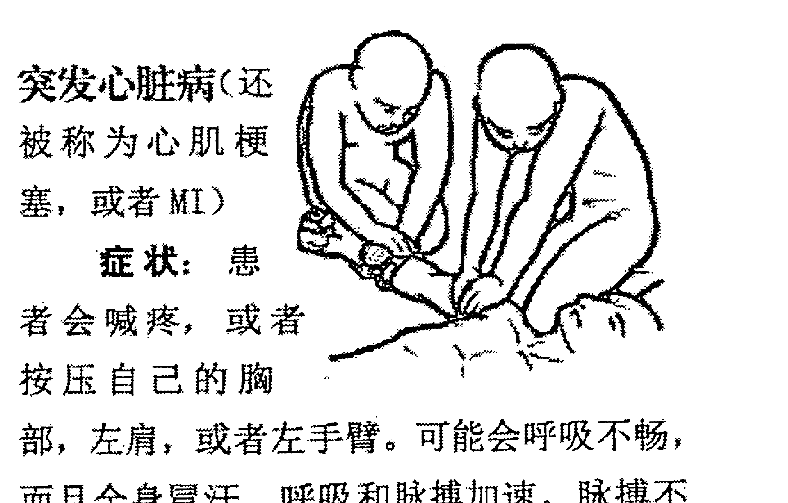

### 施压止血点

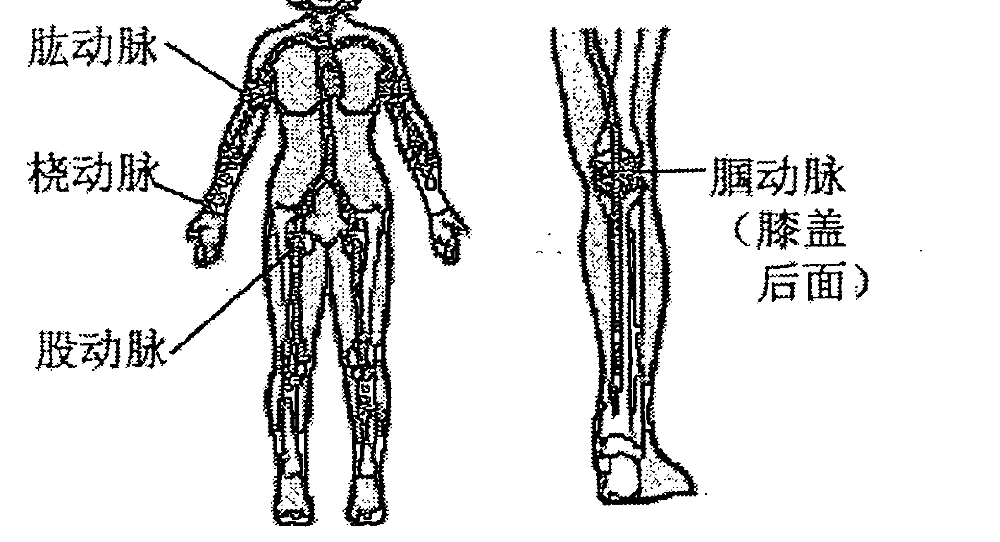

处理方法：拨打 911（在中国应该拨打 120 急救电话求助——译者注）。解开紧身的衣服。让患者处于一种半躺的姿势放松。让他们保持安静。如果患者意识清醒，而且能够吞咽，给他们服用一片阿司匹林。治疗休克症状。

### 过敏性变态反应

症状：患者会突然出现大量的过敏反应症状——发痒，肿胀，呼吸困难，哮喘，嘴唇肿大，疹斑，或者荨麻疹迅速扩张，等等。呼吸和脉搏加速。体温升高。

处理办法：拨打 911（在中国应该拨打 120 急救电话求助——译者注）。

患者有肾上腺素注射剂，立即使用。如果患者意识清醒，而且能够吞咽，给他口服50毫克的苯那君。试着让患者冷静下来。如果患者呼吸困难，让他保持半坐的姿势。治疗休克症状。

> 注意：“无菌”意味着完全没有细菌。小心不要碰到无菌敷料或创可贴的无菌部分

## 中风（也被称为脑血管意外，或者 CVA）

症状：患者会抱怨突然头晕，头痛欲裂，不能说话，或者无法移动身体的任一部分。处理方法：拨打911（在中国应该拨打120急救电话求助——译者注）。努力让患者保持冷静。如果患者呼吸有困难，让他保持半坐姿势。治疗休克症状。

## 休克

症状：休克会伴随所有严重的伤害或者危险。患者面色苍白，会冒汗，可能会呕吐和头晕。呼吸可能会变慢而且变得微弱。脉搏可能会加速并且变得微弱。处理方法：拨打911（在中国应该拨打120急救电话求助——译者注）。将患者放平，将双腿抬高。（注意：如果患者呼吸困难，则应该让其处于斜倚姿势，双腿举高。）不要让患者受凉。

## 简单的伤口、擦伤、青肿

在活动性出血的情况下，你需要对伤口施压，直至血被止住。将受伤的部位举高，高于心脏同样也能减慢流血速度，按压施压止血点也能达到相同的效果。当流血止住之后，用肥皂水轻轻地清洗创口，然后用流水冲洗。敷上抗菌药膏和裹上创口贴，或者无菌纱布（用胶带固定）。

对于青肿的部位，用冰块敷在青肿区域20分钟，每两小时敷一次。两天之后，停止冰敷，改用热敷，这次每2—3小时敷20分钟。

- 泡制的蓍草和金盏花水可以用于清洗较小的伤口。
- 要制作这种药水，首先将两杯清水煮开。
- 从火炉上移开，加入1—2茶匙的干蓍草或者金盏花粉末（或者2—4茶匙切碎的新鲜花瓣），浸泡10分钟。
- 过滤之后，使用浸泡过的液体清洗伤口。
- 在使用之前，一定要确定药水已经变凉！

## 反胃

如果你认为你自己或者别人吃了一些不干净的东西，首先要呼叫中毒控制中心。美国国家中毒控制中心电话是1-800-222-1222（中国疾病预防控制中心职业卫生与中毒控制所电话为010-83132399——译者注）。

对于轻微的反胃，一或两剂钙基抗酸剂便可以缓解症状。

- 生姜或者薄荷制剂（茶）可以缓解翻江倒海的胃。
- 要制作这种汤剂，首先煮开两杯清水。
- 煮开后从火炉上移开。
- 制作薄荷茶时，加入2—3茶匙干的薄荷叶子粉末或者2—4茶匙切碎的新鲜叶子；
- 制作姜茶时，将新鲜的姜切成1英寸厚的小块，放入开水中。
- 浸泡5—6分钟。
- 过滤后，取一杯给患者饮用。
- 如果你喜欢甜味，可以加入蜂蜜。

如果开始呕吐，不要让患者口服任何东西（包括水！），直到呕吐停止为止。呕吐停止后，你可以给患者喂食一点冰块或者少量的白开水。如果患者没有不舒服，可以酌情逐渐增加水量，然后食用肉汤，苏打水，甜味的草药茶水，或者稀释过的苹果汁。慢慢地增加日常饮食量，提供一些谷物，水果，最后才能是蔬菜。如果患者再次呕吐，再次从头开始。

如果患者在反胃的同时还抱怨胃痛或者腹部痛——尤其是当他（她）还发着高烧——则需要立即请医生，以确定是否患上了阑尾炎。

## 烧伤和割伤

烧伤是由高温引起的，可以分为三个等级，一度烧伤，二度烧伤，以及三度烧伤。第一等级的烧伤，皮肤泛红，没有破皮。可能会很痛。晒伤就是典型的一级烧伤。第二等级的烧伤，皮肤泛红，起水泡，而且非常痛。第三等级的烧伤，破皮，损伤严重，通常会造成软组织损伤。看起来非常像是烧焦了，皮肤呈现灰白色，或者变红。深度的软组织和骨头可能会显现。可能会痛，但是也有可能没有痛感。

## 处理方法：

对于一度和二度烧伤，用冷水或者烧伤水凝胶敷在烧伤处。用轻透的无菌纱布包裹。一度烧伤在愈合后可能会蜕皮；此时，使用无香味的洗液清洗伤处也许能够缓解疼痛。在这种情况下，金盏花药膏也很有用（参考草药制剂的制作方法）。

对于二度烧伤，用无菌纱布包裹水泡区。不要挑破水泡！在烧伤处愈合之前，伤口都得一直裹上纱布，开始愈合后才将纱布除去。如果需要的话，可用布洛芬或者醋氨酚止痛。如果二度烧伤的区域大于一片面包的面积，那么就需要立即请医生。

对于三度烧伤，用无菌绷带包裹伤处，不要让患者休克，将患者送到急救室。三度烧伤是一种医疗紧急事故。

> 注意：在烧伤的伤口上涂抹黄油是一种流传下来错误观点，其弊大于利。

对于化学品灼伤，立即用流水冲洗灼伤区域。如果刺痛还在继续，或者残留物还在继续灼伤皮肤，立即咨询医生。如果溅入了眼睛中，使用流水冲洗，并立即咨询医生。

## 体温紊乱：体温过高和过低

“Thermia”的意思是体温。如果你是高温，那么就表明你体内有着太多的热量而且过热。如果你是低温，那么就表明你热量过低，而且太冷。如果不治疗的话，这两种情况都非常危险。体温过高（中暑虚脱以及中暑）和体温过低可以通过根据环境穿着适当的衣服以及通过避开极端的天气情况来预防。体温过低的人看起来有些糊涂，语速减慢，缺乏协调力，走路磕磕碰碰。他们急躁易怒。在极端的情况之下，他们可能失去意识，并陷入昏迷。呼吸和脉搏都会减慢，体温骤减。手指，脚趾，鼻子，以及耳朵非常容易受到冷空气的伤害，众所周知会被冻伤或长冻疮。冻伤实际上是指软组织开始僵硬。被冻伤的软组织看起来呈现灰色，青白色，或者黑色。

体温过低的患者应该立即送往急诊室。如果条件不允许，那么就要把他们安置在温暖的房间中。要将他们身上单薄的衣裳脱去，换上厚实温暖的衣裳，盖上毛毯。为他们准备饮用的热水。应该让他们慢慢暖和起来；如果突然变暖和，他们可能会休克。

冻伤的患者必须立即送往急诊室。冻伤的区域要轻轻地盖住。在任何情况下都不能用水给他们擦洗或者浸泡在水中！所有的这些行为都会加剧软组织的损伤。

中暑虚脱的人面色通红，汗流浃背，看起来非常虚弱，走路歪歪斜斜。会伴有脱水，而且还有可能会昏厥过去。中暑虚脱的患者应该被带到阴凉的地方。尽可能多地将身上的衣裳除去，喂少量的冷水。扇子会有帮助，用湿润的浸过凉水的布擦洗腋窝和腹股沟处也有一定的效果（和施压止血点的位置一致）。

情况严重的体温过高也被称为“中暑”。中暑的时候，人体的冷却机制失灵，而且人体将无法自我降温。患者的皮肤会发烫，干燥，肤色苍白。他们的体温会骤升到105华氏度或者更高。可能会呼吸停止，心脏停止跳动。中暑是一种医疗紧急事件。必须让患者的体温降下来，否则他们会死亡。中暑的患者必须立即送往急诊室。

## 水泡

将起水泡的区域轻轻地洗净，擦干。

将一颗针或者你的随身小折刀的尖部用火焰消毒，然后用针尖或者刀尖轻轻地将水泡边缘挑开（水泡的皮已是死皮，因此这样做不会痛）。抹上抗生素药膏，包上纱布或者邦迪。

## 扭伤和拉伤

当肌肉，筋腱，或者韧带被拉伸或者撕扯便会导致扭伤和拉伤。扭伤或者拉伤的人会觉得非常痛，而且无法承重或者使用受伤的肢体。会有明显的肿胀和挫伤。（我的女儿曾经扭伤了踝关节，而且非常严重，那时她的踝关节看起来就像是一个蓝色的哈密瓜！）

为了预防在户外的时候踝关节和膝盖受伤，最好穿着结实的鞋子或者靴子，走路的时候小心一点，并准备好登山杖。在经过不稳定的斜坡或者布满岩石的斜坡时要万分小心。

扭伤的患者应该立即停用受伤的肢体。使用 R-I-C-E 治疗法：

- **R: Rest (休息)**。不要让患者再使用受伤部位。如果条件允许，将受伤部位固定。
- **I: Ice (冰块)**。敷冰袋，以减轻挫伤，每2小时敷20分钟。
- **C: Compression (按压)**。在受伤的部位轻轻地缠绕一个“ACE”绷带，注意，只是抱起来，不要拉伸绷带。
- **E: Elevation (抬高)**。将受伤的部位抬起来，高过心脏的高度。

用布洛芬止痛。情况严重的话，你可能需要处理患者的休克。如果肿胀或者疼痛很严重，或者在两天之后还没有明显好转的话，就需要让医生检查一下，看看是不是出现了骨折。

## 昆虫，蜘蛛，以及壁虱咬伤

搞清楚你所在区域的有毒生物。例如，在俄勒冈州，我不得不小心普通黄蜂，以及蝎子，有菱形斑纹的响尾蛇，黑寡妇，隐士蜘蛛。要培养一些习惯，在穿戴之前习惯性地抖一抖手套，靴子，以及其他的户外用品，这样你才能在你戴手套穿鞋子的时候减少接触到有毒昆虫的可能性。

在多虫的国度，使用防虫剂，不要站在水中，因为这种地方是蚊子繁殖和孵化之地。

在有壁虱的国家，你不能将你的皮肤裸露在外，将裤脚扎入袜子里，上衣扎入裤子里，等等。在晚上睡觉之前，检查全身的皮肤，以便找到所有潜伏在你身上的壁虱。

抹上皮肤炎软膏之后，蚊虫叮咬的部位也许会得到缓解。如果你在户外，无法找到药膏，泥土也能生效，一贴用水和小苏打调和起来的膏药也是如此。草药膏——尤其是金盏花——也会有帮助，冷敷和冰袋也可以。蓍草和金盏花洗涤伤口也能减轻痛苦（参考前文中有关“简单的伤口，擦伤，以及青肿”中的方法。）

如果被蜜蜂叮咬，则用你随身小折刀的刀刃将刺“猛地剔除”，然后用上面的方法应对。

如果对蜜蜂的叮咬过敏，立即使用他们的急救药品，用冰袋敷叮咬的伤口，然后将他们送往急诊室。

要驱除壁虱，需要用镊子将其夹住，稳稳地往外拖，直到将它拔出。使用应对创口的方法处理这个位置。让医生看看是否需要进一步治疗。（某些部位被壁虱咬伤后可能会引发疾病。）

## 有毒的或者刺激性的植物

如果你生活在长有大量有毒栎树，橡树，或者漆树的地方，要学会辨认这些有毒的植物。所有人都必须知道荨麻长什么样子。（你只能误入荨麻地一次！）
不要使用任何的野菜或者野浆果，除非你能确定它是什么。千万不要吃野地里的蘑菇，除非有一位专家在现场，而且能够向你保证它们是安全的。

如果你不小心接触了有毒植物，立即脱去衣服，洗个热水澡，使用大量的肥皂和水。如果你身上开始爆发皮疹，涂抹可的松药膏也许会有帮助，或者使用湿毛巾冷敷（使用白开水或者金盏花，蓍草，或者金缕梅泡制的药水——和上文中所提到的方法一样）。

如果你相信有人已经进食了有毒的植物，马上与中毒控制中心取得联系，电话号码为 1-800-222-1222（中国疾病预防控制中心职业卫生与中毒控制所电话为 010-83132399——译者注），并严格遵照对方的指示行事。

## 制作一个急救箱

你的急救箱应该小巧轻便，能够在远足的时候随身携带。为了让你的急救箱发挥作用，就不能将其放在家里的壁橱中！

急救箱中应该有其自带的容器，小型的能够装下应急药物的盒子——就像胶卷盒，或者欧托滋盒子那样。

无论你在哪儿，都要带上你的急救箱，并且使用里面的东西，在回到家以后要经常更新补充里面的物资。这样你和你的急救箱才能在任意时候都随时出发。

## 基本的急救箱:

- 塑料袋装的小块肥皂
- 乳胶或者橡胶手套
- 大手帕或者大方巾
- 抗菌药膏（例如：抗生素软膏新斯波林）
- 1% 可的松药膏（可直接使用的成药）
- 各种尺寸的邦迪
- 3 英寸的方纱布
- 一英寸的急救带
- 斜纹棉布（用于水泡）
- 一副小剪刀
- 一把镊子
- 一小叠纸
- 铅笔
- 3—4 个塑料袋（可封闭的）
- 一小瓶防晒霜
- 一小瓶防虫剂
- 火柴
- 阿司匹林药片（非处方）

## 自选物品:

- 一小瓶洗手凝胶
- 晒伤修护凝胶，麻醉 / 抗菌喷雾（例如：肌乐），等等。
- 三英寸宽的布织绷带
- 用于人工呼吸的塑料密封罩（译者注：密封罩是在口对口人工呼吸时为避免两者之间的直接接触而使用的一种锥形辅助工具）。
- 捲式护木（例如：一种可折叠的，易于携带的夹板系统）
- 太空毯
- 质量优良的缝衣针
- 苯海拉明 HCI（苯那君）药片（非处方药）
- 布洛芬（摩特灵）（抗炎，镇痛——译者注）或者醋氨酚（泰勒诺）（解热，镇痛——译者注）药片（非处方药）
- 抗酸药片，例如坦适胃锭（非处方药）。
- 净化水的药片
- 草药：干燥的粉末，药膏，等等。
- 任何你需要的东西。

# 第六章 草药学（绿色）

## 奠基石

> 我的生活不是一，而是许许多多：
它是一桶香菜和夏的薄荷
满满当当，溢出了橡木桶的边缘，
它长于肥厚的土壤以及
快要将锈迹斑斑的桶箍撑断
它是一个充满我童年的古老水池，就像
我生活的日子用历史填满了未来的空洞，
在那里，
我种植了不真实的梦想，却莫名地繁盛
就像拒绝屈服的
热带龙蒿
经历了冬天的鞭打
后，在每个春天都会重获新生。
它是位于中庭凹口的一个绿色角落，
薄荷总是逃进
这个院子，鬼鬼祟祟地将其橄榄绿的脚趾
溜进
砖石之间，在整个角落里蔓延
刻上：“爱”，“友善”，“和平”，以及“希望”。
——伊丽莎白·巴纳特

## 1. 简介

欢迎来到草药学的世界！
Wortcunning是一个古老的英文单词，
用于指代有关草药神秘性能的知识，
通常是巫士的特殊研究方向。草药学
包括草药知识和种植魔法的方方面面。这
个学科还包括一些实用的工作——比如园
艺和烹饪魔法。

这一部分的任务是让魔法学徒具备牢
固的知识基础，掌握草药知识和种植魔法
从神话到方法的各个方面内容，包括实
际应用和民间传说。作为魔法中一种长久
存在的传统，草药学的艺术让魔法师具备
了日常生活中的魔法和世俗两方面的有益
工具。我们所关注的事情包括（但是又不
限于此）：知识，治疗，
安全，药物，生态学，
以及与地球的和谐共处。

- 知识
- 治疗
- 安全
- 药物
- 生态学
- 与地球的和谐共处

这一学科的魔法颜色
为绿色，代表着土元素。绿
色是纸杯的颜色，就像在园艺和草药医术
学一样，代表着生命力和繁荣。希望、愉悦、
高兴，成长和改变都是绿色所包含的方面。
森林绿与生命力、肉体、勇气，以及传统
音乐或者狂野的声音有关。常春藤绿代表着
情绪方面的东西，可克服悲痛情绪，悬崖
边上的思考，以及安静的音乐或者沉寂。
淡绿色，是新生草地的颜色，推动治疗的
进程。

## 2. 草药学是什么

文 / 书月人 (靛蓝)

你可能已经对草药学有了一定的了解。也许你会在烹饪的时候用到它们，或者喜欢饮用药草泡制的茶水。你可能已经制作了一个草药花冠挂在家里，或者你在沐浴的时候会使用草药皂或者植物精油。如果你有个院子或者花园，那么里面很有可能会生长一些草药，无论是野生的还是你刻意种植的。

药草是什么？词语“药草”用于指代一些通常用于医学或者烹饪的芳香族植物。药草的科学含义是一种非木本植物，组织顽强持久，通常会在生长季节过后枯死。

草药医术学是理解和使用植物的魔法，医学，以及其他特性的学问和艺术——尤其是草药，或者在古英语中称为野菜（worts）。在魔法师的世界中。草药的研究和它们的使用有一个古老的名字，叫做草药学（Wortcunning）。

草药学拥有一个悠久而且丰富的历史。很久以前人类就开始将草药用于烹饪和医学。很多文化都在其宗教或者精神实践中都包含了草药，还有一些文化将草药和香料看得比黄金和首饰更为珍贵！15世纪，罗马陷落之后，盐和香料的贸易通道变得尤为宝贵，国家之间经常为之发动战争。美国历史上最为多姿多彩的时刻之一便是“波士顿倾茶事件”，彼时，殖民者不愿意为他们所钟爱的英国茶支付高额的赋税，而英国茶被他们视为文明生活的重要部分。

今天，草药无处不可见：食物、糖浆、饮料、染料、织物、香水、装饰小摆件，牙膏、蜡烛、花园，以及其他许许多多的地方。具有药用价值的草药生意在近年来以惊人的速度迅速增长，这一切都多亏人们对于非传统（“西方”）医学不断增长的兴趣。

草药通常是魔法世界中的重要部分，无论是在符咒、蜡烛魔法、治疗、仪式饮料，还是很多其他的用途中。草药的颜色，精油，以及香味对于情绪，态度，和意图，以及魔法行为和法术施展的所有重要部分都有一种强大的影响力。

## 收获和使用药草——基础

药用草药的化学成分——以及治疗性能——会受到收割的时间和方式的影响。根据植物的种类，我们所收获的部位也有所不同，分为花朵，叶子，茎干，根，鳞茎，皮，种子，或者汁液。

通常情况下，我们都按照以下的方式来收割草药：

1. 开花草药最好在干燥天气的早上收割。
2. 根和鳞茎都有其最佳的收获季节。
3. 一旦收割之后，草药都应该立即用掉，或者快速风干，远离阳光或者明亮的光照。
4. 风干之后，草药应存放在玻璃或者陶瓷容器中，贴上标签（和收获日期），储藏在暗处。

## 3. 草药学——术语表

文/书月人

如果你开始学习草药，你需要了解一些新的词汇。以下是一些比较常用的术语：

**牛黄：** 危险毒素的解毒剂。

**魔法香囊：** 放在一个像容器，或者布袋中的一种，或者多种草药（有时是其他物质）。草药的性能和使用者的意图会赋予香囊力量。

**敷布：** 浸在热的或者冷的草药浸剂中的纱布块，然后用于敷在患处。

**乳膏：** 将草药与水，油脂，以及/或者精油混合，形成膏状混合物。

**汤剂，煎剂：** 新鲜的或者风干的草药加入水中用中火熬制最长一个小时。

**风干：** 从草药中移去所有水分的过程，这样可以将它们储藏较长的一段时间。即使只余下非常少的水分，草药都会发霉，并变得一文不值（而且使用这种草药会非常不安全）。

**万能药，长生不老药：** 一种能够治疗所有疾病或者延长寿命的药剂。

**浸剂，汤剂：** 浸剂就像是一种茶水，但是它的药性更强（加入更多的草药，并且/或者将草药浸在液体中更长时间）。有时会加入其它的成分——比如甜味剂。

**浸泡油：** 将草药加入基底油中，用文火加热一段时间。然后将油过滤出来，储藏在一个阴凉，避光的地方。在冷温的浸剂中，可以将草药在基底油中长时间浸泡，有时可以长达2—3周，不用加热。

**擦剂：** 这种药剂和酊剂的制作方法相同，但是基础浸剂变成了外用酒精。最后泡制出来的药剂只能外用（瓶身上也要这么注明！）擦剂用于摩擦疼痛的肌肉和关节。

**药膏：** 草药与油脂，蜡（例如石蜡，蜂蜡）以及/或者精油混合在一起，制作成浓稠的膏状混合物。

**春药：** 一种“激发性欲的药”。

**膏药：** 与“膏状药”相同。

**毒药：** 任何对于受体来说都是有毒的，能够引发疾病或者死亡的物质。一些药物在使用了不安全剂量，或者使用方式不正确的情况下，也会变为毒药。一般标示某种物质有毒的图标为一个骷髅头，外加两根交叉在一起的骨头，以及奥育贴纸（“Mr. Yuk” sticker）。

**散剂：** 风干的药草经过食品加工机加工或者使用研钵和研杵碾碎成细小粉末。然后用空胶囊将这些药粉装起来。

**饮剂：** 用于想要取得药效的人饮用的所有类型的酿制液体（例如，浸剂，汤剂）。

**膏状药：** 将草药整个切碎，捣烂，放入水中短时间加热使其萎缩。然后将加热过的药膏敷在患处，用纱布等诸如此类的东西将其包起来固定。

**软膏：** 和“药膏”一样。

## 第六章：草药学（绿色）

**洁肤水**：一种浸剂，用于清洗伤口、皮疹等等。如果你身患某种疾病，你应该咨询有能力的健康专家。

**糖浆**：将蜂蜜或者未提炼的糖加入草药浸剂或者汤剂中。糖浆通常用于治疗咳嗽或者制作小孩子服用的有甜味的药物。

在魔法师的字典中，草药是一门科学，一门艺术，以及一门魔法练习。说它是一种科学，是因为它会用到一些包含了活性化学成分并且会引发特殊反应的物质。草药的科学要求了它的精确度以及对于细节的特别关注。草药的使用也是一门艺术，因为一个好的草药医生会在使用草药的时候动用他们的所有感官，并学着去对患者、病情，以及最佳的草药配方进行一种评判。

**茶水**：茶水是将新鲜的或者风干的草药放入一定量的热水中浸泡特定长度的时间。

**治疗剂**：如果是治疗剂，那么它既能治疗疾病，也能养生。

**酊剂**：将草药（新鲜的或者风干的）放入酒精或者酒精和水的混合物中浸泡而成。酊剂在使用的时候通常剂量以滴来计量（非常少的量）。

在魔法和仪式上对于草药的应用使得草药医学成为了魔法练习中的重要方面。

**棕榈汁**：一种传统的混合物，热的草药浸剂与一些酒精混合而成。通常会添加柠檬汁和蜂蜜。

> > 大地母亲是我们的植物女神，
> 是她让魔法和药用草药得到了祝福。
> ——杰西·沃夫（狼）·哈丁作

草药练习要求悉心钻研。如果你决定对于草药学进行一种严肃认真的研究，你需要花费多年时间来进行研究和练习，才能得以初步掌握这门艺术。

**补药**：一种汤剂，既可治疗疾病，也可养生，或者延长寿命。补药通常会根据季节的不同来进行服用，例如“春季补药”。

## 4. 安全地使用草药
——书月人（靛蓝色）

很多草药是完全安全的，而也有一些草药会存在造成有损害性的副作用。其中还有一些是致命的。

> **重要的注意事项：在你更进一步阅读后面的内容之前，请先阅读以下内容！**

在美国，食品药物管理局（FDA）并未对草药做任何规定与控制。想要安全地使用草药只能仰仗你自身的智慧、谨慎，以及个体从业者的正直。作为一名魔法师学徒，了解草药的操作和应用的规则是非常重要的。

在没有仔细研究过与草药有关的所有注意事项之前，你不仅不能自己服用，而且也不能推荐他人使用药用草药（详情请查看参考书目中所提供的有关此类警示的资料）。

让我们一起来总结一下几条基本的安全守则，以及为什么要遵从这些守则。

## 1. 你是一名刚入门的魔法师，因此，你只能按照专业人士或者专业导师所批准的使用方法使用草药。

随着你在研究中对草药越来越熟悉，在你的魔法日记本中为之留一块位置，记录下你的草药“体验”，例如，你是怎么做的，草药的药效怎样，等等。通过这些，你将会慢慢建起一份有关草药的工作档案，里面记录着你已经学会的，而且能够安全使用的草药。

## 2. 记录你所学到的东西。

将你每一次使用或者研究的新草药都记录下来。在你的日记本中，为每一种草药准备单独的一页。在这一页上写下你所了解到的，或者查找出来的有关这种草药的所有内容。如果可以的话，为这种草药画一幅素描。在后面添加上你的草药实验。如果你对每一种草药做有这样的记录，不久之后你便会对它们了解更多。

## 3. 就是因为它是一种草药，所以它才并不安全。

很多人觉得草药是一种天然的物质，所以自动地就将它们归类为安全的物质。他们认为草药是天然的，不会给人造成任何伤害。
错！
即使是草药也会造成一定的伤害。比如，毛地黄——它开出的花非常美丽——可以提炼出洋地黄制剂。洋地黄制剂是医生用于治疗心脏病的……但是，如果使用不恰当，这将会是一种致命的毒药。为了保障安全，所有的草药都应该被看作是一种药物。最好还是将中毒控制中心的电话记在脑海之中。

## 4. 在你使用草药之前，一定要对其进行学习了解。

在《魔法师学徒的魔法书》中记录了一些有关草药的基本信息。你可能还想要参考一本或者多本有关草药的书籍或者野外生存指南。同时还有一些非常棒的网站，里面提供了详细的信息，通常还伴有特写图片。参考索引中的“参考资料”以获取更多信息。

## 5. 在使用某种草药之前，确定其身份和特性。

在使用某种草药之前，你必须绝对确定你所使用的是什么。
想要确保你所使用的草药的正确性，最好的方法就是从有信誉的经销商处购得，比如，天然保健药店。你可以购买原生态的，未经加工过的草药，也可以购买加工过的草药、药片、胶囊、茶，等等。
在你购买草药制品之前，一定要在标签上看清楚草药的学名，药品是用草药的哪一部分制成、出产日期、有效期、生产厂家的名字和地址。
另一种确保草药的方法是自己种植，从那种种有大量草药的花园供给店购买种子或者种苗。
最后，但也是很重要的一点是，了解和使用草药的拉丁名字是一个不错的选择。这样，你便能保证你所说的品种和你的老师所说的，以及参考资料上所提及的品种是一样的。如果你说“薄荷（mint）”，这个词语会牵涉到大量的不同的薄荷种类。如果你说野薄荷（mentha arvensis），其他的草药使用者就能知道你所提及的是中药中的一种特殊的薄荷种类——胡椒薄荷。

## 6. 在使用预先配制好的草药药物之前，你要对其成分进行确认。
草药药品中可能混有没有标记出来的药物或者材料。在了解清楚药品的每一种成分之前，千万不要使用预先配制好的草药药品。声誉好的厂商会将每一种成分都标示在标签上。

## 7. 注意，草药与草药之间，草药与其他非草药药剂之间可能会相互冲突。
当草药与处方药或者非处方药一起服用时，可能会引发健康问题。一些草药产品中含有的活性成分可能会引发意想不到的副作用。比如，未经加工的美洲蒲葵含有一种类似于雌性激素的化学成分，而银杏会阻碍血液凝结。
如果你每个季节都需要规律性地服药，那么在使用草药之前你应该和你的医生讨论一下它们之间的相互作用。即使你的医疗服务人员认为你在服用处方药的时候可以使用草药，也不要同时服用两种药物，因为它们之间可能会冲突，或者相互抵消药性，或者其他。

## 8. 做好准备！
在你开始配制草药之前，将所有的材料准备好。仔细审查你的配方与信息，并且从头到尾认真阅读说明。确保你已经事先考虑了安全性。准备一张纸一支铅笔，记录下你实验的所有细节。

## 9. 在准备草药的时候，完全遵照用法说明。
当你配制草药的时候，并不是越多越好！在使用不当的时候，即使是一种很安全的草药也会变成毒药。遵照用法说明，仔细称量，严格遵从介绍中所提及的剂量。

## 10. 对孕妇和哺乳妈妈，小孩子（6岁及以下），以及婴儿用草药时一定要谨慎小心。
胎儿和婴儿无法解毒草药中有害成分的毒素。任何毒素进入他们体内之后都会对他们的生理机能产生严重的压力。咖啡因就是一个很好的例子。对于成年人来说，一杯咖啡中的咖啡因需要五个小时来代谢，但是相同剂量的咖啡因在婴儿体内需要80个小时才能清除。
然而，也有很多草药对于孩子和婴儿来说是非常好的。新生儿应该从妈妈的奶水中吸取草药。洋甘菊是非常经典的可以促进婴儿长牙的草药，而接骨木花对于治疗婴儿高烧非常有效。同样的，有很多草药都可以放入植物甘油中制成酊剂，喂给孩子。
因为还有很多草药没有进行科学研究，因此学徒在服用或者推荐他人服用之前，必须要认真研究每一种草药的注意事项。弗朗西斯·布林克的《草药禁忌和药物相互作用》是一本很好的有关草药注意事项的入门书籍。
年长一点的人（65岁以上）以及身体健康状况不好的人（尤其是肝脏和肾脏有问题的人）在使用草药的时候也应该小心。
在没有父母允许的情况下，千万不要给18岁以下的孩子服用或者推荐草药。
务必将草药存放在小孩子接触不到的位置。

## 11. 给予草药生效的时间。
在更改剂量或者中断使用草药之前要等一段时间，让草药生效。在这一方面，你的指导员和导师会给你一些建议。和所有的药物一样，草药在支持性环境中药效最好。想要达到最好的药效，需要保障最佳的健康状态：良好的睡眠，运动，饮食规律。

## 12. 如果产生了副作用，立即停止使用草药。
副作用是你在服用草药之后最不期待的效果。副作用（也被称为“意外情况”）包括恶心，呕吐，皮疹，腹泻，焦虑，等等。如果产生了副作用，则必须立即停止用药。如果副作用一直持续，则需要咨询医生的意见。

## 13. 将你的草药标好标签存放妥当，放在幼儿接触不到的地方。
务必要将你的草药做好标签，填好日期。这样做可以帮助你更好地区分它们，而且草药是否过期也能一目了然。和所有的药物一样，草药都应该存放在小孩子接触不到的地方。将它们放在可以密封的玻璃器皿中，存放在避光的位置。如果暴露在阳光之下或者接触了高温，草药就会很快失效。

## 14. 千万不要内服任何精油。
精油只能放入洗液，面霜，以及吸入药剂中外用。内服之后会非常危险，因此千万不能放入内服药物之中。将它们放在小孩子接触不到的位置。

## 15. 当你遭遇了一些你不认识的草药，不要轻举妄动，咨询专家。
> 这可能是最重要的守则。当你有不太清楚的事情，你必须停下你所做之事，学习你需要了解的知识。这样做最简单的方法就是去询问一位专业的草药医生。
你可能不擅长询问问题。你可能害怕去承认你对答案一无所知。但是学习魔法最重要的一部分就是永远充当一位探求者。没有魔法师能够知晓天下，即使是最伟大的魔法师也会询问很多问题。安全使用草药的伦理道德要求你要把安全放在首位。有疑问的时候……一定要提出来。

## 5. 培植一个简单的草药园
文/书月人（靛蓝色）
如果可能的话，采用丛植，而非列植。这样做对于种植草药来说尤为有效，因为它们可以将整个空间填得满满的，而且非常和谐。选择一片每天日照能达到6—8小时的土地。光照时间越长越好！在你种植之前要好好培土。准备一袋或者两袋的有机肥料，并撒上适量的缓释型肥料。如果确实不可能的话，那就“走有机路线”。不要使用杀虫剂和除草剂，你可以将蚯蚓、瓢虫、蜜蜂，以及蜘蛛引入到你的草药园中，这样可以保证草药园的生态健康。

以下是一些非常具有吸引力的、容易种植的，而且有多种用途的草药，以及有关的种植建议：

- 1. 薰衣草——不同种类的薰衣草的植株尺寸会有所不同。薰衣草丛是草药园中的焦点，同时它也非常能够吸引蜜蜂！
- 2. 薄荷（胡椒薄荷，绿薄荷，等等）——种植的时候使用根茎种植，非常好种，同时，你想要根除它们的时候也非常简单，只需毁掉它们的根茎。为了防止根茎被虫破坏，一些人会将它种在花盆中，然后再埋在地下。你只需任其自由生长，在发芽以后拔去不想要的植株。
- 3. 鼠尾草——多色的鼠尾草会让你的草药园变得非常漂亮。
- 4. 百里香
- 5. 牛至——蜜蜂非常喜欢这种植物！
- 6. 金盏花——“金盏菊”。这是一种非常可爱的花朵，会招引蜜蜂，而且有药用价值。花瓣加入沙拉中也非常不错（而且非常漂亮）。
- 7. 细洋葱
- 8. 迷迭香——种类繁多，一定要仔细挑选。有些植株较小而且浓密，有些长得非常大而且非常快。你可以在草药园的后面或者边上种上一大丛。大株迷迭香的茎干可以用作烧烤的串肉扦子。
- 9. 香蜂草
- 10. 甘菊

如果你的空间足够，你还可以考虑种植荷兰芹，山萝卜，以及血色酸模属植物。这些都是可以食用的，而且具有药用价值。酸模属植物，因为其叶面上有红色脉纹，也不失为一种漂亮的花园作物。
所有的这些（除了甘菊）都是多年生植物，或者可以自己储备种子的植物，因此，一旦你种植过一次，它们就会年复一年地生长。
你可能更喜欢种植秧苗，而不是从种子开始培育。不管你会选择哪一种种植方式，你都只需要知道，大多数的草药都非常容易种植，如果你能够按照其所携带的说明书一步一步来。
每隔几天便为你的草药浇浇水，或者按需保证土壤的湿润度——将你的手指插入土壤中一英寸的长度来检测其湿润度。护根——在植株周围堆放树皮或者松针制成的覆盖物——可以帮助它们阻止水分的流失。
修剪过后的草药长势会非常好，而且每修剪一次你就会发现它长得更加浓密。

## 6. 一个简单的盆装草药园
文 / 书月人（靛蓝色）
你不需要将整个花园都用于种植草药。很多草药在花盆中也会长得非常开心。下文中我们就会讲到一些如何培养简单的室外盆装草药园，这样的草药园可以设置在门廊上，露天平台上，火灾安全出口处，或者院子里阳光充足的角落。

## 材料：
一个大型的大约2×2英尺的容器（务必要在容器底部挖1—2个排水口）
河边卵石（要比容器底部的排水口大）或者几块破碎的花盆瓦片
一袋好质量的盆栽土（普通的土壤不太适用，因此需要你在花园供给商店中购买一些）
一些颗粒状的植物肥料
一柄小号的泥铲或者手铲
秧苗（一种已经发芽张叶了的植物）或者种子。以下是一些示例：
- 厨房用香料园：鼠尾叶，百里香，迷迭香，薄荷，牛至，三色堇或者紫罗兰
- 茶园：薄荷（2—3种），甘菊，香蜂草，凤梨鼠尾草，牛膝草，甜叶菊
- 草药园：胡椒薄荷，甘菊，金盏花，鼠尾草，大蒜

在种植之前，选择位置。本文中所提及的草药每天至少需要6—8小时的光照。如果是厨房用香料园，你可以考虑将其放在临近厨房的位置，这样你就可以在做饭的时候采摘一些新鲜的草药。
当你准备开始种植的时候，将空的花盆摆放在你喜欢的位置。将卵石或者陶瓷碎片放在盆底排水口的位置。然后将盆栽土放进去。当其半满的时候，轻轻地撒一些水——这可以帮助固定泥土。在泥土上撒上几汤匙的颗粒状肥料。现在，将花盆剩余的空间装满盆栽土，再撒上几汤匙的颗粒肥料。
如果你选择的是秧苗，将它们放在盆栽土上，再为它们选择一个理想的种植位置。查看一下秧苗说明，看看这种植物在完全长成的时候能够达到多高。
用你的泥铲种植秧苗。轻轻地将植株周围的土壤按紧，以保证其中没有太大的空隙。将水浇透。
如果你选择的是种子，看看种子包装袋上的介绍，搞清楚植株在完全长成之后的尺寸。根据包装袋上的说明来决定种植的深度。注意，即使是在花盆中，你也可以像在花园中一样条播。将水浇透，但是要小心不要将种子冲走了！
无论是播种还是栽种秧苗，你都需要为你的草药园准备一个魔法记载本。记录你种植的日期，将你的草药布局图画下来，这样你就不会忘记！
现在，退后，静等——这对于魔法师学徒来说是一个很好的锻炼耐性的机会。
如果你种植的是秧苗，它们会在一周或者两周之内开始生长。只要它们已经开始生长，你就可以开始采摘几片来使用。不要担心，这样做不会伤害到植株。事实上，修剪过的草药反而会长得更加茂盛。
如果你选择的是播种，你会发现它们会在7—10天内发芽。遵从包装袋上的说明来为它们匀苗，好好照顾它们。两个月之内，你就应该能够得到可以使用的草药了。
浇上足够的水，让你育苗盆中的土壤达到一种可插入一英寸指头的湿润度。
收获和风干草药的时候，你可以参照前文的92（以排版后实际页数为准）页。记住，要将草药装在密封广口瓶中，存放在避光的位置。

## 厨房创意：
在炒蛋中加入百里香和荷兰芹。在肉类食物中加入鼠尾叶和迷迭香会非常美味，牛至是一种典型的意大利香料。三色堇和紫罗兰花瓣加入沙拉中会非常美味，而且会让沙拉色香味俱全！想要享受一份特殊的款待，你可以将几种新鲜的厨房用香料草药切碎。将法式面包切成厚厚的面包片，取出其中一片，在上面抹上黄油，然后撒上一些切碎的草药。用黑胡椒调味，再加上一块奶酪。放入焙烤用具中加热（年幼的魔法师——让父母帮忙！）直到奶酪融化并起泡。

## 茶艺创意：
沏茶，将1—2茶匙的干草药或者2—3茶匙的新鲜草药放在一杯刚烧开的水中浸泡5—10分钟。过滤后倒入一个预热过的杯子中饮用。制作冰茶时，将草药浸泡之后将茶水过滤出来放入冷藏箱中冷藏，直到可以饮用。尝试混合和配制不同种类的草药，以创造出不同的味道。加入少量的甜叶菊——一种强大的甜味剂——调制出甜味的茶水。

## 药用创意：
将金盏花花瓣浸泡在四分之一杯的杏仁油或者植物油中可以制作出缓解疼痛的擦剂。薄荷茶可以安抚不舒服的胃，甘菊茶可以抚平紧张，帮助睡眠。甘菊和绿薄荷是一种非常美味的结合。鼠尾草汤剂可以治疗感冒或者喉咙痛——每天饮用3—4次，总量不能超过一杯。大蒜有很多药用价值：治疗喉咙痛，将没有剥皮的大蒜瓣和1—2汤匙的橄榄油一同放在玻璃盘子中，放在350°的烤箱中烘烤，直到蒜瓣变成浅金黄色，而且非常软。将它们凉凉，然后将蒜肉挤出来吃掉。

## 7. 你的四季蔬果园
文 / 艾伦·埃维特·霍普曼 (Ellen Evert Hopman) （绿色）

## 春天——紫罗兰和蒲公英
春天是紫罗兰的季节。在隐蔽的花园中或者草地上寻找一丛紫色或者白色的罗兰。你可以像烹饪菠菜一样烹饪紫罗兰叶子，将它们放在沙拉中。紫罗兰叶子中含有大量的铁以及维生素A和维生素C。
紫罗兰的花朵可以整个吃掉：只需将新鲜的花朵放在冷冻蛋糕上，就可以作为一道春季生日大餐或者将它们制成蜜饯以备后用。要将花朵制成蜜饯，首先将它们用冷水仔细冲洗，然后用镊子将它们放入搅拌成泡沫状的蛋清中。随后放入干净的纸巾上，撒上一些糖。将加了糖的花朵放在纸巾上直至风干。用几层纸巾将其小心地包裹起来，加上一些糖，放入密封的锡罐中。
蒲公英也是一种可以食用的植物。你可以将蒲公英幼苗的叶子加入沙拉中，或者像野草一样蒸了吃。蒲公英的叶子富含维生素A，黄色的花朵富含钙质，对心脏有好处。还可以将花瓣加入沙拉中拌食（一定要去除苦涩的绿色花萼，而且不要食用根茎）。
当你在草地上寻觅野菜或者野花的时候，要确定你所采摘的地方距离公路至少得 1000 英尺远，以避免采摘到吸收了污染物的植物。始终记住要将野菜放在加了几茶匙盐或者醋的清水中浸泡 20 分钟，以驱除昆虫和寄生虫。

## 寻觅野菜
春天是开始寻觅野菜的季节。下面是一些春季草药食谱。

## 荨麻煎饼
采摘嫩色的荨麻尖。务必要戴上橡胶手套，以保护自己不被荨麻刺伤到。（在冷水下快速冲洗荨麻叶子，以驱除叶子上引起刺痛的酸）。
切碎，然后放入锅中，加入水淹过荨麻碎，直到炖软。
用煮好的土豆泥将荨麻包裹起来。
加上盐和胡椒调味。
用你的手将其按压成“煎饼”的形状，外面抹上一层面粉，然后用橄榄油煎炸，每面炸 5—10 分钟，直到变成金黄色。面上抹上一层厚厚的酸奶油便可食用。

## 日本紫苑松饼
采摘 2—8 英寸高的紫苑的嫩枝。将叶子去掉，然后切碎。你大概需要 2 杯切碎的紫苑。
然后将 1.5 杯的面粉、1 茶匙的发酵粉、1 茶匙的小苏打，加入 0.5 杯新鲜的蒲公英花瓣（务必要去除花萼和茎干）搅拌均匀。在另外一个碗中，加入一条融化了的黄油棒、1 杯红糖、2 个鸡蛋、1 茶匙香草、1 杯酸奶或者酸奶油，拌入 2 杯切碎的紫苑之后搅拌均匀。
然后倒入混合面粉之中搅拌均匀。倒入松饼罐中。用 350° 的高温烘焙 15—20 分钟。

## 花瓣炸果饼
采集一些可食用的花瓣，如蒲公英（去除绿色的花萼和茎干），紫藤花，或者洋槐花。拌入鸡蛋和牛奶的混合物中，然后加入一碗面包碎屑或者面粉。用橄榄油煎炸至褐色。用一张纸巾吸取多余的油脂，即可食用。

## 郁金香碗
将郁金香花朵中的雄蕊和雌蕊去掉。

## 紫罗兰或者蒲公英果冻
在一个玻璃质广口瓶中装满蒲公英花（去除花萼和茎干）或者蓝色的罗兰花。
将刚烧开的热水倒入瓶中直至装满。
浸泡一个晚上。
将花瓣过滤后，将液体储存起来。两杯这样的液体加入一个柠檬榨出来的柠檬汁，以及一袋粉末果胶。搅拌均匀之后将混合物放入非铝制锅中烧开。加入一点黄油（避免起泡）和四勺糖，再次煮开。让其沸腾一分钟，倒入干净的广口瓶中密封。

小心，要保持郁金香的完整性。（白色，粉色，或者桃红色的郁金香味道最好，但是红色郁金香最好看）。将郁金香放在生菜叶子上，里面装满金枪鱼沙拉或者鸡蛋沙拉。或者将郁金香花瓣摘下来，将它们在盘子上摆放为一个圆圈。上面放上金枪鱼沙拉和鸡蛋沙拉，这样就可以做成一份高雅讲究的“手指小点心”。

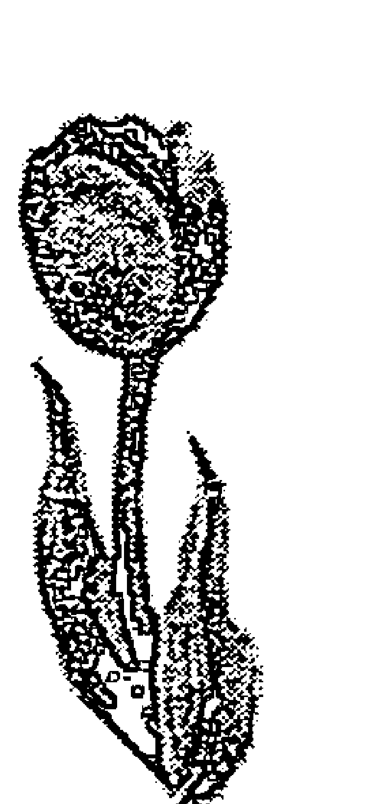

烹饪，加入一点黄油和柠檬。美国的原住民会用这种植物治疗坏血病。用它泡制的冰茶对于治疗腹泻非常有效，而且将新鲜的叶子切碎可以作为治疗烫伤的膏药。

另一种能够在多年单种的土地上和不受重视的区域找到的植物便是刺荨麻。你要知道，如果你在经过荨麻地的时候与之擦身而过，那么你裸露的小腿和手臂上就会发痒，并起红疹。然而，你应该觉得你自己非常幸运。这种植物是花园中最健康的一种蔬菜。荨麻中含有会引发刺痛的酸在晒干之后，或者在水槽中用冷水冲洗过之后很快就会消失（在你采摘荨麻的时候务必要戴上橡胶手套！）。

## 花朵沙拉

在沙拉中加入可食用的花朵。你可以使用连翘花，紫罗兰叶子和花，野生三色紫罗兰花，紫藤花、洋槐花、郁金香花瓣、蒲公英花（去除花萼和茎干）、挪威槭花、玫瑰花瓣，等等其他。

## 晚春－初夏——羊腿藜和荨麻

春天和初夏是在花园中寻找羊腿藜的好时机。这种植物之所以叫这个名儿是因为它似乎总是生长在羊儿曾经去过的地方。它是一种一年生植物，植物底部的叶子似长矛，齿状，顶部的叶子没有齿状。叶子有些肥厚，叶子边缘接近白色。植株可以长到1—3英尺高。检查看看叶子是否有一种香香的，像指甲油一样的味道。如果是这样的话，你找到的可能是土荆芥，这种植物是不能吃的（但是在晾干以后可以沏茶喝）。羊腿藜是非常美味的野草，你可以像做菠菜一样对其进行

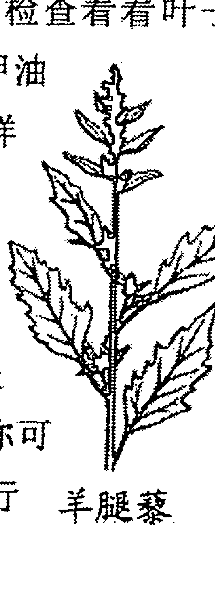

荨麻和多毛的植物，长有粗糙的棉桃，多毛的茎干，椭圆形多毛的叶子，以及绿色的花簇。它们是多年生植物，可以长到四英尺高。在它还没有长到六英寸高时，口感最为细腻。将幼苗的叶子冲洗切碎之后，加入汤中，或者制作一份爽口的荨麻肉汤。荨麻含有丰富的蛋白质，铁，以及微量元素。它们是一种抗组胺药物，这就代表着它们可以帮助缓解过敏症状。在冬季的时候将其泡茶喝，荨麻可以暖身，帮助消化。将两茶匙的干荨麻叶浸泡在一杯新烧开的热水中十分钟。外用的时候，可以用晾凉的荨麻茶水冲洗烧伤的位置和发痒的皮肤。

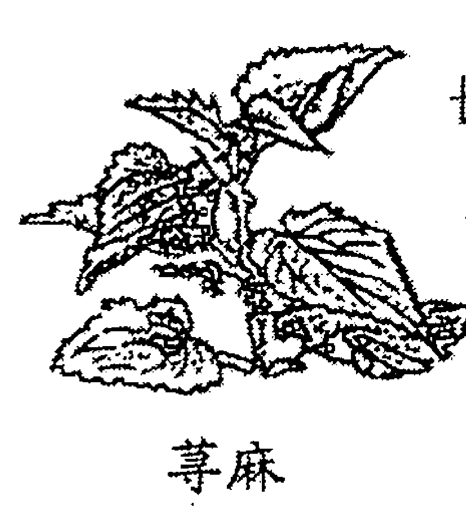

## 六月——黄花菜

到了六月，橘红色的黄花菜便会装点很多的花园。这种植物生长在院子里，而且在被遗弃的农场和宅地中已经蔓延到了野地里。它的叶子就像一把剑，而它的花瓣有些微微往后弯曲，朝向太阳，但是每一朵花只能开放一天时间。

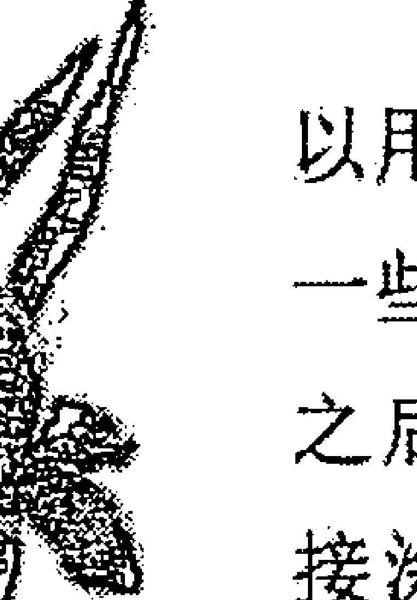

这种植物起源于亚洲，通常作为一种蔬菜种植以提供给东方人的市场。还没有开放的蓓蕾被称为“小金戈”，放入少量的橄榄油或者黄油炸过之后非常美味。已经开放的花朵放入鸡蛋、牛奶、面粉等调成的糊糊中像煎饼一样油炸或者加入汤中作为增稠剂炖食都可以。叶子切碎之后放入沙拉中，而它的块茎可以像土豆一样烹饪，或者切片后放入沙拉中。对于所有的野菜来说，在烹饪之前都要放入加有几茶匙的醋或者盐的水中浸泡二十分钟。这样可以驱除里面的昆虫或者寄生虫。冲洗之后再享用。

黄花菜也是一味药材；在中国，黄花根泡制的茶是一种利尿剂，还可以用作乳腺炎的敷剂。有证据表明，黄花根有抗菌的特性。黄花根中还含有秋水仙碱，可以治疗痛风。但是每天食用这种植物也不是件好事。

其他常见的植物有凤仙花科，花朵上有橘色或者黄色斑点，茎干柔软多汁，叶子为椭圆形。在潮湿的区域生长茂盛，如薄叶盾蕨。这就意味着早春的时候它的茎干可以加在沙拉中。之后这种植物便可以作为一种可以烹饪的野菜。炖制10—15分钟，中途换两次水，但是煮出来的水不能喝。

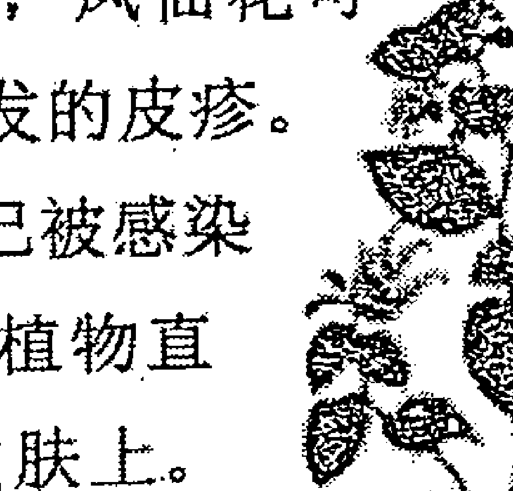

在医用的时候，凤仙花可以用作治疗野葛引发的皮疹。一些人如果认为自己被感染之后，会将捣碎的植物直接涂抹在他们的皮肤上。其他人会用它泡水冲洗。另一种方法是将这种植物放入搅拌机中，加入足量的水搅拌成糊状之后冷冻成冰块的样子，储存在塑料袋中，放在冰箱里，必备后用。捣成泥状的凤仙花也能用于烧伤、切伤、蚊虫叮咬、擦伤、青肿、荨麻疹，以及扭伤的湿敷药膏。

## 初夏——旱金莲和红花三叶草

在花棚上和栅栏上辛辣旱金莲即将开花。5—10英尺长的藤蔓上开着红色，黄色，或者橘色的花朵。花朵是圆圆的，比叶子还大。将新鲜的花朵放在涂满厚厚奶油干酪的谷物面包上，或者将花朵放入沙拉中。还可以将金莲花漂浮在汤品上，或者用来装饰蛋糕。

花朵辛辣的本性使得它们成为了一种非常好的暖肺食品；大量地吃这种花朵可以缓解胸闷，或者榨汁之后每天服用，每天三次，一次1/2茶匙。花朵的汁水还可以外敷，给伤口消毒。

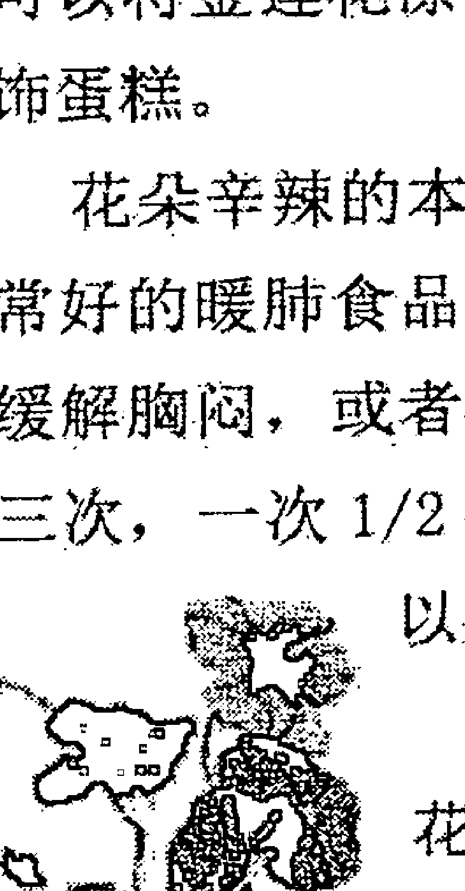

另一种备受欢迎的花朵便是花期很短的野生三叶草。在牧场和花园中非常常见，野生三叶草大约1—2英尺高，茎干上有少许毛茸。三叶草的叶子为绿色或者带有白色斑纹并且边上有细密的锯齿，每根茎干上都有三片叶子并生在一起，并形成非常与众不同的“V”字形。花朵为玫瑰色，略淡或者略浓。采摘新鲜的叶子，将它们漂在汤品上，加入沙拉中，或者用它们点缀蛋糕都可。你可以尝试使用新鲜的涂抹着奶油的白面包片（将面包皮去掉），豆瓣菜以及三叶草花朵为你的花园派对制作下午茶三明治。配制有机红茶端上桌。

### 红花三叶草茶

是一味化痰止咳的汤剂，可以治疗感冒，哮喘，支气管炎，以及其他的间歇性干咳。这种茶还是一种“净血剂”（刺激肝脏），早已是一种治疗癌症的民间偏方。三叶草茶还可用于外敷，治疗烧伤，疮痛，以及溃疡。红花三叶草的花朵通常被用在草药香烟之中。将风干的三叶草花加入其他风干的药用草药（例如猫薄荷和毛蕊花属植物）可以镇定气喘性咳嗽。

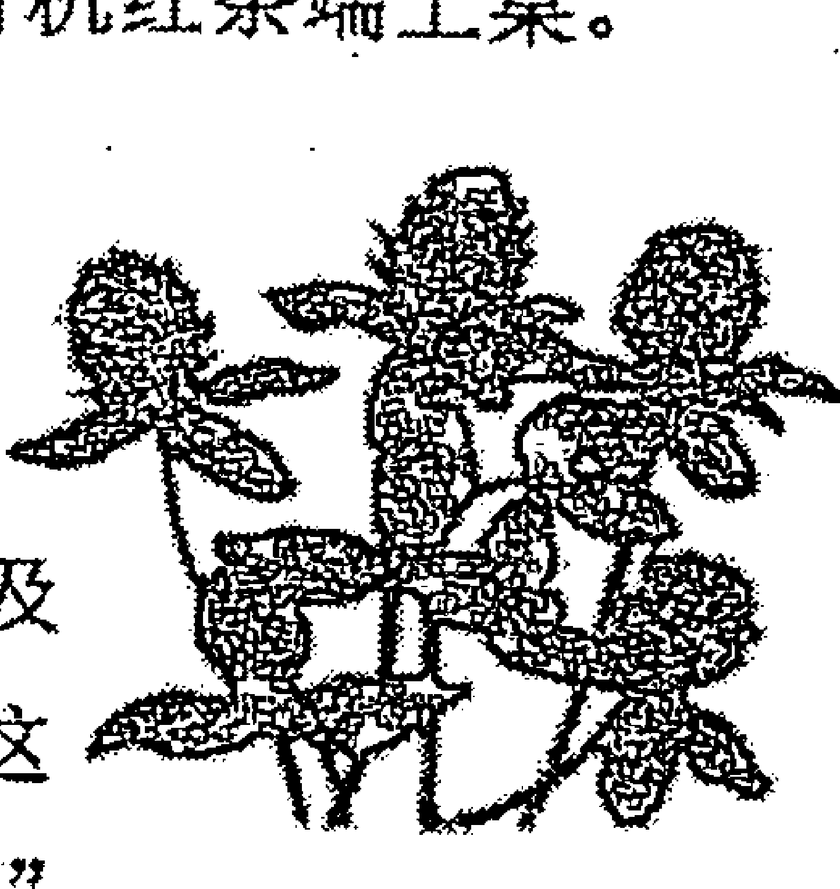

对于沏茶，每1/2杯的水浸泡2茶匙的三叶草花，浸泡10—20分钟。外用时，将茶水直接用来清洗伤口等，内服时可作为一剂甜味剂用于治疗痨病。成年人（或者一个150磅的人）每天饮用三次，每次1/2杯，小孩（或者一个75磅的人）每天饮用三次，每次1/4杯或者更少，依据服用者的体重而定。

## 夏季——月见草和蓍草

夏季田野中常见的两种可食用的植物是月见草和蓍草。

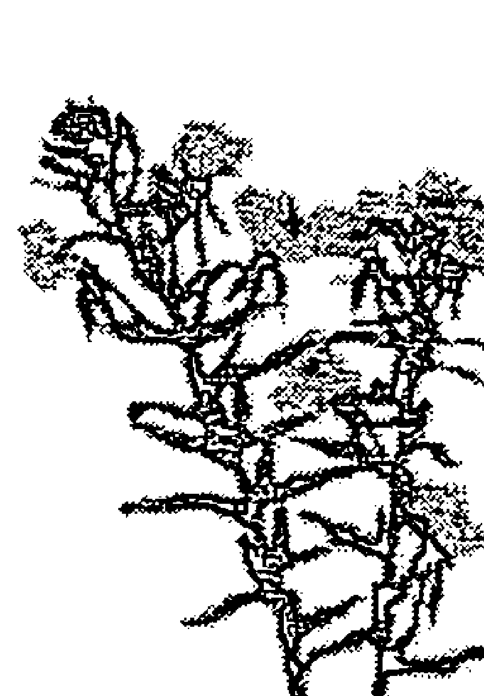

月见草植株长成之后可达到1—5英尺高，花簇般的黄色花朵拥有四片花瓣，会在傍晚开放，第二天便会枯萎。它的花期从六月开始。

月见草是一种两年生植物（它能存活两年，在第二年开花），第一年的月见草根可以在剥皮之后用开水煮20分钟，或者煮至变软，换两次水。每一次都将水倒掉，不要饮用。月见草根在春天和秋天的时候味道温和，在夏季时略带辛辣。可以拌入黄油和盐一起食用。

月见草的嫩叶也可以在两次换水煮沸大约20分钟之后配上黄油食用。

美国土著人会将月见草根捣成药膏敷在擦伤或者青肿的地方。月见草的种子榨出的油对肝脏有好处，改善例如湿疹一类的皮肤病。

蓍草被拓荒者们称为“药用植物”。它会长到1—3英尺高，它的花朵非常特殊，是扁平的白色花簇，每一簇有五朵小花。

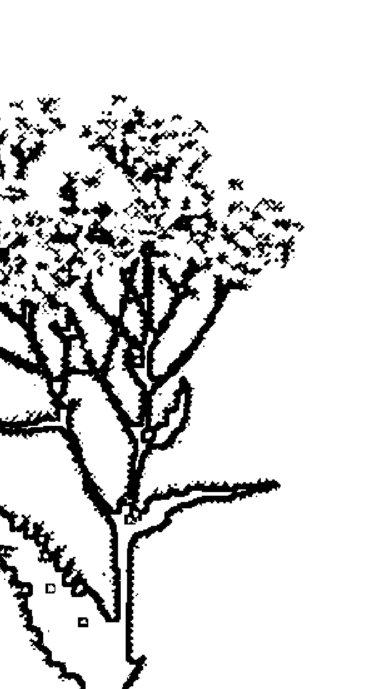

当植株还未达到1—2英寸高时采摘其嫩叶加入沙拉中（在加有几茶匙盐或者醋的清水中浸泡大约20分钟以驱除里面的寄生虫）。随着夏季的前进，蓍草柔软如羽毛般的叶子的香味会越来越浓，最终就会变得越发苦涩而不能再食用。一旦蓍草开花之后，便可以采摘了风干泡茶。蓍草茶可以治疗发烧和感冒，而且有助于肠道的通畅。它是一种治疗肠胃感冒的传统草药，尤其是在和胡椒薄荷的叶子和接骨木花一起泡制的时候。有些人会非常不喜欢这种茶水的味道，喝过一次后再不会喝第二次。

这种植物的拉丁名字为Achillea millefolium: Achillea 是用希腊英雄 Achilles（阿基里斯）的名字命名的，而 millefolium 则是因为这种植物的叶子被切割成了成百上千片的小切片。阿基里斯在特洛伊战争中因为流血过多而阵亡，而蓍草具有止血的特性，也就是说它可以被捣成膏药敷在伤口上止血。

## 夏天——薄荷

野生的和人工培植的薄荷在背阴的花园中，湿草甸和河岸上会生长得非常茂盛。野生薄荷会长到 6—25 英寸高；有细小的向后弯曲的绒毛，在叶子和茎干连接的叶腋处开出小团白色或者淡紫色花簇。和其他的薄荷种类一样，野生薄荷有着非常强烈的芳香味，茎干为方形。一些薄荷的花朵为顶穗状，而不是生长在叶腋处。如果你发现了薄荷，你的鼻子就会告诉你。

享用薄荷最简单的方法就是将新鲜的或者风干的薄荷叶子在开水中浸泡 5—10 分钟，无需加热。加上少许蜂蜜以增加其甜味。所有的薄荷对于治疗感冒、发烧、喉咙痛、肠气、消化不良，以及胃痉挛都有非常好的效果。在水果沙拉中加入干薄荷末或者切碎的新鲜薄荷叶。薄荷可以撒在胡萝卜、菠菜、嫩菜豆，或者土豆上。还可以将薄荷加入冰茶中，或者将新鲜的薄荷叶子用来装点蛋糕或者冰淇淋点心。

### 制作薄荷苹果冻:

将三磅（约合2.5斤）的苹果切碎；不要削皮（苹果皮中含有大量的果胶）

将苹果粒放入一个大锅中，加入水，刚好盖过苹果

盖上盖子，用文火煮 3—15 分钟，直到苹果汁可以自由流动

用滤器过滤

将苹果汁倒在多层的粗棉布上或者倒入湿润的果汁过滤袋中

让其自行过滤至少一个小时，最后会得到至少 4 杯果汁

将四杯果汁烧开会沸腾 5 分钟

每杯加入大约 3/4 汤匙的糖

在每一杯果汁中加入一杯切碎的薄荷茎干和叶子，让其沸腾 10—30 分钟，直至果汁开始凝结。当果冻沸腾的时候，你可以加入几滴绿色的食用色素【测试胶凝点：用一柄冷的金属勺子舀起一些沸腾的液体。将你的勺子倾斜，如果果冻是成片流动而不是滴落，便可以了。或者滴几滴在盘子里，放入冰箱冷藏室，变凉之后看看是否变成了果冻。瞧，可不是么！】

将泡沫挑出，倒入高温消过毒的罐子中。用金属盖子或者石蜡密封后储存起来。

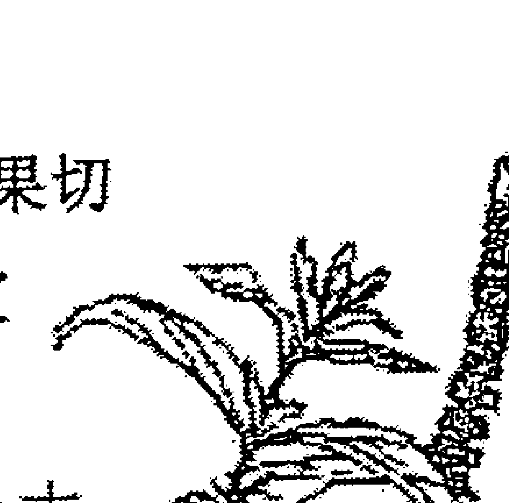

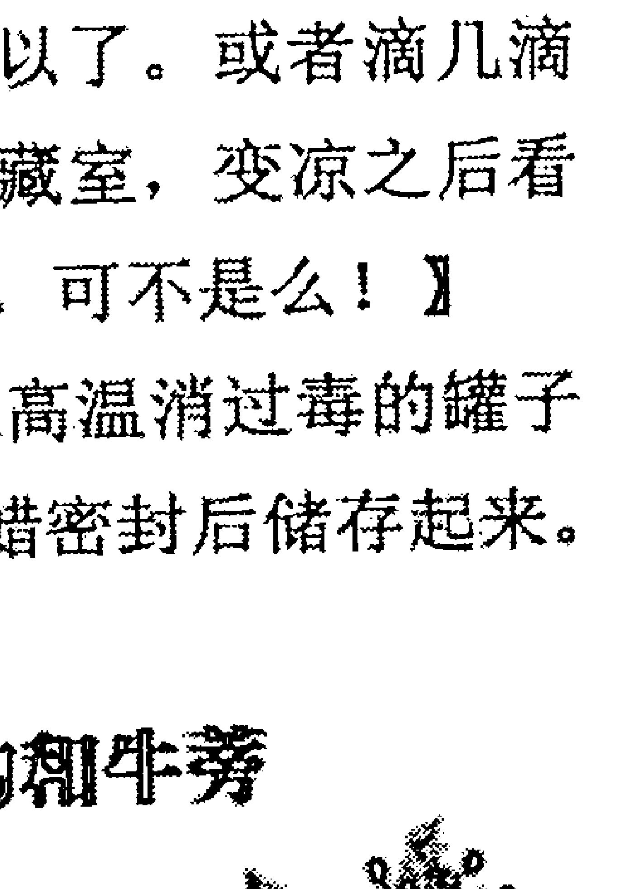

## 夏末——乳草属植物和牛蒡

如果你足够幸运，住在一片休耕的能够找到乳草属植物的土地附近，那么你会发现，在这个季节，正是它们发芽的时候。这种植物很得黑脉金斑蝶的喜欢，它的叶子上有绒毛，对生，很宽，大约8英寸长。圆圆的淡红紫色花簇花期为七月和八月。茎干里有白色乳液，这种乳液你掰下叶子的时候立刻就能看到。到秋天的时候，这种植物会长到2—4英尺高，会长出巨大的疣状心皮，这种心皮最终会变干，裂开，然后释放出成百上千的毛绒绒的种子穗，可以用来填充毛绒玩具和枕头。这些毛绒具有防水性能，过去常常用来填充救生用具。

绿色的花芽和未成熟的种子豆荚在他们裂开之前都是可以使用的，在换几次水，煮开之后，一点橄榄油和大豆酱油，或者黄油便可端上饭桌了。务必要将花芽放入已经烧开的水中，而不是冷水，这样做是为了驱除苦味。已经开放了的花簇可以在开水中浸泡一分钟，然后再浸入面糊糊中，油炸成果饼。千万不能食用这种植物的其他部位。

牛蒡是一种生长在休耕土地和本地扰动区的一种常见野草。这种植物会在秋天的时候长出一种恼人的褐色小刺果，它们会附着在你的裤子上和你的狗身上。这种植物的叶子很大，有点像大黄的叶子，花朵像蓟草花，花朵直径大约一英寸，颜色是一种略带桃色的栗色。

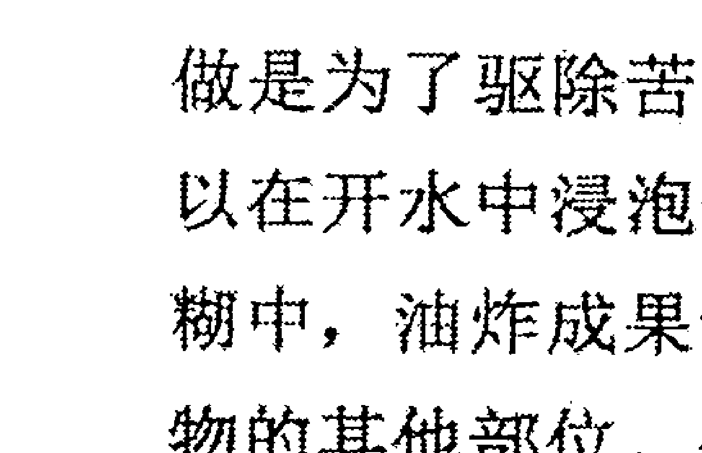

牛蒡花期为夏末和初秋。叶子可以用于皮疹的外用药，例如荨麻疹或者湿疹，还可用于治疗烧伤和溃疡的外敷药。不要吃叶子！牛蒡是一种两年生植物（它会存活两年，在第二年的夏天开花）。牛蒡第一年的根可以用于煮茶喝，通过刺激肝脏“净化血液”。用一杯水，炖煮一茶匙的牛蒡根大约20分钟。在东方国家，牛蒡根被看作是一种蔬菜。将第一年的牛蒡根煮三十分钟，换两次水，和上黄油一起使用。美妙至极！

### 草药茶

在你花园中盛开的花朵中，总有那么几种可以用来泡制草药茶。比如：蜜蜂花（香蜂草属），这种一种传统的，维多利亚女王时代花园中常见的花，有紫色，红色，和粉红色，也是蜂鸟和蜜蜂最喜欢的花。蜜蜂花可以长到3英尺高，和薄荷一样，它的茎干是方形的，而且有绒毛，叶子对生，卵形，锯齿状。你可以用新烧的开水浸泡蜜蜂花的花和叶子（用两茶匙的新鲜草药或者一茶匙的干草药）大约十分钟。蜜蜂花可以作为一种缓和反胃和消化不良的药水。蜜蜂花茶的香味和“伯爵茶”的味道很相似。

攀缘的百里香是我们美国另一种常见的植物，在花园中和牧场上都能看到。它的叶子非常小，只有3/8英寸长，长成的植物不会超过6英寸。它的花是花簇状的，生长在每个分支的顶部，颜色从白到紫，各色不等。传统的欧洲草药医学家会使用百里香治疗咳嗽和感冒，以及胃痛。用一杯刚烧开的水浸泡2茶匙的新鲜草药或者一茶匙的干草药，大约十分钟。

根据民间传统，百里香是一种非常基础（用途广泛）的草药。在你喜欢坐和冥想的区域种上一些，可以让你的感官更加平和。

蓝莓是另一种在山谷中常见的植物。每个人都知道它的果实可以使用，但是你知道它的叶子和果实可以沏茶吗？当浆果还是绿色的时候，你可以采摘它的叶子，一茶匙的叶子泡一杯水，浸泡20分钟。美国土著人将蓝莓叶子茶用作一种“血液净化剂”。蓝莓叶子茶只需喝几天便可达到其功效。你还可以将一茶匙的干蓝莓用一杯水在锅里煮20分钟，盖上一个非常严实的盖子（以保留其具挥发性的油脂），每天喝两杯，如果你喜欢，可以一直喝。

## 夏末——黑莓

这是黑莓的季节！在森林边缘和被遗弃的田野中寻找直立生长的野生黑莓。黑莓有刺，掌状复叶，每一簇大约3—7片叶子，茎干为绿色或者略带红色，植株长成之后可达到6英尺高。在六月的时候寻找白色的，五片花瓣的白色花朵，这种花朵在七月末八月初的时候会长出黑色的果实。这种果实含有丰富的生物黄酮，有助于帮助人体建立免疫系统——每个人都应该食用一些颜色较深的，只有在夏季才能够找到的浆果、水果，以及蔬菜（红苹果、红莓、红葡萄、红球甘蓝、李子、西红柿、红辣椒，等等）。新鲜的黑莓叶子和细嫩的植株尖儿，可以合在沙拉中食用。将叶子晾干泡茶有助于治疗痢疾。黑莓根所泡的茶同样也是一种治疗腹泻和痢疾的传统偏方。用两茶匙的干叶子泡入一杯新烧开的水中。浸泡20分钟，每天喝一杯。或者用一杯水在锅里熬煮一茶匙的切碎的黑莓根20分钟，盖上严实的盖子。晾凉之后每天喝一到两杯。黑莓果冻，果酱，以及黑莓酒有助于放松肠道，缓解痢疾。美食厨师非常喜欢制作黑莓醋。放置三天之后，用滤网小心仔细地过滤。（覆盆子醋也是一种美食）。新鲜的黑莓叶子可以在搅拌机中捣碎，敷在烧伤和溃疡的地方。要加入足量的水，这样你才能做出糊状的敷药。将绿色的糊状物倒入碗中，加入足量的粉末状榆树皮，或者全谷物面粉，以让敷剂变得更加浓稠。将混合物在一块干净的布上摊开，敷在烧伤的部位一个小时以后丢弃。你可以将风干的黑莓叶子泡入足量的开水中，待其软化之后敷在烫伤和烧伤的部位。

## 夏末—秋天——吃树！

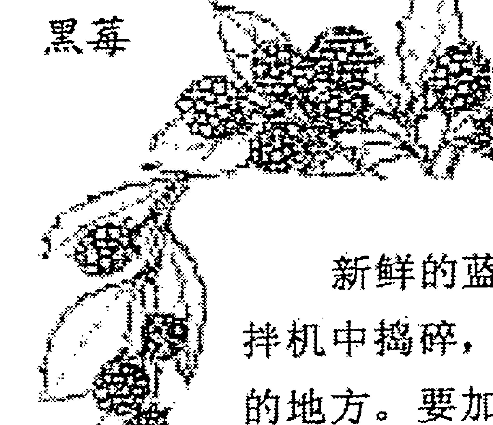

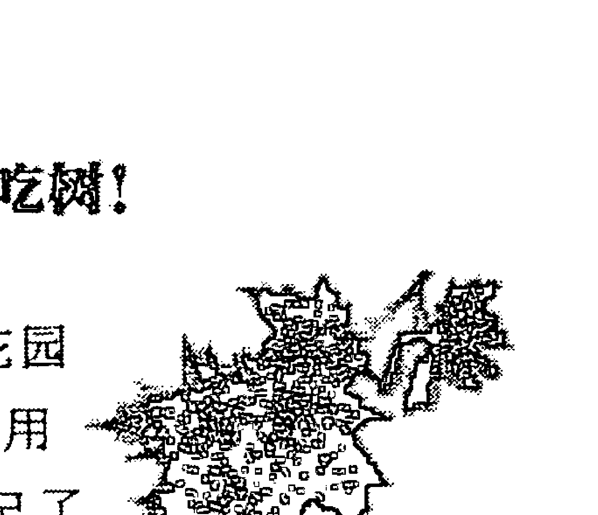

当你在思考花园中有些什么可以食用的时候，不要忘记了树！在夏末，我们都喜欢树木的果实，例如苹果和樱桃，桑葚，梨，以及桃子。但是树在其它季节也可以食用。在春天，你可以采摘嫩树叶加入沙拉中。寻找未成熟的那种还有一抹红色的枫树叶。小小的桃树叶和新生的山楂树也可以食用。我在春天的时候一直都很期待铁杉上新冒出来的树芽（不，它们没有毒，希腊的哲学家苏格拉底是因为食用了毒芹 [译者注：铁杉英文名为 Hemlock tree，而毒芹名为Water Hemlock]汁才死的，毒芹是一种野生药草，而不是铁杉树）。铁杉会结出非常小的松果和非常小的松针（只有3/8到5/8英寸长）。铁杉树皮为浅黄褐色，有很深的皱纹。在铁杉树丫上寻找灰绿色的新长出来的尖儿。铁杉尖儿有一种清淡可口的柠檬味儿，富含维生素 C。你可以用树尖儿沏茶，或者加入沙拉中，或者只是摘下来食用。随着夏日脚步的来临，新生的树尖儿会变为深绿色，而且也会变得无法嚼动。

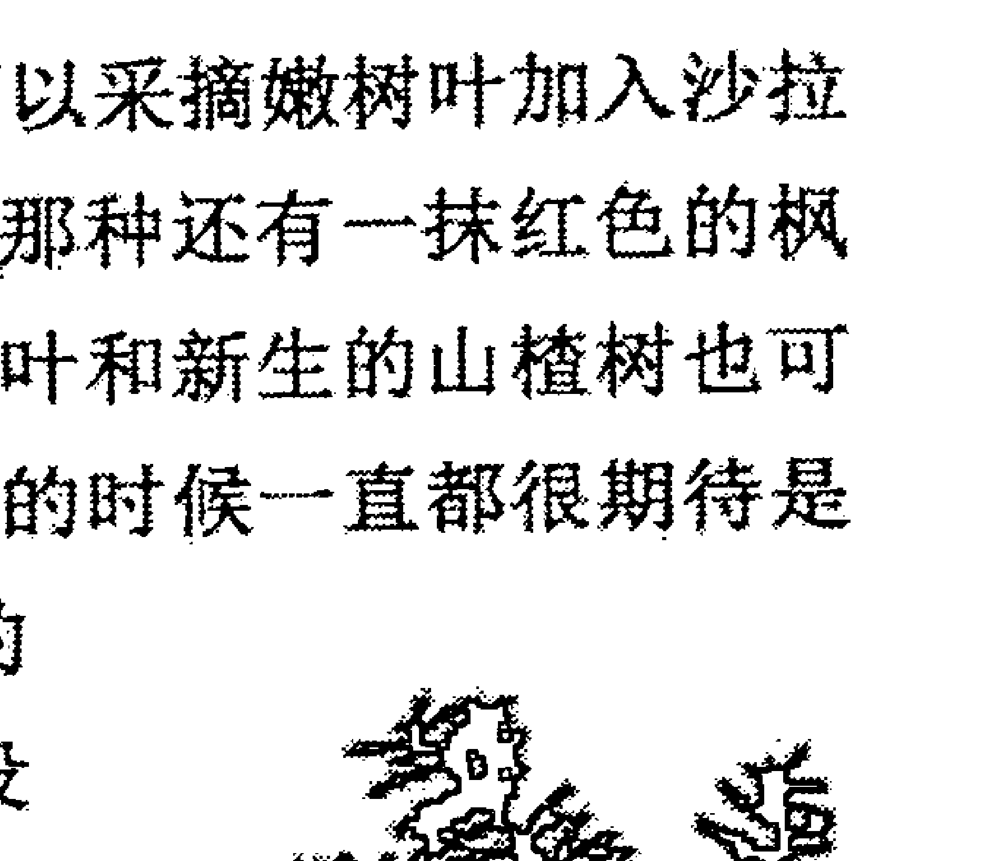

另一种在春季很受欢迎的食物是桦树的汁液，和枫树一样可以抽取汁液。提取出新鲜的汁液后无需加工，可以就这样饮用。除了白桦，所有的桦树都有一股冬青树的好闻的香味。在春季，你可以采摘枝条，切成1英寸长的小节，放进锅里。加入冷水，用密封盖盖起来炖煮 20 分钟。用蜂蜜或者枫树糖浆作为甜味剂，加入几片新鲜切碎的姜根，或者黄樟树的树根皮，以增添其香味。

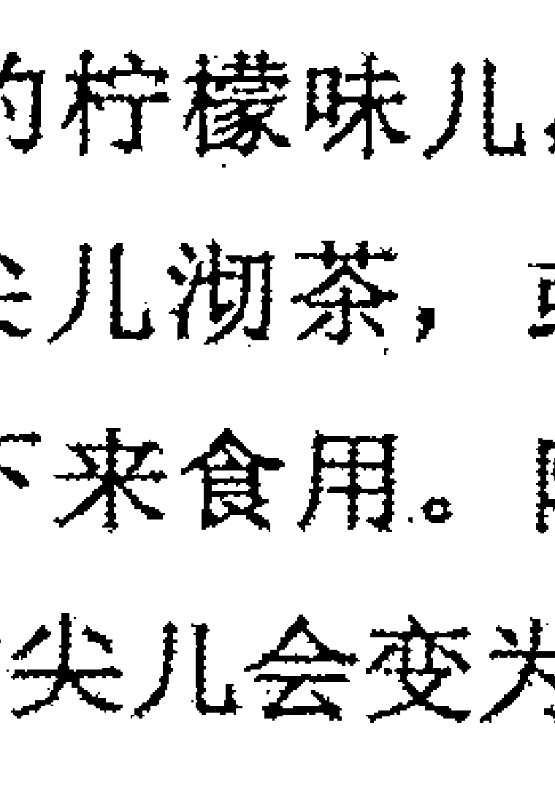

白松拥有蓝绿色的松针，松针五针一束，针长 2.5 到 5 英寸。树皮略带灰色，有沟纹，有厚厚的脊状线。这些树可以泡制出非常美味的柠檬味的茶饮。你可以全年使用松针和嫩枝，只需将它们放入锅中，加入凉水，盖上严实的盖子，煮 20 分钟。你可以在隆冬的时候饮用这种茶水，这也是治疗感冒的一种很好的舒缓型偏方，有些微的防腐作用，富含维生素 C。

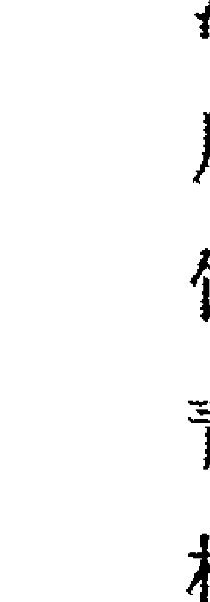

## 8. 一些有关野生蘑菇的话

文 / 奥伯伦（灰色）和书月人（靛蓝色）

我们所认知的“蘑菇”只是一种会在地表以下延伸巨大真菌网络的子实体——有时会延伸至几英亩。真菌是地球上五大生命王国的其中之一；根据进化史上它们的出现顺序，分别是：无核原虫类，真核原生生物，真菌类，动物类。世界上有着几千种野生蘑菇；很多是有毒的，还有一些是致命的，即使是小小的一口也能致你于死地。然而少数的蘑菇种类是非常珍贵的佳肴，因为它们看起来绝不像任何危险的种类。在北美，美味的蘑菇包括白马勃，金色鸡油菌，以及羊肚菌。在欧洲，松露是非常珍贵的真菌。所有的这些菌类都非常美味——切片之后用黄油煎，和其他的蔬菜一起用大火翻炒，或者用于各种各样的食谱中。

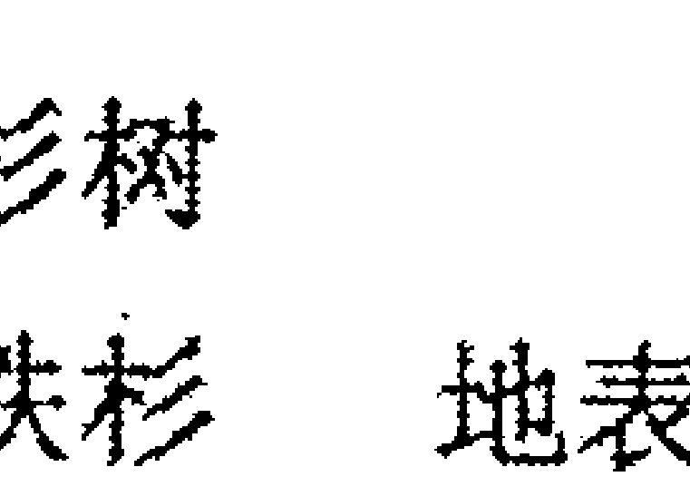

一旦你学会了怎样辨认这些不会弄错的真菌之后，你就能够去会生长这些菌类的野外探寻这些美味。但是蘑菇搜寻通常需要和一个非常有经验的师傅学习，而不是靠自己！如果你爱上了这种探索奇异国度的旅程，你便需要准备一本好的指南——并找一位向导带你去你第一次踏足的树林和田野。

关于这方面，可利用的书籍有《全美奥杜邦协会野外指南之北美蘑菇》，这

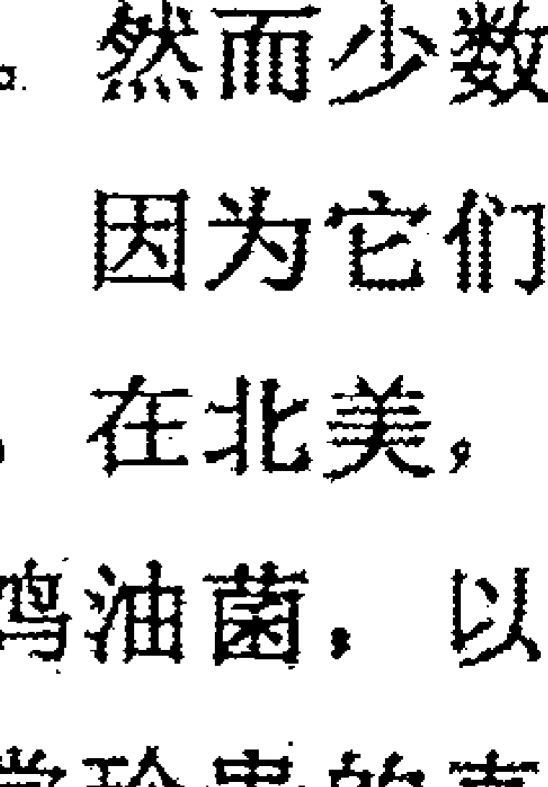本书囊括了 703 种物种细节，还配有彩色图片。需要你完全回避的蘑菇是伞菌目，或者“伞菌”——那些有着典型的“蘑菇”形状，就像你在食品杂货店所购买的蘑菇一样。这些蘑菇中有相当一部分是不能食用的，还有一部分是有毒的，甚至是致命的，而这些蘑菇也很难和那些无害的蘑菇区分开来。最好的办法就是永远不要采集任何种类的伞状蘑菇！

## 蘑菇鉴别

培训蘑菇学科的生物学家被称为“真菌学家”。为了做出正确的鉴定，真菌学家需要观察多个方面，比如说颜色，伞褶，孢子，菌杆，以及蘑菇的基部。孢子必须在显微镜下观察才能甄别出不同。他（她）必须考虑到所观察的蘑菇的生存环境，树林中，牧场上，或者树上。鉴别的过程就决定了蘑菇的鉴别根本不能仅仅通过电话中的描述。这种鉴别真的是一种非常困难的，非常耗时的技艺，需要精确度和准确性，以及多年的研究。（加利福尼亚州，CPCS 和董事会。2000；http://www.calpoison.org/public/mushrooms.html）

> 下文中的内容摘自加利福利亚中毒控制中心网站。在你看完以下的内容之后，你可以点击文中提供的链接，进入做进一步的了解。（美国国家中毒控制中心电话为：1-800-222-1222）。

## 关于美国境内的蘑菇中毒事件

全美中毒控制中心协会每年会接受 9000 多起蘑菇中毒事件的报告。即使只有大约 100 种蘑菇需要对其中大多数的蘑菇中毒事件负责，而超过 12 种的蘑菇是致命的，但是在美国，存在有大约 5000 种的蘑菇。如果一种蘑菇确实有毒，那么它对于老人和小孩，以及那些已经遭受了病痛的人来说是最危险的。甚至是通常被认为是“安全的”蘑菇也曾毒死过小孩和病得非常严重的成年人。其次，美国还存在着大量的能够置健康成年人于死地的蘑菇种类。

## 9. 薄荷的草药用途

文 / 书月人（靛蓝色）

薄荷家族有很多种类——胡椒薄荷和绿薄荷是其中两种——非常容易种植，使用非常安全。在用作药物的时候，薄荷是一种治疗消化不良或者反胃的良药。在魔法中使用的时候，薄荷与智力，雄辩术、占卜、研究、自我提升、改掉坏习惯、交流，以及智慧有关。（注意：这些只是其中的一部分，只是想让你知道怎样使用薄荷。）

## 种植和收获薄荷：

- 方法一：将薄荷种在你花园中阳光充裕的角落，每隔几天浇一次水。在其生长的时候，从几组叶子中修剪或者剪去几片，这样做，不仅可以让你有可利用的草药，而且可以促进植物的生长。通常在早上采摘和/或搜集的薄荷的味道最好。如果要风干的话，你可以将薄荷杆和薄荷叶子摆放在盘子上，并置于“避开太阳光直射”的架子上，直到叶子完全变干并且变得易碎为止，比如，几天。当叶子风干之后，将叶子从薄荷杆上剥离下来，将杆丢弃。将叶子放在一个干净的玻璃（或者塑料）容器中，存放在避光的食橱中。

### 方法二（更快捷的方法，但是不那么有趣）：

在你们当地的食品杂货店或者农贸市场买一把薄荷。按照方法一中的方法和步骤晾干，收藏。

### 方法三（最快捷的方法）：

在当地的保健食品商店或者神物铺子中购买已经加工好了的薄荷叶子。

#### 配制薄荷制剂（茶）：

在一个非铝质炖锅中放入一杯刚从井里打起来的冷水，迅速烧开。

当水沸腾了之后，将锅从火炉上拿开。

搅入两茶匙的干薄荷叶子粉末。

用盖子盖上，待其浸泡5—10分钟，无需加热（泡制的时间越长，效果越好）。

将茶水过滤到一个预热过的茶杯中。

加入蜂蜜或者红糖提味。

恭喜！你已经配制好了一种草药制剂！现在，请坐在一个安静的地方，细细品味你的薄荷茶。下一次当你的胃有些不舒服的时候——也许是你吃得太快，吃得太多，或者吃了一些你不太能消化的东西——你就泡制一些薄荷茶，慢慢啜饮。它可以舒缓你的胃部不适。

### 10. 饮剂和洗剂

下面是一些配置魔法草药饮剂、洗剂、精油、散剂以及魔法香囊的配方。

### 增益智慧和记忆的香囊（书月人）

你会需要：

- 一小枝迷迭香（增强记忆）
- 一茶匙干蓝莓（同样也是为了增强记忆）
- 一片月桂叶子（增益智慧）
- 6英寸宽的织布（颜色和花色应该和你的魔法意图相匹配）
- 12英寸长的刺绣丝线（同样也要选择相对应的颜色）

将草药和浆果放在你的惯用手中。请求它们在你考试，做作业，或者做其他事情的时候与你分享它们的力量和能力。目的越明确越好。

将草药摆放在印花棉布上，将边缘拎起来，扎成一个流浪汉式的包裹。将这个用刺绣丝线系起来。

将包裹放在枕头下面，让它和你一起进入梦乡。在早上醒来以后，在笔记本上记下你能会想起来的所有梦境。

在事情结束之前都要将魔法香囊随身携带。结束之后，打开香囊，将草药和浆果放在杯子中。倒入开水，浸泡5分钟。加入蜂蜜调味。一边喝，一边思考你的法术。祝福你！

## 提供保护和智慧的饮剂（书月人）

- 1/2 茶匙的干胡椒薄荷（记忆）
- 1/2 茶匙的干鼠尾草（保护和智慧）
- 1/4 茶匙的干牛膝草，或者大茴香 - 牛膝草（好运）
- 月水（放置在户外，而且在满月之下进行了附魔的水）
- 少量的甜叶菊（随意，只为了增加甜味）

将一杯新鲜的矿泉水和 2 茶匙的月水煮开。

当水开了之后，关火，加入干草药。让混合物泡制 5 分钟。

事先用热水加热一个特殊的茶杯或者杯子。将制剂过滤到杯子中。

双手捧着杯子，将杯子送到鼻子下方，轻吹茶水的表面，将你的意图送入其中。然后吸入茶水散发出来的热汽，将其精华带入体内。慢慢饮用茶水，将你的意图集中在即将到来的考试和你所期待的结果上。

## 自恋香囊（伊斯特拉·蒂西莱）

- 茴香
- 薰衣草
- 荷兰芹
- 玫瑰
- 熊果叶
- 墨角兰
- 鸢尾根
- 蔷薇石英
- 几滴精油

将所有的这些材料都装进一个粉色和 / 或海绿色的布袋子中，系上。

## 宽恕粉末（伊斯特拉·蒂西莱）

- 迷迭香
- 墨角兰
- 薰衣草
- 绣线菊属
- 马鞭草
- 胡椒薄荷

当你需要忘记某些东西，让自己的生活继续的时候使用。

## 悲伤精油（伊斯特拉·蒂西莱）

- 6 滴柏树精油
- 6 滴薰衣草精油
- 1 滴甘菊精油
- 1 撮墨角兰

## 11. 最后的建议

文 / 书月人（靛蓝色）

你已经知道了草药学是一门严肃的学科，要使用它需要你有很强的责任感。作为一名魔法师学徒，你需要在道德上约束自己，使用自己所有的谨慎与智慧去保证你能安全地拥有和使用草药。

随着你在草药的使用上越来越熟练，你会发现与其他魔法师和草药医生交谈你的实验是非常有趣的。在你交谈的时候，你所提供的信息必须绝对地准确和安全，这是非常重要的。

如果你对你所配制的药剂不是很确定，那么就不要将其推荐给其他人。同样的，如果别人向你提供了他们的信息，你就需要询问足够多的问题，并要求他们提供足够的信息，以确保你自己相信他们的描述很安全。

不要担心你在询问问题的时候会冒犯到他人。如果他们是依照伦理道德所做的练习，那么他们便会理解，并尊重你的担心。他们同样也会非常渴望向你展示他们所说的话都是有根据的，而你可以相信他们。

## 鱼油（伊斯特拉·蒂西莱）

- 薰衣草
- 甘菊
- 芸香

帮助集中注意力，缓解焦虑

# 第七章
占卜（黄色）

## 以烟占卜

在烟雾中塑形
脸谱，图画
解说其意义
告诉我

在蓝与灰的交叠中
我能看到未来
和过去：

一切都透过空气传递过来
留下烟自己在风中战栗，
卷缩的气流旋转在
世界的精神之中

我已经学会，已经教会自己
经过长时间的尝试
去读取那些尖叫着的文字
以自我这样简单的存在去书写

在烟雾的摇曳之中
我已经看到了世界的终结
和开始——烟雾弥漫
却比任何彩虹都要
明亮

来吧，说出你的问题，
烟，会告诉你答案，
而我会告诉你，
它知道什么。

——伊丽莎白·巴纳特

## 1. 简介

欢迎来到占卜的世界！这是一门预知或者预测未来的艺术——找出丢失的，隐藏的，或者秘密的东西。即使并不是所有的预言家都是魔法师，但是所有的魔法师都被认为是预言家。很多古代人都对占卜非常痴迷，而且在咨询占卜师、预言家、神谕，或者先知之前，不会采取任何行动。不寻常的事件，例如一段扰人的梦境和征兆，也具有占卜意义——也就是从这个单词中衍生出了我们的恶兆。千百年来，预言家发明了很多的预言技巧——称为预言艺术（源自螳螂，意为“占卜师”）。预言艺术包括一些像如尼文字、欧甘字母、水晶球占卜、塔罗牌、探测术、手相术、解梦、卜筮，以及数字占卜等等预言系统。

这一章节的魔法颜色为黄色，代表着四大元素中的气元素。黄色与精神工作有关：冥想、意愿、智力、占卜，以及沟通。作为金色的另一版本，黄色是友谊、善良，和信仰的颜色。黄色（有时是一种非常浅的黄绿色）与星期三，水星，金牛宫，以及第三个（太阳神经丛）脉轮都有联系。金黄色是符咒、信任、夏天，像笑声一样愉快的声音，以及弱拍音乐的颜色。粉黄色更倾向于春天，精神上的努力和创造力。黄色是一种促进平衡、自我尊重、非凡领导力、占卜，以及创造力的极佳色彩。使用这种颜色才可以增强意志、生命力、目的，以及有效性的力量。

千百年来，人们已经发明了几百种占卜方法。许多方法，比如手相术，已经有几千年的历史了；而另一些，例如使用灵应盘，则是比较现代的发明。无论你选择哪种系统，占卜的原理都是一样的：获取你无法通过普通感官或智力获得的信息。占卜师通过进入一种 altered state of consciousness（改变的意识状态），可以接触到更广阔的意识领域，从而获取这些信息。有些人将这种状态描述为恍惚、出神、冥想或祈祷。在这种状态下，占卜师可以超越日常生活的限制，感知到更微妙的能量和信息。

占卜不是一门精确的科学，而是一门艺术。它的结果取决于许多因素，包括占卜师的技能、经验、直觉，以及问卜者的开放性和意图。占卜不应该被用来做出重大的人生决定，而应该被视为一种指导工具，提供不同的视角和可能性。最终，你仍然是自己命运的主宰者，占卜只是帮助你更好地理解自己和周围世界的一面镜子。

## 2. 先知的使命

文 / 杰西·沃夫·哈丁（银色）

拥有很多不同信仰的魔法师、萨满，以及神圣的女祭司几万年来都在预言着未来。这些预言其中有一些引起了重视，而所有的魔法师们都倾尽全力，想要预先阻止悲剧的发生，或者减少其潜在的伤害。不要搞错了。预言的价值来源于我们对信息的使用程度以及上天所赐予我们的洞察力。

对于所有生命中的惊喜和突然的转变，所有事情的发生都是与所有的实体、能量，以及事件有一定联系的。这一点能从很多方面看出来，包括湍流的新科学，映射出一种近期来说不仅非常混乱，而且完全无法预知的过程。准确预言的出现并不是来自于主体之间的联系，而是源自对这些联系模式不断增长的认知：扩大和紧缩，馈赠和需求，原因和结果。冥想时恍惚的状态可以让一个人脱离自己的思想，极大地拓展洞察力，我们所说的特异功能更多的是一种基因编码，对无尽的相互连接的整体感觉，有目的地指出过去，现在，以及未来的方向！一些人天生就比他人更具预言天赋。这些有天赋的家伙拥有一种优势，当然，他们也承受了日益艰巨的重任。有了先见之明，便要肩负起责任——承担责任的能力和需要。这种天赋的深度和含义通常都已经保证了预言是一种非常独特的能力，会受到社区或者部落的尊重，也会与之保持一种舒适的距离。然而，每个人天生都拥有一种预见未来的能力，而且按照他们所看到的东西行事——这是一种我们可以通过练习加强的技巧，然后加以利用，不仅有利于自己，还可以帮助更多的人。在你的体内，存在着一位梦想家，他一直在努力地认知和内在化宇宙中所有可利用的未解之谜！

我们能够通过在知觉和移情认知上，强烈的聚焦和不断的进步加强我们的预言技巧。由于所有的事物和事件都会形成模式，我们可以依赖所有的模式来留下意义的痕迹或者表征。这些痕迹就是我们所说的“迹象”，而“解读”未来不仅仅是启示，还是对展开的生命中，这种复杂主题的解读。迹象便是痕迹——无论是动物留下的，人类进化延展所留下的，还是传达出的精神思想留下的。如果认真观察我们不仅能够了解它们所留下的痕迹的特征，还能知道它们所来的方向，以及它们将要去到的地方：它可能的来源，以及其大致的方向。所有的迹象都承载了意义，只要我们能够并且愿意去理解，我们就能领会。

征兆是一种还未发生的事情的迹象。当这些迹象不够清晰，我们将其称为“暗示”。当一个人清楚地知道影响着他（她）的迹象时，便会存在一种有根据的预兆和无法解释的预兆的配对。在潜意识层面会建立起一种不可避免的练习，因此我们能够“跟着这些点”从我们所在的地方去到事情将要发展到的地方。这就是灵，自然界中有启发的力量说……并不是一种天际之外传来的高亢的男高音，而是一种对从我们自己体内传来的宇宙中盘旋的自我认知和自我引导的颂扬，而不是来自我们身体之外。

与我们的认知相反，预兆从本质上讲没有“好”“坏”之分。无论事态发展到最后是幸运还是不幸，善意或是恶意，不仅取决于我们的处境、态度，和思维方式，还取决于我们利用原始能量的能力以及无论发生什么时所倚靠的经验教训。预兆是一种预知和指示，也是一种困难即将到来的警告。事实上，迹象和预兆不仅仅是一种指示，还是一种建议。每一种迹象都是一种针对表象的练习和回应的召唤，其中包含了重要的信息，有关怎样做才是最佳选择的信息。每一种预兆都不仅仅是一种警示——它是一种机遇，一种有意地并富有同情心地影响未来事件的机遇。

预兆是真实的，但是它们也很容易被主观臆断或者曲解。一个非常害怕的人会将所有的预兆都曲解成他们所害怕的事情即将发生。一个缺乏信心的人会趋向于将所有的预兆解释为吉兆，因为他们需要寻求一种保证，以确信自己前进的步伐的正确性。但是我们怎样将我们生活中的预兆联系在一起并作出回应仍然取决于我们自己。一种预兆是做出选择的一种暗示，而且每一刻都是决定性的时刻。

我们轻叩着预言的力量来到这个世上，逐步形成了我们的个体医学，并将受迫害情绪和盲目的顺从抛之脑后，追求自己的命运，而不是向天命屈服。“天命”是我们声称所忍受和承受的命运，而“命运”是我们自己所创造的。天命是我们所接受的，命运是我们所为之努力的、所追随的，还能参与其中。它包括了在土元素和灵元素的意图和力量之间的联盟和合作……一切来源于我们，以及我们能够刻画的内容。它是我们最初的指令，也是实现我们个人世俗化的、魔法的，以及精神的机遇和分配的潜能。

我们应该感觉到有恃无恐，毫无疑问我们都知道心脏和力量是我们每个人与生俱来的，而它们是我们要完成这些分配的必需品。无论一个人的环境是多么落后，多么不近人情，我们都不可避免地会遭遇一些重要时刻，包括我们的立场和老师要求我们提升的最需要的技能。而我们每一个人都被委托给了那些必不可少的基础课程，无论我们是否选择对其充分利用。命运是我们个人的盖亚假说曲调，但是我们是否站起来把我们的身心投入这一曲不间断的舞曲中，仍然还是取决于自身。我们怎样能在这个宇宙有节奏的舞蹈中，根据我们的意图和行动实施计划（是由我们在这个有生命的世界中过去和现在的经历形成的，并且由那些有依据的预言，所提供的优势和希望赋予我们能力）很好地去完成我们的个人角色。

- 回想，并努力想起你生命中的哪些事是你事先感觉到它会发生的？
- 当你的意识正在根据一定经验做出估计或者“猜测”，以及当你的预测是一种“感觉”的时候，你要集中自己的注意力。
- 当你无法为某些将要发生的事情寻找到任何合适的理由，但是又感觉到它无论如何都会发生的时候，那么此时就是你能够非常确定你已经触及了自己的预言能量，而不仅仅是你的智力的时刻。
- 当你拥有了一种预言能力，那你便需要养成一种习惯，不仅要将其记录在你的日记本中，还要和你最信任关系最为密切的朋友分享。这不仅能够让我们对自己诚实，也是对在此之后事情的继续发展和展开的一种记录。
- 试着预言下一个月将会发生的事情，而不是那些在你灰飞烟灭之后可能会发生的事情。
- 最好只在人们有能力改变其发生的可能性的情况下提醒他们一些你所预想的事情。
- 如果预言没有成真，不要感觉到难过。当我们最终发现我们错了之后，我们应该鼓励自己继续预言，并对我们的预言能力进行微调。
- 有时，我们的预言会是真的，但是却会被误解。它可能会不如我们的预期，发生在一个不同的时间框架中，或者，它可能会以另一种形式出现，我们只有在真相揭开之后才能意识到（“噢，原来那才是我的幻想所要呈现给我的东西！”）。
- 小心“危言耸听”（说的是真理，但是不为人所相信）所带来的影响。你的预言只有在少数人相信你的时候才会显得更加重要。
- 试着感受你自己和你认识的人，以及其他生命形式（地球盖亚的生态景观，以及位于这个神圣星球之上的宇宙）的未来。
- 对于每一次预言事件，都要考虑怎样做可以增加其益处，并减少其危险性……然后自己亲自操作这些事情！

## 3. 设计问题

文 / 道娜塔·埃亨（浅绿色）

无论你使用哪一种占卜系统，务必要询问自己以下几个问题：我可以……吗？我能……吗？我应该……吗？这是将这些技巧作为魔法工具来使用，所需要的一定的道德标准。我可以……吗？我能……吗？我应该……吗？有以下意思：

我可以……吗？意味着：我是否获得了占卜这一问题或者局面的允许？我能……吗？意味着：我是否有能力去成功占卜这一区域的东西，我准备好了吗？我应该……吗？意味着：我在这一区域中占卜合适吗，适宜吗，适当吗？如果你对于这三个问题的答案有一个是“否”，那就放弃吧。

拿着你的工具去到一个安静的地方。你需要按照惯例询问一些没有情感依附的问题，例如：我体内的维生素C含量合适吗？如果有些高或者有些低，不要太在意。有很多领域你可以选择，但是你要挑出一个与你在情感上没有联系的，或者是一些你还不知道答案的。每天都要练习5—10分钟。

### **询问问题**

你需要对你所询问的问题小心措辞。例如：我的车需要加气吗？答案会是“需要”，即使气罐是满的。你有一辆汽油车，需要加气才能开动，因此当然它会需要气。占卜时所询问的问题中的每一个词语都需要取其字面意思。

### **规则1：**

你需要非常明确你想要知道什么。这包括什么，哪儿，什么时候，有时还包括一些与这个问题有关的指导性信息。

### **规则2：**
使用最合适的词语，短语，以及你已经用特殊工具设立起来的环境，并准备好一种约定好：的回应方式。

### **规则3：**
假设这个问题是一个确定的请求，给出了一些已经存在的信息。不要征求意见。例如：如果我问你：你强壮吗？你的答案应该基于你对“强壮”这个词语的理解——身体强壮，精神强壮，情感强壮，等等。现在，使用规则1，2，3（什么，何时，以及某物所涉及的东西）。你足够强壮吗，那么现在，去提起这箱一加仑的牛奶？现在，你能就那个问题给出一个正确答案了吗？

### **设计问题**

当你想要探索一个新的领域，试试下面的方法。询问一些不同的问题，看看是否有和你一致的地方，或者寻找一些模糊的/不确定的答案。模糊的答案会为你提供线索，那些未被发现的信息会影响你的答案。

对于探测术，这里有一些会令人误解的问题：（看看它们的字面意思）问：在<指定的区域中>存在水吗？答案：是的。（任何地方都有水。）问：在地底300英尺以上的地方存在水吗？答案：是的。（水无处不在，包括在空气中、土壤中、以及生物体内。）为了得到更有用的答案，你应该问：在<指定的区域中>，地底300英尺以内是否存在可供饮用的淡水含水层？

## 4. 来世的赌博：占卜的基本形式

文 / 豹舞者（灰色）

### 骰子占卜

使用骰子来占卜也被称作掷骰子占卜，它是一种古老而且相对比较简单的占卜形式。最早出现的骰子类型是由某种动物的关节骨制成的。在有的地方，骰子是用粘土制成。这些骰子便是今天我们所用的骰子的先驱。西藏人是用的骰子名为Sho-Mo。通过这种古老的占卜形式的发展，在今天所使用骰子的大多数形状可能创造于十九世纪和二十世纪，通常是用于娱乐。

从骰子中获取的信息据说在9天之内便会成真。而且千万不能在星期一和星期三的时候进行掷骰子占卜。所有类型的现代掷骰子都“不是认真的”，永远都不应该将其当真。

### 一个骰子

当使用一个单一的骰子画一个像下图中一样的一个圈。在这个圈上投掷骰子。所得的数字和字母都有其自身的意义，结合在一起后便成为了你想要的答案。不要问问题，让骰子指导你。

- A. 第二年
- B. 金钱
- C. 旅行
- D. 家庭
- E. 现在
- F. 健康
- G. 爱，婚姻
- H. 法律事件
- I. 现在的精神状态
- J. 事业
- K. 朋友
- L. 敌人

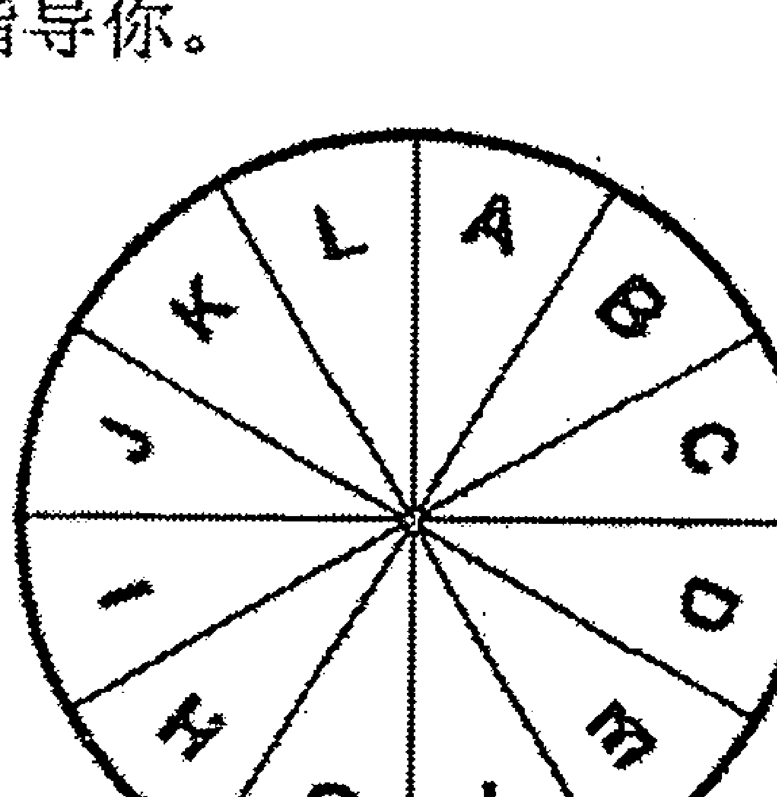

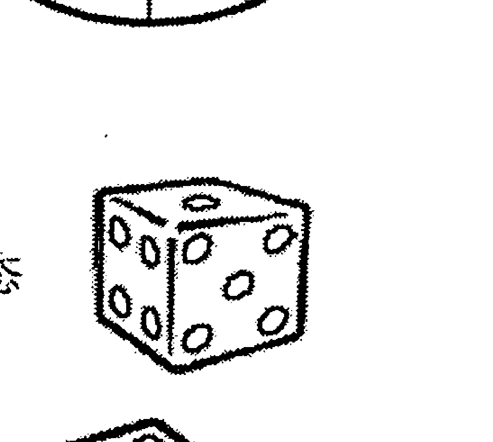

- 1. 通常是有利的
- 2. 成功取决于朋友
- 3. 成功绝佳的机会
- 4. 失望和麻烦
- 5. 很好的意图
- 6. 不确定

### 两个骰子

当你在投掷两个骰子的时候，在投掷完以后，将点数加在一起。这种与预言相差太远，更像是玩具“魔力8号球”。

- 2- 是
- 3- 否
- 4- 小心
- 5- 聪明点
- 6- 好运
- 7- 当然
- 8- 拥有信仰
- 9- 耐心点
- 10- 肯定
- 11- 可疑的
- 12- 一次机会

### 三个骰子

这是迄今为止最普遍的掷骰子形式。三个骰子一起掷，然后将点数加起来。总数便对应着你的答案。三个骰子占卜并不是用于回答某个特定的问题，而是，骰子会揭示一些你需要知道的信息。

- 3- 在将来会有讨人喜欢的惊喜降临。
- 4- 霉运即将开始，可能会持续一段时间。
- 5- 计划即将完成
- 6- 丢失某种东西
- 7- 生意场上会遭遇困难
- 8- 小心流言蜚语
- 9- 恋情会遭遇一次意想不到的转折
- 10- 新生儿的降临或者新设计的诞生
- 11- 各种各样的分离
- 12- 一条重要的消息将会送达
- 13- 悲痛即将降临
- 14- 会找到新朋友
- 15- 几天之内不会有新计划
- 16- 一次旅行会圆满结束
- 17- 改变计划非常必要
- 18- 即将来临的事情将会成功，而且充满乐趣

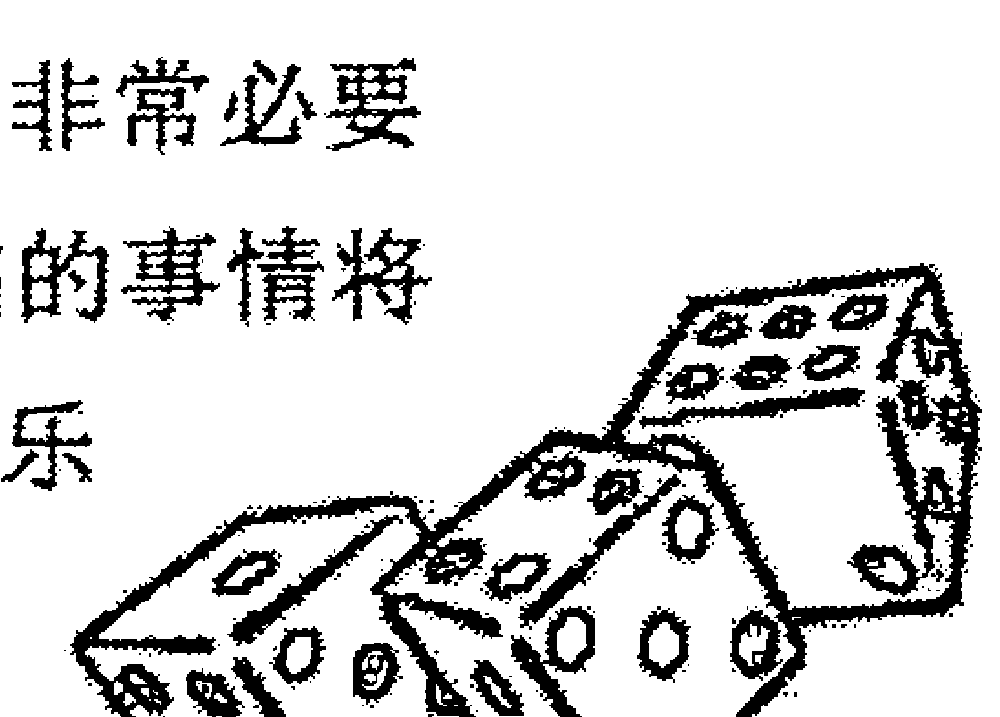

### 二十面骰子

图中是一个20面的骰子，来自角色扮演游戏（RPG）世界，投掷之后，所出现的数字代表着你的答案。

- 1. 家庭困难
- 2. 仔细观察某物，通常它们都不是其表面所显现出来的样子
- 3. 讨人喜欢的惊喜等着你
- 4. 悲痛来临
- 5. 心愿将会被满足
- 6. 霉运即将来临
- 7. 恋爱关系将会变得紧张
- 8. 小心防范流言蜚语或者没有正当理由的批评指责
- 9. 将会结婚
- 10. 将会有新生命诞生
- 11. 疾病来袭
- 12. 将会接到重要信息
- 13. 痛苦即将来临
- 14. 将会得到有价值的圆柱
- 15. 找到一个新朋友
- 16. 一次愉悦的旅程即将开始
- 17. 避免被诱惑
- 18. 留心他人的意见
- 19. 有利可图的事情
- 20. 好消息将会到来

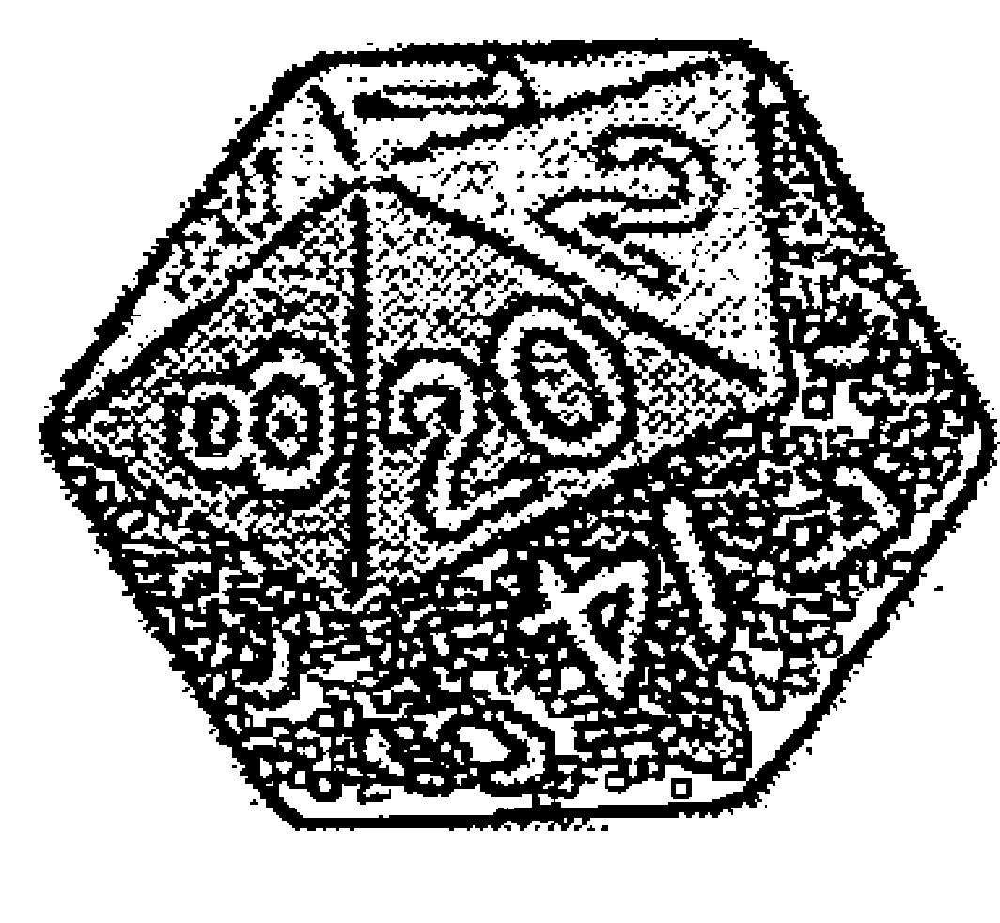

### 硬币占卜

硬币占卜可以通过不同的方式。我们都玩过“正反面”的游戏，对吗？简单地将一面设置为“是”，另一面为“否”。将硬币握在手中，同时将注意力集中在你的答案上。然后将硬币抛弃，看看其着落后向上的是正面还是反面。

另一种方法是使用大约 20 个硬币，最终的结果可能会是任何大于 10 的偶数。对于这种占卜方式，便士硬币是最好用的，因为很容易就能凑齐 20 个便士。凑齐 20 个便士，找一个小袋子来装它们。当你有问题时，将袋子拿在手中，然后将注意力集中在你的问题上。然后伸手去摸出一把硬币。如果你拿出的是偶数个硬币，那么答案便是“是”，如果是奇数个，答案便是“否”。

### 石子占卜

用石子占卜有很多不同的方法。大多数是复杂的占卜类型，但是也存在一些简便方法。你可以使用一种类似于上一节中所讲到的硬币的方法。搜集 10 个以上的石头，大小一致，将它们放入袋子中。用于鱼缸中的小玻璃珠也非常不错，而且它们还非常漂亮！还是那样，将袋子拿在手中，同时将你的注意力集中在问题上。伸进去抓一把石子出来。偶数个为正面答案，奇数个为负面答案。

你也可以准备两个相似的石子，然后将一个涂成黑色，一个涂成白色。或者找到两颗尺寸大小相似的黑白色石子。将它们装在袋子里，在思考你的问题的时候将袋子握在手上。伸手进去拿出一个。黑色为“否”，白色为“是”。

### 水占卜

将一片花瓣放在碗底。慢慢地在碗中装满水，同时再心里想着你的问题。如果花瓣飘起来，那么答案便是“是”，如果没有飘起来，那就是“否”。如果花瓣开始飘起来，后来又沉下去了，那么便两者皆不是。

同样地，你可以准备三张碎纸片，在一张上写“是”，另一张写“否”，还有一张上空白。将三张纸片放在碗底，慢慢注入清水，心里想着你的问题。第一张漂浮起来的纸片就是你的答案。空白表示的是暂时没有答案可供参考。

### 花朵占卜

这里还有两种办法，我相信你们肯定非常熟悉。“她爱我，她不爱我”的这种小伎俩和是 / 否问题的工作原理是一致的。手上拿一朵雏菊，对每一片花瓣说“是”“否”“是”……，一直持续下去。最后一片扯下的花瓣便是你的答案。

还有一种蒲公英占卜。摘一朵毛茸茸的蒲公英，握在手中，同时在心里想着你的问题。然后将蒲公英种子吹走。如果全部都飞走了，答案便是“是”。如果大多数的种子都飞走了，那么答案也是“是”，但是你并不能马上看到结果。如果大多数的种子都没有飞走，答案就是“否”。

## 5. 翻开一个占卜盒子

文 / 奥伯伦

大多数的占卜都开始于一种元素的随机分配，然后再通过找到其模式试图让其产生一定的魔法意义。当我们投掷硬币的时候，“正面”和“反面”是随机的。在纸牌卜卦（纸牌解读）中，我们所要做的第一件事便是洗牌。骰子，如尼时刻，关节骨，蓍草梗，以及神谕石都是通过“抛掷”来将它们撒开。一些占卜系统会用到一整套的背景模板，就像掷镖的圆靶，不同的区域代表了不同的意思，无论什么掉入特定的区域中都会获得这个区域所相对应的意义或者意思。

在世俗世界中，这就有点像是闭上眼睛在地图上随意插上大头针来定到哪儿度假！无论大头针落在哪儿，都将之定为“度假目的地”。十二宫图就是那样绘制的，将行星和恒星落在各种各样的“星宫”中。塔罗牌解读是根据特殊的分散构思“设计”的。

下面是一个你可以自己创造的简单占卜系统：

找一个浅口的 8-1/2 英寸 × 11 英寸的盒子，或者盒盖子，就像那种装信纸的盒子。找一张和盖子同样大小的纸，然后对折两次，形成四个区域。在纸张的右上角写上“是”，左上角写上“否”，左下方写上“可能”，最后一个区域写上“不知道”（如上图）。

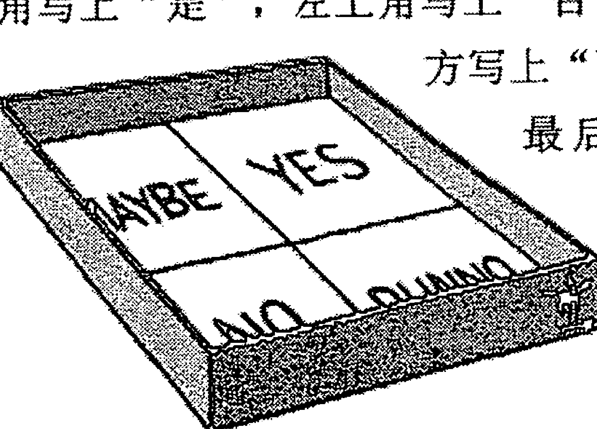

将纸展开，放入盒子中，这你就能看到上面的字。接下来，在另一张纸上，写上一些简单的可以用“是”或者“否”来回答的问题。找一个你非常喜欢的特别小的石子或者水晶。要解读的话，你需要用双手成杯状将石子握在手中，摇晃记下，同时一遍一遍地重复你的问题。然后，念诵下面的语句：

> 啊，强大的命运
我们已经达成了协议
现在让命运
揭开其神秘面纱吧！

现在，将石子扔进盒子中，对准中心位置。无论它落在何处，那都是你的答案。

如果你想要在解读中加入额外的可能区间，那么你可以使用骰子代替石子。投掷出来的骰子点数越高，那么答案的可能性就越高。

实际上，所有的魔法占卜系统都是基于这种简单的原理；一些系统只是比其它的更为精细和复杂而已。你可以将那张纸分成更多的区域，只要你喜欢，你还可以选择你喜欢的任意形状，写上你想要的任意内容。而你还可以用骰子代替石子，投掷出来的点数可以增加其所在区域的“分量和意义”。无论你将其做得多么复杂，原理始终都是一样的。

## 6. 百搭牌的世界：纸牌占卜

文 / 豹舞者（灰色）

纸牌占卜（纸牌卜卦）和塔罗牌占卜很相似，但是当你一时兴起的时候，纸牌占卜会比塔罗牌更加简单明了。

### 历史

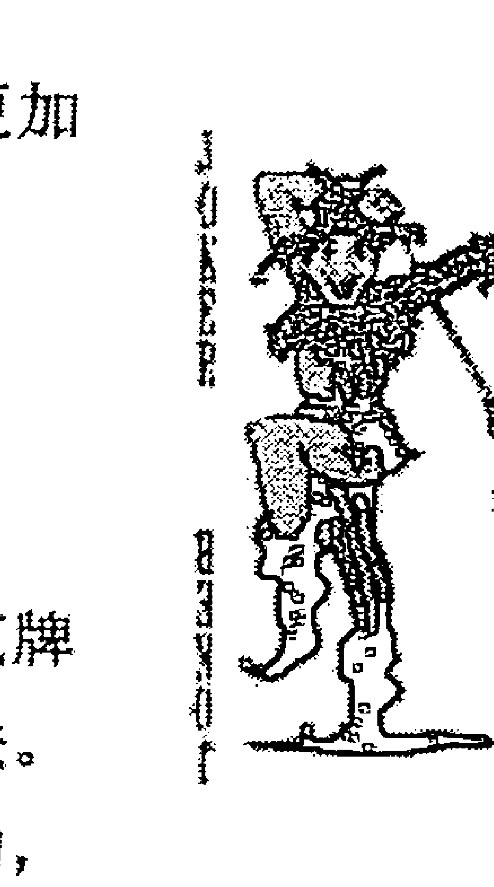

关于现代扑克牌的起源有几种说法。一种说法是这样的，在七世纪到十世纪期间，它们来自中国，那时中国的“货币卡（money cards）”和现在的纸牌形式非常相似。“货币卡”是雕刻在青铜和银器上的，由四种花色的数字牌组成。同一时期的和中国“货币卡”一样的印度纸牌也分为四种花色：节杖，剑，杯，以及指环。

还有一种实际上不同寻常的理论，是说从原始人类的占卜练习进化而来的棋和卡片，但是并没有多少可信的证据证明这一点。另一种有关纸牌起源的说法是马可波罗在旅行到中国之后，将纸牌的概念带回了欧洲。

另一种理论是说纸牌起源于埃及，那时的纸牌游戏由四种花色的数字牌组成，它们分别是剑，马球棍，杯子，以及钱币。每一种花色包括10张数字牌和三张“人头牌”，和今天的国王，女王，以及侍从一样。十字军战士和吉卜赛人是现在纸牌起源的另外两个可能的竞争者。还有一种阿拉伯起源说与萨拉森人入侵西西里岛和摩尔人征服西班牙有关。事实上，西班牙和意大利语言中的纸牌（naipes, naibi）这两个单词拥有着相同的阿拉伯词根。可是，它们和它们的堂兄妹塔罗牌一样拥有着很多不同的起源。而且和塔罗牌一样，纸牌也能精致地进行装饰。

早在1299年的意大利，1370年的西班牙，以及1380年的德国就已经出现了纸牌。最终的欧洲纸牌与现代的纸牌一样，有52张，一共四种花色，每一种花色有10张数字纸牌，一张国王，两张统帅。尤其是在法国，他们会将纸牌作为一种占卜工具。事实上，拿破仑在几次关键战役中都使用的是纸牌的预言力量来制定的作战计划（并坚信自己会赢）。

法国的52张一盒的纸牌现在被全世界的人所使用。法国纸牌的每一种花色包括一个幺点，一张王，一张女王，一张侍从（曾被称为男仆），以及从2到10的数字。花色自身在不同的国家都有其不同的名字和不同象征。英国沿用了法国的象征，但是更改了其名字。法国的矛（pique），传到英国后变成了黑桃；正方形（carreau），被旋转后变成了方块；三叶草（trefle），成为了英国的梅花；红心（coeur）被保留，在英国仍为红心。

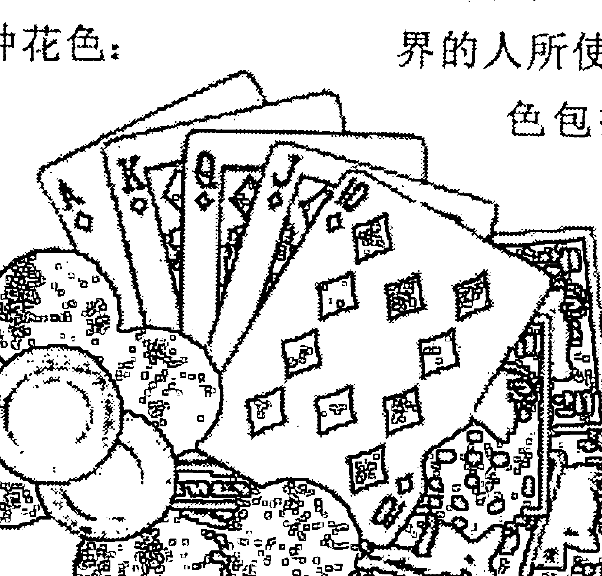

### 纸牌解读

有关纸牌占卜的优点之一便是，无论你在何地，你都可以买一副便宜的纸牌，立即拥有一种占卜工具。然而，如果你想要将纸牌当做一种主要的占卜工具，你应该有一副对你自己来说意义非常的纸牌，将其放在枕头下，或者更加传统一点，在不用的时候用黑色丝绸包裹起来，放在高架子上。关于纸牌的另一个优点便是它们既可以作为普通的扑克牌，也可以用于纸牌魔术！

你可能为你自己或者为他人解读过纸牌。你可以用它们问一些简单的问题以及一些深入的问题。如果你是为他人解读，你需要事先洗一下纸牌，然后给咨询问题的人再洗一下。然后再由询问问题的人切三次牌（传统上来讲要使用左手，左手与直觉有关），随后你再洗一次牌，再进行解读。或者你可以让询问问题的人将纸牌正面向下摆成一个圆，然后随意抽出一张进行解读。

### 纸牌意义

纸牌意义并不是一成不变的。它们可以在不改变根本意义的前提下依据个人的使用而做出调整。意义也不直接和塔罗牌类似，但是肯定受到了塔罗小阿卡那牌的影响。

如果你想要将小丑牌一起使用，它们可能会暗示出一种意想不到的因素或者难以预测的命运。然而，小丑牌并不是一定要使用，这是解读者的一种个人选择。对于我自己来说，我不会选择使用小丑牌，就像我在用如尼符文占卜时也不是使用空白的如尼符文一样。

在解读纸牌的时候，成对和成套的纸牌拥有特殊的意义。

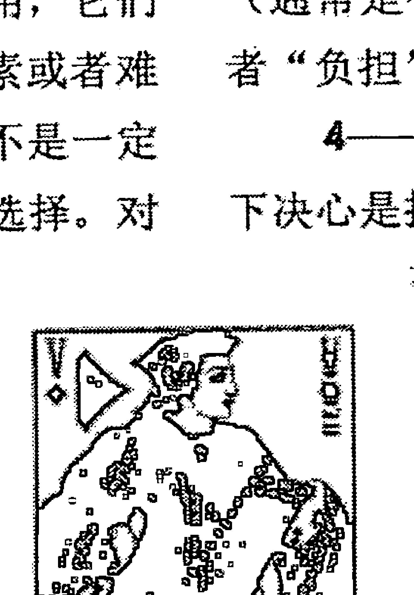

极的还是消极的。三张相同意味着不同力量之间的协调。两张相同既代表着矛盾，和谐，也代表着联系，这都取决于其花色所代表的意义。如果人头牌或者人像牌占大多数，那么解读通常会更着重于人而不是环境。

### 方块

方块对应着塔罗牌中的五芒星。这种花色代表着土元素，其所代表的信息是来源于我们的五种感官和常识。方块指的是实用性的事物。

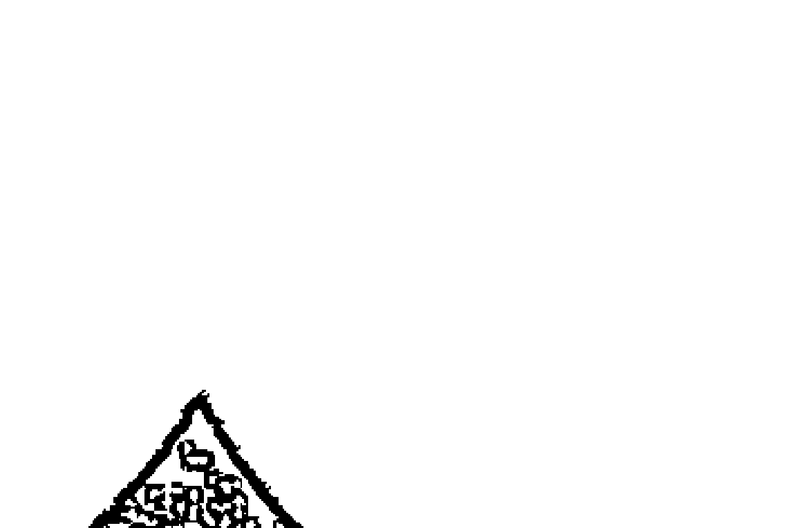

- A——一种新的财务上的或者实用性的事物；房屋的变化；与家相关的计划；或者繁荣的高峰。
- 2——生活中两个方面，或者责任区域之间的平衡；同伴之间的互利；通过不懈的努力，自己这一方的问题得到解决；额外的收入来源。
- 3——本固枝荣或者有着坚实基础的冒险；从某种程度上来说家庭成员的增加（通常是有新生儿诞生）；另外的承诺或者“负担”，会失去长久以来的优势。
- 4——实用领域的限制，此时你必须下决心是搏一把冒次险，还是满足于现状；有关家或者有关孩子的选择可能会没那么容易；在有关看似没有直接解决办法的财产或者经济问题上强调耐心的重要性。
- 5——暂时的实际或者财政问题可能会滋生一种孤独感。寻找新的建议或者帮助资源。不要放弃你的计划，但是在必要的地方进行修改。
- 6——文件和附属细则非常重要。在财务上要把好关，避免过多的承诺。反思并保存能量，而不是采取行动。可能会被家庭问题困扰一段时间。
- 7——自己这一方和财务会很融洽。此时，适合做长期计划。相信自己的梦境和直觉，还有自己的尝试。孩子或者宠物会带来乐趣。
- 8——会发现一种新的实用性或者赚钱的技巧。家庭或者财政处境可能会突然改变。引导任意一种躁动进入一种切实的改善中。
- 9——将个人兴趣放在第一位。成功会通过猜测和视野的扩大展现出来。独立的思想和行为会受到欢迎。
- 10——财政上的成功或者家庭幸福。计划或者实践的完成；或者一个新的永恒的家庭承诺。
- J——一个务实的，可靠的年轻人，他的常识，有益的态度和责任，以及金钱让他看起来拥有超过其年龄的睿智。无论是在繁荣期还是不景气的时期，都会提供永恒的安抚和支持。
- Q——一个务实的做事有条理的，或者是一个处于长期关系中的年年妇人；她的技巧在于她可以让他人在任何环境下都让他人感觉像在自己家一样，并能解决问题；一个很好的伙伴，而且是一个贴心的母亲形象。
- K——即使有时会有些迟钝，但是这个K在所有领域都很可靠；他拥有接近于无限的耐心，他倾向于通过行动而非语言来表达感情。

### 红心

这种花色与塔罗牌中的杯子或者圣杯相对应。它们与水元素有关，通常表示爱，情感，直觉，各种各样的关系，那些陷入恋爱的人，或者二三十岁的人们。

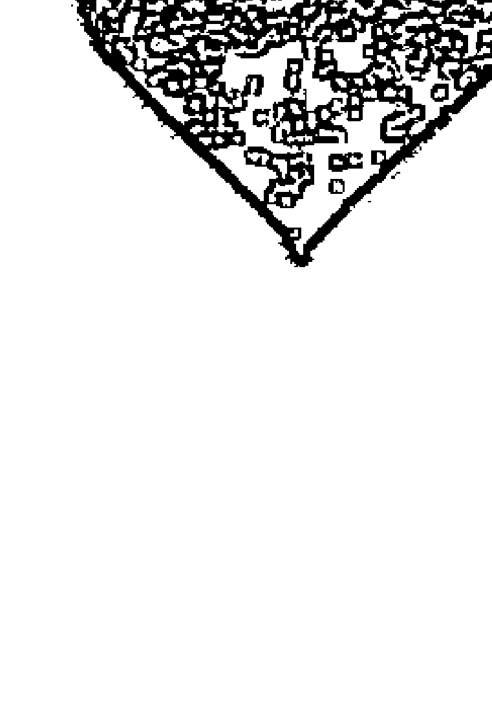

- A——一段重要的新关系或者友谊；情感上新的开始；应该被相信的新的洞察力的爆发；意想不到的幸福或者在一次情感挫折后新的开始；未得到回复的爱。
- 2——恋爱结婚，爱情或者婚姻深深的承诺，发展中的友谊或者以前争吵的修复。某人生活中两个不同方面的集合。
- 3——爱情或者友谊的对抗。情感冲突，两人相互寻找同情或者喜爱。他人的情感压力或者勒索所引起的压力。
- 4——与情感有关的选择。焦躁不安的感觉和情感上的不满。可能正在考虑另一个人的承诺。
- 5——误会；需要心与心之间的沟通；接受现存事实的真相，而不是渴望其他的可能性；充满激情，却不一定明智。
- 6——和谐，相当满足，无论是友情还是爱情。忠实朋友的积极影响；接受他人的不同观点对于爱情或者友情的培养毫无益处。和解，尤其是和长者之间。
- 7——直觉，梦境，以及心灵交流。相信你真实的直觉和内心的声音。交流可以让你和你亲近的人在心灵上更近一步。可能会发现同事，合作者，以及熟人和你共享着相同的波长，而且渴望合作的促成。
- 8——在一段关系中发展到一个新阶段。觉察到嫉妒心，需要结束可能是具有破坏性的关系或者依恋，或者去结束情感勒索。可能和心爱的人享受一个假期。
- 9——幸福的预示者，告诉你指定范围内的爱情和运势的进展。
- 10——凭借他人得到情感幸福和满足。给予他人情感上的安慰并从他人那里得到满足。幸福的婚姻或者恋爱关系。
- J——年轻人，情感上容易受伤的老年人，或者所有年龄阶段的寻求完美爱情和无可救药的浪漫的人。原始的“身披善良盔甲的骑士”，与真实生活中的人相比，他们会将爱情和浪漫看得更加重要。
- Q——成熟的女人，处于一段持久关系中的所有女人，或者是养育他人并提供倚靠的肩膀，耳朵倾听的女人。她们会被淹没在他人的痛苦和情感需要之中，从而可能会失去自我。可能会让他人无法意识到自己应该在情感上完全独立。
- K——老年人，他们拥有着非常的领导力，并且拥有让每个人感觉好像他们非常特殊而且是一个有价值的人的能力。如果忠诚的话，他会是一个非常浪漫，非常温柔的人，但是他会很容易被奉承所诱惑。或者会是一个社会工作者类型的，好管闲事，但是很难控制或者掌控自己的情感。

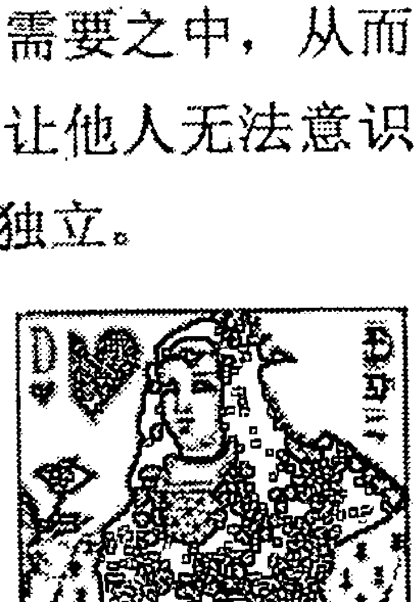

### 梅花

梅花与塔罗牌中的法杖（也称权杖）相对应。它们与火元素有关，在解读的时候，它们关乎着雄心、成功、事业、健康、旅行、发展、创业、沟通、成年人，以及同事或者合作者。

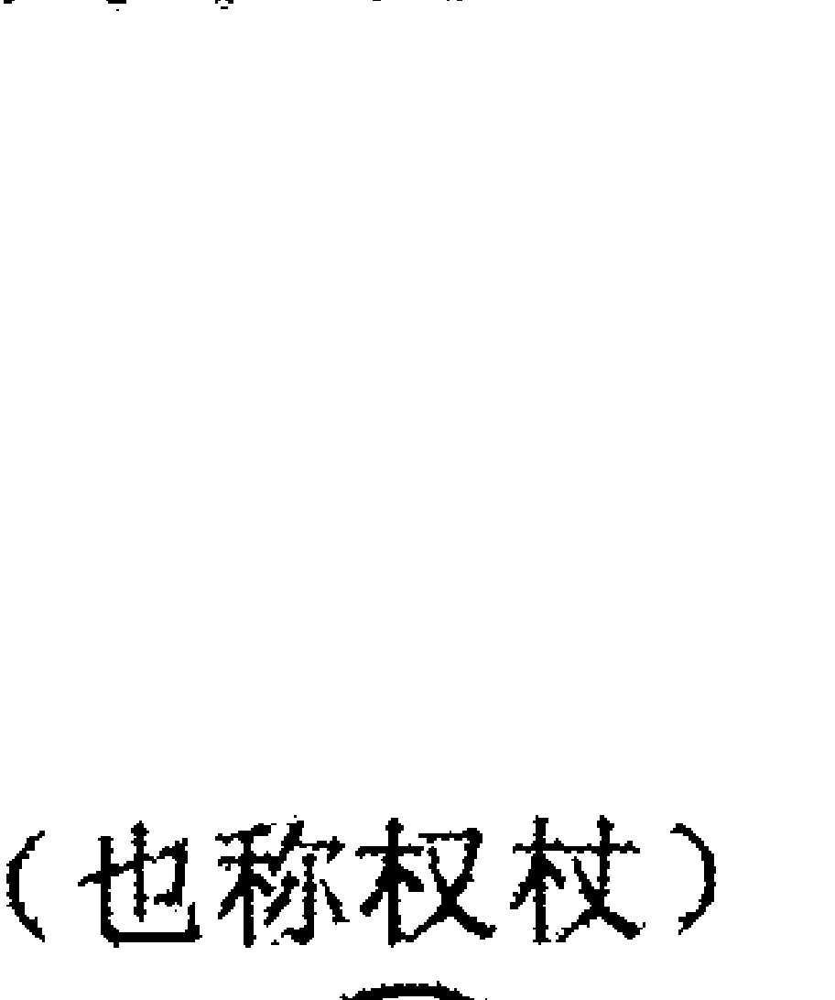

- A——在事业上的新开端，新的志向，最初的构想，新的观点，或者旅行的新机遇。新的沟通渠道。想要从一种受限的境遇中脱离出来，获得自由的渴望。
- 2——是考虑可能的选择或者道路的时刻了。与他人相关的计划可能看似受到了约束。有必要平衡一下视野和健康的需求，尤其是当筋疲力尽或者压力成为了主要因素的时候。小心谨慎地着手处理生意上可能的冒险或者伙伴。
- 3——有关旅行的决定，或者一次开拓视野的机遇。生意或者工作的承诺和机遇也许会增加，而且将会需要额外的精力和付出。头痛将会牵涉几个人。
- 4——尽管他人会造成一定的约束，你还是应该继续前进，虽然这可能会令人沮丧。赢得信任的能力是巨大的，而清楚的沟通也是必要的，即使这样做会拖慢前进的脚步。书面交流在弄清楚一个人自身身份和其位置上可能会比口头交流更具价值。
- 5——到了讨论某人情况和坚持某人立场的时间，但是这些都无关家庭内部事务。从健康的观点来说，需要小心一些，避免因为筋疲力尽和粗心大意，以及一些因为过度牵连到由他人引起或者造成的问题中所生成的压力，所造成的意外。应该尽量减少与对手的交流与妥协。一定要获得与你的付出和想法相一致的信任。
- 6——工作上正经历一段稳定期：应该抓住机会抽空进行一次短暂的休假，花时间放松与休息；健康状况稳定，或者应该呈现一种提升的状态。此时是为创造和建立各种关系而做准备的时期。

7——一个人的成功和自我满足。高水准的精力和创造力。理想很重要，而且会存在一些你需要去争取的东西的原则。最终的幸福不会立即出现，需要设立长远的目标才能获得回报。

8——突然的精力的高涨，进取心的爆发，事业、旅行或者生活方式的改变。“把握今天”，学会及时行乐。也许在某种程度上甚至会独立创业。

9——因为有太多的工作需要我们去做，而我们所拥有的时间又太少，所以责任看起来会非常沉重。很多的这些负担可以也应该委托给他人。自我怀疑和自信的丧失让事情看起来比实际情况更加糟糕。勇气和信念与压力同行。

10——成功完成一个目标；改变方向和学习新技巧的机会，也许与沟通有关。将会在不久的将来意识到一个梦想，一个理想，或者高于一切的志向。寻找个人幸福，自信，以及自我独立。

J——一个精力充沛的年轻人，或者是一个不断地从一件事情跳跃到另一件事情的人。这个杰克会在事情进行得不太顺利的时候对其失去兴趣，他们在将自己的精力集中在他们的工作或者兴趣上时无视他人的存在。他（她）是一位沟通大师，但是对于真相却相当直言不讳。

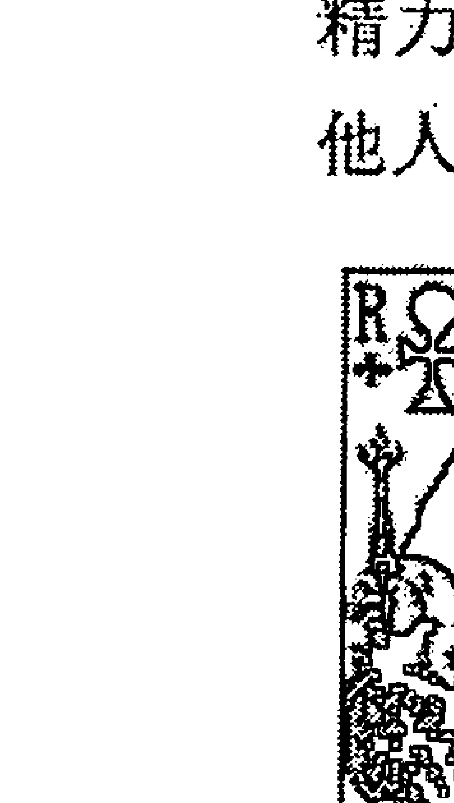

够将生活中很多不同的困境结合在一起。然而，这样可能会导致自己疲惫不堪。她非常机智圆滑，非常具有说服力，能够得到自己想要的，还会让每个人都觉得幸福。

K——成功的，拥有雄心壮志的男人，他是一个改革者，而且是一个强大的交流者。他们对他人的需求和感觉反应迟钝，通常是因为他们没有耐心去完成任务。在遭遇任何困难的时候，他们通常都能找到出路。这张牌是一个理想主义者，在原则问题上是不会妥协的。

## 黑桃

黑桃相当于塔罗牌中的宝剑，代表了气元素。它们代表着限制，挑战，传统，有条理的学习，正义，评定，年长的人和衰老。

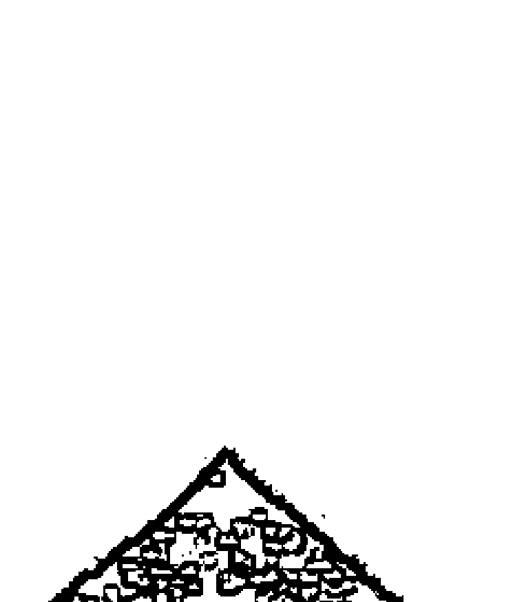

A——在困难或者痛苦之后一次新的开始。一种新的学习形式。突然地追索正义。一次新的挑战为你敞开大门。

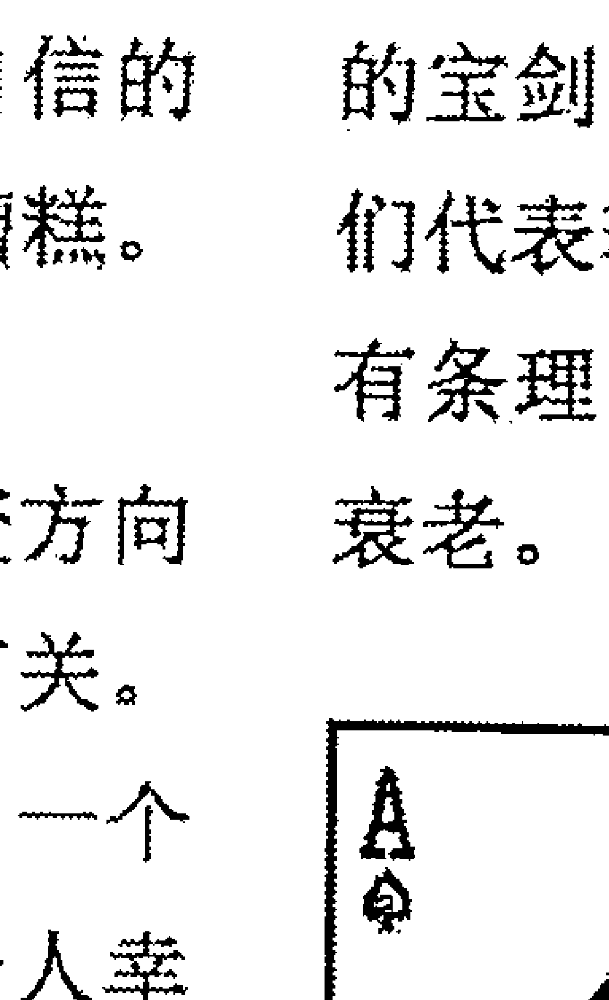

2——两种看似没有吸引力的选择，但是必须在两者之前作出选择。当人与人之间，或者生活各方面之间出现矛盾的时候使用逻辑的需要。决定两条信息的真实性。

Q——一个成熟的女人，无论是否处于一种持久的关系中都非常独立。她是一位很好的组织者，精力充沛，能够将生活中很多不同的困境结合在一起。然而，这样可能会导致自己疲惫不堪。她非常机智圆滑，非常具有说服力，能够得到自己想要的，还会让每个人都觉得幸福。

3——只有理性才能解决的怨恨和敌对。接受挑战或者克服障碍，可能会需要时间和努力，但是最终定会成功。吸纳一些看起来不会立即使用到的事实，但是假以时日可能会变得有用。

4——限制和障碍主要来源于因为过去的经历而产生的内心的恐惧。也许会敏锐地觉察到不公正，但是除非可以解决，否则就将其搁置一旁。前进可能会失败，不管怎样不公平。

5——确定事实，避免误会，隐藏的恶意，他人的不诚实行为。意识到没有高标准的人不应该引起你放弃你的计划，即使你可能需要减少开诚布公你的意图。

6——形式上的正义可能会出乎意料地很有帮助。在动荡或者自我怀疑后会有一段冷静期。曾经遭遇困难的关系可能会有进一步的发展。

7——当逻辑和专家观点失败后直觉会起作用。所有优势都会达到最大化，不会因可能存在的矛盾而退缩。

8——如果你将过去抛诸脑后，并充满希望地面对未来，改变就有可能会发生。详细地讨论你的担心和害怕，而且你可能会发现未来存在着很多你没有考虑到的可能性。新的联系和途径将会被证明非常有用。

9——勇气和决心可以克服你前进道路上的所有事情。失败和拒绝的担心是没有事实根据的。你所知道的远比你认为自己所知道的多。

10——更好的日子就在前方。可能预示着一个自然结局，而随之而来的便是一个新的开始。此时，乐观主义是关键。

J——年轻人，或者一个不成熟的长者，可能会随意地或者有目的地伤害他人。通常非常聪明，非常幽默，表现为讽刺挖苦以及诙谐地批评。通常倾向于不相信他人，不相信生活，即使在这些相信背后通常都有理由。

Q——被称为痛苦女王，这是一个爱挑剔的，失望的成熟女人，八卦的邻居，不赞成的婆婆。然而，这个女王可能会意想不到地忠诚，在防卫自己的时候非常强大。她通常会因为害怕独自一人而占有欲很强。

K——这是不赞成的权威人物，严厉的法官，挑剔的父亲，他自己拥有大量的知识储备，使得他无法忍受他人的错误。一个完美主义者，害怕自己的弱点，非常喜欢孤立。

## 占卜牌阵

解读纸牌的方式有好几种，而你也可以采用塔罗的牌阵来解读这些纸牌。你可以选择一张单一的牌来解读，或者使用几张牌来摆放为一个牌阵。这样的牌阵有三种：时间之箭阵，U形马蹄铁阵，凯尔特十字阵。

一张牌占卜（国内也称天狼星阵）牌阵是用于对某种形势的概况了解。在时间之箭阵中，随意抽取三张纸牌，从左往右摆放。解读时候的顺序也按照摆放的顺序来。第一张牌（最左边那张）指的是过去，中间那张指的是现在，右边那张指的是未来。这种牌阵可以应用在任何情形中，这三张纸牌象征着引发情况发生的影响（过去），当前占主导地位的影响（现在），这件事情可能的结果（未来）。

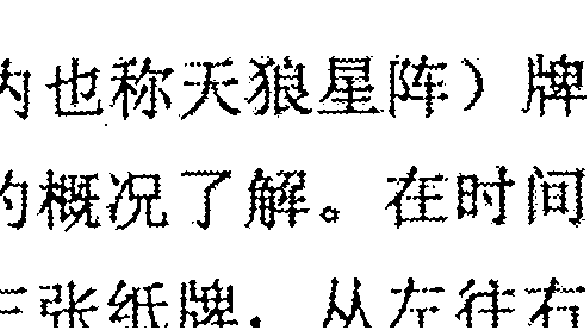

U形马蹄铁阵与时间之箭阵很相似，但是从左到右摆放的是七张牌。这种牌阵通常用于解决单一的情形或者问题。第一张牌代表着过去以及引起当前情况发生的影响。第二张牌以现在的情况为中心。第四张牌与提问者设计了必须应对的与当下情况有关的障碍和问题。第五张牌代表着提问者周围的人和环境。第六张牌指的是将会影响整个局势的未来和刚发生的事情。第七张牌也是最后一张牌代表着基于其他牌的情形最可能的结果。

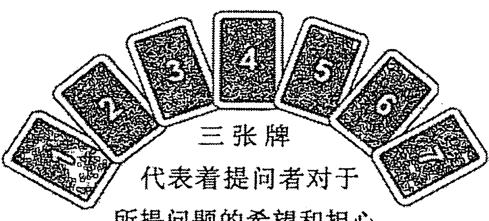

凯尔特十字阵会在很多的占卜形式中用到，例如塔罗牌和如尼符文。这种牌阵可以用于占卜特殊问题，或者做更深入的解读。

1.  **现在。** 位于问题或者情况周围的，占主导地位的事情，问题，态度，以及影响。
2.  **十字。** 提问者必须应对的当下的障碍，问题，矛盾，以及反对意见。
3.  **起源。** 当前情况的依据或者起因。
4.  **过去。** 来自最近的过去的事件或者影响，现在正在渐渐隐去。
5.  **王冠。** 从当前的情形中能够获得的最佳结果。
6.  **未来。** 开始起作用的未来结果和最新的影响。
7.  **提问者。** 提问者和其问题中的情形有怎样的联系。
8.  **相关人士。** 提问者周围的人对即将到来的问题的影响和看法。
9.  **希望和担心。** 提问者对于这个问题或者当前情形的希望和担心。
10. **结果。** 这种情形的长远结果或者你能从中学到的经验教训。

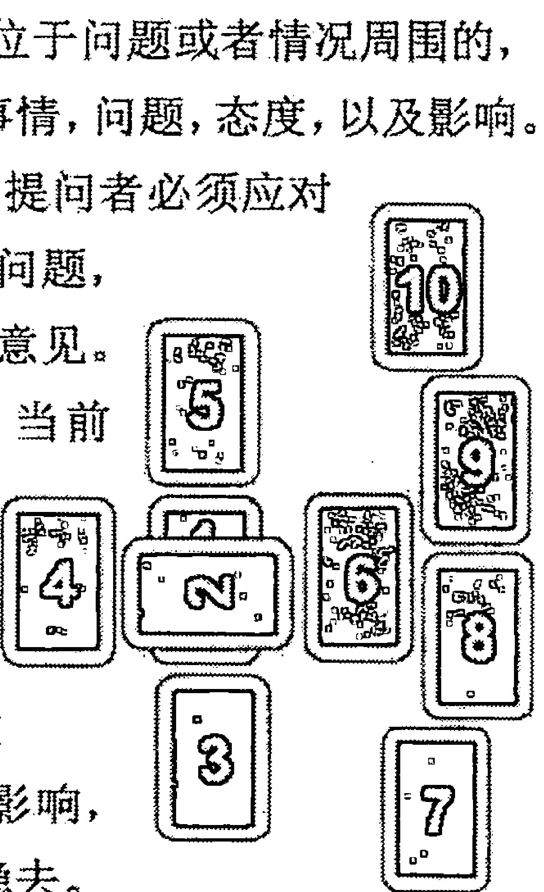

## 7. 茶叶占卜

文 / 奥伯伦和书月人

茶最早出现在中国，大约 5000 多年前——作为一种提神的饮料和一种镇定药剂。作为一种奢侈的饮料，它在 17 世纪中期被引入英国。直到 1885 年，大多数的茶都来自于中国（因此产生的这样一种表述：“即使把所有的中国茶给我，我也不愿意！”意思是“无论如何都不做某件事”），但是在 1885 年以后，印度和锡兰也加入了这种贸易，并迅速成为了西方国家的最大供货商。

在维多利亚时期，茶是如此地贵重，因此通常都会锁在小盒子中避免佣人偷取！也就在此时茶叶占卜成为了上流社会的妇女们所热衷的一种占卜形式。通常只在亲密的朋友之间分享占卜结果。

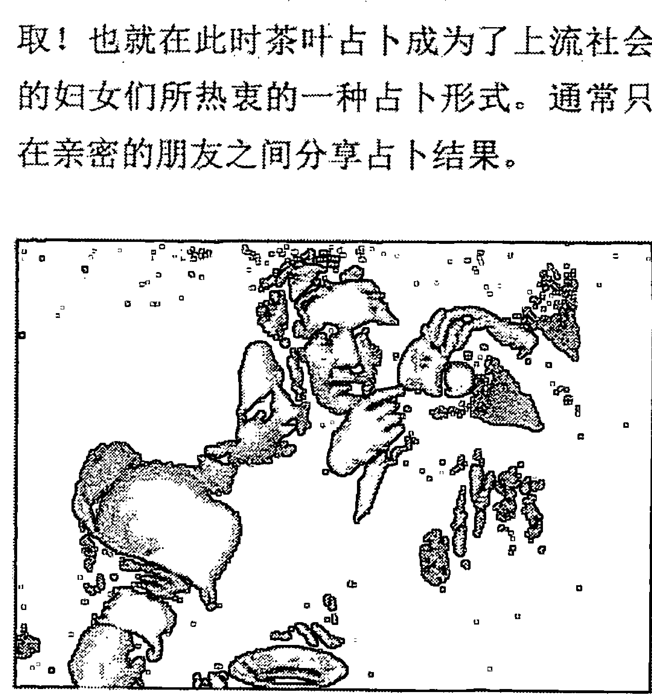

## 解读茶叶

在每位宾客的茶杯中放入一茶匙的干薄荷叶子。浇上新烧开的水，浸泡五分钟。你可以让你的客人喝掉茶水，也可以将茶水小心翼翼地倒出来，将茶叶和一小部分的茶水留在茶杯里。每个人都用他们的手将茶杯盖起来，并旋转茶杯几次。然后，客人相互交换茶杯，并“解读”茶叶。茶叶会形成一些符号，包括形状，字母，或者数字。

不幸的是，就像梦境解读一样，由茶叶所形成的图形有几种完全不同的解读方式。以下是一些最常见的布置和解读：

-   **飞机：** 一次即将到来的旅行
-   **锚：** 一个不容乐观的情形
-   **苹果：** 财富，成就
-   **箭：** 爱情中的坏消息
-   **斧头：** 你或你的一个朋友可能会遭遇危险或者困难
-   **球：** 渴望旅行
-   **钟：** 好消息
-   **鸟：** 好运，好消息
-   **船：** 有朋友到访
-   **书（关着的）：** 一个需要调查的问题
-   **书（打开的）：** 问题的答案
-   **蜡烛：** 照亮未来的光明，来自朋友的帮助

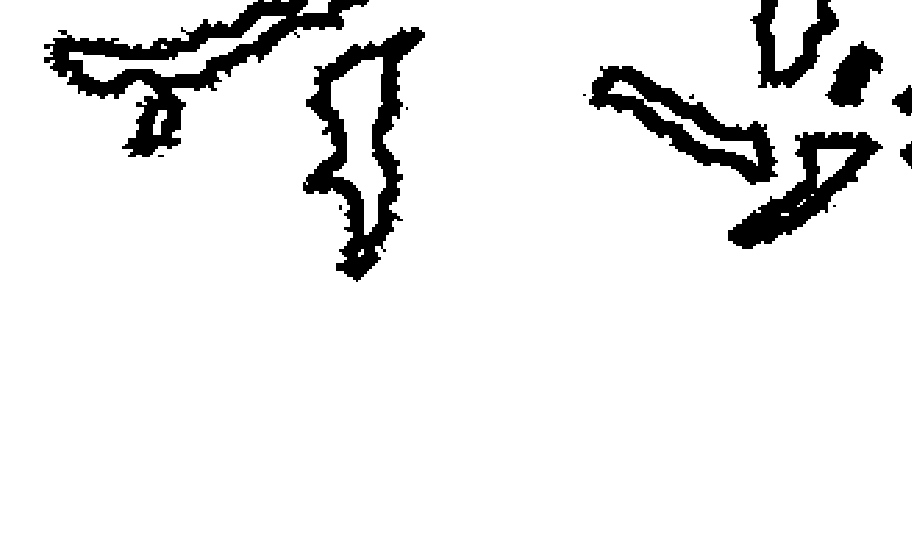

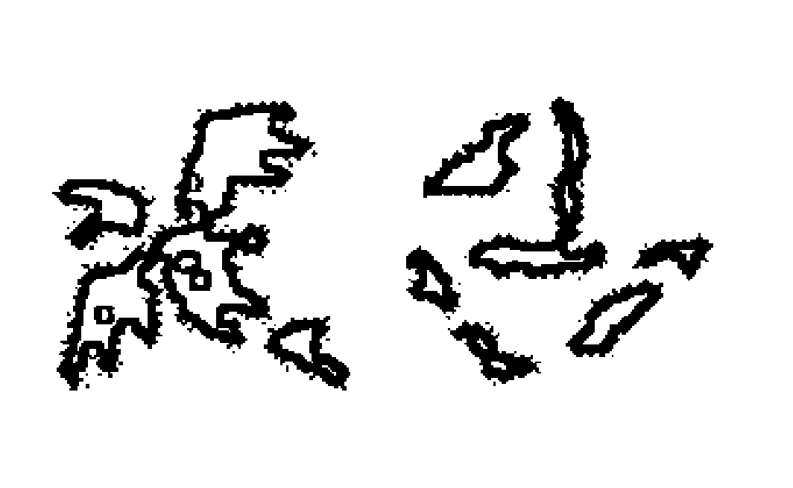

-   **猫：** 欺骗，一个错误的朋友
-   **圆圈：** 成功
-   **硬币：** 繁荣
-   **狗：** 一个忠实的朋友
-   **鸡蛋：** 新生命
-   **眼睛：** 警示，预见
-   **喷泉：** 大大的幸福
-   **帽子：** 即将到来的荣耀，晋升，或者加薪

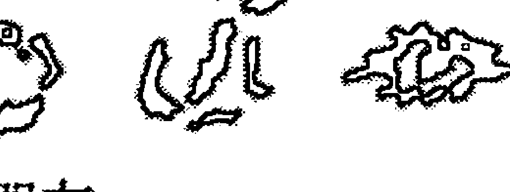

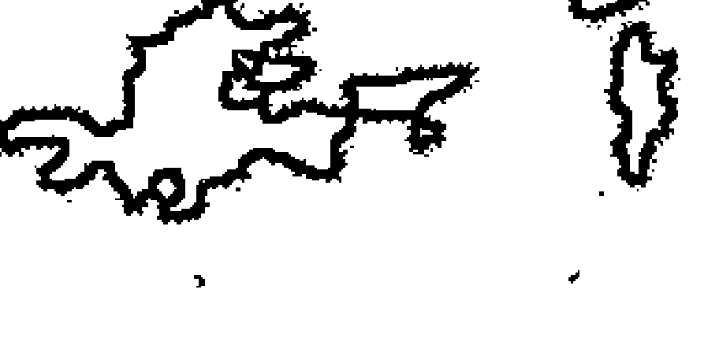

-   **房屋：** 舒适，家
-   **风筝：** 愿望将会实现
-   **梯子：** 商业上的成功
-   **叶子：** 新生命
-   **字母：** 朋友或者亲戚的名字
-   **人：** 拜访者，男性或者女性
-   **数字：** 暗示着时间的跨度，比如月或者年

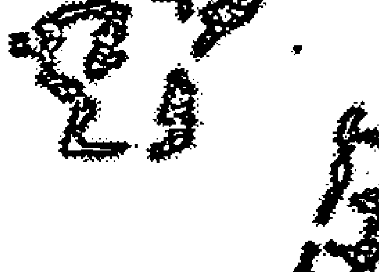

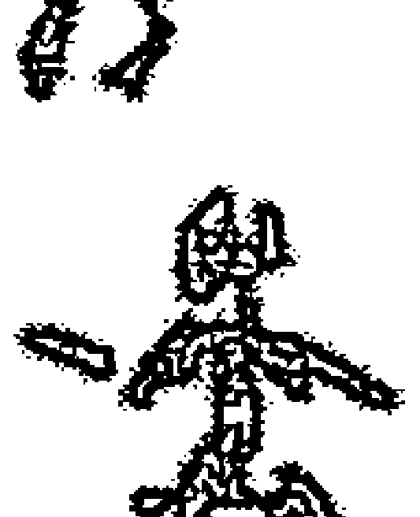

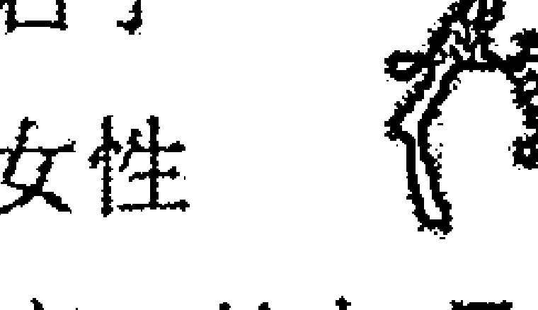

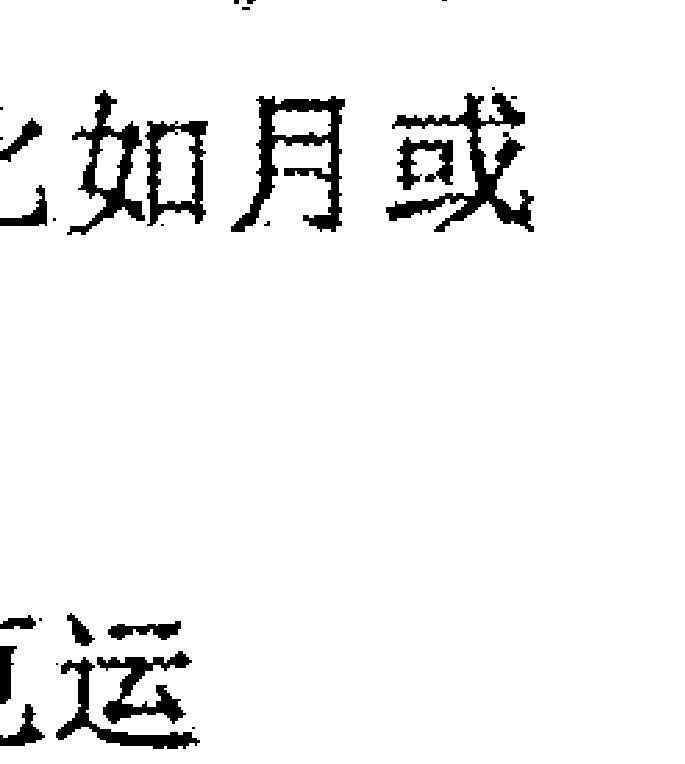

-   **猫头鹰：** 前方会有好运或者厄运
-   **猪：** 贪婪
-   **蛇：** 附近有敌人
-   **蜘蛛：** 工作的报酬
-   **正方形：** 需要谨慎
-   **星星：** 希望
-   **剑：** 将来争吵的警示
-   **树：** 健康
-   **三角形：** 好兆头，好运
-   **乌龟：** 批评
-   **狼：** 嫉妒

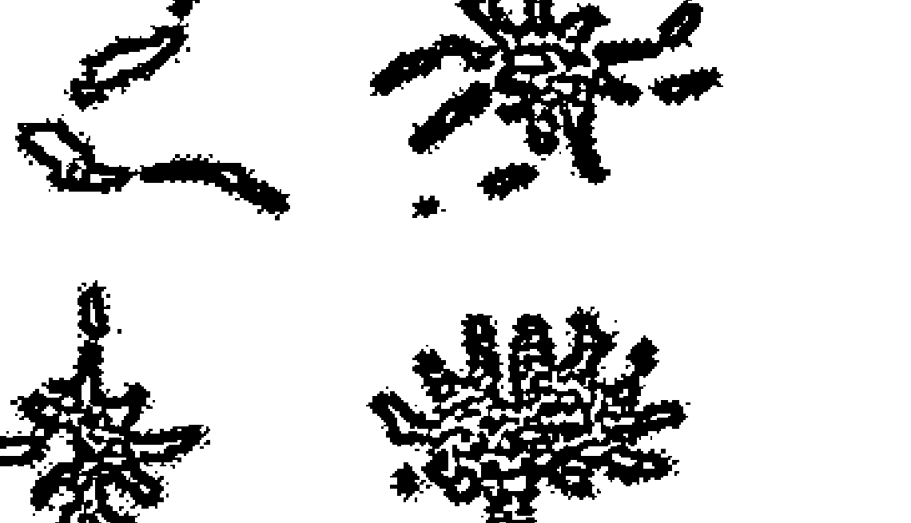

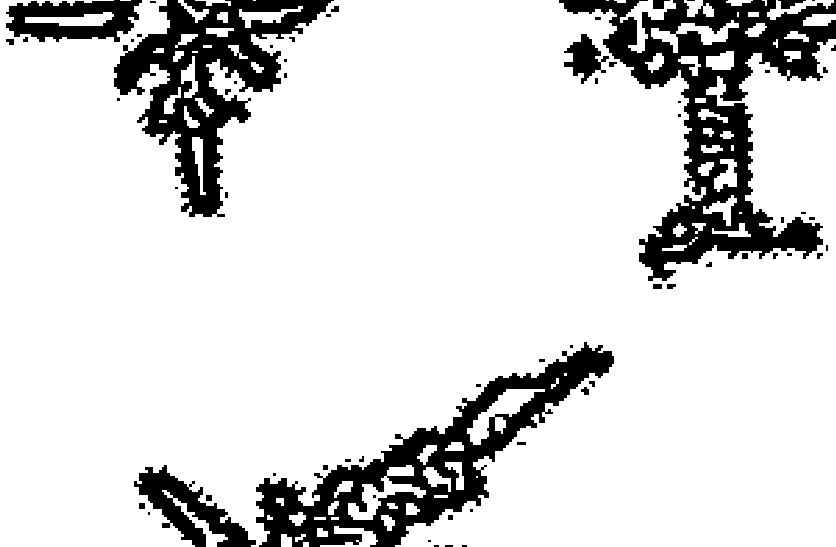

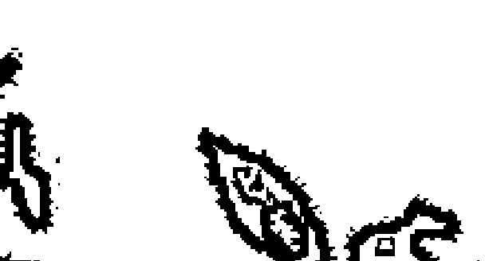

## 8. 焚香占卜

文 / 凯特琳·布林 (Katlyn Breene)

-   **三角形：** 好兆头，好运
-   **乌龟：** 批评
-   **狼：** 嫉妒

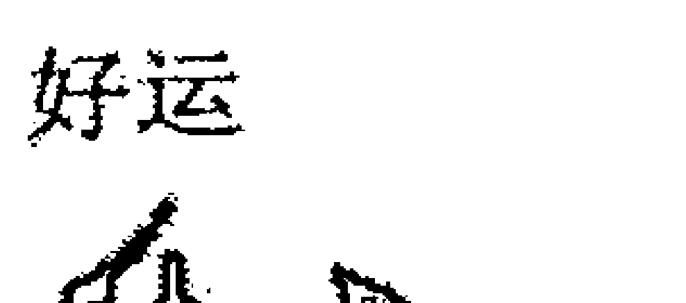

> 点燃香料闪闪发光，点燃美酒嘶嘶作响，
呼吸的火焰嘴唇卷曲相互亲吻
一排排小小的干乳香
围绕在红色的闷火花周围，
花儿的颜色像火，却是比火更冷，
预示着有些事情将会发生……

（引自阿尔杰农·史文朋）

这是一种通过焚香来进行占卜的艺术。当焚香在火炭上燃烧的时候我们根据其闪耀出的火花，发出的爆裂声和喀拉声，以及其升起的烟雾所形成的形状来获取其迹象。焚香包括小个的种子（香菜，茉莉属，茴香，大麻）或者在询问神谕香炉问题时，火柴头粉末（硝酸钾）效果很好。在你大声询问了你的问题之后，仔细听听由种子的爆裂声或者硝酸钾闪烁的火光所提供的答案。例如：一个声响代表“是的”，连续的两声代表“否”，安静无声代表“结果并不明朗”。通过对烟雾的占卜也可以解读其所代表的迹象，观察烟雾的方向。如果它飘向你，那就是个好兆头。

> 如果你和我的想法一致，
请你将烟雾飘向我。
如果你和我不一致，
请让烟雾飘往相反的方向，
既可以往右又可以往左……

如果焚香过早地停止了燃烧，那就表明“现在并不是询问的时候”。当燃烧完成以后，你还可以解读其燃烧过后所留下的灰烬，在香炉中找出其形状和符号，就像在茶杯中解读茶叶是一样的。16世纪和17世纪的魔法师和预言家会在占卜仪式中使用芳香植物的种子。将种子投入炙热的大汽锅中，通过其烟雾所呈现的形状来做解读。寻找宝藏的魔法师使用焚香和拜火仪式来获取他们的目标，同时还要念诵这个古老的咒语：

> 火啊火，神圣的火，
朝向我所追求的财富，
因此我希望我可以看到
大量的财富滚滚而来。

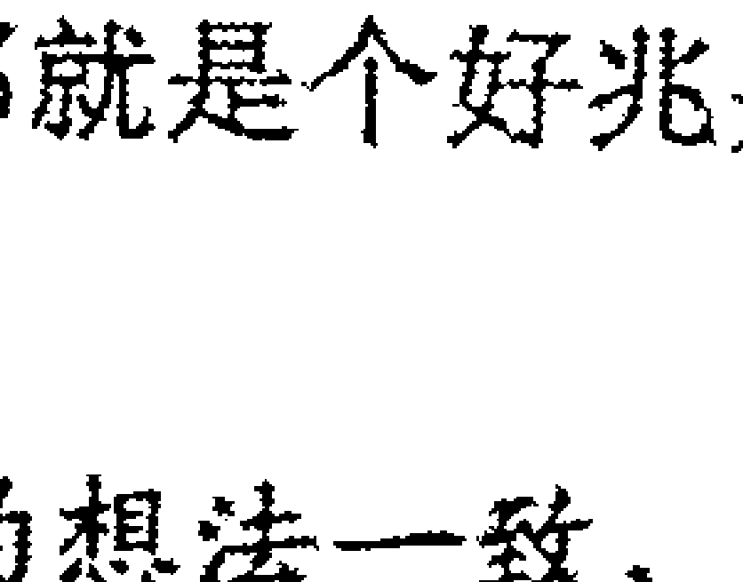

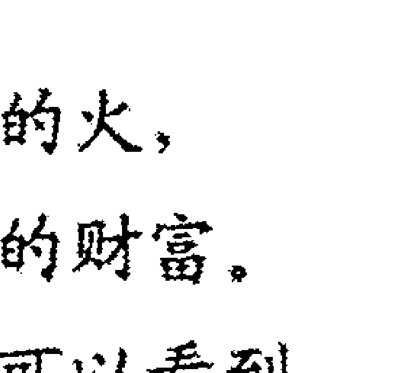

## 9. 探测术（用占卜探矿或者探水源）

文 / 道娜塔·埃亨（浅绿色）

> 注意：该材料得到了经验丰富的探矿者华特·伍兹（Walter Woods）的准许，将他的作品《致罗宾》（Letter to Robin）进行了改编，详见 http://www.lettertorobin.org/，更多信息详见美国探矿者学会网站 http://www.dowsers.org/

根据 ASD，“探测术是直觉的一种积极的，系统化的经验”。探测需要使用工具来完成。几世纪以来，人们都使用探测术来寻找水源。水，矿物，以及其他看起来拥有天然磁性，电磁或者其他能量的物质。人体对这些能量非常敏感。大多数的人在经过培训和练习后，可以培养一定程度上的探测技巧。探测工具可以让你对微妙的潜意识感应更加敏感。探测工具就是一种简单的接口或者交流装置，看起来似乎是通过或者被你的潜意识控制的。大多数的探测家会使用一些类型的探测工具，其中最流行的便是灵摆。

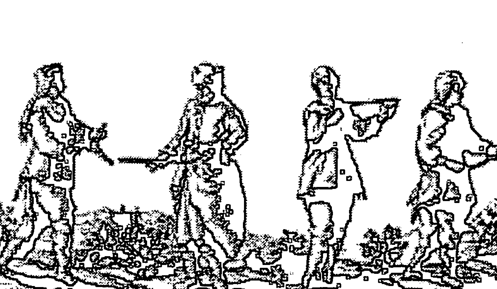

四种不同类型的探测棒，阿贝·威利莫特（Abbe de Villemont），《隐匿物理的讨论》（Traite de Physique），1693

### 基本的探测工具

有很多非常成功的探测体系和方法，有的会使用工具，有的不会。最受欢迎的是 L 形探测棍，Y 形探测棍，以及灵摆的使用。很多探测者都拥有一整套的探测工具，有的是搜集购买的，有的是自己做的。你需要选择一些对你来说效果较好而且比较趁手的。

### L形探测棍（角形棍，摆杆，指向杆）

形状：一个手柄（有的有，有的没有）。顶上的线可以是从4英寸到大于2英尺不等。通常的长度为12—16英寸不等。

材料：通常为电线。一个金属的外套衣架也是不错的制作原料。焊接棍也是一种很受欢迎的材料。你可以使用任何可以弯曲成L形状的材料。

怎样使用：用手轻轻握住电线的顶端，略微向下倾斜。当你使用的是一根L形探测棍时，它便充当了指向杆和摆杆的角色。你可以请求它指向一个目标或者方向，或者在遇到特殊磁场的时候向一旁摆动。（例如：一个光环区或者有毒区。）当你使用的是两根L形探测棍时，通常会将其设定为直接指向可能的位置，在回答“是”或者到达目标上方时两根L形探测棍会交叉为十字形，向外摆动则为“否”。

优势：制作简单，使用方法简单，非常通用，而且很受欢迎。在经过高低不平的地面时效果很好。通常不会受到微风的影响。

劣势：和灵摆一样，携带不方便，隐藏也不方便。即使小型的4—6英寸的可以放在衣兜里或者手提袋中。

### Y形探测棍（叉形棍）

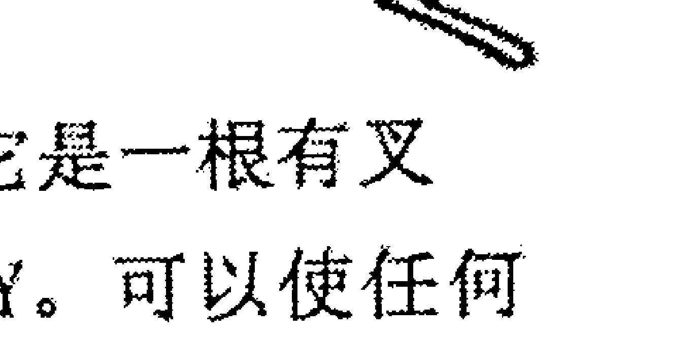

形状：传统上来讲，它是一根有叉的棍子，看起来就像字母Y。可以使任何尺寸，但是通常长度为12—24英寸。

材料：可以使木头，金属，或者塑料。现在的探测者通常都会使用塑料材质的，可能是因为塑料的比较容易储藏。

怎么使用：双手握住叉形部分，尖头向下。大拇指指向 上，手掌朝向中间。紧紧握住，将Y形往外拉，将你的手腕往外旋转。此时，你的大拇指朝向外面，掌心向上。Y形棍会往上弹，进入一种微妙的平衡状态。通常在到达可能位置的时候探测棍会指向上方，形成大约45°的角度。在指向水脉或者目标的时候会在可能的位置向下摆动，这种表现还可以被看作是在回答“是”。通常向着可能的位置相反的方向摆动意为“否”。

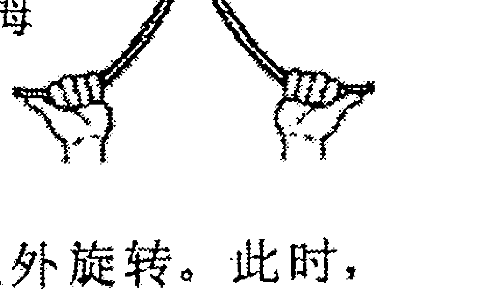

优势：反应很快，可以直接指向水脉或者目标。在高低不平的地面上行走或者遭遇强风时效果也非常好。

劣势：并不和其他的探测工具一样那么通用。它只能上下移动。你需要转动身体来寻找方向。

### 灵摆

形状：你可以在一根绳或者链子上面悬挂任何可以悬挂的物品。可以是任意大小，但是通常尺寸为3—6英寸小，甚至可以是像挂在一根线上的曲别针。链子或者绳子通常大约为3—4英寸长。

材料：任何你可以找到的材料。随性而为。水晶，金属，或者木头效果都不错。

怎么使用：用大拇指和食指捏住绳子的一端，摆向下垂。通常往前摆动为“是”，左右摆动为“否”，以一定角度摆动为“可能位置”。

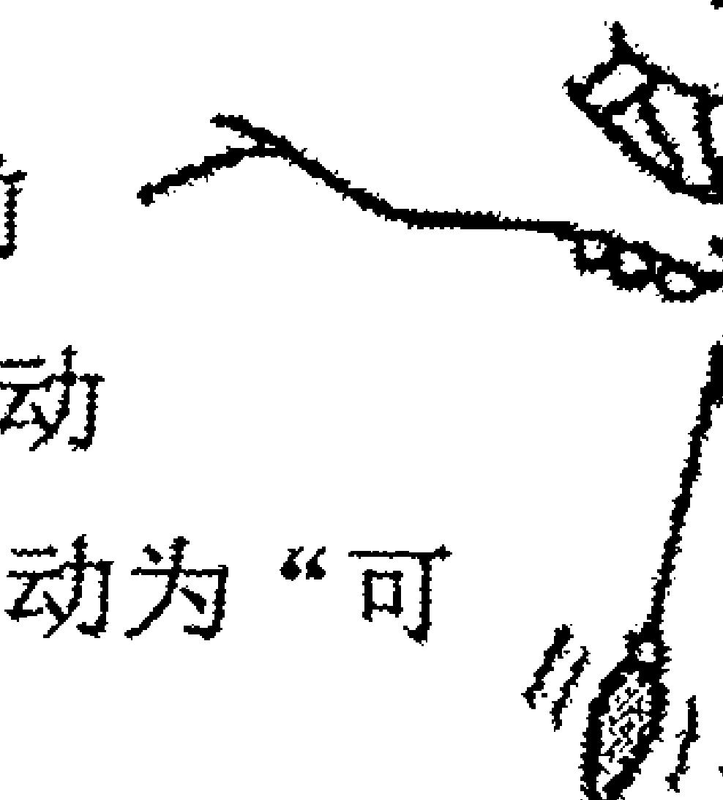

优势：制作简单，容易使用。非常受欢迎。非常小巧，可以放在口袋，也可以放在手提包中。反应迅速。在探测地图或者图表时非常实用的工具。

劣势：在有风或者走动的时候使用不便。这个问题可以通过请求（预先安排，计划）灵摆按照顺时针或者逆时针方向旋转以代表“是”或者“否”的回答来克服。

### 灵摆探测

#### 学会使用灵摆

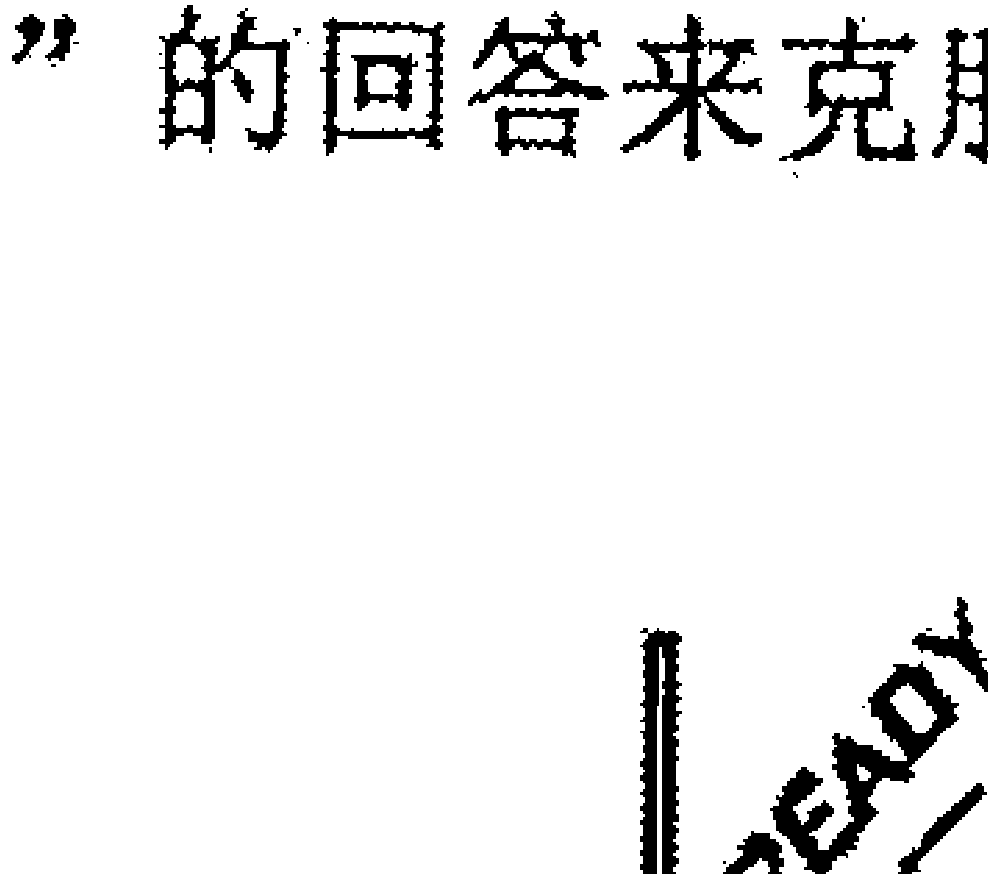

找一个安静秘密的地方。像图中一样握住灵摆。你会想要知道你的灵摆对于“是”和“否”会做出怎样的回应。对于灵摆来说，通常回应“是”时是直直往前摆动，左右摆动为“否”。你可能会发现你的灵摆左右摆动时表示的是“现在还不是时候”或者“可能”。一些灵摆顺时针旋转为“是”，逆时针旋转为“否”。你可以按照你自己的喜好规定你的探测工具的反应是怎样的意思。

1.  第一步：放松，进入一种安静的状态。
2.  第二步：拿出你的灵摆，用大拇指和食指捏住绳子或者链子的一端。接下来，在一幅图表（像右图中一样）中间位置悬摆你的灵摆。

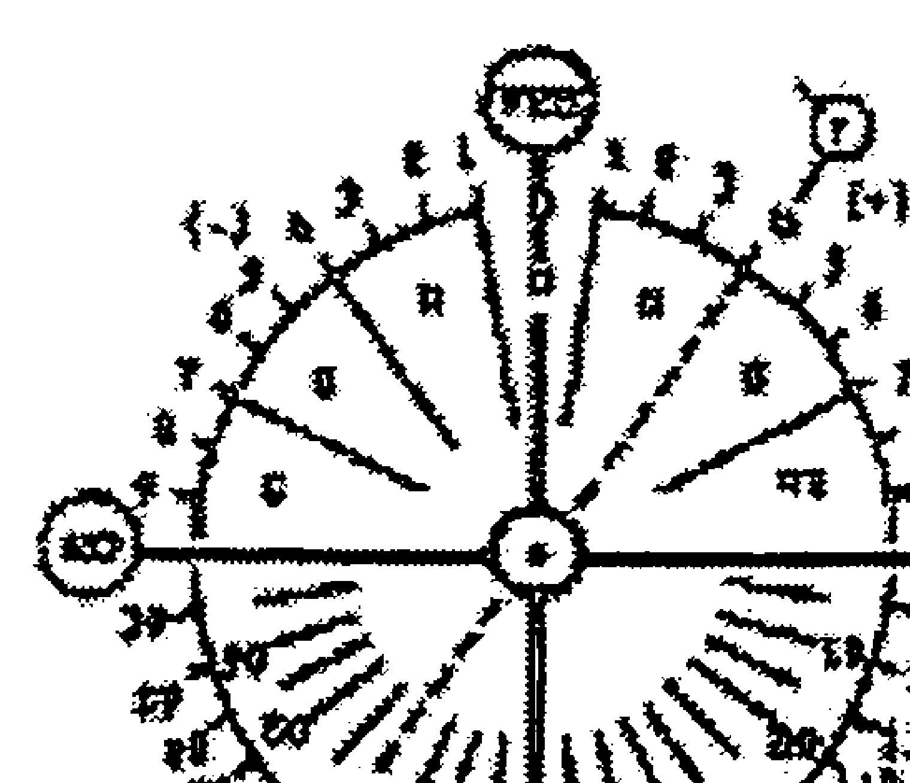

3.  第三步：移动你的手或者手指，让灵摆开始摆向“是”，要求并期望它在没有外力的情况下继续摆动。如果它停止了，再来一次，并要求它继续摆动。重复几次，直到灵摆会自行摆动。你需要有意地让其摆动起来，然后请求它在没有你的帮助下也持续摆动。
4.  第四步：按照同样的方式来规定回应为“否”时的摆动方式。
5.  第五步：一旦它可能自己摆动“否”后，要求它按顺时针方向摆回“是”。
6.  第六步：这些是你所需要的基本的灵摆控制。如果你能够完成上面的步骤，你就完成了初步的学习，可以进入更深层次的学习。如果你不能在15分钟内完成上面的步骤，试着在半个小时内搞定，或者第二天再次联系。不要放弃。圆形图案中的符号所代表的意义：M=微风，N=常态风，B=平衡风，S=强风，VS=狂风，C=临界风速，(-) = 不足，减少，等等。(+) = 超额，增加，等等。数字=强度。

#### 在探测时的行为准则

1.  感觉：当你在感觉一些信息的时候，不要将你自己依附在工具上。比如，# 魔法师学徒的伴侣书 | 上卷

如果你在观看一场电影，你可以以多种方式自由做出反应。你以怎样的方式来获取信息是你的选择。使用灵摆，或者其它探测装置的优势便是你不需要用身体去感受，或者成为能量的一部分。

- 2. 自我保护。避免吸收一些不需要的能量，和你的灵摆交谈时要将它看作是一个人。这样你就会将能量导向灵摆，而不是你。这样做可以将你的精神控制在灵摆的动作上，而不是在能量上。

- 3. 问题：潜意识在解释你的问题时是非常流于表面的，而且似乎不会做任何的假设。例如，如果你问：“我的汽车需要汽油吗？”潜意识会回答“是的”。你假设它知道你所说的是汽车油箱中有很多油，但是那并不是你所问的问题。很多看起来错误的答案，在你将问题表面化的时候，其实是正确的。让你的问题更加确切一些，询问一些存在于某些地方的信息，而不是对于过去，现在，或者未来的观点。让你的问题尽可能地完整。不完整问题的例子有：“你有足够的钱吗？”用来做什么？如果你只是那么问的话，答案也是不准确而且模棱两可的。如果你这样问：“你口袋里的钱够买一个1美元的圆筒冰淇淋吗？”那么你就会得到一个非常肯定而且准确的答案。

- 4. 生命课程和保密领域：打探任何人的“生命课程”，干涉他们的选择自由，他们的“因缘”，或者其他未知领域都是不道德的。一定要询问你的灵摆，我可以……吗，我能……吗，我应该……吗？如果答案是“不”，那么就不要再问问题。

- 5. 隐私：千万不要在别人不知情的情况下探测他人。一定要尊重他人的隐私。

- 6. 因缘：在心中牢牢记住因果报应或者因缘的规律，你所送出的东西终究会回到你自己身上。一定要出于好心为他人占卜探测，千万不要出于恶意或者想要伤害他人的目的。

- 7. 诊断：不要诊断或者给予任何类型的医学建议！！一定要建议他人只有在认为自己遇到问题时才接受别人的医学建议。

- 8. 保持简单：努力让你的探测尽可能简单。务必要多加练习，并享受你的探测过程。

### 10. 怎样制作你自己的如尼符文

文 / 牧师罗伯特·李·埃里森 (Rev. Robert lee Ellison) (黄色)

如尼符文是一种很有价值的工具，它们会帮助我们预测未来，并聆听我们的潜意识所告诉我们的东西。对于大多数的人来说，如尼符文如果自己亲手制作的话，在使用的时候效果会达到最佳。因为人们制作如尼符文的技巧水平有限，所以这一节我们会着重讨论从最简单到稍微有些复杂的制作方法。

最简单的方法是在手工艺品店找一些扁平的圆盘，直径大约1英寸，用一支笔尖超细的三福（品牌名）记号笔在每一个圆盘上面绘制一个如尼文字。这些圆盘通常是由硬木制成，一袋25个，因此是制作如尼符文的绝佳选择。用这种办法制作的如尼符文的保存时期特别长。

第二种方法也是使用相同的圆盘，但是我们可以用钢笔代替记号笔来绘制如尼文字，使用烧炭工具可以让你制作的如尼符文看起来更加古旧一些。使用一个烧炭工具来练练手。当你在圆盘上绘制如尼文字之前，你可以在一片废弃的木头上将每个如尼文字都练习几遍，找到感觉后再写在圆盘上。

第三种办法是在扁平的圆盘上用锥子雕刻出如尼文字，然后使用非常细小的漆刷将每一笔一划都填上颜色。这种方法需要更多的练习和时间，但是制作出来的如尼符文会非常漂亮。你可以将每一组（8个如尼文字一组）的如尼文字填上不同的颜色，或者所有如尼符文颜色都一样，或者每个如尼符文的颜色都不一样。

另一种材料为石头。最好的用来制作如尼石刻的石头，应该是在河流中侵蚀了很多年，表面变得非常光滑的那些。在工艺品店你可以看到很多这样的石头，或者如果你想更加与众不同一点，你可以自己去河边捡拾这样的石子。无论你选择哪种方式，它们制作出来的都会是非常漂亮的如尼符文。

对于如尼文字及其意义，你可以参照《魔法师学徒的魔法书》（电子书版）部分的 49-51 页。这些如尼文字可以使用超细的三福记号笔描绘在石子上，或者一种更具挑战性的材料上。它们可以使用转速各异的钻头为硬质合金尖的德雷梅尔小电钻来进行雕刻。使用德雷梅尔工具要比使用烧炭工具更需要练习，因此，你需要花费大量的时间和材料来进行使用练习！

一旦你决定好了你所使用的材料和方法，而且已经做好了充分的准备和大量的练习，可以非常轻松地绘制如尼文字，那么你就可以开始实际工作了。如果你购买了材料，首先你可能会想要对圆盘或者石子进行净化。你可以将它们放在太阳和月亮的光照中 24 个小时以完成净化。满月的月光对于净化过程的效果最佳。如尼文字将会用来与你的潜意识取得联系，因此在整个创造过程中净化是非常重要的。

将所有的圆盘，或者石子摆放在你面前的桌子上。心中想着你马上将会制作的如尼文字的名字，然后在脑海中清晰地呈现它的样子。大声将其读出来，让其名字在空气中颤动。在你的圆盘和石子上方慢慢移动你的手，同时重复那个名字，直到有一块圆盘或者石子向你“呼喊”——那就是你要使用的圆盘或者石子。拿起圆盘或者石子，用铅笔轻轻地在上面写上那个如尼文字的名字，或者就将它放在那里，这样你就能知道哪个如尼文字可以与它相配。此刻，你所要做的就是选择哪个石子或者哪块圆盘与哪个如尼文字是相配的，不要做任何将如尼文字刻在上面的实际工作。在这项工作上你可能需要一到两个小时。

当每块圆盘或石子都分配好了单独的一个如尼文字，那么你便可以开始雕刻或者绘制如尼文字的工序了。当你开始实际工作之时，无论你使用的是哪种方法，你都要不停地重复你正在雕刻或者绘制的如尼文字的名字，让它在空气中充分颤动，在脑海中清晰呈现，直到完工之后将其搁置在一旁。你所需要的时间取决于整个过程，但是如果每个如尼文字你都花费了十分钟，那么完成所有工序则需要4个小时。因此，务必要腾出足够的时间来做这部分的工作。

大体工作完成之后，那么你便可以开始为你的符文赐福，并按照较高水平来准备它们的工作。将它们放入一个将会长期存放它们的袋子中，然后召唤你的天神和祖先来帮助你操作它们。按照德鲁伊的方法，召唤是这样进行的：“我召唤我的祖先，召唤自然精灵，召唤我的宣誓天神，现在，听我说！我手中握着的这套如尼符文是我自己亲手制作的。我今天向你们保证我会以一颗忠诚信任的心来使用它们，用我的最佳能力来解读它们，并按照古老的方式来保存它们。强大的家族，听我说，并保佑我的如尼符文！”

既然你的符文已经完成了，那么你便可以更多地调整它们。将它们放在袋子里，在睡觉的时候将它们放在你身旁。只要可能，都要随时随地的随身携带，在白天的时候，你要与它们不断地交流接触，用你的手去触摸它们，这样你就可以渐渐习惯于它们的感觉。在用它们做占卜的时候，用你的手慢慢地摩挲它们，直到你感觉到其中一个在呼唤你，便将它拣出来。随着时间的流逝，你会慢慢地培养出你对自己的如尼符文的信心，也能学会分辨它们所告诉你的那些信息是真实的。

# 第七章：占卜（黄色）

# 第八章 表演魔法（橙色）

# 这些诗歌不大害羞

> 这些诗歌不大害羞，
我的话语有着它们自己的志气——
我给了它们翅膀，让它们飞翔。

我没有艺术家的眼睛
可以浓墨重彩，可以入木三分，
但是诗歌并不大害羞。

你想要写什么无关紧要，
因为话语有着它们自己的志气
不会躺下来静静等死。

它们给予了我翅膀，让我飞翔
即使我对天空一无所知
我飞过，月光也为我鞠躬。

我们展开翅膀，勇于飞翔
有着我们自己的语言和志气，
因为诗歌不大害羞。

——伊丽莎白·巴纳特

## 1. 简介

欢迎来到表演魔法的世界！也被称为魔术或者舞台魔法，表演魔法会制造出“不可思议的”幻象和特效，自从第一堆篝火被点燃，它便被用于加强仪式的戏剧效果。不同类型的表演魔法，例如木偶戏等，所有的这些都来自于这样的仪式。这一章同样还讲述了吟游诗人的音乐艺术、咒语、诗歌、歌谣，以及故事讲述。

你可能会在这本书中的各个地方都能看到，“魔法（magick）”这个单词后面还有一个“K”。这个变体是阿莱斯特·克劳利（1875-1947年）创造的，就是为了将魔法与幻象或者魔术区别开来。但是在这一章中，我们实际上探索的是幻象魔法和舞台魔法，所以，我们在这里的拼写是不带K的。（译者在翻译的时候已经区分开来，因此，对于中文版而言，这一段没什么意义，倒是可以讲讲在英文中的区别）。

这一章将会教会你一些基本的技巧，包括实际的和概念上的，让你的表演中充满魔法和仪式活动。这些遵循时间顺序的艺术占据着尊贵的地位，可以吸取观众的注意力，这样聚焦的魔法艺术就会给人以深刻的印象而且让人难以忘怀。

这一章中所描述的魔法的颜色为橙色，代表着自豪与勇气；英雄主义与吸引力；亲属关系和繁荣（就像获得了好的收成）。橙色代表温暖，友谊，丰富，精神，意志，原则，理论，以及警戒。同样还和表演艺术和魔术有关。

### 2. 魔法师的原型

文 / 杰夫·“半人猛犸”·麦克布莱德 (Jeff “Magnus” McBride) (橙色)

在神秘学院，我们想要创造一种亲密，信任的感觉，以及参与者之间的联系。我知道对我们来说，较小的团体能够一起聚会非常重要，因此我们创建了四个部门，将有着相似的愿望，兴趣，以及技能的人分入同一部门。每一个团体的主题都是魔法师角色的四个不同方面之一：魔术师、术士、先知，以及圣人。这四种原型代表着一次生命循环，一种学习过程，但是当还存在着很多其他可能的魔法表现或人格的表现——的组合，习练者或魔法师会从中选择一个来修炼。

魔术师讲话语速很快，思维跳跃也很快。他们代表着气元素。很多魔法师都在青春期的时候开始对魔术着迷。魔术师能够教会我们怎样使用魔术来提升我们的沟通技巧。一些魔法师停留在魔术师的角色上，从来没有觉得自己需要探索其他的原型。一些现代魔术师已经将这种类型的魔法，发展成了一种高级艺术。潘和泰勒，丹·哈伦，以及罗伯特·尼尔都是非常优秀的现代表演艺术家，散发着一种魔术师的灵气。在魔法师的生命循环中，骗术代表着最早的阶段，也孕育了魔术的魅力。

术士技巧熟练，受过训练，将相当多的时间和精力都投入了他们的魔法工作中。他们所唤起的是火元素。他们不仅对自己所从事的艺术非常感兴趣，而且还致力于磨砺自己的舞台艺术和戏剧艺术的技巧。现代的术士包括有乔纳森·毒龙，齐格弗里德和罗伊，和兰斯·伯顿。很多魔法师都会在他们完成了对魔术师原型的探索并对其感到满意之后，便选择进入下一阶段——术士——的探索。在魔法师的生命循环中，这代表着对实体和规律的掌控，此时的魔法师大约会经历从二十几岁到四十几岁这样的人生阶段。

先知对洞察力和直觉一类的事情更感兴趣。先知探索的是精神和心理层面的微妙技巧。先知所对应的元素是水元素。如集体探索无意识深度的现代先知马克思·梅文和阿兰·怒。这代表了魔法师成熟期的中间阶段，大约四十几岁到六十几岁。

圣人是这一艺术中的导师和大师，他们的工作是将其一生积累起来的智慧传授给那些想要从他们的大脑中吸取营养的人。圣人代表了土元素、耐心以及能力。他们对魔法的哲学和历史很感兴趣，也很有志传授自身所学，保持这门艺术的生气与活力。尤金·伯奇和瑞恩·拉凡得是当今世上最重要的两位圣人。先知代表了魔法师生命中的最后一个阶段，从六十几岁直到最后。

多年来，我们已经对这些魔法师原型的角色进行了深思熟虑，而且了解到一个真正多才多艺的魔法师可以在不同的时间展现出其中任意一种原型，有时只是单纯的舞台表演。但是在刚开始的时候，你可以选择其中一个来潜心钻研。魔法师的四个角色原型，你会选择哪个呢？

### # 3. 奇异魔法

魔术表演着重于娱乐大众，而不仅仅是愚弄观众，在专业的魔术师之间被称为“奇异魔法”。戏剧元素和特效的加入会让整个旅程变成一种魔法体验。小道具的设计看起来就像是真实的古老的魔法艺术品。以下是一些知名的魔术表演家对魔术的描述：

> > 奇异魔法可以向你，这位表演艺术家，提供一次机会，将奇迹和神秘投入回魔法娱乐之中。去创造古老魔法师的神秘，过去的梅林，并涉及一些你的观众能够会将其看做真实魔法的东西，而不仅仅是戏法和幻象，是真实的东西。所有的这些都应该让你的观众感觉真实的魔法是真实存在的，而且他们刚才还亲眼目睹了……只有我们的想象力才能限制我们的视野，因此释放你的想象力，不要仅仅成为又一位魔法表演者，而是一位奇迹创造者。
> 
> ——富兰克·艾伦 (Frank Allen)

> > 首先，奇异魔法是戏剧。我所说的戏剧是指囊括了所有感官的所有类型的戏剧；生动的、喜剧的、悬疑的、情感的、引起共鸣的、感人的、精彩而奇特的、震撼心灵的。正如我们所知的一样，戏剧起源于希腊狂欢的宗教戏剧——讲述众神的故事。这些故事力求给文明提供一种方式，一种去了解他们与宇宙之间、彼此之间，以及最后死去之后会发生的事情之间的联系的方式。奇异魔法可以 做到所有的这一切，并 利用戏剧中的一切元素——故事和舞台艺术——来讲故事，这些故事最终能帮助我们理解我们在世界上的位置，我们与他人之间的关系，以及我们与宇宙之间的关系……传统的魔术遭遇了很多的限制和不足——奇异魔法根本就没有听说过这些限制。它们根本就不存在。
> 
> ——弗雷德·齐默尔曼 (Fred Zimmerman)

只有在奇异魔法的表演中我们才能找到最接近那些存在于古老传说中几乎被遗忘了的魔法师们的逼真例子……过去真正有智慧的人知道幻象与真理之间的区别；现实了解科学、语言，和奇迹的力量，知道怎样为我们的世俗社会带来一种难以捉摸的神秘，被我们称为魔法。

——克雷格·布朗宁 (Craig Browning)

### 奇异魔法
文/唐·维尔德格鲁贝 (Don Wildgrube) (橙色)

我很久以前就已经知道，自从宗教开始形成，“幻术”这种技艺便成为了宗教的一部分，但是我并不理解其用途。我已经阅读过有关位于克罗克地里阿波利斯 (Crocodiliopolis) 的古埃及神殿的奇闻，在神殿之门打开之时会爆发出雷鸣般的掌声。而且有人在神殿内神秘的祭坛上建造了祭火，因此，如果你能正确点燃祭火，祭坛上方的石像就会将奠酒倒在祭坛上。

我还读到过一些有关波斯王——赛瑟斯的棺材的奇闻，你永远不可能在这副棺材中装满油。而且在巴比伦，当你晚上在一间锁好的房间里给天地之神贝尔留下一些食物，然而到了早上，你会发现前晚上留下食物都不见了，只留下了一个空盘子。

沃尔特·B·吉布森 (在《魔法的秘密》中这样说道：“在英雄时代，拜访异教神殿的游客一旦跨过神殿门槛，便会受到各种各样的视觉和听觉装置的控制。铮亮的金属圆盘会投射出明亮的光芒，甚至是一些图片式的影像，其中一些圆盘的形状就像是凹面镜。发出回声的耳室和低声耳语的画廊会传出属于那个泛神论时代的众神的可怕声音。”

我还了解到萨满魔法师在治疗他人的时候会收集受者的零碎物品来让物体显形（从稀薄的空气中突然出现），还听说外科精神治疗医生能够从并不存在的伤口中拖出一些奇怪并且血腥的东西。甚至需要在特殊场所或者帐篷中完成的奇迹治疗法也再度流行起来。我从来都无法理解那些愚昧的人怎么能相信这样的事情。

在缪卡·埃利亚德的书《萨满教》中，作者说在他的训练过程中，有人教他捡拾一些“小东西”放入医药包中以备不时之需。在治疗的时候，一些治疗师会给患者看手相，以向他们展示治疗的有效。不管是不是幻象，患者都会相信确实起作用了，而且也被治好了。使用了幻术就真的就不一样了嘛？至于通灵巫医，如果他在非侵入式的“手术”中出示了鸡的内脏和血液，只要病人好转了，是不是就是他的“手术”真的起效了呢？

幻术在古时候就已经投入了使用，而且圣经中也有记载。法老的魔法师将大臣变成巨蛇。他人所看到的大臣实际上就是一条埃及眼镜蛇（当地人称“naja haje”）。他奇怪而僵硬地躺下来，因为压力，头部以下的部位都暂时处于瘫痪状态。

中世纪时期最为普遍的是其他的魔术师和江湖郎中。

这种幻术进一步发展和更新，便形成了舞台魔法的一个分支，名为“奇异魔法”。我很幸运地找到了一种名为“新咒术”的简报的一些影印本。来自 1989 年 2 月的一份简报上，尤金·伯格将奇异魔法定定义为：“现在，奇异魔法至少是一种想要将魔术表演变得不平凡的尝试。” 后来，托尼·安德鲁兹也对其进行了进一步的定义，他说：

> “很少有人会想要将特效从电影中搬出来，在客厅里表演。” 怪诞法师（托尼更喜欢用怪诞来取代奇异）与炼金术士是同类。他们非常重视自己。他们通过列举某些他们能够控制的自然和宇宙元素的仪式来表达自己的重要性。这相当怪诞！奇异意味着不同。怪诞法师会使用仪式魔法，避免让自己陷入一种将信将疑的状态，他们几乎是一代又一代地重复这样的历程，以回到他们的先辈相信这些东西存在的年代。这是我参与其中的一种巨大的欺骗。“我常喋喋不休地述说：‘你即将见到的既不具宗教性质，也没有亵渎神明，而只是一种精神动力的体验，只是将老一代的魔法师曾经认为重要的东西重演。让我们来看看这些信仰中所存在的重要性。’”

“你的内心对于你通过怪诞法术进行欺骗的行为非常满意。这不仅仅是魔术。你从未终止对自己的怀疑，你已经制造了一群即将自行脱去法衣的信徒。怪诞法师常常会死在舞台上。当你在怪诞法师的周围搭建舞台口的那一瞬间，你便加入了戏剧元素。”

这些听起来可能有些让人疑惑不解，同时也想知道这和现代的异教徒和魔法师有什么关系。如果你点击进入托尼·安德鲁兹的网页，你会发现他被大众看作是一位魔术师。但是网页上没有写明托尼同时还是一个异教徒和一位西西里岛魔法师——我在1972年的“诺斯蒂聚会”上遇见过他。他用他的魔法扮演了古时的祭司。与他的“兄弟”魔术师相比，他用他的魔法做了更多的事情（他还将他的魔法用在了仪式魔法中）。他还在用魔法授课。

现在，为什么这篇文章是有关奇异魔法或者怪诞魔法的？因为此时应该将一些精力放在融入我们的仪式中。现在大家都喜欢特效，喜欢一些烟花制造出来的眼花缭乱的效果，还有谁能比托尼·安德鲁兹更值得我们学习呢？

我曾和我的主教（大祭司）一同进行了一种尝试。当我们将我们的希望和愿望等等写在一张纸上，放入蜡烛或者大气锅的火焰中点燃时，我们不会使用动物羊皮纸，也不会使用植物羊皮纸。我们使用的是闪光纸。用火焰将“咒语”点燃便会冒出一股使人炫目的一闪而过的光。可以通过闪光的速度和持续时间来看出咒语的有效性。这会将我们的女巫大聚会带入高潮。

他还会使用“女巫魔粉”。女巫魔粉是将磨成粉末的镁和硝石混合之后装入一个有喷嘴的塑料喷瓶中。这种粉末会被喷射到蜡烛火焰中，然后绽放出非常巨大的大约1英尺宽，3英尺长的明亮火焰。这种火焰在让人印象深刻的同时，也非常危险。在入门仪式上，申请人会站在魔法圈的入门处，蒙上眼睛，一动不动。大祭司将女巫剑指向入门者的心脏位置，询问入门的口令。此时，大祭司会将女巫魔粉喷射到火焰中，而火焰会在大祭司的背后呼啸而过，几乎会推动她将剑刺入入门者的胸口。幸运的是，她有能力掌控那柄女巫剑。因为入门者的眼睛被蒙住了，所以他根本不知道刚才发生了什么。

在20世纪70年代早期，我在圣路易斯掌管了一所世界巢教堂，在圣诞节仪式中，我使用了一些烟火制造术，创作了一个短剧，剧中讲述的是一个荒芜的冬天。仪式是在我的客厅里举行的，当时客厅被装饰成了一个宫殿。国王和王后因为夏去冬来而伤心。他们呼唤了“年老的冬季之父”（由奥伯伦扮演），在一场严肃的对话之后，他决定将生命火花还给人类，让温暖季节回归。他指向客厅中央矮桌上的一口大汽锅，此时，火焰从大汽锅中迸发出来。

当奥伯伦指向大汽锅，一位助手会在此时按下一个按钮。隐藏起来的电线从一个电池中延伸出来，穿过地毯下方的地板，向上穿过桌面和桌布上的一个洞，最后停留在一个模型火箭发动机的点火器上。点火器很小，被放在塞满了纸，布，以及石蜡的大汽锅中。点火器周围布满了火柴头，当点火器点燃后，它就会引燃火柴头，火柴头就会将布、纸、石蜡点燃。

我用不同的化学原料制作出了很多不同颜色的火焰。非挥发性咖啡的使用会让火焰骤燃的效果非常不错（除非你将它握在手中的时间太长，它因吸收了你手掌中的汗水而受潮）。还有一些化学物质会让液体发出炫彩夺目的光芒。牵牛花的“星际漱口水”配方就是其中很简单的一种。她用葡萄汁和朗姆酒调制成潘趣酒，然后倒入一个透明的玻璃碗中，在碗底放入几根荧光棒（长长的荧光项圈效果最好），再放入几块大块的干冰。

现在我们继续讨论一些在“新时代”运动中出现的小诡计。很多人都已经见过别人使用“动觉法”去测试某人不适合做哪些事。接受测试的人站在测试者的前面，将一只手臂使劲往外伸直。然后测试者用一只手抓住他们的肩膀，以测试他们的力量。第一次是测试力量。接下来在空闲的那只手中放一件物品，或者在口中放一根香烟，或者诸如此类的搭配。这次，测试力量的时候，接受测试的人的手臂会失去力量，而测试者可以轻易地将接受测试的人的手臂按下。一些例子中可能会非常可信，但是看到这个测试之时我非常怀疑。仔细观察肩膀上的那只手，你会看见测试者的大拇指正好放在锁骨和脖子上方的软组织处。在那里轻轻一按就会让接受测试的人失去力量。事实上，这是星际迷航中的“火神控制”的基本技巧。

还有一个例子，在过去的《命运》杂志中有一篇关于一个个子小小的、身材纤瘦的年轻女士的文章，文中讲到没人能够将她举起来，即便是最强壮的举重运动员。里面的照片是一位逝者提供的。托举女士的人要将他的双手放在女士的肘关节下方，然后进行托举。女士将她的双手轻轻放在举重运动员的前臂上，靠近肘部的位置。还是那样，来自大拇指对手臂“交叉处”轻微的压力都会将最强大强壮的人变得无力。我知道，因为这种事情曾发生在我身上！

吉普赛人深知这种技巧。我想说的并不是这种显而易见的欺骗，而是这种看似真实的事件。举个例子，一个吉普赛马商每天给一匹马儿喂食一份烟叶，坚持一个月后，将马儿卖给一个毫不知情的购买者。第二天，马儿就从“新主人”处逃回了老家，回到原先那种“关系”中。

另一种我们应该知道的技巧就是欧甘字母表。字母表一共有四组，每一组五个字母。这听起来是不是有些耳熟？我们每只手有五根手指和四个指关节。通过手在一个预先准备的物品上方微妙的移动，就能将信息传递给另一个参与魔术表演的人。在罗伯特·格雷夫斯的“白色女神”中，描述了每一个欧甘字母所对应的颜色、动物，等等更多的东西。一条文字编码而成的信息被发出以后对其毫不知情的人会将其略过，而那些知道其中诀窍的人就能很好地理解。

我们需要更多的觉察一些微妙的影像、动作、谈话等，我们需要能够将它们为我们所用。如果我们能够拥有这些“超能力”，我们将会成为一名最高水准的魔术师。因为，毕竟魔法才是我们追求的最终目标，无论是通过挥舞我们真正的魔杖，还是挥舞一根其他形式的魔杖。

## 4. 魔术师准则

文/肯·移勒 (Ken [faucon] Muller) (灰色)

你将会在很多的神话、故事、书籍，以及文章中找到关“魔术准则”的资料。里面并没有单独的源文件或者列表可以查找，但是所有的资料都有着某一相同的主题。然而，准则不仅仅是一种“不成文的协议”。它代表了一种私人的承诺，对于要保存这一表演艺术的生命力的承诺。你将会遇到很多人并没有对这样的一种准则做出承诺，或者在起誓之后，公然违背了自己的诺言。然而，作为一名魔法师学徒，你应该意识到其中你所学和所练习的东西所产生的长远影响的严重性。你在魔术表演这一行业非常有前途，其中的“技巧”在你做任何承诺时也很容易得到。然而，随着你进入更高层次的认真练习，你就会不得不去获取你自己的个人道德行为准则和世俗世界约束之间的平衡。

魔术这一门艺术总是看着很神秘，有以下几个理由：

- 与萨满和魔法之间的历史关联
- 对生计的保护（谋生之道）
- 惊喜的元素
- 错误引导的活力
- 魔术师之间的兄弟情谊

因此，与荣耀相比，准则更多是一种必要。简单来说，如果每个人都知道了你即将做什么，那么就不会再有不可思议的体验了！因此：

1. 千万不要透露你的魔术是怎么完成的，但是可以告诉给其他魔术师。
2. 不要表演未经练习的魔术。
3. 不要在同一个观众面前重复表演相同的魔术。
4. 不要透露你的表演（你的错误）没在计划之内。
5. 不要将别人的魔术说成是自己创造的。

## 魔法师的誓言

站在一面镜子前，大声朗读这些话语。你是唯一的见证人，对于一名魔法师而言，这样足够了。

> 我，[你的名字]，在此承诺我将努力做到：
> 对我所学到的所有与魔法有关的秘诀和方法都守口如瓶，并怀揣敬畏之心。确保它们永远不会被有意或无意地泄露出去，让那些没有资格学习它们的人偷师。
> 在没有充分地练习和完善准备的情况下不要表演成果，以免不小心透露任何机密和方法。
> 尊敬和支持资深魔术师的创造和发明，向那些已逝去的前辈缅怀致谢。
> 为特定的场景和观众选择做出合适的魔法效果。
> 永远不要因为会让观众中选出的自愿参与者难堪而放弃魔法效果的展示。
> 永远不要使用魔法的技艺来对他人进行欺骗。
> 但愿如此。

接受了这些誓言的学徒就不再是外行，而是魔术界的正式会员。

## 5.元素魔术

文/戴维·伯特威尔(David Birtwell)（橙色）

如果一个人看到了莱德·韦特的塔罗牌里的魔术师纸牌，你将会看到其展现魔法师的工具。这些工具中有几种代表着四大元素。

- 魔术师所握的魔杖代表着火元素（或者说是气元素，非此即彼）。
- 桌子上的杯子或者圣杯代表着水元素。
- 剑（也可用仪式刀或者魔法短剑取代）代表着气元素（或者火元素，两者选其一）。
- 桌子上的硬币/星币/圆盘代表着土元素。

魔法师能够掌握的最强大的力量之一是控制四大元素。舞台魔法或者橙色魔法的使用便可以代表着你对其的掌握。我会在下文中介绍一些能够证明一个魔法师已经掌握了四大元素的魔术。

### 火——魔杖的力量

接下来的一些程序会使用到魔法师的魔杖，代表着四大元素中的元素。对于魔法师来说，魔杖是最重要的工具之一。你必须永远对其保持尊重之心。

使用一根光滑的魔杖会达到最佳效果，也许就是用树枝做成的一根简单的魔杖（请参考《魔法师学徒的魔法书》中有关自己制作魔杖的介绍），或者在很多礼品店和神物铺子中能够买到的哈利波特式的魔杖。务必要准备一根完全光滑的魔杖。一会儿你就能知道为什么要这么要求。

效果：
魔法师认为魔杖是魔法师最强大的工具。为了证明魔杖的力量，魔法师叫了两个人来帮忙。

魔法师解下系在他（她）手腕上的两个绳索，然后将它们系在魔杖上。从观众的手中借来两个手镯，穿过绳索，并系上另一个结以固定两个手镯。上来帮助的人握住绳子的两端。

随后魔法师重复一个魔术咒语，并将魔杖从绳索上脱出。此时，人们看到手镯和魔杖一起脱离了绳索。而绳子的两端依然被助手握在手中。魔杖的力量释放了两个手镯。

如果可以的话，使用从观众手中借来的物品最好，只要你能小心保护好这些东西，并完好无损地归还即可。手镯应该是圆形的手镯，那种完全一体的，没有损口或者扣环的。如果你想要使用自己的手镯，你可以将其戴在手上，然后只需将它递上来帮助的人。如果你觉得使用手镯不方便，你也可以使用一体的金属环，在手工艺品商店都能找到。同样地，你还可以随意添加手镯的数量。我自己通常会使用四个手镯或者金属环，但是在观众席中很难找到四个合适的手镯。

准备：
魔法师需要将两根绳子作为饰带佩戴在手腕上。你并不是一定要将绳子缠绕在你的手腕上，只是增加其神秘性，使用一种佩戴或者放在魔法师身上的物品。这就会给他人一种印象——所有属于魔法师的东西都是有魔力的。

这两根绳子应该大约5英尺长，但是你可以使用更长的尺寸。但更短一些的在系了两个结以后也许就会显得太短了些，而不好操作。你可以尝试一下，找到你用起来舒服的长度。我建议你使用柔软的棉绳，或者饰带。很硬的绳索很难操作。晾衣绳就比较理想，因为在舞台魔术用品店中所卖的就是这种绳子。

魔杖应该放在容易够到的位置，可以拿在手上，也可以放在桌子上。

你不一定必须得借观众的镯子，但是，

奥秘：
这种魔术的秘密被称为“绳索幻想曲”，你可以将各种各样物品系在绳子上，甚至用铅笔，绳子或者鞋带，以及一些戒指便可以完成这个魔术。我认为使用绳子和魔杖效果更好些。此外，通过这种方法你可以证明你的魔杖的力量！

第一步——将你手腕上的两根绳子取下，递给其中一位上来帮忙的观众。让另一位观众用双手水平地握住魔杖的两端。一只手握住一端。

第二步——将两根绳拿过来，放在魔杖上。

图一中展示的是便是第一步和第二步的效果。

第三步——将两根绳子系在魔杖上，系一个反手结。（如图二）

将反手结拉紧，直至其靠在魔杖上。（图三所显示的便是系出来的反手结的效果。）

第四步——将绳子的两端分别递给两位观众拿着，这样，魔杖就挂在了绳子上。每一位观众都将握住两根绳子的末端，一位站在右边，另一位站在左边。（图三中所展示的便是两位观众握着绳索两端时的情境）。

下一根便可。用你手中的两根绳系一个松松的反手结，然后将绳端还给观众。图四中提供了更多的细节。

最后的结果看起来和图三中很像，只是多了一个反手结而已。

第五步——从观众席中借上几个手镯（或者从你自己的手上脱下两个手镯，参考前面的准备工作，了解更多细节）。然后将左边的绳索从镯子中间穿过去，之后将绳子还给观众。随后将右边的绳索从镯子中间传过去，之后将绳子还给观众。对于这一点，可以参看图三。

第六步——让两位观众一人还一根绳子给你，至于归还哪根由观众决定，只要他们一人手中还留

第七步——现在向台下观众们公布，念咒语的时间到了。严肃一点，念诵：

> 借助魔杖和火元素的力量，我命令手镯跟着魔杖走……出来吧。

在你念诵咒语的时候，将手镯向着系着魔杖的绳子中间滑动，并用一只手（假设用右手）紧紧地抓住它们。然后用另一只手（左手）握住魔杖。让魔杖的一端指向地面，另一端指向天花板。然后拉动魔杖，使其“向下”滑动，慢慢脱离绳结。在你用左手拖出魔杖的同时用右手将手镯也拖出来。你并不需要使劲拖动镯子，它们其实会自己从绳索上脱离出来。这一切都由一个动作完成。

相信我，在你读第一遍的时候，你会觉得有些疑惑，但是如果你在阅读的时候手中拿着这些东西在做实验的话，就能很好理解了。你可以将所有的东西放在桌子上，以模拟有两个助手在帮你握住绳子。在练习的期间，当我做到第七步时我会将绳子的两端系在两个椅子上。如果你能邀请两个朋友来帮助你完成这个魔术练习，那就更好了。

将你将魔杖从绳结中拖出来时，你将会发现绳子不会动，因此很容易就能将魔杖拖出来。正如我所说的一样，手镯就那样便脱离出来了。如果是你的手镯，你可以选择不去握住它们，就让它们落在地面上。然而，我建议你最好不要让借来的手镯掉落地面。你必须将借来的物品当作珍宝一样对待。这样做可能会让手镯的主人在情感上更能与你产生共鸣。
这是一种奇妙的幻象，无论过去还是现在，很多伟大的魔术师和魔法师都用过这种方法。保护好它的秘密，好好利用！

### 水——圣杯的力量

效果：
魔法师带上来三个圣杯和一个小型的装有水的透明水罐。然后魔法师会让现场的一位观众去帮助他完成一个小游戏，以证明水元素的力量。魔法师会让那个观众助手站在原位。然后魔法师会将圣杯摆成一排，水平地面向观众。随后魔法师会将水倒入中间的圣杯中。观众可以清楚地看到水从水罐中倒入圣杯中。

然后魔法师会非常慢地将三个杯子打乱顺序。当魔法师完成了圣杯的移动之后，便会邀请观众助手指出哪个圣杯中装有水……左边那个（魔法师会指向左边的圣杯），右边那个（指向右边的圣杯），还是中间那个。无论观众助手会选哪个，魔法师都会将圣杯翻转以证明里面空空如也。然后魔法师会将剩下的两个杯子都倒转，以向观众展示里面也没有水流出。

奥秘：
这个魔术的主意是在我和好朋友安德里安·迪瑞谈话时，突然蹦出脑袋的。安德里安是一个奇异魔法和故事魔法从业者（详情请看上文中对于奇异魔法的讨论）。

这个魔术的秘密存在于一种被称为“凝固粉”的产品中，在大多数的舞台魔法商店中都有售。不要担心，这是一种很常见的物品，在超市也能买到。一次性的尿布中也能找到“凝固粉”。当这种粉末和液体相遇时便会变成一种类似于凝胶的东西。如果事先放入会倒入水的圣杯中，那么在你翻转圣杯的时候，形成的凝胶物就会附着在杯底。

只需购买一些一次性尿布，或者，如果你有年幼的弟妹，你可以使用一些他们不用的一次性尿布。在桌面上铺上一些纸或者塑料布，这样比较容易清理，因为这个魔术可能会把桌面搞得一团糟。用剪刀将尿布剪开，将尿布里面的粉末收集起来。这就是我们所需要的“魔法”材料。同样地，在尿布夹层的棉质物体中也含有一些这样的粉末。将这些像棉一样的物质装入一个巨大的一夸脱的自封袋中，封上袋子，然后使劲摇晃。在你摇晃几分钟以后，袋子底部就会出现你所需要的粉末。你只需剪开两到三张尿布便能得到足够的凝固粉，当然，这取决于尿布的大小。一汤匙的凝固粉便能凝固8盎司的水。还有，即使这些材料都很安全（记住，不能让这些粉末与婴儿的臀部接触），但是你最好还是不要吸入这些粉末。你还要小心，不要将这些粉末洒落出来，尤其是在你养有宠物的情况下。这些东西与水接触后会搞得乱七八糟。

需要的物品：
- 特殊的“凝固粉”
- 三个不透光（不能看穿）的圣杯。
- 一个小型的玻璃水瓶或者水罐。
- 大约八盎司的水
- 一汤匙的普通食用盐

准备:
准备三个看起来像是魔法师该有的圣杯、酒杯，或者水杯。它们可以是任何材质的，但是就是不能是透明的。我们不能让任何人看到其中的秘密！
在其中的一个杯子里放入大约一汤匙的“凝固粉”。多做几次试验，你就能知道你需要多少的凝固粉才能吸收更多的水，或者说少于8盎司的水。同样，你还要准备一个小型的透明水罐或者玻璃水瓶，里面装满水。将这些物品都放在桌子上，或者放在距离你的表演区域很近的地方。

表演:
第一步——如果你的表演台上没有你需要的东西，那么就将三个圣杯和装满水的水罐带上台。

第二步——邀请一位观众帮助你完成这个游戏，以展现水元素的力量。让这位观众站在原地。

第三步——在你面前将三个圣杯水平地摆成一排。将装有“凝固粉”的圣杯放在中间。

第四步——只需将一些水倒入装有“凝固粉”的圣杯中。你所倒入的水量取决于圣杯的容量和你放入圣杯中的“凝固粉”的数量。然后在圣杯的上方挥舞你的魔杖，同时念诵：

> 凭借水元素的力量，我命令杯中之水在我们眼前消失。

第五步——慢慢地调换圣杯的位置，将它们弄混，但是你的速度要足够慢，这样你的观众助手才能看清楚你的动作。同样的，“凝固粉”也需要一些时间来凝结，缓慢地移动也可以为其提供充分的时间。练习便能让你知道凝固粉需要多少时间，你也可以通过练习来了解水凝结成凝胶之后的样子。
务必要挑选一个离你足够远的观众，这样他们才看不到圣杯里的东西，才不会发现你的秘密！同样也要注意那些想要站起来的高个子观众。我建议如果你挑选的观众个子太高，或者距离舞台太近的话，你可以让他不必站起来。我们并不希望观众或者观众助手有机会看到圣杯里的东西！

第六步——让观众助手指出哪一个杯子中装有水。你的助手选择了哪一个圣杯并不重要，但是他（她）很可能能够选出那个装有凝固粉的圣杯。
将助手挑选出来的那个翻转。在你翻转杯子的时候，务必要朝向内侧翻转，不能向外，也不能向左或者向右。这一点很重要。因为我们并不希望观众能够看到杯子里有任何东西。只需将圣杯翻转，就能产生一种杯子里面什么都没有的幻象。

第七步——在你展示了被选中的杯子是空的以后，务必要说：

> 不要觉得沮丧，因为是我把水藏起来了……看，每个杯子里都没有！这就是水元素的力量。它一直都存在在我们身边，只是有时看不到而已。

然后将剩下的两个杯子以同样往内的方式翻转过来。

清理：
你不能将变成凝胶的水直接倒进水槽中，因为久而久之就会堵塞下水道。有一种很简单的方法可以翻转凝结过程。在“凝胶”中加入适量的食用盐就能溶解凝胶。在圣杯中倒入一汤匙的食用盐，稍等片刻。你不需要等待凝胶完全溶解，大约一到两分钟便可。然后你就可以搅拌杯中的溶液。一旦盐和凝胶混合在一起并部分溶解后，你便可以打开水龙头，将溶液倒进水槽。在你加入食用食用盐之前不要将凝胶倒入水槽里。

### 气——剑的力量

效果：
魔法师拿出一根绳子，一只手握住。然后从剑鞘中拿出他（她）的剑（或者仪式刀），将绳子割成两段。将绳头处打个结，观众可以很清楚地看到绳子上的这个结。
魔法师向观众描述剑，或仪式刀的力量。魔法师会在绳子上方挥动剑或仪式刀，并念诵咒语。此时，绳子的一端会滑下，观众们会看到绳子又恢复了原状。

奥秘：
完成这个魔术的方法有多种，通常被称为“断绳还原法”。接下来，我就讲述一种我认为最简单的方法。
实际上绳子并没有从中间割断。只是割断了其中的一小部分。因为握绳子的手法不同，看起来就像是从中间割断的一样。
如果你手上现在有一根绳，那么整个过程便是最好理解的了。一根大约 4 英尺长的绳子尺寸正好。练习时，你实际上可以使用你在“魔杖的力量”中所使用过的绳子。
剑实际上是一柄短匕首或者仪式刀，魔法师的魔法工具之一。它应该足够锋利，至少能够割断绳子。使用的时候一定要小心。在用完之后务必将剑／仪式刀放好，放在小孩子够不到的地方。

> 注意：一些巫术崇拜传统认为一把仪式刀应该保持钝化，永远不要将其于切割之用。这一观点并不为巫术所赞同！如果你想要有一把刀，它当然应该保持锋利——你应该学习如何恰当而安全地使用它！

需要的物品：
- 一根 4—5 英尺长的柔软的绳子。柔软的棉质晾衣绳或者“魔术师”绳都是很理想的道具。
- 一柄足够锋利的小剑或者小刀。

## 魔法师学徒的伴侣书 | 上卷

## 准备：

绳子可以是你在“火元素的力量”中所使用过的其中一根，你可以将它平放在桌子上，也可以系在手腕上，使用的时候取下便可。

剑/仪式刀应该插入剑鞘/刀鞘中，或者佩戴在魔法师的手腕上，或者放在桌子上。

## 表演：

文中的插图是从你的视角看过去的样子。也就是说，你手掌的掌心是朝向自己的，手背面向观众。

第一步——你应该用左手握住绳子，如图五，绳子的两端在上方，绳子的中部垂向下。

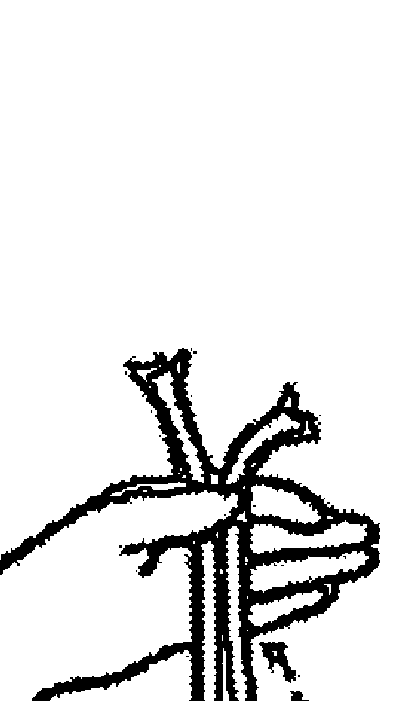

第二步——用你的右手的食指和大拇指穿过绳子的中间所形成的环中（如图六）。

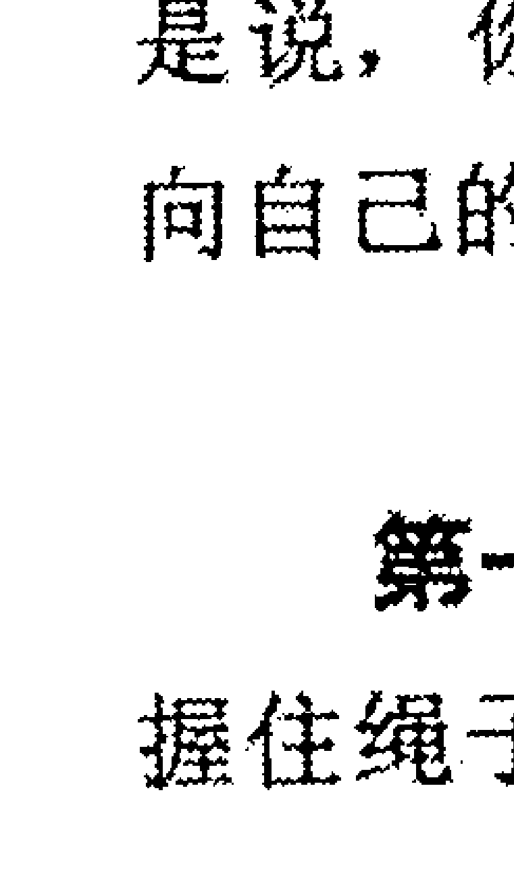

第三步——将中间的环往上“提”，参考图七，你便知道是怎么做的。刚开始的几次慢慢来，严格按照步骤来。

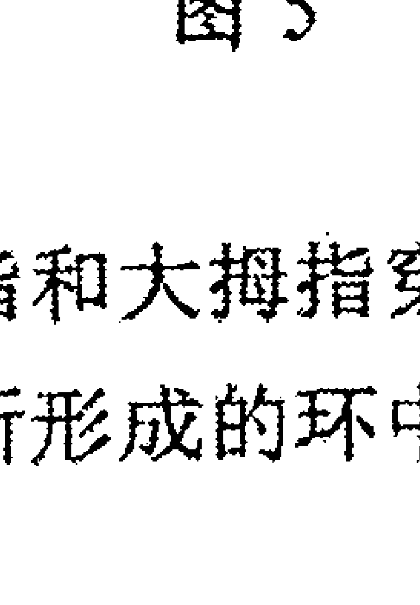

第四步——当左手与右手齐平时，用右手抓住左手中绳子的一端。

第五步——这是最重要的一步。也就是在这里，我们会完成我们的秘密“转移”。在拉住你在第四步的那部分之后，你稍稍地将其拉起来，形成第二个环（如图九）。

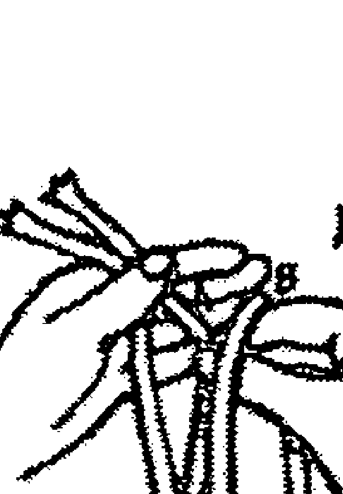

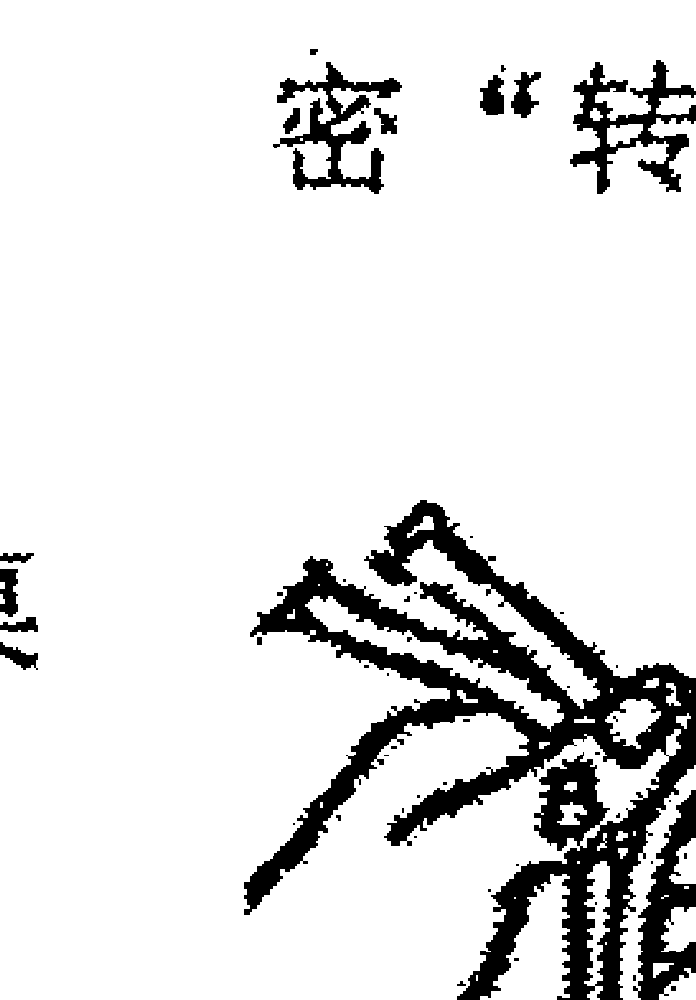

第六步——继续将第二个环往上拉，放开第一个环（也就是绳子的中部所形成的那个环）（如图十）。

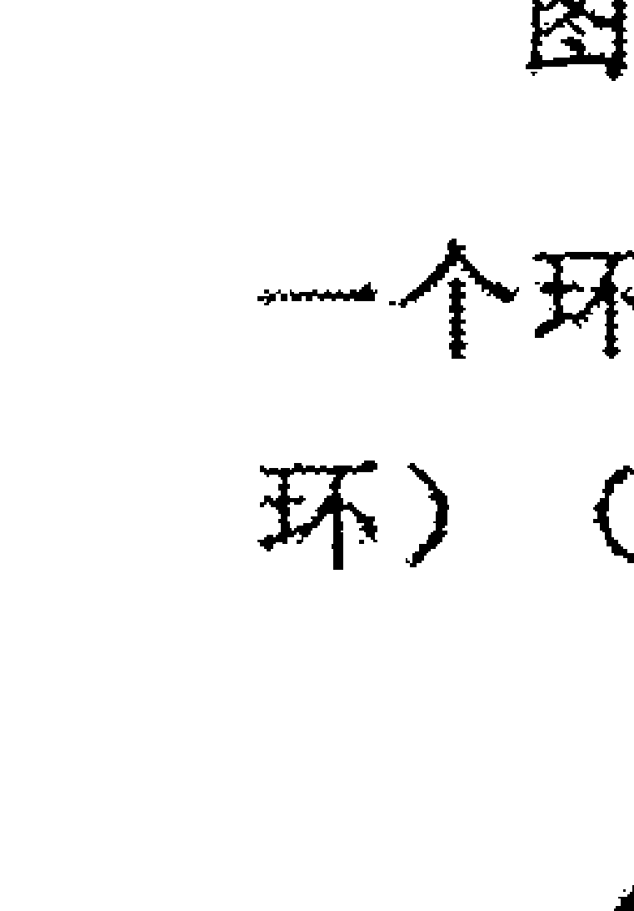

第七步——最后，你要将右手中的第二个环交给左手握紧。像图十一中一样握住绳子。图十二呈现了去掉你握绳子的手时绳子的样子。

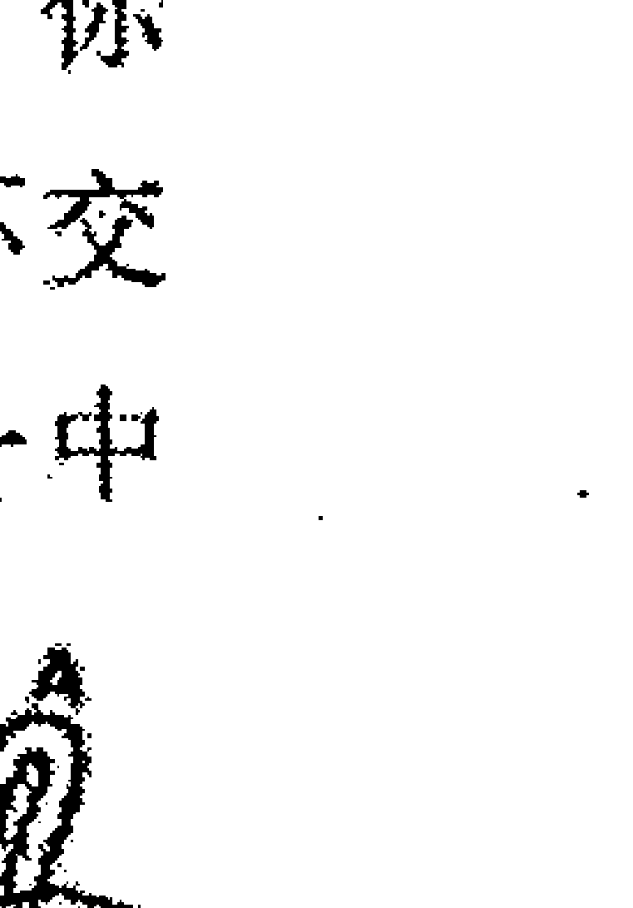

第八步——你应该用剑或仪式刀割断握在左手手指间的那个环。观众们会认为那就是绳子的中间位置。图十二中的“X”部分就是你下刀的位置。图十三展示了剪开后的样子。

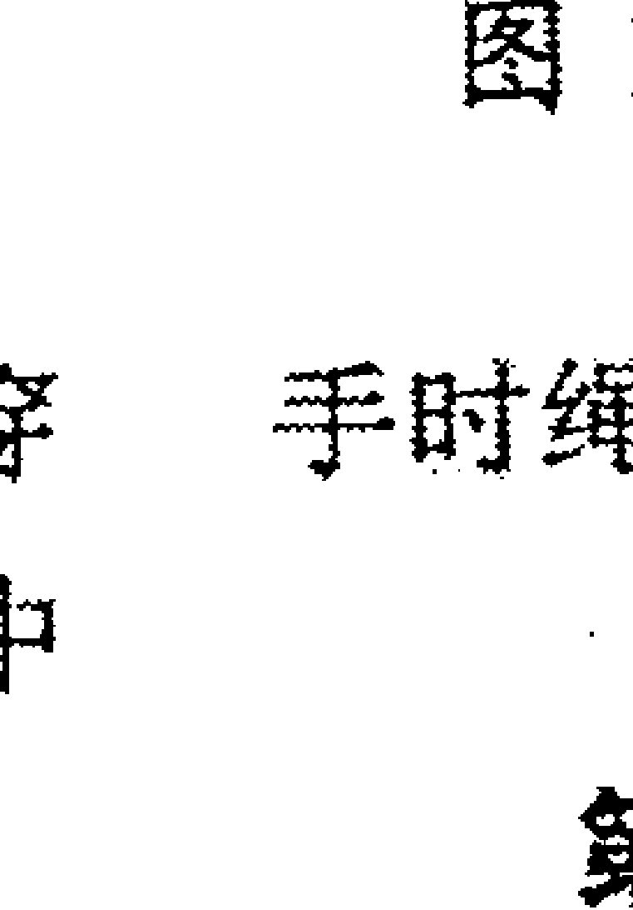

第九步——将剑/仪式刀放在桌子上。你现在可以放开绳子较长的两端（如图十四所示）。现在将较短两端系在一起，形成一个结（如图十四中的箭头所示）。为了让你看得清楚些，图十四再次将手的部分去掉。

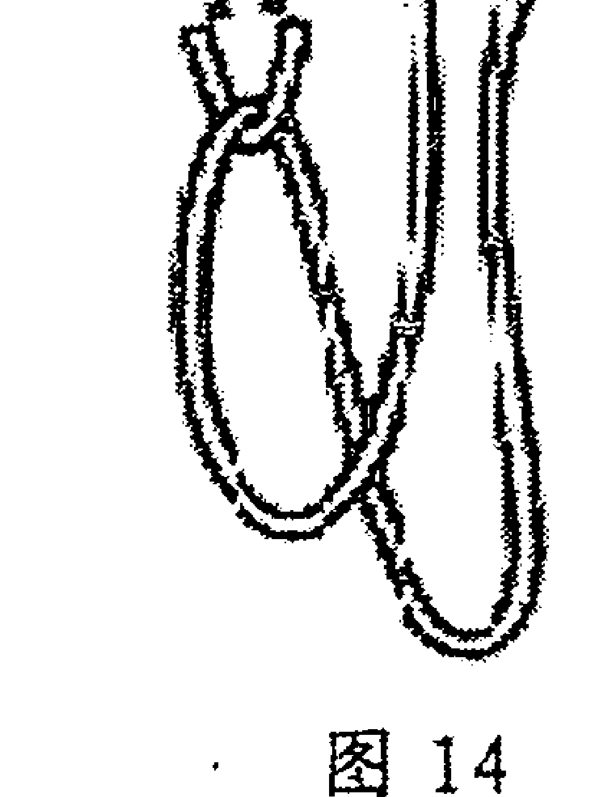

## 第十步——现在魔术的大体部分就已经完成了。你可以将绳子展现给观众看了。观众所看到的是被割断的绳子在中间打了个结。事实上是短绳绕着长绳的中间位置打了一个结。

## 第十一步——将绳子握在一只手中，在绳结上方挥舞你的剑，同时念诵：

> 凭借魔法之剑的力量，
我命令此绳变回原样！

## 第十二步——现在放下剑或仪式刀。将绳结沿着绳子移动，从绳子的一端脱离出来。这一点很容易做到，因为绳结只是将短绳系在长绳上所产生的。你可以将绳结扔在一边，展现出那根毫发无损的绳子。

> 注意：或者，你可以将绳子缠在你的手上，在你将绳子缠在你的拳头上的时候，将绳结沿着绳子移动，直到从绳子的一端脱离出来。你可以在你的拳头上挥舞剑，说着魔法咒语，将绳子从你的手上退出来。绳结留在后面藏起来，或藏于手掌中。

## 土——水晶的力量

效果：
魔法师会讲述某种岩石，水晶，以及矿物的属性。魔法师会进一步讲述水晶的属性。然后魔法师会从他（她）的小袋子中拿出一块透明的水晶，并告诉观众他（她）会向他们展示水晶的力量。

魔法师会将那块水晶放在某位观众闭合的拳头中，并让这位观众将注意力集中在一些不好的想法或者她所遭遇的问题上。魔法师还会要求这位观众在回想这些“不好”的事情的同时将精力集中在水晶上。

然后魔法师会要求这位观众展开自己的拳头看看水晶是否展现了自己的力量。当她打开拳头之后，她会看到水晶现在变成了暗色，或者黑色。

魔法师会告诉那位观众证明了水晶的力量，而那些痛苦，不好的想法，或者消极的情绪已经被这块水晶吸收。而其颜色就是那些残余的痛苦等等的象征。

奥秘：
这个魔术的秘密与细不可查的手法有一点关系，名为“波波转换”。这个名字来源于为这个魔术作出巨大贡献的魔术师J. B. 波波。这些手法常被用于有关硬币的魔术中，但是对于很多道具都适用。一旦你学会了这个特殊的手法，你就可以开始使用这种手法创造你自己的魔术。

在这种特殊的魔术中，我们会用到一点细不可查的手法来将透明的水晶交换暗色的，或者黑色的水晶。

不要害怕这种手法。事实上如果你多练习几次的话，你会发现它很简单。我建议你一直练习，直到你可以闭着眼睛完成整个交换。在表演部分我会详细介绍交换这一手法。

正如上文所述，一共有两块水晶。你需要购买两块尺寸和形状都几乎相同的水晶。你希望观众们相信真相是水晶发生了变化，或者水晶变黑了。水晶在新时代商店、岩石商店，或者岩石矿物展销会上都能买到，而且价格还不贵。如果你无法找到一个卖真水晶的商店，你可以用玻璃“宝石”替代，或者使用在大多数手工艺品店都能买到的大理石代替。这些大理石通常都放在花瓶的底部，用来固定插花。

即使石英晶体的“棱角”（看插图）看起来非常漂亮，但是当你在表演波波转换的时候使用石英晶体会有点难以操作。我建议使用石英水晶石，25分硬币大小的即可。

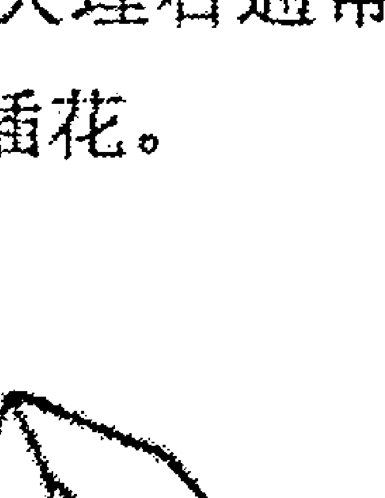

石英分为白水晶和烟晶。如果你不能找到与白水晶相匹配的烟晶，你可以用黑曜石或者“阿帕契眼泪”代替。这些水晶或者岩石都非常便宜，每颗不会超过1美元。

## 准备：

-   你可以将白水晶放在袋子里，衣兜里，或者桌子上。
-   “暗色”水晶应该放在衣兜里，或者一些你可以迅速取出藏于手心的位置（从表演细节中你可以了解更多信息）。
-   如果你喜欢的话，你可以使用魔杖来增加魔法效果。

## 表演：

从隐藏的位置将暗色水晶拿出，然后放在手掌中指根位置，或者你还可以将其放在掌心位置（详情参照《魔法师学徒的魔法师》第242页有关掌心位置的描述和插图）。我会详细描述这一动作（如图十五）。

使用真正的水晶也许会达到最佳效果，因为水晶会让一切显得更加顺理成章。如果你还没有水晶，你用两枚25美分大小的硬币代替。要知道这一手法最初就是为硬币设计的！

## 第一步——正如图十五中所示，将暗色水晶夹在中指与无名指的指根处。图十五展示的是从你的视角看暗色水晶应处的位置。观众是看不到这颗水晶的。

在将暗色水晶隐藏好之后，你应该将右手放在身侧。在你将魔杖从盒子中拿出来时，你便可以将暗色水晶藏于掌心中。你甚至可以将暗色水晶藏在桌子下方，用一种将海报和照片贴在墙上的油灰（有时被称为“胶泥”）把水晶粘在桌子下方。当你准备好以后，你可以悄悄拿起暗色水晶藏于掌心。

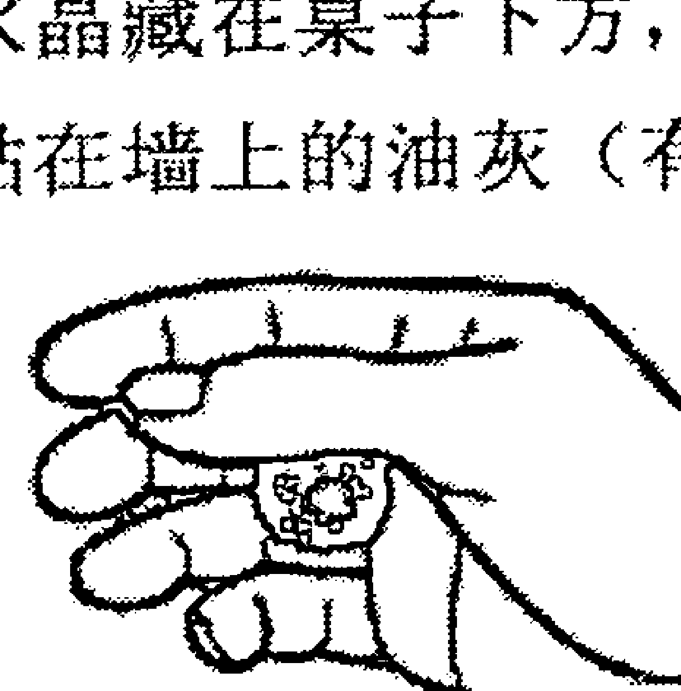

图15

## 第二步——从口袋中用右手（已经藏有暗色水晶的那只手）取出白水晶。用指尖捏住白水晶，让观众看到你手里的白水晶。图十六中展现了从你的视角看过去的样子。注意，在你用指尖拿起白水晶的同时，你需要找到一个最容易的方式将你的暗色水晶藏好。从观众的视角来看，她们只能看到你用指尖拿起了白水晶。

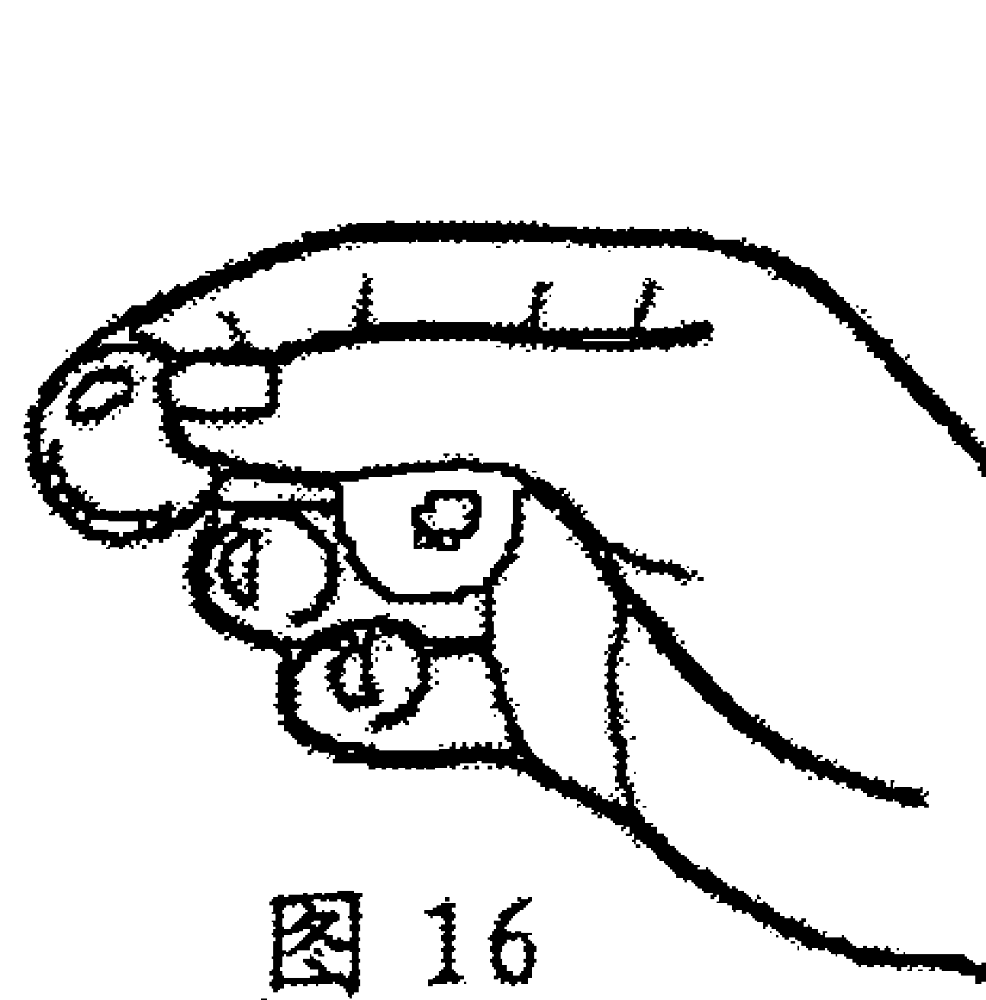

图16

## 第三步——现在就是秘密所在了，或者说魔术“动作”的所在。看起来你像是将白水晶转移到了左手中，但实际上你放在左手中的是黑水晶。想要做到这一点，就要按照下面的步骤来：

-   1) 右手移向左手，指尖上的白水晶此时应一直在观众视线内。
    2) 当右手靠近左手后，右手要同时完成以下两个步骤：
    -   将白水晶从指尖拉回，将它藏于指尖后（现在这个小动作只有你自己才能看到）。
    -   释放指根处的暗色水晶，让其落入左手中（图十七）。

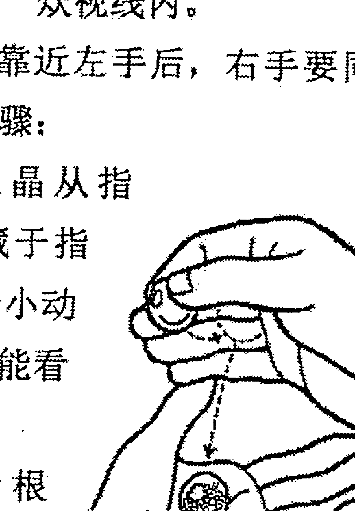

## 第四步——当暗色水晶落入左手中时，左手应该立即握紧，这样观众才不会发现左手中的其实是暗色水晶。

右手放回身侧，继续将白水晶往掌心方向移动，直到指根位置，也就是之前暗色水晶所在的位置。直到你将暗色水晶很好地藏于左手指根位置之后，你才可以用大拇指将暗色水晶藏在手指后。不管怎样，没人会注意你的这些“奇怪动作”。

> 注意：只能用白水晶（不要用藏硬术隐藏惯用的暗色水晶）进行练习几次，真正把白水晶放在你的左手上。这种方式能够带来观众确信你所要展示的魔法是真实的感受——那就是这颗白水晶被你用右手的指尖移动到了你的左手。同样，你应该在镜子前练习这一手法，直到能够熟练到不动声色，炉火纯青。学习这一双手转换的手法并不十分困难，但是，仍旧需要练习。除非你感到能够不用用眼看就能自信地完成这一魔术，否则不要轻易在人前表演。

## 第五步——你已经完成了最困难的部分。现在，你需要邀请一位观众助手来将水晶放入手中。让她将一只手掌心向上伸出来，就像她正在接受一些变化。然后你伸出你握紧的左手（握有暗色水晶的那只手）放在她的手掌上方。随后，你可以指导你的观众助手握住你的手，此时便将暗色水晶放入她手中。这一切都应该展现为一个流畅的动作，看起来你正将水晶放入观众手中——其实你确实也是这样做的。

你不会希望在“魔法”发生之前你的观众看到了自己手中的水晶并不是那颗白水晶。如果你直视着观众的眼睛，你会得到更好的配合。你也可以等到观众的手掌合上之后再移开你的手。还是那句话，练习可以让你的这些动作看起来更为流畅。

## 第六步——你可以用你的右手拿起魔杖，千万不要让你的魔杖与手中的白水晶发生碰撞并发出“敲击”声。还是那样，多次练习后你会发现这些都很简单。

在你的观众助手的拳头上方挥舞你的魔杖，同时重复一些魔咒：

> 来自大地的水晶，带走痛苦，
> 一切都会好的，只留下一些残余的象征。

在你完成以后，你可以在放回你的魔杖时收好你隐藏的白水晶。如果你觉得不太方便，你可以将你的右手放在身侧，直到魔术结束。然后你可以在收拾其它东西的时候，或者放回其它东西的时候将暗色水晶收好。

## 第七步——你现在可以让你的观众助手打开拳头看看魔法是否生效。当她打开拳头的时候，她定会大吃一惊。

现在解说魔法成功了，水晶带走了她的一些消极情绪。水晶的颜色就是你所念诵的魔咒的“象征”。

如果你能找到一些便宜的暗色水晶，你可能会想送一颗给你的观众助手。你可以告诉那位观众，无论何时，只要她觉得不舒服，或者有什么疑问，你都可以将暗色水晶拿出来握在手中，心中充满希望，那么它就会吸走你的一些消极情绪。

同样地，只要可能，赠送礼物本就是一件好事，尤其是这件礼物还能带来幸福。想想，你所赠送的魔法只需几分钱。

## 6. 道具匣子

文 / 奥伯伦（灰色）

道具匣子的构造非常特殊，里面有很多隐藏的隔间，可以让某件物品神秘地消失或者出现。这种匣子比鞋盒小一些，或者和衣柜抽屉大小差不多。有时看起来完全是空的，然而，却可以从里面掏出各种各样的东西（包括兔子），让你的观众非常惊讶。在接下来的内容中，吉姆·鱼将会教授你怎样制作你自己的道具匣子，此书后面的插页中有这种盒子的插图。

当你的朋友和家人对你的表演惊呼不已时，我敢保证他们肯定会让你“再来一次！”而且所有人都想让你说出你是怎么办到的。但是，对于观众来说，魔术最特殊的魅力就在于他们不知道魔术师是怎么做到的。一旦魔术的秘密被公布后，便失去了神秘感。没有了那种惊奇和惊愕之感，便不再有人会对你的魔术感兴趣。因此，这儿有两条魔术的基本规则：不要在同一个表演中重复一个魔术，不要告诉任何人你是怎么做到的！

## 吉姆的魔法盒

文 / 吉姆·鱼（Jim Fish）（橙色）

## 效果：

桌子上摆放了几个扁平的盒子。魔法师将它们装配在一起。当盒子打开之后，观众会发现盒子里神奇地装满了奇妙的东西。

或者说，那个盒子被装配好了，一些物品也被放入其中。盒子再次被拆解成几个扁平的小盒子，里面的所有东西也都消失了。

或者两者皆有。你已经在里面设计了一些你所需要的东西。

警告：
这是传统的魔术师道具匣子的一种小模型，现在专业的魔术师都会使用。要非常小心地保护它的秘密。在使用盒子的时候，最好让一个人坐在你对面的桌子旁边。这并不是一个入门魔术！你不能今天装配好，晚上就表演。你需要在观看者的椅子上放一面镜子，从他人的视角观看自己的动作。当你能够将自己糊弄过去时，你就可以表演给你的好朋友看，一个在你泄露了魔术秘密的时候能够替你保守秘密的朋友。这是一个强大的魔术，必须严肃对待。花一些时间让其精彩部分更加完美。

当你将其奥秘搞明白之后，你可以创建更大的盒子在舞台上表演，或者表演给一小群人看，以让你的观众感到高兴和惊奇。我制作了一个这样的盒子，可以让我十岁的学徒在大约 100 人的观众面前变出一只仓鼠。

> 魔术师的誓言：
> (在一面你用于练习的镜子前面说这些话)：
> 在我继续之前，我保证我将用我的沉默和正确的练习尽最大努力去保护这个魔盒的秘密。

好的，我相信你，现在我们继续。查看这本书的后面几页，找到一张名为“魔盒模板”的插页。将这张插页带到当地的复印中心，在卡片纸上将其放大到121% 复印出来。

实线标注的是需要裁剪的地方，虚线标注的是需要折叠的地方。在你将裁剪好的纸片折叠起来之前，你需要用一根直尺（或者类似的东西）和薄刃的餐刀刀背沿着虚线划一条划痕。

有四张卡片纸需要仔细裁剪后粘在一起。它们分别是：

-   基底
-   侧面
-   盖子
-   密室

基底是一个四个角落都有齿头的矩形。裁剪基底并将齿头裁开，然后将它们折叠起来（图一）。它们将被用于固定侧面。

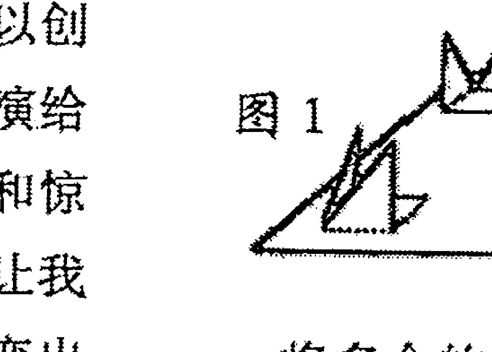

将多余的部分裁剪去掉便成为了四个侧面。沿着虚线折叠，将两端粘在一起便制成了一个矩形（如图二）。将矩形安装在基底上的齿头里面。

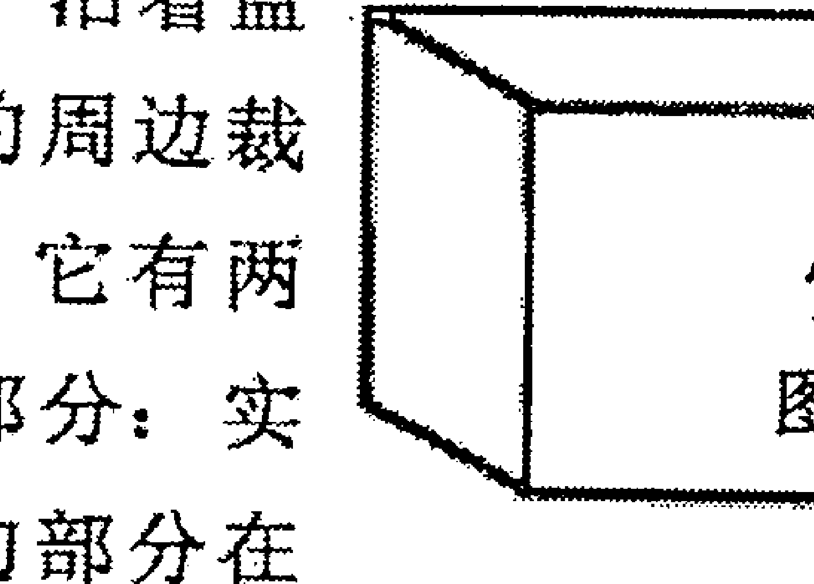

沿着盖子的周边裁剪。它有两个部分：实线的部分在左边，窗口在右边（如图三）。四个翼边往里折叠（如图四）。

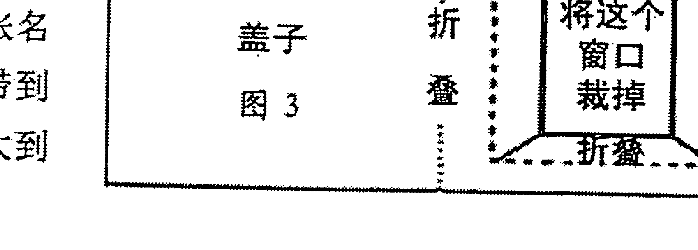

将密室裁剪开，折叠起来做成一个盒子，黑色的一面朝向外面。将每一面粘贴起来（如图五）。

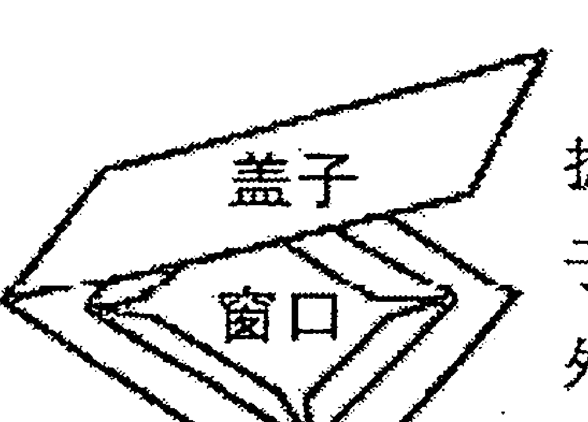

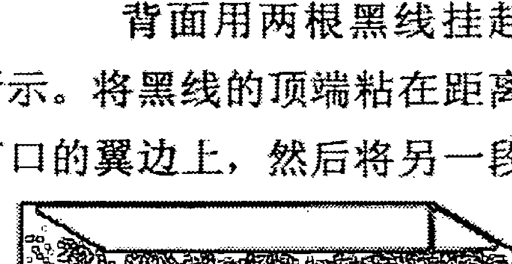

将密室从盖子的背面用两根黑线挂起来，如图六所示。将黑线的顶端粘在距离盖子最近的窗口的翼边上，然后将另一段粘在密室上。密室应该挂在盖子的后面，如图七所示。

从这个角度看，窗口里面的翼边面对着你。盖子藏在密室后面。

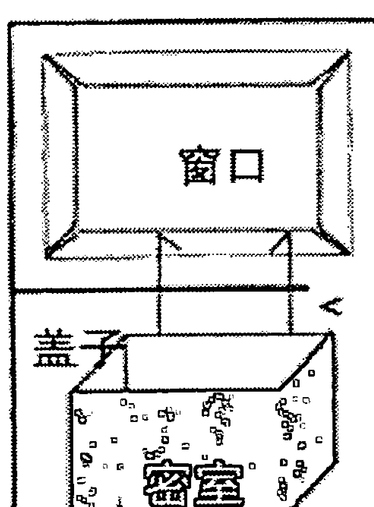

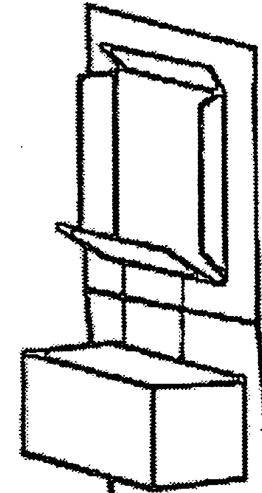

下图是所有的部分安装在一起的样子（如图八）。基底上的齿头从外面将侧面卡紧，盖子上窗口的翼边正好从上面卡入密室中。窗口的翼边隐藏了密室的上边缘。

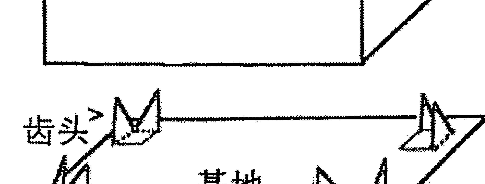

你需要在你用于表演的桌子后面，设置一个隐形的类似架子的东西，（如图九）或者将这个隐形的架子设置在一本书上，（如图十）再或者，将这些东西隐藏起来，在你安装盒子的时候再拿出来。

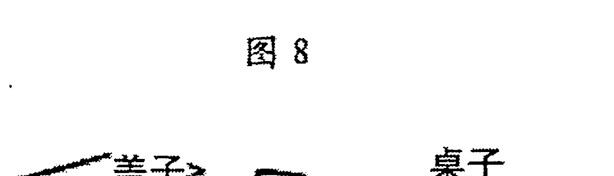

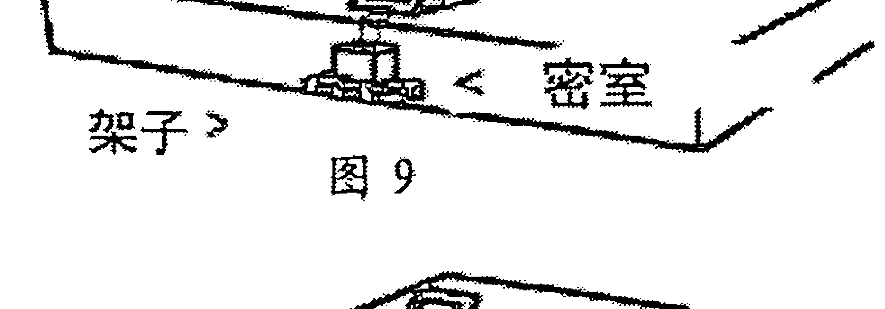

如果你用食指和拇指抓住窗口的底部（如图十一），你的双手和盖子自然地遮挡了观众的视线，这样他们就看不到里面的密室（如图十二）。让盖子后翻到盒子后面，直到你已经插入了密室并且窗口也已经就位。然后盖上盖子（如图十三）。

## 准备——制作一个书盒

伟大的魔术师杰夫·麦克布莱德给了我一个非常棒的盒子，它看起来就像是一本书。我在里面放置了我的几个魔盒，装满塑料金币的密室。

想要自己做一个这样的书盒，首先去一间二手书店，购买一本便宜的平装版《金银岛》，或者其他有关海盗的书籍。书的封面应该非常艳丽，标题要非常醒目。小心地将整个封面拿下来，裁剪成三个部分：封面、封底，和书脊。

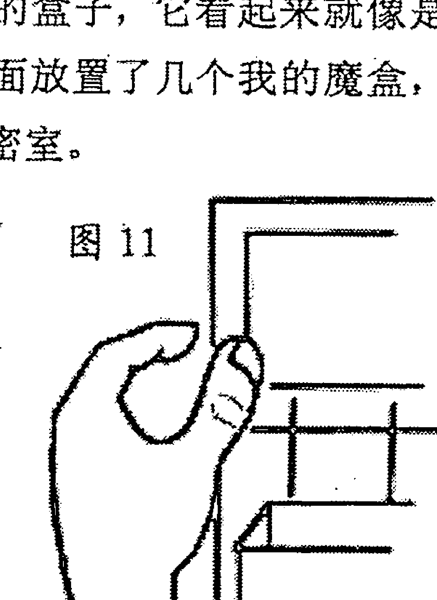

取一张结实的硬纸板，裁剪成和“书面”相同的尺寸，但是书脊处只需 1.5 英寸厚。和上文中一样，划出一条折叠痕。将书的封面和封底粘在硬纸板上，当然还有书脊，将硬纸板粘贴在书脊的中间位置。

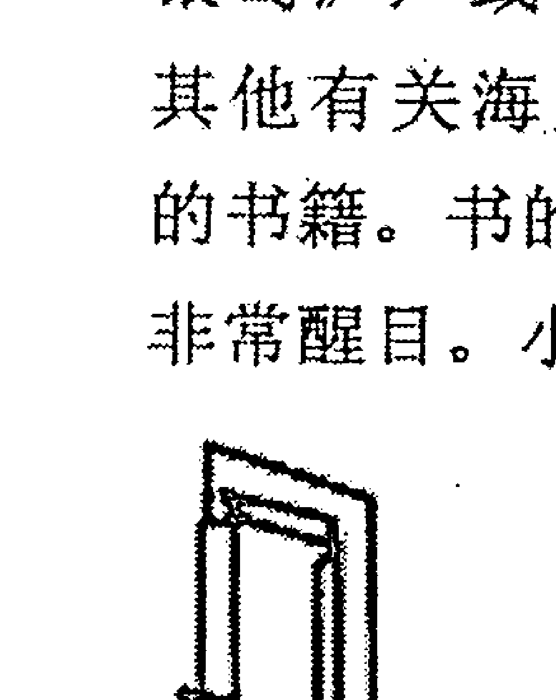

取一条硬质的、起皱纹的纸板，然后裁剪出一长条 1.5 英寸宽的硬纸板条，再穿过短的那一面打一个洞。硬纸板条应该足够长，可以作为你书盒的侧面（一本书的三个切口），当封底粘在底部之后，封面就可以作为一个盖子。折叠好书角，将三个侧面与封底粘在一起。

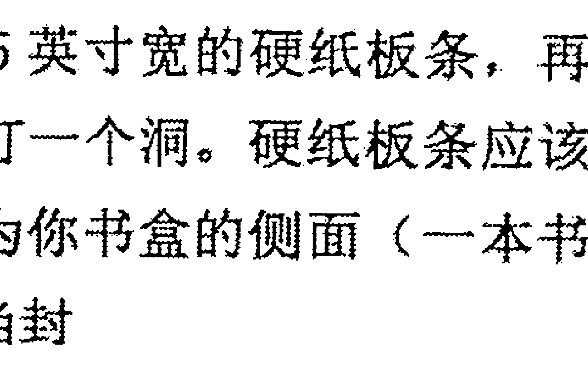

为了完成整个效果，取一根 1.5 英寸宽的纸条，准备一根直尺，在上面用铅笔画上很细的线条，让它看起来就像书页一样；然后沿着侧面将其粘好，这样整个盒子看起来就像是一本书。将你的魔盒的零件放在在里面，这样你就准备好可以表演了！

## 我的表演：

我会讲述想象力的奇妙和一本好书的力量，它们会带领我们进入一个通常看起来非常真实的梦境。拿出我的书盒，我讲述了我们对于海盗故事的喜爱，比如《金银岛》，以及我们对于发现一个海盗金库的幻想。在我讲述的时候，我会将书打开，首先取出基底，然后是侧面，最后是魔盒的盖子。我将盖子放在合上的“书”上面，如图十中所示，将密室隐藏起来。

我邀请一个观众去想象我所建立的是一个海盗的金库。一旦盒子安装好，盖子盖上之后，我会暂停一下，让观众们想象一下我们会用达布隆带给我们运气做些什么。然后，我转动盒子，让盒子的正面向观众，慢慢将盖子打开，将硬币倒出来。在我将墨盒放入书盒中时，我会让他们检查一下硬币。唉，我会说，这些硬币只是塑料的，因为，毕竟这只是一个想象的世界。但是我会让他们将这些硬币当作纪念品收起来。

祝你玩得开心。创造奇迹！

## 7. 举办一次吟游诗会

文 / 奥伯伦（灰色）

在魔法师聚会的时候最受欢迎的一项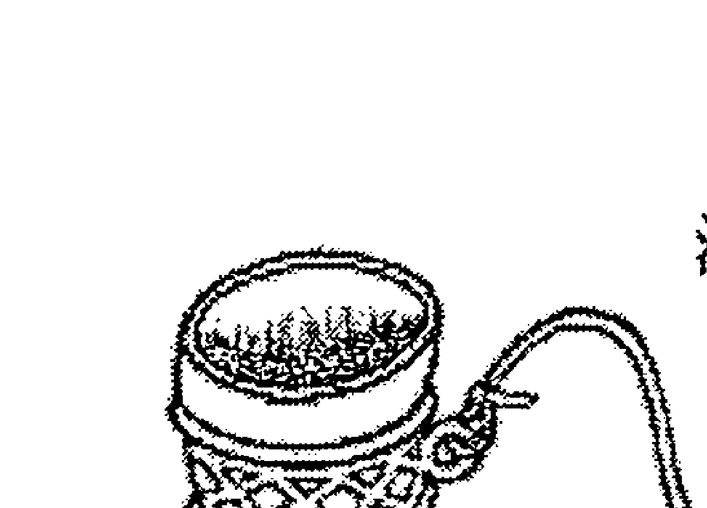

活动是组织吟游诗会——焚香歌谣、故事、诗歌、笑话，甚至是魔术表演。这些都可以在客厅里，壁炉旁，或者——最好是——在篝火堆旁围成一个圈举行。牵牛花和我主持过无数的吟游诗会，而我也可以跟你分享一些我们的诀窍方式，这样你也可以举办这样的吟游诗会。

提前通知，在你邀请别人来参加聚会的时候，要让所有人都知道你会举办吟游诗会，而每个参与的人都应该带上一些歌谣、故事、诗歌等等的节目来和大家分享。这些可以是一些原始的作品，也可以是现代作品。如果参与者所提供的节目与音乐相关，那就邀请客人带上一些合适的乐器。

当吟游诗会开始之时，每个人都聚拢围成一个圈，各自选个舒适的姿势坐下。如果这是一次大型仪式的一部分，那你务必要准备足够的椅子、垫子、长凳、沙发等等，以让所有的人都有位置可坐。最重要的元素是一个巨大的圣杯或者角杯，里面装满解渴的饮料：水，苹果汁，以及蜂蜜酒都很受欢迎。

和古时候一样，吟游诗会开始的时候要做祷告，要向布里吉特（爱尔兰圣人和女神，极富创造力的守护神）或者缪斯（希腊司艺术和科学的诸女神）致辞。下面是一些致辞的例子：

## 布里吉特

> 闪耀的布里吉特，听着我们的呼唤；加入我们为你布置的神圣大厅。创造和艺术之女神，心胸博大的女神，把治愈的技巧和吟游诗人的欢笑，现在就传授给我们吧，从此以后一直拥有！

## 献给缪斯女神的赞美诗

> 朱庇特的女儿们，忧郁而圣洁的声音，缪斯女神，无上荣耀，甜美的九女神；克利俄和埃拉托，她们的美貌无比动人，而你，欧忒耳珀，带来神圣的欢悦；丰产的塔利亚，荣耀的波尼亚，和精通曲艺的墨尔波墨涅；特尔西科瑞和乌拉尼亚，她们散发着天国的荣光，而你，是你让我能注目这光亮。来吧，受人尊敬，各有千秋，力量神圣，闪耀着你们那最受人偏爱的神秘模样；赐我荣耀、激情、美丽，赐福我的愿望。

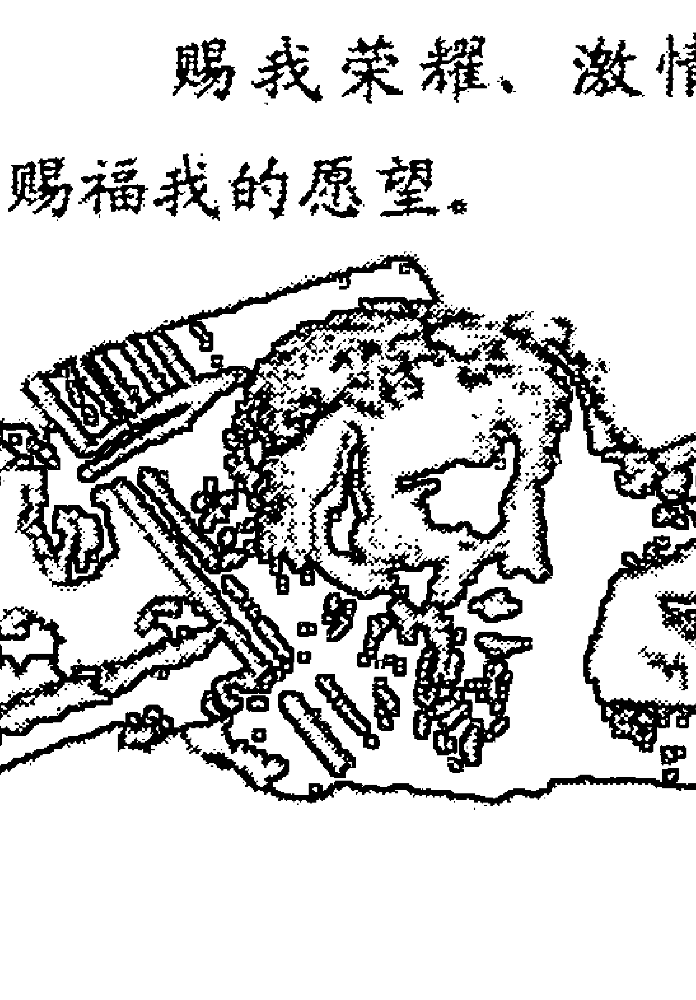

# 第八章：表演魔法（橙色）

开始的时候要讲解一下举办吟游诗会的理念：

在古时候，吟游诗人终生致力于记住存在于故事，诗歌，以及歌谣中的人们的传说。在几千年前，世界上并不存在电视或者电影，在乡村里最好的娱乐是吟游诗人的表演。通过这样，孩子和大人们能够了解到关于他们祖先的故事，关于天神的神话，关于英雄的冒险，以及传说所留给我们的教训。

但是我们并没有专业的吟游诗人加入到我们的吟游诗会中！所有人都可以讲故事或者讲笑话，或者阅读一首自己最喜爱的诗歌——即使你不会唱歌不会表演，你也可以采用其他方式来娱乐大家。吟游诗会是一种分享经历的聚会，就像百家宴，每个人都会带来一点自家的东西。

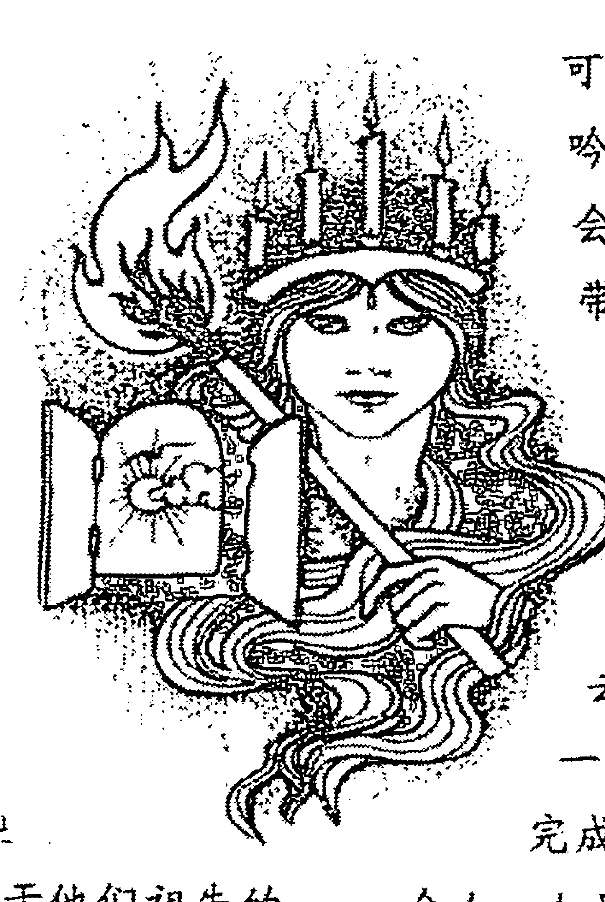

现在，大家都知道吟游诗会是一项很费口舌的工作！因此，我们会将角杯（或者圣杯）绕着圈传递下去。传到谁的手中，你都要喝一口，然后开始表演你的节目。完成之后再喝一口，并传递给下一个人。如果，当角杯（圣杯）传到你手上时你还没有准备好，你只需说“下一位”，然后按顺序递给下一个人即可。

作为主人，你应该先喝一口，并最先表演你的节目……然后将角杯（圣杯）传给你左边那个人。