# 魔法师学徒的魔法书上


## 读者对《魔法师学徒的魔法书》的评价

奥伯伦·泽尔！除了这个魔法世界的传奇人物，还有谁能为魔法师学徒写出更好的魔法书？是他，创造了逼真的独角兽；是他，游历了遥远的南太平洋，只为寻求真正的美人鱼；还是他，创建了全世界教会协会（the Church of All Worlds）。如果说有谁能培养出一百万个魔法师的话，那就是奥伯伦。我要将他推荐给任何一家想要抓住大众对魔法日益高涨的兴趣的出版社。

——安伯·K（Amber K）
《真实的魔法：初学者指南》（True Magick: A Beginner’s Guide）

伯伦万岁！

——约翰·苏拉克（John Sulak），
《现代异教徒》（Modern Pagans）
联合作者

在我看来，奥伯伦·泽尔-雷文哈特是现代非基督教思想中最具智慧与创造力的人物之一。他在这个行业几乎比任何人都干得久。他也曾亲自参与许多有关建立地球灵性的重要历史事件，而这些事件对于今天的许多人来说都是非常重要的。他拥有着独一无二的荣誉——或许是女神运动中最具影响力的男性！他是教授年轻魔法师学徒如何在世界上为自己定位的完美人选，他还能引导他们以一种负责任且相互尊重的方式来使用魔法。

奥伯伦是一个极具天赋的故事讲述者，一个强大的魔法师，而且他还拥有着一颗年轻的心。他热爱他的工作，并无私地与那些想要学习魔法的人分享他的知识。我从1969年便认识了奥伯伦，并逐步了解他。现在，我热切地期待着他的新书的出版，还有书中我能学习的东西！

我认识奥伯伦·泽尔有些年了，我很高兴能够成为他的老朋友。他是先驱；是领袖；并且在非基督教和魔法世界中有着长远的眼光；他还是全世界教会的创始人之一，并创建了一份最重要的非基督教刊物——绿蛋（Green Egg），他在其中的努力发人深省，深具学术性和挑战性。

奥伯伦是一位有经验的作家和魔法师。他在这些方面拥有多年的实践经验，专业知识，高度的原则性和学术水平。

——达纳·D. 埃勒斯
（Dana D. Eilers）
《实用的异教徒》
（The Practical Pagan）
《异教徒与法律》
（Pagans and the Law）

能为奥伯伦·泽尔-雷文哈特的《魔法师学徒的魔法书》尽一份力，我感到非常激动。当下没有什么能比唤醒奇迹、魔法和爱更加重要。而且，没人比奥伯伦更适合来完成这项工作。

对哈利·波特和托尔金的兴趣反映了一个趋势——8-18岁的孩子正渴望着个人英雄主义和重要性的实现。这是一个影响和激励他们的绝佳机会，因为他们缺少替代品、榜样和激励。

奥伯伦有着这样的才能和经验去实现这一切，他建立教会，开展运动……建立我们的格雷理事会。他点燃了与他接触过的每个年轻人心中的熊熊烈火，并长期过着想象与现实并存的魔法师生活。他那迷人的画作、著作和演说显得那样的不可思议，他是我们社团中的一个传奇。
——杰西·沃夫·哈丁
（Jesse Wolf Hardin）
《灵魂相似：神圣的地球智慧》
（Kindred Spirits: Sacred Earth Wisdom）

还有谁更适合去写一本这样的书。跟他合作已经超过25年了，我发现他是一名优秀的教师、手艺人、艺术家、学者和全面的创作天才。读到这本书的孩子真是很幸运，因为能有他这样一位良师益友。他将信息转化成漂亮插画和通俗语言的能力在魔法界一直无人能比。
——安诺迪亚·朱迪思
（Anodea Judith）
《东方的躯体 - 西方的思想》
（Eastern Body-Western Mind）

在18年前成为女魔法师的第一天，我就听说了奥伯伦在魔法界的勤勉。最近，我终于有幸在我们社团结识了这位优秀的绅士和长者，他的生活、精神和思想充满了各种各样的魔法学问，当然，还有更加重要的实际应用。他以其杰出的才华帮助年轻人踏上美好之路。

长久以来，巫术崇拜都被误认为是女性艺术，而且确实有很多书将它们的内容偏向那些读者。这样一来，我们就远离了上帝，还使得许多年长或年轻的男士感到自己被孤立和隔离。这本书用荣耀、尊重和感激做导向，帮助我们平衡前行的车轮（更不用说其中还提供了大量的趣闻）。
——帕特丽夏·特里斯克
（Patricia Telesco）
《超前的巫术崇拜》
（Advanced Wicca）

对于那些学习神秘学，尤其是魔法的人来说，奥伯伦·泽尔-雷文哈特的名字绝对是如雷贯耳。他是一个天才魔法师，他的这本书是为所有想要成为魔法师的人而写的。也许，就像很多人所说的那样，奥伯伦·泽尔-雷文哈特就是哈利·波特的阿不思·邓布利多！

这是我们今天能够找到的最接近完美并且真实可靠的魔法师手册和指南……是对魔法界的一个重大贡献。
这本书是魔法书中的经典，也是奥伯伦的代表作。他是美国魔法的先驱，他将其毕生所学与大众分享。本书中的课程精确、可靠并且充满趣味。
如果你想成为一名魔法师，这是一本很好的启蒙书，而且你还能用它进行更深入的学习。这是魔法迷的必备书籍。
——李·普罗瑟 (Lee Prosser)
《命运杂志》 (Fate Magazine)

我很难想出了除了奥伯伦·雷文哈特，啊哈，未来的魔法师，欢迎来到魔法的神秘世界！奥伯伦·泽尔-雷文哈特将成为你的导师，并引导你走上成为真正的魔法师之路。同时为你的学习助上一臂之力的还有格雷理事会的其他成员——一个个充满传奇色彩的魔法师、贤者和智者们。也许有一天，你也能成为我们中的一员。从传统上来讲，从一名学生成长为大师先要经历一段学徒生涯，这本魔法书就是你这一漫长旅途的学习手册，这也是专门为你以及那些你绝对可以信任的人所作的书，所以，请务必好好保管，并为之保密，其中的秘密绝不能落入坏人之手！如果你想要进一步学习神秘艺术，请登陆格瑞在线魔法学校 www.GreySchool.com。

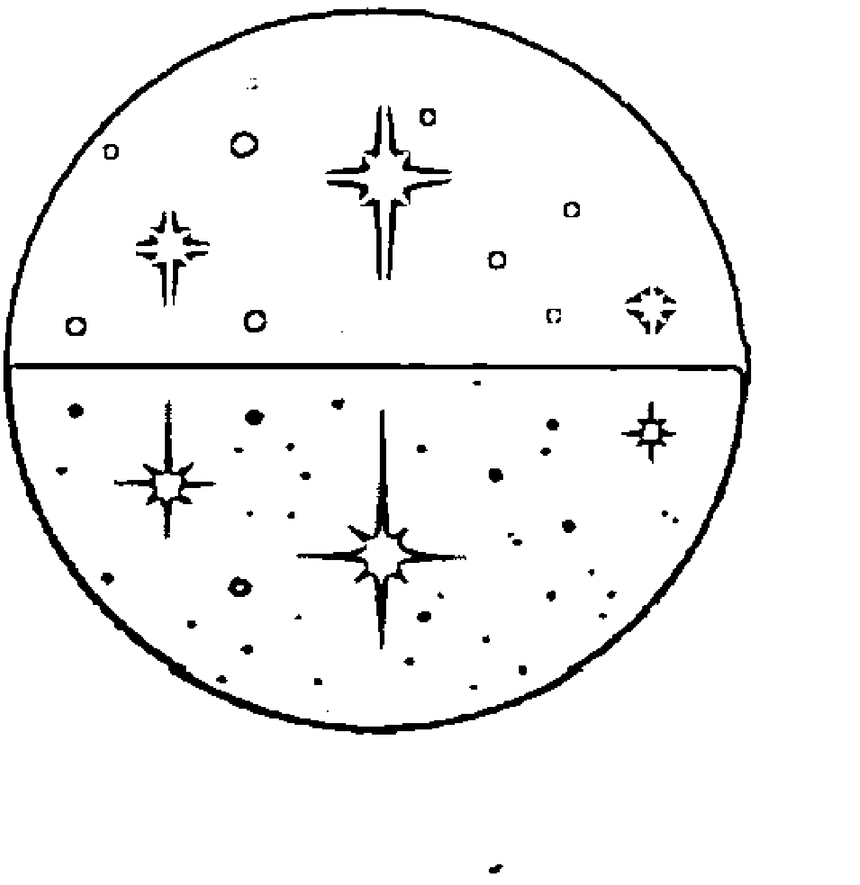

## 中文版编者说明

本书是格瑞魔法学校秘密教程中的核心之作，是由奥伯伦·泽尔-雷文哈特校长率领格瑞理事会和全体教师精心编制的一部大书。本书卷帙浩繁，汉语译文近60万字，其中，多达20万字的“课程之五：色谱——第一部分”和“课程六：色谱——第二部分”，尚只是对高级魔法的初阶呈现，其完整的展开，则被安排到本系列的第二部《魔法师学徒的伴侣书：如何施展法术？从蓝魔法到黑魔法的16堂魔法实践课》(Companion for the Apprentice Wizard) 中。为了让读者更方便地阅读整个系列，编者特将这两个课程制作成电子版本，名之为《别卷》，以便时间更充裕的读者随时下载、查阅（www.cqshangshu.com），而在本书中，此两个课程只作存目处理。特此说明。

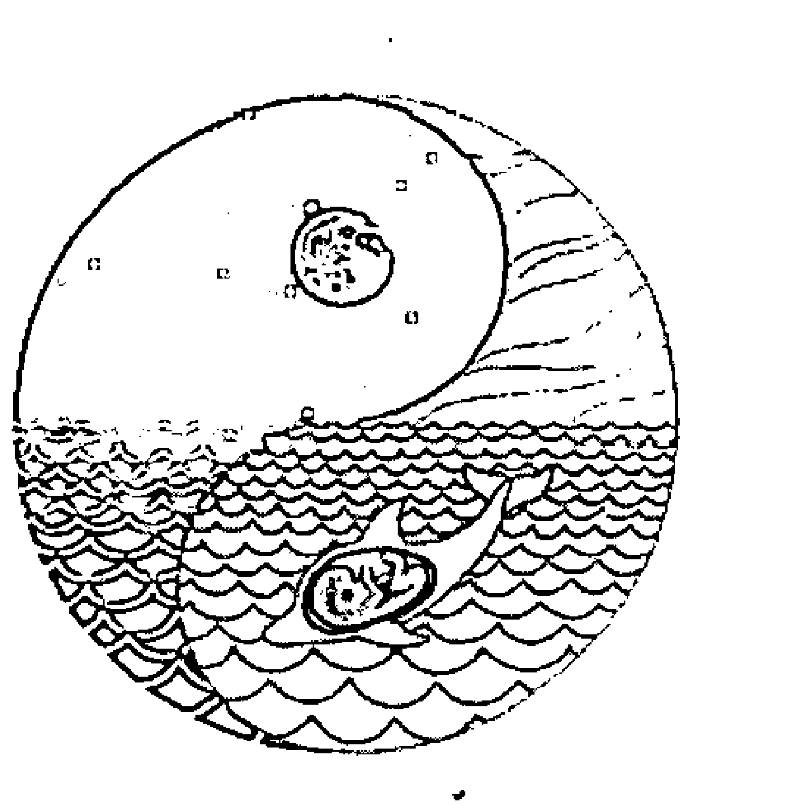

## 前言：魔法和格雷理事会

雷蒙德·巴克兰

我们中有许多人都想要——渴望——登上霍格沃茨快车，并驶向一所能够学习魔法、药草知识、占卜、魔术等令人激动的东西的学校。总而言之，我们都一直想要学习魔法。通过阅读了解他人的经历是一回事——即使那个人是哈利·波特——但是能够亲自参与魔法学习的整个过程又是另外一回事。进入这样一所拥有世界上最好的魔法师的学校常常会让人望而生畏。因此，怎么才能做到呢？怎样才能找到并进入这样一所学校呢？

告诉你一件非常开心的事——你不用等待一封由猫头鹰或是其它特殊邮差送到的特殊邀请函，你也不需要必须是魔法师的后代，你甚至可以是一个普普通通的小麻瓜（非魔法界的人），总之，不管怎样，你都能进入这所学校学习魔法。（传言甚至有一些成年麻瓜也被深深吸引并偷偷潜入了这所学校！）这所学校在哪儿呢？就在你的手中。魔法课程——至少学徒水平的课程——都包含在这本书中，就像是突然发现霍格沃茨学院有一个家庭研究分院！这本书一共有七门主要课程，外加一份附录和参考资料，是格瑞巫师理事会全体成员精心为你的学习和研究编制的。

格雷理事会的成员们都是当今著名的魔法师。他们不是我们随意编造的人物，他们是现在仍然在世的魔法师，并且已经从事了四五十年的魔法工作。哈利·波特第一次乘坐霍格沃茨快车到霍格沃茨学院的时候，罗恩·韦斯利就根据巧克力青蛙盒子里的名片向他介绍了一些著名的魔法大师，比如梅林，帕拉塞尔苏斯，莫佳娜，瑟茜，克里奥娜，托勒密，邓布利多和亨吉斯特，这些人有的是真实的魔法师，有的是虚构的魔法师。但是在这本书里，只有真实的魔法师。

我认识奥伯伦有三十多年了，他是美国魔法界的先驱之一。我很难想出还有更好的，更有资格的人来为魔法师学徒来写一本这样的指导书。他是一名魔法师（他一直都是！），有着几十年的经验，这比任何人都多，并且在他生命的大部分时间中，都在从事教学，因此他是最有资格写这本书的。他在异教和魔法界中备受推崇，他也是异教、巫术和魔法界真正的前辈。

作为格雷理事会的一员，我也许是你们的老师中非常具有代表性的一个，因此，让我来告诉你们有关我的一点背景。五十多年前，我第一次被这些魔法类的题材所吸引。（半个世纪了，时光飞逝啊！）在那个时候，我并没有你们现在手里的这本书，而且，在那个时候，我也很难获得像这本书里的这些知识，所以我不得不靠自己去慢慢挖掘、探索、追寻那些古老的线索和那些遗失了很久的途径。我不得不去跟人讨教、借鉴，向为数不多的几个我能找到的大魔法师们学艺。多年来，我学会了使用水晶球，读塔罗牌，双手治疗，使用草药和魔力药水，以及其它很多常规途径无法获得的魔法知识。

四十多年前，我被邀请加入了女魔法师大集会，在那里我学会了法术和符咒，并学着使用魔法。那段经历十分漫长艰辛，但是极具满足感。在练习魔法的过程中，我能给许多人带去帮助、幸福和安慰。在过程中，我自己也成为了一名老师，并能够将我苦心孤诣获得的知识传授给他人。

格雷理事会的其他成员，也就是这本书中你们的老师们，也有着和我一样的经历。我们都为魔法穷尽了毕生心血，并将我们的所学献给那些准备接受并且愿意接受魔法的人们……比如，你们。

这是一本魔法书（grimoire）。Grimoire 这个单词来源于古法语，意思是“语法书”。它也确实是魔法的基本原理。换句话说，它解释了魔法的运行规则：怎样设计，怎样准备，怎样合在一起以及怎样小心应用。你应该不会指望不经过学习就能掌握一门外语，你需要学习新单词和语法，这样才能合理地运用它。你还需要学习一些常用替代词汇，纠正发音。如果你没有进行这样的学习，那么没人能够听懂你的意思。换句话说，你就不能使用这种语言。魔法也是一样。通过学习魔法书的语法，你不仅能够让你自己被（自然力，灵体，动物，树，植物，以及其它所有自然界的物种——当然，还有其他魔法师）理解，你还能够向人展示你能熟练地驾驭它——你就是一位大师。这也就是说，你成为了一名魔法师，一名能力和知识被同行（那些同等地位的人）认可的魔法师。

在学校里每天都要上很多的课程，有时你会疑惑：“为什么我必须要学这些呢？”“这些对别人有什么用？”然后你会抵触学习、研究和家庭作业。但是有了这本魔法师学徒的魔法书，你会发现，一切都变了！你会发现你自己殷切期盼着下一步，再下一步，再再下一步！学习将会变成一种乐趣，你根本不想停下来。想象一下，你将会学到这些知识，魔法基础，魔法技能，自然灵魂，魔法工具，魔法师法袍，法术，魔法，魔法动物寓言，等等等等。这是多么奇妙的题材，多么精彩的科目！药草学、数学魔法（Mathemagicks）、凝视（Skrying）、新词汇和古代学说——这不仅仅是一本有关魔法的书籍，这就是一本魔法书。

这本书将会带你通往魔法世界，它以魔法师为中心，讲述了怎样成为一名魔法师，魔法基础，以及魔法技能等等。它先告诉你魔法的思想和概念，然后引导你沿着一条神秘的小路走进一个充满古老知识却有些阴森诡异的森林。在学习过程中，你会发现，所有的一切都不是它表面的样子。许多其他人觉得很可怕很恐怖的东西在你看来是安全且大有裨益的。通往森林的路漫无边际，越是往里走，你就越会发现森林的乐趣，就像是冒险进入了霍格沃茨魔法学校旁边的禁忌森林。这是一个等着你去揭秘的地方。当然，路上也会有诱惑，也可能有捷径，但是这些捷径究竟通往何处？最安全的路线就是跟着你的向导和格雷理事会，照他们所说的做，这样你就不会误入歧途。记住，海格并不害怕那座森林，因为他了解它，也了解里面的动植物。所以，跟格雷理事会一块儿，我们知道最安全的路线，同时也会一直保护你。

在魔法课程所有给力的指引中，有两点你们必须要谨记。第一，时常考虑行事的后果；第二，要对你的行为负责。

说到考虑行事后果，我的意思是你应该常常深谋远虑，考虑一下你的行为会给别人带来什么样的影响。你一定听说过“多米诺骨牌效应”吧，就是当你排起一列长长的多米诺骨牌，不管它是曲是直，只要你推倒第一张，它就会顺势推倒第二张，接下来第二张会击倒第三张，然后是第四张，以此类推，直到所有的骨牌——不管有多长——都因为你推倒的第一张而全部倒塌。这种效应不仅仅体现在多米诺骨牌上，世上所有的事情都是这样，包括魔法。当你的魔法影响到一个人，这种反作用就会相应地影响到其他所有人。也许，刚开始的时候魔法的影响是好是坏还无法判断，但是，一个好的魔法师总会先人一步。他会深思熟虑，想出一个万全之策，以保证他的行为不会对他人造成不利影响。你也不会被迫使用负面魔法，没有魔法师值得他的尖顶帽为他使用负面魔法，所以，你几乎没什么可能会伤害别人。但是，你还是应该三思而后行。

至于“对你的行为负责”这一条则不必多说。我们所有人都应该对自己所做的事情负责，不能将错误归咎他人。因此，如果出了什么错，尤其是魔法方面，要勇于承担，并立即改正，这才像一个真正的魔法师。

你将拥有多大的能耐呢？如果可以，请忘记“能耐”这个词，换种方式，你能起到多大的作用？答案是，非常大的作用。

举个例子，20世纪中叶（是的，这有点像是历史，但是非常有趣），第二次世界大战的阴霾迅速扩散，整个欧洲危在旦夕。在大不列颠，有一小群魔法师发现，敌人将会穿过英吉利海峡进攻英国。于是，一位名叫戴恩·福琼的女魔法师迅速召集大不列颠最强大的魔法师们，筹备了一个御敌魔法方案。其实这当中不仅有魔法师，还包括各种懂魔法的人，比如巫师和其他能人。这些人不论派别，同仇敌忾，合力建造了一座巨大的魔法墙，这面墙不仅能够抵御敌人的入侵，还能驱散他们并断绝其再次进犯的念头。在许多场合都有着出色表现的魔法，在这个生死攸关的时期，也逐渐成为一股最重要的力量。结果，敌人果然停止进攻并灰溜溜地回了老家！战争并没有结束，但是燃眉之急被解除了。这是魔法的一次非凡成就，当然，我们希望你们永远都不会遇到这样的威胁。不过你要知道，这本书中所教授的魔法看似一门技艺，实际上它可以强大到改变历史！

好了，欢迎来到这个独特的魔法课堂，同时也祝贺你即将开始一段从俗世到魔法世界的神秘之旅。

——雷蒙德·巴克兰
2003年11月11日## 致谢

虽然有重大影响力的女魔法师在历史上并不多见，但在我的生命中有多位杰出的女性，她们都是上帝对我的恩赐。因此，我首先得感谢陪伴我三十多年的妻子和灵魂伴侣——牵牛花。同时也感谢这个项目的法律顾问丽莎·加布里埃尔对我的帮助。感谢在困难时期给我关爱和支持的每一位女性朋友。我还要对另外的一些女性好友和爱人说：感谢你们这些年来将那些缪斯一样的文艺女神带到我身边。

接下来，我还要感谢灰色理事会的其他成员们——各位能人们，朋友们，同胞们，同行们以及魔法路上的同伴们，感谢他们宝贵的意见和对本书做出的贡献，他们是雷·巴克兰，杰西·沃尔夫·哈丁，杰夫·“马格努斯”·麦克·布莱德，凯特琳·布林，特里什·特里斯克，瑞文·格瑞玛西，唐纳德·迈克尔·克莱格，纳尔逊·怀特，艾伦·埃佛特·霍普曼，弗雷德·拉蒙德，托德·卡尔，卢克·萨拉，奈博，艾比·维诺如特，伊恩·“潜伏熊”·安德森，雷迪·皮瑟尔，和安伯·K。

同时，还要感谢其他的一些非理事会成员，我在许多方面咨询过他们，他们是龙吟者（数学魔法，魔法法则），朱莉·埃博拉（伦理），克雷格·帕森斯·凯林斯（物理），哈纳马斯（古埃及语），法瑞达·卡伊瓦拉尼·福克斯（元素），戴安·达林（精灵棋），杰克·格里芬（角色扮演游戏），布莱斯·库尔曼，安诺迪亚·朱迪斯（礼仪，轮穴），鲍勃·格兰崔克斯，以撒·伯尼维茨（魔法法则），大卫·伯特维尔和克瑞斯坦·切尔曼（魔法），保罗·姆诺克（通过仪式），希拉·安提戈（魔法研究），里安·赫西（信魔者的半夜集会），以及戴安娜·帕克森（挪威语）。他们或者帮我校正，或者向我提供专业知识，功不可没。

感谢乔治亚、劳里、麦克、罗恩以及新篇章书社（New Page Books）的所有热心人，感谢你们从一开始对我以及这个项目的支持。感谢艾比·维诺如特和劳伦·曼诺伊，感谢他们对本书所做的编辑工作。感谢沃夫·迪安·斯泰尔斯·瑞文哈特，感谢他给我装配了一台新电脑和扫描仪，并教会我使用 Photoshop。

我还要感谢生命中那些曾经指导和教育过我的人，特别是我的父亲查尔斯·泽尔，还有特斯科先生，本宁上尉，罗伯特·安森·海因莱因，格尔·福勒，德波拉·莱特·波旁，卡洛琳·克拉克，以及玛玛·朱莉。同样的，我还要感谢我的儿子布莱恩和继子扎克，他们是我魔法和巫术的第一个学徒。这本书真的是为你而写的，希望你能尽快地读到这本书……

最后，我要向所有已故的伟大的魔法师和萨满们表达我最诚挚的感谢，是他们，给我们留下了可以追溯到冰河和石器世纪的魔法传奇。

> ——奥伯伦·泽尔-雷文哈特
2003年9月21日

## 序：魔法师的独白

> 我们既是魔法的创始人，也是故事的传播者。 ——威利·旺卡

人类是讲故事的能手。我们都生活在自己的故事中。我们所有人都是神话，都是传奇——我们的后辈人也会像我们一样，吟诵着歌谣、传颂着淘金人、述说着圆桌骑士团，并讲述着舍伍德森林里的风流男人和女仆的故事。我们来到这个世界是为了完成我们前世的梦想，随着我们的成长、学习、旅行，和别人分享我们的生活和梦想，我们就能创造出我们自己的传奇。因此，我们每一个人都要亲自完成自己的神话。

魔法师和普通人最大的区别在于魔法师知道故事和神话的重要性，而且掌握了一种能够影响将来的方式来讲故事的能力。所有的魔法师都是故事传播者——他们的故事还会告诉我们，我们是谁，来自何方，又将去向何处。

在《英雄的探求》这篇极具传奇色彩的长篇英雄故事中，魔法师的任务就是引导少年英雄前进，教会他怎样去发掘世界的本质。他帮助主人公学会观察隐藏在事物之中的模式，以及这种模式是怎样把这些事物联系在一起的。只要想一想欧比旺·克诺比是如何训练卢克·斯盖沃克的，你们就会知道那个模式。

在英雄出发去完成他的使命之前，魔法师还会向他解释一下当下形势。在故事中，当英雄出发之时，魔法师将他叫到一旁，并告诉他所应该知道的一切。魔法师会向他解释世界上发生了什么，为什么会需要一个英雄的出现；有哪些力量正在聚集；必须采取什么样的行程，这个行程往何处去；会遭遇什么样的力量，怎样去克服；为了恢复世界的平衡哪些事情必须要做。

如果你愿意，你可以想象一下这样的场景：你正和同伴围坐在秘境边界的营火旁，你们走了很远的路，很疲惫，这时，跟你们一起走到此处的一位老人醒来，往营火里添了块柴火。他一只手上紧紧握着一根和他一样高的拐杖，拐杖顶上有一颗熠熠生辉的水晶球，他将他的另一只手在火堆上挥舞着。突然，火焰窜起来，撩起一阵明亮的火光。随着你们的注意力转向他，他会这样说：

> “这是不同世界之间交汇的地方，时间也会在这里停止。你今晚能来到这里，并不是单纯的机缘巧合，而是有着一个更大的目的，一个宏大的计划、一个伟大的任务在等待着你。

因为在古老的预言中，敌对势力和熵在此时已经到达了关键时期。光明与黑暗的永久平衡已经遭受了破坏，黑暗魔王也已将他的黑暗统治延伸到我们生活的世界。

这在以前也发生过，而且你们应该也知道先祖们的传奇故事。但是这种敌对力量的反抗每轮回一次，困难就增加一分。现在，他们已经到达了极限——我们正站在或生或死的墙头，前途未卜。

你今生降生在地球上正是为了这一使命。今夜，为了这一目的，你被指引着来到这个地方。在像这样的重大时刻，生与死的力量将会一决高下。你注定会成为这个时代尊贵的英雄，而这个时代的事迹也会在未来的岁月里传扬。

你的使命就是去到终极黑暗堡垒，而你也应该学着接受这个使命。在那儿，你将会遭遇黑暗魔王，并恢复世间的平衡……如果你失败了，整个世界将会陷入新一轮的黑暗之中。如果你成功了，地球上的生命之泉将会重新喷涌，并且实现从第一尾总鳍鱼进化为陆生生物后的又一次质的飞跃。

但是需要注意的是：黑暗魔王极其强大。他拥有大批军队，影响遍布全世界。你也不要企盼依靠手臂的力量打败他，因为他拥有公认的最致命的武器。他也控制着所有帝国的财富，拥有买卖你脚下每一寸土地的能力。他是谎言和诡计之父，甚至能够挑唆你的父母针对你。你必须充分了解他的弱点，并将他的弱点变为自己的力量：爱、同情心、魔法、纯洁的心灵、高尚的灵魂。你的生命已经为此做足了准备。

对你来说，这是一个奇幻的旅程。你将会获得同伴、勇气、信心和真诚。当你似乎失去一切的时候，他们会来到你身边。你也会被你信任的人背叛，但你会得到的痛苦却是宝贵的教训，它们将会教给你每一段旅程所需要的东西。”

整个晚上，那位老人都在同你和你的同伴分享故事和歌谣。他们一个一个都渐渐进入了梦乡，只有你还醒着，静静地听着魔法和神秘的故事，好像你的世界突然变得比你想象中大得多。

早上醒来，所有人都在打点行装准备离开此地。计划已经拟定，也翻阅了地图，查清了路线，并熄灭了营火，不留一丝痕迹，除了那颗留给后来人的石头指环。此时，你仍在和那位老人独自交谈，他告诉你：

> “《英雄的探求》这个故事的秘密是：随着这个英雄独自踏上旅程——所谓的荣誉之路——所有的那些他遇到过的和合作过的人们，都有着他们自己的脚本。他们都知道他们是谁，扮演着什么角色，唯独这个英雄没有脚本，他必须随着自己前进的脚步自己编写剧本。因为他是这个故事中唯一一个不停变动位置的人——他从一个地方去到另一个地方，收集线索。每一次遭遇都是一次考验，并为下一次考验做准备。只有这样，他才能完成他的训练，兑现他的命运。不管怎么说，还有其他路可以选……”

当你站在熄灭的营火旁沉思时，那个老人走过去和团队的其他人告别说：“我已经说完了，也将不再陪伴你们走下去。我还有我自己的路要走。我只能建议你们，跟随自己内心的方向……”

接下来，队友们都沿着路线出发，进入秘境。看着他们走远，老人才转过身，走向另一条小径。你感觉背后好像有一个幽灵，它的每只手里都高举着一个火把，照亮着每一条前进的路。

你看了看目所能及的小径，仿佛一股命运的微风穿透了你的灵魂，随后你转身，跟随那名巫师而去。

于是剧本开始谱写……

## 召唤

杰西·沃尔夫·哈丁，灰色理事会成员

你已收到召唤……确实是这样！世界和灵魂在召唤你，让你拥有一个更加丰富多彩，更加魔幻的生命。它们要你不惜一切代价——获取每一个成果——去追求真理与冒险的刺激。它召唤你增强感官能力，动用每一个可能的技能，以完成这个神秘的使命。

这是塞壬（古希腊传说中半人半鸟的女海妖，惯以美妙的歌声引诱水手，使他们的船只触礁或驶入危险水域）的诱惑，不可抗拒，它来自我们古老部落过去的洞穴以及未来那些看不到的山谷中。它拉扯我们的心灵，刺痛我们的肌肤，强迫我们的双足舞蹈。它召唤你，要你冲破世俗的阻碍，逃往你梦想中的世界，完成你最英勇的使命。有时，它只是低声细语，就像一个有着丝般翅膀的天使在你耳边呢喃；有时，它就像一声声咆哮，声音如此响亮以至于你会奇怪为什么其他人根本就听不到。

也许，在孩提时代你就已经感觉到自己和周围的人有些不同，你对事物可能比其他孩子更加敏感，你哭闹得更久，笑得更灿烂，爱得更深，玩得更开心，做事也更加努力。你从来不甘于“平庸”。和那些为了适应而选择麻木与沉沦的朋友和同学不同，你更喜欢在这个世俗的世界里享受自己特有的孤独。你一直相信奇迹和魔法，即便你已经成为揭露幻象和谎言的专家。总之，你的“归宿”就是奇境。

事实上，你现在所看到的这本魔法书不仅讲述了你所好奇的东西，还包括你心灵的归宿。它证明了你的远见和决心，使你成为备受瞩目且永久流传的魔法师血统的一分子。你是第一个献身和赞美这个活力星球的人的嫡系后裔。有生之年，你还将成为传递接力棒——魔杖——给下一个学徒和智者的老师及长老之一。是的，世界正在召唤你……同样，它也要求你加强重视，集中精力，遵守仪式，并且坚持不懈。

命中注定你会被召唤——你注定要达到一个必要且有意义的目的，你注定会为了一个至关重要的缘由使用你的力量并投身其中。但这又不同于“宿命”，因为它要我们能够自觉自愿地参与进来。新的一天是搪塞和懈怠召唤和使命的一次新的机会，同样，新的一天也是创造奇迹、传播关爱、行善积德的一次新的机会……去完成我们的使命，践行无畏的魔法师信条吧！

## 引言

> 今天的科学家可能会被视为过去几个世纪的魔法师。其实，最好的魔法师就是那些拥有敏锐的头脑，能够不断从日常困难中解放自己的思想，并琢磨生活中更重要问题的人。这种能力在旧世界的乡村和其他一些小乡镇中显得极为珍贵，因为大家认为他们能让一个社区更能够在各种灾难和疾病中生存。
> ——安东和米娜·亚当斯，《魔法师的世界》，第六页

我是奥伯伦·雷文哈特；一名职业魔法师。在我漫长而有趣的生活中，我已经拥有（现在也是）许多的头衔：辅导员、教师、作家、编辑、讲师、艺术家、牧师、魔法师、研习礼仪者……我早期受过训练，并获知了有关魔法和巫术的几种不同的传统信仰与教派，现在是魔法界的长者。但是最能说明我身份的头衔，也是熟知我的人最乐意称呼我的还是“巫师”。

巫师，并不是神父，也不是任何教堂或宗教的代表，而是魔法世界的专家。这是一门有关神秘主义和哲学的神秘学问，并涵盖了广泛的知识领域。以前，巫师是最早的科学家——科学意为“学问”，而巫师意为“智慧”。而一些最杰出的科学家（比如托马斯·爱迪生）都在他们的传记中被称做“巫师”。事实上，即使在今天，巫师和科学家之间主要的区别就在于巫师不在公共机构的实验室办公，也不由政府部门或公司发放津贴！

“巫师”和老师，医生，或者律师是一样的，只是一种职业。而且像科学家或者老师一样，巫师也能够选择任意一种宗教信仰（也可以选择不信仰任何宗教！）。通观历史，巫师早已存在，并且在各种宗教结构中都能游刃有余。历史上也有许多非常有名的犹太巫师（其中最伟大的据说是所罗门王！）、基督教巫师、穆斯林巫师、佛教术士、印度教术士、道教术士等等。

这本魔法书是我为你和那些梦想成为巫师的年轻一代编撰的。作为我的学徒，你通过这本书走进我的日常生活，并得以认识很多人——不管是历史学的，神秘主义的还是生活方面的，是他们组成了灰色理事会，一个通贯古今且融合不同文化风俗的睿智的魔法群体。他们中有巫师、魔法师也有智者。本书也吸收了灰色理事会其他成员的许多建议，因为我们想要传授给你我们认为你需要知道的一切东西。

### 魔法书

魔法书，或是人们常说的“黑色书籍”，在 500 多年前的中世纪和文艺复兴时期就已广为流传并被广泛应用。一般说来，它们应该是由更加古老的书籍通过人工抄写的方式一代代传承下来的。每一位巫师和魔法师都会搜集一些他最喜欢的魔法书，很多医生和贵族也有相同的爱好。事实上，魔法书是印刷术发明以来第一批被印刷的书籍之一。许多魔法书都用木刻画印制了精美的插图。这些魔法书中所使用的许多资料来自公元二至五世纪希伯来和拉丁人关于赫尔墨斯的传说（赫耳墨斯是希腊的魔法之神）。

魔法书（一个古老的法语单词，意为“语法”）是基本的魔法手册——你甚至也可以称之为“食谱”，它们对各种各样的咒语和仪式给予了最精确的指导，包括穿什么，用什么工具，在特定的占星时间念什么样的咒语，使用哪种符咒，还说明了使用燃油、焚香和药剂的诀窍，描述了怎么制作魔法工具、驱邪物、护身符和魔符（我将在后面讲解这一切）。魔法书会教授魔法师怎样通过禁食和斋戒来准备特定的仪式，并且描述了通过这些操作指南可能会被召唤出来的各种各样的神、鬼、妖魔、天使和其它一些魔幻生物。

这本特殊的魔法书是特地为你这样一名魔法师学徒创造的。我们灰色理事会的成员将会通过这本书指导你成为一名初级巫师或是魔法师。通过这些章节，你将会成为一名受训魔法师，就好像你和我一起坐在我那堆杂乱的研究中——到处都是的神秘仪器、未解之谜以及那些载有被遗忘的学问的神秘书卷。在这儿，你将会结识一些离奇的生物和怪物，调制恶臭难闻的药水，创造神秘的咒语，安排魔法仪式，你还会学着去展现让人难以置信的特殊效果和神奇幻境来迷惑和戏弄你的朋友。

### 怎样使用这本书呢

我编撰的这整套魔法书包含了从初中到高中的为期七年的课程学习。每一个课程包括六到七种门类，每一种门类包括了若干节课，而本书目录就是一个教学大纲。当我提及另一节课时，我会将其详细地列出来，比如：课程三：“练习”，第六课“符应”，第二节：“魔法环”。但是这个太复杂了，因此我将其简写为：翻到3.VI.2：“魔法环”。

### 多种解释

当你完成所有课程以后，你就会知道，在很多情况下，对一个符号的解释是多种多样，有时甚至是自相矛盾的。这种认识非常重要，因为不同的符号代表了不用的事物，不同的传统常常衍生不同的象征学。例如，大多数文化都将太阳看做男性的典范，但是在日本的神道教中，太阳被看做女性的典范（天照大神，即太阳女神）。

这本魔法书有许多不同的资料来源，本书的顾问和贡献者——灰色理事会成员们也有着各种各样的背景和传统，因此，在我们各自的符号学之间不可避免地会存在一些差异。这一点，并不是什么错误或者坏处，仅仅是因为我们都来自不同的背景和传统，拥有各自不同的模式。在魔法界中有这样一句信条：“没有真正的正确，也没有不二的法门！”通常情况下，我会告诉你这些有争议的地方，并且注明在象征学中主要的不同之处。比如，我会将魔杖和空气，仪式刀和火联系在一起，而在仪式魔法中，魔杖被看做是一种火的工具，短剑代表空气。由于字数所限，我不得不在此打住。魔法是一门宽泛的学科，它囊括了地球上的每一种文化，并拥有超过4500年的历史。

和许多魔法师一样，我也有一个巨大的图书馆，里面典藏着成千上万的书卷。我不能通过这么一本书涵括其中所有的内容，就算只是粗略地概括也不行。因此，我仅聚焦于其中的西方巫术遗产。当你完成了我列出的所有课程，你将会倾尽余生继续在更多领域深造。

……现在，开始上课吧……

## 课程之一：魔法

### 第一课：关于魔法师

> > 一个魔法师能将恐惧转化成欢乐，沮丧转化成满足。
> > 一个魔法师能够将有限的时间变成永恒。
> > 一个魔法师能够带你超越极限，抵达无穷。
> > ——迪帕克·乔布拉(Deepak Chopra)《魔法师之路》

#### 第一节：简介 - 魔法师是什么？

> > 十六和十七世纪，乡村巫师盛极一时，各种高级和普通魔法师也被称作狡诈者、魔术师、圣者、男巫、咒术师和巫婆。
> > 1825 年后，巫师几乎成了女巫的代名词，但这种称谓在二十世纪渐渐被废止，现代巫师并不再使用这种称谓。
> > ——罗斯玛丽·姬丽 (Rosemary Guiley)，《巫师和巫术的百科全书》，第 389 页

以下是字典中对于“巫师”的定义：
WIZARD——出自盎格鲁 - 撒克逊的 WYSARD (m.)，意为“智慧的人”，指一种经常独居的魔法从业者，并拥有一个神秘知识储藏室。也指学问大师，如智者、魔术师、咒术师、巫师或某方面天赋异禀的人（如：电脑奇才），通常情况下特指男性。巫师也被称为“自然哲学家”。

并精通占卜术（能预知未来）、草药医术、催眠术、通灵和巫术。他们是乡村教师、魔法师、心灵导师、疗愈师和助产士。在西欧的一些凯尔特部族中，这样的萨满被称作“Wicce”，用盎格鲁 - 撒克逊的话说就是“塑造者”（shaper），到我们现在便称为“巫师”。文艺复兴时期，使用“巫术”的男人通常被称为“男巫”。而词条巫师（Wizard）第一次出现在十五世纪，用来形容充满智慧的人，既可以是男性，也可以是女性。二十世纪，大多数人只知道传说和神话中的巫师，其中最有名的便是 J. R. R. 托尔金（J. R. R. Tolkien）的《指环王》，该书提及了一位名为甘道夫的巫师，还有玛丽·斯图尔特（Mary Stewart）的《水晶洞穴》及其它一些书籍，讲述了一位名叫梅林的魔法师的故事。事实上，这些年来，许多人都忘记了现实中巫师的存在！但是，真正的巫师仍然存在，只不过大多都已隐居世外。
正如罗斯玛丽·姬丽所说，近几个世纪，男巫同乡村女巫一起服务乡村，现代人将他们称作：一位拥有魔法的现实创造者或基督以前的欧洲萨满。在中世纪和文艺复兴时期……## 魔法师学徒的魔法书 | 上卷

文艺复兴时期，巫师专攻草药学和助产学，且多为女性。现代巫师既有男性也有女性，他们的工作也主要偏向治愈术，既对人，也对地球。

指导魔法仪式，从为个人的预言占卜（读数）、灌顶（initiations）、婚约（婚姻）、婴儿赐福、治疗、房屋赐福、保护和驱鬼——到为整个社区约一百个家庭进行大规模的季节性仪式，甚至是为附近尤凯亚的小镇的公共事件举行更大规模的仪式。我也在那里的一所小型社区学校教书，并担任一些孩子的成长顾问。

> 事实上，在英国和欧洲，每个村庄或小镇至少有一名巫师，这些巫师通常都受到当地人的敬畏。巫师专门从事一些魔法服务，比如算命，寻找失踪的人或物，寻找藏匿的宝藏，治疗人或动物的疾病，解梦，追查窃贼，驱除鬼怪，施咒，解除其他巫婆的法术，制作护身符（咒语）和催情药（药剂）。因为人们认为他能通过占卜知道谁犯了罪，因此，巫师的话在小乡村或小城镇常常举足轻重。
> ——姬丽，第 389 页

但是，从 1979-1984 年，我们真正的工作是培育独角兽。我们效仿文艺复兴时期的费尔斯风格，身着巫师服（我妻子穿的是女巫服），带着活独角兽在整个国家巡展。在接受与费尔斯无关的电视、杂志和报纸采访时，我们自称“博物学家”，这样更能被世俗所接受。

到底是什么促使我走上了巫师之路，并激励我选择了一个现代人难以接受的头衔呢？简单来说，是因为神学！我的最爱——神学——的参考文献都出自幻想和科幻文学，以及古典神话。像 J. R. R. 托尔金，玛丽·斯图尔特，马里昂·齐默尔·布拉德利 (Marion Zimmer Bradley)，乌拉苏·勒吉恩 (Ursula leGuin)，彼得·比格尔 (Peter Beagle)，和 T. H. 怀特 (T. H. White) 这些作家，他们对于梅林和甘道夫的描写深深地影响了我对巫师的看法，就是因为他们我才立马决定阅读这些神话故事。

#### 第二节：我作为一名魔法师的一生

现在，我居住在尽可能靠近农村的地方。在此之前，我在北加州的迷雾山脉 (The Misty Mountains) 中的一个占地 5600 英亩的农庄社区中居住了八年（1977-1985 年）。1977 年，我和妻子来到了那片荒野。在那里，我们自己搭建房屋和牲口棚，引入水源，开垦花果园，修筑池塘，饲养牲畜——不使用电力、电话、电视，甚至连收音机都不用。

但是，对于我来说，我所支持的历史学和神话学魔法师对我最大的吸引力在于他们都致力于把自己塑造为他们那个社会更好的范式（“模范”）。我们必须承认，魔法师天生就是爱管闲事的人。在众多炼金术士、发明家、国王参谋、先知、预言家、魔法师、学究、教师、创始人、魔术师和有远见者当中，只有魔法师终身致力于改变世界，努力让世界变成每个人的福地。这就是魔法师“伟大的工作”。魔法师们都会高瞻远瞩！而且他们知道，预见未来最好的办法就是创造未来。因此，依照之前的魔法师传统，我作为一个男巫的“伟大工作”就是改造和引导社会，在这期间，我发现自己进入了一个社会、文化和观念都在发生演变的新阶段。事实上，我这一生所做的一切是朝向这一“伟大的工作”，包括这本魔法书。

在那段时间，我作为一名乡村巫师使用传统能力服务于我的社区，就像罗斯玛丽·姬丽在上面所描述的一样。我创立并

#### 第三节：在世俗和魔法世界之间

巫师也因其在对现实的不同层面，如平凡的世俗世界，非凡的仙子世界，精灵和其它精神实体存在的世界，天使世界，以及存在其它高等生物的国度的强烈信仰给人留下了深刻的印象。许多魔法师一直都在努力超脱尘世，并专注于精神世界，希望建立生者和死者世界之间的联系。天使和仙子们也被认为是魔法师的盟友。与来自其它层面的生命进行沟通已经列入了魔法师的工作范畴，并且已经开始了深入研究。

> > ——安东和米娜·亚当斯，《魔法师的世界》，第 7 页

对于巫术，最基本的理解就是，我们所生活的宇宙并不是单一的，它是一个拥有无数个世界的多元宇宙。现在，一个“世界”并不仅仅指一个星球（虽然星球也有世界的意思——尤其是有人居住的星球）。一个世界可以是任何我们居住的甚至是想象中的可供生存的区域或是国家。我们可以从地理上谈论旧世界（通常指的是欧洲）或者新世界（美洲），或者我们可以将这个社会划分为西方世界（西欧、北美和澳大利亚），或是东方世界（东欧、中东和亚洲）。在今天，一个国家从政治上来讲，可以被看作属于资本主义世界，社会主义世界（曾经后者的范围更加宽广，在冷战时期），或者第三世界。我们还可以从历史角度来看，古代世界、现代世界，甚至还有未来世界！

但是，还有音乐世界、艺术世界和体育世界；还有科学世界，计算机世界，动物世界；还有文学世界——中土世界，哈利波特世界；还有想象世界，神话世界，梦想世界，魔法世界……这本魔法书尤指巫师、魔术师和其它魔法界的人们，以及精灵、龙、独角兽、仙灵和幽灵经常出现和居住的世界，同时，它也是你进入这个魔法世界的旅行指南。

J. K. 罗琳的精彩书系《哈利波特》展示了一个神话主题，她说：“在世俗（“麻瓜”，她是这样称呼的）世界的边缘，存在着另一个世界——一个充满了魔法和魔法人士的世界，一个拥有非常不同的规则和原则的世界。在这儿，想象、希望、梦想和爱都拥有能够真正改变社会的力量。”而且，所有读过这些书的人都在心中期望这一切都是真的。这就是我的世界，如果你也想将你的世界变成这样，那么我的世界也将会是你的世界。

刚才，我使用了“世俗”这个词汇，来将平凡的、所谓的“正常”世界与魔法世界区分开来。我们将那个世界称为“俗世”——生活在那个世界的人们不了解其它生命体，有时我们将这些人叫做俗人或者凡人。这些词语并不是想要冒犯任何人，也不是用来侮辱任何人的，这只是用来说明另一个不同世界的存在而已。

对于魔法世界来说，不是只有一个名称。不同的人对之有不同的称呼。大多数情况下，魔法人士对其都有一个特定的称呼，比如，特定的魔法集会场所、圣地、静修中心、丛林、高山、峡谷、巨石圆阵等等。据说这些地方都位于“世界之间”。因此，魔法人士——如巫师和萨满，都被认为是“行走在不同世界之间的人”。因为不管哪个世界都是我们的家，所以我们可以在不同的世界之间穿梭，以完成我们的工作和使命。

> > 如，一粒放射性原子的衰变，或者一颗光粒子撞击你的视网膜——宇宙就会“分裂”或变成不同的宇宙。——罗杰·海尔菲德，《哈利波特的世界》，第18-19页

#### 词汇表：“巫师，术士，还有法师——我的天！”

也许，现在是解释不同种类的魔法人士的好时机了。对于那些不熟悉魔法的人来说，这些词条就足够让人迷惑了，所以，我列了一个简洁的词汇表。（而且，要阅读这本魔法书，必不可少的伴侣就是一本好的字典！）要理解这些词汇，最重要的一点就是要知道，这些词语并不是相互排斥的，它们中的每一个都相互包含……事实上，任何一个有能力的魔法师都能根据这些词汇来判断！“巫师（Wizards）”和“术士（Sorcerers）”之间主要的区别就在于他们所服务的不同：巫师期望服务于人，而术士期望所有人都为他服务。巫师（如甘道夫）穷尽其一生的努力与魔法，只是为了这个世界变得更加美好——为当代人，也为子孙后代。术士（如索伦和萨鲁曼）穷其一生的精力和魔法，只是为了一个目标——统治世界——征服、控制、操纵、甚至奴役他人。显然，这两种期望和目标是截然相反的。我们都很幸运，这些本质的区别让我们拥有了一个美好的结果，因为在巫师相互之间彼此合作，共同努力之时，术士们永远在竞争（尤其是相互之间），他们不相信任何人，也不被任何人所信任，总的来说，他们之间都不能好好相处。就像甘道夫对萨鲁曼所说的那样：“魔戒的主人只有一个，而他，不会和任何人分享他的权利！”

##### 巫师 (Wizard)
这个单词来自盎格鲁-撒克逊语中的 Wysard，意为“充满智慧的人。”Wizard 是指学问大家，尤其了解一些神秘（遗失的，或是机密的）的知识（因此有了“电脑奇才 [computer wizard]”这种常见的用法。）Wizard 也指魔法从业人员；然而，这个单词在今天很少被用来描述信仰巫术（或魔法）的人——或者是有这任何特别信仰的人。事实上，大多数（并不是所有）巫师都会选择独居，即使他们会归属于某个理事会或者宗教团体。历史上最有名的巫师是梅林。纵观历史，绝大多数的巫师都是男性，但也有一少部分是女性——如犹太人玛丽以及亚历山大德里亚的希帕蒂亚。

##### 高官，大臣 (Vizier)
这个词语来自阿拉伯语，意为“承担重担的人”，后来演变成国王手下的首席部长和顾问。古埃及最出名的大臣是伊姆贺特普（是的，就是因为“木乃伊”），他是左塞法老身边的一名祭司，世界上第一位巫师。这个单词常被当做“宫廷魔法师”的同义词，尤其是在这名祭司因其巫术而出名之时——比如伊姆贺特普或者梅林。

##### 法师 (Mage)
“巫师”的同义词，尤其是在表达其赞美意义时。法师也可以称为 Magus（魔术家、占星家、术士），意为魔法艺术大师。古代的 Magi（祭司）（比如圣经中的“三个智者”）是起源于米底和波斯（现伊朗）的索罗亚斯德教牧师。波斯语 magu 是单词 Magic 的词根，在希腊语中变成了 Magos，之后拉丁语将其变为 Magus，最后又被用作表示明智且强大的巫师。

##### 圣贤 (Sage)
圣贤是指有着明智判断力的年长者，他们通过思考和经验获取智慧。Sage 这个单词是指博学之士、专家、学者以及学问精深的哲学家或老师，比如老子和苏格拉底。Sagacity（精明的判断）是指智慧、正确的判断；Wise Counsel（明智的忠告）也叫做 Sage Advice（圣贤的忠告）。虽然圣贤通常指男性，但是在中世纪的拉丁语中，Sage（圣贤）与 Sorceress（术士）是一样的意思，在今天，一些有才智的女性也自称为 Sage。

##### 神秘主义者 (Mystic)
神秘主义者（出自希腊语 Mystai，意为从事秘密行业的人）是指一个精神境界高深或有“超自然”经历的人。这些经历给了他一种深刻的理解力或洞察力，能够发现隐藏的真相和意识。这些经历无法言说，同时也是人类理智所理解不了也解释不了的。

##### 德鲁伊教徒 (Druid)
德鲁伊教徒属于神职人员，他们训练有素，是凯尔特部落的知识精英。无论男女都可以成为德鲁伊教士。

##### 巴德 (Bard)
在凯尔特传统中，巴德是受德鲁伊教徒所领导的一类人。他们是诗人、乐师和吟唱史诗歌曲和民间传说的歌手。在那个没有文字记载的年代，巴德通过口口相传来熟记大量的诗歌、歌谣和故事。

##### 魔术师 (Magician)
简单来说就是所有的魔法艺术从业者。也有一些表演类魔术师通过手上功夫（“变戏法”）和特殊效果创造一些似乎“不可能”的景象和效果。

### **炼金术士 (Alchemist)**
炼金术是现代化学的前身，混合了埃及冶金学，希腊哲学和中东神秘主义学说。炼金术士的目标就是寻找能够将“普通金属”变成金子的“魔法石”和能够治愈疾病并获得永生的“长生不老药”。

### **巫士，方士 (Sorcerer/Sorceress)**
巫术是指一系列凌驾于人类和人类事务之上的超自然力量。拥有这些魔法力量或魔法影响力的人就叫做男巫（女性则称为女巫）。这个术语通常用作贬义，暗指邪恶或者“黑”魔法。传说中最出名的女巫是赛丝 (Circe)，在荷马的《奥德赛》中，她将奥德修斯的随从都变成了猪。

### **妖妇 / 妖人 (Enchantress/Enchanter)**
和巫术不一样的是，魔法 (Enchantment) 是一个褒义词。妖妇是“迷人的”，独具吸引力的，妩媚性感的女人。她的魔法能给别人带来欢欣和愉悦。这个术语常被用来赞美特别具有吸引力的，有魅力的女巫和吉普赛人。具有这些特征的男人便被称为妖人，虽然这个词语很少用在男人身上。

### **占卜者 (Soothsayer)**
字面意思是指“说出真相的人”。是先知，具有远见卓识之人，预言家和占卜者的旧时说法。这个术语可以用来表示任何可以预知未来的人。另外一个拥有相同意思的单词是Mantis(螳螂)（即“Diviner[占卜者]”），在昆虫中被称作卜算螳螂 (Praying Mantis)。许多占卜技巧被称作“预言艺术”，而预言家们被称作“Mancers”。

### **先知 (Seer)**
这个单词可以追溯到14世纪，意为“看得见未来的人”。先知是拥有非凡的道德和精神洞察力的人，他们能预见事件的发生与发展。这个术语可以用来形容任何一个能够占卜（找到遗失的信息或者预见未来的一种魔法技巧）的人，尤其是那些用玻璃球或水晶球占卜的人。形容先知的另外一些单词有女预言家 (Sibyl) 和神谕 (Oracle)。

### **亡灵巫师 (Necromancer)**
是指那些能够通过魔法召唤那些死去的灵魂，通过与他们对话来了解隐藏的知识和秘密信息，以预知未来的人。今天从事这项工作的人通常被称为灵媒。通灵也是预言的一种形式。

### **电脑奇才 (Cybermancer)**
这个词尤指“黑客”和那些专门从事通过高超的网络搜索技巧窃取机密信息的人。这类人还有一个名字叫做“技术魔法师”(Technomage)，出自科幻电视剧《巴比伦》第五季。

### **预言家 (Prophet)**
预言家通常是指那些以天神的名义说教，像神一样具有创造力的传道人。他们是也出色的老师，因其超然的宗教视界和启示而蜚声四海，他们常常能促使社会发生翻天覆地的变化。亚伯拉罕、摩西、耶稣、默罕默德认为是犹太教、基督教、伊斯兰教最伟大的预言家。

### **哲学家 (Philosopher)**
从古希腊初期开始，哲学家就力图理解“生命、宇宙以及一切事物”的法则和本质。他们努力探寻智慧、知识以及生活和社会各个方面的缘由，同时，他们也因其老师身份而广为人知。哲学包含了玄学（现实的本质和所有事物的起源），因此，魔法师通常也被称作“自然哲学家”。

##### 萨满 (Shaman)
在传统的种族文化中，萨满是精神领袖，或者有法术的人（男女都有）他们都是很有天赋，并且在占卜、草药学、催眠术、通灵和巫术方面都有深有造诣。有些地方将他们称为“巫医”。他们是乡村教师、魔法师、精神向导、疗愈师和助产士。最神奇的是，萨满能够利用意识的改变（通常要借助一些神秘的药草）来操控超自然现象，并且能够往返于不同的精神国度之间。这个术语起源于西伯利亚萨满，现尤指西藏、西伯利亚、蒙古、因纽特等地巫师。

##### 巫婆 (Witch)
在中欧和英国，“精明的女人”通常被称为 Wicce——盎格鲁-撒克逊语，意为“塑造者”（Shaper）——这样，我们便有了我们的术语“巫婆”。此外，这个单词还源自中部高原德语 Wicken（“念咒招魂”）。现代的 Witch 既包括男性，也包括女性，而且他们大部分的魔法都指的是疗愈，既疗愈人类，也疗愈地球。许多女巫还会为了提升意识而练习占卜和魔法技能。

##### 精明的人 (Cunning Man / Woman)
“Cunning”来自古挪威语 Cunna（“知道”）和古英语 Kenning（“明智的”）。这个术语是用来表示自中世纪晚期以来，英国小镇和乡村里的常住魔法师和疗愈师。他们也被称为明智之人、巫师、魔法师、施妖术者、魔术师、天佑者、白巫，现在则被称为树篱巫师（Hedge Witch）。就像传统的萨满部落一样，这些乡村“白巫”拥有神奇的疗愈能力，他们能够提供治疗、药品，会魔法，懂咒语，还能占卜——通常只适当地收取一点费用。他们大多数是老年人，自称其头衔是遗传，或者在超自然经历中得来的。

##### 巫术崇拜 (Wicca)
巫术崇拜是指一种崇拜传统巫术的现代小团体（译者注：也就是威卡教），它强调自己是一种异类神秘宗教。巫术崇拜的仪式——为了赞美上帝——每年都会在月相变幻（满月或新月）和季节交替时（二分二至日）举行。巫术崇拜者用伦理原则和个人责任限制了人们的个人自由。巫术崇拜者的劝告（“忠告”）是：“如果这不会伤害任何人，那就按你的想法去做吧。”

##### 异教徒 (Pagan)
Paganism（信奉异教，不信教）是不同灵修途径的统称，源自原住民和全世界古典（古埃及、古希腊和古罗马等）传统文化。Paganism通常称为“旧宗教”——意为前基督教（pre-Christian）。异教徒们相信万物相连论（一切生命都是相互联系在一起的）、万物有灵论（一切都是有生命的）、泛神论（一切都是神赐的）、多神论（这个世界存在着许多神灵）、己神论（每人心中都有一个神——或者说“你就是上帝”）。异教徒看重多样性，好的工作，活得轻松，个体自由，个人职责，男女平等。许多（但不是所有）魔法人士将他们的灵修定义为“无宗教信仰”。

##### 教士 (Priest/Priestess)
侍奉上帝的男人或女人——通常只侍奉一位神（比如阿波罗教士，阿芙罗狄蒂教士）。他们可能还会为一个社区的礼拜者服务。牧师的工作包括维修寺庙和祭坛，管理圣事，发起和主持典礼和仪式等等。他们也可以是自身信奉之神的旨意和话语的传达者。

##### 术士 (warlock)
我将这个单词留到了最后是因为这个单词在魔法界中十分少见。这个古老且带冒犯性的术语源自古英语 Waer-loga，意为叛徒或骗子。之前它常常被世人误用来表示女巫。现在，一些巫术崇拜者们用此来表示那些背叛我们行业的人。

### ## 第四节：魔法的规则

（以下内容大多来自朱莉·爱普娜 [Julie Epona]）

在你的一生之中，你所学到的每一件新事物都有一系列的规则。在幼儿园，你就学会了分享而不是推搡。在学习足球和棒球时你也了解了游戏规则——注意边界和分数。在数学中你学会了如何操控数字。在语言课上你学会了拼读和标点的使用规则。

同样，魔法和巫术也有规则。有些规则非常容易理解，就像棒球中成功完成本垒打一样。还有一些比较难懂且难以掌握，就如同逗号的使用规则和语法中的“i before e but never after c（此句缺乏动词，从语法上讲是病句）”。放心，这些在你有经验以后自然会明白。

在讲述这些规则之前我还要说一点，你必须先弄清楚魔法与魔术的区别。魔术是表演者的一种手段，比如舞蹈和音乐。魔术师可以让大象跳舞，让老虎消失。魔法是控制概率的一门艺术和科学。魔法师可以通过与宇宙各个维度的互动，操控人生，改变命运。

以下便是魔法和巫术的一些规则：

+   魔法是真实存在的。
+   魔法既是一门艺术，也是一门实验科学。
+   意念控制结果。
+   不要召唤你无法遣返的生命体。
+   注意选择。
+   了解自己。
+   谨言慎行。
+   质疑权威。
+   预见未来最好的办法就是创造未来。
+   完成一次施法后保持 24 小时的静默，以免你的分析出错，从而削弱那些想要约束你的咒语的意念。
+   收拾好工具，清理完场地，一切才算结束。

## 课程之一：魔法

将这些话抄在你的日记本上并记在脑袋里。这些规则必须成为你生命的一部分，对它的熟知程度应该如同用手握餐叉一样熟悉。接下来，我将会一一解释这些规则。

魔法是真实存在的。你使用咒语、符咒、祈祷所完成的这些事情将会改变你的未来。你召唤到你的魔法圈中的生命体存在于幽灵国度。魔法是真实存在的，并不是一种象征。你即将学习的符号及其相关内容都将是你掌控现实的工具。

了解自己。苏格拉底曾对他的学生说过：“浑浑噩噩的一生不值得过活。”当你在学徒的道路上跋涉时，你应该准备一本魔法日志。你的笔记和观察资料会让你了解自己真实的身份，明白自己真正想要什么。通过集中注意力默想，你会知道你为什么要通过某些特定的方法对某些事件和事物负责。随着你对自己了解的加深，你就会慢慢地获得你所需要的知识，变成你想要成为的魔法师。

预见未来最好的办法就是创造未来。人生来就想知道将来会发生什么。古往今来，许多人都成为了巫师，并能够预知未来。巫师拥有创造他想要的未来的能力。弄清楚你想要什么，你就能预知未来。

质疑权威。“为什么”是一个非常强大的词语。作为一名学徒，你必须询问“为什么”一些事情会发生，“为什么”它会这样发生。弄明白“为什么”你就会清楚“怎么做”。质疑为什么的能力可以保护你。

质疑可以是而且必须是在尊重老师的前提下进行的。然而，当他人给你的指导与你的最佳利益相悖时，你必须自愿自觉地站起来说“不”。你质疑的能力能够保护你不被别人操控。

在行动之前，确定你自己理解“为什么”。尊重那些曾经在这条路上走过的人们，并从他们那里学习经验教训。但是如果他们说“这是不可能成功的”，那么也许这能成功，也许换条路我们也能到达相同的目的地。我的意思是，如果对你来说行得通，就继续走下去，如果不行，就放弃。

魔法既是一门艺术，也是一门实验科学。有些人，比如一些艺术家，天生就擅长魔法。然而，通过练习，一些天资不足的人也能比普通人做得好。记住，作者、作家和讲师都在尽他们最大的努力来传播魔法。但是这并不意味着他们讲的就是适合你的。不断验证他人的话，并将这些话作为行动指南，而不是准则。

意念控制结果。魔法师最强大的武器就是他的意念和意愿。如果你渴望知识，那么成为一名勤奋学生的意念就会助你梦想成真。但是，如果你的意念是不努力就能通过考试，那结果注定会让你失望。对于魔法来说，在你开始努力之前，弄清楚你的意念是什么就显得尤为重要。

谨言慎行。魔法随时都有可能发生，而不仅仅是在你举行仪式之时。

不要召唤你无法遣返的生命体。我们已经确定了魔法是真实存在的。精灵、神、幽灵都是存在的，被召唤时他们都会出现。他们之中，有的很友好。他们都有自己的日常工作，这些工作可能与你的不一样。因此，在你再一次召唤之前，能够将你召唤的生命体送回他们的世界是十分重要的。

注意选择。选项有很多，你可以选择其中任何一个。由于魔法是在一个更大范围的宇宙中操作的，那么每一次使用魔法都会有一个与之相应的反作用力。在任何情况下，你都必须充分考虑选项的后果。有时，第三或第四个选项会比其它的或者是你认为的唯一的选项要好。行动之前，深思熟虑。

**收拾好工具，清理完场地，一切才算结束。** 这句话在任何时候都适用，不管是做数学作业、建造模型还是施展魔法。在把一切放回原处，清理完场地之前你的工作都还没有真正地完成。凌乱的场地会分散你的心神力，破坏你所做的一切。

**完成一次施法后保持24小时的静默，** 以免你的分析出错，从而削弱那些想要约束你的咒语的意念。就像我之前所说的那样，你的意念会控制你的结果。一旦你的施法完成，场地还原到其合适的状态，然后你就需要对你所做的一切闭口不谈。分析报告也可能会出错，这些错误会削弱你的意念和重点，从而减少你咒语的正能量。你应该立即在你的日志中记下你所做的一切和在此过程中的感受。静候24小时，然后与你信任的人讨论。时间到了你就可以开始勘察结果，并分析你是怎样完成这次施法的，在下次才能做得更好。

当你的在你的学徒生涯中艰苦跋涉时，这些规则将会让你变得更强，更能保护自己。一定要好好记住它们。

#### 第五节：任务——你的魔法日志

作为一名魔法学徒，这是你最初的任务：用一个新笔记本或日记本写下你的历程。你需要到礼品店去找那种封面很独特，特别是很玄幻的那种，甚至是带锁的笔记本，而且最好是硬皮封面的，这样可以保存得更久。不要在封面上做任何跟内容有关的记号，但是在笔记本的里面，你需要做一个下图那样的标签，并将它贴在第一页，在空白处填入你的法名（见第二课）和使用日期。

在魔法日志里，你需要记下每天的生活，就像“航海日志”一样，每一篇都写上日期和时刻，记下天气，你的位置。这样，以后你回顾这些日志时，你就可以将你当时的情绪和当时的天气联系起来，或者开始注意自然世界和你的内心世界之间的同步性。场景和生活环境会提高你的观察力，随后，你的构想能力也会被激活。你可能还会注意到昼夜冥想之间的差异。

记下你生活中发生了什么，对此你有什么样的感受。当你醒来时，记下你所做的梦（虽然随后我们将会谈及专为梦而准备的“梦日志”）。随时记录你的一些发现和见解，包括你的朋友，你的家庭，你的奇遇，家族旅行，暑假。记下让你欢乐的事，也记下让你悲伤的事。还可以写诗、作画，描述你的魔法咒语和实验，并记下结果。当你写完一本日志时，在标签上填好最后日期，并将它放在一个安全的地方，然后再另外准备一本。

#### 第六节：休闲读物（小说）

在你学习这些课程时，你还可以看一些有关魔法师和魔法的休闲读物。以下列出了格雷理事会成员们最喜欢的一些幻想故事和系列图书，它们都包含了许多真实可信的魔法智慧：

- 黛安娜·杜安（Diane Duane）——《少年魔法师系列》[Young Wizards series]：《如果你想成为一名魔法师》[So You Want to be a Wizard]（1996）；《深度魔法》[Deep Wizardry]（1996）；《高级魔法》[High Wizardry]（1997）；《海外魔法师》[A Wizard Abroad]（1999）；《魔法师的困境》[The Wizard’s Dilemma]（2002）；《孤独的魔法师》[A Wizard Alone]（2002）；《魔法师的假日》[The Wizard’s Holiday]（2003）；《战争中的魔法师》[Wizards at War]（2007）
- 林登·哈迪（Lyndon Hardy）——《精通五种魔法》[Master of the Five Magics]（1984）；《第六种魔法的秘密》[Secret of the Sixth Magic]（1988）；《第七疆界之谜》[Riddle of the Seven Realms]（1988）
- 塔莫拉·皮尔斯（Tamora Pierce）——《魔法圆圈系列》[Circle of Magic]：《桑德娜之书》[Sandry’s Book]（1997）；《特里斯之书》[Tris’s Book]（1998）；《达佳之书》[Daja’s Book]（1998）；《伯瑞尔之书》[Briar’s Book]（1999）；——《打开圆圈系列》[The Circle Opens]：《魔法台阶》[Magic Steps]（2000）；《街头魔法》[Street Magic]（2001）；《冷火》[Cold Fire]（2002）；《玻璃碎片》[Shatterglass]（2003）
- 泰瑞·普莱契（Terry Pratchett）——《蒂芬妮的奇梦之旅系列》[Tiffany Aching series]：《小人国》[Wee Free Men]（2004）；《第三个愿望》[A Hatful of Sky]（2005）；《冬之王》[Winterking]（2007）
- T. H. 怀特（T. H. White）——《石中剑》[The Sword in the Stone]（1963）

### 第二课：成为魔法师

> “你是一名魔法师，哈利——我打赌，只要稍加点拨，你就会成为一名非常优秀的魔法师。你是不是曾经遇到过什么事情？一些你无法解释的事情——当你生气，或是害怕的时候？”
> ——海格，电影《哈利波特与魔法石》

#### 第一节：简介 - 魔法师须知

我询问了一些格雷理事会的成员，列出了他们认为作为一个魔法师需要知道也需要去做的一些事情。对于我所认识的所有魔法师来说，这些都是真的。学会所有这些内容是你终生的追求，但是对于一个学徒来说，你需要从这里开始。

内在的奥秘，并启迪他人；凝视夜空的无尽黑暗，感受它作为万物之源的博大精深；热爱矛盾的美丽，总能在最黑暗的时刻看到宇宙的诙谐幽默；能屈能伸，该出现时出现，该隐退时隐退……让身边的人感觉安全，能及时伸出援手；陷入混乱时，保持心里冷静和头脑清醒；用心去感受世界；知之为知之，不知为不知，是知也；对所有生物都抱以同情心，进退有度，知道何时选择参与或旁观；要知道魔法的秘密是赐予那些仁慈的人的；与神对话时要留意他是否在倾听；铸造一块自我保护的光盾；有自己的思想，走自己的路，永远不要盲目跟风；明白非暴力的勇气和力量，敏锐的头脑拥有惊人的能量；在理解传说和神话时，请充分发挥你的想象力；像了解朋友和盟友一样去了解野生动植物；了解每一位天神；要有照亮黑暗的勇气。

> ——凯特琳·布林 (Katlyn Breene)

##### 魔法师应该……

- 活到老，学到老；
- 发现自然中的神圣和神圣中的自然；
- 少言多听；
- 不强制领导，不傲慢教学；
- 留意最平凡的事物和环境，感受它们内在的奥秘，并启迪他人；

一个魔法师应能严格自律，慷慨大方，乐于分享，谦虚谨慎，爱护整洁，不惧挑战，善于判断，并能平衡收支，规划生活，有效运用魔法工具，创造神圣空间，尊重真相和他人信仰，明白自己所需，对自己的行为负责，面对低贱的工作不卑不亢，设计仪式，创作乐曲、美术作品，有责任心，会写诗，能塑造道德堡垒，有善心，帮助脆弱的人，安慰垂死的人，还要学会分析、解决新问题，学会计算机编程，学会烹调营养美食，勇敢生活，无畏死亡。既懂得倾听，也给出建议；既会服从指挥，又能发号施令；既能单独行动，又可团体协作。最后，精英主义是靠不住的。

> ——艾比·维诺如特 (Abby Willowroot)

除了这些，魔法师还必须了解自己——什么能够驱使自己前进，了解自己的弱点。因为如果不了解这些，他根本就不是一个真正的魔法师。

> ——皮特·佩斯范德·戴维斯牧师 (Rev. Pete Pathfinder Davis)

#### 第二节：你的学徒身份；我的导师身份

在魔法界有一种常见的说法：“当学生准备好了，老师就会自动出现。”就像所有伟大的真理一样，它的对立面依然成立：当老师准备好后，学生就会自动出现。很久以前就已经有了魔法学校，直到今天，很多地方都还存在这种学校，学徒跟随老师学习魔法。对于一个终其一生去学习和掌握一门艺术、手艺、行业或职业的人，那就是他（她）开始寻找得意门生的时刻了。这个门生也可能就是他要找的那个传人。基于这一点，大师们总会满怀希望地开始教学并招收学生——学徒。

单词“mentor（导师）”源自古希腊关于奥德修斯（荷马所作的史诗巨作《奥德赛》里面的人物之一）的传说。Mentor是奥德修斯的朋友兼顾问的名字，也是他儿子忒勒玛科斯（Telemachus）的老师。因此，Mentor是指充满智慧且忠实的顾问、老师和教练。它还特指男孩或女孩从幼儿到青少年，再到有责任心的成人这一过程中为之提供指导和忠告的年长之人。

我小时候有数名重要的导师，他们在我面临重要选择和重大转变时给了我有用的指引。我的主要研究方向是心理学、因此，在写这本魔法书时，我担起了导师的角色和责任，正如我年轻时所得到的一样。在魔法师中有一种很重要的说法：“善有善报，恶有恶报。”在真正理解这些以后，只要时机成熟，我们就会自然地想要将我们获得的恩赐传递下去。而现在，正是那样一个时刻。

以前，学徒通常会离开家去和导师一起住，就像亚瑟和梅林，或是韦恩庄园的迪克·格雷森，他们会住在一幢房子里，类似一个“监护区”。在一些特殊学校中，学徒们会和其他学生一起住在会所、单身公寓，或是集体宿舍（像在霍格沃兹魔法学校一样）里。当然，你们将会住在自己家里，但是在你拿起这本书时，我希望你能想象一下你此刻正在我的书房，和我坐在一起；或者我们在花园里学习，而你就在我旁边；或者我们在散步，穿过森林，走过原野，沿着海边慢慢地走着；或者我们躺在山坡上，仰望着星星……

既然你已经开始了你的学徒生涯，我们又该对彼此有什么期望呢？嗯，你可以期望我给你提供一个系统的教学过程，你信任我，相信我会给予你我所知道的最真诚、最可靠、最负责的信息。我将会成为你的老师和向导，毕竟，我对你最大的希望便是你能承我衣钵，将魔法发扬光大，永世传承……

那么，我对你的期望是什么呢？首先，我希望你能用心学习。然后，我希望你照顾好自己，好好对待他人。实际上，我希望你能比他人优秀！我希望你能够认真学习并且研究这些课程，并在你的魔法日志中记下你每天的生活经历等等。

#### 第三节：你的家庭

—— 帕特丽夏·特里斯克 (Patricia Telesco)（主笔）

在这段时期，与家人和睦相处尤为重要。魔法道路可能时断时续，但是家人会一直陪伴你，直到永远。虽然有时会和父母有摩擦，但你必须尊敬他们，这是回报父母的一种方式。我希望你和父母关系良好，你能和他们谈论这所有的一切。当然，如果你的父母和哈利·波特那讨厌的叔叔婶婶一样，要做到尊重恐怕有点困难！我们中有一小部分人会幸运地出生在魔法家庭。实际上，我们有一个专门为出生在麻瓜家庭的孩子起的名字：我们叫他们为“Changeling（调包婴儿）”。我自己就是一个调包婴儿。因此，如果你也是，这里有几条帮助你和伙伴们沟通的小贴士：

仔细想想你的家庭背景——找到一些与巫术相似的地方，在和你的父母交谈时也关注一下这方面的内容。接下来会有很多时间来具体讨论那些不同之处。不管你做什么，都不要在你父母面前穿着长袍，挥舞魔杖炫耀！我建议你最好衣着整洁，剪个精神的发型。如果你想要他们尊重你的选择，就必须表现得像个严肃的小大人。

同样的，你也要尊重你朋友的家庭，要知道，成为一名魔法师是你个人的选择。但这个选择不是每个人都能接受的，因此，有时不管你有多么兴奋，最好还是设身处地地照顾一下他人的感受。

如果最坏的事情发生了，你的父母否定了这本书，也否定了你的魔法兴趣，此时你必须知道，你可以在你的意识、心灵和精神上成为一名魔法师，因为没人能够改变你本来应该的样子。它们也许会耽搁你的学习，但也只有一段时间而已。在家里，父母仍是第一位的。成熟地遵从他们的决定通常会深深地打动他们。一年或半年以后，尝试着再次提出你的想法。罗马也不是一天建成的，所以要减轻父母的疑虑是要花时间的，不过只要你坚持，定会成功的。

但如果你能让学习成绩上升（我知道你很聪明！），也不惹是生非（好吧，当然，也许这点会有点难），顺利的话你的父母就会让你和你的魔法伙伴们出去玩儿了。你就能拥有这本书，你的朋友们也许还有其它的，那么当你们一起学习的时候，这些书会给你们提供各种各样的建议。

#### 第四节：你的法名

作为一名魔法师，在生命的不同阶段你会有几个不同的名字。你的第一个名字是你的父母在你出生的时候给你起的。如果你出生在一个魔法家庭，那你的这个名字将会经过一个特殊的起名仪式，或者说洗礼（为婴儿赐福）以后才会给你。这是你的本名，你的父母和亲属都会通过这个名字来认识你。在所有的部落社会和魔法界，第二个名字会在第一次成人礼上赐给你，这标志着你从童年过渡到青春期了（传统上来说在你11和13岁生日的时候或在此期间）。这种仪式有很多的变体，但是他们都会包括一次严峻的考验或挑战。

> 男孩13岁那天，俄里翁巫师回到小山村，为他举行成人礼。巫师拿走了男孩出生时妈妈给他起的名字。没有名字且全身赤裸的他走进了一条河流里，河边壁立千仞，河底怪石嶙峋，河水冰冷刺骨。他浑身战栗，却始终挺着腰板缓缓前进——他要到达对岸。终于，上岸了，早已在此等候的俄里翁伸出手，紧紧握着他的胳膊，悄悄地告诉他他的真实姓名。就这样，他从一个法力高强的人那里获得了他的名字。
> ——厄休拉·勒奎恩，《地海巫师》，第14页

你通过成人礼得到的那个名字就是你的第一个法名，有时候也称作圈内名字（circle name）。魔法人士通过这个名字来认识你，但是世俗世界的人并不知道。如果这个名字是一个法师依据仪式给你的，它也可能是你的灵魂名字，或是真名。同时，你还得有一个常用名，或者说是诨名，这个名字就是你朋友们称呼你的名字。接下来，随着你在魔法道路上的继续前进，面对不同的社交圈，你还会获得不同的名字。如果你加入了不同的魔法团体、魔法圈或魔法教派，那么在每一个教派中你都会有一个不同的名字，只用来和派系内部的人交流沟通。因为许多魔法界的人也会进入世俗世界（上学、工作等等），所以，许多人都会有一个在不同群体中通用的名字——比如星星、龙或者狼。

起初，金色黎明协会成员的名字通常是他们的家族座右铭。然而，现在大多数的魔法师所选的名字都对他们个人或宗教方向有着深远的意义。找到这样一个名字可能会花费很多时间，但一旦找到，将会受益终身。

只有通过了成人礼或是参与了魔法入门仪式，你才能从我这里或其他人那里获得你的真正法名。之后我会给你一个任务去寻找真名，这将是对真我和命运的一次深度探索。要完成这次探索，可能需要一段时间。但是现在，你还处于学徒生涯初期，我建议你暂时使用一个大家，特别是你的好朋友们都知道的魔法常用名。

##### 任务：选择你的魔法常用名

许多魔法界的人们都根据自然界来选择常用名，最受欢迎的就是图腾——那些他们觉得和自己血缘关系很近的动物。从1979-1994年，我一直使用“水獭”这个常用名。在本书课程六的第一课和课程七的第三课的中世纪动物寓言集中，你能看到一些有关自然和魔法生物的列表，以及这些生物的特性。如果你觉得和动物比起来你和植物更为亲密，那么你可能希望有一个绿色的名字，比如一种树、一种草药或是一种花。同样的还有矿物、场所、故事等等，你都可以使用。下面将会给出一些例子。

颜色：你可以将颜色融入名字之中。

| 动物： | 植物： | 矿物质： | 属性： | 其它： |
| :--- | :--- | :--- | :--- | :--- |
| 獾 | 白蜡树 | 碧玉 | | 黑暗 |
| 熊 | 山杨 | 岩石 | | 火 |
| 水牛 | 树枝 | 石头 | | 火焰 |
| 美洲狮 | 花蕾 | | 粘结剂 | 心 |
| 乌鸦 | 柏树 | | 使者 | 光 |
| 龙 | 冷杉 | | 刀具 | 学问 |
| 秃鹰 | 森林 | | 舞者 | 月亮 |
| 狐狸 | 草本 | | 发现者 | 海洋 |
| 狮鹫 | 叶 | | 飞行员 | 雨 |
| 鹰 | 橡树 | | 治疗师 | 河流 |
| 马 | 根 | | 爱人 | 大海 |
| 驼鹿 | 留存草 | | 跳跃者 | 雪 |
| 獭 | 种子 | | 修理者 | 天空 |
| 凤凰 | 刺 | | 跑步者 | 火花 |
| 渡鸦 | | | 歌手 | 星星 |
| 知更鸟 | | | 步行者 | 暴风雨 |
| 蜘蛛 | 琥珀 | | 织工 | 太阳 |
| 虎 | 水晶 | | 智者 | 暴风雪 |
| 狼 | 绿玉 | | | 道路 |中——比如“灰狼”“银火”或“白橡”。请参看课程一第三课第七节“魔法的颜色”中对颜色的详细介绍。

结合：所有的这些名字（或你能想到的其它名字）都可能结合为一个名字，比如作家斯塔霍克（Starhawk），star——星星，hawk——鹰；或者两个甚至是三个，就像已故演员里弗·菲尼克斯（River Phoenix），River —— 河流，Phoenix ——凤凰；作家希尔福·瑞文沃夫（Silver Ravenwolf），Silver ——银色，Raven ——渡鸦，Wolf——狼。你可以选择像“雪猫”（Snowcat），“海狼”（Seawolf），“星舞者”（Stardancer）或者“天智”（Skywise，摘自Elfquest中）之类的名字。尽情发挥你的想象力吧。

数字命理学：另一个需要考虑的就是你的魔法数字。将你的生日（包括你出生年份中的四个数字）的数字全部加起来就能得到你的魔法数字，然后再加一次，得到一个最终单位数。这就是你的生命数字。许多魔法师认为你的名字中应该出现这个数字。详情请看第八课：魔法数字和魔法形式——“任务：你的幸运数字”。

###### 取名仪式

选好魔法名字之后，你应该将它填入下面的咒语之中（记在你的魔法日志中），然后站到镜子前，看着自己的眼睛，说：

> 我给自己起名为___________________。
___________________我知道。
我现在___________________。
说多少次都是如此！

> 大地和海洋，
太阳和月亮，
请赐予我力量！
如我所愿，必将应验；
记下这段咒语，就能实现！

#### 第五节：魔法和巫术学校

现在，你生活中的大部分时间都在上学。遗憾的是，你的学校也许一点儿也不像霍格沃兹！但是对你来说，它也可以是霍格沃兹——比你想象中更像。毕竟，学校意味着学习，而你现在的任务就是学习这本魔法书，就如同你学习其它教科书一样；学校就意味着有老师，我打赌，你在学校至少拥有一名真正的好老师——而通过这本魔法书，你还拥有了我这样一位老师，还有格雷理事会的其他魔法师们。

为了了解哪一个会是你最喜欢的老师，你就得在课后与你的老师们交谈沟通。在你了解他们以后，你可能会惊讶地发现其中有一些老师是多么的出色……我知道，因为我自己也在公立学校教书（同时也担任过指导老师的工作），而且我也知道世界上有很多魔法师都在学校里当老师。他们根本没有想过要表明自己的身份，但是他们确实就存在——你也能发现他们，如果你仔细观察的话。

最棒的是，学校就意味着交朋友。这里所说的朋友常常指的是在学校里像你（和我）一样的怪人。运动员和啦啦队队长是真正受欢迎的孩子——他们可以被“接受”，我们是“不被接受”的。他们有最好的聚会，但是从来不会邀请我们参加。但是这一切都已经改变了。在全世界

###### 魔法师学徒的魔法书 | 上卷

有许许多多的魔法师——而我们中的很多人都有自己的孩子，称为“魔法小孩” (Magikids)，而且他们也像你一样要上学。我打赌，你们班上也至少有一个这样的孩子。他们并不难找——只要看看他们有没有佩戴魔法首饰（尤其是五芒星）。如果你也佩戴了五芒星，他们也会找到你。既然你是我的学徒，你就能被他们“接受”。如果他们是魔法界的一份子，他们的父母就有可能认识我，或者读过我的作品。如果你和他们成为朋友，你们就能形成自己的魔法圈。

在我开始写这本魔法书的时候，世界上并没有像霍格沃兹一样的魔法寄宿学校。我最大的希望之一就是改变这样的状态。不过，目前网上提供了大量的在线教程——尤其是魔法教程，甚至还有一些由真正的魔法师为魔法学徒们组织的特别夏令营。当然，你还可以登入我们的网上格瑞魔法学校了解一下：www.GreySchool.com。

##### 关于哈利·波特

> > ——苏珊·莫里斯（Susan Morris），又名凯斯默戴（Chasmodai）

我读过许多非常讨厌的信奉正统基督教的文章将哈利·波特系列作品称之为撒旦的威胁，声称编写哈利·波特是为了偷取孩子们的灵魂，是为了引诱他们远离主流宗教，是为了教育他们巫师是“善良的”（这里面通常包括了对巫师“邪恶”的谩骂），因此，他们的这种行为反而更像巫师。这样的作家显示了他们的愚昧和偏执，而这种说法也更像是针对他们自己而不是针对哈利·波特或者巫师的。

大多数的魔法师都认为哈利·波特丛书是非常积极乐观，非常有趣的，它们并没有传达任何的宗教概念，因此不能同巫术崇拜或者异教信仰联系在一起。那些故事确实从正面阐述了一些关于魔法师的神话，但它们并没有说出多少真相，反而添加了一些固定成见。当然，许多人都知道真正的魔法师并不是真的骑在扫帚上飞翔。但是许多魔法师担心那些易受影响的孩子可能会把真实魔法和巫术与幻想出来的哈利·波特搞混淆。

真正的魔法师所持有的一般价值观表明——哈利·波特确实是一个取得最终胜利的小孩子，但他的故事只是一套非常受欢迎的小说。

#### 第六节：在公立学校成为一名魔法小孩

学习：魔法师基础植根于许多方面的知识，而任何一个魔法师最明显的特征就是对几乎每一方面的知识都保持着强烈的好奇心。学校会给你许多机会来发现和探索这些领域。历史和自然科学尤为重要，此外还有地理和文学。另外，如果学校开设了这门课程，那么世界神话学当仁不让地会是你最喜欢的课程之一！

戏剧和表演：在公立学校中，你会找到一个非常适合像你一样的魔法小孩去的场所。其中最好的便是戏剧系。很久很久以前，准确的说应该是石器时代，所有事情都发生在篝火周围。围着篝火演奏音乐，讲故事（并将它们表演出来），这些事情最终变成了戏剧和仪式。因此，戏剧向来

## 课程之一：魔法

都是魔法的核心。所以，参加每个学校的戏剧选拔。

如果你没有得到任何角色，那就加入舞台设计，准备道具、服装、化妆品，甚至是搭建背景——任何能够成为戏剧一份子的工作都可以。你是否有注意到，在电影结束后的序幕中，演员的名单是很短的，但是所有工作人员的名单总是不停地滚动着。那是一个充满了魔法的世界！事实上，正是在这些地方，你将会发现大多数的其他孩子也……

在这本魔法书中，你将会同其他人一起学习一点表演性的魔术（称之为变戏法）。你将会展现你自己的小型魔术秀，并且创造你自己的魔术形象（特征），每个人都会很高兴。你甚至可以学习一系列的笑话，并做一个以说笑为主的喜剧节目（我的第一个学徒，也是我的继子，扎克，在这方面取得了相当好的成就！）。我也非常赞成你们学习变戏法！变戏法是一种如此重要的魔法技能，以至于许多老的作品甚至没有将变戏法的人和魔法师分开。事实上，魔法师的塔罗牌还被称为“The Juggler”（变戏法的人）。

##### 艺术：

如果你有一定的艺术能力，你就能上所有的艺术课，学习制图、绘画、雕塑、木刻、冶陶、编织、裁缝、首饰制作。制作你自己的魔符、护身符、五芒星、魔杖、圣杯、法衣、以及圣餐桌上的图案。为学校的海报、节目单提供帮助，为校报画插图等等。艺术在魔法界备受重视——在戏剧中也是一样。经常会有杂志和书需要插图，此外还有珠宝、海报、T恤衫、陶俑等等在艺术方面也有很大需求。事实上，成为一名艺术家（为天神制作饰物和塑像）是我对我的家庭成员最大的支持。

##### 音乐：

音乐一直是魔法很重要的一部分。吟游诗歌是所有德鲁伊教义的基础，也是古代歌手、吟游诗人和乐手能够推翻暴君的动力。如果你有一定的音乐能力，无论什么（遗憾的是我没有），那就用尽一切办法去开发它们。学习弹奏乐器（尤其是吉他），加入学校乐队，在合唱队或合唱团唱歌。学会传统歌谣——尤其是民歌。谱写自己的诗歌，并为其作曲。你能在目前所能听到的所有唱片中找到很多很棒的灵感。

##### 有关科学和魔法：

成为一名魔法师意味着你得承受压力和后果，因为迄今为止，魔法还没有被主流科学所证实。但是这并不意味着你应该无条件相信听起来很酷也很奇怪的所有事情，也并不意味着你应该把科学看作是一门限制思维的学科。科学是我们头脑学习新事物的一种强大的系统应用。然而，一般来说，这一点在学校里并不能学到，也不允许存在——科学是一套备受限制的工具。

科学在用实验来证明自身这一点上做得非常好。也就是说，只是在这些情况下做得很好：在实验的时候，那些你可以细心掌控的事情，以及你已经得到了你所研究的一切信息的事情。但是科学在一些复杂混乱的事情，或是一些非常罕见、只在一些不寻常的情况下出现、而在实验室中不能创造的现象上表现不佳。科学的历史充满着这类真实的例子（比如陨石、闪电球、大陆漂移、麒麟或巨型鱿鱼），这些

都被主流科学的领袖们称为“不存在”，因为这些科学带头人从来没有见过，也不能找出它们可能存在的合理解释。但是一旦发现了这类现象的证据，它们就会被曾经否认它们多年的科学家们“承认”是真实存在的。

在 20 世纪早期，一位名叫哥德尔的数学家证明了一件之前无法证实的事情——“宇宙包含万物”在数学上是绝对成立的。魔法师就是和这些力量与现象一起工作的，因此，要做一名具有批判精神的思想家，并热衷于研究这个世界是怎样运转的，同时还要对所有看似真实的事情持有一种开放的态度，即使我们还不知道它到底如何……

##### 任务：创建你的个人圣坛

开始任何一种魔法活动，你都需要在你的房间创建一个个人圣坛。你可以在上面摆放你的魔法工具，而且它还将成为你许多魔法活动的场所。不同的人，根据个人喜好不同，对于圣坛的设置是不一样的，因此，没有真正“错误”的方法。任何水平的面板都可以用作圣坛。许多魔法师用的是一张小桌子（方形的，圆的，或是多角的）、书桌、梳妆台、橱柜、电视机顶部，甚至是书柜的一个小架子（我就是那样的，即使雷文哈特家族的大圣坛设在我家壁炉上，铺设着幔布）。如果你空间有限，制作个人圣坛最方便的方法就是在你房间的角落里放置一个靠墙的三角形架子。只要你觉得方便，大小是没有限制的，但是我建议至少宽两英尺，高一英尺。当你找到一个合适的地方，你就需要一张坛布，一张有纹饰的丝质披肩或是一张大手帕，总之，任何一张你认为漂亮的布料都可以。如果你去本地的超自然商店看看，也许能找到一些印着魔法标志的非常可爱的坛布。既定色系的魔法师可能会想要同一色系的坛布。

有几件东西几乎所有的圣坛上都有。首先，你应该用一些物品来表示各种元素（土、气、火和水）。你可以用水晶、晶球、盐（一小杯）、五芒星、面包、水果，甚至是一个小盆栽来代表土壤。用羽毛、香炉（焚香炉）、铃铛、长笛或一只风干的蝴蝶来代表空气。水通常被装在杯子或圣杯里——但是贝壳、海星或者一片珊瑚也可以作为这种元素的代表。你圣杯中的水要永远保持新鲜，因此要定期更换——尤其是在施法之前。通常，火是由放在广口瓶中的红色祈祷蜡烛指代的，但是一小块红色的火山岩、煤、烧焦的木头或精致的红色石头或宝石，甚至是一个小小的红龙小雕像也行。你的魔法工具——比如魔杖、仪式刀（青铜刀）、珠宝、药囊、护身符、驱邪法器等等都应放在圣坛上或圣坛周围。如果你有很多类似这样的东西，你可能要在圣坛上方绑一根树枝或是鹿角，这样你就可以用锁链或绳子在上面挂东西

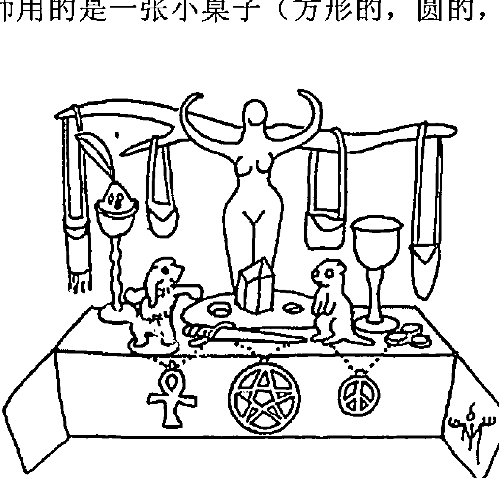

## 课程之一：魔法

了。

> 注意：当你不在房间里的时候，千万要将圣坛上蜡烛熄灭！我已经听说了数起因为魔法师的疏忽——没有熄灭蜡烛，将自家房屋烧个精光的例子。同样，你还要保证蜡烛上方没有易燃物——包括另一层的架子、橱柜等等。在点燃蜡烛之前，你应该让妈妈帮忙检查一下圣坛装置。

接下来，你的圣坛还需有几样代表神灵的物品，可以是水晶球、天神的雕像或肖像，你可以自己做，也可以从超自然商店里购买。不要在圣坛上堆满这样的东西——一个或者相匹配的一对就足够了。（我会自己做这些圣坛雕像，而且我还有一对非常年轻漂亮的天神的肖像，是为你们而做的！）。另一种代表神灵的方式是在你的圣坛后面摆放一面镜子，这样，在你做法事的时候它就会映出你的脸。毕竟，圣灵一直与你同在！你的圣坛是幽灵、天神的一个小家，他们是你尊贵的客人。你尊重他们，相应地，他们也会尊重你。如果你想专门为某一位天神设立圣坛，请三思。先花点时间做足功课，了解他们的特性和符号。以后，我们会慢慢讨论这个问题……

最后，你的个人圣坛上还应该有代表你自己和你所爱的人的物品。照片是最普遍的选择，但也有一些魔法师会选择小动物形象来代表自己和家人——尤其是那些鼎力支持特殊图腾动物的人。这些象征物经常被用于疗愈魔法中。如果你喜欢，你还可以加入其它一些装饰物，比如一些漂亮的石头（尤其是有着自然形成的小孔的石头）、水晶、化石、骨头、陨石、贝壳、橡树果等，这些也拥有你需要的力量。记住，无论怎样，圣坛是个神圣的地方，所以不要随意地在上面放置俗物（比如你的梳子，一听苏打水，或是钱包）！保持圣坛整洁。做好一切准备工作之后，来做一个小小的献祭仪式。点燃蜡烛和焚香（如果你需要的话），念：

> 圣坛是神圣之地
神灵和神秘存在于此
愿魔法常在
天佑一切！

#### 第七节：进步与提高

##### 入门仪式 (Initiation)

Initiation 意为“开始”。入门仪式是一种正式的通行仪式，举行这样的仪式是为了接受新成员进入团体。大多数大学联谊会和一些年轻人社团和街头帮都有这样的仪式。一些入门仪式充满了挑战和严峻的考验，考验越是严峻，新人对这个团体的归属感就越强烈。许多魔法传统都讲究团队协作——称呼也各不相同，比如十三女巫大聚会、小屋、会社、圈子、园子、鸟巢、家户等等——它们大多数都有入门仪式。但是允许进入这些魔法团体的最小年龄为 18 岁，因为一个负责任的团体是不会接受未成年人的。在魔法学习过程中，要循序渐进，不要还没学会爬就开始学走。

入门仪式是一种魔法变体，是为你精神和魔法下一阶段的意识和觉悟开启另一扇门。它可以改变你，甚至让你对个人和世俗现实的观念永远改变。入门仪式不只是将“秘密”和智慧传承下去，它还是一种与宇宙对话的方式：“如同揭示我自己的生活一样，我已经准备好去见证这样的神秘揭幕了，经验告诉我，我应该敞开胸怀，接受挑战。”

##### 学位和等级

一些魔法协会也有许多的学位或等级（像学校一样），这些学位和等级会告知你的精神发展和魔法培训的阶段。你应该非常熟悉东方武术中的腰带颜色体系，魔法学位也是一样的道理。这种学位的数量根据协会的不同而不同。一些魔法协会以有十个或以上的学位著称，但是一般来说都只有三个。每一个等级都有自己的学位名。在德鲁伊教中，这三个等级分别为诗人(Ovates)、诗圣(Bards)和诗仙(Fili)。在魔法中，通常的等级分为见习生、祭司以及高级祭司。工艺协会的等级为学徒、熟练工和师傅。格瑞魔法学校传统的等级有学徒、熟练工、师傅和专家。

一些愚蠢的人以获得学位为目的，甚至不惜作弊！但是真正的魔法师都知道，只有通过训练，得到知识、智慧、能力和怜悯之后，才能获得学位。它们可以通过各种不同的令人惊奇的方式（譬如灵感乍现或顿悟）来获得。正是这样，经过魔法的同步性（也就是“幸运的巧合”），你的生活步上了正轨。

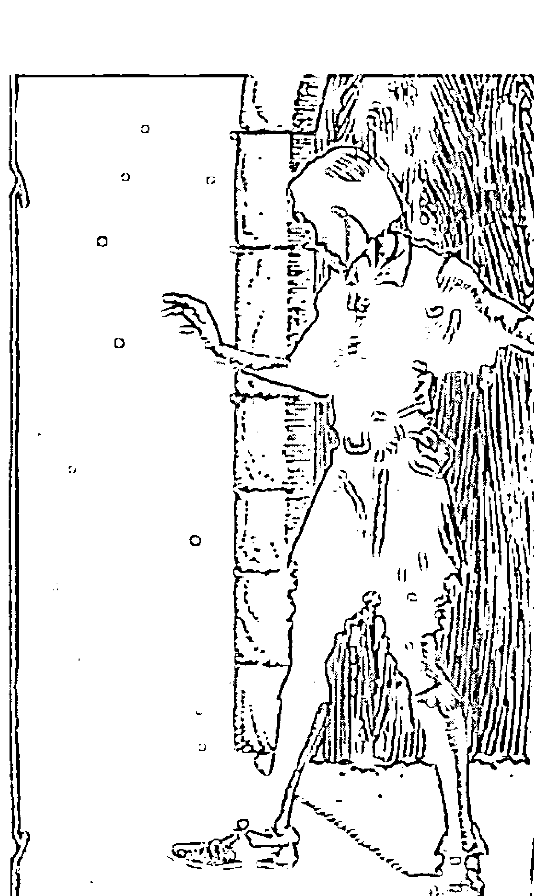

这本魔法书将会告诉你魔法学徒计划的基本原理，但是要想获得熟练工魔法师的资格，你需要在格瑞魔法学校注册登记。如果只用这本书学习，我就没有办法来对你训练的进程进行评判，因此我也没有办法授予你任何的魔法学位。如果你想加入其它魔法协会，你还得根据他们的程序来获得资格。但是，如果你好好学习这些课程（我希望你能做好！），也许有一天，我们就能面对面……

### 第三课：魔法基础

> > 任何足够先进的科学听起来就像是魔法。
> 
> ——亚瑟 C. 克拉克

#### 第一节：简介-期望、崇敬和谦卑

——鲍勃·格兰崔克斯（Bob Gratrix）

成为一名魔法师不是一件容易的事情。有些人被魔法师的一些特质所吸引，他们想要成为魔法师是因为想要获得力量或给他人留下印象。但是，要想成为一名真正的魔法师，首先要认识到，一个人，不管他知识多么渊博，能力多么强大，也仅仅是拥有 141 亿年历史、直径大约 88 万亿英里的浩瀚宇宙中一个微小、短暂的生物。

随着知识的增长，魔法师的见识越来越广，他们明白人和宇宙最和谐的关系就是对广阔神秘的宇宙保持敬畏、谦卑和崇敬。人类能够拥有意识并且能够像现在这样发展出各种复杂的人格，掌握知识和技能（譬如魔法），这是很了不起的。

要成为一名魔法师就得承认万物有灵，以及万物一体，以后我们会更进一步讨论这一点。这就意味着对待一切事物的态度，包括其他人，都应是崇敬和谦卑的。一个真正的魔法师不会向他人炫耀自己的学问，或者仅仅因为获得了一点知识就想要引起他人的注意。永远记住：不管我们学了多少知识，不管我们的魔法多么纯熟，我们所不知道的总比知道的要多得多。

简单来说，生命就是一个过程。在我们所体验和观察到的状态之外，还有一个一直在运行的转换圈，也就是一个存在许久并已成形的共享状态。魔法师的工作就是创造，而他们的工具实际上就是自身的感知力、觉察力、自我认知力和自然法则。魔法师的手指能够感应生命的脉搏，了解生命的力量和缺陷，并感知存在于所有发展中事物内部的微妙平衡。只有认识到这一点，才能洞悉自然进程中的转化和加速力。这些转化是魔法和创造的本质，它们推动万事万物坚定无畏地向前发展。魔法师能够通过施咒来消除苦难，能够拯救苍生，能够认清并祛除在生命长河中遭遇的障碍。为了这些，以及其他一些更多的东西，魔法师们创造了仪式，这样，任何人都能在苦难面前不屈不挠并心怀仁慈。

生活是创造中我们最熟悉的作品，就像雕刻家一样，我们总是将最好的一面展

###### 魔法师学徒的魔法书 | 上卷

现给他人。我们对自身的最高愿景都有着自己的一些看法，我们完美地运用与生俱来的非凡天赋，我们也希望纵情于金色阳光下的一切事物。我们既然从事着这项富有创造性的工作，要想继续成长，就必须一次又一次地回头看看我们的成长历程。我们需要了解，在我们的个人演化过程中，下一步需要改变什么。我们要深入研究那些我们深信不疑的观念和信仰，质疑当下对于自身的了解，还要通过自省来不断调整自己。我们要寻找通过我们定义主题的模式，去看看我们是谁，将会成为什么样的人。我们寻求自身的行为和观点模式，这些行为和观点将我们与我们自身所展现出来的东西联系在一起。而且，利用那些同样经过检验且被认可的能力，我们就能准确认知周围事物的本质。

#### 第二节：像魔法师一样观察和思考

> 真正的发现之旅不是为了寻找全新的景色，而是拥有全新的眼光。——马塞尔·普鲁斯特

如果你见过脑部模型或图片，你会知

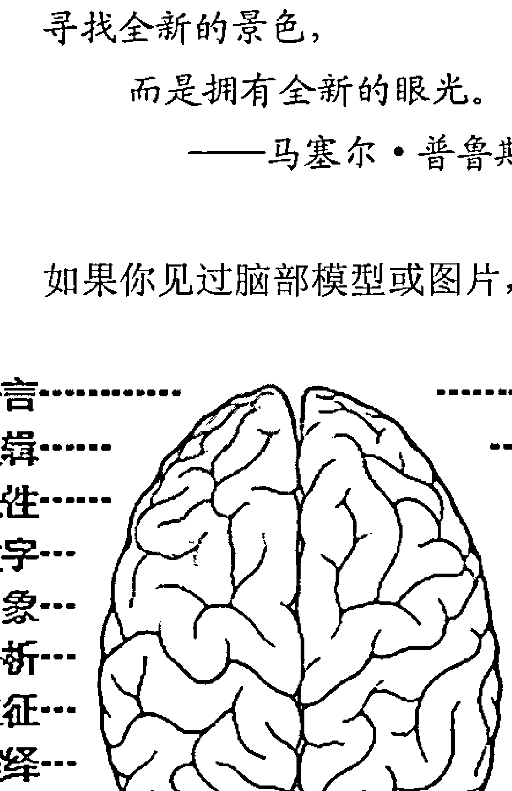

道它分为两半——称为大脑半球。大脑的左半球（控制我们身体的右半部分和右手）主要控制逻辑和理性思维。数学、书面语、演讲、机械、科学和政治学都与大脑左半球相联系，因此我们用“右眼”来“看”这些东西。科学家、数学家、机械师、会计师和政治家据说都有发达的“左脑”。另一方面（哈！），大脑右半球控制直观、神秘的意识。艺术、图片、象征符号、音乐、歌声、诗歌、魔法、梦、幻觉和超自然经历都与右脑有联系，因此我们会用“左眼”去“看”这些东西。艺术家、音乐家、神秘主义者和诗人都是“右脑”发达者。右脑控制左手。

试着闭上一只眼睛，头保持不动，然后看一些有着复杂层次的景象（比如满屋子的人，森林中的树）。或者选一个时间，试着用一只眼睛通过3D眼镜观看3D影片。用一只眼睛看世界，一切会变成平面而不再立体，因为你会失去所有的透视感。广义上讲，这就是大多数人“看待”事物的方式，然而他们看到的也只是一个“世俗”世界。

##### 睁开双眼看世界

魔法师和其他人最大不同之一便就是看待世界的方式。魔法师的方式很特殊，他们能够透过现象看到本质。一些人将这称为“跳脱框架思考”。大多数人只用一只眼睛去“看”——左眼或者右眼，也就是用左脑或右脑来过滤他们所有的感觉和经验。魔法师却是用双眼“看”，这样就能同时利用左右脑。所以魔法师拥有大多数人无法想象的观感（在此处，想象的意思是“用你的大脑看到一个画面”）。当你用这样的方式来“看”，你就能看到他人看不见的画面（事实上，他们会告诉你你刚刚看到的——或者想象到的——事）。这就像是那些诡异的立体图像，看起来就像是一堆五颜六色且乱七八糟的小点。但是，当你不再只聚焦于右眼的时候，你突然就会看到一幅完整的3D图像。魔法师就是以这种方式来观察世间万物的，我们甚至可以将其称为“全息感知”。

有这样一种说法：“在盲人的国度，独眼称王。”但是，在魔法世界中，一只眼的人就是盲人。这些课程就是在教导你永远都要睁开双眼看世界……

###### 任务：双目并用识3D

这些小练习能帮助你集中感官注意力、内部洞察力和魔法想象力。在练习之前，使劲揉搓手掌直到发烫，然后将它们覆盖在你睁着的眼睛上，让眼睛吸收能量。

- 第三只眼：站在离镜子大约6英寸的地方，两眼睁开，凝视自己在镜中的映像。当然，刚开始你只能看到两只眼睛，但是进入眼睛的柔焦模式之后，那两只眼睛会慢慢地融合为一只，即“第三只眼”！

- 漂浮的香肠：双眼睁开，在眼前6英寸处，两手食指指尖相对。将指尖放到一起，用柔焦模式凝视它们相接的那一点，很快你就能在两指之间看到一小节“香肠”。慢慢分开指尖直到“香肠”出现并漂浮在空中。接下来你的眼睛慢慢聚焦也能看到这节“香肠”，保持它稳定不变形几分钟。

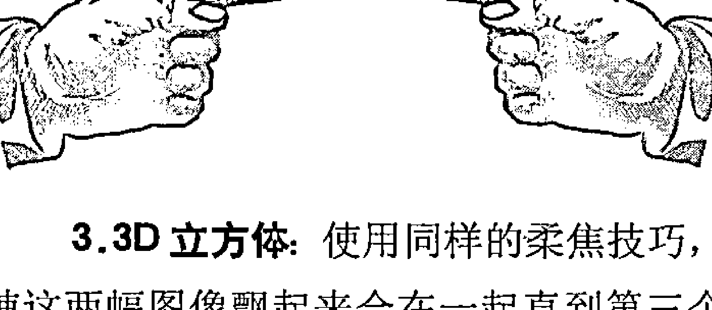

- 3D立方体：使用同样的柔焦技巧，使这两幅图像飘起来合在一起直到第三个图像出现。中间那个就是3D图像。

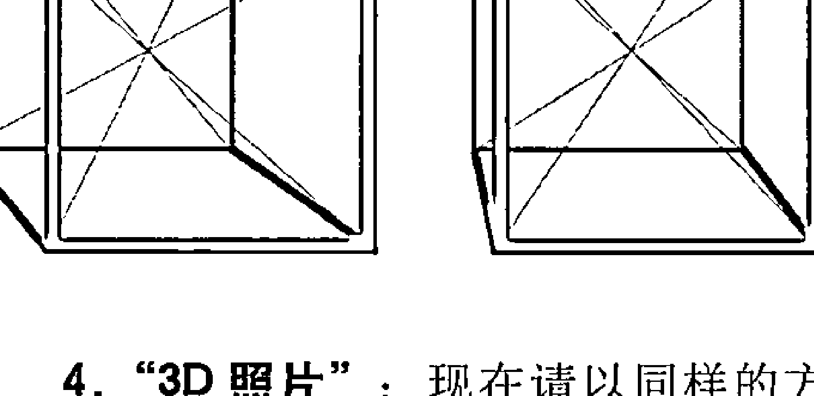

- “3D照片”：现在请以同样的方法看着这两张照片，使他们融合成一个单独的3D图像！一直练习直到你掌握3D效果。

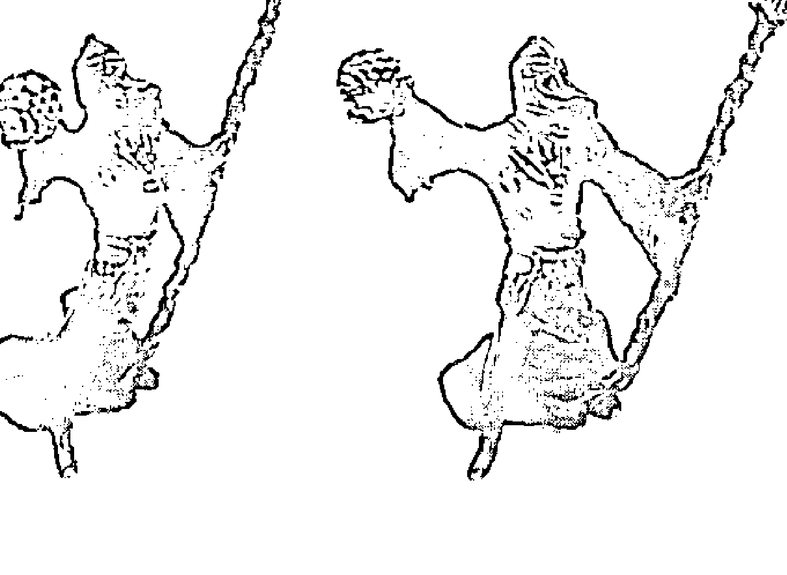

- 三维立体图：现在，看看你能不能在下面这胡乱涂画的图像中看出隐藏的3D图像。要想做到这一点，你必须同步使用两只眼睛和左右大脑！这种图像被称为SIRDS“乱点印刷立体图”（Single Image Random Dot Stereograms的缩略形式，单图像随机点立体图），你可以在这个网站上找到更多类似的图形：www.nottingham.ac.uk/~etzpc/sirds.html

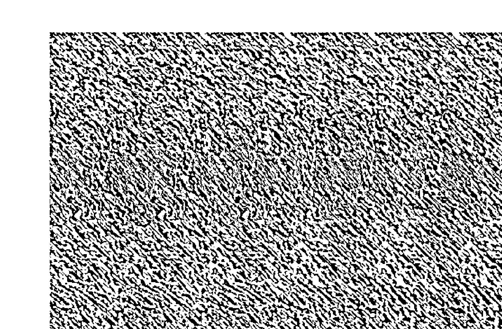

##### 任务：像魔法师一样聆听

有一种重要的魔法技能就是保持安静，静静感受大自然带给我们的微妙声响。神奇的听力能让你和魔法世界合调。魔法师聆听声音不仅仅是用耳朵，而且还要调动一切感官，这样才能听到其他人听不到的声音。在我们周围存在着很多层面的声音，即使是一切都看似安静的时候。将所有这些层面的声音以及这些声音所承载的信息注入你的理性思维逻辑之中，可以增长你的能力，并让你的咒语更加丰富，更加有力量。

现在试试：放松你的大脑，然后聆听。你首先听到了什么？接下来呢？还有别的吗？这些声音是怎样相互联系的？在你聆听的时候，大脑会开始调入很多你平时没有注意到的声音和感觉。练习得越多，你会越来越自然地从周围接收到这样细微的声音和能量。你还能感受到微风拂过皮肤的触感，就好似你的触觉也学会了聆听。即便是在喧嚣的城市中，大自然的声音也是无所不在的，它们与城市文明的声音融合在一起，用你的感官、直觉和魔法好奇心去聆听，你会发现它们的。

接着，尝试着在大自然中做一些“聆听练习”。可以在自家后院、海边或树林里——一些你熟悉或钟爱的地方。仔细聆听，直到你看见一株植物，一棵树或一只动物，或者，等它们自己出现，这也许只发生在你的意念中。仔细聆听，直到那些动物、植物或岩石、瀑布等的灵魂呼唤你。一旦“听到”这些信息，你就得留下一些表示感谢的祭品——燕麦、贝壳、水果，或是一首歌，一句祷告。

#### 第三节：魔法是永恒的力量，并且变化多端

当我们通过一些现阶段的科学和社会理论还无法解释的方式使得自身和世界发生改变的时候，我们就将这些方式称为魔法。当然，许多技术我们现在都认为是理所当然的——电视、移动电话、微波炉、电脑、英特网、全息图、X射线、声波图、MRI（Magnetic Resonance Imaging核磁共振成像）等等，但仅仅在100年前，这些都看起来都像是魔法！直到现在，对大多数人而言，它们依然是魔法，因为它们真正的工作原理对于大多数使用者来说都是不可思议的。

而且，足够讽刺的是，许多事情到现在都还被普遍认为是“魔法”领域才有的——心灵感应、星体投射、通灵术，以及其它超自然现象——而仅在100年前这些都被认为是“科学”（“超自然科学”）。一些科学革命的开山鼻祖也都是炼金术士、占星师和魔法师。由于理论和方式的变换，科学领域和魔法领域之间一直都存在着反复的改组。而且魔法也常常乐于包容这两者，左右脑齐用，双眼皆睁。

魔法（Magic）一词源自古波斯索罗亚斯德教祭司，他们被称为Magi。这些Magi以其疗愈和占卜——尤其是占星术闻名于世。他们都相信宇宙是神圣且充满生机的。他们敬畏我们的地球和一些其它天体。给在伯利恒刚出生的耶稣带去礼物的“东方三贤士”就是波斯祭司。

相信的一切都得符合那个模型，任何不符合的东西都将被忽视——或者被排斥。

文化基因（Meme）：文化基因是人体内的信息单元，也是人类传承的“心理基因”。这个词汇是牛津大学动物学家理查德·道金斯1976年在他的《自私的基因》一书中提出的。

> 波斯语Magus（意为“祭司”“拜火教徒”）是由希腊语Magos（意为“明智之人”“巫师”或“变戏法的人”）变形而来的。“魔法师的”证明（demonstration）、专长或特性被称为Magikos。Magus具有希腊语词根，但被西化成了Magic和Magical。
> ——汤姆·奥格登，《巫师和巫术》，第129页

类比（Analogy）：类比是指通过记录一些相似点将两种不同事物（类似物）进行比较。我们会说，这个像那个，只是不一样。大多数的谜语都基于相似物，比如“一个圆盒溜溜光，金黄宝贝里面装”，答案是“鸡蛋”，类似物是财宝箱。许多事物都可以通过类似物这种方式来观察，而且魔法师能够看到事物隐藏的特性，因此，对于很多人来说，魔法师常常是在“打哑谜”。

##### 魔法概念中的术语

好吧，现在是时候展示另一组迷你词汇表了。以下的这些单词和概念对接下来的课程的理解都很重要。

###### 隐喻（Metaphor）

隐喻常常是把一件东西比作他物（而不只是像另一件事物）。我们会这样说，这个是那个。隐喻能够让我们以一种全新的方式来看事物，进而开创新的可能。莎士比亚曾说“全世界就是一个大舞台”，在这里，他给了我们一个重要的观点——以一个宇宙戏剧演员的身份来看待自己。

###### 范式（Paradigm）

是指一种哲学模式或者一种通过对其它事物的理解来观察世界的方式。举个例子，和现在一样荒唐，整个中世纪，全世界制作的太阳系模型都是以地球为中心，接下来才是太阳、月球、行星及其它行星都在一系列的同轴透明水晶球上围绕我们旋转，就像旋转玻璃蛋壳上不同尺寸的电灯泡。人们所试验的和所相信的一切都得符合那个模型，任何不符合的东西都将被忽视——或者被排斥。

###### 寓言（Allegory）

寓言是一种带说教性质的故事，寓言故事中的人、物、事都代表着真实生活中的其它东西。寓言中非常流行的类比是用动物代表不同类型的人类。范式、类比、隐喻和寓言都是我们在头脑中画下的不同种类的概念地图。在此，我们要记住的是这幅地图而不是土地，正如菜单并不是真的饭菜一样！许多人都不明白这一点，但是魔法师明白。

###### 悖论（Paradox）

悖论是那些看起来自相矛盾的句子。悖论看似荒谬，但事实上可能点明了一个深刻或隐含的真相。一个最著名的例子就是时间旅行悖论：如果你在某一时刻回到过去，在你妈妈还小的时候将她杀掉，那么她就不会长大并生下你，你也不会存在，也就不会坐上时间机器回去杀你妈妈。但是如果你没有杀她，那么她必然会生下你，而你也可以回到过去……对于魔法师来说，当我们说到一个真相时，悖论是最常被援引的理论，因为它反过来也是正确的。经典的例子就是：“上如是，下亦如是。”

###### 同步性（Synchronicity）

从字面意思来讲，同步性同巧合意思一样——同时发生的事件（两件事情发生在同一时间）。但是巧合具有偶然性，同步性却揭示了隐藏的特征和意义。我们所说的运气就是真的同步性。当你处于生命正轨上时，同步性事件就会像神指引的路标一样出现。

###### 合成（Synthesis）

合成是将分开的部分放在一起形成一个整体。尤指达成一致的对立方（论点和对立面）的结合。

###### 全息影像（Hologram）

全息影像是指一张图像的每一个微小部分都含有整体的信息——如同我们细胞中的DNA包含了整个生命的特性。

###### 模板（Template）

模板是一种模式或模子，它可以被置入、填充、摹写以表现或限制其它事物中相匹配的模式。一些我最喜欢的图形模板就是那些可以把双影转为3D影像的特殊眼镜，就像在电影和漫画书里一样。

###### 协同效应（Synergy）

协同效应是将单独的事物放在一起，以便整体力量大于部分力量之和，在此期间还会产生一些全新的东西。一个很好的例子就是水。它由氧气和氢气组成，这两种可燃气体在点燃的时候可能会发生爆炸。但当它们结合成水分子，其合成物——水——就是一种全新的物质，它可以是液体、固体，在达到100摄氏度时还可以是气体。

###### 格式塔（Gestalt）

Gestalt是一个德语词，意为“形状”或“形式”。该词用来描述产生协同新范式的心理概念的有机整体。新理念几乎都是格式塔思考的结果。

###### 顿悟（Epiphany）

顿悟是指一种突然的启示。当所有的思维碎片聚到一起形成格式塔，你就会用一种此前从未想到的方式来看待事物。在古希腊，这个词用于描述神的突然出现或显灵，而现在的人们在顿悟时依然会说“Omigod！”（我的天哪！）。

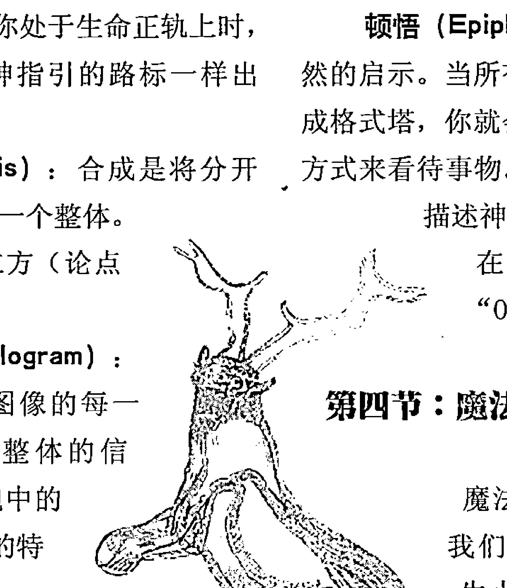

三兄弟的洞穴，法国，公元前14000年。

#### 第四节：魔法的起源

魔法起源于对火的驯服。当我们第一次学会怎样真正地生火之时，我们便在征服世界的道路上迈进了一大步，也将自身和其它生物区别开来，走上了人类的道路。我们成为了率先能够自主地“无中生有”的生物——根据自身意识，创造出一些自然界中没有的、能够满足我们强大需求的物品。火能够让熊、狼和剑齿虎远离我们居住的山洞和营地。火可以驱赶猎物进入我们的圈套和埋伏。即使是威猛的猛犸象也会在猎手的火炬面前畏缩（你也会的，如果你全身被长长的易燃的毛发覆盖着！）。同样，也是这些火炬为我们照亮了那些洞穴中的秘密通道，而这些洞穴是其它可视动物所无法探测的。有了这些火炬，我们还可以在洞穴壁上画下一些魔法图片、动物、星星、人等象征符号以及萨满——第一位巫师的肖像。这些壁画也许是迄今最早的咒符。

## 课程之一：魔法

多年来，几乎每一位魔法从业人员和作家都在尝试着定义和解释魔法。大多数人认为魔法就是通过一些当今科学模式还无法解释的方式，对现实进行操控以达到预期的目标。一些人认为超自然现象是魔法的基础。以下就是一些最流行也最有趣的定义：

> 魔法是：
> “……无上的，最绝对的，最神圣的一门自然哲学知识。它通过对事物内部神秘功效的理解，来不断改进自身以及其操作方式，以便将真正的药剂用在合适的病人身上，随即产生奇好的效果。”
> ——《所罗门王的小密钥》（公元1500年）

> “……一门包含了组建人类情感的概念和方式系统的科学和艺术，改变新陈代谢的电化学平衡，使用关联的技术和设备集中这种情感能量，然后用人的身体来调节能量的散播，通常会影响其它无论是有生命还是无生命的能量暗语，但偶尔也会影响个人的能量模式。”
> ——艾萨克·伯恩维茨

> “……一门与个人意愿变化一致的科学和艺术。”
> ——阿莱斯特·克劳利

> “……有意识地运用想象和集中注意力，凭借使一切可视化（Visualization）达到期望目标。”
> ——艾伦·埃弗特·霍普曼

> “……巧合控制。”
> ——奥伯伦·雷文哈特

> “……扩大机率。”
> ——安诺迪亚·朱迪思

#### 第六节：魔法如何扩大机率

所有的这些定义都是正确的，其中的每一个定义都会帮助我们丰满对魔法的理解，我个人最喜欢的是安诺迪亚的解释。当我们练习魔法的时候，它会为我们正在做的事情提供一种真正的解释。我们是在改变一个又一个的结果的机率（或者说是“可能性”）。所有的还没发生的事情都有一定程度的可能性，他们可能会发生，也可能不会发生。我们可以用百分比来表达这些可能性，当我们说“明天有50%的可能性会下雨”，或者“那件事情有十分之一的机率不会发生”。在这样的表述中，存在两个方面：可能性和不可能性。如果胜算是1:10，那么可能性为1，不可能性为10。但问题是，在这种情况下，如果你做十次，不可能性就会下降到1，可能性就会增长到10。再做一次，不可能性就没有了。即使机率是百万分之一，就像彩票一样，如果有过百万的人参与，那么至少有一个人肯定会中大奖。这就是为什么会有如此多的巧合和同步性。在一个无穷的多元宇宙中，所有的不可能性都必然是有限的。没有什么我们想象的东西是不可能的。唯一的问题就是：机率是什么？

在本文中，像“扩大机率”一样去实施魔法就包含了增加有利于期望结果的机率（可能性）。这就像是在跷跷板高的那一端堆积岩石直到平衡的改变——另一端跷起来。每一小块都有帮助——不仅仅是大块的石头，即便是那些小小的鹅卵石和沙粒都是有用的，只是需要得更多罢了。

当跷跷板的两端都离开地面保持水平，平衡值便是50:50，而且这个平衡值会随着支点（平衡点）的移动而改变。此时，想要改变平衡值就变得很简单——甚至可以将整个平衡完全颠倒。

窍门就是要找到支点。支点就是可供选择的可能性之间的交叉点。这些替代选择的可能性之间保持一种微妙的平衡，而概率波就处于这些可能性之中——事情很可能会朝着别的方向发展。在一个支点上，只需一点点能量就能在交叉状态中来回移动，而被魔法师扩大了的机率很可能会因为多米诺效应改变其时空中的可能性从而产生巨大的影响——就像池塘中的涟漪，这就是魔法师通过施法引起的结果。

> “给我一根足够长的杠杆，一个支点，一个站立的地方，我就能撬动整个地球！”

这是魔法的一个基本准则，我们将会在这些课程中频繁地提到这一点，因为我们要制造杠杆，认清支点，并找到一个站立的地方……

#### 第七节：魔法的颜色

几乎每一次关于魔法的讨论，第一个要说到的就是“黑”与“白”的问题。当然，超自然能量本身——就像电——是没有“颜色”的，不存在什么黑与白，更不用说灰色。魔法确实是没有颜色的，但是我们可以为了某些目的使用这些能量——就像我们能够使用电一样。魔法可以用来做好事、坏事或者任何魔法师想要做的事情。使用的目的是取决于使用者的道德标准。

纵观历史，曾经有过一种不幸的趋势，过分地将魔法（在生活中其它很多方面也存在）的使用简化为两个方面：“好的”和“邪恶的”。而传统上将这两个方面表达为“白”和“黑”。当然这些差别对于许多从业者的行为来说是有根据的，他们确实在这两个简单的阵营中做出了选择。但是大多数的魔法师的选择要复杂得多，我们根据彩虹色调谱给不同目的的魔法师进行了分类。

事实上，在魔法工作中使用颜色已经和元素（土壤、空气、火、水、精灵）、行星以及诅咒的目的之间建立了传统意义上的联系。在这本魔法书“符应”的那条目录中，你会看到分组列出的关联色。这些会在蜡烛、魔法袍、灯、祭坛布、墙帷甚至是护身符和其它会在咒语中使用的物品的颜色上用得到。对应的颜色和目的不是绝对的，也可能因为不同的文化传统而多少有些不同。当然，也会有重叠的地方，一些颜色可能会从一种文化融入另一种文化。

下面就是一个我自己和许多其他的魔法师都在用的魔法色谱：

- 红色——（火）体力劳动，因为要治疗人和动物，也代表身体的激情和性欲。红色是权力的颜色。红色是火、灵感、生命力、骄傲、愤怒、勇气、强烈情感、涤罪、荒地、积极的音乐（尤其是像心跳的击鼓声），以及雷雨的颜色。红色是避开危险的最好颜色。用来表示稳定、基础、繁荣和健康。

- 橙色——骄傲和勇气；英雄气概和吸引力；亲属和繁荣（好收成）。橙色习惯用于温暖、友好、充裕、精神、意愿、原则、理论以及警戒。就像金色一样，可以和激扬的音乐、秋天落叶的沙沙声、傍晚时分大自然的声音或骤雨初歇的那一刻联系在一起。橙色表示运动的流动性，愉悦和联系。

- 黄色——（空气）脑力劳动；冥想、意愿、智力和交流，是金色的另一版本。黄色是友谊、善良和信仰的颜色。金黄色是美丽、信任、夏天和像孩子的笑声一样明亮的声音，以及高亢的音乐的颜色。粉黄色更倾向于春天，心灵的努力以及创造力。黄色是一种改善平衡、自尊、魅力、占卜和创造力的极好的色彩，也常用于表现意志力、生命力、目的和效力。

- 绿色——（大地）植被，如同园艺学和草药学；肥沃和繁荣。希望、欢乐、愉悦、成长和改变是绿色的所有内容。深绿色与生育力、身体、勇气以及古典音乐或者荒野的声音有关。常青藤绿代表着情绪，如疗伤、沉思，平静的音乐或者缄默。浅绿色，如同嫩草的颜色，有助于康复。绿色通常用于维护人际关系，同情以及自我悦纳。

- 蓝色——（水）情绪工作；爱、和平，以及保护；智慧、深思熟虑以及天空的颜色。蓝色与绿色（浅绿、蓝绿）都可以代表星期五和金星。这种颜色充满了一种青春活力的感觉。蓝色是一种和平与深思的极佳色彩。通常用于表达和谐、创造力、沟通和共鸣。

- 靛蓝色——洞察力、想象力、幻想、发现范式的能力。魔法的常见色。靛蓝色与梦魇、幻觉和疯狂有关。靛蓝色常被称作“魔法的颜色”。这是魔法师长袍最常使用的颜色——经常用星星、月亮和其它天文符号来装饰。

- 紫色（紫罗兰色）——权利、财富和好运。被认为是皇室的颜色。紫色代表判断力、勤勉以及宗教思想。紫罗兰色是精神、以太领域、高度秘传的学识，古老的智慧以及其它更为神秘的事物的颜色。紫罗兰色被用于表现焦点，尤其是精神的中心焦点，以及冥想的焦点和广阔的自我意识和宇宙意识。

- 金色——阳性的能量。代表力量、领导阶层、生命力、青春期、欢乐、丰收和贵族。男巫常常更钟爱用黄金、青铜或黄铜铸造的工具、护身符和首饰。

- 银色——阴性的能量。代表直觉、洞察力、梦、天赋、占卜以及女性的神秘、隐私和巫术。女巫的首饰是用银或铜（金星上的金属）铸造的。

- 褐色——有关动物（所有种类）的一切，尤其是动物交流的一切。褐色是皮毛和羽毛最常见的颜色，代表了一切柔软和有绒毛的事物。褐色用于“马语者”、驯兽师、宠物心理学以及所有有着神秘能力，能够和动物沟通的人。

- 黑色——枯萎和捆绑；保护。夜晚的颜色。黑色代表预感，刚毅，以及因为“穿越黑暗”的需要，所以还有相容性。黑色有时用于魔法工具的保护色——尤其是手柄或者包装材料。当努力克服坏习惯，转变消极性，或者做一次激烈的生活改变是也用这个颜色。当然，黑色也是巫术和“黑色艺术”的颜色。

- 白色——祝福，或者是你想要的任何东西！纯粹的颜色，白色表示友谊、真诚、神圣、转化以及单一的或融汇的声音，比如锣声或钟声。白色是女神的颜色，因此用于所有形式的赐福中。

#### 第八节：魔法的色码

纵观历史和传说，大量的“学校”、社团和专门的魔法和巫术练习的颜色已经被特定。许多机构已经通过上文罗列的颜色各自区分开来。正如霍格沃兹的学生分别进入了格兰芬多学院（红色），拉文克劳学院（蓝色），赫奇帕奇学院（黄色）或者斯莱特林学院（绿色）。这些学校的工作和教学也集中在不同色码种类的学习上。

因此，在这些学校学习的魔法师也会采用这些颜色，所以我们就有了红巫、绿巫、白巫、黑巫（这些黑巫是想要成为术士的）等等。灰巫（有些人自称为“彩虹巫师”）并不专修一门，他们在许多领域都有涉足。一些巫师也采用了颜色认证——尤其是白巫和绿巫。对于精灵来说，这些色码也适用。

##### 任务：选择你的颜色

因为你已开始了学徒生涯，我希望你认真思考一下这些魔法的颜色，然后选择一种你觉得与你联系最为紧密的颜色。详情请看课程一第四课第三节：“色码练习”。这会是你的起点，你也会成为一名新手（颜色）魔法师。使用你的法名，让别人通过你的“颜色”来认识你——就像灰袍甘道夫。现在翻到本书中涉及颜色的章节（课程五和课程六：“色谱”），开始学习吧！随着掌握的魔法越来越多，你将有能力索## 任务：用你选择的颜色制作魔法袍

当你选好你想要的魔法颜色时，你就该做一件那种颜色的魔法袍了。魔法袍其实就是一件简单的无袖披肩，是魔法师在施行特殊魔法时穿着的。下面就告诉你怎样去制作你的魔法袍：

首先，量好身高。在我们教你制作魔法中会使用到的许多布制私人物品时，你会发现，这些物品都是按照你个人的“尺寸”来的。这就使得它们是专属于你的，而且只符合你一个人的身份。现在，去到你们当地的布匹商店，买下一块超出你身高约两英寸的布料（多出来的部分是用于卷边加工的）。

在那些有你想要的颜色的印花棉布中寻找，找出一块你喜欢且适合的印花布。举个例子，如果你选择绿色作为你的颜色，你可能会选一张有绿叶图案的布料。如果你选择的是褐色，你就可以买下那块设计有动物的布料。如果你选择的是红色或蓝色，你就可以寻找那些看起来像火或水的布料。但是如果你选的白色，就不要买那种有印花的了。

将布料买回家后，放在地板上。拎着较长的那一边开始对折，这就是你的身长。然后将它折成三等份。现在，打开其中的一个等分，这样你就得到了 2/3 的长度，还有一部分是 1/3 的长度，然后在 1/3 线上的 1/2 对折处做上记号。接下来，用剪刀小心地沿着对折线从 2/3 那边往 1/3 那边开始剪，剪到记号处停止。现在，你就拥有了一件基本成形的魔法袍了，如图所示。

将那些没有印染到的边缘修剪一下，再将所有的剪切边卷边，这样就算缝制完成了。另外，穿着的时候要将较长的那两边挂在前面。

##### 任务：自我献身

如果你想认真对待你的魔法学徒生涯，我就给你这个自我献身的仪式。首先，将这个仪式的语言抄录到一张羊皮卷纸上，在第一行写下你的魔法常用名。接下来，准备一个不受干扰的场地，冲个澡或者泡个澡，穿上你的魔法袍。然后在你的私人圣坛上点燃一根蜡烛，关掉房间里所有的灯（最好是在晚上做，当外面都陷入一片漆黑的时候）。现在，在你的圣坛上放置一面圆镜（化妆镜最好），站好你的位置以便你可以在镜中看到自己的影像。看着自己的眼睛，大声读出仪式语言，然后将它们牢记在心：

###### 自我献身仪式
——撒拉卢娜 (Saraluna) 和凯特琳 (Katlyn)

> 听我说，先祖，向导
> 守卫者以及能天使们，
> 是我，（你的名字或者魔法常用名）
>
> 在这个神圣的地方，敞开心扉
>
> 在这个神圣的地方和神圣的时刻，做出改变，
>
> 让我的灵魂和它伟大的目标同行。
>
> 我召唤圣灵来见证我的献词
>
> 并确认我与他们不断深化的联系。
>
> 我召唤先祖先辈们，
> 召唤将我们一切联系在一起的元素、网络
> 倾听我此刻的庄严献词：
>
> 在此，在这个神圣而完美的时刻，
>
> 我宣誓，我将以魔法为生。
>
> 我接受“所有事物都有意义，所有生命都是我师”这一伟大智慧
>
> 从此刻起，我宣布，我自己是一艘心灵的船只
>
> 是一名魔法路上真正的探求者
>
> 是一名神圣的生命网上的织工
>
> 我将会用我生命的每一个细胞，我的每一次呼吸，每一个脚步，每一次行动去尊重我即将踏上的神圣之旅
>
> 在我追求我最崇高的愿望时
>
> 我会抓住真理之光
>
> 希望我总能看到自然中的神圣以及神圣中的自然
>
> 我会以完整的爱和完全的信任走在魔法师的道路上
>
> 即使只是一粒小小的尘埃！
>
> 亦甘心情愿！

结束之后，将你的书面承诺卷成一个卷轴，并用一根缎带拴起来，将它放到圣坛镜子的后面。每隔一段时间就将它拿出来，打开，阅读，以提醒自己所做的承诺。

### 第四课：魔法技艺

> “魔术，做得好，可以是娱乐（Entertainment）。
> 魔术的练习和排演，做得好，可以是冥想（Meditative）。如果两者都做好了，那就是冥想娱乐（Meditainment）（Entertainment 与 Meditative 的合成）。对于观众和我来说，魔术是我的冥想娱乐和消遣。当我进入了冥想状态，整个世界都会消失，而我也会陷入镜子里自己的影像中。
> 许多受过传统训练的门徒已经揭示了活跃的冥想能够与我们内心深处隐藏的智慧取得联系，就像走路和跳舞能作为一种探究内心世界的方式。冥想是一种练习。对于我们来说，魔术就是练习。”
> ——马格努斯

#### 第一节：简介 - 现实中的魔法和小说中的魔法

对于许多人来说，知道魔法大多来自于故事、电视和电影——在这些素材里面，巫师和术士投掷火弹，可以让一些物体消失（或者隐形）；顷刻间改变自己的发色或者外貌，变成动物；赋予没有生命的物体生命，不用动一根手指就能打扫房屋；瞬间幻影移形；会读心术；会飞；从事丰富多彩的充满怪异的特殊效果的魔法大战——而所有这一切只需挥挥手，抽抽鼻子，或者眨眨眼睛。
真实生活中的魔法确实有些不同。

他们从简单的咒语和符咒开始运作整个音域——几乎与个体治疗、赐福、转换和其它小操作都有关；占卜；适用于疗愈和游历的萨满教的做法；通过“圈内协作”包括提高团体能量用于疗愈，社区服务，控制天气及其它类似的事情；更大的团队协作以恢复和拯救这颗星球，保护濒临灭绝的森林、民族和物种。

那些在电影中出现过的做法在现实生活中也能找到相似之处——即使它们可能没有好莱坞的特技效果那么富有戏剧性！这就像使用镭射激光：在电影里，你常常可以看到一条光线从激光器中射出直到目标点，但是在实际生活中，激光器只是在实体目标上显示一个点——而光线是隐形的。因此真正的魔法也是这样。

在这节课中，我将会向你介绍一些主要的魔法类别，然后向你展示怎样施展魔法。

#### 第二节：魔法的种类

魔法操作和实践通常分为两种主要类型：“高级魔法”和“低级魔法”。

##### 高级魔法和低级魔法：法术和幻术

高级魔法（也叫做“法术”，意为“操作一些与神灵有关的事情”）通常求助于友好的精灵或神灵，与宗教有关联。法术是指应用魔法去影响魔法师自身内部现实的改变。法术并不是服务于他人的，而是为了自我启示，自我实现以及羽化登仙（“成为神”）。重点是祈祷、祈求和冥想。法术经过新柏拉图主义者的高度发展，忠于在埃及亚历山大港发展起来的哲学和宗教系统。在公元3世纪，这些都是以柏拉图和其他希腊哲学家学说，东方神秘主义，犹太教和基督教的融合为基础的。柏拉图相信在道德上中立的自然魔法，比如说电，它的作用取决于使用者的意图。

幻术（“创造奇迹”）从另一方面来讲，是利用魔法去影响外部世界的现实变化。因为它涉及到科学和技术方面的此类操作，这就是我们所说的“实用魔法”。幻术也称为低级魔法，黑魔法，或是巫术——尤其是为他人提供服务的时候。民间魔法——服务于乡村或者普通人——的所有形式都被称为低级魔法。随着时间的流逝，民间魔法许多传统的知识和操作方式都在慢慢衰落，而且渐渐地被认为是迷信。

在希腊，低级魔法（称为mageia，“巫术”）因为其欺骗行为，在公元前5世纪得到了一个极臭的名声。低级魔法的从业人员不再是神职人员，而是宣称拥有魔法力量、可以免费帮助顾客的个人。这种人依然广泛存在，他们在报纸上大张旗鼓地打广告，经营着专营巫术和秘术的神物铺子和阅览室。大多数法律都反对“算命”以及其它一些诸如此类的行为。这种魔法最低级的形式就是格特尔（Goetia），在古代，这种魔法是那些施咒、“嚎叫”咒语，以及调制魔药的人惯用的。

##### 魔法

在全世界传统的部落文化中我们找到了萨满，或者说是巫医，他们极具天赋，并且学会了占卜、草药学、通灵术和巫术。他们是乡村教师、魔法师、精神导师、解梦人、施咒者、疗愈师以及助产士。在西欧的一些凯尔特部落中，这些萨满被称做Wicce（WEE-cheh）——一个盎格鲁-撒克逊单词，意为“塑形者”（Shaper）——这就是我们现在所说的“Witch”的起源。这个单词又来源于中古高地德语Wicken（“念咒召唤”）。

在宗教法庭和一些其它机构手中惨遭迫害的几个世纪之中，许多这样的乡村巫师和他们曾经服务过的社区居民一起在遭受严刑拷打后惨被杀害。20世纪巫术（Witchcraft）（常被简称为“the Craft”）的复兴主要归功于杰拉尔德·加德纳（Gerald Gardner），他是1951年英国《反巫术法》撤销以后出现在大众面前的一名英国巫师。加德纳的一位新门徒，多琳·瓦利恩特，开创了华丽的礼拜仪式（仪式，典礼和祷告），包括备受推崇的“女神的诫命”，并说：“如果你所寻找的东西并不属于你，那么你永远也不会找到它。而我，一开始就与你同在，也将会陪你走到最后。”

因此巫术可以被定义为与基督教诞生以前的欧洲萨满教有关的魔法实践。今天的魔法艺术包括草药学、占卜、魔法、仪式、疗愈、魔法药水以及通灵。根据学术重建、想象力以及一些传统，巫术（也被一些人称作Wicca）现在形成了一种独特的精神传统和生活方式，既可以应付整个社区生活，也适用于隐居者的生活。现代巫师既有女性也有男性——事实上，巫术现代传统（或者说“教派”）的主要创办人是男性。但在大多数的女巫大聚会和一些团体中，女性越来越多，例如Dianics（一个女巫团体），全是女性。今天，在魔法圈内，绝大多数的女性都是女巫，即使也有一些女性参与到其它魔法分支和传统中。

##### 催眠术和指向冥想

催眠术（Hypnosis）源自希腊睡神许普诺斯（Hypnos）的名字，通过不断重复命令和集中注意力而被诱导进入一种似睡非睡的恍惚心理状态，在这种状态下，被催眠者会遵从催眠师的暗示，并作出反应，而且，被催眠者有时还可以回想起一段遗忘了很久的记忆和经历。催眠术在很多治疗中都是一种有用的工具。Hypnosis一词是詹姆斯·布雷德医生1843年杜撰的，他曾使用了一种让病人一动不动地凝视着一件明亮物体的小技巧。医学上的催眠术能够被当做麻醉药来进行拔牙等各式各样的小手术。

自弗里德里希·安东·麦斯麦（1734—1815）以后，催眠术又被称为麦斯麦催眠术。他认为，这种效果是由催眠师传递给被催眠者的一种隐形能量或流质生成的。麦斯麦将这种力量比作磁铁，他称其为“动物催眠（动物磁性）说”。

催眠术似乎唤醒了我们的右脑意识（我们在睡梦中也能体验到这种意识），在这种状态下，所有朦胧的记忆都会变得明晰。被施催眠术的人非常容易受到暗示——相信催眠师所说的一切，并且按照催眠师的指示行事。以前的舞台催眠师通常就用这种暗示让人们相信自己是动物，而且这些人还会围着舞台四周奔跑，同时还会像小狗一样吠叫来娱乐观众，这就是因为大脑的不同半球有着不同类型的逻辑。

我们的左脑——在这半边大脑里我们体验着正常的清醒的意识——控制着我们的演绎逻辑，从特殊到一般的推理——这就是那种由夏洛克·福尔摩斯和现代侦探创造的科学解决问题的思维。然而，我们的右脑控制的是归纳逻辑，从一般到特殊的推理——这就是那种我们常说的“怀疑暂停”思维。因为当我们做梦的时候，我们根本不会先思考，然后再说：“嘿，等等——这是不可能的！”在归纳逻辑中，我们将所有发生的事情作为一种给予，并竭尽所能来支撑它。在催眠师的作用下，我们左脑意识受到抑制，然后运转我们的右脑。这就叫做“相对心理排斥理论”。

催眠术在古代就已经存在了，那时候是一种秘密的魔法技巧。许多魔法和巫术都是通过催眠和催眠后的暗示来完成的，在以前，被催眠的人会在催眠后继续失去自我意识，执行被催眠时的命令。

指向冥想是一种剧本的可视化(scripted visualizations)。在这个过程中，一个人会在另一个人的故事中进入轻微的催眠性迷睡中（“你正沿着一条小路漫步，你来到了一个……”），就像在进行一个角色扮演游戏的冒险。这种指向冥想能够让你进入一种亦真亦幻的境界——比如你孩提时代遗忘的经历等等。这在现代心理疗法中是一种非常有用的技巧，市面上也有整套的书和磁带，对我们很有帮助。

#### 第三节：色码魔法实践

在第三课第七节：“色码魔法”中，我根据相关的颜色，罗列了几种不同种类的秘法和巫术。专攻一个领域的从业者可能会因其颜色而出名，比如灰袍甘道夫。这次，还有更多的有关这些色码的实践——按照它们在色谱中的顺序来。之后，每一种颜色我都会用一节课来讲述。

##### 冥想（浅绿色魔法）（5.I）

冥想是大多数东方魔法和巫术的基本准则。我相信，你已经在电影中看到过冥想大师了，尤其是那些武侠的电影。合理的冥想能够开启个人成长和进步的大门。在心灵和精神领域的进步技巧中，冥想是迄今为止最有效的方法。

##### 疗愈（蓝色魔法）（5.II）

疗愈涉及魔法艺术和实践的所有形式，致力于治疗疾病，缓减疼痛，促进组织再生，恢复生命力和生育力等等。纵观历史，疗愈者都是那些没有取得官方授权的内科医生和药剂师，他们成为了一些农村和原始部落的医生、护士和助产士。

##### 草药学（绿色魔法）（5.III）

草药学是一门对植物的魔法、药性和其它特性进行了解和应用的学问和艺术。Wortcunning（“草药智慧”）是一个用来表示草药的秘密性能知识的旧词，而且这也是女巫专修的一门学问。

##### 占卜（黄色魔法）（5.IV）

占卜是预言或预测未来，或是寻找丢失、隐藏或秘密事物的一门艺术。虽然不是所有的预言家都是巫师，但是所有的巫师都渴望成为预言家。许多古人对占卜十分着迷，而且没有占卜师、预言家、神谕或先知的建议他们甚至不敢有任何的行动。一些异常事件，如噩梦和预兆，也被赋予了占卜的意义，也由此，我们有了Ominous（预兆的）一词。多年来，预言家们总结出了许多预言技巧，被称为预言艺术（Mantic Arts）（来自单词Mantis，意为“预言者”）。

##### 幻觉（橙色魔法）（5.V）

也叫做舞台魔法和表演魔法，这个领域涉及的是“不可思议的”幻觉和特殊效果。幻觉魔法通常分为两类：戏法（魔术）和变戏法（手法），旨在娱乐和迷惑观众。幻觉艺术源于第一批萨满教士。自第一堆篝火的点燃，特技效果就被应用到了加强仪式的戏剧效果之中。不同类型的表演，比如魔法、杂技、变戏法、木偶戏、吞火都是来自这种仪式。

##### 炼金术（红色魔法）（5.VI）

炼金术是魔法艺术和科学的变形和发展。炼金术是现代化学的前身，起源于公元1世纪埃及的亚历山大港，当时埃及的炼金术与希腊哲学和中东神秘学处于融合时期。中世纪的炼金术士追求三个基本宗旨：“基础金属”（尤其是铅）质变为金和银；寻找万能药——可治疗百病并且让人长生不老；创造一种人造人——小矮人（Homunculus）。

##### 驯兽学（褐色魔法）（6.I）

驯兽学关心所有动物的一切事情——尤其是动物的交流。驯兽大师包括“马语者”、驯兽师、宠物心理学家，以及所有有着神奇能力能够和动物一起交流合作的人。驯兽学包括动物学和图腾学方面的知识。驯兽大师们不断探索以期了解所有动物的名字，它们是怎样进化的、它们吃什么、它们的行为、生活方式、交配法则和语言。

##### 宇宙学（紫罗兰色魔法）（6.II）

围绕着我们的小世界的碗状夜空——天堂——一直以来都是魔法和巫术研究的对象。通过星星之间“点与点的连接”来形成星座将我们最早的神话和传奇提升到了天空的高度。北极星的固定位置在旋转的天体中为我们的四季提供了一个固定的轴承。太阳、月亮和黄道十二宫中行星的运行赐予了我们历法，第一种计时方法，以及最早的有效预言法。

##### 数学魔法（无色）（6.III）

毕达哥拉斯之谜为所有的数学，尤其是算术、几何和音乐奠定了基础，这些学科的座右铭是：“一切都是数字。”根据毕达哥拉斯的说法，宇宙中的一切事物都基于由几何图形创造的相同的基本“蓝图”，这些图形以一种连续的声音、光和颜色的波动一次又一次地重复着。这些图形形成了一种来源于中央源极的网格能量矩阵，它们创造了整个自然世界，并允许我们体验二象性、情感、线性时间以及我们所经历的一切现实。

##### 仪式魔法（白魔法）（6.IV）

仪式魔法起源于17和18世纪的一些秘密团体中，以卡巴拉和赫尔墨斯学说以及新柏拉图主义和东方神秘主义学说为基础。仪式魔法的最高境界是将魔法师带入神秘领域并与更为高级的自我进行交流的一种超自然体验，从而使魔法师们意识到上帝就存在于自身体内。

##### 学问大师（灰色魔法）（6.V）

Lore意为“学说”，而“学问大师”是巫师最主要的特质。历史上，魔法师都会研究和搜集包含各个年代智慧的书籍和作品，而且许多魔法师都拥有重要的图书馆和博物馆。学问大师知道一些少为人知的神秘事物。有人说“知识就是力量”，很多魔法师真正的力量就来源于他们广博的知识。然而知识不仅仅是秘密和未解之谜，神话和传说也是知识的一个重要部分。学问大师也是一个讲故事的人，他们总是可以引经据典来表明自己的观点。

##### 巫术和鬼神学（黑魔法）（6.VI）

低级魔法最简单的形式就是巫术，在巫术中，身体的一举一动都是为了达到某个结果。巫术形成了大多数的民间魔法，它通常被看做是“黑魔法”或者“暗黑艺术”。基于所有巫术都是由看不见的纽带连系在一起的（“交感法则”）这一理论，巫术有时也被称为共感巫术。鬼神学是中世纪和文艺复兴时期的流行的一种巫术形式，在鬼神学里，魔法师们接受魔法援助。即使魔族看起来比天使更容易控制，但它们可能是非常危险且怀有恶意的，古老的魔法书还详尽地描述了怎样念咒召唤和控制它们。“黑魔法”的另一种形式是死灵术，就是指用魔法召唤已亡人的灵魂。

和其它任何颜色一样，黑魔法自身并不一定邪恶。但是，当所有魔法师都在修习一些形式的巫术时，极少专修此道的魔法师将自己称为巫师（术士）。“魔法”与智慧有关，但“巫术”与力量有关。一个巫师的终身追求就是为了获得力量。因为知识就是力量，所以巫师也像魔法师一样追求知识。没有力量的智慧是无用的，因此几乎所有的魔法师也都练习巫术。同时，没有智慧的力量是危险的，因此正派的巫师必定也应该追求智慧！

#### 第四节：西方世界的魔法和巫术简史

魔法是普遍存在的。在地球上，没有某个单一的文化或社会从不使用魔法却有一批身份特殊的魔法师。每一片大陆，每一个部落和乡村都拥有自己的萨满、巫师、“巫医”和药师。在亚洲、印度、中国以及整个远东地区，魔法已经上升为一种高级艺术。本书中尚未介绍东方魔法，但会在以后的版本中加以补充。在基督诞生前的地中海和中东古典文明中，古埃及、希伯来、巴比伦、波斯、希腊、罗马和德鲁伊都拥有自己的魔法系统，这些系统对西方世界以后的魔法发展影响巨大，这就是我想要在此展现的世界遗产。

##### 埃及（公元前2700-2750）

在埃及，法老被认为是天生具有魔法能力的圣王。和很多地方一样，埃及的魔法师也分为两个级别。最受人尊敬的是训练有素的祭司和代替法老主持仪式的专业人员。魔法师，包括高级官员或宫廷巫师，比如英霍蒂普和德迪。第二个等级是世俗魔法师，与民间魔法师、疗愈师和巫师级别相同。埃及的魔法之神是透特，或者特胡提，其形象是狒狒或朱鹭。从埃及魔法中产生了“圣名力量”这一概念，这一概念深刻地影响了中世纪和文艺复兴时期的欧洲魔法。

也是传说中一名著名的魔法师。《塔木德经》的传说叙述了这名明智的君主是怎样在野兽横行的土地上、鸟儿翱翔的天空中执行他的统治权，以及怎样通过他的魔法指环的力量将魔族和超自然的神灵归为一类的。传说他雇佣了魔鬼来帮他修建圣殿，并从他们以及超视觉世界的其他居民那里获得了很多智慧。《所罗门的密钥》和其它魔法文字都要归功于他。根据犹太教法典的文献，所罗门掌握着秘学的秘密。同时，他还是一位著名的炼金术士和亡灵法师。

##### 希伯来（公元前 1630-1587 年）

即使严酷的犹太法律禁止一切形式的占卜和巫术，基督《旧约》里面最伟大的两个人物——摩西和所罗门——在各大魔法师中也是久负盛名。据说摩西建造了一所名为“圣幕之谜”的秘密魔法学校。圣经的前五本书（摩西五经）作为一种律法为犹太人所知，而且他们坚信这是摩西亲手所著。有了他们精心编制的规则和详尽的说明，摩西五经被当做是象征性的寓言和预言。圣幕之谜认为，正是这些象征主义的答案构成了犹太教的秘学。

所罗门是以色列王国第十世纪的国王，也是圣殿的建造者。所罗门王以其智慧、财富和长期繁荣的统治而著称，同时

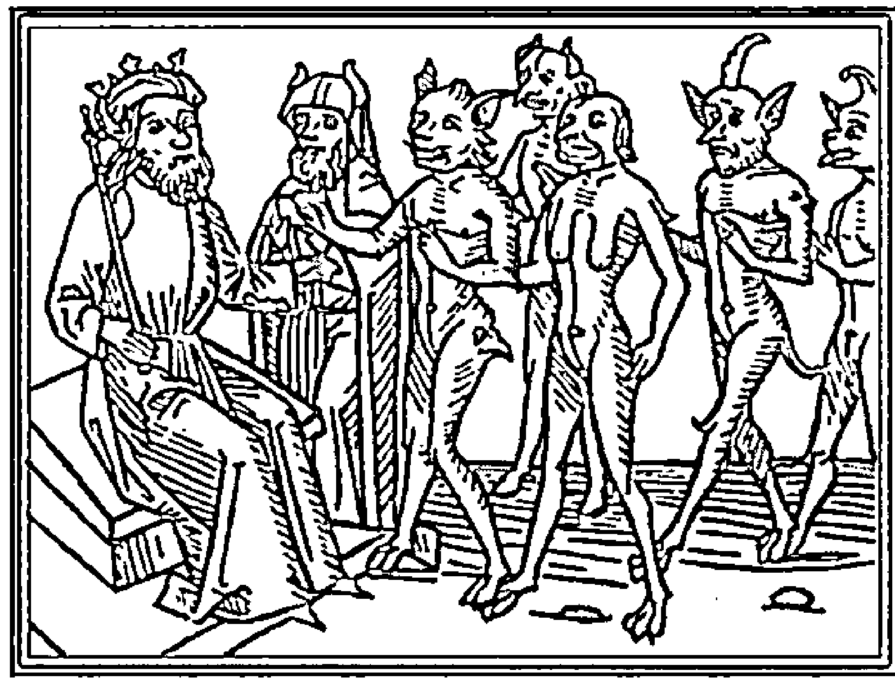

##### 巴比伦（公元前 612-538 年）

巴比伦这个名字意为“上帝之门”。巴比伦人专门研究天文学、占星术和数学运算。直到今天，我们还在使用他们的数字系统。他们对行星的运动和宇宙事件——比如日食、月食，彗星、新星、行星逆行等天文现象做了精确的记录。他们还设计了无以计量的不同种类的神秘印章、护身项链、符咒、护身符。直到现在，很多魔法师仍在使用这些符章。巴比伦的祭司是受过教育且诡秘的，他们相信疾病是由上帝的不愉快引起的。冗长的仪式是由高等级的国家圣殿祭司来主持的，专为

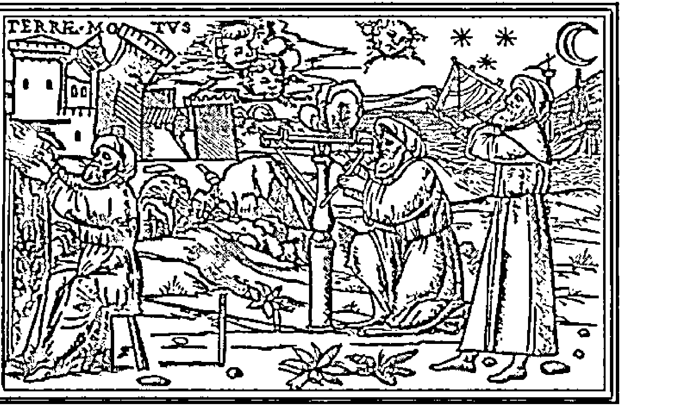

富有且社会地位突出的人施行。“低级”神殿可用于摆放神像，是神居住和接受礼拜的地方。

##### 波斯（公元前 539-331 年）

Magic 一词来源于古波斯索罗亚斯德教祭司，这些祭司被称为 Magi。他们在波斯帝国(公元前 539-331 年)时期声名鹊起。索罗亚斯德（大约出生于公元前 570 年）的随从，即 Magi，因为他们的治疗和预言，尤其是占星术而著名。他们相信宇宙充满生机且神圣。他们敬畏恒星等一切天体，他们也推崇四大元素——土、气、火和水。阿胡拉·马兹达是索罗亚斯德教的善良、智慧和真理之神，是恶灵阿赫里曼的死对头。索罗亚斯德教的信仰对犹太教有着意义深远的影响——尤其是在有关来世的事情上——随后这种教义传入了基督教。索罗亚斯德教教义在印度和伊朗的袄教信仰中一直流传至今。

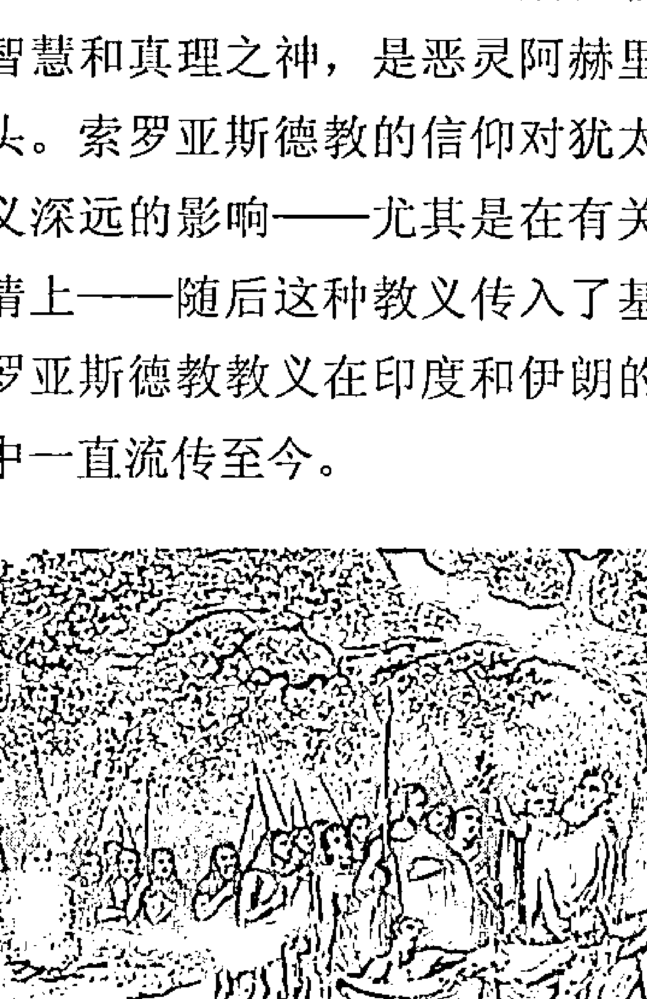

##### 希腊（公元前 480-323 年）

希腊人开发了一种魔法系统和哲学，在这一点上，希腊人受到了埃及、中东和亚洲的重大影响。希腊的魔法之神叫作赫尔墨斯，从而有了赫尔墨斯魔法这一名称。和埃及人一样，希腊人也将魔法分为两个等级：高级魔法和低级魔法。纵观希腊罗马式的世界，最有影响力的力量就是神谕者，他们献身于各种各样的神。在这些古遗址中，受过特别训练的女祭司会告诉人们一些晦涩神秘的答案。也是在这个时期，不同的预言方式常被使用，最常用的就是屠宰家畜检查内脏（尤其是肝脏）以领悟神的旨意。希腊也是一些重要奥秘的发源地，最著名的就是埃莱夫西斯。他的故事中包括了丰收女神德墨忒尔及其女儿——花季女孩克莱，以及冥王哈迪斯。哈迪斯会在每年秋天劫走克莱，让她成为自己的新娘，也就是此后的冥后——帕尔塞福涅。

##### 德鲁伊（公元前 600 年 - 公元 500 年）

在整个高卢和大不列颠群岛、在凯尔特族群中训练有素的祭司便是德鲁伊（Druids）。Dru 意为“真相”。这个称谓也可能和橡树有关，而且有时这个称谓的意思又是“橡树祭司”。德鲁伊将火和水视为创造的原始材料，而且树木也如石头、动物、鸟、植物，以及那些在冥界看不到的精神体一样神圣。他们尊敬凯尔特人民的神灵，并且还会庆祝四个跨季度节日，比如卢娜萨节和凯尔特新年“萨温节”，并在这些节日上举行庆祝活动。不管男性还是女性，他们都会参与制定法律、调解纠纷，学习吟游诗人艺术、治疗、讲述神圣纪事、系谱学、数学、天文学、占卜、哲学、政治、教学、执行审判、仪式、以及施放魔法。德鲁伊负责在塔拉加冕爱尔兰君王，并宣布其合法地位。

凯尔特文化最初在中东（黑海海域，多瑙河流域）融合，并逐步向西传播。一千多年来，凯尔特宗教和文化覆盖了差不多整个欧洲，从法国的西海岸和布列塔尼一直到黑海，从德国到西班牙北部和意大利北部。据我们所知，德鲁伊和他们的宗教也因此成为了欧洲精神上的祖先。他们受到了罗马统治的严重迫害，但是罗马人从未到过爱尔兰，或是安东尼墙以北的·苏格兰，因此德鲁伊在很多地区流传了下来，比如巴德教派，一直很好地保留到了17世纪。

##### 罗马（公元前 735 年 - 公元 455 年）

罗马魔法中最重要的一位神便是朱庇特的信使墨丘利。罗马人使用巫术和反巫术（Counter sorcery）来击败对手并在政治和物质上诱降他们。即使巫术在公众面前很受欢迎，但是真正有权有势的人都十分害怕那些私下练习魔法的人，并且制定了严厉的法律来反对私人练习魔法。法律声明：“预言者、巫师，以及那些利用巫术达到邪恶目的的人，那些违背自然借用魔法召唤恶魔的人，那些制作蜡像搞破坏的人，都应处死。”
中世纪的基督教会也持有与此相同的态度。

##### 中世纪的欧洲（公元 455-1400 年）

因为魔法连系着人们在基督教出现以前的异教信仰和传统，基督教会用尽心思地将魔法与宗教分离，禁止人们使用魔法。教会采纳了自身发现的一切有效并且有组织地禁止他人使用魔法的手段。在西欧，大多数乡村都有疗愈师、草药医生和助产士。这些叫做巫师的从业人员，基本上都是女性。她们的技艺被称为低级魔法（低下的，简单的），与炼金术之类的高级魔法（尊贵的，精华的）是相对的。这些延续着以往做法的女巫，都变成了主教会规打击迫害的目标。这个会规在公元900年前后发布，它规定：“一些女巫的心灵被恶魔歪曲，并因假象和幻觉而走火入魔，以至于她们相信自己能够和异教女神黛安娜以及其他女巫一起安全度过野兽肆虐的黑夜。她们相信自己能在夜晚的寂静中，穿越千山万水……她们说自己听从黛安娜的命令，并在某个特定的夜晚接受召唤去为她服务。”

尽管教会禁止魔法，炼金术在7世纪至17世纪的欧洲都十分兴旺。炼金术以赫尔墨斯学说为基础，其源头可以追溯到古埃及。当阿拉伯人在7世纪征服埃及的时候，他们就接受了埃及的炼金术并将其带回了摩洛哥和西班牙。差不多200年前，西班牙成为了炼金术研究的中心。不久以后这种技术便遍布了整个欧洲。从8世纪

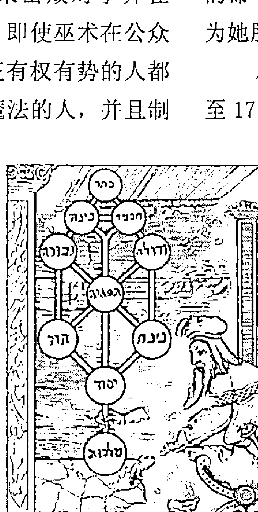

###### 魔法师学徒的魔法书 | 上卷

到 16 世纪，各种形式的中世纪魔法从柏拉图主义、卡巴拉主义，以及由十字军带回欧洲的东方学说的革新中渐渐浮现出来。在 12 世纪，中世纪魔法合并为一个体系。成立于 1118 年的圣殿骑士团发展了一种从耶路撒冷的旧约翰派 (Johannites)教派借鉴而来的魔法体系。

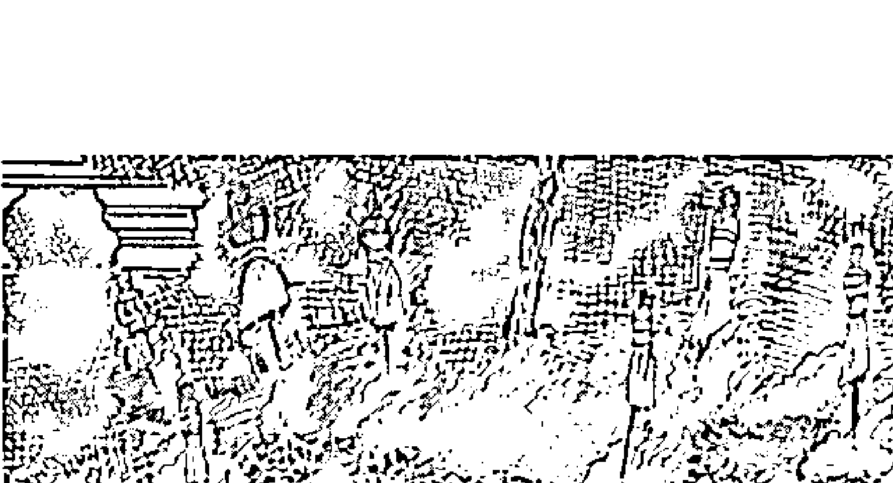

英国和欧洲，每一个乡村或是小镇至少有一名巫师，这些巫师都或多或少的受到当地居民的敬畏。乡村魔法师都专修低级魔法，提供各种各样的魔法服务，比如算命、寻找失踪的人或物品、找寻隐藏的财宝、治疗人和动物的疾病、解梦、侦查盗窃案、驱赶鬼神和精灵、施咒、解开精灵和恶毒巫师的诅咒，以及制作幸运符和催情药。因为能够对犯罪进行占卜，巫师一词在乡村或小镇上如雷贯耳。

欧洲的魔法师都是见多识广、学富五车、通晓医术、懂得炼金之人。他们的魔法由复杂的程序组成，包括衣着、神具、魔法符号，以及借圣名之力去召唤或驱逐各类精灵。那位希伯来神的名字，耶和华，也被称为四字神名（“四个字母”：YHVH），是最有力量的名字。

直到 13 世纪，随着宗教法庭的建立，魔法师和巫师才渐渐免于教会迫害。在 13 世纪和 14 世纪，亚里士多德学派的哲学比柏拉图学派的哲学更受欢迎。依照亚里士多德的想法，在这个世界上不存在自然魔法，因此魔法要么是神圣的要么是邪恶的。到了 15 世纪，魔法师——被看作是教会的对手——不停地遭受骚扰和追捕，但还不至于像术士和巫师一样被众多异教徒百般虐待，甚至杀害。几百年的迫害——从 1227 年到 1736 年——魔法师们牢牢记住那几百年的苦难——1227 年到 1736 年，并将其称作“烈火煎熬的时代”。

中世纪的魔法在 16 世纪文艺复兴时欧洲的考内里亚斯·阿格里帕和帕拉塞尔苏斯，以及英国的约翰·迪和罗伯特·弗卢德的影响下到达顶峰。阿格里帕的《隐秘哲学》（“有关神秘学的哲学”）涉及神名、自然魔法和宇宙学。帕拉塞尔苏斯强调“上如是，下亦如是”的赫尔墨斯学说。这种学说持有这样一种观点：地球的微观世界反射了宇宙的宏观世界。弗卢德，一名卡巴拉主义者，曾试图让新柏拉图派哲学和亚里士多德派哲学协调一致，并将它们与卡巴拉联系起来。

##### 文艺复兴（公元 1400-1605 年）

“巫师”一词在 1440 年才被使用，用来形容精明的男性或女性。事实上，在

在文艺复兴时期，作为高级魔法师的巫师是一种知识分子，他们追求炼金术和赫尔墨斯智慧。他们学习并且追随阿格里帕、帕拉塞尔苏、约翰·迪、新柏拉图派哲学等等。巫师们阅读魔法书，用正式的仪式召唤精灵，使用水晶球进行占卜。通常，这种高级魔法巫师都为显赫的皇族充当顾问和导师（例如维齐尔）。女王伊莉

莎白一世就曾重用约翰·迪担任“宫廷巫师”和顾问。迪和他的同伴爱德华·凯利一起开发了以诺派魔法系统——一种召唤精灵的术语和倡导星际旅行的呼喊。

##### 理性时代（公元1605-1900年）

在 16 世纪和 17 世纪，“巫师”一词是用在高级魔法师和各种广受欢迎的魔法师身上的，同时，他们还有其它的称谓：聪明人、魔术师、天佑者、术士、幻术师。但在 17 世纪中期，民间魔法和高级魔法的威望开始慢慢衰退，巫师们开始慢慢退出市中心，迁移至郊区。1662 年，皇家科学研究院在英国成立，这也是魔法与世俗世界分离的开端。学院重新制定了规则，
舍弃一切他们认为“不科学”因而就是“虚假的”东西。致使天文学与占星学分离，物理学从玄学中脱离，化学与炼金术分开。通过这些分割，人类的左脑不再能分辨对错，西方文明只剩下了一只眼睛。
17 和 18 世纪见证了神秘魔法团体的普及。例如共济会和玫瑰十字会，它们的仪式都是以赫尔墨斯学说、神秘学派、塔罗牌、卡巴拉解释，以及占星学为基础的。各种类型的魔法书都对魔法仪式做了详尽的说明，并且流传十分广泛。这些书中最重要的，而且迄今为止还在使用的是《所罗门的密钥》。这本书早在公元 1 世纪就已经存在了。在 17 世纪和 18 世纪期间，现代的仪式魔法开始形成。这是一门与神灵相处的复杂艺术。它要求学员经过严格的训练，并且有求知欲。仪式魔法通过控制神灵，从犹太教和基督教所共有的神上获取能量，通常，他们会选择控制恶魔，而且他们相信魔族比天使更容易控制。从

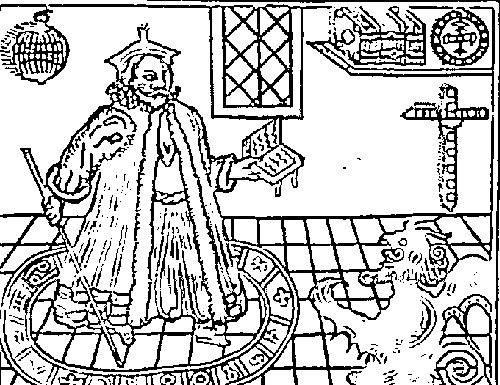

克里斯托弗·马洛的《浮士德博士的悲剧》扉页上面的图，
1632。

最高意义上来讲，仪式魔法就是一种超自然的体验，它可以将魔法师带入神秘领域，并与较高的自我进行沟通。

随着弗朗西斯·巴雷特《魔法师》（1801）的出版，高级魔法在 19 世纪初期迎来了一次伟大的复兴。这次复兴深受艾利法斯·里维的影响，里维在《高级魔法的信条和仪式》（1856）中对魔法的运作方式阐释对魔法师的思维方式影响深远。里维推出了三个魔法定律：意志力、灵光，以及“上如是，下亦如是”。另外一些促使仪式魔法的兴起的因素是唯灵论和通神学，它们都涉及了和神灵及死者的交流。民间魔法依然主要是乡村现象。1825 年以后，“男巫”和“女巫”的意思变得几乎一样，但是在 20 世纪就很少使用了。

##### 现代（1900 年以后）

也许，最伟大的西方仪式魔法体系是由金色黎明赫密斯协会创造的。这个团体由三个玫瑰十字会会员于 19 世纪晚期在

###### 魔法师学徒的魔法书 | 上卷

英国创立。金色黎明详细解释了里维的作品，加入了第四条定律：想象力——没有想象力的意志是无用的。金色黎明对阿莱斯利·克劳利产生了巨大的影响。克劳利被一些人称为20世纪最伟大的魔法师，他对魔法最主要的贡献就是将拉伯雷的西里玛法则通俗化：“随心而行，乃万物真谛。”另一个影响现代魔法的团体是东方神殿教，是由一位名叫卡尔·凯尔纳的德国人在20世纪初期创立的，他致力于密宗性别魔法的研究。20世纪50年代，巫术在公众中的崛起。这次崛起浪潮的带头人是英国人杰拉尔德·加德纳，他曾著书数本，并设计了几种不同类型的仪式。在20世纪最后三分之一的时间里，发生了魔法、巫术和不信教主义的伟大复兴。从1960年开始，许多新的魔法团体相继建立，从业人员也从几百人猛增到数百万人。有关魔法各个方面的书籍被大量地创作出来，促进了整个新兴产业——“神秘学”图书出版业的发展。21世纪初，随着《哈利波特》系列书籍的出版和电影《指环王》的上映，魔法又一次地进入了公众的视野。

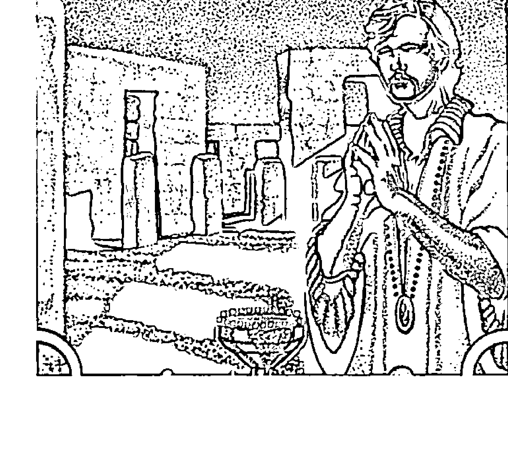

### 第五课：魔法才能

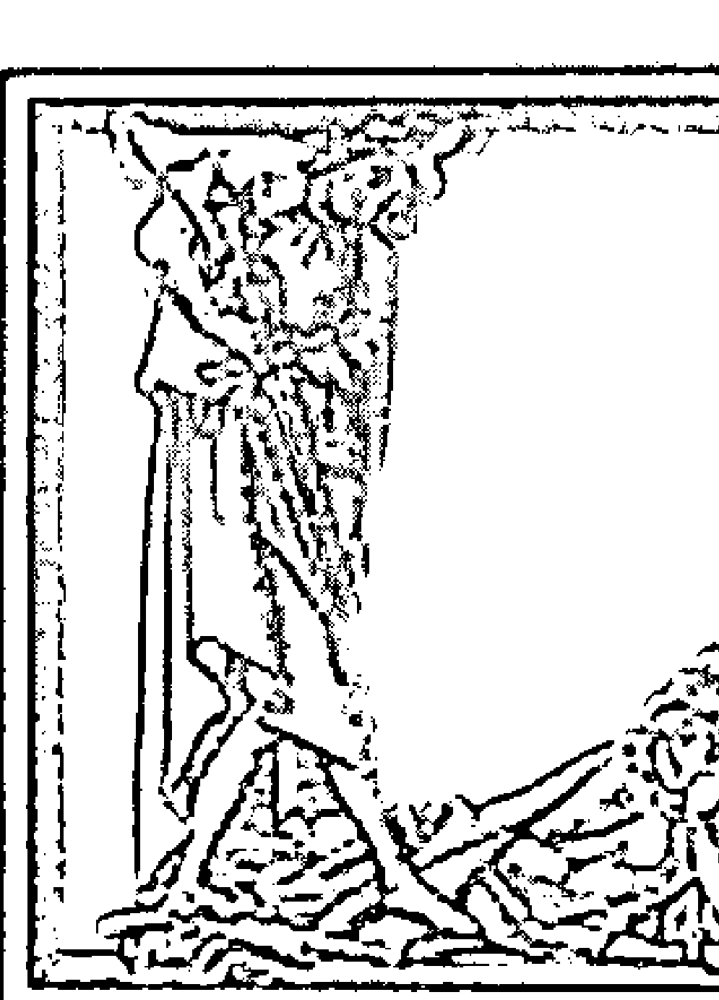

#### 第一节：简介 - 天赋和才能

与很多人一样，我也不是出生在魔法家庭的孩子。但是我是一个天生的魔法师，而且我也一直在寻找我的魔法遗产。当我还是一个小小的魔法小孩时，我对魔法才能和超自然能力学说特别着迷。我看过很多神话、童话、科幻小说和奇幻小说，那些故事中的人就像超人一样，拥有“超越常人的力量和能力”。在我找到其他跟我一样的人和进入魔法圈之前的很长一段时间，我就已经开始学习所有我能找到的关于超自然现象的东西。随着对这些才能的研究学习，我也开始练习，努力想要让自己也拥有这些能力。因为那时候没有老师来对我进行指导和训练，我不得不自己整理练习内容和训练计划，而且我比其他一些有人陪练的人做得更好。

和才能。几乎每个人都会在有生之年遇到一些这样的事情。天分越高，训练越多，你所显示出来的能力就会越强大。在许多情况下，这些天分会在青春期的时候崭露头角，在那个时候它们就会变得十分强大。这就是你进入魔法学徒期的最佳时刻，而且，在魔法界中，这可能就是举行成人礼的时刻。

科学方法要求系统的观察、研究、理论，以及经得起考验及反复验证的实验。在检测普西科学（Psi-sciences）时出现了一个问题，因为要做到心灵感应的随叫随到是非常困难的，想要在一个控制的环境之下做到心灵感应也是很不容易的。普西（Psi）能力是确实存在的，但它们通常在不经意的时候表现得最好。

#### 第二节：术语：超自然才能的归类

世界上存在着各种各样的超自然现象

信你会对自己的能力感到惊讶的。

- **共感 (Empathy)**——“感受”他人的情感、身体疼痛或者病症。共感有两个特色：接受和投射。接受共感是“抓住”他人的感觉。当你身边的人高兴或悲伤时，你也同样会感到高兴或悲伤。投射共感是他人的情感受到你的“影响”。如果你是投射共感，当你高兴或者悲伤的时候，你身边的所有人就会跟你有同样的感觉。共感对于移情和疗愈是十分重要的，但是你必须学着去控制的共感能力，因为对于一名具有这种能力的人来说，很容易就会控制不住自己的情感界线——你不知道该在何处终止你的共感，也不知道其他人会从什么时候开始受到你的影响。

- **心灵感应 (Telepathy)**——这个词从字面意义来看是指“远程感觉”，这一点看起来和共感一样。但是心灵感应是形容心与心之间想法和影像的直接交流，而不仅仅是感觉。心灵感应包括“听到”他人的想法（“读心术”），或者可以将你的想法投射给他人。

- **念力 (Psychokinesis)**——“心灵制动”。不在身体上接触他人而制动或者影响对方。这是最罕见最困难的普西才能之一。当念力通过一定的距离发生时，就可以被称为心灵促动（“远程控制”）。有时，这一点会在青春困惑期，发生家庭不和睦或者家庭虐待的时候自然出现（详情请看吵闹鬼）。

- **控火能力 (Pyrokinesis)**——“火的移动”。仅仅通过心灵的力量点燃或者控制火焰。能做到这一点的人叫做控火者（Firestarter）。

- **吵闹鬼 (Poltergeist)**——这个词意为“吵闹的鬼”。它指的是自发的念力和通常看起来像是萦绕于心的神秘响声。这些现象一般与青少年度过主要的心理变化期——尤其是青春期和性冲动期的创伤有关。在这期间，超自然力量可能会完全失控爆发出来。

- **疗愈术 (Healing)**——减轻疼痛和炎症，促进组织再生和其它治疗的能力。通常通过“按手礼”完成。

- **超视力 (Clairsentience)**——“清楚的意识”。能够感知或意识到那些超出“常规”感觉的现象。每一种类型的“清楚感知”都有一个名字。

- **千里眼 (Clairvoyance)**——“清楚的视力”。能够“看到”不在视力范围内或者常人看不见的事物的能力。有时这个词会用来形容特别敏锐的视力。

- **顺风耳 (Clairaudience)**——“敏锐的听力”。“听到”听力范围外或者常人听不到的声音的能力。也指对内心的声音或者微妙的声音输入的敏感性。

- **超能触感 (Clairkinesthesia)**——“灵敏的触觉”。感觉到身体碰触和来自无形物的压力的能力。

- **超能嗅觉 (Clairolfaction)**——“灵敏的嗅觉”。闻到或感觉到无形之物或其它维度的气味的能力。

- **超能味觉 (Clairgustance)**——“细腻的味觉”。尝到或感觉到无形之物或其它维度的味道的能力。

- **心灵占卜术 (Psychometry)**——通过心灵感应和接触来感知个体经历的能力。与警方共事的心理学家通常是心灵占卜师，他们能够通过触摸凶手的武器或受害人的任何物品来“看到”犯罪过程或者确定罪犯。心灵占卜术同样也被一些高级的心理学家和治疗师们所采用，他们能够看出病症或者身体内部的症状——甚至是那些他们从未见过的人——只需要触摸到那个人用过或者穿戴过的物品。心理学家通常会通过自己的身体来“感受”这些病症。

- **预感 (Precognition)**——“先知”。在事情真正发生之前了解或者感知其即将发生。这一点可能会发生在“真实的睡梦”中或者清醒时的想象中。有时，预见的信息是乱七八糟的，而且并不清晰，只显示出些许“苗头”。

- **似曾相识 (Déjà vu)**——“已经见过”。我们最可怕的感觉就是“曾经到这儿来过”。一种突发的神秘的认知感，忽然让眼前的场景无比熟悉。你所在的位置，所经历的事情，都仿佛曾经经历过，但你却没有这样的意识。一些似曾相识的例子也许是“记住”了一些有预见性的梦境的结果。

- **星际投影 (Astral Projection)**——“脱离身体”的旅行。这也叫做空中飞行，就像是在做梦，你可以翻山越岭去到一个遥远的地方或者次元空间。但也可能是你超脱躯体并俯视它的一种感觉，正如常见的濒死体验一样。

- **旅梦 (Dreamwalking)**——作为一个有意识的访客进入别人的梦境，做梦的人可能会也可能不会看到或记住旅梦者。

- **心灵传送 (Teleportation)**——“远程传动”。从一个地方消失，然后在另一个地方突然出现。通过能量转换将物体进行空间传送，然后在终点将能量再次转换成物体，就像电影《星际迷航》中的运输机。这也可以用来表示人的灵魂出现在另一个地方。

- **悬浮 (Levitation)**——从字面上看，这是万有引力的对立面，就像是在对抗重力。不依赖任何物理方式的支撑，使自身或其它物体脱离地面。悬浮是舞台魔术师最常用的幻术。

- **附体 (Possession)**——进入一个人的意识，通过他的感官来观看和倾听。入侵者（不论是人还是其它生物）可能会也可能不会“接管”并控制被入侵者的身体——被入侵者可能察觉得到也可能察觉不到。当对动物做此类事情时，就叫做“借体”。

- **时间旅行 (Time Travel)**——将你的意识投射到过去或者将来——通常是进入到那个时期某个人的思想中。你可能和你的密友一起穿越时空，也可能独自旅行。

- **通灵 (Channeling)**——故意让自身意识脱离“驾驶员的位置”，并允许另一个人的意识入驻其中，并在你无意识的时候通过你来发言。经常做这些的人被称为灵媒或者灵渠。通灵的过程主要是和亡灵打交道，但也会是一些非人类存在，比如动物灵魂和外星人。

- **隐身 (Invisibility)**——不被别人发现或看到的能力。许多人称其为“障眼法”。另一种隐身术叫“回避”空间。

- **变身 (Shape Shifting)**——通过模仿他人的外表、动作、行为、语气，以及声音，暂时“变成”其他人或其它生物——甚至会让别人以为你就是那个人或那种生物。这也包括披上动物的外皮，并用四肢## 身体操控

在日常生活中，你要抓住一切机会练习身体操控。如果你觉得累了，在休息之前一定要强迫自己再多练一会儿；如果你觉得饿了，在吃东西之前，再多练半个小时；如果你渴了，喝水之前再坚持一会儿。练习在平衡木上行走，做做体操运动，倒立、翻筋斗和后空翻。学着抛球、转火。成为一名优秀的舞者。

学生时期，我就开始练习屏住呼吸了。我用挂在墙上的大钟来为自己计时，通过不断地练习，到最后我可以屏住呼吸四分钟，这种练习大大提高了我的肺活量。五十年后的今天，我还能完全在水下游过一个奥运标准游泳池，而且，在加利福尼亚海岸潜水寻找鲍鱼的时候，我在水下呆的时间比同行任何人都长。

另一种身体操控是掌控你的面部肌肉。我站在镜子前面几个小时，练习怎样使我的眉毛各自挑起和放下，怎样扭动耳朵，怎样扩张鼻腔，怎样得到一些特定的情绪表情等等。所有优秀的演员都会这样练习，你也应该。

##### 冥想

冥想是我们要学习的最重要的基础技能，因为它能帮助你有能力去做许多其它的事情。我确定你在电影中已经见过冥想大师了，尤其是那些武侠电影。在冥想的时候，你要做的就是完全地以自我为“中心”，进入一种静止且专注的稳定状态，让身体和环境完全融合。这时，你将能够在思想和身体的任一方向游走——甚至是穿越时空。

行走，或者蹲坐在地上对着月亮嚎叫。有时，变身可以通过附体（“借体”）、心灵感应，或是移情——实际上是“进入”主体来完成。“半人半兽”的生物，比如狼人，就是变身者有意无意变形后的模样。那些故意变成动物的人可以被称为动物变形人（Animorphs）。

“魔令”——一种强大的“命令语气”，能够让人不经过思考瞬间服从命令。沙丘魔堡的“边·积利利”（The “Bene Gesserit” of Dune)就是一个很好的例子。军官和警察会在魔令的使用上进行特殊训练，就像大魔法师和高级祭司一样。

#### 第三节：冥想和可视化

当我还是个孩子的时候，我常常练习记住不同地方的布局，比如我房子的内部结构，人行道的延伸，或者森林中熟悉的那一部分，然后将画面牢牢记在脑中，就像一张地图一样。我能够闭上眼睛穿过这些地方，根据我的记忆来“看”并导航。当我来到各种各样被我可视化的障碍物所在之地，我会停下来，伸出手去摸摸它们。如果在我以为有的地方并没有这些物体，我会睁开眼睛，回到起点，重新开始。这就是我对可视化——一种基本的魔法技巧的最早练习。我建议你试试……

下面，我会提供更多的有关上文提到的超自然才能的练习。不要马上练习它们，也不需要全部练习。但是，如果你对其中的一些感兴趣，想要学习，而且你也有这些方面的天赋，这些练习是会有帮助的。记住，练习越多，做得越好！

#### 第四节：看到并读懂光环

当你对冥想和可视化越来越熟练之后，你就要准备学习看光环了。光环是生物的能量磁场，所有生物都会放射磁场并被其包裹，就像地球。我们每一个人都是一个生物磁场发射器。因为我们并不像地球一样围绕一根轴线不停旋转，所以我们的磁极并不是轮流交替的，而更像磁铁。有一个磁极在我们头顶上，叫做顶轮，就在三大头骨（额骨和两块头骨）长合（当我们还是婴儿的时候，这个点其实是个开着的洞！）的交界处。相对应的磁极在我们脊柱底部，叫做海底轮，就在我们尾椎骨的尖端。

就像地球的磁气圈和它的范艾仑辐射带，我们的光环也根据能量水平，形成了几个层面。第一层，从我们的皮肤延伸开去大约一英寸，这一层叫做以太体。因为以太体是最近的一层，因此非常容易就能学会去看它。下面一层叫做星光体，它比第一层要延伸得远一些，大约几英寸的距离。星光体过后便是意生体和灵性体。这些层面都非常高能量非常灵活，它们的范围也会根据环境的不同而改变。

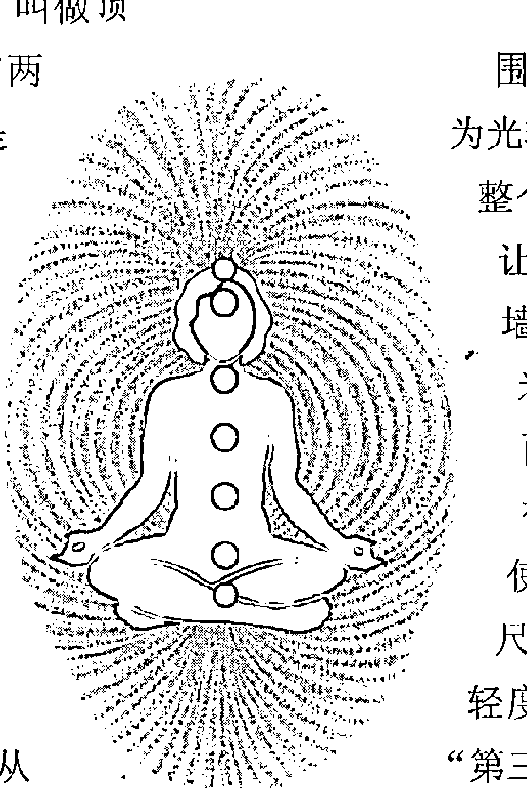

也许你知道北极光，就是那种让北国地区布满灿烂闪耀的天空“窗帘”“长矛”，和舞动“火焰”的五彩光芒。在南极周围，这种现象被称为南极光。这种令人惊叹的现象来自太阳风的离子化（电子的剥离）微粒，当这些太阳风微粒在磁极周围被地球磁场吸入圆形的“视界地平线”上时就会形成这样的现象。这就像荧光灯内发生的现象，包括“不可见光”。你的以太体就相当于地球的整个磁场，以及范艾仑辐射带和极光。如果你学会了怎么去寻找以太体，它就会变得可见。

##### 魔法练习：捕捉光环

围绕在我们头顶的灵气被称为光轮或者光晕，而围绕在我们整个身体周围的便叫做光环。让一位朋友坐在一面黑色的墙或者最好是一些棕褐色、米黄色或灰白色的窗帘前面。调暗光照，将光源移出视线（几根蜡烛就会非常好使）。往后坐在差不多十英尺的位置，让自己进入一种轻度冥想状态，凝视你朋友的“第三只眼”——就在眉毛之间。

做完这些以后，睁大双眼，让它们形成一个软焦点，仿佛你的焦点实际上是集中于你们中间的一个点上。如果你在这个距离的天花板上挂一根白色的线，然后聚焦在这根线上，软焦点就不难找到。过会儿，你会在朋友的脑袋外廓看到一个清晰的光环，它们仿佛在微微发光，但如果你试图改变焦点以期看得更清楚，它就会消失。窍门就是不要直接看着那个光环，而是用余光捕捉它。

多练习一会儿，直到你能很轻松地做到这一点。然后再在不同的光线，不同的背景，和不同的人做与此相同的事。最后，你就能够看到围绕在任何人周围的光环——在学校里，公交车上，餐厅里，以及剧院中。而且，当你能够看到围绕在人周围的光环时，你也能够在宠物、植物，尤其是树木（拥有着庞大的光环！）周围看到这些光环。

用这种方式所看到的就是以太体。随着认知能力的提高，你也能学会探测辐射到星光体上的能量，甚至更多。你还能看到光环就像地球极光一样流动、减少、摇摆不定和微微发亮。经过练习，你能够看到光环的颜色，这些颜色能够反映一个人的情感或身体状况。个体生命的状态会引起光环的变化。情绪状况主要影响颜色，而身体状况不仅影响颜色，也会引起光环形状的变化，比如在受伤或有伤疤的地方会有不规则的边缘或空洞。学会去看这些特征对成为一名疗愈师十分有用……（详情请看课程五，第二课第四节：“金场治疗”）


##### (Auric Healing)

看出光环的颜色比仅仅看到光环需要更多的技巧。这些颜色是非常独特的。你和一个朋友也许都在学习看光环的颜色，但你们俩人看到的颜色可能是不一样的，这很正常。经过一段时间的练习之后，你将会掌握一套自己专属的颜色认知系统。

> 小贴士：如果不管你多么努力，还是不能“看到”这些光环，不要觉得沮丧。就像那些患有色盲症或者音盲症（就像我）的人一样，我们可能在另一些感觉方面比他人更强大。毕竟，我们所感觉到和经历过的事情真实地发生在我们的大脑中，而不是在我们的眼中或者耳朵里。或许你会发现自己能通过其它方法感觉到光环——“感觉”它们，或者可能会“听到”围绕着人们的嗡嗡声……

##### 魔法练习：控制你的光环

捕捉他人的光环是一种被动练习。现在，以下就是一些为你准备的练习，你能通过这些练习主动地展开并触摸到自己的光环。把手举在身前，手背面向自己，努力张开手指，就像是要把什么东西推开一样。

用上面讲过的相同技巧来看到你的手和手指的光环。现在，开始剧烈呼吸，通过鼻子迅速吸气、呼气。不要改变姿势，拉紧肌肉，凝视着你的光环仿佛你的眼睛能够发射激光束一样。集中注意力，用气泵不断地给你的光环“加气”，以使它能像火一样“燃烧”得越来越旺。双手放平，手指指向远方，想象那个光环从指尖渐渐拉长，就像焊枪的火焰一样向前延伸。当你竭尽所能将它们延伸得尽可能远以后，深吸一口气，随即尽可能慢地将它们缩回到原来的长度，弯曲手指，轻握成拳。这些需要不断重复的练习。如果有朋友和你一起练习，你们应该轮流练习加气、延伸和收回光环，然后另一个人在旁边观察。这样就可以相互帮助，学习看和控制自己的光环。

##### 牵引波束和连射波束 (Tractor beams and repulsor beams)：

当你将上一种技巧练习得够多并且已经熟练掌握之后，你就可以准备尝试发射超自然的牵引波束和连射波束。这仅仅是延伸和收回你的光环。当你用力将光环延伸出去时，你可以用它将前面的任何物体推撞开（击退）。在你收回光环之时，你可以用同样的方法吸回（吸引）物体。而且，你可以试着将光环探出去，并“拍拍”某人的肩膀。试试，看看你能不能让他们转过身来！

##### 烛火 (Candle Flames)：

在一个黑暗的房间里点燃一支蜡烛，然后练习使用你的金场牵引和打击波束去影响火焰。当你做得越来越好之后，继续推动蜡烛，让它离你越来越远，直到你能在房间的另一边控制这边的火焰。

##### 编织烟雾 (Smoke Weaving)：

我参加了相当多的魔法聚会，在这些聚会上，篝火是所有活动的中心（后面有更多关于这方面的信息，在课程“回归自然”与“仪式和典礼”中）。篝火虽好，却有烟雾，而且还总是往我们的脸上扑来。每当烟雾开始转向我这一边，我就会用我的双手编织并塑造它，使它远离我，并让它笔直向上。为了做到这些，我会张开所有指头，延伸它们的光环。就像一个陶艺家在轮子上将粘土塑形成为一个高高的花瓶一样，我挥动手指光环对抗每一小股的烟雾，拂掠、轻拍、捋平，并改变它流动的方向。这看起来像是在跳舞。对此，我有一个策略：当有人注意并追问我正在做的事情时，我就会向他们展示我是怎样做到的。我发现，大多数的人都能很轻松地学会控制烟雾。

##### 拨云造日 (Cloud Busting)：

这实际上是控制天气的一部分。关于这一点，我们会在课程四第一课第五节“幻术：交感魔法”中进行深入讨论。大规模控制天气很不容易办到，可能还会有一些无法预料的后果。但是我发现，小规模的拨云造日是无害的，所以我会在此说明其方法。如果某天是多云天气而你想要它放晴，比如，想要去野餐，那你要做的第一件事就是要找到一小片蓝天（这被称为“海军的马裤”），或者是一片乌云看起来没那么厚重的地方。将双手伸向云层的薄弱部分，在脑中将你的光环延伸可视化，并用一段长长的连射波束将其发射得越远越好。你可能得练习数年才能做到将光环发射到云端，但是，你是肯定能够做到的。手背相对，手指延伸，然后将云层“撬”开，就好像它们是你面前的一大堆棉花。当云层打开，蓝天会变得越来越大。继续推动开口的边缘，让它越来越大，直到太阳光芒照射大地。

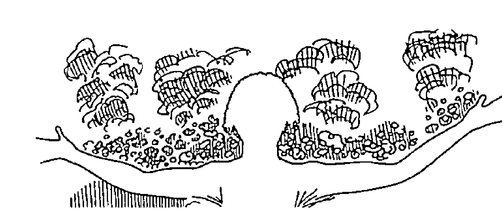

##### 防护光环（Shielding）：

你也能够学会将你的金场外壳“变硬”，成为一种超自然的防护。这和投射金场连射域的做法几乎一样。但是，这不是将其变成一种单一的紧密的波束，动动你的双手，拍拍手掌，将手指展开，上下滑动，形象点说呢，就是在你的身体周围塑造一个依附在身体上的坚不可摧的硬壳。就像地球的范艾仑辐射带，这层壳将会保护你不受任何外来超自然能量的伤害——而且它甚至可以发展成为一种“隐身外套”使你隐形。

##### 隐身（Cloaking）：

超自然的隐形并不意味着你可以站在房间中间，上窜下跳，手舞足蹈，却没有能看到或者拍到你。隐形是指你变得如此的不显眼以至于人们仅仅是没有注意到你在那儿。他们的目光会忽略你，掠过你的时候，你的金场就好像是特氟龙，或者镜子一样将他们的目光反射到了别处。然后他们不会记得你曾经也在这里。除了“硬化”你的金场外壳成为一件隐身外套，魔法师还用两种相反的技巧来达到隐形效果，这两种技巧都需要你去凝视。

第一种技巧对于完全陌生的人来讲最有效，当你处在大街上或者人群中时。在这种技巧中，你心无旁骛地凝视他人，将你的目光在短时间内锁定在他们身上。通常情况下他们会眨眨眼睛，然后立即看向别的方向以回避你的凝视。一旦他们转移目光，收回你的凝视然后走开，这样你对他们来说就是隐形的，他们也会将你从大脑中抹去。第二种隐身技巧恰好相反，但是这种技巧在人群中依然最有效——例如，一次聚会。如果聚会上有认识你但是你不想让他们看到你的人，最重要的事情就是不要让他捕捉到你的目光。你可以看任何地方，但是不要直视他们，甚至不要靠近那些他们能够看到你的地方。穿上隐身衣，你就能从他们身边悄悄溜走，他们也根本不会注意到你也在。

#### 第五节：意志力（心灵致动）

当我还是个孩子的时候，我通过阅读了解到一些人可以利用精神的力量（叫做意志力）移动物体，然后我就决定我也要学会这样做。我一遍又一遍地练习弹动硬币和抖动骰子。我用手拿着硬币和骰子，将我想要的那一面向上，然后牢牢盯住它直到那一面深刻在我脑中。我总是选择硬币“人头”和骰子“六”的那一面。然后，在我摇晃硬币或者骰子的时候，我会在脑中专注于那幅画面，默默地在心中对自己重复“人头”或者“六”这两个词。最终，几年之后，我就已经非常擅长于使用意志力了，甚至我的弟弟妹妹都拒绝和我一起玩抛硬币猜正反面或者任何和骰子有关的游戏！他们坚持认为我“作弊”了，但我是花了很长时间，付出了很多努力才练就这种技能的，就像我弟弟练习投篮一样。

然而，霍格沃兹关于不准在麻瓜世界使用魔法的禁令是非常明智的——尤其是通过魔法从他们身上获利。如果你这样做了，他们也许会怨恨你，将你的生活搞得一团糟。这类行为已经让一些人被判处了死刑！对于许多初学者来说，“变得强大”的冲动往往会妨碍正确处理自己本身的力量，以及怎样明智或很好地使用这些力量。永远不要忘记超级英雄的信条：“能力有多大，责任就有多大。”（——斯坦·李，《蜘蛛侠》）

##### 魔法练习：意志力

下面有更多的练习，你可以用来提高意志力。记住，练习就是一切！

- 旋转器（Spinner）：旋转器很容易制作。拿一小张大约两英寸的正方形小纸片，两端分别对折，就成了一个只有一英寸的正方形。然后展开，分别沿着对角线折叠，再次展开，沿着折痕将其重新塑形，对角折痕凸出，交叉折痕往里凹，就像这样：

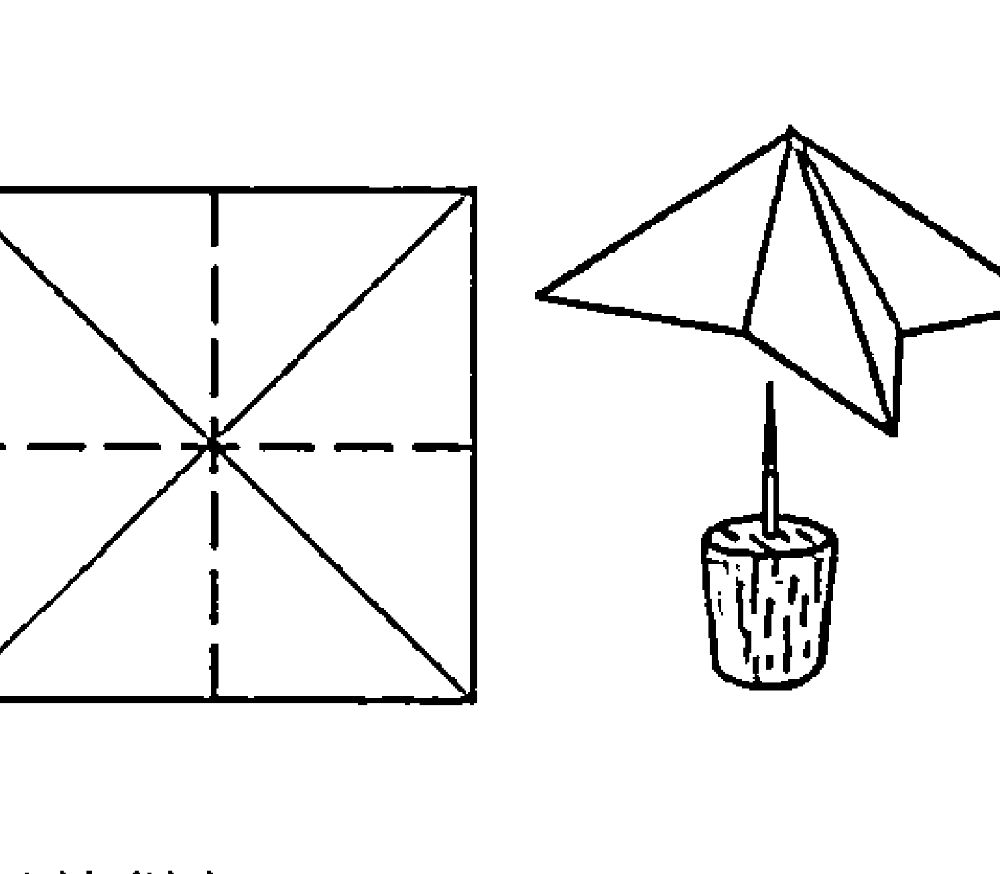

旋转器就做好了。将旋转器立放在你面前的桌子上，集中注意力，通过意志力来使其旋转。不要对着它吹气，只用你的鼻子呼吸就好！尽最大努力长时间集中注意力，总有一天你能让它旋转起来。看看你能让它转得多快，然后停下来，往相反的方向旋转。

- 等离子发生器（Plasma Generators）：这是一种高电压的发生器，可以用来制作电火花。等离子——由电离子气（电子被剥离了的原子）组成——是物体的第四种状态（其他三种分别是固体、液体、气体）。这与地球极光和日冕是同一种物质。等离子发生器用于等离子球中——这种透明的储藏有小型电暴的球体通常在新潮玩意儿商店能够找到。我极力推荐你去买一个这样的物品——它们同时也是非常酷的魔法球（就像真知水晶球一样），而且它们也是发展和锻炼你超能力的实用装置。买的时候要确认你选的那个可以通过调试得到不同大小的电暴规模。在一间昏暗的房间里，将等离子球放到一张桌子上，调试到看不见闪电流的最低电压——仅有一点微微发热的等离子火花云。接下来，将你的一根手指慢慢放在玻璃壁上方，直到一条单一的闪电弧从发生器向玻璃壁延伸。如果你做到了，就表明你的调试是正确的。

这个练习要求你的注意力完全集中在等离子球上，让闪电弧向着一定距离以外你所在的方向延伸。把等离子球放在一英尺以外的地方，手拿开，凝视它，然后开始“想象”一条闪电弧撞破玻璃壁直向你的第三只眼（前额正中）而来。试试你多久能召唤这种闪电弧一次。现在，这个练习真正有趣的部分来了，找一个人坐在你对面，跟你做一样的事情，这样，你就可以做一个小小的测试，看看你俩谁能往自己这边召唤更多的闪电弧！当你用手指或手掌触碰玻璃壁时，你会发现，等离子球的周围有种辐射，就像极光一样，这就叫做基尔里安磁场，这也是让你的光环可视化的一种方法——这和铁屑能够让磁力场可视化是一样的道理。

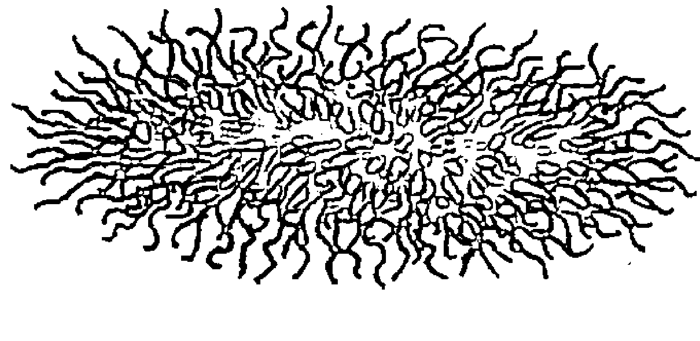

- 红线虫(Tubiflex Worms): 红线虫(也叫“污泥虫”)一般在宠物店有售，是热带鱼的活体饵料。这些小小的瘦长蠕虫是红色的，因为它们跟哺乳类动物一样含有铁元素丰富的血红蛋白。血红蛋白比大多数池塘动物的体液能保持更多的氧，所以红线虫可以生活在含氧量稀少的水里。红线虫通过将其管状身体插入淤泥之中并互相缠绕在一起生存。它们将脑袋插入池塘底，露出尾部在水中不停摇摆，然后不断进食淤泥。如果它们身体的一部分被吃掉或者断掉，还能自己重新生长。

在附近的水族馆供给店里买差不多一盎司的红线虫，然后将它们倒入一个装有水的圆形浅口玻璃碗中（如果是在家里做，你必须首先征得妈妈的同意！）。如果你家的自来水是经过漂白处理的，那么应该使用瓶装水或者（最好是）池塘水。那些红线虫会缠绕在一起成为一个蠕动的线团。

因为红线虫的血液富含高浓度的铁元素，所以它们对于电磁场尤其敏感。试着在玻璃碗的周围移动一块磁铁，然后观察红线虫的举动。你会发现你能用那块磁铁影响它们，就好像那些蠕虫是铁屑。但是这些蠕动的虫团也能在精神上受到控制！集中注意力盯着那一团蠕虫，就像你对等离子发生器所做的那样，然后将它们组成一个球，一个甜甜圈，一个十字形，一颗星星——甚至是向不同的方向伸出触角并往外延伸。你会对蠕虫能够根据你的意向做出反应而惊叹的。

> 注意：如果想要更长时间保存红线虫，你就需要给它们一些食物。它们吃得并不多，半茶匙鱼粪或池塘淤泥、马槽里的垃圾、浴缸里的沉淀物、雨水沟里的污泥，甚至是一点花园里的泥土就可以了。当你不需要红线虫了，你应该将它们放回池塘中——或者用来喂鱼。

#### 第六节：心灵感应和千里眼

在我还是个孩子的时候，我发现自己的第一个天赋就是心灵感应。我常常能够“听到”隐藏在对话之后的想法。有时，一些人和我聊天，我甚至不能分辨哪些声音来自他们嘴里，哪些来自他们心里。在上学之前，我和妈妈、姑妈和祖母一起住在一间大大的维多利亚时期的房子里。祖父在妈妈怀上我的时候去世了（实际上，我真的是他的转世），那时爸爸也在南太平洋参加二战。因此我的整个世界都是以这三位女性为中心的。我在听到她们说话的同时也能听到她们的心声。但是我并不认为这有任何的不寻常，我以为每个人都是这样交流的。

有天晚上，上楼睡觉之后，我被一阵嘈杂的声音惊醒了。我起身慢慢走到楼梯间，看到宽敞的起居室里站满了人——亲戚们在举行聚会。我从未在同一时间听到过这么多的声音，这对于我来说实在是太吵了，因此我大喊：“安静！”这时，楼梯上的，栏杆后面的，所有的脑袋都转向我，我看到所有人的嘴都停止了张合，但是他们的声音却比之前更大了。我仍然能够听到他们心里的声音！我用双手捂住耳朵，冲回了卧室，躲在被子里面。后来，就睡着了。当我醒来，就再也听不到别人心中的想法了——这一点让我跟妈妈、姑妈和祖母的沟通变得比以前困难多了！

多年来，我有时会有短暂的仿佛“灵光一闪”的无意识的心灵感应——尤其是在浪漫的环境下。但是，在我脑中有一些东西扮演着保护我的角色，这些东西会“关闭”那扇打开的门，不允许他人的想法不受控制地灌注进我的脑袋。

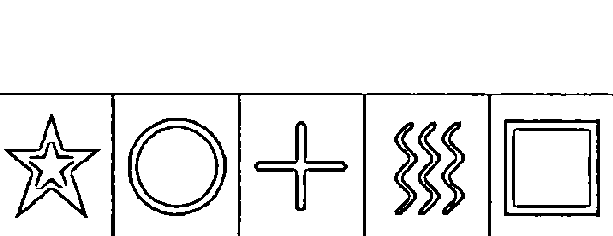

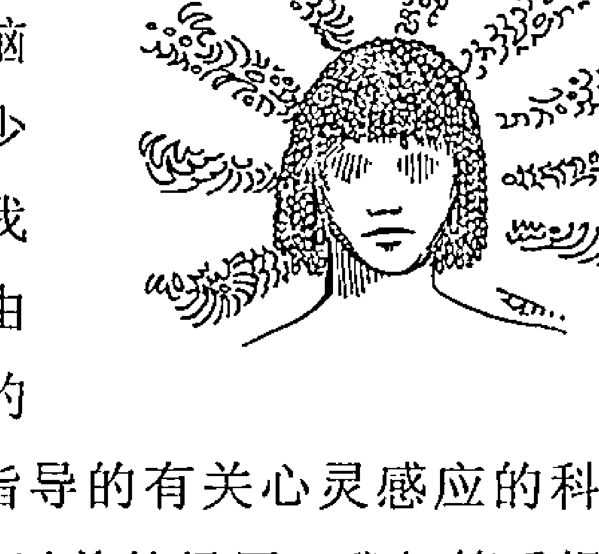

##### 魔法练习：心灵感应和千里眼

思想传递实际上比大多数人意识到的更加常见。多少次你和别人谈话的时候，你或者对方会说：“那正是我想要说的！”或者你正在想着或者谈论着某人的时候，电话就响了，而且电话那头正是他。我的生活伴侣，牵牛花——她是著名的魔法师和女巫——和我经常在同一时间说出我们听到的从拥挤房间的另一面传来的同一句话。这时人们会惊呼：“哇哦——立体声的雷文哈特夫妇！”莱茵学院开发的这两个实验相当简单。我建议你也试试。如果经常做，你就会发现通过练习，你的水平会慢慢提高。然而，心灵感应的实验至少需要两个人，因此你得去找一个同样对魔法感兴趣的朋友，这样你们就可以一起练习。如果是通过网上聊天来练习那就更完美了。

齐纳卡片 (Zener cards)：齐纳卡## 魔法师学徒的魔法书 | 上卷

齐纳卡片是20世纪20年代卡尔•齐纳博士（杜克大学）和 J.B. 莱茵（哈佛大学）合作开发的。齐纳卡片非常适合用来发展和实验心灵感应技巧。每一组齐纳卡片上都有一种不同的标准图案，这种图案一共有五种。总数为25张的齐纳卡片分为五组，每一组的图案都是一样的。为你自己制作一副这样的卡片。首先，将这页上的五种图案复印在卡纸上，然后将它们切开。你还要做一张统计表，标上数字1-25，在每个数字后面留两个空：一个为发送者准备，一个为接收者准备。

在一个安静的房间里，坐在同伴的视线之外。你们的其中一个（发送者）洗牌，并在每一张卡片上停留片刻，然后将其图案写在表格中。另一个人（接受者）说出发送者看到的卡片图案。然后，发送者将接受者的回答写在图案后面，发送者不能告诉接受者他的答案是否正确。经常做做这样的小练习，然后将过程记录下来。几次之后你们会发现，你们中有一个更适合做发送者，而另一个更适合做接收者。

##### “远视”图画（“Far-Seeing” drawings）：

和使用齐纳卡片的方法一样，通过心灵感应传送图画。在室内实验中使用这种技能叫做“远视”。过去，这种方法常被用来训练间谍！为了练习这种技能，你和朋友应处于不同的房间，甚至是不同的房屋内（你们可以用电话或电脑来联系）。你们俩人都应该坐在一个很安静的房间里的桌子前，摆上一叠画纸和铅笔，或炭笔。你们中的一个（发送者）在纸上画一幅任何你喜欢的简图（树、房屋、人、动物，随便什么……）。用左手作画，然后尽最大的努力将注意力集中在画画上。同时，另一个人（接收者）应该放松，闭上眼睛，让那幅图画在你的脑中慢慢形成。几分钟以后，接收者画出你脑中的东西，不管是什么——也是用左手。然后你们就可以轮流交换角色。练习完以后，比对你们的答案，看看它们有多相似，你可能会大吃一惊哦！通过所有的这些练习，你的能力将会提高。

##### 歌曲（Songs）：

另一种相似的练习是通过唱歌来完成的。要做这个练习，你们就得处于不同的房屋中。就像画画一样，首先，发送者应该想一首你们都知道的，容易记住的流行曲调、圣歌，或是叮当声，然后开始哼唱。最好的就是那些在你脑中挥之不去的类型（它们被称为“百事可乐”（Pepsis），因为能在广告中经常见到）。接收者应该敞开心扉让这首歌曲进来——一会儿之后相互核对，看看你们表现得怎么样。

### 第六课：偶尔做梦

> 睡觉其实是一种仪式，一种非凡的基本仪式，随同所有其它的有情众生一起，用尽我们的整个人生一次又一次地参与其中。事实上，宇宙本身也参与到这种宁静的“抛开一切”的仪式，它关闭地球的灯光，开启天堂的夜灯，减轻白日的喧嚣，让大多数的地球生物安然睡去，甚至还常常使我们周围的空气和水流静下来，为我们的睡眠温柔地创造恰如其分的氛围。许多土著人仍然相信我们在睡着时游历的以及我们在身体上、情绪上和精神上进行自我革新的梦境也许是一个比我们日常生活的世界更真实的“现实”世界。
——赫尔

#### 第一节：简介-梦

梦真的很重要么，它们会告诉你一些有利于你的事情？或者它们仅仅是在你的意识休息的时候进入你无意识的大脑中的一场“午夜电影”？你生命的每一天晚上平均要经历七次做梦阶段，每一次持续长达45分钟。梦对于你的身体健康尤为重要。人们在做梦的过程中被打断了，不能持续梦境就容易导致精神紧张。梦很复杂，它是我们的潜意识或者“超意识”大脑精心编排的充满想象力的作品。如果你能想到这一点，梦的重要性就不言而喻了。对于很多人来说，梦的状态只是较高等级（或者较深层次）的大脑与意识大脑相互沟通的媒介。至少你可以尝试一下弄明白下面的话语是什么意思！

> 所有人都会做梦：但是不会做相同的梦。那些夜晚在自己心中的尘埃深处做梦的人们在白天醒来后会发现一切都是虚无；但是在白天做梦的人是危险的，因为他们可能睁着眼睛在做梦，而且会将梦境变为现实。
—— T. E. 劳伦斯

那些在白天做梦的人会认知到很多晚上做梦的人不能认知的事情。
—— 埃德加·艾伦·坡
(1809-1849)

#### 第二节：角门和象牙门

据说梦是穿越两扇不同的大门来到我们身边的：角门和象牙门。大多数的梦都是通过象牙门过来的，而这些梦都是有关你自己内心世界的。通常来说，这些梦是你的大脑用于选择、加工处理，并归档你日常生活中发生的事情、经历，以及想法的方式。大量有趣的“解梦大全”手册提供了各种各样的出现在梦中的象征符号——同时还附有对这些符号意义的解释。下面，我会给你一些例子，但是对于不同的人来说，梦中的影像和象征符号所代表的意义是不同的，所以这些解释也不是通用的。既然这些在你梦中出现的影像和发生的事情也许对于你来说有着深厚的意义，那么重要的是要清楚，它们都是与你自己有关的，而非他人。

另一方面，来自角门的梦是“真实的梦”。这些梦可以归为两类：记住我们已经忘怀的过去，以及预见即将发生的未来。你曾经已经忘怀的事情可能被你记在梦中，这些梦包括了你过去的生活中、你婴儿时代、幼年时代所经历的事情和体验——所有发生在你身上的、在今生学会清楚表达之前所遇到的事情。或者是在你不省人事的时候——比如一场意外事故、外科手术，或者被UFO绑架这些过程中——所遭遇的所有记忆都有可能进入你的梦中。

在你的梦中出现的事情可能是对你今后的生活中积极一面的一种预示——例如遇到你的真爱，或者是完成一些伟大的成就。或者它们也有可能是一些可以避免的可怕疾病的警告。许多人都因为这种有着可怕的不祥之兆的梦取消了他们的旅游计划，也因此避免了火车碰撞、飞机失事、汽车相撞，或者沉船事故。这种导致很多人死亡的大灾难都倾向于制造这样的“不祥的预感”，就像在平静水面上投下一个石头，激起的涟漪及时地向四周荡漾开去，同时也扰乱了我们的梦。

在你的床边放一本专用的梦日记，每天，你醒来的第一件事情就是将你的梦尽可能详细地记下来——尤其是那些生动逼真的梦。同时记下日期以及任何你可能感觉到的特别的情感印象。随着时间的流逝，当你返回来阅读这些记录时，标记一下那些已经变成现实的梦，你就会学会辨认哪些是来自角门，哪些来自象牙门。

如果你很难记住你的梦，试试这个小练习：拿一张背面有粘性的空白不干胶贴纸，拿一支永不退色的记号笔用加粗的字体在上面写下“记住”。然后将其贴在装满水的饮水玻璃杯上，再将那个玻璃杯放在你的床边。在你闭上眼睛躺下睡觉之前，喝一口。边喝边在心中想：“当我醒来再从这杯子里喝一口水，我就能记起我的梦。”然后便睡觉。第二天早上醒来，马上从玻璃杯中喝一口水，在你喝水的时候，有关你梦的记忆就将汹涌而来。快速地在你的梦日记中记下梦的内容，写下你所能记得的所有的细节。不要担心着你不能将所有的事情以完美的顺序记下来——只是草草记下在那一瞬间出现在你脑海中的所有东西。这样练习多次以后，你就会做得越来越好。

#### 第三节：梦中象征符号的字典

##### 梦中象征符号字典

- 事故（公路上）：过于信任他人；计划外的事件。
- 飞机：一次旅行，一些新的开始。
- 祭坛：自我牺牲。
- 锚：稳定性；幻灭；阻碍你前进的东西。
- 苹果：欲望；长寿并拥有许多后代。
- 弓箭：快乐；欢宴；写一封你会后悔的信。
- 婴儿：欢乐，责任。
- （哭泣）：受到挫折的计划。
- （笑）：计划得到完成。
- （睡觉）：等待期；耐心。
- 气球：挫折。
- 地下室的地窖：被隐藏的记忆。
- 战争：内心的冲突。
- 沐浴：生命力；长寿。
- 铃铛：计划的完成；欢乐。
- 小鸟：从一种状态中超越进入另一种状态。
- 生育：过渡到一个新的阶段。
- 鼓：家庭纠纷。
- 吃东西：需要新的兴趣点，刺激点。
- 仙子：奇思妙想。
- 下落：未能达到预期。
- 扇子：激烈的竞争，一次争论。
- 羽毛（黑色）：亏损和失败。
- 火：生气；纯化；丰富的资源。
- 花朵：生产力；知足；快乐。
- 飞翔：自由。
- 玻璃（清澈）：一个成功的未来。
- 锤子：胜利。
- 双手（被缚住）：难以摆脱麻烦。
- 马：力量。
- 房子：代表你的身体。
- 猎犬（追你）：好运。
- 常春藤：忠诚的友谊。
- 监狱：监禁；挫折；无法行动。
- 跳跃：成功。
- 钥匙：一个秘密；问题的答案。
- 海盗：怀疑。
- 警察：惹上与权威事物的麻烦。
- 金字塔：对知识的渴望；寻找。
- 兔子：魔法；好运。
- 彩虹：巨大的快乐；机会。
- 大老鼠：强大的敌人，常常是未知的。
- 指环：完成；忠诚。
- 河流：灵性。一种障碍。
- 废墟：计划的失败。
- 跑步：一次有益的旅行。
- 剪刀：不信任。
- 蛇：精神上的睿智，凌驾于普通的智慧之上。
- 被蛇咬：智慧的灌注。
- 雪：隐藏的情况。
- 士兵：力量；组织化。
- 日出：觉醒；意识的清理。
- 日落：需要去保护资产。
- 星辰：你的希望。
- 天鹅：刺穿和切割；冲突。
- 桥：克服困难；一次改变。
- 扫帚：清洁的能力。
- 公牛：倔强。
- 蜡烛（燃烧）：坚定不移。
- 城堡：野心，抱负。
- 猫：独立。
- 山洞：一个撤退的地方，避难所。
- 圆圈：总数；完美；无穷无尽。
- 钟：失去的机会；现在是行动的时刻。
- 玉米地：财富；确定性。
- 水晶：物质和精神的结合。
- 窗帘：隐藏；装饰。
- 狗：忠诚；懒惰；生气。
- 门（打开）：新的机会。
- 鸽子：爱情中的胜利。
- 龙：换住址。
- 吻：满足；完成。
- 梯子：攀登的能力。
- 羊羔：平静。
- 叶子：即将发生的变化。
- 光：希望。
- 狮子：强大的朋友和隶属关系。
- 蜥蜴：超越。
- 锁：挫折；安全。
- 面具：谬误；骗局；隐蔽。
- 镜子：丑闻或失望；重新考虑。
- 月亮：你的感受。
- 妈妈：天堂；舒适。
- 老鼠：一个爱管闲事的人干扰你的事务。
- 针：家庭争吵。
- 巢：一个新家。
- 橡树：稳定的增长。
- 海洋（平静）：和解；机会；灵性。
- 猫头鹰：智慧；信使。
- 牙齿（活动）：疾病到来。
- 小偷：害怕失去；不安全感。
- 线：复杂的情况。
- 树：生命准则；精神发展；成功。
- 隧道：隐藏；害怕。
- 狼：安全与智慧。
- 火山：性能量；强大的情绪。
- 墙：障碍；挫折；无力。
- 水：灵性；情绪。
- 动物园：混乱。
- 伞（撑开）：保护；避难所。
- 窗户：某物的新面貌。
- 巫婆 / 巫师：有用的发现；超自然能力。
- 面纱：不安全感。

梦字典从古代开始就已经存在了。它们在古希腊和罗马帝国时代十分流行。这里罗列的是一些会经常出现在你梦中的象征符号以及一些比较普及的解释。但是不要太认真地看待这些解释，因为每个人的梦都是独特的，是以我们的日常生活经历为基础的。因此，你必须以你自己对这些梦的个人情感的角度来分析和解释在你梦中出现的象征符号。

#### 第四节：梦魇（恶梦）

恶梦（Nightmare）从字面意思来讲是说一匹巨大的黑色幽灵马带领我们经历了一场令人恐惧的、难以驾驭的穿越黑暗恐怖之地的骑乘之旅（Mare在英文中有“马”的意思——译者注）。恶梦就像一场被卡住的增添了戏剧化的特技效果的重播，太真实太可怕，就像我们清醒状态经历的一样。对于一个很小的孩子来说，这种恶梦也许是他们前世遭遇的一次悲惨死亡的记忆。尤其当他们遭受暴力而死的情况下，这些“夜惊”可能会引起突然惊恐而导致失眠（无法入睡）。

在我自己的整个儿童早期，我常被恶梦萦绕，让我一次次体验我上一辈子的死亡。上辈子，我死于心脏病发作，那种感觉就像是背向下掉落进了一个深不可测的井中，梦中的那个世界是一个不断缩小缩小的圆，最终消失在我的视线中，但是我仍然在完全黑暗之中往下掉，仿佛永远没有尽头……直到我从我的新生命中醒来，当时我还是个婴儿。

恶梦的另一个源头来自于今生的创伤性经历。曾经遭受过暴力和虐待；从一次惨烈的事故或者火灾中逃生——尤其是其他人都死了的情况下；或者是那些得过重病和威胁生命安全的疾病；或者经历了其他的精神创伤的孩子（甚至是成人）都会做恶梦，在梦中他们会再一次体验这些恐惧，通常是一些象征性的东西。

特别令人恐惧的恶梦有时是在某人熟睡或者刚醒来时大脑和身体的分离引起的。日本人很久以前就已经了解到了这种现象，他们将这种现象叫做睡眠瘫痪症，西方研究人员将其称为“睡眠麻痹”。大约4%的人会定期地出现这种情况，40%-60%的人至少有过一次这样的经历。一些人会听到令人不安的声音和不连贯的说话声。其他一些人会产生幻觉，看到一些邪恶的超自然的生命和生物。大多数会发现他们不能动，也不能说话，感觉有什么重物压在他们的胸口。还有一些人会感觉自己漂浮起来，在天上飞行，并穿越了螺旋形的隧道——所有这些幻觉都伴随着一种强烈的恐惧和害怕。睡眠瘫痪症恶梦通常是由于一些恶魔般的生物在他们心中留下了阴影，例如哈利·波特世界中的摄魂怪，或者《指环王》中的戒灵骑士团。许多这样的生物都已经被认定为存在于神话之中——比如女妖和梦魇那些依赖睡眠者并与他们有性关系的生物，或者是那些压在睡眠者胸口让他们不能动弹也不让他们说话的又丑又老的女巫、地精，以及幽灵。吸魂衣是一件漂浮在空中的裹住和压制住受害者的黑色斗篷。那种眼睛炯炯有神的我们称之为梦魇的黑色独角兽在很多文化中都是普遍存在的。许多“外星人绑架”的经历都可以被解释为睡眠瘫痪症。对所有类型的噩梦最好的解决办法就是学会通过清醒（“保持意识清醒”）梦（Lucid Dreaming）（继续往下看）控制你的梦境。你可以使用咒语和力量来同这些夜间的恶魔做斗争，就像在电子游戏中一样。事实上，在你做噩梦时，电子游戏是一种很好的可视化梦境的途径。

###### 魔法师学徒的魔法书 | 上卷

##### 抵抗噩梦的咒语 Anti-Nightmare spell：

在你的床头挂一个“捕梦人”或者一个小型的用灰色羽毛编成的花冠，以阻止梦魇进入你的梦乡，以此得到安静的睡眠。放一个金字塔形状的水晶在你的床底就可以保护你自己免受灵媒之类的人在你梦中对你的攻击。悬挂一个红色的洋葱或者在你的枕头下放置艾蒿来防范恶灵的侵扰。然后在你每晚睡觉之前，在床周围撒上盐。或者你可以将一小撮盐放在你的睡衣口袋里，或者放在你的床脚下，或者放在你卧室的圣诞树装饰的里面。在你做这些的时候，口中要念：

> > 光环围绕在我床边；所有夜晚的恐惧从我脑中消失。祝愿平静的梦来到我睡梦中；如我所愿，必将应验！

另一种用魔法对付梦魇的咒语是这样的：

> > 你，黑暗中诞生的有尾巴有翅膀有鼻子有角的恶魔，从现在开始从我身边走开，直到黎明的到来！——瓦莱丽·沃思（Valerie Worth）

#### 第五节：清醒梦

我们能够通过梦进入的还有另外一个世界，这个世界有时被称为幻梦时光（dreamtime），或者梦境（Dreaming）。这是一个超自然的国度，我们可以和其他所有的做梦人一起分享，包括人类和非人类，这个国度还有着自己既定的风景和地貌。梦境是仙子的国家，是所有宗教信仰中所说的来世，是存在着神、精灵和祖先的国度，是所有神话和故事中幻想的世界。而且在梦境之中，你可以是你想象的任何事物，也可以做任何你能想到的事情。当你已经学会了清楚地构想出你想要的东西，你就可以进行下一步了。这一步叫做清醒梦。意思就是在你的睡梦中保持清醒的意识，这样你就可以去到你想去的地方，刻意地做一些事情，并在你醒来的时候能够记得它们。

晚上你睡觉的时候，使用你已经学会的技能——冥想和可视化。躺下来，闭上你的眼睛，将你自己置入冥想的迷睡中，然后开始想象你在一条小路上走着。随着你一直往前走，各种各样的不是你刻意要去想象的事物将会开始出现。当这一切发生的时候，你便在慢慢进入梦境。保持你的意识，但是同时也要让那些隐藏的幻象进入你的梦境。当你已经彻底进入梦幻世界之时，将你的手举起来放在你的脸前面。将它们转个方向，不断开合你的手指。只要你能保持看着你的双手，并且控制他们，你就能控制你的梦了。

清醒梦的另一个重要的部分是在脑中想象并且保持你魔杖、短剑，以及其他魔法工具的影像。尝试着在你的梦中看到穿着魔法袍的自己（课程之三，第三课，第三节）。这样可以帮助你维持你的梦中身份是一名魔法师。这种状态下的清醒梦中，你能变成你能想象的最强大的魔法师。在你的梦中使用你的魔杖以及其它工具，就像在电子游戏中一样，你能够转变物体、投掷火球、漂浮，以及《黑客帝国》中人物的所有武术技能。你将能够挑战并打败你的恶梦，并享受这个奇妙的冒险旅程。

我自己在清醒梦中最喜欢做的事情就是漂浮和飞行：我“将我自己拉起来”，漂浮在距离地面一英尺的地方，然后在空气中“游泳”，就像在水中游泳一样——有时只是在房间里，有时就像在树顶上空的鹰一样翱翔。每一次我都会仔细研究我是怎样做到的，希望有一天能够将这种技能带到清醒的世界中。

这些就是保持清醒意识的所有窍门。就像前面的每一次的训练一样，主要的事情就是练习——每晚都要练习，慢慢地你就会越来越擅长。时间会被梦境拉长，以至于几个小时的睡眠可以像几天的时间那么长，或者更长。而且如果你在你拥着所有时间的梦境中练好了你的魔法技能，你也能提高你在清醒世界的魔法能力。

#### 第六节：旅行和旅梦

当你掌握了清醒梦的技能，你最终就将能够在梦境中设置一些特别的精神国度、地点、时代和规模——例如仙境、阴世、历史纪元，甚至是神话和奇幻故事中的国土。这就叫做萨满教的旅行（shamanic journeying）。你将可以通过漂浮飞去这样的地方，甚至是通过远距传动将你自己瞬间转移。你将能够把任何你想要找的人——活着的或者死去的，真实的或者想象中的都可以——找出来，遇见他们，并与他们谈论龙、图腾、精灵、神，以及女神等等。

当心！一些这样的地方和偶遇可能非常危险，而且会困住那些拙劣的、没有准备好的，或者粗心的人。也有一些地方是你根本不会想要去的！不要尝试这样的旅程，除非你已经能够熟练控制你自己睡梦中的身体。而且当你掌握了这些技能之后，要经过多年的练习，你才可能成为一名旅梦巫（Dreamwalker）——能够随意出入他人的梦境。但是这是一种极大的能力，需要极大的责任感。因此也担负着极大的责任，而且并不适合初学学徒。这是萨满和精神治疗师使用的一种能力。

当我还小的时候，在我接受任何超自然能力训练之前，我有时会发现自己很明显是进入了他人的梦境之中，因为梦中的那些影像和象征符号明显不是属于我的。大多数这种“错误的梦”中最常见的就是大量的蛇——通常是有毒的蛇。这些似乎无疑是某人最可怕的恶梦，仿佛是属于印第安纳·琼斯的。但是问题是，我以前真的很喜欢蛇，我经常出去寻找蛇的踪迹，然后将它们带回来养在玻璃器皿中（现在，我们仍然还拥有着两三只蟒蛇）。因此，我并不害怕它们在我的梦中四处爬行——即使是咬我。在这些梦中我会大笑，知道睡精灵有时真的会把事情搞混淆！不久之后，我在一本传统的讲述梦境象征符号学的书上看到，蛇代表着“精神上的睿智，凌驾于普通的智慧之上”。而且，在梦中被蛇咬意味着“智慧的注入”。因此，大概这样就可以解释为什么它们常常进入我的梦境，毕竟……

#### 第七节：梦中发现

梦中发现是指一种特殊的清醒梦，在这样的梦里你可以设定一个目标去梦到一些特别的事情——通常是为了解决一个问题、获得一种洞察力、设计一种象征符号，或是可视化一种物品（比如一幅画，一座雕塑，一首音乐等等）。我已经使用这种技巧创造了独角兽，概念化我想要雕塑的雕像，列出杂志和书本的大纲，并为各种各样的组织设计了徽标——比如此图所显示的魔法标志。

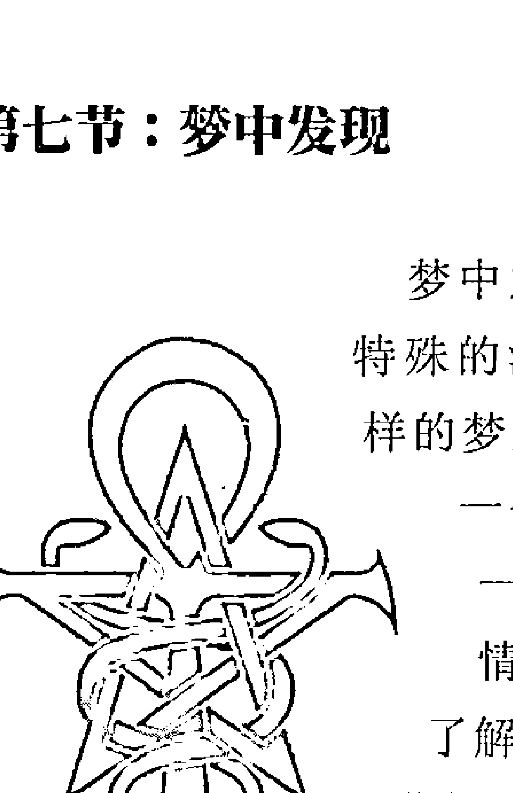

> > ……我把椅子转向炉火，
> 打起瞌睡来。原子又一次地在
> 我的眼前跳跃，那些较小的基
> 团谦逊地退到了后面。我思想
> 的视觉因为这类幻觉不断的出
> 现变得敏锐起来，现在它能够
> 分辨出多种形状的大结构，也
> 能分辨出有时紧密靠在一起的
> 长行分子，它们都在不停地移
> 动着，围绕，旋转，像蛇一样。
> 看！那是什么？有一条蛇咬住
> 了自己的尾巴，这个形状嘲弄
> 似的在我眼前旋转着。一个灵
> 感，我醒来。然后在这个夜晚
> 剩下的时间里，我作出了这样
> 一个假想。”
> ——玛德祜卡·凯库勒，
> “苯的圆形结构的发现”

有一个最著名的梦中发现的是苯的环形结构。在凯库勒发现这点以前，化学中的分子结构都被认为是线型的（以直线形式存在）。然而，这不能解释苯的许多属性。凯库勒一直在试图算出苯的结构——但并没有太多进展——直到答案在梦中出现。他在一次科学家们为纪念他的发现而发起的集会上描述了他的经历：

首先，你必须完全痴迷于你想要努力完成的发现。阅读任何你能找到的资料；上网查询；向每一个你认识的人询问这件事情。然后，将你搜集的资料放到一起，开始汇集象征符号、图片、照片、新闻剪报，以及其它任何你能临摹或者复印的可见图像。写下或者画出一些你自己的想法，一起归入你的资料中。将所有的资料都剪碎然后将它们铺在一张大桌子或者地板上。将它们混淆然后重新按照你喜欢的布局排列。你可以慢慢来，多花费一点时间和心思。然后拿一些剪刀和胶棒将你重新布局出来的图样贴到一大张硬纸板上，就像一幅拼贴画那样。不要担心你粘贴出来的拼贴画与原本的图片不一样；这也是过程的一部分。

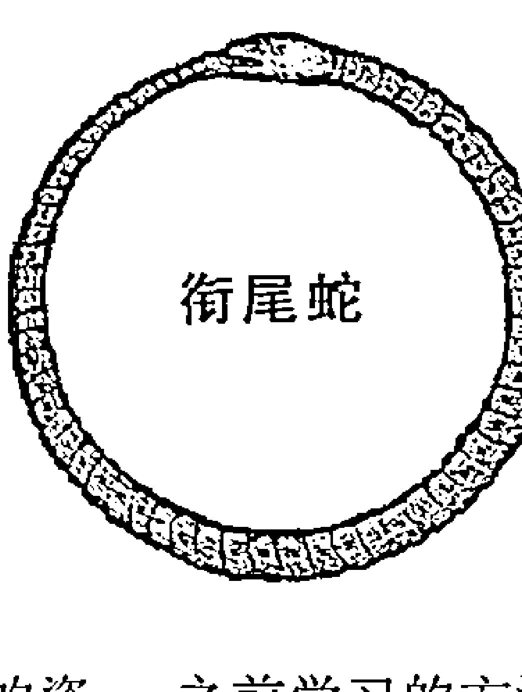


在你睡觉之前，花一会儿的时间凝视你的拼贴画，努力记住每一个细节。当你闭上眼睛的时候，你仍然能够在你的脑海中清楚地再现这幅画的原貌。在你的床边放一本笔记本和一支铅笔，连同一杯水。在一张纸上写下一个特殊的问题（羊皮纸对于这些和所有这样的咒语是最好的），将这张纸连同一个小小的装有艾蒿的“梦枕”香囊放在你的枕头下面。然后，用你之前学习的方法来记住你的梦，只是在你躺下睡觉之前，喝一口水，喝水的同时确认一下那个问题也会一起进入你的梦境，这样你就可以找到你所寻找的答案。当你醒来后，再喝一口水你便能记起这个答案。

如果你想要更进一步拥有能够预言的梦境能力，你可以将你自己与月相结盟，因为月球是睡眠和梦境的主宰者。最好的时机就是月亮处于娥眉月和几乎满月的时候，最理想的是在你想要得到一些发现的那个星期的一个晚上（请看课程之三第六课第五节：“符应表格：行星”）。在睡觉之前，你也应该享受一次温暖放松的洗浴，在水中加入几滴精油：薰衣草、迷迭香、薄荷、百里香，以及罂粟籽的粉末。在你洗澡的时候，在你的房间焚一些与月亮相关的香：樟脑、沉香粉、茉莉、黄瓜籽粉，以及白檀木粉（全部都使用相同的分量）。

### 第七课：魔法模式

> “在模式中寻找美丽。
在这种水平的复杂性中没有巧合。”
——戴维·多伊齐

#### 第一节： 简介 - 模式识别是游戏的主要部分

魔法视力与想法的主要部分就是模式识别。这就是，看着一堆树，就能看懂一片森林。或者就像在立体图中，看着一串波浪线，就能看懂一幅三维立体图。这种观点也是科学的基础。它帮助我们理解并且创造宇宙运转方式的原理。每一次有人在这些观点中取得突破性进展，并且看到“整个景象”，就是一种顿悟。就像突然发现了只要将拼图中的一些小片右面向上，另外一些上下调换，就能将一堆拼图全部拼凑好一样。我们的工作就是将它们排列在一起，再调个个儿，找到那些拥有相似点的小片，然后将它们一片一片拼凑在一起，直到整幅画完工。

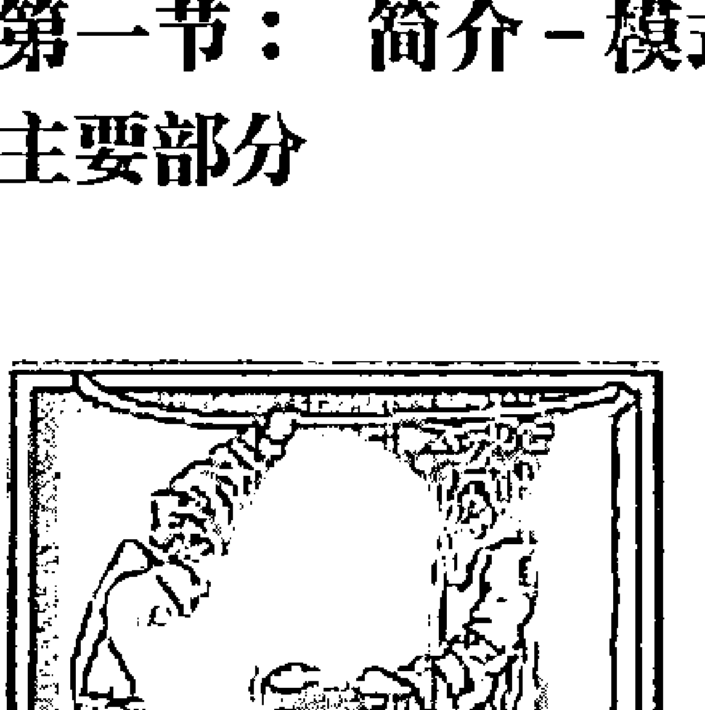

科学的最终目标是发现一条宏伟的“万物的原理”，根据这一条，所有的不同种类的拼图的所有小片儿都能拼到一起得到一幅巨大的图画，没有任何一片会多余。科学家称这个理论为统一场理论（the unified field theory），但是他们仍然还没能找到这样一个理论。其中主要的问题包括对生命和意识的解释，但是迄今为止，还没有解释生命和意识的方程式。

魔法师和天才能够看到别人看不到的模式。1831年，查尔斯·达尔文看着位于加拉巴哥群岛的雀类，便由此看到了生命的进化就像一株开枝散叶的树。1953年，詹姆斯·沃森、弗朗西斯·克里克、莫里斯·威尔金斯，以及罗莎琳德·富兰克林看到了有机核酸，而后设想了DNA分子的双层螺旋模式。

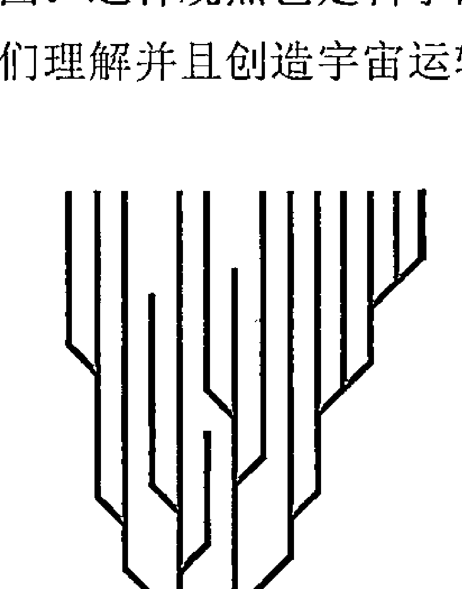

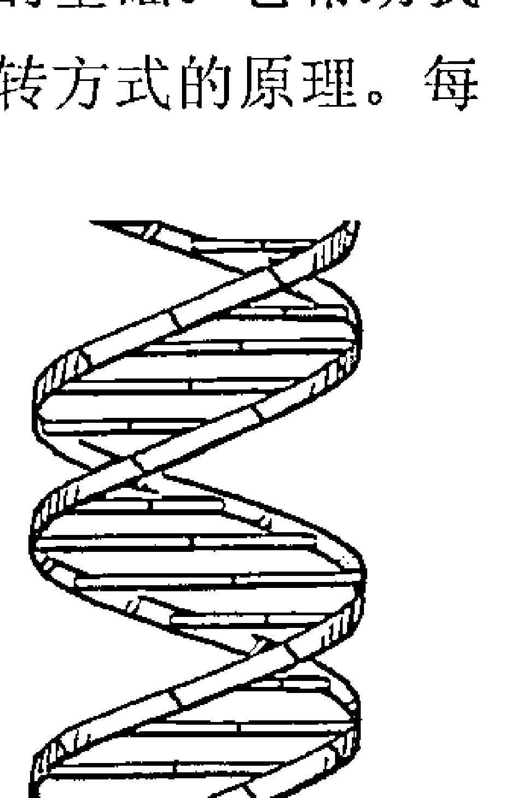

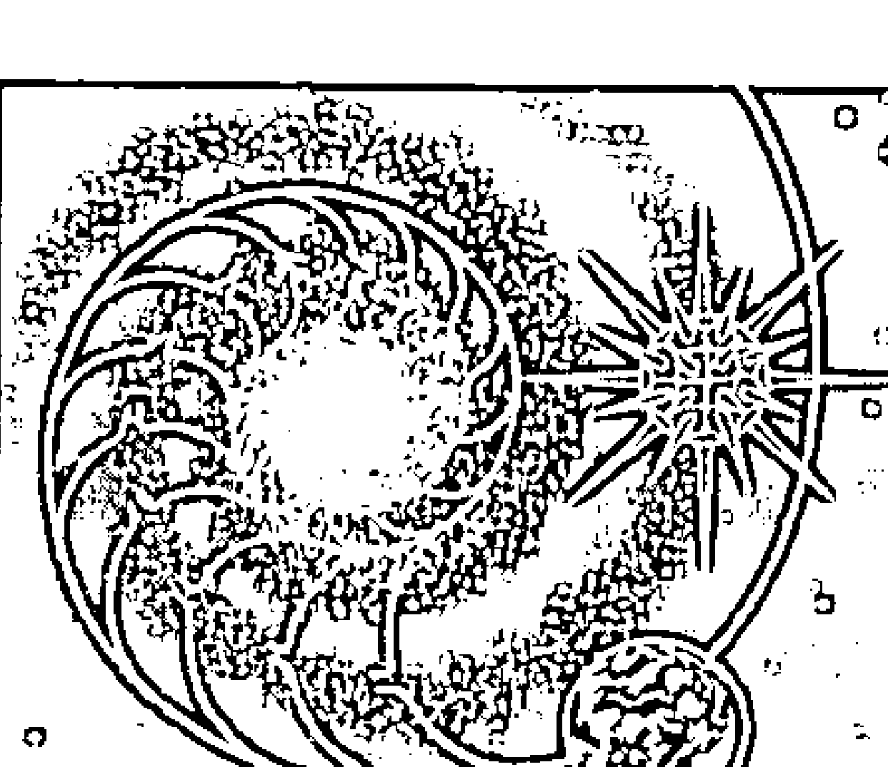

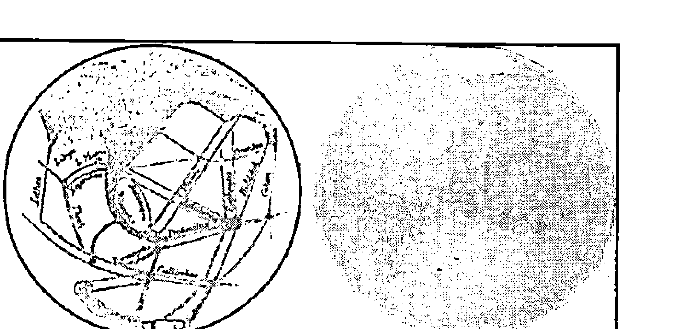

自然也有象征符号，在许多潜在的结构模式中我们发现了这一点。其中最重要的结构之一便是螺旋形状，这在你体内的DNA分子中随处可见，植物和花的叶子和种子的排列，带壳的鹦鹉螺和蜗牛背上的壳，龙卷风和飓风的形状，还有银河系的形状的形成方式。不管你往哪儿看，螺旋形和另外一种模式都在眼前。稍后，我们将在课程之二，第一课“自然界的秘密”中对这种模式进行更为细致的讨论。

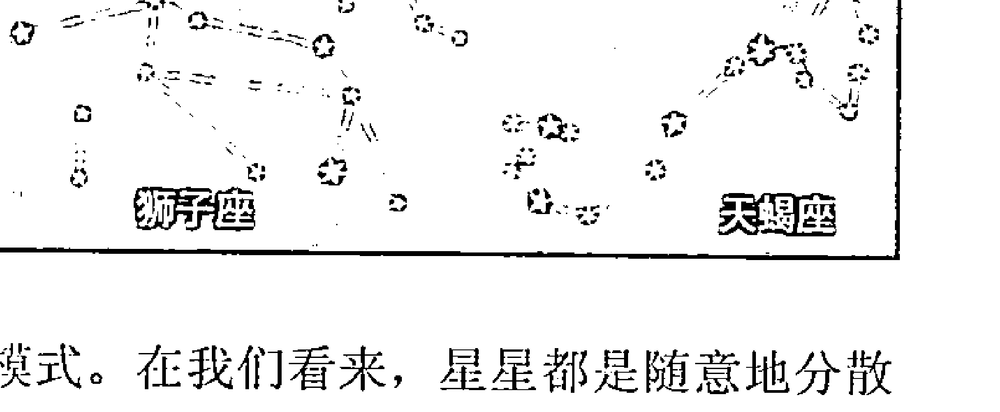

模式。在我们看来，星星都是随意地分散在天空中的（根本就没有什么模式）。但是，古时候的人们在不同的明亮的星星之间画上线条，就好像他们把“不同的点连接”在一起一样，然后就会得到一些由火柴梗组成的图形，最后他们就用他们最喜欢的神话故事中的人物或者生物来命名这些图形。我们所有人，包括现代天文学家现在仍然在使用那些想象的模式，似乎它们所代表的就是现实！

然而，有时我们的大脑会变得极度热情，我们认识到模式并不是真的就是这样。1877年，乔瓦尼·莎帕瑞利（Giovanni Shaparelli）看着火星表面的图形，并在脑中将他们组成线型模式，后来就成为了众所周知的“火星运河（the Martian canals）”。直到我们将水手号航天探测器（Mariner space probes）送往火星照回照片以后，我们才发现火星上根本就没有运河。任何线型的地貌都没有找到，只有一些环形山、熔岩荒野、山脉，以及沙漠，和月球上的景象很相似。我们还找到了红色的铁锈，极地冰盖，大量的火山群，广阔的峡谷，以及古老的河床——而且最近，我们还在地表下找到了全是冰的冻结海洋。

这种象征性的错误的模式被称为“视觉幻象”，如果我们了解了它们运转的规律，我们就能创造我们自己的模式，将隐藏的意思故意地埋藏在这些模式之中（就像星座之中埋藏的一样）。这儿有两个例子：

另一个著名的创作模式可视化的例子就是那种已经看到的天空的图案——星座。

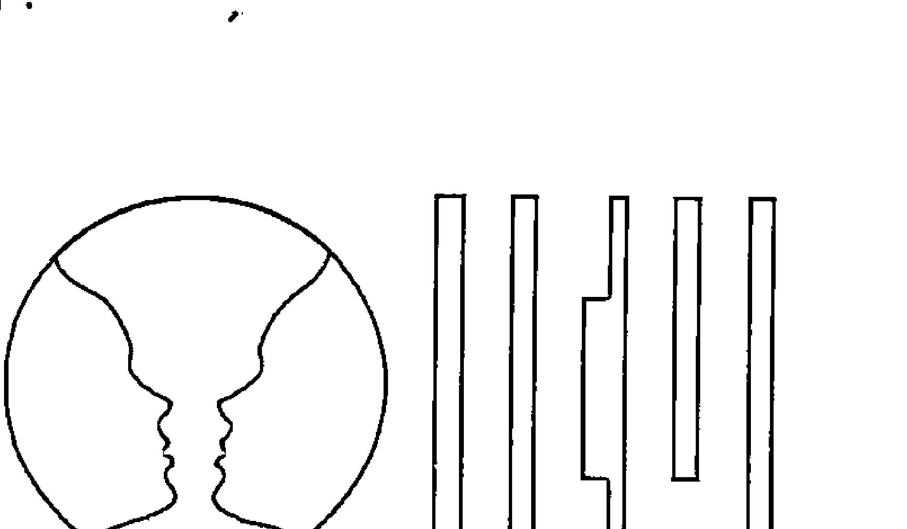

#### 第二节：模式，占卜，以及全息宇宙

大多数形式的预言都始于创造一种元素的随机分配，然后通过发现或者创造模式来使它们具有一些魔法意义。当我们抛硬币的时候，不管是得到人头那面还是另外一面，这都是随机发生的。在纸牌卜卦（解读纸牌，就像解读塔罗纸牌一样）中，我们所做的第一件事就是洗牌。用骰子，符文石，跖骨，蓍草茎，以及神谕石等卜卦时都是将他们“抛掷”散开。一些占卜系统会使用一套像标靶一样的模板（模式）来做占卜用的背景，在这块模板上有各种各样包含了不同意义的区域，不管是什么，只要是散落在特定的区域，就包含了那个区域的意义和涵义。

在世俗世界之中，这有点像你闭上眼睛在地图上搜罗你想要去度假的地方，然后在地图的相应位置钉一颗大头针！不管你的大头针钉在哪个位置，那个位置都被定义为“度假目的地”。星座占卜就是用的这种方式，行星和星星的位置都被规划进各种各样的“房间”内。塔罗牌的解读则是根据一种特别的平铺设计来展现结果的。

##### 任务：制作一个占卜盒子

在此有一个简单的占卜系统你可以学着制作：


者盒盖子，就像那些用来装信纸的盒子。再拿一张同样尺寸的纸，对折成四个区域。在右上角的区域中写上“YES（是）”，在左上角的区域写上“MAYBE（可能）”，在左下角的区域写上“NO（不是）”，然后在最后一个区域中写上“DUNNO（我不知道）”。打开这张纸，将它放到盒子里，这样你就可以看到所有的字。接下来，在另外一张纸上写一些简单的能够用“YES”和“NO”来回答的问题。

找一个特别的小石头或者你特别喜欢的水晶。现在，将这颗石头握在你成杯形的手中，然后快速摇一摇，同时不断重复你的问题。当你准备好以后，将石子投入盒子中。不管它落在哪个区域，它都已经给了你答案。

实际上所有的魔法占卜系统都是以这个简单的原理为基础的；有的系统只是比其它的系统更为精细和复杂。只要你愿意，你可以将那张纸分割成更多的区域，你也可以选择你喜欢的形状，以及纸上的内容也能根据你的喜好来编写。而且你还可以使用骰子来代替石子，骰子上的数字也可以加入到骰子停留的区域的“重要性和意义”。不管你做得多么复杂，原理始终是相同的。

这些图形模板的原理——为什么它们对我们的占卜好像真的有用——就是宇宙（还有多元宇宙）从根本上说是全息的。你是否曾经思考过原子的结构？原子可以看做是一个微小的太阳系，在电子轨道上游走的原子核就像行星在太阳系中绕轨道而行。我们身体的每一个细胞都是我们自己的一个微小缩影；而倒过来说，我们庞大的身躯便是细胞所依附的地球母亲。在一张全息图中，每一个微小的质点（小宇宙）都是包含了整幅图（大宇宙）的实质和模板。赫尔墨斯·特利斯墨吉斯忒斯在《翠玉录》里的开放性话语揭示了魔法最基本的原则：“如其在上，如其在下；依此成全太一的奇迹。”这句话常常简单阐述为：“上如是，下亦如是；下如是，上亦如是。”现代魔法师还加了一句：“内如是，外亦如是；外如是，内亦如是。”因此，宏观世界的大事件会反射到我们微观世界的小宇宙中来；而且，通过操纵微观世界，我们就可以影响宏观世界。

一切事物都是有联系的。一切事物都是独立的。不存在什么意外。一切都是一场意外。全世界都充满了乐趣。满世界都是悲伤。不存在客观的现实。所有的现实都是客观的。宇宙是纯物质的。宇宙是纯精神的。这些话可以同时成立，因为宇宙的本性就是矛盾的。（这也是一个伟大的真理？仔细想想。）

##### 有关伟大真理的注解

——伊恩·“潜伏熊”·安德森（Ian “Lurking Bear” Anderson）

在这本书中我们反复提及：“伟大的真理”的反面也是真理。这种观点听起来有点禅宗的意味，但是它是20世纪以前欧洲的物理学家提出来的：

> “微不足道的真理和伟大的真理是同时存在的。而微不足道的真理的对立面显然都是错误的，但是伟大的真理的对立面也是真理。”——尼尔斯·波尔

尼尔斯·波尔是推动量子物理学发展的一位重要人物。为了帮助你们掌握伟大的真理，试着判断一下下面的这些说法，看看哪些是微不足道的真理，哪些是伟大的真理：

##### 任务：无限的镜子

> 如果你知道使用方法的话，你可以这样使用两面镜子：将它们安置在可以相互反射的位置。因为如果它窃取了一点点你的影像的话，随后影像的影像就能将你变强，将你自己反馈到你身上，给予你力量。然后你的影像就会永久延伸，通过反射，反射，再反射，每一个影像都是相同的，所有的反射路径都跟随的是光的曲线。希望这一切都没有发生。镜子可以囊括无限。无限包含了比你想象得到的更多的东西。所有的一切，都仅仅是开始。包括欲望。

> > 因为存在着百万上亿的影像，但是灵魂只有一个。
> 镜子能给予你很多，但是同时它们也能从你身上拿走很多。
> ——特里·普拉切特, (《国外的魔法师，第 50-51 页》)

你的魔法视点！

> > 上面的天空，下面的天空
> 上面的星星，下面的星星
> 上如是
> 下亦如是
> 领悟，而后庆祝！
> ——炼金术的文字材料

体验全息宇宙最好的办法就是站在两面镜子之间，看着你自己的影像不断被重复反射，永无止境，直到永恒。这就给了你一个全新的视点。

我参加了一次艺术展，在那儿有一个你可以进入的立方形房间，在那里面镜子覆盖了房间里的每一个面，包括地板和天花板。当然，你要脱掉鞋穿着袜子进去。房间的八个角落里都有灯。当你关上那扇镜子门，站在房间中间，你能看到的一切都是从每一个角度反射的你的影像，那些灯光就像星星，不断重复着后退着直到永远。这真是一次奇妙的体验！

你在家里也能拥有这样的体验，如果你走廊的两侧安装几面彼此面对面的镜子，然后站在它们之间。要注意的是不要将它们只是垂直放在地面上，让它们与地面有一点小小的倾斜，这样你就可以看到你的影像从一面镜子中反射到另一面中。

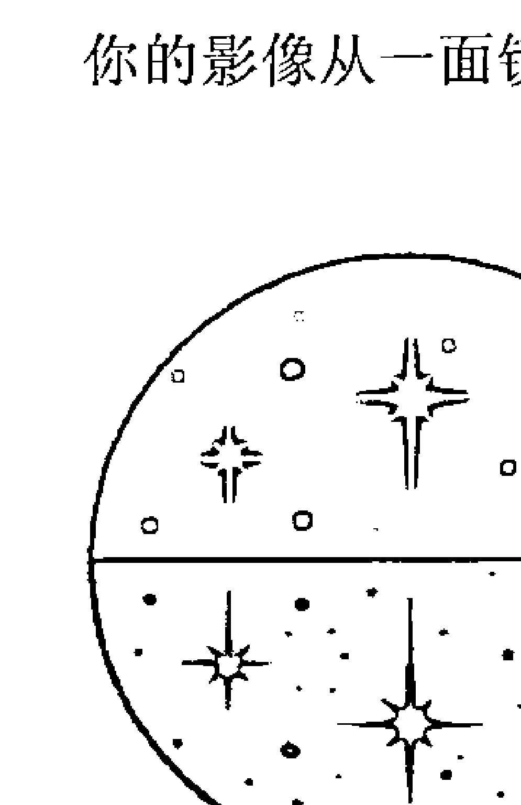

在服装店你也能体验一些这样的效果，在他们小小的安装有镜子的凹室中。这样能够开阔

#### 第三节：在同步性的浪潮中冲浪

“幸运的巧合”——有意义的同步性受到了魔法师及其他魔法人士的特别关注。通常当你的生活步入了正轨时，同步性事件作为宇宙认可或者神圣指导的路标就会发生。当似乎有许多同步性接连发生的时候，这就是需要你集中注意力的时刻！我喜欢将同步性想象为大海里的波浪。大多数的同步性仅仅是小“coinkydinks”（我将其理解为小机率的巧合），就像小小的表面波浪和涟漪拍打着海岸——并没有什么值得兴奋的；只是正常的背景流。

但是当几件此类的小机率巧合同同时降临，更大的机率浪花便从海中升起。然后我们就会集中注意力，戴上我们的“3-D 太阳镜”的模板，眺望大海。因为这很有可能是“预示着一些事情”！通常是一些大事情，而且如果我们提高注意力，就像冲浪运动员将冲浪板划出碎浪区是一样，我们能够看到浪来了，我们要找好位置去抓住它，当我们后面的浪升起来时，我们可以借助它的势头和力量来一场狂野的冲浪。

这就是我们所说的在同步性的浪潮中冲浪。规则很简单：集中注意力！保持警觉，注意一切事物。你在发展一种技能。就像电影里的侦探，或者野外的追踪者一样，你有多擅长这个技能取决于你对事物的每一个细节观察得有多仔细。将线索组织到一起，就会为你认知更大的模式指明一条路，同步性事件不外乎就是随机、较少发生、部分交叠的事件。

> > 艾比·维诺如特说：“在我看来，同步性就是一种神圣的和宇宙及其脉轮同在的确定周期。当你”处于这个水流中”时，同步性就会经常发生。你越多地“推动河流的流动”，同步性发生的机率就会越小。这看起来像是创造魔法和和谐地使用魔法与让魔法在你的指挥下进行之间的不同。”

#### 第四节：超自然概念的术语

就像物理学一样，超自然的领域也有自己的词汇。下面就是一些你应该知道的重要的术语和概念：

**玄学, 形而上学 (metaphysics):** “超越物理学”。认知现实和更深层次的、潜在的宇宙现实和规则之间关系的研究和哲学。这个单词源于亚里士多德在他研究物理之后对自己所写的书的描述。

**俗世的 (Mundane):** “尘世的”。平凡, 普通, 非魔法。过去常常用来描述“正常的”现实, 因为它反对改变或加强知觉的状态。

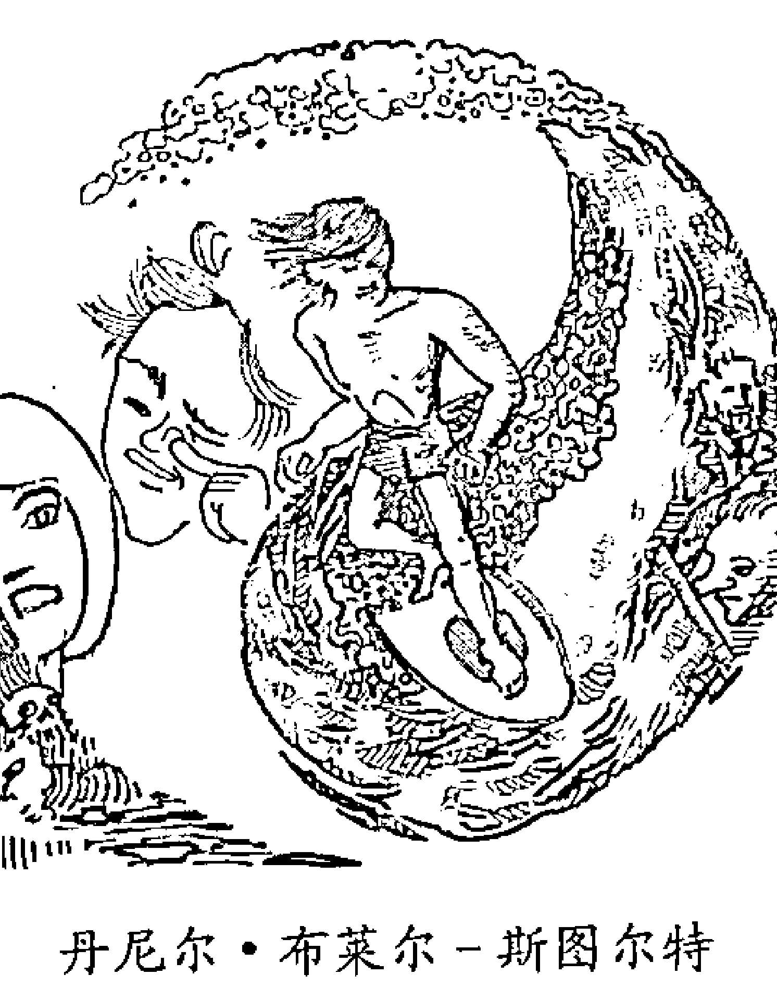

丹尼尔·布莱尔 - 斯图尔特

**神圣的 (Sacred):** 尤指充满了神性的本质，或者是被充满了神性的本质。

**世俗的 (Profane):** 神圣的对立面。

**神秘的 (Occult):** “隐藏的”。这个术语是指所有神秘和机密的艺术, 研究, 知识, 实践, 以及团体——尤其是那些不熟悉, 不流行, 以及通常被世俗责难的组织。在天文学中, 一个物体被称之为“神秘”是因为它消失在了其他物体的后面。

**神秘的事物, 未解之谜 (Mysteries):** 那些通常不仅仅是通过经验得知的事情, 以及那些不能用言语或者文字表达的事物。通常作为入门仪式的一个环节。

**入门仪式, 启蒙 (Initiation):** 引导一个人走向新的现实的仪式化的转变过程。进入一个神秘的社团或者宗教的仪式。

**秘传的, 机密的 (Esoteric):** 隐藏的, 含蓄的, 根据经验的, 以及“仅限内部流传的”。

**开放的, 通俗的 (Exoteric):** 明显的, 明确的, 可解释的, “可向外宣传的”。

**神秘的, 秘传的 (Arcane/ Arcana):** 机密的, 神秘的。表示神秘的和秘传的意思的另外一个单词。神秘是指在自然界中晦涩难解的，秘传的事物。Arcana 是 arcanum 的复数形式——拉丁语中 arcanus 的中性形式：通常只是传授给新成员的知识，就像在神秘的入门仪式中一样。

**超常的 (Paranormal):** “与正常比较”。在正常范围之外。不同寻常的或者“超自然的”。现在的科学原理还无法解释。

**超自然的 (Supernatural):** 那些表面看起来超出了自然世界的经验或者存在的事物，或者是已知的自然法则和自然力量不能解释的事物。不可思议的。

**异常的，反常的 (Anomaly/Anomalous):** 一些不同寻常的，反常的，前后矛盾的，自相矛盾的，或者不恰当的事物。

**原型 (Archetype):** 集体无意识中的基本模型或者基本观点，在这种集体无意识中，所有同级的物体都是表示形式（representations）。

**途径，路径 (Path):** 一种获得魔法或者神秘知识的方式，体制，或者方法。

**内行，能手 (Adept):** “成功”或者“获得”。专家。一个已经学习并且得到了很多的人，在魔法或者神秘学上有大成就，非常熟练。成为能手的意思便是你“很擅长某种技能”。

**神秘主义者 (Mystic):** 追求魔法的哲学方面和精神方面的人。

**启蒙 (Enlightenment):** 深入的完全的认知状态，不断体验所有事物和每件事情的连通性。有些人有时会体验到一种与他人融为一体的状态，以此来了解什么是启蒙。

**明朗，明晰易懂 (Lucidity):** 加强认知的一种状态，此时，通常通过千里眼或者心灵感应能力，对于经历过的事物、人和事件以及它们连通性的深层次本质有了一种非凡的理解力。

**天神化身 (Avatar):** 一种神性的化身，化身为人的样子，比如基督，佛陀，或者克利须那神。一种被认为是一种典范代表的人。

**宏观世界 (Macrocosm):** “大世界”。外部世界。就在我们身边的整个宇宙。

**微观世界 (Microcosm):** “小世界”。习惯上来说，微观世界将人类看做是更大宇宙的一个微型代表。

**光环，灵气 (Aura):** “无形的气息或者气质”。光环是指发源于所有生物，覆盖了所有生物，并让所有生物在内外部之间都能相互联系的一种生物磁学能量气场。

**星际的，星的 (Astral):** “属于星星的”。Astral 指的是生命能量、意识，和魔法无形的领域和磁场。魔法从业人员操控的虚无的国度和交替的现实。星光界域和星体区域（例如梦境）能够通过右脑的冥想、可视化、催眠，和做梦技巧来认知和进入。

**星光体 (Astral body):** 类似于并且围绕在肉体周围的拥有生命能量的躯体。

**星体投射（或者星光体旅行）(Astral projection [or travel]):** 将你的星光体脱离你的肉身在星光界域中旅行。超越肉身的极限来延伸一个人的基本位置，通常附随着肉身的影像作为一种载体。

**幽灵，鬼魂 (Wraith):** 一种投射了图腾 (Totem) : 一种被某个人或者某一群人视为他们的象征或者祖先的动物或者自然界客体。

鬼魂 (Ghost): 一个已死之人的魂魄，因为某种原因束缚在凡间，比如过早的死亡，还有未尽的事业，或者为自己所爱的人牵绊。

斐奇 (Fetch) : 女巫大聚会或者其他魔法团体的集体星体投射。也可以被个人用作一种“星体魔怪”。

魔怪 (Familiar) : 一种非人类生物，特别的动物，人与它们之间有着一种感情移入的超自然联系。这种生物可以充当着魔法伴侣、向导，或者老师的角色。

元素生物 (Elemental) : 任一元素集体精神的局部性焦点或者表现。它们是指: 地精 (土)，水精 (水)，气精 (气)，以及火精 (火)。

神力，超自然力量 (Mana) : 一个波利尼西亚语中用来表述力量或者超自然能量的术语。一个人的个人能力、魅力、力量、魄力、巫术等等。

生物原生质 (Bioplasma) : 一个表述超自然力量的更专业的术语。

生物电流 (Biocurrent) : 有生命细胞生成的电化学能量流。被威廉·赖希称为生命力。

形态发生 (Morphogenic): “模型塑造”。 1981 年，生物学奖鲁伯特·谢尔德雷克假定生物学上存在有形态域 (morphogenic field)，管理着物种的行为。这些领域自身拥有很少的能量，但是能够从其它来源中获取能量，并将其塑造出来。这种领域充当了几何影响 (geometrical influence) 的角色，规范万物行为。无形的，不可捉摸的，无声的，无味的，也没有气味，形态域是通过物种成员的累积行为建立起来的。

能量中心，轮穴 (Chakras) : 与肉体有部分联系的星光体的能量中心。七大轮穴与脊柱区域和中枢神经系统都有联系。从下往上，依次是: 1. 海底轮; 2. 生殖轮 (本我轮); 3. 脐轮; 4. 心轮; 5. 喉轮; 6. 眉间轮 (三眼轮); 7. 顶轮。在我的手上和脚上也有小轮穴。

灵体 (Entity) : 一个有意识的生命体、精灵、生物，或者化身。

化身的，人体化的 (Incarnate): “进入肉体”。拥有或者接纳一个躯体。

无形的 (Discarnate): “没有躯体”。

狂喜的 / 狂喜 (Ecstatic/Ecstasy) : 强烈的欢喜或者高兴。一种如此强烈的情绪状态以至于一个人不能保持理性的思维和自控。与神秘或者预言的欣喜联系在一起的恍惚、狂暴，或者兴高采烈。

指使术 (Geas) : (发音: gaysh) 施加在某人身上的指控或者保证，使其完成一项特殊的任务。

毒药，祸根 (Bane): 有害的，邪恶的，毁灭性的。

布拉区 (Brutch) : 在局部地方 / 某个时间发生超自然扭曲的区域，比如“百慕大魔鬼三角”。

天宫入位，黄道记号尖端 (Cusp) : 时间、空间，以及运行的一个过渡阶段点或者交叉点。在占星学中是指两个符号或者天宫之间的交叉点。Cusp 是两个可供选择的可能性区域之间的交叉点。在这些地

#### 第五节：高一级的学习

下面的课程将会更加的高级。我将它们归入这一节课是因为这些都很基础，而这个课程都是有关魔法基础的。但是，如果经过所有的这些学习你的头已经开始痛了，你便可以跳过这一部分，以后当你准备好以后再回过头来学习。因为下面的有些东西需要很高的技巧，我已经咨询过住在马塞诸塞州的软件工程师和武术家克雷格•M. 帕森斯 - 凯林斯。他已经取得了物理学学士学位，正在攻读博士学位。他是门撒国际（Mensa）（一个国际组织）和三九联社（Triple Nine Society）（一个高智商组织）的一名成员，而且他已经练习这项技艺20年了，对英国传统工艺（British Traditional Craft）有着独特的见解。

##### A. 对称

格式和模式的欣赏可以追溯到文明的初期，甚至是我们的前辈时期。简单的对称格式动物都能识别，甚至电脑也可以。洞穴壁画也出现了对称格式，古往今来，对称格式都是用来表达宗教信仰的。其他格式比如圆形都一些用于有实际用途的项目中。相同单元的重复都已用于应用艺术（如地毯）之中，以及早期的建筑风格之中。然而，是希腊定义了这种概念，并将这种概念用于各种各样的科学、建筑学、艺术以及日常生活的许多方面之中。对称这个名字来源于希腊语symmetriaor，也表示“同样尺寸”。

我们对对称的喜爱可能来源于深层次的生物起源。最近的研究显示我们更愿意选择对称的配对物而不是非对称的物品。这种观点在我们的进化过程中扮演了重要的角色，因为有一种说法提出这样一个观点：对称的个体携带遗传缺陷的可能性较小。我们的外部面貌，就像大多数动物的外貌一样，拥有着对称的格式，叫做镜面对称或者反射对称，在两点之间沿直线前进是宇宙空间中（以及追赶猎物过程中）的一种重要特征。因此，这并不会令人感到惊讶，对称与我们的一些感觉是相关的——我们对平衡的欣赏，我们保持平衡的能力，并因此而长寿。

如果按照特定的周期性的样式来排列，一些物品也可以展示不同种类的对称。这种对称模式暗示的是我们对于回到本源的满足，不管这种回归是空间上的还是时间上的。同时，因为对称格式具有可预测性，所以与无序状态相比，它可能会有些缺乏刺激感。

##### B. 对等（parity）：原力与原流（the Flow）

我相信你已经看过电影《星球大战》。贯穿整个冒险故事的一个最主要的主题就是原力。在原始电影“星球大战第四回：新的希望”中，欧比旺•肯诺比向小卢克•天行者这样解释原力：“原力能够给予绝地武士力量。它是由所有生物创造的一个能量场，包裹着我们并渗透着我们。它拥有着凝聚整个星系的能量。”就其本身而言，这是一个真实的，意义深远的洞察力，

但是“原力”只是等式的一半，另外一半同样重要。纵观自然的各个方面和宇宙论，有一条非常强大的“对等原则”。这意味着一切事物都有其对立面，或者镜面。从科学上来说，牛顿的第三运动定律指出：“对于每一个作用力来讲，都有一个与之大小相等，方向相反的反作用力。”在东方的道家学说中，这种概念被称作“阴与阳”，如图所示：位于万物的核心之上的正是这种神圣的平衡力。

阴阳是一个被分为两个嵌套式的泪滴的圆，代表着表面上对立的整体。阴代表着黑暗、死亡、隐藏的物体、冬天，以及宇宙柔弱的一面；而阳象征着光、生命、活跃、夏天，以及宇宙阳刚的一面。在这个小圆形、小核心中，每一半都包含着另一半的本质，或者对立面的起源。

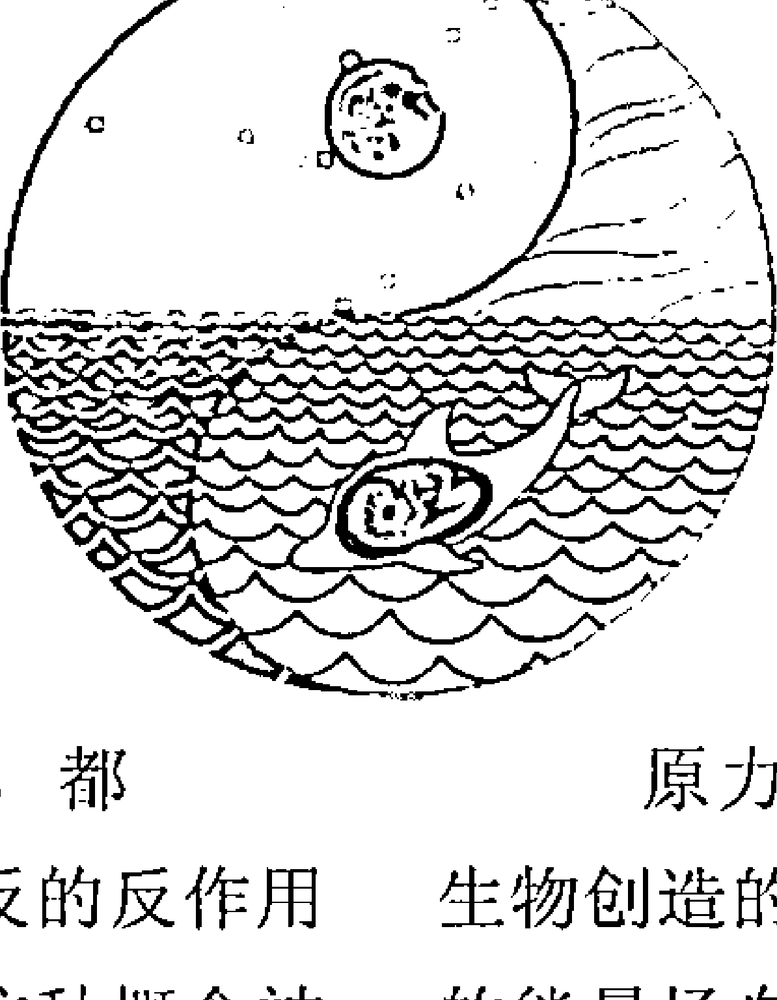

你看到一件物体时，试一试，你也一定能看到与其互补的对立面。还有一句话这么说的：“一方面……另一方面……”

与“原力”互补的对立面并不是原力的黑暗面（毕竟，黑暗面也是原力的一部分）。

原力的对立面是“原流”。“所有生物创造的能量场”被非生命的物体创造的能量场自动抵消。这两种能量在巨大的同时发生的潮起潮落中相互渗透，就像海洋的潮汐。原力带领我们积极前进，穿过时间、进化、扩展、聚集在一起——朝着不断增长的，更高的能量前进，向不断扩大的复杂性、意识，以及神性靠近。同时，原流（在物理学中叫熵）却被动地流向相反的方向，衰落、收缩、分离——能量不断递减和降低、损耗、陷入无意识状态，然后湮灭。

宇宙可以看做是一个巨大的涡流，通过时间和空间这些永恒的模式成螺旋状不停地旋转舞蹈。为生命和毁灭起舞的印度女神迦梨所体现的就是这种原力和原流。

“原力”也表现为两个对立面：光明原力 VS 黑暗原力（善良与邪恶）。但是与星球大战电影中所表现“原力”光明的能量最终会胜过黑暗原力的主题不同的是，在自然界和魔法中这两者是不可分割的。在道家学说以及魔法中，这两个方面始终会一起共舞。这就是为什么我们常说，对于伟大的真理（像“上如是，下亦如是”）来说，它的对立面也是真理。左和右，黑暗和光明，物质和能量，空间和时间，正与负，主动与被动，生命和死亡，创造和毁灭，内部与外部，上与下，冷和热，膨胀和收缩，雄与雌，男神和女神：这些都是伟大整体的两个部分。他们是互补的对立面，每一面的极端都意味着另一面的存在。事实上，这也是一种很好的练习，当你看到一件物体时，试一试，你也一定能看到与其互补的对立面。还有一句话这么说的：“一方面……另一方面……”

##### C. 磁场，防护盾和光环

磁场是一个椭圆的（围绕着两个焦点的鸡蛋形状）发源于并围绕在能量源头周围的能量球状体，这个能量源头被称为磁场生成器。关于这个，我们常见的例子便是磁铁生成的磁力场，以及地球生成的磁场；由电动机生成的电磁场；以及由巨大的物体如星星和星星之间产生的万有引力场。这些磁场随处可见；即使是最小的物体，比如分子，原子，以及亚原子微粒都有它们自己的磁场，不管这个物体有多小。

物质世界并不只包括物质和能量，磁场是真实存在的，只是它们是非物质的。磁场并不是一种物质形式，而物质是能量与磁场的结合。磁场在物质和能量的势力范围内与它们相互关联，互相联系。几种基本的磁场已经被科学家们所认知：物理学上的万有引力场和电磁场，量子物理学中的物质磁场，以及生物学中的形态域。

磁场生成器通过两极创造磁场——在位于两端的正负极（或者南北极）之间创造一个源源不断的能量流和粒子流。这些流动追随着磁力的路线，这样就可以通过各种各样的方式追踪到这些流动。例如，如果你一根条形磁铁平放在一张纸上，然后将铁屑撒在磁铁周围，你将会看到铁屑沿着磁力线排成列，这样就能标出磁铁的整个磁场。试一试，然后就能想象出其他种类的每一种磁场都是一样的模式。

不同于磁铁的是，大多数的磁场都是通过转动摩擦形成的。正负极点就处于这根旋转的轴上。地球的万有引力场也与这根转动轴有关联，北极处于北冰洋的中间，而南极处于南极洲的中间。但是地球的内部磁心轴在一个稍微不同的角度和速度上，而它的极——被称作磁极——也是指南针指向的位置，这两个磁极才是地球磁场真正的正负极。

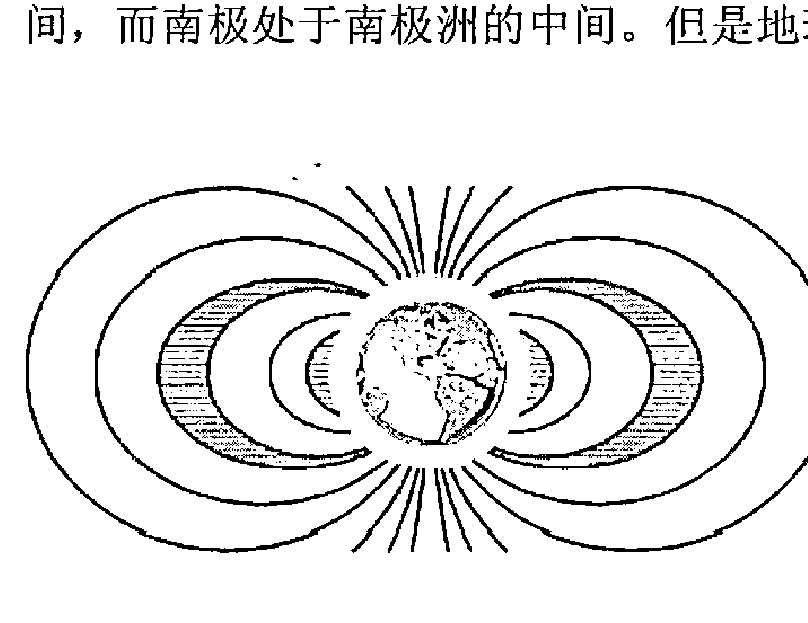

万有引力场是无限延伸的，即使它们在远距离的位置失去了力量，但是其他磁场的范围十分有限。就是这些有限的磁场可能会被“硬化”成防护盾。地球的磁场（称作磁气圈）向外延伸差不多15800英里，但是它“硬化”成了我们头顶1975英里处的一个紧密层，成为了内部范艾伦辐射带。这种圆形的辐射带是由太阳风——来自太阳的带电粒子来到地球，并与磁气圈相互作用，并将部分的磁气圈击退回地球而形成的。由这些微粒构成的辐射带通过磁气圈时受到磁场影响而偏离（一个进入磁场带电粒子由于物体的运动时产生的力量而得到一种加速度）。这就是地球的磁场，它通过吸收和放射入射的粒子保护我们免受宇宙辐射的伤害：

就像地球本身，我们每一个人都是一个有生命的磁场生成器。我们的磁场从我们的身体发射出来并且围绕在我们周围，这就叫做我们的光环。因为我们并不像地球一样围着我们的轴自转，所以我们的磁极更像磁铁的磁极。一个极叫顶轮，在我们的头顶，在三大头盖骨（额骨和两块头盖骨）结合的接缝处（当我们还是婴儿的时候，这个点实际上是一个打开的洞！）。相对应的那个极——叫做海底轮——在我们脊柱的底端，也就是我们尾椎骨的顶端。

##### D. 形态域

形态（“模型塑造”）域这个概念在20世纪20年代首次提出。1968年，前剑桥大学生生物学家鲁伯特·谢尔德雷克接受了这个概念。谢尔德雷克说，每一种生物都会将他们的经历贡献到一个集中的“内存池”中。这个域场作为一种模板，规范着生物的行为。形态域通过生物物种的累积行为建立起来，作为一种模板，用于生物规范行为。

当某件事情发生以后，同类的事情就会更加容易发生，因为形态域已经被创造出来了。在形态域中，行为的进化变得更加容易解释。特殊种类的蜘蛛与形态域的联系钩织出与同类蜘蛛相称的蜘蛛网。形态域会随着个别蜘蛛经验的改变而改变。这样，这些经验就会传递给下一代。逐步地发展下去，最好的形态域就会成为最强大的形态域，而其他的族群就会自动跟随这些指导方针。这种运转方式就像进化论。然而，却又不像物理进化中组织进化的原则停留在动物表面。另外，形态域可以从经验中学习并将更复杂的东西传承下去，比如在脑中有一个蜘蛛网的模型。因为动物的结构和形态域的结构之间的联系的存在，蜘蛛就会自动地紧紧抓住那些适合它们自己的物种的形态域。

形态域解释了自然界生物的行为方式。创造性的重复和行为惯例塑造了不同生命形态的行为方式，这种进化的学习过程从本质上保留为一种集体的、种类完善的记忆。因此，每一种生命形态都会对所有其他的生命形态产生一些影响，尤其是那些属于同一物种的生命形态。而且宇宙中还存在着一种将所有的人类、甚至所有的生命形式联合在一起的巨大的磁场（原力）。

我们设计的许多魔法仪式都是为了开发各种不同层面上的形态域，比如与我们的祖先或者自然界的精灵取得联系是为了借助他们的智慧。这就是为什么一些魔法组织要小心翼翼地保护他们的仪式秘密——他们希望保证他们创造的形态域的特殊性，并竭尽全力以得到一个有特效并且精华的结果。如果太多的人知道了女巫大聚会的秘密，并修改了仪式格局，形态域就会扩散并且变得不明确，就会让思维形态更难集中在特定的工作上；魔法就会失去它的效力。

##### 课程之二：自然

### 第一课：自然的奥秘

> > 我们能够拥有的最美丽的经历就是奥秘。它是坚守在真正的艺术和真正科学的发源地上最基本的情感。
> ——阿尔伯特·爱因斯坦

#### 第一节：简介-生命，宇宙，以及万物

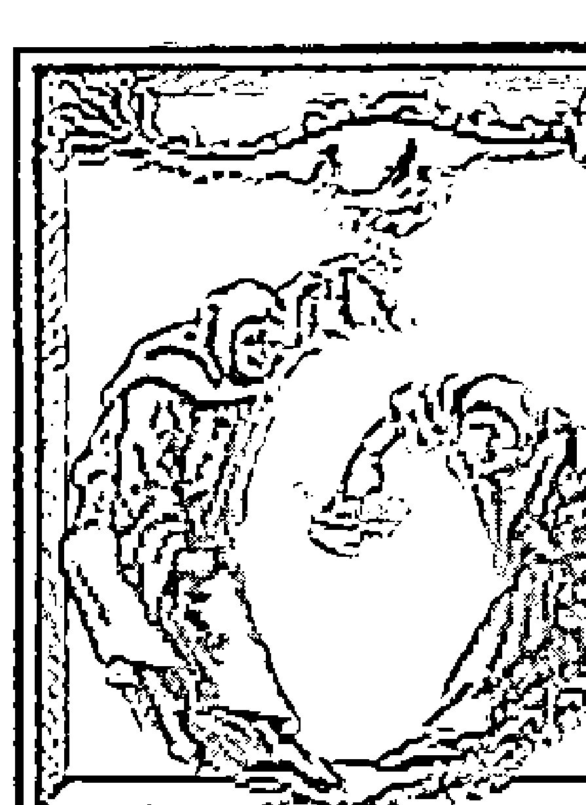

古往今来，魔法师，哲学家，以及科学家都在探索了解存在于生命、宇宙，以及万物中的伟大的奥秘。

魔法师所操控的是能量，也就是信息。它将自己组织成一种模式，而且并不存在于动态关系之中。为了有能力去感觉和了解这些模式，魔法师在事件已经发生之后仍然能够通过自己的意识的参与来改变事态动向，以使事件朝着他想要的方向发展。

##### 奥秘的本质

在《薄伽梵歌》的第九个讲述中，讲述了宇宙、生命本身伟大的奥秘拥有集中特性，使得它成为一个真正的奥秘。首先，奥秘必须是用直觉去感应的；也就是说，能够被那些想要知道的人知道，而不依靠外界的教学，也不能靠内行人告知。其次，奥秘必须是公正的，也就是说，符合规定的，处于宇宙范围之内，符合宇宙原则。第三，奥秘必须是无法衡量的愉悦，也就是说，奥秘必须能够使人快乐满足，拥有超越世俗存在的愉悦。接下来的两节课我们将讲到奥秘的本质。

#### 第二节：万物皆是相互联系的

> > 我们是海洋和星空的一部分。
> 我们是北风和南风的一部分。
> 我们是山脉，月亮以及火星的一部分。
> 我们接受时代的派遣。
> ——威廉·欧内斯特·亨利，1845

所有的一切——你体内每一个细胞中的每一个原子；你和你的家人，朋友，街坊邻居，邻国；地球表面的每一种生物，植物；太阳系中的每一行星，月球，彗星；银河系中的每一颗星星；广阔无垠的宇宙中的每一个银河系——所有这一切联系在一起形成了一个巨大的团结一致的网络，时间和空间，物质和能量通用的一个巨大的互联网。

> > 人类并不是在编织生活的网络，而是这个网络的组成部分。不管我们对这个网络做了什么，最终都会反馈在我们身上。所有的物体都组合在一起形成了一个整体，所有的物体都是相互联系的。
> 
> ——西雅图酋长

> > 有一股太阳光束，不管是墙、山脉，还是无数的其他实体都不能阻挡它的前行；有一种智慧的灵魂，即使它看似与肉体相互分离也不会消失。所有的一切物体都与其它的物体相互联系着。将我们联系为一个整体的精神是神圣的。地球之上，太阳之下的每个物体都与其它物体相互联系着。世界上所有不同的事物都相互协调，相互结合成为了同一个宇宙。
> 
> ——马可·奥里利乌斯（公元161-180年）

而且，根据魔法规则第一条，这种所有事物之间的相互联系和相互渗透为所有的魔法提供了存在的基础；移情规则表明，所有事物都被看不见的纽带联系在一起。这就意味着就像蜘蛛网一样，任何触及蛛丝的动作都会影响到整个蜘蛛网。正如自然资源保护论者约翰·穆尔曾经说的那样：“你不能在不触碰一颗星星的情况下摘下一朵花。”

#### 第三节：“宇宙是充满生命力的！”

> > 不存在这样的物质！所有的物体都起源于并且凭借一种力量而存在……我们必须在这种力量后面假设意识和智慧头脑的存在。这种头脑是所有物质的模型。
> 
> ——马克斯·普朗克，量子力学之父，诺贝尔奖获得者

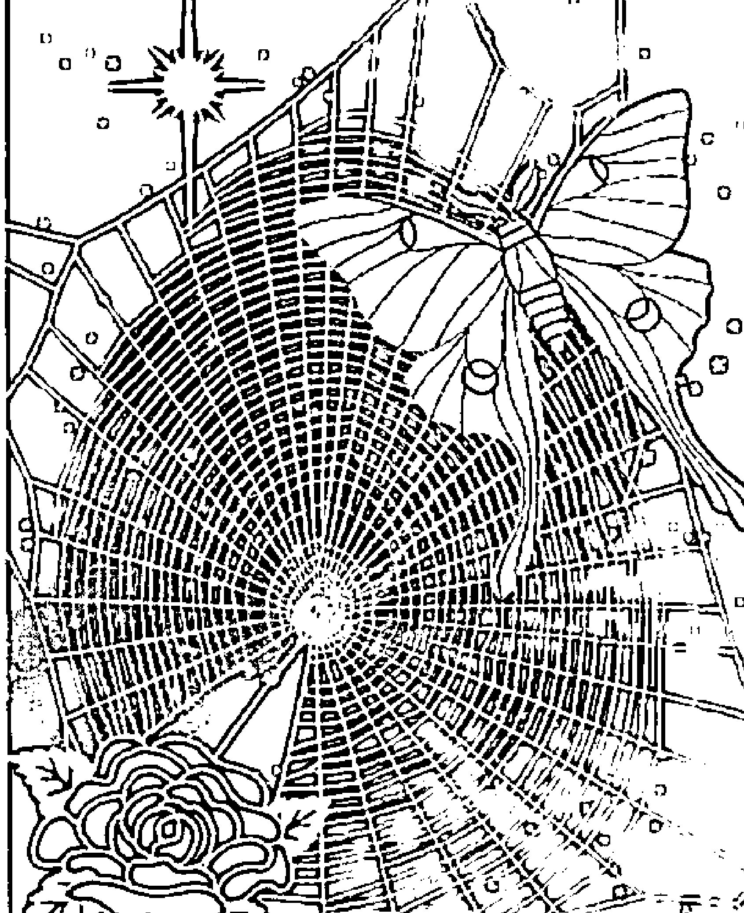

正如魔法师知道在一个巨大的网络中，每一种物体都与其它物体相互联系一样，他们还知道万物都是有生命的。你的身体由几万亿的细胞组成，每一个细胞都是一个活跃的系统，但是结合在一起之后便形成了一个更加强大的协作体，然后便形成了你。所有这些活跃的细胞都是由分子组成的，而这些分子是由原子组成，同时，原子又是由质子、电子、中子，以及我们仍在探索之中的一个由亚原子微粒构成的一个整体组成。

同样的，你和我，以及所有的其他人、生物、树，以及花都是组成大地母亲（许多人称呼它为盖亚）这个巨大生命体的细胞。而我们这个生活的地球仅仅是所有不同大小的为数众多的构成我们太阳系的星体之一——行星、月球、小行星、彗星、陨石、小游星，以及微行星。我们整个太阳系就像一个巨大的原子或者细胞，而太阳就是它的原子核。而且，我们仅仅是千亿星级体系之一，这些星级体系构成了一个巨大的螺旋形的银河系，随着一个巨大的漩涡流旋转，而庞大的黑洞处于这个漩涡流的中心。我们的这个不断扩展的螺旋形状的银河系与鹦鹉螺的贝壳、松果的形状、蜜蜂的舞蹈方式，以及将辐射吹过我们太阳系的太阳风非常相同。所有的这些系统都有他们自己的生命，而且所有的系统都相互联系，就像俄罗斯的嵌套娃娃，每一个都恰好合适，可以放到略大的那个娃娃里，而且永无止境。通过哈勃望远镜，我们现在仅仅能够看到整个宇宙中存在着数不清的、却并不是随意摆放的星系，但是，这些星系都聚集在一个巨大的泡状结构之中，这种结构看起来很像细胞……

有这样一个令人难以置信的观点：有生命的地方就有意识。即使是最小的生物体都有意识，或者感觉能力，通过这些感觉能力它能够寻找食物，避开不适，再生自我，在生命过程中进行这样那样的不同的选择。这种感觉能力遍及各种生物——从单细胞的无脑无神经系统的变形虫，到拥有地球上最大大脑的巨头鲸。实体与物体的区别就在于这种感觉能力。

位于生物等级最底层的臭虫也有它自己的短时间日程。用它们强烈的兴趣和好奇心来探索这个世界，凭借喜好来进行不断的选择，以此来证明它的感觉能力。最重要的是，这些事情对它来说很重要；它在乎这些。它在意自己是生是死，在意自己是饱是饥，在意自己是否能够再生；躲避捕食者，遭受袭击的时候会保护自己；它积极地寻找食物，通过寻求自己感兴趣的线索来寻找伴侣。而且，如果成为了母亲，它就很有可能会保护自己的孩子。当你思考这些的时候，这种感觉能力便能促进你心灵的再一次进化。

#### 第四节：平衡

> > “这个世界处于一种平衡，一种均衡之中。一个魔法师的改变和召唤的力量会动摇这个世界的平衡。这种力量是很危险的。要使用魔法必须有一定的学识，并且只取所需。要能够懂得点亮一根蜡烛便会制造一处阴影的道理…… ”
> ——厄休拉·K. 勒奎恩，《地海巫师》，第43-44页

这个世界、平行世界、宇宙、多元宇宙中的所有物体都处于一种平衡状态之中。这是一种宇宙平衡，在这种平衡之中每一个作用力都有着与其力量相等、作用相反的反作用力。光与影的平衡，正与负的平衡，反物质与物质的平衡，等等。在这个方面又存在着魔法的另一个秘密：魔法师总是站在中间的平衡点上，公正地审视平衡的两端。魔法师必须通过他的平衡点观察那些退后与前行的能量现在的情况，然后做出选择，以保证这个选择不会打破世界的平衡，引起混乱和魔法伤害。我也会用这些原则来规范我日常生活中的行为。比如：如果我将一定数量的时间放到过去，那么我就会自动地调换同等数量的时间去到未来——不论是几年、几十年、几世纪、几千年，还是几万年。

#### 第五节：生命之环

从魔法角度观察生命和从世俗角度观察生命之间最重要的区别之处便在于对伟大的生命之环的认识。在世俗世界的眼中，时间是线型的——也就是说，将时间看作在一条直线上不断前进，从开始到中间到结束。但是对于魔法人士来说，尤其是魔法师，所有的时间都是一个圆，逝去的东西最终又会回到原点。这一点在生命之环中表现尤为明显——每一种生物的旅程都从出生开始，历经生活，然后死亡，最终又回到原点重生。就像我们看着年轮（the Wheel of the Year）通过四季不断循环——从新生的春天，经过成熟的夏季，到收获的秋季，最终到荒芜的冬天，然后又是春天，再次循环——所以，我们每一个人都在跟随着生命之环循环。

这种生命之环永不停歇，但又是在无止境地替换。与其说它们像一个圆，倒不如说它们像一个螺旋弹簧——一个螺旋形的物体，一个没有终点的螺旋，就像为所有生命勾画了蓝图的DNA分子。我们每一次转向，都会在前进的路上前进一小步。这里所说的进化并不仅仅是指身体上的进化，还有灵魂方面的，我们每一次转向，意识就会增强一次。无生命的石头会因细菌的侵入而破裂成为土壤，最终培育出植被和蔬菜。食草动物啃食植被，由此草的精髓便转移到动物等级之上。食肉动物以食草动物为食，因此食草动物的精髓便又上升到食物链的另一个等级。在我们的每一次生命之中，我们获得经验、吸取教训，我们的智慧和意识变得更加深厚。然而，在进化过程中转向的并不是我们的自我意识，而是学习者今生的自我感。意识是永恒的，进化是群体的共同进化，是所有生物共同享有的领域。魔法师要做的事情之一就是“调整”超出个人的关系和信息网络，每一次都从他对其的调换和识别中获益。

就像我们是从妈妈的子宫的一个小小胚胎成长为婴儿、孩子、青少年，最终成为一个成熟的成人一样，大地母亲也是将所有时期的生命从单细胞有机体培育成简单的无脊椎动物（没有脊柱的生物），再到有骨骼、有精细的神经系统的复杂动物。地球上整个生命进化过程都可以被看作是在一个巨大生物的胚胎中的发育和成熟，这个生物就是大地母亲。我们和古希腊人一样，称她为“盖亚”，而且我们还是她的身体和生命的一部分。我们的灵魂和她的灵魂是一体的——就像小小的雨滴一样，不管在哪儿都和水是一体的。

有一句非常著名的话语可以用来描述这个伟大的真理：“胚胎重演律：个体发育重演系统发育。”可以这样翻译：“每个生物的个体的发育史都会重现种族的发育史。”只有门真正地比“物种”意味着一个更为广阔的种类。脊髓物门，我们也是这一门中的一部分，这一门中包括所有拥有脊柱的动物，也包括一些只有基本的脊髓没有脊椎骨的简单生物。但是我们每个人，随着我们从一个微小的胚胎开始成长，都会经历我们所有祖先的所有发育阶段，从一个单细胞，到长出鳃、尾巴，再到全身覆盖着毛发。同样的，我们个人的发展也会影射盖亚自身的发展，和我们一样，永无止尽地在每一代的发展中重复，向着一个更加伟大的意识不断前进。

#### 第六节：时间之轮

对于一个魔法师来说，时间并不是线性的，而是一个盘旋向前的循环周期。时钟的分针不停的转圈，但是每转一圈就又会往前一个小时。每个星期的日子在不断循环，却也凭借每个月的循环往前发展。季节通过巨大的年轮循环改变，春天总是在冬天结束之后随之而来——但是年也随着世纪和更加漫长的时间段的更替而不断往前滚动。所有的事物都通过时间的循环向前发展，但是每一个小循环都是一个更大的也在不断发展的循环的一部分，因此，没有物体会永远保持在一个位置。但是它也不仅仅是向前发展。下一个较大的循环会带领我们在每个转点进入下一个循环。

在宇宙中，那些螺旋的周期也在继续……地球从早到晚不停地自转，月球也在围绕地球转动。但是地球和月亮也在随着季节的变化围着太阳转——所有其他的行星、卫星、彗星等等都一样。但是旋转每一年都会将我们带到不同的地方，因为太阳系也在围绕着银河系转动，同样的还有其他的恒星系统。当然，银河系本身也在宇宙中不停转动……整个事情就是这样。

这里有一个我们绘制的有关时间之轮的图案。其中一些非常规则，就像钟表装置一样，还有一些很不规则，而且实际上我们也一直在努力试图为其设定一个合适的公式。

##### 地质时代 (Geological Ages) (3700万年)

地球历史上我们经历的最长的一个周期，我们称之为地质循环（Ge 代表盖亚，大地母亲的原始希腊名，所有的科学和魔法都与地球有关——比如地质学 geology，地理学 geography，泥土占卜 geomancy，地球物理学 geophysics——都是以 ge 开头的）。正如一个人的年龄阶段可以分为婴儿、童年、青少年、成年、中年，以及老年，地球的年轮也有其特定的时期和名称。大多数情况下，对某个时代的命名都是基于那时期的岩石和化石第一次被发现的地点和时期，以下图表中罗列一些地质时代的名称和持续时间。这个时间表格开始于第一个被发现的复杂生物体，这个时代被称为寒武纪，所有在这以前的时代都被简称为“前寒武纪”。

（在这个地质年代周期表中，数百万年 = “my”；数百万年前 = “mya”；数年前 = “ya”。）

我有一个简单的记忆术（记忆技巧），使用这种技巧你便可以记住所有的时代名称：通过它们的首字母缩写 COSDC. PTJC. PEOMPPR 进行记忆。你可以这样记：“Camels Often Sit Down Clumsily. Perhaps Their Joints Creak. Possibly Early Oiling Might Prevent Permanent Rheumatism（骆驼常常坐下时很笨拙，也许是它们的关节在嘎吱作响，可能早点涂抹润滑油能够预防永久的风湿病）。”也就是 Cambrian(寒武纪), Ordovician(奥陶纪), Silurian (志留纪), Devonian (泥盆纪), Carboniferous (石炭纪); Permian (二叠纪), Triassic (三叠纪), Jurassic(侏罗纪), Cretaceous(白垩纪); Paleocene (古新世), Eocene (始新世), Oligocene(渐新世), Miocene(中新世), Pliocene (上新世), Pleistocene (更新世), Recent (近代)。学好这个你就能轻而易举地给你的科学老师留下深刻的印象！

这些年代中的每一个年代都与其前一个以及后一个年代不同，这是通过盖亚的岩层变化来判定的，就像一本书中被分为很多章节一样。每一层的化石都非常独特。你可以去到一个像科罗拉多大峡谷一样的地方，在那儿，有几百万年来一直被压制在一起的岩层，它们都被切割并且暴露在悬崖壁上，你能够很明显地看出来它们是不一样的。每一个时代的终点都代表着那个年代以及那个年代生命形态的终结，此时就会发生某些变化。看一看前一页的图表，注意每一个年代的持续时间。其中存在着一个永无止境的周期，平均每 一个年代都会持续 3700 万年。我们太阳系按照一定的轨迹围绕着银河系的中心转动，跳了一曲持续了两亿年的圆圈舞，这个旅程带领我们在银河系的赤道灰尘平面上大约 3700 万年绕完一圈。现在许多科学家认为，这可能是隐藏在整个地球生物历史上，经常发生的大量生物灭绝背后的真相。也许那些宇宙灰尘破坏了环绕在太阳系周围的、以柯伊伯带和奥尔特云形式存在的碎片外壳，撞击出彗星和小行星，并将它们投入到太阳系内部世界的轨道之上——有时也会受到撞击进入到我们地球的大气层以内。

##### 历史时代（不同的持续时间）

和生物的历史一样，人类的历史也被划分为不同的时代，这种划分主要是根据制作工具和武器的材料的类型。一般来说，从现代“克鲁马努人”的出现开始，这些年就如以下表格一样的划分，即使中间经常会有一些重叠的部分。

| 历史时代/材料 | 时间段 | 持续时间 |
|---------------|--------|----------|
| 塑料，硅，人工合成材料 | 1950-将来 | 60多年 |
| 钢铁时代（罗马 / 基督教时代） | 50BCE-1950CE | 2000年 |
| 铁器时代（古典时期） | 1500-50BCE | 1450年 |
| 青铜器时代（“黄金时期”） | 3000-1500 | 1500年 |
| 铜器时代（城市建设） | 5000-3000 | 2000年 |
| 新石器时代（新石器）（农耕） | 8500-5000 | 3500年 |
| 旧石器时代晚期（冰河世纪） | 40000-8500 | 30000年 |

人都在同一个时间从上一个年代进入到下一个年代；甚至当今世界上仍然有一些文化还生活在石器时代！

这两个平面（天球赤道面和黄道面）相交形成两个点，就是春分和秋分（the Vernal [Spring] and Autumnal [Fall] Equinoxes）（注解1）

##### 黄道带纪年(Zodiacal Aeons) (2167年)

虽然以上的历史时代的列表更像是线型的而不是循环的，但是其中的一些划分与星座年代（astrological ages）近于重合，与黄道十二宫的十二个星座是一致的。这些星座年代或者“纪年”是建立在分点岁差（the precession of the equinoxes）（分点意为“昼夜平分”）上的。一年有会出现两次昼夜平分点（3月21日和9月23日），此时白天和夜晚的时间长度是一致的。但是精确一点来说，昼夜平分点是想象出来的地球赤道（称为天球赤道）延伸面与黄道平面（也被简称为黄道：太阳系的赤道，也是太阳经过黄道十二宫星座的路径）在天空中的交叉点。地球的旋转轴（连接两个极点的一条直线）与黄道面形成23.5°的夹角，这就是为什么我们会有四季，是因为每个半球（南半球和北半球）在轮流靠近和远离太阳的过程中所受到太阳直射的角度不同而形成。

当古巴比伦人在公元前两千年发明了黄道日历之时，他们应用了在春分之日白羊座的偕日升来标志着一年的开始。“偕日升”是指一个星座在太阳将要升起之前升起。然而，因为分点岁差，慢慢地白羊座不再在春分时同太阳一起升起。

分点岁差，也被称作柏拉图年，是因为地球极轴的缓慢摆动引起分点明显的向西移动造成的。就像是抽陀螺，当它转速减慢时会有略微摆动，地球也一样。它围绕着自己的极轴完成自转，但是同时这个极轴也在空中慢慢画圆。这个圆有一个23.5°的半径，耗时26,000年才画完。

今天，北极指向北极星；12,000年以后它会指向星座中的织女星。（注解2）

在地球画这个26,000年的圆的过程中，黄道十二宫的12个星座中的每一个都会轮流地在春分这一天与太阳同时升起。但是，流程却是相反的。在常规的黄道十二宫的流程中，太阳是从白羊座移动到金牛座，而分点的移动方向则是从金牛座到白羊座。因为地球完成一次360°的岁差摆动需要26,000年，这就意味着每一个星座偕日升的时间会占据30°的角度，或者说是2167年。这样一个时间段就是一个世界年（World Age），或者是一个黄道带纪年，指的是某个星座在春分日偕日升的那个时间段。以下是从冰河世纪开始的星座标识和时间段，包括下一个水瓶座纪年。

| 纪年 | 标识 | 年份 | 与之重叠的历史时代 |
|------|------|------|-------------------|
| 水瓶座（水） | ≋ | 2012-4179 | 太空时代：银河离散 |
| 双鱼座（鱼） | ♓ | 155BCE-2012CE | 罗马 / 基督教时代（黑暗时代 450-1450） |
| 白羊座（羊） | ♈ | 2322-155BCE | 钢铁时代 / 英雄时代（古典时期） |
| 金牛座（公牛） | ♉ | 4489-2322 | 青铜器时代 / 黄金时代（牛 cattle） |
| 双子座（双胞胎） | ♊ | 6656-4489 | 铜器时代（城市建设） |
| 巨蟹座（螃蟹） | ♋ | 8823-6656 | 新石器时代（农耕） |
| 狮子座（狮子） | ♌ | 10,990-8823 | 旧石器时代 / 冰河世纪 |

##### 宗教时代 (500年)

人类历史上另一个有趣的周期或者新纪元大约500年出现一次。这些时代见证了一些重要宗教的依次盛行，通常这些宗教都是通过空想预言家的宣传而开始盛行的。以下的表格就列出了这些纪元和其间的一些预言家。

| 大致时间 | 宗教 | 创立预言家 | 主要事件 |
|----------|------|------------|----------|
| C.（大约）2000 | 盖亚地球宗教 (Gaian Earth Religion) | 泽尔（1942）, 洛夫洛克（1919） | 1970年，盖亚理论 |
| C. 1500 | 新教（德国） | 马丁·路德（1483-1546） | 1517年，宗教改革 |
| C. 1000 | 罗马和希腊东正教 | 教皇利奥九世（1002-1054） | 1054年，东西方教会大分裂。 |
| C. 500CE | 伊斯兰教（阿拉伯半岛） | 穆罕默德（570-632） | 公元622年，伊斯兰教新纪元（迁徙）。 |
| 1世纪 | 基督教（罗马帝国） | 耶稣（4BCE-29CE） | 公元29年，耶稣受难 |
| C. 500BCE | 佛教（印度） | 佛陀（Buddha）（490-410BCE） | 佛经（Sutras） |
| | 儒家思想（中国） | 孔夫子（551-479BCE） | 孔子论集《论语》 |
| | 道家学说（中国） | 老子（公元前6世纪） | 《道德经》 |
| | 毕达哥拉斯教 | 毕达哥拉斯（580-500BCE） | 438BCE，雅典的帕台农神殿 |
| | 索罗亚斯德教（波斯） | 索罗亚斯德（628-551BCE） | 《迦特》 |
| C. 1000BCE | 犹太教（以色列） | 所罗门（970-928BCE） | 耶路撒冷大神殿 |
| C. 1500BCE） | 一神教（希伯来） | 摩西（1668-1548BCE） | 1628BCE，《十诫》 |

同时我还列出了差不多与之一致的历史时代。

##### 文艺复兴 (60年)

每隔差不多就60年的样子，至少在最近的几个世纪非常规律，西方的文明史就会发生一次文艺复兴（“重生”）。每一个时间段都见证了美术、诗歌、音乐、文学、戏剧、文化、科学、精神，以及“乌托邦”团体的盛行。为什么这种循环每六十年一次呢？也许是因为不断重复出现的一代又一代“文化创造者”的平均寿命是六十年，他们出生、改变世界、死亡，然后一次又一次的重生……这也就是复兴（renaissance）的意思。下边的那个表格便是我已经归纳好的每一次文艺复兴的时期，同时我还预测了接下来将会出现的几次复兴。

| 时间 | 名称 |
| :--- | :--- |
| 21世纪80年代 | 离散（Diaspora） |
| 21世纪20年代 | 觉醒（The Awakening） |
| 20世纪60年代 | 六十年代的迷幻 |
| 20世纪初 | 世纪末（“世纪尽头”） |
| 19世纪40年代 | 超验主义运动 |
| 18世纪80年代 | 美国独立战争 |
| 18世纪20年代 | 启蒙运动时期 |
| 17世纪60年代 | 科学革命 |
| 17世纪初 | 英国文艺复兴 |
| 16世纪40年代 | 地理大冒险时代 |
| 15世纪80年代 | 意大利文艺复兴 |

还有很多的循环周期我在此书中没有罗列出来，比如战争周期（20年），太阳黑子周期（11.1年）。事实上，还有很多较短时间的循环周期是18.2年，9.2年，8年，以及5.91年。有些循环其实已经开始加速（或者崩溃）了。几千年来，地球的舒曼谐振波 Schumann Resonance 或者脉搏（“心跳”）一直在6-12Hz（赫兹：周每秒）之间波动，平均速度为7.83Hz。自从舒曼谐振波被发现之后，军方已经将它作为一个可靠的数据来使用。然而，从1980年开始，这种谐振的频率就已经开始慢慢加快。现在已经超过12周每秒了！
许多这样的各种各样的时间周期看起来似乎是独立的，就像时钟的指针一样以不同的频率移动着。但是，也正如时钟的指针和日历会在新年前夜的午夜走到一起同时敲响一样，有时，整个一连串不同的周期会在同一时刻所有的频率都能匹配。我们将这个时刻称为“大奖累积的一年（The Year of the Jackpot）”——科幻小说作家罗伯特·海因莱因从赌场的老虎机中所有旋转图像排列成行的方式中杜撰出来的术语。在这种“累积赌注”的时刻，许多周期的同时发生会引起一个“同步波”的高峰——就像一次短暂的海啸（“潮汐的波浪”）。在这些时刻，魔法的力量会大大增强，而且——就像骑在巨大的碎浪上的冲浪者一

###### 地质年代周期表

（每一个螺旋圈的平均长度为 3700 万年）

| 地质时代 | 持续时间 | 多久以前 |  |
| --- | --- | --- | --- |
| 新生代（“近期生命”） | 0-65mya |  |  |
| 新第三纪 | 23my… | 0-23mya | 哺乳类动物；人类 |
| 全新世（全新纪） | 0-10,500ya |  | 人类开始掌控地球 |
| 更新世 | 01.5-2mya |  | 冰河世纪，巨型哺乳动物 |
| 上新世 | 2-5mya |  | 更多的哺乳动物 |
| 第三纪中新世 | 5-23mya |  | 哺乳动物，最早的原始人类 |
| 老第三纪 | 42my | 65-23mya | 巨型哺乳动物 |
| 渐新世 | 23-34mya |  | 渐新世结束于广泛的物种灭绝 |
| 始新世 | 34-55mya |  | 哺乳动物，巨型禽类 |
| 古新世 | 55-65mya |  | 恐龙灭绝，哺乳动物时代的来临 |
| 中生代（“中期生命”） | 65-290mya |  | 白垩纪结束于地球上85%的生命灭绝 |
| 白垩纪 | 65-141mya |  | 鸭嘴龙，霸王龙，食肉类恐龙，角龙下目，猛禽 |
| （晚白垩纪） | 34my | 65-99mya | 蛇颈龙，巨型翼龙，鸭嘴龙 |
| （早白垩纪） | 42my | 99-141mya | 鱼龙，飞龙目 |
| 侏罗纪 | 141-202mya |  | 恐龙种类最多的时代 |
| （晚侏罗纪） | 39my | 141-180mya | 大型恐龙：剑龙，霸王龙，蜥脚龙 |
| （早侏罗纪） | 22my | 180-202mya | 有羽毛恐龙，以及飞禽 |
| 三叠纪 | 48my | 202-250mya | 早期的小型恐龙，鳄类，早期哺乳动物 |
| 古生代（“早期生命”） | 250-544mya |  | 二叠纪结束时95%的生物灭绝 |
| 二叠纪 | 40my | 250-290mya | 爬行动物，哺乳类爬行动物 |
| 石炭纪 | 290-363mya |  | 两栖动物，昆虫，蜘蛛 |
| （宾夕法尼亚人） | 24my | 290-314mya | 巨型蜈蚣和蜻蜓 |
| （密西西比人） | 49my | 314-363mya | 登上陆地：呼吸空气的蜘蛛，蝎子，和昆虫 |
| 泥盆纪 | 46my | 363-409mya | 鲨鱼，硬骨鱼。结束于70%物种的灭绝 |
| 志留纪 | 30my | 409-439mya | 无颚鱼，宽鳍鱼 |
| 奥陶纪 | 439-510mya |  | 海百合纲动物，蜗牛，鹦鹉螺目动物，三叶虫 |
| （晚奥陶纪） | 25my | 439-464mya | 更多的鹦鹉螺目动物和三叶虫 |
| （早奥陶纪） | 46my | 464-510mya | 鹦鹉螺目动物，三叶虫 |
| 寒武纪 | 34my | 510-544mya | 第一个多细胞生命出现：海绵，蠕虫，珊瑚，水母，三叶虫。怪异的布尔吉斯页岩动物 |样——所有派别魔法师和巫师都能够完成那些在平时看来难以完成的令人惊异的魔法施放。21世纪即将到来的几年就将是这样的时刻，而2012就是下一个“赌注累积”的年份。

#### 第七节：时间旅行

想象一下你正沿着一条起伏的乡村小径漫步。有时这条小径会带你去深谷，森林在另一个方向。你看不见森林，也看不到你前方的路。但是你手上有一张地图，一路上的地理标志地图上都有标记。最终，你选择的小径把你带到了一座小山的顶端。从山顶上眺望，你能看到你曾经走过的路；你还能看到在你前方还未走完的路——至少，你能看到这条路一直延伸到下一个山顶。因此，站在这个有利位置上，你需要拿出你的笔记本，为你前方的路画上一幅新地图。在上面标注你从这个山头到达那个山头的河流，森林，露出的岩石，村庄，沙漠，沼泽，以及你不得不经过的其他的地貌特征。

这就是跨越时间出现在魔法师面前的必经之路。随着时间之轮不停地转变，每一次我们过渡到一个相同的季节，就像是我们又到了一个小山顶端。如果我们知道怎样往前观望，这个有利位置就会让我们看到下一次时间的轮回——也就是穿越山谷到达下一个山顶的路径。古往今来，许多先知、预言家，以及高瞻远瞩的人都已经预见了这样的历史同步性波和同步性周期的高峰时期。他们留下了记录完整的预言书——这些预言书被看做是“时间的路标”。

虽然这些诸如诺斯特拉德马斯、埃德加·凯西，以及希普顿修女之类预言家通过他们的洞察力，能够在他们那个年代为现在提供一些有趣的时间“地图”，但是他们也只能从他们站立的那个高峰看到下一个高峰——也就是我们现在站立的这个高峰。那些预言地图现在已经被淘汰了，并且再也不能指引我们前进的道路。现在，我们应该制作一张新地图，制定一个新的未来——一个我们能够通过魔法创造的未来。下面，就由我来告诉你们一些关于使用魔法改变未来的小故事……

在20世纪中期，那时我还很年轻，世界上的大多数人都无可非议地相信全球核毁灭是不可避免的，而且近在眼前（任何时候都可能发生）。那个年代的所有有关未来的电影预先假定人类文明即将在一次核战争中毁灭，而且任何活下来的人都会在有着放射性辐射的废墟中忍受着变为丑恶的变种人。1960年，乔治·佩尔（George Pal）根据赫伯特·乔治·威尔斯（H. G. Wells）的小说制作了一部出色的影片《时间机器》（The Time Machine），在这部影片中，他很自然地囊括了主人翁们乘坐时间机器去到未来并经历了一场核战争的场景，自此以后，这种思想深入人心，根深蒂固。但是那个故事重要的一个部分是在某个瞬间扫过时间机器仪表盘上的“里程表”，上面显示了日期。因此，佩尔让时间旅行者们在那次大型的核战争爆发的那天做了一次停留。而仪表上的日期显示的是“1966年”——也就是电影公映时间的仅仅六年以后。但是，当1966年来临的时候，我们并没有爆发核战争。取而代之的是发生了一些事情，并永远改变了我们的未来。在那年九月，一个新的电视剧首次露面，带着一个关于未来的全新的视角——没有毁灭，而是团结的人类在不同星球之间旅行。我相信你已经猜到，这部电视剧就是《星际迷航》（Star Trek）。这部科幻电视系列剧的创始人是吉恩·罗登贝瑞，据说他是这样解释他拍摄这部电视系列剧的原因的：“我正试图展现一个对未来的全新憧憬，来强迫人们选择星际旅行，而不是全球核毁灭。”

最后他也做到了——是我们这个时代最伟大的魔法壮举之一。四十多年前，六部电视系列剧（都是由辛迪加企业联合组织 [syndication] 连续推出的），和十部电影创造了一个未来，这个未来激发着我们的想象力和技术革新力，也让我们魔法意图的最伟大宗旨前所未有地明朗起来：“去探索陌生的新世界；去寻找新生命和新文明；大胆地探索那些没人去过的领域！”

这一切都必定会应验。真正的魔法师知道，预知未来最好的途径就是创造未来。

#### 第八节：伟大的事业

> “在无限、不确定，及有限中发现绝对，这就是杰作，圣人的伟业。”
——艾伯特·麦基，《道德与教条》

现在我们进入一门新的课程，伟大的事业。根据金色曙光会的秘则（the Hermetic Order of the Golden Dawn），他们的目标就是“掌控自然和个人自身的力量。”

但是这仅仅是第一步。伟大的事业最终的目标是去援助、支持，以及培养意识的演变，以取得下一次的巨大突破。在东方的传统中，这叫做教化（Enlightenment）。它是精神的全面觉醒，在这种觉醒之中，一个人生命中每一根纤维的经历都与他人的生命跨越时间和空间紧密联系在一起。它是大脑两个半球与同步意识的一体化，而不是彼此之间的正常交替。在魔法中，我们将其称为羽化登仙——字面意思上来说就是神化，或者“变得神圣”。

##### 觉醒

就像在幼儿的时候，我们的意识会自己慢慢觉醒一样，盖亚也处于自身的行星觉醒临界值上，她的意识也在慢慢觉醒。这也许源于一种全世界的心灵感应。但是我认为网络的出现和迅速发展便是具有全球化意识的科技媒介发展的开端，通过这种意识，这种觉醒必然会发生。我相信，现代计算机操作台对双手合作的要求不仅刺激了人类休眠的右脑，而且刺激了两种形式的精神力同步性成为一种新的双手通用意识，这种意识还能支撑盖亚已经觉醒的大脑。因为随着我们自身大脑意识的觉醒，我们大脑中数以亿计的神经细胞便会相互作用、互相连接，为此我们应该参与到盖亚自身的觉醒以及我们全体的神化中来。科学家和哲学家德日进神父（Teilhard de Chardin）（1881-1955）将这种普遍意识的觉醒设想为一个“欧米伽点”——整个创造和进化目标的最终完成。这应该是特指地球上所有生物的个人意识联合成一种单一的集体意识。他说：

> > “我们使用一种和谐的集体主义意识面对某种超意识（superconciousness）。地球不仅被无数思想的微粒覆盖着，而且被包裹在一个拥有独立思想的信封中，也被包含在一种单一的一致思考中。”（《人类现象》（The Phenomenon of Man），1955年）

##### 离散

我们站在进化过程中的一个伟大的十字路口上；这也许是整个生命历史中最具批判性的年代。目前存在于这个星球上的威胁着所有生命的技术，都可以用来制造星际飞船，带领我们的孩子穿越银河系。也许人类也想要成为盖亚的孢子。繁殖是所有生命系统的基本功能，而只要是有生命的星球，就可以完成繁殖。

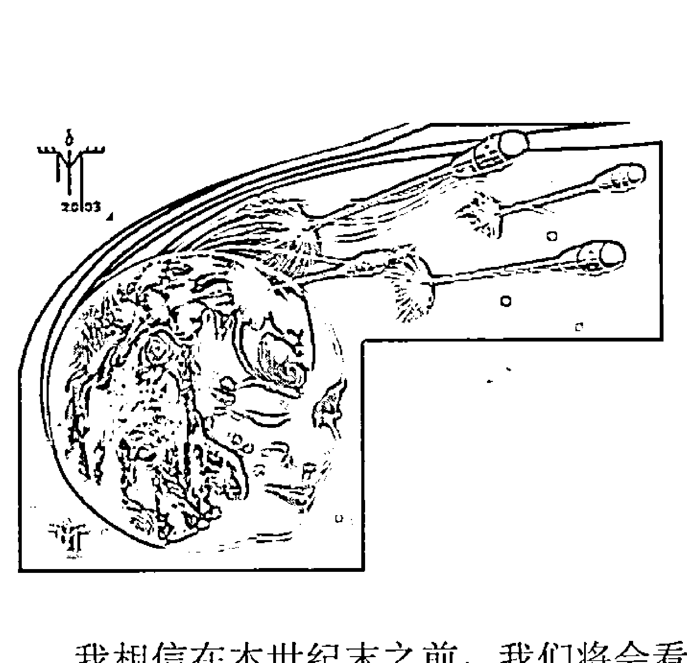

我相信在本世纪末之前，我们将会看到人类开始伟大的离散，分别去到不同的星球。离散意为“分散”，或者“驱散”——尤其是指一个有着同样起源的民族，例如在公元70年，耶路撒冷受到罗马人破坏后离散的犹太人。但是离散（Diaspora）这个单词的词根 speirein，意为“播种”，与播撒种子的意思是一样的。建立宇宙空间移民区，开垦月球、火星，或者泰坦上的荒地——就像尼尔·杨（Neil Young）所唱的那样：“将自然母亲的银色种子撒向新的家园……”——也许是一个科技发达的物种进化的最重要的目的之一。

也许在未来的某一天，盖亚的籽苗将会在最远星球的土地上培植出新的根系……

### 第二课：自然的灵魂

> 我是荒茫大地深处的天堂，
自然的灵魂，神性的生命
我的身躯芳香，肥沃，
抚摸我身上每一片甜美绽放的花瓣。
看到我的富饶你就会了解我。
我是你的绿洲，倾流出生命之水
——凯特琳·布林，《女神心中的赞美诗》

#### 第一节：简介 - 化身

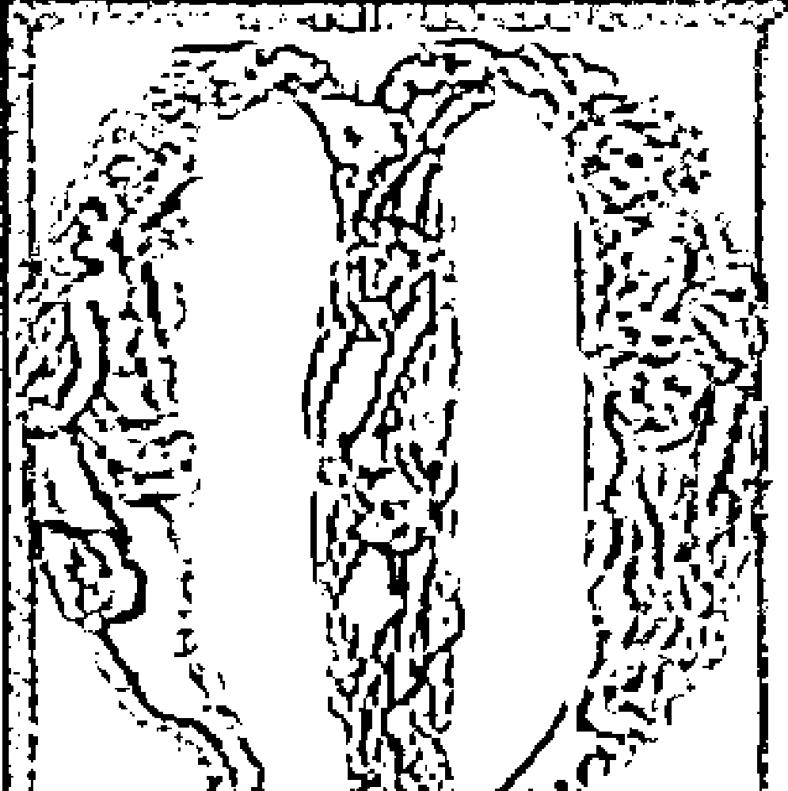

在迪士尼的最早的《幻想曲》（Fantasia）（1940年）中，我最喜欢的是贝多芬的《田园交响曲》，它的音乐背景是希腊罗马神话的半人马、独角兽，以及醉醺醺的酒神巴克斯的挂毯。在电影中，第一次出现了几个古老的神：朱庇特（罗马神话中的宙斯神——译者注），伏尔甘（司火和锻冶的神——译者注），黛安娜（罗马神话中的处女性守护神——译者注）……

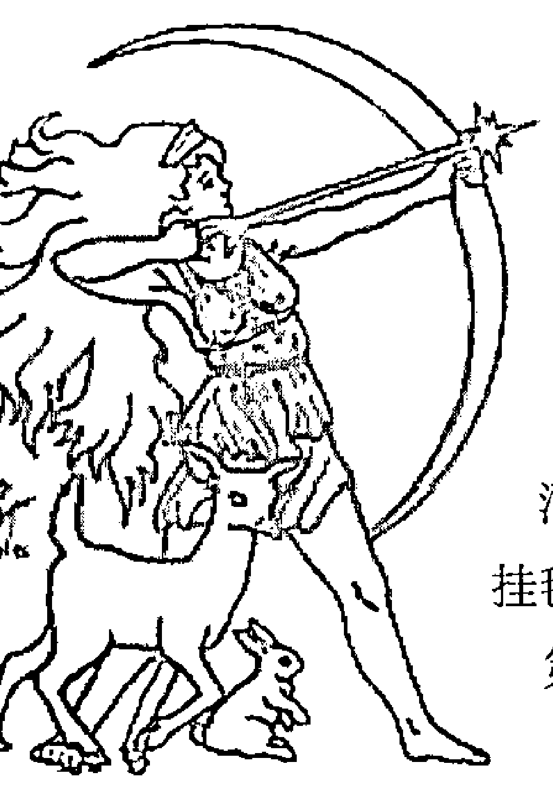

在影片的最后，当诺克斯（希腊神话传说中的夜之女神——译者注）拉下夜晚的帷幕，覆盖了阿卡迪亚的山水，恰似峨眉的新月出现在天空之中，镜头定格在黛安娜身上，她站在云层之上，一只小鹿伴随其左右，以弯弯的新月为弓。她拉开新月、箭头如流星般地划破夜空……对，就是这个镜头触动了我，我被它深深地吸引！后来，受到这个画面的激发，我借此创作了一尊雕像。

要明白，这些不同种类的自然力量的人格化就是那样。就像在特里·普拉切特的《碟形世界》科幻小说中，死神常说：“我是一个人神同形同性的化身（ANTHOPOMORPHIC PERSONIFICATION）。”（也就是说，他所代表的是人类的观点。）从千百年来的观察中我们得知，自然力量的行为就像它们仿佛真的化身成了迪斯尼影片中的独角兽、神灵，以及半人马一样的生物。在魔法师们以这样的方式来思考这种自然力量时，了解并且与这些人格化的力量互动对大多数魔法师而言更容易操作。

#### 第二节：自然的大家庭

对于所有的种族人群来讲，最重要的学说之一便是所有生命——包括大地、海洋、天空，和星星——都是一个大家庭中的一员。许多学说都与美国原住民拉科塔族的信条：迷塔亚，欧亚森（Mitakuye Oyasin）！——“我所有的亲属”相呼应。在全世界所有民族虚构的神话和故事中，我们发现了这些神话故事之间的连通性，比如，最早的宇宙父母是怎样出现的，还有这个世界和所有的一切事物是怎样产生的。普遍的父母子女关系中最伟大的两个原型便是自然母亲和时间父亲。

##### 自然母亲（自然）

> > 我是绿色大地上的美人，
> 我是群星环绕的皎洁月亮，
> 我是神秘的海洋，
> 我是人类内心的渴望。
> 求告你的灵魂：站起来，走向我！
> 因为我是自然的灵魂
> 给予宇宙生命。
> 万物都因我而继续，
> 来我身边，一切都当复原。

> ——多琳·瓦利恩特《女神的诫命》

自然母亲是女神中最古老最伟大的一位，也是涵盖一切宇宙生命的一个化身。她是所有宇宙力量联合而成的 Matter-Mater——所有形式的母亲。单词“matter”和“mater”的字面意思皆为“母亲”。迪奥财富杂志（Dion Fortune）曾经有文章评论说所有的女神都是同一个伟大女神的化身，这个伟大女神的身份就是自然界中的全体女性精神。

自然就是这一身份的精髓。她同时代表了黑暗和光明，她崇尚的是与对立面的和解。探求平衡是她子民的目标，通过经历多重的考验，找到真相后就能达到这个目标。

-   女神训诫第一条便是……
    **“一切生命都是神圣不可侵犯的。”**

-   女神训诫第二条是……
    **“只存在一个种族……那就是人类。”**

中世纪的炼金术士一直将“自然圣母（Dame Nature）”作为所有生命、食物，和知识的来源。她广为人知，甚至被用在售卖人造黄油的电视广告之中，还附了一条非常著名的标语：“愚弄自然母亲没有善果！”她才是所有母亲的母亲！最具权威性的母亲！

##### 时间之父（克洛诺斯）

> 它能吞噬万物：
鸟，野兽，树，花朵；
啃铁叮钢；
以腐蚀的岩石为食；
推翻王国，摧毁城镇，
将高山夷为平地。
——咕噜姆的谜语，《霍比特人》(The Hobbit)，托尔金。

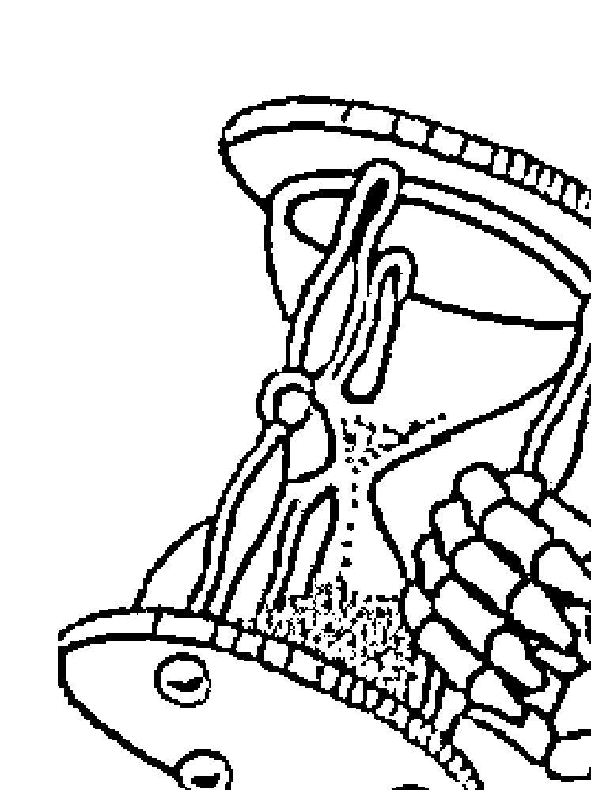

古希腊人将时间之父人格化，定为泰坦神克洛诺斯(Chronos)，从这个单词中我们衍生出了计时器(chronometer-时钟)和年代表(chronology-时间表)。因为时间会吞食一切，所以传说克洛诺斯把自己的孩子也一起吞食了。而这些孩子的母亲瑞亚对此大发雷霆，于是她在他们的第12个孩子出生的时候就把他藏了起来，用一块岩石裹在婴儿毯里代替了他们的孩子。瑞亚在一个山洞中将这个的孩子秘密养大。当最后这个孩子(名叫宙斯)长大之后，他将克洛诺斯从中剖开，解救出他的十一个兄弟姐妹。在伟大的泰坦战争(泰坦之战)之后，这些孩子便成了奥林匹斯山上的神族。

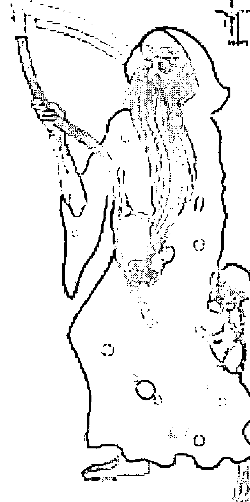

罗马人将克洛诺斯称为农业之神萨杜恩，并将他认定为司掌时间和丰收的神。在他的画像中，他身着黑色有兜帽的长袍，手持一把收割用的大镰刀和一个沙漏，萨杜恩成为了众所周知的灵魂收割者——或者亡灵之神。罗马会在每年的冬至节专门为萨杜恩举行盛大的庆祝活动。冬至是一年之中白天最短的一天，标志着年轮转动进入了新的一年。这个持续一周的庆祝活动称为农神节，是有关圣诞节和新年的最原始的传统。传说在这段时间萨杜恩会离开，取而代之的是来年新生的太阳之子。我相信你定会认出旁边这幅就是萨杜恩的画像！

##### 司夜女神（尼克斯和阿斯特拉）

> 忽闻司夜女神的低语
她脚底的尘埃便是日月星辰
她用身躯包裹着整个宇宙……
——多琳·瓦利恩特，《女神的诫命》

司夜之神是夜空和所有星星本体的化身。埃及人将其称为努特；而希腊人将她称为尼克斯；罗马人称之为诺克斯 Nox (equinox[昼夜平分点]和 nocturnal[夜间的]这两个单词都来自于她)。据说银河便是她乳房的乳汁，横贯天空，抚养了所有无穷世界的生命。她是我们银河系的灵魂和身躯。是她孕育了星系和各个星体，当然也包括我们地球。当然，许多独特的星星和星座也是以女神（还有男神）的名字命名的。例如古时候的司夜女神艾斯特莱雅（Astraea），或者阿斯特拉（Astra），由她的名字我们衍生出了一类有关“星”的单词，比如星际的astral，天文学astronomy，以及宇航员astronaut。据说在传说中的黄金时代，作为西弥斯女神的女儿、司正义与和谐的女神，艾斯特莱雅居住在地球上。但是因为人类越来越残暴，于是天神们都逐渐抛弃了地球，退隐天堂。富有耐心而充满希望的艾斯特莱雅是离开地球的最后一位天神。

阿斯特拉（Astra）这个原始名字是许多晚星（从字面上说，“东方之星”）女神名字的词根：巴比伦神话中的女神伊斯塔（Ishtar），犹太女王以斯帖（Esther），埃斯特（Aster），迦南多神中的首席女神亚舍拉（Asherah），司爱与美的女神阿佛洛狄忒（Aphrodite），司爱情与生育的女神阿斯塔特（Astarte）——以及春季女神斯特尔（Eostre），她的节日叫做奥斯塔（Ostara）或者复活节，在每年的春分时节举行庆祝活动。然而东方之星实际上是一颗行星：金星（Venus）（音译为维纳斯，罗马人以此作为这名女神的名字）。尽管如此，她名字的所有变体都分享着相同的特性：爱、美、性，以及生育力。她的标志是七角星。因为它在其它星星出现之前就已经可见，在儿童歌谣中，这是一颗“许愿星”：

+   星星亮，亮星星，
我看到今晚的第一颗星，
我希望我可以，我希望我会，
实现我今晚的心愿。

##### 太阳父亲（索尔）

神圣的男子气概最强大而且最普遍的代表之一便是太阳神。埃及人称呼他为拉（Ra），希腊人称他为赫利俄斯，罗马人称其为索尔。作为我们太阳系核心中一颗燃烧的心脏，索尔为地球上的所有生命提供了能量。植物将太阳光转变为食物，滋养着动物。只要释放储存在有机材料中的太阳光就能将其点燃，让我们的身体变得暖和，并将我们的事物煮熟。因此，索尔真的是万物之父，而盖亚便是我们的母亲。

全世界民族敬仰的许多太阳神中包括希腊的阿波罗——月亮女神阿耳忒弥斯的哥哥；光明使者路西法；凯尔特人的太阳神卢赫；古埃及太阳神何露斯和阿托恩。太阳神有一个最古老的名字叫做贝尔（Bel）——意为“光明”或者“灿烂”。来源于迦南语中的丰饶之神，太阳神巴力（Ba’al）；凯尔特语中的比勒诺斯（Belenos）；以及火焰之眼的巴洛魔（Balor）。现在，爱尔兰伟大的五月一日（国际劳动节）那天，整个爱尔兰岛上都会点起烽火，标志着夏天的来临。

> 向太阳之神致敬，
他是真正有趣的天神！

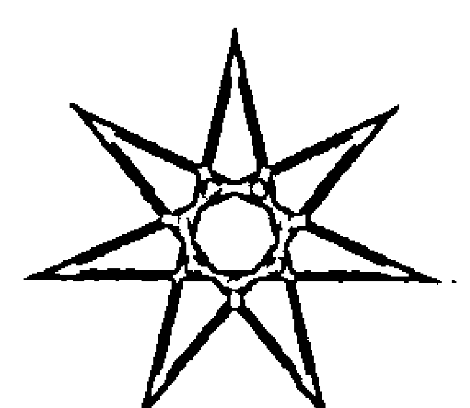

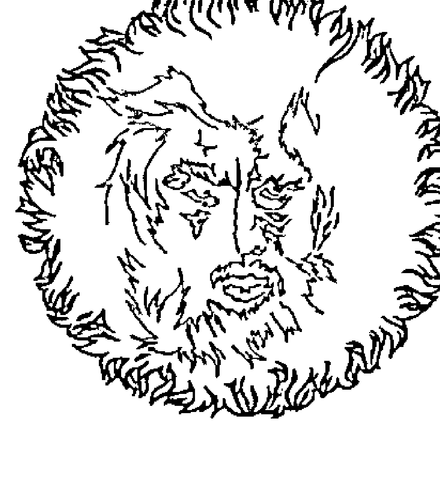

##### 月亮妹妹（露娜）

露娜是罗马人为住在月宫中的女神所起的名字。从最初的时候开始，大多数的人类文明就已经将月亮看作女性。在古希腊，她叫做阿耳特弥斯，黛安娜，或者塞勒涅。在夏威夷，她被称为希娜，在古时的墨西哥被称为伊希切尔。对于威尔士人来说她叫银轮阿瑞安诺德，在中国的道教中她叫嫦娥。她通常都被视作太阳神的妹妹和妻子。

露娜有三面，与月亮的三种月相对应——渐盈，月满，渐亏。因此她被确定为三性女神——少女、母亲，和老妪，与女人的三个年龄阶段相对应。因此月亮还控制着海浪的潮汐和女人身体的潮汐，所以她被看做是主管魔法和神秘学的女神，被各地的女巫所推崇，她们都会选择在满月之夜（或者夜里没有月亮的时候）以她的名义集会。

月球是十亿年前出生于地球的一个天体，那时我们的世界还不存在生物。一颗火星大小的小行星猛烈撞击了早期炙热的地球，导致了大量的碎片从地球中分离出来，后来聚集在一起形成了月球。她的出生地便是现在的太平洋海盆。因此即使露娜缺少空气、干燥，还没有生命，但是她确确实实是地球的姐妹世界。

当我凝视着天空中的满月，我会想起我在这个世界上认识并且爱着的所有人，而且我还知道他们也在此刻望着她的脸（至少，在世界各地，同一个晚上不同的地区）。我将月亮比作挂在天上的一面大镜子（事实上她就是），我将我对我在乎的那些人的爱送到她那里，她再将这些爱反馈给他们。

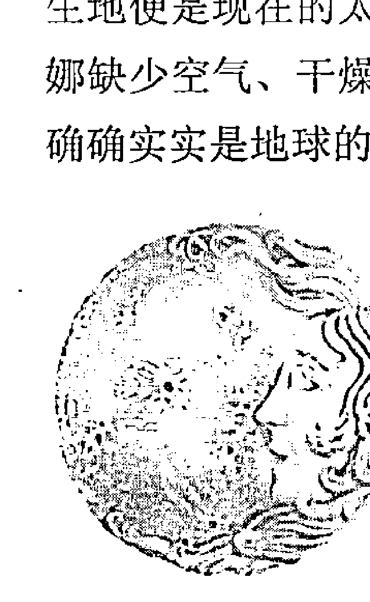

> 拉！拉！拉拉拉！

> 在月圆时向着月亮祈祷
你就将被好运围绕
你寻找的东西也终会被找到
不管是在陆地、海洋，还是地下。

#### 第三节：大地母亲和她的孩子

##### 大地母亲（盖亚）

> “我颂扬最古老的大地
以及诸神之母……”

《荷马史诗》中的颂扬大地母亲盖亚的那段就是这样开头的。盖亚（Gaea）（拉丁文中拼作Gaia），是古希腊人在石器时代给人类崇拜的原始行星女神起的名字。在赫西奥德的《神谱》（古希腊的创造故事）中，盖亚来源于原始的宇宙混沌，由光和爱创造。她的第一个后代便是克洛诺斯的父亲乌拉诺斯，最早的主神。盖亚被爱神厄洛斯的彗星剑射中以后受精，生下了全世界的植物、动物、泰坦、众神，当然，还有人类。因此盖亚是万物的母亲。罗马人称呼她为特拉（Terra），从这个单词中衍生出了单词地球的（terrestrial）和地球化（terra-forming）。地球上的每一种文化中都有大地母亲的名字，这些名字中的大多数——例如秘鲁的巴扎妈妈（Pachamama）——都是“妈妈”的变体，也是大多数新生儿开口说的第一个词。

全世界的人民，甚至是小孩子都能很直观地认知到大地母亲。她是全世界所有人类都体验过的、最古老、也是最被普遍认识的虔诚的集体无意识。在从古希腊传承下来的少数图像中，盖亚是以女王的形象出现的，或者是一位美丽的、有着蓬乱长发的成熟女人，诞生于初生的地球。地球上那些特有的岩礁和石料被称为“盖亚的骨骼”。

自从20世纪60年代开始，从太空中拍下的照片已经让人们意识到地球上的世界是一个完整的实体。这种意识让盖亚的名字再次浮现在人类眼前，以“盖亚论文”的方式提升到了自然科学的高度，主张我们的地球是一个单一的生命体。

###### 任务：制作一个冰河世纪时期的玛崔卡（Matrika）

玛崔卡，或者“小妈妈”，距今已有20,000多年历史，属于上一次冰河世纪时期的物品。这些雕像在横跨欧亚大陆的西班牙和西伯利亚的交界发现的，它们的风格是如此的相似，由此可以推出它们可能全都是出自同一位艺术家之手。1973年，当我决定成为一名雕刻家的时候，我打算复制的第一件作品就是这些雕像中最古老的那种（30,000年！），图中展示的是“维伦多夫的维纳斯”。试着做一个放在你的圣坛上。当然，首先你所需要的就是一些粘土。如果你可以找到一个烧窑（就像在学校一样），那么你还可以对其进行烧制，你也可以使用常规的陶土。如果不能找到烧窑，那我建议你使用可以风干的粘土，比如“墨西卡利粘土”。无论何时何地，我都偏好使用红色的粘土。这些塑像的手臂通常都不是放在身体两侧的，一般来讲她们的脸都没有任何特色。将你的雕像风干或者烤干存放好，便能让未来的考古学家震惊！

##### 盖亚的第一批孩子们

盖亚的第一批孩子就是我们所说的三个伟大的“生命之王（或者女王）”。它们是植物、动物，和真菌，是所有多细胞生物体的基本分类。从我们魔法化身的角度来看，这些化身有五个：两对双胞胎——一对绿人双胞胎和一对红人双胞胎，以及一个孤家寡人，灰人。

植物和动物之间决定性的不同取决于有着复杂分子结构的循环流体中的一个单原子。在植物中，这个单原子是镁，使分子显现为绿色。我们将其称为叶绿素，它承载了光合作用的动力——将光和水转化为糖。在动物中，这个单原子是铁，使分子显现为红色。我们称其为血红蛋白，有了它我们的血液才能从空气中提取氧气。因此植物的生命之液是绿色的，而动物的

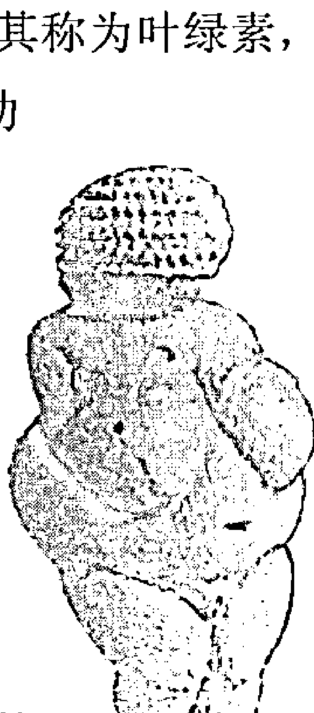是红色的。没有叶绿素、也没有血红蛋白的生命之液的颜色，就像一些蘑菇，是浅灰色的。这一切都彼此亲密地相互联系，相互依赖。

季节转化的周期称为年轮（Wheel of the Year）。根据神话中的讲述，大地母亲、太阳父亲，以及他们的孩子：枝叶茂盛的男绿人和花团锦簇的女绿人，以及手持号角的男红人和毛茸茸的女红人（注：此处所说的“红人”与美洲印第安人无关……）是这部年度剧本中的主要角色。每一次的循环便是在讲述他们从出生、求爱、结婚、怀孕、成熟、死亡到重生——就像《狮子王》中的精彩舞蹈《生生不息》中所展现的一样（详情请看课程之四，第六课“年轮”）——的故事。

> 她带来春季的萌芽
欢笑花间。
在夏天的燥热中她的吻很甘甜；
在繁茂的树荫里歌唱。
收获甘蔗和粮食
秋天的果实环绕在她周围。
寒冷的冬季她的骨头慢慢老去；
她将斗篷裹紧身躯。
——霍普·阿瑟《女士的布朗莱舞（The Lady’s Bransle）》

绿色女神（Green Goddess）不仅仅是一种沙拉酱调料！她还是盖亚最年长的女儿，在25亿年前她是第一个出现在大地母亲的海洋子宫中的绿藻。她的拉丁名叫做佛罗拉，是科学家为整个植物王国起的名字。她通常是以花朵的面容出现在大家面前。从她丰饶的聚宝盆中溢出的繁花、水果，以及蔬菜与绿色女神的联系尤为紧密，因为它们是植物的ova（卵细胞）。

就像男绿人一样，女绿人也会经历植被每年一次的发芽、生长、死亡，以及重生——从种植到收获，然后又回到种植的季节。在古希腊举行的厄琉息斯秘密仪式中，司掌春季花朵的少女女神叫做科莱（“女儿”）以及她的妈妈德墨忒耳，德墨忒耳是掌管植物生长世界——尤其是谷物——的女神。她的罗马名字叫做刻瑞斯（Ceres），从她的名字中衍生出我们的常用单词谷物（cereal）。

作为所有自然界的开花植物的化身，佛罗拉被称为罗马的秘密守护神，没有了她罗马的城市便会消亡。她的节日叫做花神节，每年的4月28日到5月3日。

##### 绿人（弗洛鲁斯）

啊，他能让秋天的落叶，
飘扬着明亮的颜色！
温暖逝去他便在大地上描绘严寒，
银光轻触大地！
他迎接五月之舞的来临，
绶带环绕在他周围！
我们以谷为食，用角饮水——
离开他我们将无法存在！
——阿尔泰米西娅“男士的布朗莱舞”

绿人弗洛鲁斯是植物王国阳刚的一面。三亿年前，当植物还处于最早的种子植物或者球果植物形态之时，他是第一位将植物分化为雌雄两种性状的神。弗洛鲁斯是授花粉者，种子和谷物都与他有联系。作为主管园艺的神，他非常慷慨，拥有着孕育植物的精神，他还教授我们培植和分享，他从他的肢体与血液中为我们的餐桌和圣礼提取面包、果汁，和葡萄酒。他还是森林之神，为所有的野生生物提供安全避难所、坚果和浆果、家和生息场所。即使他是森林的保护神，但是在他的所有的贡献之中，他保持着一贯的仁慈。

绿人的基本特性是他掌管着的每年一度的植被的生死循环，因此他的仪式是所有古老的入会秘密仪式的核心。新入会的成员会在收获的季节陪伴着绿人，陪伴他经历死亡，经历地狱之旅，最终在春天重生。这样，他成为了传授者，同时也是精神向导，陪伴着灵魂经历地狱之旅直到最终的重生。

绿人早已被明确地认定为等同于植物，比如粮食和葡萄能够酿制的令人陶醉的酒水。因此他的精神通过影响他们的意识直接影响了凡人。我是通过他的拉丁名弗洛鲁斯了解他的，虽然在西方世界中他的另一个名字杰克更为出名，这个名字是来源于古希腊语中的伊阿科斯（Iacchos），罗马人称呼他为酒神巴克斯（Bacchus），主管酒水和心醉神迷的神。杰克（Jack）是约翰（John）的英文昵称，就像在名字约翰·巴利肯中一样，他在一首非常著名的歌里面讲述了大麦的种植和白兰地的酿造。在古代埃及他是司阴府之神奥西里斯（Osiris）；在中东他被称为塔模斯（Tammuz）；在非洲仍然称他为奥克西（Ochosi）。

在春天，当他从枯枝落叶中探出他小小的绿色脑袋之时，我们称呼他为绿丛中的杰克（Jack-in-the-Green），或者绿色的杰克（Jack O’ Green）。在初夏，当他考察他的集会时，他便成了花团锦簇的布道坛里的杰克（the flower Jack-in-the-Pulpit）。在夏末酿造的散发着水果香味的白兰地叫做苹果杰克（Applejack）、靴子杰克（Bootjack），或者烟杰克（Smokejack）。在萨温节或者夏末节时，我们将他的空心南瓜雕刻成幽灵般的杰克南瓜灯（Jack O’ Lantern），在整个万圣节前夜为我们站岗，吓跑那些不友好的幽灵。在严寒的冬季，他朦胧的幽灵时刻提醒我们他仍然存在，化作杰克霜（Jack Frost），以他的晶莹剔透装饰着我们的窗户。我们会在华丽的建筑和花园中看到他那张被雕刻出来的熟悉而繁茂的“叶饰脸（foliate face）”。

###### 任务：做一个绿人面具

你可以制作一个非常酷的面具，让自己与这些绿精灵取得联系。面具是一种非常古老的变形方式。在刚开始佩戴面具的时候你可能不会觉得有什么不同，但是别人都只能看到你的面具，并将你本人和面具上的那个人联系起来。除了万圣节之外，还有很多场合可以佩戴自然界精灵的面具来取乐。聚会、戏剧、仪式、庆祝活动，以及文艺复兴的装扮游园会，所有的这些场合都为你提供了一个机会来拥有另一张脸。

制作一个奇妙的绿人面具相当容易。首先，去一间工艺品店或者戏装店，买一个便宜的白色半脸面具。面具不能遮住你的鼻孔、嘴唇，或者下巴。如果你找不到一个合适的，你也可以买一张全脸面具，然后用剪刀剪下鼻子和面颊以下的部分。然后将眼睛的位置剪得大一些。（图.1）同样的在工艺品店你还能找到一些不同大小的叶子。买一些大片的，再搭上几片小叶子。你还需要一管无色的硅胶，就是水族馆里用于黏合玻璃的那种，最后就是一个耐用的订书机。从面具的外沿开始，在面具的外沿完整地粘上那些最大叶子，然后用订书机加固，叶柄朝里，全都指向同一个位置——也就是你的眉心。一定要从里往外钉，这样才能让订书钉平滑的那一面贴近你的皮肤，而不是钉尖！

然后在第一层叶子的上面粘上第二层（只有最外面的那一层需要用订书机加固），就这样一层层往里贴，仔细一些，确保这些叶子不会遮住你的眼睛。（用夹钳夹紧直到胶水变干。）里面一层的叶子应该越来越小，最后，贴在鼻子上的那片叶子要恰好与鼻子同等大小。现在，你就拥有了一张经典的叶饰（枝繁叶茂的）面具——最常见的绿人的形象！（女孩子们还可以将塑料叶子和花搭配在一起以同样的方法做一张佛罗拉面具。）

##### 女红人（佛纳 [Fauna]）——牵牛花·泽尔·雷文哈特

佛纳是一个拉丁名字，指的是由女王统治的动物王国。她是罗马神话中司畜牧农林的乡神福纳斯（Faunus）的妻子，她是所有动物（当然也包括人类）圣灵的女性化身。她被称作女红人是因为动物的静脉中流淌着红色的血液。佛纳是野兽的女主人——在拉丁语中叫做西伦（Potnia Theron）（克里特语：动物的女主人，一个了不起的女神）。

其他的动物可能从它们自己特有的视角见过她，但是人类最早是从旧石器时代末、新石器时代初开始朝拜她，大约公元前12000-6000年。这也许与农耕和动物驯养的时间是一致的。在全世界的农业和集体狩猎文化中，她被许多人以多种形式开始认知。她的名字很多：阿耳特弥斯（Artemis），黛安娜（Diana），埃波娜（Epona），本迪斯（Bendis），哈索尔（Hathor），得斯波那（Despoina），阿斯塔特(Astarte)，拉克希米(Lakshmi)，马古(Ma Ku)，白色水牛女人(White Buffalo Woman)……画中她是一个强大的（通常袒胸露乳）女人，要不站在两只动物之间，要不两只手中各紧握一只动物。有时候她会骑在一只动物身上出现，比如老虎。

佛纳的仪式通常与月亮崇拜有关，而且从表面看来，似乎有些自相矛盾：她是小动物和野性自然的保护神；但是反过来说她也吃肉，血也是她的圣餐。其实这是因为她是所有动物的女神，包括捕食者和猎物。古时候的猎人都向她祷告，以求在捕猎的时候有好运；农民也向她祷告，祈求畜羽数量的增加。也许，现在我们应该召唤她来帮助我们拯救那些濒临灭绝的物种！

##### 男红人（福纳斯）

> 他可以唤醒死去的生命——
分趾蹄和有犄角的头，
人类的心，人类的大脑，
羊足神潘再度降临！
半人半兽——
潘就是一切，一切都是潘！
——珀西·比希·雪莱“羊足神”

福纳斯通常被称为头上长角的人——潘和科努诺斯(Cernunnos)（意为“头上长角”）是他最常用的名字。他是所有动物圣灵的男性化身，因此他便有着所有雄性动物象征王冠的角。

福纳斯是主管牧场、牧羊人，以及预言的神。他还是农牧神的领袖，希腊神话中的半人半兽神的罗马分支。农牧神和半人半兽神与人类长得很像，除此之外他们还长着山羊的脚、山羊尾巴、尖尖的耳朵，还有短角。在不同的区域，农牧神头上的角也不同，它根据本地人们印象最深的动物角而来的：欧洲是鹿，美洲是野牛，在非洲和亚洲是羚羊。在希腊神话中，半人半兽神的父亲是潘，潘这个名字就是“一切”的意思。亚历山大港的古时学者相信潘是自然界的化身，而单词pantheism（泛神论）也是源自这个想法，所以说一切都是神，神就是一切。

潘积极的一面是高兴的、精力充沛的爱人和音乐家；这一面叫做Pangenitor，意为“万物之父(all-begetter)”。但是和自然界的所有物体一样，潘也有他阴暗的一面。他的阴暗面叫做Panphage，意为“吞噬万物(all-devourer)”，因此，他也是荒野生的凶猛保护神。单词

##### 灰人（麦可塔 [Micota]）

麦可塔是女王统治的真菌王国的拉丁名。真菌界包括蘑菇、霉菌，和粘液菌。十亿多年前，第一个真菌出现在地球上。与佛罗拉不同，麦可塔不能将无机物质转化为食物，而只能以其它的生物为食——既像寄生虫（“啃噬他人的食物”）以活物为食，也像腐生菌（“以腐烂物品为食”）以死物为食。

蘑菇只是从遍布地底的广阔领域中错综复杂的网状纤维上抽出芽来的小果实。这些纤维被称为菌丝，它们非常像人类大脑里的神经纤维。实际上，有些网状菌丝体非常之大，因此成为了地球上分布最广阔的生物。麦可塔的精神也是广阔且深远的！

许多真菌都为人类所熟知，尤其是蘑菇，作为人类的食物和萨满教的药物，蘑菇的历史源远流长。一些人认为，人类通过进食从牲畜和驯鹿的排泄物中长出来的特定的魔法蘑菇能够获得知觉意识。纵观全世界，许多秘密仪式和入会仪式中就包括进食蘑菇，然后去到梦境中的其它世界旅行。

> 注意：虽然有的蘑菇确实美味，但是也有一些含有致命的剧毒，小小的一口便会让你一命呜呼。也有很多蘑菇非常危险，但是却看起来平常无异，像是无毒蘑菇，这样的蘑菇就只有专家才能区分。因此如果没有专业的采菇人的陪伴，还是不要轻易采食野生蘑菇！

#### 第四节：自然圣灵（提婆 [Devas]）

提婆是描述圣灵的梵语词汇（来自印度）。它是神圣的（divine）、神学（divinity）、占卜（divination），甚至魔鬼（devil）等单词的词根。所有种类的自然圣灵都叫做提婆。他们是非动物造物在各个地方和相位的化身。提婆们会通过动物和昆虫的声音、上升的气流，或者是鸟群的突然出现来展示它们的存在。提婆能够促进生长，为花朵赋予颜色，在美丽的地方翱翔，在波浪和瀑布中嬉戏，在风中、在阳光下跳舞。他们的任务就是进化美丽，对生命形态作出反应。

##### 女神宁芙 [Nymphs]

在古希腊，以女子样貌出现的提婆叫做宁芙，这个单词的意思是年轻女子、新娘，或者看护。她们被授予了魔法魅力、美貌，以及超自然的能力。作为自然界脉动生灵的女性圣灵，宁芙通常是好色的半人半兽神的伴侣。宁芙属于希腊神话中最古老最深层的层面，她们居住在大海、河流、温泉、树林、森林，以及大山之中。宁芙一个重要的传统角色便是在英雄年少时照看他们。的确，许多希腊英雄都有一个宁芙妈妈或者保姆。

- 海洋女神 (Oceanids) 是海洋的宁芙，是海洋之神俄亥阿诺斯神的女儿。
- 涅瑞伊得斯 (Nereids) 是另一个家族的海宁芙，是大海的智慧老人涅柔斯 (Nereus) 的女儿。
- 泉水宁芙耐得斯 (Naiads) 是流动的水宁芙——河流、小溪，和温泉。
- 俄瑞阿得 (Oreads) 或者俄瑞斯泰德斯 (Orestiads) 是山宁芙。
- 树精德律阿得斯 (Dryads) 和树神 (Hamadryads) 是森林和树木宁芙。每一个树精都有属于她自己的树，她们的生死也依附于树。

##### 精灵

精灵Faerie (或者Fairy) 这个单词来源于拉丁语中的fata (“fate[命运女神]”)。命运三女神负责拜访新生儿并决定他们命运。在古英语中这个单词一度变成了fay，意为被施魔法的，或者着魔的，而fay-erie (faerie小仙女) 既有着魔又有幻境的意思。世界上存在着许多精灵王国，它们有着自己各自不同的起源和特性。其中一些——例如小精灵和小妖精——据说起源于古时有血有肉的人族。此外还有自然精灵，它们都是非常像希腊宁芙的提婆。许多自然精灵是特定的花朵或者其它植物的圣灵，更像德律阿得斯和树神。同样的，它们通常会有花瓣形的翅膀，或者像蝴蝶或者其它昆虫一样的翅膀。还有一些是和蘑菇有关的，尤其是那些在铃铛中成长的精灵。

大多数的精灵都能施放某种的魔法，也能带来好运或者病痛。有些很友善，有些就很邪恶，但是所有的精灵都很恶作剧，因此就需要你对其保持足够的尊重！它们通常都被称为“好人”、“好邻居”，或者“绅士”，因此不要轻易冒犯它们。最好的办法就是给他们准备一些牛奶或者蜂蜜。

### 第三课：大自然的元素

> 土，水，火和气——
将它们都放在花园中；
放在篮筐中用皮包裹……
猜出谜底只是一个开始！
——难以置信弦乐乐队
(Incredible String Band)

#### 第一节：简介 - 朱莉妈妈 (Mama Julie) 的课程

我最喜欢的老师之一就是朱莉妈妈，她是托尔家族 (Tower Family) 的女负责人。二十多年前，在80年代早期，我曾跟她学过魔法。现在，她已经去世很长一段时间了，但是我仍然记得她那充满感情的课堂。我从她那里学到的最重要的东西就是通过四种元素来增进我的魔法学习和经历。也就是说，她教我将世界和万物纳入四大元素之中，然后将我自己完全融入在其中，尽我所能地学习和体验其中的每一个领域。现在，我便将这些课程传授给你们……

古老的密特拉教的秘密仪式认为，一个人在他能够获得精神启蒙和智慧之前必须对四种元素全都了如指掌。他必须成功地了解土、水、气和火的入门知识——这些元素中的每一种元素都在挑战一个人本性的不同方向。

#### 第二节：元素

作为宇宙中所有生命和生物基础的四大元素（或者五大元素）的概念是亚里士多德（公元前384-322年）以及古希腊毕达哥拉斯神秘主义的基本学说，而且从中东、埃及、希腊、罗马、炼金术，以及炼金术到现代神秘学、魔法，以及巫术，这个系统在所有的西方魔法系统中是最为显著的，这一切都归功于公元前5世纪西西里的哲学家恩培多克勒（Empedocles）。它是世界上最为广泛使用的概念模型，是以诺派魔法系统的基础，也是塔罗纸牌、占星术、四季，以及魔法圈的基础。简单地说，这四种元素分别是土，水，火，风。此外，正如宇宙中的万事万物一样，每一种元素都浸染了神圣的非物质精华，也就是我们常说的灵。正如每一个人都是神圣的唯一体现，每块岩石、每棵树、每座山脉、每条河流也都是如此。因此灵通常也被看做是第五大元素——将有生命生物和无生命物体区别开来。它同时包含了所有的四种元素。固态的柔软的蜡烛本身就是土；液态的融化的蜡就是水；气态的烟雾就是气；当然，灼热的火焰就是火。

即使现代化学已经用“元素”这个词来指代一百多种不同类型的原子，但是那并不是这个术语最原始的意义或者意图。恰恰相反，古人（以及从古至今的魔法人士们）所理解的元素便是世人所说的物质形态。宇宙中的万事万物都是由物质、能量，或者两者结合在一起而组成的。所有实质性的物体——那些由物质组成的物体——都能以四种形态存在：液态，固态，气态，以及等离子形态，并通过不同方式加入或者减去能量（比如加热或者降温，增压或者减压），它们就能从一种形态转换为另一种形态。例如，我们通常提起的H2O（水）是液态的。但是当我们将它里面的能量（热能）去除，它就能凝固为固体成为冰；或者我们加入能量，它就能被汽化为气态的水蒸气。它是由氢原子和氧原子组成，这两种原子能被电离（剥夺电子）成为炙热的等离子体，就像我们看到的极光。这就是为什么一根简单的点燃的蜡烛就是最完美的魔法工具——它同时包含了所有的四种元素。固态的柔软的蜡烛本身就是土；液态的融化的蜡就是水；气态的烟雾就是气；当然，灼热的火焰就是火。在魔法中，元素概念的重要性在于将很多物体通过符应（类推法）归纳于不同的元素之中。例如，柏拉图（公元前427-347年）将所有的生物分为四组：大地=野兽，水=鱼，气=鸟，火=星星。中世纪的炼金术士和魔法师指出了四大元素与不同种类的宝石和矿物，天体，方位和季节，植物物种和动物物种，几何形状，人体的内心与外貌，以及人格特质之间的联系。在我们之中，四大元素分别代表了物理存在（土），激情和情绪（水），智力和交流（气），转化与创造（火）。所有的这些联系都被巧妙地整理在符应目录之中。请看课程之三，第六课：“符应”。

在操作魔法中，魔法师和巫师能够召唤元素以及他们的圣灵护卫——元素精灵——之间的微妙力量。我们可以通过将我们的魔法工具或者仪式物品与每一种物质——例如：盐、泥土、水晶代表大地，一杯水代表水，焚香的烟代表气，蜡烛的火焰代表火——相接触来对它们进行圣化。当魔法圈准备好以后，将每种元素或者它们的象征物品放在对应的四分之一格中，便可以开始召唤四大元素的圣灵护卫。

#### 第三节：元素精灵

元素精灵是一种圣灵生物，它们是四大元素的化身。它们和我在前一课中提到的提婆和其他自然精灵是极为相似的，也因此有的人便把所有的自然精灵看作“元素素精灵”。然而，确切地说，元素精灵是很特殊的，它们只与它们特定的元素有关，没有地域和物种的差别。

虽然一些魔法师相信元素精灵在文字上的表现是下文叙述的那样，但是其他的魔法师相信这些描述不过是元素精灵在我们想象中的表现，是我们在深层次的迷睡和冥想的状态中与它们的相互作用形成的。全世界土著文化的萨满教从业人员都会使用击鼓、舞蹈，以及其他方法来达到恍惚状态，以做到在自己内部进入现实置换，在此它们就能与元素精灵相遇。一些人的经历让他们相信，他们曾经在外部的情形世界中，遭遇过我们在下文中将会讲到的元素精灵。在此，我想要表达的主要观点就是圣灵无处不在，比如，岩石和大山中的圣灵，他们与河流和海洋中的圣灵相比，有着更多不同的性格和品质。

帕拉塞尔苏斯（1493-1541年）将四大元素精灵家族做了如下划分：

##### 土元素——地精（Gnomes）

地精通常被描写成穿着大靴子蹲坐着的矮人，长长的胡须、高高的尖顶帽——看起来跟那些“花园地精”雕像一模一样。女性地精叫做土地婆（gnomides）。人们常常把他们与矮人形象相混淆，但是矮人是一种完全不同的种类。地精住在地下隧道和洞穴中，他们是地球上的宝石、矿产，以及其他埋藏的宝藏的保护神。单词 gnome（地精）源于希腊语 genomus（地球居民）。地精的国王是戈博（Gob），因此他的臣民们也叫做 goblins（地精）。

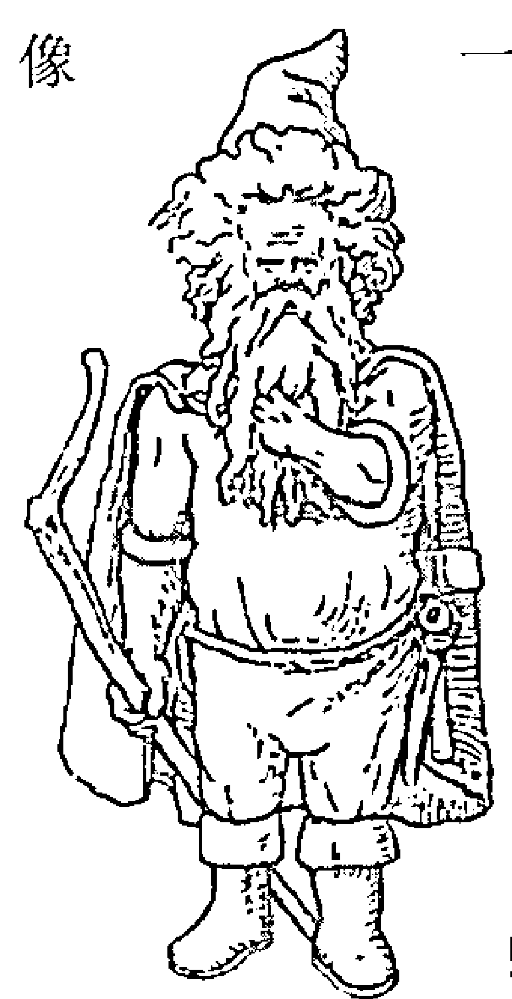

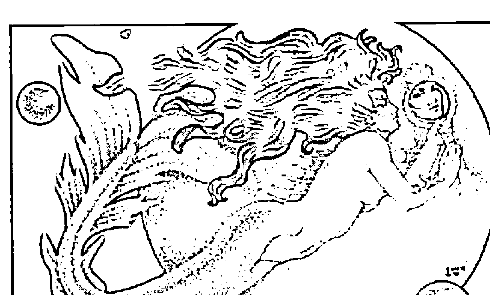

##### 水元素——水精（Undines）

水精的长相与我们平常所见的美人鱼的形象非常相似，她们优雅、可爱，有着像鱼一样的尾巴，有蹼的手指，居住在水域之中——海洋、河流、小溪、瀑布、湖泊、池塘、温泉，以及喷泉。但是她们又不像美人鱼，水精能够很容易地在水和人鱼形象之间自由变体。她们可以在薄雾笼罩中离开水面，但是不能离开太久。水精不是只能生活在水里，她们是由水组成的——尤其是喷溅的浪花。Undine（水精）来源于拉丁语 unda（波浪）。水精的统治者是妮可撒（Neksa）。

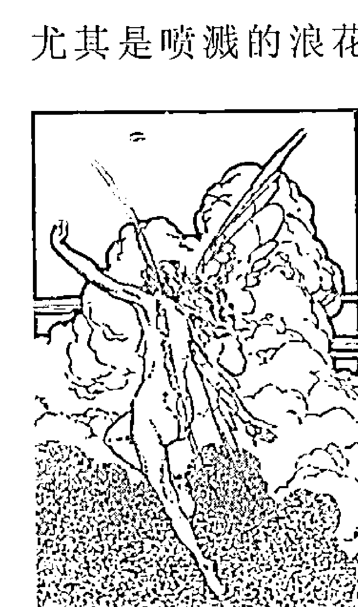

##### 气元素——气精（Sylphs）

气精是纤细、精美的小型飞行生物，通常容易与小精灵弄混淆。它们能够腾云驾雾，塑造雪花。女性的气精叫做希尔菲德 (sylphids)。Silphe 是 希腊语中的“蝴蝶”，而风精灵通常都会将自己伪装在飞虫之中。风精灵的翅膀通常是透明的，像蜻蜓的翅膀。风精灵的首领是潘拉德 (Paralda)。

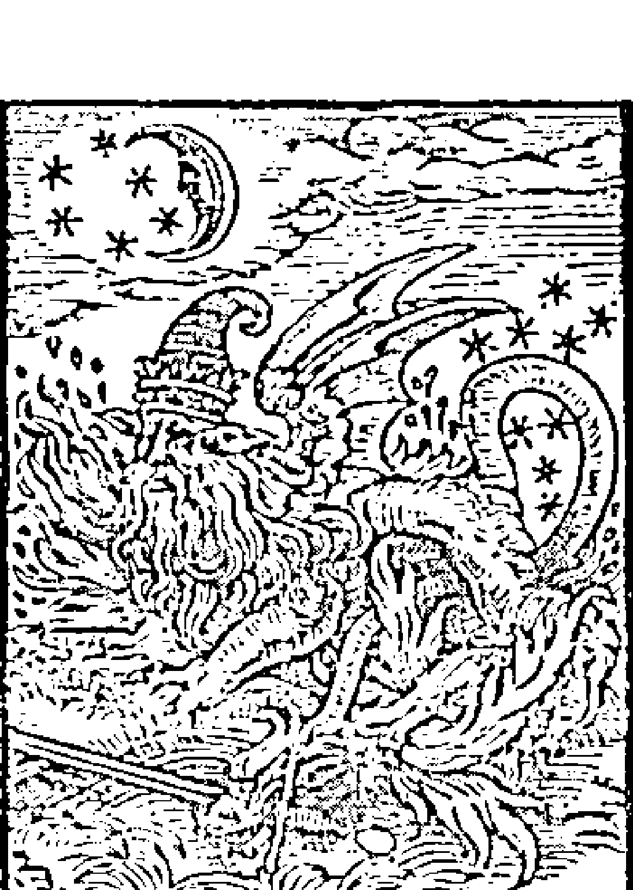

##### 火元素 —— 火蜥蜴（蝾螈）(Salamanders)

元素精灵火蜥蜴和那种小小的色彩斑斓的两栖动物（它们实际上是元素精灵的名字，而并不是因为有时我们会看到它们从燃烧的圆木中爬出来才起名为火蜥蜴，而柴火只是它们的冬眠场所）不是同一种生物，但是在描述中他们是很相似的。元素精灵火蜥蜴是生活在火焰中的火红龙蜥蜴。沙罗曼蛇也是最常见的元素精灵种类，在你使劲凝视燃烧火焰的焰心时你就能看到。火蜥蜴就像火一样非常危险。它们的名字来自希腊语 salambe (壁炉)。火蜥蜴王国是由高贵的燃烧着的叫做迪金 (Djin) (金) 的龙精灵统治的。

#### 第四节：土

> 我是你身边的大地
我是你的心跳

> 我是你脚下的土地
我是圆满无缺的！
——艾比·斯平纳

固态地球是我们这个世界万物存在的根基。作为地球上生命进化的产物，我们也是地球的孩子。许多古代文明将他们脚底孕育生命的大地看作是一位女神，希腊人称之为盖亚。地球，为我们提供食物，是我们身躯的骨与肉，而充满生机的、地球的骨头便是我们脚下的岩石。地质学在希腊语中意为“关于盖亚的研究”，是一门研究盖亚的骨架与身躯的形成、进化、成长，以及变质的 43 亿年历史的学科。就像我们人体主要软组织的三大层面（内胚层，中胚层，外胚层）一样，岩石也有三大主要类型：火成（岩浆岩），沉淀（沉积岩），和变质（变质岩）。岩浆岩是由熔化的火山岩浆迅速冷却并凝固而成的。岩浆岩包括侵入岩和喷出岩两种形式（例：花岗岩和玄武岩）。沉积岩是湖底或者海底的矿泥和沙石慢慢一层一层沉淀而形成的（通常化石就能在这种岩石中找到）。变质岩在最开始的时候也是岩浆岩或者变质岩，但是在地质高压的作用下慢慢转变为变质岩。分子是由化学元素的原子组成的，他们都有自己的几何形状。也就是说一种特定物质的分子，在适当的环境中，能够像谜一样组装在一起形成正多面体，也就是我们所知道的晶体。这是众所周知的常识：实验能够组成立方形的晶体，水可以形成复杂的我们称之为雪花的

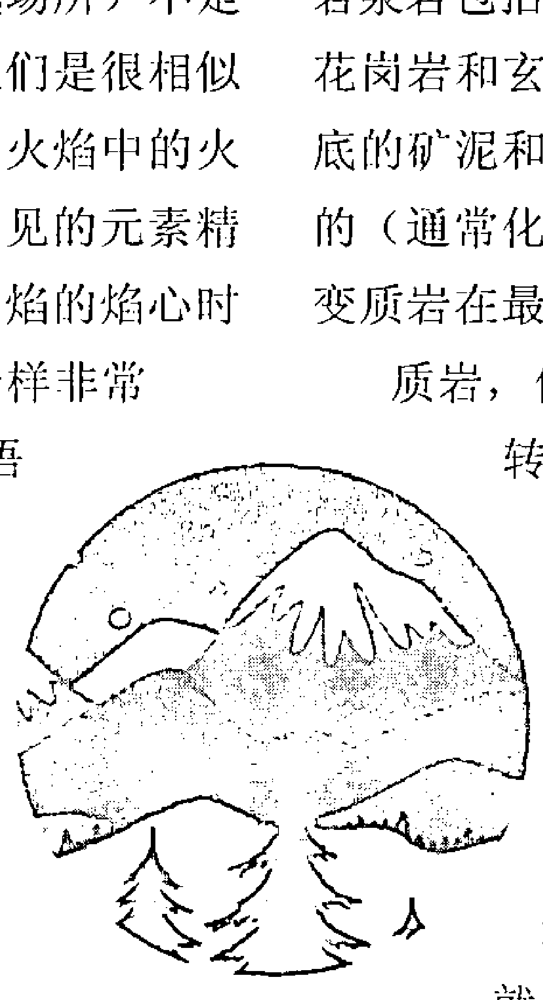

六面晶体，诸如此类。在自然界中，大家都认为水晶是有魔力的，从巴西的萨满到澳大利亚的土著治疗师，再到女王伊莉莎白一世时期的英国宫廷魔法师约翰·迪伊，所有的这些魔法师都将水晶视作他们魔法工具箱中重要的一部分。不同种类的水晶用于不同的法事。那些半透明的或者（最好是）透明的水晶被认为是最具魔力的。

纵观全世界，最常见的水晶品种是石英晶体。这种晶体的清澈、多彩，都取决于石英的组成元素——硅中混合的微量元素。现在，石英最让人着迷的地方就是它的压电性。也就是说，在一定程度的压力之下，它会产生电荷。这就是为什么石英曾是旧式晶体管收音机的主要成分；这也是为什么现代的计算机能在硅芯片上运行。石英能够传导能量电荷——这对于一名魔法师来说是很有用的。

我曾登山、攀崖，穿越沙漠，寻找化石，研究地质。我甚至还体验过地震！在我的雕塑中，我以粘土的形式与土元素有过直接的接触。在所有的这些接触之中，我最喜欢的活动就是洞穴探险，或者说探洞。不管你身于何处，只要那里有天然洞穴，我会极力推荐你去探访一下这些洞穴。每个洞穴都是独一无二的，而且十分美丽——从有着石钟乳（stalacTites）（从洞穴的顶部垂落下来，就像字母“T”一样）和石笋（stalagMites）（从洞穴地面向上生长，就像字母“M”）的壮观石灰岩洞，到有着像结冰的黑水一样的地层的可怕熔岩洞。许多洞穴都是向公众开放的，还配有导游带领旅行，这些洞穴的门票物有所值！如果你想要探测“野生”洞穴，你或许会为了这些神奇的地下探险而加入一个本地的洞穴探险社团。

##### 任务：感受地球

> > ——法丽达·卡瓦拉尼·福克斯 (Farida Ka' iwalani Fox)

让我们从土元素开始。走出家门，来到一处安静且不被打扰的地方。找到一个舒适的位置，静静站立一会儿。感受你的脚所接触的地面；感知地球支撑着你的重量；体会施加在你身上的重力。现在，将注意力集中在你的呼吸上。在你呼气的时候，想象你的脚底渐渐打开，你将根慢慢植入凉爽而富有营养的大地中。每呼一次气，你的根就渗入更深，直到你觉得你已经不能移动。在你越来越牢固地扎根在大地中时，想象你在释放你生活中的紧张和压力——只不过是将它们呼出来，并想象它们离开了你的身体，通过你的根，消融在大地之中。

在你每一次吸气的时候，便将大地中的营养吸收进来。想象这些品质：坚定不移、耐心，和恒心。在这个简单的练习中，你与你生命的基础再次接合，进入一种接地状态，与大地连接在一起。尽情享受这种连接。你可能会感觉到一些像电流一样的东西注入了你的双脚和双腿。这正是体现我们星球和蔼可亲的时刻，它不仅接受我们的个人毒素，还接受了我们所受到的现代生活过度的污染。而我们就应该为其净化工作表达我们深深的感激之情。

结束的时候，你可以在地面上散散步，感知你所行的每一步。想想这是你与地球之间的相互交流。你走的每一步都与地球相接触，彼此祝福。这种有意识的行走和呼吸会成就你与作为我们的母亲和家园的地球之间一种非常真实的联系。慢慢享受吧！

#### 第五节：水

> 我是存在于你周围的水
我是你体内生命的脉搏
我是流经你的海洋
我是圆满无缺的！
——艾比·斯平纳

所有的水都属于水元素，它们相互联系，不可分割。水供养着我们，将我们连系在一起。水是一种普通的介质，一种常见的溶剂，还是一种通用的导电体。因此，分享水就是分享生命。水是生命存在的基本成分，也是连系所有生命的基本要素。因为水是不可分割的，你可以将一罐水倒入几个水杯中，你也可以将它们重新倒在一起，水是不会改变的。地球上的水循环通过蒸发将水蒸气带入云端，又变成雨降落到地球上，汇流成河流入海洋，然后再次蒸发升空，这样永无休止地循环下去。在这个循环中，水会流经所有生物的身体——喝进去，尿出来；通过根的吸收进去，叶的蒸腾出来，自始至终，不断循环。我们的身体有85%都是水分，我们血液的血浆与生命起源地——海洋子宫——的远古水源从化学上来说是有紧密联系的。而且，水的导电性也让它成为了我们生物能意识的媒介。

水具有一种非凡的独特的性质：水冻结时会膨胀，因此固态水比液态水轻，这就是为什么冰能够漂浮在水面上。如果不是这样的话，地球上的海洋可能在很早以前就被从下往上地冻住了。天文学家已经探明月球、火星上有冰状的水，还有水星上也有可能存在着类似的水。土星光环大部分也是由冰构成的。在木星的卫星木卫二（Europa）冻结的表面之下也好像也覆盖着一个含水的海洋，因此很多人认为这里存在着生命。宇宙中，水随处可见——时常会有房子大小的雪球从太空中飞过，以每分钟5-30个的频率！水不仅仅存在于地球、火星、木卫二，以及其它的一些星球上——它还以冰雹的形式弥漫在整个太空之中，并时不时地会降落到这些星球上！

在我自己对四大元素的探索之中，我始终觉得水是非常特别的。几乎在刚学习走路的时候，我就开始学习游泳了。我在伊利诺斯州的琉璃湖（Crystal Lake）畔长大，那是一个非常漂亮的湖泊，我每个夏天都在那清澈的湖水中游泳。我还会做一些人体冲浪和水上滑行。我也曾携带轻便潜水器在湖中潜水，在1984年，我还领导了一次去珊瑚海寻找美人鱼的潜水探险！（但是那又是另一个故事了……）因此，如果你还不会游泳，我强烈推荐你去学一学。

##### 任务：生命的甘泉

> ——法丽达·卡瓦拉尼·福克斯

水具有反射性，而且是静态的，从不被劝。水，海纳百川，总是能够找到自己的平面，很轻易就能绕过障碍物。在生活看似强硬无趣的时候，这些都是我们需要陶冶的情操。我们体内有85%的水分，在我们出世之前，我们就漂浮在一个充满水的房间——妈妈的子宫中。胎儿的发育重复着生活在水中的古老生物的生物形态。我们存在的头九个月在羊水的摇摆运动中生活得非常安逸舒适。我们能够通过增加对水的认识重回那种优雅的状态。

随便选个地方——湖泊、河流、海洋、池塘，甚至是后院的一个塑料浅水池——或者你的浴缸，与水体来一次亲密接触。快速地进入水中，这样你的肌肤就可以享受到与体温对比鲜明的清凉感受。在水中静静地漂浮一会儿，体验水给予我们的浮力，就像回到了我们往昔的栖所。细想一下，在你体验这清凉的液体轻柔的摇晃和按摩之时，你的细胞记忆库中的每一个细胞核都会为能够回想起它们的起源而心存感激。如果你在小溪或者河床中，你可能会想要体验一下像鹅卵石一样窝在水流中央，去感受急速的水流在周围流淌的力量。也许你会让水流将你带离你的位置，然后随波逐流。当你漂浮在水中的时候你会发现你的眼泪不由自主地掉下来。这也许就是你体内的水分从你的眼睛流出来，去与你体外的同种元素相见并互相赐福：水会自我寻找。这种能力就是奇迹。

在你离开之前，在心中默默感谢并赞美水精灵的友善与慈。

#### 第六节：气

我是环绕在你周围的

> > 空气
> 我是你体内生命的呼吸
> 我是在你身边刮过的风
> 我是圆满无缺的！
> ——艾比·斯平纳

我们就已经学习了四大元素中最密实、具有实体的土元素，接下来，我们将学习气态的、可穿透的元素——气。气也许是四种元素中最难讨论的，原因很简单，因为它没有质量。对于气，我们一直都很困惑——它没有实体，或许还难以捉摸。我们甚至会将它误解为四大元素中最没有作用的一种，因为它似乎缺乏实质性。但是，气是我们最直接地依赖而且攸关生死的一种元素。一个人可以一个月不进食也能活下来，没有水也还能活几天。一个人在生命受到威胁之前，体温可能会在几个小时被慢慢下降。但是，没有空气，我们就只能活几分钟。在我们这颗星球上，生命取决于氧化过程。在考虑我们和空气之间的关系的时候我们不得不考虑我们的呼吸，吸入氧气，呼出我们生命活动释放出来的有毒副产品。

我沉浸在体验四大元素过程中，制作了许多橡皮筋驱动的模型飞机以及各种各样的风筝，并将他们飞上天；在我小时候，我还加入了美国民间空中巡逻队（Civil Air Patrol），这样我就可以乘坐小飞机和热气球飞行。我乘坐过世界上许多的航班。我还曾在一个深谷的高架桥上参与过蹦极。我还曾在密苏里龙卷风和佛罗里达飓风时体验过风的残暴。但是有关这个元素的很多事情我都还没做。我一直想要亲身体验一下跳伞、超轻飞行，以及悬挂式滑翔。我想要乘坐一只由摩托艇拉动的巨大风筝飞上云霄……

##### 任务：风中呼吸
——法丽达·卡瓦拉尼·福克斯

你该如何开始与这种微妙而且有着强大能量的元素进行意识互动呢？在冬天一个刮大风的日子，选一个有风的视野开阔能够呼吸到新鲜空气的海岬。花一点时间观察风对周围的树和植物的影响。也许你可以根据树木的枝条翻腾波动的方式来辨别风势。或者坐在一个草坡上，你能够通过你周围草地的涟漪和波浪感觉到空气的流动。空气的流动、漩涡和涡流、高低潮和循环模式不像海洋，海洋是水的流动、奔腾，以及荡漾。天气模式和巨大的洋流是彼此的扩展：空气的流动和水的流动都在不可避免地影响着对方。这里面还有更加深奥的隐藏的秘密吗？

经过对自然环境中空气属性的观察和思考之后，将注意力转向你自己以及你与这种元素的交互作用。也许，与风之间的愉快嬉戏会激发你想要猛击、突降和旋转，和你的同伴一起与风共舞，尝试疾风直扑面门的感受，在太空中自由跳跃与奔跑！纵情享受这种自由，跳起你的生命之舞，让空气的运动将你抬起，给予你翅膀，放飞你的心灵。

现在我们开始学习如何呼吸。通过你自己的呼吸过程你就能了解很多。留神自己在一天中的不同时刻是怎样呼吸的。你可能会发现你精神或者情绪状态之间的相互关系，你呼吸的质量直接影响你生命的质量。进行一次正常的完整的呼吸，用你的鼻子，吸气，呼气。你会发现在你心烦或者焦虑的时候，你的呼吸会变得急促，而且呼吸声很重。当你的心情冷静而平和之时，你的呼吸也是冷静和平和的。在一定程度上，你可以通过控制你的呼吸来控制你周围的情绪氛围。现在，做一次深呼吸，注意在你吸气、气体经过你的鼻腔时你的呼吸。感受它完全地、自然而然地填满你身体的脉管，心中默念它将你新陈代谢所需的一切都带给了你。然后慢慢地轻轻地呼气，让你在今天经历的那些所有的紧张与不快都随着你的呼吸而消散。

在这个练习中你无须花费太多精力，也不要认为你呼吸越重越强，就越有效。呼吸会从出生到离世一直陪伴着我们。就像慢文化所教授的一样，呼吸意味着享受。让我们学习享受呼吸，并了解我们的情绪状态会影响到我们不同的呼吸形态，通过这些来开始我们与气元素之间的意识联系。

#### 第七节：火

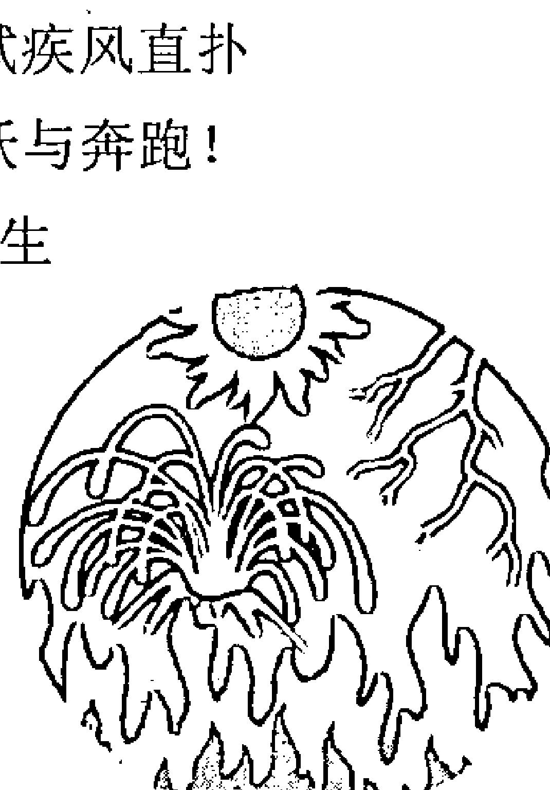

> > 我是你周围的火
> 我是你体内的生命火花
> 我是能够毁灭你的火焰
> 我是圆满无缺的！
> ——艾比·斯平纳

对于我们来说，自从我们的祖先第一次掌握它的使用方法，迈出我们作为人类的第一步以后，火一直都有一种特殊的魅力。火不仅意味着温暖和光明，而且意味着生存和死亡之间的区别。在人类和异界，现实与虚幻之间，火扮演着一个特殊的角色。火是自然界中的一种元素力量，但是它也是不同世界之间的天然桥梁，联系着自然和超自然，神圣与世俗。

在我们的现代世界中，火无处不在。它能驱动小汽车，发电，推动飞机起飞。它是我们燃烧和炽热世界主要的有效成分。与火有着直接联系的灯成为了我们通讯网络越来越重要的基础。在魔法象征主义中，火代表着运转、行动、能量的释放，以及转化。很早以前就有一种说法：火被封锁在木头中，因此树木、魔杖，或者木棍能够展现它的潜能。火的力量是燃烧、消耗、发光发热。在人们认识到一些东西可以像凤凰涅槃能够从灰烬中重生以后，转化便开始流行起来。因此，火便成了我们自身和社会转化的媒介。火便是摧毁你的愤怒和问题，帮助提升你个人能量的好去处。火的高温能够与一些像热情、热忱、热心、紧张等品性联系在一起。凭借光和辐射的能量，这些品性能够提高八度，成为例如同情、关怀、承诺、坚决、意志、决心一类的东西。

在我个人对元素的探索过程中，火是非常重要的一部分。我能使用打火石和钢铁制品，弓弦钻木法，或者一个放大镜，不用火柴就能将火点着。我已经点燃过多得我都数不过来的篝火，我也学会了在火上烹饪各种各样的美食。我了解各种木头的点燃方法。每个冬至节，建造和点燃耶稣圣诞季节篝火便是我的任务。我也曾在我居住多年的土地上参加过森林大火的扑救。而且在制作陶瓷塑像时，我还和陶器窑中的烈火一同工作。在几次不同传统的走火活动中，我也曾光着脚在火炭上走过——但是我提醒你，在没有经验丰富的老师的专业监督下，你还是不要尝试！

##### 任务：转化用火

> > ——法丽达·卡瓦拉尼·福克斯

无论何时，当你发现自己深深地关心着某件事，毅然地决定了下一步的行动方针、决心从事某项事业，或者做出并贯彻某项决定之时，你可以假设你生命中的火元素在燃烧。你可能会频繁地发现你心中的怒火，你可能因为会导致无法挽救的损失和不受控制的行为而感到害怕。这时，记住这一点对你会有帮助：愤怒的目的是为了驱使你采取行动，摆脱困境。

另一方面来说，你可能对周围的事物冷淡而且漠不关心。厌烦情绪和冷漠好像是你对生活的主要反应。在这种情况下，你就是缺乏激情，当你找到这个原因以后，你可能会想也许你曾经深受伤害，导致你内心深处的火苗已经熄灭。平时你心中可能也意识到你想要改变你的性格特质。你可能会发现自己深受羡慕和嫉妒的折磨，时常被恐惧、优柔寡断，以及焦虑纠缠。冰冷的沮丧性格可能已经将你愤怒（以及生命）的热情封冻进一个阴冷而毫无意义的内心世界之中。

在这些情况之下，火要怎样才能帮助你？你要怎样以一种安全而且私密的方式调用这种元素进入你的生活中？假设你已经进入了一个壁炉或者敞开的火山坑中，与火精灵来一次约会。小心地点燃你的火种和木头（请看下一节：“营造篝火”）。这些燃料你是提供给火的食物。你对其它你决心要关怀的生物也应该这么做。当你准备好要点燃这些材料的时候，花一点时间想想即将要发生的奇迹。当你轻擦火柴，火焰就会迸发出来。你可能想要用赐福跟火焰打声招呼，例如：“愿上帝保佑你，火精灵。”在火蜥蜴急切地舔食你为它们准备的大餐的时候，静静地看着。在火精灵获得力量并发出愉快的爆裂声——或者愤怒的撕咬声时，仔细观察。将那种爆裂和撕咬想象成一种沟通形式。火会对你说什么呢？告诉火你隐藏至深的秘密，你内心的欲望和热烈的渴望。观察火苗跳跃的方向。随着时间的流逝，火渐渐成熟，凝视那灼热的煤洞。在那儿，你看到了什么形状，那是奇异的火世界吗？

让你自己查看你自己的热情。它们是否让你的生命充满了狂暴和愤怒，它们是否放射出温暖和光明支撑着你和你身边的人？这种特性是不是告诉了你在你内心深处的那个真正的你是什么样？它是否映现了你内心的神圣之光？或许，它只是一个谎言和借口，反射出你是谁，或者别人可能认为的你是什么？你会愿意牺牲那些让你犹豫不决的事物么？你会愿意将你的恐惧抛入火中吗——或者你的嫉妒、不信任，和自我仇视？

在一片纸上写下你相信没有了它你会活得更好的品性，让火将其带走并烧毁这个品性带给你的痛苦与不快乐。甚至可以采用一种功效更加强大的方法，在你的私人物品中选择一样象征着你想要改造的品性的东西，然后将它交给火。但是你要确保你能想象出你将用什么品质代替它。随着过去的嫉妒、愤怒，以及隐藏的羞愧被慢慢烧毁，真正的本我，富于同情心的、宽容的，以及容光焕发的你就能够光芒四射，成为一盏所有人都看到的航标灯。

##### 任务：制作一个火盆 (Fire-Pot)

用一个大气锅形状的陶碗就能做一个很好的火盆。一个小小的有着传统三足的铁制大气锅也能用，但是锅口必须平整没有任何缺口才行，因为你要用锅盖盖严锅口将里面的火熄灭。将你能够找到的所有蜡烛头搜集起来，或者直接使用从商店买来的蜡。

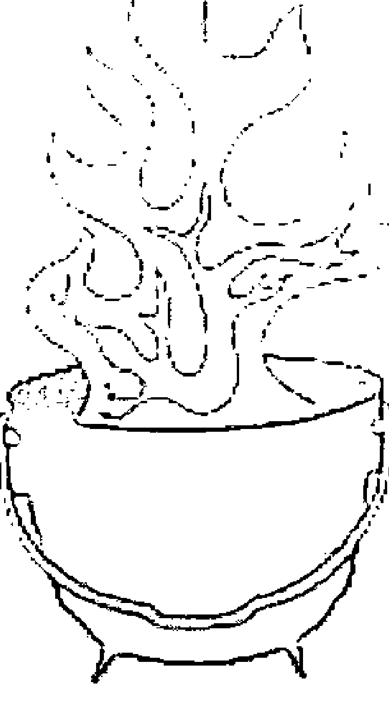

首先，你要在盆底铺一层沙土，这样底部就不会太烫。然后将一团棉布撕成小片，将它们和成一团，塞满火盆。旧的T恤衫或者旧毛巾就非常好用。在另一个（一次性）的盆或者锅（你可以在商场里买到非常便宜的）中将蜡烛头或者蜡熔化。然后小心翼翼地将这些熔化的蜡倒入盆中揉成一团的破布上，直到装满，再将几片破布竖起来。等这些蜡慢慢冷却凝固后，你就已经拥有了一个完美的火盆了。当你点着破布时，这些破布就会充当蜡烛灯芯的角色，只是火焰更大了而已。在火盆燃烧的时候要在下面垫上一些东西，比如三脚架，扁平的石头，或者陶瓷盘子，因为# 魔法师学徒的魔法书 | 上卷

盆底可能会越来越热，直至点燃盆底的木头或者布料。确保在旁边放一个大小合适的盖子，因为只有用盖子你才能熄灭火苗——千万不要想着将它吹灭。

另一种更为简单的火盆是在里面填满木醇，这种木醇点燃以后会有一种蓝色的跳跃的火焰。你需要在里面加入一点泻盐（硫酸镁）让那火焰稳定下来。

岩石、空气，以及火。盖亚的灵包含在更大的太阳系的灵之中，以此类推，也包含在我们银河系的灵之中……等等，上如是，下亦如是。

你们自己的灵进化之旅已经进行了数十亿年了，从你们的祖先回溯到生命的初期。但是，正如你们血液和细胞中的水一样，所有的灵都是一个整体——即使它们好像存在于分离的血管之中。以下是我多年来对圣灵的一种看法：

#### 第八节：灵

> 我是你身边的灵
> 我是你体内的神
> 我是照射在你身上的光
> 我是圆满无缺的！
> ——艾比·斯平纳

第五大元素就是灵。就是它给予了我们生命和意识。就像水以冰的形态存在于整个银河系，并以雨的形态降落到所有的世界和月球之上一样，灵渗透在四大元素之中并为它们带去了生命。想一想：你的灵包含着你身体的每一个细胞，每一个部分——甚至是你骨头之中的矿物质和你细胞与血液之中的水。所有元素除了灵都与它的载体同生共死。唯一的不同就在于缺乏灵——而这点不同就代表了一切。

就是因为这点，每个平面上的圣灵都在其意识中包含了所有元素。生机勃勃的地球，盖亚的灵包含并渗透我们以及其它的每一种生物——还有我们星球上的水、所有的生物就像不同大小不同形状的杯子，我们用这个杯子从灵魂之井中舀取生命之水。所有的杯子中的水都会在杯子破碎死亡之后回归到水井中。新的杯子不断地由新的陶土烧制出来，轮流地从同样的那口井中舀取生命之水。但是想要从这口井中舀出与之前杯子中相同的灵的概率是微乎其微的。通常情况下，那是很多杯水的混合物。因此，一个人可能会同时拥有几个人少许的“前世”记忆，也有可能混合了动物的记忆，或者说一个人类大小的杯子可能会容纳许多鸟类或者其它小动物的灵，但是，最多只能装下一头鲸的一部分。而且，在合理的生态平衡之下，新的一代总会代替旧的一代，这样每一种杯子的数量都是大致恒定的。

当一个物种的激增是以其它物种为代价之时，你认为会发生什么？当没有了猛犸象、洞熊、大地懒、剑齿虎，渡渡鸟、恐鸟，抹香鲸、袋狼、秃鹫，或者难以计数的其它物种的杯子，而标记着“人类”的杯子成几何倍数地增长到数十亿时会发生什么？在那种情况下，我相信，人类的灵将会被越来越多地已经灭绝了的物种稀释，而所有消失的动物将会以人类的形式回归……

恐龙迷失的灵魂成为了龙的梦……

### 第四课：回归自然

#### 第一节：简介 - 走出去

自然一直是我最重要的老师。从我还是个小孩子开始，我就一直尽我所能地单独呆在树林中。春天，我爬到树上静静地坐在那儿，鸟儿都已习惯了我的存在，因此，我可以看着它们筑巢、下蛋、抱窝、哺育它们的孩子。我也会去到草原上看着小鹿放牧，日复一日地悄悄地坐在某棵树下直到它们慢慢无视我的存在，有时还会踱到离我几英尺的位置。我会在满月之夜爬出我卧室的窗户，在暗夜之中漫步。正如我在水元素那节课中提到的一样，我是在琉璃湖畔长大的。我将气泵和软管装配在一起，这样我就可以在水里呆上很长一段时间，看着鱼儿在水底的沙石间筑巢产卵。从我三十岁到四十岁的一段时间里，我在北加州迷雾山脉（the Misty Mountains）的5600英亩未开发土地上居住了八年，没有电，没有收音机，没有电视，也没有电话，我们养殖小型的野生动物，采食野生食物，体验从地球到星星的四季的变化。我认为我的魔法基础的根源就在于这些经历，也强烈建议你们也能够尽可能多地走出去，走到自然界中。书本上学到的知识是有限的！

#### 第二节：回馈 - 像地球卫士一样的魔法师

> ——杰西·沃夫·哈丁

魔法师从神圣的、生机勃勃的地球圣灵和实体中获取力量。反过来，我们每个人都应呼吁尽自己所能去恢复、滋养，以及赞美自然界……并且保护她不受我们人类越来越严重的破坏。说到职责我的意思不是“义务和责任”，而是“承担责任的能力”！这是我们魔法师应该竭尽全力去做的事情：对眼前的急切需要承担责任，包括其中许多的危险和威胁——把我们强有力的本能和直觉联合，洞察力和同理心联合，热情和技能联合，坚定而自信的行为和实用魔法联合。

我们举行仪式，以感谢我们举行魔法仪式圈的土地，并以此来回报地球，还通过亲自动手的服务来回馈地球，比如植树和退耕还林……通过守卫力量之源，保护围绕我们神圣树林的森林，还有那些传授我们知识的植物和动物。这里有三种不同的最好的回报方法：

- 1. 通过一个社区或者组织聚会购买一片特殊的土地，重新种植，使之再次变得神圣。建立一个土地信托基金或者土地使用协议，使这片土地可以在以后受到保护。
- 2. 将你深深的爱和承诺给予一个你最喜欢的公园、临近河流或者森林——定期游览，将你自己与这个公园和居住在公园里的精灵联系在一起，了解它的意愿和需要，保证它的完整性和康乐。其中包括清理他人留下的垃圾，沿着河床种植本地的种子，与想要在上面修桥铺路、建造房屋、使之蒙羞、或者想要毁坏它的人奋勇作战。
- 3. 参与抵抗那些想要破坏和开发每一处残存的、原生态魔法区域的行为——凭借宣传教育、艺术和文章展览、请愿、诉讼，创造性的公众示威游行，以及公民非暴力反抗斗争。

和魔法一样，生态学是关系的实际应用和能量的指引与平衡，而环境保护论和科学一样，都是深深地扎根于生态灵魂。美国伟大的自然资源保护论者约翰·缪尔发现了生物与自然之间清晰神秘的关系。

奥尔多·利奥波德没有经过任何出色的结论就彻底改造了土地伦理，但是作为魔法顿悟的结果，他呼吁人类"像山一样思考"。

红杉女杰朱莉娅·蝴蝶写下了这样的话：她的灵魂与这棵叫做"露娜（Luna）"的树之间有着紧密的联系，在警察的扬声器、伐木工人电锯的包围下，以及严冬的暴风雪对其树上的居住平台的肆意攻击下，是这棵树保护着她，让她得以在一百英尺的高空居住数月之久。

真正的魔法师做事情并不是一时兴起或者能力使然，也不是简简单单地为了报酬，那是我们的职责。这是我们"伟业"的一部分，长久以来都由一代又一代的魔法师和先知、爱护地球和保护地球的勇士们肩负起这样的重任。其中包括向来都至关重要的意识的觉醒和奇迹的实现，感觉能力和情感，知觉力和敬畏之心；接地和连接，敬畏和赞美，保护和支持；勇于承担任何风险，付出任何代价，就是为了证明我们宝贵的地球——以及我们完美无瑕的心灵——告诉我们的都是正确的。

#### 第三节：外出露营

如果你可以参加夏令营或者加入童子军，我强烈要求你去。如果你的家人也打算去，那你们也许可以去国家公园进行一次家庭露营旅行。但是呆在小屋、拖车，或者旅行房车里面并不算是外出露营！如果你有朋友住在乡下的农场里，那你可以问问他们是否愿意在他们的小树林里举行野营活动。但是，即使这几种条件你都不具备，至少今年夏天你应该在你家后院搭个帐篷，睡在屋外星空下面。将露营看做是你作为一名魔法师学徒生涯中的一次基本任务。

**遮蔽物和寝具：** 首先，你需要准备一顶帐篷，睡袋，以及防潮垫。我外出露营时会把所有东西装进一个巨大的袋子里，然后将所有的帐篷拼接成一个大号的独特的多室帐篷。在所有的这些东西中，我最喜欢的是设计了防雨棚的简易圆顶帐篷，这种帐篷有多种型号，轻便、简易，一个人在几分钟内就能支起来。你还应该准备两张足够大的塑料防水布，这样你就可以将其中一张作为地膜铺在你的整个帐篷下面，如果下雨的话，另外一张可以用来搭盖你的木柴堆。

接下来，一个好的睡袋是非常必要的。你应该准备一个能够完全打开成为一张被子的信封睡袋，而不是一个只能在一边打开的“木乃伊型睡袋”。就个人而言，我讨厌那些尼龙衬底的睡袋，因为我不喜欢尼龙的触感，而且那个衬底在你自身体重的挤压下会变平，这样你就不能与地面隔离开来。我更喜欢棉绒布的衬里，和压碎的泡沫隔层，非常轻便，即使不是很紧密。你需要考察几种不同类型的睡袋，然后选一个你喜欢的。不要忘了准备枕头——如果找不到合适的，你可以就带一个拉链式的枕套，然后将衣服或者干草装到里面……

最后，你真正需要的便是一个舒适的防潮垫，即使是最小块的鹅卵石，树根，以及小树枝都会让你得不到一个好的睡眠！我见过最好的防潮垫可以卷得很紧，但是展开以后就会变得很松软。但是，如果你不用把这些物品带到很远的地方，那么泡沫型的防潮垫也可以用。充气垫现在非常流行，但是我发现它们都很重，不便于携带，充气也很麻烦，晚上也容易漏气变平，最终你还是只能睡在坚如岩石的地面上。在有些地方，你还可以收集松树的大树枝，然后在上面盖上厚厚的一层草便可以当作防潮垫使用。

**工具和食物供给：** 你还需要准备一些基本的工具和装备。重要的工具包括一把小刀和用餐餐具（我现在还在使用我参加童子军那会儿用的小刀，这样的一柄小刀就包含了很多其它的工具，包括餐叉和汤勺）——但是如果你知道怎样使用筷子，你就能很轻松在你的驻扎地找到合适的。但是你至少得准备勺子，盘子，以及煎锅。你可以在任何的露营补给商店找到极好的小“野营餐具”，里面包括了所有的这些用具，而且都整齐地装在一起的。但是，不能使用铝制的炊具和餐具！准备一些铁制的，虽然价格会偏贵一些。因为铝离子有害于神经元细胞。能在炉火上使用的烤架也是非常实用的。还有，不要忘了带点火用的打火机！

其它基本的露营物品包括简单的急救药箱（里面一定要有消炎药膏和绷带！）、手电筒（尤其是那种可以当做野营灯使用的手电筒）、厕纸、可以折叠的用于挖厕坑的露营铲、指南针、双筒望远镜、照相机、好用的杀虫喷雾、高倍防晒乳、笔记本、钢笔、手表、毛巾、金属镜、各种尺寸的塑料薄膜袋、一捆结实的麻绳、尼龙绳，甚至还可以带上钓鱼用具。不要忘了个人卫生用品，比如肥皂（洗手和洗盘子的）、发梳、牙刷，以及牙膏。同时还要带上垃圾袋子以便随时清理垃圾。做几张针对不同季节不同类型的露营核对清单，这样就不会忘记任何必需品。

当然，你还需要带上足够的食物和水。可以是简单的即食麦片、坚果，以及果脯，或者如果你不介意打包随身携带的话，还可以带一些精心制作的肉制品。如果你选择带罐头食品，不要忘记带上开罐器！你得计划一天一加仑的水。如果你需要步行一段距离才能到达你的营地，你就需要一个能够装下所有物品的双肩背包。

##### 衣物：

当然，需要带什么样的衣服得取决于气候，天气，以及你需要外出多长的时间。通常情况下，我都会带上一件严实的雨披以及一顶可以折叠的宽沿帽。准备一双好质量的登山鞋、充裕的袜子，以及内衣，白天穿的轻便服装，以及晚上穿的保暖衣物。在营火边取暖的时候，我的魔法斗篷（请看课程之三，第三课：“魔法师的行头”）就派上用场了，在我睡觉的时候，它还是一件很好的盖毯。

> > 重要提示：不要单独一个人远足或是露营！一定要带上一个同伴。这样，不管是哪个遇上意外，旁边都会有人帮忙——或者去寻求帮助。

#### 第四节：课程 / 任务：安营扎寨

> > 理想的扎营位置应该有树、水、有草覆盖的地面、微斜的地势、躲避恶劣天气的屏障，以及开阔的视野。一处营地要满足所有的这些条件非常困难，但是能够满足的条件越多越好。在选择任何的营地的时候，都要避开天然的危险地带。（《童子军外业手薄》，1978年版，第50页）

选择营地并决定在哪儿扎营需要有诸多考虑。首先，你要选择一块尽可能平坦的位置来搭建你的帐篷，还要尽可能靠近营火。如果地面坡度太陡，早上醒来时你会发现自己睡在帐篷外面！然而，天有不测风云，如果下雨，你就会希望你的帐篷搭建在缓坡上以便排水。在这种情况下，你就应该在你的帐篷周围挖条简单的排水沟，这样雨水就会沿着沟道流下山去。另外一件需要考虑的重要事情就是你营地周围的其它生物。要学会辨认毒葛、毒栎、荨麻、荆棘、蓟、仙人掌，以及其它危险植物，千万不要在临近它们的地方扎营！当然，要确保你的帐篷没有搭建在蚂蚁窝的头上——尤其是（生活在美国某些地方的）火蚂蚁。树是非常重要的遮阴工具，早上太阳的照射会让你的帐篷变成烤炉，我将这种情况称为“烤醒”帐篷。因为一般搭建帐篷都是在晚上，所以搞清楚太阳从哪边落下，就能知道它会从哪个方向升起——也就是东方。因此，你就需要确定在你搭建帐篷的那面会有一些成荫的树木。然而，除非你扎营的地方不可能下雨或者刮风，不然你就最好不要将你的帐篷直接搭建在树下，因为下过雨以后，树叶还会在很长一段时间内不停地滴水，而在暴风天气时，大根的树枝还可能会折断掉落。

安营时你还得避开那些露出头来的大块树根或是岩石。在你搭建帐篷之前，你需要非常仔细地清理开所有的岩石，鹅卵石，树枝，小枝桠，松果，等等类似的东西。然后在地面上铺设一张塑料布防止地下蒸发的水分。而我建议在帐篷门口放一张小毯子或者阿斯特罗特夫尼龙草皮（Astroturf），以便你在进帐篷时可以擦脚。

#### 第五节：课程 / 任务：搭建篝火

没有什么可以取代在夜深的时候，和亲密的朋友围坐在篝火旁畅聊。就像我之前在课程之一，第三课第三节：“魔法的起源”中所说的一样，火是我们的第一种魔法——它一直在呼吁我们去寻找源头。你在接收魔法师训练，所以你就应该学习怎样搭建篝火，因为如果有魔法师在的话，那么搭建篝火的任务就必定会落在魔法师身上！

不要将食物放在帐篷外，即使是放在冰箱中也不行，因为一些动物会来偷食。我遇到过浣熊、野猪，甚至是蚂蚁，它们都能彻底毁了你第二天的早餐食物——一看就知道不是熊干的。大多数的动物都不会来你帐篷里偷东西，但是如果你选择在熊的地盘上扎营，你就需要将你的食物装在袋子里，在远离帐篷的位置，用一根尼龙绳悬挂在一株悬伸出来的树枝上。将另一端系在较低矮的树枝上，需要的时候再将它们拿下来。

当你拔营准备离开时，要将营地恢复到之前的状态。将所有的人造垃圾残骸收集起来打包带走——纸片、罐头、空瓶子等等——即使有些不是你带来的。除了踏平的草地，不能留下任何你曾在那儿露营的痕迹。然而，在某些地方，你可以保留火坑，留给后来的露营者，但是要检查清楚会不会有问题。

挖火坑：首先，选好挖坑位置。确定是一个开阔的地点，周围没有会引火的树枝！火堆的十英尺范围内必须是一个无障碍的空间，并清理干净只留泥土和沙石，确保没有可燃物。火坑的大小以及周围的座位区视参与人数多少而定。在这个区域的中间，挖凿一个洼地。即使只有一人参与，这个洼地的直径至少也要两英尺（按照需要酌情加大）。在洼地边沿堆上泥土做成一个小型的坑洞。如果附近有石块，在火坑边上将他们堆砌成墙，然后再在石块的缝隙间撒上泥土。如果没有石块，将坑挖得深一些，使边上的泥土自然成墙。火坑的坑形需要充当透镜的角色使火焰和烟雾能够定向往上，也就像闪光灯后面的抛物面反射镜聚光那样。

点火：现在，四处去收集充足的枯树枝（不要砍伐或是折断任何活树丫来点火！）。不要费力去寻找那些绿色的或者腐烂的树枝，那样你最终也只会搞得烟雾袅绕。引火材料最好还是选些树脂松和硬木材。按照适当的长度折断，堆叠在火圈外沿，依长短依次排好，这样你就能轻松点燃篝火。如果你能将柴火轻松地折断，那么这些柴火就太嫩了，不耐烧。如果有要下雨的迹象，就用防水布将你的木柴盖起来。

如果地面太潮湿，就应该在底层铺铺上树枝、树皮，或者石块。然后再放置干树叶、松树叶，或者（最好是）从枯死的桦树上剥下来的干树皮，这些都可以作为火引子。如果身边所有的柴火什么的都受潮了，那劈开一根死树枝，你会发现里面是干的。用你的小刀将它如图切成小片，不要将刨花切断。将一些干的小树枝盖在火引子上面，松树树枝最好，这样就成了引火柴。然后选择大一点的树枝作为烧柴，将它们堆成“圆锥形帐篷”的形状，从里到外，从小到大，从短到长，一层层支起来——始终保持其是中空尖顶的。这个尖顶会将火焰引向上方，将燃烧产生的光和热发挥到最大值。刚开始的时候不要堆得太高——只要能够让火堆燃起来就可以了。

#### 第六节：课程/任务：没有火柴和打火机的情况下点火

如果你想要学习一些真正的魔法，接下来我会讲授几种不用火柴和打火机也能生火的方法：

擦出火花很容易，技巧在于怎样将火花变为火！你需要特殊的火种：非常干燥、粉状的有机材料，易燃，一接触火花就能迸发为炙热的火焰。试试鼠窝里的干草，卷曲的桦树皮，干草尖，雪松树皮，从布或者硬纸板上刮下来的棉绒，烧焦的布，或者你的夹克或睡袋夹层里的棉花。

> 重要提示：没人照看的时候一定要将火熄灭——甚至不能让它冒烟！一定要确保最后一个上床睡觉的人会用水和泥土将火完全扑灭，发热发光的炭和袅绕的烟雾也不能有。

打火石和钢制品：打火石、石英，或者其它的非常坚硬的石头在你使劲侧击你的钢制小刀时都会有火花。用你的火种捕捉火花，将其握在你杯形的手中，然后从下面轻轻地吹那个发光点，直到它燃烧起来。学会辨认打火石，如果在远足的时候遇上，捡起来装进衣兜。

透镜：放大镜可以用来将太阳光线聚焦到火种上然后将它点燃。甚至你还可以使用眼镜、双筒望远镜或者照相机里的透镜！在冬天，你还可以用冰做一个透镜。为了点燃篝火，你需要在木头中间留一个小空间，这样你就可以将干燥的火种放在火堆底部（逆风）的上风面，在几个不同的点点燃火堆。对着火苗吹气能够帮助它快速的燃烧起来，尤其是如果你能够找到一根空心管子最好，芦苇杆、或者是某种能够通气的管子都行。一旦火种被引燃，点火就差不多完成了。现在，你要做的就是往火堆里以合适的速度慢慢添加柴火，保证火焰以你想要的方式燃烧。在放置每一根木头的时候你都要小心翼翼——这纯粹就是一门艺术！手中要有一根拨火棍，以便在木柴燃烧掉落的时候能够掌控火堆不致垮塌。

##### 任务：认识你身边的树精

你可能知道，树精是托尔金的《指环王》中树木的保护神和主人。和许多自然界精灵一样，我们能够通过它们依附的树木来认识它们。因此，你就有了一个魔法任务：学会辨认你附近的不同种类的树木。找一本本地树木的小指南，学习它们的名字、叶子，以及至少13种叶子的大致形状。将你所学的每一种树的叶子和种子收集成册，记录在笔记本上，同时再将它们大致形状的简单地勾勒出来。

这儿有一些木柴的传统知识，同时还有每种树木的叶形图：

##### 13 种可作木柴的树木

橡木取暖
干老最好；
松木味香
星火四窜。

- 桦木烧太快，
- 栗树四处见；
- 山楂树最持久——
  要砍趁秋。

- 冬青树像蜡，
- 青时烧最佳；
- 榆树阴燃像亚麻，
  火焰难见。

- 梨木苹果木，
  味满房间。
- 樱桃树燃烧彻底
  味如金雀花

- 白蜡树灰色光滑，
  青老可着。
- 遇上全买下——
  与金同价。

> ——斯坦迪什·奥格兰迪翻译自盖尔语

#### 第七节：森林知识

森林知识涉及了你在荒野生存几个月所需的所有技艺。你可能从未使用过这些方法来生存，但是我认为，一名出色的魔法师应该要了解这些知识，我也是这样做的。当面对基本的生存问题之时，最重要的工具就是你手中的刀。准备一把高质量的刀。

##### 蛇

量的刀，始终保证它像剃胡刀一样的锋利。不用的时候将其折叠起来或者插入鞘中，避免刀刃破损或者刀尖断裂。

对于露营和野外生存，有几本极好的手册可以参考，里面讲述了你所需要知道的一切知识。我强烈建议你也准备一本，每次露营的时候都带上。我最喜欢的是《童子军外业手册》第二版，出版于1967年和1978年。遗憾的是，之后的版本删减了许多森林知识和野外生存知识。

在北美洲，只有四种毒蛇，学会辨认这四种蛇对你来说应该很容易。其中有三种都是响尾蛇，它们都拥有着以下的特征：三角形的脑袋，细细的脖子，厚厚的身体，背上有着钻石形状的花纹。它们是美国水蛇、美洲蝮蛇（铜斑蛇），以及响尾蛇。在美国，只有一种铜斑蛇和一种美国水蛇，但是，却有着八种不同种类的响尾蛇。

在北美洲，第四种毒蛇是眼镜蛇（elapid），属 cobras（眼镜蛇）。图中为珊瑚蛇，它们之中其实有两种难以区分的品种——东部珊瑚蛇和西部珊瑚蛇。它们颜色艳丽，有红色、黄色，和黑色的带圈，而且它们看起来与漂亮的猩红王蛇几乎是一模一样的。有个很简单的方法可以将它们区分开来，根据它们背上的颜色顺序：“红黄索命；红黑少毒。”

如果你完全不知道你遇到的那条蛇是否有毒，不要慌张！不要试图捉它、杀死它，或者以任何方式伤害它。只要绕道走开，那么它也不会伤害你。而且响尾蛇还会给你一个警告的嗡嗡声，当你一听到这个声音你就能马上辨别出来！在穿越树林的时候，你可以制造一些大的动静，并在手中拿一根行路杖以拨开你前方的灌木丛。

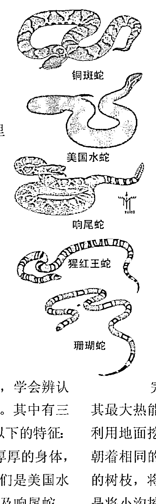

##### 生火做饭

每个行走在森林中的人都应该知道几道基本的、能够在野外准备并在营火上烹饪的饭菜。露营炊火的搭建方法跟我们之前说的那种营火火堆完全不一样，因为它是为了发挥其最大热能，而不是光。大多数的炊火是利用地面挖出的一条窄窄的沟渠，在里面朝着相同的方向一层层地摆放越来越粗根的树枝，将它们烧成炭火。最好的设计就是将小沟挖成交叉形的，这样空气就能循环吹进火堆。盆和平底锅就能架在沟上，或者放在石头上。或者你还可以将你的炊火像这样置于两根原木之间：

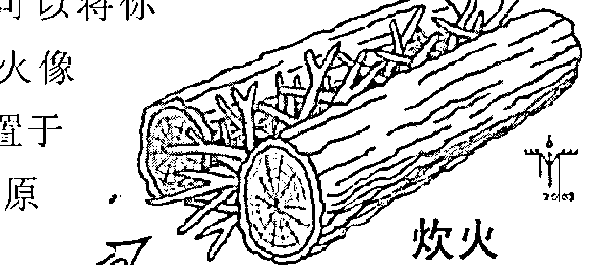

##### 建造庇所

有经验的林中人应该能够在什么都没有的情况下建造庇护所。最简单的就是利用天然洞穴、悬岩、峭壁、岩石面、大树、倒下的树，或者巨大的树根来代替临时避难所。让我们摒弃这一切，利用一个作支撑用的长原木、树枝，或者倚靠着那些倒下的树，建造一个披屋。用多层枝叶繁茂的大树枝铺建一个屋顶避雨防水。大的常青树通常可以用来替代帐篷的内层（也可以用红杉木的树洞），以改造为舒适的庇所。

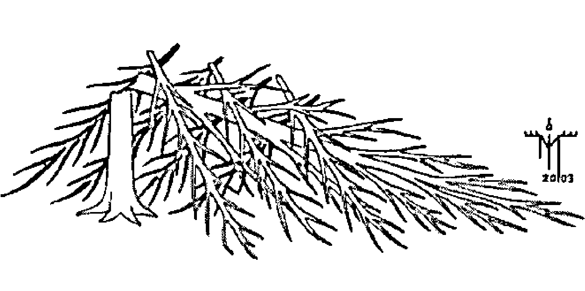

###### 任务：制作一个私人救生背包

每一个出色的林中人（以及每一个进入树林的出色魔法师）都应该装备一个私人救生背包。当我还是个孩子的时候，我就已经制作了我人生中的第一个救生背包，并一直将它放在我的露营用具中，徒步旅行时便将它放在我的口袋里。以下一个引自《童子军外业手簿》的基本条例：

首先，准备一个大小合适能够装进你的口袋中的防水箱，同时这个防水箱还要足够大，以装下你所需要的物品。最好的是那种顶部由透明塑料制成的，在运动用品商店的渔具区有售。准备好以下的物品并将它们整齐地放置在箱子中：
- （1）迷你打火机；
- （2）钢笔形小电筒；
- （3）应急蜡烛；
- （4）指南针；
- （5）放大镜；
- （6）口哨；
- （7）单刃剃刀刀片或者美工刀；
- （8）尼龙钓鱼线，规格：测试承重25磅；
- （9）各种尺寸的鱼钩，加上铅坠，假蝇和旋式诱饵；
- （10）金属线，5-10英尺，轻便而且坚韧，用于布置陷阱；
- （11）胶布，1英寸宽，16英寸长；
- （12）小笔记本和圆珠笔；
- （13）铝箔纸，4张12平方英寸大，用来烧水做饭；
- （14）各种尺寸的绷带；
- （15）净化山泉的碘片；
- （16）缝补用的针和尼龙线；
- （17）几个自封袋，用于食物保鲜。

如果你还有更多的空间，你可以再加入一些你需要的物品。例如，我将几个易拉罐切开制作了一些小箭头，几经折叠增加其纵向的强度。它们一点都不占空间，而且如果我需要（其实从未用到过），我就可以用它们和钓鱼线制作一整套的弓箭。我还装了一套小型的蛇毒解毒组件和祛痛消炎剂，它们是我从急救药箱中拿出来的。最后，你还可以在救生背包中放一张物品清单，这样你就可以更换那些快用完的物品。

#### 第八节：觅食

在过去的25年中，我所居住的地方盛产野生黑莓，在七月末到秋季这段时间成熟。我特别喜欢出去采摘浆果，我发现这是一个意义深远的静修过程。如果天气炎热，我就只穿一条短裤一双拖鞋。我认为，让黑莓的刺有同等的机会让我受点小伤，是对我自己一次小小的武艺训练。我的挑战就是小心翼翼地行动，看清楚哪枝荆棘是在等待我的失足，从那些自我防护的、纠缠的尖刺中伸出手去，摘取最多汁的那颗黑莓。我决心从张着血盆大口的荆棘怪口中夺取多汁多肉的珍品。很多时候我都会受伤，但是我会将这些不可避免的刮伤看作是光荣的战争伤疤。

你一定听说过浪漫的《猎寻千里》的故事，在这个故事中，一群古老的猎手出去猎杀猛犸象、洞熊、海豹、水牛、野猪以及鹿子来养活族人。许多故事和电影都将这些猎杀描述为最伟大的冒险，然后将兽体带回栖息地，两头悬挂起来，放在咆哮的大火上噼噼啪啪地烧烤。但是那时还存在另外一群更加重要的人，那就是这个古老的“狩猎采集”社会中通常都被忽视的那群人——采集者！即使是那个专心致志于狩猎的文明，80%以上可以吃的食物实际上都是来源于采集，而不是狩猎！

现代的男人和女人的购物模式就可以比作狩猎和采集。男人作为狩猎者走进商店：在他们脑中已有明确的目标，就直奔它而去，抓住猎物，然后回到家，得意洋洋的叫喊：“我抓住它了！”另一方面，女人是作为采集者进入商店的：她们沿着通道逛上逛下，拨开灌木丛，拔起树根，翻转岩石，并不是特别地要寻找某件东西，但是会将任何看起来美味的东西都装进篮子。

但是我却更像是一名天生的采集者，而不是狩猎者。我们的祖先究竟是怎样知道哪种植物、树叶、种子、浆果、树根，水果、坚果、蘑菇，甚至是臭虫可以吃，哪种可以入药，哪种有毒的？他们是怎样学会将不能生吃的东西——例如橡树果子或者谷物——转变为食物的？当狩猎者们制造更好的矛头、弓箭、熊套和猛犸象陷阱之时，采集者们都在学习基本的农耕技艺、草药医术、医学、药理学，以及炼金术。采集者——无论男人还是女人——成为了萨满部落，最早的魔法师。他们不仅发现了所有可食用可入药的植物，还将他们的知识记录在一本名为《草本植物》(herbals)的手册中一代代传承了下来。

##### 任务：搜集野生食物

可食用的野生植物在世界各地都能找到，而且一年四季都有。水果、坚果、浆果、树根、谷物、树浆，以及绿叶蔬菜——都可以采摘。你要做的就是学会如何辨认它们，如果煮食它们。买一本本地可食用野生植物指南，同时还有食谱。所有的书店或者露营用品商店都能找到辨认本地可食用植物的手册。然后出门去找找，看看你能找到多少并将它们采摘回来。将它们做成饭菜，献给你的家人或者魔法朋友。寻觅野生食物是一次实在的任务——尤其是可以带回足够的食物与他人分享，和着谷物一起食用，还可以烤制成馅饼。穿上适当的防护服装，带上桶或者篮子，和朋友一起出去，格外有趣——一起聊天、唱歌、斗嘴、开玩笑、一起开怀大笑，就像原始时期的采集者们一样。

就个人而言，我喜欢在一年中的不同季节行走在荒野之中，寻找生长在我周围的可口的食物。在寻觅野味来吃（并带回家）时，我感觉到了我与数千年前的萨满祖先之间深深的连系。然而，也有些植物有毒或者不可食用。有一条重要的准则是：
**千万不要吃那些尝起来苦涩难吃的东西！**

#### 第九节：捕食

许多受到完全的尊重和高度赞扬的动物都是天生的捕食者，我们人类的历史一直都囊括了捕猎和觅食。就我个人而言，我不喜欢猎杀爬行动物、鸟类，以及哺乳类动物——不管是了吃还是为了别的原因。但是从人道主义和负责任的角度来说，我并不认为这样做了就一定是错误的，尤其是对狼来讲。吃什么是个体都需要为自己做出的选择。

追踪：不管你是为了今晚的晚餐追踪它们，还是只是为了拍张照片，你都应该学会辨认附近不同动物的足迹、粪便，或者其他标记。当我来到一片存在着许多不同动物踪迹的泥沼地、海滩，或者雪地时，我都将其看作是一种骄傲，因为我能够认出大部分或者全部的动物足迹——一些细节，比如它们是奔跑还是漫步，数量是多少，它们在做什么——鹿不仅仅会留下脚印，它们还会留下另外一些你可以追随着穿越丛林的踪迹。在追踪动物踪迹时，你还可以找寻一些其它的标记——比如踩踏过的草，折断的树枝，磨损的树皮，挂落在荆棘上的少许毛发……

捕鱼：水和水中的食物来源都是我们的自然遗产。在湖泊、小溪，以及海滩上的蓄潮池里，我们都能找到大量美味的食物，比如蛤蚌、贻贝、蜗牛、小龙虾、蟹类、鲍鱼、海螺，以及鱼类。这些水产品有很多都是很容易抓获和捕捞的——尤其是蛤蚌和贻贝，它们不会逃跑！晚上，带上一柄手电筒，很容易就能抓住小龙虾和蟹类。那时，它们会成群地聚集在浅水区，只需要从它们的钳爪后面抓住背部中间，扔进袋子或者水桶里。捕鱼则需要多费一点功夫。如果你捕鱼是为了食物而不是为了休闲，那就不要管那些传统的鱼竿和渔具。小鱼有时会成群聚在浅水区，你可以选择抓，也可以选择捞。对于大点的鱼，你可以用石头和木桩等材料堆砌成鱼梁，横截水流将鱼赶入鱼篓中，或者用树杈做的带刺的鱼叉去叉鱼——将鱼叉矛头静静地置于水面之下，然后快速迅猛地刺中游到鱼叉下的那条鱼。最好选择在晚上叉鱼，因为鱼群会被电筒光束吸引，并停留在水中。

想捕捉生活在深水区的鱼需要钩子、线以及铅坠将鱼饵送到水底。在你的野营用具中装下这些用品只会占用你很小的空间，每次野营的时候带上它们会非常实用。你可以临时找一截树枝将鱼线缠绕在上面，或者就把它挂在你的手上。最理想的是活诱饵——尤其是蠕虫、蛆、毛毛虫，以及大型臭虫（所有这些小虫子都能在岩石下面和腐烂的木头中找到）。为了取得最好的效果，首先要在钓鱼的区域撒上少量的残羹剩菜，将鱼儿引诱过来，然后再用钩钩。只要你抓住了第一只，你就可以用它的内脏作为饵料。

清理活鱼是很重要的一个环节，知道怎样做同样非常重要，建议还是先找一个有经验的人传授一些技巧。我觉得，没有什么能比营火上做出来的鱼更加鲜美！

##### 北美洲几种常见的动物脚印

| 动物 | 后脚 | 前脚 | 步行脚印 | 奔跑脚印 |
|------|------|------|----------|----------|
| 兔子 | 脚印图像 | 脚印图像 | 脚印序列 | 脚印序列 |
| 松鼠 | 脚印图像 | 脚印图像 | 脚印序列 | 脚印序列 |
| 浣熊 | 脚印图像 | 脚印图像 | 脚印序列 | 脚印序列 |
| 臭鼬 | 脚印图像 | 脚印图像 | 脚印序列 | 脚印序列 |
| 豪猪 | 脚印图像 | 脚印图像 | 脚印序列 | 脚印序列 |
| 水獭 | 脚印图像 | 脚印图像 | 脚印序列 | 脚印序列 |
| 猫 | 脚印图像 | 脚印图像 | 脚印序列 | 脚印序列 |
| 狐狸 | 脚印图像 | 脚印图像 | 脚印序列 | 脚印序列 |
| 丛林狼 | 脚印图像 | 脚印图像 | 脚印序列 | 脚印序列 |

### 第五课：大自然中的探险

> > 土‘探险！讨厌、烦躁、让人浑身不自在！它会让你赶不上盛大的晚餐！我不觉得他们会从探险中领悟出什么东西。’ ——比尔博·巴金斯，《霍比特人》（第4页）

#### 第一节：简介 - 自然是最好的老师

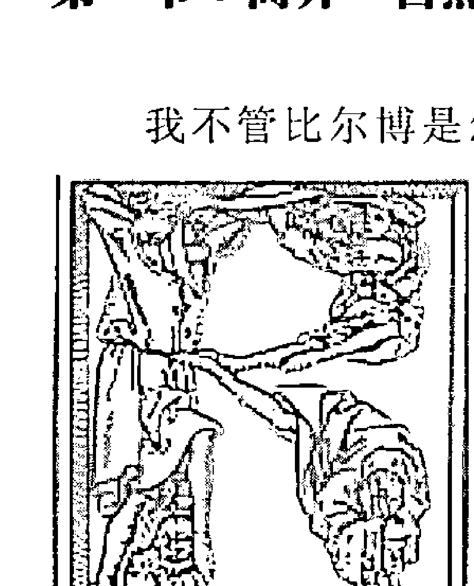

我不管比尔博是怎么想的，总之，我很喜欢探险（最终他还是喜欢上了探险）。在我60多年的人生中，我曾登上高山，潜入海底。我从遗留了史前绘画洞穴的狭窄通道中匍匐而过，用古老的石头圈阵日全食举行庆祝仪式。我还曾徒步穿越秘鲁、澳大利亚、新几内亚、以及哥斯达黎加的热带雨林。在加利菲亚的红杉树林中徘徊，在夏威夷云雾缭绕的瀑布下面清澈的水池中游泳。我曾与独角兽一起漫步在文艺复兴的集会上，也曾在南太平洋的一个咸水湖中同美人鱼一起游泳。我坐过骆驼、骑过大象、饲养过老虎和海豚。我曾在一群野生鹿群中闲逛过，还驯服过袋鼠，并从后面挠它们的耳朵。（注意：千万不要尝试将野生动物当宠物养！）我曾在高地沙漠中露宿，也曾进过死火山的火山口。我还在印加大道上漫步，在满月时探寻过他们古老的遗迹。我在天然的温泉里泡过澡，阿拉斯加州的冰川差点儿没把我冻死。我曾在海滩上的白色、黑色、晶莹剔透的沙砾中梳理贝壳。我曾与佛罗里达沼泽地中10英尺长的短吻鳄一起划皮艇，和珊瑚海中30英尺长的鲸鲨一起潜水。我也曾踏上过死亡之路，在那条路的两侧，几千几万年来的骨头和骷髅头堆积如山。所有的这些事情以及更多的……我一直将生命看作一个持续不断的探险故事。我所经历的每一次探险都传授给了我一些经验教训。其中，最重要的一课就是：自然是最好的老师。

#### 第二节：水

水——自己家里的自然——皮提亚女士（Lady Pythia）

水可以软化、塑形，还可以打磨最坚硬的石头。当你需要学得更具可塑性、适应力更强；当你在生活中遇到了困难，变得紧张而充满恐惧和痛苦；当你在学习爱与付出的课程，你的心灵受到了伤害，你可能会想要变得像石头一样坚硬以保护自己不受伤害——那么，请等一等，你该选择水的治愈力量作为你的老师。将你自己交给水，即使只是静静地躺在浴缸之中。

如果想要在家里也能得到有效的海水治疗，那么就在浴盆的水中加入半杯盐和一杯苹果醋就能达到相同的效果。这样完成一次温和洁净的浸泡，就能够将体内的毒素排出，感觉就像海水拂过肌肤一样。如果你喜欢，你还可以加点海藻。你泡澡的水能够净化你身上所有的消极能量（包括恐惧和痛苦）。水可以改变你，如果你学会将你的棱角展现出来让它净化和打磨。它会吸收你的疲倦，然后裹进盐中，净化所有你需要释放的东西。学会释怀是水教给人类最伟大的课程之一，因而，你可以更好地理解到：水，甚至是自己家中的水，都可以让你感受到那些向伟大的原始意识海洋（就像形成所有生命的海洋一样）屈服的事物正在教会你听从内心的自我。

你会发现你的性情达到了最佳状态。当然，你也可以在绵绵细雨中找到同样的安慰，站在雨中，让你的愤怒被雨滴改变，因为它们在温柔地净化大地并滋养成长中的植物和树木时，也会为你带来成长和新生。当然，如果这是你允许的。让那些落下的雨滴帮助你找到你的平衡点，并根据你的状况还你一个更加健康的、不一样的前景。

#### **河流**

在我晚年生活的十一年里（在一个地方呆得最长一段时间），我和我的家人就住在湍流河（Rushing River）河边（世俗世界的人也叫它俄罗斯河 [Russian River]……）。我们的后院有一个私人海滩和游泳池，还有一架秋千在一棵大树上悬挂着。大马哈鱼和水獭在奔流的河水中嬉戏，鹗和翠鸟在水塘中猎食，也随时都有朋友过来闲逛。在每个夏天刚开始的时候，我都会去一间轮胎商铺买回一串二手的但是不漏气的卡车轮胎的内胎。大多数周末，我们都会叫上一群亲戚朋友，带上轮胎，用卡车将所有人带到几英里外的上游地区，顺着河流飘回我们的住所——有时会走得更远。

一路上的体验教授了太多东西，这让我不由得将它看作是一次独特的魔法教学。整个旅途中，有水花飞溅的急流、有安静如碧的水塘、有巨大的岩石形成的狭窄通道、有需要跃过的高高岩石，还有沙滩和砾石滩。一路漂流下来，手臂和大腿都搭在轮胎边上，被水宁芙拥入怀中，看着这个世界从眼前经过。据我所知，这里是冥想和沉思的完美场所。通过这条河，我认识了河流。现在，我可以漂流、乘筏、乘独木舟，或者划着皮划艇以一种完全放松的状态顺流而下。我曾在哥斯达黎加的世界级河流中完成了一次可怕的急流漂流。

以下是一些我从河流中学到的最好的经验教训：

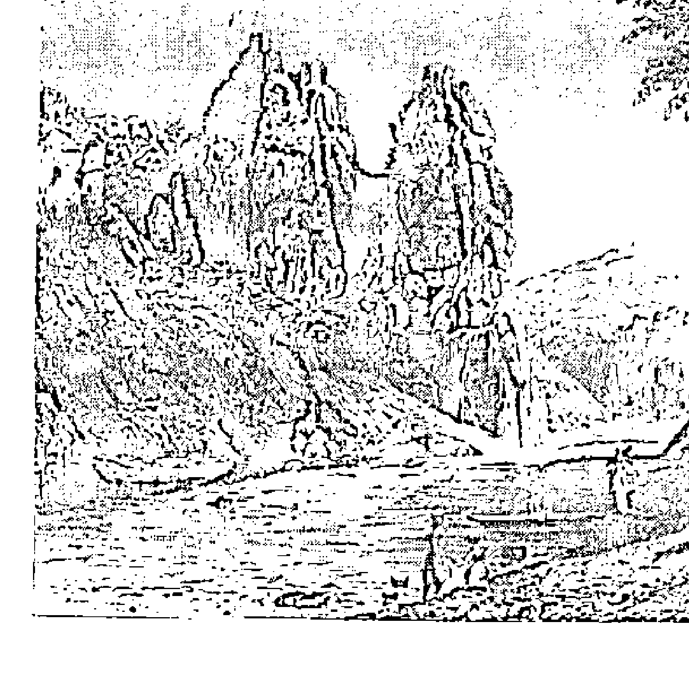

1.  **意识流就像河流一样流淌。**
    精神的移动方式和水一样。它们向来都在力图回到发源地，也总是能找到自己的平衡线。和水一样，精神能够被装入瓶中、可以转化、或者一时被阻塞。但是最后，容器都会破裂；而精神也会像水一样自由流淌，并继续开始它的旅程，顺流而下。转向，水或者精神会在周围找到一条适合的道路，并切开新的通道与原本的道路联系在一起。堤坝总有一天会被淹没和夷平，而水流还会继续——一直向着海洋的方向（它们的根源之处）。就像水流永远往低处流并与下方的海洋融为一体一样，意识流也永远都是往高处流，并融入上方永恒不灭的宇宙海洋。

2.  **顺着水流走（顺其自然）。**
    无论何时，当你遇上河流的岔道、河道中的大岩石、一根被卡住的原木，或者是前方的急流险滩——并且你不能越过它们看到选择哪条道——窍门就是看看水流的方向。不论何地，只要水流很强劲，就会在水中出现一个“V”形水流。你需要做的就是将你的轮胎下放到“V”字的中间位置。将你自已委托给水流，而不是与之抗衡，你就会变为水流的一部分，它会带着你绕过所有的障碍。通常来讲，初学者会拼命地、使劲地划，以躲避急流，而且他们会被发现自己最终被冲进了岩石、原木和堤坝之间——或者只是在原地的漩涡中不断地打圈儿，并被其他人远远地甩在身后。生活中也是一样，诀窍就是学会看水的流动方向，然后将你的问题放在岔路中间，让水流为你导航。水流的中心看起来太快也太恐怖，但是那其实是最安全的通道。

3.  **你可以徒手改变强势河流的河道！**
    每条河流都始于一条小小的溪流。如果你向着源头一直往上游走，走到足够远的位置，只需移动几块鹅卵石，溪流的河道就会被改变。再往下走，就会需要移动大块的岩石；继续往下，到一定位置的时候，就会需要移动整座大山。在我的一生中，我移动了很多的隐喻性的鹅卵石——甚至是一些大块的岩石，我还改变了已经转变为强大的狂怒激流的溪流，使之改道，而且这些激流已经水蚀了一条大峡谷，并已将山脉夷为平地。意识，就像水，不能与之负隅顽抗。另外，通过黑暗时期（现在仍在进行之中），我从这种必然之势中看到了希望，也受到了鼓舞。

###### 任务：轮胎之旅

要找一条河流或者宽阔一些的溪流，能够适合夏天的时候在里面漂流，你可能不得不四处打听。不能太小，里面的水都没有流动；也不能太窄，无法漂流；河道不能太宽或者水流不能太急，这样会很危险。能够过皮划艇的河流通常也能漂流，只要河中有足够撑起你的水流。找一些喜欢花一整天时间来漂流的朋友——至少一个有经验的成年人。再准备一些卡车轮胎的内胎，将它们充气，使其胀大成胖胖的甜面包圈的形状。穿上在水里不会自己脱落的胶底运动鞋，或者质量好的橡胶凉鞋。在你冒险进入流水之前，先在一池静水中演练几遍。如果你快翻船时，紧紧抓住你的轮胎！你还需要一辆大的轻运货车将大伙儿和你们的轮胎送到上游有急坡的河段，然后再开到漂流的终点去接应你们。刚开始的时候，先进行一些短程的轻松之旅——大概一英里的样子——当你越来越熟练的时候，就可以进行长途旅行了。跟着水流走，成为宇宙意识流的一部分。

###### 任务：回归海洋

如果你的住所离海不远，那就试着去体会体会它的魔力和神秘吧。去海边或者蓄潮池捡贝壳（但是，千万不要从蓄潮池中带走任何活物！）。成为一名出色的海洋游泳健将，学会人体冲浪（甚至使用冲浪板冲浪—如果你是在一个合适的地方）。为自己准备一套上好的潜水脚蹼、潜水面具和潜水通气管，去探索海底世界（一定要有人陪伴！）。如果那儿的海水太凉，你得穿上紧身潜水衣。如果想要获得最完美的海洋体验，那么你得去参加水肺潜水培训，获得证书，然后在一个团队和一名专业潜水老师的陪同下一起下水。

##### 海洋

我们都是伟大的海洋母亲的孩子。海洋是所有生命的发源地，我们的前人类祖先曾经回归的地方，直到现在，我们仍然能感受到它那难以抗拒的吸引力。流淌在我们静脉中的每一滴血浆从根本上说都是海水，它们有着相同的化学成分。500多万百万年以前，我们在古老的海洋中进行我们身体循环系统第一次内化。

从传统上来讲，人类是跟随水流路径迁移的。无论是沿着海岸线还是沿着河流，在有水的地方总能找到早期人类的定居点。不难想象，早期的人种（原始人类），以及后来真正的人类都是沿着海岸线和河流步行、涉水以及游泳，然后遍布全球的。如果他们曾是游泳健将和潜水员，随着人口的增加和气候的改变，这样的能力只会驱使他们继续前行，去寻觅更多的食物（菲利普·V. 托拜厄斯《水和人类的进化》）。

对我来说，水肺潜水是一项终极体验。它能立刻将我们同自然整整500百万年的遗产（比如海洋生物）联系在一起，而且还能带给我们外太空的失重体验——那里是我们命运的归宿。世界上再没有任何东西能比得上在海浪底层完全平衡的浮力中漂浮——事实上是飞翔——的这种感觉，我们身体周围海浪的涌动与我们体内海洋的脉动是一致的。我甚至怀疑我们对云霄

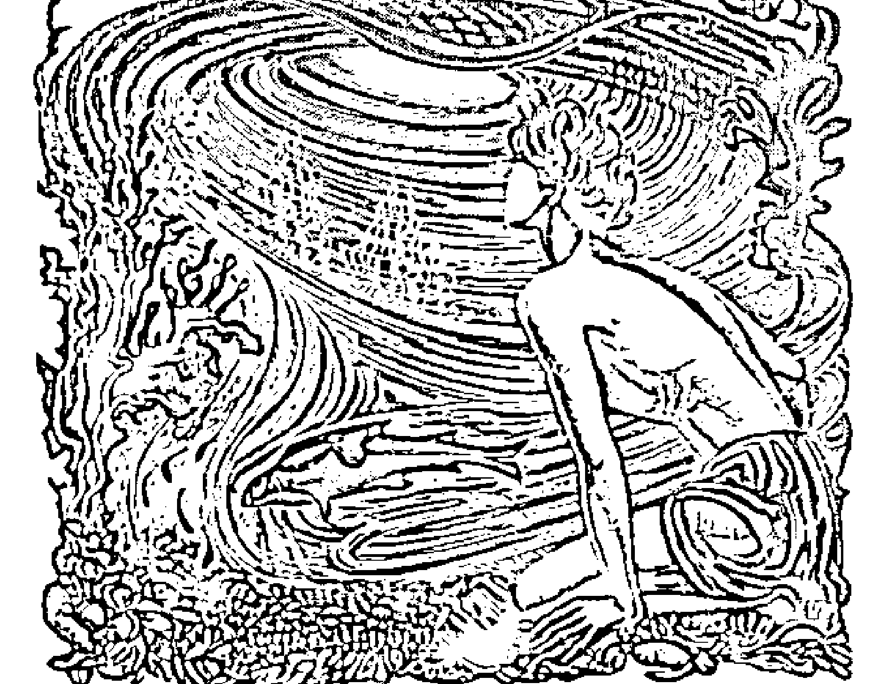# 第三节：夜

> 无情的夜幕统治了大地，
将我们眼中的色泽完全颠覆。
红是黑，黄为白。
但是我们仍能判定哪个是真相……
哪个为幻觉。
——穆迪·布鲁斯《写在梦的开头》

恐龙统治了地球一亿五千万年。在这段时间，恐龙能长到100英尺长、100吨重，而当时最大的哺乳动物都不会长过一只家猫。假如我们能从那些重新聚集、组合在一起的骨架中看出史前怪兽对我们现在的人类来说是多么的庞大，那么我们完全可以想象它们跟我们微小的祖先相比要庞大多少！恐龙完全占据着陆地、海洋、以及空气。海龙可以长到现在的鲸鱼那么长，飞龙就跟现在的小型飞机一样大。它们占据了所有的生态环境龛——当然，除了以下三点：没有恐龙会掘地而居；也没有恐龙会爬树；只有极少部分恐龙会在夜间觅食。

根据人们长久以来的设想，恐龙并不是巨大、迟钝而且愚蠢的冷血蜥蜴。它们活跃、温血（通常还带有羽毛），是一个非常特殊的种群——初龙亚纲——这一类中，只有鸟类存活了下来。和现在的鸟类一样，上天给予了恐龙眼睛，主要适用于白天，并为其设计了全彩接收器（称为视锥细胞）。只有在它们统治的末期，随着猛禽类的崛起，部分族群才通过进化得到了巨大的眼睛，里面充满了超灵敏的黑白接收器，叫做杆，就像我们现在所看到的猫头鹰和夜鹰。猛禽类——到目前为止是整个恐龙族中最聪明的一类——是第一种而且是唯一一种能够在夜晚捕猎的恐龙，就像现在的猫和猫头鹰一样。它们以什么为食呢？和猫与猫头鹰一样，它们捕食夜间活动的哺乳动物。

在恐龙统治的整整一亿五千万年间，哺乳动物想要生存的唯一途径就是通过占据那三种生态环境龛。有的哺乳动物会选择钻地（躲入地下），有的则会选择生活在树上。那些像老鼠一样的会挖洞生存在地底下的动物只有晚上恐龙睡觉的时候才出来活动。为了能够在黑夜中看得见，那些哺乳动物完全放弃了他们眼中的视锥细胞，在自己的视网膜上堆满了杆。这就是为什么现在几乎所有的哺乳动物都不能识别色彩的原因——即使恐龙已经灭绝——因为现在几乎所有的哺乳动物都起源于恐龙时代那些夜间活动的地洞穴居动物。

然而，那些哺乳动物搬到树上居住后，食肉动物就够不着他们了。这些动物包括灵长类（“最早出现的”）：树鼩，后来进化成了狐猴、猴子、猿——以及现在的人类。因为我们人类也曾居住在树上，所以就无须放弃色觉而用夜视取而代之。另外，我们本身就既有视锥细胞，也有杆。只有灵长类动物和有袋类动物保留了用全彩接收器看世界的能力；它们和人类一样，在晚上能比几乎所有的鸟类都看得清楚。

月亮被地球的万有引力束缚在地球周围，因而它一直以同样的面朝向地球。这面有一道独具特色的岩浆流区域，这片区域巨大、黑暗，从地球上望去就像是一片汪洋大海。因此，古人将这片阴影区称为 maria（“海”）。而当我们在满月天举头望月时，这些地方看起来就像是一张脸的形状。在不同的国家，月球的这些图案被看做嫦娥、月中人或者月兔（从澳大利亚看）。下一次满月的时候，试试看你能否找到它们吧。

#### 第四节：地球灵线（能量域）

不列颠群岛的的青翠山水被一些连接着地平线两端的笔直的线条画上了交叉的十字线，就像人们曾经想象的火星上的“运河”一样。这些十字线被称作地球灵线，它们是一门被广大学者研究、思考的课题——也是大量书籍讨论的对象。山丘和高高耸立的石柱以及圆形的石阵都屹立在这些线条的路线和交叉点上。数千年来，许多基督教教堂都建造在这些遗址之上。关于这些地球灵线，最大的谜团就是：它们的依据是什么？有些人认为它们是沿着地下河或者地磁流的路径分布的，并将它们叫做“龙脉”。有些人则相信它们是迷失的亚特兰蒂斯人——或者是外星人留下的路径。我曾沿着其中的一些线路行走过，也曾从格拉斯特顿堡的石山上观望过标志灵线经过地平线的方尖碑塔。另外，我还询问了在伦敦的魔法师朋友关于这些灵线的事情，他们告诉了我一个非凡的故事：在上一个冰河时期，数英里高的冰川覆盖了大部分大陆，当时海平面比现在低400英尺。英吉利海峡和北海都是干燥的大陆，直通斯堪的纳维亚，西欧看起来和托尔金的中土世界地图不无二致。横跨所有的苔原国家，大群的驯鹿进行着它们每年一次的长途迁徙——就如同在今天的加拿大，阿拉斯加，西伯利亚，以及斯堪的纳维亚的驯鹿一样。然后，它们就和现在一样，排列成一条又直又窄的队列，在成千上万年以后，它们的迁徙路径就变成了清晰的行迹——尤其是在它们 fewmets（排泄物）的侵染下，这片土地变得越来越肥沃！

当驯鹿经过以后，能够引起幻觉的伞形毒菌蘑菇便在这些肥沃的粪肥上涌现。以这些巨大的鹿群为食并一直跟随它们的游牧民族（在某些地方，这种民族仍然存在）吃了这些蘑菇以后便受到了启发。因此他们在他们经过的地平线上和高山上竖立起高高的石柱作为标记，这样人们就能在大雪覆盖了大地的情况下很容易找到驯鹿的去向。重要的十字路口便用石圈阵来作标记。多年以后，这些标记便成为了神圣的仪式遗址。因此，毫无疑问，当基督教传教士想要建造他们的教堂之时，没有什么地方能够好过这些最神圣的地方。

魔法师学徒的魔法书 | 上卷

# ## 第五节：神圣之地
——杰西·沃夫·哈丁

所有的自然世界都是神圣的……充满魔力，让人精神百倍。它们都有一些东西要教给我们，而且它们中的每一个部分都需要我们的爱护。但是同时，某些地方的情感也比其它地方丰富，会积聚更多的能量和洞察力，更容易被探寻巫师（the seeking Wizard）所发现。地方守护神（Genius loci）（“地方神 [spirit of place]”）在特定的位置，通过早期的希腊人称为充实（plenum）的魔法力量引起的地貌震动而变得活跃、兴奋。它们通常表现为某种边缘和极端，表现为对称形状和神秘物质：caverns and caves（洞穴）， waterfalls and wellsprings（瀑布和泉源）， river canyons and high mountain peaks（河谷和高山巅峰）， enchanted deserts and ocean coves（迷人的沙漠和海湾）， circular clearings and oaken groves(圆形的空地和橡树林)。

神圣的遗址有时不仅仅是经由生机勃勃的地球的意向和态度而改变的，还有惯常的尊崇和用心的维护，以及无数代的人十分投入的仪式和符咒也能引发其发生变化。几乎所有人都对众所周知的遗址，比如科罗拉多州的梅萨维德国家公园，大不列颠国地巨石阵，以及约旦-佩特拉古城，都多少有些熟悉——但是每个地区，每个流域都有着它自身特殊的位置，在此处氛围最强烈，我们的视野最为清晰，我们的梦想在此处显得十万火急，富有生机。

年轻的时候，我沉湎于沙士达山脉（Mt. Shasta）的笼罩之中；光着脚丫行走在苏族印第安人土地上的布拉克山（Black Hills），穿越森林，聆听山中松树的飒飒声；为了在查科（Chaco）的地下基瓦会堂（kivas）呆上一夜，偷偷地翻过国家公园管理局的大门。每种行为都赐予了我新的体验和经验教训，而我也试著以同样的方式来报答它们。然后，在 1980 年，我跟随了我生命中最强大的心灵启示，来到了新墨西哥州一条特别的河流的一个特定转弯处，这个地方位于美国西南部充满魔力的吉拉荒原深处。回溯到 900 年前，我们的至圣所便是古老的印第安人的仪式中心，考古学家和现代的人称这些印第安人为“莫戈隆人”，但是他们自称为斯威特医者（Sweet Medicine People）。这些日子里，学徒来到这儿和我们一起研究，他们每个人都帮助重建了神圣的意志和承诺、魔法和爱的血统。

不管是在荒无人烟的野地中逗留还是在附近一个杂草丛生的公园中珍贵和隐藏的角落中留宿，我们衡量一个地方神圣与否的途径就是看看它对我们的影响究竟有多深。开始的时候它通常会给予你一个类似于邀请函的暗示，一个征兆，或者是一种感觉。我们会感觉到此地的“居民”在观察和和考量我们，有时我们会感觉到敬畏和恐惧。当我们思维平静心灵纯洁，很快它们就会接受我们，并启发我们，指导我们，我们会倍受鼓舞，整装待发！神圣的遗址会确认我们在盖亚开启的神圣意图中的角色……而能量之所最终也会成为我们感觉更加强大的地方。

##### 峡谷

> > ——杰西·沃夫·哈丁

和大多数的小孩子一样，我经常会被周围最高的山峰吸引，向往那些可以四方眺望的山顶，并感受自己与那些迷糊的凡人之间的差距。但是一进入青春期以后，我就开始发现我自己真正感兴趣的却是干涸的河床隐匿处，也沉迷于在结实的山石上永无止境地刻画着它的方向和意图的流水。河谷是女性的化身，而我们男性则在对她的精神和形态的拥抱中寻求平衡和美丽。在这儿，我们生命中的阴阳两面相遇，并结合在一起。具有女子气质的水抚摸着我们的腿和脚掌，折射出男子气概的悬崖举起了它们如同巨大翅膀的臂膀直冲云霄。

即使是那些从未到过此地的人们也听说过这些峡谷，如非洲一些峡谷，犹他州的坎宁峡谷（Canyonlands）。和墨西哥的卡农科博峡谷（Canon de Cobre），爱达荷州蜿蜒迂回的蛇谷（Snake）和甘尼森（Gunnison）的黑峡谷（the Black Canyon），但是真实的体验当然是来自于对这些峡谷深入的探索。峡谷和河流一样，要求我们完全沉浸其中，以便得到它的魔力。我们不必选择突然坠落——因为自己的预感而颤抖，完全沉浸在潜水的恐惧之中。

峡谷是通向大地的开口，就像一个没有天花板的洞穴。它是一种获得不断增加的官能性自我认知的途径——让你与自我和他人、场所和神明的亲密关系更进一步。我还记得我第一次看见我命中注定的使命和终生的峡谷之家（canyon home）时的那个峡谷，位于新墨西哥州的希拉河，格兰德东南方向200英里的地方。从国家森林地区的停车场到至圣所需要通过七座会淹没吉普车的河流桥渡，每过一个桥渡，我们与我们的精神和躯体以及周围充满魔力的事物之间的联系就更进一步。随着峡谷越来越窄，我感觉我自己慢慢被接受，被认可，最终被牢牢抓住，我很快与这片土地坠入爱河。在这儿，我发现隐喻兑现了，发现了男性和女性的完美结合：坚硬与柔和，内在与外在，颂扬与表现。

对于有使命有抱负的魔法师来说，探寻河谷的形态与奥秘是一项神圣的任务：对其意义和位置的探索，魔法本身和有生命的精神之间充满危险的关系，富于启发的地球遵守誓言和履行承诺的环境。

# ## 井水和泉水

> > 曾经大家都相信许愿池是由精灵或者其它自然灵体保护的，在你许愿之前投下一个硬币能保证它们会听到你的愿望。最初，这些许愿池和其它的圣泉可能因为他们富含健康的矿物质而闻名遐迩。因为早期从中取水喝的人们没有意识到这个原因，他们十分敬畏这些有疗效的能力。罗马人在喝水之前会带来贵重的礼物以取悦这些水中的精灵们，从而讨得她们欢心。据说从三口不同的水井中取出水来，然后将其一半倒在地上，就能掌管病痛，治疗发烧。
> 
> ——帕特丽夏·特里斯克

我曾被位于俄勒冈州的红杉树林中，莫哈伟沙漠外，以及科罗拉多大峡谷中的天然温泉所深深吸引。有些是完全透明的，还有些池壁上有一层厚厚的白粘土，躺在里面就好像在牛奶中沐浴一样。有一个名叫温泉河（Hot Creek）的地方，浅浅的溪床上有一些大大的圆圆的洞，你可以坐在洞口，溪水淹过你的脖子，双脚悬挂在洞口上不断摇晃，感受着从洞底涌上来的温泉。如果你在水下游过这些洞穴，你的整个身体都能感觉到来自深水底的不断搅拌的巨大岩石的撞击，听起来就像是妈妈的心跳！

# ## 瀑布

> > 瀑布是奇妙的仪式和可怕的意外并发的场所。急冲下来的水流力量有着一种近似于催眠的作用，通常会引起人们的共鸣。有些人说祖先的声音在飞溅的水花中不断重复，授予我们智慧和洞察力，而他们警告的声音也在瀑布中回荡。
> 
> ——帕特丽夏·特里克斯

我曾去过几次北加利福尼亚州的约塞米蒂谷，在春天，高山上的融雪会让瀑布变得气势磅礴。那儿有些小路可供你自由上下。从几百英尺的高空飞流直下的瀑布发出的声音震耳欲聋，你会被溅起来的水雾淋得全身湿透，但是由负离子形成的五彩缤纷的彩虹所带来的兴奋感会让你惊讶得说不出话来！

# ## 潮池
—— 艾 比 · 维 诺 如 特 (Abby Willowroot)

潮池，是我们有机会在微观世界中体验海洋生活的场所。潮池可能只有六平方英寸大，几英寸深，但是它里面仍然可能挤满了各种各样的生命形态，其中一些我们会很熟悉，但是还有一此可能是你以前从未见过的。仔细观察，然后记住你所看到的东西。等到下一次退潮时，栖息在里面的很多生物都会被带走，也会有另外一些生物被带到潮池来生活一段时间，与这些奇妙的海边王国中的其它一些常住居民以及藤壶住在一块儿。你看到的潮池只会存在几个小时，然后就会永远消失，然后就会由一个新的潮池和新的生物来接替它们的位置。每一个潮池都是一个有生命的提示器，提醒着人们真正的生命是什么样的：脆弱，多变，而且无常。潮池是拥有无限奇迹的地方。人们总会去体验，去探索，但是它们从不能被掠夺。每一次涨潮都会将海洋的礼物带上岸。潮池中的宝藏都是这些小小的生物圈中的重要一环。从潮池中带走任何东西都是对另一个世界的侵扰，也是对其它生物的家园的侵扰。通过观察这些小小的魔法环境，不要因为我们的存在而打扰它们，我们便能够从中学到很多有用的东西。

##### 洞穴

从上古时期开始，洞穴就被认为是大地母亲的子宫。当我们对火的认识足够我们进入洞穴曲折的、暗无天日的通道中冒险时，我们就进入了一个充满了盲虫、鱼、蝾螈——以及装备了声纳的蝙蝠居住的世界。在人类出现的初期，洞穴成为了我们的第一所神殿。1986年，我在位于法国多尔多涅河谷的莱塞济进行了一次朝拜之旅。两万年前，克鲁马努人在难以计数的洞穴中居住了下来，这些洞穴位于高耸入云的峭壁中，处于河谷周围。在那隐藏得极深的凹槽处，他们画下了同他们一起生活的动物肖像。这是我记事本中的一些记录：1986年3月7日下午八点——于今天我们加入了一次去枫德戈姆洞窟（Grotte de Font-de-Gaume）的旅行，那是少数几个对外开放的有壁画的洞窟之一。这就是我此行的目的。而且我还惊讶地发现了一些照片上没有的东西。那些“画作”不止这么一点。自然的热胀冷缩和孔洞让凹面和凸面都很有3-D效果，不断移动的手提式油灯带来的光与影的交替为洞壁上的画作赋予了生命！比如，那些凹入墙面的脸的浅浮雕就像是跟随着你在房间中移动，这些东西拥有它们自己的生命。

当队伍出去的时候我走在最后面，为了能更好地研究这些壁画。我看到所有壁画上的动物都在往洞口涌动——变得栩栩如生。就像一个有些茫然的新成员，他同那些动物一起在寻找出口，在黎明的时候走到悬崖边上，看着大群的动物在下面的河谷中放牧。他将会明白：我们都是地球的孩子——我们都源自同一个母亲。

##### 森林

任何从未被砍伐的森林都有其自己的世界，并将我们同人类出现之前的古老原始秘密连系在一起。热带雨林是地球上最古老的生命生态系统。我们所吃的许多水果和蔬菜都起源于热带雨林。现在的雨林覆盖着2%的地球表面，但是他们却是我们地球上超过半数的动植物栖息地。热带雨林的水果和蔬菜包括：鳄梨、香蕉、胡椒、巴西果、辣椒、腰果、可可豆、肉桂、丁香、椰子、咖啡豆、可乐、玉米、茄子、无花果、姜、甜椒、柠檬、柑橘、木瓜、花生、菠萝、大米、冬南瓜、糖、西红柿、姜黄、香草、以及山药。未来的药品也会来自热带雨林。

当牵牛花和我在1977年搬到格林菲尔德大农场附近时，这片土地上草木丛生，长满了花旗松，橡树和浆果鹃——甚至还有一些红杉。然而，伐木工人在50年前就已经到过这里，并将一些区域砍伐得干干净净。现在这里一团糟——老树桩，四处都是被凿开的斑驳路面，满地都是砍痕（修剪丢弃的树枝）。在我们的主水源上方一块平坦的空地看起来就像是所有树木被萨鲁曼（Saruman）毁掉以后的艾辛格（Isengard）！我们将其命名为“枯萎的荒野”。在接下来的几年里，我们便开始在这片土地上进行每年一次的新年植树，这些籽苗都是从林业部门免费得来的。其中有雪松、考尔泰松，以及红杉——都是一些商业木材。我们种植了成千上万的树——从枯萎的荒野开始。

我们在1985年搬离了那片土地，只是偶尔举行仪式的时候才回去。几年前的一个五朔节，那里管理员告诉我们说他们要向我们展示一些东西。他们将我们带到枯萎的荒野所在的山顶，五十英尺高的考尔泰松郁郁葱葱。鸟儿在树枝上筑巢歌唱，兔子在灌木丛中蹦蹦跳跳地穿梭。这片土地中散发出一片宁静与和谐——感觉就像是洛丝萝林的精灵森林。而所有的这一切都只是我们通过为后人植树所创造出来的魔法。

丹尼尔·布莱尔·斯图尔特

##### 林中空地

有时，在茂盛的森林之中，你偶尔会遇到一片空地——没有树——甚至连树桩也没有，只有青青的草地。这种空地感觉就像是海上的岛屿或者沙漠中的绿洲。这都是私人的魔法圣地。如果发现了这样一片空地，你便可以走到空地中间，在草地上坐着或是躺下。开始沉思，并向你周围的自然世界敞开心扉。闭上你的眼睛，聆听鸟儿和昆虫的声音，它们飞起或是落下，在立体交响曲的声波中盘旋。让这些声波带领你进入一个没有文字语言国度，让这些歌曲在你的血液中流淌。

##### 精灵之环

某些种类的蘑菇会沿着地下有机物的外部长出它们的毒菌，成为一个直径10英尺、20英尺、30英尺等尺寸不等的圆。因为某些种类的精灵被认为是蘑菇的灵魂，所以这些圆就被称为精灵之环，而这个圆环就是精灵们围成圆圈跳舞的地方。有的精灵之环是由一些致幻的蘑菇组成的，甚至有的还是有毒蘑菇。你千万不要躺在这些精灵之环的里面（尤其要注意的是千万不要睡觉！）——你可能会在一个完全陌生的时代和环境之中醒来！

### 第六课：你的魔法花园

#### 第一节：简介-魔法师的花园

园艺是一门不可思议的神秘课程。有些魔法课程只能通过亲身体验种植、培育，以及收获一些给养你的身体和精神的食物和草药才能学会。我早已完全沉迷于这样的课程，看着第一片小小的叶子渐渐舒展开来，一天天长大，越来越强壮，最终变为一株植物并开放出芬芳的花朵，蝴蝶和蜜蜂赶来授粉，然后产出甘美的食物，让我的餐桌更为丰盛。

现在是五月初，我刚完成花园里一整天的工作，现在正在写下这些话。我的肌肉有些酸痛，但是我感觉棒极了！我发现种植花园是一种特殊的魔法，对于魔法师的生活来说是十分重要的。全世界没有什么能比新生命的出现更加的不可思议了——不管是人类婴儿的诞生，小狗的出生，母鸡下蛋，还是种子的发芽。在接下来的几个月中，我停下写作休息一段时间，我会去耕地、除草、播种、灌溉、培育，还有收获。你会加入吗？

如果你的后院有一些能够种植花草将其变为花园的空地，我建议你也像我一样。如果你没有这样的一个空间，也许你的朋友拥有这样一个花园，你可以和他（她）一起种植。有些城市的居民区有一个大家共享的社区花园。如果你完全没有办法找个花园种植，那你至少可以去参观一些他人创建的漂亮的公共花园。

花园有几种类型——草药园、蔬菜园、花园，甚至可以是观赏植物园。在前面的课程中，我教授了你们种植蔬菜和草药——然后在其中添加一些特殊的花种。

##### 课程之二：自然

我在此展示的一些信息可以给你提供一些好的基础知识，最终还是取决于你所居住的地方，可以适当采用。当你在购买植株和种子的时候去当地的园艺苗圃咨询一下。结识在那儿工作的工作人员，与他们交流。你甚至可以将下面的一些材料给他们，然后询问他们的意见……

##### 工具和物资

小规模的园艺只需要一些基本的工具。同样的，在你用完以后，你还应该有一个专门存放它们的地方，保证它们不受天气的影响。

铁铲和翻土叉：准备一个圆头，柄长47英寸的铁铲，用来转移泥土。同样准备一柄四齿的花园翻土叉。

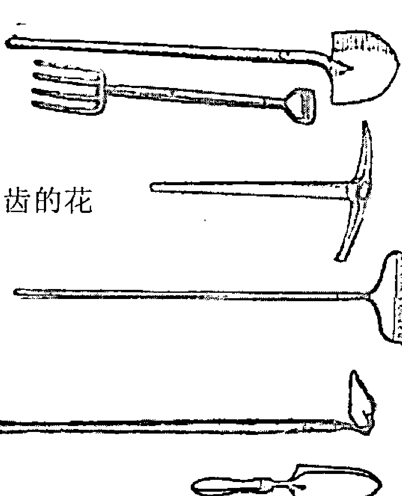

##### 成功园艺的四条准则

种植和照顾一个花园有许多要素。保持自然的平衡就能够创造一个漂亮的花园。每天都在你的花园里逛逛以感谢大地母亲和自然精灵，向你的植物传递一些积极的思想，你的照顾与关怀会得到极大的祝福。

鹤嘴锄：这样的锄头只适用于石质土壤；否则，就不用麻烦了。

钢耙：选择那种弯曲的类型，而不是手柄直接接在耙头上的那种。最好的尺寸是15英寸宽，有14个齿的那种。

- 只使用绿肥——粪肥，草坪和花园中修剪下来的枝条落叶，厨房的残羹剩饭，混合堆肥。
- 当你的植物长到一英尺高的时候，给他们盖上护根物，保持湿度，保障地面凉爽。
- 只使用天然的杀虫剂——自己用大蒜，洋葱，辣椒等等做喷雾剂。保护食肉昆虫和花园蜘蛛。用供鸟类戏水的水盆和供料器吸引鸟类前来。套种抵制害虫的伴生植物（接着往后看）。
- 最后，根据月相和兆示来种植花草。

锄头：准备一个锄板宽7英寸，锄柄长4-5英尺的锄头。

泥铲：泥铲用于挖掘一些小洞，用于放置已经发芽了的植株。

橡胶软管：你还需要一根足够长的能够从你的水龙头延伸到花园各个位置的软管，同时还要一个水雾喷嘴(或者喷雾棒)。

#### 第二节：布置你的魔法师花园

设计和布置你的花园是一种真正的艺术创作，许多人都会为在哪儿种植什么画上一张详细的结构图。如果你要建造一个大型的复杂的花园，种植很多不同种类的草药和蔬菜，这将是一个了不起的工程。

手套：一双质量好，结实的花园手套是必不可少的。

###### 魔法师学徒的魔法书 | 上卷

然而，即使是一个非常小的充满阳光的空间也能成为一个小花园。如果你没有院子，也许你可以在窗台上的花盆箱上种植几株草莓或者其它植物。

在你第一次种植花园时，有一个基本的观念就是种植一些简单的植物会给你一个好的开始。以下的介绍都建立在你拥有一个四方形的或者矩形的区域、每一边得有6-10英尺、日照充足的基础上。这些可以分为几个独立大正方形或者矩形，或者排成一行首尾相连，甚至是将你的院子分割为几个不同的部分。如果它们是一整片土地，你需要在它们之间砌上几条干净的小径，这样你就可以从各个方向进入花园中而不致踩踏到植物。如果你不能将其分为四份，至少得有一块或者两块。你会发现建造草药园是最简单的。

以尝试其它的作物——如果你有足够的空间。因此这儿有几条小贴士，保证你每年都有漂亮花园：

避免在两年里同一个地方种植相同或者相似的蔬菜。逐年改变种植的种类称为轮流种植，这对于预防土壤中营养枯竭和饿死土壤中带有的疾病生物体是很必要的。最好的办法就是像旋转汽车轮胎一样——每年在每一块土地上轮流种植各种主要农作物。基本准则是：

- 在同一块土地上用豆类（豌豆和黄豆）代替玉米。
- 用块根农作物（胡萝卜，甜菜，洋葱……）代替叶子蔬菜（菠菜，生菜，卷心菜……）。

#### 第三节：你的花园圣坛

每个魔法花园都应该有一个花园圣坛。我们的是混凝土浇筑的板凳，我们将它安放在我们蔬菜园中靠近中间的位置，就在小路旁。随着季节的更替，我会更换圣坛布，并根据年轮（详情请看课程之四，第六课）在上面摆放不同的物品。然而，最适合摆放你花园圣坛的位置是在你的药草园的五芒星的正中间，第四块土地中（往下看）。可以使一块平坦的大石头，或者是任何你喜欢的东西。花园圣坛是在室外太阳和月亮之下施放特殊魔法的神圣之地。你应该将你的整个花园看做是一片神圣的仪式空间（请看课程之四，第二课）。

- 第一块土地可以种植玉米，南瓜，和牵牛花。
- 第二块土地可以种植西红柿，香葱，罗勒属植物，以及猫薄荷。
- 第三块土地可以种植西葫芦，南瓜属植物，西瓜，向日葵，以及糖荚豌豆。
- 第四块土地可以作为你的魔法草药园。

##### 轮流种植

我推荐的这些蔬果都是适用于第一年种植的一些基本植物。第一批植物收割完之后，你也可

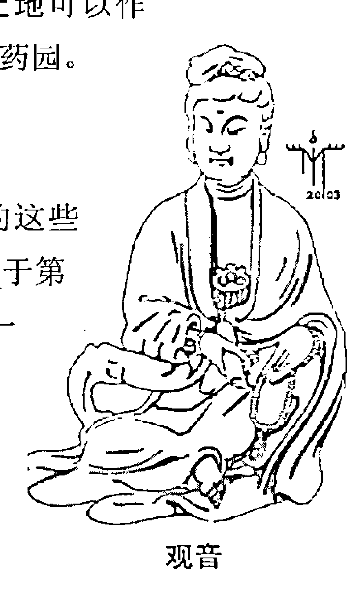

##### 花园女神：

这并不是一个硬性要求，但是花园女神对于任何魔法花园来说都是一个极好的附加物！我们在跳蚤市场挑选了几尊非常漂亮的女神塑像——刻瑞斯（罗马的谷类女神，从她的名字中我们衍生了单词“cereal 谷类”），观音，以及许革亚（Hygeia）（司治疗的女神——我们的单词“hygiene[卫生]”便是来源于Hygeia）。你应该寻找那些混凝土制作的，甚至塑料的也行，但是不能是石膏的，因为石膏会被雨水淋坏。

##### 驱邪球：

你是不是已经在花园商店中看到过那些巨大的镜面玻璃凝视球？这些是吹制玻璃做的圣诞树球的放大版，习惯上被称为“驱邪球”。它们的镜面会在你的花园周围形成一个保护咒。我们将我们的驱邪球放在我们玫瑰园中间的一个看台上。然而，真的不太需要摆放太大的驱邪球——甚至是一个足够大的圣诞节装饰球也行，只要它的镜面够朴素。它也可以摆在你的花园圣坛中间，作为一个完美装饰品。

##### 稻草人：

尽管愚笨的稻草人可能会吓坏那些鸟儿，但是我仍然喜欢在秋天的时候，在我花园里摆放一个稻草人，这只是为了沿袭传统习俗。在所有的谷物收割了以后，将谷物的茎秆绑到一起，用旧衬衫将它们打扮起来，用一张纸或者一块装满树叶的布就可以做成一个头，再给它戴上一顶大草帽。我将它看作杰克·斯特劳（Jack Straw），在收获的季节被砍倒的绿人的鬼魂。它的最后一次露面是在夏末节（万圣节前夜），以杰克·兰登（Jack O’ Lantern）（南瓜灯）的身份。

##### 鸟儿戏水池：

在你花园旁边摆放一个漂亮的戏水池可以吸引鸟儿前来，这样便可以消灭想要毁坏植物厌害虫——尤其是啃叶子的毛虫，比如番茄幼虫。一定要将你的放在足够高度的位置将它挂在附近的树上），不然你的猫就会去捕食水池吸引过来的小鸟，还有就是要随时保证里面装满了水。

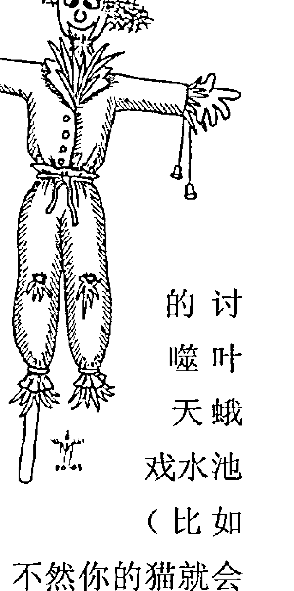

#### 第四节：你的蔬菜园

首先，在你展开实际工作之前，为你规划好了的花园画一张设计图。将你的花园地图放在一个安全的地方，以便随时拿出来参考——你可以用大头针钉在墙上或者车库和工具棚的门后。每到冬天的时候，就为你的新布局画一张新的设计图。我使用的是有横隔线的方格纸。在每一行做上标记，根据比例尺将他们分割为几块距离合适的单独片区。写下你想要种植的植物的名字，以及你打算种植的日期（往下看）。如果你的花园在一块斜坡上，那么就将你的每一块土地都横跨斜坡（译者注：成梯田状），以防止水土流失。将你最高的农作物——如玉米和向日葵——种植在北边，这样它们就不会影响小株植物吸收太阳光。

尽管我会根据月相的兆示和阶段为你提供一些有关理想种植时间的信息，但是理想种植时间并不总是能与现实相重合。大多数情况下，你会在空闲的时候，心情好的时候，阳光灿烂而且正好你也不想窝在家里的时候，去侍弄土壤和植物，打理一下你的花园；如果很长时间没下雨了，而且花园里的土壤已经失去了原有的营养结构，这时你就该下地劳动劳动了。

当然，在不同的气候带，植物生长的季节也是不一样的，植物种植的最适合和最好的时间也是不一样的。倘若你居住在热带地区或者遥远的北方，你可能无法成功种植我下面将要提到的植物，但是你居住的地方会有一些更适合本地种植的其它植物。因此，你可以在请教完你们本地的园艺师以后再做一些调整。魔法师会使用的一个很好的办法，那就是去观察哪种植物长得最好，并且常和其他的园艺大师们交流心得。真正出色的园艺大师会去观察他人的花园——伟大的园艺通常是仔细观察哪种植物最为自然并施以改进。

##### 第一块土地

玉米：种植玉米最好的时间就在五朔节和夏至期间，在第二次出现四分之一月相（残月）的时候（the 2nd quarter of the Moon）（◑ - ○）。市面上有很多品种可供选择，但是金十字矮株（Golden Cross Bantam）玉米是适合在家庭花园中种植的最好品种，因为这个品种强壮、味美、抗虫能力强。将玉米种植在阳光充足的位置有利于授粉。如果空间允许，种植三种不同成熟期的品种，分别有75，85，和95天成熟——将你的种植时间分割到几个月相期以延长你的丰收季。种植玉米的深度需要4英寸，株距12英寸，行距30英寸。如果你是为了收获更多的玉米种，那就在每个坑中播下三颗玉米，并盖上1英寸厚的土。发芽以后，留下生长壮实的那根，其它的都拔出来扔掉——但是同一根籽苗要保留最小的那根徒长枝。在茎秆长出来以后在根部周围培上泥土。

南瓜：南瓜藤会蔓延很大一片面积（大约16平方英尺），因此你需要将它只种植在一块小山坡上，就在你的玉米地的中间。在万圣节的时候你就能收获很多的南瓜！在五朔节之后的紧接着的第二次出现四分之一月相期间（◑ - ○）种植。挖一个大约2英尺宽，1英尺深的坑，然后用土壤和粪肥的混合物填满。将其堆成火山口形状的土堆，然后在坑中播下8颗种子，填入1.5英寸深的土。在它们长藤之前疏苗，留下2-4根植株，然后将每根藤引向你玉米地的几个角落。在玉米慢慢成熟期间，南瓜的叶子会覆盖在地面上保持土壤的水分。然后，在所有的玉米都收获了以后，将光秃秃的玉米杆绑在一起，南瓜就会越来越胖，并且在玉米杆搭建的圆锥形帐篷中慢慢变成橘黄色，并扎个稻草人守护在周围。

牵牛花：在你的玉米种下以后的第一次出现四分之一月相之时（○ - ◑），在你的玉米地里撒下牵牛花种子。头天晚上便将牵牛花种子浸泡在温水中，在每一株玉米秧苗旁只撒上一颗牵牛花种子，在上面覆盖上0.5英寸厚的土壤。它们会缠绕在玉米杆周围，开出漂亮的花朵，并吸引蜂鸟的到来。

##### 第二块土地

**西红柿：**在霜冻一结束后就将你的西红柿种下地。在第二次出现四分之一月相期间（◐-○），将它们种植在向阳的位置。西红柿需要移栽，不要试图让它们从种子开始萌芽生长。当它们在苗圃中长到6-8英寸的时候挑选合适高度的秧苗，种植的时候株距4英尺，土壤厚度以覆盖植株茎秆的一半为准。在你的地里种上四株西红柿就足够了，而且你还可以尝试四种不同的品种。你还需要几个大的西红柿笼子来支撑不断生长的植株。每天都要检查，保证西红柿主干在笼子里面。西红柿种好之后只在播种期授粉，否则你最终得到的只有漂亮的叶子，很少的果实！

**香葱：**在春分（Ostara）和五朔节之间，第三次出现四分之一月相（○-◑）之时，在你西红柿地的外围种上几丛香葱，与其他几块地保持距离。最好的办法是购买一些秧苗。将几丛秧苗种在一起，大约3/4英寸深。第一年以后，你就可以将丛生的香葱分开，分别种植在不同的位置。香葱可以抵制蚜虫类的害虫，所以，为了保护我们的玫瑰，我们在院子周围的好几个地方都种有香葱和野洋葱。

**罗勒属植物：**在你的西红柿地里种上几株罗勒属植物。在第二次出现四分之一月相期间（◐-○），选择一个温暖的天气将种子播下。秧苗长到一英尺高的时候进行疏苗并施肥。

**猫薄荷（Nepeta Cataria）：**在第二次出现四分之一月相期间在你的西红柿周围种上一些猫薄荷，以抑制跳蚤甲虫的滋生。保持其在地面上伏长，并定期修剪直立的嫩枝，否则它会长到3英尺高，拥挤你的罗勒属植物和西红柿。

##### 第三块土地

第三块土地是留给南瓜属植物和瓜果类植物的，它们会占据大片的土地，但是只会伏地生长，植株很矮。我建议你的第一个花园最多种上三株这样的植物，株距大约6-8英尺，成三角分布：一株西葫芦，一株小青南瓜，以及一株西瓜（如果你有足够的水用于灌溉）。这块土地的上半部分被高高的向日葵和攀枝的豌豆和黄豆所占据。

**西葫芦：**单独一株西葫芦就会产出大量的可供你食用的西葫芦，你还会想要将它们送给每一个路过的人！在第二次出现四分之一月相期间（◐-○），在火山口形状的坑中填满粪肥，点上几粒种子，和南瓜的种植方法是完全一样的，疏苗，只留下两根秧苗。

**冬南瓜：**冬南瓜的主要品种有白脱奈特（Butternut），哈伯德（Hubbard），以及橡果（Acorn）。我建议你种植小青南瓜。在第二次出现四分之一月相期间（◐-○），在一个火山口形状的窝中撒下半打的种子，同样地最后要疏苗，只留下两根秧苗即可。

**西瓜：**我推荐的品种是黛西女王（Dixie Queen）。如果你居住在寒冷气候区，你最好还是选择新罕布什尔小西瓜（New Hampshire Midget）。在第二次出现四分之一月相期间（◐-○），在火山口形状的坑中填满粪肥，在一英寸深的位置播下 4-8 粒种子，和种植西葫芦一样，但是要在土壤中加上一些沙子。当籽苗发育完成以后，疏苗，留下最强壮的那株。定期浇水，一次浇透。虽然种西瓜和吃西瓜都很有意思，但是它们并不是很好的“起动作物（starter crop）”，因此你最好请教一下你本地的园艺师。如果种植西瓜并不合适，尝试在你准备种西瓜的位置种植一些夏南瓜代替，可以效仿上面所提到的种植冬南瓜的方法。

##### 向日葵:

向日葵可以长到 12 英尺高，开出巨大的花朵，并产出几百颗供人和小鸟食用的美味的葵花籽。在西葫芦、南瓜，以及西瓜之间种植几株向日葵，构成另一个三角形。在初春第一次出现四分之一月相期间（○-◐），当地面的霜冻一结束，便在深耕、撒了石灰、施了肥土壤中种上向日葵。在每个洞中播下 2-3 颗种子，盖上 0.5 英寸的土壤。籽苗长出以后，只留下最强壮的那株。茎秆较高的品种需要用桩固定，并用一条布巾松松地系在木桩上。定期浇水，并在春夏期间施几次肥。

##### 豇豆 pole beans:

在每株向日葵下面种植一些豇豆，这样向日葵就可以作为豇豆的支架。红花菜豆（Scarlet Runner Beans）会开出火红的花朵以吸引蝴蝶，还会结出紫色的可以食用的豆荚，但是它们的味道并不是最好的。我认为最好吃的豇豆品种是肯塔基州蓝湖和肯塔基州奇迹（Kentucky Blue Lake or Kentucky Wonder）——但是在种植之前还是先请教一下当地的园艺师，看看他们的意见如何。在春季之初便要种上豇豆，和你种植向日葵的时间一样。将 4-6 粒种子播在 2 英寸深的土壤之中，并最终留下 2-3 株最好的。随着它们的生长，可能会需要你帮助它们找到向日葵的茎杆。在夏季的时候施一到两次肥。

豇豆品种是肯塔基州蓝湖和肯塔基州奇迹（Kentucky Blue Lake or Kentucky Wonder）——但是在种植之前还是先请教一下当地的园艺师，看看他们的意见如何。在春季之初便要种上豇豆，和你种植向日葵的时间一样。将 4-6 粒种子播在 2 英寸深的土壤之中，并最终留下 2-3 株最好的。随着它们的生长，可能会需要你帮助它们找到向日葵的茎杆。在夏季的时候施一到两次肥。

##### 套种

在上面的内容中你可能已经注意到了，许多花园植物种在一起会长得非常好，它们会以不同的方式来帮助对方。某些植物甚至可以抵制害虫对你的花园的破坏。聪明的园艺大师都知道这一点，他们会利用“套种”来将这种效果最大化。这里还有几种你可以在你的魔法师花园中种植的套种作物。其中一些适合在你的蔬菜间种植，其它的可以种植在你的土地的边缘，或者你的院子周围。

金盏花是一种可以开出橘色或者黄色花朵的万寿菊，它也可以防虫。染色以后还是一种防腐剂。
猫薄荷可以减少西红柿上面的跳蚤甲虫。
香葱可以抵制玫瑰上的蚜虫，（尤其是黄玫瑰，特别能够吸引讨厌的日本金龟子！）。
大波斯菊和金鸡菊可以抵制昆虫。
万寿菊和豆类套种可以抵制大部分的甲虫。法国万寿菊（孔雀草）会吸引线虫类昆虫，所以将它们作为一种“诱虫作物”种在另外的地方。
薄荷和芥末可以防止卷心菜虫害。
旱金莲花可以驱除蚜虫，而且那种可食用的种类比芥末含有更多的芥子油。在做沙拉和清炒时候放一点吃起来味道好极了。
除虫菊是肯定应该种在你的花园中的——不仅仅是因为它们很漂亮，而且还因为它们有杀虫的作用。
洋葱可以驱除切根虫。
鼠尾草可以驱除蚂蚁和卷心菜虫害。
绿薄荷和艾菊可以驱散蚂蚁。因为它们长得很高，所以可以将它们种在厨房的墙边。

朵出现的时候就要收割草药了，一定要在花朵开放之前。一般都认为魔法草药在仲夏节的时候收割药效最强。当朝露散去，割下茎杆，温柔地清洗。将它们绑成一束束的挂在阴暗通风的地方。阴干以后，茎和杆中的油便会流入叶子之中。两个星期以后，剥下叶子和花朵，将它们储藏在密闭的罐子之中，贴上标签。

#### 第五节：你的魔法药草园

许多有魔法的人（尤其是魔法师！）会将他们的药草园设计为五芒星的形状。你的第四块土地的形状尺寸应该合适。你可以用砖头，石块，或者用钉子钉在一起的编织木板（我们的是用砖块拼成的）将你的花园分割成五芒星布局。一个五芒星会有五个间隔合适的三角形空间，也为魔法、治疗，以及烹饪药材做了很好的一个空间分类。五芒星中间的位置也为你的花园圣坛提供了一个完美的位置，这儿就是我建议你设立魔法圣坛的地方。

按照理想的做法，所有的药材都应该在出现第一次四分之一月相（○-◐）期间种植。疏苗的时候要毫不留情。只留下那些最强壮的籽苗，给予它们成熟的空间。要保持苗床定期锄草、土壤湿润、定期松土，保证良好的排水。最重要的是要和你的药草交谈，让它们知道你爱它们。在花朵出现的时候就要收割草药了，一定要在花朵开放之前。一般都认为魔法草药在仲夏节的时候收割药效最强。当朝露散去，割下茎杆，温柔地清洗。将它们绑成一束束的挂在阴暗通风的地方。阴干以后，茎和杆中的油便会流入叶子之中。两个星期以后，剥下叶子和花朵，将它们储藏在密闭的罐子之中，贴上标签。

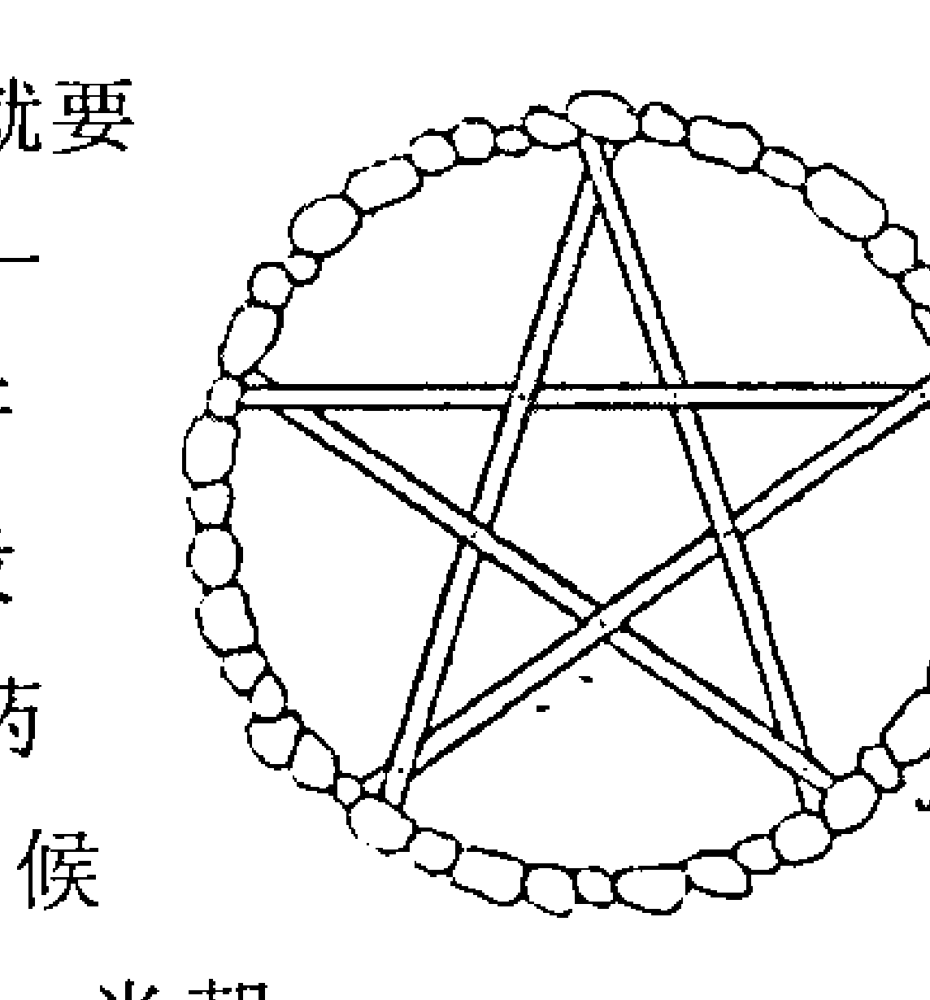

以下是一些多年生的拥有多用处的草药精选品种，选择其中的五种——在你的五芒星的五个区域之中。我还标注了它们的拉丁名字，以及它们会长到多高，当然还有它们的一些用途。这些都是使用秧苗种植的最佳选择，你还是得请教一下当地的园艺师，然后决定哪种会在你的花园中长得最好，哪种会更适合你们那里的气候。

洋甘菊（西洋甘菊 Anthemis）（3 英尺）：洋甘菊可以泡制一种非常流行的茶，可以缓解神经紧张，帮助睡眠，而且还是一种很好的通用焚香。放在浴盆中，可以让你得到放松，并缓和皮外疼痛。在你的魔法袋中装入一些洋甘菊绝对可以对他人造成影响。

牛膝草（神香草 Hyssopus officinalis）（2 英尺）：牛膝草具有防护性能，可以驱邪。在窗户上用钉子挂上一束可以驱赶魔鬼。洗澡的时候加上一点牛膝草的叶子和花可以缓解和消除身体的疲劳。牛膝草的叶子泡的茶水可以触发激# 魔法师学徒的魔法书 | 上卷

香蜂草（香蜂花 Melissa officinalis）（2英尺）：称为“蜜源植物”，因为蜜蜂很喜欢这种花。可以作为爱情御守（定情信物）佩戴在魔法袋中。叶子可以泡制出非常棒的茶水。在棉布包中装上压碎的香蜂草叶，放入浴盆中泡澡可以镇痛催眠。

薄荷（留兰香 Mentha）（3英尺）：包括胡椒薄荷和绿薄荷。是茶和甜味食品中很好的一种添加物，制作成薄荷干或者腌制品可以用于止血和沐浴添加剂。咀嚼新鲜的薄荷可以让你的语音变得美丽动听。

艾蒿（艾草 Artemisia vulgaris）（3.5英尺）：艾蒿可以用于占卜和预言梦境，因为它的芳香可以增强意识。同样的，它还可以触发激情、促进友情。在进行长途徒步旅行的时候，在你的鞋里塞上一些艾蒿叶子可以缓解疲劳。

芸香（芸香 Ruta graveolens）（2.5英尺）：因为它有保护性的特性所以被称为“仁慈的草药（herb of grace）（注：herb of grace 也是芸香的意思）”，焚烧干的芸香叶子可以驱散邪恶和仇恨。芸香对视力有好处，包括眼睛和心灵。

鼠尾草（琴柱草 Salvia）（2英尺）：鼠尾草的拉丁名的意思是“被拯救”，因为这种草药有很多用途。在沙拉和火鸡里加上一点鼠尾草会别有一番风味。鼠尾草茶可以缓解痰咳、肺充血、扁桃体炎，以及喉咙痛。还可以帮助去除口臭，牙龈出血，以及口腔溃疡。还可以将捣碎的新鲜鼠尾草叶子敷在蚊虫叮咬的位置。将鼠尾草捆在一起便可以充当很好的烟熏草药棒（smudge sticks）。

#### 第六节：花园的培育

##### 翻地

在真正开始种植之前的很长一段时间内，你都需要在你的花园里进行一些准备工作。大多数有经验的园艺大师会在前一年的秋天便将土翻好，让其在整个冬天经受外界的风吹日晒。你需要做的第一件事情（也是目前为止最为繁琐的工作！）就是将地里生长的所有植物都除尽。如果是高株的野草，只需戴上手套将它们连根拔起，然后堆放在你的花园周边。随后，你便可以开着割草机对那些较矮的草株进行修剪，将剪下来的草堆放在之前堆放的杂物上面。

在土壤变干了以后，便开始用铁铲翻土，然后再用你的翻土叉、锄头，和耙子将土块打碎。这是一种很好的锻炼，如果你再叫上一些朋友来帮忙那将会更加有趣！在劳作的时候，一定要退着走，以免将你已经松过的土踩实。如果你已经将你的有机垃圾做成了堆肥（往下看），将那些堆肥撒到地中与土壤一起和匀。同样的，你也可以撒上一些动物性杂肥（马和火鸡的粪肥极佳——而且通常情况下你会发现一些马厩和农场主会非常乐意卖给你一些粪肥，甚至会免费赠送给你）。

当你已经完成了所有的开垦和翻土，我们最喜欢的就是用一张巨大的黑色塑料薄膜（所有的五金店都有售）将整片土地盖起来。太阳会烘烤薄膜下的土壤，晒死所有的草根、野草种子，以及大部分的害虫。一个星期之后便检查一下，确保薄膜下面已经不再有还活着的野草。当土壤被充分烤熟了以后，你会发现不会再有残存的绿色植物，此时便可以将薄膜拿走，而清理草丛的工作也就结束了。然后就用耙子将土地耙平，清理出你的小路，挖排水沟，垒土，准备火山口形状的、放置种子和秧苗的坑。

##### 育苗

现在在我们的花园中，我们种植的几乎每种植物都是从秧苗开始的，这些秧苗在春天的时候几乎在每个地方都有卖。这是最简单的方法。在你第一次开垦花园的时候我强烈建议你去购买秧苗。然而，我在上面提到的有几种作物也可以从种子开始成功种植（尤其是玉米和南瓜），我还是愿意鼓励你尝试一下这样种植，因为从种子到收获的整个体验是最具魔法效果的。

直接在土地中种植种子面临的问题就是鸟儿都很喜欢这些种子。要成功地保护好你的种子有一种办法就是自己育苗，然后再将籽苗移栽到你的花园中。有些种子在种植之前需要轻微地切片（割破种子皮 [scarification]）；有些种子在萌芽之前需要放在冰箱里一个月（种子层积沙藏 [stratification]）——仔细阅读包装上的说明。

在头天晚上将你的种子浸泡在一碗水中，然后将它们取出分层摆放在几层湿纸巾上。将它们折叠起来放在盘子里。
保持纸巾湿润（但是不要泡在水中），每天检查一次。如果你看到有小小的根冒出来，此时就可以进行下一步了。

所有的园艺用品供应商店都有用于育苗的小泥炭球，因此，你可以购买你所需要的数量（一棵秧苗一个）。准备一个烘焙用的盘子或者家用塑料托盘，将泥炭球在盘子上排成一排。然后将它们浸泡在水中直到它们变软膨胀，在盘子底部保持1/4的水。用一个尖头的工具在每个泥炭球上挖一个小洞，小心翼翼地插入育苗种子，根部往下。用松散的泥炭将它们轻轻地盖起来，将盘子放在有光照的窗台上。要注意加水，保证泥炭不被晒干，等待幼苗的出现。循环利用那些没有发芽的泥炭。当秧苗长到6英寸高的时候，你就可以将它们移栽到你的花园之中。很小的秧苗仍然容易受到蜗牛、鼻涕虫和臭虫的伤害，因此你可能想要储备一些可供替换的备份秧苗，或者等它们长得更大一些再移栽。

##### 地面覆盖和除草

一旦你的秧苗在地里很好地安顿了下来，而且长到差不多1英尺高的时候，你就应该在它们周围垒土做护根，一来可以压制野草的生长，二来可以减少水分的流失。这样做可以让植物有一个舒适的生存环境，同时也有利于线虫和蚯蚓的存活。我们通常会用稻草和树叶护根以达到这样的目的，但是我们发现最有效的护根还是旧报纸。储存一堆旧报纸，然后将几张报纸重叠地铺平在你的小小的植物周围，尽可能多地覆盖那些裸露的土壤。然后在报纸上堆放足够的稻草和树叶，防止被风刮走。在植物的整个生长期，你都要注意检查你的花园，因为有些杂草不知怎么的躲过了烘焙和地面覆盖，将它们连根拔起，这样它们就不会和你的作物争养分了。

##### 灌溉

你必须保证你的花园水分充足——尤其是如果你像我一样，居住在夏季少雨的地方。你要将水浇在土壤和根上——而不是叶子和花朵上——尤其是给西红柿浇水的时候要注意，如果西红柿的花是潮湿的，它就不会结果。对于一个小花园来说，你可以简单地每隔几天就一株植物一株植物地挨个浇透水就好。如果你在每株作物的底部都垒上火山口形的泥土，这样的灌溉效果会更好，这样每株植物都能吸收一小池的水。多年来我一直都是这样做的，效果很好。这样你就可以定期地进到花园中浇水和除草。或者你也可以用特殊的、可以滴水和透灌的软管装置一个滴灌系统。但是这样会花费很多的功夫，而且相当复杂（软管和定时器的造价也很高，等等），因此如果你想要安装那样的系统，你可能会需要一些专业的帮助。

> 重点：千万不要在一天之中最热的时候灌溉你的花园，

> 滴落的水珠会像小型放大镜一样聚焦阳光，灼伤秧苗的叶子！

##### 制作堆肥

魔法生活中最重要的部分就是循环利用，而循环利用的第一步就是将你的有机垃圾做成堆肥。在厨房里放一个有盖的用于盛放堆肥材料的桶，将你所有的残羹剩饭倒在里面，除了骨头。一些最好的堆肥材料就是咖啡渣和压碎的蛋壳。将蛋壳储存起来晾干，然后将它们捣烂成粉末。将这些粉末撒在室内植物，花园植物，以及玫瑰花的土壤周围。或者将它们整个埋在你的植物周围。蛋壳里含有可以保持你的花园健康强壮的矿物质。
.在你的花园附近留出一个位置放置你的覆盖物堆和堆肥堆。每隔几天都在你的堆肥堆的中间挖个洞，将桶里的残羹剩饭倒进去，再用覆盖物和泥土盖严实。在你做这些的同时用铁铲翻动堆肥，第二年你就会为你的花园创造一个肥沃的营养来源。你翻动的次数越多，效果就会越好（臭味也就越轻）。你也可以用塑料薄膜将它盖上保持温度。在你翻地准备种植的时候便将你的堆肥撒到地里，然后就开始为下一年堆积下一个堆肥堆。（注意：千万不要将新鲜的残羹剩饭撒入你的花园之中，过多的氮气会灼伤植物，并害死它们！）

##### 害虫和疾病

不幸的是，并不是只有我们会喜欢新鲜蔬菜的美味。所有种类的“害虫”每年都会来袭击我们的花园，企图在丰收的时候打败我们。就像在你之前的几千几万代的园艺大师一样，你不得不向这些侵略者们宣战。下面有几条小窍门：

囊地鼠可以在一夜之间就毁掉整整一株大型植株，它们会从植物底部将其根啃噬掉。地鼠大戟属植物杀不死它们，但是如果你栽上几株，当你发现了一个洞，你可以将大戟的顶部摘下来，然后将它的黏糊糊的那端插入洞中。地鼠不能忍受这种气味，也不会舔食大戟的浆液。但是多年来我尝试过各种各样不同的方法，我发现最有效的还是这些靠电池供电的可以插入地底的桩，它们可以每隔几分钟放射出高频率的呜呜声，这些声音是啮齿动物不能忍受的。这些工具的有效范围是50平方英尺，因此在你的花园中间安置一个就足够覆盖你整个花园了。

鼹鼠是食虫类动物，实际上可以使土壤的空气流通。从另一方面来说，田鼠的行为才是真正地恶劣，当豆类植物长到足够的高度，很健康，而且差不多要开花的时候，它们喜欢在茎杆上一英寸位置掐断植株。你可以将塑料瓶子切割成圆筒围在你的植物周围将他们保护起来。

至于害虫，主要有两种你需要担心：食叶害虫和刺吸式害虫。食叶害虫会啃噬作物的叶子，其中包括草蜢、西红柿蠕虫、甘蓝菜青虫，以及各种各样的甲虫。刺吸式害虫的进食方式就像蚊子，将其吸管一样的管嘴插入叶子和茎里，吸食汁液，其中包括叶蝉、南瓜虫、红蜘蛛，以及蚜虫类。有四种方法可以处理这些讨厌的害虫：障碍物、抵御害虫的植物、捕食者，以及杀虫剂。

在“套种”那一节我们已经讲过抵制害虫的植物了。以虫类为食的捕食者包括鸟类、捕食性昆虫，以及一些植物，接下来我就会讲到这些。供鸟儿使用的戏水池可以鼓励正确种类的鸟儿在你的花园中捕食害虫（然而，不要在你的花园附近放置鸟类喂食器，否则你就会吸引那些想要啄食你的玉米和葵花籽的鸟类！:)。对于抵制蛆虫、切根虫，障碍物就十分有用。其实就是简单的像厕所用的卷纸筒一样的，直接套在籽苗周围就好。

至于杀虫剂，你可以用大蒜、洋葱、辣椒，或者除虫菊自己做，就像沏茶一样将它们浸入热水中，然后倒入喷雾瓶中使用。务必在叶子的双面都要喷射。蚂蚁讨厌红辣椒。将辣椒粉和硼砂1：1兑在一起，然后在门廊，窗户，以及蚂蚁能够进入房子的任何地方都沿一条直线撒上这种混合物。如果这样还不起作用，那么就使用最有效的商业产品除虫菊药剂和鱼藤酮。在你使用杀虫剂的时候，一定要记得随时都要带上橡胶手套。

将小罐（像猫粮罐头）的啤酒摆放在植物旁边就能除去蛞蝓（鼻涕虫）和蜗牛。这些黏滑的陆生软体动物喜欢啤酒，但是它们的酒量实在太小了！

除了看得见的害虫之外，还有只有显微镜可见的致病有机体会侵扰花园的植物，比如真菌、细菌，以及病毒。这些病害的症状表现为植物叶子变色、有斑点、枯萎、卷曲，或者是畸变。一旦植物被感染了病害，除了将你的作物连根拔起然后烧掉，别无他法。最好的预防方法就是种植一些抵抗病害的植物，以及用药剂处理种子。以下是几种有机杀菌剂，你就像喷洒杀虫剂一样将其喷洒在没有感染的植物上。其中有福美锌（Zerlate），锌酸盐（zincate），福美锌（Karbam

##### 有益的昆虫

一些最有效的抵抗食叶害虫和刺吸式害虫的同盟就是捕食性昆虫和蜘蛛。我最喜欢的是螳螂和大型的花园虎纹纺织圆蜘蛛（金蛛属）。螳螂会捕食残忍的草蜢、蝗虫、毛虫。你可以买几个桑螵蛸，但是你只能购买本地的桑螵蛸，因为微气候的不同很有可能会害死它们。它们会孵出差不多100只饥饿的螳螂宝宝。花园蜘蛛似乎只出现在繁茂的花园之中，并且捕食许多飞虫；你可以为它们提供高高的竹竿以鼓励它们在你的花园里驻扎，每根竹竿间距大概2-3英尺，为它们提供一个织网的场所。瓢虫一般都是冷藏在容器之中的，你可以在饲料商店和花园商店买到，它们是蚜虫的天敌——分阶段放养瓢虫。瓢虫的幼虫会吃掉大约10倍于漂亮的成年瓢虫吃掉的蚜虫数量。在你的花园圣坛上为你的昆虫朋友们放一碗水。

蜜蜂和蝴蝶以捕食类昆虫为食。它们的用处在于授粉。在你的花园中种植大量的花，这样这些迷人的小昆虫们就会成群地来到你的花园之中，并带来生机。香蜂草会吸引蜜蜂，而牵牛花会引来蜂鸟。蚯蚓在土壤中不停地埋头苦干，保障了土壤中的空气流通，并且帮助土壤排出多余的水分。它们褪下的皮还能增加土壤的营养，以供给植物。我建议你去一家鱼饵店买回几罐蚯蚓，在种植之前换做它们来在最新耕种的地里帮你松土。它们很喜欢堆肥堆，而且尤其热衷于咖啡渣。

#### 第七节：根据月相栽培花木

月亮会影响植物的生长，如果考虑到月亮的影响，种植便会最大限度地多产——不仅仅要考虑月亮的阴晴圆缺，还要考虑到月球经过的黄道十二宫的属性。

##### 分月相阶段培植花木

+   渐盈月：○◐○◐○◐○◐○◐○◐○
播种、移栽、萌芽、嫁接。现在采摘水果的碰伤处容易腐烂。现在修剪草坪会刺激它的生长。

+   渐亏月：○◐○◐○◐○◐○◐○◐○
耕作、除草、收获。现在采摘水果的碰伤处会变干。现在修剪草坪可以延迟它的生长。

+   从新月到上弦月：○◐○◐○◐○
种植地面作物、裸子类植物、一年生有花植物、药草，多叶作物（生菜，卷心菜）、芹菜、球芽甘蓝、谷物，等等。

+   从上弦月到满月：◐○○○○○○○
种植地面作物、被子类植物（西红柿、玉米、豌豆、辣椒、黄豆、笋瓜、瓜类植物、南瓜，等等）。

+   从满月到下弦月：○○◐○◐○◐○
种植块根农作物、鳞茎植物、二年生植物、多年生植物（洋葱、香葱、土豆、胡萝卜、甜菜、萝卜，等等）。

+   从下弦月到新月: 🌑🌒🌓🌔🌕🌖🌗🌘
不要种植作物。犁地、除草、驱除害虫、开垦和收获。准备过冬的柴火。

##### 根据月亮在黄道十二宫中的位置栽培花木

在月球星宫日历（Moon sign calendar）中查阅月相和它每天在黄道十二宫中的位置。月亮在每一个星宫停留大约 2-1/3 天。月亮处在每个星宫中的第一天是最好的，其次是第二天和第三天。当太阳和月亮处于同样的星宫中时，星宫的影响就会大大增强。土相星宫有利于块根农作物的生长。火相星宫和水相星宫通常是代表的贫瘠，因此这是除草和驱除害虫的好时机。当月亮处于风相星宫和火相星宫中时收割能够保证最好的储藏。

###### 多产星宫

+   ♉ 金牛宫（土相）种植块根农作物的最佳时间就是当月亮处于金牛宫之时——一个湿润多产的星宫。
+   ♋ 巨蟹宫（水相）所有多叶在地面上结出果实作物的最佳种植时间。移栽和修剪可以刺激生长。
+   ♎ 天秤宫（风相）天秤宫是多产星宫中影响最小的星宫，但是非常适合在此时种植装饰性的花草和葡萄藤。
+   ♏ 天蝎宫（水相）处于天蝎宫的月亮承诺了好的萌芽和快速的生长。修剪可以促进芽枝的发育。
+   ♑ 摩羯宫（土相）摩羯宫的月亮可以促进根状茎植物，鳞茎植物，块状茎植物，块茎，以及茎杆的生长。修剪可以强壮枝条。
+   ♓ 双鱼宫（水相）在双鱼宫的月亮下种植特别有利于根系的生长。

###### 贫瘠星宫

+   ♈ 白羊宫（火相）开垦，除草，以及修剪以减少不需要的生长。将收获药草和块根，以便储藏。
+   ♊ 双子宫（风相）收割药草，收获块茎作物。
+   ♌ 狮子宫（火相）居于首位的贫瘠星宫，狮子宫的月亮是除草和除虫的最佳时期。开垦和翻土。
+   ♍ 处女宫（土相）在处女宫的月亮下面耕地，开垦，以及控制野草和害虫。铺设灌溉管道，用竹竿支撑植物。
+   ♐ 射手宫（火相）耕地，松土，或者收获。除草除虫。修剪枝条抑制生长。
+   ♒ 宝瓶宫（风相）地面耕作，收割作物，收集块根作物和药草的完美时期。除草除虫。

#### 第八节：花园中的年轮

春分（Ostara）（3月21日）：我们魔法人士们将从春分开始的季节循环称为年轮。这也是将你的第一株植物种下地开始你的魔法花园的完美时期。欢迎自然精灵来到你的花园，并开始着手准备你快要播种的种子。用复活节装饰品建立你的花园圣坛，比如彩蛋、兔子、小动物，以及花；使用淡绿色的坛布。

五朔节 (Beltaine) (五月一日)：
用漂亮的春天之花，五朔节礼品花篮，花环，以及彩色丝带（最理想的是从五朔节花柱上剪下来的丝带！）装饰你的圣坛；使用深绿色的坛布。

丽莎节 (Litha) (夏至——6月21日):
培植你的农作物，从花园中收获魔法药草。用药草，西红柿，以及向日葵花装饰你的圣坛；使用白色的坛布和蜡烛，圣杯中装满水。我们在旧货摊上买了一个漂亮的编织花篮羊角容器 cornucopia（“装满花果及谷穗表丰饶的羊角状容器”），我们将它放在花园圣坛上，装满了时令的蔬菜和水果。

卢娜萨节 (Lughnasadh) (八月一日):
这是第一次收获的季节。用花朵（尤其是向日葵！），黑莓，玉米，西红柿，南瓜，以及其他的现在成熟的果实装扮你的花园圣坛；使用黄色的坛布。用玉米壳做几个玉米娃娃，然后将它们放在你的圣坛上。

马布节 (Mabon) (秋分——9月23日):
马布节是第二次收获的季节，也是感恩的节日。用秋天彩色的叶子以及小葫芦、坚果、晾干的玉米、种子、橡子，以及松果装饰你的花园圣坛；使用橘黄色和褐色的坛布。将收获了的玉米杆绑起来，用其中一些做一个稻草人。任何的感恩节项目——比如小火鸡——都应该与你的圣坛相协调。

夏末节 (Samhain) (十一月一日)：
夏末节（同样被称为万圣节）是第三次也是最后一次收获的季节，而且都是关于赞美死神的。用黑色的坛布，黑色的羽毛等等覆盖你的花园圣坛。这次没有叶子和花朵，但是要在羊角容器或者碗中装满见过，印第安玉米，石榴，以及彩色的小葫芦和南瓜。用你种植的南瓜的其中一个雕刻一个杰克 - 欧’ 兰登。如果你已经收集了一些小动物的头骨或者骨头，你就可以将它们摆放在你的夏末节圣坛上。

#### 第九节：收获你的药草和蔬菜

**罗勒属植物：** 在罗勒属植物结籽之前就要将它们的花朵摘下，将花朵捣碎，和入由松果、大蒜、橄榄油、盐做成的浆糊中……这就是香蒜酱啦！在意大利烹饪中常会用到罗勒，例如意面酱。可以加入鸡蛋和奶酪菜肴中，或者用来为沙拉提鲜。新鲜罗勒的味道可以促进人与人之间的共感，是用于宽恕祭奠中非常完美的一种焚香。同样地，它还被用来增进忠诚度和繁殖力。在你的魔咒袋中装上一些可以抵御妖法和霉运。

**猫薄荷：** 按照你的需要剪下猫薄荷的叶子。可以用于促进多产的咒语中，而且用其晒干的叶子泡茶喝可以缓解紧张情绪。据说猫薄荷可以让最胆小的人变得暴躁和强大。它是猫女神巴斯特的圣草——你的猫会喜欢的。

**香葱：** 一年四季，你都可以采摘香葱叶子。将采摘下来的叶子切碎，可以作为

**玉米：**
当玉米须变成褐色，玉米粒饱满而且有乳白色的浆汁之时便可以收获玉米了。一定要选择正确的时机采摘玉米，因为在玉米的糖分转变为淀粉之后，采摘下来的玉米就会立刻失去其独特的风味。在火炉上烧一壶开水，然后到花园去采摘足够晚餐吃的玉米。当场就将玉米壳剥掉，洒在植株的覆盖物上面。在开水中放入玉米后，等到水再次沸腾，立即关火，焖五分钟再捞出玉米。将它们放在毛巾上晾干水，然后涂上黄油，撒上盐。美味啊！干玉米可以挂在门边或者灶台边，以在整个冬天展示家里的丰饶。

**南瓜：**
十一月就是收获南瓜的季节，那时南瓜藤都已经枯萎，但是一定要在第一次霜冻之前。不要将南瓜的瓜蒂去掉。让它们在太阳下晾晒差不多一个星期，然后再储藏到一个凉爽的地方。当你将它们拿出来雕刻南瓜灯的时候，将南瓜籽收集起来，裹上酱油烘焙，可以做成一道可口的小零食！

**西红柿：**
让果实在西红柿藤上完全熟透（全身都变为鲜红色），摘下来以后立刻吃掉。或者将青色的西红柿切片煎炸之后做成一道颇受欢迎的南方小吃。千万不要将新鲜的西红柿放入冰箱！在深秋季节，霜冻降临之前，无论颜色如何一律采摘。将它们放在室内，阳光照射不到的地方，置于 65 华氏摄氏度的温度之下它们很快就会变熟。将青色的西红柿用报纸裹起来，真的有用！

**豇豆：**
当豆荚饱满、成熟，而且有一点点小小的凸起时，你想吃就可以摘了。
大早上豇豆藤还是湿湿的有露珠的时候不宜采摘豇豆。豆荚成熟以后就可以将它们全都摘下来了，豇豆藤还会继续开花结果。

**向日葵：**
当你可以很容易将葵花籽拔出来的时候就可以收获了。它们可以生吃也可以炒着吃。或者直接把它们留给鸟儿。

**西瓜：**
你可以通过用指关节敲打西瓜的声音来判断它是否熟了。熟了的西瓜会发出“砰砰”的声音。这是可以练习的，但是一旦学会了，就不会忘记。当敲击声变得混浊而且沉闷的时候就可以采摘了，大概一天之内吃掉。在吃之前放在冰箱（或者冰水）中冰镇一个小时，你就可以吃到真正的消暑美食了！

**冬南瓜：**
在秋天第一次坚冻之前收获，并烧掉剩余的瓜藤。在果实上留一小截瓜蒂。将采摘下来的瓜在阳光底下晾晒几天。将它们放在大约 70 华氏摄氏度的干燥的地方两个星期，然后在 45 华氏摄氏度的温度下储藏。煮食的时候将它们从中间切开，挖出南瓜籽，在南瓜盅里放一大块黄油，然后烘烤至软。

**西葫芦：**
在瓜变得过大之前的整个夏天都可以收获！在瓜尾上留下一小截瓜蒂。在秋天的第一次坚冻之前，所有的瓜都要收获，在季末的时候将剩余的瓜藤都烧掉。将采摘的瓜放在阳光下晾晒几天，然后存放 在一个不会受冻的凉爽位置。西葫芦最好吃的一种做法就是将他们硬币大小的细长状的片，在瓜片外裹上一层面粉和鸡蛋，然后放到橄榄油中煎炸。

课程之三：练习（1）

### 第一课：魔法的伦理观

> > “现在听我说。你们从来没有想过权利和危险就如同光与影一样不离不弃吗？这种魔法并不是儿戏，既不是为了高兴，也不是为了荣耀。仔细想想：我们在施展魔法时所说的每一句话，所做的每一个动作，它们既有好的一面，也有坏的一面。在你念咒或者施法之前，你必须清楚你将为此所付出的代价！”
>
> ——厄休拉·K. 勒奎恩（《地海巫师》，第23页）

#### 第一节：简介 - 伦理观和道德

伦理观是我们心灵深处所保持的管理我们在生活中的选择、我们的行为，以及我们对待他人的方式的标准。我们的伦理观来自我们内心深处的信仰，我们对自身真实身份的理解，以及我们对待我们人生事业和命运的态度。伦理观和道德很是不一样的，道德是别人根据他们想要我们做什么来强加在我们身上的规则，通常情况下不是为了我们的利益着想。而且伦理观和道德又都与法律条文不一样，法律条文是立法者们创造的规则，是为了约束每一个人，从而建立一个运行平稳、以便统治的社会。不管我们的行为是基于伦理观、道德，还是法律，就其本身而言，都不能决定我们对他人是有益的还是有害的。一些人的伦理观要求他们要诚信、正直，同时要有恻隐之心；其他人持有的伦理标准是为了迫害和虐待那些在他们看来是“低等”或者“无价值”的人辩护。同样的，道德和法律可能是以一种积极和解放的方式来提高人们的生活水平，或者征服群众建立堕落腐败的独裁政权。不管我们怎样规划我们的人生观，对我们力量和原则真正的检验在于我们的行为——我们保护我们所珍惜的原则的能力，并将这些原则应用到我们的日常生活之中的人际关系和社区的建设之中的能力；激发他人成长，并积极改变他们周围世界的诚信行为和人格力量。为了这些，就会有真正的魔法师应该坚守的一些基本的伦理原则。“作为我的学徒，我希望你们也能接受这些原则。”

#### 第二节：“能力越大，责任越重”

> > ——斯坦·李（《蜘蛛侠》1962年）

这是所有拥有一定能力的人的最高指导原则——无论是超级英雄，还是魔法师。

控制你生活的能力，转而也会影响他人的生活，这就是世界上存在的最伟大的能力之一。拥有这种能力，你就有责任正确地使用。无论何时你要施展魔法影响你自己的生活，你都需要尽可能确定你想要做成的事情会对你造成最好的影响。当你的行为会影响他人的生活之时，首先获得他人的允许才是明智的。要理解什么才是为他人的利益着想想比了解怎样为自己的利益着想更为困难。许多人学习魔法是希望能比他人使用更多力量。但是他们最终都会失败，或者会认识到那个真理：真正的控制一切是自我控制。

个人的力量给予了我们极大自由，让我们能够决定怎样去选择我们自己的生活。与这种自由相对应的是：我们自己对自己所有的行为心甘情愿地承担责任，并为我们对他人造成的影响承担责任。只有通过履行个人责任，我们才能成为一个负责任的集体，并拥有一个自由成熟的生活。我们所有人都必须为推动事情的发生，防止伤害，或者改进错误，承担相等的责任。

因为能力最重要的原则（事实上是自然法则的本质）就是：“有行动就会产生后果”，所以不管我们选择做什么——或者选择不做什么——都会对整个伟大的生命之网造成不可预知的后果。19世纪伟大的天才罗伯特•G. 英格索曾经说过：“自然界中没有奖惩，只有后果。”因此，我想说：“你怎样对我这由你决定，但是我怎样对你就由我决定了。”

能力

能力是证明一个人在物质世界中意志力的能耐。因此，能力等同于魔法。在我们的历史和神话中，通过对我们的世界、我们的社会和我们的生活产生的影响而被称赞为“伟人”的那些人获得了这样传奇的地位。在一段时期内，他们曾拥有能力。但是他们的能力的关键问题一直都是：一个人怎样使用自己的能力，是为了什么样的目的？有一种能力是去做——去完成，去创造，去建立，去证明，从而去改变世界；有一种能力是去控制——去统治他人，强迫他人违背自己的意愿和利益去服从命令；有一种能力是去阻止——阻止某人不希望发生的事情的发生，违背那些想要事情发生的人的意愿。

那些在政治和社会舞台上行使权力的人，是通过他们支持者——由他们的朋友、帮派、仆从、军队，以及政党机构——自愿地支持和忠诚做到的。这些支持可能是通过爱（在大多数情况下是源于宗教崇拜的领袖之爱），或者通过恐惧（例如，对恃强凌弱的人和独裁者的害怕）获得的。任何持有这种能力的人所面临的选择都是一样的：统治他人，或者服务他人。

这是我们所有的各个层面上的领导人所面临的考验。你会怎样选择呢？

权威

> “我现在是大魔法师了。我只是下了一道命令，很多魔法师都在……呃……违抗，说考虑考虑，或者说‘什么？’，或者提出异议。但是，他们得小心了。”
——特里·普拉切特 Terry Pratchett（《领主和夫人》）

权威这个词有着两种很不相同的意思，而且通常相互矛盾的，还会互相混淆，引发无数的麻烦。《韦伯斯特大词典》中罗列的、而且是大多数人好像不假思索就相信第一条意思是基于控制这个词语的：

1. 发出命令，强迫他人服从的权力和权利……6. 人，特别是政府部门的人，有权力或者权利去执行命令、法律，等等。

基于权力的权威被称为 authoritarian（权力主义者）：“以毫不犹豫地服从权威为特点，例如独裁者，而不是个人判断和行动的自由。”基于权力的权威根植于恐惧，因为它是通过惩罚的威胁来强迫他人。

第二种时常被忽略的定义是基于单词 expertise（专业知识）：“8. 通过经验获得的自信和专业性。7. 一个在某个领域拥有大量知识和丰富经验的人；专家。”基于专业知识的权威被称为 authoritative（可信赖的人）：“2. 基于有能力的权威；可靠的，因为是来源于一名专家或者具备应有资格的人。”这种权威深植于尊重，因为是通过努力而获得的智慧。

不幸的是，我们的语言未能分辨出这两种概念，当我们涉及到这些方面的时候我们能用的只有“权威”，就像在流行的标语“质疑权威”中一样。我们就会自动推测这里的权威是指权力主义者的意思，这就让我最喜欢的标语之一成为了如此有趣的反讽：“质疑权威。随意提问！”这本魔法学徒的魔法书的目的是在于扩展你的知识面、经验、信息、能力和专业知识。

那些精于魔法的人并不会去获取命令他人侍奉在侧的“权威”，但是他们希望获得权威的专业知识，这样他们的意见就会得到他人的尊重。

#### 第三节：《秘界谕旨》和《女巫规章》

《秘界谕旨》

弗朗索瓦·拉伯雷（1494-1553）是一名法国医师、作家，以及讽刺诗人，他会编历书，写诗歌，还会创作一些社会评论。1530年，他还是蒙彼利埃大学的一名学生，同时他还是占星家米歇尔·诺斯特拉达穆斯的同学。在他1532年的小说《巨人传》里，拉伯雷在描述一个理想化和乌托邦的“德兼美修道院”的题词时使用了“随心所欲”。

比埃尔·卢维（1870-1925）也许是第一次将“不伤害”和“随心所欲”这两种想法组成一对的作家。在1901年名为《保索国王历险记》的小说中，卢维讲述了一个幽默而有伤风化的故事，保索国王简化了一本祖传的《礼记》，通过发行一个两部分的通告：“1. 不要诽谤邻里。2. 注意看这儿，做你喜欢的事。”，使里面的措辞变得更加容易理解。

1904年4月，臭名昭著的魔法师阿莱斯特·克劳利（1875-1947）收到了一个来自名为爱华斯的无形星体的启示。这个信息是通过克劳利的妻子罗斯传递给他的，这个星体口述了一篇优美的魔法专著名为《律法之书》。其中包括对拉伯雷的《秘界谕旨》重新措辞：“为汝之所欲为，即为汝之法（Do what thou wilt shall be the whole of the Law）。”即使有些人已经将其翻译为喜欢怎么做就怎么做，但是克劳利声称这句话的真正意思是一个人必须做他应当做的事，再无他意。他相信，如果一个人完全明白他自己真实的意愿，并按照自己的意愿来，他就能让他自己与宇宙和谐一致，因此也就不会犯错。

《女巫规章》

《女巫规章》（以智者的建议著称）是一本收集了26条押韵对句的建议书，是由女祭司阿德里亚娜·波特传承给她的继承人的，阿德里亚娜一直健康地活到了90多岁，卒于1946年。杰拉尔德·加德纳（1884-1964），现代巫术崇拜的创始人，声称这本规章源自于卢维的虚构小说《善良的国王保索》。魔法界的许多人觉得这些都只是他们所需要的规章。规章的最后一节阐述得很简单：

> 八个字可以概括女巫规章：无害他人，随心所欲。
——格温女士（“巫士信仰大杂烩”，《绿蛋》第七章，第69页，1975年3月21日出版，第10页）

“无害他人”这个基本原则似乎是一个良好的必备基础，它规范了行为的伦理观和道德标准。事实上，它是希波克拉底誓言中的第一条准则，从它最初被医药之父写下来开始，所有的医生都会用这句话起誓。希腊的希波克拉底（公元前460-377年）这样说：“千万不要伤害任何人。”柏拉图在他的《理想国》中的第一册中写到：“这一点对我们来说已经显而易见了，那就是永远不会伤害任何人。”当然，我们都可以引用圣·彼得·傅里叶的绝妙的格言：“乐于助人，无害他人。”

#### 第四节：善有善报，恶有恶报

因果报应

因果报应（Karma）是印度人用于表示宇宙规则因果关系的术语，生命中的每一个活动遵循这种关系，存在着反作用：善有善报，恶有恶报。我相信，如果你以你期待他人对待你的方式来对待他人的话，你应该已经懂得了这个道理，你的生活也会进行得更加顺利。

> 道德的轨迹很漫长，但是它终究都会趋向正义。
——马丁·路德·金博士

三倍偿还

然而，对于魔法来说这个规律可能会放大。有些魔法师认为自然界有一种规则，他们将其称为三倍偿还法则。在这个规则中，他们的意思是无论我们对世界释放了什么能量，善的或者恶的，它都将会三倍偿还给我们。这是一种非常强大的放大元素，只要你记住，爱是无上法则。

> 世界上没有正义，只有我们……
——死神，特里·普拉切特的《碟形世界》中的人物

爱是无上法则

对于我们人类、地球，以及地球上的生物来说，爱是定义我们人性的元素之一。“爱是无上法则”意味着让爱成为你所有行动的指导。当你的魔法是根据爱来释放，你就会知道你的意图不仅考虑了自己的利益，而且还符合了他人的最大利益。

圈子越大，产生的爱越多

如果你将你的饼干与朋友们分享，你自己吃到的饼干就会变少。但是有了爱，分享就会引发其对立面的发生。因为你与他人分享了爱，那么你所得到的爱就会增加。你爱得越多，就会得到更多人的爱。这是一个伟大而奇妙的真理。就像“圈子”这首诗歌中所描述的那样：

> > 望着天空中的星星的我们，
> 将眼睛穿越成排的树篱，
> 永远处在上帝和女神的爱护之中；
> 圈子越大，产生的爱就越多！

浮世因缘

想要保证世界上弥漫的都是善良的能量，最好办法就是自己释放这些能量。想要做到这些最聪明的办法就是用简单的善行与世界交换，这种构思来源于作家凯瑟琳·雷恩·海德的一本畅销小说以及以其改编的电影《让爱传出去》。这是小说作品中的一个行动方案。自从这本书在2000年1月出版之后，就掀起了一场模范社会运动，这场运动不仅仅发生在美国，而且遍及全世界。它从一本小说开始，现在已经广为流传了。

鲁宾·圣·克莱尔是小说《让爱传出去》中的主角，一名老师，给学生们布置了一门选做的额外作业：想一想怎样改变世界，并付诸行动。《让爱传出去》中12岁的主角特雷弗有了一个特别的想法。他这样跟他的妈妈和老师说：“你们知道，我为三个人做了一些真正的好事，然后当他们问我他们该怎样报答我的时候，我回答说他们可以把这些爱传出去，去帮助另外三个人，每一个人帮助三个人，那么就有九个人会得到帮助。然后这九个人又会帮助另外的二十七个人。”他拿出计算器，敲出了一些数字，“然后这个数字就会不断扩大，看，接下来是81，然后是243，然后是729，再然后是2187。看，这个数字变得好大！”

你也可以这么做。如果你想要了解更多信息，可以登录让爱传出去的网站：http://www.payitforwardfoundation.org/

> > 在每一次革命中，都会出现一个有远见的人。
> ——詹姆斯·T. 柯克，《星际迷航》（杰罗姆·比克斯比的《魔镜，魔镜告诉我》）

#### 第五节：待人友好

> > 我们应该言行一致，行为正直，坚持自己的价值观，待人友好，真正地互相关心，关爱地球。
> ——齐力尔·奥克伍德 (Kyril Oakwind)

待人友好

一个魔法师能够看到所有生物的神性。在自然界中，多种多样的生态系统更加地具有稳定性。存在着许多种类的生物，也有着许多的生活方式，每一个种类都为生命谜题提供了一些解释。敞开心扉接受新思想，因为这些往往出现在心灵和思想的成长之中。性别歧视、种族歧视，或者任何其他形式的偏见，都与魔法的精神背道而驰。

善待自己！

神性不仅在我们心中，也是我们自己，因此你怎样对待自己就是怎样对待神性。自责，不管你是通过不负责任的沉迷物质、过度劳累、自我否定、自欺欺人，还是仅仅是损害自己的自尊，都是对你心中神性的侮辱。用仁慈而不是评判来善待自己，这样你就更容易用此等方式来对待别人。照顾好自己的身体、自己的家，以及自己的财产，就像照顾委托给你的盖亚的一部分一样。自觉地保护那些住有神灵的庙宇。

尊重多样性！

直指他人性取向、体型，或者个人习惯（在没有伤害到他人的范围之内）的粗鲁评论，在魔法界中没有立足之地。所有生命都是神圣的。

言行如一！（以及行言一致！）

光说没有用。对真理和正义表明立场，并且宣讲一些令人兴奋的道义是很不错，但是实践才能出真知，而且实践过后才会有所改变。但是，不要害怕失败，因为为了成长，我们的目标必须超出我们的控制范围，而且经历过失败，我们才能有所收获。

> 永远不要怀疑，一小群有思想的，用心执着的人可以改变这个世界。事实也一直如此
——玛格丽特·米德（引自 1970 年世界地球日的创作）

仁慈的力量

仁慈，是去感受他人感受、并关心这种感受的能力，是魔法师力量中非常重要的一部分。这并不仅仅是因为仁慈就是“善良”（一个富有同情心的足够好的理由），而是因为我们的力量源于与其他生物的连接。魔法是我们的意识在起作用的结果，而且因为魔法是在影响其它的东西而不是你自己，你必须与你要完成的目标形成一种连系和理解。你与你周围宇宙的感受和欲望越是合拍，这种连系的力量就越强，而且你的魔法也就越强大。记住，没有同情心，就没有与之共鸣的魔法。
——伊恩·“潜伏熊”·安德森

#### 第六节：金科玉律

最基本的伦理规则是“己所不欲勿施于人”。这个规则是如此的通用，所以被称之为金科玉律。之前的都只是一些详细阐述和说明，这才是精华。正如孔夫子所说，这是你所需要的唯一一条规则。以下是古往今来这种思想在不同的宗教中的几种表达方式：

> > “己所不欲，勿施于人。
> 此言可终生行之。乃一切之基础。”
> ——《论语》（儒家思想）
>
> “如果同样的事情发生在你身上，你也会觉得痛苦，那就不要对别人也做这种事。”
> ——《奥义书》（印度，3000年前）
>
> “不要以自己同样也会受伤的方式去对待别人。”
> ——《法集要颂经》5:18（佛教）
>
> “我们要以他人对待我们的方式来对待他人。”
> ——亚里士多德（古希腊）
>
> “自己不愿意做的事情也不要让别人去做。”
> ——希列拉比（犹太教）
>
> “无论你想要别人怎么对你，你也以同样的方式对待他们，因为这是规则也是预言。”
> ——《圣经》，马修7:12（基督教）

总而言之，这意味着：没有偷窃、没有欺骗、以礼相待。毕竟，绝对没有人愿意受到这样的对待，即使是最疯狂的罪犯，也不愿意被偷窃或者被欺骗。

#### 第七节：骑士制度的法典

骑士制度的法典是中世纪的骑士准则，作为正义的第一位真正的冠军高举此准则对其进行正式地发誓。据说这个准则最先是由亚瑟王为圆桌骑士制定的。如果真是这样，那么魔法师梅林也必定参与了制定这个行为准则！以下是准则中的十条最重要的戒律：

1. 忠于信仰
2. 坚持信仰
3. 保护弱者
4. 热爱祖国
5. 对敌人展示出你的勇气
6. 反对邪恶
7. 尽忠职守
8. 讲真话，遵守诺言
9. 慷慨大方
10. 拥护正义与善行，反对不公与邪恶。

#### 第八节：种族价值观

在文明和帝国的疆界之外，一个国家的人民通常居住在宗族、部落，以及村落之中——就像今天许多传统民族一样。有的部落群众，比如吉普赛人和离散的犹太人，被征服者们赶出他们的家园，散落在其他的国家，作为“客民”住在他乡。那些有着相同种族的人们共享着他们的不会被盗走或者被打倒的价值观。这些价值观保留在神话、传奇，以及童话故事中一代代传承下来。它们并不像宗教一样基于信仰，而是基于风俗和传统，推动着他们的社会凝聚力。有几种这样的价值观在不同的种族人群之间是通用的，这些价值观都非常值得我们记住并坚持。其中一些是：

> 随机应变——有效地面对挑战的能力
相互依赖——合作：我们都是在一起的。

正如骑士准则是一套针对独立的英雄和勇士的规则，主要是关于怎样对待陌生人，种族价值观是对住在一起的人们怎样日复一日彼此相处的期望。然而，你可能注意到这些价值观都是互为相补的，而且还有很多重复的地方。这些价值观是你的父辈想要教授与你的，而且，你还要将它们教授给你的孩子们。根据这些价值观来生活，我们会过得更好。

- 信用——遵守诺言
- 忠诚——忠于我们自己的防守和支持
- 正直——言行如一
- 诚实——不撒谎，不欺骗，不偷窃
- 尊重——谦恭，体谅他人
- 公平——公平公正地对待所有人
- 感恩图报——充满感激之情
- 热情好客——对待客人和主人要有礼貌
- 慷慨大方——乐于给予与分享
- 敬重——尊重神圣之物
- 互惠——给予并接受等价物
- 责任感——接受我们行为的后果

#### 第九节：善良 VS 邪恶

所有有关英雄和魔法师的故事都会涉及永恒的“善良”与“邪恶”之间的斗争。从本质上来讲，这是在互相帮助与互相伤害之间、服务他人与企图统治他人之间的选择。

邪恶的愚蠢

邪恶基本上都是愚蠢的，因此也就注定了他们最后的失败。导致这种结果的原因很基本也很明显：没有人会真正喜欢仗势欺人的人。仅有的支持都是因为害怕而受命于他人——也只有那些甚至比害怕更为愚蠢的那些仆从、亲信、恶棍，以及暴徒。恐惧之中没有真正的忠诚，而那些追随仗势欺人的人只能是一些乌合之众，他们最终都会为了自己的利益背叛和抛弃他们的主人。那些想要伤害或者操控他人、统治世界（或者银河系！）的人都是自欺欺人，他们想象不到不是所有人都和他们一样都有着同样的欲望，他们认为其他人不会集结起来反对他们。他们自己贪得无厌，一心想要报复并且获得统治权，他们只能想象他们所虐待的那些人同样地也在密谋报复，毕竟，那是他们会做的事情。被他们虐待的人越多，他们所想象出来的敌人军队就越庞大。这样，他们就会被他们自己的偏执打败，因为他们随时随地都能看到敌人，即使是在他们自己的部队中。最终，他们就会把枪口对着自己最亲近人，很明显，是他们自己的恐惧毁了自己。

古往今来，革命已经打倒了暴政和压迫。英雄通过他们自身的诚信和正直行为的绝对力量赢得了他人的忠诚。他们能够控制忠诚是因为他们也是以同样的方式来对待他人的。一个坚决支持真理和正义、尊重待人、同情他人的人总是能够在他（或者她）的身边发现忠诚的伙伴。而那些最聪明、最勇敢，以及最好的人都会前来投靠他们，直到一股股涓涓细流最终汇成一股席卷整个大陆的巨大浪潮。这些人，如莫汉达斯·甘地，马丁·路德·金，以及纳尔逊·曼德拉，赢得了数百万人勇于献身的忠诚，他们都愿意站在一起，一起前进，去解放他们的人民，改变世界。

> “善良很少会怀疑邪恶，
> 而邪恶却常常怀疑善良。”
> ——马库斯·西塞罗，罗马政治家、雄辩家、作家（公元前106-43年）

##### 善良的智慧

不管怎样，善良都拥有着庞大的力量。

> 无论你能做什么，或者梦想自己能做什么，一定要迈出第一步。敢作敢为代表着天赋，能力，以及魔力。
> ——歌德

### 第二课：魔法工具

> “但是，他们说如果拿走一个术士的魔杖，他就不再拥有力量。也许是因为魔杖上写有邪恶的符文。”塔尔再一次摇摇头，“他们确实会携带魔杖，但是那只是一种传递他们体内力量的工具。”
> ——厄休拉·K. 勒奎恩（《阿图安的坟墓》，第 50 页）

#### 第一节：简介-魔法工具

有关圣杯和亚瑟王的神剑之类的工具的传奇故事，与其说是这些工具中存在着某些更为伟大的东西，倒不如说它们只是它们前任主人的一种“心灵支柱”。心理层面就是来源于魔法师之间相互联系，并且创造出魔法的汇合点。”

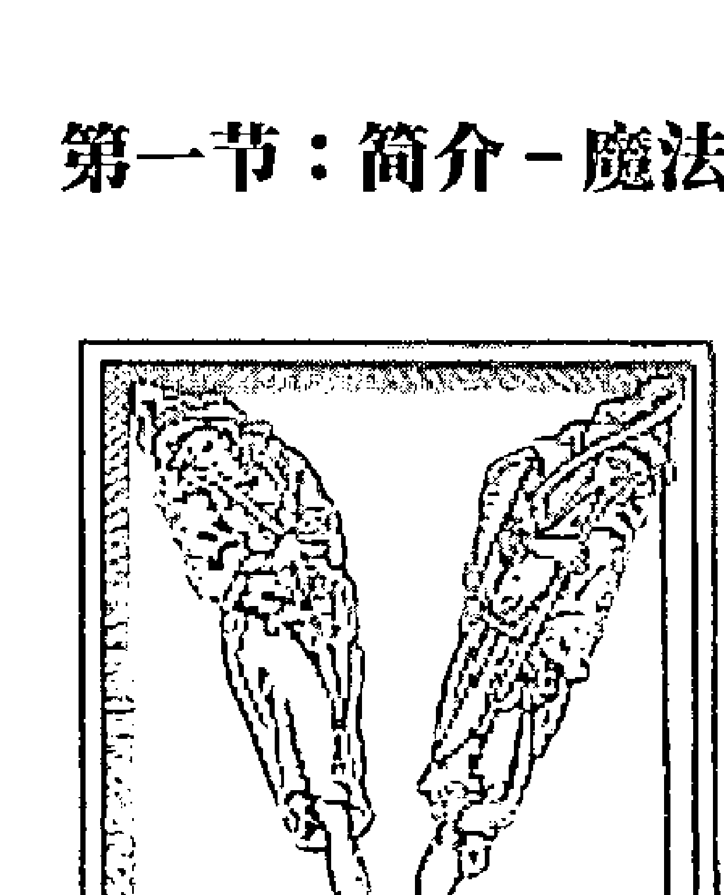

自从远古以来，各种各样的魔法工具就已经同魔法师们联系在了一起。我们几乎无法想象出一个没有魔杖、法杖或者水晶球的魔法师！在某些方面，这些可能只是心灵支柱，但是如果正确地制作和圣化，这些工具就能储存大量的魔法能量，然后就能为魔法师所用，就好像电池一样。当然，咒语真正的力量来源于魔法师集中的精神力和情感意念。雷文·格力玛斯还说，魔法工具也是“通往自然内部机制的独立桥梁。魔法师的心理元素显然也是其中一种重要的成分，而且一种事先存在的意识也会在魔法师的体外运转，同样也会增强工具的力量。法术是内部机制与隐藏其中的魔法源头的伴侣。”

在古时候，自己制作自己的工具是一种传统，除了那些特别的、师父传给学徒的或者作为入会礼物送出的工具。现在，许多的工具都能够从杰出的魔法工匠手中买到，但是如果自己动手制作会有一种非常特别的满足感。而且，学习一些制作自己工具的必要技能是你的魔法培训中的一个重要部分！如果你通过这种方法掌握了这种技能，你甚至会发现有些人会将你当做一名工匠。在这节课中，我只会教给你怎样制作和准备这些工具和器具，而何时使用这些工具和器具会在其他课中详细描述……

当你购买魔法工具的时候，从传统上来讲你是一定不能讨价还价的，店家喊什么价你就得出什么价。我建议你去周围的车库拍卖会、旧货物交换会、跳蚤市场、现场旧货出售，以及二手商店看看——我通常都是在这种方法淘一些魔法用品，而且物美价廉！

> > 尼伯说： “多年以来，我已经得到了四套工具，每一套的得来都有一个特殊的原因。因而，我将它们贴上标签，例如
> - 火——我自己做的一套工具：一个我用来装我的魔法用具以及摆放我的塔罗牌的箱子；
> - 气——我买下来的工具：一本手工制作的《众影之书》，以及大部分的蜡烛和香；
> - 水——他人赠送的一些工具（同样包括入门礼物）：一个串珠而成的猫头鹰翅膀风扇，以及一尊神像。
> - 土——我找到的一些工具（我将它们称之为女神的礼物）：一张红白相间的坛布以及一根魔杖。
> 我建议魔法师学徒仔细看看这些工具的来源”

> > 注意： 在你的圣坛上放置你的工具时要表明一定的方位，我使用了方向东、南、西、北。假设你的圣坛被安置在你的圣殿区域的北边，这样的话东方就在你的右边，西方在你的左边。但是不管你的圣坛实际上是摆放在哪边的，你都应该使用同样的左右定位法来放置物品，好像它们都放在一张地图上，底部（南方）朝向着你。南北方位是按照这张地图而言的，而不是按照指南针而来。因为你的圣坛实际上是一个以简单的方式代表世界的微型舞台。你放在圣坛上的东西就代表着世界上有的东西。

#### 第二节：魔杖（气）

你应该做的第一件也是最重要的一件魔法工具便是魔杖，它与占卜和预言的力量有着特殊的关系。不同版本的魔杖也包括舞台魔术师的魔杖，交响乐乐队指挥以及军乐队领队用的指挥棒，以及陆军将军和电影导演使用的轻便手杖，用于探矿术或者探矿的探测杖。魔杖是一种生殖器（阴茎）的象征，通常与神圣的智慧联系在一起。作为一种元素工具，它代表着元素风或者火。（通常我将魔杖与风联系在一起，而将仪式刀与火联系在一起，在仪式魔法中，魔杖被看做是一种代表火元素的工具，短剑是一种代表风元素的工具。）对于一个魔法师来说，他的魔杖是他自己的一种延伸——他的能力、智慧、想象力的程度。魔杖在尺寸、形状，以及设计上都很个性化，他将这个工具看得比其他工具都更为重要。在仪式中，魔杖能够将我们的身体、思想，以及灵魂同能够展现我们魔法欲望的宇宙意识联合起来。魔杖会一直保留魔法师以及他的力量的传统象征，因此亲友社团的舞台魔法师通常会在他们成员的葬礼上举行魔杖摧毁（wand-breaking）仪式。

在某些传统中，魔杖通常是用金属和木头制成。克里特岛文明中的蛇女祭司曾经使用的就是金属蛇杖。西伯利亚的库尔干坟头中的陪葬品同样也包括了最终被鉴定为金属魔杖的物品。大部分的此类物品是由青铜制作的，但是有时也会使用银和金。德鲁伊教中的祭司职包括了七个等级，每一位祭司都会手持一根代表那个等级的金属仪式魔杖。金属魔杖也许被看作是所有元素的一种平衡，因为所有的四种元素都会被用在魔杖的制作过程之中。

很多出色的魔法匠人如艾比·维诺如特和唐·沃特郝克（Don Waterhawk）都会使用做工精细的金属魔杖，然后再镶上水晶和精致的金银掐丝。艾比认为它们主要的能量来自风和火。自从魔杖真实的功能成为了魔法能量的一种导体，所有具有传导性能的金属（例如银或者铜）都被派上用场。然而，木质魔杖是魔法中最为传统的，而且我也会教会你制作木质魔杖。学会以后你也可以尝试用其他的材料制作，以为不同施法的目的做好准备。

在这节课中你将要学会制作的魔杖叫做baculum（在拉丁语中是“棍，棒”的意思；用在某些哺乳类动物——熊，浣熊，鲸鱼……——身上也就是一个表示“阴茎骨”的术语）。它是用于寻找东西的魔杖，用于指导你的能量，将你脑中的图像传送出去在世界中运转它们的魔法。和其他许多的魔法工具一样，你的魔杖应该由你自己而且只为你自己制造，而且要根据你自己的能力进行衡量。因为这是你最基本的魔法工具，我将会将其制作过程描述得比其它工具更为详尽。

##### 任务：采伐魔杖材料

首先，找到一株活着的果树，例如榛子树或者杏树（柳树也可以，如果你找不到果树或者坚果树），你找到的这棵树必须要有一截树枝是笔直的，没有嫩枝，至少得有你的手肘到你最长的手指那么长。直径的要求没有长度那么重要，只要你的手感觉合适就行。如果你居住在美国的东南地区，你应该能够找到一些被藤蔓植物缠绕扭曲成螺旋状的树枝。如果你找不到一枝被缠绕的果树或者柳树枝，你应该也能找到一枝山茱萸的树枝。这些都能制作出极好的魔杖！

一旦你找到了适合制作魔杖的树，一定等到月亮渐圆的一个星期三（水星日）的日落时分。在你砍树之前，在树木的树根处浇上一盆水，然后向它解释你想要做的事情。要获得那棵树中的精灵的允许，你可以这样说：

> > “仁慈的柳树啊，我给你浇水，并希望得到你的恩惠。我想要你身上的一枝枝桠，这样我就能做出一根魔杖，有了这根魔杖我便能连系魔法以服务所有的生命。我保证我会尊重你的奉献，并且明智地使用它。感谢你。

静静地在那儿坐几分钟，用你的心灵仔细地聆听树的回答。如果答案是不可以，向树鞠个躬然后去别处寻找。如果答案是可以，也向树鞠个躬，在你要砍伐的位置做个记号，用一柄锋利的钢锯在两端光滑地锯下。锯下的长度要比你需要的长度稍微长一些，然后再做修剪。一定要在树的伤口处抹上一点泥土以帮助它愈合，在离开之前跟树道谢。

##### 修整并塑造魔杖

你应该在你锯下树枝的当晚便开始修整你的魔杖。使用一把锋利的刀片或者随身携带的小折刀（如果你有的话，仪式刀也可以），小心翼翼地将所有的树皮都削下来。尽量避免划伤里面的木头——也要避免划伤自己！在你做这些的时候，你应该吟诵一些赞美诗来将你的魔法注意力集中在你的工作上：“圣洁的拥有力量的枝条；圣洁的智慧枝条……（Blessed be thou rod of power; Blessed be thou rod of wisdom…）”当你削好皮以后，将较粗的那一头置于你的手肘内侧（左手或者右手，你写字的那只手便可以）。将你的手肘弯曲起来，将你的前臂垂直向上，然后在魔杖与你最长手指的同等长度的地方做上记号。然后将多余的去掉。现在，一根魔杖雏形也就完成了。

用亚麻布或者丝绸将其包裹起来，然后放在一边晾一个月，直到下一次月亮渐盈的星期三的到来。这时的木棍也就差不多晾好了，因此，你可以拿出你的魔杖用砂纸将它磨光，边磨边念咒。然后在你本地的五金店中买一些亚麻籽油回来，用你的手在木棍上擦上几层亚麻籽油，一直摩擦直到它变干，全程都要念咒：“圣洁的能量枝条；圣洁的智慧枝条……”这会加深木棍颜色，突出它的自然纹理，将木棍密封起来，还会产生很好的光泽度。最后，用蜂蜡将其抛光，使其最终呈现一种丝质的光泽。

有两种方法可以处理你魔杖的较小那一端，既可以做成酒神杖的样子，也可以用水晶进行装饰。酒神杖是一种顶端为松果形的魔杖，是希腊神话中司欢宴的酒神狄厄尼索斯佩戴的魔杖。如果你想要将你的魔杖做成酒神杖的样子，将较小的那端用锋利的小刀雕琢为圆形，做成松果的形状。或者你可以在这一头嵌入一个小小的还没有长开的松果，和我后面要讲的用水晶装饰的方法是一样的。

如果你喜欢，你也可以找一颗与你的魔杖直径差不多的水晶。如果想要创造一种强大的能量导体，你可以将一截钢琴丝沿着一个方向不断地重复敲打一块磁铁直到它被磁化而且能够吸引小纸片。用一柄钢锯在魔杖的两端切割出两条浅浅的刻痕，然后将磁化了的钢琴丝固定在魔杖的较小一端。接下来，制作一小团米黄色的环氧基树脂灰泥（或者如果你想要真正的传统，你可以使用融化的松木树脂！），将其按压在魔杖的较小那一端。小心翼翼地将水晶放在上面，将泥灰平滑地抹在木头和水晶上面，这样才能做到水晶和木头之间没有间隙。
用钢琴丝缠绕在水晶、木头和泥灰的结合部，盖住泥灰，然后继续用敞开的螺旋方式往下缠绕，直到魔杖的底端，在将钢琴丝固定在另一个刻痕中之前，你应该在底端紧紧地多缠几圈。在魔杖的底端用一颗凸圆形的光滑宝石的平底的那一面盖在底端。或者你也可以用一颗小的圆形磁铁盖在底端，就像中世纪的炼金师那样（考虑到会有特殊的“魔法”效果）。记住一定要仔细测量，在加上顶部的水晶之后如果必要的话可以酌情考虑去掉一部分的底部，这样你做好的魔杖仍然是和你的前臂加上手掌的长度是一致的。
在你完成以后，用亚麻布或者丝绸将你的魔杖包裹起来，念诵：“定将如愿！（so mote it be!）”

##### 雕刻和圣化

在下一次月亮渐圆的星期三，边念咒边拿出你的魔杖，然后将下面的如尼文字写在上面——首先用铅笔，然后再用钢笔，从右到左，从上到下。

这些常用的如尼文字来自于《所罗门王大钥匙》（*Greater Key of Solomon*）。魔法地方分会（the Ordo Templi Orientis）的首领比尔·海德瑞克（Bill Hedrick）认为这些文字是一种退化了的秘密希伯来文字，他将这些文字

```
ᚠᚢᚦᚨᚱᚲᚷᚹᚺᚾᛁᛃᛇᛈᛉᛊᛏᛒᛖᛗᛚᛜᛞᛟ
```

翻译为“砍伐绿色的幼枝”，这只是指令的第一步，而不是任何特别神秘的东西。
但是这些文字经过几个世纪的使用已经变成了一种传统。在使用这些工具的时候，并不是必须得使用这些传统的如尼文字，反而可以就写上“圣洁的智慧枝条”，以及用底比斯人的如尼文写下你自己的法名。许多魔法师都会给他们的魔杖、法杖、仪式刀，以及短剑起一个特殊的名字。如果你也决定这么做，你还可以将它的名字刻在上面。
如果你有那样的技术，你还可以用一柄小小的锋利的刀具将这些如尼文字雕刻在你的魔杖上（美工刀中有一些专为此类工作设计的非常好的V形雕刻刀片——但是要小心，不要弄伤自己！），（最好）使用德雷梅尔（译者注：美国的一个五金品牌）进行打磨，或者使用一种用木炭作燃料的工具将其进行烧制。甚至可以用涂料将你雕刻的如尼文字上色，可以选择任意颜色。
在将魔杖投入魔法使用之前，焚一点香，例如肉桂。将你的魔杖在烟雾上来回移动熏烤，颂唱：

> 我将你圣化，魔杖
> 汇聚我真实的意念。
> 希望我的能力通过你来传递，
> 驱动意念，必将应验！

当你完成以后，再用亚麻布或者丝绸将魔杖包裹起来。

##### 使用你的魔杖

你的魔杖是做来传递并且聚集你的个人能量的。使用的时候，用你的手掌握住底端，将松果形或者水晶的那端指向你的目标。想象你的金场能量已经汇聚在一起，并通过发光的魔杖像激光一样投射出去，将你的魔法意念引向了你的目标身上。你可以在仪式中用它来画魔法圈，或者划分魔法区域。在占卜中，你可以将你的魔杖指向卡片、或者如尼文字、或者你正在使用的任何物品，来帮助你集中你的注意力，接受正确的信息。当你施咒的时候，你可以用你的魔杖指向任何你想要你的能量抵达的目标，例如治愈一个受伤的朋友，或者保护一片濒临灭绝的森林。将你的魔杖当做你的身体的一部分，一个非常特殊而且独具魔力的一部分，但是它始终都是你的，不会是别人的。用完之后要记得将魔杖包裹起来！将它放在你的圣坛的前面，或者东方（右边）——风元素的那个方向。

#### 第三节：圣杯（水）

魔法杯或者圣杯代表了古时女神科瑞德文的大熔炉，她赐予了诗歌灵感、重生，以及不朽。亚瑟王传奇中的圣杯是另一个版本的圣杯。包含了生死之谜、大熔炉、大酒杯，或者象征着女神的子宫，所有的生命都是来源于此。因此，圣杯被看作是大自然中的女性（同时，魔杖代表着男性），而且圣杯中所盛的水便是生命中神圣的水元素。魔杖是代表思想或者才智的工具，而圣杯是代表情感的工具——尤其是爱。

- 要制作你自己的魔法圣杯，你首先必须买一只饮酒的高脚杯（杯托上有一只细长脚的酒杯）。可以根据你自己的喜好购买任意尺寸。
- 圣杯可以是陶瓷的、银质的（或者镀银的）、羊角形的，或者锡镴制的（不能是玻璃的）——即使羊角形的或者银质的更受欢迎。
- 圣杯千万不能是黄铜制品或者青铜器，因为你买了它之后就只用于盛水——不会是酒，也不会是果汁——因为这些金属与果汁或者酒接触以后会产生毒液。

##### 圣化圣杯

要圣化你的圣杯得等到月亮差不多要圆了的时候。圣化圣杯最好是在星期一——月球日。将以下的药草混合在一起放入装有咸水的碗中：罗勒、茴香、牛膝草、薰衣草、薄荷、迷迭香、鼠尾草、缬草，以及马鞭草。（这些都能在你当地的天然食品店中找到。）用于祭月的焚香可以在燃烧的木炭块上洒一些薰衣草、茉莉、白玫瑰、金银花，可以添加也可以不用艾蒿。如果你宁愿将你的圣杯圣化给金星（为了爱），那你可以在星期五举行祭祀，使用檀香、鸢尾根、玫瑰，以及/或者迷迭香作为焚香。你可以使用天然的药草，或者在一间超自然商店（occult shop）中购买一些混合的月亮或者金星焚香。在你的高脚杯中洒入药草泡制的水，然后在焚香的烟雾中来回移动熏烤，观察高脚杯周围呈现的蓝色的净化之光，并且颂唱：

> 历经水与火的净化
> 有害因子将会离你而去。
> 你要清楚你将服务于我；
> 驱动意念，必将应验！

##### 圣杯上的如尼文字

在圣杯的杯体上描绘或者雕刻（使用雕刻工具或者德雷梅尔）适当的如尼文字。如果你选择描绘，你就要使用一只新的细小的毛笔，以及黑色或者白色的瓷漆。在你描绘你的每一个如尼文的时候，都要颂唱：“天佑圣水（Blessed be thou cup of Water）。”源自《所罗门王大钥匙》（再没有人能够翻译这本书了）的传统如尼文字是这样的：

```
:: ( ) ( ) ( ) ( ) ( ) ( ) ( ) ( ) ( ) ( )
```

如果你不喜欢这些文字，你也可以使用底比斯人的如尼文在杯体周围写上：“圣洁的艺术之杯（Blessed be thou Cup of Art）”。然后再使用底比斯的如尼文在杯托上写下你自己的法名，大声地将每个字母都念出来。完成以后，你可以说：“定将如愿！”

##### 使用圣杯

圣杯应当放置在圣坛的西方（左边）（水元素的方向）。而且还应该在里面装入新鲜的清水。还可以将新鲜的玫瑰花放在水中。举行魔法仪式的时候，在将圣杯中的水与魔法圈中的其他人分享之前，要先用它来圣化魔杖或者仪式刀，同时颂念：“愿你永不干涸！”或者在治疗或者赐福仪式中，还可以用几滴水涂抹在对方身体的不同部位，同时颂念“天佑尔口，道出神圣之名……（Blessed be thy mouth, that speaks the sacred names…）”或者在供奉祭品或者祷告诉求保佑的时候，你也可以在神的画像上洒几滴。

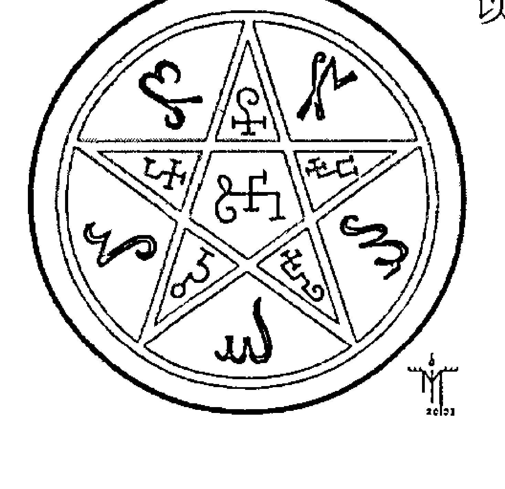

#### 第四节：祭碟（土）

祭碟是一个雕刻着五角星或者五芒星，也可以包括其它与土元素、自然力量，以及防护有关的符号的圆盘。它通常被误称为 pentacle（五角星形）（正确说法为 Panticle），pentangle（五角形）的同义词，而 pentangle 意为“五个角”。pentacle 意为“所有的角”。有时被称为所罗门王的星印（Pentacle of Solomon），五芒星的图案自古以来都是普遍的魔法符号，它代表了伟大的魔法代理人的五种道具，自然界的五种元素，五种感觉，人体的五个向外生长的器官：头、双手、双脚。祭碟作为一种防卫仪器或者一种用于召唤精灵的工具被用于仪式魔法之中。不同版本的祭碟有着各种各样的象征行星的符号，而且有着多种其他用途。祭碟也被挂在门上或者窗户上，充当防护装置的角色，或者在仪式中用于吸引钱财。

从本质上来讲，祭碟是一种被动装置，它是我们所建造的物体的基础，也是自然和物质展现的力量。它上面的五芒星代表着土元素，并形成了一个防护盾以保护我们不受敌对势力的伤害。在仪式中，祭碟将会提供给你与大地接触的能力并且可以集中你的注意力。制作祭碟可以用石头，粘土，或者金属（泥质材料）。

##### 任务：制作你的祭碟

即使你现在可以在超自然商店中买到漂亮的金属或者陶瓷祭碟，你同样也可以自己做一个，很简单。到一间工艺美术用品店挑选一包风干的粘土（我常用的是一种是混合黏土）。用一根擀面杖在两层蜡纸之间碾出一个平平的碟子，就像做饼干一样。不要做得太薄，否则它会很容易碎。半英寸厚就很合适。然后用一个大的圆形罐子（例如咖啡罐）或者特百惠塑料制品切割成一个圆件。

描绘或者复制一个五芒星图案在纸上（跟圆件大小一致），像图中那样，然后将它放置在你切割好的粘土碟的中间。用一根尖利的串肉钎在五个尖角的位置透过纸刺入粘土之中。然后将圆头的那端围绕图案边缘画上一个大圆（如果你能找到一个大小合适的圆形的物体，如锡罐便会更加容易），然后用直尺和串肉钎在点与点之间画上直线，成为一颗五芒星。祭碟的原型便完成了的。

如果你想要在设计中刻上其它的魔符和符号，就像上图中一样，现在就开始动手吧。五芒星之内的符号是源自《所罗门王的大钥匙》中的传统的如尼文字，而五芒星之外的是用底比斯人的如尼文拼写出来的“E-A-R-T-H”（大地）。在祭碟的背面你可以写上“圣洁的艺术之碟”以及用底比斯如尼文写上你自己的法名。在你制作和描绘你的祭碟之时，你应该颂唱：“圣洁的土元素之祭碟（Blessed be thou Pentacle of Earth）”。

然后等待整个祭碟变干变硬之后，就可以将表面打磨光滑。现在，你就拥有了一个代表着土元素的完美祭碟。当然，如果你有权使用烧窑，例如你学校艺术系的烧窑，你就可以将它制作成一种陶瓷的祭碟，将其烧制为一种魔法工艺品永久保存！在月亮渐圆期间在上面撒上一些盐水，然后在燃烧的焚香的烟雾中来回熏香。可以使用由迷迭香、雪松、檀香、松香，以及薰衣草精油的混合而成的焚香进行熏制圣化。

> 一颗落入凡尘的星星在我跟前歇息
体内的血管在极力跳动。
召唤一切，
驱逐恐惧。
依我所言，必将应验！

##### 使用祭碟

祭碟应该被摆放在圣坛的北方（后面），土元素所代表的位置，或者放在中间。将它作为一种器皿，用于放置护身符、符咒、水晶球，或者其他在仪式上供神用的物品。所有的仪式食物，例如面包、饼干，或者水果拼盘都能盛放在像盘子一样的祭碟中。然而，如果你是用混合粘土制作的祭碟，你就应该用一张圆形的蜡纸垫放在食物下方，以免粘土渗入食物之中。

#### 第五节：仪式刀（火）

仪式刀或者魔法匕首，代表着力量、行动，以及控制。第一片铁制刀片是用陨石的镍铁矿铸造的——特别像是不锈钢——而且还被认为（确实如此！）是神的霹雳之火锻造的。因此，短剑象征着四大元素中的火元素。这是自然界积极与创造性力量与阳刚之气相一致的典范。这种魔法刀片在过去的 3500 年里，在整个世界的所有文化中被广泛使用。

仪式刀的名字的最早版本出现在 1572 年一本名为《所罗门的锁骨》（the Clavicle of Solomon）的魔法书中，那时拼写为 arthana。你可以使用仪式刀来画魔法圈、圣化水和盐，以及驱逐不速而来的实体。传统上来讲，一把仪式刀的长度大约七到九英寸长，双刃刀片，黑色手柄。

最近几年，几种充满魔力和幻想图案的极为引人注目的刀片被铸造出来，并且迅速地在魔法界中作为仪式刀流行起来——只要是双刃的。

虽然传统的仪式刀的刀片的是钢制的，但是某些仪式（尤其是针对精灵和自然幽灵的仪式）不需要钢铁，也不需要任何金属的物品。为此，现在的一些魔法匠人都会使用枕火石、铜、黄铜、水晶、木头、骨头、鹿角，或者抛光的石头来制作漂亮的仪式刀刀片。一旦你拥有了这里提到的仪式刀中的其中一些，你就会渴望得到其他的仪式刀……作为你的第一柄基础的仪式刀，我建议你去跳蚤市场购买。在那儿你通常会发现一柄款式独特、简单而且便宜的双刃匕首的精品。多选几个试试手：将它们握在手中，在空气中扭转数字 8 的形状来感受它们。一定要选择一个拥有与之相称的安全刀鞘的匕首！买成之后，将其带回家用磨刀石将刀刃和刀尖打磨锋利。

一些魔法师只是胡乱地自己动手制作他们的仪式刀，在一张金属制品上面切下一块刀片，然后用木头，骨头，或者鹿角雕刻出刀柄。我认为如果真的要自己制作的话，这将会是一个更为复杂的过程。

如果想要了解更多有关制作这种刀片的详细介绍，你可以看看雷蒙德·巴克兰的书《魔法的完全手册》（Complete Book of Witchcraft），第 29-33 页。

##### 圣化仪式刀

在月亮渐亏的一个星期二（火星日），将含铁的药草（Martial herbs），例如龙血树脂、芸草粉末、地胡椒、生姜，以及硫磺混合在一起。用你的仪式刀的刀尖在你的手指或者手掌上刺一个伤口，在药草混合物中加入你的几滴血。将混合物的其中一半放置在一边，将剩下的一半放在你的香炉中焚烧（往下看）。将你圣杯中的蒸馏水洒几滴在你的刀片上对仪式刀进行净化，然后在焚香烟雾中来回熏制圣化。

现在，将剩下的药草混合物放在你的圣杯之中搅拌。在香炉的火炭上加热你的仪式刀刀片，直到它变得尽可能的烫。当刀片加热好以后，将其插入圣杯中的混合物中，颂唱：

> 钢之刃我召唤你
诅咒我指定之物
利索地劈开逆境
依我所言，必将应验！

用传统的如尼文字，你也可以使用这句话 “Blessed be thou Blade of Fire” 来代替，还要刻上用底比斯如尼文写的法名。如果你打算给你的仪式刀起一个特殊的名字，你也要将这个名字刻在刀片的另一面。

在钢刃回火的时候将这些话语颂念三次，每一次沉浸其中的时候在脑中想象刀刃力量的亮光。古时候，这样的刀刃通常会被磁化，让它们拥有真正的魔法力量。为了磁化你的仪式刀，用一块天然磁石或者条形磁铁在你的刀片上重复敲打。用你惯用的那只手握住仪式刀，另一只手握住磁铁，从刀柄根部开始，用磁铁往刀尖位置单向敲打。不断重复此动作至少五分钟，一直往相同的方向敲打，同时吟诵：

> 钢之刃，我召唤你
吸引我指定之物。
紧紧环绕在树的周围，
依我所言，必将应验！

到现在为止，将如尼文字刻在钢制刀片上最具魔力的方法就是玻璃蚀刻法。如果要使用这种方法，首先你就要用记号笔将你决定好的如尼文字写在刀片或者仪式刀上。然后在一个可任意使用的罐子中熔化一次所需量的蜂蜡和白色蜡烛头。接下来，将刀片加热到足够热以便蜡可以黏在上面，但是不要破坏刀片的磁场。然后用熔化的蜡覆盖在刀片上面，待其晾干变硬。多覆盖几层以保证金属被完全密封，但是务必要做到你仍然能够透过蜡看清楚刀片上的如尼文字。

然后使用一种锋利的雕刻工具（锋利的钉子就可以）在蜡上描绘出如尼文字。一定要将蜡层划穿，暴露出下面的金属。尔后小心翼翼地将硫磺或者氯化氢（电池中的）酸，碘酒，醋，或者其他的蚀刻剂倒入刻痕中。酸剂将会在你雕刻的位置啃噬金属，蚀刻它，但是蜡层会保护刀片的其他部分。等一会儿之后，将酸剂洗去，将蜡层清理干净，你就可以得到一柄漂亮的蚀刻仪式刀了。

在你完成以后，用亚麻布和丝绸将仪式刀包裹起来，同时宣告：“一切如愿！”

##### 雕刻仪式刀上的如尼文

在圣化仪式刀之后的第二个星期二，拿出你的仪式刀并在刀柄或者刀片上描绘或者雕刻适当的如尼文字。如果你选择描绘，那便使用一支新的质量较好的毛笔，以及黑瓷漆。一件德雷梅尔或者雕刻工具也可以用来雕刻仪式刀。在你描绘或者雕刻每个如尼文字的时候，颂唱：“圣洁的火之刀刃（Blessed be thou Blade of Fire）。”如果你喜欢，而不愿意使用传统的如尼文字，你也可以使用这句话 “Blessed be thou Blade of Fire” 来代替，还要刻上用底比斯如尼文写的法名。如果你打算给你的仪式刀起一个特殊的名字，你也要将这个名字刻在刀片的另一面。

贴士：首先你可以在一柄便宜的厨房刀具上练习一下技巧，这样你就可以知道在将酸剂冲走之前要让它停留在刀片上多长时间。有一种简单的方法就是在当地的五金店或者工艺品店买一套蚀刻工具或者蚀刻笔。这些笔看起来像是圆珠笔，但是里面装的是酸剂而不是墨水。使用酸剂的时候要非常小心，因为它会灼伤你的皮肤！

在你用完仪式刀以后，要将它放置在你的圣坛的南方（前面）。可以入鞘，也可以不入鞘。在使用的时候，应该将它入鞘并挂在你腰间。

#### 第六节：其它的圣坛工具

除了以上罗列的四种主要的工具之外，你还会想要得到一些其它的魔法物品，放在你的圣坛之上，或者在施放魔法的时候使用。这些物品也和四大元素有关系——只是象征性弱一些。

##### 烛台（火）

没有什么更比昏黑的房间中一盏摇曳的烛光更适合做魔法场景了，而且也没有其它元素像火一样对人类的进化如此重要。火代表了富有创造力能量的神圣火光，提供光亮和温暖，并具有象征意义地将我们拖离黑暗。在你的圣坛上应该有两支蜡烛：一支在右边代表男性/男神的力量，一支在左边代表女性/女神的力量。不同颜色的蜡烛会用在不同种类的咒语之中，这一点我会在别处讲解。另外，你可以根据季节的颜色点燃不同颜色的蜡烛（橘色和黑色代表夏末节，红色和绿色代表圣诞节……），或者你在那时突然喜欢的颜色。很多人在通常情况下都会点上一支黑色蜡烛和一支白色蜡烛，或者两只白色蜡烛。小型的放在玻璃缸中的祈福蜡烛非常流行，我推荐你使用，尤其是你的空间有限的时候。细蜡烛配上精选的烛台也会非常漂亮，而且更为传统，如果你有充足的摆放空间的话。如果你确实有这样的烛台，在这儿我有一些传统的魔法如尼文字你可以雕刻在烛台的底座周围。或者，也许你更愿意将你的用底比斯如尼文拼写的法名刻在上面。

##### 香炉（风）

香炉是一种焚香可以在里面安全燃烧的容器，它代表着四大元素中的风元素。香炉的种类繁多，从一个简单的焚香炉或者火锅，到挂在铁链上的装饰华丽而且多姿多彩的黄铜香炉。在魔法术语之中，thurible指的是无盖香炉，通常有三只脚，而 canser 上有一个雕有小孔的盖子，这样就烟雾就可以从小孔中弥散开来。Canser 通常配备有链条，可以悬挂起来或者左右摇摆，就像天主教堂中使用的那种。这种香炉通常是用黄铜制造而成的。如果你找不到一个合适的香炉，你也可以自己做一个，很简单。所有小型的金属或者陶瓷的碗或者深盘都可以用作香炉。当然也应该足够大，以便在需要的时候也可以在里面焚烧作为祭品的纸。它的顶部应该完全开放，以便空气的流通，而且还得是由耐火材料制作的，此外还得外形美观。我建议你在香炉底部放上一些沙土以及/或者木灰。这些物质可以吸收木炭的强热，并保护香炉以及防止香炉的表面过热。泥土、盐、沙，或者小石块都可以用于此用途。使用某种神圣的泥土，例如取自你最喜欢的沙滩或者沙漠的沙也是一种不错的选择。多次使用以后你就可以将沙与焚香剩下的灰混合在一起，以保持干净与芳香。沙在使用之前也要仔细地冲洗干净，去除其中的灰尘和碎片残骸。三脚火炉架或者耐热的底座也值得推荐使用，将它放置在香炉下边，这样香炉就不会烧焦你的圣坛或者坛布。

在月圆之际，在香炉中点燃一点点龙血焚香对其进行圣化，颂念“圣洁的香炉之气（Blessed be thou Censer of Air）”。源自《所罗门王的大钥匙》的传统的如尼文字参考下图。将这些如尼文字描绘在你的香炉底座上，或者，和前面一样，你也可以用“圣洁的艺术之炉（Blessed be thou Thurible of Art）”以及/或者使用底比斯的如尼文写上你的法名。无论你使用哪种方法，在结束的时候都要念：“定将如愿！”

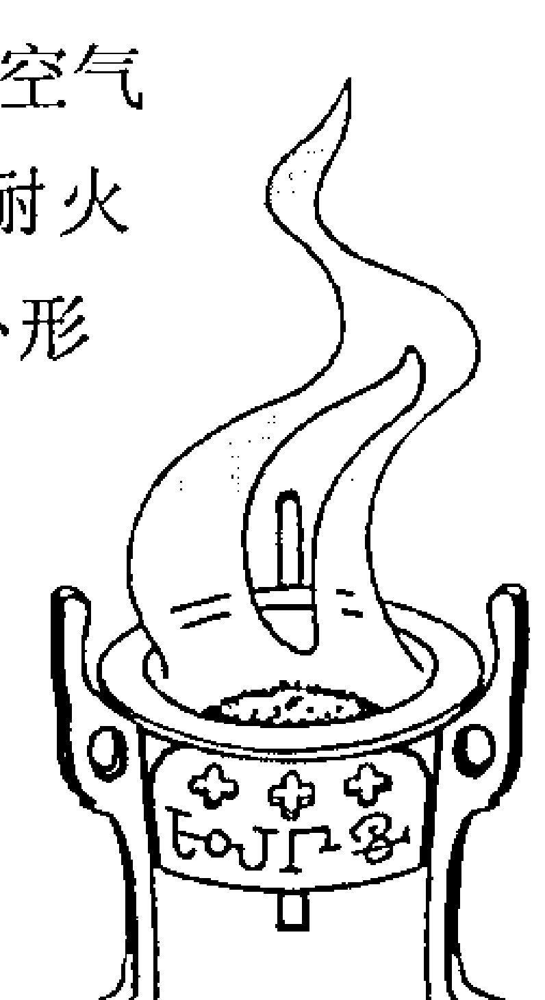

> 注意：制作在魔法仪式中使用的焚香以其本身而言也是一种艺术，不同的咒语使用的都是其专用的配方。棍状或者圆锥形的焚香都可以使用，但是大多数的魔法师都更喜欢那种放在木炭块上可以自燃的未加工的或者颗粒状的焚香，这些香在所有的超自然商店中以及许多保健食品商店中都有售。要自己配制焚香的话，你就会需要一套研钵和研杵。

##### 研钵和研杵

你可以在任一超自然商店以及很多保健食品商店买到一套小号的研钵和研杵。这些都是用于研磨混合焚香中的药草、种子等等的必需品。然而，这些物品不见得需要摆放在你的圣坛之上。我把我的研钵和研杵，连同所有盛放药材和焚香的瓶瓶罐罐、剩余的蜡烛、额外的工具，以及很多其它的我一时都用不上的物品都放置在我的魔法橱柜的抽屉之中。

##### 装盐和水的碗（土和水）

在所有的净化和圣化仪式中，盛放盐和水的小杯子是非常有用的。在现代魔法师中大受欢迎的一种盐杯

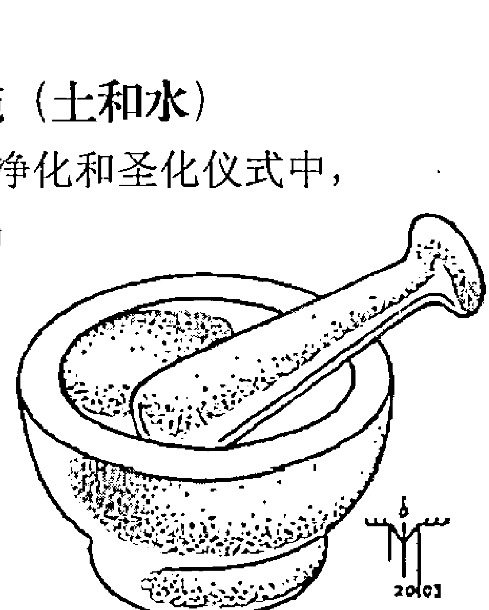

```
ᛈᚢᚠᚲᛁᛊᛗᛇᛏᛒ
```

这样你的香炉就完工了。有了它你就可以在焚香的烟雾之中进行圣化、赐福，以及净化任何物品。

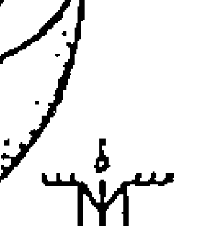

##### 铃铛

铃铛是一种非常古老的仪式仪器。摇动铃铛所发出来的声音根据音量、音色，以及建筑物的材质会产生不同强度的效果。任何类型的铃铛都可以使用，包括西藏的铃碗，但是最受欢迎的用于施展魔法的设计是木制手柄的黄铜铃铛，如图所示。

铃铛是一种女性的象征，所以通常在仪式中用于召唤女神。摇铃也是为了避开邪恶的咒语和精灵、平息风暴，或者召唤善良的能量。将铃铛放在碗橱中或者挂在门上，可以保家佑宅。有时摇响铃铛是为了提示仪式进入了不同的阶段以及标志着咒语的开始或者结束。唯一有关铃铛的如尼文字是占星学上所用的速记符号，如图所示，但是如果你喜欢，你可以在铃铛上刻上“圣洁的艺术之铃（Blessed be thou Bell of Art）”以及底比斯如尼文拼写的你的法名。

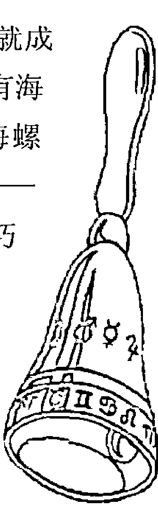

#### 第七节：魔法书

正如我们的课程开始的时候所说的那样，我给你布置的第一项任务——准备一本魔法日志，并且每天的进程都要记录下来。我相信你一定早就开始做了。当你的第一本魔法日志写完了以后，再换一本即可。多年以后，你最终会发现整个书架上都堆满了你的魔法日志！你还应该有另外的三种类型的魔法书。每一本都是你自己的个人记录，因此应该由你自己亲笔书写——或者至少要在你的电脑上敲打出来！在过去，我们魔法师不得不自己造纸，也要自己将这些纸装订成册——通常使用皮革包装。甚至是钢笔和墨水也要自己亲手制作，鹅毛笔和烟囱里的煤灰。现在，已经没有多少人会去干这些麻烦事了，即使你仍然能在文艺复兴集会上以及超自然商店中——是一个购买大部分魔法用具的好地方（更多关于这些地方的内容会在这个课程中的第五课“进入魔法世界”中详细介绍）——买到这样漂亮的手工书籍。最重要的是，好好保管你自己的手写魔法书，而且只能同一些你完全信任的人分享。

每一位魔法师都应该有一本众影之书（Book of Shadows）以及一本魔法书。传统来说，魔法工作手册有黑色的书皮，通常会被很简单地称作“黑皮书”，但是你可以使用任意你觉得合适的颜色。大多数的现代魔法师现在使用的是活页笔记本或者捆扎笔记本，这样我们就可以随意插入或者重新排列书页，现在还有很多有电脑的人制作的是“众影光盘”（Disk of Shadows）。我有一整个书架的这样的厚厚的捆扎笔记本，其中包括魔法书和众影之书，里面写的是我研究过的大量的不同种类的魔法传统。

你的众影之书（通常简写为 BoS）是用于记录你的老师、仪式、歌曲、诗歌、圣歌、祈祷、魔法知识，以及所有其它的特殊魔法传统的记录和教义的课堂笔记。在你的整个人生中你都要持续不断地往你的 BoS 中增加内容。如果你是跟随着一位老师学习，你就该将他们的 BoS 完整地抄写在你自己的众影之书中，如果你自己某天成为了一名老师，你的学生和学徒也会将你的 BoS 抄写在他们的书中。

你的魔法书有些像是一本食谱，里面包含了咒语、符咒、食谱、药草知识、焚香配方、符应表格、魔法字母表，以及其它的参考资料。就像其他的食谱书籍一样，你也应该穷极终生在你的魔法书中增添内容。许多魔法书——比如这一本——都是由在你之前的魔法师们书写的，其中一些魔法书出版了，也能够在你本地的超自然书店中买到。但是除了《死灵之书》（Necronomicon）——这本书中的咒语都是用于召唤那些真正肮脏的、想象中的妖怪和魔鬼，它们都是该死的恶灵，因为这些魔鬼和妖怪根本不适合家养，而且还会引起无穷无尽的灾难……

最后就是你的梦境日记，这本日记你应该放在你的床头，在每天早上刚刚醒来的时候，就在这本日记中将你所记得的昨晚夜里的一切梦境都记录下来。（详情请看课程之一，第六课：偶尔做梦。）这样做有两种目的：第一，帮助你学会控制梦境中的意识；第二，为你在来年回望过去，审视自己的心灵的成长和进化提供一种记录。也许你会发现你的一些梦能通灵或者具有预言性，而且已经实现。如果是这样，你的梦境日记就会帮助你学会辨别哪一个梦是真实的。

## ## 第八节：金属镜，或者魔镜

——雷文·格力玛斯（Raven Grimassi）

金属镜，或者魔法水晶镜是最古老的占卜工具之一。传统的金属镜是一种反射材料模糊的内弧面。自己制作也很简单，你可以使用闹钟弯曲的玻璃面，然后用光滑的黑色涂料在其往外凸出的（膨胀的）那一面刷好漆。传统金属镜的准备开始于满月的那个夜晚——正当月亮处于双鱼宫、巨蟹宫，或者天蝎宫位置上时。

一旦你刷好镜面的涂料，而且涂料完全变干，便用迷迭香、茴香、芸香、马鞭草、常春藤，以及胡桃树叶或者树皮酿制的药草酒浸泡镜子。当玻璃还在药水中浸泡之时，将你的手伸出来覆盖在上面，手掌向下，颂念：

> > 醒来吧，所有古老的精灵们，
> 你们的眼睛揭示了黑暗的语言，
> 赋予我看穿黑暗的能力，
> 这就是我
> 呼唤你们的咒语之门。

想象在镜子周围形成了一层银色的

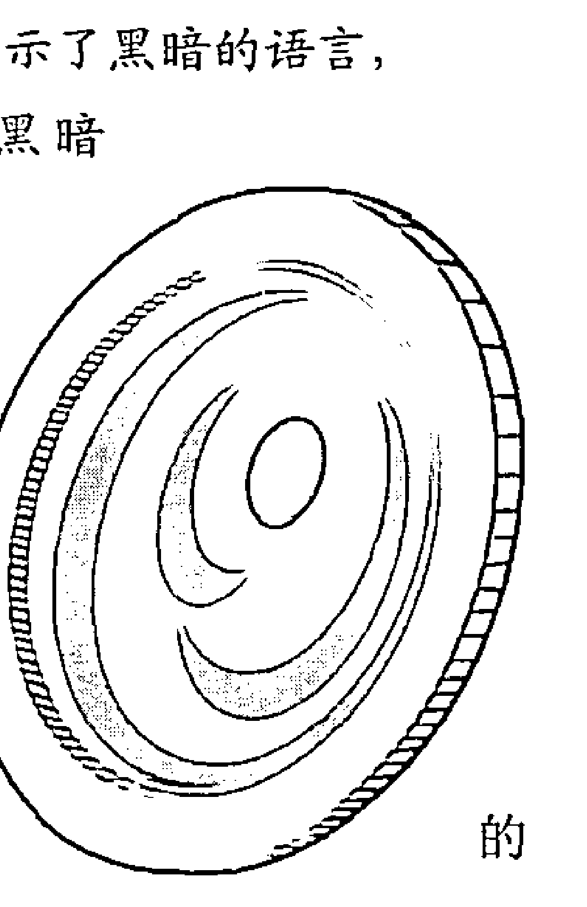

###### 魔法师学徒的魔法书 | 上卷

薄雾。深吸一口气，然后慢慢地在药水上方呼出来。在头脑中想象你的呼吸推动银色的薄雾进入镜子之中。将这套动作重复三次。接下来，将镜子从药水中拿出来，然后将其完全晾干。现在你便准备好了将你自己的光环与镜子相互协调。将镜子举在身前，将其凸出的那面倚靠在右手手掌上。然后将左手手掌放在右手上方，距离玻璃表面大约 3 英寸，然后开始在镜子上方沿顺时针方向画圆，大小与镜子大小一致。注意不要接触到镜面内侧，因为你会在上面留下你的指纹。

完成以后，将镜子拿到外面满月之下，这样月亮光就会照射在凹面那一边。慢慢地在镜子上装满药水，满到镜子的边缘部位。将镜子向着月亮举起来，跟你眼睛差不多的高度。不要担心药水会溢出来。双眼以些许不聚焦的方式看着月亮。如果你的方式正确，你就会看到月亮放射出来的三条光线。继续斜视，直到来自月亮底部的那些垂直的光线好像接触到镜子了为止。

一旦月光接触到镜子，你便颂念下面的话：

> 我再次见到的三道光芒
> 但并不是所有？？
> 女巫最终也在此刻降临
> 为这面魔镜灌注力量

迅速闭上你的眼睛，这样你便可以中断目光的接触。再次睁开，看向你的镜子。以祭酒的方式将药水倒在地上，然后用新鲜的干净的水冲洗镜子，将其完全弄干。用丝绸包裹起来，以保护它的月球磁场，千万不要让太阳光直射在镜子上面。现在，你的金属镜就已经准备好，可以用于占卜了。

##### 水晶球

通常人们都将水晶球——也因其是用于占卜、预见，或者也会显示图像的石头而闻名——与魔法师联系在一起。魔法师可以通过使用水晶球念咒，召唤远距离或者超越时空的场景——有点像电视直播！为了做到这些，你必须深深凝视着水晶球，就像我在课程之一，第五课“魔法技能”中所介绍的阅读物体光环的方法是一样的，然后在你直觉潜意识中的图像就能投射到水晶球的深处，显示出你在寻找的物品（在后面的课程中我们会详细讲解……）。

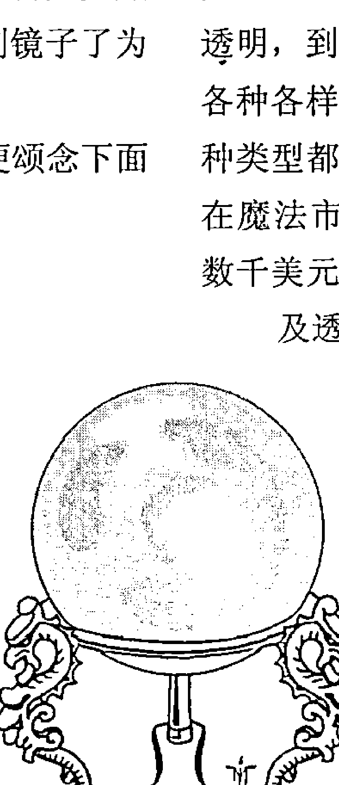

在过去，这种球体通常是用天然的石英、绿宝石，或者方解石制作的。它们从透明，到半透明，再到不透明，而且还有各种各样的颜色——包括粉色和黑色，各种类型都有。现在仍然会制造这些球体，在魔法市场也能买到，价格从 20 美元到数千美元不等，都是根据尺寸、材质，以及透明度来定价的。但是高质量的光学玻璃的发展为现代的魔法师提供了比较便宜替代品，而且现在还有很多无瑕疵、耐用的水晶球可供选择，用玻璃、含铅玻璃，甚至是丙烯酸塑料制作而成。而且还有各种各样的底座，从简单的木制吊环到别致的三足黄铜架子，应有尽有。

球体是女神的一种象征形式，就像所有的圆形和圆体的物体一样，而真正的手感冰凉的水晶是海洋深处的象征。水晶球是一种有关占卜的有魔力的物体，所以应该妥善保管。用完之后要用丝绸布料或者天鹅绒布料将其包裹起来，防止空气中的灰尘和油脂的侵害。在满月的时候将其暴露在月光底下可以增强它的力量，同时再用新鲜的艾蒿叶子摩擦，或者用艾蒿浸剂清洗。

### 第三课：魔法师的行头

> 沃特遇到那个绅士就是一场非凡的奇遇。他身着一件平滑的长袍，一件皮毛披褂，上面有着黄道十二宫的刺绣，还有神秘学的标志，三角形的里面有眼睛的图形，奇怪的十字架，树叶，鸟类的骨架，以及动物和星象仪，星象仪中的星星有点乱七八糟地闪耀着，上面还有太阳。他有一顶尖顶帽，就像傻瓜戴的，或者就像那个时期的女士所戴的头饰一样…… ——T. H• 怀特，对梅林的描述（《石中剑》，第 31 页）

#### 第一节：简介 – 魔法师的装束

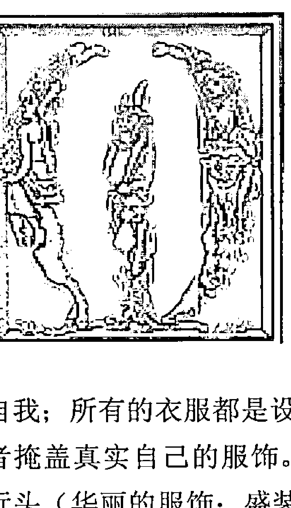

当我们穿着任何衣服的时候，我们是在创造一个人物角色（性格），以在某个场景中向他人和自己展现自我；所有的衣服都是设计来遮羞或者掩盖真实自己的服饰。你的魔法行头（华丽的服饰；盛装）与每个人的衣服是十分不一样的，其目的是为了帮助你自己和其他人意识到你现在的魔法师身份，而不是学校的学生、运动员，或者其他的世俗身份。正如其他的角色有着他们的传统服饰和制服，魔法师也一样。

每个魔法师都会发展一种专属于他的独特风格，每个魔法师的穿着都会不一样。魔法师不会在百货公司购买现成的魔法服装，而是自己设计、自己缝制，或者从魔法界中其他的熟练裁缝手中获得。对于一个魔法师来说，能够自己设计和缝制自己的衣服是一种非常重要的技能，我强烈要求你学会这一点。如果你没有缝纫机，试着去找一台，然后学会怎么使用。

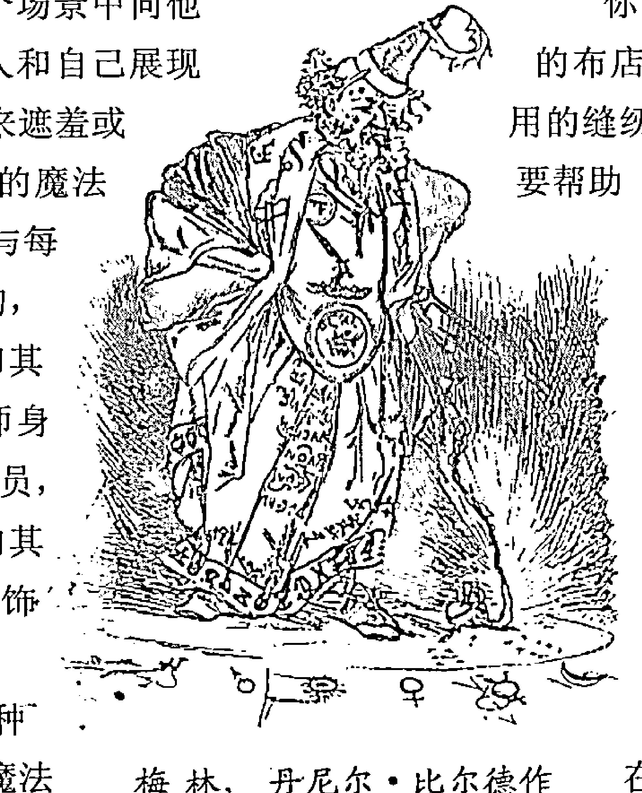

你可能需要去附近的布店，购买一些可利用的缝纫图样。如果你需要帮助（告诉店员你想要为万圣节的聚会做一件化妆服），你就会发现店中有很多魔法师长袍、斗篷、束腰外衣、无袖外套，甚至是巫师帽的、设计得非常不错的图纸。在下面几节课中我

#### 第二节：束腰外衣和无袖外套

重点：使用天然的材料，例如棉质和亚麻。不要使用类似于人造纤维的材料，例如聚酯纤维或者尼龙，因为它们都是违背自然的绝缘体。

在整个欧洲历史直至现代仍受男子欢迎的、基本款服饰就是束腰外衣和无袖外套。这两种衣服也是魔法师学徒的传统服饰，因此我最先教你缝制的就是这两种。真的很简单！束腰外衣、无袖外套和亵腿、贴身衬衣，或者脚踝处有松紧带的袋形裤一起配穿看起来非常不错。

首先，浏览一下商店中的所有不同种类的布料，然后选出你真正喜欢的那些。对于束腰上衣和无袖外套来说，你可以选择任意你喜欢的颜色，但是不能有印花。你所需的长度差不多就是你双手伸展开来，两只手能够左右握住的那个长度。因为布料的尺寸有差不多6英寸的增量，所以宁愿稍微裁短一点也不要裁得过长。同样的，如果你想要依照一种常规的裁缝图样缝制，希普利西提图纸（Simplicity pattern）5840-C 号和 9887-C 号就是一种非常不错（多少有些不一样）的束腰外衣设计样式，9887-C 号还包括一个短款的披褂。

**束腰外衣**
缝制束腰外衣的时候，将布料两端对折；然后再两边对折，这样就将整个布料进行了四等分。像图中一样把布料平整地放置，将开口的那个角朝向左下角，折叠的那一角朝向右上方。用一只水性的毛毡马克笔沿着右上角的上边缘画一条剪裁线，用作脖子处的开口。每一边的宽度不能超过4英寸，这样总的宽度就是8英寸（如图所示）。然后再沿着右边的边缘直直地标注出另一条剪裁线，也是大约8英寸（这可以因人而异，取决于你喜欢多深的领口）。最后，整个剪裁线会是“T”形的。

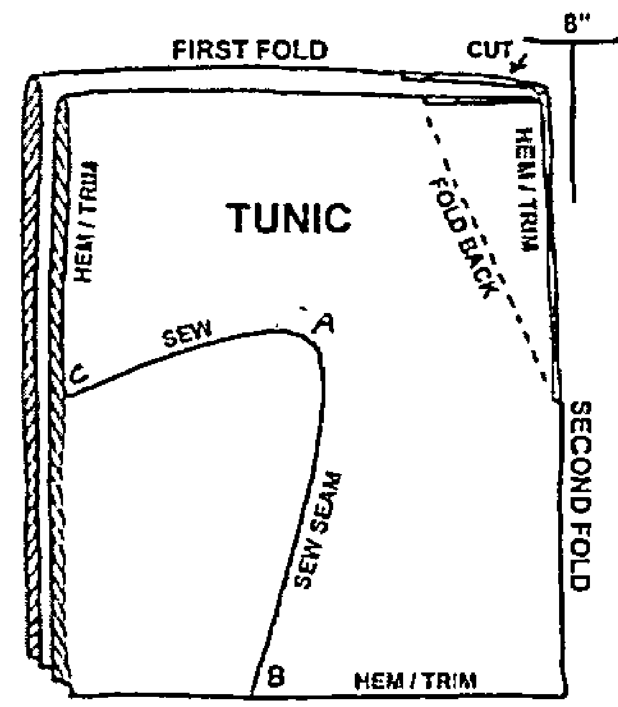

至于袖子和衣片，首先深吸一口气，然后测量你的胸围的最大尺寸。将所得数字除以4，再加上2英寸。这样就得到了从右边的对折中线到衣服腋下剪裁线的最小距离，而且你应该在那个点做一个记号，从上到下的中间位置（A点）。现在划出一条从左边到底部的线，从左边差不多中间的位置（C点）开始。像图中一样画一条曲线直到底部边缘的位置（B点）。确定这条线最右边的那个点正好在前面标注胸围尺寸的那个点上（A点）。在保证布料仔细对折整齐的同时，沿着腋下区域的内线用大头针将布料别在一起（将黑色区域剪下来做口袋）。现在穿上试试，以保证衣服合身。然后用锋利的剪刀将四层布料裁剪妥当。随后拔去别针，将正面展开，这样就像一件衬衣一样平整摆放。将每一边再次用大头针别起来，便于缝制。现在剪开“T”字部位。缝好褶边，一件束腰上衣就完工了！

最后一步，你应该将底边、袖口，以及领口的褶边也缝好。如果你愿意，你可以将衣服的底边和袖口修剪整齐。你也可以使用边角料做一个兜帽、外部的缝饰、口袋等等。一根宽宽的腰带就能让效果更加完善。如果你选的是棉布，你可以在你的缝合处留下几英寸长的布料，将褶边缝在外侧，然后将边缘磨损起毛，像图中一样，一件“鬼魂舞”样式的束腰上衣就完成了。

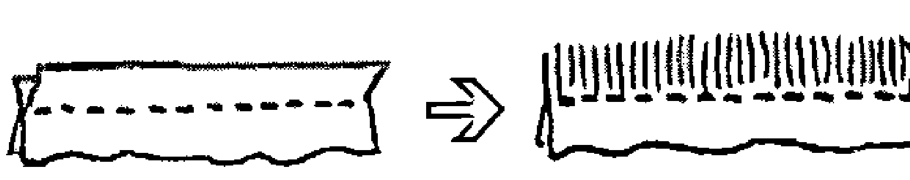

#### 第三节：无袖外套

软质皮革是最受欢迎的无袖外套衣料，但是你也可以使用任何材质的衣料。长度和束腰外衣的长度一样。丈量宽度的时候，深吸一口气，然后测量你胸围的最大尺寸。将所得数字除以2，再加4英寸。因为无袖外套是没有袖子的，也就没有可丢弃的衣料，只是很简单地缝合起来，在下摆和袖笼位置留大约一英尺的开口。和束腰上衣一样，沿着顶部的折痕剪开简单的8英寸宽的“T”形领口，在衣服的正面进行竖裁。我喜欢将前面领口开得更深一些，然后将领角往外折，形成一个三角形的翻领。随后我会加上金属扣眼和系带，这样看起来非常酷。加上一根宽腰带，一个会给人留下深刻印象的大带扣会带来很好的效果。

#### 第四节：魔法师的长袍

一件传统的魔法师“T形十字”长袍制作起来非常简单。长袍的颜色跟你选择的魔法师的道路有关（详情请看课程之一，第三课“魔法基础”中的“魔法的色码”），而且还与魔法师的等级有关。传统上讲，魔法学徒穿着的是白色长袍；旅行魔法师穿着的是他们所选道路颜色的长袍；魔法大师的长袍都是他们自己喜爱的颜色，其中包括有星星和占星学标志的长袍。因此，你的第一件长袍应该是用白色衣料做成的。然后你可以在外面套上你之前做的有颜色的披褂。即使我喜欢图中所示的那种基本的设计，希普利西提的5840-A号花样，5840-B号在长袍前面的开襟处的设计根据男性和女性的区别有些许不同。希普利西提的9887-A和9887-B的区别就很大！衣料的长度应该是你的肩膀到地面的长度的两倍。和束腰上衣一样，将衣料两端对折以后再两边对折，四等分衣料。在上端的折叠处往下一英尺的位置标注上腋窝点（A点），而且要距离中间的折叠处足够远，给胸围留下足够合适的长度。（这很重要，人们制作长袍时所犯的主要错误就是没有给胸口留下足够的空间）。吸气然后测量胸围最大时的长度，再加上10%的舒适空间，然后将所得数字除以4，就能得到了从中间对折位置到腋窝（A点）的距离。随后从这一点画一条线（A-B）直达底部的外角（B点），另一条线从A点到左边缘的中点（C点）。然后将这些线条以及腋窝角（A点）修圆，同时要加上1英寸的长度留作卷边。如果你的体型十分庞大，此处的裁剪尺寸你要进行按比例的减少，如图中的1-3号线所示。沿着线条裁剪，用大头针别住，缝好褶边（我也喜欢将袖子下方裁剪下来的“蝴蝶”形布料做成口袋）。


在你将兜帽和长袍缝在一起之后，将领翻过来，将所有的边角卷好边（穿上，用一根绳索系住，让他人帮你将底边用大头针别起来到脚踝的位置）。双臂打开，完成后的有兜帽的长袍就形成了一个“古埃及十字架”。袖口、兜帽的前方，或者长袍的底边可能要进行一些修剪；剩余的边角料可以用来做外部缝饰、口袋，等等。

和束腰上衣一样，领口也是简单的沿着顶端的折叠位置“T”形裁剪，在衣服正面进行竖裁。横向的切口应该是总长8英寸，但是纵向的就由你自己决定（你想要露出多少胸膛？）刚开始的时候你可以裁得短一点，这样你就可以在你试穿之后再将其加深，但是你不能重新将其缩短！

兜帽是由之前裁剪下来的两块边角料做成的。那时从底部9英寸的位置成直角裁剪下来的（原图中的阴影部分有字，第一排为9英寸，第二排为剪掉）。我在图中所示的后背是圆形的，如果你按照那种方式进行剪裁（一种非常流行的设计），就会是尖的。重要的尺寸是兜帽的衣领必须与长袍的领口的横向切口的尺寸一致，这两个领口会缝在一起，因此每一块布料都应该是从9英寸的位置裁剪下来的。

#### 第五节：扣带

扣带是一种系在长袍外面，你腰部的特别编织绳索。通常扣带是要佩戴的人自己手工编制的。就像你的仪式刀和魔杖，除了你，没人会使用你的扣带。有三种传统的长度：用于绳子魔术的9英尺；测量魔法圈半径的6英尺；或者是你的身高，称为你的尺寸（measure）。

扣带的颜色是由你的等级颜色来规定的，和空手道中的腰带是完全一样的道理。不同的传统对绳索颜色的规定是不一样的。在我的魔法传统中，颜色的等级是这样的：魔法学徒，绿色；旅行魔法师，红色；以及蓝色和紫色代表魔法大师。然而，在你编织的有色绳索中加入金色是一种传统，用于提醒我们所共享的魔法，无论我们属于哪个等级。

要编织你的学徒扣带，你可以去你的衣料商店，购买3/8英寸标准的合股绳索。是那种一卷一卷的，你需要买21英尺长的绿色和金色绳索。如果你喜欢，你可以购买三段深浅不一的7英尺长的绳索。在月亮渐盈的一个夜晚，在你的圣坛上将这些绳索洒上水和盐以净化它们；然后将它们放在蜡烛火焰和焚香烟雾上来回移动圣化。在你进行圣化的时候诵念下面的咒语：

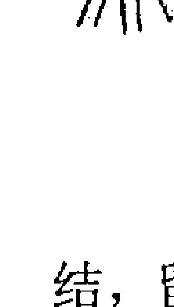

> 在此处洒下的水和土
> 让邪恶和伤害消失。
> 火和风，我召唤你
> 请净化并赐福于我！

将三根绳的一端放在一起打一个反手结，留下6英寸的长度的成流苏状的尾端。然后就开始编织，每一次编织都应暴露在月光下，并且诵念：

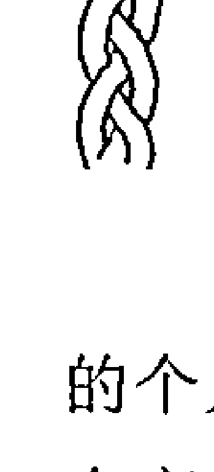

> 量身定制，捆绑锻造
> 上天赐福于你，缠绕的绳索！

在你编织的时候，集中注意力，将你的个人能力传送给它，这样，这根绳索就会变为的一部分。当你完成以后，再打另一个反手结，以防止末端松散。现在，从第一个反手结开始，在3.5英尺的位置打一个结，然后是4英尺的位置，接下来是4.5英尺，5英尺，最后一个是5.5英尺。在第二个反手结后面留下一节6英尺长未编织的绳索，并将剩余的剪掉，整理成流苏状。

现在，你便可以将你的扣带用作指南针绳，用于为不同的仪式以及不同数量的人群制作各种各样不同尺寸的魔法圈。无论何时，当你施放魔法，或者处于魔法圈中时，你都应该将你的扣带系在你的长袍外面你的腰部位置，披褂里面。但是，扣带不能和束腰外衣或者无袖外套一起穿着！

#### 第六节：魔法师腰带

不管怎么说，你的扣带不是用来挂东西的，也不能在大庭广众之下穿着。因此，你便需要一根腰带。当然，你也可以就用你的常规腰带，许多人都是这么做的。但是你可能也想要做一根特别的魔法师腰带。你可以去一间二手服装店，在货架上搜寻你能找到的最长的2英寸宽的腰带，或者你还用2英寸宽的皮革可以自己动手做一根长皮带，你可以在任一皮革加工物资商店买到这些材料。同时你还需要一个皮革打洞器在合适的位置打制皮带扣眼。你的魔法师腰带的长度至少要比你的腰围长一英尺，这样你就可以打个结并且让余下的部分悬挂垂下。腰带可以搭配你的长袍，束腰上衣，无袖外套一起穿着。你可能需要长时间地搜索一个完美的皮带扣。跳蚤市场和乡村集市都是很好的搜索场所，同样的还有文艺复兴集会以及魔法市场。你的皮带扣是一个非常私人并且独特的物品，在你发现它的时候你就会知道那就是你的。

##### 随身小袋和包

你需要几个随身携带的小袋子和包挂在你的腰带上，用于放置小东西。这些袋子和包可以是不同尺寸，不同材质，你可以购买，也可以自己制作。简单的束口袋很容易做也很实用，但是在你装东西和拿出东西的时候不是很方便。我通常都会在我的腰带上挂一个或者两个较大的有关合的口袋盖的皮革袋子，我会在里面装上我的钱包、眼镜，以及其它一些各种各样的我想带在身边的零零碎碎的小东西。简单的腰包图纸都可以在皮革物资商店买到，而且在同一个商店你还可以找到制作腰包的皮革和工具，因此我就不在这里作更多的赘述了。

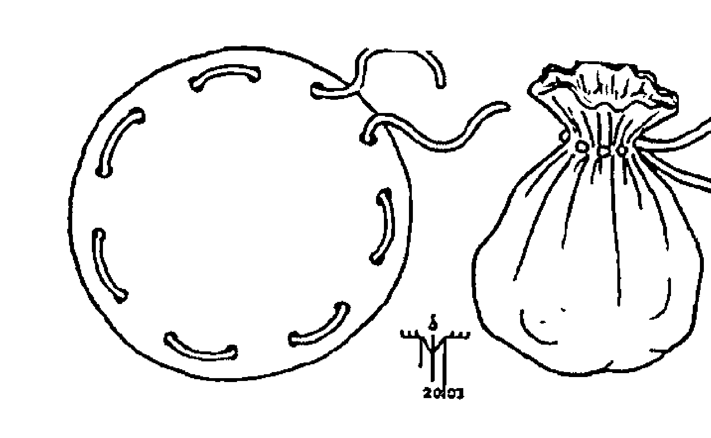

##### 你的手提袋

然而，有一种非常简单的束口袋的做法我可以教给你。它被称作网兜（reticule，也有“网”的意思），是专门用来盛放如尼石头的。要制作网兜，首先要在你当地的汽车配件商店买一张羊皮纸。将它平放在桌子上，然后将一个西餐用大盘正面朝下摆放在羊皮纸上制作模板。用一支毡制粗头笔勾画出餐盘的轮廓，然后用剪刀在羊皮纸上剪下一个圆。现在，用一个打孔机在这个圆的边缘均匀地每隔2英寸打出等距的孔。这些孔应该距离圆的边缘大约1英寸，也就是打孔机差不多的深度。准备一根大约3英尺的绳索或者皮革绳（布店或者皮革店有售），将绳索穿过这些孔。然后将绳索的两端打个反手结系在一起，将绳索收紧，网兜便成了袋子。当你将其展平，就成了一个圆圆的摆放石头的布垫。

##### 腰刀

对于魔法师来说，腰刀是一件非常重要的装备，但是也许你不能在公众场合佩戴腰刀（当然，一定也不能带到学校！），因为法律规定很多场合都不能佩戴双刃刀具。然而，在文艺复兴集会，魔法师聚会上佩戴这样一把刀是没什么问题的，还有一些你的魔法伙伴们举行特殊活动时佩戴也是可以的。在这些场合佩戴你的仪式刀是非常不错的选择，但是前提是你为你的仪式刀准备了一个很好的刀鞘。在刀鞘的盖子上应该有一个小小的按扣，以免你的仪式刀意外脱落。如果你的刀鞘上没有这样一个按扣，自己动手装一个。

##### 角杯 drinking horn

如果你想让自己的魔法装束显得极具冒险特质，那么你就会发现在你的腰带上悬挂一个角杯是非常有用的。我已经用牛角制作过好几个漂亮的角杯，我还花费了好几个小时打磨抛光。在你把牛角清理完成，抛完光，变得漂漂亮亮之后，你就应该用热乎的肥皂水将其由里至外彻底清洗干净。完全晾干之后，便在里面灌入熔化的蜂蜡，当蜂蜡在其内壁覆盖好薄薄的一层之后迅速倒出。随后将你的角杯挂在你的腰带上，但同时要保证它方便取下，你可以在角的两端系上皮带，再安上皮带夹扣，就像汽车钥匙那样，方便角杯挂上和取下。为了避免皮带脱落，要用一点强力胶水。

#### 第七节：魔法师的斗篷

当你进入魔法界以后你会发现，几乎每个魔法师（尤其是在晚上，或者天气很冷的时候！）都会穿着的，最容易辨认的衣服就是一件长长的黑色斗篷。魔法师的斗篷展开来看能够形成一个完整的半圆，而且你一定会喜欢你的斗篷的！坐在火堆旁边时穿上斗篷会非常暖和；它还能将坐在你身边的那个人也一起包裹起来；而且甚至你在睡觉的时候可以将它当做毯子裹在身上。我外出的时候一定会带上我的灰色斗篷，这件斗篷我已经用了几十年了！

去当地的布店，选择希普利西提的7016号图样或者麦考尔6774号图纸来做斗篷。这两种图纸都很不错，使用这两者中的其中一个都会让制作工作更加简单。希普利西提9887-B, C, D号图纸已提供了非常好的披风和斗篷剪裁设计，我推荐你购买两张美国军用羊毛毛毯，相对而言比较便宜，而且有几种颜色供你选择，当然这也取决于分店的货物数量（白色的海军毛毯库存一般都比较足）。斗篷的图纸要求有四张成直角三角形的布料，而且得是两张毛毯裁成的尺寸相等，形状一致的直角三角形。而从肩膀的位置裁剪下来的弧形的部分正好可以用来做兜帽。你能在军需商店买到这样的毛毯。

当然，你也可以使用其它的你喜欢的尺寸相同的厚布料。许多魔法师会使用漂亮的天鹅绒用精心设计的裁剪工艺来制作斗篷。如果你想要做一件隐形斗篷，你可以购买一些轻薄的“光芒四射的透明薄织物”，这种衣料会在不同的光照和角度中改变颜色。这种衣料一般有几种微微发亮的颜色，但是能够在户外做到隐形的最好颜色就是绿色。使用平式针法缝合，让缝合处尽可能地窄。斗篷要足够长，将你的双脚也包裹在里面，而且兜帽也要够大，能够将你的整个脸都能盖住。我推荐你使用希普利西提的9887-D号图纸来制作你的隐形斗篷。

制作斗篷的衬里时，衬里材料的剪裁也要使用相同的图纸。从棉布到绸缎，你可以选择你喜欢的衬里材料。一些人会使用伪装材料，这样他们就可以在将他们的斗篷反面穿时变得隐形！（但是制作隐形斗篷时不需要衬里——你需要能够透过斗篷观察外面的世界！）不要忘记了还要在斗篷的侧边留下两个宽敞的开口用作袖洞，就在你手肘的位置。最后，你需要在你的斗篷上安装系扣、饰扣、纽扣、扣钩，或者是设计精巧的斗篷别针——随你喜欢。

## 第七节：魔法师的帽子

帽子很重要。它们不仅仅是服饰。帽子可以表明你的头衔，表明你的身份。没人听说过一个魔法师会没有尖顶帽——至少，没有魔法师会说自己没有。而且你肯定也从未听说过一个没有尖顶帽的、魔法师。……也不是说魔法师就非得戴上尖顶帽。每一个行业，每一种工艺都有自己行业的帽子。这就是为什么国王会有王冠。从国王头上将他的王冠拿走之后，你们所有的人看到就会是一个拥有小下巴的人在向人们挥手致意。帽子代表着权力。帽子非常重要。 ——特里·普拉切特（《国外的魔法师》，pp. 223-24）

高高的尖顶帽在传统上便与巫师紧密联系，并拥有着悠久的辉煌历史。几顶惊人的由锤制的黄金薄片制成的圆锥形帽子已经在德国和法国被发掘出来，这两顶帽子可以追溯到青铜器时代，公元前1400-900年期间。帽子上面精心制作的浮饰饰品由一些符号组成，而这些符号都非常明显地代表着太阳、月亮、行星，以及其它恒星——正如我们在从中世纪到现代的魔法师的照片上所看到的一样。埃朗根大学的萨拜因·格洛夫对着邪恶帽子这样说：“它们表明了佩戴这些帽子的人与天神有联系，而它们具有象征意义的尖顶指向天堂，同样也知道天体运动的秘密，也有可能知道未来。”

在来自土耳其、叙利亚、塞浦路斯的小型的青铜塑像，圆筒印章，以及雕刻品上我们也能看到类似的尖顶帽，这些我们都可以追溯到公元前2500年之前。甚至其中还有两件是在瑞典发现的。在中国的西部，戈壁沙漠之外，一些古老的高加索木乃伊也在最近被发现。是其中一个女人，大约生活在公元前200年，出土的时候她仍然还戴着一顶高高的黑色锥形帽，看起来活像是那些女巫的传统衣着！

巫师帽子现在在服饰搭配中是越来越流行了，所以你可以在任意一间服装店中买到非常漂亮的尖顶帽——尤其是在万圣节前后。然而，如果你想要自己制作一定巫师帽，希普利西提的9887-A号图纸就能为有帽檐的巫师帽提供参考。

## 第八节：魔法师的首饰

魔法首饰对于巫师来说是非常重要的。每一件首饰都经过了精心挑选，而且这种首饰对于佩戴者来说，通常拥有着深厚的个人意义。每一件魔法首饰通常会刻有或者镶铸有五芒星、六芒星、古埃及十字架，乌迦特（udjats，“太阳神何露斯之眼”）、圣甲虫、神使之杖、雷神托尔的铁锤、凯尔特的图腾、占星学的符号、神的符号、龙，以及许多其它的神秘学的符号形状。一旦你了解了其中的一些象征符号，通常来说你就能通过他们的首饰来辨认他们的魔法师身份——甚至是当魔法师们巧妙地装扮成普通人的时候！事实上，这就是我们彼此识别的主要方式。

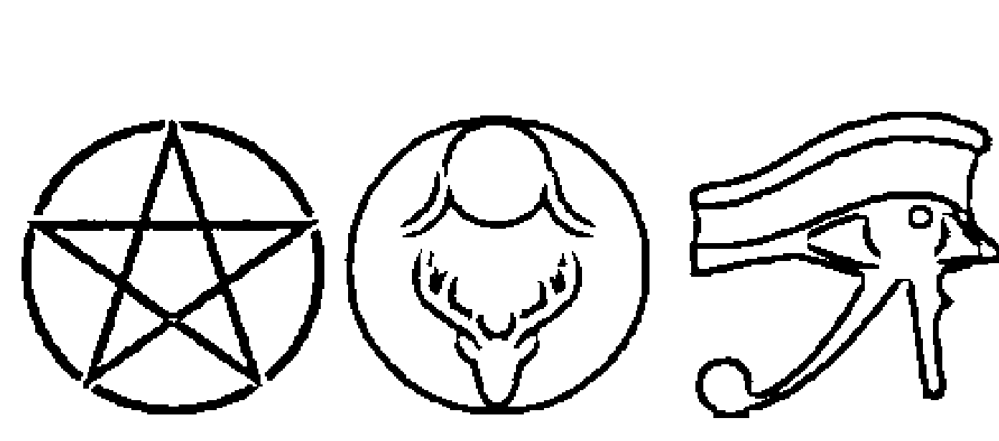

许多首饰也可以是用于保护、带来好运，或者治疗（详情请看课程之三，第七课，第七节：“驱邪物和护身符”）的符咒、驱邪物、护身符，以及其它的具有魔法的物品。然而，你要牢记，如果你打算在公共场合佩戴魔法首饰，你应该做好随时解释的准备——因为人们会询问你关于你的首饰的一些问题。举个例子，你可能需要考虑将它隐藏在你的衣服里面，只展示给那些明白的人看。

项链的所有种类在魔法师中都是非常流行的——尤其是女巫。这些项链可能是由一些特殊的魔法石头串成的，比如绿松石或者琥珀，或者像橡树子，豆类一类的物品，或者木珠子，或者是用包含了神秘的象征符号或者图腾动物的符咒。对于普通人来说，这些可能就是一些普通的项链，但是，如果你仔细看，你会从那上面的符号中发现出不同的东西。传说中最著名的魔法项链是布里希嘉曼（Brisingamen），为挪威司爱和美的女神弗雷娅所佩戴。

- **金属项圈**是由三根结实的金属丝或者金属线相互之间紧紧扭曲缠绕为一根像弹簧一样的螺旋形的饰环，两端没有闭合而且做了盖套，通常是做成动物头的形状。凯尔特人和挪威人佩戴它们来表明领袖身份，而且还表明他们与天神的关系。
- **垂饰**，魔法师们佩戴的垂饰通常是磁盘形，五芒星形，或者有着特殊印章的用于提升防护力，带来好运，健康，或者其他益处的护身符。因为这些垂饰可以是任意尺寸，所以样式的可能性便是无穷无尽的。其它最流行的垂饰便是各种大小各种类型的晶体石（最普遍的就是石英），通常和漂亮的银饰镶嵌在一起。这样的水晶垂饰也可以在占卜时被用作灵摆（详情请看课程之五，第二课：“占卜”）。另外一种垂饰可以是龙、精灵、独角兽的形象、神的肖像、古埃及十字架、雷神托尔的铁锤，或者是任意佩戴者喜爱的物品。事实上，我还自己制作了很多这样的垂饰，赠送给了很多人佩戴。我自己最喜欢的，也是我在穿着我的法师长袍时最常佩戴的是一个大大的并且一直都在运行的星盘（如图所示）。

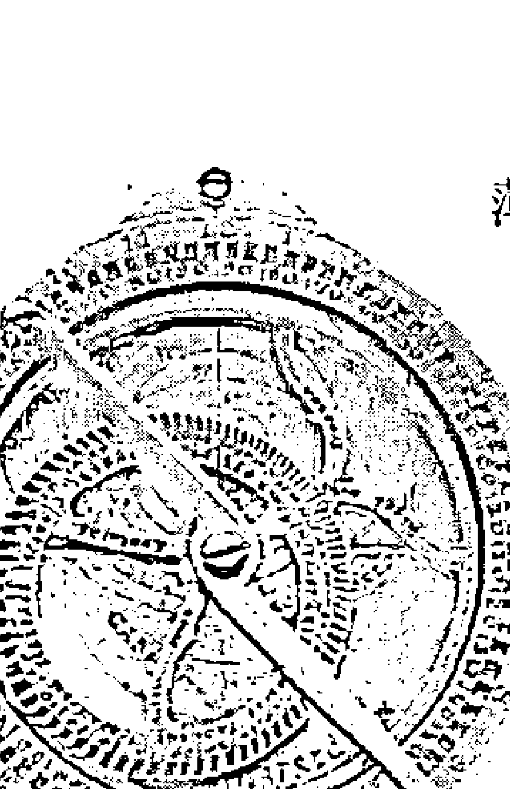

薄的带子，这种类型的通常由祭司佩戴。另外一些种类的饰环上也许附有精心制作的金银掐丝，或者大型的兽角、鹿角、或者鸟类的翅膀。

- **指环：** 古往今来，魔法指环一直都为魔法师所佩戴。其中有一些，例如著名的所罗门王指环，因为它们具有传奇的能量而闻名。很难找到有一位魔法师会一枚指环都没有，而其中一些魔法师会在每个手指上都佩戴一枚指环！通常来说，至少有一枚的指环是五芒星形的——魔法中最基本的象征符号。其他的一些会镶嵌有特别的魔法石（详情请看课程之三，第七课，第七节，8：“魔法矿石”），通常会镶嵌在华丽的饰品上。魔符戒指，上面有佩戴者的私人印章，是另外一种受欢迎的设计，这些戒指作为一种印在封蜡上的识别印章会让人眼前一亮。（详情请看课程之三，第七课，第七节，5：“设计你自己的印章”）
- **臂章：** 虽然臂章远不及垂饰和饰环普遍流行，但是也有很多魔法师佩戴臂章和腕套。通常，臂章和腕套的设计改编自凯尔特人或者挪威人的服饰。盘踞的蛇的设计也很受欢迎，尤其是在女魔法师中。在某些传统中，女祭司会佩戴一个刻有特定铭文的宽宽的银手镯，男祭司会佩戴刻有特殊符号的金项圈或者黄铜手镯。
- **耳饰：** 几乎所有的女巫师都会佩戴耳饰。事实上，对许多女孩子来说，耳朵穿孔是一个最基本的成人礼仪式。刻有魔法图案的坠饰耳环——尤其是五芒星和埃及十字架——在各个年龄阶段的女子之中都很受欢迎。这个风俗在男魔法师中也变得越来越普遍，他们会佩戴设计略显简单的耳饰，如环式耳环和耳钉。
- **发带，冠冕，和头环：** 你很少会在街上看到这些饰品，当魔法师——尤其是女魔法师——和其他魔法师在一起，或者在举行仪式的时候，通常会佩戴漂亮的发带、冠冕、头环和花冠。如果你去参加文艺复兴集会或者魔法聚会你就能看到许多人佩戴这些饰环。有的也许非常简单，例如一根在前面镶有五角形，月亮，或者小型兽角的细

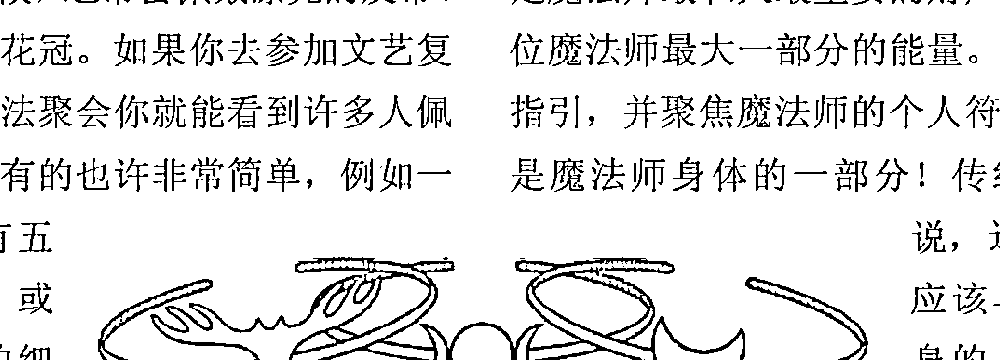

## 第九节：魔法师的法杖

魔法师的法杖被称为 verendum。这是魔法师最私人最重要的财产，承载了一位魔法师最大一部分的能量。用于控制、指引，并聚焦魔法师的个人符咒，事实上是魔法师身体的一部分！传统意义上来说，这一种法杖应该与魔法师自身的身高完全一致。魔杖上的水晶是用于照明的工具，和甘道夫的一样。我的法杖便是这样设计的。和魔杖、仪式刀，或者短剑一样，魔法师的法杖也会有自己的名字。我的法杖叫做“寻路者”，而且在整个魔法界众所周知，大家也都能识别出我的法杖。下面就是我对我的法杖的描述：

因为在创造或者使用一柄真正的魔法师法杖时它会被赋予很多的能量，所以一位魔法师终其一生也只能打造一根法杖——除非这根法杖发生了意外，魔法师需要另外制作一根来替代它。我从1972年开始就拥有了我唯一的法杖。我甚至还在坐飞机的时候，专门为其制作了一个包装工具，我到世界的任何地方都会带上它。

然而，这样一根法杖却不比一柄短剑更加适合一名魔法学徒。有几个原因。第一个，也是最显然的一个原因就是身高问题。只要你仍然在发育，现阶段你按照你的身高打造的任何的法杖在几年之后都会与你那时的身高不再相符，而你也不得不重新打造。这样的魔法是非常无益的，你要将一种能量置入一种非常私人的魔法器具中，而这柄器具却注定会在不久的将来被淘汰而不得不弃用！第二点，打造一根真正的魔法师法杖要求的承诺和能量的程度是一位只受过学徒阶段训练的魔法学徒所无法想象的——就和你不能想象在你人生的这个阶段结婚生子是一样的！因此，我不会在这本魔法书中提到制作法杖的说明。然而，如果你想要制作并且携带一根简单的行路杖，那么当然是没有什么可以阻止你这样做的，只要你不就是想着要打造一根真正的魔法师法杖！

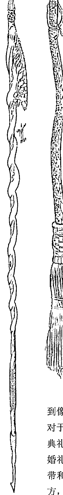

## 第十节：长扫帚

即使很多人的扫帚意识都是来源于哈利波特的魔法扫帚光轮2000，但是事实上这种附了魔法的扫帚（名叫长扫帚）并不是供男巫乘坐的飞行器，而是仅供女巫使用的，传统上来说，女巫们会在魔法飞行或者星际旅行的时候乘坐扫帚。

作为一种生殖器的象征，长扫帚与大量的代表生育力的仪式都有联系。乘坐在扫帚柄上在空中跳跃是一种古老的魔法仪式，是为了鼓励作物能够长到像骑扫帚的人所跳跃的那么高。今天，对于长扫帚最流行的使用是在订婚（结婚）典礼结束的时候的一个习俗“跳扫帚”中。婚礼结束以后，新人会将扫帚——再以绶带和鲜花装饰起来——挂在他们的婚床上方，或者在家族祭坛的上方。这种装饰好了的长扫帚在魔法界中是最受欢迎的结婚礼物。

制作或者获得一柄新扫帚最佳时间是在复活节或者春分节这一天（3月21日）。这一天通常是女巫为她们的长扫帚起名的日子，就像男巫对他们的法杖所做的一切一样。而且还要举行仪式圣化扫帚，并且可能还要用来清扫魔法圈。还有一些民间风俗也与扫帚有关：将扫帚横放在房间的门槛处，或者就放在门内也可以，这样就能驱赶霉运或者将邪恶的鬼怪拒之门外。在床底放一柄扫帚能够在梦境中保护睡觉的人。千万不要在日落以后打扫，否则你就会打扰到四处游荡的鬼怪，而幸福就会被扫地出门。一柄旧扫帚会将不幸与灾难带入新房。扫地的时候永远都要先扫屋内，从门廊出开始扫，这样好运就不会离开。将尘土扫到房间的中间就能免受厄运的侵害。新扫帚第一次使用的时候许下的心愿就会实现，而且当你扫地的时候，当扫帚意外掉落的时候许下的愿望也能实现。但是千万不要使用新扫帚去清扫屋外，否则的话，好运就会随同污垢一起被扫除！

### 第四课：魔法师的至圣所

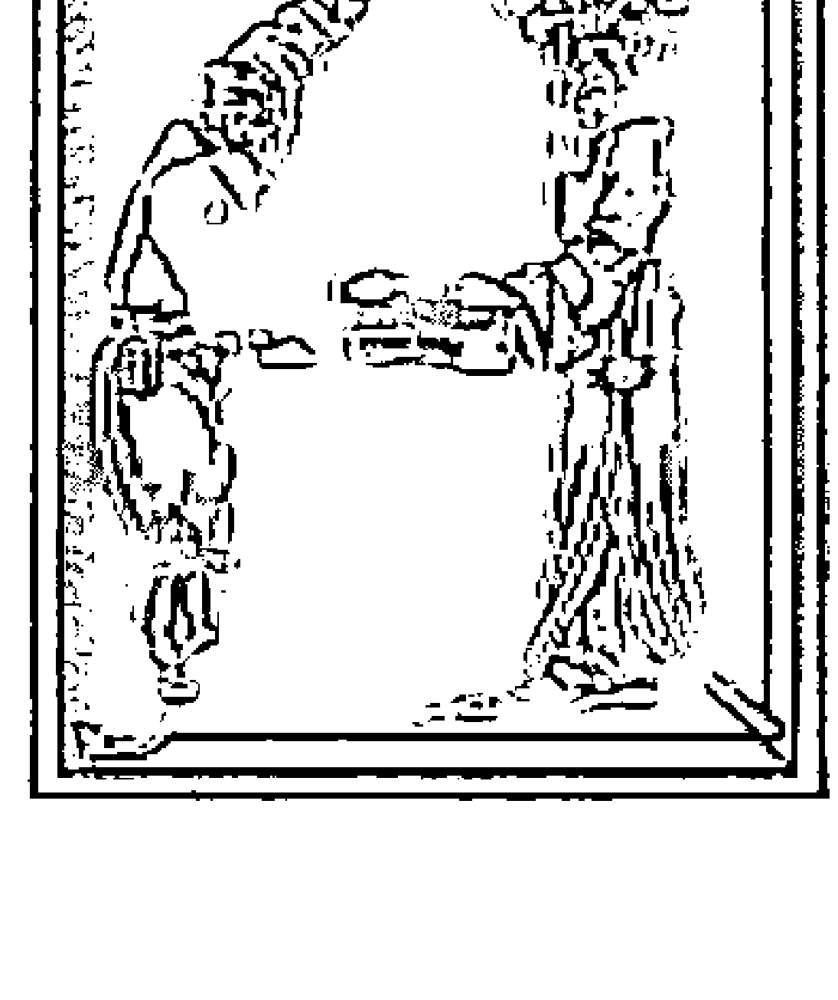

#### 第一节：简介 - 你的魔法房间

一个魔法师的私人学习场所被称为他的至圣所，意思是“一个最为隐秘而且神圣不可侵犯的地方”。如果你足够幸运，能够在你自己的家中拥有这样一个你自己的房间，你便可以着手准备在里面放置一些有魔力的物品。如果你会继续追寻这些研究，你就要搜集大量的物品放在你的房间中，而且这些东西很有可能不是一次就能摆下，因此，在你研究的初期，开发出一些搜集体系是很重要的。也许你家的周围还有很多其它的房间你可以用作特定用途——例如阁楼，地下室，车库，屋棚，或者谷仓。但是即使你住的是一个很小的房间，并且还有兄弟与你共享，你也可以想象并且规划一个未来的至圣所。在你开始将你的房间（或者你家中的其它房间）用作一个魔法师的至圣所之前，你需要征求你父母的同意，让你使用那个空间——而且还要制定一些基本原则来限定在这个空间中能做什么，不能做什么。例如，明火（比如蜡烛）或者焚香可能就是一个禁忌。而且记住，无论你希望你的至圣所是多么的“私人”，你的妈妈都会进来！

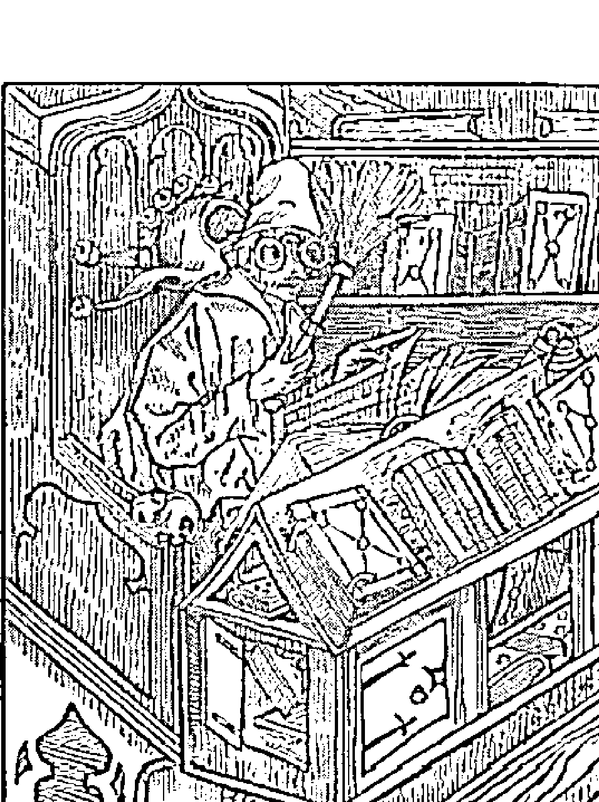

#### 第二节：你的神秘藏书室

Library（图书馆，藏书室）这个单词来自于拉丁语中 liber，意为“书籍”。通常人们都会这么说，在一位魔法师的家中，每一面墙都堆满了书架。如果说魔法师最为著名的一个特质，那就是我们对于知识的热爱。因此，每个魔法师本质上都是一名图书管理员和博物馆馆长——而且每一位魔法师的藏书室都是独特的。因为如果你拥有大量的自己的书，你就应该想着给它们归类，存放在不同的书架上，或者将它们与其他的物品分开放置。我的藏书室的收藏开始于孩童时代，那时我的父母送给了我两本书，名为《世界工艺百科全书》（World Craft Encyclopedia）和《儿童工艺藏书室》（Child Craft Library）。从那时候开始，我的收藏开始不断增多，到现在我拥有了成千上万本书籍，而且各地的人们都来此借阅。以下是雷文哈特藏书室的一些主要的分类：

- 1. **魔法类**——知识和实践、宗教和传统的比较、占卜系统、魔法书、众影之书、法术咒语书，等等。
- 2. **科学和自然**——所有的学科，包括地质学、生物学、动物学、生态学、物理学、化学、天文学、古生物学，等等。
- 3. **超自然科学**——UFO、不可解释的现象、异常现象、隐生动物学、野人、尼斯湖水怪、龙、乌贼、动物寓言集，等等。
- 4. **历史**——考古学，大事年表，灭绝生物复制，地图，旅行，从人类初期开始的每种文化和文明的历史。
- 5. **神话和传奇**——来自每个人的故事，男神和女神，史诗般的冒险故事，创世神话，传说，民间故事，精灵传说等等。
- 6. **现代小说**——在我的藏书室中，这个种类最大一部分时科幻小说和幻想作品！
- 7. **艺术书籍**——所有我最喜欢的艺术家，包括相册，卡通，图像小说，漫画，等等。
- 8. **参考书**——几套百科全书，辞典，年鉴，时间和生命系列，等等，既普遍也独特。我有很多这样的书籍！
- 9. **影像资料，光碟，磁带，以及唱片**——所有我最喜欢的电影和音乐，电视节目，电视剧，以及特别节目的录影。

在这本魔法书的背面，我列举了你在开始你自己的魔法藏书室时可以收集的几本书。至于剩下的呢——你可以自己决定！要经常去书店的二手书区域、旧货商店、跳蚤市场逛逛，因为很多丰富你藏书室的最佳书籍都会是一些真正古老的书。另一个获取旧书的来源就在当地的公共图书馆，他们会定期地从他们的书架上将旧书清理出来，为新书腾出位置。有时他们会将旧书放在一个盒子中，以便路过的人们可以自取所需。在任何情况下，你都应该办一张借书证，并交待图书管理员在下次清理旧书的时候能够通知你。

#### 第三节：你的圣堂

你的圣堂就是一个你施放魔法、举行仪式的空间。这并不需要一个多大的地方，也不需要始终保持应有的设施。你的床就是一个很好的选择。在你的圣堂中唯一需要永久存在的道具就是你的圣坛，我们在课程之一第二课“成为魔法师”中就已经提到过圣坛，而你也应该早就设置好了你的圣坛。这是你自己独有的圣坛，可以用于赞美你的生命和你周围的魔法，而且你在上面放置任何你所找到的，拥有特殊魔法的物品。

你的圣堂应该拥有四个主要方向的指示标——东方、南方、西方，和北方。判断一下你的哪面墙或者哪个角落最接近于对齐这些方位，然后在相应的墙面或者角落上装饰对应的颜色。有些人在这个过程中发挥了极大的想象力，甚至会挂上不同颜色的纸质或者布制的标有适当印章的旗帜（如上图所示）。其他一些人会挂上一些会让他们想起四大元素方位的图片，例如云层的景象（东方）、火或者喷发的火山（南方）、海洋（西方），以及山脉（南方）。而且我已经创造了一系列的四大元素的墙面饰板，都可以用于这个用途。

你的圣堂也应该预留一个位置来布置你的魔法圈。传统上来讲，你可以使用一支粉笔将魔法圈画在地板上，事后你便可以用湿布或者湿海绵将其抹去。如果你完全按照我在上节课所讲授的方法制作的扣带，你就可以很轻松地测量好魔法圈的大小，并画上这样一个魔法圈。只需固定好中间部分的第一个结，然后在另一个结的位置握住粉笔，你便可以像使用圆规一样轻松地画好你的魔法圈。你也可以用绳子画一个更大的魔法圈。

艾比·维诺如特早已将漂亮女神坦布尔和绿人格鲁夫（Goddess Temple and Green Man Grove）一起挂在了网上，你可能会想要去看看，网址是：http://www.spiralgoddess.com

#### 第四节：你的魔法展览馆

正如 T. H·怀特笔下的梅林一样，年长的魔法师都是因为他们的“珍品陈列柜”而出名。这些收藏品为世界上伟大的自然历史博物馆奠定了基础。有很多的自然（以及非自然）物品你可以搜集。在你的房间里为这些物品预留一个空间，例如书桌、窗台，或者是梳妆台的顶部，并为你发现的魔法宝物设计一个特殊的场所。购买一些东西也是可以的，但是去寻找一些他人没有注意到的宝物却能更加地激动人心。

然而，如果你是认真地想要收藏的话，你就会想要将你的收藏品有系统地整理摆放。个头比鸡蛋还要小的物品就可以有组织地安排在鸡蛋纸板盒中。这些用于存放各种各样的岩石、矿石，以及水晶是非常方便的，如果你坚持要搜集一些小型的物品，这些纸盒也适用于贝类。较大的物品就需要较大的摆放构件。你通常也能在商店里找到一些不同尺寸的，专门搁置和收纳物品的收纳盒。这些收纳盒可能是木头，塑料，或者硬纸板制作而成的。有时从杂货店购买的盒子都是自带隔层的，这些盒子可以割开，而且适用于制作非常棒的储物盒。一件真正精美的收藏品也可以在校园活动和科学展览上举行非常好的展览会。无论你在搜集什么，你都应该为每一件物品制作一个漂亮的标识卡片。然后你的生活就会变成一个伟大的寻宝游戏，因为你会在你到过的所有地方为你的收藏品寻找新的伙伴。

##### 收集

- 贝壳——当我还是个孩子的时候，这是我最先开始收集的物品之一，最终，我，将他们存放在一个巨大的梅森奈特（商标名）纤维壁板上，穿过纤维板上小孔的电线会将贝壳固定在特定的位置上。

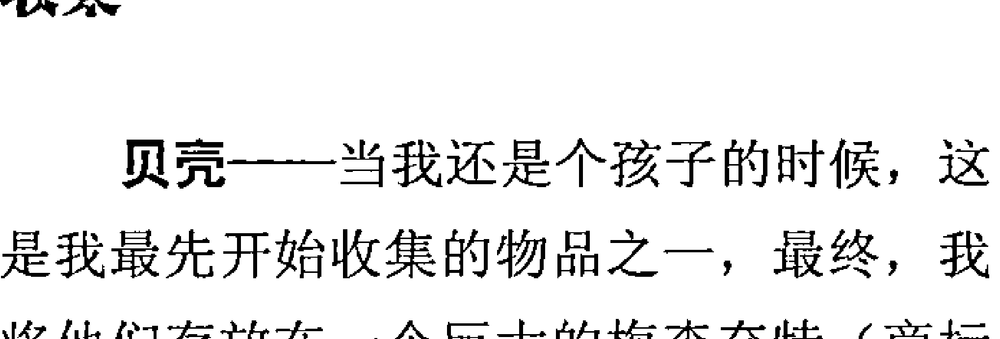

- 树叶，种子，和花——要熟知你当地的树精（我在课程之二，第四课：“回归自然”中有提到）最好的办法就是在你附近收集一些你能找到的干树叶和树种子。或者将野花收集起来做标本，然后看看你能找到多少！制作树叶和野花标本并不需要太多空间，因为你可以将它们压制在相簿中。只是不要忘了给每个标本做好标注。
- 岩石和晶体——在搜集岩石、矿石，以及宝石的过程中，你要记住它们之间的魔法关系，以及它们的矿物特质，然后将这些信息记录在识别卡上。地球上有接近 2000 种不同的矿物质，所以，你需要花上很长一段时间来忙于采集样品！另一方面来说，你可能想要一些专业性的东西，那么你就可以只采集一些特殊种类的晶体。

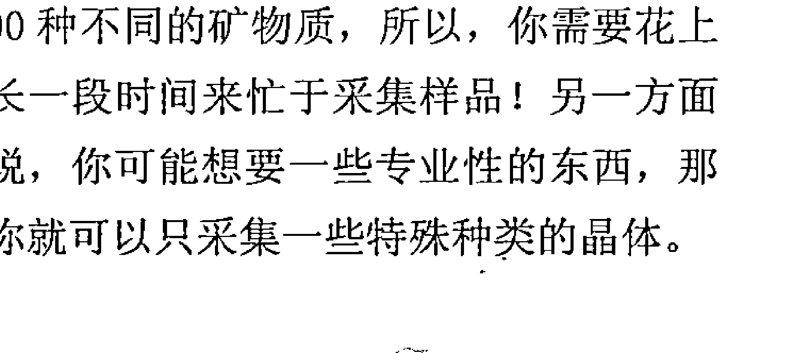

- 头骨——我最喜欢的个人收藏还包括很多不同种类的动物或者鸟类的头骨，当我还个是小孩子的时候，我就开始搜集死在马路上的动物头骨，将它们洗干净为我的收藏做准备。我发现动物头骨绝对是非常令人着迷的，每一块动物头骨都有其独特的架构、齿列，以及感觉器官的分布。当我在路上发现了未被压碎的骸骨时，我会小心翼翼地将头骨取下来，然后我会把它带回家，放入煮沸的开水中消毒。当然，我不断地往壶中加水，但是在几个小时之后，骨头上的所有肉体就会脱落，在经过清水的几次冲洗之后，我便可以小心翼翼地将骨与肉分离开来。

尤其是要小心头骨上的门牙，当牙龈上的肉脱落以后，门牙就很容易掉落。清理头骨时很好用的工具包括牙医的探针（你可以向你的牙医索要一根他用过准备

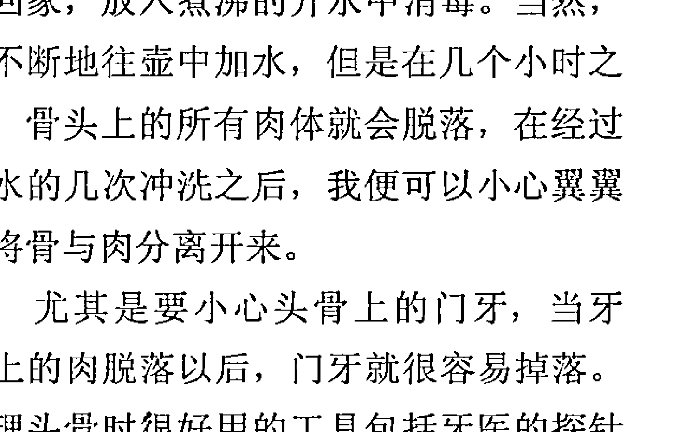

###### 魔法师学徒的魔法书 | 上卷

丢弃的探针），从手工艺商店买来的陶艺工具，以及一柄旧牙刷。我会用白色的乳胶（用湿润的海绵将其擦拭干净）仔细地黏合牙齿和头骨的连接处，然后将两边的下颌粘在一起（用橡皮筋将它们绑在一起）。最后，清理干净的头骨就是一件非常漂亮的工艺品。

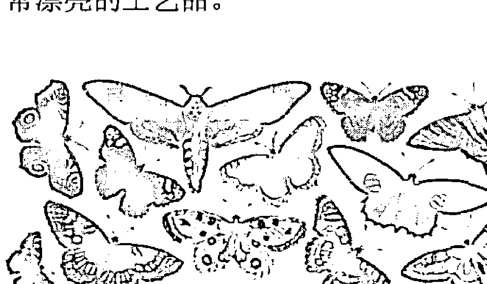

###### 昆虫和蝴蝶

我小时候去参加夏令营时，我的导师培根斯队长教会了我们怎么制作捕虫网和毒瓶来捕捉蝴蝶、飞蛾，以及其他的有趣的昆虫。我用玻璃窗格和浅口盒子制作了陈列盒子，并收集了大量的蝴蝶和昆虫标本。然后，蝴蝶收集爱好者们心中的“圣杯”便是非常机敏而且纤美的月形天蚕蛾，它拥有一种神秘的淡绿的颜色，就像荧光棒中的荧光素。最终，在经过了几年的搜寻以后，我捉住了一只。

我将它放入装有氰化物的广口瓶中毒死，然后得意地将它钉在我的陈列盒中。也为此，当它的发出冷光的色彩在瞬间褪变成苍白的稻草颜色后，我极为震惊。我这才知道，月形天蚕蛾是一种仙子般的生物，是不能被杀害而展示在凡人的眼前的。从此开始，我就再未捕捉过一只蝴蝶。

###### 化石

搜集化石非常有趣，尤其是你恰好居住在一些存在大量化石的区域时。当我还住在中西部的山区中时，我经常都会在河边发现一些三叶虫和古生腕足类的化石。装鸡蛋的纸板盒是摆放这些化石的最佳选择。《自然化石的黄金指南》(Golden Nature Guide to Fossils) 这本书对于收集化石很有帮助，里面有大量的样本插图。

###### 印第安的史前古器物

在北加利福尼亚州，也就是我现在居住的地方，没有化石，因为这里的陆地是在地质年代的近期形成的。但是我现在居住了多年的大农场曾经是波莫印第安部落的主要扎营区域，每当雨后我们就会在花园中新翻过的土地上发现很多箭头、打火石、刮刀，以及其它一些古器物。我从不收集这些物品，但是其它的农场工人喜欢，这能让他们参与到当地的考古工作以及对当地种族的研究工作之中。

###### 古玩

真正不同寻常的“独一无二”的物品被称为古玩。在这一类物品中，我拥有一些就像陨石一样的玻陨石，这些陨石都来源于那次毁灭恐龙的天体大冲撞；一个非常逼真的用山羊皮做的干瘪人头；一个人类头骨（是我在医学院时搜集的）；还有我在世界各地旅游时搜罗的各种各样的小型纪念品和当地的手工艺品。

###### 实景模型

实景模型是一种小型的场景模型，其中包括一些人，物，景观的缩影，以及喷漆背景。当我年少的时候，我经常被博物馆中的这些模型所吸引，因此，我就自己制作了很多这样的模型。你真正需要的只有一个坚固的木制箱子，有开口的那一面朝向前方。尽力找寻一个相配的相框依附在开口的前方（旧货商店和跳蚤市场都是寻找这种相框的好地方）。在相框后面上前方的角落上安装一颗圣诞树的小彩灯，以提供照明。你可以使用来自复制中心的油画和放大的照片作为背景图片。将图片贴在一张硬纸板上，然后将硬纸板环绕在木盒内的四周成为连续的卷曲状。如此这般，盒子中就不再有角落。（如图所示）。

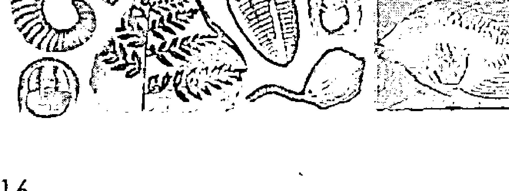

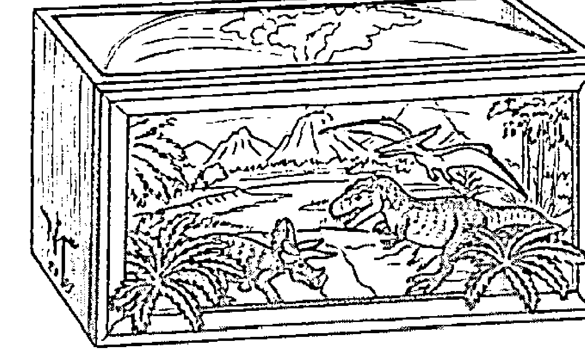

你可以制作一个场景上用的人形公仔、铁轨微缩模型、小雕像、宇宙飞船、动物、海洋生物，或者（就我而言）恐龙模型，正如我所画的图中所示的那样。地面可以使用“厨房粘土”来雕刻，苔藓作为草地，鹅卵石作为大岩石。一些植物可以使用真正的树枝，蕨类植物，等等来代替；或者你可以在水族馆物资供应店中购买塑料做的植物，或者从铁路爱好商店（railroad hobby stores）中购买盆景。如果你有足够的空间来摆放这些模型，你可以通过制作这些实景模型获得很多乐趣——你甚至还可以带领你的实景模型去参加科学和爱好聚会。

###### 怎样制作厨房粘土：

将一杯玉米淀粉，两杯小苏打以及一杯半的冷水混合在一起。加入食用色素增色，然后用中火加热，不断地搅拌，直到最后拌匀成为一种面团类的物质。冷却以后，用一张湿布盖起来，直到你准备好开始雕刻。雕刻完成以后，在表层涂上一层虫漆便可以密封并保存好制成品。

#### 第五节：模型和机械装置

许多魔法师同时也是伟大的发明家，比如英霍蒂普，阿基米德，以及列奥纳多·达·芬奇。同时他们也会收集一些有趣而复杂的新玩艺和手工艺品——尤其是时钟和用于观察和测绘天体运动的仪器。

地球仪和地图——你至少应该拥有一个地球仪，这样你就可以熟悉你自己居住的家园。除了一个现代的地球仪，我还有一个文艺复兴时期的地球仪复制品，上面还有龙和海怪。这是我在一家旧货商店找到的。我还有月球仪和火星仪。国家地理学会制作的各种各样的漂亮地图在旧货商店也能找到，包括星座图。如果你有足够的空白墙面，挂上一张好的地图会显得非常奇妙，你甚至还可以定期更换地图，我就是这样做的。现在，我的一面墙上挂着一张中土世界的地图，另一面墙上挂着1627年的世界地图。

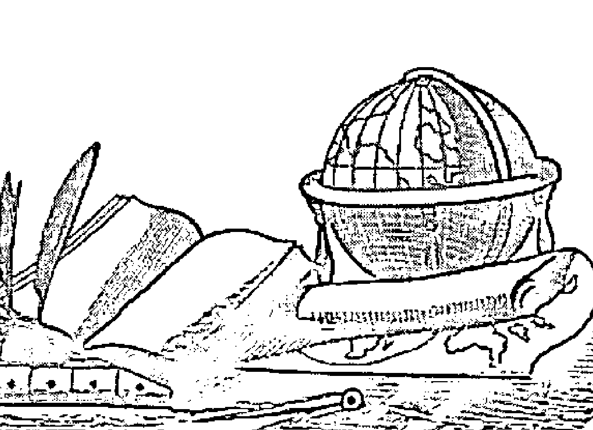

##### 沙计时器

沙计时器——日晷、滴漏、星盘、计时蜡烛，以及沙计时器（通常被称为“沙漏”）都是在发明机械时钟的很久以前就已经发明出来了的。所有的这些计时器中，沙计时器直到现在还在广泛使用中，而且仍然十分有用。我保存有几个计量不同时间长度的沙漏，尤其是在开会的时候我们会用到它们，给予每个人相同长度的发言时间。

##### 列奥纳多的扑翼飞机

列奥纳多·达·芬奇（1452 - 1519年）是意大利文艺复兴时期最伟大的奇才。然而，在他大量的成就与发明之中，因其独创性而最为闻名遐迩的设计便是他的飞行器，从未真正飞行过的飞行器。不幸的是，列奥纳多对于鸟类飞行的研究是以小小的燕子为依据的。如果他研究的是大型的翱翔在蓝天中的像鹰、秃鹫，以及信天翁一样的鸟类，他一定早就已经意识到挥动翅膀并不是托起大型的飞行器的最好办法，而且他应该已经创造出了真正的悬挂式滑翔机。通过挥动翅膀起飞的飞行器叫做扑翼飞机（意为“鸟类的翅膀”），而且玩具店中确实有卖各种各样的可以飞起来的小型扑翼飞机模型。我便有几只这样的飞行器，展览或者驾驶它们都是一件有趣的事情。

#### 第六节：动物园

朋友手中的列奥纳多·达·芬奇扑翼飞机的实用模型，专为魔法学徒准备的。

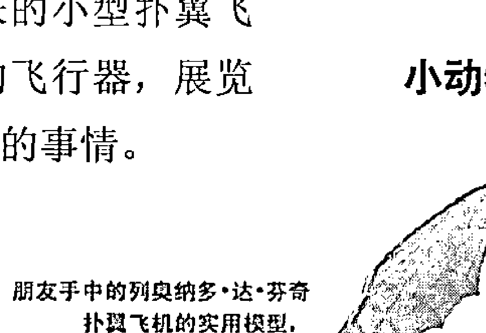

……六只活的青草蛇住在一只玻璃缸中；一些独居黄蜂的蜂巢被很好地安排一根玻璃量筒中；一个普通蜂巢中的居民在窗户上不断地进进出出，丝毫没有受到侵扰；棉绒中住着两只小刺猬；魔法师一出现，一对獾立刻就开始发出咕 - 咕 - 咕的大叫声；二十个装满毛毛虫的盒子，其中六分之一的是黑带二尾舟蛾，甚至一枝夹竹桃上都有2 - 6只毛毛虫，所有的都在各自喜欢的叶子上进食，……两个蚂蚁巢穴筑在两块玻璃板之间，……一窝田鼠活蹦乱跳地……

> ——T.H.怀特，《石中剑》，第33 - 34页）

如果你的至圣所中还有空间——或者是你家里的任何地方都还有空间——你可能会想要为一些可爱的生物创造一个小型的魔法动物园。当然，饲养动物最重要的一点就是知道怎样去适当地照顾它们，这样它们才能在你的手中茁壮成长。你当地的宠物店会有一些有关照顾和饲养各种各样类型的小动物的小手册，你应该为你选择饲养的动物复制一些这样的手册。

##### 小动物饲养箱（terraria）

（terra，“土”）——这是饲养小动物最基本的“入门套件”。你只需要一个大型的拥有安全盖的玻璃缸。测量一下玻璃缸底部的尺寸，然后到外面切一小块大小合适的天然草皮。草皮的厚度大约3英寸，留下一个约3英寸深的积水盘，至少要6平方英寸大小。如果你能找到一个透明的塑料或者玻璃材质的四方形盘子（例如烘焙用的盘子），那就非常完美了。将盘子倚靠在玻璃缸的正面，这样你就可以看到水下的生物了。

在这样一个玻璃缸中你可以喂养青蛙、蟾蜍、蝾螈、乌龟、蜥蜴、小蛇，以及大个儿的臭虫——所有你在野外能够找到的生物，或者能在宠物店买到的宠物。当然，你得警惕那些以臭虫和蠕虫为食的青蛙、蟾蜍、乌龟，以及一些蛇类，而且还有一些蛇会吃青蛙和蟾蜍。因此，如果你特别喜欢所有的小动物，不要将它们与它们的天敌放在同一个玻璃缸中！

我建议你使用一个单独的玻璃缸将所有有趣的虫类放在一起。你可以在这个玻璃缸中喂养甲壳虫、蟋蟀、草蜢、蜘蛛、蜈蚣、千足虫、蛴螬、蠕虫，以及毛毛虫。毫无疑问，蜘蛛会吃一些小型的虫类，因此你需要搜集一群小型昆虫作为蜘蛛的食物。

我小时候装配我的第一个育养箱的时候，我非常享受去到牧场和沼泽里搜寻小动物带回家喂养。在我的昆虫育养箱中，我收集了毛毛虫和茧，而且我还喜欢看着新生的蝴蝶和飞蛾破茧，在我释放它们之前展开它们的翅膀。有一次我找到了一个螳螂卵鞘（你可以在花园用品商店中订购一些来防治害虫）。每一个卵鞘孵出了大约一百只小螳螂，我非常高兴地将它们养大，刚开始的时候我用果蝇喂养它们（非常简单，只需将一根过熟的香蕉放在你的育养箱中，再在箱子上开一个小口，不久之后你就会得到很多的果蝇！），后来我用的是蟋蟀。

众所周知，螳螂是一种同类相食的生物，因此，在它们长成成虫之前就只有几只螳螂存活了下来。当然，最终它们逃出了我的育养箱，整个屋子里布满了这些真正不可思议的6英寸长的昆虫……我觉得它们很酷。在我回顾这些经历的时候，我发现我的妈妈对我真的非常地宽容……

###### 水族馆(aquaria)(aqua，“水”)——

当然，你总是能选择一条昂贵的渠道，在商店购买现成的热带鱼，以及可爱的塑料做的小别墅、潜水艇，以及沉船。但是我最喜欢的还是我种了天然水生植物、装满了本地池塘生物的水族馆。我会带上网和水桶去沼泽地中捕捉小龙虾、小鱼、小乌龟、蝌蚪、水螈、蜗牛，以及水生蝽。这些小生物中有一些会相互残杀，并以对方为食，但是我总是会出去再捉一些回来替换。

###### 鸟笼(Aviaria)(avis，“鸟”)——

如果你没有猫，而且家里还有空间，你可以在家中挂一个鸟笼，养几只小鸟，比如金丝雀、虎皮鹦鹉。但是要确保你的鸟笼足够大！自从我了解了它们是最后幸存的恐龙以后，我便对鸟类充满了不胜感激之情。

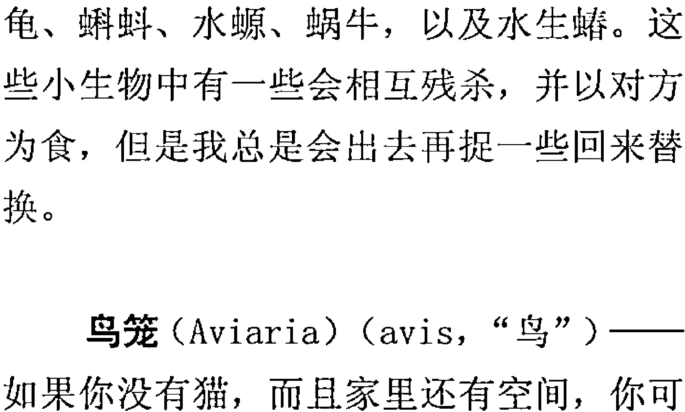

#### 第七节：资源

你的至圣所中的物资和设备可以通过不同的来源获得，其中一些相当便宜。这些材料不需要都是新的——事实上，越旧越好！因此，你搜寻的第一站就应该是旧货商店、二手货商店、跳蚤市场、庭院旧货出售，等等。我在上文中提到的几乎所有的东西我都是在这些地方找到的——非常便宜！新一些的物品可能会在魔法商店中找到。

以下是集中魔法用品的网上资源：

-   我的圣坛雕像和四大元素墙面饰板可以在以下网站找到：www.MythicImages.com
-   艾比·维诺如特的金属魔杖，魔法首饰，以及圣坛物品：www.RealMagicWands.com
-   唐·沃特霍克的不可思议的天才创作：www.WaterhawkCreations.com
-   凯特琳·布林的焚香、香炉、书籍、镜子，以及精油：www.HeartMagic.com
-   漂亮的长袍、挂毯、鼓、面具、首饰（包括我的设计）：www.AncientCircles.com
-   雷文·罗夫特对很多不同传统的神秘学文献的专门研究：www.RavensLoft.biz

##### 魔法学园的 应法师

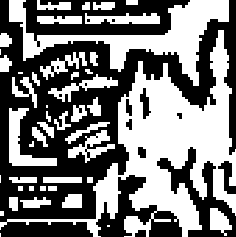

未来的魔法师，欢迎来到魔法的神秘世界！

本书旨在呈现魔法的全景，是格瑞魔法学校的入门必修教程，由校长奥伯伦率领学校理事会的全部贤人倾力完成。

-   魔法
-   自然
-   实践
-   仪式
-   色谱 (1)
-   色谱 (2)
-   秘传

每个课程被划分为6-7课（一共45课），一些实用的附录，如魔法历史时间轴，和各类各种形式各种主题的图表，以及大量的插图（几乎一半都出自奥伯伦之手），都为本书增色不少。通过阅读本书，你将会了解魔法为什么会发生并且如何发生。奥伯伦校长用年轻人耳熟能详的事物举例，并让实践易于操作。

本书将会让你明白：
魔法是真实存在的。魔法既是一门艺术，也是一门实验科学。只要加入进来，你也可以摇身一变，从麻瓜变为术士，用神奇的魔术改变你的日常生活。

从此，魔法从幻想变成现实！

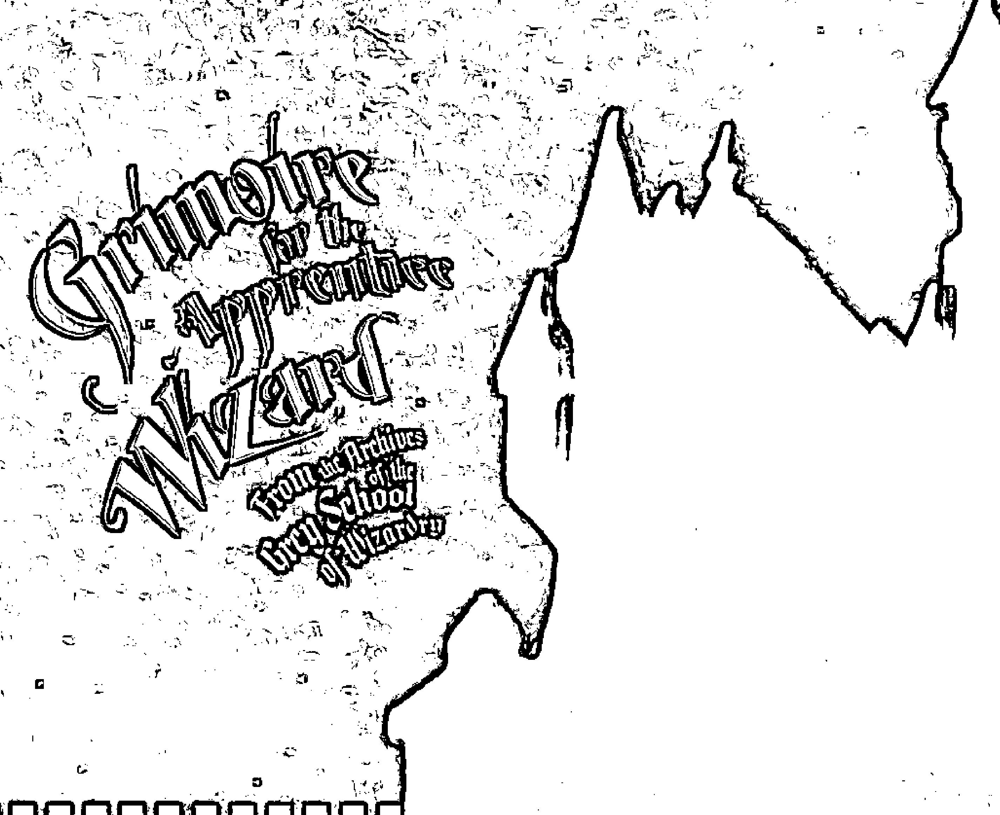