# 格瑞魔法学校 秘密教程01

# 魔法师学徒的魔法书

# 下卷

如何成为一名大师？
从麻瓜到术士的7堂魔法必修课

# Grimoire
for the
Apprentice
Wizard

from the Archives of the Grey School of Wizardry

[美] 奥伯伦·泽尔-雷文哈特 等 著

朱易 张露 译

江苏文艺出版社
JIANGSU LITERATURE AND ART PUBLISHING HOUSE

# 格瑞魔法学校
秘密教程01

# 魔法书：
进阶之道

下卷

如何成为一名大师？
从麻瓜到术士的7堂魔法必修课

[美] 奥伯伦·泽尔-雷文哈特等 著
朱易 张露 译

江苏文艺出版社
JIANGSU LITERATURE AND ART
PUBLISHING HOUSE

# 目录

## 课程之三: 练习 (2) / 1

- 第五课: 魔法世界
- 第六课: 符应
- 第七课: 标志和符号

## 课程之四: 仪式 / 45

- 第一课: 实用魔法
- 第二课: 仪式空间
- 第三课: 关于仪式
- 第四课: 运行仪式
- 第五课: 魔法时间
- 第六课: 年轮
- 第七课: 法术辨识

## 课程之五: 色谱——第一部分 (存目)

- 第一课: 冥想 (浅绿色)
- 第二课: 治疗术 (蓝色)
- 第三课: 药草学 (绿色)
- 第四课: 占卜 (黄色)
- 第五课: 魔术 (橙色魔法)
- 第六课: 炼金术 (红色)

## 课程之六: 色谱——第二部分 (存目)

- 第一课: 野兽支配 (褐色)
- 第二课: 宇宙学 (紫罗兰色)
- 第三课: 数学魔法 (无色)
- 第四课: 魔法礼仪 (白色)
- 第五课: 知识掌握 (灰色)
- 第六课: 黑魔法 (黑色)

## 课程之七: 传说 / 137

- 第一课: 另一个世界
- 第二课: 列国的神
- 第三课: 其他
- 第四课: 魔法的动物寓言集
- 第五课: 魔法师的历史
- 第六课: 现代魔法师

## 后记: 毕业典礼 / 217

## 附录 / 227

魔法的历史时间轴

# 课程之三：练习（2）

## 第五课：魔法世界

### 第一节：简介-集会

不错，在世俗世界之外，真的存在一个魔法的世界。就在那座山上，或者在那片森林之中，或者藏于门后，或者在乡间道路之下，魔法界的人们在那里集会。每个人都身着长长的飘逸的长袍和深色的漩涡式的披风和斗篷，脸神秘地隐藏在颜料或者面具之下……女巫们身着可爱的丝绸和天鹅绒长袍，束身内衣和紧身上衣，或者漂亮的蜡染巴厘岛莎丽服和纱笼、奇异的首饰、臂章、项链、指环、短袜，以及肚皮舞腰带、饰头巾、冠冕、宽沿的尖顶女巫帽……男巫们身着苏格兰方格呢短裙、希顿古装、皮革制品、马裤、宽外袍、束腰外衣，以及无袖上衣——装饰有角的头盔和发带……各种奇异的景象不胜枚举。

餐桌，人群围坐大大的餐桌旁边，交谈、说笑、互咬耳朵分享故事。

在人群中穿梭的各个年龄阶段的孩子们，大家都兴高采烈。研习会在讲授面具制作、流苏饰边、肚皮舞、圣歌、咒语、做鼓、编织、雕刻塑像、讲故事、斗篷制作、击鼓、治愈术、塔罗牌解读、水晶球占卜、生火术、瑜伽、冥想、酿制蜂蜜酒，等等几乎所有你能够想象得到的一些人想要传授、一些人渴望学习到的技巧。一个又一个的交流圈子在田野和小树林、石头圈、医药秘轮中，以及大树周围聚集。一群又一群的指导仪式展现着同时间一样古老、同明日一样全新的神话和神秘。这些交流圈子有不合情理的荒谬之谈，也有严肃认真的讨论，有大声喧哗甚至狂暴之言，也有完全寂静无声的缄默。

和我一起去参加魔法师的集会吧……

当你进入集会区，你会看到温暖的笑脸，得到大大的拥抱。每个人都会跟你说：“欢迎回家！”你知道他们所说的是什么意思，因为在此处你确实会打心底觉得自己已经回到家中。四处都飘荡着音乐，从抒情到摇滚，从长笛到鼓声，应有尽有。彩色的条幅在墙上、树上、帐篷上，以及蓬罩上，随风飘舞。丰盛的筵席已经摆上。

如果魔法师的聚会是在户外举行（大多数都是，只要天气状况良好），在晚上就会堆起篝火，蜡烛和火把会照亮来路与圣殿，也有热情洋溢的容颜在欢迎你。人们会在篝火周围为你准备一个座位（有可能只是一个木头墩子……）。会有人递给你一只酒杯或者角杯，并说道：“愿你不再口渴（never thirst）”。人们会一起歌唱，或者讲笑话，讲故事。在邻近中央篝火的位置，肯定会有人在篝火周围击鼓跳舞——而且这些活动会持续整个晚上。在一些聚会中甚至还会有午夜烟火和镭射秀。

而且，无论你走到哪儿，你都会很受欢迎。

### 第二节：魔法市集

真实生活中的魔法市集比《天方夜谭》中的任何市集都要奇幻。新文艺复兴时期最好的工匠得意洋洋地展示着他们最好的手工艺品——全部都在一个地方！有魔杖、刀具、剑、法杖、圣餐杯；长袍、斗篷、法衣、帽子、披风；首饰、头饰、角制品、锁子甲；书籍、纸牌、字画、海报；塑像、雕刻、女神玩偶、精灵玩偶、龙玩偶、独角兽玩偶；生物、晶体、蜡烛、坩埚；面具、乐曲、魔法。

但是你不用等到要参加第一次魔法聚会才去魔法市集采购。现在，在说英语的国家很少会有主城没有魔法商铺，甚至在一些小镇上也可能会有类似的商店。在黑人和西班牙人的社区，他们称其为神物铺子（botanicas，“药材店”）。你可以在你当地的黄页上的“超自然和神秘物资供应商店”的条目下查询。或者你可以上网一个州一个州地挨个搜索，网站是女巫之音（The Witch’s Voice）：http://www.witchvox.com/links/net_books.html。虽然所有的这些商店都是独立经营的，但是它们中有很多都是相互有联系的，我的雕像和首饰都是在这些店中购买的。你可以跟他们讲是我介绍你们去的！

这些超自然和神秘物资商铺是你进入魔法界最好的途径。到商店中结识在那儿工作的人们。他们通常会有一个公告板列出所有的活动、联络方式，以及当地的魔法团体。它们中还有许多会提供各式各样的魔法主题，有时他们还会邀请演说家和发言人进店演讲（我常常会到这样的商铺中做客并引荐一些客人过来）。然而，如果有些商铺不同意你没有经过家长的允许就来参加课程或者购买材料，不要惊讶，因为他们不想让自己陷入与世俗世界的家长打交道的麻烦之中。

### 第三节：聚会，节日，以及无宗教信仰者的聚会

如果你恰好幸运地降生在一个魔法家庭，那么你就一定参加过我在上文提过的集会——而且你还能在此补充很多我没有讲到的内容！如果你在学校交有来自普通家庭的魔法伙伴，你就该告诉他们知道这一切都是真的。如果你的父母只是普通人，而你自己感觉被魔法的道路和魔法的世界深深吸引（肯定是的，不然你就不会看这本魔法书了！），你就应该找出你的学校里的魔法小孩（找寻那些五芒星！）。其中一些可能会来自魔法家庭，而且他们能够引荐你进入魔法界。

以下是在很多大城市市区或者郊区每年都会举行一次的几种活动，而且通常都会有很多真正的魔法师参加。这些活动是对公众开放的，而且还会在当地的报纸上广泛地登广告，因此，参与到其中的“娱乐”环节中来吧。一旦你学会在这些活动中通过服饰和首饰学会辨认哪些人是魔法师，你就可以交到很多魔法师朋友。

## 文艺复兴集会

“文艺复兴集会”，正如我们对它的称呼一样，是这些活动中最公众的集会，每个几个月就会举行一次，而且还会四处打广告。文艺复兴集会有点像一个梦幻版本的户外主题公园，据推测是1500年代晚期的英国文艺复兴时期兴起的一种娱乐消遣活动。在集会上普遍使用的语言是伊莉莎白时期的语言——莎士比亚英语。有时，这种集会还会精准地还原那个历史时期的人文元素，例如执政君主伊利莎白女王和亨利八世。然而，这儿也不像真正的中世纪和文艺复兴时期，因为没有黑死病也没有焚烧女巫，而且魔法界的人士都是非常公开的。

我是从1980年开始参加文艺复兴集会的，那年我的第一头独角兽出世。那是我第一次带领它们以魔法师的身份出席这种活动，身着长袍和斗篷，手持我的寻路杖，那时这个伙伴已经跟随我十年了。我的生活伴侣，牵牛花，是以女巫的身份出席的。在接下来的几年里，我们的独角兽声名远扬，因此我们被邀请带领它们参加在美国和加拿大举行的每一次文艺复兴集会。我常常会想，有多少人能够意识到巫师和独角兽一样，都是真实存在的！

在集会上，可能会有真正的手持长矛、骑在马背上的装甲骑士参加的马上长枪比武比赛。成群的海盗会用邪恶的宝剑保护他们抢夺而来的战利品——“啊！”——而且还会教授你一点击剑术，如果你愿意的话。吉普赛人会开着俗丽的旅游车在树林中露营，他们会通过纸牌和水晶球占卜你的命运。你可能会遇见罗宾汉、梅德·玛丽安，以及舍伍德森林中身着绿衫的快乐之人。真正的巫师都是徒步旅行的——他们会巧妙地掩盖自己的巫师身份（如果你仔细观察他们手上戴的戒指，你就会认出他们来……）。

在集会市场上，你能够听到不绝于耳的讨价还价声——正如我在上文中所提到的一样，甚至更多！我就是在这种市场上购入我的天体观测仪和袖珍日晷的。在专业的精品店中，你还能买到那些定期参加集会的魔法师们所穿的漂亮服装。货摊上还能买到异国食品——比如“布丁牛排”、牧羊人的肉馅土豆肉饼、火鸡腿、女王小面包、国王坚果。在各式大小的舞台上，表演者在表演令人捧腹大笑的喜剧——而且如果你站上前去，就会被他们邀请上台和他们一起表演的哦！巡回演出的艺人、音乐家，和魔术师会不断地为参与者们提供娱乐消遣活动，身着紧身胸衣的猥亵少妇会让你转过身去用鞭子抽打你。

在此，我会给你一个好心提示：不要身着普通人的衣服去参加文艺复兴集会，比如牛仔裤和T恤衫。穿上你最能表明你魔法身份的衣服，甚至可以是一件简单的束腰外衣和绑腿。租一部莎士比亚的电影来观看，例如《罗密欧与朱丽叶》、《仲夏夜之梦》，或者《莎翁情史》，并学习一点伊莉莎白时期的英语。欣赏一场表演最好的方法就是成为这场表演的一部分！试着和你的父母沟通，让他们带你去集会（也将他们装扮起来！），并带上你的朋友们。

## 无宗教信仰者的节日和聚会

魔法界中的许多（虽然不是所有的）魔法师都与无宗教信仰的精神运动有关联。然而，无宗教信仰者的节日和聚会一般都不是向公众开放的，而且很少会有广告刊登。在这节课的开头的描述中我就描述了一个典型的户外非宗教信仰者的节日庆典——每年，全世界会举行几百场这样的庆典。我所参加过的这些庆典中的人数从百人以下到1500人以上的都有。因为大多数的节庆都是在户外举行，因此每年也会有几个无宗教信仰者的旅馆会议会在不同的城市召开——比如万神会（Pentheacon），每年的二月都在加利福尼亚州的西部城市圣何塞举行。同时还有非常多的家庭活动，而且如果你的家人都是无宗教信仰者，你一定已经参加过一些类似的活动。然而，没有合法监护人陪同的未成年人是不允许参加的（或者至少有一张签了字的许可纸条），因此，如果你的家人不是无宗教信仰者，你就需要等等，等到你长大以后才能参加这样的聚会。

### 第四节：与他人合作

在你学徒生涯的早期，你可能会独立参与很多你自己的魔法研究和练习。但是，有希望的是，你即将会在学校中遇到其他的一些魔法小孩。当你找到他们以后，你可能就会想要成立一个“魔法俱乐部”或者一个学习小组。这样你们就可以和小组成员一起做很多事情，而不是一个人承担所有。

## 成立一个学习小组：

大多数的高校都会有一些特殊的兴趣学习小组，如果你有一些朋友对魔法和巫术感兴趣，你可能会想要成立这样的一个学习小组。你将会需要一名老师的帮助。找一个你认识的最亲近的老师——尤其是一些真正喜欢像哈利·波特一样的人的老师——然后求助于他们。你会需要安排一个开会时间和会议地点。学习小组并不是真正要施展魔法、符咒，或者举行仪式，但是你们可以谈论你们的魔法研究、分享你们的观点、讨论你们读过的魔法书籍、彼此互相占卜、做游戏，按照我在这本魔法书中所讲解的一些方法说明一起制作长袍等等魔法师所需的物件。甚至你们还可以做一些这本书中提到的提升你们意志力量的练习。当然，你们还可以一起玩各种各样的魔法游戏（详情会在第六节中介绍）。

一旦你举行了一次巫术或者魔法学习小组会议之后，可能就会有很多孩子想要加入你们，因此你可能要在允许某人加入你们学习小组之前，考虑派给他一些任务，例如读小组中每个人都已经读过的某本特定的书籍。我建议，一旦你们一起拥有了第一个小型的学习小组，新成员的加入都得通过组内人员的全体同意才行。

## 成立你们自己的魔法社团：

一旦拥有了你们自己的学习小组，你们可能就想要决定好一个会面的地方，在那儿你们可以建立圣堂，或者设置魔法圈，并真正地施展一些魔法。你们会想要选一个特定的时候定期在此聚集——通常的惯例就是一个月一次（“……而且最好是在月圆之时”，阿拉迪亚 [Aradia] 中这样告诉女巫）。但是如果你们是在室内会面，那么除了月相阶段，你可能有一些其它因素需要考虑。一个星期的每一天都有其自身的魔法关联（详情请看下一课中的符应表格），你甚至想要尝试在不同的时间相聚以施展不同种类的魔法。

当然，你会想要为你的社团起一个很酷的名字。你可能会用一种神秘的生物，魔法的象征符号（例如埃及十字架、五芒星、墨丘利的节杖，等等），你们最喜欢的故事中的某个物品，或者你们所喜欢的任何东西来充当你们社团的名字。举个例子，最著名的魔法社团之一金色曙光会，以及哈利·波特系列的第五部中一个名叫凤凰社的社团。

## 在线交流：

在写这本书期间，网上仿佛还没有适合青少年的在线网站或者聊天室可供讨论巫术或魔法，也没有专门适用无宗教信仰者或者对巫术崇拜感兴趣的人的网站或者论坛。不信教和巫术崇拜都是宗教定向，而魔法和巫术却只是研究和练习，是独立于任何特有的宗教信仰之外的。而且我总喜欢顺其自然！因此我们为你们创建了一个特殊的在线格瑞魔法学校，学校的网址是，www.GreySchool.com，在此你们可以进一步地学习，也可以和其他的学生交流。

## 寻找当地的魔法社团：

也许在你所在的区域已经存在有魔法社团。你可以再一次地到你当地的超自然商店查询。有时，半开放的团体会在这样的商店中留下传单或者通知。他们可能每个月都会举行一次家庭招待会，或者偶尔通过商店提供一些课程或者指导性的新课展示。如果你发现有一个你可以参加的开放性聚会，带上几个你的魔法朋友；如果你的父母感兴趣而且愿意参加，你应该也会想要带上他们。有的社团还有一些针对青少年的特殊程序，但是如果你想参加的话，需要取得你家长的同意。如果他们不同意，你至少应该去认识一下那些魔法师。

然而，我并不推荐你设法去加入现阶段存在的任何团体。首先，你需要去了解许多不同种类团体中的团员，这样你就可以有依据地将他们作对比。你仍然只是一个学徒，而且你有很多东西要学。

## 第五节：巫术游戏

这些魔法游戏的设计都是为了提高并且磨练你的魔法技能和力量。它们会挑战并激励你的想象力、你的快速思考能力、你的词汇量，以及你的观察能力。同时它们也非常有趣，而且不受地点的限制。最好的一点就是，你不需要购买任何特殊的装备，鞋子、制服、书籍、玩件、游戏卡，或者CD！

## 精灵棋：不分季节的游戏

> ——黛安·达琳 (Diane Darling) (由艾尔德里·小狼 [Eldri Littlewolf] 教授)

精灵象棋是一种合作性的游戏，在魔法界中深受欢迎。和许多奇妙的事情一样，这种游戏无处追本溯源。这是我的朋友艾尔德里·小狼传授给我的，但是不仅仅只有狼人和人类才玩耍这种游戏，还有几种鸟类以及章鱼，至少还有猫、蛀船虫、几种蟹类，当然还有精灵都会玩这种游戏。我们甚至还可以和天外来客一起下精灵棋！

精灵棋的玩耍人数是不固定的，但是如果人数超过4个或者5个的时候速度就会变得很慢。也可以大人小孩一起玩。精灵棋回答了这样一个问题：“我要用这些灵巧的小家伙们做些什么呢？”精灵象棋在任何地方都可以玩耍，也可以不使用专用的棋子。它要求合作，同时也需要分享。每个人都是赢家。下精灵象棋只有三条规则，在征得每个玩家的同意之后，你们也可以弃用这些规则：

1.  在每一次轮到你的时候，需要移动三颗棋子。
2.  顺时针方向轮流。
3.  每个人都完成以后，游戏结束。

就这些。现在，我们来看看精灵棋怎么玩。

首先，你和你的对手都要将你们自己的精灵棋布置在棋盘上。在你的房间（或者房屋）周围放置一个篮子，用于装下小的特别物件——例如贝壳、海滩上漂集的海草、玻璃珠、纽扣、水晶、小型的动物骸骨、抛光的石子、首饰、形态怪异的小块浮木或者树枝，游戏用的小型雕刻工艺品——如果你喜欢，甚至可以是能在黑暗中发光的橡胶制的蟑螂！每种东西数量越多越有用——例如四个箭头、九个贝壳、两个鸡叉骨、一打抛光的小石子——即使大多数的棋子只需要一颗。任何数量的物件从一把的量到一小满篮的量就足够了，随着时光的流逝，你的装备会越来越多。现在，准备好一张漂亮的围巾或者一张桌布。圆的或者正方形的最好，而且得是无色的（虽然扎染织物非常的漂亮！）。这就是你的精灵棋桌上所需的所有物品，将桌布与其它物件一起放在篮子里。

现在开始下棋。选择一个偏僻的地方，和其他棋友一起围成一个圈坐在地上，或者围坐在桌子边。在中间将桌布平整地展开。每个人都将自己的精灵棋子倒在自己面前的桌布边上。布置好你的棋子布局以方面大家共享，互相赞美彼此的小小珍宝。用你们自己的方式来决定谁先走棋。（摇骰子是一个很好的方法……）先走棋的那个人可以从自己或者他人在桌布上的布局中选择放置三颗棋。接下来的那个人也可以放置三颗棋。移动已经在桌布上的一颗棋子算作一次走子，但是要等到轮流到你以后才能改变他人的走子，或者经过他人允许后方可。

在精灵棋中没有意外。一只毛毛虫穿过桌布，一只雪貂偷走橡胶制蟑螂，所有这些都会算作是一次走子。每一次漂亮的走子都应得到轻声的欢呼（“哦哦……”）。就这样继续下去，直到没有人还要走子，每个人都对最终的图案满意为止。每一次游戏都不一样，但是诸如圆圈、螺旋形、连环链、雪花，以及笑脸之类的图案会一次又一次地出现。这是非常奇妙的。某些棋子还可以在很多游戏中用于最有希望获胜的走子。在所有的棋友都完成了以后，一起赞美并且谈论最终形成的图案。精灵象棋从不同棋友的位置看起来会非常不一样，因此四处走走，看一看每位棋友眼中的棋局是什么样子的。结束以后，收回你的棋子。这时候，你可以会想要赠送他人一些棋子，或者与他人交换棋子。

精灵象棋可以每天都玩，只要有棋友，而且大家都想一起合作制作图案。一次游戏可以只选择一种棋子。圣坛、书架、你整个的房间，或者你的后院都可以用于玩这种古老的游戏。也可以在沙滩上用浮木的海草来玩耍。我们祖先伟大的石圈阵、禅意花园、你的花园、澳大利亚园丁鸟鸟巢，以及树荫下的章鱼花园都是精灵象棋的例样。这个游戏可以微小如手掌，也可以广大如人生。

## 观察

这个游戏可以和两个到六个人一起玩耍。每一个参与者都需要：

- 一个速写本
- 一支好铅笔
- 一块橡皮擦
- 一个铃铛
- 一只只有秒针的手表或者时钟
- 一个托盘
- 一块足够大小的不透光盖在托盘上面的布

每一个游戏参与者都应轮流当“布局者”，直到每个人都轮流了相同的次数。现在来看看这个游戏怎么玩：

布局者带上托盘和遮布进入不同的房间，远离其他的参与者——最好是一个有着很多小东西的房间（例如我的书房！）。在那儿，他会选择八件大小合适的可以一起放到托盘上的物品，相互之间不能接触，然后将它们摆放好（提示：不要选择一些会四处滚动的物品，例如鸡蛋或者弹球！）。然后布局者用遮布将这些物品盖起来，将托盘带回游戏者们所在的房间，放在他们面前。所有的参与者都应闭上眼睛，做几次深呼吸，然后集中自己的注意力。尔后由布局者摇响铃铛，同时揭开那张布。参与者们一听到铃声立即睁开眼睛，## 魔法师学徒的魔法书 | 下卷

注意看托盘上的物品，将所有的物品以及其摆放的位置记在脑海之中。三十秒以后，布局者将会再次摇铃，然后将托盘盖起来。游戏者们应该再次闭上眼睛，再次深呼吸几次，将画面形象地印在脑海中。然后，当他们准备好以后，参与者们会睁开双眼，努力在他们的速写本上画出他们所看到的物品以及它们的摆放位置。一旦他们完成以后，他们就该放下他们的铅笔。当所有人都完成了以后，再次将布揭开，然后根据每位参与者所画下的物品数量以及位置的正确与否来评分。

绘画水平不必太高——甚至粗糙的勾勒也可以，只要能够清楚地表示出是什么，以及每件物品的位置正确，且与它物的相对位置大致相仿便可。

然后下一个人轮流当布局者，方法与上一位完全相同——在选择的时候要使用不同的物品，或者某些相同。当每个人都当过布局者以后，第一轮就结束了。然而，在第二轮的时候使用十种物品，而且只允许每位参与者使用25秒钟来观察。第三轮时，使用十二种物品，20秒钟观察时间；第四轮，十四种物品，15秒钟；第五轮，十六种物品，10秒钟。

将每个人的分数合计出来。你玩这种游戏的次数越多，你接受视觉信息并且形象化地牢记在大脑中的能力就会越强。你会发现这种技能在许多地方都会有着极大的使用价值。

升级版本：使用一个大号的披萨烘烤盘作为托盘，再裁剪一张大小相同的纸。用一个圆规在纸上画三个距离大致相等的同心圆。然后从中心往外画辐射形的线条，将每个环形等分，然后按照以下方式标记：内圆——阴/阳。接下来的圆——等分为四个部分，标上四种元素的速记符号。第三个圆——七等分，标上行星的速记符号。外圆——十二等分，标上黄道十二宫的速记符号。然后在摆放物品的时候，将它们安排在这些区域之内。

将这种游戏当作是一种魔法练习：学会将托盘上的物品定形为一个单独的图片，然后练习将它强烈并且生动地印在脑海中，这样在你睁开双眼之时，你仍然能够看到悬挂在空中的那些物品的影像。练习将这些影像保留更长的时间。从一件物品开始，然后按照你自己的方式不断增加，慢慢地你就能记住越来越多的物品。

## 从不结束的故事

这是一种围坐在营火旁的 6 到 12 个朋友一起玩的古老的很受追捧的游戏。讲故事是一种非常重要的魔法艺术，因此通过参与这个游戏你会变得非常擅长讲故事。这样的故事通常始于一些惯用的措辞，让你知道这个故事是开始于并且设定在过去的，比如：“从前有……”，或者“很久很久以前，在遥远的银河系中……”或者“在我和你一样大的时候”，或者“在一次集体露营时……”。

因此，从不结束的故事通常是以这种方式开头的：你开始故事的时候会说一些像这样的话：“很久以前，有一次我打算……事情是这样的……”然后你虚构一个愚蠢的、蛮横的、有趣的、怪异的事情进展顺序，让故事中的“你”陷入一种怪诞的紧张处境中——就像电视连续剧中所说的“未完待续……”不要在轮到你的时候占用太多的时间——我建议你准备一个时长三分钟的沙漏计时器，然后递给讲故事的那个人，以安排自己的故事长度。结束的时候要像这样：“事情就是这样（头向下倒挂在鳄鱼池中），然后……”这时你就该将计时器传递——还有那个故事也一起——给下一个人，他就从这里开始讲述，“……然后……”

每个人都要接着上一个人的故事以第一人称（“我”）开始讲述。这个没有结尾的故事可以随着你的想象力发展到任何地方，因为你在你接下这个故事以后，你不会知道接下来的冒险旅程会在哪。需要记住的最重要的事情是，在每一次的轮流中，当那个人手中的计时器中的沙子耗尽之后，讲故事的人必须要说“……然后……”，再将手中的计时器按次序传递给下一位。这个游戏中没有失败者——每个人都是赢家！

## 文字游戏

### 叠韵字谜（Hinky-Pinky）

叠韵是一种传统的魔法师游戏——而且是一种在长途车上玩耍的有趣游戏。这种游戏两个人就可以玩。它大致是创造一种两个单词的表达式，这两个单词中一个单词的所有音节与另一个单词的所有音节韵律相同。取根据这两个单词有几个音节，例如单音节的称作“Hink Pinks”，双音节的称为“Hinky-Pinkys”，三音节的称为“Hinkety-Pinkety s”。它是这样玩的：你想好一个韵律（例如 Hinky Pinky），然后为你所给出的谜语提出一个定义。另一个人就要猜出能够回答这个谜语答案的 Hinky-Pinky。下面我提供了一些简单的例子——你必须得自己创造属于你自己的谜语：

> “肥胖的猫科动物的 Hink Pink 是什么？”
答案：“一只 fat cat（肥猫）！”

> “一场魔法暴风雪的 Hinky Pinky 是什么？”
答案： “ 一 场 Wizard blizzard (魔法师暴风雪) ！”

> “ 魔 法 刺 绣 的 Hinkety Pinkety 是什么？”
> 答 案： “ Witchery stitchery (巫术刺绣品) ！”

关于叠韵较好的一点就是你可以随时和任何知道这个游戏的人一起玩，任何时候，只要你想玩——甚至可以和周围的一些人一起玩，比如在快餐厅中的时候。这是我最喜欢的文字游戏！那么猜一猜，一名凯尔特祭司最喜欢的饮料的 Hinky Pinky 是什么？

### 词义猜测 (Fictionary) :

词义猜测的游戏需要一本字典——最好是一本包含有生僻单词的字典。我们喜欢使用一本字典名为《伯恩夫人非常用字词典》（Mrs. Byrne’s Dictionary of Unusual Words）。玩这个游戏时最好是有五到十个人参与。每位参与者都需要准备一个小的笔记本以及一支不会掉色的笔。每个参与者轮流充当选词者，拿上字典，寻找一些真正怪异的、参与游戏的人都可能不知道的单词。然后由选词者在一张纸上写下这个单词，并在单词下方写下这个单词的三个定义，随机标上号码。其中有两种定义完全是编造的；但是看起来要合情合理，第三种定义才是字典中对于这个单词的正确解释（如果正确解释不只一种，那就选一个你喜欢的解释！）。

然后，选词者将单词和定义，以及定义的编号顺序大声朗读出来，让每个参与者都能听清楚。参与者们写下选词者所说的单词及意思，然后努力猜测哪一个是正确的定义，并将正确的编号写在笔记本上。给任何选择正确的人都加上一分。然后便将字典传递给下一位选词者。

### 魔法师的猫 (The Wizard’s Cat) :

这种游戏至少得有十二个人的参与才会好玩，而且人越多越好。尤其大家都围坐在篝火旁时最好。坐成一个圈，每个人都要唱“魔法师的猫是一只___猫！”围着圈圈依次轮流（当然，顺时针旋转），一次一个人，每个人都要在空白处填上一个单词的形容词来描述魔法师的猫。但是要求是每个人所填的那个单词都要按照字母表的顺序接上上一个人的那个单词！例如：

+ 1. 第一位参与者： “魔法师的猫，是一只愤怒 (Angry) 的猫！”
+ 2. 第二位参与者： “魔法师的猫，是一只漂亮的 (Beautiful) 猫！”
+ 3. 第三位参与者： “魔法师的猫，是一只有斑点的 (Calico) 猫！”
+ 4. 第四位参与者： “魔法师的猫，是一只邋遢的 (Dirty) 猫！”

……按照字母表的顺序以此类推，一次轮换。就这样一直往前，中间不能有停顿。为了要保证韵律的稳定，每一个人都要在主要的音节上拍手：“The WIZard’s CAT is a HAPpy CAT! 魔法师的猫是一只快乐的猫！”如果在轮换到某人的时候他不能立刻说出来，他就会被淘汰掉。你们可以慢慢地加快拍手的速度以增加难度。这个游戏可以根据大家的喜好一直延续下去，或者在用完所有字母的时候结束，或者直到只剩一个幸存者的时候就停止。

### 魔法师的耳语 (Wizards’ Whispers)：

这是“电话”的一种变异，参与游戏的人越多越好玩。每个人都围坐成一个圈。开始的时候你可以写下一个魔法术语以及其简短的定义，就像我在这本魔法书中偶尔提到的一些术语一样（事实上，在这个游戏中，你就可以只用这上面的术语）。举个例子：“魔法是一种增加可能性的艺术。”然后，不要让任何人看到你写的内容，将你写出来的内容悄声地告诉你左边的那个人。接下来，这个人也悄声地将他听到的话语传给下一位，围绕整个圆圈以此类推。

每个人都应该准确无误地将他们所听到的话语传递下去的，不管这句话看起来多么没有意义。当这句话回到你这里（或者任何开始这句话的人）时，大声说出来，让每个人都能听清，然后再大声读出你写在纸上的原始的表达。最开始的那个句子总是在人与人之间的传递过程中被胡乱篡改，而最终的版本会变得相当可笑！下一轮游戏的时候，圈子中的下一个人也以同样的方式开始。

## 心理游戏

在小型的五到七人聚会的时候证明个人心理能力的游戏是很受欢迎的。以下是几个常玩的游戏：

### 漂浮 (Levitation)：

一个人坐在椅子上，然后其余的四个人站立在坐着的人的周围。这四个人将自己右手的食指分别放在坐着的人的腋窝下方和膝盖下方，然后试着将坐着的人抬起来。一般情况之下，这是不能够办到的。然后站着的四个人将他们的手放在坐着的人的头的上方，一起向上和向下移动五次。随后迅速地将他们的食指和之前一样放在腋下和膝盖下，这样你们很容易就能将坐着的人抬离椅子了。

### 死后僵直（僵尸）（Rigor Mortis）：

一个人面部向上躺在地板上，双臂放在身体两边，眼睛闭上，准备好进入恍惚状态，平稳地进行深呼吸。其余的人分别站在躺下的人的两边，一边从 10 往 0 倒数，一边从头到脚轻轻地敲打躺下的人。在数到“零”的时候，所有人一起说“死后僵直！”——于是躺下的那个人就会变得完全僵硬，像一块木板一样硬。然后所有人将这个人抬起来，像架设桥梁一样放在两张面对面的椅子上，一边放头，一边放脚。如果你的这个游戏很成功，那么如果你坐在这座人“桥”的肚子上他是不会倒塌的。

### 自由下落 (Free Fall)：

这种游戏通常是在入门时所玩的游戏，而且十分有趣。一个人站在一个矮凳子，空心煤渣砖，或者一个盒子上——与地面的距离不能超过一英尺。另一个人站在他面前说：“闭上你的眼睛，深呼吸。感受可靠与安全，完全相信这对你没有任何伤害。紧闭你的膝盖，这样你的双腿就不会弯曲，然后准备好向后倒。”此时，其余的所有人都站在凳子上的人的背后，准备好接住他。在给予凳子上的人一段时间准备之后，站在前面的人将手指放在凳子上的人的胸骨上，然后轻轻地将他往后推。其余所有的人都将他接住并高高举起，然后再将他推回原位站好。

### 信息传送（Transmission）：

将参与者分成两两一组，背对背坐着。每个参与者都准备一个笔记本和一支铅笔。轮流扮演角色，一个人（发送者）在脑海中想象出一个影像并将其画在笔记本上，专心画画，并将集中注意力将你所画的图像传送给另一个人。另一个人（接收者）努力接受他们的队友传递过来的讯息，并将其画在笔记本上。在交换发送者与接收者之前尝试三种不同的图像。然后对比两人的图画，看看两种图画有多相似。一组画完六幅图画之后（每一次交换画三幅图），与他人交换搭档，直到每个人都有机会相互组对。

### 探测术（Dowsing）：

选出一个人将一枚 25 美分的硬币藏在房间（或者院子，如果你们在室外游戏的话）的任何地方。将另一个硬币用胶带绑在 Y 形的叉状“探测”棒的中间。用你的双手抓住探测棒的两个分叉，将探测棒的主体部分用作指示器，设法定位隐藏起来的硬币。你可以多做几个探测棒，这样每个人都可以分到一根，以便同时搜寻。无论是谁先找到，这枚硬币都归他！

## 角色扮演游戏

——杰克·格里芬（Jack Griffin）

角色扮演游戏是了解他人眼中这个世界的样貌的最好办法。以他们的方式来说，所有的角色扮演游戏都可以看作是一种表演形式——从表面上看来似乎是世俗世界的一种技能，实际上这种游戏来源于真实的魔法变形术。虽然存在着很多不同类型的角色扮演游戏，但是所有的这种游戏都有一个共同点：它们提供了一个成为他人的机会，去体验英雄（或者恶棍）的世界是什么样的，并且还能体会故事中在参与角色扮演游戏时，你要好好想想你要扮演的那个角色是什么样子的。设法将你自己当做是故事当中的那个人，仔细聆听故事中所呈现的景象；闻闻风的味道；听听马儿的疾驰；体会；看看会发生什么。也许那个人物所持有的精神会教给你一些东西。当你与其他参与者交流心得之时，试着想想在那样的情况下那个人会是什么样。为什么他们会是那样？是什么促进他们成为了他们那样的人？

以他们的方式来说，角色扮演游戏为梦想的共享提供了一个漂亮的框架，允许我们表达出我们自己在世俗社会中很难表现出来的那一部分。但是要注意，角色扮演游戏是一种强大的手段，而且颇具诱惑力。生活在英雄的故事里，摆脱危机，赢得挑战，这些经历都让人难以抗拒。这是一个艰巨的任务，将故事中的经验教训带入超越故事的美好世界之中。我们有能力将自己投射到不同的世界之中，但是同时我们也应该具备能够将自己从这些世界中分离出来回到现实世界的能力，这两种能力是同等重要的。

## 第六课：符应

### 第一节：简介 - 分类系统

魔法思想中最重要的一个方面便是根据相互联系的符应将这个世界分类。通过将事物分类挑拣，归入不同的类别之中，我们就能在深层次的象征水平上进一步加深对它们的理解。这样我们就能缩减自然界无限的多样性，将其变成我们的大脑可以领会并且搞清其中含义的东西。

所有的自然科学都始于感知共通性的分类系统。举个例子，生物界的卡尔·林奈（Carl Linnaeus, 1707-1778年）发展了一种分类拣选系统，其中只有七种生物分类（“根据一定的法则来安排”）类别，便将所有的单个生物进行了归类。最初这种方法被收录进他的《自然系统》（Systema Naturae）（“自然的体系”）一书之中。1735年，这种分类方法被称为 K-P-C-O-F-G-S 系统，分别代表了 Kingdom(界), Phylum(门), Class（纲）, Order（目）, Family（科）, Genus（属），和 Species（种），这是一种分类大纲，每一个级别都隶属于前一种级别。以下就是林奈的分类方式：

+ I. 动物界（动物——包括十个门类）
  + 1. 脊索动物门（有脊柱的动物——包括十个纲类）
    + A. 哺乳动物纲（有乳腺的动物——包括二十个目类）
      + a. 灵长目（有对生拇指的动物——包括十五个科类）
        + (1) 人科（猿——包括五个属类）
          + (A) 人属（人类——现在就只有一种物种，虽然曾经还有其他物种）
            + (a) 现代人种（“思考”，现代人：我们）

分类学是一种纵向的层级分类系统，会把每一组中的很多成员归入更高一层的分类单元之中。在最高级的界类之中，只有三种类别：植物界、动物界、真菌界。但是在较低的那一层中，并没有设置每一个分类单元成员数量的范围，到目前为止，大约有400,000种的甲壳虫已被认定！纵向的分类方案可以绘制成一棵有分支的树，就像我们在此展示的进化史的树一样。

现在想想霍格沃兹魔法学校中的分院帽，它可以根据每个人的本性，将所有新进的学生归类到四个学院中。这是一种横向的，或者水平的分类系统，在这种系统之中，每一种类别在本质上都是平等的。横向的符应系统是所有的魔法排序的基础。魔法师能通过了解一个物体的对应关系来影响那件物体。利用这种对应关系的关键就在于分类的数量，就像这四个学院一样。有的人可能会认为这样的数量可能会无限大，其实在大多数的实际应用之中，真正需要的也就只有那么固定的几种。以下我们来举例说明一下每种类别常用数量：

+ 1. 独特性：“只存在一种！”
+ 2. 二元性：阴阳（道家思想）
+ 3. 三重性，三元组，三位一体
+ 4. 四个方位，四个季节，四大元素
+ 5. 五大元素（毕达哥拉斯哲学和中国文化）
+ 6. 六道众生（佛教）
+ 7. 一周的七日，七大可见行星，七大轮穴
+ 8. 年轮中的安息日（课程之四，第六课）
+ 9. 体内的通灵中心（psychic centers）（道家思想）
+ 10. 生命之树（卡巴拉——课程之五，第五课）
+ 11. （无……）
+ 12. 黄道十二宫，一年中的十二个月

> 荷兰的格瑞理事会成员卢克·萨拉说：“符应是多维世界、各个国度、各种传统、各种世界观、不同文化等等之间的联系和关联。在我们施展魔法的时候，如果我们将整个宇宙看成是一个看不到尽头的维，那么，在那些维或者世界之间就会存在数不清的可能。然而，那些联系的其中一些是特别的，可以将它们比作是我们体内处理信息流的神经联系网。它们是不同的世界之间看不见但是非常强大的关联，可以用于承载魔法信息。”

### 第二节：魔法圈

> 四等分的魔法圈是大多数仪式中都会用到的主要元件。它被称为是不同世界之间的入口，是与超越物质世界的神、精灵，以及一个国度的元素能力产生联系的手段。这个入口被想象成是一个涡流，在这个涡流中我们可以集中我们与生俱来的精神力量，也就是使用仪式行为从大脑和灵魂的潜意识深处召唤出来的力量。它是一个神圣空间，是与先贤们相互交流的至圣所。

许多层面上的象征符号都是魔法圈所固有的本质：与人类历史一样古老的语言中所陈述的不同颜色和纹理的图像和真相。在这些之中的是形而上学和神秘的概念，描述了我们生活中所经历的更加伟大的现实。魔法圈的四个“角落”对应了指南针的四个方向，每一个方向都与四大元素土、风、火，和水相互联系。灵作为第五大元素通常与魔法圈的中心或者整个魔法圈相互联系。垂直轴（宇宙轴或者世界之轴）是一个基本部分，有时被看作是一棵联系着三个世界的树。

风、水、石，和肉体的国度是显现层面的灵；地球、月亮、太阳，以及群星的领域是显现层面的灵。时间和空间、能量和重力、想象力、记忆、情绪，以及欲望的领域，所有这些都是灵的体现：这些都是能够被命名而且被熟知的事物。灵超越名称与理解的方面神秘得令人费解，却是宇宙万物的源头。

所有不同种类的魔法符应系统都能在魔法圈上用图表现出来，这种魔法圈的解读方法就如同看钟面上的时间一样。通过在上面覆盖一系列的多字母组合就能办到，将它们的点围绕这个圈均匀地间隔排列出来，就像时钟上面的石子一样。然后外部的同心圆等分成适当数量的部分，就像钟面上的小时和分钟数。而且和钟表的指针一样，在时辰之舞中，时间和魔法程序都是循序渐进（一个接着一个）地穿过每一个部分。

然而，理解所有的这些已经制定好的系统非常重要。它们的用途并不在于它们所在的实际领域，而是来源于它们所共有的很多魔法界的人士都能共享而且理解的象征图谱（symbolic maps）。大多数的这些魔法体系都是在很久以前发展起来的，而且都基于那些创造这些系统的人们的有限的科学知识（在那个时候，举个例子来说，人们都认为是太阳围绕地球在旋转……）。现在，这些系统仍然在为我们服务，但是人们已经认知了它们的局限性，他们通常不得不想办法修改系统的原始设计中的这些问题。

但是为了顺利地成为一名魔法师，你没有必要相信这些系统中的所有内容。例如，不相信占星术也完全有可能成为一名有效的魔法师。这一点需要你特别地记住，你会有一个科学老师不仅会对你提出的关于占星术、轮穴，以及其它的魔法研究的话题不屑一顾，还会非常直接地蔑视你。

在上文的课程之二第一课第五节“生命之环”，我解释了从世俗的角度看到的线性时间（以一条直线的方式往一个方向前行，从过去到未来），与从魔法角度看到的循环的时间（不断地回路循环，以一种循环往复的方式）。

（注：表格已转换为Markdown格式）
| 学院 | 格兰芬多 | 拉文克劳 | 赫奇帕奇 | 斯莱特林 |
| :--- | :--- | :--- | :--- | :--- |
| 创立者 | 戈德里克·格兰芬多 | 罗伊纳·拉文克劳 | 赫尔加·赫奇帕奇 | 萨拉查·斯莱特林 |
| 院长 | 密涅瓦·麦格教授 | 思尼恩特教授 | 斯普劳特教授 | 西弗勒斯·斯内普 |
| 代表动物 | 狮子 | 鹰 | 獾 | 蛇 |
| 颜色 | 红色 | 蓝色 | 黄色 | 绿色 |
| 品质 | 勇敢胆识 | 心思敏捷睿智 | 忠诚坚韧 | 精明，渴望权力 |## 第三节：单一体 (Monads)，二分体 (Dyads)，以及三分体 (Triads)

### 单一体和个体

一元论（“单一性”）是一种哲学理论，它指的是只存在一种终极实体或者原则，无论是理智/精神（唯心主义），还是物质/能量（唯物主义）。也就是说，所有的现实都是一个有机的整体，或者单元。这一点在我们的宇宙 universe（“一切都是一个整体”）概念中已经进行了完美的阐述，宇宙（universe）同时也被称为造物主、宇宙（Cosmos），以及世界。在道家思想中，这被称为道（“方式 [way]”）。

古代爱奥尼亚米利都的阿那克西曼德是一名公元前 6 世纪的希腊哲学家，他提出现实（reality）在任何地方都有其基础，被他称为无限或者无边无际的永无止境的物质，是所有物体的神圣源头。它的无边无际通过在其周围的旋转将其自身分成两个部分。其中较热且较轻的那一部分向外蔓延形成了天空，同时其中较冷较重的那一部分不断地往中心沉陷形成了地球。随后地球进一步地分离成干燥的陆地和湿润的海洋。

各种各样的宗教都将神性想象成最终的现实。印度教徒将它称为阿特曼 - 婆罗门，他既是宇宙的灵，也是真实的物质宇宙。希腊人用潘（“所有”）来表达了相同的观点：“潘就是一切，一切都是潘！”三种一神论（“一个神”）的宗教（犹太教、基督教，以及伊斯兰教）信仰着一位至高无上的真神，他们通常将其简称为上帝。穆斯林教徒将这位天神称为真主阿拉，意为“救世主”。据说这位至高无上的真神控制了以下的宇宙特性，它们是：

-   永恒不朽——超越时间，永远存在；
-   无所不在——任何地方“全在”；
-   无所不能——“全能”；
-   无所不知——“全知”；
-   至圣——“博爱”。

（当然，所有的这些都意味着这位至高无上的真神会对所有发生的事情负责！）

### 二分体和二元性

二元性是人类的一种基本观念。因为我们是拥有一双手、两只眼睛，以及两个耳朵的对称生物体，我们看待任何事物都倾向于使用“要么……要么……”“这方面，或者那方面”“一方面……但是另一方面……”来措辞。因此二元性成为了分类的第一种形式，例如我们会将所有事物归入一个范畴或者另一个范畴。表现这个观念的最完美的符号就是我们所熟悉的道家的阴阳图。

和所有有性繁殖动物一样，我们人类同样也是根据性别划分为两类：女性和男性。因此，我们就会很自然地认为，这个世界填满了属于这两种类别的两种物质。许多语言，比如拉丁语、西班牙语、法语、意大利语，以及德语，都不是将各种各样的事物称为“它”，而是“他”或者“她”，正如我们用英语称呼海船时便是用的“she（她）”。正如古代人想用神明来解释这个世界，他们便很自然地构想出了男神和女神，给各种各样的特性和活动都设定了性别价值观，而这些观念一直沿用至今（例如将分泌充足的睾丸激素归结为“男子气概”，或者将充足的雌性激素理解为“女性气质”）。

道家思想将阴视为女性原则，同时，将阳视为男性原则，而且道家相信所有的事物要么主阴，要么主阳，但是仍然常常会两种元素都有包含（因此，阴阳图中白色区域中包含有小黑圆点，而黑色区域中也包含有小白圆点）。这被称为极性（polarity）：这个观点是指世界上的所有事物都存在于两极之间的范围之中（正确和错误、阳性和阴性、光明和黑暗、冷和热，等等）。这是在看待世界之时的一种比二元性更加有帮助而且更加精确的方式，二元性只是将所有的事物绝对的分成黑白两面（“非好即坏，不能处于两者之间”）。

包括二元论的原型观点，许多宇宙论都反对神话中所描述的最开始的神是一对双胞胎。在亚述人的创物故事中，第一对夫妻安（An，天）和基（Ki，大地）是大神提亚美（伟大的混沌神蛇母亲，最初的沃特斯）所生。这种二元性在他们子孙的名字中得以延续：安莎尔（Anshar，“总体的上层元素”）以及基沙尔（Kishar，“总体的下层元素”）。印度教的《吠陀经》描述了阿特曼和婆罗门，前者是无所不在（内在精神），后者是无所不知（外在物质）。

因为最原始的二元性之一便是善与恶，所以我们要将那些相应的价值观应用到与我们相对的那一面所包含的任何东西上都显得太简单了。这种思想引发了世界上不可计量的悲痛，因为人们不可避免地会将自己列入善的范围内，因此他们会将“其他的”任何事物任何人都自动地列入恶的范畴中。这个世界其实并不完全地只分为善与恶两方面，在所有的事物之中都存在着无限的、不同色调的灰色地带。这是作为一名魔法师的一条基本认知：这一点允许你用同理心来看待他人，并理解即使是那些声称代表正义一方的人也会不可避免地带上一点他们声称要反对的那一面的色彩。如果每个人都能懂得这点，那么狂热者和煽动政治家想要当权执政就是永远不可能的。要发展以下多重符应的编目方法重要的一个原因就是为了让我们能够超越二元性，理解多样性。

记住，多元宇宙真的不只两个宇宙，而且人类也不是真正绝对的生物，而是被赋予了无限面体和无限特性的复杂生物，下面的符应表解释了传统的二分体、二元论，以及对立论。

练习创建你自己的魔法符应表。从两个开始，选择你生活中的一个重要方面的概念（家庭、美术、音乐、你自己……），然后设法找出可以将这个概念分为相互对立或者相互恭维的两面的方法。（例如，“父母”这个概念就包括“父亲”和“母亲”。）尝试将这些概念用不同的颜色联系在一起（“比如母亲用紫色，父亲用红色……”）。问题：“他们两个都是动物吗？他们是哪种动物？”）然后你就可以用这种方法继续制表。就像你在下一页看到的不同的表格一样，你可以随意添加，甚至还可以将你自己的表格补充进去。

### 三分体和三位一体

就像任何概念的一元论都可以被分成两个相对的二元性，两个对立面也可以调节成一个全新的综合物（“放在一起”）。希腊哲学家毕达哥拉斯将其称为最完美的数字，因为它包括了“开头、中间，和结尾”。在几何学中，三角形是最稳定的结构，三条腿的凳子也不会摇摆不定。挪威的智慧之神奥丁神的象征符号就是三角形的瓦尔结（Valknot），如图所示。

许多宗教神学（“天神的话语 [或者研究]”）声称神性的一体性体现在三个部分的三位一体之中。印度教中最重要的三大主神（创造之神梵天、守护之神毗湿奴，以及破坏之神湿婆）都统称为三相神（Trimurti，“有三种形式”），因为他们代表了宇宙灵魂阿特曼的三个相位。来自古老的克里特岛的圆筒印章上描述了一种母亲、女儿（花神科雷 [Koré]），和儿子（希腊雕塑中的克洛斯 [Kouros]）的三位一体。在埃及，神圣的三神一体包括丰饶女神伊西斯（Isis，母亲），地狱判官奥西里斯（Osiris，父亲），以及太阳神何露斯（Horus，儿子）。佛教教徒信奉三身（Trikaya）教义——佛陀的三种佛身（法身、保身，和化身）。凯尔特人和威卡教的传统将伟大女神和月亮的三种月相联系在一起，它们分别是少女（月盈期）、母亲（满月）、老妪（月亏期）。基督教中的三位一体肯定了上帝的三个位格：圣父、圣子，和圣灵。威尔士人三句一组的短格言（The Welsh Triads）以三个一组的方式收集了超过 130 个的传奇人物、事件，或者地点。这样的设计可能是为了方便吟游诗人记忆。其中的记录在名字、意思，和顺序方面的都有很多不同的版本。有些部分都包括在所有早期的手稿之中，比如从 1300 年代早期便存在的《李德科的白皮书》（White Book of Rhyderrch）。有一个此类的例句是这样说的：“三个接受了亚当的力量的人分别是：大力神赫拉克勒斯，大力神赫克托耳，以及大力神参孙。他们三个都和亚当一样强大。”

## 第四节：元素和方位

也许没有什么符应系统会比四大元素使用得更加广泛，它们分别是：土、水、气，和火（请看课程之二，第三课）。这一概念的提出应该主要归功于毕达哥拉斯（公元前 580-500 年）和亚里士多德（公元前 384-322 年），这个概念背后的思想可以追溯到希腊人、希伯来人、埃及人、波斯人，以及亚述人的传统中。四大元素的模型是如此的普遍，以至于它几乎成为了所有魔法体系的基础。它是将所有物质都归类到这一模型中的炼金术的根本。这些联系也是以诺派魔法体系的基础。黄道十二宫在四大元素的每一个元素中都分配的三个星宫：土（摩羯宫，金牛宫，处女宫），水（双鱼宫，巨蟹宫，天蝎宫），气（宝瓶宫，双子宫，天秤宫），以及火（白羊宫，狮子宫，射手宫）。塔罗牌的七十二张卡片都被安排在四大元素体系之中：星币（土），圣杯（水），宝剑（气），和权杖（火）；而且这些在标准的扑克牌中也有相应的体现：方块，红心，黑桃，和梅花。

四个方向和四大元素的普遍标志就是凯尔特十字架，同时也被称为美洲原住民医学盾（Native American Medicine Shield），也是行星地球的占星符（Astrological sigil）。

现代巫术崇拜和仪式魔法的仪式都会通过将四大元素设定在四个方向和四个季节中来构建魔法圈。这些联系都已经深深嵌入了大自然本身以及我们自己对自然循环的自身体验之中。四大元素符应的附表可能是你最重要的魔法工具。好好研究它，看清楚里面的联系，它们会在你的魔法生活中发挥很大的作用。

> > （注意：我放在这儿的图表和表格都是基于北半球的符应。赤道以南的季节和方向都是相反的。想象一下，将十二宫中的魔法圈放在镜子中观看就可以了！因此，火元素是北方，土元素是南方；气元素是西方，水元素在东。春分日在 9 月 21 日，冬至是 6 月 21 日。此外，在澳大利亚，所有的仪式方位都是以逆时针的方向移动——也就是地球另一边的“顺时针”！）

## 第五大元素

在传统的西方魔法体系中，第五大元素灵结合并超越了其他四大元素。因此，一些人将灵看做是所有显现的物质的精华。其他的四大元素构成了物质世界的基础，而灵是给予生命和意识的额外特性。在魔法圈曼茶罗上，灵是魔法圈的中心，或者是五芒星的顶点。

## 第五节：行星，日（day），和轮穴

### 行星和日

单词planet（行星）的意思是“漫游者”。古时的人们观察天空后发现有七个天体在不停地变换位置，与它们的背景恒星不同的是，它们在移动。这些天体是：太阳、月球、火星、水星、木星、金星、和土星。因此，他们便将它们称为漫游者，或者希腊语中的行星，即使现在我们将我们的太阳看作恒星，我们的月球，看作是，呃，一颗卫星。后来，我们用望远镜发现了在土星之外还有另外的三颗行星：天王星、海王星，和冥王星（在2008年降级为小行星）。当他们在天空中游历的时候，那七颗看得见的行星在所有文化中都被视为对应着七位男神和女神（或者天使）。对于埃及人来说，这七位天神分别是太阳神拉、西恩（Sin）、恶神塞特、月神透特、丰饶女神伊西斯、爱神哈索尔，以及娜美提斯女神内普特斯。在希腊神话中他们分别被称为太阳神赫利俄斯／阿波罗、月神阿耳特弥斯、战神阿瑞斯、赫尔墨斯、主神宙斯、司爱与美的女神阿佛洛狄忒，以及时间之神克罗诺斯。罗马人给他们起的名字我们沿用至今：太阳神索尔、月神露娜、战神马尔斯、众神信使墨丘利、主神朱庇特、司爱与美的女神维纳斯，以及司时间的农神萨杜恩。月球每27.3天围绕地球转一圈，经历自身的所有月相完成一个周期需要29.5天。这两种周期的平均值为28.3天，我们通常取整数28天作为月亮的周期。一周有七天，每一天都以一颗行星命名，并且与一种颜色、一种金属、一个数字、一种宝石，以及许多其他的事物相联系。

### 轮穴

轮穴（chakra）是梵文单词，意思是“轮子”或“圆盘”。它指的是在瑜伽和印度教传统中，沿着人体脊柱分布的能量中心。有七个主要的轮穴，每一个都与一种颜色、一个音节、一种元素、一颗行星、一个腺体，以及身体和心灵的特定功能相关联。这七个主要轮穴分别是：

-   海底轮：位于脊柱底部，与土元素、生存、安全感相关。
-   生殖轮：位于下腹部，与水元素、情感、性相关。
-   太阳神经丛轮：位于胃部区域，与火元素、个人力量、意志相关。
-   心轮：位于胸部中心，与空气元素、爱、同情相关。
-   喉轮：位于喉部，与以太元素、沟通、表达相关。
-   眉心轮：位于前额，与光元素、直觉、智慧相关。
-   顶轮：位于头顶，与思想元素、灵性、开悟相关。

在魔法实践中，轮穴系统经常被用来作为冥想、能量工作和仪式的基础。通过激活和平衡轮穴，魔法师旨在促进身心健康，并增强其魔法能力。

### 符应表格

魔法符应表格 2 和 表格 3

| 类别 | 春 | 夏—秋 | 冬 |
| :--- | :--- | :--- | :--- |
| 四季 | 种植 | 收获 | 休耕 |
| 农业 | 开花 | 结果 | 种子 |
| 植物部分 | 早上 | 下午 | 晚上-深夜 |
| 一天中的时间段 | 童年时代-青春期 | 中年期-父母身份 | 长辈-晚年 |
| 一生的阶段 | 学徒 | 学徒期满 | 大师 |
| 魔法师的旅程 | 青春期 | 父亲角色 | 老年 |
| 过程（男性） | 初潮 | 分娩 | 绝经 |
| 过程（女性） | 青年 | 父亲/男人 | 智者 |
| 男神三位一体 | 少女 | 母亲/女人 | 老妪 |
| 女神三位一体 | 月盈 | 满月 | 月亏 |
| 月相 | 天真 | 创造性 | 博学 |
| 特性 | 鼓舞人心 | 充满深情 | 令人恐慌 |
| 特质 | 创造 | 保护 | 毁灭 |
| 功能 | 新生 | 成熟 | 衰败 |
| 状态 | 填充 | 充满 | 清空 |
| 数量 | 白色 | 红或绿 | 黑色 |
| 埃及天神 | 奥西里斯（圣父） | 伊西斯（圣母） | 何露斯（圣子） |
| 基督教 | 耶和华（圣父） | 舍姬娜（圣灵） | 克里斯托（圣子） |
| 神圣的职责 | 创造 | 复兴 | 拯救 |
| 印度天神 | 梵天（造物主） | 毗湿奴（守护之神） | 湿婆（破坏神） |
| 北欧世界 | 仙宫（天） | 米德加德（地） | 冥界（地狱） |
| 中国文化 | 天（天堂） | 地（尘世） | 人（人类） |
| 北欧命运三女神 | 诗蔻蒂（过去） | 贝露丹迪（现在） | 诗蔻蒂（未来） |
| 希腊命运三女神 | 克罗托（纺织生命之线） | 拉切西斯（决定生命线长短） | 阿特洛波斯（切断生命线） |
| 道家三宝 | 气（生命力） | 神（精神意识） | 精（本质基础） |

魔法符应表格 3

| 炼金术 | 盐 | 硫磺 | 水银 |
| :--- | :--- | :--- | :--- |
| 本源 | 躯体 | 思想 | 精神 |
| 生命王国 | 矿物 | 蔬菜 | 动物 |
| 戈齐夫 | 肯定 | 否定 | 和解 |

二分细胞/二元性

| 二分细胞/二元性 | |
| :--- | :--- |
| 中国道家思想 | 阴 阳 |
| 地 天 |
| 物质 精神 |
| 女性 男性 |
| 接受性 创造性 |
| 消极 积极 |
| 被动 主动 |
| 冷 热 |
| 黑暗 光明 |
| 威卡教 | 女神 男神 |
| 母亲 父亲 |
| 哈布蒂亚 赫尔恩 |
| 科俪文 科努诺斯 |
| 伊西斯 奥西里斯 |
| 阿耳特弥斯 阿波罗 |
| 普绪喀 厄洛斯 |
| 帕尔塞福涅 哈迪斯 |
| 宏观世界 微观世界 |
| 月亮 太阳 |
| 意识 肉身 |
| 圣杯 短剑 |
| 月牙形 角杯 |
| 螺旋形 法杖 |
| 猫 牡鹿 |
| 狗 狼 |
| 马 公牛 |
| 兔子 蛇 |
| 熊 野猪 |
| 猫头鹰 老鹰 |
| 蜘蛛 鱼 |

魔法符应表格 4——元素

| 元素（状态） | 气（气态） | 火（等离子态） | 水（液态） | 土（固态） |
| --- | --- | --- | --- | --- |
| 方位 / 风 | 东 / 东风 | 南 / 南风 | 西 / 西风 | 北 / 北风 |
| 祈祷马德拉舞 | [简笔画：气元素姿势] | [简笔画：火元素姿势] | [简笔画：水元素姿势] | [简笔画：土元素姿势] |
| 炼金术符号 | △ | △ | ▽ | 倒三角形内含十字 |
| 元素精灵 | 气精 | 火蜥蜴 | 水精 | 地精 |
| 元素精灵王 | 帕拉尔达（Paralda） | 德金（Djin） | 内科撒（Necksa） | 葛火波（Ghob） |
| 元素精灵统治者 | 亚利伊勒（Ariel）<br>暴风雨，暴风 | 撒拉弗（Seraph）<br>火焰，闪电， | 萨西斯（Tharsis）<br>海洋，潮水，湖 | 智天使（Kerub）<br>山脉，洞穴，石 |
| 统治者职权 | 风，理智，智力，<br>学识，智慧 | 太阳，火山<br>能量，精神，意志 | 河流，泉水，爱<br>痛苦，情感 | 头，植被，财富<br>创造力，本性 |
| 颜色 /（拉克塔族） | 黄色 /（黄色） | 红色 /（白色） | 蓝色 /（黑色） | 绿色 /（红色） |
| 世俗动物 | 老鹰 | 狮子 | 蛇 | 公牛 |
| 神话动物 | 狮鹫 | 凤凰 | 龙 | 独角兽 |
| 拉卡塔动物 | 老鹰 | 老鼠 | 熊 | 野牛 |
| 天使长 | 拉斐尔 | 米迦勒 | 加百列 | 乌列 |
| 圣坛工具 | 魔杖和香炉 | 仪式刀和蜡烛 | 圣杯和水 | 五芒星和盐 |
| 塔罗牌 | 魔杖（权杖） | 短剑（短剑） | 圣杯（圣杯） | 五芒星（星币） |
| 人头牌 | 骑士 | 国王 | 王后 | 侍从 |
| 扑克牌 | 梅花 ♣ | 黑桃 ♠ | 红桃 ♥ | 方块 ♦ |
| 巨人族至宝 | 卢格之矛<br>（Spear of Lugh） | 努阿达之剑<br>（Sword of Nuada） | 达哥大哈的坩埚<br>（Cauldron of Dagdha） | 命运之石<br>（Stone of Destiny） |
| 节日 | 春分节（Ostara） | 丽莎节（Litha） | 马布节（Mabon） | 圣诞节（Yule） |
| 太阳直射点 | 春分 | 夏至 | 秋分 | 冬至 |
| 黄道带点 | 0° 白羊宫 | 0° 巨蟹宫 | 0° 天秤宫 | 0° 摩羯宫 |
| 季节和字符 | 春 ♈ | 夏 ♋ | 秋 ♎ | 冬 ♑ |
| 一天中的时段 | 黎明 | 中午 | 日落 / 黄昏 | 午夜 |
| 天气 | 有风 | 炎热 | 有雨 | 寒冷 |
| 生命阶段 | 出生 | 成长 | 死亡 | 腐烂 |
| 人类年龄 | 幼年 | 青年 | 中年 | 老年 |
| 身体模拟 | 呼吸 | 精神（光环） | 血液 | 肉体和骨头 |
| 体液 | 痰 | 胆汁 | 血液 | 黑胆汁 |
| 特质 | 理智的，愉悦的 | 心灵的，强有力的 | 情感的，富饶的 | 身体的，安全的 |
| 功能 | 思想 | 感觉 | 直觉 | 知觉 |
| 感官 | 嗅觉 | 视觉 | 味觉 | 触觉 |
| 主导星宫 | 天秤宫 ♎ | 白羊宫 ♈ | 巨蟹宫 ♋ | 摩羯宫 ♑ |
| 变动星宫 | 双子宫 ♊ | 射手宫 ♐ | 双鱼宫 ♓ | 处女宫 ♍ |
| 固定星宫 | 宝瓶宫 ♒ | 狮子宫 ♌ | 天蝎宫 ♏ | 金牛宫 ♉ |
| 炼金过程 | 蒸发 | 燃烧 | 溶解 | 沉淀 |
| 五金 | 水银或铝 | 铁或金 | 银 | 铅 |
| 珠宝 | 黄宝石，玉髓 | 火蛋白石 | 海蓝宝石，绿宝石 | 石英，岩盐 |
| 焚香 | 白松香 | 乳香 | 没药香，施喜列 | 苏合香 |
| 植物 | 三色堇，紫罗兰 蓿草，报春花 马鞭草 | 大蒜，木槿 洋葱，胡椒 荨麻，芥末 | 莲花，蕨 甜瓜，海草， 水生植物 | 常春藤，紫草， 苹果，粮食，大麦 燕麦，小麦，等等 |
| 树 | 山杨 | 花期的杏树 | 柳树 | 橡树 |
| 女神 | 阿卡迪亚 阿瑞安诺德，阿底提 努特，乌拉尼亚 | 赫斯提，贝利 维斯塔，布里吉德 萨克麦特 | 阿佛洛狄忒 安菲特律特，马瑞 提亚美，叶美亚 | 刻瑞斯，内普特斯 盖亚，瑞亚， 德墨忒耳 |
| 男神 | 恩利尔，赫尔墨斯，舒 透特，风神，宙斯 | 何露斯，海菲斯特斯 伏尔甘，洛基，阿格尼 | 波塞冬，里尔，狄伦 海神，埃阿，俄亥阿诺斯 | 科努诺斯，狄厄尼索斯， 阿多尼斯，潘，坦木兹 |
| 魔法师的能力 | 知道 | 愿意 | 敢 | 缄默 |们称之为阴历月，或者太阴月（源自“月亮”）。自从至少公元前第三个千年（在苏美尔地区）开始，所有历法文明就将这种 29.5 天的周期分为四个星期，每个星期七天。最初的时候，这些都只是一些简单的编号，但是最后人们将一个星期的每一天都分配给了一个行星（或者神）。因为太阳和月亮是最明亮，最重要的行星，所以每个星期的第一天和第二天都分给了它们。其它几天的代表也跨越了各种文化的差异，十分相近：星期二属于战神；星期三属于魔法和智慧之神；星期四属于雷神；星期五属于爱神；星期六属于司时间和死亡的男神。这七颗行星／日已经被指定了众多的符应，其中一些会在附表中显示。

这个体系从美索不达米亚地区引入希腊化时期的（希腊）埃及，在这里，占星术已经使用了上千年，而 7 是埃及文化中一个神圣的数字。这个体系成为了整个中东地区的标准，在公元 1 世纪之前，罗马帝国都将它用在非正式场合中。在公元 321 年，君士坦丁大帝（公元 312-337 年在位）将这个占星体系与古罗马历法结合起来，宣布一个星期的第一天——星期日（dies solis，“太阳之日”）——为神圣的休息日，也是所有人的礼拜日。这种全新的古罗马体系经过修改后被整个西欧接受，这也是我们现代历法的基础。

近年来关于将每个星期的第一天改为星期一的会议是受到了基督教的影响，而这种做法也越来越普遍。《圣经》记载：“记住第七天，并保持它的圣洁。”自从君士坦丁大帝以来，大多数的基督教徒认为星期日便是他们的神圣日，因此，他们更喜欢将星期日编为一个星期的第七天，而不是原本的第一天。然而，在历史上，星期六一直以来都是一个星期中的第七天，也是礼拜日（Sabbath ，“休息时间”），就像犹太教徒一样——甚至穆斯林教徒和隶属东正教的基督教徒都是采用的这种日历周。在希伯来语中，这一天被称为安息日（Shabbat），在阿拉伯语中，称为 Sabt，在近代希腊语中，称为 Savvato。

## 轮穴

轮穴（“轮 [wheels] ”或者“莲花 [lotues]”）是星光体的能量中心，与物理身体的各个部分联系在一起。七大轮穴都与沿脊柱区域和中枢神经系统有关联。印度瑜伽中讲述的普拉那（“生命力”）经由一种非常微细的名为脉（nadis）的通道网络流遍全身。这就像是神经网络或者血管网络的星光体版本。主要的脉（中脉）与脊椎神经是平行的，从你的脊柱底端直通你的大脑顶端。就像主要的神经系统丛，轮穴也是一系列顺着中脉的共振节点或者共振漩涡。从底部到顶端，它们分别是：1 海底轮，2 本我轮，3 脐轮，4 心轮，5 喉轮，6 三眼轮，7 顶轮。同时我们的全身上下还有一些较小的轮穴，比如我们的双手的手掌上，以及我们双脚的脚底上。

整个轮穴的概念是一个极为广大的研究领域——远远超过我在这本介绍性的魔法书中所能提及的范围。如果你想要学习更多关于这个体系的知识，我向你推荐由我亲爱的朋友安诺迪亚•朱迪思写的一本书，书名为《生命之轮：脉轮系统的使用者指南》（[A User’s Guide to the Chakra System]）（卢埃林出版社，1987 年）。然而，因为在你的魔法学习过程中你将会涉及到很多有关轮穴的东西，在此，我会展示一个符应表格，通过这个表格你会对这个系统的初级基础有一定的了解。

## 魔法对应表格7——行星和节日

| 行星 | 太阳 | 月亮 | 火星 | 水星 | 木星 | 金星 | 土星 |
| :--- | :--- | :--- | :--- | :--- | :--- | :--- | :--- |
| 行星符号 | ☉ | ☽ | ♂ | ☿ | ♃ | ♀ | ♄ |
| 日 | 星期天 | 星期一 | 星期二 | 星期三 | 星期四 | 星期五 | 星期六 |
| 日耳曼语 | 苏娜 (女) | 玛尼 (男) | 提尔 (Tiew) | 沃登/欧丁 | 托尔/唐纳 | 弗雷娅/弗雷 | 桑图尔 |
| 凯尔特天神 | 比勒诺斯 | 阿瑞安诺德 | 蒂尔 (Tiw) | 卢格 | 塔拉尼斯 | 赖安纳 | 安努恩 |
| 罗马天神 | 索尔 | 露娜/黛安娜 | 马尔斯 | 墨丘利 | 朱庇特 | 维纳斯 | 萨图尔努 |
| 希腊天神 | 斯赫利俄斯 | 塞勒涅/阿耳忒弥斯 | 阿瑞斯 | 赫尔墨斯 | 宙斯 | 阿佛洛狄忒 | 克洛诺斯 |
| 埃及语 | 拉神, 阿托恩 | 洪苏 | 塞特 | 透特 | 伊西斯 | 哈索尔 | 内普特斯 |
| 希伯来语 | 西蒙斯 | 勒范娜 | 马蒂姆 | 西德 | 挪迦 | 夏巴塞 | 夏巴特 |
| 巴比伦语 | 沙玛什 | 西恩 | 奈尔伽尔 | 纳布 | 马杜克 | 伊师塔 | 尼尼伯 |
| 闪族语 | 乌图 | 南纳 | 古古兰纳 | 恩基 | 恩利尔 | 伊南娜 | 努尼努 |
| 欧利沙斯 | 奥巴塔拉 | 叶美亚 | 奥京 | 伊舒 | 昌高 | 尔兹莉 | 塞姆迪 |
| 天使长 | 拉斐尔 | 加百利 | 暗翼天使 | 米迦勒 | Tzadkiel | 汉尼尔 | Tzaphkiel |
| 天使 | 米迦勒 | 加百利 | 扎米尔 | 拉斐尔 | 萨基尔 | 亚纳尔 | 卡西尔 |
| 丝芙朗 | 优雅 | 基础 | 神之力 | 荣光 | 慈悲 | 胜利 | 理解 |
| 统治星宫 | 狮子宫 | 巨蟹宫 | 天蝎宫/白羊宫 | 双子宫/处女宫 | 射手宫 | 金牛宫/天秤宫 | 摩羯宫 |
| 特质 | 自我，名望，外向型，个性，意识，左脑 | 情感，精神，直觉，潜意识，右脑 | 肉体，热烈，行为，力量，能量，侵犯 | 智力，速度，信息，二元性，青春，沟通 | 扩张，财运，金钱，物质，财产，乐观 | 爱，美丽，和谐，奢侈，性，美感，友谊 | 剥夺，收缩，悲观，死亡，寒冷，纪律 |
| 关注点 | 希望，金钱，尊重，名声，运气，成功 | 梦想，盗窃，预防，预言 | 体力，勇气，战争，胜利，力量 | 沟通，记忆，真理，交易 | 荣誉，财富，健康，和平，名声，力量 | 爱，激情，友谊，愉悦，安全，生产力 | 收获，长寿，保护，稳定，安全 |
| 元素 | 火/气 | 水 | 火 | 水/气 | 气/火 | 水/土 | 土/水 |
| 颜色 | 金色/橙色 | 银色/白色 | 红色 | 黄色 | 紫色 | 绿色 | 黑色 |
| 金属 | 金 | 银 | 铁 | 汞/铝 | 锡 | 铜 | 铅 |
| 宝石 | 黄晶, Yellow钻石 | 月长石，石英 | 鸡血石，红宝石，石榴石 | 火蛋白石，玛瑙 | 紫水晶，蓝宝石 | 绿宝石，琥珀 | 黑曜石，黑玛瑙，黑珍珠 |
| 树 | 桦树，月桂 | 柳树 | 冬青，荆棘 | 榛树，白蜡木 | 橡树 | 苹果树，花楸 | 赤杨，柏树 |
| 世俗动物 | 鹰，狮子，公鸡，金龟子 | 猫，野兔，鹿，狼 | 公羊，猫头鹰，蝎子 | 胡狼，猿，朱鹭，蛇 | 孔雀，公牛，鹰 | 鸽子，天鹅，海豚，鱼 | 乌鸦，鳄鱼 |
| 神话动物 | 凤凰 | 独角兽 | 龙 | 鹰马 | 狮鹫 | 美人鱼 | 蜥蜴妖 |
| 植物 | 天芥菜，北美黄连，五指草，藏红花，白蜡木，向日葵，蒲公英，万寿菊 | 新月花，海草，野草，芦荟，豆瓣菜，柠檬，莲花，蘑菇，黄瓜，罂粟 | 罗勒，荨麻，红辣椒，芸香，附子草，广藿香，藜芦，芥末，大蒜，姜 | 苦艾，缬草，莳萝，香菜，马鞭草，茴香，薰衣草，曼德拉草，苦薄荷 | 茴香，黄精，雪松，香脂草，橡树，贯叶连翘，橄榄，三叶草 | 苹果，接骨木，迷迭香，檀香木，玫瑰，天竺葵，刺芹，鸢尾，无花果 | 附子，紫杉，大麻，铁杉，百里香，颠茄，曼陀罗，柏树 |
| 混合焚香剂 | 乳香，月桂，麦加，没药树脂，月桂油，非洲乳香，亚麻籽 | 茉莉，罂粟，香桃木，黄瓜油，芦荟，安息香胶，白檀 | 松木，柏木，烟草，芸香，硫磺，铁粉，血竭，白胡椒 | 苏合香，檀香，乳香脂，黄樟，肉豆蔻，肉桂 | 雪松油，肉豆蔻，牛膝草，苦艾，杜松子 | 茉莉，蛋清，松香，安息香，芦荟，麝香油，贯叶连翘，红珊瑚，玫瑰花瓣，迦南香 | 麝猫，没药，肉桂皮，芸香，毛蕊花，红豆杉浆果，广藿香，柏树叶 |

## 第六节：月份和黄道十二宫

在创世之初，当我们最遥远的祖先第一次抬头仰望天空，讶异钻石一样熠熠发光的广袤夜空之时，我们就已经开始寻找星星在天空中排列出杂乱无章的图形的意义。自从千万年前人们通过将比较突出的星星的点“连在一起”之后，星宫的图形就几乎没有任何改变，而且成为了我们所熟悉的天空图像的元素。金牛宫在 15000 年前的拉斯科洞窟的洞穴壁画中被描画成一只大公牛，它的肩膀是由昂宿星团的七颗星星构成的。埃及的狮身人面像据说最早是 10500 多年以前按照蹲伏的狮子的样子雕刻的，代表着狮子星座。天蝎宫看起来总是像一只蝎子。苏美尔人早在公元前 2500 年以前就已经识别出了星座现在的排列方式，但是是希腊人为十二星宫（Zodiac，“动物的循环”）命的名。

金牛宫、狮子宫和天蝎宫是我们对黄道十二宫中其中三个星座的称谓。这些星座偶遇了黄道的轨迹，黄道也就是天空中与太阳、月亮，以及所有的行星运行轨道相反的一个天文带（关于黄道的详细解释请参照课程之二第一课第六节：“黄道京年”）。360°的黄道带被等分为十二个区域，或者说十二个星宫，每一部分30°，这些都是以最接近的星座命名的。也就是说，这些星宫都不是星星真正的星座，只不过是将黄道带平分之后与每个星宫对应起来。这些都是月份的周期。按照太阳在一年期间经过每个星宫的次序，从春分开始，它们分别是：白羊宫（公羊）♈，金牛宫（公牛）♉，双子宫（双胞胎）♊，巨蟹座（螃蟹）♋，狮子宫（狮子）♌，处女宫（少女）♍，天秤宫（天平）♎，天蝎宫（蝎子）♏，射手宫（弓箭手）♐，摩羯宫（海山羊）♑，以及宝瓶宫（水瓶）♒，还有双鱼宫（鱼）♓。

为了占卜，从古巴比伦时期的占星家开始，就已经为这些星宫制定了象征意义。符应附表中展示了一些这样的许多属性。在占星学中，占星家们认为这些符应会影响在任何给定的时间中偶然经过这些星宫的行星（以及它们的卫星）。占卜用的黄道十二宫图是一种循环的图解，它展示了在某个特定时刻的那些星宫位置，比如，在某人降生的时刻。

魔法圈曼茶罗是一种展示星座历法的完美方式，这种图就像是一个钟面，太阳和月亮就是这个钟面的“时针”和“分针”。太阳完成一次绕回环行需要一年时间，而月亮会在一个月内途经所有星宫。

### 兴趣拓展

事实上，在黄道轨迹上有十三个星座。第十三个蛇夫星座（“巨蛇持有人”）位于天蝎宫和射手宫（我就是属于射手座的）之间。但是历法中的十三个月不能平均地分配给四个季节，而12是所有的古代数学系统中最受偏爱的数字，因为它可以被2、3、4、6整除。因此，13被认为是一个不吉利的数字，而蛇夫星座也被排除在黄道十二宫之外。

## 满月

所有最初的古历法都完全采用的是阴历，而不是我们现在所使用的这种历法，也就是阳历。即使在今天，犹太人、穆斯林、印度人，以及中国人的历法都仍然还是阴历，而且他们不得不每隔几年就做一些调整，以保证月份与季节阶段不会完全脱轨。虽然这样，但是因为词语“一个月”是来源于月球的周期，一些人早已以“月球”命名了每个月份，而不是星座，天神（两面神杰那厮，净化之神法布如斯，战神马尔斯，代表尊敬和荣耀的罗马女神玛嘉诗特，天后朱诺）或者简单的数字（简单的意为“第二、第七、第八、第九、第十”的单词 Apero, Septembro, Octobro, Novembro, 和 Decembro）。

满月会通过从黄昏到黎明控制整个天空来引起大众的注意，因此每一个满月神为自己争取了至少一个特殊的名字。对于满月来说，最持久的一套名字被记录在一本1508年的英语版的《牧羊人日历》（[The Shepherd’s Calendar]）中。这些名字被早期的英国殖民者带到了美国，并融入了美国原住民的协会 (Native American associations) 之中。以下是每个月的满月名称中一些最为流行的名字：

- 一月——下玄月，狼月，暴风月 (Old Moon, Wolf Moon, Storm Moon)
- 二月——雪月，饥饿月，发芽月，贞洁月 (Snow Moon, Hunger Moon, Opening Buds Moon, Chaste Moon)
- 三月——枫糖月，元气月，暖月，克劳月，种子月 (Maple Sugar Moon, Sap Moon, Worm Moon, Crow Moon, Seed Moon)
- 四月——草月，粉红月，青蛙月，种植月，兔子月 (Grass Moon, Pink Moon, Frog Moon, Planter’s Moon, Egg Moon)
- 五月——牛奶月，花月，萌芽月，双月 (Milk Moon, Flower Moon, Budding Moon, Dyad Moon)
- 六月——玫瑰月，草莓月，蜂蜜月 (Rose Moon, Strawberry Moon, Mead Moon)
- 七月——雷月，雄鹿月，血月，药草月 (Thunder Moon, Buck Moon, Blood Moon, Wort (herb) Moon)
- 八月——青玉米月，玉米月，鲟鱼月，大麦月 (Green Corn Moon, Corn Moon, Sturgeon Moon, Barley Moon)
- 九月——果实月，收获月，血月，驯鹿配对月 (Fruit Moon, Harvest Moon, Blood Moon, Moon of Pairing Reindeer)
- 十月——收获月，猎人月，落叶月，雪月 (Harvest Moon, Hunter’s Moon, Moon of Falling Leaves, Snow Moon)
- 十一月——霜月，海狸月，橡树月 (Frost Moon, Beaver Moon, Oak Moon)
- 十二月——长夜月，冷月，狼月 (Long Night Moon, Cold Moon, Wolf Moon)

## 法国共和历

最后，格雷理事会成员佛瑞德·雷蒙德让我想起了法国共和历，这种历法是从1792年到1801年法兰西第一共和国采用的革命历法，是一种完全以自然为本的历法。一年开始于秋分时期，被分为四个季度，每个季度91到92天，然后再将每个季度分为三个月，每个月30到31天。因此，这种月份的划分非常符合黄道十二宫的划分。这些月份的名称分别为：

- 秋天 vendémiaire = 葡萄月（天秤宫）
- Brumaire = 雾月（天蝎宫）
- Frimaire = 霜月（射手宫）
- 冬天 Nivose = 雪月（摩羯宫）
- Pluviose = 雨月（宝瓶宫）
- Ventose = 风月（双鱼宫）
- 春天 germinal = 芽月（白羊宫）
- Floréal = 花月（金牛宫）
- Boreal = 牧月（双子宫）
- 夏天 Messidor = 收获月（巨蟹宫）
- Thermidor = 热月（狮子宫）
- Fructidor = 果月（处女宫）

魔法对应表格12——黄道十二宫

| 星宫名 | 星宫符号 | 图腾 | 公历周期 | 元素 | 统治行星 | 属性 | 周期 | 方位 | 颜色 | 金属 | 宝石 | 焚香 | 树 | 动物 | 身体系统 | 月 | 天神 | 天使长 | 天使 | 守护天使 | 部落 | 希伯来名 | 巴比伦名 |
|------|--------|------|--------|------|--------|------|------|------|------|------|------|------|------|------|--------|------|------|--------|------|--------|------|--------|--------|
| 白羊宫 | ♈ | 公羊 | 3.21-4.20 | 火 | 火星 | 基本宫 | 产生 | 东北方 | 红色 | 铜 | 钻石 | 血竭 | 荆棘树，灌木 | 公羊，猫头鹰 | 大脑（脑部） | 兔之月 | 密涅瓦 | 马基达尔 | 沙瑞尔 | 艾耶尔 | 迦得族 | Taleh（羔羊） | Luhunga（雇工） |
| 金牛宫 | ♉ | 公牛 | 4.21-5.21 | 土 | 金星 | 固定宫 | 浓缩 | 东南方 | 粉色，淡蓝色 | 铜 | 淡蓝色蓝宝石 | 苏合香 | 白蜡，柏树，苹果树 | 公牛，水牛 | 语音（喉咙） | 双子之月 | 维纳斯 | 阿斯莫德 | 阿拉泽尔 | 托尔 | 以法莲族 | Shor（公牛） | Gud-Annu（天堂的公牛） |
| 双子宫 | ♊ | 双胞胎 | 5.22-6.21 | 气 | 水星 | 变化宫 | 分散 | 东方，上 | 所有（尤其是黄色） | 汞 | 玛瑙 | 苦艾 | 坚果树 | 喜鹊，混血动物 | 神经系统，肺部 | 蜂蜜酒之月 | 阿波罗 | 安比尔 | 萨那尔 | 盖尔 | 玛拿西族 | Teomim（双胞胎） | Mashtab-Bal-Gal-Gal（双胞胎） |
| 巨蟹宫 | ♋ | 螃蟹 | 6.22-7.23 | 水 | 月球 | 基本宫 | 产生 | 西方，下 | 灰色，绿色 | 银 | 珍珠 | 施喜列 | 汁液充足的树 | 螃蟹，乌龟 | 消化系统 | 草之月 | 墨丘利 | 穆利尔 | 帕吉尔 | 凯尔 | 以萨迦族 | Sarton（螃蟹） | Allu（螃蟹） |
| 狮子宫 | ♌ | 狮子 | 7.24-8.23 | 火 | 太阳 | 固定宫 | 浓缩 | 北方，上 | 金黄色 | 金 | 红宝石 | 乳香 | 橙树，柑橘树，月桂，棕榈树 | 狮子 | 心（心脏） | 麦实之月 | 朱庇特 | 凡基尔 | 沙拉特尔 | 奥尔 | 犹大族 | Ari（狮子） | Urgula（狮子，大犬） |
| 处女宫 | ♍ | 少女 | 8.24-9.23 | 土 | 水星 | 变化宫 | 分散 | 北方，下 | 深蓝色，暗灰色 | 汞 | 缠丝玛瑙 | 水仙花 | 坚果树 | 处女，隐士 | 消化与营养 | 血/酒之月 | 刻瑞斯 | 玛利尔 | 舍拉特尔 | 维耶尔 | 拿弗他利宗族 | Betulah（处女） | Abshin（玉米穗） |
| 天秤宫 | ⚖ | 天平 | 9.24-10.23 | 气 | 金星 | 基本宫 | 产生 | 西北方 | 淡蓝色,粉红色 | 铜 | 蓝宝石 | 白松香 | 白蜡木 | 象,龟 | 肾(肾脏) | 雪之月 | 伏尔甘 | 乌列 | 彻德切尔 | 亚尔 | 亚设族 | Moznaim(天平) | Zibanetum(贪婪的狗) |
| 天蝎宫 | ♏ | 蝎子 | 10.24-11.22 | 水 | 冥王星 | 固定宫 | 浓缩 | 西南方 | 深红色,栗色 | 铁 | 猫眼石 | 红没药 | 山楂树,灌木丛,桑树,酸橙,橡树,白蜡木,桦树 | 蝎子,狼,鹰 | 生殖系统 | 橡树之月 | 马尔斯 | 巴比尔 | 赛泽尔 | 索素尔 | 但族 | Akrab(蝎子) | Girtab(蝎子) |
| 射手宫 | ♐ | 弓箭手 | 11.23-12.21 | 火 | 木星 | 变化宫 | 分散 | 西方,上 | 紫色,深蓝色 | 锡 | 黄晶 | 沉香 | 白蜡木,桦树 | 半人半马怪,狗,马 | 肝(肝脏) | 狼之月 | 黛安娜 | 阿德瓦特尔 | 沙利特尔 | 索亚瑟尔 | 便雅悯族 | Qashshat(弓) | Pa-Bil-Sag(监工) |
| 摩羯宫 | ♑ | 海山羊 | 12.22-1.20 | 土 | 土星 | 基本宫 | 产生 | 西方,下 | 深褐色 | 铅 | 绿松石 | 麝香,麝猫香 | 柳,白杨,松,榆树 | 山羊,驴 | 骨骼 | 暴风之月 | 维斯塔 | 汉尼尔 | 萨米切尔 | 卡申亚 | 西布伦族 | Gedi(小山羊) | Sukhur-Mashu(须鲻鱼) |
| 宝瓶宫 | ♒ | 水瓶 | 1.21-2.19 | 气 | 天王星 | 固定宫 | 浓缩 | 南方,上 | 钢青色 | 铀 | 紫水晶,红色石榴石 | 白松香 | 苔藓,果树 | 孔雀,鹰,人 | 循环系统(血液) | 童贞之月 | 朱诺 | 加百列 | 泽克米奇 | 安塞尔 | 流便族 | Deli(水桶) | Gula(巨人) |
| 双鱼宫 | ♓ | 鱼 | 2.20-3.20 | 水 | 海王星 | 变化宫 | 分散 | 南方,下 | 柔和的海绿色 | 锡 | 月长石,鸡血石 | 龙涎香 | 柳树,水生树,无花果 | 鱼,海豚 | 淋巴腺 | 种子之月 | 尼普顿 | 安米泽尔 | 瓦卡拜尔 | 帕舍尔 | 西缅族 | Dagim(鱼类) | Shinmah(雨燕) |

## 第七课：标志和符号

> > “在文字出现之前，壁画就已经出现的。旧石器时代的人们想要控制自然力量的欲望引发他们去绘制周围世界的图像。如果上帝创造了世界，那么图像模仿就是一种上帝般的行为，其中包含了对权利的幻想。”
——伦纳德·史莱恩（《字母表 VS 女神：文字与图像的冲突》（[The Alphabet versus the Goddess: The Conflict Between Word and Image]），第45页）

### 第一节：简介－魔法象征主义

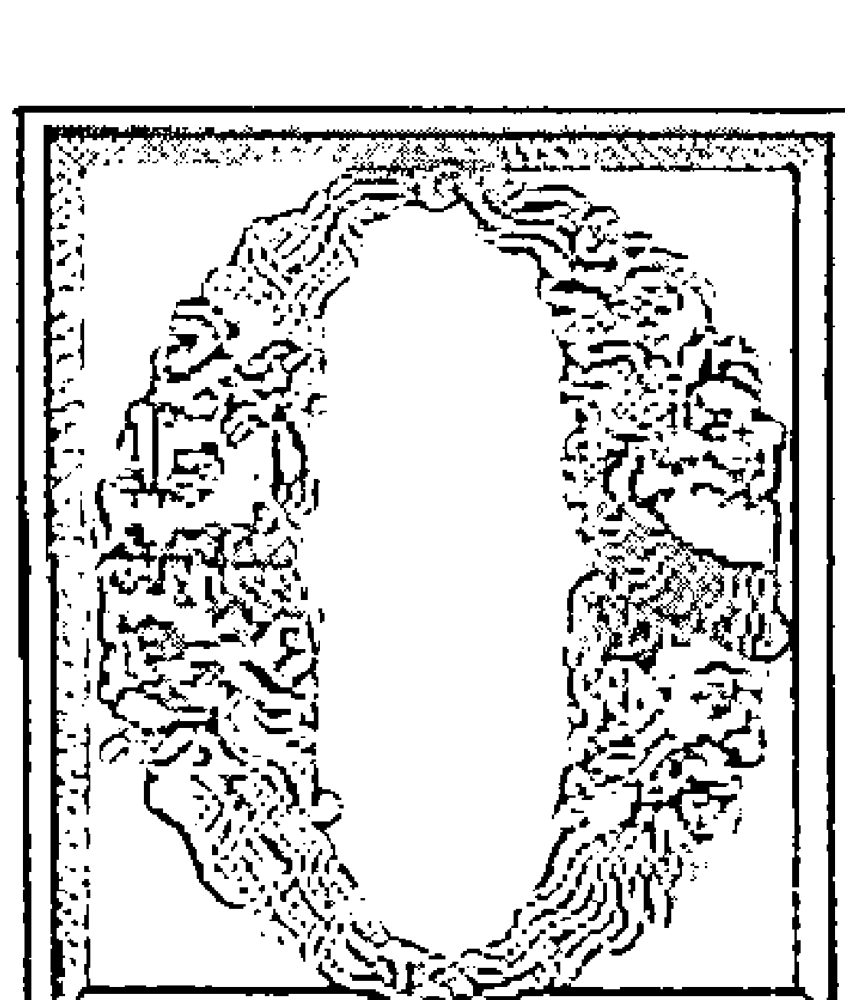

象征符是通过联系性、相似性，或者惯例，用一些事物代表另一些事物。象征符（symbol）这个单词是由希腊文字 Symbolon 衍生而来的，Symbolon 是用于与副本配对进行身份识别的工具。本质上，象征符是一种通过配对或者与他物的联系制定的一种权威。魔法象征符系统和我们每天都在使用的普通象征符系统之间主要的区别在于魔法象征符是以符应阶层的方式安排的（详情请看课程之三，第六课：“符应”）。每一个象征符群就像是光谱中的一个光带，或者是八度音阶中的一个音符。魔法象征符的不同属性可以看做是那些象征符在不同存在状态下的精神的表达。每一件实物、每一种思想、每一种情感都是一种永恒原则（Eternal principle）的象征符。未解之谜之中的奥秘（“秘密的知识”）除了象征符是不会向外行透露任何可见内容的。古时的密宗殿堂都发展了他们自己宗教的象征符号和语言，只有他们的内部成员才会知道，而且从不在他们的圣所之外的地方说起。魔法师设计了仪式，以便感知周围的所有物品都可以和仪式的思想和意图有一种象征连接。在一种仪式环境中，物品、符号，以及颜色接纳了它们自身及其内部的特性，获得或者创造一些必要的能量以达到预期的结果。

### 第二节：古文字

楔形文字（）我们所知的最古老的文字形式发源于美索不达米亚（“两河流域”），位于底格里斯河和幼发拉底河之间——也就是现在的伊拉克境内。因为世界上最早的一些城市在此处被发现，这个区域通常被称为是“文明的摇篮”。它最伟大的首都是巴比伦，建立于大约公元前2000年。最早的美索不达米亚人被称为苏美尔人，他们最重要的城市是乌尔和乌鲁克。从公元前3100年开始，最早出现的楔形文字（“楔形的”）符号是用尖锐的木棍在湿润的粘土上凿出小小的楔形记号。直到公元前2800年，每一个符号代表了一件物品、一种行为、思想，或者一个概念。几百年来，苏美尔记录员都是用这种文字来记录每天向圣殿提供祭品的事务。直到很久以后，楔形文字才被用来记录国王的功绩、宗教仪式、神话、诗歌——到后来，甚至还将楔形文字用于占卜、数学、医药，以及法律之中。

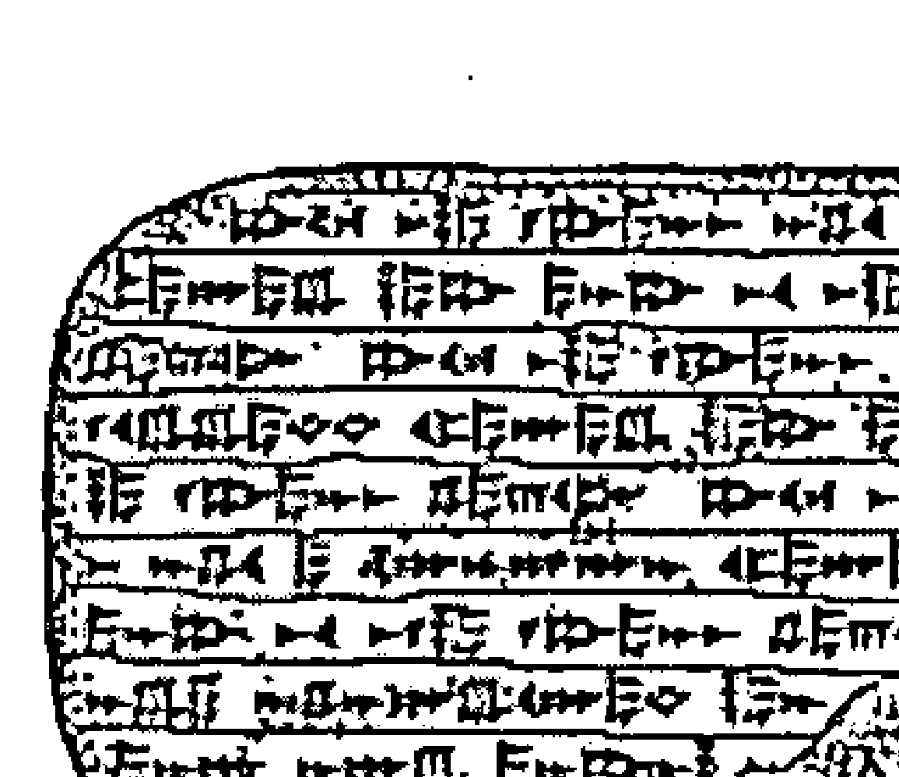

### 埃及人：象形文字，通俗文字 (𓂀𓏤𓍁𓏏𓅱𓏛) 和僧侣体文字 (𓀠𓂋𓏏𓅱𓏛)

- 代表一种物体或者行为；
- 代表音节的发音；
- 阐明邻近的字形的意思。

大约公元前3000年，古埃及人发展了一种非常复杂的形象化文字形式，我们称之为象形文字（hieroglyphics，读作HY-ro-GLIF-ix，“神圣的雕刻品”）。每一个字形，或者说图形，都有三个功能。因为观念不能用图形来表达，记录员们发明了25个特殊的符号，来代表他们语言中每个字符的辅音子音（spoken consonants），这样读者就可以读出这些单词。这就是字母表的根源，尽管埃及的记录员没有意识到它的潜能，而且很少用到这些特殊的符号。

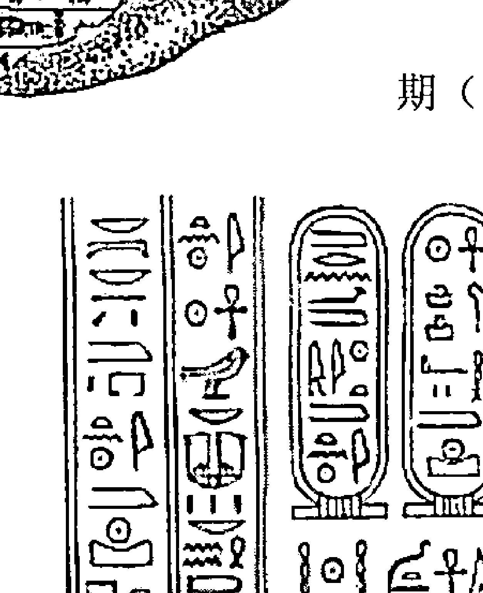

在埃及的新王国时期（公元前1550-700年），记录员恢复使用了一种更为古老的替换形式，叫做僧侣体(hieratic，读作 hy-RAT-ik) 文字，这种文字开始慢慢地代替了象形文字。他们将代表子音的字形转变为抽象的字母。与象形文字不同，这种字母可以向着任意方向书写，僧侣体文字通常都是在水平方向书写的。奇怪的是，对于记录员来说，似乎他们仍然需要大量的字形（6000个！），他们仍然将这些字形保留了下来。

在埃塞俄比亚，在梅洛埃帝国的统治下（the imperium of Meroe），人们从埃及的象形文字中选取了23个字形，创造了一种简体字，被称为通俗文字。各个历史时期的魔法社团都会从古埃及的历史中吸收大量的东西。对他们来说，埃及象形文字是一种理想的魔法字母表。

### 希伯来语 (עברית)

第一种真正的字母表——也就是一套可以展现一种语言中所有发音的字符——就是那本摩西在公元前1628年写下的原作“十诫”。他声称他是直接从耶和华那里得到的字符。这种文字被称为希伯来语（Hebrew，这个单词来源于Habiru，意为“风尘仆仆的旅行者”）。按照定义来讲，“字母表”是一种包含了40个字母以下的任何形式的文字，所以，希伯来的字母表有27个字母。自从接受了他们的第一部手写诫命之后，希伯来人将他们的名字改为以色列人。经历了几个世代的扩张之后，他们侵入并占据了迦南大陆（现在的巴勒斯坦），将其更名为以色列。在叙利亚共和国（the Ugarits）周围沿海的迦南人采用了希伯来文字，并通过航海事业发达的腓尼基人将其传播到地中海东岸。和之前的符号文字形式一样，希伯来语没有元音，这一点引发了有关各种各样的单词怎样发音的无休止的讨论。大多数有意义的这些文字都是神的名字，希伯来语是这样书写的：יהוה 或者 YHVH。因为禁止将这些名字大声念出来，圣经学者仍然还在讨论它应该念“Yahweh”，“Yahveh”，还是“Jehovah”。

### 希腊语 (Γρεεκ)

在与腓尼基人的贸易过程中，受到他们的字母书写方式的影响，在大约公元前800年期间，希腊人开发了现代“字母表 (alpha-beta)”——从A(alpha)和B(bet)开始。它成为了第一代包含了元音和辅音的字母表。有了它，识字开始在文明世界里传播开来，尤其是在亚历山大大帝领导下的马其顿王国扩张期间。从公元前50年开始，罗马凯撒大帝的继位征服并掌控了整个希腊世界，创造了我们所说的希腊罗马文明。所有受过教育的罗马人都会读写希腊语和他们自己的语言——拉丁语。但是在拉丁语的书写方面，他们将希腊字母进行了很多修改，纳入罗马字母表中，我们现在所使用的很多这种字母都是来源于此。而现在我们教给自己孩子的字母表已经成为了“A-B-C”。

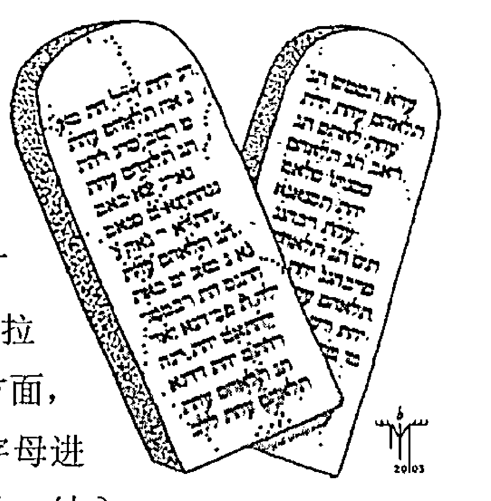

### 如尼文字 (ᚠᚱᚠᚱᛒ)

传说如尼文字是由奥丁神——北欧天神仙宫中的主神最先带到这个世界上来的。当他将自己挂在伟大的世界之树 (world-tree) 上时，他看到了所有的文字符号，一些可以用来代替口语语言中的所有语音的符号。单词“rune”在早期的英语及其亲属语言中意为“神秘”或者“秘密”。这个单词包含了大量的寓意，并且都很有道理。如尼文字严格意义上来讲并不完全算是一种世俗字母表。从它们最早的修订本到在日耳曼语中的使用，它们都是用在占卜和仪式之中。主要存在有三种类型的如尼文字：日耳曼语，斯堪的纳维亚语，以及盎格鲁-撒克逊语——每一种语言都有为数众多的变体。北欧古字母（Futhark）和“字母表（alpha-beta）”一样，都是用最初的几个字母——F，U，Th，A，ᚱ，K组成了它的名字。这是在现代魔法界中最流行也是使用最为广泛的如尼文字母表。

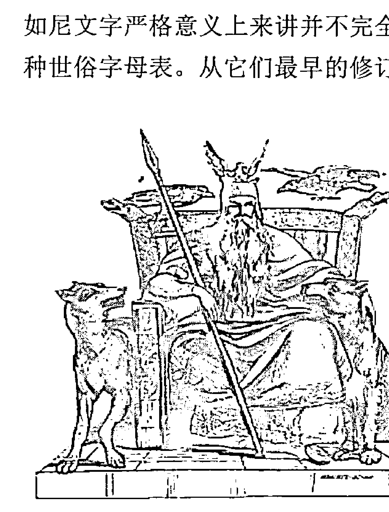

### 欧甘文字 (᚛ᚁᚂᚃᚄᚅᚆᚇᚈᚉᚊᚋᚌᚍᚎᚏᚐᚑᚒᚓᚔᚕᚖᚗᚘᚙᚚ᚜)

早期的凯尔特人和他们的祭司——德鲁伊——发展了他们自己的字母表形式。这种文字被称为欧甘文字（Ogham Bethluисnon）（Ogham，读作OH-um）（详情请看课程之三，第六课第七节：“树之历法”）。和其它文字一样，它的名字（Bethluисnon）来源于最早的几个字母：B（beth），L（luис），N（nion）。这是一种非常简单的形式，更多地用于在木头或者石头上的雕刻，而不是寻常的书写。文字中有一根中线，这就让这种文字专用于沿着石头的边缘或者小片木头边沿雕刻。当这种文字符应与树之间的联系因为罗伯特·格雷夫斯（Robert Graves）对于“树之历法”的解释而众所周知，欧甘字母同时也应用了各个手指，而且还可以利用手指的不同关节所代表的字母来秘密地传递信息。

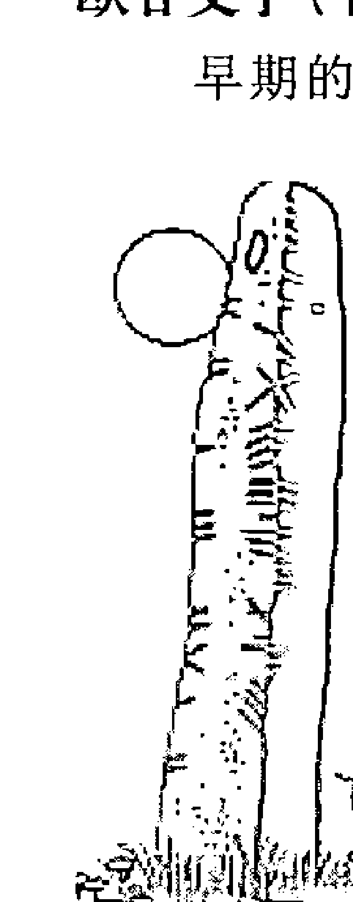

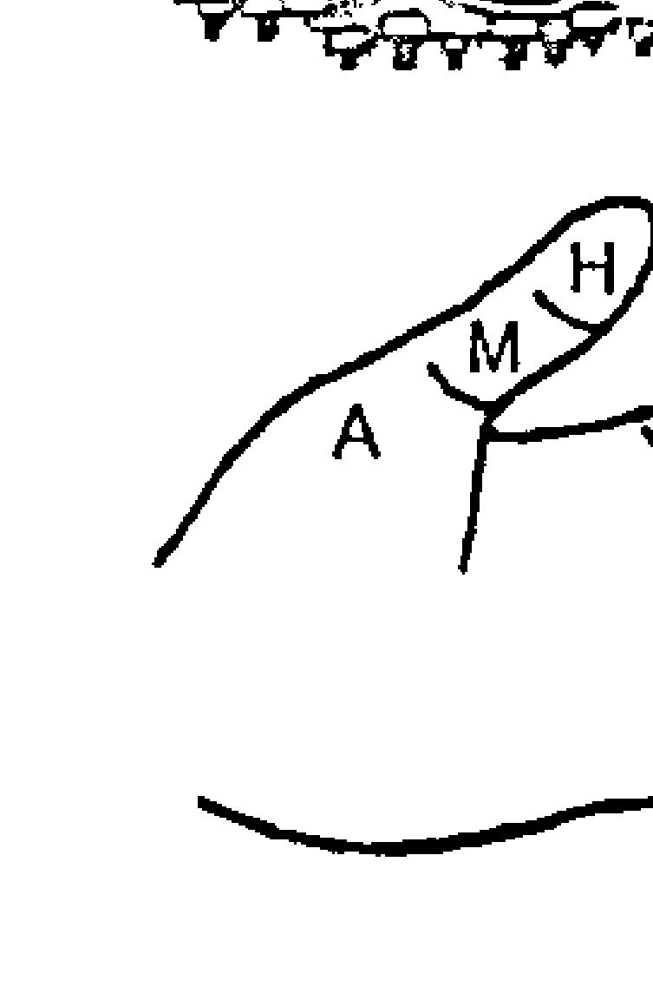

### 皮克特语 (᚛ᚁᚂᚃᚄᚅᚆᚇᚈᚉᚊᚋᚌᚍᚎᚏᚐᚑᚒᚓᚔᚕᚖᚗᚘᚙᚚ᚜)

古时大不列颠群岛的皮克特人发展了一种精心制作的“旋涡状”书写风格。然而，这些符号十分相近，书写的时候你需要非常仔细，以免弄混淆。后来，皮克特族的刻字，艺术品，以及装饰性的设计被凯尔特人采用并精心改良，尤其是在爱尔兰的凯尔特人。

### 第三节：魔法字母表

从中世纪到文艺复兴时期，成千上万的人因为巫术的罪名遭受了严刑拷打，并烧死在火刑柱上，而此时有很多人（包括祭司、主教、大主教，甚至是基督教会的教皇）都非常公开并且无限制地在练习魔法。他们能够如此自由地施展魔法最主要的原因就在于“练习”这个词。魔法被看做是一种宗教信仰，因此也是基督教的一个竞争对手。但是仪式魔法就像医药学一样，都仅仅是一种练习，因此并不值得教会关注。同时，它也是一种非常昂贵并且博学的练习，因此投身于魔法追求的人不仅要受过一定的教育，有大把的空闲时间，而且还要拥有必要的物力，能够同时满足这几种要求的人凤毛麟角。那个年代，每一个魔法师都是独自研究，并且小心守护着自己的操作方法——就如同与教会权威之间的联系一样，魔法师之间很少有联系，而且魔法师之间通常有着很严重的对抗性。为了对世俗隐瞒他们的学说和信条，很多魔法师都发明了自己的密码（“秘密字母表”）。这些魔法书和魔法社会记录的原稿已经经历了几百年的传承，如今仍被魔法师继续使用。

魔法师使用这些魔法手稿、速记符号，以及魔诀来吸收任何他们所需要的（能量）。如果你将我上面介绍的如尼文字刻在了你的魔杖、仪式刀，以及其他工具上，那么你也完成了这一步。你需要学会这些传统魔法字母表其中的一种或者多种，并且学会书写某些魔咒、铭文，以及它们中包含的一些信息。通常情况下不需要使用这些特别的字母表，每日英语手稿不会要求特别的注意力或者能量。你会慢慢习惯这种书写方式，久而久之你便可以以熟生巧。另一方面来讲，当你在书写一种你不太了解的陌生字母表时，你就真的需要集中注意力，并且专注于你在做的事情。

### 炼金术字母表：迦勒底语(3XJ3X3)；玛拉基书(HHUHUYA3H)

通常叫做神圣的或者炼金术的字母表，几乎是仪式魔法师专用的一种字母表，即使偶尔会有个别的巫师将其用作护身符。流传最为久远的脚本是：通过河流，天堂，和玛拉基书（Passing the River, Celestial, and Malachim）。天堂也被称作天国或者以诺，石工行业的研究生院仍然在使用这种字母表。这来源于约翰·迪博士和爱德华·凯利的协作，他们在1581年创作了一套字母表，共21个符号，他所声称这是上天透露给他的真正的天使字母表，这些符号构成了天国主人的名字。这些符号成为了迪和凯利的以诺派体系的基础，用于召唤天使和魔鬼。玛拉基书的外形据说衍生自星座——虽然这些都不可能说清楚。玛拉基书有时会与“东方三贤士文字”混淆。

### 底比斯语(??? ????h)

为了表示对其创造者洪诺留三世（教皇，1216-1227年）的敬意，底比斯语的脚本也被称作洪诺留语（Honorian）。这种字母表在巫师之间非常流行，同时，也被现代魔法师所广泛大量地使用，以至于这种字母表通常被称为魔法师字母表。回望1970年，当我最开始接触魔法训练时，我的老师黛博拉·莱特坚持让我们学会流畅地用底比斯语阅读和写作，不仅仅要学会在咒语和魔法铭文中使用，还要学会用这种语言在聚会中与同伴交流。我记得有一天晚上开会时，前门上就用别针别了下面这样一段话——看看你能否将它翻译出来！

> ??? ??? ??? ??? ??h
???ppp????? ??h ??h
??h ??? ??????? ??
???? ??? ppp??? ?? ????h
???????? ??????? ??

### 罗马数字 (I, II, III, IV, V, VI, VII, VIII, IX, X)

留给我们现代字母表的罗马人在历史上，还设计出了可能是最愚蠢而且毫无用处的数字系统。罗马数字可以用在标签和小数字上，只要你只是将它们用于点数（它们同样也用于钟面数字和罗列大纲，就像我们的课程）。但是更大一点的数字就会变得无望地复杂，而且你还必须计算才能得出它们真正代表的数目。举个例子说明一下，比如“1888”年，就得写成## 古字母和魔法字母表

| 英语 | 楔形文字 | 僧侣体文字 | 通俗文字 | 希伯来语 | 希腊语 | 北欧古字母 | 欧甘文字 | 皮克特语 | 底比斯语 | 迦勒底语 | 玛拉基书 | 三贤士文字 | 天国语言 | 玫瑰十字会/共济会 | 渡河文字 | （小精灵）腾格瓦文字 | （小矮人）安格萨斯字体 |
| :---: | :---: | :---: | :---: | :---: | :---: | :---: | :---: | :---: | :---: | :---: | :---: | :---: | :---: | :---: | :---: | :---: | :---: |
| Aa | ▶ | 𓀀 | Ꝙ | ᐁ | Aα | ᚠ | + | ⊕ | ʑ | Χ | 𐆗 | Ꝛ | Χ | ℵ | ⊐ | ： | a |
| Bb | ▷ | 𓃀 | Ꝗ | ᐃ | Bβ | ᛒ | ⊣ | Ƃ | ƍ | Ϸ | 𐊀 | Ꝙ | Z | ∫ | ∟ | P | b |
| Cc | 𓃭 | 𓄿 | ꝕ | ᐅ | Xχ | ᚲ | ⊏ | Ɔ | Ͼ | ϴ | 𐊁 | ꝛ | Π | 7 | ∪ | q | c |
| Dd | 𓃠 | 𓂀 | ꝓ | ᐇ | Δδ | ᛞ | ⊣ | Ɖ | Ϡ | Ϸ | 𐊂 | Ꝝ | Π | 7 | ∪ | P | d |
| Ee | 𓂧 | 𓆏 | Ꝓ | ᐉ | Eε | ᛖ | ═ | Ə | ζ | - | - | - | - | - | - | L | ， | e |
| Ff | - | 𓆓 | ꝑ | ᐋ | Φφ | ᚠ | ≡ | Ƒ | Ϡ | Ϸ | - | - | - | - | - | L | h | f |
| Gg | ⚜ | 𓂧 | Ꝑ | ᐍ | Γγ | ᚷ | ≠ | Ɠ | Ϩ | ϴ | 𐊃 | ꝝ | Π | 7 | ∩ | ⅄ | g |
| Hh | ↓ | 𓃀 | Ꝏ | ᐏ | Hη | ᚺ | ⊢ | Ȟ | Ψ | Β | N | ꞓ | Ꝡ | Π | 7 | E | 3 | λ | h |
| Ii | - | 𓀀 | ꝍ | ᐑ | Iι | ᛁ | ═ | Ɩ | Ϟ | Ϩ | ꝓ | ꝡ | Π | 7 | △ | ⊓ | · | i |
| Jj | - | 𓆓 | Ꝍ | ᐓ | Θφ | ᛃ | ═ | ȷ | Ϡ | Ψ | - | - | - | - | - | ⊓ | ꝣ | j |
| Kk | ▶ | 𓃀 | ꝋ | ᐕ | Kκ | ᚲ | ⊏ | Ƙ | Ϡ | Ϩ | Ꝕ | ꝣ | Π | 7 | ∩ | ⊓ | q | k |
| Ll | 𓅃 | 𓃀 | Ꝋ | ᐗ | Λλ | ᛚ | ⊣ | ƚ | Ϡ | Ψ | ꝕ | Ꝥ | Π | 7 | △ | ⊓ | t | l |
| Mm | ▶ | 𓃀 | ꝉ | ᐙ | Mμ | ᛗ | + | Ɯ | Ϡ | Ψ | Ꝗ | ꝥ | H | Ꝡ | Π | 7 | □ | e | m |
| Nn | ▶▶ | 𓈖 | Ꝉ | ᐛ | Nν | ᚾ | ⊏ | Ɲ | η | Ϩ | ꝗ | Ꝧ | ꝥ | ꝣ | Π | 7 | E | m | n |
| Oo | ◁ | 𓂧 | ꝇ | ᐝ | Oο | ᛟ | ≠ | Ɔ | Ϡ | Ψ | Ꝙ | ꝧ | □ | Ꝧ | Ꝥ | Π | 7 | ， | o |
| Pp | △ | 𓃭 | Ꝇ | ᐟ | Ππ | ᛈ | ✶ | Ƥ | η | Ψ | ꝙ | Ꝩ | Π | 7 | ∪ | ∩ | P | p |
| Qq | △ | 𓂧 | ꝅ | ᐡ | - | ᛍ | ≡ | Ω | ζ | Ψ | ꝛ | ꝩ | △ | ꝣ | □ | Π | 7 | q | q |
| Rr | 𓆑 | 𓄿 | Ꝅ | ᐣ | Pρ | ᚱ | ≡ | Ƨ | ζ | Ϩ | Ꝝ | Ꝫ | V | Ꝥ | ꝥ | Π | 7 | ∩ | r | r |
| Ss | ▽ | 𓄿 | ꝃ | ᐥ | Σσ | ᛋ | ≡ | Ƨ | Ϡ | Ϸ | ꝝ | ꝫ | Ꝡ | Ω | ꝣ | □ | Π | 7 | 6 | s |
| Tt | △ | 𓂧 | Ꝃ | ᐧ | Tτ | ᛏ | ⊢ | Ƭ | η | Ψ | Ꝟ | Ꝭ | ꝥ | Π | 7 | Ꝥ | E | 3 | P | t |
| Uu | 𓊀 | 𓆓 | ꝁ | ᐩ | Υυ | ᛥ | ≠ | Ʊ | - | - | ꝟ | ꝭ | - | - | - | V | ， | u |
| Vv | - | 𓄿 | Ꝁ | ᐫ | Ȣω | ᛠ | ≡ | ⱽ | P | Ψ | Ꝡ | Ꝯ | ꝥ | Ꝥ | Ꝧ | Π | 7 | ∩ | b | v |
| Ww | ▶▶ | 𓃀 | ꞿ | ᐬ | Ωω | ᛈ | - | ǁ | Ρ | Ψ | ꝡ | ꝯ | ꝥ | Ꝥ | Ꝧ | Π | 7 | 。 | w |
| Xx | - | - | Ꞻ | ᐮ | Ξξ | - | - | ƚ | η | Ψ | - | - | - | - | - | < | z |
| Yy | 𓈖 | 𓆓 | ꞉ | ᐰ | Ψψ | ≡ | Ə | Ϡ | Ψ | Ꝥ | ꝰ | ꝥ | Ꝥ | △ | ⊓ | ꝳ | ꝴ | ∧ | y |
| Zz | ↓ | 𓊃 | ꞈ | ᐲ | Zζ | ᛉ | ≡ | Z | η | Ϩ | ꝣ | ꝱ | Ω | T | < | ∧ | ꝺ | 껈 | U |
| Th | - | 𓂧 | - | ᐴ | Θθ | - | ⊣ | ƿ | - | - | - | - | - | - | - | ꞯ | h | ⅎ |
| Ng | - | - | - | ᐶ | - | - | ◇ | ≠ | ƿ | ɑ | - | - | - | - | - | [ |
| Eo | - | - | - | ᐸ | - | - | - | - | - | - | - | - | - | - | - | ○ |

## 第五节：占星速记雕刻符号和魔符

“MDCCCLXXXVIII”。更为不便的是，这些数字中没有“零”。所有以上的这些说法都仅仅是为了说明，使用罗马数字，甚至连最简单的算术也不可能完成。它们甚至都不能用于加减，更别说乘除了！没有人会将这种数字系统用于财务记录、计算一个空间的大小、表示数字百分比，或者是我们每天都会用到的“难以计数的”数学运算。

在所有的书面文字形式被发明出来的很久以前，人们都用简笔画或者简单的速记雕刻来代表事物和思想。我们将希腊文字用于这种雕刻：速记符号。在最早的洞穴绘画中，我们可以发现简单的代表着人和动物的人物线条画，点、圈，和线的摆设安排，以及几何符号例如正方形和三角形（倒三角 = 女性；正三角 = 男性）。

从罗马帝国时代到文艺复兴时期的一千五百年期间，罗马数字都只是一种在欧洲的拉丁语学者中使用的数字。拉丁语同样也是唯一的书面语言——由罗马教会牢牢控制，他们将所有的著名书籍严密看管在他们的修道院图书馆中。但是公元70年，当罗马摧毁了耶路撒冷之后，在犹太人的大流散（Diaspora，读作 dee-AS-por-ah）中慢慢散布到整个欧洲地区的犹太人都没有使用罗马数字。高水平的学者（至少是男人们，因为所有的男孩都被要求学习阅读希伯来语——但是，一般来说女孩根本都不允许学习阅读），犹太人都使用阿拉伯数字，这种数字是人们从巴比伦人那边捡来的——和我们现在使用的阿拉伯数字一样。这些数字可以用来做运算、做会计、做方程式、记账，等等。因此犹太人成了商人、银行家、数学家——还有魔法师、占星家、巫师，以及科学家。这就是为什么如此多的老魔法书（比如《所罗门之钥》）都是以犹太的魔法系统为基础，例如卡巴拉（Qabalah，读作 ka-BALL-ah）——这也是为什么如此多的魔符和护身符在传统上都是用希伯来文雕刻的。

魔符（来自拉丁文 sigillum，“印章”）是特别代表个别神明、精灵，或者人类的象征特性——或者，甚至是结构（例如公司标志）。魔法可以基于几何图形、星座、如尼文字、炼金术符号，或者就仅仅是某人喜欢的涂鸦。魔符可以代表复杂的概念，甚至可以包含整个咒语的本质。每个人都可以设计一个私人的魔符在艺术品上签名，或者在魔法工具上题字。魔符可以用于咒语或者雕刻在仪式刀上。

## 古埃及语

古埃及人发展了应用最为广泛的图画文字，这种文字在希腊语中，称为象形文字（Hieroglyphs，“神圣的雕刻品”）。单词和整个概念都由这些符号代表，古往今来，许多的这些符号都被应用于魔法用途。以下是一些近代流行的埃及象形文字:

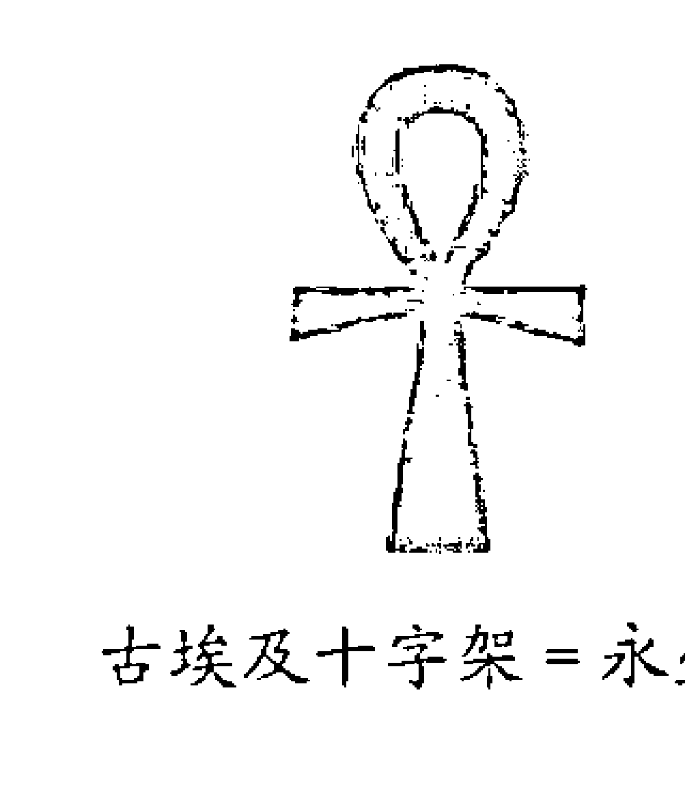

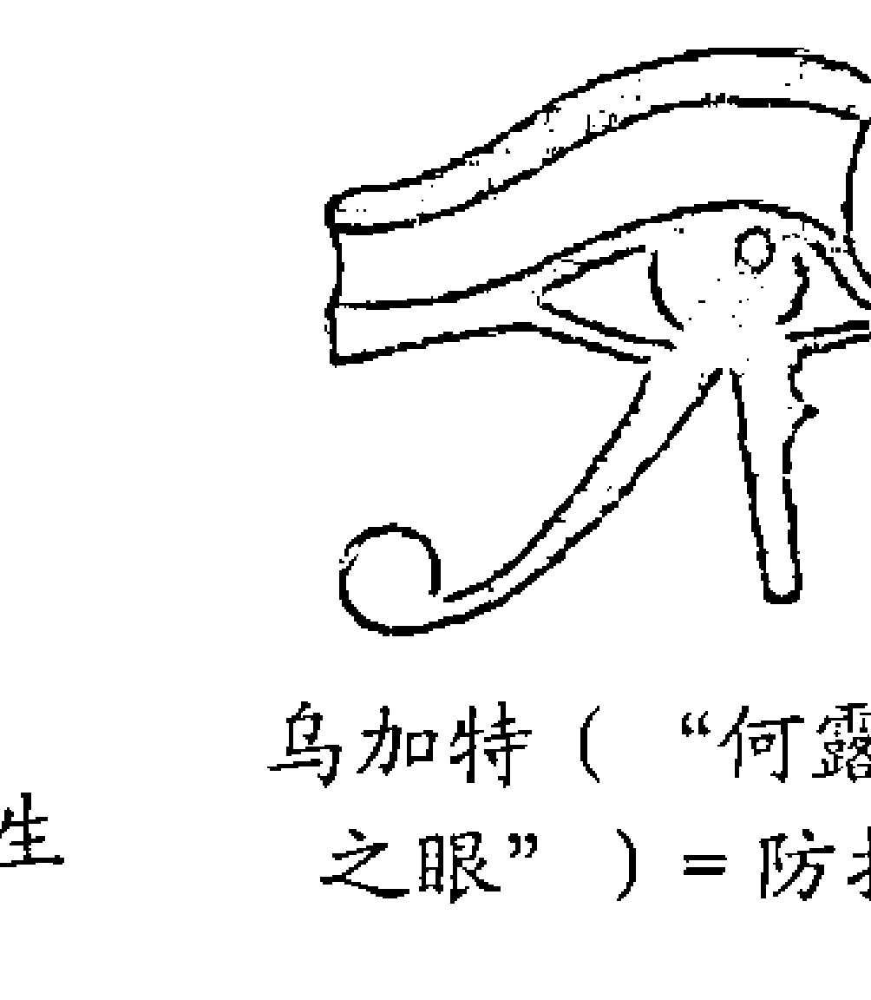

## 毕达哥拉斯哲学

毕达哥拉斯神秘学（课程之六第三课：“数学魔法”）将其所有的教学都与几何符号联系在一起，尤其是多字母组合（polygrams，“多角文字 [many-pointed writing]”）。其中最重要的就是五角星形，它是光、健康，和生命力的符号。它同样也是第五大元素（灵）的象征符号。由两个三角形（男性——正三角形，以及女性——倒三角形）结合组成的六角星形是婚姻的象征符号。六角星形同样也被称作大卫之星，或者所罗门印章（Solomon’s Seal）。七芒星，或者七角星是由一条连续的线一笔勾画而成，同样也被现代魔法人士们称作精灵星。另一种重要的毕达哥拉斯神秘学符号是黄金螺旋，就像尚未成熟的鹦鹉螺上的纹饰一样。

## 五角星形

五角星形，或者五角星是由一根连续的线条一笔而成的，是魔法师和巫师最喜欢的符号。对于现代巫术来说，将五角形内接在一个圆圈中是最流行的符号。这个符号最早用于 4000 年前的古巴比伦时期（雕刻在阿斯马尔丘出土的一个公元前 2750 年前的罐子上！），在古巴比伦，它代表着伊师塔之星，那个被我们称作维纳斯的女神（金星）。依附在一个圆圈中或者画在一个碟盘上，五角星形便成为了一个星印，这样的图形可以用于塔罗牌和魔法圣坛中，以代表四大元素之土元素，或者物质层面。安放在窗户上，或者作为坠饰佩戴都是一种抵制邪恶的护身符。五角星形的五个尖角代表了四大元素（土、气、火，和水），加上高于一切的灵。它们同样也代表了我们了解世界过程中所应用到的五大感官。

五角星形代表了人类微观世界，或者宇宙小模型。这张来自阿古利巴的《神秘哲学》（[Occult Philosophy]）的图形看起来就像是一个人双手打开，双脚叉开站立的样子。这样的五角星形还可以用于代表女神。以反向或者上下颠倒的位置摆放时，五角星形就像是一只山羊头，两只羊角向上、两只耳朵

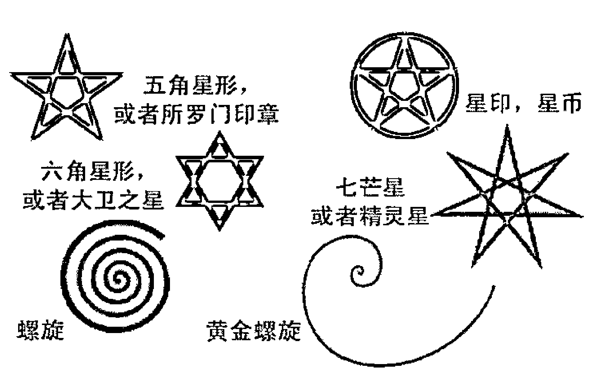

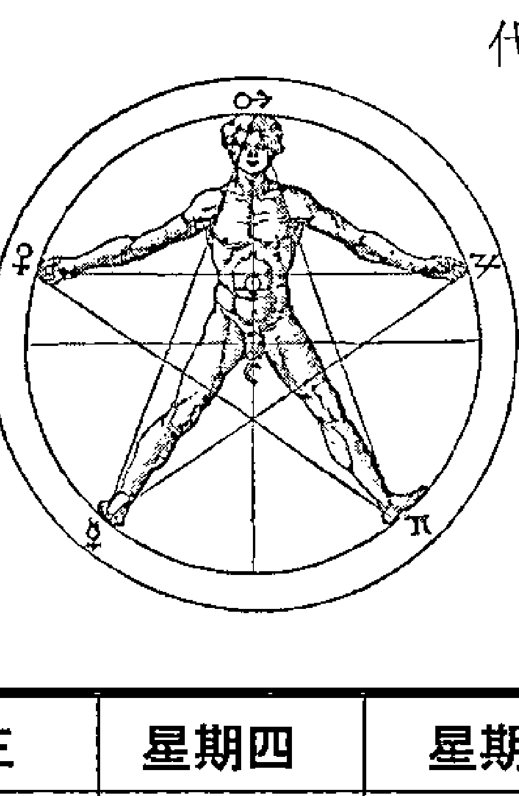

| 星期日 | 星期一 | 星期二 | 星期三 | 星期四 | 星期五 | 星期六 |
|---|---|---|---|---|---|---|
| 米迦勒 | 加百利 | 卡麦尔 | 拉斐尔 | 萨基尔 | 亚纳尔 | 卡西尔 |
| [符号1] | [符号2] | [符号3] | [符号4] | [符号5] | [符号6] | [符号7] |
| [符号A] | [符号B] | [符号C] | [符号D] | [符号E] | [符号F] | [符号G] |

守护一周中每一天的天使的名字和魔符（雷吉诺・史考特之后，1584 年）

打开、胡须下垂。一些女巫以这种方式的五角星来代替那位有角的天神潘。但是撒旦崇拜者也会使用这种倒立的五角星来代表基督教魔鬼撒旦的脸。

## 占星术

占星学上所使用的速记符号对于大多数人来说是非常熟悉的。以下就是代表所有星球的速记符号：

| 太阳 | 月球 | 水星 | 金星 | 地球 | 火星 |
| :---: | :---: | :---: | :---: | :---: | :---: |
| ♀ | ☽ | ☿ | ♀ | ⊕ | ♂ |
| 木星 | 土星 | 天王星 | 海王星 | 冥王星 |  |
| ♃ | ♄ | ♅ | ♆ | ♇ |  |
| 双鱼宫 | 白羊宫 | 金牛宫 | 双子宫 | 巨蟹宫 | 狮子宫 |
| ♓ | ♈ | ♉ | ♊ | ♋ | ♌ |
| 处女宫 | 天秤宫 | 天蝎宫 | 射手宫 | 摩羯宫 | 宝瓶宫 |
| ♍ | ♎ | ♏ | ♐ | ♑ | ♒ |

## 任务：设计你自己的魔符

许多魔法师——以及许多艺术家和作家——都会设计个人的速记符号或者魔符用来在他们的作品上签名，这样别人就能通过这些符号来识别他们。他们可能甚至会将这些符号做成魔符戒指或者私人首饰。我自己的符号，我已经用了40多年了，如下图所示。比如说，无论你在哪幅插图上看到这样的标志，你就会知道那是我画的。

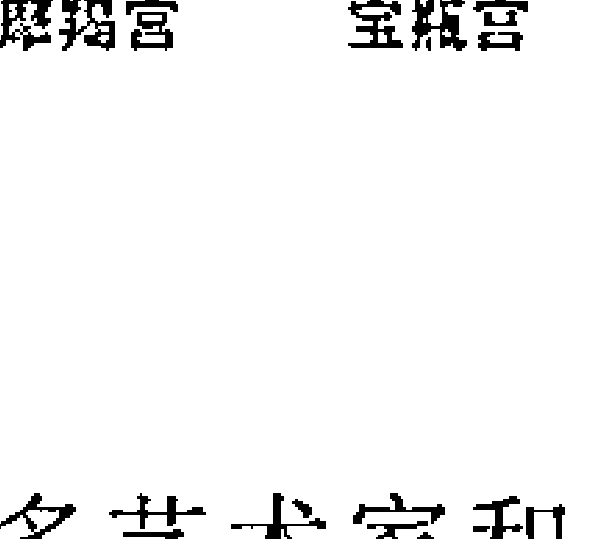

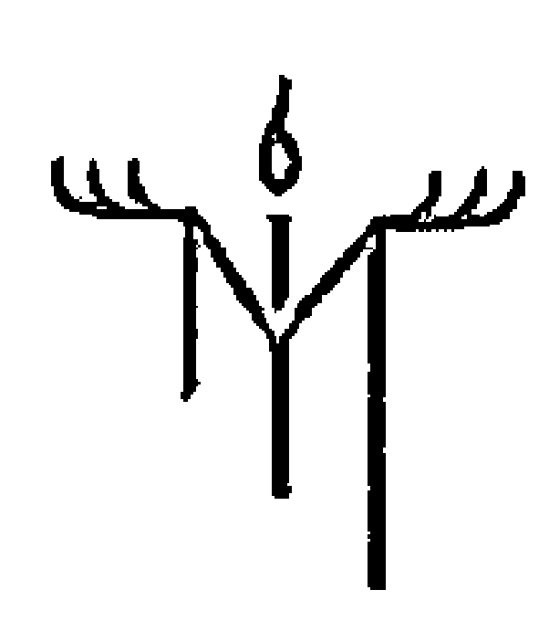

我建议你设计一个你自己的魔符。其中有一种方法就是根据你名字中的大写字母来完成设计，正如托尔金那样（如图所示）。这样的设计被称为交织文字。但是你不是必须得用英文字母，你也可以使用底比斯语，或者其它任何种类的字母，历史上存在的，或者魔法界内使用的。你可以改进，拉伸，甚至颠倒字母。北欧古文字如尼文特别喜欢将它们自己奉献给聪明的速记符号和魔符，因为他们可以通过叠印（将一个重叠在另一个的上面）结合在一起。通过这种方法，你可以将你的整个名字转化为单个如尼文字。以下以我的名字来举个例子说明一下：

示）。这样的设计被称为交织文字。但是你不是必须得用英文字母，你也可以使用底比斯语，或者其它任何种类的字母，历史上存在的，或者魔法界内使用的。你可以改进，拉伸，甚至颠倒字母。北欧古文字如尼文特别喜欢将它们自己奉献给聪明的速记符号和魔符，因为他们可以通过叠印（将一个重叠在另一个的上面）结合在一起。通过这种方法，你可以将你的整个名字转化为单个如尼文字。以下以我的名字来举个例子说明一下：

```
OBERON = ᛟᛒᛖᚱᛟᚾ =
```

第一个字母 ᛟ 出现了两次，所以，只需要一个就可以了，ᛒ 中包含了 ᚱ。将它们全都放入 ᛗ 中，就形成了如图所示的形状，在右边还有一个小小的 ᚾ 形的横木。这被称为捆绑如尼文。而且，所有的如尼文字都可以翻转（就如同镜像一样）——而且，当一个字母出现两次时都会这样（例如 HELLO用如尼文字书写是这样的: ᚺᛖᛚᛚᛟ）。用你的名字和首字母来试试，并且使用不同版本的字母表来练习，直到你找到你喜欢的那一个。我们做这个任务的目的是为了让你的交织文字尽可能地简单，但是要包含所有的字母。当你最终找到你自己的速记符号、魔符，或者捆绑如尼文的时候，你就可以用它来为你所有的物品签字，包括信件、艺术品，等等。

## 第六节：魔法符号和魔法物品的术语

魔符（Sigil）：一个图案、象征符号，

## 魔法师学徒的魔法书 | 下卷

- **密文 (Cryptograms)**：从字面上说，意为“秘密文字”。所有种类的由魔法师、炼金术士，以及巫师使用的魔法字母表。
- **如尼文字 (Runes)**：所有种类的古日耳曼字母表，每一个字母都包含了一个仅限圈内人知晓的（“秘密的”）意思，而且还代表着一些常用的发音。
- **如尼石刻 (Runestones)**：标有如尼字母表中字母的石头，通过“刻上如尼文字”进行占卜。
- **附魔 (Charge)**：将魔法能量和魔法意图灌输到某物中。
- **护身符 (Talisman)**：某人制作或者获得的一个充满了魔力的物品或者图画，为了带来好运而随身携带，或者作为一个完成特定目标的工具。通常雕刻有适当的符号。护身符可以自己制作，也可以购买，附魔以后任何物品都可以转变为护身符。
- **驱邪物 (Amulet)**：一个充满了力量，用于防护或者趋避霉运的物件，随身携带。驱邪物通常由偶然找到的天然物品制成，例如圣石、化石、水晶、贝壳、陨石、兽角、骨头，等等。然而，你也可以自己制作或者绘制驱邪物。
- **随身护符 (Charm)**：魔法口头或者书面语言。同样也是因其魔法力量和魔法性能而需要随身携带的物品。
- **符咒 (Cantrip)**：一种书面的咒语或者护符，可以顺着念也可以倒着念。
- **感应物 (Object link)**：任何物品，例如一绺头发，可以通过关联建立魔法师和他施展魔法帮助或者对抗的那个人之间的联系。
- **捆绑 (Ligature)**：一个人的魔法绑定。
- **量尺 (Measure)**：一段用于测量某人身高的绳索——通常作为入门仪式的一部分。
- **契约 (Pact)**：一个绑定的书面誓约，或者是两个实体之间的协议。
- **物神 (Fetish)**：任何被认为具有魔力的物品。
- **圣像 (Icon)**：一幅神圣的画像，或者神性或者圣灵的代表，比如一幅画或者一尊雕像。
- **木偶 (Poppet)**：一个根据实际存在的人或者动物的肖像制作的玩偶或者小塑像，用作聚焦魔法。同时也被称为 fith fath。
- **女巫瓶 (Witch bottle)**：一个容器，里面装满了反射性的或者锐利的物品，埋藏在家的附近，以驱逐消极的能量。

## 第七节：驱邪物和护身符

### 驱邪物

驱邪物（来自拉丁语中的 amuletum，“意为防御”）是一种充满了防护，或者避免厄运、疾病，或者邪恶魔力的物品，通常是随身携带。传统上来说，驱邪物是由偶然发现的天然物品制作而成——尤其是那些拥有与众不同的形状或者吸引眼球的颜色的东西，例如圣石、化石、水晶、贝壳、陨石、兽角、骨头等等。人们会将这些物品穿孔，系上细绳，佩戴在脖子上，或者放入一个小小的辟邪（gris-gris，读作 GREE-gree）袋中，然后再佩戴在脖子上。这些物品的魔法性能都是其本身所固有的。

固有的（“内部的”）。

没有一个驱邪物是万能的（通常都是为了“带来好运”），但是它们通常又不仅仅是驱邪物。罗马的自然主义者老普林尼（Pliny the Elder）（公元 23-79 年）根据它们的性能，这样描述了三种基本类型的驱邪物：对抗灾祸的防护性能，针对健康损害的治疗和保护性能，以及药用性能。

一些传统的驱邪物包括：由鸡骨头制成的项链戴在脖子上可以抵抗灵媒的侵扰。黑色的圣石是一种强大的厄运破除者，可以让你远离邪恶。在脖子上佩戴蒜头可以防范吸血鬼（以及其它所有的邪恶生物！）。曼德拉草根可以治疗疾病，使你免受邪恶的侵扰。绿松石可以使你免受“邪恶之眼”的伤害。最受欢迎的好运驱邪物是四叶苜蓿和兔子脚（但是，首先你得问问兔子愿意不！）。在脖子上佩戴撒尔沙植物根可以带来好运，点上一根绿色蜡烛，吟唱三次：“霉运退去，好运到来！”。

除了简单的天然物品，古时的埃及人、亚述人、巴比伦人、阿拉伯人、希伯来人、希腊人，以及罗马人根据象征性的图像创造了无数的雕刻驱邪物。例如，青蛙促进生产力；古埃及十字架带来长寿；乌迦特，或者“何露斯之眼”，能够带来健康，以及抵抗邪恶的防护；圣甲虫可以使你免受黑魔法的伤害，并保证你来世的复活。对于亚述人和巴比伦人来说，公羊代表了生殖力（男性的性交能力），公牛代表了生殖力和力量。眼睛和男性生殖器的符号几乎是通用的对抗恶灵和“邪恶之眼”的防卫用品。

宗教符号同样也是很受欢迎的驱邪物。非基督教徒会佩戴他们自己天神的肖像或者象征标志（例如托尔的铁锤，赫尔墨斯的神使之杖，或者何露斯之眼）。犹太教教徒会佩戴六角的大卫盾（Mogen David，“大卫之星”）。基督教徒佩戴十字架／鱼，以及圣徒的勋章。女巫佩戴五芒星。

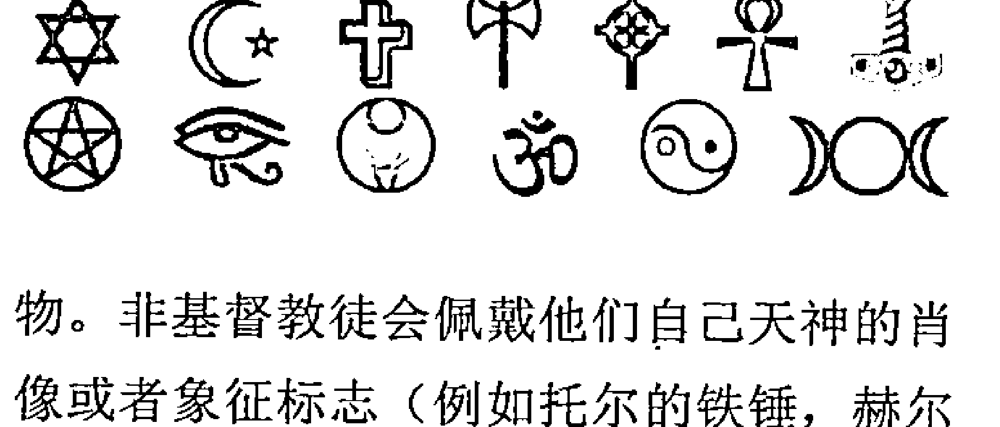

## 护身符

护身符是一种特别制造的物品，它充满并赋予了作为一种工具完成特殊用途的魔力。护身符有很多种类，例如带来好运、赢得赌博、预防突然死亡、提高记忆力，甚至还有做好演讲致辞的护身符。和驱邪物一样，护身符通常要随身携带。佩戴护身符的那个人自己亲手制作的护身符最为有效。别人帮你做的护身符远比不上你自己亲手制作的护身符来得强大。

护身符可以做成各种形状，使用各种材质，但是传统上来说，有些物质会比其它物质更为合适，而且它们的用途会使护身符拥有更多的力量。制作护身符最常使用的材质应该基于一周中每一天的行星符应（详情请参照课程之三第六课第五节：“行星符应表格”）。从这个图表上我们可以看到，每一天都连系着一个特定的行星，而每一颗行星都与某些东西存在着特殊的关联。因为每一颗行星都有其特定的颜色和专属金属，反应了这些关联的护身符也应该由这些金属制成——至少要涂上这些颜色。（因为金属汞是液态的，锡或者铅也适用于汞护身符。）

大多数的护身符都会做成金属磁碟的形式，并在两面刻上合适的魔符和符号。然后就会作为坠饰穿在链子上佩戴。当然，在大多数的超自然商店中你可以买到合适的已经刻好的护身符磁碟。但是如果你非常在意你想要达到的目的，那你就应该自己做。一些金属可以在五金店中买到。捕鱼用的铅坠可以锤平以替代铅（代表土星）。然而，铁器如果没有经过熔炉的融化会很难锤薄。金质、银质，以及铜质的磁碟可以用铁锤和铁砧将硬币锤平代替。代表太阳的纯金硬币可能会有点昂贵，但是也可以使用镀金或者仿金合金。你可以使用我在讲授怎样在仪式刀上刻如尼文的方法（课程之三第二课第五节）来在你的护身符上刻字。

护身符得在合适的日子进行雕刻——甚至还要计算出一天中最好的时间（请参考课程之四第五课第二节：“时辰之舞”）。请在课程之五第七课第三节：“行星力量的护身符”中参考七颗行星的传统护身符魔符。魔符中间的文字是占星学中的速记符号；中心凹陷代表特性；左边凹陷代表统治圣灵；右边凹陷代表掌握智慧。

在护身符的另一面刻上你的名字、个人魔符，以及用你最喜欢的魔法字母刻上特定的意图或者目的。

## 第八节：魔法矿石

在中世纪期间，水晶和其它石头都用作驱邪物，点缀在护身符上以达到各种各样的魔法目的，从防护、睡眠，以及令人愉快的梦，到命运占卜和治疗。颜色和形状被认为是决定了这些魔法用途的重要因素，而且有这些颜色和形状的水晶都被认为有着它们自己与生俱来的本质。这些最常用作佩戴的首饰，例如戒指和坠饰，但是裸石也可以装入小袋或者魔咒袋中携带。以下是一些各种各样的宝石和矿石的魔法关联：

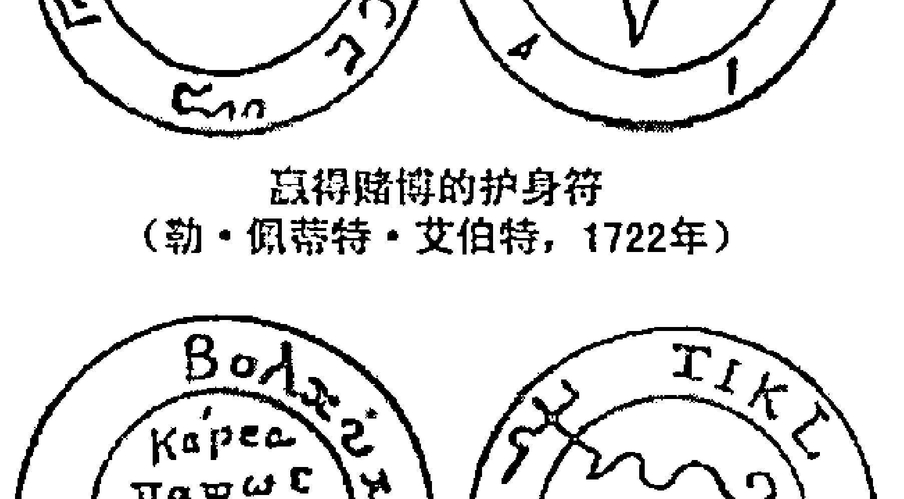

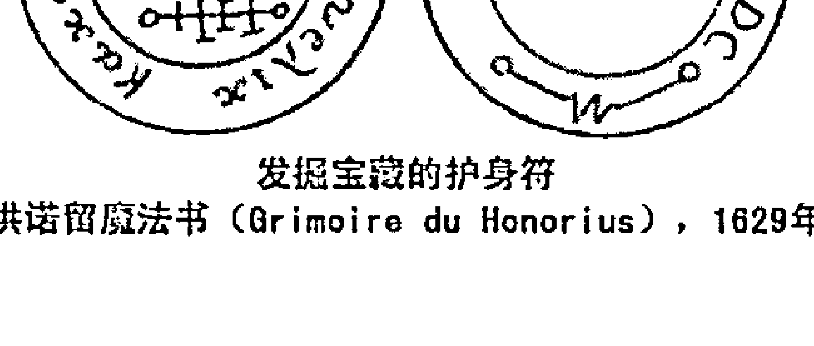

## 护身符珠宝中用到的宝石和矿物

| 矿物 | 属性 |
| :--- | :--- |
| 玛瑙 | （黑色）雄辩，智慧，真实。爱，胜利，力量，勇气，自信，繁荣。（红色）防雷保护。（绿色）治疗。（褐色）冥想。 |
| 天青石 | 能力，才能，成功。增加灵媒和魔法能量。 |
| 琥珀 | 所有目的的咒语助力器。防护，治疗疾病，带来钱财。 |
| 天然磁石（磁铁矿） | 个人吸引力，魅力，诚实，正直，男子气。吸引真正的爱情。抵御有害的魔法。 |
| 紫水晶 | 精神上的理想和美德。明镜止水。转变消极。精明的经营决策，士兵的护身符，预防醉酒。 |
| 孔雀石 | 增强洞察力。挂在摇篮上可以保护婴儿。 |
| 月长石 | 激发激情，增加先见之明。推动爱情，同情心和交感力。 |
| 海蓝宝石 | 健康，年轻，希望，幸福。 |
| 黑曜石 | 奉献给司夜和冥界的女神赫卡特，用于制作魔镜。 |
| 绿宝石 | 人际关系和谐，思维敏捷，身体能量，希望。治疗懒惰。 |
| 橄榄石 | 幸福，快乐，谦逊，和单纯。 |
| 血石 | 实现希望，雄辩，胜利，保护，健康，赞赏。防止欺骗。 |
| 蛋白石 | 记忆，认知能力。灵性，尽责，以及自信。 |
| 红玛瑙 | 友谊，治疗沮丧。幸运，保护，希望，雄辩并大胆的演讲。 |
| 黄铁矿 (Fool's Gold) | 缓和脾气，防止假话。 |
| 猫眼石 | 长寿，抵制邪恶。 |
| 石英 | 纯洁，无穷，眼力，占卜。保护佩戴者不受不愉快梦境和邪恶作用的侵扰。就像电池一样保留能量。 |
| 贫橄榄石 | 谨慎，考虑周到，智慧。 |
| 红宝石 | 宝石之王。精神和身体健康，治愈伤口。维护和平，爱情，和激情。 |
| 绿玉髓 | 快乐，愉悦。 |
| 蓝宝石 | 帮助魔法师理解预兆的助手，接触多种毒药的毒。其中最为有效的是星彩蓝宝石，它被称为“命运之石”，可以带来好运，胜利，忠诚。防止受到欺骗和背叛。 |
| 刚玉 | 有助于心神安定。 |
| 翡翠 | 预知，信念，真相，思维敏捷，足智多谋，洞察力，尽责。 |
| 石榴石 | 忠诚，诚实，心无邪念，奉献，能量，健康，慈善。预防噩梦。 |
| 缠丝玛瑙 | 精力充沛，聪明，高兴，名望。 |
| 黄晶 | 爱，情感，甜美的性情和本性。 |
| 赭石 | 吸引力，魅力，机敏，幸福感，改善命运。 |
| 绿松石 | 避免意外事故，增进预见力。增强抵制巫师袭击的力量。增强言语交流。 |
| 红锆石 | 佩戴在鞋上，可以得到热情好客的招待，保护旅人免受伤害或感染疾病。 |

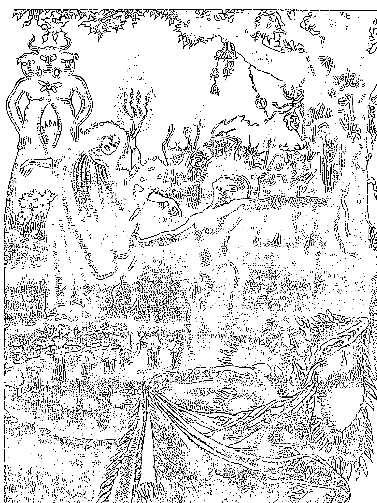

## 课程之四：仪式

### 第一课：实用魔法

#### 第一节：简介－相信魔法

和一些知名的公众魔法师一样，我会周游世界开展讲习班和个人见面会，接受一些书籍、杂志、报纸、收音节目和电视脱口秀节目的记者访谈，而我所接受的被询问得最多的一个问题就是：“你是不是真的相信魔法？”这句话通常都会让我感到惊奇。我说这句话的意思是，你根本不会就你日常生活中的实际情况来谈论你是否相信这些事情。没有人会问你是否相信汽车，电视，或者树，他们就在那儿。对我和魔法来说，情况就是这样的。我就身处于魔法之中：每一天、每个时刻，以及我的每一个动作之中都蕴含着魔法，我来自一个魔法之地，而且魔法就在我的身边来来去去，也渗透了我的身体。我的思想是魔法；我的梦是魔法；创造一尊神圣的雕塑是为了追求魔法。组织我的思想和魔法知识以为你们创作这本魔法师本身就是一种伟大的魔法行为。而现在，我便是在用魔法来写下每一个单词。我脑中的搜索引擎从我的记忆库庞大的经历和信息图书馆中找出适当的词汇，然后我的手指自动地在键盘上敲打正确的键，我思想的语句就如魔法般的出现在我眼前的屏幕上。

因此，我通常沿着“你相信爱情吗？”这句话的线路来回答他们提出的那个问题。但是然后，还会有人又一次次地跳出来说他们不相信爱情。这样，他们便无法接受相信魔法。

#### 第二节：为什么要学习魔法？

> > ——希拉·安提戈(Sheila Attig)(《HOME烹饪术》([HOME Cooking]),1997年)

魔法的道路并不适合所有人。它要求人非常正直、愿意奉献、坚持不懈，以及恪守承诺、勇于改变。真正的魔法要求一个从根本上平衡安定的个人意志去接受成长加速的挑战。决定走上魔法这条道路就应该永远不拈轻怕重，因为这条道一旦踏上就永远不能走回头路。这是一个相信个体经验的决定，并承担起你生命中每个领域的责任。

想要加入（实行）就得鼓起（唤起）勇气，而且每一个打算开始这条人生道路的人都已经选择了加快发展，并解决妥当你生活经历中的所有事情，以扫清道路，集中注意力踏上魔法这条道路。从一开始，学徒们就得意识到你最需要学习的课程便是将自己完全地交付给魔法，毫无保留。沿着这条道路往前走，你将会遇到专属於魔法道路的许多考验和困难。从这些经历中学习和茁壮成长的能力是一种真正的入门考量。

和大多数的宗教形式不一样，魔法没有一本集中法律规章的书面法典，而且没有退路。在魔法世界中运转的法律规章都是一致的，但是只有通过自己亲身体验才能发现。因此，只有将自己交付给终生的发现和牺牲，毫无保留，才能踏出你真实的一步。因为对于少数几个拥有诚实和勇气选择这条道路的人来说，这是没有回旋的余地的。一旦开始了，你可以停下来练习，但是课程还是会按照你一生的计划表来安排。敞开你的心扉，找到通往你内心最深处的改变之路。如果没有勇气去面对并且改变自己真实的内心世界，那么你就肯定会遭遇困惑和自我欺骗。要承受这种学习过程的人，如果没有一种平稳的性格基础，对自己最好及最坏方面没有一个清楚的了解，就很有可能会失去理智。在你确切地了解自己是谁之前，为什么要承担这样的风险？在正式开始之前，魔法有方法去召唤出必须清理的旧事，而且很多人都在他们首次经历自己的洗礼之时决定放弃。当他们选择魔法道路时，不是所有人都会发现那种可怕的结局会接踵而至。

对于那些正确选择了这条道路的人们，他们生命中旧事的清理速度会有明显的提升。

魔法是强大的，但是将其看作提高个人力量的工具是非常愚蠢的。如果你渴望成为一名大师，而不是一名服务人员，那么魔法并不适合你。在开始之前，扪心自问一下：“我将用我的魔法做什么？”不要犯错，对于真正的魔法师来说，唯一正确的答案便是：“我想要服务于民——精灵和人类——我将会为完成这种服务承担所有的风险。”

#### 第三节：魔法行为的术语

- **口口相传（Oral tradition）**：通过记忆和背诵传递信息，而不是书面文字。
- **咒语（Incantation）**：一种催眠的，而且有时还很押韵的用于施咒的吟唱或者公式。
- **连祷（Litany）**：一种重复的，催眠的祷告。
- **洒水礼（Asperge）**：为了净化和驱散消极能量而洒上圣水或者充满魔力的水。
- **熏烧（Smudge）**：通过将燃烧的焚香在需要熏烧的任何物体或者人的下方和周围来回熏，从而达到净化的效果。
- **顺时针（Deosil）**：“向右旋转的”。太阳的自然升落方向。也就是北半球的顺时针方向和南半球的逆时针方向。通常被认为是施展积极魔法时移动的最佳方向。
- **逆时针（Widdershins）**：“反方向”。与顺时针相反的方向。与太阳的视航向（apparent course）相反。北半球的逆时针方向和南半球的顺时针方向。
- **闭关 (Incubation)**：独自进入神殿或者其他神圣的地方一段时间，以得到来自天上的祝福，天眼，或者梦。
- **马德拉舞 (Mudra)**：通过连接各个部分的生物能量系统，主要用作魔法结合装置的身体姿态。
- **真言 (Mantra)**：触发生物能系统各个部分的语言或者声音，激发星光层面的各个部分，或者为了魔法目的、神秘目的或者健康目的引发强大的能量。它们通常也被用作魔法结合装置。
- **曼荼罗 (Mandala)**：主要用作魔法结合装置的一种视觉图像，尤其是在被用于圆形设计中时。
- **感应物 (Object Link)**：任何物品，例如一绺头发，可以通过关联建立魔法师和他施展魔法所帮助或者对抗的那个人之间的联系。同样被称为圣物 (relics)。
- **木偶 (Poppet)**：一个根据实际存在的人或者动物的肖像制作的玩偶或者小塑像，用于聚集魔法。
- **随身护符 (Charm)**：魔法的口头或者书面语言。同样也是因其魔法力量和魔法性能而需要随身携带的物品。
- **咒语 (Incantation)**：一个符咒中吟诵或者吟唱的字词，通常是以重复和押韵的形式。
- **魔咒 (Cantrip)**：一种书面的咒符或者咒语，可以顺着念，也可以倒着念。
- **符咒 (Spell)**：一种朝着希望的方向改变可能性的有组织的行为；简单来说，就是让某件事情发生的可能性增大或减少。符咒可以包括马德拉舞，真言，以及曼荼罗。
- **仪式 (Ritual)**：特殊的行为以及 / 或者言语，旨在产生特定的结果。通常会为了相同的目的而不断重复。
- **施法 (Working)**：任一魔法行为。
- **驱逐 (Banish)**：解雇或者要求那些不需要再出现的灵体离开。
- **驱魔 (Exorcism)**：一种正式的魔法驱逐仪式，唤起更高力量的权威。
- **召唤 / 咒法 (Conjure / Conjuration)**：召唤没有实体的灵体或者幽灵。
- **乞灵 / 祈祷 (Invoke / Invocation)**：“由内而外的讲话 (To speak from within)”。邀请一位神明或者幽灵进入我们的躯体，以便我们可以以他们的语音说话并且 / 或者在我们身上展现出他们的特性。乞灵同样也意味着“请愿或者祈求帮助。”
- **召唤 / 招魂 (Evoke/Evocation)**：“由外而内地说话 (To speak from without)。”召唤一位神明或者幽灵有形地出现在我们面前——通常附体在一个艺术、水晶或者肖像的三角帽上——或者附体在他人身上。召唤意为“召唤并招致其出现”；或者“通过艺术化一种生动的效果使之出现”。
- **接地冥想 (Grounding)**：关闭超自然意识，并恢复正常的有意识的思维模式。
- **附魔 (Charge)**：赋予某物魔法能量和魔法意图。
- **圣化 / 献祭 (Consecrate / Consecration)**：使神圣化或者赐福保佑。将神圣从世俗中分离出来的行为。
- **祈福 (Blessing)**：使用魔法惠及自己或者他人。
- **破坏 (Blighting)**：使用魔法伤害他人。
- **捆绑 (Binding)**：使用魔法束缚某人或某物。
- **诅咒 (Curse)**：一种意图要伤害另一个人或者希望在他们身上降临不幸的魔法咒语。
- **法则 (Dharma)**：“工作”。一种宗教规则，或者神圣的任务。
- **因果报应 (Karma)**：“行为”。一种观念，指人们的所有行为在此生或者来世既会推动也会阻碍心灵的进化。
- **启示 (Enlightenment)**：一种深刻的或者完全的意识状态，感受到了与一切和万物的恒定的联系。
- **明朗 (Lucidity)**：增强了的意识状态，同时还有一种对事情、人物，以及它们之间联系的“本质（is-ness）”的特殊理解。

### 第四节：施展魔法

#### 仪式

魔法仪式的力量来自于它们能够唤醒施法时所必需的情感，来源于仪式与施法者所渴望的结果之间的符合，还来源于仪式与宇宙之间的符合，包括我们自己的思想和记忆。这其中包括了前世的记忆，和早于我们存在的文明生物——甚至是整个人类的记忆。情感控制和释放是魔法实践中的必需品。控制使你能够集中注意力，使你想要创造的结果可视化。情感释放允许直观的渴望，以及伴随的强烈情感汹涌澎湃，被推向你想要施法的主体。你的清单是你施展魔法的基础。无论是哪种魔法系统，个人的力量都必须注满需求和意图，然后再释放。魔法的能量就是生命本身。

这就是为什么所有古老的仪式都已经失去了效力。你必须完全相信——在情感上、潜意识中，同时也要有意识地相信——它会生效。为了让人信服，仪式必须触及到显意识的思想层面，并激发那些超自然力量和能力，这一点现代科学很难理解（甚至也会很难承认）。当你能够成功做到这一点，你便可以创造一种“终止怀疑”的状态，这种状态和你被一部扣人心弦的小说或者一部精彩的电影深深吸引的状态十分相似。你就在“那儿”——专注于情节之中——而且你还会将你的批判才能暂时搁置。这就意味着你是通过你的右脑体验这次仪式，而非左脑——这就和你做梦、产生幻觉，或者被催眠的状态是一样的。在这种状态下，所有事情都有可能。

在举行仪式时，一些重复吟诵是难以避免的。仪式会通过重复获取力量；你重复的次数越多，仪式的力量就会越强大。这一点上仪式便和神很相像——更多的人相信他们，他们接受的祈求和祷告越多，他们就会越强大。

#### 法术：祷告和祈求

作为活着的生物，我们体内充满了生命力，或者说精神力，这些物质支撑着我们的存在。我们使用来自太阳（火），食物（土），饮料（水），以及呼吸（气）的四大元素能量来为自己提供能量。我们在行走、工作、跳舞、玩耍、锻炼——还有施展魔法的时候，都会释放这些能量。而且作为有意识的生物，我们每一个人都是一個伟大的魔力储藏器——最重要的是，都有选择的能力。

我们体内的单个细胞构成了器官，而器官是组成我们身体中几个系统的各个部分。同样的，我们是人类的所有单个成员，而人类是地球上伟大的生命王国的一部分。因此，我们是构成盖亚——大地母亲——巨大身躯的细胞。在这个伟大结构的每一个层面上都存在着协同（“联合的”）认知或者协同意识。

每一个细胞都是一个微小的生物，有着它自己的小小议程表，并自己做决定。器官和系统也是一样，我们也是一样。但是意识的这种不断增长的协同过程并不会随着我们的驻足而停留，因为我们同样也是更大系统中的一个部件。而且在每一个层面上，都会有新的协同意识出现。当然，许多其它的生命也——有的有实体，有的没有——都拥有它们自己的议程和意识。我们将这些灵体称为神、天使、魔鬼、巨灵、圣人、鬼怪、神明、元素精灵、图腾、小精灵——或者仅仅只是幽灵。

祈祷便是基于与这些意识体之间的联系和交流，正如人与人之间一样。同样的，我们也会从我们的父母、老师，或者其它在某个领域与我们自己相比拥有更大的权威或者力量的人那里寻求帮助，因此我们会祈求（“寻求，询问”）更加聪慧或者更加强大的精神体给予帮助或者指导。这叫做法术，或者宗教魔法——而且可能是最普遍、最通用的魔法行为。事实上，世界上的每一个宗教成员都会这样做。

祈求魔法最通用的形式是在一张特殊的纸例如羊皮纸、米纸，或者闪光纸（我最喜欢的！）上面写上一个请求。然后将这张纸在你的香炉、坩埚，或者在你圣坛上的蜡烛上非常正式地烧掉——这样做可以将你的请求送到星光体领域。

### 第五节：幻术 - 交感魔法

根据交感法则（Law of Sympathy），魔法师能够通过交感魔法影响他人和它物——对某些客体进行魔法操控时，便会对对其主体产生相似的操控效果，或者主体能够感应到这种操控（或者与之产生共鸣）。这个原则是这样陈述的“互相之间有共鸣的物体会跨越距离相互影响并相互作用”。

交感魔法同样也称为幻术（thaumaturgy，“神奇的活动”）。这是一种魔法的使用，以达到改变外部现实世界的目的——也被我们称为实用魔法。同样的，幻术也被称为“低级魔法（low magick）”或者魔术，尤其是当它的施展是为了服务他人之时。所有形式的民间魔法——服务于乡村和普通人的魔法——都被称为低级魔法。这是一种基于影响日常生活的魔法实践，比如保证某人的奶牛产奶，治愈某人的疾病，或者保护某人的家园不受自然或者超自然灾难的侵害。

#### 人偶魔法和传染性魔法

为了创造一个有效的符咒，仪式就应该以一种模仿你想要得到的结果的方式进行。举个例子，如果你想要老天下雨，便在地上洒些水，或者喷些水到空中。这就叫做人偶魔法（imitative magick）或者顺势魔法（homeopathic magick）。这种魔法基于相似法则（Law of Similarity），也可以这样说“同类相生，果由因生。”

人偶魔法中最为突出的一个例子就是施咒术（envoutement）——这是一个伏都教术语，它指的是使用蜡像或者人偶（替代娃娃）来诅咒仇敌。人偶被视为与诅咒的对象等同，名字也是一样的。每当伏都娃娃被惩罚，由娃娃所代表的受害人也会受到同样的伤害。当然，同样的原理也适用于用替代娃娃帮助他人或者治疗他人。

然而，事情远不止这么简单。感应物和咒语通常会被用于使人偶成为施咒对象的魔法代表，然后使用魔法仪式将施咒对象与人偶连系在一起。可以用圣物替代感应物。圣物便是指过去与施咒对象有联系的任何物品。这种魔法被称为传染性魔法，基于接触法则（Law of Contact），也就是说：“一旦有过接触的物品会永远相互影响。” 到目前为止，最强大的圣物来自被施咒者的身体——例如头发、指甲、血液、牙，以及一些类似的东西——包含了此人DNA的物品。所以，这些都可以用于制作人偶。

其他适用的生物包括被施咒者的衣物，可以穿在人偶身上，或者属于被施咒者的私人首饰。手迹样品（尤其是签名）同样也可以用作感应物，而现在，照片也被普遍使用，尤其是在远距离的治疗咒术中使用最为普遍。

### 任务：交感魔法

有几种交感魔法你可以自己试试。尝试过其中几种之后，你就能了解交感魔法的运转方式，然后就可以开始创造自己的交感魔法。

### 蜡烛魔法（Candle Magick）

蜡烛已经被使用了成千上百年，一般用于代表人，以及物品和概念：爱、金钱、运气、成功、健康、和谐、力量、生产力，以及各种各样的物品。蜡烛可以是任意尺寸任意形状，因为真正重要的是它的颜色。详情请参照课程之一第三课第八节：“魔法的颜色”中的颜色符应表格。同样的你还可以参考课程之三第六课的符应表格，里面介绍了颜色、元素、一周中的每天，以及黄道十二宫之间的联系。简略点说，以下就是一些最为流行的与蜡烛魔法有联系的颜色：

- 白色——纯洁，真实，诚挚；赐福，或者你想要的一切！
- 粉色——荣誉，爱，美德。
- 红色——体力劳动，例如治疗人类和动物；强壮，健康，激情，和性。
- 橘色——自豪和勇气；英雄气概和吸引力。
- 黄色——脑力工作，冥想，占卜。
- 绿色——植被，例如园艺学；生产力和繁荣；运气。
- 淡蓝色——情感工作，爱，等等；和平和保护。
- 深蓝色——冲动，沮丧，可变性。
- 紫色——力量，财富，好运，抱负。
- 黑色——邪恶，损耗，不协调，困惑；衰退或者捆缚。

蜡烛魔法应该在你的个人圣坛上完## 魔法师学徒的魔法书 | 下卷

## 课程之四：仪式

只要确保圣坛周围或者上方没有任何东西会引发火灾，而且，千万不要在无人照看的情况下让蜡烛自行燃烧！

如果你是为了自己或者他人点燃的蜡烛，你应该首先为你的蜡烛选择一种能够展现你的意图或者目的的色彩。神物店铺或者超自然商店都会售卖各种颜色、各种人形的蜡烛，这些蜡烛都非常适用于蜡烛魔法，但是这些人物形状都不是硬性要求。普通的锥形或者祈愿蜡烛也可以使用，只要颜色正确。接下来，使用尖利的工具在蜡烛上刻上对方的名字——最理想的是使用你的仪式刀的刀尖。在你施展魔法的时候，想象一下施法对象的样貌（你可能会有一张可供参照的照片，或者一面镜子，如果对象是你自己的话），然后喊出蜡烛上的名字，说一些像这样的话：

> 我将这蜡烛命名为
> （对象的全名）；将它的火焰
> 作为（对象的全名）的灵魂现在燃烧吧
> 让我的咒语充满魔法的力量！

然后你应该使用恰当的精油涂抹在蜡烛的周身，为蜡烛“穿衣”。你可以在绿色食品店、神物铺子、超自然商店，甚至是一些药店（详情请参照课程之三第六课）买到几乎所有的药草精油。给蜡烛穿好衣服以后，再滴几滴精油在蜡烛上，然后用双手从中间向两头摩擦，同时将你的思想集中在你施咒的对象或者目的上。

现在，在你的圣坛上点燃蜡烛，然后熄灭房间里的其它灯光。开始仪式的时候，用你的魔杖或者仪式刀在你和圣坛的周围画一个圈，确定方位并召唤你需要的圣灵（参考符应表格）。你可以在课程之四第六课找到更多关于这方面的信息。现在，为你的意图静坐冥想一会儿，想象一下这次施法后你想要得到的结果画面。

然后点燃那根代表了这次咒语施咒对象的蜡烛，念诵以下的话语：

> 黑夜中燃烧的蜡烛，
> 以及被施法的火焰；
> 通过你光芒的力量，
> 我的希望会实现。

坐一会儿，以冥想的状态凝视火焰，想象一下你所渴望的结局画面。当你完全感受到这一切时，感谢你所邀请的圣灵和元素，然后释放魔法圈。最后，说一些像下面文字的话语，然后吹灭蜡烛：

> 虽然物质世界的火焰变暗了，
> 但是它们仍然在另一个世界燃烧。
> 仪式结束。
> 我主保佑。

每天都要重复这样的仪式，直到蜡烛燃尽只剩一块蜡团。这是一种典型的使用交感魔法的蜡烛燃烧符咒。只要你需要，只要你能想象得到，还有很多可能的变体。比较好的魔法蜡烛燃烧符咒和仪式的参考书有：雷·巴克兰（Ray Buckland）的《实用蜡烛燃烧仪式》（[Practical Candleburning Rituals]）和《先进的蜡烛魔法》（[Advanced Candle Magick]），以及吉利娜·丹维奇（Gerina Dunwic）的《烛光符咒》（[Candlelight Spells]）和《蜡烛燃烧魔法》（[The Magick of Candle Burning]）。

## 捆缚魔法和绳结魔法

任何简单的情绪、目标，或者元素力量都可以通过简单地打个绳结束缚起来或者加以控制。爱、魔法力量、风、云、雨、疾病——所有的一切都可以用一根绳索束缚起来，以制成一种保持符咒力量的“蓄电池”。绳结魔法的仪式可以用于任何你所渴求的目的，而且打结的绳可以携入或者掺入某人衣服的一些部分，或者使用其它方式。绳结解开后便能释放符咒，或者为了驱逐消极能量，用过的绳索可以通过某种仪式进行焚烧或者埋葬。你可以开创任意一种小仪式来施放绳结魔法，有关魔法的文献上记录有很多这样的仪式。

奥劳斯·马格努斯，《北方民族史》（[Historia de Gentibus Septentrionalibus]），1555年。

在上面的木版画中，一名魔法师在向一些水手售卖打好结的风绳（Wind Cord）。风被系在了绳索中，这样如果水手在航行中需要风，他便只需要解开绳结——一个结是轻轻的微风，两个结是强风，而三个结便是狂风！

为了治疗感冒或者其它的小病，巫师可以为了一些小数目的钱财从病人身上“购买”这种病，并立即将一根绳索打结将“疾病束缚起来”。然后将绳索挂在灌木丛中或者埋在一些遥远的地方任其慢慢腐蚀变成空壳。治疗疣一类的皮肤疾病时，取一根细绳，在绳上为每一颗疣打一个结，并用绳结触摸疣。然后将这根细绳挂在你房子的屋檐下，从屋檐上顺着细绳流下的雨水会带走疣。在下次下雨之后，将细绳埋入土中。

在九结符咒（the Spell of Nine Knots）中，就是在一根13英寸长的猩红色绳索上，为了某种目的而宽松地（这样施法完成之后就能轻松解开）打上一连串的绳结。每打一个结，符咒的目的就应该更加强烈地在脑中可视化一次，将注意力和力量都导入绳索之中。绳结要按照以下的顺序和模式来系，同时还要念诵以下的（或者类似的）话语：

-   1. 第一个结，施咒开始
    =============X=============
-   2. 第二个结，意图准确
    X============X=============
-   3. 第三个结，定将应验
    X============X=============X
-   4. 第四个结，储藏魔力
    X=====X=====X===========X
-   5. 第五个结，符咒鲜活。
    X=====X=====X=====X=====X
-   6. 第六个结，确定符咒
    X==X==X=====X=====X=====X
-   7. 第七个结，赋予力量
    X==X==X=====X=====X==X==X
-   8. 第八个结，力量变大
    X==X==X==X==X=====X==X==X
-   9. 第九个结，捆缚咒语！
    X==X==X==X==X==X==X==X==X

在系最后一个结时，所有的能量都被导入了绳索和绳结中，再最后一次将你的目的形象地呈现在你的脑海之中。你搜集的力量现在都储存在这些绳结之中，直到合适的时机将它们解开释放。即使绳结都是在一次仪式中完成的，它们也必须在连续的九天之中一天解开一个。以打结时的相同顺序解开绳结——而不是倒序！从中间开始解开第一个，然后结束的时候是解开中间绳结的旁边最后打结那个。每一天，在你解开绳结之前，再一次地全神贯注于将要发生的事情，并在你解开绳结的时候重复你在打结的时候所说的话语。

## 呼风唤雨

> 风钥师 (weatherworker) 和海神呼风唤雨的能力众所周知，但是他也解释了为什么真正的魔法师只会在危难时刻才会使用这种咒语，因为召唤这种尘世的力量便是去改变尘世，而魔法师自身也是尘世的一员……“在洛克的降雨可能会导致奥斯基尔遭受干旱，”他说，“而河流东段的风平浪静可能会使西段遭受暴风雨和毁灭，除非你非常清楚你在做什么，否则就不要轻举妄动。”
> ——厄休拉·K. 勒奎恩(《地海巫师》，第 53-54 页）

很多形式的交感魔法都适用于风雨召唤。正如我在课程之一第五课第四节：“光环：拨云造日”中所讲的一样，大规模的呼风唤雨不是随随便便就能完成的，因为可能会导致一些无法预料的后果。如果你们一起完成一次大型的团体施法，你们可以使用课程之一第五课第四节中的“金场拨云造日”中讲到的技巧来使天空放晴，或者将锋面推离你们的区域。或者，相反地，将锋面引向你们的位置，如果你知道它在什么地方的话。

最为著名的天气咒语是：“雨啊雨，回去吧；改天再来（Rain, rain, go away; come again some other day. ）”我曾经非常有效地使用了这个咒语，和几千人一起为了一个严肃的目的手拉手，一起念咒完成。但是如果雨真的离开了，它们最终还是会在几天后回来的，这一点可不是你能改变的！因此，为了平衡这个等式，你应该选好你想要下雨的日子，并且念诵这个反咒语：“雨啊雨，今天就来吧；不要再等了（Rain, rain, come today; wait no more another day）。”用于呼风唤雨的交感魔法简单地来说包含了试图以小规模的形式去复制你想要大规模发生的事情。其中有效的技巧就是展示你想要影响的地区的一张大地图。如果你想要在某个地方下雨，那么就需要在这个地方撒上少量的水。如果你想要阳光灿烂，那你就需要用一面镜子反射一点阳光到此处。

在大规模的呼风唤雨中，最重要的事情就是了解这个地区的一般气候，以及在这个时刻是什么样的因素在影响此处的气候。喷射流的改变、厄尔尼诺现象、在太平洋上方堆积的高压、从北极向低处转移的冷锋——所有的这些因素都应该列入考虑范围。幸运的是，有了人造卫星和电视上的气象频道，操控这些因素对我们来说与前人相比都变得容易多了！据说在中世纪，女巫可以通过将石头扔过肩膀、将沙石在空中抖动、燃烧鼠尾草叶子、吹哨，或者念诵一些适当的咒语唤起风浪或者促使风平浪静。所有的这些技巧之中，吹哨召来风雨一直都比较通用。我自己最喜欢的吹哨召来风雨的曲调来自1969年克林特·伊斯特伍德导演的电影《长征万宝山》（[Paint Your Wagon]）中的歌曲《他们将风唤作玛利亚》（[They Call the Wind Mariah]）。

20世纪30年代期间，传统的美国唤雨巫师曾使用烟火（模拟闪电，制造烟状的云雾）以及水的喷洒来造雨，比如你可以使用草坪洒水器或者安装有“喷雾器”的花园浇水用软管。烟熏火（使用活树叶）可以模拟云层，而干燥没有烟雾的火可以模拟阳光充足的炎热天气。在造雨的时候，雨声棒（一根长长的中空管，周身钉有钉子，里面装有碎石，两头都盖有盖子）是非常流行的用具，因为雨水会随着许许多多吵闹的模拟雷声的击鼓声舞蹈。

这里有一个古老的在交感魔法中使用的求雨咒语：在室外的火堆上，用一个铁制的大汽锅或者水壶将水烧开。当水蒸气蒸发进入空气，用一根结实的木棒搅拌锅里的水，然后在蒸汽中挥舞木棒，在锅的外壁上使劲敲打三次，每敲打一次都朝着天空大声呼喊：

> 到这里来，云层，释放你的洪水！
> 枯萎、干旱，让雨水出来吧！

当我的儿子布莱恩还是个孩子的时候，他就已经成为了一名优秀的小魔法师。他发展了自己的石头魔法系统，他可以收集石头的标准都是基于其外观。如果要使用一块石头，他便会将它放在他的圣坛上，念一小段意图咒语。这些石头中有一块被他称为“雪花石”，因为在它的周身都有一些白色的雪花状图案。在一个下雪的12月，那时布莱恩大概11岁，他将一个雪球放进了冰箱。来年的四月，在一个阳光灿烂的日子里，他从学校回到家里，并通知我们他已经决定了要让天空下雪，因为从圣诞节开始这个地方就再也没有下过雪，而他想要在雪中玩耍。不仅如此，他还通知了他的朋友他要做什么！他拿出了那颗储藏在冰箱中的雪球，将它放在圣坛上的碗中等待它的融化，同时，他还将他的雪花石放在雪球顶部。第二天，这里就下起了暴风雪——在四月中旬啊！——而学校也不得不停课了。

## 用于家庭作业的交感魔法

自己试试：这次选择一科在学校中你觉得最具挑战性的科目。找出适当的颜色、矿石、工具，以及其他物品，为这门科目专门制作一个小型的圣坛。集中注意力想想你有多么想要成功：在测试中或者论文得A，等等。静下心来，在矿石上想象出你成功时的场景。将这颗矿石放入口袋，并且在测试的时候、在写论文的时候，把你的注意力全部集中在你的成功上……

## 第六节：魔法法则

魔法既可以是一种纯粹的内部运营，也可以包括与其外在的实体，鬼魂、天神，或者圣灵之间的联系和影响。无论是那种方式，魔法是根据自己内部系统的原则和逻辑运行的，就像物理学和数学一样。一旦了解了这些原则，魔法师就像化学家使用化学规律一样应用自如。伊莱·李维（Eliphas Levi）在他的《高级魔法的教理和仪式》（[Dogma and Ritual of High Magic]）（1856年）中描述了三种基本的魔法法则：

-   人类意志原则（The Law of the Human Will）。魔法的成功取决于魔法师的召唤和指导的意志。
-   星光体法则（The Law of Astral Light）和中介无形原理（the intermediary thereal principle）。魔法师可以接近并利用弥漫在宇宙中的能量影响远距离的变迁。
-   连通性法则（The Law of Connectedness），内外连通、物质和理想的连接，假设微观世界和宏观世界之间没有区别。

在此我就讲这些，其它的法则我会在讲金色黎明协会的规则时添加：

-   想象力或者可视化法则（The Law of Imagination or Visualization），号召身体内外的力量。
-   交感魔法（Contagious Magick），人偶魔法和传染性魔法的术语和法则是由苏格兰的人类学家詹姆斯·弗雷泽爵士（1854-1941年）创造的，出现在他的神话和魔法的比较研究著作《金枝》（[The Golden Bough]）（1890年）中。其他作家早已将不同的法则进行了分门别类，还存在许多现在仍然有效的传统。魔法法则并不像交通规则一样是立法机构制定的法规，但是，就像物理学或者音乐和声一样，魔法法则都是千万年来累积的实用性的言论，在几乎所有的已知的人类文明中都有着惊人的相似之处。

## 共振法则（The Law of Resonance）

一些人相信所有的魔法法则都可以总结为一个单一的伟大法则或者原理。荷兰魔法的基础原理就是共振（“共鸣”），在物质世界、理想世界，和精神世界之中及之间的共振。在时间、形式、内容、频率，以及深层次本质（物质和非物质事物更深层次的固有性质）中的共振就是那种使连接有意义的物质。魔法的施展会有意识地（有意地）利用这些共振，但是效力（结果）通常取决于较大的共振，因此这一点与正规的因果关系（原因和结果）定律不符。

这关系到在课程之三第六课中讲到的符应，而且还包括了交感魔法、传染性魔法、法术，以及其它的魔法形式。它同样还包括了时间中的共振是一种魔法工具，以及过去和未来都是一面镜子而且能够通往现在的概念。爱是最伟大的共振和连接器，因此爱对魔法来讲是很必要的。

魔法施展的三要素——事实上是所有灵性发展的三要素——可以归纳为：爱是关键，真理是目标，整体是奖励（Love is the key, Truth is the goal, One is the prize）（我们有时所经历的连通性可以被看作奖励，我们努力的结果）。

另一种发展是，在现代物理学中“正规的”因果现实正在慢慢让位于洞察力，以及像量子力学、测不准原理，和非定域性悖论一样的定律，凭借这些，观察者甚至意识也能占据一席之地。这些效果只能在我们宇宙中的极端事物中见到，存在于非常微小和非常巨大的空间中，例如原子内部以及星球内部。但是在某种较为正常的层面上，量子效应有时也是显而易见的，就像在“量子隧穿效应”中一样，量子能够穿越其平常无法穿越的壁障。

量子效应——此处亚原子层面上基础成分的波和微粒特性从属于概率性，并且从某种意义上来说不可预知——类似于魔法行为，就1+1并不总是等于2的这种意义而言，同样地不可预知，有时会等于0，有时会是1。科学家和魔法师在这一概念上重新归纳出所有的一切事物都是相互连通的。根据卢克·萨拉的言论，我们所知道的科学上的自然法则因此也只是魔法法则的一个子集，而且正常的现实同样的也是更加广阔的终极现实（Ultimate Reality）的子集。然而，根据龙吟者的言论，自然法则则是魔法法则的超集，因为魔法只是无限的多元宇宙中所发生的事情中的一小部分！

> “没有任何事物会是这样！所有的物质产生到存在仅凭一种力……我们必须假设在这种力的背后存在着一个有意识的聪明的头脑。这头脑是万物的母体。”
> ——马克斯·普朗克
> 诺贝尔奖获得者，量子理论之父

## 第七节：魔法过程

> “无论你能做什么，或者你的梦想是什么，放手去做吧。一个人的胆气中充满了天赋、能力和魔力。”
> ——歌德
> “可能与不可能之间唯一的不同就在于不可能会花费更长的时间去实现。"
> ——马克·博兰

通常人们都会说，任何伟大的工作都包含了 1% 的灵感和 99% 的汗水。这句话完全正确。而且，魔法的实战是一步步努力得来的，这与我们这一生中所会遇到的其他创造性事情都是一样的。这些步骤分为：灵感、同步性（Synchronicities）、汗水，以及展现（Manifestation）。

此刻，让我们以这本魔法书为例。它开始于一个备受启发的想法，这个想法起源于 2001 年 12 月的一天，我和一群小孩子一起在电影院观看第一部哈利波特。那天我的女巫太太牵牛花和我被邀请去参加一个在犹太人学校举办的有关真实的魔法和巫术的谈话。在那次谈话结束之后，我们都去观看了《哈利波特与魔法石》。当然，牵牛花和我都穿着我们宽大的有着魔法师标记的衣服，很多孩子也都戴了帽子，穿了斗篷。电影院满座了，我们只好坐在最后面的门口。我看到所有的观众都是孩子，脑中突然灵光乍现。

## 1. 灵感

我最先想到的就是这些观众中的许多孩子（在接下来的几年里，随着新书的出版和新电影的上映，全世界的观众都是一样的）都备受电影的鼓舞，都想要自己成为一名巫师。然后我想到，作为一名魔法师，我怎么能不给这些孩子提供一些帮助？接下来我又想到，他们需要做的第一件事情就是建造一个私人的圣坛。而我会制作圣坛雕像。因此，我决定创作一对特殊的神和女神的圣坛雕像，只为这些孩子而创。

我的第三个念头就是你们会需要一本真正的魔法手册。因此，在我制作雕像的同时，我开始列出这样的一本书应该包含怎样的内容的提纲。我写下了开头“魔法师的独白”，这段独白我曾在一次吟游诗人仪式中朗读过，当时是为了向爱尔兰富有创造性灵感的女神布里吉德致敬。在接下来的几个月里，我不断地回过头去修改，增添更多的内容，重新安排顺序，并加注注释。

## 2. 同步性

新一批的雕像在 2002 年 6 月初从我们的工厂中出产，我用它们建造了一个小小的圣坛，并为它们能成功打入青少年市场举行了仪式。然后，在夏至节过后，我参加了在科罗拉多州丹佛市举行的新世纪国际贸易展览会（International New Age Trade Show），第一次向那些未来的店铺展示了我的雕像生产线。在那儿，我偶然遇见了一位崇拜巫术的朋友，崔西·特勒斯柯，她写了有大约 40 本有关巫术和魔法的书籍。她责怪我为何还没有自己著书立说，并提议将我介绍给她的出版商——新篇章书册出版社，碰巧他们在那儿也有一个摊位。因此，我便坐下来与这些友好的伙计们交谈，当然，他们也想知道我想要撰写的书籍类型。我解释了一些有关这个本魔法书的想法，并许诺邮寄一份提案和章节大纲给他们。

几个星期之后，我作为一名演讲者参加了一次大型的魔法庆祝活动，在那里我结识了一个为我的其中一个雕像塑模的朋友。她告诉我她现在的工作是新篇章的宣传人员！到现在，这种同步性波变得实在太大了而不容易忽视。当我回到家以后，我收到了一大束鲜花，上面有张卡片这样写道“来自新篇章的朋友”。

## 3. 汗水

在接下来的几个月里，我们一直都在不断交流，规划了这本书中应该包含的细节——内容、尺寸、封面设计，所有的一切细节。在网上与我在整个魔法界认识的智者、魔法师、巫师，以及博学人士联系交流，并创立了格雷理事会。每个人都对这个计划很热心。我再次阅读了所有我最喜欢的以魔法师为专题的奇幻文字，将我的许多的魔法书都从书架上拽下来，开始查阅里面的内容，我的桌子上地板上都铺满了打开的书。同时我还贪心地观看了所有以高中“魔法”小孩为专题电视节目：《塞布丽娜》，《吸血鬼猎人巴菲》（《魔法奇兵》），《罗斯维尔》，《超人前传》。我想要将自己完全浸透进这种环境之中。书写——每天，我至少会花费优良的8到10个小时在我的写字台前。我不断地思考着这本书——甚至在梦中也会！我会定期与几个新进的学徒见面交流，向他们展示我写好的每一课，并将这当做我们的实际研究材料。所有的这种能量都在12月份释放完毕，这时我便将完成的副本送去印刷。

## 4. 展现

现在，你终于将这本魔法书拿在手中了，并且能够阅读到这些文字。这本书是因为魔法才产生的，开始于一次倍受鼓舞的突发奇想。所以剩下来的所有工作都是将那个想法转变为具体展现的一个过程。这便是真正的魔法的运转方式，而且你也可以做到。你所需要做的事情就是尽可能多地将与你试图完成的事情有关的东西全都包裹在一起、集中到一点，聚焦到你所有的想法和注意力上。这样，你才能改变可能性，正如妇女参政权论者苏珊·B.安东尼所说的那样：“失败是不可能的。”

> “要完成一件伟大的事情，我们所需要的不仅仅是行动，还有梦想；不仅仅要规划，还要相信自己。”——阿纳托尔·法兰西

魔法法则

迄今为止，有关这些法则最完整的描述来自知名魔法师艾萨克·鲍维茨（Isaac Bonewits），他是一名大德鲁伊，也是《真实魔法》（[Real Magic]）、《真实幻术》（[Authentic Thaumaturgy]），以及《巫术简介》（[Witchcraft: A Concise Guide]）的作者。艾萨克也是格雷理事会的顾问。以下这些魔法法则都是摘自第二版的《真实幻术》，艾萨克所撰写的一本手册，讲的是虚拟的角色扮演游戏中的真实魔法。

-   1. **知识法则**：理解才能掌控；知道得越多，掌控就越简单。“知识就是力量”。
-   2. **自我认知法则**：最重要的魔法知识是认知自我；对于一个魔法师来说，重要的是要熟知自己的力量和弱点。“了解自己”。
-   3. **因果法则**：如果同样的行为是在同样的条件下完成，那么必将产生同样的结果；一连串相同的事情会产生相同的结果。“控制好每一个变量，你便能控制每一个变化——好运！”
-   4. **同步性法则**：倘若两件或者两件以上的事情同时发生，便说明这些事情之间有着更深层次的联系；事情的发生通常都与其周遭的事件有关联。“不存在巧合”。
-   5. **联系法则**：如果任何两个或者两个以上的模式拥有两个相似点，那么这两个模式便会通过这两个相似点产生互动，掌控了一种模式的发展便能掌控另一种；相似点越多，影响越大。“控制相似点”。
-   6. **共感法则**：相互之间有关系的事物会跨越距离彼此之间相互影响。“世上万物都是相互联系的”。
-   7. **相似性法则**：同类相生，因果共存；对某物有精准的了解有助于对其进行掌控。“看起来一样就是一样”。
-   8. **接触传染法则**：物体之间一旦彼此之间有过接触，在分开之后仍然会相互影响。“魔法就是接触传染”。
-   9. **正面的相吸法则**：同类相吸；要创造某种现实，你就必须释放某种相似的能量。“种瓜得瓜，种豆得豆”。
-   10. **反面的相吸法则**：有时非同类也会相吸；某些能量或者行为有时会引来“相反的效果”，反向吸引。
-   11. **名字法则**：知道了名字，你便能了解拥有这个名字的事物；知道了一个物体的全名和真名，便能完全掌控它。“用一个名字怎么说？——世间万物！”
-   12. **言语力量法则**：某些言语能够改变说这些话的人的内心与外在，他们的力量也许停留在每一个音节之中，与其意义一样的强大。“智者一言足矣”。
-   13. **人格化法则**：任何现象都是有生命的，都有其自身的个性，也就是说，看它“看作”灵体或者生物，也许会更容易处理。“万物皆可为人”。
-   14. **乞灵法则**：无论是从自身之内还是之外，都可以与灵体之间建立一种内部沟通，据说，在沟通过程中，灵体似乎会存在于你自身的内部。“存乎内……”
-   15. **召唤原则**：无论是从自身之内还是之外，都可以与灵体之间建立一种外部沟通，据说，在沟通过程中，灵体似乎会
-   16. **关联法则**：可以通过自身的某些元素与其它的生命体进行最大化的联系，以分享这种生命体的知识，利用其力量。“你可以是万物”。
-   17. **知识无限法则**：各种各样现象的数量是无限的；学无止境！“总会有你不了解的新东西”。
-   18. **感知有限法则**：每一种生命体的感知机制在获知知识的范围和种类上都是有限的。“只是因为看不见不意味着不存在”。
-   19. **个人世界原则**：每个人所存在或者所创造的世界都是独一无二的，任何人都无法100%地了解你的世界。“人人都有自己的世界”。
-   20. **有限宇宙法则**：所有可能存在的现在所组成的宇宙的总数是有限的。“万事皆有可能，只不过有些事情对有些人来说可能性更大”。
-   21. **务实法则**：如果某种信仰或者行为让你能够幸存于这个世界，并且完成你所定的目标，虽然都不是那些在现实世界中看起来“真实”或者“合乎情理”的信仰或者行为，但是它们也真实存在着。“只要有效，就是真的”。
-   22. **真实的谬误法则**：某种概念或者某种行为看起来似乎很是荒谬，但是它仍然“正确”，只要它在某个特定环境中“有效”。“即使是悖论也有可能是正确的”。
-   23. **极性法则**：任何现象都能被划分为“完全相反”的两面，而且每一面都包含着另一面的本质。“凡事都有其对立面”。
-   24. **综合法则**：两种或者两种以上的“对立”现象结合在一起会产生一种比原有任一种现象更为“正确”的现象，也就是说，更接近于实际。“综合协调”。
-   25. **动态平衡法则**：为了挺过难关变得强大，我们必须让我们个人世界的每一个方面都与他人的世界保持一种动态的平衡；极端主义在每一个层面上都非常危险。“跟着音乐舞蹈”。
-   26. **反常法则**：也被称为“墨菲法则”。如果某事会出岔子，那它就会——而且会以最恼人的方式出现。“如果你觉得会出岔子，就一定会。”
-   27. **统一原则**：所有存在的现象都与其他现象有着直接或者间接的联系，无论是过去、现在还是未来；将某种现象分开来看是一种不全面的感知和思考方式。“万物就是一个整体”。
-   28. **意想不到法则**：（来自特里·普拉切特）无论你是否得到了你想要的结果，都会产生至少三个你所意想不到的结果，而其中之一通常都是令人不快的。“凡事都有意外”。

## 第二课：仪式空间

### 第一节：简介 - 仪式空间

仪式可以在许多种类的空间举行，有的是暂时的，有的却是永恒不变的。临时的魔法圈可以在你的家里或者公共场合设置，例如公园，或者租用的会议厅。根据环境的不同，仪式区域可能会是精心设置的，有盖亚、四方圣坛、圣像、横幅、五朔节花柱、篝火圈，以及其它物品。或者也可以仅仅是在你的房间里清理出一个小小的空间，中间摆放一个简单的圣坛。但是重要的是，形式应该合乎目的。因此，这里，我会向你介绍一些为你的魔法圈设计一个合适的仪式区域的注意事项：

### 第二节：室内圣殿

任何适当的室内空间都可以被做成一个圣殿，只要它拥有足够的空间供想要使用它的人围成圆圈聚在一起。如果你是一个人独自完成施法，你便不需要太多的空间，而依照我的描述在你的至圣所（课程之三第四课第三节：“你的圣殿”）中创建你的圣殿应该完全足够。然而，如果你想要和三个人一起举行仪式，你便需要创造一个更大的仪式空间。魔法圈的直径长度应该是奇数英尺。比如，传统的女巫魔法圈直径为9英尺，甚至会是13英尺，可以为满员的十三女巫大集会提供足够的空间。但是人数较少的团体当然可以使用更小的魔法圈，比如7英尺或者5英尺。事实上，一些人会在他们的圣殿的地板上漆上一个魔法圈，通常还会在里面刻上五芒星，而且五芒星的每个区域和每个尖角的颜色都不一样。魔法圈可以简单一点，只是朴素的圆圈，里面标出四个方向；或者华丽一些，就像我在课程之三第六课第二节：“魔法圈”中所画的魔法圈曼茶罗一样。这样一个着色了的魔法圈在没有使用的时候应该盖上小地毯。还有一种不在地板上油漆而为你的圣坛制作一个永久的魔法圈的方法，那就是使用一大张布（建议使用黑色，这样看起来就好像你站在太空中一样）。一张加利福尼亚特大号床的上层床单的尺寸大小就比较合适（8平方英尺）。通过仔细认真地从角到角的对角折叠找到床单准确的中心，并用熨斗熨平。在中间位置用白色粉笔点上点，然后将整张床单展开铺在一个平坦的木制平台或者地板上，这样就不用麻烦按图钉或者钉钉子了（这有点像是一个任务！）。

将床单的四个角落固定，使之有足够的张力而摆脱褶皱。然后将一颗小饰面钉穿过你的扣带的末梢处的结。将这颗钉子钉入床单的中心位置，但是不要太深，以免很难拔出。随后在你的扣带的第一个结处握住一只粉笔，画圆，直径为7英尺。然后用一只白色的布料马克笔沿着粉笔痕迹再次画圆。在熨斗熨过的延伸到床单各个角落的痕迹上用布料马克笔画上四季的象征符号。

在你设置室内仪式圈时，一定要确定好基本的方位！（我认为，每位魔法师都应该准备一个基本的魔法工具——指南针。）四大元素的标志应该安置在四季的区域内。这些都应该与染色的罐装蜡烛一样简单（东——黄色，南——红色，西——蓝色，北——绿色），或者像永久的四季圣坛一样精心设计。判断你圣殿的哪面墙或者哪个角最接近于对齐四个方向，然后相应地漆上颜色。有的人会挂上不同颜色的横幅来标志适当的魔符。还有的人在墙上贴上能让他们想起每一个元素方向的图片，比云、鸟或者日出代表东方；爆发的火山、闪电或者太阳代表南方；海上景观或者水底景象代表西方；以及山脉、水晶或者冬季的雪景代表北方。我曾经还设计了一套深红色的墙面贴砖来表达这个意图，而且有很多人使用：鸟类女神代表东方；太阳神代表南方；海神代表西方；绿人代表北方。以下便是她们的肖像：

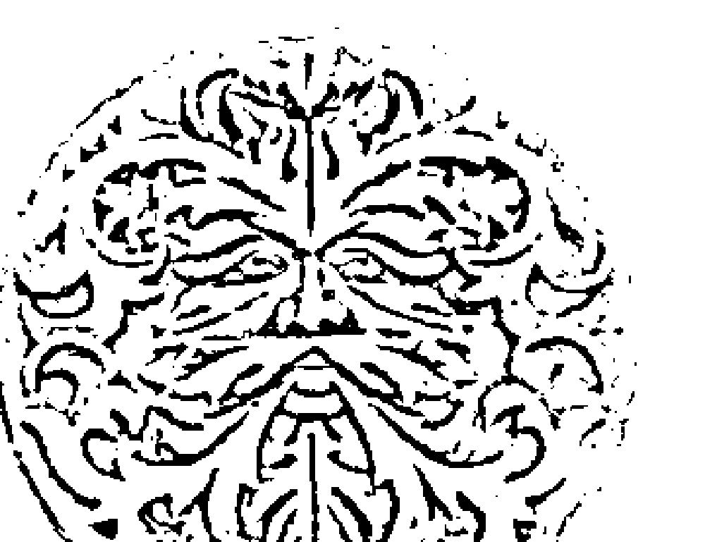

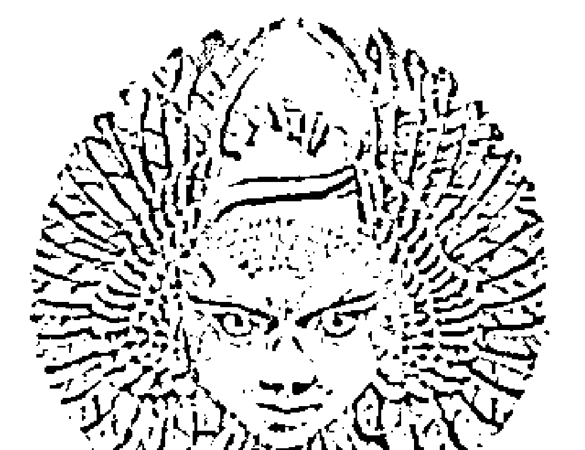

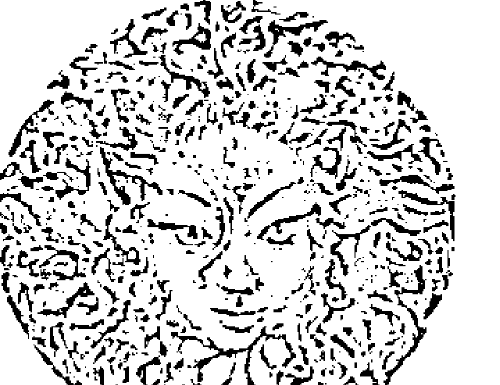

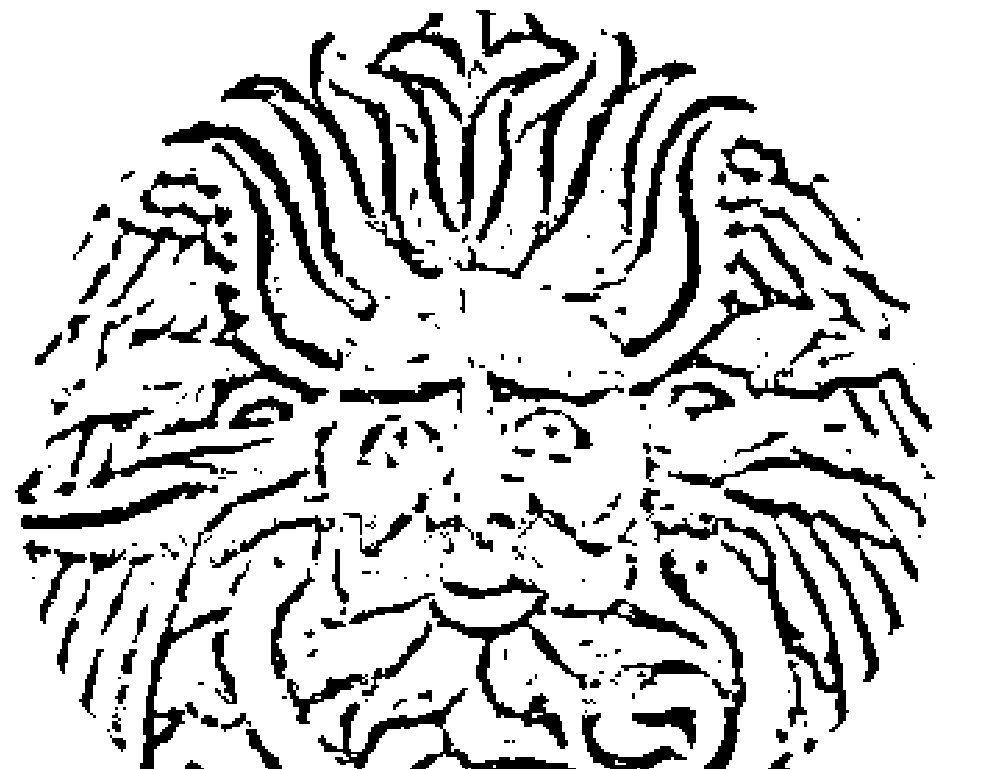

### 第三节：室外魔法圈

自然魔法是指在户外、在森林中、在草地上、在星空下以及在燃烧的篝火周围施放的魔法。当魔法仪式定期在一个树木繁茂的地方，尤其是一个远离“文明”的地方举行时，整个魔法仪式就会显得充满生机。正在生长的植物会变得非常茂盛，而那些野生动物会发现这是一个令它们愉快的地方，会大群大群地出现在这地方。那些在精神上非常敏感的人会很快就会观察到在这个区域周围有非常明显的能量场或者光环，而且通常会看到小精灵，木灵，以及其它的自然精灵的出现——刚开始会在晚上，一段时间时候之后它们甚至会在白天现身。

我自己的魔法仪式和魔法教派——地母圣会（the Holy Order of Mother Earth）（HOME）——就是在乡下的八年期间逐步发展而来的，那时我们的核心人物都居住在北加利福尼亚群山中的一个农场庄中。我们有一群人，而且我们也没有任何的室内空间来举行仪式——我们最大的房间是一个直径为20英尺的圆顶帐篷。因此我们几乎所有的团队仪式都是在户外举行的，甚至在隆冬季节也是如此。刚开始的时候，我们只有一个基本的魔法圈——就是一个篝火坑，周围还有一些可以坐人的空间。这是最原始也是最古老的魔法圈形式，我们的祖先最早变成人也是在这样的地方。围坐在魔法篝火周围，以保证在慢慢长夜中我们的身体暖和，看着彼此的脸庞被跳跃的火光照亮；讲述我们的故事，唱着我们的歌谣，击打着我们的鼓，在我们的庆典上舞蹈，表演着我们的冒险旅程——仪式、戏剧、音乐、诗歌、神话——所有的这些都是从我们史前的部落篝火会进化而来。

千百年来，我们简单的篝火圈所需要的装备越来越多。我们命名为“安芬（Annwfn）”的至圣所，我们用岩石将篝火坑装饰精美，清除杂草，平整周围地区，并堆砌一些可以坐的长凳。随后我们在周围种上花篱，并在四个区域中用石头和木材搭建圣坛。在精灵魔法圈和五朔节花柱圈的入口处修建由两条分道结合在一起的拱形大门。使用时，这些地方都会用绶带、铃铛和鲜花装饰一番。在精灵魔法圈的西大门处，建造了一架在夏末节通往地狱的摇摆大桥。在一年中的其他时间里，我们用绳索将其隔开并盖上一个捕鱼网。我们将篝火坑固定在浦伊尔牧场上的月相圈和日相圈的中心，最后，我们用一个巨大的石头圣坛取代了精灵魔法圈中心的篝火圈。当然，五朔节花柱圈有着它自己的花柱作为中心装饰品。

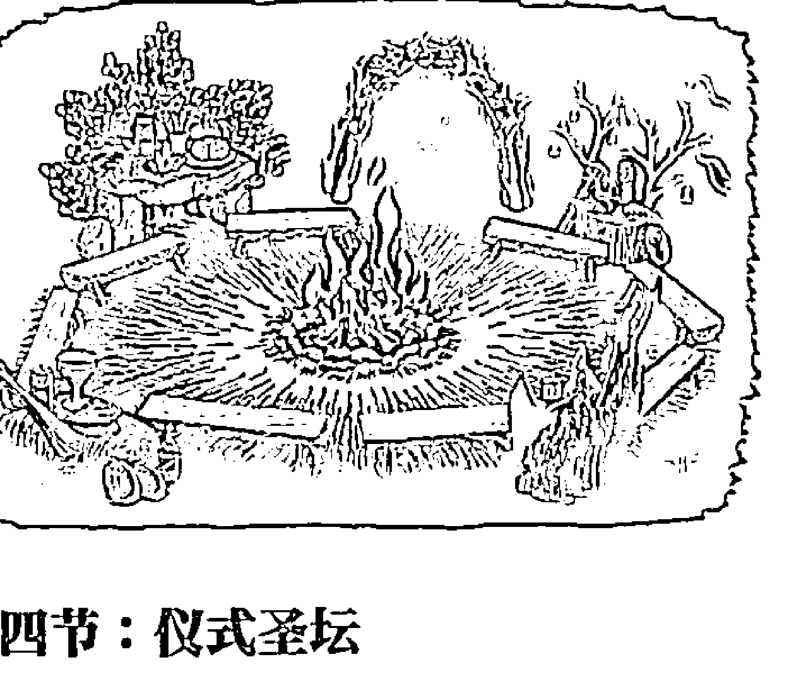

### 第四节：仪式圣坛

圣坛是我们这个小宇宙举行魔法仪式的主要舞台。圣坛是宇宙中的微型符号模型，包括其中装饰的代表着四大元素的物品。各种各样的魔法教派对于他们圣坛的布置和装饰有着其特定的习俗。例如，印度教、穆斯林教、犹太教，以及基督教将他们的圣坛摆放在东方，同时，有几个巫术和仪式魔法教派将圣坛摆放在北方。我觉得这些安排是可以变通的，而且都取决于圣坛的主题、季节以及仪式本身的目的。以下就是一些我们会在我们的仪式中用到的圣坛：

## 中央圣坛

在我的这一派，我们几乎一直都在使用中央圣坛，就将圣坛放在魔法圈的中间。唯一的例外就是在魔法圈的中间需要摆放篝火或者五朔节花柱的时候。这个圣坛是主要的重点区域，整个仪式都得围绕它旋转。大约18英寸高，同时直径大致2-3英尺为最佳尺寸。在二手家具商店，完美精巧的低圆灯或者直径合适的咖啡桌可能会很容易找到，或者你也可以将胶合板切割成一个圆，并用一个底座将其固定，以设立一个自己的圣坛。

传统上中央圣坛应该面朝南方，就像地图一样从南往北查看。圣坛上应该覆盖一张适合仪式场合的正确颜色和材质的坛布。方形的丝质围巾作坛布是非常受欢迎的，但是你可以选用其它的材质，只要它们能够增益此次仪式的主题（我并不推荐有涡纹图案印花，棋盘形图案印花，或者印有米老鼠的布料……）。在魔法市场上你通常可以买到有方块印花、扎染或者蜡染的布料，或者你可以自己制作，可以绘制简单的五角星形，可以是复杂的“魔法圈曼茶罗”。就像很多仪式都有季节主题，季节性的相称的颜色通常都是一个会被采纳的好主意：圣诞节的时候使用红色和绿色，代表女神布里吉德的红色和白色，金色代表收获，橘色和黑色代表夏末节，绿色几乎可以代表所有的其他事物（课程之四第六课：“年轮”中会有讲述）。

在我们中央圣坛的中间，我们通常会摆放我们希望在这次仪式中邀请进入魔法圈的神明雕像（几年以来，我已经创造了一个完整的雕像生产流水线）。有时，如果我们想要召唤出每一位参与者内部的神性，我们会用镜子代替雕像。通常我们会在这些雕像的两边摆上两根细蜡烛，

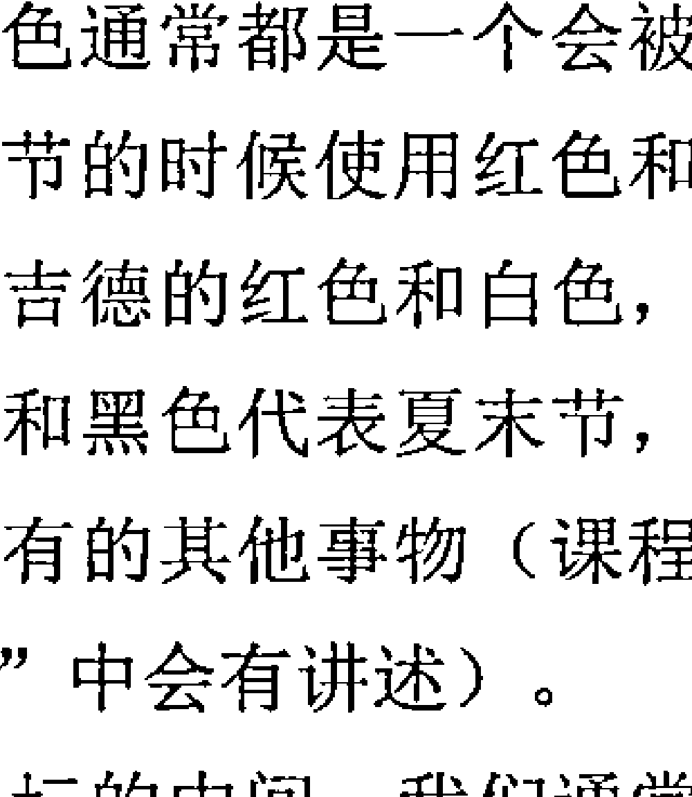

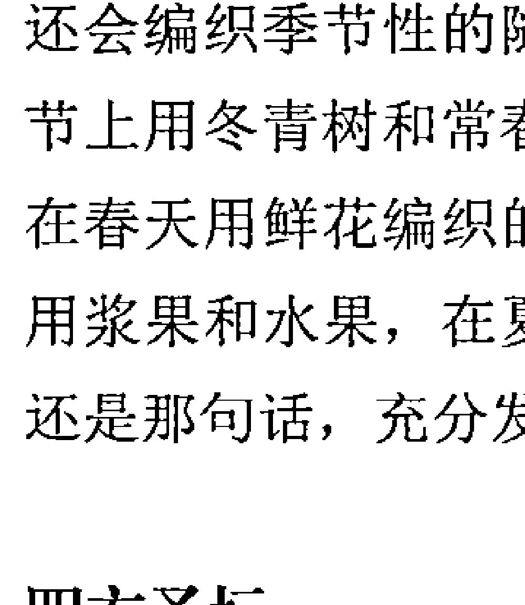

蜡烛的颜色取决于季节以及/或者仪式的目的。在缺少雕像的情况下，这些蜡烛就可以单独代表神。

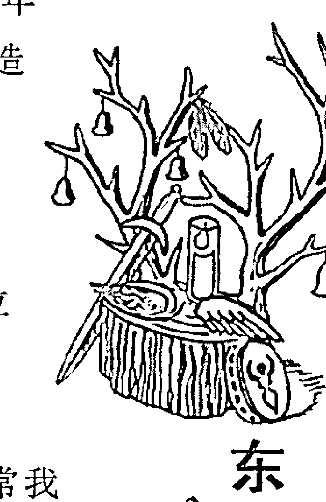

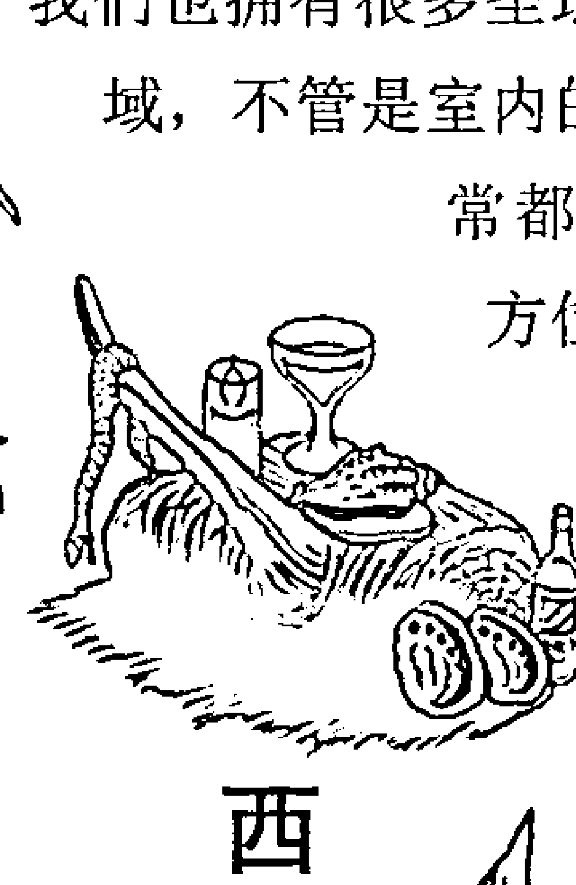

事实上，人形的蜡烛在大多数的超自然商店中都有售。烛台应该由铁、玻璃或者陶瓷制成，形状要有象征意义。

圣坛上的其他物品应该是在仪式上用得到的，包括膏油、焚香或者药草、仪式脚本的副本（可能是一张卷轴）、占卜用具（塔罗牌，水晶球，如尼石刻，黑镜……）、施咒的必要材料、需要治疗的对象的照片（或者是在夏末节仪式上的心爱的死者的照片）、代表着人或者宠物的图腾动物画像等等。通常在这些圣坛用具之中，我们还会编织季节性的随身用具，例如在圣诞节上用冬青树和常春藤编织的圣诞花环，在春天用鲜花编织的花环，在夏天和秋天用浆果和水果，在夏末节用骨头，等等。还是那句话，充分发挥你的想象力。

## 四方圣坛

我们这个群落真的很喜欢圣坛，而且我们也拥有很多圣坛。对于我们的仪式区域，不管是室内的还是室外的，我们通常都会在魔法圈四个基本方位的尖角上布置四方圣坛。这些圣坛各式各样，可以是布置在墙壁上的简单书架，就像“安芬”中一样，也可以是像安芬中的精灵、月相和日相仪式圈中的大型石块和木架结构。因为这些圣坛都是为了表达对元素精灵的尊敬，所以都充满了想象力。如果你要在魔法圈外布置四方圣坛，那么你的优势便是你不必在中央圣坛上摆放所有的元素物品！对于大规模的仪式，尤其是那种要在户外举行整个夜晚的仪式来说，我们的很多工具在没有使用的时候都要摆放在合适的四方圣坛上。所有的焚香和法剑都要放在东边的圣坛；多余的蜡烛存放在南方的圣坛上；额外的水、果汁、咖啡以及其它酒水要放在西边；而北边的圣坛就是一个摆放仪式面包、水果以及其他食物的地方。

因此，东方圣坛上应该装饰上黄色绶带、铃铛、羽毛、小精灵以及挂了风铃的树枝。南方圣坛可以用烧焦的树和火山岩充当，摆上红色的装饰物、龙以及火盆。西方圣坛便应该有由漂流木制成，上面摆满各种各样的贝壳、美人鱼的雕塑和一个装满水的大圣杯。还有，因为西方是通往冥界的方向，所以我们还可以为我们亲爱的死神布置一个特殊的圣坛。在西方圣坛上，我们应该要摆放一支黑色蜡烛或者一个骷髅头，同样的还有我们爱着的、却离我们而去的人的照片或者其他纪念品。北方圣坛通常是由石头制作而成的——一块平整的大石头最为理想。我们可以在上面摆放水晶和盆栽植物，尤其是盆栽的蕨类和苔藓。

## 室内圣坛

很难想象一个魔法家庭会没有室内圣坛。在我们家里，这样的圣坛就像毛球族一样成倍地增长，直到每一个平面空间都变成了圣坛，而每一个垂直空间都转变成了书架！圣坛是与我们个人有联系的各种各样的神居住的地方。因此，我们雷文哈特家族的大圣坛就布置在我们客厅的壁炉上，而圣坛上的位置都主要奉献给了大地母亲盖亚和女神布里吉德（我们创造性劳动的守护者）。但是我们同样也拥有一个专为观音设置的治疗圣坛，在卧室里还有一个献给阿佛洛狄忒和厄洛斯的圣坛，我们整个房屋都布满了各种各样的圣坛。

通常我们会将室内圣坛合并到书柜中，但是你也可以将其安置在衣柜顶部、梳妆台上或者橱柜上，还可以选择卧室的一个小角落、缝纫室的壁龛上或者方便的壁橱上。室内圣坛通常不是团体仪式的焦点，更确切的说，只是举行个人和家庭仪式和祈祷的场所。最重要的就是要保持圣坛的干净清爽——不要让它们布满灰尘和蜘蛛网。

## 你的个人圣坛

在课程之一第二课“创建你的个人圣坛”中，我已经讲过了这部分的内容，因此，在这儿我不再赘述。

## 第五节：神龛

神龛在概念上和圣坛相似，但是通常会更加的专业和持久。神龛有着无数的变体——神龛几乎可以是拥有不同的室和通往不同景象的门的精致装置，也可以是仅装有庄严的物件和遗物的简单盒子；或者仅仅只是某人的墓碑、纪念碑，或者纪念物。

### 礼拜神龛

礼拜神龛通常是一种为特殊的神准备的微型圣殿——有点像小型的玩偶之家。普通的形式是一种内外都有装饰的橱柜或者陈列柜。通常情况下，这种神龛都有可以开关的门，里面会有布景漆。这种神龛里面摆放的主要物品是神、圣人甚至是导师的肖像，像印度教领袖的信徒为他们的导师创建的神龛那样的。形式多种多样，可以是雕像、照片或者其它代表物（包括一些纯粹的象征性的东西，例如中国的道教神龛就是简单的红色帖子和门楣）。

许多教堂和圣殿都会将壁龛嵌在墙上，摆放圣人和神明的塑像。印度教徒、佛教教徒、古希腊人、古罗马人、古埃及人和其他教派的教徒都会在全国各地建造这样的神龛。在信奉天主教的国家，摆放着圣母玛利亚的神龛到处都是。摆放在这些神龛中的雕像从极小的塑料肖像到比真人尺寸大上很多倍的雄伟壮观的塑像，应有尽有，不胜枚举。在这些神龛周围，你会注意到其中主要的物品就是由朝圣者留下的供品。蜡烛、焚香、鲜花以及私人物品都堆积在神龛的脚下。治愈系的神龛可能会高高地堆满了胡乱摆放的拐杖。我曾经在秘鲁的大山上看到一座为圣母玛利亚建造的神龛，周围堆满了成千上万的足球大小的礁石。显然，朝圣之行还包括从山下遥远的河流中将这些石头一路搬上山。

当你身处室外的自然之中，你有时会发现自己正处于一个特别的地方。你会感觉到自然界中存在着一些特殊的能量。这种能量可能是丰富的生物多样性，各种各样的树木、鸟类、动物、特殊的岩层或者仅仅是一个漂亮的场所。如果你在那个地方祷告或者举行小型的仪式，你可能会感受到灵感。你可以在你的脑海中完成这一切，想象一个魔法圈或者圣坛，但是你同样也可以创建一个微小的礼拜神龛。不要打扰这里的美丽，但是放置一些石头、鲜花或者像摆放在四方圣坛上的那些物品通常都是可以的；而且，利用此处特殊的石头、树木或者溪流作为你的圣坛或者魔法圈的中心又何尝不可呢？

### 纪念神龛

纪念性的神龛被称为纪念碑。一些纪念碑也许是以小型圣殿的形式存在，比如林肯纪念堂，里面摆放着需要纪念的人物的雕像。其它的纪念堂可能更加具有象征意义，例如华盛顿纪念碑，其实是一个高高的埃及风格的方尖碑，另外还是所谓的“克利帕崔尖塔”。墓地通常是找到为死者建立的纪念碑的好去处。一般来说，墓碑本身就是这样一种神龛，也是悲伤的朋友和亲人摆放照片和鲜花的地方。著名人物的墓地都会成为朝圣的胜地——我曾经拜访过吉姆·莫里森在法国巴黎的墓地（诗人，以及大门乐队的领唱），在他死后的数十年里，整个墓地都摆满了来自他众多歌迷的鲜花、诗歌以及供品。战争纪念碑通常也被看做神龛——尤其是位于华盛顿特区的越战纪念碑。

其它的纪念性神龛就是那些你有时会在高速路边上看到的、为在事故中死去的人所建立的纪念碑。一个直立的上面刻有死者名字或者贴着死者照片的小小十字架。有时，那里会摆放有鲜花、卡片、祈祷绶带，以及其它一些供品，就像在墓园中一样。在纽约世界贸易中心的双子座被摧毁以后，附近街区的墙上和栅栏上贴满了死者的照片和纪念品。拜访这样的纪念碑会是一次非常感人的经历，泪流成河。

## 第六节：医药秘轮

医药秘轮是一个巨大的圆圈，在地上用石头圈标出界线范围，中间用石头堆放一个中央石冢（堆），并用鹅卵石堆出辐射条。在辐条连接外部圆圈的位置通常会有大块的岩石或者石冢。整个结构看起来就像一个巨大的四轮马车的车轮平放在地面上。因此在怀俄明州，术语医药秘轮最早是指大角巫医轮（the Big Horn Medicine Wheel）。这个名字的“medicine”部分暗指其对本地人的宗教意义。

许多这样的秘轮都是由美洲原著民在美国和加拿大西部的偏远地区建造的，其中大多数的直径都超过40英尺。其中已知的70个医药秘轮中的三分之二都建在加拿大的亚伯纳。其中一个名叫“Majorville”医药秘轮，它包括了一个直径为30英尺的庞大中央石冢，被一个直径为90英尺的石头圈环绕。有28根辐射条连接着中央石冢和外围石圈。几种年代测定技术揭示，中央石冢建造于大约4500年前。显然地，它已经作为一个仪式中心被使用了几千年。这种仪式中可能是用于施展狩猎魔法和促进水牛的生育力，但是这个选址更深层次的意义已经遗失在历史的尘埃中。

其中一点最为有趣的理论在于在医药秘轮中还展现了意义重大的天体基准线（stellar alignments）。天文学家约翰•埃迪认为在大角医药秘轮中连接中央石冢和外围石冢的线条指向了夏至时太阳升起的方向。其它的基准线都同时指向了夏至的日出和特定的明亮之星的位置，例如毕宿五、参宿七或者天狼星，这一提议已经被用于解释很多的医药秘轮。因此，这种秘轮的功能也许是作为一种日历，标记一年中最长的一天。推测起来，这样一个日历可能是用于设定重要仪式的举行日期和时间。

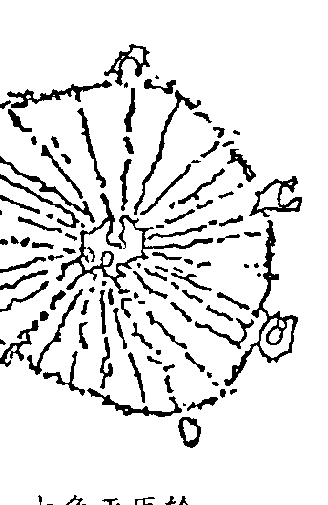

你可以创建一个你自己的医药秘轮，就像玩精灵棋游戏一样，随地捡起一些石头就能完成。有时这样的魔法圈会摆放在草地上或者花园里，人们会带来特殊的石头来堆砌中央石冢和辐射条与外围圈相接的石堆。这些秘轮可以安放在一个岩石区，例如公园或者野外，并且将它完好留在那里以便其他的游客参观。

## 第七节：圆形巨石阵和石圈

如果你有足够的空间，那么在你的仪式空间周围建造一个石圈真的是一个不错选择！就像英格兰著名的巨石阵，这种石圈通常被称为“圆形石结构”，但是从学术上说，这种说法并不准确。典型的圆形石结构是简单的圆形围墙，外围邻接浅滩，内部是一条壕沟。有一个或者多个通向中心的入口。最古老的巨石阵是在大约公元前3300年开始修建的，最大的接近五英亩。浅滩就在壕沟外面，所以它们还没有防御用的围墙，但是这样一来就更像是一种宗教和举行仪式的集散地。一些巨石阵中有石头圈，而有的巨石阵中曾有过摆成圆形的木制标杆。

石头圈与巨石阵比起来更加的常见。现在至少还存在着 900 座这样的石头圈，虽然还有更多的石头圈肯定在“人类发展”的过程中被毁坏了。最著名的就是英格兰南部威尔特郡的巨石阵，跨越了千百年极其复杂的历史却始终屹立不倒。大多数今天可以见到、屹立在浅滩和壕沟内的遗迹都是最近阶段的此类石头结构的代表，而且可能是完工于公元前 1700 年。不，巨石阵并不是德鲁伊建造的，他们错过了整个的这项艰苦劳动千余年！

关于这些石头圈的目的有着很多惊人的说法，从 UFO 的着陆点到天文台，应有尽有。大多数都源自早期的巨石阵，用途多种多样，例如部落举行与季节和大地生产力有关的例行仪式的集散地。与医药秘轮一样，特定的石头对准着特别明亮的行星以及在二至点升起的太阳，所以，和日晷标记时刻的方式一样，石头圈被用作年月日历。

已故的亚历山大·托姆教授在调查不列颠群岛和法国西部的 1000 多座巨石（“巨大的石头”）结构时，惊讶地发现它们都是使用同样的度量衡单位来建造的。托姆将这种单位称为巨石码（megalithic yard）（MY），因为它的尺寸和英国的皇家庭院（British Imperial Yard）的尺寸非常接近，恰好 32.64 英寸。

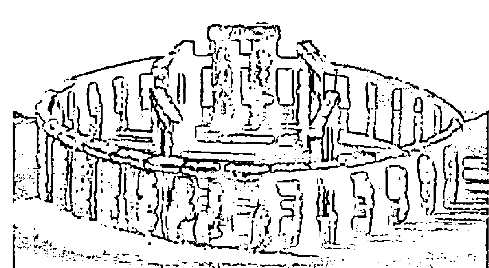

## 第八节：迷宫

单词迷宫（labyrinth）意为“迷宫之斧（labrys）的房屋”，而 labrys 是古克里特人举行仪式时使用的双刃斧。传说讲述了提修斯怎样在克里特的克罗索斯迷宫中央杀死人身牛头怪物弥诺陶洛斯（Minotaur），然后依靠克里特国王之女阿里阿德涅（Ariadne）公主给他的线团逃出了迷宫。迷宫可以是一幅简单的画，也可以刻在木板或者粘土表面上，以便你可以用你的眼睛或者手指寻找出路。

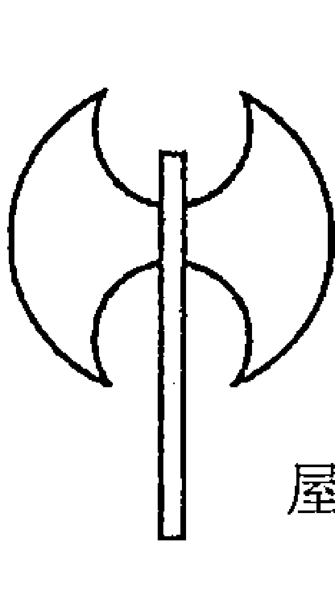

迷宫之斧

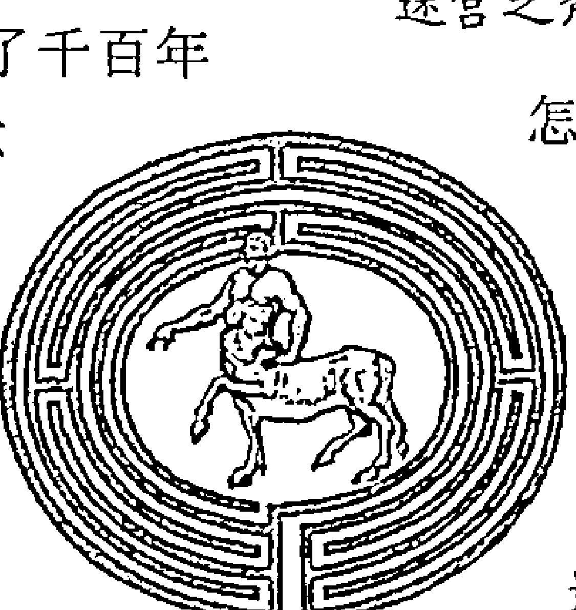

来自蒙福孔的文物，16世纪

迷宫把循环与螺旋的意象和曲折但是有目的的路径联合在了一起。迷宫代表了一种进入我们自己内心并再次走出来回到外部世界的旅程。全尺寸的迷宫可能需要依照一种冥想的练习来通过。你行走的时候，身体的移动有时会增强自身的自愈能力，或者影响地球磁场。位于圣城中央的基督教大教堂迷宫据说代表着“通往耶路撒冷的路”和拯救灵魂的旅程——最初的时候，忏悔的朝圣者会跪在地上沿着这些路径慢慢地行走。

Labyrinths（迷宫）和 mazes（迷津）

这两个单词通常会混淆。大多数的人听到迷宫的时候，他们会想到迷津。迷津就像是一个需要解决的谜题。它既有岔路，又有死路。但是迷宫是单行的，只有一条迂回的道路，既没有岔路，也没有死胡同。只有一条路会带领你进入中心地带（以及再次走出来）。

最古老的迷宫设计出现在古克里特岛人的硬币上，以及世界各地的很多地方（从西班牙到斯堪的纳维亚，从美国亚利桑那州到阿富汗）都有发现的经典的七圈迷宫。有一个样品是在意大利撒丁岛上的一个拥有 4000 年历史的新石器时期的墓穴中发现的。这是在没有复杂测量设备的情况下最先发现的。我曾经在沙滩上堆积了几个这样的迷宫，而且还在牧场的深草区割出过这样的迷宫。

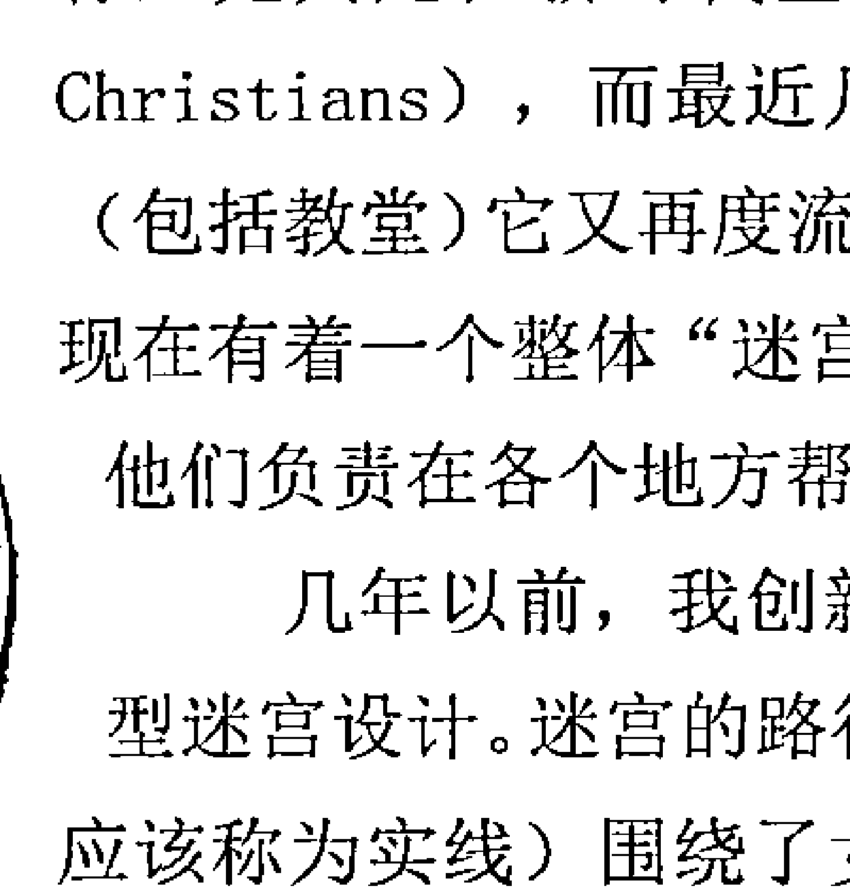

原始的七圈迷宫设计在全世界流行了千百年。它的直接继承者罗马的马赛克（mosaic）迷宫作为一种中心有图案的宽边结构迷宫一直沿用至今，通常是关于提修斯杀死弥诺陶洛斯的题材。九圈路径的方形罗马设计非常井然有序，在进入下一个方阵之前需要将一个方阵填满，而每个方阵的图案是重复的。

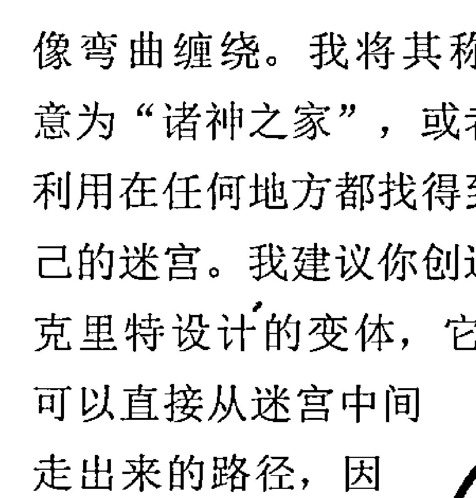

中世纪的迷宫设计的发展面临了一个伟大的突破。这种迷宫有十一个圈，而其路径却在不同的方阵中自由穿梭。与方形的罗马迷宫图案形成对比，这些设计是典型的圆形或者八角形。最早存在的全尺寸实例可以追溯到公元 1235 年，镶嵌在法国沙特尔大教堂（Chartres Cathedral）入口的马赛克地板上。我曾经去参观过这个迷宫设计，也曾在上面走过。这种沙特尔设计在那时十分流行，尤其是在新时代基督时期（New Age Christians），而最近几年，在很多地方（包括教堂）它又再度流行起来。事实上，现在有着一个整体“迷宫计划”正在实施，他们负责在各个地方帮助设置这些迷宫。

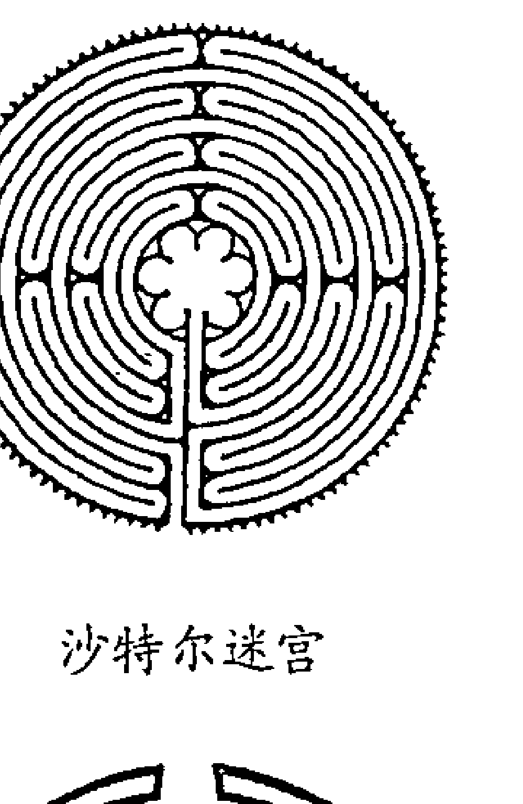

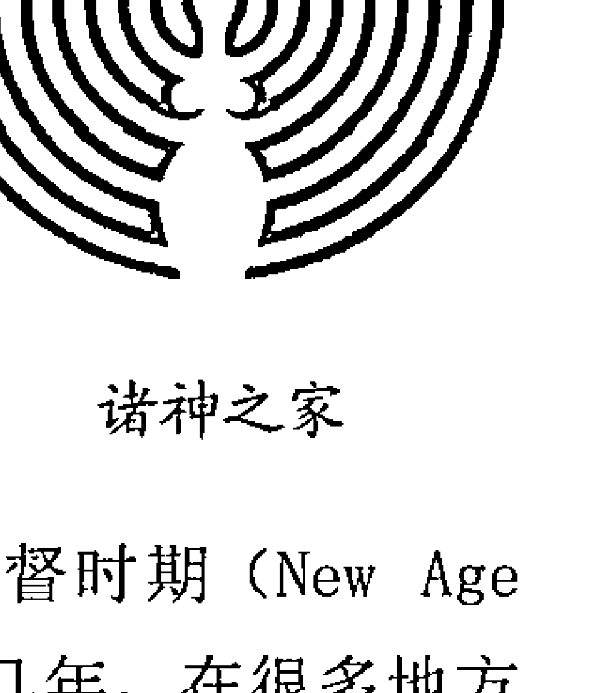

几年以前，我创新了一个独特的新型迷宫设计。迷宫的路径（在这种情况下，应该称为实线）围绕了女神和有角神的肖像弯曲缠绕。我将其称之为 Dearinth，意为“诸神之家”，或者圣殿。你也可以利用在任何地方都找得到的材料创造你自己的迷宫。我建议你创造一种基于经典的克里特设计的变体，它有一条可以直接从迷宫中间走出来的路径，因此可以几个人一起玩，而且不会在出来的路上彼此偶然相遇。这种设计被称为行军迷宫（processional labyrinth）。

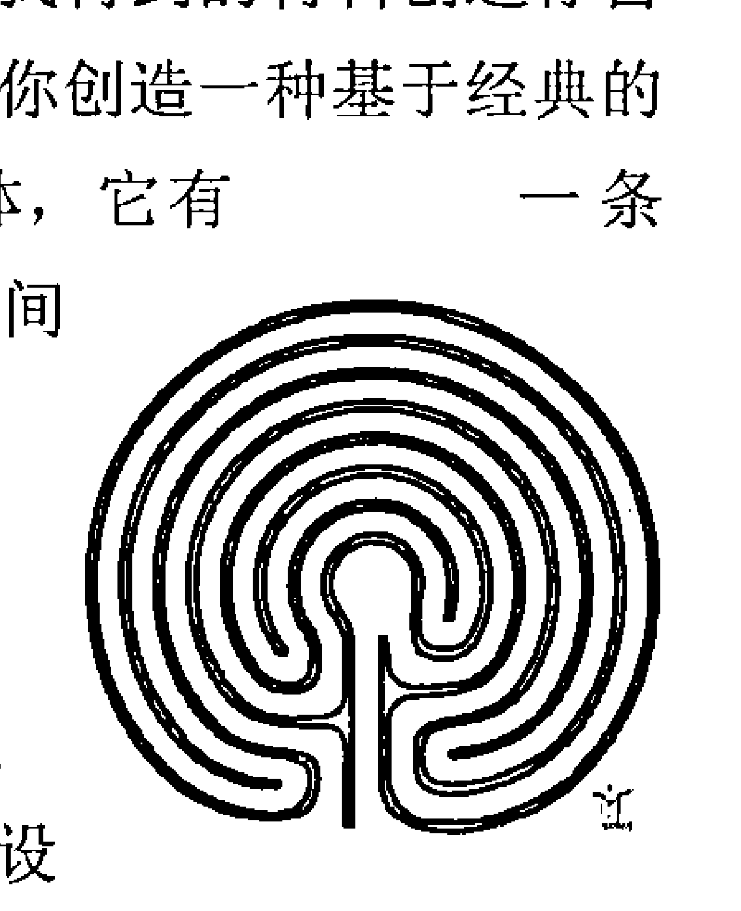

这种迷宫模式可以使用石灰、石头、砖，甚至是长链或者长绳在地面上设置。也可以画在沙滩上的沙子里，用剪草机在草深的地方修剪出来，或者在草皮上切割，还可以在种植花草的时候建造一个持续时间较长的迷宫。甚至你还可以用磁带标记在地板上，或者画在一张大帆布上。在规划迷宫的时候，你只需要记住一点，那就是从中间开始，并使用一根圆规绳画出一连串的七条同心圆路径，每一条路径都要足够宽阔，以便能够轻松走过（当然，还要为障碍物留下足够的空间）。然后用弧线像上图中那样将圆圈连起来，这样就成了一个连续循环的路径。

> “只要你做，就能成功。”我保证你不仅能够满足自己的需求，而且你的魔法朋友们也会从四面八方赶来参与你的迷宫游戏！

## 资源

我自己设计的诸神的雕塑以及包含了四大元素的墙面饰板（包括一个诸神之家的迷你圣坛）可登陆网站 www.MythicImages.com 购买。

大张的印有迷宫和凯尔特设计的挂毯可以在“Ancient Circles”上购得，网址是：www.AncientCircles.com/textiles

所有种类的迷宫设计和产品——包括一些设计你自己的迷宫图案的详细说明——可以在迷宫公司 (Labyrinth Enterprises) 购得，网址是：www.labyrinthproject.com

# 第三课：关于仪式

## 第一节：仪式简介

—— 哈 利 · 英 格 尔 哈 特 (Hallie Inglehart) ， 摘 自 “ 创 建 仪 式 ”（《HOME 烹饪术》，1997 年）

仪式是一种集中注意力和认知我们的能量和意识的途径。我们所有人整天都在进行着——其中一些人的认知会比其他人更为深刻——影响并且支撑着我们的态度和行为的仪式。我们会在每天早上起床的时候穿上衣服，我们会庆祝我们的生日，我们会标注我们一生中的重要事件。将“普通”生活作为仪式是一种非常微妙的素养。点燃一支蜡烛，或者燃烧一种焚香并不是举行仪式，但是思想和意识的状态确实伴随着并且起源于我们的行为。仪式暗指所有有意识的生活。

神话学、考古学、语言学、艺术以及历史中都讲述了我们的祖先所举行的魔法仪式。洞穴作为大地母亲的子宫是举行新生与重生仪式的天赐场地；依然保留在这些洞穴墙壁上的雕刻和绘制的动物、植物以及月亮和四季循环的标记都生动地记录了古时的仪式。在过去，仪式是一种综合性的庆典，也是人类创造力和循环再生的表现。我们很多的艺术——戏剧、诗歌以及歌曲——最初都是仪式的一部分。随着人类与自然和他们内心的自我越来越疏离，艺术也变得彼此孤立，并且与它们最初统一的精神来源分割开来。然而，我们仍然能够感觉到仪式处于艺术鼎盛时期的精神力量。

表演时产生的能量与仪式举行时产生的能量十分相似：高度集中的注意力、能量的传导、表演者与观众之间能量的互换。

## 第二节：HOME 教派

我有很多的魔法导师，对很多的魔法协会也有一定的了解。然而，与我关系最为密切的魔法教派是地母圣会，简称 HOME。HOME 起源于 1976 年秋天，当时牵牛花和我抵达俄勒冈州尤金市与安娜·科恩会面。那时她正在德克萨斯州接受英国狄安娜魔法教派（British Tradition of Dianic Witchcraft）（强调狄安娜，月亮女神）的马克·罗伯茨和摩根·麦克法兰的训练。而牵牛花也根据个人的经验和已出版的材料，正在逐步开创“萨满教巫术崇拜（Shamanic Wicca）”。同时我也已经成立了全世界教会协会，并且在意大利接受了圣路易斯的黛博拉·莱特的史特雷加魔法（Strega）和仪式魔法训练，同时还有密苏里州奥扎克印第安（Ozark）的“德鲁伊教”、希腊和埃及的神话和仪式的训练。我们三个人将我们各自的训练整合成一个连贯的系统，并成立了伊西尔（“月影”）十三女巫大集会（the Coven of Ithil Duath）来对这个系统加以练习实践。那年冬季和来年的春天，牵牛花和我精炼了所有的这些材料并整合成一个有组织的魔法研究课程，也就是我们在莱恩社区大学（Lane Community College）所教授的“凯尔特萨满教”。

在 1977 年七月，牵牛花和我搬往柯登博思（Coeden Birth）（“斑点森林”），位于 5600 英亩的名为格林菲尔德农场的北加利福尼亚家园社区上一片 220 英亩的土地上。柯登博思属于艾莉森·哈洛。隔壁 55 英亩的那块地在我们搬入的不久之前卖给了格威迪翁·彭德文，他是一名威尔士吟游诗人，也是仙灵教派（the Faerie Tradition）的合伙创办人。我们一起成立了地母圣会，这是一个保护地球以及进行仪式研究的魔法协会。

居住在农场中的魔法居民包括仙灵教派、狄安娜巫术崇拜（Dianic Wicca）、金色黎明新改革派正统协会（the New Reformed Orthodox Order of the Golden Dawn）（NROOGD）、印度教以及美洲原住民。我们开始一起开会研讨，一起施展魔法，而且在接下来的八年实践中,通过月相循环仪式、过渡仪式（如:成人礼仪式）、四季庆典以及每日的魔法练习，我们将所有的那些不同的教派联合成为一种独特的教派，这种教派实际上来源于我们自己在这片土地上日常的周期性生活，最终上升为了一种新型的魔法教派:HOME 教派。牵牛花和我已经为我们在尤金的课堂开发了课程教材，这为我们发展《光影魔法书》（[Grimoire of Lights and Shadows]）奠定了基础。格林菲尔德农场社区的其他成员也来加入了我们的 HOME 圈，这个教派在一天天成长壮大。我们种植树木、建造花园、养殖宠物鹿和独角兽，围在篝火边颂唱我们的歌曲，讲述我们的故事。在这片土地上，婴儿降生后会接受赐福仪式，并由我们的圈内人抚养长大，我们的习俗和传统也同化着我们的下一代。在这个不断壮大的魔法社区中，我们实际采取的是我们古代部落祖先的传统生活方式。1983 年，安诺迪亚·朱迪思成立了生活学校（Lifeways School），基于我们所有人多年以来在 HOME 中发展的仪式和资料，我们创造了一项“魔法 101”培训计划。很多人加入这些课程，并且在 HOME 魔法教派中接受培训。其间，我们所有人都搬离了那片土地，散落到了世界各地。1997 年，我撰写并编辑了原本计划了三卷名为《HOME 烹饪术》的教材中的第一卷。但是在那以后，我的生活和工作使得我居无定所，随着我开始为神话肖像集（the Mythic Images Collection）雕刻诸神的雕像，其它两卷便暂时搁置了。

格威迪翁在1982年的夏末节时开车落入水中不幸身亡，我们社区都陷入了深深的悲痛之中，因为这是我们第一次面对我们自己家人的去世。我们的仪式发展了一个更加阴郁的新方向，创建了葬礼仪式和唤醒仪式，通过神话中夏末节的奥秘、五朔节之夜和埃勒夫西斯节探索地下世界。

## 第三节：规划一次仪式

> ——安诺迪亚·朱迪思（Anodea Judith）（摘自《HOME 烹饪术》，1997）

安诺迪亚和我在很多主要的仪式、培训程序以及其它项目上一起合作了超过25年。她是《生命之轮：轮穴使用者指南》（[Wheels of Life: A User’s Guide to the Chakras]）（我做的插图）的作者，以及其它几本结合了东西方的魔法系统的书籍。以下是她认为非常重要的、在准备仪式的过程中需要提出来的一些问题：

1.  仪式的目的是什么？为什么你要这么做，你想要完成什么，你想要解决什么问题？答案可以是任何内容，从消除核武器到简单的生活乐趣都可以。这取决于主题。
2.  什么时候？一年中什么时候，哪个季节，哪个月相阶段，哪天，哪夜，你生命中哪个时间，一群人生命的哪个阶段（比如入会，退出，等等）？或者说一系列仪式的先后顺序，比如行星或者轮穴仪式，这些仪式都得按照特定的顺序举行。
3.  为了谁，谁会参加？这一点包含了人数、经验程度、年龄、身体机能、孩子、全是女人、全是男人、男女混合、亲友圈、大型的公众参与仪式，及其他。
4.  你想要影响谁？这一点和第一点有些许不一样的地方，和目的简单的生活愉快一样，也可以跳过。如果你的目的是消除核武器，你可能会想要影响白宫中的政客，或者你可能想要影响核武器附近的家庭，鼓舞他们写信给他们的国会议员。如果你的目的在此，那我得提醒你一个词：警惕，不要让你所做的事情变得太难操控，不然你会很容易精疲力竭，而且这也是一个关乎道德标准的问题。
5.  在哪儿举行？室内、室外、某人家中、圣殿、教室，等等。
6.  持续多长时间？这一点与第二点和第五点都有关系，在室外的话，夜间仪式可能要比其它仪式的时间更短一些。同样的，都有哪些人参加这一点也必须考虑进来。比如，孩子们并不能安静地坐着经历一次太长时间的仪式。计划时间的长短是非常重要的，而且还要规划好仪式过程中的子程序（比如：摆设魔法圈：5分钟；祈祷：10分钟；等等。）
7.  你想要利用哪些东西来施法？如果是在满月的户外，你便需要时间、场地来举行仪式，还要处理召唤来的元素。山顶和海洋所给与你的东西都不一样。你有什么工具，使用哪种咒语、技能、哪些人、哪件长袍、哪种舞蹈、哪首圣歌？分类整理你从你的魔法书和众影之书中学到的内容，并展示出所有适用的东西。你可能不是全部使用，但是你可以在用到的时候对它们进行分类和整理。
8.  施法时你要使用哪种主要方法？冥想、舞蹈、念咒、治疗、行走、击鼓——哪一种最适合你的目的和主题？
9.  你要怎样在一个微观世界的水平上用符号表现你想要运转的东西？如果你想想要跨越深渊，你要怎样在仪式中建立这样的场景？如果你想要打开某人的心扉，这样的情况你要怎样以一种直接的潜在方式展现出来？
10. 圣坛上应该摆放什么？这一点来自第九点的象征意义。如果你要操纵气，那么你应该摆放羽毛和焚香；如果你要操纵土，你便应该摆放水晶。在不同的季节你还应该摆放应季的物品。

这些问题被提出并且着手解决的时候，你的脑中便会呈现出一个大体的思路。你需要更有创造精神。寻找仪式的流线性，以及一个部分怎样能够自然而且优雅地与另一个部分衔接在一起，所有的这一切都是为了你所选择的中心主题和目的。一旦主题清晰，而且你知道你需要使用的物品，这些答案就可以列入仪式结构大纲中（详情请参考课程之四第四课第二节：“仪式结构”）以创造出实际的仪式。

还要考虑到一定量的重叠与重复，例如齐声歌唱一首歌。仪式的成功与否取决于你的内心，而不是你所使用的工具。你要能够完全掌控整个过程，并且要记住：并不是“只有一个人是完全正确的，也不是只有一种方法。”

## 第四节：魔法和仪式的道德标准

> ——安诺迪亚·朱迪思（摘自《HOME 烹饪术》，1997 年）

世界上万事万物都是相互联系的。所有的生命元素——树、天气、我们所能感受到的情绪、我们所说的话、一天中的各个时刻、我们选择的行业——所有这一切都紧密联系，在广大的领域中相互纠缠。影响其中的一个元素，就会影响所有，这一切就像一句格言中所说的那样：“上如是，下亦如是。”外部发生的改变同样也会发生在内部，反之亦然。每个物体之间都能彼此参照，我们每个人的灵魂之间也能相互参照。按照这种说法，魔法也不过是更大力量的一个微观世界——一个会受影响的微观世界，但是反过来魔法也会影响那个在其它方面看来仿佛高高在上的更为广泛的力量。

魔法并不会控制这个领域，正如生命会流入时间长河中，魔法也追随着自然的发展。在这条长河中，没有任何事物是固定且停滞不前的；所有事物都在不断地移动和改变。就是这种流动（Fluid Movement）允许了魔法的发生，因为，在改变的过程中，我们能够前进并且创造新的现实，就像生命的力量会经历从混沌到显形的过程。

因为魔法世界中的所有事物都是相互联系的，所以这一点便导致了一个有趣的道德标准问题。我们自己并没有与这片领域分离，不仅我们的行为不能分离，结果也不能。因此魔法在自己的范围内建立了它自己的神圣的免疫系统。我们在魔法的国度所有的一切都会影响到我们周围的领域，因此，也会影响到我们每一个人，包括自己。事实上，魔法可以说是我们所体验过的最为快速的业报反馈系统之一！

这一点可以总结成一句巫士忠告：“不伤人，凡事皆可自由为之。” 这就意味着只要不会引起伤害或者干扰到他人的权利，一个人的个人意志就会得到高度的尊重。这样做可能会损害连系着所有事物的基本潜在的结构，而且还会消极地反射到魔法师身上。但是按照某人自己的意志行事也是对魔法负责——这样可以追踪到行为的根源，而不会责怪他人，从而负责任而且有意识地活着。

在魔法圈内部的仪式从根本上说是一种能量放大器，会扩大某人行为的效果。因此，无论我们开始的时候是什么样，都会魔法般地扩展到外部世界，有时会成倍地增长。如果我们的意图不清楚，如果我们没有心怀敬意地行事，没有认识到一切可能受到影响的事物之间的密切关系，那么这些行为的结果，因为它们贯穿了所有生命的关系网络，最终会以夸张的尺寸回到我们跟前。因此魔法师在魔法圈内开始仪式的时候必须对自己的一切行为负责——而且这确实也是对自己整个人生负责。这点中甚至包括了一些无意识的错误，这种情况在每个人身上都会发生。我们都需要对那些失误全权负责，而且这样做通常会为魔法和心灵的成长提供宝贵的经验教训。

是基于因果关系，而不是一种关于正确和错误的主观武断的感觉。本质上来说，它们是交织在一起的，与所有的行为是不可分离的。是对是错大家各执一词，但是对于每一位魔法师来说，结果都是非常明确的。

## 第五节：魔法圈的学问和礼仪

很有可能某天你会想要参加他人或者其它的团体组织的仪式。以下是一些有关怎样表现的参与指南，连同一些让你感觉舒适的有用的信息。这些是由艾尔德里·小狼和温迪·亨特（Wendy Hunter）撰写的，并且纳入《HOME 烹饪术》中一起出版了。

魔法圈是漩涡形式的循环能量的一种表现。这种神圣的时间和空间脱离了这个世界，并且与所有其他的魔法圈相互联系。魔法圈是一个充满了生命力的宇宙，位于与我们达成协议的世界之间。因此：

- 1. 仪式并不是一种观赏性的运动。如果你不想参加，请你保持足够远的距离，不要惊扰整个仪式。
- 2. 将你那个世俗的自己和尘世的事务留在魔法圈外，带上你的魔法自我进入魔法圈。进入魔法圈时要带上你完整的爱与完整的信任，事先解决好个人问题。
- 3. 要以第一次见面的状态与每个人的魔法自我见面，记住自从生命起源，我们就已经成为了朋友。心怀敬意，得体，礼貌，并且饱含爱意地对待魔法圈中的每一个人，每一件物品。
- 4. 魔法仪式就像是宗教活动，在魔法圈中你会得到相当多的力量，因此，在魔法圈中请你举止虔诚并且小心翼翼。
- 5. 保持肃静除非“真理”想要通过你讲话。在魔法圈中只能讲真话，这样你的魔法宣言便会拥有真理的力量。
- 6. 仪式并不需要太庄重，但是还是需要严肃，而幽默必须有一定的目的性。无端的评论会破坏魔法圈的能量和你们专注的目标，因此请一定要自我克制。
- 7. 最好的仪式是那些看起来自然发生的仪式，但是它们通常需要事先认真规划。因此，留心观察，寻找那些何时一起念咒，何时击鼓等等引导整个仪式的线索。
- 8. 当需要在魔法圈中四处移动的时候，通常要按照特定的方向移动（通常是顺时针方向）。必要的时候围绕魔法圈行走，但是不要在人群中穿梭，或者逆人流而行。
- 9. 仪式物品和工具都被赋予了能量，应当心怀敬意。工具和仪器是私人物品，未经允许，不能触碰——尤其是一些包裹起来的、封装好的或者装在盒子里的。
- 10. 一旦魔法圈准备好以后，除非十分必要，不然不得随意进出。如果你必须要进入或者退出魔法圈，请自己开一扇门，或者让参与仪式的人帮你开一扇门。

祭司的工作之一也许就是将某位神引入魔法圈中。你需要帮助他们：

- 看着他们，仔细聆听，跟着他们做。
- 通过你的参与赋予祭司和仪式能量。将你的能量和可视化经由他们供给魔法圈。
- 撇开异议，将批判搁置。如果你不能赞同一些东西，那么就请离开魔法圈。

在魔法圈中，我们都是兄弟姐妹，但是我们行事方式可能会不一样。在仪式举行期间，要对不同的需求和风格反应敏锐。尊重所有魔法自我之间的不同，并包容他们，因为有了他们，整个魔法圈才完整。

魔法师最基本的责任就是对待地球要心怀敬意，要循环使用并且重复利用，要友好地彼此对待，要能够一直说真话，并且要尽可能地让自己的行为意图明确。聪明的人都知道并不会有严厉的“天父”来评价我们，也不会诅咒我们进入永恒的地狱。那只不过是我们想要居住的世界的状态，我们将这样的世界称为天堂或者地狱，是去往天堂还是下往地狱都取决于我们自己的行为。因此，魔法的道德标准更多的

## 第六节：仪式类型

施法是魔法仪式的核心、要点和目的。可能需要完成有很多种类型的施法——的确，仪式的这个阶段可能会因为你自己的目的和观想力的不同而大相径庭。以下是关于几种基本的仪式操作的简短阐述。

### 礼拜和庆典

礼拜和庆典对于仪式来说是一种很好的目的。这基本上就意味着举行一次聚会，并邀请天神来参加！这样的仪式应该包括大量的击鼓、唱歌、跳舞、音乐，以及享乐。大多数大型的季节性夜半集会就是这样的性质（详情请参考课程之四第六课：“年轮”）。记住，当你邀请天神加入你的魔法圈时，他们的第一个反应应该是：“最好不要让我失望！”

我最喜欢的一种这样的仪式是众神召集（Convocation of the Gods），在这样的聚会中，每个人都要准备好要模仿他们最喜欢的神（戴着这些神的面具），身着适当的服装，并且佩戴有关的装备。然而，有一点非常重要，你得记住，如果你邀请众神来参加的是一次真正愉快的聚会，那么他们便最有可能出现！做好准备！

> 安诺迪亚说：“想要在一次仪式上模仿某位神，极为重要的就是要了解并且成为他或她。”

### 防护和保护

施展防护和保护的魔法可能是为了某个人、某个团体或者某个地方。这样的仪式包括在目标周围建造一个防护区域，击退不需要的能量体。防护可以通过利用魔法圈本身的基本屏障，并在外围加上反射性质的镜子将其加固成一个不能通过的壳体来完成。在你的魔法圈围绕在需要保护的人或者地方的周围时，你便可以利用观想力和真实的手持圆镜，举起你的双手，就像在与一面隐形的墙对抗一样。

### 治疗和转化

治疗是对真实存在于魔法圈之中的人所举行的仪式，或者是针对一些距离较远的人们，但是参与治疗仪式的人中至少有一位与他（她）相识，这样能将两者连系在一起并将能量传播出去。通常的方法便是需要治疗的人（或者他们的替身）坐或者躺在魔法圈中央，同时，所有的其他人将治疗能量通过他们双手的传导，施加在仪式中央的人身上，尤其是那些需要治疗的特殊区域。然后，所有人一起呼吸，快速地深呼吸，每一次呼吸都要发出声音，直到最终达到最大音量，同时通过最后一次完整呼气的释放，将所有人结合在一起的气抽出输入中央那个人体内。

另一种方法是指那位需要治疗的人要保持与魔法圈之间的连系，同时所有人手牵手，面向他们的右边。每个人都快速地向左转动他们的脑袋看向他们左边那个人的眼睛，并呼气发出“呼！”的声音，同时还要紧紧握住那个人的手，以形成一股波浪式的气流。与此同时，左边那个人要吸入这口气，然后对其左边那个人重复相同的动作。在绕过魔法圈几圈以后，这股气流便会聚集起惊人的力量。当接受治疗的人感觉这股气流足够强大之时，所有人都必须与自己左边的人断开连接，这样就可以收集到全部的能量波，并不再往下传递。转化仪式也可以使用这些相同的技巧，并在其中嵌入一个更加复杂的心理剧疗法。

### 织网

网络编织是一种特别令人愉快的魔法操作类型，织网的目的是为了在之前没有连系的物质世界或者精神世界的元素之间创造魔法连系。以下是一个我也参加了的有关这种仪式的经典实例：

一个线球围绕着魔法圈传递，每一个人都把线球拉伸测量一下自己双手展开中指尖到中指尖的长度，然后剪下那一段线条，拿好自己的那段“尺寸”。然后，每个人都捏住他们尺寸的一端，将空闲的那一端放在一起，并在中间位置与剩余线球的一端一起打一个结。结打好以后，每个人拉住缠绕在一起的线头，将整个线网在地面上高高举起，以便他人可以舒适地坐在下面。当所有人吟唱织网歌（通常是“我们是溪流，我们是潮水；我们是编织者，我们是网……（We are the flow and we are the ebb；We are the weavers，we are the Web……）”）时，一个人坐在下方，将线球中的线在众人的尺寸上编织一种扩展螺旋，一次一根线，沿着尺寸往外延伸。当那个人在你的尺寸上打结时，你需要喊出一些你想要连入线网中的物体的名字。

一旦完成以后，这样一个线网可以在随后的仪式中继续使用。我现在拥有几张我曾参与编织的网：一个来自澳大利亚，一个来自秘鲁，还有一个来自德克萨斯州。每当这样线网编织完成之后，每个人手中的那一端也要打个结，将他们想要的任何物体与集体能量场联系在一起。而且如果有人想要建立他们个人的联系的话，一些水晶、绶带、仪式刀等一类的物品都可以系在线网上。

### 入会仪式和秘密宗教仪式

在整个20世纪40年代和50年代，威卡教仪式、共济会仪式、玫瑰十字会仪式，和其它的秘密社团的仪式（所有这些仪式的结构都是相似的）大都包括了入会仪式。第一次进入这些组织，和进入更高等级或者程度一样，都会以入会仪式的方式进行，在这些仪式中，新加入者都会蒙上眼睛，通常会脱去衣服并且捆绑起来，然后被带到大门处，接受严格的考核。这其中要求通关密语，并且必须忍耐严酷的考验才能通过。入会仪式包括欢迎新成员进入社团，选择一条你要追求一生的道路或者一门你想潜心研究的课程，或者任命为一个社团或者教派的祭司。通常这样的入会仪式会以戏剧性的秘密宗教仪式的形式来精心安排，而且在此过程中不会有多余的废话，因为这些都不能言传，只能意会。

### 火仪式

火仪式是非常基本的一种仪式。大多数的教派都尊敬并且崇拜与太阳有关的火。印度教《梨俱吠陀》中的第一首赞美诗便是献给神圣的火神阿格尼的。各种各样的火仪式包括古波斯的密特拉祭礼（Mithras-cult）、无所不包的吠陀阿格尼仪式（Vedic Agni ritual）、佛教徒的戈马 / 霍马火仪式（Goma/ Homa fire rituals）、埃及的地球 / 星星拜火仪式（Earth/ Star fire worship）、爱尔兰的布莱吉德（Bridgid）、斯拉夫的库帕罗至日仪式（Kupalo Solstice），以及阿芝特克和玛雅人的每52年一次的新火仪式（New Fire ceremony）、凤凰和普罗米修斯的神话（the Phoenix and Promethean myths），夏威夷的火山贝利崇拜（the volcanic Pele worship），凯尔特人的五朔节和夏末节仪式、卡巴拉的中柱火道仪式（the middle column of the Qabalah as the pathway of fire）。但是即使是现在，篝火也十分常见。——卢克·萨拉，“火仪式”

最受欢迎的火仪式就是围绕在一堆燃烧的篝火周围击鼓、舞蹈。这些仪式在魔法节庆时经常持续整个晚上，此时的篝火会堆放得像一座房子那么高！其他的火仪式甚至还包括了赤脚在炽热的火炭上行走，有时还会有甩火表演。

### 吟唱（Bardics）

吟唱是一种奇妙的体验，而且可以由小团体里面的任何人来完成。这是一种分享仪式，在这种仪式期间，魔法圈中的每个人都会轮流为团体中的其他人表演一些节目——通常是一首歌、一首诗或者一个故事。举行吟唱的经典途径是将一大杯果汁或者蜂蜜酒（“巴德精油”）围绕着魔法圈转圈。杯子转到谁的手上，那个人就要喝一口并且表演一个节目，再传递给下一个人之前再喝一口。如果不想在表演节目，便可以只喝一口，然后将杯子递给下一位。

## 第七节：过渡仪式

为人生过渡和人生改变举行的仪式称为过渡仪式，标注人一生中的重大阶段，是人生阶段的过渡，也是个人的转变。这是一些备受尊崇和充分授权的仪式。这是一种经过公众承认和认可的成长。就像季节按照顺序循环，人生的阶段也是一样。内部世界和外部世界彼此对应，所以过度仪式为地球和宇宙提供了一种更进一步的连系。过度仪式包括成年、结婚或者婚约、怀孕和分娩、老年、死亡和重生。以下内容大多数都由全世界教会的祭司保罗·月栎撰写。

### 诞生

孩子的诞生是一件不同寻常的事件，当一个受到很多人关爱并且由整个社区抚育的孩子出生之时，这就是一个奇迹。当我们聚集在一起为新生儿起名并赐予他荣誉知识，我们便是在赐予生命本身荣誉。有关这个仪式的另一个术语是祈福（saining），或者祈神保佑孩子。此时，便会确定哪些养育孩子长大成人的人员名单：教母、教父、父母、兄弟姐妹，以及其它一些经由特别认定的会在这个婴孩的生命中扮演一定角色的亲人。我们围绕着圆圈将婴孩传递下去，同时还有魔法礼物，并祝福他（她）长寿、健康、幸福。

### 成人礼

几个世纪以前，这个短语最初意为：“结婚的年龄”，但是近年来，我们不再希望人们这么年轻就结婚！正常情况下会在 11-13 岁的时候举行，成人礼的是某人在身体和心理上青春期的开始。从此刻开始，开始探索我们的全新并且变化的身体。你必须拥有你自己的原则，你自己的喜好厌恶，以及在关系到自己切身利益时，说“是”或者“不”的权利。通常情况下这种仪式是由与孩子同性别的成年人举行，有时还会包括一次严酷的考验以及给孩子起一个法名。

### 成年

这个仪式可以在 16-21 岁期间的任意时间举行，取决于个人和当地对成熟期的有关法律。这种仪式预示了人生的旅程开始走向成年，要在我们最佳的青年特性上加入成年人的态度、能力、责任感以及成熟。仪式通常需要在神圣的/特殊的地方举行。

### 婚约（结婚）

选择一位配偶或者伴侣陪你度过一生是对那个人的一种承诺，两位独立自主的人的结合是因为他们在一起会比他们各自分开更为重要。婚约是为“只要爱还在持续”而立的契约，因为有的夫妻会选择下半生呆在一起，有的也会选择分开居住，这两种选择都是值得尊重的。这个仪式将他们送往一个共担风险的冒险旅程中，同时还会得到很多的快乐和激情！如果他们某天决定要分开，还有一种分手仪式可以让他们带着尊重和友好分离。

### 为人父母

诞生仪式是针对婴孩而言，而为人父母则是为新父母准备的一种仪式。这是一个给予父母荣誉的时间，是他们的生命旅程将他们带到了此处。我们会举行一个新生儿洗礼仪式，并举行爱与支持的魔法仪式，以此来祝福新进父母。这是一种庆典、一个派对、一个赠送礼物的时间，此时大家都会说：“如果你们需要，我们随叫随到——你们不需要独自抚养这个孩子成人！”。

### 老年（干瘪的老太婆和老头子）

老年人就像孩子一样是我们社区的无价之宝。在大约 50 岁以后，我们便会承认并且尊重这些老家伙们的智慧、知识、技能，或者任何他们在他们成长的岁月中所积累的东西。通常都是由他们来解决争端、为婴儿赐福，以及在开会时以极大的权威讲话。在这种仪式中，为了承认他们的价值，会送给他们另一个具有象征意义的礼物。

### 死亡/重生

在临近死亡或者死亡之时，我们会在超度仪式中表达我们的安慰和同情。关爱死者的人们聚在一起向死者告别，并将死者的灵魂通过魔法仪式送走。我们祈求上苍赐予他们宁静，让他们休息一会儿，然后给予他们一段新的旅程，一次重生。在他们死后，我们会在复活仪式中对他们进行追悼。这是一种告别会，在这次聚会中我们会分享有关死者的珍贵记忆和故事。接下来便是举行葬礼，在葬礼上会有几位适当的发言人颂念悼词（“赞美的话”）——讲述死者的一生对他人的影响，以及对世界的影响。

面对死者是一个伤心的时间，但同时也充满了希望和快乐，因为死亡是生命的一部分，就像四季的更替，所以我们同样也会重生并且延续下去。这是一个放手并且继续前进的时候。我们也许会成为一位守护天使。上升的螺旋永远指向前方，伟大的循环也在继续，一个接着一个：一天中的每个时刻、我们生命中的每个季节、我们的生命自身、世世代代、行星、恒星、银河系以及整个宇宙，都在生命的伟大循环中旋转。我们作为其中的一员应当感到自豪，因为享乐、冒险和成长都是最伟大的宝藏！

## 第八节：圣礼

——莉莎·加布里埃尔 (Liza Gabriel) & 奥伯伦

圣礼是一种被认为圣洁，或者神圣的仪式。普通的行为或者物质通过仪式可以被提升到圣礼的地位，从而成为一条通道，使得我们能够更为深刻地意识到宇宙的美丽和力量，意识到我们也是宇宙的一部分。圣礼可以分为两大类：行为和物质。任何人在没有经过他人允许之前都不能强迫他人参加圣礼。

### 行为

- **魔法**——我们喜欢把魔法定义为“一门增加可能性的艺术”。学习、练习，并最终掌握这样一门艺术是一项终生任务，需要各种各样的能力，包括规划、掌控，以及转变那些构成我们交感“现实”的理论框架。
- **环境行动**——因为我们都是有生命的地球的孩子，我们应该视维持和保护地球为我们最神圣的任务。这包括了所有形式的非暴力环境保护行动主义，这其中包括了高速公路和公园的净化活动、植树活动，以及反对掠夺自然的示威游行。
- **神圣的性欲**——在生命特定的时期进行适当的性生活对于生活的完整性而言是必不可少的。性是力量的源泉，具有创造性和生殖力。给予和接受性快感是一门不断变化的艺术。我们诞生于这种快感。这种奇迹从创世之初开始便是一种令人敬畏的源头，也是一种魔法方式。在我们体内某处都有着一种原始的信仰，那就是如果性能够创造我们，那么性便可以创造万物。正是基于这种简单的信仰，人们设计了一些最强大最有效的魔法。我们的身体是伟大的母亲身上特别交付给我们的一块特别的肉。在那种神圣的体验之中，性成为了一种对神的朝拜举动，吸引并且唤醒我们性伴侣体内的男神和女神。

> “看哪，所有爱和享乐的行为都是我的仪式。”（——多琳·瓦利恩特，“女神的诫命”）

### 物质

四大元素土、水、气和火实际上是物质的四种形态：固体，液体，气体，以及等离子体，能量从弱到强。这些包含了躯体、血液、呼吸、以及盖亚的能量。所有物质的存在都是由这些元素以不同的结合方式组成，因此我们会在我们的仪式中向它们表示敬重。也有很多人将圣灵作为第五种元素。这些内容宽泛的分类将所有神圣的物质进行了分类：

#### 土

面包，水果，以及其它食物都被认为是诸神的躯体。传递食物时最通用的话语是：“愿你永不挨饿”，或者“愿你永远丰衣足食。”

巧克力在很多魔法团体中都被打趣为“第五种元素”。主持仪式的人被称为“巧克力豆（Chocolytes）”，虽然那些被过度溺爱的人被称为“巧克力迷（Chocoholics）”。巧克力口味的饮料在阿兹特克帝国时期被认为是供奉给上帝的饮料。当巧克力在你口中融化的时候，那是一种上帝一般的味道。巧克力中的化

### 水

水是一切生命必不可少的基础，占据了我们体重的 80%。水是大地母亲的血液；我们静脉中血液的化学成分和 5.4 亿年前古海水的化学成分是一样的，当我们在她的海洋子宫中发育成长的时候，我们便将这些海水吸入了体内。我们都是一样的——分享着同样的血液！血液、汗液以及泪水都是我们的生命之水。物理水分子在生物学上兼容的温度中呈现固态，液态和气态三种形态，而水的一种特有性质——它的固体形态（冰）能够漂浮在液体之上，这些都成就了地球上以及整个宇宙中出现生命的可能性。水的分享是一种神圣的共享行为，这一点我们可以这样说：“共享水，共享生命。”

当然，共享其他的液体，例如酒或者果汁，同样的也是一种极为神圣的共享，它们都拥有着水的“本质”。

### 气

呼吸——呼吸是一种时时刻刻都伴随着我们的韵律。不像我们的心跳，我们可以通过屏住气息有意识地控制我们的呼吸，加快呼吸，放慢呼吸的速度，轻呼吸或者深呼吸，上气不接下气地或者平稳地呼吸。但是当我们睡着了或者无意识的时候，我们的呼吸仍在继续。因为呼吸同时被有意识和无意识的大脑控制着，被看做是意识和无意识之间的桥梁。

在很多语言中表示“精神”和表示“呼吸”的单词是一样的：希伯来语中的 ruach 和法语中的 esprit。在其他的传统中，表示“呼吸”和“生命能量”的单词是一样的：梵文中的 prana 和希腊语中的 pneuma。从史前开始，呼吸不仅用作意识和无意识之间的桥梁，还被看作是肉体和灵魂之间的桥梁。

### 音乐

音乐——音乐在几乎所有的宗教传统中都扮演了主要角色。不同的社会群体可以通过对音乐或者对唱歌的体验快速变得亲密。我们周围的空气中充满了音乐，它拥抱着每一个人，也与我们的灵魂交相呼应。魔法界十分有幸地拥有了许多充满灵感的音乐家和吟游诗人，而这些人都在每一次大型的仪式和场合中贡献了自己的力量，通常会邀请所有的人参与他们的节目。两种最为古老和使用最为普遍的神圣乐器便是嗓音和鼓。这两者都与身体的韵律有着亲密的连系——嗓音代表呼吸，鼓声代表心跳。

### 火

篝火——最古老的而且最与众不同的人类体验就是围坐的篝火边，和你的亲属一起分享歌曲和故事。篝火会自动地成为一个圆圈的焦点，而且透过火焰用水晶球占卜会揭示很多东西……走火同样也被我们中的一些人作为入门体验和转变体验学习并且练习。点燃选定颜色的蜡烛可能会在念咒语的时候用到（课程之四第七课：“咒语”）。

### 灵

舞蹈——在魔法节日庆典上最原始最盛行的场景之一便是火圈加上击鼓者和舞蹈者。通过我们的身体表达欢乐、痛苦，以及我们生活的美好，并且通过舞蹈肯定我们作为自然界一部分的身份，而且是一种精神享受，可以为我们的仪式增添色彩，不那么枯燥。

幽默——魔法界的人似乎都有着对幽默和玩笑的过分喜爱，无论是聪明人还是不爱说话的人。尤其是双关语几乎是我们幽默感的标志，而这些双关语的参考资料都来自于对我们共同的群体传统的肯定。

## 第四课：运行仪式

### 第一节：简介 - “《HOME 烹饪术》：魔法圈”

> ——安诺迪亚·朱迪思（《HOME 烹饪术》，1997年）

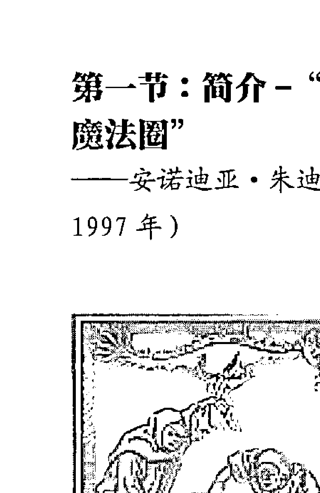

运行魔法仪式的第一步也是最基本的一步便是神圣空间的创造。仪式是一件特殊的事情，与我们的日常生活不同，它要求有高度集中的注意力。神圣空间的设置标志着此时与彼时的不同；其中的话语比起无所事事的闲聊更加有意义；其中的动作都有着重大的含义。它允许我们改变我们的意识，改变我们注意力的方向。

魔法圈是所有仪式举行的神圣中心。就像是我们混合和搅拌我们具有魔力的长生不老药的大汽锅，魔法圈会形成一个精神屏障以阻止有害的能量的闯入，同时也让内部的魔法能量得以持续直到转变完成。就其本身而言，魔法圈就像是处于不同世界之间的一个地方——一个位于普通的时空流之外的地方，还是一个不可避免地会影响这个时空流的地方。因此，魔法圈非常重要，它是所有仪式必要的基础。这就意味着摆放魔法圈的空间为了仪式需要变得圣洁而且神圣，也意味着在魔法圈内的所有语言和行为都需要尽可能地小心谨慎，还意味着仪式过程中存在着特定的规范以保护魔法圈的圣洁。

规则之一便是完整的爱和完全的信任法则（the law of Perfect Love and Perfect Trust）。这就意味着我们一般情况下要以这样的感情和态度来对待所有的成员和仪式，这样我们才能进入魔法圈。也就是说我们同意在信任的氛围下敞开心扉，以虚心的态度对待每一个人，而且不会背叛魔法圈内任何人的信任。如果我们以这种方式不能进入魔法圈——例如，如果我们与仪式圈中的某个人有过激烈的争吵——这样我们就根本无法进入魔法圈。

因为在我的地母圣会中，我们通常会将我们的魔法练习称为“HOME 烹饪术”，我喜欢使用类似于烘焙蛋糕的词语来代表创建一个魔法圈的各个程序。在烘焙蛋糕之前，清洗案台十分必要。我们都不愿意在一个摆满了昨天留下的杂乱脏盘子的案台上准备食物。这就相当于要净化我们即将使用的魔法空间，同样还包括了驱逐不需要的能量，或者就是简单地打扫地板，拔去电话充电器插头。这样便清理我们想要工作的场地，同时也让我们的工作进行得更为顺利。接下来便是创造魔法圈的时间。这就像是从装满作料的大碗中取出作料，这样我们就可以将它们混合在一起了。这样一来，魔法圈便成为了装满能量的大汽锅，直到它们能够充分地转化。这种容器是通过铸造魔法圈而形成的。这样就划分了一个有形的区域，并将其清楚地定义为神圣空间。你甚至可以使用粉笔和面粉在地面上或者地板上画出这样一个区域。通常来说我们使用魔法工具在空中划出这样的区域，比如魔杖或者仪式刀。但是你仍然可以就在你的想象王国中创建一个这样的区域。

只要我们有了一个可以施展厨艺的干净的碗以及一个干净的空间，我们便可以根据我们选好的食谱，用我们的作料尽情发挥。对于烘焙蛋糕来说，便需要鸡蛋、面粉、牛奶和糖。对设计魔法圈来说，这就包括四大元素和四个基本方位，诸神和精灵，以及其它的符合这个仪式目的的任何物品。这些材料被召入魔法圈中并“搅拌”在一起。那些被召唤进入魔法圈的诸神便是专门用来烘焙出美味可口的蛋糕的魔法。但是仅仅按照食谱来进行是不够的; 天资高的厨师会加入一些特殊的香料使得自己烘焙的蛋糕更加独特。诸神是在我们内心想要与之取得联系的具有代表性的元素，并且会影响我们施法效果。这种神圣的本体无法控制，但是却可以通过祈祷邀请他们的现身。

接下来就要开始工作了。这一步开始于我们将所有的作料搅拌在一起。我们是像调和蛋白那样搅打，还是像大理石纹奶油蛋糕那样将其轻轻重叠在一起？我们是不是要在加入之前先将一些东西单独混合？这些都是仪式中最具创造力的一个环节，也是魔法真正的精华。然后我们需要为了将原料转化成一些新的东西提高能量。在烘焙蛋糕时，这一步也就是我们将蛋糕放入烤箱中并且将温度调高。在魔法圈中，也许就是击鼓和舞蹈、念咒、冥想或者将能量集中在象征性物品上。当我们施加能量的时候，就像烤箱发出来的热量一样，转化就此开始了。在此之后，便需要一段冷却时间。如果可以坐下来吃了，那么蛋糕也就做好了，而举行仪式时通常会利用这个时间来分享食物、酒水，并且一起讨论之前收集的能量将会怎样反馈其效果。

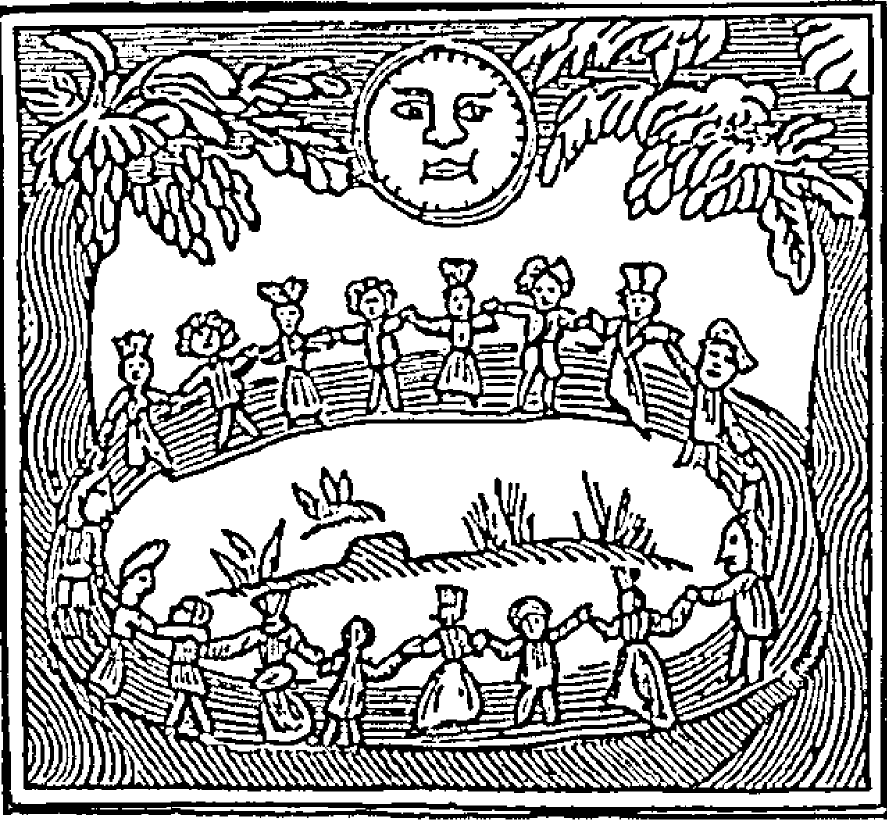

一旦冷却完毕，就可以将蛋糕从盘子中拿出来。它会保持它的新造型，而且可以拿到厨房外与家人分享。在魔法仪式中，这就意味着魔法可以以任何你想要的样式发生，你也可以移除魔法圈，让魔法去到任何它想去的地方。蛋糕被吃完了，作料也收起来放好了，而仪式也结束了。

### 第二节：仪式结构

以下是一种基本通用的仪式结构的大纲，通常适用于很多的魔法圈仪式，在美国、欧洲、英国和澳大利亚的很多魔法仪式中都很受欢迎。如果你学会了这些模式，你便掌握了几乎所有地方的任何魔法仪式结构，以及它们无穷无尽的变体。市面上有关这种基本模式变体的套书、磁带、CD，里面有不计其数的不同的咒语、符咒以及祈福语——其中有很多都是以歌曲和诗歌的形式。我罗列在这本书中的内容都是一些样本。魔法仪式中最好的一点便是它们具有很多的创造空间！

- 1. 驱逐/净化（随意；不是所有的仪式都会用到）
   - 烟熏
   - 或者：B. 洒水（用盐水）
- 2. 接地（随意；不是所有仪式都会用到）
   - A. 引导冥想（“生命之树”）
   - 或者：B. 肢体运动
- 3. 创建魔法圈（顺时针 [ 与太阳运行方向相同 ] “安置”；逆时针 [ 与太阳运行方向相反 ] “移除”。仪式过程中的所有移动都要依照创建魔法圈时的方向。）
   - 使用仪式刀或者魔杖划出魔法圈
   - 或者：B. 所有人围着周边跳舞
   - C. 念咒/唱歌
   - D. 可视化
- 4. 划分四个区域
   - A. 东（气）
   - B. 南（火）
   - C. 西（水）
   - D. 北（土）
   - 随意：E. 至上（或者圣灵）
   - F. 至下（或者无底洞）
   - G. 中央（或者仙境）
- 5. 召唤神明和幽灵
   - A. 女神
   - B. 男神
   - 随意：C. 祖先
   - D. 动物图腾
   - E. 较高自我
- 6. 目的陈述
   - 阐明仪式的意图
- 7. 施法
   - 象征和 / 或者代表仪式的元素。
   - 在选定的元素之间的进行戏剧表演、治疗、转化或者能量聚集（这是最具创造性的部分）。
- 8. 能量的收集和释放
   - A. 念咒以及 / 或者击鼓
   - B. 舞蹈
- 9. 圣祭仪式
   - A. 填充 / 赐福以及共享
     1. 食物（蛋糕，面包，水果等等）
     2. 酒水（水，果汁，酒等等）
- 10. 暂停（hiatus）
   - A. 冥想
   - 或者：B. 讨论（“神圣的胡扯”）
   - C. 沉默
- 11. 致谢和元素与精灵的释放
   - A. 神明 / 精灵（与召唤时的顺序相反）
   - B. 方位 / 元素（与祈祷时的顺序相反）
- 12. 打开魔法圈（与创建时的方向相反）

> 注意：在仪式开始之前通常会有个人的仪式准备。这些准备包括安静地冥想、净身、斋戒、舞蹈、全身舒展等等。魔法圈通常以顺时针的方向画圆，从东方开始，除了夏末节和五朔节之夜。为希腊仪式准备的魔法圈，魔法圈和四大区域的划分和命名是逆时针的，从西方开始。在南半球、方位、移动方向以及四季安排通常都与这里表述的相反。

### 第三节：准备工作

几千年来，巫师和魔法师都在使用魔法圈来定义我们施展魔法的区域。这里面有很多原因：圆最终会走向自己，因此它是整体、绝对以及完美的象征。因此，它代表了天与地形成的对比，或者是精神与物质形成的对照。在圆与轮之间有着亲密的联系。作为一根无止境的线，它象征着时间和无限的空间。

当魔法圈是由一件魔法工具画就的时候，它便形成了一个保护性的屏障，对抗着外部的消极性，同时也是在内部聚焦了个人或者集体能量的圆圈。在刚开始的时候使用胶带或者绳索在地板上标记出魔法圈，或者如果是在户外的话，可以用你的仪式刀在地面上刻画出来。我们在长满草的公园里甚至会用石灰画魔法圈。这些都是一些有助于将你的注意力集中在适当的界限上的直观辅助工具。将你的扣带当做一个圆规，扣带上的绳结测定半径便可以画出一个圆（详情请参考课程之三第三课第四节：“扣带”）。

魔法圈的大小很大程度上取决于参加仪式的人数。对于独居者而言，3英尺或者5英尺圆正好；对于一些小团体，9-13英尺就可以了。魔法圈中间还应该为一个小型圣坛留下足够的空间，同时留给参与仪式的人的空间也要足够他们在里面自由移动。

### 净化圣殿

如果你将要使用的房间或者区域通常是用于一些世俗活动（例如起居室），你可能想要在仪式开始之前净化你圣殿内所有消极的思想和振动。在一个小碗中装一些水，再用你的仪式刀加上一汤匙盐，与水充分混合。从东边开始，用一小支药草（迷迭香、罗勒、丁香花或者松树）将盐水以顺时针的方向洒在房间的四处，口中念诵：

> 水和盐，你们所到之处
不再有符咒或者敌对意志的存在
那些东西与我并不相符
如我所愿，定将应验！

然后点燃一束鼠尾草或者香柏，从东方开始，将其以顺时针的方向在房间里绕圈（我们将这些焚香放在鲍鱼壳中），将烟雾用羽毛扇或者鸟儿的翅膀扇往每一个角落，同时念咒：

火和气，我赋予你们魔力：
在你们出现的地方不再有
幽灵
那些东西与我并不相符。
如我所愿，必将应验！

在你做这些的同时，用你的心灵之眼在脑中显现所有消极想法和振动的离开，而且只有圣灵的纯白光芒才能散布在这个区域中。现在，你的圣殿准备好了，可以举行你想要的任何仪式或者施展所有的魔法。

### 第四节：烟熏和接地

当所有人都进入到仪式区域，或者在每个人都在魔法圈中集合以后，我们通常会在摆放在魔法圈周围鲍鱼壳中的焚香烟雾（通常是鼠尾草或者香柏）中接受烟熏，而且会用羽毛扇或者鸟儿的翅膀将烟雾扇到每个人的身上。这可以帮助净化我们个人身上所携带的任何我们不想带入魔法圈的能量。

接地是为了和谐魔法圈中每个人的能量，并且将我们所有人与地球的振动场和谐一致。在我的教会中，我们会使用一种名为“生命之树”的接地。我们站成一个圆，闭上我们的眼睛，将我们想象成森林中的树。领导接地仪式的人会说一些像这样话：

> “想象你是一棵树。将你的双脚牢牢地种植在地面上。现在将你的根深深扎入大地。感受你脚下冰冷的土层和岩石。感受其他植物和树木的根系，随着你根系的延伸，你穿过你祖先的骸骨，穿过一层层的时代，往下，再往下，直到大地母亲熔化的地心。现在，通过你的根系将热量吸上来，进入你的树干之中。感受她向上流淌经过你躯体的生命力量，在你的体内注满妈妈的魔力。现在，将你的枝干往上延伸，一路向上，将你的树叶伸往太阳，伸往千万亿个太阳，并且从宇宙中将宇宙辐射吸入体内，在体内与你从地心中吸收来的热能相遇。感受你自己的体内充满了光和生命，还有那天空和大地的混合能量。深吸一口气，吐出来，然后回到原地！”

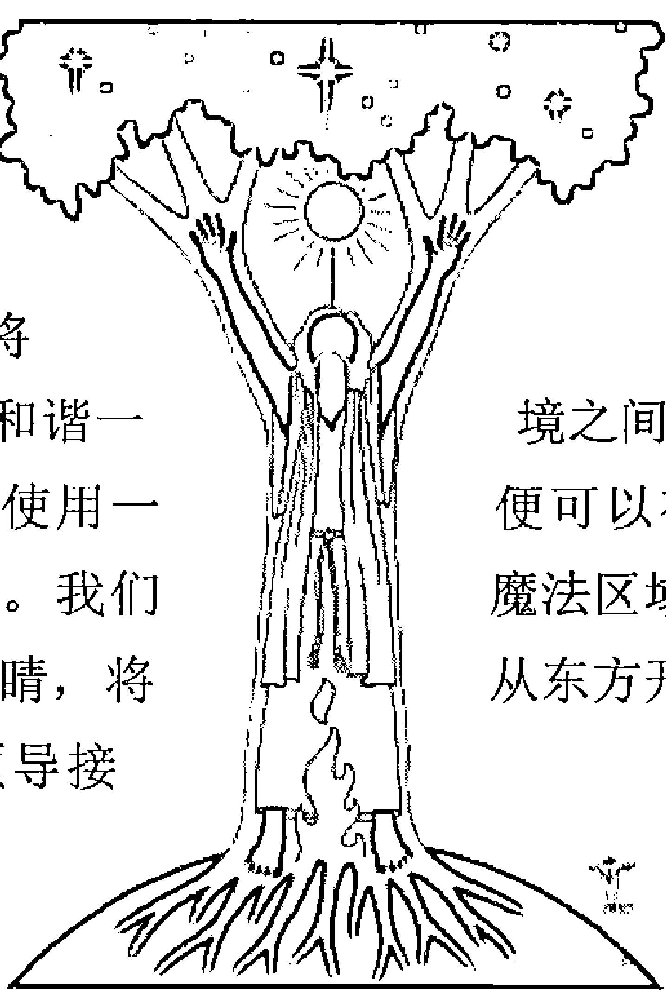

所有人睁开眼睛，仪式开始……

### 第五节：创造魔法圈

魔法圈是位于世俗世界和仙境之间的空间。通过“创造魔法圈”便可以在这个空间的周围创建一个魔法区域。你可以沿着魔法圈的边沿，从东方开始顺时针行走来造就这样一个区域，同时念诵这样一些咒语：

魔法，魔法，无处不在
在地面上，在空气中！
魔法将我们的魔法圈封印
起来
在那些应该受约束的世界
之间！
环绕三次，四处走动三次
内部世界，外部世界！

从地面向你的头顶上方划一条线，像拉链一样拉开，跨步。不要忘记关上你身后的门！

### 第六节：召唤四大方位

创建魔法圈的人会手持一根魔杖或者一把仪式刀，并用它在四周画一个完整的星光体光环（每个人都应该看得到，就像紫外线或者闪电）。这个光环应当包含魔法圈中召集的能量，直到它们应该被解散的时刻。魔杖或者仪式刀在开始的时候应该在东边的那个点接触地面，然后举到与肩膀同高向外直指魔法圈的边沿，这样一来会在空气中留下刀尖的痕迹。当魔法圈完成以后回到东边，便需要再一次地将魔杖或者仪式刀的顶端接触地面，这样魔法圈的接地仪式便完成了。

和时钟钟面一样，魔法圈也是一幅有关时间和空间的地图。如此说来，它便有着指南针的四个点：北、南、东、西。每一个点都有着特殊的关联，或者符应，我们需要这些方位来了解自己的位置，是什么时间（请参考课程之三第六课第四节：“方位和元素”）。每一个方位都与一种元素联系在一起：东=气、南=火、西=水、北=土。这些召唤（也许是以咒语和歌曲的形式）的词语都是基于这些符应，因此它们对你来讲应该很熟悉了。

用圣坛上的一种物品来代表每一种元素是一种习惯。很多人就只是用他们的与四大元素有关联的魔法工具来代表。但是你还可以使用羽毛、铃铛或者焚香来代表气；蜡烛代表火；水或者贝壳代表水；水晶、石头、晶球、盐来代表土。在我的教会中，我们通常会在魔法圈的外围摆放一些小型的圣坛，每个方位一个，然后我们会用合适的象征符号和颜色来装饰圣坛。在夜间的仪式中，这些通常还包括点燃彩色玻璃杯中的蜡烛；黄色代表气、红色代表火、蓝色代表水、绿色代表土。

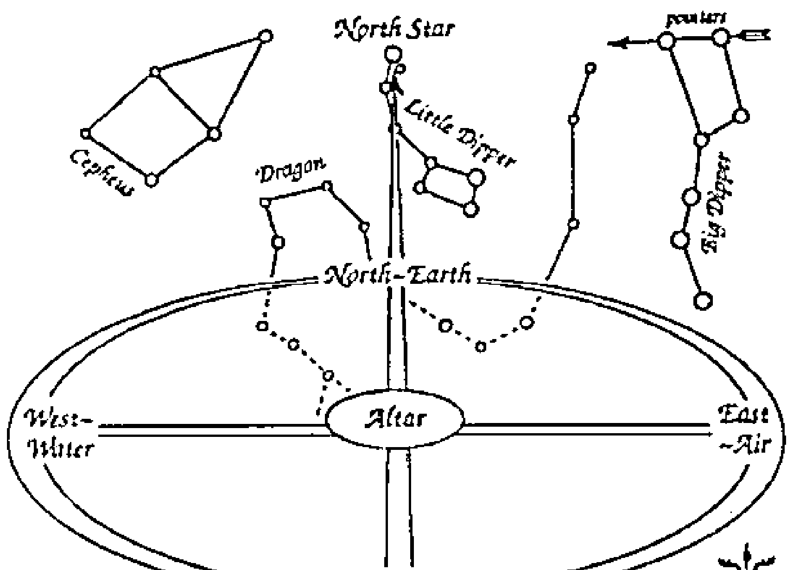

一旦魔法圈创建完成，如果没有划出一道门是不可以随意进出的。要划一道门应用魔杖或者仪式刀，从地面开始画一条向上的线，直达顶部，然后在另一边往下一扇你可以穿过的门。或者你可以直接从地面向你的头顶上方划一条线，像拉链一样拉开，跨步。不要忘记关上你身后的门！

如果魔法圈中的人数足够，我们会让不同的人召唤不同的方位，但是如果魔法圈很小（或者是一个人的仪式），那么就可以由一个人来召唤四个方位。我们一直都从太阳升起的东方开始，顺着顺时针方向——除了夏末节和五朔节之夜（五月前夜）我们会从西方开始，并且顺着逆时针的方向。我们有独特的手势，或者马德拉舞，在此期间我们在每一个方位上怀抱双臂以与每种元素的本质产生共鸣。对于小型魔法圈而言，做这项工作的人会站在那个方向上，面朝魔法圈外。但是对于非常大的魔法圈来说，“呼喊者要站在相反的方向，面向魔法圈的对面，这样每个人都能看见他也能听见他的声音。

东：呼喊的那个人面朝西方，举起双臂，像翅膀一样打开向外伸出，掌心向上，手指分开。其他所有人都要以同样的姿势面向东方。祷告者要说类似于这样的话：

> 啊，东方翱翔的雄鹰，变幻多端的驭风者，从远于日出的地方赶来，带给我们灵感！万岁，欢迎到来！

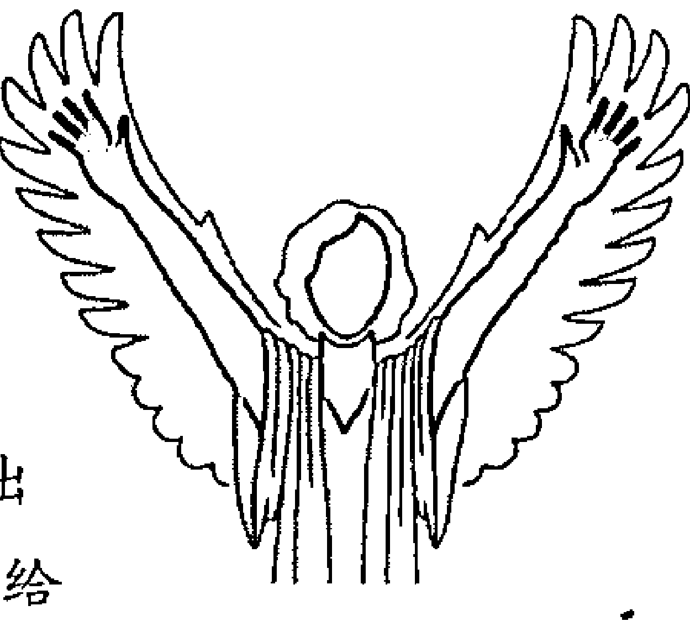

其他所有人也跟着高呼“万岁，欢迎到来！”这时候便可以点燃焚香和/或者黄色的东方蜡烛，摇响铃铛。

南：然后所有人转向南方，四指尖和大拇指尖放在一起形成一个峰状，做成一个像火焰一样的三角形。南方的呼唤者要说一些这样的话语：

> 啊，燃烧的南方的金狮，火焰和闪电的统治者，来我们的魔法圈带给我们启示吧！万岁，欢迎到来！

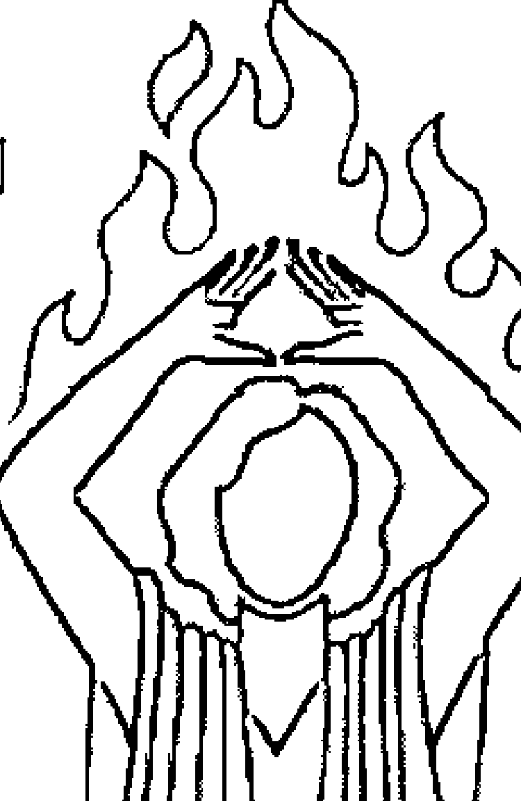

红色的南方蜡烛可以点燃了。如果你们在室外，而且有一个火盆或者中央篝火，现在也可以点燃了。

西：现在我们转向西方，仍然将我们的双手的指尖放在一起保持三角形状，将它们放下来到腰部的位置，就像一个水杯。召唤者这样说：

> 啊，西方海洋中的巨鲸，从你的海底深处来我们这里教授我们变通吧！万岁，欢迎到来！

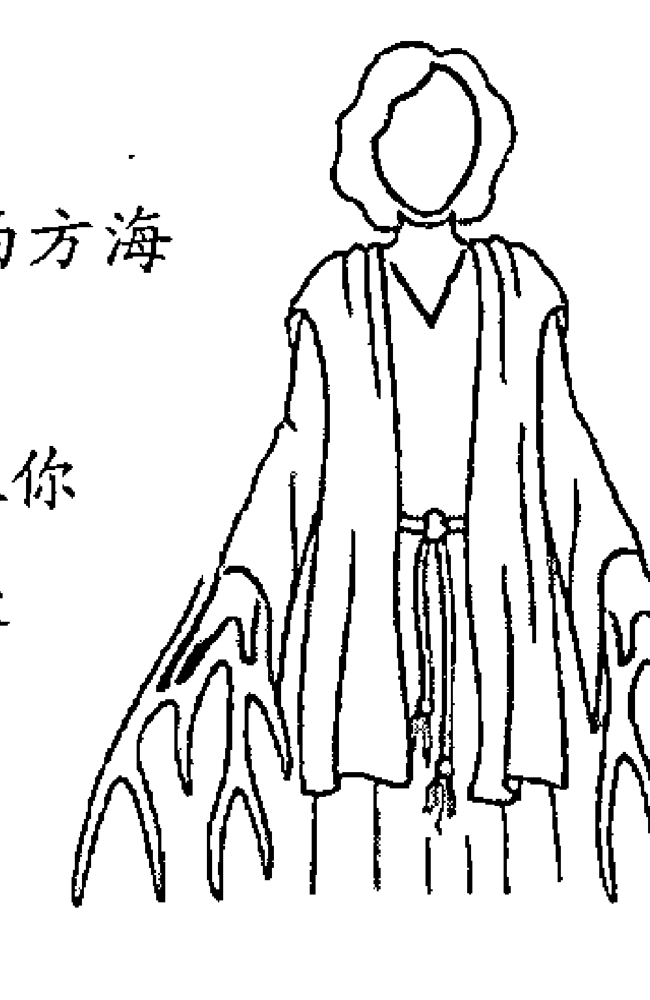

将一杯或者一贝壳的水洒在地上，并且点燃蓝色的西方蜡烛。

北：最后我们要转向北方。双手放下，向体外延伸，掌心向下，就像树根一样向大地延伸。召唤者说：

> 啊，冰封北国的强大公牛，从你的冰天雪地和崇山峻岭中来我们这里教授我们坚定吧！万岁，欢迎到来！

将盐撒在地面上，点燃绿色的北方蜡烛。

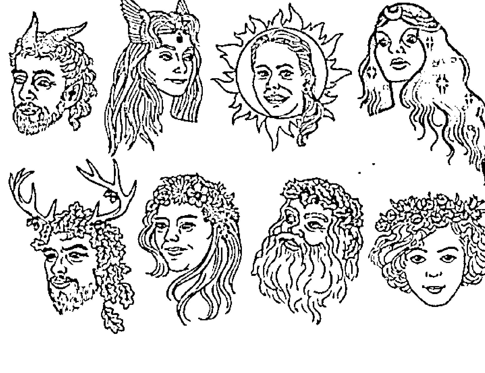

### 第七节：祈求神灵的帮助

现在，进入我们聚集的魔法圈中，邀请诸神加入我们，为了在他们的赐福和保佑下我们的魔法能够成功施展。因为从根本上说，仪式是一种精神体验，精神力量的祈祷是很平常的。只要以适当的形式，我们都可以祈求神灵的帮助——例如，召唤赫尔墨斯来协助我们施展魔法；或者召唤布里吉德带给我们创造的灵感（请参考课程之七，第二课：“所有国家的天神”中的诸神和他们的符应）。天使、祖先的灵魂，动物图腾，仙灵，或者任何我们想要召唤的物质。在 HOME，我们通常会为了某个仪式让大家将自己打扮成神灵的样子；在此我们展现的一些画像就是一些我们的人打扮成神灵的样子。

一些魔法从业者将这些神灵仅仅看作是代表了人类意识的不同方面的象征。然而，在我看来，不同文化的万神殿（神灵家族）中的神明、天使、图腾以及其他的神灵都是非常真实的人物，就像我们一样。他们每一个人都有他们自己的故事、历史、贡献，而且最重要的是，他们自己的日程（计划）——这一点可能与我们不一样！他们和我们之间主要的不同便是他们超越肉体的存在——肉体的独立——因此不朽。然而，他们并不是无所不知的人（全知）或者无所不能的人（全能），即使他们的确知道一些我们凡人所不知道的事情，也有着我们凡人所没有的影响力。如果我们想要和他们发展一种真实的关系，我们就要像对待他人一样，也必须尊重他们，把他们看做真正的人。

你想要邀请哪位神明加入你的魔法圈，这一点完全取决于你自己，没有谁真正地完全正确，只有做事方法的问题。无论什么，只要管用而且感觉正确那就是正确的。许多仪式会同时召唤男神和女神，就像你可以同时邀请你的妈妈和爸爸一起玩耍，一起观看你参加的音乐会和足球赛一样，当然，也存在着很多不同的男神、女神，以及其他的神灵可供选择。有史以来，每一种文化都有其自己的神灵家族，我建议你研究一下这些不同的文化并且熟知他们。

当然，神灵一直都存在于我们周围，就像无线电波和电视传送信号一样。我们所要做的事情就是让自己善于和他们交流，或者在这个特殊的时间和地点与他们取得联系。这一点就很像是打开你的电视，然后选择一个你想看的频道。这需要祈祷来完成，和召唤方位相似，我们要身着神明和圣灵的服装，表现出我们可以是朋友或者亲人的样子，并说一些这样的话：

> 啊，最亲切、聪慧、漂亮、强大、挚爱的等等）的（名字），（属性……）之（真主，圣母），我们邀请你进入这个魔法圈加入我们的魔法运转。将你的（智慧、力量、灵感、勇气，等等）带给我们，并赐福于我们吧。万岁，欢迎到来！

当然，其他人也要跟着呼喊“万岁，欢迎到来！”在呼喊的时候，同时点燃中央圣坛上代表此神灵的蜡烛。

## 第八节：施法

现在我们就抵达了仪式的关键部分：施展魔法！魔法是“一门增加可能性的艺术”。我们通过将我们个人或者集体的全部能量集中在同一个方向，然后施展魔法，就像激光束一样，以改变可能性的模式，这样，我们希望发生的事情就更有可能发生。魔法的力量来自我们的意志。当我们施展魔法的时候，我们从不会说“我希望这样那样发生”，或者说“我想要这些这些会发生”。我们只说“定将应验！”用仪式语说便是“它必将如此”或者“必将应验！”——魔法圈中的每个人都要重复这样的话。

在魔法圈中施展魔法有几个步骤。首先，宣告意图，此时我们要将施法的目的解释给所有人听并获得他们的同意。然后便是升起力量之球，每个人的力量都结合在一起成为一股强大的力量。接下来便是释放力量，将力量释放出来以完成魔法运转。最后便是聚在一起冥想，同时恢复一下我们刚才消耗的能量。

## 宣告意图

使用魔法的目的是将事情变得更好。我们大多数的施法都是为了治疗——治疗我们自己，彼此治疗，以及治疗地球。另一个目的便是保护，和平，或者公平。找到爱情，好的工作，找到家，或者一些问题的答案这些也都可以作为施法的目的。此时此刻，在仪式过程中，重要的是决定好你们所聚集的能量将会用来做什么，同时还要将这个目的表述清楚。这就是你们对意图的宣告。通常，宣告意图会在仪式还未开始之前决定好并且写下来。

有时意图的宣告可能会由一个人决定（尤其是当你举行一个人的仪式的时候！）。最好的办法就是以简短符咒的形式将意图写下来——尤其是以简短的押韵对句的形式会容易在聚集力量的时候记住。（举一个简单的例子，你可以这样写：“将我的爱人带到我身边，如我所愿，必将应验！”）在其它时候，魔法圈内的每个人可以轮流陈述他们想要完成的事情。然而，只有每个人都将注意力集中在一个相同的目标上，将集体的能力集中在一起才最管用。如果有的人真的想要对不同的事情施法，这些施法就应该在不同的仪式中完成。

在每个人都同意了，意图也大声表述清楚，并且说完“如我所愿，必将应验！”之后，每个人都得重复“必将应验！”

## 课程之四：仪式

## 积聚和释放力量

如果你是一个人开展仪式施展魔法，那么积聚和释放能量最好的办法之一便是通过火的气息（Breath of Fire）。你坐在中间的位置，尽你所能地快速而且深深地吸气和呼气。在脑中不断地重复你的意图或者咒语，同时在脑海中可视化你想要的东西。慢慢地开始，然后越来越快越来越快，直到你感觉你好像快要爆炸了。最后，当你不能再承受的时候，将最后一口气吐出来并大声喊：“必将应验！”将你的思想和可视化的场景抛到九霄云外，就像你在投掷标枪一样。然后只需躺倒在地上直到你有力量再次坐起来为止。

在集体仪式的时候有一种最受欢迎的集聚能量的方法便是圆圈舞。每个人都将意图记在脑海中，手牵手，围绕着魔法圈顺时针舞蹈，速度越来越快，以“葡萄藤”舞步的方法里外不断交叉步伐，就像这样：

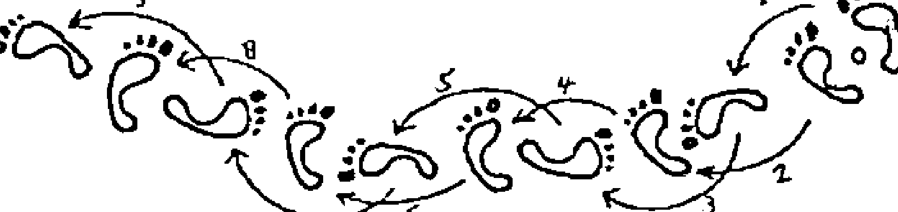
“葡萄藤”舞步

在你舞蹈的时候慢慢地将你的双手举起来，直到最令人兴奋的时候将它们举上头顶。同时，想象一个圆锥形的明亮的能量之光在魔法圈中的每一个人的周围形成，并向上升得越来越高就像是一个倒置的龙卷风。或者，如果施法是为了创建一个保护的咒语，那么你就想象你们结合在一起的能量向外展开形成一个巨大的圆屋顶——一个伞形的防护盾，它的外侧就像是镜子的表面，能够将所有不利因素反射出去。

对于集聚能量的圆圈舞来说，紧跟节奏的击鼓声是必不可缺的（或者你可以播放一张节奏性很强的CD！），而圆舞曲会帮助创造出平稳的精力。这儿有一首我最喜欢的歌曲，我用过，而且发现它十分有效：

- 围着篝火舞蹈
- 集聚力量之源
- 完成我们心愿
- 必将应验！

不断地重复这段话，声音越来越大，速度越来越快，直到你不能再大声，也不能再快。然后停在最后那句“必将应验”上，竭尽所能地大声喊出“验——！”，放开你们紧握的手，就像你要将你的双手抛进天空一样，将所有的能量释放出来用于完成你的意愿。在脑中想象圆锥形的顶部就像火山一样爆发，发射出一股力量光束去往你想要它去的地方。然后每个人回到地面上，进行接地仪式，让大地母亲的力量和爱流回你的身体。

如果在魔法圈中魔法的施展是为了治疗某人，积聚的力量就不能发送出去，而应该注入你们想要治疗的那个人身上。这时，每个人都应该将自己的手放在接受治疗的人身上，将治疗能量推入他体内，或者将疼痛和疾病拉出来，这样做功效十分强大。在脑中想象一股温暖的红色光芒在你体内发热，并通过你的双手向外延伸，就像你在电影中看到的那样。在你将能量输送给他人之前，使用快速的深呼吸将你自己调整到最佳状态。

## 围坐在一起冥想

在你积聚并释放了这么多的能量之后，通过一次简单的冥想将你自己的能量带回体内这一步必不可少。以冥想的姿势坐下，凝视圣坛上中央蜡烛的火焰，或者如果你是在户外举行的仪式并且堆放了篝火的话，你可以凝视着篝火火焰。让你的大脑放空所有的思想，尤其是你刚刚完成的施法，只留下一种念想，那就是火焰。几分钟之后，当你感觉完全平静下来，而且放松了以后，你可以慢慢地开始发出低沉的声音“呼”，将你的声音和其他人的声音融入一起成为一种和谐的低吟：“Auu-ommmmm……”，在完成调息以后渐渐消失。

## 第九节：共享

魔法和生活一样，重力（沉重的东西）和浮力（轻的东西）之间的平衡非常重要。在积聚和释放了所有的能量以后，我们现在转向仪式中轻松欢乐的部分：共享（“分享”）以及神圣的胡扯。在圣坛上你应该摆放一个盘子（或者使用你的五芒星盘）以及一块还未切开的圆面包。

共享通常始于圣礼的献祭。献祭意为“为我们的享用赐福”。这很像在吃饭之前的祷告，除了在魔法圈中已经有了神灵和我们在一起，我们不需要再向他们祈求赐福。他们通过他们的出现赐福于我们以及我们所做的所有事情。相反的，我们将我们的食物和酒水赋予了神灵，记住我们的食物和点心不仅来自于他们，而且事实上就是他们的一部分，而且也即将成为我们自己的一部分。

## 献祭

献祭圣礼可以使用仪式刀和装满了水、果汁或者酒（所有的这些都适用于所有的仪式，而用哪一种取决于你的喜好）的圣餐杯完成。这部分代表了带来所有生命的男性力量和女性力量。通常来讲，由一位女士双手握住圣餐杯，同时由一名男士在其上方握住仪式刀。但是如果你是一个人在举行仪式，你应该用你的左手握住圣餐杯，右手握住仪式刀，然后自己念诵这些话语。男士将仪式刀放低插入圣杯中，同时说：“仪式刀代表男性……”

女士接着说：“圣杯代表女性。”

男士回答：“放在一起它们便成为一个整体。”

接下来你们要同时说：“世界上没有比爱的结合更为伟大的力量，因为它创造了一切生命。感谢上苍！”

现在，用你的仪式刀切面包，念诵一些这样的话语：

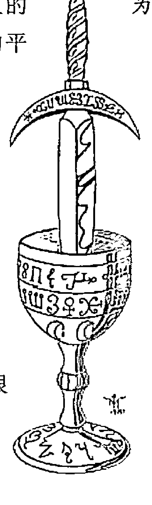
- 我们唤醒了生命自身的种子
- 通过太阳散发出来的热量。
- 从而我们接受了它的喂养。
- 我们吃着面包。
- 喝着酒。
- 我们感受到了他们的生命在我们的血管里流动。
- 我们得到了赐福！
- 上苍保佑！
- 我们得到了赐福！
- 所以让我们将我们的爱赐予神灵。
- 我们得到了赐福！
- 我们将爱赐予神灵。
- 愿你永不饥饿！

拿起一块面包然后递给下一个人，每个人都要对下一个人说：“愿你永不饥饿。”
然后用以下的话语祝福圣餐杯中的酒水：

> 一切生命都起源于水；
> 通过水我们可以重生。
> 共享水就是共享生命。
> 愿你永不口渴！

喝一口，然后递给下一个人，每个人都彼此重复：“愿你永不口渴。”

## 共享

当面包和酒水绕弯一圈时，你们要轻声地吟唱或者念咒，例如：“太阳之主，地球之母，我们是宇宙中拥有能量的一员！（ Lord of the Sun, Lady of the Earth, We are one with the energies of the Universe! ）” （如果你是一个人进行这个仪式，只需在沉思寂静中吃面包喝酒水。）

这种共享筵席（Communion Feast of Fellowship）是一种古老的传统，是世界上几乎所有文化中神圣的一部分。在魔法圈中分享食物和酒水是在提醒我们分享我们的生活和我们的意图。同样的，因为地球上的一切事物都是大地母亲自己身体的一部分，这种圣礼提醒我们，我们所吃的喝的一切东西都是神圣的，因为这些东西都真的是大地母亲的血肉，我们吸收进我们的体内以后便成为了我们的血肉。我们同样将上帝尊崇为太阳神和绿人，我们要记住就是他的太阳光提供了能量使所有的植物得以成熟，他在秋天的时候被砍倒并被收获的谷物所替代，做成面包滋养我们成长。那就是为什么我们将在魔法圈中分享食物和酒水称为圣礼。它们经过了献祭，因此变得神圣，或者圣洁，充满了神圣气息。我们同样也记得我们的肉体也是神圣的；我们的生命同样也充满了同样神圣气息。

## 神圣的胡扯

在面包和酒水围绕魔法围绕弯一圈之后，它们仍然在继续往下传递着，而此刻被称为是神圣的胡扯，这个称呼最先是金色黎明新改革派正统协会使用的。这是用于通知和传递信息的时间（但是并不是学校中的、电视节目上的或者其它世俗的胡扯！）。而我们可能会讨论决定下次聚会的时间和地点，我们可能还会分享咒语和知识，以及谈论一些其它的魔法事务。这个环节甚至会成为一个诗歌传唱的时间，魔法圈内的每个人轮流唱一首歌，背诵一首诗，或者讲述一个故事或者笑话（请参考课程之四第三课第四节：“仪式的种类：诗歌传唱”）。

## 第十节：仪式的收尾

## 仪式致谢

这个充满魔法的夜晚我们已经接受了到场神灵的赐福。他们已经成为了我们特殊的朋友，我们现在必须感谢他们的到来，然后跟他们说晚安。如果不同的人召唤了他们，那么就要由召唤他们来的人跟他们告别，与召唤他们时的顺序相反。

## 释放四大元素

感谢和释放四大元素时同样也是按照相反的循序进行，从北方开始，然后是西方，南方，最后才是东方。这些释放（通常称为解散）同样也应由之前召唤他们的人来完成。一次一位，然后熄灭方位蜡烛。以下是解散四大元素时一种非常通用的模式：

举个例子，向三位一体天神告别要像这样说：

- 感谢带来光明与欢笑的主，
- 谢谢您在此处的赐福。
- 在此之后我们永远都是你的——
- 我们都永远追随你——
- 是你主宰了万物！
- 感谢您！
- （所有人重复“感谢您！”）

- 啊，冰冻北国的守护者，
- （水国西域；火热的南方；多风的东方），
- 我们感谢你来参加我们的仪式。
- 去吧，如果你需走；留下，如果你愿意。
- 在你离开你公正而可爱的国度之前，
- 我们向你致敬，再会！
- （所有人重复“向你致敬，再会！”）

向三位一体的月亮女神告别我们应该说：

- 银轮之女主人，
- 少女、母亲、太婆，
- 我们承受了你神秘的印记——
- 我们谢谢你，因为我们属于你！
- 感谢你。

## 打开魔法圈

我们在开始这次仪式创建魔法圈时，我们其实是在不同的世界之间隔离出了一个小小的泡沫形的神圣空间。我们现在做的最后一件事便是戳破这个泡沫，将这个空间还给世俗世界。我们将这称为“释放”或者“打开”魔法圈，而不是“关闭”它，因为我们现在要打开一道门离开。

如果中央圣坛上他们的蜡烛已经点燃，那么现在是熄灭蜡烛的时候了——用你的手指或者烛花剪熄灭蜡烛，而不是将它们吹熄。

无论是谁在最初的时候创造的魔法圈，现在都要回到东方，也就是魔法圈开始的位置。将你的魔杖或者仪式刀指向地面，围绕着魔法圈的外部逆时针行走，并说一些像这样的话：

> 魔法圈，艺术之圈——仪式结束了；现在我们要离开。这个魔法圈在世界之间建立！时间和空间向我们展开……

> (Circle of magick, circle of art— The rite is ended; now we part.)
> This Circle drawn between the worlds
> Begone! as Time and Space unfurls...)

再一次回到东方，将你的双臂向外猛地展开，说：“仪式结束。感谢各位！”所有人重复“感谢各位！”通常在许多教会中每个人还会加上一句：“好聚好散，期待再次相聚！”现在，每个人都要帮忙收拾，将所有的物品收起来，保持仪式区域的干净整洁。所有人一起拥抱，在回家睡觉做个好梦之前互相道别。

## 第五课：魔法时间

> 万物都有定期，天下万物都有定时。生有时，死有时，栽种有时，收获所种也有时……
> ——传道书 3:1-8 节（《钦定本圣经》）

### 第一节：简介 – 把握时间才能拥有一切

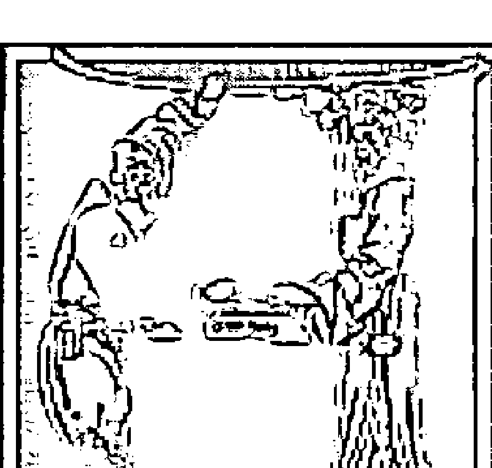

就像生活中的所有事情一样，施展法术和举行仪式总会存在有利时机和不利时机，你能利用越多的有利时机，你的魔法便会越强大。这并不意味着在振动不是很恰当的时候你就不能施展法术或者举行仪式，只是说你需要寻找一些施展魔法的理想条件。在这些时间期间，你要好好利用宇宙中天然的机缘和气流，而不是与它们相互对抗。
然而，如果你有一些非常重要非常紧急的事情要做，你可以依仗我在下面第六节会讲到的行星时刻表格的帮助好好地规划。

### 第二节：月相，时间和季节

魔法施展两个最重要的考虑因素便是月相的盈或者亏。月亮既是你施展魔法的时钟也是你的日程表。一个有益的并且具有建设性的工作，同时还要赋予护身符或者仪式刀力量，这些通常都要在月亮渐盈的时候完成。最强大的力量居于第一个和第二个阶段之间，那时月亮正在迅速地变圆。当月亮渐亏慢慢变暗的时候，正是一种举行更加自然的毁灭性的魔法和仪式的最佳时期。死灵术（与死者交流）、困缚和摧残咒语，以及所有有关麻烦和欺骗的法术都要在亏月期间完成。月黑之时，是最不吉利的时刻，是专为有限额的毁灭和死亡准备的。

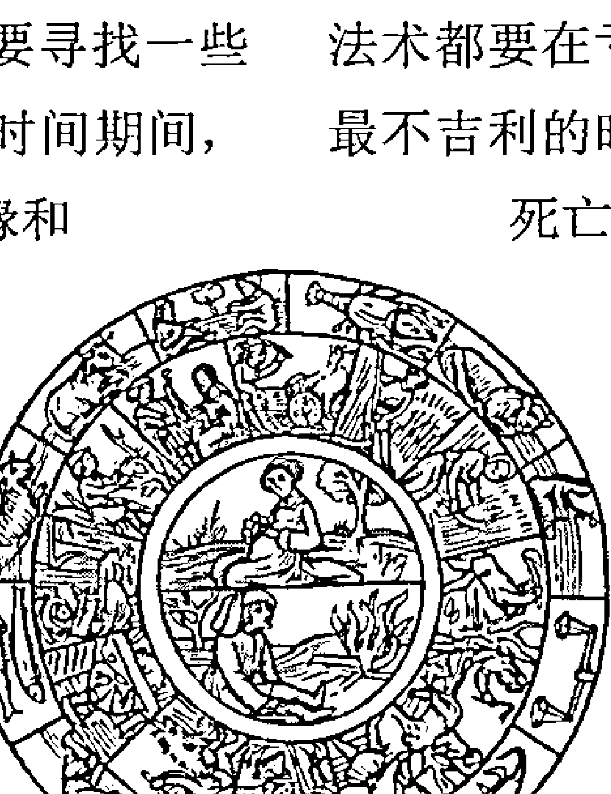
建设性的魔法是为了繁殖和建造施展的，比如健康、财富、成功以及前进。
毁灭性的魔法与事物的终结和摧毁有关，例如风流韵事、坏习惯，或者一种生活方式。


仪式或者咒语是在白天还是夜晚释放这一点非常重要。通常来讲，为了积极和有益目的的仪式（例如治疗）是在白天举行——在中午之前更为适宜，这样你便拥有好几个小时的阳光来促发能量的产生。在夜晚进行的施咒通常是为了迷惑，或者为了将你的意愿和优势强加在他人身上（就像赢得一场争论或者一次竞赛）。这些仪式经常也会提前计划，这样接下来就会有几个小时的黑暗使得已经开始运作的气流能够持续下去。

为了预防所有的可能性，地球和太阳的节奏也要考虑进去。当然，对于每一次的仪式来说，各方面都考虑周全也许不大可能，而且通常会用在特殊的场合中，比如八大安息日。这样说来，那些会在月盈期间完成的施法可能将选择在冬至和夏至之间进行。通常适合在月亏期间完成的仪式都将在夏至和冬至之间举行。正如你所看到的那样，太阳的力量从冬季到夏季在不断增强，而从夏季到冬季期间却在不断减少。这样，太阳赠予地球的力量的强度和数量也同样地根据月相的不同而不同。

由二至点和二分点划分的四种大型的季节周期被称为四大主要时节（the Elemental Tides），而且每一个季节都有其自己特殊类型的魔法。从春分到夏至是种植的时节（或者起点）。夏至到秋分是收获的时节（或者极盛期）。秋分到冬至是规划的时节（或者预测）。冬至到春分是毁灭的时节（或者替换）。

### 第三节：黄道十二宫

黄道十二宫在各种各样的仪式举行和咒语施放中扮演了重要的角色。当然，施法可以在任何时候完成，只是特定的时间会比其它时间更加有效。下面表格中便是每一个星宫最适合的施法类型，从春分开始。

| 星宫 | 时间段 | 目的 |
| :--- | :--- | :--- |
| ♈ 白羊宫 | 3/21-4/20 | 治愈疾病；获得演讲口才；赞同和荣誉。 |
| ♉ 金牛宫 | 4/21-5/21 | 治愈高烧；变得亲切和蔼，忠诚，虔诚。 |
| ♊ 双子宫 | 5/22-6/21 | 身体健康，获得友谊和幸福；预防厌烦情绪。 |
| ♋ 巨蟹宫 | 6/22-7/23 | 赶走毒素；获得智慧。 |
| ♌ 狮子宫 | 7/24-8/23 | 治愈感冒；获得一种有说服力和独创性的本性。 |
| ♍ 处女宫 | 8/24-9/23 | 治愈高烧；受到公众认可，获得雄辩口才。 |
| ♎ 天秤宫 | 9/24-10/23 | 战胜疾病；获得友谊和幸福。 |
| ♏ 天蝎宫 | 10/24-11/22 | 激发激情和性欲。 |
| ♐ 射手宫 | 11/23-12/21 | 治愈疾病 获得公众认可和荣誉。 |
| ♑ 摩羯宫 | 12/22-1/20 | 保证人和地方的安全有保障。 |
| ♒ 宝瓶宫 | 1/21-2/19 | 获得健康和幸福。 |
| ♓ 双鱼宫 | 2/20-3/20 | 保护以免受高烧和弊病的伤害。 |

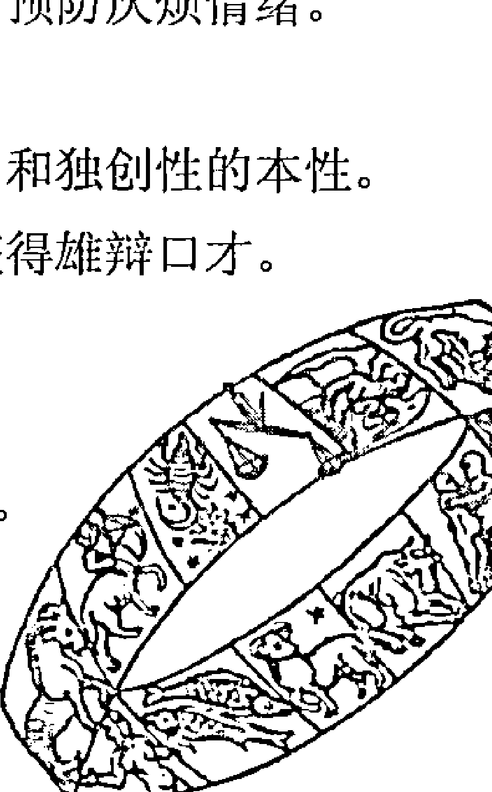

### 第四节：行星相位

七颗看得见的“行星”（包括太阳和月亮）的每一颗都有着特定的品性，可以为仪式和施咒贡献一份力量。这些品性有很多而且很复杂（参考课程之三第六课第五节：符应表格：行星），但是简略地说就是这样：

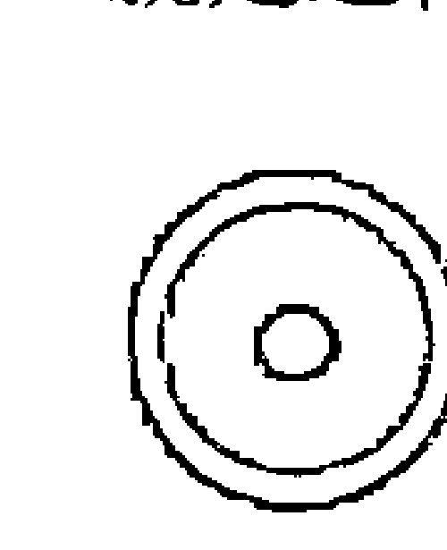
太阳（星期天）太阳带给你的是荣耀，认可，以及尊严。你的工作会进展顺利，无论你做什么都会成为个中高手。你将会获得成功，但是它也会让你不致被胜利冲昏了头脑。太阳会带来钱财和强有力的人力支持，同时会帮助你找到丢失的财物。有太阳的日子和时刻同样也有利于占卜和消除坏品质。总之，有太阳的时刻都对爱和善意的工作有好处，会带来快乐和友谊。

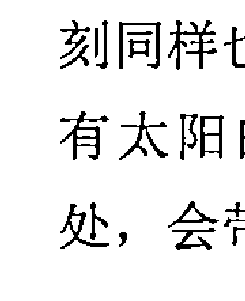
月球（星期一）月球会让你心情愉快、待人友善、幸福、受人尊敬，并且兴高采烈。它会帮助移除你心中所有怨恨或者邪恶的想法。保障旅行者的安全、货币利得、长久的健康，以及敌意的消除都是月球吉祥的方面。月亮出现的时间有利于防止盗窃以及找回被盗的物品，获得预知的洞察力，以及所有与水有关的东西（包括出海或者在河道上游泳）。同样也有利于赢得爱情、修补由口角引起的伤害、隐形、修复视觉，以及召唤亡灵。在魔法中，月球是最重要的天体。有关这一点，在你规划月下施法的时候，使用以下的代码：

对于祈求神灵保佑、找回被盗的物品，以及召唤死灵，月球应该位于土相星宫（金牛宫，处女宫，摩羯宫）。

对于爱情、荣誉，以及隐形，月球应该位于火相星宫（白羊宫，狮子宫，射手宫）。

对于各种各样的毁坏或者愤怒，月球应该位于水相星宫（巨蟹宫，天蝎宫，和双鱼宫）。

所有不能归类到以上种类中的其他施法应该在月球位于风相星宫时完成（双子宫，天秤宫，宝瓶宫）。

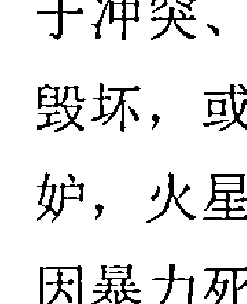
火星（星期二）火星与力量有关——狂暴的体力。它有助于冲突、毁灭，以及军事行动。通常用于毁坏，或者挑起他人的愤怒、憎恨或者嫉妒，火星同样也被用在死灵术中，用于与因暴力死亡的死灵建立联系。火星的主要概念便是一种完全破坏分子；它会带来荒芜和麻烦。但是你可以使用它吉利的方面以带来持久的力量和斗志。在体能竞赛中的荣誉和胜利，勇气，以及打败你的敌人的能力，这些都是火星有利的方面。

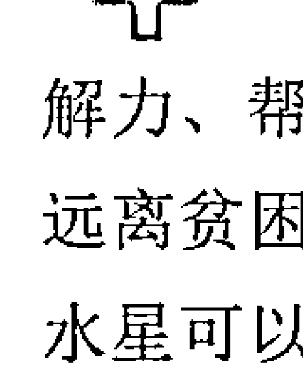
水星（星期三）水星可以让你心情愉快、勇于承担、增强理解力、帮助你做你想做的事。它可以让你远离贫困，包括物质上和精神上的匮乏。水星可以帮助提高你的记忆力和你在交流和占卜方面的能力，鼓励你去追求更高的知识和伟大的真理。水星出现的时刻有利于占卜未来、看见灵魂、预言梦境、获得知识，以及发现真理。水星会帮助任何有关经商和贸易的事情，也会带来生意、竞争和旅行中的成功。

## 白天的行星时刻（中午到午夜）

| 时间 | 星期天 | 星期一 | 星期二 | 星期三 | 星期四 | 星期五 | 星期六 |
|------|--------|--------|--------|--------|--------|--------|--------|
| 1 (中午) | 太阳 | 月球 | 火星 | 水星 | 木星 | 金星 | 土星 |
| 2 | 金星 | 土星 | 太阳 | 月球 | 火星 | 水星 | 木星 |
| 3 | 水星 | 木星 | 金星 | 土星 | 太阳 | 月球 | 火星 |
| 4 | 月球 | 火星 | 水星 | 木星 | 金星 | 土星 | 太阳 |
| 5 | 土星 | 太阳 | 月球 | 火星 | 水星 | 木星 | 金星 |
| 6 | 木星 | 金星 | 土星 | 太阳 | 月球 | 火星 | 水星 |
| 7 | 火星 | 水星 | 木星 | 金星 | 土星 | 太阳 | 月球 |
| 8 (晚) | 太阳 | 月球 | 火星 | 水星 | 木星 | 金星 | 土星 |
| 9 | 金星 | 土星 | 太阳 | 月球 | 火星 | 水星 | 木星 |
| 10 | 水星 | 木星 | 金星 | 土星 | 太阳 | 月球 | 火星 |
| 11 | 月球 | 火星 | 水星 | 木星 | 金星 | 土星 | 太阳 |
| 12 | 土星 | 太阳 | 月球 | 火星 | 水星 | 木星 | 金星 |

## 夜晚的行星时刻表（午夜到中午）

| 时间 | 星期天 | 星期一 | 星期二 | 星期三 | 星期四 | 星期五 | 星期六 |
|------|--------|--------|--------|--------|--------|--------|--------|
| 1 (午夜) | 木星 | 金星 | 土星 | 太阳 | 月球 | 火星 | 水星 |
| 2 | 火星 | 水星 | 木星 | 金星 | 土星 | 太阳 | 月球 |
| 3 | 太阳 | 月球 | 火星 | 水星 | 木星 | 金星 | 土星 |
| 4 | 金星 | 土星 | 太阳 | 月球 | 火星 | 水星 | 木星 |
| 5 | 水星 | 木星 | 金星 | 土星 | 太阳 | 月球 | 火星 |
| 6 | 月球 | 火星 | 水星 | 木星 | 金星 | 土星 | 太阳 |
| 7 | 土星 | 太阳 | 月球 | 火星 | 水星 | 木星 | 金星 |
| 8 (早) | 木星 | 金星 | 土星 | 太阳 | 月球 | 火星 | 水星 |
| 9 | 火星 | 水星 | 木星 | 金星 | 土星 | 太阳 | 月球 |
| 10 | 太阳 | 月球 | 火星 | 水星 | 木星 | 金星 | 土星 |
| 11 | 金星 | 土星 | 太阳 | 月球 | 火星 | 水星 | 木星 |
| 12 | 水星 | 木星 | 金星 | 土星 | 太阳 | 月球 | 火星 |

## 木星（星期四）

木星用于收获财富、健康、爱情、他人的支持、友谊、和平，以及名声。它会带给你荣誉，并且帮助保护你不受魅惑。在这一天和木星出现的时刻完成的施咒会带来生意的成功、政治权力的获得，以及实现任何其它的个人愿望。

## 金星（星期五）

金星带来爱和友谊，个人的心情舒畅，以及精力充沛的激情。它会帮助结束争吵和冲突，带来宽宏大量、和平，和幸福。金星会带给人类和动物生育能力，还会带给旅行者安全。金星同样可以解除其他人施放在你身上的妖术。

## 土星（星期六）

土星在施展伤害、毁坏或者死亡的魔法中非常重要，同时还会引起愤怒、不协调，或者对他人的嫉妒。它同样还会带来长寿、安全、力量，以及帮助获得知识（尤其是关于他人的知识）。土星会帮助你建设，增强所有有关人造结构的东西。它有利于保护，施展坚定、持久的咒语。它还能用于给生意、收获、财产，等等带来成功或者失败。在土星出现的时刻，你可以毫不费力地招魂引魄，但是他们必须是那些自然死亡的人的灵魂。

## 第五节：时辰之舞

测量时光流逝最精确的量具是在恒星和行星的视运动中发现的。当文艺复兴时期精确的钟表代替日晷和沙漏之时，60分钟的间隔在仪式魔法中变得尤为重要。每一个小时都划分给一颗不同行星统治。这些划分被称为行星时刻，而仪式就能依照这种行星时刻来举行。上一页中的行星时刻表来自于阿巴诺的彼得（Peter of Abano）的魔法书《魔法大全》（[Heptameron]），或者《神奇元素》（[Magical Elements]）。它以中午（子午线——太阳最高点）和午夜为基准来划分成独立的时区或者白昼时间区。你可以通过选择既有适当行星属性，又有合适行星时刻的日子来大大地提升任何魔法咒语或者仪式的力量。因此，最为强大的魔法配置可以通过协调时间、日子，以及黄道十二宫来创造——所有因素都指向同一个目的。在上一页的表格是阿巴诺基本的“行星时刻表格”。想要好好利用，首先你得核对一下天文年历，找出一天中准确的日出和日落的时间。它们之间既是午夜也是中午，这些都是你应该遵循的实际时间。

## 第六节：鲜花时钟

瑞典伟大的自然学家林涅（Carolus Linnaeus，1707-1779年）曾经种植了一座计时的花坛，他将其称之为“佛罗拉的时钟”。整座花坛被设计为钟面的样子，这种花坛在19世纪欧洲的观赏植物花园中尤为流行。

但是今天这种鲜花时钟很少见，因为很难找到并且培养出在不同的季节和地区能够按时开放的花。

这里有一个图表，里面是一些在英国和美国常见的开花植物，这些植物的开花和闭合的时间足够规律，可以在晴朗的天气用于记录半小时以内的时间。精确的时间可能会因为地区的不同而不同，但是误差不会超过一个小时。

- （从12点和1点之间开始，分别是：
西番莲开放；多育石竹 [Childing Pink] 闭合；红十字花 [scarlet pimpemel] 闭合；蒲公英闭合；小旋花闭合；白色睡莲闭合；上午：斑点猫耳草开放，下午：月见草开放；
万寿菊开放；山柳兰开放；多刺苦菜闭合；
常见的稻搓菜 [common nipple wort] 闭合；石蚕花 [star of Bethlehem] 开放。）

## 第七节：月亮星宫

接下来是月亮，总会守时，标记月份，切割时间：月亮是盛宴的信号，是圆满之后会亏缺的发光体。

月份的名称也是起源于她，她渐盈的月相很是漂亮，是天空主人的标语，在天穹中普照大地。

> ——便西拉智训 43：6-8
> （《耶路撒冷圣经》）

因为月亮在它的28天周期中夜复一夜地穿过天空，所以它每个晚上都只向前移动12.86度，经过黄道十二宫中的每一个星宫。这样算来，它穿过每一个星宫需要2.3天。月亮平均每晚都会比前一晚晚到50分钟，但是在接近二分点的时候，它在穿过美国的时候只会晚到25-30分钟，在加拿大和欧洲的大部分地区仅会晚到10-20分钟。

当月亮处于某个特定的星宫中时，月亮的属性便会受到那个星宫特有性质的影响，而且我们便会施展不同种类的魔法。因为实际的星宫尺寸大小非常不一样，但是官方为每个星宫都安排了30°的位置，因此，月球有时可能会出现在与官方不同的星宫之中。从白羊宫开始，这些都是传统上与月亮在星星中的每个位置有联系的28个有趣的名字和魔法特性。括号中的名字都是那些最近的星宫或者命名了的星星的名字。

- 1. 白羊之角——毁灭和不和谐。
- 2. 白羊之肚——找到宝藏；和解。
- 3. 阵雨（昂宿星）——给猎人，水手，以及科学家带来好运。
- 4. 金牛之眼（毕宿五）——不和谐，报复，分离；摧毁人造物。
- 5. 阿尔查哉（Alchatay）——旅游安全归来；帮助学者；健康和善意；赢得老师，统治者，以及老板的喜欢。
- 6. 大光小星（Little Star of Great Light）——狩猎成功；报复；吸引某人坠入爱情。
- 7. 双子之臂（北河三）——友谊和爱情；表现好的欲望。
- 8. 雾蒙蒙（巨蟹宫）——爱情，友谊，交谊；胜利。
- 9. 狮子之眼——不和谐，疾病；旅行不顺利。
- 10. 狮子之颈（狮子座一等星）——加强人造物；带来爱情，幸福，免受敌人伤害；治疗疾病。
- 11. 狮子之发——旅途顺利，物质收获，分娩。
- 12. 狮子之尾——好收成；在海中会遇上麻烦；爱人的分离。
- 13. 天狼星（处女宫）——对所有事物的仁慈和同意。
- 14. 飘扬的流苏（Flying Spike）（角宿一）——婚姻之中的爱情；海上作业都很顺利，但是陆上不行；治愈很多疾病。
- 15. 遮蔽飞行（Covered Flying）（天秤宫）——在地球上行找到宝藏；带来毁坏以及不和谐。
- 16. 天蝎之爪——带来旅途中的麻烦，婚姻，收获。
- 17. 天蝎之冠（心宿二）——加强并且推动爱情进展，工人。
- 18. 天蝎之心——不和谐，阴谋，以及报复。
- 19. 天蝎之尾（猫之眼）——驱走他人，毁灭。
- 20. 箭（射手宫）——有助于打猎；破坏他人的财富；让他人听从你的意愿。
- 21. 沙漠（没有星星）——有利于获利，旅行，收获。
- 22. 摩羯之头——脱离束缚；治愈疾病。
- 23. 吞咽（宝瓶宫）——自由，离婚，以及健康。
- 24. 幸运之星（宝瓶宫）——仁慈和胜利。
- 25. 蝴蝶——对他人的报复。
- 26. 第一幅画（First Drawing）（双鱼宫）——健康，团结和爱。
- 27. 第二幅画（Second Drawing）（双鱼宫）——收益和健康；对他人的恶作剧。
- 28. 双鱼宫——增加业务；旅途顺利；结婚快乐。

## 第八节：月亮知识

## 满月的名字

> 将我们自己的阴历按照古时候的方法一样设计非常有趣。例如，五月的满月对我来说就是赤脚月（这时我们便开始能够不穿鞋子了！)。六月称为烤肉月，因为到那时，我的迷你火节日正在热火朝天地进行中，等等。想象在你自己的生活中和地区内的自然周期，然后以为满月命名的方式给以它们头衔。
>
> ——帕特丽夏·特里斯克

为一年中的满月命名的传统开始于罗马在英国的统治时期。其中一些反射出了罗马的影响，但是大多数还是与农业活动有关。这些与黄道十二宫的月份相符合，而不是我们现在所有的公历，而且这种历法始于春分。

### 播种（白羊宫）
播种的季节，而且象征着新的一年的开始。

### 野兔（金牛宫）
在罗马的口头传说中，兔子与春季和生产力有关联。

### 二分体（双子宫）
在拉丁语中用于指代双子宫中双子星的“双生儿”：卡斯特和帕勒克。

### 草地（巨蟹宫）
在六月末和大部分七月期间，都会把牧场（草地）的草割了晒干作草料。

### 植物（狮子宫）
现在便应该将草药（worts，来源于盎格鲁-撒克逊语中的wyrt，“植物”）收集起来晒干贮藏。

### 大麦（处女宫）
帕尔塞福涅，重生的未婚女神，手持一束大麦，作为丰收的象征。

### 血液（天秤宫）
在这个季节，便会杀掉家养的牲畜作为冬天的肉食。（如果葡萄有一个好收成，便会将天秤宫的满月称为葡萄酒之月 Wine Moon，以希望酿出上等的葡萄酒。）

### 雪（天蝎宫）
天蝎预示着黑暗季节，而此时第一场雪将会降临。

### 橡树（射手宫）
德鲁伊的神圣之树，罗马天神朱庇特是最为高尚的，因为他会抵挡冬季的暴风。

### 狼（摩羯宫）
可怕的狼代表着一年的黑暗。

### 暴风雨（宝瓶宫）
据说最为猛烈的暴风雨会在它结束之前爆发，而且新的一年也由此开始。

### 贞洁（双鱼宫）
古代代表纯洁的单词，反映了用一块干净的板岩欢迎新的一年的到来的传统。

## 印第安人给月亮的命名

古老的农用年历中提供了北美的印第安人为满月起的名字：

### 狼月（Wolf Moon）
在仲冬的寒冷而且深厚的雪原中，狼群在印第安人的村庄外饥饿地嚎叫。因此，这个名字是为一月的满月所起。有时，它同样也被称为下弦月或者圣诞节后的月亮。一些人称之为雪月，但是大多数的部族将用这个名字来命名下一次满月。

### 雪月（Snow Moon）
因为最严重的降雪通常会出现在这一个月，所以北方和东方当地的部落通常将二月份的满月称为雪月。一些部落同样也将这次满月称为饿月，因为他们所居住的地方，酷寒的天气情况会让打猎变得非常困难。

### 蠕虫月（worm moon）
随着天气逐渐转暖，大地开始融解，蚯蚓开始脱皮，预示着知更鸟的回归。更加北方一点的部落将其称为乌鸦月（Crow Moon），因为乌鸦的叫声是冬季结束的信号；或者被称为硬壳月（Crust Moon），因为已经形成硬壳的积雪层会在白天融解，夜晚冻结。还有一种说法是树汁月（Sap Moon），标志着提取枫树树汁的时间到来。

### 粉红月 (Pink Moon)
这个名字来源于粉色的青苔丛，或者野生的夹竹桃，这是春天最早出现的最为普遍的花之一。其它的名字还包括萌芽月（Sprouting Grass Moon），鸡蛋月（Egg Moon），以及一些沿海部落将其命名为鱼月（Fish Moon），因为这是美洲西鲱逆流到河流上游产卵的时间。

### 花月 (Flower Moon)
在大多数地区的这个时间，鲜花四处盛开。其它的名字包括玉米种植完成月（the Full Corn Planting Moon），或者牛奶月（milk moon）。

### 草莓月 (Strawberry Moon)
这个名字在阿尔冈琴族被广泛使用。因为草莓收获的时间都较短，而每年的这段时间都集中在六月，因此这个月出现的满月便以草莓命名。

### 雄鹿月 (Buck Moon)
正常来讲，七月是雄鹿新生的茸角从它们的前额柔软的皮毛覆盖层中长出来的月份。它同样还被称作甘草月（Hay moon），或者雷月（Thunder Moon），因为在这个月份期间，雷阵雨最为频繁。

### 鲟鱼月 (Sturgeon Moon)
鱼群被用于命名这个月的满月，因为在五大湖地区的大量鲟鱼群以及其它主要的水体区域中的鲟鱼都是在这个月准备打捞的。有几个部落将其命名为红月（The Red Moon），因为随着满月的升起，它看起来就像是透过湿热的薄雾而微微泛红。它还被称为嫩玉米月（the Green Corn Moon），或者粮食月（Grain Moon）。

### 水果月或者大麦月 (Fruit or Barley Moon)
水果月和大麦月这两个名字都只能用于那些收获月（Harvest Moon）被推迟到九月的年份。

### 收获月
这个满月的来临很接近秋分。三年中会有两年，收获月会在九月来临，但是在一些年份，收获月会推迟到十月份。在收获的高峰时期，农民会在月光的照射下工作到深夜。印第安主要居住地的主要产物玉米、南瓜、笋瓜、豆类，而野生稻米到现在也准备收割贮藏了。

### 猎人之月 (Hunter's Moon)
随着树叶的飘落以及鹿子变肥，打猎的时间到了。自从牧场收割完毕，猎手们就可以很容易地发现跑来拣拾掉落的麦穗等等的狐狸以及其它动物。

### 海狸月 (Beaver Moon)
这是在沼泽封冻之前设置海狸圈套，以获得大量的温暖皮毛的时间。有时也被称为霜月（Frosty Moon）。

### 冷月；或者长夜月 (Cold Moon; or Long Night Moon)
长夜月是一个更加适合的名字，因为仲冬的夜晚确实很长，也因为满月会在地平线上出现很长时间。仲冬的满月会高高挂在天上是因为它正对着太阳。

## 第九节：树的日程表

根据诗人罗伯特·格雷夫斯（《白色女神》（《The White Goddess》），1948）所说，世界上最完美的历法由凯尔特的德鲁伊人设计。他们不是将一年分为12个月，而是13个月，每个月28天。这些天数一起加起来总共364天，而就在冬至以后会加上一个闰日以重置整个日历。这一天被看作是超越时间存在于世界之间的存在。在那一天，不管你做什么都不会计算在“真实的世界”之内。每四年，第二个闰日会插入夏至之后，以形成闰年。这就意味着一周七日的日期是不会随着一月又一月一年又一年的变化而变化的，而且一张月历你就可以永久使用。

每一个月都是以德鲁伊欧甘文字母表中的辅音来命名的，其中还有一些有两种用途。因为根据月份的顺序前三个辅音分别是Beth(B), Luis(L)以及Nion(N)，这种日历有时也被称为Beth-Luis-Nion日历，和我们提到我们现在使用的字母表时一样（来自希腊语中的前两个字母：Alpha and Beta）。这13个月中的每一个月都被指定了一种树（其中有两三个月被制定了两种树，加上葡萄藤和芦苇）——通常是基于在那个季节那种树（或者葡萄藤，或者芦苇）什么时候第一次长出新叶、开花，或者结果。五个元音同样也指定了树木，但是并没有包括在日历的月份中。但是，它们被指定给了手的五指。分别是AILM（A）银杉或者榆树，ONN（O）荆豆或者金雀花，UR（U）石楠花，EADHA（E）白杨树，以及IDHE（I）紫杉。

格雷夫斯版本的树历(tree calendar)是他自己发明的，现在有很多魔法师们都在使用。有一种字母表叫做欧甘字母(Celtic tree alphabet)，他主要使用的便是那种字母表，并将其转化为日历。以下是他的树木月份的列表，同时列入其中的便是欧甘字母以及每一种树叶的简笔画。（详情请在131页的魔法圈曼荼罗中查找它们的位置。）

### 罗伯特·格雷夫斯的树品图鉴

- **1. 贝丝 (B, 桦树) (12月24日——1月20日)**
  一年中最早开始长叶子的树木之一，是丰饶和崭新开头的象征。将桦树栽种在房子附近能带来好运，它的纸条同样也被用于驱魔和制作扫帚，就是女巫所用的那种扫帚。

- **2. 路易斯 (L, 花楸) (1月21日——2月17日)**
  花楸掌控着圣烛节（Imbolg）（2月2日），代表了一年的重生。它是用于保护和魔法的绝佳材料。花楸可被用于制作魔杖以及扫帚的把手。带上它的枝叶能够增强自己的精神力量，同时也能被用作占卜时候的熏香。

- **3. 尼昂 (N, 岑树) (2月18日——3月17日)**
  岑树是海神波塞冬的圣物，它聚集了海的力量、富饶、知识和保护能力。北欧神话中的世界之树就是一棵岑树。将岑树叶放到枕头下能够带来好梦。在圣诞节时分燃烧岑树能带来财富。岑树是制作扫帚把手、治愈魔杖和巫师法杖的绝佳材料。

- **4、法恩 (F, 桤树) (3月18日——4月14日)**
  桤树与水魔法、力量和死中复生有关。它掌控着复活节（春分），桤树发芽代表着生命的新生。在占卜疾病的时候也会用到它。

- **5、塞尔 (S, 柳树)、兹特拉弗 (Z,枫树) (4月15日——5月12日)**
  生死界限女神赫卡忒的圣物，受到月亮的统领。柳树是死亡之树，柳树皮能让人不受噩梦、痛苦、不忠以及背叛的袭扰。柳树可被用于制作魔杖以及捆绑扫帚。
  枫树能产出甜蜜的糖浆，因此与爱情和金钱产生了联系。枫树是制造魔法珠宝箱、嫁妆箱、宝箱、小柜子和神坛的完美材料。

- **6、休伊斯 (H, 山楂树) (5月13日——6月19日)**
  山楂是净化和贞洁之树。人们在贝尔登节（5月1日）这天采集开花的山楂树来装饰自家的前门。砍伐山楂树会带来厄运，因为它是林中仙女的圣物。仙女们会出现在橡树、岑树、山楂树共同生长的地方。

- **7、都尔 (D, 橡树) (6月10日——7月7日)**
  橡树与大多数雷神都有关系，代表着他们。它是坚韧和胜利之树，是强大的治愈护身符。橡树同样是德鲁伊的圣物，砍伐这种树木被认为是一种亵渎的行为。橡树通常被用于燃放圣火，比如在圣诞节和仲夏节上的篝火。

- **8、提尼 (T, 冬青树) (7月8日——8月4日)**
  冬青树在7月开花，掌控日照逐渐减少的那半年时间。它是一种雄性树木，与财运和抗击闪电、毒素以及恶灵相关。冬青树叶有时会被用作占卜：其脉络的条数表明了当年冬季的严寒程度。

- **9、科尔 (C, 榛树)、夸特 (Q, 苹果树) (8月5日——9月1日)**
  榛树是赫耳墨斯（墨丘利）的圣物，是智慧之树。榛子串能带来好运，并且保护家庭不受仙女的攻击。带叉的榛木棒子能用于占卜寻找隐藏的水源、埋葬的财宝以及罪犯。爱尔兰纹章中就有白色的榛木魔杖，代表着他们的宗族。榛木同时也是制作魔杖的理想材料。
  苹果树在罗马时期就有人耕种了，它在神话中是圣树，代表着不朽、永远年轻和死后的快乐时光。砍伐苹果树会被认为是厄运的开始，爱尔兰的三位大神要求用活人献祭作为赔偿。

- **10、穆恩 (M, 葡萄树) (9月2日——9月29日)**
  葡萄树与诗歌灵感、高兴和预言有关，它是狄奥尼索斯（酒神）的圣物。但是有时候它所产出的葡萄酒会造成神圣癫狂，于是葡萄又与愤怒产生了联系（正如“胜怒的葡萄》中那般)。从魔法的角度而言，葡萄树可被用于丰饶和金钱相关的咒语。

![img/7b268cce83a28cf7501957f6b320f76d_111_0.png)

## 11、戈特 (G, 常春藤) (9月30日——10月27日)

常春藤也是狄奥尼索斯的圣物，据说它能治疗酒醉，控制着野猪四处狩猎的嘴巴。因为它并不会随着季节而变化，所以常春藤代表着永久的关系。它被认为是阴性树木，有些时候代表着生育。将其放在家中会带来厄运，但是在房子以外的地方，常春藤就是幸运的象征，如果它枯萎，随之而来的则是金钱上的问题。

![img/7b268cce83a28cf7501957f6b320f76d_111_1.png)

## 12、恩格托 (NG, 芦苇) (10月28日——11月24日)

芦苇是唯一一个遍及全世界的物种。在11月初的时候它很容易收割，于是它掌控着秋季的风暴，尤其是发生在岸边的那些风暴。芦苇在古代中东就被视作忠诚的象征。在爱尔兰，芦苇被用于建造屋顶，一座房子只有在盖好了屋顶之后才被视为建造完毕。

![img/7b268cce83a28cf7501957f6b320f76d_111_2.png)

## 13、路斯 (R, 接骨木) (11月25日——12月22日)

接骨木掌控着第13个月份以及冬季的最冷之时，长久以来都被视为与死亡和魔法有所关联。爱尔兰巫师用接骨木棒子作为魔杖。将接骨木吊在门或窗户上方可以辟邪，但是燃烧这种木材则会带来恶灵。

## 第六课：年轮

![img/7b268cce83a28cf7501957f6b320f76d_112_0.png)

> 来吧，所有文雅的无知者，
> 来吧，所有的善意；
> 餐桌已经摆上了盛宴，
> 酒杯已经替你满上。
> 大家欢乐地齐聚一堂——
> 神圣的日子已经来临！
> 一起欢颂圣歌
> 在这新旧年交替的时刻。
> ——里·安·赫斯

### 第一节：简介 - 年轮

一年一次的季节性周期庆祝多种多样，有被称为神圣循环（Sacred Round），有守安息日（Cycle of Sabbats），或者说年轮（Wheel of the Year）。这个轮中的八个辐条分别是二至点，二分点，以及从中的四等分。这些同样也被称为安息日（Sabbats），来自希伯来语中的 shabbat（“停止或者休息”）。随着一年的往前发展，与每一个安息日有关的仪式和神话都概括了伟大的生命周期，从出生到死亡到重生。大多数这种节日的一些版本在温带地区所有人会一起庆祝，它们甚至被基督教日历所同化了，作为了圣徒的节日和弥撒的日子。夜晚的篝火是最为普遍的特点。通常，人们坐在篝火旁边守夜，唱着歌讲着故事。在我的社区和教会中，多年以来我们都会开展一种复杂的庆祝周期，这种庆祝活动包含大量历代传承的习惯和民间风俗。我们主要吸收自西欧和不列颠群岛，但是因为希腊神话通常会是我们共同的西方知识中非常重要的一份子，所以我们在我们季节性的仪式中同样也吸收了古代希腊伊洛西斯城的仪式圈传统。一般来讲，仪式会包括一个与神话有关的戏剧表演或者神话剧。我们周期性戏剧中的主要人物有大地母亲(盖亚)，太阳神(索尔)，以及他们的孩子: 多叶的绿人(弗洛鲁斯)，以及多花的花神 (佛罗拉 / 科莱)，以及有角的男红人 (福纳斯 / 潘)和多毛的女红人 (佛纳)。想要了解更多有关这些人物和角色，请看课程之二第二课: “自然的灵魂”。

![img/7b268cce83a28cf7501957f6b320f76d_112_1.png)

### 第二节: 春分之夜

我将会告诉你一些有关我们社区怎样庆祝这些安息日的内容，我们会在我们55英亩名为安芬 (Annwfn, 读作 AHN-uh-vun)的神圣之地相遇。我们同样也会在家里——雷文哈文家 (Raven Haven)——和家人一起庆祝。在这些时候举行的一些仪式都与全世界的魔法团体所举行的仪式非常相似的。唯一的不同就在于南北半球的差异。赤道以南的季节与我们的季节相反，因此在年轮上的安息日期也是相反的。对于你们那些并没有加入任何协会，也没法参加一些协会聚会的人来说，我会教给你们一些自己在家庆祝的点子——就你一个人，或者和你的家人。每一次夜半聚会你都得使用适当颜色的坛布，蜡烛，以及季节性的装饰品重新布置你的圣坛。

因为年轮形成了一个圆形，所有的起点都是任意的，因此，不同的传统会将其中任意一个安息日看作是新年。为了符合我所写的内容，如果你要创造一个魔法圈，我们便要从东方开始，并且从春天的节日开始:

> 白天和黑夜的长短合适，
> 有角的山羊便是王
> 它肆无忌惮地播种
> 种子与春天迸发了火花。
> 花楸树保障着安全——
> 所有的疾病都快速解决。
> 春天的火从睡梦中醒来
> 绿色的植被还未萌芽。
> ——里·安·赫斯

春分之夜 (Eostara, 读作 Yoh-STAR-ah)，同样也叫做仲春 (Spring’s Height)，是春分的夜半集会，在3月21日左右举行。白天和黑夜的长度是相等的。春分之夜是以春之女神的名字俄斯特 (Eostre, “东边的行星, 例如行星金星”) 命名的，她是撒克逊司黎明和丰饶的女神，在别的地方称为伊师塔，阿师塔特，阿舍拉，阿佛洛狄忒，伊南娜，以及维纳斯。女性繁殖和性欲的 estrus cycle (发情周期) 这个名称也是来源于她。春分之夜已经被基督教化为Easter (复活节) 了，是这个女神名字的又一种变体。鸡蛋、兔子以及小鸭子，当然还有所有丰饶的象征都通常与这个节日有关。在黄道带日历上这一天便是新年，每个 2167 年的星座年代的名字都是基于春分在其不断向前运行中所处的星宫（详情请参考课程之二第二课第六节：“时间的周期”）。春分之夜是一个庆祝丰饶和生育的节日，那时，大地母亲生育了两组双胞胎：男绿人和女绿人，男红人和女红人，代表了植物和动物。热腾腾的十字面包（帕斯卡[paska]）是一种传统的待客事物，代表了平衡的太阳。在古代希腊伊洛西斯城的魔法圈中，珀尔塞福涅每年会从冥界返回地面六个月的时间，重生为花之女神科莱。

#### 在安芬和雷文哈文

在安芬和雷文哈文的时候，孩子们会将春分之夜鸡蛋染色，而且每一个鸡蛋上都写上女神的名字。然后这些“神谕的鸡蛋”会被蒙着眼睛从篮子中拿出来，而每个人都会在来年学习有关其它选择的女神的知识。我们还会走出门去来到漂亮的安芬花园中，在这里我们每个人都要种上第一株花、药草以及蔬菜。

#### 在你的家里

春分之夜是为新的开始和种植念咒祈求未来丰收的时间。通过打破冬季死气沉沉的镣铐来庆祝春天的第一天。在之前一个星期的时间里，你应该仔细观察所有明显的不好的感受或者你和你的家人或者朋友的争吵。将这些都写在一张纸上，并且寻求办法用道歉、赔偿，或者是任何你需要做的可以恢复平衡的事情来解决这些问题。在春分之夜这天，为了平衡你的业，你应该将这张纸烧掉以将你的业记录清理干净。

春分之夜是我们庆祝大地塑形的时间。你可以自己为自己的春分之夜鸡蛋染色，然后让别人将这些鸡蛋藏起来自己去找。（即使年龄再大你也可以自己装饰彩蛋；我现在仍然会自己做彩蛋，而且我们都非常享受看到我们能把这些彩蛋做得多么具有艺术美！）现在同样也是一个开始种植你的魔法花园的最佳时间，将第一株秧苗种入土中。欢迎自然精灵入驻你的花园，并准备好你不久便会种植的种子。使用彩蛋、兔子、小动物以及鲜花布置你的花园圣坛；使用一张淡绿色的坛布和蜡烛。至于美味的食物呢，你可以准备一些热气腾腾的十字面包！

### 第三节：五朔节（五月）

> 绶带盘旋蜿蜒
> 我们在五朔节花柱边舞蹈。
> 小精灵们已被松绑，
> 分裂的世界融为一体。
> 身着白衣的霍桑带来，
> 五月的赐福；
> 空中的火光
> 驱走了霉运。
> ——里·安·赫斯

五朔节（Beltaine，读作BEL-tayne）或者五一节（习惯上来说是五月的第一天，但是从占星学上来说应该是接下来的几天时间，位于15°的金牛座）是性行为的伟大庆典。男红人（罗宾，佛纳）和女绿人（玛丽安，佛罗拉，迈亚）神圣的婚礼便在五朔节花柱仪式中举行。然而，凡人在五月期间结婚是不吉利的，因为他们与五月之王（May King）的厄运联系在了一起。跳过用九根神圣木头做成的篝火据说会得到来自邪恶的保护、带来好运，并且增加一个人的生育力。相爱的人戴上花环，跨过门阶上的五月花篮（May Baskets）。女绿人和男红人一起跳舞，同时男性要装扮成女性。身着绿色是一种传统，是精灵的颜色。古时的凯尔特人拿着他们的药草靠近五朔节篝火，祈求对牲畜的健康和保护。这个日子也被称为花神节（Flora Day），兔子节（Hare Day），以及夏天的起点（Summer’s Beginning），五朔节被基督化为为十字架弥撒（Roodmas）。

五朔节的前夕（五月前夕）被称为五朔节之夜（根据推测大概是以圣·瓦尔普尔噶 [St. Walpurga] 的名字命名，她是一名去往德国的女性传教士，于公元 780 年亡于德国，但是沃伯格 [Walburg] 是一个古老的日耳曼名，对大地母亲的称呼）。这个夜晚庆祝由沃登和弗雷娅带来的春天，而篝火必须由来自打火石和铁片打出的火星点燃。在古时候，大型的篝火会在山顶上点燃，以预示着春天的到来，并为丰产的夏季祈祷。从职业习惯上，五朔节被看作是一个疯狂的夜晚，此时各个世界之间的面纱特别薄弱；它是一年中与夏末节相对应的又一个关键性节日，并且是一年中夏半年的开端。在古典时代，五月前夕是地狱之主冥王哈迪斯的节日。

#### 在安芬

在安芬我们会在五朔节前夕举行一次整晚的仪式和吟游诗会，通常会包括到神话国度或者仙境旅行的主题。我们会举行一些五月性游戏，以遴选五月之王和五月之后，他们会被加冕为有角男神（罗宾）和花神（玛丽安），在他们的统治时期（对于五月之王来讲任期至夏末节，而五月之后的任期是整年），他们会代表我们整个社区的男性和女性。孩子们的五月游戏同样也是为了选出五月公主和五月王子，新的皇家法庭会在整个夏季的节日中召集。在一年期间，他们会拜访每个人的家，为他们带去祝福。

当然，五月花柱是五朔节的中心装饰品，女人们会准备好五月柱花冠、魔法圈、大门以及坑，用绶带和鲜花装饰，同时男人会动身去搬来巨大的 20 英尺五月花柱。花柱由一列男士抬进来，由五月之王带领。在巨大的欢呼声中穿过大门，完成加冕，放入坑中，并竖起来（用岩石固定）。每个人都抓住从花冠上垂下来的许多长长的绶带的一端，然后我们围绕着那个洞和五月之王跳起编织舞（the weaving dance），同时吹笛者和击鼓人会奏上一曲欢快的音乐。五月柱仪式是新的王和后的神圣婚礼，他被捆绑在花柱上，同时她围绕着他跳舞。

#### 在你家

五朔节是求爱的时间，而且如果你有特别喜欢的人（包括你的妈妈），这是赠予他（或她）装满新摘的鲜花花篮的最佳时期。用春天的花朵和色彩斑斓的绶带装饰你的圣坛，使用深绿色的坛布和蜡烛。制作并且佩戴花环。这是大地重生的节日。向那些亲近的人表达你的爱意和关怀；在一次特殊的仪式晚宴上互相喂食食物。你甚至可以把自己加冕为五月之后和五月之王。

如果你的后院中有空地，你可以放置一根五月花柱——至少得有 10 英尺高！绶带长度应该有花柱长度的 1.5 倍，并且在将花柱竖起来之前将其固定在花柱顶端。绶带的数量必须是偶数，而且最好只使用两种颜色的绶带：红色和绿色（或者红色和白色）。同时，每一根绶带必须得有一位舞者，因此如果你们只有四个人，那便只要四根绶带。相邻的人使用不同颜色的绶带，面对面站立：红色转向左边，移动方向与太阳运行方向一致（顺时针），绿色转向右边，移动方向与太阳运行方向相反（逆时针）。

你交替地向外移动，然后移到迎面而来的人的里面，这样不断转圈，轮流地将绶带在彼此间上下翻动。最终，当编好的绶带到达花柱的最底端时持续舞蹈，所有的舞蹈者都沿着顺时针跑动，将剩余的绶带缠绕在花柱上，然后将它们系紧，作为祈求来年繁荣和发展的符咒。一切结束以后，当你放倒花柱的时候，你会发现编好的绶带管可以像长筒袜一样从花柱上脱下来，并作为对相爱的人的特殊符咒保存起来。它可以作为一种重大的新婚礼物！

### 第四节：丽莎节（夏至）

> 白天等来了它最长的一天，
> 人们，田野以及羊群都茁壮成长；
> 阳光最为强烈
> 让一切事物都生机勃勃
> 庄严的桦树，最为壮丽，
> 带来了所有美好的东西。
> 夏天的篝火已经点燃
> 成为了灿烂太阳的同胞兄妹。
> ——里·安·赫斯

丽莎节（Litha，读作LITH-ah）同时也被称为仲夏，也就是夏至日，大约6月21日。丽莎是一位撒克逊谷物女神的名字，和希腊的德墨忒耳或者罗马的刻瑞斯是同一类天神，她的节日是一种充满欢乐、富饶以及游戏的节日。它被基督化为了圣约翰日。在这一年中白天最长的一天中，野餐、游泳以及水上游戏是一种惯例，同样夜间还有篝火和烟火晚会。

在整个欧洲，爱人们会在篝火晚会上手牵手或者互相投掷鲜花，或者一起围绕篝火跳舞后消失在树林和田野中合睡在星空下。这种庆典是特地向大地母亲表达自己的敬意，她用来自她永不停歇的大汽锅中的慷慨与馈赠养育我们成长，但是我们现在可能还会向太阳神表达我们的敬意。丽莎节是一个适合于家人、婚姻伴侣以及孩子们的节日。这是结婚的最佳时间，同样也是憧憬未来，祈求仙子帮助的最佳时间。

#### 在安芬和雷文哈文

安芬是一个名为格林菲尔德的5600多英亩大农场家园社区的一部分。自从社区在1972年建立之后，夏至日通常是一年中规模最大的聚会，同时还有游泳、百乐宴、乐队现场演出，以及娱乐活动。我们在大农场的水池中有很多水上游戏：西瓜比赛、水上芭蕾、水上秋千、从高高的悬伸的树枝上跳入水中。还要举办一次重大的魔法圈活动，创造一个能够覆盖整片土地的看不见的魔法保护伞。夜晚我们会点燃篝火，并在篝火周围击鼓舞蹈。我们甚至可能会有戏剧表演，比如莎士比亚的《仲夏夜之梦》，所有的孩子都会参加。

十一年来，我和我的家人居住在湍流河河边，我们经常会在河滩上举行丽莎节聚会。我们最喜欢做的一些事情便是放一根水管到河中（参考课程之二第五课第二节：“河流”）并在一个“泥沼”中打滚。这种泥沼的制作方法便是将一个孩子们使用的可充气的游泳池放入沙滩上挖出的浅坑中，再用水和我们在瓷器用品店买到的粉末状的白色瓷器滑石粉和成薄薄的光滑的“软泥”放进池中。我们还会用研成粉末的彩蛋颜料做上几碗彩色的软泥，然后互相打扮。我们会让软泥在我们皮肤上干了以后，在河中将它们冲洗干净。

#### 在你家里

丽莎节是施展各种各样经典魔法的传统时间。庆祝自然的牺牲和复兴，以及你自己生命中的变化。制作一个保护性的太阳辟邪物挂在你的门上。培植你的农作物，并且收割你的魔法草药。用夏季的花朵装饰你的圣坛；使用白色的坛布和蜡烛，在你的圣杯中加满水。丽莎节同样也是对动物表达你的敬意和祝福的最佳时间，因此将你的动物和家人带进你的魔法圈。给予它们特殊的款待和照顾，让他们知道你有多么地爱他们。

因为丽莎节就在美国七月四号的独立日的前不久，因此你通常可以在这个时间买些烟花（如果你住在一个在夏季非常干燥火灾频发的地区就不要这么做）。我最喜欢的就是喷泉式烟花，这种东西我们可以安全地安置在河滩上、篝火周围，或者车道边。这些有着彩色火花以及特殊效果的高爆发力流星烟火，将他们发射到空中以后没有危险。每一种烟火都可以作为一种咒语发射，在你点燃之前说出你的目的。一定要保证手边就有水管，以防火花的乱迸引发火灾。

### 第五节：卢娜萨节

> 卢娜萨节已经来到
> 第一批水果已经可以收获
> 大麦约翰已经成熟
> 可以再次种植
> 已经可以穿过橡树去漫游
> 金色的树枝树叶已经掉光
> 收获节的篝火会驱散
> 所有的痛苦和担心
> ——里·安·赫斯

#### 卢娜萨节

卢娜萨节（Lughnasadh，读作L00-na-sah，意为“太阳神卢的游戏”），习惯上是8月1号，但是从占星学上来讲是在几天之后（15°的狮子座），是以爱尔兰太阳神卢的名字命名的。标志着“大地悲伤的秋季”的开始，就像伊玛（Emer）对她的丈夫库丘林（Cuchulain）所说的那样。这种对第一批果实的祝福被称为Bron Trogain，或者“丰收的开端”。作为款待用的面包，它会使用第一批收获的谷物烘焙的长面包来庆祝；面包代表了坠落的神的身体。

曾经有一次在爱尔兰的博因河（River Boyne，这个名字源自奶牛女神波安[Boann]，“她白色的轨迹[White Track]”，例如牛奶道[Milky Way]）边的特尔小镇举行了一次长达一个月之久的节日庆典，传统上卢娜萨节是在男人与小伙子之间举行的竞技游戏。获胜者会被加冕为冠军和英雄，并且担负起村庄的防御工作。这是一个歌颂男性能量的节日，牧师扮演绿人和红人，主持对立双方队伍的竞技。爱尔兰最初举行泰廷（Tailteann）比赛是为了表达对太阳神卢的母亲泰提尤（Tailtiu）的敬意，但是其它有着竞技性质的代表力量和技巧的男性比赛在传统上也在这个时间举行，包括奥林匹克，泛雅典运动会（Panatheniac Games），高地比赛（the Highlands Games），以及现代足球季（the modern football season）。此时也很适合男性加入协会，这个节日已经被基督化，成为了收获节（Lammas），或者“Loaf-mass”。

#### 在安芬

我们在卢娜萨节举行太阳神卢的比赛，而且我们还会为获胜者颁发不同类型的特殊有趣的奖品。传统的五种比赛（五项全能比赛）是：
- 赛跑（50或者100码速度比赛）
- 跳远（从起跑开始，越过沙坑）
- 摔跤（只能抓住腰以上的身体部位，无论哪方，只要让对方的肩膀着地便获胜）
- 掷铅球（大概和保龄球的尺寸和重量差不多；获胜者便是那位扔得最远的人）
- 掷标枪（一根像旗杆一样的长竿，投往指定的目标；最接近目标的人获胜）。

其它有着竞技性质的代表力量和技巧的男性比赛在传统上也在这个时间举行，包括奥林匹克，泛雅典运动会（Panatheniac Games），高地比赛（the Highlands Games），以及现代足球季（the modern football season）。此时也很适合男性加入协会，这个节日已经被基督化，成为了收获节（Lammas），或者“Loaf-mass”。

![img/7b268cce83a28cf7501957f6b320f76d_118_0.png)

#### 在你家

随着夏季的流逝，我们从我们所吃的食物中感受到它的温暖和慷慨。每一餐饭都与自然和谐一致，而且还会提醒我们，一切都在变化。卢娜萨节是三次收获节之首，而且还是感恩节。烘焙一条特殊的仪式面包（玉米面包便不错），再加上一些你自己采集的浆果。将你烤制的面包与你的朋友和家人分享，心怀感恩和祝福。如果可以的话，你还可以外出露营；或者至少在户外消磨你白天的时光，也许你可以选择公园，中午在那里野餐，和你的朋友一起组织一些活跃的身体对抗比赛，比如飞镖和飞盘。随着光线的变暗，在晚上的时候玩捉迷藏是非常有趣而且非常传统的一款游戏。卢娜萨节是一个制作和圣化魔法工具的好时机。用夏季在田野中采集的鲜花和食物（尤其是谷物，比如玉米和草籽）装饰你的圣坛；使用黄色的坛布和蜡烛。

他是绿人，他的血液便是令人陶醉的酒水：希腊酒神狄厄尼索斯（葡萄酒），埃及冥神俄赛里斯（啤酒），以及大麦约翰（白兰地）。在马布节，月桂树是神圣的，因为它的魔力便是保存，是一个久负盛名的丰收职位。这个节日同样也称为收获节，收获节盛宴（Kirn Feast），梅尔节（Mell Day），丰收节（Ingathering），以及收获高峰期（Harvest’s Height），这个节日是为了纪念绿人的牺牲以及最终的消亡，并奉献了本季圣餐的酿酒工艺。在我居住的北加利福尼亚，这是葡萄收获的季节。

## 第六节：马布节（秋分）

> 我们赞美大地，它养育了我们，
> 培育了收获季节。
> 潜行的牡鹿带领着我们跳舞迎接这个季节的带来。
> 灰尘连系着大地，用天神和侏儒将我们缠绕。
> 篝火闪烁，保佑着我们的食物，我们的酒水，我们自己。
> ——里·安·赫斯

马布节（Mabon，读作 MA-bon），或者秋分，来源于威尔士魔塚（Modron，“伟大的母亲）的圣子，司丰收的天神。

在拉脱维亚，这种丰收节日被称为 Vela Laiks，“死亡时间”。正如在春分节一样，白天和黑夜的时间长短是一样的。收获节在英国是一种传统的对感恩节筵席的称呼，但是普利茅斯的朝圣者的收获时间比较晚，因此，美国感恩节的庆祝时间更加靠后。在整个欧洲，最为普遍的传统是使用最后收获的一捆谷物做成“稻草人”。人们相信，谷物精灵就存在于这些稻草人中，而且丰收筵席是由它主持的，必须好生对待。

### 在安芬

最接近秋分的满月是举行厄琉息斯秘密仪式的时间，自从 1990 年开始，我们教会的人员便已经为这个古希腊节日制订了一个一年一度的娱乐活动。在这个节日中，花神珀尔塞福涅被冥王哈迪斯绑架，并且在接下来的六个月中被控制在地府做他的冥后，直到春分才能返回地面。那些被选中在这次仪式中扮演哈迪斯和珀尔塞福涅的人会在接下来的冬半年中成为我们的地府皇室，在夏末节的时候临朝听政，提供一些处理私人地府事务的忠告。

### 在你家

马布节是一个砍伐新的柳木制作魔杖和法杖的绝佳时期。在你的花园圣坛上摆放一个小的稻草人，用一穗玉米将玉米壳缠绕和捆绑成身体、大腿以及胳膊（你可以折断玉米棒子的一部分作为脑袋，留下一小段玉米壳与脑袋连在一起）。用秋季色彩斑斓的树叶和小葫芦、坚果、晒干的玉米、橡子以及松果装饰你的圣坛；使用橘色和褐色的坛布和蜡烛。

为绿人举办一个“欢送聚会”，并为明年的农作物甄选种子。为你所爱的人准备一餐饭——或者至少要烹制一些特殊的食物大家分享。向你今年收获的所有东西表示感谢。记住，“感恩的态度是盖亚舞蹈的指导思想！”

在一张纸上写下你今年所种植的并且已经收获了的所有作物。大声朗读你的列表，并说：“我向所有的这些植物表示我的感谢。”然后，烧掉这张纸。

## 第七节：萨温节

> 被祝福的死亡是神圣的
> 黑暗中没有恐惧
> 当大地最终休耕在
> 一年中的黎明时刻。
> 紫杉和橡树展现了
> 重生和幻影的真实。
> 需求之火的光芒闪烁
> 标志着时光的流逝。
> ——里·安·赫斯

萨温节 (Samhain, SOW-ahn, 也称夏末节，意为“夏天的末尾”) 是凯尔特的亡魂节，当不同世界之间的面纱变得稀薄的时候，离去的灵魂将会回返回与生者谈心。篝火被点燃，在火焰中燃烧的燃稻草来自于村庄和田野。传统上我们会在10月31日举行庆祝，但是真正的夏末节从占星学上来说应该是几天之后，天蝎宫15°。它是与五朔节相对立的节日，而且也是凯尔特的新年，标志着一年中冬半年的开始。同样也称作第三次丰收节 (Third Harvest)，或者冬季的开端 (Winter’s Beginning)，这个节日在少数地方被基督教化为万圣节 (All Saints Day)，万圣节的前一天晚上被称为万圣节前夕 (All-Hallows)，诸圣日 (Hallowmas)，或者万圣节前夜 (Hallowe’en)；长期以来，夏末节都是各个年龄阶段的魔法人士们最喜欢的节日，同时也是举办化妆舞会、雕刻南瓜，以及不给糖果就捣蛋的时机。在墨西哥，它被称为亡灵节（Dia de los Muertos），“亡魂节（Day of the Dead）”，而且它只能在无宗教信仰者之间庆祝。

在很多地方，人们会在每个房间点上蜡烛，并呈上为灵魂准备的食物和酒水。这是祭拜我们祖先、缅怀死者、欢迎我们后辈到来的时刻。夏末节前夜最重要的元素便是静默晚餐仪式（the Rite of the Dumb Supper），这是一顿在鸦雀无声的环境中分享冥界食物（蘑菇、坚果、黑橄榄、猪肉、豆类、巧克力等等）的晚宴，而且我们深爱的死者的灵魂也会受到邀请加入筵席，我们要心怀敬意和爱意地缅怀他们。

### 在安芬和雷文哈文

在安芬，冥王和冥后将会临朝听政，主持静默晚宴，并摘下五月之王的桂冠（以代替他作为仪式的祭品！）。我们仪式戏剧中的一个剧目表示女红人寻找她丢失的爱人男绿人，他在马布节的时候落入了冥府，并在那里当冥王。这一次，我们会用水晶球或者凹面镜（黑魔法魔镜）进行占卜。夏末节魔法圈被认为在冥府举行，而且能量也会逆时针移动。

在雷文哈文，我们会在这个季节鼓足干劲将我们整个维多利亚时期风格的房子重新装饰，我们会用上蜘蛛网、塑料骷髅、面具、黑色的装饰织物、紫色和黑色的装饰灯。在我们的后院我们会建造一座特殊的“家族墓地”以纪念我们挚爱的故人。我已经做好了大量的用塑料泡沫制成的墓石，上面有那些我们认识的已经去世了的人的名字、死亡日期以及墓志铭。在十月中旬，我们会举办一年一度的“阿达族大集合（Addams Family Reunion）”聚会，邀请我们所有的朋友穿上他们最好的哥特风格以及维多利亚时期的套装来参加。

### 在你家

在夏末节，你会有很多事情可以做！用万圣节装饰品装饰你的家、雕刻怪异的南瓜、在树上挂“鬼魂”（用粗棉布将气球盖起来），为你的朋友准备一场化妆聚会。还有一件非常特别的事情便是将你的圣坛装饰起来以祭奠你的祖先。找一张你已经逝去的祖父母或者任何一位你爱的或者钦佩的故人的小照片。将它们好好地装裱起来，每一位都加上一枚小标签，然后将它们摆放在你的圣坛上。用一张黑色的坛布和一些蜡烛、黑色的羽毛、一个小小的沙漏、一个石榴，以及其它代表死亡的物品装饰你的圣坛。如果你收集有一些小动物的头骨或者骨头，也将它们一起放在圣坛上。在传统的墨西哥亡灵节制作糖制骨头并用其装饰是非常有趣的，而且这些东西也可以成为你的祖先祭坛上的一部分。夏末节是占卜和施展死灵术，与灵魂世界取得联系的绝佳时期。

## 第八节：圣诞节（冬至）

圣诞节兴高采烈的降临
即使天气分外恶劣，
驱逐所有的悲伤
从每个人的心里和脑中。
云杉，松树，以及冬青
证明了生命将会继续；
圣诞柴火噼啪作响
藐视着全世界的冷冰。 ——里·安·赫斯

圣诞节（Yule，也称尤尔节，在挪威语中意为“车轮”）是冬至的节日，大概在12月21日左右，是一年中夜晚最长的一个晚上。这是最为普遍庆祝的节日之一，而且最为重要的是，在北半球的国家中，它是为了庆祝婴儿时期的太阳神从夜晚的子宫中诞生。圣诞节同样也被称为灯火节（The Festival of Lights），因为所有的蜡烛都会在今晚点燃。在古罗马，他被称为“未被征服的太阳的重生（Natalis Solis Invicti）”——“未被征服的太阳的生日”——而且它发生在较长的农神节日期间，农神节是一年中最伟大的节日，在这个节日中我们会找到代表我们新年新气象的带着大镰刀的时光老人（Father Time，农业之神）。圣诞节和丽莎节是相对应的，而现在所强调的重点便是太阳神的新生，大地母亲仍然会被尊崇为圣母玛利亚（怀抱孩子的母亲）。

圣诞节是第一个被基督教化的非基督节日，在公元354年，那时耶稣的生日（最初是在九月末）正式地被定为冬至这一天，并改名为圣诞节（Christmas）。与圣诞季节有关的许多风俗习惯（蜡烛、装饰好的树、圣诞木、圣诞花环、松枝装饰品、赠送礼物、酒宴，以及圣诞颂歌、化妆哑剧、槲寄生、“用冬青树的大树枝布置圣诞之家”等等。）都是非基督教的习俗，为我们当代的庆祝活动提供了丰富的参考。1605年之前，没有记录说明基督教徒会用常青树、冬青树、常春藤，以及“圣诞”树来装饰他们的家。对于古代人来说，这个节日象征着自然是永生的，因为这些都是在冬天也保持绿叶的植物。这些非基督教的习俗在基督教徒中是受到禁止的，但是，在1644年，这些被议会法案宣布为不合法的习俗早已广为流传。

### 在雷文哈文家

我们曾在一个大厅中举行我们的圣诞节庆典，里面有一个大壁炉（很多年以后的今天，我们改到雷文哈文家举行）。我们会摆放一根巨大的圣诞树，并且将我们数十年来收集和制作的一些特殊装饰品挂在上面。通常，我会爬上一棵橡树，并割下一个大大的槲寄生球，使用金属绶带将它装饰起来并挂在橡木上。

仪式戏剧可能会演绎出第一次圣诞节的故事，当太阳离开之后，孩子们必须去把它找回来。我们圣诞节仪式中的人物包括冬季女王、黑夜女王、冬季之父、时光老人、露西亚（一位头戴蜡烛花冠的少女），当然，还得有幼年的太阳神。我们带来圣诞木，围坐在壁炉边上唱歌，取暖。我们吃百乐餐，开怀畅饮，交换礼物，围着火堆唱歌，分享故事，守夜直到黎明。我们会留下一些人整晚熬夜不睡觉，以确保太阳会在早上升起来。

### 在你家

因为尤尔节是圣诞节的最初版本，因此实际上你在圣诞节所做的一切事情都适用于尤尔节。在你的前门挂一个花环，用圣诞灯串装饰你的屋子。“用冬青树的大树枝装饰门厅”，还有松树、常春藤，以及槲寄生。摆放一棵圣诞树，用特殊的魔法象征物、护身符，以及手工制作的辟邪物（被整个吹出的蛋壳最容易描绘和装饰）装饰它。传统上，我们会用柑橘类的水果代表太阳挂在树上。如果你有壁炉，你可以用特殊的圣诞木装饰，并且燃烧圣诞木。在你点燃圣诞木的时候，为你想要的新生命祈福。

在你的圣坛上摆放圣诞老人的雕像、驯鹿，以及动物形状的小饰品、树、礼物、雪花、冰柱，以及其它物品。使用一张绿色或者红色的坛布，或者在坛布上放一张棉布以模仿雪花。点亮很多的红色和绿色蜡烛。而且最重要的是，为你爱的人制作特殊的礼物。礼物可以是艺术品、工艺品、设计，或者拼贴画。也给鸟类和仙灵准备一些圣诞节礼物——水果、坚果、种子以及浆果，将这些礼物当做装饰品挂在户外的树枝上。制作爆米花和蔓越橘串十分有趣，野生生物会非常喜欢这些东西！你可以先在你自家的院子的树上挂一些，余下的挂在外面。

## 第九节：圣烛节（Oimelc）

> 屋内烛光四溢
> 依博克少女缓缓走来了。
> 捧着杯满欲滴的牛奶和蜂蜜
> 我们冬季的饥饿被打倒。
> 甜美鲜花中的苹果
> 展现了无尽的神秘。
> 光之女神的力量
> 将会打破冬季的束缚。
> ——里·安·赫斯

圣烛节（也称 Imbolc 和 Brigantia）是方位交叉的夜半集会的别称，从传统上来讲在每年的二月二日举行庆典，不过，根据占星学来讲是在几天之后，宝瓶宫 15° 位置。Oimelc（英式英语拼作 melk），意思是“母羊的奶”；同时 Imbolc 意思是“在腹部”，意指这是一个孕育、生养、哺乳的节日，是一个冲破冰霜封锁的节日，是一个江海宣泄，犹如圣神的双胞胎儿从地球母亲的子宫中惊现于世的节日。这是一个光明与富饶的圣日，曾经以各种形式的火炬、火焰、烛光、和大火为标志。这是凯尔特人的月盈节（Festival of Waxing Light），而且是为了纪念爱尔兰司火、锻造、灵感、药草治疗、诗歌，以及接产的女神布里吉德 (Brigid)。这个节日的习俗包括制作一张布里吉德的床，并在床上放一个布里吉德娃娃。她的节日标志着羊羔出世和耕作季节的开始。与男人的节日卢娜萨节相反，圣烛节是为了祭奠女性的奥秘，并举行女子成年仪式。这是狄安娜式入会和庆祝姐妹关系的时间。在一些威卡教的传统中被称为淑女节（Lady Day），圣烛节已经被基督教化成为了圣烛节（Candlemas，或者 Candelaria），而且被通俗化为土拨鼠节（Ground Hog’s Day）。

### 在安芬和雷文哈文

这是一个布里吉德煽动熔炉，并领导我们制作精美的护身符以作为我们保证在一年中完成一些创造性项目的标志。女神统领整个仪式，同时还有两名女祭司扮演女红人和女绿人。在布里吉德的吟游诗会上，我们坐在舒适的炉火前面，我们相互传递着蜂蜜酒，分享诗歌、歌曲，以及有得到女神启发的故事，并将这些都奉献给她。为了向布里吉德的治疗手艺表达我们的敬意，我们彼此之间相互为对方做按摩以及足底摩擦，并分享一些疗效佳的花草茶。

### 在你家

布里吉德之火代表了我们同光与温暖一样多的启发和灵感。在这种夜半集会中最主要的魔法工具就是蜡烛。邀请你的朋友和家人来参加向布里吉德表示敬意的吟游诗会仪式。每个人都带上诗歌、歌曲、短故事，甚至是一些笑话来与大家分享——当然，最好这些东西都由他们自己谱写！如果你们家里有壁炉和一些红色蜡烛，那么就将它们都点燃。在饮料角杯或者圣餐杯中盛满苹果汁，然后顺时针传递给魔法圈中的每一个人。当果汁传递到哪一位手中，他都要喝一口，然后他们必须和大家分享一些他们自己写的东西，至少也得说一个笑话。

把你的圣坛布置为布里吉德的风格：使用红白相间的坛布和蜡烛。在你的圣餐杯或者碗中装满牛奶。长扫帚和大汽锅也是适合摆放的物品。要制作一个非常传统的布里吉德娃娃无非就是将一个简单的老式衣夹裹在一张做长袍的红色布料中。传统的布里吉德床也就是一个摆放了小枕头，小床垫，以及用废布条制作的小毛毯的小盒子。你可以用图钉给这张床当小“脚”。如果外面下雪了，那么就将你的圣餐杯装满雪，放在你的圣坛上，并且让其融化以加速冬天的结束和春天的到来。用那把长扫帚打扫你的圣殿：“扫除旧物，新鲜的东西才会到来。”

## 第七课：法术辨识

### 第一节：施咒的简介

很多的魔法施展都包含了咒语的施展。咒语是一种有组织的行为，它的设计和施展是为了改变可能性，让事情往你期望的方向发展。简单来说，便是使某些事情发生的可能性变大或者变小。施放咒语的技巧有很多。最普遍的方法便是将尽可能多的符应一起放在一个地方，以增加同步性的等级。在做这些事情的时候，你会沿着一种连续体改变可能性，从不可能到不大可能到可能到很有可能到必然再到表现。

在施放咒语和举行仪式的时候，你周围的环境是极为重要的。所有不同种类的符应（蜡烛，颜色，焚香等等）都是为了创建一个统一和谐的空间，以使你的思想与你咒语的意图完全一致。因此，最重要的事情就是所有的事物对你来说都要感觉舒服。如果你所施放的咒语的秘方要求药草的特别组合，但是你感觉其中一样应该省去或者用别的物品代替——那就按照你自己的感觉行事。始终相信你自己的直觉！发明一种咒语和施展它是另一种实践练习，是进一步地协调你自身的通灵感官和直觉，并发展属于你自己的私人魔法。因此，一定要做你自己感觉对的事，而且如果这对你来说没什么意义，那就不要！处理魔法的过程中一个基本原则被称为“Diddy-wa-diddy”，意思就是如果你不知道它是什么，就不要和它纠缠！每一次你施展咒语的时候，一定要在你的众影之书上记录下来（详情请参考课程之三第二课第七节：“魔法书”）。标注日期、星期几以及时间，使用占星学和行星的速记符号。记录蜡烛的颜色、焚香、吟诵的语言，以及其它一些元素。并且在不久之后要回过头去将结果记录下来。

### 第二节：魔法方格和魔法印章

魔法方格（在希伯来语中是Kamea）是在一个方格中安排上数字，使得每一行和每一列的数字加起来总数相同。在大多数的魔法方格中，每一个对角线上的数字总和同样也是相同的数字。方格中的每一个分格中都必须填上数字。因此，供奉七大行星的魔法方格中有9、16、25、36、49、64或者81个分格。这些行星方格中的每一个都与卡巴拉生命之树（详情请参考课程之六，第四课，第三节：“生命之树”）上的行星天体有关联。

行和列的数量取决于天体的排序序列（一共有十个，但是只有七个与行星有关联）。魔法方格至少得有三行三列。例如，金星有七行七列，因为金星被认为是凯旋轮（Netzach）所有，凯旋轮是第七颗天体。7x7=49，所以，在金星方格中有49个分格。以下是每颗行星的数量和天体：

| 数字 | Sephirah | Planet | Divisions | Sum |
|------|----------|--------|-----------|-----|
| 3    | 悟觉轮   | 土星   | 9         | 15  |
| 4    | 恩慈轮   | 木星   | 16        | 34  |
| 5    | 权能轮   | 火星   | 25        | 65  |
| 6    | 华美轮   | 太阳   | 36        | 111 |
| 7    | 凯旋轮   | 金星   | 49        | 175 |
| 8    | 光辉轮   | 水星   | 64        | 260 |
| 9    | 奠基轮   | 月亮   | 81        | 369 |

这种相同的系统可以用于为任何的单词或者名字创造一种印章，包括你的法名——在一个行星方格上将其查找出来以反映这颗行星的影响。你可以以重复的方式给字母表中的每一个字母分派一个数字，就像这样：

魔法方格在辟邪魔法中用于图章作品。每一种魔法方格都有一个印章，它是一种涉及了所有的方格数字的设计。印章代表了方格的缩影或者综合，同时也是方格的见证者或者统治者。每一种行星方格同样也被制定了一种“精神”以及一种“智慧”。智慧被看作是一种实体存在的指导和鼓舞，而精神更多的是一种自然力量。每一种智慧和精神都有一种代表着与它相关的名字、数字、能量等等的印章。印章只是代表一个名字的另一种方法，从魔法上来说，它们在各方面是相等的。这些印章的创造首先是将精神或者智慧的名字中的某些字母改为数字，然后在适当的方格上从数字到数字连成一条线。

**数字：** 1 2 3 4 5 6 7 8 9
**字母：** A B C D E F G H I J K L M N O P Q R S T U V W X Y Z

使用这个表格，你只需将一个单词或者名字中的字母用相对应的数字替换出来。例如，我的姓，奥伯伦（Oberon），用数字拼写出来便是：625965。在太阳的影响下创造我自己的印章，我会使用索尔方格，就是这样：

首先，我将一张复写纸放在合适的方格上。在我名字的第一个字母/数字上画一个小圆：“6”。然后我便使用直尺在下个字母/数字：“2”中间画一条直线。随后一条连接“5”的直线，其次是“9”，然后又回到“6”（在之前那条线旁边），最后回到“5”，用另一个小圆或者短线标识出结束的地方。最后我的印章就是这样，如上图所示。

它的意思是“在太阳属性影响下的奥伯伦”。现在，用同样的方式试试你自己。的名字！当你做出一个行星护身符时，将你自己的适当的印章画在背后，将护身符与你自己协调一致。这就是为什么这些护身符应该由那些使用它们的人制作。

## 第三节：行星能量的护身符

咒语可以用在你能想到的任何目的之上，但是大多数咒语可以根据七大行星能量的影响和符应分组。学习研究课程之三第六课和课程之四第五课第四节：“行星相位”中的符应表格，看看哪种类型的咒语适合每一颗行星，然后将所有相关的材料（颜色、蜡烛、药草、焚香、动物、金属、等等）集中在一起。在行星日和行星时施放你的咒语，并且调整好适当魔法工具的聚焦点。

以下是这些行星相位与施咒之间特殊联系的更多的细节描述，以及它们适合于星印护身符的方格和印章。虽然雕刻这些护身符的理想材质是金属磁盘，但是它们也可以简单地画在用于咒语和符咒的彩纸、羊皮纸或者布料上。我在此根据它们方格的顺序将它们罗列如下：

- 管理：长寿，建筑，保护，稳定，安全，收获，毁灭。老年人，旧计划，债务，还款，农业，真实身份，死亡，意愿，恒心，惯性。

### 木星(4) 木星的五角星印：

正面颜色—蓝色
负面颜色—紫色

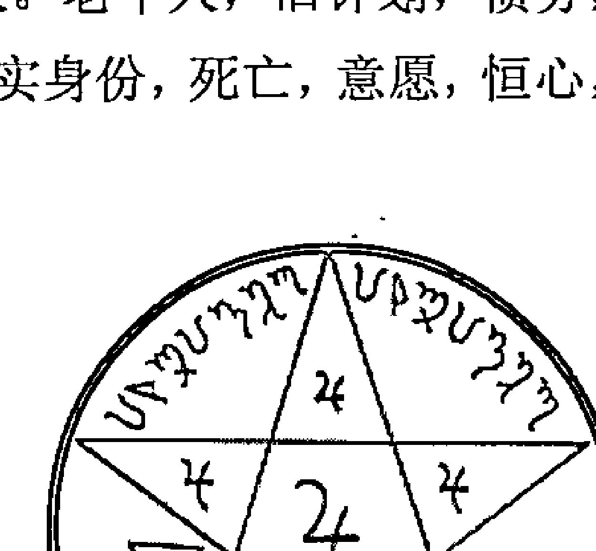

| 4 | 14 | 15 | 1 |
|---|---|---|---|
| 9 | 7 | 6 | 12 |
| 5 | 11 | 10 | 8 |
| 16 | 2 | 3 | 13 |

木星方格 =34

- 管理：财富，健康，荣誉，友谊，和平，名声，成功，政治力量。充裕，丰富，成长，膨胀，慷慨，灵性，长途旅行，银行家，债权人，债务人，赌博。

### 火星 (5) 火星的五角星印：

正面和北面颜色—鲜红色

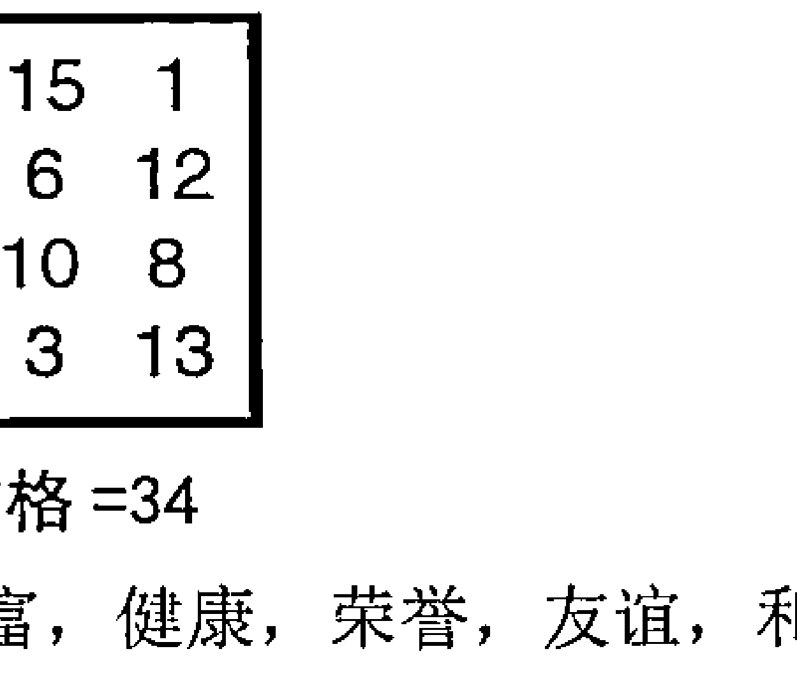

| 11 | 24 | 7 | 20 | 3 |
|---|---|---|---|---|
| 4 | 12 | 25 | 8 | 16 |
| 17 | 5 | 13 | 21 | 9 |
| 10 | 18 | 1 | 14 | 22 |
| 23 | 6 | 19 | 2 | 15 |

火星的方格 =65

### 土星 (3) 土星的五角星印：

正面颜色—靛蓝
负面颜色—黑色

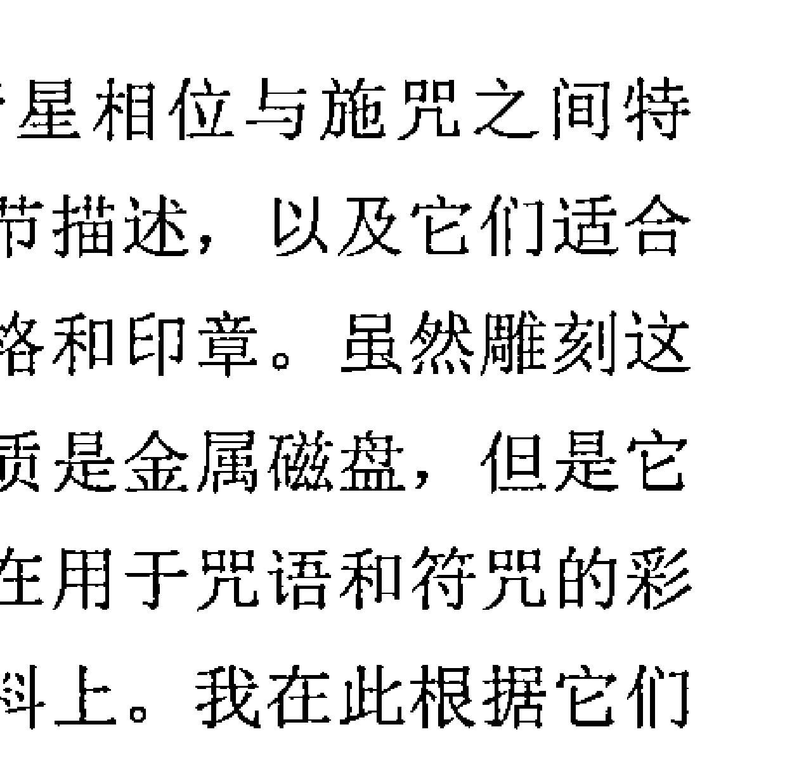

| 4 | 9 | 2 |
|---|---|---|
| 3 | 5 | 7 |
| 8 | 1 | 6 |

土星方格 =15

- 管理：体力，力量，勇气，战争中的胜利，攻克敌人。能量，轻率，愤怒，建设或者毁灭，危险，外科手术，生命力，吸引力，意志力。
- 和平，幸福，生产力，安全。社会事务，感情和情感，女性，年轻人，所有的愉快，艺术，音乐，漂亮，浪费，奢侈，自我放纵。

### 太阳 (6)
### 索尔的五角星印

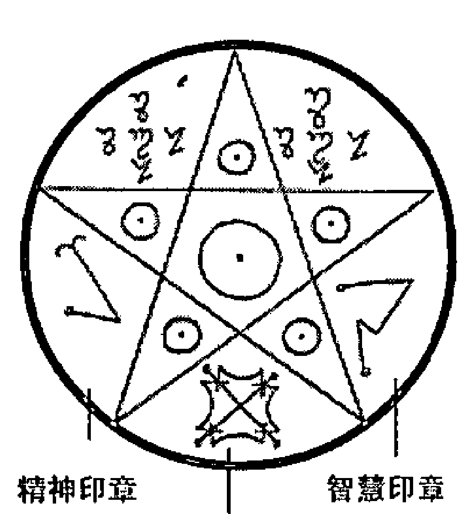

正面颜色—橙色
负面颜色—黄色

| 6 | 32 | 3 | 34 | 35 | 1 |
|---|---|---|---|---|---|
| 7 | 11 | 27 | 28 | 8 | 30 |
| 19 | 14 | 16 | 15 | 23 | 24 |
| 18 | 20 | 22 | 21 | 17 | 13 |
| 25 | 29 | 10 | 9 | 26 | 12 |
| 36 | 5 | 33 | 4 | 2 | 31 |

索尔的方格 =111

- 管理：希望，富裕，荣誉，尊敬，成功，好运，找到宝藏。优胜者，雇主，执行主管，官员，生命，启发，想象力，精神力量，健康，各种各样的生长。

### 水星 (8)
### 水星的五角星印：

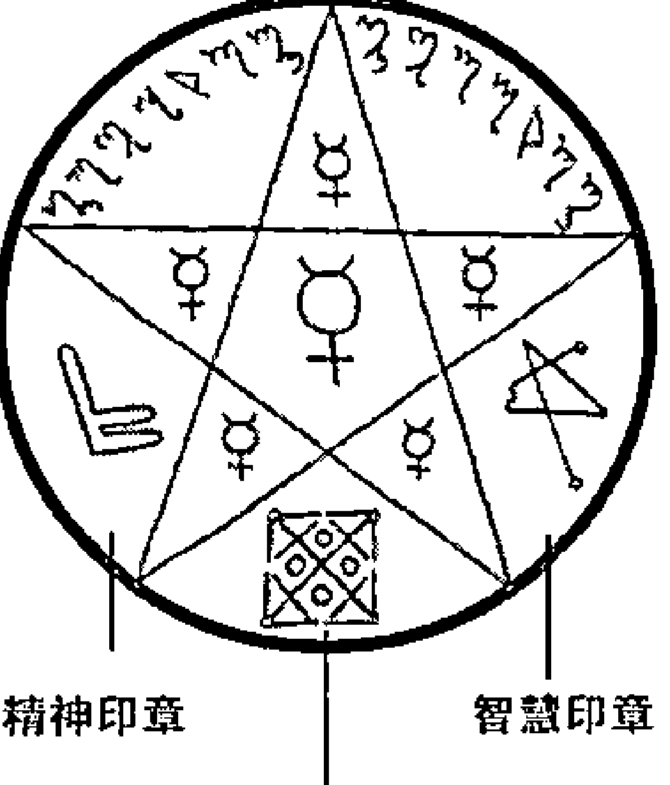

正面颜色—黄色
负面颜色—橙色

| 8 | 58 | 59 | 5 | 4 | 62 | 63 | 1 |
|---|---|---|---|---|---|---|---|
| 49 | 15 | 14 | 52 | 53 | 11 | 10 | 56 |
| 41 | 23 | 22 | 44 | 48 | 19 | 18 | 45 |
| 32 | 34 | 38 | 29 | 25 | 35 | 39 | 28 |
| 40 | 26 | 27 | 37 | 36 | 30 | 31 | 33 |
| 17 | 47 | 43 | 20 | 21 | 46 | 42 | 24 |
| 9 | 55 | 34 | 12 | 13 | 51 | 50 | 16 |
| 64 | 2 | 3 | 61 | 60 | 6 | 7 | 57 |

水星的方格 =260

- 管理：交流，魔法，记忆，占卜，真相，判断。商业事务，买卖，交易，文学能力，写作，书籍，纸张，合同，短途旅行，街坊邻里，给予和获得信息，聪明的朋友。

### 金星 (7)
### 金星的五角星印：

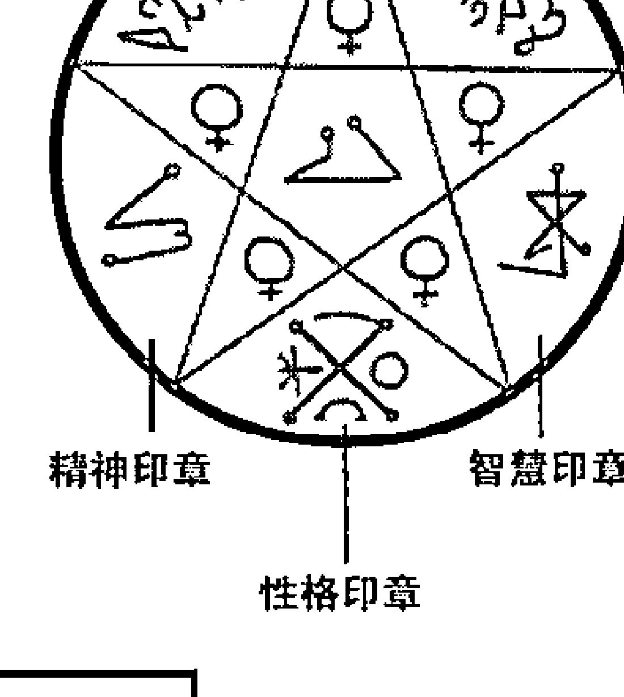

正面和负面的颜色—鲜绿色

| 22 | 47 | 16 | 41 | 10 | 35 | 4 |
|---|---|---|---|---|---|---|
| 5 | 23 | 48 | 17 | 42 | 11 | 29 |
| 30 | 6 | 24 | 49 | 18 | 36 | 12 |
| 13 | 31 | 7 | 25 | 43 | 19 | 37 |
| 38 | 14 | 32 | 1 | 26 | 44 | 20 |
| 21 | 39 | 8 | 33 | 2 | 27 | 45 |
| 46 | 15 | 40 | 9 | 34 | 3 | 28 |

金星的方格 =175

- 管理：爱情，友谊，愉悦，激情，性，和平，幸福，生产力，安全。社会事务，感情和情感，女性，年轻人，所有的愉快，艺术，音乐，漂亮，浪费，奢侈，自我放纵。

### 月球 (9)
### 露娜的五角星印：

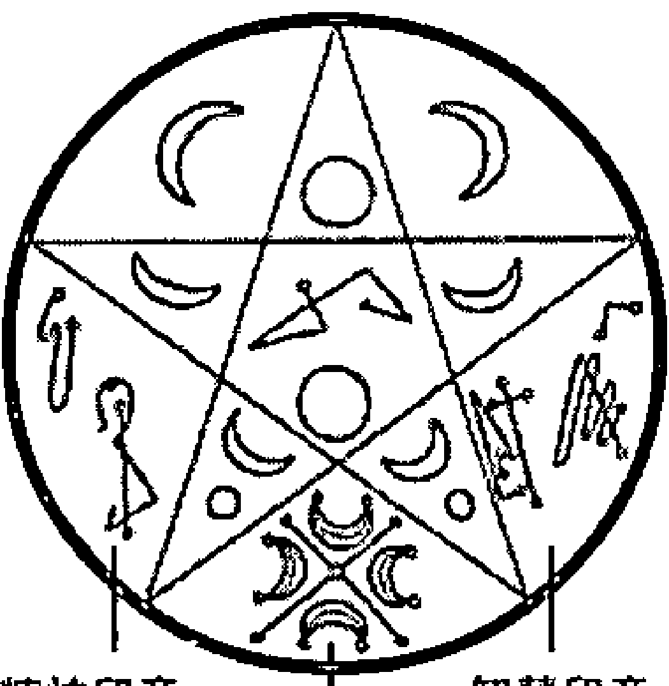

正面颜色—紫罗兰
负面颜色—蓝色

| 37 | 78 | 29 | 70 | 21 | 62 | 13 | 54 | 5 |
|---|---|---|---|---|---|---|---|---|
| 6 | 38 | 79 | 30 | 71 | 22 | 63 | 14 | 46 |
| 47 | 7 | 39 | 80 | 31 | 72 | 23 | 55 | 15 |
| 16 | 48 | 8 | 40 | 81 | 32 | 64 | 24 | 56 |
| 57 | 17 | 49 | 9 | 41 | 73 | 33 | 65 | 25 |
| 26 | 58 | 18 | 50 | 1 | 42 | 74 | 34 | 66 |
| 67 | 27 | 59 | 10 | 51 | 2 | 43 | 75 | 35 |
| 36 | 68 | 19 | 60 | 11 | 52 | 3 | 44 | 76 |
| 77 | 28 | 69 | 20 | 61 | 12 | 53 | 4 | 45 |

露娜的方格 =369

- 管理：梦想，预见能力，安全，防止盗窃，修复吵架，女性，公众，品格，变化和波动，短途旅行和搬迁，感官反应。

### 第四节：元素力量

和行星相位一样，在施咒中的另一种需要考虑的因素便是元素关联。详情请看课程之二第三课：“元素”，同时还有课程之三第四课：“符应表格”。以下是一些与不同的元素有关的主要关注点：

- △ 气：智慧，思想，交流，逻辑，理解力，数学，记忆，教育，音乐，文学，诗歌。
- △ 火：激情，性，成功，事业，雄心，目标，勇气，能量，快速的移动。
- ▽ 水：情感，饮料，心灵追求，心理学，梦，想象力。
- ▽ 土：身体健康，食物，物质财富，表现，保护，约束。
- △△ 气/火：漂亮，艺术，运气，赌博，灵性，再生。
- △▽ 火/水：浪漫爱情，人际关系，伙伴关系，灵魂伴侣，婚姻。
- ▽▽ 水/土：生命力，园艺，烹饪，家庭，欢乐。
- ▽△ 土/气：商业，旅行，冒险。
- △▽ 气/水：协调，舞蹈，社会事务，聚会。
- ▽△ 土/火：政治，运动，比赛。

### 第五节：法术辨识

在施放咒语的时候，有两种类型的咏唱方式——依照魔法书和咒语书宣唱，或者你自己编造补充。两者都有其自身的优势。那些被很多其他人使用过的咒语和魔法已经在其自身周围形成了一种特定的魔法气场，放你使用它们的时候，你同样也会进入它们的形态共振（morphic resonance）。另一方面来说，你自己创造的那些魔法和咒语是根据你自己的视角、想象力以及魔法意志生成的产品，你使用得越多，它们就会变得越强大。潜意识的力量是最容易通过你大脑中生成的视觉展现而接触到的，同样也能通过使用了韵律和节奏的各种类型的圣歌和咒语而触及。这是因为这些元素都在你的右脑中起作用，直接将你和伟大的魔法世界联系在一起。

点燃适当颜色的蜡烛通常都会用在施咒中（详情请参考课程之四第一课第五节：“蜡烛魔法”）。使用蜡烛和任意一种魔法来加强或者调整行星、元素或者其它符应的影响。许多魔法使用者们谈到“白色”、“灰色”以及“黑色”魔法之间的区别时，都说的是从仁慈到恶毒。这与真实魔法本身的本质并没有什么关系（详情请参考课程之一第三课第七节：“魔法的颜色”），魔法的好坏取决于它被所用的意图和目的。这些意图同时也取决于从业者的道德标准，这是你在施展魔法之前应该要思考的问题。

- 白魔法：这是一种只影响你自己而不牵涉他人意志的魔法。例如，吸引异性、增加财富／成功，或者保护你的家园。在这些使用过程中魔法没有伤害，也没有道德问题。同样的，白魔法也被认为是仁慈的，会治疗所有的物种。
- 灰魔法：这种魔法会影响他人的意志，但是只在某种程度上。它可能会改变他们的选择、生活或者社区，但是并不是彻底的或者永久的改变。例如，让某人爱上你的咒语、治疗、因某人的恶意行为而施放的约束咒语，或者是一些鼓励那些并不喜欢你的人与你和平相处。这些目的在伦理上来说是有问题的。
- 黑魔法：这是以一种强烈的、约束性的以及／或者永久性的方式将你自己的意志强加在某人身上的魔法，或者是一种会引起损害、伤害或者死亡的魔法。例如，引起疼痛，有伤害性质，或者控制某人施以影响的咒语。这些目的非常地缺乏职业道德，魔法师应该避免这些行为。

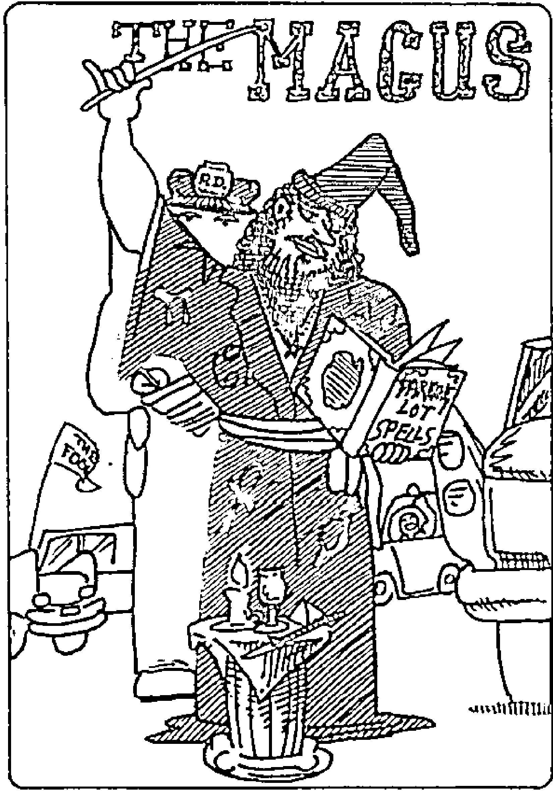

合理的符咒和咒语的数量真的是无限的。有一些完整的书籍专用于魔法辨识，民俗传统的各种版本都被收录进了这些书籍。请参考附录中的“魔法师的图书馆”。特别是格雷理事会成员帕特丽夏·特里斯克的《魔法的民间智慧》（[The Magick of Folk Wisdom]）一书是一本伟大的参考书，同样的还有安·格瑞玛丽（Ann Gramarie）的《女巫手册》（[Witch’s Workbook]），吉莉安·肯普的《优良咒语书》（[Good Spell Book]），以及瓦莱丽·沃思 (Valerie Worth) 的《老巫婆的咒语书》（[Crone’s Book of Words]）。以下是由我收藏的一些书籍和其它资料中的一些内容，还有一些是牵牛花和我共同制作和使用的。一旦你掌握了这种窍门，你甚至可以开始创造一些你自己的咒语！

### 好运和成功 ☉ ♃
### 魔法袋

制作一个小小的魔法袋，这样你就可以在里面放一些小的护身符、辟邪物，等等。这些魔法袋同样也称为药物袋、精神袋、魔袋，或者护身袋。剪一张直径为6英寸的圆形布料，法兰绒或者羚羊皮。红色永远都是一种制作魔法袋的最佳颜色，或者你可以从课程之一第三课第六节：“魔法的颜色”中挑选一种合适的颜色。用打孔机在外部边沿上打压一系列的孔，然后用一根30英寸长的红绳穿起来，将末端系在一起。在制作过程中你要说：

> > 我是为了好运和财富缝制的袋子
> > 红绳是为了爱和健康
> > 无论白天和黑夜
> > 悲哀和疾病远离我！
> > （——葛丽娜·丹维奇）

### 为了你施法的成功

取一张羊皮纸，在其中一面画上太阳护身符印章，然后在另一边画上木星护身符印章，并念诵：

> > 我钢铁般的意志，我耐心的技巧，
> > 徐徐灌入这张护身符
> > 祝愿进展顺利，
> > 如我所愿，必将应验！

然后将其贴在与你的工作有关联的物品上，将它们一起放在你的圣坛上（或者你工作的地方）。

### 硬币

在你家中的门阶处理下一枚银币会带来繁荣和好运。如果你住在一间公寓中，那你可以将银币放在一个装饰性的花盆下，或者就安全地摆放在你的门垫下方。

> （——帕特丽夏·特里斯克）

### 红绳

取一根大约12英寸长的红色的绳索或者纱线，并在上面打上四个结，在制作过程中你要念诵：

- 一个结为好运
- 两个结为财富
- 三个结为爱情
- 四个结为健康

> （——葛丽娜·丹维奇）

将这打了结的绳索放在你的魔法袋中，然后将袋子戴在脖子上。

### 健康和治疗

**治愈肉疣**

将一枚铜币用创可贴贴在肉疣处。让铜币在肉疣上保持三天，然后在午夜的时候将铜币埋在树下。在埋铜币的时候你要念诵：

> > 肉疣离我远去；
> > 从此在这棵树中生长。
> > 每个人都看到我光洁的皮肤，
> > 我的全身都会接受祝福！

### 胡言乱语

一种非常古老而且流行的治疗高烧或者疾病的咒语便是逐渐减少的单词“Abracadabra”。在一张米纸上将它写十一遍，每一行都丢弃一个字母，以形成一个倒三角形，如图：

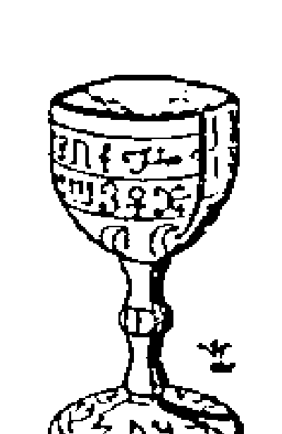

- A B R A C A D A B R A
- A B R A C A D A B R
- A B R A C A D A B
- A B R A C A D A
- A B R A C A D
- A B R A C A
- A B R A C
- A B R A
- A B R
- A B
- A

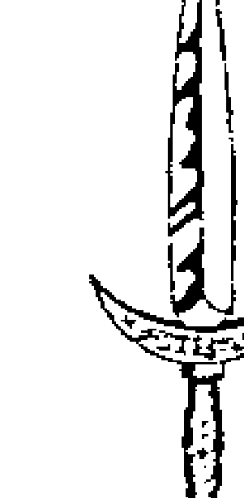

将这张纸紧紧地裹成管状，然后将其系在你疼痛的脖子上。一共要佩戴九天九夜，然后把它从你的左肩上方扔入河中。

### 驱逐疾病

在一张羊皮纸上写下需要治疗的对象的名字，然后和以下的治疗草药一起放进魔法袋中：当归，月桂叶，肉桂，茴香籽，苦薄荷，玫瑰花瓣，迷迭香，百里香，马鞭草，以及紫罗兰花。念诵：

> 女巫的药草和魔法花朵，
> 让这个袋子充满治疗力量吧。
> 让佩戴这个袋子的人
> 摆脱疾病，痛苦，和伤害。
> （——葛丽娜·丹维奇）

### 蜂蜜长生不老药

在一个星期天的中午，将蜂蜜向着太阳举起来，这样它们双重的金色会一起闪耀，合成一体。吞下三勺蜂蜜，然后念诵这样的话：

> 太阳，赐予我能量，
> 金色的阳光为我服务，
> 蜂蜜让我永生。
> （——瓦莱丽·沃思）

### 保护

**当你经过公墓的时候**

十指交叉，屏住呼吸，为死者大声朗诵这样的诗篇：

> 骨骼管理人，我认识你，
> 但是我应该超过你的速度。
> （——瓦莱丽·沃思）

**基本的防护咒语**

在一张羊皮纸上写下以下的话语：

> 空气无法冻结我，
> 火无法点燃我，
> 水无法淹死我，
> 土无法将我埋葬。

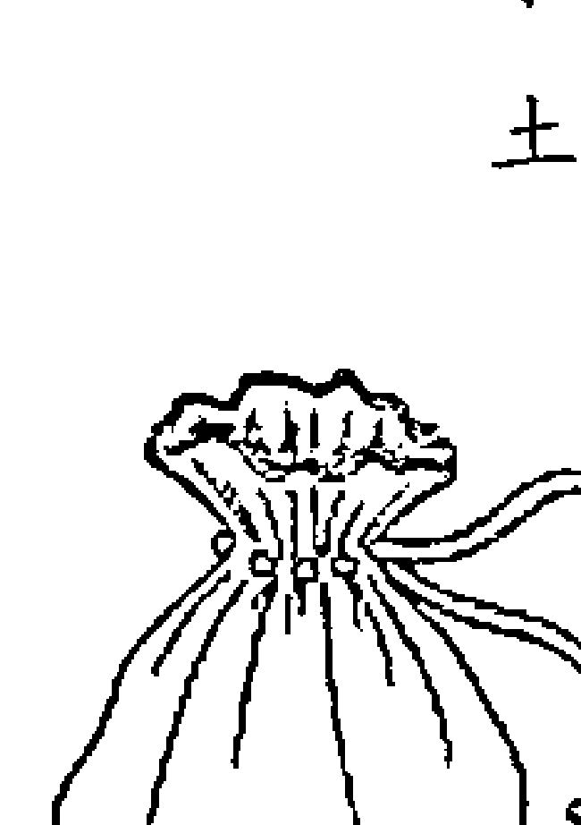

将其紧紧地裹成管状，用一根红色的绳索或者纱线系起来，并将其装在你的魔法袋中。

**柠檬防护咒语**

这种为了朋友和心爱的人的斯特雷加咒语最好是在一个满月的午夜施放。你需要一个新鲜的柠檬，三根白色蜡烛，一盒彩色大头针。在午夜的钟声响起的时候，点燃蜡烛，并在柠檬上插满大头针，在此过程中重复一下的话：

> 月亮女王和满天星斗，
> 狄安娜，我送给你，
> 我插入的每一根针都有魔力，
> 让（名字）远离所有伤害！

将这作为礼物送给你的朋友。它将会为你和你所爱的人带来好运，并让你们远离邪恶。

**魔法魔管**

准备一根有塞子的试管，或者使用任意一种小型的干净的圆筒形容器，例如香料瓶。在里面装满茴香籽（一种防护性药草）。用一条绶带将它系起来，为它赐福，并且将其挂在你的门上。任何试图要闯入的恶灵都将会被迫数一数所有茴香籽的数量，使其没有时间来恶作剧。

**女巫瓶**

在 17—18 世纪，这些东西在英国十分流行。准备一个有螺口式盖子的玻璃罐，并在里面装满尖锐的物品：大头针、钉子、针、破碎的玻璃（尤其是打碎的镜子碎片！）、荆棘、尿液、盐，等等。加上一点迷迭香、罗勒以及月桂叶。将盖子拧紧，并用熔化的黑色蜡烛的蜡密封，念诵：

> 女巫瓶，草药和符咒，
> 驱逐邪恶，避开伤害。
> 保护我不受敌人的伤害，
> 如我所愿，必将应验！
> （——葛丽娜·丹维奇）

将这个瓶子藏在厨房水槽下面的橱柜后面，或者在月亏之时将它埋在你的住宅里最远的角落里。女巫瓶可以保护它的所有者远离伤害，是乔迁宴席中最好的礼物！

**熨斗和蒜头**

同女巫瓶的概念相同的是一种古老的习俗，它是将铁钉（非常大的钉子同样也可以，被磁化过的会更加有效）钉入你房屋的每一个入口前的土地中。由于它的魔法特性，铁可以创造出一个范围，可以使无形实体的一致性紊乱，从而驱逐所有恶灵。

同样的，将有强烈刺激性味道的香料，比如蒜头和红辣椒挂在你的窗户上，以抵制恶灵（尤其是吸血鬼和梦魇）的进入。

**把悲伤拒之门外**

将这些单词写在一张纸上：

- TREE
- ROAD
- EAVE
- EDEN

## 魔法师学徒的魔法书 | 下卷

从西到东，从北到南朗读，然后大声说：

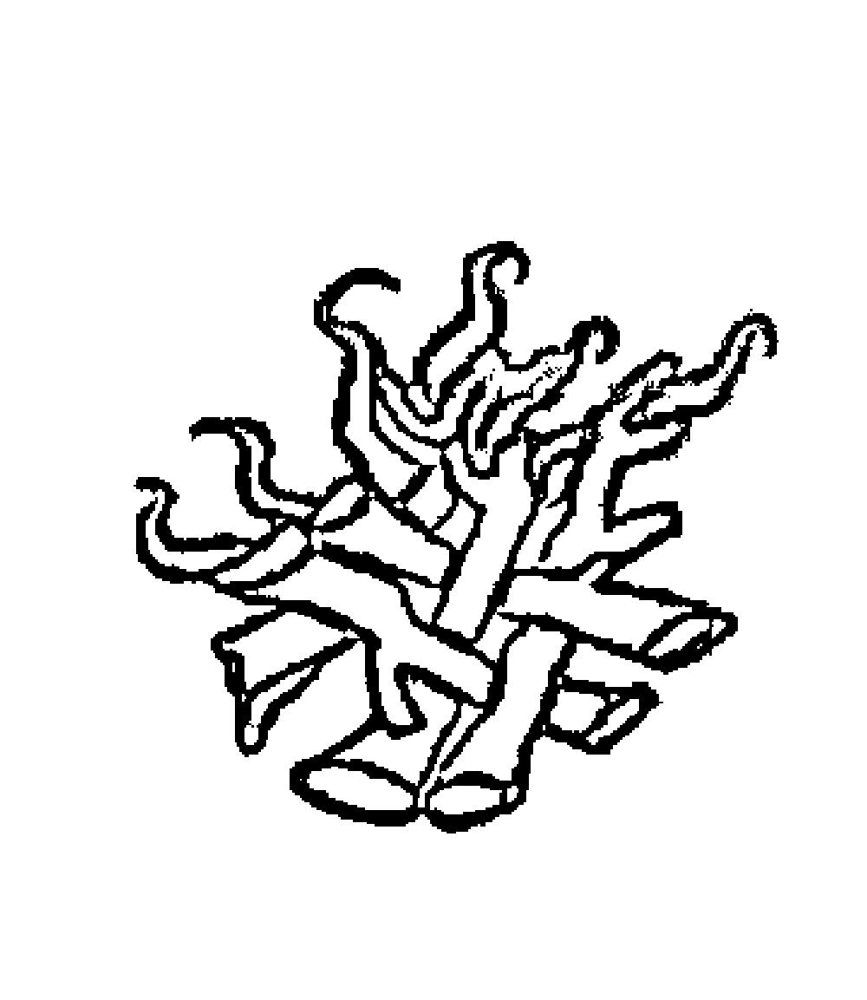

- 知识之树
- 痛苦之路
- 家之屋檐
- 人间乐土。

如果你解开了这些谜题，在你的灶台边将纸焚烧。它会让你的房屋远离痛苦，一整年。

> > （——瓦莱丽·沃思）

## 旅途和交流

### 光圈

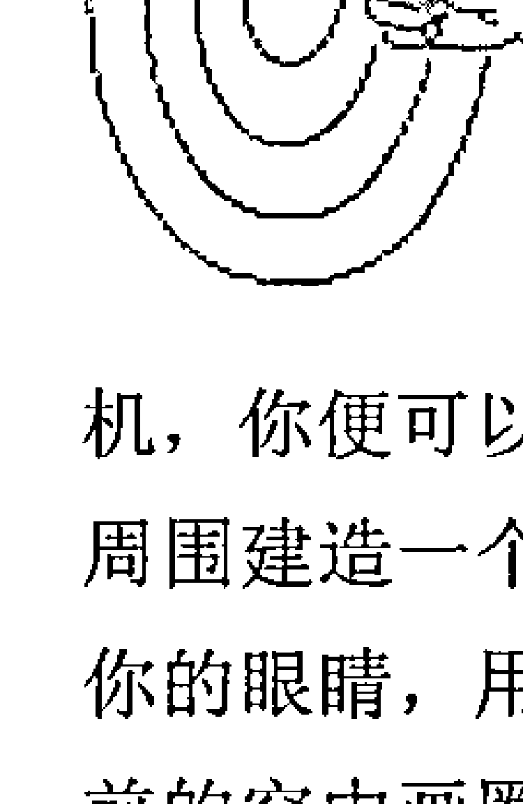

牵牛花和我在我们旅行的时候一直都会使用这个：当你在一个危险的地方行走、坐车、乘坐飞机，你便可以在你自己和与你在一起的人周围建造一个便携式的防护圈。暂时闭上你的眼睛，用你写字那只手的食指在你面前的空中画圈。在脑中将这些光之圈想象化，使其不断成螺旋状地向外延伸直到完全将你覆盖，同时口中重复：

- 将我包裹在这光圈之中
- 没有伤害也没有疾病，
- 无论陆地，海洋，天空，白天或者黑夜。
- 愿我一路顺风；感谢上苍！

### 飞机起飞之前

敢于乘坐飞机旅行的人必须首先摆脱愚蠢和骄傲。站立在阳光中，将你的手靠近一只蜡烛火焰的微光。将一只羽毛用蜡烛火焰点燃，在羽毛变黑的时候，闷熄烛火。将柔软的蜡油收集起来将你的指甲缝塞满。然后念诵：

- 离太阳太近我可能不能飞翔，
- 烧焦的我应当逃离它嘲讽的眼神。
- 远离它的嘲讽，摆脱它的控制，
- 就请忍受并且饶恕我一次吧！

> > （——瓦莱丽·沃思）

### 一封十分重要的信

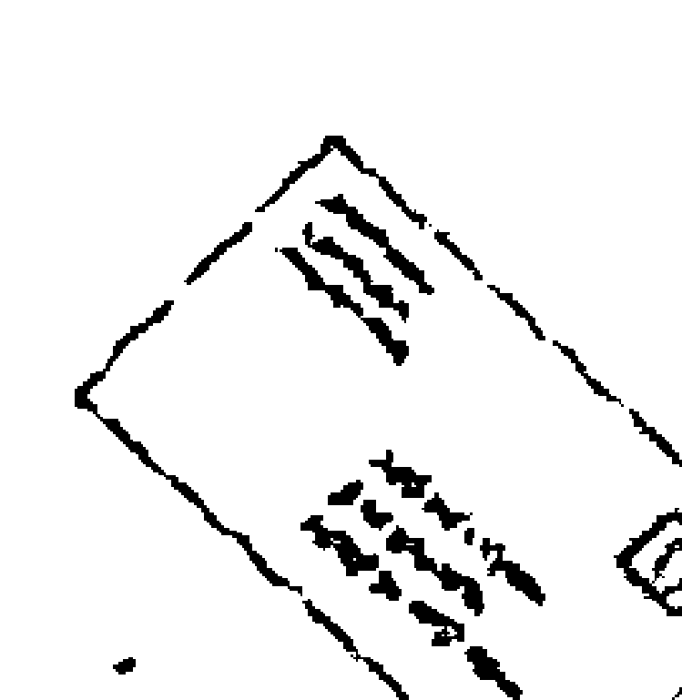

当你的信被密封好并且贴上邮票之时，将它放在一张黑布上，并在它的周围倒上一圈盐。在这样做的同时，念诵：

- 言语在我前面奔跑，
- 带我离开这个地方，
- 为那双看到信的眼睛带去愉悦
- 用你的文字传递我的意愿。
- 用布将它包起来，并亲吻折痕；然后立即寄出去。

> > （——瓦莱丽·沃思）

### 达成协议

在一个星期三或者星期五的晚上为爱点燃一根粉色蜡烛，为康复点燃一根蓝色蜡烛。

## 课程之四：仪式

蜡烛，念诵：

> 请（名字），三思。希望结果能够治疗我的疼痛。接受我的请求你便会明白，你的善良让我摆脱了病痛。感谢你。（——吉莉安·肯普）

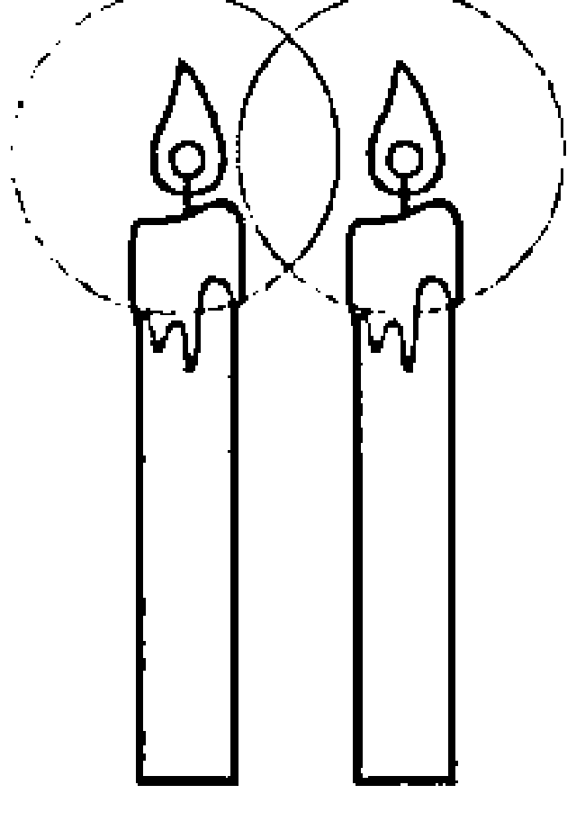

中。念诵：

> 通过火的烟雾净化不再有恶灵缠绕。伤害疾病通通离开，如我所愿，必将应验！

最后，将你的长扫帚拿出来，把整个房屋打扫一遍，将盐与尘土一起扫起来，念诵：

> 去，去，快快散去，留下和平，送出争吵！

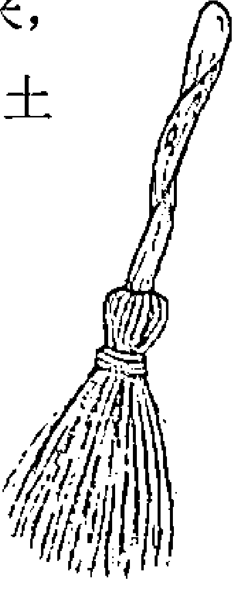

## 驱魔和驱逐

如果一间房屋或者一个人被恶毒的幽灵纠缠或者附体，那么就应该举行一次驱魔或者驱逐仪式。在每个房间都点燃白色的蜡烛，或者在着魔了的人周围摆放五支蜡烛。用盐在每个房间的地板上或者在受害者的周围画一个五角星形，并且在每个角落里都撒上用茴香或者迷迭香泡制的药水。在此过程中，念诵：

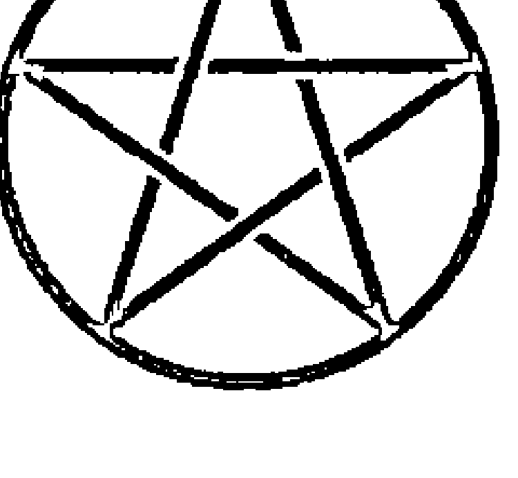

## 显现

### 让愿望成真

在一根短短的胖胖的蜂蜡蜡烛（一根白色的祈愿蜡烛最好）上画一个渐圆月的图形。点燃蜡烛，凝视烛光，并将注意力集中在你的愿望上，同时念诵：

> 水，盐，你们所到之处，不再有疾病或者恶意的存在。恶灵都必须逃离；如我所愿，必将应验。

> 高贵的月亮女士，看来，你善良慷慨今夜我期望我愿望成真。

然后用鼠尾草熏，要在整个房屋中来回走动，或者围着受害者顺时针旋转，将烟雾送到房屋里的每一个角落以及壁橱。

吹熄蜡烛，但是在脑中尽可能长时间地保存它的光芒。它将会向你揭示一个答案。

### 一般的显现咒语

对于任何你所施放的咒语，在你完成剩余的工作之后，在结束的时候这样说：

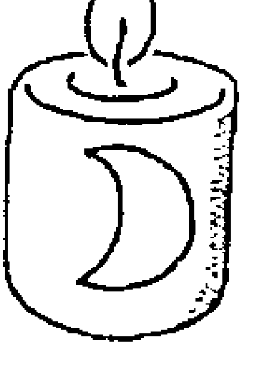

通过所有陆地和海洋的力量，
通过所有月球和太阳的力量，
如我所愿，必将应验！
咒语结束，一切完成。

诵：
伊师塔，维纳斯，阿佛洛狄忒，
让我遇见新的爱情吧，
通过你的力量，巫师之石，
我将不再孤单。
来吧，来吧，
如我所愿，必将应验！

## 爱

将这颗上了蜡的心放在你的圣坛上，或者你的魔法袋中。（——安·格兰玛丽）

### 吸引爱人

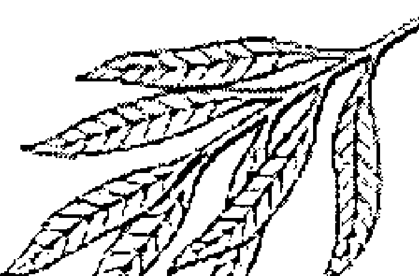

将干月桂树叶捣碎，然后将它们洒在你香炉中燃烧的木炭上。嗅吸烟雾，并且念诵：

月桂树叶，火中燃烧，
带来将我心中的他（她）。

### 让爱情成长

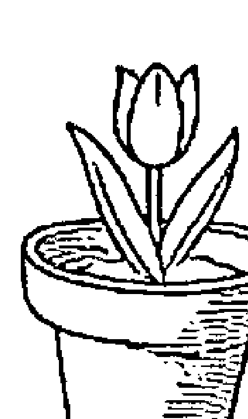

在一个新的粘土花盆中种下一株花球茎，例如郁金香或者水仙。在你用泥土覆盖球茎的时候，重复你所爱的人的名字。然后每天早上和晚上都对着它说：

随着你的根的渐渐生长
花朵慢慢绽放
这样我心爱之人的心就会
慢慢地向我靠拢。

### 心形石咒语

刚开始的时候使用一个小的心形紫水晶石、紫石英石、月长石或者玛瑙石。在月亮渐盈期间，点燃一根红色蜡烛。在熔化的蜡中加入一点马鞭草，然后将蜡涂抹在心形石上使之变成一颗红心，念诵：

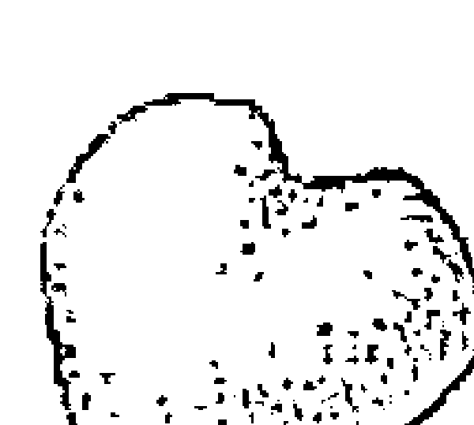

上蜡之后的你开始转变。
两人变一人，爱情便温暖！

将石头握在手中直到它变凉，并且念诵：

## 财富和成功

### 致富

在一个小小的硬币钱包周围摆放五枚金币。点燃五根金色（或者绿色）的生日蜡烛，在每枚硬币上滴上一滴蜡，然后将五根蜡烛一一放在上面。在此过程中，每放一根蜡烛重复一次这样的话：

善良的福尔图娜，倾听我的心声；让我的钱包满载金银吧。

### 找到宝藏或者丢失的物品

在满月的第一天晚上，亲吻你的手掌，然后将它举起来面朝月亮，同时中间的三个指头向下折叠，大拇指和小指往外延伸。背诵下面的话：

> > 在满月的时候向她祈祷，
> 彼时便会带来好运，
> 你所寻找的东西也会出现，
> 在陆地上，海洋上，或者地底下。

### 银色月光

准备一个浅口碗，里面装上水，坐在一个充满月光的草地上。将碗放在你前面，让月亮倒映在水中，念诵三次以下的话：


> > 阿拉迪亚，阿拉迪亚，我祈求你，
> 请你满足我的愿望。
> 通过月亮和大海的力量，
> 如我所愿，必将应验！

然后将你的手在水面上轻轻掠过，将月亮的银辉握在手中。在水面平静下来之前，将水倒在地上，然后回家。在你抓住银辉之后不要再回头去看月亮，否则你将会打破这个咒语！


### 呼唤丢失的宠物

在你的宠物常用的碗中放一些它最喜爱的食物。在旁边点燃一根蓝色蜡烛，然后说：

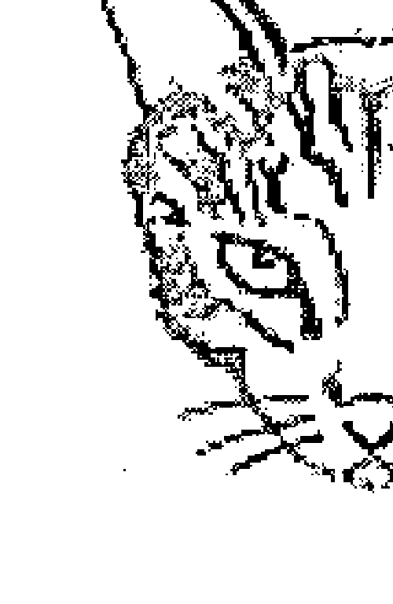

> > 我迷路的美丽小可爱
> 请在今天回到我身边吧。
> 我渴望的心在期盼
> 请从远处回到我身边吧。

让蜡烛燃烧殆尽，或者在你的宠物回来的时候将它熄灭。 （——吉莉安·肯普）

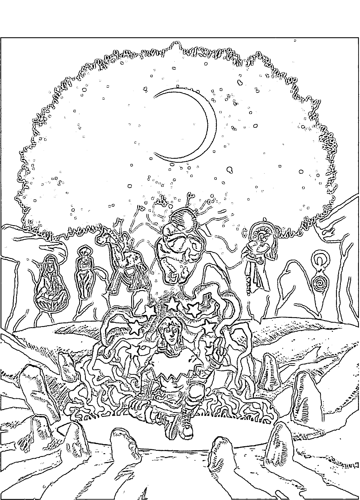

## 课程之七：传说

### 第一课：另一个世界

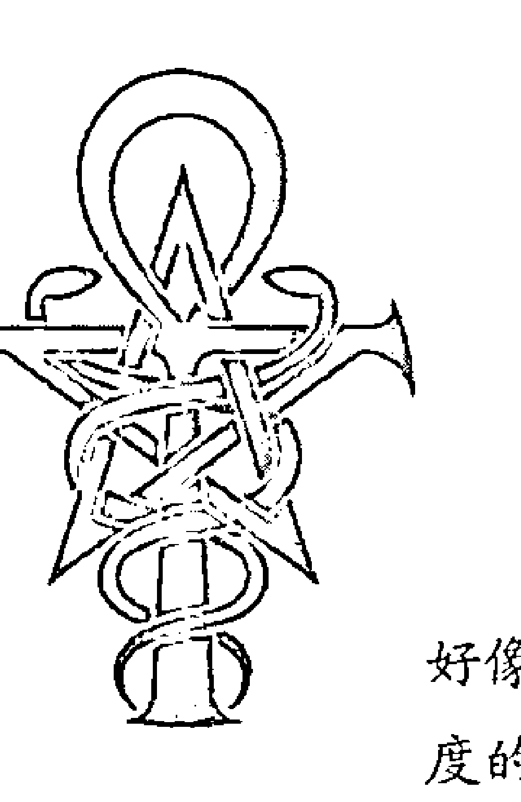

现代人类都在世俗世界的范围内不停地做着他们自己的事情，好像整个世界都还是他们第一眼看到的样子，已经确定的是外国国度的观念只不过是一个来自我们的种族愚蠢童年的原始的，迷信的残余物。然而潜伏在传统实相的正面以外的仙境仍然存在，连系着万事万物，不受控制，而且非常普遍。现代文明所丢掉的东西就像是一个健忘的孩子所丢掉的玩具，这是一个强大的秘密，是一股巨大的能量，它将揭开这种狭窄的“理性”世界观。

> ——伊恩·“潜伏熊”（“通往仙境的大门 [Gateways to Faerie]”）

#### 第一节：简介 - 另一个世界

我们生活在一个多元的，而且充满了无限可能性的世界中。除了这个被我们有形的躯体所占据着，并且和他人共同分享的世俗世界之外，还存在着梦境、神话、想象、以及故事中的星体国度。其中一些我们可能也会与他人分享，而另外一些，我们便会完全自己拥有。尽管如此，这些世界依旧像我们所相信的那样真实。因为当真正论及它们的时候，我们每个人实际上都独自居住在一个小房间里，而且我们的所见、所闻、所知、以及所经历这个房间以外的一切都必须传达给我们。我们所“看到”的也就是我们所得到的。
在这节课中，我想给大家介绍一个被越来越多的人所接受的非物质世界。每一个世界都有其各自的居民和统治规则，它们中的一些甚至已经被绘制出来了。托尔金的中土世界就是这类国度中的一个例子。虽然它仅由一个人创造，但是现在却被数百万人所共享。

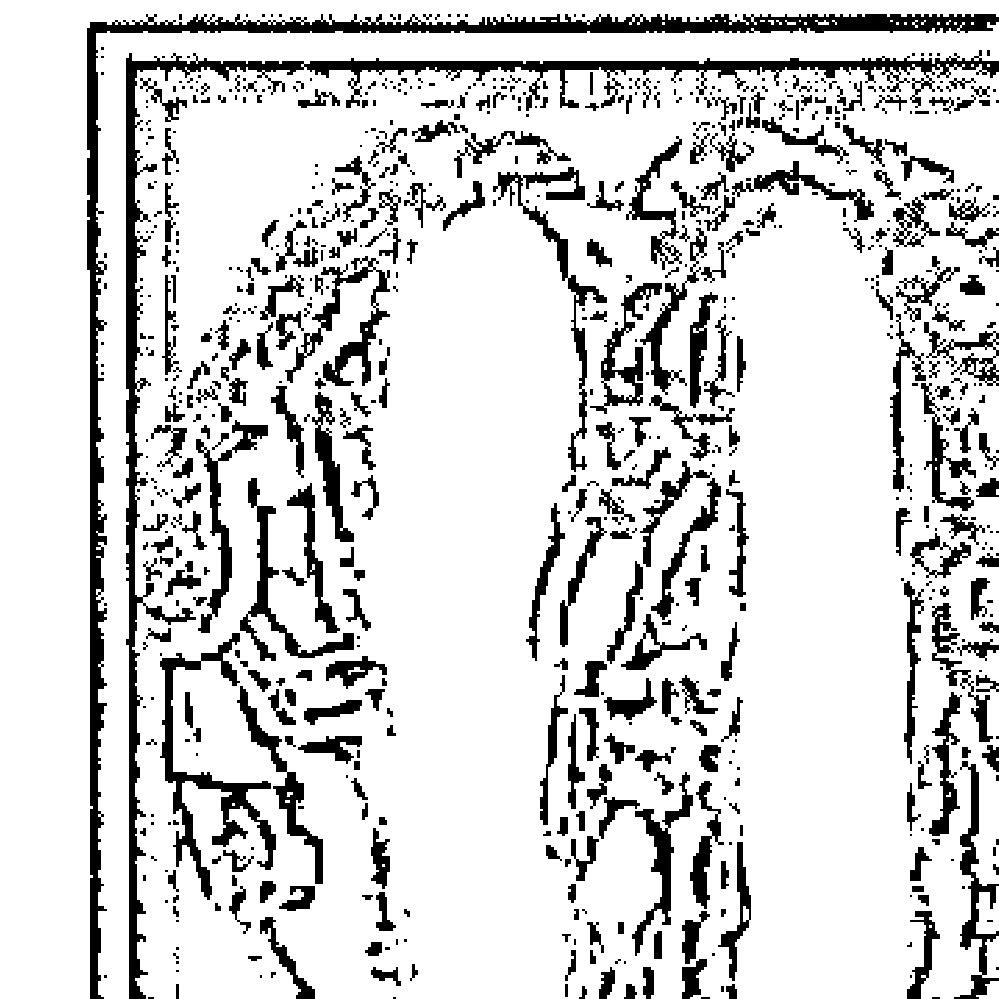

我敢打赌，就算你闭上眼睛，仍然能很清晰的看到夏尔或者瑞文戴尔，就像看到你曾经居住过或者到访过的其他地方一样——我知道我能看到！

#### 第二节：梦境

那个我们可以直接进入的，世界上最伟大的星体国度被称为梦境。因为我们可以通过自己的梦进入它的内部。澳大利亚土著居民（“本地人”）将它称为“黄金时代”（Alcheringa），或者是“梦幻时光”（The Dreamtime），而心理学家则将它称为“集体无意识状态”（The Collective Unconscious）。

与全世界所有其他做梦的人一起分享着这种精神境界，它拥有着一种特定的，历经了时代变迁而形成的，并且已经得到了确认的地形——就像已经被用旧了的路径一样——受到所有到过那里的人的形态发生场（morphogenic fields）的影响。

> > 越自我和情感以外的我们到底是谁。
> ——伊恩·“潜伏熊”

仙境是与我们最亲近的王国，位于梦境和世俗世界之间。仙境也非常靠近死亡的国度，靠近祖先的声音，而且还与我们神圣的一面有联系。我们通过精灵能够更直接的接触到神圣的力量。我们进入一个王国，在那里，所有的神都非常的真实，而且还可能和我们说话。

在梦境之中有着通往仙境之国，包含了所有信仰的来世，天神、灵魂和祖先所存在的国度，以及所有神话和故事中的异域世界的门户——比如幻想、仙境、奇境（OZ）、梦幻岛（never-never-land）和中土。在你学会了探索，然后慢慢开始熟悉梦境的景色之后，你就会获得通往其它国度的入口。有时候，到另一个国度就像经过两棵古老的树木那样简单。

通往精灵的入口不仅能在梦境中找到，而且还存在于被施了魔法的幽谷和森林空地、蘑菇圈、古老的石头圈、中空的山丘、古坟岗以及杂草丛生的废墟中。在这些地方，你所需要做的只是进入恍惚状态或者入睡——尤其是在五朔节前夜或夏末节那天。此时，“各个世界之间的面纱”特别的薄，所有的迷雾之门都敞开着。无论何时，当你被困入浓雾之中时，不要惊慌，待浓雾散开以后，你便会发现你正身处于仙境之中。仙境“有时就像祷告一样非常的近，有时却像繁星——离你很遥远”，仙境萨满（Faerie Shaman）维克多·安德森（1915—2002年）如是说。

地球上每一种有知觉的生物以及整个宇宙都会做梦，因此，每一个物种都有一个与它们自己有关的梦想。就像我们是伟大的地球母亲盖亚身体里小小的细胞，行星也只不过是更大的银河系体内的细胞，诸如此类——所以说，我们的梦是整个梦境的一部分，而梦境又是盖亚女神之梦的一部分——诸如此类的例子在更大的同轴领域中一直延伸。

### 第三节：仙境

> > 意识和欲望不成熟的基本力量在宇宙中不停地跳动，充满野性并令人振奋，超越传统的空间和时间，就像中国的灯笼一样照亮了整个物质世界。触摸这股力量就是在触摸我们到底是谁这个隐秘的真相，我们存在的本质，除却生死，超

仙境是一个朦胧的国度，此处的光源仅来自于明亮的星星、蜡烛、萤火虫、以及所有生物的光环（在此处，这些都是很常见的）。虽然太阳和月亮都不会照耀仙境，但这里的一切却都闪耀着。仙境的居民（仙灵或小仙女）居住在精美的大厅或者地面下、水下，或者高挂在树上的房屋中。他们在群山之间和丛林深处的空地上也有着精致的水晶城堡和高悬的庭落。在仙境中，唯一真正的城市被称为提尔纳瑙伊（Tyr na Nog）。

然而，所有这些地方都是看似辉煌壮丽、非常迷人，而实际上不过是一些虚无缥缈的表象罢了。精灵和我们共享着同样的自然物和景观，但却并没有如人类一样建造工程。例如，仙女居住的阿瓦隆岛相当于世俗世界里的格拉斯顿堡（Glastonbury）。实际上，最好的理解方式是将仙境看做我们世俗世界的一个“平行次元”（parallel dimension），它们之间由上述的门户连接在一起，而这扇门从两边看都是一样的。

仙境的管理有严格的规章和规则，任何进入了这个魔法国度的人都必须了解和学习这些规章制度。其中最重要的规则——这种规则同样适用于地狱——就是在仙境之中，千万不能进食或者饮用那些并不是你随身携带的东西！仙灵（ Fae）会排斥金属铁，尤其是被磁化过的铁，所以想都不要想你能够携带那样的金属进入仙境！出于同样的原因，如果你在你的魔法袋中放一块天然磁石，可以防止你在不情愿的情况下被带入仙境。如果你发现自己正处于仙境之中并且想要离开，那么你所需要做的就是将衬衫脱掉，将它翻一面，然后重新穿上——这样做可以让你不被仙灵发现。同时，你还必须把口袋翻出来。
但无论你在仙境中做什么——你都必须注意，在任何时候都要对仙灵极其的礼貌！因为你一不小心便会冒犯到他们，而他们的反攻则是极其可怕的！

### 第四节：三个世界

有一种说法是这样的：“常识告诉我们世界是平的”。从人类历史来说，绝大多数人认为这种情况是属实的，古老的地图所描绘地球并不是一个球体，而是一个煎饼似的圆盘。中世纪的基督教地图所展现的“圣城”耶路撒冷位于这块煎饼的中心位置。这张地图包括了制图师（“地图绘制者”）当时所知道的整个世界。

在这个世界圆盘之上，我们能够很清楚地看到并且绘制出一个呈现倒转的碗的形状的拱形天空，因此“上面的世界”在逻辑上便成为了神和天使的住所。洞穴、矿井、井、间歇泉以及火山的存在同样表明了一个隐蔽的“地下世界”的存在。如果说地表以下深处的黑暗国度是分配给死人以及牛鬼蛇神居住的地方——由地狱之神统治，这种说法同样地言之有理。

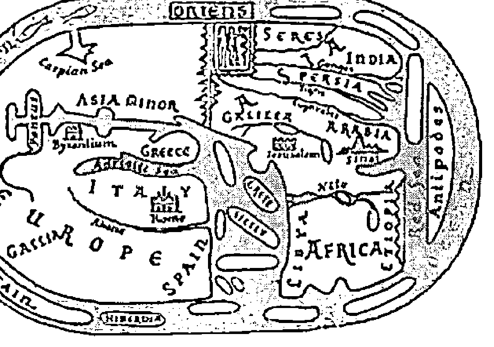

由列巴纳的比特斯（Beatus of Liebana）绘制的中世纪地图，公元776年

我们人类世界就像圆面包中间的牛肉饼一样内夹在这些超自然的世界之间，因此，很自然地被认为是“中土”，或者是维京人所说的米德加德（Midgard）。事实上，挪威人把这一理念发展到了一种相当精致优雅的结构。他们描绘了一种存在着多元世界的古老宇宙论，这种学说还成为了许多宗教信仰的基础一包括基督教。

## 宇宙树

在挪威人所设想的复杂系统中共有九个世界，其中最主要的三个世界是仙宫（Asgard）（上面），冥界（Hel）（下面），当然还有位于中部的米德加德。这些世界的排列方式各不相同，而且五花八门，这要取决于你所阅读的图书的版本。当前，一般最受欢迎的版本将它们像卡巴拉的生命树一样排列，除了我们的世界是位于中间，而不是在底部之外，其余的都是相似的。所有这些似乎都被保留在巨大的宇宙生命树（world-ash-ree）宇宙树的树根和树枝内的树平台（tree-platforms）中，这与地球的旋转轴方向是一致的。这样，这棵树的王冠便会一直指向北极星。

仙宫（亚萨神族 [Aesir] 的家园）位于顶部，月萨弗海姆（Ljosalfheim，明亮的精灵之家）通常位于仙宫的下方，其次是米德加德。死人国尼福尔海姆（Niflheim，迷雾之乡）朝向北方，

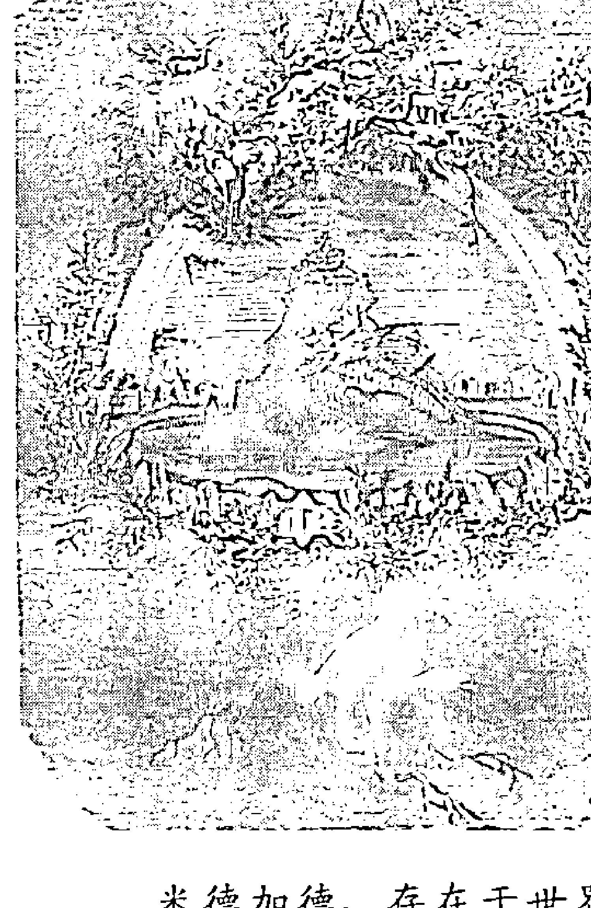

米德加德稍微往下一点是位于南方的穆斯贝尔海姆（Muspelheim，火巨人的家乡）。大多数现代作家将约顿巨人之家约顿海姆（Jotunheim，霜巨人的家乡）放在东边，而将华纳海姆（Vanaheim，华纳神族 [Vanir] 的家乡）放在西边。位于他们下方的是侏儒之乡瓦特阿尔海姆（Svartalfheim，暗黑精灵或矮人族的家乡），接下来是冥界黑尔海姆（Helheim，死人的国度）。一个名为“连接天宫和大地的彩虹桥（Bifrost）”的彩虹大桥，从仙宫经过韦德之井（Well of Wyrd）直到天神审判席，跨越了整个天空。这口井位于这棵树的某条树根之下。围绕着米德加德大地的是辽阔的外海，它一直延伸到圆盘边境。它不停地拍击着巨大的米德加德之蛇约尔姆加德（Jormungand）的鳞甲。这条蛇不断地围绕着圆盘转圈，并将自己的尾巴塞进嘴里形成一个完整的圆，以防止海水溢出流入太空。在大蛇以外是冰与火的国度。

## 海龟背上的世界

在挪威人的想象中，每个世界都由一棵大树支撑着。而很多部落则认为整个大陆都由一只大海龟背着，并在无垠的大海中遨游着。这就是为什么北美洲有时会被称为“大龟岛”的原因。在印度，人们认为圆盘似的地球是由四只巨大的大象驮在背上的，而反过来，他们则站在一只庞大的海龟背上，在太空中永恒地遨游。特里·普拉切特已经出版了几十部很受大众欢迎的讽刺小说，这些小说的背景便设置在这样的一个世界中，这个世界被称为“碟形世界”。这些书在魔法界中广受欢迎（它

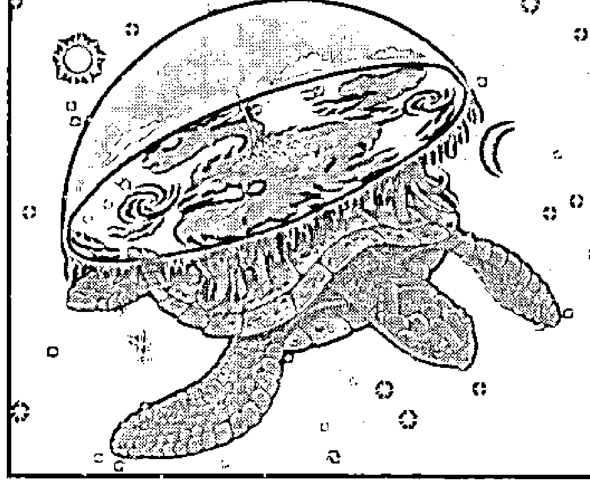

们展现了一些难忘的巫师形象），而且现在它们全都已经被 BBC 广播公司制作成了故事片。

奥伯伦笔下的碟形世界

### 第五节：众神的国度

#### 奥林匹斯山

我不知道世界历史上有谁会不承认有一个我们称之为“神”的群体居住在精神国度里。每一个这样神圣的住处就像一个独立的国家，居住着它自己的众神（pantheon，“所有的天神”）或神族。

在希腊，神所居住的主要场所是奥林匹斯山，位于塞萨利（Thessaly）一座 10,000 英尺高的高山上。然而，就像精灵一样，真正的神圣国度存在于一个平行次元中，仅仅只靠爬山是到不了那个地方的。奥林匹斯的入口被一扇云门阻挡，由霍莉（Horae）（司：“时间”或“季节”的女神）守卫。每个神都住在自己的宫殿里，他们的宫殿是用与他们相对应的金属建造的。为了放松，众神们会聆听由阿波罗和缪斯演奏的优美音乐——他们是奥林匹斯山的官方乐队。他们对凡世的人类事宜非常感兴趣，这些事情对他们来说就像一种伟大而间断的游戏——类似于“半人性（sim-humanity）”。众神会尽情享受珍馐佳肴（蜂蜜和罂粟花）以及会让他们长生不老的金色苹果（橙）。这种水果是每天从遥远的西方海岸的赫斯珀里得斯金苹果园（Garden of the Hesperides）里摘来的。尽管他们喜欢狄厄尼索斯的酒，但是他们特别神圣的饮料却是仙酒（nectar，蜂蜜酒）。就像

#### 太阳船（Mesektet 或 Manjet）

埃及的天神既会居住在天国，也会居住在物质世界里。最开始的时候，他们在地球上，和人类居住在一起。那是个“黄金时代”（Golden Age）。那时，正义统治着整个世界。他们的房屋是伟大的神殿，每一个神殿都只有唯一的一个主神。而每一个神殿都有着一些附属的小教堂和神坛为其服务。

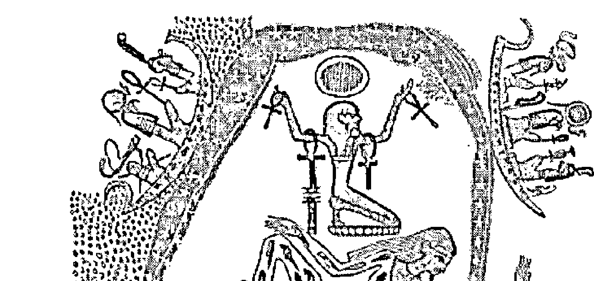

每天早上离开日出之山玛努（Manu）后，众天神也会在高高的上空乘坐伟大的太阳驳船跨过日间的天空，完全（虽然这个规模当然会更大一些）就像那些从三角洲到第一大瀑布排队等待通过尼罗河的船队。晚上，他们会在冥界的水道上乘坐“一百万年的三桅帆船”航行。因此，埃及天神的国度就像一个奢侈的宇宙巡游队！

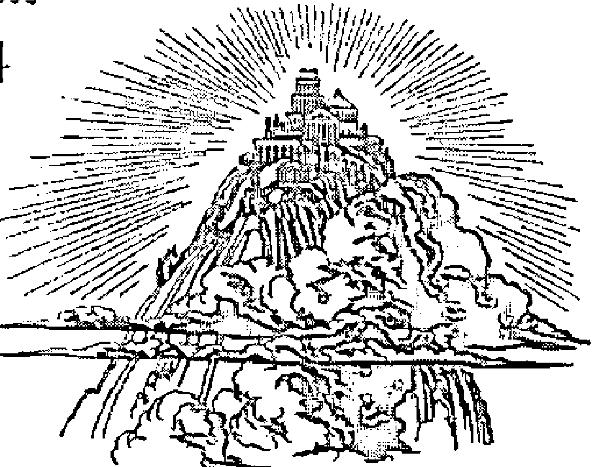

## 魔法师学徒的魔法书 | 下卷

在埃及，天神在尘世中的宫殿都是华丽的神庙，这些宫殿的壮丽表明了它们在朝拜者心中的地位。雅典的帕台农神庙、奥林匹亚山的宙斯神殿、以弗所的阿耳特弥斯神庙、特尔斐的阿波罗神殿、以及依洛西斯（Eleusis）的得墨忒耳神庙是这些天神神殿中最为著名的几处。其中还有两处（阿耳特弥斯的和宙斯的神殿）被列为“世界七大奇迹”。这些庙宇神殿的主要特色是它们都拥有一座巨大的天神雕像。

## 仙宫

正如上文所述，日耳曼人和斯堪的那维亚人所崇拜的北欧神族居住在仙宫之中，位于伟大的宇宙树高处的枝丫上。北欧天神有两个种族，亚萨神族（Aesir）和华纳神族（Vanir）。经历了长时间的冲突以后，这两个种族最终握手言和并且彼此通婚。华纳神族居住在华纳海姆（“华纳神族之家”）。仙宫自身由两个区域组成——众男神所居住的格拉德斯海姆宫（Gladsheim），以及众女神所居住的梵格尔夫（Vingolf）。很多天神都拥有自己豪华的神殿，例如托尔（Thor）的宅邸（“力量之家”），弗雷娅（Freya）的宅邸赛丝纶姆列尔（Sessrumnir）。奥丁神是其中最主要的神，他和女武神瓦尔基里（Valkyries）（少女战士）一起居住在死难英雄的宅邸瓦尔哈拉殿堂（Valhalla，英灵殿），在此他主持着整个仙宫的事宜。众神和英雄们在这里尽情地享受野猪和蜂蜜酒（蜜酒）。

## 天堂

犹太教和基督教的神话将天堂设想成位于天空之上、群星之外的，布满了金光的神圣区域。星星本身被看做天花板上的小孔，而天堂之光便透过这些小孔泄漏下来形成星光（单词“ceiling（天花板）”来源于拉丁语中的caelum，意味“天空”）。对于传统的犹太人，天堂是至高无上（而且唯一）的神耶和华的住所，只有耶和华才住在天堂，所有天使都被称为“众天使”。天使的食物是吗哪（manna）。只有极少数非常高尚的圣人以及先知才被允许进入天堂，成为天使（就像只有少数的希腊英雄才被神化并被允许进入奥林匹斯山一样）。这种“受祝福的灵魂”会加入伊希姆（Ishim）的队伍，成为等级最低的天使。耶和华坐在伟大的金制御座上管理整个天堂，对所有被带到他面前的人做出评定。在永恒的王座下面，流淌着液态的火焰之河。四大天使拱卫着王座。

- 右边是米迦勒——天堂的书记员，他会记下人类和国家的行为。
- 加百利手握他的正义之剑站在王座的左边。
- 其他两位天使中一位是掌管治疗者的拉斐尔，另一位是未在地狱值班的地狱统治者乌列。

在基督教的传统中，耶和华的右边坐着他的儿子耶稣，而他的左边则坐着耶稣的母亲玛利亚。基督会在那些接受了耶稣的人死后为他们的灵魂打开天堂之门。位于耶路撒冷的大圣殿被认为是耶和华在地球上的实际居住寓所。它最初是由所罗门在公元前950年建造的。公元前587年，巴比伦王尼布甲尼撒二世（Nebuchadnezzar）将它拆毁，并于公元前515年重建。最终，又在公元70年，被罗马将军提图斯（Roman General Titus）毁坏。从那以后再也没有重建过。

## 第6节：死者的领地

然而，随着这些信仰的散播，数不清的犹太教会会堂和神殿、耶稣会教堂以及纪念“我们的圣母”玛利亚的大教堂在世界各地迅速建立了起来。

很多好人年纪轻轻便会死去，或者遭受贫穷和疾病。而很多邪恶的人却拥有富裕，长寿，有所得的人生。大多数的宗教提到了来生的观点，讲述了在今生无法得到的公平正义。如果存在着死后的最终判决，那么邪恶最终会受到惩罚，而善良会获得他们应得的报酬。公正的天平终于得到了平衡。

来世、地狱，或者死者的领地这些概念就像神圣的国度居住着众神的信仰一样普遍。死者的领地是指那些已经死去的人的亡魂所居住的场所。在一些神话之中，亡魂就是简单地加入天神的行列，而其它的神话却表明他们会转世投胎，再次回到凡世在新的躯体中重生。

葬礼至少可以被追溯到尼安德塔人时代，而且似乎是人类物种的一个普遍特征。在仪式举行的位置参加葬礼的人们会穿着他们最好的衣裳、带着食物、死者的个人物品以及其它的一些“陪葬物品”，暗指他们希望死者会醒来进入坟墓以外的另一个人生。最后，会制作精美的石棺（棺材）和坟墓，随着木乃伊化的方法的诞生，人们为死者建立陵墓，以将尸体永恒地保存起来。一般来说，埋葬室都会在墙上雕刻或者绘制一些“大门”，以让死者通过这些大门通入到冥界。然后再仔细地描述死者会在那个国度遭遇什么样的事情，这些都成为了世界上大多数宗教的基础。

人们相信来生最重要的原因之一便是他们对正义的渴望。生活常常是不公平的。

### 埃及：心灵的称重

就像埃及人所撰写的通常被称为《死亡之书》（The Book of the Dead）的《即将到来的一天之章》（Chapters of Coming Forth by Day）中所描述的一样，死人的灵魂（ka，或者星光体）会穿过墓室在地下的隧道和通道的黑暗中游荡。最终他或者她会进入阿门提（Amenti），巨大的“死者审判大厅”。地狱判官俄赛里斯在大厅遥远的尽头处坐在一个伟大的架高的王座上。在他的手中握着生产力的象征物：一个连枷（用于收获粮食）以及一个曲柄牧羊棍（用于驱赶畜群），象征着他还原所有生命的力量。

在大厅的中央是一个拥有一套天平的神龛。灵魂必须背诵他在活着的时候没有承认的罪恶和邪恶的标准版42条“否定忏悔录”，在背诵的每一条之前加上“我未曾……”。这些必须满足雕刻在神龛周围的42条神圣判决（每一条对应着一个省，或者每一个埃及行政区），每一条忏悔者都要依次发表一点演说。这样做是为了向天神保证灵魂已经真正的重生了，已经让那些本不会承认这些罪恶的人变得高尚了。然后豺头人身神安努毕斯（Anubis）（死者的监护人）会将死者的心脏放在天平上，用司真相和公正的女神玛阿特（Ma'at）的鸵鸟羽毛称重。人身朱鹭头的透特（司书写的神）会记录下结果。

如果死者讲的是实话并且在活着的时候追随玛阿特的观念，那么他的心脏就会和羽毛一样轻。

通过了这个测试以后，他便可以继续他天堂般的死后生活，塞克特-阿努（Sekhet-Aaru）（“芦苇地”）——一个有着肥沃土地和湖泊的可爱世界，更像是埃及本身。在俄赛里斯的恩泽下受祝福的死者会永远居住在那里。但是，如果一个人活着的时候的罪恶让他的心过于沉重（如果他撒谎、欺骗、谋杀他人或者做过任何与玛阿特理念不符的事情），他们便需要为此付出代价。如果这个人没有改变，那么他（她）就会被喂食给动物，而那便是他（她）的命运。他的心将会用于喂食一只等候在神龛一旁的可怕的怪物。这只怪物是河马、猎豹、狮子以及鳄鱼的合成动物，她的名字是阿穆特（Ammut）——死人吞噬兽。在这最终的死刑判决后没有上诉，而死者也不会再继续存在下去。

### 幽冥厄瑞玻斯（Erebos），地狱塔耳塔洛斯（Tartarus），以及极乐世界（Elysian Fields）

宙斯的第三个弟弟波塞冬被委派担任了希腊地狱的统治者，而地狱通常也会以他的名字哈迪斯命名。他的冥后是珀尔塞福涅，每年，她会有半年的时间在他的身边同他一起统治整个冥府，剩下的半年她会回到地面世界履行她花神的职务。哈迪斯的国度被分为几个区域，这几个区域在神话中得到了很好的映射，并再现于几处秘密神谕中。除了那些少数的几位由天神挑选出来神化并邀请进入奥林匹斯山的英雄以外，地球上所有的亡魂都会被打入地狱。亡魂依旧可以吃、喝、说话，并且有情感。然而，他们不再有肉体而只剩下了影子；因此他们被称为阴魂。

进入地狱的入口位于西方，它由几条河流与生者的世界隔离开来。这些河流中的第一条被称为阿刻戎河（Acheron）——悲伤之河——这条河上摆渡新死的亡魂去阴间的船夫叫做卡戎（Charon）。他会收取早已放在每个尸体双眼上的两个硬币（有时会在双唇上放着第三个硬币）的渡船费。而没有支付渡船费的亡魂必须在岸边游荡100年。阿刻戎河连接着冥河斯提克斯（Styx），在此，天神曾许下了牢不可破的咒语。

从阿刻戎河的渡船上下来之后，亡魂便进入了幽冥厄瑞玻斯的范围。在此，他们会经过忘河（Lethe）——忘记之河。如果他们饮用了忘河中的黑水，他们便会减轻对其所作所为的负罪感，但是却会忘记他们前世所有的记忆。最后，阴魂会抵达哈迪斯宅邸的大门处。这里守卫着一只三头狗刻耳柏洛斯，它会高兴地和每个新来的阴魂打招呼，但是不会允许任何人的离开。冷酷的哈迪斯和严厉的珀尔塞福涅坐在他们伟大的王座上，在他们中间有着从地球深处堆积上来的大量的黄金和首饰。

在哈迪斯的大厅中，亡魂会交付给迈诺斯国王，拉达曼提斯（Rhadamanthus），以及爱考士（Aeacus）三位判官审判，他们会决定出每一个亡魂的去处。在生前做了好事的英雄和优秀的人会去极乐世界。这是一个充满了永恒福佑的地方，在那里，他们会与他们的亲人团聚。不够优秀不能进入极乐世界的灵魂会被送往常春花乐园（Fields of Asphodel），在此，他们就像僵尸一样没有思想，没有感觉地飘荡。那些在前世非常邪恶的人，例如吕狄亚王坦塔罗斯（Tantalus），科林斯王西绪福斯（Sisyphus），以及拉庇泰王伊克西翁（Ixion）都被送往了地狱塔耳塔洛斯去忍受一种永恒的具有讽刺意味的适当的惩罚。

塔耳塔洛斯是地狱中最深处也是最古老的部分，它与地面的距离就像天堂与地面的距离是一样的，只不过一个在下一个在上。它是一个潮湿黑暗的地方，由一堵青铜墙环绕在周围，在青铜墙外是三倍的黑暗层。塔耳塔洛斯是一个关押失败的泰坦神的监狱，由百手巨人赫卡同刻伊瑞斯（Hecatonchires）守卫。痛泣之河科塞特斯河（Cocytus）和地狱火河佛勒革同河（Phlegethon）环绕着塔耳塔洛斯，流入阿刻戎河。

### 冥府安芬和夏日乐园（Summerland）

威尔士人的冥界安芬就像是位于神秘海洋中的彼此分离的群岛。这里容纳着很多不同的生命、天神、以及灵体，同时还有亡魂。其中三个主要的地区是凯尔怀德（Caer Wydyr），凯尔费得韦德（Caer Feddwid），以及阿伦岛（Arran）。凯尔怀德（“玻璃城堡”）是一个黑暗、阴郁的地方，在上面居住的只有迷失的沉默灵魂。这是人死之后最不想要来到的地方。凯尔费得韦德（“狂欢城堡”）由银轮阿瑞安诺德统治。空气中充满了迷人的音乐，流动着魔法酒液的喷泉会让人永葆青春和健康。阿伦岛是一个永远夏日的地方，岛上有长满草的绿地和流淌着甘甜河水的河流。在阿伦岛上可以找到大量的与圣杯有联系的大汽锅。只有那些心灵纯净的人才允许进入阿伦岛。现代的威卡教大多数情况下会将此处称为“夏日乐园”。

在凯尔特人的冥界中，不同的神或者统治者统治着各种各样的国家地区。这些区域中最为古老的便是科努诺斯（Cernunnos）（“头上长角的冥府之神”），他掌管着所有的凯尔特亡魂。他还被称为猎人赫恩（Herne the Hunter），带领夏末节前夜的荒野狩猎。另一个相似的狩猎神是格温（Gwynn），他要捕食灵魂，宣布他们进入冥府。唐（Donn，“棕色的神”）是爱尔兰的死亡之神。他的领域是一个位于爱尔兰西南海岸的小小的多岩石的岛屿，名为唐的房子，他会欢迎他的后辈——爱尔兰人——在死后来到这个地方。

皮威尔（Pywll）是一名威尔士王子，他曾有幸见到冥府之王安努恩，他俩彼此达成协议借用对方的肉体将彼此统治的王国进行一次交换。他们两位都将对方的王国管理得井井有条，并且在交换结束以后对这样的安排很是满意。米德尔（Mider）是盖尔人的冥界中一位仁慈的神。他的妻子是艾坦（Etain）。他只是一个沉闷而痛苦而非痛苦与拷问的国度的最高统治者。然而，比勒（Bilé）却是一位邪恶的统治者，他的王国是一个广阔的不毛之地，上面居住着被压碎的灵魂和折断的肉体，这些人必须向他致以永恒的敬意。布兰（Bran）在威尔士神话中是一位人类英雄。他因激怒了天神而被砍头，然后被逐下地狱统治冥界作为惩罚。布兰的王国中住满了失败的英雄，他们因必须在此处花费永生的时间而感到遗憾。

## 瓦尔哈拉殿堂和地狱

——戴安娜·帕克森（Diana Paxson）

在北方，民众对于来世在不同的时间和不同的地点有着不同的看法。这里有许多种不同的选择。在战斗中死去的凶猛的维京英雄会由奥丁神的一个女武神瓦尔基里或者“杀害的选择者（choosers of the slain）”接收。这些美丽的少女战士骑着飞马，穿过天空，越过大海，跟随着每一场战斗的进程。他们亲吻倒下的英雄，将他们的灵魂带到奥丁神的瓦尔哈拉殿堂。在那里，这些战士在光荣的战争中不停地战斗，以消磨他们的日子，在这个战争中他们已经死去，却因此赢得了永恒的名声。每天晚上他们会大快朵颐野猪肉和蜂蜜酒，一直到心满意足。阵亡的女战士则可能去到弗雷娅的府邸。人们通常认为国王会继续活在他们的墓地中，在那里，他们可以收到祭品，并且祝福供奉他们的人。一些居住在神圣山丘（陵墓）里面的家族，有的会成为alfar（男性）和disir（女性）守护神一直照管着他们的后代。

然而，“预设”的目的地就是地狱，这就是祖先们的普遍家园。就像大多数的地方一样，这里既有好邻居也有坏街坊。拥有大量的麦芽酒和蜂蜜酒的巴尔德尔神（Balder）宴会大厅中充满了欢声笑语。然而，被称为纳斯特隆德（Nastrond）的那部分是一个可怕的监狱，这里面关押着违背誓言的人以及其他的犯罪分子，它的墙壁是由毒蛇编织而成的，而监狱中毒蛇的毒液沿着地面流淌。这个区域是由海拉（Hella）管辖，海拉是邪神洛基（Loki）和女巨人安格尔波达（Angurboda）的女儿，也是芬里尔（Fenris Wolf）和尘世巨蟒（Midgard Serpent）的姐妹。海拉半黑半白，既是活人也是亡魂。海拉统治的领域远在米德加德（地球）之下，奥丁神八条腿的天马斯莱布尼尔（Sleipnir）都需要花费九天九夜才能抵达。它被吉欧尔河（Gioll）四面包围在生者无法逾越的陡峭城墙中。地狱位于危险的附和桥的另一边，在那里的试图穿过桥去另一边的灵魂都得接受女巨人莫得古德（Modgudh）的挑战。臭气熏天的格尼巴洞穴（Gnipahelli）的入口由凶猛的巨狗加姆（Garm）看守。然而，在东边还有另一扇门，奥丁神会通过那扇门进入地狱，从古代女先知的灵魂那里求得预言。

## 天堂，地狱和炼狱

罗马天主教教会教导我们，我们来世主要有两种可能性。几乎所有人都将在天堂或者地狱度过永生。天堂是一个有永恒的欢乐和福佑的七层乐园，在此，你可以亲近上帝，与天使共存。地狱是一个炽热的有着永恒痛苦和惩罚的火坑，由魔王（撒旦或路西法）统治，里面住满了恶魔，这些恶魔原本是叛乱的天使，在伟大的“天堂之战”中失败之后被贬入地狱。

一个人的最终目的地是在他们死亡的那一刻由他们的救赎状态所决定的。人们认为新生儿是带着“原罪”出生并一生都会受到“原罪”的折磨。婴儿只有通过教会仪式的洗礼才可以从这种原罪状态中得到救赎。一个人一旦到达问责的年龄，任何人类的罪恶都可以使他们失去被救赎的机会，所以他们便会被“诅咒”，并被贬下地狱。然而，通过向神父忏悔他们的罪恶，便可以恢复对他的救赎。在未达到法定问责年龄就已经死亡的孩子的灵魂，以及古往今来的没有得到救赎便已经死去的其他有价值的人的灵魂，会去到一个快乐的名为地狱边境（Limbo）的地方。他们必须在那里等待直到最终判决，那时他们才会被允许进入天堂。

圣人和那些非常虔诚的人在死后会立即被送往天堂。但是大多数人都会先被送往炼狱，在那里他们会受到系统化的火刑拷打，直到他们变得足够纯净以后才能进入天堂。那些曾犯过一些不可饶恕的大罪的人或者那些不被神明接纳的人们都会被直接贬下地狱，在那里他们会受到恶魔永世的拷打，没有任何救济或者宽容的希望。

天主教中所描述的地狱是一个有九个同心环的巨大的深渊，而那些被诅咒下地狱的人会被分配到不同的环层并根据他们的罪恶接受不同的惩罚。地狱的首都被称为魔窟（Pandemonium）（“所有恶魔存在的地方”）。

其他的基督教教派提出了对于来世的不同幻想，但几乎所有的教派都包括了天堂与地狱这两个相对应的概念。然而，大多数教派都省略了炼狱。很多教派都将天堂想象成一座辉煌壮丽的城市，它的街道和每一个神所居住的宅邸都是由黄金铺就。圣彼得手中握着一本书坐在天堂之门的前面，书上记录着所有申请者的所作所为，而他会将每一个人送往相应的住所。他们都会变成天使，背上长翅膀，身着长袍。

# 魔法师学徒的魔法书 | 下卷

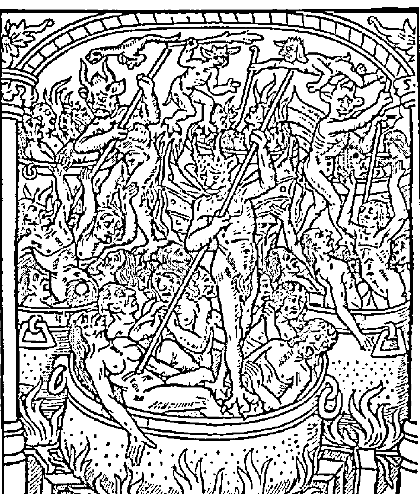

地狱（Le grant kalendrier et compost des Bergiers），1496年

袍，头上有光环，还拥有一把竖琴。

## 其他版本的来世

根据《古兰经》，天堂（“带围墙的花园”）只是为虔诚的穆斯林男人准备的。这是一个辉煌灿烂的绿洲，有花园、河流和树木。男人们穿着丝绸衣服，躺在奢华的沙发上，还有无数的美味多汁的水果和美酒。一群漂亮却没有灵魂的黑眼睛天堂女神会永远为快乐的信徒团体服务。所有其他的人都会被交付给一个仿造基督教版本所描绘出来的地狱之中。穆斯林妇女被认为是没有灵魂的，死了就是单纯地死了，没有任何去处。

在佛教和印度教中，关于来生的众多领域都是一种永不停息的循环，从出生，到死亡到重生，在此过程中灵魂必须经受灵性的进化，直到最终完全地从转世“轮回”中逃离。每一个死亡的灵魂该去天堂还是地狱这个问题会根据一个人在他的上辈子的所作所为来判定。经过一段时间的沉思以后，他们会转世开始一段新的生命旅程——这一世会比上一辈子的境遇更好或者更坏取决于他们如何使用这一次生命，以及他们所学到的经验教训。

《西藏度亡经》（Tibetan Book Of The Dead）说在死后，每一个灵魂都会来到死神阎罗王（Yama）的面前，此时阎罗王会拿起一面镜子，人们在前世的所作所为都会反射到镜子里面。阎罗王的镜子其实是这个灵魂自身所拥有的记忆，因此阎罗王的判决实际上是死者对自己的一种判定。每一个人都宣告自己的判断，从而决定他们的来世。

# 第二课：列国的神

> > 啊，听我的歌吧，哦所有的国家的神啊
> 这是一首和平之歌，为了他们的领土，也为了我的！
> ——《芬兰颂》（芬兰国歌）

## 第一节：简介——痛苦（Theagonies）

世界上的万事万物：山脉、湖泊以及河流，森林、沼泽以及旷野，惊涛骇浪的海洋、肥沃的土地、炙热的沙漠，太阳、月亮、旋转的星星，辽阔的地球、巨石阵、金字塔、吴哥窟，动物和人类。这里还发生着一些事情：火山爆发、日食和月食、彗星横扫天空、陨石碰撞着地球、地震摧毁城市、冰川和洪水覆盖地面。潮起潮落、四季更替、阴雨绵绵。

于是便存在了很多我们讲述事物和事情的故事。其中大部分是通过解释的方式：最开始的时候世界上的万事万物是从那里来的？在很久很久以前到底发生了什么？这些东西是怎么变成我们现在所看到的这个样子的？我们是谁？我们来自哪里？我们将要去往何方？一些故事是用来传达经验教训的，通过一些例子来教导我们——既有积极的方式（“像明智的某某人那样做。”）也有消极的方式（“不要像某某人那样愚蠢！”）。有些故事解释了为什么我们重复某些风俗习惯（“而这就是为什么从那时候开始，我们便……”）

## 创世神话

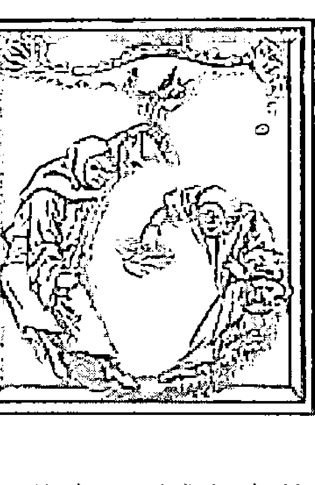

有关所有人的起源的故事就是我们所说的创世神话。这些最简单的故事告诉我们人是怎样产生的，而那些真正要求很高的故事会解释清楚整个世界和整个宇宙是怎样产生的。从那些讲述这些故事的观点来看，每一个故事都是不尽相同的，而且都是独一无二的。当它们都以一种隐喻的道理来表达某些真理时，那么它们中便没有一个在字面意义上可以被看作是“真实的”——尤其是因为几乎所有的这些故事都以地心宇宙论为前提，而随后才产生了太阳、月亮和星星！

然而，在每一种文化中，天神和最后的人们的后代都通过最初的创造被神话般地联系在了一起，而他们也在这种最初的创造中继续前进。因此了解这些故事是非常重要的。当然，这里面所包含的内容不是我在这里三言两语便能讲清楚的。我只是一很少的一点空间来提到其中很少的一部分。市面上有很多关于神话和传说的极好的书籍，而你们还可以在网上搜寻一下。

## 世界时代

正如现代考古学家所说的石器时代，青铜时代，以及铁器时代一样，许多人将他们的历史概念分成一种按顺序排列的世界时代。然而，不同于我们现代的“发展”观念，这些概念通常开始于一种在最初创造的时候的完美乌托邦世界的美景，随着时代的不断变化而逐步地退化，呈现出了时间的悲痛和悲惨。通常情况下一个时代的结束会以一次巨大的灾难为标志，例如洪水，小行星撞击地球，冰川作用，或火山爆发造成的。这种世界时代序列中一个最为典型的例子便是希腊的版本：

### 黄金时代 (The Golden Age) ——

这是一段非常完美，天真无邪和并且充满了幸福的时期，此时流行的是真理和公正。战争是未知的，众神行走在凡人之间，整个世界处于永恒的春天之中（这段历史所对应的也许是新石器时代，大约在公元前 8500—5000 年）。

### 白银时代 (The Silver Age) ——

这段历史时期四季严酷，充满了苦难、困苦以及死亡的时代。众神撤离了地球，人们不得不努力劳动，耕作土地，建造房屋（这段时期对应的也许是铜器时代，大约公元前 5000—3000 年）。

### 青铜时代 (The Bronze Age) ——

这是一个充满了战争和暴力的时代，在这个时代中，强大的人类总是在互相残杀（大约公元前 3000—1500 年）。

### 英雄时代 (The Age of Heroes) ——

希腊人在此处插入了一个充满了半神和英雄的时代。一直持续到特洛伊战争爆发（大约公元前 1500—1200 年）。

### 铁器时代 (The Iron Age) ——

这段时间充满了劳动和辛勤的工作，同时还有猖獗的犯罪活动。积极的理想被抑制，贪婪，欺骗，仇恨，以及战争支配着人类和国家的思想（从公元前 1200 年开始……）。

## 众神 (Pantheon)

众神这个词的意思是“所有的天神”。每一种文化中神殿都有其所特有神灵“家族”，他们都会受到这个民族的尊敬和崇拜。每一种文化都有它自己的众神，只是针对他们自己文化的众神，也没有一种众神是适用于世界上的所有人的。每一个民族的神明都扎根于这个民族所有人民的右脑之中，而其实际上的特征就像每一个都有其独特的性格一样是不尽相同的。因此他们既是永垂不朽，也是无所不在的。这一点非常重要，必须要理解：天神是真实的——就像你我一样地真实。

神的实际的起源已经遗失在在时间的迷雾之中，而我们所知道的一切就是流传下来的神话。但是所有的传统文化都包含了这样一个观点，人类的典范在死后会被神化。一些学者认为所有众神，诸如挪威人、希腊人、埃及人、凯尔特人、印度教、达纳神族 (Tuatha De Danaan) 等等民族的众神也许都是曾经在他们活着的时候在地球上产生了伟大影响的人类，而在他们死亡后很长一段时间内都在继续做着这样的事情。

在这节课中，我只挑选了世界上很多的众神中的其中一些来进行讲解。印度、亚洲、美洲、巴尔干半岛地区、太平洋诸岛，以及很多其它的国家的天神都仅仅是因为空间有限而不得不略去。如果你想要探讨其他国家的神话和天神，我推荐你查阅网上的神话百科全书（Encyclopedia Mythica），网址为：http://www.pantheon.org/mythica.html

基督教和伊斯兰教神话把老一代的天神排挤为堕落天使或者魔鬼。

## 继承

一个文化持续的时间越长，其众神便会进化和改变的越多。在世界上很多地区，会接连发生一系列类似于新民族的迁入、侵略、征服，并且与先前的居住者通婚的事情。在新旧石器时代，在印度、伊朗、美索不达米亚平原和希腊的农业文明，集中在将大地母亲女神和她的儿女作为次要的神明来敬拜。这些人大约在3500年前被那种由族长统治的印欧游牧战士部落统治，这个部落主要崇拜神圣的男性祖先。

## 第二节：美索不达米亚

美索不达米亚（“两河之间的土地”）是位于现在的伊拉克的肥沃平原，底格里斯河及幼发拉底河流经这片平原。从大约公元前3500年开始，这里便是苏美尔人、巴比伦人、亚述人和迦勒底人（按照时间顺序）的家园。我们所拥有的最完整的历史是从巴比伦时期（公元前612年到公元前538年）开始的，但是这些历史都是建立在更老的苏美尔神话上的，就像罗马人与希腊人的关系一样。

每一次新的浪潮都会带来他们自己的神，而且每一次浪潮之后都需要对原有的神话进行调整，以解释这些浪潮的发生。大部分的与前基督教密切相关宗教都是印欧祖先崇拜与新石器时代的女神崇拜之间的汇合。一些神族，如位于斯堪的纳维亚的新石器时代华纳神族和印欧的亚萨神族，达成和平协议，将两者的众神融合在一起。其他的神族，例如在希腊，把新出现的神看作是老一代天神的后代（泰坦巨神）。犹太教、基督教和伊斯兰教神话把老一代的天神排挤为堕落天使或者魔鬼。

### 在最初的时候……

大神提亚马特（Tiamet）是混沌的原始海洋中的一条伟大的龙蛇（dragon-serpent）。在一场伟大的战斗后，她被主神马杜克（Marduk）杀害。他把她的身体切成两部分，因而创造了天和地。他将恒星和行星摆放在天空之中，并且确立了它们的运动轨迹。然后，他在父亲伊安（Ea）的建议下创造了人类。地球母亲尼哈萨迦格（Ninhursag）打理并培植了伊甸园，在这个花园中种植了两棵分别代表生命和智慧的树。

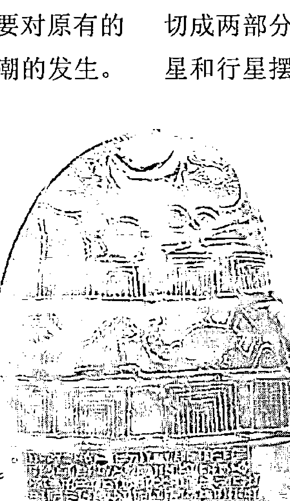

### 巴比伦的神

- **阿达德 (Adad)** （苏美尔神话中的哈达（Hadad））—— 司掌雷，闪电，和雨的天神。他的妻子是莎拉（Shala）。
- **阿拉图 (Allatu)** （苏美尔神话中的厄里斯克革（Ereshkigal））——司掌冥府的女神。她的丈夫是奈格尔（Nergal），司掌瘟疫和毁灭的神。
- **安努 (Anu)** ——苍天神，众神之父。众神中最年长的神，他便是北极星，统治着命运。
- **阿舒尔 (Asshur)** ——战神。
- **伊安 (Ea)** ——司掌水的男神：海，泉水和河流。他还是司掌空气，智慧，以及生命的神，他还是一名陶艺家，是他创作了所有的神和人类。
- **恩利尔 (Enlil)** ——伟大的山脉（地球）之神，也是黄金时代的统治者。
- **基鲁 (Girru)** ——全方位的火神。
- **伊师塔 (Ishtar)** （苏美尔神话中的伊南娜）——天堂的女王，司掌爱情和战争的女神，她是安努的女儿。她的配偶是植被之神塔穆兹（Tammuz）。
- **马杜克 (Marduk)** ——司掌春日暖阳，审慎，以及智慧的神。他是伊安的儿子，他的妻子是塞尔芬尼特（Zarpanit）。是他创造了天地。
- **尼波 (Nebo)** ——马杜克的儿子，他是司掌学习和创作的神。
- **尼尼伯 (Ninib)** ——司掌生产力和治疗的神。他的妻子是古拉（Gula），伟大的医师和治疗女神，她能够恢复生命。
- **沙玛什 (Shamash)** ——太阳神，正义的拥护者，法律的施予者。他也是一名治疗师和赋予生命的人。
- **西恩 (Sin)** （苏美尔神话中的娜娜[Nanna]）——月亮之神，恩利尔的儿子。他的王后是宁格尔（Ningal）。
- **祖 (Zu)** ——风雨神。他从恩利尔那里盗走了命运的书写板。

## 第三节：埃及

由肥沃的尼罗河流域隔离开来，北方边界为海洋，南方为大瀑布，炙热的沙漠延伸到国土的东部和西部，埃及的文化在罗马征服之前绵延不断持续了大约3000年。

### 在最初的时候……

在世界洋（Nu）中存在着那步切（Neb-er-tcher）（“极至之神”）。他将自己重新命名为凯布利（Khepri）（“造物主”），他为自己创建了一个可以立足的地方。然后他就变成了太阳神拉。通过把自己的影子结合在一起，他创造了风神舒（Shu）（干燥的空气）和雨水之神泰芙努特（Tefnut）（雨云）。之后这两个神再结合，便形成了努特（Nut）（天）和盖布（Geb）（地）。他们在拉旅行跨越太空的白天会被舒（空气）分开，可是一到晚上，努特便会下降靠在盖布的身上休息。他们成为了伊西斯和俄赛里斯，塞特和内普特斯的父母，因而形成了完整的九柱神家族（Ennead）（“九个”）——也就是在埃及的每一个神殿中都会看到的基础众神。

### 九柱神家族

- **凯布利（拉）**——太阳神，埃及的守护神。他的象征是圣甲虫在滚动一个粪球。
- **舒 (Shu)** ——司掌炎热干燥的风和大气的神，他分隔着天（努特）和地（盖布）。
- **泰芙努特 (Tefnut)** ——司掌凉爽潮湿的午后微风和温和滋润的小雨的女神。
- **盖布 (Geb)** ——司掌地面的男神。
- **努特 (Nut)** ——司掌黑夜和星空的女神。
- **俄赛里斯 (Osiris)** ——司掌生命，死亡和重生的神。阿门提（冥界）的统治者，伊西斯的丈夫。他们的儿子是何露斯。埃及的酒神狄厄尼索斯（酒神），他是司掌面包、啤酒和葡萄酒的神。已故法老被视为是俄赛里斯。
- **伊西斯 (Isis)** ——伟大的月亮女神，在埃及和整个罗马帝国她都是宇宙的女神。她的象征符号是一个王位。
- **塞特 (Set)** ——司掌混沌、黑暗、尚未被创造的宇宙，以及燃烧的红色沙漠的神。他与玛阿特正好相反，还是俄赛里斯和何露斯的主要敌人。
- **内普特斯 (Nephthys)** ——司掌死亡的女神。她是塞特的妻子，安努毕斯的母亲。

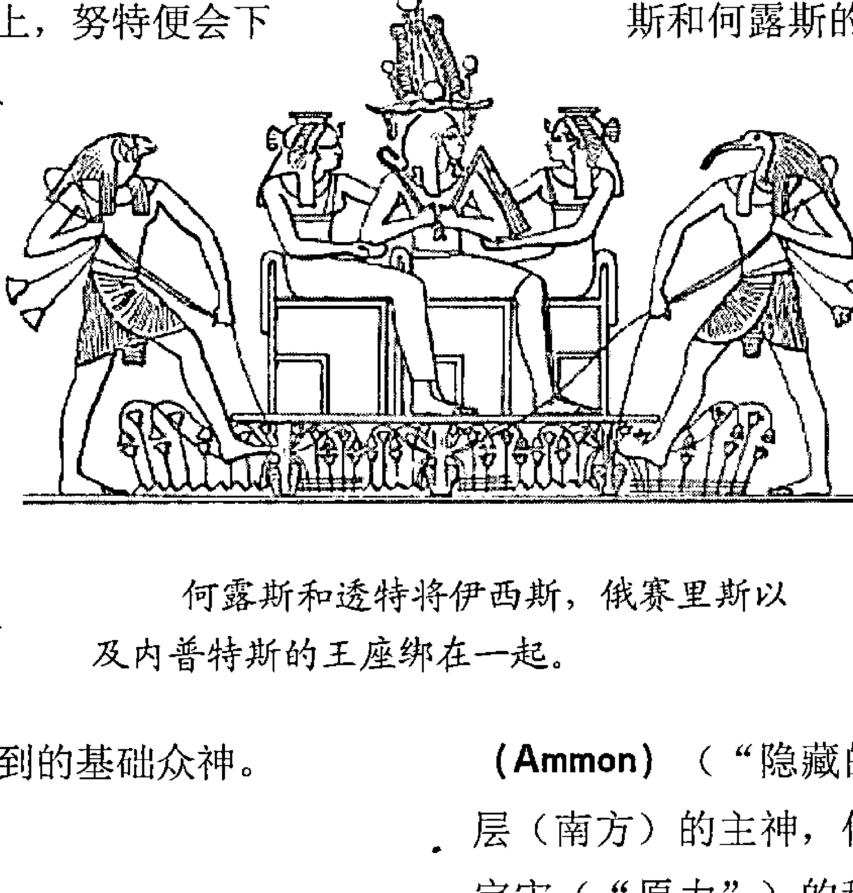

### 埃及其他的一些重要的神明

- **阿蒙神 (Ammon)** （“隐藏的神”）——埃及上层（南方）的主神，他代表着创造和支撑宇宙（“原力”）的秘密力量。他的妻子是马奥特（Maut），众神的母亲和天空的女主人。
- **安努毕斯 (Anubis)** ——豺头人身神，司掌尸体防腐和冥府的神，内普特斯和塞特的儿子。塞特被何露斯打败之后，他就被欧利西斯收养了。他成为俄赛里斯在生命世界中的送信者，还是我们睡觉和魂旅期间的守护神。
- **班斯特 (Bast)** ——亲切温暖的阳光的猫女神（Cat goddess）。
- **哈皮神 (Hapi)** （希腊的神牛埃皮斯（Apis）和塞拉皮斯神（Serapis））——被描绘成一头神圣的黑牛，被视为俄赛里斯的化身（肉身）。作为希腊塞拉皮斯神，他是疗愈之神。
- **哈索尔 (Hathor)** ——司掌爱与美丽的奶牛女神（Cow-goddess），她是埃及的阿佛洛狄特。她的象征符号是叉铃。
- **何露斯 (Horus)** ——鹰头神，光明之主，伊西斯和俄赛里斯的儿子。在位的法老被尊称为何露斯的活化身，是埃及所有人的个人保护神、救星。
- **克伊姆 (Khem)** ——司掌收获的神，农业的保护神，他是埃及的绿人。被描绘成一个木乃伊，他的名字也是埃及的名字。他最后被归入了俄赛里斯那一类中。
- **克奴姆 (Khnum)** ——尼罗河发源地之主，他有一个公羊头。他是一个陶艺家，用尼罗河的泥浆塑造了所有的生物。
- **玛阿特 (Ma'at)** ——司掌真理和正义，法律与秩序，伦理和道德的女神。她的象征符号是一片鸵鸟的羽毛。
- **奈斯 (Neith)** ——司掌外层空间的女神，拉（Ra）的母亲。也是尼罗河流域的大地母亲。她的丈夫是克伊姆。
- **卜塔 (Ptah)** ——工匠能手，制造了月亮，太阳，以及地球。他在孟菲斯被称作万物开始之父。
- **赛克麦特 (Sekhmet)** ——凶猛的母狮女神，燃烧的太阳女神，是女性的保护神。
- **塞尔赫特 (Selkhet)** ——蝎子女神，陵墓和木乃伊的守护神。
- **特胡提 (Tehuti)** （希腊神话中的透特）——被描绘成一只朱鹭或者（“神圣的”）狒狒，透特神是司掌写作，智慧，魔法，艺术与科学的天神；是所有巫师的守护神——埃及的赫尔墨斯。
- **瓦吉特 (Wadjet)** ——眼镜蛇女神，保护着太阳和王室家族。她由神蛇标记符号（一只人工饲养的有兜帽的眼镜蛇）代表。

## 第四节：希腊和罗马

亚加亚人 (Achaeans)（希腊人）于公元前2000年左右首次定居到希腊的各个区域。罗马人虽然给希腊的神冠以了不同的名字，但是他们所采纳的希腊神却是很完整的。希腊版本有关这些神的起源和故事可以在赫西奥德的《神谱》（“神的诞生”）中和荷马史诗的《伊利亚特》和《奥德赛》中找到。有关罗马神的起源和故事的藏书是奥维德的《变形记》（“转变”）。

### 在最初的时候……

最早出现的神是卡俄斯 (Chaos)，在他之后是拥有广阔胸怀的盖亚，她是所有居住在被雪覆盖的奥利匹斯山顶上的众神们，以及位于尘世深渊的暗无天日的塔耳塔洛斯，以及爱神厄洛斯的坚实不可动摇的基础。

从混沌中诞生了幽冥，这个阴郁、黑暗的虚无（“夜晚”）。

但盖亚的第一个孩子，和她的每一分尺寸都十分相配，星空乌拉诺斯将她全身笼罩在他之中，成为了是受祝福的不朽之士的一个不可动摇的立足之地。然后她分娩出了高山，成为了备受住在山上和森林之中的宁芙女神喜爱的野外栖息之所。她还创造了贫瘠的海洋，庞多斯（Pontos），在他愤怒的波浪中沸腾。——赫西奥德《神谱》

### 泰坦众神

泰坦众神是一群神一般的巨人，他们赋予了自然力以人性。第一群泰坦是乌拉诺斯（天）和盖亚（地）的六个儿子和六个女儿。这些夫妻是：克罗洛斯（时间）与瑞亚（自然）；伊阿佩托斯（规则）和西弥斯（Themis）（正义）；俄亥阿诺斯（Oceanus）（外海）和忒提斯（Tethys）（富饶的海洋）；亥伯龙神（Hyperion）（阳光）和忒伊亚（Theia）；克利俄斯（Crius）和记忆女神摩涅莫辛涅（Mnemosyne）（记忆）；科俄斯（Coeus）和福柏（Phoebe）（月光）。这些人在数代之后拥有了许多子孙后代，普及整个自然世界。

乌拉诺斯仇恨他所有的儿女，因此，在他们将要出生的时候，他把他们都推入地球的深处塔耳塔洛斯之中。听到他们痛苦的呻吟之后，盖亚号召她最小的孩子克罗洛斯去找他的父亲报仇。克罗洛斯带着一把金刚石般坚硬的镰刀，阉割了他暴虐父亲，将切下器官丢入了大海。从这种血型的泡沫中诞生了美丽的爱之女神阿佛洛狄特（“从泡沫中出生”）。克罗洛斯宣称王后释放他所有的哥哥和姐姐泰坦们，并和瑞亚成婚。

### 奥林匹斯山众神

瑞亚和克罗洛斯的孩子依次是：女神得墨忒耳，女主神赫拉，女灶神赫斯提（Hestia），海神波塞冬和主神宙斯。为了巩固他的主权，猜忌心颇重的父亲在他的孩子一出生就把他们吞入腹中。但瑞亚设法保住了她最后一个孩子——宙斯。她把他藏在克里特岛的一个山洞里，并用宙斯的襁褓将一块石头包在里面，于是克罗洛斯将那块石头当成是宙斯将他吞下。当宙斯长大以后，他反过来推翻了他的父亲，并让克罗洛斯吐出了他永生的兄弟姐妹们。这些孩子最终便成为了奥林匹斯众神，居住在10,000英尺高的塞萨利山上。

像泰坦众神一样，奥林匹斯神也有十二个。他们包括瑞亚和克罗洛斯的六个孩子，还有后来加入的阿佛洛狄特，阿瑞斯，阿波罗，阿耳忒弥斯（Artemis），雅典娜，赫耳墨斯——他们的下一代，将奥林匹斯众神的数量增加到十二个。多年以来，其他的一些天神陆陆续续被奥林匹斯所承认并吸纳，其中还包括某些神化了的英雄，例如赫拉克勒斯。

### 奥林匹斯十二神

- **阿佛洛狄特 (Aphrodite)** （罗马神话中的维纳斯[Venus]）——司掌爱，美丽和性的女神。他的丈夫是：火神赫菲斯托斯；情人：阿瑞斯。象征符号：镜子和鸽子。行星：金星。
- **阿波罗 (Apollo)** ——太阳神，司掌音乐预言的天神。阿耳忒弥斯的孪生兄弟。

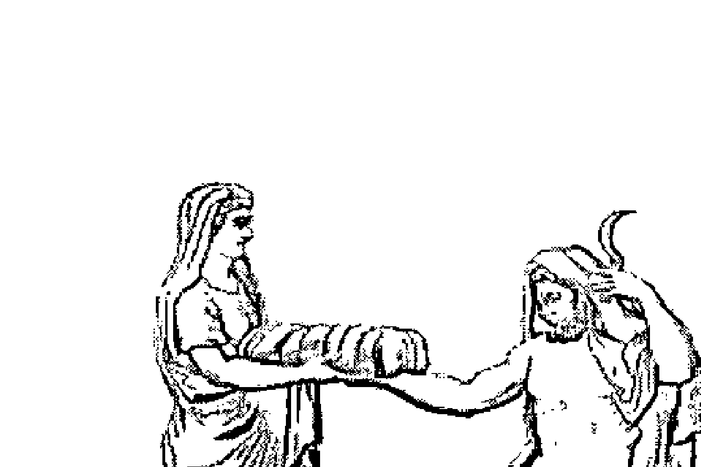

象征：一架七弦琴。行星：太阳。

## **阿瑞斯 (Ares)**

（罗马神话中的战神马耳斯 [Mars]）——战神。象征：长矛和盾牌。行星：火星。

## **阿耳忒弥斯 (Artemis)**

（罗马神话中的黛安娜 [Diana]）——月亮和狩猎的女神。阿波罗的孪生妹妹。象征：像新月一样的弓，鹿，猎犬。行星：月亮。

## **雅典娜 (Athena)**

（罗马神话中的密涅瓦 [Minerva]）——司战争和智慧的女神。象征：盾牌，长矛，护盾（美杜沙的头做成的护胸甲）。

## **得墨忒耳 (Demeter)**

（罗马神话中的刻瑞斯 [Ceres]）——地球的女王，司谷物和所有栽培植物的女神。象征：装满花果和谷穗代表丰饶的羊角状物，小麦穗。

## **哈迪斯 (Hades)**

（罗马神话中的普路托 [Pluto]）——地狱，死人，所有埋葬的东西，和矿藏财富的统治者。他的妻子：珀尔塞福涅。象征：双叉节杖。行星：冥王星。

## **赫拉 (Hera)**

（罗马神话中的朱诺 [Juno]）——众神之女王，宙斯的妻子。负责婚姻，女人，家庭。象征：孔雀尾巴上的羽毛。

## **赫尔墨斯 (Hermes)**

（罗马神话中的墨丘利 [Mercury]）——众神的使者。负责沟通，魔法，秘传知识，隐秘的事，偷窃。他是所有巫师的守护神。象征：墨丘利节杖。行星：水星。

## **女灶神赫斯提 (Hestia)**

（罗马神话中的维斯塔 [Vesta]）——司壁炉和家庭的女神。

## **海神波塞冬 (Poseidon)**

（罗马神话中的海神尼普顿 [Neptune]）——海洋的统治者，掌管波浪，潮汐，海怪；还有马匹和地震。他的妻子：安菲特律特（Amphitrite）。象征：三叉戟。行星：海王星。

## **宙斯 (Zeus)**

（罗马神话中的朱庇特 [Jupiter]）——众神之王，统治天空，云，雷，闪电，判断，权威等。他的妻子：赫拉。象征：雷电和鹰。行星：木星。

## **希腊的其他一些重要的神**

### **狄厄尼索斯 (Dionysos)**

（罗马酒神巴克斯 [Bacchus]）——司掌葡萄树，葡萄酒，醉酒，以及灵感的天神。珀尔塞福涅和哈迪斯的儿子。

### **爱神厄洛斯 (Eros)**

（罗马爱神丘比特 [Cupid]）——司爱和宇宙中最初的引力的天神。最早诞生于混沌之中，后来他化身为阿佛洛狄特的儿子。

### **火神赫菲斯托斯 (Hephaestus)**

（罗马火神伏尔甘 [Vulcan]）——冶金神，宙斯的儿子。他是一名伟大的工匠，所有神用的武器和工具都是由他锻造的。

### **潘 (Pan)**

——最古老的神之一，代表了万物中的野蛮。他是半人半羊神，他的象征是潘神箫（syrinx），或牧羊神之笛。

珀尔塞福涅（Persephone）（罗马神话中的普罗塞耳皮娜 [Proserpina]）——得墨忒耳和宙斯的女儿，冥王哈迪斯的妻子，冥界的女王。她的象征符号是罂粟花。

在希腊罗马式神话中还有很多其它的存在：缪斯女神、命运三女神、怪物、仙女纽墨菲，还有半兽人，例如半人马、半人兽以及美人鱼。

## **泰坦之战**

宙斯领导的泰坦战争（Titanomachia，“巨人的战斗”）奥林匹斯山众位泰坦之神之间的战争。这场战争开始于宙斯阉割和罢免他的父亲克罗洛斯之后。经过长达十年的战争，宙斯向盖亚寻求帮助。她建议他从地狱释放出独眼巨人库克罗普斯和百臂巨人。这三个库克罗普斯（“轮眼”）都是在前额的中间有一个眼睛巨人。他们是雷、闪电、流星的制造者。三个百臂巨人赫卡同刻伊瑞斯（“百臂”）中的每一个都拥有100支手臂和50个头，甚至比强有力独眼巨人库克罗普斯还要更加地狂暴和强大。

在库克罗普斯和他们的疾速闪电的协助下，宙斯推翻了克罗洛斯和泰坦众神，成为了宇宙的统治者。被打败的泰坦被约束在塔尔塔洛斯之中，他们在此受到百臂巨人赫卡同刻伊瑞斯永恒的看守。为了感谢独眼巨人库克罗普斯的帮助，宙斯允许他们继续呆在奥林匹斯山上，做他的兵器制造者，并且协助冶金神赫菲斯托斯。他们还建造了巨大的“库克罗普斯的”梯林斯（Tiryns）和迈锡尼之墙。

在这场战争胜利之后，宙斯被拥戴为众神之王。奥林匹斯山的三兄弟以抽签来分割不同世界的统治权。宙斯成为天空的统治者，赫拉为他的王后。波塞冬统治着大海，他的王后是安菲特律特。哈迪斯统治冥府，最终赢得了珀尔塞福涅成为他的妻子和王后。

## 第五节：挪威人

挪威人，或者日耳曼民族，最初居住在德国和斯堪的那维亚半岛。公元五世纪，盎格鲁一萨克逊迁移到英国，后来，在维京时代，斯堪的纳维亚人袭击了爱尔兰，法国北部和俄罗斯，并在这些地方定居了下来。挪威探险家也在冰岛和格陵兰岛安定了下来。我们找到的关于他们神话的最好来源就是冰岛的《埃达》（[Edda]），和一些直到13世纪仍然通过口头传播的传说。到今天，通过理查德·瓦格纳（Richard Wagner）的史诗歌剧《尼贝龙根指环》（[Ring of the Nibelung]）的传颂，北部传说成为了我们最为熟悉的故事。

在最初的时候……
在最开始的时候，世界上只存在一个无底的深渊，名为金伦加（Ginungagap）（“空无一物的”），以及一个名为死人的

## 华纳神族和亚萨神族

挪威诸神中有两个种族，华纳神族和亚萨神族。有人说是亚萨神族攻击的华纳神族，但也可能华纳神族是一个更为先进种植谷物的部落所供奉的神，而这个部落后来迁往了崇拜亚萨神族的部落领地，这里的部落大多数靠放牧为生的。无论情况到底是怎样的，在长时间的冲突以后，两个部落签订了停战协议。为了保证这种和平，他们实行了人质交换和通婚。华纳神族得到了他们自己的定居地点华纳海姆。

## 亚萨神族的十二位神

- **巴尔德尔 (Balder)** ——司掌美丽，光明，快乐，纯洁，天真与和谐的天神。他的妻子是娜娜。
- **布拉吉 (Bragi)** ——司掌雄辩和诗歌音乐之神。他的妻子是伊敦 Idun。
- **凡赛堤 (Forseti)** ——调解与正义之神，巴尔德尔的儿子。
- **弗丽嘉 (Frigg)** ——奥丁神的妻子，司爱和生产力的女神，婚姻和母性的保护神。
- **海姆达尔 (Heimdall)**——神的看守人，彩虹桥的保护神。
- **霍尔德尔 (Hod)** ——失明的冬神，巴尔德尔的孪生兄弟。
- **洛基 (Loki)** ——火神，霜冻巨人的盟友，他狡猾且恶毒，总是阴谋策划对抗诸神。他的妻子是西格恩 (Sigyn)。
- **奥丁神 (Odin)** ——智慧之神，如尼文字的创造者，所有天神的首领，他被称为众生之父 All-father。他用一只眼睛交换了一杯智慧之井的井水。他有两个乌鸦，分别是福金（思维）和雾尼（记忆），他们会把全世界所有的消息都带给他。他的妻子是弗丽嘉。
- **托尔 (Thor)** ——雷神，也是众神之中最强壮的。他每挥动一次他的雷神之锤 (Mjollnir)，就电闪雷鸣。他的妻子是西芙 (Sif)。
- **维 (Ve)** ——奥丁神的兄弟，人类的共同创造者。
- **维大 (Vidar)** ——奥丁神的儿子，沉默和报复之神，他是众神中第二强壮的神（排在托尔之后）。
- **维利 (Vili)** ——奥丁神的兄弟，也是人类的共同创造者。

## 华纳神族

- **弗雷嘉 (Freija)** ——司掌爱，美丽，生育，繁荣以及魔法的女神。她是尼奥尔德 (Njordh) 的女儿，和弗雷 (Freyr) 的双胞胎兄妹，她喜欢爱情诗歌，但她也会为了她的伟大宅邸赛丝纶姆列尔选择杀害勇士。
- **弗雷 (Freyr)** ——阳光和雨水之神，充裕丰收的保护神，他是尼奥尔德的儿子。他的妻子是美丽的女巨人戈尔德 (Gerd)。
- **伊敦 (Idun)** ——永葆青春的女神，永生苹果的管理员，她的丈夫是布拉吉。
- **涅耳瑟斯 (Nerthus)** ——弗里斯兰的地球女神，很多人认为她是尼奥尔德的妹妹和妻子，弗雷和弗雷娅的母亲。
- **尼奥尔德 (Njordh)** ——司掌海，风，火以及狩猎的男神。他最主要的妻子是女巨人丝卡蒂 (Skadi)。
- **西芙 (Sif)** ——金黄色头发的丰饶女神（也有人说她是女巨人），她是雷神托尔的妻子。
- **提尔 (Tyr)** ——最初日耳曼的战神和正义之神，奥丁神的先驱。
- **乌勒尔 (Ullr)** ——狩猎之神，他以箭术的技巧著称。他是西芙的儿子。

## 其他重要的挪威神以及存在

- **侏儒 (Dwarves)** ——技艺高超的工匠，他们生活在群山之中，开采珍贵的宝石和矿石。
- **精灵 (Elves)** ——聪慧的精灵住在月萨弗海姆，他们乐善好施。恶毒的暗黑精灵和侏儒住在侏儒之乡瓦特阿尔海姆。
- **芬里厄 (Fenris)** ——它是一只巨大而可怕的狼，在诸神的黄昏 Ragnarök 期间会消灭诸神。
- **巨人族 (Giants)** ——他们大部分居住在巨人之乡约顿海姆，他们通常都是诸神的敌对一方，但其中一些非常友好，有些巨人甚至和神结了婚。
- **海拉 (Hella)** ——地狱女神，洛基的女儿，芬里厄的姐姐。
- **米密尔 (Mimir)** ——智慧之井的守护人。
- **诺伦 (Norns)** ——决定命运的女神们。其中最为著名的三位女神是兀尔德 (Urd)（过去），贝露丹迪 (Verdandi)（现在），斯格尔德 (Skuld)（将来）。一个人的命运，或者说沃德 (wyrd)，是你出生的时候便已经注定了的，是你自己所做的选择。
- **瓦尔基里 (Valkyries)** ——奥丁神的女儿，她将挑选阵亡英雄，并将他们带到瓦尔哈拉殿堂。

## 诸神的没落

挪威的神话预想了这个世界的不可避免的结局，那便是诸神的黄昏（“众神的灭亡”）。这将会发生在末日寒冬（Fimbulwintr，冬天的冬天）之前，整整三年时间内将不再出现夏天。无处不在爆发战争，所有的美德都将会消失。群狼将会吞食太阳和月球，将地球投入黑暗之中。星星会突然消失不见。地球会因为地震而不断颤抖，所有的束缚都将被冲破，可怕的巨狼芬里厄将会得到自由。霜巨人、火巨人，以及所有来自冥界的死魂都将乘船而来，和诸神战斗，他们必输无疑。九大世界 (The Nine Worlds) 将被烧毁，而地球将会沉入大海之中。

毁灭以后，一个美丽的新世界将会在出现在大海中，充满了丰富的物产。有一些神将会得以生还，另外的一些将会重生。邪恶和痛苦将不复存在，神仙和凡人将会永远幸福地生活在一起。最重要的是，这一切都发生在过去，发生在以前的周期中……

## 历史上的六次入侵爱尔兰

- **西塞尔 (Cessair)**（或者班巴 [Banbha]）——这种最原始的种族，种族中的所有人死于大洪水。他们由土地的女神斑巴率领——或者（在基督教的版本中）由西塞 (Cessai)——比斯 (Bith)（诺亚的儿子）的女儿——率领。
- **帕斯隆斯 (Partholons)** ——芬坦 (Fintan) 的后代，洪水过后的唯一幸存者，帕斯隆 (Partholon) 清理出了四块平原，开凿了七个湖泊，修建了房屋，并建立了法律。在五月一日，这个种族被一场瘟疫摧毁。
- **尼梅兹 (Nemeds)**（“小树林”）——他们也许是第一批德鲁伊，尼梅德 (Nemed) 清理了十二个平原，开凿了四个湖泊。尼梅德去世后，他的人民受到了冯霍伊尔 (Fomhoire) 的压迫。一些人逃到希腊，后来作为菲尔伯克族 (Fir Bolg) 返还故乡。

## 第六节：凯尔特人

爱尔兰凯尔特人的众神被称为达纳神族 (Tuatha ·de Danaan，“达纳的孩子”)。达纳或达努是大地母亲，她的丈夫是比勒，一个地狱之神。巨人族是从他们最初的家乡多瑙河流域移民到爱尔兰的一群人。他们是爱尔兰《侵略记录书》中记录的一系列侵略浪潮中的第五批种族。

- **菲尔伯克族**——菲尔伯克族回到他们祖先的群岛之上，建立了个主要的省份，分别是：阿尔斯特 (Ulster)，伦斯特省 (Leinster)，明斯特 (Munster) 和康诺特 (Connaught)，米斯郡 (Meath) 位于这些省份的中间。他们还创立了王权。他们是一个小而黑的种族，后来被称为皮克特人。
- **达纳神族**——达纳神族精通德鲁伊和魔法。他们在5月1日到达爱尔兰，带来四件神圣的物品：努阿达 (Nuada) 的刀，太阳神卢的枪，达戈达 (Daghda) 的大汽锅，法尔 (Fal) 的石头。他们打败了伯克族，获得了王权。

爱尔兰人 (米尔 [Mil] 的孩子)，他们是现代盖尔人，他们在公元前1000年左右从西班牙来到爱尔兰。

## 达纳神族

- **安格斯·奥格 (Angus Og)** ——司青春和爱情的神。他在他的金色竖琴上演奏甜美的音乐，他的吻变成小鸟，在一对对情人周围徘徊。
- **波安 (Boann)** ——奶牛女神，达戈达的妻子。她和达戈达一起生育了几个孩子：布里吉德，安格斯 (Angus)，米德尔 (Mider)，欧伽马 (Ogma)，红色博·德伯 (Bodb the Red)。
- **红色博德伯 (Bodb the Red)** ——他继承了他父亲达戈达的王位，称为众神之王。
- **布里吉德** ——司掌火，熔炉，灶台，诗歌，灵感，疗愈，神圣之井，以及助产术的女神。
- **卡缪勒斯 (Camulus)** ——战神，他好战，奢杀戮。
- **达戈达 (“善良的神”)** ——地球之父，继承努阿达的王位。他不停的变换四季，他的大汽锅总是满满的。他以自己过人的巨大食欲而闻名，他的妻子是波安。
- **迪安·凯赫特 (Dian Cecht) (“力量迅速”)** ——医药神。他拥有着一股健康温泉，受伤的天神在里面泡泡便会痊愈。
- **戈比奴 (Goibnu)** ——诸神的金工技工。他为他们打造武器，并酿造魔法药剂可以使他们隐形。
- **太阳神卢** ——迪安·凯赫特的孙子，太阳神。他精通所有的艺术和工艺。
- **利尔 (Lyr)** ——海神。
- **海神马南南 (Manannan)** ——利尔的儿子，他是巨人族中的一名伟大的巫师，也是商人和水手的保护神。
- **米德尔 (Mider)** ——冥府的一位神，他的妻子艾坦被安格斯掳走了。
- **莫瑞根 (Morrigan)** ——战斗女神。
- **努阿达 (Nuada)** ——达纳的儿子，巨人族的族长。他在战斗中失去了一只手，戈比奴用金属银替他另做了一只。
- **欧伽马 (Ogma)** ——司掌雄辩和文学的神，他发明了用于祭神书写的欧甘文字。

## 第七节：洛阿(Loa)和奥利萨(Orixa)

非裔加勒比人的宗教是一种混合产物，来自法国殖民时期的罗马天主教仪式元素和被非洲奴隶带入巴西、新奥尔良、海地和古巴的非洲神学和魔法元素之间的混合。之前这些神学和魔法元素属于约鲁巴人、丰人 (Fon)、刚果人、贝宁人，以及其它的部落。这些混合物创造了很多的区域性变种，包括伏都教 (Voudon)、萨泰里阿教 (Santeria)、坎东伯雷教 (Candomble)、坎丁博教 (Catimbo)、巫班达教派 (Umbanda)、帕罗奥马永贝教 (Palo Mayombe)、巴突克教 (Batuque)、和 尚戈教 (Xango)。

## 魔法师学徒的魔法书 | 下卷

在伏都教中，洛阿是一群非洲的自然神灵，他们与人类的生活息息相关。一些洛阿神会保护某些特定的地方和区域，例如墓地、十字路口、大海等，而另一些则是先祖神灵。蛇神达巴拉 (Damballa) 是所有洛阿神的父亲和领袖。他的妻子是彩虹女神阿依达·维铎 (Ayida Weddo)。洛阿神可以通过将 vévé（魔符）画在地面上并且唱歌跳舞进行召唤，在此过程之中，他们可能会控制他们的某个崇拜者。

在所有的非裔加勒比信仰中，存在着七个重要的神灵——他们的名字各不相同。这些神灵通常被称为奥利萨 (Orixá，读作 oh-REE-shah)，或“七种非洲力量”。他们来自约鲁巴语的万神殿。

## 七种非洲力量

- **伊里加 (Elegua，读作 EL-ay-WHAH)，雷格巴 (Legba)，序 (Exu，读作 eh-SHOO)** ——司掌十字路口、门廊和大门的奥利萨，他是众神的信使。他对所有的东西都过分地喜爱：葡萄酒、辛辣的食物、唱歌、跳舞、性以及大雪茄。他的妻子是邦巴·基拉 (Bomba Gira)，神圣的妓女。
- **奥巴塔拉 (Obatala，读作 oh-BAH-ta-LAH)** ——他是创造之神，奥利萨的一切都是他创造的，除了她们的样貌。他是带来和平和安宁的神，残疾人和畸形儿的保护神，他不喝酒。
- **奥京 (Ogun，读作 oh-GOON)** ——他是金工技工，也是战士，他是文明和技术的保护神。
- **奥省 (Oxun，读作 oh-SHOON)，尔兹利 (Urzulie)** ——美丽的淡水河女王，她是司掌爱，情欲，肉欲，和奢华的女神。
- **欧雅 (Oya，读作 OH-yah)** ——司掌暴风雨，龙卷风，闪电，市场，以及墓地的女神。她是女性力量和公义愤怒的缩影。
- **尚戈 (Xango，读作 SHAN-go)** ——司掌快速、舞蹈、激情的奥利萨，他代表着被冤枉的人，是万物男子气概的缩影，也是复仇分配者。
- **叶美亚 (Yemaya，读作 YEH-may-YAH)，叶美佳 (Yemaja)，叶曼嘉 (Iemanja)** ——充满深情的海洋母亲，月亮的女神，女性和分娩，生育力，和巫术的守护神。她统治着潜意识中的和创造性的努力，在巴西受到数百万人民的崇拜。

## 第八节：一些原始的神明对应表格

| 文化（横）原型（纵） | 希腊罗马 | 爱尔兰威尔士 | 盎格鲁-撒克逊 | 挪威/日耳曼 |
| --- | --- | --- | --- | --- |
| 地球母亲 | 盖亚，特拉 | 安娜，安努 | 阿尔比恩唐 | 尔达 (Erda) Jörd (裘德) Hertha (赫莎) |
| 天空之父 | 天空之神乌拉诺斯 | 达戈达，拜尔 (Bile) |  | 埃吉尔，阿尔西斯 (孪生) |
| 太阳之父 | 赫利俄斯，索尔 | 格来尼 (Grainne) (女)，卢 | 路德孙 (Ludd Sun) | 巴尔德尔 |
| 月亮妹妹 | 阿耳忒弥斯，黛安娜 | 阿里昂霍得 (Arionrhod) |  | 马尼孟 (Mani Mon) |
| 自然母亲 | 瑞亚，西布莉 | 达纳，达努 | 自然之母 | 涅耳瑟斯 |
| 时间之父 | 克罗洛斯，萨图恩 |  | 时间之神 |  |
| 男绿人(植被) | 阿多尼斯，弗洛鲁斯 | 罗伯 (Robur) 马布 | 绿叶中人 | 弗雷 |
| 女绿人(植被) | 珀尔塞福涅，佛罗拉，刻瑞斯 | 布罗德韦德 (Blodeuwedd) | 丽莎节，哈勃迪阿 (Habondia) | 弗雷娅 |
| 男红人(动物) | 潘，福纳斯 | 科努诺斯 | 赫尔内 (Herne) | 洛基 |
| 女红人(动物) | 阿耳忒弥斯，范娜 (Fauna) | 福利帝艾斯 (Flidais) 芮艾依 (Rhiannon) | 艾琳 (Elen) | 阿尔提奥 |
| 海洋和水 | 波塞冬，尼普顿 | 波安，勒尔，里尔 | 波浪之神 迪伦 | 埃吉尔，兰，尼约德 |
| 地狱 | 哈迪斯，普路托，狄斯 | 多恩 (Donn)，安努恩 | 马斯 (Math) | 赫尔 |
| 死神 | 桑纳托斯，俄耳枯斯 | 提赫拉，安努恩 | 冷酷的收割者 | 奥丁，赫尔 |
| 爱、性、美丽、生育 | 厄洛斯，阿佛洛狄特，维纳斯 | 安格斯 (男)，科瑞为 (Creirwy) 艾内 (Aine) | 春季女神，奥斯塔 | 弗丽嘉，西芙，弗雷娅，弗雷，吉菲昂 (Gefion) |
| 魔法和智慧 | 赫尔墨斯，墨丘利 | 欧伽马，达戈达·玛娜维丹 | 梅林，科丽纹 (Cerridwen) | 奥丁，布拉吉 |
| 战争 | 阿瑞斯，雅典娜，马耳斯 | 罗安达·卡缪拉斯·莫瑞根 | 亚瑟 | 提尔，提维 (Tiw)，提瓦兹 |
| 康复和医疗 | 许革亚，医神埃斯科拉庇俄斯 | 布里吉德 (Brighid)，智慧神狄安希特 |  | 弗雷娅 |
| 锻工 | 海菲斯特斯，伏尔甘 | 布里吉德 (Brighid)，卢·果凡农 | 韦兰铁匠 | 绵幕，齐格弗里德 |
| 雨和暴风雨 | 宙斯，埃俄罗斯，朱庇特 | 雷神塔拉尼斯 | 托尔 | 泰芙努特，多纳尔 || 原型（纵）/文化（横） | 埃及 | 苏美尔 / 巴比伦 | 迦南 / 腓尼基 | 吠陀梵 / 印度 |
| :--- | :--- | :--- | :--- | :--- |
| 地球母亲 | 奈斯，伊西斯，盖布（男） | 尼哈萨格 恩利尔（男） | 阿舍拉 | 波里提毗，玛雅 |
| 天空之父 | 努特（女性），安赫 | 安努 | 太阳神巴力（Baal-Shamin） | 特尤斯（Dyaus-Pitar） |
| 太阳之父 | 拉，阿托恩，何露斯 | 沙玛什，贝尔 - 马杜克 | 巴力 - 摩洛 | 苏利耶 |
| 月亮妹妹 | 哈索尔，孔苏（男） | 娜娜，西恩（男） | 巴里 - 特（Baal-ith），坦尼特，信（Sin） | 索玛·拉特利（Soma Ratri） |
| 自然母亲 | 奈斯，伊西斯，穆特 | 纳穆 Mami | 巴里 - 艾特（Baal-At） | 阿迪提·皮·里斯尼（Aditi P risni） |
| 时间之父 | 内赫（Neheh） | | | 湿婆，卡莉（女） |
| 男绿人（植被） | 凯姆，俄赛里斯 | 达穆兹，坦木兹 | 阿蒂斯神，Aleyn | 相摩（Soma） |
| 女绿人（植被） | 奈斯 | 阿什南，辛里尔（Hinli） | 阿舍拉 | 绿度母 |
| 男红人（动物） | 埃皮斯 | 恩奇都，拉赫（Lahar） | | 帕苏帕提 |
| 女红人（动物） | 班斯特，哈索尔 | | 莉莉丝 | 摩纳娑 |
| 海洋和水 | 觉姆（Nun），努涅特（Nunet） | 提亚美，埃阿，阿卜苏 | 胡瑟（Khusor），亚舍拉 | 伐楼拿 |
| 地狱 | 俄赛里斯，安努毕斯 | 厄里斯克革，奈格尔 | 莫特（Mot） | 阎罗王（阎摩），亚密（Yami） |
| 死神 | 内普特斯，塞特 | 奈格尔 | 阿兹拉伊来 | 楼陀罗，拉克希米 |
| 爱、性、美丽、生育 | 哈索尔，闵（Min）（男），克奴姆 | 伊南娜，伊师塔，利尔，乌图 | 贝丽提斯（Belitis），米利塔 | 迦摩天（男），因陀罗 |
| 魔法和智慧 | 透特，玛阿特 | 恩基，尼波（Nebo） | 拉普顿·谢和那（Latpon Shehinah） | 乌莎斯 |
| 战争 | 赛克麦特，赛普图（Septu） | 伊南娜，伊师塔，阿舒尔 | 阿斯塔蒂，尼努尔塔 | 因陀罗，克利须那，可拓为（Kottave） |
| 康复和医疗 | 塞拉皮斯，英霍蒂普 | 医治之神厄舒蒙，古勒（Gula），尼尼伯 | | 楼陀罗，双马童 |
| 锻工 | 卜塔 | 埃阿，基努（Girru） | 希勇（Hiyon） | 阿格尼，维斯瓦卡玛 |
| 雨和暴风雨 | 塞特 | 风雨神祖，恩基，哈达德 | 苍蝇王巴力西卜 | 因陀罗，阿格尼 |

## 第三课：其他

### 第一节：简介 - 怪兽出没

今天，只有一种人类物种生存在这个星球上——那就是晚期智人。相比单一的黑猩猩群体，全世界人类的遗传差异性更小一些。对线粒体DNA的抽样调查（仅通过母亲一方传承）表明现存人类的母亲祖先可以追溯到生活在20万年前的一位非洲妇女身上。此外，到了约65000年前，人类社会的物种减少到只有几千种了——这大概要归咎于苏门答腊岛的巨型火山喷发了。

然而，在远古时期还存在着一些其他的类人物种，一些人认为这些残留下来的物种可能仍然以萨斯科奇人（Sasquatch，“大脚”）和雪人（Yeti，“喜马拉雅山雪人”）的形式存活着。实际上，树人（woodwoses）或者“长满毛发的野人”在中世纪的艺术中频繁出现。当遇到这些生物以及任何巨大的类人（“像人一样的”）猿时，它们便会非常适合激发一些有关怪异的例如食人妖和食人魔等等类人的生物的故事灵感。

但是，即使是在我们自己的人类物种成员之中也存在着超出了很多人的预想更大范围的物理形态。“小人”通常就只有两三英尺高，然而高大的人可能超过8英尺，像塔一样的巨人（可以成为出色的篮球运动员！）。在古时候（甚至是现在），如果人数足够多的话，这样的人群通常会成立一个他们自己的社区团体。然后就会存在一些非比寻常、与众不同的人类——他们一生下来就会多出或者缺少几只胳膊，手指和眼睛；又或者两个人融合成一个身体，就像“暹罗双胎”一样。有些人的皮肤上长满了鳞片、毛发或者类似于蟾蜍身上的瘤。其他的可能长出蹄形的脚、尾巴或者犄角。对于普通人来说，他们是非常可怕的怪物（monstrous，来源于拉丁语中的 Monstrum，意为“天赐的厄运前兆”）。当今社会将这类人看作是医学上的异常现象和基因突变。但是，在古代，他们便是传说的素材，衍生出很多神话故事中的“妖魔鬼怪”。这些故事在最后会将他们进化的远远地脱离了现实，只有在神话中才会出现……

### 第二节：半羊人，半兽人，以及半马人

古希腊、罗马以及其他国家的绘画和故事经常会将人描绘成有尾巴的生物。有时候，他们还会被赋予毛发粗浓杂乱的双腿、蹄形的双足、动物的耳朵，甚至还有犄角。这些都被称为半兽人、半羊人或者半马人。半兽人萨梯（在罗马被称为半羊人）的样子是一半是人一半是羊；半马人一半是人一半是马。他们都是与田间树林有关联的乡村生物，经常会和宁芙一起嬉戏玩耍。在现代的希腊和克里特岛，他们被统称为卡里坎扎里（callicantzari），经常在圣诞节之后十二天里盛装打扮的哑剧表演者扮演。很多人都将它们纯粹地看作是想象中的生物，但是我所知道的有关他们的内容更多……

很多年以前，在 1981 年的夏天，牵牛花和我以及一只活着的独角兽（贝迪维尔）一起居住在肖托夸村（Chautauqua）——当时我们和一整群来自俄勒冈乡村马戏团（Oregon Country Faire）的了不起的表演者在太平洋西北海岸周围巡演。我们留宿的地方是一个大型的嬉皮公社（hippie commune），位于华盛顿州北面的某个位置。我们在一个拥有彩色玻璃窗的巨大谷仓中举办了筵席和派对。那大约是七月中旬的样子，那天晚上出现了月全食。那天晚上，在银色的月光中，一个女人和她的女儿从谷仓外向我们走来。这位母亲说：“你们拥有一只魔法生物。我的女儿也是一名魔法生物，她想要你们知道……”这时，这个小女孩儿转过身来，害羞地将她的裙子后部提起来展示给我们看。她有着一条长长的漂亮尾巴——不是猴子那样的尾巴，而是更像一根马尾，尾巴上是一层丝般柔滑的金色毛发，长长地鬃毛下垂到膝盖位置。我常常在想在她身上到底发生了什么，而且非常希望还能再次见到她……

### 第三节：巨人，食人魔和巨魔

> 从前世上存在着很多巨人…… ——《创世纪》6:3

在世界上的所有国家中，巨人族的故事都被人们像讨论类人动物一样津津乐道。它们高大强壮，而且传说是他们创造并且重组了地球的风景地貌。岛屿是他们扔下的鹅卵石形成的，湖泊是他们留下的脚印。巨大的建筑物，例如巨石阵（被，称为“巨人之舞”）、大量古老的断壁残垣、非比寻常的地质岩层构造（例如位于爱尔兰的巨人堤道），这些都被认为是巨人所创造的。神话故事中讲到所有古老的巨人种族是怎样被诸神和英雄消灭的。

圣经中提到巨人种族拿非利人（Nephilim）和利乏音人（Rephaim）曾居住在巴勒斯坦地区。《申命记》（[Deuter-onomy]）3:11 中记载巴珊（Bashan）地区（古代巴勒斯坦富饶地区）国王欧格（Og）的床长达 14 英尺，宽至 6 英尺。依据圣经的记载，最有名的巨人是非利士族中的佼佼者歌利亚（Goliath），最终被大卫所杀。在 19 世纪 50 年代末幼发拉底河谷土耳其段道路施工期间，在大量发掘的坟墓中就发现了巨人族的骨头。

食人魔不仅身材高大，还面相丑恶，长有角、獠牙、毒牙，身着奇装异服，这些衣服都是由动物的皮毛、树枝、树叶，以及其它自然材料做成。它们常常随身携带大量武器——棍棒、长矛、叉子、网罩，以及篮子，这些工具都会被用于捕捉并且携带动物和人以供食用。

巨魔常常被认为是没有感情的，他们是用有生命的石头制作而成，一旦被直接暴露在阳光下，它们就会凝固成岩石形态。特例·普拉切特在他的“碟形世界”中，为这种硅基生命形式巧妙地想塑造了一个完整的“自然历史”，包括预先提出它们大脑的运作就像电脑硅芯片一样，温度越是低，工作效率就会越高，因此，在一天中最为炎热的时候效率自然就会低一些。这也就解释了它们为什么生活在高寒冰冻的山上，因为在那里它们的大脑变得像超级控制器一样！只有当它们来到了温暖的低地才会稍微迟钝些。

希伯来传说中的假人（Golem）也拥有一种巨大的巨魔式形象，他们的身体由泥巴造就，前额上的希伯来文字 emeth（“真”）使其魔法般地变得栩栩如生。传说他是在捷克斯洛伐克的布拉格由大拉比洛伊乌（Rabbi Judah Loew）（1520—1609 年）根据卡巴拉神秘学总所给出的公式在 1550 年创造而成的。创造假人是为了服务并且保护住在布拉格犹太区的犹太人，但它太强大了，毁坏性强，乱砍乱杀，最后不得不将他拆除。拆除时只需将他额头上的单词 emeth 的第一个字母抹去成为 meth（“他死了”）就好了。

所有神话传说中的巨魔都会被描写得相当愚蠢，聪明的英雄轻而易举地就可以使用计谋将他们蒙骗。有时，他们很友好，很热心，但大多数时候都会被看作是非常邪恶和危险的——甚至会捕食人类。一些人认为这些巨人、巨魔，以及食人魔的故事可能根据近来与最后的尼安德塔人的相遇而编造的，尼安德塔人就曾居住在那些流传下来的神话中所提到的国家之中。比我们克鲁马奴人（cro-magno）祖先更巨大，数量更多，尼安德塔人给我们留下了红发基因。也许他们也留给我们一些遗传记忆，这些记忆被永远地保存了神话和梦境之中，在这些地方，他们所失去的种族已经变得更大，更让人觉得恐惧。另外一些巨魔传说的根据来源于史前动物的残骸——特别是长毛象，它的骨头和人类的非常相似。它们的头骨特别像巨大的类人头颅，在前额的中间只有唯一的一个眼睛孔（请参考《别卷》）。这些石化状态的骨头支撑了巨人是由石头构成的这一观点，正如洞穴巨人（Troll）一样。奇特的岩石层也常常被看作是在接受了黎明的阳光照射后被石化了的洞穴巨人。

然而，一些人类可以长到非常巨大的尺寸。据我所知，史书所记载的最大的巨人名为甘巴拉斯（Gabbaras），身长9英尺9英寸！蒲林尼记录了他曾被克劳迪亚斯·凯撒（公元41—54年）从阿拉伯半岛带到罗马。罗马皇帝马克西姆斯（Maximus）（“最大的”）（公元385—388年）身长超过8英尺，体型肥大。他妻子的手镯他只能当戒指带。18世纪的巨人查尔斯·拜恩（Charles Byne）身长7英尺7英寸，死于1940年的伊利诺斯州罗伯特·瓦德劳（Robert Wadlow）身长接近9英尺。而中国篮球明星姚明才7英尺4英寸。

### 第四节：矮人，侏儒和矮妖

我不是非常清楚为什么矮人会被列入神话人物的行列——就像巫师一样。矮人是非常真实的——我自己知道一些，从电影里看到一些。他们身长从2.5英尺至4英尺不等。据说老矮人是以大群体方式聚居，擅长矿工、工匠和手工制作——这些对于这样的小人儿来说是很适合的工作。

> > 考古学和人类学的研究已能证明矮人的猜想是事实并非凭空想象。西欧大陆上的第一批人类就是身材矮小，皮肤黝黑，害羞，居住茂密的森林里的人群，他们遍布了英国，法国西部城市布列塔尼以及德国……这些地区储藏有丰富的资源，所以他们擅长采矿，冶金。
> > ——桑迪·舒尔曼（Sandy Shulman）（[矮人]，第737页）

### 第五节：仙灵，小精灵，和地精

#### 仙灵

——伊恩·“潜伏熊”·安德森

小仙灵存在于我们这个世界的每一个角落，使世界变得生机勃勃，驱使着原子激情地舞蹈，以及各种方式的生命进化。进化的过程要比一连串古怪的事件要多得多。大的仙灵激励着森林、海洋、气候、地球及所有星体的集体智慧。尽管这些生命与物质实体有着丝丝联系，但是他们并没有像我们大多数的现代人一样以自我为中心。如果我们敢于这样做，我们可以变得与他们更为相似，与我们所生活的这个世界的最初能量更加协调，人与人之间更少隔阂，不再独处于自己的狭小空间之中。

自然精灵总是与地域，大自然的力量，或者物种之间有一定的联系。精灵（Faeries），树妖（Dryads），宁芙（Nymphs），北美神灵（Manitou），神道教的神（Kami），提婆（Devas），以及动物图腾都是这种现象的范例。他们中有很多会接受人们提供的食物，饮料或者一些小玩意。他们也是最易接触到的神，许多人自发地对他们产生敬仰，尤其是生活在山野地区或者社会边缘的人。必须以尊敬且谨慎的态度对待仙灵。他们的道德观与我们不同，他们也许根本不会关心我们的生活。他们拥有着地球和宇宙最古老，最原始的意识，不容小觑。

#### 仙子

有各种各样数不清的存在被称为“仙子”（或者精灵），他们在全世界都家喻户晓。他们非常微小，但是精美绝伦——常常扑闪着类似于昆虫的翅膀偏偏起舞，尤其是蛾子和蝴蝶。然而有时候，他们又会表现得像一点闪耀的亮光。有很多的关于仙子知识的书籍中都会有很多描绘他们的非常精美的插画。特别是布朗·费劳德（Brain Froud），他创作了几部有关仙子的美术书以及一系列有关仙子的神谕卡片。但是我最喜欢的关于仙子的书是《仙子召唤》（[Faery Call]），由格雷理事会成员凯特琳·布林所著。

仙子，或者“精灵”（或者 Fay 或者 Fey）这个名字已经成为涵盖自然界各种各样灵魂的总称，包括侏儒，小妖精，地精，宁芙，鬼仆，薇拉，元素精灵——甚至老一代的天神，生活在地面上的天使，以及死者的鬼魂。有一些是活着或者死去的动植物的灵魂。这个单词来源于拉丁文中的 Fatum（“命运”），指的是命运女神，以及波斯的帕里（Pari）或者佩里（Peri）——一位性感，神圣的女神。

仙子，就像他们的魔法国度一样，存在于精神世界和物质世界之间，而且是这些世界的一部分。和其他的精灵不一样，他们能够直接与物质世界互动，他们是出了名的藏匿物品的能手，他们还会将东西搞得到处都是，制造混乱，但是他们还以让花园枝繁叶茂，甚至（如果他们想要帮助别人的话）会做一些家务活而闻名。他们经常被看见（尤其是被孩子们，猫，以及狗），他们的外表会给世人留下深刻的印象。他们就像某种魔法一样从我们的眼角一闪而过。

精灵被分成不同的类别。自然精灵是根据四大元素划分的：气（气精，佩里斯，由翅膀的仙子）；火（火蜥蜴，喷火龙，鬼仆）；水（水精，尼克西斯 [Nixies]，女妖）；土（侏儒，做家务的小精灵，棕仙 [Brownies]）。其它的主要的分支分别是漂亮，友好，慷慨的善良妖精（Seelie Court），以及面相丑陋，心怀怨恨的邪恶妖精（Unseelie Court）——例如树精斯普瑞格斯（spriggans），博格特（boggarts），以及女巫（hags）。同样地，在挪威的传说中，美丽的白色精灵住在艾尔夫海姆，这些精灵都是非常仁慈的；而丑陋的黑色精灵住在瓦特阿尔海姆，他们会滋生疾病和造成伤害。

直接提及某位精灵或是叫出精灵的名字被认为是很不礼貌的。在他们所熟知的那片土地上，他们被称为“小仙子”，“美丽的仙子”，“小绅士”，“好邻居”，“小人儿”、“小仙人”，或“小不点”。

#### 小精灵，棕仙以及地精

菲尔伯克族，传说他们是第四批定居在爱尔兰的居民，是一个有黝黑皮肤的侏儒种族。罗马人叫他们皮克特人，因为他们身上纹有精致的图案纹身，皮克特人便依靠那些纹身装饰他们自己的身体。从 Picts（皮克特人）这个单词中我们衍生出了 pixies（小妖精）这个名字。其他微小的人类种族被证实来自各个大陆，有的甚至来自于像夏威夷群岛那样遥远的地方，在那里他们被称为小胡尼（mini—huni）（“小人儿”）。所有这些精灵，只有非洲刚果热带雨林的俾格米人（Pygmies）才完好无损地存活了下来。他们普遍成年男性的平均身高为4英尺8英寸，直到希腊诗人荷马在8世纪创作了一首关于他们的诗歌之后，他们才被西方世界知道。

古代作家很少将矮人、俾格米人、侏儒、小精灵区分开来，也许都是因为所有的这些生物都起源于同一个古老的小人种族。现代作家几乎都照惯例将他们统归为精灵一族。然而，虽然他们可能都有一个共同的起源，但是有关这些物种的神话故事确实有着一定的差异。

那些打制石器的皮克特人被制造铁器的“大人儿”不断的入侵并再三征服，数量大大的减少，这些“大人”包括：巨人族、爱尔兰人、罗马人、盎格鲁—萨克逊人以及诺曼人。文艺复兴时期以前，他们都只是一种记忆——也是一种神话。从现在的精神形态上看，他们以小妖精，马形妖怪（pookas），以及棕仙的身份而为人所知。

其中一些成为了神秘的沼泽亮光，被称为鬼火（Will-o-the-Wisp），为迷路的旅行者指引方向。作为一匹丑陋的黑马出现，爱尔兰马形妖怪会摧毁在夏末节到来之际还没来得及收割的所有庄稼。但古代“小人儿”并不是仅仅是简单地被大人所消灭。在过去的几个世纪里存在着大量的异血缘繁殖。今天，有许多人声称自己拥有“精灵”的祖先血统，而精灵教会（Faerie Tradition）在魔法社区中是很受尊敬的。

许多中世纪的女巫声称其知识和教义学说来自于精灵，而神话经常会将女巫和精灵合为一体。精灵和女巫有一个共同的职业，那就是是助产士（帮助母亲分娩）。畸形或者不同寻常的婴儿被认为是暗中被偷换而留下的丑怪小孩——用精灵小孩代替人类的婴儿。有一种遗传缺陷叫做威廉姆斯综合征（Williams Syndrome），于1961年被第一次发现，这一疾病影响了大约2万名新生儿。拥有这种疾病的人通常“有爱心，关心他人，而且对他人的感受十分敏感。尽管他们智商低，但很多都是优秀的故事讲述者，并且拥有音乐天赋，有着极为显著的音高辨别力。其中最为突出的是他们的外表。他们中的大多数都相对身材矮小，拥有孩子般的面孔，小而高挺的朝天鼻、椭圆形的耳朵、大嘴巴、嘴唇丰满，以及小下巴。他们的长相和行为就像传统中所描述的侏儒。”(罗杰·海菲尔德《哈利波特的科学》第192—193页）

棕仙是 J. K. 罗琳书所说的“家养小精灵”。与浅肤色的精灵相反，棕仙全身覆盖着浅短卷曲的褐色毛发，还有一张布满皱纹和褐色的脸。他们是温柔的家养小精灵和守护神，会在夜晚做些小家务活。农场是他们最喜爱的家，他们会常常举家搬迁。他们会因为一碗奶油，和为他们准备的一些面包而欣喜不已，但对于贿赂的礼物，他们觉得是一种侮辱，甚至会选择离开。在德国，他们被称为做家务的小精灵（kobolds），在丹麦被称为尼斯（nis）。英语中把他们称为地精（goblins）或者小妖精（hobgoblins），而在法国，他们被称为格贝林（Gobelin）或精灵（lutins）。

# 第六节：精灵族仙子和女妖

达纳神族，或者希赫族（sidhe，读作 SHEE）是征服代表暗黑力量的佛摩尔巨人族以及他们的帮手菲尔伯克族的神圣种族。这些都是托尔金中土世界中的高大美丽的精灵，在被盖尔人及罗马人征服之前是由他们统治着爱尔兰。在他们的躯体被摧毁以后，他们成为了一种灵体的存在，他们将自己的家安在中空的山丘以及古人的坟墓之中——很像鬼魂一样在他们曾经生活过的地方萦绕不去。

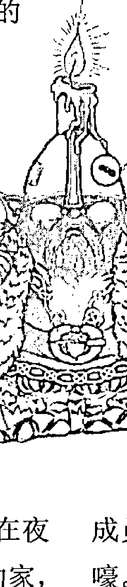

尸妖(wights)是大地的守护（“保护者”）精灵和监护人。就像托尔金的《护戒使者》中的古墓尸妖(barrow-wights)，他们住在古墓和坟堆之中，除此之外还会住在神圣的树林和瀑布之中。女妖（Bean-Sidhe，读作 BAN—shee）是一种幽灵的祖先或者家养小精灵，他们会非常依恋某个特殊的家庭，以至于他们在家庭中某个成员快要死去的时候会发出令人悲伤的哀嚎。女妖的哭泣声会让你的骨髓都跟着打颤！

燧石箭头（Flint arrowheads）可以追溯到石器时代或者新石器时代，这些标记会经常出现在花园中，特别是在雨后。在凯尔特国家，这些被称之为“精灵标记（elf-shot）”或“仙子之箭（fairy-arrows）”。据说如果家畜被未知疾病折磨，那便是因为受到这种精灵之箭的伤害所致。伴随着从西班牙而来的爱尔兰人的到来，很多的达纳神族（Thuatha）乘船跨过大海来到传说中西方大陆（现在我们称之为北美）。他们的白色的大轮船（在迦太基 [Carthage] 建造）使用的是薄皮革的风帆，咸咸的海水喷洒在上面凝结成了盐晶。因此，这些船只被称为“水晶船”。这些船只的船头就像天鹅的脑袋一样（维京人的船是龙头船（dragon-prowed））。它们至今仍然牢记在北美东部海滨的土著部落人的心中，直到“真正的白人”乘着“白色大鸟”抵达了它们的海岸。

在公元前 50 年的 6 月，恺撒大帝在英吉利海峡遭遇了他们整个船队，共 220艘船。但在此灾难降临的这一天，海面上没有风，不能推动这些伟大的水晶船航行，而罗马人的单层甲板大帆船在布鲁特斯（Brutus）的命令下划到了“水晶船”边，将爪钩扔进了它们的传动装置之中，通过烧杀破坏将这些船只沉入了海底。这场战斗被详细记录在了凯撒的第三本书《高卢战记》之中。在水晶船遭受破坏之后，在接下来的1542年里（直到哥伦布的出现），再没有其它的传播可以横跨中大西洋，而整个西方大陆，就像精灵一样，逐渐变成了神话。

这场很大程度被遗忘了的海战是西方文明史的关键。如果那一天能刮一阵风，凯撒和他的军队就会被打败了。而侏儒也会活下来，他们的船只将继续成为连系欧洲和美洲的纽带。罗马帝国将永远不会出现，也不会征服欧洲、埃及、希腊、英国以及以色列。耶路撒冷和大神殿也不会被毁，犹太人流散就绝不会发生。基督教就不会遍布整个帝国乃至整个世界。也就不会存在黑暗时代（Dark Ages），没有十字军东征，没有宗教法庭，没有燃烧时代（Burning Times）。而魔法世界和世俗世界就永远不会被分开……

# 第七节：与精灵来往的原则

> ——艾比·维诺如特

我从小便和一些传统的精灵信仰一起长大。我的祖母凯瑟琳·伯克（Catherine Burke）来自于阿伦岛（Aran Island），她在伊尼什莫尔岛（InishMor）长大。在伊尼什莫尔岛上，有关精灵的知识和信仰至今为止依然十分强烈。她教导她的孩子和孙子们如何与精灵和平共处而不会冒犯到他们，她喜欢将他们称作“小人儿”。如果你不想惹火烧身，那么以下是一些必须遵循的信念和“规则”。

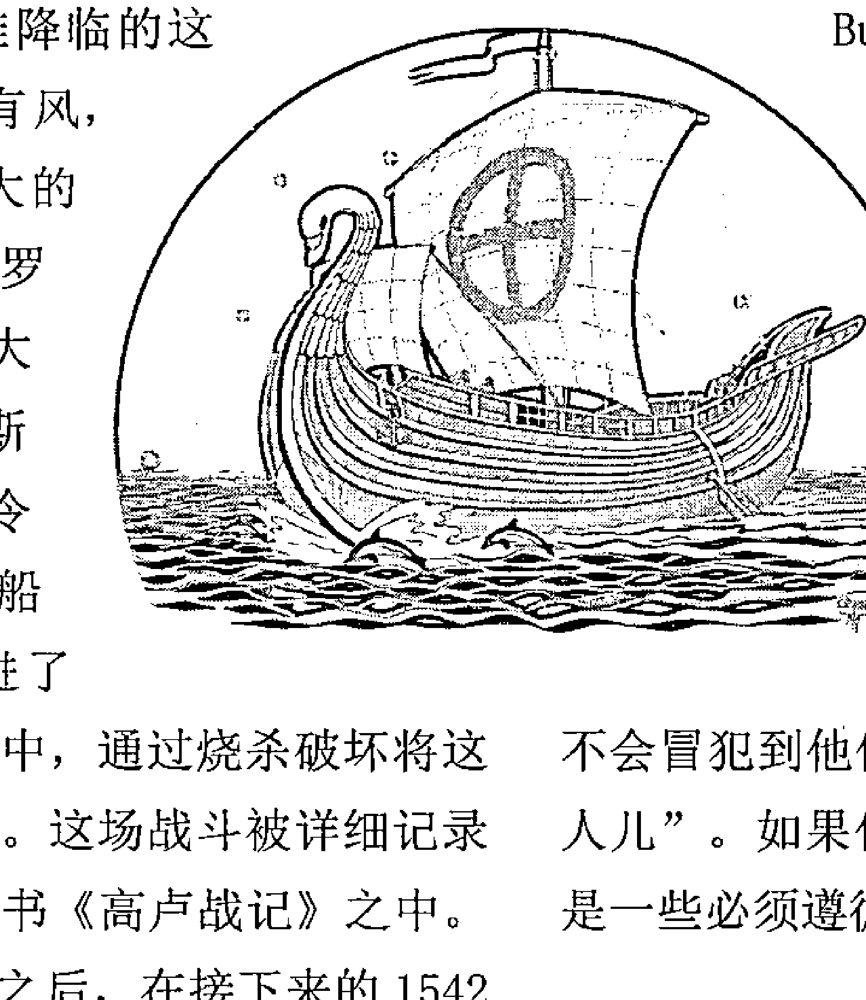

- 1. 千万不要用她来称呼任何一位精灵，千万不要使用这个单词来指代任何人。在提及他（她）的时候，一定要称呼那个人的名字。
- 2. 千万不要把你盘中的食物吃得一干二净。通常要留些一点最好的、最美味的部分，并将其放置在视线之外一个小时左右。（艾伦·埃弗特·霍普曼说：“我想要把它添加到我正在培训的美国本土传统中，如果一片食物或者药草，抑或是其它很好的东西落在地上，尤其是在仪式进行过程中，那么就让它呆在那儿，别去动它。它属于位于那个地方的精灵。”）
- 3. 如果在你离开家之后你才想起有什么东西忘拿了，不要返回家取，继续走你的路。如果你一定要立即返回家中，那么在进入家门前你必须制造一些引人注意的声音，进入房间以后，脱去鞋子，在椅子上坐上几分钟。建议你泡一杯茶，或者吃点什么再坐下，或者做一些室内运动。
至少 20 分钟后你才能再次离开家。

你之所以要这样做的原因是为了建立你在这所房子中的“主人”身份，以及你存在于这里的权力。如果你这样做了，那么小人儿便不会觉得你冒犯了他们。但是如果你出乎意料的突然回来，那么你就亵渎了这个地方，因为小人儿在你离开后已经声明这个房间为他们所用。他们不欢迎你，他们甚至觉得你没有“权利”出现在这里，而且你的出现就是一种严重的冒犯。

- 4. 你应保证在打开的厨房窗户边永远都会有一株健康的植物，而且，你在睡觉的时候也一定要开一扇窗。这些都不容忽视，如果你忽略了其中的任何一件，都会被认为是冒犯了小人儿，而且会被看作是他们在这间房屋中不受欢迎。傲慢的人类不值得感激，而这种因感觉到人类的傲慢态度而生气的习惯已经在所有的这些习俗中根深蒂固了。

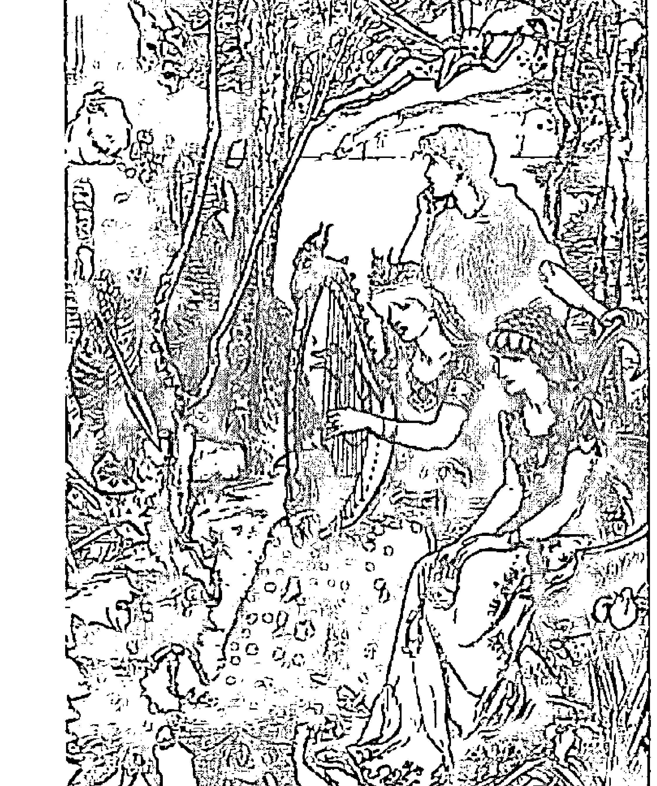

> 艾伦·埃弗特·霍普曼补充：

我曾有幸几次听到精灵唱歌。他们唱的是三部和声，可见他们非常喜爱音乐。他们也拥有自己古老的歌谣，但是他们仍然崇拜那些为他们吟唱弹奏音乐的人，而且他们可以马上学会人们所弹奏的曲调，并记住那些歌词。他们喜欢笑声和庆典。他们还喜欢吃诸如蜂蜜或者其它的甜食这样的祭品。

每个人都应该在花园的某个地方为他们设置一个小小的神龛。在神圣的日子里摆上一些贡品，并且告诉精灵那些东西都是为他们准备的，这样做是非常好的。二分点、二至点，以及四季交替的时候都是好时机。在苏格兰传统中，他们会在二分点和二至点的时候“乔迁新居”，并享受少量的食物。牛奶和蜂蜜是非常容易找到的食物，但是他们也非常喜欢和着黄油一起煮熟的燕麦粥，或者混有黄油的土豆泥，热气腾腾。黄油象征着太阳，而且这是他们不能轻易得到的东西。黄油就像一滴金色的大水滴，漂浮在煮熟的燕麦和糊状的土豆中间。同样的，在仪式结束以后，人们一定要节省出一点在仪式中使用过的饮料，并将它们放在仪式圈外，作为送给精灵们的礼物。礼物可以放在西边的窗台上，或者放在花园中的神龛里。每个花园都应该留出一个没人走动的地方，以供精灵们使用。如果你能找到一颗傲然独立的山楂树，尤其是那种长在小山坡上的，或者靠近水边的，那就意味着精灵领地的入口就在附近。

# 第四课：魔法的动物寓言集

## 第一节：简介 - 《自然哲学》和《动物寓言集》

动物寓言集（“野兽之书”）是一种特殊的中世纪的现象。虽然古代作家，比如蒲林尼，描述并举例说明了各种各样的动物，其中包括许多纯粹只存在于想象之中的动物。首先编写世界上第一本“百科全书”，介绍世界上所有的已知生物的人是一位绰号为“自然哲学”（The Physiologus）（“自然学家”）的匿名作家，他生活在公元2世纪到5世纪期间。虽然他有可能是埃及人，但是他却是用希腊语完成的写作。而且他的书是非常受欢迎，已经被翻译成欧洲所有国家的语言。在过去的几个世纪里，随着旅行者从遥远的大陆上带来越来越多的故事和报道，每个动物寓言集的抄写员和翻译者都会加进去自己的东西，因此填补了大片的空白，并且拓展了一大批生活在陆地、海洋和天空中的生物。虽然说明和描写常常失真，但是几乎所有的出现在书里的生物都是基于真实的动物。但编译者都没有办法的区别开其中所描述的是真实的还是想象的动物——毕竟，独角兽并不比河马、海象、大象、鸵鸟、袋鼠、穿山甲、长颈鹿陌生——更不要说鸭嘴兽了！而曾经出现在地球上

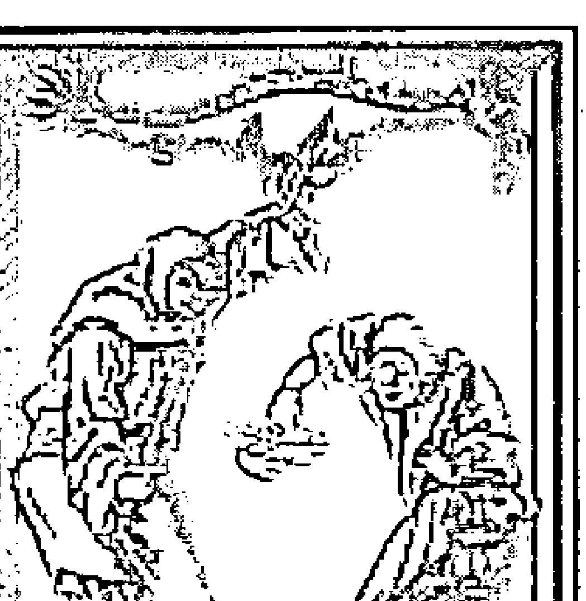

的史前生物远比胡乱想象出的生物更为诞。

然而，Physiologus和他的继承者们都对这些存在于自然历史中的野兽、鸟类和海怪的缺乏兴趣，他们更加钟情于那些可以引用来阐明基督教价值观和道德观的寓言性象征动物。为了展示我为这节课所选择的动物，我省略了所有的那些寓言参考文献。如果你想要，你可以在 T. H. 怀特的《野兽之书》中找到这些参考文献，这是一本最新的动物寓言集译本，里面有大量的注释。我不会列举那些常见的和知名的动物，就像课程之六第一课“野兽支配”中所提到的那些。恰恰相反，你在这里能够找到的都是神话和传说中的生物。包括龙！

## 第二节：隐生动物学

隐生动物学（cryptozoology，“研究隐藏的动物”）是贝尔纳·霍伊维尔曼（Bernard Heuvelmans）博士在20世纪50年代在与同事之间的私人信件中杜撰的。1955年以后，法国出版了他的《追踪未知动物》（[On the Track of Unknown Animals]）一书。隐生动物学的研究记录并瞄准了来自遥远地方的尚未被试图发现并确认新物种的科学所发现的动物。这些神秘生物（Cryptids），就像它们的称呼一样，不仅包括了尼斯湖水怪、大脚怪，以及其它的“巨大怪物(mega-monsters)”，而且还包括了许多鲜为人知的神秘生物。在过去的大约一个世纪里，很多大型动物的新品种已经被发现，包括以下这些：

- 科迪亚克棕熊（最大的熊）（1899）
- 山地大猩猩（1901）
- 霍加皮（长颈鹿科）（1901）
- 山薮羚（羚羊）（1910）
- 侏儒河马（1912）
- 科摩多龙（1912）
- 安第斯狼（Andean Wolf）（1926）
- 倭黑猩猩（像黑猩猩的猿）（1930）
- 刚果孔雀（1935）
- 高棉牛（林牛）（1937）
- 腔棘鱼（非常古老的鱼）（1938）
- 草原西（很大的猪）（1975）
- 巨口鲨（巨鲨）（1976）
- 中南大羚（羽光牛）（1992）
- 比利猿（最大的猿）（2002）
- “巨大的”巨型乌贼（2003）
- 潘德克人（Orang Pendek）（苏门答腊猿）（2003）

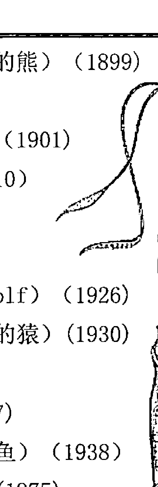

一些最有趣的神秘生物在很久以前便有了记载但是仍未得到证实，它们是：

大脚怪、萨斯科奇人（北美野人）、雪人在遍及世界的大量有据可查的历史

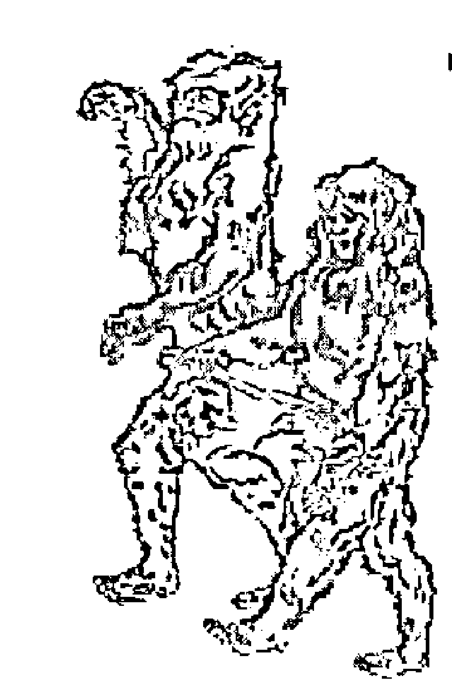

中，记录了大量的巨型的、多毛的、像人一样的生物，绝大多数当代人瞄准了北美的太平洋西北部，一处未经开发的、面积超过125,000平方英里荒地。在这片广大的领土上，这些生物被称为“大脚野人”或者萨斯科奇人（印第安名字）。位于俄罗斯高加索山脉也有一种类似的，甚至也许是完全相同的生物被称为卡普塔（kaptar），在西伯利亚东北部被称为楚胡纳（chuhuna），在蒙古称为艾玛斯（almas），在西藏被称为康米（kangmi），在澳大利亚被称为野人（yowies），在尼泊尔被称为雪人（yeti）。在中世纪的欧洲，他们简单的称为“多毛野人”，是一种被频繁插图说明的生物。

太平洋西北部的“大脚怪”看起来平均身高大约有8英尺，留下的脚印大约有18英寸长。他们的头发的颜色从红棕色过渡到灰色再到黑色。报道称有男女之分，而且还是小婴儿，通常以家族为群体。他们通常显得有一些害羞，在与人类接触的时候会表现出良性的好奇心，看起来他们好像主要是在夜间活动，因此他们已经被指定为了暗夜人类

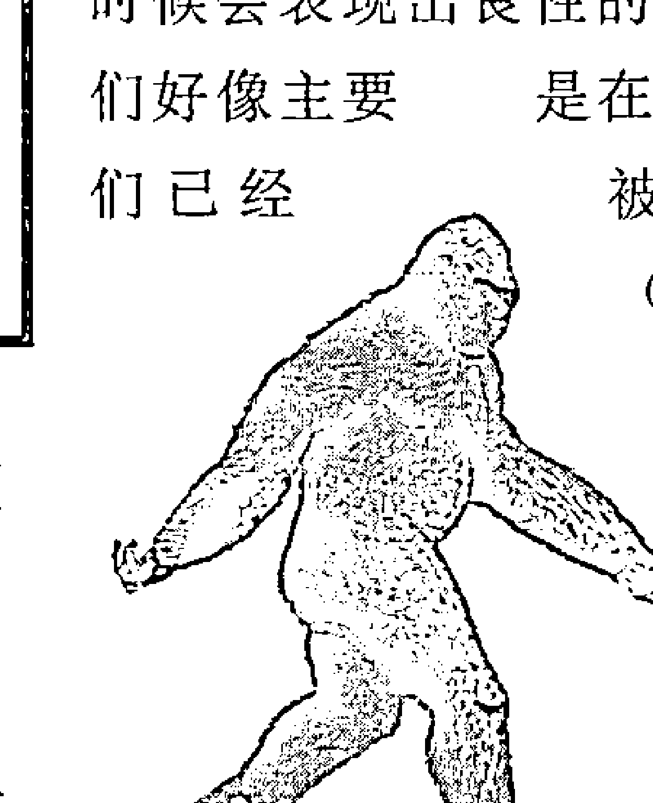

（Homo nocturnus）（“夜猫子”），这个名字最初是由林涅（Carolus Linnaeus）（1707—1778年）专为这样的生物设计的。虽然证明大脚怪一直存在的主要证据都是一些足迹，但是也有一些照片、录像、头发样本，以及——最引人注目的——伊凡•T•桑德森（Ivan T. Sanderson）（未解之谜的调查社团[Investigation of the Unexplained]主席）和伯纳德•霍伊维尔曼（Bernard Heuvelmans）博士（法国隐生动物研究中心的主席）在1968年对一具冷冻尸体的详细检查。有关这个所谓的“冰人”的桑德森图纸和霍伊维尔曼照片已经被广泛地刊登出版。然而，在这次检查之后不久便不再将这具标本进行公开展览，从那以后它便消失了。

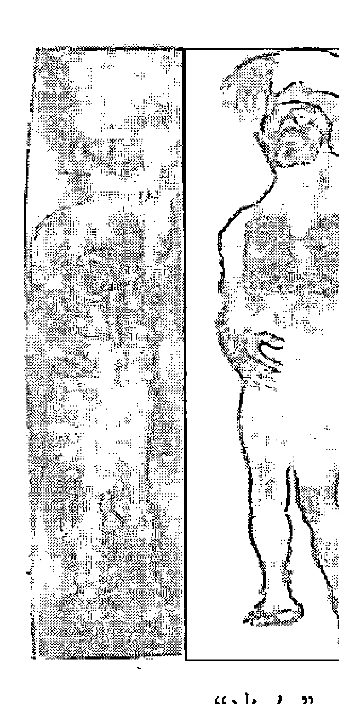

爵士 (Sir Peter Scott) 将这种生物正式命名为尼斯湖水怪 (Nessiteras rhombopteryx) (“在尼斯湖中游荡的怪兽形状的鳍”)，普遍的观念将“尼斯湖水怪”定义为蛇颈龙类（白垩纪的海洋长颈爬行动物）。但是任何现代湖怪的照片和记录与化石生物最多也只是表面上的相似。因为它们很少在水面出现，因此判定这是一种水下呼吸的生物。这种能力就将它的种类限定在鱼、部分两栖动物和许多无脊椎动物中。但是，湖怪却如哺乳类、鸟和无脊椎动物一样是上下垂直波动而非水平行动。

# 尼斯湖水怪

自公元565年，第一位来到爱尔兰的基督教传教士圣哥伦伯 (St. Columba) 在尼斯湖岸传奇地邂逅“一只确定无疑的水怪”以来，爱尔兰，加拿大以及其他国家对于这种栖息在尼斯湖、摩拉尔湖以及其他苏格兰煤泥湖 (peat-filled lakes)、沼泽深处的巨型不明生物，产生了浓烈的兴趣并就此引发争论。1975年，彼得•斯科特

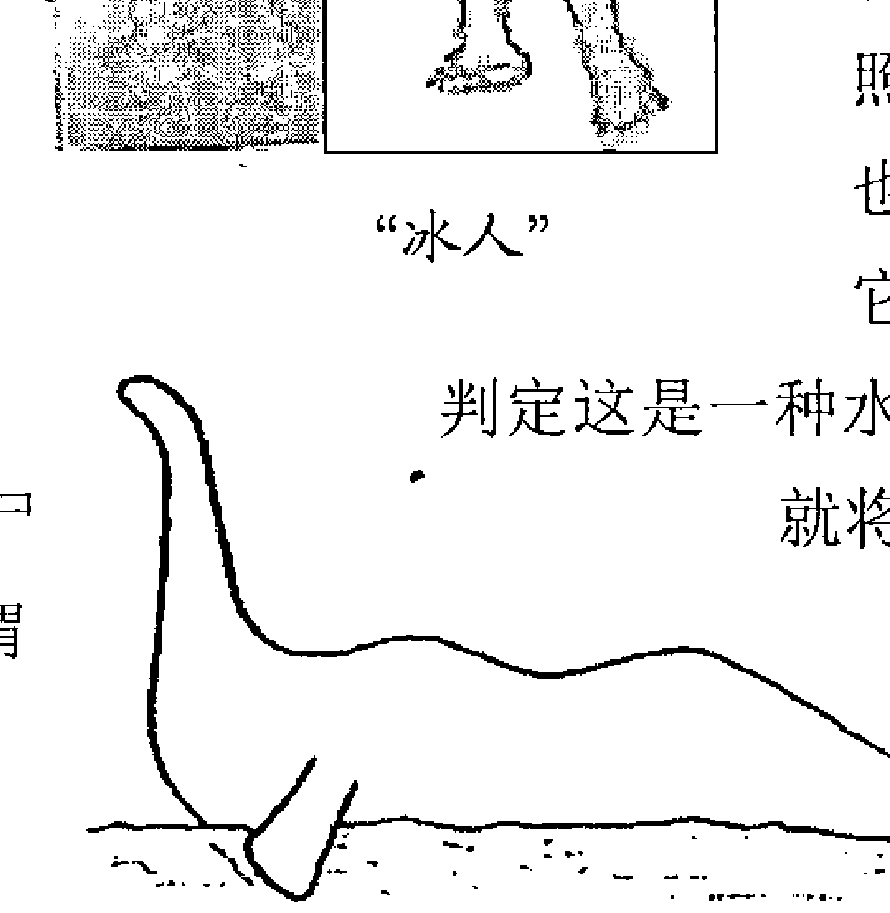

湖怪有长颈的情况明显地排除了其有鳃（头骨与下巴结构的主要组成部分）的可能；有鳃的脊椎动物是不可能有颈部的。同时，目击者的报道和水下照片显示湖怪的头部有类似于蜗牛和蛞蝓的可伸展的号角状触角。因此，我认为“尼斯湖水怪”、“切西 (Chessie)”、“查普 (Champ)”、“莫阿戈 (Mor-ag)”以及一些类似的生物都可能是巨型的水生蛞蝓，长长的脖子

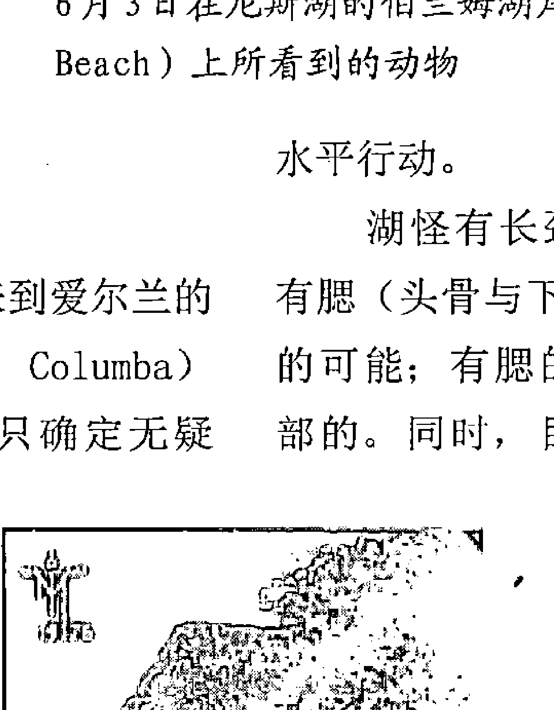

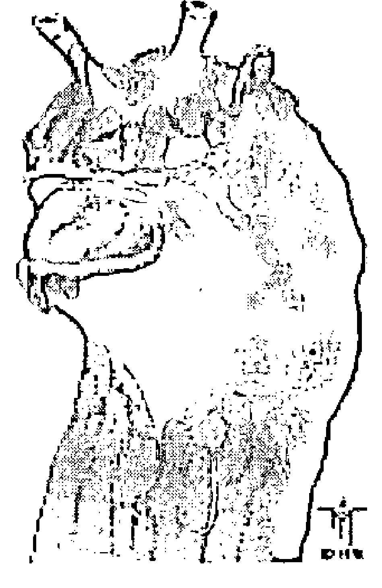

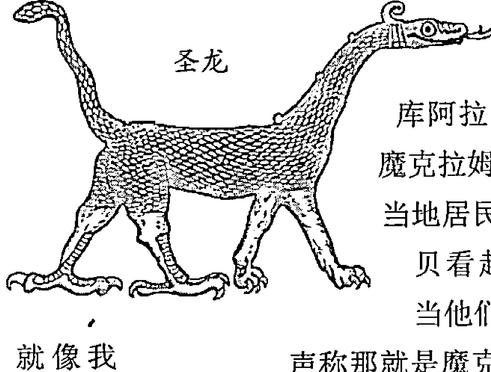

总会留下圆形且带着三个爪子的脚印。利库阿拉沼泽地区的人们把它叫做魔克拉姆边贝（“河流的阻塞物”）。当地居民描述泥浆中的魔克拉姆边贝看起来像蜥脚类恐龙，因此当他们看到蜥脚类恐龙的图片时声称那就是魔克拉姆边贝。它的体型介于河马和大象之间。其无毛的皮肤颜色绝大多数介于红褐色与灰色之间。据报道称它身长15—30英尺，它的脖子和尾巴各占身体长度的1/3。在喀麦隆所看到的魔克拉姆边贝据称最长有75英尺。一些人说在它脑袋的后面长有像公鸡鸡冠一样的褶边。

就像我们常见的草原蜗牛一样。而和蛞蝓一样位于正常位置的小型的钻石形状的鳍可能是用作开口的鳃盖。

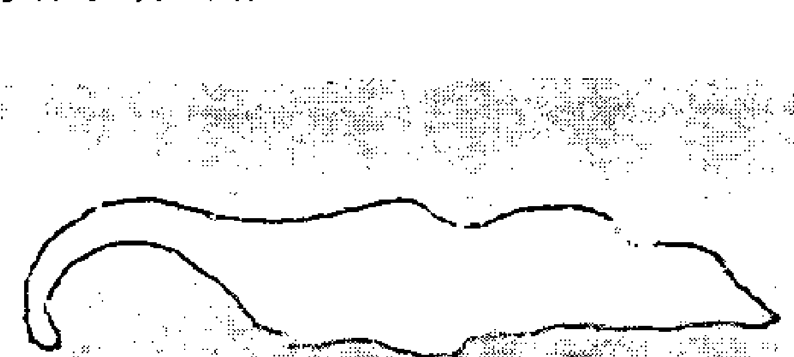

希腊语中的pteras（“鳍”）也有“翼”的意思，来源于翼龙的传说。远古关于龙的传说中频繁提到被杀死的蠕虫（worms）的躯体“慢慢融化”，只剩下牙齿。这就解释了为何湖泊中没有发现任何的化石或者骨骼。

# 魔克拉姆边贝 (Mokele-Mbembe), 圣龙 (Sirrush)

非洲是否仍有恐龙存在？在非洲中部国家刚果、喀麦隆和加蓬的雨林中出现有长长的脖子和尾巴的巨型动物，它经过的地方

在巴比伦伟大的伊什塔尔城门上绘制了一种相似的生物。它的身上有鳞，长长的脖子，长长的尾巴，爪形足。它被称为圣龙，而且它显然是想要用于代表一种真实的动物。来自非洲和南美洲热带雨林的报道称看到了更多的史前生物，例如翼手龙（pterodactyl）和蛇颈龙（plesiosaurs）。这些故事激发了一些小说的创作，例如阿瑟·柯南道尔（Arthur Conan Doyle）的《失落的世界》（[The Lost World]），以及埃德加·莱斯·巴勒斯（Edgar Rice Burroughs）的《人猿泰山》（[Tarzan]），讲述的是来自失落的大陆的泰山的故事。

# 第三节：寓言中野兽的插图指南

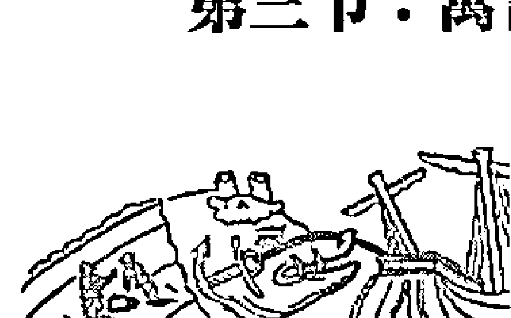

# 课程之七：传说

它巨大无比以至于它在水面晒太阳时使水手将他的背误以为是岛屿并在此登陆。然而，在他们生火时，这座有生命的“岛屿”突然潜入水中，将船和全体船员一起拉入水中，最终溺死。

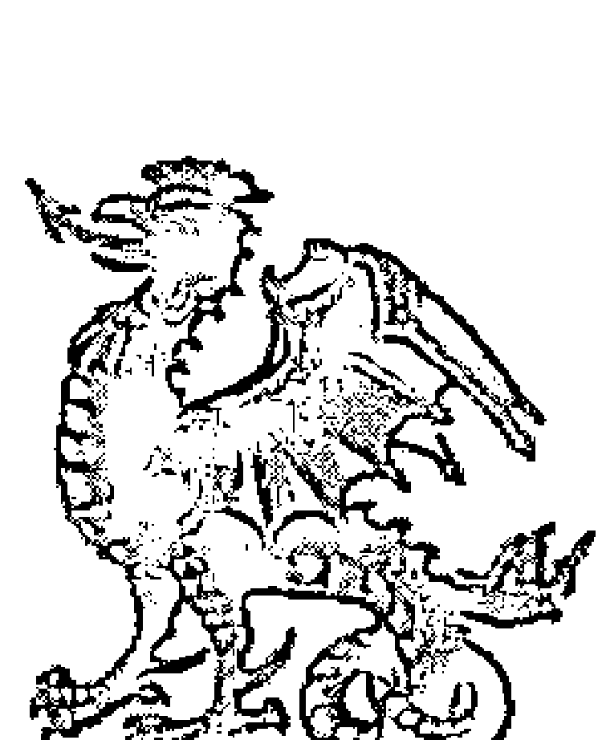

的守护者，一只三头龙尾的狗。它被赫拉克勒斯带出了哈迪斯的冥府，并因打赌将它输给鲁伯·海格（Rubeus Hagrid）。鲁伯·海格安排它在霍格华兹看守魔法石。

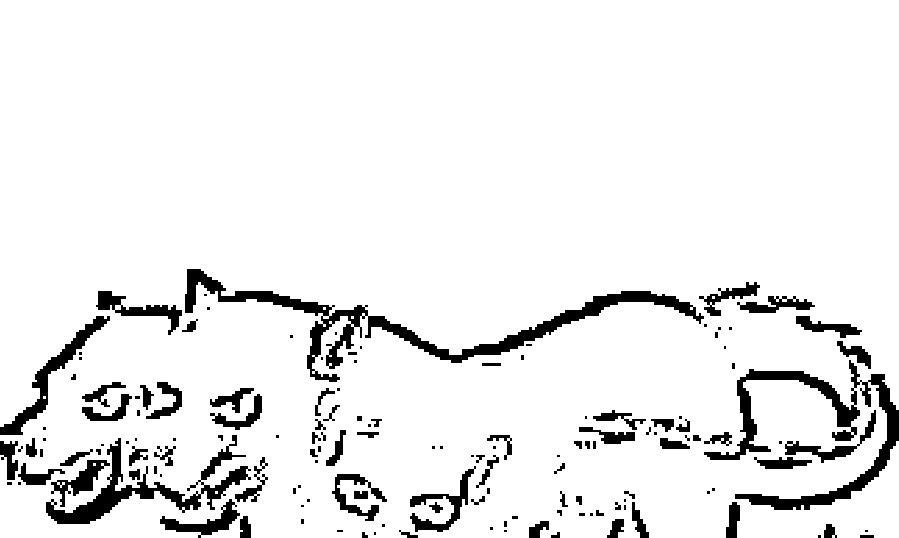

**蛇怪 / 鸡身蛇尾怪物**——半蛇半鸡；有剧毒，被它看一眼或者被它吹一口气便会全身麻痹。蛇怪是一只有着一个引人注目的褶皱蛇冠的巨蛇。鸡身蛇尾怪则被描绘为龙尾蝙蝠翼的公鸡。它的天敌为鼬鼠和猫鼬。实际上，蛇怪和鸡身蛇尾怪都来源于埃及喷毒液的眼镜蛇——能从毒牙中将毒液准确无误地喷入敌人的眼中。

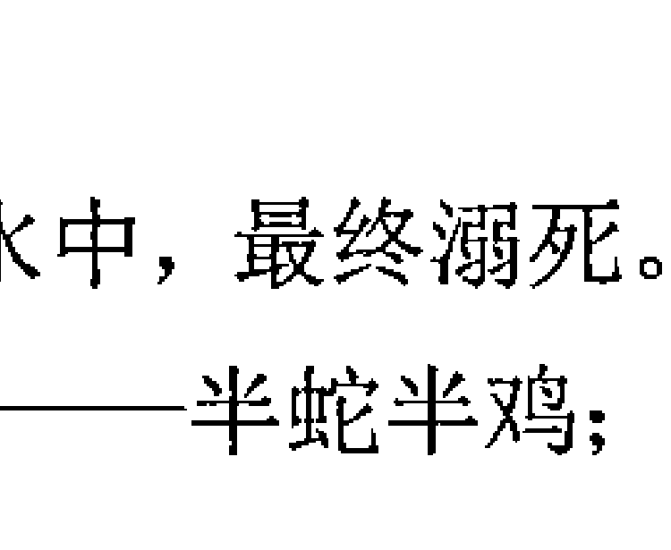

**喀迈拉**——由山羊的身体、狮子的头和龙的尾巴合成的怪兽。只存在一只这样的怪兽，她被骑着飞马珀加索斯的柏勒罗丰（Bellerophon）杀死。

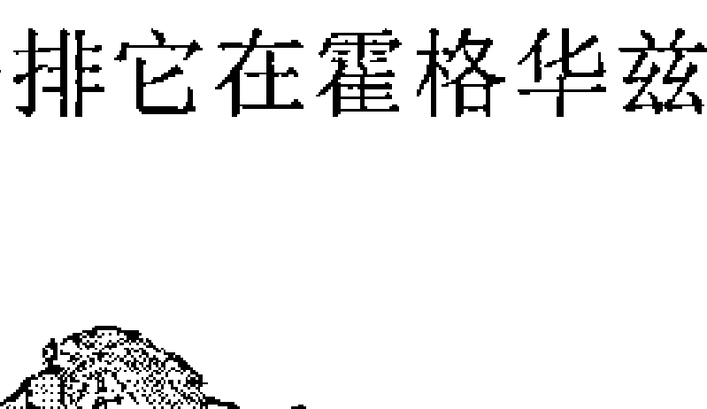

**卡托布莱帕斯 (Catoblepas)**（蛇发女怪）——埃塞俄比亚的类似于公牛的生物，其身上的鳞片类似于恐龙，獠牙类似于野猪，除头以外的其它部位没有毛发。它的形象可能来源于角马。“蛇发女怪”这个名字和古希腊的蛇发女怪戈耳工没有任何关系，例如美杜莎。

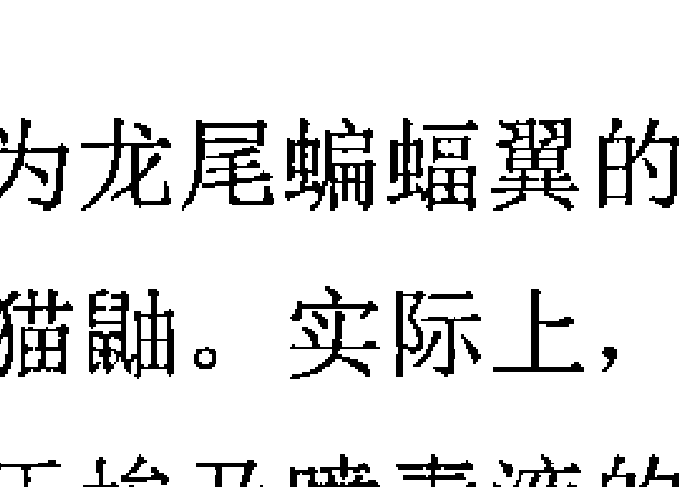

**龙**——蝙蝠翼，脾气暴躁的巨型爬行动物。它们存在于自然界四大元素之中：土、水、火和气中。无翼的被称为蠕虫。东方龙是可呼风唤雨的智慧、仁慈的生物。西方的龙则多为狡诈邪恶的生物，通常会被英雄和骑士杀死。

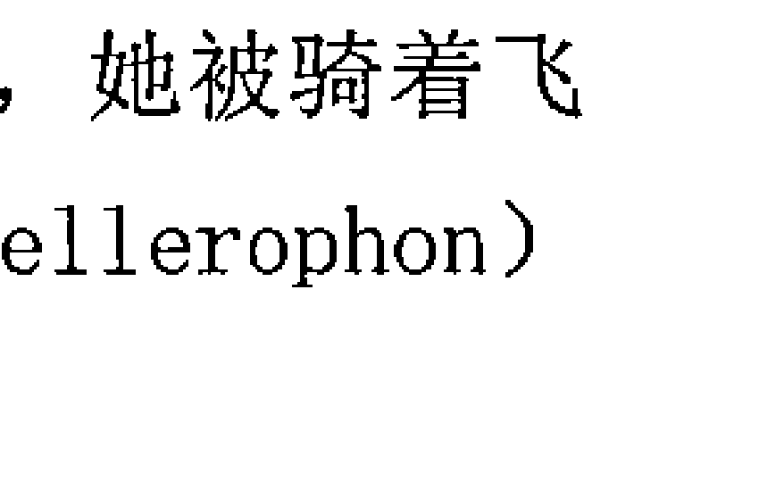

**半人马**——半人半马。大多数是野蛮好色，经常强抢人类女性。但是半人马喀戎是一位聪慧的老师，他教导过许多希腊英雄。

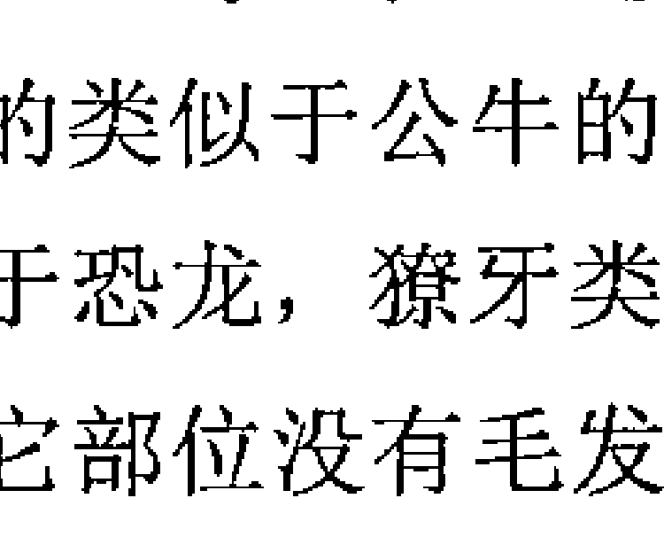

**狮鹫（或者狮鹫兽）**——长有狮子的躯体与尾巴、老鹰的头、锋利的爪子和翅膀，实际上，就是秃鹫或胡鹫（“偷猎羊羔者”）。“狮鹫 (lion eagle)”或者“胡兀鹫 (bearded vulture)”头颈处的鬃毛参差不齐，是所有猛禽类中身形最大也是最强壮的，它是宙斯的鹰。

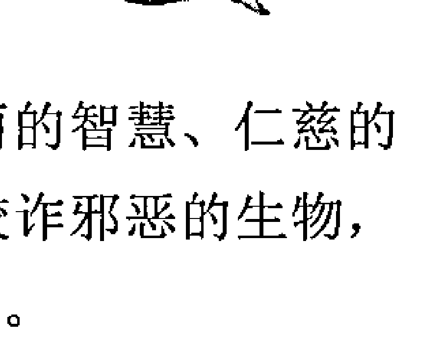

**冥府看门狗刻耳柏洛斯**——希腊冥府

**鹰身女妖哈比**——长着粗糙丑陋的脸和老太婆干瘪的胸部，秃鹫的翅膀、

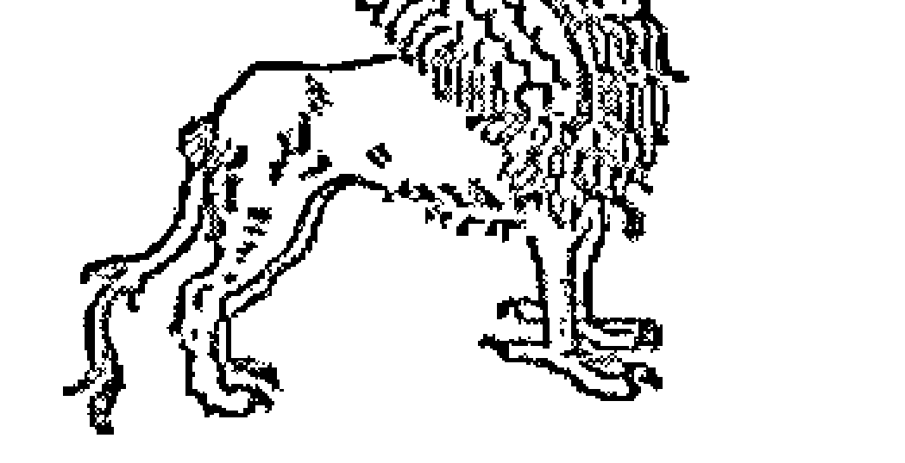## 魔法师学徒的魔法书 | 下卷

躯体和爪子，是一种残忍贪婪的生物。伊阿宋和阿尔戈英雄们在寻找金羊毛的途中遇到过她。

鳞片覆盖，女人的头和胸部。她有蹄脚、马尾，以及猫一样的前腿。

## 马头鱼尾海怪

——一种水栖怪兽或者海马。长着马的头和前腿，鱼的尾巴。它类似于马的前脚上长有鳍状的脚蹼而不是蹄脚。

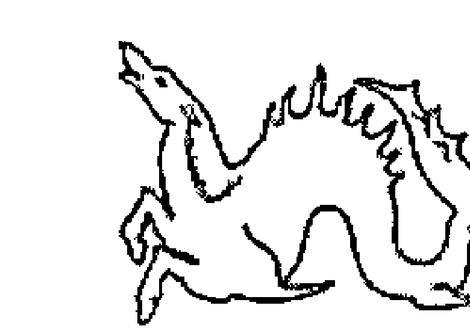

## 魔伽罗 (Makara)

——印度的一种巨大的“大象鱼”。 从它的画像上看，它可能和尼斯湖水怪是同一个生物。像大象鼻子一样的“鼻子”可能是一个长脖子和小脑袋。

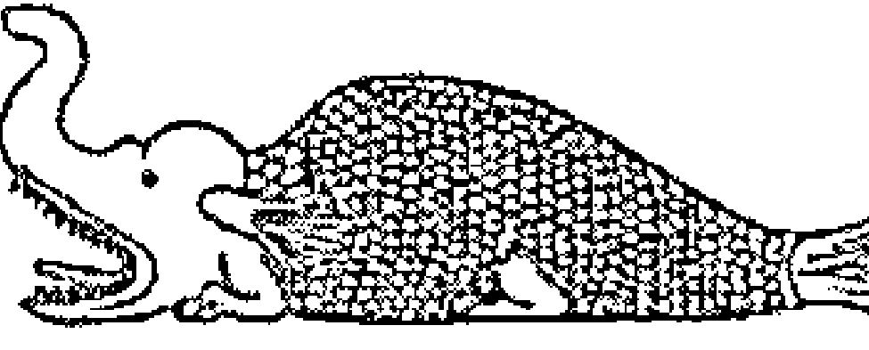

## 鹰头马身的有翅怪兽

——类似于狮鹫，但后部分为马而非狮子。哈利波特的朋友小天狼星布莱克就有一只，名为“巴克比克”。

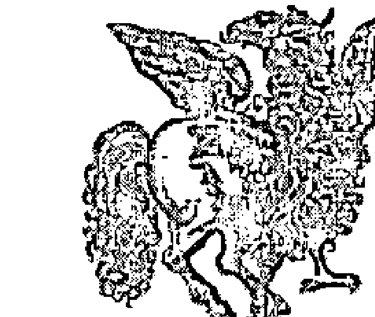

## 人头狮身蝎尾怪兽 (Manticora)

——一种红色的印度生物，有着人头、狮子的鬃毛、蝎子的尾巴、三排铁尺钢牙，其美丽悦耳的嗓音就像号角或笛子发出的声音。它通常被认为是一只老虎，但我认为它实际上是树神狒狒 (hamadryad baboon)。

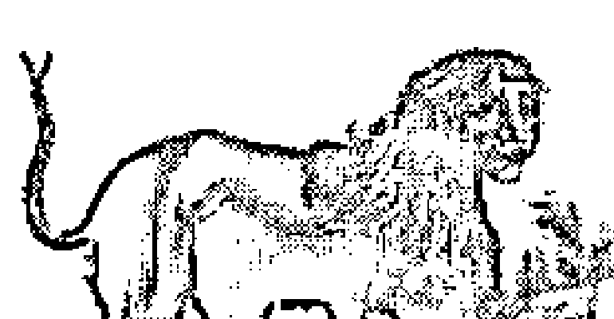

## 北海巨妖 / 九头蛇

——一种巨大的多头的海怪。大力英雄赫拉克勒斯砍掉了长在长长的触角脖子上的其中一个“头”，但是在被砍掉脑袋的触角上却重新长出了两个脑袋。斯库拉 (Scylla) 是这样的一种怪物，他会突然把水手们从奥德修斯的船的甲板上拉下来。据报道，维京人曾遭遇过这种在蠕动的占据了几英亩大海的触角。这实际上是巨大的鱿鱼，其中被发现（2003年4月）的最大的标本成年之后可能会比一辆公共汽车还大！它被命名为大王酸浆鱿 (Mesonychoteuthis)，或“巨型乌贼”。人们从未活捉过巨型鱿鱼，但是已经发现有许多尸体被冲到海滩上。

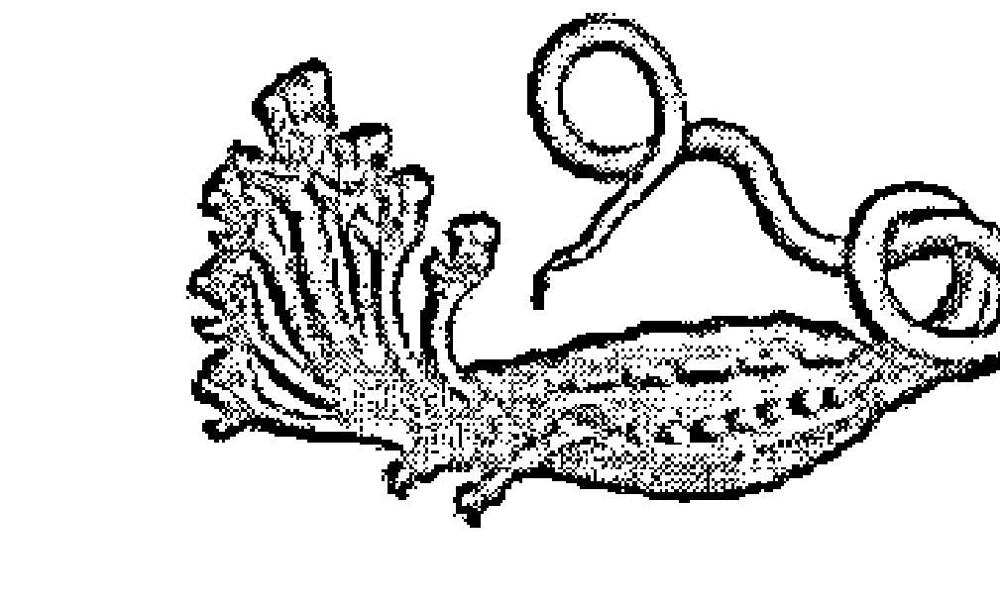

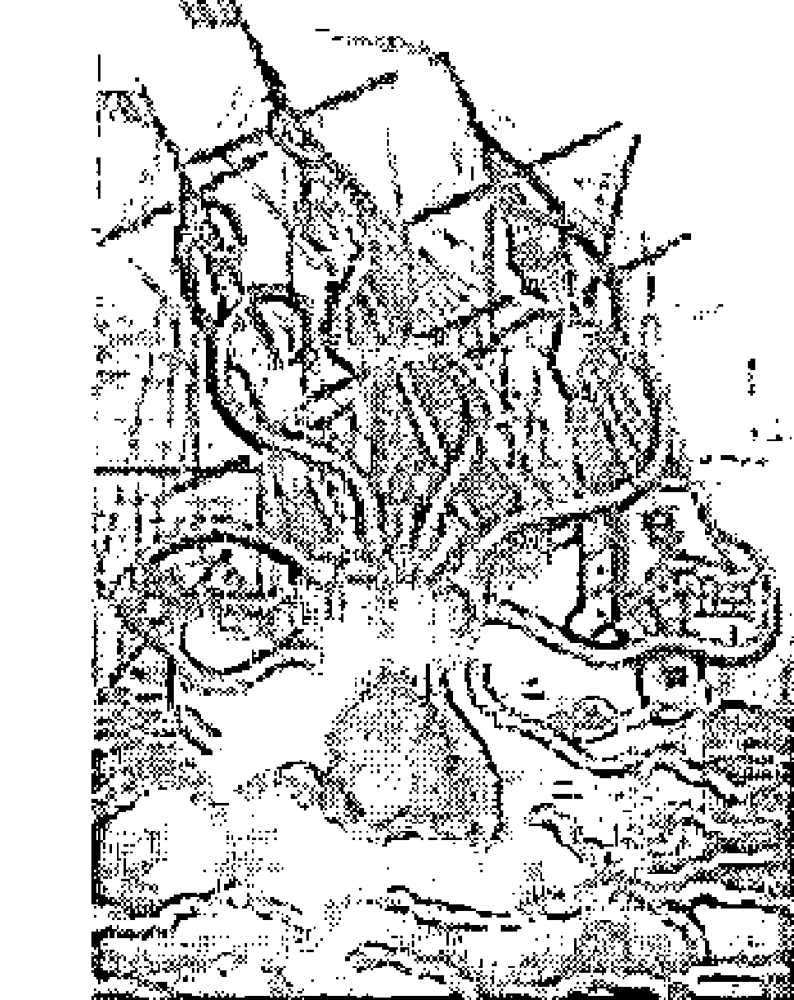

## 美人鱼 / 男性人鱼

——从腰部往上，他们和人类一样，但他们的下半身就像一条鱼。故事中讲到他们渴望得到灵魂。实际上，传说是基于儒艮 (dugong)，一种存在于印度尼西亚的海生哺乳动物，它有一个长而光滑的身体，一条巨大的像鲸鱼一样的尾巴，以及和女性一模一样的胸部（女性人鱼身上）。

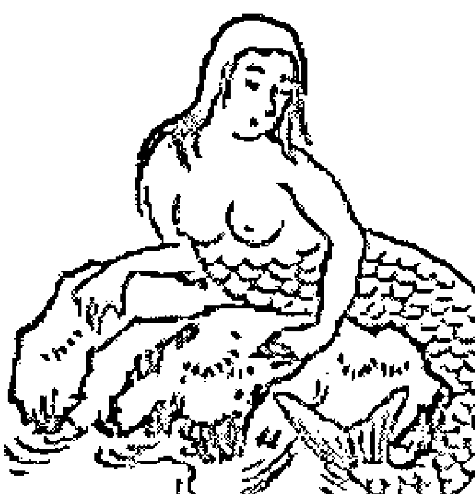

## 拉弥亚

——一种利比亚四足兽，周身鳞片覆盖，女人的头和胸部。她有蹄脚、马尾，以及猫一样的前腿。

## 人身牛头怪米诺陶洛斯

——这是一种凶猛的野兽，他有着一个强大的男人身躯和一个食肉的公牛头。只存在一只这样的怪物，它是克里特岛女王帕西法厄和一只漂亮的白色公牛的后代。迈诺斯国王把他关押在迷宫中，并用人类的囚犯喂养它。它最终被提修斯杀死。

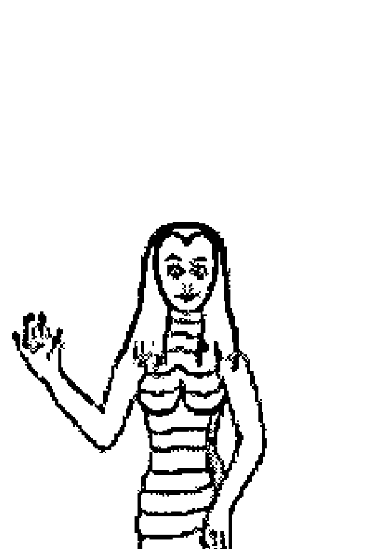

## 娜迦海妖（男性）/ 蛇娜吉妮（女性）

——印度的巨蛇人（Serpentpeople）。他们腰部以上看起来像人类，但腰部以下是只巨大的蛇。

## 有翼的马帕加索斯

——有着华美双翼的白马，诞生于蛇发女怪戈尔贡•美杜莎的脖子，当珀尔修斯斩她脖子的时候，帕加索斯便从中飞了出来。唯一一位将它驯服并骑上帕加索斯马背的是柏勒罗丰，你可以在电影《诸神之战》（1981 年）中看到它。

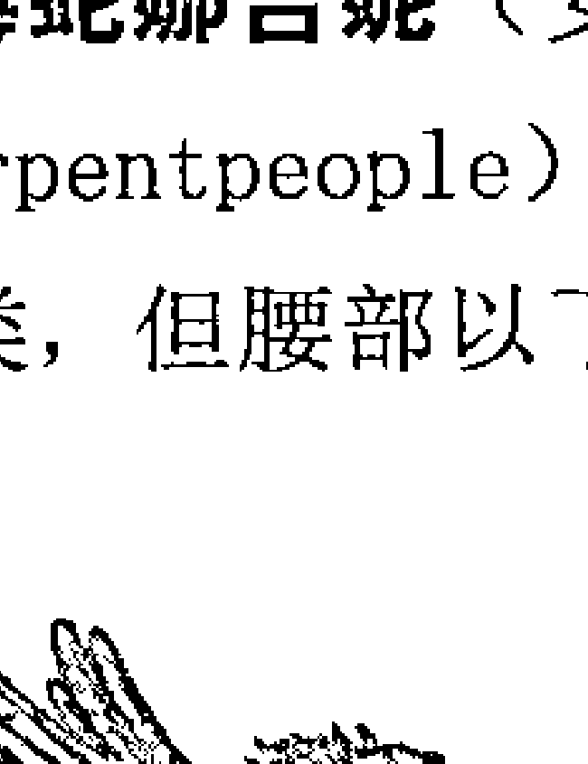

## 凤凰

——有时也被称为火鸟。她的颜色看上去火焰色介于孔雀和雉科鸟（尽管这个名字的意思是“红紫色生物”）之间。每隔 500 年，她会在翠柏巢穴中产下唯一一个的蛋，那颗蛋会突然爆发火焰，将她化为灰烬。在余烬的温暖下蛋被孵化出来，她便从灰烬中得到重生。阿不思•邓不利多就有一只，名为“福克斯”。

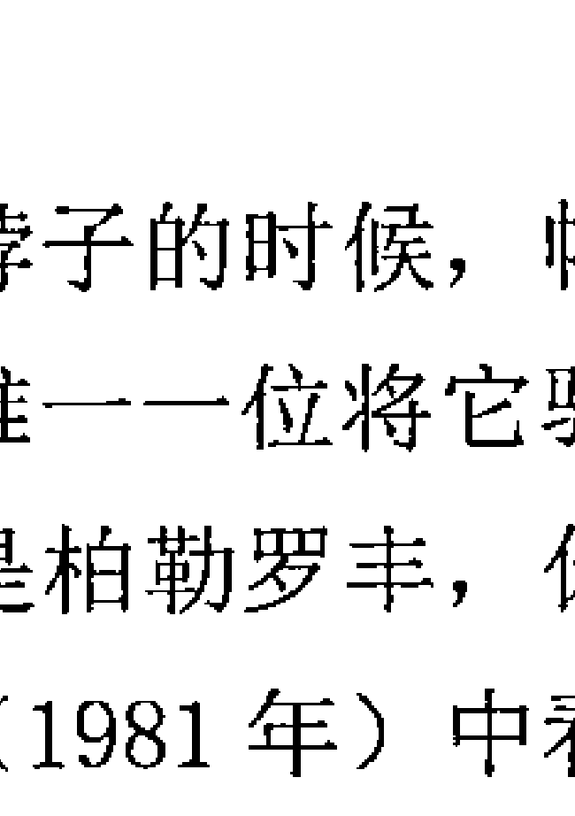

## 隆鸟（Ruhk）（或Roc）

——这是一种马达加斯加岛上的巨鸟，因为辛巴达的故事和马可波罗的游记而闻名于世，据说它大到可以掳走大象。事实上，它就是巨大而不能飞的“象鸟”或维隆•帕特洛（vouron patra）（最大的隆鸟 [Aepyornis maximus]），身高 11 英尺，体重 1100 英镑！它所下的蛋周长 3 英尺，比所有恐龙蛋都要大，它曾是地球上幸存的最大的单细胞物种。在十六世纪被航海员消灭殆尽。

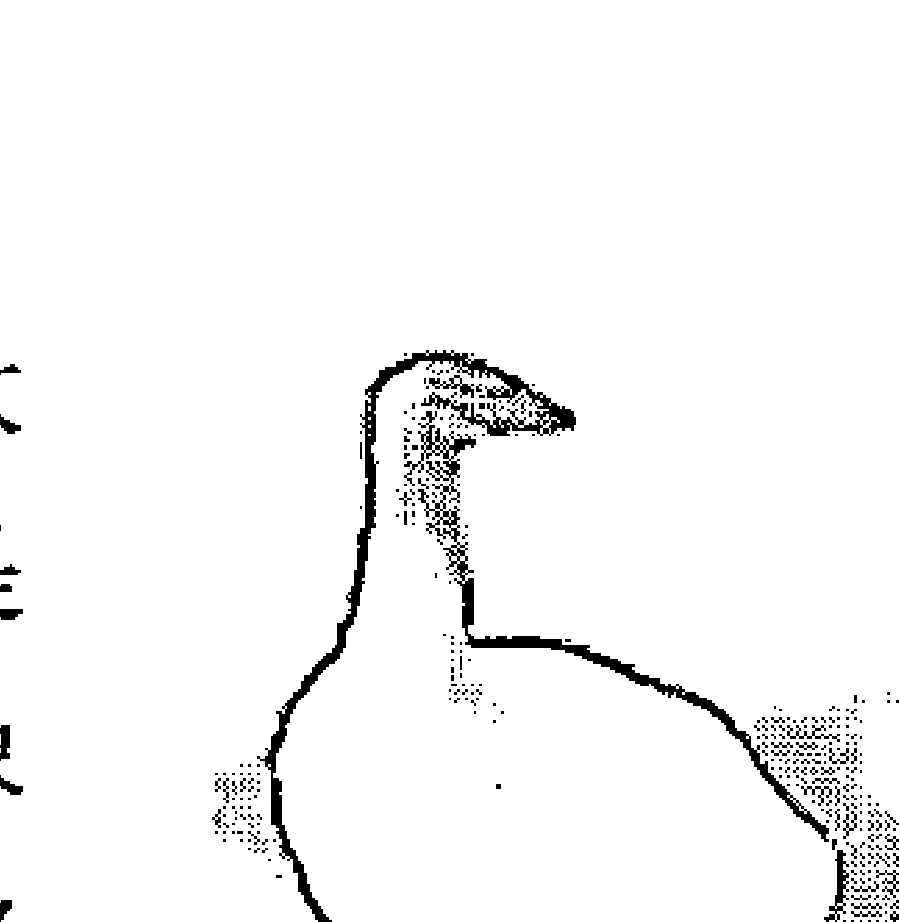

## 火蜥蜴（Salamandra）

——以火元素命名。这些都是颜色亮丽的蜥蜴或者能在火中生存的小龙。被错误地认为有毒，实际上他们可以灭火。据说防火的石棉纤维便是“火蜥蜴的毛”。小型的我们称之为火蜥蜴的彩色两栖动物会在枯木中冬眠，而且最后往往是在壁炉里被高温惊醒结束冬眠，从木柴中爬出来。当他们受到惊吓，他们会渗出一种无害的乳白色的液体，这种液体能够熄灭点点火星。

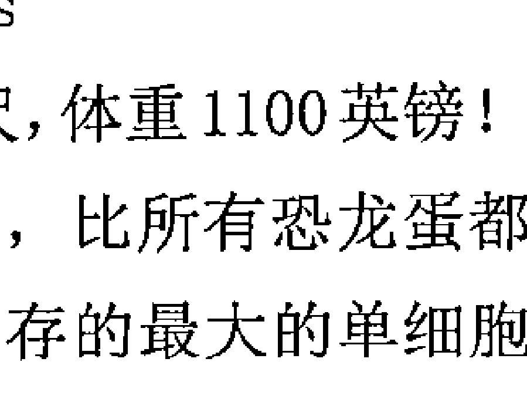

## 海中巨蛇

——在过去几个世纪里，船员们爆料出了各种各样的巨大的蛇形海怪。其中有一些好像是巨蛇、巨型鳝鱼、庞大的海蛞蝓，甚至史前生物。有些说法也许是基于看到的巨型鱿鱼的触须。虽然已经有许多目击的记录，但是并没有寻回任何的标本。

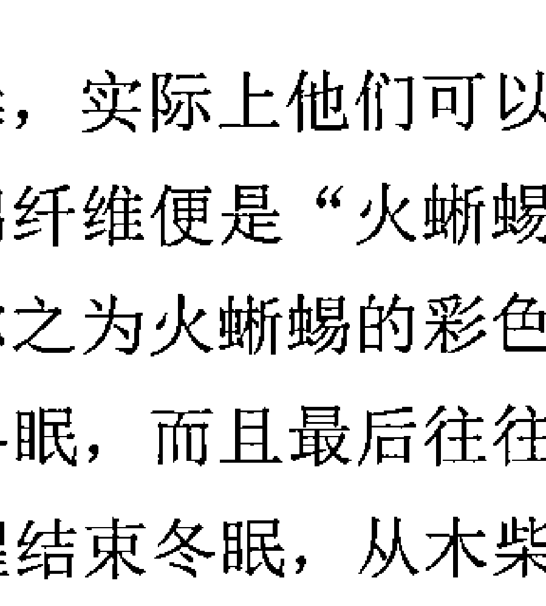

## 赛尔奇斯（Selchies）

——苏格兰的海豹人 (Seal-people)。他们可以脱下他们的海豹皮，这样看起来便和普通人一样，但是从本质上来讲它们仍然是海豹。

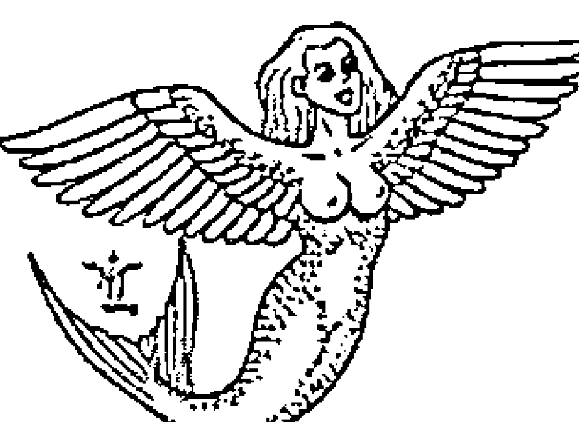

艺复兴时期的挂毯上有很多关于他们的画像。实际上，确实存在这样的动物，他们长出的最初的幼角被一种秘密过程(secret process)融合了，这个观点是我在 1976 年时重新发现的。

## **双足飞龙**——

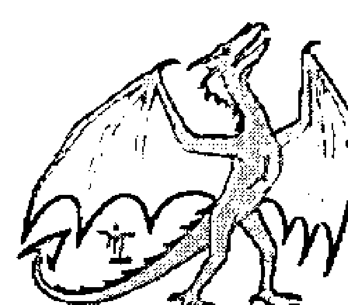

这是一种可以飞的龙，长有像蝙蝠一样的翅膀和两条后腿。从根本上说它就是一只翼手龙，和风神翼龙奎兹克拉(Quetzelcoatlus)一样。

## **塞王**——

通常被描绘成各种样子，有的是半人半鸟，有的是半人半鱼，或者是一种拥有女人的身体，鱼的尾巴和鸟的脚的综合体。她们用那令人难以忘怀的歌声，吸引着水手，将他们引上死亡之路。奥德修斯用蜂蜡塞住水手们的耳朵，拯救了他们。人们认为塞壬的歌声犹如夜莺的啼唱，在整个海岸线上都可以听到从海上传来的她们的歌声。

## **第四节：“暗夜生物的发现”**

## **狮身人面兽斯芬克斯**——

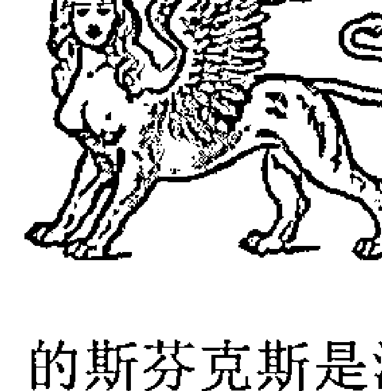

她由狮子的身体和爪子、美丽少女的头、胸以及手臂构成。在希腊神话中，狮身人面兽还长有一对像老鹰一样的翅膀，但是埃及的斯芬克斯是没有翅膀的。她出名的原因是他给游客出了一个这样的谜题：“什么东西早上有四条腿，下午有两条腿，晚上有三条腿？”如果他们能够给出正确的答案，那么就可以通过；反之，就会被她吃掉。（想一下答案是什么呢……）

记忆回到 1975 年，那时牵牛花和我正在研究巨型野兽的传奇背后的真相。我们计划出一本书，名字就叫《揭露暗夜生物的真相》（[Creatures of Night, Brought to Light]）（取自彼得·比格尔的经典小说《最后的独角兽》（[The Last Unicorn]）中的一句话），但是当我们发现长久以来遗失的关于独角兽的秘密时，我们决定放弃出书的想法，转而去寻求方法让独角兽重新回到现实世界中来。正是通过那项工作才使得我第一次成为了一名真正的巫师。尽管如此，我们还是继续搜集资料，因此我对一些我喜欢的野兽做了详细的登记，并制作了一些雕刻品：

## **独角兽**——

这是一种非常可爱的白色偶蹄类动物，额头上长有笔直的或呈螺旋状的犄角。在历史上，不同的时期存在着几种不同的“物种”。其中最著名的要数山羊式（“像山羊一样的”）独角兽(caprine unicorn)了，在文

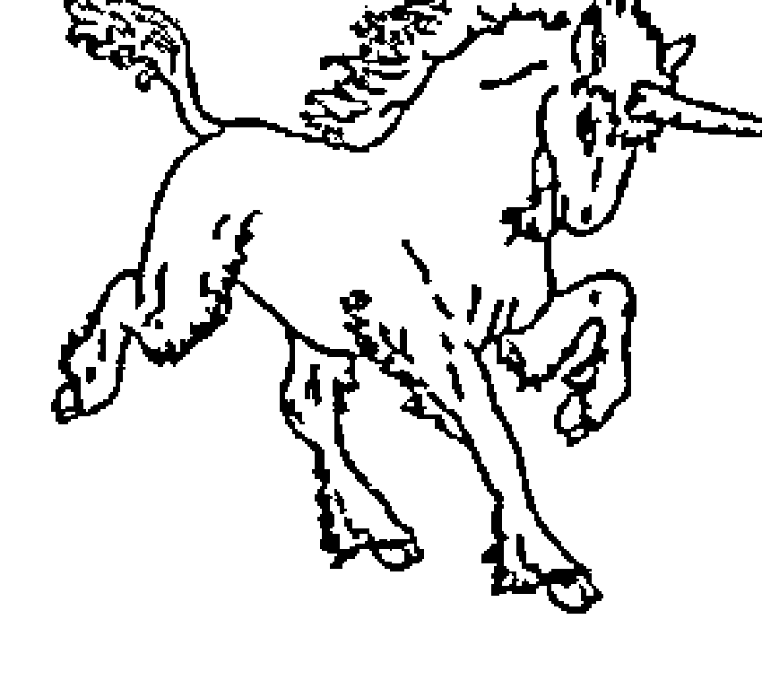

## **龙**

龙是西方神话学中的怪兽的最原始的原型。龙控制了四大元素中的每一种：没有翅膀的洞穴龙、飞龙、海龙、喷火龙。雄性龙被称为“龙(drakes)”，雌性则被称为“女王（queens）”。在西方传说中，所有的龙被描述成古代凶残可怕的爬行动物，代表着大自然原生态的，不可抗拒的甚至是敌对的力量。

龙是聪明的，同时也很狡猾、残酷、贪婪。他们热衷于收集宝藏，比如说：黄金、珠宝、武器以及传说中的遗物。他们将这些东西堆在一起，睡在上面，小心翼翼的守护着，害怕别人来盗取。

龙知晓所有生物的语言、传说，日耳曼的一个名叫齐格弗里德的英雄尝了龙的一滴血之后，他便懂得了所有鸟类和动物的语言。因为龙有很独特的性格，因此有很多与众不同的魔法名字，这些名字可以给与那些研究他们的人提供方便。这样的名字都有：妖龙（Vermithrax），德拉科（Draco），凯拉辛（Kalessin），以及史矛戈（Smaug）。但是迅猛龙（Velociraptor）、雷克斯霸王龙（Tyrannosaurus rex）、食肉牛龙（Carnotaurus）、恐爪龙（Deinonychus）以及棘背龙（Spinosaurus）这些名字都是古语中对龙的一些称呼。

有翅膀的龙可以分为两种基本类型：其中一种为四腿龙，他们还有额外的像蝙蝠或者鳍一样的翅膀，从他们的两肋延伸出来。另一种为双腿的双足飞龙，像蝙蝠一样的翅膀形成了它们的前肢。这些翼龙都很像史前的翼手龙，由此导致了一些说法推测它们是历史时期这种生物中的幸存者。

在马来半岛上有一种能滑翔十米左右的蜥蜴，叫做裸耳飞蜥（Draco volens）（“飞龙”），他们有着像鱼鳍一样的肋骨翅膀。将它们木乃伊化的尸体带往欧洲作为“幼龙”展览——飞龙真实存在的铁证！

尽管传说中的龙的生物学基础无疑是存在的，包括大蜥蜴、鳄鱼、残骸化石。我认为表面上真实的关于活龙的记录可以追溯到中世纪欧洲的无脊椎动物身上，就像尼斯湖怪兽一样。至少，这个解释适合所有有关龙是蠕虫的论断。然而，在非洲，有一种动物叫魔克拉姆边贝，可能是真正意义上的爬虫类龙！

但是几乎只有很少的一部分迹象表明曾经有一种强大的生物统治着地球：恐龙，或者初龙亚纲（Archosauria，“居统治地位的爬行类动物”）。这些曾经真实存在的龙统治了地球长达150百万年——直到地球遭遇巨大行星的冲击，他们的统治才告一段落。但是存在了如此之久，如此强大的精神和智慧是不会轻易的在朝夕之间就毁灭的。就像早已死去的精灵和小人儿依然以仙子的精神存在的形式继续存活在这世上一样，龙的灵魂仍然在梦境之中延续着它们古老的恐龙之乡的血统，在所有存在着的哺乳动物的集体记忆中继续着它们的统治。

## 狮鹫

在神话学中，狮鹫的历史要追溯到5千多年以前，gryphon这个单词在每种语言里都可以追溯到希腊语里的grypos（比如说法语的griffon，意大利语的grifo，德语的greyff，英语的griffin）——“钩状的”——因为它有一张很大的用于捕食的鹰钩嘴。

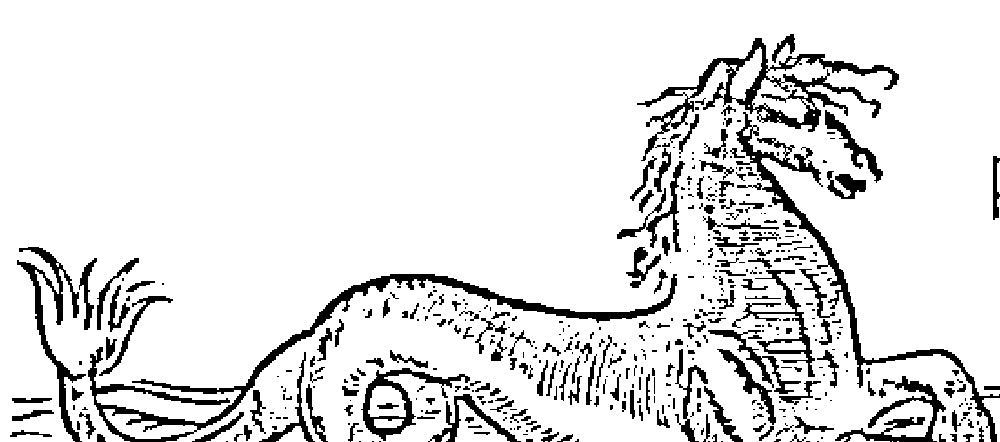

鹰爪和狮身的动物，但实际上它不是根据鹰的形象而想象出来的，而是基于胡鹫、胡兀鹫的形象。胡鹫和胡兀鹫有四英尺高，它的翅膀宽约九英尺。胡鹫很强大，但是非常少见（它的德语名字的意思是“偷羊者”，这个名字是基于它们喜欢偷羔羊的习惯），生活在南欧、非洲以及亚洲的高山山脊上。在南亚和南非也存在着一种格里芬秃鹫（griffin vulture）（兀鹫）。

狮鹫经常出现在古苏美尔人、古亚述人、古巴比伦人、迦勒底人、古埃及人、迈锡尼人、印度伊朗人叙利亚人、西西亚人和希腊人的艺术品和传说中。在中世纪欧洲的纹章学中，狮鹫经常用于代表时刻警惕的象征符号。在古代的占星学中，它们推动着太阳神的战车。根据传说，狮鹫生活在极北之地（Hyperboreans）（蒙古的北风人[North—wind people]）和独眼国（Arimaspians）（塞西亚的独眼部落）之间的土地上。他最喜欢捕食的猎物是马，最大的天敌是独眼人，因为独眼人总是试图抓住狮鹫去看守的大量黄金。

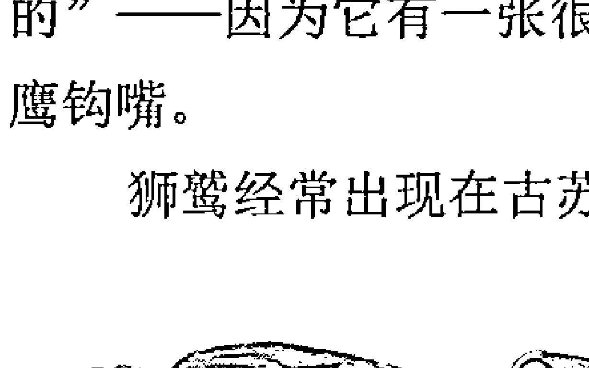

尽管狮鹫通常被描述成有翅膀、鹰头、

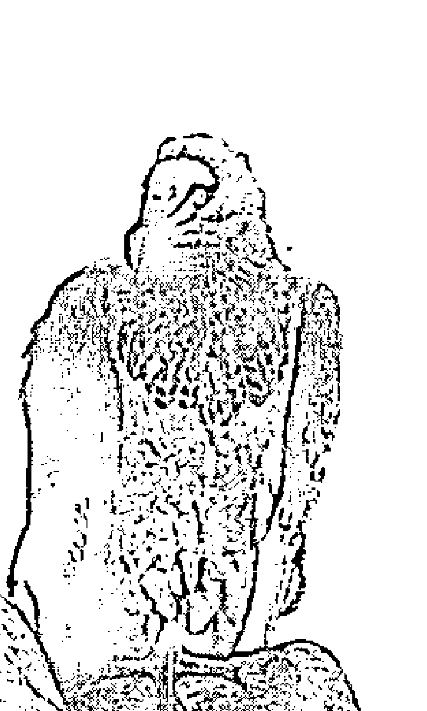

## 马头鱼尾怪兽

神话中的海马或者马头鱼尾怪兽（hippocampus）（在希腊语中意思是“类似于马的水怪”），头和前半部分是马，但是马蹄变成了鱼鳍，后半部分是想象中鱼的样子。它还作为水马（Water-horse）和马鳗怪（horse-eel）而为人所知，是希腊罗马式时期最受欢迎的艺术主题，尤其在罗马的浴缸中经常会发现嵌花式的马头鱼尾怪兽图案。在罗马，海马被认为是海洋中跑得最快的生物，因此成为了海神尼普顿最喜欢的战马。

在苏格兰，水马通常被称为马形水鬼（kelpie），常出没于河流和溪流中，让毫无戒心的人类骑上去之后，再猛地冲入水中，将他们溺死。在爱尔兰，同样的生物被称为食人马怪（each-uisge，读作ek—OOSH—kee）或者水马（aughisky，读作 og—ISSkee），他们栖息在大海和湖泊中，而且要比马形水鬼危险得多。在把受害者拖入水中之后再把他们吃掉。如果在内陆地区骑着水马行走是非常安全的；但是一旦你能看到海或者闻到海的气味时你还骑着它，那你便注定会被溺死。

水马可能被认为与传说中的尼斯湖水怪是等同的，而它们的亲属——其它的湖怪或者海蛇——在世界各地的很多地方都有其相关的报道。从侧面看来，这些生物的头和颈都跟马的比较像，因此也常常被目击者称为“水马”。

现在马头鱼尾怪兽这个名字是一个科学称谓，用于对一些古怪的小鱼，比如说海马的称呼。他们中最大的通常也不会超过14英尺。

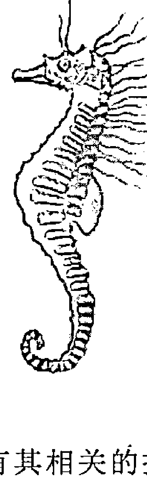

尼克西斯 (nixies), 涅瑞伊得斯 (nereids), 水中仙女 (naiads), 以及尼格约司 (ningyos)。

美人鱼一贯被认为是性感而危险的生物。她是大海里集美貌与反叛于一身的典型，而那些生活在海岸线一带的浅海区和海礁之类地方的美人鱼更是如此。据说，美人鱼的长发是由海草组成的。但是，若是水手看到了美人鱼，通常被认为是暴风雨、船失事、沉海等灾难的前兆。美人鱼家族生活在一个被海神尼普顿统领的海底王国，他们擅长利用歌声和美妙的音乐来引诱水手跳海。

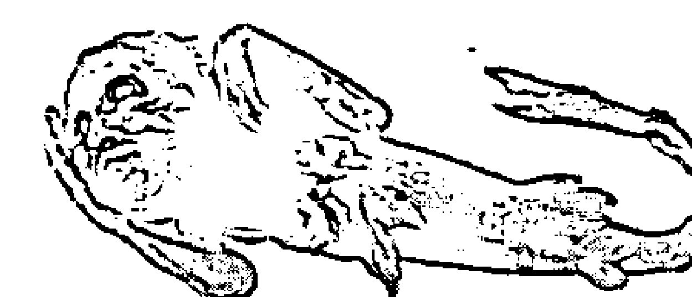

假斐济美人鱼

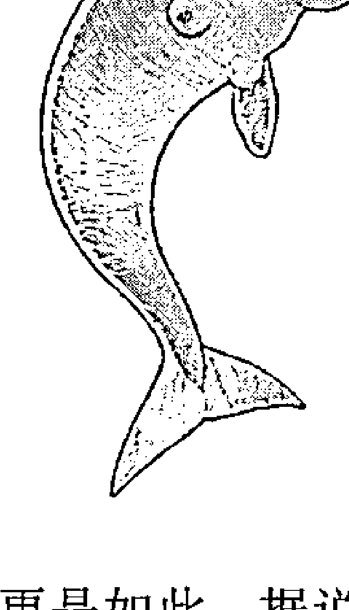

## 美人鱼

美人鱼在腰部以上是美丽的少女，腰部以下是鱼身，是神话传说和爱情故事中最受欢迎的生物。在航海史上，水手们无时无刻无处不在地诉说着他们出海时遇到的美人鱼。关于海洋人类（mer-people）的民间传说历史悠久，分布广泛，跨越了时间，地狱，以及年代的限制。他们有各种各样的名字——塞壬（sirens），塞尔切丝（selchies），特里同（tritons），水女神（undines），（melusines），摩根（morgans），克里甘斯（korrigans），罗蕾莱（lorelei），鲁莎尔基（rusalki），

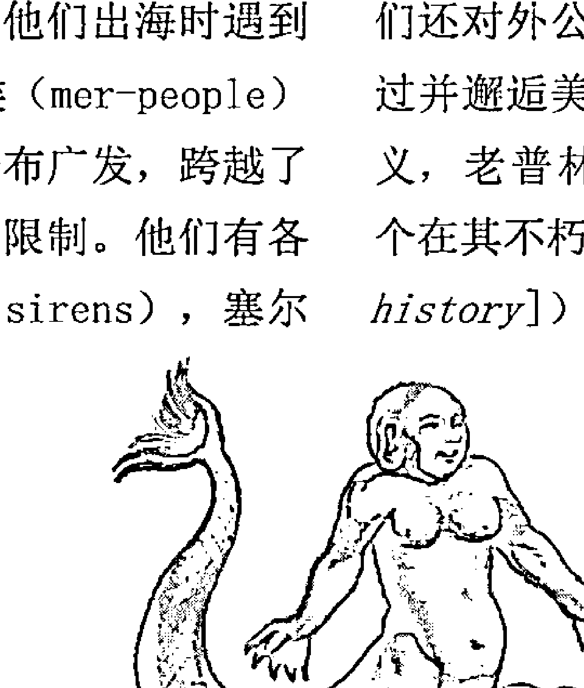

马特乌斯·梅里安 (Matthäus Merian), 1718年

几个世纪以来，许多自然历史学家和探海者都相信美人鱼是真实存在的。他们还对外公布过几个世纪以来许多关于见过并邂逅美人鱼的例子。关于美人鱼的定义，老普林尼（公元23—79年）是第一个在其不朽著作——《自然史》（[natural history]）里详细记录美人鱼相关事宜的自然主义者。19世纪中叶，在维多利亚女王时代的伦敦，填充式“美人鱼”（日本动物标本剥制师创造出来的猴鱼复合体）成为了奇谈，吸引了众多人的注意。而在众多新奇的事物之中，最著名的要属 P. T. 巴纳姆（P. T. Barnum）于 1842 年引入百老汇的 “假斐济美人鱼（Feejee Mermaid）”。

一些为大众所熟知并讨论的美人鱼传说也提供了一点事实根据，那就是：如果在一定距离外观看，确也存在与美人鱼长相颇为相似的真实动物存在。例如，你可能将海牛目哺乳动物（海牛和儒艮）或鳍足类动物（海豹、海狮）等当作美人鱼。在 20 世纪 80 年代早期，有专家宣称在新几内亚北部、新爱尔兰沿岸一带看到过一种不为人知的海洋生物。当地人把这种动物叫做 “里（ri）” 或者 “伊尔凯（ilkai）”，并描述说它有类似于人类的脑袋和躯干，也有女性所特有的乳房，但却具备一副鱼才有的下半身！换句话说，这是一只美人鱼！这一身份定义只是根据其洋泾浜名字——pishmeri（“女人鱼 [fish-woman]”）——而强加在这些动物身上的！

1985 年 3 月，我带领一队潜水探险队去往新爱尔兰，为的是验明 “里” 的身份并拍下相关视频。我们却发现， “Pishmeri” 只是一种生活在印度洋太平洋地区里被称作 “儒艮” 的动物而已。在此之前，儒艮就已经作为一种稀有的海牛目哺乳动物被展示给那些不了解这种动物的海洋生物学家了。

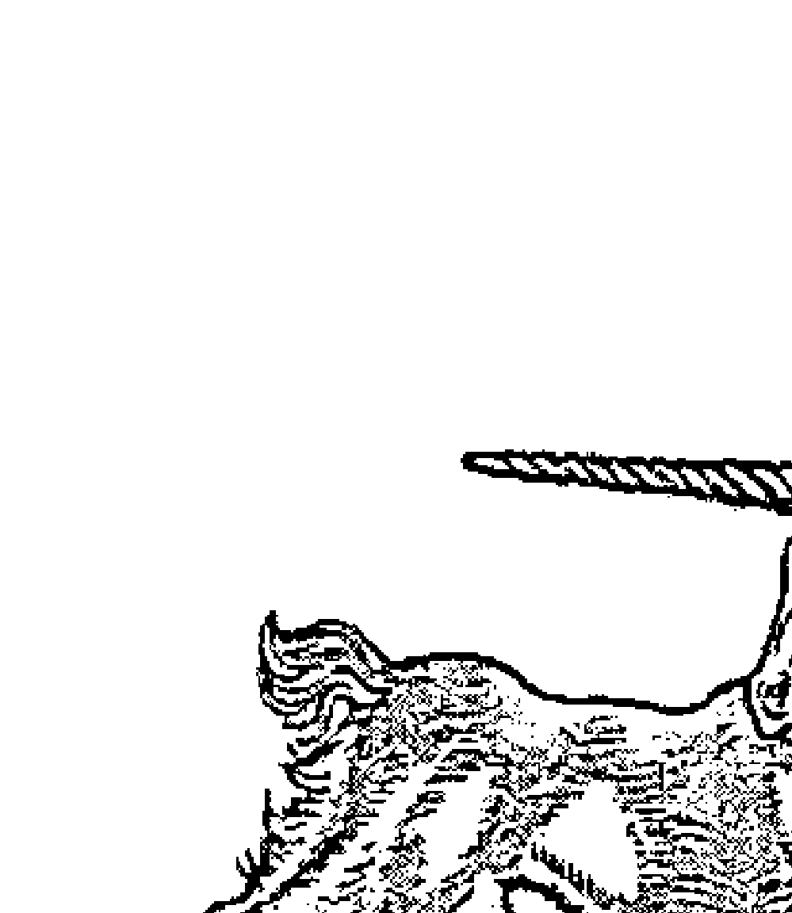

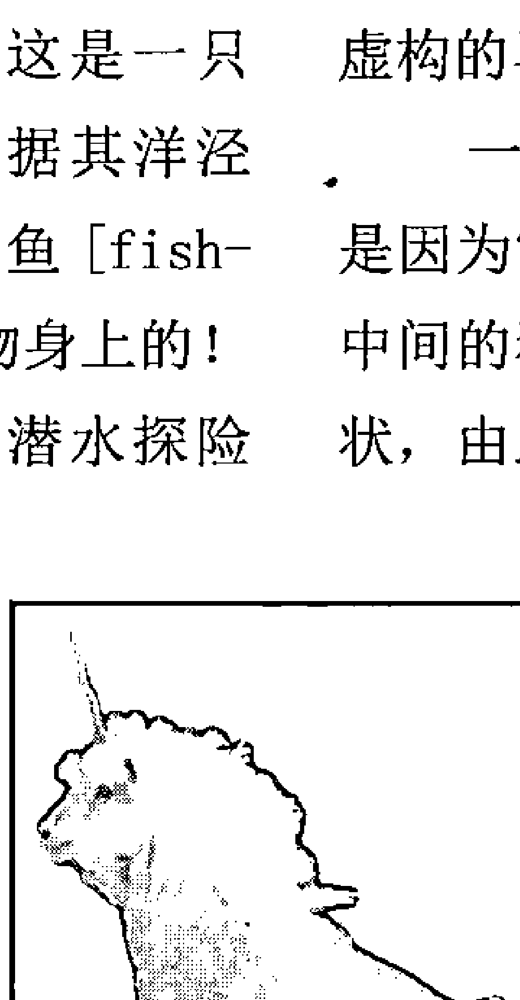

## **独角兽**

在黑暗的中世纪，独角兽（“只有一只角”）的传说就像是亮起了一盏明灯，它代表着美好、力量、优雅、纯洁等。生理学是这样描述独角兽的：

> > “它虽是一种像孩子一样身材矮小的小动物，但却有着异常凶猛的性格。在它的头部中央有一只尖角……”又因独角兽颜色雪白、偶蹄、尾巴高扬、长着山羊胡子、柔滑灵动的鬃毛，及腿后长有一络羽毛等，它通常都会被呈现在中世纪的挂毯上和木版画中。

因为独角兽所具备的这些特点源自于山羊，所以它也被称为山羊式（“山羊一般的”）独角兽，为的是将其与青铜时代的像公牛的公牛式的独角兽，铁器时代的像绵羊一样的绵羊式的独角兽，或者现代虚构的马一般的似马独角兽区别开来。

一种动物之所以被叫做“独角兽”，是因为它的前额中心处长出的独角。随着中间的独角慢慢长大，慢慢改变头颅的形状，由此便会撑大头盖骨，影响到松果体和脑下垂体。独角兽长得越大，它会变得越来越聪明，越来越具有超凡的魅力，也越来越有能力对抗其它肉食动物。从而，它渐渐便会成为兽群中优秀的首领和守护者。因此，独角兽也成为了皇室的象征，最终便成为了神性的象征。而生理学也把独角兽喻为“救世主”。

独角兽的角历来被认为是珍贵的解毒药。它所具备的医药价值是巨大的，对于任何一种含毒的食物和饮料，你只需在其上面撒上一点儿角粉便足以抵消毒性。最著名的传说之一便讲的是独角兽的“净化水”的能力，在这个故事中，独角兽将其魔力般的尖角浸入水中净化被污染的井水或者泉水。尽管品种稀有，独角兽也已存在了4000多年。关于他们是如何产生的这一配方，一直为北美和中东地区一些部落所严密保守。这个秘密遗失了几个世纪，直到约翰和我在1976年再次将它找了出来。80年代早期，我们终于培育出了几头活独角兽。400多年来，兰斯洛特（Lancelot）是世界上出现的第一头山羊式独角兽，它于1980年出生在奥斯塔拉（Ostara），之后成为了玲玲兄弟马戏团 / 巴纳姆 - 贝利马戏团（Ringling Brothers/Barnum & Bailey Circus）的明星。

## 第五课：魔法师的历史

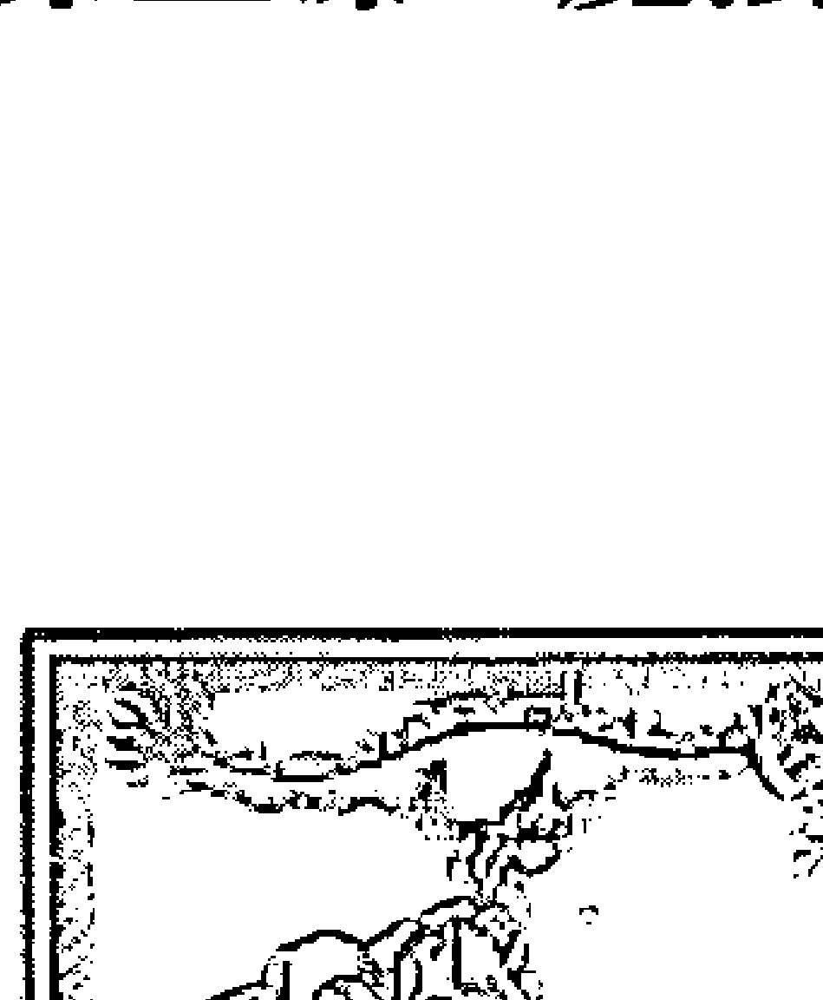

世界上一直都存在有魔法师，贯穿所有有记载的历史，遍布世界上的所有文化——即使在某一时间段中数量很少。最古老的职业当然是萨满巫师。最古老的洞穴画——可以追溯到20，000年前，上一次伟大的冰河世纪时期——描述了萨满与动物在一起的场景（而且也是他们自己绘制的）。萨满巫师是世界上的一位艺术家，第一位工匠，第一位音乐家，第一位草药医生，第一位助产士，第一位治疗师，以及第一位魔法师。萨满巫师是第一位让自己的灵魂离开肉体遨游，探索隐秘的魔法国度，梦境，以及潜意识的人。因此，冰河世纪和石器时代的萨满成为了所有巫师的鼻祖。

魔法师的名字和所作所为远比其它职业要多得多，这些都被记录了下来并一代代传承了下来，传到我们手中。即使一些历史文件已经遗失了，他们的故事依然存在于神话之中。以上是一份古往今来、曾经活在这个世上，而现在已经死去了的若干特别出名的魔法师名单，按年代顺序排列的表格。其中存在着教派和学说上连续性重叠，这是通过很多魔法书之间的继承和影响而发生的转化。很多魔法师都认为他们自己是之前一些优秀的先辈们的转世。这个名单只列到18世纪，而在下一课“现代魔法师”中会继续讲解。那些特别显著的魔法师会在后文中有详细的讲解。

## 著名魔法师的生平

介于空间的限制，我不能将上面所罗列出来的所有魔法师都在下面的传记中进行详细的解释，但是我已经就全力挑选一些古往今来最值得注意的一些魔法师进行介绍。如果你其中的某位前辈特别感兴趣，你可以在网上搜索他的名字。

### 伊姆霍特普（公元前2635—2595年）

作为电影中活着的木乃伊，很多人都知晓伊姆霍特普的名字。直到19世纪末，他仍然被认为是神话中虚构的人物，但是他实际上是一个真实存在过的人。伊姆霍特普被敬奉为神，他是历史上记载的第一个、也可能是最伟大的魔法师。他是世界上的第一名医生，同时他还是一名祭司、作家、哲人、诗人、占星家以及伟大的左塞尔法老（于公元前2630—2611年在位）身边的维齐尔。左塞尔法老是埃及第三王朝的第二任法老。伊姆霍特普一共侍奉过四位法老。他的头衔都有“法老的大臣（Chancellor of the King）”，“一人之下万人之上（First One Under the King）”，“埃及大厦的行政官（Administrator of the Great Mansion）”，“世袭贵族（Hereditary Noble）”，“首席雕刻家（Chief Sculptor）”，以及“首席木匠（Chief Carpenter）”。他同时还是黑里欧波里斯（Heliopolis）——埃及的宗教首都——的大祭司。

伊姆霍特普是我们所知道的有名的建筑大师。他建造了第一座金字塔——位于塞加拉的左塞尔阶梯金字塔，迄今为止仍然是古代世界最为灿烂的建筑奇迹。

伊姆霍特普活到了60岁，在当时来讲已算是长寿的年纪了，死于埃及第三王朝最后一位法老胡尼法老的统治时期。他的陵墓至今仍未被发现，人们都认为是在靠近阶梯金字塔的塞加拉。

伊姆霍特普最著名的作品便是他的医学著作。人们认为《艾德温·史密斯纸草文稿》（[Edwin Smith Papyrus]）便是他创作的，里面包含了90多种解剖术语以及48种伤病。他还在孟菲斯创立了一所医药学校，而他的名声持续了2000年仍未消褪。

## 摩西（公元前1668—1548年）

人们关于摩西的记忆最为深刻的便是他所传播的十诫，以及《出埃及记》（公元前1628年）中所描写的将希伯来人带离埃及。他同样还因其在第一次的魔法战争中击败法老的宫廷魔法师而著名。摩西和他的哥哥亚伦来到法老跟前要求法老释放希伯来奴隶。在接受法老的挑衅“创造一些奇迹”的时候，亚伦扔下自己的魔杖将其变为一条巨蛇。然后法老便请出了埃及的魔法师与之挑战。每个魔法师都扔下自己的魔杖，而这些魔杖也都变成了蛇。但是亚伦的巨蛇吞食了那些魔法师的蛇（根据7:9-12）。而法老仍然无动于衷，摩西只好召唤出十次可怕的瘟疫袭击埃及。

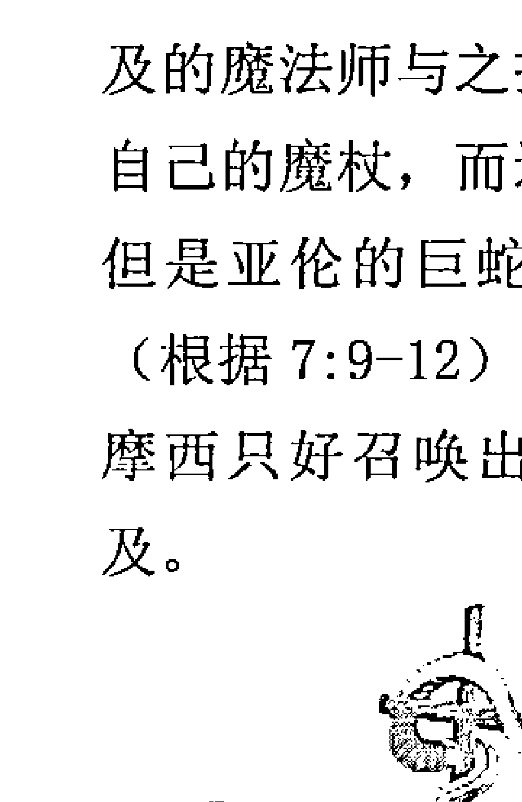

摩西和希伯来人从埃及逃出来到芦苇海（Sea of Reeds）海岸上，后面的法老军队也追了上来。“摩西将他的手伸出放在海面上……海水水开了，而这些以色列的孩子们通过干燥的地面直接走进了大海，水墙伴随在他们左右”（根据14:21—22）。

当他们在沙漠中安营扎寨时，摩西敲开了一块石头，随之便有水从石头中留出以供人们饮用。当他们受到毒蛇困扰之时，他双眼盯住他的魔杖上的一只青铜巨蛇，这样便赶走了其它的小蛇。

到中世纪，摩西因此获得了一个强大魔法师的名称。据说单词 moses（摩西）在秘传的古埃及观念中是一位“神秘的智慧教派的创始人，他会向无知者传授天神的意志和生命的奥秘”。传说摩西成立了一个秘密的魔法学校，叫做帐幕之谜（Tabernacle Mysteries）。圣经的前五卷（《摩西五书》）在犹太人中《圣经旧约之首五卷》被称为 Torah（“律法”），而且很多人都认为是摩西自己编纂的。其中被看作寓言的详尽规则和说明、以及有关象征主义的关键构成了犹太人的卡巴拉神秘学——被很多魔法师认为是所有魔法的基本体系。而这些内容在帐幕之谜中都会教授。

### 阿斯克勒庇俄斯（大约公元前1600年）

在西方世界中，医师的形象起源于埃及的健康之神和医药之父阿斯克勒庇俄斯（Asklepios，“as-KLEE-pee-us”），通常，他的罗马名字更为人所熟知——埃斯科拉比厄斯（Aesculapius，“AS-ku-LA-peeus”）。阿斯克勒庇俄斯是天神阿波罗和宁芙仙子科罗妮丝（Coronis）的儿子。聪明的人马怪喀戎教授了阿斯克勒庇俄斯外科知识、毒药、春药以及咒语的使用。女神雅典娜赐予了他一剂由蛇发女怪马杜莎的血液制造而成的魔法药水。拥有这些礼物之后，阿斯克勒庇俄斯所知道了解的知识已经超出了人类的极限。

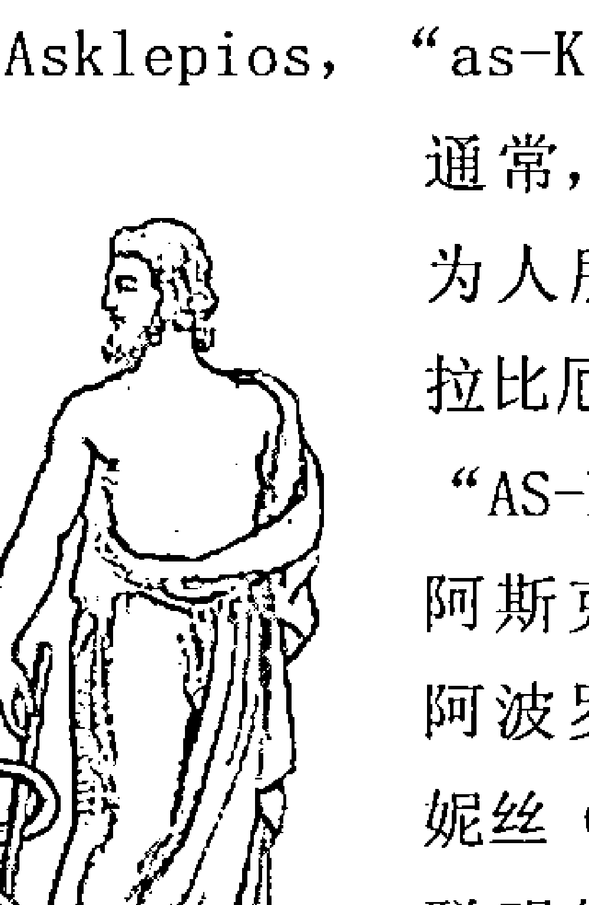

阿斯克勒庇俄斯住在塞萨利（一个因其女巫出名的国家）的特里卡（Tricca）。当特里卡人被瘟疫缠绕于身的时候，阿斯克勒庇俄斯建议他们走出家门去到郊外，搜集他们能够找到的所有的蛇，然后将它们放在他们的房屋和谷仓之下。蛇吃掉了所有的老鼠，也就是这些老鼠身上的跳蚤携带了瘟疫病毒。自此以后，蛇人共居的传统便在整个希腊、克里特以及后来的罗马形成了。

然而，阿斯克勒庇俄斯让猎人俄里翁在被蝎子杀死以后起死回生的做法逾越了人类的管理范围。这一行为冒犯了死神哈迪斯，他向他的兄弟宙斯上诉，宙斯用雷电杀死了阿斯克勒庇俄斯和俄里翁。但是为了感谢善良的阿斯克勒庇俄斯所带来的人性的光辉，宙斯将他放在星星之间，作为蛇夫（养蛇之人）星座中的一员。

无论是古希腊社会还是后来的罗马帝国，都将阿斯克勒庇俄斯当作治疗师的象征。医师被称为是阿斯克勒庇俄斯的追随者。他的象征符号墨丘利节杖——上面缠绕着一只阿斯克勒庇俄蛇的魔杖——使用到现在成为了医疗职业的象征。

### 所罗门（公元前970—928年）

所罗门是以色列的国王，也是大神殿的建造者。他因自己的智慧、财富和长时间的繁荣统治而闻名于世。作为一名大魔法师，通过自己的魔法戒指控制着所有的魔鬼，因此，他是传说中会经常出现的角色。据说他雇佣了这些魔鬼来为他建造神殿。《所罗门密钥》以及其它的魔法文字都被归因于他。所罗门的几次与外国人的政治联姻让他与国外的文化和宗教活动产生了共鸣。经常召见外国高官——最出名的就是示巴女王（The Queen of Sheba）——同样也对耶路撒冷和皇室宫殿产生了深厚的影响。

根据研究犹太法典《塔木德经》（[Talmudic]）的学者所说，所罗门掌握了卡巴拉神秘学。他还是一名炼金术士和亡灵法师（通过与死人交流而预知未来）。《塔木德经》的传说声称所罗门曾练习控制旷野中的野兽、空中的鸟儿，以及协调魔鬼和精灵，从这些动物和灵体身上他获得了很多智慧。

阿拉伯人称所罗门为苏莱曼（Sulaiman），他们认为他是有史以来的最伟大的魔法师。伊斯兰教的《古兰经》讲述了所罗门王精通所有生物的语言，这一点让他能够成为统治人类、鸟类、以及神灵（“妖怪”）的主人，让它们听从他的命令——尤其是完成他的雄心壮志以及要求很高的建筑项目。

### 老子（大约公元前600—300年）

老子出生于哪年无人知晓。传说也是众说纷纭，但是学者们将他的生卒年月定在公元前600年到300年期间。老子的著作是《道德经》，（道意为“所有生命的途径”，德意为“人类以合适的方式使用生命”，经意为“文字”或者“著作”）。老子并不是他的真名，而是一个尊称，意为“老大师”。老子相信人类生命，就像宇宙中的万事万物一样，会受到外界力量的影响。他认为“简单”是真理和自由的关键。老子鼓励他的追随者依照自然法则去观察和寻找认知，以提升直觉力，增进个人力量，并使用这种力量和爱一起去引导生活，而不是武力。老子的睿智的忠告吸引了大批的追随者，但是他拒绝将他的思想以书面形式记下来。他认为写下来的文字可能会变为拘于文字的教条。老子想要他的哲学保持一种自然的方式，这样便能善待生活、尊重生活、内心平静。老子并不主张死板的守则行为。他认为一个人的行为应该是出于本能的，要对得起良心。

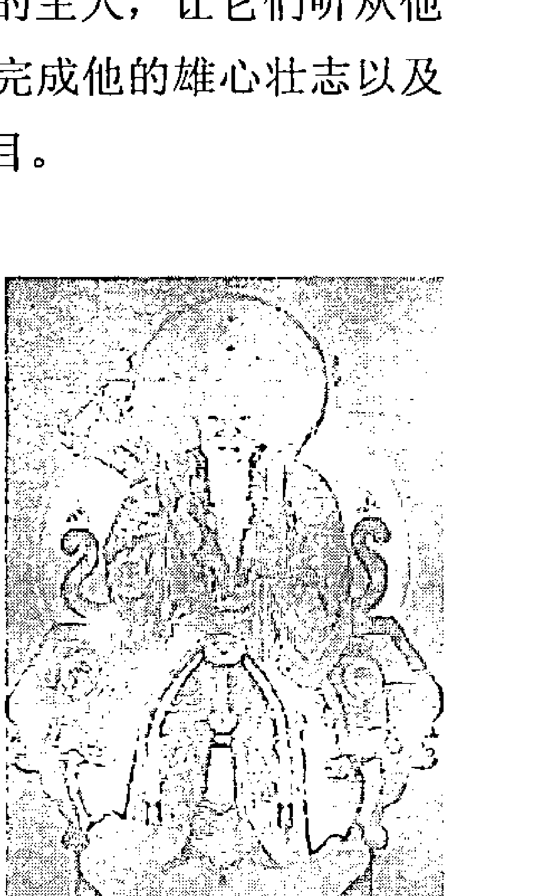

传说老子到后来对人类的邪恶感到非常悲伤，于是他骑在一只水牛背上出发去了沙漠之中，将所有的文明抛于脑后。当他抵达保护着整个王国的长城的最后一扇门时，守门人最后劝说他将他的哲学记录下来传承给他的子孙后代。结果是《道德经》的八十一条语录成为了世界上仅次于《圣经》的、翻译得最为广泛的文字。

### 查拉图斯特拉（公元前628—551年）

在希腊，查拉图斯特拉（Zarathustra）被称为琐罗亚斯德（Zoroaster）。查拉图斯特拉生于伊朗，最后成为了一名伟大的预言家、教师、祭祀以及魔法师。他成立了一个以他的名字命名的宗教，这个宗教直到今天仍然存在，主要是在印度的帕西人中流传。女王弗莱迪·摩克瑞（Freddy Mercury of Queen）就是一名琐罗亚斯德教的教徒。根据传说，查拉图斯特拉认为世界上存在两位主要的神明：阿胡拉·马兹达（Ahura—mazda），代表着光明和善良（象征物是火），以及恶灵阿里曼（Ahriman），代表着黑暗和邪恶。这两种力量处于永久的矛盾之中——它们都存在于宇宙中和人类的灵魂中。但是人类拥有自由的选择，因此善良将会取得最终的胜利。查拉图斯特拉宣告了一种宇宙通用的信息——一切都是平等的，无论种族、性别、阶级或者国籍。他坚持认为领袖必须是“选出来的”，因此播下了民主主义的种子。他简单的信条被包含在一本小书之中，书中有17首歌曲或者赞美诗，这本书名为《查拉图斯特拉的迦特》（[The Gathas of Zarathustra]）。

查拉图斯特拉的宇宙学说名为麦琪（Magi），祭司都了解这种学说并将其投入实践之中。我们是从 magi 中衍生出的单词“magic（魔术）”和“magician（魔术师）”。 Magi 就像占星师和魔法师一样出名，因此在大约公元前500年波斯帝国统治期间遭到了迫害。今天，世界上的40000波斯人中有70%生活在印度的孟买。

### 毕达哥拉斯（公元前580—500年）

希腊哲学家和数学家毕达哥拉斯是影响最为深远的古代魔法师之一。传说他曾接受了名为阿巴里斯（Abaris）的塞西亚魔法师的训练。 毕达哥拉斯·萨默斯出生于萨摩斯的希腊小岛，他在大约公元前530年的时候迁往希腊的克罗登（Croton）城邦。他在那里建立了神秘派公社和学校，他试图通过数学发现宇宙的奥秘——就像今天的物理学家所做的那样。毕达哥拉斯弄懂了地球围绕自己轴线的自转引起了白天和黑夜的出现，并假设地球是按照音程进行了定距离间隔。然而，他的学说不仅很科学，而且符合伦理道德、宗教信仰以及神秘学。他相信再生的进化形式被称为轮回（metempsychosis），或者灵魂转世（transmigration of soul），在此过程中，灵魂会在动物和人类之间向上或者向下发展，这一切都根据他们在每一世中所学到的经验教训以及他们的表现。因为这种观念，毕达哥拉斯神秘学的教徒都是素食主义者，而且会举行一些净化仪式来获取下一世投入一个好人家的机会。毕达哥拉斯拥有着非凡的能力，而传说也将他描述成一个拥有超能力和丰功伟绩的人。

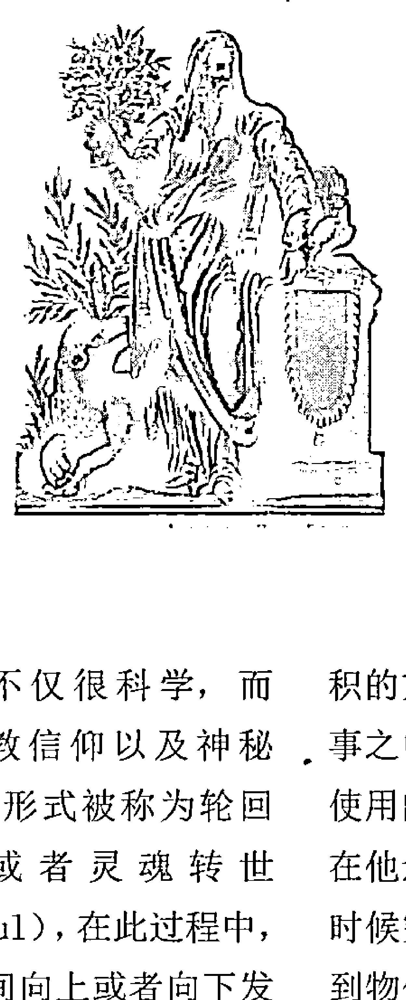

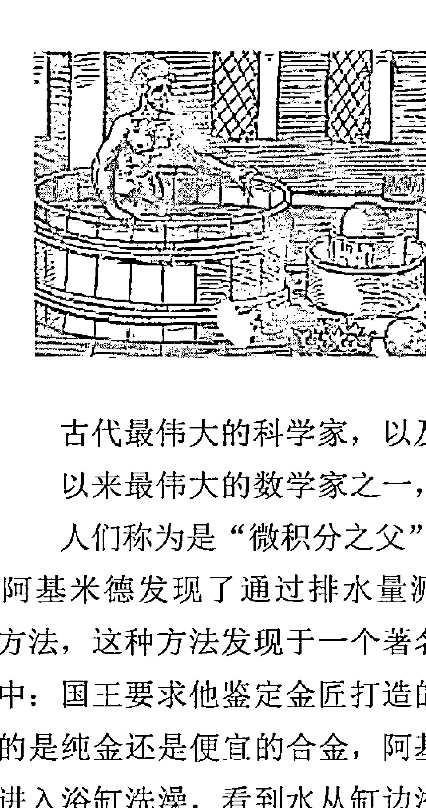

### 阿基米德（公元前287—211年）

阿基米德是一位和列奥纳多·达·芬奇一样的发明天才。他出生并且生活在西西里岛的锡拉库扎（Syracuse）。他可能在埃及的亚历山大接受的教育，师承欧几里得（Euclid）的部下。他发现了所有基础机械的工作原理，尤其是杠杆。他说“给我一根足够长的杠杆和一个立足点，我便能撬起整个地球。”阿基米德发明了组合滑轮、螺旋桨、星象仪以及水风琴。作为古代最伟大的科学家，以及有史以来最伟大的数学家之一，他被人们称为是“微积分之父”。

阿基米德发现了通过排水量测量体积的方法，这种方法发现于一个著名的故事之中：国王要求他鉴定金匠打造的王冠使用的是纯金还是便宜的合金，阿基米德在他进入浴缸洗澡，看到水从缸边溢出的时候突然灵光闪现，得到了顿悟。他意识到物体的排水量取决于它的体积而不是重量，而被王冠所代替的水的体积应该和相同重量的纯金的体积是一致的，阿基米德从他的浴缸中跳出来，赤裸着身子穿过街道进入皇宫，大叫到“有了！”（“我已经找到了！”）

阿基米德发明了一些战争机器来帮助锡拉库扎防守对抗罗马人的入侵。他的发明包括投石器和燃烧镜（burning mirror）。尽管有他杰出的防御工具，罗马人依然打破了城墙并占领了这座城市。最后阿基米德死在一个名不见经传的罗马士兵手中。

### 阿波罗尼俄斯（Apollonius of Tyana）（大约公元30—96年）

阿波罗尼俄斯是公元1世纪最伟大的魔法师。弗朗西斯·巴雷特（Francis Barrett）公然称他为“有史以来最杰出的”

在塔苏斯（Tarsus）和埃迦伊（Aegae）的埃斯克拉比俄斯神殿接受教育。在他16岁的时候，他成为了毕达哥拉斯的追随者，并穷其一生研究他的学说。在其求知欲的推动下，他游历了很多东方国家。

根据传说，他所到之处都创造了奇迹，并改变了当地的宗教崇拜。在宴会上，他会让一些异国菜肴在他的命令下出现在大家面前，这一点总能让宾客们震惊不已。雕像被赋予生命，青铜塑像会从基架上走下来为宾客们服务。金银器皿和里面所盛装的物品——以及仆人们——会在顷刻间消失得无影无踪。甚至还有人说他曾让一位死去的少女起死回生。

阿波罗尼俄斯因其巫师的身份而被指控有罪，最终被带到罗马帝国的皇帝图密善（统治时间公元81—96年）的跟前。他对于控告者所提出的问题进行了巧妙机智的回答，因此皇帝便赐他无罪释放。阿波罗尼俄斯的死因至今仍是个谜。大多数人甚至根本就不知道他已经死了，而还有一些人认为他仍然还活着。人们在泰安那修建了一座神庙以供奉他，而他的塑像在很多其它的神殿中也能找到。

### 术士西门（Simon Magus）（公元20—50年最为出名）

术士西门（“Simon the Mage”）是一名杰出的魔术师，他住在苏美尔，和耶稣是同一时期的。《使徒行传》（[the Acts of the Apostles]）8:9—24处有提到他，甚至基督教也承认他创造了真实的奇迹。他名扬海内外，世界各国都有追随者。其中一些人甚至认为他才是真正的弥赛亚（救世主），而不是耶稣。传说他是一位名为多赛瑟修斯（Dosithesus）的魔法师的弟子，西门成为了可能是第一批崇拜诺斯替教的教徒（Gnostic，源自希腊语中的 gnosis，意为“知识”）的中心，这个宗教宣扬是一种对于神圣智慧的精神追求。早期的教会作家认为他是最早的异教徒，“异教邪说之父”。然而，他的追随者对他的称呼却各不相同，都有第一位万古长青之人（the First Aeon），神明化身（the Emanation），原始神明的首次现身（the First Manifestation of the Primal Deity），神的祝福（the Word），圣灵（the Paraclete），以及万能的神（the Almighty）。

西门想要获得更伟大的魔法力量，并由此增加他的影响力，于是他接受了洗礼加入了早期的基督教会。后来，他频繁参加与彼得的“奇迹比赛”，以证明他们之中谁拥有更加伟大的力量。《彼得和保罗行传》（[The Acts of Peter and Paul]）中记录了西门能让黄铜巨蛇游动，石像开怀大笑，而他自己还可以升入空中——但是他不能让死人复活。在一次尼禄皇帝跟前的示范中，他漂浮在罗马广场上的空中，但是祈祷者彼得和保罗（他们## 亚历山大城的海巴夏（Hypatia of Alexandria）（公元370—415年）

海巴夏是亚历山大博物馆最后一位馆长塞翁的女儿。她是这个伟大图书馆的管理员，并因其智慧而为人所知，尤其是她关于天文学的知识。她撰写了《天文学准则》（[Astronomical Canon]），并就阿波罗尼俄斯的圆锥曲线论写了一篇评论文章。海巴夏在演讲的时候字正腔圆，并意味深长，颇具说服力，而在日常行为中她审慎明智，非常有礼貌。她喜欢身着哲学家的斗篷在城镇中心穿梭，在此，她可以公开地将柏拉图、亚里士多德或者其他所有的哲学家的著作解释给那些想知道的人听。

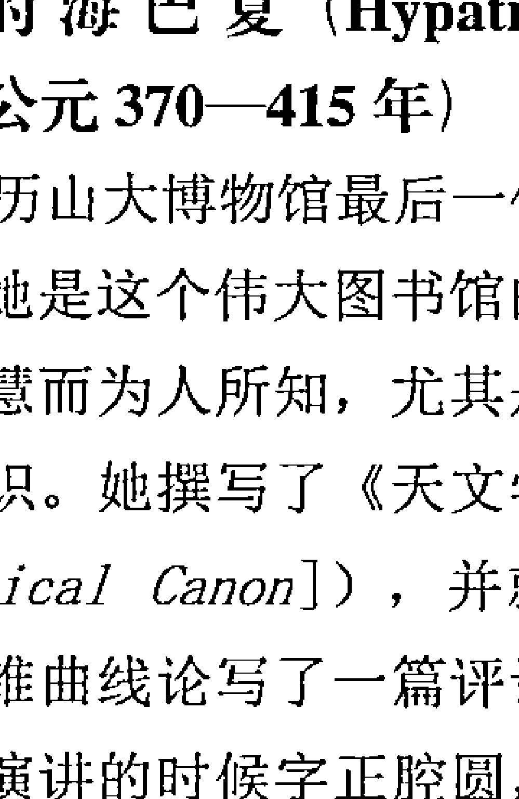

海巴夏长得非常漂亮，而且身材极好，姿态优雅，但是她同时也非常纯洁高雅，一直保持着处女之身。整个城市都非常崇拜她，但是在这个越来越多的人反对妇女的基督教世界中，海巴夏既是女性，也是异教徒。新的主教西里尔非常嫉妒她的美貌、学识、智慧以及名声，因此他策划了一起穷凶极恶的谋杀。在415年的春天，一名基督教修道士中的暴徒在街上抓住了海巴夏，将她打死，并将她的尸体拖入教堂之中进行了尸解，他们用锋利的牡蛎壳将她的肉从骨头上剥离，然后将她的尸骨分散扔在城市的各个地方。后来他们烧毁了伟大的图书馆——这是文明史上的一次凄惨的损失。

## 梅林（伊莫斯·梅林·安布罗修斯[Emrys Myrddhin Ambrosias]）（大约440—520年（存疑））

在西方传说中，梅林也许是最为著名的魔法师，他作为一名杰出的儿童家庭教育以及后来的亚瑟王（465—537年）的指导教师而闻名于世。据说梅林小时候就没了父亲，是被一名魔鬼抚养长大的。国王沃尔蒂格恩（Vortigern）听从了他宫廷魔法师的建议，将小梅林收养在自己身边。沃尔蒂格恩早前将撒克逊雇佣兵带到英格兰以抵御皮克特人和苏格兰—爱尔兰人的进攻。于是撒克逊人统治了这片大陆，而沃尔蒂格恩想要修建一座塔来加强他的统治。但是这座塔总是会塌陷，于是沃尔蒂格恩的顾问团告诉他只有没有父亲的小男孩的鲜血才能补救。但是梅林预言塔的不稳定是因为地基底下存在一池地下水，而最终挖掘以后发现果然如此。这件事情让他拥有了预言家的称号。

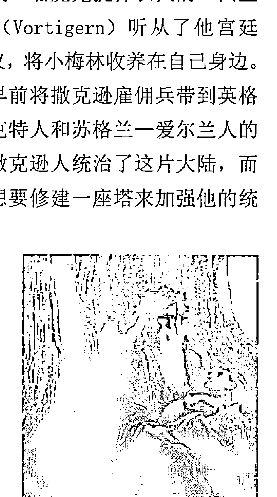

大约十年以后，沃尔蒂格恩死了，而尤瑟国王（Uther Pendragon）继承了王位，梅林为亚瑟的出生做了一系列准备，他将尤瑟假扮为康沃尔女王意格琳（Ygraine，Queen of Cornwall）的丈夫，于是尤瑟诱奸了意格琳并使其怀了孕。当亚瑟出生以后，梅林以寄养和教导的名义将他带走。在尤瑟王死后，梅林安排了石中剑的竞赛。再将剑从石头中拔出以后，亚瑟成为了英格兰的国王。据说是他成立了圆桌骑士团，并建立了骑士制度。

在梅林的晚年时期，他受到了妖妇尼姆引诱，将毕生所学的魔法传授于她，但她最终却反过来对付他，将他困在某个地方，传说有多种，有的说是在一个水晶洞中，也有人说热带荆棘林中，还有人说是在橡树林中。人们认为他在那里过上了平静的生活，调养生息，直到命运再次召唤他。

## 尼古拉斯·弗拉梅尔 (Nicolas Flamel) (1330—1418年)

尼古拉斯·弗拉梅尔出生在法国的蓬图瓦兹，是一名成功的书商和慈善家。在大多数的人都是文盲的情况下，他作为一名抄写员的作家赚取了大量的财富。他和妻子佩雷纳尔（Pernelle）一起为穷人盖建了低收入住房，并捐款修建了教堂和公墓。弗拉梅尔还是一位炼金术学徒，他花费了大量的时间来寻求长生不老药和可以点石成金的魔法石。一天晚上，一名天使出现并告诉他他将会得到一本神秘的书。在那以后不久，一位陌生人给了他一份古老的手稿《犹太人亚伯拉罕书》（[The Book of Abraham the Jew]）。尼古拉斯和佩雷纳尔在接下来的21年里都在对其进行解密。根据他1382年的日记条目，弗拉梅尔已经将“不值钱的铅变为了纯金”。他花费了他的余生来写了一本关于炼金术的书，并在1418年死去。从那以后便再也没人见过《犹太人亚伯拉罕书》。

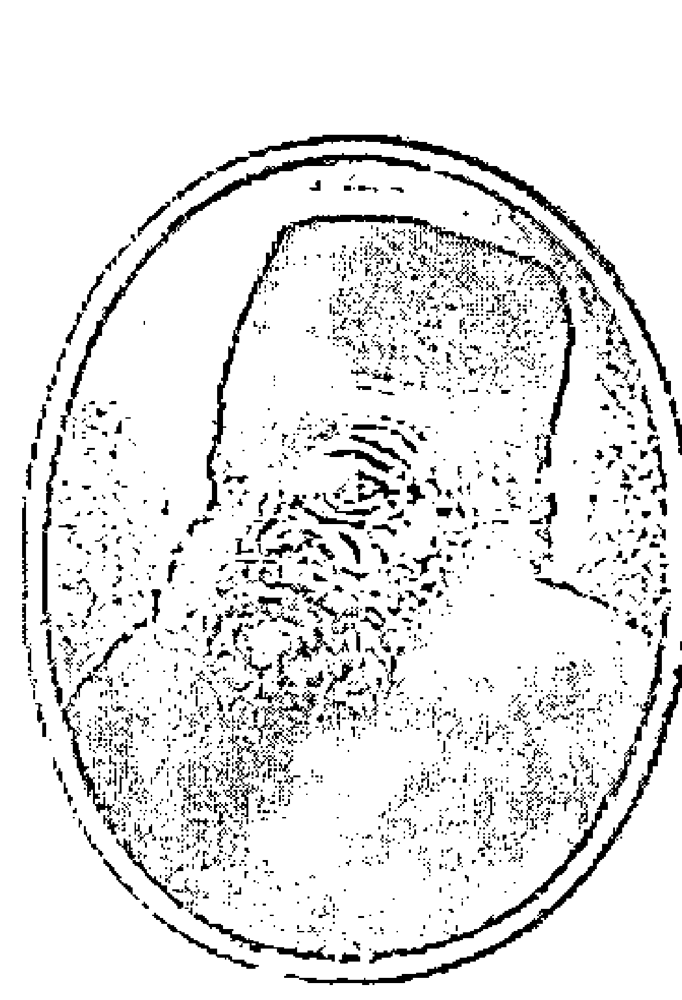

## 亚伯拉梅林法师 (Abramelin the Mage) (1362—1460年)

亚伯拉罕（Abraham）可能出生在美因兹（Mayence），但是他却四处游历，到过奥地利、匈牙利、希腊、巴勒斯坦以及埃及。在尼罗河岸边的阿拉奇（Arachi），一名名为亚伯拉-梅林的法师向他传授了魔法的入门知识。在回到德国的维尔茨堡之后，他改名为亚伯拉梅林，并开始了他的实用炼金术的研究。他对外宣布说他的魔法知识来源于天使，天使告诉他怎样呼风唤雨，怎样召唤并驯服魔鬼成为私人佣工和工人。他说世界上的万事万物都是魔鬼在天使的指示下创造的，而每个人都拥有一个天使和一个魔鬼，他们就像密友一样陪伴你左右。

根据传说，亚伯拉梅林为萨克森侯选人弗雷德里克（Elector of Saxony Frederick）创建了一支拥有2000名精灵的军队。

## 列奥纳多·达·芬奇（1452—1519年）

列奥纳多是意大利文艺复兴时期最伟大的魔法师。他对于人类的贡献都是非同寻常的——作为一名艺术家、发明家、作家和思想家。他的笔记揭露了在已知世界中对所有事物的探索和研究，而他的一些画作（尤其是《蒙娜丽莎的微笑》和《最后的晚餐》）位居于世界上最著名的艺术品行列中。

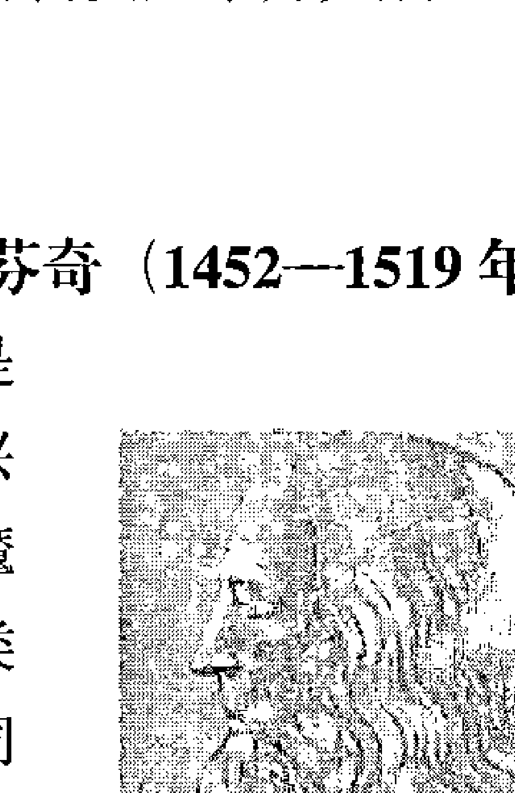

列奥纳多把他研究的每一个课题都上升为了一种科学研究的领域。为了更好地画人体画，他研究了人体解剖学；为了精确地描绘植物和地貌，他研究了植物学和地质学。他是一名地质学家、生理学家、天文学家以及机械工程师。他所构思的很多机器和发明都是工程学的奇迹——包括他的对扑翼飞行器（Flapping-Wing flying machine），或者说是扑翼飞机（ornithopter）的著名设计。他所留给我们的几千幅画作和几千份作品承载了一种统一联合的新视角，这是列奥纳多一直都想要给予这个世界的东西。在论及科学的时候他说科学就是‘对位于未来、现在以及过去的事物的认知’。他的很多文字都是在面对镜中的自己时写下的，他也因其隐藏在画作中秘密的编码符号而出名。

## 阿古利巴（1486—1535年）

海因里希·科尼利厄斯·阿古利巴·冯·内特斯海姆（Heinrich Cornelius Agrippa von Nettesheim）是德国的一名神秘主义者和炼金术士。他出生在德国科隆附近，他在大学中学习了医药和法律。1506年，在他20岁的时候，他已经在巴力建立了一个秘密社团，专门研究占星术、魔法以及卡巴拉，并成为了神圣罗马帝国的宫廷大臣。他来到位于多勒的法国大学开办了有关神秘主义的演讲，在此，他怀着合成黄金的希望建立了一个实验室。在接下来的大概十年时间里，他游历了整个欧洲，以一名炼金术士的身份谋生，并且与一些重要的人类学家们沟通交流。阿古利巴被宗教法庭逐出科隆后又在日内瓦成立了一个医疗实验室，并在1524年成为了里昂弗兰西斯一世（King Francis I）皇宫中皇太后的私人医师。当皇太后抛弃他以后，他搬去安特卫普，但是后来他因没有营业执照而被禁止行医。然后阿古利巴便成为了查理五世（Charles V）宫中的历史学家。

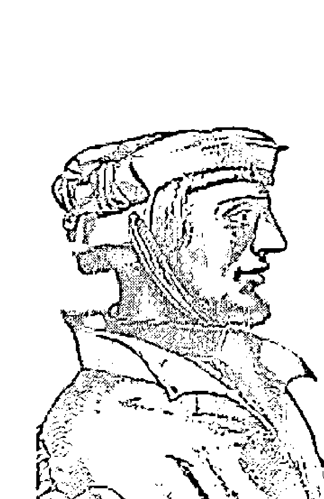

阿古利巴记录了大量的论题，包括婚姻和军事工程学，但是他最重要的作品是一本三卷的书，名为《秘传智术》（*[De occulta philosophiae]*）（“有关神秘哲学的”），这是一种“隐秘哲学”或者魔法的防御措施，其中引用了各种各样的神秘学传统——炼金术、占星术以及卡巴拉。这本书对西方魔法的发展有着深远的影响。阿古利巴信奉占星术、占卜、数字命理学以及宝石和石头的力量。据说，他练习巫术，召唤出了各种各样的魔鬼，找到了魔法石，甚至穿越去了新世界。他在法律、神学、医药学以及哲学方面知识渊博，他会说八种语言，被称为神秘世界多才多艺的文艺复兴人士（Renaissance man）。

## 帕拉塞尔苏斯（1493—1541 年）

来自霍恩海姆的泰奥弗拉斯托斯（Theophrastus Bombastus von Hohenheim）将菲利普·奥鲁斯（Philippus Aureolus）作为自己的笔名。在获得费拉拉大学（University of Ferrara）的博士学位之后，他将自己改名为帕拉塞尔苏斯（Paracelsus，“追随塞尔苏斯”——塞尔苏斯是古罗马的一名医师）。他是瑞士的一名医师、学者以及炼金术士。他和一名因有关卡巴拉的作品而出名的男修道院院长一起研究卡巴拉。帕拉塞尔苏斯对炼金术冶金学的兴趣驱使他去到德国、匈牙利以及其它国家的很多矿井之中，在此，他通常会被雇佣当一名分析员。他是第一位描绘出锌的原子结构的人，他发展了例如水银之类的矿物的用途，它们作为治疗药剂用于医疗实践中。据说帕拉塞尔苏斯在君士坦丁堡从一位阿拉伯魔法石那里了解到了魔法石的秘密。他拥有一面金属镜（魔法占卜镜），而且他还给出了制作金属镜的详细介绍。他相信星星和行星都会影响生命，他利用各种各样适当的金属制作并使用绘有行星印章的护身符。

1536 年，帕拉塞尔苏斯在一本名为《大医学》（*[Die Grosse Wundartzney]*）（“伟大而神奇的医学”）的书中出版了他的医学发现和理论，在这本书中，他将身体健康和与自然的和谐相处联系在一起。其他的作品，例如《莱博金丹》（*[Liber Azoth]*）（“水银之书”——水银酊剂）和《阿奇多夏》（*[Archidoxa]*）（“统治学说”）在神秘学家，炼金术士，以及神秘主义者中产生了非常巨大的影响。

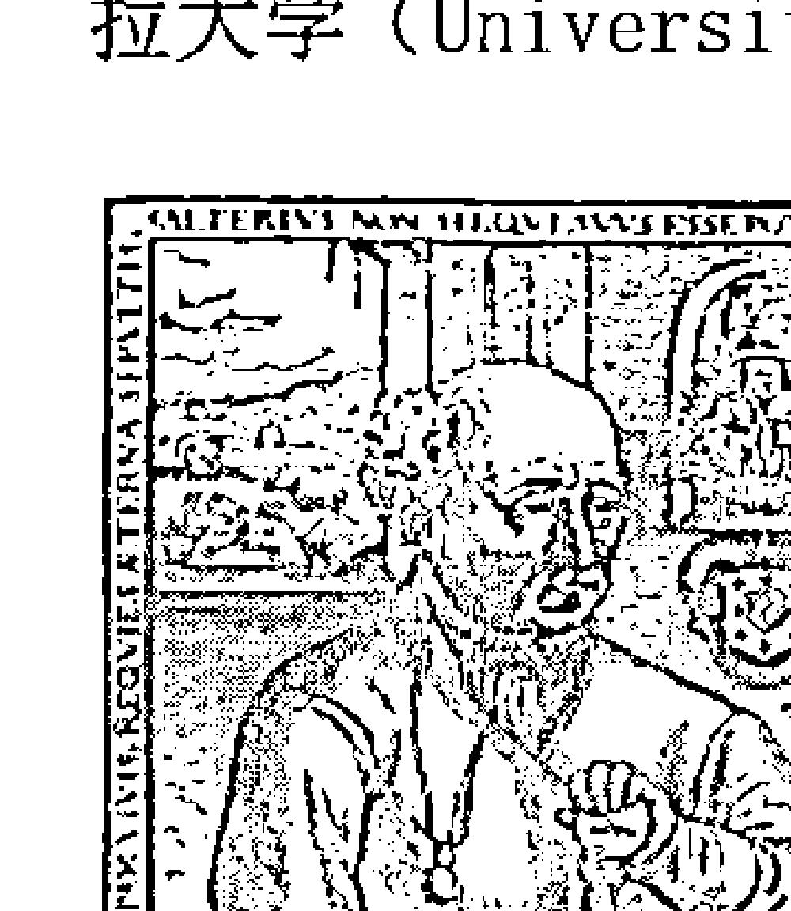

## 诺斯特拉德玛斯（1503—1566 年）

历史上最伟大的预言家米歇尔·德·诺斯特罗达姆（Michel de Nostredame），他名字的拉丁版本最为人所熟知——诺斯特拉德玛斯（Nostradamus）（“我们的女士”）。他的犹太家族据称是以萨迦（Issachar）部落的后裔，这是一个以预言能力著称的部落。他的祖父教授了他希腊语、拉丁语、希伯来语、数学以及占星术。诺斯特拉德玛斯在阿维尼翁（Avignon）学习哲学，并在蒙彼利埃大学（the University of Montpelier）获得了行医执照。

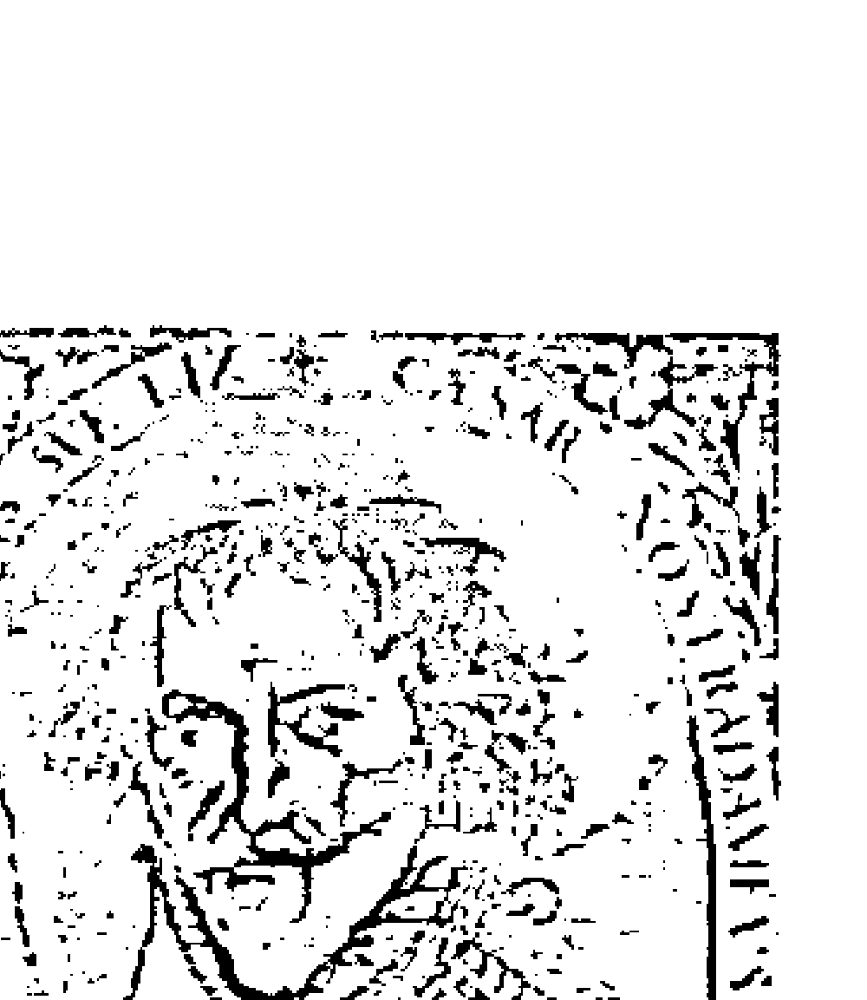

他拥有一种看上去似乎神乎其神的能力，可以治疗无法治愈的疾病，诺斯特拉德玛斯让病人从黑死病中解脱出来。他的第一任妻子和两个孩子都是死于瘟疫，这对于他来说有点悲剧性的讽刺，而宗教法庭也因此指控他为异端邪说。在接下来的六年时间里，他游历了整个法国，照料瘟疫受害者并研究神秘学。1546年，他再婚并有了六个孩子。通过用水占卜，诺斯特拉德玛斯能够看见未来的影像。自从1550年开始，他便每年都会发表一本预测年鉴，他在他那个时代著名的预言书籍里预言世界末日将在3799年到来。他因为他的预言而在整个欧洲都非常出名，法国的皇室家族邀请他去巴黎筹备他们的占星图表。他看见所有的七个儿子都将继承王位，而他们也都会死在王位上。

在他生命的最后，诺斯特拉德玛斯在女皇凯瑟琳·德·梅第奇的皇宫中受到了热烈的欢迎，在此，他继续着他的占卜语言，包括自己的死亡，和他自己所预测的一模一样。他高深莫测的四行诗从那以后受到了一代又一代人的重新解释，而其中有超过四十项的预言已经成真。

## 约翰·迪博士（1527—1608年）

因其为伊丽莎白女王一世的服务而被称为“最后一名皇家魔术师”，约翰·迪博士是一名著名的天文学家和占星家，有很多人都会咨询他的建议行事。在“血腥玛丽”的统治下被囚禁了以后，他的命运因为伊丽莎白的登基而逆转，她让约翰为他挑选一个合适的日子举行加冕仪式。伊丽莎白对迪的印象深刻，因此便让约翰·迪教授她占星术知识。

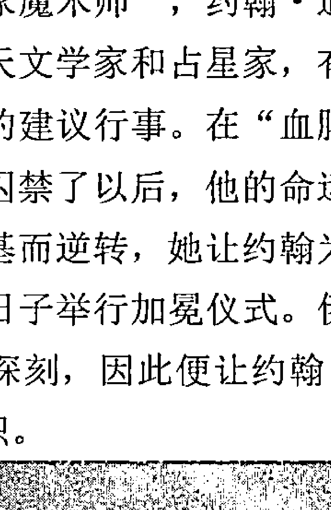

迪一直在研究神秘学理论和实用炼金术。在 1581年，他开始进行占卜实验，使用水晶球、镜子、一池干净的水或者任何透明的物品。他很快发现自己在占卜上没有任何天分，因此他需要寻找一位可以合作的中间人。后来他找到了臭名昭著的骗子爱德华·塔尔伯特/凯利（Edward Talbot/Kelly），这个人声称从许多“天使”那里获得了各种各样的信息，其中包括拥有 26 个字符的天使（或者以诺派）字母表。根据这些资料，迪撰写了两本书，《以诺书》（[The Book of Enoch]）以及用于召唤灵体的《48个天使密钥》（[48 Angelic Keys]）。在与凯利在波兰呆了四年以后，迪回到他位于英格兰的家乡，在此，他继续着自己关于魔法石的没有结果的研究。因为怜悯他的贫穷，伊丽莎白任命他为伦敦圣保罗大教堂的执事长，后来又任命他为曼切斯特大学的校长，在此他一直任职到1603年退休。他81岁的时候在极端贫困中死去。

尽管是妄想，但是约翰·迪拥有着他那个时代最为锐利的思想。人们认为是他完成了运算，才使得英格兰能够使用格里高利历（Gregorian calendar）；他支持保留并收集历史文档；作为一名伟大的天文学家和数学家他非常出名。可以这样说，约翰·迪博士是最早的现代科学家之一，也是最严肃认真的炼金师、巫师以及水晶球占卜师之一。

## 罗伯特·弗鲁德 (Robert Fludd) (1574—1637年)

作为英国伊丽莎白时期的魔法师、哲学家以及医师，罗伯特·弗鲁德获得了牛津大学的学位。在欧洲大陆，他对医学和化学的研究将他引向了帕拉塞尔苏斯医学界（Paracelsian medical circles）（使用矿石酊剂）。他还对蔷薇十字会（玫瑰十字会）的哲学产生了浓厚的兴趣。他在伦敦建立了一所医学研究所，在此他可以供养他自己的药剂师和实验室以研制他的秘密药水和救济方法，同时他还可以继续他的炼金术实验。他研究的成功不仅要归功于他的医学技能，而且还有他的个人魅力和神秘的方法（使用病人的星座进行诊断）。弗鲁德还在进行一些可疑的研究实验，他使用人类的尸体来探寻帕拉塞尔苏斯所描述的神秘血石。

多年以来，弗鲁德在炼金术和卡巴拉神秘魔法的道路上越行越远。他加入了一个神秘的医学教派，这个教派声称自己已经掌握了宇宙科学的关键。他撰写了一本两卷的书籍，名为《宏观世界和微观世界史》（[History of the Macrocosm and Microcosm]），其中对天神和人类的本质进行了探究，并对各种形式的占卜进行了调查研究。他在《哲学和至善》（[Mosaical Philosophy and Summum Bonum]）（“一切善良的东西”）一书中为黑魔法进行了辩护。他加入了有迈克尔·麦尔创建的蔷薇十字会，并为保护这个协会写了一篇著名的论文。弗鲁德还撰写了一些关于科学、医学以及炼金术的书籍，反映了他同时作为一名内科医师和一名精神疗法家的双重生活，此时，科学的世界与魔法的世界正在彼此渐渐分离。

## 圣一日耳曼伯爵 (Comte de Saint—Germaine) (1707？—1784？年)

法国国王路易十五的宫廷魔法师圣一日耳曼是一名灵巧熟练的小提琴家、大键琴家、作曲家以及画家。精通十二种语言，对历史有着全方位的详细的了解。他让人记忆最为深刻的神秘学论文是《最神圣的三重哲学》（[La Très Sainte Trinosophie]）。至今，这篇论文残留于世的只有一份手抄稿，上面堆满了各种各样的插图。

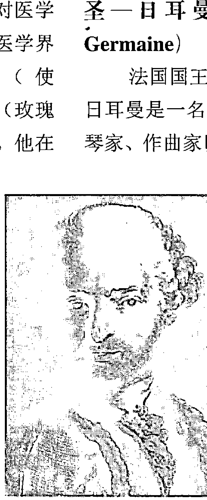

作为一名熟练的卡巴拉神秘学家，圣一日耳曼因其了不起的医学和炼金技能而出名，尤其是将金属转变为黄金的技术。他靠买卖首饰谋生，他有着一门秘密的技巧，可以将钻石上的裂纹抹去。他宣称自己拥有魔法石，而且已经发现了长生不老药，还说自己已经 2000 多岁了——虽然他一直看起来都只有大概 40 岁。1762 年，圣一日耳曼在圣彼得堡深陷一起阴谋之中，谋划将凯瑟琳推上俄罗斯的女王之位。1770 年他回到巴黎，然后又定居德国，在此，他和黑森的查尔斯（Charles of Hesse）一起研究“神秘科学”。从那以后，据称在世界各地都能看到圣一日耳曼。

圣一日耳曼是一位神秘的人物，自从人们认为他已经死了以后，有关他的故事已经流传了 220 年。他很少会在公共场合进食，经常身着白色和黑色的衣服，而且据说他还能够隐形，因此，甚至有一些人认为他实际上是一名来自特兰西瓦尼亚（Transylvania）的吸血鬼王子，而他真实的名字是弗朗西斯·雷格兹（Francis Ragoczy）。

## 第六课：现代魔法师

### 第一节：简介-魔法师的工作

有记录的最早的魔法师，例如伊姆霍特普，都是国王的顾问。单词 Wizard 与阿拉伯语中的 Vizier 有关，意为“顾问”。例如，你对梅林肯定非常熟悉，他便是典型的魔法师，也是亚瑟王的顾问。在凯尔特时代，为了给国王或王后建议和帮助，每一个国王身边都有一位德鲁伊教教徒或者法师。国王们是战士，他们未能学会怎么使用魔法，他们也并不是很聪明，不清楚律法的使用方法。一个明智的巫师的存在使得统治者可以更好地统治整个国家。

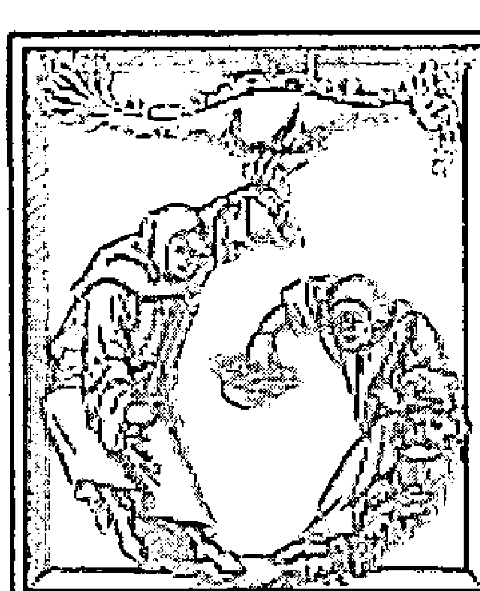

从中世纪一直到文艺复兴时期，西方的巫术主要是炼金术和寻找魔法石。在 17 世纪和 18 世纪，科技革命带来了一次转变，许多巫师的更强调科学、炼金术、神秘学，由此诞生了很多秘密社团如共济会和蔷薇十字会。从十九世纪工业革命开始，杰出的巫师，通常会参与到神秘协会的开枝散叶之中，练习仪式魔法。二十世纪中期见证了魔法以及作为古宗教的异教信仰的复兴，从那以后，很多魔法师都参与了复兴和学说的工作之中。其中也包括了格雷理事会的成员。

### 第二节：十九世纪到二十世纪的巫师

- 詹姆斯·穆瑞（1780—1860 年）
- 弗朗西斯·巴雷特（十九世纪）
- 伊莱·李维（1810—1875 年）
- 乔治·匹克基尔（1816—1909 年）
- 查尔斯·戈弗雷·利兰（1824—1903 年）
- S.L. 麦格雷戈·马德斯（1854—1918 年）
- 亚瑟·爱德华·维特（1857—1947 年）
- 查尔斯·沃尔顿（1871—1945 年）
- 阿莱斯特·克劳利（1875—1947 年）
- 杰拉尔德·加德纳（1884—1964 年）
- 奥斯丁·奥斯曼·斯佩尔（1886—1956 年）
- 弗朗西斯·伊斯瑞·瑞格德（1907—1983 年）
- 阿诺德·克洛泽（1909—1974 年）
- 塞西尔·休·威廉姆森（1909—1999 年）
- 斯图尔特·法勒（1916—2000 年）
- 维克特·安德森（1917—2001 年）
- 亚历克斯·桑德森（1926—1988 年）
- 利奥·路易斯·马泰罗（1931—2000 年）
- 格威迪翁·彭德文（1946—1982 年）
- 斯科特·坎宁安（1956—1993 年）

## 弗朗西斯·巴雷特 (Francis Barrett) (十九世纪)

关于弗朗西斯·巴雷特 (Francis Barrett) 我们了解到的东西很少，只知道他是《占星家》(The Magus) 的原创作者，这是一本具有里程碑意义的书，内容是有关神秘学和魔法的纲要，在 1801 年出版于伦敦。弗朗西斯·巴雷特是英国人，据说是学化学、形而上学以及神秘学的学生。他是一个古怪的人，在自己的公寓教授有关魔法艺术课程，并花费了很长的时间精心将卡巴拉学说和古代文献一丝不苟地翻译成英语。《占星家》讲述了自然界中的魔法药草和魔法石头、磁学、护身魔法、炼金术和其它创造魔法石的方法、数字命理学、元素和历史上著名专家的传记。但这本书在当时并没有引起世人太多的注意，直到后来影响到伊莱·李维才为人所知。

巴雷特对神秘学的复兴极度热心。他把《占星家》作为一种宣传工具，并利用它成立了一个魔法组织，使得剑桥成为了魔法聚集的中心。

## 伊莱·李维 (Eliphas Levi) (1810—1875年)

伊莱·李维是阿尔封斯·路易·贡当 (Alphonse Louis Constant) 的笔名。他是一位法国神秘学者，因为其在 19 世纪复兴了人们对魔法的兴趣而广受赞誉。

他被认为是魔法领域的评论员，而非专家，即使人们认为他拥有娴熟的巫术——用魔法将阿波罗尼俄斯的灵魂召唤出来。他成为一个名叫加诺 (Ganneau) 的古怪的老人的追随者，加诺自称是一位先知，还说自己是路易十七的转世。他还从一位叫做霍尼·隆斯基 (Hoëne—Wronski) 的波兰神秘主义者那里学习秘传的神秘学。他沿用了占星家伊莱·李维的名字，在希伯来语中，伊莱·李维的名字和他自己的原名的意思是相同的。

李维的第一部也是最重要的一部作品就是《高级魔法的教理和仪式》(The Dogma and Ritual of High Magic)。余下的还有《魔法的历史》(A History of Magic),《先验魔法》(Transcendental Magic)，《伟大的神秘学密钥》(The Key of Great Mysteries)，以及其它的神秘学书籍。李维深受弗朗西斯·巴雷特的启发，而反过来，他又影响了神秘学作家爱德华·鲍沃尔-李敦爵士。他们成立了一个伦敦神秘学社团，在社团中可以研究水晶球占卜、魔法、占星术以及催眠术。1888 年在伦敦成立的金色黎明的赫密斯协会采用了李维的很多魔法。

## 乔治·匹克基尔 (George Pickingill) (1816—1909年)

“老乔治”·匹克基尔是一个相当狡猾的英国人。他声称自己遗传有可追溯到 11 世纪的巫师血统，他出生在“女巫之乡”埃塞克斯郡，在九个孩子中他是最年长的。他被称为“大巫师”，这使得当地的农民惶恐不安。他拥有一个吉普赛家族，同时被当作一个吉普赛人养育长大，他从中学到了很多从中世纪的欧洲传播而来的习俗和仪式，包括对有角的神的崇拜。

匹克基尔与仪式魔法师、女巫、蔷薇十字会以及共济会都有合作，他们一起竭尽全力反抗基督教，希望传播可以推翻和取代教会的“古宗教”信仰。

在60多年的时间里，匹克基尔在埃塞克斯、赫特福德郡、汉普郡、诺福克以及苏塞克斯成立了“九女巫大集会”，选择有世袭工艺血统的人作为领导人。阿莱斯特·克劳力 (Aleister Crowley) 在1899年或1900年被介绍加入了其中一个团体。虽然大多数的女巫集会既有男性又有女性，但是所有的仪式都是由女性来操作的。而其中一个女巫团体——坎尼维顿的七女巫 (the Seven Witches of Canewdon) ——中都是女性。另一个是新森林女巫大聚会 (the New Forest Coven)，杰拉尔德·加德纳所加入的就这个协会。

## 查尔斯·戈弗雷·利兰 (Charles Godfrey Leland) (1824—1903年)

查尔斯·戈弗雷·利兰是美国的民俗学研究者，他写了很多有关英国的吉普赛人和意大利女巫的经典文献。当他还是一個孩子的时候，利兰从移民女仆那里学到了很多爱尔兰童话故事，并从黑人厨房仆人那里学习伏都教的知识。他在夏季的时候总会和美国印第安人一起度过，从他们身上学到很多的宗教知识。利兰拥有初学者的热情，并以一种专家学者的好奇心去学习和练习魔法。他被女巫和吉普赛人称为大师。他翻译了赫尔墨斯·特利斯墨吉斯忒斯的《神圣的皮满德》（The Divine Pymander）。

利兰在1870年搬到英国，在那里他研究了吉普赛人的文化。他与吉普赛国王产生了相互信赖的友谊，国王教给他吉普赛人的语言，吉普赛语。吉普赛人把他当作吉普赛人中一员，利兰写了两本有关吉普赛人的经典著作，并成为吉普赛传说社团 (the Gypsy Lore Society) 的奠基人和第一任主席。1888年，在意大利的佛罗伦萨，利兰遇到了一个“算命者”，他称她为“玛塔莲娜 (Maddalena)”。了解到她是一名女巫之后，他便雇佣她，让她为自己搜集有关意大利巫术或者威卡教 (Stregheria) 研究的资料。这次合作使得《阿拉迪亚：女巫的福音》(Aradia:The Gospel of Witches) 得以在1889年出版。这是第一本记录了特定的巫术咒语、民俗学、咒语以及传说的书籍，为20世纪很多的巫术复兴奠定了基础，尤其是在美国的巫术复兴。

## S.L. 麦格雷戈·马德斯 (S.L.MacGregor Mathers) （1854—1918年）

马德斯是十九世纪后期最重要的一个神秘学的人物之一。出生在伦敦，塞缪尔·里德尔·马德斯(Samuel Liddle Mathers)把“麦格雷戈”加在自己的名字之中以纪念自己的苏格兰血统。马德斯娶了一个有透视能力的女子莫伊娜·柏格森（Moina Bergson）。搬到巴黎以后，他们建立了第七号神殿（Ahathoor Temple），并举行“埃及弥撒”仪式以向女神伊西斯表达他们的敬意。他们一起翻译关于卡巴拉神秘学和塔罗牌晦涩难解的手稿，并将其署名为《卡巴拉大揭秘》（Kabbalah Unveiled）并出版。马德斯把这本书献给他的导师安娜·金斯福特博士（Dr. Anna Kingsford），金斯福特博士是赫密斯社团的领袖。在她的影响下，马德斯成了一位素食者、不吸烟、反对活体解剖，还成了女权活动家。

马德斯宣称他的学说来自于一群超人类专家——“Hidden and Secret Chiefs”。得到斯坦因女士（Fräulein Stein）（德国卡巴拉神秘学协会中的一名神秘学专家）的授权之后，马德斯和她在1887年共同成立了金色黎明赫尔密斯协会（the Hermetic Order of the Golden Dawn）。他编纂了协会仪式并且成为了这个组织“会长”。但是，他和他学徒阿莱斯特·克劳利之间的个人战争和权力斗争，导致这个组织在1900年的解体。

## 亚瑟·爱德华·维特（Arthur Edward Waite）（1857—1947年）

他懂英语、希伯来语、拉丁语、法语、凯尔特人语、古埃及语以及希腊语，马德斯翻译和编辑了很多重要的魔法书籍。其中包括：《所罗门密钥》，和《亚伯拉梅林法师的魔法书》，这两本书也许是中世纪最重要魔法书。但他最大的贡献在于他创立的仪式魔法教派——金色黎明学派——从那时起，金色黎明学派便已经成为所有西方神秘主义的源泉。

A. E. 维特出生于纽约，但是却由他穷困的未婚妈妈在伦敦养大。他对招魂术和通神学都有所涉猎，但是伊莱·李维的作品对他的影响最大，这促使他将神秘学和神秘哲学的学术研究和通俗化作为自己终生的事业。

维特于 1891 年加入了金色黎明。他仍然继续他的神秘学写作、炼金术手稿翻译，以及一本有关神秘学杂志的编辑。当金色黎明在 1900 年解散之后，维特就成了一个泥水工，同时他也开始着手创办自己的协会：首先是 1904 年的金色黎明矫正协会（Rectified Order of the Golden Dawn），然后便是 1915 年的玫瑰色十字兄弟会（the Fellowship of the Rosy Cross）。维特耗尽了余生来研究和编写各种各样的神秘学和赫密斯学派的主题文章，专门从事共济会历史的研究。他还推动了莱德伟特塔罗牌（Rider-Waite tarot deck）的发展，而且他还写了许多书，至今仍然非常受人欢迎。

## 阿莱斯特·克劳利（Aleister Crowley）(1875—1947年)

阿莱斯特·克劳利是在伊莱·李维死的那一天出生，因此阿莱斯特·克劳利认为自己是伊莱·李维、卡缪斯特罗（Cagliostro）、爱德华·凯利以及罗马教皇亚历山大六世的转世。他是魔法历史上最具争议性的人物，曾经被尊崇为圣人，也被贬低为妖人术士。他有着极强的求知欲和庞大的力量，而且还对性爱、毒品贪得无厌，追求感官快感，放浪形骸。他在1898年加入了金色黎明，但很快就陷入与其创始人麦格雷戈·马德斯痛苦的权力斗争中，最终的结果不仅他被金色黎明开除，而金色黎明也在不久之后便解散了。

克劳利四处游历，在印度攀登高山并研习佛法、密宗瑜伽、埃及的魔法、卡巴拉神秘学以及约翰·迪的以诺派魔法。在1904年，他的妻子罗斯与一位名为“爱华斯（Aiwass）”的灵体建立了通道，这位爱华斯被克劳利认定为是埃及的天神塞特。通过罗斯，爱华斯口述了《律法之书》这本书。其核心是泰勒玛（“意志”）律法（the Law of Thelema）：“随心而行，乃万物真谛”。从1909年到1913年，克劳利在他的杂志《二分点》（the Equinox）上发表的金色黎明的秘密仪式，激怒了马德斯和金色黎明的其他成员。从1915年到1919年他都住在美国，后来搬到西西里岛，在那里，他成立了臭名昭著的泰勒玛修道院（Abbey of Thelema）。在1923年因丑闻成为“世界上最邪恶人”（这个头衔他很喜欢，还自称为“伟大的野兽666”）而被驱逐出境之前，他暂时领导了魔法地方分会。

在他生命最后的岁月中，克劳利遇见了杰拉尔德·加德纳，并为加德纳《众影之书》贡献了一些资料。他是一个才华横溢的作家和诗人，他的几本书包括被很多人认为是有史以来有关仪式魔法的最好的作品的《理论与实践中的魔法》（Magick in Theory and Practice）（1929年）。在那本书里，克劳利介绍了“魔法”这个单词在现在常见的拼写方法“magick”，以此来“将所有其伪造品和魔法科学区分开来”。

## 杰拉尔德·罗西欧·加德纳（Gerald Brousseau Gardner）（1884—1964年）

杰拉尔德·加德纳出生在英格兰的一个富裕的家庭，杰拉尔德·加德纳声称在他的族谱中有几位女巫。1906年，杰拉德作为茶叶种植公司的一名实习生去到锡兰。1909年，他被介绍加入共济会。1912年，他搬到马来亚，成为一个橡胶种植者。当橡胶的价格在1923年跌落的时候，他进入马来亚海关和消费税总署（Malayan Customs & Excise Service）。在那里，他像对待朋友一样地对待伊班人，而伊班人是一个马来亚部落，从他们那里他学会了自己的民间魔法。

辞职以后，杰拉尔德·加德纳在1936年回到英国，杰拉德和他的妻子唐娜最终在1939年定居在新森林（New Forest）地区。在此，他加入了一个名为克罗托纳兄弟会（the Fellowship of Crotona）的神秘的组织，这是一个有着三个相关魔法协会（蔷薇十字会（这个协会也会公开表演一些秘传的戏剧），神智学会（Theosophical），以及根据玛格丽特·莫瑞（Margaret Murray）的思想而重建的巫术协会（Witchcraft））的男女混合的集会（Co-Mason lodge）。据称来自女巫世家的高级女祭司“达芙（Daffo）”（埃尔希·伍德弗特-格兰姆斯[Elsie Woodford-Grimes]）在1939年介绍他加入了这个协会。她成了他在接下来的15年中的魔法伴侣。

杰拉尔德·加德纳在1946年遇见塞西尔·威廉姆森（Cecil Williamson），威廉姆森是巫术研究中心（the Witchcraft Research Center）和魔法博物馆（Museum of Witchcraft）的创始人。一年以后，阿诺德·克劳瑟（Arnold Crowther）把他介绍给了阿莱斯特·克劳利。加德纳将从克劳利处获得的资料、从新森林女巫大聚会取得的不完全的基础原理、利兰的阿拉迪亚，加上他自己的收藏和研究，综合起来编译他自己的《众影之书》。他将其中的很多内容作为虚构的东西出版在一本小说中：《高级魔法师的助手》（High Magic’s Aide）（1949年）。英国反魔法的法律在1951年被废除之后，加德纳买下了威廉姆森的博物馆。1953年，他接纳了新成员多琳·瓦利恩特。多琳从大体上改写了众影之书，更多地强调了女神。在他们的合作之下，加德纳教派（Gardnerian Tradition）慢慢成形。加德纳在1954年出版了《现代巫术》（Witchcraft Today），支持莫瑞有关巫术是老一代欧洲异教信仰所幸存的遗迹的有争议的理论。这本书是加德纳的成名作，促使了英格兰各地的新的女巫大聚会遍地开花。加德纳的最后一本书是《巫术的意义》（The Meaning of Witchcraft）（1959年）。就在乘船去黎巴嫩过冬之前，他在1963年遇到并接纳了新会员雷蒙德·巴克兰。他在第二年春天回航的时候死在船上。巴克兰把加德纳巫术带到美国，发展成了威卡教。

## 维克多·安德森（1917—2001年）

维克多·安德森是精灵（Feri，之前是faerie<精灵>）教派的联合创立者。维克多·安德森生于新墨西哥州，在俄勒冈州长大。当他还是个孩子的时候，他感染了一种疾病，使得他几近终生失明——并成为了一名通灵预言家。他宣称自己在九岁的时候接受了一名年老的精灵巫婆的神秘主义启蒙教育，她向他介绍了她的女巫集会，里面的成员大部分都是南方人。他们尊崇“古老的天神（The Old Gods）”和“古老的力量（The Old Powers）”，并强调了与自然、魔法、庆典、音乐以及入神舞（ecstatic dancing）之间的和谐。

维克多的妻子叫作科拉，科拉是一名来自阿拉巴马州的女子，她的基督教家庭练习的是民间魔法，他们结婚以后便搬到了旧金山海湾地区。1959年，他们接收了一个邻居的男孩，后来这个男孩改名为彭德文·格威迪翁（Pendderwen Gwydion）。受现代巫术崛起的影响，维克多和格威迪翁为精灵教派（Faerie Tradition）谱写了优美的仪式诗歌，命名为维克多的小女巫（Victor’s childhood Witches）。这诗歌结合了“精灵”巫术和夏威夷的萨满教（Huna）、伏都教以及凯尔特的民间传说。多年以来，许多卓越的人物都是被维克多训练出来的，其中包括艾莉森·哈洛，斯塔霍克（Starhawk），弗朗西斯卡·德·格蓝迪（Francesca De Grandis），伊恩·“潜伏熊”·安德森，以及我自己所心爱的牵牛花。通过这些杰出的伙计们，现在被称为“精灵”的萨满教传统的影响是巨大的。维克多写了一本非常有爱的有关神秘诗歌的书，名为《血色的玫瑰刺》（Thorns of the Blood Rose）。

## 斯图尔特·法勒（Stewart Farrar）（1916—2000年）

出生于英国埃塞克斯，斯图尔特·法勒是作为一名基督教科学派成员被抚养长大的。1947年，他开始了他长期的事业——记者和作家。1969年，他每周发行的杂志《晨号》（Reveille）使他有机会参加了电影《女巫传奇》（Legend of Witches）的首映发布会，亚历山大和玛克辛·桑德斯（檀香）（Maxine Sanders）作为技术顾问，也参与了这次发布会。亚历克斯邀请斯图尔特参与了一次魔法启蒙课程。他发现魔法的仪式非常动人，于是写了一篇有关仪式的专题报道，这使得他获得了桑德斯的青睐。亚历克斯将斯图尔特介绍给了他自己传记《女巫之王》（King of the Witches）的出版商，于是斯图尔特与出版商签订了合约，撰写一本名为《女巫是做什么的》（What Witches Do）的书。他开始加入桑德斯的培训课程，1970年，玛克辛介绍他加入了女巫大集会，在此他遇见了活泼可爱的珍妮特·欧文（Janet Owen），并与她结为夫妻。1970年，法勒成立了他们自己的伦敦女巫大集会。《女巫是做什么的》这本书无疑确立了斯图尔特推动威卡教社区发展的代言人身份，也因此引起了来自大众的询问，他们是否可以加入这个行业。在经营一个女巫大集会并为其成员提供建议九年以后，法勒与他人合著了两本有关仪式材料和非仪式材料（non-ritual material）的书籍：《女巫的八个安息日》（Eight Sabbats for Witches）（1981）以及《女巫道路》（The Witches’ Way）（1984）。他们同样还合著了《女巫的女神》（The Witches’ Goddess）（1987），《一个现代女巫的生命和时间》（Life & Times of a Modern Witch）（1987），以及《女巫的道德观》（The Witches’ Bible）（1984）。

## 格威迪翁·彭德文 (Gwydion Pennderwen) (1946—1982年)

汤姆·德隆出生于加利福尼亚州，他在 13 岁的时候遇见了维克多·安德森，并被介绍加入了他的魔法事务所。汤姆将自己的名字改为格威迪翁·彭德文，因此在他的余生之中，大家都只知道他叫格威迪翁·彭德文。他在大学的时候主修的是戏剧，而且成为了一名极好的演员和戏剧广播员。但是他更加喜欢仪式戏剧、神圣诗歌以及音乐，他为与维克多一起发展的精灵教派创作了很多这样的戏剧、诗歌以及音乐。格威迪翁在创造性不合时宜协会 (the Society for Creative Anachronism)(SCA) 的成立初期非常活跃，并成为了一名宫廷巴德 (Court Bard)（吟游诗人）。1975年，他创作了魔法界的第一张音乐专辑：《古宗教之歌》(Songs of the Old Religion)。大约是在同一时期，他在北加利福尼亚州门多西诺县 (Mendocino County) 的格林菲尔德大农场上购买了一片 55 英亩的森林，他为它起名为安芬 (威尔士的冥府)。我在 1972 年就已经遇见过格威迪翁，因此，当我和牵牛花在 1977 年搬去毗邻的柯登博思(“斑点森林”)时，我们在对于在这片土地上一同创建一个魔法社区这个话题上十分投机。

格威迪翁开始着手筹办每年新年伊始时的植树活动，以在这片被伐的土地上重新植树造林，连同安息日一起，参与这项活动的人很快便超过了 100 人。他特许将“常青森林”(Forever Forests) 作为全世界教会协会的附属根据地，以发起这些活动的开展。1976 年，格威迪翁旅行到不列颠群岛，在此他遇见了亚历克斯·桑德斯和斯图尔特·法勒，并受到了威尔士诗歌音乐比赛会 (Eisteddfodd)（吟游诗人集会）的热烈欢迎。他的第二张专辑《精灵萨满》(The Faerie Shaman) 在 1982 年创作发表，就在此后不久的夏末节，他便在一起悲惨的交通事故中去世。

### 第三节：现存的魔法师：格雷理事会

> “我是灰色的，我立于蜡烛和星星之间。我们是灰色的，我们立于黑暗与光明之间。”（笛岚，格雷理事会之前，“巴比伦方阵” [Delenn, B5, before the Grey Council, in “Babylon Squared” ]）

“格雷理事会”是一个具有传奇性的理事会，里面有巫师、魔法师以及圣贤之人，在很多的魔法和巫术故事和历史之中，这个协会将是一个永恒循环的主题。名字中的“格雷 (Grey，在英语中是“灰色的”的意思)”既意味着魔法之中所有颜色的渐变（而不仅仅是黑与白），也意味着我们头发和胡须已然花白，这似乎是对我们理事会所招收的成员的魔法经验和智慧的一种要求！

在格雷理事会中每个成员的身份并不是固定的，而是根据我们每一次一起参与的项目和工作的不同而有所不同。在历史上，## 魔法师学徒的魔法书 | 下卷

上的这一时刻，现在有比以往任何时候都多魔法师活在这世上，而且仍然在练习魔法。我不可能将他们一一例举出来。格瑞理事会的成员不仅是魔法社区的长老，我们都还是老师和导师。那些用粗体文字标示出来的人都是参与了这本魔法师创作的魔法师们，我们贡献出了我们最好的教程，然后将它们传授给我们自己的学生和学徒。

### 格瑞理事会现在的成员（2004年初）

- 弗雷德里克·拉蒙德（1931年—）
- 雷蒙德·巴克兰（1934年—）
- 尼伯（1936年—）
- 尼尔森·怀特（1938—2003年）
- 奥伯伦·雷文哈特（1942年—）
- 尼基·斯库利（1943年—）
- 理查德·兰斯·克里斯蒂（1944年—）
- 艾比·维诺如特（1945年—）
- 安布尔·K（1947年—）
- 牵牛花·泽尔-雷文哈特（1948年—）
- 卢克·萨拉（1949年—）
- 安德拉斯·库尔班—阿腾（1949年—）
- P.E. 艾萨克·鲍维茨（1949年—）
- 瑞文（大乌鸦）·格瑞玛西（1951年—）
- 詹纳德·迈克尔·克雷格（1951年—）
- 艾伦·埃文特·霍普曼（1952年—）
- 皮提亚女士（1952年—）
- 凯特琳·布林（1953年—）
- 杰西·沃夫（狼）·哈丁（1954年—）
- 赫尔曼B. 崔普古德（1958年—）
- 伊恩·“潜伏熊”·安德森（1959年—）
- 杰夫·“半人猛犸”·麦克布莱德（1959年—）
- 崔西·特勒斯柯（1960—）
- 托德·卡尔（1965年—）


### 弗雷德里克·拉蒙德（Frederick Lamond）（1931年—）

自从13岁便已经开始崇拜自然，那时他住在法国瑞士。23岁的时候，他在他的第一任未婚妻怀中有过一段神秘的经历，而在1957年的二月，他经人介绍加入了加德纳巫术协会，当时杰拉尔德·加德纳也在场。他也许是世界上连续研习威卡教时间最长的一个人。他同样还是伊西斯兄弟会和全世界教会协会的成员，积极参与跨信仰活动，并于1993年和1999年分别在芝加哥和开普敦（南非）参加了世界宗教议会，而且他还于2003年在孟买（印度）参加了古老传统和文化长老的第一次大集会（first Gathering of the Elders of Ancient Traditions and Cultures）。除了在大西洋两岸大量出版的有关异教信仰威卡教众多文章以外，弗雷德里克还写了两本书：《神圣的挣扎》（[The Divine Struggle]）（1990年）和《没有信仰的宗教》（[Religion without Beliefs]）（1997年）。他现在正在筹备威卡教50年展，一个个人的回顾展。

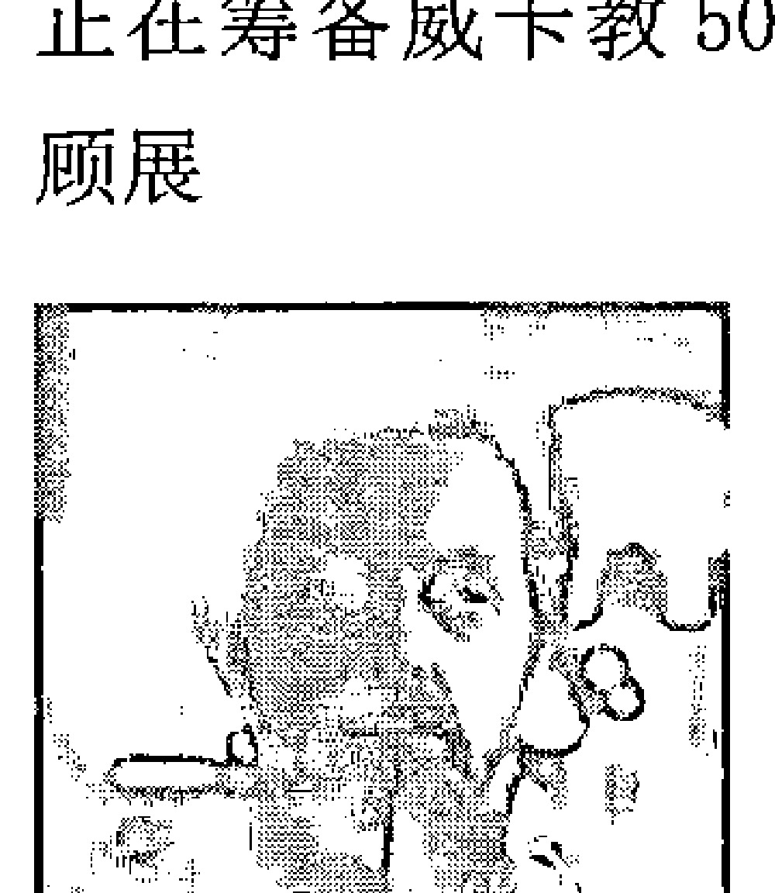

### 雷蒙德·巴克兰（1934年—）

被称为“美国威卡教之父”，他于20世纪60年代初期第一次将加德纳威卡教介绍到美国。他出生于伦敦，有着吉普赛人的血统。他的精神追求带领他领略了杰拉尔德·加德纳的作品。巴克兰是加德纳在美国的发言人，并在1964年加德纳死前不久，经人介绍加入了这个教派。在20世纪70年代中期，他成立了一个撒克逊教派（the Saxon tradition）——撒克逊-威卡（Seax-Wica），现在在全世界的各个国家都有其会员。他同时还在帮助传播皮特维塔的隐居风俗（the solitary practice of PectWita），这是一种苏格兰的巫术形式。他发表了30多篇文章，其中包括《女巫之书》（[The Witch Book]）和《巴克兰的巫术完成书》（[Buckland’s Complete Book of Witchcraft]）。雷蒙德是撒克逊·威卡联盟（the Fæder of Seax-Wica）的成员，而且还是巫师国际协会（the International Guild of Sorcerers）和独立神灵使者国际协会（the International Society of Independent Spiritualists）的一员。www.raybuckland.com。

以及“鸡尾酒聚会”，在西弗吉尼亚州的群山之中寻找一种低调的、更加安宁平静的生活，在这里，他可以全身心地投入他想要的艺术创作之中。当你看着尼伯精细而且色彩缤纷的作品时，你完全不会想到这位67岁高龄的艺术家从出生开始便是色盲。www.oakgrove.org/nybor/Nybor.html。

### 尼伯（吉姆·奥德波特（Jim Odbert））（1936年—）

作为明尼阿波利斯艺术学校的一名毕业生，尼伯在明尼阿波利斯市和纽约市都拥有并经营着美术工作室，而其最为出名的便是他的黑白科幻小说艺术画，包括书籍和杂志的封面和内部插图。1985年，他放弃了领带、燕尾服。

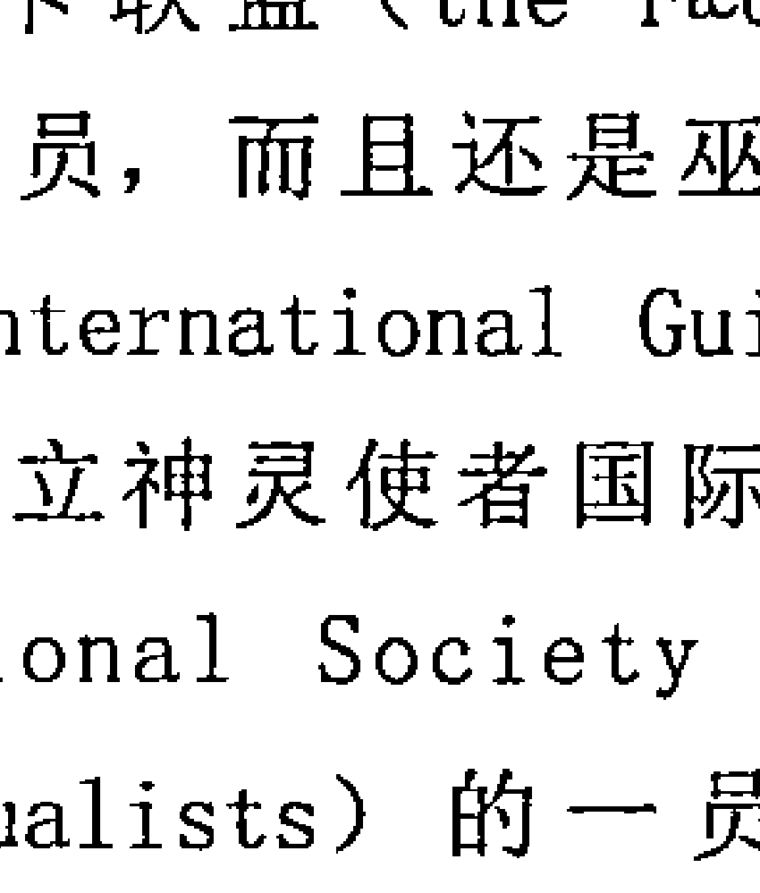

### 尼尔森·怀特（拜火教创始人查拉图斯特拉的会友）（1938—2003年）

在南加利福尼亚州的神秘学活动领域活跃了20多年，并帮助建立和经营了几个秘传教会和魔法协会。他《白光》（[The White Light]）发行了超过十五年的时间，这是一本有关仪式魔法的季刊。他在帕萨迪纳市经营着一个宗教供应品书店超过17年，写了超过125本有关魔法以及其它主题的书籍。怀特博士在很多初中和高中学校上课，并且被阿尔塔苏福兰尔圣殿骑士团（Alter Souveräner Templer Orden）授以爵位，大本营在奥地利的维也纳。从美国国家宇航局的艾姆斯研究中心退休后，他成为了一名私人飞机飞行员和业余无线电话务员，并加入了里士满唱诗班。就在这本魔法书完成之际，他便去世了。

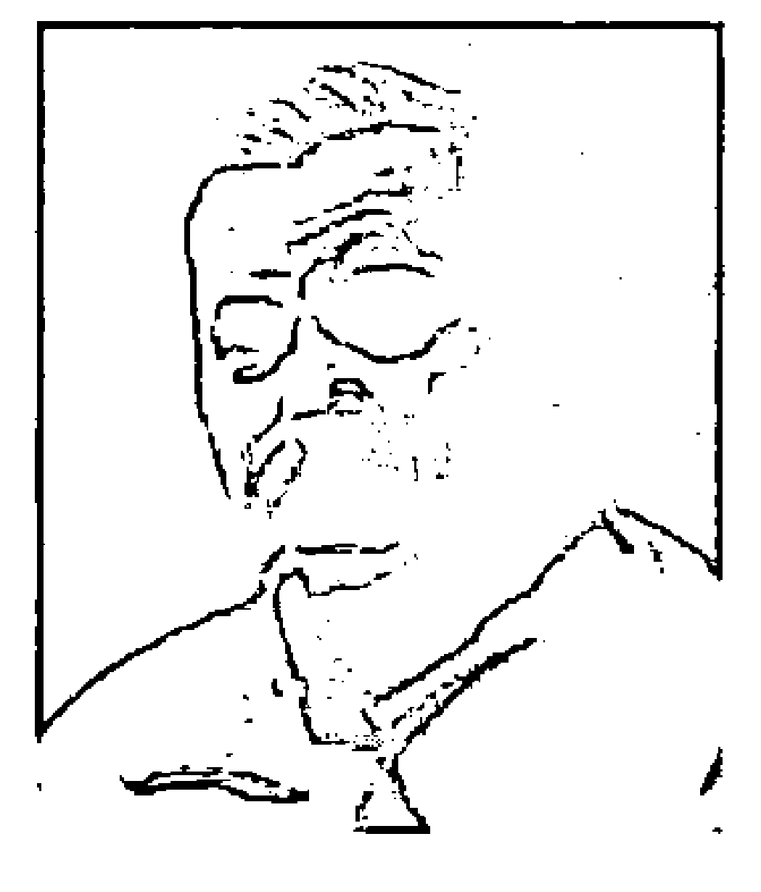

### 艾比·维诺如特（Abby Willowroot）（1945年—）

是一位典范（archetypist）、金工技工、女神艺术家、作家、女祭司以及母亲，从20世纪60年代中期开始便是一名从业的异教信徒。她是女神2000计划（Goddess 2000 Project），螺旋女神格鲁夫（Spiral Goddess Grove），以及维诺如特真实魔杖的创始人，维诺如特的一生都致力于将女神和魔法意象与意识融入当代文化之中。自从1965年开始，艾比便成为了一位专职的异教信徒和女神民间艺术家。在很小的时候，她便通过自学学会追随自己的灵感。艾比生活在北加利福尼亚州，并在此工作。她的画作和文章在各种各样的书籍、博物馆展览、女性灵性会（WomanSpirit）、女性圣贤会（SageWoman），以及卢埃林的出版作品中被采用。维诺如特女士的九件首饰被史密森学会列入永久珍藏的行列。www.realmagicwands.com。

## 安布尔·K (Amber K) (1947 年—)

是女士教会（the Ladywoods Tradition）的一位威卡教女祭司，源自异教之途教会（Pagan Way Tradition），加德纳教派的一个分支。她为女神和有角的男神服务了超过24年时间，扮演着各种各样的角色：女祭司，国家女神契约的首位职员（National First Officer of Covenant of the Goddess），环形网络新闻（Circle Network News）的编辑，RCG殿堂计划（RCG’s Cella program）的教员，目前在新墨西哥州的安丹坦女巫大学（Ardantane Witch College）以及异教信仰进修中心（Pagan Learning Center）担任执行主任。她是《真实的魔法》（[True Magick]），《诸神奥秘》（[Covencraft]），《月出时分》（[Moonrise]），《异教信仰小孩的活动手册》（[The Pagan Kids’ Activity Book]），《圣烛节》（[Candlemas]），《塔罗之心》（[The Heart of Tarot]）的作者。她和她的伴侣亚兹拉尔·艾琳·K（Azrael Arynn K）一起在安丹坦的家乡赫梅斯山脉中的红色的平顶山和高地沙漠中生活和工作。www.ardantane.org。

## 牵牛花·泽尔—雷文哈特 (1948 年—)

是一位女巫、女祭司以及女神历史学家——她的仪式、歌谣、诗歌以及她对于女神雕塑的大量收藏尤为出名。她于1973年在明尼阿波利斯的诺斯替教派的水瓶座庆典（Gnostic Aquarian Festival）上遇见了她的灵魂伴侣奥伯伦，在第二年春天他们便结为了夫妻。她帮助雷文哈特发行了杂志《绿蛋》（[Green Egg]），和他一起研制出了活的独角兽。她创建了神话影像协会（Mythic Images），制作了博物馆复制品，并对古老的诸神进行了独创新颖的解释。牵牛花创造了各式各样规模不一的仪式，从简单的过度仪式到壮观的仪式项目，例如，1979年在俄勒冈峡谷（Oregon Dalles）的巨石阵模型处举行的日食仪式。她旅行的脚步遍及澳大利亚的南山山顶、珊瑚海的海底深处、新几内亚的热带雨林、古希腊的遗址、克里特岛的洞穴以及中国的道观。www.MythicImages.com。

## 卢克·萨拉 (Luc Sala) (1949年—)

是阿姆斯特丹的魔术师，在卡尔文塔尔 (Kalvertower) 的他的美好秘斯提尔之殿 (MySTeR t e m p l e o f kindness) 里办公。我们可以在世俗世界的他自己的电视频道以及计算机领域的很多活动都中看到他，同时他还以路西法的名义漫步在其它世界之中。他认为“从字节数来看，一比特是最好的信息 (a bit is only information if it bytes)”，魔法是有关调查到底是什么触动了我们的一门科学。信息不仅限于数据，同时更是超出了传递消息的理念这一范畴，当我们向魔法的连通性国度敞开心扉之时，它们便会出现。我们所经历的世界从表面上看是由因果律统治，这也有一定的道理，但是从更深层的层面上来看，它是由魔法规律统治的。卢克看到了魔法的复兴，而人们也会慢慢接受意识维 (consciousness dimension[s]) 这一概念，这是本世纪最杰出的概念。Sala@euronet.nl。

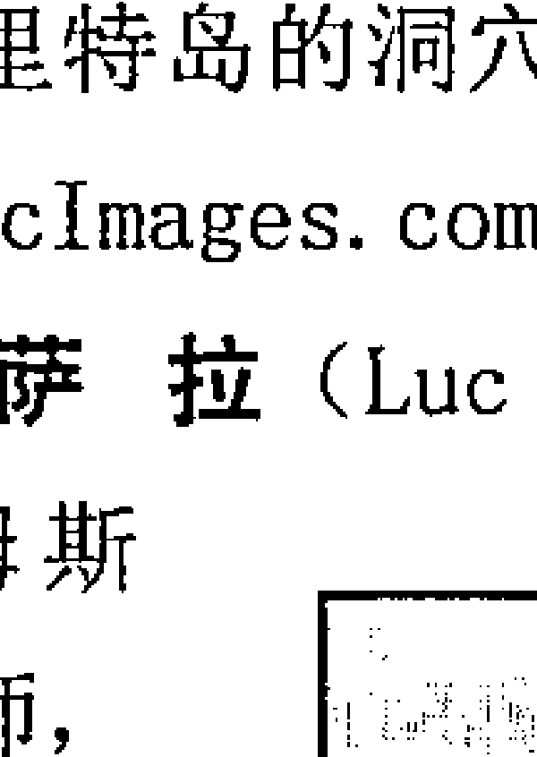

## 瑞文·格瑞玛西 (Raven Grimassi) (1951年—)

是九本有关巫术和威卡教的书的作者，这九本书包括备受赞誉应当获奖的《威卡教神秘学》 ([The Wiccan Mysteries]) 和《有关威卡教和巫术的百科全书》 ([The Encyclopedia of Wicca & Witchcraft])。

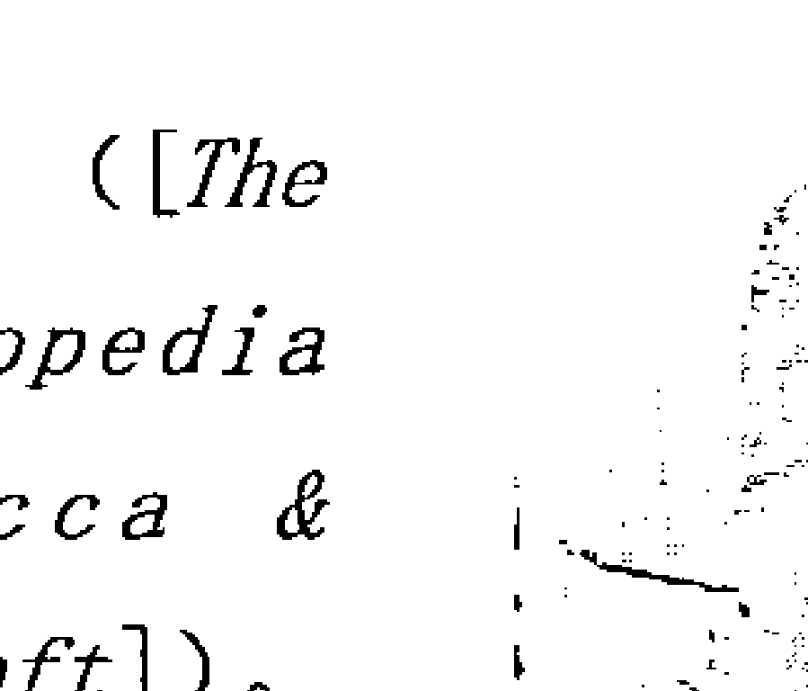

30多年来，瑞文一直是一位巫术从业者和老师。他是整个美国异教信仰会议和庆典上的一位很受欢迎的演说家和演讲者。瑞文目前是阿里锡安传统巫术协会 (Arician Tradition of Witchcraft) 的主管，也是一所名为十字大学 (The College of the Crossroads) 的神秘学学校的联合校长。保存和讲授基督教诞生以前异教的欧洲根基是瑞文一生的事业。他住在南加利福尼亚州乡下的一个大农场上，在此他为老宗教的男神和女神们维护着一片神圣果园，还为司掌神秘学的谷物女神刻瑞斯修建了一个神龛，他便是在刻瑞斯的节日那天出生的。www.stregheria.com。

## 詹纳德·迈克尔·克雷格 (Donald Michael Kraig) (1951年 —)

毕业于加州大学洛杉矶分校，获得哲学学位。他还在其它学院和大学学习了演讲和音乐。在十年的自学和实践之后，写出自己最知名的书之前，他在南加利福尼亚教书，讲课的主题包括卡巴拉、塔罗牌、魔法以及密教经典。他的那本最出名的书名为《现代魔法》 ([Modern Magick])，里面一步步地介绍了实用魔法。他其它的

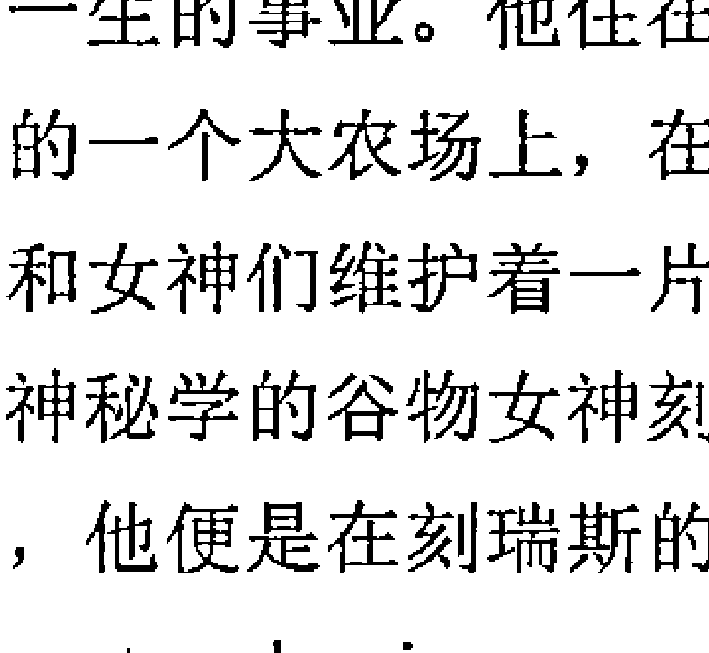

书籍包括《现代性魔法》（[Modern Sex Magick]）以及《塔罗和魔法》（[Tarot & Magic]），他的作品已经在大量的杂志、学术期刊以及书籍中发表。唐纳德在整个美国巡回演讲，并开展研习会，而且还成为了几个精神和魔法协会的会员，并对印度教密宗有了一定的了解。他已经成为了一名专业的音乐家，在南加州大学讲授计算机技巧，好莱坞魔法城堡（Hollywood’s Magic Castle）中的一员。目前他正在攻读临床催眠疗法的博士学位。

## 艾伦·埃文特·霍普曼（Ellen Evert Hopman）（柳树）（1952年—）

是一位异教作家，一名草药学大师，还是一位德鲁伊女祭司。她是几本有关草药学技艺和德鲁伊智慧的书籍和视频资料的作者，其中包括《树医学—树魔法》（[Tree Medicine—Tree Magic]）（有关树的草药和魔法性能），《德鲁伊植物志》（[A Druid’s Herbal]）（德鲁伊的医学和草药知识），《成为一名异教信仰者》（[Being A Pagan]）（与劳伦斯·邦德 [Lawrence Bond] 合著，一本有关在当今社会成为一名威卡教教徒，一名女巫，或者一名德鲁伊意味着什么的书籍），以及《在充满奇迹的世界上行走——孩子们的植物志》（[Walking The World In Wonder—A Children’s Herbal]）（一本包括了草药配方和食疗方法的书籍，适合所有年龄的孩子阅读）。她的视频资料有《来自治愈地球的礼物》（[Gifts From the Healing Earth]），第一册和第二册将会教授你一些基本的草药治愈术，她的视频“异教徒”涵盖了异教年轮（the Pagan Wheel of the Year）中的八个节日。http://saille333.home.mindspring.com/willow.html。

## 玛丽贝斯·维特（Marybeth Witt）（皮提亚女士）（1952年—）

是女神工艺和圣约协会（the Craft and Covenant of the Goddess）的长老，过去曾做过国家公务员。她是一位已经发表过作品的诗人，前大学英语老师，还是歌手/歌曲作家（地球魔法，月亮魔法）。担任一个前身为漂浮漩涡女巫团（Coven of the Floating Spiral）的协会的高级女祭司，她终生都在追求成为一名服务诸神以及大地母亲的所有孩子的女巫法师，希望自己具备这样的知识，同理心，以及智慧。皮提亚女士为了大地母亲参与了很多的政治活动，包括全国性的生态和反战行动主义活动。

## 凯特琳·布林（Katlyn Breen）（1953年—）

已经从事创造神圣艺术、舞蹈以及仪式超过27年。她的艺术品是她的信仰的一种体现，而且能够在全世界的礼拜场所中看到。她目前是人鱼魔法艺术协会（Mermade Magickal Arts）的拥有者和创始人，他们主要是制作优良的手工混杂的焚香和精油。她还是很多有关精神艺术和民间传说的书籍的作者和插图画家。她是“通往艾留西斯（Eleusis）的道路”的共同创立者/创作者，这是一种基于艾留西斯的古希腊神秘学的最初的转化撤退（从1991年开始）。现在在内华达，凯特琳是德瑟特月亮协会（Desert Moon Circle）的创立者和女祭司——这是一个基于神圣之轮（Sacred Wheel）神秘学灵性社团。凯特琳担任火焰之舞集会（Firedance gathering）的顾问，在几个不同的教派中都获得了学位。她和她的丈夫迈克尔，被称为表演者（Zingaia），创作了密宗迷幻（techno-tantra-trance）音乐，献给神圣的恋人和女神。www.HeartMagic.com。

## 课程之七：传说

## 杰西·沃夫·哈丁（Jesse Wolf Hardin）（1954年—）

是一位推崇盖亚的魔法师、当代精神导师、艺术家、音乐家，他出版了很多的书籍，例如《满圆》（Full Circle）（1991年）和《家族精神：神圣的地球智慧》（Kindred Spirits:Sacred Earth Wisdom）（2001年）。他在公众之间活动了二十余年，推动了新的盖亚假说神智学和生态伦理的诞生，盖亚部落（GaiaTribe）记录下了他的演讲词以及包括《魔法》（[the Enchantment]）在内的音乐。沃夫的艺术品和文章结合了最初的警觉原则、地球的灵性以及个人的激进主义，与前人都不相同。他是《绿蛋》的核心专栏作家，目前出现在《魔法融合》（[Magical Blend]），《周期自然灵性季刊》（[Circle Nature Spirituality Quarterly]），以及《会说话的树叶》（[Talking Leaves]）中。每年的大多数时间里，沃夫会回到他独具魅力的新墨西哥野生动物保护区居住，这是一个古老的力量之所，在此，他传授学徒们实用魔法的艺术，野生环境的复原方法，以及以地球为中心的精神练习。www.earthenspirituality.org。

## 杰夫·“半人猛犸”·麦克布莱德（Jeff “Magnus” McBride）（1959年—）

在过去的三十年中，杰夫作为一名表演魔术师以及仪式戏剧的教育工作者，已经环游过整个世界。他因其大量的使用面具的魔术表演而特别出名。在很多电视专题片中我们都可以看到杰夫，包括美国广播公司的《魔术冠军》（[Champions of Magic]），美国全国广播公司的《世界上最伟大的魔术》（[World’s Greatest Magic]），以及美国公共广播公司的《魔术的艺术》（[The Art of Magic]）。杰夫担任了萨满教顾问，以及发现频道的《魔术中的神秘学》（[Mysteries of Magic]）中的仪式魔法的咨询顾问。杰夫还被好莱坞的魔法城堡选为年度最佳魔术师。他还是魔法神秘学派（The Mystery School of Magic）的创立者，这是一个为了进修魔法艺术而举办的每年一次的讨论。

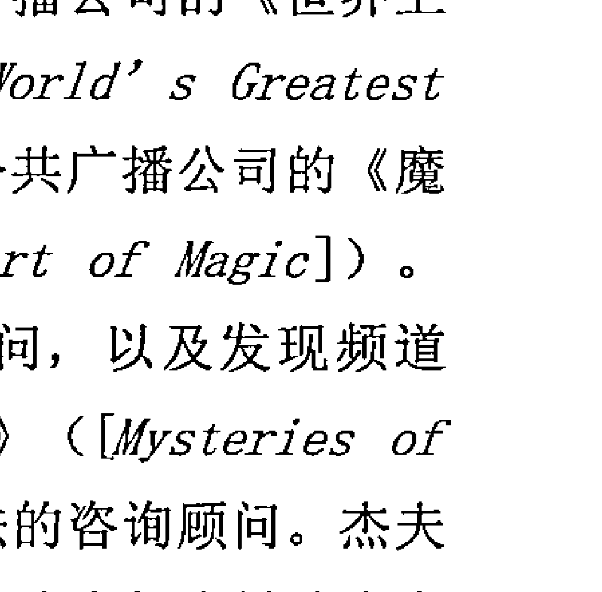

## 魔法师学徒的魔法书 | 下卷

论会。在过去的十年里，杰夫促进了全世界节日庆典上的仪式戏剧的发展。www.McBridemagic.com。

## 伊恩·“潜伏熊”·安德森 (Ian “Lurking Bear” Anderson) (1959年—)

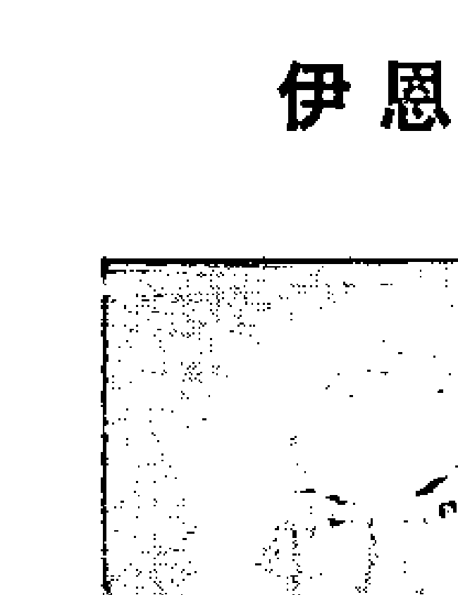

> “到现在为止，所经历的都是好日子。我已经逃出了麻瓜的世界，而且我已经在月光照耀的山坡上和疯狂的女巫共舞过。我已经在森林中的林间空地上弹奏过竖琴，并在青苔覆盖的阿拉斯加雨林中漫步过。我已经在古老的立石之中行走过，并爬上了崇山峻岭。因为我相信，所以我参加了示威游行、采取了行动，并搭便车穿越了遥远广阔的地方。我是一位诗人、电脑程序设计员、混沌音乐家、投机取巧的骗子、山野粗人以及精神探险家。我的随笔和诗歌已经发表在了《绿蛋》，《绿人》（[Green Man]），《巫术》（[Enchante]），以及《女巫之眼》（[Witch Eye]）之中。我目前潜伏在北加利福尼亚州的崇山峻岭之中。”

## 崔西·特勃斯柯 (Trish Telesco) (1960—)

是三个孩子的母亲、是一名妻子、五只宠物的人类首领，以及全职作家，大量的书籍已经出版上市。这些书籍包括：《我口袋中的女神》（[Goddess in my Pocket]），《邪恶女巫是怎样炼成的》（[How to Be a Wicked Witch]），《厨房女巫的食谱》（[Kitchen Witch’s Cookbook]），《爱魔法的小册子》（[Little Book of Love Magic]），《你的众影之书》（[Your Book of Shadows]），《编织咒语：编织奇迹》（[Spinning Spells:Weaving Wonders]），以及各种各样的书籍，每一本书都代表着不同领域的精神兴趣。崔西认为她是实实在在的厨房女巫，她喜爱民间传说以及世界各地的具有独特风味的咒语和仪式。虽然她的威卡教教育最初是自学而且自创的，但是她后来通过入门仪式加入了意大利的斯特雷加教派（Strega tradition），它让崔西练习了系统的民间魔法而且拥有更加丰富的内容。她最强大的信仰在于跟随个人的看法，对其他的教派宽容以待，让生活成为一种崇拜奉献的行为，以及富于创造性，这样魔法才会和你一起成长。www.loresinger.com。

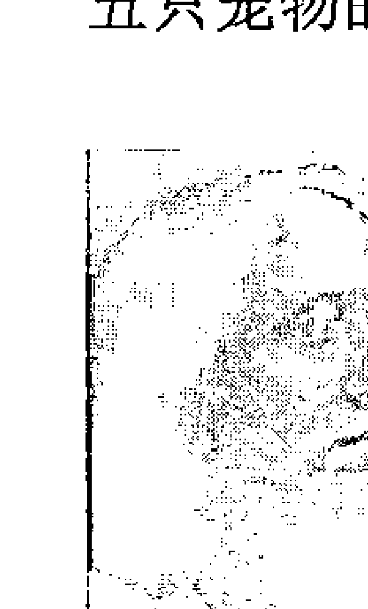

## 托德·卡尔 (Todd Karr) (1965—)

将魔法观念通过他的公司——迈克尔工厂——带入了他所创作的众多书籍之中。和艺术家凯特琳·布林合作，出版了一系列备受赞扬的有关魔术的高雅书籍，并在全世界发售。在巴黎大学和南加州大学中学习之后，托德成为了《洛杉矶时报》（[Los Angeles Times]）的写手，之后便搬去了巴黎，成为了一名全职魔术师。托德还是《后庭魔术》（1996）的作者，这是一本专为孩子们撰写的魔法书和自然书。www.miraclefactory.org

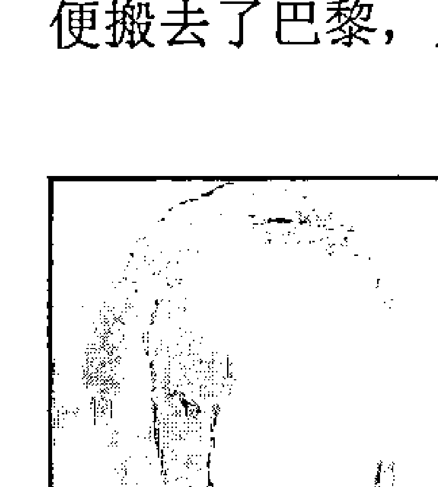

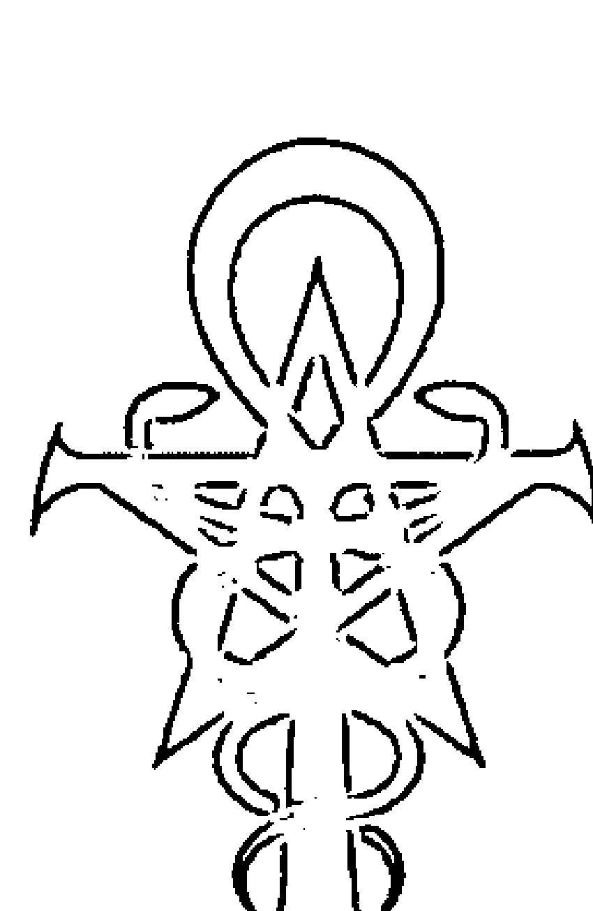

## 后记：毕业典礼

嗯，你已经从头到尾看完了这本魔法书了，而我相信你已经对里面的课程有了很好的一种理解。恭喜你！现在，如果你要加入格瑞魔法学校（www.GreySchool.com），并接受全日制的教学，主修16种色谱部门中的一个或者过个课程，你不仅会遇见其他的同学，你还可以完成你的学徒期，并开始下一个阶段的学习，那便是将会颁发给你合格证书的中级魔法师。

在这里，还有一些来自格雷理事会的各个成员以及他的最后的智慧箴言，这些人在所有的这些课程中都曾是你的老师。你可以将这些内容看作是“毕业典礼上的演讲”……

## 选择

> —奥伯伦·泽尔-雷文哈特

在你生活中的每时每刻你都要将它当作是电影中的场景，总有一天它会在你的生活中出现——因为事实如此。当冒险精神来轻叩你的心门，邀请你一起去冒险，那就去吧！

要知道，想要取得伟大的成就就得敢于冒险。不要忘记了蜘蛛侠彼得·帕克的叔叔本对他说的那句话：“有多大能力就得担多大责任。”将你生命中的每一次动作都看作是你播下了一粒种子。而总有一天你会获得收成……因为，一位真正的魔法师通常会将这样一句话记在心中：视野广阔，眼光长远——为“大局”考虑。要永远记得格瑞魔法学校的格言：“一切物体都是有生命的，而万事万物都是相通的。”

永远不要停下你学习的脚步。你所遇见的每一个人和每一件事情都是你的老师。学会“生命、宇宙以及万事万物”的规则，这样你便会知道怎样适时地打破这些规则！

当你意识到你犯了一个错误（你会的！——我们都会）之时，你应该马上采取行动去修正它。一个人真正的伟大之处在于勇于承认自己的错误，致以歉意并设法弥补。这样我们才能学到东西，并不断成长。

在你做决定之前，你一定要考虑清楚，想象在多年以后你会不会骄傲地将你所做的这个决定讲给你的孩子们听，当他们像你这么大的时候。想想——你会以自己的父亲（母亲）为荣吗，如果他们这样做了的话？扪心自问：“做这样的决定我以后会后悔吗，或者我以后会后悔我没有这样做吗？”不要将你的决定基于恐惧，而是希望。不要基于可能会发生的让你害怕的事情，而是你希望它会发生的事情。这便是魔法生活的秘诀。

生命之中所遇到的问题的答案就在你的内心深处。你所需要做的事情就是审视自己的内心，聆听自己内心的声音，并且信任你自己的魔法。大部分情况下，最好的答案就是“是！”

我，格雷理事会，以及在我们之前的世世代代数不清的魔法师们，已经向你提供了改变世界的知识和工具，让这个世界变成比你所看到的更加美好的地方。现在便出发，就这么做。

力量是你的。而选择怎样去使用这种力量也取决于你。

## 同伴
——艾比·维诺如特

恭喜你选择了这本书以及这本书中所包含的课程。你正在认识你的魔法天赋的途中，也正在发展自己的技巧。在你选择踏上魔法师这条路以后，你便需要必要的同伴来陪伴你的旅程。同伴需要培养、保护和聆听。这些同伴是你的勇气、你的同理心、你的好奇心、你的慷慨大方、宽宏大量。让这些友好的同伴陪伴在你左右，尊重他们，以他们为荣，这样他们才能不断成长，一天天变得更加强壮，而你便会顺利地成为一名伟大的魔法师。

对于一名魔法师来讲，魔法艺术的技巧是不可或缺的，但是如果你想要找到更深层次的魔法，能够召唤宇宙将其秘密泄露给你，你便需要将你的技巧同你的勇气、同理心，好奇心以及慷慨结合在一起。用你所有的感官去聆听，用你身上的每一个细胞去观察，温柔地触碰世上万物真正的本质。

魔法赐福于你！

## 成功的必要条件
——赫尔曼·B·崔普古德

要我说，想要成为一名高级魔法师、一位真正的巫师、一个赫密斯神秘学家和自然哲学家、一名数字魔法师，和一名奇术师，最重要的就是要相信自己。相信你三倍努力所换来的力量。只有付出了这些努力我们才能参与这一出隐秘的戏剧，跟随着神话预言织造的隐秘边缘，你将会以你终将注定成为的魔法师的身份出现。要成为一名魔法师，你所要做的便是表现得像一名魔法师。

## 非凡的愚人
——伊恩·“潜伏熊”·安德森

塔罗牌中的愚人牌代表性地展现了一幅无忧无虑的画面：跨过悬崖的边沿却丝毫不担心后果、也不顾及他人的警示。这看起来似乎很疯狂，但是这是魔法师道路上非常重要的一步。有时，在魔法师道路上，如果不想生活在他人所知道的现实的束缚之中，我们便必须迈出愚人的这一步，进入一个未知的世界，实际上是一个不可知的世界。作为一名魔法师，有时你是得需要谨慎，需要考虑周全，需要学习，需要寻求开阔的视野，但是这些都不足以让你成为一名真正的魔法师，直到你真的迈出了愚人的那一步。这一步也许不会得到社会的认可，也许无法让你赚到大钱，又或者这一步踏出了我们为自己设定的其它界限，有时我们自己也不知道。

聪明的愚人能够看穿幻觉之墙并穿过这堵墙。然而，非凡的愚人并不仅仅是一个笨蛋，培养直觉和魔法感官来了解该在何时何处踏入未知世界是非常重要的。魔法通过自己的本性踏出世俗现实的界限，而真正的魔法的每一步都包含了一些我们未知的东西，包含了永恒的精细，并且回荡着愚人脚步声。

## 毕业？

> ——雷蒙德·巴克兰

我们中没有任何一个是完成了学业的。即使是“死神”降临到我们头上了我们的学习生涯也并没有结束——我们只是去到了其它的次元空间，在那里我们会进一步发展。但是，那是生命的乐趣，也是活着的乐趣。总会有一些新的东西会诞生。培养你的好奇心。不要让它成为了一种毫无意义的好奇心，而是将其培养成一种询问，一种调查研究，一种经历，一种学习的过程……

所有的那些东西都会继续扩大你的意识，让你在人生的道路上越走越远。

当我还是个小孩子的时候我便是一个贪婪的读书人。我会将我手中的每一本书都阅读一遍。我会翻到每一本书的最后去查看它的参考书目，查看它所列出的其它与其主题相同或者相似的作品。然后我会将这些书找出来并且阅读这些书籍……而反过来，这些书的后面也有其参考书目！生活和这也有一点相似——一件事情会引发另外的事情；一种兴趣爱好会引发其它更多的兴趣爱好。有一句话你需要小心谨记：不要过于分散自己的精力。不要将你的精力散播得太远，或者太快。要学会悠着点。但是人脑是一台不可思议的机器，它可以吸收并且利用我们无法想象的更多的东西。

这本书是你进入魔法世界的非常棒的启蒙书籍。我希望我在小的时候也能获得一本这样的书。有了你在这本书中所学到的知识，你将总可以比你的伙伴们快一步。你应该为此感到高兴，感到知足。不要炫耀你的知识。不要轻视那些没有你幸运的人。谦逊和安静的自我满足通常会比自我吹嘘和狂傲更可取。对于这本书来说，你已经毕业了。你应该休息并放松一段时间。但是休息过后便要继续前进！你、我，以及格雷理事会的其他魔法师们——我们是永远不会休息的。但是我们生命的血液中充满了不安定——不停地探索。了解它，并享受它。欢迎走进生活！

## 未来

> ——艾波娜女士（Lady Epona）

你是超出地球与宇宙之外的其它世界的未来。当我们将你引向通向魔法师国度这一条路时，我们知道你将会以一种你的长辈们都不曾有的观点来看待世界。你将会在与我们所体会过的不同的次元中体会魔法；因为是观点和次元构成了时间。我们将我们的所学传授给你，但是你是否要将这些知识带到未来这取决于你。

爱护并且尊重地球和地球上的生物；
真诚对待自己；
彼此相爱；
多福多寿；
最重要的是——欢笑！
祝福你！

## 真正的秘密

> ——卢克·萨拉

魔法师之路看起来荣光闪耀，它可以了解思想和自然中更深层次的进程和相互作用，获得掌控超越现实事物的能力。然而，这些都只是表面的东西。在这条道路上，更重要的一课是学会谦逊，而不是与众不同。向你微笑的质朴的农夫、乞丐、陌生人，如果他们掌握了幸福和爱的魔法——世上最伟大的艺术——他们就是远比你伟大的魔法师。

通过可视化、仪式，以及集中的精力所释放、集中、驾驭的思想的力量是可怕的，但是不要滥用，也不要宣称它们就是你的。你只是一个通道、一种容器，而如果你真正地环顾四周之后你会发现你的周围充满了魔法。成为一名魔法师最主要的便是要感觉并且意识到已经存在的东西，发现内部世界与外部世界之间的关系和对应，而且要不断地为他们重新架桥。这是一条没有尽头的道路，我希望和你分享一些最重要的课程：

我只是不同而已，因为我还没有学会和他人一样。为了变得一样，克服障碍、团结以及关爱是这个行业真正的秘诀。

## 生活在魔法之中

> ——唐纳德·迈克尔·克雷格

我希望你能暂停一下，然后深呼吸。如果你跟着这本书中的所有学习课程直到最后，如果你已经非常成功地完成了所有的作业，如果你已经完成了每一个任务，你理应受到高度的嘉奖。因为说实话，很多人会沿着这条路往下走，但是只有很少一部分人会走到最后。作为少数人中的一个，你应当享受这种属于你的荣光，并为自己的造诣感到骄傲。当你感觉到这种赞美的时候停下来，深呼吸。并在今晚梦到它。

然后你将会在明天醒来。你仍然还有“其它的“课等着你去上。你仍然需要和你的朋友打交道，他们会将他们的问题一股脑儿地倒给你，你还需要和老师们打交道，他们不太会尊重你，还有其他一些告诉你你应该做什么，但是却不给你个正当理由的人。你仍然不得不去面对这个世界，这个有时看起来很有敌意而且残酷的世界。

但是现在，你拥有了一种强大的技巧去处理这些问题。你已经学会的技巧，你已经掌握的魔法，这些都将让你处于一种平和状态，并在他人看似疯狂的时候保持一种平衡的心态。如果你使用了这些技巧，并且过着魔法师的生活，你将会有能力更加有效地学习，更加容易地和他人建立关系，甚至会在面对一些繁琐的工作的时候处理起来更加的轻松。

你曾坚持到最后的学习进程也是如此，除非……除非你将它派上用场。并不是在某个节日，不是在周末，不是在你有时间的时候。你只有付诸实践，它才会变得有用。每一天。当你这样做了以后，你就会发现魔法真的并不是做出来的，而是本来就是那样的。你走路、说话、思考以及举动的方式都充满了魔法。

你所遇到的所有人都将会为你所拥有的力量感到吃惊。你将会学到一个大诀窍。企图控制他人是无效的。更重要的是要控制你自己。当你拥有这种力量以后——在不伤害他人，不从他人那里取走东西的情况下获得你想要的东西——你将会真正地变得强大、独立，以及自由。

那些都是一位真正的魔法师的标志。

## 礼物
——艾伦·埃文特·霍普曼

既然你已经读过这本书了，我希望你会使用其中的智慧去加深你对围绕在你周围生命的奥秘的认识。五大元素土、气、水、火以及灵都能在这个星球上你所能看到和触摸到的一切事物中找到，只是组合方式不同罢了。

你不断地被生命环绕，从最小的昆虫、藻类，以及苔藓，到最大的鲸，大象以及橡树。自然用所有的所需要的东西将你环绕；为了你的健康，给了你全天然的补救疗法，为了你的胃，给了你野生的食物。她给予你清新的空气供你呼吸，清亮的河水供你饮用。我的希望就是你将会永远怀着崇敬和敬畏之心感激这些礼物。

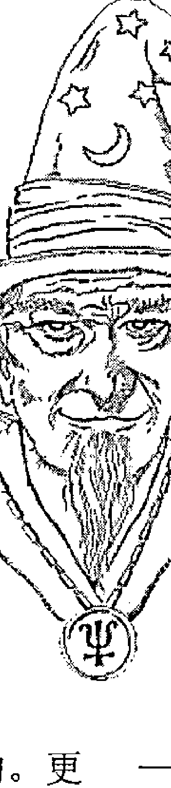

希望你永远不会忘记大地精灵整年的辛苦劳作是为了带给你这些奇迹，也不会忘记宇宙中包含了所有生命，环绕在所有的生命周围的伟大圣灵。

希望你阅读愉快，旅途顺利，为你未来的工作送上诚挚的祝福。

> “去了解，去希望，去挑战，保持沉默”
> ——瑞文·格瑞玛西

现在你可以上路了，带上别人分享给你、传授给你以及委托给你的知识。但是，你要知道知识和认识之间是有区别的。知识允许你去体会，并为你提供选择。但是它并不会强迫一个人去行动。你可以带着你的知识躺在铁路轨道上，即使火车来了也无动于衷。但是一旦你认识到如果你不动，火车便会从你身上碾过去，你将会被迫且毫无反击之力地采取行动。因此，你要理解知识和认识是以两种不同的方式运转的。知识可以让你思考和反思，但是认识需要行动。

因为你今日便会开始你前进的旅程，所以我希望，我期望你通过学习和磨炼让你获得很多的认识。你已经听说过这样的格言“去了解、去希望、去挑战，保持沉默”，这是魔法大师所说的话。要拥有知识，你首先必须满足最起码的好奇心，然后再了解更多的东西。要满足求知欲你不仅要学习概念，而且还要学习与概念有关的东西。去希望，你必须忍耐，不屈服于失败或者气馁。你必须看清楚你的道路，然后走下去去，即使路上困难重重。去挑战，你必须愿意接受其他人意图加在你身上的冷待和虐待的风险。你必须忠实于你所选择的道路，不管这条道路是平顺安稳还是布满了荆棘岩石。保持沉默，你必须只说真话，不要自负或者虚荣。

因此，我鼓励你去认识自己是谁，是什么。我支持你成为一名魔法师，并不只是思想或者智力上的，而且还是心灵和精神上的。每个时代都存在着与众不同、有所作为的魔法师。当你行走在这条高尚的道路上时，将这种不同带给他人，带给全世界。我羡慕你今后的日子，它将是一次光荣的冒险！

## 魔法师的道路
——皮提亚女士

魔法师的一生是一种永恒的质疑——事情是怎么发生的？我是谁？我为什么在这里？我学习魔法的真正原因是什么？

我将刻在特尔斐神谕入口如的格言说给你——这条格言是在学习所有的魔法过程中最重要的一条，是所有魔法道路的指南：

> “了解自己”

这简单的四个字是你在学习过程中最伟大的向导，不仅仅是这本书，而是你一生中的所有学习……因为它们与另一条魔法中最重要的活有联系：

> “上如是，下亦如是”

对于这一点，你可以推出：内如是，外亦如是。你将会发现整个宇宙都在你体内。这本书已经给予了你在旅程中会使用得到的很多工具，但是最后这些工具都会变成你思考与这世界建立联系的方法的神圣延伸，变成你将会用于理解因果关系的方法，用于了解来源于所有的人（魔法世界或者世俗世界的）怎样使用他们的个人力量伟大的责任感的方法。

我们出现在这世界上并不仅仅是为了服务自己，也是为了服务人类。当我们忘记这一点，并使用权力控制他人，而不考虑会对他人造成怎样影响的时候，回归法保证了我们将会学会换位思考。我们要求你要一直记住神圣火花，这是所有人和生命之中，以及所有的自然之中的生命原理。

希望你知道，因为我们都已经知道了，每一次你认为你已经“明白”的时候，宇宙就会提醒你，你还有更多的东西需要学。那是一件多么愉快的事情啊！我们都是永恒的学者，因为我们对所有的魔法知识、整个世界的知识、自然知识以及其中的元素知识的追求是永无止境的。

在学习道路上你必须谦逊，但是这并不是要你做一个忍气吞声的人。学会何时妥协非常重要——不要让骄傲成为了你隐藏你的人性缺陷和不适当恐惧的盾牌——因为真正的骄傲是默默地认知自己是谁，以及将会变成谁——而不是你自己或者他人认为你有多少“权力”。而同理心将会是你用于观察事物（包括你自己）的内心的最强大的工具之一。

保持你内心深处的童心，因为孩子自身可以让你充满好奇心和快乐，并且会惊叹自己的新发现！

首先，我们来到这个世上是为了推动人类意识的进化，而不只是研究意识及其能力——这是一个你一生中都在成长的领域。我们仅仅是那些还未到来的后来人的先驱。

我们的这条道路是为这个千变万化的世界上的那些人准备的，而你可能就是其中一员。当你审视不同的世界时，你要想象你自己正握着这个精致漂亮的旋转着的蓝色星球，轻轻地握着她。希望你成为一名大地母亲的守护者，因为她非常需要我们——而且她就掌握在你手中，她比你将要探索的其他世界都需要你的帮助。与她保持联系，并珍惜你植入她体内的根，甚至在你乘飞机去远方旅行的时候也要这么做。

希望你能够了解你自己。这是一次终生的旅程，而在你旅行去发现这个宇宙，以及它在你自己的心底、思想中、灵魂中以及体内的真实写照的时候，希望住在精神世界以及魔法位面的智慧保护神们可以保卫你的探索精神。永远不要忘记笑容可以驱逐恐惧，而且它是生命和魔法中的必要工具！你正在经历一次美妙的旅程！珍爱所有的这一切，即使是在最困难的时期——因为你可能会从这些经验教训中获得最伟大的力量！

随着你年龄的增长，希望你能够了解爱情，这是作为一个人类最神圣的礼物。享受！沉醉其中！而且希望你在旅程中就像塔罗牌中的第一张牌愚人一样，永远不会饥饿，不会口渴——它在大阿卡那牌结束的时候成为了世界、宇宙、多元宇宙！好好研究塔罗牌，你会看到魔法师的人生轨迹！
祝福你！

## 十字路口
——牵牛花·泽尔-雷文哈特

当你拿起这本书开始阅读的时候，世俗世界和魔法世界之间便为你开启了一扇门。这是一本你一直都在期待的书，其中包含了由伟大的魔法师掌握的真实的知识。既然你已经掌握了一些知识，而且你也完成了第一个阶层，那么现在摆在你面前的是一个挑战——因为世界上的所有知识在没有行动与体验的情况下都是毫无用处的。

你站在开始进入神秘世界的十字路口。用你的心灵之眼往下看，你将会发现一叶魔法刀片躺在路中间。捡起来。这把小刀代表着选择，而这是你与生俱来的权利。它始终都是你的。你甚至不能将它抛弃，因为“不选择”也是一种选择。这把小刀很微妙，它是双刃的，两边都可以切割。

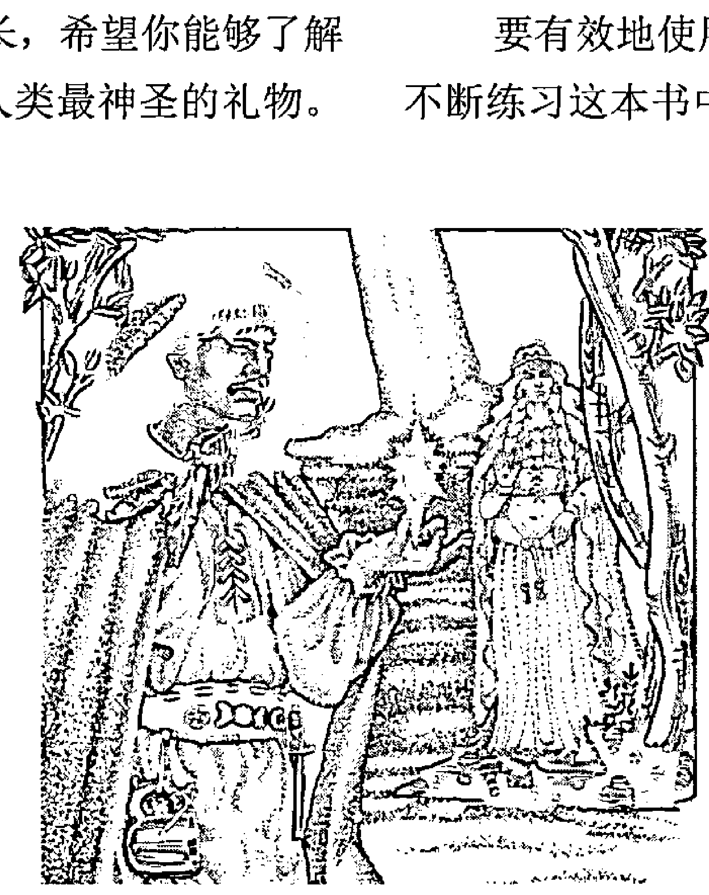

要有效地使用这把小刀，你必须通过不断练习这本书中所讲到的课程以磨炼你的魔法意志。想要聪慧地使用这把刀，倾听你的内心和你的梦。但是最重要的是要记住让爱成为你所做的每一个清醒的选择的一部分。因为最终，当你使用这把选择之刀去划分这与那，去切除一些无关紧要的东西时，你会发现，位于每一件真正神秘的事物的内心都充满了爱。

## 期盼奇迹的发生

> ——杰西·沃夫·哈丁

魔法不仅仅是从普通和“正常”的压抑之中的一次逃亡。它是自我与精神，目的与地点的再次结合——终生任务的起点。

魔法并不是自我沉迷，而是改变世界。同样地，责任并不是义务——它是承担责任的意愿和能力。

你拥有几乎不与任何人分享的梦想。现在，是时间为梦想而活了！

每个时刻都是一个决定性的时刻，而我们的未来是一块空白的帆布。位于我们的人生道路上的唯一物品便是我们所养成的那些习惯，以及我们所否认的恐惧。除了你，没有人可以掌握你的人生！魔杖掌握在你自己手中……

拥有玩具并不等于拥有快乐。将注意力集中在那些你会参与的活动中。在没有化学制剂的水中游泳，在一些你“本不该在”的地方。赤脚走在四叶草上。哭、笑、唱。拥抱而且嚎叫！

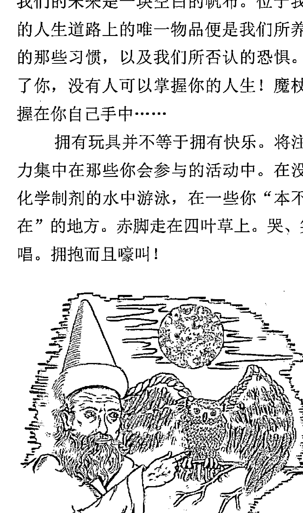

所有事情的完成都会拥有新的经验。品味多种多样的人生滋味，但是一定要将不好的吐出来。

努力记住“谋生”并不仅仅是活着。找到工作所反映的并不仅仅是你的技能，还有你的信念。在电视上看冒险故事并不能取代自己亲身经历的探险。在出生与死亡之间存在着那么长的时间……要将它们花费在至关重要的事情之上。你可以按照理想的方式去发现，然后将你最有意义的目标装在里面。

关键不是获得财富，而是为了让我们拥有一个更加富有的生活。小心留意任何可以售卖或者装瓶的解决方案，以及站在你和盖亚、诸神的经验之间的媒介。

尽可能多地旅行并且探索这个世界。这不仅可以让你熟悉其他的生物区和其他种类的生活方式，而且它还可以帮助你感激任何曾被你称为家的地方。

不要将任何事情都看作是理所当然——你的健康、你的家或者你的家人都不行。绝不说“随便”，因为这两个字意味着你不关心，你非常清楚你是怎么想的！无论是我们的问题还是这个世界的问题，都不是因为感受到太多而引起的。当然，也不是因为我们感受太少！通过向意识中存在的痛苦敞开心扉，获得快乐的体验。

大胆探索每一件可以增加感觉深度和精神完整性的事情，让你自己通过同理心进入真正的连接，获得真正的力量。你是无缝宇宙的一部分，就像你的双手是你双臂的一部分一样。所有的创造都是神圣的，你也是。

避免所有的毒药是明智的，无论是事业上还是生活方式上，它会麻痹你的认知，或者损害你重要的和及时的反应能力。对矿物燃料、吹嘘可以“任意处置”、承认已经经过人工染色或者调味，或者假装是某物的任何东西都要持怀疑态度。千万集中注意力！当你和他（她）在一起的时候，要将你的注意力集中在你的心上人身上，以及你们正在吃的食物身上，而不是其它任何的东西。记住，没有什么事是值得的，除非它是真实可信的！

要信守承诺。整个世界就是一个伟大的馈赠循环。学会尽所能地去给予。这就像学会怎样去优雅地接受出现在你面前的每一份礼物一样的重要。

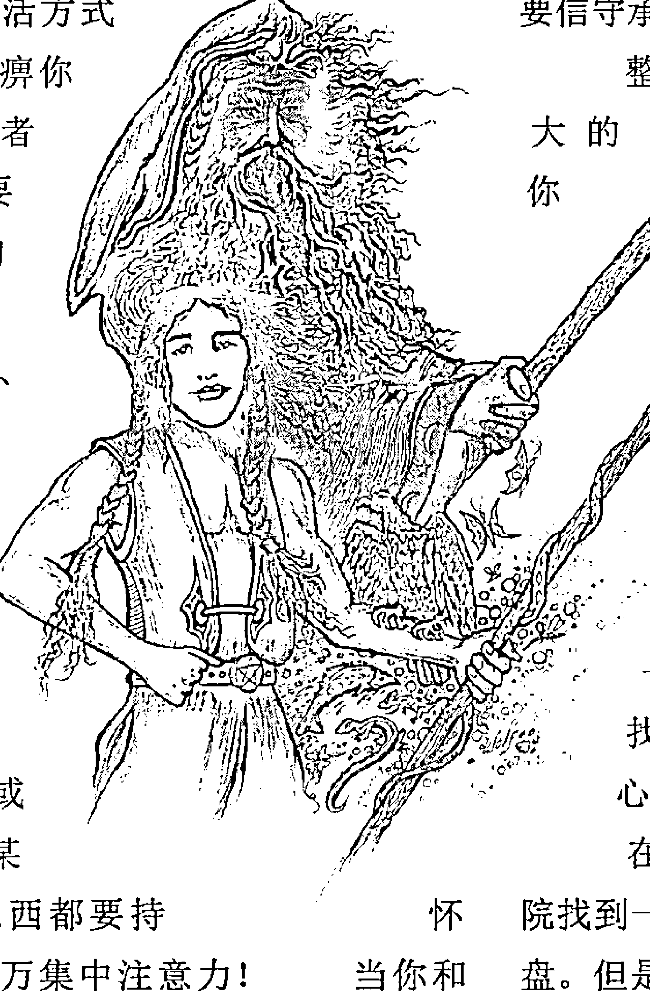

所有的事情，无论是好是坏，都是宝贵的经验教训，我们都应该对其心存感激。不要在同一个地方摔倒两次。不要把珍贵的时间浪费在解释上。只需总结教训，继续上路！

花些时间来“变年轻”，即使你认为你已经到了一个需要“智慧”或“冷静”的年纪。跟在一群有趣的昆虫后面满地爬行，寻找天空中动物形状的云朵，不要担心你的衣服上会沾染草渍！

指定一个个人的魔法师荣誉准则，而且一定要说到做到！对朋友、家人、社区、事业以及你所爱的那片土地忠诚。始终都要信守承诺。

在每一根青草上、每一个住宅的后院找到一个充满神性的创造，寻找你的地盘。但是不要忘了去朝拜真正的荒野。向它们所提供的信息和灵感敞开心扉，让你自己屈从于这个教导我们，我们从未真正孤单的荒僻地方。

揭发每一次有害的观念或者谎言。用你所有的力量去保护和滋养真实和善良的任何事物。

没有人该为你做一些至关重要的事情，因此你不能责怪任何人！责任和回报都是你的。讲信用！然后感恩……

记住，永远都不会“太晚”，只要你现在就开始，说干就干。

期盼奇迹的发生。奇迹就是你。

必将应验！

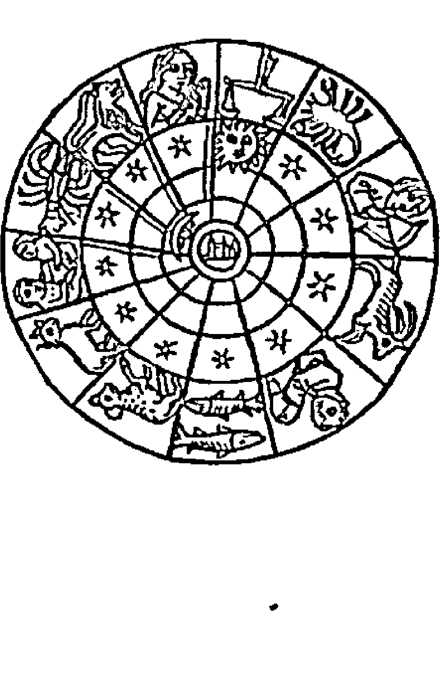

## 附录：魔法的历史时间轴

## 公元前（公历纪元以前）

- 800,000 年  阿舍利文化中的“维纳斯”小雕像被看做是已知的最古老的雕像——石刻女性形象，由尼安德特人制作。
- 75,000 年  最早的人类（尼安德特人）圣坛为人类对穴熊、狼以及其它动物的崇拜提供了证据。
- 60,000 年  苏门答腊岛火山大喷发将整个地球的人类数量减少到只有几千人。
- 30,000 年  沃尔道夫的“维纳斯”使用石灰岩雕刻而成，并用红色赭石染上颜色，成为一种全新艺术的原型，持续了 20,000 多年。
- 23,000 年  “鹰嘴狐狸”（“Crooked Fox”）或者“撒阿姆那”（“S’Armuna”），一名萨满巫师，生活在现在的捷克共和国的一个猎杀猛犸象的小村落中，生于此地，死于此地。她的骨骼、肖像、用陶器和贝壳制成的珠链、骨哨、她的图腾动物（北极狐）、她的窑炉中的最后一次烧制（第一个已知的窑炉，里面堆满了小动物和“维纳斯”的塑像），甚至还有她遗留在粘土上的指纹，都被保存了下来。
- 15,000 年  遍布法国和西班牙的克鲁马努人洞穴画描绘了动物、猎人以及手印。
- 大约 8500 年  里斯期的冰河世纪在小行星撞击巴哈马群岛的影响下突然结束了。融化的冰使得海平面上升了 400 英尺，引发了世界范围内的大洪水。所有沿海的部落全都被淹死了。这件事作为亚特兰提斯的毁灭（Destruction of Atlantis）被记在了传说中。
- 大约 8000 年  杰利科（Jericho），已知的新石器时代最古老的定居城市。印度河流域文明哈拉帕文化（Harappan culture）开始于印度北部萨拉斯瓦蒂河（Saraswati River）流域。
- 大约 6000 年  位于休于古城（Catal Huyuk）（现在的土耳其）的洞穴画描绘了裹在豹皮中的猎人。
- 大约 5150 年  海平面仍在上升，导致地中海中的海水涌进黑海并将其灌满。突然泛滥的水平面上升到 500 英尺，淹没 60,000 平方英里的有人居住的陆地。这次变迁被记录在传说《大洪水》（[Deluge]）中——诺亚和乌纳皮施汀的洪水（the Flood of Noah and Utnapishtim）。
- 大约 5000 年  已知的最古老的雄性生育力雕像（德国）。
- 大约 4800 年  已知的最古老的巨石文化（布列塔尼 [Brittany]）。
- 大约 3500 年  苏美尔文明的开端。
- 大约 3000 年  埃及文明的开端。基于天体观察而发明的精确的历法。
- 大约 3000-2500 年  印度河流域文明的高地，覆盖了 300,000 平方英里的范围。信德城的人口数量与整个埃及的人口数量一样多。人类仪式包括占星术、风水、草药医术学、医学、魔法。
- 大约 2900-2600 年  在苏格兰建立卡兰尼什石头圈。
- 大约 2800 年  在埃及修建了第一座金字塔。
- 大约 2700 年  吉尔伽美什统治着位于幼发拉底河上苏美尔乌鲁克城。《吉尔伽美什史诗》（[Epic of Gilgamesh]）讲述了这个故事。
- 2630 年  伊姆霍特普，世界上第一位医生，同时也是祭司、作家、圣人、诗人、占星家、建筑师以及魔法师。
- 大约 2500-1628 年  位于克里特岛和基克拉迪群岛(Cyclades)上的“克里特”文明。克诺索斯(Knossos)的蛇女神 / 女祭司。
- 大约 2400 年  巨石阵建筑开始在英国出现。
- 大约 2000 年  在希腊的多多那古城中盖亚神谕的建立，托马洛斯山山脚下。种植神圣的橡树。
- 1628 年  摩西来到埃及法老跟前请求法老释放希伯来奴隶。接下来便是《出埃及记》。
- 1628 年  克里特北部的卡里斯蒂的火山岛（现在被称为锡拉岛）爆发，位于地中海东部的高级青铜时代结束。这次火山爆发和大约 8500 年的那一次结合在一起共同创造了“亚特兰蒂斯传说”。
- 1628-1618 年  “天堂之战”，“泰坦之战”。
- 15 世纪  雅利安人入侵；众神升天。
- 1478 年  俱卢族（Kauravas）与班度族（Pandavas）（印度）之间的持续23天的库鲁之战（Kurukshetra）。在《摩诃婆罗多》（[Mahabarata]）中描述。
- 15 世纪  萨拉斯瓦蒂河干涸。印度河流域文明消失。
- 13 世纪  宙斯被确立为多多那神谕（Oracle of Dodona）的保护神。
- 1367-1350 年  阿赫那吞（Akhnaten）法老将对阿托恩（太阳神）的一神崇拜介绍到埃及。
- 大约 1264 年  大商船——伊阿宋的金羊毛任务。
- 1220-1210 年  特洛伊战争。迈锡尼的希腊人劫掠了特洛伊。
- 1210-1200 年  《奥德赛》（奥德修斯从特洛伊航海回到他位于希腊伊萨卡[ Ithaca]的家）。

## 附录：魔法的历史时间轴

- 大约1000年	伊特拉斯坎文明(Etruscan civilization)在意大利兴起。伊特拉斯坎人（Etruscans）因为他们的魔法，占卜，以及哲学知识闻名于世。
- 390年	高卢人（凯尔特人）在阿里亚战役（Battle of the Allia）中打败罗马人。罗马的布伦努斯掠劫（Brennus’ Sack）。
- 大约1000年	爱尔兰人来到爱尔兰，统治了达那神族。
- 325年	亚历山大大帝（356-323年）统治了整个已知的世界，建立了马其顿帝国（Macedonian Empire）；希腊文化传播到意大利、埃及、波斯以及印度。
- 950-928年	所罗门统治了以色列。他作为一名大师级的魔法师（命令巨灵）受到神话的青睐，
- 280年	“皮洛士的胜利”（ Pyrrhic victory）。皮拉斯是希腊的伊庇鲁斯王国（Epirus）国王，在赫刺克勒亚（Heraclea）的战争中打败罗马人。
- 850年	提尔（Tyre）的公主艾丽莎（Elissa）建立了迦太基国（Carthage）。
- 279年	凯尔特人进攻希腊，穿过马其顿，掠夺了特尔斐神庙（Temple of Delphi）。
- 753年	双胞胎罗穆卢斯（Romulus）和雷穆斯（Remus）创立了罗马。
- 264-241年	第一次布匿战争（Punic War），罗马与迦太基之间。
- 700年	凯尔特文明出现在奥地利；所谓的哈尔施塔特文化（Hallstatt culture）。凯尔特语的出现。
- 214年	中国的长城开始修建。
- 551年	在中国，孔子出生。佛陀和老子是同辈人。
- 186年	酒神节（Bacchanalia），希腊狂欢节（Dionysia）的罗马版本，因其放荡被参议院宣布为不合法。
- 500年	古凯尔特人（Brythonic Celt）到达大不列颠。德鲁伊作为一种宗教和知识阶层出现在世上。
- 168-165年	犹太马加比家族起义（Maccabean revolt），反抗希腊。
- 500-450年	哈尔施塔特时代的结束。拉坦诺时期（La Tène）的开端：英雄时代的凯尔特人（Heroic Age Celts）。很多神话出现的时代。
- 167年	希腊：为公元前280年的皮洛士胜利的报复，罗马执政官路奇乌斯·埃米利乌斯·保路斯（Lucius Aemilius Paulus）在第三次马其顿战争中烧毁了伊庇鲁斯王国70座城市，包括古代的多多那神谕和尼可洛曼特安（Necromantaeon）。
- 460-429年	雅典的伯利克利（Pericles）统治：“希腊的黄金时代”——哲学家和剧作家活跃。
- 61年	尤利乌斯·凯撒（公元前100-44年）统治了布雷根茨（Brigantium），破除了凯尔伊比利亚人（Celtiberian）的阻力。
- 420年	崇拜阿斯克勒庇俄斯，他是健康之神，医药学之父，由索福克勒斯（Sophocles）引入雅典。
- 387年	凯尔特高卢族在阿利亚战役（Battle of the Allia）中洗劫罗马。
- 51-50年	凯撒评定高卢，然后在伟大的远征中到达不列颠。

## 魔法师学徒的魔法书 | 下卷

- **4 年** 琐罗亚斯德教的三圣贤从波斯漫游到伯利恒，为新生的耶稣带来了礼物。
- **29 年** 耶稣受难；基督教的黎明。
- **43 年** 罗马入侵不列颠。从 43-409 年，罗马统治不列颠和威尔士部分地区。
- **30-97 年** 1 世纪最伟大的巫师阿波朗尼斯·忝留斯 (Apollonius Tyaneus)。
- **50-60 年** 术士西门，杰出的“奇迹制造者”，与使徒彼得 (the Apostle Peter) 的魔法争夺。
- **61 年** 德鲁伊位于安格希尔岛 (Anglesey) 的大本营被罗马人摧毁；苏埃托尼乌斯·保利努斯 (Suetonius Paulinus) 打败爱西尼人 (Iceni)（布迪卡 [Boudiccea] 的叛乱）。
- **63 年** 亚利马太的约瑟 (Joseph of Arimathea) 来到格拉顿堡 (Glastonbury)，将最初的基督教传入不列颠，带来圣杯。
- **70 年** 罗马人毁灭耶路撒冷，将大神殿夷为平地。犹太人的离散开始。
- **122-128 年** 73 英里长的哈德良墙 (Hadrian's Wall) 在北英格兰建立，标记罗马的国界。
- **150 年** 罗马人攻克凯尔特人。不列颠和高卢进入了罗马统治时代。
- **大约 250 年** 撒克逊人开始突袭不列颠东海岸。
- **313 年** 康斯坦丁 (Constantine) (312-337 年在位) 使得基督教在罗马帝国合法化。
- **大约 350 年** 基督教传播到爱尔兰。
- **361 年** 异教信仰在罗马帝国为不合法。
- **361-363 年** 叛教者尤里安皇帝 (Julian the Apostate) 尝试着在罗马帝国复兴异教宗教，失败了。
- **392 年** 位于多多那的宙斯的神圣橡树被砍到，宙斯神谕被罗马帝国皇帝狄奥多西 (Theodosios) 关闭。
- **394 年** 狄奥多西关闭了特尔斐神谕；禁止举行阿波罗祭仪和庆祝皮提亚竞技会 (Pythian Games)。
- **395 年** 亚拉里克一世 (Alaric the goth) 拆除位于艾留西斯的得墨忒耳神庙，在 1600 年后结束了 一年一度的依洛西斯秘密仪式 (Eleusinian mysteries)。
- **410 年** 罗马人从不列颠撤退。洪诺留皇帝 (Emperor Honorius) 告诉不列颠人他们自己统治自己。
- **415 年** 希帕蒂娅 (Hypatia) 殉难，烧毁了位于埃及的伟大的亚历山大图书馆。
- **432 年** 帕德亚 (Padraig) (圣帕特里克 [St Patrick]) 抵达爱尔兰。
- **445 年** 沃尔蒂格恩开始统治不列颠。
- **455 年** 罗马遭到汪达尔人 (Vandals) 的洗劫。西罗马帝国结束。
- **460-470 年** 安普罗修斯 (Ambrosius) 控制了前罗马人的内讧和不列颠人的抵抗努力；领导不列颠人与撒克逊人多年的战斗。

## 附录：魔法的历史时间轴

- 481年 崇高之王（亚瑟）（465-537）成为了不列颠高高在上的国王。他15岁，他的导师和顾问是魔法师梅林。
- 485-496年 亚瑟国王在12次战争中阻止了撒克逊人的入侵。亚瑟最终打败了巴登山（Mount Badon）的撒克逊人。
- 537年 亚瑟在卡姆兰战役（Battle of Camlann）中阵亡，被埋在阿瓦隆（Avalon）（格拉顿堡）。
- 540年 小型彗星或者小行星碰撞地球，带来了黑暗世纪(Dark Ages)。欧洲的记录与中国的记录是一致的，记录中称冬季的天气情况在世界上统治了18个月。
- 622年 阿尔海基拉（Al Hijra），‘飞行（the flight）’；穆斯林纪元的开始。
- 大约790年 维京人开始了对不列颠群岛的袭击和殖民地化。
- 900年 《主教会规》（[Canon Episcopi]）——中世纪早期关于巫术的最重要的法律文件。
- 1014年 克朗塔夫之战（Battle of Clontarf）：维京人被布莱恩·博茹（Brian Boru）赶出了爱尔兰。在那以后不久他们也从凯尔特人的国家撤离。
- 1054年 “东西教会大分裂”将罗马与东正教会划分开来。
- 1066年 黑斯廷斯战役（Battle of Hastings）。诺曼人受到了私生子威廉（William the Bastard）的侵略，并统治了英格兰。
- 1095–1244年 十字军东征。
- 1095-1099年 第一次十字军东征；戈弗雷（Godefroi）夺得耶路撒冷。
- 1099年 钅山隐修会（Priory of Sion）由戈弗雷在耶路撒冷成立。
- 1145-1148年 第二次十字军东征；最终以失败告终。
- 1187年 教皇格雷戈里八世（Pope Gregory VIII）宣布第三次十字军东征。
- 1189年 理查德加冕为英格兰国王。
- 1199年 狮心王理查德（Richard the Lionhearted）在第三次十字军东征中被杀。他的兄弟约翰成为了国王。
- 1215年 国王约翰被迫签订了《大宪章》（Magna Carta）（“Great Charter”），结束了“君权神授”。
- 1227–1736年 “燃烧时代(The Burning Times)”。
- 1227年 教皇英诺森三世（Pope Innocent III）颁布诏书建立宗教法庭。
- 1233年 德国：法律鼓励转变而不是焚烧女巫。
- 1233年 教皇格雷戈里九世颁布诏书称检察官只需对教皇负责。
- 1244年 土耳其和埃及的穆斯林力量联合在一起夺回了耶路撒冷。十字军东征结束。
- 1258年 第一次，由教皇亚历山大四世（Alexander IV）颁布的教皇诏书宣布反对黑魔法。
- 1311年 教皇克莱门特五世（Pope Clement V）在维也纳会议上发布诏书，规定巫术为异端。

## 魔法师学徒的魔法书 | 下卷

- 1324年 由爱丽丝·吉蒂勒夫人（Dame Alice Kyteler）领导的爱尔兰女巫大集会受到主教奥索雷（Ossory）的审问，因为她们崇拜一位非基督教天神。吉蒂勒因为她的地位而免于受难，而她的追随者们都被烧死了。她的仆人帕特罗内拉·德·米斯（Petronella de Meath）在爱尔兰的第一次烧死女巫运动中被处死。
- 1331年 教皇若望二十二世（Pope John XXII）颁布了第四次巫术训令。
- 1390年 在皇家诗词（Regius Poem）中出现了第一份共济会（Masonic Fraternity）文件。
- 1431年 圣女贞德，被指控为一名女巫，被正式定罪为异教徒绑在木桩上烧死。
- 1471年 斐奇诺（Marcilio Ficino）将《赫尔墨斯文集》（[Corpus Hermeticum]）从希腊语翻译成拉丁语。其对文艺复兴时期的哲学影响深远。
- 1484年 教皇英诺森八世颁布诏书反对女巫。
- 1486年 德国修道士海因里希·克莱默（Heinrich Cramer）和雅各布·史宾格（Jacob Sprenger）合著《女巫之锤》（[Malleus Maleficarum]）（“女巫的铁锤”）为可怕的女巫迫害提供了详细的说明。
- 1506年 科尼利厄斯·阿格里帕（Cornelius Agrippa）成立了致力于占星术，炼金术，魔法，以及卡巴拉的秘密协会。
- 1517年 马丁·路德（Martin Luther）启动了宗教改革（The Protestant Reformation）。
- 1563年 英格兰：一项对抗女巫的新法规，判处女巫，巫师，以及魔法师的死刑，由伊丽莎白女王一世颁布。约翰·迪是宫廷巫师。
- 1588年 入侵的无敌舰队（Spanish Armada）被一次由英格兰女巫发起的突如其来的暴风雨中沉入英吉利海峡。
- 1584年 雷金纳德·斯科特著《巫术的发现》（[Discoverie of Witchcraft]）。
- 1597年 苏格兰国王詹姆士六世发表了他的《恶魔》（[Daemonologie]）。
- 1604年 伊丽莎白女王一世去世；詹姆斯一世继承王位。他废除了1563年的反巫术法规，用一项更加严密的法规代替，这项法规直到1736年仍然保持着其影响。
- 17世纪 一些欧洲异教徒逃往新世界，与当地的美洲原住民结盟，这些原住民的习俗和信仰和他们自己的很相似。很多人定居在阿巴拉契亚山，开始了“议事会（Pow-Wow）”传统。
- 1611年 《暴风雨》（[The Tempest]），威廉·莎士比亚。
- 1623年 法国巴黎：蔷薇十字会（玫瑰十字会）成立。
- 1627年 马萨诸塞州，昆西：托马斯·莫顿（Thomas Morton）建立了梅里蒙特（Merry Mount）殖民地，庆祝异教节日，被清教徒关闭。

## 附录：魔法的历史时间轴

莫顿（Thomas Morton）（1579-1647年）在美国庆祝第一次五朔节（五月一日），使用了80根五朔节花柱，并在定居地马里蒙特（Mare Mount）举行了异教欢宴。

英格兰。

1634年，法国劳登郡（Loudoun）神父乌尔班·格兰迪尔（Urbain Grandier）认为迷人的修女有罪。（“劳登的恶魔” [Devils of Loudoun]）

1736年，1602年的《女巫法案》被《英国巫术法案》（the English Witchcraft Act）取代，前提是不会再存在魔法和巫术这样的事情，任何声称自己有这种能力的人都是骗子。

1641年，马萨诸塞州的法律总顾问颁布法令“为反对女巫的法律的执行提供了更多的特殊方向”。直到1695年这项法令依然保持着其影响。

1776年，光明会（Order of the Illuminati）成立于巴伐利亚州。本·富兰克林和乔治·华盛顿都是光明会会员。

1659年，马赛诸塞湾殖民地禁止了圣诞节的庆典活动，因为其太异教化。

1787年，最后的巫术法律在奥地利废止。

1662年，皇家艺术院在英格兰成立；宣称要将“科学”与“魔法”间隔开来。

1792年，第一个德鲁伊的/吟游诗人的吟游诗集会（Gorsedd）由伊欧楼·摩根维格（Iolo Morgannwg）（爱德华·威廉姆斯 Edward Williams）建立。

1692年，在贾金斯伯格（Jurgensburg）举行对利沃尼亚的狼人（一位80多岁的老人）的审判。

1875年，海伦娜·布拉瓦茨基（Helena Blavatski），亨利·斯太尔·奥尔科特（Henry Steele Olcott），以及其他人一起成立了通神学会（Theosophical Society）。

1692年，马萨诸塞州声名狼藉的女巫审判案（Salem witch trials）。141名无辜的人被逮；其中20位被捏造的使用巫术的罪名处死。

1888年，金色黎明的赫密斯协会成立。

1696年，女巫审判案中的陪审员发表了官方的错误忏悔。

1889年，C.G. 利兰出版了《阿拉迪亚》，《女巫的福音》（Gospel of Witches）。

1717年，约翰·托兰德（John Tolland）创立了古老的世界大同德鲁伊协会（Druid Order of the Universal Brotherhood）。

1893年，全世界宗教（the World's Religions）的第一次议会在芝加哥举行。

1717年，四位“老”共济会成员在6月24号齐聚伦敦，成立了第一个英格兰共济会（Grand Lodge of England）。

1900年，克劳利闯入金色黎明神殿偷取了文件，催化了金色黎明的解体。

1904年，东方神殿教（Ordo Templi Orientis）（OTO）成立。

1904年，克劳利的妻子罗斯与一位名为“爱华斯”的神灵通灵，口述了《律法之书》。

## 魔法师学徒的魔法书|下卷

- **1908 年**，温斯顿·丘吉尔经人介绍加入了德鲁伊教的阿尔比恩地方分会（the Albion Lodge of Druids）。
- **1909 年**，传说中狡猾的英国人乔治·匹克基尔去世，是他成立了 60 多年的九女巫大集会（the Nine Covens）。
- **1924 年**，玛格丽特·莫瑞出版了《西欧的女巫祭仪》（The Witch Cult in Western Europe），这本书后来启示了杰拉尔德·加德纳。
- **1925 年**，阿莱斯特·克劳利当选为 OTO 的首领。
- **1925 年**，OTO 在是否接受克劳利的《律法之书》为权威的问题上产生了分歧。
- **1925 年**，曼利·帕尔默·霍尔（Manly Palmer Hall）出版了《古往今来的秘密学说》。
- **1938 年**，格列布·博金牧师（Rev. Gleb Botkin）创立了长岛阿佛洛狄特教会（The Long Island Church of Aphrodite）。美国的第一个异教教会。
- **1939 年**，杰拉尔德·加德纳接受了一位自称是世代相传的女巫的启蒙，他们在新森林地区相遇。
- **1940 年**，17 名女巫（巫师）在新森林地区碰头，以击退希特勒发起的战时入侵（8 月 1 日）。
- **1947 年**，阿莱斯特·克劳利遇见杰拉尔德·加德纳，为他的《众影之书》贡献了一份力量之后去世了。
- **1947 年**，保罗·福斯特·凯斯（Paul Foster Case）出版了《塔罗牌》（The Tarot）。
- **1948 年**，罗伯特·格雷夫斯出版了《白色女神》（The White Goddess）。
- **1949 年**，杰拉尔德·加德纳出版了《高级魔法师的助手》。
- **1950 年**，高夫·阿尔·斯特里登农（Goff ar Steredennou）成立了布劳赛良德大橡树森林凯尔特学院（The Great Oak Forest Celtic College of Broceliande）。
- **1951 年**，《英国巫术法案》被废止，取而代之的是《欺骗性灵媒法案》（the Fraudulent Mediums Act）。
- **1954 年**，杰拉尔德·加德纳出版了《现代巫术》。
- **1958 年**，弗雷德里克·亚当斯（Frederick Adams）成立了西方国家兄弟会（the Hesperian Fellowship）。
- **1961 年**，巴德、奥瓦德和德鲁伊协会（Order of Bards, Ovates and Druids）在英格兰成立。
- **1961 年**，罗伯特·A·海因莱因出版了初级阶段的科幻小说《异乡异客》（stranger in a strange land）。
- **1962 年**，受到《异乡异客》的激发，蒂姆·泽尔和兰斯·克里斯蒂成立了一个名为阿特尔（Atl）的水-兄弟协会（water-brotherhood）——全世界教会的前身（4 月 7 日）。

## 附录：魔法的历史时间轴

1962年，第一次加德纳巫术女巫大集会在美国成形，由雷（Ray）和罗斯玛丽（迷迭香）·巴克兰（Rosemary Buckland）组织。

1962年，北美德鲁伊新教（Reformed Druids of North America）（RDNA）成立于卡尔顿大学。

1962年，《神秘社团的历史》（A History of Secret Societies），阿康·达罗（Arkon Daraul）著。

1963年，日全食发生在美国中部（7月20日）。

1964年，《家有仙妻》在美国广播公司首次上演，介绍了可爱的女巫萨曼莎·史蒂文斯。

1964年，《上弦月》（the Waxing Moon）开始在英格兰发行。

1966年，创造性不合时宜协会（SCA）成立。

1966年，安东·拉维伊成立了撒旦教会。

1966年，基恩·罗登贝瑞的《星际迷航》开始在美国国家广播公司上演。

1967年，费雷德里克·亚当斯成立了费拉里协会（Feraferia，“野外庆祝”）。

1968年，全世界教会（CAW）成为第一个采用指定为“异教信仰”的现代组织。

1968年，加文（Gavin）和伊冯·弗罗斯特（Yvonne Frost）成立了威卡教教会和学校（Church & School of Wicca）。

1969年，更名为异教联邦（Pagan Federation）。

1970年，保罗·修森（Paul Huson）出版了《掌控巫术》（Mastering Witchcraft）。

1970年9月6日，蒂姆·泽尔成立了盖亚的愿景协会（Vision of Gaea）；撰写了“创世纪：女神的诞生”（“TheaGenesis: The Birth of the Goddess”）。

1971年，帕特丽夏·克劳瑟（Patricia Crowther）的广播秀节目《巫术的符咒》（Spell of Witchcraft），在英国播放。

1971年，艾萨克·鲍维茨出版了《真实的魔法》（Real Magick）。

1971年，威廉姆·格瑞（William Gray）出版了《魔法的仪式方法》（Magical Ritual Methods）。

1971年，苏珊·罗伯特（Susan Roberts）出版了《美国女巫》（Witches U. S. A）。

1972年，Asatru 被爱尔兰政府正式认可为一个宗教。

1972年，卢埃林开始出版《诺斯替教新闻》（Gnostica News）。

1973年，雷·巴克兰成立了撒克逊-威卡教会（Seax-Wicca Tradition）。

1973年，艾莉森·哈洛购买了柯登博思，一座位于加利福尼亚州的220英亩的异教至圣所。

1974年，美国女巫委员会（the Council of American Witches）在圣保罗的诺斯替教派的水瓶座庆典上接受了《13条威卡教信仰原则》（The 13 Principles of Wiccan Belief）。蒂姆·泽尔和牵牛花举行了公开的结婚仪式。

1974年，萨琳娜·福克斯和吉姆·艾伦成立了环形网络。

1974年，杂志《女性精神》（WomanSpirit）开始发行。

1974年，祖安纳·布达佩斯（Zsuanna Budapest）在洛杉矶被捕，后因替人算命而定罪。祖安纳出版了《女子光影之书》（The Feminist Book of Lights and Shadows）。

1975年，女巫的格兰·西德命令会（Glainn Sidhe Order of Witches）由安德拉什·柯本-雅典娜（Andras Corben-Arthen）成立于马萨诸塞州。

1975年，劳伦斯&帕梅拉·杜丁-罗伯森和奥利维亚·罗伯森建立了伊西斯协会。

1975年，格威迪翁·彭德文建立了安芬，一个毗邻柯登博思的55英亩的异教至圣所。

1975年，迈克尔·阿基诺（Michael Aquino）与安东·拉维伊的撒旦教会决裂，成立了用于黑魔法的塞特神殿。

1975年，美国中西部异教委员会成立。

1976年，泽尔在接下来的八年中搬去柯登博思居住。

1978年，蓝星威卡教教会（Blue Star Wiccan tradition）由弗兰克·“魔法师”·达夫纳（Frank “The Wizard” Dufner）和茨波拉·卡兹（Tzipora Katz）在宾夕法尼亚州成立。

1978年，加州大学圣塔克鲁兹分校的第一个女神委员会在加州成立。

1978年，艾比·维诺如特创造了螺旋女神形象。

1979年，现在最为盛大的庆祝日全食（2月26日）的魔法仪式在华盛顿州的仿建巨石阵举行，超过3000人参加了这次仪式。这个仪式只有蒂姆&牵牛花·泽尔，艾萨克·鲍维茨，阿诺迪亚·朱迪思，玛戈特·阿德勒，艾莉森·哈洛等等一起策划指挥的。泽尔这个名字取自“水獭”。

1979年，玛戈特·阿德勒出版了《与月做伴》（Drawing Down the Moon），是有关现代异教再起的第一个完整的故事。

1979年，斯塔霍特出版了《旋转舞》（The Spiral Dance）。

1979年，萨琳娜·福克斯 & 吉姆·艾伦成立了圆保护协会（Circle Sanctuary）。

1979年，皮特·佩斯范德·戴维斯在西雅图成立了宝瓶座圣幕教会（Aquarian Tabernacle Church）。

1979年，在马萨诸塞州举行第一个春节仪式。

1980年，兰斯洛特和贝德维尔，第一批现代活着的独角兽，由水獭 & 牵牛花·泽尔一同创造。

1980年，斯塔霍克 & 贝黛安·贝克（Diane Baker）在旧金山成立了开拓教派（Reclaiming Tradition）。

1980年，萨琳娜·福克斯开始出版 Circle Network News。

1980年，第一次潘-异教（Pan-Pagan）节日庆典。

1980年，在俄亥俄州克利夫兰附近举行了第一次喜达屋节（Starwood festival）。

1981年，《圆圈》（Circle）赞助了第一次异教精神集会（Pagan Spirit Gathering）。

1982年，加州萨克拉门托举行的女神积聚会议（Goddess Rising conference）。

1983年，艾萨克·鲍维茨成立了一个叫做 Ar nDraiocht Fein 的德鲁伊协会。

1984年，水獭·泽尔组织了潜水探险队，去新几内亚探索当地的美人鱼奥秘，称为“（Ilkai）”。

1985年，美国从法律上承认了魔法。弗吉尼亚的地区法庭裁定魔法属于一种可识别的宗教种类，因此应受到宪法的保护。

1986年，雷·巴克兰出版了《巴克兰的完整魔法书》。

1987年，安妮·尼文（Anne Niven）开始发行杂志《女性魔法师》（Sagewoman）。

1988年，水獭·泽尔在十一年的中断后复兴了《绿蛋》。

1988年，有超过 100 个签署协会采用牵牛花的《地球宗教反滥用之决议》（Earth Religion Anti-Abuse Resolution）。

1990年，世界地球日的第20个周年纪念日（4月22日），有大量的异教信仰团体参与这个纪念活动。

1992年，全世界教会成为了第一个被澳大利亚承认其合法的非基督教会。

1993年，在芝加哥举行全世界宗教第二次议会。很多异教代表参与。

1994年，水獭·泽尔起了个新名字叫奥伯伦。

1995年，一些农村的异教至圣所成立：

- 盖亚营地（Camp Gaia）
- 布拉西伍德（Brushwood）
- 母亲休息圣林（Mother Rest Sacred Grov）
- 心灵之春（Heartspring）
- 四季农场（Four Quarters Farm）

他们都会举行节庆。

1996年，女巫之声（www.witchvox.com）正式上线，由弗里茨（Fritz）和雷恩（鹤鹑）·沃克（步行者）（Wren Walker）创立。

1997年，J.K. 罗琳写了《哈利波特与魔法石》，开始了七本（七部）冒险故事。

1998年，赛西丽娜（Cecylyna）& 达葛奈·杜瓦（Dagonet Dewr）制定了“异教自豪日（Pagan Pride Day）”。很快成为了一个全国性的节日。

1998-2001年，艾比·维诺如特成立了“女神2000计划”，联合了来自52个国家的超过20,000位异教徒以创造神圣的女神艺术。

1999年，欧洲日全食（8月11日）。

1999年，全世界宗教在南非举行第三次议会。很多异教发表参与，遇见并联合传统的非洲萨满巫师。

1999年，“罗马教皇的谢罪请愿书“被送到了教皇若望·保禄二世（Pope John Paul II）手中，上面有6000非基督教教徒的签名。

2000年3月12日，教皇若望·保禄二世在圣彼得的长方形会堂中举行“宽恕弥撒（Mass of Pardon）”。他承认：“基督教曾经常常……亵渎种族群体和人类的权利，并蔑视他们的文化和宗教传统。”

2000年，《绿蛋》在发行了135期之后停止印刷。

2001年，“异教峰会（Pagan Summit）”在印第安纳波利斯举行；35位异教首领和睦共处地讨论了问题并取得了一定的结果。

2002年，澳大利亚日全食（2月4日）。

2003年，奥伯伦·泽尔·雷文哈特成立了格雷理事会，撰写了《魔法师学徒的魔法书》。

2004年，奥伯伦成立了网上格瑞魔法学校。

## 魔法学徒的故事

## 魔法书

未来的魔法师，欢迎来到魔法的神秘世界！

本书旨在呈现魔法的全景，是格瑞魔法学校的入门必修教程，由校长奥伯伦率领学校理事会的全部贤人倾力完成。

全书由七个部分的课程构成：魔法、自然、实践、仪式、色谱(1)、色谱(2)、以及秘传。每个课程被划分为6-7课（一共45课）。一些实用的附录，如魔法历史时间轴，和各类各种形式各种主题的图表，以及大量的插图（几乎一半都出自奥伯伦之手），都为本书增色不少。通过阅读本书，你将会了解魔法为什么会发生并且如何发生。奥伯伦校长用年轻人耳熟能详的事物举例，并让实践易于操作。

本书将会让你明白：魔法是真实存在的。魔法既是一门艺术，也是一门实验科学。只要加入进来，你也可以摇身一变，从麻瓜变为术士，用神奇的魔术改变你的日常生活。

从此，魔法从幻想变成现实！