## 魔法师首次登陆中国
## Sorcerer's Companion
## 魔法伴侣
## 哈利·波特奇幻世界指南
## A GUIDE TO THE MAGICAL WORLD OF HARRY POTTER

本书破译了从魔法石到凤凰社的108个核心之谜，被全球哈利·波特迷公认最精粹的魔法伴侣

[英] 阿兰·兹拉·科莱蒂克 伊丽莎白·科莱泽克◎著

## St. Royal College 天使神秘学院

- ※ 专业占卜预测机构
- ※ 神秘学培训机构
- ※ 水晶能量研究中心
- ※ 官方淘宝：http://strc.taobao.com
- ※ 官方微博：http://weibo.com/715104687
- ※ 新书发布QQ群：659338717
- ※ 购买更多好书请联系院长大天使

大天使
天使神秘学院 院长
QQ：715104687
手机/微信：13641926204

微信公众平台：strc2011

## The Sorcerer's Companion 魔法之道

### 哈利·波特奇幻世界指南
A GUIDE TO THE MAGICAL WORLD OF HARRY POTTER

[英] 阿兰·兹拉·科米泽克 伊丽莎白·科米泽克◎著 大宇◎译

中国广播电视出版社

图书在版编目(CIP)数据
魔法师的同伴 / (英) 科荣泽克, (英) 科荣泽克著; 樊宇译. —北京: 中国广播电视出版社, 2005.1
书名原文: The Sorcerer’s Companion
ISBN 7-5043-4540-7
I. 魔... II. ①科...②科...③樊... III. 儿童文学—长篇小说—文学研究—英国—现代
IV. I561.078

中国版本图书馆 CIP 数据核字 (2005) 第 000716 号
北京市版权局著作权合同登记章  图字: 01-2005-1290 号

The Sorcerer’s Companion
Copyright © 2001 by Allan Zola Kronzek and Elizabeth Kronzek
First edition published by Broadway Books October 2001
Simplified Chinese edition Copyright © 2005 China Radio & Television Press
through Andrew Nurnberg Associates International Ltd.
All right reserved.

魔法师的同伴——哈利·波特奇幻世界指南
作    者: 阿兰·左拉·科荣泽克  伊丽莎白·科荣泽克
译    者: 樊  宇
责任编辑: 李亚明
封面设计: 贾  嘉
文字编辑: 黄  悦
版式设计: 陈  兵
监    印: 赵  宁
出版发行: 中国广播电视出版社
电    话: 86093580  86093583
社    址: 北京市西城区真武庙二条9号 (邮政编码  100045)
经    销: 全国各地新华书店
印    刷: 三河市南阳印刷有限公司
开    本: 787毫米×1092毫米  1/16
字    数: 150千字
印    张: 15.5
印    次: 2005年3月第1版  2005年3月第1次印刷
书    号: ISBN 7-5043-4540-7/I·597
定    价: 25.00元

(版权所有  翻印必究  印装有误  负责调换)

> > 献给我的妻子鲁比，因为爱。
> ——阿兰·左拉·科荣泽克

> > 献给我的母亲，她永远在那等着我们。
> ——伊丽莎白·科荣泽克

天使神秘学院官方淘宝：http://strc.taobao.com
获取更多好书，请加微信：13641926204 或 QQ:715104687

# 目录
Contents

- 序 言 ......... 1
- 护身符 ......... 1
- 算命占卜 ......... 4
- 占星术 ......... 9
- 女妖精 ......... 16
- 蛇怪 ......... 17
- 博格特 ......... 19
- 飞天扫帚 ......... 21
- 猫 ......... 22
- 大锅 ......... 25
- 马人 ......... 27
- 魔力 ......... 28
- 客迈拉兽 ......... 30
- 瑟斯 ......... 32
- 水晶球 ......... 33
- 不可饶恕咒 ......... 36
- 黑魔法 ......... 38
- 摄魂 ......... 41
- 占卜 ......... 45
- 龙 ......... 51
- 梦 ......... 54
- 矮子 ……… 56
- 家养小精灵 ……… 57
- 小仙女 ……… 59
- 飞毯 ……… 63
- 禁林 ……… 65
- 幽灵 ……… 66
- 食尸鬼 ……… 68
- 巨人 ……… 69
- 地精 ……… 75
- 古灵阁 ……… 76
- 狮身鹰首兽 ……… 78
- 鬼怪似的大狗 ……… 80
- 格林迪洛水怪 ……… 81
- 女巫 ……… 82
- 草药学 ……… 84
- 施魔法 ……… 86
- 巴克比克 ……… 88
- 鹰头马身有翼兽 ……… 89
- 天宫算命图 ……… 91
- 隐身衣 ……… 92
- 魔咒 ……… 94
- 卡巴 ……… 97
- 家养小精灵 ……… 98
- 魔法 ……… 100
- 魔法师 ……… 109
- 魔镜 ……… 120
- 魔杖 ……… 122
- 魔法词 ……… 126
- 曼德拉草 ....... 129
- 人头狮身龙尾兽 ... 132
- 梅林（爵士团）.... 133
- 人鱼 ............. 136
- 莫佳娜 ........... 139
- 木乃伊 ........... 141
- 尼可·勒梅 ....... 143
- 猫头鹰 ........... 146
- 手相学 ........... 147
- 帕拉瑟 ........... 150
- 石化 ............. 152
- 凤凰 ............. 154
- 小精灵 ........... 155
- 皮皮鬼 ........... 156
- 魔药 ............. 158
- 预言家 ........... 162
- 红帽魔 ........... 171
- 夺魂咒 ........... 172
- 火蜥蜴 ........... 174
- 巨蟒 ............. 176
- 巫师 ............. 178
- 魔法石 ........... 179
- 咒语 ............. 184
- 斯芬克斯 ......... 185
- 牡鹿 ............. 187
- 驱邪物 ........... 188
- 解读茶叶 ......... 190
- 三头狗 ........... 195
- 蟾蜍 ................ 196
- 变形术 ............... 199
- 巨怪 ................ 202
- 独角兽 ............... 204
- 吸血鬼 ............... 207
- 媚娃 ................ 209
- 帷幔 ................ 210
- 狼人 ................ 212
- 女巫师 ............... 215
- 焚烧女巫 ............. 219
- 巫师 ................ 224
- 西藏雪人 ............. 228
- 还魂僵尸 ............. 230
- 致谢 ................ 233
- 图表索引 ............. 234

# 序言
Preface

你也许与绝大多数哈利·波特迷一样知道哈利·波特得到的奖励就是他骑的飞天扫帚，知道哈利的好朋友赫敏·格兰杰最喜欢的功课是数字算命法，还知道鹰头马身有翼兽帮助了化身为小天狼星的布莱克成功逃跑。但是你知道魔法师训练之初是要骑着干草叉飞行的吗？你又是否知道，数字算命法是古代的一种算命方法？鹰头马身有翼兽这种神话传说中的动物最早是查理曼·法兰克国王手下骑士的坐骑呢？邓布利多教授的好朋友尼可·勒梅，也就是魔法石的发明人，在历史上确有其人呢？

哈利·波特和他的小伙伴们在魔幻世界里的探险历程虽然让我们惊叹不已，但是这个过程实在是太快了，就在我们沉迷其中的同时，我们并没有时间对真正的神话、民间传说和历史这样的宝贵财富进行思索。实际上，它们仿佛就像在地下闪烁着微光的宝藏。阅读哈利·波特系列丛书的一大乐趣就是因为书中蕴涵着一个充满魔幻的世界。这当然要归功于作者罗琳瑰丽的想像力，但同时，这个魔幻世界的营造也是与在世界各地广为流传的神话故事、传说是分不开的。毒酒与魔法、巨人与怪兽、火山的漩涡与水晶球，这些东西都以其独特的魅力吸引着我们，同时吸引我们的是它们背后蕴涵着数百年或上千年的古老历史故事。例如，在巨龙谷出售的魔法手杖曾经在威尔士及爱尔兰传说中是预言家和占卜家用紫杉树做成的；迷魂药的渊源则可以追溯到古希腊和古罗马；而记录咒语的书籍，那些霍格沃茨魔法与巫术学校里的必读教材，也曾经在中世纪广为流行。

这本《魔法师的同伴》就带领好奇的读者们一起探寻哈利·波特前4本书中提到的任何有关“魔法”的事。通过阅读，你们也一定能获得丰富的信息，得到愉悦的阅读享受，也许还会有意想不到的发现。例如，魔法石究竟是如何得到魔力的？第一个带有魔力的字眼是什么？罗琳女士是否在梦中遭遇了蛇怪和充满迷惑力的七弦琴？她有没有梦见“滚带落”这种头上长着小尖角、四肢修长的水怪？如果她没有，那么到底又是谁构思出了这些奇异的生物呢？这本书会给你答案。

信仰魔法的历史可以追溯到很远，而我们在写作这部书的时候，没有涉及的远远比写出来的要多得多。有很多具有丰富的历史传承性的神话传说我们都没有提及，它们来自中国、非洲、印度、日本、澳大利亚和南美洲等国家和地区，这是因为我们主要还是把重点放在了与哈利·波特系列丛书直接相关的神话传说上。由于在哈利就读的霍格沃茨魔法学校教授的绝大部分魔法都根源于西方的传统魔法世界，它们大多来自古代的中东帝国、古希腊和古罗马等。而那些虚构的神话动物，如人马兽、人头狮身蝎尾怪兽和独角兽等等，都有着丰富的传统背景。而其他魔幻人物，如家养小精灵、侏儒、妖精、巨人以及蛇怪等，都能在北欧和不列颠各岛的神话传说中找到出处。

当我们开始写作《魔法师的同伴》这本书的时候，我们征求了哈利·波特迷的意见，到底什么才是他们最感兴趣的东西。有些人想了解咒语和魔法，有些人则对沼泽中的精灵、红帽妖以及巫师和丑婆的区别感兴趣。我们希望作为读者，你也能找到自己的兴趣点，并能沿着它探究下去。虽然你可以从头到尾、逐字逐句地读这本书，但这并不是我们的初衷。实际上我们希望你可以从自己最感兴趣的魔法条目读起，以此进入这本书为您营造的奇特的魔幻世界。

在写作这本书的过程中，我们也进行了广泛的调查研究工作，发现了很多我们原来也不曾知道的事。例如，如何解读茶叶，如何摆脱小妖精的追逐，如何收割曼德拉草根，又如何用数字算命法选择最合适的早餐食品等等。我们知道了辨认魔鬼的方法，也知道了当遭遇盗尸者袭击的时候，我们应当如何应对（永远不要攻击他两次）。我们希望这些有趣的信息也能带给你同样的快乐。因为你永远也不知道说不定什么时候可能就会用到这些知识。

在每个魔法条目中，我们给您一个总的概览以及它在神话、民间传说和历史中的渊源。在绝大多数魔法条目后面，您都会发现这个小图，以及一些缩写。缩写表明的是：这个魔法在人民文学出版社出版的哈利·波特系列丛书中出现的位置。例如“PS 5/71”代表的就是《哈利·波特与魔法石》这本书中第5章第71页。CS的缩写代表《哈利·波特与密室》，PA的缩写代表《哈利·波特与阿兹卡班的囚徒》，而GF则代表《哈利·波特与火焰杯》，OP代表《哈利·波特与凤凰社》一书。

## 护身符

你是否经常感冒或者容易感染疾病？你是不是容易受到不良的影响？你有没有觉得自己可能被别人诅咒，走了背运？如果回答是肯定的，那么医生可能会告诉你，你该为自己选择一个护身符了。实际上，很多世纪以前，护身符通常都是由医生开给病人的。它的作用是避开疾病、厄运以及恶魔的追逐。

护身符的意义在于它拥有神奇的力量，能够保护它的主人不受伤害。护身符这个英文字的词源是拉丁文，本意是“一种防卫的方法”。护身符的大小、尺寸、形状或材质多种多样，实际上，当霍格沃茨巫师与魔法学校遭到“石化”这种神秘病毒攻击的时候，哈利的另一位好友纳威·隆布顿为他朋友制作的护身符就取材于绿洋葱，也同样起到了作用。护身符的形式多种多样，可以是小标牌、戒指、草药穿成的项链（佩戴在脖子上可以预防疾病），也可以是小雕塑或者悬挂在墙上的装饰品，这样的东西可以保护整个房间乃至整个村庄。古代的巴比伦人收集帕拉普斯神的雕像，认为他是幸运和丰产之神。直到今天，很多美国人还在家门口悬挂马蹄铁，来阻挡厄运和不速之客。

自有历史记录以来，护身符就已经在各个类社会中出现了。它最开始的形式可能是石头或金属，由于这些东西的颜色很鲜艳，形状特殊，使得人们认为它们具有魔力（例如，在印度和泰国，粉色珊瑚碎块仍然被用来遮挡邪恶之眼）。但是随着时间的改变，护身符多半做成了动物、神仙或者魔力象征的造型。牛角、手（象征丰产和生活）的图形以及人的眼睛形状的木刻和绘画（表示恒久的警惕状态）成为了护身符通用的标志，在全世界范围内都能看到。很多护身符上有带魔力的字眼，短小的咒语或是某种器具的名称。

虽然护身符在全世界都非常流行,但应该说,还是古埃及人与护身符的关系最为紧密。他们无论到哪里都佩戴着护身符,甚至还会把它们带进墓穴里。木乃伊的陪葬品中通常都会有不少甲虫形状的护身符,这叫做“圣甲虫宝石”(雕刻成甲虫形状的宝石)。这些小型的石刻制品都是根据古埃及一种真的甲壳虫命名的,人们认为它们能够防止死者的灵魂被怪物吃掉。这种恐怖的怪物是狮子、河马和鳄鱼的混合体,在埃及人死后的世界中主管着公正与裁决。显然,一个人在今生越重要,他带到阴间的“圣甲虫宝石”就会越多。80多年前埃及法老图坦克哈门木乃伊出土的时候,在木乃伊周围一共发现了140多颗圣甲虫石。另外两种尽人皆知的埃及护身符是T形十字章(这是一种埃及象形文字,是生命的象征)以及“何露斯之眼”。而“何露斯之眼”这种护身符实用性更强:它能够保护埃及人不受死亡、疾病和邪恶之眼的威胁。

但护身符也是有自身的局限性的,比如它只能对某种特定的威胁起到保护作用,像圣甲虫石能逼退死亡之神,对吸血鬼、独腿怪兽或对贪婪的考古学家们却是束手无策的。如果你想跟邪恶作战的话,千万不要把护身符和避邪法宝混为一谈,尽管它们实际上就像一对表兄弟,有着非常密切的联系。避邪法宝指的是魔法剑、隐身衣以及那些传统上能起到避邪作用的器具等,但是护身符却不能带给主人任何魔力也不能当作武器使用,只能起到盾牌那样的防护作用。如果你计划踏上自己的探险旅程,比如你想去杀死一条巨龙,你可能就不需要幸运兔那样的小标志,取而代之的应该是格兰芬多先生使用的那种锋利的剑。但是如果你更喜欢待在家里,更喜欢那里的舒适、安逸,那么护身符就对你再合适不过了,因为它能保护你,给你提供宁静的港湾。

这种T形十字章象征着永恒的生命,佩戴后可以用来抵挡疾病的攻击。

## 邪恶之眼

在历史长河中一个眼神足以杀人的恐怖传说几乎在任何文明中都可以找到。我们对这种眼神的恐惧也激发了我们创造护身符和其他防御性武器的灵感以便对付这种超自然的邪恶力量。邪恶之眼恶毒的一瞥就能够造成不幸、疾病甚至死亡。

这在《圣经·新旧约》中就有提及。在古巴比伦、古代苏美尔人以及古亚述国也曾经提到它的威力。中世纪时，人们认为巫婆会使用邪恶之眼来对付那些跟她们作对的人，她们会致使受害人生病、失恋，要不然就会遭遇经济上的困境甚至破产。

人们认为儿童和动物最容易遭到邪恶之眼的攻击。在很多对邪恶之眼比较迷信的地方，如果自家的孩子长得太漂亮引起了别人的注意，会被认为是不好的，因为这容易引起邪恶之眼的嫉妒，它可能就会向这个孩子投来嫉妒的一瞥。

对付邪恶之眼最主要的防御武器就是护身符。多数此类护身符的形状是青蛙、牛角，但在古代埃及，护身符被描绘成埃及太阳神霍鲁斯眼睛的形状。如果没有护身符保护，邪恶之眼又在这时向你袭来的话，我们推荐一种快速的、具有象征意义的手势，它也能起到化解作用（竖起食指和小拇指做成公牛犄角的形状）。其他的防御性措施还有六角形的器具、三叶草（爱尔兰）或是大蒜（希腊）和大麦（印度）等。在家畜或儿童的衣服上捆绑铃铛或红色缎带也能起到转移邪恶之眼注意的目的。

这个标志被认为能够起到保护主人的作用，使其免受邪恶和伤病攻击。这种埃及太阳神之眼的护身符在古埃及非常流行。

## 算命占卜

赫敏·格兰杰似乎对解读茶叶和凝视水晶球这样的雕虫小技不屑一顾，但她却是数字算命法的忠实信徒。数字算命法是一种基于数字和姓名的算命方法，也是赫敏在魔法学校最喜欢的科目之一。也许是因为这种对未来的预测不是建立在解释模糊图像上，它也不仅是随意的图形或胡乱写的字中归纳事物内在的含义。恰恰相反，数字算命法建立在一系列规则以及严密的数学运算的基础上，这样动脑筋的事情恰好也是赫敏最擅长和最喜欢做的工作。

“数字算命法”(arithmancy) 这个字来源于两个古希腊语“arithmo”，意即“数字”，和“mancy”，意即“智慧”。这种算命法已经被魔术师和巫师沿用了2000多年，用来帮助人们分析自身的能力、开发他们的智慧和才能。它也能帮助人们克服困难，指出他们未来的发展道路。所以这种方法也被称作“数字命理学”。数字算命法基于两个非常古老的理念。第一个认为人们的名字包含了揭示他们个性和命运的重要线索。第二个理念则是由古希腊哲学家毕达哥拉斯在2500多年前率先提出的，他认为，从1到9的每个数字都有各自独特的个性，能够帮助我们理解所有事物。精通数字算命法的人把这两种观念结合起来，经过多个世纪的实践，开发出了很多复杂的系统，并把名字转换成为数字，然后分析其中的结果。其中一个最被广泛使用的系统是从一个人名中提炼出3个主要数字，即“个性数字”、“心灵数字”和“社会数字”。然后根据一系列释义学的理论和方法对结果进行解释。我们猜测，霍格沃茨魔法学校里教授的就是这种数字算命法。这种方法在中世纪时期已经广为人知，并一直沿用至今。它所需要的东西很简单，不过是一枝铅笔、一张纸和拼写、加减运算的能力而已。

分析一个人名的第一步是把它转换成一系列数字。每个字母都对应数字1到9其中的一个。下面就是这种转换的依据：

| 1 | 2 | 3 | 4 | 5 | 6 | 7 | 8 | 9 |
|---|---|---|---|---|---|---|---|---|
| A | B | C | D | E | F | G | H | I |
| J | K | L | M | N | O | P | Q | R |
| S | T | U | V | W | X | Y | Z |   |

再说得清楚一点，字母A、J和字母S对应的数字是1，字母B、K、T对应2，以此类推。在分析每个名字的时候，先把名字写下来，然后在每个字母的下面写上对应的阿拉伯数字。举例来说，我们如果想分析尼可·勒梅，这位中世纪的炼金术专家的名字，他也是魔法石的发明人，就会得到如下的结果：

| N | I | C | H | O | L | A | S | F | L | A | M | E | L |
|---|---|---|---|---|---|---|---|---|---|---|---|---|---|
| 5 | 9 | 3 | 8 | 6 | 3 | 1 | 1 | 6 | 3 | 1 | 4 | 5 | 3 |

当你把所有的数字都写下来之后，计算出它们的和。具体到尼可这个名字，数字的总和是58。根据数字算命法的法则，如果这个总和超过9的话，那么还要把它还原到9以内，也就是说，把这个数字的个位和十位再相加，如果还是两位数，那么就再加下去直到出现一位数。出现两位数的情况非常普遍。具体到尼可的名字，我们可以看到，58要变成13（5+8=13），然后再变成4。最后得到的这个数字就是这个名字的“个性数字”。这个数字显示了此人的个性，换句话说，它标示着他是一个什么样的人。至于更详细的解释，我们下面马上就会讲到。

接下来要做的就是提取“心灵数字”，这个数字反映的是此人的内心活动，能揭示出这个人内心的欲望和恐惧。我们要做的就是把名字中元音字母下面对应的数字进行加总，如果是两位数的话，再不断求和直到变成一位数，所得到的这个数字就是心灵数字。

| N | I | C | H | O | L | A | S | F | L | A | M | E | L |
|---|---|---|---|---|---|---|---|---|---|---|---|---|---|
|   | 9 |   |   | 6 |   | 1 |   |   |   | 1 |   | 5 |   |

还拿尼可的名字为例，元音下面对应的数字之和是22，那么他的心灵数字就应该是4（2+2=4）。在这个例子中，“心灵数字”和“个性数字”是一样的，这种情况并不经常出现。

最后我们要提取的第三个数字叫“社会数字”，这个数字反映的是此人外在的个性，也就是一个人向外部世界表露的特点。这个数字由人名中的辅音下面对应的数字的和所决定。

| N | I | C | H | O | L | A | S | F | L | A | M | E | L |
|---|---|---|---|---|---|---|---|---|---|---|---|---|---|
| 5 |   | 3 | 8 |   | 3 |   | 1 | 6 | 3 |   | 4 |   | 3 |

这些数字的和是 36，也就是说“社会数字”应该是 9 (3+6=9)。
现在，我们就得到了从尼可名字中提取的“个性数字”、“心灵数字”和“社会数字”(4,4,9)。根据这些数字，我们可以大致勾勒出他的个性和特点。这种数字与个性相关联的观念一部分来自希腊哲学家毕达哥拉斯，另外也受到了其他人的影响。

根据这些解释（见下页），现在我们可以来研究尼可·勒梅（4，4，9）的名字了。可以看出，他是一个辛勤工作、坦诚实在的人。他会用重实效的方法解决问题。在感情方面他很稳定，但是内心有时会容易气愤或爱猜疑。不过他展示在世人面前的还是他慷慨、人道主义的一面。最后，我们在结束对这个人名的数字分析的时候，可以再回到排列在他姓名下面的那一系列数字上，看看有没有那个数字重复出现的次数比较多。我们发现，3 和 1 出现的频率超过了其他数字。这说明除了我们刚才分析出的那些个性之外，勒梅还是一个完美主义者，做事非常专注而且他的钱也来得非常容易。令人惊讶的是，我们根据数字做出的这些分析与勒梅这位著名的炼金术士的个性非常吻合(有关此人更具体的个性和生活信息请参见尼可·勒梅条目)。就像众多的预测系统一样，如果你对你所研究的主题事先知道得越多，你的预测也就越准确，数字算命法也不例外。这样也方便你从众多的解释当中找出最适合的。但是，真正的困难在于你在进行分析的时候不应当受到已知情况的影响和干扰。

与占星术类似，数字算命法也是能测算幸运和倒霉天数的一种占卜方法。其中基本的原则是幸运的那些天应该与这个人的“个性数字”吻合，比如拥有 8 作为个性数字的人，这种算命法就会建议他们把重要活动和结婚的大事安排在每月的 8 号、17 号、26 号（因为这些数字的个位和十位之和都是 8）。由于每个词都可以被转化为数字，这种算命法也可以用来测算人们的缘分以及事件和地点背后隐藏的一致性。这种方法认为，分享相同数字的词和名字都是相关的，它们自然也比较相合。以此类推，一个拥有 6 作为幸运数字的人就适合购买也属于 6 的汽车牌子，比如本田或是丰田，而属于 7 的人开福特车就比较合适。一个属于 2 的人跟同属于 2 的人也能和睦相处。属于 5 的人应该考虑生活在名字属于 5 的城市（比如东京或匹兹堡）等等。虽然我们并不推崇这么做，但是我们在生活上的各种决定都是可以“根据数字”做出的。从我们交什么样的朋友到我们早餐吃什么（鸡蛋=2，土司面包=3，玉米饼=4）。

## 数字的含义

1.  这个数字代表单独或个体。属于“1”的人非常独立、专注、诚实而且，意志坚定。他们为自己定一个目标然后就会勇往直前地去实现它。他们不喜欢和别人一同工作，也不愿意发号施令。他们可能会以自我为中心、比较任性而且作威作福。通常他们都是独往独行的人。
2.  代表了互动与双向沟通、合作和平衡的能力。拥有这个数字的人非常有想像力、有创造性。他们的个性甜蜜、自然、平和。他们有很好的协调性，忠诚并勇于承担责任，而且非常公平。但是“2”这个数字也代表了矛盾，是正反两个方面的混合体。它往往代表着事物截然相反的两个方面：白天和夜晚、正义与邪恶等。属于这个数字的人可能会比较内向、孤僻、喜怒无常、优柔寡断并会比较自省。
3.  代表了完整和完成的概念。就像语言中的3种时态：“过去时、现代时、完成时”和我们通常所说的“意识、身体和精神”等。毕达哥拉斯学派认为“3”这个数字是第一个“完成”的数字，因为3可以是一列数字，它包括了开始、中间和结尾。3代表了天才、能量、艺术方面的修养和才华、幽默感和社交能力。属于这个数字的人通常都非常平易近人且富有。他们取得成功的概率很大。但是他们也同样存在缺点，他们可能不太能够专注于某件事，容易觉得受到冒犯而且比较注重表面。
4.  就像桌子有4条腿那样，4代表了稳定和坚实。属于“4”的人也是勤恳工作的代表。他们非常实际，注重实效，让人觉得值得信赖。他们喜欢逻辑思维和推理，不喜欢虚幻的东西。他们很有组织能力，能够确保工作顺利完成。就像春夏秋冬四季轮回那样，这类人也无任何悬念可言，他们的行动都是猜得到的。他们可能比较固执、爱猜疑，而且有时候会让人觉得过于注重实效了。他们经常疲劳过度，凡是在“2”上适用的那种矛盾性到了“4”这里只会加倍。
5.  代表着不稳定性和不均衡性。它揭示着改变和不确定性。属于这组数字的人可能会被许多件事所吸引，但最终只会选择其中一件。他们喜欢冒险、敢作敢为。他们还喜欢旅行、愿意结交新朋友，但是可能不喜欢在一个地方停留过久。这样的人有时爱逞能、责任感不强而且脾气也比较急躁，没有什么耐心。
6.  代表了和谐、友谊和家庭观念。属于这个数字的人是忠诚的、有责任感和爱心。他们有很好的适应环境的能力。在教学或是文学艺术领域，他们的才能非常突出。但是做生意往往不太容易成功。他们有时喜欢传闲话，喜欢沾沾自喜。毕达哥拉斯学派认为“6”是一个完美的数字，因为它可以同时被2和3整除。而且它是前3个自然数的和，也恰好是这三个数的乘积（1+2+3=6，1 × 2 × 3=6）。
7.  认知能力强、聪明且有悟性。属于这个数字的人喜欢努力工作也喜欢挑战。他们通常都很严肃，很有学究气质，而且对所有神秘的事情都感兴趣。对他们来说，原创性和想像力远远比金钱和财富更有吸引力。但同时它也可能带有悲观、喜欢讽刺和缺乏安全感的特性。“7”被认为是一个神秘、有魔力的数字，因为在圣经中上帝用了7天创造世间万物。古代天文学中也有7大行星的说法（太阳、月亮、水星、金星、火星、土星和木星）。
8.  代表着商业上的成功。这种成功还可能体现在金融、政治等方面。属于这个数字的人非常实际、胸怀大志，勇于承担责任而且工作努力。但是同时，他们也可能会有爱嫉妒、贪婪、喜欢发号施令的毛病。他们对权力非常渴望。很多人认为8是一个无法预测的数字，它既可以代表成功的顶峰也可能是失败的低谷。无论走向哪个方面，事情都可能继续发展下去。
9.  它代表着完成和圆满的成就。这个数字也是“圆满完成”的数字。它是3的3倍（3 × 3=9）。属于这个数字的人愿意向其他人提供服务，他们中的很多人都是老师、科学家或是人道主义者。他们意志坚定，工作起来勇往直前，从不觉得疲倦。他们也常常带给别人启迪。但是同时，这样的人很可能会比较傲慢，当事情没有向他们的既定方向发展的时候，他们可能会表现得比较自以为是。

## 占星术

当禁林中的人马罗南对明亮的火星发表评论的时候，他评论的不只是夜空中美丽的星星。他的话蕴涵了可能出现的现象、预测了某种情绪：包括生气、暴力、流血甚至复仇等。人马兽实际上做的是占星，读懂行星显示的未来命运。

占星术与天文学可不要弄混了。这两个字的希腊词根虽然都一样，都是“astron”（星星），但是它们的含义并不相同。天文学是一种对天文现象、对行星、月亮、彗星等天体进行的科学研究，而占星术侧重的则是研究天体现象对人类社会施加的影响并以此为基础进行预测。这两种古老的研究早在 7000 多年前的美索不达米亚（也就是现在的伊拉克）地区已经出现，早期的观测者首先准确记录下了太阳、月亮和行星的变化轨迹。他们发现，虽然绝大多数星星都在相邻的星星旁边，位置基本固定，但有时也有变化。与太阳和月亮一样，这些星星被叫做“神奇星”。古代人认为那上面居住着神仙，他们在天空中狭窄的“黄道十二宫”中间穿行。现在我们知道，这些“神奇星”其实不都是恒星，而是行星（“行星”在希腊语中就是“神奇”的意思）。

根据不同星星的样子，美索不达米亚人给不同的星星设计了不同的含义和神性。例如，火星发出独特的红光，就被认为是热烈、暴躁和血腥的，它被认为代表了战争（它在不同文化中的含义不同，对巴比伦人和希腊人都意味着战神，罗马人称它叫“玛尔斯”）。又例如金星，它比天空中其他的星星都明亮，但是它会突然消失6个星期，因此被认为集爱、忠诚和变幻无常为一身。而土星，因为它距离我们最远，比其他肉眼可以观测到的行星运转得都慢，人们总是把它与邪恶、衰老、失望和死亡联系在一起。当时知道的只有5颗我们可以用肉眼看到的行星。它们是水星、金星、火星、木星和土星。当时认为这些行星和月亮、太阳一样，都围绕地球运转，而地球则是我们宇宙的中心。

除了观测到宇宙中星相的多种变化之外，巴比伦观测天空的人还试图把他们看到的天空中的景象与地球上发生的事件联系起来，例如地震、洪水或其他自然灾害等。他们认为宇宙中的万物都是相互联系的，所以它们也一定能反映或预测地球上发生的事件。例如，彗星的出现是所有天文现象中最罕见的。它的出现可能预示着重大事件的发生，例如国王的去世等。而一些比较常见的天文现象，例如月食、日食，或是月亮周围出现光晕等带来的灾难就不会那么大，但也预示了诸如饥荒、洪水、暴风雨或是疾病流行等。

即便是最基本的占星术也是占卜中的一部分。占星者观测天文现象，根据重复发生的现象做出预测。但是与今天的占星者不同，古代的占星者只为国王或整个社会提供这种预测，而不针对个人。

这在公元5世纪发生了改变。黄道十二宫的观念已经被确定了下来。占星学家开始为每个人设定属于自己的星座。古希腊人和古埃及人在公元3世纪开始对占星术感兴趣，并对这个领域做了很多新的补充，并把它与艺术、魔术结合了起来。不仅星星的位置和行星的运行能够预测未来，大家也大多相信星星可以影响每个人的身体甚至地球上的每件事。黄道十二宫的每个迹象都对应着人身体的不同部位，能够对它们产生影响。而花草、医药植物等也都被认为是被行星控制的。甚至连矿物质和细菌也被认为受到行星的影响。因此，医生需要了解占星的基本原理才能诊断病人的病情。与此类似，当魔术师想要进行某种试验的时候，无论是念咒语还是制造护身符，他们也需要懂得占星术，才能决定什么时候最适合进行试验。例如，爱情魔咒在金星（维纳斯星座）而不是水星影响强烈的时候念效果最好。

欧洲皇室在做出重要决定之前都会向占星术师咨询。这幅图被认为是法国占星大师诺查丹玛斯的肖像。

从希腊到埃及，特别是在罗马，占星术都受到欢迎。在罗马，它成为很多通行的占卜术的一种很好的补充。当时很多很有声望的思想家对它持反对意见，认为它不过是无聊的迷信活动。城市中的占星师很多还由此受到惩罚。但是公众对它却很认同，一次次地让它恢复活力。随着罗马帝国在公元4世纪的灭亡，占星术退出了历史舞台，不再是欧洲人生活的重要组成部分。直到公元12世纪，随着阿拉伯占星术的引入，它才又活跃起来。

在中世纪的法国、英国和意大利，大学里都教授占星术。很多欧洲王室也都让宫廷占星专家帮助他们计算星座命势，并帮助他们选择最佳方案采取应对措施。在文艺复兴时期的英国，女王伊丽莎白一世让数学家、占星学家约翰·迪根据行星的影响帮助她选择加冕日期。在法国，著名的占星家诺查丹玛斯为来自意大利王室的凯瑟琳·美第奇（Catherine de Medici）皇后也做过类似的事。而且，虽然总的来说教会对占星术持反对态度，但教皇乌尔班八世 (Pope Urban VIII) 也曾经于 1629 年聘请占星师帮助他根据当时发生的日食现象做法，企图对抗将要流行的疾病。

当时的科学研究也发生了重大革命。1542 年，哥白尼宣称宇宙的中心是太阳而不是地球。这似乎动摇了占星术最根本的核心。因为当时认为，这些对地球施加影响、围绕地球运动的行星实际上并不是围绕地球运转的。到了 17 世纪，更多的科学发现提醒人们占星术中的大部分其实都是不准确的。虽然占星术失去了它的权威性，但占星历书却变得空前流行。人们开始自己根据天象预测运势，而不再依靠专业人士的帮助。实际上，今天我们在杂志或报纸上看到的每周、每天运势预测是有着悠久历史的，早在公元纪年的时候就已经出现了。

今天，占星术的地位非常特殊，虽然它不再像以前那样被人当作一项严谨的科学来崇敬，但仍然有很高的普及性，很多人已经把听从占星建议当作理所当然的了。但是同时，对它嗤之以鼻、持怀疑态度的人也很多，最著名的几个人恰恰就是魔法占卜学校的学生。

## 灾难和疾病，还是去埋怨星星吧！

得感冒了？通行的“感冒”一词是个英文缩写。但是当中世纪有人说“感冒”这个字的时候，他们谈的绝不是病毒。这个词本来的意思是“影响”，指的是天空中的星星在占星方面对人的影响。人们相信是这种影响导致他们得病的。“灾难”这个字也是从占星当中来的，它的前一半“dis”的意思是“负面的性质”，而后缀的含义则是“星星”。当灾难发生的时候，古时候的人往往归咎于“不好的星星”。

## 黄道十二宫

数千年前，古代的天空观测者已经观察到太阳和行星每年在天空中移动。它们总是以相同的路径围绕太阳运转。这个路径就被希腊人命名为“黄道十二宫”。他们把这12个星座区分开来；每个特定的星群被命名为一个“星座”。它们是白羊座、金牛座、双子座、巨蟹座、狮子座、处女座、天秤座、天蝎座、射手座、摩羯座、宝瓶座和双鱼座。这正好是一年的时间。占星师们利用太阳和黄道十二宫中行星的位置进行预测并决定属于不同星座的人的性格。这种把个性与所属星座相结合的方式在数千年以前就已经有了，而且千百年来不断得以补充。下面就是一些基本知识。

**白羊座（3月21日—4月19日）** 出生在白羊座的人被认为是精力充沛、主动热情和直截了当的。他们很独立，有创新精神，但耐心不足。因为羊有犄角能够向前冲，这样的人也被认为比较有主动性，爱进攻，意志坚定，同时也是急性子。

**金牛座（4月20日—5月20日）** 就像我们从牛身上看到的那样；出生在这个星座的人有很坚韧的意志，但是也被认为是固执的。他们值得信赖，有耐心而且很温暖，具有艺术家的气质同时喜欢依赖别人。

**双子座（5月21日—6月20日）** 双子座都是多面手，他们很活泼，好奇，聪明而且很有艺术细胞。但是他们通常只看到表面现象，就像神话人物双胞胎兄弟喀斯特和普林斯，双子座的人也被认为非常顾家。

**巨蟹座（6月21日—7月22日）** 这个星座的人直觉敏锐，富有同情心，很顽强，家族观念很重，同时也很有想像力。就像螃蟹一样，他们外表看着似乎很强悍，但是内心其实很脆弱。

**狮子座（7月23日—8月22日）** 狮子座的人很自信，很有戏剧性。他们喜欢依靠自己，也很慷慨，是外向型的，很骄傲的。就像丛林中的狮子那样，他们喜欢采取主动，而且喜欢得到别人的注意。

**处女座（8月23日—9月22日）** 处女座的人被认为具有分析能力，注重细节。他们很勤奋，很精明，而且喜欢对事情发表评论。他们多是完美主义者。处女座的星相是一个少女，所以他们很随和，谨慎。

## 星座
天秤座 (9月23日—10月22日): 天秤座的人非常讲究风格，是理想主义者也是浪漫主义者。他们很有智慧，但在做决定的时候往往会犹豫不决。天秤座的星相是一杆秤，所以他们也被认为能够平衡自己的思想和感情，而且在审时度势的时候会很仔细。

天蝎座 (10月23日—11月23日): 他们被人认为是充满激情的，很热情，很有神秘性，而且很有吸引力。同时，他们的权力欲也很强，喜欢报仇。就像他们所属的星相是一只蝎子那样，天蝎座的人反应很快，当时机到来的时候他们就会反击。

射手座 (11月23日—12月21日): 射手座的星相是一个人头马身的射手拿着一张弓，他们被认为是喜欢户外运动、喜欢动物的人。他们非常诚实而且很有哲思。同时他们也是不知疲倦、喜欢冒险的人。

摩羯座 (12月22日—1月19日): 他们很稳定，虽然具有依赖的个性，但是面对危险的时候他们也毫不害怕，甚至还会为自己清除障碍。他们常常雄心勃勃，有很强的组织能力，很有纪律性而且运算的能力也很强。

宝瓶座 (1月20日—2月18日): 宝瓶座的人被描述成有独创性、喜欢幻想、友好的理想主义者。同时他们也比较倔强、顽固。传统上他们的星相被画成是一个盛水的瓶子。这个形象被认为象征着帮助别人和利他主义。

双鱼座 (2月19日—3月20日): 双鱼座的星相是鱼。他们被认为喜欢水、喜欢游泳。他们很敏感，感情丰富，富有想像力和同情心。他们欠缺的是组织能力和实际的生活能力。

## 行星的含义
星相学家认为太阳、月亮、水星、金星、火星、土星、木星、天王星、海王星和冥王星每个都代表了人格和个性的一个方面。下面是它们的含义：

- 太阳：是我们太阳系中最明亮、最大的天体。代表了一个人最主要的个性。代表人的主要特性和生活态度。
- 月亮：代表感情的反作用，直觉和非意识层面的需要。
- 水星：它是罗马神话中众神的信使，墨丘利神，代表着沟通。它是运转最快的行星，也是智力变化的代表。
- 金星：天空中最明亮的星星。是罗马神话中的爱神维纳斯的象征。它代表着浪漫、爱情和美丽。
- 火星：罗马神话中战神的象征。因为它发出红色的微光，所以也象征着进攻，身体力量和主动性。
- 木星：太阳系最大的行星。代表着财富、机会和潜力。木星是罗马神话中能力最大的神，与万神之神宙斯的地位相当。
- 土星：在可以看到的行星中它移动得最慢。代表了障碍，惧怕和挑战。土星是罗马神话中收获之神的象征。
- 天王星：由希腊神话的天空之神而得名。它代表了一个人反常、叛逆的一面。它蕴涵着突变，巨变和暴躁。
- 海王星：代表着想象，创造性，梦境和区别真实与想象的能力。它是根据罗马神话中的海神命名的。它代表的事物都很深邃。
- 冥王星：它是距离太阳最远的星星。它代表了迷惑，人类不自觉的意识以及改变生活的能力。它在罗马神话中是阎王的代名词，相当于希腊神话中地界主宰之神。

# 女妖精
在哈利的课堂上，看到女妖精西莫·斐尼甘是同学们最害怕的事。这是因为若这种悲哀的幽灵在一个爱尔兰人面前出现，就意味着他们家庭中的一员将要遭到不幸。

我们能从13世纪以来的爱尔兰民间故事中看到女妖精的身影，它并不是一个邪恶的生物。但是它们那令人久久不能忘记的哭声却非常可怕。它们身体中最吓人的部分是它们的眼睛。因为为它们所爱的人悲伤，几个世纪以来，它们的眼睛已经哭红了。它们经常被描述为高大、憔悴的女人，梳着长长的头发。女妖精通常会穿绿色的裙装，披着灰色包头斗篷。但有时候它也会以一个小女人或是穿着红装的美丽金发女孩的形象出现。

每个女妖精都专注于一个爱尔兰家庭，为他们服务长达几个世纪。但只会在家族成员去世的时候出现。古代最著名的女妖精名叫爱伯希尔，它为爱尔兰皇室奥布赖恩家族服务。根据神话传说，古代国王布莱恩·勃鲁1014年参加一次大战之前就知道自己将要牺牲，因为爱伯希尔在前一天晚上在他面前洗士兵的衣服，直到水变成了血红色。

后来人们认为女妖精会在垂死的人的窗下哀号。从17世纪流传至今的一个著名传说就是一个到爱尔兰访问的客人称他在午夜听到了一种可怕的声音：“我把窗帘拉开，透过窗扉，借助月光我看到一个红头发、面色苍白的鬼魂。她说话的声音很大，语调是我从来没有听过的。一阵微风后她就消失了。”结果那个房子里面当天晚上就死了人。

女妖精也会爬上出事的人家附近的山，或坐在石头墙上（“女妖精”这个字就是从爱尔兰方言中来的，意思即“山上的女人”），有的时候它甚至是隐形的，但它令人刺耳的悲哀的号哭却让人无法忽视它的存在。女妖精一旦同时出现就意味着某个大人物或令人尊敬的人将要死去了。

只有那些具有古老血统，家谱能够追溯到中世纪时的爱尔兰家族才有女妖精出现。最初，这样的家族只是姓氏里面有“O”或“Mac”的人。但是后来因为经过数百年的通婚，其他人也可以拥有这些姓氏了。女妖精会忠实地追随它的主人，据说在英国、美国等任何有爱尔兰人居住的地方都曾经听到过它们的哀号。

## 蛇怪
蛇怪是我们最喜欢的一种怪物。不同的人对它的描述都不一样，有人说它是喷射毒液的巨蟒，残暴的蜥蜴，或是狮子头、羊身蛇尾，身上还有公鸡翅膀的怪物，就像哈利·波特在密室中碰到的绿色巨蟒。蛇怪总是非常可怕的，它们的凝视就可以置猎物于死地。我们第一次看到这种生物是在公元1世纪的拉丁语作家普林尼（Pliny the Elder) 的《自然史》一书中。此书反映了古罗马人相信在自然世界中存在一种致命的小型蛇类——蛇怪。它只有12英寸长，原来生活在北非，被人们叫做“巨蟒之王”，因为它头上有王冠似的斑点（“蛇怪”这个字在希腊语中的含义是“小国王”）。蛇怪在捕食的时候，头立直，它不像其他的蛇那样在地面上匍匐前进，它可以向灌木丛喷火，火焰甚至能劈开石块。蛇怪居住在沙漠里，这倒不是它主动选择的，那是因为无论它住在哪里，那片土地最后都会因它吐的火焰变成沙漠。根据普林尼所说，蛇怪的毒液威力很大，如果一个骑在马背上的勇士用长矛杀死一条蛇怪，它的毒液会透过长矛，渗入勇士的身上，毒死他和他的马。

如果说蛇像希腊神话中的英雄阿基利斯那样存在一个致命的身体弱点,蛇怪则有两个弱点: 它不能忍受鼬鼠的臭气或公鸡的鸣叫。用鼬鼠来杀死它，要先把蛇怪吸引到鼬鼠的洞穴中，再把洞口堵住。这样蛇怪就会因为受不了鼬鼠散发出的浓烈臭气而死亡。用公鸡则要容易得多。根据罗马作家克劳迪亚斯 (Claudius Aelian) 所说，公鸡的鸣叫会使蛇怪浑身抽搐最后死亡 (为了保护密室中的蛇怪，汤姆杀死了霍格沃茨魔法学校的公鸡，就是这个道理)。还有一个最好的对付蛇怪的办法就是在蛇怪的面前摆放一面镜子，它那致命的凝视就会反过来对准它自己，这样它就会因为吃惊而死亡。

跟很多想象中的生物类似。蛇怪可能也是根据真实的动物而来的，那就是埃及眼镜蛇。眼镜蛇也有致命的毒液，而且在移动的时候头部是保持竖直的。它们的头部也有皇冠式的斑点。但是在古代，作家在描述外国动物和异域风土人情的时候根本没有去实地看过。他们只是根据第二手资料，根据外国旅游者的描述来写作添枝加叶是在所难免的。

在中世纪流行的讲述神奇野兽的书中，蛇怪被描述成一种奇异的怪物，具有蛇的身体 (在古希腊和古罗马它都是小蛇)，带有翅膀和公鸡的爪子。这在英国或非洲的传奇故事中也可以找到。至于说为什么把它和公鸡结合在一起，恐怕还要从蛇怪的出生开始说起，传说中，蟾蜍在山坡上孵化了鸡蛋才生下了蛇怪。蛇怪的形象出现在很多中世纪的艺术作品和图章中，它们有的时候长满了羽毛，有时长满了鳞片。

但密室中的蛇怪还是古老的模样，它就是条大蟒蛇，是魔法师史莱哲林的子孙。

## 今天的蛇怪
今天沿用“蛇怪”这个名称的生物是一种生长在中南美洲的热带蜥蜴。它们是鬣蜥的一种，生活在树和岩石上，能够用自己的后腿站立，并保持身体竖直地在水面上快跑。它是出色的游泳健将和攀岩高手。它们主要捕食昆虫、蜘蛛和其他小动物。因为能在水上行走，有时候也被叫做耶稣蜥蜴。

## 博格特
博格特的神话在英国北部可谓家喻户晓，那是一种外形可以不断改变的妖精。通常它是隐形的，有时以人、动物、骷髅或魔鬼的形式出现。很多博格特，就像卢平教授藏在霍格沃茨学校壁橱里的那个一样，都喜欢吓人。有些只是像皮皮鬼那样喜欢恶作剧，把惯常的沉闷气氛打破。根据传统，如果你发现门被突然关上、蜡烛被突然吹灭、工具突然不见了或者是在房间里发出奇怪的回声，那就是博格特捣的鬼。本性更恶毒的博格特甚至会在黑暗的道路上吓人，惊吓独行的旅客，有时会吓出毛病或被它吓死。

有些人认为博格特是魔鬼的近亲。比起英国神话中善良的棕仙，那种夜间帮助做家务的小精灵来说，要邪恶得多。棕仙会给它们居住的家庭带来好运。它们善于做家务、杂事，还会制作面包、帮助干些农活、放牧羊群、缝补衣服。作为回报，它们每天晚上可以得到一碗牛奶和一块蛋糕。除此以外过多的回报会被它们视作侮辱。但是棕仙很容易生气或感到受冒犯了。当这种情况发生的时候，博格特就会出现取代棕仙的位置。

住在家里的博格特是丑陋的、黑色的。它们的手脚都很大，穿着破旧的衣服。几个世纪以来，如果一家人的房子里滋生了大量博格特，主人就会想尽一切办法把它们赶走。但是博格特很固执，有时一家人为了避开它不得不搬到另外一个地方，即便这样有时候也不行。有个故事讲到一个农夫被博格特的恶作剧搞烦了，他把家里的所有东西都收拾起来准备搬到新家去，正当他走到前门的时候，一个很惊讶的邻居问他是不是要搬家。他还没有来得及回答，箱子里就传出一个快乐的声音：“是的，我们是要搬走了。”农夫和他的家人只得垂头丧气地回了家，他们知道摆脱博格特是不可能的。

## 博亚姆
“好好的，不然博亚姆就要来抓你了！”这样的警告我们大家都很熟悉。博亚姆是一种神奇的精灵，躲在床下、壁橱里、楼梯下面或者任何黑暗、恐怖的地方。它没有固定的形态，但与霍格沃茨的博格特一样，它也会不择手段吓倒你。

博亚姆是其他两种精灵的子孙：苏格兰传说中的妖怪和英国神话中的精灵。这两种精灵都与博格特密切相关。苏格兰的妖怪也具有变形的特性，可以变成大狗、云朵，甚至是一袋玉米。而英国的精灵则喜欢跟旅游者做游戏。它只会对恶人造成伤害。英国精灵是小巧、黑色、毛绒绒的小妖怪，就像博亚姆一样，经常被用来吓唬小孩子，使他们不再淘气。

## 飞天扫帚
再没有谁比女巫更喜欢飞天扫帚的了。而哈利·波特对飞天扫帚的喜爱说明巫师对它也是情有独钟的。但是从历史上来说，几乎所有在天上飞行的都是女人。即便确实有巫师宣称它们有飞行的能力，他们多半也是乘坐干草叉。

虽然今天流行的图示都显示飞天扫帚是女巫的交通工具，但其实这并不全面。在1450~1600年间，巫术在欧洲非常流行。有人报告说看到女巫在天空中飞行，她们骑着山羊、牛、狗、狼，或者是跨在棍棒、铲子上面参加午夜的聚会。有些学者说飞天扫帚是她们最喜爱的工具，因为妇女的传统角色是在家里做家务的。

在大部分由职业女巫捕获者讲述的神话故事中提到，女巫通常通过烟囱飞离自己的家。一旦飞起来，保持飞行就比较容易了，只有两种例外：如果是新手的话，虽然不至于掉下来，但她很难坐稳；另外一种情况就是教堂的钟声会让女巫师失去飞行能力，或者甚至根本无法起飞。在17世纪早期德国的一个小镇上，城市议会决定让市里面所有教堂的钟从早一直敲到晚，把这里的女巫都吓得够呛。

女巫到底能不能飞行的问题在学者和宗教界人士之间展开了激烈的争论，特别是在“焚烧女巫期”。根据马勒斯·梅勒菲卡姆（Mallues Maleficarum）（1486年）的说法，发现和惩罚女巫最基本的一条法则就是看她能不能飞行。很多女人都承认自己会飞，甚至能够凭空飞起来。《圣经·马太福音》中也讲到了魔鬼撒旦拥有把耶稣悬挂在空中的能力。如果魔鬼真的像牧师说的那样具备这种能力的话，它也一定能让为它们服务的女巫飞起来。但是学者们认为没有人可以飞行，因为这跟我们的身体条件不符。他们认为魔鬼不过是给很多妇女洗脑，向她们灌输了她们能够飞行的想法。

另外一些更具有科学思想的人则提供了另外一种解释。他们认为女巫在飞行之前会在自己的身体和飞天扫帚上，涂抹某种种植在自己花园中的植物和草药制成的药膏（这些植物包括天仙子、曼德拉草、何首乌和颠茄等）。16世纪参与制作这种“飞行药膏”的药剂师认为这些药物能够在人内部产生强烈的化学反应，造成嗜睡或幻觉，也就是幻想自己在飞行。根据他们的解释，那些相信自己能够飞行的女巫不过是在厨房做了个梦，那些精彩、奇妙的飞行其实只发生在她们的梦境中。

# 猫
看起来老丑的洛丽丝夫人跟大家没有什么关系，但是再没有什么比这只管理员阿格斯·费尔奇的宠物猫更让霍格沃茨的学生觉得不舒服的了。因为它总是在监督大家的行为，而且似乎总是像主人那样知道很多匪夷所思的事，而猫除了喵喵叫之外似乎与主人也没有别的沟通。

很久以来，猫一直都与魔力和超自然的事物联系在一起。16世纪，它是女巫同伴的说法已经广为人知，它能够与主人沟通。在苏格兰部分地区，这种观念深入人心，以至于很多人在有猫在房间里的时候都不愿意讨论重要的家庭问题，害怕会被女巫知道并用来对付他们。

但是根据一些理论，猫还不只是女巫的间谍——它们就是女巫装扮的。16世纪法官尼古拉斯·利米曾经宣判过数百名女巫有罪，他称他见到的绝大多数女巫在进入一个人家之前都会把自己变成一只猫，但只能这样变9次。这也就是猫有9条命的缘故。

猫是女巫的密友（参见“女巫”词条），是魔鬼派给女巫的助手，帮助她完成某项邪恶的使命，比如用有毒的牛奶毒害家畜或使人感染慢性疾病，或造成敌人的死亡，在一次16世纪的审判中，认罪的女巫承认她的猫曾经用一种奇怪的声音与她交谈，帮助她找到了一个富有的丈夫，并使他变成了瘸子，还在她的命令下谋杀了她6个月大的宝宝。在英格兰西部，有目击者证实看到过“弗莱曼邪恶黑女巫”骑着一只大黑猫在天空飞翔，到处寻找毒药和魔法草药。这样故事的不断流传，难怪人们对猫的害怕一点也不亚于女巫，甚至把它们视为邪恶的东西，对它们恨之入骨。

在人们害怕猫之前，对它是抱敬畏的态度的。古埃及人首先把猫驯化为家养宠物，而最终猫也成为他们宗教崇拜的对象。大约在公元前2000年，女神巴斯特(Bastet)就被描绘成猫头人身的女人，被当作丰产和康复之神加以崇拜。根据希腊历史学家迪奥杜拉斯·塞库鲁斯(Diodorus Siculus)的说法，猫居住在寺庙里，用牛奶、面包和尼罗河鱼喂养，甚至照看猫的人的社会地位都很高。后来，猫被认为不只是女神的化身，它们本身也成了神。即便是无意中杀死了猫也会被处以死刑。如果一只家养的猫意外死亡，全家都要把眉毛剃掉以示哀悼。猫护身符非常流行。即便在猫死后，对它们的崇敬仍然没有消失。埋葬猫也要表现出对它们的尊敬，在那个时候，这样的方式就是把它做成木乃伊（人们相信木乃伊能让灵魂重生）。1888年夏天，一位埃及农民在自家地里发掘出2000多年前的猫木乃伊，一共有30万只之多，但这里其实只是古埃及猫墓地中的一个。

为什么人们对猫或喜爱或厌恶的感情会如此强烈呢？很多这种对猫的迷信其实反映了猫的一些特性: 就像赫敏的猫，绝大多数的猫科动物都很讨厌老鼠。有人说埃及人之所以崇拜猫也是因为它们可以看守粮食仓库，使之不受啮齿类动物的侵害。因为发现猫能够制服毒蛇，埃及人开始相信猫是毒蛇的天敌，而毒蛇在他们的传统中又是邪恶的象征。猫有很好的夜视性，它们独特的眼睛能够反射光亮，因此人们也认为猫具有透视功能。如果它们在黑暗中仍然能够看见，那它又为什么不能猜透我们的思想，甚至是预测未来呢？猫毛上的静电会因为天气的干燥或潮湿而发生改变，这被人认为具有预测天气的能力。而且很多猫都是单独活动，独往独行的，人们因此认为它是一种“修来世”的生物，有着神秘的生命。再不然就是一个邪恶的阴谋家，会偷听别人的谈话或是随时等待时机到来的时候向睡觉的婴儿发起袭击，所以如果你喜欢轻轻地拍着一只皮毛滑顺的猫向它轻轻耳语你的秘密的话，不妨考虑用狗作为代替。

## 猫的故事
很多人都认为猫是一种神奇的动物，许多民间传说讲述了猫的各种特性。有传说认为当猫变得欢闹、淘气的时候就要下雨了。还有人说只有当猫用爪子洗耳朵的时候才会下雨。如果它把爪子伸向壁炉里的火焰，就意味着屋外有陌生人走近。如果猫在新娘结婚那天在她身边打喷嚏，预示着她的婚姻幸福美满。但是如果猫打三次喷嚏就意味着屋子里有人要感冒了。黑猫相伴不是会给你带来厄运，这取决于你生活在哪里。美国人似乎不喜欢黑猫，但是在英国，人们认为它们会带来幸运。在伊丽莎白女王时代，既不是黑猫也不是白猫，而是有斑点的猫才最经常与女巫联系在一起。莎士比亚的名剧《麦克白》中就认为：三只斑点猫会带来厄运。很多年来，因为喜好经常变化，没有人能够说清猫的颜色与人们的喜好究竟是种什么关系。所以最安全的恐怕还是遵循威尔士传统：既拥有黑猫，也有一只白猫才是最幸运的。

## 大锅
粗一看，大锅只不过是一口锅的放大版。无论用在好的方面还是不好的方面，它都是非常有魔力神奇的工具。有经验的巫师能够用大锅来煮毒药、预测未来、提供源源不断的食物、给予别人青春和力量，或者获得智慧和知识。

早期的大锅形式多种多样，材料可能是黄铜、青铜或白蜡（就像哈利·波特的那样）、石头等，后来也有了铸铁锅。在中世纪，大锅是大家居家生活的中心。因为它可以用来做饭、煮药品、洗衣干衣、制作肥皂和蜡烛，也可以用来盛放水或传送火焰。一个大家庭可能只有这么一口锅，用来做各种事情。

在有些文化中，大锅也有宗教用途。古代凯尔特人把他们的敬神用品、金银首饰都放入大锅中，然后再沉入水底，罗马人就曾经在法国的一个湖里找到过这样一口锅。1891年在丹麦的沼泽地里发现了著名的贡德斯普（Gundestop）锅，这口锅是纯银的，上面画满了精美的动物、神像和植物。它的年代要追溯到公元1世纪，可能用于祭祀。

但是最广为人知的还是女巫使用的锅。两者之间的关系可以追溯到古代。在希腊神话里，美狄亚女巫曾向丈夫许诺，会助他常葆青春，并延长他垂死的父亲寿命。她把神奇的草药和乌龟壳丢到大锅里，然后把老人的喉管切开，把药水灌到伤口处。美狄亚的药水使得她的公公返老还童。

也许最著名的大锅还要算使莎士比亚著作中的角色麦克白遭到厄运的那口锅。他们想要预测麦克白的未来，女巫于是准备了大锅，在里面放入了最奇异的配料：龙的鳞、狼的牙齿、蜥蜴的腿、蝾螈的眼睛和青蛙的舌头，再配合著名的咒语：“两倍、两倍，快快煮，火焰在燃烧，大锅在沸腾”。女巫召唤来了三种精灵，对麦克白下了诅咒。

在凯尔特人、伊朗人和威尔士神话中也能找到大锅的身影。在这些神话中，人们认为大锅具有神奇的力量，能够把力量传递给生命。大锅的口被认为是通往阴间的大门，它能给人不朽的力量。传说亚瑟王和他的圆桌骑士试图偷走这口大锅。也有传说说爱尔兰英雄布赖恩拥有一口能够起死回生的锅，他把它给了爱尔兰国王。结果这个贪婪的国王使用这口锅制造了无数士兵。这些士兵都是哑巴，这样就能防他们透露出生的秘密。那些在战斗中死去的缺胳膊断腿的士兵被再一次投入到大锅里，出来的又是斗志昂扬、精壮的武士，可以投入明天的战斗。直到布赖恩同父异母的哥哥跳到锅里，用自己的生命摧毁了这口大锅，爱尔兰国王才被打败。因为大锅是不能盛放有生命的东西的。

这样形成的军队谁也无法打败，因为随着将士的阵亡，新的士兵又被源源不断地制造出来。正义的魔法师想打败这种有生命的邪恶力量非常困难。如果被重新投进大锅里，这些早已消失的士兵就会重新复活，那又会产生多么庞大的力量呢？

女巫和大锅之间的关系早在古希腊和古罗马就已经确定了。图中那位年长的女巫正在向她的学徒传授使用大锅的知识。

## 马人

与在禁林里沉思、富有哲学家气质的马人不同，马人在希腊神话中最初是很暴躁、喧闹的。他生活在希腊北部的高山上，追求放荡不羁、无拘无束的生活方式。一半是人一半是马的怪物看起来非常美丽，但是他们喜欢狂饮、打仗、诱惑女人等。有一次邀请在邻居国王的婚礼上，喝得烂醉的马人袭击婚礼上的女宾，并试图诱拐新娘，与他的支持者和敌对者展开了血腥的搏斗。后来以他的取胜，邻居的失败而告终。

在任何一个马人大家庭中，都有几个非常叛逆的。与他们的同类放荡的生活截然不同，这些马人比较喜欢哲思，其中最著名的就是喀戎，这个博学多智的半人半马怪物曾是阿喀琉斯（特洛伊战争中的英雄）、赫耳墨斯（希腊神话“寻找金羊毛的船”的船长）和阿斯克勒庇俄斯（药学神）的老师。喀戎以他的智慧和公正出名，他擅长医药学、捕猎、草药学和天空航行等，还会运用占星术或占卜术。根据罗南、白恩和怀恩兹对通过星空预测未来的能力来推测，我们认为他们几个都是喀戎家族的后代。

神话故事告诉我们：喀戎之所以能教授那些后来成为了英雄的年轻人，是因为它有不朽的生命，但实际上它恰恰放弃了自己长生不老的权利。因为一次被朋友大力神的毒箭误伤，它遭受到无尽的伤痛折磨，以至于不得不请求宙斯赐予自己死亡的权利。宙斯答应了喀戎的要求，把它变成了天空中的马座，让它仍然名垂千古，永远不会被人们忘记。

星空中的射手座只有生活在赤道附近的人才能看到。这个星座包含了天空中第三亮的星星阿尔法·人马星，这颗星也是距离太阳最近的星星。

## 魔力

当我们在日常生活中使用“魅力”这个词的时候，我们通常指的是一个人特别的能力，无论是长相或是个性，具有比别人更优秀的一面。但是这个词实际上源自古代拉丁语“歌曲”或“宗教典礼”，有很多不同含义，大部分与一个人的个性或外表毫无关系。在魔幻的世界里，它的含义就更不同。它通常指的是一种能背诵下来或是写下来具有魔力的咒语。当哈利·波特想把飞天扫帚召回自己的身边的时候念出的就是这种咒语。当赫敏使用漂浮法的时候也是念了咒语才使羽毛飞起来。

上过弗立维教授的课的学生很快就发现，咒语在很多场合都能用到。如果你的用词正确，你可以通过咒语获得财富和名望，也可以征服你的敌人，或捕获男人的心。有一句古代咒语甚至能保护人不受到恶毒的小矮人的攻击。但是咒语最主要的还是被中世纪的女巫使用，她们主要用于治疗病痛、保护庄稼和牲畜不受疾病的折磨、保护本地村庄不受邪恶的诅咒等。

虽然有些咒语需要语言和行动共同使用才能生效（例如吐唾沫或者摇摆魔杖），但大多数咒语都不需要特别的工具作辅助。写成文字的咒语同样是有效的。我们所知的最早的咒语就是写在羊皮纸或普通纸上保存下来的，并且佩戴着这种带魔力的字眼如“abracadabra”能够起到护身符的作用。

在12世纪的时候，口头咒语在欧洲非常流行，这时的天主教教堂非常重视口头或书面祈祷。在整个中世纪时期，巫师甚至教堂官员使用祈祷达到魔幻效果的情况非常普遍。对神的祈祷被广泛用于抵抗疾病、瘟疫和个人不幸。一本12世纪的法国文集曾经记录了郊区的牧师使用这样的咒语“威兰诺瓦的阿那德（Arnald of Villanova）手上的疣能够创造奇迹”。另外还有一些咒语把圣徒的名字和有魔力的字眼一起混用，治疗诸如蛇咬或烧伤一类的疾病。

有些没有受过训练的巫师或绝大多数没有魔力的普通人都使用“咒语的”一词描述一些带有魔力的东西，如兔子的脚、四瓣三叶草、马蹄铁等，这些经常被称为“幸运咒语”，但是真正的魔法师会对这样的雕虫小技不屑一顾。更具魔力的东西可以被叫做“护身符”或者“驱邪物”（赋予某人某种魔力）。

赫敏可能会高兴地告诉你，找到真正的咒语还是应当在书里。所以，如果你在寻找某个能够帮助朋友摆脱忧郁的咒语，或是对付麻烦的咒语，最好还是到霍格沃茨图书馆里去借一本《古老以及被遗忘的魔术与咒语手册》吧。但是你要确保选择的是正确的咒语而且要保证每个字的发音都要正确呦！不然的话你可能会像邓布利多教授的兄弟Aberforth那样，他就是因为一头山羊身上使用了不正确的咒语而在大家面前丢了丑。

## “我确定，已经念过咒语了”

咒语影响着我们的生活，这在很多英语表达法中都有体现。例如一个好接线员应该能‘咒语一般抚慰’别人，或者能‘用咒语感动树上的鸟’。旧世界的咒语，是广为人知的歌曲。英国剧作家威廉姆·康格里夫说过：‘魔咒能够驯服野蛮的野兽。’而白马王子的咒语通常都能使他得到他想要的任何东西。那些总是能够逃脱危险的人被说成是‘命中被符咒保护’，如此有魔力，实际上是一种讽刺。而‘第三次咒语’（the third time’s a charm）则指努力坚持得到了回报。而为了想得到的东西付出的任何努力，一个词、一个微笑或是写在手上提醒自己的词句，都被形容为‘就像咒语那样有效’。

## 客迈拉兽

魔法部认为学习一些神奇的动物应该是霍格沃茨魔法教育中的一部分。例如温顺、优雅的独角兽、可爱的小兽和容易受到惊吓的小狗等，但是也有很多野兽对于海格课堂上的学生来说如果亲自接触就太危险了。这其中就包括凶猛的客迈拉兽，海格还曾经幻想过亲自抚养这种怪兽。

与它的兄弟斯芬克斯和三头大狗类似，客迈拉也是古代希腊神话中的怪兽。我们最早在希腊诗人荷马的故事中看到的客迈拉是这样一种动物（它是希腊语的“母山羊”的意思）。它由三部分组成，是一种会喷火的怪兽：它的前部是狮子，尾巴是一条蟒蛇，身子是山羊。它呼吸吐出的都是火焰。为了增强它凶猛的程度，人们又给了它一些新特性，说它有3个头（蟒蛇、山羊和狮子）。无论它在何处出现，客迈拉都会摧毁那个地方，它既吞噬其他动物，也吃掉人类。

根据神话故事中的典故，客迈拉是提丰百头怪兽（父亲）和厄喀德那（母亲）杂交的后代。当它还是幼兽的时候，它曾经是现今土耳其地区的卡里亚小亚细亚西南部卡利亚国王的宠物。但是它狂暴的个性很快就显露出来，它不再安于做家养宠物而流窜到邻国利西亚，所到之处一片荒芜。它喷出的火烧毁了村庄、道路。吃掉妇女、儿童和牲畜。没有人能阻止客迈拉的脚步。

正在此时，年轻英俊的柏勒罗丰受到父亲海神普洛特斯的指使来到利西亚拜见这里的国王。但是不知何故，当利西亚国王拆开海神写的介绍信的时候发现，信上的内容竟然是要他杀掉柏勒罗丰。国王不愿意这么做，于是委派他去杀死怪兽客迈拉，他觉得这样一来，年轻人一定会死在战场上。

柏勒罗丰接受了这个挑战，他骑上有翼的骏马飞到了怪兽出没的地方。但是杀死客迈拉可不是件容易的事。它喷出的火焰使小英雄和他的坐骑无法靠近，只能在附近的海湾等待，而弓箭又不能伤害客迈拉的一根毫毛。于是柏勒罗丰想出了一个办法。他在一根长矛上涂抹上石墨，然后要自己的马尽量靠近客迈拉。然后他迅速把长矛扔到客迈拉喷火的嘴里。涂上了防火涂料的长矛扎进了客迈拉的喉咙，终于杀死了它。很多罗马和希腊作家都描述过柏勒罗丰杀死客迈拉的传奇故事。到了中世纪，怪物成了邪恶的象征。所以女巫捕手克雷默和斯普瑞格把客迈拉这种由蟒蛇、山羊和狮子组成的怪兽与女人做对比，认为两者有着这样的共性：“她们看起来都很美丽、很难抚慰而且根本不可能驯服。”今天，“客迈拉”这个词可以指任何杂交动物，例如鹰头马身有翼兽（老鹰、狮子和马）或者马人等。这个词也可以指“不可能的想法”、“不切实际的梦”或者任何我们能够想像但却无法实现的事。所以，海格的幻想——把客迈拉怪兽带到课堂，到底能不能实现，我们真的是拭目以待了。

> “她们看起来都很美丽、很难抚慰而且根本不可能驯服。”

## 怪物的父母

当我们看到怪兽的时候很难看出它哪一部分是随自己的父亲的，哪一部分随母亲。但是从客迈拉这个例子中我们可以很清楚地看到它的坏脾气和喷火的能力是从何处继承的。它的父亲提丰百头怪兽是希腊神话中最残暴、最特别的巨人之一。提丰百头怪兽的父母分别是大地女神盖亚和冥府之神塔尔塔罗斯。提丰百头怪兽居住在高山上，它的100多个头有的都快接触到星星了。火焰从他的眼睛中放射出来，它的肩膀伸出毒蛇的信子，它的腿上盘绕着蟒蛇。他最勇猛的举动就是打败了奥林匹亚山上的众神，宙斯也在那场战斗中受了伤。但是，宙斯毕竟是‘万神之神’，很快就找到了复仇的方法。正当提丰百头怪兽跨过西西里海的时候，宙斯把埃特纳火山砸在了它身上，才把它永远镇压在火山脚下。传奇故事认为正是因为提丰百头怪兽还活着，所以火山到今天仍然是一座活火山。客迈拉的母亲厄喀德那的上半身异常美丽，但下半身却是野兽。希腊诗人赫西奥德写道，厄喀德那的上半身是美丽的仙女，有美丽的面庞和炯炯有神的目光，而下半身却是可怕的蟒蛇。显然，这与客迈拉兽的父亲——提丰百头怪兽堪称绝配。这两个怪兽生下的孩子也都是怪兽，它们分别是斯芬克斯、九头怪蛇（这种蛇的头被砍下来一个之后就会重新长出一个新的）、客迈拉和寇塔斯。寇塔斯怪兽长着两个脑袋和蛇尾巴。客迈拉的母亲厄喀德那与它的丈夫一样，也被关在地下洞穴中，很少有机会出来跟神见面，终日不见阳光，但能永远保持年轻。

## 瑟斯

瑟斯毫无疑问是古希腊神话中最著名的女巫，她美丽却致命，充满魅力却很残酷。借助魔杖、毒药、草药和咒语，她能够把人变成动物，能够移动森林，还能把白天变成黑夜。古代作荷马、希腊诗人赫西奥德、罗马诗人奥维德和古希腊传记作家和哲学家普卢塔克都曾写到过她的魔力，这奠定了瑟斯在传奇中的地位——这也是为什么她的样子会被印在巧克力蛙纸牌上的原因。

作为太阳神赫利俄斯和大洋中的仙女珀斯的女儿，瑟斯居住在意大利岸边一座叫艾意娥的岛上。她在这里以梳洗自己一头美丽的长发，哼唱动人心魄的歌曲度日。有时候也会有旅行者去看望她，或是一些知道她魔力的人会去找她寻求帮助。

> 瑟斯的魔杖和毒药对奥德修斯都失去了作用。这张图是《奥德赛》1887年版本中的插图。

这座海岛非常难以靠近，但是海神格兰德斯（Glaucus）还是找到了这里，向瑟斯寻求一种毒药配方，以便赢得自己的心上人，水中仙女斯库拉。但是瑟斯爱上了格兰德斯并希望他能留下来陪她。遭到拒绝之后，她在情敌斯库拉洗澡的水中下了毒，使她变成了丑陋的狗头蛇尾怪物。另外一位拒绝过瑟斯的男人被变成了啄木鸟，就这样终其一生。

瑟斯所在岛上最著名的访问者是希腊神话中的英雄奥德修斯和他的水手。在结束了特洛伊战争后，他们在回家的途中看到远处岛上冒着一缕青烟，奥德修斯派手下人去侦查。他们很快踏上了瑟斯的土地，看到森林中的大理石宫殿，外面有很多人形动物，狮子、熊、狼等把守。瑟斯永远是欢迎访客的，她敞开了自己的大门邀请水手们吃午饭，但是她在提供的大麦和奶酪里下了毒，于是这些人失去了记忆，也忘记了要回家。他们吃饱喝足后都变成了傻子，结果瑟斯用魔杖把他们都变成了猪。

瑟斯对奥德修斯也想这么做，但是奥德修斯在寻找他的士兵的途中遇到了众神信使赫尔墨斯，赫尔墨斯给了他解毒的白花黑根神草，保护他不受瑟斯诅咒和毒药的侵害。看到自己的毒药在奥德修斯面前失了效，瑟斯一反常态，把奥德修斯看成了朋友，还把他的士兵也恢复了人形，并在他在海上航行的返乡途中，给予他指导，教他如何应对遇到的各种神怪。

关于瑟斯的神话，以及她的侄女美狄亚女巫和希腊女神赫卡特的种种传说成为了人们相信女巫和巫术的基础。在中世纪，听到这些神话的人很多都相信瑟斯曾是真实存在过的人，也相信她的种种巫术都可能是真的。

## 水晶球

让我来看看我的水晶球……

今天，当被问及我们无法预知的未来的时候，我们经常听到人们这么说。但是对于那些从事占卜的人来说，凝视水晶球是一项严肃的工作。在霍格沃茨，特里劳妮教授传授她三年级的学生凝视水晶球的正确方法，只有耐心和放松才能看到事物。哈利、罗恩和赫敏最开始对此都持怀疑态度，但坚信水晶球有预测未来能力的人并不在少数。

虽然直到中世纪水晶球才开始被人所使用，但是凝视天然水晶或加工过的水晶来预测未来却是一种古老的传统。这种用水晶球占卜的方式是占卜的一种，通过凝视某个透明或者能够反射的物体看到在物体内部或观察者的内心出现的景象。似乎在各种文化中都有这种形式的占卜出现。在古代的美索不达米亚，人们把油倒入水碗中解释在油的表面形成的形象；古代的埃及人、阿拉伯人和波斯人也会凝视墨汁碗，古希腊人则会凝视闪光的镜子、擦亮的黄铜表面，希望看到能够给人带来启示的影像。罗马人是第一个使用水晶预测未来的人，他们喜欢凝视擦亮的水晶石英或结晶。

1920年到1930年间，歌舞杂耍艺人和测心术师克劳德·亚历山大·考林使用水晶球象征他有“洞悉一切，说明一切”的能力。

在古代，即便像赫敏这样一个喜欢怀疑一切的小姑娘也不会是个好的水晶球解读者。因为凝视水晶球需要全力投入、绝对信任，并配合健康的心智，才能获得成功。一个水晶球解读者的心态必须纯净，在每次凝视之前都要等待几天，做好准备，还要祈祷斋戒。在解读的时候，房间里要有肃穆的气氛。这样的准备和对细节的关注能够帮助解读者在凝视水晶球的时候不放过任何蛛丝马迹，这样，影像才能更容易地浮现在他脑海里。古代人已经意识到影像其实是产生在解读者的思想里的，而不是出现在水晶球里。而且，这些影像被人视作真实的预言，而不只是白日梦。

在某些传统中，儿童被认为是最好的解读者，因为他们的精神最纯洁，而且比成年人更富于想象。这样的观念在文艺复兴时期的欧洲非常深入人心。儿童被雇用来像古人那样凝视水晶球预测未来，指认罪犯的样子或者寻找丢失的东西等，中间还要祈祷、熏香，念咒语等。1671年的一次报告就是这样，一位商人发现自己经常遭到抢劫，于是他在午夜的大街上找到了一个男孩、一个女孩，让他们凝视水晶球，看看能不能看到贼的模样。至于最后他有没有找到贼，我们不得而知了。

毫无疑问，最著名的水晶球解读人是文艺复兴时期的约翰·迪，一位备受尊敬的英国数学家和天文学家。1558年，伊丽莎白一世雇他来根据天象计算时间。迪非常喜欢凝视水晶球，他认为这是与世界上的灵异志怪沟通的好方法，而这些是通过别的方法做不到的。他拥有的水晶球被他形容为“最明亮、最晶莹、最光荣、最大的一颗蛋”。但是不幸的是，无论迪在水晶球前凝视多长时间，他却什么都看不到。他并没有放弃，而是雇用了爱德华·克里这个专业的水晶球解读人，虽然很多学者都认为克里不过是个骗子。两人多年一同工作，迪提出问题，克里负责凝视水晶球然后给出答案。两人后来进行了很多预测，其中包括苏格兰女王玛丽将要被处决，结果1586年这真的奇迹般地发生了。今天，迪的水晶球就陈列在英国伦敦的大英博物馆里。

就像迪一样，今天的很多水晶球解读人试图通过水晶球与灵异世界沟通，预测未来或者寻找失踪的人。绝大多数人遵循的方法与古代人相同，虽然可能不再那么严格了。解读人会对屋子里的布置、陈设特别注意。在他们解读的时候还需要很柔和的光线。水晶球一般直径4英寸，可以是白色、紫罗兰色、黄色、绿色、乳白色或透明的。传统上水晶球应该放在一块檀木、象牙或黄杨木上。当进行解读的时候，解读人可以把它拿在手里或放在垫了黑布的桌子上。

今天，水晶球的形象经常与那些自吹为通灵者或者走街串巷的算命先生联系在一起，就像马维尔（Marvel）教授在《奥兹国的魔法师》一书中宣称的那样，能够“看到一切，知道一切”。虽然现在靠水晶球预测未来已经不像在古代那样受人尊敬了，但在很多文化中它仍然占有一席之地。

## 不可饶恕咒

当我们的父母告诉我们不要诅咒别人的时候，我们并不觉得那是生死攸关的问题。当然了，那本来也不是。在今天，“诅咒”一词一般来说指的是一种冒犯和亵渎，不好，但绝不是什么致命的事。但是，在几个世纪以前，诅咒绝不仅仅是一句发狠骂人的话，它被认为是最有效、最危险的一种魔力形式，能够带来痛苦、疾病甚至要敌人的命。这也就是魔法部规定在魔法师的教学中，诅咒这一项要在年满16岁之后再教授的原因。当然，教师们最不想看到的就是一个年轻鲁莽的学生因为自己的成绩不如别人而诅咒其他成绩好的同学。

诅咒敌人的方法在很多文化中都已存在了千百年。诅咒可以是口头的，也可以是书面的。口头诅咒的典型形式是唤起一个超自然的力量，比如魔鬼或神，然后向它们描述受害人将要遭受的厄运的种种细节。这种恶毒的诅咒从公元4世纪就开始了。“我召唤你，邪恶的力量，藏在墓穴中的精灵，希望你把那个人的健康夺走。你要在他的头上、眼睛里、嘴里、舌头上打结，你要在他的肚子里灌毒药，如果你不这么做，我会有更邪恶的诡计惩罚你。阿门。”这样的诅咒被认为是有效的，尤其当在数百英里外向他人耳语的时候。书面的诅咒一般来说被认为比口头的诅咒更有效，因为它们存在的时间更长。

虽然它们加害的目标早已死去，公元前5世纪的诅咒仍然保存到今天。它们被写在石墨板或陶器的“诅咒匾”上。诅咒匾上要浇灌蜡，写上受害人的名字、希望诅咒达成的结果、有魔力的字眼以及被派去帮助完成诅咒的魔鬼的名字。在一块简单的诅咒匾上可能会写下这样的话：“当这块匾变旧的时候，约翰·史密斯也会死去。”然后会把这块匾埋入地下，当匾的温度变得与土地的温度一样的时候，约翰·史密斯也会感到自己身体的温度在慢慢下降，直到最后死去。人们相信埋葬诅咒匾的最佳场所是死尸多的地方，例如墓穴、战场、执行死刑的场所等。诅咒也可以放到墙里面，因为墙被认为是通往另一个世界的入口。如果还想增强效果的话，可以用钉子钉牢受害人的姓名，也可以把“诅咒匾”用线缠起来。

“诅咒匾”在古希腊和古罗马得到了广泛使用。考古学家发现了很多不同种类的匾，有些上面要求敌人痛苦地死去，有些只要求把敌人的头脑搞坏或是让政治或法律敌手的舌头打结。还有一个匾为了能在赛马中取得胜利，诅咒的竟然是对手的骑师和马匹。虽然官方称诅咒是禁止在私下使用的，但是当负责公共事务的官员对待犯人、国家敌人或者军队对手的时候也会使用这种方法。

在中世纪，政府使用诅咒没有什么效果，但是如果诅咒是穷人或者被践踏、被压制的人发出的，则往往非常有效。特别是当他们遭遇不公正对待时，气愤的诅咒能够帮助他们获得公平。很多世纪以来，人们都相信乞丐因为没有获得周济而发出的诅咒是最灵验的。

在16和17世纪的英格兰，公开诅咒是很普遍的。举例来说，经常会有人站在镇中心的广场上，单膝跪地，向神祈祷，帮助他烧死敌人的马匹，破坏对方的军队，杀死他们的小孩，毁坏他们的财产，砍下他们的头颅，以及感染“埃及所有的瘟疫”。虽然这样的诅咒对发出诅咒的一方似乎没有什么伤害，但是诅咒者仍然要小心，因为当受害的一方如果真的生病了，而发出诅咒的一方渐渐建立起自己有这种本领的声誉时，他们往往会被以玩弄巫术的罪名投入监狱。

## 木乃伊的诅咒

所有诅咒中最著名的要算是埃及木乃伊的诅咒。这个诅咒听起来就像神话一样。当英国考古学家霍华德·卡特1922年打开埃及法老图坦卡蒙的墓穴时，没有看到这样一行铭文：“死神的双翼将要降临打扰国王休息的人”。几个月之后，卡特的资金支持者卡那封勋爵就死于一次出乎意料的蚊虫叮咬（确实是带有双翼的死神！）。在接下来的12年里，曾经在开墓时到场的5个人全部死亡了。但是，没有什么证据显示这个墓穴中安放了诅咒。虽然很多民间传说中都讲到打扰木乃伊墓穴的人将要遭到死神的威胁，但是考古学家证实，具有保护性质的诅咒只出现在两个坟墓中，都是警告盗墓者将会遭到神严厉的惩罚。而那个在图坦卡蒙法老墓穴中的诅咒却神秘地消失了。霍华德·卡特在打开墓穴之后又健康地活了17年，而且成为了最著名、最受人尊敬的考古学家。

## 诅咒执照

从古代到今天，那些希望摧毁敌人的人经常寻求专业人士的帮助，例如村子里的魔法师或者有一定声誉的女巫，让他们创造、施行有效的诅咒。那些感到自己遭到诅咒的人会出现症状，因为对这种诅咒的担心本身就会造成极大的心理负担，就会产生恶心、呕吐、头疼、失眠和其他疾病。受害人也可以采取方式反击，他们会找到另外一个魔法师解除诅咒并再施行另一个相反的诅咒。但是如果村子里只有一个魔法师的话，他就可以接两边的生意，狠狠地赚上一笔。

## 黑魔法

走在靠近古灵阁银行、对角巷黑暗的街道一侧，你会发现自己走在翻倒巷。这里也是萎缩的人头、刽子手的绳索、有毒蜡烛和其他邪恶东西的大本营。虽然海格曾到这里寻找驱赶食肉鼻涕虫的药，但是经常来这里的人还是使用黑魔法的人。黑魔法是一种旨在给别人带来伤害的巫术。

就像很多其他魔术一样，黑魔法也已经存在了数千年。有些早期文明社会的成员发明了使用咒语或带魔法的字眼治疗疾病、为干旱的土地降雨，或是保护村庄不受敌人入侵。另外一些人则使用诅咒和其他非自然力量给他们的邻居带来不幸和痛苦。

16世纪的魔法师爱德华·凯利和他的助手保罗·韦林被一个魔法圈保护起来，他们正在教堂的院子里召唤精灵的出现。

有些人使用这种方法是因为受到人格侮辱，想要复仇，有些是要挤垮商业中的竞争对手，或者在政治斗争中排挤对手，取得胜利。

当公元19年罗马将军日耳曼尼库斯去世的时候，有证据显示有人对他使用了黑魔法，因为在他睡房的墙里面和地板下面，被人安放了骷髅、书面的诅咒和诅咒匣（后来知道是金属的生死簿）等。

在霍格沃茨魔法学校，年轻的学生们学习黑魔法是从学习红帽魔、卡巴和人狼这些可怕的动物开始的。更成熟一点的学生会学习如何对邪恶的魔法师或女巫的诅咒进行防卫，这些邪恶势力试图用黑魔法对他人进行控制。运用黑魔法，他们可以在不动受害人一根指头的情况下折磨他们，甚至谋杀他们。很多其他在传统上被视为黑魔法的东西都不在霍格沃茨的教学日程中。但是，有谣传说这些黑魔法会在别的地方教授。无论如何，多知道一些相关的知识，了解黑魔法师在施行黑魔法的时候使用什么工具总是没有坏处的。

最古老，也最广为人知的黑魔法是“影像魔法”。这种方法首先要制作出受害人的画像、泥土雕塑或蜡做的模型，然后再有意识地去伤害或毁灭它。对这个模型造成的任何伤害，被认为也能同样伤害受害人。在古代印度、波斯、非洲、埃及和欧洲，长得像娃娃一样的蜡制塑像非常普遍，因为它制作起来很容易，而毁坏它只需要燃烧即可。这种方式被认为能够确保受害人大病一场。小玩偶也可以用泥土、木头或布料制作，然后再把它画成受害人的模样。其他伤害塑像的普遍方法还包括用针刺或用刀扎。如果这种塑像是用动物或植物制作的，把它埋起来也会达到效果。

另外一种古代的黑魔法是招魂术（这个字来源于希腊语，前一半含义是“尸体”，后一半的意思是“预言”）。这种方法就是把死去的灵魂召唤回来，让它预测未来。人们相信死去的灵魂因为不再受到生死的束缚能够知道现在和未来，这是活着的人不知道的。招魂术在《圣经》中出现过，在古代的波斯、希腊和罗马也都施行过，在文艺复兴时期的欧洲更是一度繁荣昌盛。有些招魂者试图直接召唤尸体，还有些人试图用这些尸体攻击活着的人，绝大多数则只把死者的灵魂招来。他们通过在墓穴举行仪式，念咒语或者使用魔法字眼的方式来召唤亡灵。招魂者常常用骷髅头或其他象征死亡的影像包围自己，穿上从尸体上偷来的衣服，然后把全部心智都用在死尸上，等待亡灵的出现（一切微小的迹象，如蜡烛的闪烁等，都会被认为表明了亡灵的出现），如果成功了。招魂人会问亡灵一些关于生命的机密，关于未来的问题。还有些时候是对现实世界的顾虑，例如，到哪里埋藏财宝等。虽然招魂术的目的不总是为了伤害他人，但是召唤亡灵的行为本身会被认为是不道德和恶劣的。这种招魂术也在黑魔法中占有自己的一席之地。

一个魔法的实施是黑魔法还是白魔法取决于它的动机。例如，那些受到专制、独裁的压制的人融化蜡制的独裁者雕像被认为是白魔法，但是如果是这个独裁者用这种方法对付手下的人，就是黑魔法。也有人说黑白魔法之间的斗争也反映了人性的善、恶两面。我们既有做好事的愿望，有时候也会伤害别人。魔法师与我们一样，可以使用他们的力量帮助别人，对社会做出贡献，或者是像食尸鬼那样自私、作威作福、渴望权力、残暴等——那是人性的另一面。就像邓布利多告诉哈利的那样，你站在哪一边不是命运决定的，全靠你自己的选择。

## 妖魔鬼怪

世界各地的民间故事、神话和宗教中都有这种邪恶的幽灵，它们一无是处。那个曾经在霍格沃茨湖袭击过哈利的英国传说中的格林迪洛水怪就是一个妖魔。住在卫斯莱阁楼上的食尸鬼和日本的卡巴都是学习黑魔法防御术的恶魔。我们在各种文化中都能找到有关魔鬼以及它们邪恶暴行的故事。虽然我们今天知道恶魔是想象中的产物，但以前的人们深信恶魔是真实存在的，认为它们是造成世界上不幸与痛苦的邪恶之源。

最早有关恶魔的记载出现在美索不达米亚、波斯、埃及和以色列。在这些故事里，邪恶的魔鬼是疾病、破坏庄稼、带来洪水、大火、瘟疫、敌对和战争的罪魁祸首。人们认为像“蜷伏者”或“抢夺者”这样的妖魔会隐藏在各个角落。在沙漠或是在森林，在地窖或屋顶上，它们会侵入没有被护身符保护的家庭中。古代的妖魔能变成多种形式，有时候是苍蝇、狗、公牛或多头怪物等。

欧洲关于妖魔的故事渊源已久，有些也是源自古希腊对妖魔的描述。这些看不见的精灵被人描述为人和神之间的媒介。它们有好有坏：坏魔鬼能够使人误入歧途，导致邪恶；好魔鬼则能够提供积极的指引。哲学家苏格拉底宣称有一个善良的魔鬼守护了他一生，经常向他耳语，提醒他避开危险。因为人们相信魔鬼能够与神沟通，就经常使用咒语召唤它们。

公元4世纪晚期，古代的魔鬼逐渐演变成了我们今天意义上的恶魔。基督教成为了庞大的罗马帝国的官方宗教。宗教领袖们向人们传授的观念认为在神与人之间的灵异世界中占主导地位的是天使。所有异教中的魔鬼，无论好坏，都是堕落天使，它们能使人向恶。在古代，魔鬼是一切事故、疾病或噩梦等厄运的根源。

到了中世纪，随着基督教的进一步发展壮大，很多中东的魔鬼也被引入到基督教中。它们都被描述为魔王撒旦的仆人，每人有自己的名字、身体特征和特点。埃斯莫蒂斯（Asmodeus）魔鬼就被认为是嫉妒、气愤和复仇之神，特别善于破坏人类的婚姻。它被描绘成有3个头的怪物（分别是人、公牛和公羊），有鹅蹼、蛇尾。在弥尔顿《失乐园》中反叛上帝的堕落天使波利诺则被描绘成一个英俊、声音柔和的精灵，喜欢把人变得邪恶，让人犯罪。中世纪和文艺复兴时期的很多艺术家在描绘魔鬼的时候充分发挥了他们的想象力。在宗教绘画中，特别是在教堂墙壁上或手稿中都有各种魔鬼的身影。到16世纪，魔鬼的数量更是一路飙升。仅仅是撒旦的助手这一项，其数量就达到7,405,926个。

有这么多魔鬼在天空中盘旋可不是什么好消息。在16～17世纪“焚烧女巫”时期的欧洲，魔鬼与巫术紧密地联系在一起。人们认为女巫和魔鬼都是撒旦的仆人，女巫利用魔鬼干她们罪恶的勾当。最恐怖的是，人们相信魔鬼能够附身在人身上控制他们，出现今天看来的癫痫症或精神疾病的症状。很多时候魔鬼附身都是由女巫来实现的，她们会在受害人的食物中放入魔鬼，等到吃下去后，魔鬼就会存在于你的身体里。

三头的犹太教众魔之王被认为具有摧毁婚姻、散播仇恨的能力。

人们也相信这些聪明的魔鬼的知识非常渊博。它们精通数学、草药学、几何学、飞行等学科，还会隐形，所以它们对于魔法初学者很有吸引力，乐于与它们接触，学到它们的秘法。但是魔鬼的道行更高，神话传说中说它们有很多伤害或摧毁那些自不量力企图与它们沟通的人的方法。在欧洲很多地方认为召唤魔鬼是非法的行为，甚至会被处以死刑。

## 怎样识别魔鬼

如果你害怕黑暗角落中潜伏着魔鬼，学会如何辨别它可能会对你有帮助。虽然魔鬼的形态多种多样，但它们毕竟有一些共同之处，使人一眼就能识别出来。

绝大多数魔鬼都能直立行走，它们同时具有人和野兽共同的特性。很多都不止一个头，手指或脚趾不全。虽然当它们接近猎物的时候会把某些身体部分藏起来，但很多魔鬼都有翅膀、尾巴、爪子和犄角。它们的嘴通常都是奇形怪状的，嘴里长长的獠牙和卷曲的舌头露在外面。有些没有皮肤，很多周身都有鳞片或羽毛。

魔鬼的弱点在于它的脚。它的身体可以变成美丽的女人、3个头的老虎或其他任何你能想到的事物，但是它的脚只能是山羊、猪、公鸡或鹅的脚。如果是水中魔鬼，则是鱼或蛇的尾巴。

当然，并不是所有魔鬼都与黑暗势力联系在一起。魔鬼并不想把人引入邪恶歧途中，它们只想把人当作晚餐。另外，它们有的时候发动攻击也只是为了保护自己的领地不被人类入侵，例如森林、山、沙漠、湖泊或它们居住的河流等。但是在全世界的范围内，无论是自然界的魔鬼还是我们身体内部的魔鬼代表的都是恐怖与邪恶。就像人一样，魔鬼也会咆哮、发怒，也会使用阴谋诡计、欺骗和诱惑，想要用之不竭的精力（形容一个人工作努力的英文短语就可以是“他像魔鬼一样工作”）。但是，它们也能被很轻易地战胜，人类的灵巧、诚实、爱和欢笑都是对付它们最好的武器。

## 占卜

我应该嫁给谁？我能够活多久？我的幸运数字是什么？这件产品有销路么？飞机会不会出事？我们会赢得战争的胜利吗？不管是热恋中的年轻人还是世界领袖，每个人都想知道将来会发生什么，这就是为什么占卜在世界各地的文化中普遍存在的原因。今天，采用通行的占卜方式的算命先生在各大城市中都能找到，他们或使用占星术，或通过纸牌预测未来，或凝视水晶球，看手相，用数字来推算时运，又或是解读茶叶在杯中的沉浮等等。这些还只是很多世纪以来占卜学发展出的数百种样式中的几种。

算命师的帽子、魔杖和书籍使他们非常容易辨认。这个17世纪的占卜师手中拿的就是古代的天体观测仪，表明他对占星术的了解。

很多占卜方法在4000多年前的美索不达米亚已经出现。当时是由学习天体和星星运动的牧师进行占卜。通过检查祭祀动物的情况，他们能够得到预示国王身体状况和国家人民情况的线索。有些占卜者会进入精神恍惚的状态，以便得到灵异世界的帮助，掌握获知未来事件的线索。还有些人会注意自然界的征兆，例如日食、冰雹、双胞胎的降生，或空气中烟雾飘散的方向等。几乎任何事都可以通过占卜来做解释。

古希腊和古罗马人有两种不同的占卜：第一种是专业占卜，受过系统训练的为政府工作的占卜师；另一种是普通的算命先生只要你给钱，他就能给你算上一卦。在古希腊最受尊敬的专业占卜师叫特尔斐先知（Oracle of Delphi）。向他寻求答案的人会准备好问题（多数都是多个选项），然后直接从他那里得到来自太阳神阿波罗的回答。而在古罗马，国家任命的占卜师被叫做“预言家”。这个词由拉丁文“鸟”和“喋喋不休的交谈”两个字组合而成。实际上，他们提出的很多忠告也都是根据观察鸟类得来的。在地球上的所有生物中，鸟类是离天堂最近的，所以把它们视为神仙们喜怒哀乐的“晴雨表”也算恰如其分。解释可以根据很多种观测结果得出，包括鸟的数量、种类和它们飞行的方式、方向、速度等。很多古罗马名人如凯撒大帝、西塞罗、马克·安东尼等都是当时的预言家。

没有名气的占卜师更是到处都是，甚至奴隶也被允许去算卦。在古代，算命一直都是一项繁荣发达的商业。其中梦的解析和占星术最受人们的追捧。数字算命法、水晶球占卜和看手相也都很普遍。占卜中有时还会用鸟、筛子、书籍、弓箭、斧头等作为手段。有名的算命师还会出售护身符和避邪物，但他们受到的尊敬程度不如官方占卜师。这些人很多其实都是信口雌黄的骗子，再不然就是一些幽默作家，喜欢跟那些仅仅因为一些生活中的细碎小事就来寻求帮助的人开开玩笑。即便欧洲教会有反对占卜的声音，但是很多古代的占卜术到中世纪时仍然存在。教堂的职业占卜师继续在各主要城市工作，算命先生则在城镇之间游走，乡村魔法师和女巫也各自为他们所在的社区服务。但是我们应该注意，其中魔法师的任务可能是最重的。他们被要求既能够看到过去，也能预测未来。人们经常要他们帮助寻找丢失的东西、指认盗贼、寻找下落不明的人，或者帮助大家寻找被埋葬的宝藏（很多世纪以前，当银行还不普及的时候，人们常常把宝贝埋在地下，这使得后来的人试图找到它们并把它们挖出来）。普通人有时候也自己给自己占卜，通过介绍手相学、占星学或其他科目的书籍，他们自己也能学习一些简易的占卜知识，这些书籍在16世纪的市面上就能买到。但是总的来说，占卜还是由专业人士做的，因为他们号称自己掌握了信息，受到过特别训练，或者有别人不具备的“天分”。

后来，占卜学又出现了两种新方法：纸牌卜卦和茶叶算命法。纸牌卜卦流行于17世纪中期。在欧洲纸牌发明之后150多年的时间里，这种纸牌算命法成为了吉卜赛人标志性的算命方式。茶叶算命法大约在6世纪的中国开始出现，直到18世纪才被引入欧洲。这两种新方法很快受到了人们的欢迎，这可能是因为玩纸牌和喝茶已经成为大家每日生活的一部分。虽然很多古老的占卜方法在今天已经被遗弃不用了，但是在霍格沃茨教授的这两种方式，到今天仍然被人使用着。

## 占卜纸牌的历史

虽然现代的占卜纸牌制作得奇形怪状，上面的很多图案也非常神秘，好像专门就是为占卜而设计的，但是实际上在早期，它不过是我们玩的纸牌中的一种。15世纪发明的纸牌用于玩一种当时非常流行的游戏，叫‘塔罗其’，就是今天桥牌的雏形。纸牌上出现的各种人物和景色，例如隐士、戏法杂耍、倒挂的人、战车、女祭司和城堡等等，说明当时它也被用来讲故事。

把纸牌与占卜首次联系起来是在1770年，但是当时的法国人安托万·科特热伯兰把纸牌的含义和起源完全理解错了。他相信纸牌是在埃及率先使用的，它代表的是一种神秘的智慧，虽然后来证实他的说法并不对，但是这种先入为主的理论使得纸牌重新引起了人们的注意。

1785年，一位名叫让·巴蒂斯特·阿利特的职业读牌人出版了第一本关于纸牌算命的书，并自己设计了一副纸牌，每张牌都给出了特别的含义。阿利特把自己的这种方法传授给50多名学生，才慢慢使得纸牌成为了占卜术中最重要的组成部分。

## 螳螂·占卜

昆虫世界中的绿色掠食者螳螂与算命有什么关系呢？其实，两者并没有什么关系，除了一点，两者现在使用的是同一个字。在古希腊语中，‘mantikos’ 的含义是 ‘先知’。因为占卜算命的行为本身就是一种先知，占卜师也被人称为在进行‘螳螂术’。字典学家使用 ‘mancy’ 的后缀来形容任何与占卜相关的东西。读手相被叫做 ‘chiromancy’（前半部分是希腊语中 ‘手’ 的意思），对梦的解析叫做 ‘oneiromancy’（前缀在希腊语中的含义是 ‘梦’）。“花园螳螂” 的得名是因为它的两条前腿总是举着，活像占卜师正在祈祷。但是，总的来说，其实螳螂与占卜并没有什么特殊的关联，除了它们在英语里共同使用 ‘mantic’ 这个字以外。

## 占卜词汇表

很多世纪以来，占卜的形式达到数百种。下面列出的是我们最熟悉的几个：

- 天气预测法：与预测天气不同的是，在古代的占卜形式中，天气本身就具有预言的作用。相信这种占卜学的人认为大气变化蕴涵着未来的征兆，例如打雷、闪电、浓云、风向和刮风的强度，日月周围光晕的出现等等。古巴比伦的牧师就使用这种占卜方法，它也是最古老的占卜方式。
- 字母占卜法：在这种古老的占卜形式中，公鸡扮演了主要角色。占卜法采用的是先把罗马字母摆成一个圆圈，在每个字母上摆放上稻谷，然后在圆圈的中心放上一只公鸡，看它啄米，被啄掉的稻谷下面的字就是所得到的信息。如果拼出来的字含混不清，占卜者负责对它进行解释。被吃掉的米会马上补充上，以便保证所有字母都有均等的机会。
- 撒盐占卜：在世界上的很多地方，盐都被认为具有神奇的功能。这种占卜方法就是占卜师在平面上撒上一把盐，然后根据得出的形状进行推测。这种古代的占卜法跟我们今天所谓的“碰撒了盐是不吉利的”的说法有一定关系。同时，很多人也认为在别人肩膀上撒盐，特别是在左肩膀上，能够给人带来好运。
- 邂逅动物法：曾经有人相信不期而遇地碰到某种动物与一个人的运势有关。在中世纪的欧洲，遇到山羊或野兔被认为能够带来好运，特别是碰到逃跑中的野兔。如果遇见的是蝙蝠、乌鸦或驴子，则意味着疾病。在不同文化中对遭遇同一种动物的解释可能不完全相同。例如在美国，看到黑猫经过，被认为是厄运的象征，但是在英国则刚好相反。
- 骰子占卜：古埃及的占卜方式是投掷骰子，这种方法沿用了几个世纪之久（你想知道“骰子”这个名字是怎么来的吗？它是由希腊语“astragalos”演变而来的，这个字的意思是指动物的关节或者脊椎，是制作骰子最初的原料）。在中世纪的占卜小册子中有一种比较简单的骰子占卜法，要求使用3个骰子。如果掷出了3个6意味着你的所有愿望都会实现。2个6说明你会成功，但要付出艰苦的努力。1个6和2个4说明你还是别想了，你所想的根本不会实现。
- 《圣经》占卜：你所需要的只是一本书。算卦的人先准备好一个问题，然后打开一本书随便翻到某一页，闭上眼睛，用手指着书上的某一处，他的手所指的那个句子或者段落就是问题的答案。如果不是直接的答案，至少也对问题起到了解释的作用。很多年来都使用《圣经》，但是后来一些经典著作，如荷马史诗、古罗马诗人维吉尔的著作或莎士比亚的著作都可以作为占卜用书。实际上，任何书都可以，甚至你也可以拿我们这本试试。
- 蜡形占卜：这种占卜方法也很古老，而且普及的范围很广。将熔化的蜡注入盛满冷水的青铜大碗，蜡接触到冷水的刹那会凝结成各种形状，占卜师就根据不同的形状进行解释。很多解释已经形成标准被记录在书籍中，以供大家学习。后来，同样的方法也被用于茶叶占卜法中。
- 泥土占卜：用双手掏一捧泥土然后慢慢撒在地面上。占卜者再根据地面上的泥土的形状进行解释，后来，这种方法也叫纸张占卜法。占卜师先提出一个问题，然后闭上眼睛，随便用铅笔在纸上画来画去，当他觉得时间到了的时候就停下来，纸上形成的图案就是他要寻找的答案。以停下来对纸上出现的图案进行解释。

## 水占卜术：

在占卜形式中，水一直是重要的元素。在古希腊有一种方法是将3块石头投到池塘里。第一块石头是圆的，第二块是三角形的，第三块是长方形的。占卜者通过研究溅起的涟漪，以及根据水中出现的影响或反射的东西来进行解释。

## 老鼠占卜法：

根据老鼠的样子、颜色、声音进行占卜。通过这种占卜法可以预测很多事情，从战争到饥荒都可以从对它们的观察中得出。有些时候则是根据它们出没留下来的痕迹，如脚印或牙印等。罗马历史学家希罗多德就曾经根据老鼠的横行断言军队会打败仗。但是实际上这看起来更像是推理而不是预测，因为老鼠啃食了士兵的弓箭，士兵没有武器怎么可能不打败仗呢？

## 脚掌占卜法：

与看手相类似，只不过这种方法是借助研究脚掌看出端倪。这种方法在古代的中国使用广泛。

## 木片占卜术：

剥落的树皮的形状、树枝和枝杈的样子以及横在地面上的木片都曾被占卜师研究并加以解释。最开始使用的只是自然掉落的树枝，后来那些从树干上剥落的树皮或掉落在地面上的碎片都成为占卜的工具。

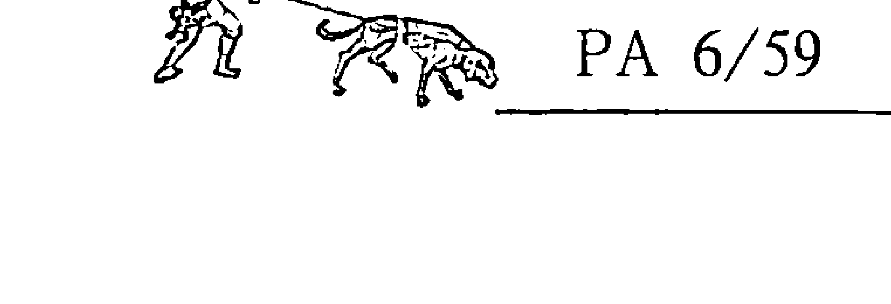

西方的传奇故事中的英雄经常要面临恶魔和怪物的威胁，但是只有很少人敢于挑战这些中最危险的怪物——喷火的巨龙。在很多故事里，与巨龙相持不仅意味着一次挑战，还是一个英雄想要证明自己、获得伟大称号的最终步骤。因此，哈利·波特在追求成功的道路上遭遇了匈牙利巨龙，这真是一项巨大的挑战。

几乎在世界各地的神话传说或民间故事中都能找到对龙的描写。在西方，它出现在巴比伦、埃及、希腊、罗马、德国、斯堪的纳维亚和英国诸岛的早期文学作品中。与巨龙战斗过的英雄数不胜数。希腊和罗马神话中的英雄赫拉克勒斯曾经杀死过好几条龙，其中最著名的是有9个脑袋，能够喷射毒液的法德拉龙（Hfydra）。很多巴比伦武士和特莫耶（Tiamat）龙交过手。这条龙被人称为“黑暗世界的女王”，它长着狮子的脑袋和前腿、老鹰的后腿，还长有翅膀，浑身的鳞片足以抵御各种武器的袭击。挪威神话中的雷神死于“人间巨蟒”的毒液之下。传说这条巨龙能够绕地球一圈，雷神还没来得及对它展开进攻就已经被它制服了。英语文学中的第一个英雄波乌夫（Beowulf）也在杀死龙的时候牺牲了。另外，中世纪的骑士还把寻找巨龙当作一项消遣娱乐。

虽然故事各不相同，但是其中对巨龙的描述大致类似：首先它的样子被说成是一种巨蟒（希腊语“龙”的意思就是“大蟒蛇”）。大多数龙都有刀枪不入的鳞片作为盔甲，还长着其他动物的腿和一对翅膀。很多都有楔形的头和长长的毒牙，有些还长着两只犄角，有巨大的爪子和叉子一样有刺的尾巴。威尔士传说中的巨龙一般是红色的，德国龙是白的，其他的则或灰或黄。

几乎所有的龙都有一个共同点：它们可以通过呼吸喷火，并可以随心所欲地释放出数不尽的火球。这对于勇敢的骑士来说并不是什么好事。因为据说这样的火球能够毁灭一个国家。如果一个足够勇敢、聪明的英雄躲过了火焰的攻击杀死了巨龙，并不等于已脱离危险了，因为接触到了龙的血液据说也会死的。龙牙如果被种植在地上，收获的会是全副武装、饮血的战士（今天的英语中我们说“播种龙牙”指的就是挑起战争）。

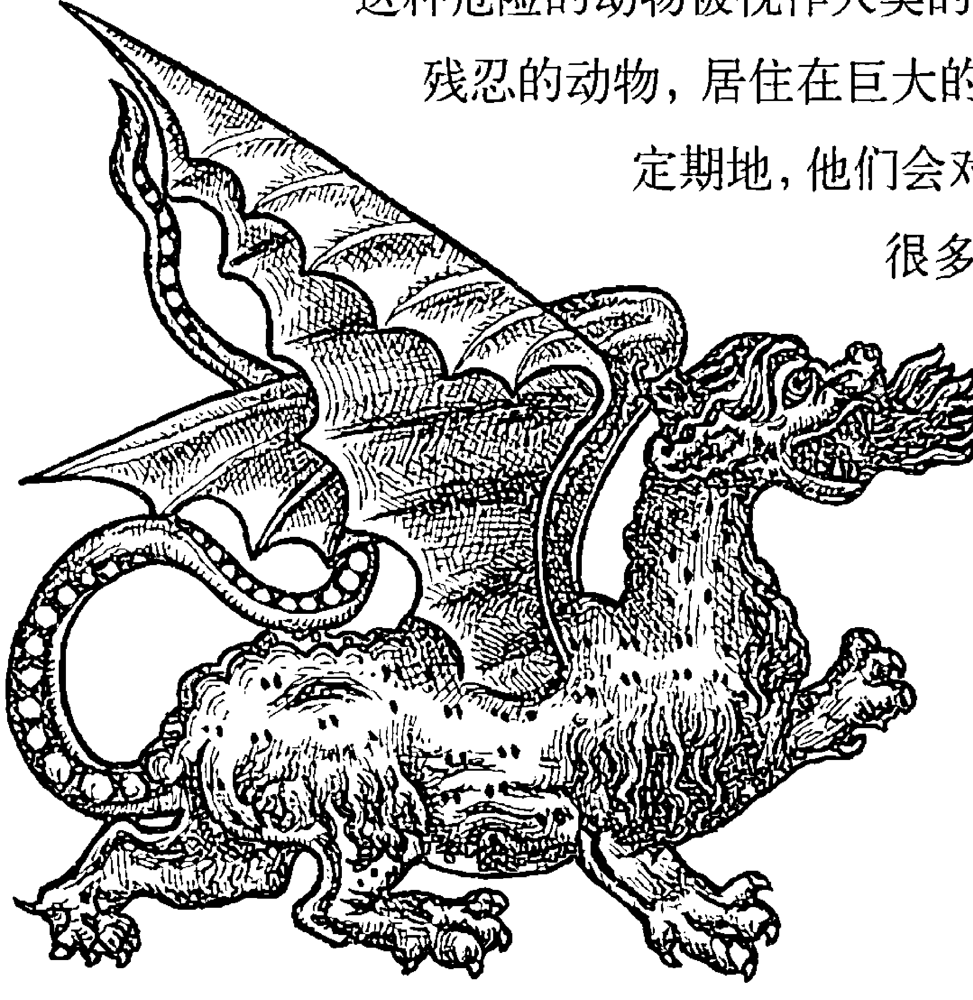

这种危险的动物被视作人类的威胁。人们认为龙是狡诈、残暴和残忍的动物，居住在巨大的洞穴或火山口以及湖泊或海洋中。定期地，他们会对人或动物发起攻击，饱餐一顿。在很多神话里，为了一顿午餐，龙会绑架一名少女，但有时只是为了找她做伴。虽然它们并不需要钱，但是龙还是以贪婪出名。它们喜欢储藏金银和其他宝藏（海里的龙则喜欢珍珠）。人们认为龙对自己的财产了如指掌，如果有人动了它的东西，哪怕只是一枚硬币，它也会进行疯狂地报复。

到了中世纪，龙开始与《圣经》中把人类从伊甸园中驱逐出来的蛇联系起来。在很多文学作品或艺术中，它被描述成罪恶、狡诈和魔鬼的代表，有些时候甚至恶魔撒旦也被画成龙的样子。所以，经典的骑士与龙之间的搏斗就被认为代表了善与恶之间的较量。很多基督教中的圣徒都曾与龙交手，其中最著名的要算圣·乔治。

据说当他在利比亚希莲那地区旅行的时候，听说了在当地湖里生活着的一条巨龙。像很多同类一样，这条龙也喜欢吃少女。它不许镇上的人使用这个湖泊里的水，除非人们每天能向它贡献一名少女。因为这是他们惟一的淡水来源，于是，当整个军队在与龙作战而全军覆没的时候，镇上的人没有办法，只好把当地剩下的惟一一名少女——国王的女儿送给龙。就在这个时候，圣·乔治主动提出要与龙作战，而且只用了一枪就干净利落地把它结果了。

圣·乔治的成功使他获得了大家的尊敬，14 世纪时圣·乔治还成为了英国的守护神。龙后来被赋予了骑士精神和浪漫秉性。在文学作品中，骑士只有在杀死巨龙并从它手中解救一名美丽的少女之后才会被认为是真正的英雄。在亚瑟王传奇中，圆桌骑士兰斯洛特和特里斯坦经常被认为是最勇敢的两位骑士，他们就曾经杀死过巨龙。传统认为正是这些勇敢的骑士，这些希望用杀死巨龙来证明自己对基督教忠诚的人最终导致了龙的灭亡。

## 东方的龙

如果龙从欧洲飞到中国或日本的话，它会发现巨大的文化差异。在东方，它不仅不会受到众人的厌恶，也不会遭到攻击，相反，它还会受到欢迎。因为在这里，龙被看作是善良的动物，代表着幸运。

与西方的龙不同，东方的龙不喷火也没有翅膀，但是它们仍然能够飞翔。传统的东方龙有鹿的犄角、骆驼的头、蛇的脖子、鹰的爪子、牛的耳朵，脸上还有长长的胡须。在中国的神话故事里，龙是守护天空的神，它们负责降雨，还控制着河流和湖泊。在日本，龙被认为是善良、聪明、乐于助人的。它作为皇室象征已经有很多个世纪了。

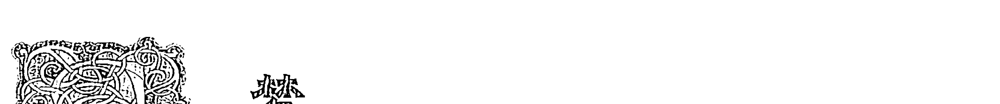

## 有

些人记不住自己做的梦，但对哈利·波特来说，这从不是个问题。无论以前他在女贞路的阁楼里还是在弗兰妮教授的课堂上，他都做过梦，睡醒之后对梦境也做了思考。因为梦境仍然鲜活得可怕，有些似乎预示了未来，有些则是一些恐怖的片刻，这样的恶梦是很难令人忘怀的。

从《圣经》到印度史诗，早期的著作表明人类经常被自己的梦境所吸引。在古代，大家相信梦包含了重要的信息，预示着做梦者的未来以及他的家庭或村庄的情况。国王的梦境还能说明他国家的事。有些时候梦里传达的信息是非常明确的，就像哈利做的很多恶梦一样。但是有些时候，梦境的含义非常模糊晦涩，这就需要一位释梦人的帮助。

释梦是占卜的一种最古老的方式。在古代，释梦是一种专门的职业，通常由牧师或女祭司或专业的释梦人来完成。他们的工作就是倾听别人描述的梦境然后加以解释，看看应该采取何种行动。释梦学很早就出现在各种文学作品中了。公元前7世纪的石板上就用楔形文字记录了古代亚述国国王吉尔伽美什的传奇故事。在古埃及，释梦者被人称为“魔法图书馆中的博学家”，他们居住在寺庙里，这里还供奉着梦之神萨拉皮斯。

不仅释梦讲究特殊的地点，做梦也讲究在特别的地方。很多人希望获得的解决问题的方法有时在他们工作的时候得不到，反倒是当他们睡下以后，神会悄悄把这样的方法送入他们的梦境。为了能够获得这样有价值的梦，古代的埃及人会睡在斯芬克斯雕像的阴影里，或睡在梦之神萨拉皮斯的神庙里。如果想要做梦的人做不了，他可以雇用一名代理人帮助他在寺庙里睡觉，然后以主人的名义做梦！同样的，身体不好要寻求解药的古希腊人会到供奉药神阿斯克勒庇俄斯的神庙里，希望在梦境里诊断出自己所患的疾病并获得治疗方法。在中世纪的日本，朝圣者可以在梦的神龛中待上100多天，其间要遵循严格的禁食和祈祷习惯，以便能够做上具有启迪意义的梦。

在有了释梦学丛书之后，解释人的梦境变得容易多了。最早的释梦指导丛书是希腊释梦家阿特米杜罗斯于公元2世纪写成的，书名叫《梦的解析》。它包含了100多种不同梦境的解释以及梦代表的象征意义。这本书千百年来一直是这个学科最重要的著作之一。

要的书，其中的有些解释到今天看起来仍然合情合理，例如：“所有在梦境中把东西切成两半的工具都意味着争论、斗争或伤害”。另外的一些解释，如梦到有翅膀的蚂蚁或梦到鹌鹑会带来厄运等，则属于当时的迷信。

释梦学的地位自古以来起起落落，因为总有人对此持怀疑态度，最著名的怀疑者就是哲学家亚里士多德。他坚定地认为即便梦能变成现实，也是偶然的巧合。当古罗马的很多市民都在忙不迭地购买护身符、魔药或是把自己的梦讲给占卜者听的时候，雄辩家西塞罗抱怨说用梦占卜根本就是迷信的无稽之谈，这只能导致公众的“低能”。但是，历史上仍然不断有人宣称梦能够变成现实，就像哈利·波特做的梦那样，或者梦境能够反映出做梦人在真实生活中得不到的信息。实际上，那些传奇性的魔法师和萨满教巫师的特点之一就是他们能够看到别处正在发生什么，不论是在睡梦里，还是陷入精神恍惚的状态中，或者通过凝视水晶球。

无论梦是否能反映未来；能否让我们到远方旅行；能否让我们偷听到朋友或敌人的谈话，梦总是有它自身的价值的。很多名人都发现梦是他们灵感的源泉，为他们提供了解决问题的答案。就像作家玛丽·雪莱在写作《科学怪人》的时候宣称的那样，弗兰肯斯泰博士（发明科学怪人的人）和那个怪物都是通过梦境启发玛丽动手写作这个故事的。小说家布赖恩·斯多克说，他笔下著名的吸血鬼康特·德库拉（Count Dracula）也是通过做梦获得的灵感。而19世纪的俄国化学家门得列夫（Dmitri Mendeleyev）在对化学元素进行分类的时候曾遇到了困难。后来他说：

> > “我在做梦的时候看到所有的化学元素都排列在了一张表里。”

当他醒来以后，就发明了今天每个学习化学的学生都知道的化学元素周期表。

当代的很多思想家如卡尔·荣和弗洛伊德都认为梦的意义并不在于它能向我们透露多少外面的世界，而在于它能向我们展示我们的内心世界。弗洛伊德相信梦代表了我们内心深处的愿望。而荣则认为在我们梦里的那些或奇妙、或恐怖，或对我们有帮助的东西实际上都是我们意识的反映。无论如何，你不需要是一名专业的释梦师，同样可以知道，与魔法世界一样，梦的世界也是独一无二的，这里任何事都可能发生。我们在这里可能会看到令我们头晕目眩的美丽景色，也可能历经巨大的恐怖。在梦中我们能够飞翔，能够在空中盘旋，能够拥有超人的力量，就像斯奈普博士最有效的魔幻药那样，我们在梦里也能变成任何我们想要变成的东西。这也许就是为什么当我们读到魔术，或是看到舞台表演的时候，我们会觉得非常熟悉，那是因为这些场面我们在梦中都已经历过了。

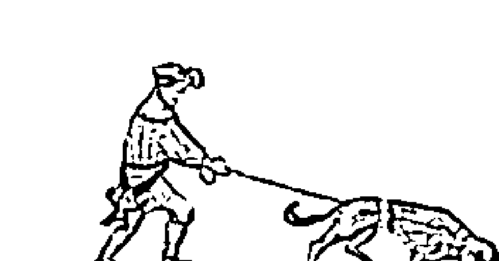

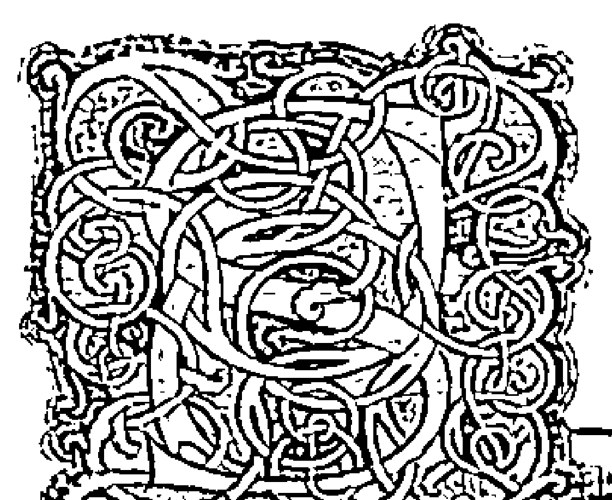

## 矮人

对于矮人来说，向十几岁的小魔法师弹奏情人节歌曲并不是他们经常做的工作。传说中这些蓄着胡子的小矮人一天里大部分的时间都花在地下劳作上。他们靠采矿为生，挖掘铁或稀有金属。因为他们为自己的勤奋而自豪，所以当他们被迫去派送情人节贺卡时才会像霍格沃茨的孩子们被迫吃不爱吃的东西那样，脸色沉郁，老大地不情愿吧。

在德国和斯堪的纳维亚的民间故事中，矮人是一种神奇的小人，他们保护着埋藏在地下的很多珍宝。虽然他们能够隐身，还能变成任何形状，但他们最常见的样子还是矮矮的个子、大脑袋、瘦削的脸、长长的灰白胡子和短短的腿脚。他们喜欢群居，居住在深山、洞穴或神秘的地下宫殿里。他们穿着褐色衣服，喜欢藏在岩石或灌木丛里面，当他们在地下的家里穿行的时候人们看不见他们。在有些宗教的神话故事里，这些矮人还不喜欢阳光，与巨怪一样，一遇到阳光他们就会变成石头。

矮人是天生的金属制造工。他们神奇的力量使他们能够找到贵重金属，具有艺术细胞的矮人会加工金银和时尚的首饰，人们认为他们加工的首饰比人类做的要精美得多。还有些矮人能够赋予金属武器神奇的力量。挪威雷神用的锤子就是矮人为他制造的。这种锤子扔出去的时候能够引起闪电，它还能自动回到主人手中。矮人也为北欧神话中最大的神欧丁神工作，挪威为他制造的长矛总是能够神奇地击中目标。

在德国的有些地方，矿工遇到过矮人。通常当他们在地下无意中打碎一面墙，就会看到矮人的工作坊或他们的宫殿。矮人们知道人类不是故意的，所以他们也不会介意。甚至有时候还会给矿工一些建议，告诉他们如何找到好的矿石。当矿里出现毒气或顶棚塌陷等危险的时候，矮人也会拉响警报。但是如果对这些矮人不够尊敬的话，他们也会人为制造一些灾难。如果一个黑心的矿工偷盗矮人的金子或首饰，他不仅将遭遇不幸，等到他回家打开包的时候，这些财宝也都会变成树叶。

因为他们的寿命长达几百年而且能够洞悉未来，人们认为矮人是非常聪明的。根据神话传说，有些德国城镇中的矮人会与人类分享他们的智慧。他们会给人提建议、讲故事、帮助做家务，以便在漫长寒冷的冬天换得温暖的居住环境。但是如果村子里的人对矮人的脚感到好奇，想探个究竟的话，矮人们就会离他们而去，因为他们的脚总是隐藏在长及地面的袍子里。人们都想知道矮人藏在什么地方，于是他们掸掉地面上的灰尘，试图发现矮人留下来的足迹，但是矮人们对些非常敏感，他们会生气，然后离开小镇，永远地回到自己地下的家里。我们听到有谣传说矮人的脚长得像鹅、乌鸦的脚，还有人说他们的脚与人类的一样，只不过是长反了。无论怎样，这些都是传闻而已。

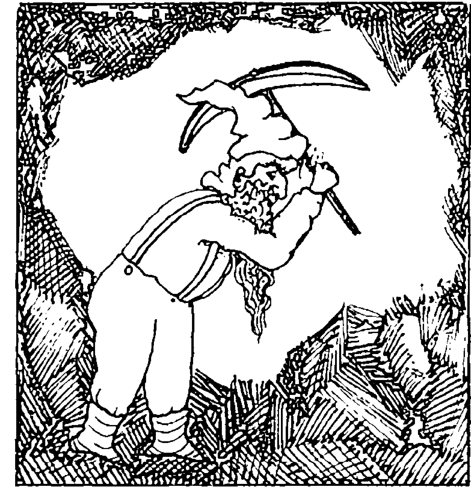

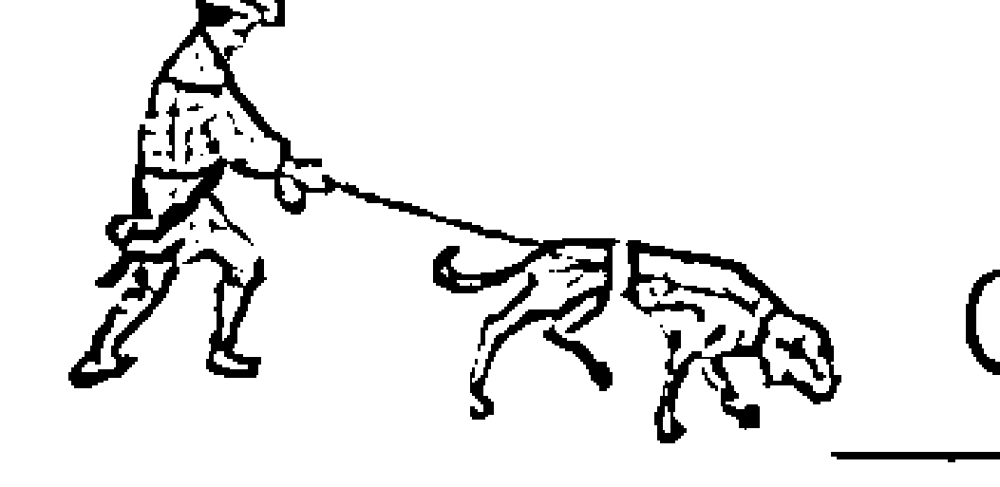

## 家养小精灵

有的时候让人发怒，有的时候带给人欢笑，家养小精灵多比是他那一族的典型代表。当哈利第一次看到多比身上除了茶叶什么都没穿的时候，他对多比的印象并不好。但是当佩妮姨妈的蛋糕被摔到地上，而厨房里却空无一人的时候，哈利马上明白了家养小精灵实际上是一种魔力很大，又很淘气的生物。

家养小精灵在很多国家的民间故事中都出现过。它们的形状和个头各不相同，但大多像人的缩小版，他们可以变形或者在一眨眼的功夫消失。有的精灵很小，可以在蘑菇底下睡觉，有的则大得被人误认为是人类。德国的黑精灵非常可怕，而丹麦精灵则以它们的美丽闻名。在英国民间传说中，男精灵通常被描述为瘦小干瘪的老人，女精灵则是金发可爱的少女。

所有国家的精灵都喜欢利用自己的魔力介入人类生活。虽然我们从未听说过像多比和他的朋友那样忠诚于主人、当做出与主人要求不符的举动会抽打自己作为惩罚的家养小精灵，但是很多精灵确实喜欢在房子周围活动，帮助做家务。在《制靴人和他的小精灵》这篇神话故事里，两个小精灵就来帮助一个贫穷、挨饿的制靴人制造精美的靴子。但是当制靴人和他的妻子为了表示感谢给每个小精灵留了一套新衣服后, 小精灵高兴得尖叫起来, 他们穿上新衣服走掉了, 就再也没有回来。

## 小精灵的新衣服

为什么一只旧袜子作为礼物就能让家养小精灵多比获得自由呢? 虽然我们不知道有关家养小精灵的全部规则, 但是我们知道家养精灵确实对新衣服会有强烈的反应。有些精灵, 就像制靴人家里的那两个, 看到漂亮的新衣服确实会由衷的高兴, 但是也有小精灵会觉得这样的礼物是在冒犯他们。但是无论怎样, 这两种方式得到的结果都一样, 就是他们会走掉, 再也不会回来了。

对这种奇特行为的解释各地都不相同:在英国的民间故事中, 家养小精灵被认为是自由的小妖, 他不喜欢受到世俗物品的牵绊。而在贝里克郡, 人们说给棕仙礼物他就会离开, 因为上帝指派他们为人服务, 他们只能工作, 没有报酬。在林肯郡, 则正好相反, 人们认为棕仙是一种自豪的生物, 当给予他们的礼物与他们的期望不符的时候他们就会离开。

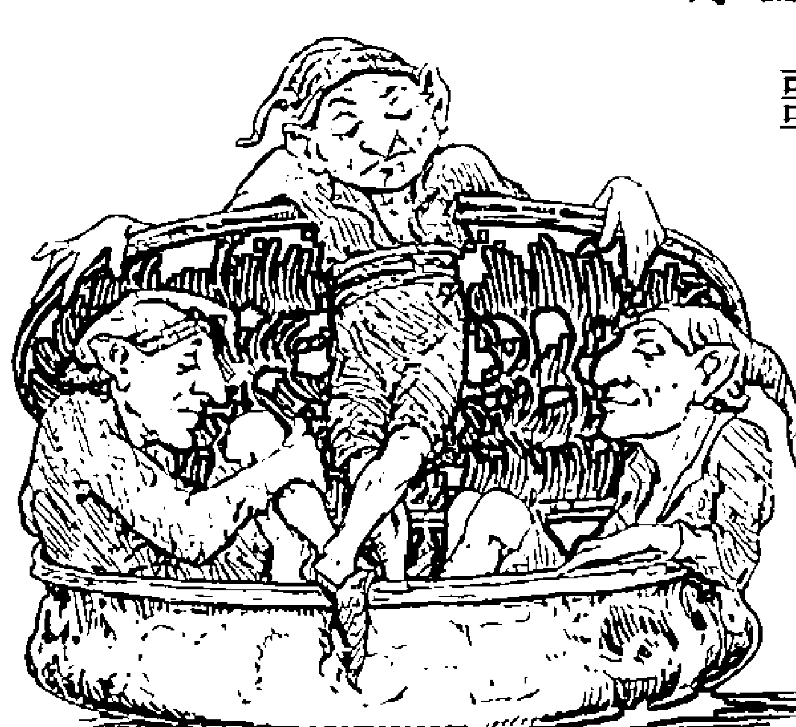

对于如此善良的小精灵, 他们这样的反应似乎很粗鲁, 但是这跟他们玩的鬼把戏比起来简直算不了什么。实际上, 很难发现有不喜欢玩鬼把戏的家养小精灵。在冰岛和德国的民间故事中, 精灵会偷去婴儿, 偷走家畜、食物, 让人做噩梦 (德语的“噩梦”一词就是“小精灵带来的压力”的意思)。他们还会对年轻人施魔法, 甚至一施就施很多年。著名的美国故事《里普·万·温克尔》中的主人公就因为被施了魔法, 沉睡了20年。

在英国, 邪恶小精灵造成疾病的数目是如此之多, 以至于产生了很多形容他们恶毒行为的词汇。在中世纪, 人或动物突然死于某种神秘的疾病被人称作“遭到了精灵的射击”, 或者是“被精灵的箭射中了”。在乡村发现了箭头形状的石块就是这些袭击的证据, 人们称它们为“精灵之箭”, (现在我们知道这些是古石器时代的人留下的)。新生儿带有缺陷被人形容为“被精灵做了标记”。如果有人瘫痪或者中风, 则叫“被精灵算计了”。甚至头发乱了也认为是精灵捣的鬼, 人们认为精灵会把顺滑的头发打上结, 这叫“精灵之锁”。

# 小仙女

经常在教室里捣乱的小精灵、在魁地奇杯赛的时候下金子雨的小精灵，以及在霍格沃茨魔法学校的厨房里服务的小精灵，它们都属于同一个家族，这就是仙女家族。人们通常把它们叫做“小人”，或“好人”、“好邻居”等。仙女家族是个庞大的国际家族，它们这些神奇的精灵很少能被人们看见。虽然英国的小精灵最出名，但是它们出现在世界各地的民间故事中。从瑞典、伊朗到中国，不一而足。

## 牙仙女

牙仙女可谓最出名、最可爱的小仙女。在美国、英国部分地区和加拿大、西班牙，人们认为她会在小孩子的枕头下面留下钱财和礼物；当然，她们也会拿走孩子们换下来的乳牙作为回报。 虽然牙仙女的故事在20世纪初才开始出现（没有人知道她是从什么地方开始的），但是用牙做交易的故事却有着悠久的历史。1000多年前，斯堪的纳维亚的孩子们会得到“牙费”，这是他们用换下的第一颗乳牙作为交换而得到的礼物。随着孩子们长了第一颗牙，牙仙女的继任者牙老鼠开始发挥作用。9、10世纪欧洲的孩子们很喜欢牙老鼠，他们把自己换下的乳牙藏在老鼠洞、厨房的壁橱等老鼠容易发现的地方。如果他们的牙被牙老鼠拿走了，这些幸运的孩子不仅会得到糖果或硬币的奖励，而且他们新长出来的牙也会像老鼠那样锋利。

我们很多人都是从当代的儿童故事中熟悉小仙女的。她们通常都是美丽、小巧的人，有一颗善良、慷慨的心。在过去的世纪里，对仙女的定义要广得多。她们可大可小，有的可恶，有的可爱，有的很吓人，有的则很有趣，有美丽的也有丑陋的。从生活在苏格兰边境上邪恶杀人的红帽魔到灰姑娘善良的仙女教母，各式各样。

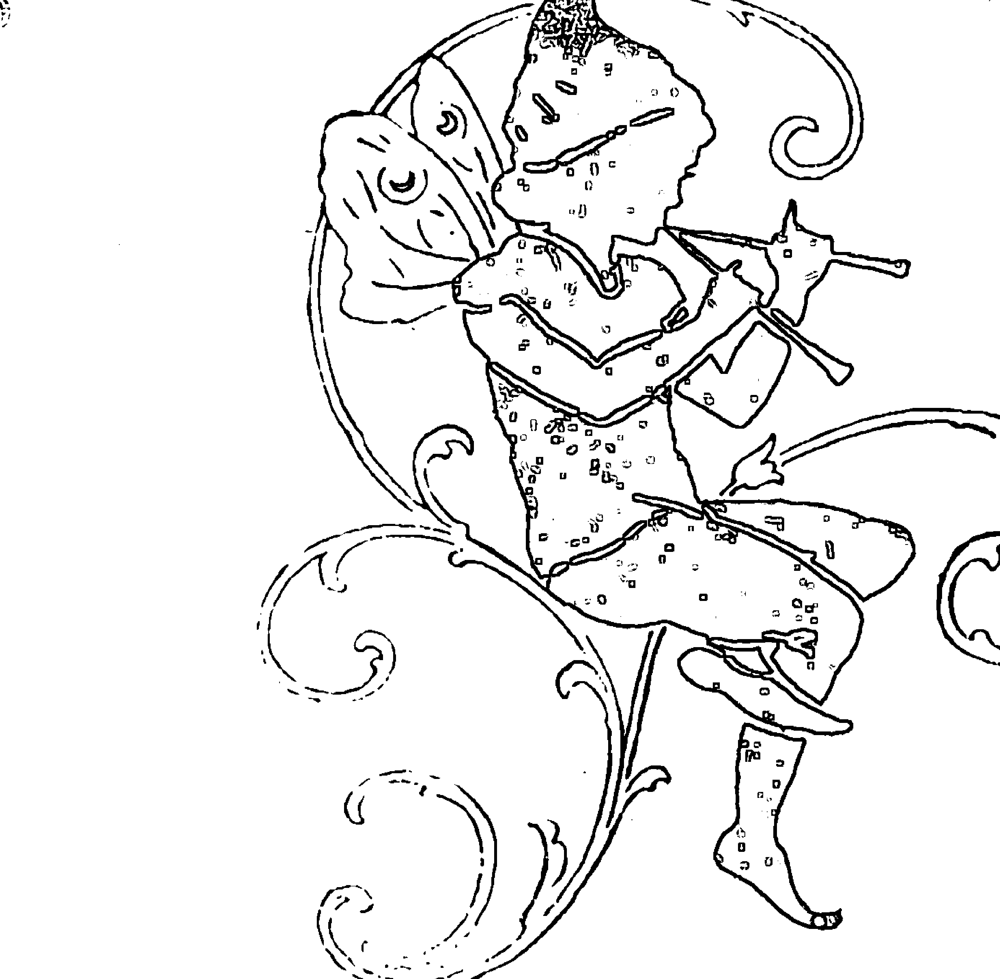

“仙女”一词来自拉丁语的“fata”或“fate“，意思是神话中的命运三女神。这3个女神控制着人类从出生到死亡的命运。与命运女神类似，仙女也会改变人的命运，会给沮丧的人带来安慰，也能带给人许多的痛苦和不幸。在中世纪的时候，人们把很多身体疾病归咎于仙女的所作所为，认为她们能造成皮疹、肺结核、瘀伤、抽筋等。风湿病造成的伤痛被认为是隐身的、生气的小仙女在掐病人的手指，而那些心脏病、瘫痪病人则被认为是中了“精灵的箭”，因为它们的症状就好像被精灵用弓箭射伤了一样。母亲永远也不要把新生儿留在家里无人照看，因为精灵会偷偷换走她们的婴儿，用自己蠢傻丑陋的婴儿代替。

在16世纪中期，对仙女的恐惧被对女巫的恐惧所代替。对于仙女，大家的印象是她们或者爱开玩笑，像哼即砰（一种仿佛是烟雾凝成的单腿生物）那样爱搞恶作剧的精灵，或者是善良有爱心，有想像力的生物，对人类很友好。关于仙女的知识非常多，形式也各不相同。人们认为穿着美丽的蓝色、绿色、金色衣服的小精灵的王国在树林里，她们的模样像最美丽的人类，但是她们也可以变成动物或者干脆隐身不见。她们都非常喜欢音乐，在月光下、在蘑菇和草丛里跳舞，身边还有笛声和竖琴伴奏。人们说有些苏格兰老歌实际上就是仙女的歌曲。人类的乐师听到这些动人的乐曲，被引诱进入了仙女王国才学会了这些歌。当人类进入仙女的世界时通常会忘记时间，所以当他们沉浸其中的时候不知不觉时间就转瞬即逝了。但是那些特意要寻找仙境的人往往空手而归，因为在古代的传奇中，人们相信仙境只能被偶然发现，是一种可遇而不可求的经历。

不是所有的仙女都能安于她们田园牧歌般闲适的生活。很多民间故事都讲到在人类家里的精灵如棕仙、家养小精灵等。他们喜欢与人类住在一起，他们喜欢帮助人类做家务活，作为回报他们会在晚上得到一碗牛奶或一块蛋糕。如果你跟这些小精灵住在一起的话，你需要知道一些有关他们的礼节。因为如果你的壁炉很脏，或者你想为他们提供的帮助付钱，他们就会觉得受到了冒犯，对此，他们会表现出他们的不满，例如不再倒垃圾，把盘子打碎，或者让牛不停地哞哞叫，不过比较起来，忍受他们这些坏脾气还是值得的，因为，有他们这样的好帮手并不容易。

## 仙女的照片

1918年7月，两个来自英国偏僻的卡丁利郡的年轻女孩拍下了仙女的第一张照片，她们是16岁的埃里斯·怀特和她的堂姐弗朗西斯·格里菲斯，照片中堂姐正与一些小巧、带翅膀的小人一同坐在森林里。埃里斯的父亲冲洗的底片，但他不相信仙女的传说，所以告诉女孩这只不过是舞台场景而已。但是女孩子们坚持说她们已经见过好几次仙女了。一个月后，她们有了第二张照片，这次埃里斯是和土地神侏儒坐在一起。

埃里斯的爸爸仍然持怀疑态度，但是她妈妈给一位朋友看了照片，碰巧那位朋友对超自然的事非常感兴趣。于是，这个故事很快传开了，后来引起了当时的大作家柯南·道尔的注意，柯南·道尔即神探“福尔摩斯”的作者，他被仙女可能是真的的想法迷住了，他与其他对此感兴趣的人一同咨询了各方面的专家，一同寻找这张照片是不是假冒的，虽然有人指出这些仙女的发型太现代了，但是没有人有证据说明照片是假的。1919年9月，柯南·道尔在《潮流》杂志发表了一篇题为“仙女被拍下来了——一次新纪元性事件”的文章。这在相信仙女的人中间引起了轰动，同时，怀疑者的批评声也越来越大。到了1920年，这两个女孩又拍了几张仙女照片，这掀起了新一轮的热潮。对于卡丁利郡仙女真实性的争论持续了几十年，直到20世纪80年代早期，弗朗西斯和埃里斯才承认她们在照相的时候做了假，她们先在纸上画了仙女然后用曲别针把她们钉在树杈上。弗朗西斯还记得当看到真有人相信她们的故事的时候，自己有多么惊讶。她说，在照片上甚至还能看见曲别针，但不知何故从没有人注意到它。


弗朗西斯·格里菲斯和她的仙女朋友们。这幅照片是由埃里斯·怀特于1918年拍摄的，直到20世纪80年代，她们两人才承认这张照片是假的。

## 仙女戒指

很久以来，人们都相信仙女们会在狂欢过后的地方留下痕迹。根据英国民间传说，当仙女在某处舞蹈之后，早上，这里就会出现一圈明亮的用绿色的草编成的圆圈状痕迹，这被人们称为“仙女戒指”。如果站在戒指的中心，在月圆的时候，许下的心愿就能保证实现。但是千万要记住，在仙女仍然在狂欢的时候，千万不要走到“仙女戒指”里去，不然的话你就会被强迫一直跳舞，直到跳到筋疲力尽。唯一的解脱方法就是让一个朋友一脚站在戒指圈的外面，然后伸手进去把你拉出来。在欧洲和北美，确实存在着神秘的草圈，这通常发生在下过大雨之后。这些圈的直径可以是几英寸也可以绵延200英尺。但是科学家们坚持认为，造成这种现象的原因是一种名叫“巴斯度姆塞特”的青草而非什么仙女。

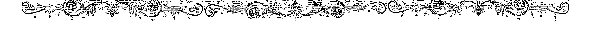

# 飞灵

每次当哈利·波特进入禁林的时候，他都会觉得恐惧。当然，他这么觉得是对的，因为他和他的同学被重复告知在黑暗的树林中蕴涵着巨大的危险和诱惑。就像我们最喜欢的童话故事里面的森林中总是隐藏着女巫、魔鬼、小妖精和巨人那样，霍格沃茨魔法学校旁边的禁林中也同样生活着这些怪物。这里让人觉得兴奋、害怕是因为你永远不知道在下一棵树的后面究竟隐藏着什么样的诱惑。禁林中永远隐藏着危险，我们可能走失其间，也可能遇到邪恶的陌生人或者遭遇危险。

## 幽灵

你是不是对幽灵究竟是从哪里来的感到好奇呢？或者对为什么有些幽灵，就像宾斯教授或哭泣的桃金娘那样会四处游荡，而其他一些幽灵则安静地躺在墓穴里。在每种文化、宗教、文学或民间故事中，幽灵和有关幽灵的故事一直都扮演着重要的角色。

幽灵的形状有很多种，最基本的也是全球通行的鬼都是幻影，没有身体实质的幽灵。有些幽灵则以苍白的水蒸气的形象出现。但是也有很多与正常人没有什么不同，看起来就像有血有肉的普通人。欧洲的民间故事中就有很多这样的与人没有什么两样的鬼魂出现，他们也吃东西、喝酒，有着人的绝大多数共性。他们的所谓“鬼性”只体现在他们能够在空气中消失，或者会留下腐臭的气味。

在古希腊和古罗马，亡灵经常以黑影子的形象出现。他们穿着奇怪的黑衣服，或者干脆隐形，在暗处搞恶作剧。古代的埃及人相信鬼魂能够回到自己已经死去的尸体身上，很多文化中也相信鬼魂可以变成魔鬼、动物甚至植物。

无论东方还是西方，在很多古代社会，大家都习惯成自然地认为幽灵是一种非常自然真实的现象。很多地方还有举办节日以便与死者保持良好的关系的文化。也许最奇怪的古代节日应该算古罗马每年春天的驱亡魂节了。在这个节日里，罗马的私房屋主会在半夜起来然后在他们的起居室走路，并在他们的身后洒上黑色大豆。“有了这些豆子，”讲话的人拖长嗓音认真地说，“我就能赎回我自己和我的家庭。”他们会在屋里转圈，跟着这些豆子的痕迹转九圈，以便鬼魂有足够的时间收集这些贡品。然后房屋的主人会举行一个仪式，同时吹响一个沉重的乐器，并喊道：“我的祖先的幽灵哇，请你离开吧！”直到他们相信所有的鬼都离开，仪式才会结束。

就像这个仪式说明人们印象里的鬼还是很友好的一样，古代的鬼大部分都不让人害怕。但是今天，很多鬼故事里都把鬼描述成了令人害怕的、非自然的生物。它们只会在死人的精神不得安宁的时候出现，这些幽灵之所以在外面游荡也可能是因为它们心神不安，死后得不到安息。在查尔斯·狄更斯的小说《圣诞欢歌》中就有一名这样的幽灵，它之所以得不到安息是因为在生前犯下了罪行，它命中注定要在人间出没。还有些幽灵因为遭遇横祸或暴力致死，它们会在人类的世界中游荡。英国达拉谟郡的碧牧诗山就是这样一个幽灵出没的地方。这里的幽灵是躲在箱子里面窒息而死的年轻女郎。故事中这个女郎因为逃避婚姻才躲到箱子里。我们现在也只能希望她的未婚夫真的像她想像得那么坏吧，不然她岂不是死得太冤了吗？

霍格沃茨的幽灵明显也都是遭遇横祸的产物。没有头的尼克惨死的故事实际上是受到14世纪的兰卡斯特伯爵事件的启发。传说中被斩首的兰卡斯特伯爵在英国丹斯坦博格宫四处游荡，就是为了寻找他被砍下的头颅。当时一个没有经验的刽子手砍了11斧头才把他的头从身体上砍下来，当时即便是最勇敢的武士看到这个场面也受不了会昏过去的。一旦鬼魂被放出来在人类的世界中游荡，他们通常会在墓地或房子周围游荡，直到他们报了仇或精神得到了解脱。最普遍的摆脱鬼魂纠缠的方法就是雇用一个专业的驱魔师，或“鬼魂招魂者”。但是如果你在十字路口埋葬鬼魂的尸骨，有的时候他们也会自动消失。因为鬼魂以不能辨别方向著称，因此在路标上做一些手脚就够它们受的，它们可能会因此永远地迷失方向。如果这些方法都行不通，慢慢你也能够习惯跟鬼魂相处，因为还有很多比这更可怕的事呢。

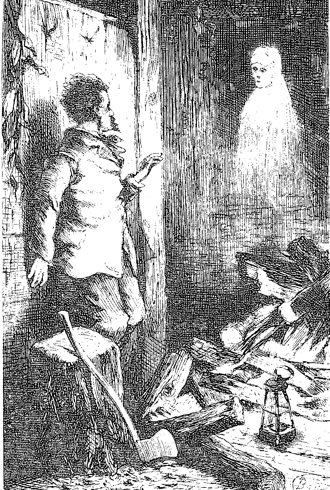

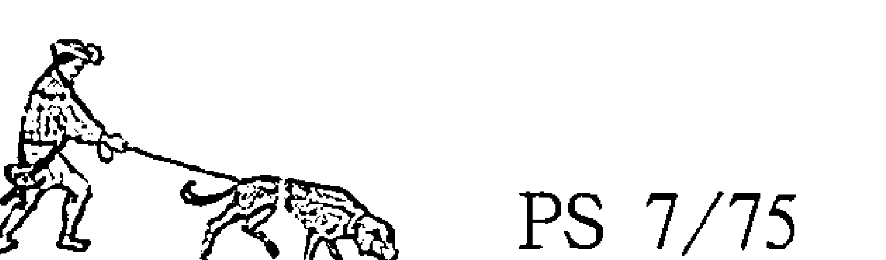

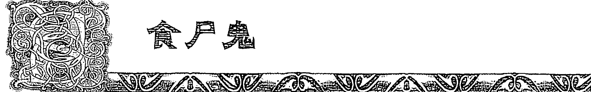

## 食尸鬼

那些喜欢闻恶臭气味的人，陶醉于恶心的东西的人被人们叫做：有着“食尸鬼”似的品位。这是因为食尸鬼以挖掘尸体和吃腐烂的人肉著称。知道这些我们不禁想像为什么食尸鬼会选择在韦斯莱的阁楼出没？难道那里藏了什么它们感兴趣的东西吗？

虽然食尸鬼产生于西方的民间故事中，但它真正复活还是在古代阿拉伯的穆斯林世界里。在那里，它们属于邪恶反叛的精灵，主要居住在沙漠里。有的时候它们也会在坟墓、旷野或有人刚刚死去的地方游荡。在北非、中东和印度，大家都非常害怕食尸者和它们的同类，因为它们会吃掉见到的任何尸体，并杀死有生命的东西。如果它们自己不进行杀戮的话，在吃的时候它们可能还会不高兴。

没有人能够精确地定义食尸鬼。有的神话故事说它看起来像一头骆驼、公牛、马或一只眼的鸵鸟，还有人说它眼睛上覆盖着浓密毛发等等。其实，长得什么样子并不重要，因为它会变形成各种东西，可以用巧妙的伪装吸引人们的注意。有时候它会乔扮成孤独的旅行者，欺骗别人说它知道一条捷径，这样就会把真正的旅行者引入歧途，带入沙漠，然后就能很容易地把他们杀死、吃掉。食尸鬼最喜欢的把戏是变成美丽的女人，这也是吸引好奇的男人的最好方法。真正聪明的旅行者知道如何找出食尸鬼无法掩饰的地方，从而保护自己不受他们的威胁，这个缺陷就是食尸鬼的脚。不管食尸鬼变成什么形状，它的脚只能是山羊、骆驼或猴子的脚。不幸的是，当一个受害者跟食尸鬼足够接近，能够看出它身体缺陷的时候，食尸鬼早已准备好把他撕碎吃掉了。如果旅行者想杀死食尸鬼，惟一的方法就是在出其不意的时候对它猛然一击。只有第一次进攻并把它杀死才能成功，否则如果是第二次，只会使食尸鬼复活，变得更加贪婪。而且，没有哪个食尸鬼愿意自己的晚餐被打断。

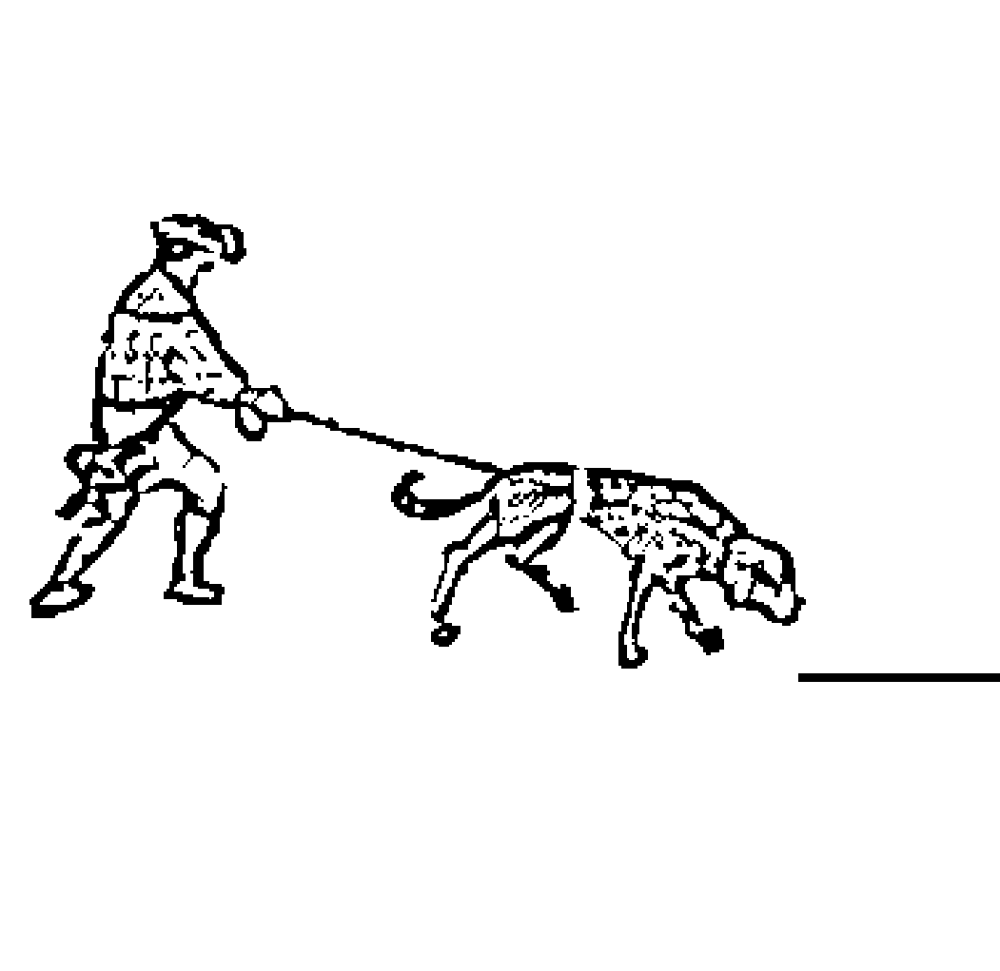

CS 3/17

## 巨人

祖辈如果没有好声誉是件丢人的事，显然这就是为什么马克西姆夫人坚持说她不是巨人，而只不过是“骨架子”比较大罢了的原因。很久以来，人们都认为巨人是四肢发达头脑简单的物种。而且就像海格发现的那样，人们对巨人都没有那么耐心。

巨人出现在最早期的神话故事里，甚至比神的出现还要早。古希腊神话中的提坦巨人高大得像山一样，而且非常强壮。它们是天与地结合的产物，非常丑陋，面部多毛，脚上覆满鳞片，有时候还会是多头的怪物。为了争夺统治权，提坦巨人和奥林匹斯山上的众神展开了激烈的争夺，后来差点毁灭了整个宇宙。在赫拉克勒斯这个万神之王宙斯之儿子的帮助下，希腊众神才取得胜利，他们杀死或关押了全部提坦巨人。

巨人在挪威神话中的地位也很重要。他们被叫做“森林巨人”，受邪恶的大神特瑞姆的领导。森林巨人是雷神和其他正义的神的敌人。在凯尔特传奇故事中，叫做“夫墨雷恩”的巨人被认为是爱尔兰这片土地上最早的居民。在有些传说中，人们也把巨人与一切恶劣的天气想像结合在一起，如冬天、雾、暴风雨、疾病或庄稼收成不好等等。在《圣经·旧约》中也提到过巨人，认为他们是堕落天使和人类结合而生的孩子。但是，圣经中的巨人不像神话中描述得那么大。圣经中最著名的巨人是被大卫用弹弓杀死的巨人戈利亚，但他也不过9.5英尺高。

巨人在英国民间故事中也有其特殊的位置，英国蒙默思郡作家杰弗里在《英国国王历史》一书中（这本书讲述的并不是真正的历史，而是有关英国起源的野史和传奇故事）讲述了一种高达12英尺的巨人，他们可以很轻松地连根拔起橡树，就像摘去花园中的种子一样。根据杰弗里的说法，这些统治着英国的巨人后来被传说中的英国建立者——特洛伊战争英雄埃涅伊特的子孙打败。

在中世纪时期，巨人也是具有侠义精神的武士的征服对象，杀死巨人能够为他们的探险旅途增辉。在亚瑟王传奇和其他史诗故事中，巨人代表着一切世界上邪恶的东西：他们嗜杀成性、贪婪、暴食、残忍。他们绑架女人，盗窃他们的邻居，屠杀小孩，有的时候甚至吃人。因此，能够杀死巨人也是光荣和善良美德的体现。在英国作家托马斯·马洛礼1485年出版的名著《亚瑟王之死》一书中，亚瑟王圆桌武士中的第一位勇士兰斯洛特在很年轻的时候就表现出了他的英勇。他杀死了一对残暴的巨人，解救了被巨人奴役了7年的3名少女。另一名骑士马图斯也曾经因为杀死了巨人泰罗德、解救了被他关押的不下24名少女和12名骑士而赢得了同辈的尊敬与感激。亚瑟王自己更是最杰出的巨人杀手，杀死了巨人圣米歇尔，这个巨人曾经吃掉了15个国王，穿着用这些国王的胡须装饰的大衣。

骑士时期结束之后，巨人仍然长时间占据着人们的想像。在18世纪和19世纪，巨人寻找普通女人做妻子的故事成为了欧洲神话的永恒主题。其中最出名的应当算那个有勇无谋的“杰克”了。在《巨人杀手杰克》这本出版于19世纪但是讲述的仍是亚瑟王时代的故事书中，杰克是一个英国农民的儿子，以欺骗巨人为生。他手下的第一个牺牲品是一个18英尺高名为科米兰的巨人。这个巨人住在英国康沃尔郡附近，经常骚扰那里的居民，偷走、吞吃他们的牛羊狗等。因为巨人的出现，人们陷入了贫穷和饥饿的境地。杰克于是在地上挖了一个很深的大洞，再在上面铺上稻草和树枝，他把巨人引到这里，等到巨人掉下陷阱杰克再把它打死。与此类似，杰克制服了很多巨人，也为自己赢得了很多荣誉，包括一处大房子，还赢得了公爵女儿的芳心。在《杰克和豆茎》这个故事中，一个同名的杰克遭遇的巨人住在云端的城堡里。当杰克战战兢兢地躺在一旁的时候，巨人自言自语道：“fee, fi, fo, fum, 我闻到英国人的气味了。”后来这成为了英国著名的童谣（注：童谣的全文是：我闻到了英国人的血的味道了，不论它是活的还是死的，我都要把他的骨头碾碎做成面包）。

如果只有很少的巨人是邪恶的害群之马，那么肯定不会让大家对他们有如此根深蒂固的坏印象。所以我们也能理解为什么霍格沃茨的家长们担心自己孩子的老师有一半的巨人血统了。但是邓布利多教授似乎知道，仅仅根据一个人的外表判断一个人往往是不正确的。在很多当代的故事中，巨人已经不再是邪恶的代名词了，很多巨人是好人，他们对人类很友好，还能保护他们，特别是儿童。很多这样的巨人都是因为得了某种疾病才导致身材异常高大，所以他们会感到格外孤单、尴尬。

## 大骨头

古希腊和古罗马人怀疑世界上曾经出现过巨人并不是没有根据的。不仅在神话传说和文学作品中出现过他们的身影，在现实生活中他们也确实留下了遗骸和尸骨供我们研究。有些骨头被农夫从地下发掘出来，有些巨人的头骨、大腿骨、肩胛骨等随着洪水、地震也从地下来到我们的面前，这都说明这些巨人、英雄和怪兽等也许在远古时代都出现过。

今天我们知道这些化石是远古或史前哺乳动物尸骨的残骸，例如长颈鹿、猛犸象、穴居熊等，但是在古代人们并不了解这些，不知道这些尸骨的真实年代，所以他们错误地认为这些都是巨人的骨头。人们错误地把它们当作是那些传奇故事中的巨人死后留下的残骸。

古希腊和古罗马人都是狂热的化石收藏者。他们喜欢把收集的化石陈列在寺庙和其他公共建筑中。公元1世纪罗马帝国的皇帝凯撒大帝还曾经展示过他的私人收藏，其中就包括巨大的化石骨头和其他手工艺制品。找到的这些化石都被他们认为是巨人的残骸，有的被说成是吉里昂巨人，在神话中他是被大力士杀死的三体有翼怪物；还有的被人说成是传奇故事中的武士阿加斯和阿基里斯的尸骨，这两人都出现在特洛伊战争中。另外还有人把有些化石说成是巨人泰坦的残骸。

史前哺乳动物，例如猛犸象的化石被人看成人类的化石看起来好像匪夷所思，但是实际上这种把四条腿的野兽当作两条腿的人其实是有其内部原因的。除了尺寸的不同以外，实际上看起来非常相似。猛犸象的大腿骨和人的耻骨很像，只是猛犸象的要长3倍。两者的肩胛骨看起来也很类似。虽然头骨应该能够说明一切，但是头骨一是很难找到而且不像躯干或四肢的骨头那样能够保存很长时间，另外也是因为即便有头骨也能把它说成是某个怪物留下的骨头，反正传奇中的怪物不是长着好几个脑袋就是有很多条腿和尾巴。而且很多骨头都是在某个特定区域发现的，而当地正好有相关的巨人神话，这再一次验证了人们认为他们是巨人的遗骸的理论。但是实际上，今天的学者认为那些发源于某个地方的传奇故事，可能正是古代人的祖先也挖掘出同样的遗骸的结果。

在这些巨大的骨架被挖掘出土的基础上，古代人做出了这样的结论：“很明显”，罗马学者普林尼说：“我们人类是越长越小了。”

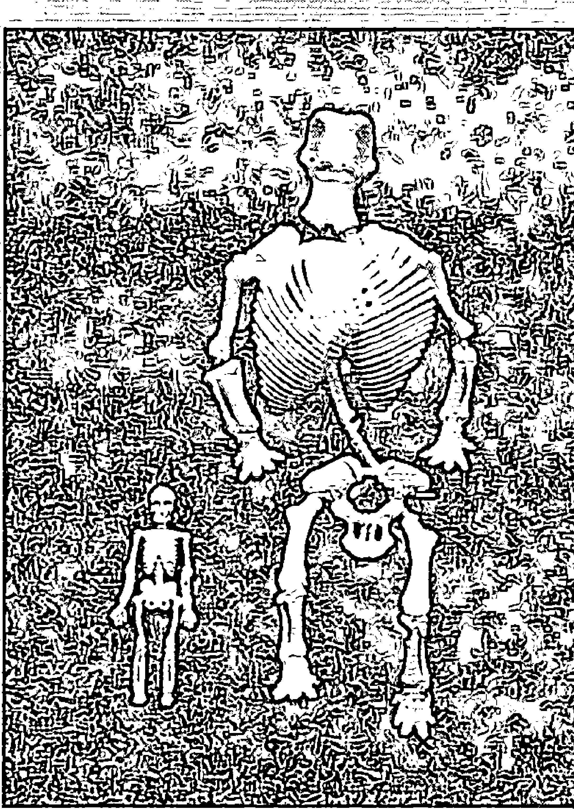

所能找到的猛犸象尸骨总是残缺不全或者是碎片。这幅图中，一位当代学者演示了古代人如何排列猛犸象的骨架以至于把它看成了“巨人”。

## 地精

现在，如果你想寻找地精，最好的地方就是到邻居家的花园去看看。在欧洲和美国，“花园地精”被做成可爱的塑胶小雕塑，它们都是留着长长胡须的老头子，戴着红色的高顶帽，经常用作户外的装饰。但是如果你的邻居恰好是魔法师的话，他们的地精可不是什么塑料雕像了，而是活生生的小精灵。实际上，访问过韦斯莱蔬菜园的人可能知道，地精就像其他花园入侵者一样，会发出吃吃的傻笑，必须轰走它们，笑声才会消失。

没有人知道地精是如何与花园联系到一起的。有些人认为，地精作为雕像，首先是摆在建筑的入口处起装饰作用的，后来才逐渐被个人和家庭所使用。另外一种可能是在民间传说中，地精总是与土地联系在一起的，因此后来引申为花园。在德国故事中，地精与矮人一样，都生活在地下。它们挖掘奇珍异石，看护宝藏。不用地道，它们就可以在地下随意穿行，就像鱼在水中游一样。人们认为它们很勤劳，心地善良，所以它们通常被描绘成老头子或者驼背人的样子。它们的皮肤与土地的颜色接近（灰色或棕色），所以它们很轻易地就能混同于周围环境。如果遇到惊吓，它们会遁入土地或树干中。虽然有很多故事都讲到地精实际上是喜欢户外生活的，但是有专家宣称地精遇到自然光还是会变成石头。如果真是这样的话，那我们在花园里摆放的那些小地精雕塑也许就是地精在太阳暴晒下的牺牲品吧！

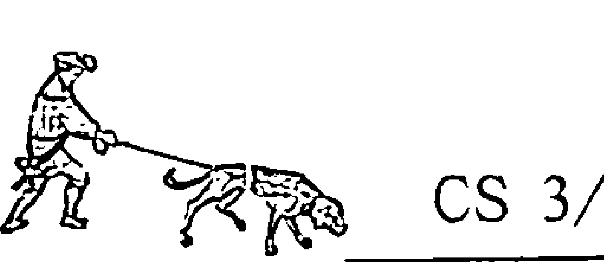

## 古灵阁

翻开字典你就会发现“古灵阁”的定义是：淘气、丑陋的魔鬼。但是如果我们看看掌管银行的那个聪明、效率高的古灵阁，就会发现这些淘气的小妖精并不总是那样不讨人喜欢。在中世纪的民间故事中，古灵阁经常被描述成淘气、友好、爱帮助别人的小精灵或者是家养精灵。就像苏格兰童话中的棕仙或法国、德国类似的小精灵，古灵阁也喜欢跟随一个人或一家人，住到他们的家里。它们特别喜欢荒芜、废弃的农舍或乡村房屋。虽然古灵阁大小各不相同，但是一般认为它们只有人类尺寸的一半大。它们有着灰色的胡须和头发，身体和面部的某些部位长得非常奇怪。它们可能长着多余的手指头或脚趾，没有耳朵，眼睑倒长或有四肢没有关节等。有些古灵阁说话的方式或声音也存在缺陷，有的口齿不清，有的则声音尖利。

如果好好对待它们，这些家养的古灵阁会很周到地保持家居清洁整齐。它们特别喜欢孩子，还会给表现好的孩子带礼物。但是最好别惹它们生气！一旦被激怒，古灵阁会疯狂进行报复。有些古灵阁最喜欢开的玩笑是偷盗金银、在夜里追逐马匹直到它们筋疲力尽，或者改换路标等。根据很多欧洲神话故事，古灵阁痛苦的微笑能够使人的血液凝固。它的笑声能使牛奶变酸，使水果从树上掉下来。摆脱家养古灵阁的惟一方法是在自己的地板上铺满亚麻籽，因为当古灵阁要调皮捣蛋的时候，它必须先把地上的亚麻籽捡起来，而这件事直到黄昏也许都做不完。持续做几个晚上这样的工作就会让它知难而退，转而去寻找别的人骚扰了。

哈利·波特世界中的古灵阁的身份不是银行家就是放债者，这与斯堪的纳维亚神话中的尼斯怪很类似。根据斯堪的纳维亚民间传说，这些丑陋的小矮人家族中的一员在处理钱财上本领很高。当尼斯怪生它主人的气的时候，它经常会袭击主人家里最值钱的家畜（如在农场杀死奶牛等）。如果它想奖励人类的话则会拿来一箱子金子。

直到17世纪，英格兰和苏格兰才掀起仇恨、反对巫术的风暴。人们也开始认为古灵阁是一派邪恶的黑暗势力。后来的英国故事把好的家养精灵和坏的家养精灵分开，分成坏古灵阁和“好伯古灵阁”两种，后一种多是友善、喜欢玩耍的。文学史上最著名的“好伯古灵阁”叫罗宾·戈德菲利，也称“淘气小精灵”，从15世纪以来，这个小精灵的形象在很多民间故事中出现。

罗宾作为一个友好、喜欢搞恶作剧的家养小精灵的形象已经深入人心。在有些故事中它也是仙王奥伯龙的小跟班。它能够变形（见变形术词条），也能实现人们的愿望。它用自己神奇的力量惩恶扬善。罗宾还曾经在莎士比亚的名著《仲夏夜之梦》中出现，它在几对被爱情迷惑得不知所措、迷失在丛林中的年轻恋人之间扮演了丘比特的形象。看到被它捉弄的这些可笑的人类，罗宾不禁感叹道：“神啊！看看这些傻瓜一样的人类吧！”

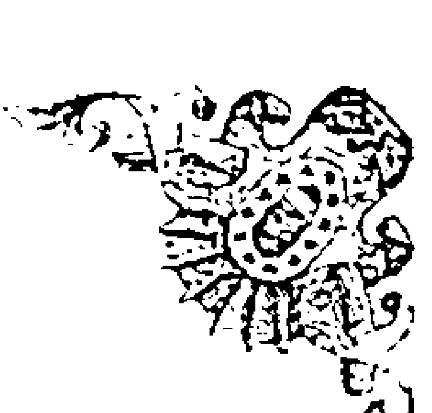

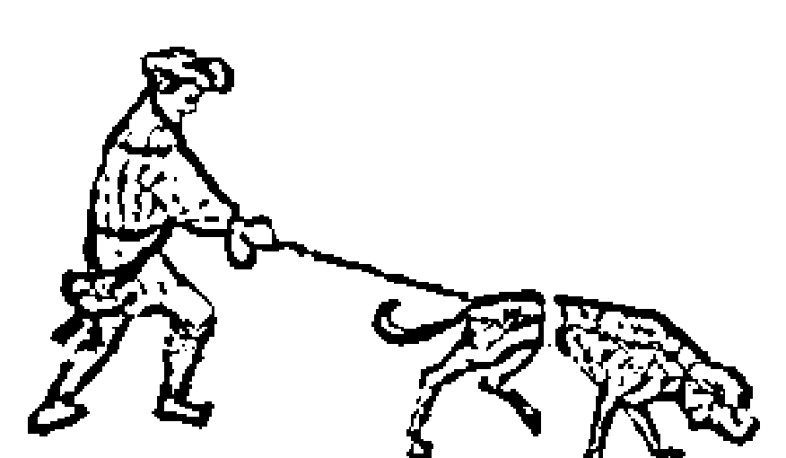

## 狮身鹰首兽

在所有的神奇动物中，没有哪一个像狮身鹰首兽这样毁誉参半的了。它也是鹰头马身有翼兽的父亲。这种怪兽有老鹰的爪子、翅膀和头，狮子的身体。有时候它被认为是勇敢的帝王的象征，有的时候却又被人认为贪婪、凶猛的动物，它到底是圣洁的还是邪恶的，往往要看作家如何下笔。

狮身鹰首兽最早出现在绘画和雕塑作品中是在5000多年前。在埃及和波斯的坟墓和避难所里发现了它的形象，所以人们猜测这种动物最早是作为一种守护神的形象出现的。

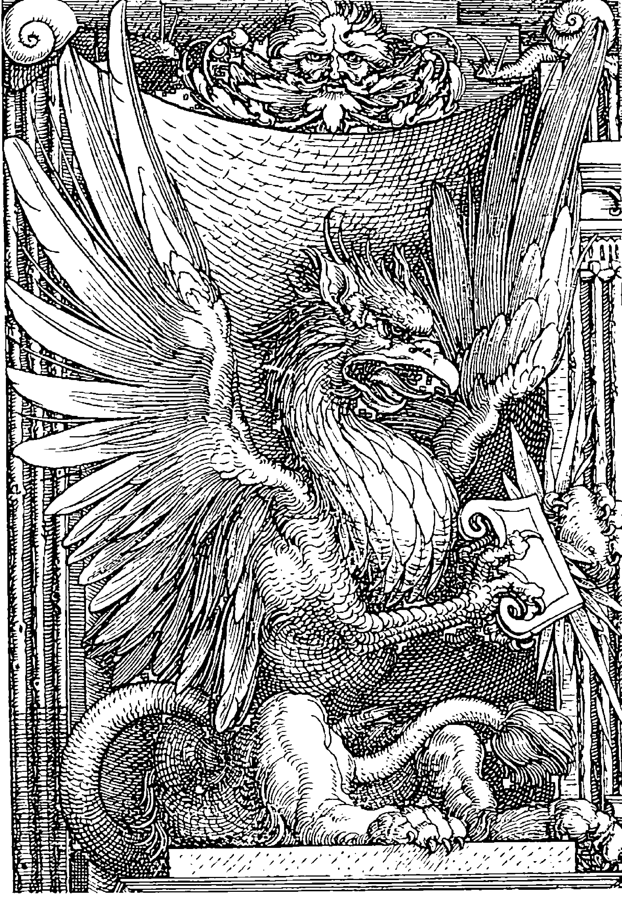

希腊旅行家、诗人阿瑞斯图斯于公元前675年第一次描述了这种动物的行为和居所。有关狮身鹰首兽的故事是他从欧亚大陆的游牧部落中听说的，他把它描述成凶猛、贪婪的动物，居住在沙漠和蒙古山脉中，窝都是用黄金做成的，坐落在高山上，这样它们就能很好地看到附近的景色。它们非常尽力地保护自己的子女和财宝，如果有人胆敢进入它的领地，它就会从山上俯冲下来，用爪子抓住这些入侵者。在后来的故事中，人们又把狮身鹰首兽描述成喜欢吃马肉的动物。

就像巨龙和独角兽一样，狮身鹰首兽可能也源自某种生活中的动物。有的人说它是胡秃鹫，这种秃鹫就生活在亚洲或欧洲的高山上，经常用爪子抓住猎物在天空中飞翔。也有一派理论认为这种野兽的传说来自于一种神秘的动物化石。这种化石多出土于藏金量非常丰富的亚洲戈壁沙漠地区，这里也正是人们认为的狮身鹰首兽的藏身之处，同时也是有关这种动物的故事起源的地方。现在我们知道这些化石是一种古代的恐龙的，名叫原角龙，这种6英尺长的恐龙有鹦鹉一般的喙，脖子上有一圈羽毛，很容易让人认为是翅膀。

不论这种动物的渊源究竟在何处，诗人的故事极大地激发了古希腊、古罗马艺术家的想像。在他们的艺术作品中，狮身鹰首兽袭击杜鹿和马匹，它也是为希腊众神拉战车的神兽，把太阳神阿波罗、万神之王宙斯和复仇女神带到地面上。中世纪时，狮身鹰首兽变成了善恶两种势力共同的代表。意大利诗人阿里吉尔瑞（公元1265年至1321年）把它变成了耶稣基督的象征，正是因为这种动物在天堂和大地都有着神奇的力量。同时，也有作家把它描绘成魔鬼。

狮身鹰首兽有着狮子那样的王权的象征，同时又有鹰的灵活性和锐利的视线，集这些动物的优点于一身的狮身鹰首兽于是成为了印章中最经常见到的形象。它被雕刻在骑士的盾牌上作为皇权的象征，同时也被刻在武器上。同时，它也被雕刻成邓布利多教授办公室大门上的门把手。这座办公室就坐落在女卫生间的旁边，在这里山中巨人还曾经出现过。当然，把狮身鹰首兽用在这里一定是因为它贵族化、代表王权的那一面。

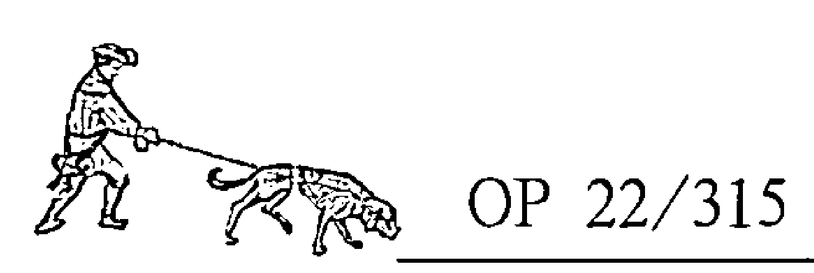

## 鬼怪似的大狗

哈利·波特发现他被一条大黑狗跟随的时候，他怀疑那可能是“鬼怪似的大狗”，这实际上是一种化身为狗的精灵，在英国各岛的神话中是死亡的预兆。但是实际上这条大狗是哈利·波特的教父小天狼星布莱克。他可以随时根据自己的需要变成狗。

除非霍格沃茨真的有我们不知道的墓地，否则哈利担心大狗跟随他完全是没有必要的，因为大狗永远也不会离开它居住的墓地或其他埋葬死人的地方。在英国和斯堪的纳维亚神话中，鬼怪似的大狗也可以是家养精灵的代名词，但同时这个词更经常指代“教堂中的大狗”。在英国，私人灵魂的守护神会化身为一只毛发蓬松的大狗，瞪着火焰一般的大眼睛。在斯堪的纳维亚，教堂中的大狗也可以变身为马、绵羊或猪。

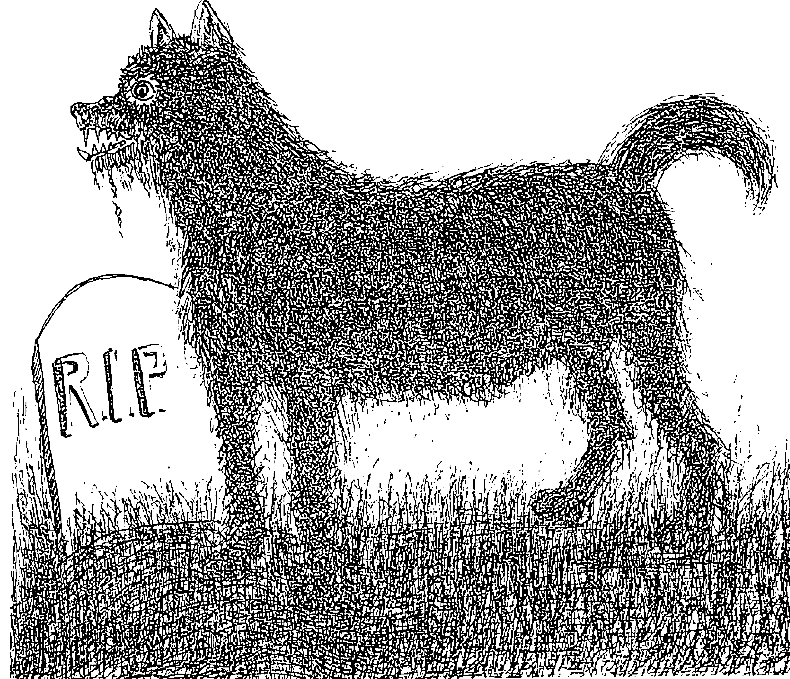

根据英国传统，教堂中的大狗担负着保护墓地不受魔鬼或女巫骚扰的神圣职责。在公元纪年的开始，很多人相信一个新墓地建成之后，第一个被埋葬的死人将担负保护墓地不受邪恶影响的责任。也有人相信如果在墓地的北部埋葬一只纯黑色的大狗的话，这只狗也能起到守卫的作用，这就能解脱那个第一个被埋葬的人的灵魂，使他有机会获得重生。

大狗经常隐身，但在暴雨季节，人们会看见它们在墓地周围漫步。它们也会在人死之前的那个午夜出现，或者在死者被埋葬的时候射在教堂的尖塔里。人们认为主管葬礼的牧师能够从大狗是否出现上判断死者将会升入天堂还是下地狱。

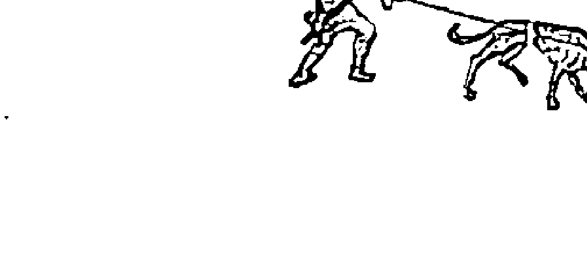

PA 6/64

## 格林迪洛水怪

哈利在第一次看到格林迪洛水怪的时候并没有意识到，与水怪的相遇后来对他起了实质性的作用。当时，格林迪洛把它丑陋无比的绿色脸蛋贴在卢平教授的金鱼缸前。这些英国民间故事中的水里的怪物住在霍格沃茨的湖中。在后来哈利为了完成第二个使命——寻找火焰杯的时候曾经又和它们相遇。

像格林迪洛这样的动物很可能是一种蜥蜴。在英国约克郡，也就是惟一个民间故事中讲到格林迪洛的省份，只有10岁以上的小孩子才被允许相信这个怪物。这是因为格林迪洛属于一种特殊的神秘物种，它们被叫做“儿童妖怪”。虽然大人们从来没有严肃对待它，但是这种动物可以用来吓唬小孩子，防止他们干什么危险或是被禁止的举动。例如这样的儿歌：“不要离格林迪洛太近了，否则它会把你拖下水，把你当作晚餐！”

因为格林迪洛更多的是以口头文学，而不是书面文学的形式出现的，所以它有什么身体特征很难描述出来。但是如果格林迪洛和它的同类，与在英国其他地方出现的绿牙齿简妮和佩格·鲍勒类似的话，它就应该也长着女巫的脸、长长的绿色头发、绿色皮肤、尖尖的锋利的绿色牙齿，以及一张血盆大口。也许是因为哈利·波特年龄足够大的缘故，所以他知道摆脱这种丑陋的怪物其实并不难，只需要在它们头上狠狠地踢一脚就行了。

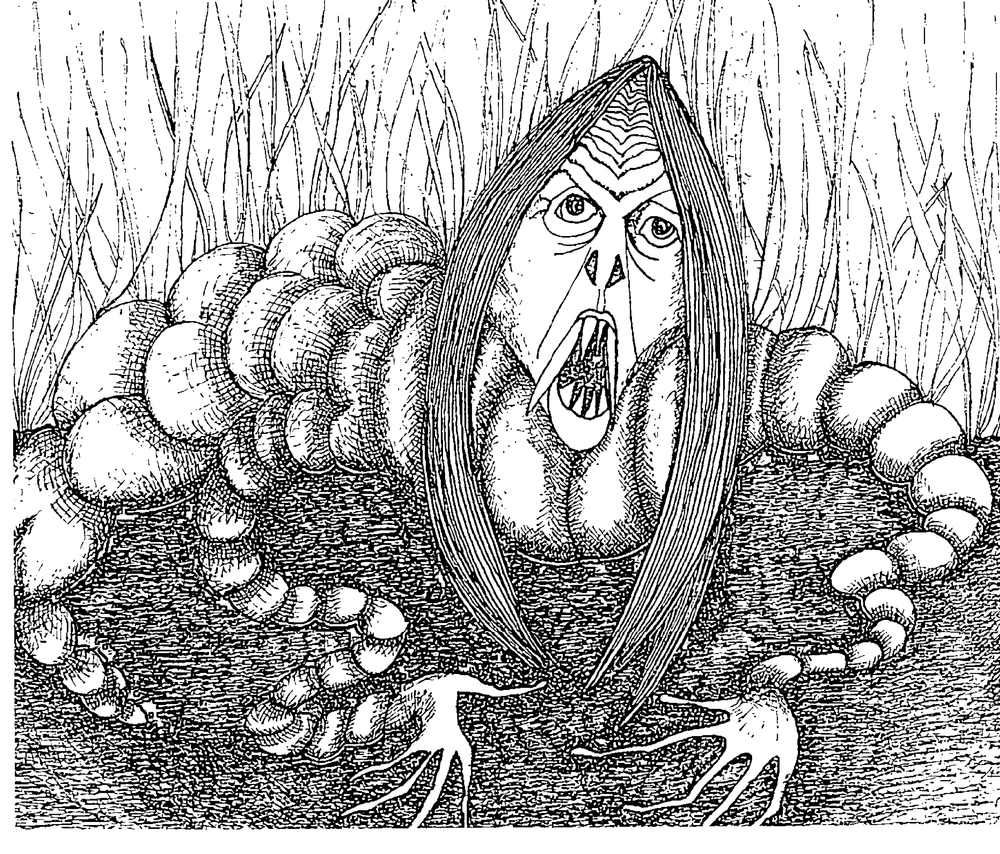

## 女巫

人们认为英国各个岛屿上居住着各种各样的女巫。有些是善良的，人们把她们与收获和纺织联系在一起。另外一些则是邪恶的代表，她们对人类造成伤害甚至吃人。其中的一个女巫是一种古老的自然界精灵，负责变换天气，对自然风景进行调整。但是她们也有一些共同点：都是老女人，而且都很丑恶。

与神奇生物商店柜台后面那样的女巫在一起可能是很危险的，因为她们头脑里总是有各种恶毒的念头。她们喜欢坐在睡觉的人身上，让他们做噩梦，甚至会令人窒息。如果这个人足够幸运还能醒来的话也一定已经精疲力竭了。把面粉筛子放在头下面是防止女巫上身的好方法，因为女巫面对这种情况总是不得不钻过筛子中的每一个洞，那样的话足够她钻一个晚上的。

英国最著名的女巫是黑安妮，她是一个蓝皮肤的独眼龙，长着长长的白牙和铁爪子，吞吃同类。人们说她会爬到爱尔兰东部兰斯特切郡的山上，居住在她自己用手挖的山洞里。在她的山洞前有一颗老橡树，她喜欢坐在树上寻找附近郊区的猎物。当一个看起来很可口的孩子走进她的视线之后，她会突然跳下树来扑向猎物，把他当作一顿美餐。如果不在树上，人们会看到黑安妮坐在山洞门口的一堆堆她吃掉的人的骨头上。

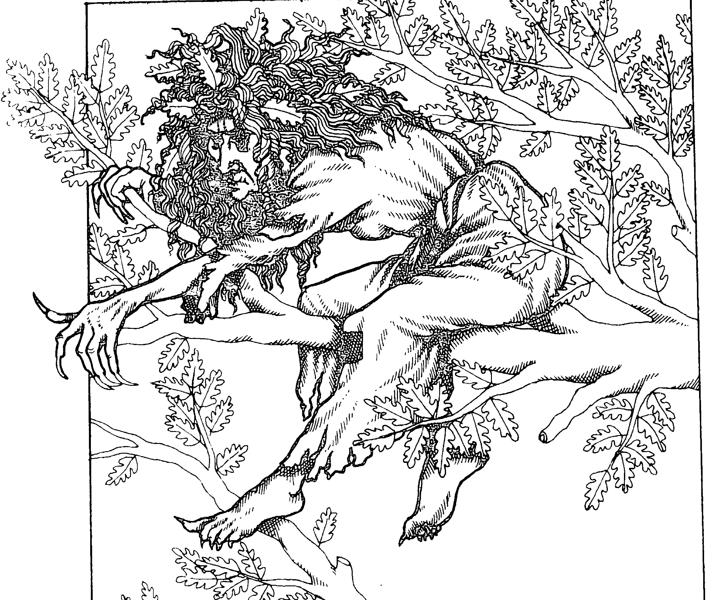

黑安妮在她的树上。

在苏格兰神话中最出名的要算暴风雨女巫。这个古代凯尔特女神也被人称作塞里奇。与黑安妮一样，暴风雨女巫也有蓝色的脸庞和一只眼睛。但是她的头发的颜色是白色的，好像干燥、粗糙的树干一样。她永远穿着灰色格子花呢裙子。人们总是把她与冬天联系在一起。她在一种特殊的“有斑点的大锅”里洗衣服的时候就会引起天气变化。这里也是苏格兰西海岸，当地的飓风经常造成船只颠覆淹没。她也有一根魔法手杖，凭借这根手杖，在每年万圣节之后她都会降霜于草木。传说中暴风雨女巫把岩石和煤块扔到海里创造了赫布里底群岛，人们也认为很多苏格兰山丘和湖泊也是她一手创造的。


## 草药学

对于魔法师来说，很多神奇的毒药原料都可以在植物丰富的花园中找到。这些植物既可以治疗一般的疾病如粉刺、痤疮、蛇咬等，也可用于魔法世界，如石化。还有些植物能够保护你不受敌人魔法的攻击。因此，知道哪种草药的功效如何、怎样种植和收获它们就非常重要，这也就是草药学的内容所在。

草药用在医学和魔术上已经有上千年的历史了。而对草药的系统研究则要追溯到古苏美尔人。他们为香菜、百里香、月桂和其他很多种植物定义了它们的药学用途。这些植物直到今天我们还在自己花园中种植。第一本中国草药学书籍《本草纲目》写成于公元前2800年，其中描述了1万多种植物的药学功效。古代罗马人和希腊人都用植物作为药物、调味料、化妆品、熏香和染料。他们当中更迷信的人甚至把草药制成护身符，放在脖子下面的袋子里，防止邪恶病魔、幽灵和生气的邻居对自己的诅咒。在荷马史诗《奥德赛》中，英雄用来抵御瑟斯咒语的攻击。在神话中，神奇的草药总是与赫卡特女巫或美狄亚女巫联系在一起。因为她们用这些草药在中世纪，几乎每个人都知道，当地的“男巫师”和“女巫师”会用草药治疗疾病或创伤。另外也能用草药为这种人生中遇到的困难寻求解决方案。草药的应用范围很广：既可以把他涧的井重新唤醒，也能用来对付难缠的丈母娘。这用草药治疗的方式代代相传。很多种治疗方法都是基于一个原理：那就是上帝在设计每一款植物的时候对它在医药中的作用都有一个直观的印象，因此仅仅凭借观察植物的长相就能判断出它应该是做什么用的。植物花朵的颜色、根或叶子的形象、花瓣或茎干的肌理都可能显示这种植物的药物用途。例如，像秋麒麟那样的黄花植物可以治疗黄疸病。而有着红色叶子或根的植物则可以治疗血液疾病或创伤。紫色茎干的鸢尾植物被制成膏状，用来治疗挫伤。如果一种植物长得跟某个人体器官相似，人们就认为这种植物能够治疗这个器官。疗肺草之所以得名就是因为它的叶子看起来就像人的肺部，因此也被用来治疗肺部疾病。而三叶獐耳细辛草因为形状像肝，被用来治疗肝部疾病。颤杨树叶用来治疗瘫痪一类的发抖症状，而花朵像蝴蝶一样的植物则被用来治疗蚊虫叮咬。

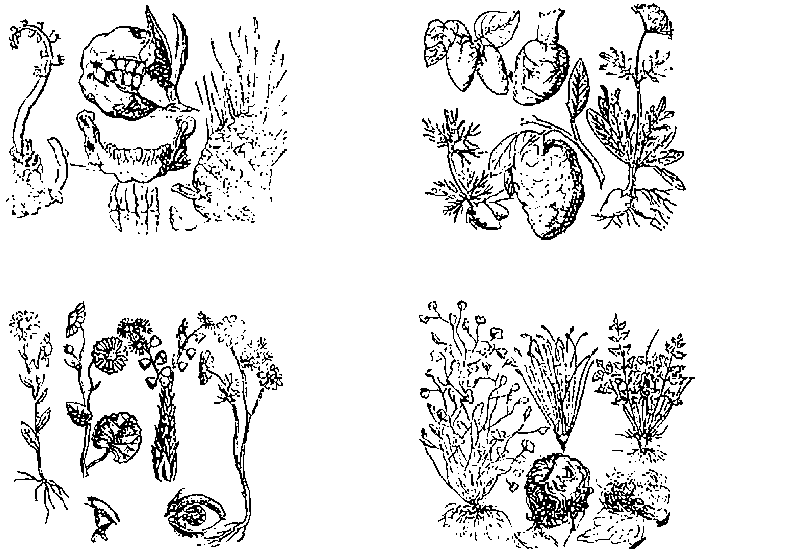

这张绘于15世纪的图显示了草药学的一个基本原理：植物的长相显示其用途。例如，形状像牙齿的可以用来治疗牙疼，长得像心脏的则能治疗心脏病，形状像眼睛的可以使眼睛看得更清楚，而长得像头发的则可以用来治疗秃头。

人们认为很多疾病都是超自然的力量造成的。但是同样，对于这样的疾病也有治疗方法。地方女巫或草药师也许会建议你佩戴用黑莓编成的花环预防邪恶幽灵；在自己大门的锁眼里塞上茴香防止幽灵进入你的房子；在地板上泼洒毛地黄汁则能保护自己不受小仙女的骚扰。草药的神奇功效也可以用在其他更实际的地方。例如，一个旅行者如果担心在马车上睡着了的话，就应该携带蒌蒿，它保证能够帮助你提神儿。寻宝人应该随身携带菊苣，能够帮助他打开锁着的大门和柜子。想生小宝宝的妇女应该在自己附近种植欧芹。而一位男子如果希望赢得梦寐以求的女子的芳心，则可以在背诵爱情魔咒的同时捡起一把西洋蓍草。

知道各种植物都用来干什么只完成了工作的一半。了解在什么时间、用什么样的形式收集这些草药也很重要。很多草药学家都相信植物的属性就像人的性格一样，都是直接受到星座的影响的。一个植物学占星术的狂热分子坚持说：“如果不遵循占星术收集草药，那么将起不到任何作用。”人们认为植物与土星有关。例如，只有当土星到达天空中的某个位置的时候才能采集毒芹和颠茄。另外一个普遍使用的原则是要在晚上采集草药，而且在圆月下草药的效力最大。这也就是赫敏在采集痢疾草制作毒药的时候必须严格遵守规定的要求的原因。

但是很多植物也都有它们自己的规则。例如，如果你想用蓝色菊苣打开锁的话，你必须在7月25日圣·詹姆斯日那天的中午或午夜的时候使用金色的刀片把它切开。如果你在这个过程中张嘴说话的话，那你就会死亡。如果你想使用芍药花保护你的家畜和庄稼不受暴风雨的袭击，你要注意在收割的时候不要让啄木鸟在附近。传说认为如果这些鸟儿看到你的行为，你就会变瞎。正因为所有这些规矩，这些可怕的条条框框，所以霍格沃茨的学生们要学习那么多年的草药学知识。


## 施魔法

当赫敏的牙齿突然长得超过了她的下巴时，她马上意识到自己被马尔福施了魔法。施魔法指的是用邪恶的咒语诅咒某个人或某件事，给他们带来伤害。对那些身边没有庞弗雷夫人帮助的人来说，如果被施了魔法，可能是非常危险的。
“施魔法”这个词来自德语的“Hexe”，原意是“女巫”的意思。现在认为“施魔法”是巫术的一种。虽然施魔法被普遍认为起源于欧洲，但它真正发展壮大还要得益于美国宾夕法尼亚州的德国裔移民。拥有德国祖先的他们17世纪的时候来到美国。他们当中有人是“施魔法医生”，他们负责帮助社区里被施了魔法的人解除魔咒。

这些在宾夕法尼亚的德国农民认为生活中的一些小问题，例如乳酪无法与牛奶混合搅拌或者大一点儿的麻烦，比如家畜得了病，都与被施了魔法有关。如果动物的毛皮脱落，或者它停止吃东西，或者突然变得焦躁不安等等，都会被人怀疑这些动物被施了魔法。人们认为人类也会被施魔法。受到这种迫害的人会表现出无法治愈的失眠，因为没有胃口或者无法吞咽食物而导致体重急剧下降。身体上的疼痛或者是运气不好等等，统统都被认为是被施了魔法。

对付被施魔法的情况有下列一些方法。在门口或是窗台上画一颗五角星能够防止施魔法的医生进入你的房子。悬挂在谷仓、畜棚的房梁上的一个魔法字母或对施魔法医生的反对声明也能起到同样的作用。在牲畜畜棚上方悬挂装有水银的袋子也能防止动物被施魔法，或者治愈被施了魔法的动物。

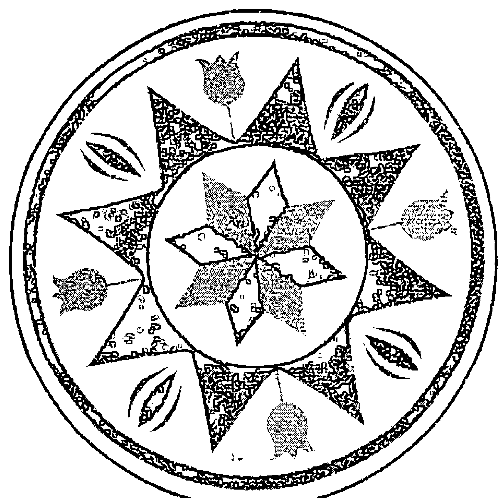

另外还有一些防止被施魔法或邪恶诅咒的办法：传统上画在房子侧面和谷仓、畜棚周围的彩色几何形图案也能起到这样的作用。就像“施魔法”一样，这种防范措施可能也源自德国。但在19世纪的宾夕法尼亚州东部，这样防范魔法的标记变得越来越普遍了。今天，这样的东西被人看作民间艺术，但是有些专家相信这些标记最初还是用来防止人或动物被施魔法的，或者是为了逃避邪恶之眼的攻击（参见护身符词条）。虽然绝大多数这样的符号都出现在建筑上，但是有时候在蜡烛、家居用品，或悬挂在窗户上的木质或金属装饰上也描绘有这些符号。

## 巴克比克

罗恩不是惟一的遭遇巴克比克之后发现自己陷入齐腰深的泥潭的旅行者。这种一条腿的怪物叫巴克比克。在英国民间故事《西部国家》中巴克比克会在晚上潜藏在偏远地区。它会在那里提着一只灯笼，诱惑旅行者误入歧途，把那一点亮光看作是它的目的地或者是另外一个旅行的人，等到跑过去的时候，就会发现自己已经陷到沼泽、泥潭里了。而这时在一旁看着的巴克比克就会露出开心的微笑。

很多这种喜欢提着火把引诱别人取乐的孤魂野鬼都在英国乡村游荡。英国的民间故事中经常出现因为他们的恶作剧使得人们迷路，掉进大沟、失去他们的方位感等等的故事。这可能是因为英国乡村很多都有沼泽、荒野等容易使人迷路的东西，特别到晚上就更是这样。几个世纪以来，人们没有埋怨当地的地形是造成这些原因的罪魁祸首，反而埋怨妖魔鬼怪。有人说是因为魔鬼、有人认为是那些得不到安息的幽灵，还有人说可能是守护宝藏的精灵，他们在考验人们是否贪财，诱惑他们能够看到宝藏却永远也得不到。

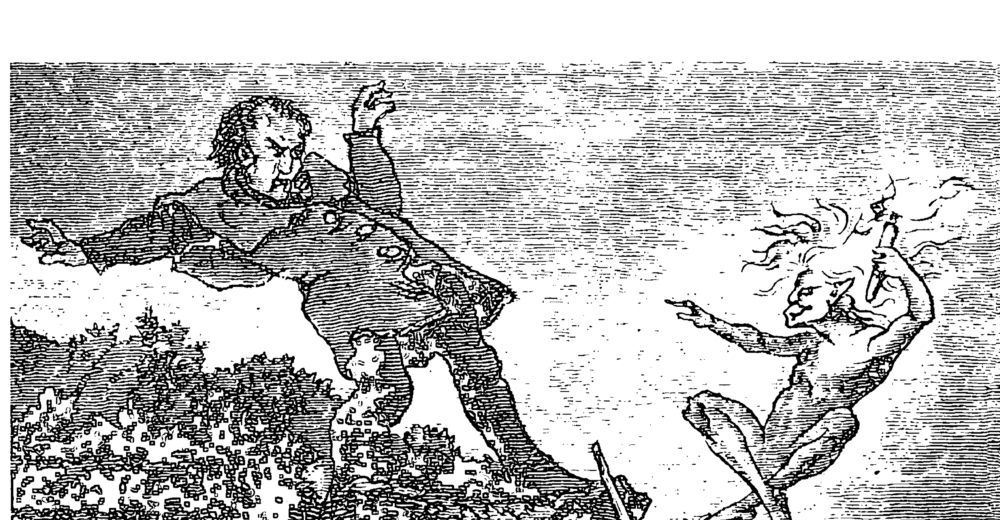

这张图表现的是巴克比克的近亲，一种名唤威尔士精灵的妖精正在试图把一个旅游者引入悬崖。

有意思的是，在英国的很多地方，确实出现过在远处经常闪烁奇异的光的现象，而当地并没有人出现。但是从科学的观点来看，旅行者看到的很可能是沼泽里冒出来的气体发生自燃的现象。但是很多年来，人们都相信这是因为妖魔鬼怪造成的。而一旦有频繁的光亮出现，人们就认为巴克比克出现了。

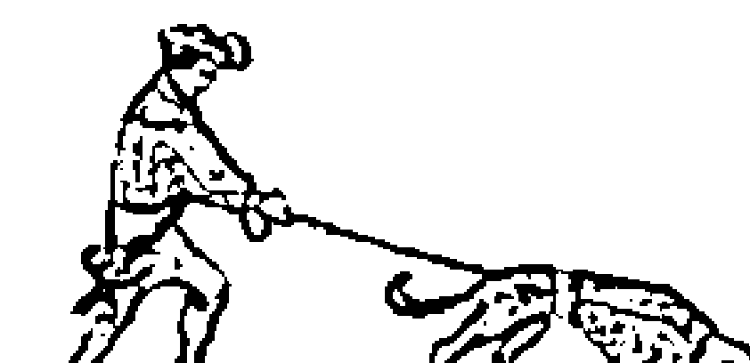

## 鹰头马身有翼兽

哈利和赫敏骑乘的鹰头马身有翼兽，也就是海格非常喜欢的坐骑。它是雄性狮鹫（一种半鹰半狮的动物）和雌马杂交的后代。人们认为鹰头马身有翼兽是查理曼大帝的坐骑。这位八九世纪的武士非常有名，他的传奇经历曾经在很多作家笔下出现过。

虽然这种动物在故事中被人描述成罕见但真实的动物，但它其实是由意大利史诗作家卢多维克·阿里奥斯托，即《疯狂的奥兰多》一书的作者于1516年创造的。与狮鹫类似，阿里奥斯托笔下的鹰头马身有翼兽也有老鹰的头和嘴、狮子的前腿、鹰的爪子、长满羽毛的翅膀，它身体的其他部分长得与马一样。最开始驯服它的人是魔法师阿特兰特。鹰头马身有翼兽比世界上的任何鸟类都飞得更高、更快。当骑乘它的人想要降落的时候，它会以迅雷不及掩耳之势俯冲到地面。即便是无所畏惧的武士对鹰头马身有翼兽也充满敬畏之心。他们都折服于鹰头马身有翼兽那种能从地球的一边飞到另一边的惊人能力。

虽然鹰头马身有翼兽喜欢跟那些想抓住它的人开玩笑，它会在别人就要抓到缰绳的时候一下子飞走，但是一旦你有机会骑它，它就会变得非常驯服，而且会是忠实的伙伴。曾经有一名武士罗杰罗骑着鹰头马身有翼兽从意大利飞过阿尔卑斯山到英国。他降落在一群士兵和贵族中间把他们吓了一跳。罗杰罗继续飞行直奔爱尔兰，在那里他发现美丽的女神安吉利娜落到了恐怖海怪的手里。海怪看到鹰头马身有翼兽在水面上巨大的倒影，放弃了安吉利娜转而扑向鹰头马身有翼兽，但是它轻巧地躲开了怪物的袭击。罗杰罗用放射着奇异光芒的魔法盾牌制服了海怪，他和安吉利娜一同骑上鹰头马身有翼兽，又开始了新的探险之旅。

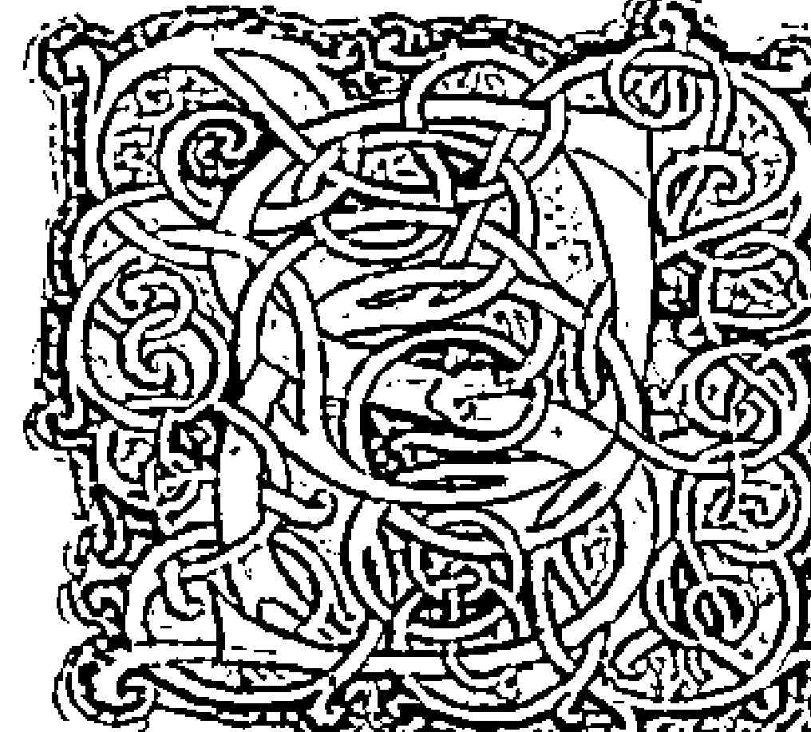

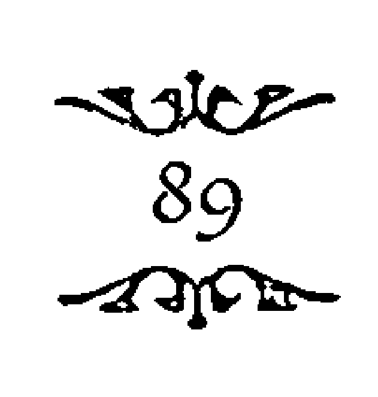

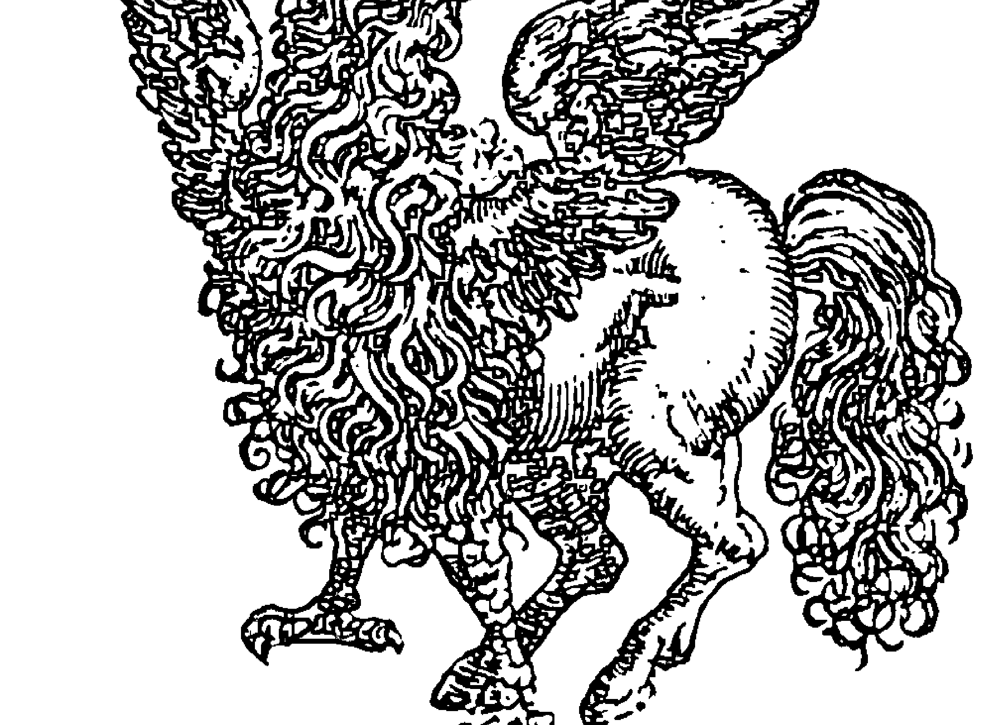

## 被审判的动物

我们可能不同意处理危险生物委员会做出的审判可怜的巴克比克的决定。我们也不明白他们为什么要这么做。在中世纪和早期的当代欧洲，家养动物、昆虫、啮齿动物和其他宠物经常被人指控犯有罪行（最常见的罪名是谋杀和毁坏财物）。它们会被逮捕、判刑、宣布有罪甚至被处决。从9世纪以来的庭审记录上以及19世纪对毛虫、苍蝇、蝗虫、水蛭、蜗牛、蠕虫、老鼠、鼹鼠、鸽子、猪、牛、公鸡、狗、骡子、马和山羊等动物的审判中我们都能看到这一点。

如果是昆虫犯罪，那么一般意义上都是毁坏庄稼。因为把一大片蝗虫带到法庭上审讯是不现实的，所以通常会抓住一只昆虫，然后指派一名法庭律师宣判它有罪，让它为其他同伴代为受罚。如果真的宣布它有罪的话，所有蝗虫都被要求要离开村庄，当然作为季节性、地域性的蝗灾，它们总有离开的那一天。

关押个头足够大的动物的牢房跟关押犯人的一样，而且它们受到的对待也跟人一样。跟人一样，动物们甚至也会被刑审逼供。虽然没有人会对动物招供抱什么期望，但是这样对待它们是司法制度的一种体现。而且有些法官相信他们有责任这么做。这么做其实有时候对动物有利，因为法律规定对于那些即便在刑审逼供的时候也没有认罪的犯人应当从轻发落。当然，如果上诉到最高法院的话，判决还可能被减轻或完全推翻。我们知道有这样一个例子：一头猪和一头驴在一位新法官接手了它们的案子后，得到的惩罚不过是在脑袋上被敲一下。但是那些上诉失败的动物就只有自认倒霉了，除非像巴克比克那样，能够寄希望于朋友的解救。

# 天宫算命图

有些时候做功课并没有什么快乐可言。尤其是当你特别明确地知道，这样的作业根本不值得你花费那么大的精力去完成的时候。这也就是罗恩和哈利在准备防御术的课程前做的有关天宫算命图的功课。不像现在，每天都有数以百万的人在报纸上寻找占星家撰写的星势预测，这两位持怀疑观点的魔法师似乎认为一切行星的移动其实和他们的未来没什么关系。

更糟糕的是，想找到教授要求的那些星座工作量就更大了。天宫算命图不只是一套对未来的笼统预测，而是由一系列图表、地图组成的，显示了当一个人出生的时候天空上行星的位置和情况。为了得到自己的天宫命势，一个占星学家必须知道自己准确的出生日期、地点和一天中准确的时间。有了这些数据，他就能向“历书”寻求答案。历书也叫“星历表”，能够记录一天之中太阳、月亮和其他行星的位置。它们也决定了我们所要知道的生命当时所处的位置。由于星历表只能反映一天中某个特定时间或者某个特别的地理位置（经常是英国格林威治的午夜或中午：这里也是1884年起全球通行时区的始发点），每个人要经过一系列计算才能知道他出生的时候当时的星星都处在什么位置，当时的天空是个什么样子等。

然后再把这些信息输入星座图表，其中显示了每个行星的位置、它们在黄道十二宫的排列、行星之间的距离以及各个行星互相形成的角度等。使用这些信息结合传统的分析方法，占星学家能对一个人的个性、天分、能力和缺点做出判断。

如果要根据天宫算命图对未来进行预测，就像霍格沃茨魔法学校的学生们所做的那样，就需要再次研究星历表，判断今后行星在天空中的位置。占星家通过把这些与一个人出生时天空中行星的位置进行比较，然后就可以预测将会发生什么。但是聪明的学生也许会发现，其实还是应该听从罗恩的建议，自己随便编编要容易得多。

英国占星师靠在集市或节日的时候给人算命、画星座图谋生。在这幅17世纪的图画中，他得到的是一袋钱币。因此，吸引图中这位占星师的并不是桌子上的星座图，而是他手里的那袋钱。

# 隐身衣

有时候着装真的能够改变一个人，比如穿着隐身衣，数百年来就一直帮助英雄们建立自己的功勋。

这种具备隐身功能的衣物的历史可以追溯到古希腊神话时期。希腊地界的大神冥王有一顶“黑暗之帽”，只要戴上它就可以隐身（巧合的是，冥王在希腊语中的含义也是“看不见的人”）。在对付比自己强大的敌人的时候这样一顶帽子非常有用，因此很多神话中的传奇人物也都借过来用。珀尔修斯在杀死蛇发女妖梅杜莎的时候就借用了这顶帽子保护自己，赫尔墨斯也使用它对付巨人希波吕托斯。

希腊神话中其他能够起到隐身作用的还包括戒指、箭，甚至迷雾等，但是直到中世纪才出现著名的隐身衣。隐身衣首次出现在奥地利史诗《尼伯龙之歌》中。在这部创作于12世纪的作品中，法力很高的矮子国国王就拥有一件这样的隐身衣，用它来保护埋藏在地下的宝藏。穿上它后人能获得相当于12个人的力量。后来他被打败了，隐身衣也被德国民间故事中的英雄齐格弗里德夺走。这个故事后来被19世纪的德国作家理查德·瓦格纳写在了他的喜剧《尼伯龙的魔戒》中。

在哈利·波特之前，拥有隐身衣的最著名的人叫做“杀手杰克”。在这张图片里他使用隐身衣躲过两只狮鹫的重重看护。

到了18世纪，隐身衣、斗篷、披风等各种具备隐身功能的服饰已经成为欧洲民间故事中的一个传统。非常流行的英国民间故事中的英雄人物“巨人杀手杰克”就穿着隐身衣躲避敌人的追击（杰克还拥有一顶能够带来智慧的帽子和能够帮助他变形的鞋子）。隐身衣也出现在格林童话中，其中著名的要算《不停的舞鞋》这一篇。童话讲述了一个士兵凭借隐身衣赢得金钱、名誉，并娶了美丽的公主的故事。但是尽管有这样一件神奇的衣服，这个士兵还是屡次差点被人看出来，当他披上隐身衣教训12个被宠坏的公主的时候，有一次差点露馅了。当时是在一条小船上，公主们察觉到有问题，以至于猜疑道：“为什么今天的船比平常重了这么多呢？”

当然，就像任何一种衣服，隐身衣的款式也各不相同，无论是颜色、面料还是尺寸。巨人杀手杰克的隐身衣是一件破旧的衣服，而哈利·波特从父亲那里继承的隐身衣则是一件斗篷，由柔软、银色的面料制成，闪烁着水一样的微光。有些隐身衣还能给穿上它的人带来神奇的力量。就像在《奥兹国的魔法师》里面提到的那件可以飞行的隐身衣一样，可以把穿上它的人带到任何想去的地方。

但是所有隐身衣都有这样一个共性：能够帮助所有穿上它的人达成愿望，而且不用担心会遭到报复。就像哈利·波特利用隐身衣离开霍格沃茨魔法学校一样，隐身衣能够帮助你获得一种随心所欲的自由。这种没有任何限制和附加条件的自由引起了希腊哲学家柏拉图的兴趣，他曾经问过自己的学生如果他们突然具备隐身功能，他们会做什么？那么你呢？如果你有了隐身衣，你是会去杀死恐怖的怪兽？还是统治黑暗中的世界？或者你会像哈利·波特那样，从霍格沃茨魔法学校跑出来，开始自己的冒险之旅呢？

## 魔咒

魔咒会使你的脸上长满粉刺（赫敏让所有告密的人脸上长粉刺），使你的眉毛长得高过鼻子（霍格沃茨魔法学校斯莱特林分院的一个魔咒瞄准了魁地奇比赛中的格兰芬多学院的选手），魔咒还能让你在冲马桶的时候水一下子喷涌上来（这是魔法师的一种恶作剧）。但无论怎样，魔咒伴随的一定是坏消息。

在麻瓜的世界里魔咒的作用不大，它很少能立即起到作用。但是人们相信魔咒能够给人带来厄运。“给某人施展魔咒”的意思是让某人遭遇不幸。虽然这个词到底起源于何处今天还存在争议，但是我们知道早在古希腊人们就把“魔咒”这个字与魔术以及危害联系在了一起。在希腊神话中，“魔咒”是一种仙女的名字，这种仙女擅长调配爱情毒药。她研制的一种毒药使得宙斯与一位名叫艾奥的美丽少女相爱，但是宙斯的妻子赫拉很快就找到了复仇的办法，把艾奥变成了啄木鸟。这种啄木鸟在英语中又叫做“蚁鹨”或“蚁鴷”，它后来总是与巫术和魔法联系在一起。

这种啄木鸟有着灰棕色的身体，长着长长的舌头，受到惊吓的时候会发出“嘘嘘”声。因为它能把脖子扭转180度，所以也被称作“歪脖鸟”。相传爱与美的女神阿佛洛狄忒第一个把这种鸟使用在魔法中。她把这只可怜的鸟绑在轮子上交给了夺取金羊毛的阿尔戈英雄们的首领伊阿宋，让他用这个作为工具向后来成为他妻子的美狄亚求爱。后来希腊人也把这种方法使用到现实生活中，希望获得同样的效果。在16世纪的英国，因为这种鸟能看到各种角度，它也经常被与魔法联系在一起。传说它能够预测未来甚至具有超自然的力量。同时它也与占卜联系在一起。女巫使用这种鸟的羽毛制作邪恶的咒符。到了17世纪，“魔咒”一词开始具有了带给别人厄运或给别人施魔法的含义。

20世纪初期这个词基本退出了历史舞台。再度使用它大约是在1910年，从那个时候开始美国的体育评论员开始用这个词形容某个棒球手或球队遭了厄运。有些人认为这种用法始自1860年的一首幽默歌曲《缅因州魔咒上校》。歌词中讲到上校先生经常很倒霉，在训练的时候生了病，打仗的时候又阵前逃脱，摘掉帽子、靴子从军队中逃跑了。当然，他并不是完全无辜的（因为他自己犯的错误和他的态度本身都有问题），但是不难看出，后来人们就将这位上校的名字用作厄运的代名词。同时代的其他作家也给他们作品中的倒霉蛋起名叫“魔咒”。另外，在早期的体育赛事解说中，当解说员说起一个队伍一蹶不振，仿佛遭到了诅咒的时候就会说“他们被‘魔咒’了”。

宙斯之女阿弗洛狄忒在旋转纺车轮发咒。

那么这个词到底是怎么来的呢？但是不幸的是，就在我们要写出答案的时候，我们的铅笔断了，电脑崩溃了，小狗还吃掉了我们的记录内容，总之，我们不记得了——可以说我们走背运了。

## 今天的魔咒

今天最著名的魔咒要算上了《体育画报》你就被魔咒了的传闻。大家都传说一位运动员如果上了美国的《体育画报》杂志封面不久就会倒霉，不是受伤就是成绩下滑或者遭遇失败。

第一位遭到这样命运的人是棒球手艾迪·马修，他在1954年8月16日上了《体育画报》杂志，结果手臂受伤无法参加后面的7项赛事。但是这个与赛车手帕特·奥康纳相比简直算不了什么，他在上了封面以后的第四天就死于一场15辆汽车连环相撞的事故。1993年，伟大的棒球手巴里·邦德斯在上了《体育画报》之后马上就被人撞倒，甚至昏迷。而网球明星安娜·库尔尼科娃在上了封面的第二天，就在第二轮的比赛中被淘汰出了法国网球公开赛，这也是她三年来最早的一次出局。而其他运动员遭遇同样厄运的比比皆是：当上封面人物不久，他们有的骨折，有的韧带撕裂，他们或者没有接住本该接住的球，或者没有获得本该获得的奖杯，踢出了乌龙球，或者配偶提出离婚，甚至有时全身瘫痪或死亡，总之这些不幸都是在上了《体育画报》封面后不久发生的。

当然，对这种情况的出现也有其合理的解释。首先，《体育画报》在挑选封面人物的时候，一定都会挑选那些正处于巅峰期的运动员，而体育运动是有其阶段性的，一个人不可能总处在高峰，所以当杂志出版的时候，他/她的成绩可能出现了下滑。后来《体育画报》的编辑们还专门就此事展开了调查，撰写了文章。他们宣称这种所谓的“魔咒”根本就是无稽之谈，因为在他们调查的2456名封面运动员中，只有37%出现了倒霉或者运动成绩下降的现象，但是其他的63%的人不仅成绩没有下滑，反而还有提高。但是，在所有这些上过封面的运动员中，似乎高尔夫球选手走背字的最多，百分比高达70%。其中最倒霉的要算安迪·诺斯了，他赢得美国公开赛冠军后上了《体育画报》的封面，但是整整7年之后他才赢得第二项冠军，这次仍然是美国公开赛，结果《体育画报》又一次把他当作封面人物，结果这次还要糟糕，以后他仿佛真的被魔咒控制了，从此在职业生涯中再也没有取得任何冠军头衔。

# 卡巴

虽说霍格沃茨的教学很多关注的都是基于欧洲的魔法师和魔法体系，但是聪明的卢平教授也知道，随时准备防备来自异域的怪物的威胁也不是完全没有用处的。在这种精神的指引下，我们可以想象，他在他的三年级学生的黑魔法防御术课上开设了一堂讲述卡巴的课。这是一种日本民间故事中的水陆两栖的精灵，它会把人或动物推到水中淹死他们。

卡巴生活在河流、湖泊、池塘等地，但它也经常到岸上捕食。民间故事传统上把卡巴描绘成邪恶的生物，喜欢吸食它所捕获的猎物的血。人们认为这种生物特别喜欢人肝。同时，它们也很聪明。据说人学会如何切割骨头就是从卡巴身上学会的。它教授人们这样的知识是为了重新得到自己的胳膊。在打斗的时候卡巴的肢体部分都可能会断掉，但几天以后又会长出新的来。

完全长大的卡巴大约和一个10多岁的孩子一样大。它的皮肤带有鳞片，是黄绿色的。它有一张猴子的脸和乌龟的脊背。手和脚都有蹼，便于游泳。它身体上最特殊的部分恐怕就是它头上长的大包。这个大包里面随时都储满了水，以便卡巴即便在陆地上也能保持它神奇的力量。

因此，对付卡巴这样的动物最好的办法就是向它鞠躬。因为卡巴非常有礼貌，所以当你向它鞠躬的时候，它也会回礼地向你鞠躬。可是要不了几下，它头上大包里面的水就会流出来，因此它不得不重新回到水里。

另外一种讨好卡巴的办法就是给它喂黄瓜，这也是公认的卡巴最喜欢的食物。把家人的名字刻在黄瓜上然后扔到水里被认为是保护家人不受卡巴袭击的最好方法。因为卡巴会很恭敬地接受这些黄瓜，对名字被写在黄瓜上的人自然也会心存敬畏，不会轻易加害。卡巴与黄瓜之间的关系是如此紧密，以至于这已经成为日本文化的一部分。直到现在，有一种里面塞黄瓜的寿司仍然被人们叫做“卡巴黄瓜细卷”。

# 家养小精灵

在魁地奇世界杯中并不会赢得金子，但是爱尔兰队和保加利亚队精彩的比赛仍然值得奖赏，他们当时打的比赛是巫术界重量级的首项体育赛事。当爱尔兰队取得胜利的时候，他们对自己这边的拉拉队头目家养小精灵倒是没有提出什么异议。但是实际上人和家养小精灵之间相处得并不总是这样和谐的，或者说，两者之间很少能和睦相处。

虽然这些爱尔兰民间故事中的精灵在故事中的主要角色是制造鞋子，但是在古代故事中它们也负责埋葬金银财宝。传说人类也可以分享这些财富，但必须是足够聪明的人才能做到，因为他们必须抓住家养小精灵，并胁迫它说只有把财宝交出来才能得到自由。但是做到这一点并不容易。因为这些小精灵个头很小。所有家养小精灵都是男性，它们非常聪明而且经常会捉弄人。一个典型的故事讲述了一位旅行者在听到远处森林或牧场里传来的锤子敲击的声音的时候跟了过去，企图抓获家养小精灵。如果被抓获，只要你不强迫它说出它把财宝藏在什么地方，家养小精灵一般都很和善，如果逼迫它的话，它就会发脾气，否认有任何金子，然后再把你带入歧途，比如告诉你金子藏在蜜蜂窝里或者一棵马上就要倒的树下面等等，等到人一走远，它就会马上消失。如果这个戏法不起作用，它们还有很多方法等着你。但是有时候小精灵也会很慷慨，主动送给你满满一袋子金币。但是就像哈利·波特他们在魁地奇比赛中看到的那样，最好还是不要对这些金币抱什么指望，因为它们很快就会化为灰烬或是消失掉。

现代文学作品中描述的家养小精灵都是在圣·帕特里克纪念日出现的穿着一身绿衣服的小人。但是，传统中的家养小精灵应该穿着红色的夹克衫，上面系着银色的扣子。它们一般有2英尺6英寸高，其中有好人也有坏人，还有很多留着长长的胡须或抽着烟斗。工作的时候，它们会戴著皮鞋匠戴的围裙，带着小锤子去做鞋。它们做的鞋子也很精巧。但是显然，这些小精灵对待仙女们的态度也好不了多少，因为它们从来都是给仙女一只鞋而不是一双。实际上，有些学者相信“家养小精灵”这个字源自盖尔特语，含义为“制作一只鞋的人”。但是可能它们只做一只鞋，也许只是疏忽的结果，因为它们经常喝醉酒，整天都是醉醺醺的。

> ## 农夫和家养小精灵

> 关于小精灵聪明和灵巧的故事被人们一代一代传了下来，其中农夫和家养小精灵的故事非常典型：一个农夫在地里劳作的时候看到了躲在叶子后面的一个小人，他马上意识到这一定是一个“家养小精灵”。于是他把它拿到手上询问它金子在哪里，小精灵似乎很想获得自由，于是忙不迭地告诉了农夫金子就在附近的一片灌木丛中，于是，农夫让小精灵带路，指出了金子具体藏在什么地方。因为这片灌木丛的旁边还有很多同样的灌木丛，而农夫又没有带任何可以挖掘的工具。于是他脱下自己的一只红袜子系在有金子的灌木上，小精灵看到自己已经没有什么作用了就提出要给他自由。农夫同意了，但是要求它在他回家取锄头的时候，既不能挪动灌木上作为记号的红袜子，也不能偷偷把金子挖走。小精灵也都同意了，按说这个农夫已经够聪明了，但是等到农夫从家里取了工具再赶回来的时候，他发现附近的灌木丛已经都被系上了红袜子，他还是没有办法知道金子到底藏在什么地方。

# 魔法

到了11岁的时候，哈利·波特终于可以学习魔法了。这一点让许多他认识的人羡慕，包括佩妮姨妈、弗农姨父或者那个可怕的表兄达力。本来哈利·波特就可以做很多奇怪的事，他可以在一夜之间长出一头头发，可以令动物园里的玻璃墙消失，还可以不用干洗衣机就把一件丑陋的毛衣缩小。

在魔法师的世界里，我们普通人无法做到的事，魔法师可以通过魔法做到。魔法师可以借助神奇的粉末从一个地方变换到另外一个地方，而麻瓜们则只能借助交通工具或步行。邓布利多教授可以运用他的魔法手杖和魔咒在霍格沃茨的大厅里塞满睡袋。而普通人则只能开车到商店去买，然后再装车运回来，再把它们一个一个搬到屋里去。小天狼星布莱克可以使用魔法把自己变成一只大狗，而普通人所能做的无非就是化妆或穿上伪装的衣服。

很多人都喜欢看那些虚构的魔法师的故事，却很少有人相信魔法。我们喜欢看喜剧性的魔法表演，但是却不期望那些虚幻的东西会发生在真实世界里。同时，我们也不相信这个世界真的被那些有魔力的、超自然的东西所控制，更不相信这些神秘的东西会被人类所利用，达到自己的目的。

但是在西方国家千百年来，太多的人相信魔法了，他们也曾经探寻过那些看不见的、超自然的力量是否存在，以及它们是不是在奴役着正常人。人们通过魔术获得知识、寻找爱情和财富、对未来做出预测、治愈疾病或是抵抗危险。他们也用魔法对付敌人，确保胜利，或者用魔法祈求丰产、丰收。霍格沃茨魔法学校里教授的很多知识都是实用的魔法，例如咒语、毒药、符咒、预言未来等。另外，学校还教授了如何准备仪式和庆典用以召集神怪、魔鬼或幽灵。练习魔法能够帮助人放松，让他们觉得他们自己也能控制自己的命运。

## 魔法的起源

英语词汇“魔法”是从一种古代波斯（现代的伊朗）牧师的称谓“magi”而来的。公元前6世纪，人们认为这些牧师知识渊博，具有天才的预言能力。他们是拜火教创始人琐罗亚斯德的信徒。他们能够释梦、占星，还会对统治者就重要事件提建议。后来，希腊和罗马人也知道了波斯的这些先知，他们认为这些波斯人掌握着各种神秘的知识，拥有超自然的力量。具体这些秘密都是什么，谁也不知道（当然了，要不然怎么说它们是秘密呢？），但是长时间以来人们都认为只要是超自然的事一定是这些波斯人创造的。实际上，琐罗亚斯德也被很多人称为魔法的发明人。

当然，魔法并不是某个人或某种文化发明的。多年流传下来的魔法从很多文明中汲取了营养，包括古代波斯、巴比伦、埃及、希伯来、希腊和罗马。今天我们所知道的西方魔法传统其实是多种文化共同作用的结果。不同文化之间的相互影响在公元前3世纪之后逐渐加强。当亚历山大大帝征服了巴比伦、叙利亚、埃及和波斯，建立亚历山大城之后，埃及就成为这些文化融会贯通的十字路口。

## 魔法与宗教

在所有人类社会的早期，魔法与宗教都是紧密交织的。人们认为各种神、鬼掌握控着我们生活的方方面面，包括太阳的升起降落、贫困和富有、造成疾病和健康等等。而魔法被认为就是用来控制这些精灵和鬼怪的。就像宗教一样，魔法的实施也需要借助于仪式和典礼，用以召集神灵。与牧师类似，魔法师因此也被人认为拥有特殊的与神沟通的能力。但是与宗教上对神的崇拜不同，魔法师有时候需要召唤神鬼来为自己服务，帮自己的忙。

有些时候，魔法师在制作咒语或发出诅咒的时候必须请神灵出面帮忙，据说他们也愿意跟神灵“单独会面”。在进行了一系列特殊仪式召唤神灵之后，古埃及或古巴比伦的魔法师会要求神灵驱除疾病、打败敌人，或帮助取得政治上的胜利。如果神灵比较小，魔法师会拿权力更大的神灵压制它，如果不听话还会让别的更有力的神惩罚他。用完这些神灵之后，魔法师会放了它们，让它们重新回到幽灵的世界中。从远古流传下来的成百上千的文件资料来看，这种召唤神灵的方式是非常普遍的，尤其在古希腊和古罗马。

几乎所有古代魔法师都对神的名字了如指掌，普通人只知道比较常见的神，那些比较神秘的只有魔法师才了解。从某种程度上说，这些神秘的名字本身也是最早的魔法字句中的一部分。不论是把它们写下来还是读出来，人们都认为这些名字包含着神奇的魔力，因为人们相信如果知道神的名字叫什么就能使魔法师召唤这个神，从而获得它的全部力量。因此，埃及的神职人员喜欢给他们的神起非常拗口、复杂，甚至无法发音的名字，这样这种召唤神的技能就不会被别人轻易学会。在神话中摩西之所以能够分开红海也是因为他宣读了72个神的名字。另外根据希腊作家普卢塔克的作品，我们可以知道在一座城市建立之后，人们就会把神的名字保存起来。任何对神的询问都是不被允许的，甚至不能问这个神是男还是女，这样做的目的就是为了防止罗马的敌人利用这一点召唤神对他们发动攻击。

由于古代文明也在相互影响，所以处于一种文化中的魔法师很可能也会“试着召唤”另外一种文化中的神。在我们已知的有关神的最早记录中，可以看到三四个国家中不同的神的名字，这些名字被刻在护身符上或成为了咒语中的一部分，根据记录其中希腊和埃及魔法师喜欢吟诵的最著名的一句咒语包含100个神的名字，并且其效力也非常之大——“太阳和大地听到之后都要退避三舍，河流、湖泊、沼泽池塘、泉水和大海听到后都会冻结，岩石会自燃。”

## 高端魔法和低端魔法

古代魔法被分为两大类“高端魔法”和“低端魔法”。这种划分是根据两种魔法的实践者目的的不同而做出的。

高端魔法在很大程度上与低端魔法一样，使用它是为了获得以我们普通的经验无法获得的智慧。高端魔法师向神灵祈祷，希望能够凭借神的帮助具备先知的能力，能够治疗疾病，看透自我，甚至能变得像神一样。古希腊最著名的哲学家和数学家毕达哥拉斯就是这样的一位高端魔法师。

很多高端魔法系统都教导说每个人实际上都是一个小宇宙。通过对一个人的自身智力、想像力和直觉的开发，通过对自己感情、意愿和欲望的控制真的能够改变这个世界。但如果要获得这样的高端魔法的能力，往往需要付出一生的工作。

但是很多人选择魔法往往有更实际的考虑。他们希望得到好运、财富、名誉、成功和健康，希望凭借魔法战胜敌人，获得爱情，希望在体育比赛中赢得胜利，预测未来，解决每日生活中的各种问题。寄托了这种希望的魔法就被称为“低端魔法”。这个门类中也包括其他诸如预测未来、算命、制作毒药、诅咒以及使用护身符等。从4世纪开始，很多以此为业的人都提供这种服务，收取费用。虽然很多人其实是骗子，但是有历史记录显示社会上各个阶层的人都定期向他们咨询，无论是公开的还是私下里的。

### 魔法的信誉

一般来讲，古代人对待魔法的态度可以说恐惧超过尊敬。即便是那些对魔法一无所知的人，也相信它对我们的生活起到这样那样的作用。如果一个政客在演讲的时候突然出了事故，或者某个人莫名其妙地病了，大家就会怀疑是魔法捣的鬼。在公众的想像中，他们把魔法与巫术联系起来，所以进一步强化了魔法的这种神秘力量。在希腊和罗马的神话中充满了对这些神奇魔法的描述。公元1世纪，罗马作家卢坎在作品中塑造了恐怖的魔法师——使用人的身体部分作为毒药配料，活埋敌人，还使人起死回生。这使人们对魔法以及巫术的定义都有了新的理解。

虽然在那些想购买护身符的公众心目中，魔法非常普及，但是社会中的上层阶级对于魔法师、能够预测他们的死亡的占星师，以及有可能被敌人所利用来打败自己的人都充满了戒备。公元前81年，罗马独裁者科尼利厄斯对很多人宣布了死刑，就是因为他们是“占卜者、巫师，把魔法用在邪恶地方的人、与魔鬼有交情的人、破坏分子等”。他还宣布这些人的行为都是违法的，后来这导致在公元4世纪整个罗马帝国都规定这些行为是违法的。同时，随着基督教的日益兴起，他们对于魔法及其实践也持抵制态度，因为这些对基督教信仰构成了威胁。所有形式的魔法都被认为是与魔鬼联系在一起的，因此都被基督教法律所禁止。

在中世纪，教堂和政府也联合起来，一同抵制魔法，但是魔法并没有消失，尤其是其中民间药物（具有神奇的治疗功效的药物），成为了村子里的魔法师和药学家的必备品，并不断在人群中普及、传播。

### 中世纪文学中的魔法

从12世纪中期开始，魔法又重新抬头，至少在小说和文学作品中它不再像罗马时代那样受到人们的唾弃。相反，首先在法国的，后来在德国和英国的诗歌作品中讲述了很多传奇冒险故事。故事多发生在古代，故事中那些勇敢的骑士会使用魔法，故事中还有美丽的少女和英勇的国王。这些现今被我们叫做“中世纪浪漫故事”的传说，使得魔法不再与魔鬼、巫术联系在一起，他们甚至很少使用“魔法”这个字，相反，他们在用类似的字来代替，例如“奇迹”、“惊奇”或“魅力”等。在这些有趣的故事里，英雄们带着神奇的剑，拥有超人的力量，菜肴不经过制作就会出现，船不需要人开就可以航行，而戒指能够使佩戴他的人不受大火、洪水等自然灾害的袭击。在这些故事中仙女和魔鬼也经常出现，在英雄需要完成某项任务的时候，仙女经常会帮助他。在这些史诗中还会出现毒药、星座占卜、诅咒、草药治疗等等。虽然“黑巫术”和邪恶的女巫有的时候也会在故事中出现，但是魔法一般意义上已经被人认为是带给人快乐和欢笑的东西，就像今天这样。

## 自然魔法

15至16世纪魔术得到了人们的尊重，这时兴起的是“自然魔术”，是不用借助魔鬼或者超自然力量的帮助的一种魔术，类似于今天的科学。这种自然魔法相信自然界的人、植物、动物、岩石等都受到神秘力量的控制。例如，人们认为细菌具有治愈疾病、影响心情甚至带来好运气的能力。草药也带有这种神秘的力量，有的时候把它放在病人的床边就能使病人的疾病好转。颜色和数字有时同样也有这样的功效。另外，人们还认为自然界的万物都是联系在一起的，它们相互之间都有一种神秘的力量相连。自然学派的魔法师，例如医生等，要担负起找到这些神秘力量的责任，同时需要把这些神秘的力量用在正确的方面，为人类造福。

做一名合格的自然魔法师并不容易，需要具有研究和观察的能力。有时候他们需要能从现象看到本质。例如，长得像蝎子三叶草被人认为是治疗蚊虫叮咬的良药。类似这样的情况有很多。另外，对于自然魔法师来说，占星术的学习占很大的比例，因为自然界无法解释的神秘现象被认为是跟星座相关的。

当时的人们认为祖母绿、金属铜和绿颜色都与金星相关。魔法师因此可以用这些物质代表金星，作用于自然界其他受金星控制的事物，例如健康、美丽和爱情等。而另外一些石头，例如玛瑙、黑色的石头等则被认为具有相反的作用。因为它们是与土星，也就是疾病和死亡联系在一起的。因此，一种行星造成的疾病可能可以通过同属于这个行星的植物来治愈，或者人们也可以反其道而行之。总之，自然魔法师的职责是探索自然中蕴藏的秘密从而获得神奇、有效的结果。

公元9世纪、10世纪时期，一些德高望重的人对魔法的态度仍然是不屑一顾的。到了文艺复兴时期，这种情况才有所改变。这使得自然魔法集物理学、智力探索、天文学之大成，很多对科学研究有兴趣的人也开始进入魔法领域。实际上，当时的学者应该对哈利·波特丛书中的霍格沃茨魔法学校感到比较亲切，因为学校里教授的很多课目都属于自然魔法，包括草药学、天文学、手相术、数字算命法、星座命势解读等。

## 宗教典礼魔法

那些可能出现的邪恶幽灵并没有被人们所遗忘。15世纪到18世纪，在欧洲被翻译为多国文字的畅销书《黑魔法》中就再一次提到这种幽灵的出现。一些匿名作者写的古代典故（书的版本越古老，其中讲述的魔法和智慧也就越多）。中还提到了亚里士多德、摩西、诺亚、亚历山大大帝，以及《圣经》中最著名的所罗门国王。因为书中教授了如何唤醒恶魔及古代的魔鬼，当时的法律认为拥有或使用这样的书籍是有罪的，因此只能在私下流传、买卖。

这些魔法可用作各种用途，从获得爱情、财富、美貌、健康、快乐、名誉等，到用来保护自己、诅咒别人或除掉敌人，挑起战争、治愈疾病、隐身、寻找宝藏、飞行、预测未来或不用钥匙就能开启大门等。因此这本书受到大家的追捧，尤其到了17世纪，因为有了更便宜的版本所以更加普及。从学校里的学生到牧师都在遵循书中的教导，希望奇迹的出现。

因为书中讲到魔法的实现需要繁杂的仪式，其步骤被人称为“宗教魔法”或“仪式魔法”，与千百年前的基本相同。首先，魔法师在地上画一个大圈，在其中记下带魔法的字眼、神秘的名字和象征符号。然后他站到圈里（这个圈保护他不受幽灵的攻击），然后他就开始念召唤魔鬼的咒语，让魔鬼出现达成他的愿望。最后，就是等待魔法的实现。

但在做这样的仪式之前，往往需要经过几周到几个月的准备。根据书中的记载，所有仪式中用到的器具，从蜡烛、熏香物品到画魔法圈用的剑，都需要是崭新的。也不能像《哈利·波特》丛书所说的那样，到巨龙谷购买，必须是魔法师亲自制作的。其中的蜂蜡必须是由第一次出蜡的蜜蜂酿造的。用新做出的剑砍下树枝雕刻成特定的样子，然后再在上面刻上魔法咒语，就成了咒符。

用来写特殊的魔法护身符的彩色墨水必须保存在新鲜的容器中，最著名的魔法著作《所罗门王的钥匙》一书中，甚至强调施魔法时使用的羽毛笔应为公鹅右面翅膀上的第三根羽毛制成的。而且，在实施这些繁琐的步骤的时候还需要遵循占星术的原则，必须在一年中的某个特定时间、在某个特定的行星的影响之下才能进行。魔法师在准备这样的仪式的时候也需要特别控制饮食、沐浴或通过其他手段纯化自己。

但是所有这些仪式和步骤都不能确保魔法能够达到既定的效果。实际上，正是因为这些规矩实在太繁琐、太具体、太奇怪了，所以很多时候它们根本无法一严格遵循。所以丝毫不用奇怪，经过虔诚的祈祷和祈求，很多时候还是以失败告终。而且，也很好解释，因为其中涉及的环节、步骤、仪式、场所、时间等太多了，不能面面俱到导致魔法无法实现。

## 今天的魔法

对魔法的信仰从17世纪中期开始逐渐衰落，因为人们有了更多、更实际、更有效的方法解决自己的问题。当代化学的发展催生了很多新药，这使得人们不再需要通过诅咒或草药学、占星术等旁门左道实现自己的目的。而且，人们也逐渐开始怀疑带魔力的字眼、咒语或护身符的实际功效。

今天，这种使用魔法召唤魔鬼的方式已经基本消失。当代世界变得比以前任何时候更加奇幻精彩。很多原来认为无法实现的事，例如飞行或与生活在世界另一端的人交谈等，现在已经成为了我们日常生活的一部分。发现自然世界中的奥秘成为我们探索宇宙的原动力，而对自然科学的探索也成为当代科学的主要研究目标。同时，充满讽刺意味的是，占星术中的理论已经被证明是不正确的，而所谓的“小宇宙”确实依然存在的，因为我们每一个人，甚至宇宙中的各个行星，说到底都是太阳爆炸的产物。但是与古代一样，我们生活的世界仍然充满了神秘与奇迹，等待着我们把不可能变成可能。

哈利·波特和他的朋友的冒险经历就像中世纪的浪漫故事，仍有数百万人对这样的传奇爱不释手。而当今戏剧性魔法表演也比历史上任何时候都普遍。无论是在文学中还是以戏剧的形式，魔法都向我们展示了“另外一种真实”。虽然魔法对于我们的逻辑思维并没有什么价值，但是能够帮助我们开发想像力和直觉。而这些不同的领域是否与魔法带给我们的魔力毫不相干呢？魔法来自想像，也为想像增添了原动力。对我们来说，魔法的魅力永存。

## 魔法师

魔法师的名字有很多，我们可以叫他们巫师、女巫、男巫、占卜者、预言家等。

魔法师就是那些能够变魔法的人，不论这种魔法是邓布利多教授在魔法学校教授的那些，还是乡村巫师念的咒语那样的小把戏，或者是舞台逃脱魔术表演大师胡迪尼表演的那种魔法。

在世界的各种文化中都存在这样的神奇魔法师。他们能够在天空中高飞，突然消失，或从空气中变出一束鲜花。他们宣称掌握着神奇的力量，可以使用很多技巧。虽然我们无法网罗世界上的所有魔法，但是我们还是在这里列出了几个基本的大类。

## 传奇魔法师

最传奇的魔法师要数那些出现在神话故事中的人物，任何事情都难不倒他们。他们可以在空中飞行，能同时在两个不同的地方出现和消失，能够变出自己想要的东西，能够变形，能够变成动物等，他们还能够预测未来，治愈疾病，能够在时空中穿梭。有些传奇魔法师对于诅咒和毒药也很有研究。但是这并不是必需的，很多时候他们所需要做的不过就是挥动魔法手杖或念念咒语。

传奇魔法师的故事可以追溯到数千年前，在古埃及，当时的魔法仪式是每日文化生活的一部分。那些拥有神奇力量的魔法师的故事人们百听不厌。基奥普斯王时代（公元前2600年），关于一位传奇魔法师迦加门农的故事非常流行。有一次，一名妇女把她头上戴的饰品不小心掉到了皇宫的湖里，迦加门农只念了几句咒语就把湖水劈为两半，拿到了丢失的宝石。那位妇女非常高兴。在古希腊的文学著作中，传奇魔法师通常都是女人。巫女瑟斯和她的侄女都可以把人变为野兽，能够使人返老还童，而且她们还可以占卜未来。罗马诗人维吉尔讲述了魔法师莫瑞斯的故事。莫瑞斯可以把庄稼从一块地里移到另一块地里；能把自己变成狼人，还能使人起死回生。

在中世纪，最著名的魔法师与神话故事中英勇的国王、美丽的少女和贵族齐名。其中，亚瑟王的顾问梅林就是最著名的。他神奇的能力能把白天变为黑夜，可以顷刻间调兵遣将，预测未来，还能变成很多人或动物的形状。1516年写成的意大利传奇故事《奥兰多传奇》讲述的就是这些魔法师的故事，他们之间互相斗争，彼此都希望能打败对方。在一部神话中，魔法师阿特兰特对一位名叫阿斯托夫的骑士下了咒语（也就是鹰头马身有翼兽的骑手），结果这名骑士在不同的人的眼中变成了不同的东西，有时候是一头野兽，有时候是一个巨人或一只鸟。后来，另一位女魔法师梅莉莎又把自己变成了阿特兰特，以便解救另外一位被施了魔法的魔法师。

今天的读者也有自己喜欢的传奇魔法师，他们比起古代的魔法师丝毫不逊色。像所有的伟大魔法师一样，这些当代的魔法师也有变形的能力。当然，在学校开学的时候，这些魔法师都可以在霍格沃茨魔法学校中找到。

## 萨满教士

历史上最古老的魔法师是部落魔法师，他们也被叫做药学专家或是萨满教士。萨满教士很多都是医生、牧师或是超自然方面的专家。他们早在3万多年前就开始以此为职业了，而直到今天仍然存在于很多文化中。在很多部落社会中，萨满教士的地位仅次于部落中的酋长。他们的职责包括：治疗疾病，占卜未来，与灵异世界沟通，保证在狩猎、捕鱼、种植的过程中能够得到足够的食物供给。他们还要负责寻找失踪的人，确定窃贼的下落，保护村庄不受敌人的破毁。萨满教士制作护身符，举行魔法仪式，同时也进行诅咒，还要学习草药、植物和矿物质的种种知识。他们也负责保护部落中的神话、传统代代相传。

在有些文化中，萨满教士的职位是传承性的，另外一些则是由现任教徒指定继任者。有的时候，萨满教士看起来与普通人没有什么两样，但是因为做梦或其他特殊的经历，使得他们突然开了窍。这时，他会回到大自然中，一个人生活，就像野兽一样。这个过程通常会持续几个月或几个星期，其间他逐渐学会控制自己的超能力。一般来说这个时期他都是绝食的。根据古老的传说和传统，这样的萨满教士会通过做梦而得到启示，梦中他的守护神或动物会给予他指导，告诉他他自己都不知道的能力、未来的命运，以及他将在社会中扮演的角色。然后，他会回到人群中开始新生活。

人们认为萨满教士的这种能力来自祖先或动物精灵。就在恍惚之间，这些灵魂会进入他的体内。萨满教士的宗教仪式也是部落生活的一部分。在这样的仪式中，大家载歌载舞，同时萨满教士也会灵魂出窍，与那些指导他的幽灵进行沟通，带回有用的信息。根据文化的不同，萨满教士有的时候会穿动物毛皮制成的衣服，或者佩戴不同的面具，或在他的身体和脸上描绘不同的图案，再不就是披上大斗篷象征着他的精神“飞”向了另一个世界。

在很多文化中，萨满教士的仪式通常会展示超自然能力，但是很多时候这种展示都是骗人的。通过使用一些特殊的技巧，他们可以不受伤：例如在火上漫步、从绳子中挣脱、吞刀、吃玻璃、让木偶跳舞等。使用特殊的腹语术，他们有的时候可以和隐身的幽灵在众目睽睽下对话。这些演示对人们产生了深远的影响，人们认为萨满教士的药物充满了神奇的心理学功效。

有趣的是，使用这些骗人的戏法并不意味着萨满教士治愈疾病的能力只是欺世盗名。相反，绝大多数萨满教士都坚信自己的力量，别人也对他们坚信不疑。其实有时候事情就是这样，因为给予了希望，所以也就容易起到作用。而且，表演这些运用超自然能力也并不是什么坏事，尤其是在宗教仪式上。

## 变戏法的男人和乡村女巫

从中世纪一直到19世纪，欧洲几乎每个村子和乡镇都有与萨满教士类似的人。这些人被叫做“男巫师”或“女巫师”，或者干脆被叫做“变戏法的男人”（“变戏法”一词来自古英语，意即“探寻真相”）。这些乡村巫师所做的工作与古时候人们要求萨满教士做的几乎一模一样，从占卜、治疗疾病到预测未来。但是与萨满教士不同，这些人不在公共场合进行这些活动，都是私下里做。而且，即便跟同时代的人比起来，他们的穿着很稀奇古怪，但是毕竟，他们不再像萨满教士那样穿着动物毛皮制成的衣服了，也不再跳宗教仪式舞蹈。不过总的来说他们所做的事情没有什么区别。他们对草药学都很有研究，也制作护身符和毒药。

在一些小村子里，这些人甚至扮演了医生和兽医的角色。一些这样的男女巫师有基本的占星和手相知识，也能够解释梦境，当然，这样的知识都可以通过阅读获得。但是很多巫师其实都是文盲，他们得到的知识都是从先辈或是朋友、亲戚那里获得的。也有些传奇认为这样的人是从仙女那里得到了这些知识。

虽然当时有法律明令禁止不允许进行这样的魔法实践，但是很多男女巫师并不管这一套。因为他们提供的服务得到了大家的欢迎，而又没有什么副作用，因此权威当局也乐得睁一只眼闭一只眼。很多人与社会接触并不多，他们孤独地生活在郊外，自己种植着草药。有谣传说他们的房子里堆满了稀奇古怪的东西，例如魔镜、水晶球或者各种与占卜相关的东西。人们对他们的态度可以说是既尊敬，又害怕，又逃避。但是一旦需要，他们又会找这些人来帮忙。

在欧洲一些大一点的城市中也有这样的巫师。比起乡村医生来，他们所做的要复杂一点，而且收费也更高。当时最著名的巫师之一叫西蒙·福曼（1552—1611年）。与当时的同行不同，他详细记录下了自己所做的各种活动，因为这样的活动在当时是违法的，所以没有什么人敢这么做。

寻求魔法师帮助的人的目的各不相同，有些商人希望能够通过占星看看自己的财运；海员的妻子则希望推算她们的丈夫是否安全；丢失东西的人则希望看看能不能把自己的宠物或财产找回来；那些怀疑自己受到诅咒的人则希望能够解除咒语的束缚；另外还有很多人来购买爱情毒药、护身符或中草药。福曼是一位占星专家，也能够凝视水晶球。同时，他也认为自己是一名合格的医生。虽然他没有受过系统的医学训练，但是他确实治愈了很多疾病。在那个年代，很多治疗方法还很不普及，放血这种在今天看来无比荒谬的方式在当时还被认为是有效的，因此福曼的举动应该说还是有其作用的。虽然皇家医学会极力反对，但是1603年福曼仍然被授予了剑桥大学的行医执照，为很多伊丽莎白时代的伦敦富人治病。

根据传说，福曼准确预测到了自己死亡的时间。他死于1611年9月8日，当时他正在泰晤士河上划船。他为后人留下了惊人的财富。

## 学者型魔法师

“今天，”一位英国人在1600年这样写道：“只有那些能够读取星象、召唤魔鬼或进行占卜的人才叫学者型魔法师，才能被叫做学者型魔法师。”

在100多年前，一个受过良好教育的人如果进行这些所谓的魔术研究，会被认为是无法想像的，但是在十五六世纪，魔术却是一种得到人们尊敬的知识。在文艺复兴时期的意大利，学者们再度相信魔术可以用来召唤神灵、控制未知的自然界。一个人通过勤奋的学习、对想像力的锤炼，可以学会使用魔法字眼，咒语等等，这样他也可以控制自然界一切神秘的力量，可以达到任何自己希望达到的目标。

村庄中的巫师穿着打扮都很奇怪，但是他们知道普通人不知道的事。

后来，这种思想传到了意大利北部的德国，这里诞生了伟大的德国学者科尼利厄斯·阿格里巴。

虽然我们现在熟悉阿格里巴是因为他出现在罗恩的巧克力蛙牌上，但是在他的那个时代，人们知道他还是因为他的著作《超自然哲学》。这部著作发表于1533年。他认为自然界所有的人、植物、动物、岩石和矿物质都包含着某种神奇的力量，这些东西是可以被发现并被人类掌握、利用的。根据阿格里巴的说法，学者魔法师的职责就是把各种魔法技巧，例如占卜、天文学、星象学，以及对魔鬼和天使的研究运用到探索自然界万物之间神秘的关联当中，用来解决问题或治疗疾病。在这个过程中，阿格里巴认为，一个人也能够更好地发现自己，以及自己与宇宙万物的关联；然后，通过他的想象力和意愿方面的拓展，获得神奇的超能力。

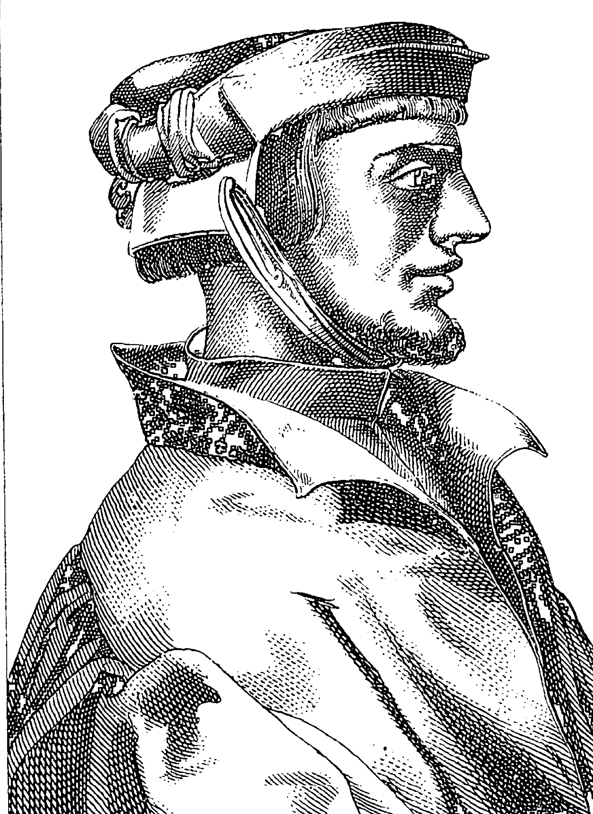

文艺复兴时期最著名的学者型魔法师之一—阿格里巴，他能说8种语言，精通法律和医学，同时还教授哲学、天文学和宗教。

让这些读者失望的是，阿格里巴在书中并没有解释魔法师是如何获得他们的神奇魔力的，但这并没有关系，人们仍然趋之若鹜地学习魔法。这些阿格里巴的追随者包括很多学校里的学生，他们偷偷在宿舍里召集魔鬼。医生则试图使用自然界的神秘力量治疗疾病。致力于科学研究的人则希望借助魔法，揭开自然界的奥秘。所有这些人中最著名的要算英国数学家、天文学家和占星师约翰·迪，人们都认为他是魔法大师。1553年，他甚至企图用魔法杀死玛丽女王而被投入了监狱。约翰认为他可以向天使或幽灵学习各种世界奥秘，他与这些灵异沟通的方式就是通过凝视水晶球和魔镜。虽然他自己并没有从灵异世界获得太多的启示，但他的很多合作伙伴都号称见过天使的容颜或听到过她们的声音。但是无论经过多少年的努力，他们都无法说服这些幽灵，向他们解释自然界的种种奥秘以及有关神的秘密。

但即便这样，1608年约翰去世的时候，英国的知识分子阶层对魔法的狂热丝毫未减。整个17世纪，人们经常可以听到牛津大学有关巫术、魔法、诅咒等问题的公开讨论，以及爱情毒药是否有效等问题。毫无疑问当时有抱负的年轻学者都希望自己能成为魔法师。

## 魔法师的表现

虽然看起来就像是变戏法，但是其实舞台上的魔术表演师应该是“最真实”的魔法师。因为那些文学作品中的魔法师毕竟只是虚构的产物，但是正是舞台上的魔术表演师把小说中的虚幻的魔法变为现实，并运用到舞台上。就像书中的传奇魔法师一样，舞台魔术表演师也可以突然出现或消失，可以在空中漂浮或飞翔，预测未来，穿墙而过，变出东西，把人变成野兽或把美女变成美洲豹等等。当然，表演型的魔法师也可以对观众念咒语、施魔法，让他们看到平常看不到的东西。所以几百年前，看魔法表演的观众都认为自己受到了诅咒，这就并不让人觉得奇怪了。

虽然自古以来在全世界范围内这种把魔法用作表演的形式非常普遍，但是如果认真追溯的话，我们会发现这种魔术表演者的首次出现是在公元一二世纪的古希腊和古罗马。很多拉丁语作家都记录过他们看到的这种名为“杯子和球”的表演。这种古老的表演形式延用至今。一般使用3个小杯子和3个小球。这个看似简单的魔法表演包含了很多魔法的基本元素。在观众目不转睛地注视之下，相隔不到一或两英尺远的小球会突然消失，并重新出现在杯子里；不知何故还可以从一个杯子移动到另外一个杯子，穿透坚硬的杯子表面，有时还会从观众的嘴里或者耳朵里冒出来。作为结束，小球最后能变成完全不同的东西，例如一个水果、或是小老鼠或小鸡。

当然，早期的魔术表演师也要多才多艺。当时发明的戏法种类还有限，所以除了一般意义上的魔术戏法之外，这些表演艺术家还要表演翻跟斗、扮小丑、演木偶戏或驯兽，如狗、猴子、熊等。雅典还设有供街头杂耍艺人学艺的学校。很多这样的表演艺术家都号称能够令最见多识广的看客大吃一惊。希腊观众喜欢各式各样的戏法，无论是艺术性的还是戏剧性的，或是音乐、修辞方面的，当然，魔法也不例外。

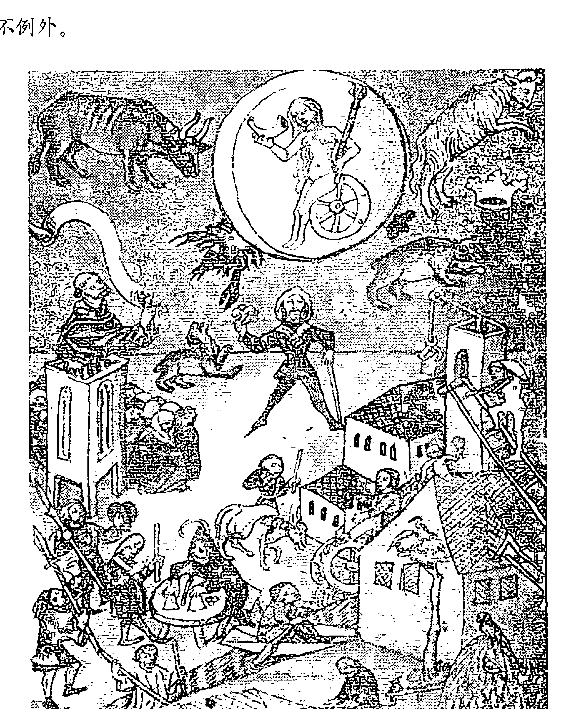

1404年德国出版的这本占星术著作描述了我们所知的最早的街头魔术的表演形式。街头魔术表演师的表演形式包括“杯子和球”。在这张画的上面是12个星座中的5个：金牛座、狮子座、巨蟹座、白羊座和魔羯座。

随着罗马帝国的扩充，魔法师也出现在欧洲各大城市及乡村中进行表演。有些独自一人，有些则跟随马戏团里的杂技演员、算命师傅、诗人、音乐家从一个城市到另外一个城市，给别人带来欢乐。但是不知为什么，对这些人的经历大家知道得并不清楚。但是我们知道，也并不是所有人都喜欢他们，例如僧侣和神职人员对他们就不怎么感兴趣。这些变戏法的人在英国被叫做“行骗者”，他们的把戏也被人称作“戏法”，而且英国教会认为这样的把戏是不道德的，是欺骗，而且在魔术表演中用到的把戏也可以用在赌博或欺骗公众的活动中，有些人认为这是超自然的邪恶力量。一般来说，街头魔法师对自己表演的法术都是秘而不宣的，所以那些相信这些法术的人无论怎样往坏处想也都是不为过的，这种对巫术的迷信一直持续到17世纪晚期。而且，绝大多数魔法师表演的方法都是宣读魔咒、挥舞魔法手杖，或者假装施展咒语召唤超自然的力量。在18世纪的时候，魔术表演已经成为一种娱乐形式，与杂耍、木偶表演和其他马戏相比，魔术表演已经在舞台上占有了自己的一席之地。当时的科学技术得到了进一步的发展，这也使得人们不再相信魔术表演有任何超自然的力量。到了1780年以后，这种艺术样式已经被人们接受，人们把表演魔术的人叫“魔术师”，魔术师对自己的表演也开始收门票（原来他们只通过别人的小费或者在魔术表演之后兜售护身符和草药配方生活）。魔术师开始经常为皇家表演。到了17世纪中叶，魔术表演终于登上了戏剧舞台。吉尔瓦尼·吉斯皮·皮乃提被人认为是第一个伟大的舞台魔术师。于1780年到1790年间，他出现在欧洲最著名的戏剧舞台上。他表演的魔术包括大变活人、解读观众的思想、用投飞镖的方式把钉子投向纸牌，并把它们牢牢地钉在墙壁上。

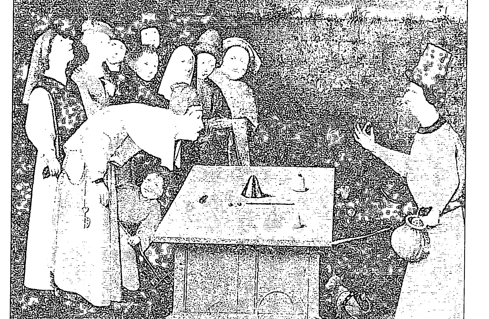

粗看这幅1480年的油画，我们会看到一群人正在欣赏“杯子和球”的魔术表演，但是如果仔细看的话就会发现，观众中混有小偷。那么，魔术师和小偷是一伙的吗？

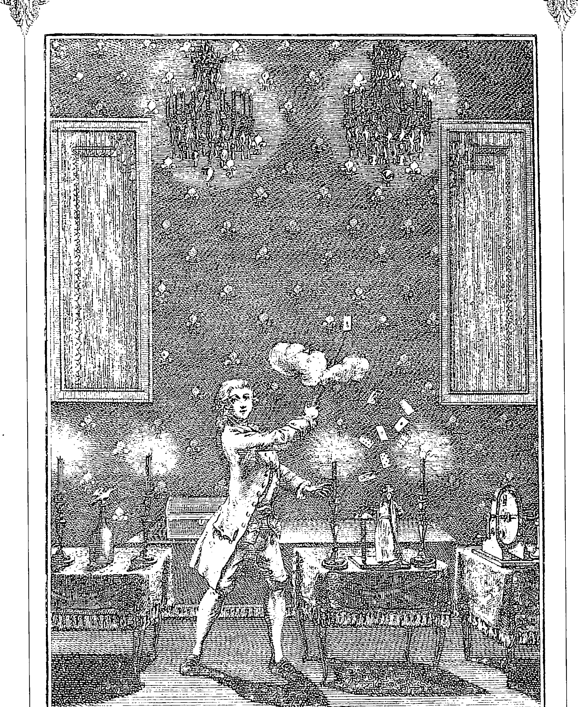

吉尔瓦尼·吉斯皮·皮乃捷被人认为是第一个伟大的舞台魔术师。他最著名的魔术表演之一就是让观众先在纸牌中指定一张，然后把所有牌扔到空中，能用手枪发射钉子把指定的牌直接钉到墙壁上。

19世纪晚期到20世纪初期，魔术表演通常要持续2个小时，表演各种令人目瞪口呆、叹为观止的技巧。魔术表演者也在世界各地收徒，置办道具和服装。哈利·胡迪尼是世界上著名的逃脱大师，他曾经表演如何带着手铐脚镣从监狱中逃出来。在他那个时代，他是非常著名的表演艺术大师。

直到今天，还有人愿意在逛街的时候驻足观看街头卖艺的魔术师表演的戏法，大家也喜欢买票去剧院里看魔术。为什么呢？大家都知道那“只不过是戏法而已”，他们是在琢磨如何破解魔术表演吗？事实上，我们觉得正相反，魔术表演营造的那种神秘的气氛才是让我们趋之若鹜的原因。正是这些神奇的戏法让我们得到了快乐，在我们面前展现了神奇的世界，让我们惊奇。同时，魔术表演也告诉我们那些魔法师一直都知道的一个道理：有些时候，看来不可能的事其实是能够办到的。

## 魔镜

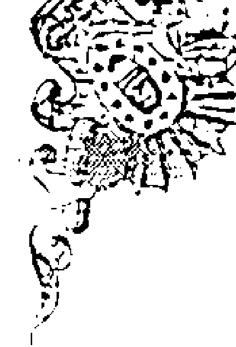

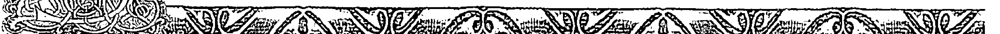

我们中的很多人都已经把镜子看作了日常生活中的必需品。我们不指望镜子能够告诉我们内心深处的思想，我们也不会让镜子跟我们说话，就像《白雪公主》中那个邪恶的皇后所做的那样，相反，镜子只是我们生活的一部分，我们每天对着镜子梳妆打扮、刷牙洗脸。但是古时候镜子在生活中其实没有如此寻常。

在人类历史的早期，人们只能在水面上看到自己的样子，那个时候他们也不知道他们看到的到底是什么。在很多古代文化中，这种水面上的倒影被认为会反映出人的灵魂（人们认为灵魂可以独立于躯体单独存在）。在有些社会中，例如在希腊，看到自己的倒影甚至被认为是危险的，因为那表示你的灵魂离开了躯体，所以很可能被水里的仙女或邪恶的幽灵俘虏。

因此，当4500年前第一面镜子首次出现在人们的视野中的时候，大家都认为它是一种具有魔力的器物。“镜子”这个词来自拉丁语“mirari”或“mirus”，意为“神奇的”或“奇妙的”。古代希腊、罗马、中国、埃及、中美洲的人都相信镜子是一种有效的护身符，能够迷惑人和邪恶的精灵，并能把灵魂从人的躯体中带走。墨西哥阿兹特克族的黑夜之神塔兹卡利珀卡甚至用镜子囚禁了他的敌人，把他们困在镜子里的团团烟雾之中。

直到17世纪，水晶球渐渐取代了镜子的作用，在此之前，镜子一直被用来预测未来。镜子首次用在占卜仪式中可以追溯到古罗马时代，当时小型的金属镜子用来为老人或病人预测未来。有记录显示，从公元2世纪的希腊旅行家帕萨尼斯那里，古罗马人学会了把镜子沉到水里然后再取出来放到病人的面前，如果镜子能够正常反映此人的形象，就说明他还有恢复的可能，如果反映出来的影像是模糊、扭曲的，就说明该人必死无疑。

镜子占卜大约在1200年达到顶峰。这是因为占卜者刚刚研制出了制作又大又平的玻璃镜子的方法。欧洲的镜子占卜师会把镜子向太阳或其他光源倾斜，然后根据反射到镜子上的光线映照出的影像预测未来。根据15世纪德国学者约翰尼斯·哈特里波的说法，有些中世纪的占卜师甚至能够创造出一种魔镜，镜子里能够看到人们最想要的东西。

到了13世纪晚期，镜子成了首当其冲的占卜工具，以至于中世纪对巫师审判的第一个问题就是：“你是否使用镜子进行占卜？” 同时，伟大的基督教哲学家托马斯·阿奎那认为镜子能够使人获得思想启蒙，认为通过研究镜子中的影像能够帮助人更好地认识自我，更好地认识自己在世界中的位置（实际上，正是在阿奎那的影响下，才有了英语中的“推测”一词，因为这个词在拉丁语中的含义就是“看着镜子”）。

欧洲的很多神话故事和文学作品中也有对镜子的描写。镜子是获得知识的工具。它也是人们获得真理，了解外面的世界的窗口。在中世纪神话故事《帕西发尔》中，护卫霍利·格瑞尔用镜子来对付敌人，就像哈利·波特故事中的疯眼汉穆迪。《美人与野兽》中的美人排解寂寞的方法就是通过一面神奇的镜子看看她的家人在做什么。甚至《白雪公主》中的魔镜也只能讲真话，它告诉白雪公主的敌人，那个邪恶的继母，她已经不是世界上最美的人了。当然，很多会说话的镜子比白雪公主故事中的魔镜还要厉害，就像哈利·波特房间里的那面镜子，它说话可不会拐什么弯，只看了哈利·波特一眼，就尖利地批评他发型太难看了！

也许有关魔镜的最著名的故事要算刘易斯·卡洛尔撰写的《爱丽丝漫游奇境》，书中名叫爱丽丝的小女孩通过客厅里的一面镜子进入了一个神奇的世界，里面所有的东西都是反的。人们反着走路，从右到左读书，甚至在竖起指头的时候或叫喊的时候也都是朝着相反的方向。但是，实际上镜子里反映出来的东西确实是反的，这就是为什么爱丽丝看到的她不认识的单词“ERISED”在镜子里为“DESIRE”，是“欲望”的意思。

### 镜子迷信

今天，光学已经能够解释绝大部分的成像原理，但是传统遗留下来的很多有关镜子的迷信仍然让我们看到镜子的魔力。下面列出的是到今天仍然存在的对镜子的看法：

1.  打碎一面镜子会带来7年的厄运。这种观点首先产生于公元1世纪的古罗马，原来的希腊传统只认为打碎镜子会带来厄运，但到罗马人那里又增加了7年。但是如果把这块镜子埋葬的话就可以挽救。
2.  如果镜子从一面墙上掉下来，就意味着有人要死了。
3.  镜子会吸引闪电，有暴风雨的时候要把镜子遮盖起来。
4.  吸血鬼或者巫师的影像不会出现在镜子里，因为他们是没有灵魂的。
5.  因为镜子可以把人的灵魂吸进去，所以当有人去世的时候要把镜子盖起来。
6.  只被装裱了3个边的镜子是女巫用来观看远方的事物的。
7.  小婴儿出生后的第一年是不能看镜子的，因为这样的话他的灵魂很容易被吸到镜子里。
8.  一旦穿上结婚礼服，新娘就不应该再看自己在镜子里面的影像了，一直要等到典礼之后才能照镜子，不然就会有不好的运气。
9.  在黄昏或是在万圣节的时候是不能看镜子的。
10. 要想梦见你未来的爱人，把一面镜子放到枕头底下睡觉。

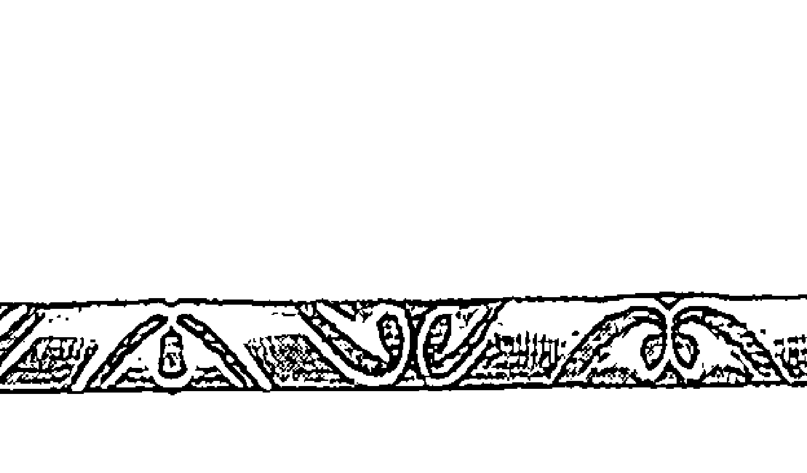

### 魔杖

我们当中有谁没有想过希望得到一根魔杖的呢？魔杖很简单、优雅，又能够施魔法，因此它被认为是世界上数一数二的魔法工具，能够帮助我们实现愿望，达成心中的目标。挥动魔杖，“唰”的一下——杯盘就全部被洗干净，你的房间一下子变整洁了，碗里的冰激淋多了三倍多，这样，佩妮姨妈就不会再找麻烦了。但是，其实我们已经从哈利·波特那里知道，有的时候事情并不是那么简单。在使用魔杖的时候可能你还需要一些咒语或变形的知识。另外，你还需要知道魔杖应该使用什么木料作为材质。是桃花心木？橡树？冬青树？还是榛树？魔杖还可以用独角兽的犄角、凤凰的羽毛或其他材质制作。而到底用什么都是有讲究的。魔杖的历史非常悠久，在史前人类居住的洞穴中或是古埃及人的壁画里都可以发现它们的踪迹。基督教兴起之前的欧洲主持宗教仪式的祭司使用山楂、紫杉、柳树等制作魔杖。

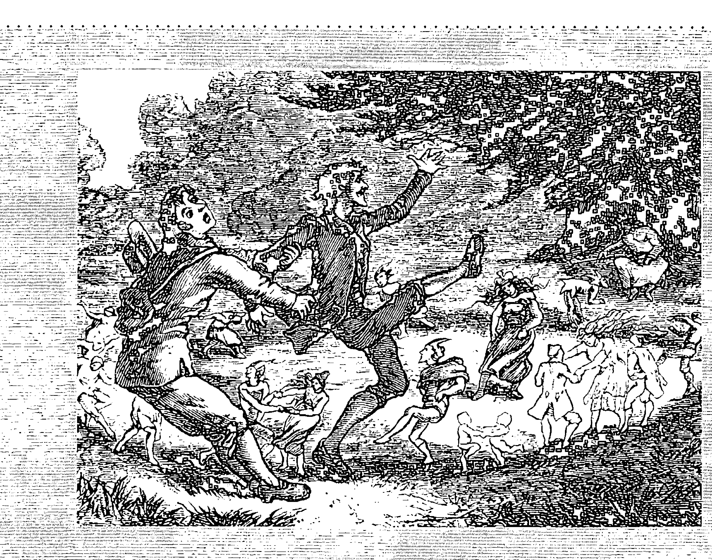

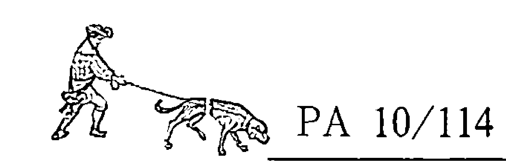

### 飞骡

每次当哈利·波特进入禁林的时候，他都会觉得恐惧。当然，他这么觉得是对的，因为他和他的同学被重复告知在黑暗的树林中蕴涵着巨大的危险和诱惑。就像我们最喜欢的童话故事里面的森林中总是隐藏着女巫、魔鬼、小妖精和巨人那样，霍格沃茨魔法学校旁边的禁林中也同样生活着这些怪物。这里让人觉得兴奋、害怕是因为你永远不知道在下一棵树的后面究竟隐藏着什么样的诱惑。

禁林中永远隐藏着危险，我们可能走失其间，也可能遇到邪恶的陌生人或者遭到凶狠野兽的吞食。在公元前一世纪，朱利叶斯·凯撒写过类似的故事，讲述旅游者在森林中经历的60天恐怖的遭遇。他们在这里遇到了在别处早已灭绝的奇异生物，并走了60天都没有走出森林。对于古代罗马人来说，征服一片土地，对其进行清理和培育，在这里构建城市代表了一种文明对野蛮的征服。只有经过了人手改造的土地才是美丽的，而未被驯服的野蛮荒地被认为是丑恶和可怕的。罗马历史学家塔希图斯认为，最好的区分这些文明的城里人和他们敌对的德国人的方式就是说明哪些人是‘野蛮的丛林居民’。

虽然飞毯被魔法部所控制，但是这并不妨碍远东最有力的魔术师和魔法师一如既往地使用它们。

有关飞毯的最早的故事出现在所罗门王的时代。所罗门王是大卫和拔示巴的儿子，所罗门王被认为是传统以色列最为伟大的国王。根据《旧约》国王篇，他既是一位富有经验的政治家同时也是一位残暴凶猛的武士。他打退了埃及的敌人并一直从那里打到了伊拉克的幼发拉底河。作为一个非常少见的聪明、正直的国王，他很喜欢美丽的东西，他写下了动人的诗篇，还建造了叹为观止的宫殿与寺庙。

所罗门王的功勋是如此辉煌以至于在他死后，很多犹太作家和伊斯兰作家都相信他是一个非常杰出的魔法师。在伊斯兰教的《古兰经》中，宣称所罗门可以‘说鸟的语言’，能够指挥天使和魔鬼，而且他‘拥有所有的好品质’。后来，阿拉伯作家更进一步给予了这名以色列国王‘魔力之王’的称号。说他可以控制风，骑在一条神奇的飞毯上可以到世界上的任何地方。

> “飞毯的长度和宽度足够所罗门国王的所有的客人都站在上面，人站在国王的左边，神灵站在右边。”

关于所罗门如何骑乘飞毯，故事不同版本也不同。但绝大多数作家都同意飞毯是用上好的绿色丝绸做的，而且非常非常大，大约有60英里宽。根据19世纪的探险家和学者理查德·伯顿的说法：飞毯也可以很轻易地容纳所罗门王的全部军队。“风也听从国王的指挥，让飞毯飘离了地面。飞毯上空还飞着一群鸟，帮助客人阻挡阳光。”

显然，所罗门神奇的飞毯后来成为很多阿拉伯民间故事中提到的飞毯的灵感来源。例如在《天方夜谭》‘阿赫默德王子和神仙帕瑞般多’的故事中，就有飞毯出现。一位名叫哈桑的年轻王子不小心被一条神奇的毯子绊倒，这块毯子能够把主人带到世界上任何他想去的地方。有了这块飞毯，当哈桑得知远隔百里的、自己心爱的公主马上就要死了的时候，借助这块飞毯的帮助，哈桑马上把一个神奇的苹果送到了公主的身边，挽救了她的生命。

也许是因为直到19世纪，欧洲和北美人才开始使用地毯的缘故，在西方的神话和民间故事中，飞毯从来没有扮演过重要角色（实际上，很多西方人错误地把飞毯与阿拉丁的故事结合起来。在阿拉丁的故事中其实根本没有出现飞毯）。与飞翔的毯子不同，西方魔法师和英雄人物通常需要借助外力，一个漂浮着的东西才能飞起来，比如带翅膀的拖鞋或盘旋在空中的手提箱以及巨大的玻璃电梯等。在一个很著名的美国儿童故事中，能飞的东西竟然是沙发！当然，除此以外还有飞天扫帚。例如哈利·波特非常喜欢的“光轮2000”，它可以在魁地奇比赛中绕着任何漂浮的飞球转圈。但是飞天扫帚多数都只能乘坐一个人。如果哈利也有所罗门王手下的军队的话（或者在与秋·张约会的时候），他也许只能去借韦斯莱先生的那部飞行汽车的钥匙了。

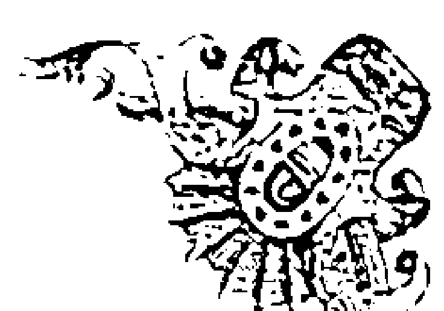

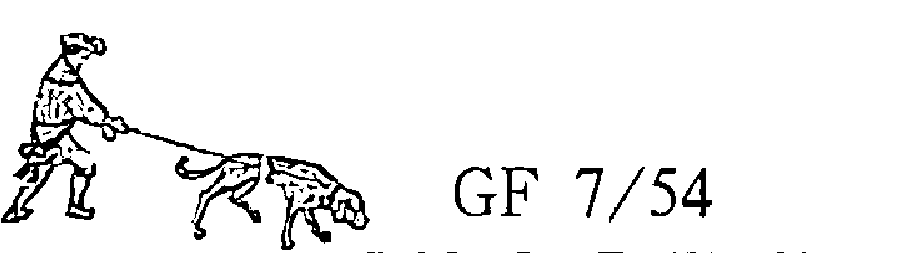

## 森林

几个世纪后的英国对森林的观点仍未改变。人们认为树林是动物而非人类栖息的家园，任何生活在丛林中的人都被认为是野蛮粗鲁的。17世纪的哲学家认为“文明与传统”的城市居民和“非理性且未受教育”的居住在深林和树丛中的人是截然不同的（霍格沃茨魔法学校的一些人对钥匙保管员海格的看法也是这样，传说中的海格是一种生活在森林边缘的生物）。森林代表了所有奇怪、令人怀疑的东西，它们是在普通人的生活经验范围之外的。实际上，英国字“外国的”和“森林”来自同一个拉丁词源，意即“外部”。

对于我们这些喜欢在树丛之间漫步，喜欢经常去野营的人来说，对森林的这种负面的估计似乎很难令人接受。但是实际上这种对森林约定俗成的观念在现实生活中还是有一定根据的。在中世纪及早期当代的欧洲，森林中多半居住着闲散游民和逃犯，他们没有遵守生活和法律的概念。对那些想逃离权威或做非法买卖的人来说，逃跑到树林里是避免被发现的最理想的做法。这种历史背景也帮助我们解释了为什么在神话故事中会有小红帽和大灰狼以及《格林童话》那样的故事，邪恶的大灰狼躲藏在树丛中企图吞食无辜的小红帽。这与伏地魔在需要恢复体力的时候会选择森林居住相类似。

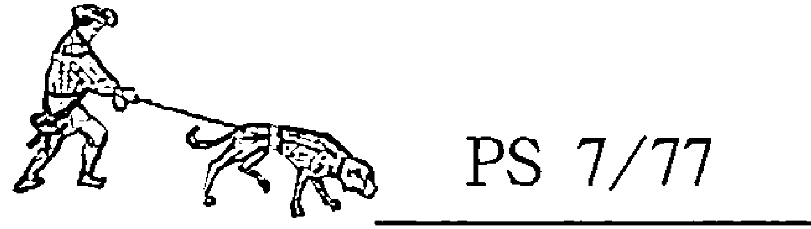

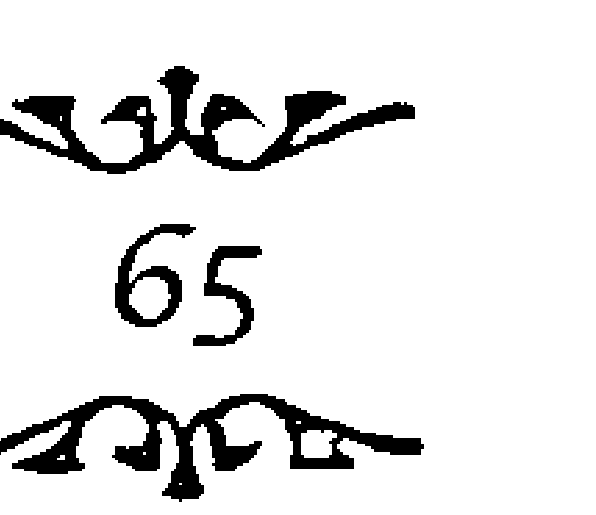

天使神秘学院官方淘宝：http://strc.taobao.com
获取更多好书，请加微信：13641926204或QQ:715104687# 幽灵

你是不是对幽灵究竟是从哪里来的感到好奇呢？或者对为什么有些幽灵，就像皮皮鬼或哭泣的桃金娘那样会四处游荡，而其他一些幽灵则安静地躺在墓穴里。在每种文化、宗教、文学或民间故事中，幽灵和有关幽灵的故事一直都扮演着重要的角色。

幽灵的形状有很多种，最基本的也是全球通行的鬼都是幻影，没有身体实质的幽灵。有些幽灵则以苍白的水蒸气的形象出现。但是也有很多与正常人没有什么不同，看起来就像有血有肉的普通人。欧洲的民间故事中就有很多这样的与人没有什么两样的鬼魂出现，他们也吃东西、喝酒，有着人的绝大多数共性。他们的所谓“鬼性”只体现在他们能够在空气中消失，或者会留下腐臭的气味。

在古希腊和古罗马，亡灵经常以黑影子的形象出现。他们穿着奇怪的黑衣服，或者干脆隐形，在暗处搞恶作剧。古代的埃及人相信鬼魂能够回到自己已经死去的尸体身上，很多文化中也相信鬼魂可以变成魔鬼、动物甚至植物。

无论东方还是西方，在很多古代社会，大家都习惯成自然地认为幽灵是一种非常自然真实的现象。很多地方还有举办节日以便与死者保持良好的关系的文化。也许最奇怪的古代节日应该算古罗马每年春天的驱亡魂节了。在这个节日里，罗马的私房屋主会在半夜起来然后在他们的起居室走路，并在他们的身后洒上黑色大豆。“有了这些豆子，”祭司拖长嗓音认真地说，“我就能赎回我自己和我的家庭。”他们会在屋里转圈，跟着这些豆子的痕迹转九圈，以便鬼魂有足够的时间收集这些贡品。然后房屋的主人会举行一个仪式，同时吹响一个沉重的乐器，并喊道：“我的祖先的幽灵哇，请你离开吧！”直到他们相信所有的鬼都离开，仪式才会结束。

就像这个仪式说明人们印象里的鬼还是很友好的一样，古代的鬼大部分都不让人害怕。但是今天，很多鬼故事里都把鬼描述成了令人害怕的、非自然的生物。它们只会在死人的精神不得安宁的时候出现，这些幽灵之所以在外面游荡也可能是因为它们心神不安，死后得不到安息。在查尔斯·狄更斯的小说《圣诞欢歌》中就有一名这样的幽灵，它之所以得不到安息是因为在生前犯下了罪行，它命中注定要在人间出没。还有些幽灵因为遭遇横祸或暴力致死，它们会在人类的世界中游荡。英国达拉谟郡的伯克利山就是这样一个幽灵出没的地方。这里的幽灵是躲在箱子里面

树或其他树枝作为魔杖的材料。魔杖的制作要在黎明太阳刚刚升起的时候，因为这样可以最好地吸收阳光的力量。削魔杖的刀则要蘸过鲜血。在《圣经·旧约》中，摩西使用牧羊人的手杖作为魔杖，分开了红海。公元4世纪的一幅画中显示耶稣基督使用魔杖接触了麻风病患者拉扎勒斯，使他起死回生。这些证据显示，魔杖不仅作为超自然力量的载体，同时历史上也曾经是宗教仪式中的工具以及权力的象征。

在神话故事中，魔杖首次出现在《奥德赛》中，希腊诗人荷马在公元前800年至900年写作的这个故事中有一个美丽的女巫叫瑟斯，她使用魔杖把英勇的船员变成了猪。魔杖的经典用途是把一种东西变成另一种东西。其中最著名的例子就是《灰姑娘》中的仙女把老鼠变成了马匹，把南瓜变成美丽的马车。另外，《亚瑟王传奇》中的魔术师梅林以及希腊大神赫尔墨斯，他在遇到普通人之后就会使用魔杖令自己隐身。

当代欧洲早期，很多魔法师都把魔杖看作重要的工具。仪式魔法师把它作为诅咒、画“魔法圈”的工具，用来保护魔法师不受他想唤醒的魔鬼或邪恶幽灵的影响。那个时候的魔法师可不像《哈利·波特》书中那样可以到对角巷去买一根魔杖，他们必须参考书籍才能知道如何制作魔杖。根据《所罗门的钥匙》这本中世纪最著名的魔法书，最好的魔杖应该是由榛树做成的，而且要用崭新的斧头一次性从树上把

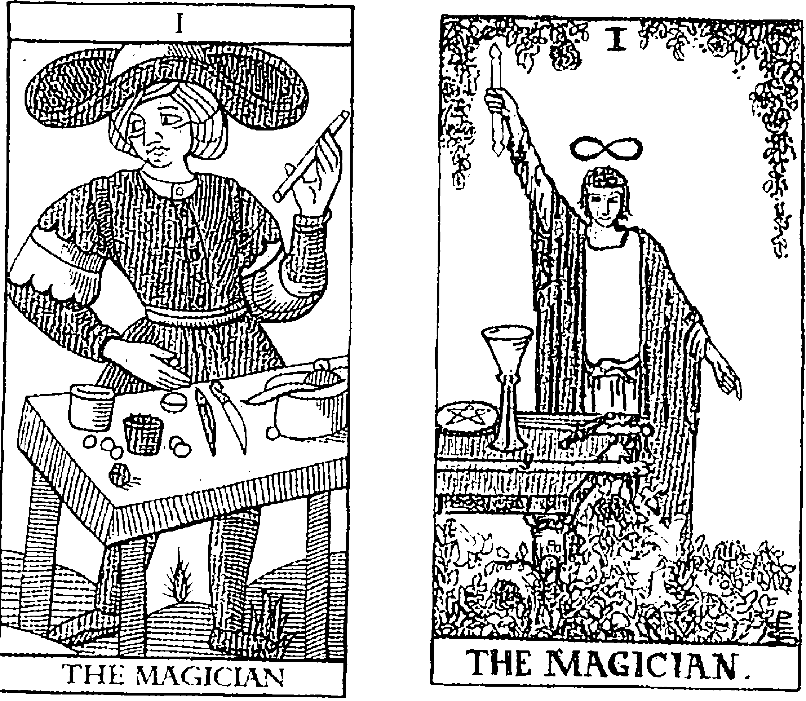

在这两副纸牌上出现了两种不同形式的魔杖。左边的那个街头魔术师的魔杖代表着他的职业，也能起到吸引观众注意的目的，而右边的真正的魔法师使用魔杖获得天堂的法力，用在现实世界中。

树枝砍下。有些权威人士说要在魔杖上砍出几个凹槽，在里面放上磁石和水晶，或在魔杖上写下神的名字或带有魔法的字眼。因为魔杖需要雕刻而成，所以很多魔术师会召集精灵、魔鬼或神仙把他们神奇的力量赋予魔杖——用来治愈疾病、控制大自然或帮助使用魔杖的人达成愿望。

仪式魔术师对待自己的工作很认真。在15世纪早期，那些街头魔术师也使用魔杖，把它作为他们表演中的一部分。从一个表演者的角度来看，魔杖有两种主要功能: 它是致使魔术生效的工具，同时它也是吸引观众注意的一个有效工具，表演者可以用它把观众的目光引开，掩饰手里干着的另外一件事。今天，魔杖已经成为舞台魔术表演者必不可少的一种工具，很多表演者收集这些“鬼把戏魔杖”，这些魔杖可以弯曲、改变颜色、射出条幅或能断为几节等。这不仅让我们想起《哈利·波特》书中韦斯莱兄弟的店里卖的那些稀奇古怪的工具，而且你只要挥动一下魔杖就能把看到的东西变成塑胶小鸡。

## 魔法棍

魔法的象征为什么是一根手杖，而不是一根羽毛或其他什么别的东西呢？这根代表着魔法师神奇魔力的手杖到底是什么呢？根据一些学者的答案，问题要追溯到史前时期的穴居人使用的第一个对他们起到了巨大帮助的工具——棍棒。当然，那时他们手中的棍棒并没有什么魔力，但是确实能够帮助他们防御敌人。实际上，在与敌人对峙的时候，仅仅是把手中的棍棒举起来就能起到震慑的作用。后来，长矛和枪取代棍棒成为了战斗中的武器，但是这种观念仍然延续下来，棍棒的尺寸缩小，成为了具有象征性质的载体。后来又成为了王权的象征。同时有些时候它也成为部落与国家之间使者的信物，携带他的人被认为是受到了国王或首领的委派。后来，到了魔术师的手中，魔杖成为他们的工具，象征着他们对自然界神秘力量的统治权。在魔法的世界里，它延续着自己古老的作用，成为承载权力的武器。

国王的王杖，与魔法师手中的魔杖和穴居人手里的棍棒一样，都是权力的象征。

# 蛇杖

最著名的魔法手杖之一就是希腊神话中众神信使赫尔墨斯手持的带有两条互相缠绕的蛇的带翼权杖。赫尔墨斯用一把长笛跟哥哥太阳神阿波罗换回了这根手杖，后来它也成为他作为信使的标志。

这种手杖的设计形式，棍棒上盘绕着两条蟒蛇的图案可以追溯到公元前3500年的美索不达米亚艺术。后来希腊人为它增添了翅膀，用来代表赫尔墨斯的迅捷，同时还在魔杖上加上了宝石。根据罗马神话，赫尔墨斯（在罗马神话中被叫做墨丘利神）得到这根手杖是因为他看到两条巨蟒在打斗，他把一根拐杖放在巨蟒中间，它们便与他成为了朋友，并从此盘踞在手杖上。在这个故事版本中，手杖象征了沟通带来的和谐。在中世纪，炼金术士，如尼可·勒梅等人相信蛇代表了敌对双方的统一。

蛇杖有的时候也是医药的象征，尽管希腊药神阿斯克勒庇俄斯手里拿的手杖才是最正宗的。他的手杖有一条蛇盘绕在上面。这根手杖被人认为具有返老还童的能力。因为蛇每年都会脱皮，所以它也代表由于药物的治疗，人们的肌体可以重新焕发青春。

中世纪的医生喜欢随身携带代表他们从事的职业的藤条或手杖。很多这样的手杖都代表医药的神奇功效。很多年来，因为药神的手杖和信使的手杖上面都有蛇，人们很难分清，所以后来这二者都成为医药的象征，这也是为什么很多保险公司都印着这样的手杖作为公司标志的原因。

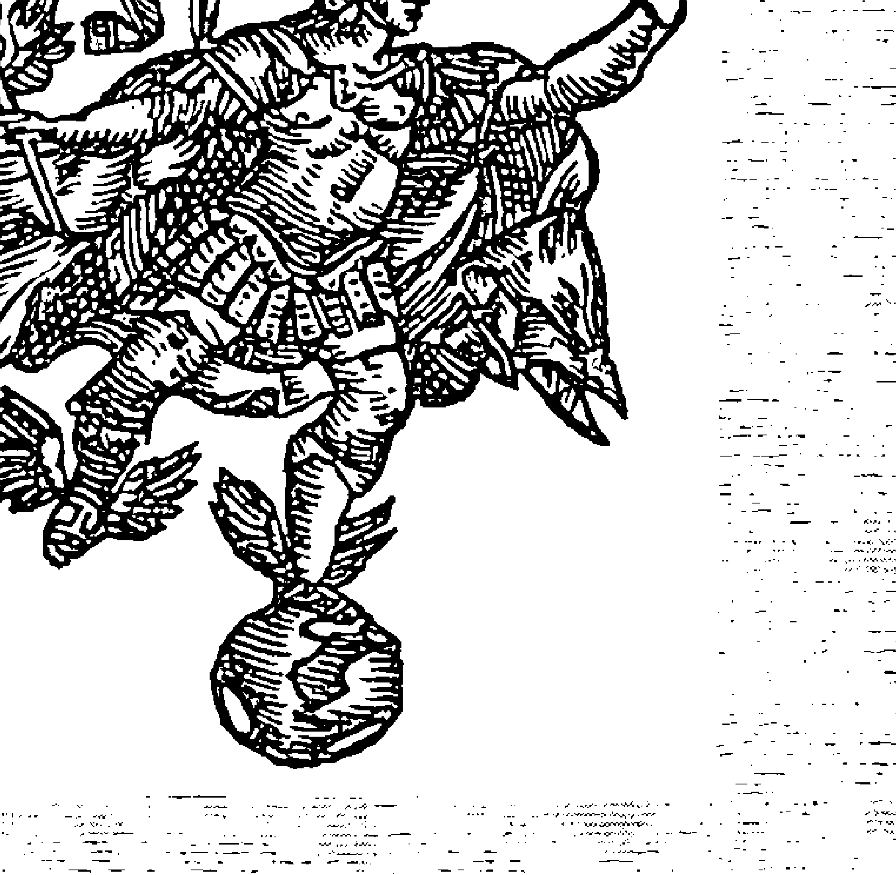

# 魔法词

一个魔术师知道什么咒语代表着他的水平。咒语中单词的拼写以及顺序能够产生魔力。从世界各地的民间故事和神话传说中我们都能看到咒语的出现。无论是对一座城堡施魔法，还是驾驭飞毯，或是隐身，或者让扫帚做饭、清洁等，这些魔法都是通过咒语实现的。咒语中的每个字都得念对，就像弗立维教授告诉他的一年级魔法班的学生们的那样。必须保证每一个字都念正确，才能使得魔法顺利实现。如果念得对，魔法效果就会自动出现，例如把屋里的灯开开。如果念错了就不好办了，你可能一下子会长出3个头来。

霍格沃茨魔法学校教授的很多发音像拉丁文的单词，意思与它们的英文对应字的意思类似。例如“石化”指的就是把人变成石头，“荒诞不经”意味着做出一个博格特那样令人匪夷所思的表情，它也是英文中的“滑稽可笑”的意思。但是带有魔力的字眼并不一定要有什么特殊含义。例如，中世纪的魔法书告诉我们，很多字如“saritap pernisox ottarim”并没有实际的意思，但是这个咒语却能打开所有的锁，而“onaim peranties rasonastos”这条咒语能够帮助你埋藏地下的宝藏。“agidem margidem sturgidem”如果在周二或者周四连说7次的话可以帮助治疗牙疼。没有人知道这些字是怎么来的，以及它们为什么会发生作用。很多其实都是魔法师发明的，就为了在他们的客户面前表现自己。有些魔法字眼则可能是数千年前神或超自然的生物的名字，经过很久以来的发展变化使人不再能辨识出来。但是即便没有确切的含义，这些词也被认为拥有神奇的力量，它们也能吸引魔法师的注意。实际上，从人类使用语言的那一刻起，人们就已经相信字是带有神奇的力量的。远古以来的信念就是如果你想达成什么目标就要说什么字。

一连串带有魔力的字，特别以一种仪式的方式说出来被叫做“咒语”或魔力配方。这也是念咒语的方式之一。在很多传统部落文化中，念咒语是一种仪式，通常还伴随着舞蹈和歌唱等，他们发出嗡嗡声（“咒语”、“魔力”等字都源于拉丁语，拉丁语含义为“歌唱”）。在古希腊和古罗马，作法的人念咒语的时候通常都要号叫。有些印度或佛教传统认为，只有某种神圣的颂歌（曼陀罗）才能召唤神秘的力量，学习这种语言则需要跟随特别的师傅或大师才行。佛教中有一种曼陀罗咒语被认为如果重复一百万次的话，就可以自由地从一个地方移动到另一个地方，如果重复20

万次就能控制大自然。

“abracadabra”这个词可能是大家最熟悉的魔法词了。几个世纪以前，人们认为它是非常有效的。它首先出现在一位生活在公元3世纪的罗马医生瑟瑞纳斯·赛门尼库斯的著作《秘密事件》中。他认为这个咒语是治疗间日疟疾这种严重的隔日出现症状的传染病的秘方。这个字是可以念出来的，但是根据瑟瑞纳斯的说法，最有效的方法是把它写出来，写成金字塔的形状并制成护身符佩戴在脖子上。

```
ABRACADABRA
ABRACADAB
ABRACADA
ABRACAD
ABRACA
ABRAC
ABRA
AB
A
```

因为这样的排列每次减少这个单词的最后一个字母，直到只剩下一个字母，佩戴9天之后护身符会被取下来然后扔到朝东流向的河里。这样病人的病也会慢慢好起来。

直到公元17世纪这个词仍然被人当作带有魔力的词。英国小说家丹尼尔·笛福1772年的小说《大疫年纪事》中曾经写道，很多伦敦人为了保护自己不受1665年可怕瘟疫的袭击纷纷使用魔法字保护自己，其中就包括这个字，并把它写成金字塔或三角形的形状。

中世纪最著名、最有效的魔法字是那些回文字，也就是顺读、倒读都一样的词语。特别是那些能够组成“魔法方块”的词，在各样的词组中，每一个字从上到下、从下到上、从左到右、从右到左，读起来都是一样的。其中最著名的是公元8世纪的这个词组：

```
SATOR
AREPO
TENET
OPERA
ROTAS
```

# 小小的欺骗伎俩

至少有一个地方魔法总能发挥作用：那就是在舞台上，在那些带给人们娱乐的舞台魔术表演师的表演中。17世纪的魔法师非常喜欢在舞台上表演小把戏，这也就是原来的大型魔法中的一小部分。就像其他看起来很像拉丁语但是实际上并不是的咒语一样，这种大型魔术的名称读起来并没有什么意义。但是这样的名字能给人一种神秘的感觉，所以被无数的表演者使用过。

“hocus pocus”本来是表演者的口诀，与“abracadabra”不同，这两个词从未出现在护身符和魔法书中。有些人认为它们起源于意大利魔法师奥库斯·博布斯，还有些认为来源于威尔士方言“hocea pwca”，本义是“小丑的把戏”。还有人说这个字来自拉丁语，本义是“我的身体”。这种解释来自罗马天主教派。但是因为教会一直以来都对魔法持敌对态度，所以在很多学者看来，魔法借用宗教词汇是不太可能的。我们现在说的这个字在17世纪早期就开始使用。英国剧作家本·约翰逊的作品中记录了1625年一位舞台表演者就叫自己为这个名字。这个词还成了一部讲述魔术著作的书——《初级把戏》，它出版于1634年。今天，很多魔术师都把各种魔术字眼运用在一起，所以这个字也开始有了“骗人的小伎俩”的含义。它也可能是英文字“愚弄”(hoax)的起源。

当然，为了能够达到想要的结果，并不只是简单地把这些带有魔力的字眼抄下来，必须要在适当的时候，在特定的星座、特定行星运动轨迹的范围内这么做，而且即便这样，也不能保证就会成功。但是如果一旦失败了，大家就会责怪念咒的人，认为他在什么环节上出了毛病，不是没有把每个字都念正确，就是没有适当的态度等。另一方面，如果病人真的好了，或是人们以为魔鬼退到了远方，也能从一个侧面证明这些字带有魔力的传闻所言非虚。几百年来，相信有些词汇带有魔力的想法从未真正从人们的脑海中消失，小孩们仍然认为“谢谢你”或“请”这样的字眼能够为他们带来神奇的效果。学校里的学生或在商业领域中的广告人士都知道，使用正确的字眼能够帮助他们得到高分或取得优异的销售成绩，很多大公司都肯花数千美元请语言大师帮助他们为自己的产品选定最“神奇”的字，以便使产品变得家喻户晓。

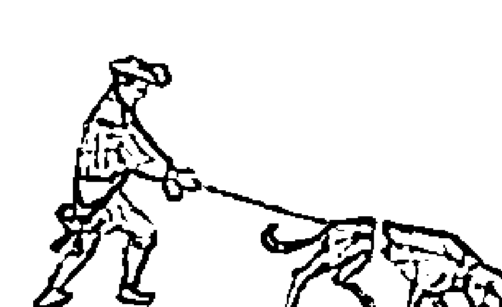

PS 10/102

# 曼德拉草

需要园丁戴上耳套维护的植物恐怕不多，但是斯普劳特教授坚持让学习草药学课程的学生在学习曼德拉草的时候戴上耳套。这虽然看起来非常古怪，但实际上她这么做是与几百年的传统习惯和信仰有着密不可分的关系的。在欧洲，大家都认为当把曼德拉草的根从地里拔出来的时候它会发出刺耳的尖叫，听到的人就会耳聋。但是因为这种植物有很多药学功效而且被认为具有神奇的力量，所以种植它、收割它还是很有价值的。

人们一般认为曼德拉草的根是最有价值的。它的根在地下能够长到3~4英寸长。它根部的几条枝杈，凡是有想像力的人都会觉得它长得很像人体。很多讲述动植物的书都把曼德拉草像人那样分成男女。男性曼德拉草的根就像长满络腮胡子的男的，而女性曼德拉草则好像留着长长的头发。如果再用一把刀雕刻一下，就更能突出曼德拉草长得像人的特点。这个特性当然也就解释了为什么人们会认为在把曼

德拉草从土地中拔出来的时候它会号叫了，就像把人从温暖的床上叫醒一样。虽然富有同情心的人不忍心看到曼德拉草被连根拔起，但有时候确实需要这么做。因为它确实有多种功效。在古代，人们认为它能够止痛和帮助睡眠，如果大剂量服用的话可以缓解精神错乱或疯狂的症状。同时它也被人们用来治疗慢性疼痛以及忧郁或抽搐等症状。

古时候的人和中世纪的欧洲人也折服于曼德拉草神奇的能力。当时流行的爱情毒药中曼德拉草是必不可少的一味药。希腊神话中最著名的魔法师瑟斯就曾使用曼德拉草提炼她最有效的长生不老药。盎格鲁-撒克逊的神话中也认为曼德拉草能帮助那些魔鬼上身的人恢复神志。另外还有很多人相信，如果把它晒干佩戴的话，也能防止邪恶力量的攻击。同时，也有人相信魔鬼就住在曼德拉草的根里面。所以随身携带经过雕刻的曼德拉草根被认为是使用巫术的象征，所以也有人相信在绞刑架附近的曼德拉草生长得最为茂盛。

曼德拉草也被用来占卜。算命的人认为当问到未来的时候，曼德拉草的人形草根就会点头。在德国，农民对待被雕刻过的曼德拉草可谓小心翼翼。在草根上镶上

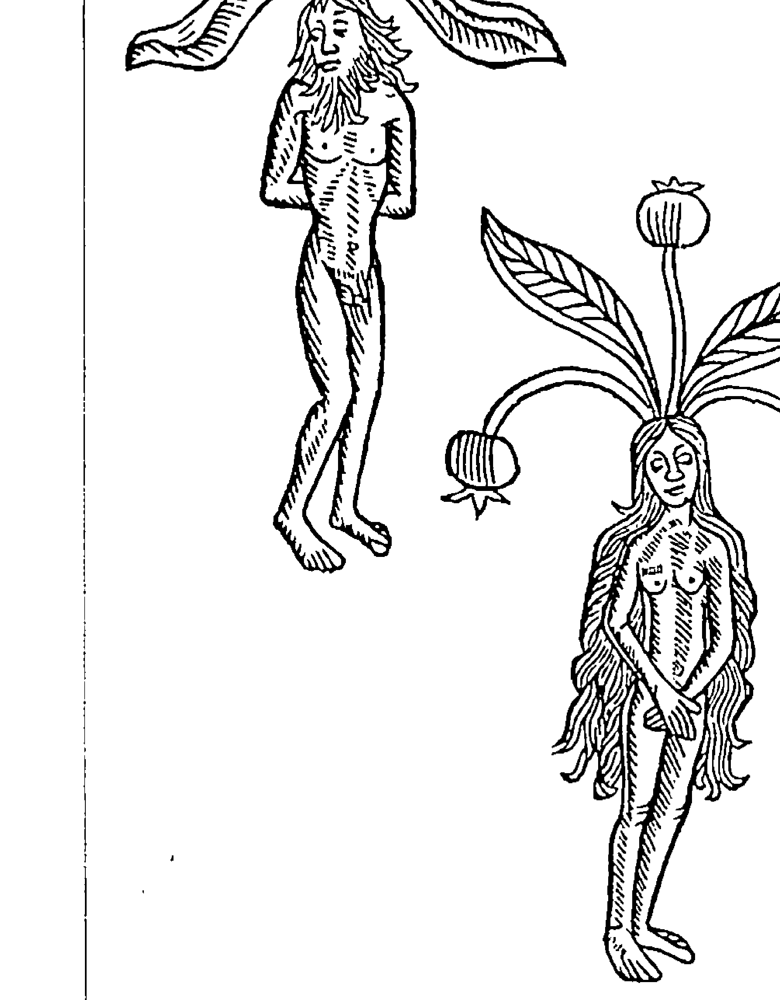

世纪男女曼德拉草的画像

一点谷物作为眼睛，给它们穿上衣服，还会为它们制作特制的小床。把它们伺候得这么好，就是为了让它们到时候能准确回答关于未来的问题。

# 曼德拉草的安全

在近代欧洲，曼德拉草能够发出令人恐怖的尖叫的故事可谓家喻户晓，所以很多准备使用它的人也不得不犹豫再三，害怕把它拔出来的时候不知道究竟会发生什么。有这样担心的人多半会去查查《草药》这本书，书中讲了数千种植物的相关使用知识。在这本书中他们会找到处理这种窘境的方法。很多人提供的建议都是相似的：用绳子把曼德拉草根的一端固定，再把绳子的另一端绑在狗的脖子上，然后退到安全的距离，堵上耳朵后，让狗向你跑过来，这样，就能安全地把曼德拉草的根拔出来了。

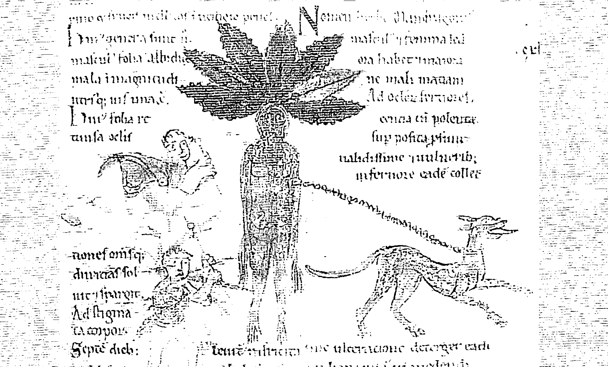

12世纪一本草药学的书讲述了拔出曼德拉草根的安全方法。

# 人头狮身龙尾兽

说到那些能够让我们做噩梦的怪兽，人头狮身龙尾兽要算一个，不仅因为它是海格手下的恐怖怪兽的父亲，同时它在波斯语中的含义也是“吃人的人”，因为它最喜欢的活动就是吞吃人肉。

公元前5世纪，希腊医学家塞特西阿斯（他也是独角兽故事的创作者）首先描述了这种动物。人们传说人头狮身龙尾兽生活在印度丛林中。它的力量、速度和残暴的行径使它成为当地一霸，是最危险的动物。虽然它微红色的、带毛的身体看起来就像一头狮子，但它长着人的头，声调优美，还有一条蝎子一样的大尾巴，能够射出有毒的刺。人头狮身龙尾兽能够把这些刺射到很远的地方，在百米开外它就能向猎物发动进攻。一旦受害者死于它发射的毒刺，就到了人头狮身龙尾兽享受的时候了。它有着巨大的下颚，弧度从一个耳朵一直到另一个耳朵，里面长满了3排锋利的牙齿，能够把人撕咬成一块块的碎片。它能把人全部吃掉，从皮肤、骨头、衣服到人身上戴的东西，片甲不留。所以当有人在丛林中消失而没有一点踪迹的时候，很明显，那就说明人头狮身龙尾兽在附近了。

就像很多古代动物一样，当时人们也对它的存在信以为真。塞特西阿斯的故事

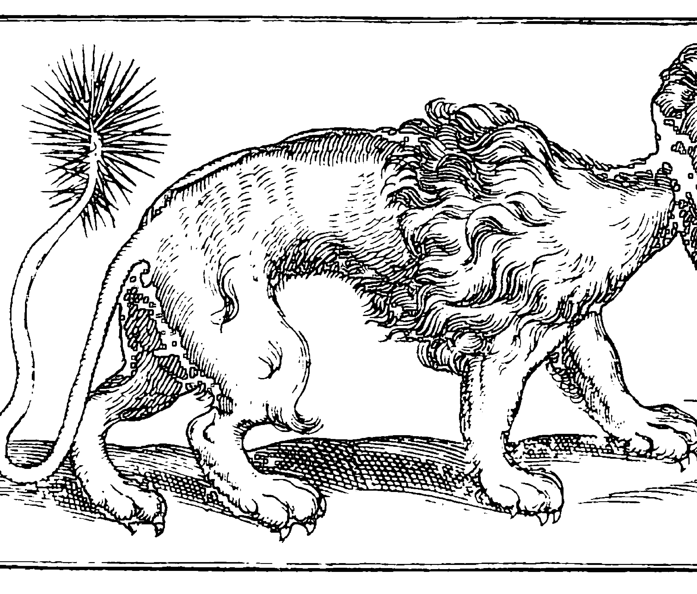

后来又被亚里士多德和罗马自然科学家普林尼重复过。到公元2世纪，人们开始逐渐怀疑人头狮身龙尾兽的真实性。有人开始对它有了别的解释。希腊旅行作家鲍萨尼阿斯认为这种吃人的动物很可能是我们今天知道的孟加拉虎。虽然人们不再相信人头狮身龙尾兽的存在，但是它仍然激发了很多艺术家和插图画家的想像力，同时它也成为了邪恶、暴力和恶毒的象征。

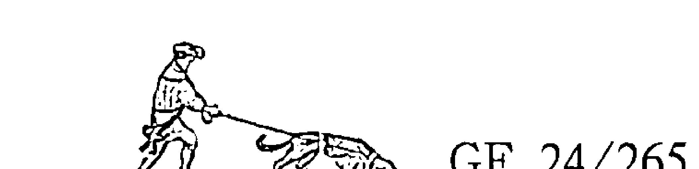

## 梅林（爵士国）

梅林作为亚瑟王的顾问、魔法师和先知，恐怕是有史以来最著名的魔法师了。很多我们喜爱的英国传奇故事中都出现过他的身影。他能够运用自己的魔力在战争中取胜，他能把自己变成猎狗或雄鹿，还能预见未来和左右人的命运。

虽然梅林和他的生活都属于传奇故事，但历史上真的有这么一个人，他就是生活在公元6世纪的威尔士诗人梅德里恩。这位诗人在战争中变疯了，逃到了苏格兰的森林中，在那里预测未来。后来英国蒙默思郡的历史学家杰弗里把梅德里恩的名字改成了梅林，把他说成了英国民间故事《英国国王历史》一书中的人物。这本写于1136年的著作介绍了英国的起源。几百年来，梅林的故事不断被其他作家放大、改写。最著名的要算15世纪《亚瑟王之死》一书的作者托马斯·马洛礼，他的这部关于国王和他的圆桌骑士的小说非常脍炙人口。

与很多神话中的人物一样，梅林也有一对杰出的父母。杰弗里说他的妈妈是一个国王的女儿，懂得法术。他的父亲不是魔鬼就是某种邪恶的幽灵，名叫“梦魇”。梅林继承了母亲的善良和父亲的魔力。还是个孩子的时候，他就表现出了与众不同的天赋，还曾经救了自己的性命。

故事开始于15世纪的英国国王沃提根，国王想修建一座塔，但是却失败了。白天无论他的士兵们多么努力工作，到了晚上塔都会一夜间变成一片废墟。于是，国王沃提根向他的魔术师求助，结果魔术师说，要在修建塔的石灰中加入一个孩子的## 梅林

鲜血，但是这个孩子的父亲必须不是人类。为了寻找这样的孩子，国王的使者很快发现了梅林并把他带给了国王。虽然当时梅林只有7岁，但他准确地解释了为什么塔每天都会倒塌的原因，因为塔建在了一片地下水上面。他还预测出如果把地下水抽干，就会在中空的两块巨石中看到沉睡着的两条龙。后来证明梅林说的并没有错，于是国王把梅林放了。

沃提根国王死后，梅林成为后来3代国王的顾问。这3位国王分别是奥利里乌斯、尤瑟王，以及最著名的尤瑟王之子亚瑟王。人们认为在奥利里乌斯统治时期，梅林把英国的国宝——史前巨石柱通过魔力从爱尔兰移到了英国。当时，奥利里乌斯国王希望修建一个大型纪念碑，于是梅林选择了爱尔兰出产石头的一片地方，这里在爱尔兰被叫做“巨人的舞蹈”，因为人们相信巨石具有特殊的功效。但是1万5千多名全副武装、带着梯子和缆绳的英国士兵却无法把巨石移动半步。梅林不费吹灰之力就把石头从爱尔兰搬到了英国。直到今天，这块巨石仍然耸立在这里（实际上，巨石大约是于公元前2100年就矗立在这里了，这比梅林的故事要早了几千年。但是，当地有些蓝色的石头确实是从威尔士运来的，所以这种认为石头是通过水路运到这里的说法也不是完全没有道理的）。

在尤瑟王时代，梅林更是功不可没。当时尤瑟王爱上了一位名叫伊格娜的公爵夫人，因此，她的丈夫康沃尔公爵格罗里斯把她锁在了重兵把守的城堡中。但是梅林施展法术，把尤瑟王变成格罗里斯公爵的样子，帮助尤瑟王顺利拿到了城堡的钥匙。士兵和伊格娜都没有看出破绽。当天晚上，伊格娜怀孕了，她肚子里的孩子就是后来继承尤瑟王的王位、成为大不列颠国王的亚瑟王。后来，公爵死于一次战争，伊格娜和尤瑟王结了婚。

梅林保护童年的亚瑟王直到他后来继承了王位，后来又做了亚瑟王的先知、魔法师和军事顾问，确保这位伟大的国王取得成功。亚瑟王15岁的时候，梅林帮助亚瑟王取得了神剑。后来，在战争中，梅林告诫亚瑟王直到最后时候才能把剑从剑鞘中拔出来，要做到这点很难，因为亚瑟王的对手眼看就要胜利了，但是亚瑟王听从了梅林的建议，直到最后一刻，才把剑拔出剑鞘。当他把剑抽出来的时候，神剑放出的光芒深深刺痛了对手，令他们不知所措，于是，亚瑟王最终取得了胜利。在另外一次战斗中，梅林也帮助了亚瑟王，他对敌人施了魔法，让他们都睡着了。

人们认为梅林有变形的本领，可以把自己变成小孩、老人、女人、侏儒或动物。他可以控制咆哮的大海，还能为亚瑟王的城堡修建围墙，把试图登上围墙向亚瑟王进攻的士兵扔下去。尽管有如此杰出的能力，但是这位伟大的魔法师还是犯了一个愚蠢的错误。他迷上了一位叫薇薇安的女巫师（有时也叫“湖中之女”），告诉了薇薇安自己神奇功力的秘密。了解了梅林弱点的薇薇安对他施了魔法，把他永远地囚禁在了一棵橡树里。

梅林在文学史中的地位可谓无人能及，他的智慧和神奇的力量吸引了无数艺术家，他也成为数不清的科幻作品中的主人公。这大概就是为什么邓布利多教授会选择他作为霍格沃茨魔法学校爵士团中的一员的原因了。这样的荣誉是每个魔法师都梦寐以求的。

梅林陶醉于薇薇安的魅力中。

## 人鱼

当看到霍格沃茨湖里那些灰皮肤、黄眼睛的人鱼,实际上是金发碧眼的美人鱼的时候,我们的惊讶程度并不亚于哈利。其实不论是美丽还是丑陋,它们都来自人鱼家族——这个家族由各国神话传说中的人鱼所组成,在德国、英国、爱尔兰、斯堪的纳维亚、俄罗斯等国家他们都有不同的名字。就像人一样,人鱼的大小、尺寸不尽相同,有些善良有些邪恶,有些美丽有些丑陋。但是他们都有一个共同的特点:就是腰部以上是人形,下身却有一条鱼的尾巴。

人鱼首次出现是作为古代文明中的神。艾雅(或希腊神话中的奥阿密斯)大约在公元前5000年是古巴比伦人崇拜的海神。人们认为他教授了艺术与科学知识,那个时期的巴比伦还没有法律或制度可言,人们的行为还都像野兽一样,人鱼使他们变成了文明人。第一条女人鱼是叙利亚神话中的阿塔盖蒂斯,因为人们认为她管理着海洋,在为她修建的神庙中教士甚至向其崇拜者贩卖捕鱼执照。

我们现在最普遍接受的那个美丽、长发的人鱼形象开始于中世纪。人们通常把她描绘成坐在岩石上唱着甜美的歌的样子。同时她会梦幻般地凝视着自己在镜子里的影像,梳理长长的头发。关于人们为什么会认为人鱼喜欢梳头有多种不同的解释,有一派观点认为那是因为曾经有一位艺术家抄袭了原来对人鱼的描绘,不小心把她画成了那个样子,后来的艺术家都跟随这种画法。根据这派观点,所谓的“镜子”实际上画的是人鱼在弹琴(她的姿势实际是在拨弄琴弦),而“镜子”实际上本来是一种乐器,有可能是竖琴。还有人解释梳子和镜子象征着女性的美丽和空虚。这派观点认为人鱼能够摧毁男人。

实际上,虽然美人鱼长得漂亮,但是人们经常把她们描述成用自己的美貌勾引海员,造成他们死亡,并把他们的灵魂拘禁在海里的拥有魔力的物种。最恶毒的美人鱼甚至会把人类当作猎物吃掉。因此,看到美人鱼是个坏兆头。她的出现是风暴、沉船和淹死人等的前兆。一个愤怒的美人鱼会报复得罪她的人,把他淹死,甚至用大水淹没那个人所在的村庄。

幸运的是,并不是所有的美人鱼都这样坏。有些美人鱼在草药方面的知识很渊博,如果能够说服她们,她们就会帮助人们治病。她们的超能力能够帮助她们预测天气和未来,实现人们的愿望或者发现沉船中的宝藏。正是因为这些神奇的力量,神话中的美人鱼经常遭到人类的捕获，人们强迫她们实现人类的愿望，而且，抓到一条美人鱼其实并不难，你只需偷走她的东西，例如梳子、镜子、腰带或帽子。一旦抓到美人鱼，她们只有在得到自己丢失的东西之后才能获得自由。

有些贪恋美人鱼美色的人想娶她们做老婆，美人鱼也想找人类做丈夫，这不仅是为了爱，也是因为只有这样她们才能得到一个灵魂，所有非人类生物都没有灵魂。在中世纪教会中，这种人妖相恋结婚是否有悖于道德伦理，美人鱼是否能因此而得到灵魂一直是争论的焦点。但是不管怎样，他们生的孩子可以很容易地被认出来，因为他们长着蹼状的手脚，但是其他方面与普通人的孩子没有任何分别。

男人鱼与人类的女人结婚的故事也时有发生，但是不像美人鱼那样普遍，这也许多跟男人鱼都以丑陋出名有关。实际上，有些文化中非常明确地区别男女人鱼，认为男人鱼讨厌人类，他们也不想得到灵魂，他们都是粗鲁的丈夫，甚至还会吃掉自己的孩子。

虽然有关男人鱼的故事也流传了几百年，但是从没有人真正看到过他们。从中世纪直到最近，倒是有很多有名的人宣称见到过美人鱼。其中包括克里斯托弗·哥伦布和亨利·哈得孙，但人们从未找到过物理证据支持这一点。有些想赚钱的坏蛋展出过所谓的“美人鱼”，但是后来发现这些都是假冒的。有一个人曾经把猴子的上半身和一条大鱼的下半身缝制在一起，拼凑了美人鱼。至于那些严肃的学者、正直之士所报告的看到的美人鱼，多半是海豹、海象、海牛和儒艮（一种生活在亚洲的海牛）等。这些动物经常漂浮在海面上而且喜欢像人类妈妈那样喂养自己的幼兽。当然，如果你亲眼看见这些动物就会明白，把它们跟美丽的美人鱼比起来，二者根本没有什么相同之处。很难把这些丑陋的动物与长头发、妩媚美丽的人鱼混淆起来。但是最经常报告看到人鱼的人多数都是海员，他们常年累月都在海上，所以不难解释只有他们能把肥胖丑陋的儒艮误看成美丽的美人鱼。

## 人鱼的亲戚

很多神话中的人物或精灵都与水紧密地联系在一起，但他们不一定是人鱼。这些生物包括水中仙女、妖妇等。虽然人们经常把他们跟人鱼混为一谈，但是他们实际上各有各的特点。

水中仙女来自希腊神话，是3种主要的水中仙女中的一种（其他两种分别是生活在地中海中的涅瑞伊德斯仙女和生活在大洋中的海洋女神）。水中仙女只出没在新鲜的水源中，例如河流、湖泊、泉水和山涧泉水中。在古代，人们认为每个主要的泉眼都生活着一个水中仙女，所以不能在这样的泉水中洗澡。虽然这些仙女生活在水中，但她们长得跟人很像，并不像美人鱼那样有鱼鳍。

水中妖妇也源于希腊神话，与水中仙女一样生活在河流之中。但是，后来因为她们得罪了爱神阿佛洛狄忒，她把她们变成了长着鸟的身体和女人的头的生物，把她们都驱逐到了一座位于意大利南部的小岛上。虽然她们长得跟美人鱼一点都不像，但是人们还是经常把二者搞混，这是因为她们都有杰出的音乐才能。在海上航行的水手听到她们的歌声都会情不自禁，无法把持自己。在传奇故事《奥德赛》中，英雄奥德修斯要求他手下的士兵把耳朵都堵住才逃过这一劫，他的船队成功驶过了这些仙女所在的岛。

海妖看起来很像海豹，据说生活在奥克尼郡和设得兰等英国群岛上。雌性海妖把她们的皮肤摆在海岸边，假装美丽的女人，诱惑人类男子。如果一个男人发现了海妖的皮，可以强迫她跟自己结婚。如果她还能找到自己的皮肤，她就能离开自己的丈夫和孩子重新回到海里。就像美人鱼一样，海妖也会向人报复，她们可以造成严重的暴风雨或沉船。

天使神秘学院官方淘宝 : http://strc.taobao.com
获取更多好书，请加微信 : 13641926204 或 QQ:715104687

# 莫佳娜

女巫师莫佳娜无所不能，她既能施展魔法，又能在天空中飞行，能够变成动物，也能用草药治病。因此她才能在巧克力蛙上有自己的一席之地。莫佳娜是亚瑟王同父异母的妹妹。作为一个虚构的人物，她在意大利、法国和英国神话故事中都出现过。有时候她是女神，有时候是女巫，还有的时候是仙女。无论她的角色是什么，她的传奇色彩都使得她成为人们过目难忘的人物。

这张19世纪的绘画描绘了莫佳娜施展魔法的场面。

莫佳娜首次出现在13世纪杰弗里所做的《亚瑟王传》中。杰弗里把她叫做仙女摩根，把她写成一位美丽、博学的女人，拥有治疗病人的能力，能够飞翔还能变形。她与她的7个妹妹生活在阿瓦隆岛上。亚瑟王在其最后一次战斗中受了伤，莫佳娜把他带到了阿瓦隆，把他放在金床上，帮助他治疗疾病。后来，很多故事都传说莫佳娜是从梅林那里学到这些法术的。

在中世纪晚期，巫术成为了欧洲的众矢之的，会巫术的人被认为是邪恶的人，即便是小说中虚构的人物也是这样。因此，新的亚瑟王传奇故事中的莫佳娜开始被写成坏人。在托马斯的《亚瑟王之死》一书中，莫佳娜成为了一个邪恶的人，书中的莫佳娜使用魔法摧毁了她的哥哥亚瑟和王后，得知亚瑟在没有了他的神剑之后是不堪一击的，莫佳娜把神剑偷走给了亚瑟的敌人，希望他们能杀死国王。后来，她给了自己的哥哥亚瑟王一件神奇的斗篷，在决战的关键时候，亚瑟王披上这件斗篷挽救了自己的生命。故事的结局是为了躲避亚瑟手下士兵的追赶，莫佳娜把自己变成了一块石头。

在亚瑟王传奇时代，莫佳娜同时出现在爱尔兰神话中，在神话中她化身为美丽的仙女，喜欢惊吓别人，在后来的苏格兰神话中，她又成为了一个被一群女巫囚禁在城堡中的女人。在意大利史诗《奥兰多》中，她是生活在湖底的美丽女魔法师，把财宝分发给那些她喜欢的人。人们也认为她就是生活在法国海岸旁边的美人鱼。正因为莫佳娜扑朔迷离的身世，不同的神话对她才有了不同的版本，有的认为她就是能够使海员神魂颠倒的会唱歌的美人鱼，有人则认为听到她的歌声就能把人带到水下的神奇世界。

## 莫佳娜海市蜃楼

> 莫佳娜同时也是历史上最著名的意大利海市蜃楼的代称。这个位于意大利墨西拿海峡旁边的地方在西西里群岛的对岸，那里经常出现神奇的海市蜃楼。在雾中，你会看到海面上升起一栋栋美丽的城堡，而莫佳娜就出现在云端。这种海市蜃楼现象据说是因为海洋上湿润的空气引起的，其实就是海峡那边的楼房和悬崖。

## 木乃伊

帕瓦蒂最害怕的就是碰到木乃伊，但是我们不能责怪她。因为她想像中的木乃伊并不是我们今天看到的那些安静地躺在博物馆、石棺中的，而是那些我们从恐怖片里看到的恐怖的怪物，那种伸出僵硬的四肢，追赶着我们，每走一步他身上的绷带都随之脱落的可怕形象。

木乃伊可以用来形容任何被长时间保存下来的尸体，但一般特指那些古埃及的用绷带包裹的木乃伊。他们身体的水分已经被完全排干，使用了一种特殊的化学物质，并且全身缠满了亚麻布绷带。在公元前3000年到公元200年，古埃及人保留了成千上万的这样的动物和人的尸体，把这些尸体保存在金字塔中、地下墓穴或是古代的墓地中。他们之所以历尽千辛万苦要把这些尸体保存下来，是因为他们认为死去的人的灵魂需要这样一个躯壳才能完成他们的再生之路。同时，他们也相信在一些重要的宗教仪式中，这些死去的人的灵魂会进入到这些躯壳中并再度复活。

虽然到公元1世纪，埃及人已经不再使用这种木乃伊的保存方法，但是他们却从未退出公众的想像。在中世纪时期，木乃伊粉是很多药物和带有魔力的毒药的重要成分之一。1798年，拿破仑侵占埃及之后，木乃伊逐渐成为了收藏家争夺的宝物，满足了很多人对历史的好奇心。意大利冒险家吉尔梵希通过挖掘古埃及坟墓、收集木乃伊发了财，然后他在欧洲把自己的收藏进行了展览。1830年间，他的朋友对揭开木乃伊绷带的仪式实行卖票参观，结果公众簇拥而上，同时到场的坎特伯雷大主教甚至被挤到了门的一旁。19世纪晚期，几乎在每个英国拍卖公司都可以买到真正的木乃伊，所以很多的英国有钱人把木乃伊藏在自家阁楼上（至于为什么，大概每个人都能猜得出来）。

很快，科幻小说作家就把想像力运用在了木乃伊的身上，他们写作的畅销书都提到了木乃伊复活的故事。埃德加·艾伦的短篇小说《与木乃伊的谈话》写成于1845年，其中讲到了几个埃及人在深夜偷偷溜进博物馆，用电击的方式让古代埃及木乃伊复活，但是不久之后他们就发现这些木乃伊不是没有受过教育、行为野蛮的粗人，正好相反，他们是3000多年前的贵族，通晓天文学、工程学等科学知识，比处在维多利亚时代的他们还要知识渊博。惟一让他感到惊讶的是一种小薄荷糖，因为从来没有见过。

有关木乃伊的最著名的英语故事可能要算1892年柯南·道尔写的《抽签号码249》。在这个故事中木乃伊被人唤醒，成为了杀手，犯了故意伤害罪。柯南·道尔把木乃伊描写为“可怕、恐怖的东西，用它刀锋一般的眼睛和强壮的纤维一般的手臂杀死自己的敌人”。这样的描写后来被成百上千人抄袭，也形成我们今天对木乃伊的印象——一个无所不能的魔鬼。

今天，关于木乃伊的电影、书籍和短篇小说可能与木乃伊的数量不相上下，但是还是最好不要告诉帕瓦蒂的好，因为她已经被这个怪物吓得够呛了。

## 尼可·勒梅

哈利·波特迷都对尼可·勒梅非常熟悉。尼可·勒梅是中世纪的炼金术大师，他发明了魔法石（这块石头被魔法和诅咒保护起来了）。魔法石具有神奇的功效，能够把石头变成金子并能使人青春永驻。哈利·波特在霍格沃茨魔法学校的第一个学期，已经665岁的尼可·勒梅仍然活着，与他的妻子生活在英国德文郡。这个岁数也是历史上尼可·勒梅这个人如果活到今天的岁数。事实上，尼可在历史上确有其人，他是一位化学家。他的妻子也与书中一样，确实叫“长春”，如果他写的东西属实，那么，他发明魔法石的时间是在1382年1月17日。

我们对勒梅先生的了解多半来自他的著作《炼金术》，在这本书中，他讲述了他是如何成为一名化学家的。大约1330年他出生在一个法国小镇。当时在西欧炼金术已经非常流行。在古希腊和古埃及的金属工匠艺人的基础上，大约在1200年炼金术的秘密从阿拉伯世界传到欧洲。这些书籍描述了炼金术实验室中复杂的设备、各种化学元素以及炼金所需要的繁复的步骤。同时也讲到了得到这样的石头之后如何能使人长生不老。炼金术也被认为是巫术的一种，进行这种活动的人必须保持卑微的心态和对任务的虔诚。炼金术士也因此能够得到心灵的净化和思想的升华。很多人对这样的活动都持怀疑态度，更多的人则在自己家里建起了实验室，试图自己提炼这种神奇的石头。

尼可·勒梅

作为一个年轻人，当时的勒梅似乎对炼金术并不感兴趣，虽然他肯定听说过这种方法。在他所处的年代，他算是受过良好教育的，并通晓拉丁文和法文。后来他搬到巴黎做起了生意，还做过职业书记员、公证人和图书经营商。在那个时代，很多人还都是文盲，既不会读也不会写。当他们做生意需要把一些重要的东西记下来时，他们就会寻求职业书记员的帮助。勒梅也负责抄写书籍和手稿（100多年之后，印刷的书才出现），他还向有钱人传授知识，教他们如何写作，如何签自己的名字。他开的第一家店是一家公证书商店，随着生意的不断扩大，他雇用了学徒帮助他，在附近买了一处房子，又把他的店面调整到一楼。这个时候他遇到了自己的妻子，她是一个美丽而富有的寡妇。

直到这个时候这个年轻的书记员的生活还没有什么惊人之处。但是随着一个陌生人走进他的商店向他卖了一本书之后，他的一生从此改变了。“那本书被放到我的手上，”勒梅写道，“只需要两枚金币，这本烫金的书又大又旧，不像别的书那样是用纸或羊皮做成的，这本书是用薄薄的树皮做成的。书的封面是用铜做的，非常美丽，上面写满了奇怪的数字。”勒梅研究了这本书，同时发现其中包含了如何炼金的秘诀。但是书的大部分内容他都读不懂，像很多关于炼金术的书一样，它们都是用含义模糊的神秘字句写成的，而且其中最深奥的秘密都不是以文字的形式出现，而是包含在带有象征意义的符号里。例如，在一幅画里描绘的是在一处沙漠里，到处都是美丽的喷泉，喷泉里都是蛇。另外一幅画是一座处被风吹得倾斜的灌木丛旁边的山，山上有狮鹫和龙。

炼金的过程通常需要持续几个星期或几个月的时间，尼可·勒梅只有一个助手，那就是他的妻子。

勒梅把书上的画都抄下来带给他的同事们看（当然，他的妻子不被允许看这本书），并把书中的图画悬挂在他的店里，希望有人能够解释画的含义，但是没有人能做到。也许就是在这个时候勒梅修建了他的实验室并开始研究。先从他能看懂的部分着手，但是并没有什么作用。古代的炼金术传统要求从事这种活动的人必须被一个富有经验的老手领进门。在失败了很多次之后，勒梅终于发现有这样一位老师就生活在西班牙，于是他立即动身到西班牙拜师学艺。得到了书中很多秘密的解释之后，勒梅又回到了巴黎。经过3年的努力，他终于达到了自己的目标。“我把一些红色的石头与水银结合在一起，”他写道，“当时我的妻子也在场，我几乎提炼出了最纯的金子。”

勒梅说他曾经3次制成了金子。但他其实并不需要这些金子，他和妻子的生活很简朴，只用来帮助别人。在他们有生之年他们修建了14家医院、很多宗教建筑、教堂，还帮助教堂付清所欠的债务，慷慨地把钱财施舍给贫穷的寡妇和孤儿。长春死于1397年，勒梅死于1417年3月22日，在他的妻子死后的那些年，他把所有精力都投入到炼金术的写作中，他的尸体被埋葬在家附近的圣·雅克大教堂中。

我们该如何写作勒梅的故事呢？他是不是真的会制造金子？或者他所有的这些经历都来自他的虚构？无论是那本古代的书，还是他到西班牙的旅行，抑或是魔法石本身都没有确切的答案。我们惟一的信息来源就是勒梅自己。但是有些东西确实是无法置疑的事实。首先，尼可·勒梅这个人是真实的，他杰出的才能和他乐善好施的行为也是真的（有些他修建的纪念碑几百年来依然矗立在那里）；有关他的炼金术的故事也使很多人相信这种古老技艺确实存在过，很多人也都相信魔法石的存在。

17世纪，勒梅的故事成为了传奇的一部分。有人说在勒梅死去不久就有强盗闯进了他的家，寻找金子。他们什么也没有找到，但却找到了这位伟大的炼金术士的棺材。他们希望在其中找到传说中的魔法石，但是他们发现棺材是空的，里面既没有魔法石也没有勒梅的尸体。有些人认为实际上勒梅和他的妻子根本就没有死。他们通过使用那块魔法石，变得长生不老了。后来陆续有人报告说见过活着的勒梅。法国国王路易十四还曾经派出使者到印度寻找勒梅的下落。1761年，有人说在巴黎剧院的一次表演中看到了勒梅的身影。最近一次看到勒梅的人恐怕就是邓布利多教授了，《哈利·波特》的书中写道这两个人开始思考放弃永生的能力，以便获得永久的休息。

# 猫头鹰

据我们所知，《哈利·波特》书中的魔法师非常幸运，他们最早配有猫头鹰为他们提供可信赖的邮政服务，但是，猫头鹰和魔法师之间的神秘联系已经有很长的历史了。中世纪欧洲神话中的猫头鹰也许并不能帮助它们的主人携带信件，但是人们认为猫头鹰是魔法师忠实的伙伴，因为它有敏锐的观察能力和杰出的记忆力，能够帮助主人记住复杂的魔法配方和咒语。很多像纳威·隆巴顿那样的心不在焉的魔法师，在遇到危险情况的时候都需要寻求猫头鹰的帮助。

猫头鹰海德薇能够与哈利沟通，听从他的指挥，人们对猫头鹰的这种印象可以追溯到古代希腊人。他们相信猫头鹰有很高的智商。希腊的智慧女神雅典娜的肩膀上就站着一只猫头鹰。有人甚至认为雅典娜也会化身为猫头鹰，从她的敌人那里窥探秘密。雅典城里富有的人喜欢带着猫头鹰招摇过市。

但在其他文化中猫头鹰也象征着死亡、疾病和邪恶。这可能是因为它是夜行动物，而且捕食其他鸟类。在中国，猫头鹰的形象就与雷公结合在一起；在日本，人们认为它能带来饥荒和瘟疫；在古埃及，猫头鹰是死亡和夜晚的象征，而在古罗马，如果在白天看到了猫头鹰就意味着要倒大霉了。很多迷信的罗马人认为惟一的防范方法就是抓住并杀死这只猫头鹰，把它的灰烬投入台伯河中。在传奇故事中，猫头鹰的叫声预示了罗马皇帝凯撒的死亡。

也许哈利·波特和他的朋友听到下面的话会感到高兴。很多文化都认为拥有或携带猫头鹰身体的一部分（爪子、羽毛、眼睛、心脏、骨头或它的整个身体）能给人带来神奇的力量免受伤害，可以使主人不得狂犬病或癫痫病，也可以为他带来勇气、智慧和力量。中世纪欧洲的职业医生为了满足顾客的需求不得不储存大量猫头鹰的肢体；那些希望在战场上打胜仗的人，或是希望知道所爱的人心中秘密的人都希望拥有猫头鹰身体的某个部分以帮助他们达成愿望，所以说索普这样的调配毒药的高手，手里面一定有猫头鹰身体的一部分。

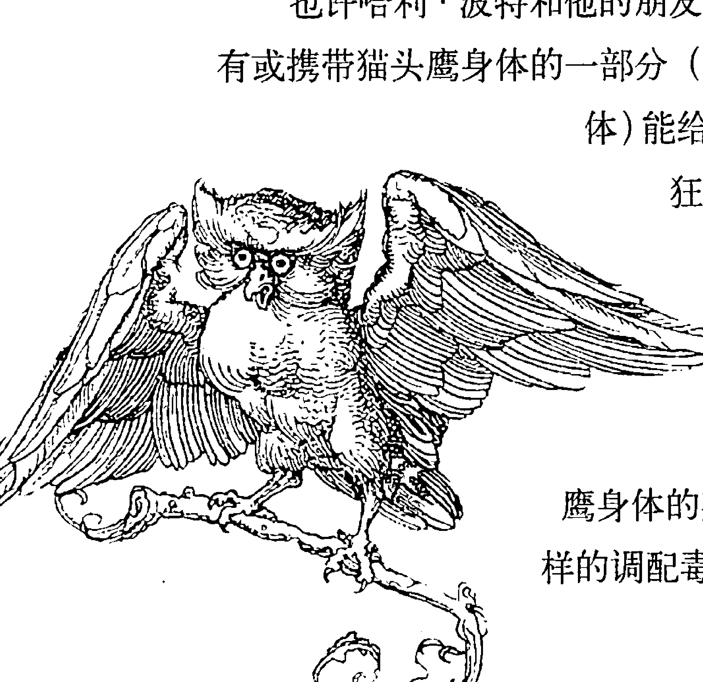

# 手相学

如果哈利·波特的左手手掌上的纹路揭示了什么秘密的话，那就是他在这个世界上停留的时间不会太长了。至少根据特里劳妮教授的手相学课堂上的理论，情况就是这样的，她认为哈利·波特的生命线是她所曾见过的最短的。但是这么说也太武断了！

手相术来自希腊语，前半部分“palm”意为“手”，后半部分“mancy”意为“先知”，这是一种复杂的算命方法，依据算命者手掌的指纹、手的形状和大小，分析他们的个性。在古中国、西藏地区、波斯和美索不达米亚地区以及古埃及都有这种手相术。有传说认为希腊哲学家亚里士多德把手说成人体的主要器官，他向自己最著名的学生亚历山大大帝教授了手相学。朱利叶斯·凯撒的手相术也非常高超，据说他根据手相挑选他的士兵。

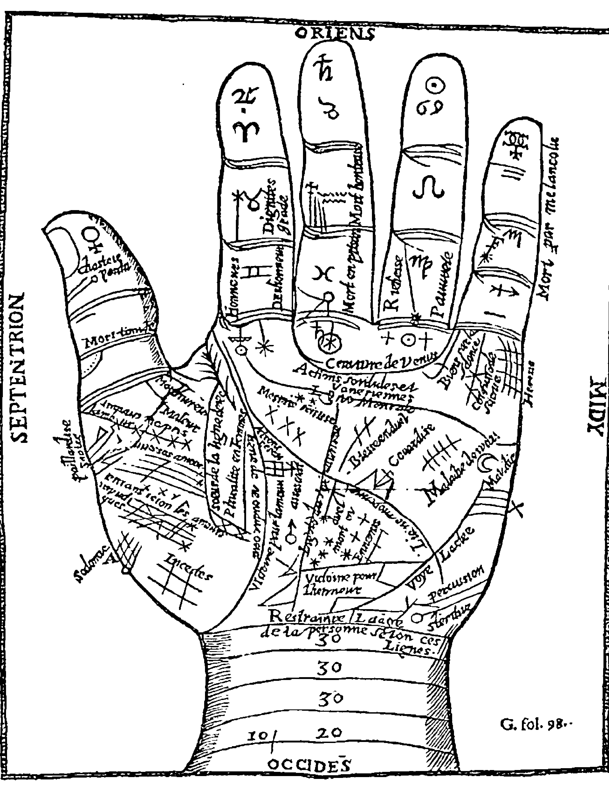

读手相是非常复杂的工作。这份1640年的完整的手相图向我们展示了手相和星象之间的联系。

虽然古代人对手相学一直非常推崇，但直到欧洲文艺复兴时期它才成为了系统化、理论化的一门学科。关于这门学科的第一本完整著作出现在1475年的德国，名叫《手相艺术》，当时正是印刷术被发明后不久。在这本书以及后来出现的很多手相术书中，人们都能找到对指纹、手掌形状等的详细说明。对这些细节的分析不仅能够看出一个人的个性和命运，同时也能看出他是否患有心脏疾病、肝炎或其他疾病。17世纪，在一些主要大学中都有教授手相学的课程。

19世纪末期手相学的发展达到了顶峰。同时也出现了最著名的手相专家肯特·路易斯·汉莫。在伦敦开业的他每年要看几千名访客。他使用的方法是从他的爱尔兰母亲那里学会的。之所以声誉卓著，是因为他的手相预测非常准确，很多贵族慕名而来，其中包括英国的爱德华七世、爱德华八世、比利时国王利奥波德、沙皇尼古拉二世、托马斯·爱迪生、马克·吐温和奥斯卡·王尔德等。从他那兴起的手相学从未衰落过，直到今天，在很多欧洲国家和美国也仍然能够找到专业手相术士的踪迹。

## 手相术的一些基本原理

绝大多数读手相的人看的都是两只手，左手被认为揭示了一个人的一些遗传特性，而右手则显示了他在遇到困难或是需要抉择的时候会做什么样的决定。手掌上的每条纹路都会被认真研究，然后再把这些综合起来。

粗粗地看一下你的手掌，你会发现上面有很多不同的纹路，或长或短，或深或浅。手相学书籍中对每一条纹路都有不同的解释，各派观点也不尽相同，但是它们都遵循下面这些基本原则：

- 1. 生命线：与大家一般认为的相反，这条线并不预测一个人会活多长，它描述的是一个人的生活质量和活力。如果是纹路很深、向下的曲线，虽然不一定很长，都表示这个人很有力量。如果线比较直就说明此人的忍耐力不够。
- 2. 智慧线：这代表了一个人的智力水平。这条线代表了一个人的创造力、专注的能力以及解决问题的技巧。这条线越长说明你集中精神的时间越长。
- 3. 感情线：这条线反映了一个人处理感情的能力，以及他对于爱和感情有什么样的期望。
- 4. 命运线：这条线反映的是此人控制命运的能力，也反映了一个人是否能承担责任、正确运用自己的智慧。
- 5. 阿波罗线：有时候也被人形容为太阳线，它代表了此人对自己的内在满意程度。不是每个人都有阿波罗线，但是如果有这条线就意味着这个人知道如何享受生活。有些解释方法则认为这条线越长，一个人的运气就越好。

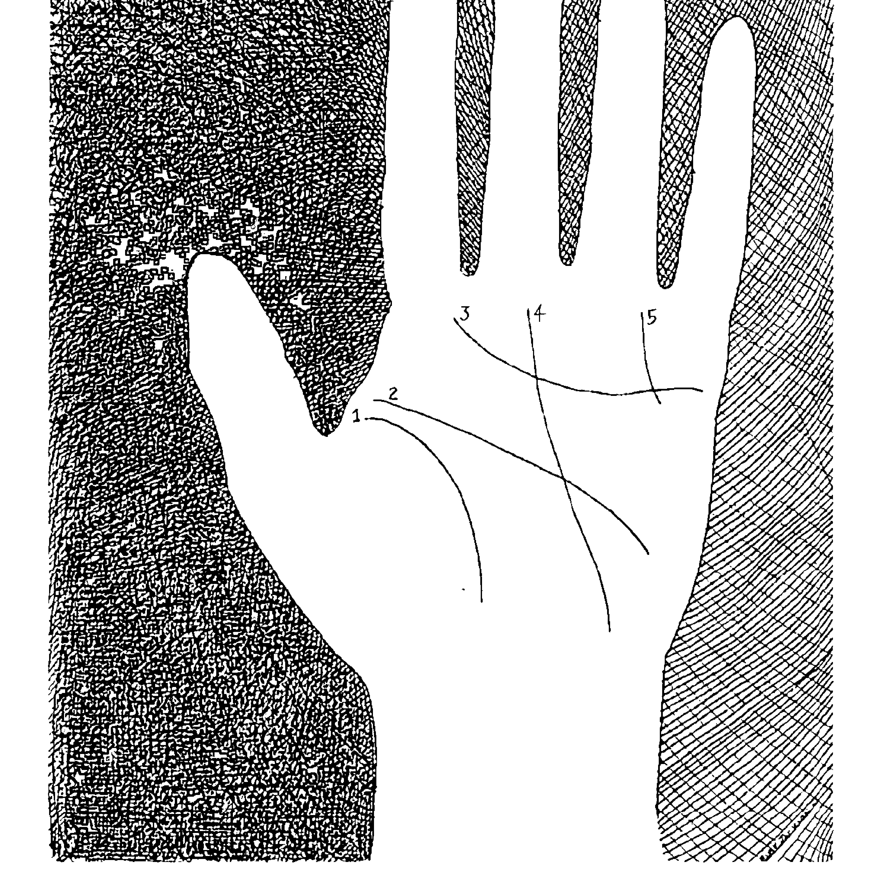

# 帕拉瑟

他的画像在霍格沃茨的走廊上占有一席之地，并常出现在巧克力蛙和魔法师纸牌上。他作为治疗师的50多年的从业经历充满了传奇色彩。他的全名叫菲利普斯·奥瑞罗斯·塞尔菲拉斯特斯·班巴斯特·范·侯韩赫姆。但是作为一名真正的魔法师，人们还是习惯叫他“帕拉瑟”。

生于1493年瑞士一座小镇的帕拉瑟从小就对魔法和医学非常感兴趣。他的父亲威尔汉姆是一名乡村医生，对于炼金术（参见魔法石词条）很感兴趣。从父亲那里他学习到了草药和细菌的知识，知道了天空中的星星如何影响地球上的生物（参见魔法和星象学）。虽然家里很穷，但威尔汉姆喜欢收集魔法书，而他的儿子帕拉瑟又非常好学。他亲自采集草药并做成药材。当时认为草药的颜色和形状决定了它们的用途（参见草药学词条）。他在他父亲行医的附近村庄学习、观察，得到了一些冶金学常识，包括铁、锡、水银等金属的知识。他后来把这些运用在制作药材方面。他还采访过很多当地的农民、牧羊人和巫师，向他们学习民间秘方。他勤学好问的品行日后帮助他取得了巨大的事业成功。

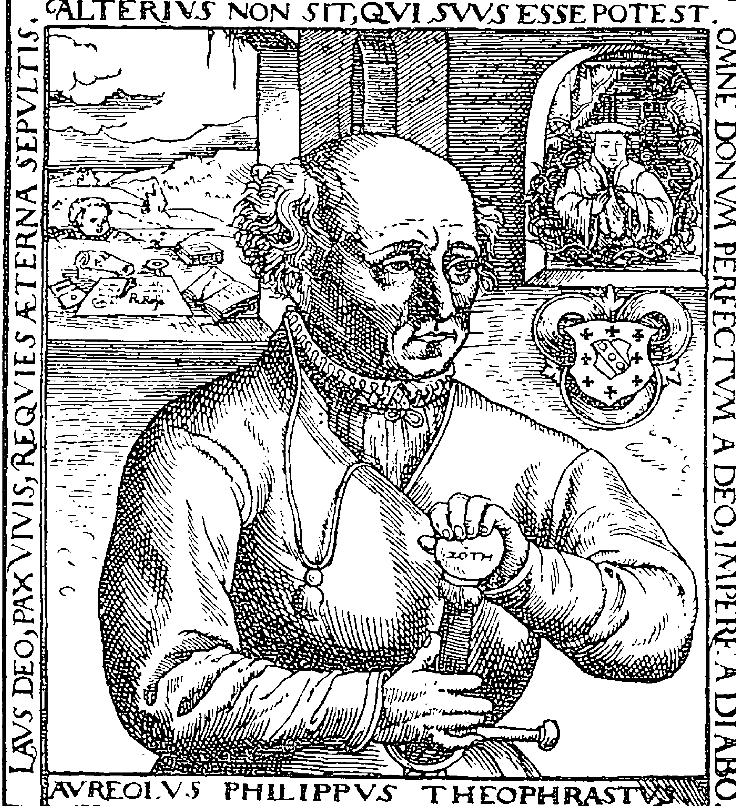

人们认为帕拉瑟携带的短柄匕首的刀把上镶的就是魔法石。

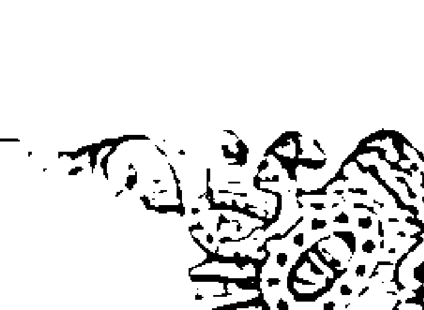

14岁的时候，帕拉瑟离开家开始了游学历程。他在维也纳大学学习了4种“高级技术”（分别是算术、几何、音乐和占星术），毕业之后来到意大利继续上了医学院。但是由于当时爆发了战争，他不得不中断学业，当上了军队医生。

在战场后方，他开始把自己的很多独创性的思想运用到医学实践中。当时外科医生的任务非常艰巨（外科医生在那个年代地位要比医生低很多，那些有医学证书的人从不用做手术）。而天才的帕拉瑟并没有遵循传统的手术方式而是自己另辟蹊径。例如，当时治疗伤口会在上面涂抹上牛粪、羽毛和毒蛇的脂肪，受伤的四肢只能等到化脓然后锯掉。但是帕拉瑟却选择把伤口清理干净然后等待它自然愈合。这种方法在今天看来很正常，但在那个时候无疑是非常少见的。

战后，帕拉瑟在欧洲各地帮助别人治病，在锻炼技艺的同时，他也在研制新药。他的名声逐渐广为传播，因为别的医生治不好的病他能治好。像当时的很多医生一样，帕拉瑟在诊断病人病情的时候也把星座、护身符、魔法和诅咒等因素考虑进去。但是他的与众不同之处在于他喜欢钻研，而且能够接受真正发挥作用的疗法，杜绝那些不起作用的，而不去考虑书本上一成不变的说法是什么。他做了数不清的手术，也写了很多记录他的理论和疗法的书。他发现青蛙卵用在某些伤口上可以起到防止感染的作用（因为其中包含碘）。他还发现药物是否起作用，剂量和服用的时间都很关键。他总结出了一整套药学理论，把金属和矿物质包含了进去，而原来的药物只有植物原料。同时，他也相信具有魔力的事物的存在，但是他并没有让这些东西迷惑自己的双眼。例如，他认为，矿工的疾病并不像大家以为的那样，是侏儒造成的，相反，是因为存在有毒的矿物质和烟尘。帕拉瑟相信侏儒、魔鬼、仙女一类的东西，但是他认为这些神奇的生物生活在自己的世界里，他们并不是造成人得病的原因。人之所以会得病是因为自然原因，而非超自然的力量。

随着他名气的增长，他的坏脾气也被人渐渐认识。比如，他认为其他同行医生都是“大笨蛋”，他们看中的只是当一名医生给自己带来的财富和地位，并不关心自己的病人。所以，当瑞士巴塞尔大学给予他一个教授职位的时候，他的态度非常轻蔑。他把学校指定的教材——波斯医生和哲学家阿维森纳编写的标准医学教科书《药典》扔到了火堆里。另外两位非常有名的古罗马医生伽林和塞尔苏斯，作为医学手术的奠基人，同样遭到帕拉瑟的嘲讽。他认为自己的知识在二者之上。实际上，他的拉丁语名字就是“比塞尔苏斯高明的人”的意思。这样的行为对于帕拉瑟来说非常典型，这也就是他为什么总是从一个地方迁移到另外一个地方的原因。他写道：“我很奇怪，没有人能对付我。”虽然人们对他的争议很大，但是当1541年他48岁去世的时候，他已经成为了欧洲的传奇人物。人们不仅认为他是一个杰出的医生，同时认为他拥有神奇的魔力。有人说他运用炼金术的知识制造了魔法石，并把它镶在自己随身佩带的匕首的刀柄上。还有谣传说他可以同时出现在两个地方，能够随意地把石头变成金子（实际上终其一生，帕拉瑟并没有什么钱）。帕拉瑟本人并没有否认这一切，他不介意人们认为他有神奇的法力，而且认为那些这样想的人是对他的一种恭维。他还告诉那些相信这一点的人，越是对他笃信，越容易得到恢复。今天我们已经知道精神疗法的重要性。坚强的信念确实能够帮助病人战胜病魔，恢复健康。

在所有帕拉瑟开的药方中，沿用到今天的只有一种锌药膏，用来治愈皮肤病，但是他对医学的影响无疑是巨大的。他不屈从于传统权威的行医方式，使得新药和新疗法的研究与使用成为可能。他在金属和矿物质方面的实验，也极大地推动了化学作为一门科学的发展。他是第一个写出有关职业病方面的著作的人（例如矿工的疾病），也是第一个意识到新鲜的空气锻炼对于疾病的重要性。虽然我们今天所知道的科学在他那个年代还不存在，但是他已经有很强的科学观念——他喜欢探索宇宙与自然界的奥秘。他写道：“只有无知才导致对自然界的误读，大自然并没有为每一种疾病都提供解决方法。”至于说他在魔法界的地位，今天更是得到了空前的成功，因为霍格沃茨魔法学校的学生们都会把这位杰出人物铭记在心。

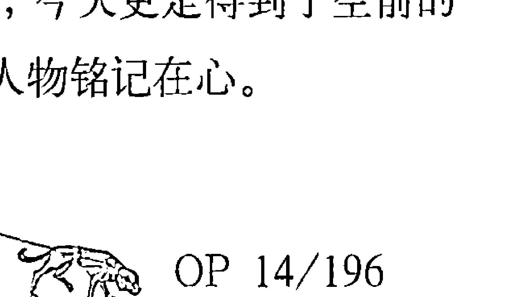

# 石化

我们都知道石化就是把我们变成石头从此再也不能移动。但幸运的是，我们都没有赫敏那样倒霉的经历，被人变成一尊石头。

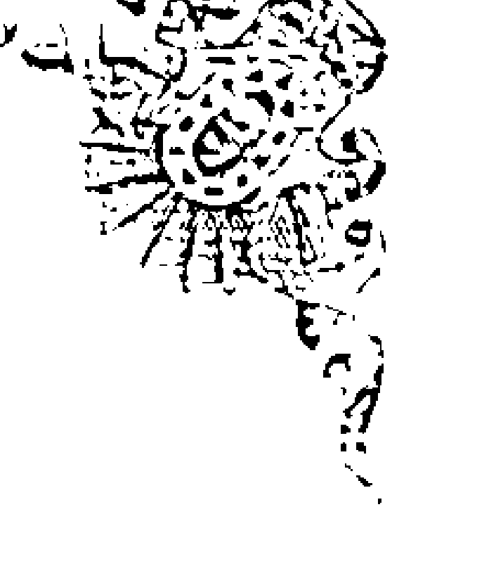

在古希腊神话中，很多不幸的灵魂都被石化，他们的四肢和躯体都变得僵硬无法移动。其中的很多灵魂都是美杜莎的牺牲品，美杜莎有长长的头发，头发里藏着毒蛇，很多看到她的人都会被变成石头。她居住的洞穴中堆满了试图接近她的人的尸骨。后来，一位年轻的英雄珀尔修斯杀死了美杜莎，他与美杜莎搏斗时盯着的是她在水中的倒影，这样一来就躲过了因为看到美杜莎的眼睛而被变成石头的情况的发生。他随身携带自己的战利品，经常在敌人面前把它拿出来，吓退他们。

对于美杜莎那样的怪物来说，把人变成石头只是为了好玩。但是奥林匹亚山上的希腊众神把石化看成是一种惩罚。特别是指道德方面的罪行，例如傲慢自大或不顺从等。其中最著名的是古希腊第比斯国的女王尼尔波，她吹嘘自己有12个孩子而宙斯的爱妾勒托只有两个，于是，她得罪了奥林匹亚山上的希腊众神。勒托的两个孩子——太阳神阿波罗和月神阿尔忒弥斯很快用箭射死了尼尔波的所有孩子。尼尔波受不了这样的刺激，开始大哭，她被变成了石头，但永远湿漉漉的，代表她的悲伤。

石化也是民间故事中一个永恒的主题。特别是那些形状容易让人联想起动物或人的石头，更是带给人无限的遐思。在德国的一个乡村，那里的悬崖看起来很像人。在当地人中就流传着这样的故事：山里的侏儒在正在庆祝婚礼的时候遭到了邪恶幽灵的袭击，他们都被变成了石头。在斯堪的纳维亚，长得像人形的石头被认为是巨怪变的，因为它们没能在太阳升起之前回到自己在地下的巢穴中。

在英国神话中，把活人变成石头的传说实际上是因为当地存在很多史前西欧时期（约公元前3000年到公元前1200年）形成的神秘巨石。在当地神话中，英国的这些史前巨石被认为是魔法师把女巫变成石头的结果。在坎布里亚郡的当地神话中，《马格丽特和她的女儿》的故事中就讲到这样的事。另外，在英国中部的埃文河附近也有这样的石头，人们甚至从中看出了新娘、新郎和婚礼上拉琴的人等。人们认为他们变成石头是因为在举行婚礼的时候，魔鬼混入其中，把他们都石化了。

虽然美国没有那样的神秘巨石，但仍然对人变成石头的传说津津乐道。19世纪，美国报纸报道了很多在地下找到的被石化的人或在树干中的人形石头。甚至有报道说有人看见别人在自己面前变成石头。但是这些报道都是编辑们杜撰的，就为了充满报纸的版面。《顽童历险记》的作者马克·吐温也写作了这样的故事来讽刺这种风气，但是没想到读者只想知道更多这样的故事。

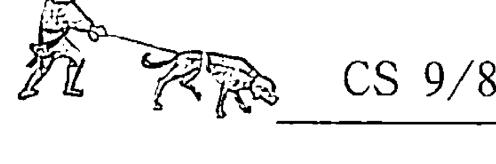

# 凤凰

就在哈利·波特在邓布利多教授的办公室里的时候，他学习到了有关凤凰的第一手资料，那就是，凤凰每500年会飞到火里化为灰烬，然后再从火焰里重生。在古希腊和古埃及火焰具备这种死后重生的能力是与太阳结合在一起的。他们认为太阳每天都会死去，给世界带来黑暗，而第二天再生。到了中世纪，凤凰成为基督教的象征，代表死亡、重生和生命的永恒。今天，凤凰成为了克服困难取得胜利的象征。那些经过艰苦的斗争取得胜利或是经历严重的灾难或不幸的事件被人形容为“从灰烬中重生”。另外，凤凰也是中国传统的一部分，几百年来，它一直是权力、诚实、忠诚和公正的象征。

古典的希腊和罗马作家告诉我们，世界上只有一只凤凰，它生活在阿拉伯半岛，每天清晨沐浴歌唱。“它的羽毛有一部分是金色的，有一部分是火红的，它看起来很像天使。”希腊历史学家希罗多德这样写道，但他同时也说：“除了绘画中的凤凰之外，我并没有见过真正的凤凰。”凤凰吃一种从亚、非林木里提炼出的芳香的树脂、肉桂和没药树的叶子。如果它感到自己的末日就要到了，它会收集木头和这些芳香的植物为自己搭建一个窝，这种窝一般会坐落在棕榈树或者橡树上。在火焰中它奋力地拍动翅膀直到自己化为灰烬，此时一只崭新的凤凰诞生了。当它重新获得了力量并检验自己的翅膀确实能够飞翔之后，它会把焚烧过的灰烬小心翼翼地收集到一个蛋里，然后把这个蛋放到埃及神山上的太阳神庙中。它要把这个蛋还给太阳神，然后就可以飞回阿拉伯开始自己另外500年的生命了。

邓布利多教授的凤凰福克斯是神话中最具传奇色彩的鸟。它身上同时也具备了一些中国神话中的凤凰的特点。比如它长着锋利的爪子，据说可以制伏蛇妖。另外，福克斯的眼泪还具有治疗伤痛的功效，它尾巴上的羽毛也能赋予别人神奇的力量。所以关于这种神奇的鸟的很多奇特的特性，我们也许还未发现。

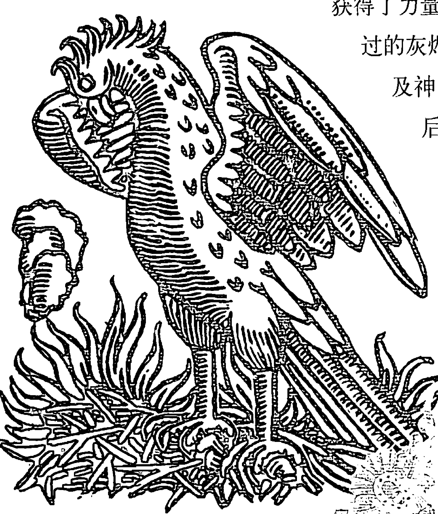

# 小精灵

当吉德罗·洛哈特在他的课堂上放出康沃尔郡小精灵的时候，造成了一阵课堂混乱。他们把书本、墨水和碎玻璃扔得到处都是。小精灵这样的行为或多或少也揭示了洛哈特教授的品行：因为这些英国西部民间故事中的红头发小精灵喜欢找上那些懒惰的人。在英国康沃尔郡、德文郡和萨默塞特地区，小精灵以喜欢帮助别人闻名，同时他们也期望能得到那些被帮助的人的回报。如果你忘记给小精灵工作之余准备一杯香浓的奶酪或是让他们能够自由地在壁炉前舞蹈，那你就不要指望得到任何实质性的帮助了。

虽然看起来小精灵与其他神话故事中的仙人没有什么两样，但他们其实长得很有特点。除了他们火焰一般的红色头发之外，他们还长着尖尖的耳朵、凸出的鼻子和与众不同的斜视眼。他们大约8~11英寸高，但也有些故事说他们的大小可以根据自己的喜好而变化。他们总是穿着绿色服装，戴着高脚帽。他们在地下或洞穴、草地或树林里生活，也可能住到人的家里。如果你的家里很需要帮手，或者女佣人比较懒惰，你可以试试把收获的苹果放到树底下，这样的方式叫做“请精灵”。而且你千万不能用新衣服奖励帮助你干活的小精灵。就像其他喜欢帮助人类做事的家养精灵一样，如果这些小精灵被你送的衣服冒犯的话，他们就会不辞而别了。

小精灵喜欢在他们的袖子里变戏法，他们最擅长的就是把外出旅行的人带入歧途。我们很多人都有这样的经历，我们走在似曾相识的地方，但是突然发现其实已经迷路了，无法找到地标性的参照物帮助我们走出困境。在英国西部，这样的经历就被叫做“小精灵捣鬼”。小精灵也是臭名昭著的盗马贼，他们喜欢整夜骑马，把它们累得筋疲力尽，或者把马的尾巴系成难以打开的结。另外，他们还喜欢在晚上在仙女圈（见仙女词条）里跳舞。如果有人看到，他们会让整夜在里面跳舞，得不到片刻的休息。如果你想摆脱小精灵的控制或者不让小精灵找你的麻烦，最有效的方法就是把衣服反过来穿。最后，还有很多故事讲到了小精灵盗窃小婴儿的故事，所以直到19世纪，英国一些地区的妇女仍然有把小孩绑在婴儿床上的习惯，就是怕小精灵偷盗她们的孩子。

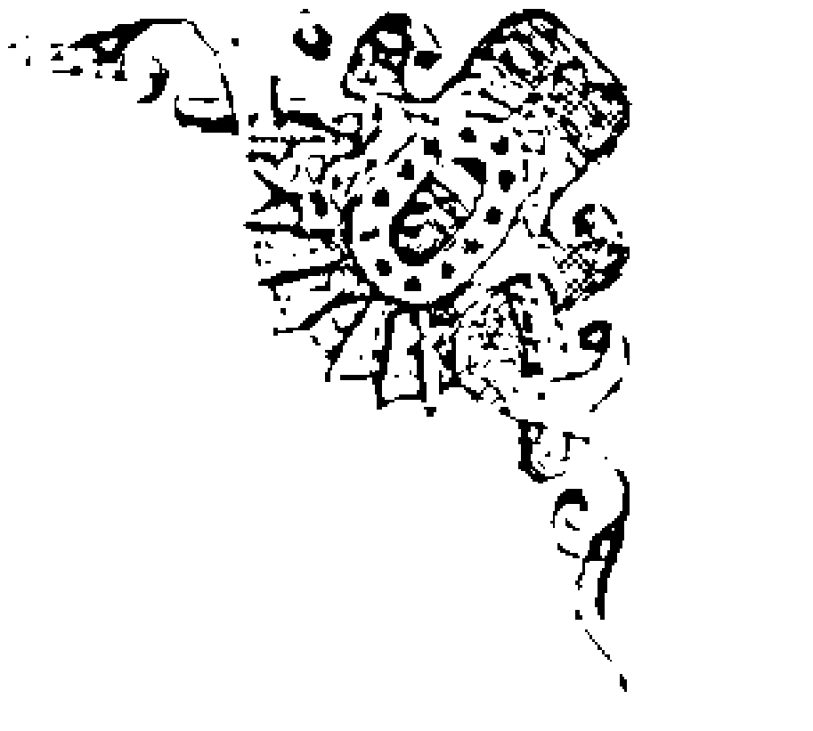

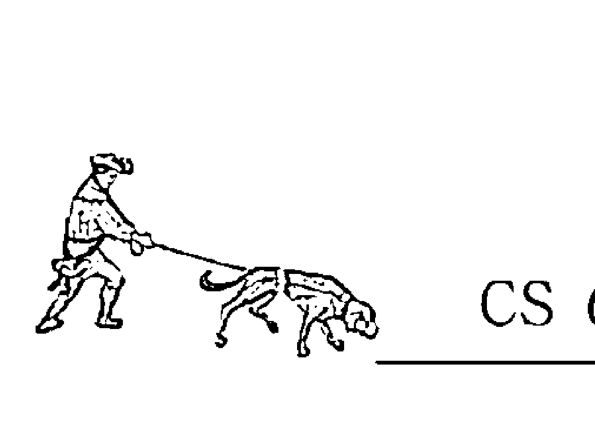

# 皮皮鬼

你是否曾经晚上走路的时候撞倒过东西？并为此苦恼不已？你撞上的很可能是皮皮鬼。这些所谓的“喧闹的小精灵”（他们的名字在德语中实际上意味着“喜欢吵闹的小精灵”）是最爱叽叽喳喳的小精灵了。与其他种类的幽灵不同，皮皮鬼不住在某个固定的房子里。他们跟随某个人，从一个地方到另一个地方。他们喜欢跟随年轻人，身体强壮的青少年对它们最有吸引力。

霍格沃茨魔法学校里有很多这样爱捣乱的精灵，皮皮鬼就是其中之一。他们通常都是隐身的，喜欢发出杯盘碰撞的声音或者在墙上发出飞镖的“嗖嗖”声，因此他们才被人认为喜欢吵闹。有些暴力化倾向比较严重的皮皮鬼喜欢推翻家具、生火或者让人们不断在屋里转圈子。他们的淘气表现在他们特别喜欢水汽球。

在过去2400年来，人们一直抱怨说经常听见皮皮鬼发出令人烦躁的声音或看见它们掀翻桌子等。公元前5世纪希腊政治家安多希帝斯曾经记录过他有一个熟人“把一个邪恶的幽灵留在了自己家里，那个精灵能够掀翻桌子”。大约500年后，罗马历史学家描写了一个不幸的贵族“被一股不知什么力量从床上掀翻了”，直到第二天早上“才发现自己还穿着睡衣站在大门口，意识模糊”。但是直到19世纪，“皮皮鬼”这种叫法才变得普及。

为什么会出现“皮皮鬼”？众说纷纭，有调查人员认为皮皮鬼实际上是青少年逆反心理的一种反应，特别是那些比较有天分的青少年。也有人认为所谓“皮皮鬼”发出的种种噪音实际上是那些富有想像力的年轻人搞的恶作剧。但是也有相信皮皮鬼的人认为他们就是一种孩子气的、喜欢淘气的精灵。皮皮鬼有多么爱搞恶作剧可以从一个19世纪的英国小说中看到，其中的皮皮鬼喜欢敲打啤酒桶，还喜欢往猫身上扔臭鸡蛋。但是，千万不要忘了皮皮鬼有的时候也会变得很恶毒，不止一次被人看到把房屋掀翻，而当时里面还有人。

近年来，皮皮鬼经常在电视和电影中出现。在欧洲和美国各地都有人宣称见到过皮皮鬼。幸运的是，这些皮皮鬼没有什么毅力，他们追随某个人，要不了几天就会失去兴趣，自动消失。

## 魔药

包含特殊的酿造过程和特殊原料的魔药一直是魔法师工具中的重要组成部分。在古代神话中，女巫通过使用魔药可以青春永驻、把人变成动物，或让自己隐身。中世纪的传奇和童话故事中讲到过爱情魔药、催眠魔药或使人失去记忆的魔药，还有引发嫉妒或斗争的魔药。漫游奇境的爱丽丝喝的魔药就能使她变小或使她长高。而魔药也帮助哈利·波特和罗恩变成了他们最不喜欢的人。

传奇中对魔药效果添油加醋的渲染实际上与它对人身体和精神上的巨大作用是分不开的。滋补一类的药物能够促进睡眠，减少幻觉，造成人的神经麻痹，能够使心跳加快或者变慢。这样的药物能够刺激大脑，给人带来正面或者负面的影响，所以也不难想象，有些药物能够改变人的外形或者使人的心情由恨变成爱。

关于魔药比较突出的一点是它们的成分，这也包括在霍格沃茨魔法学校的书本上介绍的那些。这样的古老传统可以追溯到古希腊和古罗马。当时的魔药是作为一种药物的，人们也相信它有神奇的功效。它们的原料包括蝙蝠血、碾碎的甲虫、蟾蜍、羽毛、磨成粉的蜥蜴、鸟和动物的爪子、蛇的骨头以及动物的内脏等，另外还要添加各种各样的草药，其他比较著名的魔药还包括莎士比亚名著《麦克白》中的女巫的药方，其中包括蝾螈的眼睛、青蛙的脚趾和狗的舌头。

但是为什么是甲壳虫、蟾蜍呢？对于我们现代人来说，这些千奇百怪的配料让我们觉得根本无法理解。但是从魔药中很普遍的动物原料我们可以感受到古代人的信仰，他们相信通过食用某种动物的某个部位能够帮助他们获得这种动物的优势。例如，蝙蝠被认为具有夜视功能。如果喝下富含蝙蝠眼睛的魔药（或者用蝙蝠血敷自己的眼睛）被认为能够使人恢复视力。同样，野兔的腿被认为是让一个人行动敏捷的良药而乌龟背壳则能使人长寿。罗恩和哈利用了类似的方法，他们把精灵的头发煮到药里就是希望能够把敌人的力量转换到自己身上（所以古代的迷信说法是要把自己的头发或指甲小心地保管好，否则女巫或魔法师就可能利用这些东西来加害你）。至于为什么会用蟾蜍作为魔药的原料可能与它们的一种生活习性有关，它们在受到惊吓的时候会释放出有毒的毒汁，这也是为什么大锅中也喜欢放入蟾蜍的原因。这种有毒的化学物质有时候被叫做“蟾蜍乳汁”，能够造成幻觉，对心脏的影响也像现在的药物一样有效。因为它能够增强心脏肌肉的收缩频率使心跳加快。

影响心脏也是爱情魔药的主要功效。人们也把这种魔药称为春药（这种药在霍格沃茨是禁药），它在魔法故事中可谓历史悠久。古代的乡村女巫和算命先生经常沿街叫卖这种药。如果把这种药放到喜欢的人的饮料中据说能够让人瞬间坠入爱河。女人使用这种药的比男人要多（男人更喜欢使用魔咒）。跟其他魔药一样，爱情魔药的配方也很奇特：比如，一份号称真正的爱情魔药中含有被蚂蚁吃掉的蟾蜍的左腿的骨头研磨成的粉。在古罗马，很多人都因为喝了爱情魔药而生了病，因此国王还曾经宣布公开销售春药是违法的。当然，这么做并不能杜绝人们使用春药，几百年来它已经成为人们生活中的一部分。

中世纪，春药的配方有所改变，多使用草药而不再是动物成分，因此它的味道也变得好多了。一个典型的配方包括橘子、曼德拉草根、马鞭草、蕨类植物的种子再加上水、茶或酒。到了十七八世纪爱情魔药变得不再流行，因为咒语和魔法在当时逐渐兴盛起来。今天的所谓春药作用已经完全不同了，它就是我们今天的香水。

## 主要成分

在魔药中发现的非洲树蛇是全世界最毒的蛇之一。在同样的魔药配方中发现的草蛉是一种长有两对薄而轻的透明翅膀和线状触角的昆虫，这种昆虫被人称作“最杰出的昆虫杀手”，因为它们在一个星期内能够毒死、吃掉200多只毛虫和蚜虫。不论是在霍格沃茨魔法学校还是在世界其他地方，很多魔药的成分都是有毒的。另外一种常见的成分是两耳草（这也是历史上用来治疗流鼻血的主要草药）。它们不是被用作医学用途就是被用作护身符，例如在“使人变聪明”这味毒药中，金龟子就被用作驱邪物和防止邪恶势力的袭击。最常见的有几种：

-   **日光兰/苦艾蒿**：虽然只是一年级的学生，赫敏已经知道把日光兰的根磨成粉加到苦艾蒿中能够起到催眠剂的作用，这种魔药被称作“生死符”。她可能也知道，在古代，日光兰这种植物还被用来治疗黄疸病、湿疹、腿脚肿胀、皮肤龟裂以及窒息等。但是这种长长的白色植物通常被种植在墓地附近，因为人们相信它是死人的事物。同时，苦艾蒿是最苦的植物。在古代，这种植物被用来治疗感染、胃部、肝脏、心脏、大脑等部分的感染。而且人们认为苦艾蒿也能与毒芹和海马共同起作用。但是如果大剂量、经常服用苦艾蒿，将造成昏迷、精神错乱或瘫痪。
-   **颠茄**：哈利·波特知道要把自己的毒药配制工具包小心翼翼地与颠茄等草药放在一起。颠茄这种植物几百年来一直被用作草药，做各种治疗。作为一种剧毒的茄属植物，颠茄是阿托品这种药物的主要成分。很小剂量就能使人的瞳孔放大、痉挛，如果大剂量服用会造成死亡。古罗马的历史学家和11世纪的苏格兰都记录了使用这种植物给敌军下毒的例子。在当代欧洲早期，人们认为女巫使用颠茄和其他植物调配毒药谋害敌人。有些学者相信“颠茄”这个名称来自意大利语，意为“美丽的女人”。这是因为古代的迷信中讲到这种植物能够变成美丽又危险的女人。还有人认为这个名字的来历是意大利女人喜欢使用小剂量的颠茄放大自己的瞳孔，让自己看起来更美丽。
-   **舟形乌头/狼毒乌头**：哈利·波特不知道舟形乌头和狼毒乌头这两个名字实际上指的都是同一种植物，所以才遭到了斯莱特林学院院长、魔药课教师斯内普的奚落。当然，他有这样的疑惑其实是很好理解的，因为草药的名字本来就很复杂，而用在魔法或医学中的草药就更复杂了。这种植物属于乌头类植物，它的种子、叶子和根都含有剧毒，能够使心脏跳动频率变慢、血压降低。它之所以被叫做‘舟形乌头’是因为它的叶子长得很像一艘小船，或者像僧侣戴的帽子，而被叫做‘狼毒’是因为欧洲农民原来把它致命的毒液与肉拌在一起放到外面，防止狼袭击家畜。这种植物用在魔法世界里也有着悠久的历史。在希腊神话中，只要是三头大狗流过口水的地方就会长出这种植物。在当代欧洲初期，人们认为女巫把这种植物用在毒药和飞行药膏中（见女巫词条），也被用在爱情魔药中。但是因为很难控制好剂量，所以有些人本来希望自己所爱的人也能在服药后爱上自己却失手把爱人害死了。
-   **月长石**：在那份月长石报告中（霍格沃茨15周年家庭作业项目）一定很好地描述了这种石头。根据传奇故事这种精巧的、乳白色的石头直接从月亮那里获得魔力。在欧洲神话中这种石头被叫做‘旅行者之石’，因为它能给旅行者带来好运，保佑他们。很久以来，人们都把它当作好运和丰产的护身符。在中世纪，人们认为带着这样的石头就能保佑人不得癫痫症，使人神志清醒。如果放在嘴里或者碾碎做成魔药，能够帮助人做出决策，而且在月圆之夜能够帮助人预测未来。很多东方文化认为这种石头是月光凝结的产物，它的里面居住着善良的精灵。

# 预言家

特里劳妮传授的各种占卜知识中预言并不算在内，这可能是因为与凝视水晶球、解读茶叶或占星术等技术不同，预言并不是一种可以通过学习掌握其步骤的技术。相反，预言更像一种天分。无论是从历史的角度还是从各国的文化来看，我们都会发现人们把预言的能力看作天赋，一个有天才的人通过做梦、凝神思考得到很多启示，一些未来的事情自会以某种形式出现在他的脑海中。

预言有很多传统，预言家和他们的预言也出现在很多早期的文学作品中，包括《伊里亚特》、《埃涅伊德》和古巴比伦史诗《吉尔伽美什传奇》。另外，《亚瑟王传奇》、莎士比亚的戏剧《麦克白》以及很多其他作家的作品中都出现过预言家。他们使用预言制造令人期待的气氛、营造神秘的感觉同时也提出复杂、艰深的问题：未来是已经被决定好了的吗？如果我们知道将要发生什么，那我们是否有能力改变它呢？预言在很多宗教传统中也占有重要的一席之地。世界各国的文化中都有预言家，他们告诉我们世界末日的到来以及所有有罪的人都要接受惩罚。

## 宗教预言家

当“预言”这个词有了“预测未来”的含义的时候，预测未来在宗教预言领域中还无足轻重。在古代中东地区，也是很多宗教的发源地，如犹太教、基督教和伊斯兰教等，预言家是上帝的代言人。最早的希伯来预言家被人叫做“纳比”，意为“被上帝召唤的人”。一般来说，这样的人都是游吟诗人或音乐家，有灵感的时候就会边唱边跳，带给人们上帝的信息。

在后来的几百年中，预言家的含义有了拓展和演变，出现了很多文学先知，如阿摩斯、希伯来先知以赛亚、耶利米等。他们通过讲故事、诗歌和布道的形式向人们宣扬上帝的旨意。后来这些故事汇总成为了圣经中的《旧约》。这些预言家的职责是教导、鼓励、劝诫、启发人们。同时他们也预测未来，认为在经历一系列痛苦之后，人最终能享受到所谓的“黄金时代”，得到真正的和平、和谐以及绝对的公正。这种希伯来式的预言后来被基督教和伊斯兰教的两大领袖耶稣基督和穆罕默德继承，他们都把自己看作《旧约》中的预言家的继任者。基督教和伊斯兰教中也都有预言家预测未来，但是都认为在未来世界里，恶人会遭到报应，而好人会上天堂，得到不朽的生命。因此预言家从历史的角度来说一直都承担着上帝的代言人的角色，他们向人们传递上帝的旨意，教导人们向善，告诉人们国家的命运。

## 女巫

霍格沃茨魔法学校的占卜老师特里劳妮教授的外号也叫女巫，这种女巫在希腊和罗马神话中都能找到。她们与众不同之处在于可以在精神恍惚的状态下预测未来。实际上，我们在书中还能看到特里劳妮教授曾经有一次精神恍惚过，当时她正好准确地描述了未来将要发生的事情。

根据古代神话故事，古时候一共有10个这样的女巫。她们分布在埃及、巴比伦、波斯、利比亚和希腊。每个人都有不同的名字，她们都被称为“女巫”是为了纪念希腊神话中的女先知，她的名字叫西比尔（也就是女巫的英文译音），她是宙斯的女儿。很多占卜师都是在人们需要的时候提供服务，但是西比尔却不是，她根据自己受到的启发随时对未来展开预测，并把这样的预测写在树叶上。

虽然女巫师被人认为是生活在洞穴中的野蛮人，但是很多艺术家都喜欢把她描绘成古典的美女。她曾经预测过将要发生的战争、危险的风暴、统治者的兴起和灭亡以及国家的兴衰等。

最著名的女巫师当属安梅尔瑟雅，她是太阳神阿波罗的女祭司。在罗马作家奥维德的传奇故事中，阿波罗爱上了她，并向她许诺她可以得到任何想要的东西。安梅尔瑟雅指着一堆沙子对阿波罗说，每粒沙子代表一年的生命，她想拥有像这堆沙子一样长的生命。阿波罗满足了她的要求，但是她却忘记了要求永远保持青春，所以不得不像其他一些希腊神话中的人物那样，虽然拥有无穷无尽的生命但却变得异常苍老。最后她住到了意大利那不勒斯山附近村镇的一座地下洞穴中，在那里生活了一千多年。

还有一个故事讲述了女巫安梅尔瑟雅如何向罗马最后一个国王塔库奇贩卖自己的9个对未来的预测，其中揭示了罗马帝国的灭亡以及它的最终命运。但是国王认为她的要价太高了所以不愿意购买，希望她能做出一些让步，但是她把其中的3本书埋到了地下。一年后，她又回来以同样的价格继续推销自己的6本书，仍然遭到了拒绝，于是她又埋葬了3本。一年后她回来卖最后的3本书，同样以最开始的价格。这次，罗马国王被彻底击败了，买下了书，从此安梅尔瑟雅就消失了，再也不见踪影。

安梅尔瑟雅的故事可能只是神话，但她拥有预言能力这一点却是毋庸置疑的。无论是书籍还是棕榈树叶上都留下了她的预言，这些预言写成谜语的形式，但究竟这些作品的记录人是谁大家无从知晓。几百年来，在艰难时刻，罗马帝国的议会都使用这些谜语寻找与神沟通、共度难关的方法。最终，这些谜语于公元前83年毁于一场大火。此后，罗马议会派出使者到意大利的西西里地区和小亚细亚地区搜罗先知的遗迹。直到公元408年这些遗迹被保存在罗马的阿波罗神庙中，后来神庙毁于战火。

即便这些预言书籍已经消失，人们对女巫的热情丝毫未减。中世纪时，基督教作家对女巫的预言又做了新的解释，以便让她预测出耶稣基督的诞生。她的地位一直在上升，以至于后来与《圣经·旧约》中的先知平起平坐。在今天，我们仍然能在罗马梵蒂冈的西斯廷大教堂的天花板上看到米开朗基罗的壁画，上面描绘了安梅尔瑟雅的形象。

## 神谕

根据传奇故事，女巫会在受到启发之后揭示出未来的情况，但是神谕则不同，只有当别人跟它讲话，向它询问的时候它才会开口。在古代，神谕通常指的是先贤祠那样的地方，人们到那里寻找被供奉的神仙，向他们寻求建议。“神谕”这个词（来自拉丁语，意为“祈祷”或者“对话”）也可以指那些能够与神对话的牧师和神职人员。

当时希腊是神谕中心，这里的很多神庙都有政府官员、游客和外国使者光顾，来寻求一些重大事件的线索，例如是否会发生战争，能不能取得胜利，在何处修建寺庙，统治者能够统治多长时间，甚至其他神谕是否可信等。神谕启示人们的方式有很多种。在有些先贤祠中，朝圣者需要花一个晚上待在那里，以梦的形式得到启示。在希腊达多纳的宙斯神庙中使用的则是另一种方法，神通过一棵神圣的橡树的树叶昭示前来拜见的人，他拿到叶子后再请神庙的僧侣解读。

最著名的神谕场所是阿波罗神庙，公元前1400年修建于巴那塞斯山上。这种神谕被叫做“特尔斐神谕”，直到公元381年，这里仍然是人们争相前往的地方。这里的神职人员名叫皮提亚，相传阿波罗化身同名巨蟒来到这座先贤祠开光。如果想得到问题的答案，来到这里的朝圣者必须接受严格的宗教仪式，缴纳一定的费用。拿到这个问题的皮提亚会进入一座神庙中，坐在一座铜制的三角凳上，陷入精神恍惚，这时候阿波罗就会附在他身上解答问题。有时候他会直接回答问题，有的时候则需要当地其他神职人员的解读。

虽然有些神谕直截了当，但“特尔斐神谕”却以晦涩出名。特别是在戏剧和文学作品中，从那里求来的神谕往往总是不能被人正确解读。例如，罗马暴君尼禄皇帝拜访过阿波罗神庙，根据一个传说，他得到的启示是“73”这个数字将给他带来厄运。但是当时他还只有30多岁，所以他以为这意味着他的寿命将非常长，但是没有想到第二年他就被军队领袖苏尔皮西乌斯·盖尔巴篡权，并被杀害，结果后来发现盖尔巴的年纪正是73岁。另外，著名的故事还包括克里米亚国王罗伊斯，公元前7世纪的时候，他来到神庙询问是否应当与波斯国打仗，得到的回答是：“罗伊斯会摧毁一个伟大的国家。”听到这样的神谕，他非常高兴，以为一定能取得胜利，但是他很快就被波斯军队打得溃不成军。被当作俘虏抓获之后，他被允许再向神庙发出询问，看看为什么神谕会这样戏弄他，结果得到的回答是神谕并没有出错，相反还一语道破了事实：罗伊斯确实摧毁了一个伟大的国家，只不过那是他自己的。

在世界各地的民间故事和神话传说中都能找到这样的例子，神谕被误读，或者解读者没有很好地理解神谕隐含的意思，只是凭主观臆断，曲解了神谕。所以这也让我们疑惑，教授预言课的特里劳妮说的话会不会也有什么引申的含义呢？她说有个小男孩要在7月下旬出生，那么这句话到底是什么意思呢？这种模棱两可的情况在我们下面要讲的词条——法国最著名的预言家诺斯鲁达穆斯的故事里也同样存在。

在接受德尔斐的神谕时，皮提亚被阿波罗的灵魂迷惑处于恍惚状态时回答问题。

## 诺斯特拉达姆士

与女巫和皮提亚这种神职人员不同，我们明确地知道诺斯特拉达姆士到底是谁。他的全名叫做米歇尔·诺斯特拉达姆士，1503年12月14日生于法国诺曼底省。他出生在书香门第，家境也很富有。但是米歇尔从小就是一个特殊的孩子。他非常聪明，勤学好问。在经受了古典教育之后（学习了希腊语、拉丁语、哲学、修辞学、神话和占星术），他读了医学院，并于26岁的时候从蒙彼利埃大学毕业。根据当时的习惯，他把自己的姓稍作修改，起了拉丁语名字，也译作诺斯特拉达姆士。有自己的拉丁语名字，既代表了他所受的教育，同时也说明自己有了当医生的资格。

很快，诺斯特拉达姆士就让人们意识到他是一名天才和勇气非凡的医生。他的疗法对于治愈当时正在欧洲肆虐的黑死病（淋巴腺鼠疫）很有帮助。在行医的同时，他还发展了自己作为占星专家以及占卜方面的技能。1555年，他的《世纪连绵》一书的第一卷出版了。这本书的出版确立了他作为当时世界上最著名的预言家的地位。这本书一共包含10卷，每卷中都有上百条预言，预言用一种“四行诗”记录下来（“世纪”这个词指的是书中每卷包含的预言的数量，而不是指每一百年）。

在书的正文之前，诺斯特拉达姆士解释了他得到这些预言的方法。这融合了占星术和凝视（参见水晶球词条）两种方法，另外还利用了他的杰出的占卜能力。在晚上独自一人的时候他会坐在一只三脚凳上，双眼凝视蜡烛的火焰，或者把目光投向一碗水的泛着微光的水面，然后他再用魔杖搅拌那碗水。很快他眼前就会出现未来的画面，然后他再把它们记录下来。这之后他把自己写的草稿整理成四行诗，然后再把其中提到的名称和一些意思尽量晦涩地隐藏在诗中，这样只有最有学问的学者能够解读其中的含义。诺斯特拉达姆士认为他的预言能一直持续到公元3797年，而且他认为他的很多预言都太恐怖了，所以不能告诉一般大众。但是也许他也害怕当时教堂的势力，因为那个时候正好是教堂严惩巫术的时期（参见焚烧女巫词条）。

书一出版就引起了轰动。这些四行诗非常有趣，但是很难读懂。不仅因为这本书是用希腊语、拉丁语、意大利语、法语和希伯来语写成的，还因为书中包含很多双关语、字母颠倒和换音造词法、自创字以及很多神话背景知识等。但是这本书中大胆地预测了很多血腥场面和大灾难，包括战争、洪水、大火、饥馑、地震、疾病大流行、背叛以及帝国的陨落等。就像很多诺斯特拉达姆士的学生注意到的那样，这本书几乎无法解读，更无法准确理解诗中指的究竟是什么。诗句给人的感觉是说了很多非常精确的事，但是仿佛又好像什么都没说。直到书中提及的一件事真的发生了人们才意识到这本书中的很多预言都是真的，都能在现实生活中找到实例一一对号入座。

在他有生之年，最著名的例子就是他准确预测了亨利二世的死亡。亨利二世是法国国王，死于1559年7月1日。亨利的女儿嫁给了西班牙的菲利普二世，就在庆祝她的结婚庆典上亨利二世死于非命。当时亨利正与另一位贵族苏格兰伯爵蒙哥马利进行表演性质的决斗。两个回合中，他们都没能将对方挑落马下，但是国王坚持还要打第三个回合。这次蒙哥马利伯爵的长矛刺透了亨利的头盔，直接伤到了国王的脑部。11天后他就死了，很快就有传闻说诺斯特拉达姆士早在5年以前就预言了这一事件的出现。在他的《世纪连绵》一书的第一卷第35首诗中这样说道：

> > 年轻的狮子将战胜年老的狮子
> > 在一场一对一的战斗中
> > 他将刺破金笼中的双目
> > 两个伤口合成一个，他的死亡异常残酷

这个本来似是而非的预言一下子变得清晰起来。“年轻的狮子”指的就是伯爵，他确实比亨利国王年轻。“一对一的战斗”指的是表演赛，而“金笼”则是国王的盔甲（但是盔甲肯定不是用金子做的），致命伤在国王的左眼，而“死亡异常残酷”则是毫无争议的事实。当时诺斯特拉达姆士已经名声在外，这下更确立了自己的地位。

几百多年来，学者证明诺斯特拉达姆士预言几乎百分之百的应验了。他勾勒出了很多历史上的著名事件，包括法国大革命、伦敦大火、拿破仑的兴起、希特勒、墨索里尼、滑铁卢战役、两次世界大战、核武器的发明，以及人类登上月球等。但是持怀疑论的一方则认为是因为预言写得非常晦涩才导致人们对它可以有各种各样的解读，可以把同一则预言用在不同的事情上，赋予它们不同的含义。实际上，不同学者正是利用不同的理论和见解对这些语言进行解释，针对同一则预言往往也有不同的见解。而且，如果你的预言都是关于洪水、饥荒、战争和其他灾难性题材，它们中很多成为事实的几率都很大。无论如何，《世纪连绵》中的预言充满魔幻和神奇的色彩，令我们今天仍然陶醉在它绚烂多姿的世界里。

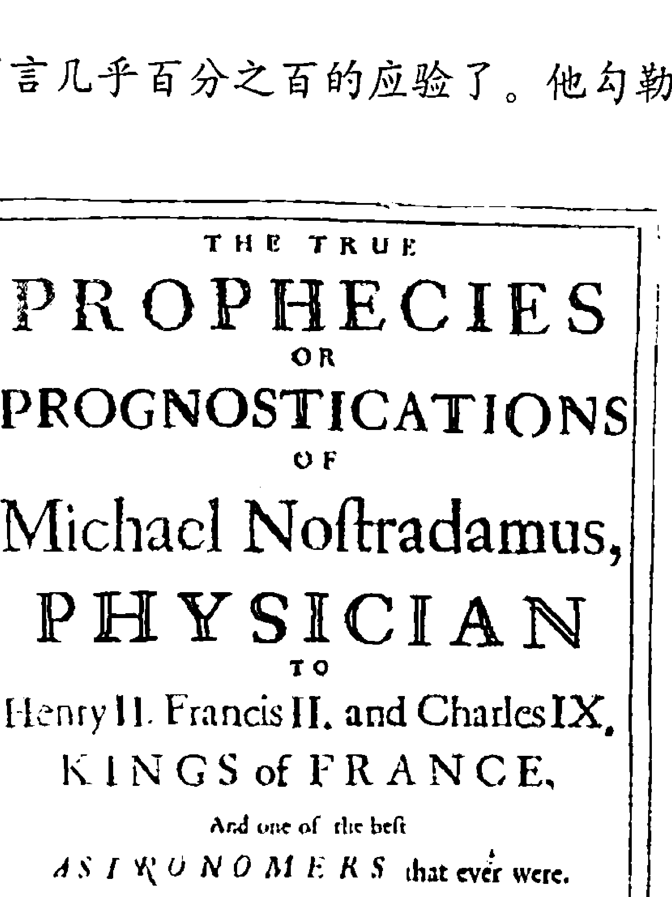

1672年伦敦出版的《诺斯特拉达姆士预言》的书名页。

## 卡桑德拉

卡桑德拉是希腊神话中的第一个女预言家，但是她的故事充满讽刺性。她能够很清楚地看到未来发生的事情：看到战争的结果、国王被杀死，以及她自己可怕的命运。但是她的话却没有人相信。无论她表述得多么清楚，就是没有人相信她。

卡桑德拉是特洛伊国王布莱姆的一个女儿。她从太阳神阿波罗那里得到了这种语言能力。阿波罗神本身就是预言之神，但他却一手安排了卡桑德拉的预言永远也不能被大家相信的惨剧。事情的经过是这样的：阿波罗经常被美女所吸引，他也同样折服于卡桑德拉的美貌并向她求爱。有些人心仪的姑娘求爱是送花或糖果，阿波罗的方式比较独特，他向卡桑德拉献上的是预言的能力。卡桑德拉接受了阿波罗的礼物，但是不知何故她并没有以向阿波罗表达爱意作为交换。当然，这只是一家之言。还有人说是阿波罗理解错了，他希望得到卡桑德拉的爱，但是卡桑德拉却从未许诺过。无论如何，总之阿波罗没有得到卡桑德拉的爱。他本来可以收回他的礼物，但是他并没有这么做。他诅咒卡桑德拉，今后她说的任何事都不会有人相信的（相信哈利·波特肯定也有同样的感受）。

这样的命运是惨重的。终其一生，卡桑德拉经常能够看到灾难就在眼前，但是她提出的警告却没有人当真，反而遭到人们的嘲笑、怠慢。人们甚至认为她是个疯子，把她关了起来。卡桑德拉预见的最著名的事要算是特洛伊的灭亡以及她自己国家的人民遭到杀戮。卡桑德拉告诉了别人此事，她甚至看到了城门外巨大的木马并不是希腊人送给特洛伊的礼物，而是一条诡计（木马里面藏满了敌人的士兵准备攻城）。

卡桑德拉被胜利者阿伽门农作为俘虏带到了阿古斯城，在那里她又一次看到了未来发生的事情：她看到了阿伽门农被人谋杀，也看到了自己的死亡。

很多希腊诗人和剧作家都讲述过卡桑德拉的故事。在维吉尔的史诗《埃涅伊德》和莎士比亚的《特洛伊勒斯与克蕾西达》中都出现了这个人物。今天，“卡桑德拉”这个名字已经成为“厄运式的预言”的代名词。

### 红帽魔

很多在美国乘坐过火车的人都享受过戴着红帽子的服务员提供的优质服务，他们会帮助你把行李搬到车站上。但是霍格沃茨特快列车上的乘客却清楚地知道，最好还是离戴红帽子的人远一点。至少在黑魔法防御术中大家都学习过这样的知识。红帽魔也叫“血红帽”或“红色坟墓”，他们是英国民间故事中出现在曾经发生过血腥战斗的、废弃的古堡中的一种幽灵。他们有长长的灰色头发、血红色的眼睛、凸出的长牙。有时候人们会以为红帽魔不过是一个丑陋的老年人，但他突出的特点就是脑袋上戴的红帽子，那是被鲜血浸湿了的。他手中拿着拐杖，拐杖上有一颗金属长钉，对那些闯进古堡的冒失鬼，他会毫不犹豫地使用拐杖攻击，而受害者的鲜血也成为了把他的帽子渲染得更美丽的原料。

对于那些别无选择必须进入古堡的人来说，有一种传统的方法据说能够帮助你防范红帽魔，当他出现并发出刺耳的尖叫的时候，你要大声地念《圣经》，然后他就会消失，还会留下他的一颗牙齿作为纪念品。

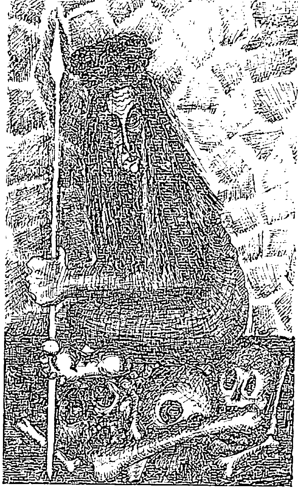

# 夺魂咒

如果你对学习魔法比较有兴趣，你可以去参加霍格沃茨的古代夺魂咒课程。这种夺魂咒是用最远古的德国字母写成的。夺魂咒总是与魔法或神秘的事物紧密相连，实际上，夺魂咒在丹麦语中的含义就是“秘密”或“神秘的事物”。

根据古代德国传奇故事，第一个发现这种咒语的是北欧神话中的诺丁神，并且他为得到这种知识做出了自我牺牲。他被长矛刺中，尸体在斯堪的纳维亚的生命树上悬挂了9天，当他的尸体在风中飘动的时候，两条树枝飘落到地面上，形成了组成夺魂咒的字母。

但是根据历史记录，事情并不是这样。记录显示夺魂咒其实是在大约公元200年发明于丹麦和瑞典。最早的德国夺魂咒是非常粗糙原始的，只是把很多不同的直线用多种不同次序排列。夺魂咒也用在很多非魔法性的活动中，比如写信、用在说明性的材料中或者成为个人拥有物品的标志。最著名的夺魂咒出现在瑞典，讲的是对一座桥的纪念。

但从一开始，夺魂咒主要还是用在魔术领域。维京人和德国人使用它作为占卜的工具，把这种符号雕刻在他们的剑上令他们在战斗中隐身。他们也把夺魂咒刻在自己的墓穴上防止盗墓者的破坏。大约从公元450年开始，夺魂咒在英国也变得很流行。盎格鲁－撒克逊魔术师使用它来制作护身符或者预测未来。

到今天，在丹麦、挪威、英国和瑞典等地，发现的护身符总共超过4000多枚，可以追溯到维京人时期（约公元800年），夺魂咒不仅出现在武器、护身符和墓碑上，同时也在硬币、珠宝和木板上用作装饰，甚至在邓布利多教授的笔上也雕刻着这种符号。

不幸的是，在上一个千年，因为拉丁语字母的普及，使得夺魂咒这种符号受到了影响。今天，即便还有霍格沃茨魔法学校的人学习这种符号，只有少数魔法师还认识这种给奥丁造成了很大麻烦的夺魂咒了。

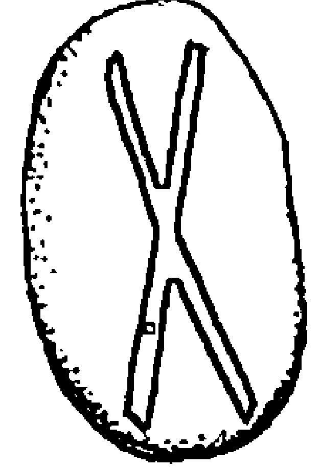

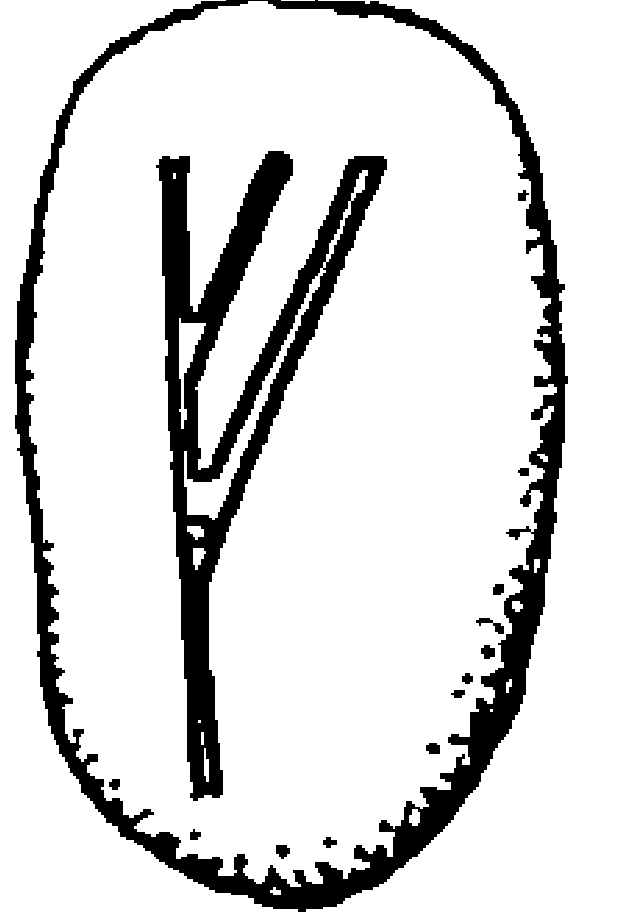

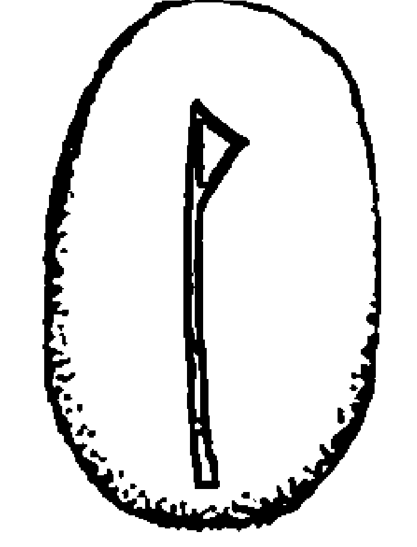

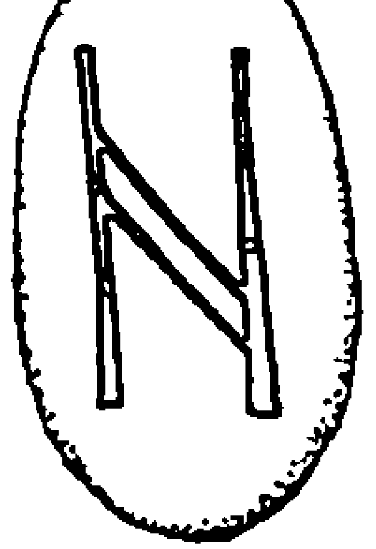

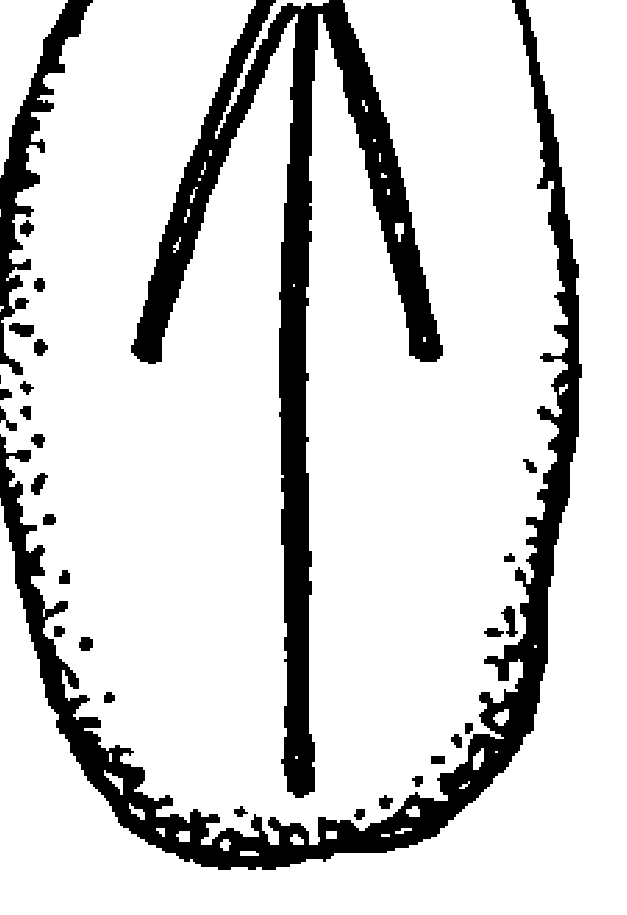

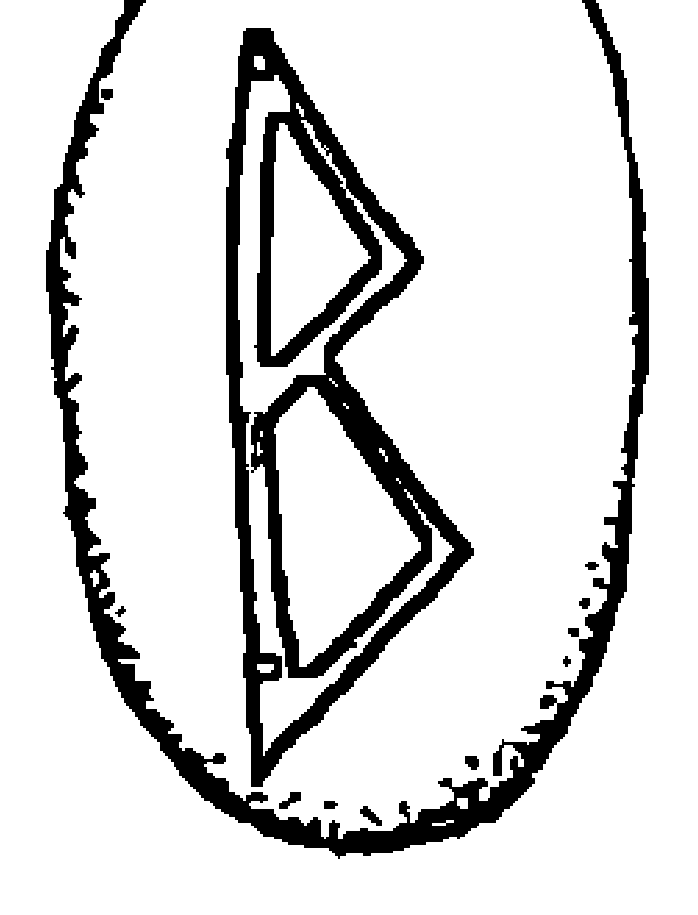

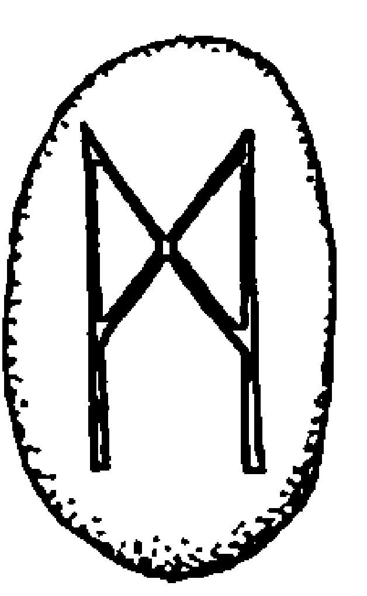

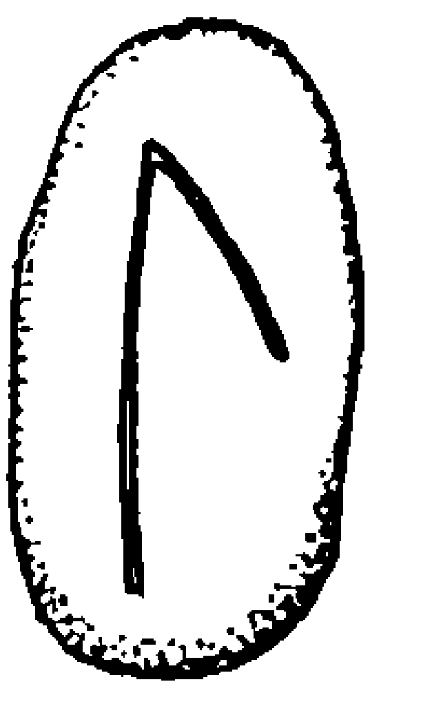

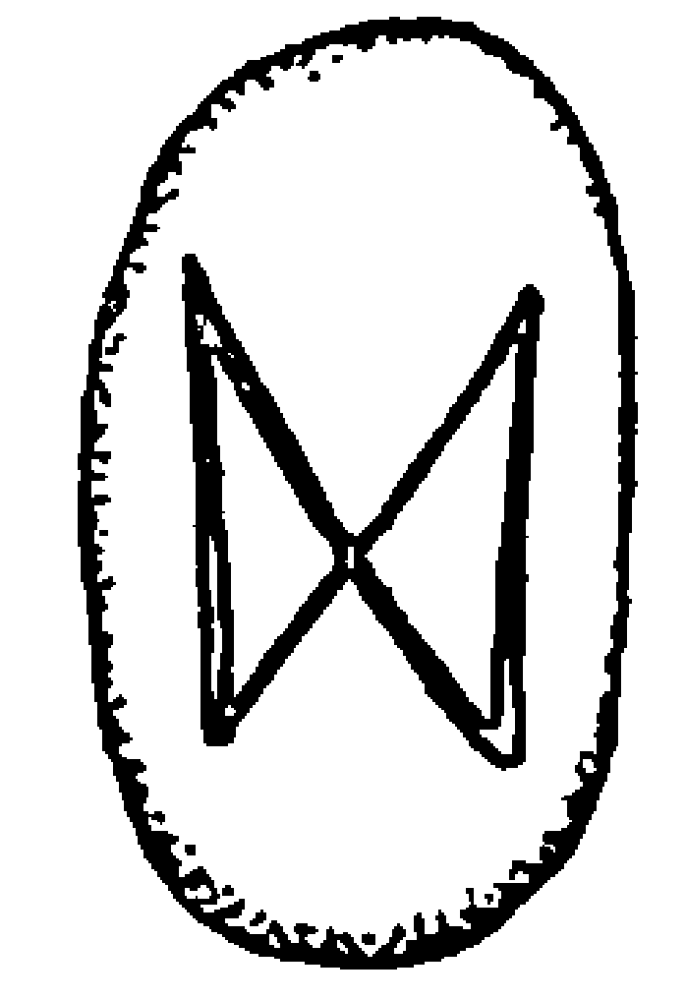

这里是一些诺曼底夺魂咒的符号以及它们各自的含义。

## 夺魂咒占卜法

古代运用夺魂咒预测未来的方法被叫做夺魂咒预测，在20世纪它又复兴了。当维京人和盎格鲁-撒克逊人使用这种符号占卜的时候，他们把这种符号刻在薄薄的木头片上，悬挂在果树的枝头。然后再从中任意选取一些投掷在一块白布上面，这时占卜师就会从中选出3块并解释它们的含义（之前还要凝望天空以便获得灵感）。今天，占卜师仍然能够购买16或33个一套的用黏土或石头做成的这种占卜工具，上面刻着夺魂咒符号。今天的占卜方法比起古代来说相对简单，就是把这些东西放到一个袋子里然后撒在一个比较平坦的表面，然后解读那些字朝上的卡片。也有些人闭上眼睛，从中任意选择3个然后根据这些符号的古代含义对未来做出解释；还有些占卜者另有自己的一套解释方法。

# 火蜥蜴

我们很多人都知道火蜥蜴是一种彩色的、有趣的小动物，我们在树林中有时候就会碰到它们。如果你见到它们的话，你可能应该停下来看看，再想想你走的路是否正确。几百年前，这种小动物却以凶猛见长。就像海格在保护神奇生物课上带来的蜥蜴一样，古代的火蜥蜴以能够在高温火焰中生存、嬉戏而闻名。同时，它们冰冷的皮肤甚至可以把它们与火焰区别开。

在古希腊和古罗马，都有对这种火蜥蜴的描写。拉丁语作家普林尼在他的《自然史》中讲到这种蜥蜴丝毫不惧怕熊熊的烈火，反而在火焰面前勇往直前。但也有些古代哲学家对这种蜥蜴持怀疑态度，还曾经决定做个小小的实验。罗马医生伽林联合其他人把蜥蜴扔到火焰中，结果它们跟普通动物没什么两样，同样顷刻间化为灰烬。

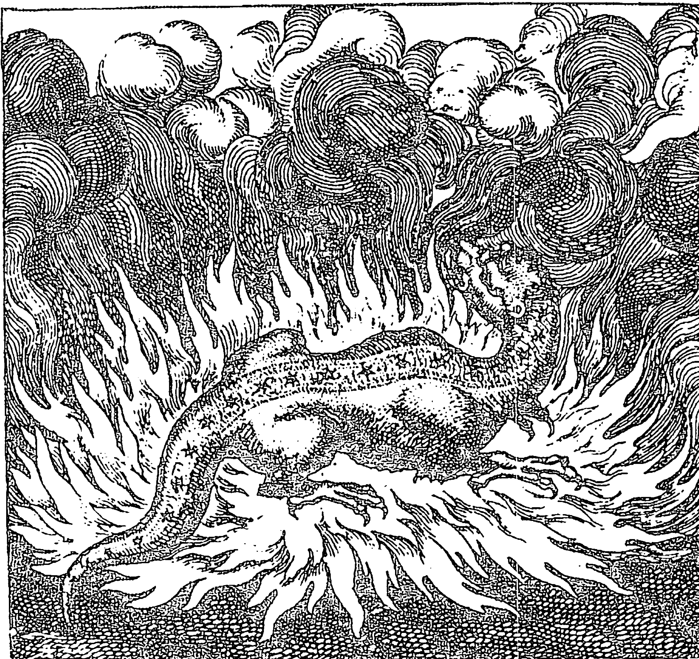

虽然有这样的试验，但直到文艺复兴时期大家仍然广泛相信这种蜥蜴的真实性。还有衣服以“火蜥蜴羊毛”的名字命名，就是宣称它不会燃烧，而且价格不菲。这种材料做成的衣服成为了那些从事跟火打交道的人的穿着，还成为包装珍贵物品的信封的原料。当然，世界上根本没有所谓的火蜥蜴羊毛（因为蜥蜴根本没有皮毛），但是买这种衣服的人也不算完全受骗了，因为它确实是用防火材料做成的。当然，叫它“火蜥蜴”或者号称它是用这种蜥蜴的皮做成的无非就是想卖个好价钱。

虽然没有明显的证据表明火蜥蜴确实经受得住火焰的考验，但是很多人确凿无疑地相信这一点。人们确实见过蜥蜴从灰烬中爬出来。那是因为它们喜欢在园木中生活，当人们把这些园木投到火里的时候，这些居住在里面的蜥蜴也会被随之投了进去。当然，有时候蜥蜴能从火里逃出来，它们的皮肤也确实可能帮助它们耐上一两秒的高温。所以尽管这样的情况很少出现，它还是启发了人们的想像力，同时，有些字典也极尽无中生有之能事，把火蜥蜴说成是“能够抵抗火焰或能够耐高温的动物”。

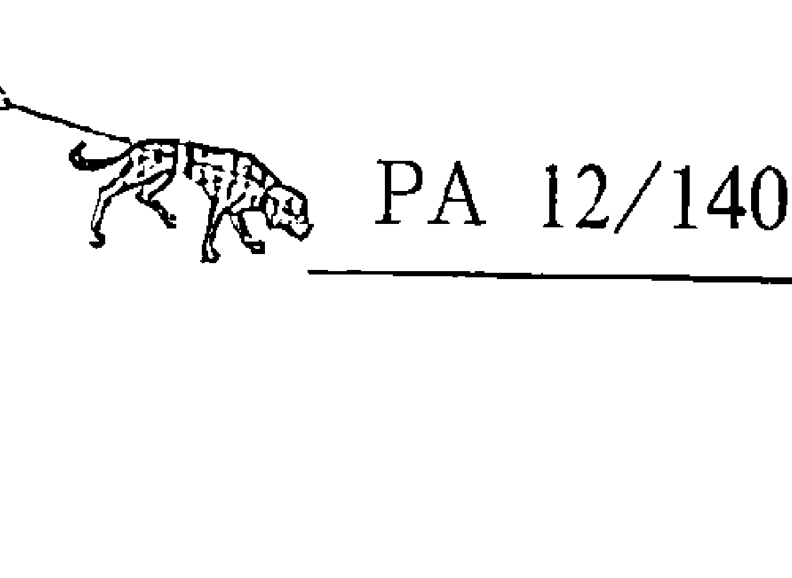

## 巨蟒

当哈利·波特的朋友发现他能跟蛇交谈的时候，很多人都非常害怕并怀疑哈利·波特本人是黑魔法师。当然，在魔法世界中蛇总是与邪恶联系在一起。食尸徒就被人描绘成从人的头颅中吐出蛇信子的形象。很多对黑魔术感兴趣的人都知道斯坦利房子，这间房子的标志就是一条大蟒蛇。伏地魔大神的好朋友和宠物也是一条蟒蛇。但是可能我们听到的有关蛇的故事还不够多，这也是为什么哈利·波特能够很容易地与蟒蛇沟通，并能指挥它的行动的原因。在世界各地的文化中，蟒蛇不仅是与邪恶联系在一起，同时也代表着智慧、洞察力和治疗伤病的能力。

人们对蛇的崇拜早在人类语言出现之前就开始了。洞穴中的壁画和雕刻显示了这一点。有证据表明古代人对蛇的崇拜超过了任何其他动物。它们曾经是北欧挪威的大神，是中美洲阿芝台克人的大神，也是西非、中东、地中海地区和印度以及中国的大神。在印度，蟒蛇大神是以美女的形象出现的，她们长着蛇的脑袋，身边还环绕着巨蟒。挪威人相信蛇神能够保佑他们，甚至包括保佑他们不被毒蛇咬。

虽然蛇被人崇拜，但是人们对它仍然非常惧怕。巨大、狡猾的蟒蛇在很多埃及神话中都出现过。在古埃及的《死亡之书》中，巨蟒屡次以代表邪恶的形象出现。它的外号也叫“黑暗的魔鬼”，它和埃及太阳神每天都在争斗，每天太阳升起又落下，据说是太阳神又被巨蟒打败了。在挪威神话中，巨蟒也被叫做“恐怖的吃人怪兽”。它生活在生命之树下，代表了宇宙间一切邪恶的力量。西方文化中最著名的蟒蛇恐怕要数伊甸园中诱惑亚当和夏娃的那条蛇，它也被写进了《圣经·旧约》中。在《圣经》中的其他地方，蟒蛇也经常出现，代表了恐怖和危险。在犹太和基督教文化中，蛇一直都是邪恶的象征，而在穆斯林宗教中，蛇则代表了堕落的人。

尽管蛇经常与邪恶联系在一起，但是在神话、民间故事和宗教中也有好的蛇，它们具有贵族的品质。例如在埃及，人们就把眼镜蛇看作智慧的象征，而保护家庭的女神也以用手正爱抚着一条蛇的形象出现在硬币上。在很多农业社会中，蟒蛇是丰产和好收成的象征（原因很简单，因为蟒蛇是啮齿类动物的天敌，所以它们从一个侧面保护了庄稼）。在古希腊，蟒蛇是治愈疾病的象征，它们盘亘在药神周围（参见魔杖词条）。在罗马，蛇经常是家养的宠物，雕刻了蛇的护身符也非常普遍。因为蛇能够蜕皮，所以在世界各地它也代表了重生和更新。

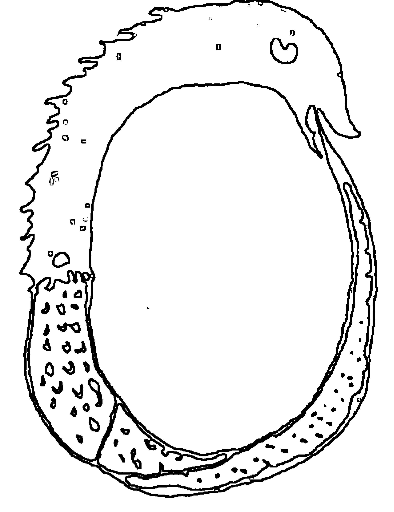

这种蛇的尾巴塞在它的嘴里形成一个圆圈的图案被叫做“蛇环”，在很多原始社会中，这个标志都代表正面含义。它代表着生命、死亡以及重生永恒的循环。

也许因为我们对蛇都没有什么接触，所以有关它的知识所知甚少。例如哈利·波特能和蟒蛇说话就很奇怪，因为蟒蛇根本没有耳朵，它们不能像人或其他动物那样听到声音，但是对声波非常敏感。绝大多数的蛇都是无毒的。世界上大约有2700多种蛇，但是只有400多种有毒，只有50多种对人类有害。但是仍然有很多人害怕蛇，甚至到了谈蛇色变的地步。

蛇敏捷、安静的移动方式为它们赢得了神秘的名声。它们无声无息，总是突然出现又突然消失了。很多蛇可以发出咝咝声，能够使自己身体膨胀，还能发出臭味。当然，正因为有些种类的毒蛇有着致命的毒液，也使得人们对它们敬而远之。

正是由于人们对蛇的惧怕，它也出现在很多很重要的地方，例如看守宝藏，镇守能够令人起死回生的泉眼，以及在霍格沃茨的密室中驻守。这也可以解释为什么世界上有这么多人把蛇作为家养宠物。

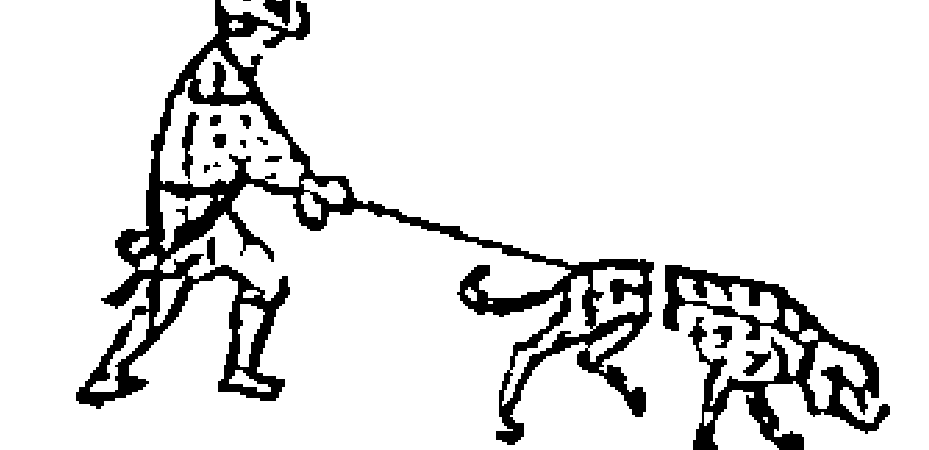

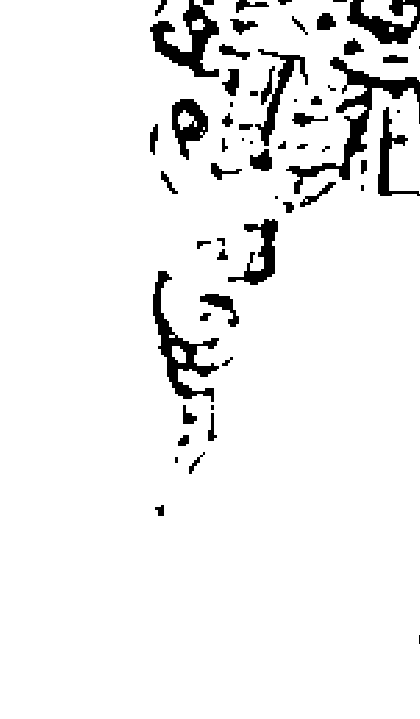

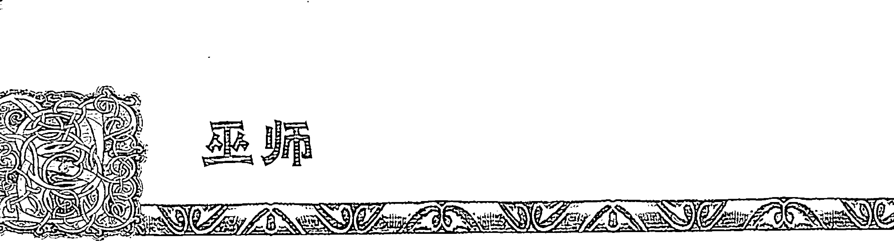

## 巫师

也许用“魔法师”这样的字眼形容巫师是再合适不过的了。他们并不只是会制作毒药的人，他们还拥有控制自然的力量。他们能够呼风唤雨、移动大山、制造闪电，能够把看似平淡无奇的装饰品变成美丽的珠宝。另外，巫师也是使用黑魔法的高手。例如，有些邪恶的魔法师有着极为强大的力量，不遗余力地试图对人类造成伤害。那么，魔法师到底是一种什么人呢？

实际上，两者都是。从历史上说，“魔法师”这个词一直就有双重含义，代表邪恶和善良两方面的含义。迄今所知的最早的魔法师形象出现在1万多年前法国南部一座洞穴的墙壁上。洞穴上的壁画中的这位魔法师身穿动物皮毛做成的服装，戴着鹿角，跳着宗教舞蹈。人类学家相信这个画面反映了古代的部落魔法师最原始的形式。他们可能是萨满教士，负责保护整个部落，保佑大家能够打到猎物，能够控制天气。这样的魔法师对于当地的社会非常重要，所以也得到了人们普遍的尊敬。

在古巴比伦的古老文化中，最令人害怕也是人们最痛恨的邪恶魔术就是魔法师一手包办的。他们会使用咒语，在蜡像上扎大头针，召唤魔鬼为他们服务，还能唤醒死人的灵魂。在基督教兴起之前的希腊和罗马，这样的魔法师还能占卜（“秘密”这个词来自于拉丁语，意为“先知”或“命运”等），但他们最主要的职业还是诅咒人或者调制毒药，并使用这样的方法给敌人造成麻烦。

在中世纪，人们衡量一个人是否属于魔法师，往往取决于他魔法的效果，而非他的目的。如果效果是好的，人们把他称作好的魔法师；如果效果是不好的，人们把他们叫做邪恶的魔法师。但是有的时候很难区分，比如，如果施展魔法为了挽救一个病人的生命，这本该是好的魔法，但是如果万一没有起到作用，反而使病人的病情加重，又该当何罪呢？到底魔法师是对人们有益还是有害，这往往也是审判魔法师时经常争论的话题。

有时候农民因为不满邻居找魔法师作法而把他告上法庭，农民认为正是魔法师使得自己的牲畜或小孩生了病，再不然就是带来了暴风雨或洪水。通常这样的争论都会在村子内部解决，但是如果人们能够发现证据（例如魔术师作法的咒语或者蜡像），通常他们就会被判有罪。

尽管仍然有人认为魔法师是坏人，但自文艺复兴以来对他们的观念有所改观。学者和医生认为那些“白色”的，或者换句话说，对人类有益的魔法的施展者才能被叫做魔法师，例如像尼可·勒梅那样的炼金术大师。他们在实验室里潜心研究，终于发现了把金属、石墨、锡等材质变成金子的方法。就是霍格沃茨拥有众多头衔的邓布利多教授也把自己“魔法师”的头衔写在信纸上。这也说明“魔法师”这个称谓逐渐演变成为了任何会施魔法的人。

1940年的一部卡通电影使得“巫师”进一步被大家接受，人们认为他们无所不能。这个故事根据公元2世纪的罗马作家卢西恩的《巫师的学徒》一书改编而成。这个故事后来也被德国作家歌德改写过。故事讲述的是一个魔术师的学徒把一把笤帚唤醒，让它到溪水里取水的故事。这个学徒自以为能够控制大自然，但是实际上笤帚并不听他的使唤。它取了水之后就再也停不下来了，结果淹没了整个房子。这个故事告诉我们，如果有魔法师的正确引导，魔法的魅力是无穷的。

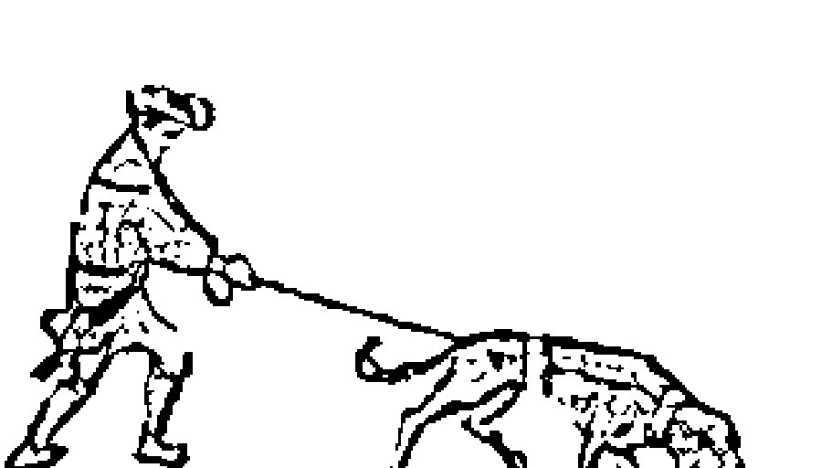

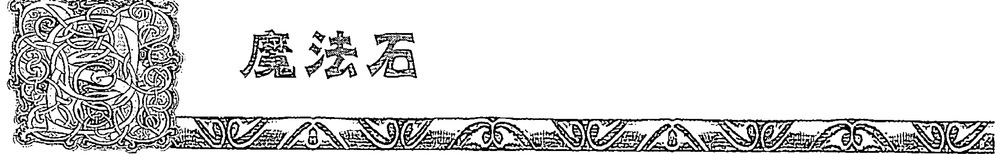

几百年来，魔法石作为魔法世界中最令人浮想联翩的事物，可以说满足了我们人类的两大终极愿望：长生不老、永远健康。伏地魔从霍格沃茨盗窃魔法石的目的也是希望能够再次获得力量并在全世界传授他的黑魔法。其他很多人，不论是小说中虚构的角色还是真实世界中的人，也都在寻找这样的石头，以便能助他们得到金子或者提炼出万能药——这种无论谁喝下去都会长生不老的药物。

魔法石是炼金术这种发源于公元1世纪的古罗马和埃及的一种古老技术中的一个环节。这种技术意在把普通金属变成金银。根据炼金术的发明者的想像，这样的技术应该是一门复杂的工艺，要使用到熔炉、化学、实验室等各种设备。经过一系列神秘的操作，把锡、水银、石墨、铁等变成金子。尽管当时相关的物理学知识跟今天比起来并没有什么不同，但是这样的炼金技术从来没有成功过。当然，这并没有影响炼金术士们对这种技术的坚信程度和他们在这方面投入的热情。他们实际上都成为了杰出的染色专家，制造出了很多与黄金色泽类似的金属制品，尽管他们从未真正提炼出纯金。

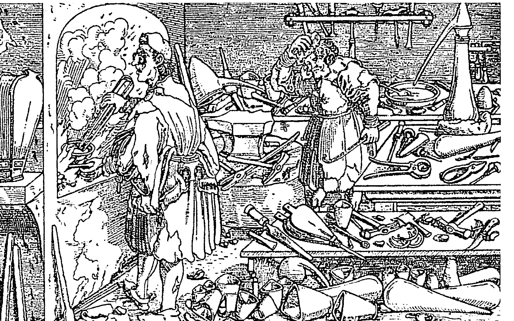

在后来的几百年中，阿拉伯世界很好地继承发扬了这种炼金传统。大约在1200年阿拉伯炼金术士的著作传到了中世纪的欧洲并被翻译成了拉丁文。他们的手稿中的复杂的仪器设备成为了研究这些著作的学者和教士的参照。

显然，如何提炼出金子的方法已经存在了上千年，但是即便是欧洲最杰出的科学家也没有破解如何能够实现这一点，但是今天，有了尼可·勒梅，似乎这一切真的可能实现了。

但是炼金术的魔力还是令人无法抗拒的。在14世纪末，炼金术在整个西欧流传开来。人们大都听说过炼金术，同时也有千百名实践者前赴后继，希望能够取得成功。新的方法出现了，与原始的炼金术士使用的方法不同，当时的人们不再试图把金属直接变成金子，而是试图研制一种催化剂来加速或诱发金属质变的进程，就像尼可·勒梅所做的那样。这种催化剂，或者说替代性的物质就是魔法石。有关魔法石的神话开始流行，人们也相信它能够治疗各种疾病，同时还具有使人长生不老的功效。

虽然魔法石根据定义应该是一种具有魔力的物质，人们相信它应该是使用纯天然的材料制成的，而且理论上谁都可以制作这种魔法石，但这并不是说它很容易就能成功。

能被制作出来。首先，炼金术的说明很难找到，也很难读懂。不仅因为它们是拉丁语写成的（这意味着只有牧师和受过良好教育的人才能读懂），同时也是为了防止这种方法落入坏人的手里。因此炼金术写作者故意用晦涩的语言、特殊的符号写作。例如，他们在描述“水溶液”的时候并不使用我们都能读懂的字眼，而是把它叫做“绿色的巨龙”，而石墨则被叫做“黑乌鸦”。一旦你能读懂这些文字，下一步要做的就是准备各种化学材料、金属、熔炉来建立自己的炼金实验室，另外还需要有持久的耐心投入到研究中去。但是仍有很多炼金术士心甘情愿地把自己毕生的时间、精力投入到炼金的过程中去，因为炼金术不仅被看作是一种物质追求，同时也是一种精神追求。很多炼金术士也相信，只要他们保持对这项事业的忠诚，他们也会塑成“金身”，获得自身素质的提升。

正因为人们对炼金术坚信不疑，很多骗子从中取巧，发明了一些招数，声称能够“迅速致富”，从中骗取那些想成为炼金术士的人的钱。这些骗子使用诡计或障眼法把水银变成金子，然后再向大家叫卖能促成这种转变的石头（有时候也贩卖化学原料或实验室器材）。同时，不论是骗子还是真正的炼金术士，如果他们宣称自己有这样的石头的话，都可能把自己陷入危险的境地，因为如果这样的事被别人知道了，很快就会有盗贼光临。也正因为这一点，炼金术士大都秘密操作。

直到17世纪末炼金术仍然很走俏。随着当代化学的进一步发展，古代炼金术也被当代的理论所取代。虽然炼金术士从来没有意识到他们的这种最原始的目标根本就是不可行的，但是他们确实在炼金的过程中发现了很多我们在科学和医药领域都需要的金属和化学元素。他们也发明了很多基本的实验室设备和技术，这些设备和技术在17世纪广为使用。

# 制作魔法石——炼金术背后的理论

炼金术的目的在我们现在看来是不切实际的，但是在古代和中世纪的炼金术士心目中，这个目标却志在必得。古希腊哲学家的理论直到当代科学仍然有很大的市场，他们认为世界上的一切物质都是由一种“第一物质”组成的。这种物质可能是不同的材料或具有不同的特性，但它们都是最基本的“物质”。而且这种物质被人认为是活性的。无论是金属，还是矿物质或动植物都包含这种“宇宙精神”或生命力。这种物质也被古代哲学家叫做“原生质”（这个字来自希腊语的“呼吸”或“风”）。

基于对物理科学的理解，很多炼金术士不知道为什么他们不能将铁、锌等包含原生质的金属变成同样包含原生质的另一种金属——金子。他们把这些金属投入熔炉中，再加入酸碱溶剂试图把它们变成金子。古希腊和古埃及的炼金术士相信，如果在炉子中打入少许的纯金能够起到催化剂的作用，就像种子一样，投到熔炉里就能帮助其他金属中的第一物质变成金子。另一方面，中世纪的炼金术士加热混合物，混合物中释放的气体经过蒸馏设备凝结。通过长时间的蒸馏和提纯，有时候这样的工作要持续很多年，炼金术士们相信就能得到纯度很高的所谓原生质，这也就是传说中的“魔法石”。至少在理论上，人们相信如果把它添加到别的物质中，那种物质就会变成金子。作为一种万能药，人们也相信它能治愈疾病，令人返老还童。

## 炼金术骗子——制作假的魔法石

能够演示金子是如何制作出来的魔法师是被人怀疑的魔法师证明自己的最好方法，也用来证明自己持有的魔法石是真的。但是很多狡猾的骗子仍然设计出蒙混过关的方法。他们能够向想买魔法石的人演示如何制造金子。实际上这操作起来并不像我们想像的那么难。最令人印象深刻的演示就是在设备简陋的实验室中进行的，具体方法如下：

首先，假炼金术士先把一小部分水银倒入坩埚中（一种瓷器碗，用于熔化金属），然后再把它用炉子加热。为了增加戏剧性的效果，他再使用一小管红色粉末，说那就是所谓的魔法石，把它小心地加入水银中，然后搅动坩埚，让二者充分混合，继续加热。很多这样的炼金过程需要几个星期或几个月，但是这样的表演通常只需要几分钟，很快就会发现水银的颜色改变了，从银色变成了金黄色。然后再把它冷却，它会凝结成闪光的小金块。令人惊奇的是，人们会发现这样的小块不仅看起来像是金子，它实际上就是真正的金子。

这样的变化实际上利用了化学和魔术知识。其中的化学原理是水银的熔点比金子要低，而这其中的关键就是那根看起来平淡无奇的搅拌棍。这根小棒实际上是空心的，里面事先被炼金术士塞入了很多金粉。在小棍的底部有一个蜡做的塞子把金粉固定住。当水银受热搅拌的时候，蜡会熔化，金粉就会跑到坩埚里。骗子会趁人不备把水银泼到炉子里，而剩下的自然就是金子了。所谓的“魔法石”也许不过是一堆红色的粉末而已，然后这些骗子再以高价卖给别人，匆匆逃离这个城镇，辗转到其他地方。

## 咒语

药需要时间才能发挥作用，草药更是需要时间才能长出来，而咒语则不同，它能立即起到作用。罗恩使用漂浮咒惩罚了精灵，哈利·波特也借助咒语找到了迷宫的出路，赫敏则通过开门咒进入了禁止入内的神秘走廊。咒语是影响人类、动物及其他事物的神奇工具。实际上，霍格沃茨魔法学校也是借助咒语的帮助，而成为被麻瓜看来一钱不值、肮脏破败的地方。

实际上，文学中的魔咒曾经起到了神奇的作用。几乎每种文化都认为咒语能够影响人们的行为或者事件的进程。在古代，职业魔法师通过咒语帮助他的客户寻找爱人、抵抗敌人、获得财富、治疗疾病，在体育比赛中获胜或者抓住房间里的老鼠，或用来消除敌对的魔法师施的其他魔法或咒语。一些对魔法感兴趣的人也使用“自制”的魔法。即便是公元1世纪最喜欢怀疑一切的作家也承认：没有人不怕咒语的威力。

咒语指的是具有神奇魔力的短语，书面形式或口头的都可以。咒语中大多把所要达成的目的明白无误地表露出来，重复很多遍，同时还有一些仪式做配合，比如点燃蜡烛、熏香或做某个特定的手势等。很多古埃及人把咒语抄写在纸上，然后把它们放到啤酒里喝掉。古希腊和古罗马魔法师则一边转轮一边念咒语。在不同文化中，有关咒语的词汇也不同，有些还需要借助一些有魔力的字眼。很多咒语都可以用来歌唱，创作以及宣读咒语的过程被称之为“编织”或“铸造”魔法。

咒语和咒语各不相同，有的旨在影响人们的行为，如爱情咒语、治病咒语等，而有的诅咒起到的是不好的作用，最普遍的是用受害者的头发、指甲，或他的一件衣服等对人诅咒。这也反映了古代人的一种信仰，他们认为曾经属于某个人身体的某种东西，即便是与受害人分开之后，相隔很远也仍然与他保持联系。例如，女人和她们的指甲就是这样。如果手头没有这样的东西，有些特定的词汇也能达到类似的效果。例如在公元1世纪的爱情魔咒里就有这样的话：“当我熔化蜡烛的时候，他的心也随之熔化了。当我加热这些草药的时候，他对我的激情也随之燃烧。当我给绳子打结的时候，我们也结上了同心结。”有的时候念咒语还要配合使用蜡像或黏土塑像，用来代表希望在他身上生效魔法的那一方。在爱情魔咒中，咒语可能会绑在绳子上以便让施魔法的一方与被施魔法的一方的心结合起来。在念治病咒语的时候，使用的木偶里面会塞上草药，如果咒语的目的是要加害某人（例如黑魔法），这个娃娃会被摧毁。

当然，童话故事或文学作品中的咒语是不需要这些额外设备的。魔法师只需要挥挥手杖就可以把一个怯懦的诗人变成勇敢的骑士，能让马车在空中飞翔。在霍格沃茨魔法学校，教授们如果希望自己的学生考试的时候不作弊，只要念考试不作弊咒语就行了。今天，在英文中还有“被咒语镇住了”这样的说法，用来形容人们深深沉迷于某个故事时的心情。

## 斯芬克斯

再没有什么怪物比斯芬克斯的历史还要悠久的了。这种怪物长着狮子的身体和人的头以及上半身。斯芬克斯作为传奇故事中的形象已经有5000多年的历史了。在古埃及，斯芬克斯首次出现是作为皇室的象征，同时还代表着丰产、生活和死亡。它的形象总是与每年尼罗河的洪水联系在一起。斯芬克斯的塑像也被安放在绝大多数埃及的墓穴和寺庙的门前。

埃及最著名的斯芬克斯是一尊240英尺长、66英尺高的大斯芬克斯像，坐落在埃及北部条带状沙漠的吉萨地区。这尊塑像已经有4800多年的历史，巨大的石灰石雕像有着狮子的身体和埃及法老的头颅。很多历史学家相信这尊斯芬克斯像是为了纪念埃及法老卡夫拉王而雕刻的，因为不远处就是他的金字塔。

斯芬克斯的神话从古埃及跨过地中海传到了美索不达米亚地区（也就是今天的叙利亚和伊朗）以及古希腊。几百年来，半人半兽的斯芬克斯被人赋予了很多恶毒的含义，它不仅代表阴间，同时也是暴力和毁灭的代名词。希腊的万神之王宙斯所在的奥林匹亚山上就雕刻着斯芬克斯杀死儿童的塑像。在古希腊和古罗马，斯芬克斯还被描述成吃人的怪兽，它会让人们身首异处。从斯芬克斯的神话起源之地向东北方向传播的过程中，斯芬克斯的样子也在人们的添枝加叶中变了样。在美索不达米亚神话中这种神奇的怪物有着公羊和老鹰的脑袋，而希腊人则给它加上了翅膀，面部和胸部则变成了女人。

哈利·波特在魁地奇锦标赛中看到的斯芬克斯虽然没有翅膀，但可能仍属于希腊式的斯芬克斯。不仅因为它有女人的脸，还因为它用自己的智慧防御黑魔法，这很像希腊神话中的俄狄浦斯。在那则神话中，有一个恶毒的斯芬克斯游荡于第比斯城附近，每当看到一个人人都向他提出无法回答的问题，如果答不出这个问题就会被它吃掉。最后它终于碰到了能够回答这个问题的英雄俄狄浦斯，他解开了这个谜语：“什么动物在早晨用4条腿走路，到了下午变成了2条腿，而到了晚上又变成3条腿？”（当然，答案就是人。因为人在婴儿期要用四肢来爬，年轻时候是两条腿走路，老了则要拄拐杖。）战胜了斯芬克斯，俄狄浦斯像哈利·波特一样，被准许进入自己的目的地，但前方仍有更大的困难等待着他。

希腊神话中对斯芬克斯负面的描写后来成为人们对它的主要印象。斯芬克斯这个词来自希腊语，意为“榨取”或“弯曲”。虽然中世纪的一些作家相信这是一种真实的动物，但古埃及、美索不达米亚人以及古希腊人并不这样想。他们的传奇故事、文学作品总把斯芬克斯描述成神话动物，代表权力和人们无法获得的知识。但是后来17世纪的动物学家爱德华·汤普索尔认为，斯芬克斯实际上是一种埃塞俄比亚猿人的变形。就是根据这一点，现在还有一种狒狒被叫做“斯芬克斯狒狒。”

## 牡鹿

哈利·波特长得跟父亲詹姆斯很像，也继承了父亲喜欢冒险的性格。哈利·波特的父亲留给他一件隐身衣和一张魔法地图，能够帮助他在霍格沃茨魔法学校渡过难关。后来哈利在恍惚中看到了父亲的形象，看到他的父亲变成牡鹿的形象出现。

与牡鹿的这种特殊关系给哈利带来了好运。在亚瑟王传奇故事中，伟大的魔法师梅林也在有些故事中化身为牡鹿，或者骑在牡鹿的背上。所以这种动物也与贵族或意志坚强的人联系在一起。在凯尔特人的神话故事中，牡鹿是一种拥有超自然力量的动物。它经常能变形为人类或其他动物。凯尔特人神话中的地下之神就被描述成长着人的身体和鹿的犄角的形象。牡鹿以机警、快速和进取著名，人们也认为它在森林中跟很多动物都有非常密切的关系。

盎克鲁-撒克逊祖先的墓地中出土的很多器物也表明早在公元3000年英国人就已经开始崇拜牡鹿了。在墓地中发现了牡鹿模型，而一位国王的权杖上也雕刻着牡鹿。早期的基督教作家描写了盎格鲁-撒克逊人把牡鹿刻成雕像崇拜，同时在宗教仪式上打扮成牡鹿的样子跳舞。在欧洲其他地方，人们把牡鹿的鹿角安放在门口起到避邪的作用。

中世纪，牡鹿在文学和艺术作品中的出现多代表了男子气概、孤独、力量、美德和纯洁。因为它的犄角能够不断生长，就像凤凰一样，人们也把它的形象与生命的循环联系在一起，认为它代表了出生、死亡、重生。对于猎手来说，能够抓捕到牡鹿成为了他们的终极目标，因为据说这种动物能让你实现所有愿望。今天，在英国的部分地区仍然有牡鹿出没。每年9月，阿伯丁地区镇子上的人都会选出6个人，让他们戴上鹿角表演舞蹈，这种庆祝狩猎成功的古老宗教仪式早在公元1226年就开始了。

牡鹿的形象和佩戴着鹿角的神的形象出现在容器上，这件文物已经有200多年的历史了。

## 驱邪物

虽然霍格沃茨的学生购买驱邪物的目的是为了保护他们不被石化，但驱邪物的真正作用还在于施展魔法而非仅仅起到防范作用。与护身符不同，护身符的主要作用是保护人类，而驱邪物的作用在于它拥有非凡的能力，能够帮助主人隐身，对疾病产生免疫力或者能够博闻强记等。驱邪物可以以各种形式出现，可以是一本书、一个戒指、一件衣服、一块金属、一张证书等。有些东西，例如宝石，传统上一直被人认为是有魔力的东西。但是很多驱邪物都是通过一些仪式被赋予特殊的力量或神的赐福，上面大多刻有带魔力的字眼、神的名字或是一些简单咒语等。

古时候的驱邪物非常紧俏，考古学家从古埃及发现了很多纸制的驱邪咒语，在地中海地区也出土了很多石头或金属制品驱邪物。它们最普遍的用途是治疗疾病，同时也用来赢得爱情、增强记忆，以及用来确保在政治、体育比赛和赌博中获得成功。

中世纪，驱邪物的用途得到了进一步的拓展，用左手拿着野兔的脚被认为能够帮助人进入危险的地方而不受伤害。罪犯手中如果拿着槲寄生树枝就能保佑他在审判的时候获得无罪。拥有一小束向日葵，里面掺上狼的牙齿再用月桂树叶包裹就能防止其他人散布你的流言。14世纪时的英国驱邪物一度非常流行，以至于决斗中有明确的规定要求参与者不能佩戴给予自己额外保护的任何戒指、宝石或其他驱邪物。

因为人们认为天空中的星星对地球上的生命会有影响（参见占星术词条），很多驱邪物都是用来捕获某个特定的星星的影响的。如果你想在决斗中取胜，你应该去求一个带有火星影响力的驱邪物，因为火星被认为掌管着人身体的力量。这样的驱邪物应该是铁制的，因为铁被认为是与火星联系最紧密的金属，同时也应该在火星的影响力最强的时候制作这样的驱邪物，以达到最好的效果。上面也可以刻上火星的数字——5，或者搭配火星的红颜色。

很多与星象相关的驱邪物在欧洲文艺复兴时期的炼金术士那里非常流行，他们通过举行特殊的仪式让这些东西帮助自己完成把其他金属变成金子的目标。他们会等待一个特定的时间，然后召集神怪或魔鬼帮助他们把特殊的力量赋予到驱邪物中。那个据说能够使人长生不老、治愈万物的魔法石说到底也是一种驱邪物。

到19世纪驱邪物仍然非常流行，并出现了全能的驱邪物，这种东西要在月圆之夜用银制造，据说能够保佑人身体健康、富有、快乐、受欢迎，还能保佑他的所有旅途平安。虽然现在人已经不再把有魔力的字眼刻在金属上了，但是那些坚持在某些场合带上一只兔子或者坚持穿他们的“幸运袜子”的人身上仍然保留这种古老的习俗。

这个中世纪的驱邪物据说能为所有者带来好运，并能帮助他在赌博的时候做出正确的决策。

## 解读茶叶

罗恩和特里劳妮教授看到的东西总是不一样，罗恩看到了可爱的保龄球帽子，教授看到的是邪恶的木棍；罗恩看到了温顺的绵羊，教授看到的是可怕的大黑狗，但有一点是相同的：他们两个人都在看哈利·波特的茶杯底部，他们使用的这种占卜法就是“解读茶叶”法。

通过观察茶叶解读未来的方法约始于公元6世纪的中国。直到1609年西方人才知道这种饮料，那时才有荷兰人从东方进口茶叶。虽然刚开始人们对这种饮料充满怀疑，但是法国人从1636年就开始喝茶了。到了1650年，茶叶传到了英国，后来成为了人们日常生活中的一部分。17世纪中叶，茶叶已经成为大众消费品，整个欧洲都有了解读茶叶的算命先生。

其实，解读茶叶这个概念对欧洲人来说并不陌生，古罗马人曾经使用解读酒瓶底的残留物预测未来，而中世纪的算命先生也曾经研究过熔化的蜡的图案，试图从中看出端倪。但是这项技术确实需要解读者了解如何对茶杯底部的茶叶进行准备，还要知道各种不同的图案代表的含义。在18~19世纪，出版了很多类似的书籍满足好奇者如何解读茶叶（这也被叫做“茶叶解读法”，由阿拉伯语的“杯子”和希腊语的“先知”两个字构成）。因此，这种算命法不但在算命先生那里很流行，很多业余选手也愿意一试身手。

读取茶叶的方法各不相同，但是这里讨论的是比较一般、有代表性的方法。深色的茶叶（中国茶叶和印度茶叶也不尽相同）被倒进浅色的杯子里，想知道自己命运的人首先要喝掉这碗茶，留下少部分的茶水和杯子底部的茶叶。在摇晃了3次之后，他要把杯子倒扣在一个碟子上，把杯子里面的茶叶倒出来。这时，解读者察看杯子中残留的茶叶的图案和形状。

那么，从杯子里能看到什么呢？茶叶解读者宣称能够看出不同的形状、线条、颜色和几何图形，另外还能看出植物、动物和物体的样子。这些特别的图像都有不同的解释。例如，一条直线说明此人很有计划性同时头脑平和。两条平行线说明旅途平安。一个圆圈顶端有十字交叉一般来说是个不祥的迹象，说明此人不是要进监狱就是要住院。树的形状预示了取得成功，橡树的形状代表了健康。图案形成得越靠近杯子的边缘，就说明该种迹象发生得越快。在杯子底端形成的图案代表的事件被认为会在遥远的未来发生。

就像特里劳妮教授那样，很多占卜师坚持认为只有有天分的通灵者才有资格解读茶叶。根据这样的理论，茶叶能够刺激解读者的知觉，使他能够看到未来并能发现被掩盖的事实。但是，这并不妨碍数以千计的大众试着解读茶叶，他们很多人只是为了娱乐一下。如果你也想试试这么做，而手边又没有类似的参考书，你可以使用下面的一些解释：

| 图案 | 含义 |
|------|------|
| 橡树 | 健康 |
| 锚 | 旅行 |
| 箭 | 来信中有不好的信息 |
| 气球 | 上升的时候遇到困难 |
| 香蕉 | 就要出差 |
| 蝙蝠 | 失望 |
| 蜜蜂 | 与朋友聚会 |
| 钟 | 好消息 |
| 鸟 | 幸运 |
| 船 | 拜访朋友 |
| 书 | 知识、学习 |
| 树枝 | 结交新的朋友 |
| 蝴蝶 | 欢乐 |
| 猫 | 遭到背叛 |
| 椅子 | 突然到访的客人 |
| 圆圈 | 爱 |
| 时钟 | 从疾病中复原 |
| 云朵 | 怀疑 |
| 银币 | 债务 |
| 螃蟹 | 附近就有敌人 |
| 十字架 | 正陷在麻烦中 |
| 杯子 | 巨大的成功 |
| 飞刀 | 仇人的威胁 |
| 钻石 | 一份昂贵的礼物 |
| 狗 | 忠诚的朋友 |
| 驴 | 需要耐心 |
| 鸽子 | 好运 |
| 龙 | 变化 |
| 鼓 | 流言 |
| 鸡蛋 | 丰产、增加 |
| 信封 | 新闻 |
| 眼睛 | 小心锻炼 |
| 脸 | 新朋友 |
| 羽毛 | 需要更多努力 |
| 鱼 | 外国新闻 |
| 旗帜 | 危险 |
| 花朵 | 爱、荣誉和尊敬 |
| 叉子 | 偏离既定目标 |
| 长颈鹿 | 不理解 |
| 手套 | 好运或荣誉 |
| 山羊 | 不幸 |
| 鹅 | 邀请 || 物品 | 描述 |
|---|---|
| 葡萄 | 与朋友共度愉快的时光 |
| 吉他 | 罗曼史 |
| 锤子 | 胜利、艰苦的工作 |
| 手 | 友谊 |
| 帽子 | 一个新的工作环境 |
| 喇叭 | 丰裕、富足 |
| 马蹄铁 | 好运 |
| 房子 | 稳定 |
| 袋鼠 | 未曾想到的旅行 |
| 壶 | 一个友好的家 |
| 钥匙 | 将秘密公之于众 |
| 蕾丝花边 | 琐碎的事情 |
| 梯子 | 前进、成功 |
| 台灯 | 金钱上的收益 |
| 树叶 | 好运 |
| 狮子 | 有帮助的朋友 |
| 蜥蜴 | 隐藏的敌人 |
| 男人 | 意想不到的访客 |
| 美人鱼 | 诱惑 |
| 月亮 | 爱 |
| 山 | 长途跋涉或者障碍 |
| 老鼠 | 经济上的漏洞 |
| 蘑菇 | 预期的延迟 |
| 乐器 | 好伴侣 |
| 面条 | 得到别人的尊重 |
| 雀巢 | 庇护所 |
| 套索 | 前方会有危险 |
| 桨 | 临时的困难 |
| 猫头鹰 | 丑闻、健康情况出现问题 |
| 公牛 | 与合作伙伴有争执 |
| 鹦鹉 | 打扰 |
| 钟摆 | 优柔寡断 |
| 猪 | 在爱情中遇到困难 |
| 管子 | 新主意 |
| 南瓜 | 温暖的感情 |
- 问号: 不确定、变化
- 野兔: 成功
- 彩虹: 好运
- 田鼠: 危险、破财
- 戒指: 婚姻
- 锯: 与陌生人有困难
- 天平: 公正、在法律方面取得成功
- 权杖: 更多的责任
- 剪刀: 生气的字句、家庭成员之间的误解
- 长柄镰刀: 好收成或危险的警告
- 绵羊: 好运
- 鞋子: 事业要发生改变
- 骷髅: 生病
- 蛇: 诱惑
- 铁锹: 通过努力工作取得的财富
- 松鼠: 财富
- 楼梯: 今后会有所改进
- 星星: 好运
- 太阳: 持续的开心
- 剑: 与亲近的朋友的争论
- 桌子: 愉快的团聚
- 荆棘: 强烈的野心
- 乌龟: 批评
- 树: 成功
- 三角形: 突然来临的事件
- 雨伞: 烦恼
- 花瓶: 一个朋友可能需要帮助
- 小提琴: 孤独
- 拐杖: 需要帮助
- 瀑布: 富裕
- 蜘蛛网: 诡计、复杂的局面
- 窗户: 从一位朋友那里得到的帮助
- 酒杯: 新认识的朋友
- 翅膀: 新闻

# 三头狗

一条浑身长满浓密的毛发、有一间屋子那么大、长有3个头的大狗看守着霍格沃茨的魔法石。这条大狗的神话渊源可以追溯到3000多年前。它最古老的祖先是希腊和罗马神话中的冥府看门狗。公元前8世纪，希腊诗人赫西奥德把这条大狗描述成拥有5个脑袋、有着低沉声音的形象。但是就在200多年之后，对于看门狗来说5个脑袋显然是太多了，于是艺术家们渐渐把它描绘成长着3个脑袋、龙的尾巴、后脊背上竖起的毛发像蟒蛇一样的怪物。

古希腊人认为如果有人死了，他的灵魂会到地下世界中，这个世界是由冥府之神和他的妻子冥后珀尔塞福涅统治的。这里也是所有灵魂的归属，不论善恶，但是他们在冥府中生活得怎么样要取决于他们在人世间的表现。作为冥府的看门狗，它的职责就是确保没有灵魂在进入大门之后溜出去。它是两个怪物结合的产物（父亲是能够喷火的蛇形巨人，而母亲一半是女人一半是吃人的蟒蛇）。毫无疑问，它吓人的功夫堪称一流。如果这还不够，看到它锋利的牙齿和3个巨大的野狗头颅的确实能把人吓个半死。

在神话中，很少有人能躲过大狗的防范，安全回到地面上。山林水泽仙女曾经成功过，她给大狗喂食掺了迷魂药的蜂蜜点心。另外，特洛伊战争中的勇士也以同样的方法逃了出来。希腊乐神俄耳普斯为了寻找自己死去的妻子欧律狄克闯入冥府，他演奏的竖琴琴声如此优美以至于大狗听得入了迷，闭上了眼睛，放他过去了（大狗像人一样非常喜欢音乐）。另外还有大力士赫拉克勒斯在完成他的12项任务中的最后一项时赤手空拳与大狗搏斗，不但占了上风，而且把大狗拖到地面上待了一段时间。

另外还有传奇故事说，当这条大狗活着的时候，它像普通狗那样流口水，它的口水流到一种植物上，使得这种植物长得非常繁茂，这就是乌头，又称狼毒乌头或附子草。这种草药无论在真实生活中还是虚构的小说里都有女巫使用，作为制造毒药的原料。

## 蟾蜍

哈利有海德薇，赫敏也有自己的宠物，与纳威形影不离的则是宠物蟾蜍。与猫头鹰和猫一样，很久以来，在传奇故事和神话中，蟾蜍也一直与巫术、女巫等联系在一起。虽然纳威的宠物蟾蜍看起来是个好家伙，但是其他蟾蜍的名声却不是这样。

在17世纪女巫受迫害期间，英国和苏格兰的人认为女巫把蟾蜍作为自己的“密友”，因为它们实际上可以变形成其他动物外出为主人执行任务，是一种小型的魔鬼。但是比较起来，潜到某人家里，穿墙而入，然后再在他们的枕头里放上恶毒的诅咒，蟾蜍似乎并不比它们的主人在执行这样的任务时占多少优势。另外，人们还相信蟾蜍也被用在新女巫的入行仪式中。她们被要求亲吻蟾蜍，以表示自己对魔鬼或邪恶力量的效忠。有时候，人们也认为女巫就会变成蟾蜍。

在对女巫审判的时候，有证人说看到过女巫给它们的蟾蜍朋友穿上黑色或红色的天鹅绒斗篷，脚上还系上铃铛。所以人们认为女巫对蟾蜍很有感情，也正因为这一点大家不敢伤害蟾蜍，害怕因此会遭到女巫的报复。英国的一个民间故事就讲述了一个老女人带着她的3只宠物蟾蜍上街的故事。她把这3只蟾蜍装到一个篮子里，在路上她看到农田里有3个农夫正在干农活于是就驻足观看，结果她的一只蟾蜍趁机跑了出去，跳到了农夫的锄头底下。农夫不以为然地笑着用锄头把蟾蜍切成了两半，说：“我给你点颜色看看。”结果老女人急了，说道：“你们没有一个人能完成今天的工作。”很快，第一个农夫的锄头切到了自己的手；不一会儿，第二个农夫切到了自己的脚趾头；第三个农夫也很快出了事，他把自己的靴子划破了。3个农夫都很害怕，他们逃出了田地，果然没有完成当天的任务。

根据某些流行的神话故事，女巫和蟾蜍之间的关系并不总是这样亲密。很多作为宠物的蟾蜍实际上都是女巫试验毒药和咒语的牺牲品。为了驱逐敌人，女巫可能会杀死以敌人的名字命名的蟾蜍。她杀死蟾蜍的方式越残忍，那个敌人受到的痛苦也越多。为了使自己隐身，女巫把蟾蜍的唾液和一种植物的树液混合在一起调制药物。

根据大众的观点，人们认为女巫给自己的蟾蜍披上斗篷，还在脚踝处戴上铃铛。很显然，这两只蟾蜍很享受它们的这种“派对服装”。

## 蟾蜍石

没钱买钻石？那么来块蟾蜍石如何？这些棕色或银灰色的石头可能不会在太阳光下闪光，但是在传奇故事中，它们都是神奇的石头，在毒药中这种石头能够改变颜色和温度。这种石头在中世纪经常出现在戒指和其他珠宝中，人们认为蟾蜍石产生于年纪很大的蟾蜍的头脑中。

根据古老的传统，蟾蜍石可以从蟾蜍的脑部萃取出来，但如果你管它们要，蟾蜍也会很友好地把石头给你。如果有人给了你蟾蜍石做的戒指，你可以把它拿到蟾蜍面前让它帮助你判断真假。如果蟾蜍向前跳跃，就说明石头是真的；如果蟾蜍不屑一顾地离开，就说明是假的（实际上，所有这样的蟾蜍石都是假的，它们只是形状或颜色像蟾蜍而已）。

除了作为毒药的检测器，蟾蜍石还可以作为驱邪物给人们带来欢乐并帮助人们在战争中取得胜利。它们也用作护身符保护房屋；人们认为它能治愈蚊虫叮咬。

人们相信蟾蜍是标准的毒药原材料，也许跟蟾蜍在遭到攻击的时候会射出有毒的液体有关。但是它的这种自然本能经常被夸大，就像3世纪的罗马作家阿里汉描写的，一杯混合了蟾蜍血液的酒就能使人立即死亡。1591年，有一群女巫承认她们偷偷在苏格兰国王詹姆斯六世的衣服里滴了黑蟾蜍的毒液，试图杀死他。这次刺杀没有成功，她们交代说是因为没有找到合适的衣服。但是她们坚持说如果计划能够成功她们就一定能置国王于死地（但是，詹姆斯不仅没有死，还成为了英国国王，写了著名的《魔鬼研究》一书，书中仍有迫害女巫的思想）。

正因为蟾蜍与女巫之间紧密的联系，人们一般认为与蟾蜍过多接触是危险的。直到18世纪，还有人认为仅仅是看一眼这些小生物也会给人带来晕厥、心悸或抽搐。即便蟾蜍身边没有女巫，也不能随便杀死它们。因为人们相信如果这样做会带来电闪雷鸣和暴风雨。如果真想找到这些小动物，我们还是劝你别这么做，因为，无论如何它们还是会释放出有毒的液体的。

# 变形术

麦格教授向他一年级的学生们展示了变形术到底是怎么一回事。只是眨了一下眼，她就把桌子变成了一头猪，她还可以很轻松地把自己变成一只猫，或者把她的学生变成乌龟或是一块黑木头。变形术这种能够把人、动物或物品从一种形态变成另一种形态的技术非常危险，往往需要很多年的学习。但是无论如何，学习魔法的人总要有这样的开头，所以霍格沃茨的学生们先从把纽扣变成甲壳虫开始。

有关变形的故事在世界各地的神话传说、童话故事和民间故事中都能找到。在灰姑娘的故事中仙女把南瓜变成了马车，把老鼠变成了马。在《青蛙王子》或《美女与野兽》中，年轻、英俊的男人被施了魔法，变成了丑陋的怪物。希腊女巫瑟斯把来到她岛上的访客都变成了狮子、老虎、熊、狼等动物（她不喜欢的访客则被变成了猪）。

最著名的变形故事可能要算公元1世纪的罗马诗人写的《变形记》，在这篇故事中，世界以一片混沌作为开始，故事结束在诗人所处的时代，罗马帝国的皇帝朱利叶斯·凯撒变成了一颗星星。在这中间的250多个故事中，神、英雄和人类都会变形，而且出神入化，令人目瞪口呆。书中的猎手因为偷看了狩猎女神戴安娜洗澡被从人变成牡鹿，阿拉克尼这位伟大的织工变成一只蜘蛛与智慧及工艺女神竞赛，水中仙女达芙妮从阿波罗那里逃跑之后被变成了月桂树，就像作家写得那样：“她美丽的四肢开始变得软弱无力，她柔嫩的胸部变成了粗糙的树皮，她长长的头发变成了树叶，她的胳膊变成了树的枝杈，她曾经轻快的腿脚变成了无法行动的树根，她美丽的脸庞变成了树梢，什么都没有留下，除了她曾经的美丽。”

作家奥维德笔下的人物变形往往是因为神动了气或是因为他们希望这样做，然而在很多民间故事和神话中的人物变形则纯粹根据自己的意愿。挪威人的神欧丁和火神洛基就擅长变成各种动物，而希腊的众神之王宙斯则能把自己变成公牛、公羊、老鹰、鸽子或天鹅。很多精灵和魔鬼更是变形高手，他们可以变成任何他们希望的样子，一会儿是美丽的女人，一会儿是一团烟雾，或一碗水、一块岩石、沙尘暴甚至是你最好的朋友的模样。世界各地的神话都描述过当在与敌人对峙或是逃走的时候这些神可以迅速地变形。在一个中世纪的威尔士寓言中，一个人从女巫那里偷走了拥有预言天赋的少女，他变成兔子逃跑，但是女巫变成了猎犬追赶，于是他跳到河里变成了鱼，女巫则变成水獭，他变成小鸟飞翔，女巫就变成老鹰追赶。看到前面的谷仓里堆放着刚刚收割的麦穗，他变成了成千上万麦穗中的一粒——这应该是最完美的伪装了，但是女巫把自己变成了一只黑色的母鸡，一粒粒地啄食麦粒，直到发现这个人并把他吃掉。

在所有会变形的人中最声名狼藉的恐怕要算女巫了。早在公元2世纪，罗马作家阿普列乌斯就描述了能够变成鸟、狗、黄鼠狼、昆虫的女巫，这样她们就能肆无忌惮地潜入人的家里做坏事而不被发现。那时候他写的还只是虚构的故事（当然也代表了当时人们的信仰），但是后来，在焚烧女巫的时代中（公元1450年到公元1700年），人们确实相信女巫能够变成各种动物，特别是猫。当时对女巫的审判中有很多证据显示人们看到了变形的过程。这种证据主要以故事的形式出现，说明在某个动物身上看到的伤后来也在某人身上出现了。16世纪意大利就出现过这样的事：有人宣称当他看到有一只猫袭击自己的孩子的时候，他用木棒打了这只猫。第二天，邻居的女人身上就有同样的瘀伤，这说明她就是袭击自己孩子的罪魁祸首。在苏格兰1718年举办的女巫审判中，有人证明他经常听到在他的房子周围有很多猫用人的声音说话，他杀死了其中两只还打伤了其他几只，结果很快他发现当地的两个女人死了，还有一个女人腿上有神秘的伤口，这再一次证明了女巫变成猫来伪装。

也有很多民间故事中的人物就像小天狼星布莱克、哈利·波特或小矮星彼得那样，只能变成一种动物。这些故事可能都是根据古代的魔法师在作法的时候会戴上动物毛皮或模仿动物而来（例如模仿它们的叫声、用爪子在地上刨地等）。也许，在这些魔法师的心中，或是在他们的观众看来，他们暂时变成了另外一种动物。

毫无疑问，我们中的很多人都曾经想像过变成另外一种动物，比如拥有猎豹的力量和敏捷，或者用老鹰的眼睛看看世界，但是也许没有人愿意像德拉科·马尔福那样被疯眼汉穆迪变成白鼬那样上蹦下蹿，也许还是当我们自己更舒坦一些吧。

当赫敏向她的同学展示海神咒语的时候，她可以立刻改变轮船上的时间显示，赫敏的同学都觉得很惊讶。毕竟，这是N.E.W.T.级别的技术，并不是每个15岁的魔法师都能掌握的。当然，我们也并不知道她使用的魔法究竟是什么，但是我们知道这种魔法叫海神普罗特斯。他是希腊神话中能够变成各种形状的海洋之神。

作为泰坦神奥西娜斯和女神西蒂斯的孩子，海神普罗特斯是一种巨大的男性人鱼，他也是所有海洋生物的守护神，居住在埃及尼罗河河口附近的海域。人们把他称作“海洋中的智慧老人”。海神普罗特斯拥有两项过人的禀赋：他可以变成各种形状，他还有预言能力，他的预言非常准确从没有任何失误。因此，很多人都慕名而来寻求未来的答案，但是海神普罗特斯并不愿意告诉他们，他采取各种方法躲闪，即便有人找上门来，他也会突然变成其他东西躲过人们的纠缠。只有一种方法能抓住他，那就是趁他睡觉的时候抓住他，然后就再不松手。即便你发现手中握的已经变成了一条蟒蛇、一块岩石、一只狮子或者是水、树木或一只熊。最后，如果海神普罗特斯厌倦了变形，他会变成水蒸气，或者干脆变回原来的样子，告诉你你想知道的事。

正因为他的这种变形能力，海神普罗特斯也被人用来象征原生质，即组成世间万物的最原始、最细小的单元。

# 巨怪

虽然“巨怪”这个字被用来描述多种怪物，但是它其实特指一种怪物，这种巨怪在夜间什么也看不见。它们是一种非常丑陋的动物，居住在北欧斯堪的纳维亚半岛的寒冷地带。它们非常凶猛、邪恶，喜欢吃人肉，还喜欢挖掘被偷盗的宝藏。它们也像巨人一般强壮，不会说话，但是这些可怕的特性也许都不算什么，因为至少我们知道它们后来和哈利·波特、罗恩和赫敏都成为了朋友。

在冰河时代的末期，已经有人在斯堪的纳维亚的群山和丛林中生活，巨怪也已经在那里出没。它们出现在最早的挪威和瑞典的神话中。除了它们的大身形之外，巨怪最突出的特点就是它卷曲的长鼻子、毛发浓密的尾巴和巨大的脚，它们的手指或脚趾残缺不全（只有3个或4个脚趾）。头上和鼻子上也长满浓密的毛发。也有人报告说看到过只在前额长着一只眼睛的巨怪，或者是有2个或3个脑袋的巨怪，还有的巨怪的鼻子里长出了大树。在后来的民间故事中，巨怪被描述成跟人一般大小或者更小的怪物，比起它们的祖先来，后来的巨怪更聪明。

巨怪生活在洞穴、大山的深处，有些生活在地下，有些则躲在岩石、树丛里。很好理解它们为什么居住在地下，因为据说它们特别害怕噪音，而且如果见到阳光就会变成石头，甚至会化为灰烬。在斯堪的纳维亚乡村的有些奇形怪状的巨石被认为是巨怪被石化的结果。

巨怪居住的地方被人认为是豪华美丽的，里面藏满了偷来的宝藏。巨怪非常贪婪，喜欢收集一切它们能见到的金银。它们不仅喜欢人类的宝藏，还喜欢把人类的孩子掠夺过来，再把自己的孩子留给人类，希望人类能代为抚养。有故事讲到如果一个人类妈妈怀疑自己的孩子是巨怪，检测的方法就是假装把孩子扔到火里面。这样，巨怪妈妈就会飞快地赶来营救自己的孩子。此时，人类妈妈也能得到自己的孩子。但是，如果孩子经过洗礼之后就可以完全避免这样的麻烦事，因为巨怪非常排斥基督教（当教堂的钟声响起，它们就会向相反的方向逃跑）。

但是，光靠人类的智慧和教堂的钟声有的时候并不足以防范我们受到巨怪的袭击。因为巨怪拥有很多神奇的力量，它们可以变形还能隐身。这些技能帮助它们偷盗财宝并隐藏起来。它们经常把金块伪装成某种不起眼的东西，例如一堆石头等。那些没能躲过巨怪的人通常面临的是不幸的命运，被关押、囚禁或被奴役，或者干脆就被吃掉。巨怪喜欢吃人肉、喝人血，所以它们身边也常常留下一堆人的白骨。

也有记录显示有些巨怪会奖励它所喜欢的家庭，给予财宝或好运气，但是这种情况比较罕见。巨怪是天才的手工艺人，而且打铁技术高超。它们能够制造无与伦比的刀剑和匕首。它们运用自己神奇的魔力治疗伤病，它们也非常喜欢音乐和舞蹈。但是还是要牢记，它们毕竟是一种吃人的怪兽。所以，当你在森林中迷了路并觉得比较诡异的时候，我们劝你还是赶快抽身逃跑吧！

# 独角兽

无论是在神话故事中，还是在真实世界里，再没有什么比独角兽还与众不同的动物了，就在2000多年前独角兽首次被希腊医学家赛特希阿斯描述过之后，人们不断描写、塑造、探寻、搜捕独角兽的踪迹，它们也引起了空前的争论，人们都在争执它们是否存在。古时候的独角兽和今天意义上的纯洁、优雅、贵族式的动物并没有什么相似的地方。我们在霍格沃茨禁林中看到的独角兽就属于今天的独角兽。而古代的独角兽起源于印度，它们的尺寸大约与驴相当，有深红色的脑袋、白色的身体、蓝色的眼睛。它们头上长着一只角，这只角大约有18英寸长，从它的前额伸出来。角的底部是白色的，中间是黑色，顶部是红色。如果把它的角砍下来做成盛水的杯子，它能够检测出药水是否有毒，还能治疗各种疾病，但是独角兽的角很难得到。它奔跑得很快，力气很大且脾气暴躁，所以很难捕获。

在过去几百年来，对这种神奇的动物的传说不断增加，很多人希望得到有人看到过这种动物的证据。亚里士多德和朱利西斯·凯撒都曾经描述过独角兽的样子，这两人的观点被认为是最权威的。罗马博物学家波利尼对独角兽的外形做了一些新的注解，认为它长着鹿的脑袋、大象的脚、野猪的尾巴还有一根3英寸长的黑色的角。独角兽实际上是对印度犀牛的一种误读，或者是看到了两只角的动物，例如山羊等因为某种原因失去了一只角。但是波利尼坚信独角兽的存在，还宣称它有深沉、粗犷的声音。

到了中世纪，独角兽的形象在拼贴图画等图案中又发生了改变，不再是古时候的形象，而更类似我们今天的独角兽了。当时的绘画作品中看到的是美丽的、白色的、像马一样的动物，它们额头上长着螺旋形的角，很像鹿的角。在文学作品中，独角兽代表了力量、强壮和纯洁。它后来还成为了基督教象征主义的一部分，代表着英格兰和苏格兰的皇室。独角兽频繁出现在各种神话和传奇故事中，人们也认为它是亚历山大大帝和成吉思汗的坐骑。

中世纪的一个典型故事中讲述了独角兽的纯洁性。故事中讲到森林中的一群动物来到池塘边喝水，但是它们发现水是有毒的。当独角兽把它的角伸到水里，搅拌了一下，水质又变得清澈洁净。独角兽只喜欢美丽纯真的事物，有一个故事讲到，当独角兽看到一棵树下坐着一个美丽纯洁的少女时，它走了过去，把头依偎在少女的膝盖上睡着了。这样的情节进一步激发了人们捕获独角兽的决心，大家都想得到它价值连城的角，但是捕捉独角兽又是一项艰巨的任务，因为它可以把自己的角作为锋利的剑，而且如果被追赶，独角兽会跳下悬崖，用自己的角着陆，然后在安全的时候离开。另外一种安全方法是趁独角兽在纯洁的女孩子膝盖上睡觉的时候，埋伏在附近的猎手上去把它抓住。

到了18世纪，捕获独角兽的热潮终于慢慢减退，持怀疑观点的人指出其实是根本不可能捕获这种动物的，因为从来没有人真正见过独角兽。但是仍然有人把独角兽写进他们的自然科学书中，继续着古代和中世纪的神话。但更多的人逐渐明白，独角兽不过是一种神话中的动物而已，在现实世界中是找不到的。但是这并不影响人们对它的喜爱，它继续出现在文学作品和人们的想像中，直到今天。

## 伪独角兽的角

虽然到16世纪为止还没有人能够找到独角兽，但是这并不影响人们拿到独角兽的角。在每家药房里都能买到独角兽的角，它可以用来治疗大部分疾病，也能用来预防中毒。当时独角兽的角的价钱跟钻石一样高，它被磨成粉与其他草药混合。那些买不起独角兽的角的人可以购买经过独角兽的角搅拌的水，这种水也被认为具有神奇的功效。

当然，药店里销售的那些所谓的独角兽的角实际上并不是真的，那些都是独角鲸的角。这种鲸鱼长着9英寸的螺旋状的角。因为16世纪时航海业比较发达，人们经常到海上捕鲸，所以这样的角才能源源不断地得到供应。鉴别独角兽真伪的方法是把蜘蛛摆在角的旁边，看它的反应。但是很少有假货被检测出来，所以这些独角鲸的角从欧洲装船假扮成独角兽的角被运往世界各地。

也不是所有这样的角都作为药用。1000多年前的希腊作家首先说出了独角兽的角可以用来制作检测毒药的杯子，这也使得独角兽的角成为价格高昂的珍宝，特别是皇室成员更希望拥有它，因为他们每天都要面对毒药的威胁。这样的杯子是如此珍贵，以至于1568年丹麦国王弗雷德里克二世只以一个这样的杯子作抵押，就得到了与瑞典作战的全部资金。

[图片] 17世纪绘制的独角鲸，这种鲸鱼的角被当作独角兽的角出售，今天现存的独角鲸鱼大约还有25000-45000头。

## 吸血鬼

它们在黑夜孤独游荡；它们没有朋友，无依无靠，它们永远都在夜晚寻找鲜血。它们在发霉的地窖或山顶的城堡中栖身，白天睡觉，它们永远也不会变老，不用害怕死亡，因为它们已经死了。如果你在大街上看到它们，你可能永远也不知道你面前的就是吸血鬼。

在黑魔法防御术中学习过的所有灵魂、鬼怪，没有一个抵得上吸血鬼那样世界驰名。不同文化中对吸血鬼形象的描述也各不相同。有些把它描述成红眼睛，绿色或粉色头发（中国），也有人把它说成有蛇一般的身体并长着女人的面庞（古希腊和罗马），还有文化中的吸血鬼是个头高高、穿着长长的高领斗篷的老年人（东欧），但在绝大多数故事中吸血鬼都是人的形态，它们曾经是人，死去之后又复活，并具备了吸血的特性。

千百年来，吸血鬼一直都是民间故事的重要组成部分，但直到18世纪著名作家布拉姆·史托克的经典小说《吸血鬼惊情400年》的出版，它们的恶名才算明确下来。之前，吸血鬼到底是恶魔还是可怜虫大家众说纷纭。这本书中的吸血鬼形象脱胎于公元5世纪的瓦兰卡王国（也就是今天的罗马尼亚地区）的国王。他喜欢把敌人的心揪出来放到树桩上，还喜欢在敌人的鲜血中洗澡。他的这些特点经过别人的夸大和演绎，逐渐成为了吸血鬼传奇故事中的一部分。这位名叫威兰德的国王是一个戏剧性人物。他喜欢用“威兰德·德库拉”这个名字签名，这个名字也能被翻译为“魔鬼的儿子”。

几百多年来，对吸血鬼力量的描述一再夸大。16世纪，在中南美洲的西班牙征服者遇到了一种吸血蝙蝠，这种蝙蝠的习惯跟吸血鬼一模一样。从此以后，人们认为吸血鬼能够变成蝙蝠，也能变成狼、老鼠或田鼠。另外有人认为吸血鬼能跟这些动物沟通。吸血鬼的力量比人类大，也比人类灵巧，它们有的还会飞行。有时候吸血鬼通过凝视能对某个人进行催眠，进而控制这个人的行动或心灵。

虽然很有力量，吸血鬼也有自身的缺陷，它们害怕阳光。太阳被认为是真理和神性的象征，太阳的力量是吸血鬼无法抵抗的。因此，如果直接受到阳光的照射，吸血鬼就会变成灰烬。其他摧毁吸血鬼的方法还包括砍头、火烧，或者用木制的匕首刺透它的心脏。与大家的理解不同，很多传奇故事中都说到吸血鬼是不怕银质或铁质武器袭击的。在斯拉夫民间故事中，杀死吸血鬼的方法有以下几种，可以用被圣水浸泡过的武器杀死它，或者用施魔法的方法，也就是偷取它左脚的袜子然后在袜子里面塞上石头沉入河中。

就像奇洛教授知道的那样，吸血鬼受不了大蒜的气味。如果在卧室或教室里放上花环，就能保护在那里生活的人。如果害怕成为吸血鬼，迷信的人会用刚刚摘下的丁香花或大蒜堵住自己的口鼻和眼睛。吸血鬼还有很强的算术能力，它们非常喜欢计算。如果它们路过一堆散落的种子，它们就会停下来数，直到数完为止，即便是天空正渐渐亮起来、黎明就要来临它们也会在所不惜。最后，吸血鬼晚上必须睡在自家的土地上。所以，当吸血鬼从罗马尼亚来到英国，它将带来的自己老家罗马尼亚的泥土放在它伦敦的家里。

不同神话中对吸血鬼的性格描述各不相同。在有些故事中，它们是没有感情和灵魂的杀手，但是布拉姆·史托克笔下的吸血鬼却不一样，它有智慧，有魅力，有教养。还有些故事把吸血鬼描述成非常正直的人，为了生存，它们不得不做很多事，但是做这些时它们自己也很痛苦。这种多重的个性也许是吸血鬼直到今天依然令人津津乐道的原因之一。

## 媚娃

很多体育迷可能都会喜欢上拉拉队队长，但他们很少有像哈利·波特和罗恩在魁地奇比赛中看到媚娃那样惊讶。

这种产生于东欧民间故事中的女性精灵能够变形，人们认为她们居住在森林、湖泊、山川和云雾中。她们可以变成天鹅、马、老鹰、蛇或狼。但是还是她们人类的样子最能迷惑人。在变为人类时，她们是美丽的年轻女人，留着长长的头发，穿着薄纱在仲夏夜的月下跳舞。迷恋上她们的男人会忘记世界的一切，不吃不喝，不睡觉，如果有那个不幸的人在媚娃跳舞的时候参加到她们当中，就只能不停地跳舞，直到筋疲力尽最后死去。如果你不小心走到了仙女戒指中，也就是媚娃曾经跳过舞的地方，厄运与疾病一定会跟随着你。虽然媚娃有的时候也会对人类很友善，为人类治病、预测等，但是，她们脾气很大，她们不会忍受被欺骗，特别是那些不遵守诺言的人，她们会严厉地惩罚他们。

在有些传统中，也有媚娃和人类结婚的故事，她们安定下来，与人组成家庭，生儿育女，对别的物种并没有什么伤害。霍格沃茨的魔法师同伴就有一个媚娃祖母，她看起来似乎并没有什么不好，当然，如果我们不惹她生气的话。

## 帷幔

在魔法部的神秘动物局里面，古老的石头拱门上垂下了厚重的幕布。当哈利和卢娜第一次到这里的时候他们非常清楚地听到了里面传来的声音。这样的幕布又叫“帷幔”。赫敏指出这是不可能的，在拱门中根本不可能有空间藏下一个人。但是对于这块漂浮不定的帷幔，哈利觉得既讨厌又好奇。直到后来他失去了几位一生中最重要的人之后，帷幔的意义才变得渐渐清晰起来，帷幔分开了生死两个世界。一边是我们知道的这个世界，另一边则是神秘、难以看透的另一个世界。

用帷幔作为一种象征，分隔生与死从圣经中就能找到，而这种象征手法直到19世纪仍在被人使用。英语中的“在帷幔之外”的说法表示的是死去的人的灵魂所在的世界。在古代的耶路撒冷，“帷幔”指的是一块美丽的布，它分开了希伯来神庙和一间房屋，里面存放着雕刻了十诫的石头。这间房子也叫“圣地”。这里被人视作最神圣的地方，只有级别最高的牧师才能进入，而且只能在一年中最神圣的这一天（赎罪日）。在这里，牧师会以以色列的名义祈祷，宣读出神的名字，只有在这一天才可以这么做。人们认为这样的宗教意识非常危险，因为如果那名牧师稍有不慎，任何邪恶的思想或不好的念头进入他的脑海中都会导致整个世界的毁灭。因此最初的这种寺庙帷幔也起到了分离两个迥然不同的世界的作用。在它的一边是我们熟悉的日常生活，而在另一边则代表着神秘、永恒、神性以及天堂。

大约在公元1世纪的时候《新约》出现了，帷幔开始代表生死两个世界。《马太福音》中也讲到耶稣受难死去的时候，“神庙的帷幔从上到下断裂成两截，地动山摇，岩石崩裂，坟墓都被打开，很多沉睡的圣徒的尸体又复活了，他们进入了重兵把守的城市。”几百年后，这种帷幔可以分隔生死两个世界的说法启发了很多英国人和美国人，他们试图借助帷幔跟自己死去的亲人沟通。

相信人在死后仍然有来世的思想可谓渊源已久，可以追溯到1万多年前的穴居人。同时，人们也相信他们可以和死人的灵魂沟通。在《圣经》时期，以及整个欧洲历史上，与死去的人的灵魂接触一直是被宗教当局禁止的。但是到了19世纪，这种情况有所改变。到了1848年，纽约海德维尔地区的玛格丽特姐妹的宣称震惊了世界。她们号称能够与死去的人的灵魂沟通，能够向他们提出问题而且还能得到他们的回应。回应的方式是发出敲击的声响。成千上万的人都相信了玛格丽特姐妹说的话，自己也想试试能不能与帷幔后面的灵魂沟通。

19世纪“唯心说”（又译“招魂说”、“唯心论”）正如火如荼，来自各行各业的多达两百多万人都宣称他们相信鬼魂的真实性而且见过鬼魂。在牧师维尔·欧文的一本名为《帷幔后的另一个世界》的书中揭示了这种死后的灵魂，还讲到他曾亲自与他们沟通，这包括他的母亲、女儿（15个月大就死了）、一个名叫阿斯特尔的18世纪的英国学校校长，还有一个名叫凯瑟琳的利物浦女裁缝，另外两个灵魂分别叫阿尼尔和泽巴德尔。根据欧文的说法，这些人把图像透过帷幔传递到他的头脑中，这样他就能把这些灵魂想说的话传达给后世子孙。其他很多书也经常使用这种方法，幽灵以种种方式跟活人说话。甚至马克·吐温也写作了这样的故事，故事中的两名女人通过通灵板与另一个世界的幽灵沟通。但是马克·吐温的亲生女儿居然不相信这种事情还告上了法院要求停止小说的发行。

一旦发现这种通灵的技能可以赚钱，成百上千人蜂拥而至，一致宣称他们拥有这样的能力。媒体也在报纸上登出这样的广告。大家都在举办“降神会”，通灵方式也从听到他们模糊不清的声音上升到各种各样更具戏剧化效果的方式。这些通灵者会发出跟他们平常完全不同的声音和做出完全不同的动作，就好像幽灵附身，借用他们的身体说话那样。在黑暗的屋子里幽灵敲响铃铛、摇动手鼓、晃动桌子、搬动家具、在黑板上写字甚至在观众的头顶上飘荡。但是所有这些很快就被发现都不过是戏法而已。实际上，40多年后，玛格丽特姐妹也承认她们听到的所谓灵魂的回声不过是她们自己用脚趾关节发出的。

虽然这种所谓的“通灵术”很大程度上都基于欺骗，但这并不是说这样的事根本就是假的。正相反，也有很多认真的通灵师确实相信他们有超能力。在报纸杂志上还是能够找到认真从事着这种职业的人。他们举办群众集会，就类似的问题提供讲座，谈论天堂的样子和人们死后的生活究竟会如何等相关话题。在集会上，他们还会涉及一些当时的社会问题，例如女权运动和废除奴隶制度等。

为什么这种通灵术这么吸引人，其实并不难理解：人们都希望能够跟死去的亲人再度联络，每个人也都希望死后能有来生，能够达到长生不老的目的。虽然今天的通灵术与古代已经有了很大区别，但是人们希望一窥帷幔后的世界的想法却从未改变过。今天的通灵师们仍然召开降神会，仍然写作畅销书，依然出现在电视节目中，他们也像以前一样，宣称能与死去的灵魂沟通。而持怀疑论的人也仍然在对这种情况进行抨击，揭露通灵术士的一切都是假的。其实，道理很简单：人们相信的是他们愿意相信的东西。所以在魔法部，在神秘动物局，才会有魔法师试图通过石头拱门上垂下的飘动的帷幔，探究尼克所说的“死亡的秘密”。看来，即便是魔法师也不是什么都知道的。

## 狼人

世界各地的民间故事中都有狼人的故事。他们本来是人，但能变成残忍的狼。在月圆之夜他们就会变形。他会吃掉男人、女人、小孩和牲畜。用他锋利的爪子抓破他们的喉咙。在有些故事中，变成狼人的人往往不过是失败的基因的牺牲品，或者受到咒语的诅咒。正因为如此，他无法控制自己的行动。在另外一些故事中，魔法师也会借助药膏或者法术变成狼人，以便达到他不可告人的目的。这些罪行往往是和魔鬼联系在一起的。狼人一般都是男人，也有女人和小孩变成狼人的。

从古至今，狼人的故事一直围绕着我们，在希腊神话中讲述了一个嗜血的怪物名叫林卡农。他为宙斯端上来的菜肴是一盘人类的婴儿做成的菜肴，这激怒了宙斯。作为惩罚，宙斯把他变成了一匹狼，同时他身上仍然保留了一些人的特性。这个故事也是“变狼狂患者”这个字的来源。这个字也是狼人的另外一种叫法。公元前4世纪的希腊作家曾经描写过当时的人们相信狼人的情景。到了公元1世纪罗马自然史学家也在书中描述了这种生物的存在。

到了中世纪早期，狼人的传奇故事进一步在欧洲流传。奇怪的是，这时狼人的形象并不坏。在有些故事中，邪恶的继母或坏人会变成狼人，也有时候狼人会成为英雄、圣徒或喜剧人物。在一个著名的法国故事中，当一名贵族向他的妻子忏悔说自己是狼人时，他妻子和她的情人把贵族的衣服偷走。贵族没有衣服，第二天早晨就不可能再变成人。他后来成为了国王驯服的宠物，直到后来真相被揭开，贵族得到了自己的衣服，又变成了人，他的妻子和妻子的情人也受到了惩罚，贵族最终赢得了胜利。在他传奇故事中，有一个小村子里的村民很惊讶地看到在主要街道上站着一只狼，正在啃食一块高高挂在那里的肉。看到追赶的人群，这匹狼赶紧逃跑，但不小心掉到了井里。镇上的人往井里一看，结果发现里面是一个万分窘迫的裸体的女人。

到了16世纪，狼人已经不再被描绘成英雄或有趣的形象了。他们被人看作是真正的威胁。当时在欧洲兴起了迫害女巫，很多德国、法国和瑞士、意大利的人都因为是狼人而被逮捕、审讯并被处死。那些女巫捕手也宣称狼人是女巫和魔法师变的，他们与魔鬼达成了交易所以才能变成狼。他们被控告嗜食同类以及谋杀，很多人都被严刑拷打。

在这期间，出版了大约十几本书都是描写狼人的。很多都讲到了魔法师如何准备变形的过程。魔法师把自己的衣服脱下来，在身上涂上各种神奇的原料，如颠茄根、蝙蝠血、委陵菜、天仙子、煤灰以及其他很多原料。然后，魔法师要穿上狼皮或者系上魔法腰带，再念出召唤魔鬼的咒语，它会把自己超越自然的力量赐予魔法师，这样，魔法师就能变成吃人肉、喝人血的狼人了。

狼人传说最兴盛的地方，恰恰是那些狼荒闹得最厉害的地方。这其实并不是巧合。欧洲14世纪的大瘟疫过后狼的数量一度非常猖獗，以至于人们不得不流离失所，放弃自己的土地。虽然狼更经常的是攻击牲畜而不是人类，但有时候还是有受害者宣称遭到了狼的攻击。这通常被说成是狼人造成的。在英国，狼在16世纪就灭绝了，所以狼人的故事也很少听到。

## 真正的狼人

为什么那么多人相信人可以变成狼呢？医学上的解释是至少有些被审判的人被说成是狼人是因为他们长得像狼，这可能是因为一种罕见的基因突变。得这种病的人，面颊、前额、鼻子和眼脸上都是毛。有些时候这些人除了手掌和脚心之外浑身长满了毛，就好像刚刚从好莱坞的化妆间里跑出来似的。医生认为这种情况的出现还是基因搞的鬼，也称‘狼人基因’。

另外一种有病的基因也能够解释狼人的出现，这种基因使病人非常怕光，因此，就像狼人一样，他们通常只在夜间活动。随着病情的加重会导致剧烈的疼痛或皮肤上出现斑点，这很容易被人误解为是狼人流窜到森林中捕猎留下的伤口。

最后，还有一种基因能够造成病人的牙齿和手指头变红，这就好像他刚刚吃过生肉一样。

## 女巫师

接受赫敏是女巫的事实并不那么容易，可能需要人们逐渐适应。当我们想起女巫的时候我们多会想起那些老女人，有着尖尖的长鼻子，戴着黑色的帽子。但是除此之外，赫敏和霍格沃茨的其他女巫跟古代的女巫比起来并没有什么不同。她们都会念咒语、调制毒药，把日常生活中的东西变成动物，还会骑飞天扫帚飞行，是猫、猫头鹰和蟾蜍等动物的亲密伙伴。这些都是典型的女巫行为，这些行为从古至今已经延续了几百年。

女巫出现在各种不同的文化中，从古代的亚述、巴比伦到中世纪欧洲的村落，直到今天非洲中部和南部的部落中。根据定义，女巫是一种具有特殊能力的人。在不同文化中对这种超能力的描述都不同，但是大家一般都相信女巫能够伤害他人、用草药治病、用咒语远程杀死别人，拥有控制天气、飞翔和变成动物等的能力。虽然女巫可能使用这些魔力做好事，但是一般来说人们还是认为女巫带来的是邪恶和厄运。西方文化中把女巫作为女人，但是这个词实际上也可以用来形容男人（有时候男巫被叫做“术士”）。

古代的希腊和罗马文学中充满了女巫的故事，她们似乎把所有精力都用在调制毒药上，在里面投入各种中草药或千奇百怪的动物肢体。人们认为女巫都留着凌乱的长头发，赤着脚，经常在半夜到墓地里去挖骨头和有毒的植物。她们崇拜月神戴安娜和捕猎之神赫卡特，因为一个代表丰产另一个是夜晚女神。还有人说女巫能够唤醒死人的灵魂或仅仅一瞥就能杀人。希腊北部塞萨利的女巫的魔法如此之大，以至于她们能把月亮从天上拉下来。人们相信女巫能够改变天气。我们在这幅15世纪的木刻中可以看到女巫把公鸡放到坩埚中烤，以造成冰雹。至于人们认为她们能把月亮拽到地球上供自己使用。公元2世纪的罗马诗人阿普利乌斯描写的女巫“能使天空变色，春天干涸，移动群山”。

在中世纪，“女巫”这个词有时也指村庄里使用草药治病的农妇，她们会制作护身符防范邪恶幽灵，也会通过占卜来判断收成或指认罪犯。很多人都相信这些“白色的女巫”还有更大的本领，比如人工降雨、预测未来，或在航行的时候保证足够的风。与男魔法师一样，女巫的邻居对她们也是既尊敬又害怕，邻居们相信女巫提供的建议和帮助，但是又害怕如果招惹她们生气会遭到厄运。

当十六七世纪西欧弥漫着广泛的巫术恐惧症的时候，很多这样的农村女巫也受到了冲击。很快，对巫术的控告也转向了各行各业的普通人。很多人不明不白地被定义成异教徒（即基督教的敌人）和崇拜魔鬼的人。人们把一切罪恶都说成是女巫干的。从庄稼收成不好到婴儿突然死去再到牲畜身上疾病的广为流传。人们认为女巫是和魔鬼结合在一起的，她们经常参加恐怖行动，例如举行仪式谋杀别人、与吸血鬼为伍、嗜食同类等。当时人们普遍相信女巫会参加在空旷的地方和树林里举行的午夜集会，在集会上她们集体跳舞、作乐，赞颂魔鬼。她们都乘坐飞天扫帚或骑着魔鬼变成的女巫密友（通常都是小动物）参加这种聚会。这种对女巫丰富的想像使文学作品中的女巫形象五花八门、丰富多彩。在18世纪早期的焚烧女巫时期，女巫已经有了非常典型的标准。她们经常有一个钩状的鼻子、尖尖的下巴、凌乱的头发和厚厚的嘴唇。她们很穷，有着古怪的行为，喜欢猫，就像格林童话中的女巫那样。她们都生活在偏远、隐蔽的小屋子里。

这样的形象很快也成了真实生活中女巫捕获者们抓捕女巫的标准，他们瞄准的都是那些独自生活并已经与社会脱节的老女人。虽然对女巫的控诉并不止限于老丑的女人（很多被认为是女巫的女人也很年轻、漂亮），但是自18世纪以来，典型的女巫形象还从未改变过。

### 女巫的密友

女巫可能被人认为是被社会所排斥的人，但是实际上她们并非完全孤独，她们也有朋友相伴。每个女巫至少都有一个这样的“密友”。这个密友通常是魔鬼假借小动物的身形装扮的。它可以给女巫出主意，帮助她完成邪恶的使命。猫、狗、蟾蜍、野兔、山鸟和乌鸦是最常见的“密友”。但有的女巫也把刺猬、鼬鼠、雪貂、鼹鼠、田鼠、蜜蜂或蚱蜢作为自己的家养宠物。

女巫的宠物一般是从魔鬼那里直接得到的。女巫会很小心地善待她的密友，照顾它们，给它起名字，给它们最美味的食品。如果它们的工作完成得格外出色，这些小动物也会得到女巫的奖赏，最高的礼遇就是她本人的几滴鲜血。

在16世纪，英国和苏格兰女巫的密友成为了女巫故事中不可或缺的组成部分。后来在美国的民间故事中也继承延续了这一点。大家都相信女巫的宠物是她的间谍，而且担任了大部分清道夫的工作。女巫在做法念咒语或者诅咒别人的时候也需要宠物的帮助。因此，如果有人看到自己不认识的猫或狗，特别是它们的眼光很奇怪的时候，他们就开始担心也许这就是女巫派来的探子，就要让他们倒霉了。

当审判女巫的时候，她的宠物往往都会神秘地消失。不过这也不难理解，因为它们本来就是魔鬼的替身，很少能有魔鬼被抓住并处决的。

人们认为女巫在喂养她们的宠物的时候都非常大方。

### 焚烧女巫

在魔术历史这门课程中，其实并没有完全讲述当代欧洲早期焚烧女巫的全过程，不过这也不错，因为从《哈利·波特》丛书中读到的看来，当女巫和男巫被焚烧的时候，他们不仅不觉得痛苦，反而觉得很享受，因为他们可以简单地给燃烧的火焰施魔法。但是好心的教授并没有讲述那些普通人，那些同样被诬蔑为男女巫师的普通人，他们同样被推上了法庭，接受审判和酷刑。他们却没有魔法可以保护自己。从15世纪中期到17世纪，欧洲对这些人的追捕和迫害其实是欧洲大面积的人员伤亡的主要原因。

大约250年间，社会上各个阶层的人都广泛地相信巫师和巫术对他们的生活造成了威胁。那些想颠覆基督教的人被人认为是与魔鬼勾结在一起的。从农场到皇宫内院，他们无处不在。传统的道德观念和法律体系被抛到了一边，当时狂热的法官和宗教领袖试图把世界上所有的女巫、魔法师都抓捕归案、一网打尽。现代的学者估计当时至少有3万人受到冲击，更有成百上千的人被严刑拷打，而逮捕这些人的证据并不充分，有时候甚至根本是无稽之谈。

但是，为什么会发生这样恐怖的事呢？没有人知道明确的原因。但是毫无疑问，宗教的争端，包括基督教与天主教和新教徒之间的争端等，使得邻里之间产生了极度不信任的气氛，甚至家庭之间也相互猜疑。同时14世纪中叶印刷术的发明和普及也起到了相当大的作用，这使得宗教领袖和当权人物对巫术的害怕和恐惧迅速扩散到一般大众中间。

这些观点多能在1486年出版的两位德国巫师猎手的著作《巫婆之锤》（这本书的名字在拉丁语中是“锤子”的意思）中找到，这本书详细讲述了如何指认、告发、惩罚巫师的经过。书一出版就取得了巨大的成功，教堂的神职人员、制定法律的人甚至任何识字的人都争相阅读。这本书在200多年的时间里如此流行，以至于它的地位仅次于《圣经》。虽然这本书没有直接造成对女巫的审判和迫害，但是这本书的流行以及它在思想背景里对这种潮流的支持或多或少给了人们一种思维定势，正是它的这种误导作用，才使得成千上万无辜的人死去了。

这本书的作者海瑞克·格莱默和詹姆斯·斯潘格提供了详细的资料，描述女巫如何与魔鬼勾结在一起，把她们变成凶猛的野兽，如何把婴儿作为魔鬼的祭品。根据教皇保罗三世的评价，人们也把这本书中的评论看成证据确凿的事实。当时举行了数百起审判女巫的事件，而且女巫也不被允许配有律师或提供证人。根据《圣经》中对女巫惩罚的条目“不能允许任何女巫活在世界上”，作者告诉公众对付魔鬼撒旦的唯一方法就是把他的仆人——女巫，从世界上彻底消灭干净。

一般来说，这样的审判是由天主教会的人进行的，他们负责指认和检测异教徒（即那些反对教会的人），职业审判者拥有很大的权利寻找、惩罚恶人。那些被人认为会施展魔法的人自然成为了这些人攻击的目标。尽管教会从未批准这些乡村中的巫师术士开业、制作爱情魔药或者运用魔法给人治病，但是无论如何，这些人都是当地社区的一员，而且当局也从未禁止这些人继续从事这样的事。但是现在教堂坚持认为那些有超能力的人的特殊技能都是从魔鬼那里得来的。因此他们要为自己的罪行负责。这些人都要被处死。所以那些在村庄中用巫术治疗的人和占卜师以及被人怀疑使用巫术、咒语伤害他人或毁坏庄稼的人都遭了殃，得到了严厉的惩罚。

对女巫的指控并不限于那些魔法实践，这种热潮一旦兴起，持续了很长时间。天主教徒和原教徒都参与其中，所有对上帝充满敬畏的人都被要求指认是否认识有人可能从事了这种活动。有时候一位年老的妇女可能只因为长相或者在自家厨房里有一把扫帚就被人指控是女巫。如果有人受到伤害，他可以向上级指控他的邻居对他施了魔法。在这种气氛浓厚的地方，当地最富有的人最容易成为攻击的目标。他们会被指控、捆绑起来受到折磨甚至被焚烧。匿名的控告可以指向任何人，而攻击别人的人却不担心与这些所谓能够施展魔法的人对峙。

判断被指控的女巫是否有罪，通常是把她们扔到水中。那些能漂起来的就被认为是有罪的，如果沉底或者有时候被淹死的话，就说明她们是无辜的。女巫捕手可以通过控制绑在女巫身上的绳子的松紧来控制她们会不会沉底。

### 为什么女巫都是女人呢？

在迫害女巫比较猖獗的时候，每指控一个男人，就有3个女人遭到指控。这在我们看来似乎是一种偏见，但是当时的女巫捕手却有充足的理由。从他们的观点来看，《圣经》中亚当和夏娃的故事就讲述了女人应该对世界上所有的罪恶负责。很显然，女人无论从身体还是从智力的角度来讲，女人都不如男人，但是她们之所以能胜过男人惟一的解释，就是她们受到了魔鬼的诱惑。女巫猎手注意到女人更会报复，更恶毒而且也更经常说谎。

当代学者认为，除了当时文化和社会中弥漫着对女人的厌恶，社会环境也导致巫术巡捕者把重点转向女人。例如，助产婆都是妇女，她们帮助孕妇生小孩，但是如果新生儿死掉了，小孩的父母就会指责是助产婆捣的鬼。但是得到最多指控的还是那些老处女或寡妇，因为她们独自生活。在男性作为主导的社会中女人没有任何权力和财产，没有被父亲或丈夫所控制的女人常常被人看作是对社会的威胁，所以也没有人相信她们。对女巫的指控，实际上不过是除去这些对社区没有任何作用的一群人的最好借口罢了。

而且女人本来也比男人有更多秘密。因为她们没有渠道和权利申诉自己的委屈或反对的意见，她们也没有任何能够得到法律支持的办法改变自己的境况和命运。于是，她们只能借助非法的魔法或诅咒、毒药以及其他一些阴暗的方式达到自己的目的。虽然她们做的很多事都无伤大雅，但是如果她们被指控进行巫术活动的话，她们就要付出很大的代价。

一旦被捕，女巫通常会遭到审判。如果不能证明自己的清白，她们就会被判有罪。但是，根据《巫婆之锤》的说法，法官并不需要仔细斟酌后再宣布自己的审判结果，因为人们相信，上帝是不会允许任何无辜的人被判进行巫术活动的。在德国、法国和瑞士，嫌疑犯通常要被严刑拷打直到俯首认罪。但是在这种极端的情况下，无论被指控什么样的罪状她们都会承认的，包括崇拜魔鬼、召唤魔鬼或者与魔鬼相爱等等，人们指责她们在午夜骑上飞天扫帚参加聚会，对她们的邻居施魔法，以及其他罪孽等等。每次这样的审判都更激发了人们找到新的罪行的动力，惩罚也一次比一次严重。在英国和斯堪的纳维亚半岛，严刑拷打是不被允许的，所以法官就会秘密召集证人听证，或者通过“女巫记号”（任何胎记或痣都被算在内），或者根据被告人家里面没养宠物来判断（参见女巫的密友词条）。每个女巫还被要求报告她的同伙是谁，这样下一轮审判就有了目标。这样的方式有时候会摧毁整个村庄。1589年，德国一个小镇的133名居民在同一天都被作为巫师遭到了处决。

当然，并不是每个人都相信巫术，也不是每个人都认为自己的邻居跟魔鬼走得很近。但是为什么没有人勇敢地站出来指出这样的迫害并不公正并制止这一切呢？其实，有些人试过，但是因为支持运动的当局有权有势，而且任何对这种审判提出异议的人或者仅仅是怀疑被审判者是否有罪的人可能最终自己也走上被审判的命运。所以，只有比较高层的人质疑这样的事才会比较安全，但他们的反对也并没有什么成效。

最终，对巫术的恐惧慢慢自己瓦解了。随着科学在欧洲的进一步发展，对于社会的上层人士来说，相信魔法本身已经变得不再时髦了。最后一次这样的运动发生在1692年美国的马萨诸塞州。在英国，对女巫的最后一次审判发生在1712年。法国是在1745年，德国则是1775年。1736年，英国和苏格兰出台了禁止魔法的法律。那些仍然相信魔鬼会干扰正常生活的人不再有市场，只能暗中自己这么想了。女巫和魔法一类的东西逐渐成为了民间故事中的题材，而不再是人们日常生活中的一部分。但是，邪恶的女巫似乎从未真正消失过。直到20世纪早期，仍然有报道说人们如何对被怀疑是女巫的人实施暴力。

## 巫师

从很多角度来讲，邓布利多教授都是魔法师中的杰出人士。从根本上说，“魔法师”的含义就是“聪明”，霍格沃茨魔法学校的校长就是这样的例子，他的魔法力量无与伦比。他穿着紫色的长袍，留着银色的胡子，再加上帽子，更组成了标准的魔法师形象。

魔法师的形象是小说和历史的产物。从梅林到邓布利多教授，很多文学作品中描述的魔法师都可以变成猫、猫头鹰，只需要挥动一下手杖就可以变出一顿丰盛的菜肴。他们能够在空中消失，或者施展魔法，使城堡看起来就像一棵大白菜。他们的祖先包括很多中世纪和文艺复兴时期的欧洲人，这些男女都真实存在过。人们相信他们拥有特别的智慧或魔力。这些女人被人称为“巫婆”，男人则被称作“魔法师”或“巫师”。

很多中世纪的欧洲村落中都有至少一个魔法师，他可以向客户提供魔法服务，这包括找到丢失的物品、埋藏的宝藏或失踪的人。他们还能帮助破案、治疗疾病、预测未来、念咒语或者破解咒语以及调制毒药等。相信魔法的人很多，所以大家也很尊敬并害怕魔法师。直到17世纪，人们对魔法师指认的罪犯都本着认真的态度，并真的会按照他说的逮捕疑犯（通常魔法师都会询问受害人有关疑犯的情况）。

村民们寻求巫师的帮助有各种理由，有的是为了保护自己的房子不受老鼠的啃噬，有的则是希望自己的孩子能够在晚上好好睡觉，或者希望躲过没有还清的债务。另外，人们在某些事情希望得到建议或者在两种行动中犹豫不决的时候也会寻求魔法师的帮助。接到这样的请求之后，魔法师和他的同伴往往会解读水晶球预测未来，或者制作一个具有保护性质的护身符、调制毒药或者让提出这样请求的人采集草药，然后作法。作为回报，人们会付给他钱或者捐献一些自己的东西。绝大多数的魔法师都比较穷，但是富人在向他们咨询的时候并没有什么顾虑。很多有钱的女人都希望通过魔法师得到爱情魔药，以便挽回丈夫的心。从事政治的男人有时候也会向魔法师寻求帮助，也许他们希望得到皇帝的垂青，除掉异己或者在执行外交任务的时候希望获得胜利。

正因为村庄中的男巫提供的服务非常有用，所以他们相对安全，并没有受到迫害女巫运动的冲击。在英国，1542年到1604年间通过了3条巫术法案，法案中规定预测未来、使用咒语和制作爱情毒药、通过召唤神仙或魔鬼来寻找丢失或被盗窃的宝藏等都是重罪。但是，因为从事这些活动的人相对于那些接受审判，从事魔法行径，例如召唤魔鬼或是纠集邪恶幽灵的人相比起来还算少，而且村庄中的人也自发地保护他们的魔法师，所以他们受到的冲击不大。但是也有对这些魔法师的服务不满的人，他们就会告发他们，指控他们使用巫术。

在16世纪，“魔法师”这个词有了新的含义。它不仅可以指村庄中的魔法师，也可以指那些炼金术士、召集魔鬼的人、在舞台上表演魔术和戏法的人。最后这个字可以指任何从事魔法的人或是一切具有法力的人。这个名词也成了作家笔下最有生命力的词，文学中塑造的魔法师更是神奇、伟大。

### 魔法师的穿着

衣着光鲜的魔法师会穿什么衣服呢？如果他是童话故事中的魔法师，多半会穿着文雅的长袍，再配上高高的魔法帽。帽子的形状非常尖，上面还装饰着星星和月亮图案。这样的形象一眼就能被认出，在插图画家、电影制作人和很多文艺工作者当中，这种形象已经深入人心。一看到他，人们就会想到魔法师。但是究竟是从什么时候开始这样的服装成为了魔法师的标准装束，我们不得而知，我们知道的是高顶帽和长袍被魔法师使用已经有很长时间了。

魔法师的长袍最开始是一种宗教场合穿的长袍。在古代，宗教和魔法是紧密联系在一起的。而且因为魔法师和牧师都需要与神对话或者召唤神灵，所以他们的穿着也很类似。几百年来，神职人员的服装有了一些改变，魔法师的服装也有所调整。例如，古罗马人喜欢穿着像魔法师那样的T型的长袍子，这种服装被称作“法衣”（在宗教典礼上穿着）。这样的服装后来也成为早期教堂执事的标准服装，也影响了后来魔法师的着装。后来教堂开始兴办学院和大学，中世纪学校里的老师们也喜欢穿着长袍子，尤其是黑色的长袍，这象征着他们在学术上的权威性和他们从事的学术研究是一种正统的科研。像科尼利厄斯那样的学者型魔法师都跟随了这种潮流（参见魔法词条的插图，其中一位16世纪的魔法师穿的就是这样的长袍）。无论是从宗教的角度还是从学术的角度，魔法师的长袍吸取了二者之长，代表了智慧、知识以及超自然的能力。

至于说到魔法师的帽子，它的起源还要从上面装饰的星星和月亮图案说起。这样的图案一般代表着古代的占星术和天文学。有些学者认为这样的帽子上面实际上画了天空的星际图。把它做成圆锥形也是象征星象知识。这种尖尖的帽子也可能同教堂的尖顶一样，代表着与天堂沟通联系的意味，或者把天空中神秘的力量带到人世间。

直到最近，这样的推论还都只是假设，因为没有证据显示历史上的魔法师或占星师是否真的佩戴这样的帽子。但是最近学者们改变了观点，认为这样的推论是正确的，他们发现了一顶3000多年前的帽子，认为它就是魔法师佩戴的。这顶用纯金制作的帽子开始被认为是一个花盆或寺庙里装饰用的东西，但后来正是因为帽子上繁复的花纹才让人真正读懂了其中的含义。帽子上雕刻着圆盘、同心圆、月牙、眼睛的形状和带有8条射线的星星。它们不仅仅起到装饰作用，实际上是一份复杂的阴历日程。戴这顶帽子的人对星象非常了解，而且应该对季节更迭何时收割何时播种有自己的一套预测方法。这在当时是非常系统、深入的知识，所以有资格戴这顶帽子的人也已经是最高级的魔法师，有着超自然的力量。考古学家相信，这顶帽子应该是在宗教仪式或庆典上戴的，显示着这个魔法师的地位。它高高的形状也说明魔法师跟上帝、天堂的关系。

这顶29英寸高的魔法帽保存在德国柏林的史前与早期历史博物馆中，是2000多年前欧洲青铜器时代时出土的4件艺术品之一。与它配套穿戴的可能还包括一个斗篷，这是一套令人印象深刻的服装。

# 西藏雪人

在尼泊尔，这种雪人叫做“拉克沙萨”，在梵文中的含义是“魔鬼”。如果你住在加拿大，你可能会叫它“萨斯夸其”（印第安语），意为“长毛的人”。如果你在美国，那里的叫法是“大脚怪”。但是它真正的名字应该是“西藏雪人”。它在地球上已经生活了几千年了。它的存在可以追溯到公元前4世纪，直到今天，它们依然存在。虽然很多人声称曾经看到过这种雪人，但是很少有证据显示它们真的生活在这个世界上。但是，这方面的专家恐怕要算海格了。在西藏语中它的含义是“神秘的生物”。

根据很多神话故事，西藏雪人有7英尺高，有着长长的手臂，猿人一样的脸和扁平的鼻子。年轻的雪人有红色的毛发，随着年龄的增长会变成黑色。它们特别孔武有力，据说它们举起大石头就好像举起一个垒球一般轻松。它们的速度也很快，因为长着一双大脚，它们比人类最快的赛跑运动员还要快两倍。它们会发出洪亮的吼叫和刺耳的咆哮。它们有难闻的气味。气味如此强烈，以至于如果你迎面遇到西藏雪人，它们的怪味会使你的头发卷曲，让你流泪。

有着这些与众不同的特点，你一定会认为找到它们并不难，但是你错了，即便是宣称曾经和最好的猎人待过一年以上时间的吉德罗·洛哈特教授也没有找到它的踪迹。首先，西藏雪人非常怕羞。许多希望找到它的踪迹的人只拍下了模糊的照片，看到了它们的脚印。后来证明这些都是假的。英国探险家爱德华·希拉里先生是第一个登上西藏珠穆朗玛峰的人。他在喜马拉雅山地区进行了仔细的搜寻，试图找到西藏雪人的踪迹（这种在新闻报道中传说的生物），但是他找到的不过是一个巨大的头骨和一些脚印而已。

而且，传说西藏雪人生活的地方其实并不适合居住。人们认为这种怪物生活在澳大利亚和加拿大的夏洛特皇后岛（那里的人们把它们叫做“高基迪”，认为它们是一种史前人类），以及中东地区和美国的爱达荷州。但是雪人还是最喜欢生活在落基山脉、喜马拉雅山和澳大利亚的空旷无人区，而这些对于人类旅游者来说都是很难到达的地区。

最后的困难是这些动物并不友好。有证据显示西藏雪人本来很温顺，但是如果受到惊吓的话，它们也会变得很恐怖，但是也有人认为它们对人类会构成威胁。

美国前总统罗斯福曾经讲述过他的一位猎人朋友曾经和另外一个人不小心进入了雪人的领地。因为害怕人类生起的火，雪人在附近的森林中徘徊，几天都不敢靠近。最后它向这两个人走来，袭击了他们，其中一个人当场死亡，而另一个人侥幸逃了出来，才能向其他人讲述这个故事。

所以，如果你有计划于下雪的时候在喜马拉雅山脚下漫步，如果你看到一小块红头发，闻到刺鼻的难闻气味，你就要小心了，说不定你就会碰到西藏雪人。这时最好还是赶紧离开。虽说雪人可能不会把你怎么样，但是最好还是离这个“温顺的怪物”远一点儿。

# 还魂僵尸

奇洛教授吹嘘说他的那顶帽子是在战胜还魂僵尸后得到的奖赏，但是他的很多学生都怀疑这一点，因为那顶帽子发出大蒜的气味，这本来是用来防范吸血鬼的，而且当被问到他是如何打败还魂僵尸的时候，教授马上转移了话题。但是这样的问题对于教授黑魔法防御课程的老师应该是不难回答的，因为还魂僵尸是非常著名的黑魔法的产物，是西非原始宗教伏都教的魔法师发明的。

还魂僵尸说到底是一种能够行走的僵尸，一个看起来像人但实际上是没有生命、没有灵魂的行尸走肉。它们感觉不到痛苦，不会害怕，也不会自责。还魂僵尸是所有黑魔法里最重要的武器。虽然没有证据显示这种僵尸真的存在，但是只要有伏都教的地方就有这样的故事流传。

伏都教是一种17至18世纪由非洲兴起的宗教信仰。这种宗教其中的一个组成部分就是神秘的宗教仪式。这种仪式通常是为了敬神或打败敌人控制权力。人们认为那些施展邪恶魔法的人创造了还魂僵尸，让他们做自己的奴隶。有些还魂僵尸也被人用作矿工或被安排到农场工作，甚至还有做办公室工作的。但是有些更邪恶的魔法师还会把还魂僵尸用作士兵，帮助他们打败敌人或谋杀别人。

根据传统的说法，还魂僵尸可以从人也可以从尸体变来。有时候，魔法师给受害者喝一种特殊的毒药，让他陷入昏迷状态。他的家人就会认为他已经死了，于是就会把他埋葬了，然后，魔法师再把他从坟墓里挖出来。在其他故事中，还魂僵尸还会杀死别人或偷盗刚刚死去的人的身体。伏都教相信人的灵魂在人死后暂时还会在他的尸体内停留一段时间，于是魔法师也会把这些灵魂捕获。然后再使用魔法把这些尸体变成还魂僵尸。无论使用什么方法，直到今天，在加勒比海地区，制造还魂僵尸还被看成是罪恶的行径。实际上，今天的海地法律仍然把制造还魂僵尸算作谋杀罪，处以的刑法与任何其他谋杀没有什么不同。

几百年来，在海地人的心里都有着怕被变成还魂僵尸的恐惧。亲友在埋葬他们故去的亲人的时候往往会陪葬一把刀，就是为了防止魔法师盗取他们的尸体。有些民间故事还建议在墓穴中放上一些种子，因为魔法师会先数清种子的数目。如果种子足够多的话，魔法师肯定就不能在黎明之前数完，也就没有办法举行他的仪式，因为黑魔法是不能在白天施展的。

如何除掉还魂僵尸可不是件容易的事。虽然这些怪物说话很慢、行动机械而且有时候看起来就像傻子一样（这也就是英语中有“就像还魂僵尸一样傻”的说法），但是真正做好的还魂僵尸其实和人是没有任何区别的，而且能比魔法师设计的行动得更加敏捷。不知道奇洛教授是否知道，在有些文化传统中，如果往还魂僵尸身上撒盐能防止它飞到坟墓中（这样也能解救还魂僵尸）。另外，人们还可以召唤神，请他们来帮忙。海地神话中的死神盖迪据说非常憎恨还魂僵尸，所以会把它的灵魂归还给躯体让它复活。如果这些都行不通，最好的方法就是打败创造还魂僵尸的魔法师。正如很多邪恶的东西一样，它只听从主人的摆布。所以，如果能把它的主人消灭掉，它也就自然而然不攻自破了。

# 致谢

毫无疑问，这本书中很多内容都可以在霍格沃茨的图书馆中找到。但是因为霍格沃茨图书馆现在没有跟世界上其他图书馆联网，我们从那里也借不到书，所以我们只能依靠自己的资源，再加上朋友的帮助，收集整理这些民间故事、传说、图画等等，才有了这本《魔法师的同伴》一书。

我们非常感谢乔伊斯·塞尔策给予我们的帮助、建议和鼓励，他让我们的计划步入正轨。同时，我们也非常感谢我们的代理人尼特·马登，他帮助我们找到了最好的编辑安·坎贝尔。她的努力、她的热情都极大地鼓舞了我们。

我们还要感谢南希·哈思韦，回答了我们很多问题，在每个词条上对我们都有帮助。弗兰克·费拉拉在研究恐怖怪兽方面给予了我们帮助，鲍勃·费希尔在天文学方面给我们很多建议；丽贝卡·索库洛夫斯基是我们欧洲事务的顾问。我们还要向鲁比·杰克森致敬，他为我们绘的所有精彩插图都让这本书看起来更生动。

我们还要特别感谢下面三个人：杰西卡·迈耶森，也是一个哈利·波特迷，在很多词条上提供了许多帮助；比比·韦恩认真地阅读了全书，并给我们提了很好的建议，同时在我们写作的过程中也在一直支持、帮助我们。还有谢里·威尔纳，他不仅在书中每个词条上投入了巨大的精力，同时也帮助我们搜寻一些珍贵的历史图片和插图，这也成为本书重要的组成部分。

最后，我们两个人还要感谢我们各自的伴侣，鲁比和沃恩。正是有了他们的爱、支持以及鼓励，我们才能顺利完成此书。没有他们，我们是不可能取得这样的成绩的。

阿兰·左拉·科荣泽克
伊丽莎白·科荣泽克

天使神秘学院官方淘宝 : http://strc.taobao.com

获取更多好书，请加微信 : 13641926204 或 QQ:715104687

# 图表索引

我们尽了自己最大努力，希望找到所有图表的出处和版权所有者。如果出现意外的遗漏，我们在表示歉意的同时，将会在再版时加以说明。

- 第2页 欧内斯特·莱纳尔著《符号图解全书》，纽约韦廉姆·佩恩出版公司，1956年。
- 第3页 欧内斯特·莱纳尔著《符号、象征和图章》，纽约多弗出版公司，1950年。
- 第9页 1513年罗马诗人马克罗比乌斯著的《海洋与星象》一书中的木刻作品。
- 第11页 占卜者的画像。1800年，简·查尔斯·佩勒林的木刻作品。
- 第14页 选自《兰登书屋大学字典》，1975年。使用得到了兰登书屋的书面批准。
- 第16页 克罗夫顿·克罗克的作品《爱尔兰南部传统习俗与民间传奇》，1828年。
- 第18页 理查德·休伯著《魔幻与神话传说中的生物和它们的宝藏》，纽约多弗出版公司，1981年。
- 第19页 特雷弗·史密斯著《神奇的蜥蜴》，伦敦多林·金德斯利出版公司，1990年。
- 第21页 托马斯·埃拉索尔的法语作品《女巫的神奇力量和她们应得的惩罚》中的木刻作品，1579年。
- 第26页 聚贝的插图《女巫吉耶梅特·班巴的恐怖生活》，弗坦恩图片图书馆，1926年。
- 第27页 约翰尼斯·赫弗利乌斯的作品《天空星座图》，1690年，琳达科学技术与工程图书馆资料。
- 第30页 理查德·休伯著《魔幻与神话传说中的生物和它们的宝藏》，纽约多弗出版公司，1981年。
- 第32页 沃特·克兰著《希腊的回声》，伦敦马库斯·沃德出版公司，1887年。
- 第34页 《亚历山大水晶球》招贴画，1978年，罗伯特·李·雅各布公司版权所有。
- 第39页 爱德华·凯利和保罗·韦林在墓地让死者的灵魂升天。17世纪英国木刻作品。
- 第42页 飞翔的魔鬼。马丁·舍恩伯格著《圣安东尼的诱惑》，1480-1490年。在理查德·休伯的著作《魔幻与神话传说中的生物和它们的宝藏》中被重新绘制，纽约多弗出版公司，1981年。
- 第43页 (上图)犹太人的魔鬼研究中的众魔之王。布雷顿，《魔鬼字典》1863年。
- 第43页 (下图)魔鬼和猫头鹰。彼得·布罗格黑尔《冥界的俄耳甫斯》，1600年。在理查德·休伯的《魔幻与神话传说中的生物和它们的宝藏》一书中重新制作，纽约多弗出版公司，1981年。
- 第45页 约翰·梅尔顿，《占星专家与看手相师》扉页，1620年。
- 第46页 伊斯雷赫尔·范·梅西林创作的15世纪木刻作品。
- 第48页 瑞士占卜纸牌，使用的是1800年马赛纸牌的版本。
- 第49页 19世纪木刻作品，在吉姆·哈特的作品中复制，《动物：1419已无版权图片中的哺乳动物、鸟类、鱼类、昆虫等》，纽约多弗出版公司，1983。
- 第52页 源自15世纪一幅德国木刻，在理查德·休伯的《魔幻与神话传说中的生物和它们的宝藏》中重新绘制，纽约多弗出版公司，1981年。
- 第57页 原始绘画源自鲁比·杰克森。
- 第58页 由约翰·D·巴顿绘制插图，约瑟夫·雅各布著《英国民间故事》，纽约多弗出版公司，1967年。
- 第60页 卡罗尔·贝朗格·格拉夫顿著《2001年装饰品大全》，纽约多弗出版公司，1988年。
- 第61页 法国童话故事中的狮鹫。图片来自埃尔茜·赖特著《西约克郡当地民间故事集》，弗坦恩图片图书馆，1917年。
- 第67页 19世纪版画。
- 第70页 由约翰·D·巴顿绘制插图，约瑟夫·雅各布著《英国民间故事》，纽约多弗出版公司，1967年。
- 第75页 照片来自阿德里安娜·梅厄。
- 第78页 狮鹫。阿尔伯莱特·杜瑞尔木刻作品《哈布斯堡君主麦西米连一世的凯旋门》的细部，1515年，纽约公共图书馆图片收藏。
- 第80页 原始绘画源自鲁比·杰克森。
- 第82页 原始绘画源自鲁比·杰克森。
- 第83页 伊冯娜·吉尔伯特绘制，凯瑟琳·伯瑞格著《修道士、妖精和博格特：童话故事插图版百科全书》，纽约万神殿书业公司，1979年。获得万神殿书业公司许可后重新出版，万神殿书业公司也是兰登书屋有限公司的一个下属分公司。
- 第85页 来自16世纪数学家迪拉波特的著作《画法几何》，1588年。
- 第87页 来自《传奇的魔法符号》，图片使用得到了雅各布·祖克网络公司的许可。
- 第88页 T·H·托马斯绘制，《英国小妖精：威尔士民间故事、童话、神话传说》，1880年。
- 第90页 取自一枚17世纪意大利图章，复制于欧内斯特和约翰娜·莱纳尔的著作《动物寓言故事集》，纽约图朵出版公司，1969年。
- 第91页 17世纪的英国卡通画。
- 第93页 由约翰·D·巴顿绘制插图，约瑟夫·雅各布著《英国民间故事》，纽约多弗出版公司，1967年。
- 第95页 由鲁比·杰克森绘制。
- 第97页 欧内斯特和约翰娜·莱纳尔著《动物寓言故事集》，纽约图朵出版公司 1969年。
- 第98页 比尔·特里绘，1950年。彼得·海宁著《妖精王国》，纽约万神殿图书出版公司，1979年。
- 第104页 16世纪数学家迪拉波特著《画法几何》，1588年。
- 第106页 17世纪出版的《索罗门的钥匙》一书的前言。
- 第111页 18世纪通古斯人木刻作品。
- 第113页 拉里·埃文斯著《插图画家资料文件》，纽约范·诺斯坦德·莱因霍尔德出版公司，1984年。
- 第114页 阿格里帕·内特瑟姆著《隐秘哲学》的扉页，1533年 。
- 第116页 1404年，德国乌尔姆市的约瑟夫绘，最初的手稿保存在德国蒂宾根大学图书馆中。复制于墨尔本·克里斯托弗著《魔术：图片的历史》，纽约多弗图书出版公司，1991年。
- 第117页 希罗米纳斯·波什著《魔术秘笈》，1480年。复制于莫尔本·克里斯托弗《魔术：图片的历史》，纽约多弗图书出版公司，1991年。
- 第118页 H·德克朗著《除去面纱的白色肖像》，1784年。复制于莫尔本·克里斯托弗《魔术：图片的历史》，纽约多弗图书出版公司，1991年。
- 第123页 魔术师卡片，来自美国马赛占卜纸牌，1966年。
- 第124页 雅各比·泰纳梅著《中世纪恐怖故事插图》，1473年。
- 第125页 摩西和他的手杖。来自《商人的思考》一书的扉页，伦敦，1616年。
- 第130页 古巴的若阿内斯著《海克特·彼德森》，1485年。
- 第131页 选自一本12世纪描绘希腊医祖狄俄斯库里德斯的手稿。
- 第132页 爱德华·托平斯尔著《四脚兽历史》，伦敦，1658年。复制于欧内斯特和约翰娜·莱纳尔的著作《动物寓言故事集》，纽约图朵出版公司，1969年。
- 第135页 李奇微的雕塑作品。
- 第137页 美人鱼。理查德·休伯《魔幻与神话传说中的生物和它们的宝藏》，纽约多弗出版公司，1981年。
- 第138页 男人鱼。复制于欧内斯特和约翰娜·莱纳尔的著作《动物寓言故事集》，纽约图朵出版公司，1969年。
- 第139页 摩根·费的画像。弗坦恩图片图书馆，弗雷德里克桑迪斯绘。
- 第141页 由鲁比·杰克森绘制。
- 第143页 19世纪绘画，作者阿尔伯特·波松。
- 第144页 J·J·曼格特著《藏书珍品》，1702年。
- 第146页 阿尔伯莱特·杜耶尔所绘16世纪木刻作品。
- 第147页 左手掌指纹图，简－巴普蒂斯特，1640年。
- 第149页 由鲁比·杰克森绘制。
- 第150页 菲利浦斯·欧雷奥卢斯·帕拉塞尔苏斯著《Etliche Tractaten, zum ander Mal in Truck Ausgangen. Vom Podagra und seinem Speciebus》，科隆出版公司，1567年。
- 第154页 欧内斯特·莱纳尔著《符号、象征和图章》，纽约多弗出版公司，1950年。
- 第157页 敲击作响闹恶作剧的鬼，纽约公共图书馆图片收藏。
- 第159页 卡罗尔·贝朗格·格拉夫顿著《中世纪服装插图》，纽约多弗出版公司，1996年。
- 第163页 先知。纽约公共图书馆图片收藏。
- 第164页 女巫。纽约公共图书馆图片收藏。
- 第167页 皮提亚。纽约公共图书馆图片收藏。
- 第169页 占卜师。《先知》1672年版的第一页。
- 第171页 由鲁比·杰克森绘制。
- 第172页 由鲁比·杰克森绘制。
- 第174页 麦克尔·梅耶著《占星概览》，1687年。
- 第177页 现存最古老的乌洛波洛斯咒语，11世纪，复制于欧内斯特和约翰娜·莱纳尔的著作《动物寓言故事集》，纽约图朵出版公司，1969年。
- 第180页 正在工作的炼金术师。韦德勒兹绘，1520年。
- 第181页 菲利普斯·尤斯坦帝图斯著《人体器官哲学》，巴黎，1544年。
- 第186页 古巴比伦的斯芬克司，根据亚述古城尼姆罗德的一座神庙里的古代石塑像，复制于欧内斯特和约翰娜·莱纳尔的著作《动物寓言故事集》，纽约图朵出版公司，1969年。
- 第189页 木星护身符，由鲁比·杰克森绘制。
- 第190页 19世纪吉普赛算命师木刻作品，玛丽·埃文斯图片图书馆。
- 第195页 欧内斯特·莱纳尔著《符号图解全书》，纽约韦廉姆·佩恩出版公司，1956年。
- 第197页 柯林·普兰尼，《魔鬼字典》，1863年。
- 第199页 达芙妮和阿波罗，伊哈德·斯库恩绘制，纽约公共图书馆图片收藏部。
- 第202页 巨人。克里斯丁·阿斯伯森和乔根·摩尔著《挪威童话故事》，1982年版。
- 第204页 埃哈德·兰威克绘制，1486年。
- 第206页 彼得·庞帕特著《龙的历史》，1694年。
- 第208页 由鲁比·杰克森绘制。
- 第209页 由鲁比·杰克森绘制。
- 第211页 降神会，纽约公共图书馆图片收藏。
- 第212页 人狼，吉勒尔·范·卡耶斯伯格著《死去的艾米》一书中木刻作品的细部，1517年。
- 第215页 尤瑞泽·莫利特的木刻作品，1489年。
- 第216页 女巫，卡罗尔·贝朗格·格拉夫顿著《中世纪服装插图》，纽约多弗出版公司，1996年。
- 第218页 《英国与美国的魔鬼》，约翰·阿斯顿绘制的木刻作品，1896年。
- 第220页 17世纪出版的《巫婆交棒》一书中的标题页。
- 第221页 《处决、检查、弄懂邪恶女巫和她们的罪行，以及她们在陆地上和在水中的种种魔法》，伦敦，1613年。
- 第224页 墨尔本·克里斯托弗著《魔法：图片历史》，纽约多弗图书出版公司，1962年。
- 第227页 魔法师的帽子，艺术资源，纽约。
- 第229页 哈里·特朗普绘制，洛仑·科尔曼和帕特里克·哈伊克著《大脚怪、西藏雪人和其他神奇生物指南》，纽约埃文图书公司，1999年。插图的使用得到了哈珀·柯林斯图书出版公司的许可。

# Sorcerer's Companion

# 《纽约时报》畅销书，全面改版升级

谁是真正的尼可·勒梅？魔法石是如何获得神奇力量的？罗琳女士是否在梦中遇到了蛇怪、充满迷惑力的七弦琴？还有头上长着小尖角、四肢修长的水怪？如果她没有，那么到底又是谁构思出了这些奇异的生物呢？

数百万读者都沉迷于哈利·波特和他的朋友们生活的那个充满魔法、咒语和神奇野兽的奇妙世界里，但并不了解这个世界背后数千年的历史故事、民间传说和神话。现在，有了这本《魔法师的同伴》，那些去不了霍格沃茨魔法学校图书馆的人也可以一览罗琳笔下的那个魔法世界了。

你还能学到下面这些知识：

- 低语解除茶杯
- 今天在哪里还能找到炼金
- 真正的梅林到底是谁
- 如何安全地施放曼德拉草的草根
- 谁弄丢了第一件隐身衣
- 谁可能摆脱海蛇的丝缠
- 吸血鬼为什么害怕棺材头巾
- 金独角兽背后隐藏了什么样的秘密
- 我们今天正在上演的情景，其实起源于何处