The request was rejected because it was considered high risk序言二：奥伯伦

关于深奥动物学（即现在所说的“传说动物学”）的书，其中包括贝纳德·霍伊霍尔曼所著的《追踪未知动物》（the Track of Unknown Animals）和《海蛇的苏醒》（In the Wake of the Sea-Serpent）；F.W. 霍利迪的《尼斯湖水怪》（The Great Orm of Loch Ness）；欧戴尔·谢帕（Odell Shepard）的《传说中的独角兽》（The Lore of the Unicorn）；以及查尔斯·福德（Charles Fort）、威利·雷（Willy Ley）、伊凡·桑德森（Ivan Sanderson）、弗兰克·爱德华兹（Frank Edwards）、彼特·卡斯特罗（Peter Costello）等不尽其数的人们的相关著作。我们取其精华，并将其融入到自己的书中。我在俄勒冈州遇到了大脚怪研究者彼特·拜恩（Peter Byrne），之后我成了《大脚怪新闻》的定期撰稿人。

经过数月的寻找，我们终于在牵牛花的家乡，俄勒冈州的尤金市找到了栖身之处。我们在那里呆了一年，期间在莱恩社区大学教授塞尔提克萨满学和神话学。我们积极参加到“俄勒冈人合作社”（Oregonians Cooperating）和“拯救鲸鱼”的活动中去，四处游说国家对抵制捕鲸进行立法，并敦促捕猎金枪鱼的人停止猎杀海豚。同时，我们继续在俄勒冈州立大学的图书馆里进行研究工作。我们发现了一些神秘的传说和历史，并试图揭开巨型海蛇、狮鹫、凤凰、大脚怪、亚特兰蒂斯、巫师、仙女、精灵、巨鱼、龙、亚马逊人、地球母亲、魔法、超感知和独角兽传说背后的真相。

在研究期间，我们发现了独角兽缺失的秘密——它们到底是如何从古代一直到文艺复兴时期产生出来的（翻阅第四章）。在1977年夏天，我们放弃了写书的计划，搬到了位于北加州门多西诺郡群山中的一片面积达5600亩的社区里去，我们在1980-1985年期间在那里饲养独角兽。

在那时，我们在全北美的文艺复兴集会中展出独角兽，还和它们一起上电视节目、上报纸、杂志和书籍。最终在1984年，我们的经纪人联系上了林林兄弟马戏团 / 巴纳姆-贝利马戏团（Ringling Bros. and Barnum & Bailey Circus），在此后的4年间，我们的独角兽成了“世界上最伟大的表演！（the Greatest Show on Earth!）”节目中的大明星。

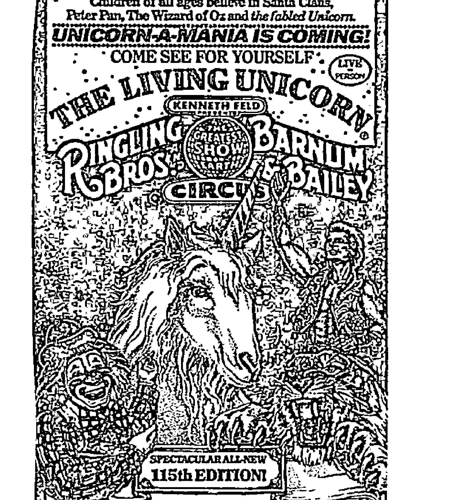

有了从马戏团得到的报酬，我们便能前往新几内亚寻找真正的人鱼——实际上，这些神秘的海洋生物被新西兰当地土著人称作“里（Ri）”或者“伊尔凯（Ilkai）”，他们经常见到彼此。我们最后找到了它们，用摄像机录下了全程，我们在1985年的国际传说动物学学会的年会上公布了这个发现。时至今日，我们还保留着这些录影带，在将来的某一天我们会用它们做一个关于那次考察的纪录片（参阅第十章）。你会在此书中读到很多精彩的故事，还有其它很多自然世界和非自然世界令人震惊的奇迹。好好享受这段阅读之旅吧！

魔法师的怪物图鉴

导言：非自然的历史

奥伯伦·泽尔-雷文哈特

> 但总有一天人们会记起独角兽。
> 狮鹫也会重新变得勇敢和强大。
> 凤凰将出现在地平线上
> 所有被遗忘的生物都将再现。
> 
> ——芭芭拉·威尔斯巴（Barbara Wersba）
> 《The Land of Forgotten Beasts》（1964）

我们一直对“食尸鬼、幽灵、长腿怪和各种夜行怪兽”这些苏格兰祷文中提及的生物充满幻想、好奇和恐惧。人类不喜欢黑夜，但从我们的祖先从树上迁移到地面的时候开始，那些猎食我们的敌人却一直喜欢它。我们所习得的第一个魔法——把我们从动物变成人类的那次关键性的创造——就是火。在漫漫长夜里，我们围坐在火堆旁边，远离那些藏身在黑暗中的生物。谁知道那些远远躲在阴影里，用它们或红或绿或黄的眼睛一直对我们虎视眈眈的生物到底长什么样，那些夜晚的野性咆哮是什么声音？这些我们唯有想象。

生理学家与动物寓言集
编撰像这样的动物寓言集是中世纪欧洲所特有的现象。尽管古代的作者，如克泰夏、亚里士多德、普林尼，早已描述过众多的动物，其中有许多都是纯粹想象的产物。世界上第一位刻意编撰一本关于世界上所有未知生物的百科全书的人是一名被称为生理学家（“自然学家”）的不知名作者，他居住在亚历山大，生活的时代也许要早到公元2世纪，虽然他很可能是一名埃及人，但他的这本书却是用希腊文书写的，他的那本书非常著名，在

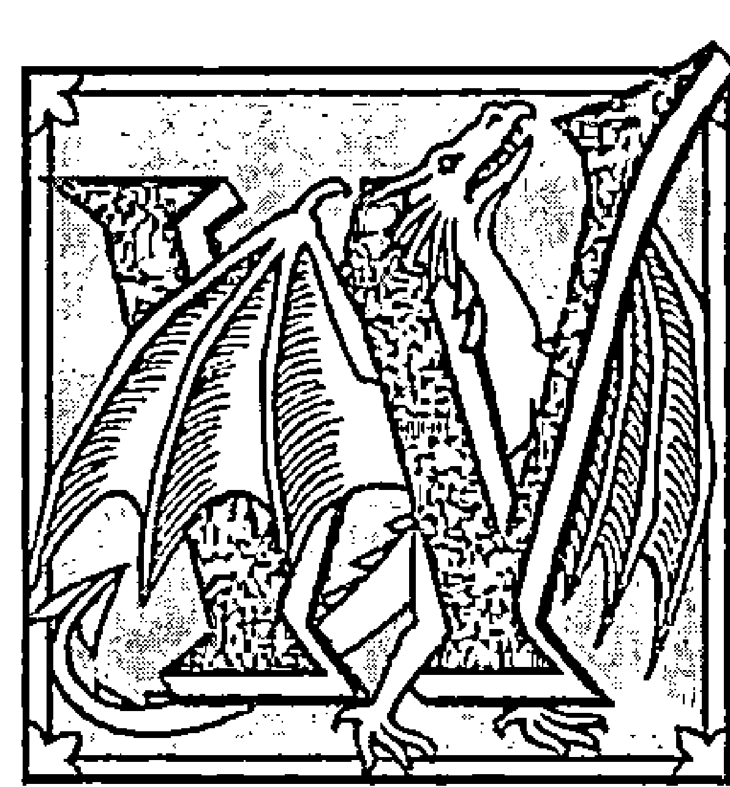

于是，我们想象在未知世界中充满了怪兽，还把它们画在了那些古代地图上的未知部分里。它们中很多都是真实存在的，而且也非常危险，其它的则是人们所虚构出来的了。人们讲述故事，而最终这些故事都被集中起来，记录在像此书一样的作品中。

这本动物寓言集并不是所有同类作品中最后一部，它只不过是众多著作中的一部分罢了，代表的是对所有同类作品的尊重。

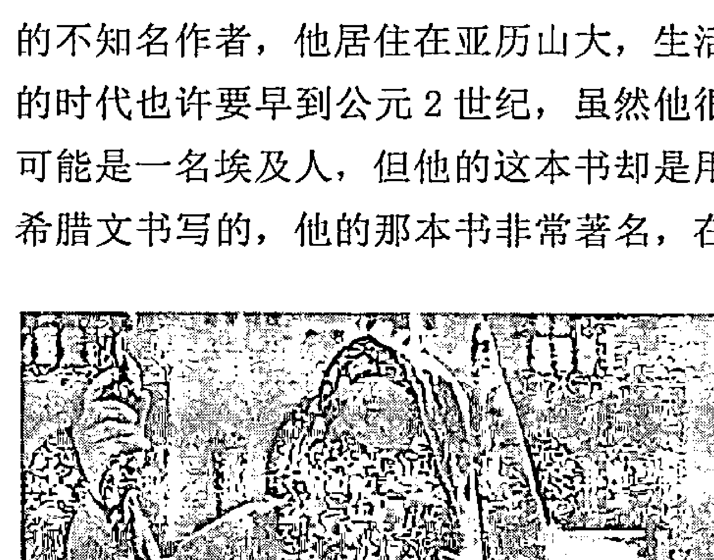

几个世纪间被翻译成了所有的欧洲语言。‘生理学家’这一名号也变得像他自己的著作一样出名。

该书最初的版本记录了大约 50 种动物、树木和矿石。几个世纪以来，各地的旅行者从遥远的地方买回各种记录和报告，它们都被无声地汇入到了生理学家的动物寓言集中，填补空白，而且还增加了各式各样生活在陆地、海洋和空中的生物。即便其内容经常遭到扭曲，但根据估算，这本书里九成的生物是源于真实存在的动物的。但此书后来的编译者们却分不清哪些是真实的，哪些是想象出来的——因为独角兽确实出现过，而且出现的频率并不比河马、海象、大象、鸵鸟、袋鼠、穿山甲或长颈鹿要低——想想鸭嘴兽吧！比任何想象的动物都还更加令人疑惑的史前生物曾经确实统治过地球。通过想象，对它们遗留下来的化石进行再造，这也为动物寓言集增添了新的内容。

第一部用法文编撰的动物寓言集是在 1121 年至 1135 年间由菲利普·德·特豪恩（Philip de Thaon）编写并献给亨利一世国王的妻子安德拉（Adela）王后的。早期的寓言集是纯文本式的，后来的寓言集开始有了丰富且充满想象力的插图——其中的佼佼者当属 12 世纪的《亚伯丁动物寓言集》，它在 1542 年时被存放在位于西敏斯特的老皇家图书馆，当时的名称叫“Liber de Bestiarum Natura”。这个图书馆是在亨利八世的主持下建立起来的，被用来存放从被他解散的修道院中取出的文献。数个世纪以来，修道士们唯一的工作就是日复一日，一遍又一遍地抄写这些手稿，把它们当作发泄自己美学创造力的唯一途径。13 世纪是动物寓言集大爆炸的时代，寓言集像雨后春笋般的出现。

生理学家本人和他的继任者们对这些既美丽但却平凡的野兽、鸟类和海中怪兽的历史没有什么兴趣，而是对那些能反映出基督教价值观和生命观的寓言符号感兴趣。而我们在这本书中所列举的动物都不带任何的寓言成分。[有兴趣的读者们能在 T.H. 怀特（T.H.White）的《野兽之书》中找到它们，他的这本书是对最近一部动物寓言集的译本，里面有丰富的译注。]

我们并不是在此书中一一列举那些为世人所熟知的动物，而是一些存在于神话和传说里的生物。

“蛇怪、许德拉和恐怖的奇美拉”

奇妙的怪兽们曾在所有国家的神话传说中出现过。希腊的英雄史诗对西方文化的影响最大。例如，在荷马的《奥德赛》中，奥德修斯遇上了妖媚的海妖们，她们的歌声会引诱水手驾船触礁死亡。他还面对过长着很多个头的斯库拉和制造漩涡的卡律布迪斯。我们从他们那里派生出了一个成语“腹背受敌”。在赫拉克勒斯的 12 项功绩中，他杀死了许德拉海德拉，抓到了长着金鹿茸的阿卡迪亚雄鹿，击退了长着黄铜羽毛的斯廷法利斯湖怪鸟，驯服了吃人的狄俄墨得斯野马，打败了看守冥府大门的西伯勒斯狗。
珀尔修斯砍掉了令人恐怖的美杜莎的头颅。只要对美杜莎看上一眼就能让人化作石头。从她的短颈中蹦出了可爱的飞马，珀伽索斯，柏勒洛丰骑着它杀死了鼻息喷火的三头怪兽奇美拉——它有着狮头、羊身、蛇尾。珀尔修斯用美杜莎的头将海怪赛特斯石化掉，救出了安德洛墨达公主，并娶她为妻。提修斯杀死迷宫牛头怪。贾森和阿尔戈英雄从凶残的鸟身女妖手中救出了盲人先知菲尼亚斯，之后他们继续赶路，打败了看守传说中有着金色羊毛的白羊亚力士的恶龙，亚力士是白羊座的守护星。
所有这些希腊神话中天神和怪物的故事最开始都是出自于赫西奥德（约公元前七百年）的著作《诸神的系谱》（Theogony）的。他在其中描述了刻托和福尔库斯巨人是如何战胜了蛇怪和蛇身厄喀德那（“怪兽之母”）的。厄喀德那生下了许德拉、奇美拉、斯芬克斯、鸟身女妖、双头怪奥尔托斯、三头怪瑟伯勒斯和啄食普罗米修斯肝脏的秃鹰。在更早的时候，古代苏美尔人伊奴马·伊利什记录过很多恶魔种群，蛇蝎人、长角巨蟒，它们都听从恶龙之母提亚美的调遣，它最终被马杜克杀死从而创造了陆地和海洋。

历史学家和地理学家

第一位描述遥远土地上栖息着的异域动物的作者是希腊的希罗多德（Herodotus）（公元前484-425年）。在《历史记录》（The Histories）一书中，他记录了每五百年就要从阿拉伯飞到埃及去重生的凤凰。而在埃及，同样生活着有翅巨蟒和肉桂鸟，肉桂鸟用肉桂这种名贵的香料来建筑巢穴。他还记载了像狗一样大的巨蚁（marmot），它们能从印度的沙漠深处挖掘出黄金来。在希罗多德的著作中同样有对看守黄金的狮鹫和试图盗窃这些黄金的独眼国人的描述。
奈达斯人克特西亚斯（约公元前400年）是一名希腊人，在波斯皇家法院做医生，他写了一本名为《尹迪卡》（Indica）的书，这本书讲述一个他从未到过的国家的故事。在那里生活着一种暴虐的独角野驴（即河马，它们经常被人当作独角兽看待）、长着人面蝎尾吃人的红色食人兽（即老虎）。他也提到了克罗克塔（Krokotta），现在人们知道，他说的是鬣狗。
在公园44年，第一位罗马地理学家，梅拉，在他的著作《De Chorographia》中有过关于非洲生物的描写，有长有马耳名叫佩加西斯（Pegasies）的鸟、叫做特拉戈婆摩尼斯（Tragopomones）的长角兽。另一种生活在黑暗大陆上的动物是脑袋低垂的凯特巴里布拉斯（Catobleblas）（即角马），它有着呆滞的像蛇怪的眼神。
老普林尼（公元23-79年），他是世界上第一位真正意义上的博物学家。他在自己的巨著《自然历史》中不仅记录了先前就有的怪兽，而且还增加了长有弯角的野迩和恐怖的蛇怪。他同样也描写了很多的海怪，包括特里同、涅瑞伊得斯和胭脂鱼，这种鱼能把船吸住让其动弹不得。
大多数的作者都跟随这些人的脚步，把他们视作权威，时常在他们自己的著作前加上一句话：“如果克特西亚斯是可信的，那么……” 恶龙、沙罗曼达火蜥蜴、海蟒以及其它多多少少带有神秘色彩生活在遥远大地上的生物们都能在无限扩张的非自然历史中找到一席之地。

旅行者的故事

在中世纪，贸易线路开始向欧洲打开，众多商人沿着丝绸之路到达阿拉伯、印度和远东地区。一些探险者开始深入到撒哈拉地区。这期间爆发出众多的旅行者的故事，它们都是关于在远离高墙耸立的欧洲城邦边界地域的异域奇观、不寻常的发现和罗曼蒂克的探险经历的。这些故事对中世纪的人们而言就像科幻作品对我们而言一样。在这些故事中，真实的和虚构的探险者出发“探询奇异的新世界，找寻新生命和新文明，勇敢地前往没人曾到过的地方！”

随着十字军东征（1095-1244年），东西方的往来变得日益频繁和快捷，即使是远在不列颠群岛上的小村都有自己战罢归来的十字军战士，他们带来了关于圣地和撒拉逊人（Saracen）文明的故事。世界变得越来越大了。很多想象旅行者的幻象故事都是基于亚历山大大帝（公元前336-323年）在征服已知世界直到印度时的经历——他的王国的疆域几乎达到了世界的边缘！这些故事中的一些在公元二世纪便开始流传，但这些传说达到顶峰是在十二和十三世纪，是以亚历山大大帝在印度写给亚里士多德的信件的方式存在的。

欧洲第一位也是最为著名的旅者是意大利人马可波罗（1254-1324年），他穿越了亚洲大陆并且回到祖国，向那里的民众讲述他途经的国家、人们和动物。他跟随父亲和叔叔长达二十五年的旅程记录改变了地图的模样，极大地扩展了欧洲人的世界观。但尽管他对很多传说中的生物的描述非常真实，但人们还是喜欢传统的版本。

之后的旅行者追随马可波罗的脚步，继续往这些怪物集中增添新的成员。事实被完全虚构的传说掩盖了，其中最为著名，影响也最大的要数《祭司王约翰的信》（The Letter of Prester John）（约1775年）和《曼德维尔爵士的旅行》（The Travels of Sir John Mandeville）（约1356年）。祭司王约翰被认为是印度的基督教皇帝，这些信件记录了他广阔疆域上的奇观和拜占庭皇帝曼纽尔的来访。随着时间流逝，祭司王约翰的王国的所在地被搬到了非洲，一代又一代的探险者试图在那里把它挖掘出来。

这位虚构的曼德维尔爵士——一位不知名的法国或英国作者的杰作——是一个从众多的中世纪经典中虚构出的一个新人物的例子。整个故事是很严谨地从世代相传的关于清教徒们前往圣地、波斯、印度和遥远的契丹（Cathay-即中国）的历史中提取出来的。现在这本书被视作探险小说的始祖。

这所有的一切——不论是真实的还是虚构的——都是伟大的探索世纪（1420-1620年）的序曲和启示。而开启这一世纪的则是来自中国的巧妙发明——指南针。贸易舰队开始绕过非洲之角进入印度洋，接触到东印度群岛。1492年，尽管在半个世纪前维京人就已经到达过那里，但直到那时欧洲人才正式“发现了新大陆”。最终在1606年，澳大利亚这个隐藏多时的世界对角被发现，世界上有人居住的大陆终于发现完毕。（冰封的南极洲直到1820年才被发现。）这些大陆上有着自己独有的动物，有些是真实存在的，而有些则是虚构出来的。

理性信仰

几个世纪以来，被认为是传说中的动物曾被我们接受成为动物王国中的一员，即便如此，这些动物也还未被单独分类过。没有物种汇编来区分自然和非自然的历史，就这样，那些神奇的怪兽们被粗略地划入到普通生物之中。

然而，在 17 世纪，一阵理性主义的冲击浪潮席卷了整个西方世界。由文艺复兴和宗教裁判所的恐怖所催生出来的新哲学试图寻求从迷信中解放出人性的方法。1660 年伦敦皇家协会的建立标志着科学革命正式开始。这个协会用拉丁文写的座右铭“Nullius in Verba”（切勿轻信人言）的含义就是摈弃以前引经据典的方法，要用实验来建立真理。所有无法被证实的东西——包括恶龙、狮鹫、人鱼、独角兽和很多其它无法公之于众的“黑夜生物”——都被新一代的科学家们所嘲笑和诟病。

托马斯·布朗爵士（1605-1682年）在他的《世俗谬见》（Pseudodoxia Epidemica）中对相信神奇生物是确切存在的传统信仰进行了最猛烈的抨击。布朗的这部百科全书似的著作在1646年出版，它对所有传统权威进行了挑战——尤其是对老普林尼——对像双头蛇、蛇怪、半人马、狮鹫、凤凰和独角兽一类的生物进行了毁灭性的质疑。尽管否定了独角兽身上独角（alicorn）的魔力，布朗却承认“世界上有很多独角兽。”

在随后的两百年间，学者开始大规模地摒弃传说中的生物，而在艺术和诗歌领域以及那些将其当作人类愚钝的反面教材中他们却大行其道。他们的存在只出现在比如那些在 1812-1815 年间格林兄弟搜集的童话中。

隐生动物学

但在新一代探险者继续深入到未知地域的时候，他们一路上一直都会听到新的关于那些躲藏在密不可入的森林中、热带雨林中、沙漠中、湖泊中、泥潭中和深海中的动物的报告和传言。起初，这些生物被学者和科学家们一律认为只存在于传说中，但最终，他们都会一个个地被物种学家们证实它们的存在并被列入到已知物种中去。最好的例子就是非洲的黑猩猩和大猩猩、印度尼西亚的科莫多龙、马达加斯加的象鸟、以及巨型乌贼——维京传说中的克拉肯海怪。

这些生物中还有很多尚未被发现和证实，等待着科学家们去揭开面纱。他们有尼斯湖水怪、大脚怪、海蟒、死亡之虫、还有住在非洲刚果像恐龙一般的河霸龙（Mokele-mbembe）。为了找到这些生物，贝纳德·霍伊霍尔曼（1916-2001）把它们列入到“隐生动物学”的范畴，即关于未知动物的研究。现代神秘生物和历史上传统的动物传说的分界线终于不复存在了。所有的怪兽都被记录在案，现在你们将出发，开始自己的发现之旅。“怪兽们就要来了！”

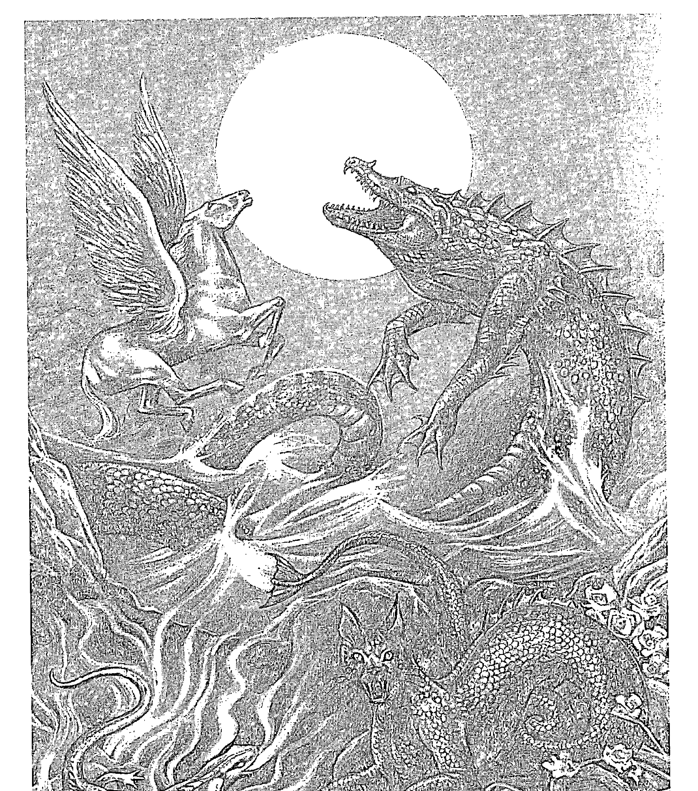

图鉴一、魔法动物展

怪兽百科术语词汇表

> 深海之中充满怪兽，在慢如蚁行的船只间游弋着。——阿维努斯（Avienus），《在海边》（Ora Maritima）117页第29行

这个词汇表中的大多数生物确实存在已被那些在过去几个世纪否认它们的人所接受。而那些尚未被接纳为确实存在的生物则成了当地文化的神话传说中重要的组成部分。我们在此书中还有另一种物种类别，欧洲的纹章把它称作“充能”。这些奇异的怪兽们仍然潜藏在我们包罗万象的传说的深处，时不时地，就像大脚怪、克拉肯海怪和尼斯湖水怪一样，它们会出来露个脸，活生生地出现在世人面前！

在这本怪物图鉴中，我们将收录的生物严格限制为动物形态的——也有一些植动融合体。虽然收录的生物中有些还有人类的部分（比如半人马、农牧神法翁[Faun]、塞壬、鸟身女妖和人鱼），但神族、半神、恶魔、人形怪兽和生物（巨人、仙子等）或据称生活在遥远地区的中世纪旅行者的“怪物般的物种”都没有被收入此书。

我们也排除了那些仅存在于现代奇幻作家作品中的怪兽们，比如路易斯·卡罗尔、托尔金、J.K. 罗琳和其他作者创造出来的仅出现在自己著作中的怪兽。但在这里也有一些例外，指的是那些已经超越了小说和电影原著，成为当地文化中的一部分的怪兽——托尔金的树精、洛夫克拉夫特的小矮妖克苏鲁和电影中的怪物哥斯拉、金刚以及《黑湖妖潭》里的怪物。

我们也排除了那些父母用来吓唬孩子，避免他们进到危险地方像遥远的山河湖泊、沼泽林地而创造出的怪物们。尽管它们的传唱度很高，但它们却并不是真正的“奇异怪兽”，因为没有成年人真正相信它们的存在。

以下是伊丽莎白·巴纳特根据字母表创作的诗句。

- A 指的是鸡蛇兽（Amphisien）：两个脑袋、蛇形身体、绝对恐怖、鼻挨着鼻、滚动前进、

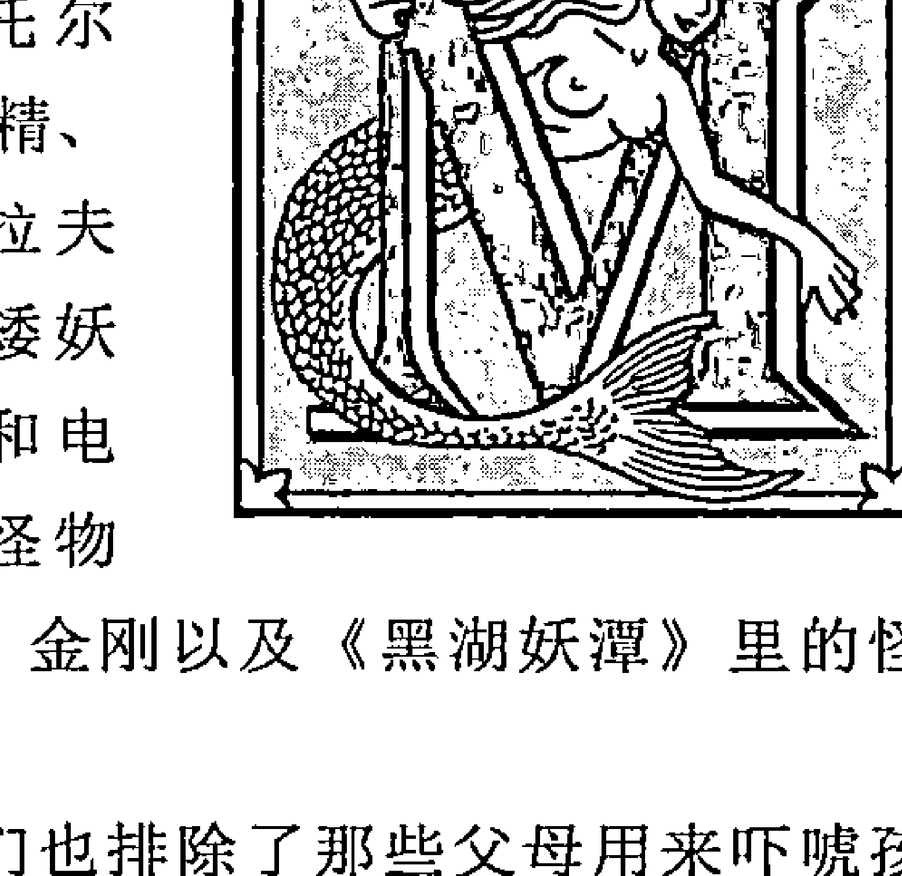

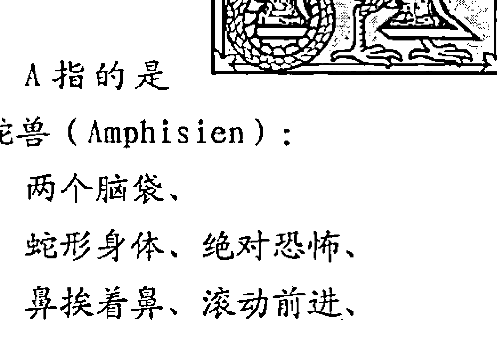

# 魔法师的怪物图鉴

躲过搜查、林间漫步

塞罗（Serou）。

## 亚特泽（Aatxer）

——西班牙巴斯克传说中一头吓人的红色公牛，它居住在比利牛斯山脉的峡谷和洞穴中，在暴风雨夜会走出大山来恐吓那些过路人。它的幼崽被称作亚特泽格里（Aatxegorri）。在彼得·比格尔的著名小说和电影《最后的独角兽》（1968年）中，它被描述成所有独角兽的死敌。它的伴侣叫蓓葛丽（Beigorri），是一头全身赤红的母牛。

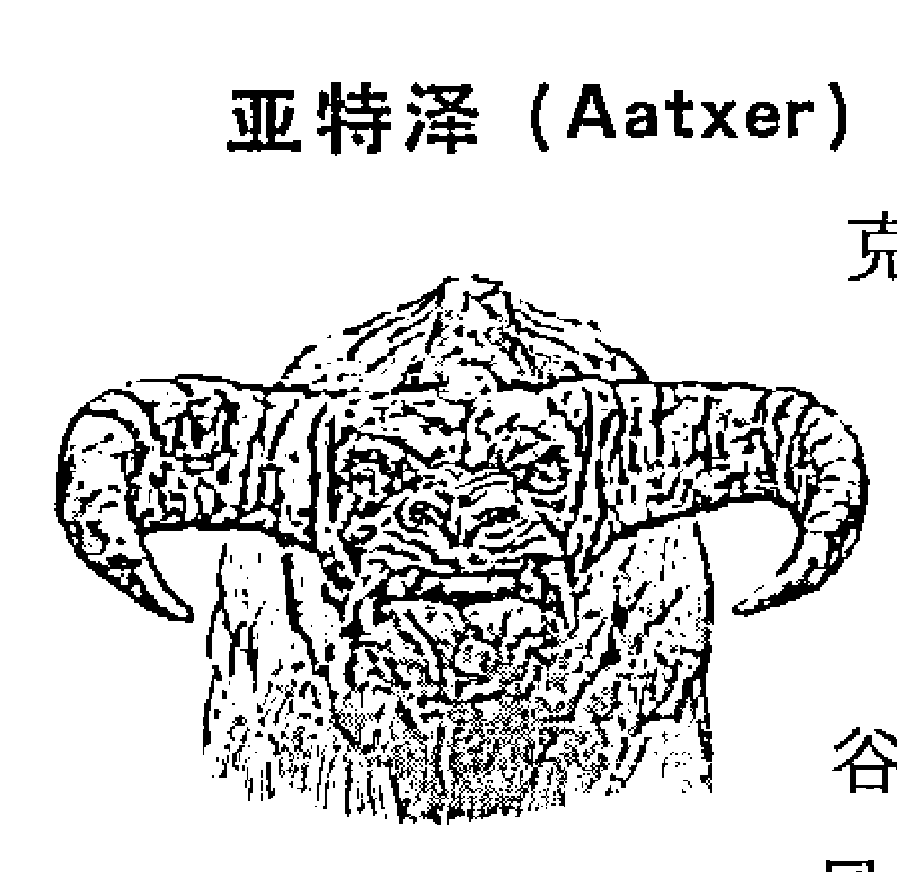

## 阿巴亚（Abaia）

——美拉尼西亚传说中的一种巨型鳗鱼。它隐匿在斐济群岛、所罗门群岛和瓦努阿图群岛众多的淡水湖湖底，保护湖里的鱼儿。如果人类企图到它们的湖里打渔，阿巴亚就会制造狂暴的暴风雨和洪水来消灭他们。

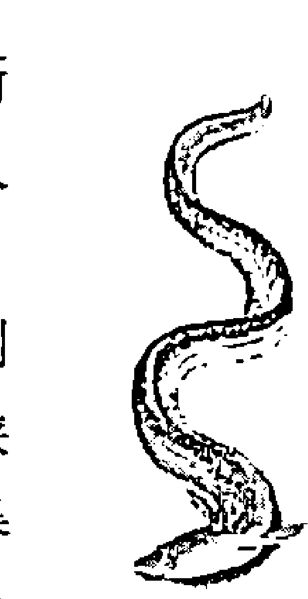

## 阿巴比尔（Ababil）

——根据《古兰经》的记载，这些大鸟在穆罕默德出生那年（公元571年）拯救了麦加城，它们从空中向来犯的象兵投掷石块从而击退了敌人——很可能指的是场流星雨。阿巴比尔现在指的是一种当地常见的家燕（Hirundo Rustica）。参见鹏鸟（Roc）。

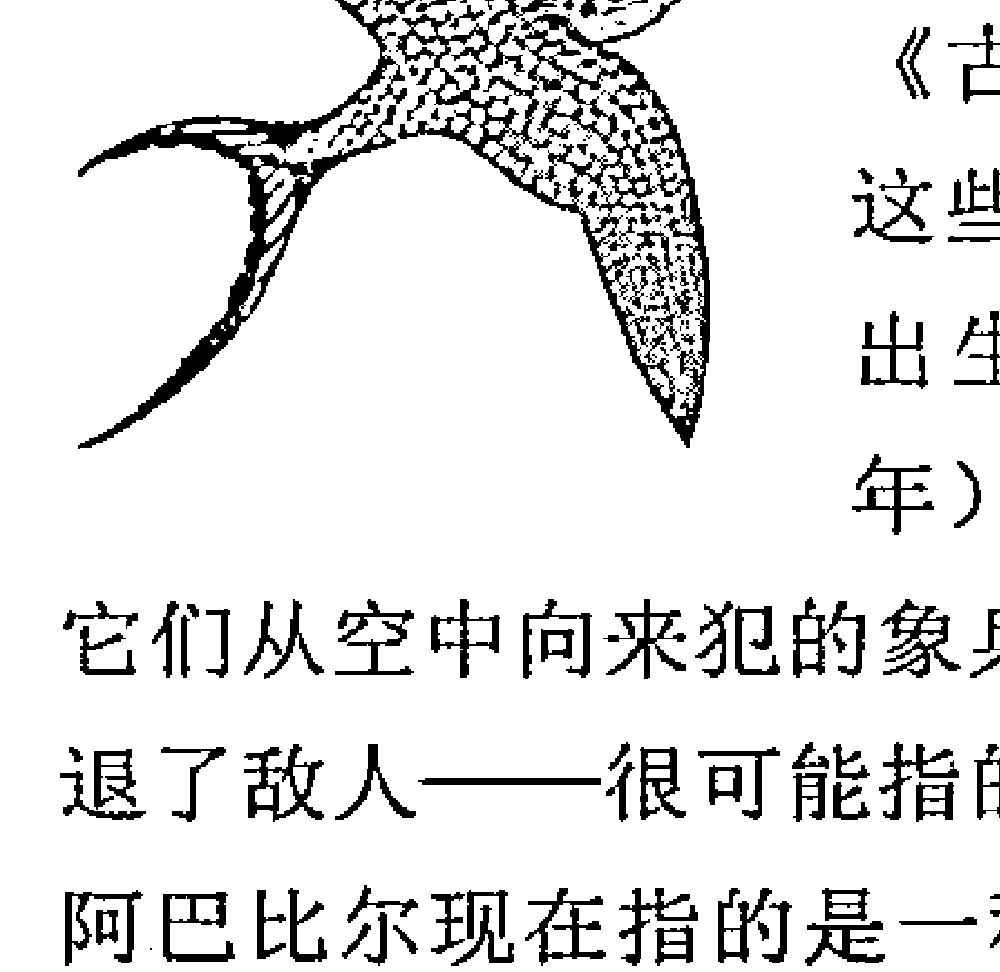

## 阿宝阿曲（A Bao A Qu）

——马来西亚民间传说中的一种生物，它们据称潜伏在契托胜利之塔（Chitor's Tower of Victory）蜿蜒的楼梯的底部。在清教徒踏上第一级台阶的时候，阿宝阿曲就会醒来，悄悄地跟着那个人，而每走一级台阶，它的身体就会变得更加具体、壮硕和鲜艳。它只在走完所有楼梯之后才会完整现身，而且那位清教徒还要是非常杰出的人。有史以来，这样的事只发生过一次。如果它并未成功现身，那么在这位清教徒下楼梯的时候，它就会慢慢地回到原来虚空的状态。

## 阿巴达（Abada）

——一种据称生活在非洲刚果的小型独角兽。据说它非常胆小，很有可能指的是黑犀牛（Diceros Bicornis）。参见阿巴特（Abath）、卡塔佐内斯（Cartazonus）、卡卡丹、卡雷（Kere）。

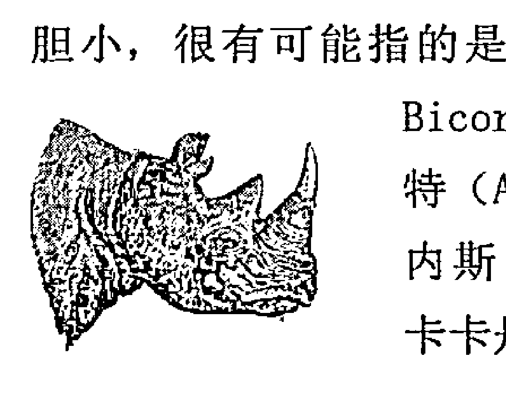

## 阿巴特

——一种16世纪欧洲作家所描述的居住在东南亚马来半岛上的雌性独角兽。它实际上是一种非常珍稀的小型爪哇犀牛（Rhinoceros Sondaicus）。参见阿巴达、卡塔佐内斯、卡卡丹、卡雷、塞罗。

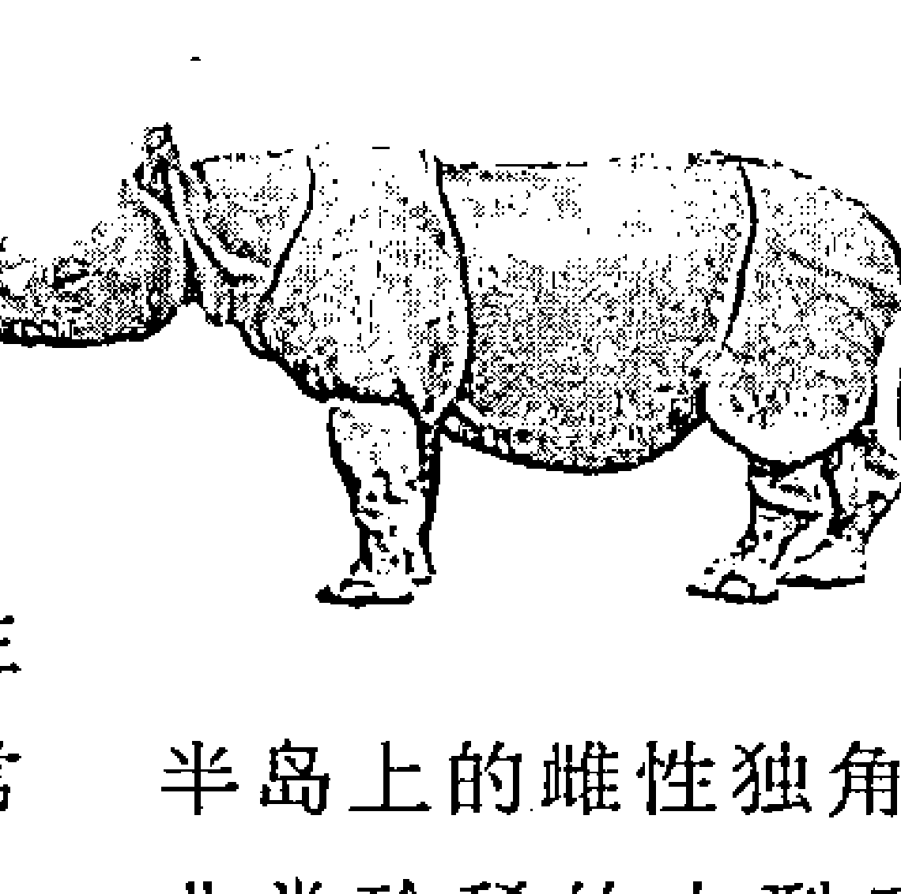

## 阿布吉尔（Abgal）（或阿普卡鲁Apkallu）

——这些苏美尔人传说中的人鱼被认为是土地的守护者和艺术以及科学的启蒙者。它们的上半身像人，下半身像鱼。人们认为它们从阿卜苏（Apsu）、智慧之神恩基（Enki）一族中派生出来的。在市侩亚述神话中，他们的统治者是龙，土地和农业之神。

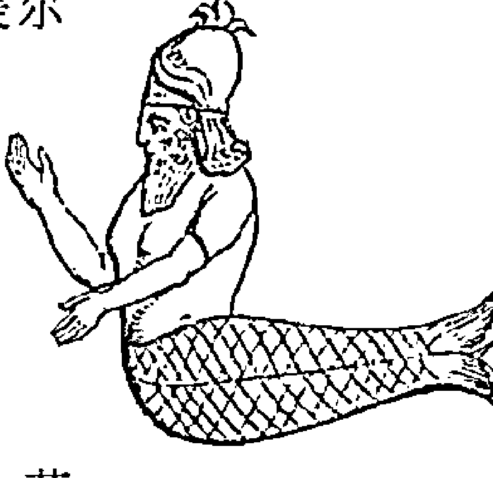

## 鲟鱼（Acipenser）

——欧洲传说中的一种不同寻常的怪兽，极不易被解剖。这种长相恐怖的鱼长着朝前开口的鱼鳞。实际上它是一种鲟鱼，其学名来自它神秘的祖先。

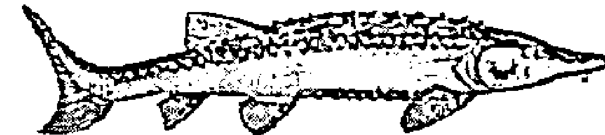

## 阿奇亚拉伯巴（Achiyalabopa）

——这种鸟来自普韦布洛印第安人（Pueblo Indian）的传说。它如同彩虹般绚丽的羽毛据称像刀锋一样锋利。它让人联想到在第六个功绩中被赫拉克勒斯杀死的斯廷法利斯湖怪鸟（Stymphalian Bird）。

## 亚达·勒其·葛温（Adar Llwch Gwin）

——这种威尔士亚瑟王传说中出现的鸟类生物能够听懂人类的语言。它们听命于德鲁得瓦斯（Drudwas），在魔法战中被用作护卫。它们对其主人非常忠诚，它们听从他“杀死第一位出现在战场上的骑士”的指令杀死了他。他的对手迟到了，于是德鲁得瓦斯成了第一位出现在战场上的骑士。亚达·勒其·葛温在最终幻想中也出现过，它们被命名为陆行鸟。

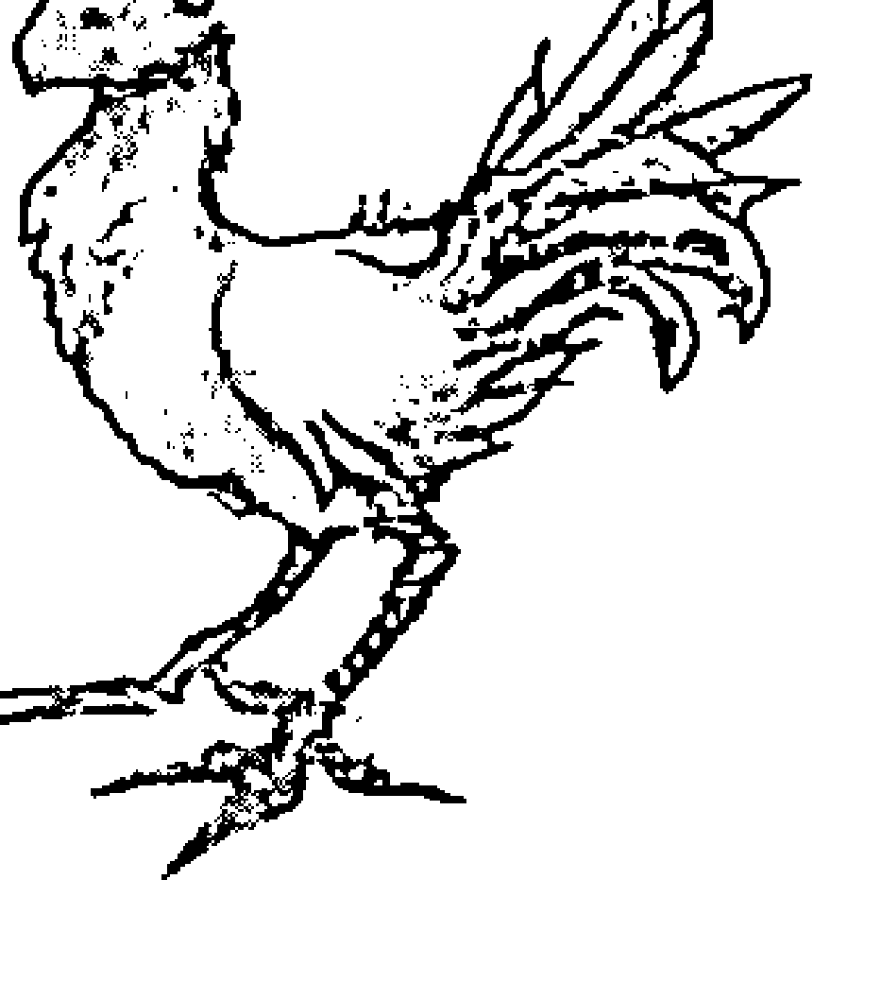

## 阿克利斯（Achlis）

——一种北欧传说中奇异的长得像麋鹿的生物。阿克利斯长着一张巨大的上嘴唇，让它不得不倒退着进食。它的后腿上没有关节，一旦倒地就无法站立，它睡觉时必须依靠着树。聪明的猎手会事先将它最喜欢的那棵树锯掉一半，然后在它倒地时抓住它。在阿克利斯靠上去的时候，那棵树就会随着它倒下。老普林尼（Pliny the Elder）（公元前23-公元79年）在自己的著作《自然历史》（Natural History）中对其进行过描述。它也是一种被称为哈盖格的可怕小动物。

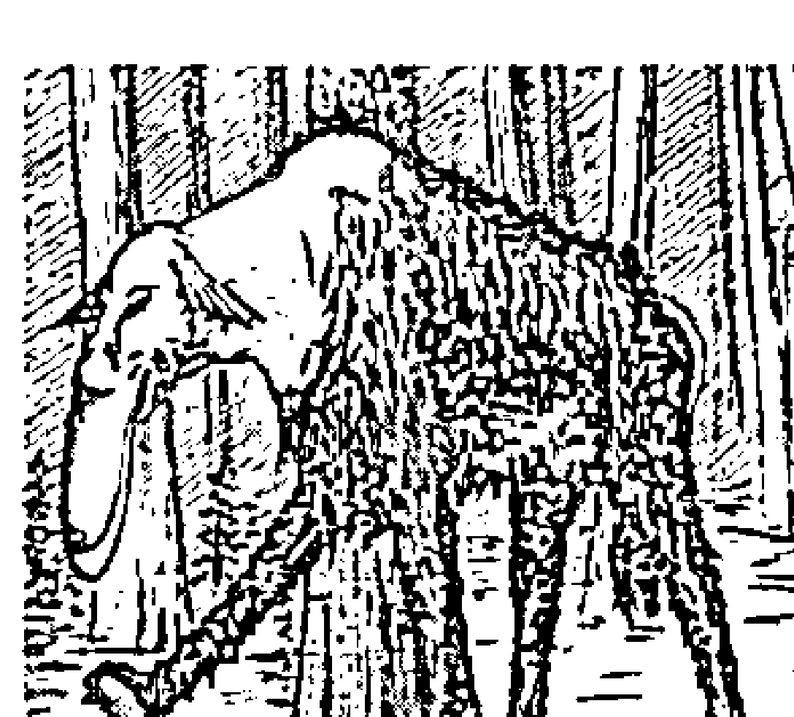

## 阿达罗（Adaro）

——它们是所罗门群岛上的人鱼。但和大多数的人鱼不同，他们从鱼鳍中长出了腿脚，除此之外，他们的头上还长着鲨鱼背鳍般的装饰物。它们住在太阳里，踏着彩虹来到地球，向大地上喷洒雨水。他们用飞鱼向人类投掷，有时把他们打晕，有时把他们打死。

## 阿特纳（Aeternae）

——一种长着有锯齿利角的猛兽，据称它在公元前四世纪居住在印度北部平原上。它们杀死了几个来犯的亚历山大大帝的士兵。它们应该和安踏洛浦（Antalop）是一样的生物，也许是亚洲野生山羊（Asiatic Ibex）（西伯利亚羱羊 Capra ibex sibirica）。参见野牛。

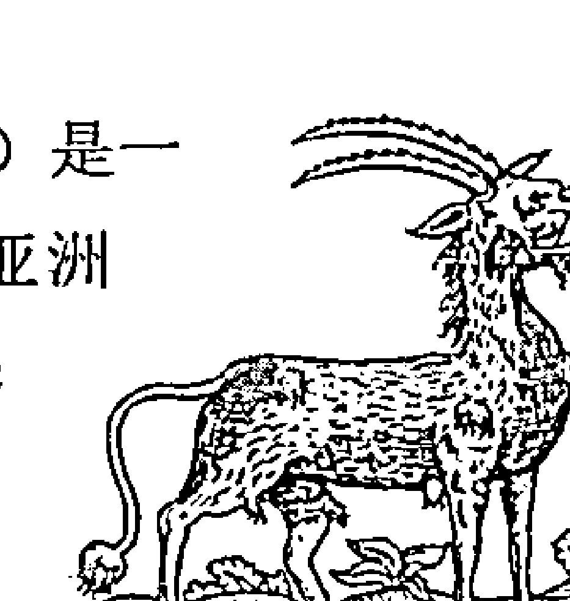

象牙海岸的赦希特（Sehit）——身小，居住在坦桑尼亚、东非和撒哈拉以南非洲的毛茸茸的原始人。他们特点鲜明、生性好斗，大概三、四英尺高，双腿直立行走，手中拿有武器，身上的红色毛发凌乱。一些隐生生物学家认为他们可能是残古猿（如图所示）。参见大脚怪。

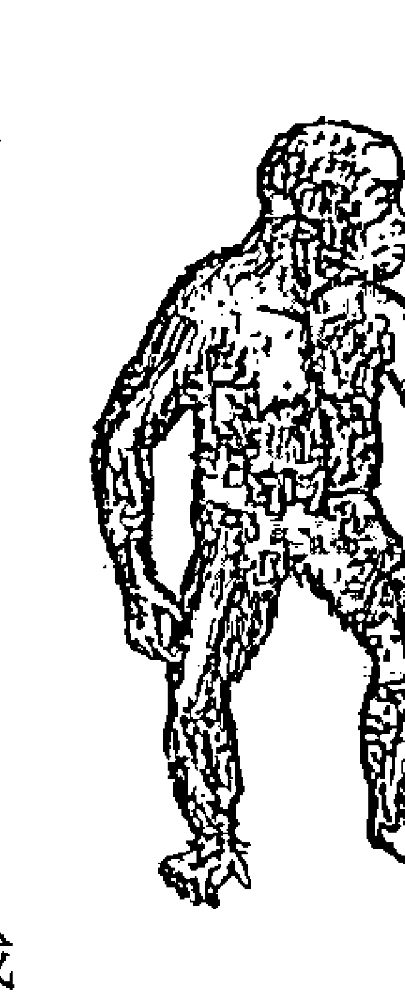

## 寻水兽（Afanc）（或Adang、Abhac、Abac、Addanc、Addane、Adanc、Avanc）

——一种威尔士传说中的邪恶水怪，它类似于海马或水马，在外观上有时又有类似于鳄鱼或海狸的地方。它们潜伏在布里白瑞恩（Brynberian）大桥附近潜伏捕猎，它们猎杀那些不小心靠得太近的生物，有时还会引发山洪。其它发现它们的地区有狮子湖（Llyn Lion）、巴弗格湖（Llyn Barfog）和海狸湖（Llyn yr Afanc）。这种生物已经被灭绝，有人说这是亚瑟王的功绩。参见水马安格西斯基（Aughisky）、马形水鬼。

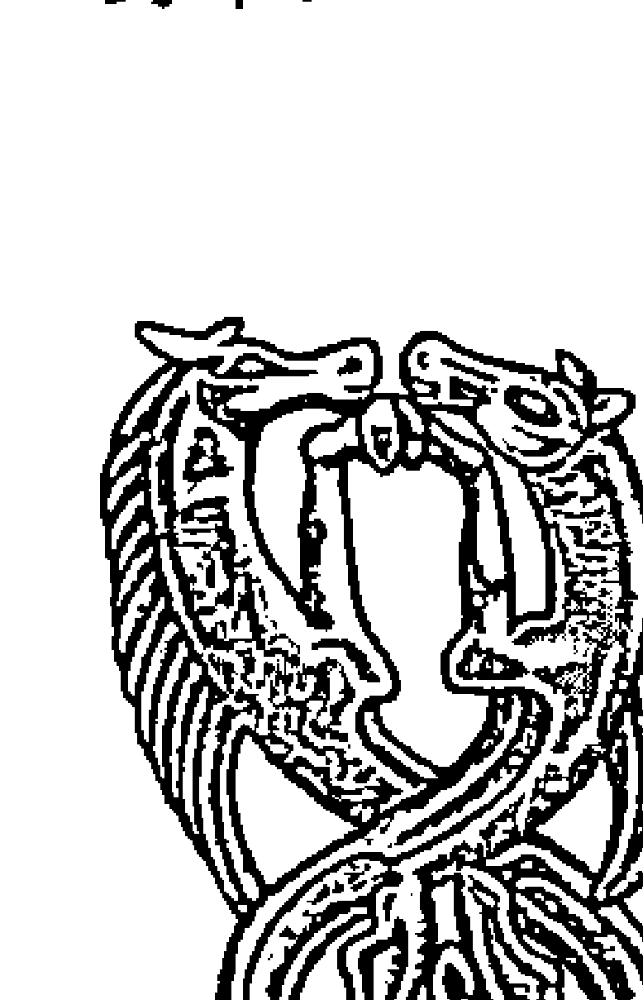

## 阿哈尼（Ahani）

——一种美国西南部纳瓦霍印第安人神话中邪恶的掠夺怪兽家族。
- 比那也·阿哈尼（Binaye Ahani）双生儿是由残剩肢体拼接而成的。它们对其它所有生物充满恶意，他们的眼光就能致人死地。
- 特尔格斯（Thelgeth）是一种巨大的无头怪，浑身毛茸茸的。
- 特萨那哈勒（Tsanahale）是一种巨大的类似鸟身女妖的鸟类怪物。

## 阿咖舍得莫（Agathodemon）

——诺斯底传说中的一种翼蛇，据说会带来好运。和艾恩（Aion），时间之神，待在一起的时候，它会变成人身狮首，站在被黄道十二宫包围的球体上。

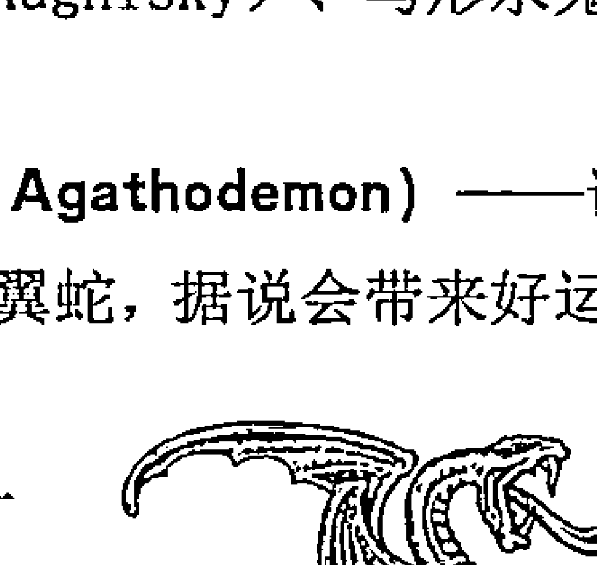

## 蝙蝠猴阿胡

——发现于爪哇和越南，据称，它们是巨大的蝙蝠中一个不明物种。它们的名字来自于自己的叫声。据说它们的体型有一岁大的孩子那么大。身体暗灰，头像猴子的头那么大。它们像果蝠，是灵长类动物的近亲，因此算得上是一种能飞的猴子。马来西亚飞狐（Pteropus Vampyrus）有着六英尺宽的翼展。尽管长得像果蝠，但阿胡却据称是捕鱼的蝙蝠。参见阿兰（Alan）、圭阿法罗（圭阿法罗）、飞猴（Hsigo）、欧利提奥（Olitiau）、红毛蝙蝠（Orang-Bati）、罗翾（Ropen）、莎莎伯恩沙（Sassabonsum）、越南夜间飞行动物。

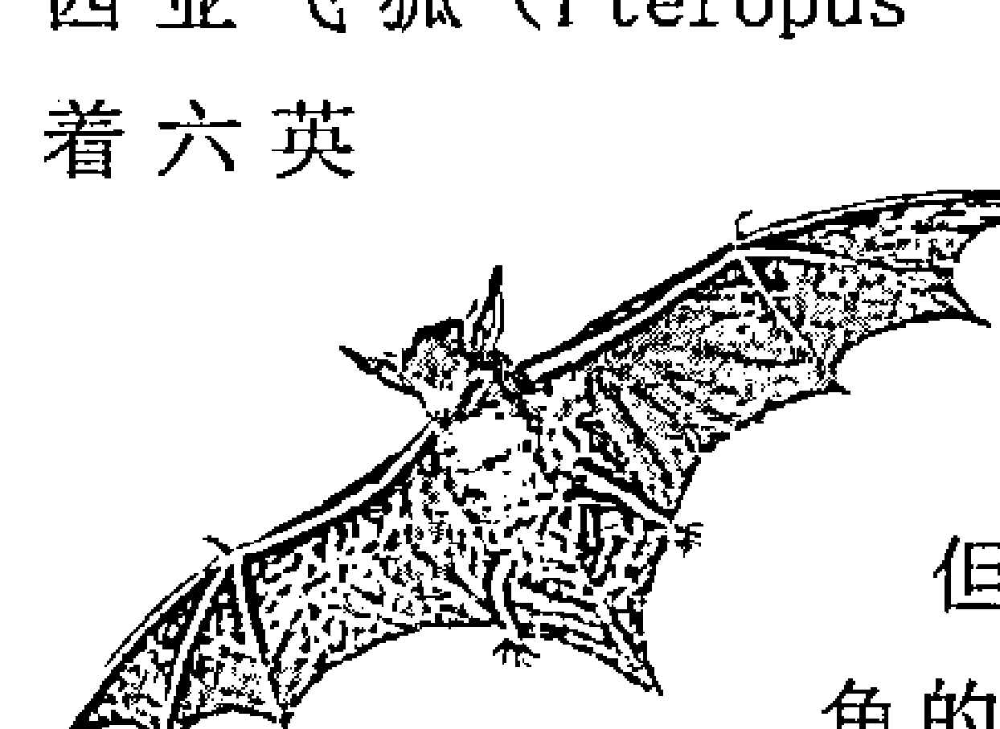

## 阿果格维（Agogwe）

——即津巴布韦的卡坤大科里（Kakundakri）、（Alan）、圭阿法罗（圭阿法罗）、飞猴（Hsigo）、欧利提奥（Olitiau）、红毛蝙蝠（Orang-Bati）、罗翾（Ropen）、莎莎伯恩沙（Sassabonsum）、越南夜间飞行动物。

## 阿辉兹霍特（Ahuizhotl）（水负鼠也被称为太阳犬）

——中美洲神话中一种体型中等的犬类，它的尾端长着猴爪和人手。它捕杀离岸太近的渔民和人，把他们拉下水，吃掉他们的眼睛、牙齿和指甲。这种动物可能是由蜜熊（Potos Flavus）变化而来，它是肉食动物中唯一长着直立尾巴的。参见格里历威鲁（Glyryvilu）。

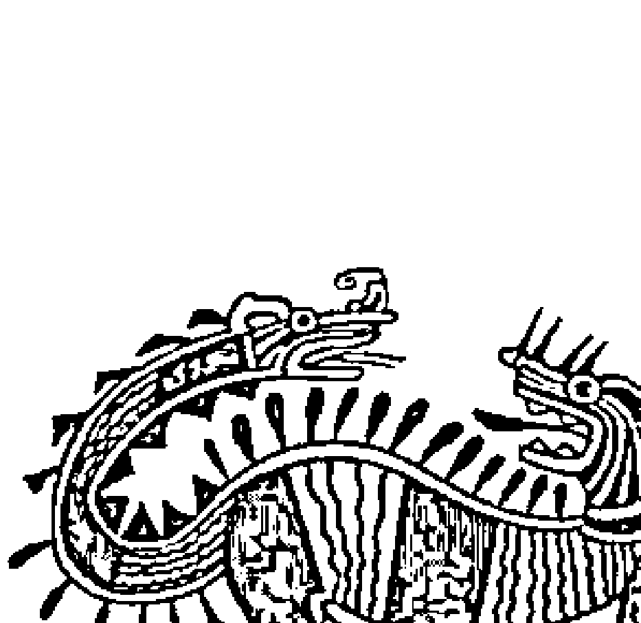

## 鸡龙（即拉脱维亚语中的 Pūkis，爱沙尼亚语中的 Tulihänd、Pisuhänd、Puuk，也叫 Kaukas、Damavykas、Sparyius、Koklikas、Gausinėlis、altvikšas、Spirukas）

——一种居住在立陶宛人家中的精灵。它们在室内的时候是鸡的样子，出了门就变成了两英尺长，有着蛇纹石的身体和四条腿的龙。在某些地区，它们还有翅膀能在空中飞行，并且带出火一样的飞行线。它们是从九岁到十二岁的公鸡下的蛋中孵化出来的，死后它们会变成火花。鸡龙会躲在房子里拒绝离开。它的存在会给那户人带来财运，但通常情况下，这些钱都是它从邻居家偷来的。人们能从恶魔那里购买到鸡龙，但售价则是买方的灵魂。一旦交易，它就几乎不能摆脱。如果它受伤了，只需降到地面上便可恢复元气。参见里德克（Lidérc）。

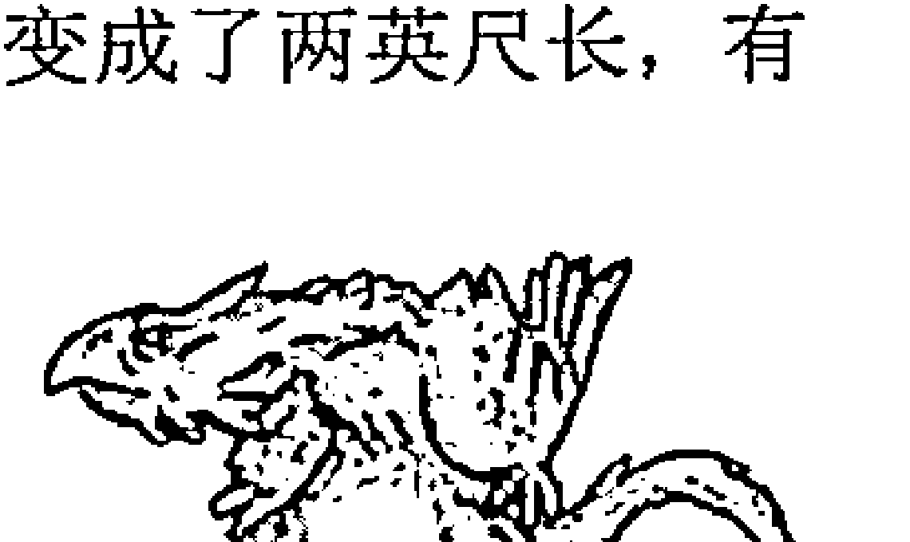

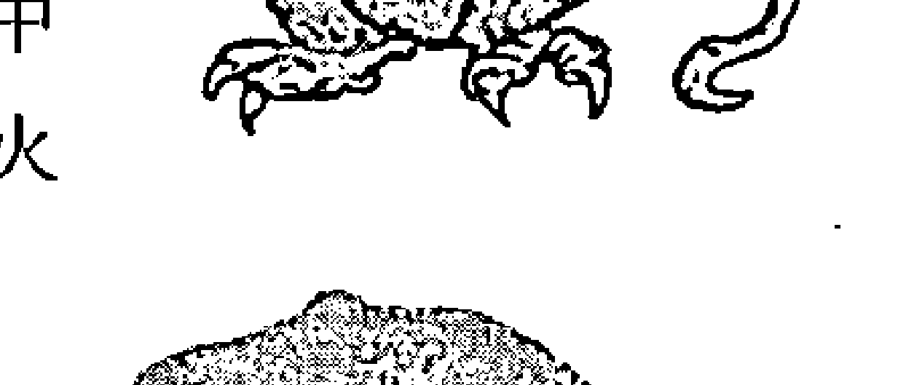

## 艾林·特热琛（Aillen Trechenn）

——一种爱尔兰三头怪，它憎恨所有的人类，尤其是英雄们。每次萨温节（万圣节），他都会从土堆中钻出来肆虐人间，最终被阿玛尔艮（Amairgen）所杀。

## 艾·托琼（Ai Tojon）

——西伯利亚神话中一种巨大的双头鹰，它生活在世界之树的顶端，在那里它用光芒照亮整个世界。

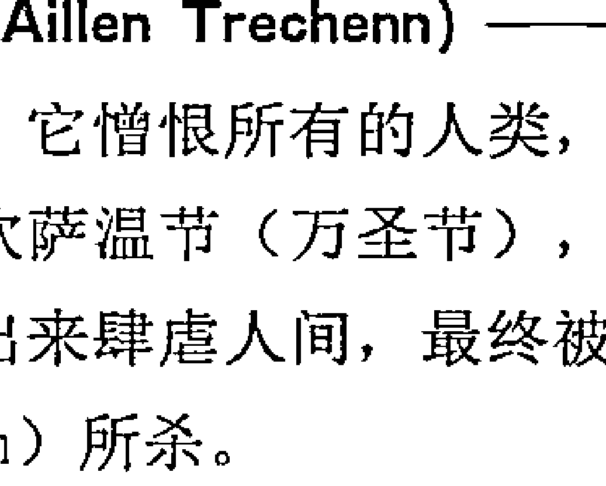

## 阿加·阿卡帕德（Aja Akapad）

——印度神话中一种像闪电一样迅捷、只有一只脚的山羊。它用单脚撞击地面的时候会发出闪电般的力量。

## 阿加塔恶龙（Ajatar）（在立陶宛语中也写作 Aiat ar 或 Ajattara、鸡龙，在爱沙尼亚语中写作 Äi、Äijo、或 Äijatar）

——一种芬兰传说中的邪恶刺蛇或母龙。被称为“丛林恶魔”或“恶魔之母”，它会产下蟒蛇和带来疾病。

## 阿坦图（Akhekhu）

——一种四条腿的埃及沙漠蛇，欧洲的旅行人认为它在某些方面长得像狮鹫。然而对它的描述让人觉得它更像长蜥蜴，就像尼罗河巨蜥。

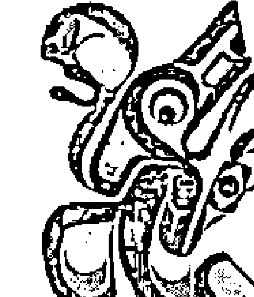

——着铁齿铜爪，和茂密得像蛇群一样的头发。它生活在沼泽和潮湿黑暗的地方，比如马厩和房屋的潮湿角落。它们袭击那些独自漫步到旷野的人类。在戴上一顶布满小铃铛的尖角帽子之后它们就会化作无形。它们很喜欢猎杀妇女——尤其是在她们正在分娩时，新生婴儿是它们最喜欢的美味。它们用剪刀剪断脐带，甚至还会偷走妇女的肝脏。当它将肝脏化作液体以便进食时，受害人便会死去。在阿富汗流传的此怪物的版本将它说成是一种残忍，长着长长的毛发和爪状指甲，喜欢吃人类的尸体的女兽。

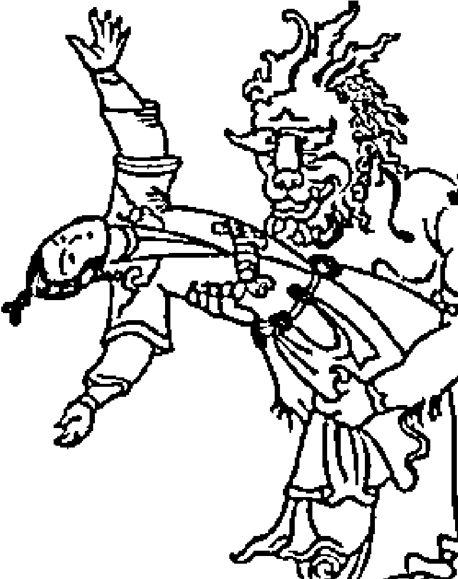

## 阿卡鲁特（Akhlut）

——因纽特神话中的一种逆戟鲸，据说这种生物会变成一只巨大的阿拉斯加狼的样子在冰上捕猎。远离那些有巨型狼抓痕迹消失的悬崖，因为这意味着阿卡鲁特又变成了逆戟鲸的样子潜伏在那附近。它很可能正在等待猎物！参见阿玛洛克（Amarok）。

## 豪鬼（Akuma）

——也被称作图里（Toori）或玛（Ma），这种如恶魔般可怕的日本怪物非常吓人和邪恶。它有着巨大的像燃烧的煤炭一样的头和眼睛，它飞在空中挥舞着剑。任何见到它的人都会交噩运。

## 阿库帕拉（Akupara）

——在印度神话中，阿库帕拉是支撑起地球的巨型海龟，它的背上站着或四只、或八只、或十六只的大象。参见海龟之父、库尔玛。

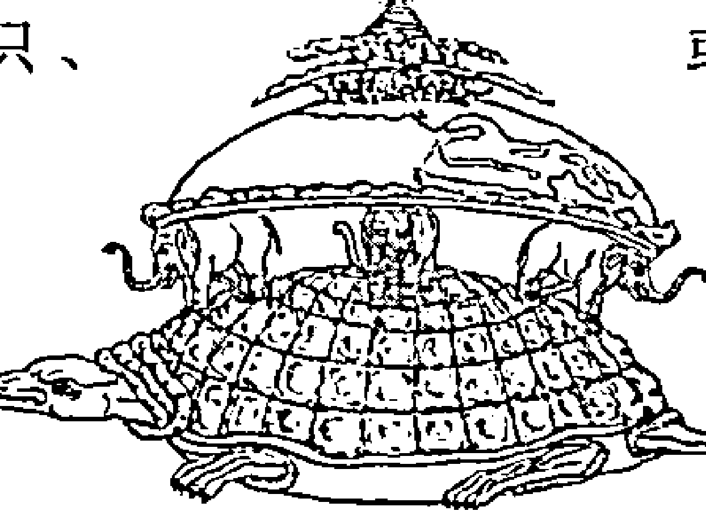

## 阿兰（Alan）

——菲律宾森林中一种淘气的半人半鸟生物。它们倒转的脚上和粗短的手上都长着长长的手指，这样它们就能一直到挂在树上。它们经常帮助人类，据说还抚养过几个幼年被遗弃在森林中后来长大成为英雄的人。这些传说都有力地表明它是一种像马来西亚飞狐蝙蝠（Pteropus ampyrus）般的巨大果蝠，这种蝙蝠有着六英尺长的翼展，而体重只有3.3英镑。参见阿胡、圭阿法罗、欧利提奥、红毛蝙蝠、罗翮、莎莎伯恩沙。

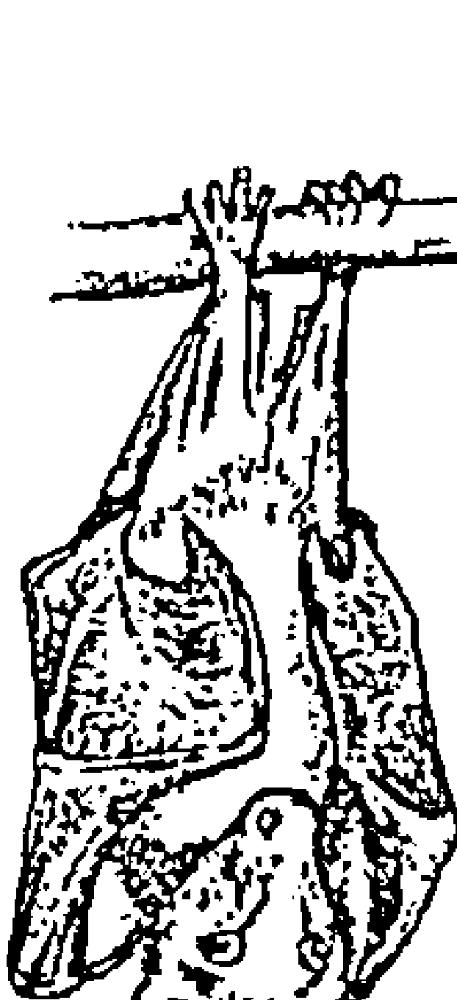

## 阿尔（Al）（或厄尔克Elk）

——亚美尼亚、利比亚和波斯民间传说中毛茸茸的半人半兽，眼睛火红、牙齿类似公猪、长

## 金翼鸟艾里凯多（Alicanto）

——生活在智利的一种会发光的鸟，以啄食山上的金、银矿石为生。它们喜欢吃在夜晚发出太阳与月亮般光芒的黄金和白银。开矿的人在黑暗中追寻这些光芒，希望能找到丰富的矿脉，但通常情况下，他们最终都会失足从山崖上掉下去。通常人们都会将它们视作萤火虫（Lampyridae）。参见库库伊亚（Cucuia）、迩西尼（Ercinee）。

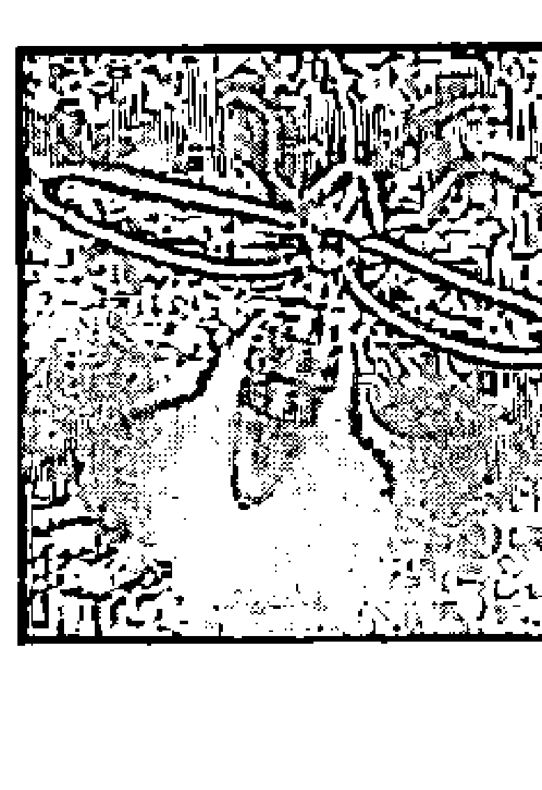

特维（Thevet）在其著作《宇宙学》中所记载，这种新世界的海洋生物就像鹅和鱼的融合体一样，它有着像鸟一样的长颈和脚蹼。它有可能是在1844年就已经灭绝的大海雀（Great Auk）。

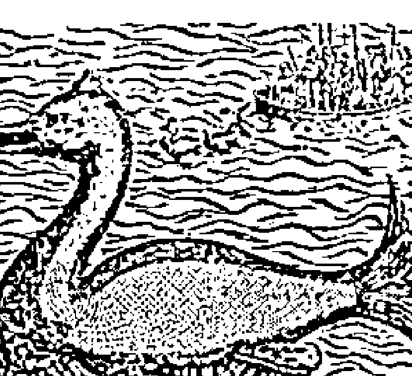

## 天堂鸟阿尔克诺斯特（Alkonost）

——外形与鸟身女妖相似，这种在西伯利亚神话中可怕的生物上半身像一个女人，下半身则像一只巨大的食肉鸟。她居住在赖埃（Rai），死亡之地，她在那里负责折磨受诅咒的灵魂。西林（Sirin）是她的宿敌。但在斯拉夫神话中，阿尔克诺斯特是天堂鸟，她声音甜美，能让所有听到她说话的人都忘掉一切。她在海边下蛋，然后把它们都抛进海里，之后，海洋就会平静六、七天，在蛋孵化完成后便会爆发暴风雨。参见哈克永、季拉尔（Geraher）。

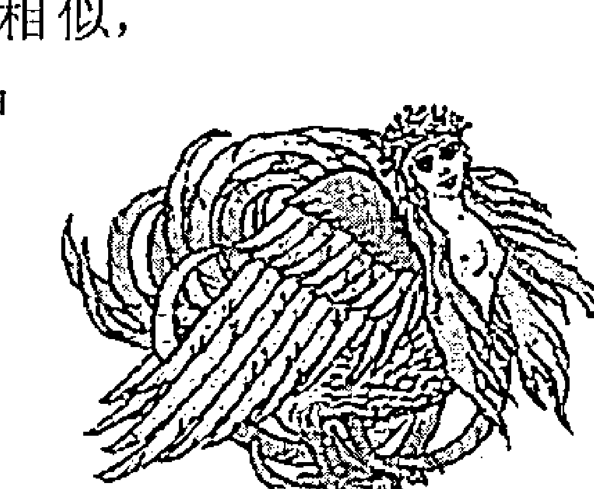

## 阿尔马斯（Almas）[或阿尔巴斯提（Albasty）、阿布诺亚（Abnuaaya）、阿尔马斯提（Almasti）、贝克·波克（Bekk-Bokk）、蒙古野人]

——据说生活在新疆、内蒙古附近的天山阿尔泰山脉，这些“野人”就像动物一样，除了双手和脸部之外的部分都覆盖有长长的毛发。虽然这样的描述看起来很像某种未知的类人猿，但一些隐生动物学家认为它可能是尼安德特人的子遗。见刍褚纳安（Chuchunaa）、伍德瓦萨（Wudewasa）、雪猿。

## 阿尔芬（Alphyn）

——一种美丽的纹章兽，它长着狼的身体、龙的肚子和前爪、长长的尖耳和舌头，还有一个卷曲的尾巴。

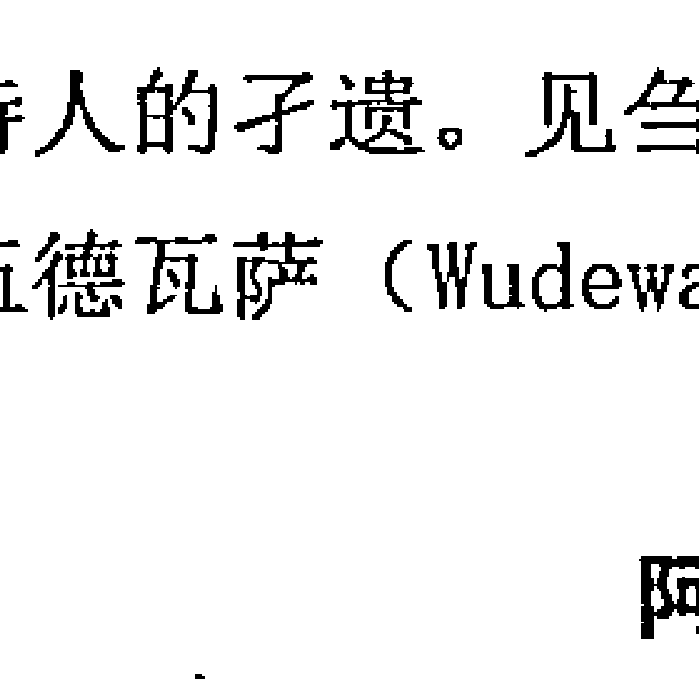

## 阿罗卡米拉斯（Allocamelus）

——一种英国的纹章兽，身体像骆驼，头像驴。

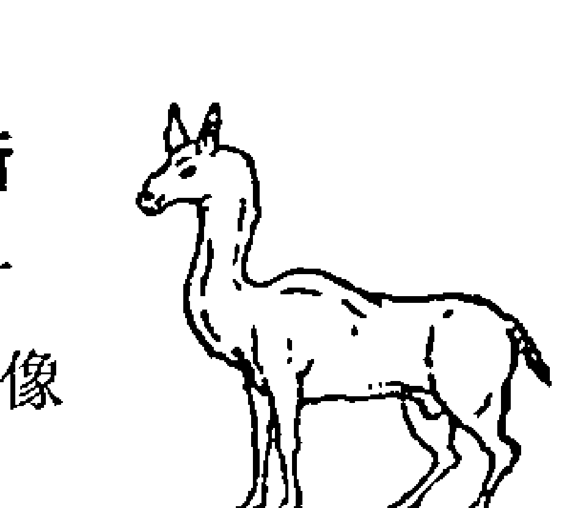

## 阿尔塔马哈-哈（Altamaha-ha）

——一种神秘的水上生物，1969年，在阿尔塔马哈河（Altamaha）、南佐治亚沿岸和佛罗里达的水道中被很多人目击到。它身长二十英尺，跟人一样大，身体前端长着鳍状肢，后端长着吸盘尾。据称它非常长，是介于鳄鱼、鳗鱼和海豚之间的生物，有着大而突出的眼睛和长着鳄鱼般尖牙的嘴巴，背上还长着锯齿一样的鱼鳍。它常被看见像海豚一样在水面翻腾。这些描述表明它是一种淡水海豚。

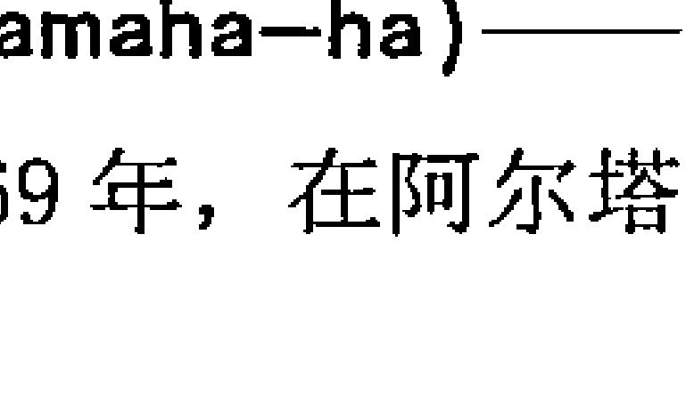

阿略斯（Alloés）——十六世纪被印第安人传说中像蟒蛇一样的湖怪。它能蜕变成许多不同的样子，每一个都比上一个更吓人。落入它们的魔宫水域的动物也会被转化成怪物。

## 阿玛洛克（Amarok）

——一种加拿大因纽特神话中的狼，它会杀死并吞噬任何愚蠢的走夜路的人。参见阿卡鲁特（Akhlut）。

## 阿－米－库克（A-Mi-Kuk）

——一种白令海峡因纽特人民间传说中的巨大而丑陋的海怪。它长着泥泞的皮肤和四条长长的人手取代了原来的四只脚，它以渔民为食。它能在土地中“游动”以到达遥远的内陆湖泊。

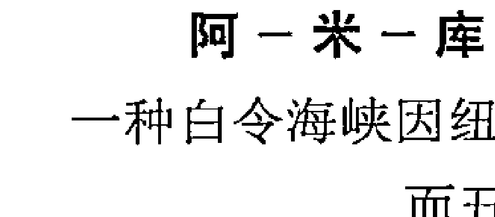

## 网剪（Amikiri）

——日本民间传说中的小型飞行生物，长着螃蟹爪子和长长的蛇尾。它们喜欢将蚊帐、渔网和衣物剪碎后晾干。

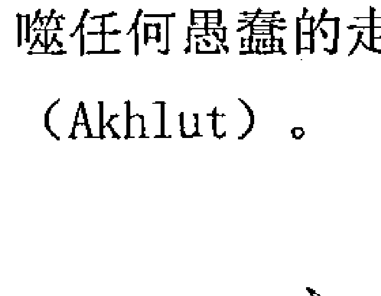

## 阿穆特（Ammut）（或阿莫特 Ammet、阿米特 Amemet、阿梅迈特 Amermait、阿姆－米特 Am-Mit、阿蛮 Amam，意思是“吃骨头者”）

——埃及地下世界中可怕的女性怪物，她长着鳄鱼的头、狮子的鬃毛、猎豹的前肢和斑点、河马的身子。埃及人称她是“亡灵吞噬者”。她将每个人在人世间所犯的所有罪行统统报应在他身上。在奥西里斯的审判庭里，死者的心脏和玛雅（Ma’at）的真理羽毛同时被放上天平，那些未能通过测试的人将被阿穆特作为食物。

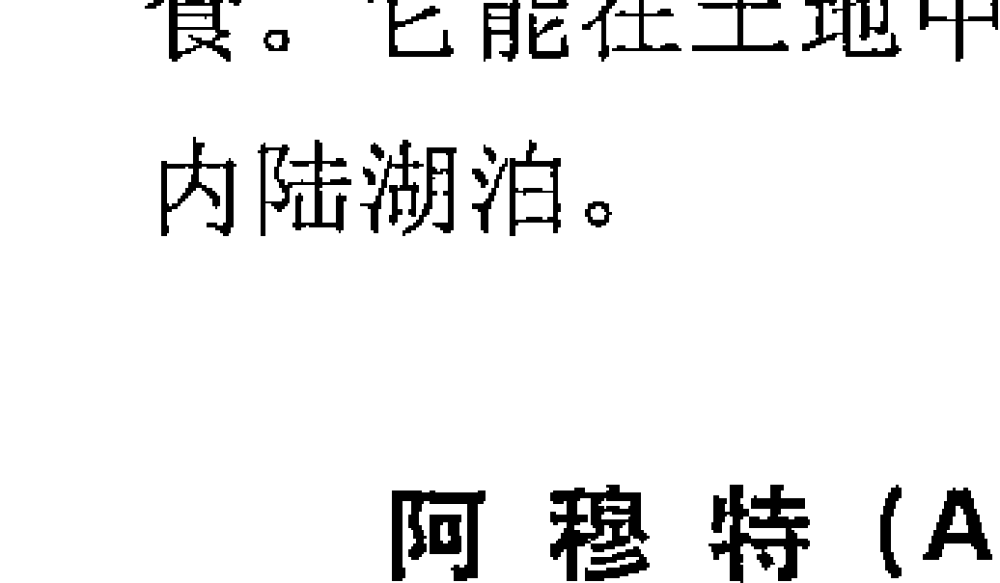

## 阿姆比兹（Ambize）

——来自西非刚果河三角洲的生物，当地人将其称作安古洛（Angulo）（“猪鱼”）。发现它的那位十六世纪的欧洲水手将其描述为巨鱼身上长着一个猪头。它的体重超过五百磅，有人类的手和一个类似海狸的圆圆的扁平的尾巴。它肉的味道像猪肉。这让人联想到非洲海牛（塞内加尔海牛 -Trichechidae Senegalensis）。参见霍加、伊普皮亚拉（Igpupiara）。

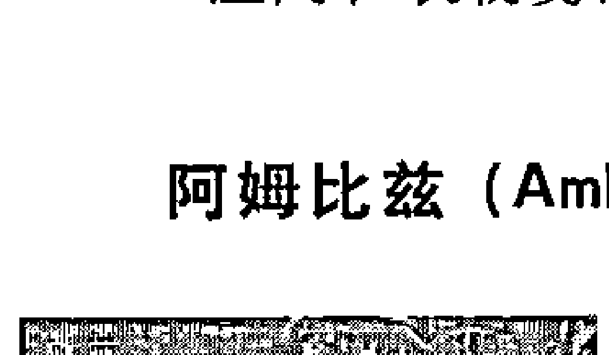

## 阿姆胡卢克（Amhuluk）

——俄勒冈

## 双头蛇阿姆费斯巴娥娜（Amphisbaena）

——（希腊文中“左右逢源”的意思，也被称为阿姆费斯塔 Amphista、安可思

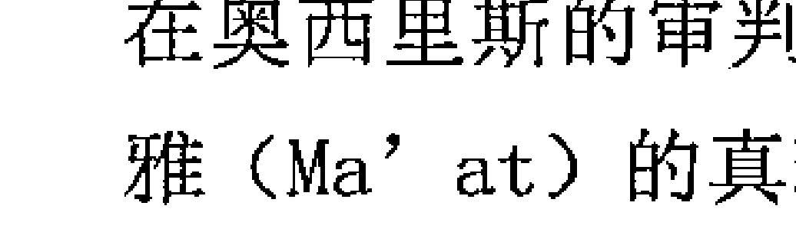阿姆费斯巴娥娜（Amphisbaena，别名安克斯门Anksymen、安非因Anphine、费恩缅因Fenmine或阿姆费弗那Amphivena、“蚂蚁之母”）——一种以比亚的蛇形爬行动物，长着发光的眼睛，在其身体两端各有一个头。如果它被砍成两半，这两部分身体将会自动复原。前进的时候它的一个头咬住另一个头，然后身体像轮子一样翻滚向前。根据老普林尼所著，孕妇戴上一只活的阿姆费斯巴娥娜将会得到保护，戴上死的阿姆费斯巴娥娜能治疗风湿。阿姆费斯巴娥娜是一种真实存在的无脚动物，是会挖洞的“蠕虫蜥蜴”（Amphisbaenidae），它尾巴的样子跟它无眼无耳的头部完全一样。它们有158种不同的种类，身长能达到二十英寸，向前和向后爬行一样（但它们并不像轮子一样前进！）参见鸡蛇兽（Amphisien）、滚环蛇。

鸡蛇兽（Amphisien或Amphisaena、Amphisteme）——一种奇怪的编钟纹章龙，长有一龙、一蛇两个头，一个在寻常的位置，另一个长在尾巴的末端。它还长有鸟的爪子和龙的翅膀。它是阿姆弗拉尔（Amphorae）的一个变种。

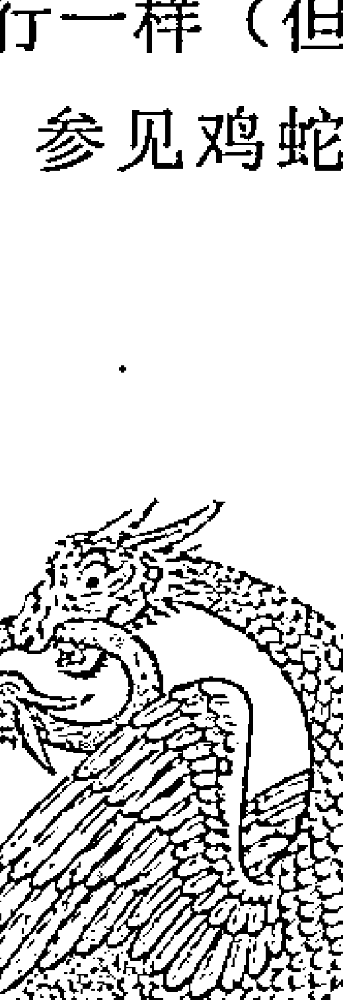

阿姆费特尔（Amphitere）——与阿兹特克的羽蛇神魁札尔科亚特尔（Quetzalcoatl）和埃及的阿佩卜（Apep）类似

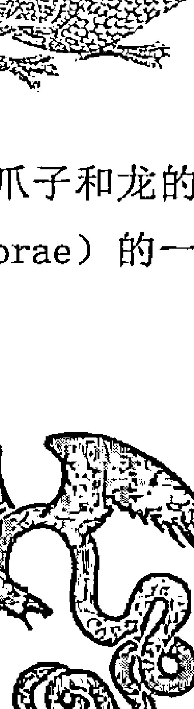

的美丽、长着羽绒或蛇纹的龙。阿姆费特尔被誉为具有非凡的智慧和知识以及一些其它的能力，比如催眠。它们中许多现在还在守护着宝藏，但与典型的看守宝藏的龙相比，它们将其视作自己的任务而并不是出于对亮晶晶物品的喜好。据说将它们的牙齿埋入肥沃的土地中能够长出绝对忠于主人的武士来。

安阿耶（Anaye）——纳瓦霍印第安人神话中一种凶残的怪物。它们有四种类别：截肢的邶阿耶·阿尼（Binaye Ahani）、无头的特里格斯（Thelgeth）、特萨那哈勒鸟和一种未命名的生物，它的羽毛像长在沙漠岩石中的草根一样。人们认为它们是邪恶寡妇的孩子，它们是世界上痛苦、恐惧和邪恶的源泉。它们被太阳和水之子击败，但它们的兄弟姐妹——冷酷、贫穷、饥饿和旧时代——继续困扰着我们。

安卡（Angka）——一种巨大的阿拉伯鸟，大到足以叼起一头大象。像凤凰一样，它的寿命长达1700年，死后将自己烧成灰烬然后重生。从其巨大的体型来看，它与鹏鸟有关系。阿拉伯人认为，它们最初是被设计为完美的鸟类的，但随着时间的推移，它们吞噬掉了地球上所有的动物并开始猎杀儿童。人们向上帝呼吁，让他阻止安卡继续繁衍，因此它最终灭绝了。

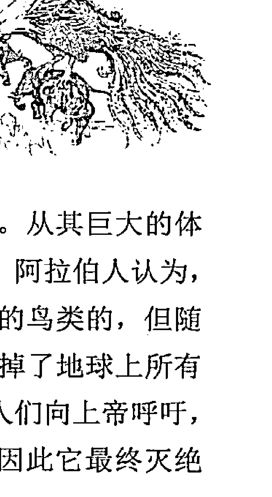

## **安宫 (Angont)**

一种加拿大东部休伦湖印第安人民间传说中的庞大毒蛇。事实上，这种怪物的肉有剧毒，就像毒箭蛙的肉一样。它潜伏在荒芜人烟的禁地中，它穿行大地，给人类带来瘟疫和灾难。活在遥远的北方，这种动物就不可能是驯鹿了。参见布塞、卡罗帕斯（Calopus）、潘达洛斯（Parandrus）。

## **安邑维 (Aniwyе)**

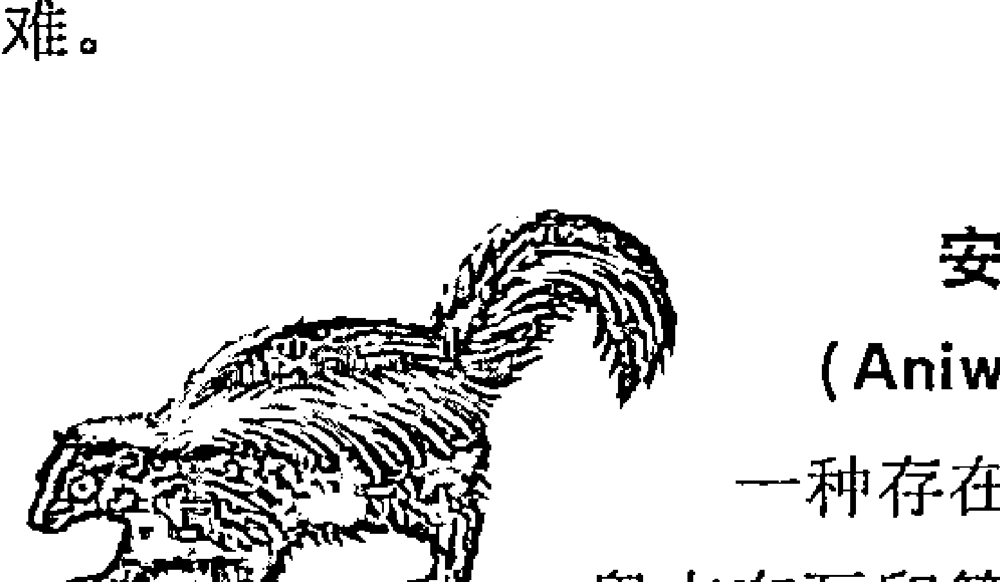

一种存在于加拿大奥吉布瓦印第安人民间传说中的巨大如同臭鼬的怪物。像臭鼬一样，它也使用喷雾来作为防守和进攻的武器。它热衷于人肉，而且能够理解人类的语言。

## **安塔罗普斯 (Anthalops)**

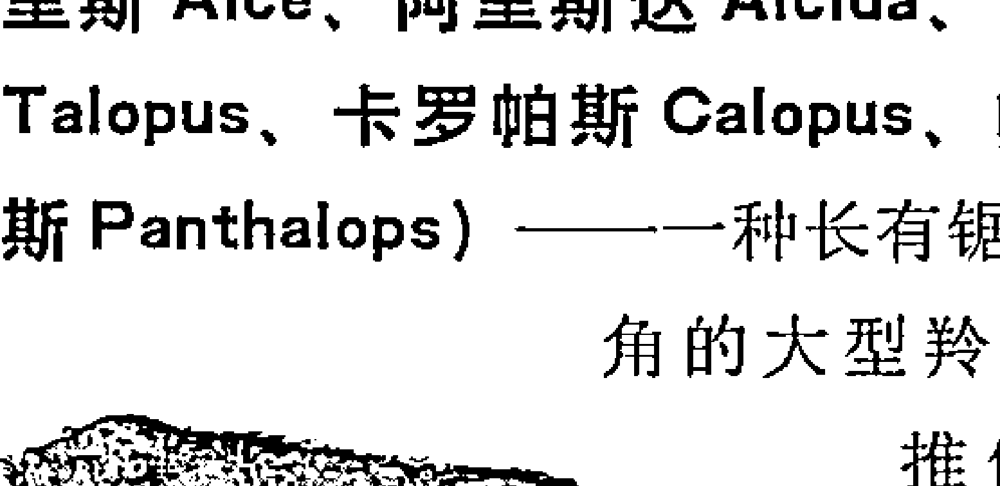

一种长有锯齿边缘弯角的大型羚羊。它能推倒大树。在巴比伦神话中，这种动物被称为潘塔莱昂。对它的描述似乎表明这种动物有可能是黑貂羚羊（Hippotragus Niger），但它也很可能是驯鹿（Rangifer Tarandus），在神话故事中，它的尖角时常会被卡在赫罗欣灌木的枝桠中。法布里克斯（Fabricus）也写道，驯鹿确实有锯形角。然而，驯鹿都生活在遥远的北方，这种动物就不可能是驯鹿了。参见布塞、卡罗帕斯（Calopus）、潘达洛斯（Parandrus）。

## **安图凯 (Antukai)**

根据俄勒冈印第安人的传说，它本来是一个灰熊落入湖蛇阿姆胡卢克所在的水域中，变成了一个巨大的海狸般，喜欢猎杀人类的怪物。人们在北美发现了一个新石器时代的巨型海狸（Castoroides Ohioensis），身长8.2英尺，重达485磅。

## **安祖 (Anzu)**

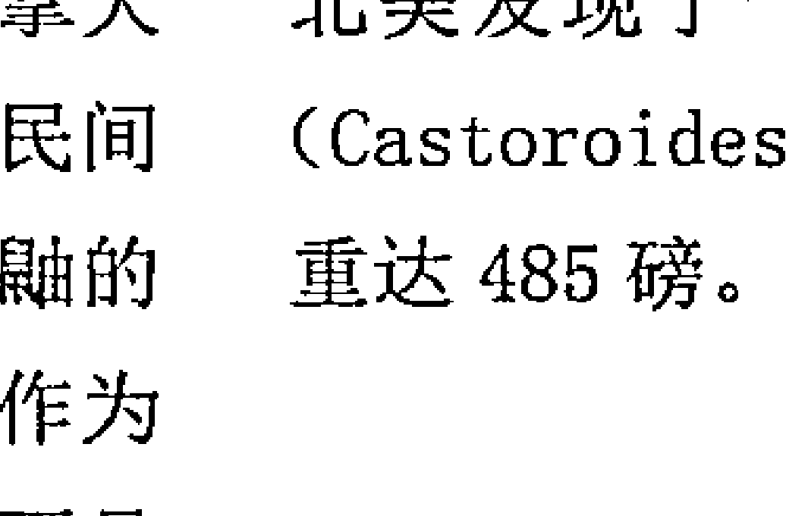

古美索不达米亚神话中的巨型风暴鸟。像狮鹫一样，它也拥有狮子的身体、锯喙鹰头；有时又传说其拥有鹰的身体和一个长着大胡子的人的脑袋和躯干。在后来的版本中它又有了两个头。它是大型原始蛟龙提亚美的后代，它扇动翅膀所产生的霹雳给沙漠带来了喜人的降雨。参见尤玛纳伊鲁（Uma Na-Iru）。

## **阿波逻罗 (Apalala)**

印度的一种可怕的水蛇，它统治着白沙瓦国，现巴基斯坦的斯瓦特河的源头。它被佛陀驯服和转化，这个场景在佛教艺术中经常出现。参见湖怪、摩伽罗（Makara）。

## **埃皮斯神牛**

一种古埃及神话中巨大的黑色公牛，是造物主卜塔（Ptah）的圣物。它的牛角间有一个太阳盘，它的脸上有一个白色的正方形或三角形，它的舌头下有一只金龟子、它的背上有一只白鹰。孟菲斯的一刚出生的小牛身上就有这些斑纹，它的母亲曾被闪电击中过。它死后被做成了木乃伊并在死城塞加拉（Zaqqara）下葬。参见麦尔握（Merwer）、步琪（Buchi）、姆奈维斯。

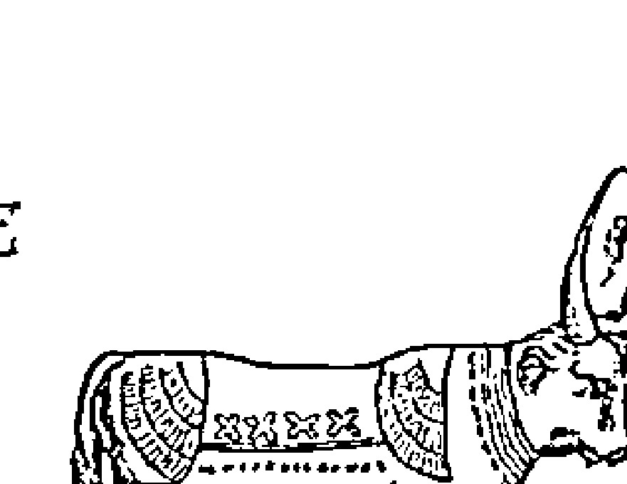

# 图鉴一、魔法动物展

## 天启兽

——在《新约·启示录》中，三个野兽被预言将在“天启”（“面纱揭开”）之时现身，世界末日行将到来，善恶之间的大决战将在基督降临和审判日到来之前爆发。第一个怪物会从海中诞生，它有豹子的身体、熊的爪子和长着十只角戴着十顶皇冠的七个狮子的头。第二个怪物将从陆地上诞生，它拥有和前者同样的体型，但只有一个长着短角的脑袋。第三个怪兽长相和第一个怪兽一样，但它是红色的，在它身上骑着“血色女人”或“巴比伦妓女”，代表着所有宗教上和政治上的腐败。参见九头蛇（Hydra）。

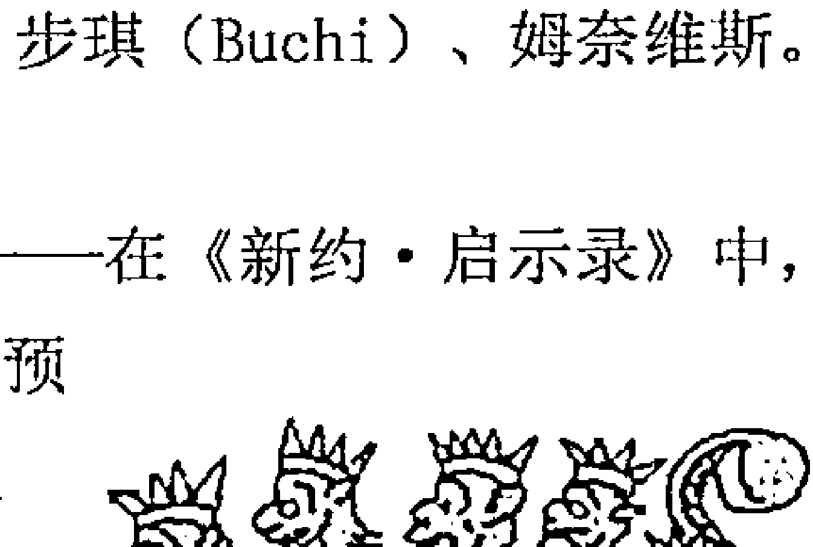

## 阿珀它尼（Apothani）

——康纳德（Conrad Lycosthenes）在他的著作《Prodigorum ac Ostentorum Chronicon》（1557）中所描述的雄雌半人马之间的竞赛。它们居住在沼泽地带，不管雄雌都是光头而且长着山羊胡。参见半人半驴怪（Onocentaur）、半人半马怪。

## 阿普勒斯（Apres）

——一种长着和熊类似短尾的纹章牛。

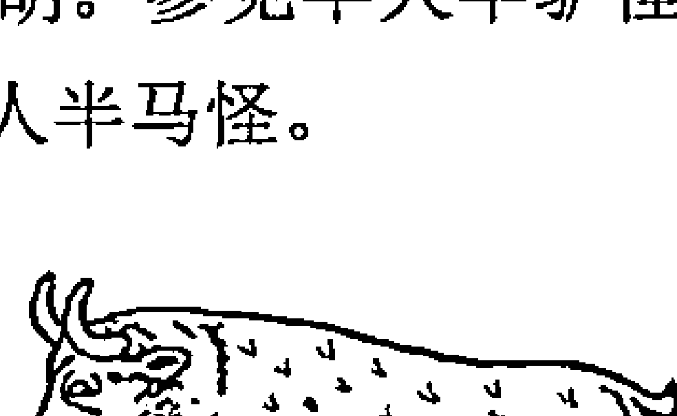

## 阿普塔勒昂（Aptaleon）

——这种神话般的巴比伦怪兽能用它的利角撞翻大树，但却会被一种名为俄里齐耳（erechire）的灌木丛困住。它很可能是人们基于藏羚羊而想象出来的生物，在英国教堂的纹章和雕刻中经常出现。参见开罗帕斯（Calopus）、安特洛浦（Antelop）。

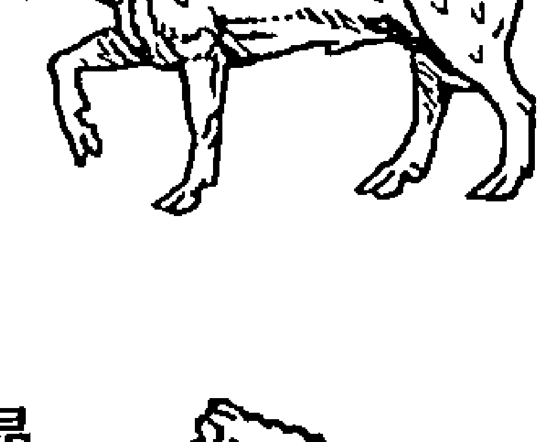

## 阿勒欧普-厄纳普（Areop-enap）

——在南太平洋岛国瑙鲁，这种古代蜘蛛从一个巨大的蛤壳中创造出了世界。它在其中找到了两个小型的像角一样的蜗牛壳，把它们放在两边，形成太阳和月亮。然后它用名为瑞吉（Rigi）的毛毛虫撬开了这个蛤壳的盖子，瑞吉的汗水形成了海洋。蛤壳的底部形成大地，它的顶部变成蓝天。瑞吉化作蝴蝶之后在两者之间飞舞，把它们分开。

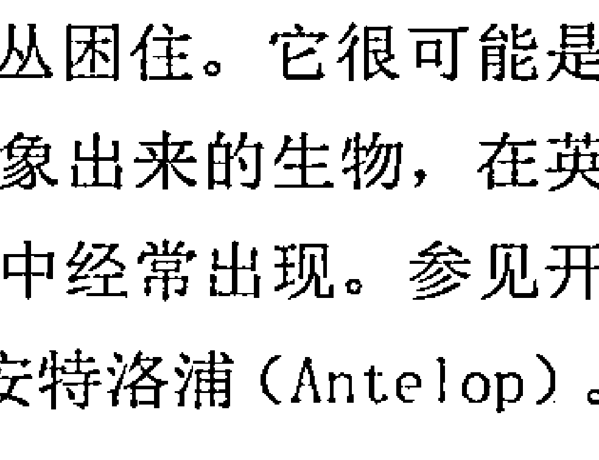

## **阿里翁 (Arion)**

——一种长翅膀的魔法飞马，是谷物女神墨忒耳和海神波塞冬伪装成的飞马的后代。它有一个很特别的地方，所有的右脚都是人的手。现在这个名字已被用作命名一种常见的花园蛞蝓 (Arion Hortensis)。

## **亚力士 (Aries)**

——坊间神话中巨大的有翅山羊。它的名字叫切理所马拉斯 (Chrysomallus)，“长着金毛的山羊”，就是传说中的大商船所追求的羊毛。据说，忒萨利亚年轻的王子弗里克索斯被他邪恶的继母指控制造了大饥荒之后，它坐着切理所马拉斯逃到了科尔基斯。到达目的地之后他将这头羊献给了宙斯，并将其羊毛挂在寺庙中，后来贾森和阿尔戈英雄从那里将其偷走。宙斯将切理所马拉斯放置在白羊座上。最近的考古研究发现，古代科尔基斯人用羊毛和羊皮从河中过滤金沙。

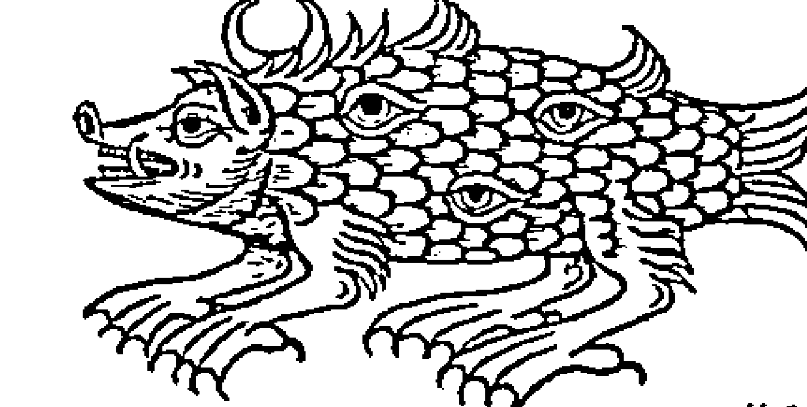

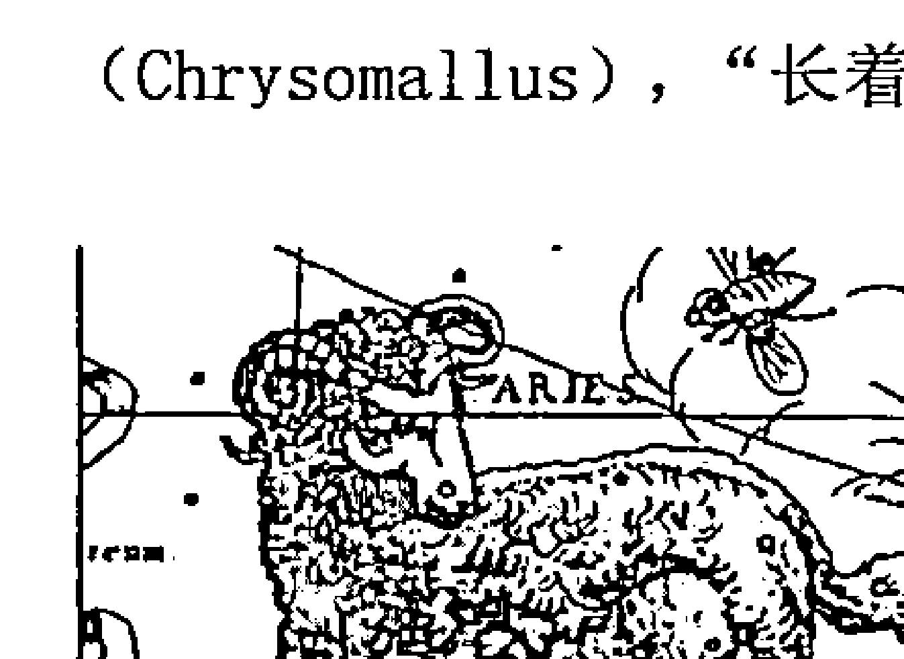

## **阿格斯鱼 (Argus Fish)**

——奥拉乌斯·马格瑙斯 (Olaus Magnus) 的著作《北海怪兽》 (Monstrum in Oceano Germanica, 罗马，1537) 中所描述的离奇海怪中的一种。这种 72 英尺长的生物在身体侧边长有几个眼睛，因此被命名为阿尔戈斯 (Argos)——希腊神话中的千眼巨人，它的眼睛被放置在孔雀的尾巴上。它显然指的是鲸鲨 (Rhincodon Typus)，它身上如同“井字游戏”般的直线与小点自然会给人留下身体侧边长有眼睛的印象。它是世界上最大的鱼类，在官方记录中它的身长达到 40 英尺，而坊间则传言说有 70 英尺。

## **阿斯帕特拉 (Asipatra)**

——这种印度神话中的斯廷法利斯湖怪鸟有着锋利爪子和翅膀。阿斯帕特拉生活在亚玛普拉 (Yamapura)，地下世界中，它在那里负责折磨那些被天谴的灵魂。

## **阿苏提 (Asootee)**

——在印度神话中，它是用嘴咬住尾巴，环绕整个宇宙——乌龟、大象和大地——的巨蟒。参见乔穆干德 (Jormugand)。

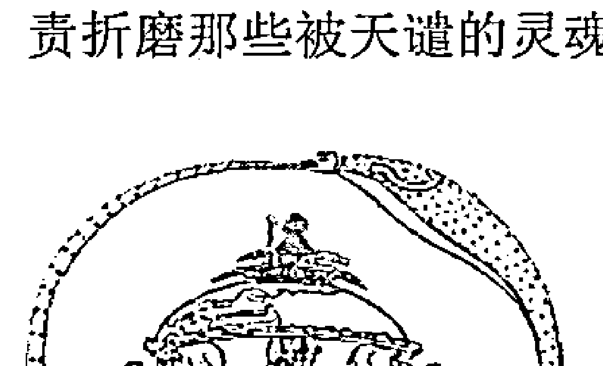

## **阿斯匹多彻龙 (Aspidochelone)** (拉丁文中的“盾龟”，同样也叫阿斯匹多德龙 Aspidodelone、法斯提克隆 Fastitocalon、或“魔鬼鲸”) ——一种类似于巨型鲸鱼或海龟的大型海怪，它非常巨大，当他附上水面晒太阳时，水手们都误以为那是一个小岛而在上面登陆。当

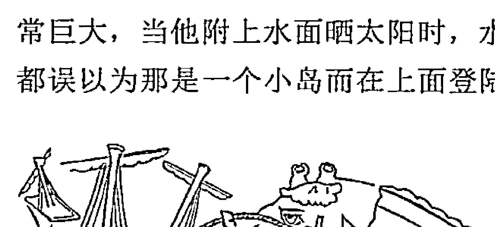

他们生起火，这个“孤岛”突然潜入海中，将船只和海员都拖进了深海。欧洲的水手们经常报道目睹它的存在。阿拉伯的作家们将其称作卓拉唐 (Zaratan)。参见海龟之父、伊玛普乌玛苏尔萨 (Imap U massoursa)、吉阿斯卡尼俄斯 (Jasconius)。

## **水马安格西斯基 (Aughisky)**（也叫乌修卡或 Alastyn）

爱尔兰水怪，和在苏格兰的马形水鬼和威尔士的寻水兽水怪相同。它样子像一匹家马，邀请疲惫的旅客来骑它，此时他就会冲进附近的水潭中将旅行者淹死，吃掉他们身上除了肝脏之外的所有东西。只要骑手远离水马安格西斯基的水源就暂时不会有生命危险，但只要可以看到或闻到水的味道就代表噩运将至。尽管长有马耳，但有时它会以人的样子出现。参见霍斯—伊尔 (Horse-Eel)、马形水鬼、佩斯特 (Peiste)、尼斯湖水怪 (Water-Horse)。

## **阿斯匹斯 (Aspis)**（拉丁文中的 Asp）

——一种中世纪欧洲的双足龙，有些有翅膀，有些没有翅膀。被它咬伤一口就会致命，它的毒素毒性非常强，甚至连触碰死者尸体都是件极为危险的事情。但用音乐就可以轻易地战胜它，音乐响起时它会用尾巴堵住一只耳朵，同时把另一只耳朵贴到地面上。

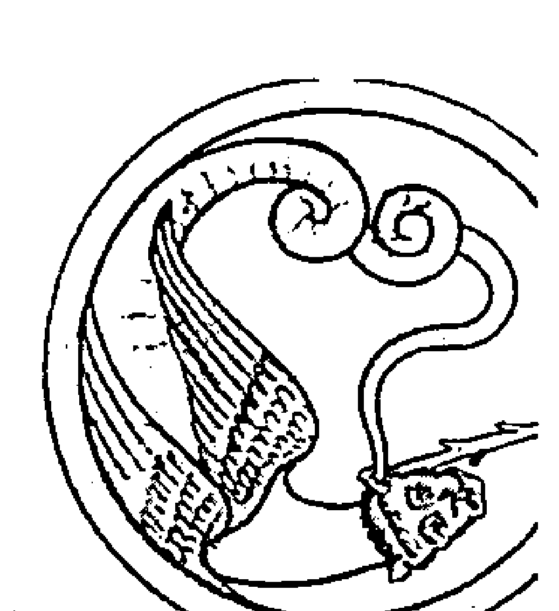

## **阿斯－比特恩 (Ass-Bittern)**

——一种英国纹章生物，长着驴身和麻鸦（大麻鵟）的头。

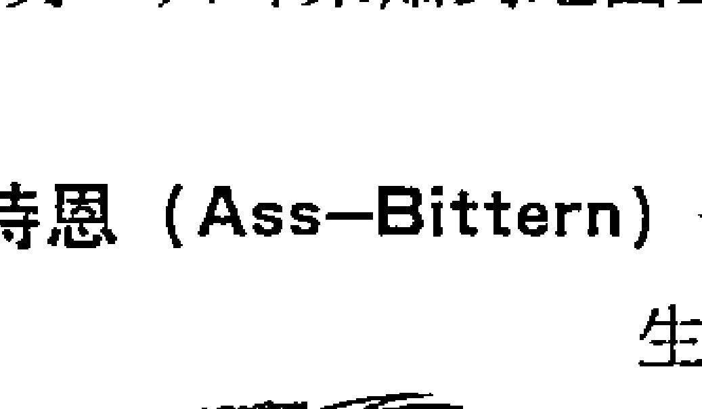

## **欧德姆布拉 (Audumbla)**

——这是一种出现在北欧创世神话中死人国 (Niflheim)融冰时继巨人伊米尔(Ymir)后第二个出现的巨型母牛。它的乳汁滋养了伊米尔，它舔舐冰川时释放出了第一批神灵。

## **毛人鱼 (Auvekoejak)**

——在格林兰附近水域中发现的一种海怪。因纽特人将这些生物描述得和人鱼一样，唯一的不同就是它们身上覆盖着皮毛而不是鳞片。斯堪的纳维亚地区和冰岛则将其称作哈弗斯特拉波 (Havstrambe)。它已被人等同于北方海狗 (Callorhinus Ursinus)和海牛 (Hydrodamalis Gigas)，北极探险者在 1768 年证实了它们的存在。参见伊卡鲁·纳帕 (Ikalu Nappa)、玛吉格尔 (Margygr)。

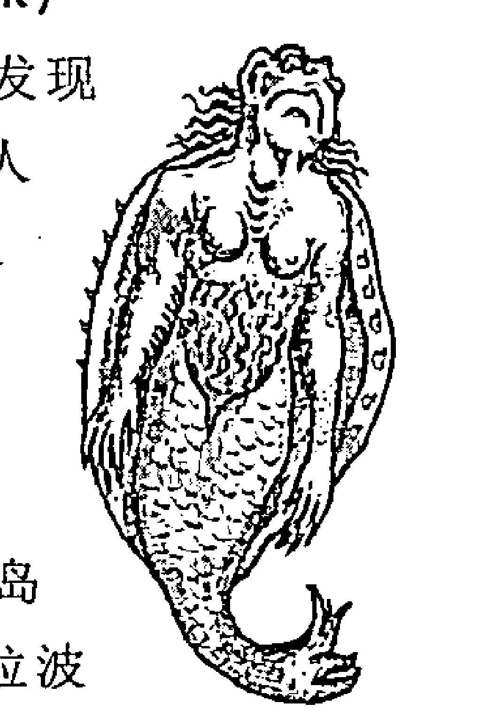

## **阿芙乐利恩 (Avelerion)**（也叫阿勒利恩 Allerion、伊勒利恩 Ilerion、叶勒利恩 Yllerion）

——一种像老鹰一样的肉食鸟，世界上仅存一对这样的鸟，可能在亚洲，也可能在印度。十二世纪伪造的祭司王约翰（Prester John）书信将它们描述为长着锋利羽毛、类似于斯廷法利斯湖怪鸟的生物。在六十岁时它们会下两三个蛋，孵化四十天后，它们会在众鸟目睹之下自己跳入海中淹死。在纹章中它们经常以没有嘴或没有脚，类似于无脚圣马丁鸟般的形象出现。它们出现在洛林家族的族徽中，而且在英格兰的赫里福教堂（公元1295年）的古世界地图中也有它们的身影。

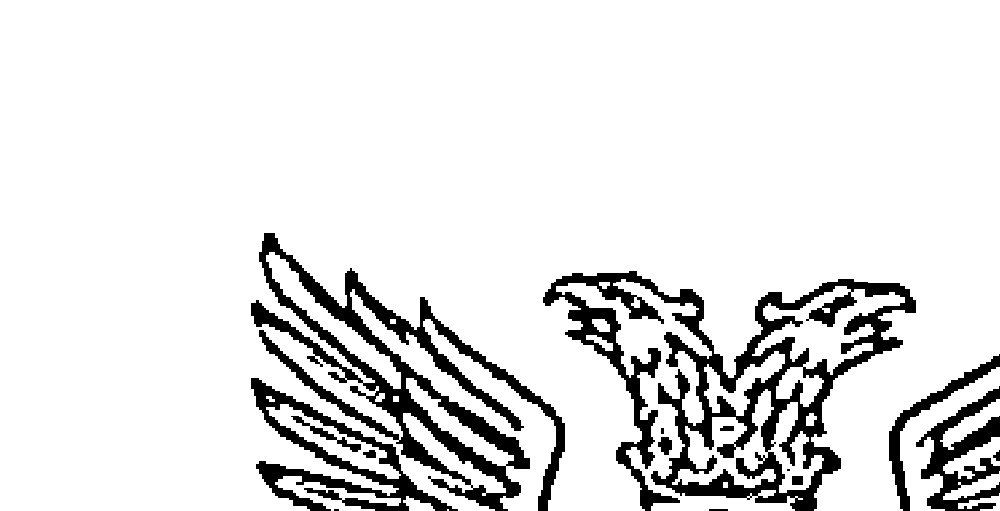

# 魔法师的怪物图鉴

林（Rosmarine）、海猪（Sea Hog）。

B指的是食梦者巴库（Baku），它吞噬噩梦，咽下惊叫。让人安心，长着大象的脑袋、公牛的腿。能够穿墙而过，通行无阻。

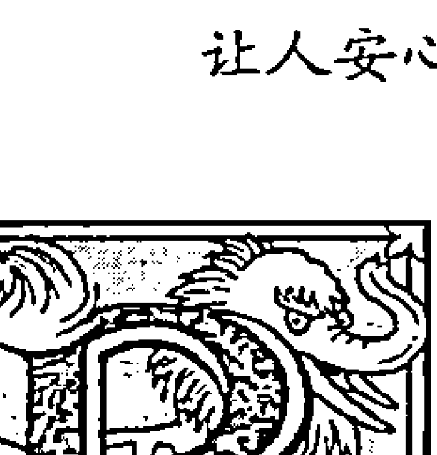

巴拜（Babai）——一种埃及地下世界的生物，它帮助阿穆特，亡灵噬者，消灭掉所有没能通过玛雅真理羽毛测试的人。

巴迪贡（Badigui）（或迪巴 Diba、纳寇拉-纳欧 Ngakoula-Ngou）——一种据称生活在赤道非洲的乌班吉沙里的巨型水蛇。它在水中啃食树枝、勒死河马，但却不吃掉它们。

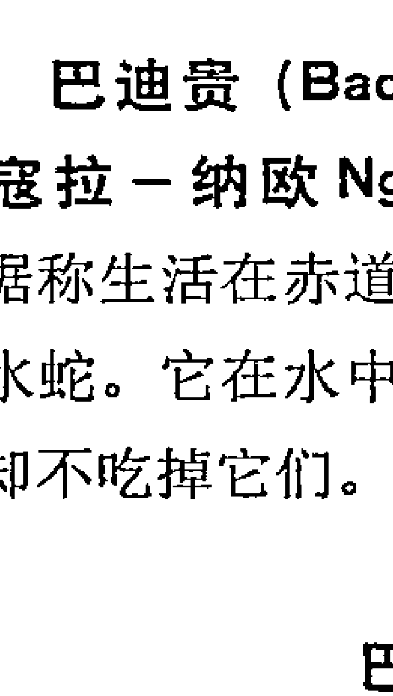

巴基尼斯（Baginis）——它的上半身体是动物，下半身体是女人，这种澳大利亚传说中美丽的生物长着爪子一样的手指和脚趾。它们猎捕男人，但会在对他们进行强奸之后将其放走。

巴格温（Bagwyn）——一种只见于欧洲纹章的珍稀杂交生物。它长着马的身体和尾巴和纹章羚羊的头，头上还有向后

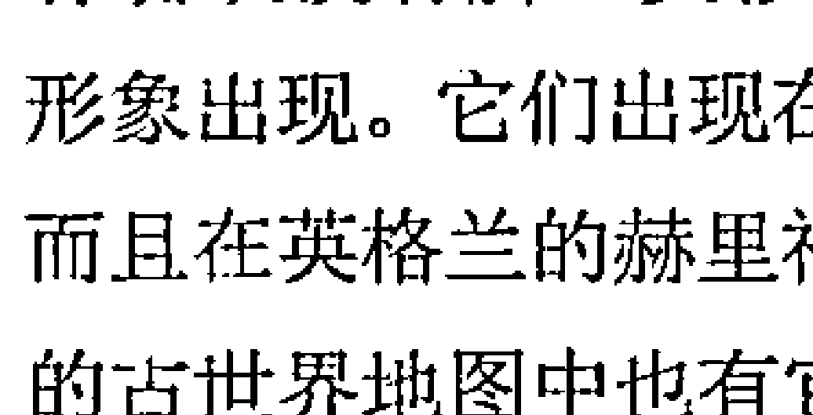

阿克斯伊克斯（Axex）——与狮鹫相似，这种生活在埃及的动物长着老鹰的头和翅膀，猫科动物的身体，它的头上还长着三个鸡冠状的物体。人们时常将它和英国长着翅膀的食腐动物欧品卡斯（Opincus）搞混。

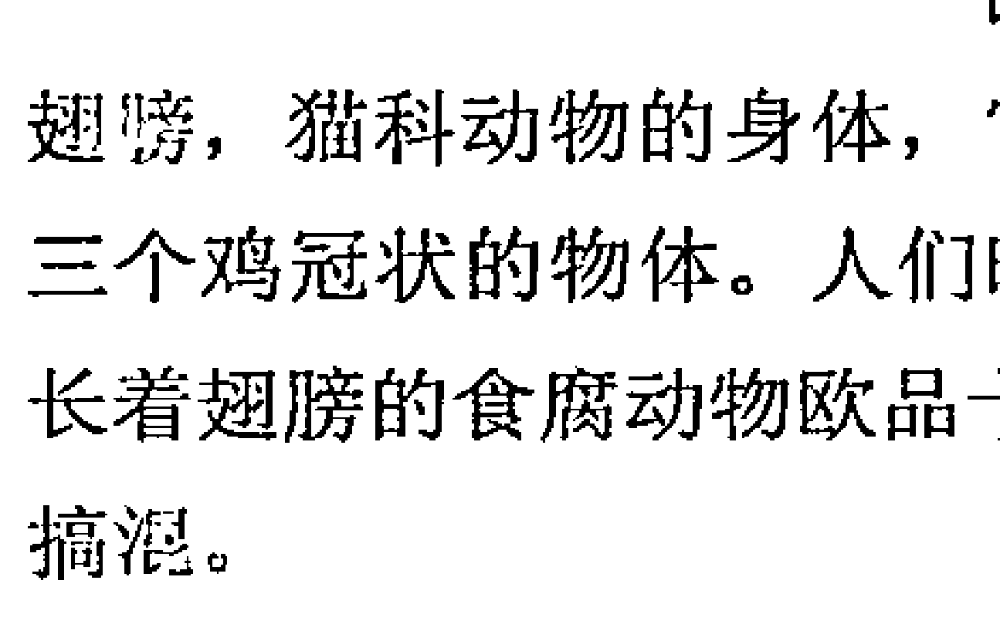

阿兹乌古姆奇穆克提（Az-i-wû-ghûm-ki-mukh-'ti）——因纽特神话中一种类似于海象的恐怖生物，长着有尖角的头和狗的四肢、鱼的尾巴和闪亮的黑色鳞片。只用扫一下尾巴它就可以杀死一个人。参见马属毕皮斯（Equus Bipes）、海猪（Marine Boar）、罗斯马

弯曲的长角。

## 巴哈姆特

——一种长有河马或大象头，颜色绚丽的巨鱼。在穆斯林神话中，它生活在深不可测的海中，背上背着一头名为库居塔（Kujuta）的长着四千只眼睛、四千只耳朵、四千个鼻孔、四千个嘴巴、四千只脚的巨大公牛。公牛又背着一座巨型红宝石山，在山上站着掌管六层地狱的天使。在此之上是大地，在大地之上是七重天。有些人说在深海之下的是火之王国，巨蟒法拉克（Falak）在那里翻滚，它的嘴里含着六层地狱。参见贝黑摩斯、拉布（Labbu）、摩伽罗。

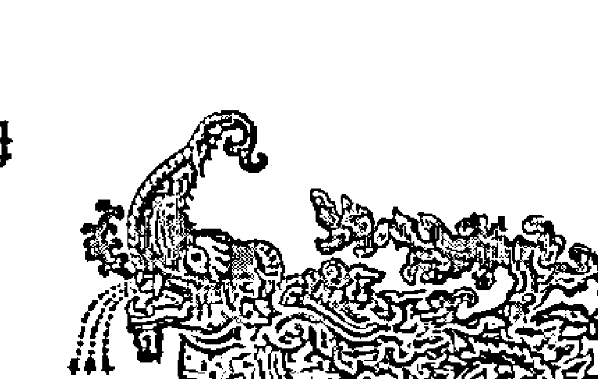

## 巴赫里(Bahri)

——穆斯林神话中一种长着人脸的鸟，模样与希腊的塞壬相似。

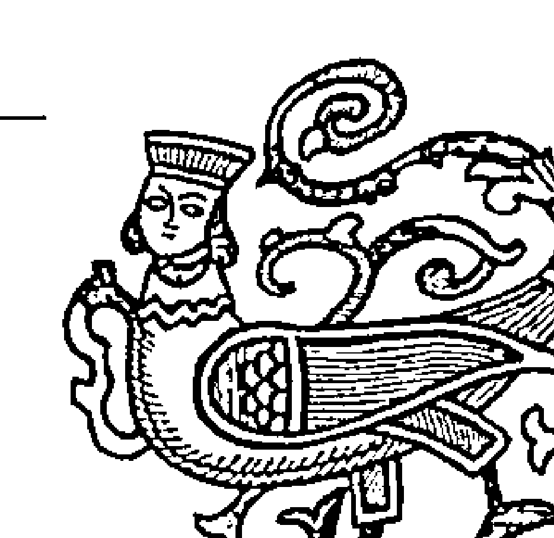

## 贝加尔湖水怪

——西伯利亚的贝加尔湖是世界上最大的淡水湖，深达 4900 英尺，所有的淡水水量占全球的百分之二十以上，湖中的生物比世界上任何一处湖泊都要多，其中就有一种据称体型巨大的鲟鱼，比俄罗斯鲟鱼（Acipenser Gueldenstaedtii）最高纪录的 27 英寸还要长。有人认为这种怪物是一种由造纸厂纸浆污染造成的变种，自1966年以来这些造纸厂每天向湖中排入大约 640000 立方英尺未经处理的废水。参见扁头湖怪、鱼类之母、白怪。

## 巴克巴克瓦卡努克斯瓦厄(Bakbakwakanooksiwae)

——加拿大夸克特尔印第安传说中居住在西海岸的凶猛食人鸟。它也被称作胡可胡姬（Hokhoky），“世界北方边缘的食人者”。它和它的伴侣，戈洛克伍兹尤维斯（Galokwudzuwis），一起猎杀人类，碾碎他们的头骨，吞食他们的大脑。

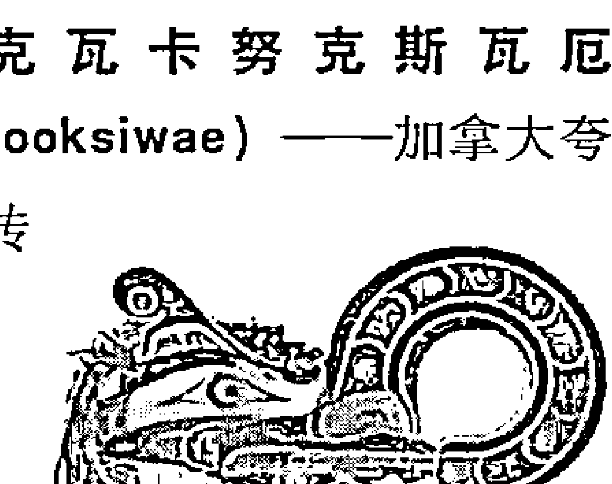

## 巴库

——日本民间传说中慈祥的梦境怪物。它的身体像貘、头像大象、有狮子的鬃毛、公牛的尾巴和老虎的爪子。只要做梦的人用“啊，巴库，吃掉我的梦！”来叫醒它，它就会吃掉所有的噩梦，这样做梦的人就能睡个安稳觉。

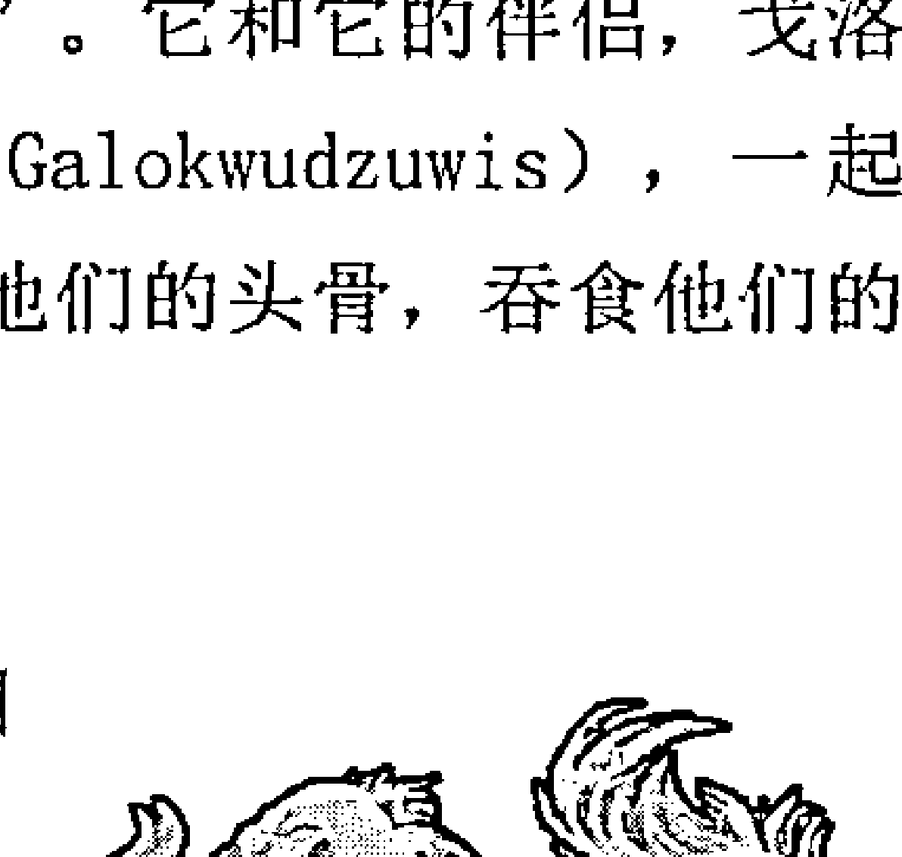

## 巴拉姆(Balam)

——墨西哥基切印第安人传说中看管四个方向的神奇美洲虎。它们的名字分别是：Iqi-Balam

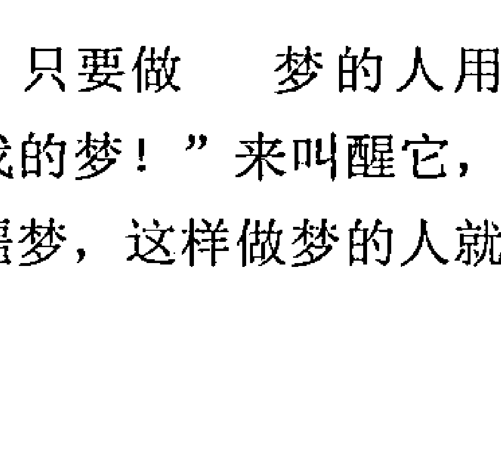

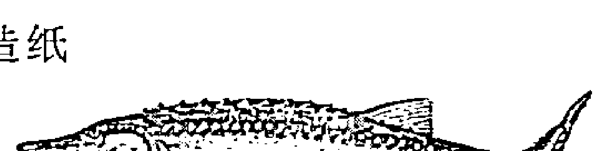

## 巴乐纳鲸 (Balena)
二世纪亚历山大学派的生理学中提及但未描述过的一种雌性海怪。这个名字最终被用于命名大须鲸（Mysticeti）。

## 绵羊草 (Barometz)（鞑靼语中的“小羊羔”，或鞑靼植物羊、巴巴里羊、锡西厄羊、素羊羔、石松子）
在希伯来传说中，这是一种来自中东，全身长毛，像绵羊一样的，杂食生物。英文学名叫做Planta Tartarica Barometz，它们从非常矮小的灌木上结出的葫芦中诞生。一旦吃光了所有能够到的食物它们便会饿死。绵羊草被认为是一种佳肴，它的肉尝起来像蟹肉，它的血的味道像蜂蜜一样。它的骨头被用在仪式中以增加先知的力量。“素羊羔”通常被认为是棉花灌木（Gossypium），但其同样也被解释为是一种生长在中东地区，被用作止血剂的蕨类植物（Cibotium Barometz）。另外一种非常好的解释是金狗毛蕨，一种有着沿着地表生长的茂密根系的亚洲蕨类，上面覆盖着浓密的绒毛，当被人砍断时会流出血红色的液体。

## 巴尤克尼 (Bar Juchne)（或巴亚科尔 Bar Yacre）
在犹太经典《塔木德经》中，这种生物被描述为一种类似于鹏鸟的大鸟，它展开翅膀几乎能够遮盖太阳的光芒。它以家畜甚至人类为食。据说曾经从一个巴尤克尼的巢穴中掉下了一个蛋，打断了三百棵树，冲毁了六十个村庄。参见安卡（Anka）、席兹（Ziz）。

## 巴里艾特 (Barliate)（或安妮斯德拉梅尔 Annes de la mer、巴查得 Barchad、巴娜茶 Barnacha、贝尼可 Berneke、内那卡 Bernaca, 贝尼科勒 Bernicle、黑雁、树鹅）
一种据说最早曾是黑雁的鹅，它在树上或浮木上长大。它的原型是鹅颈黑雁（Lepas Anatifera）。

## 巴马奴 (Barmanu)（“大毛怪”）
一种浑身长毛的原始人，据称住在从阿富汗东一直到巴基斯坦北部的吉德拉尔地区的施施库（Shishi Kuh）山谷地区。与美洲臭鼬猿类似，它以其令人反感的臭味而闻名。参见大脚怪、雪猿。

## 篮子怪物
在非洲的祖鲁传说中，这种生物以打开的摇篮的样子出现在世人面前。但如果一位母亲不慎将自己的孩子放入其中，这个篮子就会长出脚，像螃蟹一样走掉。

## 蛇怪 (Basilisk)（来自希腊语中的巴赛勒斯 Basileus，“小国王”，或拉丁语中的雷古勒斯 Regulus，“王子”，法语中的罗勒 Basilic 或巴西里寇科 Basili-coc）
由美杜莎眼睛中流出的血而生，蛇怪被描述为带着网冠的凶残大蛇，它由此被称为“蛇王”。它的毒性很强，会在尾迹上留下宽宽的致命毒液痕迹，同时它的眼神也能杀人。它让溪流、森林染毒，让鸟儿绝迹。鼬鼠和猫鼬是它的天敌。实际上，蛇怪的原型是埃及喷毒眼镜蛇（Naja Nigricollis），它能长到七英寸长，能从毒牙中喷出毒液准确命中受害者的眼睛。也有些南美蜥蜴被称作蛇怪（Basiliscus），但它们都不能与之相提并论。参见蛇鸡兽、穆里厄斯（Muiriasc）、斯克芬（Scoffin）。

## 野蝙蝠（Batsquatch）
一种奇异的、长着蝙蝠翅膀的夜行灵长类动物，据说生活在华盛顿州圣希伦斯山茂密的森林中。它有紫色的皮肤、红色的眼睛、有蝙蝠特征的类人猿的头。一些隐生动物学家推测它可能是一种未知的巨型果蝠。参见阿胡、阿兰、大鸟(Big Bird)、圭阿法罗、飞猴(Hsigo)、空阿马托(Kongamato)、欧利提奥、莎莎伯恩沙。

## 巴士野人 (Batutut)
一种据称生活在马来西亚沙巴州雨林中的小型、红色、像猿人一样的生物。人们认为它与喜食青蛙的特马（The-Ma）和越南牛圭朗（Nguoi-Rung）有关。参见矮猩猩。

## 布拉斯诺克山怪兽
在1979年的一次目击中，这种生物在英国某处被发现正在剥树皮。当地的夜火规模减小之后，人们看到一个四英寸长像熊一样，眼睛周围有白环的生物。尽管还未被证实，但这种生物只能是安第斯山眼睛熊（Tremarctos Ornatus），当时很有可能是从动物园中跑出去的。杰拉德·德雷尔的泽西动物园中就关有几只这样的动物。

## 埃尔门道夫怪兽
这些无毛的蓝色皮肤像狗一样的生物自2004年开始就一直在骚扰东得克萨斯的农场。

## 怪兽葛瓦丹（Gévaudan）
一种凶猛的像狼一样的怪兽，它在1764-1767年间肆虐于法国东南部的乡村。据说它杀死了超过一百个人和许多家畜，还拉出了他们的内脏。它被描述为像狼一样，有着蓬松皮毛、长腿和炯炯有神的眼睛。很多人相信它是一种狼人。在当地猎人猎杀它失败之后，路易十五国王派出了士兵，但却毫无用处。在1767年，让·查斯代尔用两颗银子弹终于将其杀死。后来证实这种生物是一种条纹鬣狗（Hyaena Hyaena），是从安托万·查斯代尔，让·查斯代尔的儿子的私人动物园中跑出来的。《狼族盟约》（2001）便是一部关于此故事的精彩影片。参见克罗克塔（Crocotta）。

在苏格兰高地的与世隔绝的水体中的巨大鳗鱼或水蛇。目击者称其长达九至十英尺，而且人们还看到它在地面上移动。它可能是康吉鳗（Conger Conger），这种鳗鱼能够达到那种长度。很多鳗鱼都能利用潮湿的草地从一个水池移动到另一个水池。或许，它也可能是一种典型的湖怪。

贝努——这种苍鹰般的鸟全身白色、双爪红色、头顶从皇冠中长着向后的长长羽毛。贝努一词来自埃及语，意思是紫色苍鹰（Ardea Purpurea）、棕榈树。很多凤凰的传说都是基于埃及的贝努传说的，据称它会从燃烧的树上重生，重生之时唱着动听的歌谣，甚至连众神都会被那声音吸引住。贝努是太阳神拉的标志，它每天都在燃烧般的黎明重生。它也因此被认为是冥府之神奥西里斯。

贝黑摩斯（或以诺克）——圣经中对河马夸张而来的生物，出现在《约伯记》（40：15-19）。该词源自希伯来文 b’hemah 的复数形式，意思是“兽王”，于是任何一种体型庞大的未知生物都能被称作“贝黑摩斯”。在犹太传说中，贝黑摩斯是一种具有强大力量的怪兽，通常以利维坦的样子出现在战场上。在伪基督教传统中，贝黑摩斯被证实为撒旦，一个必须被摧毁的魔鬼。一些隐生动物学家推测它可能与河霸龙（Mokele-M’ Bembe）有关。参见巴哈姆特、哈德恒尤西（Hadhayôsh）。

贝瑟尔（Beithir）——一种据称生活

本瓦力（Ben-Varrey）和蒂尼马拉（Dinny-Marra）（或名尼马拉 Doinney Marrey、曼克斯 Manx、“海之男子”）——这种人鱼生活在马恩岛附近。雄性叫蒂尼马拉，它们非常友好，易于相处。雌性叫本瓦力，它们喜欢用歌声迷惑人类水手，诱惑他们一步步靠近死亡。参见麦罗（Merrow）、哈弗路美人鱼（Havfrue）、哈弗曼得（Havmand）。

## 伯格曼之熊
一种硕大、短毛黑熊，来自俄罗斯的勘察加半岛。1920年，瑞典动物学家史坦·伯格曼抓到一只将其剥皮，随后他将其命名为勘察加棕熊（Ursus Arctos Piscator）。此种动物已经绝种但仍有人声称目睹它们的存在。参见短面熊。

## 贝西
一种在19世纪出现在加拿大伊利湖中的湖怪，“南湾贝西”被说成是一种蛇类生物，超过四十英尺长，有着钻石形状的头，背上还有隆起。它的颜色从深绿色到黑色不等。据称它有像鸟贼一样的一双长“手”。参见恶魔湖水怪。

## 贝提罕（Betikhân）
印度神话中一种半人半羊生物，它下半身是羊，上半身是人。它们住在内尔亨格里（Neilhgerry）山脉中，猎食那里的动物。

## 拜恩斯萨苏拉（Bhainsâsura）
印度民间传说中的一种破坏性怪兽，它长得像大水牛。在收获之时出现，需用一只子猪来平息它的怒火，否则它就会毁掉田里的庄稼。拜恩斯萨苏拉是基于《摩诃婆罗多》中一种名叫马西沙（Mahisha），被杜尔格（Durgâ）所征服的动物的。参见康特朗奴欧西（Con Tram Nu’ O’ C）。

## 比阿罗扎（Bialozar）
波兰民间传说中一种硕大的老鹰般的鸟，很像鹏鸟。在俄罗斯，这种鸟被叫做科鲁兹尔特（Kreutzet）。比阿罗扎也是一种在波兰真实存在的鸟的名字。它的英文名是矛隼（Falco Rusticolus），一种只居住在北部森林中的鸟。

## 比阿斯得比拉克（Biasd Bheulach）
一种出没于苏格兰沿岸斯凯岛的奥黛尔路径上的幽灵怪兽。它在夜间发出的嚎叫让旅行者浑身战栗。在黑狗传说中，它据称也会以一个相貌奇怪、只有一只腿的男人的形象出现。

## 比查（Bicha）
一种西班牙传说中长着人头的牛怪。参见弥诺陶洛斯。

## 大鸟
1976年，得克萨斯格兰德河谷的居民们被一种五英尺高、长着大猩猩脸庞、血红色眼睛和蝙蝠翅膀的生物吓坏了。之后却再也没有出现过关于它的目击报告。参见野蝙蝠（Batsquatch）。

### 伊利亚姆纳大鱼（或伊利亚姆纳巨鱼）
在靠近北极的阿拉斯加的塔莱纳（Tanaina）印第安人的传说中，这种凶猛的鱼类会从浮冰中攻击渔船，在船底咬出大洞使其沉没后再吃掉里面的船员。

大脚怪（或萨斯柯奇人）——一种在数百年间曾出现在美洲西海岸的巨型类人猿。记录在案的目击报告就超过三千份。据称它们身高七至八英尺，体重达四百磅，身上长满深色蓬松的毛。人们发现了很多巨大的脚印，给它们印上石膏，这就是它们名字的来源。它们据信与尼泊尔雪猿和澳大利亚野人以及世界上其他相同动物有关。参见卡普雷（Kapre）、司匡科猿（Shunk-Ape）。

天堂鸟（或玛纽卡迪阿塔 Manucaudiata、玛纽德瓦塔 Manuqdewata、‘众神之鸟’）——一种长有彩虹般色彩羽毛的鸟，据说它生活在天堂中，只吸食露水。它没有脚，栖息时用长长的尾羽缠住树枝。它不筑巢，雌鸟将蛋缠在雄鸟背上的小洼里，这样在飞行时蛋也能被孵化。这种传说来自摩鹿加群岛上的两个此种鸟类标本。它们被献给世界上第一艘环绕世界的船维多利亚号，当作给西班牙国王的礼物。在当地风俗中，制作鸟类标本时要去掉它们的皮肤和鸟爪。此种鸟类的学名叫 Paradisea Apoda：“无脚的天堂”。参见圣马丁鸟、凤凰。

主教鱼——一种在十六世纪动物寓言集中描述的长相类似一位天主教堂中披着长袍的主教的海洋生物。它们有着倾斜的头、有鳞的身体、前端长着两个爪子一样的鱼鳍和一个鱼鳍状的长袍。在十三世纪，有人在波罗的海抓到了一只，献给了波兰国王。在被拿给几个主教看了之后，它被获许放生。1531年，在德国又有人抓到了一只这样的鱼，但它拒绝进食，三天后死于饥饿。世界上存在着一种天使鲛（Squatina），它们是一种长着扁平身体、宽阔胸鳍的鲨鱼。根据 J·W·布尔 所言“因其圆圆的好像被包裹在头巾中的脑袋，及其虔诚的眼神，它们经常被称作僧侣鱼。”参见飞鱼、僧侣鱼。

比托兽（Bitoso）——罗马尼亚传说中一种多头恶魔虫，它能带来胃痛而让人失去胃口。它的别名“加速器”由此而来。它似乎是一种体内寄生虫，像毛线虫（Trichinella Spiralis） 或绦虫（Cestoda）——它们中最大的可长到一百英尺长。

# 图鉴一、魔法动物展

大，也能大到一头熊那样大，它们悄无声息地行动，爪子不会发出一点声音。它们在黑夜中的小路上出没，尾随着上面的路人，这些人通常会感到让人毛骨悚然的冰冷的恐惧和绝望。由于它们的毛色各不相同，“黑暗之狗”这个名字从某种意义上说并不准确。有些长有尖角，有些长着军刀般的牙齿，有些能变成人、无头人、熊或白色的兔子。它们中大多数都看起来像獒犬，也有全身毛茸茸的那种。尽管黑暗之狗通常情况下都被认为是恶魔，但其中也不乏一些仁慈的和不问世事的。在不同的年代、不同的地区它们有着不同的名字。参见第二十七章：“恶魔犬”。

### 辟邪
辟邪——一种中国的奇美拉，辟邪是一种长着翅膀和尖角的狮子。

### 切尔诺贝利黑鸟
切尔诺贝利黑鸟——在1986年4月26号的乌克兰切尔诺贝利核事故之前，有人报告称目击到一个巨大、黑色、无头、长着巨型翅膀和火红眼睛的人。爆发发生后，在苏联直升机盘旋于闷燃的反应堆上空，往下投掷泥土、沙子，灭掉火焰的时候，有些工人看到了一只“二十英尺长的鸟”在辐射烟尘中穿梭。这与天蛾人现象一样不可思议。参见火虫花妖、人龙、鸮人（Owlman）。

### 黑暗恶魔一号
黑暗恶魔一号——尤卡坦半岛玛雅印第安人传说中的黑亮半人马。

### 黑暗恶魔二号
黑暗恶魔二号——肖松尼印第安人神话中的黑亮成年公马。黑暗恶魔有火红色的眼睛和尖利的牙齿。据说它能说话，喜食人肉。

### 黑暗之狗（或地狱魔犬）
黑暗之狗（或地狱魔犬）——不列颠群岛传说中长着闪亮红色眼睛的大型恶犬。这种生物的体型能小到一头小牛那么大，也能大到一头熊那样大，它们悄无声息地行动，爪子不会发出一点声音。它们在黑夜中的小路上出没，尾随着上面的路人，这些人通常会感到让人毛骨悚然的冰冷的恐惧和绝望。由于它们的毛色各不相同，“黑暗之狗”这个名字从某种意义上说并不准确。有些长有尖角，有些长着军刀般的牙齿，有些能变成人、无头人、熊或白色的兔子。它们中大多数都看起来像獒犬，也有全身毛茸茸的那种。尽管黑暗之狗通常情况下都被认为是恶魔，但其中也不乏一些仁慈的和不问世事的。在不同的年代、不同的地区它们有着不同的名字。参见第二十七章：“恶魔犬”。

### 布里德摩尔（Bledmall）
布里德摩尔（Bledmall）（或布拉德摩尔 Bladmall、布拉德迈尔 Bledmail、“海怪”）——恐吓当地水手和渔夫的爱尔兰海怪。还没有人见过它们到底长什么样子。

### 波（Bo）
波（Bo）——中国神话中一种贪婪的像狗一样的生物，有着尖牙和虎爪，头上还顶着一只和独角兽相似的独角。任何人造武器都对其无效，它有雷鸣般的咆哮。参见麒麟。

### 野猪
野猪——世界上很多民族都有关于巨型野猪的传说。有古希腊的卡吕冬野猪（或埃托利亚野猪），最后在一次英雄冒险中被许多英雄所绞杀；挪威传说中的吉林博斯帝（Gullinborsti“金色刺毛”），是矮人用金属制造出来的强大野猪，它是富饶之神弗雷的拉车兽。奥丁的妻子弗蕾亚的坐骑也是一只野猪，它叫希尔德斯温（Hildesvin“战猪”）或斯里德灵塔尼（Slidringtanni“恐怖獠牙”）。萨利尼尔（Saehrimnir“黑色野猪”）被瓦尔哈拉殿堂的战士杀死，将自己的肉供给亚萨神族，之后在第二天黎明时分重新复活过来，每天就这样不停地重复被杀、被烤、被吃的过程。在威尔士的民间传说中叶斯吉特灵（Ysgithyrwyn）[或图尔其特鲁斯（Twrch Trwyth）、托克特利阿斯（Torc Triath）、珀克斯特洛伊特（Porcus Troit）、珀克斯特洛伊恩（Porcus Troyn）、特洛恩特（Troynt）]是巨大的野猪之王。它曾是一位人类国王，因受到众神的惩罚而被变成野猪。华都冈塔（Hwch Ddu Gota“短尾黑猪”）是一头据称会在凯尔特夏末节（即后来的万圣节）上吃掉最后一位司仪牧师的黑猪。印度神话中有关于维乐特拉哈那（Verethraghna）的章节，这是一种长着巨大獠牙、脾气残暴的大猪，它是由米特拉放入人间来消灭那些亵渎神灵的人的。卡玛普阿（Kamapu‘a“猪孩”）是一种夏威夷神话中的巨猪，它能用獠牙将岛屿从海里翘起来。

### 莽蛇
一种蛇怪，最初被记录在老普林尼的《自然历史》（公元77年）中。根据《生理论》的记载“王蛇是一种发现自意大利的蛇。它非常重。它跟随家畜和蹬羚的绒毛，在它们充满奶水时将它们缠住勒死。它的名字由此而来。”在后来的版本中，它被赋予了翅膀、大耳，有时还有两条腿。蟒蛇这个名字现在被用于命名大型蛇类，它们大多都是产自新大陆的。原始的蛇类，如蟒蛇在腹部仍然长着腹鳍这是残留的后腿的痕迹，它们的孩子由它们肚子里没有壳的蛋产出。

### 博卡那可（Bocanach）
一种硕大、吓人、幽灵般的山羊，在爱尔兰的小路上恐吓夜晚的过路人。参见黑暗之狗。

### 博拉（或布拉）
一种南阿尔巴尼亚民间传说中的蛇形怪物。它有四条腿、小翅膀和银色的眼睛。当它在圣乔治节（4月23日）那天从长达一年的冬眠中醒来时，它会吃掉自己所见到的一个人类。12年后，它会变成一只恐怖的、鼻息喷火的九舌飞龙，库西多拉。库西多拉有时被描述为一名胸部下垂的女人，它会带来干旱，只有活人献祭才能解除旱情。

## 博那空（Bonnacon）（或博那萨斯 Bonasus、博那楚阿斯 Bonachus）

一种长着马的身体和鬃毛与牛头的亚洲怪兽。据称它全身通红，根据《生理论》的记载，它的角“密密麻麻地把它包裹起来，就算有人撞上它，它也不会受伤。”但它最为著名的特征则是它像汽油弹一般燃烧的排泄物和恶臭的屁，“这种臭味绵延三英亩，所有在此范围内的树木都会着火。”通常人们认为它实际上是欧洲野牛（Bison Bonasus），或是一种现在已经灭绝了的野牛（Bos Primigenius），但非洲角马和牛羚（Connochaetes Gnou）更符合其描述。参见卡托布莱帕斯。

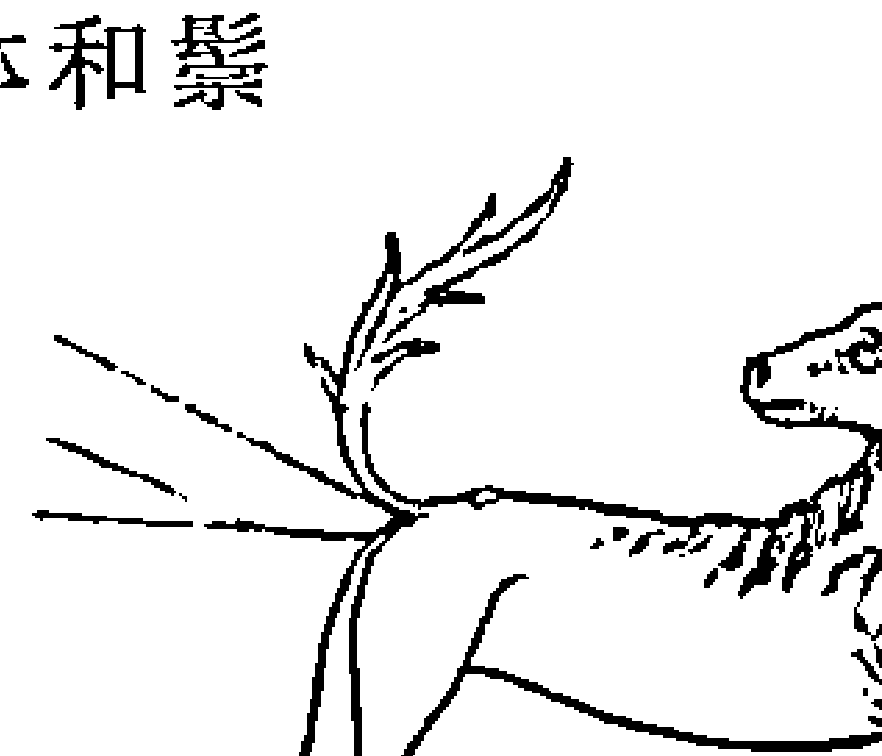

## 波洛卡

产自菲律宾（尤其是伊洛卡诺地区）的一种奇怪生物，波洛卡长着女人的头和胸部、马的身体和四条腿以及老鹰的翅膀。波洛卡猎杀人类，特别喜欢小孩子。

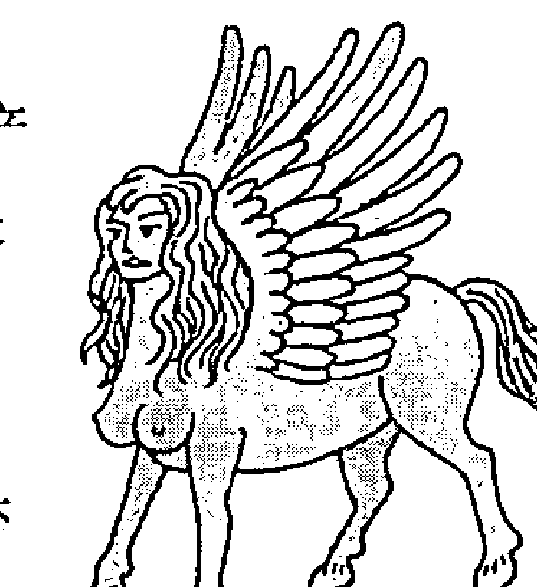

## 阿尔波拉克（Al Boraq）

（或拉克 Borak、布拉 Burak、“闪亮”）在穆斯林神话中，它是一种漂亮的飞马。它长着马的身体和脖子、漂亮的鬃毛、老鹰的翅膀、孔雀的尾巴、人的头、驴的长耳。它全身纯白、但翅膀、尾巴和鬃毛上却挂满了五彩斑斓、光芒夺目的宝石和珍珠。它的鼻息像香水一样，它能理解所有的人类语言。它最开始是大天使加百利的坐骑，它迈出一步的距离比人眼能看到的距离还远。穆罕默德骑着它在麦加和耶路撒冷之间走个来回只用了一转眼的功夫，最后他乘着它上到天堂。

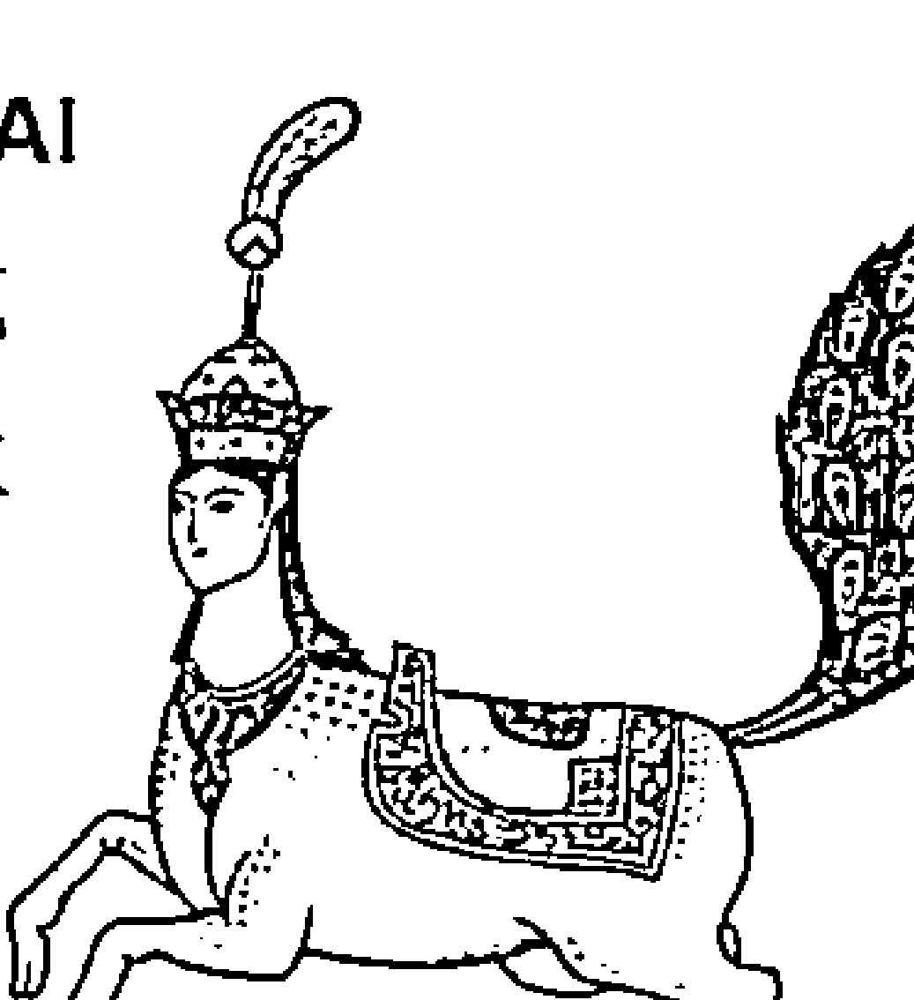

## 布阿（Booa）

一种据称产自东非塞内加尔的凶猛夜行动物。它就像一种毛色奇异的巨型鬣狗。它的名字来自它的叫声。参见克洛库塔（Crocutta）。

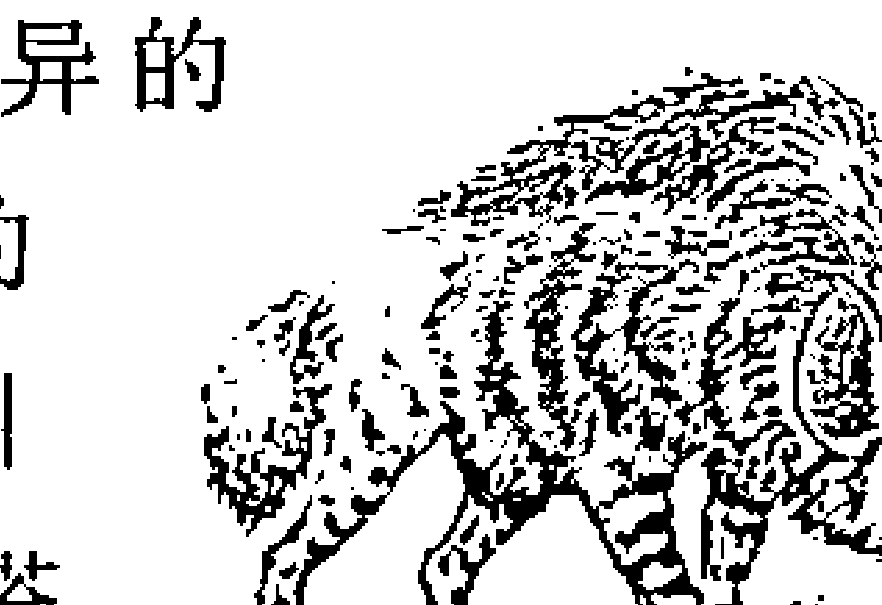

## 布布里（Boobrie）

一种产自苏格兰高地阿盖尔郡盐井和盐湖的大型、有网状脚的水鸟，它们捕杀靠水太近的野兽和人类。它的叫声不像鸟类的，而是一种恐怖的公牛的咆哮声。据说它们会变成乌修卡或水马的样子。

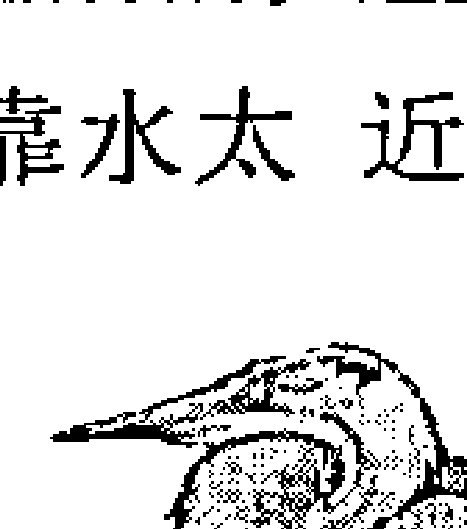

## 般若尼（Boreyne）

一种长着有刺舌头、弯角、背鳍、狮子前爪和鹰的后爪的纹章生物。

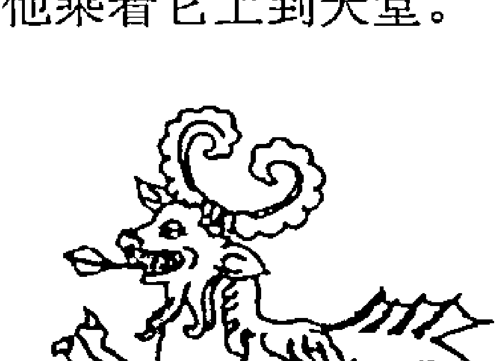

# 魔法师的怪物图鉴

布拉戈 (Brag) ——外形如一匹畸形的马。这种幽灵般的战马常出没于英格兰北部诸郡的荒野中，在那里它们会将路人引入死亡的深渊中。参见马形水鬼、福卡。

波罗斯尼 (Brosnie) ——一种十六英尺长、长着蛇头、会发光的水生爬行动物，这种生物让俄罗斯伏尔加河沿岸的捕鱼爱好者们胆寒。参见湖怪。

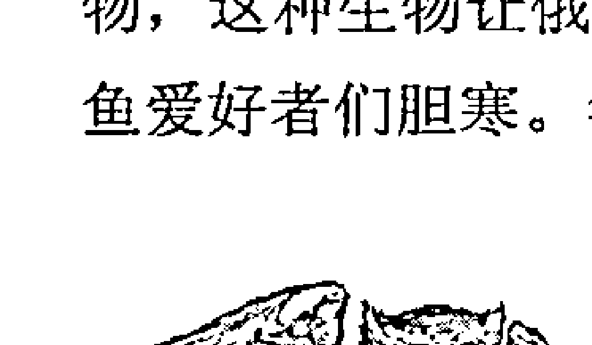

波罗克撒 (Broxa) ——东欧犹太传说中的种鸟，据说它会在夜间吸食山羊的奶水。然而在中世纪，据说这种生物喜欢吸血，有点像吸血蝙蝠。

布鲁查 (Brucha) ——全身长满铁钉、有着火红眼睛的爱尔兰怪兽。它们推倒树木进到葡萄园里，用背上的钉子将果实带给自己的孩子。《生理学》(Physiolog)中记载着伊尔西亚斯 (Ercius) (刺猬, Erinaceinae) 类似的故事，它很可能就是布鲁查的原型。

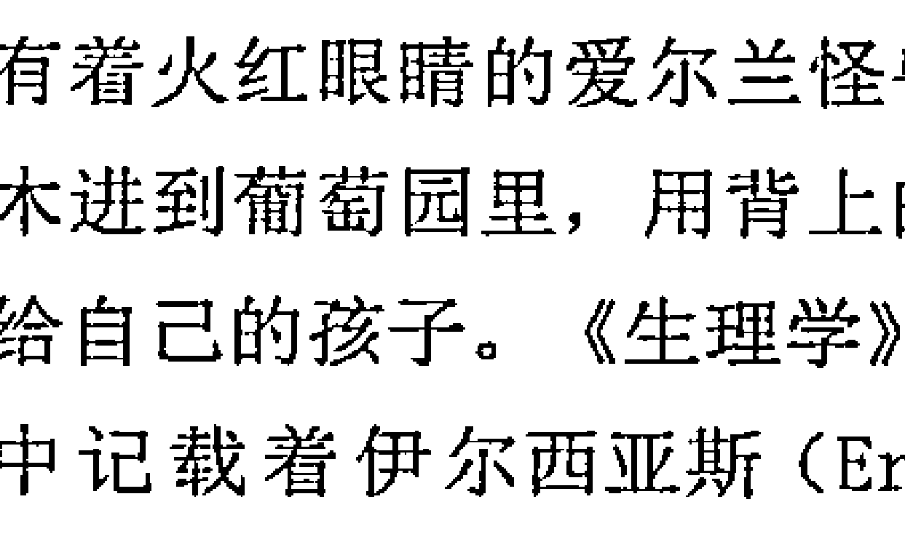

布阿塔 (Buata) ——新英格兰地区传说中长着大獠牙的巨型野猪怪，它猎杀人类，能听懂并且会说人类的语言。但它非常愚蠢，很轻易地就会被玩弄。

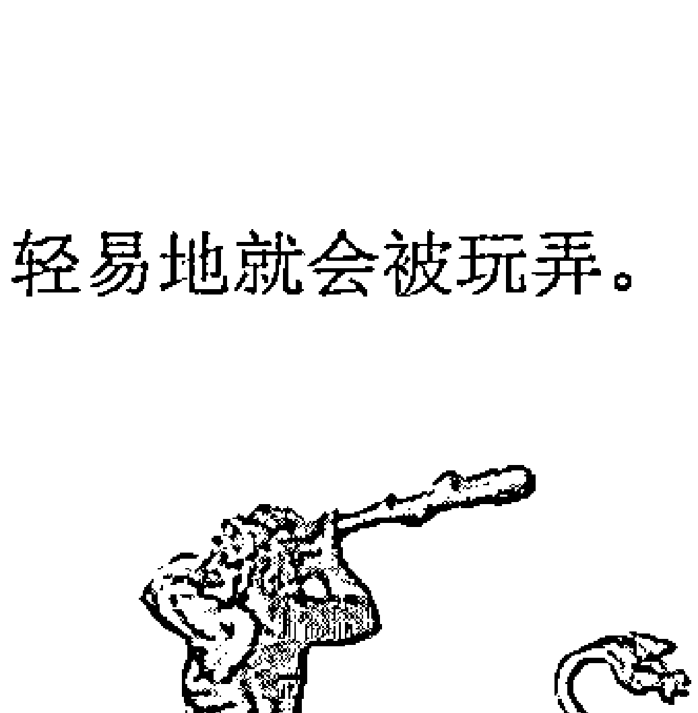

人头牛身怪——一种长着偶蹄、人头牛身的怪物。它与半人马和奥诺半人马有关。特里克牛头怪有时也被描述为它的样子。参见西巴尼 (Hea-Bani)。

布希斯 (希腊语中的“公牛”，也叫布克 Bukhe、布克西 Bukhe See) ——埃及神话中一种巨型公牛，是莫神 (Menthu) 位于赫尔孟提斯的宫殿中的圣物。它的毛发是倒着长的，每过一小时，毛色就会发生改变。参见埃皮斯神牛、麦尔握 (Merwer)、姆奈维斯。

布拉英 (Bulaing) ——澳大利亚卡拉杰里 (Karadjeri) 土著神话中的蛇怪。参见彩虹蛇。

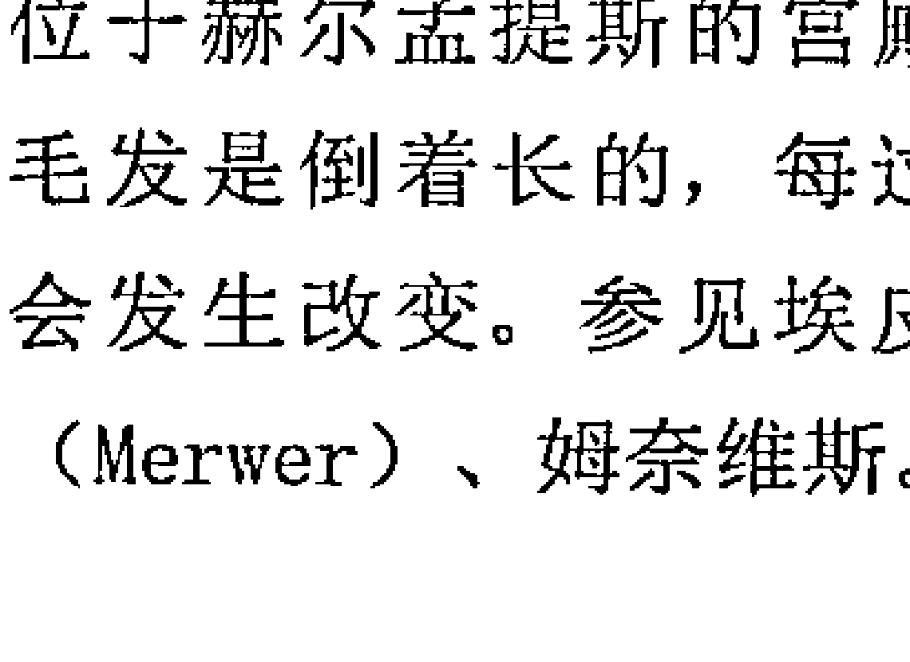

布尔钦 (Bulchin) —— (或毕孔恩 Bicorne, “双角怪”) 一种中世纪欧洲传说中的雌性怪物，据称是一个长着人脸、带着大大笑容的胖胖的黑豹。在十六世纪的教堂餐室中刻有它的形象。据说它以惧内的男人为食。它骨瘦如柴的伴侣，奇彻瓦彻 (Chichelvache)，以顺从的女人为食。

印度神牛——印度神话中一种巨型公牛，长着黄色的身体和巨大的、可向任何方向转动的牛角。一旦被抓住，它宁愿自杀身亡也不会被活着。参见卡塔宗（Catazonon）。

## 邦伊普 (Bunyip) [ “恶灵”，也叫做穆尔葛万科 (Moolgewanke)、堂塔巴 (Tuntabah)、堂那番 (Tunatpan)、维瓦 (Wee-Waa) ]

——一种凶猛、喜欢咆哮的水怪，据称它居住在澳大利亚内陆的死水沼泽、湖泊、河流和水潭底下。身体有两头小牛那么大，长得像一头黑色、有毛发的海豹或犀牛。有时据说还有长长的手臂、巨大的爪子、獠牙、鱼鳍、鱼鳞、翅膀、长尾、甚至还有羽毛。塔斯马尼亚人称其为“通天眼”，并将其描绘成蟒蛇的样子。它是吃人的怪兽。一些隐生动物学家认为它是一种巨型袋鼠，一种被早期土著人猎杀和描绘的大型冰河时期的有袋动物。参见湖怪。

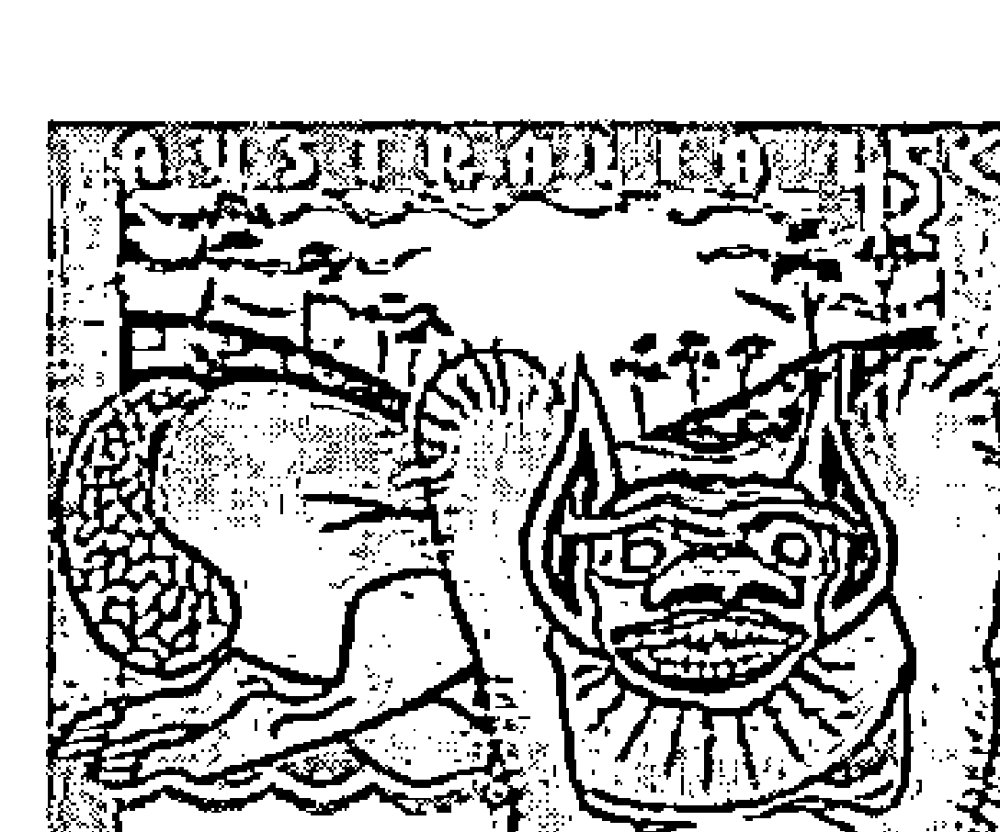

## 布拉克·巴哈蒂 (Burach Bhadi 或巫师的束缚)

——一种产自靠近苏格兰的西部群岛上浅湖的像大水蛭般的水怪，在佩斯郡也有人见到它们。在它们丑陋的脑袋上和背上长着九只斜斜的眼睛。如果有人企图从水面骑马通过，它就会吸附在马腿上把马和骑手拉下来，吸干他们的血。参见湖怪、蒙古死亡之虫、欧姆（Orm）。

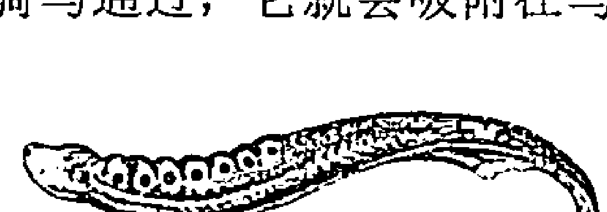

## 布鲁

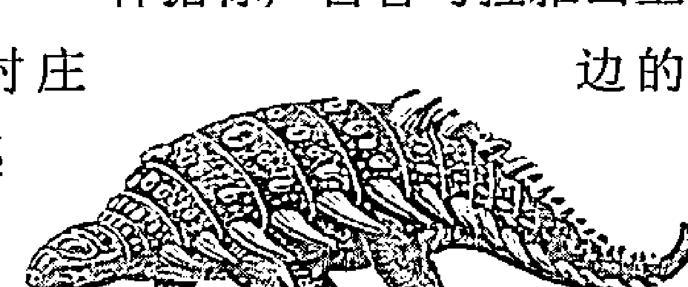

——一种据称产自喜马拉雅山上一个遥远村庄边的泥沼中的爬虫类怪物，1940年代它们因捕猎而灭绝。根据阿普塔尼人的传说，布鲁身长约12至15英尺，长着粗短有爪的腿，背上和尾巴上都有厚厚的铠甲。它的背上有三道短短的骨刺。它的身体蓝黑相间，腹部呈灰色。它的头呈三角形、牙齿平整、上下颚长有四支尖牙。生性胆小，远离人类，在旱季时都躲在沼泽中，但在雨季沼泽变成池塘时便会出来。这些描述与白垩纪时的甲龙，特别是钉背龙（如图所示）很相似。然而有些隐形生物学家则认为它是一种尚未被证实的巨型肺鱼。

## 布塞

——据称生活在赛西亚，它是一种像牛一样的灰棕色怪兽，长着牡鹿的头和角。据称它能通过改变身体的颜色来躲避猎人的追杀。人们相信它实际上指的是一种驯鹿（Rangifer Tarandus），驯鹿会因季节变化而换毛，毛色会从夏天的深棕灰色变成冬天的白色。参见塔兰德拉丝（Tarandrus）。

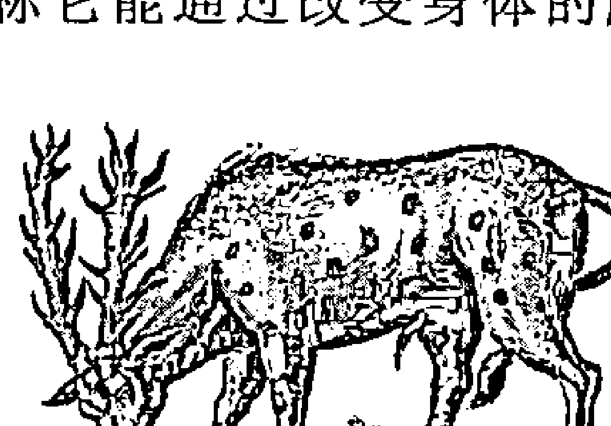

## 卜塔兹奇阿伊戈斯 (Butatsch-A-llgs)

——一种体型硕大、生性残暴、无形无影、腹部巨大、眼睛火红的怪兽，它栖息在瑞士一个名为拉斯奇尔斯（Luschersee）的湖中，这个湖据称是地狱之门。没有人敢在那里捕鱼，也没人敢在周围的山上往水里看。参见奎罗、淡水章鱼、格里威鲁（Glyryvillu）、回克回克（Hueke Hueku）、英温切（Invunche）、魔鬼鱼、米加斯（Migas）。

物，凯西猫像狗一样大。它全身黑色，只在胸膛处有一块白色斑纹，全身都覆盖着蓬松的毛发，它的背像拱桥一样高耸。在苏格兰纹章中它是一种很流行的装饰，在万圣节时经常被看到。参见野猫。

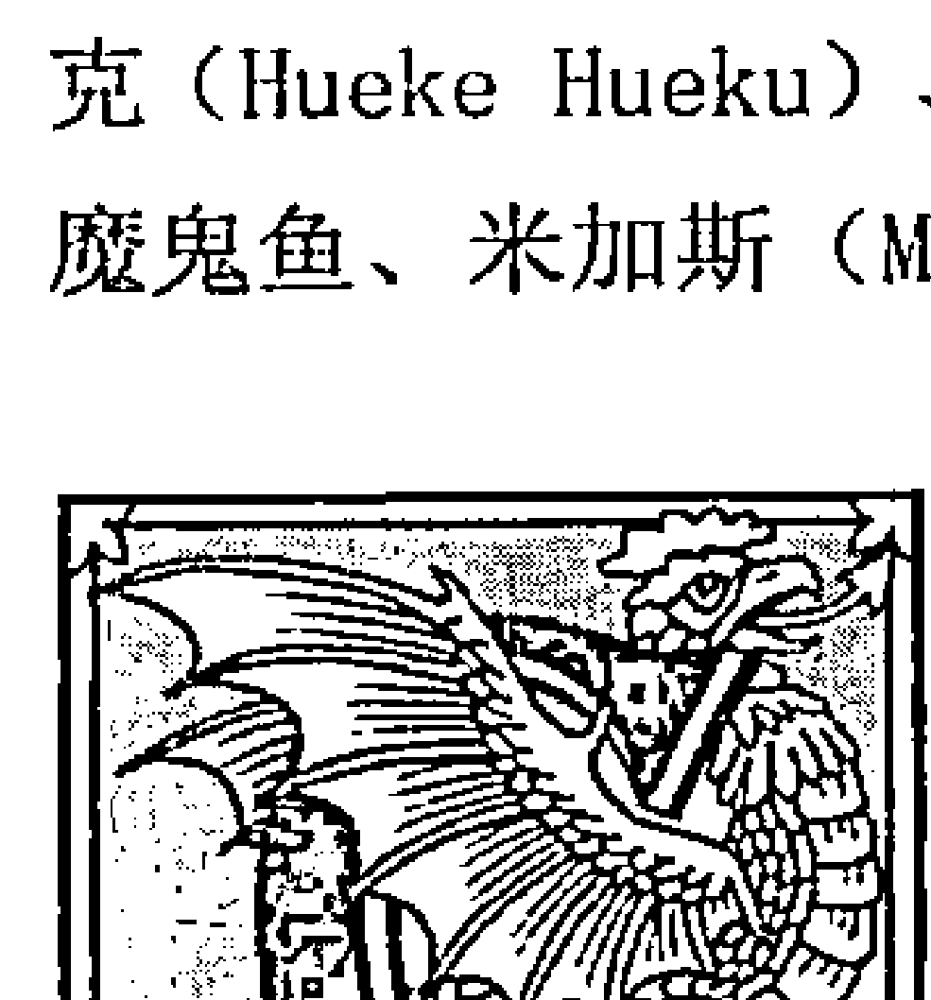

C 指的是蛇鸡兽，死亡的代言人，它的呼吸能让森林枯萎，长着蝙蝠翅膀还有龙尾，它的叫声能毁掉整片的栖息地。

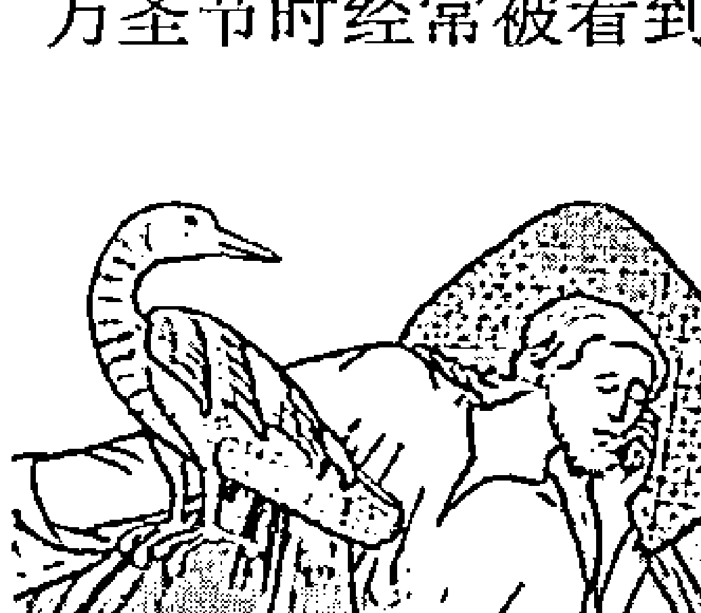

## 神鸟喀拉维斯（Caladrius）（或查拉迪斯 Charadrius、卡拉狄 Caladre）——

中世纪欧洲传说中的一种不可思议的白色河鸟，它能诊断出病人是生是死。如果这种鸟拒绝朝病人看上一眼，那么他就行将死去。它从病人体内带出疾病——特别是黄疸病，此时它的羽毛就会变成灰色。之后它飞向太阳，将毒素融解，身体又变成纯白色。亚历山大大帝在波斯发现了这种鸟，它的粪便能治愈白内障。科学家们将鸻科（Charadiidae）这个名字用来命名千鸟，但 T.H. 怀特认为它是一种鹡鸰（Motacilla Alba Linn），在爱尔兰，因头上像骷髅一样的斑纹，它仍然令人敬畏。

## 卡居斯(希腊文中“邪恶”的意思)——

存在于希罗神话中的这种动物是海菲斯特斯和美杜莎的后代。它有一个无腿的大大球形身体，有点像一只巨大的畸形蜘蛛。它脖子上长着三个鼻息如火、喷着毒液的人头。在白天它躲在意大利的伊特鲁里亚的台伯河中，晚上它悄悄溜出来杀死碰到的所有生物，把它们拖进自己的巢穴。赫拉克勒斯在完成第十项功绩回家时碰到了它并将其杀死。

## 卡秋娜——

智利传说中的一种大型犬怪，它有绵羊般长长的白色绒毛和茂密的三角形胡须。它出没于山间道路，让旅行者很害怕，它恐吓他们的马，偷走他们的食物。参见黑狗。

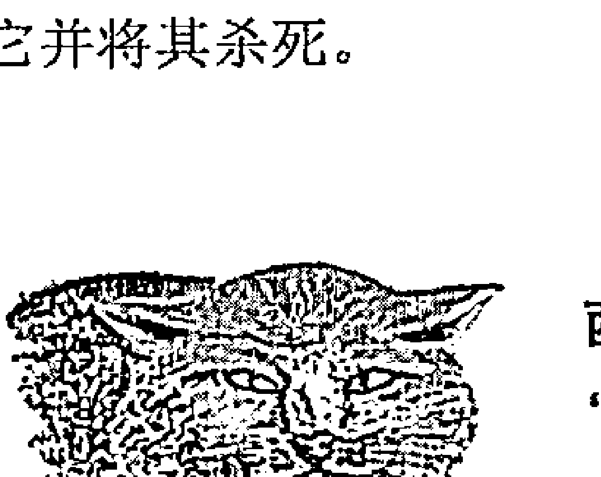

## 凯西猫（或西斯猫、西斯库、“灵猫”）——

苏格兰神话中的一种巨大的邪恶猫科动物，凯西猫像狗一样大。它全身黑色，只在胸膛处有一块白色斑纹，全身都覆盖着蓬松的毛发，它的背像拱桥一样高耸。在苏格兰纹章中它是一种很流行的装饰，在万圣节时经常被看到。参见野猫。

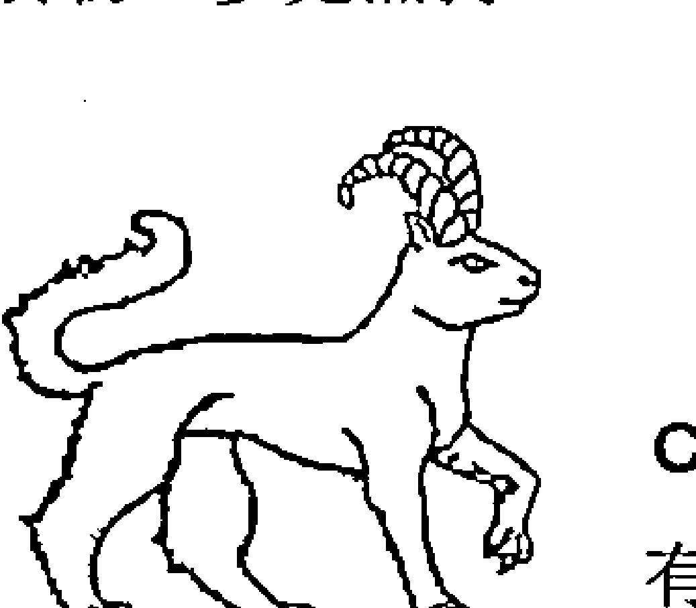

## 卡罗帕斯（Calopus）（或 Chatloup）——

一种有锯齿状尖角的羊形动物。生物，据称居住在波斯的幼发拉底河两岸。它有狼的身体、野猪的嘴巴、山羊的胡子、狮子的尾巴和牙齿，长有尖刺的背部、长着偶蹄的前肢和龙爪般的后腿。它在古巴比伦时代就有提及。最早的关于它的描述是在约公元1383年时，刻在英格兰诺福克郡雷文宁汉教堂中的木桩上雕刻。它的原型极有可能是黑羚羊（Hippotragus Niger）。卡罗帕斯能用尖角劈开灌木丛和树木。它的名字同样也被用于命名一种食用菇，丽柄牛肝菌（Boletus Calopus）。参见阿普塔勒昂、安塔罗普斯（Antalops）、野牛。

## 卡里格雷胡德 (Calygreyhound) ——

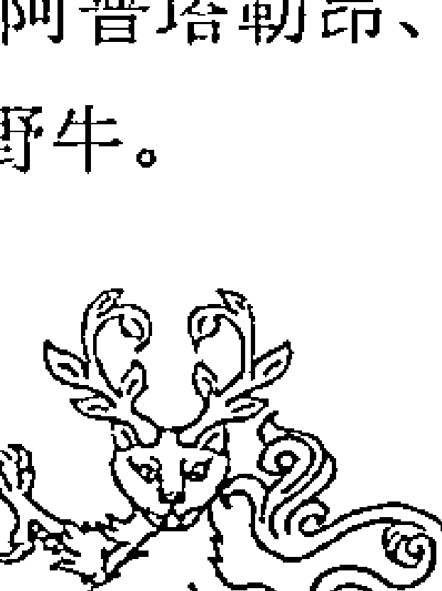

一种长着羚羊身、野猫头、鹰爪和牛蹄的纹章生物。通常它还被说成长有山羊角。德维里家族的头饰上有它的形象，代表着敏捷。

## 卡玛胡拓 (Camahueto) ——

智利奇洛埃群岛神话中的一种海怪，据称长相与牛、马类似，它在高山溪流中诞生，慢慢地顺流而下到达大海，一路上用它的利爪和尖牙在河岸上挖出许多沟壑。它们呆在巢穴中等待吞噬因海难而落水的水手。

## 卡米尔里奥帕德 (Cameleopard) （或卡密欧帕德尔 Cameopardel、卡米尔里欧帕达利斯 Cameleopardalis）——

据称是骆驼与豹子的后代，它有骆驼那么大，爪子却像豹子一样，头上还长着两支弯曲的长角。故苏美尔人认为它们拥有豹子的速度和胃口。它在纹章中被描述为天极附近某个星座的守护者。现在证实它就是长颈鹿（Giraffa Camelopardalis）。

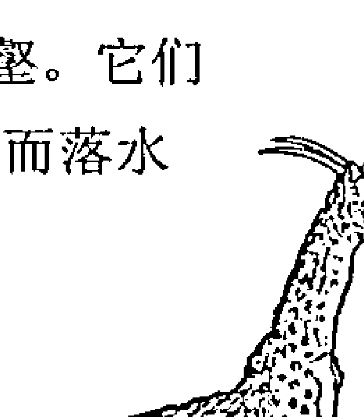

## 卡姆迪 (Camoodi) ——

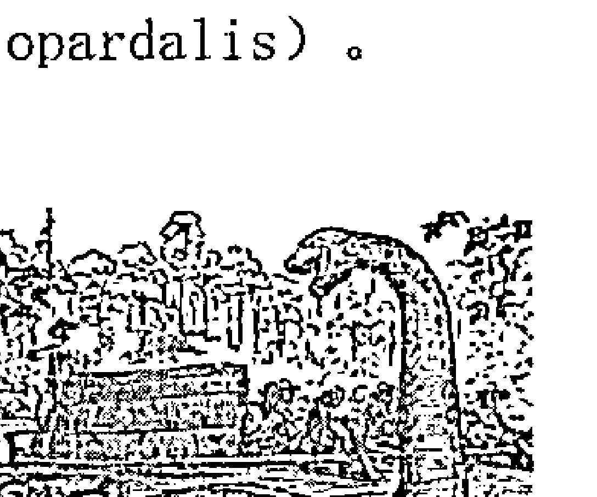

南美圭亚那土著传说中的一种巨蟒，有时它会被误认为是一根巨大的树干，它是卡姆迪森林的守护者。其原型可能是绿蟒（Eunectes Murinus，“善游者”），根据记录，它们的身长可达30英尺——甚至更长。参见马瓦蒂（Mawadi）、斯特普（Sterpe）、苏库里居吉甘特（Sucuri ju Gigante）。

## 坎帕克提 (Campacti) (或 Cipatli) ——

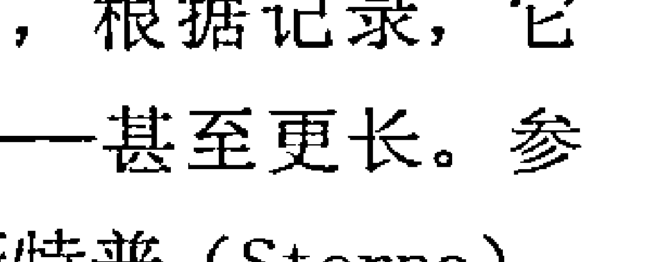

在墨西哥阿兹特克传说中，这是一种巨型古龙，大地是由它死去的身体所形成的。它的长相像一只鱼一样的鳄鱼。参见提亚美。

## 坎普 (Campe) ——

希腊神话“泰坦战争”中的一种怪兽，它们在森提曼斯（“千手怪”）和库克罗普斯（“独眼怪”）被捕的时候负责看守囚禁着它们的塔耳塔洛斯，即地狱。

## 坎伏羲 (Camphurcii) ——

一种居住在印度尼西亚摩鹿加岛附近海域的吃鱼海怪。特维在其16世纪的著作《宇宙志》中提到过它们，说它们有鹿的身体和前腿、鹅的后腿，前额中心还长着一支三英尺长的独角。

# 魔法师的怪物图鉴

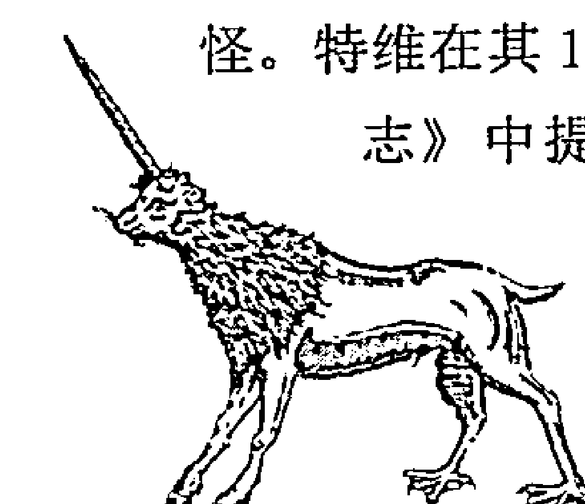

## 肯维岛怪兽——1954年，几只奇怪的海洋生物被冲上了英国肯维岛的海滩。

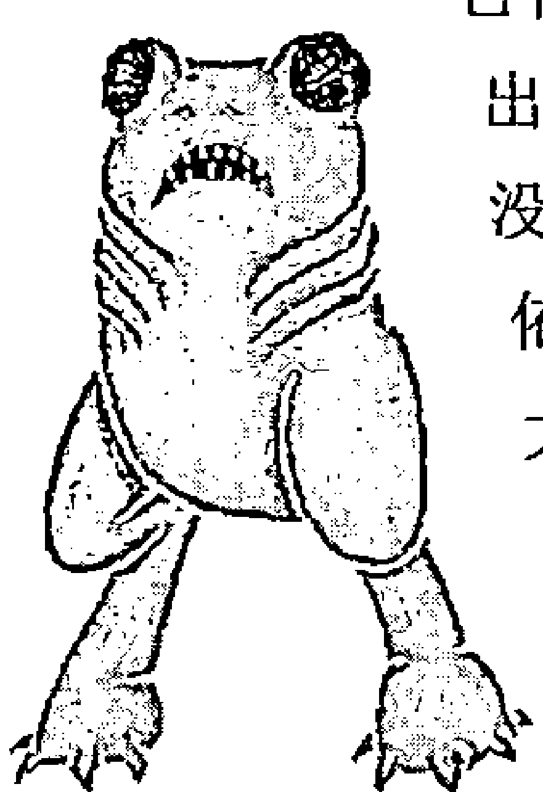

它们有圆圆的球形眼、突出的腮、两只长蹼的腿、没有手，所以它们可能是依靠双腿直立的，身高大约在3至4英尺。最终一位鱼类学者证实它们是琵琶鱼（Lophius Piscatorius），它们发达且长有关节的胸鳍经常被误认为是短腿。1967年在肯维岛岸边，人们发现了一个重达68磅的尸体。

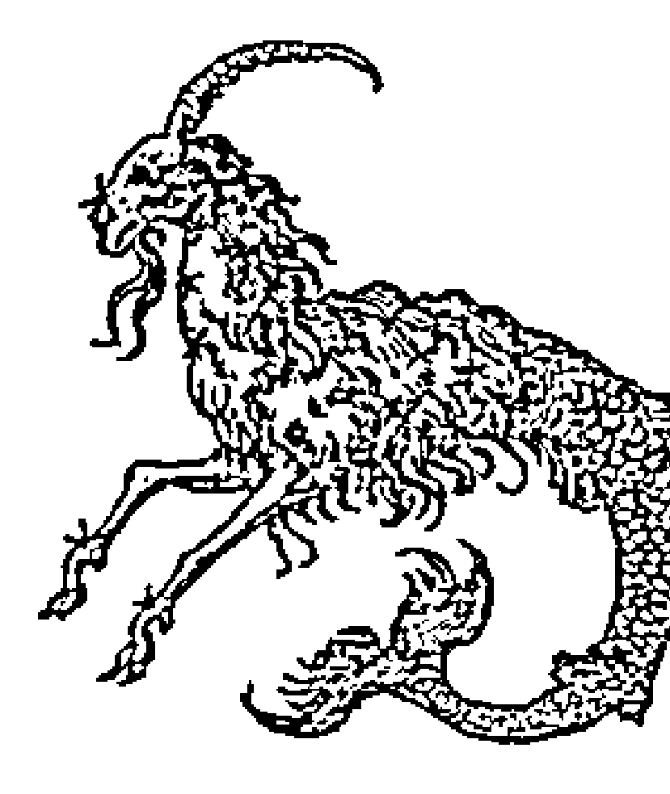

## 卡普里科恩斯（Capricorns）（希腊语中的“山羊角”）——

这种生物第一次被提及是在苏美尔神话中，它被认为是水神伊尔（Ea）的助手，最初它被描述为一只长着人脸的鱼，且与苏库尔·马苏（Sukhur-Mashu）星座，“山羊鱼”，有关。在希腊罗马神话中，巨龙提丰变成山羊鱼的样子追逐着山羊之神潘到了尼罗河里。宙斯之后将这种生物放置在天堂中作为摩羯座的守护者。参见摩羯座（Suhur-Mas）。

## 卡邦克（Carbuncle）（或卡邦克尔 Carbunkel、卡拉邦克 Carrabuncle）——

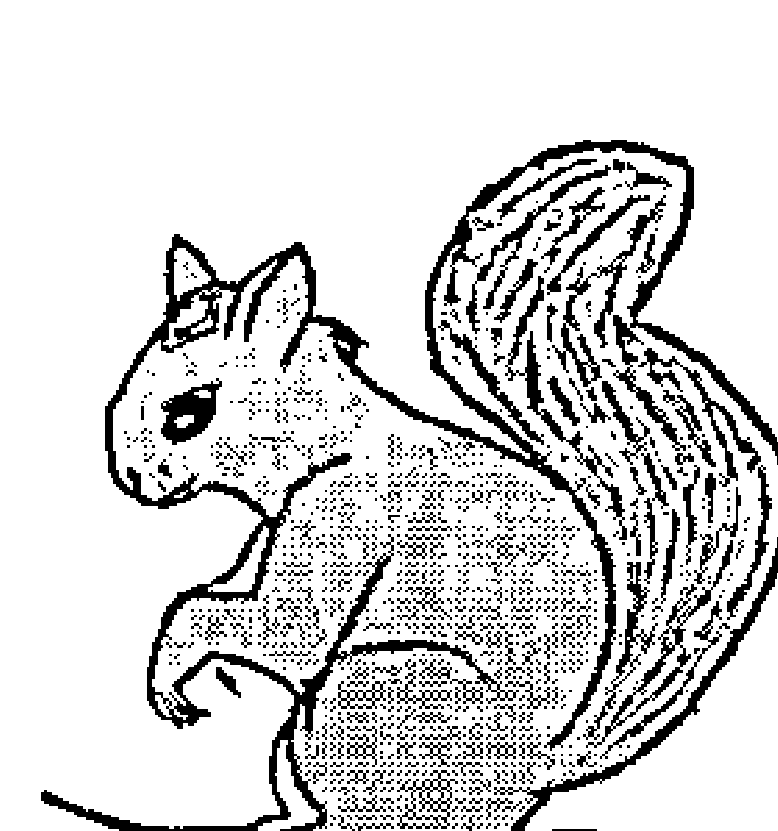

巴拉圭一种小型的像松鼠一样的生物，它的前额里有一颗红宝石（Carbuncle）。卡邦克来自早期南美西班牙探险者的故事。一种据称是爱尔兰基拉尼湖中淡水珍珠之源的生物也叫这个名字。

## 卡尔泰（Caretyne）——一种喷火纹章兽，它长着公牛的身体和角以及猪的嘴巴。

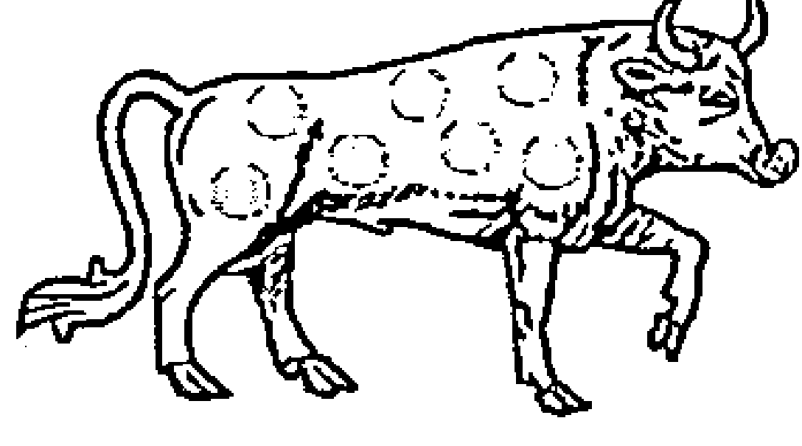

长有白底黄斑的它被一个都铎王朝时期的朝臣秀在自己的徽章上。

## 卡利斯塔（Caristae）——“能毫发不伤地穿过火焰的鸟类。”（大阿伯拉尔，公元1200-1280年）。

## 卡洛格（Carrog）（威尔士语中的“风暴”）——一种据称居住在威尔士格温内思郡康维谷的怪兽。

一旦被惊醒，它就会将山谷从头到脚清理干净。

## 猫鱼——一种猫脸鱼身的欧洲纹章兽。

在中国神话中，它能引发地震。

## 卡司普拉格（Cath Pulag）（威尔士语“利爪猫”，也叫卡帕拉斯 Capalus、差帕鲁 Chapalu、卡司帕拉克 Cath Paluc、卡司巴拉格 Cath Balug、卡司巴尔韦格 Cath Balwg）——这种威尔士和亚瑟王传说中的幽灵般的猫，喜欢捕杀人类和猫科动物来满足自己贪婪的胃口。它身上长有斑点，爪子巨大。一般人们认为它是威尔士国王放置在安格尔西岛上的进口豹子。参见野猫。

## 卡托贝勒帕斯 (Catoblepas)（希腊语 “向下看者”，也叫蛇发女妖）——

埃塞俄比亚和南埃及的一种牛一样的生物，身披龙鳞一样的铠甲、长着野猪般的獠牙、全身只有猪头样的头部上长有毛发。它吃有毒植物，一旦受惊它就会喷出有毒气体。老普林尼说 “和它对视过的人都会立即死去。” 因此，它也被冠以希腊神话中，能用眼神将人变为石头的美杜莎的 “蛇发女妖” 之名。早期的人将其描述为一种长着蹄脚的草食动物，但在1600年代，对它的描述变成了恐怖、有翅、利爪长牙的怪兽。居维叶认为它的原型是角马或牛羚。参见本纳科恩 (Bonnacon)。

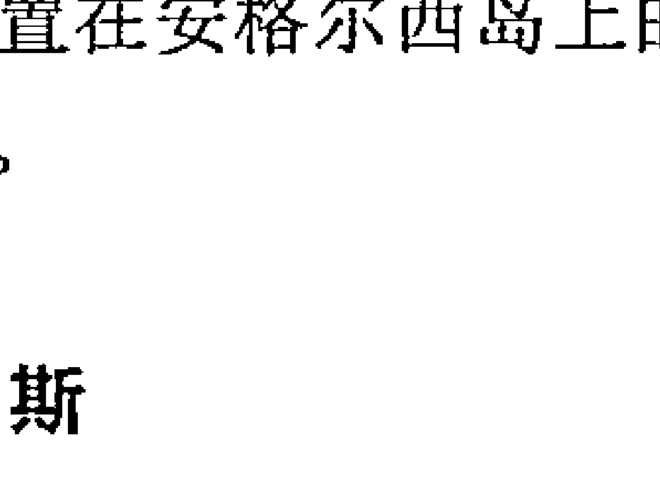

## 寇阿 (Ccoa) ——秘鲁盖丘亚印第安传说中像猫一样的怪兽。它身上长着灰黑相间的条纹，有巨大的头和两只大大的火一般散发光芒的眼睛。它能制造毁灭性的风暴，让粮食颗粒无收，在整个栽种季节中都必须要给它进贡才能使其安分守己。现在，这个名字已被用来命名美洲狮。

## 西斯戈 (Ceasg) ——

这些苏格兰人鱼非常危险。它们一半是人，一半是鲑鱼，只有找到并毁灭掉它们的灵魂才能杀死它们。然而，它们的灵魂被存放在海洋深处的容器中。如果一个人有幸捕获到一只西斯戈，它就会实现那个人的三个愿望。西斯戈曾与人通婚，他们的后代都是伟大的水手。

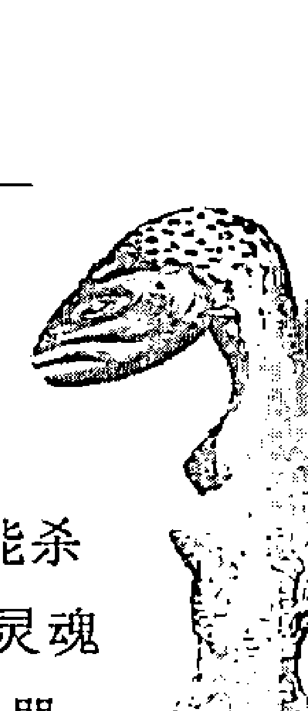

## 天马——一种中国的像狗一样的生物，它有黑色的脑袋和能飞的丰满的翅膀。参见珀伽索斯。

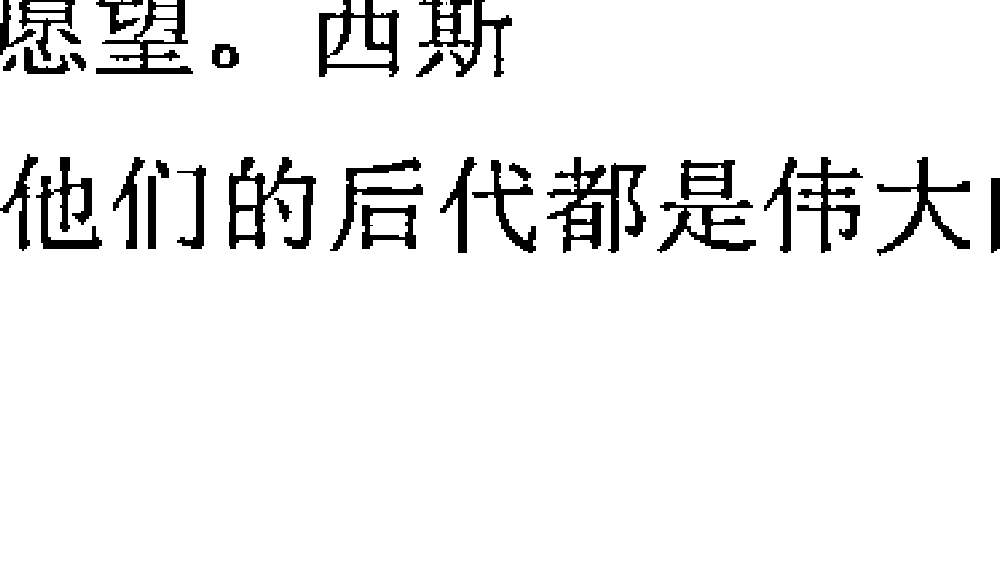

## 天鹿——中国神话中的一种会说话的鹿。它生活在天宫中，它能引导在地下迷路的矿工们找到珍稀矿脉。但一旦接触到地面，它就会化作胶状物。

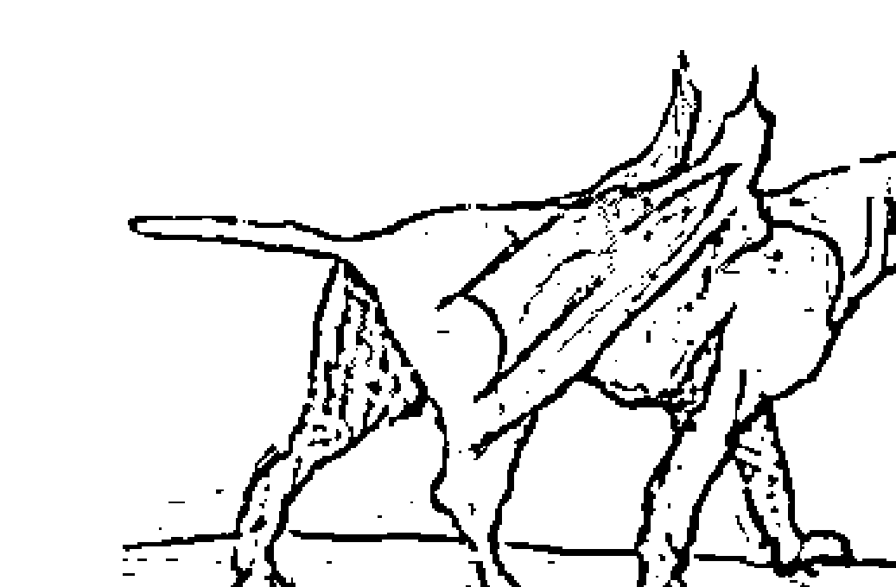

## 天虎——越南安南神话中四个方向的守卫者和统治者。兰虎统治东方、春天和# 魔法师的怪物图鉴

作物，红虎（从印度东部的桑德班斯地区开始）统治南方、夏季和火，白虎（现在通常被关在动物园里）统治西方、秋季和金属，而黑虎则是北方、冬季和水的统治者。除了南虎之外的三种老虎都有真正可对应的变种虎（孟加拉虎）存在。但在 1910 年，在中国的福建省，美国传教士哈利·R. 考德威尔遇见了“一只深蓝色的老虎。”

半人马[也叫伊克西尼德 (Ixionidae)，此名字源自它们的人类祖先伊克西翁 (Ixion) 的 ]——神话中的半人半马，最开始指一个人身后长着一匹马的身体和后腿。后来变成了在马身上长着人的躯干（准确地说，叫“半人半马”）。它们最先住在希腊北部塞萨利的珀利翁山上。大部分半人马都野蛮且好色，经常抢掠人类女子。但在希波达墨娅和庇里托俄斯，阿庇泰之王的婚礼上，它们喝醉了企图抢走新娘，之后它们便被赶出了塞萨利。但半人马喀戎却是一位仁慈而博学的老师，阿斯克勒庇俄斯、贾森、阿喀琉斯都是它的学生，它用自己不死之身作为交换救出了普罗米修斯。宙斯将其放在射手座上。半人马的故事来自那些从未见过人骑在马身上的人的误解。参见阿婆天哈尼（Apotharni）、半牛半人、半人半马怪（Hippocentaur）、半人马鱼怪（Ichthyocentaur）、半人半驴怪（Onocentaur）。

希尔菲斯 (Celphies) ——拥有牛的身体的埃塞俄比亚生物，“它的后腿从脚踝处一直到腿根都像是人的腿，同样地，它的前腿也像人的手”（Solinus，《非凡现象之集合》公元 200 年）。这听起来很像橄榄狒狒（Papiocynocephalus Anubis）。参见西诺西法里（Cynocephali）。

肯陶洛斯—特里同 (Centauro-Triton) ——希罗神话中一种无鳞的半人马鱼怪，它长着海豚的背鳍和尾巴。

百足虫（希腊语中的“百足怪”）——一种居住在日本琵琶湖附近的巨型食人怪兽。那个湖的龙王请求英雄秀乡帮忙除掉它，这位英雄用粘有它唾液的弓箭射入它的脑袋，杀死了它。龙王奖励给秀乡一口袋永远用不完的米，他以此喂养家人和后代。这个名字现在也指一种节肢动物——石炭纪时代的古蜈蚣虫——它们最长能达到 11 英尺！现存最大的是亚马逊巨蜈蚣（Scolopendra Gigantea），身长达 14 英尺。参见大海蛇（Con Rit）。

# 图鉴一、魔法动物展

森提科 (Centycore) （或森蒂科 Centicore）——一种索里努斯 (Solinus)（公元 258 年）所说的生活在印度平原上的奇异动物。它长着马蹄、狮腿、象耳、熊鼻、大嘴，额头上还有一支有十个尖角的鹿角。它的声音像男人，而且心狠手辣。尽管有很多种不同的版本，但在纹章中它等同于耶鲁 (Yale)。

喀德那的孩子，在最初的传说中，它有 50 至 100 个头。赫拉克勒斯在其最后的功绩中将其拖出了哈迪斯的王国。刻耳柏洛斯的唾液流经的所有地方都会长满有毒的乌头草（也叫做附子花或狼毒花）。后来，诗人俄耳甫斯用他的七弦琴将它引入梦乡。在罗马神话中，特洛伊王子阿涅阿斯和塞克给它喂食蜂蜜蛋糕就能让其安静下来（每个头喂一个！）。参见加姆、沙瓦玛 (Sharama)、索洛托。

角蝰（或角虫）——中世纪欧洲传说中的一种凶残蟒蛇，它把自己埋在沙子里只露出头顶上四只羊角般的尖角。当好奇的生物靠近时，它就会用毒牙捕杀它们，然后将其拖入沙中吃掉，跟蚁狮这种昆虫差不多。它源自 2 英尺长的北非角蝰 (Cerastes Cerastes)，这种动物在埃及很常见，而且它确实会把自己埋入沙中。

刻律涅牝雌鹿（或阿卡迪恩雌鹿）——一种长有金色鹿角、黄铜色蹄脚的魔鹿。欧律斯透斯曾要求赫拉克勒斯活捉一只给他。这些雌鹿住在希腊希利乌斯山的山坡上，它们被狩猎女神阿耳忒弥斯奉为圣物。它们会引诱猎手来追捕自己，直到这些猎手精疲力竭而死。它们跑得很快，赫拉克勒斯花了一整年的时间才终于在用弓箭射入它的一只脚的情况下，接近并驯服了一只。随后他包扎好它的伤口，把它带回给欧律斯透斯，而欧律斯透斯当场就释放了它。参见白赤鹿、扎拉拓洛哥 (Zlatorog)。

瑟伯勒斯（或刻耳柏洛斯、希腊文中的“地狱恶魔”）——这是一种长着龙尾的黑色三头巨犬，负责看守被哈迪斯和泊尔塞福涅统治的俄瑞波斯，即希腊文中的地狱。它对任何人都是只许进不许出。它的三个头分别代表过去、现在和将来，而且它们以万物为食。它是巨人提丰和厄

赛特斯（或凯托斯）——希腊神话中的一种凶残的海怪，波塞冬派其去摧毁菲利士海岸，因为该国王后曾放话说她的女儿安德洛墨达和海中仙女

涅瑞伊得斯一样美丽。为了平息海神，安德洛墨达被绑在迦法的一块岩石上作为祭品，就在赛特斯靠近她时，英雄珀尔修斯从旁边飞过，他刚刚杀死了美杜莎。珀尔修斯用蛇发女怪的头将赛特斯石化，救出了公主，娶她为妻。赛特斯被描述为长着狗头、身躯庞大还有一条分成两个锚爪的尾巴。它常被当作是一种凶猛的鲸鱼，科学家用它的名字“cetaceans”来命名鲸鱼和海豚。实际上，根据老普林尼所著：“这个安德洛墨达向其献祭的怪兽是被马库斯·斯考卢斯从犹地亚的迦法带过去的……它身长 40 英尺，其肋骨的高度就已经超过了印度象，它的脊柱有 1 英尺 6 英寸厚。”很明显，它是一种鲸鱼！它是天空中不朽的鲸鱼座，经常和其它海洋生物一起出现在中世纪的地图上。

### 獬豸 (Chai Tung 或 Hai Chiai) —— 一种中国的独角兽。参见麒麟。

### 查姆罗西 (Chamrosh) (或西罗格里芬 Cynogriffin) ——
波斯神话中的一种神奇生物，生活在索玛树下，强大的骏鹰（Senmury）则栖息在那棵树上。它的外形像只狮鹫，长着鸟的头和翅膀以及狗的身体，专门搜集那只大鸟每次降落时从树上抖落的成熟种子，并将其散布到各处。参见席兹（Ziz）。

（音译 Chan）——中国传说中的

一种巨蛤，它呼出的气息在水下形成珊瑚的宫殿，它与南太平洋和印度洋中能够形成珊瑚礁的巨型蛤蚌类似。它们的重量能达到 400 磅，直径能达到 5 英尺。

### 查恩查孔卡德纳斯 (Chancha con Cadenas)（西班牙语中的“铁链缠住的母猪”，也叫 Chancho de Lata “锡猪”）
——阿根廷传说中的一种生物，经常出没于科尔多瓦和布宜诺斯艾利斯周围的贫民窟和河岸小镇，当它沿着铁路和电报电缆奔跑时会发出震耳欲聋的响声，但在人抬头寻找响声来源的时候，这种幽灵般的猪就会凭空消失掉。

### 卡律布迪斯 (Charybdis) ——
盖亚和波塞冬的女儿，这种野心勃勃的海洋女神用海水淹没土地以扩张其父亲的疆域。作为惩罚，宙斯将其变成一个空洞的大嘴，在其表面布满了小洞。每天它要吸入和吐出海水三次，形成漩涡。它会吞掉所有靠近它的船只，这种大漩涡被安放在一条窄窄的海峡的一头，在另一头是同样可怕的怪兽，斯库拉，它有六个长满牙齿的头。在《奥德赛》中，奥德修斯因为这两个怪物而失去了船只和很多士兵，最后只能苟延残喘。习惯上，卡律布迪斯被放置在西西里岛岸边的墨西拿海峡中，海峡的另一头有一块叫斯库拉的石头。但海峡中的涡流并不危险，学者们最近认为它们存在的地方更有可能是在希腊西北部的司吉拉（Skilla）角附近。在那里也有很多种螃蟹和蝴蝶叫做卡律布迪斯。参见席雷恩克罗因（Cirein Cròin）。

### 獠犬人 (Cheeroonear)
这种澳大利亚传说中的肉食动物会捕杀人类。它们能直立行走，把长长的手臂拖在地上，而且长着狗的头。

### 克鲁非
智利和阿根廷阿拉坎尼安（Aracanian）印第安人传说中的熔岩怪，生活在火山熔岩中，以年轻少女为食。太阳神的两个女儿依靠能将其冰封的魔法剑来控制它，但它会时不时地逃走，造成火山喷发和地震。为平息克鲁非，处女会被作为祭品而投入火山中。

### Chiang Liang
一种中国的怪兽，长着豹身、虎头和人脸、长长的蹄脚，口中常叼着一条蛇。

### 奇彻瓦彻 (Chichevache)
（法语中的“骨瘦如柴的母牛”，也叫奇奇伐彻（Chichifache）“瘦脸”或听乮特Thingut）——它是身体肥胖的巴尔琴（Bulchine）（或双角兽）的伴侣，经常
在中世纪教堂的餐室中被画成骨瘦如柴、营养不良的母牛，长着很难看的人脸。据称它要吃那些对丈夫惟命是从的妻子，否则它就会被饿死。

### 喀迈拉（或奇美拉，“山羊”）
一种希腊神话中的喷火怪，长着山羊的身体、狮子的头、龙的尾巴。奇怪的是它经常以多头的样子出现，这与传言中它本身的样子不符。它是厄喀德那和提丰的后代，它残暴地统治着小亚细亚的里西亚国。柯林斯的英雄柏勒罗丰乘着飞马珀伽索斯杀死了它。它有可能是源自该国的一座著名山峰，那座山会排出天然气。根据塞尔维乌斯（公元四世纪）的记载：“奇美拉山上冒出了火焰。在山峰下住着狮子，在山腰处居住着野山羊，在山脚下有蟒蛇出没。”最终，奇美拉成了所有不太可能存在的杂交生物的代名词。在今天它被用来命名转基因器官。它还是一种奇怪

### 角端（Chio-tuan）
一种中国独角兽麒麟的变种。在十三世纪，一支成吉思汗的探险队在准备进攻印度时在该国北边的沙漠里遇到了它。它长得像一头鹿，身上有绿色的皮毛，头上有一支角，它对士兵们说：“现在是你们的主人回到自己国家的时候了。”当成吉思汗听说了此事，他取消了进攻印度的计划。

# 魔法师的怪物图鉴

蠢忡（Chonchón）——一种居住在智利的危险生物，长有人头和能用来飞行的大耳。只有巫师能看见Chonchón，它拥有和巫师同样的魔法力。参见飞头、Leyak。

中美洲、墨西哥、波多黎各人所目睹。不同地区的目击者对它的描述也不尽相同，大多数目击者都是农夫，他们都害怕它是一种吃家畜的猎食者。有人称它用四只爪子行走，有些人说它们用两只。它的眼睛是红色或黑色的，有长尾巴，有时还有蝙蝠样的翅膀。在站立时，身高在3至5英尺之间，身上有鳞片，有时背上还有毛发或骨刺。参见易特奎恩提力珀特左特里（Itcuintilipotzotli）。

Ch’ou-T’i——中国传说中一种复合怪物，据称它在身体的两端都各有一个头，有点像双头蛇和杜利特博士的两头羚（Pushmi-Pullyu）。它居住在红河西边的王国里。

## 崔缇（Chuti）——一种居住在尼泊尔伊斯瓦（Iswa）山谷和绰亚德（Choyand）山谷的凶猛生物，常见于传统艺术作品中。它有像老虎一般条纹的身体和狗的脑袋。它是条纹鬣狗（Hyaena Hyaena）。参见拉克洛兽（Leucrocota）。

## 刍褚纳安（Chuchunaa）[通古斯语中的“放逐者”，也叫穆棱（Mulen“强盗”），和西伯利亚雪人]——这种西伯利亚原始人，或“类人猿”身披动物的皮毛，这让一些科学家们认为它们是残存下来的尼安德特人。目击报告称它们很高、模样像人、肩膀宽厚、眉骨突出、头发长而黯淡且时常有皮毛般的颜色。参见阿尔马斯、原始人、乌德瓦萨（Wudewasa）。

呲高（Cigau）——苏门答腊的一种极富攻击性的神秘猫科动物，棕褐色的毛皮上没有斑点，它有着短尾巴和环绕脖子的鬃毛。它比苏门答腊虎要小一点，但是却更重。参见西马郎泼（Seah Malang Poo）、西表山猫（Yamamaya）。

## 卓柏卡布拉（Chupacabra，西班牙语中的“夜鹰”）——一种非常奇异的生物，几十年来一直被

## 呲高瓦乌（Cigouave）——一种海地巫毒传说中的掠食动物，长着狮子或豹子的身体和人的头，来源于十六世纪传教士对印度狮蝎的描述。

## 兹雷·库洛恩 (Cirein Croin) (盖尔语中的 “灰色皇冠”，也叫 Curtag Mhor a’ Chuain “海洋大漩涡”、 Mial Mhor a’ Chuain “海洋巨兽”、 Uile Bheisd a’ Chuain “海怪”) ——根据苏格兰的民间传说，它是一种曾经存在过的巨大海蛇，能够一口吞下整条鲸鱼。它既有可能是源自在阿盖尔和比特岛之间的斯卡巴岛 (Scarba) 和朱拉岛 (Jura) 群岛处的克里雷坎 (Corryvreckan) 漩涡。在最剧烈的时候，这个漩涡有 300 英尺宽、100 英尺深，能将附近的船只吸进去。参阅卡里波蒂斯 (Carybdis)、挪威巨蟒。

它的天敌是鼬鼠。它和蛇怪都源自埃及的喷毒眼镜蛇 (Najia Nigricollis)，这种眼镜蛇能将毒液从毒牙中准确地摄入敌人的眼睛里。它是一种非常流行的纹章兽，后来被用来命名一种亚美尼亚的毒蜥蜴，以及都铎时期的一门大铜炮。

## 鸡鱼兽——一种纹章兽，长着公鸡的头、翅膀、爪子和鱼的尾巴。

## 窄吻鳄 (Cocodryllus) [或可肯蒂利尔 (Corkendril)]——虽然对其的描述通常都非常奇异，但它仅仅是一种吓人的 30 英尺长，有番红花或西红花颜色的彩色鳄鱼。

埃及的尼罗河鳄 (Crocodylus niloticus)、印度尼西亚和澳大利亚北部的河口鳄 (Crocodylus porosus) 都能长到它那么大，但它们大多都是灰色下腹是泛黄色的。

## 克利夫登水马——与其他水马一样，这种水马也是半水生的卡尔比，据说它住在奥纳 (Auna) 湖和沙纳克福尔 (Shanakeever) 湖这两个位于爱尔兰克利夫登的冰川山谷湖中。参见马头怪、湖怪。

## 蛇鸡兽——原产北非的蛇纹怪物，据称是一只长有龙的尾巴、蝙蝠的翅膀的公鸡，有剧毒，其眼神和呼吸都能致人死地。

它能从远处让树上的水果腐烂，任何它喝过水的水体都会被污染，几百年不消退。据说它出生于一只公鸡的蛋里，由蟾蜍孵化出来。像蛇怪一样，

## 科杰亚么尼亚 (Coje ya Menia) (葡萄牙语中的 “水狮”，或蒂拉里 Dilali、毛罗恩高 Mourou-Ngou) ——一种据称生活在非洲安哥拉东部的大型两栖动物。

它比河马略小，通常生活在河边，但在雨季会上到陆地上，这时可能会在夜间发出响亮的怒吼。它会猎杀河马，然后逃离现场。虽然有人说它拥有马的身体、狮子的鬃毛和爪子，但它很可能是一种尼罗鳄 (Crocodylus niloticus)。参见开赛鳄。

## 科洛科罗（Colo–Colo）
——智利阿洛克印第安人传说中噩梦般的魔鬼，它徘徊于睡觉的人的枕边，吸走他们的唾液，让他们因脱水而发热。和蛇鸡兽一样，它也是从黑公鸡的蛋里孵化出来的。

## 库尼格特（Coonigator）
——一种凶猛的哺乳动物和爬行动物的混合生物，它在珀尔贴山附近的露营地被发现时正在翻找垃圾箱。据称它像浣熊那么大，长着厚重的灰色皮毛，它的脸酷似鳄鱼。在近几年间，关于它的目击报告越来越多。

## 孔特朗奴欧西（Con Tram Nu’ O’ C）
——泰国民间传说中一种巨型水牛。

它能在包括水面在内的任何表面行走，

一瞬间就能跨越很远的距离。任何捡到它毛发的人也能和它有同样的能力。参见拜恩斯萨苏拉（Bhainsâsura）。

## 柯克契尔乌阿萨斯克（Corc-Chluasask）
——苏格兰、爱尔兰泰尔伯赫尤伊斯戈（Tairbh-Uisge），或水公牛的后代，它们常以长着天鹅绒般皮毛和裂口耳朵的小牛形象出现。为了保护自己的牛群，斯凯岛上的农夫会杀死任何出生时耳朵畸形的小牛。

## 柯尔尼
——在爱尔兰的传说里，它是一种被圣帕特里克流放到德格湖恶魔般的黑鸟，它被囚禁在名为圣帕特里克炼狱岛上。

## 克诺瓷尼（Conopenii）
——波斯神话中会喷火、长着驴头的巨型马。

## 大海蛇（Con Rit）
——一种在1883年被冲上越南阿龙海湾（Along Bay）海岸从而被人发现的巨型蜈蚣般的生物。它名叫大海蛇（“蜈蚣”），有60英尺长、3英尺宽，头顶是暗棕色，腹部是黄色的，身体上长着3英尺×2英尺规格的六角形角质壳。每一个角质壳两旁都有28英寸长的细丝。隐生动物学家卡尔·舒克认为它是一种无脊椎动物，或是一种巨型等足类或尚未被发现的水生纯足纲动物。参见多鳍海蛇。

## 纳吉牛（Cows of Näkki）
——一种爱沙尼亚民间传说中像水牛一样的怪物。它们是被纳吉（Näkki）（一种类似于爱尔兰水卡尔比的巨型水马）从地狱中带出来的。据说人一旦捕获它，就可以用它产出优质牛奶。参见泰尔伯赫尤伊斯戈、水公牛。

## 影片《黑礁》中的生物
——一种出现于三部环球公司电影中的人鱼：《黑湖妖谭》（1954）、《造物复仇》（1955）和《怪物就在我们中间》(1956)。在第一部电影中，沿亚马逊河而行的古生物科考队发现了黑湖和它里面的史前生物。科学家们捕捉到了这个生物，但最后被它逃脱掉。后来它回来抓走了女研究助理，其他人不得不去营救她。这种生物已经进入到我们的文化中，多年来有很多关于其类似的生物的目击报告。剑桥大学的珍妮·克拉克在一个曾是散发着恶臭的沼泽地里发现这种两栖动物化石的时候，她给它起了一个希腊名字 Eucritta Melanolimnetes（“黑湖怪物”）。参见蛙人、鳄鱼人、忒提斯湖腮人、绿爪怪、尹士罗 (Intulo)、蜥蜴人、拉夫兰怪蛙、密尔湖湖怪、新泽西鳄鱼人、普格维斯 (Pugwis)、南卡罗莱纳蜥蜴人。

### **克洛丘 Crocho**

一种大鸟，据称居住在非洲之角的卡普戴普 (Cape Daib)（科连特角）。一个人从它的一只翅膀走到另一只要走 60 步。它能背起大象。根据《士毛罗》（1459年）中的记载，在1420年，一艘放置在岸边的小舢板上的人发现了一只这种鸟的蛋，说它“像一只大木桶（一种容积达126加仑的木桶）那样大”。参见鹏鸟。

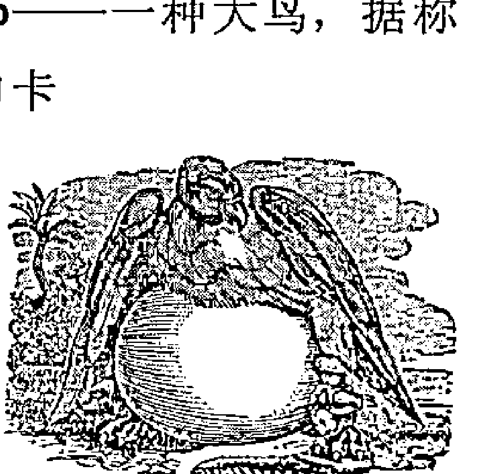

### **克罗克塔 (Crocotta) [也叫克欧洛克塔 (Corocotta)、克罗克特 (Crocotte)、斑鬣狗、库克罗库特 (Curcrocte)、西诺力卡斯 (Cynolycus)、勒乌卡洛塔 (Leucrota)、罗索玛查 (Rosomacha)、阿柯博、阿拉兹伯**

——印度一种驴子大小的狼狗，长有狮子的身体、鹿的四肢、声音像人。它没有牙齿，进食时用多骨的嘴巴咬碎猎物后再整个吞下。它的眼睛不能转动，四处张望时它只能转动身体。它源自早期血麋兽 (Leucrotta)。克特西亚斯 (Ctesias) 称其为西诺力卡斯 (Cynolycus) (“狼狗”)。它也被称作耶拿 (Yena)、阿卡波 (Akabo)、阿尔扎波 (Alzabo)、扎波 (Zabo)、阿娜 (Ana) 和很多其它的名字，是一种与鬣狗 (Crocuta Crocuta) 相同的食腐动物，但却有羚羊的一些特征。参见劳姆泼 (Rompo)。

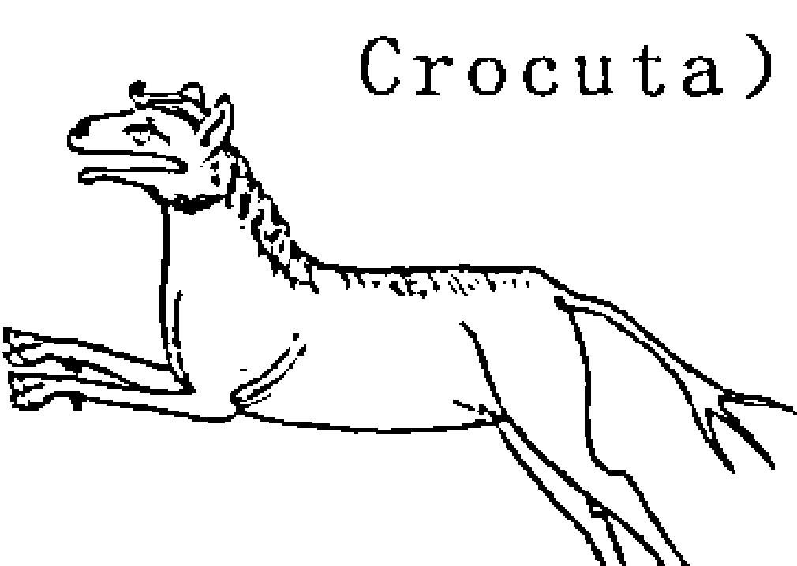

### **克洛德辛德赫 (Crodh Sidhe) （盖尔语中的“神牛”）**

——在爱尔兰传说中，这些“海牛”住在海中，以海草为食。它们有些全身纯白，有些则长有斑点，都有红色的耳朵。它们的原型可能是一些海洋哺乳动物，如极地探险者在 1768 年证实过的斯特拉海牛 (Hydrodamalis Gigas)。

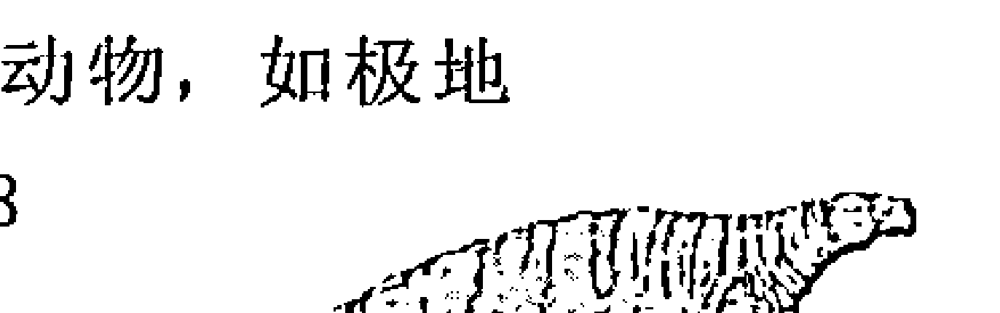

### **库图鲁（或大库图鲁）**

——一种由恐怖小说家 H·P·拉夫克拉夫特 (1890-1937) 创造出来的恐怖外星生物，已成为多个领域的流行标志，经常出现在角色扮演游戏中、T恤上、车尾贴、甚至长毛玩具中。在他的《库图鲁传奇》中，拉夫克拉夫特创造出一个在我们世界之下的神奇世界，在那里居住着古代的物种和黑暗“大神”。它们的统治者是大库图鲁，它长着畸形的章鱼头，在数百万年前和族人一起从遥远的星球来到这里，居住在拉莱耶城里统治世界。在拉莱耶沉入太平洋后，它所有的臣民都陷入了昏死状态，等待那座城再次升起的那天重新出来横行天下。

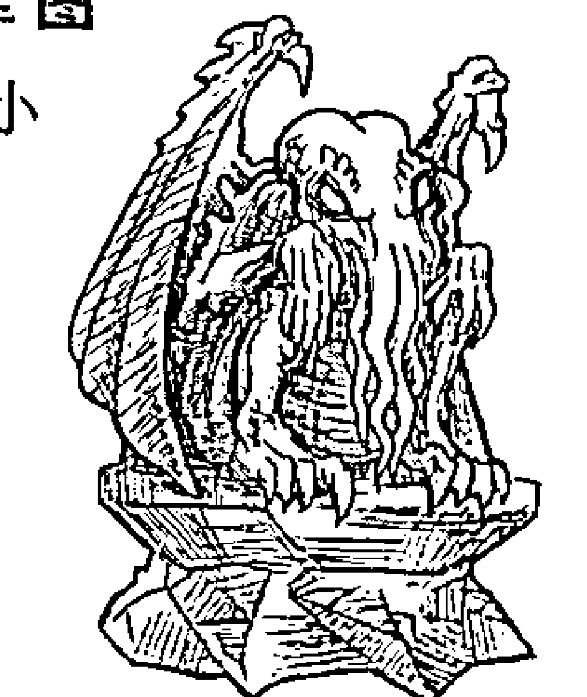

### **库 奎 欧 (Cucuio) （ 或 柯 奎 义 Cocuie、火虫、火甲虫）**

——一种生活在西印度、会发光的小型鸟类。这种大拇指大小的生物有四只翅膀和会发光的眼睛。据说古巴和安地列斯群岛的穷人捕捉它们来当作灯笼，但必须在早晨将它们放生以重新获得发光的能力。很明显，它们其实是一种热带萤火虫（Lampyridae），现在已知的已有 2000 种。据说克里奥尔的女性还用它们发光的幼虫来装饰自己的头发，就像带上珠宝一样。古代中国人也同样会把萤火虫放进透明的容器中，将其当作短时灯笼使用。参见阿里坎托（Alicanto）、尔辛尼（Ercinee）。

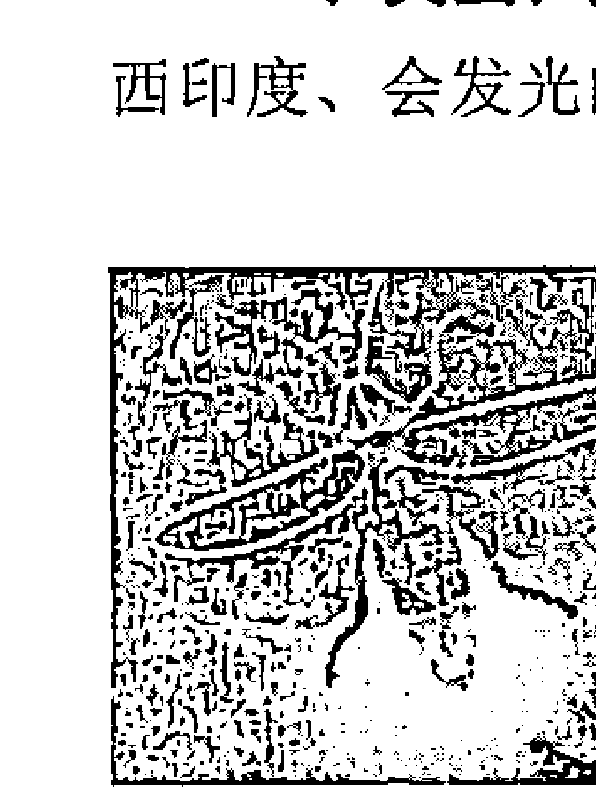

### **奎罗（西班牙语中的“牛皮”，也 叫 作 El Trelquehuecuve、El Bien Peinado “平头怪”）**

——据称生活在内乌肯南安第斯省的拉喀湖中冰水中的怪物，它是一种巨型而危险的水怪，据说长得像牛皮，还有有爪的触须和很多只眼睛。根据传说的内容，这种怪物是源自一种掉入水中还能生还的驴的皮，它能缠绕并吞没碰到的所有生物。它将自己摊开在石头上晒太阳，还能引起风暴。它居住在淡水中，叫声很像巨型章鱼。日本的煎饼章鱼（Opisthoteuthis Depressa）的特点与之相吻合。参见卜塔兹奇阿伊尔格斯（Butatsch-Ah-Ilgs）、格里威鲁、淡水章鱼、回克回克、英温切（Invunche）、魔鬼鱼、米加斯（Migas）、俄克拉荷马章鱼。

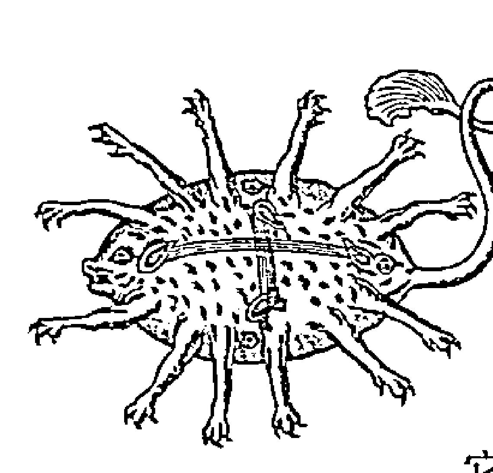

### **西纳莫尔阿斯（Cynamolgus）**

——这种阿拉伯的“肉桂鸟”用远处的肉桂来在棕榈树端筑巢。搜集香料的人用铅制弓箭将它的窝打下来。它的故事与凤凰相同，同样都是用肉桂和其他阿拉伯香料来筑巢。

### **库耶列布希**

——西班牙传说中一种巨型有翅蟒蛇，负责看守藏在瀑布下洞穴中的宝藏。任何找寻宝藏的人都不会再回来。参见阿姆费特尔（Amphitere）。

### **西诺西法里 (Cynocephali) （希腊文中的“狗头怪”）**

——这种动物据说在埃塞俄比亚很常见，它们有着黑色的、长满毛发的人形身体和狗的脑袋。这种残暴的生物被认为是橄榄狒狒（Papio Cynocephalus）。而3英尺高的马达加斯加狐猴（Indri Indri）看起来也像一种矮小的狗头人，因为它在站立和坐着的时候背都打得很直。参见希尔菲斯、曼帝可拉（Manticora）、斯芬克斯、乌尔福尔（Wulver）。

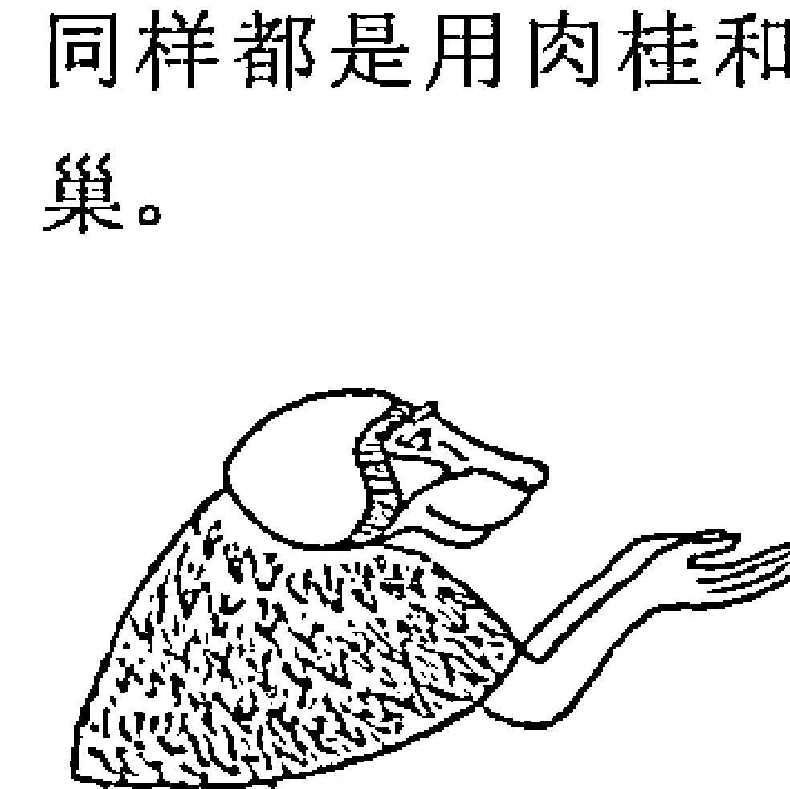

### **西诺夫若瑟皮（Cynoprosopi）** ——撒哈拉沙漠龙，与中国的鹰龙（Ying-Lung）类似。

它们长有蓬松的皮毛、狗的脑袋、浓密胡须的口鼻、蝙蝠的翅膀，以山羊和羚羊为食。

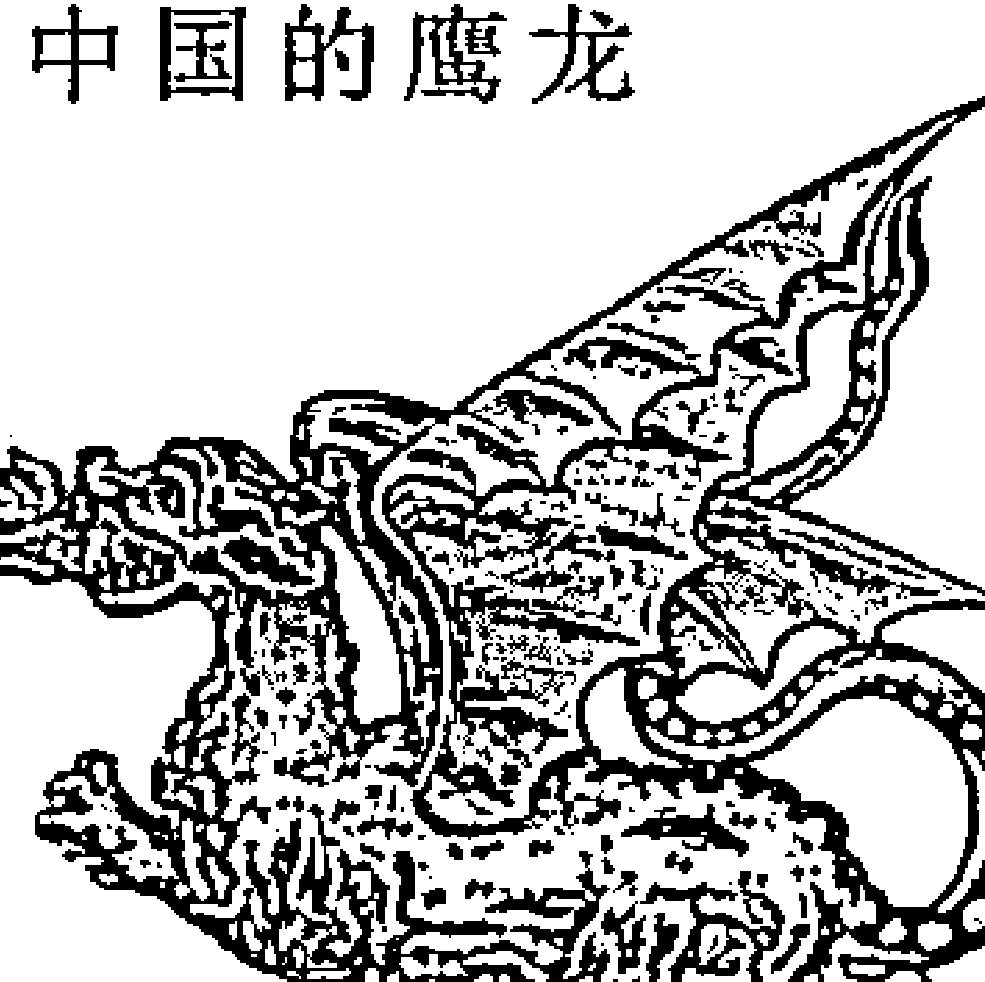

D 指的是住在远方的龙，它身上的每一块鳞片都像星星般闪耀。黄金是它守护的宝物，贪婪是它闻名于世的特性，在神话中充满了龙之火焰。

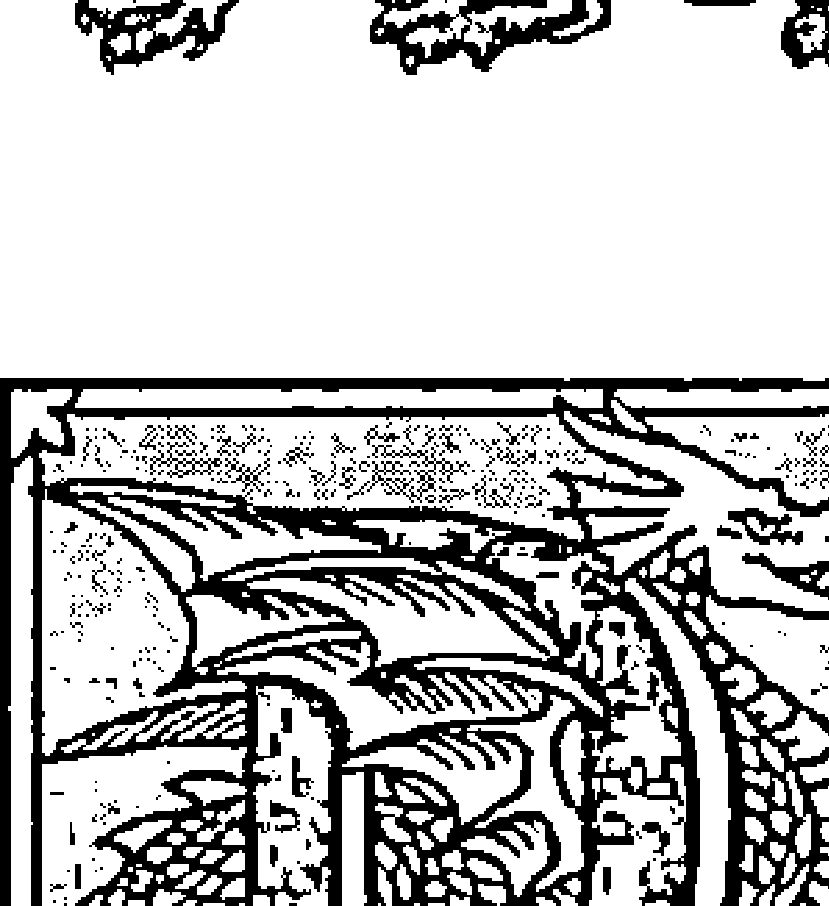

### **天马达第克罗（Dadhikra）** （或Dadhikravan） ——印度神话中的一种美丽白马，与珀伽索斯类似。它用老鹰的翅膀穿行于天际，是月亮的化身。

达尔——一种澳洲蜥蜴怪，长有马的鬃毛、猫的脑袋。它住在湖中，有时会到岸边晒太阳。参见水卡尔比。

### **迪阿（Dea）** ——一种1220年被收录进英国动物寓言集的火蜥蜴，居住在火中，以火为食。

### **半人鹿** ——

半人马的一种变种，它长着鹿的身体。参见半人马。

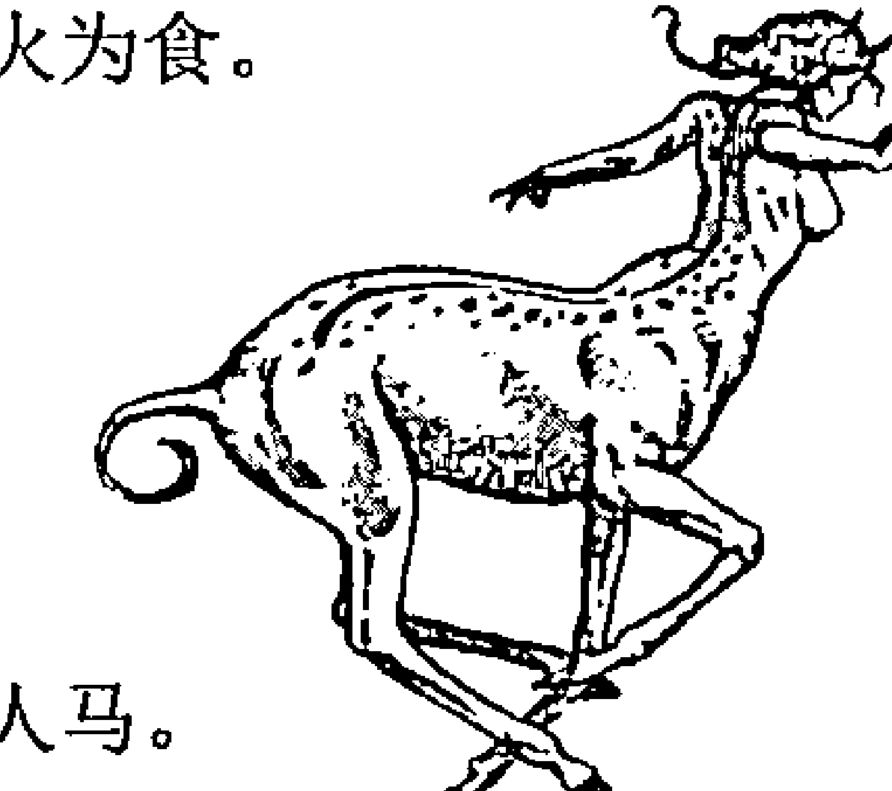

### **德·洛伊斯猿人** ——

一种类人猿，1920年被瑞士地理学家弗朗索瓦·德·洛伊斯在一次委内瑞拉丛林的探险活动中杀死并拍照。这张照片让西方世界了解到猿人这种动物。1929年，乔治·蒙塔冬博士将其命名为洛伊斯美洲类人猿（Ameranthropoides Loysi）。怀疑论者认为那张照片中的只是一种蜘蛛猴（simian Paniscus），这种猴子成年后体长仅为20英寸。但在最近，人们发现了一个巨大的史前蜘蛛猴的化石，如果这种动物现在还存在的话就能证实此种生物的存在。有趣的是，在《海洋与陆地》（1887年）中，J. W. 布艾尔写道：“隆德博士向我们展示的是巴西猩猩，他为其命名为凯珀（Caypore），这名字来自当地的土著传说。”

在19世纪早期，德国博物学家亚历山大·冯·洪堡德从奥里诺科河流域听说了一种名为萨尔维杰（Salvaje）（“野人”）的类人生物。据说它们会修建帐篷、抓捕女性、吃人肉。南美洲所有的类人生物都被叫做莫诺·格兰德 (Mono Grande) (“大猴子”)。参见巨猴、梅梅戈维奇欧 (Memegwicio)。

难以理解，看起来就像是把一个蝠鲼和一种头足类动物放在了一起——比如太平洋巨型章鱼 (Enteroctopus Dofleini)，它能长到 30 英尺长和 100 磅重。参见奎罗、格里历威鲁 (Glyryvilu)、依米奇 (Iémisch)、魔鬼鱼。

### 登丹 (Dendan) ——阿拉伯传说中黑色的大鱼。一旦和人类发生接触——就算是听见人类的声音——它们都会死去。

### 魔鬼鸟 (或尤拉马 Ulama、马哈巴卡木纳 Maha Bakamuna) ——一种行踪诡秘，只生活在斯里兰卡和印度的茂密丛林中的大鸟，它的叫声就像人类痛苦时发出的声音一样，它的名字由此而来。尽管西方人认为这只是一种迷信的说法，但在 2001 年，人们从一堆乌鸦手中救出了一只。它是斯里兰卡最大的猫头鹰，现在的名字是丛林雕枭 (Bubo Nipalensis)。参见思瑞克斯。

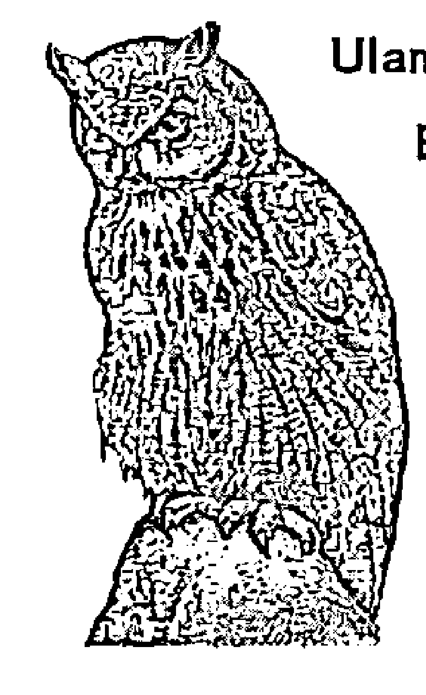

### 魔鬼湖怪——一种湖怪，据说生活在威斯康辛索克郡神魔鬼湖中深不见底、冰冷的盐水中。当地的纳扣塔 (Nakota) 印第安人几百年前就流传着这种生物的故事，最早的一则故事是关于一艘装满士兵的独木舟被像克拉肯那样长着许多触须的怪物攻击。参见贝西 (Bessie)、奎罗、淡水章鱼、拉斯卡 (Lusca)。

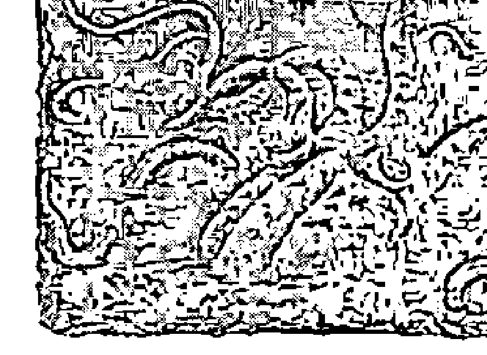

### 魔鬼鱼 (也叫海中魔鬼、海蝙蝠) ——一种 J·W·布艾尔记录下的巨大、强壮的海怪，据称它 “扁平的身体上长着八条长长的手臂，邪恶的眼睛和洞穴似的嘴巴长在身体中央，嘴巴周围还有几根骨刺。” 它的名字和目击者的报告都清楚地表明它是巨型蝠鲼 (Manta Birostris)，它的“翼展”能达 25 英尺，体重能达 6600 磅。然而，这种鱼并未长有触须，这让人们的描述显得有些难以理解，看起来就像是把一个蝠鲼和一种头足类动物放在了一起——比如太平洋巨型章鱼 (Enteroctopus Dofleini)，它能长到 30 英尺长和 100 磅重。参见奎罗、格里历威鲁 (Glyryvilu)、依米奇 (Iémisch)、魔鬼鱼。

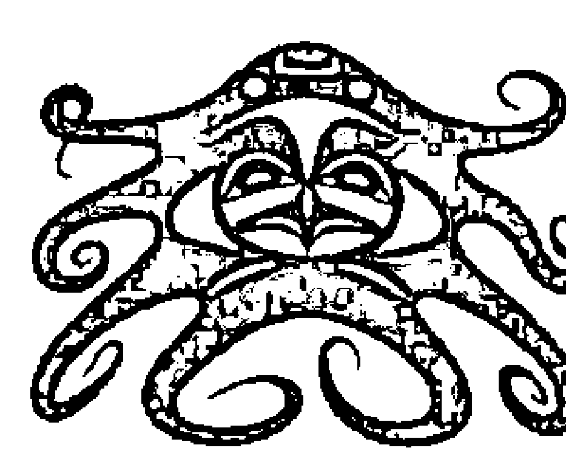

### 恶魔猴——从美洲中西部地区到阿拉斯加都有关于它的报道。据称这种狒狒一样的生物长有袋鼠的后腿。它们非常好斗，会攻击人类甚至汽车。参见山羊人。

### 杜马纳 (Dhumarna) (梵文中的“烟灰色”) ——印度神话中的海蛇之王。像阿提卡的刻克洛普斯国王 (如图所示) 一样，它腰部以下是蛇，上半身是人，与那迦类似。

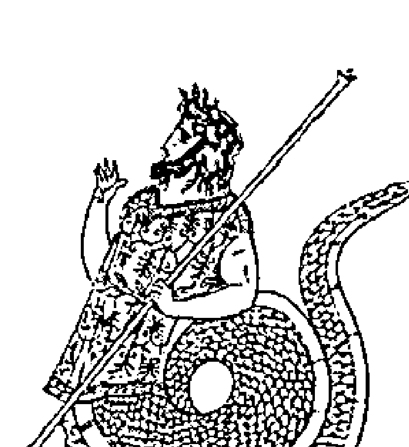

### **迪蒂 (Didi) (或德鲁迪迪 Dru-di-di、迪迪阿圭里 Didi-aguiri)**

一种小型（最高只有5英尺）的吼猿（hooting ape），长着红色或黑色的毛发，据说居住在巴西、苏里南和圭亚那地区的山区中。它们的一些特征与体型更大的玛平瓦赫伊相同。它们的名字来自于自己的叫声，它们与吼猴（Alouatta）很相似。现在已知有九种吼猴。迪蒂身高通常有3英尺，它们是新大陆上最大的猴类。

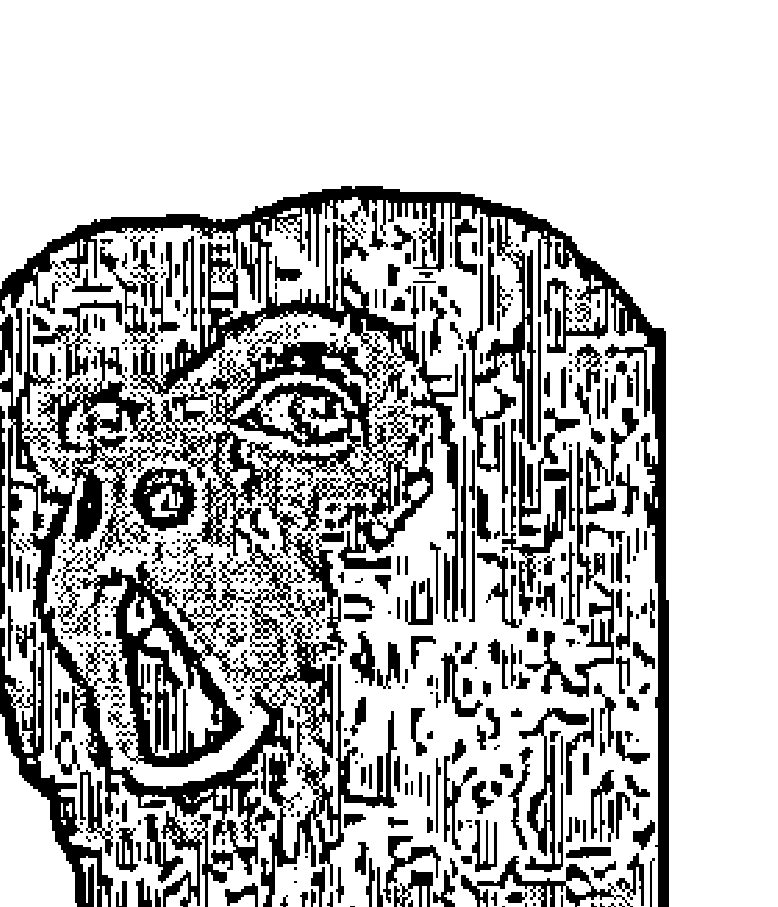

### **汀奥内克 (Dingonek)**

——据说居住在西非（主要在前扎伊尔地区）的河流与湖泊之中。它身长大约12英尺，长着方形的头、军刀般锋利的犬齿、一只长角、尾部有剧毒的“刺针”。它身上长满与穿山甲（Manidae Manis）相似彩色的鳞片。对它的描述让人想起8英尺长的更新世巨型穿山甲（Manis Palaeojavanicus）（如图所示），它的化石在印度尼西亚爪哇群岛和婆罗洲都有发现。参见河霸龙（Mokele-Mebembe）、威沃（Veo）。

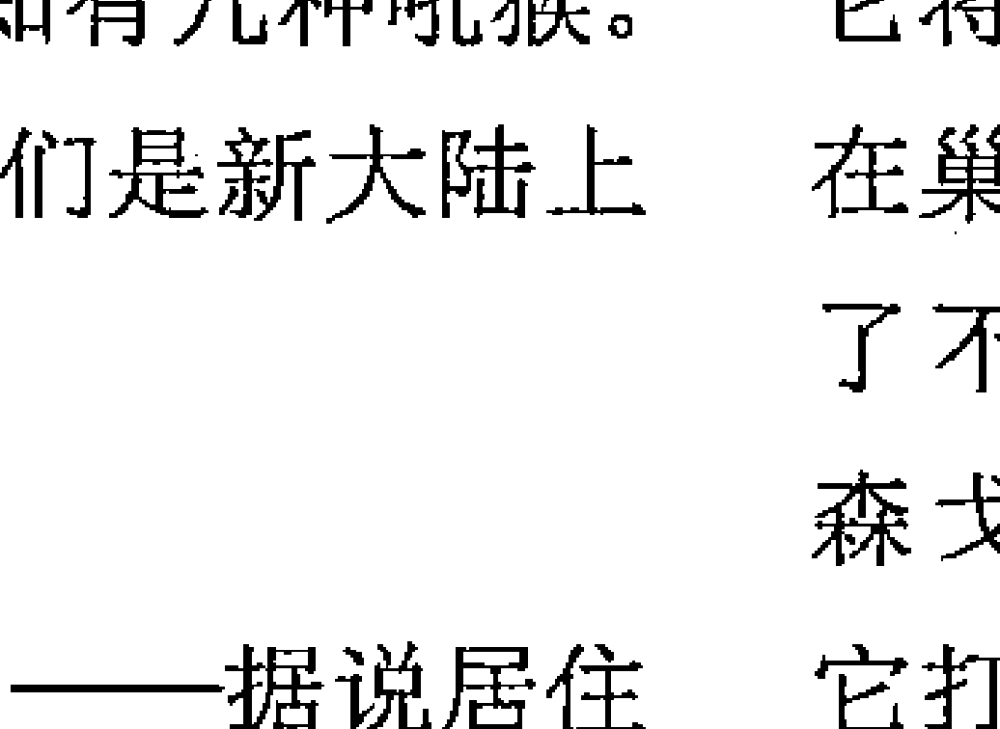

### **狄思帕 (Dispa)**

——一种致命毒蛇，它非常小，人们经常会不加注意地踩上它。它们的毒液不会给人带来疼痛的感觉，受害者在意识到自己被咬之前就死去了。T. H. 怀特认为它可能是印度金环蛇（Bungarus Caeruleus）（如图所示）。参见赛普斯（Seps）、海妖。

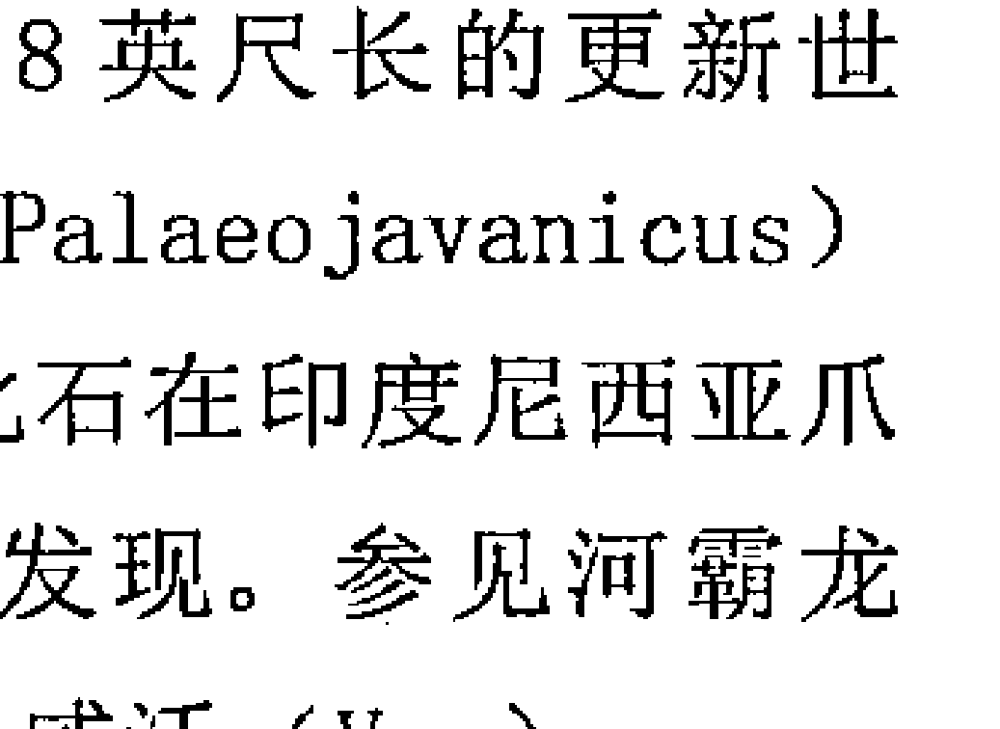

### **迪维 (Diwe)**

——爱尔兰传说中捕杀独行者的巨大角怪。

### **狄洁恩 (Djieien)**

——美国东北部塞内卡印第安人传说中6英尺高的巨型蜘蛛。它将自己的心脏藏匿在巢穴之下，因此它成了不死之身。但英雄奥森戈文哈达（Otheigwenhda）在和它打斗时，假装无意地用棍子刺向地面，穿透了它隐藏在下面的心脏，从而杀死了它。参见土蜘蛛（Tsuchi-Gumo）。

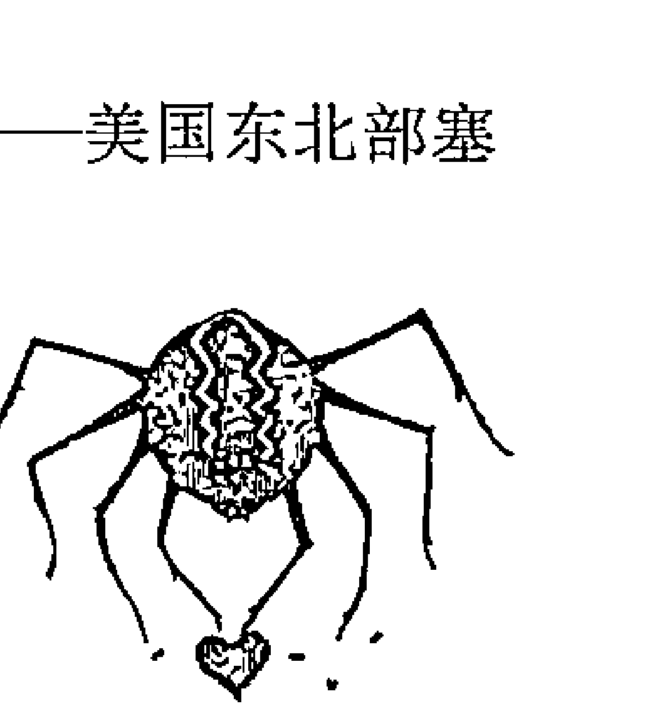

### **杜尔胡 (Dobhar-Chú) （盖尔语中的“水狗”，也叫多拉戈豪 Dorraghow “湖中之王”、杜拉古 Dhuragoo、多拉戈豪尔 Dorraghowor、多哈尔库 Dobarcu、安楚 Anchu）**

——一种爱尔兰传说中水獭般的、贪吃的食人兽，被称为水獭之父。早至1684年就有关于它的报告，据说它是“一半狼狗一半鱼”，有6至8英尺长，长着白色皮毛，背上有一个深棕色的十字形。也有人说它全身无毛，取而代之的则是黏黏的黑色皮肤。因为其凶残的性格，当地人称它为“爱尔兰鳄鱼”。

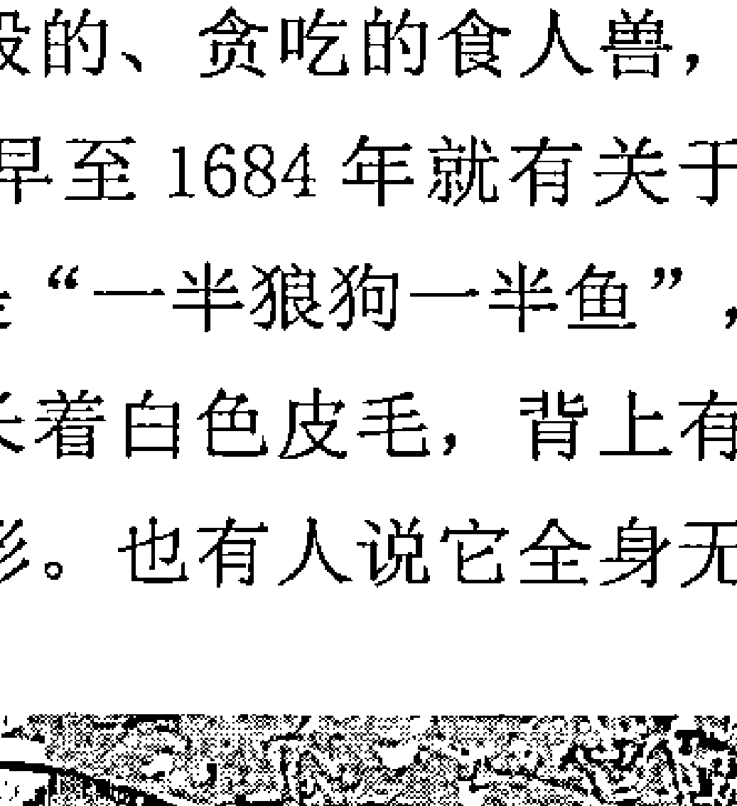

### 多杜（Dodu）——一种据称产自非洲喀麦隆南部的狂野猿人。它全身深灰色，站立时有6英尺高，能够依靠双足行走，每只手只有三根手指，脚上也长有三根爪子。它会攻击大猩猩，并在地上放上一小堆木棍。

### 半人狗——半人马的一个变种，有着大狗的身体。参见半人马。

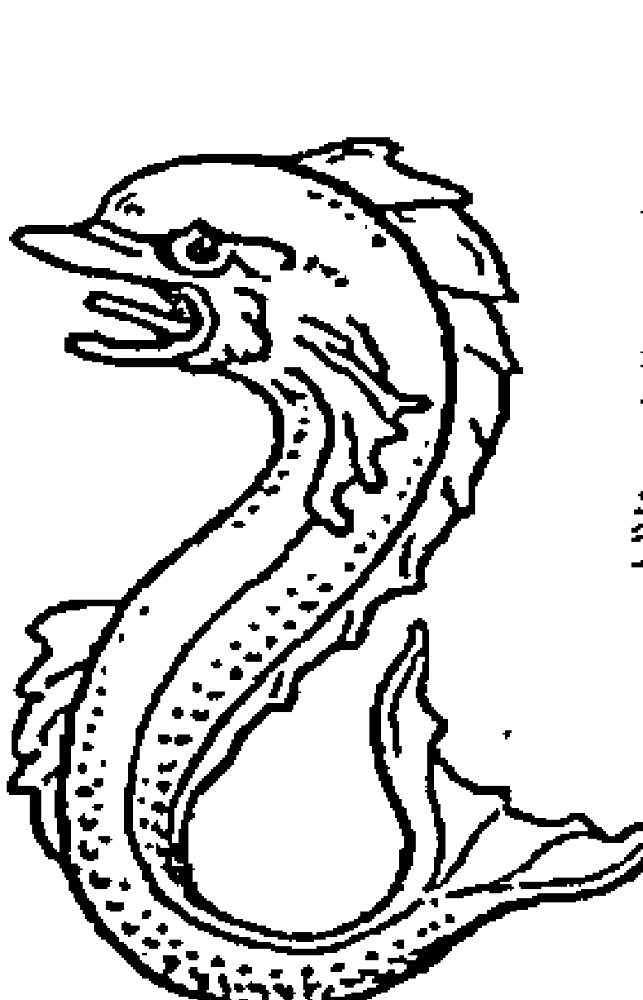

### 海豚（或戴尔芬）——

海洋中最敏捷的生物，据称它们能跳起越过绝大多数的船只。它们好像对人类的声音很着迷，在听到音乐时会聚到一起唱歌。当海豚在海浪中穿梭跳跃时，这预示着风暴的到来。据说在尼罗河中有一种背上长有锯齿的海豚，能划开鳄鱼的肚子杀死它们。

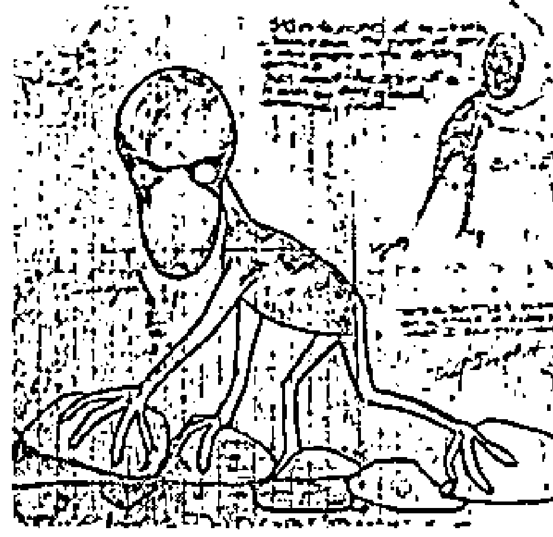

### 多佛恶魔——

一种奇异的、长着圆头的人形生物。1977年4月，有几个青年在麻省波士顿多佛郊区的夜路上碰到了它。他们说它很瘦弱，大概有4英尺高，有桃红色、光滑的皮肤，四肢和手指都很长，大大的眼睛是桔黄色的。从那之后就再也没人见过它。它是外星人吗？没人知道。

### 德拉古（拉丁语中的“龙”，希腊语中写做 draconta）——希罗古籍中的一种巨大、长着蝙蝠翅膀的蟒蛇，后来有人说它居住在印度和埃塞俄比亚，以那里的大象为食。

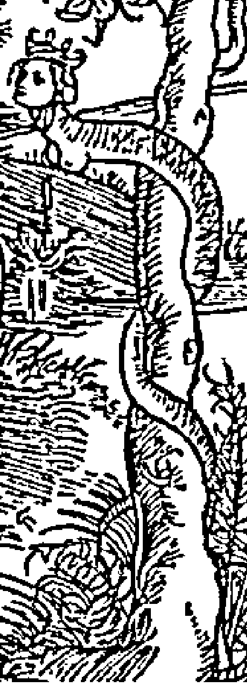

### 德拉古可佩德斯（Draconcopedes）——在中世纪欧洲传说中，它们是长着女人的头和胸部的蟒蛇，和伊甸园中的蟒蛇一样。

### 德拉克斯（Dracs）（拉丁文中的 draco “龙”）——

食肉的水怪，据说生活在法国罗纳河中，它让博凯尔镇的人很害怕，因为它会将人从船上拖入水中。德拉克（Drac）在加泰罗尼亚语和其它一些语言中是“龙”的意思。

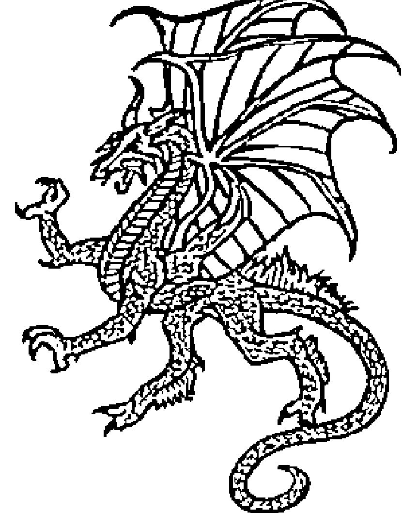

### 龙——一种巨大的爬行生物，通常情况下拥有蝙蝠的翅膀和喷火的呼吸。有些能说话。它有很多变种，生活在所有的元素中：土、水、火和空气。没有翅膀和腿的龙被称作鳞虫（Lindorm）或亚龙（Wyrm）；有腿但没有翅膀的被称作德雷克；有两条腿和翅膀的被叫做双足飞龙（Wyvern）；翅膀上长有羽毛的龙被称作阿姆费特尔（Amphitere）。龙存在于世界各地的文化中。东方的龙是智慧和仁慈的生物，生活在云、雨、水中，西方的龙则是狡猾和邪恶的化身，很多都被英雄与骑士所杀。有些龙源自某种已知物种，比如鳄鱼、巨蜥（如科莫多龙 Varanus Komodoensis）、马达加斯加飞蜥蜴（Draco Volens）和恐龙。而剩下的——如刚果沼泽中的河霸龙（Mokele-Mbembe）和尼斯湖水怪——很可能还藏在尚未探明的地区和世界各处的深湖中。

### 埃塞俄比亚龙——长达 35 英尺的巨型蛇龙，长有一双或两双翅膀，据称以大象为食。它们的原型可能是尼罗鳄（Crocodylus Niloticus）或大网蛇（Python Reticulatus），二者都能长到那么长（但却都没有翅膀！）。参见德拉克（Draco）、霸蛇（Pa Snakes）。

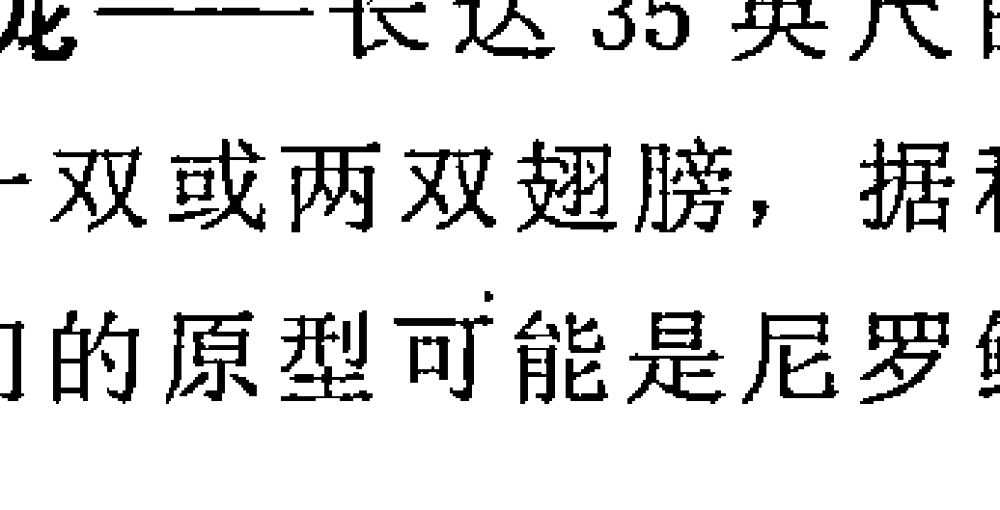

### 龙马——这种中国神话中的生物很像一匹马，但却有龙的头，身上长满鳞片。虽然有些龙马能飞，但它们却没有翅膀。实际上，龙马经常被说成是住在水里的生物。它们被认为是神圣的使者，穿梭于天地间，代表着阴阳。

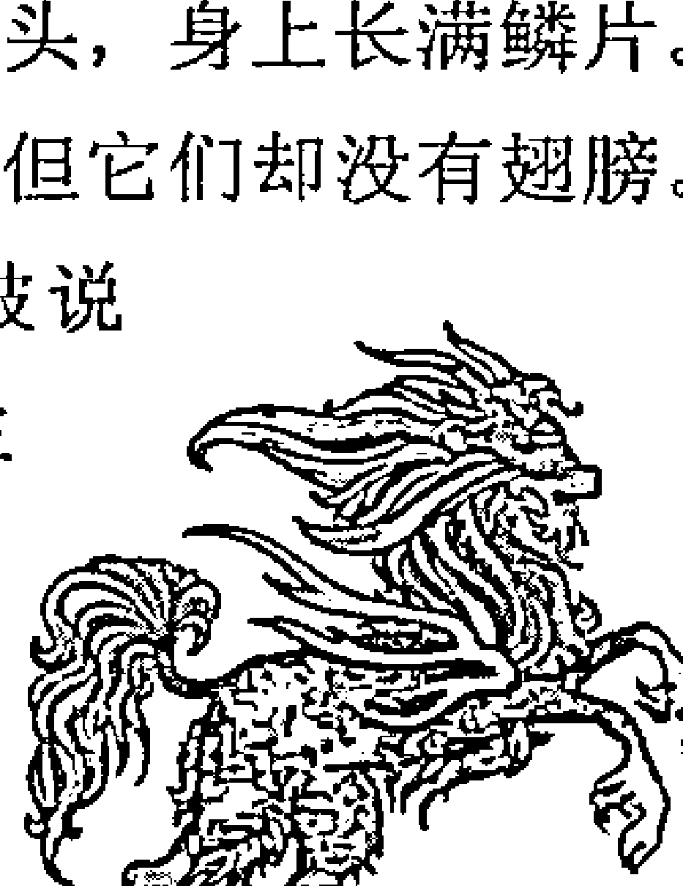

### 龙王——五位不朽的龙王居住在海底精致的王宫里。它们中有一只是头领，其余的则代表东南西北四个方向。它们的名字是敖钦、敖顺、敖广和敖润。它们都听从玉皇大帝的调遣给大地带去降水。龙王大约有 3 至 5 英里长，长着毛茸茸的腿和尾巴，嘴上还有胡须。它们如蛇般灵活的身体被包裹在金色鳞片之下。据说当龙王升到水面跃入空中时，狂风暴雨就要来临了。只有超常的人才有资格面见这些海洋的主人。

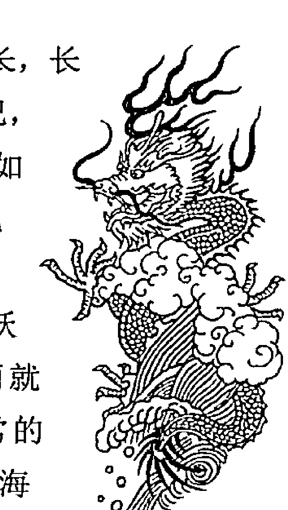

### 龙形人鱼——凯尔特神话中的这种雌性生物能让没有子嗣的夫妻怀上孩子，作为交换，他们要为它奉上祭品。如果她对祭品不满意，就会在这家人身上降下诅咒。

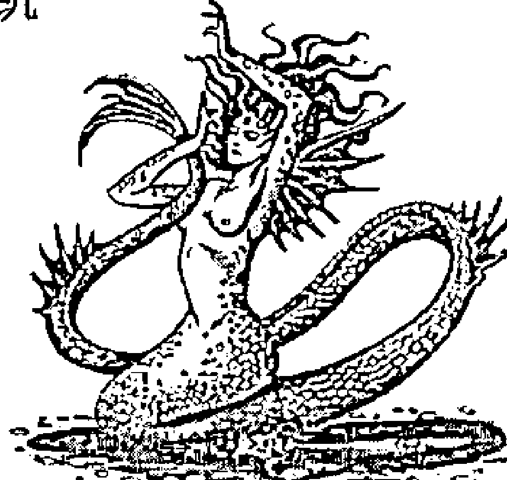

### 龙虎——一种长着龙身和虎头的纹章兽。它是欧洲人眼中的亚洲虎。

### 龙狼——一种龙身狼头的纹章兽。另一种让人联想到亚洲龙的生物。

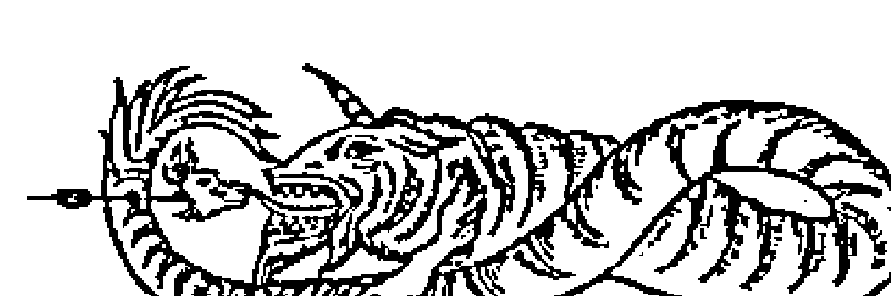

### 德雷克——瑞典传说中的一种无翅龙，也叫作鳞虫（Lindorm），这个名字也能用来命名元素龙，比如火龙、海龙、冰龙等，也可用来命名雄性龙。参见欧姆、巨蟒。

# 魔法师的怪物图鉴

### 厥克维 (Drekavac) （斯拉夫语中的“哭喊兽”）
斯拉夫神话中的一种恐怖的夜行生物，有时被说成是一种兽，有时又被说成是一种鸟。有人相信它是未经洗礼的孩子的灵魂。它的叫声非常恐怖。它也有很多变种，但在行走时它们的身高都是 3 英尺。它们潜伏在深深的山洞和隧道中，有些还会藏在包裹里。还会发出嘲笑声，让人空手而归。

### 都安 (Duah)
巴布新几内亚的一种能飞的巨大食肉动物。它们皮质的翅膀能达 24 英尺长，还长着没牙齿的喙，头上顶着一个大肉冠，这与已灭绝的蝙蝠龙 (Pteranodon) 很相似。同样，它们也吃鱼，尽管据称它们也会攻击人类。它很可能源自一种俾斯麦飞狐 (Pteropus Neohibernicus)，科学家认为这是世界上最大的蝙蝠，它的翼展能达 5.5 至 6 英尺，是新几内亚和俾斯麦列岛独有的物种。然而，这种果蝠既不吃鱼也不攻击人类，所以说不定它是一种未知的神秘生物。参见孔噶莫托 (Kongamoto)、翼手龙、罗翮、斯纳利加斯特尔。

### 敦尼 (Dunnie)
一种出没于英格兰诺森布里亚地区，能变形的付克安 (Phookah)。它常以马、驴和矮马的样子出现。如果有人想给它套上马具，它就会消失得无影无踪。

### 喜马拉亚棕熊德祖特 (Dzu-Teh) （夏尔巴语中的“大家伙”）
据西藏夏尔巴人所述，它是三种雪人（以体型为区分）中体型最大的一种，剩下的两种分别是体型中等的梅和特 (Meh-Teh) 和体型偏小的叶和特 (Yeh-Teh)。特 (Teh) 的意思是“有血有肉的动物”。喜马拉亚棕熊德祖特在通常情况下都以四肢行走，以两只后腿奔跑。有些研究者认为它是一种以牦牛为食的喜马拉雅黑熊 (Ursus Thibetanus)。

### 恩菲尔德 (Enfield)
一种爱尔兰纹章兽，拥有狮子的身体、灵缇犬的胸膛、狼的后腿和尾巴、鹰的前爪以及狐狸的头。据称它们负责保护死去酋长的尸体，以保证他们得到正确的安葬。

### 伊奇特尼德 (Each Tened)（盖尔语中的“火马”）
在爱尔兰传说中，这种带着火焰的幽灵马负责杀死作恶的人，这些人被强迫骑在它背上，接受永世的火烧。

### 圣伊斯克 (盖尔语中的 “圣鱼”)
根据传说的内容，一对这种鱼居住在爱尔兰一所教堂的水井中，依靠井边树上掉落下来的榛子为食。这些鱼拥有法力，能说话。杀死这种鱼的人将接受神圣裁决。

### 伊布両古 (Ebu Gogu)
这种当地的小型、有毛、口齿不清的穴居人，最初是由16世纪前往印度尼西亚弗洛勒斯岛的葡萄牙人所发现的。直到19世纪都还有人目击到它们。在之后的2003年，在那座小岛上发掘出了7块小型原始人的化石碎片，其官方名称为弗洛瑞斯人 (Homo Floresiensis)，主流媒体立即冠以它们“霍比特人”的称号。它们的身高从3英尺到4英尺不等，可能是一种智力人的矮人变种。

### 依其内斯 (Echieneis) (希腊语中的 “阻碍船只”, 也叫作雷莫拉、莫拉)
一种只有6英寸长的小型“海蛇”，它能附在船体上，让全速前进的船只停下来。据说它生活在极低海洋中，能让空气和水凝结以快速困住船只，于是它被当作生活在火焰之中的火蜥蜴的最主要敌人。胭脂鱼，或雷莫拉 (Echeneis Naucrates) (如图所示) 常将自己附在鲨鱼身上。参见骨螺、蜈蚣。

### 厄客德娜 (Echidna)
希腊神话中的“怪兽之母”。她是盖亚和塔耳塔洛斯之女。从腰部往上她是一名漂亮的女人，以下的部位却是一条长有斑点的巨蛇。她与巨人族的丈夫提丰生下了非常恐怖的孩子：刻耳柏洛斯、俄耳托斯、许德拉、哈尔庇埃，奇美拉和啄食普罗米修斯肝脏的秃鹰。她还和自己的孩子俄耳托斯生下了斯芬克斯。她住在赛西亚附近的一个洞穴里，最终她在那里被百眼巨人阿尔戈斯杀死。厄客德娜这个名字现在被用于命名卵生的澳大利亚“针鼹”。

### 伊尔-穆楠 (Eer-Moonan)
澳大利亚土著传说中的一种恐怖的怪物，它们拥有狗的身体、针鼹的头和女人的脚。它们能无声无息地猎杀人类。

### 伊克斯米尔 (Eikthymir) (条顿语中的 “长有橡木般尖角的鹿”)
挪威神话中的这种牡鹿矗立在瓦尔哈拉殿堂顶部看守着巨大的世界之树，尤克特拉希尔。

### 象虎
泰国传说中的一种神奇生物，长着大象的身体和猛虎的头。根据传说所述，它被番安国王的猎手所捕获，之后与国王最好的大象交配，生出了无敌战象金刚，后来它们被装备到番安的军队中。战争胜利后，每年的游行队伍中都会有它们的雕像。

### 恩浦萨 (Empousa) （或Empousa，复数形式为Empusae）
一种希腊传说中会变形的雌性怪兽，上半身是人，双腿一只是驴腿、一只是铜腿。赫卡特女神派她去抓那些夜晚乡村路上的独行者。她常以黑狗、骡子、牛或漂亮女人的样子示众，会吃掉所有碰到的人。恩浦萨也被用于命名锥头螳螂。

### 伊美莱南头卡（Emela-Ntouka）[林加拉语中的“大象杀手”，也叫齐彭柯维（Chipekwe）、格鲁特莎朗（Groot Slang）]
一种两栖动物，据称生活在刚果的利夸拉沼泽、班委罗（Banweolo）湖、喀麦隆和其它西非海岸的沼泽中。它比以之为食的河马要小一些。它的身体很光滑，长着或深绿色或灰色或棕色的无毛皮肤、鳄鱼的尾巴、犀牛般乳白色的独角，它可以用它撕裂大象。它像大象一样的脚上有三个脚趾。1934年，有人捕杀了一只这种动物，但没有对其进行科学研究。有些隐生动物学家认为这种动物类似于白垩纪时期的角龙和独角龙，然而这些动物都只吃草。参见寇杰亚没尼亚（Coje ya Menia）、开赛霸王龙、河霸龙（Mokèlé-M’ Bèmbe）、恩格宝（Ngoubou）。

### 恩坎塔多（Encantado）（葡萄牙语中的“着魔者”）
巴西传说中一种生活在水下乐园的生物。这个名字也被用来命名精灵或会变形的蛇，但大多数时候它都指一种能化成人形的淡水海豚，这种海豚叫波托（Boto），或粉河海豚（Inia Geoffrensis），它居住在亚马逊河。参见塞尔基。

### 恩菲尔德恐怖怪物（Enfield Horror）
一种在伊利诺伊州恩菲尔德发现的怪兽。目击者称其全身灰色，有三条腿，两只手臂从胸膛长出，两只像手电筒般大的粉红色眼睛。警方发现了长有六个肉垫、像狗抓一半的脚印。

### 树精 (Ents) (安格鲁萨克逊语中的“巨人”，小精灵 (Elvish)、欧诺德 (Onod)，复数形式为欧诺金 Onodrim)
历史上指任何一种大型类人猿生物。恩特在今天因 J·R·R托尔金的《中土》而出名。它们是一种聪明的古老物种，据说源自世界各地传说中会说话的树木。它们的样子和体型根据其看管的树木有关。其雌性名为树人 (Entwife)。

### 尤罗亚兽 (Euroa Beast)
在 1890，澳大利亚尤罗亚的居民们发现有一种 30 英尺长、未知的爬行类怪物在他们村子周围活动。一位墨尔本动物园的代表，带着一张大网，组织起了一支由 40 人组成的搜寻队。他们发现了一系列巨大的脚印，但这些人都在找到怪物之前就都死去了。这是一种河口鳄 (Crocodylus Porosus) 还是一种已灭绝了的古巨蜥 (Megalania)（如图所示）参见库里阿 (Kurrea)、霍维伊 (Whowhie)。

### 艾皮罗特 (Epirotes)
在希罗神话中，这种巨蛇看守着太阳神阿波罗的龙之墙园，是神谕巨蟒的后代，能预见未来。

### 尔钦尼 (Ercinee) (或海西鸟)
德国海西森林 (der Hertzwald) 中会发光的鸟，它的羽毛上有会发光的磷，可以在黑暗的森林中为其照亮道路。虽然还没有一种鸟可以发光，但有些昆虫却可以。到目前为止，亮度最高的要属南美的大萤火虫 (Lanternaria Phosphorea)。权威人士利安认为，发光的是它身体前端中空的结构。瑞典博物学家林奈接受了这种说法，给它取了几个名字，如兰特纳里亚 (lanternaria)、弗斯法利亚 (phosphorea)、坎德拉里亚 (candelaria)，但后来的研究却无法证实这个发现。参见金翼鸟艾里凯多 (Alicanto)、库奎欧 (Cucuio)。

### 猎鹰鱼 (Falcon-Fish)
一种长着鱼的身体、鹰隼的头和爪子的欧洲纹章兽。奇怪的是，它还有狗一样的耳朵。

### 范德范拉 (Fandrefiala)
一种马达加斯加蛇，当地传说认为，它会在树上将尾巴像长矛一样刺进路过的动物的身体里。它可能是一种天堂树蛇（Chrysopelea Paradisi）或一种能将身体变扁而在空中飞行的亚洲蛇。参见跳鼠。

### 法拉斯巴哈利 (Farasi Bahari) [或沙布加里菲亚 (Sabgarifya)]
印度洋中的一种浑身像翡翠一样颜色的马。在一年中的某些夜晚，这种马会到非洲岸边的某个小岛上吃草，那里的养马人会避开一阵子，期望这种马能和自己的马交配，生下强壮的绿色小马，这种小马因为没有肺，所以耐力惊人。参见马头鱼尾怪。

### 法斯提克隆 (Fastitocalon) (“海洋漂浮者”)
一种皮肤像石头般坚硬、鲸鱼大小的海怪，就像一座遍布沙子和水草的小岛一样。它非常危险，常引诱船员们把船停在它旁边上到它身上，这样它就能将其统统掀入海中吃掉。如果没有人吃的话，它就会从嘴中发出一种甜甜的香味，引来浅滩鱼群，然后大口大口地吞掉它们。参见阿斯匹多彻龙、伊玛普·优麻叟尔撒、加斯孔尼阿斯（Jusconius）、卓拉唐（Zaratan）。

### 海龟之父 (Father of All Turtles)
苏门答腊传说中一种巨型海龟和一种由隐生动物学之父贝纳德·霍伊霍尔曼（1916-2001 年）所发现的海蛇的变种。在不同的大洋中有关于这种生物的四个记录。有人认为它是身长 14 英尺的白垩纪海龟（Archelon）（如图所示）。参见阿库帕拉（Akupara）、阿斯匹多彻龙（Aspidochelone）、库尔玛。

### 法丁霍 (Fating'ho)
一种长着黑毛的、双腿直立行走的、像猿人一样的生物。1992 年 10 月，一名昆虫学家在西非的几内亚目睹到它。根据当地的传说，它不是大猩猩也不是黑猩猩，其物种直到现在也还未被科学家所鉴定。

### 羊怪法翁 (Fauns)
在希罗神话中，这种生物喜欢恶作剧，长着鹿或山羊的腿、耳朵、短角和尾巴，以及年轻人的脸和上身。它们是法黑努斯神（“仁慈”）的孩子，能给人带来噩梦，有时也能给人带来快乐。可爱的农牧神法翁·杜穆纳斯（Faun Tumnus）是 C·S·刘易斯的《纳尼亚传奇》丛书中的重要角色。参见森林之神萨提尔（Satyrs）、瑟令（Selin）、锡尔万（Silvan）和贝提罕（Betikhân）。

### 可怕怪物 (Fearsome Critters)
一个 19 世纪美国和加拿大伐木工人所杜撰出来的词语，用来形容一种永不消失的、令人愉悦的、想象中的动物，它们有着色彩斑斓的名字，据说生活在北美广袤的森林中。这个词语本是用来解释森林中未知的危险的，有时伐木工会因此而丧命，这些古怪的动物被创造出来迷惑那些容易上当的旅客和伐木工棚的新来者。可怕的小动物包括从傻傻的动物到奇异的动物，甚至恐怖的动物。

### 飞廉（或风婆“风神”）
中国神话中一种天上的怪兽，长着牡鹿的身体和四肢、豹子的斑纹、蛇的尾巴、麻雀的头、公牛的角。它负责掌控风暴，随时都可能会将其从风袋中放出来。

### 凤凰（Fèng Huang）（或 Fum Hwang）
中国的凤凰，雄性叫凤，雌性叫凰，它们在一起代表无尽的爱。这种美丽的鸟身高大约有 9 英尺，长着天鹅的胸膛和长颈，野鸡的头和鸡冠、燕子的脸、乌龟的背以及 12 枝孔雀的尾羽。对它的描述与越南中部和马来半岛上的单眼野鸡（Ocellated Pheasant）和冠眼斑雉及其吻合。凤凰的样子代表着六个天体，而它闪闪发亮的有条纹的翅膀代表着五种基本的颜色（黄、绿、红、黑、白）。它不吃任何活物，包括植物在内。它是中国四大灵兽之一——其它的分别是龙王（龙）、圭贤（乌龟）和麒麟（独角兽）——凤凰掌管南方，代表夏季。它是崇高美德的化身，代表阴阳和天宫的原始力量。它的出现是好运的预兆，会带来和平和财富。它的幼鸟被称为 Yoh Shoh。

### 芬里厄（Fenrir，Fenriswulf 或 Fenris úlf r，也叫希罗多德里特纳 Hroditner）
一种巨大的狼形恐怖生物，它是挪威神洛基和女巨人安格博达（Angboda）三个恐怖孩子中最年长的一个。据说芬莉斯、洛基和巨人终有一天会毁灭掉众神和人类的世界，众神命令矮人们打造出一种魔法脚镣来困住这种怪兽。这种脚镣是由六种不可能的动物组成的：猫的脚印、山的根部、女人的胸部、熊的神经、鱼的呼吸和鸟的唾沫。芬里厄被它困在地下一英里深处的一块岩石上，口中还插着一把利剑。但善恶大决战之时，芬里厄将会打破它的羁绊加入到巨人中去，参加对抗众神的最后一战。

### 费尔拉莫尔（Ferla Mohr）（盖尔语中的“大灰人”）
一种好斗的灰猿，站立时身高可达 20 英尺，住在苏格兰山地中。英格兰群岛上也有关于这种巨猿的传说，那里的人都很害怕它。

### 费格纳斯(Figonas)
所罗门群岛和圣克里斯托瓦尔群岛上的美拉尼西亚人神话中一种有翅膀的天蛇，是所有生命的创造者。它们中最伟大的要数安桂纳（Aguna），它创造出了第一个人，因为觉得他很孤独，于是安桂纳又创造出了女人来生火、做饭和经营菜园。哈推波瓦力（Hatuibwari）被认为是人类最早的祖先。它巨大的蛇身上长着一个人的躯干，还有四个摇晃的乳房哺育所有的生物。它还有四只眼睛和两只大翅膀。

### 费力路 (Fillyloo) [ 也叫高罗 (Gowrow)、高力果 (Golligog)、高力戈 (Gollygog)、牡吉 (Moogie) ]
一种居住在奥扎克山脉的美洲土著人传说中的一种巨蜥或龙。19 世纪时它经常在那里被人看到。根据 V·兰多夫在 1951 年的描述来看，它有 20 英尺长，长着猪的獠牙。

### 鳍人 (Fin People)
半鱼半人，这种人鱼在夏季的时候会到苏格兰奥克尼群岛上的艾因哈罗村的岸边上去晒太阳。根据传说，曾经艾因哈罗的村民和这些来自芬弗克阿因 (Finfolkaheen) ——一个水下的镜像村落，的人鱼一样。如果和人类相爱，人鱼就会失去他们的鱼尾到陆地上生活。

### 火鸟 (Firebird) [ 俄语中的卓霞一皮提莎 (Zshar-Ptitsa)]
俄罗斯寓言中一种神奇的天鸟，有着金银色的羽毛和闪亮的水晶眼。唱歌时，它的嘴里会有珍珠掉出来，它的歌声能治疗疾病和失明。一枝它的尾羽就能够点燃整间房屋。它被放养在主人特查戴尔梅特 (Tzar Dalmet) 的花园里，在晚上经常会溜到隔壁特查也斯拉夫安卓诺弗维奇 (Tzar Vyslav Andronovich) 的果园里偷吃代表年轻、美丽和不朽的金苹果。人们认为它是俄罗斯凤凰，可能源自天堂鸟。

### 火龙 (Fire-Drakes)
住在不列颠群岛沼泽和北欧群山的洞穴中，长着蝙蝠翅膀的喷火巨龙，它们负责看守埋在那里的宝藏。

### 鱼猪 (Fish Pig)
中世纪地图上经常出现的海怪之一。这种生物的头的周围长着奇怪的触须，常会被人误以为是大王鱿。

(Architeuthis)。参见克拉肯。

## 飞鱼 (Flying Fish)

飞鱼 (Flying Fish) ——一种 16 世纪在意大利西北海岸被抓到的奇怪海洋生物。它有约 5 英尺长，长着一个大大的头、宽阔的翅膀、长长的尾巴。在展出时它吓到了一位皇室成员。根据描述来看，它应该是一种长着牛鼻子的鳐鱼 (Rhinoptera Bonasus)。参见塞拉 (Serra)。

## 飞头 (Flying Head)（或巨头）

飞头 (Flying Head)（或巨头）——美国东部易洛魁印第安人传说中的一种飞在空中的奇怪头部。它们有闪亮的眼睛、翅膀样的巨耳、大大的嘴巴。在它们散乱的头发下伸出两只粗糙的爪子，将它们托在空中，就好像在漂浮一样。它们猎杀粗心的人类。参见蛊悚、雷亚克 (Leyak)。

## 伊沙飞蛇 (Flying Serpent of Isa)

伊沙飞蛇 (Flying Serpent of Isa)——一种中世纪基督教传说中的蛇怪，旅行者说它们是从埃塞俄比亚沙漠中的蛇鸡兽的蛋里孵化出来的。它是蛇中最毒的一种，能飞也能爬。参见蜥蜴妖、阿姆费特尔、海妖。

## 佛卡斯 (Focas)

佛卡斯 (Focas) ——一种非常强壮且危险的海中公牛。它总是和自己的妻子打斗直到它妻子死去，之后它会将它妻子的尸体移出自己的家门再去寻找另一个伴侣，与它相亲相爱地在一起，直到自己死去，或直到它的妻子将其杀死。它总是呆在一处，它和它的幼崽能竭尽所能地想办法生存下去。

## 佛犬 (Fo Dog) [或佛之犬，卡拉石狮 (Kara-Shishi)、石狮狗、佛狮]

佛犬 (Fo Dog) [或佛之犬，卡拉石狮 (Kara-Shishi)、石狮狗、佛狮]——中国寺院的看护者。它们有飞狮的身体、多毛的尾巴、宽大的狗头，有时前额上还长角。它们总是一对一对地出现——雄性一只爪子按在球上，而雌性的双腿间则有几只幼兽。

## 弗赖堡的尖啸怪 (Freiburg Shrieker)

弗赖堡的尖啸怪 (Freiburg Shrieker) ——1978 年 9 月 10 日，堵在德国弗莱堡一处煤矿入口的恐怖的黑色蛾人般的生物。当工人们靠近入口时，它发出刺耳的声音将他们赶走。一小时后，一次巨大的爆炸毁掉了那个煤矿。浓烟散去后，这个幽灵般的生物消失了，工人们保住了性命。参见切尔诺贝利黑鸟、龙人、鸦人。

# 魔法师的怪物图鉴

## 淡水章鱼 (Freshwater Octopus)

——尽管所有淡水头足类生物都已经被探明，但仍有很多人称在印第安纳、肯塔基、俄克拉荷马和西弗吉尼亚以及常有怪兽出没的俄亥俄河中目击到了一种章鱼一样的生物。它们据说长相丑陋、全身灰色、身长 3 英尺，很像褐带蛸和纤维章鱼或胡么林奇（hummelinki）章鱼。由于其变种多达 300 余种，有可能这也是变种中的一种，托尔金说它是“水中的哨兵！”参见恶魔湖湖怪、俄克拉荷马章鱼。

## 蛙人 (Frogman)

——一种 1938 年秋季在爱沙尼亚海岸边的朱敏达（Juminda）被目击到的 3 英尺高的生物。它的皮肤呈棕绿色，没有脖子，有人一样的手，身体前部有驼峰。它的嘴巴像一条大裂缝。参见拉夫兰蛙。

## 水栖马付亚特 (Fuath) [盖尔语中的“憎恨”，也叫亚拉奇得 (Arrachd) 或付亚特-亚拉奇得 (Fuath-Arrached)]

苏格兰高地传说中一种会变身的水怪，居住在河流、湖泊和大洋中。它们长有脚蹼、黄色毛发、一只尾巴和鼻子，全身呈绿色。它们有几种亚种：贝瑟尔（Beithir）是一种出没于科谷（Glen Coe）山脉山谷中的蛇怪；布罗拉罕（Brollachan）是一种无形的实体，据说引起过许多奇异的事件；法坎（Fachen）[或法罕（Fachan）、法钦 Fachin]是一种可怕的鸟怪，在其前额中长着一只眼睛，胸膛里长着一只手，还有一条畸形的腿，它全身长满羽毛，头上有鸡冠样的东西，它在将人杀死前会像火鸡一样蓬起自己的羽毛，跳到猎物身上，将其碎尸万段；皮来德（Peallaidh）（“毛茸茸的动物”）居住在苏格兰佩斯郡高地的河流中，它在低地的近亲名叫雪莉寇特（Shellycoat）。

水栖马付亚特（Fuath）已经成为了一种精灵的名字，特别指那种恶灵。参见棕仙童（Urisk）、福格（Vough）。

## 毛皮鳟鱼 (Fur-Bearing Trout)

——一种据说生活在美国北部和加拿大河流和湖泊冰水中的鳟鱼。它们已进化出了毛皮以抵御严寒。这些鱼的标本自 1930 年代开始就是游客的最爱，现在都还保存在一些奇物博物馆中。在现实生活中，“棉菌”水霉菌有时会感染到鱼身上，长出一种白色毛皮样的东西，如果感染很严重，宿主将会丧命，如果真菌继续生长，在这种死鱼被冲上岸的时候就会被发现长着‘毛皮’。

着一层“毛皮”。

G 指的是狮鹫，长着老鹰的前身和狮子的后身。

它耳听八方，战力极强，让前来偷盗的贼人变成嘴边的美食。

中的一种神鸟，长着铜的爪子和铁的喙。通常需要念咒语才能将其召唤出来。据说它生活在奇异世界布炎（Booyan）岛上，该岛坐落于天堂附近的东方海洋中。

盖锦（Gainjin）——巴布亚人的克拉奇神话中的第一个动物，在创世的时候从天堂下来帮忙，创世完成后，只有两只这种动物留了下来：布盖尔（Bugal）蛇和瓦艮（Warger）鳄鱼。

格斯也恩戴尔沙（Gaasyendietha）——美国东北部塞内卡印第安传说中的一种喷火天龙。它住在湖泊和河流中，但在夜晚会像流星一样飞上天空。参见巨力克（Jurik）。

伽麻云（Gamayun）——另一种俄罗斯传说中，和其他圣人和圣物一起住在布炎岛上的生物，长有人类的头。

干闼婆（Gandharvas）（巴利语中的干闼巴斯 Gandhabbas）——印度的一种毛茸茸的半人卡尔比，它们有马的身体和人的脑袋，负责驾驭太阳马。

它们是众神的演艺人员和天堂饮料苏摩（Soma）的看护者。它们以能奏出好听的音乐而闻名，它们还教授人类医疗艺术。它们居住在富丽堂皇的宫殿中，在森林、大山和云层中也能发现它们的存在。半人马一词可能源自干闼婆。

格弗斯（Gaffs）——在狂欢节和马戏团术语中，“Gaffs”是一种由动物标本师虚构出来的“生物”，用于展览，骗取那些容易上当的顾客的钱财。现代的变种还有人鱼、鹿角兔（Jackalope）、鹿角小飞兔（Wolpertinger）、卓柏卡布拉（Chupacabra）、浊音鳟和大脚怪。现代格弗斯表演的主要创造者是道格·希格利（Doug Higley），它的展览都打着这样的标题“这是什么？”参见珍妮哈尼文斯（Jenny Hanivers）。

伽伽那（Gagana）——俄罗斯传说

伽恩萨斯（Gansas）——一种只有一只脚的天鹅般的鸟。它们每年都从月球飞来。

加拉芬娜 (Garafena) ——俄罗斯传说中的一种神蛇，它躺在布炎岛上的一件手工艺品上。它能抵御任何的蛇咬。

石像龙 (Gargouille) ——一种住在法国鲁昂塞纳河沼泽中的传奇巨龙。它能带来降水，也会掀翻船只吞食船员。这种怪物被7世纪鲁昂主教圣罗马尼亚所杀。他用两名罪犯作为诱饵来引诱它出来。当它现身时，他用自己的十字架和法袍披肩钉住并缠住了它，轻易地将其带到了鲁昂，被镇上的居民们齐力杀死。从那时起，所有装饰在十字架和水池边的怪物都被叫做石像鬼 (Gargoyle)。

参见塔拉斯克。

石像鬼 (Gargoyle) ——一种常见于欧洲哥特建筑屋檐上的人形怪物雕刻，最初被用于装饰墙上雨水槽的喷头。在中世纪它们被当作人类对抗恶魔的护身符。

加姆 (Garm) (或 Garmr) ——看守尼福尔海姆 (挪威神话中死地女神赫尔的“死人国”) 大门的喷血四眼地狱犬。它住在格里帕 (Gripa) 洞穴中，不允许任何人离开。加姆与希腊的刻耳柏洛斯相似，都担任看护地狱大门的任务。参见沙瓦玛 (Sharama)、索洛托。

揭路荼 (Garuda) [或塔拉苏云 (Taraswin) 语中的“敏捷”]——印度神话中一种巨型的像人一样的鸟，它是毗瑟挐神的坐骑。它长着秃鹰 (Lammergeier) 的身体、翅膀、脖子和头，但却有人类的脸和四肢。它有金色、红色、绿色三种颜色，是那迦族的死敌。它在东南亚地区象征皇权，也是印度尼西亚迦楼罗航空公司的标志。在泰国，它被叫做格伦 (Galon) 或克鲁特 (Khrut)。

鳄人 (Gatorman) ——一种据称早至十七世纪，生活在佛罗里达大沼泽和美国东南部沼泽地带的人形爬行生物，有大约5英尺长，长着小孩大小的头和身体，有四肢长蹼毛茸茸的鳄鱼般的腿，和一条有力的长尾。它们身披绿色鳞甲，满嘴尖刀般的牙齿。在所谓拍到它们的照片中的都是格弗斯。在1973年夏天，在新泽西的牛顿-拉斐特地区，很多人都目击到了一只同样的人形鳄鱼怪。之后在1977年，纽约州的博物学家阿尔弗雷德·哈斯特拉克报告称该州南部地区生活着“一种有鳞的人形生物，黄昏时分会从长满红色水藻的水里冒出来，在长满苔藓的地面搜寻食物。”参见尹土罗 (Intulo)、蜥蜴人、新泽西鳄鱼人、密尔湖水怪。

## **基恩基恩维 (Gengen Wer)**

——在埃及的创世神话中，这种天鹅用自己下的蛋孵出了所有的生物。

## **巨蚁 (Giant Ants)**

——据说这种动物“比狐狸稍大，比狗稍小”，它住在印度的沙漠中，挖掘地下的黄金。

> 曼德维尔爵士，一位虚构的英国骑士，在1322年离开英国开始前往中东地区探险，证实了它们的产地在塔普洛巴纳岛（锡兰）。他说这种蚂蚁在修筑巢穴时会将黄金从土里分离出来。在炎热的夏季，这些好斗的蚂蚁整天都呆在巢穴中，人类就会骑着骆驼或马去将黄金运走。在其它季节中，人类会将托着空篮子的马赶进沙漠，这种无法忍受任何空容器的蚂蚁就会用黄金将篮子填满，之后人们再召回这些马。

## **吉拉尔 (Geraher)**

——中世纪传说中的一种海鸟，她会忍着剧痛下很多蛋，然后把它们埋到海底以免受掠食者侵害。当蛋孵化完毕时，她会带着雏鸟上到陆地上觅食。参见天堂鸟阿尔克诺斯特、哈克永。

## **古昔尤凡 (Gçush Urvan) (或高昔 Gosh、Gòshûurûn、Gôshûurvan)**

——波斯神话中的一种巨型天牛，她携带者所有植物和动物的种子。3000年来，她都在贫瘠的土地上觅食，直到后来被密特拉所杀。从她的尸体中冒出了一对小牛和282对其它动物，她的腿变成了65种植物。在另一个版本中，她又是一头牛。参见哈德恒尤西 (Hadhayôsh)。

这种生物被鉴定为红土拨鼠（Marmota Caudata），是一种像北美草原土拨鼠一样，居住在巢穴中的大型啮齿类动物。土拨鼠的意思是“山区蚂蚁”。时到今日，居住在印度河上游的人们还在从来自它们巢穴的土中找寻黄金。

## **古尔 (Ghul) (复数形式古兰 Ghilan)**

——阿拉伯传说中出没于偏僻地段的会变形的生物，会引诱旅行者远离他们的伙伴，然后将其吃掉。只需吹一口气就能杀死它们，但如果你不能吹出第二口气，它们就会复活。

毫无疑问，它就是西方传说中在墓地翻找尸体的食尸鬼的原型。

## **巨猴 (Giant Monkeys)**

——在全世界关于它们的报道中可能包含了好几个不同的物种。它们身高4至6英尺，长着桶状胸、发达的手臂、有力的双腿和多毛的尾巴。

小一点的巨猴据称长得像袋鼠，它们长着像狒狒一样恐怖的脸和尖耳，它们的皮毛或短或长，颜色或红或黑，它们的三趾脚长达12至15 英寸，而体型稍大一些的巨猴的脚则要短一些。这种动物在美国被叫做“恶魔猴”或 Nape（“北美猿猴”的缩写）。在美国中西部和东南部地区的沼泽、森林地带都有关于黑猩猩样灵长类动物的目击报告，它们应该比已灭绝的大型两足长毛灵长类，如大脚怪，要小一些。有一个著名的例子，5 英尺高的灰色草原猿人，它在 2004 年被得克萨斯马塔哥达郡厄尔坎普的居民所目击到。另一种在 1960 年秋季在亚拉巴马州克兰顿附近被发现的猿人样的生物被叫做布爵（Booger）。它的叫声“像女人一样”，还在一条溪边的沙地上留下了大大的脚印。福克怪（Fouke Monster），一种大型的长毛“人猿”，据称生活在堪萨斯州米勒郡的溪边和荒地中，它会攻击动物，其脚长达到 13.5 英寸。参见迪罗伊猿（DeLoys Ape）、梅梅戈维奇欧（Memegwicio）。

## 大鲵 (Giant Salamander)

——一种身长在 5 至 9 英尺的巨型两栖动物。

1920 年代，在加州的特里尼迪 - 阿尔卑斯山上的几个湖泊和几条河流中被人目击到。北美已知最大的大鲵是太平洋大鲵（Dicamptodon Tenebrosus），但其身长也从未超过一英尺。然而，世界上已知最大的日本大鲵（Andrias Japonicus）（如图所示）的身长却超过了 6 英尺，寿命居然长达 80 年！

巴塔哥尼亚巨型地懒 (Giant Sloth of Patagonia) ——1890 年代，在南美巴塔哥尼亚丛林中被发现的巨型红毛生物。

隐生动物学家认为它们可能是磨齿兽（如图所示），一种巨型地懒，长着厚厚的桔色皮毛，一万年前已经灭绝。它们体重可达 450 磅，站立高度为 10 英尺，还会用它们强健的尾巴来保持平衡。

巴塔哥尼亚印第安人有关于捕猎艾米斯克（Iemisc）或马平瓜里（Mapinguari）的传说，那是一种居住在山里的恐怖生物，它的体型堪比一头牛的大小，长有短腿、红色的皮毛，叫声极具震慑力，身上有一股难闻的臭味。它是一种夜行动物，白天躲在巢穴里睡觉。印第安人发现很难用弓箭射穿它们的皮肤。1895 年，一名名叫艾伯哈特的农场主在一个巴塔哥尼亚的洞穴中发现了一块新鲜的磨齿兽皮。那附近的居民仍然认为它是被人杀死的。它的皮肤长有骨节，可以避免被更新世的捕食者咬伤或被印第安人的弓箭射伤。参见马平瓜里（Mapinguari）。

## 吉戈龙 (Gigelorum) (或吉欧尔 - 刀朗 Giol-Daoram)

——这种动物发现于苏格兰，这种体型最小的生物居住在螨虫的耳朵里，肉眼无法辨别它。

## 忒提斯湖吉尔曼 (Gillman of the Thetis Lake)

——一种人形、有鳃的两栖动物，据说生活在加拿大不列颠哥伦比亚温哥华岛的忒提斯湖中。1972 年 8 月 19 日，它出现在湖中，身高约5英尺，体重大概120磅，身上长有银灰色鳞片、有蹼的手脚，它还抓伤了一个目击它的男孩。两天后，另外两个人也看到了它，他们称其模样可怕，长有深色的球状眼、鱼嘴、大耳，头上还有六只锋利的刺针。这听起来很像 1954 年的一部名为《黑湖妖谭》的电影中的怪物。参见绿爪兽、蜥蜴人、普格维斯。

塔斯马尼亚的一种被冲上海滩的无形的土堆怪兽。它们的原型是一种平底圆柱体，高度在 8 至 30 英尺。它们没有任何的内骨骼，只有大量的纤维胶原质，它们富有弹力、像轮胎一样坚韧的皮肤被保护在薄薄的一层毛发之下。它们中的一些有着裂缝状的腮、小嘴巴，体侧还有长长的触须，但没有眼睛。虽然很多人认为它们是被风暴杀死的巨型章鱼的尸体（这一点还尚未被证实），但最近它们因巨大的“肚子”和鲸油而被确定是抹香鲸（Physeter Macrocephalus）软组织的残留物。参见拉斯卡（Lusca）、土木拉-弗伊纳（Tumu-Ra’i-Fuena）。

## 吉儿塔伯里里 (Girtablili) [或吉儿塔波鲁鲁 (Girtablulu)]

——巴比伦神话中一种蝎人怪，它们看守着通往魔周山的道路，那里是太阳升起的地方。它们据称有人类的上半身、手臂和头，以及蝎子的下半身、腿和尾巴。雄性有一只蛇头状的阳具。它们在《吉尔伽美什史诗》中也被提及过，它们的形象还出现在巴比伦和亚述的封章和能抵御巫师法术的护身符上。

## 格拉西汀 (Glashtyn)

——马恩岛上的水马怪，或称为弗卡（Phooka）。像它们一样，这种怪物也会以年轻帅哥的模样出现，但他的马耳出卖了他。参见水马安格西斯基。

## 格洛波斯特尔斯 (Globsters) [或博罗波斯 (Blobs)]

——百慕大、新西兰和

## 格里历威鲁 (Glyryvilu) [ 或 圣 里 乌 鲁 (Guirivulu), 也 叫 弗 尔 潘 维 (Vulpangue), “蛇狐”]

——一种淡水湖怪，居住在智利安第斯山。在某些地区它被描述为长着狐狸脑袋的蛇或美洲狮。在它的长尾末端长着一只爪子，用以抓住猎物。进食时，它总是将猎物整个吞下，它的肚子会像蛇一样膨胀起来。还有些地方说它是一种巨型的鱼或龙。还有人说它身体扁平得像盘子一样，跟鳐鱼很相似，在身体周围还长着章鱼的触须 和 眼睛。有一种海洋生物与最后的那种描述相当吻合，它就是日本煎饼魔鬼鱼（Opisthoteuthis Depressa）（如 图 所 示 ）。参## 魔法师的怪物图鉴

见水猴阿辉兹霍特（Ahuizhotl）、奎罗、魔鬼鱼、淡水章鱼、依米奇（Iémisch）、曼塔。

蜴，或是一种岛生的加拉帕哥斯海鬣蜥（Amblyrhynchus Cristatus）。电影中总有哥斯拉毁灭东京城的镜头，而在1998年的美国版中，它袭击的城市变成了纽约。作为核毁灭的象征，哥斯拉现在已经成为一种反英雄的标志，它甚至还从外星入侵者手中救出了地球。

### 山羊人 (Goatman)
一种凶猛的人类与山羊的混合生物，在美国各地都有报道。一些目击者说，它是一个长着山羊头的人，也有人说它更像萨梯人，也有将这两者结合起来的报道。它的高度从6至12英尺不等。它会攻击宠物甚至汽车——有时还会握着斧头。参见魔鬼猴。

### 高亚赫大戈 (Goayr Heddagh)
马恩岛民间传说中的一种会发光的山羊，经常以英国黑狗的形象在夜间出没于偏僻的道路上，恫吓赶路人。参见沙克狗（Shuck dog）。

### 哥斯拉 (Godzilla)
日语中的 Gojira“巨鲸”——自1954年首次出现至今，它已出现在30部日本电影中。这个庞大的恐龙版的爬行动物已经成为世界上神话中的一部分。它有500英尺高，能喷射原子火。这种具有放射性的庞然大物据说诞生于太平洋上的核弹实验，或是一种被排放到海中的放射性物质所污染后变异的蜥蜴，或是一种岛生的加拉帕哥斯海鬣蜥（Amblyrhynchus Cristatus）。电影中总有哥斯拉毁灭东京城的镜头，而在1998年的美国版中，它袭击的城市变成了纽约。作为核毁灭的象征，哥斯拉现在已经成为一种反英雄的标志，它甚至还从外星入侵者手中救出了地球。

### 格林卡姆比 (Gollinkambi)
或维塔福尼尔 Vithafnir——一只大金鸡，栖息在北欧世界之树最高枝上，监视世界毁灭，众神末日到来的蛛丝马迹。

### 戈贡尼 (Gorgoniy)
一种俄罗斯民间传说中的野兽，保护天堂不受凡人入侵。

### 格兰特 (Grant)
英伦三岛民间传说中的一种红色眼睛，靠后腿行走的怪兽。它最先是在1212年被《蒂尔伯里的乔维斯》“Gervase of Tilbury”提到，它出现在一个小镇外，引得镇里的狗狂吠不止，警告居民们即将到来的火灾。参见布拉戈（Brag）、弗卡（Phooka）。

### 挪威大蛇 (Great Norway Serpent)
一种据称住在北海的巨大海蛇。它长有黑色的鳞片、长长的鬃毛，据说有 200 英尺长，20 英尺厚，住在海岸边的洞穴里，在夏季的晚上会出现在陆地上猎食家畜。参见席雷恩克罗因（Cirein Cròin）、哈维伊斯特（Havhest）、斯约姆（Sjøorm）。

### 绿爪兽 (Green-Clawed Beast)
——1955年8月21日,当达尔文·约翰逊女士在印第安那州埃文斯维尔附近的俄亥俄河游泳时，突然被一只巨大的爪状手抓住了膝盖。她不停地踢打这个看不见的东西，终于上到岸边。她的腿上有多处挫伤，其中有一块持续了数日的手形瘀斑。参见《黑湖妖谭》、忒提斯湖鳃人、蜥蜴人、普格维斯（Pugwis）。

### 格伦德尔 (Grendel)
一种来自 8 世纪盎格鲁撒克逊史诗《贝奥武夫》的怪物。它的名字源于一个古老的词语 grindill，意思是“咆哮”，和一个中世纪英语词 grindel，意思是“愤怒”，指代一种响亮的、发自深喉的咆哮。没人知道它长什么样子，大多数的插画家都将其画作一个食人魔。然而，格伦德尔原本是一种蛇形或蠕虫般的怪物。它的栖息地名字叫格伦德尔池塘、格伦德尔水潭、或格伦德尔森林。贝奥武夫的格伦德尔之所以被称为“Grendelmere”，是因为它生活在一个长满蕨类植物的盐水湖边。史诗中，丹麦国王赫洛斯伽在格伦德尔巢穴附近修筑了一所宫殿。格伦德尔因为讨厌欢乐的喧闹声，于是便在大家都入睡之时潜入宫殿，杀死了 30 人，把他们的尸体拖入水中吃掉。连续几夜都是如此，于是皇室放弃了那里。12 年后，21 岁的耶阿特英雄贝奥武夫启航前往丹麦，要帮忙杀死这个怪物。他和手下在那座宫殿里过夜，当格伦德尔出现时，贝奥武夫砍断了它一只手臂，此伤足以致命。不幸的是，格伦德尔的母亲在第二天晚上意外地出现在那里，要为她的儿子报仇。贝奥武夫跟踪她到沼泽里，在一场血腥的水下打斗中杀死了她。

### 狮鹫兽 (Gryphon)
或叫格里芬 Griffin 意为“抓住”，也叫格里夫 Gryph、格里方斯 Gryphus、艾匹马卡斯 Epimacus、格里普斯 Gryps 或格里普伊斯 Grypes 意为“有弯曲的喙”——一种流行的纹章兽，长着狮子的后半身尾巴，老鹰的头、翅膀、爪子和猫头鹰的尖耳。它出现在古巴比伦人、亚述人和波斯人的绘画及雕塑中。狮鹫据说从阿里马斯皮阿斯（Arimaspias）河中拿走了那些当地的独眼居民所想窃取的黄金。实际上，狮鹫是一种“秃鹫鹰”（Gypaetus Barbatus Aureus）或 lämmergeier，意为“羊羔窃取者”。这种鸟有时被称为“狮鹫”或“有胡秃鹫”是因为它脑袋边上长有褴褛的长羽毛。它是猛禽中最凶猛的一种，翼展长达10英尺，它是宙斯的鹰。尽管名字相似，但格里芬秃鹫（Griffin Vulture/Gryps Fulvus）是另一种不同的鸟。狮鹫在日语中被称为科尔尼（Kirni）。参见赫里奥德罗摩斯（Heliodromos）、无翅狮鹫（Keythong）。

### 格里利奥（Grylio）
一种中世纪动物寓言书中记载的火蜥蜴般的邪恶生物。它爬到果实成熟的果树上将果实染毒，不仅果实会中毒，就连它们掉进的水里也会中毒。但在它的名字已经被用来命名猪蛙（Ranna Grylio）。但应指出的是，很多蝾螈分泌烈性毒素是为了防御肉食动物的侵害。西太平洋的粗皮蝾螈（Taricha Granulosa）产出的毒素足以杀死一个胆敢吞下自己或饮用它所呆过的水域中的水的成年人。毒素只能通过消化系统或皮肤上的伤口对人产生作用。参见蜥蜴妖。

### 格里卢（Gryllus）
“呼噜猪”——一种希罗神话中的离奇生物。最初被描绘成在其肚子中心长有一张猪的脸，它的腿像人类。后来它被用作指代一切脑袋长在腿上的生物。现在这个名字被用来命名俗称蜥蜴的昆虫和蜥蜴雨蛙。

### 鱼守护（Guardian of the Fishes）
一种产自爱沙尼亚，长得像鱼的巨型海怪，它能在陆地上行走。其最显著的特点是锯齿状的背脊。它最有可能是一种俄罗斯鲟鱼（Acipenser），它们的体长可达27英尺。参见贝加尔湖湖怪、鱼之母、白怪。

### 古加尔安纳（Gugalana）
或 Gudanna——苏美尔《吉尔伽美什史诗》中阿努的天堂公牛，它剧毒的呼吸能杀死200名战士。古加尔安纳是地狱女神厄里斯克革的第一任丈夫。吉尔伽美什和恩基杜协力杀死了他，但作为报复，阿努让恩基杜患病死去。它是金牛座的守护者，掌管赤道。

### 圭阿法罗
西非一种巨大的灰色飞行生物，在白天藏匿在山洞和树洞中，只在晚上出来活动。它有长着爪子的脚和人类的头。隐生动物学家推测它可能是一种未知的巨型蝙蝠，或锤头果蝠（Hypsignathus Monstrosus）。锤头果蝠是非洲最大的蝙蝠，它暗灰色或黑色的翅膀长达3英尺。参见阿胡、阿兰、飞猴、欧利提奥、红毛蝙蝠、罗翱、莎莎伯恩沙。

埃耳德罗万迪 (Aldrovandi) 和格斯纳 (Gesner) 说它是狮子和猎狗的杂交品，有着锋利的爪子和狐狸的尾巴。它常被用作贪吃的象征，据说它把自己夹在两棵树之间好让自己呕吐，以便腾出肚子吃更多的东西。在德国，这种动物被称为 Vielfras (狼獾之类)，被拿来和黄鼠狼与狼獾 (Gulo Gulo) 做比较。它在美洲伐木工间被传为一种名为冈伯鲁 (Gumberoo) 的恐怖小动物。

### 圭塔 (Guita)
“踢脚骡” ——一只很久之前被杀死的西班牙龙，其巨大的绿色肖像被作为对抗邪恶的护身符，用在卡塔罗那 (Catalona) 的科帕斯·克里斯蒂节日游行中。它黑色的脸上长着一只滚动的眼睛和巨大的獠牙，还有一只张开的赤口，从它嘴里冒出的气息像爆竹一样。参见塔拉斯各 (Tarasque)。

### 圭弗 (Guivre)
一种凶恶的法国怪兽，长着蛇的身体和独角龙头。据说它居住在森林、水池和沼泽里，常见于法国纹章中。见马形水鬼 (Kelpie)。

### 圭贤 (或玄武)
| 名称 | 描述 |
| :--- | :--- |
| 圭贤 (或玄武) | 中国神话中巨大的黑色乌龟，有时也被称作北方的黑勇士。它代表北方和冬季，它是站在世界四角的四灵，或“灵兽”，之一。其余的三个是东边的龙王 (龙)、南边的凤凰 (凤凰)、西方的麒麟 (独角兽)。它通常被描绘成一只被蛇缠绕的乌龟的样子。 |

### 圭恩 (Gulon)
或 Jerff——斯堪的纳维亚传说中的一种恶心的野兽，埃耳德罗万迪 (Aldrovandi) 和格斯纳 (Gesner) 说它是狮子和猎狗的杂交品，有着锋利的爪子和狐狸的尾巴。它常被用作贪吃的象征，据说它把自己夹在两棵树之间好让自己呕吐，以便腾出肚子吃更多的东西。在德国，这种动物被称为 Vielfras (狼獾之类)，被拿来和黄鼠狼与狼獾 (Gulo Gulo) 做比较。它在美洲伐木工间被传为一种名为冈伯鲁 (Gumberoo) 的恐怖小动物。

### 古朗阿奇 (Gurangatch)
一种生活在澳大利亚新南威尔士州的巨大蜥蜴鱼。这种水怪能从坚硬的岩石中钻出一条隧道，造成河水溢出河岸。

### 格温西堤 (Gwenhidwy)
或 Gwenhudwy——生活在威尔士的一种美人鱼，据说是海浪的放牧者，每逢第九个浪头是一只公羊。据说看到她会带来好运。参见哈弗尼 (Havfine)。

H 指的是 海马 (Hippocampus), 一种半马半鱼的海洋生物，它动作优雅，拉着海神的战车，

## 哈贝比（Hab é by）
或兹奥德利 Fotsiaondré，“白绵羊”——一种据说生活在马达加斯加伊萨鲁（Isalo）地区的羊形夜行兽。它长有偶蹄、长鼻子、毛茸茸的长耳朵、大眼睛和有着浅黄色或黑色斑点的白色皮毛。

哈弗季格尔（Hafgygr）（“半女”）——北欧神话中一种女水怪，居住在积水池和阴暗的沼泽中。参见格伦德尔之母。

### 哈泊盖斯（Habergeiss）
奥地利民间传说中居住在阿尔卑斯山的一种三条腿的鸟，它在夜晚的叫声预示着死亡即将降临。它在每年1月5日的伯赤塔赛跑人（Perchtenlauf）节上都以一只长着大嘴山羊般的马的形象出现。

海和尚（也叫海中牧师）——中国民间传说中的一种巨大、好战的海怪，长着鱼的身体和和尚的头。它的领土意识很强，能够颠覆一艘海船，将所有的水员溺死。中世纪的欧洲作家将其名字翻译为“海和尚牧师”，将其等同于僧鱼。这种生物显然指的是天使鲨（Squatina）（如图所示），也被称作僧鱼。参见人鱼。

### 哈德恒尤西（Hadhay sh）
或哈德恒尤什（Hadhay oshi）、萨拉奥克（Sarsaok）——古波斯拜火教神话中一种载着最初的人类越过汪洋的公牛。在弗拉西卡特（Frashkart）——万物终结——到来之时，它的脂肪会被用来制造一种名为豪摩（haoma）的不死仙丹，让义士复活。它等同于希伯来传说中的巨兽贝希摩斯（Behemoth）。参见古昔尤凡（Gcush Urvan）。

### 獬豸（Haetae）
一种石狮般的生物。它以火为食，于是它小心翼翼地守护着它。它能改变时间，撕咬太阳和月亮，创造出日食和月食。獬豸象征着水和正义。

### 海特里克（Haietlik）
或 Heitlik，“发光蛇”——一种加拿大太平洋沿岸的克雷要奎特（Clayoqut）和努卡特印第安人传说中的怪物，有着长满蛇纹，像拉长的鳄鱼般的身体和巨大的马头。它栖息于湖、和内陆水道中帮助猎人和渔民。身披一件海特里克皮对捕鲸者来说至关重要。对它最早的目击实在1791年。参见海库尔（Haikur）、马头、湖怪、海蛇、水马。

哈弗路美人鱼与哈弗曼得。

### 海亿特 (Haiit)
一种记录在16世纪欧洲著作的树栖兽，据说住在非洲中部。它有一个巨大的、毛茸茸的身体、一只很小的尾巴、长着长爪的三趾脚和与人类类似的脸。它最有可能是一种黑猩猩（Pan Troglodytes）。

### 哈库拉 (Hakulaq)
美国西北部太平洋沿岸印第安人传说中的一种巨型女性海怪。她用自己的孩子当作诱饵，当人类试图从海里把孩子救出来的时候，她就会用风浪颠覆他们的船只。这让人联想到星体海牛（Hydrodamalis Gigas），1768年被捕鲸人灭绝。

### 海里尤 (Hai Riyo)
或 Tobi Tatsu、金鲱 Schachi Hoko——一种日本神话中会飞的生物，长着鸟的身体、羽毛和龙的头。它们与中国的鹏鸟有关，类似于欧洲的阿姆费特尔，和美洲的羽蛇类似。参见羽蛇神（Quetzalcoatl）、应龙。

### 哈拉塔 (Halata)
“一种能导致非自然事件的海兽，如果她感到自己的孩子在肚子里动，她就会将它们拖出来看看。如果它们还小，那么她就会将其塞回去，让它们继续生长。”（《生理理论》）。

### 海乌里 (Hai-Uri)
一种非洲科伊族土著人传说中只长有一条腿、一只手的平面怪兽。人们几乎看不见它，它会以极高的速度和灵活度跳过所有的障碍物，追杀人类。

### 哈克曼 (Hakenmann)
“勾人” ——一种德国北部沿海民间传说中的恶毒的海洋肉食怪物。与其它人鱼一样，它长着人类的躯干和头部以及鱼的身体。参见半人、

### 神翠鸟 (Halcyon)
也叫亚克安娜 (Alcyone) 或阿尔熊 (Altion)——一种地中海海鸟，据说会在浪最高、风最强的隆冬季节把蛋产在沙滩上的鸟。在蛋孵化完成前的冬至到来之前的7个“孵化日”和随后的七个“哺育日”中，当地的天气会变得很平静。隆冬季节中的这14天因此被称作水手的“太平日子”（Haicyon Day）。神翠鸟日是12月15日，被称为神翠鸟节，太平之时。这种鸟与束带翠鸟（Ceryle Alcyon)（如图所示）相同。参见天堂鸟阿尔克诺斯特、季拉尔。

### 半人 (Halfway People)
加拿大东部密克马克族印第安人民间传说中的巨型人鱼，它们上本身是人，下半身是巨大的鱼。它们用歌声来警告人们风暴即将来，但如果人类对它们表现出不敬，它们就会引发可怕的暴风雨。它们也许源自海象 (Odobenus Rosmarus) 或已灭绝的星体海牛 (Hydrodamalis Gigas)。 参见哈克曼 (Hakenman)、哈弗路美人鱼和哈弗曼得、玛吉格尔 (Margygr)。

### 哈卢卢 (Halulu)
夏威夷一种食人鸟，它的羽毛由太阳水形成。它们能变成人形。

### 哈努曼 (Hanuman)
印度猴王，母猴神安阁那和风神伐由的儿子。他全身呈黄色，长着一条无尽的尾巴，他是速度和力量之神，也是战士和运动员的守护神。在印度史诗《罗摩衍那》中，哈奴曼帮助罗摩（毗湿奴的化身）拯救其被妖王罗婆那绑架的妻子悉多。哈奴曼叶猴 (Semnopithecus Entellus) 就是由他的名字命名的，被认为是他的化身。这种神圣的猴子能够在印度寺庙中自由活动。参见秃鹰山帕地 (Sampati)、辛西卡 (Sinhika)。

### 鹰身女妖哈耳庇埃 (Harpies)
（希腊文哈耳庇厄 Harpyiai “掠夺者”或“灵明的强盗”，也叫 Arepyiai “截剪者”或“撕裂者”）——恶毒而丑陋的女性怪兽姐妹，长着粗糙的脸、干瘪的乳房、秃鹫的翅膀、身体和脚爪。它们的名字叫：埃洛 (Aello——“雨前暴风”)、刻莱诺 (Celaeno——“黑暗风暴”)、皮齐丕特 (Pkypete)（“灵活飞行”）和波达耳革 (Podarge)（“灵活奔跑”）。她们本是风暴、飓风、龙卷风的化身，也被称为“宙斯的猎犬”。她们快如闪电，其任务就是将亡魂带到哈迪斯处。她们碰过的所有东西都会被恶臭所污染。她们只害怕一种铜管乐器的声音。贾森和阿尔戈英雄在找寻金羊毛的时候杀死了她们。

### 哈弗尼 (Havfine)
“海女”——一种长着鱼的尾巴和女人躯干的挪威美人鱼。她们看管着海浪。当风暴袭来时，任何还在海上航行的水手都有船毁人亡的危险。参见格温西堤 (Gwenhidwy)、人鱼、哈弗路美人鱼与哈曼得。

### 哈弗路美人鱼 (Havfrue) 与哈弗曼得 (Havmand)
（在格林兰被称作哈弗斯特拉姆比 (Hav-strambe)、毛人鱼 (Auvkoejak)）——丹麦传说中的人鱼，雌性被称作哈弗路或哈弗尼（“海女”），雄性被称为哈弗得或哈弗曼（“海人”）。他们长着蓝色皮肤和绿黑色的头发。他们的性情很难捉摸——前一秒很友好，下一刻就可以变得很凶残。碰到他们被视为不祥之兆。他们在淡水和咸水中都能生存。安徒生的《小美人鱼》中的主角就是一只哈弗路。参见玛吉格尔 (Margygr)、海特罗 (Sea Trow)、蒂尼马拉 (Dinny-marra)、本阿雷 (Ben-arrey)。

哈维伊斯特 (Havhest)（“海马”）——斯堪的纳维亚民间传说中一种长着马头的巨型海蛇。它有金光闪闪的眼睛，背上长着长长的鬃毛，胸前有海豹的鳍状肢。它的尾巴像鱼尾一样分裂成两瓣，它的两排獠牙可以长到6英尺长。除此之外，它还能喷火！它能掀翻船只，但自19世纪以来只被目击过几次。参见挪威巨蟒。

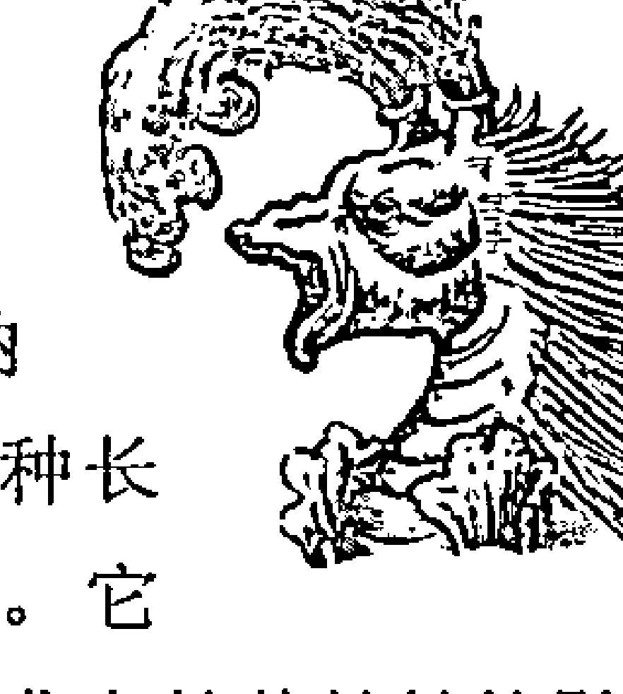

## 天鸡 (Heavenly Cock)（或黎明鸟）
——一种生活在中国，长着金色羽毛的三腿公鸡，它每天要啼叫三次——黎明、中午和日落。它栖息在扶桑树上时的第一声鸣叫就震彻天地，唤醒了世间万物。它产下的鸡蛋里孵出的红色小鸡是所有公鸡的祖先。

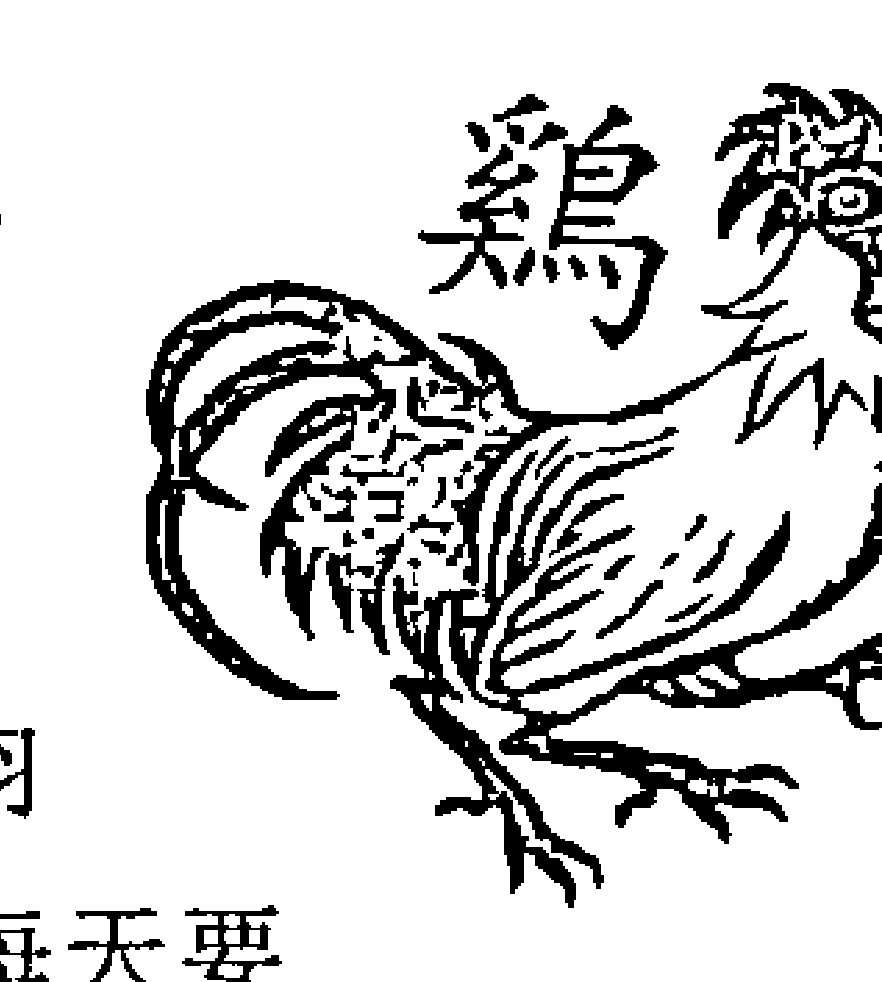

## 赫达姆 (Hedammu)
——古代美索不达米亚飓风神话中一种能吞噬一切的巨型海蛇。参见穆斯马胡 (Musmahhu)。

## 赫里奥德罗摩斯 (Heliodromos)
——中世纪欧洲传说中的一种纹章兽，混合了狮鹫和秃鹰的特点。它就是现在的格里芬秃鹫 (Griffin Vulture) (Gryps Fulvus)。

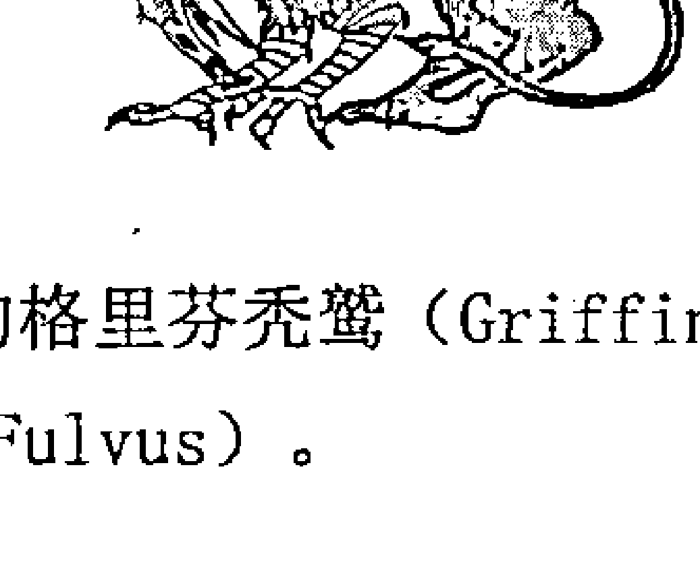

## 地狱看门狗 (Hellhounds)
——传统英式黑狗的一种变体，人们认为它们负责狩猎和驱赶死灵进入地狱，安维芬 (Annwfn) 或地下世界。它们的主人是死神。参见刻耳柏洛斯、西维芬 (Cwn Annwfn)、奎因·艾欧塔尔 (Coinn Lotair)、加布里埃尔猎犬、加姆、奇杜 (Kidu)。

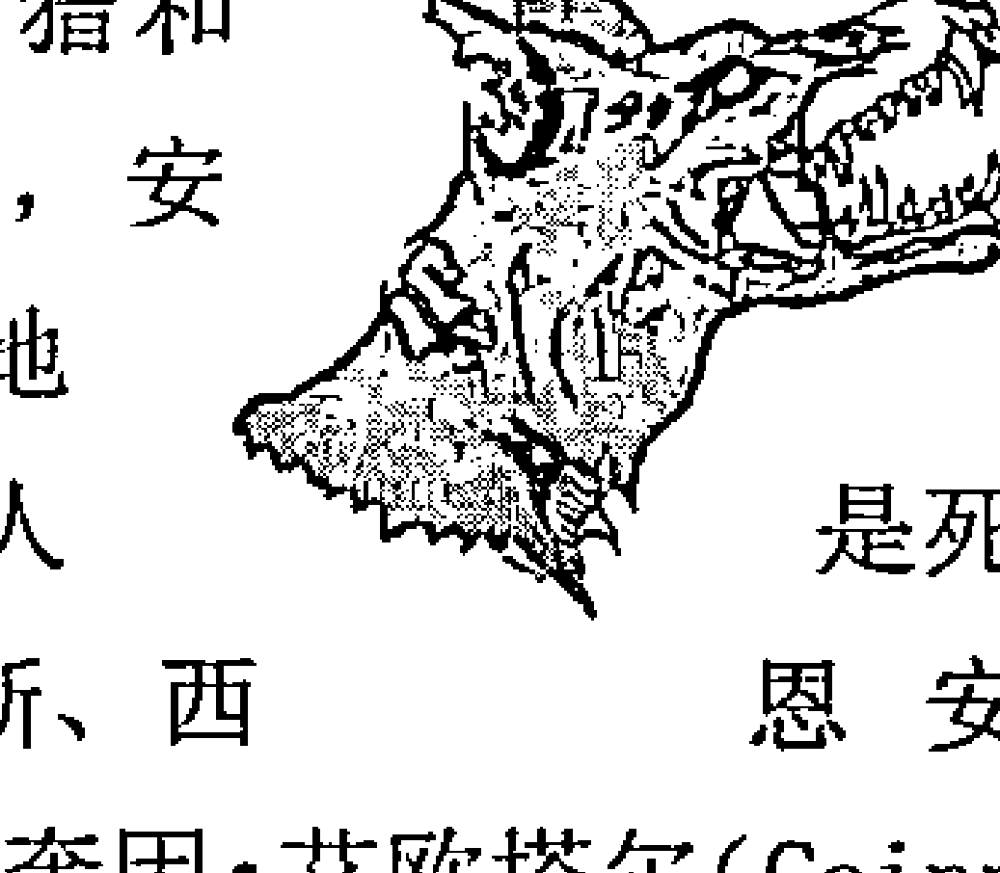

## 海西牡鹿 (Hercynian Stag)
——一种强壮的牡鹿，前额中央长着牛一样的独角——像一种独角麋鹿。它可能是一种已灭绝的更新世爱尔兰麋鹿巨角鹿（“大角”），这种麋鹿的化石确实存在。参见萨德乎扎戈 (Sadhuzag)。

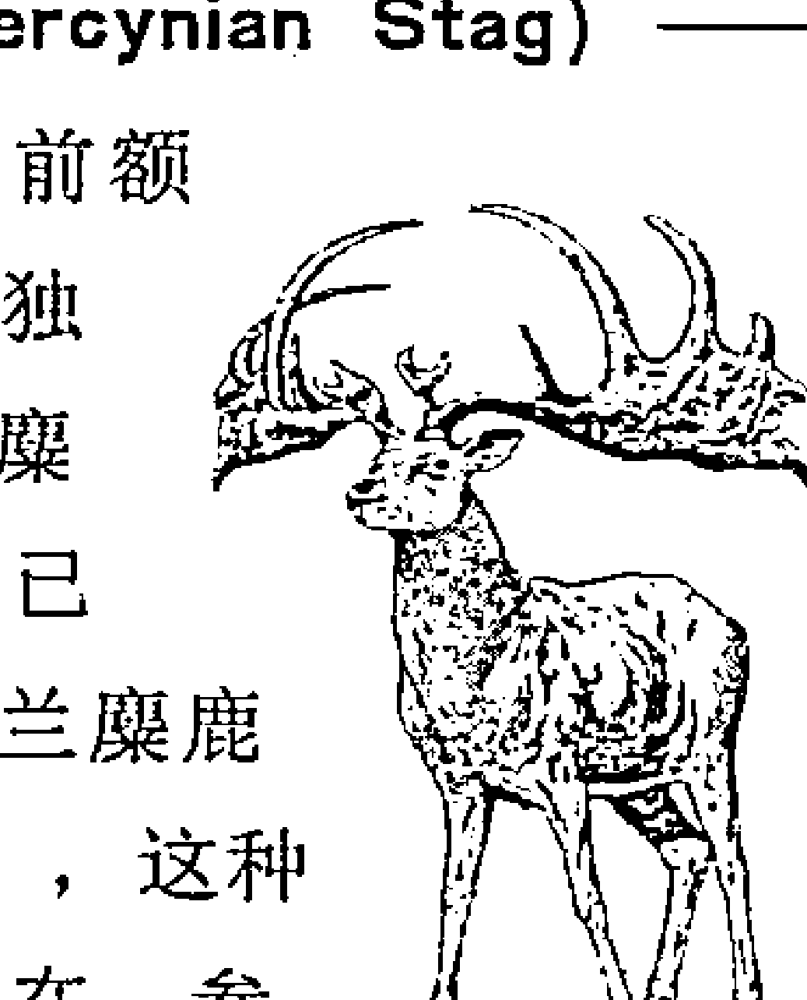

## 赫伦速尔戈 (Herren-Surge)
——巴斯克传奇中的一种七头蛇，虽然没有翅膀，但却能飞。它生活在地下，吞噬无人看管的家畜。参见天启兽、巴拉乌尔龙 (Balaur)、褚铎予铎 (Chudo-Yudo)、九头蛇、伊华伊弗路 (Ihuaivulu)、伊卢延卡 (Illuyankas)、卡利亚 (Kaliya)、克拉肯、利维坦、拉顿、罗坶、穆斯马胡 (Musmahhu)、那迦、大蛇、斯库拉、土班 (Thu’ban)。

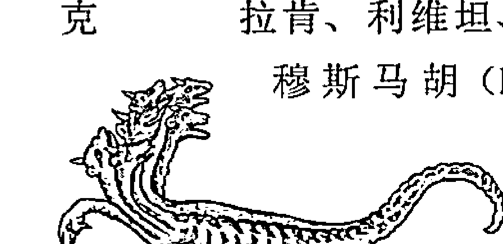

## **西八公 (Hibagon)**
——1972年，在日本日羽被发现的一种带有恶臭的原始人。它的外形酷似大猩猩，身高约五英尺，脸上长满长毛，眼睛突出，鼻子短翘。它的脚印长达10英尺，宽达6英尺。参见阿尔马斯、巴马奴、大脚怪、臭鼬猿、雪人、恶臭怪。

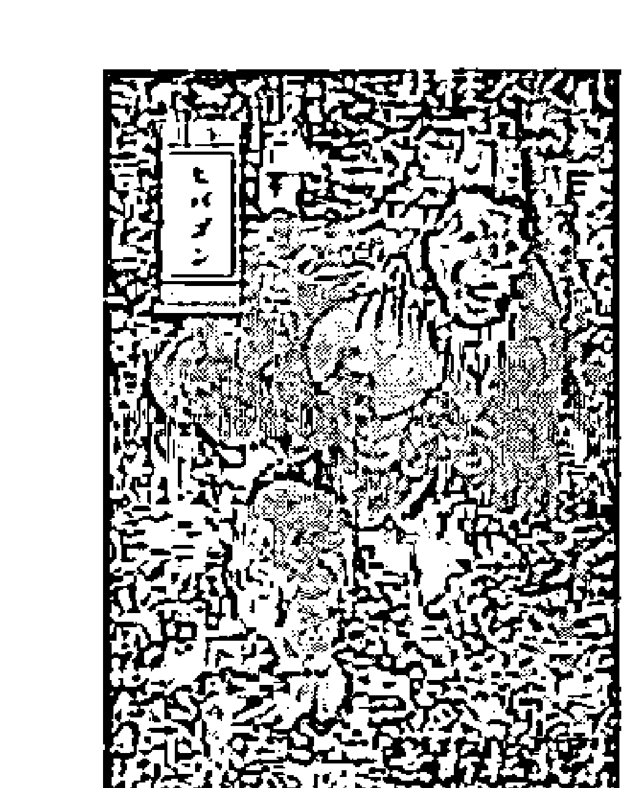

## **辛奎美门 (Hînqûmemen) （“吞噬者”）**
——不列颠哥伦比亚矫科达伦印第安人传说中一种独特湖怪，它是一种活的水体。如果有人从它的湖中取水，这个湖里的水就会跟在他们后面形成洪峰淹没村庄。

## **鸡马 (Hippalektryon)**
——希腊神话中神奇的公鸡马，据说它是一匹长着公鸡翅膀和尾羽的马。后来它成了一种华丽炫耀的图形符号，常被画在军官头盔上。

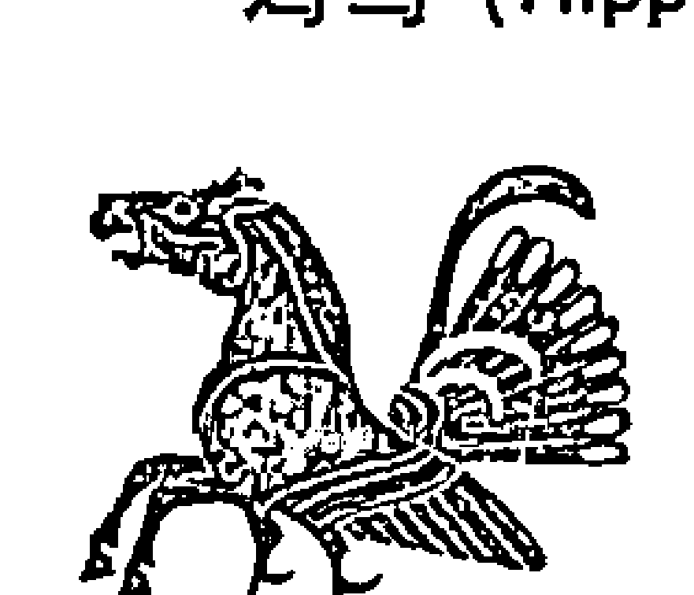

## **马头鱼尾怪 (Hippocampus) [希腊文中的“hippos”（马）和“kampos”（海怪），也叫“Hydrippus”（水马）]**
——古希腊罗马经典中的一种水怪或水马，长着马的头和前蹄，鱼的身体和尾巴。长在它们前蹄末端的不是马蹄，而是一种鳍状肢。它是海神波塞冬或涅普顿的坐骑，他的战车由一队海马拉动着。学名“Hippocampus”已被用来命名俗称 为海马的小鱼，最大 的一种海马身长约14英寸。参见马怪、马头、海马、水马。

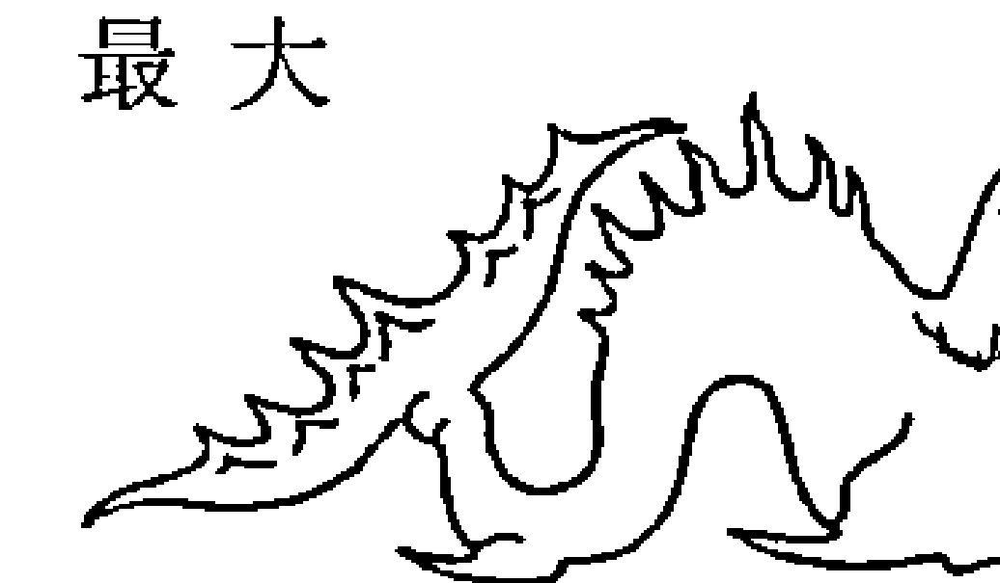

## **半人半马怪 (Hippocentaur) （“半人马”）**
——这是半人马的全名，它有马的身体和四肢，肩部以上长着人的躯干。有些半人马有着牛 (Bucentaur) 或驴 (Onocentaur) 甚至是鱼 (Ichthyocentaur) 的身体。半人马的原始版本是一个人（有人腿）背后长着一匹马的后半身。

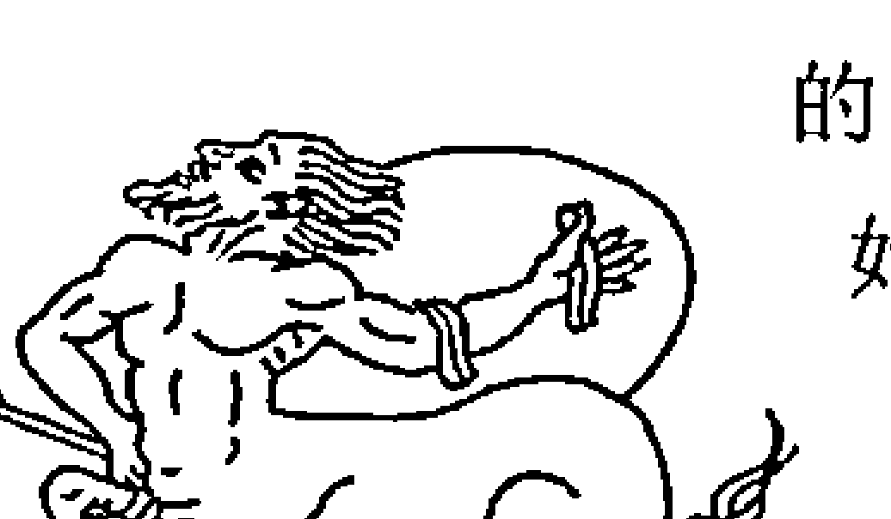

## **西婆塞夫 (Hippocerf) [希腊语中的“Hippocervus”（鹿马）]**
——一种欧洲纹章兽，前身像鹿后身像马，由于这种长相，它象征着犹豫不决。这种动物可能源自更新世爱尔兰麋鹿 (Megaloceros)，约在一万年前灭绝。参见海西牡鹿、萨德乎扎戈 (Sadhuzag)、夏纳奇。

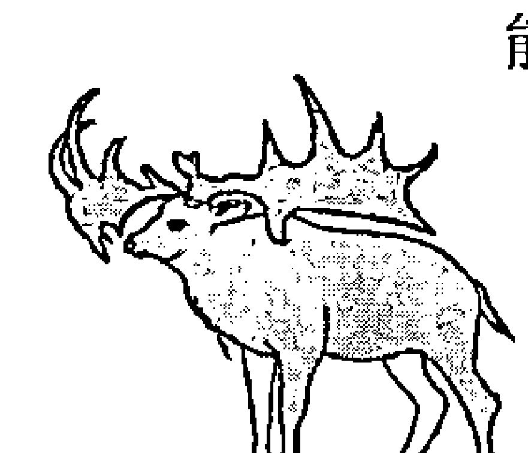

82

## **骏鹰 (Hippogriff) (希腊文中的角鹰兽“马狮鹫”)**
——与狮鹫类似，它长着老鹰的头部、翅膀、胸膛和爪子，但后半身不像狮子而像马。它居住在遥远的里费恩 (Rhiphaean) 山中，是雄性狮鹫（它最喜欢的食物就是马肉）与母马的后代。它快比闪电，曾出现在卢多维奇奥·阿里奥斯托 (Ludovicio Ariosto) 的《疯狂的罗兰》(Orlando Furioso) 中，是法师亚特兰的坐骑。

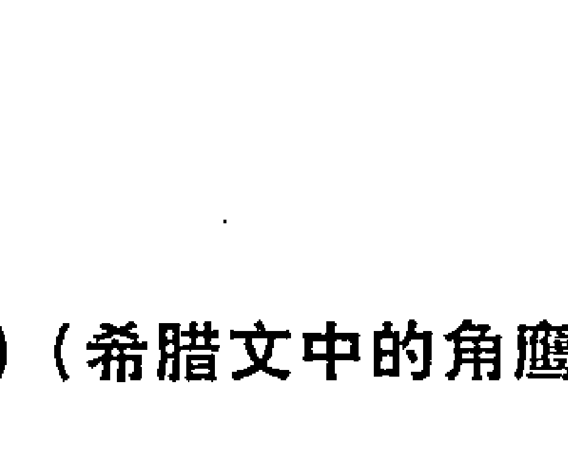

## **希尔怪 (Hirguan)**
——加那利群岛戈梅拉传说中的一种巨大的、毛茸茸的人猿。参见大脚怪。

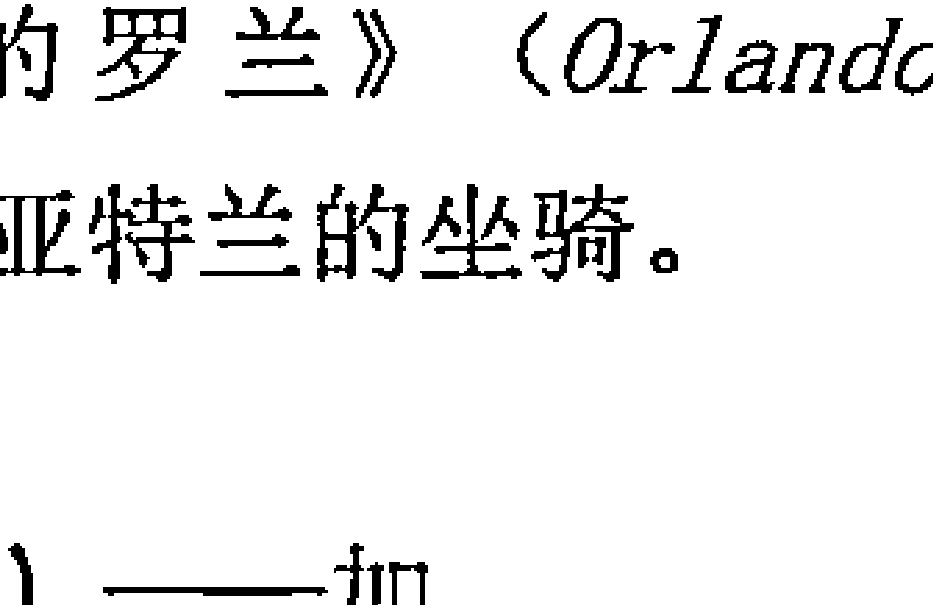

## **双头鸟 (Hiyakudori)**
——日本神话中的双头鸟。像天堂鸟一样，它象征着爱人间的结合。

## **胡嘎 (Hoga) [或奥杜拉 (Andura)]**
——一种据称生活在墨西哥特密斯提坦 (Themistitan) 湖中的巨型鱼怪，长着猪的头和耳朵，嘴边有很厚的胡须或长长的触须，还有巨大的獠牙或象牙。它能变成红色、黄色或绿色。它最有可能是加勒比海海牛 (Trichechus Manatus)。

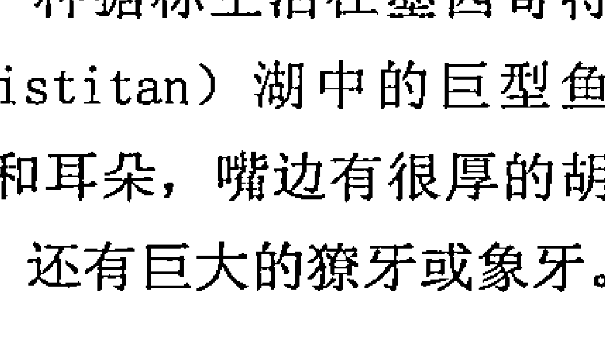

据称除了岸边的霍加树的树叶外，它还吃鱼和任何靠近水的动物。在南美洲，它被称为奥杜拉，很可能是指亚马逊海牛 (Trichechus Inunguis)，但也可能是亚马逊海豚 (Inia Geoffrensis) 或亚河豚 (boutO)。参见阿姆比兹 (Ambize)、伊普皮亚拉 (Igpupiara)、海猪。

## **日本凤凰 (Ho-Oo)**
——凰 (Ho) 是雄性，凰 (Oo) 是雌性。它来到人间帮助人类。它的出现预示着新时代的到来。之后它们回到天堂，等待下一个周期的到来。这与中国的凤凰 (Feng-Huang)非常相似，日本凤凰(Ho-Oo) 也被用以作为王室，特别是公主的标志。它代表太阳、正义、忠诚、服从。

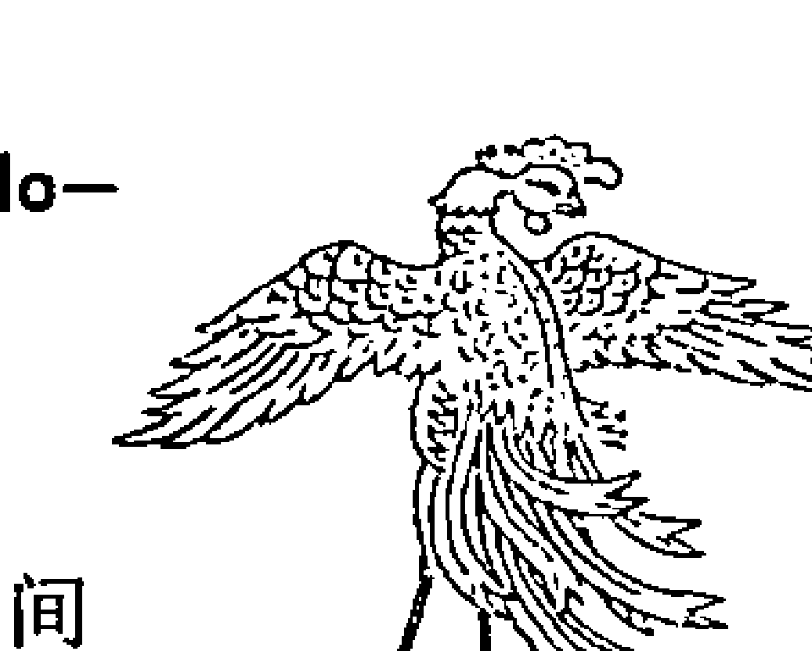

## **环箍蛇 (Hoop Snake)**
——美洲传说中的一种毒蛇，据说它会咬住自己的尾巴沿着地面像车轮样滚动，追逐猎物。在即将追上之时，它会打开身体，用尖尖的尾巴刺中猎物。这不禁让人想起乌洛波洛斯 (Ouroboro) 或双头蛇阿姆费斯巴娥娜的一种。一些隐生动物学家认为它源自一种美国西南部沙漠中的响尾蛇 (Crotalus Cerastes)。泥蛇 (Farancia Abacura) 通常被称作滚环蛇或因其用来捕猎的尖尾而被叫做针刺蛇。

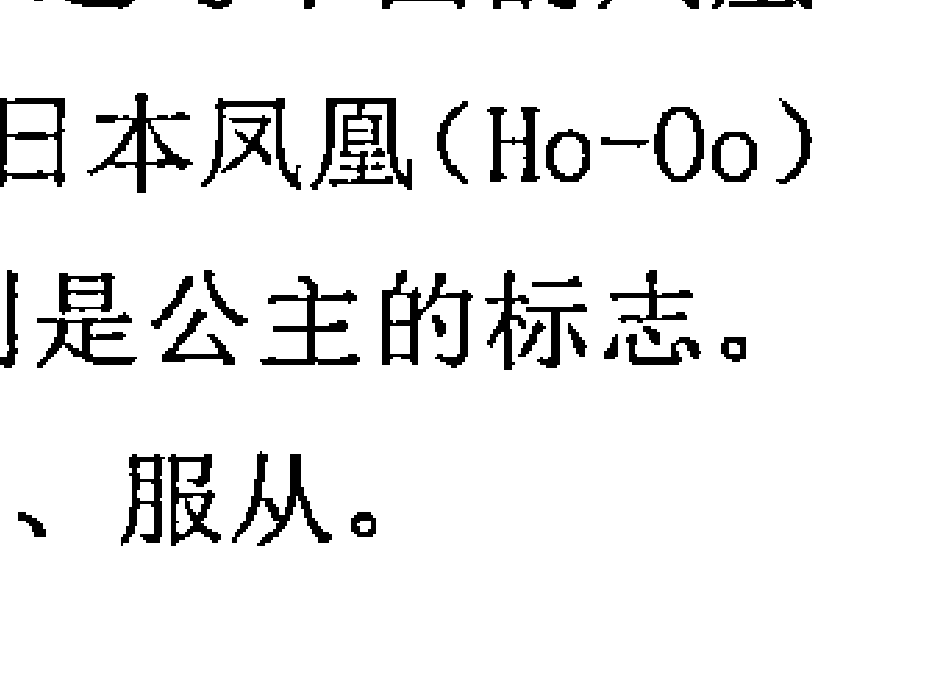

## **角鳄 (Horned Alligator)**
——美国南部平原基奥瓦印第安人传说中的一种湖怪。据称它是一种体型巨大的鳄鱼，头上长着两个有剧毒但也可被用于治疗的角。参见角蛇。

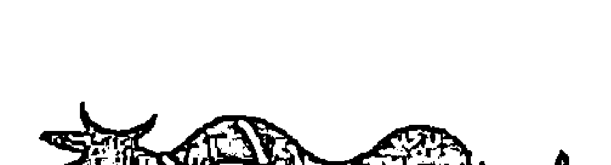

## **角蛇（Horned Serpents）（或大毒蛇）**
——美洲原住民传说中巨大的蛇形龙。它们非常长，长着大大的嘴巴，头上有角。它们的角或直或弯或有分叉。一些角蛇的头像蛇，有些则像马。它们对人类或仁慈或凶残。其中很多都长着蛇鳞，但像米斯金皮克 (Misikinpik) 却长着毛皮。通常情况下，吃角蛇的肉能让人变得聪慧，但也能让人变成角蛇。这种生物普遍存在于整个北美地区的土著文化中，通常以半神的形象出现。其名称包括：都农加斯 (Doonongas)（塞内卡族）、齐齐科内比克 (Kichiknebik)（易洛魁族、雷纳佩族和阿尔贡金族）、翁尼昂特 (Onniont)（修伦族）、科隆维斯 (Kolowisi)（祖尼族）、米斯金皮克 (Misikinpik)（克里族和阿尔冈琴族）、塔托苏克 (Tatosok)（阿本拿基族）、钦托撒开拓 (Tcinto Sakto)（克里族）、铁西皮特坎姆 (Tcipitckaam)（密克马克族和马里西特族）、托卡 (To Ka)（卡拉马斯族）、泽尔塔尔 (Tzeltal)（恰帕斯族）、金尼皮卡瓦 (Kinepikwa)、齐特齐阿特修西斯 (Kitychiat’ Husis)、密西皮芝维 (Mishipzhiw)、欧亚乐罗维克 (Oyaleroweck) 和希尤斯 (Sisiutl)。参见湖怪。

## **马鳗鱼（Horse-Eels）（也叫水马或马头）**
——世界各地都有的一种湖怪，是一种巨型的蛇形生物，长着马的头、脖子和耳朵。一些目击者说它长有角，所以这种生物也被称为水公牛或角蛇。有时据说它们有会发光的红色或黄色的眼睛，巨大的獠牙，能够喷火。参见海特里克、海库尔、哈维伊斯特、卡尔比。

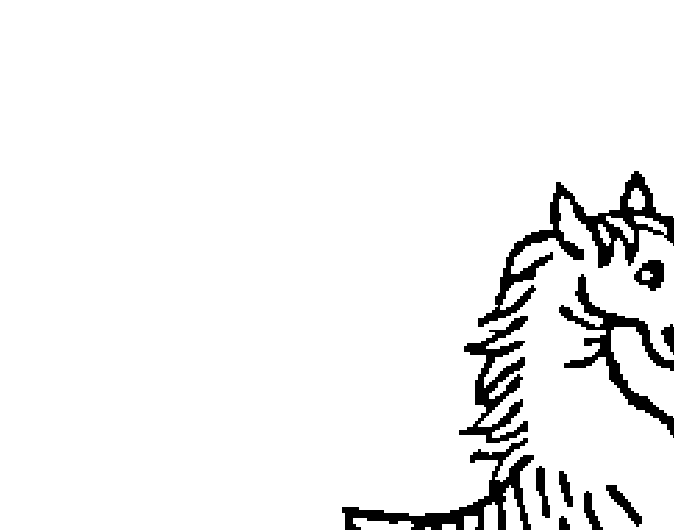

## **太阳马（Horses of the Sun）**
——在许多古老的文化中，太阳被视为一种由强大天马拉动划过天际的战车。在希腊神话中，太阳神赫利俄斯的战车由四匹有翅的天马拉动着。在印度吠陀神话中，七匹有黎明一样颜色的马拉着太阳神苏拉娅的战车，它们被称为干闼婆，此名来自一种苏美尔的天龙。在北欧神话中，两匹巨大的马拉着太阳女神苏娜的战车。在另一个北欧传说中，太阳战车是由一匹名为斯基法克西（“闪亮鬃毛”）的马拉动，而月亮战车则是由赫利姆法克西（“霜鬃毛”）拉动。

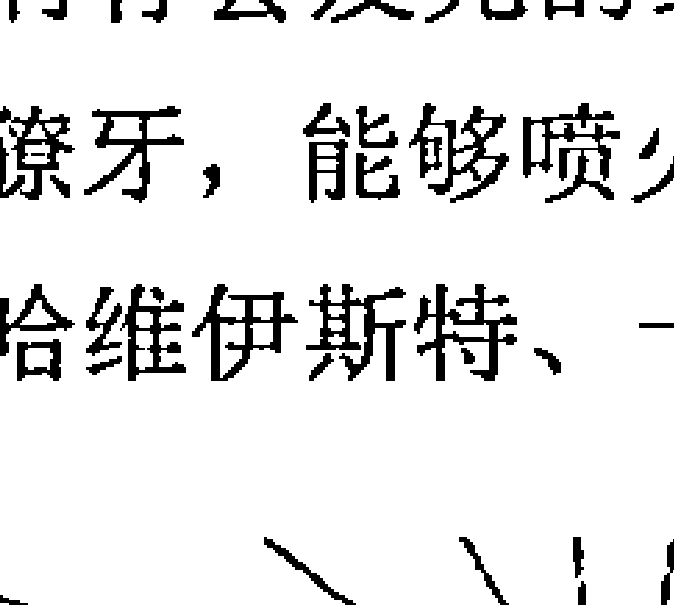

## **鬼猎人之犬（Hounds of the Wild Hunt）**
——这些会发光的狗是死神的侍从。当风暴掠过荒野时，人们就会说鬼猎人出门了，来捕猎人类和那些未经洗礼的婴儿。任何目睹过这种可怕的猎犬的人都会在一年之内患病死去。

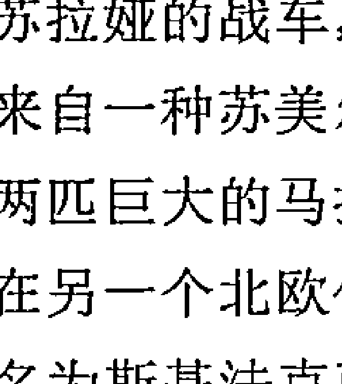

## **赫拉斯瓦尔格 (Hraesvelg) ("食尸者"或造风者)**
——北欧神话中一种巨大的像老鹰的鸟，它在北方冰峰的山顶筑巢。她的孩子就是她拍动翅膀时发出的寒风。参见柏默拉 (Bmola)、鹏鸟。

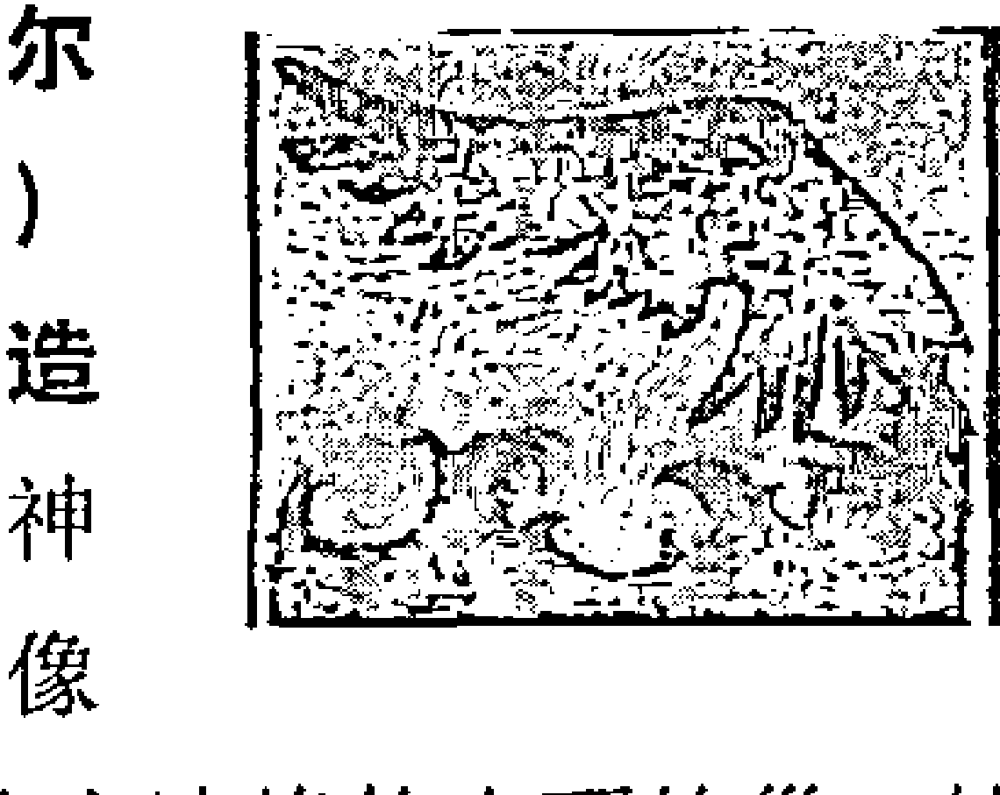

## **飞猴 (Hsigo 或 Hsiao)**
——这种中国的生物跟《绿野仙踪》里的飞猴一样。它们长着猿人的身体、狗的尾巴、鸟的头和翅膀、人的脸。它们很可能来自印度、亚洲、印度尼西亚和澳大利亚的果蝠，或“飞狐”。它们中体型最大的马来大飞狐 (Pteropus Vampyrus) 的翼展可达 6 英尺，而体重只有 3.3 磅。这些猴子大小的蝙蝠与其它的食虫蝙蝠不同，它们的基因更接近灵长类动物。参见阿胡、阿兰、欧利提奥、红毛蝙蝠、罗翱、越南夜行飞兽。

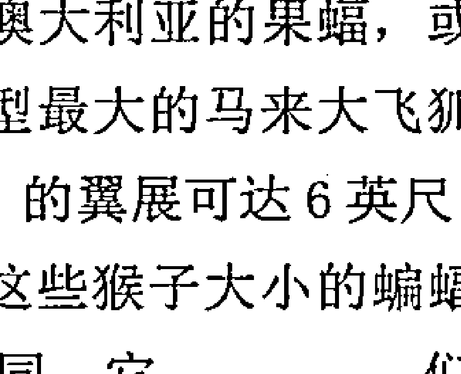

## **Hua – Hu – Tiao**
——中国佛教神话中一种有翅的巨大白象。它会不时逃出禁闭危害世间。最终，它将英雄 Yang Jing 吞了进去，但却被他从体内杀死。参见科洛莫杜莫 (Kholomondumo)。

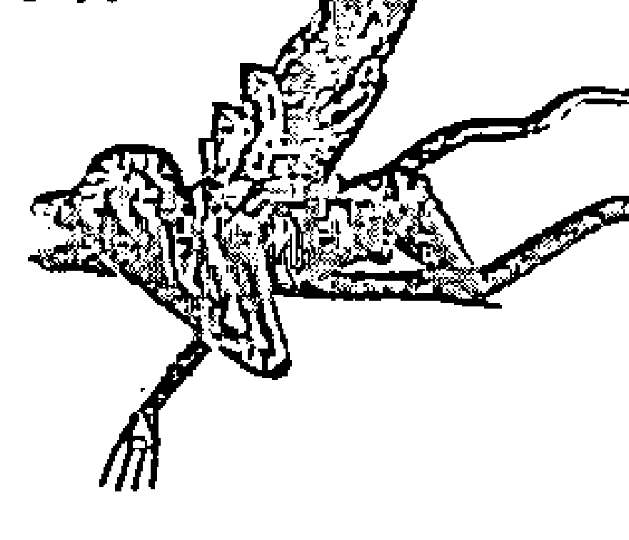

## **瓦雷盆 (Huallepén 或 Guallipen)**
——智利的一种水怪，长着绵羊的身体、小牛的头和扭曲的腿。它潜伏在荒凉的池塘和水道里，与附近的母牛或母羊交配。它们的后代长相畸形。如果孕妇见到它或它的后代，她的孩子也会变得畸形。

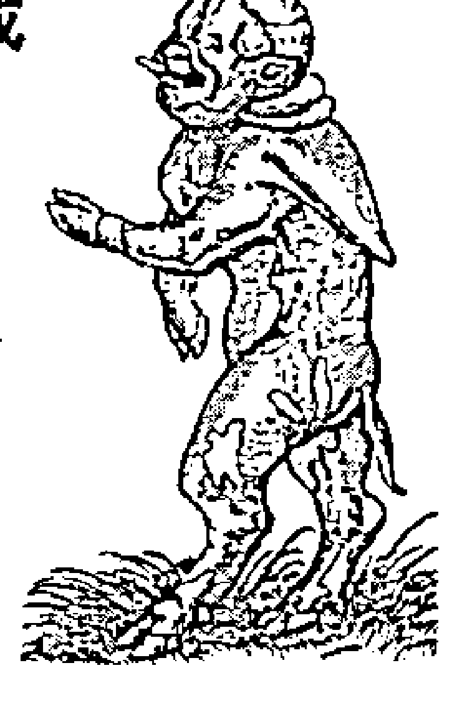

## **回克回克 (Hueke Hueku) ("皮革")**
——南美的一种栖息在湖泊和河流中的可怕水生生物。当地人说，当漂浮在水面上时，它看起来就像一张拉长的动物皮。这与“藏匿者”奎罗这种生物很相似，它被认为是一种淡水章鱼。有一种生物符合这种描述，它就是日本的煎饼章鱼 (Poisthoteuthis Depressa)。参见米加斯 (Migas)、俄克拉荷马章鱼。

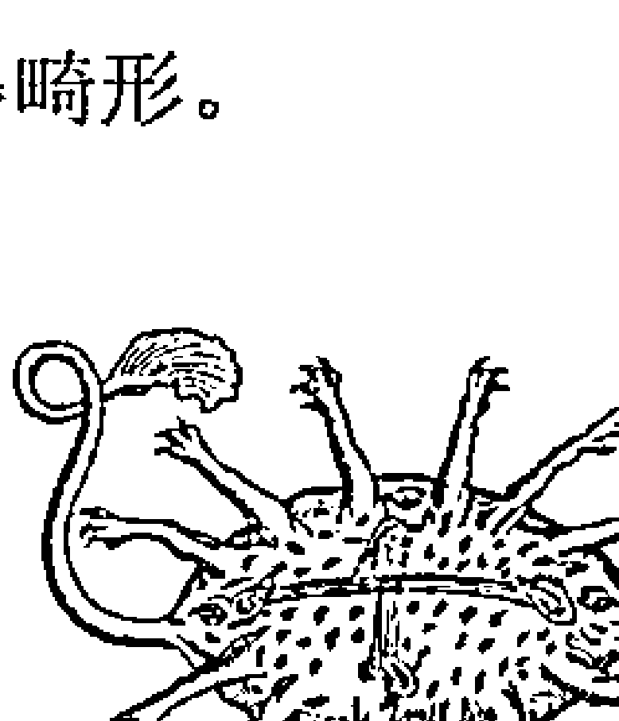

## **氵军 (Hui)**
——中国一种巨大的人头狗。它强壮的腿能越过一切阻碍它前进的障碍物，它也不怕人类。它的出现预示着台风即将到来。

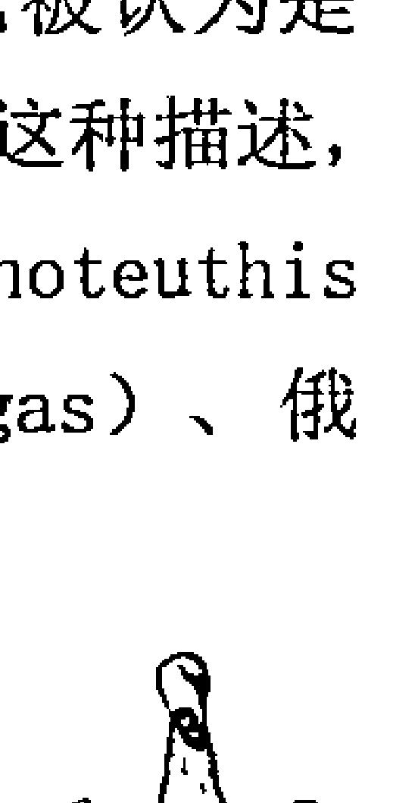

## **洪巴巴 (Humbaba) (哈瓦瓦 Huwawa 或浑巴巴 Kumbaba)**
——在古代苏美尔的《吉尔迦美什史诗》中，这种动物是森林的守护者，被描绘成一个有角、狮爪和牛尾的怪物。它被英雄吉尔迦美什和恩奇都杀死。

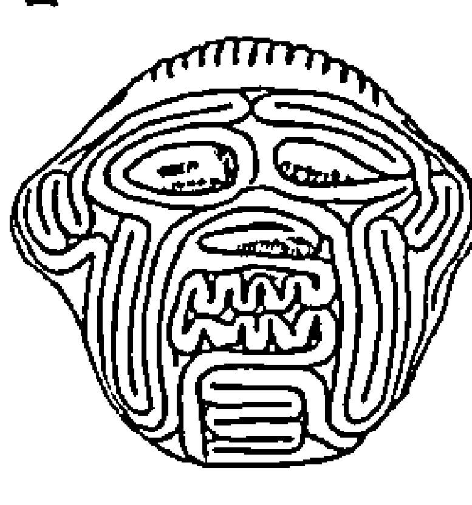

## **呼玛 (Huma)**
——波斯和印度神话中的天堂鸟，它住在天上，从未到过人间。呼玛是雌雄同体的，它们分别拥有一只翅膀、一条腿。像凤凰一样，每过几百年它们就要浴火重生一次。它是一种具有同情心的鸟，为了避免杀害动物，它宁愿吃腐肉。任何看到或触摸到它的人都会得到祝福和好运。参见司姆弗 (Simmurgh)。

米诺尔印第安人传说中的一种臭烘烘的生物。它全身呈灰色，长着马尾和有大耳朵的狼头。它生活在荒凉的地方，并不对人产生直接的威胁，但它被认为是疾病的载体。幸运的是，它散发出来的可怕恶臭让人能够轻而易举地避开它！参见臭鼬猿。

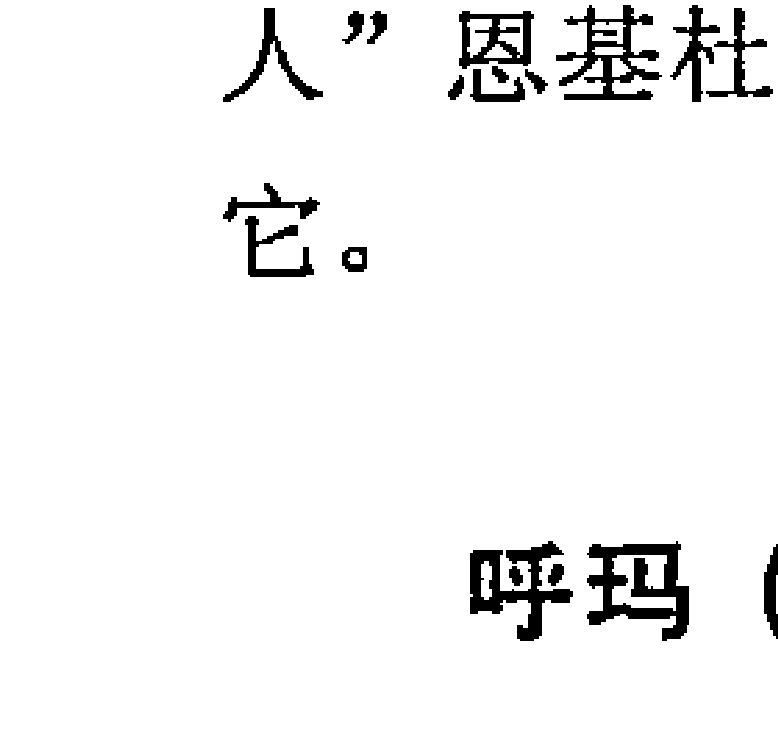

## **修斯帕里姆 (Huspalim)**
——一种由旅行者昂布鲁瓦兹·帕雷 (Ambroise Pare)（1517-1590年）发现的埃塞俄比亚生物，它像一只巨大的旱獭，长着有红色斑点的无毛皮肤和圆圆的爪子。其超大的头部有一个长着微小耳朵的猴子脸。在扎克特拉 (Zacotera) 岛上，它们都被关在笼子里当作食物，但它们的肉很硬，很难弄软。参见塔纳克特 (Thanacth)。

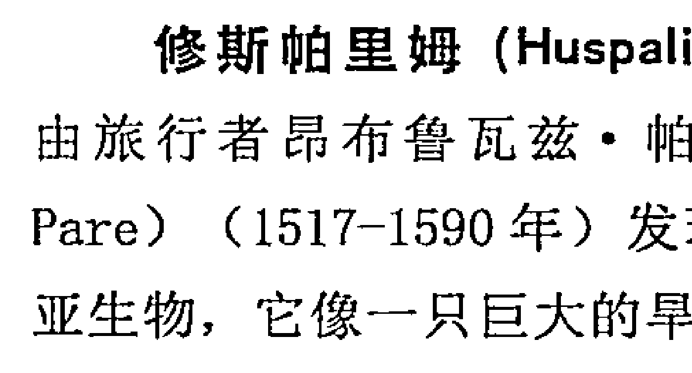

## **弗克卡普克 (Hvcko Capko) (Semilone “长耳”)**
——米诺尔印第安人传说中的一种臭烘烘的生物。它全身呈灰色，长着马尾和有大耳朵的狼头。它生活在荒凉的地方，并不对人产生直接的威胁，但它被认为是疾病的载体。幸运的是，它散发出来的可怕恶臭让人能够轻而易举地避开它！参见臭鼬猿。

## **九头蛇 (Hydra)（也叫艾克拉 Exedra 或勒纳湖九头蛇）**
——一种居住在希腊阿尔戈里斯勒纳沼泽中的可怕的多头龙。她是厄喀德那和提丰的孩子。其狗一样的身体上长着9个或更多布满蛇纹的脖子。她只有一个头是不朽的，但如果其它的头被砍掉，在原处就会长出两个头来。赫拉克勒斯和他的侄子伊俄拉俄斯在其第二项功绩中将其杀死，伊俄拉俄斯烧掉了赫拉克勒斯交给它的那个头颅。这种怪物最古老的图像似乎是用来描述一种巨型鱿鱼 (Archieteuthis) 的。九头蛇所在的星座是最大的星座，被列入了托勒密的48个星座中。她的名字现在被用于命名微小的触脚水生生物。参见天启兽、巴拉乌尔龙 (Balaur)、褚铎予铎 (Chudo-Yudo)、赫伦速尔戈 (Herren-Surge)、伊华伊弗路 (Ihuaivulu)、伊卢延卡 (Illuyankas)、卡利亚 (Kaliya)、克拉肯、利维坦、拉顿、罗姆、穆斯马胡 (Musmahhu)、那迦、大蛇、斯库拉、土班 (Thu’ban)。

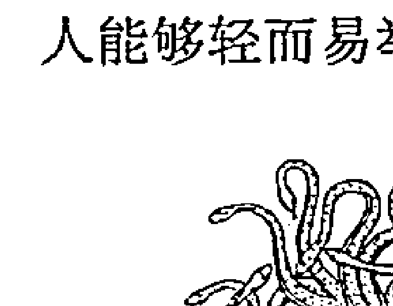

## **水蛇怪 (Hydrus) [或伊德鲁斯 (Idrus)]**
——《生理论》中一种生活在埃及尼罗河河岸的奇怪三头蛇。它是窄吻鳄，或尼罗鳄 (Crocodylus Niloticus) 的死敌。

据说它能进到鳄鱼肚子里，从里面切开它的肠胃。参见埃及獴 (Ichneuman)。

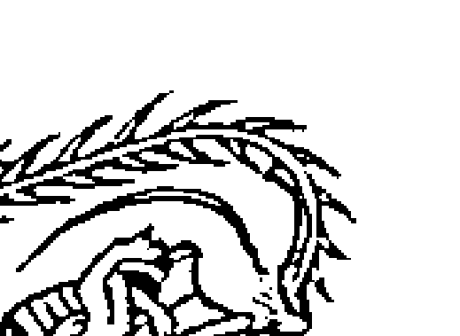

## **海曼托普德斯 (Hyman Topodes)**
——根据苏勒德斯 (Solinus) 的《世界奇观》（公元4世纪），这是一种生活在利比亚，可怜的山羊般的生物。它的腿耷拉着无法行走，只能缓慢地蠕动身体。

## **瘤鼻蝮蛇 (Hypnale)**
——根据《生理论》记载，这种蝮蛇能催眠猎物后将其杀死。它源自埃及眼镜蛇 (Naja Haje)，应该是克利欧佩特拉自杀时用的那种。

## **半人马鱼 (Ichthyocentaur)**
——I 指的是半人马鱼，一种半马、半人、半鱼的生物，它被奇怪地拼凑在一起。尾巴上的鱼鳍卷起泡沫，它自由地潜水和跳跃在富饶的大海中显示自己的力量。

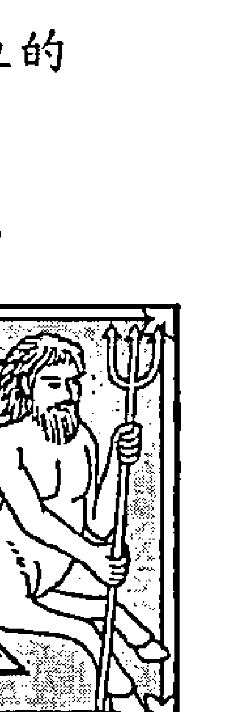

## **伊安克伊姆 (Iak Im) [或亚吉姆 (Yagim)]**
——生活在西北太平洋地区的夸口特尔印第安神话中的一种巨型鲨鱼，攻击渔民、颠覆船只、吞噬船员。可能源自史前的巨齿鲨 (Megalodon)。

## **艾斯戈当克 (Icegedunk)**
——加拿大不列颠哥伦比亚省维多利亚周围地区流传的一种奇怪的陆地鳍足类动物，它有小小的耳朵和逐渐变细的身体。在它身体末端附着一个用于行动的轮状奇异物体。不幸的是，当地人称它们已濒临灭绝。

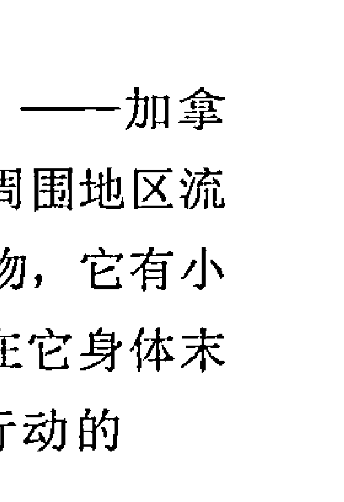

## **冰虫 (Ice worms)**
——1898年由一名前往阿拉斯加克朗代克淘金的年轻记者所发现的住在冰川里的蠕虫。他写道，由于近期天气寒冷，这些蠕虫爬出冰层“晒太阳，以驱走这异常的寒冷”。这很快便在当地流传开来，科尔多瓦斯 (Cordovas) 镇因此每年都要举办一次冰虫节。虽然大家都认为这种虫子纯属子虚乌有，但在 1887 年，真正的冰虫 (Mesenchytraeus Solifugus) 在阿拉斯加的缪尔冰川被发现，它们以雪地上的藻类为食，身长只有一英寸，体色为黑色、蓝色或白色。冰虫 (Solifugus) 是拉丁文中的“sunavoiding”。它只在夜间活动，黎明时分则退回冰层下。当温度达到华氏四十度时，它的表膜便会融化，身体也将变成液体。

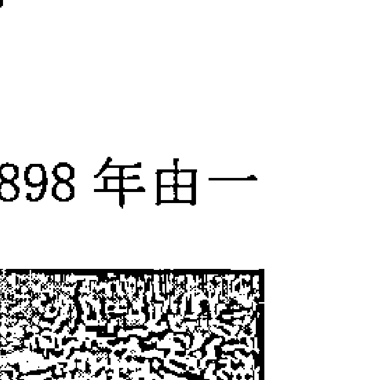

## **埃及獴 (Ichneumon)（或埃及獴）**
——一种类似猫鼬的动物，被古埃及人视为神圣的生物，据说它能对抗眼镜蛇和鳄鱼。

## 鼬鼠 ——一种凶猛的埃及黄鼠狼，老普林尼、普鲁塔克和斯特波认为其是蝮蛇、蜥蜴和窄吻鳄的天敌。与水蛇怪(Hydrus)极其相似地，它会用泥土将自己掩盖起来，然后爬进鳄鱼的肚子里从内部将其吃掉。它被认为是猫鼬(Herpestidae “蛇杀手”)，但本文作者认为它是细尾獴(Meercat)。

## 半人马鱼 (Ichthyocentaur)

在《生理论》的描述中，这是一种半人马的水生变种，它有男子的躯干、手臂和头，马（或狮子）的前肢，海豚或鱼的下半身，跟海马类似。它代表着生育力。

## 艾尔米斯奇 (Iémisch) [或蛇狐(Vulpangue)]

一种长着蛇的身体和尾巴以及狐狸上身的巴塔哥尼亚怪物。它用尾巴绞死猎物。参见格里历威鲁(Glyryvilu)、塔泽尔亚龙。

## 伊普皮亚拉 (Igpupiara)（或Hipupiara“水中居民”）

一种巴西人鱼，有人的躯干和鱼的下半身及尾巴。它的头部类似海豹，五指间有蹼。这很可能指的是亚马逊海牛(Trichechus Inunguis)。从十六世纪到十七世纪初，有很多关于它的目击报告。据说它会将人类诱入水中，吃掉他们的眼睛、鼻子、乳房、生殖器、手指和脚趾，然后任由面目全非的尸体被水流冲到岸上。尽管它听起来更像皮拉纳斯(Pirahnas)（臀点脂鲤属），但攻击者可能是亚马逊海豚(Inia Geoffrensis)。在巴西葡萄牙语中，这种动物因其明亮的粉红色皮肤被叫做Boutu Vermelho——“红色海豚”。参见阿姆比兹(Ambize)、霍加。

## 伊卡鲁·纳帕 (Ikalu Nappa)

因纽特人传说中居住在北极的人鱼。可能源自1768年被欧洲探险队灭绝的星体海牛(Hydrodamalis Gigas)。参见毛人鱼。

## 伊尔凯 (Ilkai) [也叫里Ri，皮钦语中的皮西莫里(Pish-meri)“女人鱼”]

新爱尔兰、新几内亚北部岛屿上的一种海洋生物的本地名称。它们通常生活在茫茫大海中，在黎明和黄昏时游到珊瑚礁洞穴中找寻浅滩中的大叶藻。据说它们与人鱼很像，有着鲸鱼的尾巴和人类的乳房及生殖器。雌性人鱼在水中直立着喂养孩子，将它们抱在有蹼的手臂中。实际上，它们是人鱼传说的起源。它们都源于一种真实存在的珍稀动物，海牛，及动物学家所说的印度洋儒艮（儒艮目）。

# 图鉴一、魔法动物展

洛姆巴（llomba）——非洲赞比亚和扎伊尔民间传说中的一种超自然吸血鬼。它们是由巫术创造出来的物种，长着跟其创造者一样的容貌。被它杀死的人或动物能被其主人用作僵尸奴隶，如果它因饥饿而死，它的主人也会死去。

伊玛普乌玛苏尔萨（Imap Umassoursa）——格陵兰因纽特人民间传说中住在北极海岛上的怪物。它能从船只下方将其驼起，然后将其放翻到冰冷的海中。参见、阿斯匹多彻龙（Aspidochelone）、法斯提克隆（Fastitocalon）、克拉肯、卓拉唐（Zaratan）。

I - Mu Kuo Yan——中国传说中人神一体的鸟类，是一个长着羽毛，手臂变成翅膀的人。它们很胆小，总是远离人类。参见天狗。

怪兽因德里克（Indrik the Beast）——俄罗斯民间传说中一种神奇的双角兽，被称为动物之王，住在圣山上，统管水世界，还有蛇和鳄鱼。他走动的时候，大地都会震颤。传说他曾解救人类于一次大干旱中。他的名字——独角兽的一个变种——已被用来命名巨犀（Indricotherium）（如图所示），一种生活在二、三十万年前的巨型亚洲无角犀牛。它是有史以来最大的陆地哺乳动物，身长可达30英尺，肩高有18英尺，体重达20吨。

因基纳（Ingheena）——19世纪晚期被旅行者鲍迪奇夫妇，在加蓬湾附近发现的一种非洲猿，或四手灵长类动物。他们并非亲眼看到它，而是听当地人的介绍，“这些庞大的动物靠着后腿直立行走，从来没有被活捉过。它们会观察人的动作，并尽可能地模仿他们……它们建造的房子和人类的差不多，但却不住在屋子里。如果幼崽去世，它的母亲会将它抱在怀里直到腐烂。它们一掌就能拍死一个人，没有什么能比它们更凶猛的了。”（比埃尔，1887年）。它们实际上就是低地大猩猩（Gorilla Gorilla），只是在当时那个人们还认为世界上所有的猿人都住在树上的年代，被当成了神话动物而已。

墨猴（Ink Monkey）（或钢笔猴）——一种中国小猴子，其历史至少能追溯到公元前2000年，现在已然灭绝。它只有4-5英寸长，是文人的传统宠物，据说它会磨墨，舔食墨汁，并会在主人的书桌上排泄。

## 尹土罗 (Intulo)

——在南非夸祖鲁-纳塔尔省的祖鲁民间传说中，这是一种长有人类特征的蜥蜴怪。参见鳄鱼人、蜥蜴人、密勒湖湖怪。

## 因弗彻 (Invunche) （“隐藏大师”）

——智利民间传说中的一种可怕吸血鬼，像一只巨大的充了气的动物皮囊或膀胱。它居住在一个只有一个细小通道的湖下洞穴中。尽管它无法离开巢穴，但它却有帮凶——特雷奎湖库夫 (Trelquehuecuve)。它会引诱年轻女孩下水游泳，然后将她们带到因弗彻的洞穴中，然后吸干她们的血液。参见奎罗。

## 岛怪 (Island Beast)

——一种异常庞大的海怪，它非常巨大，水手们甚至会将其误认为是一个岛屿，然后在上面停靠、登陆，之后它就会沉入海中，将水手淹死。很多故事将其描述为一只巨大无比的海龟、鲸鱼或蜈蚣。参见阿斯匹多彻龙、法斯提克隆 (Fastitocalon)、伊玛普乌玛苏尔萨 (Imap Umassoursa)、吉阿斯卡尼俄斯 (Jasconius)、克拉肯、卓拉唐(Zarantan)。

## 易特奎因特里珀特卓特里 (Itcuintlipotzotli)

——一种像小猎犬那么大，生活在墨西哥的奇怪生物，身上无毛，长着狼头，但没有脖子，尾巴很短，背上还有一个巨大的驼峰。它被一位耶稣会教士描绘在一本 1780 年的书中。1843 年，有人报告说在墨西哥城附近杀死了一只这种生物。难道它是一种卓柏卡布拉 (Chupacabra)？

## 易万厄 (Iwanèï)

——在厄瓜多尔黑瓦洛印第安人的民间传说中，它们是喜欢用各种方式杀死猎物的恶魔蛇。它们中有一种叫潘集 (Panji)，是一只巨大的水蟒。还有一种叫曼坎厄 (Mancanèi)，一种致命的毒蛇。参见卡姆迪 (Camoodi)、马瓦蒂 (Mawadi)、斯特普、苏库里居吉甘特 (Sucuriju Gigante)。

## 伊亚 (Iya)

——一种北美拉科塔印第安人民间传说中全身恶臭的，巨大的无形食人怪。

J 指的是泽西恶魔 (Jersey Devil) 它身高 4 英尺，长着狗一样的脑袋和马蹄，还有其它奇怪的特征。蝙蝠翅膀、老鼠尾巴，它能在墙壁和树上行走。然后凭空消失掉，噗的一声，再也不见。

## 加卡洛浦鹿角兔 (Jackalope Jackalope) (也叫角兔、兔子阿姨、牡鹿兔)

——美国西部一种著名的奇幻小动物。它是一种长有鹿角或羚羊角的长耳大野兔。1932 年，它是被怀俄明州道格拉斯的作家道格拉斯·赫里克（1920-2003 年）所发现的。在 1930 年代，美国有印有加卡洛浦鹿角兔的明信片出售，而在酒吧和动物标本工作室里，仍然有它们的标本。角野兔的传说遍布欧洲各地——尤其是德国和奥地利——它们都可能来自感染了兔乳头瘤病毒的兔子。那是一种很常见的临时肿瘤，会让兔子的耳朵看起来就像是角一样。16 世纪至 18 世纪的欧洲博学家的作品中很多角野兔的图像也是受此启发。然而，上新世时，在北美洲确实存在着一种长角的囊地鼠（gopher）（圆角鼠属，啮齿目）。参见珍妮哈尼文斯（Jenny • Hanniver）、米拉吉（Miraj）、劳拉克尔（Raurackl）、鹿角小飞兔（Wolpertinger）。

## 沙漠跳鼠 (Jaculus) (“标枪”)

——一种被罗马诗人卢坎（公元 39-65 年）记录在他《内战记》“Pharsalia”中的一种长着小翅膀、9英尺长的飞蛇。老普林尼说它有两个长着倒钩的蛇头。它看守着阿拉伯的香料树，如乳香。它会将自己的毒牙像标枪一样射入受害者的喉咙里。它搜集闪亮的物品，如黄金和宝石，有些人就据此推测它是一种喜欢这么做的鸡。这个名字现在一般用于命名一种彩色的、3英尺长的飞蛇 (Chrysopelea Paradisi)， 或东南亚、印度和锡兰的“天堂蛇”，它们从树上射出去，摊平自己的肋骨在空中滑翔，从而跨越相当长的距离。参见阿姆费特尔 (Amphitere)、范德范拉 (Fandrefiala)。

## 美洲虎豹 (Jagleop 或 Jagulep)

——二十世纪初在芝加哥动物园饲养着的美洲虎和雌性豹子的后代。这种身上长有斑纹的雌性豹子生下了后来颇具争议的狮虎豹 (Lijagleop)， 因为它被人们误解为传说中的“刚果斑点狮”，或斑点狮(Marozi)。参见帕尔杜斯豹 (Pardus)。

## 加拉皮里 (Jarapiri)

——澳大利亚爱丽斯斯普林斯西北部的一种精灵怪，腰部以上是人，腰部以下是蛇。它与维姆巴拉卡（Wimbaraka）颇有渊源。参见那迦。

## 吉阿斯卡尼俄斯（Jasconius）（拉丁爱尔兰语中的“鱼”）

——爱尔兰僧侣圣布伦丹（公元484-578年）在其为期七年，前往圣人乐土的旅途中碰见的一种巨大的海怪。这位和尚在一座石头小岛上登陆，当他做完复活节弥撒，开始生火煮饭时，这座小岛开始摇晃了起来。他们一行所有人跑回了船上，看见那座“小岛”慢慢地游走了。布伦丹告诉其他人，上帝曾在梦中告诉他，这座小岛实际上是一种恐怖的鱼：“它是海中最大的生物，总是企图咬住自己的尾巴，但是他太长了，总是够不到。他的名字叫吉阿斯卡尼俄斯（Jasconius）。”参见阿斯匹多彻龙、法斯提克隆（Fastitocalon）、伊玛普乌玛苏尔萨（Imap Umassoursa）、岛形野兽、卓拉唐（Zaratan）。

## 珍妮哈尼文斯（Jenny Hanivers）

严格地说，它们都只是些长得像龙或海的鳐鱼，它们的标本做得很好，简直就像真的一样。据说它的名字来自比利时的安特卫普（Anvers）（现在的Antwerp），这是他们创作的主要中心。其它由标本师创造出来的符合生物有巴斯里斯克（Baslisk）、蛇鸡兽、鹿角兔（Jackalope）、鹿角小飞兔（Wolpertinger）和毛鲑鱼（FurBearing Trout）。最受欢迎的生物是人鱼，由猴子和鱼尾组成的——比如P.T巴纳姆（P·T·Barnum）著名的作品“斐济人鱼”。最早的人鱼都是产生在东方的，它们被当作纪念品卖给旅行者。如今它们都变成了珍贵的收藏品，仍活跃在狂欢节市场上，在那里它们被叫做格弗斯（Gaff）。

## 简谷（Jengu）（复数形式为米恩谷 Miengu）

——非洲喀麦隆萨瓦族传统信仰中的一种水灵。据称它们是漂亮的人鱼，长着长而蓬松的头发，牙齿不全。它们住在河流和海洋中，会给信徒带去好运。它们能治愈疾病，并在信徒和世界之灵之间扮演中间人的角色。在白克瑞族（Bakweri），它们被称为里恩谷（Liengu）（复数形式为马恩谷 Maengu），在女孩的成年仪式中它是一种很重要的元素。

## 泽西恶魔（Jersey Devil）

——美国最有名的“神秘怪兽”。自首次在19世纪初出现以来，它在新泽西周围已被目击2000多次。据称它是一种身高3至4英尺的鸟类生物，翼展达2英尺，有一个四方的头，像马或狗一样会发光的眼睛，还有刺耳的叫声。它的前肢很短，有马一样的偶蹄和鹤的后腿，还有一条长长的毛发破烂的尾巴，身上的皮毛呈棕色或黑色，但黑色的翅膀上却没有毛。它能用它奇怪的蹄子爬上树，从一个屋顶跳到另一个屋顶，然后消失在道路和旷野中。它可能是罕见的沙丘鹤（Grus Canadensis）、史前翼龙或超自然的恶魔。参见空阿马托（Kongamato）、斯纳利加斯特尔食人鸟怪（Snallygaster）。

**季德拉 (Jidra)** ——一种在地中海旅行者之间，中东传说中，以及 L·利文生（L·Lewysohn）的《动物法典》“Zoology des Talmuds”（1858年）中提到的贪婪的动植物融合体。它生长在植根于地下的藤蔓上，是一种人形的南瓜，它神奇的骨骼在被磨碎后加进葡萄酒中就成了春药。它会吃掉所有其藤蔓能够抓住的东西，如果藤蔓被剪断，它就会惨叫着死去。参见曼陀罗。

**地震甲壳虫 (Jinshin-Mushi)** ——一种奇怪的甲壳虫，据说是造成京都和日本南部地震的元凶。其有鳞的巨大身体长着10只腿毛茸茸的蜘蛛腿和一个龙的头。参见地震鱼（Jinshin-Uwo）、卡米（Kami）。

**地震鱼 (Jinshin-Uwo)** ——这种700英里长的鳗鱼背负着日本列岛。它的头在京都的正下方，它用一个巨大的铆钉穿过鹿岛的寺庙花园的地面来将日本固定在其背上。当它甩动尾巴的时候会引发地震。参见地震甲壳虫、世界之蛇尤蒙刚德（Jörmundgandr）、卡米、世界屋脊鳟鱼（Moshiriiwechep）。

**琼嘉里 (Jongari)（也叫宾巧熊 Binjour 或盖恩达熊 Gayndah）** ——一种据称生活在澳大利亚昆士兰盖恩达地区的三英尺高，用双足站立的熊一样的动物。2000年有人曾拍到一只。原住民传说中将其与那些在欧洲人到来之前就一直居住在那里的一种毛茸茸的小人联系在一起。这个传说可能源自巨型考拉（Phascolarctos Stirtoni）（如图所示），那是一种更新世时期的树栖有袋动物，比现在的考拉要大三分之一。

**世界之蛇尤蒙刚德 (Jörmungandr) [“巨大的土地怪物”或米佳德所门（Midg rdsormen）]**——北欧神话中的米德加德蛇，它咬着尾巴围绕着中土（米德加德），人类的世界。它是洛基和女巨人安格尔波达（Angrboda）三个孩子中的第二个，老大是芬里斯狼，老三是赫尔，地狱女神。奥丁见它越长越长，知道总有一天它会带来巨大的邪恶，于是将其投入环绕大地的海洋中，最终它将整个世界都包了起来。在善恶大决战时，尤蒙刚德和托尔会杀互相死对方。参见阿苏提（Asootee）。

**祖玛 (Juma)** ——16世纪作家波塔（John Baptist Porta）所描述过的一种驴和公牛的混血怪物。

K 指的是挪威海怪克拉肯（Kraken），一种巨大的鱿鱼：在舞动的触手中有一只尖锐的喙。维京人传说它吞噬过自己的船只，缠住上面的水手。

## 卡里坎塔里（Callicantzari）或卡尔克斯（Kalkes）]

古希腊传说和瓶画中一种毛茸茸的，长着马耳和尾巴的，如萨梯般的人形生物。有些身材矮小，但也有身高达 20 英尺的。它们全身长满粗糙的皮毛，有山羊或狗的头和凌乱的长胡须。它们用长有偶蹄的双腿行走，住在地下，啃食世界之树的根。它们在隆冬季节会出来毁坏作物、杀死家畜、砸毁房屋、强奸妇女。参见羊怪法翁（Fauns）。

## 巨踝足龙（Kadimakara）——

澳大利亚中部地区土著人传说中的一种巨型史前怪兽。据说它们原来住在天上，但在古代它们曾到过地面，并在那里居住了很长时间，后来被太阳烧死，只留下了骨头——我们现在将其称为恐龙。

## 镰鼬（Kamaitachi）（“镰刀鼬鼠”）——

日本传说中一种凶猛的黄鼠狼，速度很快，难以观察。它们捕猎时总是分三个步骤：第一步敲昏猎物，第二步割断咽喉，第三步治好伤口。这样它们就可以一直重复这个过程，直到猎物死去。

## 卡菲力（Kafre）（或 Cafre）——

菲律宾群岛传说中的一种巨型食人野猪兽。它全身长满浓密的黑毛，还有巨大的牙齿，最喜欢的食物是人类，特别是迷了路的猎人。虽然它可以像人一样直立行走并能理解人类的语言，但是却非常愚蠢，很容易就会被受害者欺骗。这种生物在新英格兰地区被称为布阿塔（Buata）。

## 卡米（Kami）——

一种被认为停在日本列岛下边的巨大鲶鱼（Namazu），并会引发地震。据说鹿岛之神用利剑穿透大地，钉住了它的鱼头。此后，每当地震发生，神就会将手放在鹿岛神社附近的花岗岩剑柄上让其平静下来。卡米（Kami）也指日本神道中的自然神灵。参见地震甲壳虫（Jinshin-Mushi）、地震鱼（Jinshin-Uwo）。

## 河童 (Kappa)
日本神道神话中一种居住在河流里的生物，长着乌龟的身体、有鳞长四肢、猴子的头和长长的毛发。它以鲜血和黄瓜为食，能乘坐被施法后长有蜻蜓翅膀的黄瓜飞上天。如果人友好地对待它，它也非常友好；但如果人对它不敬，它便会将其吃掉。河童头部长有一个充满液体的空洞，它是其能量之源。如果你向它鞠躬，它也会回礼，液体就会撒出来，它就会变得非常虚弱。向空洞中灌水能让其恢复力量。像其它爬行动物一样，它在寒冷的时候会行动迟缓，在冬季也会冬眠。在低地水域中居住者两种河童，其余的就被称为山童（Yamawaro），它们居住在山中的溪流中。参见易威其（Ikaki）。

## 卡普雷 (Kapre)
菲律宾群岛传说中的一种毛茸茸的巨型原始人，据说身高在7至9英尺，全身覆盖着长长的棕色毛发。它住在竹林、相思树林和芒果林中，可能会被人遇到坐在树下抽烟斗。通常情况下，它都是友好且乐于助人，特别是妇女的。但它也有顽皮的一面，喜欢让旅客在森林中迷路。参见大脚怪。

## 卡尔鱼 (Kar-Fish)
据说拥有万物最敏锐的视力，这种古代波斯拜火教神话中的鱼围在生命之树旁巡逻，防止邪恶蜥蜴和恶神阿里曼（Ahriman）的入侵。

## 卡尔加斯 (Kargas)
——土耳其狮鹫。

## 卡丽娜 [Karina 或困提阿克 (Kuntiak)]
非洲豪萨族（Hausa）、纳纳族以及斯瓦西里族伊斯兰传说中的一种卡帕猫头鹰女妖。它可能以狗、蛇甚至女人的样子出现，用邪恶的眼睛注视人类、庄稼和家畜，并使他们患病和不孕。这可能是源于柏柏尔人（Berber）传说中的希里（Sheeree）——一种居住在阿尔泰拉丝（Altllas）山脉，长着人类乳房的夜行鸟类，它会在夜间潜入婴儿房猎杀婴儿。这与苏美尔神话中的猫头鹰女神一样，这位女神后来在希伯来传说中成了亚当的第一任妻子，也是恶魔梦淫妖（Incubi）和苏布比（Subbubi）的母亲。在印度尼西亚，它被称作困提阿那克（Kuntianak）。参见哈耳皮埃。

## 卡卡丹 (Sanscrit Kartajan “原野之王”，也被叫做卡卡丹、卡卡丹诺、卡玛丹、卡他卓、卡卡左恩)
伊良（Aelian）（公元 170-235 年）所记录的一种庞大肉食性独角兽，居住在印度的沙漠和山地中，与狮子争夺食物。它也被叫做独角兽（Monoceros），据称它有鹿的头、狼的牙齿、马或牛的身体、大象或公猪或狮子的尾巴和脚。它全身白色或橙色，有长长的红鬃毛和尖利的黑色螺旋角。它非常好战，甚至会攻击大象。它非常迅速，永远不会被人活捉，因为就像印度公牛一样，一旦被抓就会自杀。只有斑鸠能让其入迷，这种无畏的小鸟会落在它的角上歌唱，让其感到愉悦。作为回报，卡卡丹会在斑鸠巢附近安家，保护它们免受伤害。这显然是长有独角的印度犀牛（Rhinoceros Unicornis）。参见阿巴达、阿巴特、卡雷、赛西亚驴、塞罗。

## 卡洛拉(Karora)
澳洲土著人传说中的创世生物之一，被认为是小袋狸（Peramelidae）的祖先。

## 开赛暴龙(Kasai Rex)
另一种据称生活在中非丛林中的“活恐龙”。1932年，一位瑞典农场主和一个当地的仆人驱车经过凯塞山谷，目击到它攻击并吞噬掉了一只犀牛。他将其说成是一只身长40英尺的蜥蜴，长着长而健壮的尾巴和马的腿，大大的嘴巴里长满了长长的尖牙。其全身呈暗红色，脖子、背部和尾巴上长着老虎一般的垂直黑色条纹。参见科杰亚么尼亚（Coje ya Menia）、伊美莱南头卡（Emela—Ntouka）、古巨蜥（Megalania）。

## 吉拉特(Keelut)
因纽特人传说中英国黑狗的无毛版本，出没于加拿大极地地区和阿拉斯加，会跟踪并攻击走夜路的人。

## 马形水鬼(Kelpie)
苏格兰传说中的一种生活在淡水湖泊、沼泽、河流中，喜欢急流险滩的水怪。一般而言，它是一种丑陋的黑兽，半马半牛，有两只锐利的角。但它也可以变成美丽的白马，如果有人骑上它，它便会急驰入水，淹死骑手，然后将其吃掉。然而，有时候它也会在夜间到磨坊去转磨轮。参见水马安格西斯基、格拉西汀、马鳗、湖怪、唐吉（Tangie）、水马。

## 卡雷
西藏传说中的各种凶猛的独角兽。参见卡卡丹、铁婆婆（Tsopo）。

## 可克(Kerkes)
土耳其的凤凰。根据传说，它在活了一千年后就会自焚，然后重新复活，再活千年。如此重复七七四十九次，直至审判日的来临。神秘树阿巴贝尔（Ababel）——《古兰经》中的“父亲树”——在可克每次复活时都会张出新的枝叶。

## 科托(Keto)
古希腊神话中一种可怕的怪物，她是海神福耳西斯（Phorcis）的妻子。他们的孩子叫戈尔贡和格里伊三姐妹。

## 无翅狮鹫(Keythong)
一种雄性狮鹫，其在纹章符号中在原本是翅膀的地方有火焰喷出。

格林就是小熊座，曼曼奇是牧夫座，它们追逐的道路就是银河。在每年春季回归时所举行的仪式上都会重演这段故事。

## 哈伊尔湖水怪(Khaiyr Beast)
——一种居住在东西伯利亚岩斯基（Yanski）和雅库茨克地区的火山湖哈伊尔湖中的怪兽。最先目击到它的是俄罗斯矿物学家格兰奇卡（Gladkika）先生，它当时在那里寻找稀有矿藏。他坐在湖边的时候，一只像射颈龙似的，全身乌黑、脖子长长、头很小的动物从湖中钻出来，到岸上吃草。几天后，探险队队长和两个助手在湖中也看到了它。他们的描述与格兰奇卡（Gladkika）的相符，只是多了一个突出的背鳍——一种只出现在鱼类和鲸类身上的特征。但所有人都一直表明它非常黑，几乎呈现出蓝色。

## 伽刺（Khara）
——古代波斯拜火教神话中的一种有三条腿的巨型独角驴。它有一支角、九只嘴和六只眼睛，在前方、头顶和脑后分别有两只。他是人类对抗邪恶的卫兵。

## 柯格林（Kheglen）
——一种西伯利亚神话中的天鹿，它偷走了太阳，在空中被大熊之母曼曼奇（MainMangi）追赶。柯格林最后杀死了柯格林，救出了太阳，结束了冬季。柯格林就是小熊座，曼曼奇是牧夫座，它们追逐的道路就是银河。在每年春季回归时所举行的仪式上都会重演这段故事。

## 科荷普拉（Khepra） [或凯布利（Khepri）]
——古埃及神话中的一种神圣甲壳虫，它们形成了太阳并拉着它越过天际，就像小蜣螂（Scarabaeus Sacer）推粪球一样。科荷普拉象征着埃及。

## 神鸟琼（Khyung）
——西藏传说中高飞在宇宙中的神鹰。它是众神的坐骑，巫师和喇嘛的保护者。它从完全成熟的蛋中被孵化出来，标志着真正开化的潜能。参见金翅鸟。

## 麒麟（Ki-Lin）（也叫 Kilin、Qilin、Ky-Lin、Chai Tung、Lu、或 Hai Chiai）
——中国的一种独角兽，长有龙头、狮子的鬃毛、鹿的身体、牛的尾巴，当然还有一支角。它的身体散发出五种颜色——蓝、红、黄、黑、白。它的声音就像寺庙的撞钟。它首先出现在公元前2697年黄帝的宫殿中。麒是雄性，麟是雌性，它们是世间360种野兽的统治者，也是四大吉祥物——四灵——之一，也叫灵兽。这种温柔的生物不会践踏昆虫，也不会吃活着的草。它象征着智慧、正义和公义。它们只会在圣人明君，如孔夫子，出生或仙逝之际出现。麒麟是中国六种独角兽之一，其他的五种是獬舜，the Ki-lin, the King, the Kioh Twan, the Poh 以及 the Too Jon Sheu。一些研究人员认为，这是一种长有独角、半水生的鹿，实际上它很可能是一种罕见的或已经灭绝了的中国水鹿（Hydropotes Inermis）。参见獬豸、King、日本麒麟（Kirin）、Kioh Twan、Poh、Sin-U、Too Jon Sheu。

那里去只是想保护它喜欢的美丽的女演员安达罗，这是真实版的“美女杀死野兽”。

## 国王水獭 (King Otter)
——栖息在苏格兰科农河的一种水獭，比普通水獭稍大，任何武器都无法穿透它的皮肤，一旦被人抓住，它就能满足你一个愿望。参见杜尔胡（Dobhar-Chú）。

## 基姆普路萨斯 (Kimpurushas)
——印度神话中如同半人马一样的生物，除了人头之外，它们身上其余地方全是马的。它们是俱毗罗（Kubera），宝藏守卫夜叉（Yakshas）的统治者的爪牙。它的王国在喜马拉雅山的北部。参见靳那罗（Kinnaras）。

## 金思提 (Kingstie)
——2000年，在加拿大安大略湖东部和金斯顿地区不断被人发现的一种巨大的、黑色的、布满蛇纹的、像鳗鱼一样的生物。它们大小从 20 到 40 英尺不等，有些人还说其长有长长的鬃毛、大尾巴、短小的四肢、火热的目光、还有鹿茸、犀牛角等等。

## 金刚 (King Kong) (Megaprimatus Kong)
——1933 年经典电影中的一只巨型大猩猩，1976 和 2005 年被翻拍，拥有众多的周边产品。金刚像哥斯拉一样，已经成为世界神话中的标志。它和恐龙及其它史前怪物一起栖息在苏门答腊岛西南边的骷髅岛上。一位美国电影制片人将其捕获并带到纽约作为世界第八大奇迹展出。它在海港逃脱，登上帝国大厦，在那里被飞机射杀。它到那里去只是想保护它喜欢的美丽的女演员安达罗，这是真实版的“美女杀死野兽”。

## 基尼奇阿郝 (Kinich Ahau)
——尤卡坦半岛上玛雅印第安人神话中的一种火热的太阳鸟。参见羽蛇神魁札尔科亚特尔。

## 靳那罗 (Kinnaras)
——印度神话中半鸟半人的音乐家，他在夜叉王俱毗罗的喜马拉雅王宫中奏唱音乐。它们聪明又有礼。梵文中的“Kinnara”与希腊文中的半人马是同根同源的。参见基姆普路萨斯 (Kimpurushas)。

## 基拉多 (Kirata)
——印度传说中的复合生物，它们腰部以上是老虎，腰部以下是人类。男性像老虎一般周身都有条纹，女性全身呈金色，非常漂亮，足以勾引人类。它们靠吃鱼为生，但也吃人。

本赤狐 (Hondo Kitsune)。参见九尾狐 (Kumiho)。

## 克鲁德 (Kludde) [也叫欧斯查尔特 (Oschaert)]
——利比亚民间传说中的发光怪兽，常出没于弗拉芒乡村的荒凉道路上，它出现时会发出的唯一警告就是它身上锁链的声音。它在夜间跳到人背上将其压倒，人走得越快它就跑得越快，没有人能够逃脱它的追捕。它在树林间穿梭的时候就像一条蛇。它通常以可怕黑狗的形象出现，会后腿直立行走。但也有以马、黑马、青蛙、蝙蝠或黑鸟的形象出现的。然而不管化身成任何外形，它的头部都会有闪烁的蓝色火焰。

## 日本麒麟 (Kirin) (或 Kirien)
——五彩的日本独角兽，相当于中国的麒麟。它非常温柔，不会伤害一棵小草或一只昆虫。它只在天上出现一颗新星和一个伟人降生时出现。日本还有一种独角兽 Sin-U，它外形和马差不多，具有正义感，有时出现在法庭上释放无辜者，惩罚犯罪者。

## 契尔提姆卡 (Kirtimukha) (梵文，“荣耀之脸”)
——印度教寓言中一种可怕的无形的狮子头，它是门道的守护者，有突出的眼睛、厚厚的角形眉毛和火焰鬃毛。

## 孔古朴克斯 (Koguhpuks) (“鼹鼠”)
——西伯利亚和阿拉斯加的白令海峡因纽特人传说中的巨型地下野兽。它很怕光，在见光后就会死亡。因此，它们一年中只在夜晚最长最黑暗的夜晚（冬至）出现。春季永冻土解冻后发现于其中的猛犸象的巨大头骨据说就是它的遗骸。参见天斯除 (Tien-Schu)。

## 狐仙 (Kitsune) (日语中的“狐狸”)
——在日本传说中，狐狸是一种极富智慧，寿命很长，拥有魔力的生物，能够化身为年轻女子、美丽的女人或老人。日本有两种原生亚种：北海道狐狸 (Kita Kitsune) 和日

## 空阿马托 (Kongamato) (“船只粉碎者”)
——在非洲赞比亚、刚果、安哥拉、肯尼亚的沼泽地区有关于此类生物的大量报道，据说它们有着巨大而坚韧的翅膀，有些隐生动物学家推测它们可能是一种仍然生活在非洲的飞龙目动物。它们全身黑色或红色，因其能颠覆独木舟索取人命而得名。1923年一个目击者描述道它们皮肤光滑，牙齿露在最外，翼展达4至7英尺。另一个目击者说它们扇动翅膀时会发出雷鸣般的声音。所有人一看到翼龙的照片就说是它。然而，一些研究者认为这可能只是一种锤头蝙蝠（Hypsignathus Monstrosus），它是非洲最大的果蝠，黑色翅膀的翼展超过3英尺。参见阿胡、阿兰、圭阿法罗、欧利提奥、莎莎伯恩沙、斯纳利加斯特尔食人鸟怪、双足飞龙。

## **克勒斯克（Koresck）**
——一种波斯独角兽，据说是半羊半马，是皇家饲养的怪兽。

## **克斯克尔特拉斯·罗姆博普特利克斯（Koskolteras Rhombopterix）**
——一种据说居住在哈萨克斯坦一个原属俄罗斯的省的克斯克尔（Koskol）湖中。这种动物最早的报道是在1977年苏联的电台节目中播出的。它被一位匿名科学家命名为克斯克尔特拉斯·罗姆博普特利克斯，称其是斯克特爵士根据尼斯湖水怪创造出来的。参见贝加尔湖湖怪、波罗斯尼（Brosnie）、哈伊尔湖水怪、科可儿（Kokkol）。

斯克尔特拉斯·罗姆博普特利克斯，称其是斯克特爵士根据尼斯湖水怪创造出来的。参见贝加尔湖湖怪、波罗斯尼（Brosnie）、哈伊尔湖水怪、科可儿（Kokkol）。

## **卡 肯（Karken）[ 或 肉 蟹 (Krabben), 斯凯克拉肯 (Skykraken) ]**
——一种长有许多触手的巨型海怪，能够将船只拖进水中。维京人报告称他们遇到过覆盖整个海面的蠕动着的海妖的触须。它们其实都是大王鱿（Architeuthis，“古鱿鱼”）——体型大过鲸鱼的深海头足类动物（它们唯一的天敌是睡鲨）。直到最近，人们才活捉了一条巨型鱿鱼，但是在数百年间有很多它们的尸体被冲上海滩。2003年4月，一只年幼的巨型鱿鱼在南极水域中被发现，它被命名为“巨型鱿鱼”（Mesonychoteuthis）。在2007年2月，人们终于活捉到了一只！参见九头蛇、罗坢、斯库拉。

## **旋角牛（Kting Voar）（“丛林羊”、或 Ling Dong、“山羊”）**
——柬埔寨旋角牛和越南（Ling Dong）的一种羊科动物，长有20英寸长的弯角。生物学家沃尔夫冈·彼得（Wolfgang Peter）在胡志明市的一个市场里将其购得。除此之外并没有其它能够证明其存在的证据。

## **九段（Kudan）**
——日本民间传说中的人头牛，它身体两处各有三只眼睛，背上长满尖角。它是真理的化身。参见 Takujui。

## **神牛库加塔（Kujata）**
——穆斯林神话中站在天鱼巴哈姆特背上的巨型公牛。
它背上驮着一个巨大的红宝石，在宝石上站着背负大地的天使。库加塔据说有四千只眼睛、四千只耳朵、四千只嘴巴、四千个鼻孔和四千条腿。

## **库纳皮皮 (Kunapipi) [或瓜纳皮皮 (Guanapipi)]**
——澳大利亚北部阿娜汗兰德 (Arnhem Land) 土著人传说中的水怪，潜伏在溪流中，吞吃捕鱼的男孩，最终被一只雕枭说服将男孩吐了出来。在该族成人仪式中会重演这一故事。

## **库尔 (Kul) [或库里里 (Kulili)]**
——亚述神话中的淡水人鱼，它有人的上半身和鱼的下半身。男性叫库鲁鲁 (Kulullu)，女性叫库里图 (Kuliltu)，它们一般对人类充满敌意，居住在湖泊、池塘、水井中，它们会将里面的水弄浑浊，让其不能饮用。音乐能使其平静，向它们唱赞歌能带来一生的友谊。参见阿布吉尔。

## **库西多拉 (Kulshedra) [或库彻德尔 (Kucedre)]**
——阿尔巴尼亚波拉 (Bolla) 的最终形态。一般以九舌喷火龙的形象出现，有时会变成一个长着绒毛和干瘪乳房的老年女人。它会带来干旱，需要对其献上祭品才能结束干旱。

## **库尔玛 (Kurrma)**
——印度神话中巨大的天龟。它的龟壳形成天空，肚子形成大地——尤其是印度次大陆。当众神搅动银河创造生命时，他们让库尔玛身上系着巨蟒舍沙-娜迦 (Shesha-Naga) 跳进他们用来创造生命的群山充当搅拌器。参见阿库帕拉 (Akupara)、海龟之父。

## **九尾狐 (Kumiho)**
——韩国传说中残忍的千年吸血狐。它和日本的狐狸相似，可以变化成美丽的女人，有时甚至变成新娘的模样，它们以这种方式引诱男子，然后将其杀害，但和日本的狐狸不同，九尾狐总是对人类充满敌意并以之为食。

## **库里阿 (Kurrea)**
——在澳大利亚土著人神话中，它是一种可怕的爬行动物，居住在沼泽里，有着巨大的胃口。它威胁说要吃掉所有的人，于是英雄图尔萨 (Toolsa) 被派去杀死它。但它的长矛被其坚硬的背部弹开，库里阿反过来开始追逐图尔萨。他们越过土地、石头和河流，开始疯狂地追逐。在就要被怪物追上时，图尔萨把它引到了自己岳母，邦布尔树那里。这只怪兽看了她一眼就尖叫着钻进了地下，留下一个大洞之后，就再也没有回来打扰人类的。这个故事中提到的是史前古巨蜥 (Megalania) 吗？参见尤罗亚怪兽、# 魔法师的怪物图鉴

霍维伊（Whowhie）。

库萨·卡普（Kusa Kap）——新几内亚与澳大利亚昆士兰州北部之间的托雷斯海峡中的群岛上生活着的一种巨大的犀鸟。这种神鸟有长达22英尺的翼展，能将海牛抓起，和能够抓起大象的鹏鸟很相似。它扇动翅膀时发出的声音据说像蒸汽机一样——身长4英尺，展达5英尺的犀鸟（Buceros Rhinoceros）（如图所示）也具备这种特征。

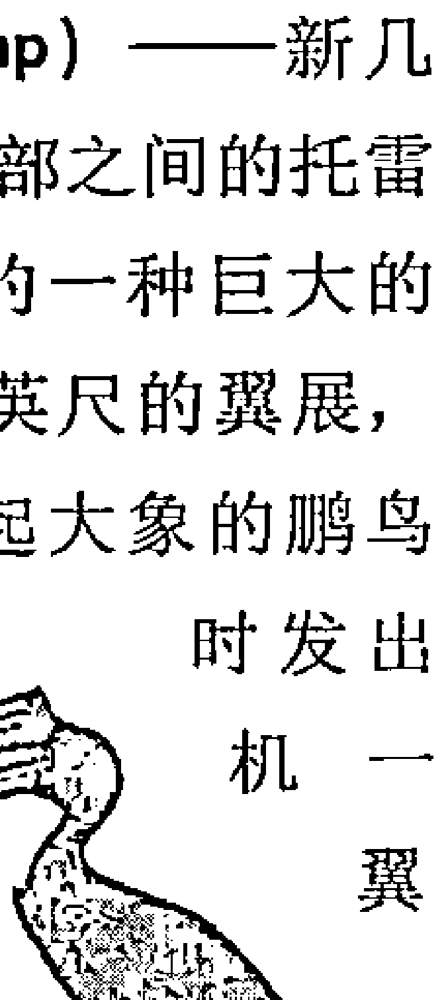

鲲（Kw’ên）——一种曾住在中国北方海中，数英里长的巨鱼。最后它变形成为一种名叫鹏鸟的大鸟。

鸡龙（Kyeryong）——韩国民间传说中的生物，鸡和龙（或蛇）的杂交。在用其名字命名的一座山中的一个池塘里居住着雌性鸡龙。女萨满在那个湖中洗澡以获得法力。阙英夫人（Alyeong），新罗的第一位女王，据说就是鸡龙的孩子。

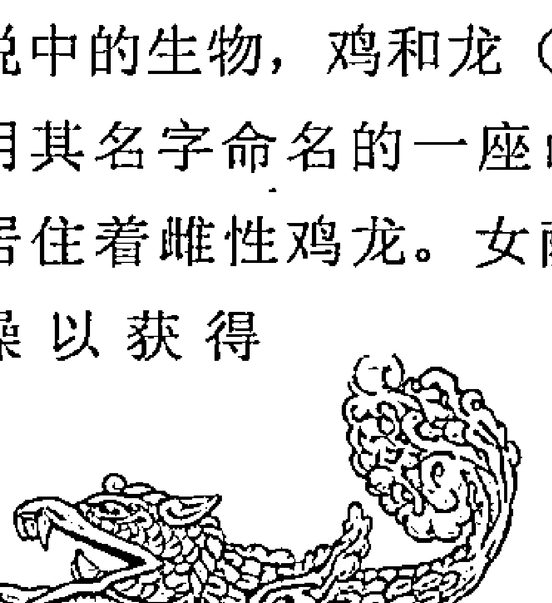

L指的是拉弥亚（Lamia），利比亚的女王。因赫拉的坏脾气而被变成怪物。

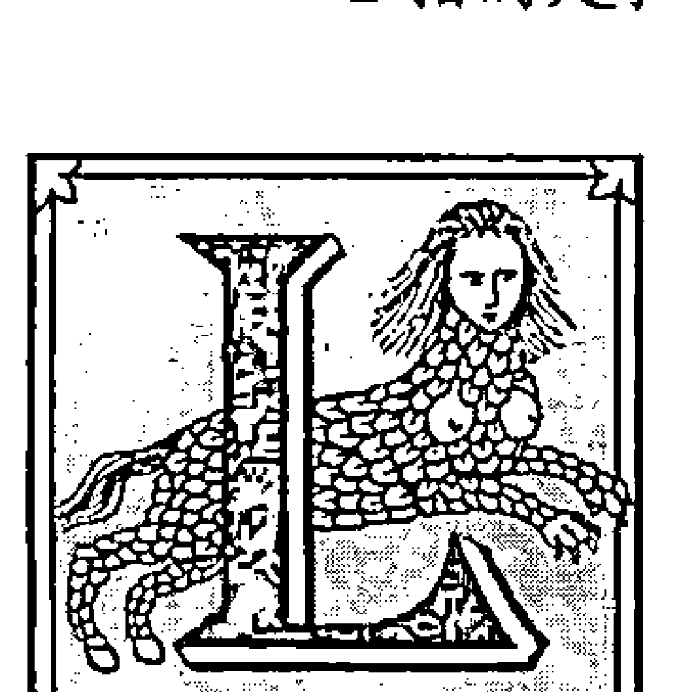

尾巴像蛇，上身却像女人，总是念着宙斯，她失去的爱人。

拉布那（Labuna）——伊斯兰神话中一种广阔无边的鱼，浮在海洋里。它公牛样的身体支撑着巨大的头，头上长有角，角上顶着大地。参见巴哈姆特、库居塔（Kujuta）。

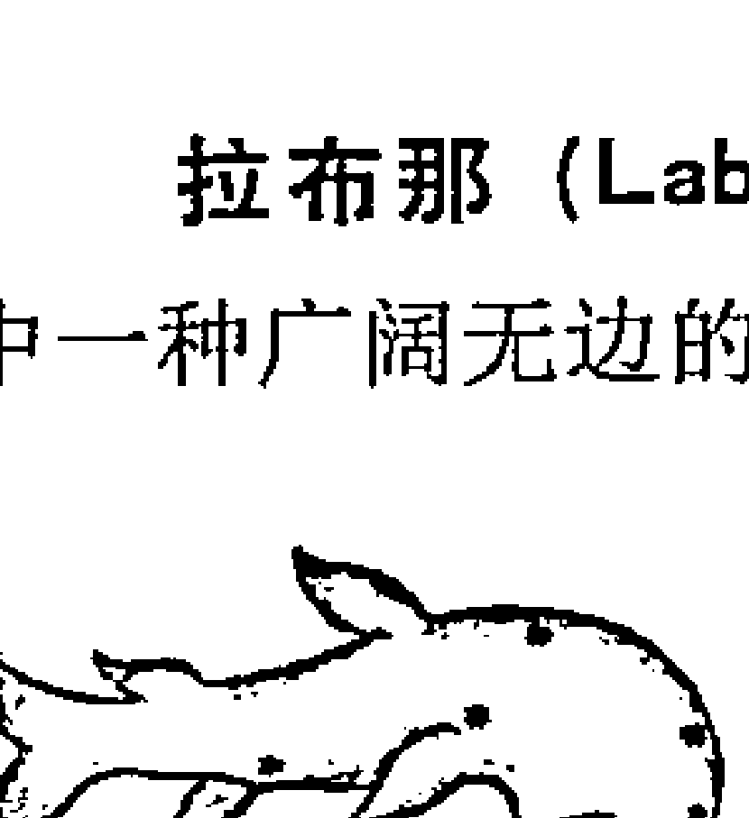

拉不因科尔怪（Labynkr Monster）——俄罗斯一种栖息在拉不因科尔湖中的怪兽。1964年一位猎人和他的猎犬在追逐一只最后跳进那个湖里的鹿的时候第一次看到了它。那只猎犬和鹿同时在水面上突然消失，随后平静的湖面开始翻腾，升起一个长着背鳍的巨大黑色怪物。在再次潜入水中前，它发出了可怕的尖叫声。那年晚些时候，苏联的研究团队在离岸边900英尺的地方看到了三个大型物体，它们在水中同时进进出出，表明它们是长在一个动物身上的。参见波罗斯尼（Brosnie）、哈伊尔湖水怪、科可儿（Kokko）、克斯克尔特拉斯·罗姆博普特利克斯（Koskolteras Rhombopterix）。

湖怪（Lake Monsters）——在世界各地的湖泊、沼泽和其它水体中被许多人目击到的一种身份不明的大型水怪。几乎所有的这些湖泊都非常深，且寒冷，这令人怀疑其这种爬行动物存在的可能性。它们通常被描述为有庞大且像虫子或蛇一样蠕动的身体，长长的脖子上还长着小小的马头，表面上看起来就像已经灭绝了的蜥脚类恐龙或射颈龙。但是，也有很少的报告表明，这些动物在空气中无法呼吸。尽管很多个世纪以来都有无数的目击报告甚至照片，但却没有一个实体证据。参见马鳗。

利阿洛柯印第安人传说中的一种长着大爪子的巨型蜥蜴，会吞噬家畜和人类。

拉斯科怀斯 (Laskowice) [或勒斯齐亚 (Leschia)] ——斯拉夫传说中像狼一样的生物，长着毛茸茸的身体、山羊的脚和人类的躯干。它们是森林和其中生物，尤其是狼，的保护者。参见羊怪法翁 (Faun)。

拉马苏 (Lamassu) [或拉马 (Lama)] ——守卫亚述和巴比伦寺庙和宫殿大门的怪兽，是长着翅膀的母狮。据说它们会攻击所有的人，除了极好和极坏的之外。男性此种怪物被称为舍杜 (Shedu)。参见斯芬克斯。

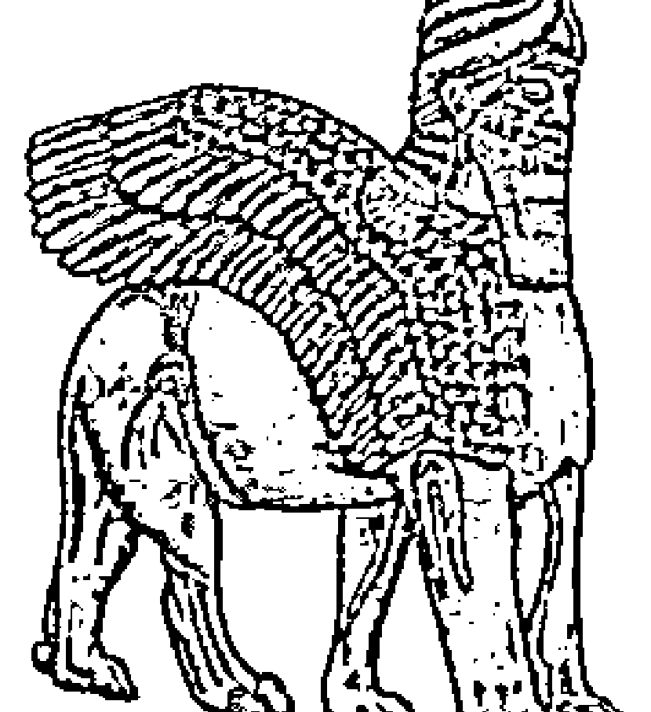

拉维兰 (Lavellan) ——苏格兰一种类似老鼠的野兽。虽然它只要出现在家畜身边就能使其患病，但只要喝了浸泡过拉维兰皮的水它们就可以痊愈。水田鼠 (Arvicola Terrestris) (如图所示) 据说有同样的能力，也许它们就是同一种动物。

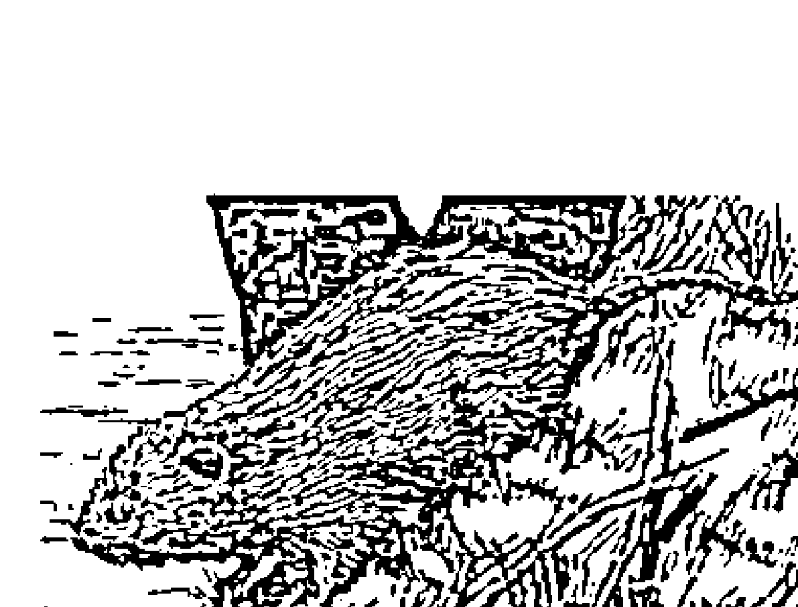

拉弥亚 (Lamia) ——利比亚一位曾经的美丽女王，她被希腊的众神之王宙斯所诱惑。愤怒的赫拉将其子女杀绝，还把她变成了半人半蛇的怪物。而拉弥亚却生出了更多的孩子，它们叫拉弥亚伊 (Lamiae) 或拉姆亚 (Lamya)，以吸食睡梦中孩子的血液为生。它们爬行动物般的身体上长着女人的头部和乳房，马的后腿及尾巴，还有猫科动物的前爪。拉弥亚在法国南部和西班牙西北部巴斯克民间传说中却是一种友善的美人鱼的名称。

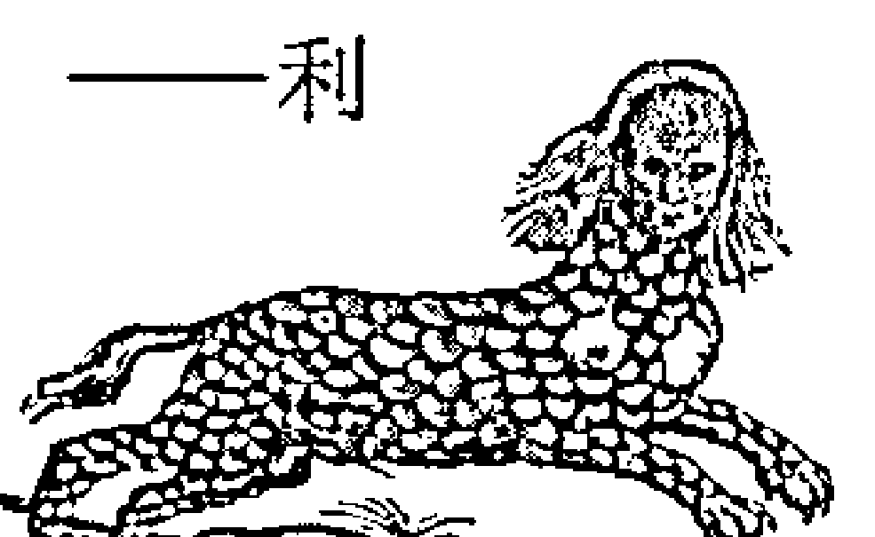

劳 (Lau) ——潜伏在东非苏丹中南部诺湖周围长有茂密纸莎草的沼泽中的巨型蛇颈龙样的生物，有着逐渐变细的脖子、驴的身体和长蹼的脚。它的嘴上长着很多卷须，能在挖掘猎物时派上用场。1914年，一组希卢克土著人在爱迪达沼泽旁杀死了一只这种怪兽，并用它的骨骼作为护身符，这使其第一次受到国际社会的关注。此兽常被用来与和诺湖由白尼罗河连起来的维多利亚湖的卢克瓦塔 (Lukwata) 做比较。这两种动物有很多相似点，包括喜欢吃人，它们的声音也像大象一样。参见湖怪。

拉姆帕鲁瓜 (Lampalugua) ——智利一种长着长毛的巨型树懒，其巨大的爪子可以轻易撕裂人类。据说它潜伏在高大的树木上，会从树上扑向毫无防备的路人。参见巴西的卡西里里 (Kasireli)。

拉维鲁 (La Velue) [法语中的“粗野野兽”，也叫皮鲁达 (Peluda)，皮莱德 (Peallaidh) ] ——中世纪法国民间传说中的一种巨型蛇头怪，长有巨大的乌龟腿和一条长长的尾巴，全身覆盖着厚厚的、长着令人厌恶的斜刺的绿色卷须。据说它在胡塞 (Huisine) 河沿岸的村庄里横行，用其喷火的鼻息和巨大的胃口毁坏农作物，杀死家畜和人。最终，它被一个被其吞噬的少女的未婚夫杀死。他砍掉了它脆弱的尾巴，让它当场毙命。

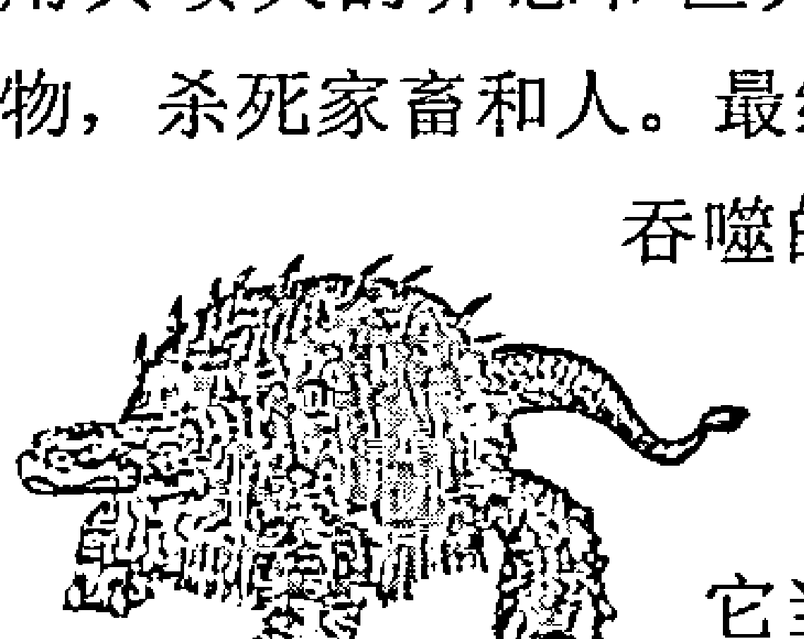

利勒诺 (Leelanau) ——密歇根州利勒诺郡利勒诺湖中的一种怪物。它被描述为有长长的树桩一样的脖子和一只与脖子一样长的尾巴以及两只大眼睛。它最早出现于十九世纪末，一座大坝在这里建成之后。水坝将水位升高了10-12英尺，将这一地区变成了沼泽地，这种生物据说就生活在那里面。从最近一次目击报告到现在已经有很多年了。

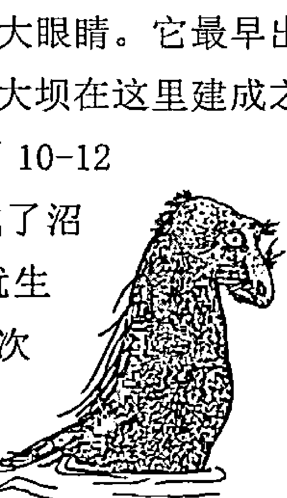

勒纳皮兹卡 (Lenapizka) (‘真老虎’) ——伊利诺伊州皮奥利亚印第安人民间传说中的两栖湖怪。

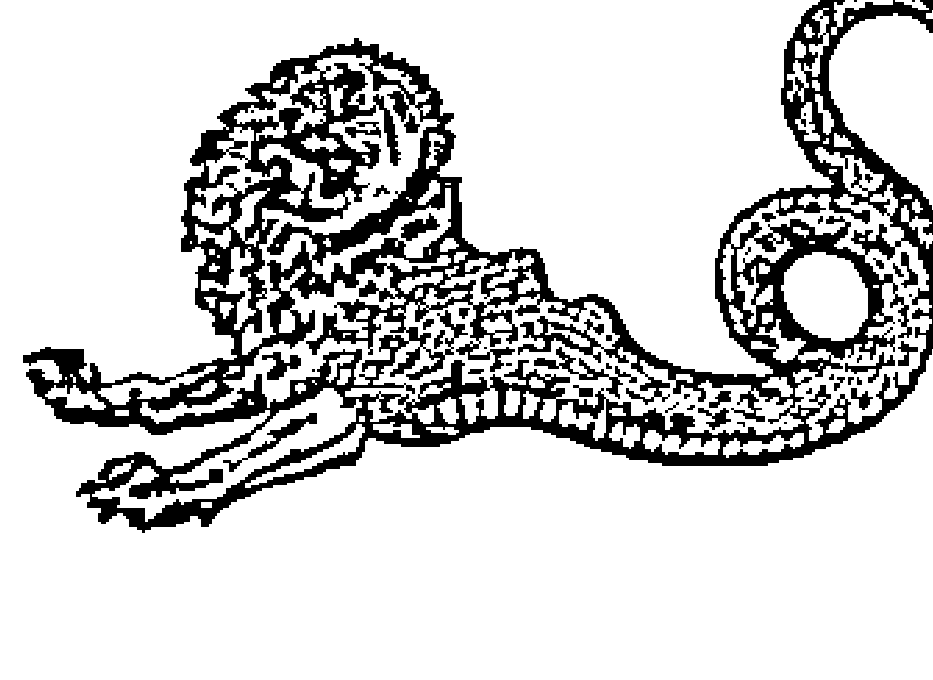

里昂嘉里 (Leongalli) ——一种蒙古龙，长着蛇一样的身体和马的头及前肢，与欧洲的塔泽尔亚龙颇为相似。

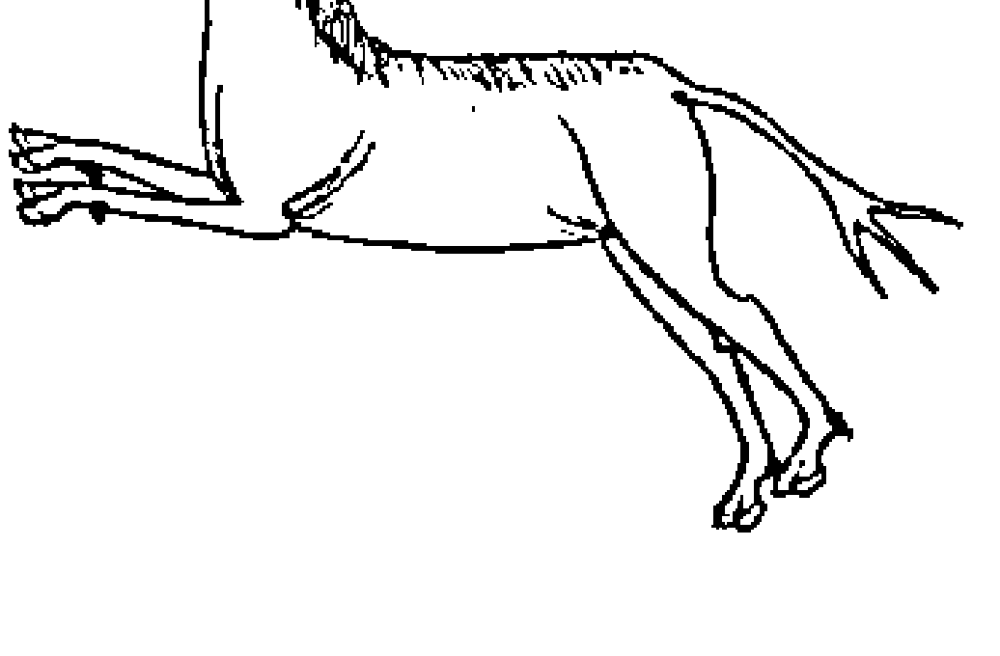

里昂托夫提斯 (Leontophontes) ——《生理论》中所述的‘一些中等大小的生物’，人们将其烧死，用它剧毒的骨灰撒在肉上，再把肉喂给狮子‘只要吃一点’就可以将狮子杀死。实际上，它们可能是植物而非动物，就像山金车花也被称作豹子的毒药，蒲公英也属狮齿属一样。

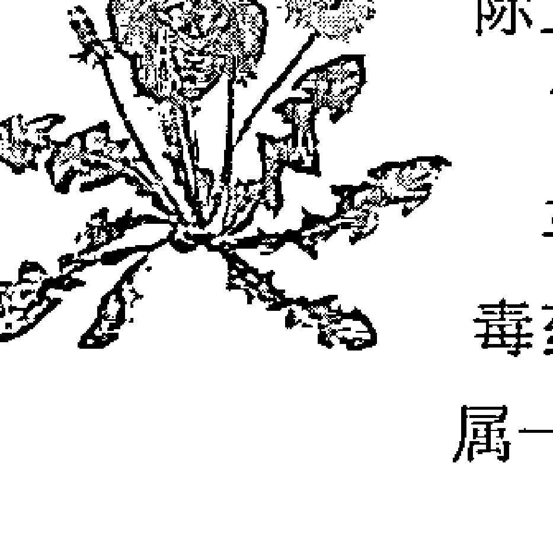

豹狮 (Leopon) ——在日本和意大利动物园中繁殖出来的母狮和雄豹的杂交后代，具有狮子的体型和力量以及豹子的攀爬能力。雄性长有稀疏的鬃毛。如果这种动物出现在野外的话，可能会被认为是传说中的斑点狮 (Marozi)。参见美洲虎豹 (Jagleop)、狮虎兽、帕尔杜斯豹 (Pardus)、提昂 (Tion)。

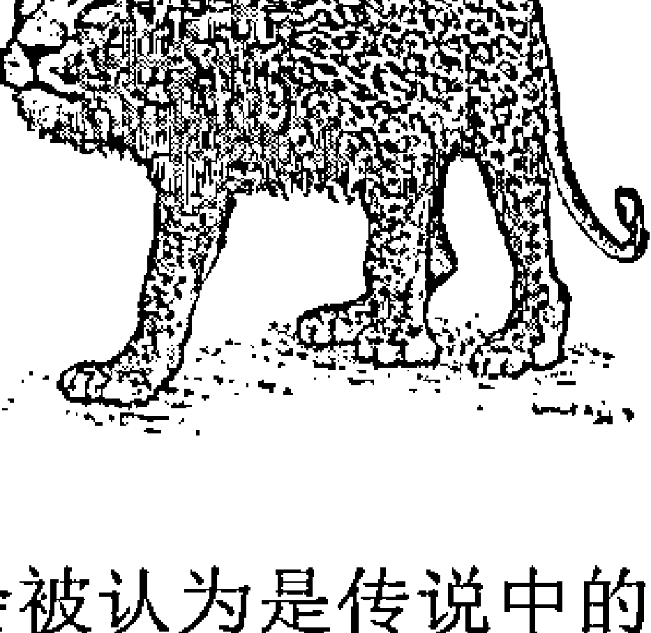

拉克洛兽 (Leucrocota) [希腊语中的“白狼狗”，也叫克罗克塔 (Crocotta) ]——一种首先被老普林尼在其著作《自然历史》（公元77年）中出现的埃塞俄比亚动物。它像驴般大小，“长着偶蹄、牡鹿的臀部、狮子的脖子和尾巴、獾的脑袋，以及能延伸至耳朵的嘴巴，它能模仿人类的声音。”它没有牙齿，取而代之的是骨头。很明显，它的原型是鬣狗（Crocuta Crocuta）。参见崔缇（Chuti）。

利维坦 (Liviathan)[ 或利维加坦 (Livjatan) ，“缠绕” ]——希伯来神话中一种庞大而可怕的原始怪物，它围绕在宇宙海洋深处的世界周围。据说它体长超过 900 英里，长着 300 只眼睛，是乌加里特的邪恶之神。它总是和其死敌贝希摩斯（Behemoth）一起被提及。它的名字也被用在各种巨大海怪包括鲸鱼和海蛇身上。当然，它的 7 只脑袋与九头蛇有关。一些神秘动物学家认为，它可能指的是巴比伦伊什塔尔门的怒蛇（Sirrush），其本身也许是一种活着的恐龙。但本书作者认为其最可能源自尼罗鳄（Crocodylus Niloticus）。参见天启兽、巴拉乌尔龙（Balaur）、褚铎予铎（Chudo-Yudo）、赫伦速尔戈（Herren-Surge）、九头蛇、伊华伊弗路（Ihuaivulu）、伊卢延卡（Illuyankas）、卡利亚（Kaliya）、海怪、拉顿、罗坍、穆斯马胡、那迦、大蛇（Orochi）、海怪斯库拉（Scylla）、土班（Thu’ban）、提亚玛特（Tiamet）。

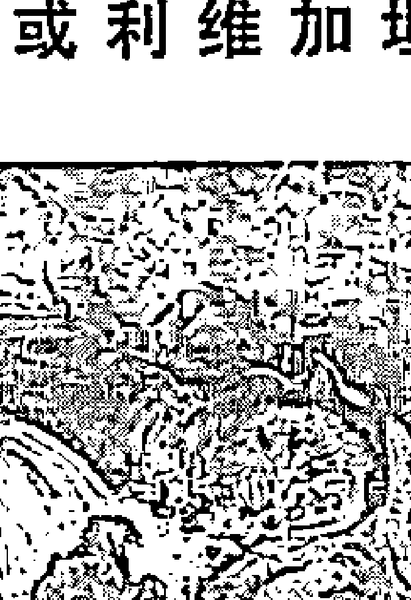

飞头（Leyak）——巴厘民间传说中的一种超自然怪物，通常的样子是一个头拉着内脏飞在空中。它们一族只有三个，一男两女。它们都有大獠牙和长舌头，其形象通常被作为内墙上的装饰。它们四处寻找孕妇，吃掉她们的婴儿或吮吸她们的血液。参见飞头。

利德尔克 (Lidérc) [ 也叫路德尔克 (Lüdérc)、路德福尔克 (Ludvér)、路克菲尔 (Lucfír)、伊格里克 (Iglic)、伊赫里克 (Ihlic)、皮里祖斯 (Piritusz)、米特米特克 (Mit-mitke)、米特克 (mitke)、奥多戈兹尔托 (Ördögszerető)、卡索达斯尔克 (Csodacsirke) “奇迹鸡” ，也叫 (Ördög) “恶魔” ]——匈牙利民间传说中的一种恶魔生物，据说是从黑色母鸡所产的第一个蛋在人的腋窝下或粪便堆里孵出来的。它们附着在人身上吸食他们的血液，还会带来噩梦，类似于梦魇女妖。利德尔克囤积黄金，使其主人变得富有，但也会导致其得病死亡。它们会在夜晚以一团光或鬼火或火鸟的样子出没于墓地中。要放逐利德尔克就得说服它完成不可能的任务，比如用绳子来搬运沙子，或用竹篮来打水。参见艾特瓦斯 (Aitvars)。

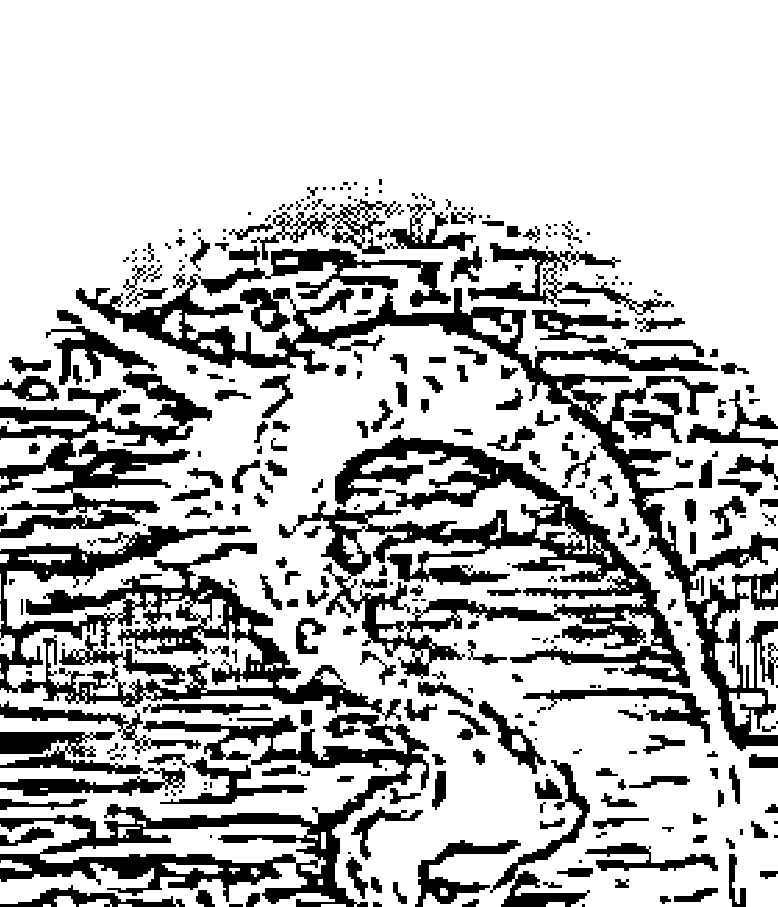

雷杨克 (Leyak)——巴厘民间传说中的一种超自然怪物，通常的样子是一个头拉着内脏飞在空中。它们一族只有三个，一男两女。它们都有大獠牙和长舌头，其形象通常被作为内墙上的装饰。它们四处寻找孕妇，吃掉她们的婴儿或吮吸她们的血液。参见飞头。

狮虎 (Liger)——雄狮和母虎的后代，体重达 1000 磅，身高 12 英尺，是迄今为止世界上最大的猫科动物。它的皮毛呈黄褐色，集成了母亲的条纹和父亲的斑点。雄性有中度的鬃毛。参见美洲虎豹、狮豹、斑点狮（Marozi）、豹（Pard）、虎狮兽。

闪电兽（Lightning Monsters）——非洲赞比亚神话中住在天上的怪兽，有着山羊的头和前半身，鳄鱼的后半身。它们在起风暴时天空和地面之间像绳索般来回跑动，从而创造出闪电。参见闪电蟒。

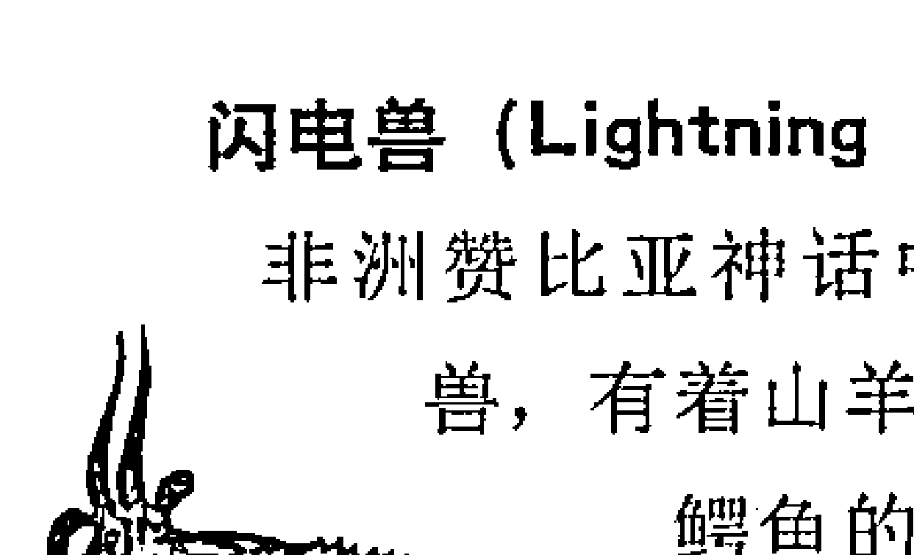

闪电蛇（Lightning Serpents）——澳大利亚土著人神话中居住在天上的大蛇，在起暴风的时候往返于天地间，从而创造了闪电。这种天地交融的过程会造成带来生命的降雨。参见闪电兽。

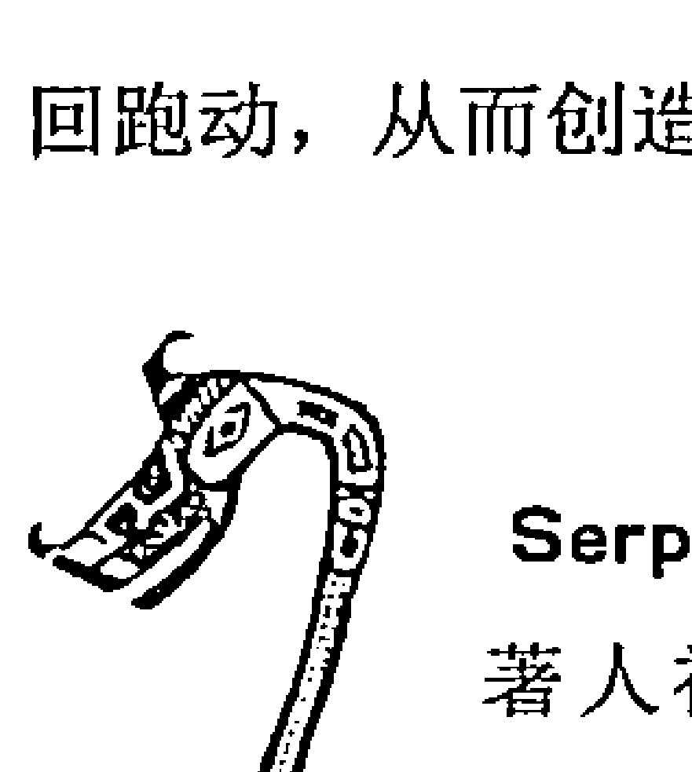

莱克（Lik）——南美格兰查科（Gran Chaco）传说中的一种庞大的水蛇。它背上长着棕榈树，是湖泊、河流中鱼类的守护者。参见鱼王、湖怪。

怪龙（Lindworm）[瑞典语中的“龙”，也叫鳞虫（Lindworm）或鳞龙（Lindorm）]——日耳曼和斯堪迪纳维亚传说中的巨龙，有时被描绘成长有小翅膀，但却不能飞。千百年来有很多人目击者称它们身长10至20英尺，有一个像男人腿那么粗的臃肿而无腿的身体，呈黑色或绿金色，还有一个火焰色的肚子。它有马的头和鬃毛，嘴里长满尖牙，眼睛大而红，极富攻击性，速度很快，可以追上一个骑在奔马上的人。被杀死后它会发出难闻的气味作为最后的垂死挣扎。马可波罗在穿越中亚大草原后首次报道了它们，随后它们便开始在中世纪欧洲流传开来。虽然在亚洲它们据说生活在地上，但在欧洲它们却生活在沼泽和溪流中。它们也在教堂墓地和古代坟墓间出没，守卫着宝藏和腐烂的尸体。它象征战争和瘟疫，吞噬家畜和人类。参见湖怪、蒙古死亡蠕虫、欧姆（Orm）。

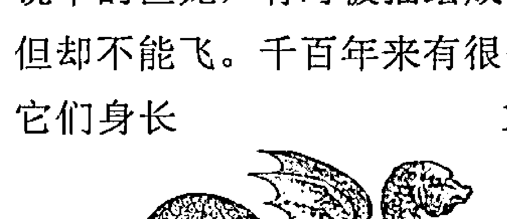

格里芬狮鹫（Lion-Griffon）——美索不达米亚的狮鹫，一种长着狮子的头和前半身，老鹰的翅膀、爪子和后半身的狮鹫。在欧洲的纹章、古亚述和波斯的雕塑和浮雕中都可以看到它和战神尼努尔塔的形象。

小曼尼图——美国奥特斯索特（Otsitsot）印第安人传说中的一种巨大的、树栖的、有角且能喷出火花的水蛇。

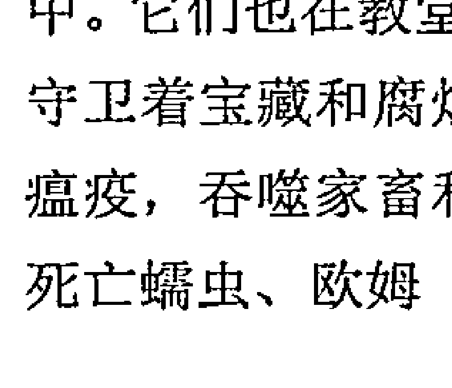

里弗（Liver）——经常光顾英格兰利物浦周围水池的一种鸬鹚般的鸟，据说它站在利物浦的手臂上。

蜥蜴人（Lizard Man）——世界各地都有报道中的一种像电影《黑湖妖谭》中的怪物一样的奇怪人形爬行动物。最有名的也许就是南卡罗来纳州莱郡毕晓普维尔附近的矿石沼泽蜥蜴人。对其首次报道是在 1988 年，它是一种身高7英尺，会发光的生物，有红色的眼睛和粗糙的绿色皮肤。参见尹士罗（Intulo）、鳄鱼人、蜥蜴人、拉夫兰蛙人、密尔湖湖怪。

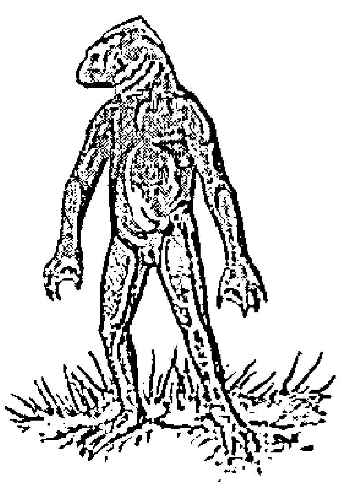

尼斯湖水怪 (Loch Ness Monster) ——世界上最著名的湖怪。它居住在苏格兰高地上 755 英尺深 23 英里长的尼斯湖中。据称其体积很大，起伏的身体可长达 30 英尺，有时背上还有几个隆起。它的头颈比例和马、长颈鹿差不多，头顶上有一只小小的，像角一样的突出。从最早的公元 565 年和 690 年的记录开始，几百年间一直有人目击到它。在 1933 年沿湖高速公路建成后，目击者更多了。1975 年斯克特爵士将尼斯难怪菱形鳍（Nessiteras rhombopteryx）用来命名这种生物。虽然人们普遍认为它是一种活着的射颈龙，但笔者认为它们实际上是无脊椎动物，可能是某种巨大的水声蛞蝓。参见昌普（Champ）、利兹（Lizzie）、莫拉格（Morag）、奥古布古（Ogopogo）、欧姆。

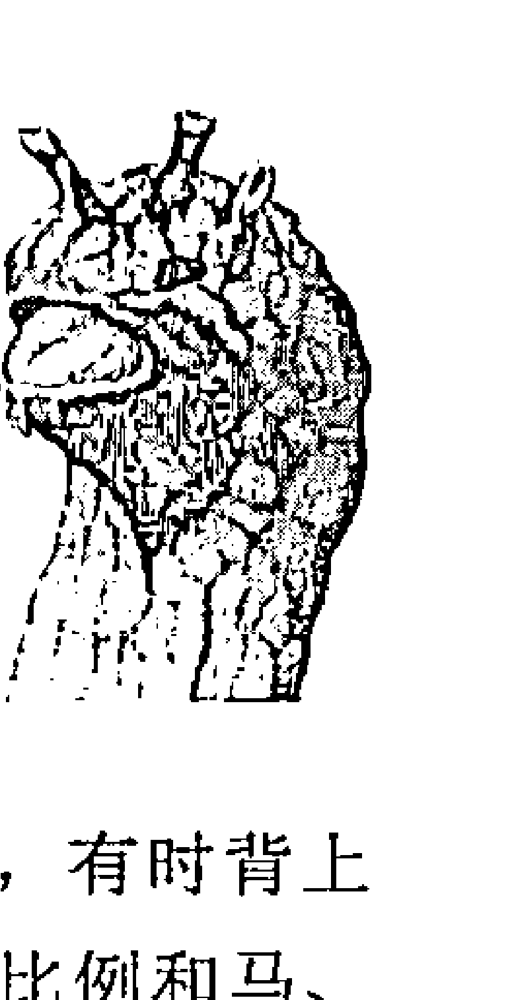

拉姆西格德尔 (Llamhigyn y Dwr)（威尔士语中的“水上跳跃者”）——威尔士传说中的一种像蟾蜍般的巨大怪兽，长着一条尾巴和蝙蝠样的翅膀，没有腿。它潜伏在河岸和河滩边，那里有很多的鱼和羊。它会将羊和牧羊人吸引到水中将其吃掉。

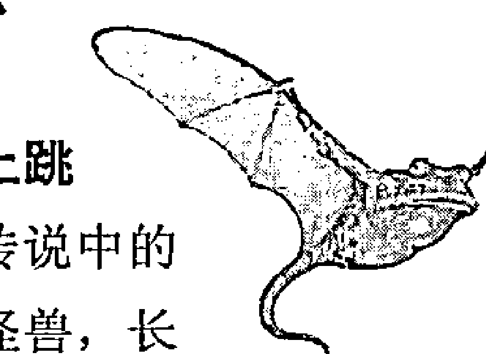

恶虫 (Loathly Worm) ——长着两只前腿的蛇形龙。通常出现在中世纪的动物寓言集和诗歌中。它们据称是造成欧洲大部分地区植被枯萎的元凶。其中最著名的可能要数兰普顿虫（Lampton Worm）（如图所示）。参见鳞龙、欧姆、蠕虫。

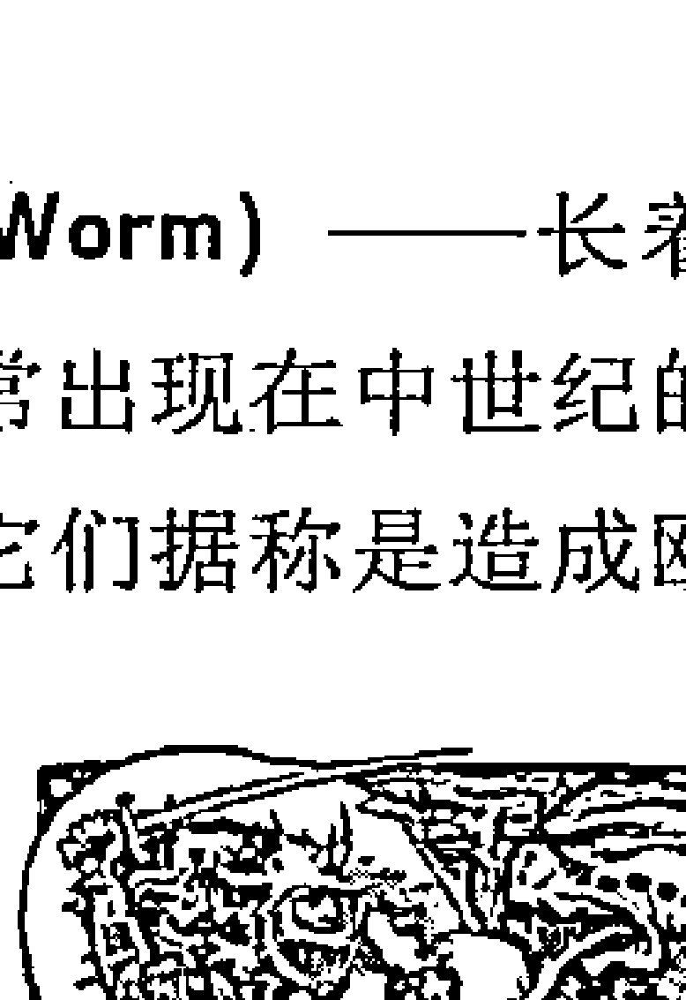

敬畏湖怪兽 (Loch Awe Monster) ——几个世纪传说中的苏格兰敬畏湖中的一种巨型鳗鱼。蒂莫西·杜邦（Timothy Pont）（约 1562-1614 年）是少数几个在书中提及过这种怪兽的人，他对其形容道“像一只很长的马一样”，还说它们让大部分渔民都不敢靠近那个湖。参见贝瑟尔（Beithir）、湖怪。

罗卡帕拉大象 (Lokapala Elephent) ——在印度神话中，它们是八只巨大的象，站在宇宙龟阿库帕拉的壳上支撑着盘形的大地。每一个象限或罗卡帕拉中都有一对这种大象，它们也有各自的守护神。它们的分配情况如下：北，玛潘达拉 (Himapandara)（俱毗罗神）；东北，苏普拉蒂克 (Supratika)（比里底毗神）；东，艾拉瓦塔 (Airāvata)（因陀罗神）；东南，瓦玛纳 (Vamana)（阎摩神）；西南，库木塔 (Kumuda)（苏利耶神）；西，安雅（伐楼拿）；西北，普什帕丹特 (Pushpadanta)（伐由神）。

长颈海蛇 (Long Neck Sea Serpent) (Megalotaria longicollis “长颈巨海狮”)——一种身长达15-65英尺的蛇颈龙般的海洋生物，身上长有几个驼峰，具有垂直移动的能力。它头上有一个角一样的物体，有时还长有毛发和胡须。它被隐生动物学家认为是一种长颈短尾海狮。然而，笔者则认为它是像尼斯湖水怪这样巨大的无脊椎动物的海中版本。在世界上所有的海洋中已有82次关于它的目击报告。参见坎迪 (Caddy)、海蛇、湖怪。

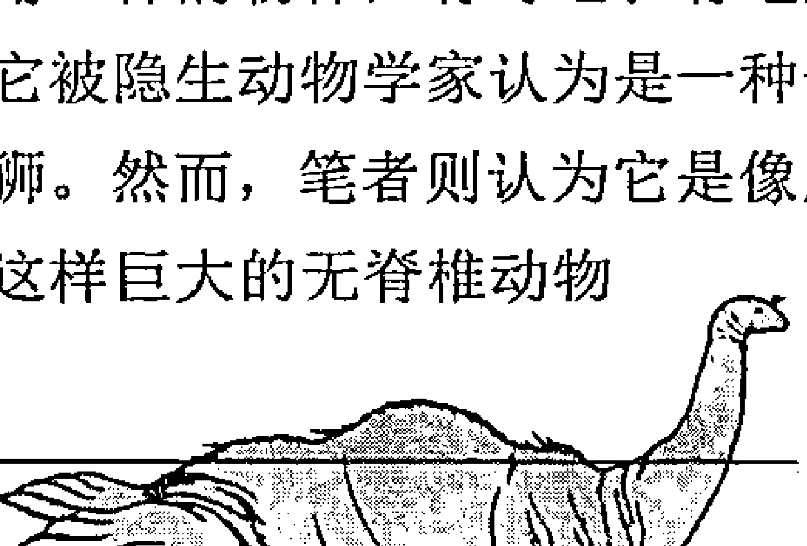

里湖怪 (Lough Ree Monster) ——一种居住在爱尔兰米斯郡里 (Ree) 湖中的湖怪。创建了贝朗 (Balla) 教堂和修道院的圣拉克洛南·莫克华 (St. Cronan Mochua) 是首先将其记录在案的人，当时一群猎人拒绝追逐跳入湖中的一头牡鹿，因为他们害怕湖中的怪兽。1960年有三名牧师碰到了一个巨大的黑色鳗鱼般的怪物，在离岸不到300英尺的地方回过头来看着他们。参见马鳗鱼。

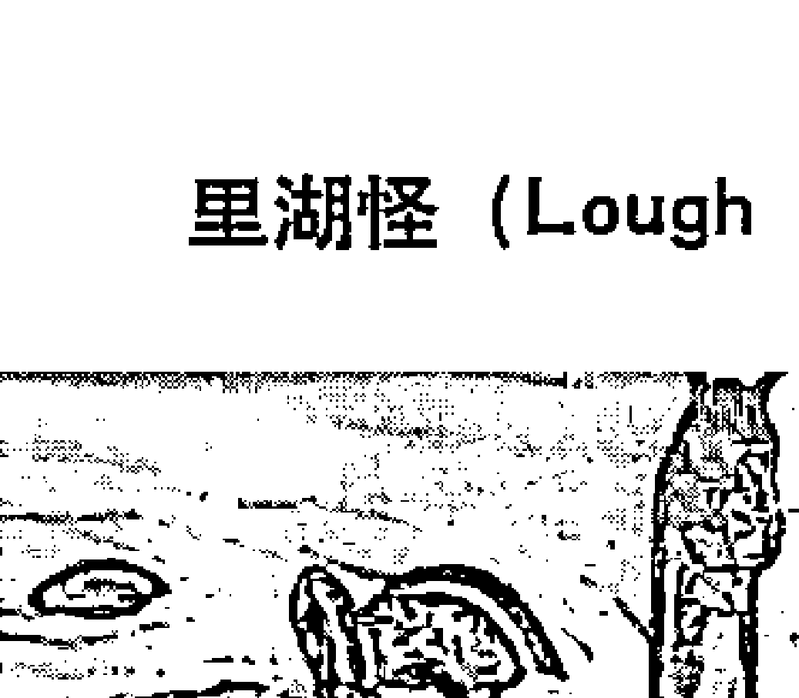

罗雷莱 (Lorelei) ——美丽的德国人鱼，据说看管着隐藏在莱茵河沿岸的宝藏和魔法、精神知识。它们因日耳曼传奇《尼白龙根之歌》(Nibelunglied) 而出名。

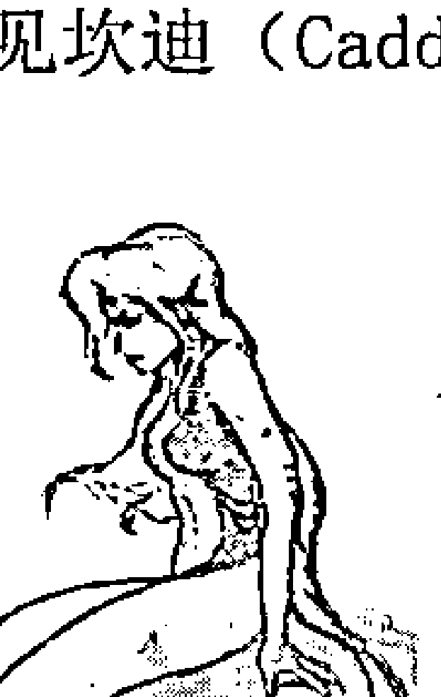

卢卡寇 (Lou Carcolh) ——法国民间传说中一种巨大的，蜗牛般的软体动物，长有巨大的壳，移动的时候会在身后留下一条泥泞的小径。其巢穴位于法国西南部朗德省地区哈斯汀格 (Hastingue) 镇下方的一个巨大的洞穴中。它用其巨大的触须将受害者拉入洞中，然后吃掉他们。参见萨尔马提亚 (Sarmatian) 海蜗牛、图巴 (Tuba)。

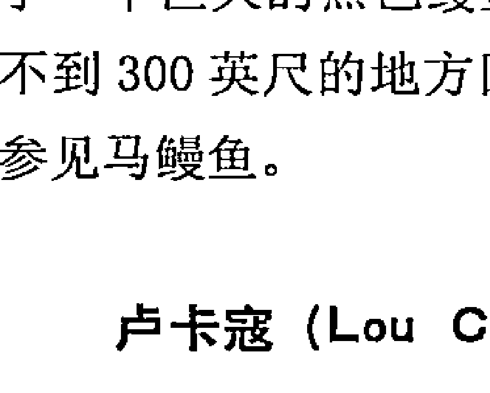

费达湖怪 (Lough Fadda Beast) ——居住在爱尔兰费达 (Fadda) 湖中的长颈湖怪。关于它的第一次报告是在1954年，当时几个船员碰上了“长颈怪物”突然从水中窜出，并把它的头对向了他们。“它的头伸出水面有3英尺，有很长的曲线。”它的嘴是敞开的，露出了嘴里的白色部分。最后，这个生物从水下穿过了船，出现在另一边，露出了背上的两个驼峰。参见马鳗鱼、尼斯湖水怪、水马。

# 魔法师的怪物图鉴

## 拉夫兰青蛙（Loveland Frogs）

1955 年和 1972 年被多个目击者（包括警务人员）在俄亥俄州拉夫兰附近的路旁看到的几只像青蛙一样两足行走的爬行动物。它们身高 3 到 4 英尺，有绿色的革质皮肤、青蛙样的头和有蹼的手脚。它们中的一只举着一种法杖一样的东西，在上面有火花射出。参见蛙人。

珍珠，也都有自己负责的方向（它们名字中的第一个字就表示这个意思）。例如神龙（Shen Lung），它是美丽的、彩色的、五趾龙，风送雨的掌控者。只有皇帝才有权在衣服上绣上它们的形象——其他人则不能这么做，否则会被处以极刑。龙王，青龙，是龙之王者，代表着东方和春季，它是四灵，或“灵兽”之一，它们分别站在大地的四个角落上。

## 卢波尔弗（Lubolf）

长有獠牙的河马般的生物。参见贝希摩斯（Behemoth）。

## 拉斯卡（Lusca）（或巨型天窗，毛手怪）

佛罗里达附近巴哈马的水晶海域中的一种巨型章鱼。据说，它所居住的在海中的大型石灰岩洞穴被称为“蓝洞”，而在陆地上的洞穴被叫做“香蕉洞”。一位当地向导仍然坚称其触须的长度有 75 英尺长，只有能同时够到海底和船只时，它们才会给船员们带来危险。这种尚未被证实的头足类动物已经有了学名，巨章（Octopus Giganteus）。参见格洛波斯特尔斯（Globster）、魔鬼鱼（Manta）、土木拉-弗伊纳（Tumura'i-Fuena）。

## 卢克瓦塔（Lukwata）

乌干达、肯尼亚和坦桑尼亚三国交界处的维多利亚湖中的一种肉食性神秘动物。虽然一些目击者称它是典型的长颈湖怪的样子，但通常情况下它却被描述成一个长着方形头、全身褐色、类似海豚的动物。许多当地人认为它是一种巨大的、12 英尺长的鲇鱼，可能是一条六须鲇（Wels）（欧鲶）（如图所示），这是一种已知长度达 10 英尺，体重达 330 磅的鲇鱼。当地人称卢克瓦塔常与其主要天敌鳄鱼搏斗。参见劳（Lau）。

## 龙（Lung）

中国的龙，尤其是长有五个脚趾的那种，它们是海洋的统治者。它们住在雨云中，鼻子中能喷出浓烟和火焰来。它们每一个的嘴里都含着一粒

## 鸾（Lwan）（Luan 或 Lwan Shui）

中国传说中的巨大野鸡。当 Lwan 的毛色发生改变时它有不同的名字：有黑色羽毛的鸾被称为阴翥（Yin Chu），有红色头冠和翅膀的被称为丹凤（Fung），全身白色的被称为化翼（Hwa Yih），有蓝色羽毛的被称为羽翔（Yu Siang），有金色羽毛的被称为土符（To Fu）。

美丽的化身，水手的渴望。手中拿着魔镜和梳子，指挥着海中的波浪。

## 力巴德（Lybbarde）

据说是母狮和雄豹的后代，酷似豹子。在纹章中，它是勇气的象征。

## 玛达（Mada）

印度民间传说中一种巨大的可怕怪物，长着一张巨大的嘴，有突出的獠牙，对活物——包括人类——有很大的胃口。

## 立木帕戈（Lympago）[或曼泰格（Mantygr）、（ManTiger）、门提戈（Montegre）、撒泰拉尔（Satyral）]

中世纪纹章中的一种人狮或人虎。它有狮子或老虎的身体和长着角的人头。有时它的角像牛角，它的脚则像龙爪。参见曼帝可拉（Manticora）。

## 马迪迪怪（Madidi Monster）

在南美洲发现的一种类似蜥脚类恐龙的生物：“1907年，英国陆军的珀西·福塞特中校被派遣去划分秘鲁和巴西的国界。他是一名皇家工程师，以记录事件细致而著名。他在马德雷迪奥斯（Madre de Dios）的贝尼沼泽中看到一种被他认为是梁龙的动物……梁龙的故事已被乌卡亚利东部的许多部落所证实。”（雷昂那德·克拉克《东流之河》Leonard Clark “The Rivers Ran East”，1953年）。

## 猞猁（Lynx）

在中世纪动物寓言集中被描述为豹身狗头的一种生物。它明亮的眼睛可以穿透黑暗的阴霾看得很远，从而锁定睡着的猎物。

## 里昂泊松（Lyon-Poisson）

一种纹章海狮，长着狮子的头和上半身以及鱼的下半身和尾巴。参见海马。

## 马哈巴（Mahamba）

中非刚果共和国利夸拉湖的沼泽地区的一种巨型鳄鱼。据报道，它的体长有50英尺，可以吞掉整个木筏和独木舟和上面的船员。当地人坚持认为，它是一种独特的物种，与人们熟知的尼罗鳄（Crocodylus Niloticus）不同。难道它是一种恐鳄（“可怕的鳄鱼”）（如图所示）吗？这种白垩纪时期的巨型肉食动物身长约50英尺，头长6英尺，齿长4英寸。

M 指的是美人鱼，一半是女人，一半是鱼类：

## 摩伽罗（Makara）（“海怪”）

印度传说中一种凶猛的象鱼，据说住在印度洋里。从其最常见的被用作印度寺庙的门神来看，它可能和尼斯湖水怪是同一种生物。大象般的“长鼻子”类似于尼斯湖水怪的长颈和小头。而“耳朵”就像鱼鳍或鳍状肢。然而，它也被描绘成一种怪诞的螃蟹、半鳄鱼半鸟或是鱼尾鹿。它是恒河之神伐楼拿的战马，有时又是毗湿奴的坐骑。它代表印度日历中的摩羯座。参见湖怪、水象、亚力（Yali）。

## 马希沙（Mahisha）[也叫马希沙苏拉（Mahish sura），拜恩萨苏拉（Bhainsasura）]

印度神话中一种巨大的破坏性怪物，像长着水牛头的牛头人身怪物（Bucen-taur）。它被英雄韦驮（Skanda），或另一个神话中的卡利-杜尔加（Kali-Durga）杀死。参见基姆浦路萨斯（Kimpurushas）。

## 玛卡（Maka）

埃及神话中的虚空巨蟒。每天它都在太阳神拉（Ra）经过天空的时候和它打斗。参见阿佩卜（Apep）、迈罕（Mehen）。

## 玛卡拉拉（Makalala）（“吵闹的”）

一种与19世纪70年代末在非洲桑给巴尔海岸被目击的巨型食肉鸟。它是一种比鸵鸟要高，而且具有飞行能力，长着长长的腿和有力的喙的猛禽。它的名字来自其扇动翅膀，翼尖角质板互相碰撞时发出的声音。它被认为是超大的蛇鹫（Sagittarius Serpentarius）（如图所示）。它的学名叫做Megasaittarius Clamosus（“吵闹的巨型蛇鹫”）。

## 马里（Mali）

马里噶佛兰（Mali Gavoland）的一种会变形的不可战胜的河马。它吃掉了地里所有的水道，直到后来被英雄法拉·美克（Fara Make）所杀。

## 曼巴穆图（Mamba Mutu）

非洲布隆迪卢库加（Lukuga）河中的一种可怕的神秘水生生物。它被描述为半人半鱼，据说它会杀人，然后吸干他们的血，再吃掉他们的大脑。

## 麻姆拉姆伯（Mamlambo）（或脑髓吸食者）

一种居住在南非艾利夫（Ayliff）山附近马兹提瓦（Mzintiava）河中的可怕水马。科萨（Xhosa）部落的传说中关于它的故事可以追溯到数世纪前。它被描述为身长 60 至 70 英尺，有鳄鱼的躯干和腿，长长的长有蛇纹颈部，以及马的头部及尾巴。它的眼睛在黑暗中会发出一种阴森恐怖的绿色光芒。参见湖怪。

## 猛犸象（Mammoth）（来自俄罗斯语中的 mamantu“生活在地下的生物”）

高度进化的史前巨象，因为冰河时代的到来和早期人类的捕杀而在整个北半球消失。在蒙古、满洲里和西伯利亚，有很多关于它的传说，说它们住在地下，见到阳光就会很快死去。毛茸茸的长毛猛犸象（Mammuthus Primigenius）是一种极为成功的物种，它们曾遍及从西班牙到北美洲的广袤地区。有时还会有人声称，在人口稀少西伯利亚广袤的蒂亚戈地区的森林中，仍然生活着猛犸象。

## 中国龙人（Man-Dragon of China）

一种大型体黑带翅膀的人形生物，首次报道是在 1926 年初，当时人们发现它在世界上最大的水坝，中国东南山麓间的 Xiaon Te 大坝上徘徊。1926 年 1 月 19 日，那座水坝倒塌，向下游的村庄和农田灌入了 40 亿加仑的水，造成一万五千人死亡。幸存者认为，人形巨龙的出现是对灾难的警告。参见切尔诺贝利黑鸟、火虫、蛾人、鸮人。

## 曼陀罗草（Mandragora）（或曼德拉草 Mandragore，风茄 Mandrake）

一种生长在东方，天堂附近的植物。它的根是男人或女人的模样，当被从地里拔出时，它会发出可怕的叫声。它被用于医疗和魔法中，任何听见它叫声的人要么会疯掉要么会死掉。因此建议在一只饥饿的狗够不到的地方放置一块肉，将这种植物用线绑在狗的身上，在狗移动去吃肉的时候，它就会把曼陀罗拔出来，狗的主人可以呆在安全范围之外。曼陀罗草（Mandragora officinarum）是一种对神经有影响的茄属植物 [psychotropic Nightshade（Solanaceae）]。

## 食人树（Man-Eating Tree of Madagascar）（或海百合纲 Crinoida）

据称于 1878 年在马达加斯加岛上发现的一种神奇的食虫植物，在那里，处女会被献给它作为祭品。它的树干类似 8 英尺高的波罗，顶上长着 8 枝长达 11 至 12 英尺，垂到地面上的的宽叶。其中心是一个充满液体的洞，周围长着许多 5 至 8 英...

## **玛尼图威－鲁斯－皮斯 (Manetuwi-Rusi-Pissi)（“水虎”）**

美国南部肖尼印第安人传说中的一种湖怪，是湖泊中鱼类的保护者。参见鱼类保护者。

## **曼加尔萨后克 (Mangarsahoc)（或曼嘉里撒奥卡 Mangarisaoka，“耳朵遮盖着下巴”）**

马达加斯加一种巨兽，有着圆圆的马腿和在其下山时能遮盖住眼睛的大耳朵。它的叫声像野驴一样。当地人认为，就算看到它都会带来噩运。

## **马尼波戈 (Manipogo)**

加拿大马尼托巴 (Manitoba) 湖、温尼伯 (Winnipeg) 湖、温尼伯戈西斯 (Winnipegosis) 湖、多凡 (Dauphin) 湖、雪松 (Cedar) 湖、德提 (Dirty) 湖和门弗雷梅戈格 (Memphrémagog) 湖中的一种被叫做门弗雷 (Memphre) 的湖怪，它曾被很多人目击到。印第安人在海边定居的时候就对它们略知一二了。这种生物被描述为身长 21 至 24 英尺，全身深绿色或棕色，就像一只巨大的鳗鱼或身体中间长着驼峰的长蛇。它的头像蛇头或羊头或畸形的马头。1960 年 8 月 10 日，人们看到三只这种怪兽在一起游泳。两年后，又有人拍到一只。参见欧肯纳根水怪奥古布古 (Ogopogo)。

## **魔鬼鱼 (Manta)**

智利民间传说中的一种巨型海怪。它就像生活在海中的奎罗（“隐藏”），被描述为像一张剥下来的牛皮，长着有触须的尾巴，身体边上长满了眼睛，而在顶部也长着四只。虽然名字和大魔鬼鳐鱼 (Manta birostris) ——一种身体平坦、身长超过 25 英尺、重达 6600 磅的生物——相似，但它却是一种像太平洋巨型章鱼 (Enteroctopus dofleini)——一种身长可以达到 30 英尺，体重 100 磅的生物——一样的头足类动物。据说它们会偶尔爬到岸上晒太阳，在回到海中的时候它们会造成巨大的风暴。这可能指的是被风暴吹上岸的牛皮，这就能解释牛皮为何会出现在那里。参见奎罗、魔鬼鱼、拉斯卡 (Lusca)、米加斯 (Migas)、土木拉 - 弗伊纳 (Tumu-Ra'i-Fuena)。

## **曼帝可拉 (Manticora) [源自波斯语的“Mard-khor”（食人者），也叫马迪可拉 (Martikhora)、马迪拉 (Martiora)、曼提考、曼迪可拉 (Mantichora)、曼迪克里 (Manticory)、曼迪可拉斯 (Manticoras)、曼迪奎拉 (Mantiquera)、曼迪赦拉 (Mantiserra)、曼科莫里恩 (Mancomorion)、梅梅克里欧斯 (Memechrios) 等。]**

印度的一种狮子一样的红色生物，长着人的脸、狮子的鬃毛、蝎子的尾巴和毒刺、三排铁牙和跟小号或长笛类似的声音。它当然是源自皇家孟加拉虎的，但似乎也有豪猪(Hystrix leucura)和狒狒(Papio hamadryas)的元素。参见立木帕戈(Lympago)、吡高瓦乌(Cigouave)。

## 多鳍海蛇 (Many-Finned Sea Serpent) ( 或 Cetioscolpenda aelani “来自外星球的鲸类蜈蚣”)

一种身长达70英尺的长体的生物，它的身体分很多节，有很多方向相反的背鳍一样的突起。它在西大西洋、印度洋和太平洋都有发现，被称为巨海蜈蚣或大海蛇(Con Rit)。它可能是一种无脊椎动物，迄今为止已有26次目击记录，在越南海滩还有可能是其残骸的物体被发现。参见海蛇。

## 多驼峰海蛇 (Many-Humped Sea Serp) ( 或 Plurigibbosus novae- angliae “新英格兰的多突起动物”)

一种体长15至65英尺，有中等长度脖子和长长身体的海蛇，它被很多隐生动物学家认为是一种像龙王鲸般的古鲸。它只在北大西洋被发现过。沿着它的背部长着一串突起。迄今为止对其有82次目击记录。一个著名的例子是从1777年至1950年代关于凯西对缅因州卡斯科湾海蛇的目击报道。

## 玛宾瓜里 (Mapinguari) [ 或伊斯纳什(Isnashi)、阿拉克斯(Alux) ]

生活在巴西茂密的亚马逊丛林中的一种神秘生物，它的毛发非常厚，无法用武器击穿。当地印第安人所说，它的身高在6英尺至15英尺，头发红色，牙齿和爪子都很大，有可怕的气味。据说它的声音和人类很相似。一些隐生动物学家认为它可能是一种一万年前已经灭绝的巨型地懒，如磨齿兽(Mylodon)或大地懒(Megatherium)，它们的皮肤中有其保护作用的骨节。参见巴塔哥尼亚巨懒。

## 马拉奇罕 (Marakihan)

据说居住在新西兰岛屿群岛周围海域的大型海怪，长着人的头和鱼的身体。它有一个长管状的舌头，能用它把独木舟和小船吸过去，吃掉上面的船员。

## 玛吉格尔 (Margygr)

格陵兰岛民间传说中的一种人鱼(Merbeing)，被描述为面目丑陋、脸蛋扁平、眼光毒辣。它可能指的是海象（Odobenus rosmarus），或是在1768年就被猎人灭绝的星海牛（Hydrodamalis gigas）。参见毛人鱼（Auvekoejak）、哈克曼（Hakenmann）、半人、哈弗路美人鱼（Havfrue）。

## **海狮（Marine Lion）**

一种长着鳞片，拥有人类声音的海生狮子。1540年，在伊特鲁里亚海，一只此种动物活着被献给了卡斯特主教马塞尔，但在不久后就死了。

## **海蜥蜴（Marine Saurian）**

北大西洋和地中海中的一种身长50至60英尺的鳄鱼，或像沧龙（Mosasaur）与上龙（Pliosaur）那种鳄鱼般的生物。它可能是河口鳄（Crocodylus porosus），但其发现地距离这种鳄鱼的产地，印度尼西亚和澳大利亚北部也太远了一点。迄今为止有关于它的九次目击记录。参见海蛇。

## **标记原始人（Marked Hominids）**

全身长毛的原始人，与大脚怪类似，但它体型稍小，更像人类。它们是散发着臭味的社会生物，居住在北方冰封的森林和群山中。它们有几种颜色：一些像老黄顶（Old Yellow Top）一样，有亮色的鬃毛；其余的有被深色毛发包围的浅色毛发的斑点；还有些看起来像是得了白化病一样。它们是强壮的大眼大肚的杂食性夜行动物。参见与褚纳安（Chuchunaa）、莫陌（Momo）、老黄顶（Old Yellow Top）。

## **马美尔（Marmaele）**

上身是人类，下半身是鱼的小人鱼。埃里克·庞托匹丹（Erik Pontopiddan）主教在他的《挪威自然史》（1752年）中说它们大小从“半岁大的婴儿”到3岁的孩子不等，据说它们是美人鱼和人鱼的后代。当地的渔民有时候会捕获到它们。“他们告诉我们，这些生物非常奇怪地转动着眼珠，好像很好奇，又好像很意外，好像看到了从未见过的东西。”有些人把它们带回家里，用牛奶喂养，希望它们能预言未来，但它们总是在一天内就潜回了大海。滚眼珠的细节强烈地暗示它们可能是天使鲨（Squatina），也被称为主教鱼。

## **圣马丁鸟（Martlet）**

欧洲纹章中一种无脚小鸟，据说源自非常罕见## 魔法师的怪物图鉴

的燕子或蜂鸟。它被描述成原本是鸟爪的地方长着褶边的羽毛。即便是在睡觉和交配的时候，它们都无法降落。参见天堂鸟。

### 马斯特顿怪兽 (Mastertown Monster)
1883年5月出现在新西兰马斯特顿附近的一种未知的大型动物。它们长着宽广的鼻子、短腿、卷曲的毛发。当当地人企图用狗来袭击这种怪物，一只狗被打掉了一只牙齿，这让其它的狗都闻风而逃。这就是关于它的所有记载。参见邦伊普 (Bunyyip)、波哈尔-楚 (Bobhar-Chu)、尤罗亚怪兽。

### 马希尔诺马克 (Mashernomak)
北美密诺米尼印第安人传说中的掠食性湖怪。

### 马瓦蒂 (Mawadi)
巴西的一种巨型水蟒，能掀翻独木舟和小船、引发洪水、绑架妇女。它们的女王叫灰托 (Huito) —— 水域的女主人。它们肯定是绿森蚺 (Eunectes murinus, “游泳好手”)，其身长能达30英尺或更长。参见卡姆迪 (Camoodi)、斯特普 (Sterpe)、苏库里居·吉甘特 (Sucuriju Gigante)。

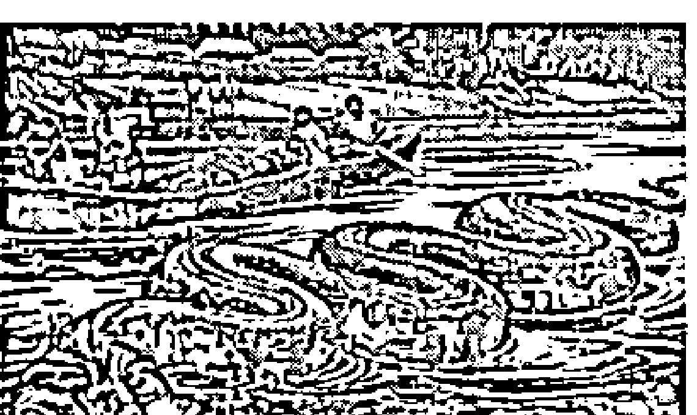

### 神秘鱼 (May’s Point Mystery Fish)
据说生活在纽约州北部的手指湖区的卡尤加湖的阴暗支流中的一种神秘鱼类。已有数十名在夜间钓鱼的人声称看到了这种生物，它们身长大约4英尺，背上长有突起，身上长有错综复杂的图案。至少有一位目击者认为它是一只腔棘鱼。

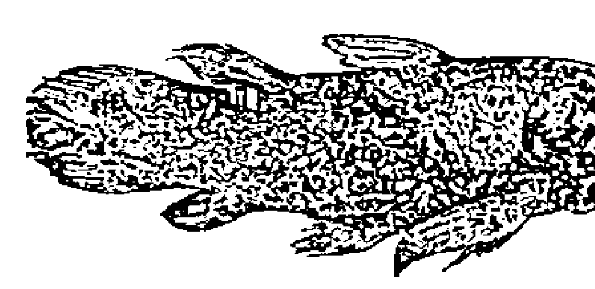

### 姆比路-姆比路-姆比路 (Mbielu Mbielu-Mbielu) (“背上长着木板”)
非洲刚果的一种恐龙般的生物。俾格米人报告说看到它们从水里冒出半个身体，背上长着几块“木板”。虽然谁也没见过它完整的样子，但据说它是平和的草食性动物。“木板”显示它可能是一种剑龙，但这些侏罗纪恐龙却并非住在水里。参见姆乎路 (Muhuru)。

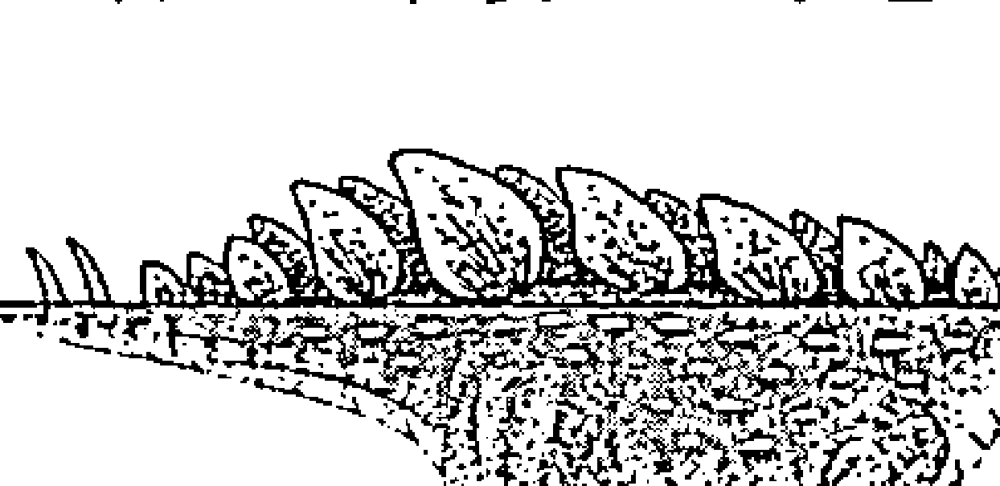

### 古巨蜥 (Megalania) (巨蜥属)
一种比科莫多龙还要大的史前动物，身长在15至20英尺，重达一千到一千三百磅。虽然人们认为其已经灭绝了四千余年，但在澳大利亚和新几内亚偶尔还会有关于目击到它的报道。参见尤罗亚怪兽、凯塞霸王龙、库里阿 (Kurrea)、塔尼瓦 (Tanihwa)、霍维伊 (Whowhie)。

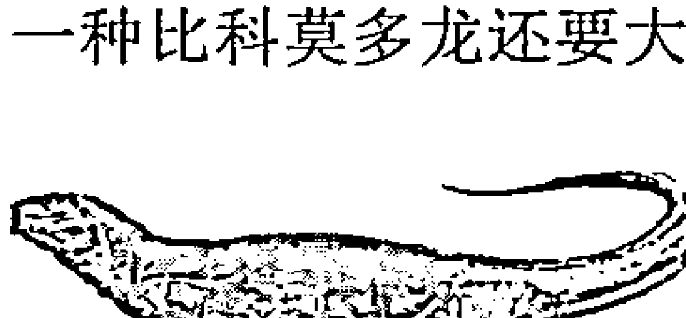

### 梅露希娜 (Melusina)
欧洲几个贵族家庭中的一种传奇生物，各个家族关于其的说法也不尽相同。大体上是这样的，一名贵族爱上了一位他在森林中碰见的，名叫梅露希娜的美丽女人。她同意嫁给他，但在一个星期（或一个月）中的某天，他必须完全尊重她的隐私。几年快乐的时光过去了，她丈夫的好奇心不可避免地越来越重，于是他请了一个人来暗地里监视他的妻子在那几天在干些什么。那个间谍看到她躺在浴缸里，下半身已经变成了蛇或鱼的样子——这是古老诅咒带来的结果。秘密被发现后，梅露希娜因为感觉受到了羞辱而逃离出了那个家庭，但她仍然照看着自己的孩子及其后代。她在几个宣称是其血脉的贵族家族中以双尾美人鱼的形象出现在纹章中。

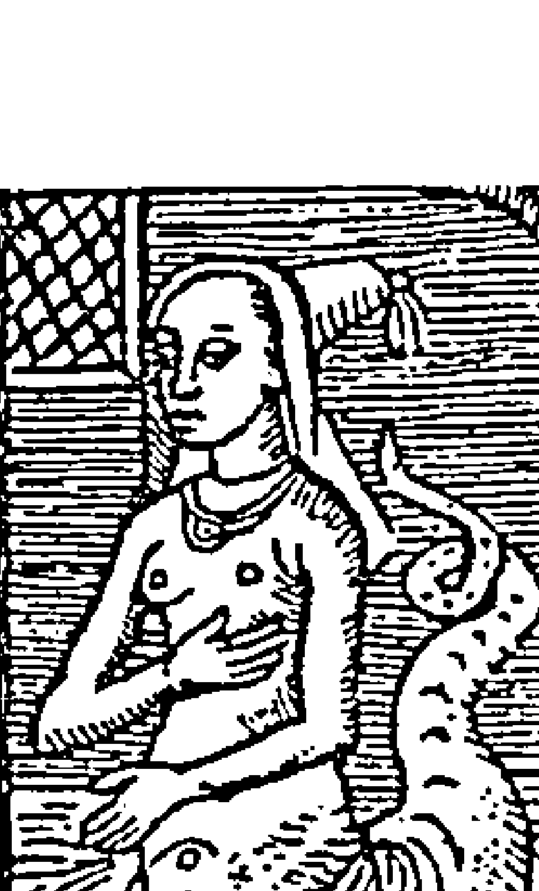

### 人鱼 (Merfolk/Mermaid/Merman) （“女海人”/“男海人”）
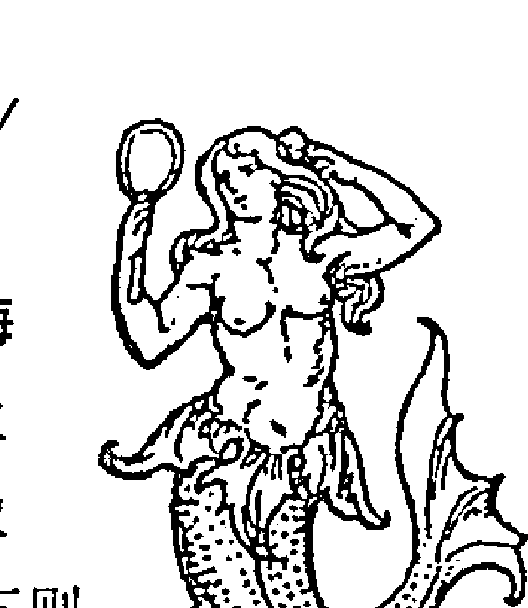
这些海生生物腰部以上长得像男人或女人，腰部以下则酷似鱼类。关于它们的故事又多又长。它们因古代神话和水手的传说而扬名世界，通常会被和海妖搞混——即便海妖这个名字已被用来命名一种海洋哺乳动物了——它们中的雌性常常坐在石头上梳理头发，引诱水手致死。它们可能是某种已知的海洋生物，如儒艮——一种印尼海牛，有着长长的圆形身体、大大的鲸鱼尾巴、雌性身上长着女人一样的乳房。在纹章中人鱼象征着演讲口才，它们通常被刻画成握着梳子和镜子的样子，因此被说成是“虚荣的人鱼”。

### 人鱼 (Merbeing)
对神秘两栖人的总称。它们都有鱼一样的下半身，但住在淡水中的却长着腿，经常上到地面。它们也吃肉，比任何海洋生物都要凶猛。不管是淡水类还是咸水类，它们都长着椭圆形的眼睛。有些皮肤光滑，有些长有毛发，有些则覆盖着鳞片。有些背上还长有一排尖角。大多数都像《黑湖妖谭》中的怪兽。参见蜜岛怪兽、蜥蜴人。

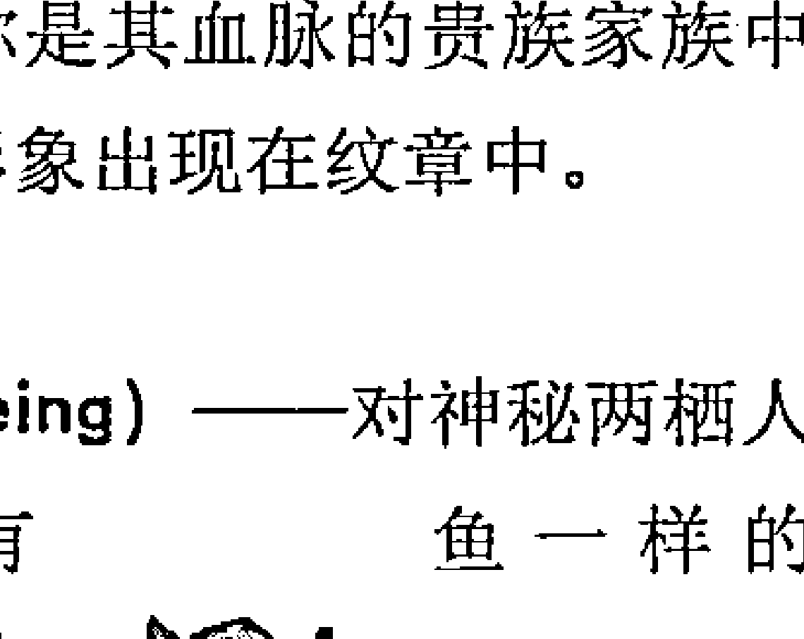

### 马鱼 (Merhorse) [或哈尔希帕斯·欧莱-马格尼 (Halshippus olai-magni) “奥拉乌斯·马格瑙斯海马”]
一种身长30至60英尺，长着马的头和脖子的大眼睛海蛇。经常被描述成长着长胡须和马鬃毛，它们在世界各地的咸水和淡水水域中有71次目击记录。它被认为是一种鳍足类动物，比如海豹和海狮。参见海蛇、湖怪。

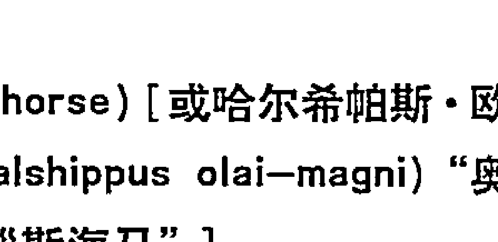

### 蚁狮 (Mermicoleon) [或佛米克里恩 (Formicoleon)]
“蚁狮”，一种因翻译者犯错而出现的生物。一个表示“蚁群中的狮子”的词汇被误译成了凶猛的狮子和蚂蚁的合体动物。现在这个名字被用来命名吃蚂蚁的昆虫，它们在地面上挖一个隐形的小坑，自己躲在里面，等待着蚂蚁自己送上门来。

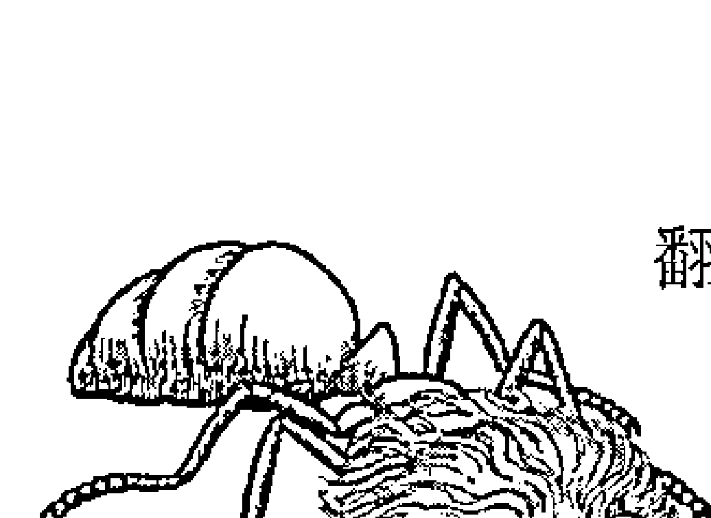

### 麦罗 (Merrow) [盖尔语中的“海”、处女 (oigh)、也叫穆初阿查 (Murchuacha)、莫拉德 (Moruadh)、莫拉克 (Moruach)、穆尔-格尔特 (Muir-Gheilt)、萨姆胡巴纳 (Samhghubna)、苏勒 (Suire) ]
爱尔兰人鱼。丑陋的雄性长着短短的鳍状手臂，皮肤、牙齿和头发都是绿色的，眼睛很小很细。而漂亮的雌性则长着飘逸的秀发、半透明的皮肤、黑色的眼睛。它们的手指间都长着蹼。虽然它们是快乐、无忧无虑的生物，但碰见它们被认为会带来噩运，因为它们通常都意味着可怕的风暴即将到来。与人类通婚后，会生出长着鳞片的皮肤的孩子。参见哈弗路美人鱼与哈弗曼德 (Havmand)。

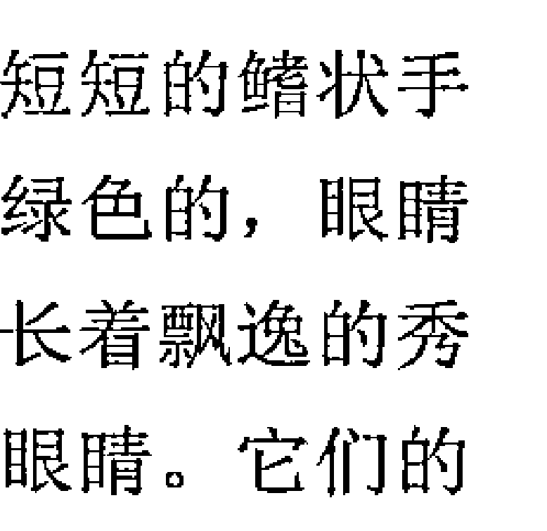

### 迷奇-皮奇欧克斯 (Michi-Pichoux) [也叫迷奇-皮奇 (Michi-Pichi)、迷奇佩奇克 (Michipechik)、迷奇皮奇 (Mitchipichi)、马齐马尼托 (MatchiManitou) ]
在加拿大东部地区的克里印第安人传说中的一种可怕水豹，它们生活在圣劳伦斯河中的群岛上。法国神父路易丝·尼可拉斯 (Louis Nicholas) 在其著作《自然史》(Histoire Naturelle)（1675年）中形容其为一种毛茸茸的，身长超过18英尺的老虎一样的生物，长着大爪子和海狸一样的尾巴。它有着超过2英尺长的獠牙，捕食人类，尤其是小孩。

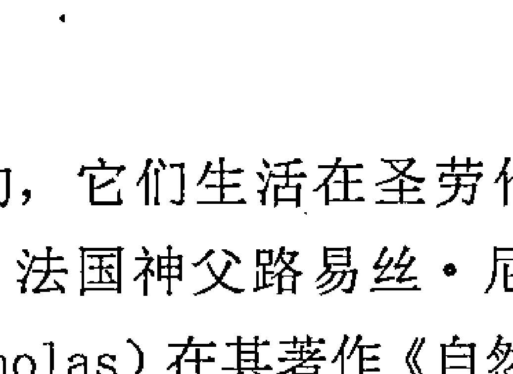

### 米加斯 (Migas)
非洲中西部刚果河上游中的一种水生怪物。这个描述与南美洲的奎罗很相似，那是一种长着长触须的扁平生物。它好像是一种巨大的章鱼，但根据已知的知识，章鱼并不生活在淡水里。参见淡水章鱼、回克回克、劳 (Lau)、俄克拉荷马章鱼。

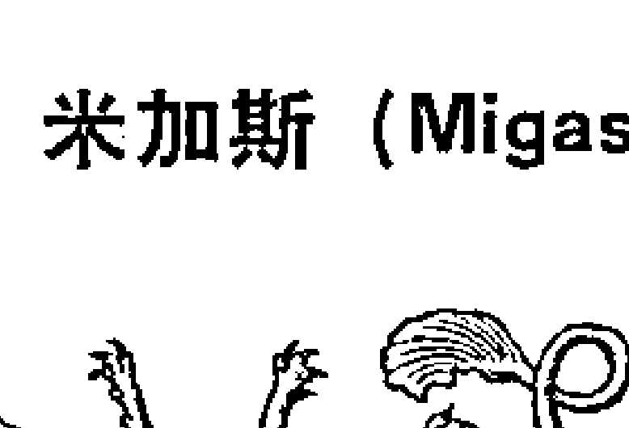

### 米尔 (Mil)
爱尔兰的一种海怪，会吸入并喷出海水造成潮汐。参见帕拉塔 (Parata)。

### 米尔查姆 (Milcham)
塔木德犹太传说中的凤凰，它是唯一一种没有吃伊甸园智慧树果实的动物，从生命树那里得到了永生不死的奖励。它在一座有墙的城市里生活了一千年，然后在烈火中被烧成灰烬，留下一只鸟蛋开始新的生命。

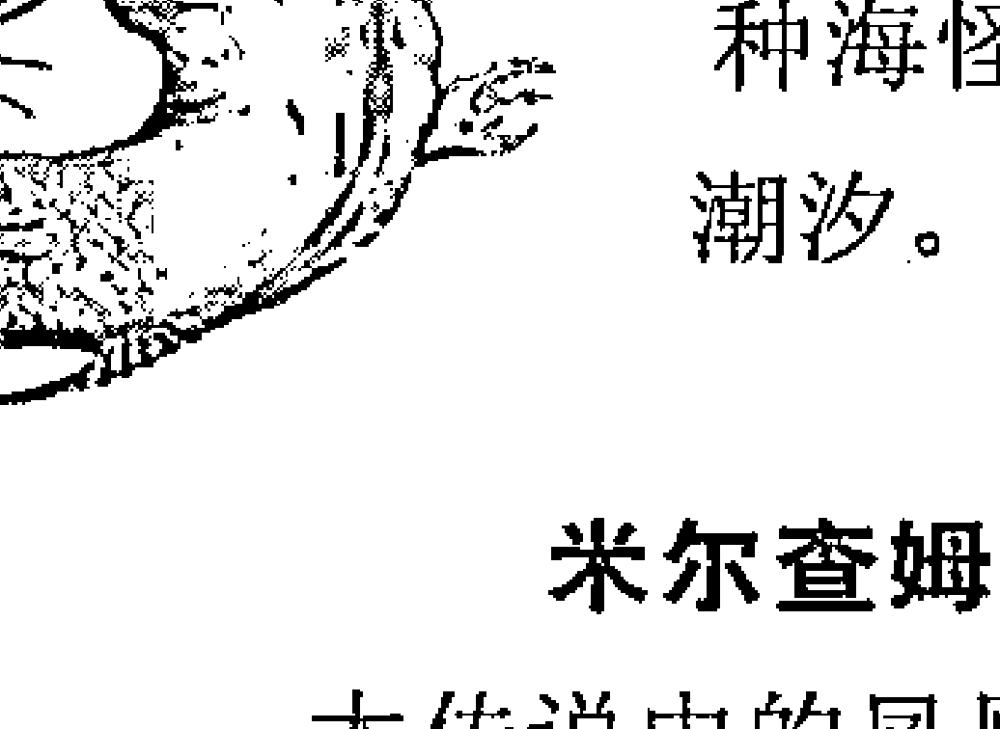

### 密尔湖怪兽 (Mill Lake Monster)
俄亥俄州曼斯菲尔德的查尔斯·密尔湖中的一种奇怪生物。第一次被人发现是在1959年3月。目击者形容其为一个无臂的原始人，站在那里眼睛闪着绿光，身高超过7英尺。第二次目击是在1963年，此后有更多的人看到了它。有些人甚至声称，在河岸边发现了巨大的脚蹼印。参见鳄鱼人、橙色眼睛。

### 巨型蚯蚓 (Minhocão) [或密诺曹 (Miñocão), 葡萄牙语中的闵霍卡尔 (Minhocar) “蚯蚓” ]
南美洲安第斯高原上的一种巨大黑色蚯蚓。有些人称其身长150英尺、体宽15英尺，身上的皮肤很坚硬，能像压碎小草一样压断树木。其他目击者说它有75英尺长，头上长有两只尖角或触须。巨型蚯蚓经常被说成是造成房屋倒塌、路面塌陷，摧毁果园元凶，它们钻出的地沟会变成河流。它与弗兰克·赫伯特（Frank Herbert）的小说《沙丘》中的杀虫很相似。最后一次目击到它是在1870年。世界上已知最大的是澳洲巨龙吐蚯蚓（Australian Megascolides），它们身长超过10英尺，直径跟花园水管一样粗。参见斯特普。

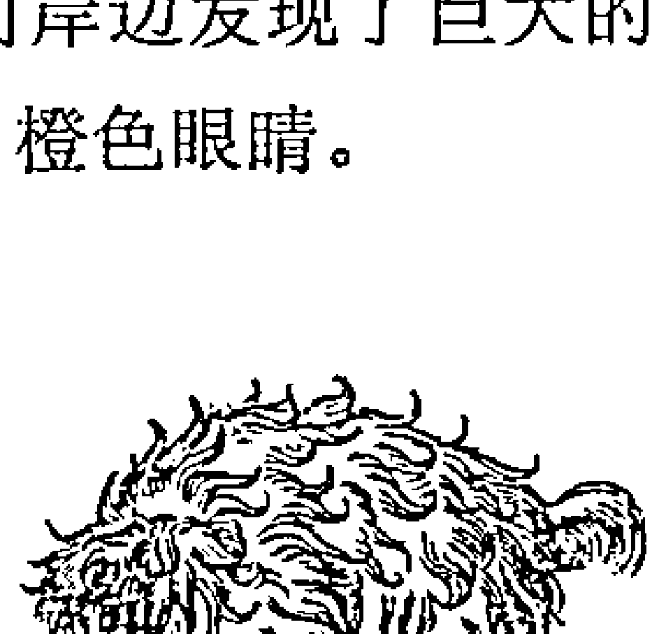

### 模仿犬 (Mimick Dog)
中世纪居住在埃及的欧洲人传说中的生物。它像猿人，长着刺猬的嘴巴，能模仿人类的行为，生活在社会底层的人将其用作佣人。它可能源自橄榄狒狒（Papio cynocephalus），这种动物被古埃及人训练来完成各种任务——包括采摘橄榄。参见西诺西法里（Cynocephali）。

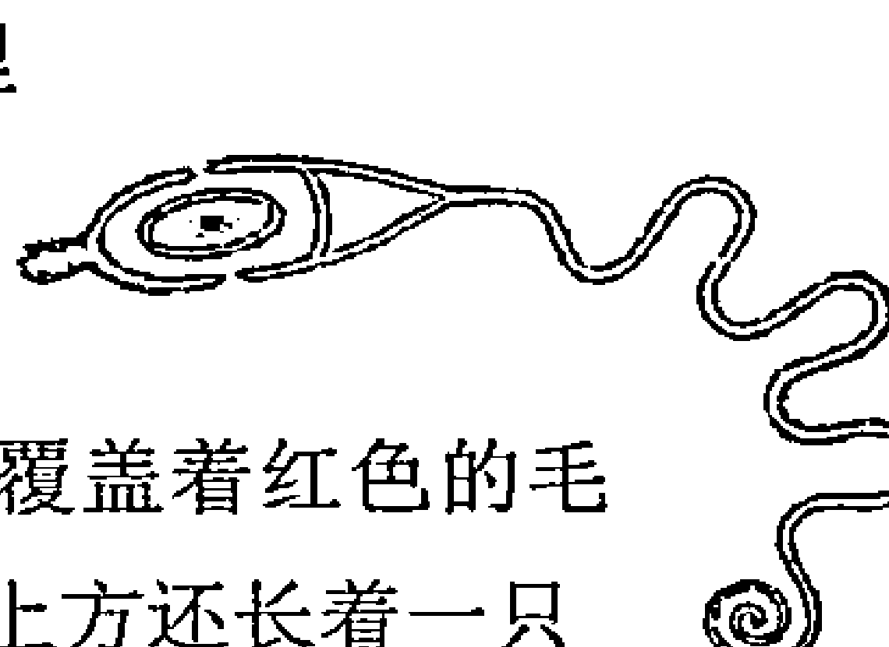

### 米－尼－瓦－图 (Mi-Ni-Wa-Tu)
密苏里特顿印第安人传说中的一种巨型河怪，全身覆盖着红色的毛发，头上的独眼上方还长着一只独角。它的长尾就像鳄鱼那样，上面长有锯齿。它在水中快速游过时会产生很大的水浪。在早春时分，它会凿破密苏里河上的冻冰。目击到它会到来抽搐甚至死亡。

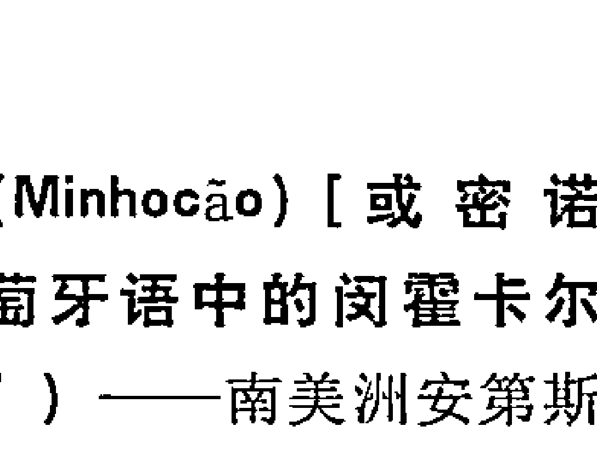

### 密诺坎因 (Minocane)
一种一半小孩一半猎犬的纹章兽。

### 弥诺陶洛斯 (Minotaur) (希腊语中的“米诺斯之牛”)
一种长着强壮人形上身的肉食性公牛怪。这种怪物只有一只，名叫阿忒列翁（Asterion）——它是克里特皇后帕西法厄与一头漂亮的白公牛的后代。米诺斯国王将其困在他的地下室迷宫中，这是戴达罗斯专门为囚禁这只怪物而修建的。米诺斯用作为祭品的希腊年轻人来喂养它，后来英雄忒修斯进入迷宫将其杀死。

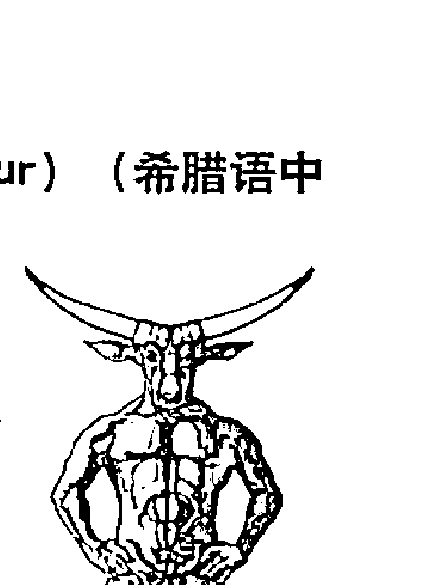

### 密奇阿于克 (Miqqiayuuq)
加拿大东部哈德逊湾因纽特民间传说中的一种凶残的水怪。它是一种毛茸茸的没有脸的生物，住在冰封的湖中，当有吊桶下来打水时，它们就会附在吊桶上。

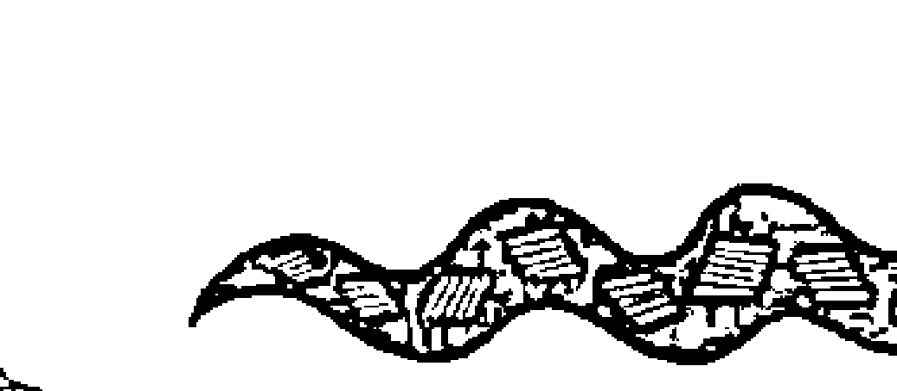

### 米斯干尼比克 (Misiganebic)
美国大湖区阿冈昆印第安人传说中一种身长30英尺的蛇形湖怪，长着马头，墨绿色身体上有彩色的光芒。这些动物据说居住在德舍纳湖、得舍湖、必托比湖、珀科诺克湖、蓝海湖、香柏湖、特勒奈特-易特-米勒斯 (Trente-et-un Milles) 湖中，负责清理水体。参见马鳗鱼。

### 独角兔 (Mi’raj)
伊斯兰民俗中一种兔子般的大型肉食动物，长着黄色皮毛和一只螺旋状的独角。据说是在印度洋的一个无名岛上发现的，它让水手们很害怕，因为它快得能超过鹿和羚羊，强壮得能打死野猪和野牛。参见加卡洛浦鹿角兔、独角兽。

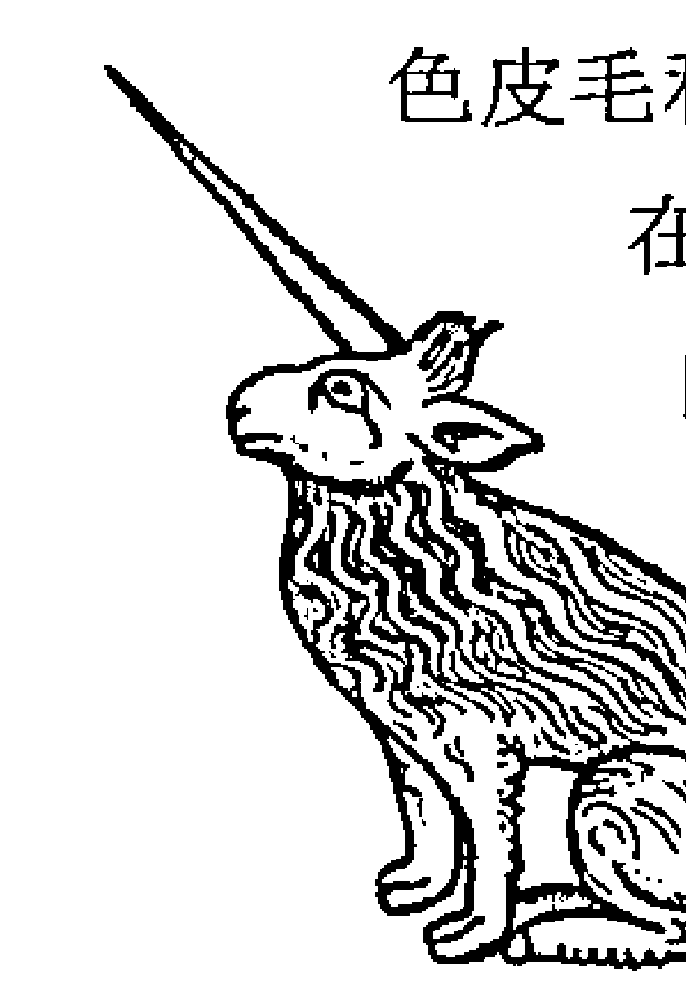

### 曼戈瓦 (Mngwa) [“怪物”、也叫楠达 (Nunda)]
东非国家坦桑尼亚的一种凶猛的灰猫，据说有驴那么大。英国人从1900年开始与这种动物有所接触。猎人帕特里克·鲍文曾跟踪过它，他说这种怪物像豹子，但提醒要比它大些。它的斑点和豹子的也不尽相同。贝纳德·霍伊霍尔曼推测其可能是一种已知动物的变种，或是一种较大的金丝猫 (Profelis aurata) 亚种（如图所示）。

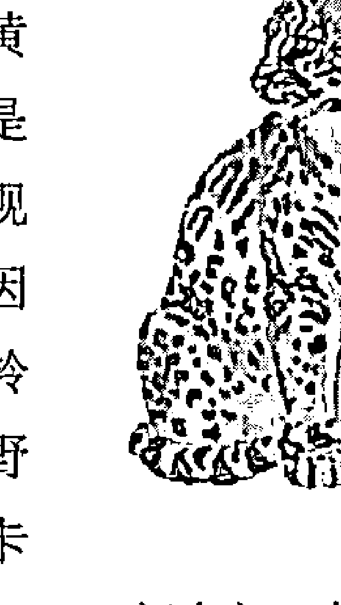

### 米斯匹兹 (Mishipizhiw) [“鱼王”，也叫米斯皮西 (Mishipissy) 或米斯肯纳 (Miskena)]
美国大湖区奥吉布瓦印第安人阿冈昆印第安人传说中的一种巨大湖怪。它被描述为长着猫抓、背上有锯齿状突起和长长的弯尾，能制造风暴和漩涡。它背上独特的锯齿物让人觉得它肯定是湖鲟(Acipenser fulvescens)，这种鱼在俄罗斯最长达到27英尺。参见贝加尔湖怪、鱼类保护者、派莱予 (Pal-Rai-Yuk)、水豹、怀迪 (Whitey)。

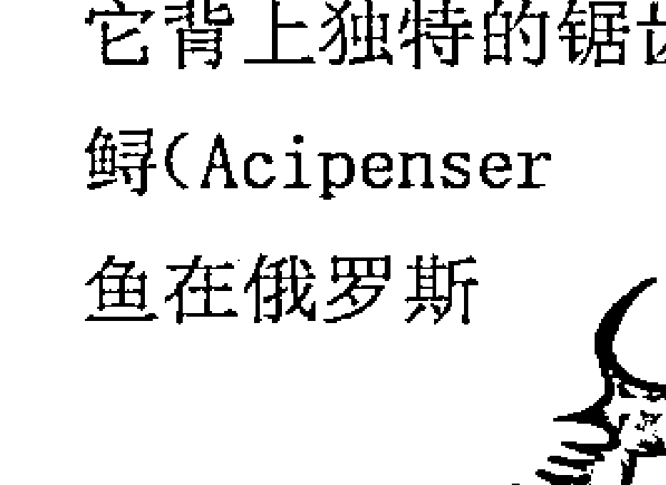

### 恐鸟 (Moa)
新西兰的一种被认为已经灭绝了的无翅巨鸟。在1800年左右的时候，当地毛利人声称他们吃掉了这种鸟的最后一只。然而，直到20世纪，还有一些零星的目击报告出现。在21至38种已经灭绝的物种中，最大的是巨型恐鸟 (Diornis robustus) 跟无翼鸟 (Apteryx maxima)，这两者站立高度都有12英尺。

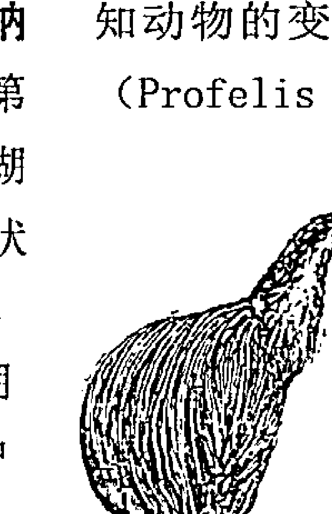

### 摩艾豪 (Moehau) [或摩尔罗尔罗 (Moeroero)、马尔罗 (Maero)]
在新西兰毛利人的传说中，它是一种比人类略小的原始人，长着瘦长的手指和爪子。据说生活在树上，捕食鸟类。它们是独居动物，但只要有机会就会捕捉人类。生活在山区的这种动物被称为摩尔罗尔罗（Moeroero），而生活在内陆地区的则被叫做马尔罗（Maero）。自19世纪30年代以来就一直有关于它的目击报告。

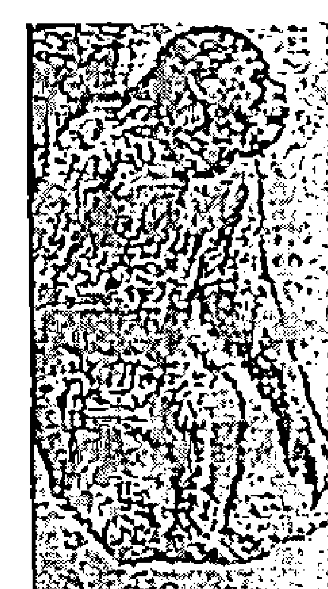

### 莫陌 (Momo) （“密苏里怪物”的简写）
密苏里荒野中一种毛茸茸臭烘烘的巨型原始人。它的毛发非常茂盛，把脸都遮住了。参见大脚怪和臭鼬猿。

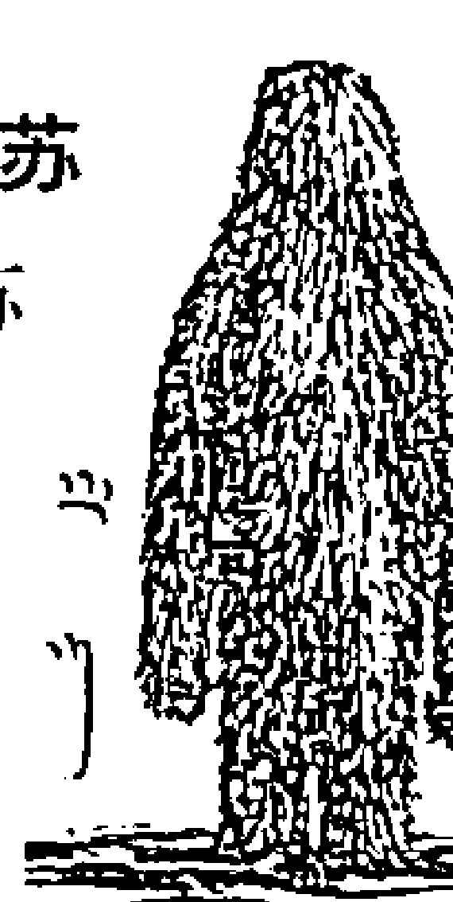

### 河霸龙米克雷-姆贝母比 (Mokèlè-M’Bèmbè) [林加拉语中的“阻挡河流的东西”，也做伊利兹·伊玛 (Iriz IMA)、恩’亚马拉 (N'yamala)]
一种据说生活在刚果共和国利夸拉沼泽地区的神秘两栖生物，它被描绘在古代岩画中。有人说它和大象一样大，有着短短的腿和三趾脚爪，皮肤呈灰色或红褐色，爬行动物般的头部长在像鳄鱼一样的身体上。有些人还说它长有一只长牙或独角。这些都与一宗小型蜥脚类恐龙相似。它们是草食动物，但也非常暴躁，会攻击河马和人类。自1776年以来，当地村民就有许多的目击报告，而探险家发现它们则是在1913年。1959年，有一只被杀死，所有吃了它的肉的人都死掉了。参见伊美莱南头卡 (Emela-Ntouka)、姆乎路 (Muhuru)。

### 蒙古死亡之虫 (Mongolian Deathworm) [蒙古语中的“肠道蠕虫” (Allghoi Khorkhoi)]
居住在南部戈壁滩深处的一种大型、暗红色、蠕虫般的生物，身长大约有2至4英尺。据说它碰触过的任何东西都会变成黄色。它能用电荷向几英尺外的猎物喷出酸性毒液，使其立即毙命。它白天呆在地下休眠，晚间出来活动。六月和七月是它最为活跃的时候。

### 安康鱼 (Monkfish)（或天使鱼）
这种生物曾被中世纪的水手广泛地报道，在1200至1600年间在北海被目击到。昂布鲁瓦兹·帕雷 (Ambroise Paré)（1517-1590年）在他的《怪物与奇迹》（On Monsters and Marvels）中写道，它是一种鱼，有着像和尚一样的光头、头巾和斗篷。在同一时期的中国，类似的生物被称为海和尚。它们通常被描绘成大型鱿鱼，在艺术上的地位像珍妮哈尼文斯鱼（Jenny Hanivers）一样。然而，它可能是源自罕见的天使鲨 (Squatina)。J·W·布尔称其“它们常被称作和尚鱼，是因为其圆圆的头好像是笼罩的头巾和法袍中的一样，而且它们转动眼珠的样子非常虔诚。”参见主教鱼。

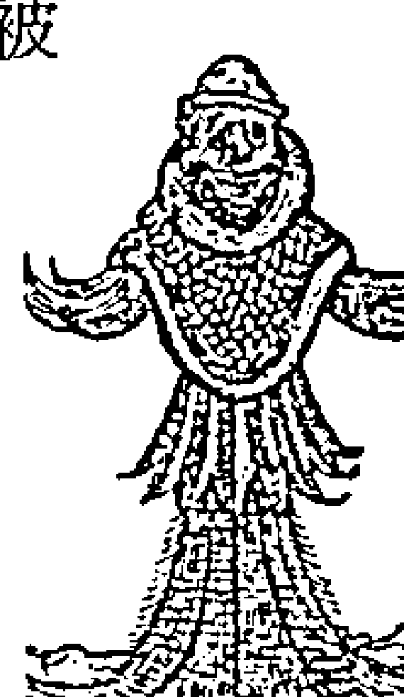

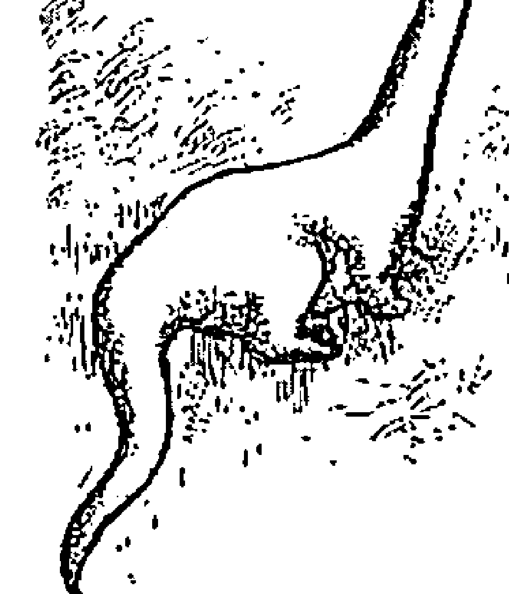

### 莫诺赛罗斯独角兽 (Monoceros) [“独角兽”，也叫卡卡丹、卡卡卓龙 (Carcazonon) ]
老普林尼在其《自然历史》（公元77年）中记载的一种独角兽。它有马的身体、大象的脚、野猪的尾巴、鹿的头，头上长着一只4英尺长的独角。这很显然是独角的印度犀牛 (Rhinoceros unicornis)。从17世纪起，这个名字就被用在独角鲸 (Monodon monoceros) 身上，它也被称为马里努斯独角兽 (Monoceros Marinus)，或“独角海兽”。这种生物被描述为头上长着巨大独角的长着蛇纹鱼，它会用其撞沉船只。

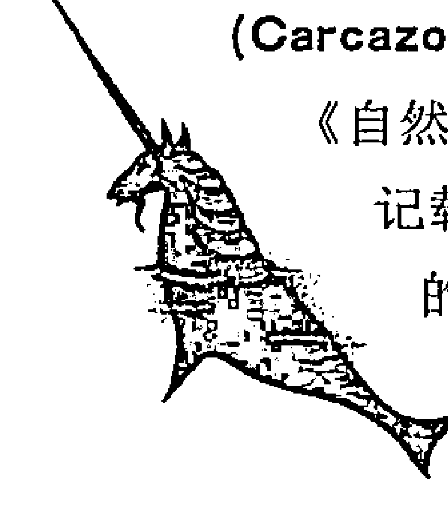

### 法古阿湖怪 (Monster of Lake Fagua) [或法古阿湖怪 (Monster of Lake Fagua)]
智利法古阿 (Fagua) 湖中的一种湖怪，1784年被画上了一张大字报。它有蛇一样的身体，以及翅膀和两只“尾巴”——一只尾巴很尖，被当成长矛使用；另一只尾巴长有吸盘，可以抓住猎物。它的脸和人的类似，还有驴的耳朵、牛的角、马的鬃毛。开头的几个特征听起来像鱿鱼，但剩下的呢？

### 普朗普顿怪兽 (Monster of Brompton)
20世纪70年代在宾夕法尼亚州来康明郡布朗普顿湖中发现的一种湖怪。它全身呈灰绿色，背上长着三个高达8英尺的驼峰。在它马头上的嘴边长着猪鬃毛。它快速游过的时候会在湖面留下一条250英尺长的痕迹，这让渔民们非常害怕。参见马鳗鱼、马鱼 (Merhorse)。

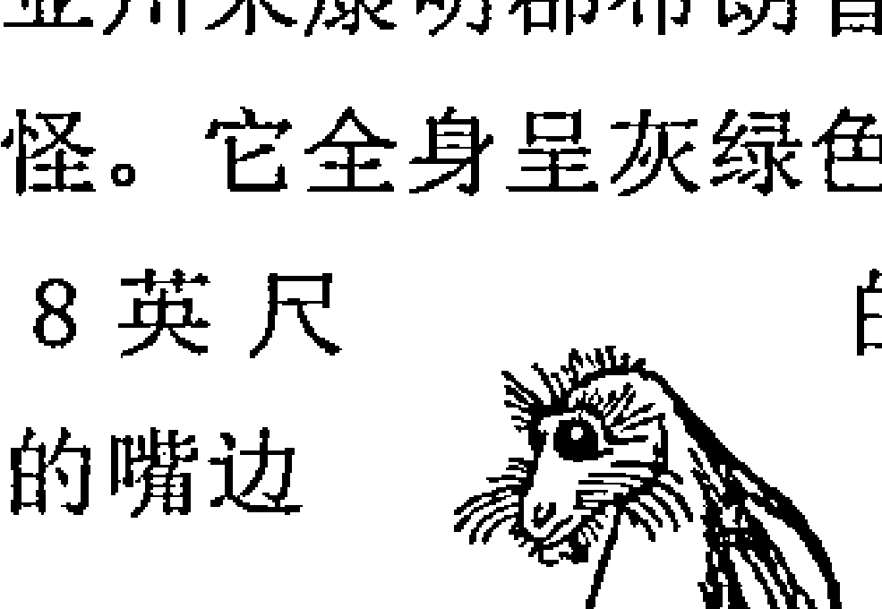

### 莫欧 (Mo-O) [或莫寇 (Mo-Ko)]
一种大型波利尼西亚海龙，它能将一整个养蚝场从一个岛屿搬到另一个岛屿。

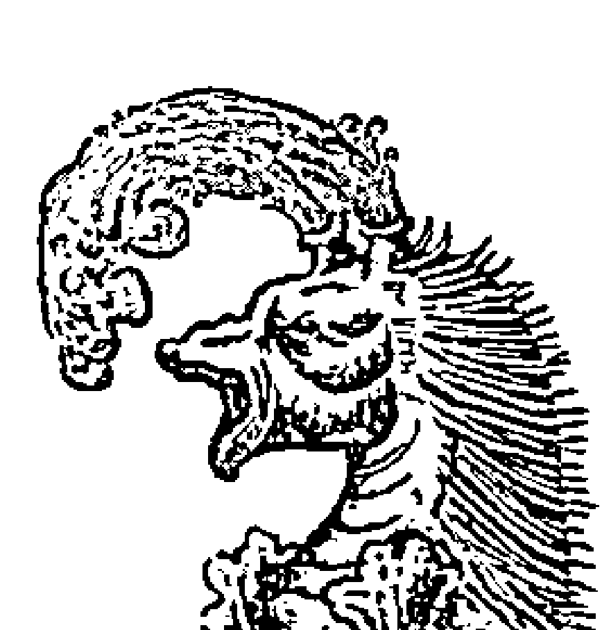

### 莫红 (Morhon)
一种纹章鲸鱼，长有两个气孔和狮子的鬃毛。

### 世界屋脊鳟鱼 (Moshiriikkwechep) [或世界之脊鳟鱼 (Mohiriikkwchep)]
日本神话中一种巨大的鱼，住在海底的淤泥之下，背负着整个世界。它的扭动会造成地震和海啸。参见地震鱼 (Jinshin Uwo)、世界之蛇尤蒙刚德 (Jormundgund)、卡米 (Kami)。

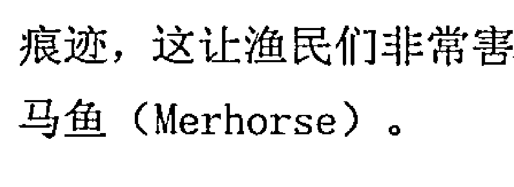

### 鱼母 (Mother of the Fishes)
一只巨大的鱼，据说住在德国沃格兰的艾尔斯特河中。它是鱼类的保护者。任何人看到它都会遇上灾难。它可能是一种巨型湖鲟 (Acipenser)，其长度可达30英尺。参见贝加尔湖湖怪、鱼类守护者、米斯干尼比克 (Misiganebic)。

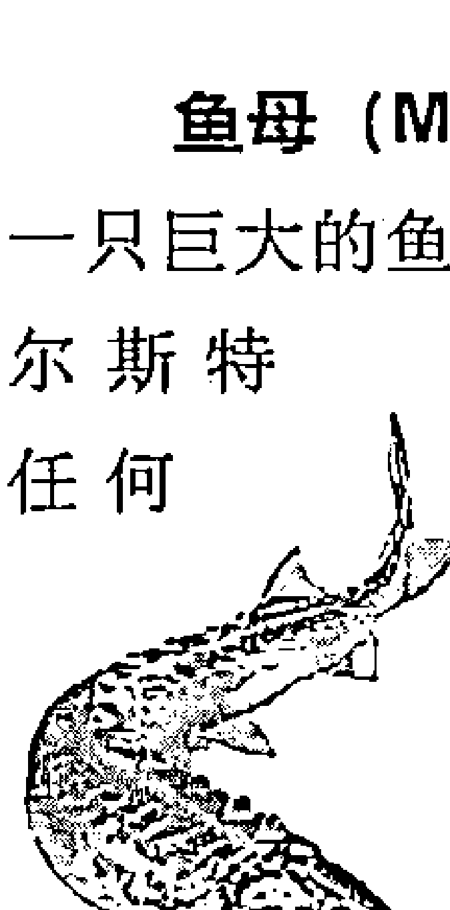

# 图鉴一、魔法动物展

斯匹兹 (Mishipizhiw)、派莱予 (Pal-Rai-Yuk)、怀迪 (Whitey)。

## 天蛾人 (Mothman)

1966 年在弗吉尼亚州欢乐镇附近，被一些 UFO 观测者目击到的一种飞行生物。它的名字来自电视节目《蝙蝠侠》，据说其身高有 5 至 7 英尺，身体呈灰色或褐色，有巨大的翅膀，没有头，红色的眼睛长在身上。它可以约 100 英里的时速划过夜空，发出刺耳的声音，会捕食小型动物和宠物。约翰·基尔(John Keel)写的一本名为《天蛾人的预言》(The Mothman Prophecies)（1976 年）的书在 2002 年被拍成电影。参见切尔诺贝利黑鸟、火虫、龙人、鸽人 (Owlman)。

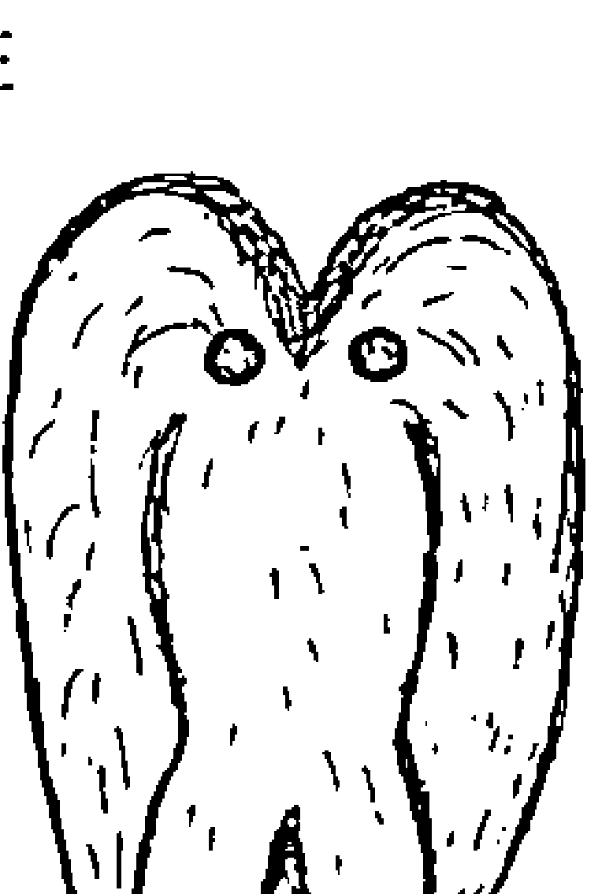

## 毛罗·恩高 (Mourou N' gou)

身上长着蓝白斑点的豹子样的动物，据说生活在中非共和国的湖泊和河流中。他们的尾巴毛茸茸的，而且不像其它猫科动物那样，它们行动时不会留下脚印。它们成群结队地捕猎，从不害怕攻击人类。

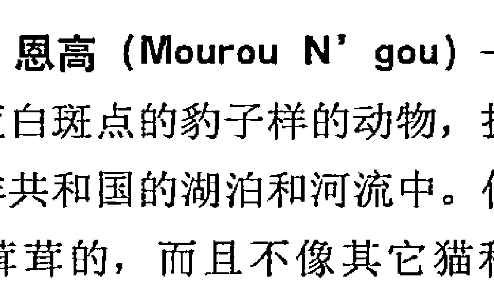

## 姆乎路 (Muhuru)

另一种可能的活恐龙，据报道，它生活在肯尼亚和西非的丛林中。根据目击者的描述，它们是长着重甲的庞大爬行动物，背上有大大的骨板突出。这听起来很像侏罗纪时期的鸟臀目恐龙(ornithiscian dinosaur)，剑龙（“有盖的蜥蜴”）。参见伊美莱南头卡(Emela-Ntouka)、姆比路-姆比路-姆比路(Mbielu-Mbielu-Mbielu)、河霸龙(Mokêle-M’ Bêmbe)。

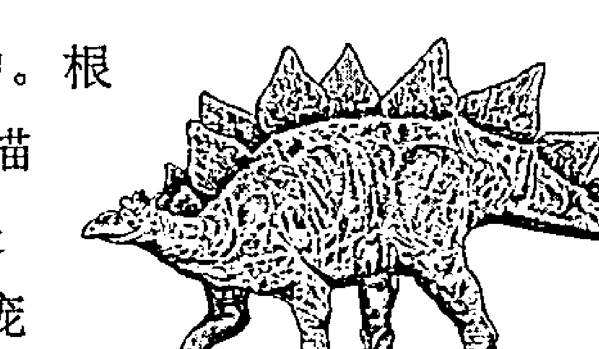

## 穆尔得利斯 (Muir dris) [或斯米尔得利斯(Smirdris),斯纳克(Sí nach)]

爱尔兰传说中一种可怕的湖怪，背上长有很多尖角，肚子上有很多奶头。它可以像河豚那样膨胀起来。据说它住在德文郡的路德莱吉(Rudraige)湖中。后来被英雄福格斯·马克·雷提 (Fergus Mac Léti) 杀死。

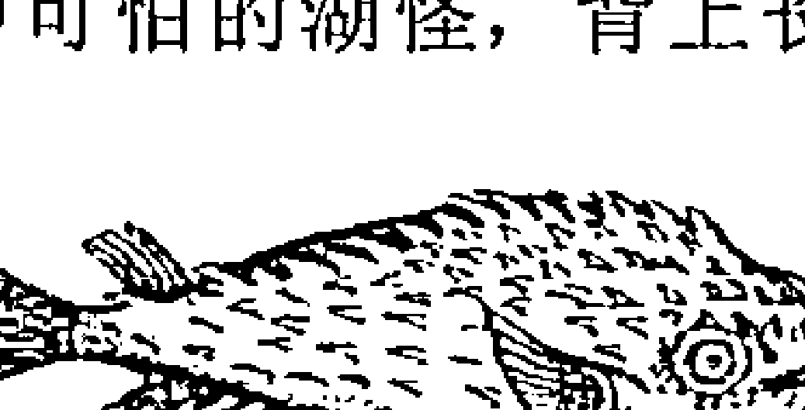

## 穆里亚斯 (Muiri asc) [或穆里沙克(Murrisk), 罗素阿尔特(Rosualt)]

居住在克罗帕特里克(Croagh Patrick)附近平原上的一种海怪。它们所到之处都会散发出难闻的臭气。如果它们将其喷入水中，所有的鱼类都会死亡，如果它向空中喷吐，所有的鸟类也会死亡，如果进入了土地，那就会给世间带来瘟疫。参见蛇怪。

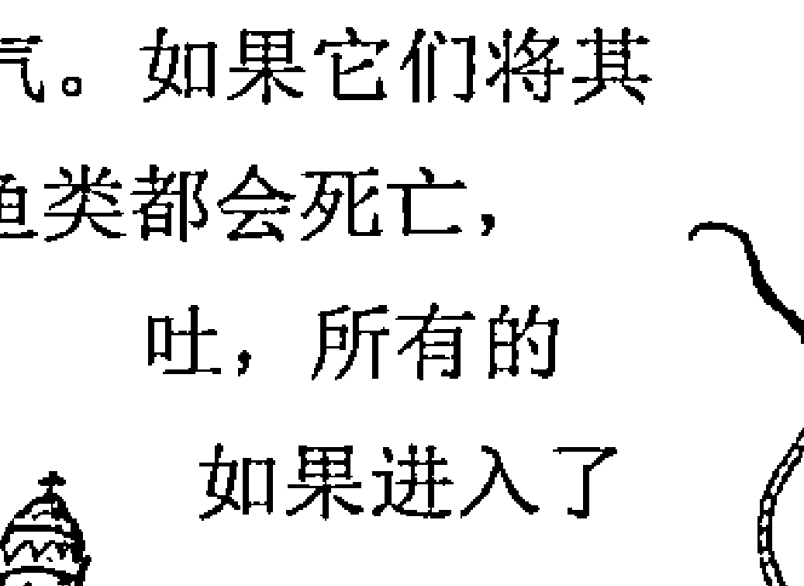

# 魔法师的怪物图鉴

## 穆尔瑟兰切 (Muirs elche) [盖尔语中的“海螺”]

一种爱尔兰海怪，可以将任何人或东西吸入到它像鱼一样的肚子里。它后来被达格达——传说中索厄赫德达嫩族人的首领——所杀。这可能指的是海浪，特别是海啸。参见苏弗麦尔 (Sughmaire)。

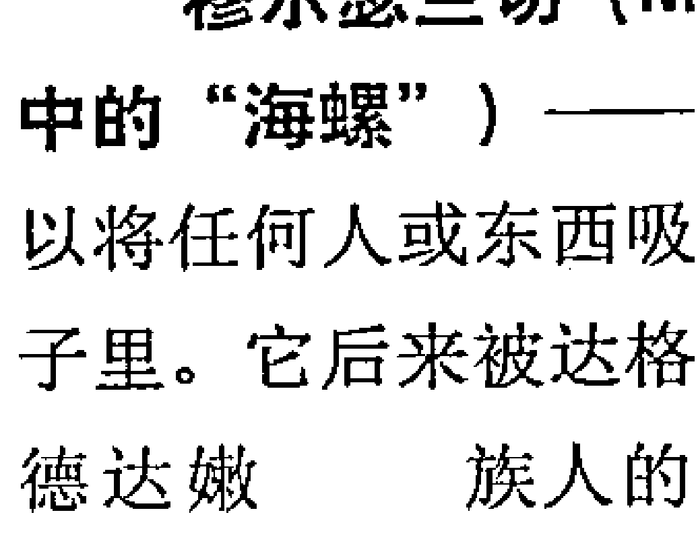

## 姆里罗 (Mulilo)

生活在非洲刚果、扎伊尔和赞比亚边界上的一种6英尺长、黑色蛞蝓般的生物，非常危险，它的呼吸中有剧毒。参见蒙古死亡虫、欧姆 (Orm)。

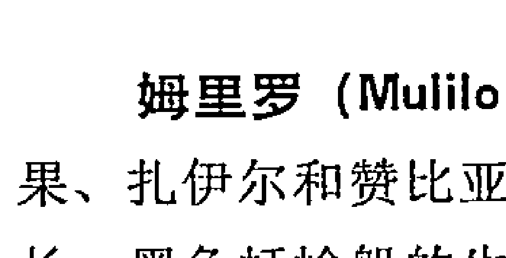

## 牡吉王 (Mulgewang)

澳洲原住民传说中的一种水怪，据信居住在亚历山大河和默累河中。它们被描述为是半人半鱼，常常躲在大团海草之下。

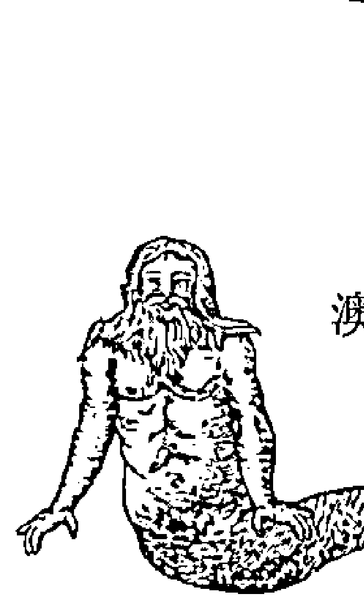

## 海猫 (Murcat) [或姆查塔 (Murchata)]

一种体型像马一样大的海猫，最早被爱尔兰僧侣圣布伦丹 (St. Brendan) 在其前往无极岛的传奇般旅行中遇到：“它的眼睛比锅还大，有野猪的獠牙，身上长着绒毛，还有豹子的肚子、狮子的力量和猎犬的贪婪。”这肯定是海象。

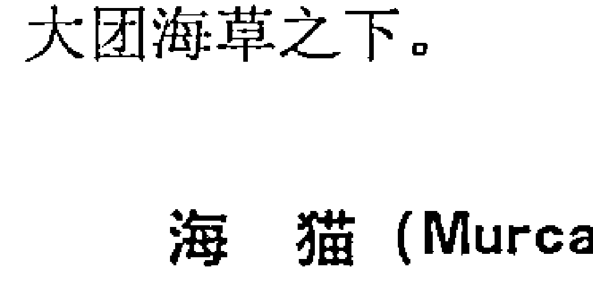

## 穆雷那 (Murena) [或穆里恩纳 (Muriena)]

《生理论》中记载的一种卷成圆圈的鳗鱼，这种生物中的雌性据说性欲极强，甚至会与蛇交配。渔夫们学蛇的嘶嘶声就能把它们引出来。用棒子很难把它们打死，但用鞭子抽就很容易。但它们的尾巴却是独立存在的，必须将其和头部一起斩断。虽然穆雷那这个学名已经被用在了海鳗身上，但它们实际上属于七鳃类 (Petromyzontidae)，在中世纪时，它们是上层人士间一种很受欢迎的食物，特别是在斋戒期间，因为它们的味道比大多数的鱼都要好。英格兰国王亨利一世死于“吃了过多的七鳃鳗”。

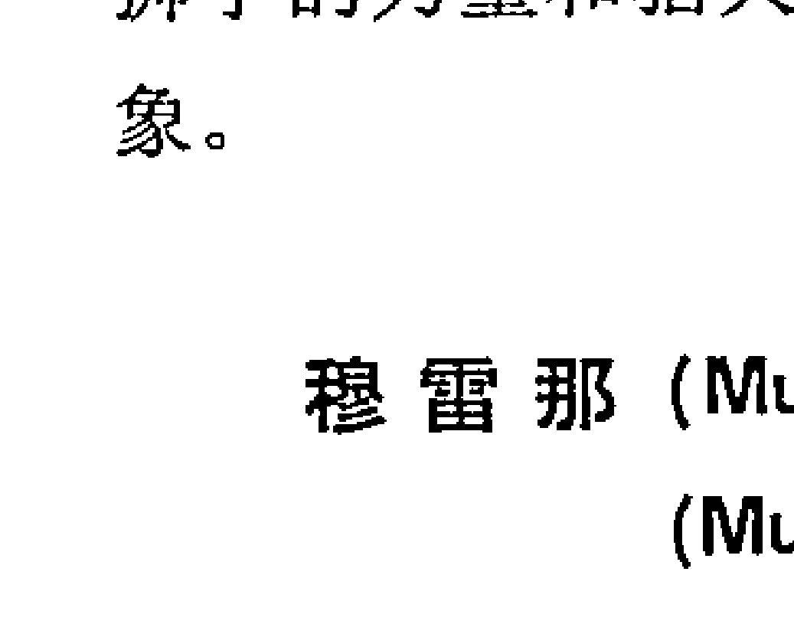

## 骨螺 (Murex)

一种可怕的紫色鱼，老普林尼在其《自然历史》（公元77年）将其描述为可以拥有极其有力的嘴，可以很快地附着在船体上。虽然他将其等同于长印鱼 (Echeneis) 或鲫鱼 (remora)，但这个名字已经被用来命名海生腹足属生物——包括紫螺蜗牛 (Murex brandaris) 和骨螺 (Murex trunculus)——它们是紫色染料的来源。

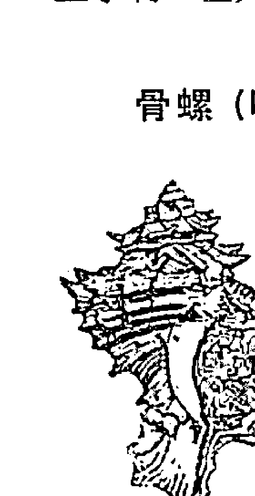

## 姆奇－艾－安大密 (Murghi‑I‑Adami)

中世纪伊斯兰传说中的一种神奇鸟类，像长着人脸、拥有人声的孔雀。据说如果能偷听到它们之间的对话，人的知识就会大增。参见查戈（Zägh）。

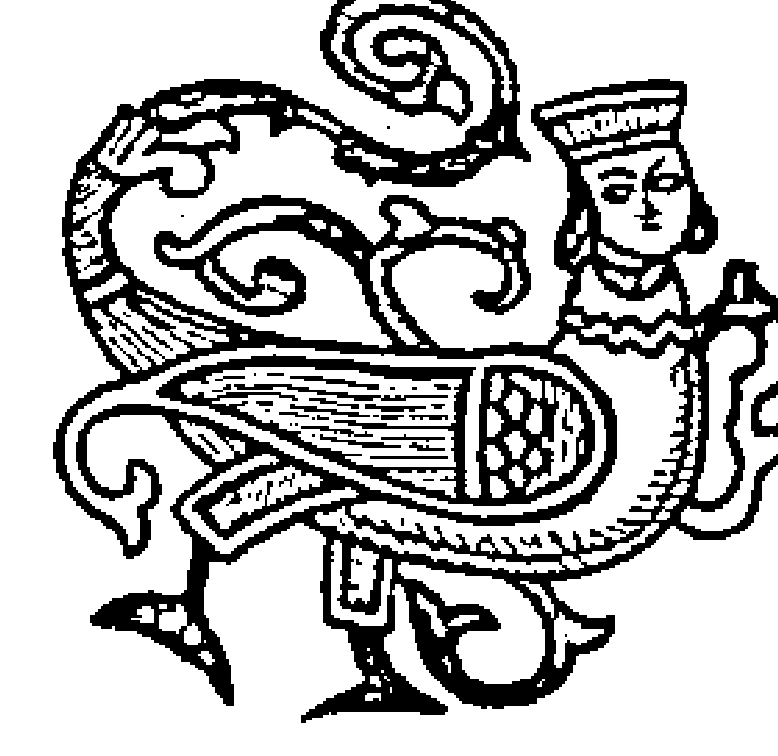

- 毛以及野猪的獠牙。它会毁掉树上的果食和叶子。它们的巢穴建在树下的洞穴中。（摘自《皮埃尔·德·博韦的怪物图鉴》[（Bestiaire of Pierre de Beauvais）]

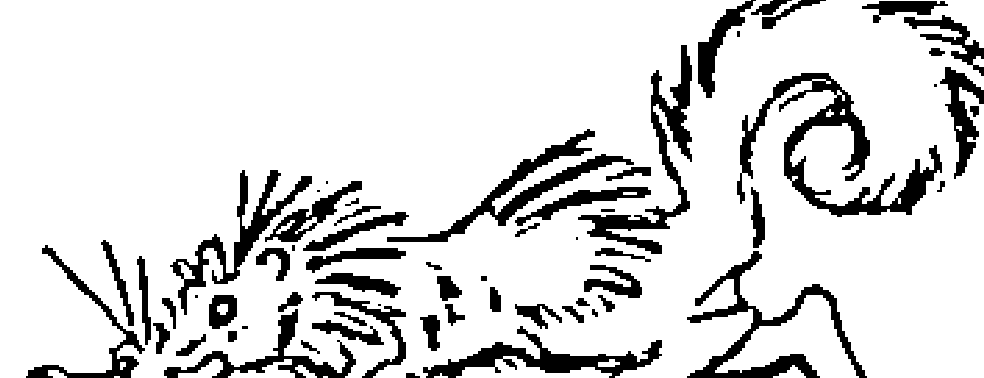

## 墨菲斯伯勒泥怪（Murphysboro）

1972年5月25日在伊利诺伊州中部的墨菲斯伯勒，被超过200个人目击到的一个7英尺高、全身白毛的猿形生物。参见大脚怪。

## 摩弗仑野羊（Musimon）[或提提鲁斯（Tityrus）]

一种类似山羊，却长着公绵羊的头和角的纹章兽。

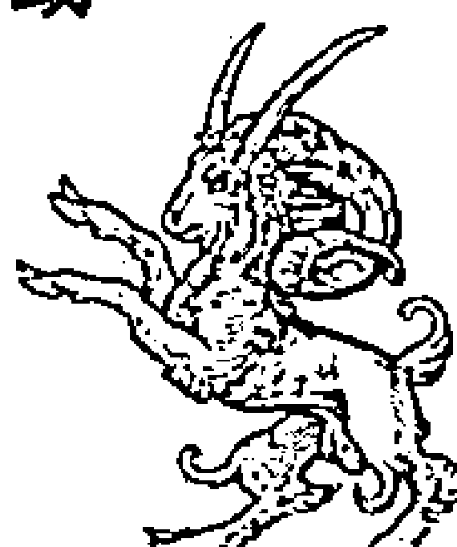

## 莫雷（Murray）

一种像恐龙的爬行动物，1999年在新几内亚100英里长的巴布亚湖中首次被发现。目击者形容其“如同一台翻斗车。”它是一种两栖的两足动物，大约6英尺宽，长着两只短短的前肢，后肢则“像棕榈树树干那么粗”，以及长长的脖子和尾巴。它的头像牛一样，上面长着大大的眼睛和跟人的手指一样长的牙齿。在它背上据说长着“大三角勺”。这些都说明它很可能是一种兽脚类恐龙，牛头则暗示它可能是食肉牛龙（Carnotaurus）（如图所示）。参见伊美莱南头卡（Emela Ntouka）、河霸龙（Mokèlé M’Bêmbe）、姆乎路（Muhuru）

## 姆斯特拉（Mustela）（或海鼬）

- “她像其它动物那样生下自己的宝宝，如果觉得自己的孩子会被人发现，她就会将它们吞进自己的肚子，等到危险过去，她又会将它们吐出来。”（《生理论》）

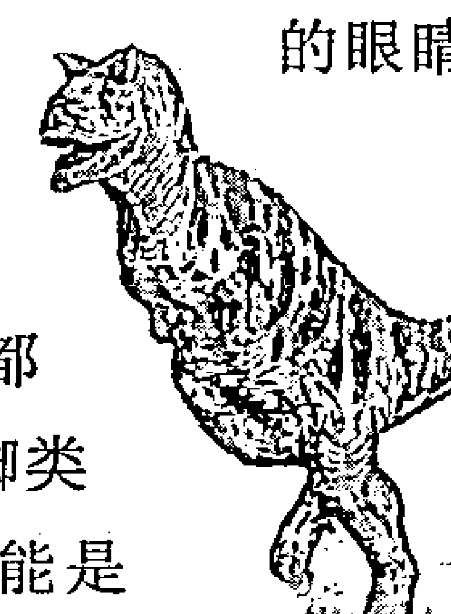

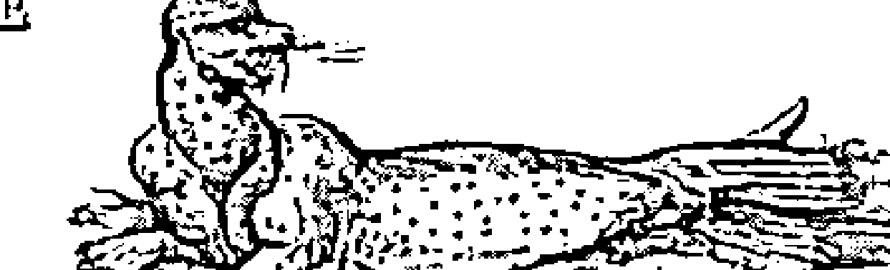

## 米亚卡猿人（Myakka Ape）

一种毛茸茸的原始人，据称它住在佛罗里达州的萨拉索塔附近的沼泽里。它被描述为长得类似黑猩猩或红毛猩猩。参见大脚怪、巨猴、臭鼬猿。

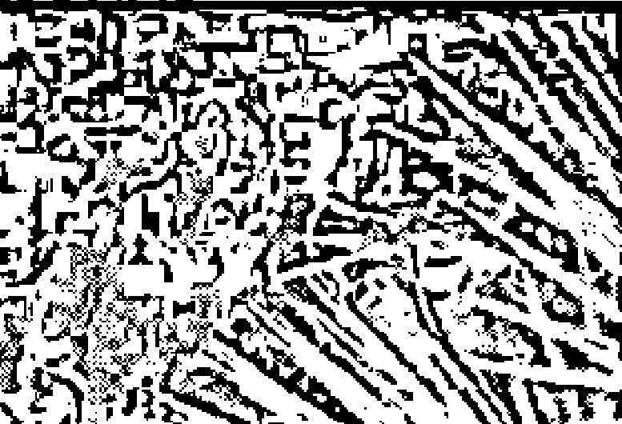

## 穆斯卡利特（Muscaliet）

波斯的一种小型果食动物，身体像兔子、松鼠的腿和尾巴，能在树枝间跳跃。它的耳朵像黄鼠狼，嘴巴像鼹鼠。它还长着猪的鬃毛以及野猪的獠牙。

## 水之谜

加拿大不列颠哥伦比亚省的科达伦（Coeur d’ Alene）印第安人传统中长期通用的术语，意思是湖怪。

N指的是那迦，造雨者，它也能让河流干涸：半人半蛇，无比神圣，守护着神庙和神龛。

# 魔法师的怪物图鉴

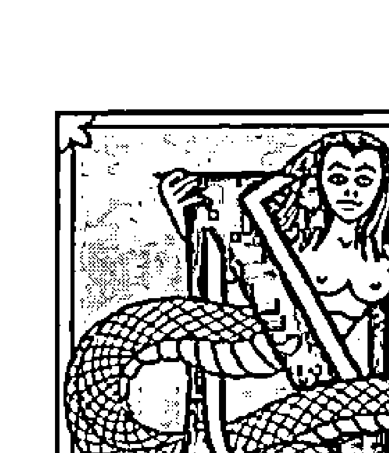

## 纳肯 (Näcken) [也巴克卡哈斯特 (Bäckahäst)、纳奇 (Näkki)、尼克 (Nikke)、尼克尔 (Nicker)、尼库尔 (Nickur)、尼扣儿 (Nicor)、尼克勒 (Nickel)、尼尼尔 (Ninnir)、尼奇尔 (Nikyr)、昵库尔 (Nykur)、尼克让 (Nykkjen)、诺克 (Nøkk)、诺奇 (Nøkke)，诺肯 (Nøkken)，海库尔 (Haikur) ]

斯堪迪纳维亚和冰岛传说中的一种水怪。它通常被描述为一种巨大的白色水马，类似于苏格兰的马形水鬼 (Kelpie)，但蹄子的方向却和它相反。只要有人爬到它背上，纳肯就会一头扎进水中，淹死那个人。当在黎明和黄昏时分上到岸上的时候，它有时是半人马的样子，有时是一个戴着红色帽子的金发男孩，有时又是长有绿色胡子的老人。在爱沙尼亚，这种动物据称和将船和船员一起拉入水中的漩涡有关系。参见兹雷·库洛恩 (Cìrein Cròin)、伊奇·尤思戈 (Each Uisge)。

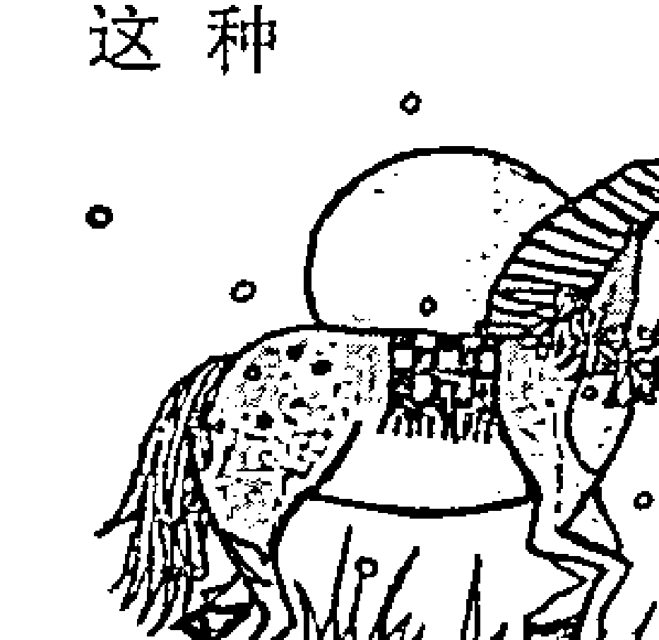

## 纳加斯 / 纳吉尼斯 (Nagas/ Naginis) (“眼镜蛇”)

印度的蛇人。纳加斯是雄性，纳吉尼斯是雌性。它们上半身是人，下半身是蛇，有时还长有几个脑袋，身上也有几种不同的颜色。纳加斯有四个等级——天堂级 (Heavenly)、神级 (Divine)、地级 (Earthly)、隐级 (Hidden) ——各个等级功能不同：守卫天宫、造雨、吸干河流、守护宝藏。据说它们最终会用火将世界毁掉。在缅甸，它们是蛇、龙、鳄鱼的结合。它们会将红宝石赠送给自己喜欢的或保护皇室的人。然而，在印度尼西亚、泰国、马来西亚，它们又是吓人的巨大的黑色水蛇或多头小海龙。其形象常被用作寺庙的门神。此名称已被用在印度眼镜蛇，纳加纳加 (Naja Naja) 身上了。

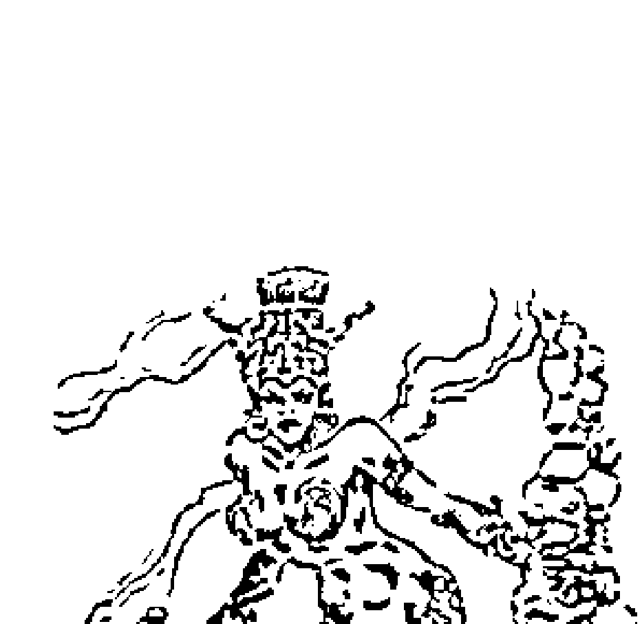

## 拿活域里 (Nahuelito) (或巴塔戈尼亚蛇颈龙)

据说住在阿根廷纳威瓦皮 (Nahuel Huapi) 湖里的一种怪物。几个世纪以来，当地印第安人都传说这是一种住在湖中，无头无腿无尾的巨兽。在1910年目睹过它的乔治·加勒特 (George Garrett) 说“好像有15至20英尺粗，露出水面的部分有大约6英尺。”1922年，美国金矿探测者马丁·谢菲尔德 (Martin Sheffield) 报告称，他看到一个像鳄鱼一样游动的水生生物，有像天鹅一样长长的脖子。

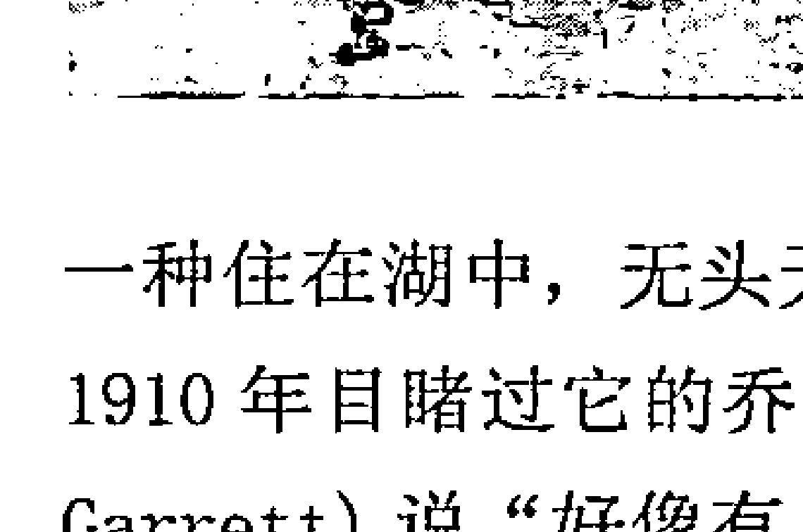

## 纳克 (Nakk) [ 或 纳奇 (Nakki) ]

爱沙尼亚和芬兰民间传说中的人鱼，据说是从未能投胎的溺水者中转化出来的。其雄性非常凶残，用美妙的歌声引诱人，然后吃掉他们。美丽的长着鱼尾的纳克美人鱼用金色的梳子梳理头发。芬兰的雌性纳奇，有着闪闪发光的白色身体及能甩到肩头的长乳房。

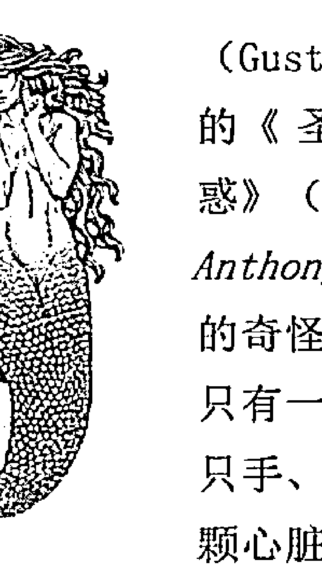

## 纳斯纳斯 (Nasnas) [ 或内斯纳斯 (Nesn á s) ]

古斯塔夫·福楼拜 (Gustave Flaubert) 的《圣安东尼的诱惑》（Temptation of St Anthony）（1874 年）中提及的奇怪生物。它就像半个人，只有一只眼睛、一个脸颊、一只手、一条腿、半个躯干和半颗心脏，住在哈德拉毛和也门的旷野中，能够说话。据说它的一个变种生活在莱基（Raïj）岛上——可能是婆罗洲。这很可能是一种大型果蝠。

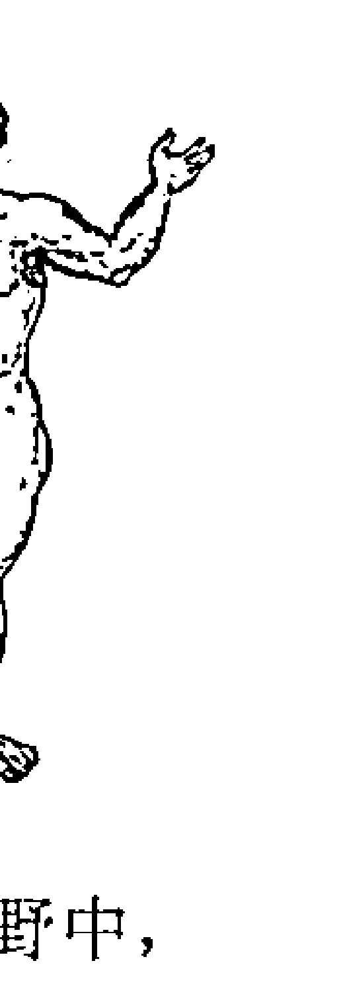

## 纳迪熊 (Nandi Bear) [ 或其米斯特 (Chimisit), 克里特 (Kerit), 奇卡姆邦威 (Kikambangwe), 柯多罗 (Koddoelo), 伊奇米兹 (Ikimizi), 萨布鲁库 (Sabrookoo), 斯乌维勒 (Shivuverre) ]

非洲肯尼亚的一种未知大型肉食动物。有倾斜的背部和其它类似熊的特征。它的名字来自纳迪（Nandi）部落，该部落的人对其非常害怕。他们将其称为“食脑者”，并说它们会等在路边的矮树上，然后在有人经过时突然打掉他们的头盖骨吃掉他们的大脑，留下身体的其他部位。它很可能是阿特拉斯熊（Ursus arctos crowtheri），它们中最后的一只在 1870 年代在摩洛哥北部被猎人杀死了。但贝纳德·霍伊霍尔曼坚持认为纳迪熊其实是蜜熊或蜜獾（Mellivora ratel），它是一种像熊一样的非洲獾，身长可达 3.5 英尺。

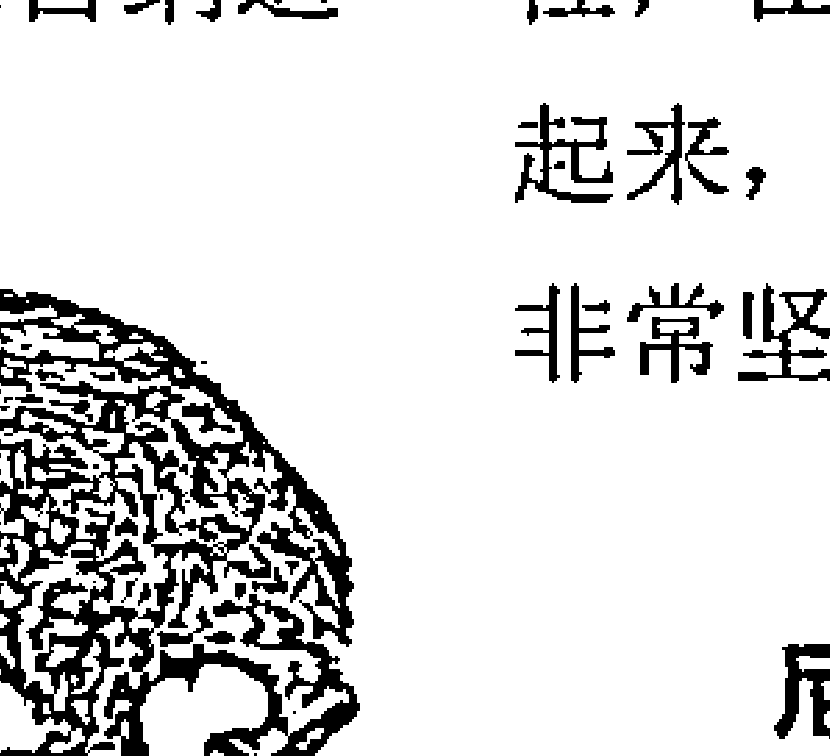

## 纳祖狄兹 (Ndzoodzoo)

南非土著人传说中的凶猛独角兽，人只要被发现，就会受到它的攻击。据说在 19 世纪的时候，它在莫桑比克北部都还非常普遍，它体型如同一匹马一样，并长有一只 2.5 英寸长的尖角。这只角在放松的时候很有弹性，在这种动物睡着时能够像象鼻一样卷起来，但一旦它被激怒，这只角就会变得非常坚硬。雌性的此种动物没有角。唔……

## 尼－圭德 (Nee-Gued)

印度传说中的雪人在锡金的名字。它生活在干城章嘉峰（Kanchenjunga）山脉中。

## 涅盆迪斯 (Nependis)

欧洲纹章中的一种混合生物，据说它一部分像野猪，一部分像猿。它整合了这两种动物身上最丑的地方。

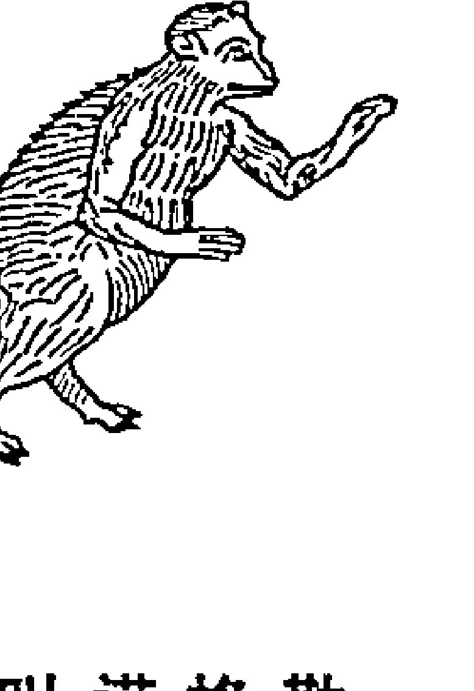

## 聂格勒 (Neugle) [ 也叫 诺格勒 (Nogle), (Noggle), 奴格勒 (Nuggle), 奴吉(Nuggie), 尼格尔(Nygel) ]

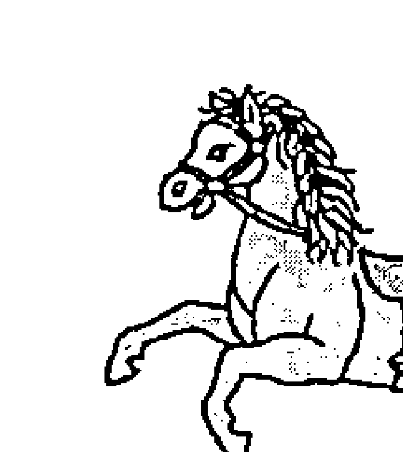

- 它样子像马，长着绿色鬃毛，尾巴罕见地像轮子一样在它的背上转动。它会在岸边奔跑跳跃，但只要有人爬上了它的背，它就会一头扎进水中，将其淹死——或至少浸湿，它随即也消失在跳动的蓝色火焰中。参见水马安格西斯基、格拉西汀、马鳗鱼、马形水鬼(Kelpie)、湖怪、唐吉、水马。

## 六角恐龙“恩古布”(Ngoubou)

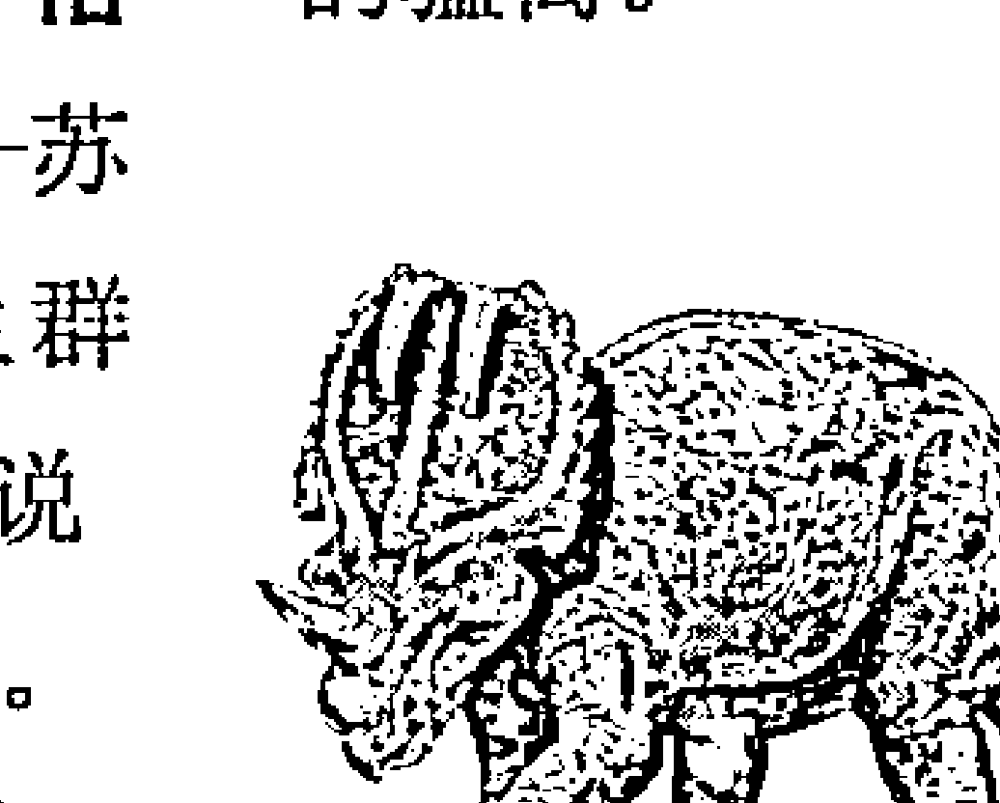

- 非洲的一种长有头壳和象牙的神秘动物，样子很像角龙类恐龙(ceratopsian dinosaur)，据说它曾成群结队地生活在这里和大象争夺领土。参见伊美莱南头卡。

## 纳加尼-瓦图(Ngani-vatu) [或纳古图-雷(Ngutu-lei)]

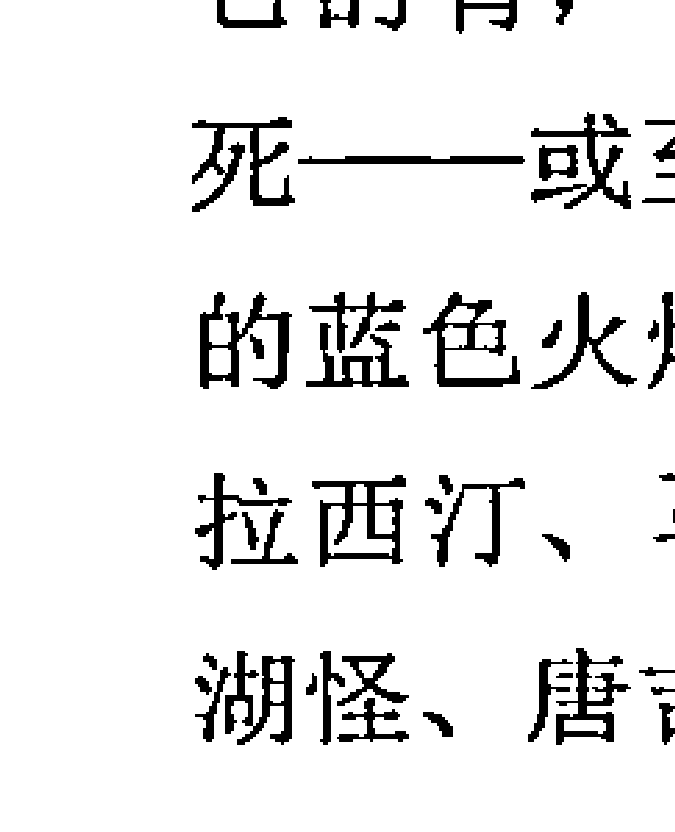

- 斐济群岛传说中的一种巨型肉食鸟。其庞大的身体能够遮住太阳，它的翅膀拍动时就会造成极大的风暴。它捕食太平洋岛屿上的动物和人，后来被英雄欧克瓦(Okova)和其妻子的弟弟克寇瓦(Kokoua)所杀。参见普凯(Pouakai)、大鹏(Roc)。

## 恩古马·摩内内(Nguma-Monene)

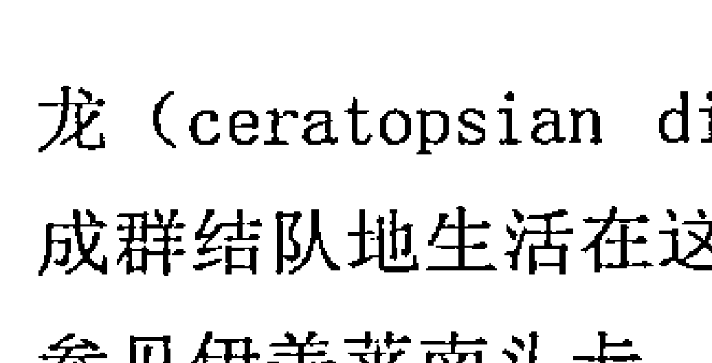

- 非洲的一种长着分叉舌头的巨蛇，背上还有鳄鱼一样的突起。据说其身长能达130英尺，以人类和动物为食。1959年，比利时直升飞机驾驶员小米利尔德(Col.Remy Van Lierde)在非洲刚果上空飞行的时候拍下了这张照片，里面有一条身长40至50英尺的巨蟒。全身呈棕绿色，腹部是白色，三角形头部的大小约为3×2英寸。由于直升机飞得比较低，这条蛇将身体立了起来，头部离地高度在10英尺左右，就好像如果飞机再靠近，它就会攻过来。参见霸蛇(Pa Snake)、巨蟒(Python)、希甘特(Gigante)。

## 恩格澳伊玛(Ngoima)

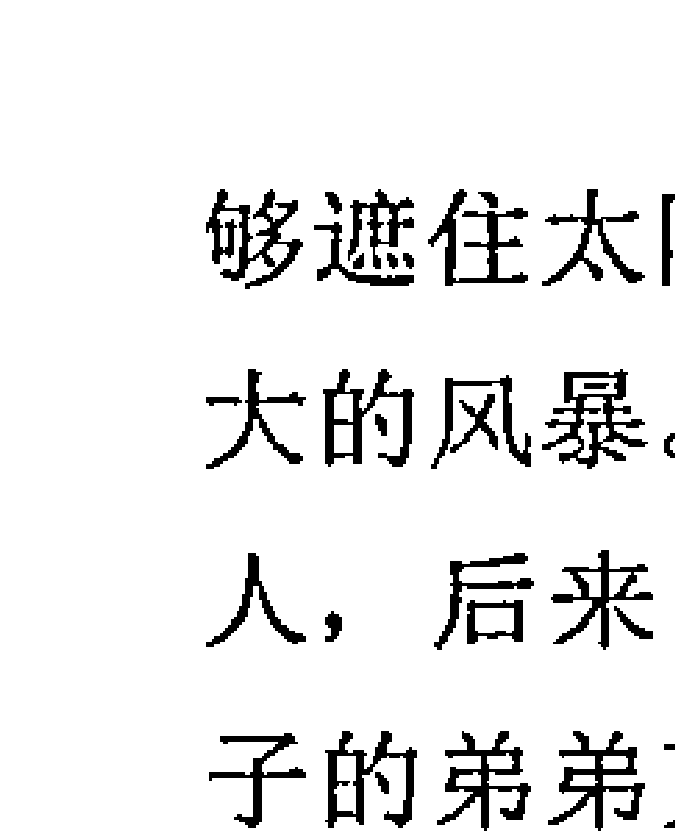

- 居住在非洲刚果森林中的巨型老鹰。据称它的翼展长达9-13英尺，捕食猴子和山羊。它的表层羽毛是深棕色的，里层的则是白色的。它的腿和爪子像一个人的前臂和手一样大。这当然是一种罕见的吃猴子的冠鹰雕，是非洲最凶猛的猛禽。

## 越南牛圭朗(Nguoi-Rung) [“森林人”，也叫齐特劳(Khi Trau) “水牛猴”]

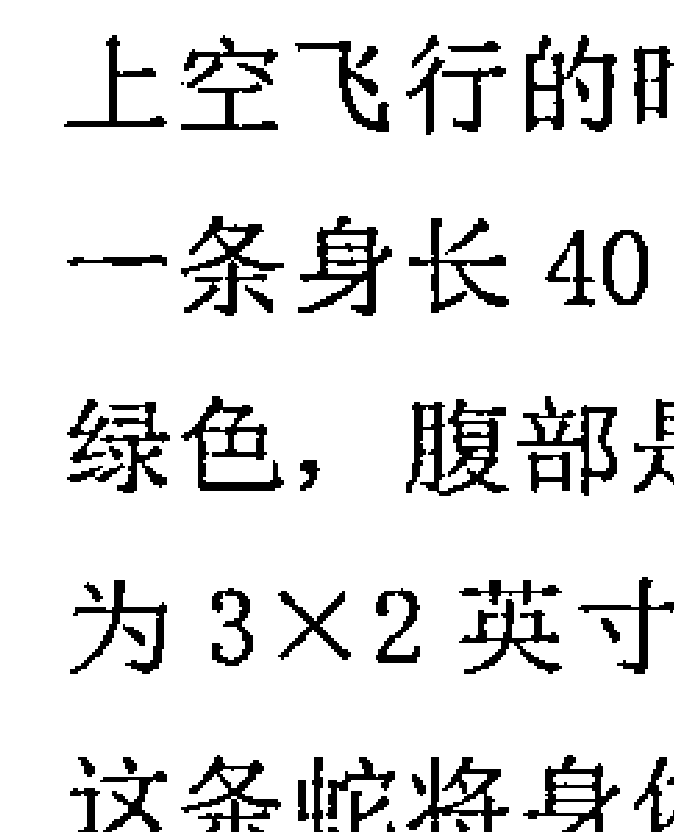

- 一种据称生活在越南丛林中，全身长毛的原始人。对其有很多种描述——这种生物的体型不等，但都长着浓密的毛发，颜色从灰色、棕色到黑色都有。据说它们会到野营营地里和人类坐到一起，但是却不会说话。参见多毛原始人（Nittaewo）、红毛猩猩（Orang Pendek）、雪人。

## 尼德霍格 (Nidhogg) [也叫“尸体撕裂者”(Níðhöggr) 或“残忍攻击者”]

北欧神话中的一种可怕的蛇，不停地啃食世界之树伊格德拉修 (Yggdrasil) 的树根。它也吃女神赫尔统治下的地狱中的死尸。

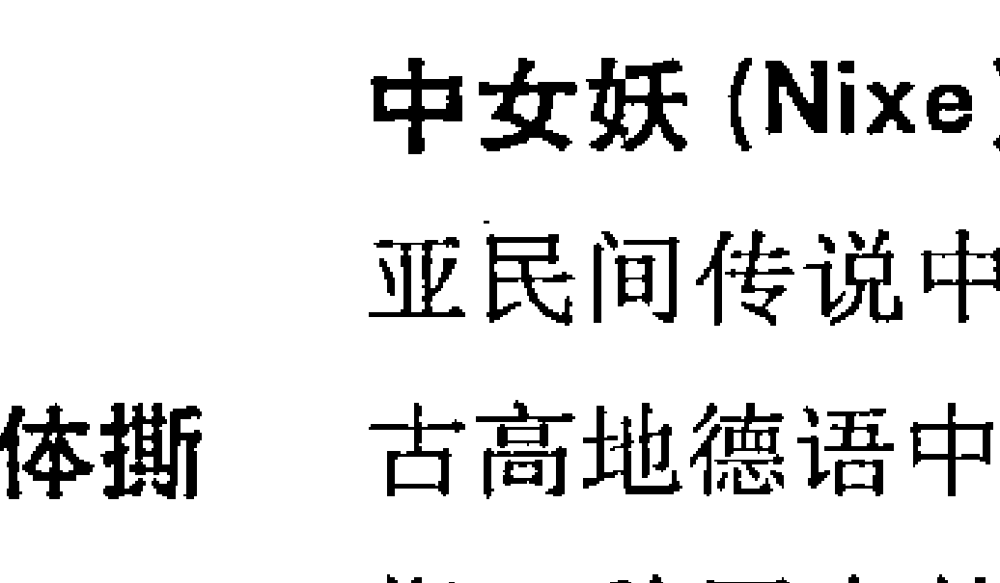

## 日本人鱼 (Ningyo)

这些日本人鱼比较独特，它们只有头部是人类的，身体其余部位全都是鱼。它们对人类很仁慈，会预警风暴和其他灾害。它们很可能是源自儒艮 (Dugongs)。参见阿布吉尔、伊尔凯 (Ilkai)。

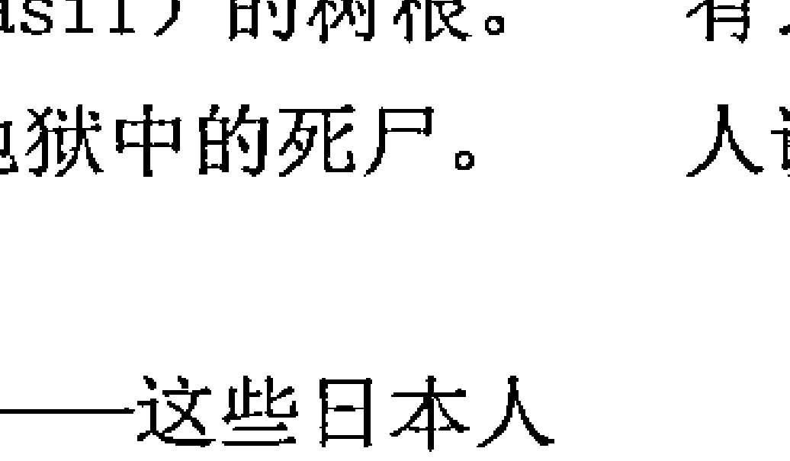

## 多毛原始人尼塔厄沃 (Nittaewo) [或尼塔沃 (Nittawo)]

锡兰和斯里兰卡丛林中的小型长毛原始人，据说身高只有3至4英尺，它们可能是合趾猴（合趾猿属）。在十八世纪末期，现已灭绝的维达人 (Leanama Veddahs) 将最后的一群尼塔厄沃赶到洞穴里，之后点燃入口处的草堆，这样烧了三天，将受害者全部闷死。参见越南牛圭朗 (Nguoi-Rung)、红毛猩猩 (Orang Pendek)、雪人。

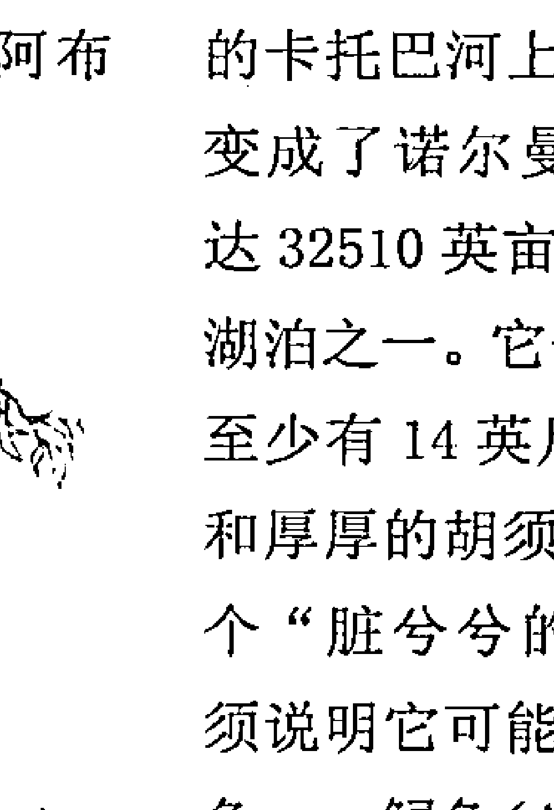

## 水妖 (Nixie) [或尼克斯 (Nix)、水中女妖 (Nixe)]

日耳曼和斯堪迪纳维亚民间传说中的淡水人鱼。这个名字源于古高地德语中的 nihhus，意思是“鳄鱼”，指一种巨大的水生怪物。不同的国家对它们有不同的叫法，有绿美人鱼、鸟人海妖或水生半人马。所有这些生物都会将人诱惑到水中淹死。

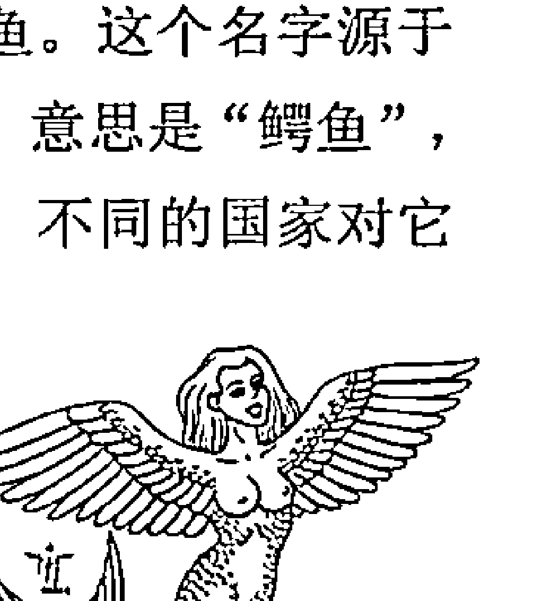

## 诺克斯马 (No-Kos-Ma)

加拿大克里 (Cree) 印第安人传说中的一种巨大的、全身黑色、鼻子巨大、熊一样的生物。

## 诺尔曼湖爬行怪 (Norman Lake Reptile)

1964年，在北卡罗来纳州的卡托巴河上修建起了一座大坝，这条河变成了诺尔曼湖，它宽约34英里，面积达32510英亩，是美国东南部最大的人工湖泊之一。它也被说成是像鱼一样的怪物，至少有14英尺长，长着细长的身体和厚厚的胡须、强健的鱼鳍和一个“脏兮兮的”背鳍。胡须说明它可能是一种大型鲇鱼——鲟鱼 (Acipenser) (如图所示)。

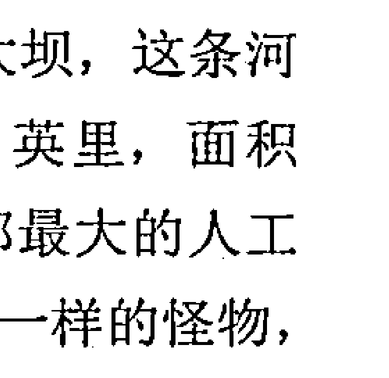

## 奴卡拉韦 (Nuckalavee)

爱尔兰的半人马，散发着腐烂味的恶臭，它的呼吸可以让作物枯萎，让牲畜患病。它是一个由……## 魔法师的怪物图鉴

一种丑陋的两栖海怪，长着巨大的丑脸、一张大嘴和火焰般的独眼。它没有蹄，取而代之的是青蛙的蹼脚。它无毛的皮肤很薄、湿润且透明，让人觉得它像是被剥了皮一样。黑色的血液在黄色的动脉中流动，白色肌腱和强壮肌肉的跳动都可以看见。这种凶残的生物四处横行，以杀生取乐。如果被这种怪物追杀，你只需要越过淡水水体就可以逃脱它的魔爪，因为它不能忍受淡水。

也有人说它们像鲸鱼，背上长着驼峰。据说至少有一条河神达到了120英尺的长度。

### 鵺 (Nue)
（或日本奇美拉）——日本民间传说中的一种混合生物，长着狸猫或狸貉 (Nyctereutes procyonoides) 的身体、猴子的脑袋、老虎的腿、蛇的尾巴。它会带来噩运和疾病，能化身为一团黑云在天上飞行。

# 尼安 (Nyan)
[也叫阿瓦格兰 (Avagr á h)、加拉 (Gara)、格拉哈 (Gr á ha)、坦提戈哈 (Tanti-g á ha)]——印度、孟加拉国和缅甸河流域沼泽中的一种可怕的蠕虫状生物。它们狩猎大型动物，包括大象，它们会像蟒蛇那样缠住大象，然后将其拖出水中吃掉。这也许是跟布林 (Bu-rin) 一样的生物。布林 (Bu-rin) 是缅甸的一种大蛇，身长有40至50英尺。这种怪物据说要攻击游泳者，甚至还攻击小船。参见埃塞俄比亚龙、蒙古死亡蠕虫、欧姆 (Orm)、霸蛇 (Pa Snakes)。

### 无脸怪 (Nupperabo)
这团面团一样的东西其实是日本传说中地狱的守卫。

### 河神 (Nyaminyami)
一种生活在非洲赞比亚和津巴布韦西马绍纳兰省交界处的卡里巴湖中的一对怪兽。它们经常游到津巴布韦河中。千百年来，这些动物已被汤加人奉为神明，他们称其为河神。当地人称它们是长着鳞片和鱼头，蛇一样的生物。

### 恩泽福-罗伊 (Nzefu-Loi)
（“水象”）——据报道居住在非洲刚果丛林中的一种两栖象怪。它的身体几乎和河马一样大，有一根很长的脖子，尾巴像马，长有象牙。它像大象一样在游泳时会将鼻子举起来，这和许多关于湖怪的描述有着惊人的相似。参见摩伽罗 (Makara)、河霸龙 (Mokele-M’ bembe)、特朗克长毛鱼 (Trunko)。

O 指的是衔尾蛇 (Ouroboros)，它吞吃自己的尾巴和身体，然后又不断地生长，如此循环往复，卷成环状，从不停歇。

一段湖怪传奇。但根据奥内达加人和易洛魁人的口述历史，一直都有怪物住在那个湖里。

### O Goncho——
日本神话中的一种巨大的有翼白龙，生活在山广（Yamahiro）水域。每隔五十年，它就会变成一只叫声像狼的金色鸟。这种周期性的变形和它的嚎叫是灾难（比如饥荒）到来的预兆。

### 奥丹图提兰努斯 (Odontotyrannus)
(希腊语中的“齿王”) ——根据古希腊作家所著，这是一种巨型两栖类怪兽，栖息在印度的恒河中。它身上长着黑色的鳞片，头上有三只大角。其可以吞下一头大象。它肯定是来源于鳄鱼，据说它还攻击过亚历山大大帝（公元前356-323年）和他的马其顿军队，吃掉杀掉了很多士兵和动物。

### 欧吉 (Oggie) ——
一种据说生活在纽约奥内达加湖中的湖怪，该湖被美国环保署列为美国污染最严重的湖之一，这可能是由奥斯威戈（Oswego）九里岛上的核电站的排放物引起的。1977年夏天，当地的巡警队目击到了一只在岸边游泳的龙。这只怪兽被命名为欧吉，由此产生出了另

### 奥古布古 (Ogopogo)
[或恩’海提克 (N’haaitk)、乃塔卡斯 (Naitakas)、恩哈提克 (N’ha-a-tik)、萨利希“湖中蛇”] ——居住在加拿大不列颠哥伦比亚省的奥卡纳干湖中的一种湖怪。水西瓦普 (Shushwap)印第安人称其为乃塔卡斯（“长鱼”）。据说它住在一个湖中小岛下面的洞穴中，被描绘在岩画中。目击者描述了一种生物，它的外形酷似一个巨大的木头，有15到20英尺长，直径大1至2英尺，长着一个像马或像山羊一样的脑袋，像蛇一样起伏。也有说它像鲟鱼那样在背上长着锯齿脊，或只是长有背鳍，但却很光滑。参见昌普（Champ）、尼斯湖水怪、水马。

### 欧利提奥 (Olitiau)——
1932年，动物学家伊万·t. 桑德森（Ivan T. Sanderson）（1911-1973年）和年轻的博物学家杰拉尔德·拉塞尔（Gerald Russell）在非洲喀麦隆遇到的一种巨大的、黑色的、像蝙蝠一样的生物。它有“稀疏的白色尖牙”和“德库拉一样的翅膀”。桑德森后来推测这种怪兽是“一种巨大的锤头兽蝠（Hypsignathus monstrosus）。”锤头蝠（如图所示）是非洲最大的蝙蝠，它们全身呈深灰色，黑色的翅膀翼展达到3英尺，还有长长的狗鼻子。参见阿胡、阿兰、圭阿法罗、飞猴 (Hsigo)、空阿马托 (Kongamato)、红毛蝙蝠、罗翱、莎莎伯恩沙。

### 奥利佩斯特 (Oilliphéist)
[ 或 (Oillepheist), 盖尔语中“巨大的奇兽”]——据说住在爱尔兰香农河中的一种龙或湖怪。起初它都还很友好，但在听说圣帕特里克要来驱除它的时候它就被激怒了，随后它吞下了一个喝醉的风笛手，据说这个风笛手还一直在怪兽的肚子里演奏，直到被消化掉为止。

### 八爪水怪 (Oklahoma Octopus)
一种住在俄克拉荷马州的雷鸟湖、乌洛伊湖和特柯基勒湖中长有触须的生物。当地的印第安人一直以来都很怕它（他们认为它是一种水蛭），这种动物大致有一匹马那么大，长有棕红色的革质皮肤、泡泡样的小眼睛、很多的触手。据说它是贪婪的肉食动物，领土意识很强。参见奎罗、淡水章鱼、回克回克 (Hueke Hueke)、米加斯 (Migas)。

### 俄纳楚 (Onachus)
小亚细亚（土耳其）加拉太的一种野兽，它所碰到的所有东西都会燃烧。据说塔拉斯各 (Tarasque)它是俄纳楚和利维坦的后代。

### 半人半驴怪 (Onocentaur)
（或 Onoscentaurus, Monocentaur）——一种半人马，长着人的躯干和手臂，以及野驴的下半身。三世纪《生理论》和之后的动物寓言集以及《伊西多尔》（Isidore of Seville）（公元前560-636年）都说它永远不睡觉。在基督教中，它代表着虚伪和淫荡，有时被认为森林之神萨提尔 (Satyrs) 有关。半人半驴怪与海妖的关系很近，它们据说都住在对方附近。

### 昂撒豹 (Onza)
(来自拉丁语中的 Uncia “猎豹”，或阿兹特克中的 “Cuitlamiztli”) ——据说生活在墨西哥西马德雷山脉 (Sierra Madre Occidental) 山脉中的一种大型猫科动物。1986 年被杀死的一只这种怪兽被证明为一只山狮 (Puma concolor)。

### 玛瑙麒麟 (Onyx Monoceros)
一种波斯独角兽，克特西亚斯说它有像骡子一样的白色身体、紫色的头上长着蓝色的眼睛，还有一只底部红色、中间黑色、顶端红色的大角。这很明显是源自白色阿拉伯羚羊，它也有独角。

### 欧吡尼卡斯 (Opinicus)
[ 或埃披马格思 (Epimachus)]——纹章中对狮鹫的一个术语，很可能源自希腊语中的“Ophinicus”，蛇夫座。在欧洲纹章中，欧吡尼卡斯（Opinicus）是一种有狮子身体、老鹰或龙的翅膀和脑袋、骆驼尾巴的奇怪生物。它要么有老鹰的前爪，要么四肢都是狮子的爪子。它天生没有翅膀，是后来长出来的。中世纪阿拉伯商人往往会将椰子和羚羊角卖给十字军，声称它们是欧吡尼卡斯的蛋和角。它是一种胆小的夜行草食动物，据说它在夜间会在伦敦街头走来走去，在市场背后的小巷中捡食剩下的果蔬。

### 欧皮克验 (Opk Yen)
俄罗斯切列未斯 / 毛伊 (Cheremis/ Mari) 人传说中的一种巨大的球形水怪。它栖息在大型湖泊、宽阔的河流和内陆海中，能吞下一艘船。参见帕姆巴 (Pamba)。

### 红毛蝙蝠 (“长着翅膀的男人”)
印度尼西亚塞兰岛——摩鹿加群岛中第二大岛——上的一种夜行动物。当地人形容它身高约5英尺，长着黑色的坚韧的翅膀，血红色的皮肤和一条长尾，叫声“凄厉”，据说会绑架婴儿和小孩。在白天，它们躲在凯拉图死火山的洞穴网络里。这说明它可能是一种巨大的果蝠，如马来大飞狐 (Pteropus vampyrus)，它们的翼展有6英尺，且与其它食虫蝙蝠没什么关系，它们的基因更接近灵长类动物。参见阿胡、阿兰、飞猴、罗翾、越南夜行飞兽。

### 红毛达拉姆 (Orang Dalam)
一种马来西亚长毛的原始人，据说有6到9英尺高，有红色的眼睛。雄性在头部、胸部、手臂和腿部有更多的毛发。它们有猴子尿一样的味道。最开始接触的时候很慢，一切好像都很友好。之后它们突然就受惊跑进丛林里。这当然是婆罗洲猩猩，当地人称其为米亚斯-帕潘 (Mias-Pappan)。参见红毛猩猩 (Orang Pendek)。

### 红毛猩猩 (Orang Pendek)
[ “小个子” ，或“吉卜林人”(Orang Letjo)，也叫色达帕 (Sedapa)、巴士野人 (Batutut) ]——据称生活在印度尼西亚苏门答腊岛上数百万英亩的热带雨林中的一种长毛原始人，身高有2.5到5英尺，褐色的皮肤上覆盖着黑色或褐色的短毛发，还有黑色长鬃毛。它没有尾巴，手臂比猿的短。它几乎都在地面上活动，其足迹与人类非常相似，大多数时候吃水果和小动物，当地人经常见到它们，据说它们有各种各样的语言，虽然人类无法理解。这可能是一种苏门答腊猩猩，是猩猩中体型较小，也较为罕见的一种。然而，一些研究者指出，它们也可能是最近在弗洛雷斯岛上发现的“霍比特人”。参见巴士野人（Batutut）、越南牛圭朗（Nguoi-Rung）、红毛达拉姆（Orang Dalam）、多毛原始人（Nittaewo）、雪人（Yeti）。

### 虎鲸（Orc）
[ 或奥加斯（Orcus）、奥克（Orco）、欧克（Orke）、欧科（Orque）]——老普林尼在其《自然历史》（公元 77 年）中记载的一种长着大尖牙的巨型鲸鱼。阿里奥斯托（Ludovicio Ariosto）（1471-1573 年）认为它是威胁安德洛墨达（Andromeda），最后被珀尔修斯（Perseus）所杀的怪兽。这个名字已被用在逆戟鲸（Orcinus orca）——杀人鲸——身上。它是一种非常聪明的黑白相间的海洋哺乳动物，其中包括须鲸。J. R. R. 托尔金则将这个名字用在《指环王》（1964 年）中命名中土上生活着的哥布林。参见鲸鱼座（Cetus）、蔡默思（Tsemaus）。

### 欧姆（Orm）
[ 挪威语中的欧默（Ormr）“龙”，或虫（Worm）、乌尔姆（Vurm）、威尔姆（Wyrm）]——这是一种蛇纹龙，特别是那些有翅无腿的龙。由于 F. W. 郝乐德（F. W. Holiday）的书《尼斯湖的大欧姆》（The Great Orm of Loch Ness）（1968 年），它也被用来指代湖怪，尤其是那些被认为是无脊椎的水怪。

### 奥罗布（Orobon）
玛卓万（Mazovan）山的阿拉伯人称其为一种凶猛的鱼形捕食者，生活在红海里。它在中世纪动物寓言集中被描述为身长大约 10 英尺，长着鲇鱼的头、鳄鱼的爪子、脚蹼和皮肤。这种生物可能就源自鳄鱼，也可能是六须鲇鱼（Silurus glanis），它们体长 10 英尺，体重 330 磅。也许奥罗布是这两个生物的结合体也说不定。

### 奥特休斯（Orthus）
[ 或奥托斯（Orthos），奥特罗斯（Orthros）， 奥特拉斯（Orthruss）]——希腊神话中一种可怕的双头狗，看守着革律翁牛。它是三头怪刻耳柏洛斯的哥哥，是厄喀德那和提丰的孩子。它被赫拉克勒斯在第十个功绩中杀死。

### 乌洛波洛斯（Ouroboros）
[ 或奥罗波拉斯（Oroborus）、尤洛波洛斯（Uroboros），希腊语中的“尾巴吞噬者”]——它是埃及神话中巨大永生的蛇，它活在一个不断破坏和重建的过程中，以不断吃掉自己的尾巴来让自己生长。它频繁出现在炼金插图中，象征着周期性和团结。它被认为是古人受到银河的启发而创作出来的。

他是所有人都知道的传奇。

### 欧瓦（Ova）
长着倒脚的原始人，据说居住在俄罗斯伏尔加河地区。它会给旅行者挠痒，直到他们死去。它的左腋窝是它的弱点，只要触碰那里，它就会失去力量。

### 派宇克（Paiyuk）
犹他州尤特印第安人传说中的一种邪恶的水麋鹿，以人类为食。

### 鸮人（Owlman）
1976 年来，在英格兰康沃郡的莫南海边被人发现的一种巨型猫头鹰般的生物。它被描述为长得像人，有银灰色的羽毛和翅膀、尖尖的耳朵、巨大的会发光的眼睛和一个黑色的喙。其长长的鸟腿上长着大大的黑爪子。美国的阿勒格尼山脉、欧扎克斯、西北太平洋地区的印第安人和早期定居者都发现过它们，他们称其为大猫头鹰或大脚钩。

> > 在《雷鸟！美国活着的巨鸟传奇》（*Thunderbirds! America's Living Legends of Giant Birds*）（2004 年）中，马克·A. 霍尔（Mark A. Hall）认为在 1966 年被目击到的蛾人也属于同一种生物。

### 派莱予（Pal-Rai-Yuk）
阿拉斯加因纽特人传说中的一种水怪，他们将其画在独木舟上，以免受怪兽的袭击。它居住在溪流和河口中，身体很长、长着两个头、六条腿、三个肚子、两条尾巴，背上还有锯齿状的突起。这些特征都暗示它源自于正在交配的鲟鱼（Acipenser）。参见贝加尔湖湖怪、鱼类守护者、米斯匹兹。

### 珀加索斯（Pegasus）
马中之王，是英雄都想拥有的坐骑。身体是马的，却长着鸟的翅膀。

### 帕露露孔（Palulukon）
美国西南部霍皮印第安人传说中的水蛇，它代表水元素，因此它们能带来降雨。整个世界是由两条这种蛇背负着在宇宙的海洋中前进。它们转弯时会导致地震。如果对其不敬，它就会让水井、河流、水洞干枯。参见地震鱼（Jinshin-Uwo）、尤尔姆冈特（Jormungandr）。

### 帕姆巴（Pamba）
一种据说住在坦桑尼亚的坦噶尼喀湖中的怪物。它的嘴非常大，能吞下独木舟和上面的人。它会让河水变红，当地的渔民们看到河水变红了之后就知道要远离那里。参见欧皮克验（Opk Yen）。

# 魔法师的怪物图鉴

### 黑豹（Panther）
[帕特拉（Panthera）、潘特拉（Pantera）、潘特里（Panthere）、潘特（Painter）、洛·切尔维雷（Love Cervere）]——《生理论》记载的一种豹子一样的大猫，有着“五彩的颜色，它是最美丽的一种。”它以其有香味的嗝而著名（据说闻起来像五香粉）。在大吃了一顿后，它会睡上三天，期间它会打嗝，能把猎物吸引过来。它打的嗝被收集起来做成昂贵的香水，这让人容易把它和非洲果子狸（Civettictis civetta）搞混。它是希腊神狄俄尼索斯的坐骑，唯一的天敌是龙，因为它不会受其香气所迷惑。黑豹并不只代表一种豹子，而指的是所有的大猫——尤其是那种背上长有黑色毛发，被称为“黑色豹”的，还有美洲狮、豹、美洲虎。因此，非洲狮被称为帕特拉狮，猎豹被称为帕特拉豹。在纹章中，这种动物总是以“被激怒”的形象出现，从其耳朵和嘴巴里喷出火焰。有时它也会被描述为一种普通的猫科动物，在德国纹章里，它有四个角、牛的耳朵和一个长长的火红色的舌头。

### 帕德豹（Pard）
[帕戴尔（Pardal）、帕达斯（Pardus）、潘特恩（Pantheon）]——《生理论》描述这种猫为“一种长有斑点、非常迅速、嗜血的生物。只需一跃，它就能跳到猎物背上将其杀死。”它和狮子交配，生出猎豹。从狮子（帕特拉狮）和猎豹（帕特拉豹）的名字中就可以看出，中世纪动物寓言集中所说的“Pard”实际上就是猎豹。同样，这里提到的动物也就是我们现在所说的猎豹，因为它有像猎豹一样的斑点和狮子一样的鬃毛。此外，猎豹是小家庭群居动物，介于狮子的群居和猎豹的独居之间。因此，猎豹被认为是狮子和“Pard”的一种结合。最终“Pard”被“猎豹”一词取代，而这种动物的学名还是叫“Pard”，而猎豹得到了正确的名字“Cheetah”。

### 帕普斯特瑟尔（Papstesel）
（或教皇驴）——据说在15世纪的意大利的一次洪水中被发现。它有着像拉弥亚一样的长有鳞片的女人身体，以及驴的头部。它的一只脚长有爪子，另一只则是蹄子，一只手像象鼻，尾巴上长着公鸡的脑袋，背上还有一张大胡子男人的脸。在16世纪被用作罗马教皇腐败的标志。

### 霸蛇（Pa Snakes）
非洲一种非常巨大的蛇，以大象为猎物。当它们吃掉一只大象后，需要用三年的时间来吐出骨头。这显然是一种夸张了的网纹巨蟒（Python reticulatus），其体长为33英尺。参见埃塞俄比亚龙、尼安（Nyan）。

##鹏（P’êng）（or Pyong）——中国传说中的巨鸟，据说由巨鱼鲲（Kw’ên）变形而成。它的翅膀张开时能从地平线延伸到天空中。它生活在北方，但每年都会飞上数千英尺的空中飞到南方，带来台风。在日本，这种鸟被称为“凤”，据说非常大，可以托起骆驼。参见科鲁兹尔特（Kreutzet）、Pheng、鹏鸟、司姆弗（Simmurgh）、席兹（Ziz）。

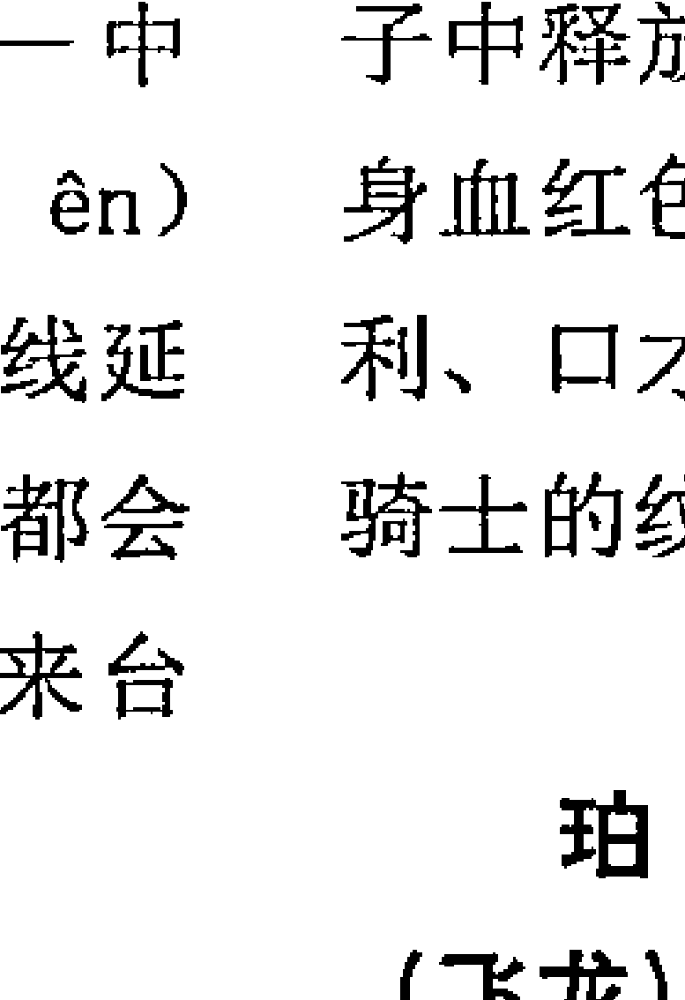

##鹏鸟（P’êng-Niao）——中国神话中的鸟龙。它们要么上半身是龙，下半身和翅膀是鸟，要么就是蛇身上长着鸟的羽毛、翅膀、腿和爪子。参见阿姆费特尔、海里尤（Hai Riyo）。

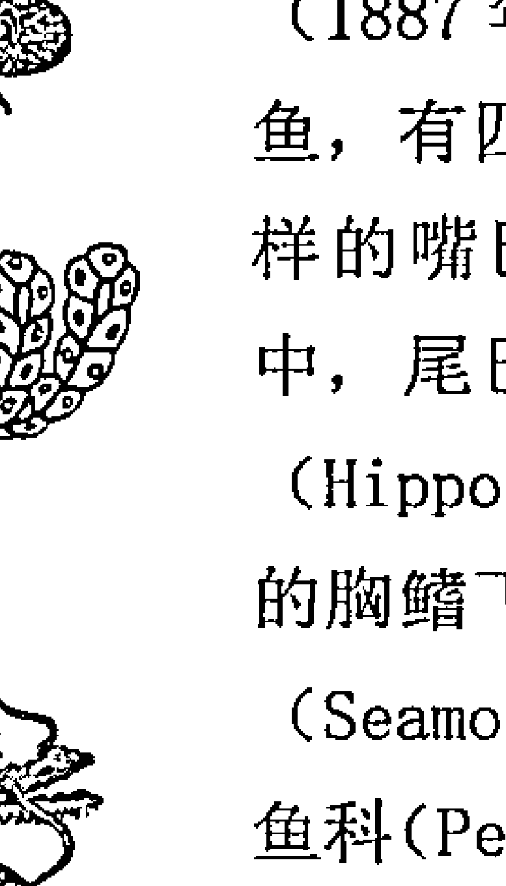

##佩加西斯（Pegasies）——埃塞俄比亚一种长着马耳的鸟类。普林尼在其《自然历史》（公元77年）中记载道，佩加西斯是一种巨大的鸟头马，住在锡西厄。这可能指的是鲸头鹳（Balaeniceps rex）。

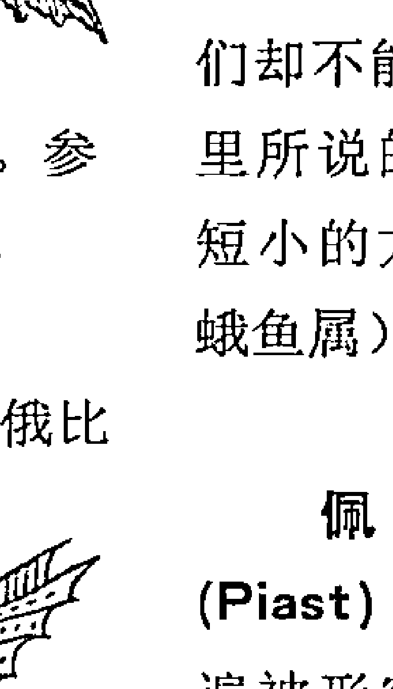

##珀加索斯（Pegasus）[卢维语中的皮哈萨斯（pihassas）“闪电”]——海神波塞冬的孩子，珀尔休斯将美杜莎杀死时，把它从她的脖子中释放了出来。最开始它是被描述为全身血红色的，后来变成了纯白色代表着名利、口才和沉思，优美的珀加索斯是圣殿骑士的纹章标志。

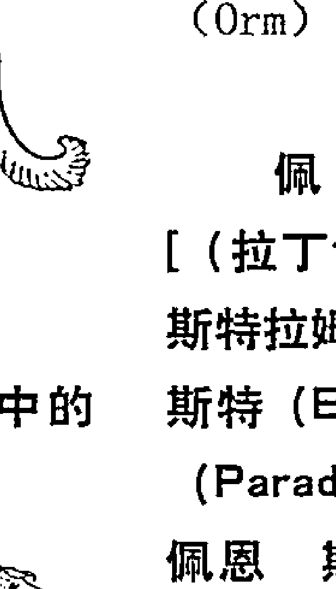

##珀加索斯龙（Pegasus Dragon）（飞龙）——根据J.W.布尔（J.W.Buel）（1887年）所说，这是一种奇怪的小鱼，有四英寸长，长着像鲟鱼或胭脂鱼一样的嘴巴。它扁平的身体包裹在装甲板中，尾巴酷似鳄鱼。它被认为和小海马（Hippocampus）有关，能够利用其巨大的胸鳍飞行。如今，它们被称为海蛾鱼（Seamoths），海蛾鱼科（Pegasidae）中的一种，但它们却不能飞。这里所说的是一种短小的龙鱼（宽海蛾鱼属）。

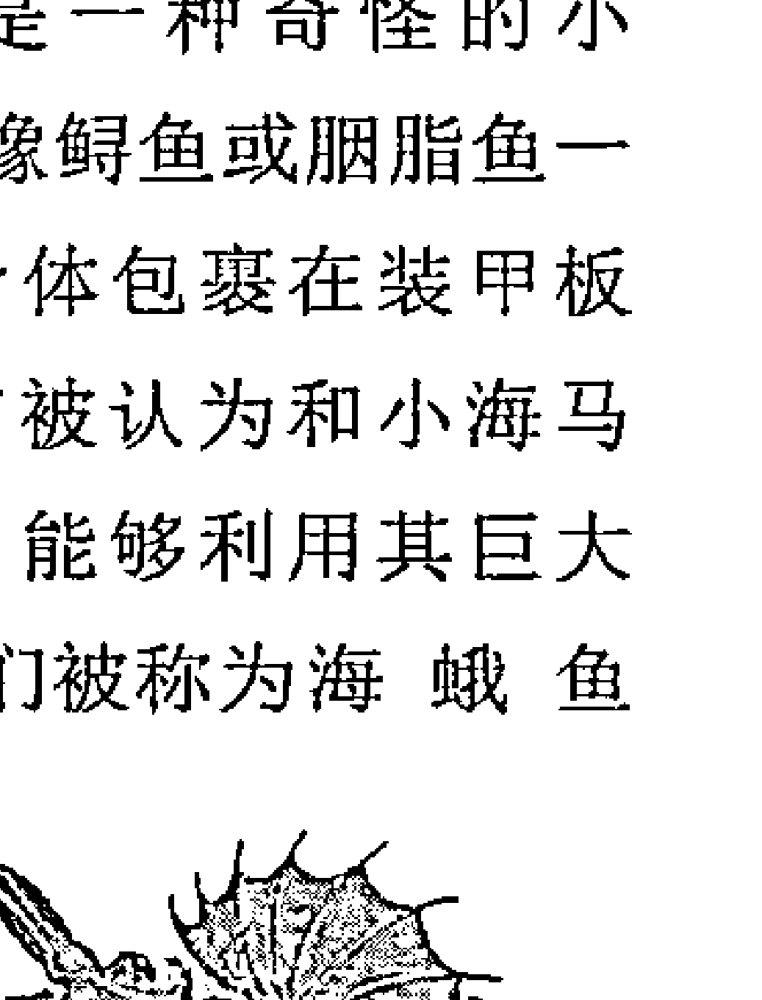

##佩斯特（Peiste）[或皮埃斯特（Piast）]——爱尔兰的一种长湖怪，普遍被形容为两栖的蠕虫或龙。参见欧姆（Orm）。

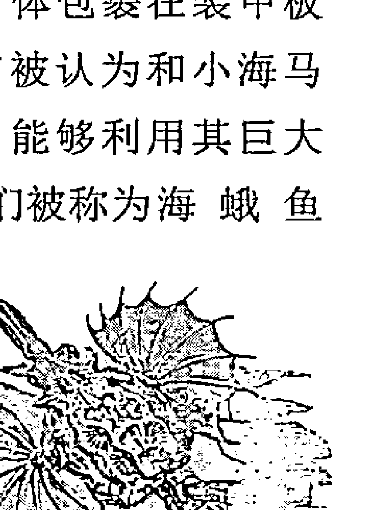

##佩里德欣树（Peridexion Tree）[（拉丁语“Peridixion”，也称西卡德克斯特拉姆（Circa dexteram）、恩福龙德斯特（Environ destre）、帕拉迪克希恩（Paradixion）、彭登斯（Pendens）、佩恩斯（Perindens）]——一种生活在印度的树，因为它们能结出自己喜欢的甜果，鸽子很喜欢这种树。在树上，鸽子们很安全，不会有龙来吃它们，因为龙很怕那种树的阴影，只会呆在其向阳的那一面上。鸽子们呆在树荫里非常安全，但一旦离开那里，它们就会被龙吃掉。

凰被基督教当成了重生和不朽的标志，被绣在伊丽莎白一世女王的徽章上。从公元前一千年，在这座岛刚被腓尼基人发现时就有了新几内亚天堂鸟羽毛贸易，这可能是这个传说的一个重要来源。在贸易中最常见的鸟是拉吉亚纳天堂鸟（Paradisea raggiana），这种鸟的雄性在翅膀下长着扇状的红色羽毛。当它们跳舞求爱时，这种鸟看起来就像是在火焰中跳动一样。参见太阳鸟贝努（Benu）、凤凰、火鸟。

##佩利冬（Peryton）——鹿和鸟的融合体，它呈灿烂的绿色或淡蓝色，拥有牡鹿的头和前肢，鸟的翅膀和后半身。它躲在人的影子里将其杀死，然后吸食他的血液，吸干后，它就变成了那个人的样子，再也无法用同样的手法去杀死另一个人了。据说，它最早出现在亚特兰蒂斯，一位女巫预言，这种生物将让罗马衰落下去。一位十六世纪的拉比在菲兹写道，在汉尼拔进攻罗马（公元前 211 年）时，佩利冬在直布罗陀海峡附近袭击普布利乌斯·科尔内利乌斯·西庇阿（Publius Cornelius Scipio）将军的罗马舰队，但被西庇阿的士兵用盾牌组成的镜子反射的太阳光射瞎。

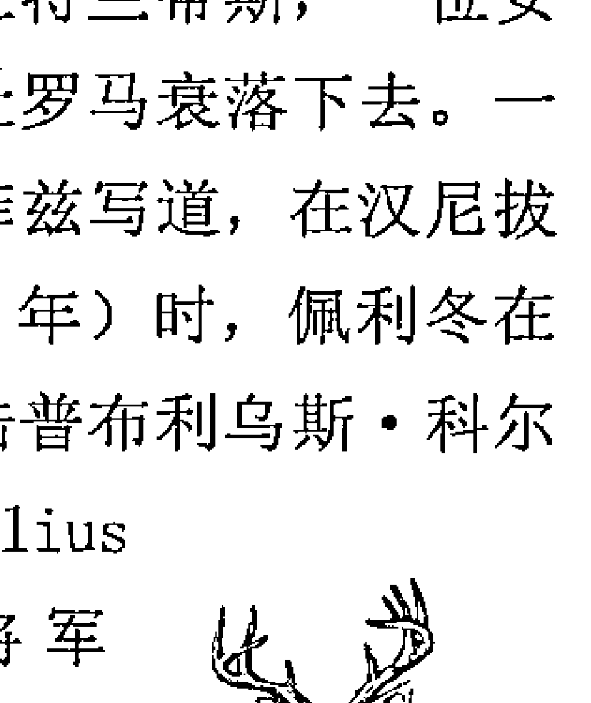

##马形水怪弗卡（Phooka）[或普卡（Pooka），（Puka）、威尔西普卡（Welsh Pwca）、科尼西布卡（Cornish Bucca）、曼尼克斯布甘尼（Manx Buggane）]——爱尔兰传说中一种会变形的水马。它曾被当作马精灵或棕仙。有趣的是，爱尔兰的孩子把蜗牛叫做“pookas”，一边唱着儿歌一边拉扯它们的触角。参见马形水鬼（Kelpie）、图巴（Tuba）。

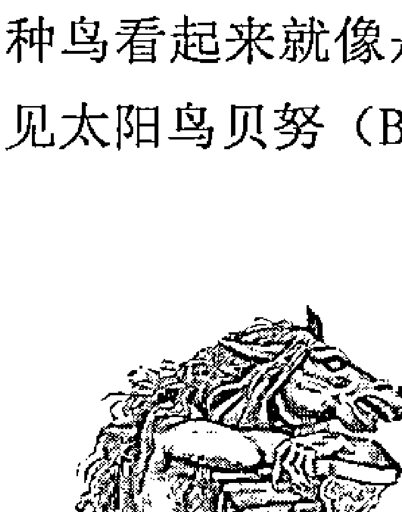

##凤凰（Phoenix）（在中世纪常被写作“Fenix”）——它是孔雀和山鸡（意思是“紫红色”）的合成品，拥有火焰一般的颜色。凤凰来自埃塞俄比亚，每 540 年，它就会在用肉桂筑成的巢中下一枚蛋，在浴火重生之前它都会向上扇风。当蛋在温暖的火苗中慢慢孵化时，它就会浴火重生。因此，凤

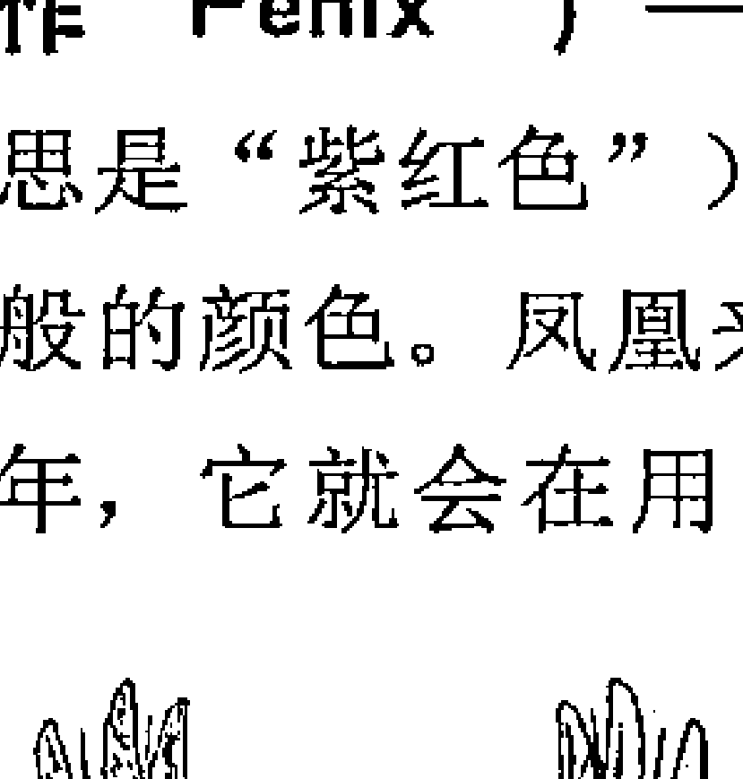

##弗席兹（Phorcids）——在希腊神话中，它们是海之老人福耳库斯盖亚的女儿塞托的孩子。包括怪兽之母厄喀德那、拉顿七头龙、格里伊三姐妹和戈尔贡。

##抹香鲸（Physeter）（希腊文中的“鼓风机”，也叫“涡流”）——抹香鲸（Physeter macrocephalus）。据说它能用呼吸孔制造漩涡。

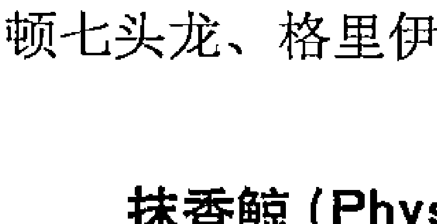

##皮阿索 (Piasa) ——1673年雅克·马凯特（Jacques Marquette）神父和路易斯·乔利埃特在其著名的旅行记录中写下的一种密西西比河中的怪兽。在伊利诺伊州奥尔顿的密西西比河岸边的画着它的画像。根据马奎特的日记来看，皮阿索“像小牛那么大，长着鹿角、红眼睛、老虎的胡须、人的脸，身上有或绿、红、黑色相间的鳞片，还有一条长得只能包在身体周围的尾巴”。

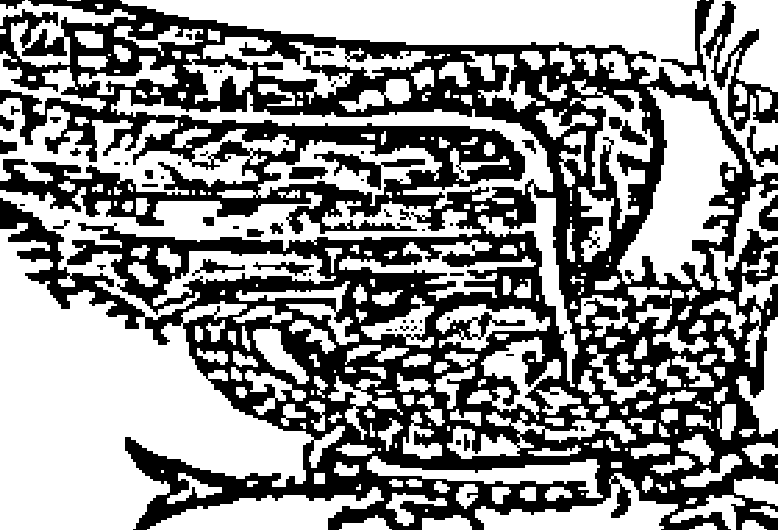

##皮拉努（Piranu）——一种阿根廷水怪，一只长着马头和大眼睛的巨型黑鱼。它生活在河流的深处，会颠覆那些经过其水域的船只。参见湖怪。

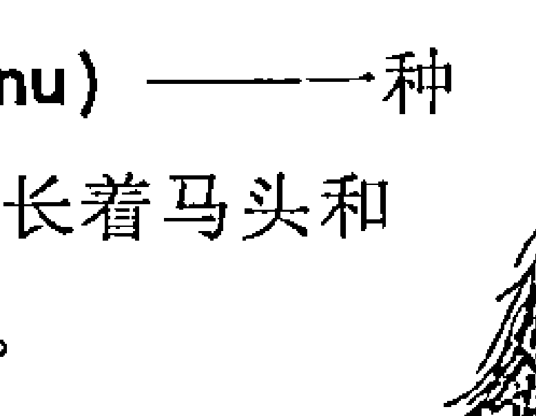

##螈螈（Pi-Hsi）——中国的河神，是一种半龙半龟的生物。参见马鳗鱼、湖怪、水马。

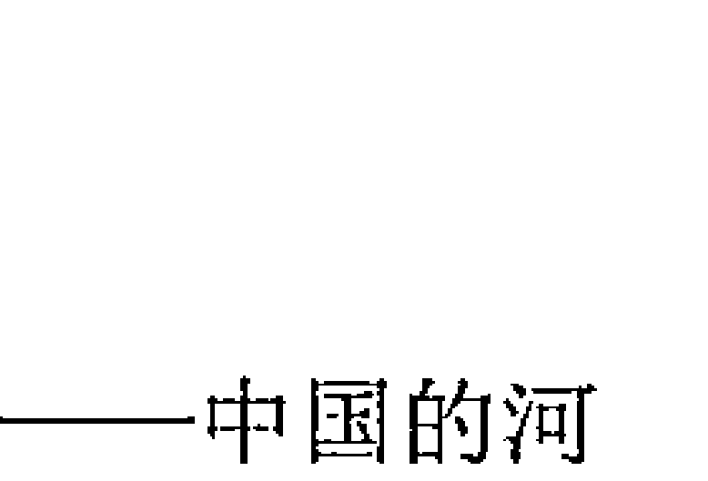

##皮西-梅里（Pish-Meri）（皮钦“女鱼人”）——美人鱼在巴布新几内亚被写作“pisin lingua franca”。最著名的鱼人形象就是被印在“海鸡（Chicken-of-the-Sea）”牌的金枪鱼罐头上那种。然而，该术语也被用于另一种海洋生物——印度洋-太平洋儒艮，它是所有人鱼的原型。参见伊尔凯。

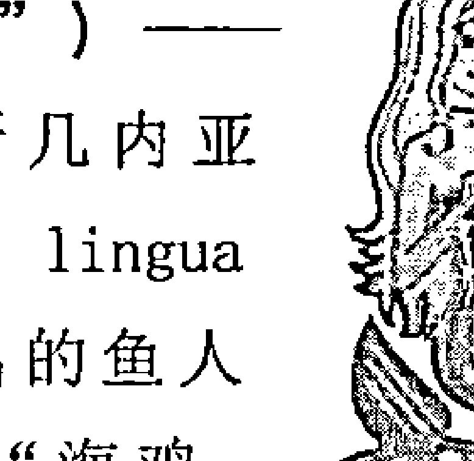

##皮霍辰伊（Pihuechenyi）——智利阿劳坎印第安人传说中的巨翼吸血蛇。参见阿姆费特尔、拉弥亚（Lamia）。

##皮苏汉德（Pisuhand）[或普其斯（Pukis、Pukys）、普克（Puuk）]——在波罗的海的民间传说中，它们是小蛇纹龙，只有2英尺长，尽职尽责地保护着所有的房屋和宝藏。当落到地面的时候，它们会变成小猫，飞在空中的时候会变成飞龙。参见图利汉德（Tulihand）。

##皮纳图博火山怪（Pinatubo Monsters）——菲律宾吕宋岛上三描礼士地区的一种湖怪，在提基斯河中至少有5只巨型蛇纹生物被目击到。当地的阿埃塔人坚持认为，这些动物和他们所看到的任何鳗鱼、鱼类或蛇类没有任何相似之处。2002年11月5日，一个男孩看到它们，以为它们只是浮在水面的木头。两个月后几名目击者看到一只身长7英尺，身宽3英尺的黑色生物悄悄地水中起伏。

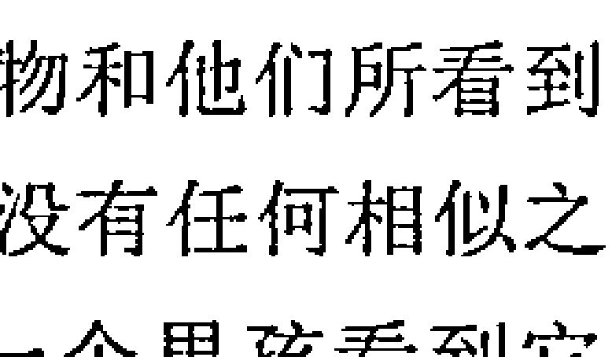

##皮顿（Pithon）——一种纹章中的长着蝙蝠翅膀的蟒蛇。（如果它们的翅膀像鸟类的，那它的名字就叫阿姆费特尔）。

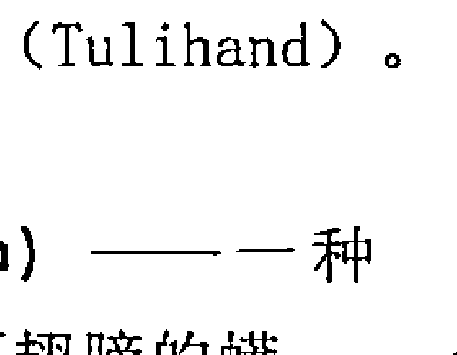

##蛇颈龙 (Plesiosaurs)（希腊文中的“类蜥蜴”）——与恐龙同时代的长颈水生爬行动物。它们有扁平的身体、短短的尾巴、四肢。据说在6500万年前和恐龙一起灭绝，像它们一样的生物，如海蛇和湖怪，在全球范围内被目击到。在大多数情况下，目击者都只看到了它们的长脖子，但在1955年，博物学家亚历山大·莱梅在委内瑞拉的奥扬特普伊山的山顶上看到了三只这样的生物躺在石头上晒太阳。1990年，两个法国探险家在同一地区看到了类似的动物。

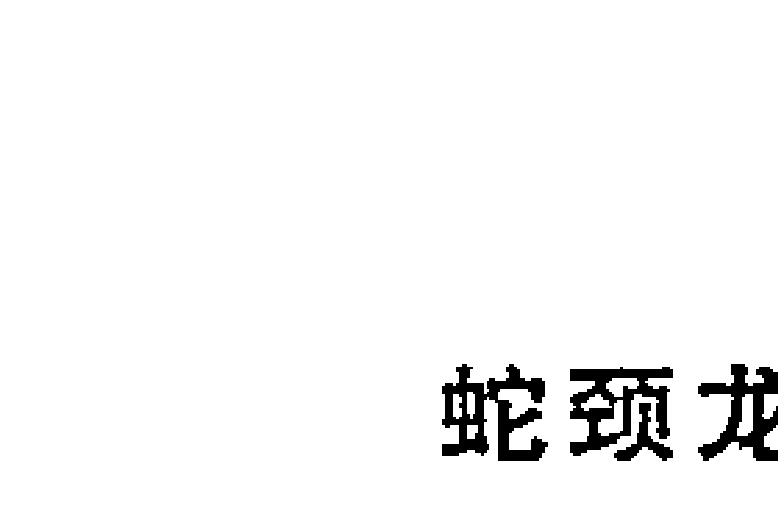

##珀尼克 (Ponik)——加拿大魁北克波埃尼加蒙克 (Pohenegamook) 湖中的一种怪兽。据目击者称，它像一只36-40英尺长的，翻过来的独木舟，背上长着背脊。它的头像一个没有耳朵的马头或牛头，以及像鲇鱼一样的长胡须。有些目击者称它们还有三个突起和两个大的鳍状肢。

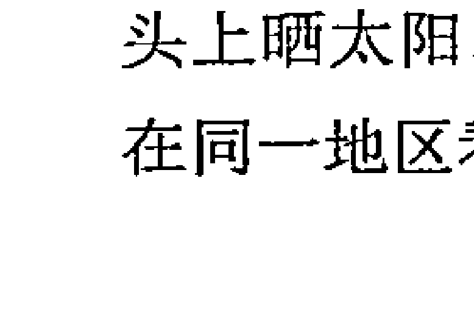

##波西·马里尼 (Porci Marini)（拉丁语中的“海猪”）——儒艮在《生理论》中的名字。参见阿姆比兹 (Ambize) 。

##普凯 (Poua-Kai) [或 普 欧 奇 (Pouki)]——毛利传说中一种可怕的肉食鸟，会猎杀牲畜和人类。豪欧塔维拉 (Hau-o-Tawera) 将这种怪物的最后一只困在大网中将其杀死。这个传说源自真实的生物——哈斯特巨鹰，它们曾经居住在新西兰南岛上。它们在600年前才灭绝，是存在过的最大的老鹰。雌性的体重达35磅，翼展有10英尺，站立时身高4英尺。参见纳加尼-瓦图 (Ngani-vatu) 。

##翼手龙 (Pterodactyls)（希腊文中的“长有翅形手指的”，也叫翼龙“有翅蜥蜴”）——这些史前爬行动物能用自己蹼状的翅膀在空中飞行，与翼龙非常相似。虽然在65万年前已经灭绝，但还是有翼龙不断被目击到。1890年4月，亚利桑那州的两个牛仔称自己杀死了一只巨大的鸟形生物，有着光滑的皮肤和像蝙蝠的翅膀，以及鳄鱼的脸。它们将尸体运回镇上，将其在一个谷仓墙上拉开翅膀，被钉了起来。一张照片被登载在当地的报纸《墓志铭》上。1976年2月，在得克萨斯州西南部的的圣安东尼奥，一名老师在开车上班时被一只翼展20英尺宽的蝙蝠龙 (pteranodon) 袭击。参见都安 (Duah) 、空阿马托 (Kongamato) 、峨人、罗翮、斯纳利加斯特尔 (Snallygaster) 、雷鸟。

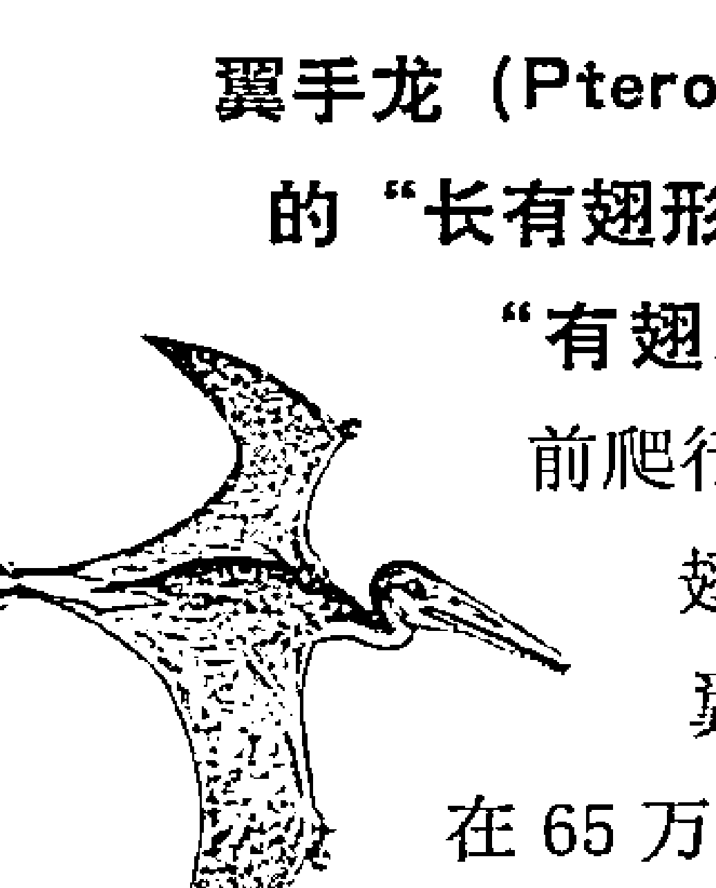

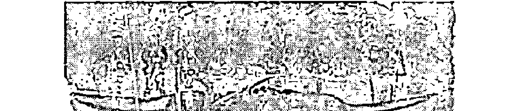

##普格维斯(Pugwis)一种肉食性两栖人，在数百年间都一直困扰着不列颠哥伦比亚省普吉特海湾地区的夸扣特尔印第安人。其描述与《黑湖妖谭》（1954年的一部电影）中的怪物非常相似。参见忒提斯湖腮人、蜥蜴人。

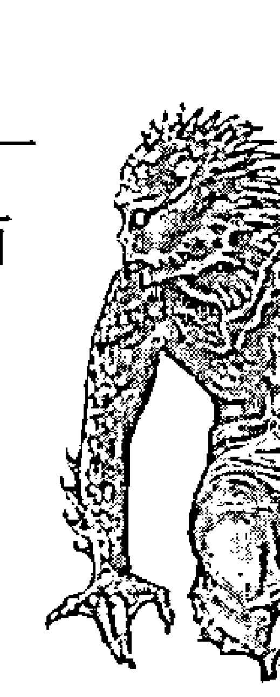

##巨蟒皮东(Python)希腊神话中一个可怕的蛇形女人，在大洪水中因躲在泥巴中而幸免遇难的可怕女妖。她住在卡斯特里安斯平（Castellian Sping）外帕纳塞斯山（Parnassus）山坡上的沟壑中，看守那里一个神谕般的洞穴，直到后来被太阳神阿波罗用弓箭所杀，之后，阿波罗在那里建立了一座神庙。后来在每年庆祝德尔斐神谕（Delphic Oracle）——那里的女祭司被称作女预言家（Pythonesses）——建立的仪式上，这个故事都会重新上演一遍。从这个传说开始，就世界的大蛇都被冠以“Python”之名，它们中有一些身长超过30英尺。参见埃塞俄比亚龙、刚果巨蟒、尼安（Nyan）、霸蛇（Pa Snakes）。

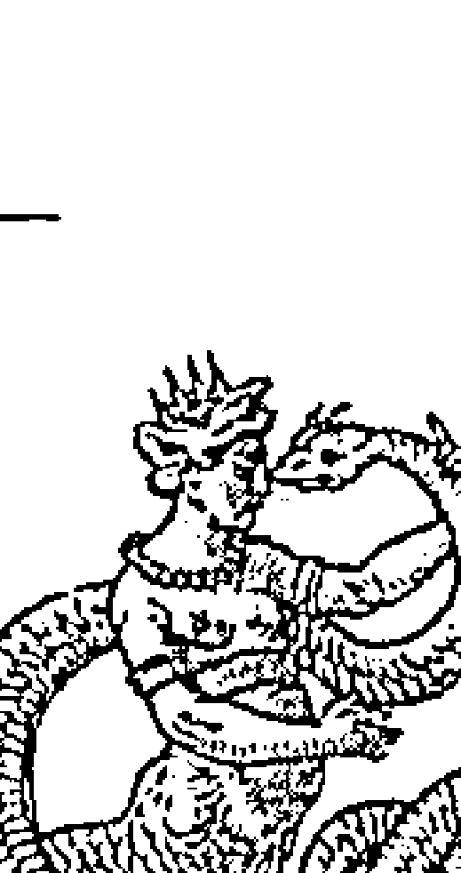

##羽蛇神(Quetzalcoatl)一种长着羽毛和翅膀的蛇，它能让苍天震颤。雷鸣和闪电是它的象征，宇宙造物主将其创造了出来

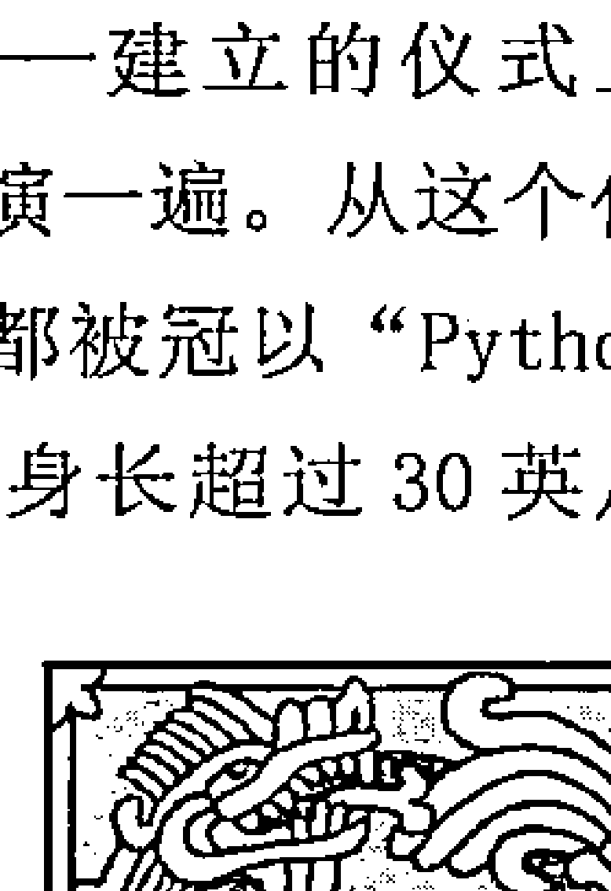

##奎尼克拉克(Quanekelak)加拿大西北部贝拉贝拉印第安人神话中的巨型鲸鱼，长着人的身体和海怪，或逆戟鲸的头。

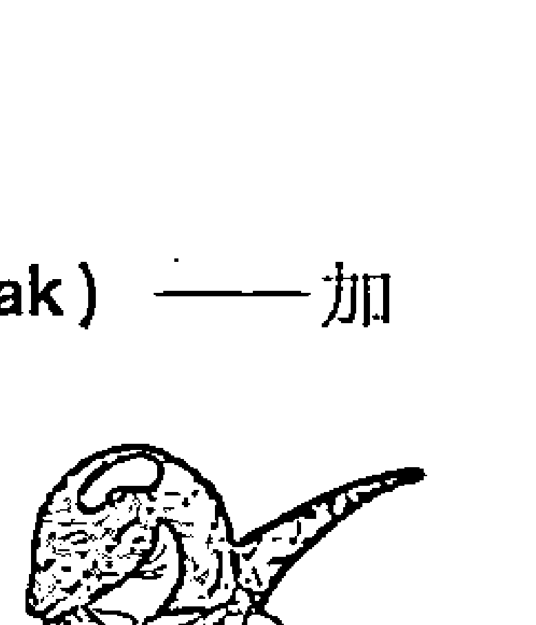

##昆士兰老虎(Queensland Tiger)20世纪40年代和50年代在澳大利亚昆士兰森林中发现的一种中型的有袋类猫科动物。它的背上有条纹，爪子很锋利，能捕杀像袋鼠一样大的动物。它不是塔斯马尼亚虎（Thylacinus cynocephalus），因为这种虎更像狼；昆士兰老虎可能与澳大利亚东部的猫爪斑点虎Quoll（Dasyurus maculates）有关。但霍伊维尔曼却将其等同于已灭绝了的有袋狮，袋狮属（Thylacoleo）。

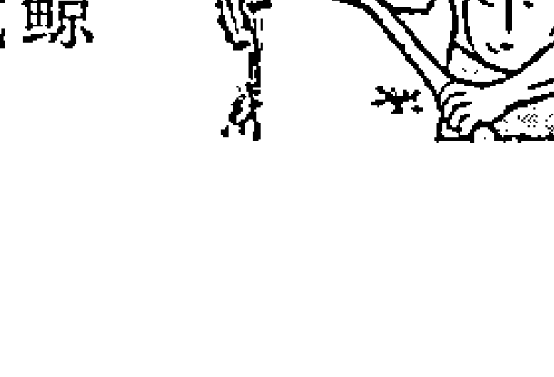

##寻水兽(Questing Beast) [或格拉提圣特(Glatisant)]英国亚瑟王传奇中的一种混合生物，据说有豹子的躯干、狮子的后半身、蛇的头、牡鹿的脚。在其他的描述中，它还有钢铁般的鳞片和很多黏液。它肚子的响声堪比 40 头猎犬的叫声。这种怪兽总是在寻找水源以满足它难以忍受的口渴，但不管何时，只要它开始喝水，它的唾液就会将水染毒。据说它是恶魔与一位公主的后代，这位公主在被哥哥拒绝和她发生关系后，说他强奸了她。这种动物是乱伦和无政府的标志。它在马洛里（Mallory）的《亚瑟之死》（Le Mort D‘Arthur）中出现过几次，黑骑士帕里诺对其非常痴迷，在他死后，帕勒米蒂对这种怪兽也非常痴迷。参见格里利奥（Grylio）、佩斯特（Peiste）。

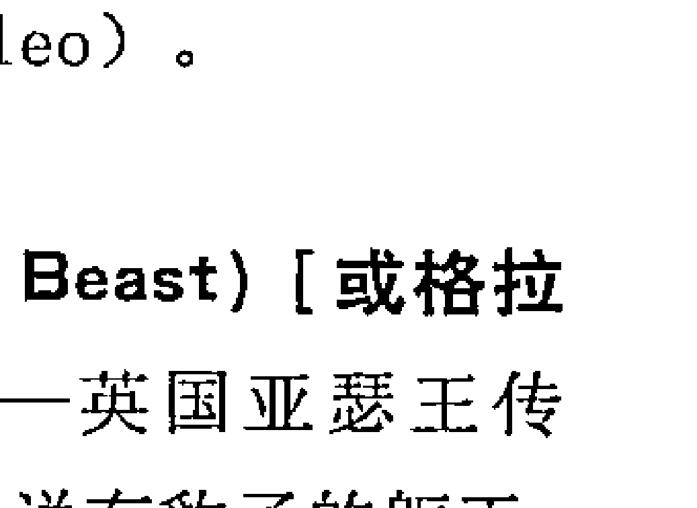

##羽蛇神（Quetzalcoatl）[纳瓦特尔语中的“羽蛇”，也叫玛岩（Mayan）、库奎克安（Kukulk'an）、奎奇厄玛雅（QuichéMaya）、古克尤玛兹（Guk‘umatz）]——一种巨型长有羽毛的蛇，是中美洲传说中的伟大英雄。据说它创造和滋润了大地，将农业和文明带给人类。它的符号是闪电、雷鸣、雷电（陨石）。人们会将彗星认为是它的出现。神话中，他常被描述为托尔特克人的统治者。很多中美洲的不同文化——如玛雅、基切（K‘iche）、匹普（Pipil）、萨巴特克（Zapotec）——都认为自己才是它唯一的真正后裔。

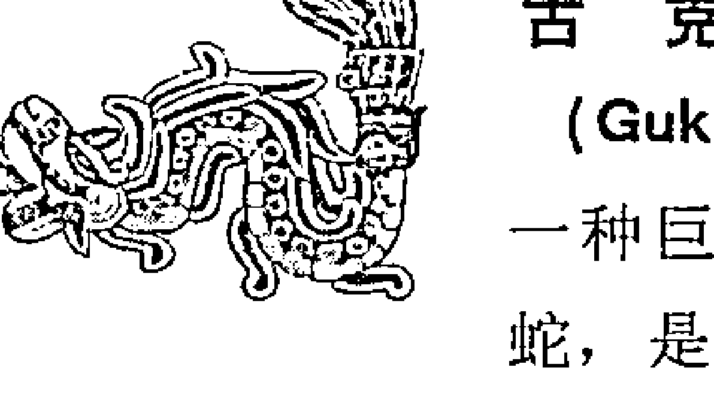

##大鹏（Roc）一种巨鸟能抓起大象，用整只山羊喂养自己的孩子。如是愤怒，它会用巨大的石头砸向船只。

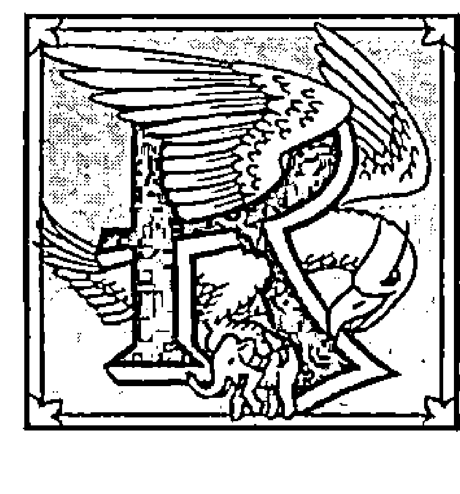

##拉卡蒙（Racumon）——西印度群岛多米尼加岛上的加勒比印第安人传说中的一种能制造飓风的可怕的蛇怪。

##拉哈伯（Rahab）[或拉赫尔（Rager）]——原始混乱时期的一种巨大的海蛇，在《圣经》中经常被提及：以赛亚书 30:7, 11；诗篇 89:9-10；以及约伯 9:13 和 26:12-13。参见利维坦。

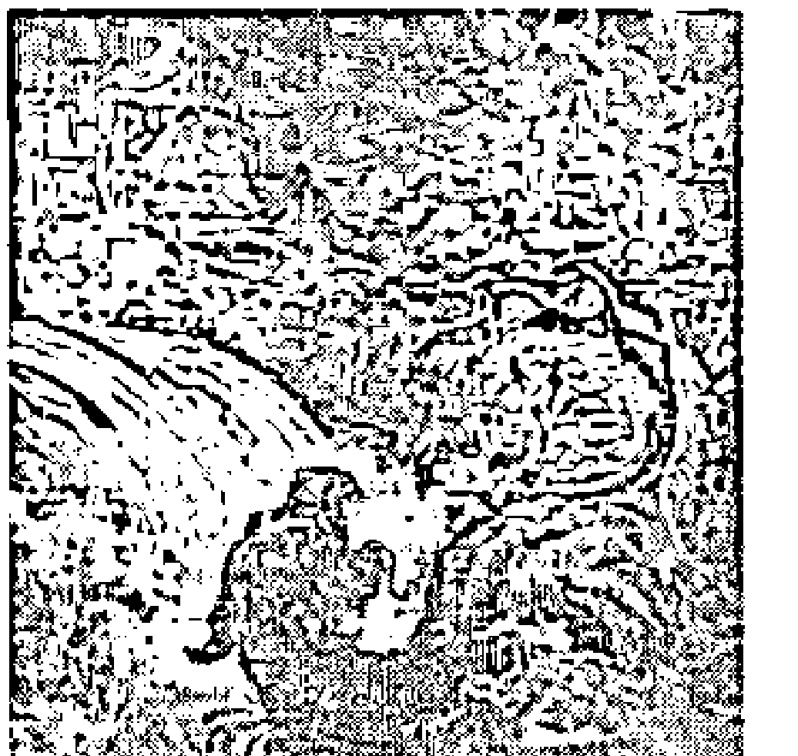

##赖奇（Raichô）（“雷鸟”）——日本传说中一种乌鸦般的巨鸟。它生活在一棵高大的松树上，其沙哑的叫声会引发风暴。这也是一种真正的鸟——岩雷鸟（Lagopus mutus）的名字，它是一种松鸡。

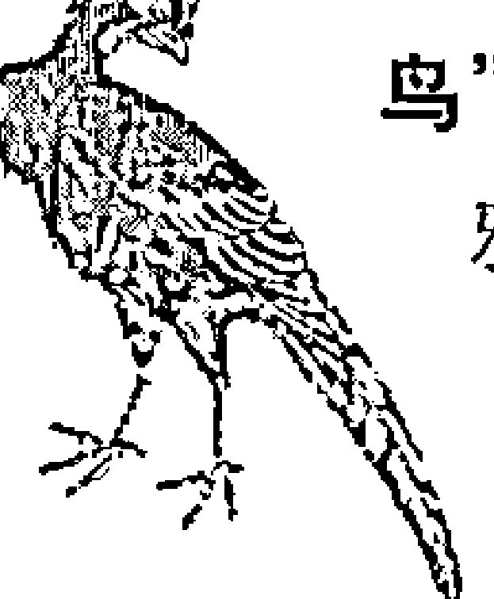

##雷兽（Raiju）（“雷霆动物”）——日本神话中雷神（Raijin）的宠物。这种恶魔般的小动物长着猫或黄鼠狼的身体，具有猴子的敏捷性和狸（Nyctereutes procyonoides）的锋利爪子。由火组成，它是球状闪电的化身。它在风暴期间会变得疯狂，在树上、田野甚至在建筑物上疯狂地跳跃，像雷鸣般地叫喊。有电击痕迹的树据说就是被雷兽抓伤的。它会试图躲进人的肚脐里，所以在打雷的时候你最好趴着睡！参见拉塔托斯克（Ratatosk）。

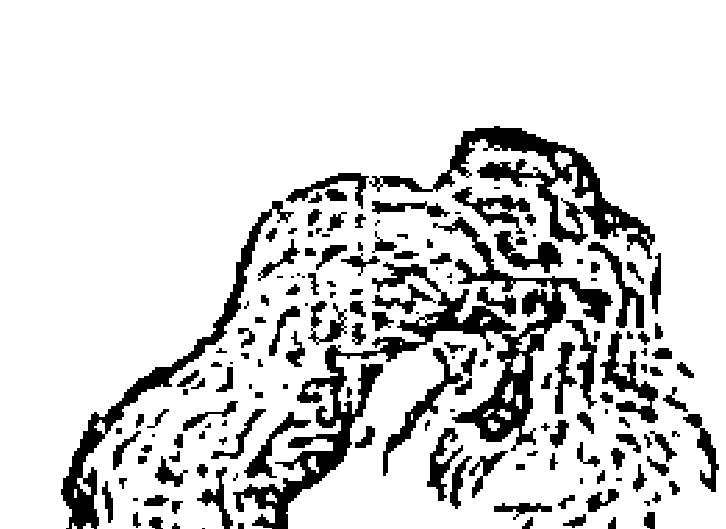

##拉塔托斯克 (Ratatosk) ——这只松鼠在挪威世界之树伊格德拉修（Yggdrasil）上跑来跑去，在住在树顶的老鹰，或果林卡姆比（Gollinkambi）公鸡，和啃食树根的巨蟒尼德霍格（Nidhogg）之间传递信息。当天地间产生雷电之时，这是拉塔托斯克在执行它的任务。不幸的是作为一只松鼠，它经常故意歪曲双方的信息，让它们二者都不得要领。参见雷兽（Raiju）。

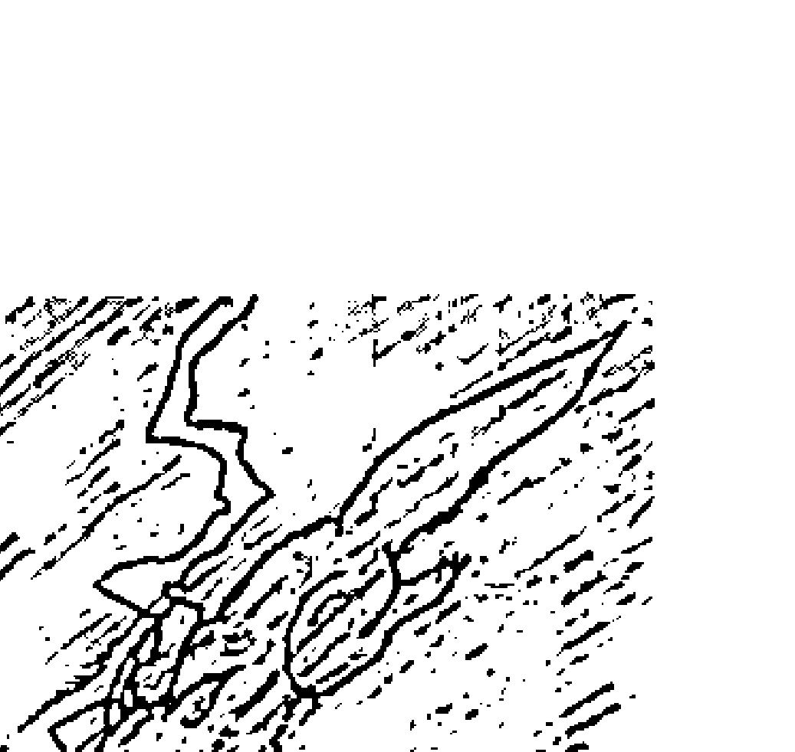

##彩虹蛇——天上的彩虹被想象成一条巨大的蛇，它通常被认为是万物的创造者。这样的生物出现在许多文化的神话中，尤其是在澳大利亚、中亚和西非、美拉尼西亚、波利尼西亚和加勒比海地区的土著人中。它们被和淡水和洪水联系在一起，对人类可能是善意也可能是恶意的。在澳大利亚，它是一种黄金时代（Alcheringa）或梦幻时代（Dreamtime）的生物，在不同地区有不同的名字。瓦拉孟加人（Warramunga）称其为伏龙夸（Wollunqua）——它非常巨大，可以在尾巴不离开洞穴的情况下前进数英里。昆士兰中央约克角半岛的维克-芒坎称其为太攀（Taipan）。这个名字已被分派给了澳大利亚蛇中一种大型（可达10英尺长的）、快速、剧毒的内陆太攀蛇（Fierce Snake），它拥有世界上最毒的蛇毒。2000年昆士兰大学的动物学家迈克尔·李博士和他的同事们生成，彩虹蛇可能是一种已灭绝，身长可达20英尺的巨蟒——沃那比蛇（Wonambi naracoortensis）。在非洲，埃多-维多（Aido Hwedo）（或欧枢马里Oshumare）是一种巨大的蟒蛇，她把大地驮在自己背上。另一个是巫毒神话中的达姆巴拉赫（Damballah），这种蛇在西非的达荷美被称为达·卡勒特（Da Cult），它是埃多-维多的配偶（consort）。

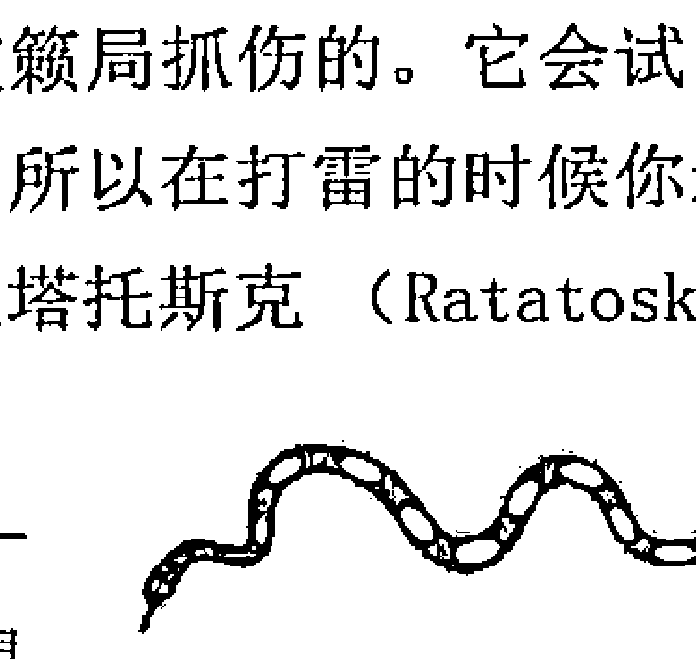

##拉文那怪兽——雅克布·卢夫（Jacob Rueff）在其著作《De Conceptu et Generatione Hominis》（1554）中记载的一个神奇的东西。1511或1512年，出生于意大利拉文那，“它的头上长着一支角，还有两只翅膀，没有手臂，只有一条腿。在它的膝盖中有一只眼睛，雌性和雄性都是这样的。它长着人类的脸和身体，下半身则覆盖着羽毛。”

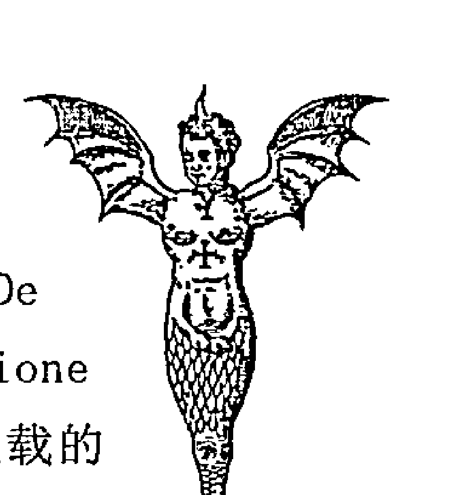

##瑞埃姆牛 (Re'em) [ 或 瑞姆 (REEM)]——《圣经》中一种巨型野牛。据说世界上只有一对这种生物，分别生活在地球的两端。相隔70多年后，他们走到了一起，交配后，雌性将雄性杀死。经过12年的怀胎，雌性生下了一对双胞胎。

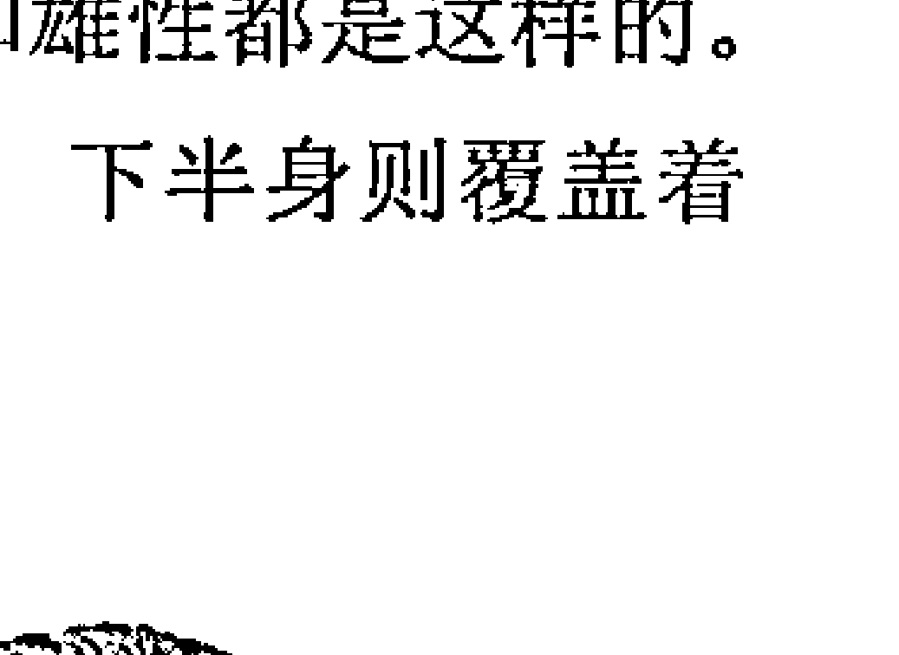

# 魔法师的怪物图鉴

它们——一只雄性和一只雌性——最后死于分娩。就这样周而复始。瑞埃姆牛在《旧约》中被提及了九次：约伯书 39:9-10；申命记 33:17；民数记 23:22， 24:8；诗篇 22:21， 29:6， 92:10；以及 以赛亚书 34:7。虽然这个词被普遍地译为“独角兽”，但这种动物被认为是巨大的欧洲野牛或乌鲁斯牛（原牛），它们的最后一只是一只雌性，1627 年死于波兰。

葡萄酒和黑巧克力。

## 里索斯 (Rizos)

- 现代希腊传说中的一种长着巨爪的巨型黑狗，经常出没于夜间的小路上，恐吓赶路人。如果被人碰触到它就可能会发动攻击，但通常情况下它都会逃走。

## 东非大裂谷怪兽

- 肯尼亚的一种大型帆背蜥蜴。这个描述听起来像巨大的雷克斯暴龙（如图所示），它们生活在白垩纪时期的非洲，9500万至9300万年前。异齿龙、棘龙和豪勇龙也属于史前帆背爬行动物。

## 鹏鸟

（波斯语中的鲁克 “Rukh”，也叫卢奇 “Rucke”）——一种马达加斯加巨鸟，因马可波罗的日记和《一千零一夜》中关于辛巴达的故事而出名，据说其大到能够驼起一只大象。它被形容为长得像巨大的老鹰或秃鹫，但实际上，它是巨大的不能飞行的“象鸟”或隆鸟 (Vouron Patra)（如图所示），其身高有 11 英尺，体重 1100 磅。它下的蛋的周长有 3 英尺，容积达 2.35 加仑。它是世界上曾经存在过的最大的鸟。这种漂亮的鸟类在 17 世纪被人类灭绝，因为隆鸟有巨大的翅膀和绒毛一样的纤毛，所以它们被认为是巨大的成年鸡。在涉及到鹏鸟的《一千零一夜》故事中，有一半都记述着从船上扔下大石块将其砸死的内容。鹏鸟身上巨大的羽毛其实是酒椰棕榈树 (Raphia) 的叶片，其长度达到 80 英尺。彼得·科斯特洛 (Peter Costello) 认为翼展达到 17.5 英尺的漂泊信天翁 (Wandering Albatross) 可能和鹏鸟有关。参见安卡（Angka）、巴亚克里（Bar Yacre）、克罗丘（Crocho）、科鲁兹尔特（Kreutzet）、鹏（Pheng）、斯摩夫（Simurgh）、雷鸟、查戈（Zägh），席兹（Ziz）。

## 瑞吉 (Rigi)

- 南太平洋瑙鲁人创世神话中的一种毛毛虫，帮助古蜘蛛阿勒欧普-厄纳普撬开了蛤壳从而创造了天地。它的汗水变成了咸咸的大海，在其羽化成蝶后，它一直在天地间飞舞，确保二者分离。

## 河狮鹫

- 这些可爱的生物常在美国加利福尼亚州门多西诺郡的鳗鱼河沿线被发现。它们通常以比自己小的鱼类和河里的生物为食。它们不会游泳，只会从空中俯冲入水里捕鱼。像所有的门多西诺河的居民们一样，河狮鹫也喜欢红

罗兹（Rods）（或天鱼）——有时会出现在照片中的空中异常现象，通常情况下是一长条突起物。第一次官方报道是在研究一盘 1994 年 3 月 5 日拍摄的录影带时产生的，图像上显示着一种未知的飞行动物。自从家庭录影设备出现后，关于这种生物的照片在世界各地都涌现了出来。有些人认为罗兹是一种新的或外星的生命形式。另一种平凡点的解释是它们实际上是快速飞行的昆虫在胶片中曝光时产生的幻影，长长的条状物实际上是昆虫运动时的影子，旁边的突起物则是它们的翅膀。

劳姆泼（Rompo）——印度和非洲的一种夜行清道夫似的野兽，以人类尸体为食。它们有长长的身体和尾巴、兔子的头、人的耳朵、鬃毛般的毛发、獾的前肢，熊的后腿。这个描述酷似鬣狗（Crocuta）。参见克罗克塔（Crocotta）、血麋兽（Leucrotta）。

罗翩（Ropen）（“恶魔飞行者”）——自 20 世纪 50 年代以来，在新几内亚丛林里被发现的一种翼龙状生物。它生活在新不列颠群岛和温博伊岛（Umboi）群岛的洞穴中，并只在晚上活动。它具有坚韧的翅膀，翼展达 3 至 4 英尺，窄窄的喙中长着牙齿，头上长有肉冠，脚上长着蹼，还有一条有着菱形边缘的长尾巴。据说它是食腐动物，经常骚扰葬礼，攻击尸体。这个描述与喙嘴龙（Rhamphorhynchus）有惊人的相似，这种动物已在 65 万年前灭绝。但罗翩更像俾斯麦飞狐（Pteropus neohibernicus），它是科学家所认可的世界上最大的蝙蝠，翼展达到 55 至 60 英尺，产于新几内亚和俾斯麦群岛。参见都安（Duah）、空阿马托（Kongamato）、斯纳利加斯特尔食人鸟怪（Snallygaster）。

罗斯马林（Rosmarine）[或罗斯马拉斯（Rosmarus）、罗斯梅尔（Rosmer），意思是“海马”]——是对海象的一种夸张的加工，它有着朝上的象牙，而不是像它们真正的那样长着向下的牙齿。在挪威水域中这种生物被称作罗斯威尔（Roshwalr）（“马鲸”）、鲁斯卓尔（Ruszor）或赛塔斯登塔塔斯（Cetus Dentatus）（“齿鲸”），被描述为长着巨大的、流线型的鲸鱼身体和马的脑袋。1520 年这种怪物的一只头被送给了教皇利奥十世，当时就给它画了一幅画，后来被博物学家外科医生帕雷（Ambroise Paré）（1517 – 1590 年）记载了下来。这种生物被明确地确定为海象，学名叫“Odobenus rosmarus（海象属）”。参见海猪、海马。

## 拉姆巴斯（Rumbus）

- “拉姆巴斯是一种大鱼，凶猛而大胆，但游动的速度却非常缓慢，因此在它不能捕到足够的鱼的时候，就隐藏在淤泥里，如果有鱼经过，它就会抓住并吃掉它们。”（《生理论》）

S指的是斯芬克斯，
最为神秘的一种生物，
误入其巢穴的清教徒会遭到惩罚。
女人的脑袋，狮子的身体
答不出谜语，就会被吃掉！

## 剑齿虎

- 一种被认为在冰河时代结束是就已灭绝的生物，但在世界各地还是有关于它的目击报道。西非乍得的 扎嘎欧瓦（Zagaoua）人传说着一种“Tigre de Montagne”（“山区老虎”），据说它有狮子般的体型，身上有红白相间的条状花纹，没有尾巴，却有一对大獠牙。当扎嘎欧瓦的猎人看到那些已经灭绝和尚未灭绝的动物的照片时，他将短剑剑齿虎（Machairodus）指认为山区老虎，这是一种数百万年前就已经灭绝了的动物。另据报道，1975年在南美的哥伦比亚、厄瓜多尔和巴拉圭，有人杀死了一只剑齿虎。动物学家胡安·阿卡瓦（Juan Acavar）检查了它的尸体，认为这种动物实际上是据说已经灭绝了万年的一般剑齿虎（Smilodon populator）。

## 萨德乎扎戈（Sadhuzag）

- 中世纪动物寓言集中的一种体型像牛一样巨大，长着鹿的身体和山羊胡子的混合动物。它全身长着74只长笛一样的空心角，这些空心角能发出悠扬的声音，让所有动物前来聆听和膜拜它。它们也能发出恐怖的声音，阻吓勇敢的猎人。它往往被拿来和血糜兽（Leucrotta）和耶鲁（Yale）做比较，但关于其体型和多角的描述听起来更像是驯鹿（Rangifer tarandus）（如图所示）和已经灭绝了的巨型爱尔兰麋鹿（Megaloceros giganteus），它的鹿角能达12英尺长。参见海西牡鹿（Hercynian Stag）、西婆塞夫（Hippocerf）、夏纳奇（Sianach）。

## 沙法特（Safat）

- 中世纪动物寓言集中的一种有翅蟒蛇，长着龙的头。它住在云层之上，很少下到地面上来，因为它几乎一直都在飞行，永不停歇。它在空中产蛋，蛋在下落的过程中孵化完毕，只有蛋壳会落到地面。如果有动物吃了她的蛋壳，这可怜的动物便会发疯。参见阿姆费特尔。

## 萨哈伯（Sahab）

- 马格努斯（Olaus Magnus）（十六世纪）报道的一只被冲上挪威海岸的北海怪兽。它拥有庞大的身体、牛一样的蹄子、一只长脚，它可能是用来捕捉猎物的。参见格洛波斯特尔斯（Globsters）、克拉肯。

## 圣媛达怪物（St. Attracta’s Monster）

- 爱尔兰传说中的一种两栖怪物。它的咆哮声像狮子，拥有野猪的獠牙、火一样的眼睛、公羊的耳朵、马的鬃毛、火热的鼻息、鲸鱼的尾巴和前额上的一只眼睛。它钢铁一样的爪子能在石头上摩擦出火来。香农河河口中的卡泰格（Cathaig）岛（现在的斯卡特里岛）是它的老巢。最后它被圣色南（St. Senan）所杀，他是一位六世纪的主教，在那个岛上发现了一座修道院，这座修道院是以圣媛达（St. Attracta）命名的，这位修女在那里为旅行者们搭建了一处庇护所。参见毛人鱼（Auvkoejak）、哈弗斯特拉波（Havstrambe）、伊卡鲁·纳帕（Ikalu Nappa）、玛吉格尔。

## 赛欧-内塔（Saio-Neita）（“海之少女”）

- 芬兰和挪威北部拉普兰传说中的一种美人鱼。

## 萨拉曼德拉（Salamandra）[也叫火蜥蜴、斯特里厄（Stellio）、迪亚（Dea）]

- 颜色鲜艳的蜥蜴或小龙，住在火焰和熔岩中。它们的身体非常寒冷，能够将火扑灭。防火石棉纤维被说成是“火蜥蜴之毛”。帕拉塞尔苏斯（Paracelsus）（1493-1541年）命名它们为火元素。关于它的传说都起源于欧洲火蜥蜴（Salamandra salamandra），它在朽木中休眠，往往在壁炉里被烧死。受惊时，它们会分泌出一种白色的无害液体，可以熄灭微弱的火苗。火蜥蜴有时被用来代表火灾保险。据说它是有毒的，会在皮肤上分泌出毒液来抵御猎食者。参见格里利奥（Grylio）。

## 鲨鱼人（Samebito）

- 一种日本海怪，半人半鲨鱼，长着黑色的身体、大大的绿色眼睛、浅浅的小胡子。它栖息在一个巨大的水下王国中，很少与人类接触。如果有人在地面上见到它，通常情况下那都意味着噩运将至。但它们却是诚实、善良的动物，懂得知恩图报。在英雄东太郎的故事中也提到过鲨鱼人，那位英雄将一个被放逐的妖怪安置在鲨鱼人附近的地方。当东太郎爱上玉名（Tamana）时，她贪婪的父亲却要他用一万件珠宝来当作她的嫁妆，鲨鱼人同情的眼泪化作珍贵的宝石，从而让这对新人顺利结合。

# 魔法师的怪物图鉴

### 萨姆瓦塔 (Samvarta)

- 印度教传说中的一种七匹巨大的海马之一。它们肚子里燃着火，住在七个大洋中。在世界末日到来时，它们会从水里冒出来，烧掉所有的东西。

### 萨斯科其人 (Sasquatch) [赛利希语中的 “se’ sxac” (野人)]

- 20世纪20年代由加拿大记者J·W·伯恩斯创造出来的名字，用来描述一种数百年来从阿拉斯加到加拿大新不列颠哥伦比亚省都一直传说着的，名字超过150种的野人。当地土著人的面具上就是它的样子，就如这里所展示的这个一样，而白人在1811年才第一次看到它，从那时起，已有数百起关于它的目击报告。有人说它身高6至9英尺，有时有12英尺，体重600到900磅，全身有褐色或红褐色的毛发，手臂很长，鼻子扁平，脸长得像猿人，像人一样直立行走，会留下像人类一样的脚印，长度约20英寸，它身上的味道很臭，像是臭鼬和湿嗒嗒的狗的组合。参见大脚怪、臭鼬猿。

### 萨拉热窝跳蛇 [或珀斯托克 (Postok)、“跳跃者”]

- 南斯拉夫的一种毒蛇，体长能跳跃。它的平均长度大约为3英尺，但也有更长的。颜色从深灰色到暗红色不等。爬虫学家已经认定其为角鼻蝰蛇（*Vipera ammodytes*）（如图所示），但它们却不能跳跃，只能像所有毒蛇那样弓起身体而已。

### 萨尔马提亚海蜗牛(Sarmatian)

- 一种可怕的海生软体动物，医生帕雷（Ambrose Paré）（1517 – 1590 年，注：原文“12517”为笔误）在其著作《怪物与奇迹之栖息在萨尔玛提亚海的怪物篇》（*On Monsters and Marvels as inhabiting the Sarmatian (Baltic) Sea*）中对其有所提及，它们会在退潮的时候出现在海岸上，长有四只钩子一样的腿、发光的眼睛、彩色长尾，在其多枝的角尖上有发光的球状物。所有已知的蜗牛中最大的是澳洲大香螺（*Syrinx aruanus*），这是一种澳大利亚的海洋生物，体长可达30英寸，重约40磅。参见卢卡寇(Lou Carcolh)、图巴(Tuba)。

### 莎莎伯恩沙(Sassabonsum)

- 西非加纳民间传说中的一种巨大而邪恶的蝙蝠，长着红色的毛发，有钩的翅膀、向后的脚。它们会听从姆牟阿提亚 (Mmoatia) 或俾格米人巫师的指挥将人抓到空中。这可能是锤头果蝠（*Hypsignathus monstrosus*），它是非洲最大的蝙蝠，翼展达到3英尺。参见阿胡、阿兰、圭阿法罗、欧利提奥（Olitiau）、红毛蝙蝠、罗翱（Ropen）。

## 萨提尔 (Satyr) [或西尔瓦诺斯 (Silvani) “森林人”]

- 一种像人一样，双足站立的生物，有时也长着马一样的耳朵和尾巴，但常有毛茸茸的腿，山羊的偶蹄、耳朵和角。它是出了名的好色，常常处于勃起状态，喜欢和仙女追逐嬉戏，演奏乐器。它和狄厄尼索斯 (Dionysos) 一起被认为是希腊神潘的后代，被确认为某种类人猿，比如猩猩 (Linnaeus Simia satyrus “satyr monkey”) 和黑猩猩 (Pan troglodytes)。在希腊戏剧中，扮演萨提尔的演员通常表现为拙劣的模仿者，这种戏剧被称之为讽刺剧。中世纪基督教艺术家用它们的形象来表示魔鬼。临床上将性欲亢奋的男性称为求雌癖 (satyriasis)。参见羊怪法翁 (Faun)、西伦 (Silen)、斯尔万 (Silvan)、斯芬克斯。

## 萨提尔鱼 (Satyre Fish)

- 纹章中一种长着萨提尔头、鱼的身体、有翅的混合怪物。参见海中萨提尔 (Sea Satyre)。

## 萨因 (Sa–Yin) (“鱼的主人”)

- 南美巴拉圭格兰查科地区托巴皮拉加 (Toba Pilaga) 印第安人传说中的一种半人马湖怪。

## 塞塔利斯 (Scitalis) [或塞塔勒 (Scytale), 源自 (scitulus) “优雅”]

- 一种有翅蛇纹龙，长着两条前腿和彩色的鳞片，它非常漂亮，人类和动物都会停下脚步来欣赏——此时这种动物就会袭击他们，并将其吃掉。它的毒性很强，被咬之后人会感觉像火烧一般的疼痛。它全身有很强的光芒，就算在大雾的天气，它们都能走出巢穴散发出光芒。T. H. 怀特认为它可能是在非中西部和中部发现的“超级”犀牛蝰蛇 (Bitis nasicornis)。

## 蜈蚣 (Scolopendra)

- 亚里士多德所说的一种2英尺长的蜈蚣。到了十六世纪，它就变成了一种巨大的、鲸鱼一般会喷水的动物，肚子下面还有很多附着物，有人认为这些东西是它用来划水的腿。据说如果被渔夫的钩子钩住，它会把自己的内脏吐出来，取掉钩子，然后再将内脏吞回去。它可能是一种鲨鱼的尸体——大白鲨 (Carcharodon carcharias)、鲸鲨 (Rhincodon typus) 或姥鲨 (Cetorhinus maximus) ——上面还付着许多鲫鱼 (Remoras)。这种内脏暴露在尸体之外的情况很少见。参见鲫鱼 (Echeneis)。

## 斯库拉 (Scylla)（斯库勒语中的“bitch”）

- 潜伏在意大利和西西里岛之间的墨西拿海峡中的一种可怕海怪。它躲在一个山洞里，攻击来往的船只，吞噬上面的船员——甚至包括奥德修斯他们。本来，在荷马史诗《奥德赛》中，她是一个可爱的海中仙女，因其越轨行为（不同的版本有所区别）而被变成了一个可怕的、长有触角的怪物：上半身是一个漂亮的女人，但却长着6只恶狗的头（每个头长着三排牙齿），脖子是长长的蛇颈，下半身是12只狗腿。斯库拉的脖子每个都长5英尺，当她完全站立起来的时候，身高会达到15英尺。在古典艺术中，她被描绘成长有鱼尾和腰间长着4至6只狗头的人鱼。然而，中世纪的画家们却将其莫名其妙地画成长着女人躯干、狼的身体和海豚的尾巴。她总是被认为和另一种海怪卡律布迪斯（Charybdis）有关，它是一种大漩涡，能将船只吸进海里。斯库拉最终变成了一种以之为名的石头，最终和卡律布迪斯一起创造了“腹背受敌”（“Between a rock and a hard place”）这个成语。斯库拉在别的地方被称为九头蛇和克拉肯，它们都是大王鱿（Architeuthis）。

## 塞西亚驴

- 希罗多德（公元前484-425年）所报告的一种非常早的独角兽，据说是一种生活在赛西亚的巨型灰色生物，头上长有一个独角。它的角据说有医用价值，能够化解毒素，因为据说它能够承载冥河的水。这显然是北方白犀牛（Ceratotherium simum cottoni）。参见阿巴沙（Abasa）、阿巴特、卡塔佐内斯、卡卡丹、卡雷、塞罗。

## 海熊（或海豹熊）

- 一种北方的海洋生物，在勘察加半岛和千叶群岛海边发现了很多。直到现在，它们还因其厚而软的皮毛——“海豹皮”——被人类所捕杀。它是现在被称为北方海狗（Callorhinus ursinus）。

## 海狗

- 一种混合的英国纹章兽，样子像狗，脚上有蹼，长有桨状的尾巴、长背鳍和鱼鳞。可能是某个艺术家由海狸加工而成的。海狗一词往往还包括其它海生奇美拉，如美人鱼、海狮、海马和蝎子。它是一种港口和水手的流行符号。还有一种叫鲨鱼叫狗鲨（Squalidae）。哥伦布的同伴菲洛波努斯（Philoponus）声成他目睹了海狗攻击一艘船的过程，“它咆哮着，将船推翻，吃掉了可怜的西班牙人，就像在吃手掌大小的新鲜牛排一样。”

## 海龙

- 一种半龙半鱼的纹章兽。这个名字现已用在叶海龙（Phycodurus eques）和杂草海龙## 海兔（或叶海龙）
（Phyllopteryx taeniolatus）身上，它们是迷人的小鱼，与海马（Hippocampus）有关系，它们的身体长得像水草一样，用以保护自己。

## 海象（或象海豹）
J.W.布尔报道的一种巨型肉食性海怪，据说身长30英尺，周长180英尺，“比加姆博（Jumbo）和彼得堡乳齿象还要大很多的一种怪物。”它因其巨大的体型和大象般的鼻子而得名，象海豹（Mirounga）是最大的肉食类动物。已知的最大的牛体长约22英尺，重达3.75吨。

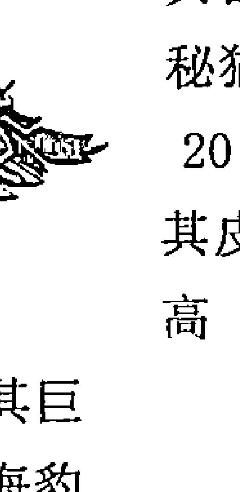

## 海狮鹫
根据哥伦布的同伴，菲洛波努斯的记载，有五名西印度人前来拜访哥伦布，“他们坐在一只海狮鹫的背上，那是一种巨大的怪物，长着有鳞的背部、流苏的脖子、鞭子似的尾巴、猪的脑袋。它还长有四只巨爪，每个爪子上有三根手指，还有巨大的翅膀和鳍——看起来非常凶猛的一种怪物。”参见海猪。

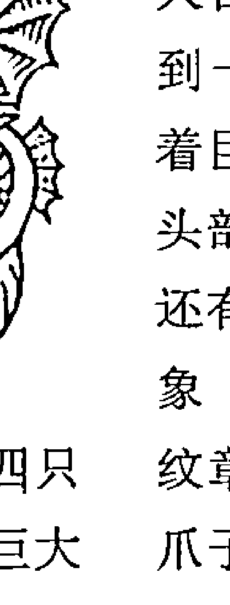

## 海兔
欧洲中世纪传说中的一种凶猛的掠夺性海怪，长有鱼的身体、野兔的头、耳朵和腿。这个名字现被用在一种海参身上，它是一种大亚目中的草食性软体动物海兔目（Anaspidea）（“没有保护”）。

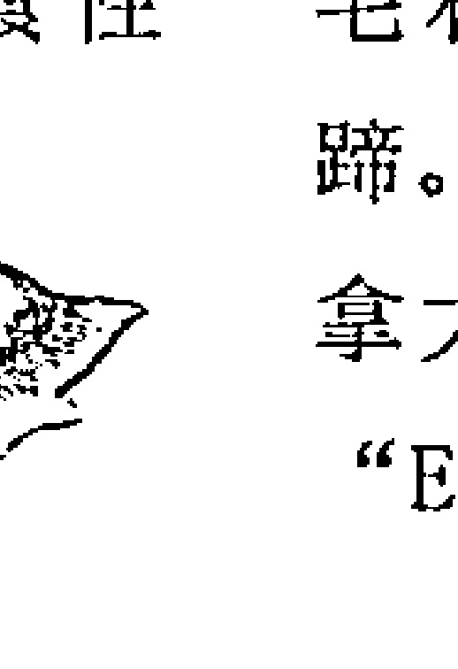

（如图所示）。它们的名字源于其头上像长耳朵一样的突起。它们的皮肤里有毒素，能抵御捕食者。

## 西马朗泼（Seah Malang Poo）
泰国索克（Sok）国家公园中的喀斯特石灰岩中生活着的一种重型的，老虎般的神秘猫科动物。它有棕黑色条纹。据说在20世纪30年代有一只这样的动物被打死，其皮毛被送到了泰国国家博物馆。参见呲高（Cigau）、西表山猫（Yamamaya）。

## 海猪（或海野猪/海母猪）
中世纪水手故事中一种巨大的有鳞的鱼类。根据博物学家昂布鲁瓦兹·帕雷（1517 - 1590年）的记载，1537年，有人在北海目击到一只。它有着巨型野猪的身体和头部、鱼一样的尾巴和爬行动物的前肢，还有突出的獠牙。这清楚地显示出它是海象（Odobenus rosmarus）。这种动物在纹章里被画成在其长角的头部、龙一样的爪子和肚子、鱼尾的侧影后面衬着残月的背景。它被叫做海洋奇猪。参见罗斯马林（Rosmarine）、海马。

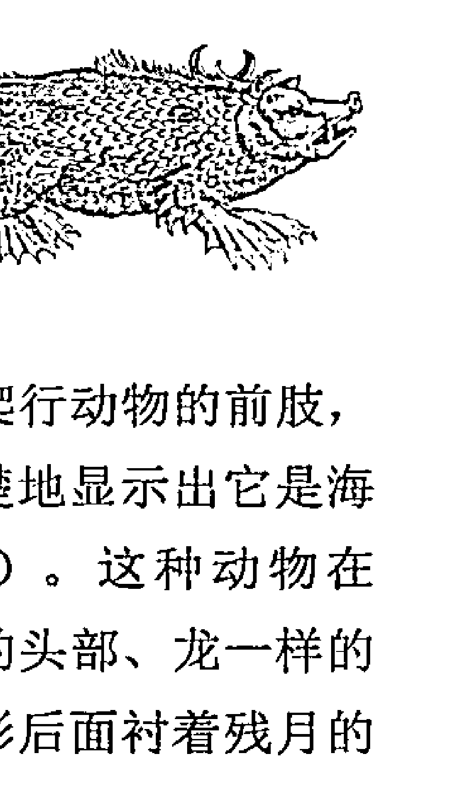

## 海马 [或莫尔斯（Morse）]
英国和斯堪的纳维亚民间传说中的巨鱼，长着马的头、鬃毛和上半身，还有偶蹄。另据报道，在加拿大北部，它被称为“Equus Bipes”（拉丁文中的“两脚马”）。

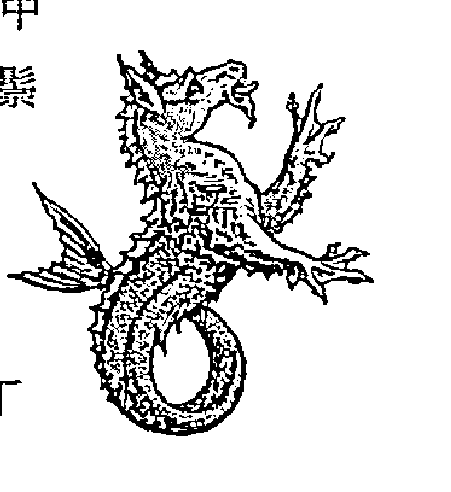

在陆地上和海里都可以生活，经常有人看到其躺在浮冰上晒太阳。根据昂布鲁瓦兹·帕雷（1517 - 1590）的记载，罗马教皇曾经得到过一只这种动物。它在纹章中被描绘成马头鱼尾怪（Hippocampus），用蹼脚取代了蹄子，背上还有长长的背鳍。它的两个名字（海马和马头鱼尾怪——Hippocampus）都被用在了一种与其长相相似的小鱼身上。这种传说中的动物可能源自现在的海象（Odobenus rosmarus）——可能是没有獠牙的雌性。参见罗斯马林（Rosmarine）、海猪。

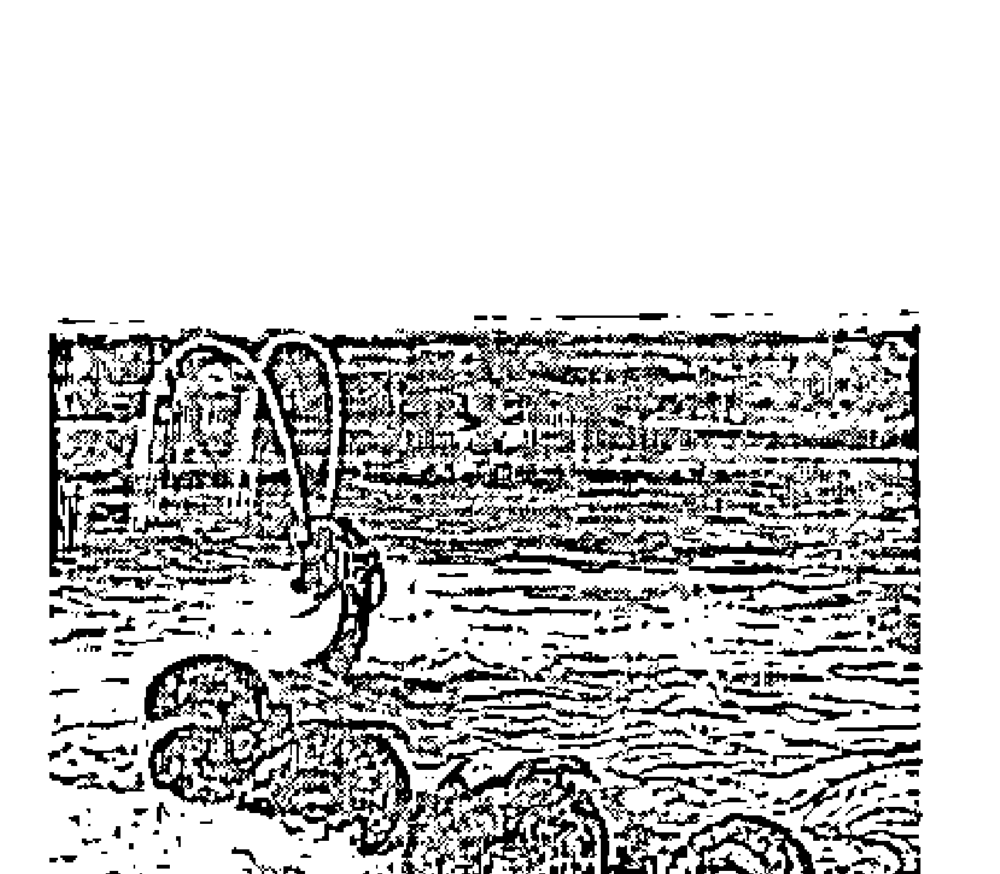

所有巨型蛇形海洋生物的总称。它们中的一些似乎是巨大的蛇、鳗鱼、海参，甚至是史前生物，如蛇颈龙。隐生动物学之父，贝纳德·霍伊霍尔曼（Bernard Heuvalmans）（1916 - 2001年）从这些中总结出了7种，它们是：长颈怪、马鱼、多峰怪、多鳍怪、巨型水獭、巨型鳗鱼、海蜥蜴。有些人目击到的可能是大王鱿（Architeuthis）的触手。其他的则只是长水草而已。虽然有很多记录得很好的目击报告，但从未有这种动物真正的标本出现过。但是皇带鱼（Regalecus glesne），也叫带鱼，看起来和它很像，它也是现存最长的硬骨鱼，1808年，一只56英尺长的尸体被冲上了苏格兰海岸。

## 海狮（Sea-Lion）
另一种混合的欧洲纹章兽，长着狮子头部和前半身以及鱼的尾巴和身体。这个名字被用在了太平洋鳍足类（海洋哺乳动物）海狮（Otariidae）身上，它们有外露的耳朵，和能用于在地面行走的鳍状肢。而雄性加州海狮（Zalophus californianus）也长有浓密的鬃毛。

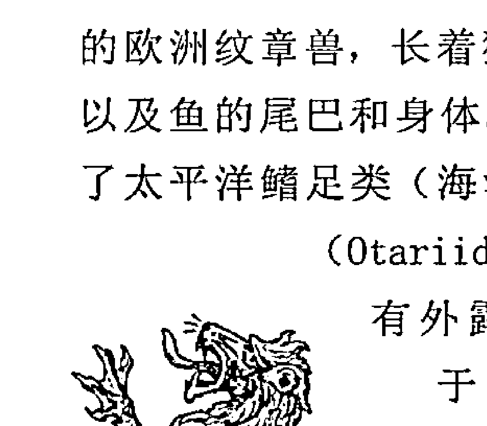

## 海萨提尔（Sea-Satyr）
一种长着鱼尾的奇怪生物，通常情况下是人鱼的样子，但其脑袋却是一只长角的野兽，手上长着钳子，后腿短且有蹼。参见萨提尔鱼。

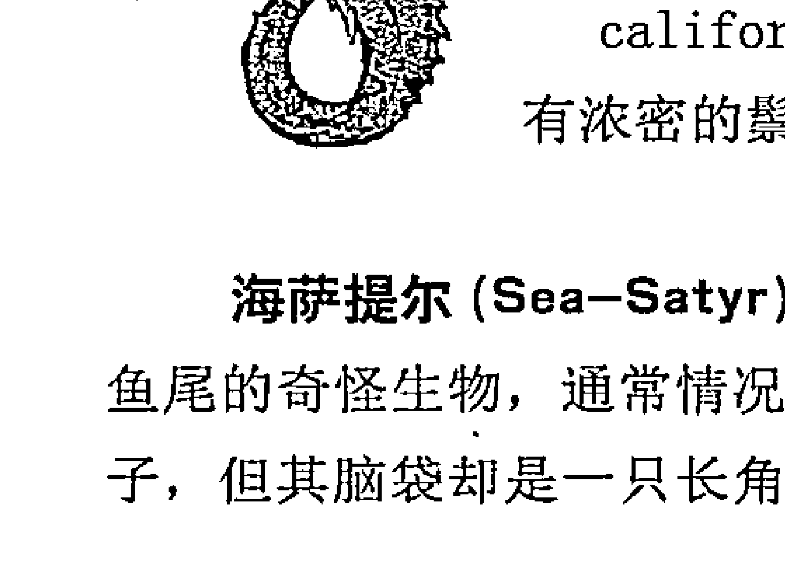

## 海蛇
数百年来水手们所报道的。

## 海鹿
一种鹿身鱼尾的纹章兽。

## 海托（Sea-Trow）
这种设得兰群岛美人鱼和其它的人鱼长得很像，但它们能将鱼尾转化成人腿。安徒生的《小美人鱼》和一部1984年的电影《现代美人鱼》（Splash！）都是源自这种生物的。参见哈弗路美人鱼（Havfrue）和哈弗曼得（Havmand）。

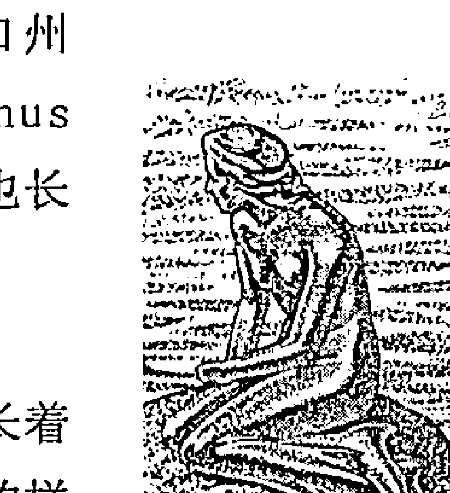

## 海狼
一种狼身鱼尾的纹章兽。

## 舍尔奇斯海豹人 (Selchies) [或斯尔奇 (Silkie)、舍尔奇 (Selkie)、欧卡迪安(Orcadian)“海豹”,也叫罗安(Roane) (复数形式) ]

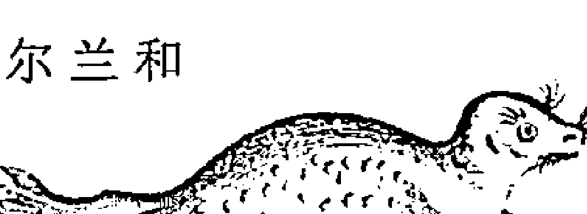

这些胆小的海豹人来自苏格兰、爱尔兰和不列颠的奥克尼、设得兰群岛，它们和其它的人鱼不尽相同，在水里的时候是海豹的样子，当上到岸上时，它们又能褪去海豹皮，像人类一样在地面行走。

| 名称 | 描述 |
| :--- | :--- |
| **能力** | 并不是所有的海豹 (Phoca vitulina) 都有此般法力，只有灰海豹 (Halichoerus gryphus) 才能这样做。 |
| **脾气** | 当它生气时，它能制造风暴，将捕捉海豹的船只及人员或任何惹怒它的人打翻在海里，而苏格兰的罗恩 (Roane) 脾气要温和一些。 |
| **弱点** | 但只要拿走它们变身后留下的海豹皮就能捕获它们。 |
| **与人类关系** | 在被抓，被迫和人类通婚后，它们对配偶会极为忠诚，虽然有些伤心。一旦得到了自己的海豹皮，它们就会头也不回地回到海中。手脚长蹼的人据说就是它们的后代。参见鳍人 (Fin People)。 |

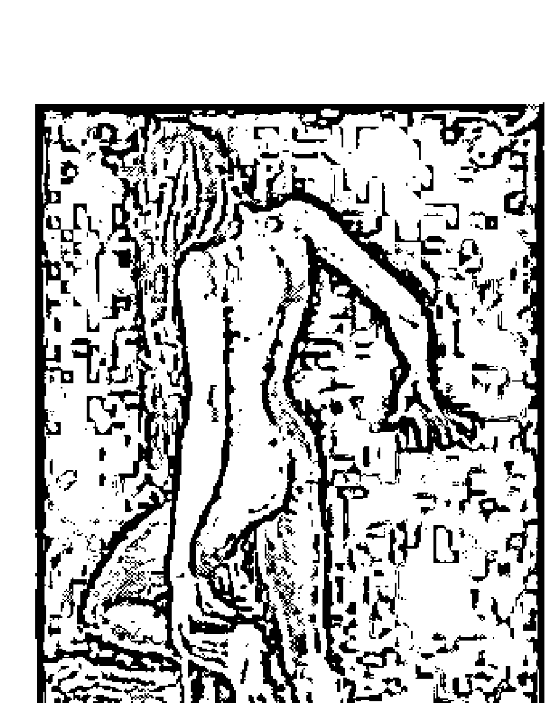

## 赛尔约尔索姆 (Seljordsorm) [塞尔玛 (Selma) ]
住在挪威泰勒马克附近的，12英里长的塞尔约尔湖中的一种怪物。它于1750年第一次被发现，此后被目击到了至少100次。它通常被描述为长着蛇纹、长约30英尺，有蛇的头部，背后还有几个突起。1880年，一个女人将其拦腰斩断该怪物的下半身溜回到湖中，而前半身还留在岸上，它就这样在那里腐烂，没有被采集到任何的组织标本。

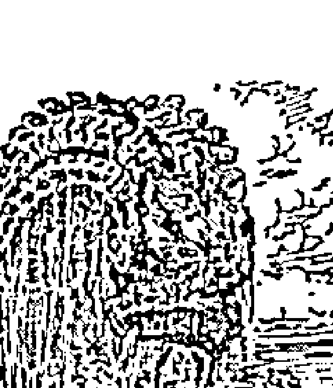

## 森莫夫 (Senmurv) [或森姆鲁 (Senmurw)，斯姆里 (Simyr)，斯纳姆 (Sinam) ]
美索不达米亚神话和波斯神话中一种飞行生物，拥有哺乳动物、鱼类和鸟类的特征。

| 描述变体 |
| :--- |
| 它常被描述为长着狗的身体和鸟的翅膀； |
| 或者长着鸟的身体和狗的脑袋及爪子，这两者都有鱼的尾巴。 |
| 有时候他甚至是长着麝香牛的身体、老鹰的翅膀，像蝙蝠一样倒挂着。 |

它被称为大地、海洋和天空的结合体。它栖息在古老的索玛树上，那棵树蕴藏着世界上所有植物的种子。当森莫夫飞起时，成熟的果实就会掉下来，随后被像狮鹫狗的查姆罗西分发出去。最终它和斯摩夫都成为了传奇，后来斯拉夫的斯马格勒 (Simargle) 和乌克兰的斯摩格 (Simorg) 都是源自它们。参见席兹 (Ziz)。

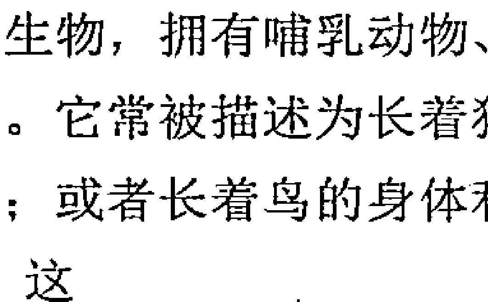

## 赛普斯 (Seps)
一种小型毒蛇，它的毒液会将身体从内部开始溶解。塞维利亚的伊西多尔（公元7世纪）写道：

# 魔法师的怪物图鉴

## 吞噬人的时候
“致命的赛普斯（Seps）很快，这个人在它的嘴里就会被液化。”T·H·怀特认为这可能是印度金环蛇（Bungarus caeruleus）。参见狄思帕（Dispa）。

## 塞罗
西藏的独角兽，居所非常有侵略性。实际上，它指的是长着独角的印度犀牛（Rhinoceros unicornis），它们居住在喜马拉雅山山麓。参见阿巴达、阿巴特、卡塔佐内斯、卡卡丹、卡雷、西徐亚驴。

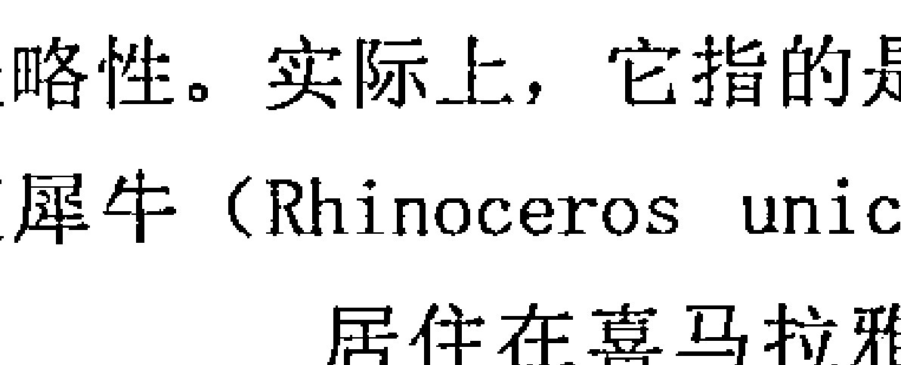

## 瑟泼帕德 (Serpopard)
古埃及的一种神奇猫科动物，长着猎豹的身体和蛇的长颈及头部，在前王朝时期被广泛地用作化妆调色板的装饰图画，比如希拉孔波利斯（Hierakonopolis）的那尔迈调色板（Narmer Palette）和小调色盘（Small Palette），这种生物的长脖子被做成了框架，要么形成调色区的部分，要么被做成后面的部分。

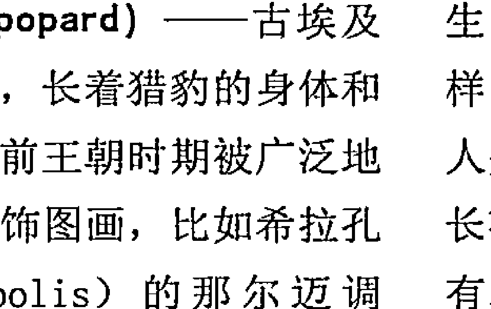

## 蛇王
瑞典民间传说中所有蛇的统治者和保护者。

## 伊甸园蛇
伊甸园中有感知力的蛇，在《圣经·创世纪3:1-5》中有关于它的描述：“蛇是耶和华所创造的所有生物中最为微妙的一个……”它被说成是引诱夏娃偷吃知识之树果实的罪魁祸首。它问她，耶和华是否说过你可以吃任何树上的果实。夏娃说，他说我们不能吃中间那棵树的果实，否则我们就会承受死亡的痛苦。蛇回答说：“你们不会死。吃下那棵树果实，你们的眼睛就能够睁开，你就会变得像神一样，知晓善恶。”后来这一切真的发生了。蛇经常出现在中世纪的艺术作品中，常以盘绕着树木的形象出现，但其细节随着时间而发生了改变。在早期的图画中，它们有马一样的头，更像湖怪，后来就被画成了长着人头。有时头上会有皇冠，长有前爪，或长有孔雀的翅膀和尾羽。它被当作世间所有罪恶的化身，被和恶魔等同起来。参见德拉克可佩德斯（Draconcopedes）。

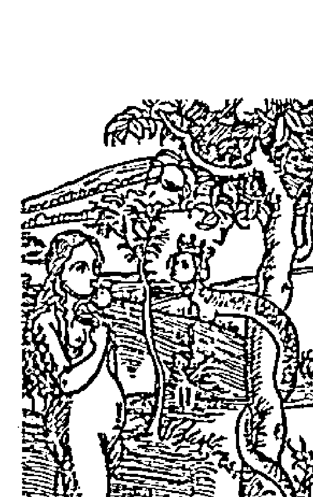

## 致命的赛普斯（Seps）
很快，这个人在它的嘴里就会被液化。T·H·怀特认为这可能是印度金环蛇（Bungarus caeruleus）。参见狄思帕（Dispa）。

## 塞拉 (Serra) [或赛里 (Serre)、萨里 (Sarre)、萨尔希 (Sarce)、斯西 (Scie)、飞鱼、锯鳐]
一种巨大的鱼，长着巨大的、像鱼鳍一样的蝙蝠翅膀和狮子的头。它能追逐船只达数英里的距离，但最终都会收起翅膀回到海中休息。《生理论》将其描述为长有锯齿状的鸡冠，它能用其锯开船只，让其沉入海里。

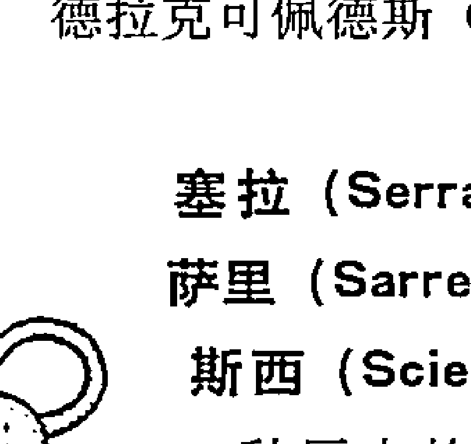

有些老权威学者将其等同于飞鱼。

同于锯鳐 (Pristis)。但它更像是飞鱼 (Exocoetidae) 和 鳐 (Manta birostris) 的接合体，它们二者都以能跃出水面滑行而著名。

## 瑟温达 (Sevienda)
印度的凤凰。孔蒂 (Nicolo de Conti)（公元1395-1469年）是一名威尼斯商人，他用25到36年的时间走遍了印度、亚洲和非洲，他说这种生物长着布满空洞的喙。与凤凰类似，它也在火中重生，只是是以蠕虫的形式出现。

## 鯱 (Shachihoko)
一种中国的水怪，长着鲤鱼的身体和老虎的头。在海里的时候它全身长满毒刺，在地上的时候它会变成一只老虎。它是日本中世纪建筑上的石像鬼。

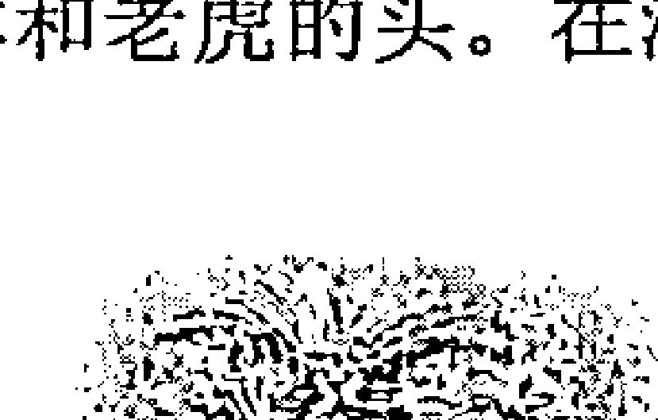

## 独角羚 (Shadhahvar 或 Shadavar)
一种波斯羚羊，长着中空、分枝的角，风能让这些角发出长笛的声音，动物们都会被它的声音迷住。然后独角羚就会杀死它们。参见独角兽。

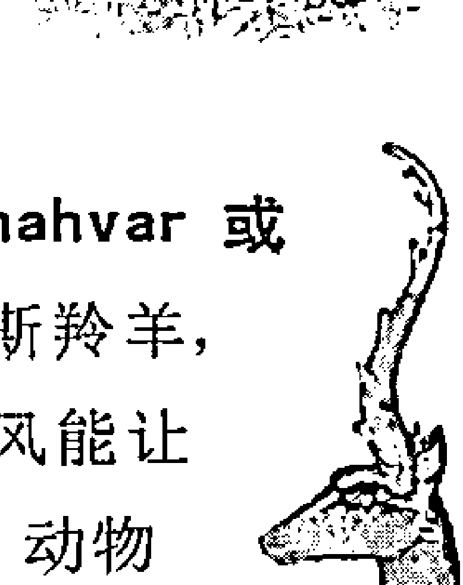

## 沙戈法欧尔 (Shag Foal) [或塔特尔法尔 (Tatter Foal)]
一种经常出没于英国林肯郡偏僻道路上恐吓夜行者的毛茸茸的马或驴。参见黑狗、巴克兰沙戈 (Buckland Shag)。

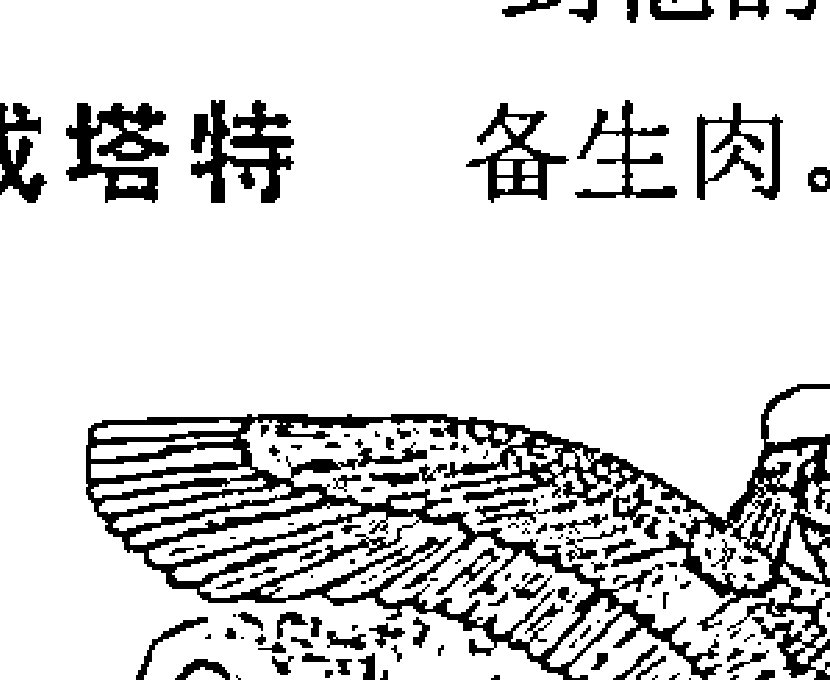

## 沙米尔 (Shamir)
犹太传说中的一种微小昆虫，能钻进木头、石头甚至玻璃。它有一粒大麦那样大。它将“十诫”刻在摩西拿着的那两块石板上。另一种传说说的是它是如何被抓住的，然后被用来切开所罗门王神殿的石头的。它的原型可能是钻木甲虫的幼虫。

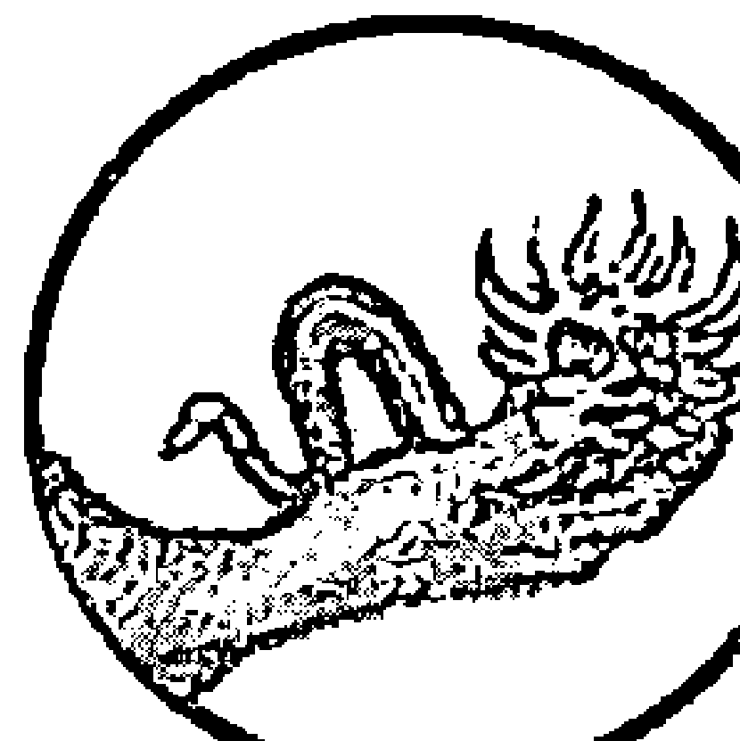

## 商羊 (Shang Yung) (或雨鸟)
一种神奇的独腿鸟，它能改变自己的体型。它是雨季的先驱，能预报洪水。它用嘴从河海中盛水，将其喷洒在干涸的土地上。因此人们在旱季会向它求雨。

## 沙瓦玛 (Sharama)
在印度教神话中，这是太阳神苏利耶的牧羊犬。巨大、可怕、长着四只眼睛、看守死神阎摩统治的地狱入口的莎拉梅亚斯 (Sharamayas) 是它的后代，它们分别叫黑色斯亚玛 (Syama) 和斑点斯亚玛 (Syama)。阎摩派遣它们去寻找死者，然后将其带到他的王国，因此死去的人就得为它们准备生肉。参见刻耳柏洛斯、加姆 (Garm)、索洛托 (Xolotl)。

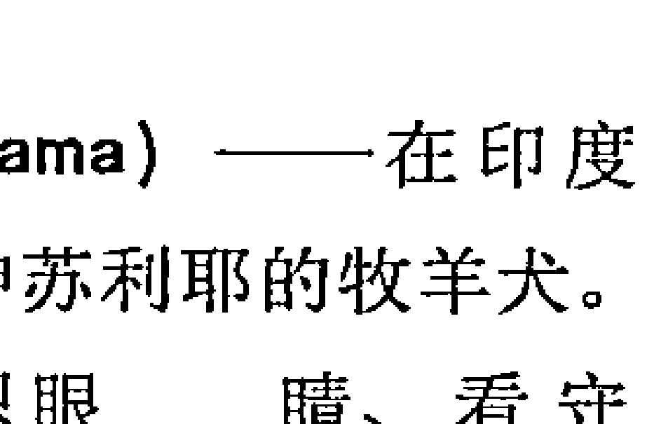

## 舍杜 (Shedu)
与拉马苏一样，这种亚述-巴比伦神话中的有翅怪兽长着人类...

## 希拉弗 (Shielagh) [或瑟拉格 (Seilag)、瑟利安格 (Seileag)]
出没于苏格兰 17 英里长的希尔（Shiel）湖中的一种怪兽，该湖就在莫拉尔（Morar）湖（莫拉格所在地）南方。据说它是一种 70 英尺长，背上长有 3 个驼峰的怪兽。最早的目击报告实在 1874 年，此后直到 20 世纪一直都有人看到它。但在 1997 年和 1998 年的一系列报道中，有人看到 4 只这样的动物同时出没。

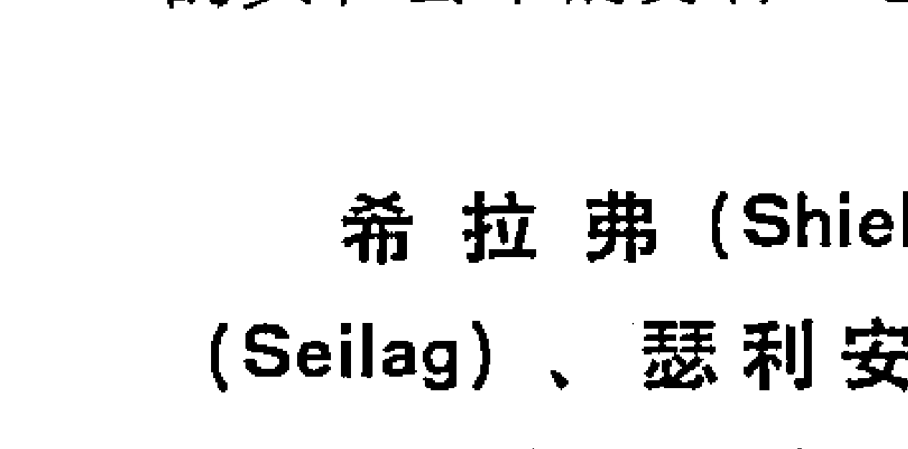

## 苏皮尔提（Shoopiltie）
英国设得兰群岛的民间传说中的一种可怕海怪。它以腾跃的小马或长着马耳的英俊少年的样子出现在岸边，等粗心的人爬到它背上，然后冲进水里将其淹死后吃掉。参见卡比勒-尤喜特（Cabyl-Ushtey）、伊奇·尤思戈（Eaèh Uisge）、马形水鬼科尔皮（Kelpy）、水妖尼克斯（Nix）。

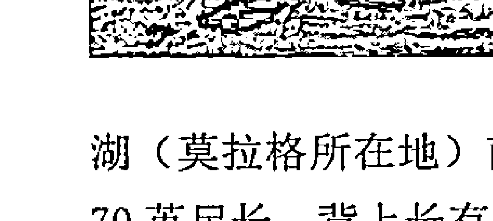

## 短脸熊
在俄罗斯的勘察加半岛，当地驯鹿猎人间传说这一种体重 1 吨的巨型熊，它头很小、身体很窄、腿很长，仍然存在于世上。这个说明符合史前短脸熊（Arctodos simus），它是曾存在过的最大的熊，站立时身高 9 英尺。这种凶猛的食肉动物被认为已经灭绝了一万年。

## 《在伯格曼熊》（Bergman’s Bear）
一种同名的鸟吸引了示巴女王的注意力，它有金属般的橙色羽毛、银色的头、人的脸、四只翅膀、秃鹫的爪子和孔雀的尾巴。参见安卡（Angka）、安祖（Anzu）、查姆罗西（Chamrosh）、伊姆杜吉德（Imdugud）、席兹（Ziz）。

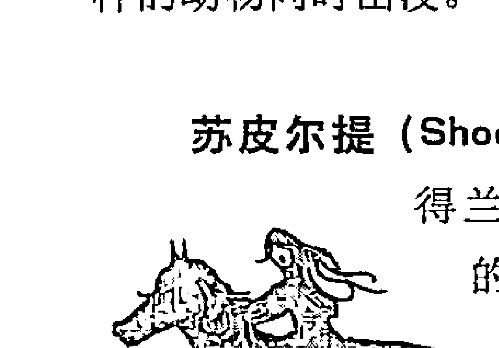

## 夏纳奇（Sianach）（“怪物”）
苏格兰民间传说中一种可怕、丑陋、凶猛的鹿。没人敢去捕杀它，只有逃走的份。这可能是强壮的，生活在冰河时期的爱尔兰麋鹿（Megaloceros）（如图所示），它的鹿角长达 12 英尺。参见海西牡鹿（Hercynian Stag）、西婆塞夫（Hippocerf）、萨德乎扎戈（Sadhuzag）。

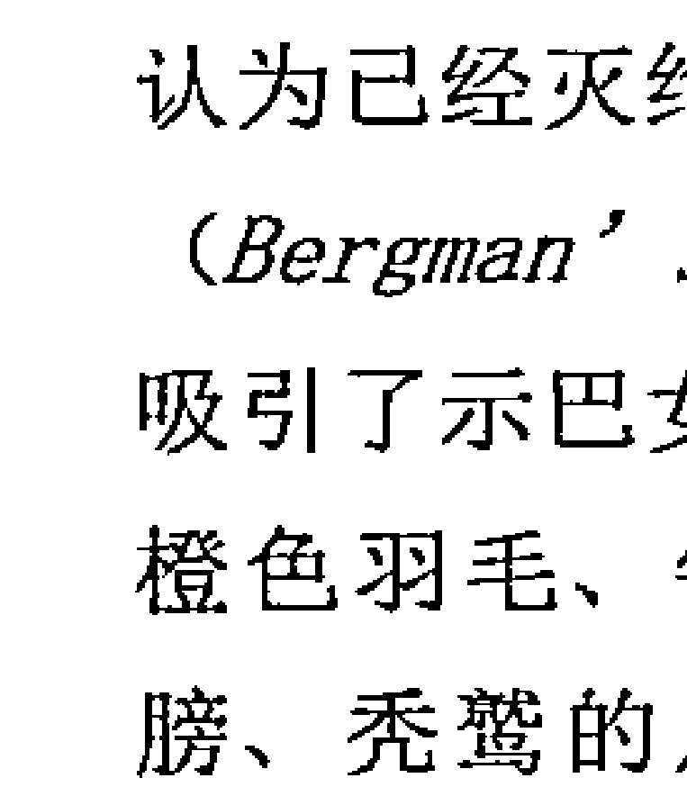

## 西伦 (Silen) [复数形式“西勒尼” Sileni]
希腊神话中的一种人形机器人，上半身是人类，下半身是马，还长着马的耳朵。它们的创造者和统治者是西勒诺斯（Silenus）。后来罗马人将其等同于萨提尔。

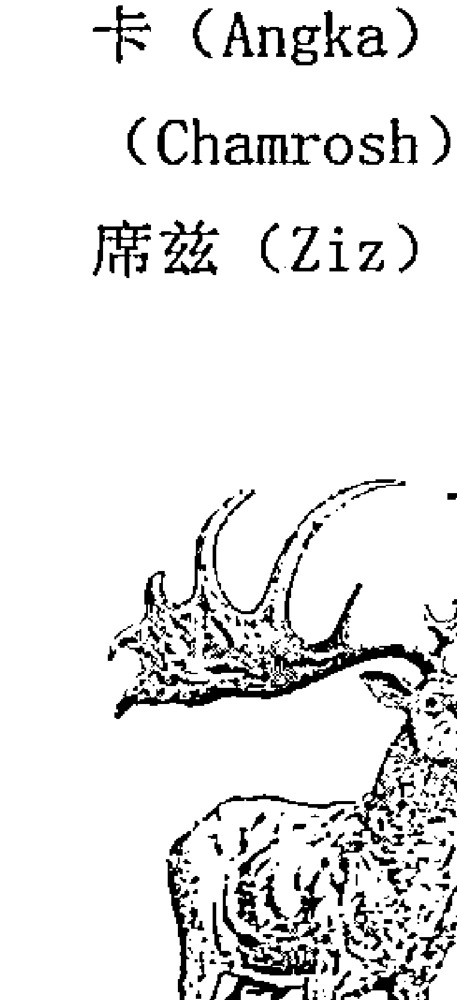

人类婴儿有时候也有尾巴，笔者曾见过一个这样的孩子——长着一条可爱的马尾，就像老照片中的那些一样。参见卡利坎塔里 (Kallicantzari)。

## 西尔万 (Silvan) [复数形式“西尔瓦尼” (Silvani)]
罗马伊特鲁里亚的希腊萨提尔，有着同样的山羊人的外形。

它们据说是花园和森林之神西尔瓦诺斯 (Silvanus) 的跟随者。参见法翁 (Fauns)、西伦 (Silen)。

它栖息在波斯北部的阿尔贝兹 (Alberz) 山脉中。像凤凰一样，这种睿智的鸟类能活 1700 年或 2000 年。有些传说中称其为不死之身，在知识之树上筑巢。它据说非常古老，曾目睹过世界的三次毁灭，并曾向人类警告过洪水的到来。它用嘴盛起河水或海水，将其喷到干旱的土地上，因此在干旱时，人就会向其请愿。中国的孩子有一首儿歌是一边用单脚跳一边这样唱的：“会打雷，会下雨，因为尚云 (Shang Yang) 在这里！”

## 席莫 (Simargl) [或森马格尔 (Semargl)、森马格尔-佩里普拉特 (Semargl-Pereplut)]
斯拉夫神话中一种像狮鹫一样的狗。

在《韦莱斯之书》(Book of Veles) 中，他是锡西厄 (Skifia or Scythia) 的创造者诗其弗 (Skif) 的父亲。参见查姆罗西 (Chamrosh)、森莫夫 (Senmurv)、斯摩夫 (Simurgh)。

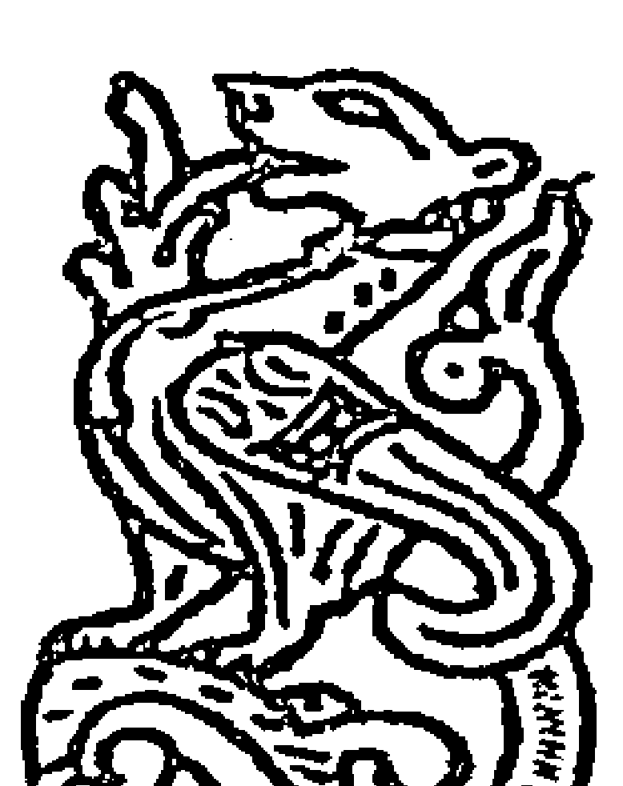

## 辛加 (Singa) (“狮子”)
居住在苏门答腊山区的巴塔克人民间传说中的一种百变生物。

它的样子可以是狮子可以是水牛也可以是人形。通常情况下，它的脸很长、眼睛又大又圆和鹿角般突出的眉毛。它是巴塔克 (Batak) 式风格中的一种占主导地位的元素，有护身符的作用，被用在房屋、餐具、棺材、珠宝等等之中。

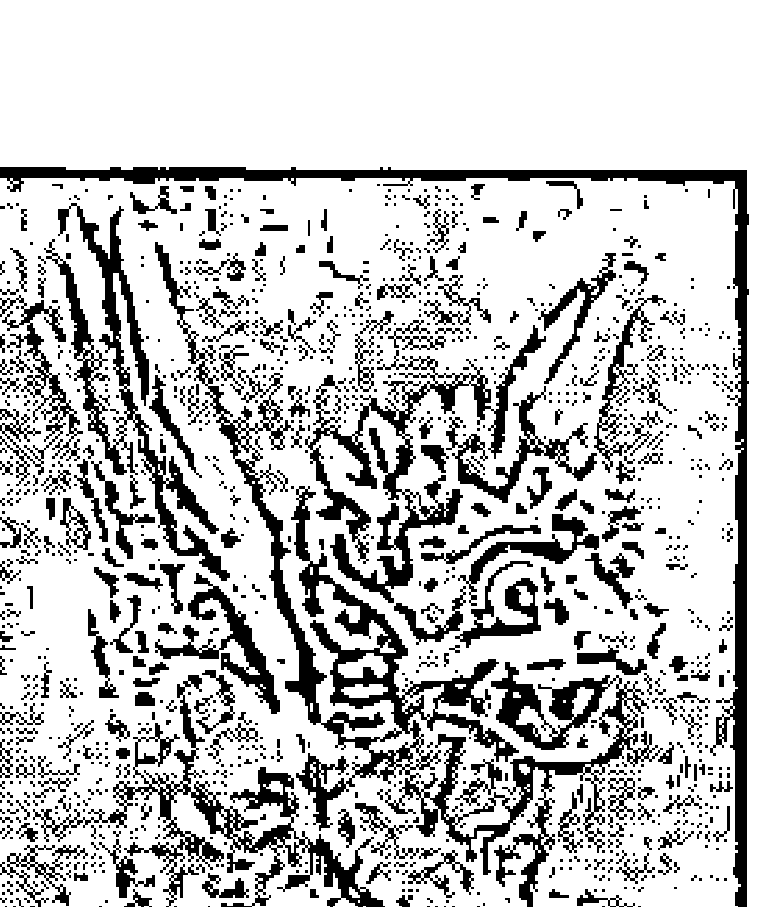

## 斯摩夫 (Simurgh) [也叫西纳姆鲁 (Sīna-Mrû)、斯马弗 (Simarghu)、斯姆戈 (Simurg)、苏马弗 (Sumargh)：“30只鸟”]
阿拉伯传说中宏伟的鸟类国王，代表着神圣。

其美丽的羽毛有珍贵的治疗能力。像鹏鸟一样，它也非常巨大，可以将大象或骆驼提到空中。但它喜欢将人类的孩子带到巢穴中饲养。像森莫夫 (Senmurv) 一样，

## 辛尤 (Sin-You 或 Sin-U)
日本独角兽，或麒麟，有狮子的特征和正义感。

传说它被带到法庭参加对谋杀案的审判。如果被告有罪，它就会站得直直的，正视被告的眼睛，然后用自己的角刺穿其心脏。

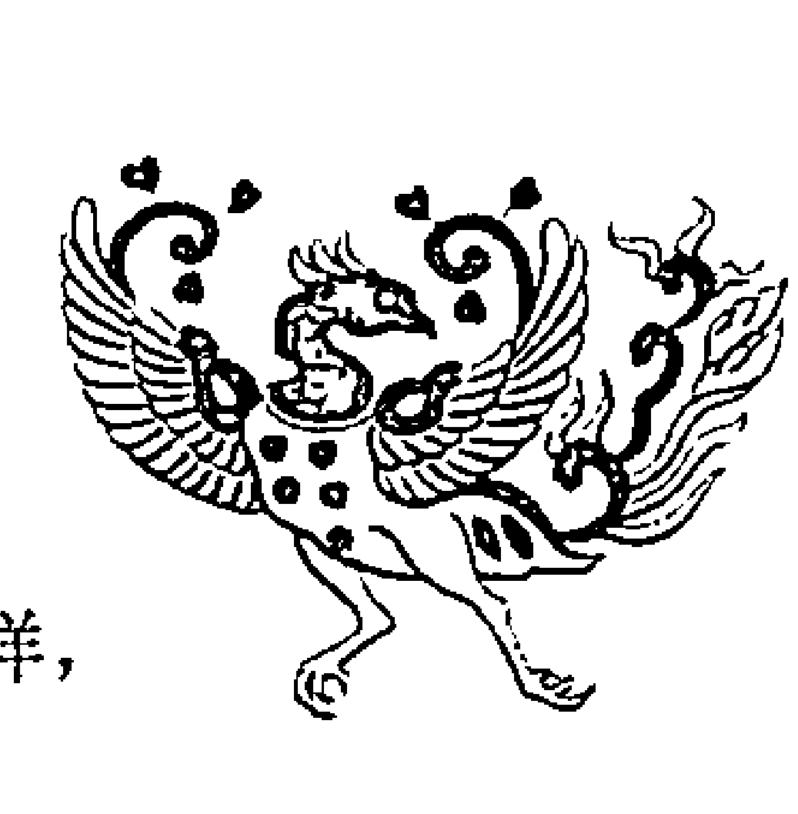

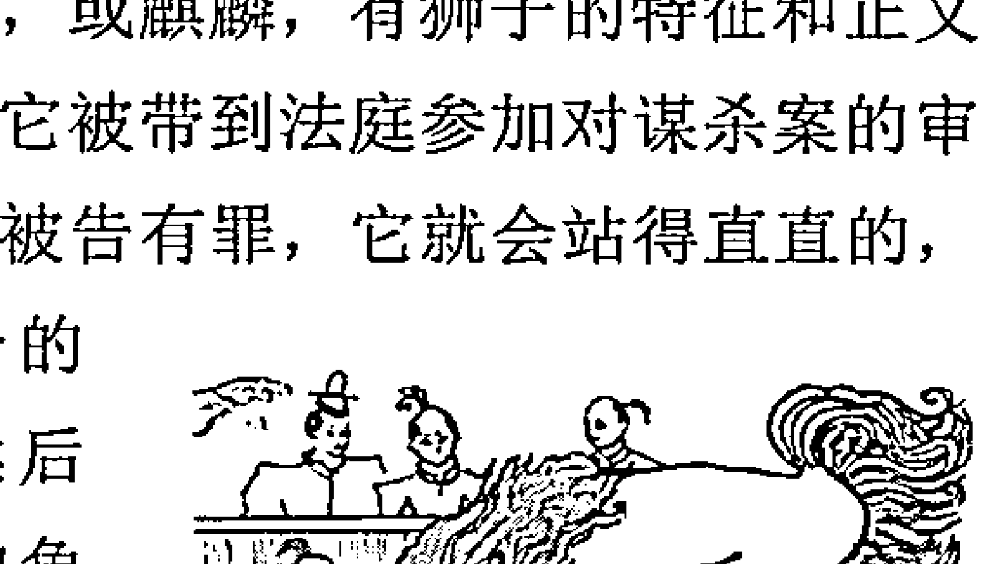## 海妖（或 Sirene、Sireen、Syrene，复数形式为 Sirenes、Seirénes、Sirenae）

它们都被描述为一半女人，一半鸟类，或有女人的身体、鱼的尾巴和鸟的脚。它们是福耳库斯（Phorcy）的女儿，它们的名字分别是：
- 安格劳佩（Aglaope）（“漂亮的脸”）
- 安格拉芬欧斯（Aglaophonos）（“好听的声音”）
- 勒柯喜亚（Leucosia）（“白色的”）
- 里格亚（Ligeia）（“尖声的”）
- 莫尔佩（Molpe）（“音乐”）
- 帕特厄诺普（Parthenope）（“少女的脸”）
- 皮西诺（Pisinöe）（“说服者”）
- 莱德（Raidne）（“进步”）
- 特里斯（Teles）（“完美”）
- 特勒克席培亚（Thelxepeia）（“舒缓的词汇”）
- 特勒克修佩（Thelxiope）（“有说服力的脸”）

在很多传说中，它们都住在西西里附近，被悬崖峭壁环绕的斯伦尤姆·斯科普里（Sirenum Scopuli）岛、卡普佩洛朗（Cape Pelorum）岛、安特穆萨（Anthemusa）岛和帕埃斯图姆（Paestum）附近的斯伦尤希（Sirensian）群岛或卡普里埃岛上。无论住在哪里，它们都会用歌声让水手们步入死亡。奥德修斯通过向船员和自己的耳朵里灌入蜡而幸免遇难。最终海妖被等同于人鱼，而“Sirenidae（鳗螈）”这个名字被用在了一些列海洋生物上，其中包括儒艮（dugongs）、海牛（manatees）等。人们相信海妖们极具诱惑力的声音实际上是居住在岸边的夜莺（Luscinia megarhynchos）的。

## 西林（Sirin）

一种颜色鲜艳的俄罗斯海妖，有女人的头和胸部和鸟（通常是猫头鹰）的身体。它们住在伊甸园附近的“印第安土地”上或幼发拉底河沿岸，为行将去世的圣人们唱欢快的歌曲，让其忘记世间的疾苦，在平和中死去。听到它们歌声的普通人则会忘记一切，并跟随它们步入死亡。西林的天敌是天堂鸟阿尔克诺斯特（Alkonost）。

## 怒蛇（Sirrush）[或姆西路西（Mushrush）、姆乎（Mu huššu）]

古巴比伦的伊什塔尔门上描绘的这种复合爬行动物有蛇的头和脖子、猫的前爪、鸟爪般的后爪。这个浮雕可能是描绘一种现存恐龙的——很可能是非洲的河霸龙（Mokèlé-M’Bèmbe）。在巴比伦神话中，怒蛇是一条龙，是提亚玛特（Tiamet）的后代。在伊什塔尔门建成时，巴比伦国王是尼布甲尼撒二世（Nebuchadnezzar）。在《圣经·但以理14:23-29》中记载着他的祭司在寺庙中养着一条“活龙”，他们崇拜这条龙，最后被但以理杀死。参见斯塔（Sta）、玛菲德特（Mafedet）。

## 斯色米特（Sisemite）[或嘣嘣米特（Chichimite）、尤拉克（Ulak）、尤鲁克（Uluk）、尤乎（Yoho）、于乎（Yuho）]

一种像大脚怪的原始人，长着及地的长头发，步伐也很大，据说居住在中美洲瓜郎塔（Guarunta）山脉中。危地马拉的乔尔蒂（Chorti）印第安人认为它们是所有野生动物的保护者。

龟。它帮助角蛇杜农加伊斯（Doonongaes）捕食人类和动物。

## 斯克芬（Skoffin 或 Scoffin）

冰岛传说中的一种可怕的鸟，有时被描述为带着皇冠的有翅蛇，它的目光对所有生物都是致命的，包括它自己那种物种。当两个斯克芬相遇时，二者都会死掉。它们只能被装有断裂十字架的银子弹打死。参见蛇怪、蛇鸡兽。

## 希尤斯（Sisiutl）

加拿大太平洋沿岸贝拉库拉、海达（Haida）、夸扣特尔（Kwakiutl）印第安人传说中的一种凶猛的海蛇。它被描述为鲑鱼蛇、长角蛇甚至双头蛇。有时它又被说成长着鱼鳍、四条腿、大獠牙——通常是一个大大的头两边长着两条蛇身。任何和它目光相接的人都会被石化。希尤斯是战神维纳拉吉李斯（Winalagilis）的助手，战士们一直在寻求它的力量。参见蛇怪。

## 斯库尔（Skoll）

北欧神话中，两只追赶太阳女神苏娜的战车中的一只。当它抓住战车并将其吞下的时候，世界就会迎来日食的黑暗。另外一只狼叫哈提（Hati），它追逐月亮，每个月都会将其吃掉一次。

## 斯约姆（Sjøorm）（“海虫”）

挪威传说中的巨型海蛇。它们在地上被孵化成小蛇，随着身体的成长，它们捕食的猎物也越来越大。当地面再也支撑不起它们的身体时，它们就会退到海中，在那里继续长大。参见挪威巨蛇、欧姆（Orm）。

## 斯奇立穆勒（Skrimsl 或 Skirimsl）

冰岛传说中的一种巨大海蛇。它居住在拉加尔弗流特（Lagarfljot）周围的海中，在中世纪到十八世纪的这段时间很多人都在那里看到过它。人们认为它是无害的，因为直到世界末日到来之前，它的力量都被蒙德圣（St. Gudmund）所约束。近几年来，一个奇怪的湖怪般的蠕虫在冰岛的洛古林（Lögurinn）湖（20.5公里长，367英尺深）中被发现，有些人认为它是斯奇立穆勒的转世。参见欧姆（Orm）。

## 斯卡诺瓦（Skahnowa）

美国东北部塞内卡印度人民间传说中的一种海龟。它帮助角蛇杜农加伊斯（Doonongaes）捕食人类和动物。

# 魔法师的怪物图鉴

## 臭鼬猿（或南方大脚怪）

在佛罗里达州目击到的一种毛茸茸的大型原始人，在 20 世纪 70 年代和 80 年代，有 100 多次关于它的目击报告。其最早的目击报告是在 1942 年，一名男子声称在萨旺尼郡，一只这种野兽搭乘他的木板车走了半英里。它们的出现会带来腐烂白菜一样的臭味。目击者通常会描述其拥有红褐色的皮毛，但其颜色可能是从黑色到白色的任何颜色。白化的那种通常有半美元那么大的秃头和鼻孔。它们有长长的、长着爪子的类猿人手臂，它们习惯喷鼻子。留下的痕迹表明它们有两个种类：较大的一种，有三个脚趾和攻击性的性格；较小的有五个脚趾，且性格腼腆，没有危害。对红色皮毛的描述让一些科学家推测它们是逃出动物园的红毛猩猩（猩猩属）。参见巴马奴（Barmanu）、大脚怪、西八公（Hibagon）、迷倒沼泽怪、弗克卡普克（Hvcko Cappo）、莫陌（Momo）、米亚卡猿人（Myakka Ape）、恶臭怪。

也能下到赫尔的领土中去——只需要九天的时间。他的母亲是邪恶之神洛基，当史瓦帝法利（Svadilfari）驮着他的主人阿斯嘉特（Asgard）时，洛基用史瓦帝法利的样子造出了他。参见阿尔波拉克（Al Borak）、巴利斯（Balios）、纳拉斯（Naras）、斯弗西科（Sivushko）。

## 蛇狮鹫

纹章中的一种混合兽长着狮子的前半身、老鹰的翅膀和后腿和蛇的脑袋。海因兹·莫得（Heinz Mode）认为这是一种龙的变体，不应该被列为单独一类。参见狮鹫。

## 斯纳利加斯特尔（Snallygaster 或 Snollygoster）

一种像翼龙的野兽，据说生活在马里兰州布拉多克（Braddock）高地的蓝脊山上。18 世纪 30 年代最早定居在这里的德国人被一种他们称为斯其内尔杰斯特（Schnellgeiste——“快速精灵”）的东西吓坏了。它被描述为半爬行动物，长着金属般的喙和剃刀般锋利的牙齿。它从空中悄悄地俯冲下来，将猎物抓到空中，再吸干他们的血。能保护不受其伤害的五角星标志现在都还能在当地的谷仓上看到。1909 年 2 月和 3 月，当地居民报告称一个“有巨大翅膀、尖尖的鸟喙、铁钩一样的爪子、额头中间有一只眼睛”的生物。它的叫声“像火车头的哨音”。史密森学会设立了奖金来找到它，西奥多·罗斯福总统则考虑推迟去非洲野生动物园的行程，打算亲自追捕它。它的一种没有翅膀的变种斯诺里加斯特（Snoligaster）在佛罗里达州的传说中盛传。参见杜哈（Duah）、孔噶莫托（Kongamoto）、罗鹏（Ropne）、双足飞龙（Wyvern）。

## 斯雷普尼尔（Sleipnir）（“平稳”，“滑翔”）

北欧神话中万物之父奥丁的八只脚的灰马。它是所有马中最大的，速度比风还快，能在空中飞行，也能下到赫尔的领土中去——只需要九天的时间。他的母亲是邪恶之神洛基，当史瓦帝法利（Svadilfari）驮着他的主人阿斯嘉特（Asgard）时，洛基用史瓦帝法利的样子造出了他。参见阿尔波拉克（Al Borak）、巴利斯（Balios）、纳拉斯（Naras）、斯弗西科（Sivushko）。

## 索拉李斯（Solaris）

之所以叫“索拉李斯”是因为这种鱼很喜欢跑到地面上晒太阳。它的头很大，嘴巴很宽，皮肤是黑色的，像鳗鱼一样滑溜。它能长到很大，味道很好。（《生理论》）

## Song-Sseu

一种中国鸟，长着母野鸡的身体和女人的头。年轻人会在它呼叫配偶的第一声啼叫时出来跳舞，它的形象也因此被绣上了公主新娘的舞蹈礼服。

## 斯芬克斯（希腊语中的 sphingo “扼杀”，可能来自埃及语中的 shesep ankh “活着的影像”）

一种复合生物，长着狮子的身体和爪子，以及人类或其他动物的头。在古亚述，它被作为神庙护卫，名叫拉马苏（Lamassu）。在埃及有三种斯芬克斯，它们都没有翅膀，长着狮子的身体：羊头狮身怪克里欧斯芬克斯（Criosphinx）有一只公羊的头；鹰头狮身怪歇洛克斯芬克斯（Hieracosphinx）长着猎鹰的头；人头狮身怪安德罗斯芬克斯（Androsphinx）如吉萨大狮身人面像，长着人类的头。希腊的吉诺斯芬克斯（Gynosphinx）有女人的头和胸部及老鹰的翅膀，她是奥特修斯（Orthus）和厄客德娜（Echidna）的后代，是死亡、毁灭和噩运恶魔。她喜欢问旅行者下面的问题：“什么东西一会儿有四只脚，一会儿又有两只脚，一会儿又有三只脚，且脚越多的时候它约虚弱？”如果这个人回答正确，他们就被允许通过哪里，如果他回答错误，她就会将其吃掉。俄狄浦斯给出了正确答案，于是羞愧的斯芬克斯自杀而亡。老普林尼认为斯芬克斯是猿人。事实上几内亚狒狒（Papio papio）仍然被称为斯芬克斯。参见希尔菲斯（Celphies）、西诺西法里（Cynocephali）。

## 四灵（Ssu Ling）

这四只神圣的“吉祥动物”，或灵力动物，在中国神话中分别站在世界的四个角上。它们还表示一年中的季节、生肖。龙王（Azure Dragon）代表东边（春季），其元素为木，它带来雨水，是阳的化身，代表皇帝；凤凰（Vermilion Phoenix，或朱雀）统治南方（夏季），其元素为火，带来干旱，是阴的化身，代表皇后；麒麟（独角兽，或白虎）掌管西方（秋季），其元素为金，是权利的体现；圭贤（黑龟，也被称为黑暗战士）和蛇（如图所示）一起控制北方（冬季），其元素为水。

## 斯塔 (Sta) [或玛菲德特 (Mafedet)]

古代美索不达米亚和埃及神话中的一种混合生物，长着蛇的头颈和狮子的四肢及身体，类似巴比伦的怒蛇 (Sirrush)。

它能给英伦三岛带来洪灾，需要活人献祭才能得到安抚。当国王的女儿被选为下一个祭品时，她父亲要将一半的国土赠与能杀了这个怪兽的人。年轻的阿斯帕特勒 (Assipattle) 将燃烧缓慢的泥炭塞入怪兽的嘴巴，从其体内将其烧死。

## 斯特力龙 (Stellione) [或斯特里奥 (Stellio)]

一种长着黄鼠狼脑袋、身上有星状亮斑的蜥蜴或蝾螈。蝎子非常怕它，只要看到它就会吓得动弹不得。它有时会出现在纹章中。艾尔伯图斯·麦格努斯 (Albertus Magnus) (1200 - 1280 年) 在《论动物》 (De Animalibus) 中说它和火蜥蜴一种生物。

## 斯托瑟琼德居勒特 (Storsjöodjuret) [“大湖怪”或斯托西 (Storsie)]

一种长有角或者长耳的湖怪，据说生活在瑞典耶姆特兰省的斯托瑟琼 (Storsjön) 湖中。自 1635 年首次发现来，对它的描述发生了很多变化，这让有些人觉得那个湖中可能生活着不止一种怪兽。大多数目击者都说它像蛇一样，长有几个驼峰，有猫犬般的头和灰白的皮肤，身长在 20 至 30 英尺，有大大的眼睛和嘴巴。

斯特普 (Sterpe) —— 据说生活在尼加拉瓜的巨型蛇形虫。参见马瓦蒂 (Mawadi)、巨型蚯蚓 (Minhocão)、苏库里居吉甘特 (Sucuriju Gigante)。

## 恶臭怪

马来西亚丛林中一种偶尔被看到或被闻到的一种有恶臭的白色毛人。参见巴马奴 (Barmanu)、西八公 (Hibagon)、弗克卡普克 (Hvcko Cappo)、雪人 (Yeti)。

## 斯图尔虫 (Stoorworm) (“大毒蛇”)

居住在北海的一种大海蛇，它非常大，可以覆盖住欧洲北部的地区。

## 斯特里克斯鸲 (Strix) [希腊语中的 “猫头鹰” 或斯特里加 (Striga)，复数形式为斯特利加斯 (Striges)]

罗马传说中的一种夜行吸血鸟，以人血和人肉为食。很多不同的神话中都有它的身影。老普林尼在其《自然历史》（公元 77 年）中写道，它的名字曾被看作是一种诅咒，除此之外，关于它们喂养幼崽……

## 斯特弗韦弗纳亚 (Stvvnaya)

佛罗里达州大沼泽地的赛米诺印第安人传说中的一种湖怪。它有一只长角，像独角兽一样有春药的作用。它能被歌声从水中召唤出来，能让人取走一部分它的长角。

## 斯提姆菲力兹 (Stymphalids) (或斯廷法利斯湖怪鸟)

体型与鹤鸟相似，它们是长着铜的喙、爪子和羽毛的食人鸟，它们能将羽毛当成弓箭，从翅膀中射出。因希腊的阿卡迪亚的斯堤姆菲利亚 (Stymphalia) 沼泽（斯廷法罗斯湖）而得名，它们居住在那里，让附近的村子都非常害怕，直到后赫拉克勒斯在其第六项功绩中驱逐并杀死了很多。剩下的那些在尤克森海（黑海）中的阿瑞斯岛上定居。杰森和阿尔戈英雄在后来寻找金羊毛的时候遇上了它们。瑞士的鸟类学家迈克尔·德斯法耶斯 (Michael Desfayes) 认为它们实际上是罕见的隐鹮 (Hermit Ibis/Waldrapp)（隐鹮属）……（如图所示），它们有着铜色翅膀、一只肉冠和长长的血红色鸟喙。现在在土耳其还能见到它们。参见阿奇亚拉伯巴 (Achiyalabopa)、阿斯帕特拉 (Asipatra)、阿芙乐利恩 (Avelerion)。

## 苏 (Su)

一种住在寒冷的巴塔哥尼亚的凶猛且难以驯服的怪兽，那里的人因其皮毛而猎杀它们。根据托普塞所述：“当想要她皮毛的猎人正要抓住她时，她会迅速地飞开，背上还驮着她的幼兽，用自己的大尾巴把它们包裹起来……这种残忍的，难以驯服的，暴躁的和嗜血的野兽的天性让她无法在人类的智慧下屈服……她……首先要保护自己的幼崽不被抓走和驯化，她会用自己的牙齿将它们全部杀死，所以从未有一只被活捉……” 这段母亲将幼崽驮在背上，用尾巴遮盖起来的描述好似巴塔哥尼亚负鼠 (Lestodelphys halli)，它们住的地方的气候比其它负鼠的住地要冷很多。

## 苏库里居吉甘特 (Sucuriju Gigante)[“巨蟒”或苏库里 (Sucuri)、苏库瑞乌 (Sucuri ú)、博伊乌纳 (Boi úna)、里伯亚 (Liboya)、吉波亚 (Jib óia)，西班牙语中的马托拉 (Matora)、“公牛捕猎者”]

南美亚马逊丛林中20世纪真实存在过的巨型水蟒。虽然最大的一种是绿蟒（希腊语中的“Eunectes murinus”是“游泳好手”的意思），身长达到37.5英尺，但一些探险家声称遇到过，甚至杀死过还要长得多的怪兽，它们的身长在60至80英尺。

关的鳗鱼。其中一部分被认为是柳叶鳗的幼虫（如图所示），后来被证明其身形只有普通大小。霍伊霍尔曼认为合鳃类鳗鱼和板鳃鳗鱼是可能存在的。在全球范围内，一共有23起关于它们的目击报告。参见海蛇。

## 苏弗麦尔 (Sughmaire)（“吸水兽”）

爱尔兰传说中的一种潮汐怪兽，库尔之子芬恩将其从印度带到爱尔兰用来吸干一个湖的湖水。据说在全世界有九只这种动物，它们都在不停地吸入和吐出海水，造成世界各地的潮汐。参见穆尔瑟兰切 (Muirselche)。

## 苏胡尔-马斯 (Suhur-Mas)（“公羊鱼”）

这是最早的古代苏美尔传说中的鬣羚，与有同样名字的星座有关。它长着山羊的头和前半身，以及鱼的尾巴。参见海山羊。

## 苏力其 (Suileach)

居住在爱尔兰多尼戈郡斯威利湖中的一种巨型、多眼湖怪。它让住在附近的村民很害怕，直到后来被圣克伦希尔 (St Colum Ceille)（521 - 595年）所杀就再也没被看见过了。

## 超级鳗鱼

一群巨大和可能互不相关的鳗鱼。其中一部分被认为是柳叶鳗的幼虫（如图所示），后来被证明其身形只有普通大小。霍伊霍尔曼认为合鳃类鳗鱼和板鳃鳗鱼是可能存在的。在全球范围内，一共有23起关于它们的目击报告。参见海蛇。

## 超级水獭[ (也叫艾格迪的超级水獭 (Hyperhydra egedei) ]

一种60至100英尺长、有中长脖子、身体很长、像水獭的海蛇。很多隐生动物学家都相信它是“archeocetacean”（古鲸鱼），它移动是会上下起伏。曾在挪威和格林兰附近被目击到，如果它真的存在的话，现在恐怕已经灭绝了。关于它的目击报告共有28起。参见海蛇、湖怪。

## 苏尔玛 (Surma)

在芬兰神话中，它是看护女神卡尔玛 (Kalma) 统治之下的地狱之门的可怕守卫。它是一张长有巨大獠牙的大嘴通向永远无法被填满的肚子。它负责将死者的灵魂顺利带入亡灵的国度，但任何企图从那里逃走的或任何傻到想要靠近的凡人都会被它撕成碎片吞掉。它的这张大嘴与长有钟乳石的山洞非常相似。参见特拉尔泰库特利 (Tlatecuhtli)。

## 莎娃穆菲斯科 (Swamfisk)

挪威神话中的一种掠食性鱼类，它将自己包……# 图鉴一、魔法动物展

裹在腐烂的泥茧中装死。那些被吸引过来的小动物会被它吞掉。这肯定是盲鳗（Myxine glutinosa）（如图所示）。当被惊扰时，它身上就会散发出胶质的煤泥气味，作为抵御捕食者的武器。有趣的是，90种热带鹦哥鱼（鹦哥鱼科）中的一些会在夜晚分泌出厚厚的黏液层当作睡袋。

# 塞壬 (Syren 或 Sirena)

——中世纪动物寓言集中提到的一种生活在阿拉伯的可怕有翅白蛇。它比奔驰的马还要飞得快，其毒性很强，受害者在死的时候感觉不到被它咬过。T·H·怀特认为其可能源自印度金环蛇。参见阿姆费特尔、狄普萨 (Dipsa)、伊沙飞蛇、赛普斯 (Seps)。

# 斯伦卡 (Syrenka)（“小美人鱼”）

——波兰美人鱼，也被称为美露西娜 (Melusina)。它以拿着盾与剑的样子出现在华沙的纹章中。数百年来，其形象逐渐发生了演变，从原来的龙人变成了现在的美人鱼，这是官方在1662年制定的。只有盾与剑保持不变。据说在1294年，美露西娜带领马索维亚的波列斯瓦夫公爵 (Duke Boleslaus) 沿着维斯瓦拉河到了一个村子，并命令他在那里建造一座城市，即后来的华沙城。

# 斯兹(Sz)(“剑牛”)

——斯里兰卡的独角兽，长相类似一头瘦弱的公牛或水牛，有羚羊般的尖角。

# T指的是Tarasque（塔拉斯各）

一种河中的生物。被包裹在鳞甲中全身光芒闪烁。蛇的身体、狮子的脑袋，它让很多的船员都胆战心惊。

# Takujui——

一种日本怪兽，与九段 (Kudan) 相似，是长着人头的野兽，眼睛长在身体侧面，背上有骨刺。这是一种祥兽，只在盛世出现。参见麒麟。

# 堂吉 (Tangie)（丹麦语中的“海藻”）

——一种居住在英国的设得兰群岛和奥克尼群岛的凶恶的海马。它看起来像是长着蓬松鬃毛，身体破烂的小马。它也可以变成人鱼的样子。它会在夜间恐吓那些在湖边的路人——特别是女性，她们会被其绑架和吞噬。

# 塔尼瓦 (Tanihwa)

——新西兰毛利人传说中的一种巨大的爬行动物保护者。它们生活在河流和黑暗的洞穴或深海中，尤其是那些危险的洋流或暗礁的地方。有些能在地里钻洞，造成山体滑坡，并在整个过程中将树木连根拔起。其它一些则被认为通过向海里打洞而造就了港口。它们常以鲸鱼或鲨鱼的样子出现在海中，而在内陆水域里，它们则以背上长有骨刺的大蜥蜴（Sphenodon）的样子出现。它们是自己部落的保护者，会攻击看到的任何外来者。霍洛马坦尼（Horomatangi）是一种巨大的水生蜥蜴，它创造出了巨大的卡瑞皮啼（Karapiti）气孔，其并不以人类为食，有时甚至还会帮助人类。但它却经常攻击独木舟，特别是现代的摩托艇。另一方面，河吐-普库（Hotu-Puku）则会捕食人类，它非常强壮又迅速，没有人能够逃脱。最终，一群猎人将它杀死，他们在其洞穴入口安置了一张大网，然后惊吓它，让其冲入网中，它就这样被网给绞死了。胡鲁-卡里奥（Huru-Kareao）居住在汤加里罗（Tongariro）附近的一个湖中，它保护那里的村民不受敌人的威胁。如果切开一只伊胡-玛陶陶（Ihu-Mataotao）的肚子，就会发现它的食物正完整地躺在那里。帕拉塔（Parata）会用巨嘴将海水吸入又吐出，从而制造出潮汐。

一种蜥蜴“塔尼华龙”（Taniwhasaurus oweni）以塔尼华（Taniwhua）的名字命名。

# 狸猫精 (Tanuki)

（或貉 Mujina）——日本民间传说中的一种喜欢恶作剧、会变形的动物。它们长得像狐狸，但通常没有什么戒备心，丢三落四。它是一种真正的动物，叫“浣熊犬”（Nyctereutes procyonoides）。狸猫常被描述为长着巨大睾丸的小胖子，它们戴着用叶子做的帽子，还带着水罐。它们的雕像常被放在酒吧门口，用以招揽顾客。

# 饕餮 (T'ao T'ieh) (暴食者)

——已知最古老的中国怪兽，长着一个头、一些前肢、一个大大的肚子和后腿及尾巴。它们源自老虎和人的形象。它的头非常大，上面有张巨大的嘴巴，里面长着好几排尖牙。这种六腿怪兽代表着贪吃，它被印在餐具上，警告人们不要吃得太多。它在 PS2 游戏中的卡片召唤师（Culdcept）里出现过。

# 塔兰德鲁斯 (Tarandrus) [或塔兰达斯(Tharandus)、帕兰德拉斯(Parandrus)、帕兰达斯 (Parandus)、帕兰德 (Parander)]

——一种毛茸茸的灰色动物，长得像牛，有分叉的鹿角。据说住在埃塞俄比亚，它常出现在中世纪的动物寓言集中。罗马作家克劳狄俄斯·埃利安（Caludius Aelianus）在其《论动物本质》（De Natura Animalium）（约公元220年）中写道，它能改变颜色，像变色龙一样躲避捕猎者。它就是纹章中的帕兰德鲁斯（Parandrus），一种熊和野山羊（Capra ibex）的混合动物。这显然指的是驯鹿（Rangifer tarandus），它会季节性地换毛，冬天变成积雪的白色，夏天变成暗灰色。参见巴斯（Busse）。

# 图鉴一、魔法动物展

## 塔拉斯各 (Tarasque)

——居住在法国南部罗纳河谷中的一种凶猛的两栖河龙。它比牛稍大，有六条腿、一个狮子的脑袋、一只熊爪，身上长着鳞片，蛇尾上长有锋利的倒钩。其外壳坚硬，背上有尖利的骨刺。圣玛尔大（St. Martha）在其脖子上套上她的腰带将其驯服后带到内尔鲁镇上，那里的村民杀死了它。随后那个镇改名为塔拉斯孔（Tarascon），每年都会将这个故事重演一遍。对塔拉斯各的描述与甲龙（ankylosaur）或雕齿兽（glyptodont）及其类似。

## 牛像怪 (Tarbh Uisge)

[或塔尔博乌伊斯戈（Tairbe Uisge）、塔尔博赫-乌伊斯戈（Tairbh-Uisge）、塔鲁尤西特（Taroo Uishtey）、卡比尔尤西特（Cabyll Uishtey）、特鲁尤西塔（Theroo Ushta），盖尔语中的“水公牛”]——一种长有牛角或黑或白的水怪，没有耳朵，但有燃烧着的鼻孔。其在夜间的叫声被人当成公鸡在报晓。它温顺且胆小，只出现在苏格兰高地和爱尔兰遥远的池塘中。它会在夜间出现和奶牛交配，它们的后代被称为可克-楚拉萨克（Corc-Chluasask）（“裂耳”），因为它们的双耳只有一半。在斯凯岛，任何畸形的牛犊都会被立即杀死，以保护其他牲畜。马恩岛的塔鲁-尤西特（Taroo-Uishtey）住在淡水湖沼中，并被认为是无害的。参见湖怪、塔鲁-尤西特（Taroo-Uishtey）、水马。

## 塔泽尔亚龙[“爪虫”，也叫跳虫（Springworm），住在孔里的虫子（Stollenworm）、隧道蠕虫、山树桩]

——欧洲一种很神秘的爬行动物，通常被描述为长着猫脑袋的雪茄形的蜥蜴。常在瑞士、巴伐利亚、意大利、奥地利的阿尔卑斯山中看到它，据说它住在洞中、身长2-5英尺、有剧毒，其呼吸就能杀死人类。在法国，它叫阿拉萨斯（Arassas），据说住在法国的阿尔卑斯山的洞穴中。它据说长着几条腿（两条、四条或没有腿）和（光滑或块状或有鳞或长毛的）皮肤。有人说它长背上和尾巴上都长着骨刺，身体上还有鳞片和红色的血管和硬毛。它极具侵略性，会突然进攻，一跃就能跨过2-3码的距离。在远在南边的西西里岛上都有它的踪影。1954年，几个那里的农夫看到了一种长着猫头和前肢的长蛇攻击他们的猪。很多关于它们的描述很像石龙子（Scincidae），约1200种已知蜥蜴中最大的一种。大多数都没有脖子而且腿也很短。有些属类（如布氏盲蜥）则没有四肢，其他像新石龙子属（Neoseps）就只有残留的腿脚。其它关于塔佐蠕虫（Tatzelworm）的描述与五趾双足蚓蜥（Ajolote）类似，它是一种墨西哥双足蜥蜴（Bipedidae bipes），也可能是另一种更大的欧洲蜥蜴。

# 魔法师的怪物图鉴

描绘成长有翅膀的人形机器人，其中最低级的鸟天狗（Karasu Tengu）和小天狗（Ko-Tengu）（或木叶天狗 Konoha Tengu）最像鸟。

那些长着红色、绿色或黑色脸的，通常还有人类的耳朵和头发。它们的喙里常有锋利的牙齿，还有长有鸟爪的手脚。它们的翅膀和尾巴上，有时甚至身体上都长有羽毛。虽然颜色有不同，但它们一般都被描绘有红色的衣服或头发或皮肤。它们居住在京都北方的鞍马上的一处堡垒中，常用顶上有环的锡杖来对抗邪恶的魔法。乌天狗以人类为食，它们能将其抓到空中。

### 海精忒尔喀涅斯（Telchines）

与希罗神话中的人鱼很相似的海怪。它们大大的身体上长着鳍状的四肢和脑袋。其目光能将那些惹怒它们的人吓得动弹不得。它们擅长冶金术，制造了克洛诺斯（Kronos）用来对抗乌拉诺斯（Ouranos）的镰刀和波塞冬/涅普顿的三叉戟。它们原产克里特的基克拉迪群岛、塞浦路斯和罗德岛，后来在试图绑架阿弗洛狄忒的时候分散到世界七大洋中。参见舍尔奇斯海豹人（Selchie）。

### 塔纳科斯（Thanacth）

一种虎形的无尾黑色动物，长着人类的脑袋和卷曲的头发。在昂布鲁瓦兹·帕雷（1517 - 1590年）的《怪物与奇迹》（On Monsters and Marvels）和特维的《宇宙学》（Cosmography）（十六世纪）中写道，它是被作为食品而从印度进口到中东的。对它的描述听起来像一种奇怪的人类。参见修斯帕里姆。

### 天狗（Tengu 或 Ten-Gu）

日本神话中一种长着翅膀的生物，有发光的眼睛和喙一样的大鼻子。它们有很多种，有些很善良，有些很邪恶。它们经常被

### 希罗（Theow）

一种像长有牛蹄的狼形纹章兽。

### 三腿驴

波斯神话中一种相当奇怪的独角兽，长着像山一样巨大的白色身体，有三条偶蹄腿、六只眼睛、九张嘴巴和一个中空的千枝金角。根据法希安·邦达赫西（Pharsian Bundahish）所说“它以精神为食，整个存在都是正义的。”琥珀是它的粪便。它矗立在海洋中，用其有法力的尖角净化海洋中一切污秽之物。

**雷鸟——巨大的飞鸟**，常见于许多北美印第安部落的神话中。它们通常被描述为巨大的老鹰，眼中有闪电，拍动翅膀时会有雷声。据说它们能抓起水牛，甚至鲸鱼。雷鸟在美国各地都有人目击到，但主要是在西部和中西部地区。它们通常被认为是加州秃鹰（Gymnogyps californianus），或安第斯神鹰（Vultur gryphus），其翼展超过15英尺。有些隐生动物学家认为，它们可能是更新世的一种秃鹫畸鸟（Aiolornis incredibilis），其翼展能达17英尺。最近，一只阿根廷畸鸟的化石被发现了，它有5英尺高，和惊人的24英尺的翼展。由于雷鸟往往在其头上、背上长着常长长的顶冠，所以也被等同于巨大的翼手龙（Pterodactyls），或蝙蝠龙（Pteranodon）。参见安卡（Angka）、克洛丘（Crocho）、科尼温（Keneun）、科鲁兹尔特（Kreutzet）、欧沙达戈阿（Oshadagea）、日本鹏鸟（Pheng）、鹏鸟、罗翮（Ropen）、斯摩夫（Simurgh）、丁缪科普柯（Tinmiukpuk）、席兹（Ziz）。

**雷霆马**——南达科塔州和怀俄明州 内布拉斯加的奥格拉拉苏（Oglala Sioux）印第安人传说中的一种可怕马怪。它在风暴之时落到地面，它的马蹄声就像雷声一样。1875年，古生物学家马什（Othniel Marsh）看到一些巨大的骨头，奥格拉拉苏部落的人称其来自雷霆马。他认为其可能是生活在大约3500万年前，犀牛般大小的马。在传说中，它被叫做，“雷霆兽”（Brontotherium）（如图所示）。

**提亚玛特（Tiamet）**——古美索不达米亚神话中的巨蛇或巨龙，被等同于银河系。她拥有非常巨大且无敌的身体，长着两只前腿，头上有两只角，还有一只巨尾。在巴比伦经典《天地初开洪荒世界》（Enuma Elish）中，她和她的配偶阿卜苏（Abzu）（拟人化的淡水）创造了天空、大地和众神，它们后来被众神所背叛。提亚玛特被马尔杜克所杀，随后她的身体被肢解，用以指称大地和形成繁星，她流动的血液变成河流。参见尤尔姆冈特（Jormungand）、利维坦、提丰。

**Ti-Chiang**——中国神话中的一种天鸟，长着三对脚和灿烂的猩红色羽毛，但没有眼睛或嘴巴。

# Tien-Schu（或 Tyn-Schu、Yn-Schu “隐鼠”）

——在公元前5世纪的中国古书中被提到的生物，被称为Ly-ki，“它不断地在地下打洞。长得像老鼠，但却有水牛或黄牛般大小，没有尾巴，颜色很深，非常强壮，喜欢在树林下的地里挖洞。”一个十六世纪的中国博物学家写道：“只要一见到阳光或月光，它就会立即死去。和身体比起来，它的腿实在太短……它的眼睛很小，脖子也很短非常愚蠢，而且行动迟缓。”这些描述可能源自更新世的森林犀牛（Coelodonta antiquitatis）（如图所示），在苔原地带发现过它冻结的尸体，它们给人一种刚从地下钻出来就死去了的感觉。参见孔古朴克斯（Koguhpuks）。

# 提耶荷索迪（Tieholtsodi）[或提胡尔特苏迪（Teehooltsoodi）、铁霍尔特萨利（Tieholtsali）“海洋之王”]

——美国西南部的纳瓦霍印第安人的创世神话中的一种水怪。它被描述为一个具有光滑的皮毛、头部巨大、有水牛般角的巨型水獭。在传说中，它曾引发过巨大的洪水。在其绑架了两名妇女之后，郊狼偷走了它的两个孩子，这个愤怒的怪物用洪水席卷了大地，这迫使人类逃到了另一个地方，现在的大地。雨神托纳尼里（Tonenili）和火神哈斯特基尼（Hastegini）拯救了人类，放回了提耶荷索敌的孩子，但它还是会不时地制造洪水来提醒人类。这和类似的洪水传说似乎反映的是最后的一次冰河时代在10500年前结束时造成的海平面突然上升的情况。当时海面上涨了400至600米，很多地方都遭到了洪水的袭击。

# 虎狮（Tion、Tiglon）

——一种极为罕见的公虎和母狮的后代。由于要让这两种凶猛的动物交配极为不易，因此世界上仅仅现存几只这样的动物，它们都被私人收藏家所拥有。虎狮比老虎要小一些，但长得却很相似，它有桔色的皮毛和条纹及斑点。雄性有中度的鬃毛。它们的吼声像父母的结合体。跟大多数混血动物一样，它们的寿命都很短。

# 马怪（Tikbalang）

——菲律宾民间传说中的一种危险动物。它居住在偏僻的沼泽，是一个倒置的半人马，长着人类的下半身和黑色或棕色马的上半身及头部。它的膝盖在头的上方，遮住了它的马脸，但它也能变成人形。就像西欧的黑狗一样，它在夜间追逐赶路的人，让他们迷路，永远消失。然而，如果得到了“小精灵”的指引，迷路的人就能够通过把自己倒过来走路或把自己的衣服反着穿而找到正确的路。据说在下太阳的时候，就是马怪结婚的时候。

# 托科洛希（Tikoloshe）

南非的科萨当地人民间传说中的一个毛茸茸的两栖生物。它有狒狒的大小和形状，但能拖着长手直立行走。它能变成人形，甚至还会隐身。最近在德兰士瓦（Transvaal）河附近的约翰内斯堡郊区的纳塔尔有人看到过它。它以奸杀妇女和抢劫有钱人而臭名昭著。

# 提力苏克（Tirisuk）

因纽特人传说中的一种庞大的四足爬行动物，或龙。它有两个皮质的“触角”和用来捕猎的巨大颌骨。

# 提提龙（Tityron）

一种酷似绵羊和山羊的混合纹章兽。

# 特拉尔泰库特利（Tlatecuhtli）

墨西哥阿兹特克人神话中的一个巨大的青蛙。它和长着响尾蛇头的生命、死亡和重生之母考特里克有关。它广阔的，长有尖牙的嘴巴是冥界的入口，亡者之地。这个描述让人联想到真实世界中，在洞口长有钟乳石的洞穴。参见苏尔玛（Surma）。

# 托坎迪亚（Tokandia）

马达加斯加岛上一种善跳跃的四足动物。它能爬树，声音像人，但并未长着人脸。这个描述符合200磅重的巨型狐猴（Megaladapis）（如图所示），它是存在过的最大猴类，在1000年前已经灭绝。虽然体型像小熊一样，但其生活在树上，应该和考拉类似。参见特拉特拉特拉特拉（Tratratratra）。

# 汤姆潘德拉诺（Tompondrano）

马达加斯加的一种巨型海怪，有着鳄鱼般的装甲。1926年，一些渔民报告在水中看到了一只闪着磷光的头。这当然是河口鳄（Crocodylus porosus），它是现存所有爬行动物中最大的一种。通常只出现在印度尼西亚，据称其身长能达30英尺。报道中的磷光是浮游生物产生的。

# Too Jou Shen

一种中国的动物，长着狮头、偶蹄、短角。在北京北方80英里处的明代十三陵的石像中就有两只这种生物。

# 托恩格阿尔萨科（Torngarsaok）

加拿大拉布拉多哈得逊海峡因纽特人传说中的一种巨型灵熊。它的巢穴在昂加瓦地区。

# 魔法师的怪物图鉴

瓦湾的一处深深的山洞中，它是那里海豹和鲸鱼的统治者。它是巨大的北极熊（Ursus maritimus），其中有记录的最大体重达到1960磅，站立时有12英尺高。

## 角雉 Tragopan（复数形式为 Tragopomones）

——老普林尼记载的一种埃塞俄比亚有角鸟。中世纪的动物寓言集将其描述为一种紫色头上长着两只巨大羊角的棕色鸟。现在它是一种亚洲野鸡——黄腹角雉的学名。它通常被称为“有角雉”，因为在其头上长有两个颜色艳丽的肉质犄角，可以在求爱时树立起来。这个名字是由 tragus（“公山羊”）和半羊神潘（Pan）组合起来的，也暗示潘的同伴萨提尔（Satyr）。

## 特里同 (Tritons)

——希腊传说中的人鱼，它们不像世界上其它地方的那些亲戚们那样有吸引力。它们长着分叉的鱼尾、满嘴锋利的牙齿、绿色的头发、鱼鳃和尖耳朵。通常它们都带着三叉戟，吹奏着“特里同的号角”贝壳（Charonia tritonis）。雄性特里同喜欢玩弄那些无助的水手，因此获得了好色和欺骗的恶名。昂布鲁瓦兹·帕雷（1517-1590年）在其著作《怪物与奇迹》（On Monsters and Marvels）中写道，一只雄性特里同和一只雌性特里同在埃及的尼罗河里被人看到。然而，在二世纪希腊比奥提亚（Boiotia）的塔纳格拉（Tanagra）的狄奥尼索斯神庙中展出了一只“特里同”的尸体，据说是在当地的河里被捕获的，实际上它就是天使鲨（Squatina）。

## 特拉特拉特拉特拉 (Tratratratra) [或特里特里特里 (Trétrétrétré)]

——一种毛茸茸的树栖灵长类，据称1658年曾住在马达加斯加岛上。它像个孩子一样大，长着人的脸和耳朵、猿的脚和短尾。对它的这些描述，特别是像人一样的脸，和黑猩猩大小的狐猴——古原狐猴（Palaeopropithecus ingens）（如图所示）完全匹配，这种狐猴被认为在十六世纪就被第一批前来定居的欧洲人灭绝了。参见托坎迪亚（Tokandia）。

## 特洛勒菲斯克 (Troll Fisk) （“巨型怪鱼”）

——一个斯堪迪纳维亚语中用来概括海怪的词语，由丹麦卑尔根主教庞陀彼丹（Pontoppidan）（1698-1764年）创造。

## 特朗普长毛鱼 (Trunko)

——1922年，在一场爆发在三个巨型海怪之间的战斗结束后被冲上南非夸祖鲁-纳塔尔的马盖特海滩的一个奇异的、45英尺长的尸体，很多人都目睹到了它们的打斗。其中两个怪兽很快被辨识为鲸鱼，但剩下的那个却没有人知道到底是什么。被冲上海滩的那具尸体还有一条没有头、长达5英尺的脖子，或“鼻子”，和一条10英尺、像爪子一样的尾巴，全身覆盖着8英尺长的白色毛发。在曝晒了10天之后，这个尸体被冲回了海中，再也没有出现过，没有人对其做过调查。它可能是一条姥鲨（Cetorhinus Maximus），它是被两条逆戟鲸杀死的。参见摩伽罗（Makara）。

## 特森毛斯（Tsemaus）[或特斯友姆阿克斯（Ts'um'a'ks）]

——加拿大不列颠哥伦比亚省的印第安人的民间传说中的一种巨大的海怪，居住在斯基纳河口，它被描述为一条巨大的鱼，长着大大的背鳍，它非常锋利，能够将人切成两半。很显然这是逆戟鲸，或杀人鲸（Orcinus orca），是最大的一种海豚。参见虎鲸（Orc）。

## 特森纳霍勒（Tsenahale）

——美国西南部的纳瓦霍印第安人的神话中的一种巨鹰。被纳亚妮加密（Nayanezgami）用闪电箭杀死。在从空中落下的时候，它的羽毛变成了小鸟，后来成为了山鹰。参见雷鸟。

## 特娑婆（Tsopo）

——西藏传说中的一种极富攻击性的独角兽。它实际上是独角的印度犀牛（Rhinoceros unicornis），这种动物住在喜马拉雅山山脚下。参见卡卡丹、卡雷、西徐亚驴。

## 土蜘蛛（Tsuchi-Gumo）

——日本传说中的一种无敌蜘蛛。它以人类为食，后来被铁网困在洞中，被大火烧死。日本传说、J. R. R. 托尔金和 J. K. 罗琳的故事中经常出现类似的大蜘蛛。在这些故事里，在旅行者和英雄们搜寻古代城堡、黑暗洞穴或黑暗森林会遇到巨大的蜘蛛网，然后他们被抓住，必须杀死蜘蛛才能获得自由。参见狄洁恩（Djieien）。

## 土龙（Tsuckinoko）[或巴其赫比（Bachi-Hebi）]

——日本传说中的一种大蛇，非常喜欢饮酒，据说还能够跳三英尺高。它有非常胖的身体，就像一个平扁的三角形一样，还有一只非常特别的箭头形猫头，一条细细的脖子和瘦瘦的小尾巴——与非洲加蓬咝蝰（Gaboon Viper）非常相似。有些隐生动物学家推测它可能是一种突变的蝮蛇（Agkistrodom halys）。有很多关于它的目击报道，但没有人抓到过它。

## 图巴（Tuba）[复数形式为图巴厄（Tubae），也叫图马赫（Tööm Ahr）]

——一种身长约一码、蜗牛一样的神秘动物，长着螺旋的外壳及喜爱那个山羊般有角的头部。它本来是住在蒙古西部的杭爱（Khangay）山和阿尔泰山的。虽然它像蜗牛一样爬行，但它也能在黏液的帮助下爬到洞穴的岩壁和顶上去，这能让其躲开捕食者的追捕。它的食谱完全由菌类组成，但在极少的时候它会吃小型无脊椎动物。在蒙古神话中，如果有人找到它，那么他就会交好运，前提是这个人不会伤害它。像它这样大的腹足类动物也并不是不存在，而且蜗牛的触角也经常被当作牛角和耳朵。已知最大的蜗牛是巨型非洲蜗牛或加纳老虎蜗牛（Achatina achatina），能长到一英尺长。参见海怪、卢卡寇（Lou Carcolh）、蒙古死亡蠕虫、欧姆（Orm）、弗卡（Phooka）、萨尔马提亚海蜗牛。

## 土木拉-弗伊纳 (Tumu-Ra' i-Fuena)

——塔希提 (Tahitian) 传说中一种巨型花斑章鱼，它的触手像《星战原力》中的那样，将大地和天空包裹在其中。参见拉斯卡 (Lusca)、魔鬼鱼 (Manta)。

## 图尔萨斯 (Tursus)

——芬兰传说中的一种海怪，被描述为有海象的身体和脑袋，以及人类的躯干和手臂。其名来自挪威神话中的 “Thursir”（冰霜巨人），它被认为是罗斯莫尔或罗斯马林的原型，现在被称为海象 (Odobenus rosmarus)。

## 龟形湖怪

——加拿大萨斯喀彻温省西北74英里的海龟湖中的一种湖怪。传言中，它的长度（10至30英尺），皮肤纹理（或光滑，或有鳞），头的形状（像马、狗或猪）都不尽相同。这种怪物在当地神话中已被传说了几百年，印第安民间传说中描述道，任何愚蠢到敢冒犯它领土的人都再也不会出现。

## 图鲁尔 (Turul)

（土耳其语：托格鲁尔 (togrul) 或图尔古尔 (turgul) “游隼”）——匈牙利马扎尔人神话中的一种神奇巨隼。在传说中阿尔莫斯 (Álmos) 的母亲，匈牙利的创建者埃迈谢 (Emese) 梦见一个图鲁尔让她怀孕，告诉她，她的孩子会成为一个伟大国家的创立者。之后匈牙利部落的领导者梦见它们的马收到群鹰的攻击，一只图鲁尔救了它们，暗示他们必须离开。后来这只图鲁尔将他们带到了匈牙利。在其全国境内都有这只鸟的纪念碑。

## 泰格尔 (Tyger)

——一种纹章兽，拥有狼的身体、狮子的鬃毛和尾巴，身上没有条纹，有一只尖尖的鼻子，下颚上还长着獠牙。它被叫做泰格尔是因为要和普通的老虎作出区分。尽管雌性非常凶猛而且对幼崽的保护很严密，但她很容易被自己的倒影所催眠，这样只要拿着镜子，猎人就可以偷走她的孩子。这种生物源自波斯虎（Panthera tigris virgata），它不像孟加拉虎（Panthera tigris tigris）那样长有条纹。尽管在 1970 年就被认为已经灭绝，但还是有人声称在伊朗的山区看到它们。

## 提丰

——希腊神话中一种巨大的会喷火的龙，比山峰还高，有长着蛇纹的手臂和双腿、鸟的翅膀，以及 9 个或 50 个或 100 个蛇头，还有火一样光芒的眼睛。它最终在巨人之战中被宙斯所降伏，被关押在安泰山下深处的塔耳塔洛斯里，他在那里抽搐时，就会制造出提丰。它和厄喀德那生出了诸如刻耳柏洛斯、奇美拉、九头蛇、斯芬克斯、尼米亚猛狮和啄食普罗米修斯的秃鹰 / 老鹰。参见利维坦、提亚玛特（Tiamet）。

U 指的是独角兽，长着偶蹄脚，让人害怕，但其实却害羞和疏离。猎人们一直在寻找它们的魔法独角，从而杀死了所有的独角兽。

## 尤戈居克纳帕克（Ugjuknarpak）

——阿拉斯加因纽特人传说中一种凶猛的猎食性老鼠。它躲在一艘颠覆的独木舟下，在那里等着人类路过，用其超长的尾巴捕捉他们。它的听力很好，速度很快，没有武器能够到达它的藏身处。没人敢接近它在岛上的巢穴。

## 尤克特纳（Uktena）

——生活在田纳西州和卡罗莱纳州的一种巨大的有翅水蛇。它长角的头上顶着一块珍贵的宝石，但没人能够拿走它，因为这只怪物的呼吸对所有生物都有致命效果。参见蛇怪、皮阿索（Piasa）、昂科特西（Unktehi）。

## 尤玛纳伊鲁（Uma Na-Iru）（“咆哮的天气兽”）

——美索不达米亚神话中一种颠倒的狮鹫，有着狮子的上半身和老鹰的翅膀后半身和尾巴。雨水从它的嘴里喷出来，它因此被敬为风暴神，阿达德（Adad）。雨云被叫做“阿达德的牛犊”。

## 水下豹

[或“大山猫”(Michi-ichoux)，神奇的夜豹(Gichi-anami'e-bizhiw)，尤克纳、巨型水下野猫、铜猫）]——美洲某种印第安人部落——特别是大湖区的——神话中的神奇生物。它们融合了几种动物的特征，包括山狮的身体和尾巴、鹿或野牛的角、蛇的鳞片、鸟的羽毛和很多其它的东西。据说生活在湖与河流的最深处，有些还被认为是能帮助、保护人类的生物，但通常他们都被人所敬畏，因为它们会带来死亡和噩运。

## 独角兽

[或林肯恩 (Lincorn)、西坡瑟罗斯 (Hippoceros)]一种偶蹄类动物，额头中央长有一只或直或螺旋状的独角，被称作独角 (alicorn)。在不同的历史时期有几种不同的独角兽，它们要么源自公牛、公羊、山羊、羚羊要么就源自鹿。其中最著名的是可爱的像山羊一样的 (caprine) 独角兽，在很多著名的文艺复兴挂毯中都有它的形象。实际上，它们是真正的动物，它们的独角是由很多的小角通过一种神秘的过程融合成的，法兰克林·德芙博士 (Dr.Franklin Dove) 博士在 1933 年重新研究出了这个过程，它的成果被笔者用于在 1980 年制造出了现代第一只活着的独角兽。

## 尤恩纳提 (Unnati)

——尼泊尔的印度教神话中一种长着女人脑袋的美丽天鸟。她是金翅鸟的配偶。

## 昂科特西 (Unktehi)

[ (或尤恩特柯西 (Untekhi)]——美国中西部拉科塔印第安人传说中的巨型有角水蛇。它们住在瀑布和其他的深水中，是密苏里河的守护者，一直在和雷鸟不断地争斗。

## 见血封喉树 (Upas Tree)

[“死亡之树”，也叫曼森利尔 (Mancenillier)、曼奇尼尔 (Manchineel)、曼查尼拉 (Manzanilla)]——爪哇一种有毒的树，据说任何靠近它的生物都会被它的毒气毒死，因此在其周围形成了一个死亡区。实际上，它是箭毒树 (Antiaris toxicara)，它的树脂被用来制作毒箭。然而，被认为是它释放出来的毒气实际上是该岛火山所释放出来的二氧化碳。在西印度群岛长着一种同样的毒树 (Hippomane mancenilla)，它的树脂也被用作制作毒箭。

## 乌赖乌斯 (Uraeus)

[希腊语中的“ouraios“ (眼睛蛇)]——埃及神话中的一种巨型喷毒眼镜蛇，缠绕在太阳神拉的太阳盘上。她被认为是眼镜蛇女神，尤阿基特 (Uajit) 或瓦吉特 (Wadjet)，是法老权利的象征，乌赖乌斯也被叫做太阳神之眼，能像敌人喷涂火焰。这是埃及眼镜蛇 (Naja Haje)，通常被叫做乌赖乌斯蛇。

## 尤里迪慕斯 (Uridimmus)

（“人狮”）——美索不达米亚神话中的一种混血生物，上半身是人类，下半身是狮子。它直立行走而且拿着一根棍子，是真理、公正和正义之神。

## 尤瓦巴弥 (Uwabami)

——日本传说中的一种凶猛的飞蛇，有时被说成长着翅膀，有时又没有。它会飞下来用嘴将人类抓走，后来英雄Yegara-no-Heida杀死了它。

## 棕精灵 (Urisk)

（或 Uruisg, 盖尔语中的“水人”）——苏格兰的法翁或萨提尔，长着人的上半身和山羊的下半身。它们据说居住在高地的瀑布中，在那里它们追逐女人、猎杀绵羊，突然出现在偏僻道路上赶夜路的人的身边来恐吓它们。但它们对人类并非完全是恶意的，也会帮助农夫放羊。它们会变成各种样子。这是与水栖马付亚特有关的很多怪兽中的一种。

## 薇薇尔 (Vouivre)

宝石的守护者。对法师有很大的用处，作梦都想得到它。龙一样的身体和女人的脸，会杀死所有进入其领地的英雄。

## 乌鲁斯牛 (Urus)

[ 或 瑞姆牛(Re'em)]一种黄牛一样的动物，在欧洲的动物寓言集中其体型与较大的公牛差不多，长着大大的锯齿牛角，它能用其砍断树木。一旦饮用了海水，它们就会失去方向感，会撞击地面或用角插进树里，很容易就能被捕获。这种动物实际上就是欧洲野牛（原始牛），是家牛的祖先，其最后一只，一头母牛，死于1627年波兰的杰克托罗（Jaktorów）森林。

## 凡湖湖怪

( 或 Vanna, Canavar)——土耳其东部海拔5160英尺、寒冷的凡湖中的一种湖怪。有很多人都看到一种50英尺长、长着斑驳的黑色皮肤、头上有两只眼睛、背上有锋利的三角形骨刺的怪物。关于它的最早的目击报告要回溯到1996年，但那时并未有照片或影像资料。

## 威沃 (Veo)

——一种夜行神秘动物，据说生活在里加（Rintja）的密克罗尼西亚（Micronesian）岛上。据说它有马一样的身体和蝙蝠一样的翅膀，还会发出像狗一样的叫声。

那么大，长着巨大的爪子和长长的头，全身除了头、小腿、肚子和尾巴末端之外都覆盖着巨大的、重叠的鳞片。它以蚂蚁和白蚁为食。这些特征与8英尺长的更新世巨穿山甲 (Manis palaeojavanicus) （如图所示）吻合，它的化石在爪哇岛和婆罗洲附近的岛上被发现。参见汀奥内克 (Dingonek)。

## 越南夜间飞行兽

会飞的人形机器人，长着蝙蝠翅膀。1969年在南越岘港 (Da Nang) 附近被美国海军陆战队发现。根据士兵的报告，三个全身赤裸、长着毛、女人模样、大约有5英尺高，在夜深人静的时候从他们哨卡上空飞过。士兵们称能听到它们皮质翅膀的拍打声。它们实际上是马来亚飞狐 (Pteropus vampyrus)，世界上已知的最大果蝠。它们跟人类一样有两个乳房，翼展可达6英尺。参见阿胡、阿兰、飞猴 (Hsigo)、红毛蝙蝠、罗翩 (Ropen)。

## 蝰蛇

（或 Guivre、Wivre、Woutre）一种毒蛇。据说在繁殖时，雌性让雄性把头伸进自己的嘴里，这样它就可以将精液射到她喉咙里。在这个过程中，雌性“被欲火烧得发狂”，会咬下雄性的头。在蛋孵化好之前，她都会将其存放在体内，在一天之内就会将它们全部生出来。最终，没能来得及生出来的小蛇会不耐烦地撕破它的身体，从而将她杀死。这个细节被老普林尼和塞维利亚的伊萨德 (Isadore) 记录了下来。很多吃蛇的蛇可能与此传说有关，可能在其吞食跟自己一样大的蛇的时候被人类看见，从而发生了误解。

## 水怪伏贾诺 (Vodianoi)

（或 Vodyanoi、Vodyany、Vodnik）一种俄罗斯水怪，广泛地被描述为一种巨型丑鱼、长着翅膀和苔藓的木头、长着蓝色脸庞和绿色头发以及白色胡须的老人、有鳞或长毛且有会发光的眼睛和尖叫及长尾的巨爪野兽。它们潜伏在河流、水池、沼泽和蓄水池中，它们会将粗心靠近的人类拖入水中淹死——除非用公鸡定期给它献祭。

## 沃罗塔湖水怪 (Vorota beast)

西伯利亚索尔东诺赫 (Sordongnokh) 台地偏远的沃罗塔湖中的一种湖怪。著名的地理学家特韦尔多赫列博夫 (V. A. Tverdokhlebov) 在1953年7月看到了一只。它描述道，它大约30英尺长，6英尺宽，头上有两个奇怪而明亮的记号。它还有突出的背鳍，和鲨鱼及海豚的不同，它的背鳍和它们的是方向相反的。它垂直游动，像海豚一样跃出水面——发出了巨大的声音——然后沉入水中。这听起来像是逆载鲸 (Orcinus orca)，或杀人鲸，但它是怎么进入# 图鉴一、魔法动物展

到这个湖中的？

福格 (Vough)——苏格兰传说中的一种女怪兽，通常通体绿色，长着鬃毛，后背和尾巴上都有黄色的毛发，手脚上也都有蹼，而且没有鼻子。它们害怕光线，但已有和人类通婚产下后代。这是邪恶怪兽水栖马付亚特 (Fuath) 的另一种版本。

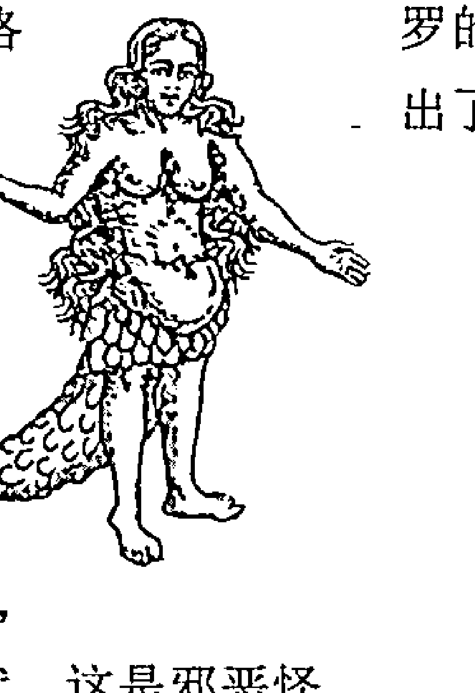

薇薇尔 (Vouivre) (或 Wouivre、Wyvre、Wivre) ——法国的双足飞龙 (Wyvern)，被描述为一只长着美丽女人的头和胸部的龙。她瞎掉的双眼间有红宝石或石榴石或钻石。这个神奇的宝石令巫师垂涎，想在她睡觉或洗澡时将其窃取。薇薇尔栖息在山区，潜伏在荒废的城堡或寺院中，她在那里看守囤积的宝藏。她会攻击穿着衣服的人，所以最好的防御方法就是把自己脱得精光，这样她就会逃走。

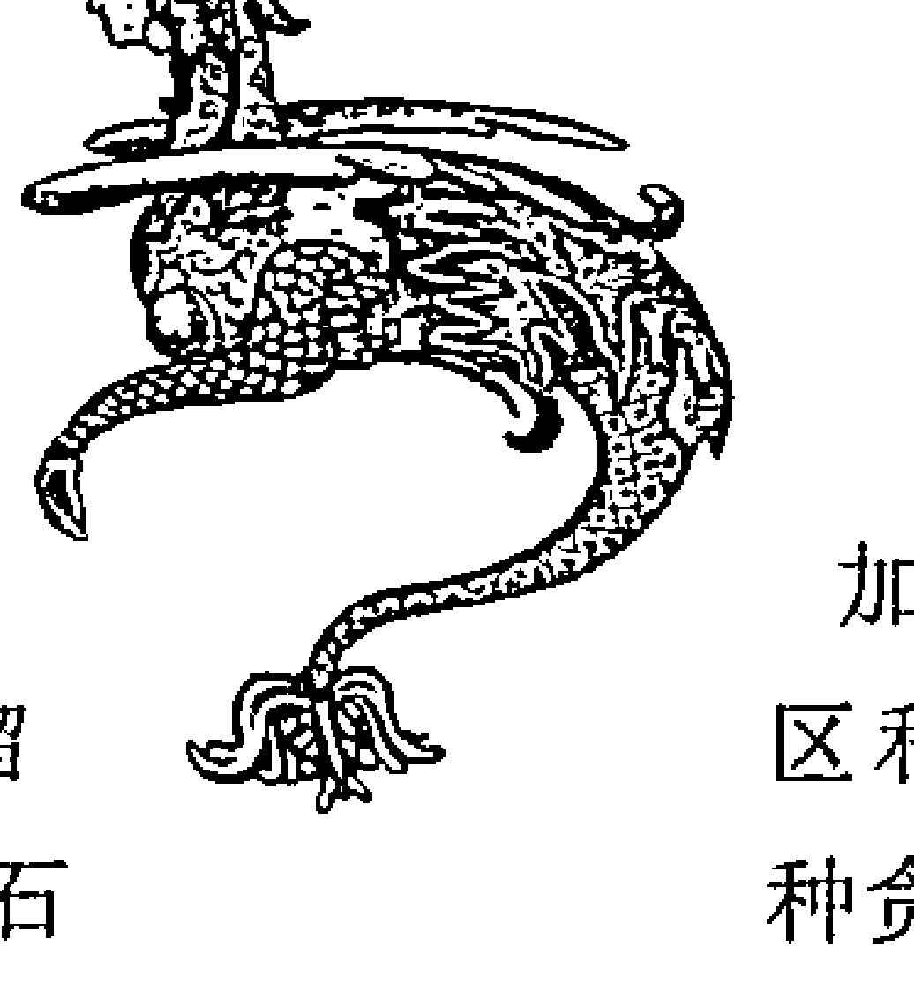

弗栗多 (Vritra) (或 Vrtra、Vitra “围墙”) ——印度教神话中一种庞大的怪物，通常被描述为保卫世界、带来干旱的三头蛇。然而，它有时会被描绘成一只大蜘蛛。作为邪恶的阿修罗之一，它是因陀罗的敌人，但因陀罗最后杀死了它，释放出了被它扣留在山顶的雨云。

W指的是亚龙飞龙，蛇一样的身体、蝙蝠的翅膀、鹰的爪子，没有猎物能逃过它的追捕。红绿相间，飞龙是纹章中的战争、妒忌和瘟疫三者的代名词。

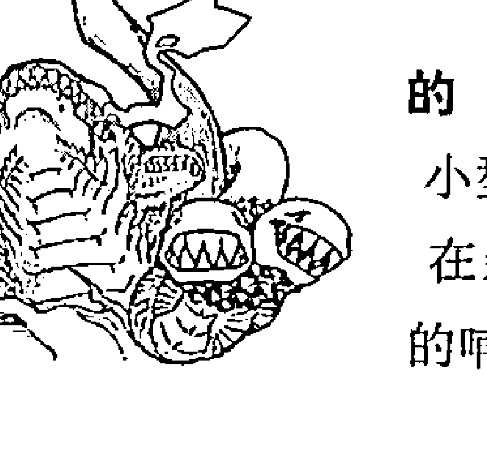

瓦西拉 (Waheela)——加拿大西北部地区和萨拉斯加的一种贪婪的生物。它比普通的狼更大，长着宽头、大脚、长长的白色皮毛。目击者形容其肩高约 4 英尺。其后腿比前腿短，它的脚印表明其有分得很开的脚趾。它们是独居动物，从未有人见过它们一群一群的在一起。根据土著人的描述，它们是残忍的动物，会将猎物的头扯下来。这些特征和一万年前灭绝的更新世熊犬 (Amphicyonid) 相匹配。

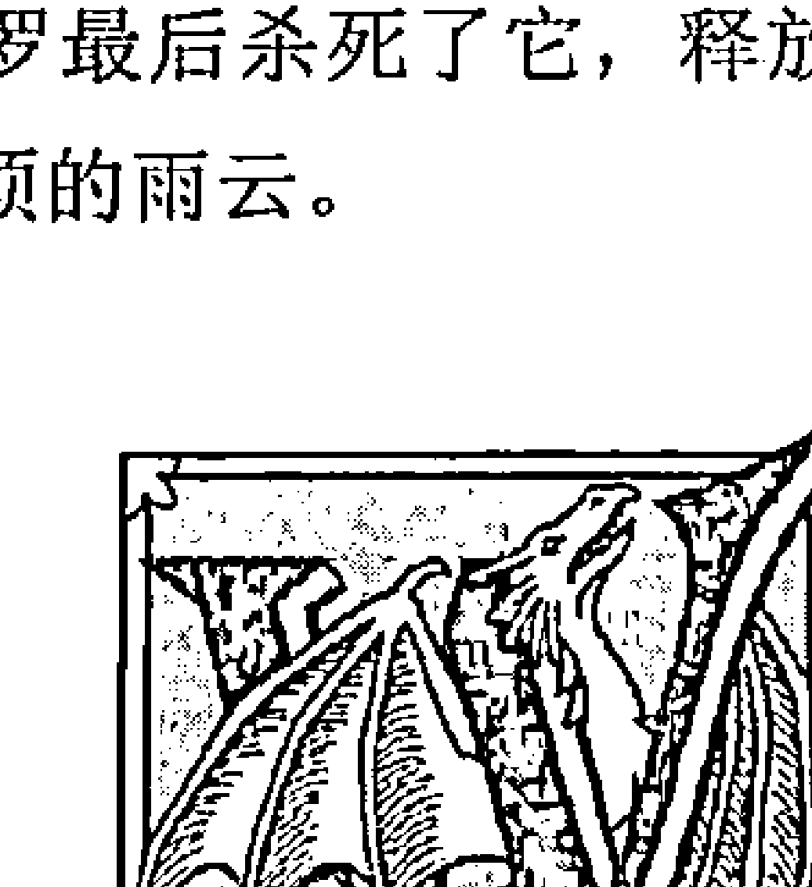

威特里克 (Waitoreke) (毛利语中的“水生动物”，或 Kaureke) ——一种小型的，像水獭般的神秘动物，据称生活在新西兰的南岛。因为新西兰没有胎生的哺乳动物，所以它被认为是一种水生单孔类动物，比如鸭嘴兽。

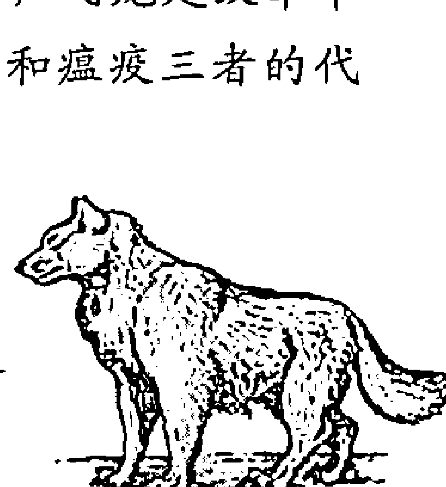

瓦坎达基 (Wakandagi) (或 Wakandagi Pezi) ——美国中部莫霍克和奥马哈印第安人传说中的一种蛇形水怪，据说居住在密苏里河中，它会向入侵者投掷水球。通常只会在浓雾中见到它，它的头上长着鹿角，长着偶蹄的前腿也跟鹿的很相似。参见湖怪、钦托撒开拓 (Tcinto-Sakto)、昂科特西 (Unktehi)、维维尔梅克 (Weewilmekq)。

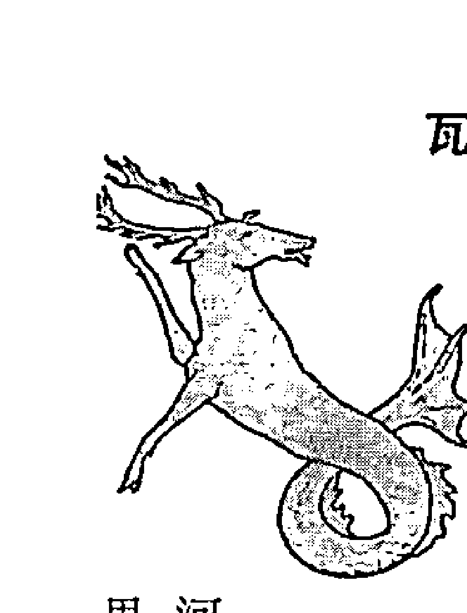

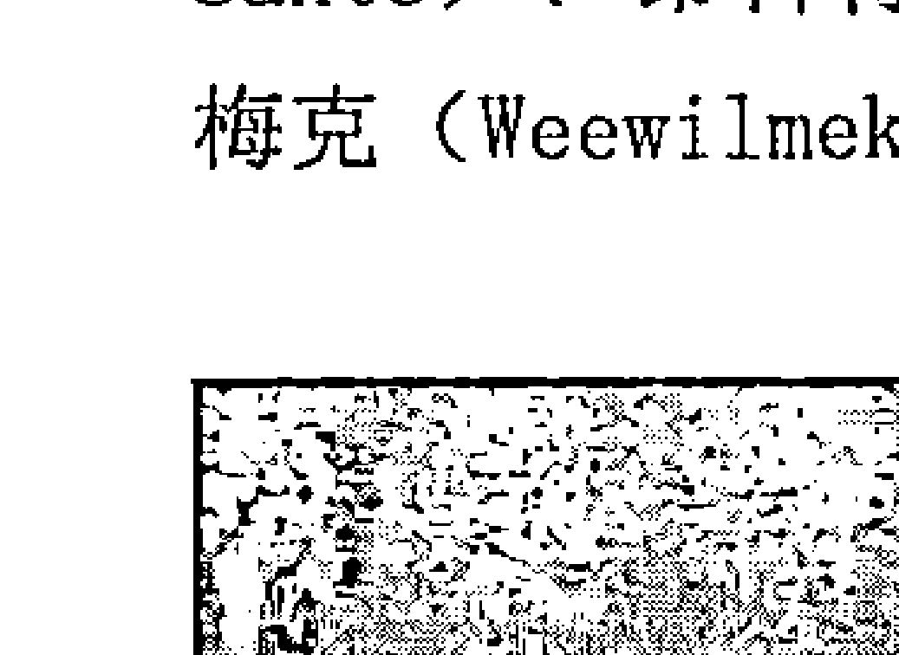

瓦洛厄湖怪——俄勒冈州深深的冰川湖中的一种湖怪。这种长角的两栖怪兽困扰了当地的内兹佩尔塞 (Nez Perce) 印第安人已几个世纪了。一些目击者形容其为身长 75 英尺，背上长着 7 根骨刺。另外，据说在该湖中生活着两种不同的种类：一种身长 12 英尺，长着蛇形或龙形的身体，它的头像猪头和鲨鱼头的接合体；另一种只有 8 英尺长，长着水牛的头和间隔 14 英寸的眼睛。其他的目击者声称它长着大大的犀牛角。

水马——一种长着马的头的两栖怪兽，据说隐藏在英伦群岛的很多河流、湖泊、沼泽的深处，通常被描述为灰色或黑色的马，长着向后的偶蹄。它能随意变形。如果和普通马交配，它们的孩子在路过浅滩时总是会在水里躺下。它的性情不定，从顺从到凶猛都有。水马可能会让人骑在它背上过河，但如果他念出耶稣的名字，这种怪兽就会把他丢进河里。参见马形水鬼、湖怪、昵库尔 (Nykur)。

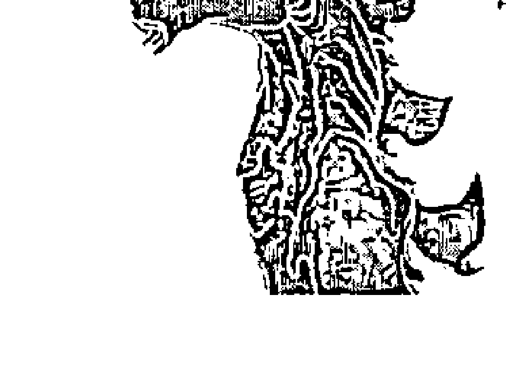

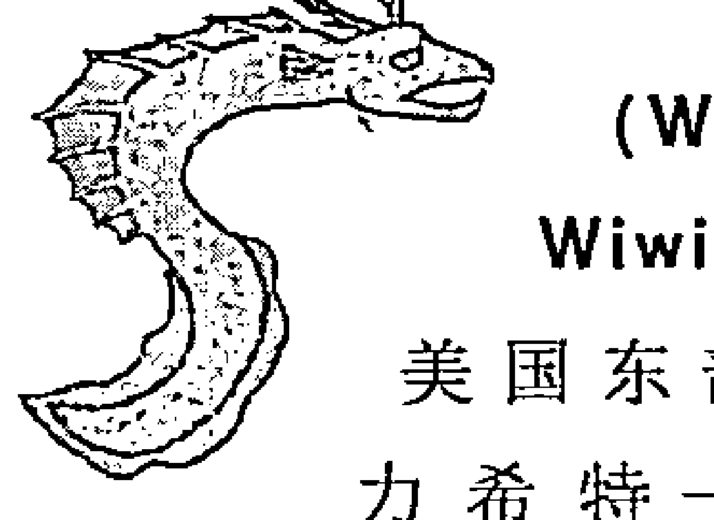

维维尔梅克 (Weewilmekq) (或 Wiwilemekq) ——美国东部阿冈昆和马力希特-帕萨马科迪 (Maliseet-Passamaquoddy) 印第安人传说中的一种蛇形水怪。它被描述为大蠕虫、鹿角水蛇、巨蟒或长有巨角的鳄鱼怪。它隐蔽在湍急的水流中，比如瀑布、急流和漩涡。它所有的力量都在角中，任何能得到其碎片的人都会变得勇敢和赋有法力。参见欧姆 (Orm)、昂科特西 (Unktehi)、瓦坎达基 (Wakandagi)。

雪怪 (Wendigo) （或 Windigo, Windago, Wiendigo, Witigo, Witiko, Wee-Tee-Go）——一种类似大脚怪的加拿大大人形怪兽，但当地人却认为它是另一种不一样的东西——也更加危险，因其以人类为食。它是因纽特和阿尔纲纪传说中最恐怖的生物，被描述为身材修长、15 英尺高的“人形怪兽”，全身长着蓬乱的毛发，有会发光的眼睛、长长的黄色犬齿和一条超长的蛇头。但一些目击者坚称它全身无毛，长着蜡黄色的皮肤。它因阿尔杰农·布莱克伍德（Algernon Blackwood）的短篇故事《雪怪》（The Wendigo）（1907）而出名，那个故事是关于数世纪前关于这个动物的传说的。现在，这个名字被用在了一种据说住在安大略省贝伦斯湖中的鳄鱼般的怪物身上。

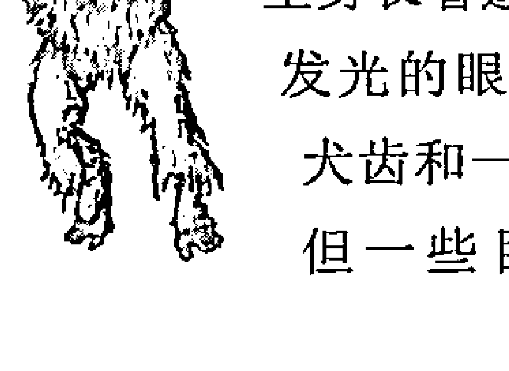

## 白胸怪——智利阿洛柯（Araucanian）印第安人传说中的一种蛇形湖怪，据说生活在阿卢米内（Aluminé）湖中，力量很大。它们会攻击那些到湖边喝水的家畜，将它们拖入深水后吃掉。参见格里历威鲁（Glyryvilu）。

## 白鹿（White Hart）——威尔士传说中一种有法力的白色牡鹿，它带领英雄们进入传说中的冒险之旅，深入禁闭森林，前往仙境或地狱的边界。它在《马比诺吉昂》（Mabinogion）的关于《戴伏德王子皮威尔》“Pwyll, Prince of Dyfed”的故事以及马洛里的《亚瑟王之死》中出现过。参见刻律涅牝鹿（Ceryneian Hind）。

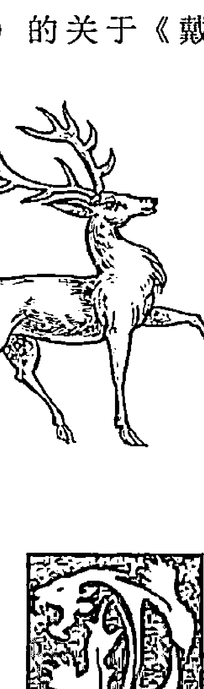

## 白豹——一种色彩明亮的海瑟猫科生物，据说是几世纪前通过伊利湖从休伦河的水中出来的。它的出现代表着天气的改变。一群怀安多特（Wyandot）印第安猎人伤到了这种怪兽，他们把它的血液放进药草中，在打猎时用在身上，这样他们就会变得非常凶残。在十八世纪，这种巫术被欧洲人认为是恶魔的巫术，其所有成员都被处决了。

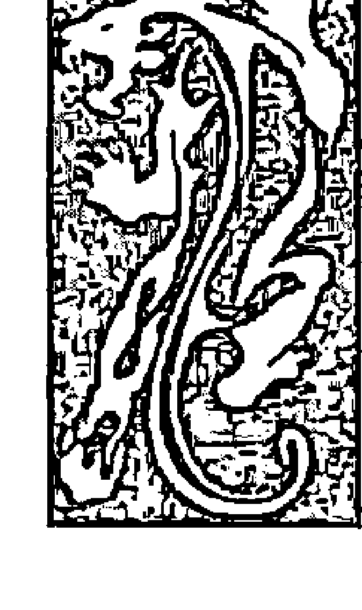

## 白兽——一种看起来非常病态的水怪，据说生活在阿肯色州纽波特附近的白河中。第一次有人目击它是在1915年，目击者报告说在湖中看到了一个白色的驼峰“像篷车一样大”，有14英尺长，岸边还有三趾脚印。1937年1月1日，布拉姆伯雷特·巴特曼（Bramblett Bateman）和副郡长 Z. B. 瑞德（Z. B. Reid）看到了“水面上出现了某种东西”，长约12英尺，宽约4-5英尺。巴特曼说：“我没看到头也没看到尾巴，但它慢慢地升到水面，就这样呆了5分钟。”在1971年，又有人看到了这种怪物“当时它好像正在脱皮。”一个目击者如是说。其他人则报告说看到了它头上长有突起的骨头，背上有螺旋的骨刺，它的声音很低沉。白兽据说有30至40英尺长，长着有鳞的灰白色皮肤，很多地方都有皮脱掉。隐生动物学家罗伊·麦考尔（Roy Mackal）推测它可能是随着密西西比河进入白河的雄性北部象海豹（Mirounga angustirostris）。这种象海豹体型很大，最大的能达到22英尺长和3.75吨重！会蜕皮的皮肤、脚印、声音和头上突起的骨头，它都具备。参见贝加尔湖湖怪、米斯匹兹（Mishipizhiw）、派莱予（Pal-Rai-Yuk）。

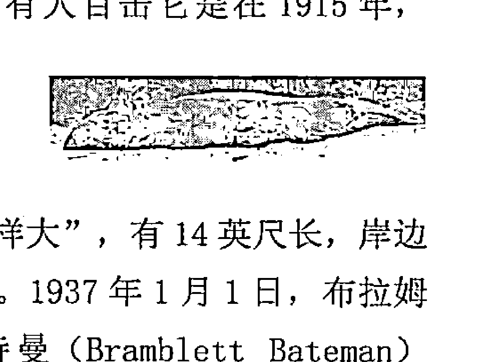

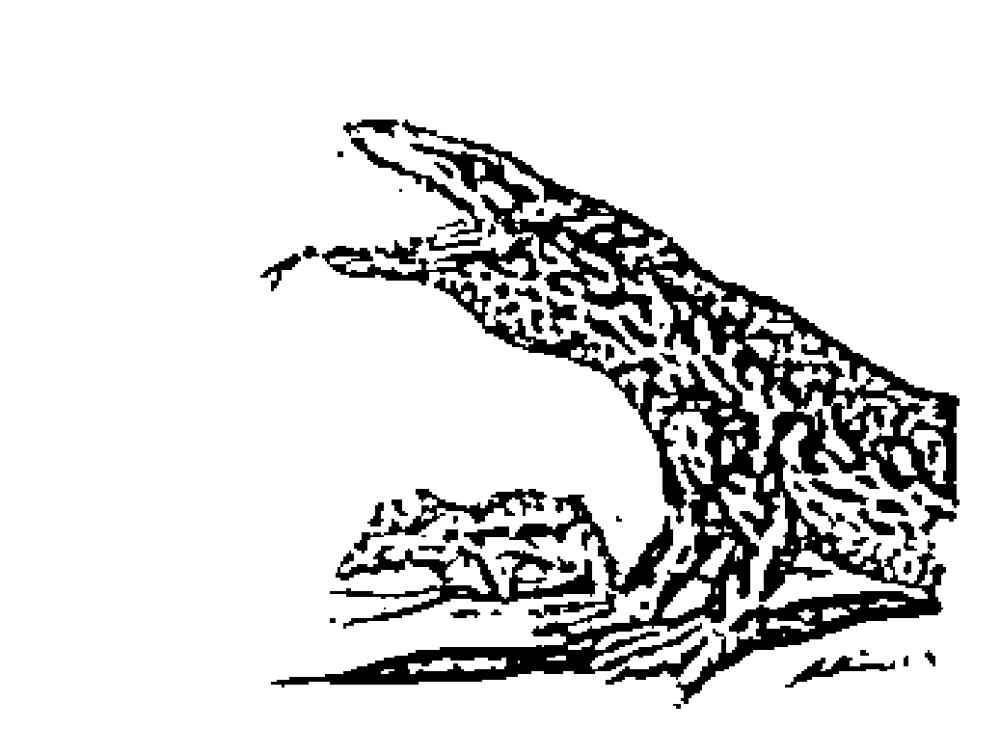

霍维伊 (Whowhie) ——澳大利亚墨累河地区的土著人传说中的恐怖蜥蜴。它统治着那片区域，吃掉了很多人，尤其是小孩。在扫荡了几个村庄后，它在巢穴中休息时被人们设陷阱抓了起来。人们在洞穴出口点燃灌木枝，把浓烟扇进去，这样过了七天，直到它最终出现，一直咳嗽而且眼睛也瞎了——人们对它一阵棒打矛刺，将其杀死。这个故事表明人类和一只更新世巨蜥的遭遇，它们能长到20英尺，体重能达1300磅——绝对称得上是龙！参见尤罗亚怪兽、库里阿 (Kurrea)。

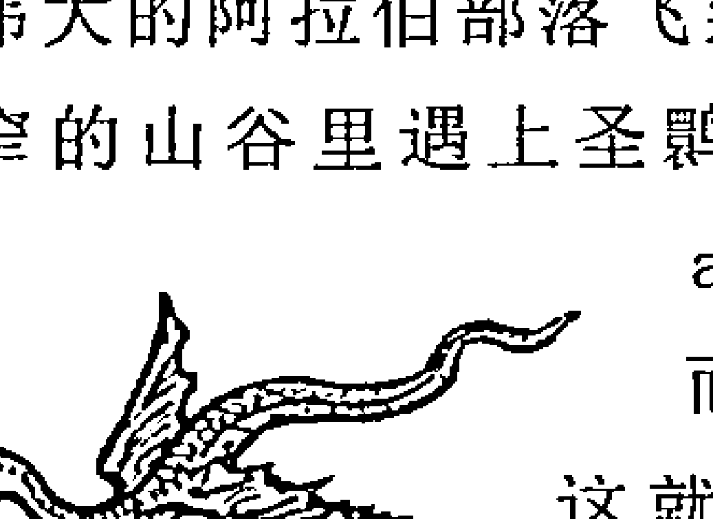

阿拉伯翼蛇——据希罗多德（公元前 484-425 年）所记载，这些动物像长着蝙蝠翅膀的水蛇。在春天，它们从一个伟大的阿拉伯部落飞到埃及，在一个狭窄的山谷里遇上圣鹮（Threskiornis aethiopicus）而被全部杀死。这就是为什么埃及人那么崇敬鹮鸟。翼蛇已被确认为沙漠蝗虫（Schistocerca gregaria）。

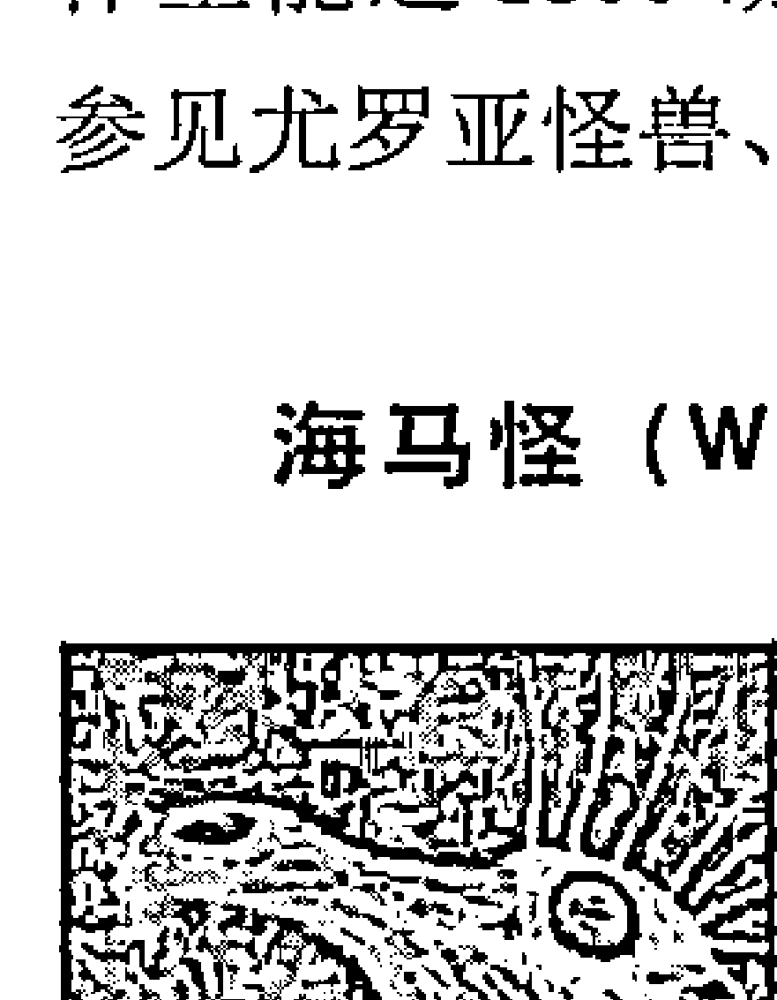

海马怪 (Wihwin) ——中美洲洪都拉斯的加勒比斯印第安人传说中的一种长有大獠牙的马形海怪。在干热的时节，它们会离开海洋跑到岸上猎食人类。雨季到来时它们就会回到海中。参见马形水鬼、海蛇。

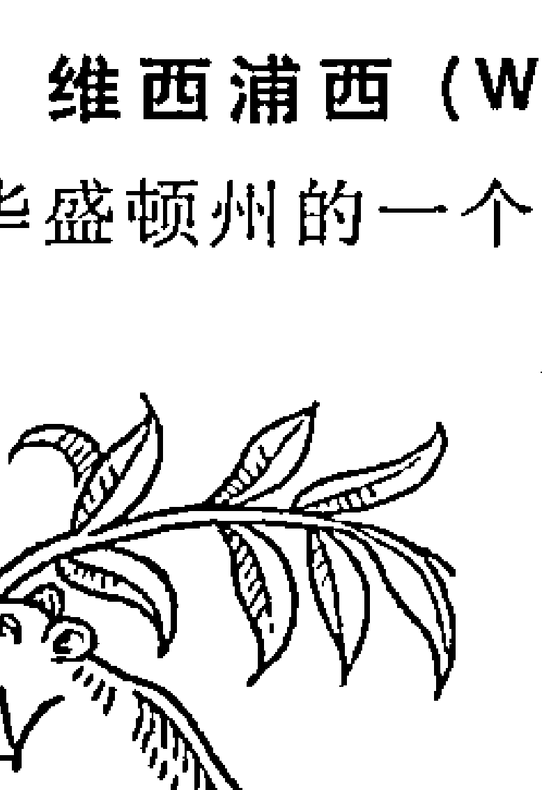

维西浦西 (Wishpooshi) ——居住在华盛顿州的一个广阔的湖中的长着巨大爪子的海狸。根据内兹佩尔塞印第安人的传说，只有这种怪物能在那个湖中捕鱼，它会将靠近的人类赶走或杀掉。人类求助于郊狼，他和维西浦西在水中打得昏天黑地，挖出许多沟壑与峡谷，排掉了湖里的水。最后维西浦西吞掉了郊狼，而郊狼却从它的身体里面将其杀死。郊狼用这个巨大的尸体创造出了切努克（Chinook）、雅吉瓦（Yakima）和克里斯塔特（Klickitat）部落。在更新世时代，有一种巨大的海狸，名叫巨水獭（Castoroides ohioensis），在北美洲游弋，这个传说可能就因它而来，因其超过8英尺的身长和重大485磅的体重以及6英寸长的牙齿。

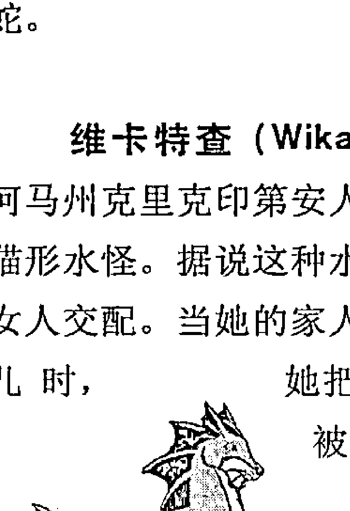

维卡特查 (Wikatcha) ——俄克拉何马州克里克印第安人的民间传说中一种猫形水怪。据说这种水猫与库萨镇的一个女人交配。当她的家人决定淹死这个混血儿时，

## 鹿角兔（或 Wolperdinger）——据说生活在德国巴伐利亚州阿尔卑斯山森林的一种复合生物。最常见的样子是牡鹿、有角的兔子或松鼠，也可能有翅膀和獠牙。类似的这种由标本师用真实动物的部分肢体创造出来的动物，包括瑞典的斯加瓦德（Skvader）、图林根州森林的拉斯尔波克（Rasselbock）、美国加卡洛浦（Jackalope）和普法尔茨地区的角鸡艾尔韦德立特切（Elwedritsche），都可能源自被舒普乳头状瘤病毒感染的野生兔，这种病毒会在兔子身上长出鹿茸般的肿瘤。参见格弗斯（Gaff）。

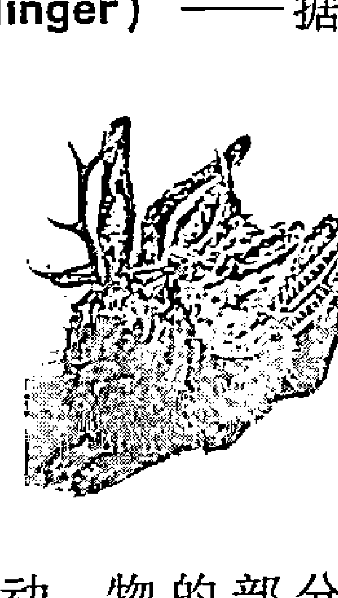

## 乌德瓦萨（Wudewasa）（盎格鲁-萨克逊语中的“森林人”，也叫 Wodewoses、Woodhouses、Ooser）——它们普遍被称作“欧洲野人”。它们出现在许多中世纪的绘画、教堂雕刻和手稿中，常被描述为拿着又大又粗的棒子，穿着简单的绿叶短裙，显然源自猿猴。它们常被穿着戏服的演员在表演中模仿。一些研究者认为，他们可能是已经灭绝了的尼安德特人。参见大脚怪、刍褚纳安（Chuchunaa）、法翁（Faun）、萨提尔（Satyr）。

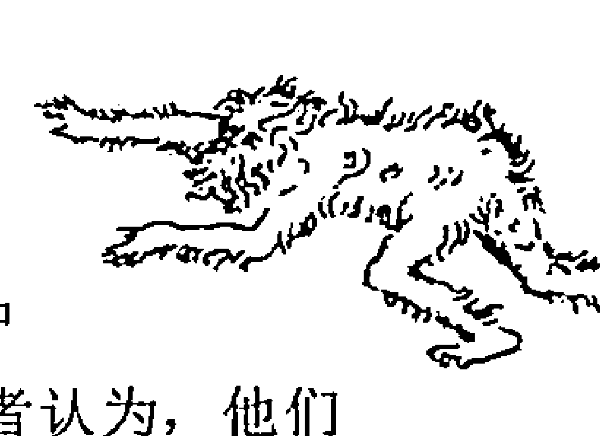

## 武汉蟾蜍——生活在中国湖北省荒凉的三峡地区。它们一直困扰着当地渔民，他们甚至曾试过用炸药把这些贪婪的野兽炸死。1987年，北京大学的九个科学家来到这里研究这种水生动物。他们在湖边架设起了相机和电缆，后来三个大型动物浮出水面，向他们游过去，它们类似蟾蜍，身长超过六英尺、白色的皮肤和巨大的脚掌。其中一只怪物突然伸出了巨大的舌头，将相机的三脚架拖入水中，剩下的蟾蜍发出可怕的叫声消失在水中。

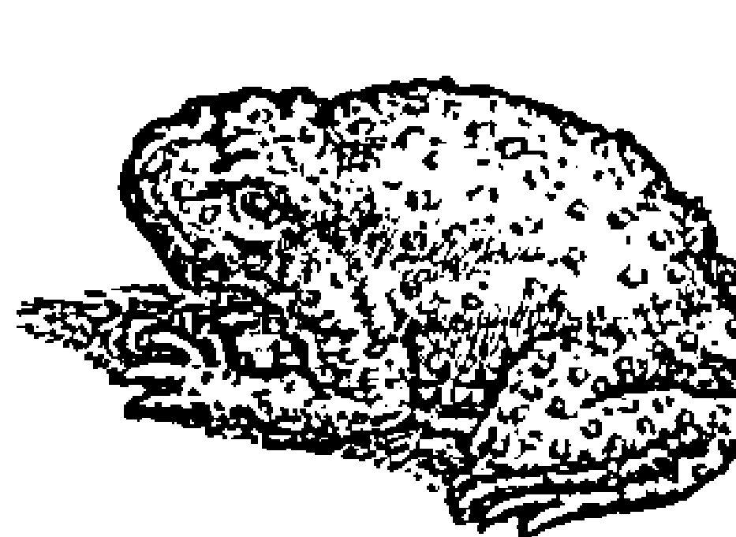

## 乌尔弗（Wulver）——设得兰群岛的民间传说中的一种人身狼头的混合生物，身上覆盖着短短的棕色毛发，生活在一座山山腰上的洞穴中，以捕鱼为食。如果不去招惹它就不会有危险。有时它会在穷人窗台上悄悄留下鱼。它听起来像狒狒，但为什么会存在于赫布里底群岛上？参见西诺西法里（Cynocephali）。

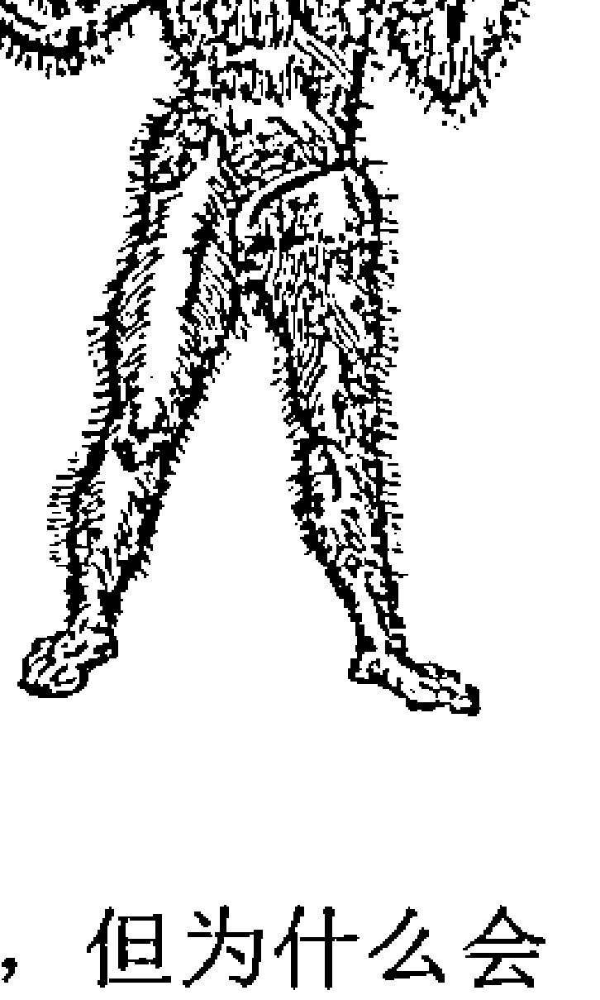

## 亚龙（Wyrm）（或 Worm、Wormkind、Vurm、Orm，源自北欧语中的 ormr“龙”）——一千年前维京人用来统称生活在英伦三岛地区的邪恶蛇纹龙的术语。它居住在邪恶、潮湿的地方，如有恶臭的沼泽、古代废墟、一些河流、湖泊和水井中。它们喜欢藏在巢穴附近的沼泽中，在涨潮时能和海连起来，这样它就能从一个地方跑到另一个地方。它们的头都像龙或马，长着巨大而突出的眼睛和巨大的獠牙，还常长有角。参见格伦德尔（Grendel）、（Lindwurm）、恶虫（Loathly Worm）、欧姆（Orm）、尼斯湖水怪、佩斯特（Peiste）。

# 魔法师的怪物图鉴

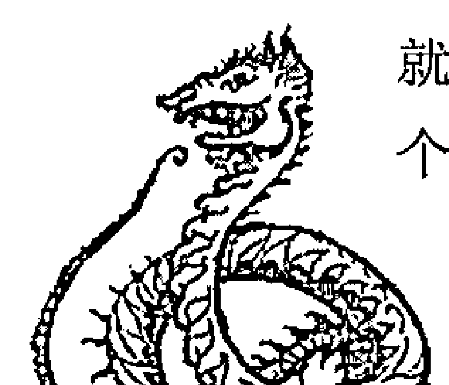

撒恩（Xan）——危地马拉的玛雅族圣书《波波鸟》（Popul Vuh）中提到的一个神话般的昆虫怪物。它实际上是疟疾，仍然存在于基歇尔（Kicher）印第安人的民间传说中，是致命的疟疾和无数的受害者杀手的载体。它是最危险的动物寓言生物之一！

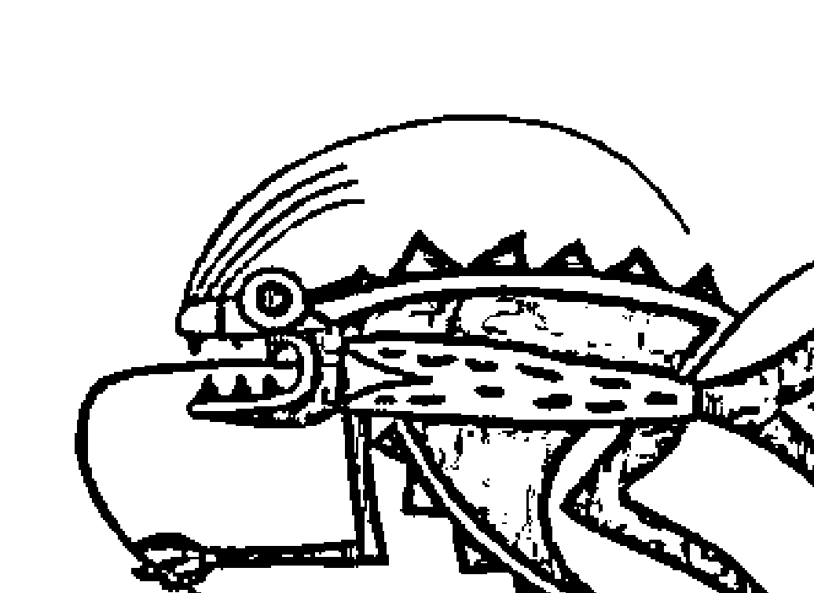

双足飞龙（Wyvern）（或 Wivern）——一种会飞的蛇形龙，长着蝙蝠翅膀、鹰的后爪、有刺的长尾。它基本上和翼龙，如喙嘴龙（ramphorhynchus）差不多。其一个变种是长着鱼尾的海飞龙。它被认为是最大的龙，能够抓起诸如大象和犀牛之类的巨大生物。它象征着战争、瘟疫、邪恶和嫉妒。传统的纹章飞龙是全身绿色、胸口、腹部和小翅是红色的。参见蛇鸡兽、沙漠跳鼠（Jaculus）、怪龙（Lindworm）。

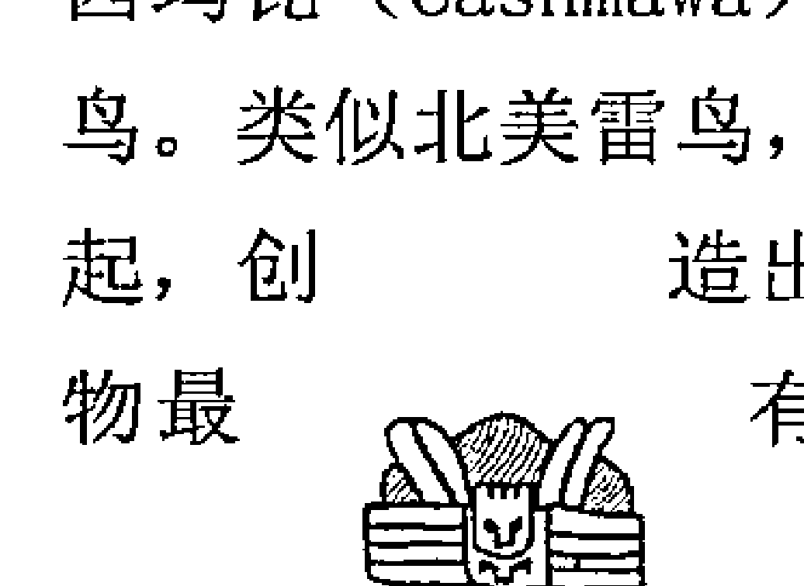

萨克希萨克尤（Xexeu）——南美卡西玛瓦（Cashmawa）印第安人神话中的巨鸟。类似北美雷鸟，他们负责将云聚在一起，创造出巨大的风暴。这些生物最有可能源自宏伟的安第斯秃鹰（Vultur gryphus），其翼展可达10英尺。

相繇（Xiang Yao）——中国民间传说中的一种恶心和狰狞的怪物，长着蛇纹的身体和九个人头。它是黑龙共工的同伴。它们二者用自己的粪便污染湖泊和河流，将其变为沼泽。

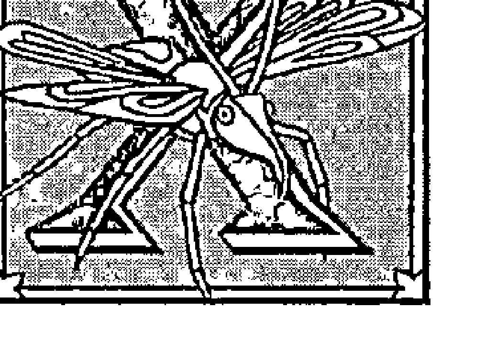

索洛托（Xolotl）——墨西哥阿兹特克印第安人传说中的一个巨大而可怕的地狱犬，在很多方面和北美的郊狼很相似。它的腿和脚都是与一般的狼相反的，它还可以随意转动耳朵。它每天晚上捕获太阳，将其拖入地狱，直到第二天早晨才将其释放。据说，他创造了最初的人类，并给他们带去火，但也引起了各种灾害。为了生存下去，他已经改变了很多次外形，最终成为小小的两栖动物蝾螈（Axolotl）（墨西哥蝾螈）。参见地狱犬（Cerbrus）、加姆（Garm）、沙瓦玛（Sharama）。

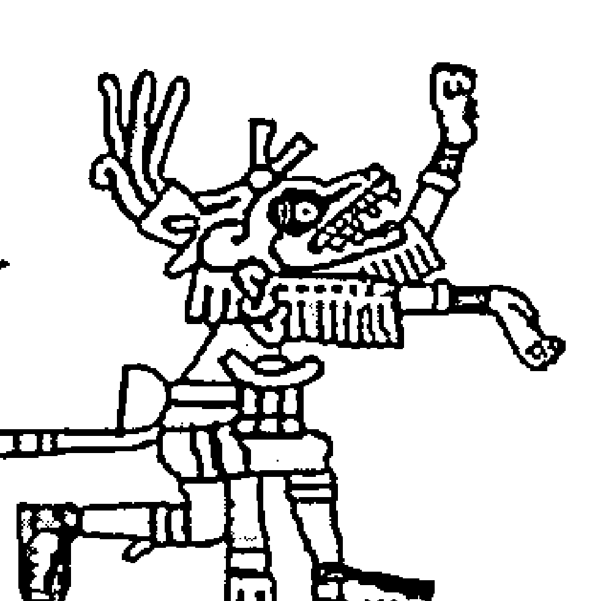

X指的是撒恩（Xan），一种卓越的虫子，舒服地住在丛林里潮湿的巢穴中。玛雅人也曾提及过它，很多人也遇到过它——但都没能活着回来。

# 图鉴一、魔法动物展

向前方。亚艾尔（Yael）是希伯来文中的山羊，据说它们也像马那样大。当Yale被用在纹章中时，它的角总是被描绘成分叉状的而不是并行状的。参见森蒂科（Centicore）。

Y指的是耶鲁（Yale），一种长着斑点的黑牛，它的角能旋转。有着狮子一样的尾巴和野猪的獠牙，不管前后都是危险的所在。

耶鲁(Yale)(也叫Yala、Jall、Eale)——它首先被老普林尼提及，耶鲁（Yale）是一头马一样大，长着斑点的黑牛，它有大象或狮子的尾巴、野猪的獠牙，居住在中东和印度，有2英尺长并能随意旋转的角。肯尼亚的南迪部落训练他们的牛的角也能这样做，后来这些牛被称为“卡马利奶牛”。耶鲁可能源自印度水牛（Bubalus bubalis），拥有长达14英尺的角。有些人声称，在遇到危险的时候它们能用角对

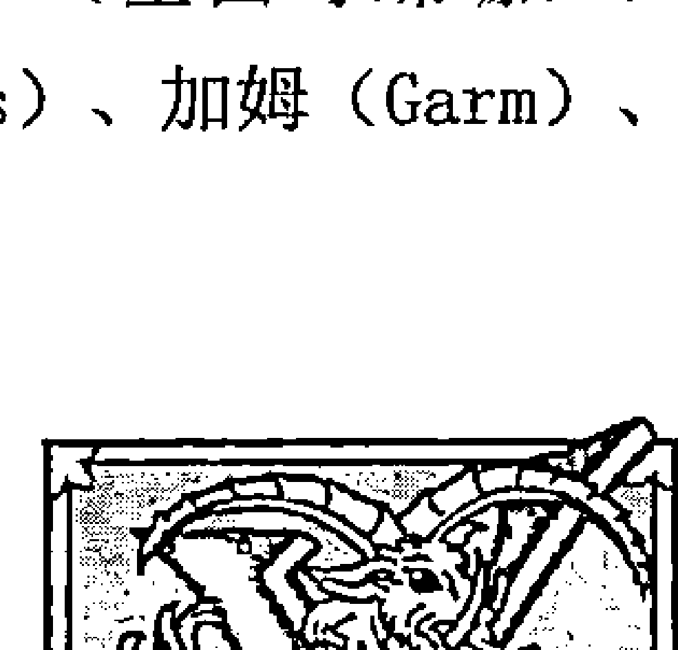

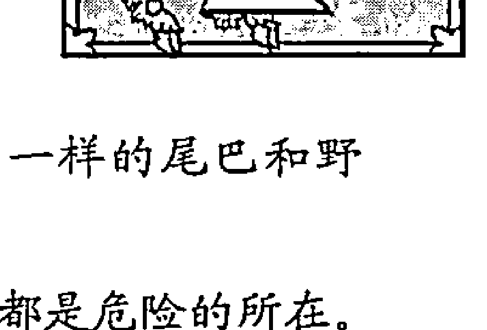

亚力（Yali）（或Yalaka）——一个印度教传说中的混合怪物，有狮子的掠夺性和肌肉、大象的象牙和象鼻。通常出现在印度庙宇雕塑中，象征着人类与大自然原力的斗争，这些贪婪的野兽据说是弗亚拉（vyala）（“邪恶”或“恶性”）。参见摩伽罗（Makara）。

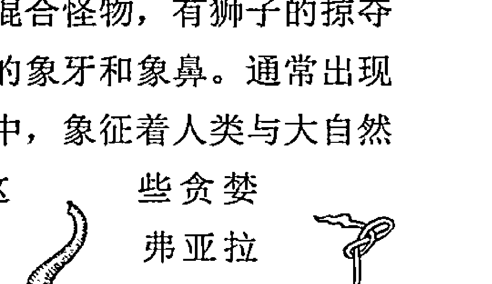

西表山猫（Yamamaya）——居住在日本南方西表岛的琉球群岛上的一种像老虎的神秘猫科动物。它有一只大狗那么大，可能是一种未知的老虎或豹。参见吡高（Cigau）、西马郎泼（Seah Malang Poo）。

亚恩戈（Yannig）（Yannig An Od）——法国北部的布列塔尼布雷顿传说中的一种夜行海怪。天黑之后，它开始离开海洋，捕食人类。它的声音像猫头鹰的啼叫，如果有人应声，它就会立刻冲下来。

八汰乌（Yata Garasu）——一种巨大的三腿乌鸦。在日本神话中，它被当成神圣的使者。

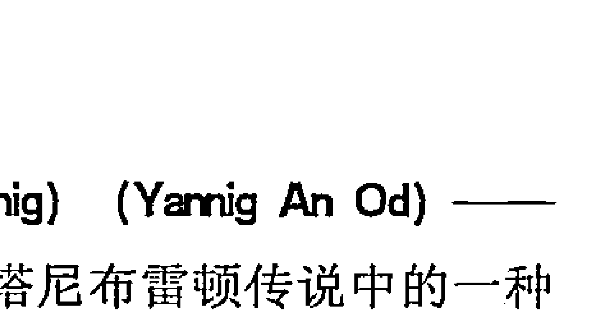

## 雅特夫 (Ya-te-veo) (“我能看到你”)
J.W.布尔在其1887年的《大地与汪洋》里描述的一种中美洲的神话般的肉食性树。它使用其鱿鱼般的触手之上的多角小毛毡苔 (Drosera capensis) 来捕猎。在美洲其它地方，同样描述的掠夺性植物被称为巴西魔鬼树、巴西猴陷阱树、墨西哥蛇树和尼加拉瓜吃狗树。参见马达加斯加食人树。

## 耶克 (Yeck)
印度的民间传说的一种会变形的小型精灵，通常以戴着白帽子的毛茸茸的小生物的样子出现。它非常强大，能够将山峰举起，并很喜欢给人乱指路。能偷到它的白帽子的人会拥有隐身的能力。

## 耶李希 (Yenrish)
休伦印第安人传说中的一种水猫或水豹，据说生活在伊利湖中。参见白豹、维卡特查 (Wikatcha)。

## 野人 (Yìrén) [或野人 (Yiren)、野人 (Yeh Ren)、中国野人、神农架野人、人猿、山鬼 (Sangui)、猩猩 (Hsing-hsing)、狒狒，也叫人熊]
中国内陆湖北省深山老林中的一种大型长毛原始人。它通常长有红棕色毛发，也有些白化的个体被人看到过。它的高度估计在5-7英尺，但有人报道过一些身高超过10英尺的巨大个体。有些人认为它们可能是尚存的巨猿。也有人认为它们是在更新世以来就已经灭绝了的大陆猩猩 (Pongo pygmaeus) 的幸存者。最近，它们的毛发测试结果表明其为一种身份不明的外来生物。参见阿尔马斯 (Almas)、雪人。

## 雪人 [或新孙 (Ginsung)、美托康米 (Metoh-kangmi)、尼奥莫 (Nyalmo)、拉克斯·伯姆珀 (Rakshi Bompo)、里米 (Rimi)、托尔-芒 (Thloh-Mung)、喜马拉雅山野人、讨厌的雪人]
生活在西藏和尼泊尔寒冷、荒凉的喜马拉雅山区的一种雪猿。目击者形容为7-10英尺高，长着长而粗的毛发——住在雪山上的是银白色，住在森林中的是橙褐色。跟其在美国的表亲大脚怪相似，其存在的唯一证据只有毛发、足迹和模糊的目击报告。根据夏尔巴人的传说，实际上有四种类型的雪人，都根据身材进行区分，每一种的名字里都有一个“Teh”字。最大的（13-16英尺高）是尼奥莫 (Nyalmo) 或德祖特 (Dzu-Teh)（“大家伙”）、中型（7-9英尺高）的是里米 (Rimi) 或美赫-泰赫 (Meh-Teh)（“人形生物”）、较小（人般大小）的和最知名的是拉克西·邦姆波 (Rakshi Bompo) 或耶-特 (Yeh-Teh)（“在那边的东西”）。有人相信耶-特 (Yeh-The) 是泊尔灰叶猴 (Semnopithecus schistaceus——在喜马拉雅山更高的平原上相当常见)，而德祖-特 (Dzu-Teh) 实际上是喜马拉雅黑熊 (Ursus thibetanus)。之后便是特-勒玛 (Teh-Lma)（“在那里的小东西”），它是最不为人所知的，据说只有 3-4 英尺高，长着红灰色的毛发，肩膀很窄，头很尖，吃诸如青蛙的小型动物。参见野人 (Yiren)。

## 应龙 (Ying-Lung) (或 Proper Conduct Dragon)
非常独特的一种中国龙，身上长的不是鳞片，而通常是毛发和有羽毛的翅膀。它们是水和天的保护者。

## 幽威 (Yowie)
澳大利亚的一种毛茸茸的原始人，类似的雪人或大脚怪。它被描述为6-14英尺高，比猿更接近人类，有宽阔的肩膀，没有脖子。它全身长着长毛，颜色是泛红的黑色、暗棕色或几乎全白色。暗棕色或红是最常见的颜色。它有 16 英寸长和 8 英寸宽的足迹。欧洲殖民者的第一份报告是在 1881 年，但原住民一直都知道它们的存在，称其为幽里 (Youree)。跟世界上大多数毛茸茸的原始人一样，据说它们有强烈的腥臭味。个体较小的，很害羞，可能是未成年人，而高个的胆子很大，常具有攻击性。有些人认为它们是直立人——更新世时期在桑德兰（现在的印度尼西亚群岛）居住——的幸存者。

## 尤珀它米斯 (Ypotamis)
中世纪的旅行传说中笨拙的野兽，被形容为一匹可怕的水马，喜欢攻击和吞噬渔民。这无疑是我们所知道的河马 (Hippopotamus amphibious——“双栖水马”)，一种脾气暴躁的生物，只要遭到些许的挑衅就会发怒。参见贝希摩斯 (Behemoth)、卢波尔弗 (Lubolf)。

## 尤珀特里尔 (Ypotryll)
长着野猪的头部、骆驼的身体、山羊的脚和蛇的尾巴的纹章兽。它有巨大的獠牙和牙齿、红彤彤的眼睛和巨大的阴茎。

## 尤特格维尼斯 (Ythgewinnes) (古英语中的“波浪长尾”)
海龙一种，沿水面游泳。维京人将其刻到他们的船只的船头上，用来抵挡真龙。

## 鱼龙
中国神话中长着鱼的鳍和尾的龙。原本是一只天上的鲤鱼，它在跳过龙门的瀑布后变成龙形飞往天宫。它代表志存高远，在考试中取得成功。

## 卓拉唐 (Zaratan)
在西方被称为阿斯匹多彻龙或法斯提克隆 (Fastitocalon) 的驮着岛屿的巨型海龟或鲸鱼在阿拉伯的名字。其庞大的背部挂满了缝里长满草木的石头。水手辛巴德他在第一传奇航行中遇到了这个怪物。参见海龟之父、伊玛普乌玛苏尔萨 (Imap Umassoursa)、吉阿斯卡尼俄斯 (Jasconius)。

## 查戈 (Zāgh)
伊斯兰传说中的一种巨大的鸟，它有一个人的头部，能理解所有人类的语言也能说话。参见安卡 (Angka)、克罗丘 (Crocho)、科鲁兹尔特 (Kreutzet)、姆奇-艾-安大密 (Murghi-I-Adami)、日本鹏鸟 (Pheng)、鹏鸟、斯摩夫 (Simurgh)、雷鸟、席兹 (Ziz)。

## 斑马马 (Zebroid)
对所有斑马杂交的总称。斑马 (Equus Hippotigris——“马虎”) 能够与其他所有的马种，包括驴 (Equus asinus) 交配，生出的后代叫斑驴 (Zebrass/Zonkey)。

## 席兹 (Ziz) [或“天庭歌手” (Renanim)、“先知” (Sekwi)、“巢子”]
希伯来传说的一种巨大的鸟，很像鹏鸟。它非常巨大，当在海洋的中间时，会阻碍海水的流动。它那可以阻挡太阳光的庞大翅膀，具有不可思议的力量。传说，曾几何时其腐坏的蛋破了，冲走了300棵杉树，并淹没了60个村庄。等同于波斯的查姆罗西 (Chamrosh)，席兹 (Ziz) 据说是所有鸟类的保护者，如果没有它，鸟类在很久前就已经绝迹。根据犹太教的传统，这种鸟、贝希摩斯 (Behemoth) 和利维坦的肉都会被用在世界尽头的盛宴上。对应着波斯神话中的巨人原型生物，贝希摩斯、利维坦和席兹 (Ziz) 的三人组是生活在德国的拉比最喜欢的装饰图案。
- 参见巴尤克尼 (Bar Juchne)
- 雷鸟
- 乌绰森 (Wuchowsen)

## 扎拉拓洛哥 (Zlatorog)
与金角羚羊 (Rupicapra rupicapra) 相似的纯白色的山羊。住在斯洛文尼亚的特里格拉夫山最高的峭壁上。如果你能抓到它，它就会实现你的愿望。但扎拉拓洛哥是很聪明的，会让猎人不停地追赶，最后难逃死亡的命运。它也是斯洛文尼亚最受欢迎的啤酒拉斯科 (Lasko Zlatorog) 的名字。参见刻律牝鹿 (Ceryneian Hind)、白胸 (White Hart)。

## 则梅高利奇 (Zmei Gorynych)
与印度的纳迦 (Nagas) 相似，这种俄罗斯和斯洛文尼亚的民间传说中的生物有蛇的身体、人的头或躯干。它因与邪恶的食人女妖 (ogress) 和巴巴亚加 (Baba Yaga) 一起绑架独行妇女而臭名昭著。

## 泽丰尤斯 (Zyphoeus) [或剑鱼 (Xiphias)、剑吻鲸 (Ziphius)、水中猫头鹰 (Water-Owl)]
被记载在中世纪动物寓言集中的一种巨大的鲸鱼，曲球一样的眼睛和一个巨大的楔形喙，让它有了是猫头鹰的假象。它让水手们非常害怕，因其会攻击遇到的任何船只，在船上凿洞，弄沉它们。它原本是基于剑鱼 (Xiphias gladius) 的，但现在这个名字已经被用在了居维叶的突吻鲸 (Ziphius cavirostris) 和巨大的突吻鲸 (Ziphiidae Berardius) 身上了。

# 图鉴二、揭秘夜之生物(上)

## 爬行类

### 1. 邪恶的蛇怪及其它有毒害虫
奥伯伦·泽尔-雷文哈特

> 它的眼里有残暴的凶光  
> 凌驾于世界的恐惧之上。  
> 它往外看着我，闪亮的眼睛让人不寒而栗。  
> 我不会逃。来吧，蛇怪巴斯里斯克，  
> 用你的目光杀死这无辜的人吧，  
> 因为在死亡的阴影里，我  
> 将得到告慰——因为格洛斯特的死已让我生不如死。  
> ——莎士比亚，《亨利四世》（第二部）(2 Henry VI) (3.2.49-55)

整本书起源于传说中的蛇怪。1976年春天的一天晚上，我和妻子牵牛花·格洛瑞围坐在客厅与朋友讨论神话中的动物。我们决定在《大英百科全书》中查找一些。在“蛇怪”一栏中，我发现进入蛇鸡兽、蛇怪、美杜莎、一种南美蜥蜴和一种致命的埃及蛇的神奇链接，于是我们有了写一本书，揭示各种真实的神话传奇生物的起源和历史的想法。然后我们开始认真，系统地收集名字从A字母开头到Z字母开头的一切怪物的传说、插画。在此后的30年中，我们为此进行了许多惊人的冒险，包括喂养独角兽以及和美人鱼一起潜水。那是这一切的开端。

### 邪恶的蛇怪
> “蛇怪生性残忍。如果无法用毒液杀死动物，它就会将其变成植物，然后用它那毒辣的目光一直盯着它们，让其枯萎。”——达芬奇（1452-1519年），《笔记本》。

蛇怪，它的目光能感染你的士兵，让他们死于瘟疫。”“有什么补救措施吗？”国王问。“在军队和墙壁之间树立一面镜子，当蛇怪往下面看时，它会看到自己的样子，这时它的目光将返回自己身上杀死它。”就这样，他们打败了蛇怪。——《罗马人传奇》（Gesta Romanorum）十三世纪

邪恶的蛇怪（法语中的“Basilic”或“Basil-coc”）是一种特殊的龙，它有非常复杂的历史和渊源。据说是由美杜莎被珀休斯杀死后，从眼睛中流出的鲜血变成的。蛇怪头上长有头冠，因此它被称作“蛇王”。它的名字来自希腊文中的巴赛勒斯 (basileus)，意思是“王子”。在其行经的地方都会留下宽宽的剧毒线，而它的目光也同样致命。实际上，据说它能像美杜莎一样，用目光将受害者变成石头。它的毒液能使森林枯萎，能让飞鸟死亡。它唯一的天敌据说是鼬鼠，它对蛇怪的毒素完全免疫。但伊良（Aelian）（公元175-235年)称蛇怪同样也害怕公鸡“只要一看到公鸡它就会浑身发抖，一听见公鸡的啼鸣，它就会死去。”在公元一世纪，穿越北非沙漠的旅行者们会带上小公鸡作为对抗蛇怪的保护符。

阿尔伯图斯·麦格努斯（1200年-1280年）的《论动物》，重复了“自然科学家”的观点，蜥蜴并不从它眼中发出实际的致命射线，“但致命的根源是其特殊的属性，它拥有毁灭一切的能力。”他还表示古人将蛇怪的骨灰撒在寺庙中，将蜘蛛和其它毒物挡在外面，而且“在蛇怪骨灰中融化的银子会拥有金子的光泽、重量及密度。”布尔芬奇（Bulfinch）说在古代，蛇怪的皮被悬在阿波罗神庙和戴安娜神庙前，驱赶燕子、蛇和蜘蛛。但，首先你得找到并杀死一只蛇怪才行啊！

让我们回到开头的地方。蛇怪的传说是以蛇为开端的。在《自然史》中，老普林尼（公元23年-79年），称它是“不超过12英寸长，头上有明亮的白色标记，像一只王冠一样。它的嘶声能震慑住所有的蛇，而且它也不像普通的蛇那样卷曲着行走，而是将身体向前高高举起。不要说触摸，连其呼吸也能让灌木枯萎、岩石焦灼。

在这个出自史上第一位真正的博物学家的描述中，存在着几处对蛇怪真实身份的重要线索。一方面，根据普林尼所述，它是一种小型动物——只有一英尺长。毫无疑问，这就是为什么它的希腊名字是一个身材矮小的：“小国王”。其抬起身体的这一特点非常重要，因为只有唯一的一种蛇有这种特征，那就是，眼镜蛇。所有眼镜蛇都能够抬起身体的三分之一。此外，大多数眼镜蛇在他们头上都有特殊标记，往往都像王冠的样子。 蛇怪的栖息地原在北非——利比亚、埃及、埃塞俄比亚——这是几种眼镜蛇的产地。眼镜王蛇（Ophiohagus hannah）已被当作蛇怪的原型。但是，其身长18.5英尺，这是世界上所有的毒蛇中最大的一种，完全不能用“小”来形容！一只完全成熟的眼镜王蛇能直起身与一个高大的男人对视——这绝对会让人感到不安。我敢肯定，这很容易让人认为它是一种神话般的怪物。在印度，它被广泛地尊崇为“Nagaraja”（蛇中之王）。实际上，蜥蜴来自埃及喷毒眼镜蛇（Naja nigricollis），它能长到7英尺长，可以以不可思议的准确性向受害者的眼中喷撒其獠牙中的致命毒液，瞬间使其致盲。这是此怪物鼻息有毒的来源，但事实证明那只是传说而已。

但它确是传奇性的动物。以其来自真实毒蛇的死亡“呼吸”，这种怪兽数个世纪已在神话世界中横行霸道。有一本欧洲早期的印刷本叫《生物志》（Dialogus Creaturarum），这本书是在1480年由彼得·范·列伊（Pieter van Leu）在丹麦出版的。这部匿名的著作似乎是第一本将蛇怪称为“蜥蜴之王”的书。它将当时中美洲新发现一种头部和背部长着肉冠的彩色小蜥蜴称作蛇怪（Basiliscus）。这种蜥蜴同样也被称作“基督蜥蜴”，因为它能在水面奔跑，但实际上它却不具备任何的毒素。 蛇怪的主要敌人变成了神话中的埃及獴，或埃及鼠。 普林尼、普鲁塔克（Plutarch）和斯特拉博（Strabo）描述其为一种非常凶猛的埃及鼬鼠，是阿斯普（Asp）、蛇怪和鳄鱼的天敌。据说它能用泥土将自己包裹起来，滑入鳄鱼的食道，从内部将其吞噬。通常情况下人们都认为它是獴狐猴（獴科，或蛇杀手），而实际上印度猫鼬是眼镜蛇的天敌。但在埃及，这种蛇的天敌则更有可能源自狐獴（Suricata suricatta），这种动物因迪士尼动画《狮子王》（1994年）和探索频道的《狐獴领地》而被人所熟知。在纪录片中，这些极其聪明和高度社会化的动物将眼镜蛇小心地围起来吃掉。

#### 蛇鸡兽
大约在1180年，英国博物学家亚历山大·内克汉说，蛇怪是由年迈的公鸡所下的蛋中孵出的，这种公鸡被叫做“巴兹尔鸡”（Basil-Cock）。但很快，鸡身蛇尾怪（Cockatrice/Cockatrix）这两个名字——最初指的是任何一种幻想出来的融合生物——开始被用于命名蛇怪。这里我们看到了一个新的怪物名称，蛇鸡兽，据说它是在天狼星出现在天空中的“三伏天”的时候，一只七岁大的公鸡与蛇交配后产下的蛋中孵化出来的。这只蛋呈圆形而不是椭圆形，没有外壳，只有一层坚硬的膜。它由蟾蜍孵化出来。这样，蛋中的生物具备了其父母及腐化者的特征和习性。

蛇鸡兽经常造访北非，它们在那里被描述为一只长着龙尾和蝙蝠翅膀的公鸡，它的毒性很强，光是目光和呼吸都能致人死地，也能在很远的地方让树上的果实腐坏，任何它碰触过的水都会变得不可饮用长达数百年的时间。对中世纪的基督徒而言，它代表着原罪和猝死。它和蛇怪（Basilisk）一样，唯一的天敌也是鼬。它也是一种有名的纹章兽，其名后来被用作命名一种亚美尼亚的毒蜥蜴，也被用来命名都铎时期的一种铜炮。

有趣的是，年老的公鸡会在体内形成鸡蛋一样的组织。亚里士多德曾观察到：“在切开这种公鸡的时候……发现了像蛋一样的东西，就在等同于母鸡怀蛋的部位上，它们呈黄色，大小与鸡蛋一样。”当然，蛇鸡兽也有后代，如伊萨飞蛇（Flying Serpent of Isa）。这是中世纪基督教传说中的一种凶猛的蛇，有人在埃塞俄比亚沙漠中的荒地上看到它们从蛇鸡兽的蛋里被孵化出来。它们是世界上毒性最强的蛇，能飞也能爬。

#### 致命目光和致死呼吸
蛇怪致命的鼻息和能将受害者石化的能力并非只源自喷毒眼镜蛇，还来自希腊神话中的美杜莎——邪恶三姐妹中的一位，珀休斯在与其战斗时依靠雅典娜的盾牌反射出来的影子打败了她。从最初的时候起，旅行者的故事和中世纪传说中就有了蛇形爬行怪兽的身影。下面就列举一些：

斯克芬（Skoffin）是冰岛传说中的一种可怕鸟形龙，很明显它是蛇鸡兽的变体。有时它被描述为一只带着皇冠、长着翅膀的蟒蛇，其目光对所有生物都是致命的，包括自己的同类。当二者相遇时，它们都会死去。这种生物只能被里面装着断裂十字架的银子弹打死。

## 图鉴二、揭秘夜之生物（上）

穆里亚斯（Muiriasc）（或 Rosualt）是一种爱尔兰怪物，据说生活在克罗帕特里克附近的平原上。它散发出来的臭味能使人痛苦。如果它们进入水中，那里的鱼都会死掉；如果它将气味喷到空中，所有的鸟也都会死掉；如果它将气味喷到地面上，其效果和瘟疫一样。这与蛇怪是多么想象啊！

史跋勒（Svara）是亚美尼亚传说中的一种黄色巨龙，长着独角、大耳朵和惊人的獠牙。它能使周围的地区都寸草不生。后来被英雄科勒萨帕（Keresapa）所杀。

阿斯匹斯（Aspis）（拉丁语中的 Asp）是中世纪欧洲的一种双腿龙，有人说它长着翅膀，也有人说它没有翅膀。它的一咬就足以致命。它的毒性非常强，甚至连其死尸都不能去碰，否则也会致命。但它却很容易被音乐打败，一旦听到音乐，它就会用耳朵堵住一只耳朵，然后将另一只耳朵紧贴在地面上。这是一则非常讽刺的传说，因为不像其它的爬行生物，蛇是没有耳朵的。

寻水兽（The Questing Beast，或 Glatisant），是一种英国亚瑟王传说中的混血生物，据说长着豹子的躯干、狮子的后半身、蛇的头和牡鹿的腿。在其它的描述中还有铁一样的鳞片和很多黏液。它肚子的叫声像40只猎犬的叫声一样。这种怪兽一直在不停地寻找新水源来满足其异常的饥渴，但凡是其碰触过的水体都会被它的唾液所污染。据说它是恶魔与一位公主的独生子，这位公主在向她哥哥求欢不成后污蔑其强奸了她，由此，她成了乱伦的标志。这种动物在马洛里的《Le Mort D’ Arthur》中出现过数次，书中描述佩林诺（Pellinore）爵士一直在非常痴迷地追逐它，而在他死后，帕洛梅德斯（Palomedes）爵士继续着其脚步。

卡托贝勒帕斯（Catoblepas）（希腊语中的“向下看的东西”，也被称为戈尔贡）是一种埃塞俄比亚和南埃及的牛形生物，据说它身披铁一样的鳞片，长着野猪的獠牙，全身除了一直耷拉着的脑袋外都没有毛。它以有毒的植物为食，如果受到惊吓会释放出毒素。普林尼称“与之目光相接的人会立即死去。”因此，它也被冠以古希腊戈尔贡姐妹的名字，其中美杜莎是最为著名的一位。早期对于卡托贝勒帕斯的描述中写着它是一种长着偶蹄的动物。但在十七世纪时，它又变成了身披鳞甲、长有翅膀和巨大牙齿与爪子的怪兽。居维称其源自角马或牛羚（Connochaetes gnou）。

下面还有一些可能源自现实生活的，存在于神话传说中的毒蛇：

# 魔法师的怪物图鉴

乌赖乌斯（Uraeus）（希腊语中的 ouraios “眼睛蛇”）——埃及神话中的一种巨型喷毒眼镜蛇，缠绕在太阳神拉的太阳盘上。她被认为是眼镜蛇女神，尤阿基特（Uajit）或瓦吉特（Wadjet），是法老权利的象征，乌赖乌斯也被叫做太阳神之眼，能向敌人喷吐火焰。这是埃及眼镜蛇（Naja Haje），通常被叫做乌赖乌斯蛇。

赛普斯（Seps）——一种小型毒蛇，它的毒液会将身体从内部开始溶解。

塞维利亚的伊西多尔（公元7世纪）写道：“致命的赛普斯吞噬人的时候，很快，这个人在它的嘴里就会被液化。” T.H. 怀特认为这可能是印度金环蛇（Bungarus caeruleus）。

塞壬（Syren）（或 Sirena）——中世纪动物寓言集中提到的一种生活在阿拉伯的可怕有翅白蛇。它比奔驰的马还要飞得快，其毒性很强，受害者在死的时候感觉不到被它咬过。怀特认为它是印度金环蛇。

萨拉曼德拉（Salamandra）（也叫火蜥蜴、斯特里厄 Stellio、迪亚 Dea）——颜色鲜艳的生物，帕拉塞尔苏斯（Paracelsus）（1493-1541年）命名它们为火元素。

据说萨拉曼德拉的毒性很强，根据普林尼所说“萨拉曼德拉会从口中喷出一些牛奶状的毒素，一旦溅到人裸露的皮肤上，身上的毛发很快就会脱落，皮肤的颜色会变成白色的斑点。”他还说道，萨拉曼德拉的毒素也会影响树木、果物、水体甚至整个自然界。如果你的柴火被它碰过了，那么你用其烧火煮的所有东西也都会染上毒素。

这些传说都基于欧洲火蜥蜴（Salamandra salamandra），这是一种黑黄相间的彩色小型两栖动物，栖息在朽木中，经常在木材被点着的时候被热量惊醒后现身。受惊时，它们会分泌出一种白色的无害液体，可以熄灭微弱的火苗。火蜥蜴有时被用来代表火灾保险。据说它是有毒的，会在皮肤上分泌出毒液来抵御猎食者。

## 图鉴二、揭秘夜之生物（上）

它有时被画成全身长毛的样子，但实际上真正的火蜥蜴皮肤非常光滑，于是人们解释说，这种毛是把它的茧丢到火中，从剩下的东西里采到的。教皇亚历山大三世和印度皇帝都有一件用这种材料制成的长袍。这些描述部分证实了普林尼的观点，这和会导致皮肤癌的石棉中毒类似。

在中世纪基督教符号中，火蜥蜴代表着穿越受难之火。因此，它象征贞洁、忠诚、正义、纯洁、勇气、耶稣、玛丽和信仰。有趣的是，火蜥蜴也被用作火焰的代表，于是，它又是火焰、诱惑和欲望的标志。它被认为是“火之王”，于是它也代表着耶稣基督，因其是在圣灵的火焰中接受洗礼的。

斯特力龙（Stellione）（或 Stellio）——一种长着黄鼠狼脑袋、身上有星状亮斑的蜥蜴或蝾螈。蝎子非常怕它，只要看到它就会吓得动弹不得。它有时会出现在纹章中。艾尔伯图斯·麦格努斯（Albertus Magnus）（1200-1280年）在《论动物》（De Animalibus）中说它和火蜥蜴是一种生物。

塞塔利斯（Scitalis）（或 Scytale，源自 scitulus“优雅”）——一种有翅蛇纹龙，长着两条前腿和彩色的鳞片，它非常漂亮，人类和动物都会停下脚步来欣赏——此时这种动物就会袭击他们，并将其吃掉。它的毒性很强，被咬之后人会感觉像火烧一般的疼痛。它全身有很强的光芒，就算在大雾的天气，它们都能走出巢穴散发出光芒。T. H. 怀特认为它可能是在西非中西部和中部发现的“超级”犀牛蝰蛇（Bitis nasicornis）。

格里利奥（Grylio）——一种中世纪动物寓言书中记载的火蜥蜴般的邪恶生物。它爬到果实成熟的果树上将果实染毒，不仅果实会中毒，就连它们掉进的水里也会中毒。但在它的名字已经被用来命名猪蛙（Ranna Grylio）。

但应指出的是，很多蝾螈分泌烈性毒素是为了防御肉食动物的侵害。西太平洋的粗皮蝾螈（Taricha Granulosa）产出的毒素足以杀死一个胆敢吞下自己或饮用它所呆过的水域中的水的成年人。毒素只

## 塔泽尔亚龙和死亡蠕虫

塔泽尔亚龙是欧洲一种神秘的钻洞爬行动物，一般被描述为一种雪茄形的蜥蜴，约2到5英尺长，长着猫的头。它被认为有剧毒，单凭其呼吸就可以杀死一个人。常被称为有爪蠕虫、跳跃蠕虫、穴居蠕虫、隧道蠕虫、山坡蠕虫。数百年来在瑞士、巴伐利亚、意大利和奥地利的阿尔卑斯山有许多这种生物的目击报道。在法国，它是所谓的阿拉萨斯（Arassas），据说，它居住在法国阿尔卑斯山高处的洞穴中。其外观在许多描述中差别很大，腿的数量（二只、四只或没有腿）和皮肤的状况（光滑、块状、鳞片状或长着毛）。有人说，在其背上长着骨刺、鳞片和短毛。它具有高度的侵略性和攻击性，会在没有警告的情况下突然攻击，一次跳跃能越过2-3码的距离。它在南至西西里岛的地方都有出现。1954年，几个西西里农民称一只长着猫的头和前肢的长蛇攻击他们的猪。

很多关于它们的描述很像石龙子（Scincidae），约1200种已知蜥蜴中最大的一种。大多数都没有脖子而且腿也很短。有些属类（如布氏盲蜥）则没有四肢，其它像新石龙子属就只有残留的腿脚。关于塔泽尔亚龙的描述与五趾双足蚓蜥（Ajolote）类似，它是一种墨西哥双足蜥蜴（Bipedidae bipes），也可能是另一种更大的欧洲蜥蜴。有些这种神秘的动物曾被杀死或被发现过，但遗憾的是，却没有一个尸体被用于科学研究。如果现在还留存着它们的尸体的话，它们可能会被认为与毒蜥（Heloderma suspectum）和墨西哥大毒蜥（H. horridum）有关，它是世界上唯一的一种有毒蜥蜴。但在最近几十年间，这种动物已经绝迹，传说中的塔泽尔亚龙可能已经绝种。

在戈壁沙漠南部的沙丘中，居住着一种被称为蒙古死亡蠕虫的恐怖生物。当地人称其为阿尔戈伊·可克伊（Allghoi Khorkhoi）（蒙语中的“肠虫”）。在哈萨克斯坦，它被称作布杰西兰（Büjenshylan）。它深红色的身体据说有2至4英尺长。任何它触碰过的东西都会变成黄色。它能在几英尺外用毒液或电脉冲将猎物杀死。它只在夜间从沙丘中钻出来活动，一年中除了六月和七月之外的时间都在休眠。

得利罗勒拉素·阿美利加纳斯蚯（Driloleirus americanus）是一种3英尺长的蚯蚓，它的味道像百合花一样。长久以来它都被认为是已经灭绝了的动物，但2005年在爱达荷与华盛顿的边界上有人却发现了一只。
在非洲刚果地区，沿着扎伊尔和赞比亚边界上，据称生活着一种叫做姆里罗（Mulilo），6英尺长的黑色蜗牛般的生物。它非常危险，呼吸中带着剧毒。

## 美洲毒蛇

北美只有四种毒蛇，其中三种会喷毒。它们都有很多共同点：三角形的头、细细的脖子、肥大的身体、长有钻石斑纹的背部。它们叫水生嗜鱼蝮蛇、铜斑蛇（Agkistrodon）和响尾蛇（Crotalus）。

在美国的铜斑蛇只有一种（A. contortrix），水生嗜鱼蝮蛇也只有一种（A. piscivorus），但响尾蛇却有8种。

第四种毒蛇叫厄拉皮德眼镜蛇（elapid），它与眼镜蛇有关（因此也和蛇怪有关）。这是珊瑚蛇（Micrurus），它有两种不同的种类——一种来自东方（东部珊瑚蛇），一种来自西方（德州珊瑚蛇）。它们长着亮丽的红、黄、黑色带，与漂亮的红色王蛇（Lampropeltis triangulum elapsoide）相似，但它们间却有一个明显的不同之处，色带上颜色的顺序：“红与黄，是蛇王；红与黑，没毒液。”

北美也有自己传说中的毒蛇，比如环蛇，它在追捕猎物时据说会将身体首尾相接地连成环形滚动，在最后时刻它会打直身体，用尖尖的尾巴刺杀猎物。它让人联想到衔尾蛇（Ouroboros）和双头蛇阿姆费斯巴娥娜（Amphisbaena）。一些隐生动物学家认为它是一种侧进响尾蛇（Crotalus cerastes），住在西南部沙漠中。但泥蛇（Farancia abacura）却常因其用来捕食的尖尾巴被称为环蛇或刺蛇。

尤克特纳（Uktena）是生活在田纳西州和卡罗莱纳州的一种巨大的有翅水蛇。它长角的头上顶着一块珍贵的宝石，但没人能够拿走它，因为这只怪物的呼吸对所有生物都有致命效果。

安宫（Angont）是一种加拿大东部休伦湖印第安人民间传说中的庞大毒蛇。事实上，这种怪物的肉有剧毒，就像毒箭蛙的肉一样。它潜伏在荒芜人烟的禁地中，它穿行大地，给人类带来瘟疫和灾难。

最后是希尤斯（Sisiutl），加拿大太平洋沿岸贝拉库拉人（Bella Coola）、海达人（Haida）、夸扣特尔（Kwakiutl）印第安人传说中的一种凶猛的海蛇。它被描述为鲑鱼蛇、长角蛇甚至双头蛇。有时它又被说成长着鱼鳍、四条腿、大獠牙——通常是一个大大的头两边长着两条蛇身。

**图31. 希尤斯**

任何和它目光相接的人都会被石化。希尤斯是战神维纳拉吉李斯的助手，战士们一直在寻求它的力量。

## 怪物电影：

### 邪恶的蛇怪

我只知道两部描写过蛇怪的影片：《哈利波特和神秘暗室》（2002年），和一部在名为“科幻频道”的电视节目中放映的《蛇怪——蟒蛇之王》（2006年）。我不知道有任何关于蛇鸡兽与火蜥蜴的电影。然而，美杜莎在《劳博士的七张脸孔》（1964年）和雷·哈利豪森（Ray Harryhausen）的《诸神之战》（1981年）中出现过。

## 2、宇宙巨蛇

作者：奥伯伦

> 洞穴的深处，
> 巨蛇出现了；
> 郝阿人看到大叫了起来。
> 抓着祭司的那群人因为惊
> 骇而松开了手。
> 巨蛇出来了，
> 扭动身体，弯曲着脖子。
> 探索着的眼睛，高抬着的
> 下巴，舌头嘶嘶地吐着信子，
> 像是一场淅淅沥沥的雨落
> 在夏日干燥的树林里。
> 英国人惊恐地盯着眼前爬
> 行的庞然大物，
> 这是多么奇异的景象呀，
> 它的腰围大似成人，
> 但能够轻易凌驾于巨人歌
> 利亚；
> 或巴桑大王，安纳金的最
> 强大的王之上。
> 如果人一旦被它这致命的
> 线圈所强力缠绕会是多么可怕
> 啊！
> 人们只好俯首称臣。
> ——罗伯特·骚塞（Robert
> Southey），《马多克》（Madoc），
> 《克哈马的诅咒》（The Curse
> of Kehama）

巨蛇都是神秘而不可思议的生物。它们经过了高度的进化后不再使用腿，进而在各种地面，甚至空中穿梭自如。它们会周期性地蜕皮，去掉以前的旧伤，变成崭新的自己。所有的蛇类都是捕食者，以自己独特的方式捕获猎物——要么用缠绕，要么用毒液。

对蛇类的恐惧已经深深地植入了所有灵长类动物的心底——包括大多数的人类也是如此。虽然西方文化将其视作邪恶的源头，但在有些神话中它们又成了知识和智慧的象征，是我们的老师——特别是在性的方面。

蛇类是从一种无耳、无眼、无腿，名叫蚓螈（caecilians）的蜥蜴进化而来的，这种蜥蜴现在还存活在世界上。尽管我们的眼睛和所有的感知器官都源于古代的鱼类，但蛇类的眼睛却非常独特。因为没有眼睑，所以它们不能闭眼或眨眼。尽管蛇类没有耳朵，但它们进化出了能感知红外线的新功能，这样它们就能在黑暗中捕捉温血动物了。

尽管现在的蛇已经不再哺育幼蛇，但像袜带蛇和大蟒蛇却会这么做。它们的蛋都是没有壳的，被母亲藏在体内——这个过程被称作有卵胎生（oviviparity）。很多蛇会保护其蛇蛋或幼蛇，而有些——比如眼镜王蛇和吉普林的里基-蒂基-塔维（Riki-Tiki-Tavi）——几乎会为交配赔上性命。

然而，爬行动物中最长的就是蛇类，就水蟒和巨蟒而言，最长的纪录是30英尺。但应看到的是，有些丛林探险者报告称它们的长度能达到两倍以上。

## 天体巨蛇

很多神话故事都把环绕天际的银河视作一条巨大的蟒蛇。最早出现在西方神话中的天体蛇是提亚玛特（Tiamet）——古美索不达米亚时代的巨型宇宙巨蛇，生活在大海和银河中。她的身体即大又不可见，长着两只前腿，头上还有两只大角，还有一条巨型尾巴。在巴比伦经典《天地初开洪荒世界》中，她及其配偶阿卜苏/艾步祖（Apsu/Abzu）（即拟人化后的淡水）创造了天地和诸神，后来诸神背叛了他们。提亚玛特被马杜克所杀，她的身体分解成了大地和星辰，她流动的鲜血变成了河流。

在后美索不达米亚时期的阿卡德神话中，银河变成了一条名为拉布的巨蛇，后被提斯帕克（Tišpak）神所杀。

在古埃及神话中有卡恩安卡尼热鲁（Ka-en-Ankh Nereru），这是一条环绕夜空，连接地平线的巨蛇。在很早之前，埃及太阳神拉的太阳船在傍晚时分都会驶入地平线上一端的船坞中，在第二天的早晨会从地平线的另一边出现，带来新的一天。

阿佩卜（Apep）是埃及神话中的月亮巨蛇，是从创世时的原始深渊中走出来的，这与巴比伦的提亚玛特很相似。阿佩卜代表混沌，每晚都会与太阳神拉的太阳船作战，试图阻止黎明的到来。如果他成功，世界将陷入永恒的黑暗。但拉总是在其他神祇的帮助下战胜他，确保太阳每天升起。

## 图鉴二、揭秘夜之生物（上）

代表着风暴、夜晚和死亡，他常被与混乱之神赛特联系在一起。它能造成日食，但总会被迫将太阳吐出来。最后，它被荷鲁斯抓住，被欧西里斯（Osiris）切成碎片。

埃及神话中另一条宇宙巨蛇名叫迈罕（Mehen），他缠绕在太阳神的船上，保护他在经过地下世界，回到地平线另一头的时候不受恶魔阿佩卜的攻击。

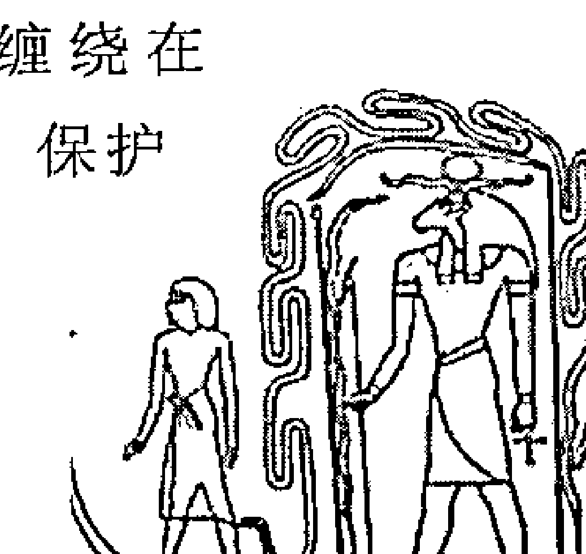

埃及神话中的地下世界的入口是被一条名为纳姆塔（Namtar）的巨蛇把守着的，他也负责在从黄昏到黎明这一段时间保护太阳神。

马卡是埃及神话中的另一条虚空巨蛇，他在太阳神走过天空的路途中都在攻击他。

在古希腊的神话中，代表永恒的巨蛇被叫做乌洛波洛斯（Ouroboros），意为“尾巴吞噬者”，因其一直在不停地吞吃自己的尾巴，而且越长越长。它时常出现在炼金术画本中，代表周期性和原始的融合。

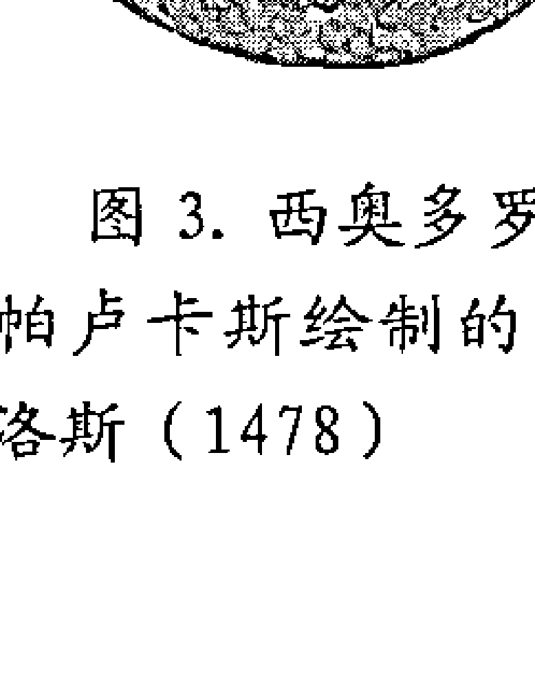

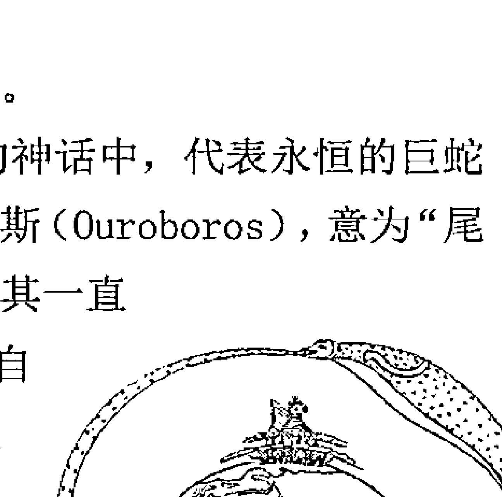

很多的古代手稿都提到了住在天堂中的光之巨蛇。

大蛇恩戴杰（Degei）是斐济群岛传说中的宇宙巨蛇。他哺育并教育了第一位男人和女人，教他们说话、耕作、生火、做饭和性交。

在印度神话中，舍沙（Shesha）是一条咬着自己尾巴的巨大的世界之蛇，它将整个宇宙——乌龟、大象和大地——包裹起来。

## 世界巨蛇

在很多不同文化的神话中都有一种围绕着大地，或以其身体创造出了世间万物的巨蛇。它们中最为著名的要数尤尔姆冈特（Jörmundgandr）（“巨型大地怪兽”），挪威神话中的米德加德蛇，他咬着自己的尾巴围绕在中土（米德加德，人类的世界）周围。尤尔姆冈特是洛奇和女巨人安哥拉伯达（Angraboda）的三个孩子中的第二个。他们的第一个孩子是芬里斯狼，第三个孩子是地狱女神赫尔。奥丁看到这条蛇长得很快，而且也知道最后他会带来巨大的邪恶，于是便将其扔进围绕着大地的海洋中，最后他将整个世界都围了起来。在世界毁灭（Ragnarök）之时，尤尔姆冈特和托尔（Thor）将会互相残杀。

阿希（Ahi）是印度吠陀神话中的一种怪蛇。它在冬季时喝光世界上所有的水，然后变身为雪花，藏在大山中，最后被因陀罗所杀，变成春天的雨水。

柯罗莫度莫（Kholomodumo）是一条非洲东南部梭托（Sotho）部落神话中什么都吃的蛇怪。它把所有东西都吃掉了，就剩下一名女人。后来这个女人生下了一对双胞胎，他们将那条巨蛇杀死，放出了被其吃掉的所有受害者。

尤麦胡尔西亚维特（Umai-Hulhya-Wit）是加利福尼亚迪埃格诺（Diegueno）印第安人创世神话中的巨型原始水蛇。最早的人类将其骗入一个灌木丛中被烧死。它死后发生了爆炸，将所有的东西（艺术、语言、宗教、音乐、传说等等）带到了人类世界。

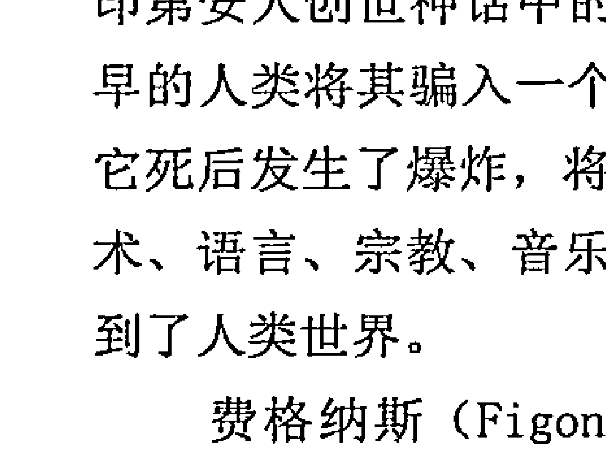

费格纳斯（Figonas）是所罗门群岛的圣克里斯托弗（Cristoval）岛上的美拉尼西亚传说中的一种创造了世间万物，长有翅膀的宇宙巨蛇类。他们中最伟大的是安桂纳（Aguna），他创造了第一个男人，因其非常无助，所以安桂纳又创造出了女人来生火做饭和管理花园。哈推波瓦力（Hatuibwari）被认为是人类的祖先，她巨大的蛇形身体上长着人类的躯干和四只用以哺育万物的乳房。她还有四条手臂和两只翅膀。

在伊斯兰神话中，法拉克（Falak）是一条潜伏在火之王国中的宇宙巨蛇，这个王国存在于支撑世界的怪兽巴哈姆特（Bahamut）身下，而六层地狱则在他的嘴里。达巴特（Dabbat）是会在审判日出现在地面上毁掉所有异教徒的巨蛇。

莱克（Lik）是南美格兰查科（Gran Chaco）传说中的古代巨型水蛇。它的背上长着棕榈树，据说是居住在湖中和水中的鱼类的保护者。

在美国西南部的霍皮印第安人的神话中，有一条名为帕露露孔（Palulukon）的大水蛇。在宇宙大洋中畅游着两条这种蛇，它们背负着大地，转弯时会造成地震。

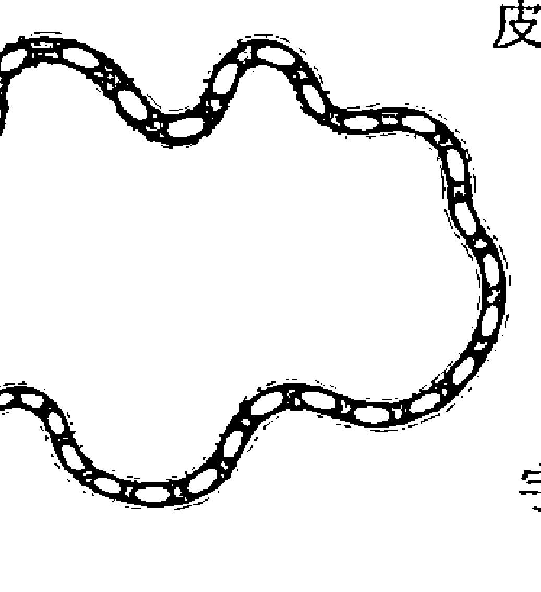

跨越天空的彩虹常被人看作一条巨大的彩色宇宙巨蛇。在很多文化的神话中都有这种生物的存在，澳大利亚、中非和西非、美拉尼西亚、波利尼西亚和加勒比的部分土著传说也是如此。彩虹巨蛇经常被和淡水与洪灾联系在一起，对人类可能是善意的，也可能怀着恶意。在澳大利亚，他是一种黄金时代生物——或梦幻时代生物。瓦拉孟加人（Warramunga）称其伏龙夸（Wollunqua），据说他非常巨大，能在尾巴不离开巢穴的情况下爬行数英里的距离。昆士兰的卡比人称其为达卡（Dhakhan），长着鱼的尾巴。在通常情况下，它住在深山的湖中，通过彩虹在两个湖泊之间移动。

在阿纳姆地区（Arnhem Land），彩虹蛇被称为巨伦谷尔（Julunggul）或尤朗格（Yurlunggur）。瓦维拉克（Wawilak）姐妹中的一位的月经将其洞穴污染了，这让它恼羞成怒，将她们都吃掉，然后引发洪水毁掉了大地上的一切。在西部沙漠，他被称作瓦纳姆比（Wanambi），而昆士兰约克角半岛上的维克-芒坎（Wik Mungkan）称其为泰攀（Taipan）。现在，这个名字被用在了一种大型（约10英尺长）、快速、剧毒的澳大利亚蛇身上，它叫菲尔斯蛇（Oxyuranus microlepidotus），是世界上最毒的旱地毒蛇。

波比波比（Bobi-Bobi）是一种给人类带来用于捕猎的动物的天空巨蛇，它还用自己的一根肋骨做出了用于捕猎的回旋镖。楚劲（Thugine）是一种住在澳北区（Northern Territories）岸边的大型黑色海蛇。

- 澳大利亚彩虹蛇还有其他名字：兰格（Langal）、明迪（Mindi）、恩戈尔尤德（Ngalbjod）、乌伦古（Wullungu）、沃云谷（Woinunggur）、沃伦姆比（Worombi）、耶罗（Yero）、乌恩古德（Ungund）和乌恩加（Ungur）——这也是梦幻时代的另外一个名字。

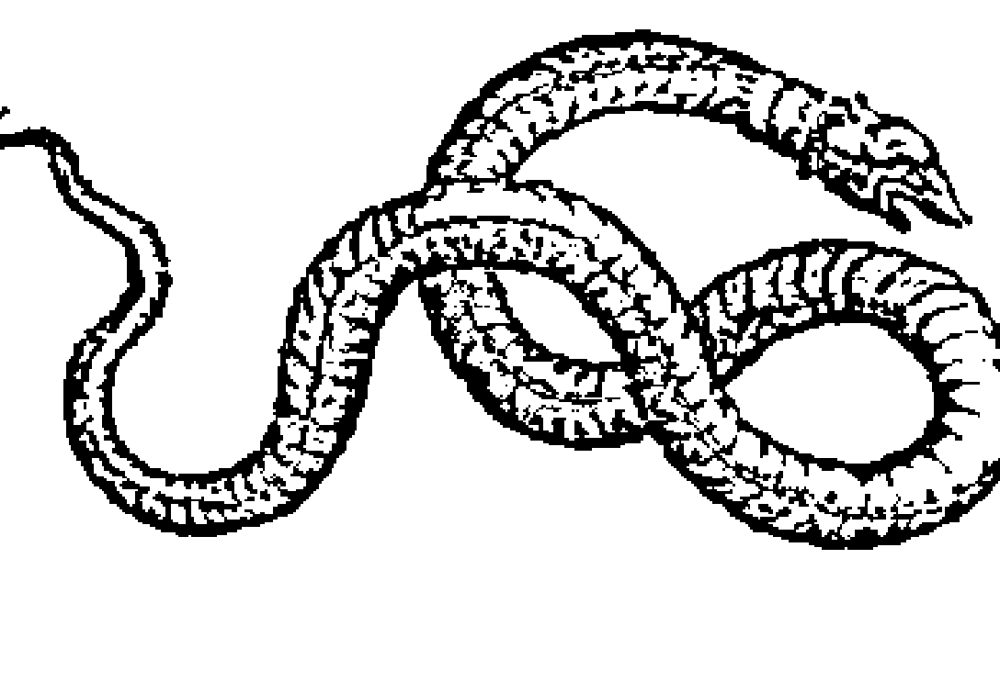

在卡拉德杰里梦幻时代（Karadjeri Dreamtime）的蛇怪还有布莱因（Bulaing），以及闪电蛇——穿梭于空中的巨蛇，在风暴时快速往返于天地间，产生出孕育生命的降水。阿兰达（Aranda）是一种生活在厄弥安加（Emianga）地区的巨型水蛇。它潜伏在最深的湖河中，在那里等着粗心的人的靠近，届时它就会将其吞掉。

昆士兰大学的动物学家迈克尔·李博士和同事们推测，这些传说可能源自已经灭绝了的一种20英尺长的蟒蛇沃那比蛇（Wonambi naracoortensis）。

达姆巴拉赫（Damballah）（或达姆巴拉赫维多 Damballa Hwedo）是海地巫毒神话中的巨型天体彩虹蛇，最开始源自西非达荷美（Dahomey）的丰人中流传的邪教达(Da)。从其强壮的头部到蓝色的猫尾，全身都散布着彩虹的颜色。他卷曲着身体，托付起原始的大地、天空和天堂。他的排泄物变成了山峰。其配偶名为埃多-维多（Aido Hwedo），是达荷美传说中的彩虹巨蛇，在玛乌（Mawu）神创世时充当其坐骑。她非常喜欢吃铁，而当其无法找到足够的铁的时候，她开始吃自己的尾巴，就像乌洛波洛斯那样。她的排泄物也变成了山脉，后来大地越来越重，它们俩不得不一起在下面去支撑。她时常会活动筋骨，这造成了地震。

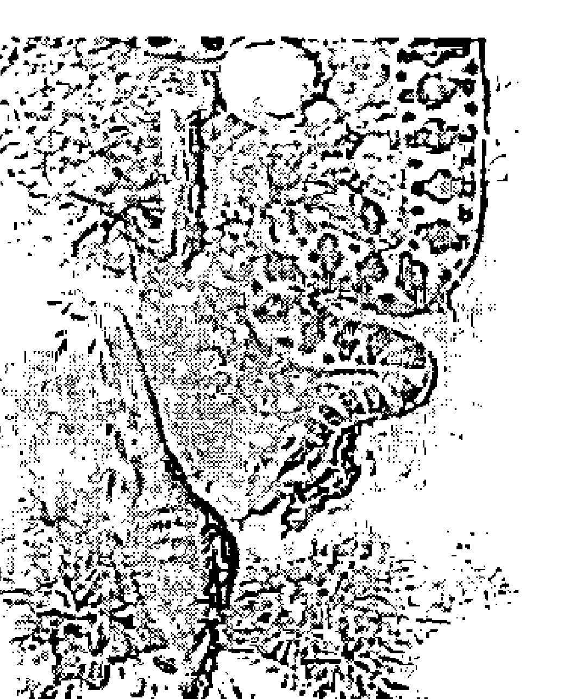

在西非尼日利亚的约鲁巴土著人传说中将彩虹巨蛇称为欧西姆马里（Oshumare）。

## 有角巨蛇

在世界各地，湖怪和海蛇通常都被描述为体型巨大、上下起伏的蛇形生物，长着马一样的头、脖子和耳朵。然而有些目击者却说它们的耳朵看起来更像角，于是它们也被叫做水公牛或角蛇。有时它们据说长着发光的红色或黄色眼睛、大大的獠牙，甚至还能喷火。在旧大陆的大不列颠群岛及其它国家的报告中，这些动物通常都被看作传说中的马形水鬼、水马、水鳗、海马和马头。但在北美，第一匹马是在16世纪被西班牙人带过去的，所以这些头上长角的怪物被很多的部落看作是“蛇类”。

色或白色。西皮特坎姆（Tcipitckaam）（也被叫做独角蛇或乌托邦湖海怪）是新斯科舍的密克马克族和马力希特族传说中的一种蛇形湖怪，据称它住在安斯利湖和乌托邦湖。根据传说，很久之前，两个马力希特人在乌托邦湖中划船，这时突然钻出了一只湖怪，一直追逐他们到湖对面。在欧洲人于18世纪末到达以来，每隔几年就会有人看到它们。据说它长着鳄鱼的身体和马的头，前额的中心还长着一只长长的红色或黄色螺旋角。

我相信角蛇、长颈海蛇和湖怪并非是爬行动物，而是巨大的水生蛞蝓，它们长着和蜗牛相似的触角和头部。现在已为人所熟知的有昌普（Champ）、奥古布古（Ogopogo）和克罗萨尔·克劳德（Colossal Claude）。这些生物已在北美土著人的传说和神话中存在了几百年了——甚至可能有上千年的时间。

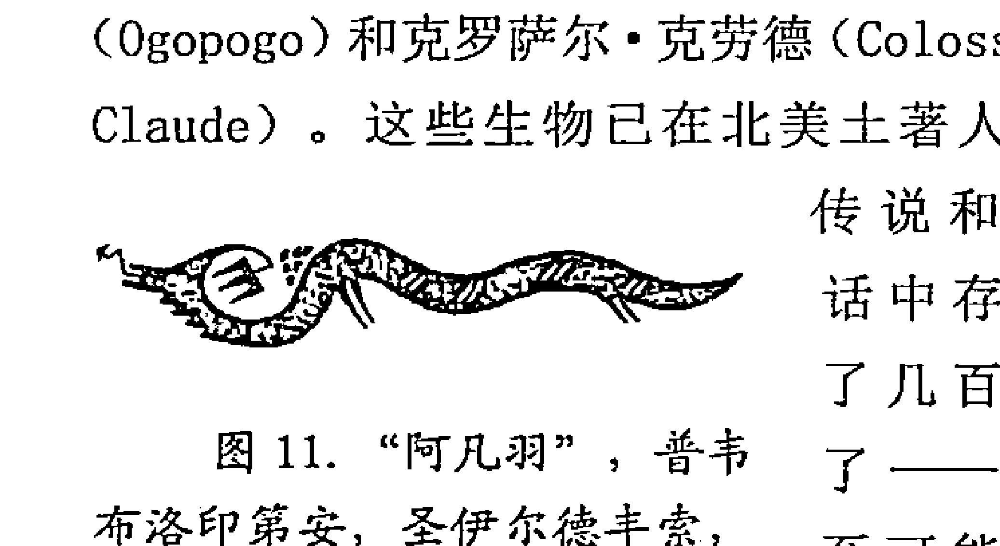

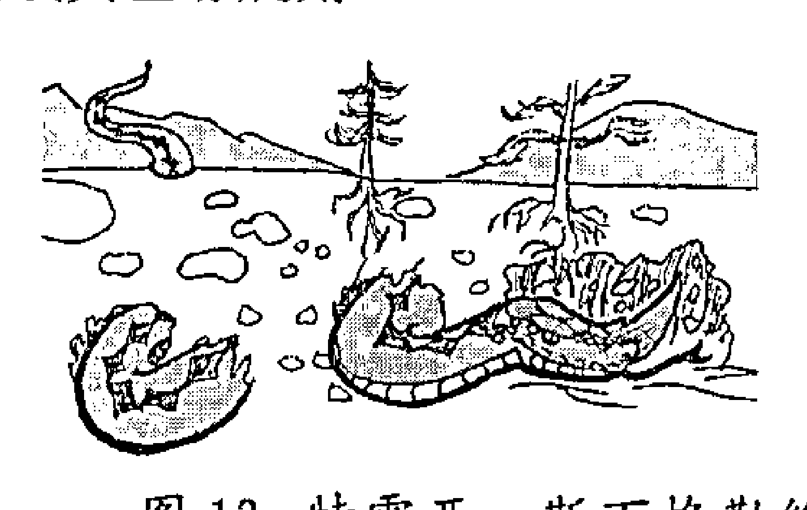

在美国东北部，杜农加伊斯（Doonongaes）是塞内加神话中一种巨大的角蛇。通常情况下住在深水潭中，它也会不时地上到岸边晒太阳。它和其伴侣斯卡诺瓦（Skahnowa），一只乌龟怪，以人类和大型动物为食。休伦人传说这一种名为翁尼昂特（On Niont）的巨型角蛇，它能用其头上的角在山上的岩石中钻洞，而且它的独角（alicorn）具有跟独角兽一样的能力。

美洲角蛇（或“巨蟒”）被描述为身体特别长，长着深渊一样的大嘴，头上还有两只角。跟北欧的水马相似，它们对人类的态度可能有好也可能怀着恶意。任何吃了它们的肉的人都会变成它们。

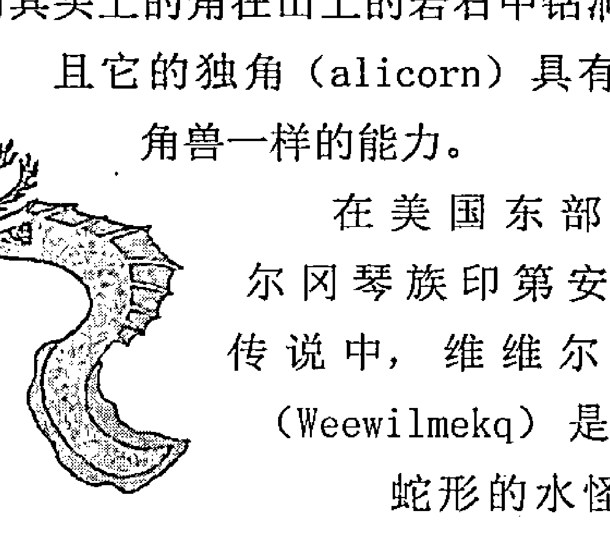

在美国东部的阿尔冈琴族印第安人的传说中，维维尔梅克（Weewilmekq）是一种蛇形的水怪，被描述为身体像长长的蠕虫一样，头上长着牡鹿角或身上长着大鲟鱼的背鳍。它居住在湍急的水流中，如瀑布和漩涡。

在加拿大，钦托撒开拓（Tcinto-Sakto）（“长角蛇”）是一种克里印第安人传说中的巨蟒，长着牡鹿一样有分叉的角。它们有各种各样的颜色，蓝色、黄色或白色。

纵观全美，齐齐科内比克（Kichiknebik）（“巨大角蛇”，也被叫做奇特斯纳卡司（Kitsinackas）或马尼托科内比克（Manitou Knebik））是一种住在大湖区的易洛魁、德拉瓦和阿尔冈琴印第安人传说中的巨型有角响尾蛇。它能保护那些遇见风暴的水手。它能在水中和地面上快速行动，也能一口吞下一头水牛。

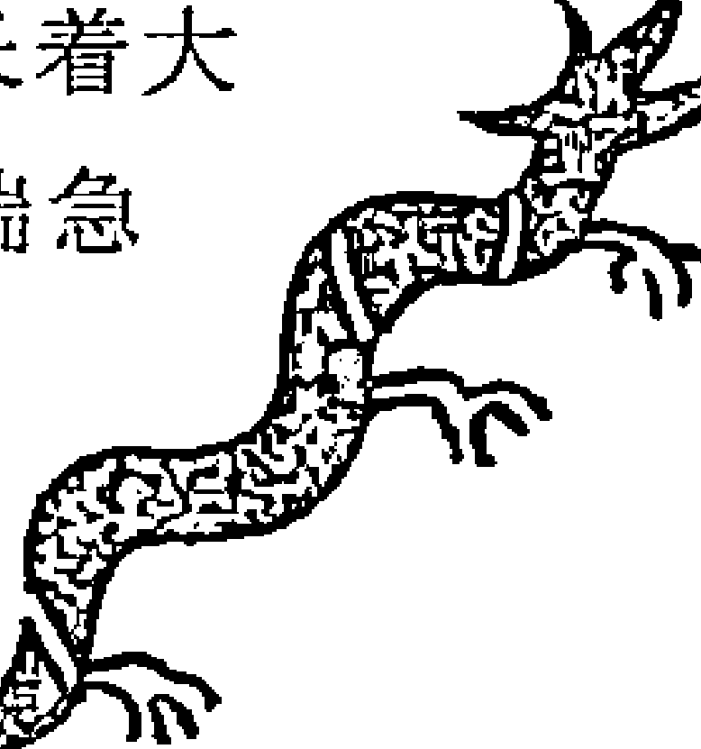

在美国中西部，昂科特西（Unktehi）（或 Untekhi）是拉科塔苏族传说中的巨型长角水蛇。它们住在瀑布和深水中，是密苏里河的护卫者，与雷鸟一直处在战争状态。瓦坎达基（Wakandagi Pezi）是一种莫霍克（Mohawk）和奥哈马（Omaha）印第安人传说中的蛇形水怪。据说它是一种昂科特西，住在密苏里河中，用漩涡将入侵者毁灭掉。经常只能在迷雾中见到它的踪影。它长着牡鹿般的鹿角和偶蹄。

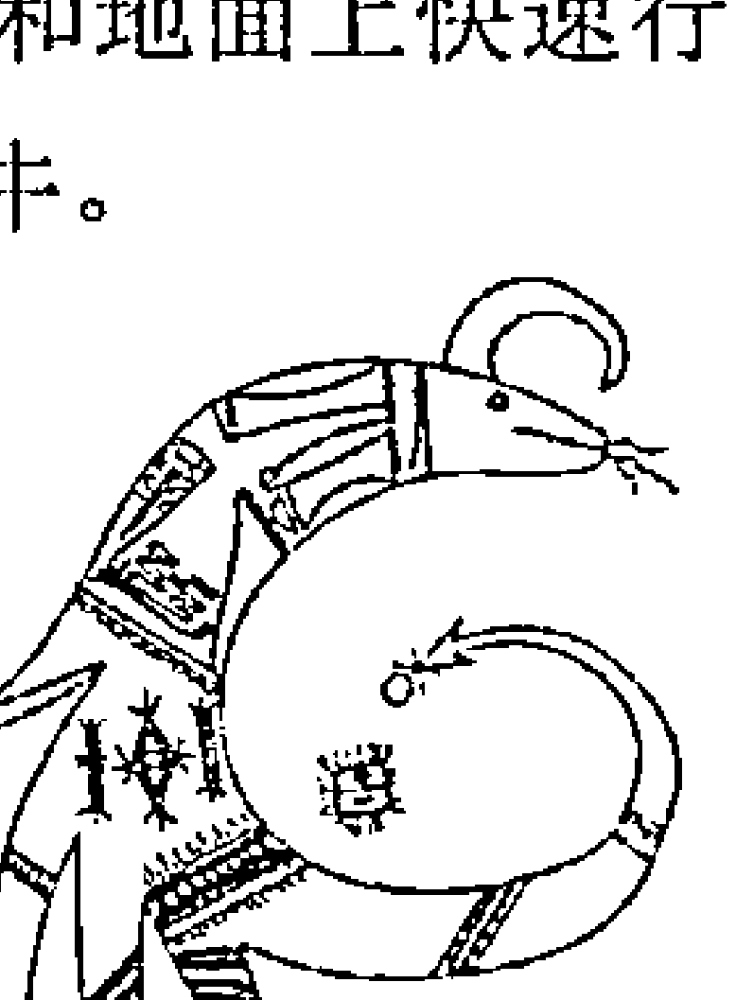

新特卡比特（Hiintcabiit）是住在美国西部的阿拉巴霍（Arapaho）印第安人传说中的一种水蛇，住在山中的湖泊和河流中，像世界其它各地的同类一样，它头上也长着两只角。

在美国西南部的沙漠中纳瓦霍人传说这一种名为提耶荷索敌（Teelho ltsoodi）的湖怪，它样子像一只大水獭，身披顺滑的皮毛，头上长着水牛般的角。据说它能造成大洪水。

泽尔塔尔（Tzeltal）是墨西哥南边的恰帕斯印第安人神话中的巨型有角蛇。科隆维斯（Kolowisi）是祖尼传说中的一种巨型角蛇。它全身长着尖锐的鳍，牙齿像剃刀般锋利。

## 神圣巨蛇

巨蟒皮东（Python）是一只从德卡连（Deucalian）大洪水的泥土中钻出来的雌蛇。她住在帕纳塞斯山坡上的卡斯特里安泉旁边的裂缝中，守卫这盖亚的圣穴，直到后来被太阳神阿波罗用弓箭射杀，并在那里建立起了一座神庙。在每年的纪念日上，这个故事都会被视为德尔斐神谕（Delphic Oracle）建立的过程而重演，那里的女祭司被称为女预言家（Pythonesses）。而在希腊神话中，阿波罗的龙之花园被一只名为艾皮罗特（Epirotes）的巨蟒看守着，它是德尔福·皮东（Delphi Python）后代。从这个传说开始，皮东（python）这个名字就被用于旧大陆的巨蛇身上了，它们中有些能长到30英尺长。实际上，当传统的作家写道关于龙或弹性橡皮带（dracone）时，他们实际上指的是巨蟒——特别是皮东（python）。

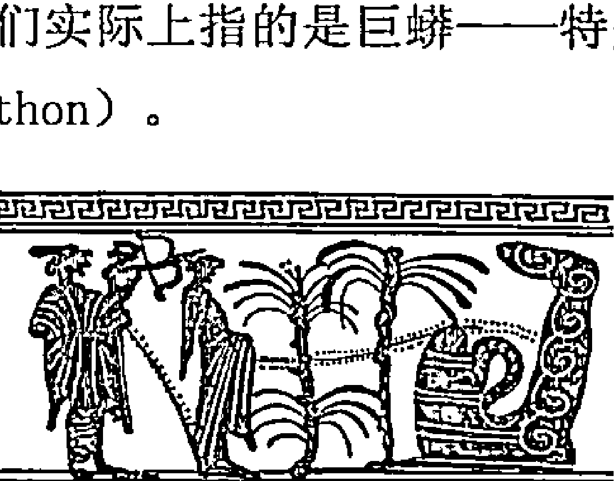

在《圣经·创世记》（3：1-5）中记载着伊甸园中的一只有情蛇：“蛇是耶和华神所创造出的生命中最狡猾的一种……”它诱惑夏娃吃掉智慧之树上的苹果，它问她，耶和华是否说过你可以吃任何树上的果实。夏娃说，他说我们不能吃中间那棵树的果实，否则我们就会承受死亡的痛苦。蛇回答说：“你们不会死。吃下那棵树果实，你们的眼睛就能够睁开，你就会变得像神一样，知晓善恶。”后来这一切真的发生了。在法国 Abbaye de Plaincourault 教堂里有一副 1291 年的壁画，它生动地描绘了蛇诱惑夏娃吃苹果的画面。蛇经常出现在中世纪的艺术作品中，常以盘绕着树木的形象出现，但其细节随着时间而发生了改变。在早期的图画中，它们有马一样的头，更像湖怪，后来就被画成了长着人头，有时头上会有皇冠，长有前爪，或长有孔雀的翅膀和尾羽。它被当作时间所有罪恶的化身，被和恶魔等同起来。

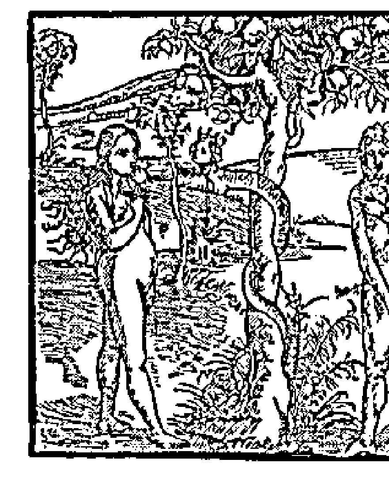

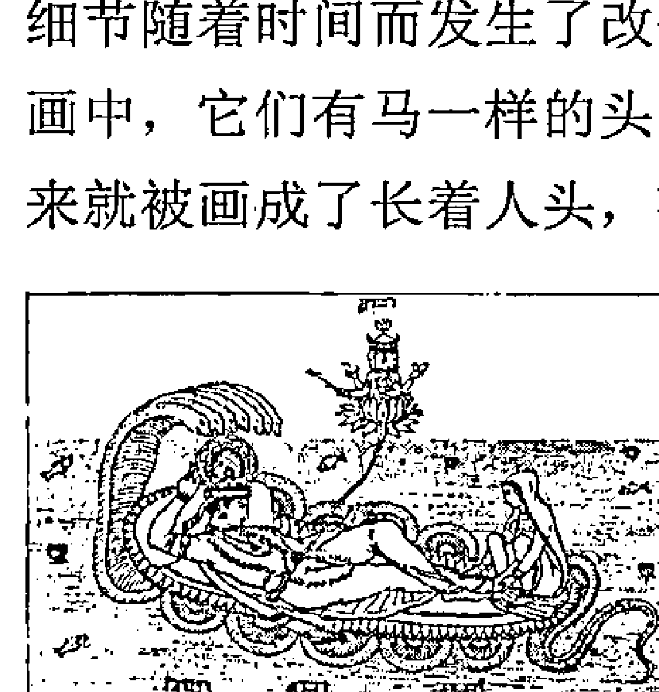

舍沙（Ananta Sesha）（“无限”）是印度神话中的千头眼镜蛇。它搅动着原始海洋，创造出了神圣的不老药。他能喷火，且具有剧毒，会在时间的尽头毁灭世界，但现在，它正蜷缩着身体，被毗湿奴坐在身下。舍沙的儿子叫婆苏吉（Vasuki），是世界之蛇。当众神在洪荒时搅动原始海洋创造世界的时候，婆苏吉被用作杆子。

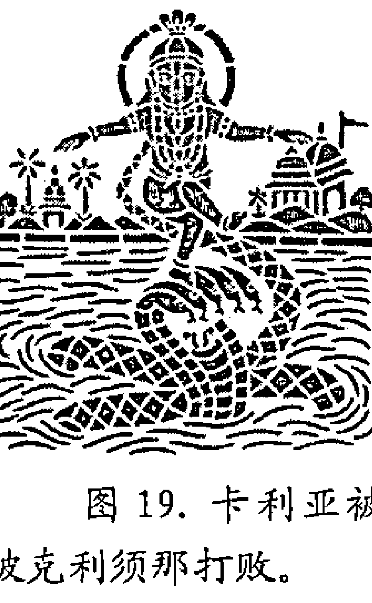

卡利亚（Kaliya）是印度神话中的多头蛇王。这种有毒的黑色魔鬼居住在亚穆纳河的深处，在晚间会在小喽啰的簇拥下出现，在乡村大肆破坏。在被克利须那（Krishna）、卡利亚（Kaliya）打败之后，他和他的同类被驱逐到了海洋深处。

那迦和纳吉尼斯（Naginis）是住在印度的蛇人。那迦是雄性，纳吉尼斯是雌性。它们上半身像人，下半身是蛇，有时长着很多头，有时有很多种颜色。纳加斯（Naga）有四个等级——天堂级（Heavenly）、神级（Divine）、地级（Earthly）、隐级（Hidden）——各个等级功能不同（守卫天宫、造雨、吸干河流、守护宝藏）。据说它们最终会用火将世界毁掉。在缅甸，它们是蛇、龙、鳄鱼的结合。它们会将红宝石赠送给自己喜欢的或保护皇室的人。然而，在印度尼西亚、泰国、马来西亚，它们又是吓人的巨大的黑色水蛇或多头小海龙。其形象常被用作寺庙的门神。此名称已被用在印度眼镜蛇，纳加纳加（Naja Naja）身上了。

在佛教经典中，那迦之王是目支邻陀(Muchalinda)（或婆苏吉），一只巨大的眼镜蛇，缠绕在菩提树上，佛祖就是在那棵树下得道升天的。它能在风暴时用颈项给佛祖遮雨。

印度尼西亚神话中的蛇王叫纳加帕宏达（Naga Pahoda），住在海洋深处。当巴塔拉·古鲁（Batara Guru）神创造大地时，纳加帕宏达出现了，将其分割成几块。

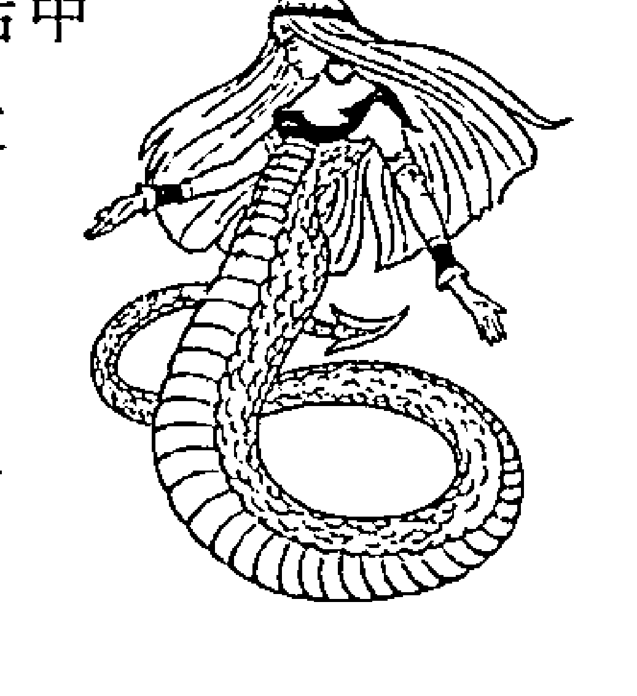

德威斯里（Dewi Sesir）是巴厘的海之女神，她被描绘在壁画中，是一条长着翅膀、女人的脸和胸部的蛇。

沙哈玛（Shah-Mar）是亚美尼亚传说中的蛇王。它住在高山的一个洞穴中，被很多蟒蛇服侍着。

在新几内亚巴布亚（Papua）传说中，太阳神乌内考（Wunekau）的化身是一条名为美克美克（Make Make）的巨蟒。

## 超级巨蛇

在隐生动物学的文献中，有很多具有说服力的报告，它们大多数来自南美，都是关于真正存在着的巨蟒的。因为人们发现了很多巨型史前蛇类的化石——如贾斯丁巨蟒（Gigantophis garstini），它拥有难以置信的超过35英尺的体长——所以就不能说这种巨型怪物从未存在过。实际上，因为像王蛇（boa）、皮东（python）和水蟒（anaconda）这样终身其一生都在不停生长的大蟒的存在，唯一能影响其长度的恐怕就只有它们的寿命和其骨架能承受多大的重量。而後一个问题对像水蟒这样的水生蛇类并不存在，因为水能够承载它们的体重。其实在1940年代，在哥伦比亚就有一名地质学家测量过一只身长达37.5英尺的水蟒。贾斯丁巨蟒四千万年前出现在南撒哈拉地区，也就是现在的埃及和阿尔及利亚地区，它们很可能在公元前三万年才灭绝。现在存在着的只有少量的一些它们的化石，人们从中推测它们可能以像猪一样大的现代大象祖先为食。

实际上很多关于宇宙巨蛇的传说很可能基于人类和这种大型动物的真实遭遇，比如下面所说的那次。

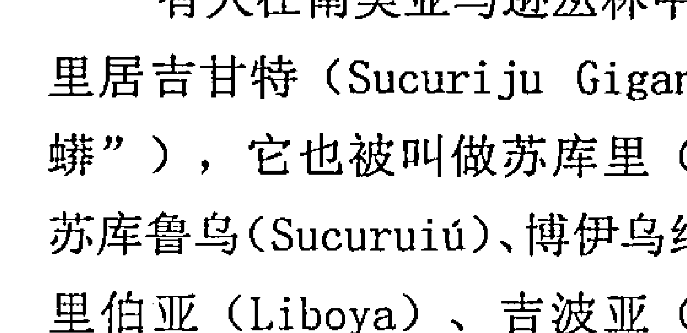

有人在南美亚马逊丛林中发现了苏库里居吉甘特（Sucuriju Gigante）（“巨蟒”），它也被叫做苏库里（Sucuri）、苏库鲁乌（Sucuruiú）、博伊乌纳（Boiúna）、里伯亚（Liboya）、吉波亚（Jibóia），或西班牙语中的马托拉（Matora），意为（“食牛者”）。这些真实存在着的巨蟒在20世纪为人所熟知，有传言说其身长# 魔法师的怪物图鉴

据说有些巨蟒身长能达120英尺。还有几名探险者称其遇到甚至杀死过60至80英尺长的怪物。在1907年，一只亚马逊地图测绘队中的福西特（Percy Fawcett）上校宣称自己射杀并测量了一只62英尺长的巨蟒，下面就是隐生动物学之父贝纳德·霍伊霍尔曼（Bernard Heuvelmans）为其所绘的图像。

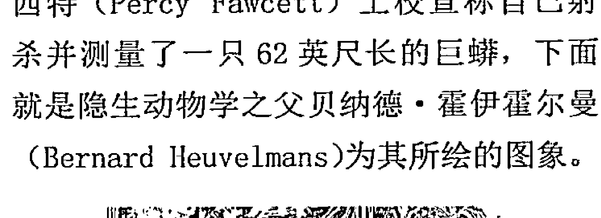

1922年维克多·海因兹（Victor Heinz）神父在奥比多斯（Obidos）镇旁的亚马逊河流域看到了一条巨蟒，称其至少80英尺长，长着满是脂肪的身体，钻入水中时在岸上留下了很大的痕迹。画家赛尔日·博纳卡斯（Serge Bonacase）告诉霍伊霍尔曼，他在1947年杀死了一只苏库里居吉甘特，就在里奥曼苏和里奥克里斯力诺（Rio Cristalino）之间的沼泽地里。经测量，那条蛇长达65英尺，其三角形的头部规格为24英寸长，20英寸宽。在1995年也有类似的报告，其中包括巨大的痕迹和蜕下的皮。当地人据说也杀死过几只，但其尸体总是很快就被分解了。

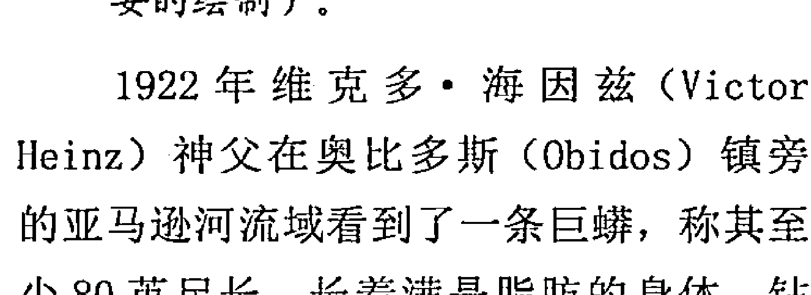

圭亚那土著人的传说中有一种名为卡姆迪（Camoodi）的巨蟒。有时人们会将其误认为是倾倒的一根树干。据说它是卡姆迪森林的保护者。尼加拉瓜也有自己的巨蟒或巨型蠕虫，叫斯特普（Sterpe）。在巴西，有缠住独木舟、引发洪水、绑架女人的巨蟒被称为马瓦蒂（Mawadi）。它们的女蛇王叫灰托（Huito），是水之女神。

但并非只有南美生活着巨蟒。非洲据说有一种名为霸蛇（Pa Snake）的蛇——一种以大象为食的巨蟒。当它们吃下一只大象，要花上3年时间来吐出骨头。很明显那是对网纹蟒（Reticulated Python）的夸张，这种蛇的体长纪录超过33英尺。

恩古马·摩内内（Nguma-Monene）是一种非洲巨蟒，长着鳄鱼一样的背脊，蛇一样的舌头，据称能达到130英尺长。它以人类以及动物为食。比利时的一名直升机飞行员雷米·凡·利尔德（Remy Van Lierde）上校1959年在非洲刚果执行任务时拍到了一条身长40至50英尺的巨蟒。它全身呈暗棕绿色，肚子是白色，长着长3英寸宽2英寸的三角形头部。在他靠近时，这条蛇站立起来，就好像如果飞机再飞低一些它就会发动进攻一样。

# 尼安 (Nyan)

尼安 (Nyan) ——也被称为阿瓦格兰 (Avagrāh)、加拉 (Gara)、格拉哈 (Grāha) 或坦提戈哈 (Tanti-gāha) ——是一种蠕虫一样的怪物，住在孟加拉、缅甸和印度。它以大型动物为食，包括大象。它们会像巨蟒一样将猎物缠住，然后拖进水中吃掉。这可能就是布林 (Bu-rin)，一种缅甸水中巨蟒，有40至50英尺长，据说非常危险，会攻击游泳者甚至小型船只。

在日本，巨蟒近江 (Omi) 给日本的近江 (Omi) 地区带去瘟疫，直到后来景行天皇之子日本武尊 (Yamato Take) 将其杀死。

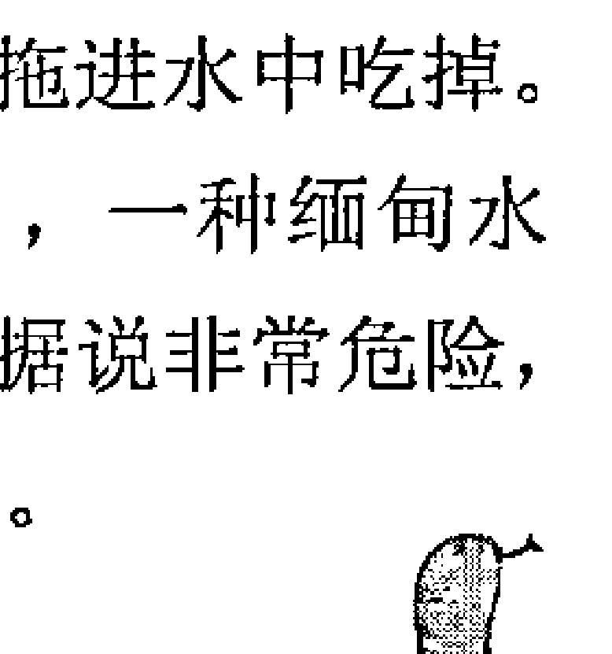

北美的拉哥塔苏族，有关于祖泽卡 (Zuzeca)（“巨蛇”）的传说，它是一种巨蟒，是知识、谎言、欺骗的源泉。

# 世界上最大的蛇

1900年代初，野生保护协会和纽约市的布朗克斯动物园就为那些能提供健康的、超过30英尺的蛇的人奖金。奖金——从最初的1000美金到现在的50000美金——一直无人能够领取。

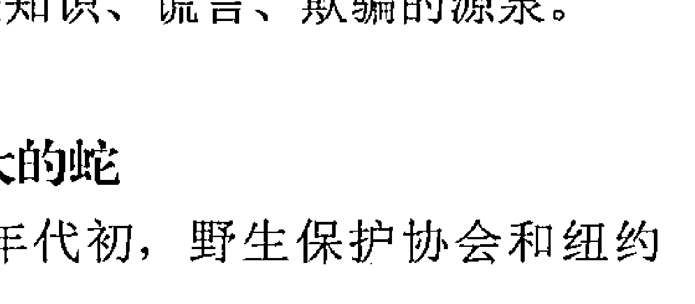

根据《吉尼斯世界纪录》，经测量最长的蛇是1912年在印度尼西亚的苏拉威西岛上发现的39.4英尺长的一条网纹蟒。第二名是一条1932年在非洲象牙海岸被打死的38.3英尺长的非洲岩蟒 (Rock Python)。

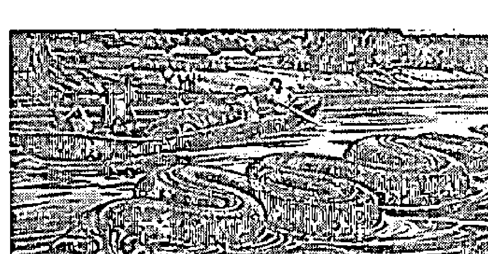

但在著名爬虫学者、布朗克斯动物园前馆长，雷蒙德·L. 迪特马斯 (Raymond Ditmars) 在1931年出版的《世界上的蛇》(Snakes of the World) 中提到：“一直以来都有人努力地寻找并测量身长超过30英尺的蛇 (reticulated python)。”他对非洲的岩石蛇写道：“我怀疑这种蛇的体长会不会超过20英尺，因为其成年蛇的标本也只有16至17英尺长。”在最近的一次对在巴西测量到的超过1000种野生巨蟒的调查中发现，其中最长的有17英尺，体重约100磅。

人类所收养过的最长的蛇名叫科罗萨斯 (Colossus)，这是一条网纹蟒，曾被收养在现在已经不存在了的匹兹堡哈维兰动物园中。1966年科罗萨斯去世，已经长到了28.5英尺长和300磅重，它的后继者名叫沙曼莎 (Samantha)，布朗克斯 (Bronx) 动物园一条26英尺长的网纹蟒 (reticulated python)，它在2002年去世。现今的纪录保持者叫马尔奇 (Marci)，一条25英尺长的网纹蟒 (reticulate python)，生活在圣安东尼奥动物园。

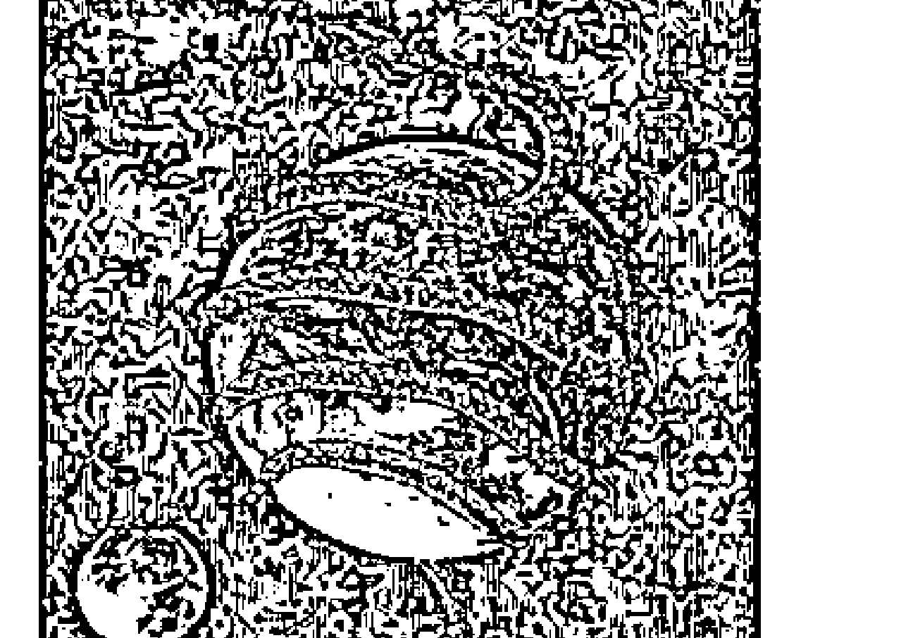

# 怪物电影：宇宙巨蛇

《劳博士的七张脸》（The 7 Faces of Dr. Lao）（1964年）是一部改编自查理斯．芬尼（Charles Finney）在1935年所著的小说《劳医生的马戏团》（The Circus of Dr. Lao）的电影，其中有原始巨蟒的身影。尽管在1933年的《金刚》中，人们认为与之打斗的是一条史前巨蟒，实际上那只不过是一只20英尺长、长着10英尺长脖子的三叠纪的蜥蜴。但在1976年的翻拍版中，金刚的对手变成了一条巨蟒。在《野蛮人科南》（1982年）中出现过一条守卫神庙宝藏的巨蟒。《大蛇王》（Thunder of the Gigantic Serpent）或《恐怖蛇》（Terror Serpent）（1988年）讲述了一条不断生长的宠物蛇的故事。《狂蟒之灾》（Anaconda）（1997年）及其2004年的续集《狂蟒之灾：搜寻血兰》（Anacondas: The Hunter for the Blood Orchid）正是基于苏库里居吉甘特这种蛇的。涉及巨蟒的电影还有：《巨蟒》（Python）（2000年）、《巨蟒II》（Python II）（电视剧，2002年）、《史前巨蟒》（Boa）也叫《新恶魔岛》（New Alcatraz）（2002年），以及《王蛇对巨蟒》（Boa vs. Python）（电视剧，2004年）。

# 3、龙

作者：亚瑟 • “豹舞者” • 迪克尔克

> 衰老的龙被囚禁在狭窄的地下，
但余威尚存，
它愤怒地看着自己的王国崩塌，
抖动着它卷折尾巴上的可怕鳞甲。
——约翰·弥尔顿（John Milton），
《基督诞生晨颂》（On the Morning of Christ’s Nativity）

龙是什么？在当代，龙的概念变得非常死板。当你听到“龙”这个词汇的时候，首先想到的是什么？在绝大多数情况下，会是一种长着翅膀、能喷火的恐怖欧洲神话中的生物。但这并不全面。很多时候，蛇和龙在神话中交织在一起。像亚龙一样的龙也能被理解为是巨大的蛇。它们由此也被称作蛇龙。鳞龙（Lindorm）或利德（Lind）亚龙是一种长着翅膀的亚龙。在其它情况下，龙和蜥蜴也会被混淆起来。德拉克（Drake）是没有翅膀，看起来像巨蜥的龙，双足飞龙（Wyvern）是一种没有前腿的有翅龙，当然也会有典型的四条腿的有翅龙。而有些翅膀长有羽毛，有些翅膀则没有，数量也能达到四对，但很多龙往往只有一对。九头蛇是一种有很多脑袋的龙。大多数的龙都被认为是身披鳞甲的爬行动物，但也有长着羽毛或兽毛的龙。有人的地方就有龙。

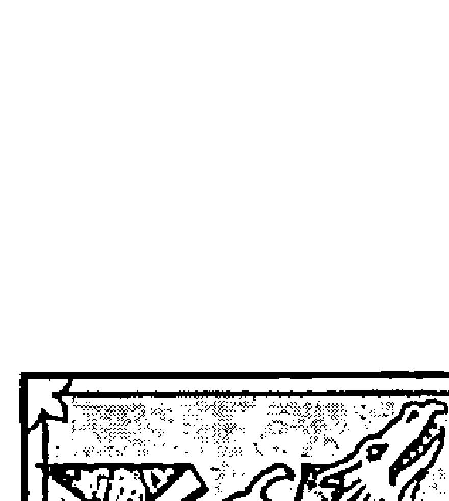

# 西方龙

龙是欧洲神话传说中很常见的东西。维京人将龙画在自己的盾牌和刻在船头上。龙在纹章中尤其常见，纹章龙都与亚瑟王有关，似乎也是由它创造出来的。亚瑟龙有四条腿、蝙蝠翅膀、鳄鱼肚子、老鹰的爪子和蛇的尾巴。纹章中的双足飞龙和亚瑟龙很相似，只是它们没有腿脚。其它有些纹章龙长着狼头、蛇身、鹰爪、蝙蝠翅膀和分叉的舌头及尾巴。

# 魔法师的怪物图鉴

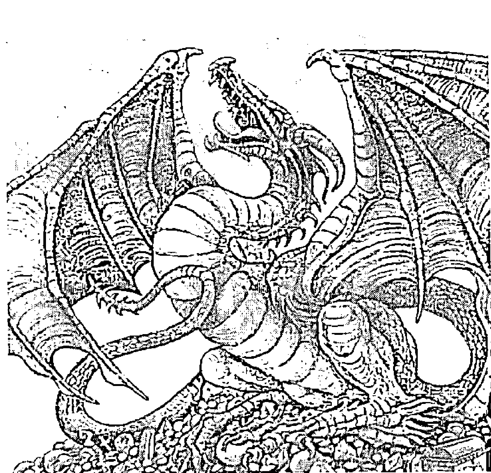

在早些时候，大多数欧洲龙都代表着好的东西，就像亚洲龙一样。但是在中世纪的时候，它们却成了邪恶的象征，代表着恶魔、地狱、原罪、黑暗、毁灭、战争、贪婪等等。下面列举一些欧洲龙。

# 阿姆费特尔（Amphitere）

一种无腿、有翅的巨蛇，长着龙一样的脑袋，常见于威尔士和英格兰。它们的眼睛像孔雀的尾巴和翅膀那样闪光。它们的翅膀有时长着羽毛，有时却像蝙蝠的翅膀。阿姆费特尔身长6至9英尺，全身覆盖着鳞甲，拥有极高的智慧和强大的力量，能将人催眠。很多这种龙都守卫着宝藏，它们将其视为职责而不仅是喜欢亮晶晶的东西。据说将它们的牙齿埋入肥沃的土壤里就能长出对主人绝对忠诚的士兵来。

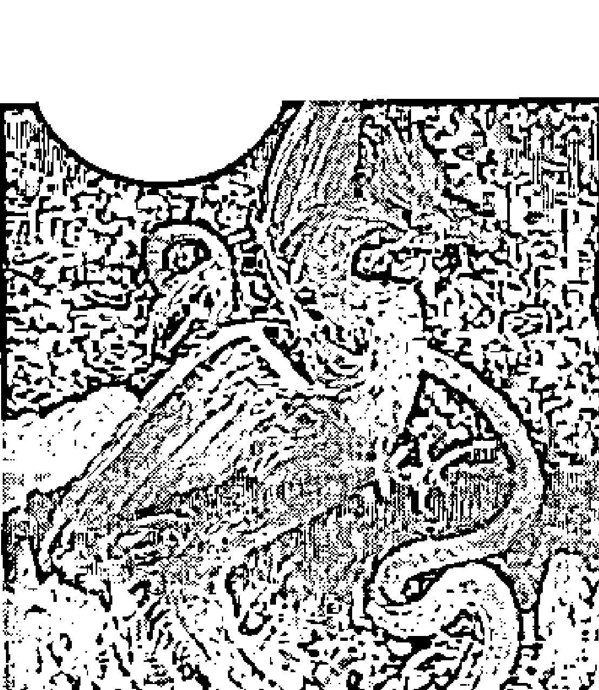

图 2. 伊安·丹尼尔斯绘制的“阿姆费特尔”

# 鸡龙（Aitvaras）

一种能变成黑猫的拉脱维亚龙。有些人视其为好运的代表，也有人视其为噩运的象征。鸡龙能将自己附在一间房子里或一个人身上，给这户人家带来财富。不幸的是，很多与它有关的人都会被看作巫师。

# 巴拉乌尔龙（Balaur）

一种巨大的罗马尼亚龙，长着鳍、脚和很多的蛇头（通常情况下有三只，有时有7只或12只）。它是邪恶的代表，法特－弗路莫斯（Făt-Frumos）将其杀死救出了公主。这个名字现在被用来命名一种无害的罗马尼亚蛇，巴拉乌尔长鞭蛇（Coluber jugularis balaur）。

# 艾奥克兰（Alkha）[或艾伦齐亚（Alicha）、阿拉克（Arakho）]

在西伯利亚的布里亚特神话中，这种龙非常巨大，它黑色的翅膀能遮蔽天空。每隔一段时间它就会吃掉太阳和月亮，造成日食和月食，直到它们的热量逼它将其吐出。月亮上的坑洞就是它的牙齿印。

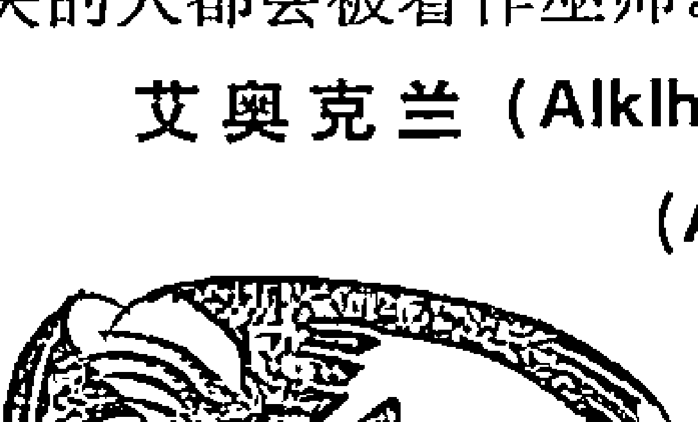

图 1. 特雷西·斯万格勒绘制的“艾奥克兰”

# 波拉（Bolla）[或布勒（Bullar）]

一种阿尔巴尼亚蛇怪，长着四条腿、小翅膀和闪光的银色眼睛。当在圣乔治节（四月二十三日）这天结束其长达一年的休眠而出现时，它会吃掉碰到的所有人。12年后，它变成一种可怕的、会喷火的飞龙，它长着九只舌头，名叫库榭德勒（Kulshedra）。有时会被描述为一名胸部下垂、头发很长的女人。它能带来干旱，需要活人献祭才能使其满足。

## 图鉴二、揭秘夜之生物（上）

在一座山下，它会在时间的尽头挣脱束缚，肆虐人间。在伊斯兰神话中，它被称作达巴特（Dabbat）或达巴图拉德（Dabbatu 'L-Ard）。

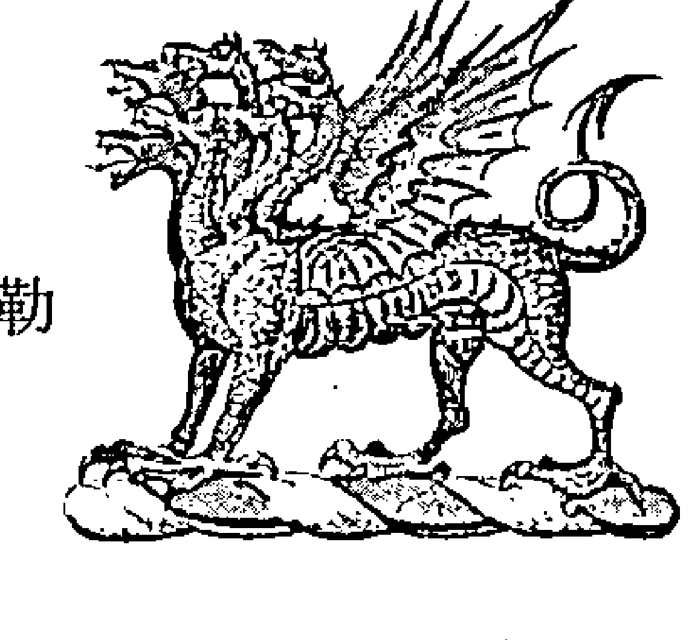

# 德克托（Derketo）

- 巴比伦神话中的一种鲸鱼怪，是女神伊斯塔（Ishtar）的杰作，它的出生引起了一次巨大的洪水。

# 红 龙（Y Ddraig Goch）

- 威尔士红龙是该国的象征。它的宿敌是吉伯（Gwiber）（“毒蛇”），一条有翅的白龙。

# 卡司吉尼安巨蟒（Carthiginian Serpent）

- 罗马军队在巴格拉达河沿岸遇到了这种巨型蛇龙。据说它有120英尺长。最后它被军队杀死，它的皮被保存在国会山的神庙中，直到公元前133年，它无故消失为止。

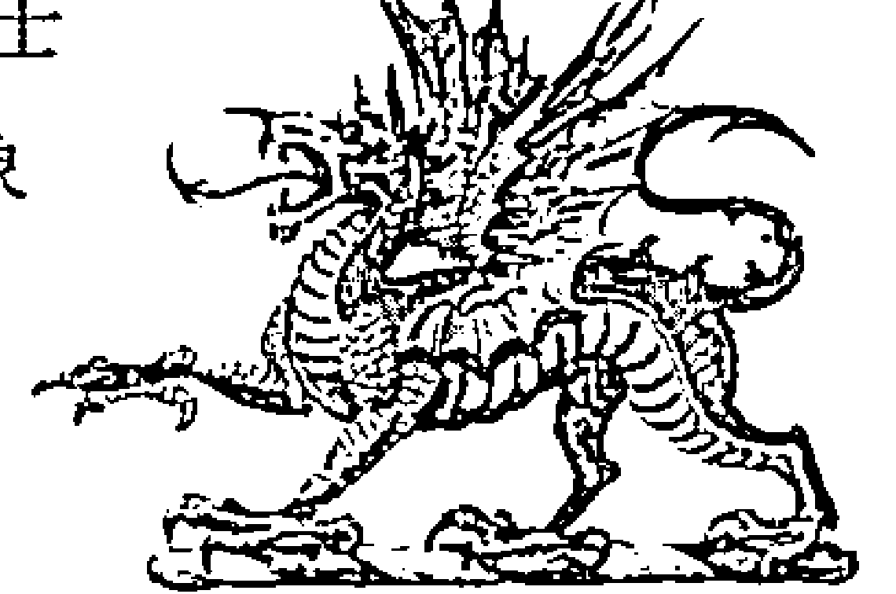

# 褚铎予铎（Chudo-Yudo）

- 一种长着很多脑袋、能喷火的俄罗斯龙。据称它是水的掌控者，能带来干旱。其母亲是邪恶女巫巴巴亚加（Baba-Yaga），它的兄弟是不死的柯西切（Koshchei）。

# 伦敦龙

- 一种长着一百个脑袋的有鳞怪兽，它被女神赫拉放在赫斯珀里得斯（Hesperides）花园中看守不朽的金苹果。赫拉克勒斯在自己第11项功绩中将其杀死，后来赫拉将它放到天宫中变为天龙星座。

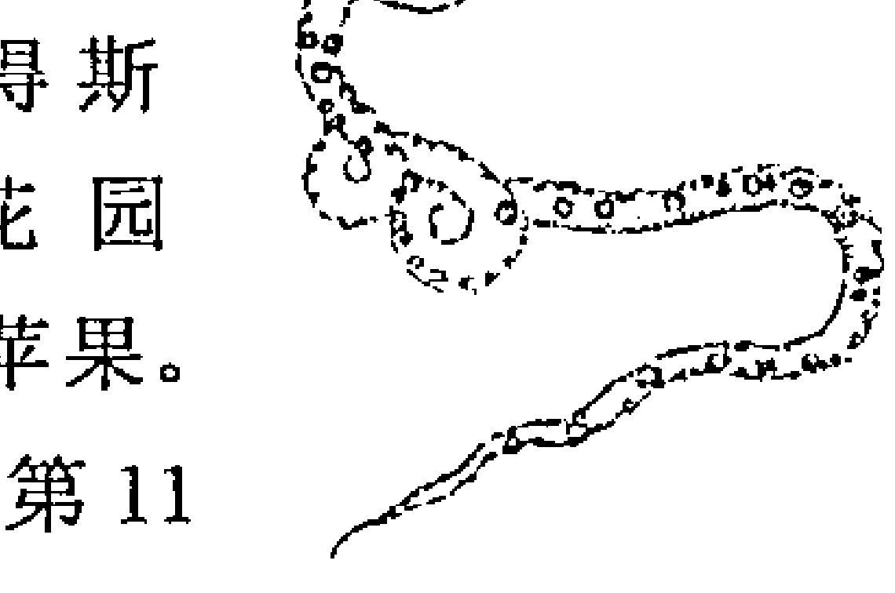

# 克努克尔（Cirein Croin）

- 这些巨大的苏格兰海蛇非常庞大，能够将一头鲸鱼整个吞下。它们全身长着灰色的鳞片，头上有巨大的肉冠。实际上，它们的名字就是“灰色肉冠”的意思。

# 达哈克（Dahak）

- 在波斯的拜火教（Zoroastrian）神话中，这是一种邪恶的三头龙，负责毁灭世间的一切。它的身体是蜥蜴和蝎子的结合。它被英雄塔劳多纳（Thraotona）（有时又被称作阿塔尔 Atar）用铁链困在一座山下，它会在时间的尽头挣脱束缚，肆虐人间。

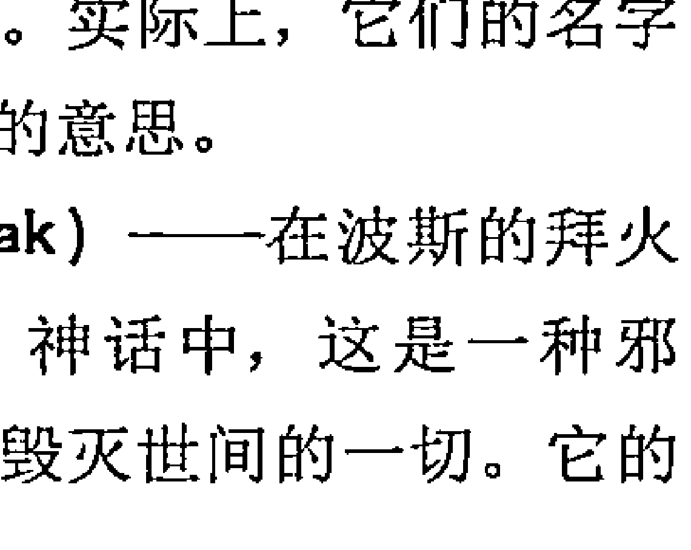

# 温特利之龙

- 根据手稿《珀西的文物》（Percy’s Relics），这种恶龙给英格兰约克郡的温特利地区带去瘟疫。它被米尔霍1的莫尔所征服，他穿着布满尖刺的铠甲，爬到龙的背上，在后脑勺上踢了一脚，这条龙一掌拍在他的铠甲上，受了伤。这个故事与莱博顿虫（Lambton Worm）（下图）很相似，可能就是它的一个翻版。

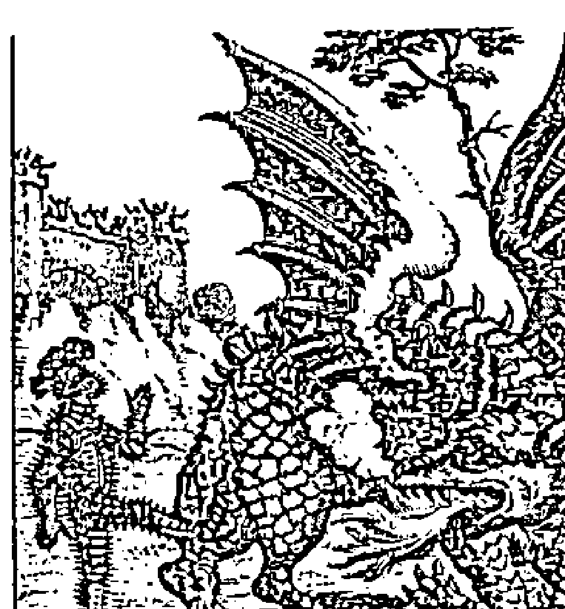

# 德拉克 (Drake)

- 瑞典传说中的一种无翅龙或鳞龙，这个名字也被用在命名元素龙上，比如火德拉克、海德拉克、冰德拉克等等。有时也被用在雄性龙身上。

# 法夫纳 (Fafnir)

- 挪威和日耳曼神话中的一种邪恶无翅龙。最开始它是一个贪婪的矮人，后来变身为一条恶龙守卫偷来的受诅咒的黄金。法夫纳被英雄齐格弗里德 (Sigfreid)（或西格德）所杀，它在恶龙的必经之路上埋下陷阱，藏在里面，待其路过时用利刃刺进其心脏。后来他将恶龙的心脏放在火上烧烤，被从里面喷出的鲜血烫伤。在舔舐伤口的时候，他吃到了它的血液，这让他拥有了理解动物语言的能力。这个故事被记录在在日耳曼冒险故事《尼白龙根之歌》中。(瓦格纳的歌曲“尼白龙根戒指”正是部分基于它的。)

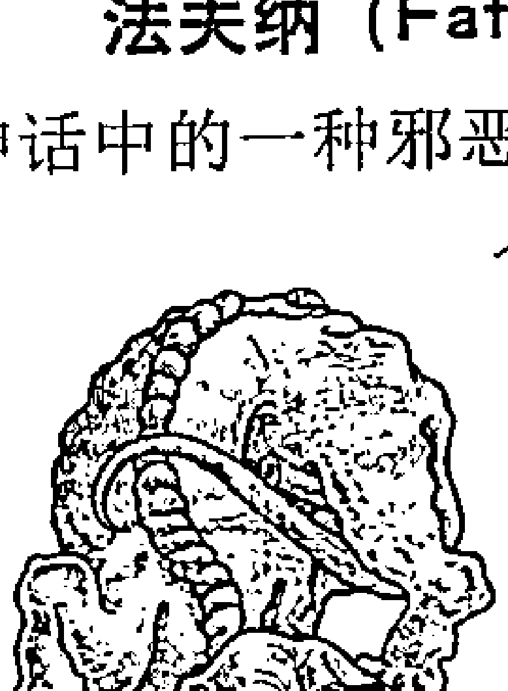

# 石像龙(Gargouille)[或圭弗(Guivre)]

- 一种住在法国鲁昂塞纳河沼泽中的传奇巨龙。它常被与林地、河流、溪流和深井联系在一起，有人认为它能带来降水和急流，掀翻船只，吞吃船员和渔夫。

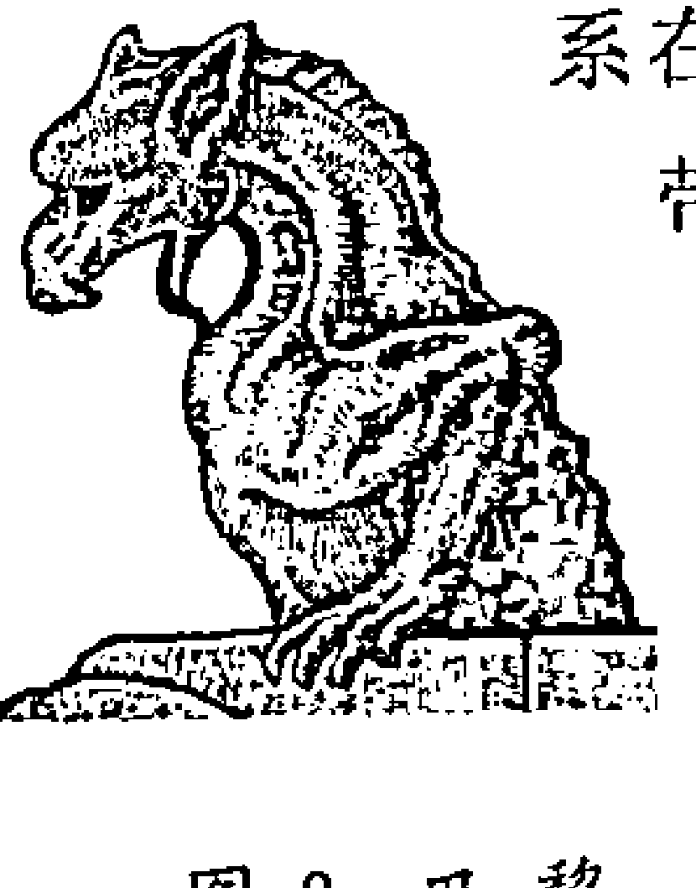

圭弗有很强的毒性，它的存在意味着死亡和毁灭。在一则有趣的记载中，裸体的人类能够将石像龙吓住。最初的石像鬼在7世纪被后来的鲁昂主教圣罗曼所杀。他用两个犯人当诱饵，引诱它出来，之后用十字架和长袍缠住它的脖子，将其带到鲁昂，让那里的民众将其杀死。从那时起，所有怪物的饰品、瓦片和水槽都被叫做石像龙 (Gargoyles)。

# 格洛里奇切 (Goryschche) （来自俄语中的“gora”，中文“山”的意思）

- 一种长着12个脑袋的巨型俄罗斯雌龙。它绑架人类来喂养自己的孩子。英雄多布林亚 (Dobrynya) 找到了它的巢穴，杀死了它的孩子。于是格洛里奇切开始追杀他，在后来的战斗中，他砍掉了它11个脑袋，直到它发誓说再也不会伤害人类，多布林亚才饶了它一命。逃脱之后，它却抓住了公主，多布林亚回到它的巢穴中杀掉了所有的幼崽，在母龙回巢的时候也将其一并杀掉。多布林亚陷入了它有毒的血液流成的血湖中，他向地球母亲请求帮助，于是地面出现一条裂缝，排干了血水。后来英雄找到了恶龙所守护的宝藏，放掉了被绑架的人和后来成为其妻子的公主。

# 霍得希利德 (Hordeshryde)

挪威和英格兰神话中的一只看守宝藏的巨龙，它在8世纪盎格鲁-撒克逊史诗中被贝奥武夫所杀。不幸的是，贝奥武夫后来被这条龙的毒液所杀。

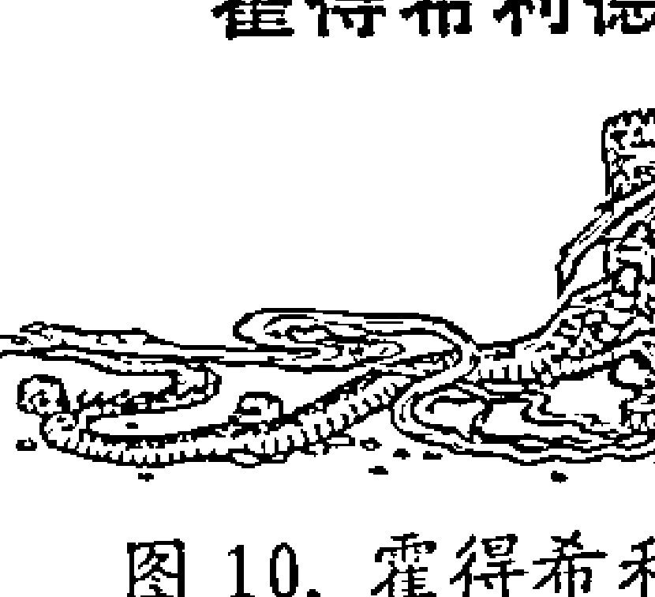

# 伊卢延卡 (Illuyankas 或 Illujanka)

- 美索不达米亚的古西泰人神话中的一条混沌龙。它蛇形的身体上长着很多脑袋。有人说它后来被众神所杀，有人说众神只是将其打败，并未杀死。

# 不死的柯谢 (Koshei 或 Kaschchei, 源自“kost”，中文“骨头”的意思)

- 一种可怕的俄罗斯龙，它的灵魂被藏在一座遥远孤岛上的一只在兔子肚中的鸭子所怀的蛋里，这让它拥有了不死的能力。它非常暴力。瓦西里莎公主被它抓住后成功地说服它讲出了自己的秘密，于是她将这个秘密透露给英雄布拉特，他找到了这只蛋，让其在恶龙头上砸碎，杀死了它。

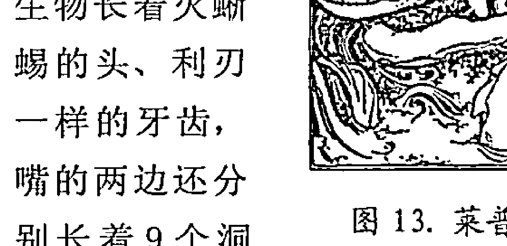

# 昆德拉夫 (Kundrav)

- 古苏美尔神话中的一只龙，它非常巨大，能连接天地。它是大地和人类的毁灭者，但最终被英雄柯刺萨 (Keresaspa) 所杀。在印度的吠陀神话中也有类似的故事，但龙的名字却变成了甘达里瓦 (Gandareva)。

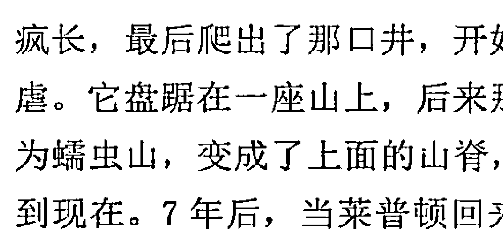

莱普顿蠕虫——英格兰诺森布里亚的一种非常著名的中世纪欧姆龙。根据传说的内容，莱普顿霍尔年轻的继承人约翰·莱普顿在钓鱼时抓住了一只黑色鳗鱼般的生物。他说这种生物长着火蜥蜴的头、利刃一样的牙齿，嘴的两边还分别长着9个洞（这是七鳃鳗鳗鱼独有的特征），皮肤上还有粘液。莱普顿将其投入一个古井中，此后这个井被叫做“蠕虫井”。后来，莱普顿离开那里加入十字军，这个生物开始疯长，最后爬出了那口井，开始在乡村肆虐。它盘踞在一座山上，后来那座山被称为蠕虫山，变成了上面的山脊，一直保留到现在。7年后，当莱普顿回来，听说了这件事之后，他发誓要杀掉那个怪物。在当地一位巫师的帮助下，他得到了一件有尖刺的铠甲。他穿着这件铠甲去和怪兽打斗，在愤怒的蠕虫将他缠起来的时候，他身上的尖刺将其刺伤，随后莱普顿杀死了它。

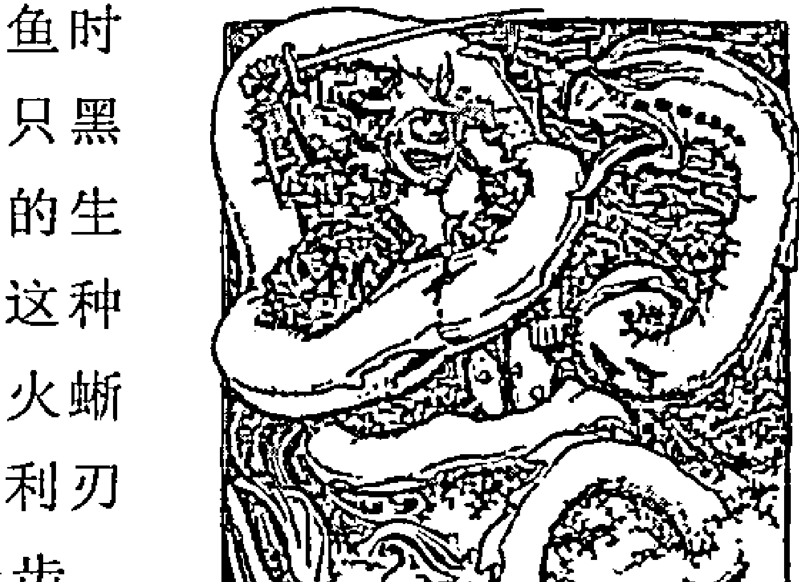

# 罗腾 (Lotan 或 Lothan)

- 古美索不达米亚神话中的一只巨大、长着七个脑袋的原始混沌龙，被称作“缠绕蛇、流线蛇、七头怪”。后来在一场史诗般的战役中被迦南神巴尔所杀。在约公元前1000年，以色列人征服巴勒斯坦之后，他们将罗腾神话引入到自己的文化中，将其重命名为利维坦 (Leviathan)。然而，在《圣经》中，利维坦被描述为一种海中巨怪。

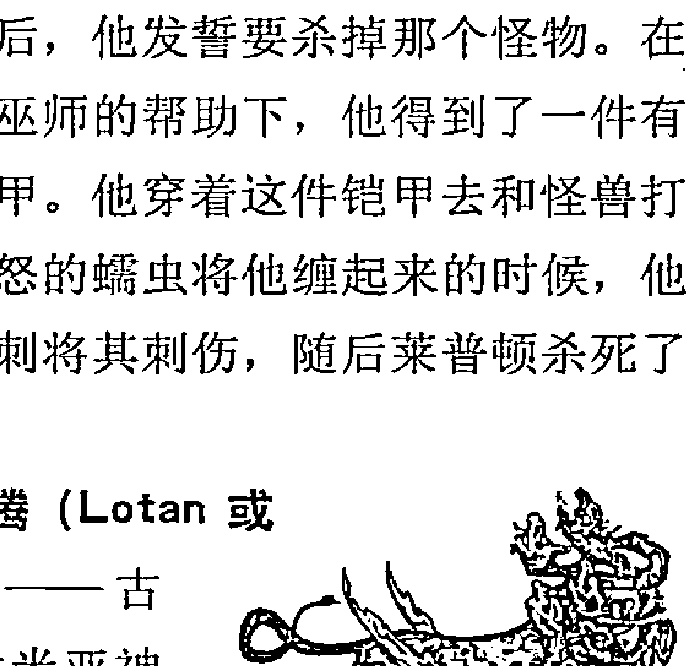而，长有七个脑袋的特征表明它是与希腊的九头蛇一样的生物，都源自大王鱿（Architeuthis）。

## 穆斯马胡（Mu huššu 或 Musmahhu）
苏美尔神话中的一种三头或七头怪，被宁吉尔苏（Nigirsu）神所杀。在古巴比伦，它是提亚玛特的仆人，是天上的长蛇座。

## 佩斯特（Paiste 或 Peiste）
这个巨大的、11英尺长的爱尔兰神话中的亚龙被认为是一种古代的龙，在世界形成之初就已经存在了。它长着公羊的角，盘旋在公牛一样的耳朵周围，长长的獠牙里满是毒液，有一面用乌木做的，桌子般大小的盾牌。它也被圣莫罗丢入了福伊尔湖深处。

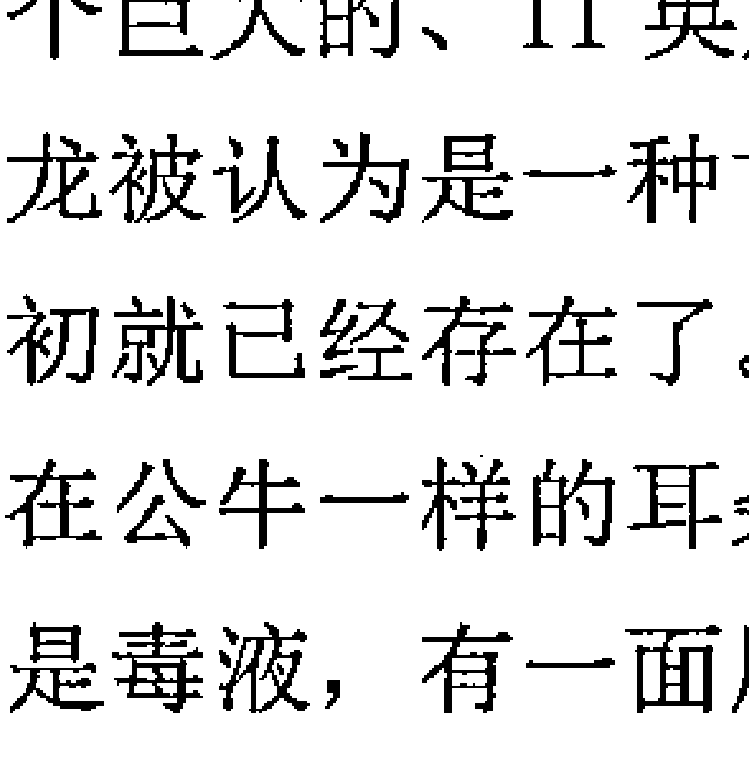

## 皮苏汉（Pisuhand 或 Pukis、Pukys、Puuk）
在波罗的海传说中，它们是一些小型的蛇形龙，只有2英尺长，尽职尽责地守卫着房屋和里面的宝藏。它们在地面时是猫的样子，也能变成龙飞到空中。在爱沙尼亚它们被叫做图利汉德（Tulihänd）。在有些地区它们据说长着翅膀，能在空中带出火焰的尾迹。

## 海蛇
长长的、生活在海中的蛇龙，移动时采取的方法是上下摆动，而不是通常的水平摆动。它们长着龙的脑袋，有些有角，有些无角。有些海蛇还长有鳍。

## 雷乌斯蛇
瑞士传说中的一种蛇龙，1566年有人看到它，称其长着四条腿和大大的爪子。它在雷乌斯附近的乡村攻击并吞食田里的家畜，让当地人喊害怕。

## 瓦维尔龙（Smok Wawelski）
波兰克拉科夫（Krakow）的维斯瓦河两岸的瓦维尔山中的龙，住在山下的一个洞穴中，如果每个月没有得到一名年轻少女作为的祭品，它就会出来肆虐大地。当那里的年轻女孩只剩下克拉科国王的女儿旺达的时候，她的父亲下令将把她嫁给任何能够杀死恶龙的人。一个名为斯泽科·德拉特卡（Szewczyk Dratewka）的鞋匠学徒将一只填充着硫磺的死羊羔放在其洞口，吃了这只羊之后，恶龙变得极为口渴，跑到河里去喝水。当水和它体内的硫磺接触时，在这条龙体内发生了爆炸。斯泽科顺利和公主结了婚。

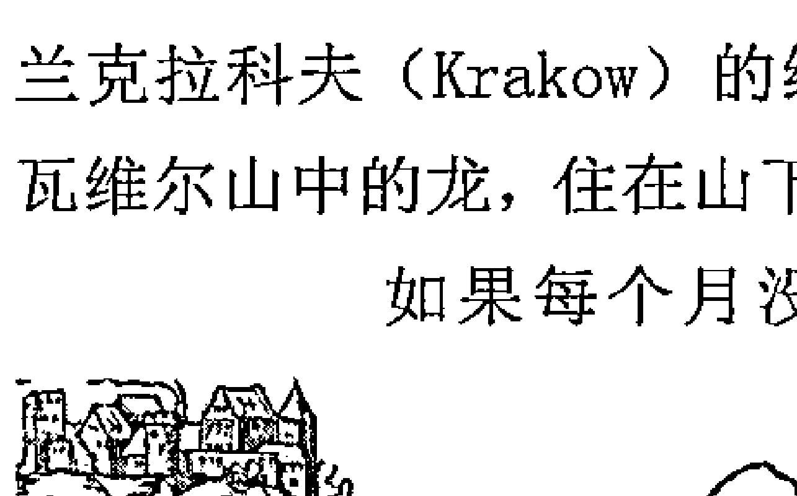

## 提亚玛特（Tiamet）
古代美索不达米亚神话中的宇宙巨蛇或巨龙，是银河和海水的化身。她拥有巨大而虚空的身体，长着两只前腿，头上有两只角，还有一条巨大的尾巴。在巴比伦史诗《天地初开洪荒世界》中，她与配偶阿卜苏 / 艾步祖（淡水的化身）创造了天地和诸神，后来却被诸神所背叛。提亚玛特被马杜克（Marduk）所杀，她的身体变成了大地和星辰，她的鲜血变成河流。

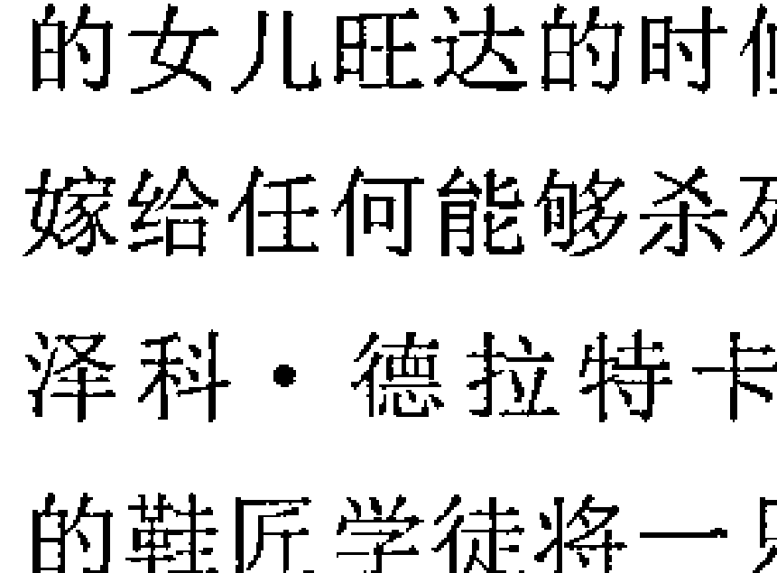

## 塔拉斯各 (Tarasque)
法国南部罗纳河谷中生活着的一种凶猛的两栖河龙，它会吞吃住在那里的处子。它比水牛稍大，长着六条腿、狮子的脑袋、熊的爪子、有鳞的身体和长长的蛇尾，尾巴末端有尖刺。它背上坚硬的壳上长着尖刺。它据说是利维坦和本纳科恩（Bonnocon）的孩子，圣玛莎（St. Martha）在其脖子上套上她的腰带，将其驯服后带到纳尔鲁镇上，那里的村民用石头和长矛杀死了它。随后，该镇改名为塔拉斯孔（Tarascon），在每年的纪念日上，那里都会重演当年的这个故事。在西班牙，这个怪兽被称作塔拉斯卡（Tarasca），在基督圣体节（Corpus Christi）节时，它的雕塑会出现在庞特韦德拉的雷东德拉（Redondela）的游行中，在雕塑的肚子里会坐着小孩子。它的描述与一种甲龙或雕齿兽（glyptodont）非常相似。然而彼得·科斯特洛（Peter Costello）认为，它源自鳄鱼。

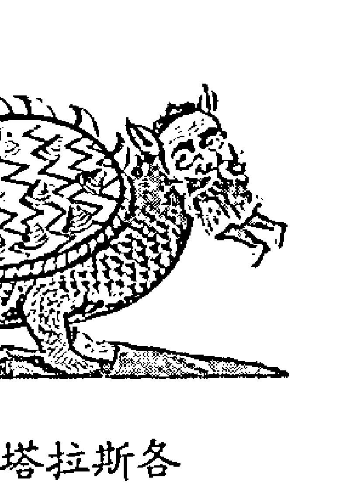

## 塔泽尔亚龙
奥地利巴伐利亚和瑞士阿尔卑斯地区的一种龙，它的名字意为“长着爪子的亚龙”。它也叫盗窃亚龙或“穴居亚龙”。在法国阿尔卑斯地区它被称作阿拉萨斯（Arassas）。塔泽尔亚龙长着猫的脑袋、长长的蛇形身体、两只前爪。有些地区的塔泽尔亚龙还长着后腿，拥有光滑的皮肤或者小型的鳞片。它最有趣的一项能力就是能够跳得又高又远，因此它获得了跳亚龙的别名。
在阿尔卑斯山以南的地区也有关于此类动物的报告。关于盗窃亚龙最近的一次目击发生在 1954 年的西西里帕勒莫(Palermo)。（参见第一章：“邪恶的蛇怪”）

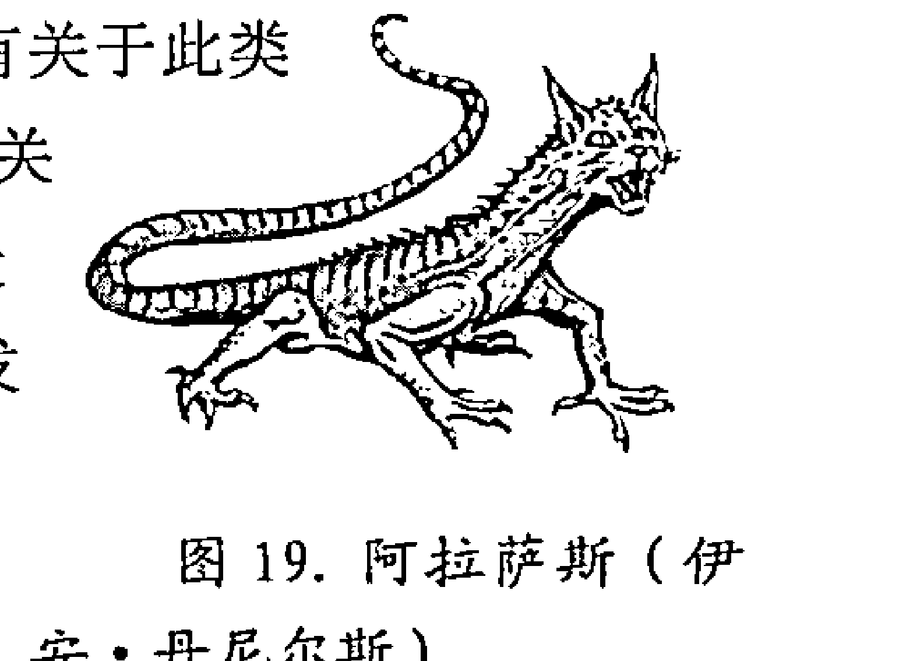

## 提丰——希腊神话中一种喷火巨龙
脖子上长着 9 个或 50 个或 100 个脑袋，每个脑袋上都有会喷火的眼睛。据说它比山峰还高，长着有蛇纹的四肢和鸟的翅膀。最后在诸神之战中被宙斯收服，关押在安泰山深处的塔耳塔洛斯（Tartarus）中，它在那里时不时地会制造出台风来。它和厄喀德那一起生出了很多怪物，诸如刻耳柏洛斯、奇美拉、九头蛇、斯芬克斯、尼米亚猛狮以及啄食普罗米修斯肝脏的秃鹰。

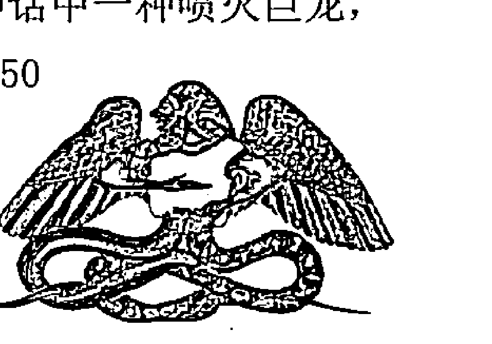

## 维莎普 (Vishap)
亚美尼亚传说中的一种恶龙，据说居住在阿勒山山顶。它的血液毒性很强，将武器浸泡在其中会让其变得致命，即便只被轻轻划伤一下。

## 林顿沃德虫 (Wode Worm of Linton)
英格兰北部地区传说中的一种蛇形龙或欧姆。它被一个英雄用燃烧的泥潭灌入其喉咙而杀死。

## 东方龙
在中国和日本，龙都是非常常见的，代表着雨神。它们是力量、忠诚和权利的象征。在中国，龙是保护那个国家的四种野兽之一，其它三兽为独角兽、乌龟和凤凰。

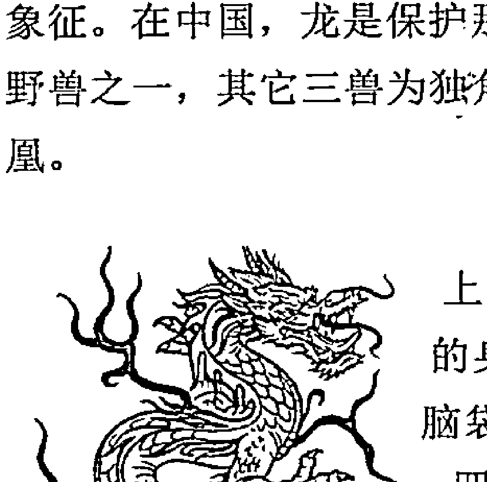

图 21. 东方龙

亚洲龙基本上都长着蛇一样的身体、马一样的脑袋、四只三爪或四爪的脚。汉朝（公元前206-公元220年）的王甫（Wang Fu）给了它们更详尽的描述：牡鹿的角、骆驼的头、蛇的脖子、蛤蚌的肚子、老虎的四肢和牛的耳朵。亚洲龙据说身上长着117片鳞，其中81片充满阳气，剩下的36片充满阴气，消极、服从、女性化的力量。很多亚洲龙的部分力量都来自珍珠——本称作“智慧珍珠”或“龙珠”——它们将其含在嘴里，压在舌头下，或嵌入额头上。
很多龙拥有变形的能力，能变成包括人类在内的一切动物，如鱼和鸟。由龙变化而来的人或动物通常都很漂亮。人和动物也能通过多种方法变成龙。法师或圣人会终其一生的时间来寻求变成这种伟大而极富智慧的生物的方法。假设在黄河上的龙门是让鱼变成龙的地方。

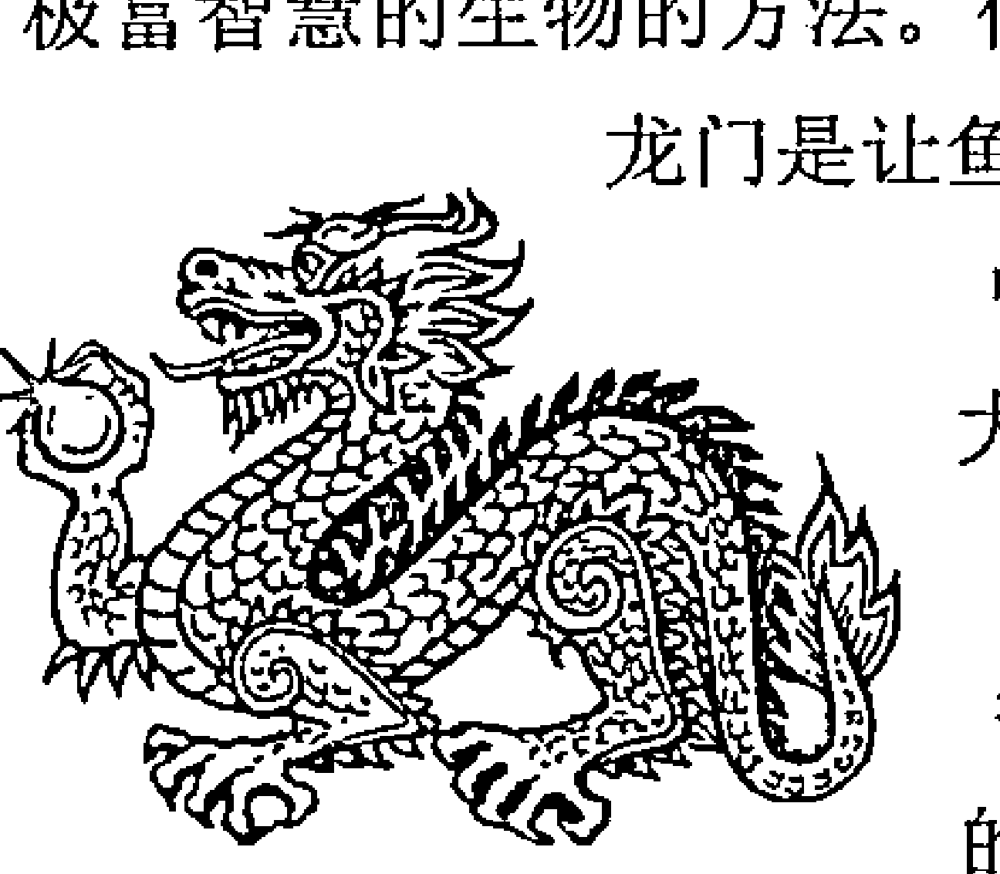

图 22. 中国龙

中国龙（及其它大部分亚洲龙）寿命长达数千年，目睹过世界的变迁。中国龙要涨到3000岁的时候才算成年，幼龙要经过1000年的时间才能从宝石一样的蛋里孵化出来。刚出生的幼龙很像一条巨大的水蛇或鳗鱼。当长到500岁的时候，它们会长出鲤鱼一样的头，这一时期的幼龙被称为蛟（Kiao）。当长到1500岁时，它们会长出四只爪子、长长的脑袋和尾巴，以及很多胡须，此时，它们被称为蛟龙（Kiao Lung）。在2000岁时，龙会长出角，并有一个新名字角龙（Kioh Lung）。在成年前的最后一千年中，它们会长出翅膀。最后，在3000岁时，完全成型的龙被叫做应龙（Ying Lung）。最后两个阶段的龙是现在人们最为熟悉的。
绝大多数日本龙都和中国龙在相貌和体型上很相似，但它们更像蛇，且只有三个爪子。日本龙是狐仙（Kitsune）的天敌。在很多其它的亚洲文化中都有关于龙的神话传说，但这些龙更加西方化，长着四条腿、蝙蝠一样的翅膀、粗短结实的身体——这是西方龙的典型特征——有些更像西方的亚龙——有像戈尔贡一样的大脑袋。下面列举一些亚洲龙。
阿歹达哈栖（Azhi Dahaki）——最伟大的波斯龙（同样也被称作Az Dahak或Azhi Dahaka）。在琐罗亚斯德创世神话中，它被“谎言之父”安格拉·曼纽（Angra Mainyu）所创造出来以对抗正义世界的。阿歹达哈栖常被描述为长着三个脑袋的有翅蛇。它的身体里住着各种有毒生...

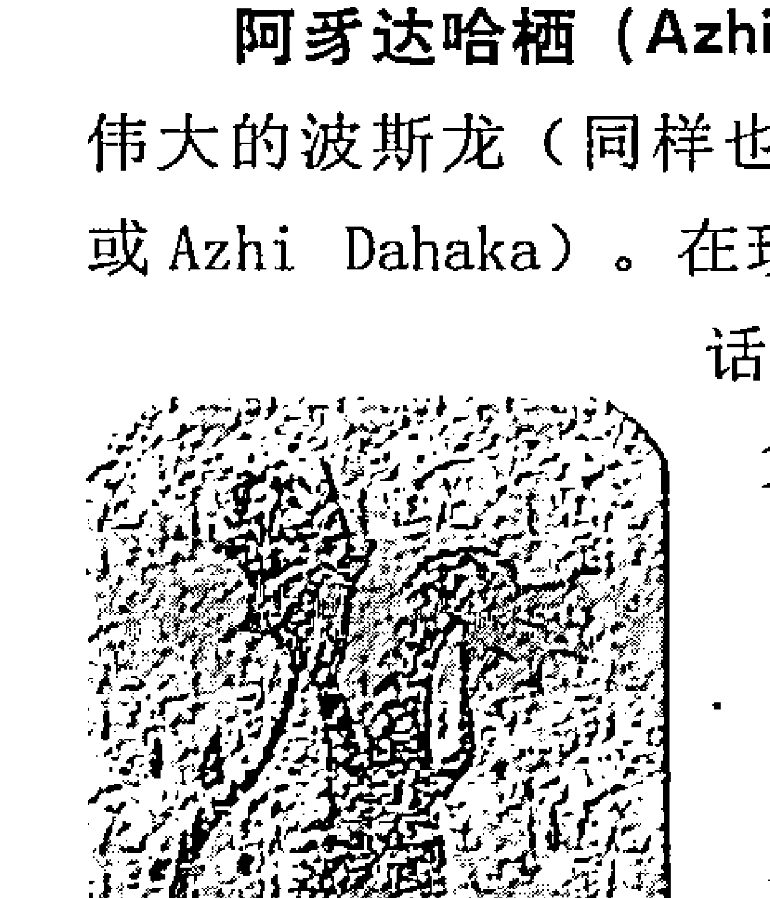

图 23. 阿歹达哈栖

物，比如毒蜘蛛、毒蛇和蝎子。它的三只头分别代表痛苦、愤怒和死亡。它的翅膀展开时能遮住天空。当世界末日来临时，阿虩达哈栖会挣脱束缚，出来吃掉三分之一的人和动物。阿虩达哈栖龙在游戏《最终幻想X》中出现过。
巴龙（Barong）——一种长着虫子眼睛、扭曲的身体的恶龙，出现在巴厘传统戏剧《兰加巫师》中，充当大反派。

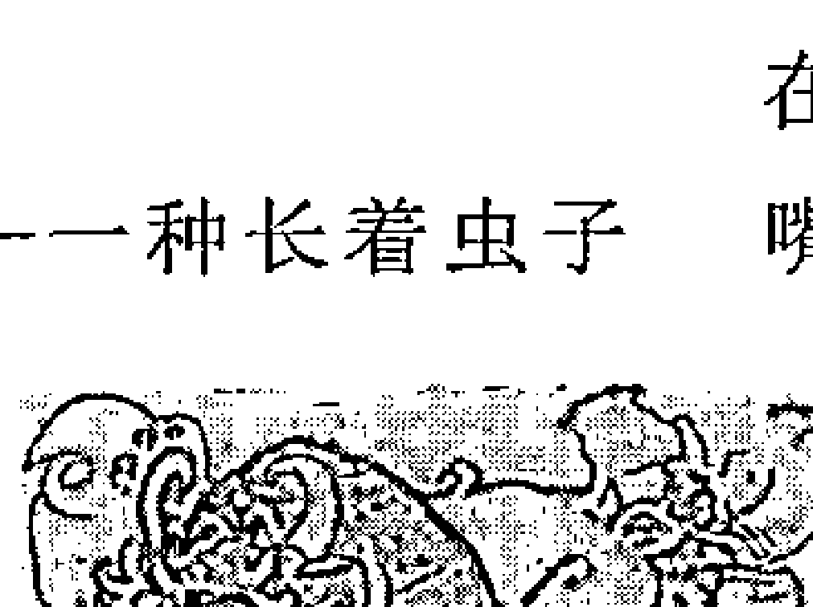

角龙(Chiao)——中国神话中的地龙。
赤龙王（Chi Lung Wang）（“火龙王”）——一直慈祥而巨大的中国龙，负责降水和防火。
西诺夫若瑟皮（Cynoprosopi）——它们是中国应龙（Ying Long）的亲戚，长着蓬乱的皮毛和狗一样的脑袋、有胡子的嘴巴和蝙蝠的翅膀。
龙马——龙马长得像马，但却长着龙的头和鳞片。尽管没有翅膀，但它们中的一些仍然能飞。大多数的龙马都住在水里。它们被认为是神圣使者。

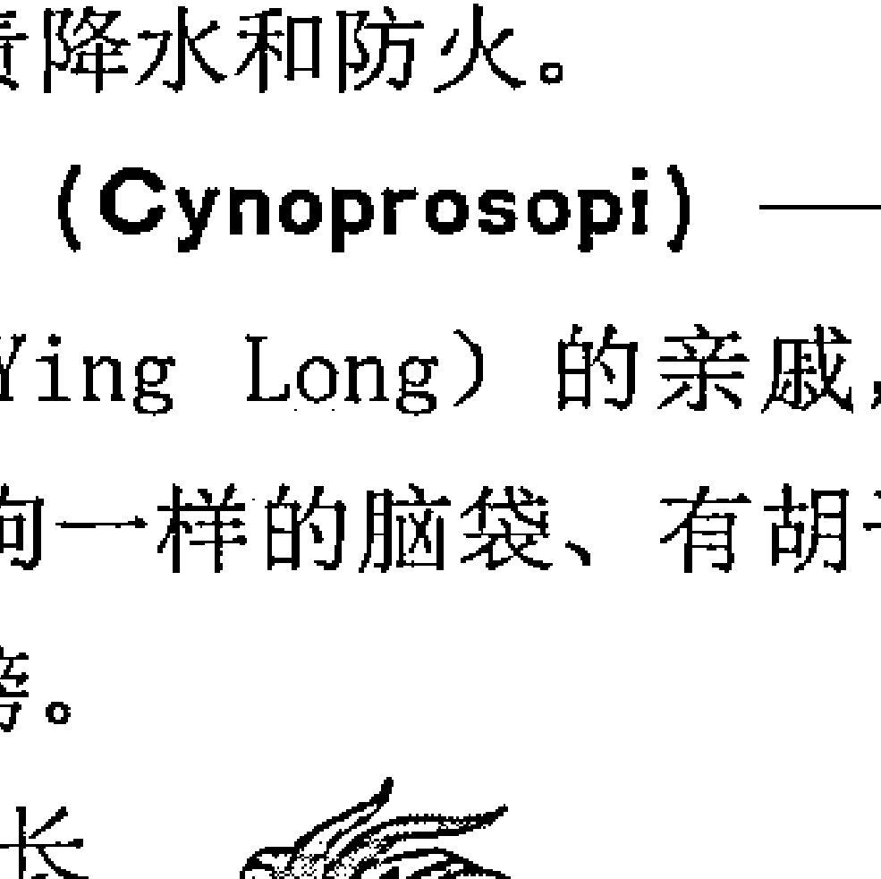

据说曾有一只龙马从黄河里钻出来，将代表阴阳的圆盘交给了皇帝。从黄河中也出现过一只龙马，它带来了八卦图。在动画片《犬夜叉》中，狼怪杀生丸乘坐的正是由一只双头龙马拉着的战车。
龙王——五位不死的中国龙王住在海里的水晶宫中，它们中有一位是首领，其余的四位分管着四个方向：东、南、西、北。它们的名字叫：敖钦（Ao Ch' in）、敖闰（Ao Jun）、敖广（Ao Kuang）和敖顺（Ao Shun）。它们都听从玉皇大帝的命令向人间施放雨水。根据传说的内容，它们身长在3至5英里，腿腿和尾巴上有蓬松的毛，嘴上有胡须。它们闪亮的蛇形身体覆盖着金色的鳞片。在吴承恩的《西游记》中，齐天大圣（美猴王孙悟空）大闹了龙宫，然后被压在五行山 下。在后来唐三藏的旅途 中，众龙王曾对其给予帮助。除了四大龙王之外，还有其他的龙，诸如龙王（Lung Wang）——第五位龙王，掌管火。白龙，是另外一位龙王，因全身白色而闻名。甘肃 Yang Suchow山上的一座庙里有一块碑，上面记录着它的事迹。

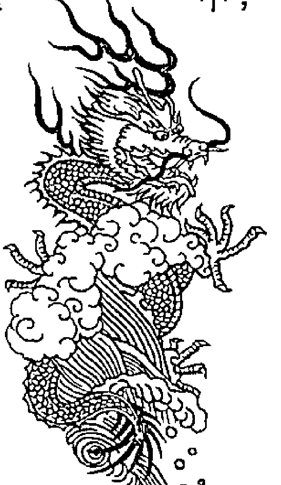

飞廉（Fe-lian）和后羿——这两条龙互为对手。飞廉是掌管风袋的风神，他受后羿大神的监管。飞廉和后羿互相制衡。

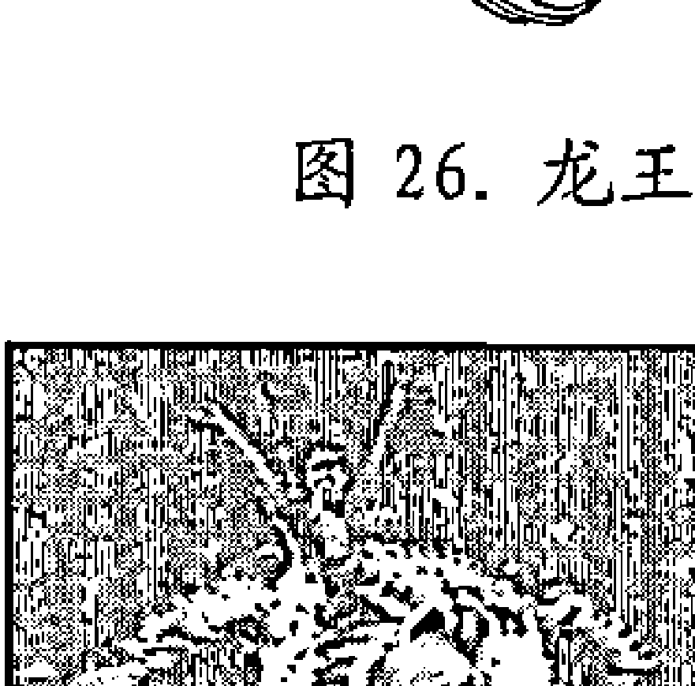

福龙（Fuku-Ryu）——它们是幸运之龙。它们在角龙（Kiao-Lung）阶段结束自己的一生，虽然没有翅膀，但它们也能飞行。《永不结束的故事》（The Never Ending Sotry）中的弗克（Falkor）就是一只福龙。

## 扶桑龙 (Fu-T’ sang Lung)
守护众多财宝，拥有巨大智慧的地下龙。它们被称作“财富之龙”。它们因为《格斗之王》(Mortal Kombat) 游戏系列（如图所示）而被现代的人们所熟知。

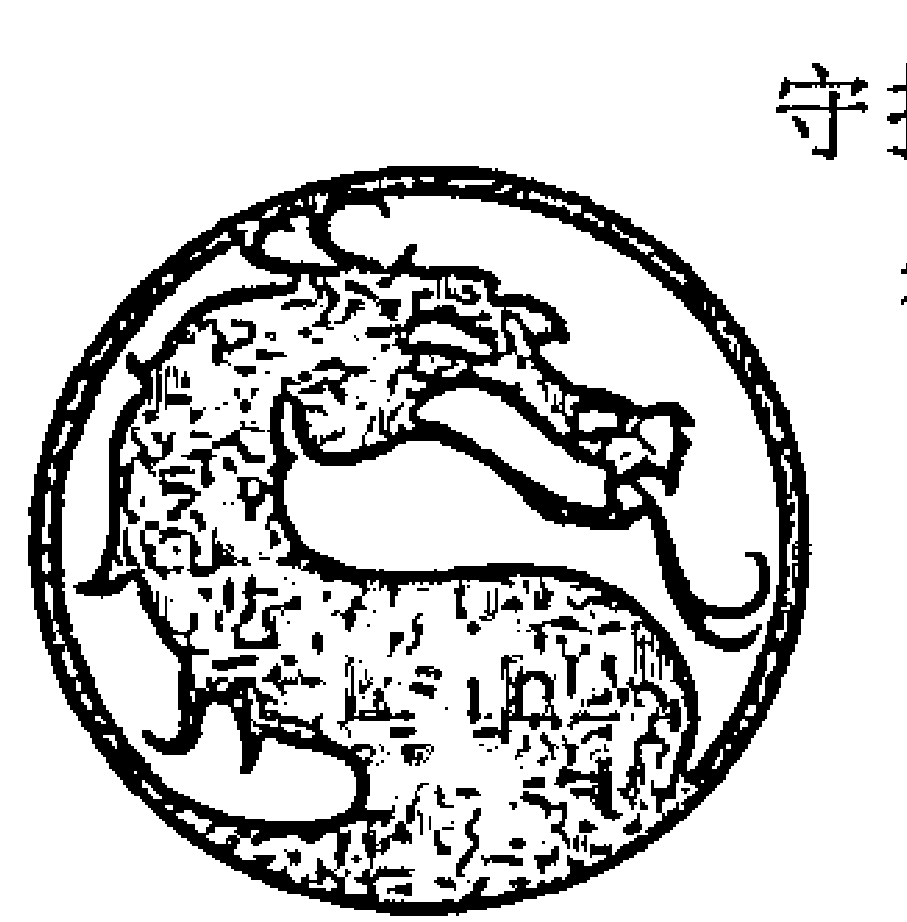

## 共工 (Gong-Gong)
中国神话中一种巨大而恐怖的黑龙，它用头上的角几乎将天宫和大地毁灭。它非常仇恨天帝炎 (Yeo)。曾将一座山峰炸裂，导致了一场世界性的洪水，之后，它撕裂了天空，让日月失色。这个神话传说听起来像一场古代的巨型火山爆发。

## 句芒 (Gou Mang) 和 蓐收 (Rou Shou)
它们是两条中国的宇宙巨龙，是天神的信使。它们都是天龙（见下图）。勾芒是东方之龙，据说能带来好运和长寿，是春天的象征。蓐收是西方之龙，是秋季的象征，能带来噩运和死亡。

## 尤里克 (Jurik)
印度尼西亚巽达(Sunda)传说中的一种喷火宇宙巨龙。它实际上是划过天际的流星或彗星。

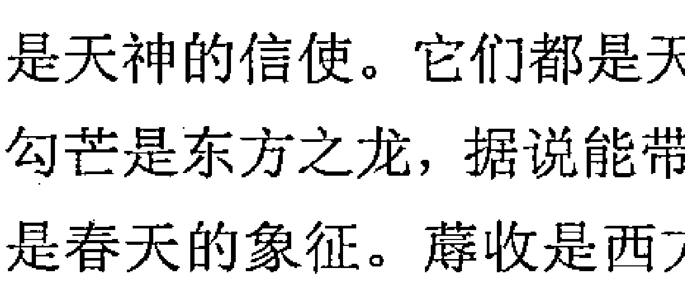

## 嘉龙 (Ka-Ryu)
日本龙中最小的一种之一，全身长着火红色的鳞片，只能长到虬龙 (Kiao-Lung) 阶段。

## 虬 (Kiau)
中国钱塘江流域沼泽地里的一种蛇形龙，它能让渔民得瘟疫，1129 年被一名当地的英雄所杀。

## Kih Tiau
中国传说中的一种海龙，据信能跟抹香鲸一样分泌出龙涎香，在 19 世纪的广东和福州被作为保鲜剂。

## 里昂嘉里 (Leongalli)
一种蒙古龙，长着蛇形的身体和狮子的头及四肢。

## 骊龙 (Li-lung)
慈祥的地龙、风龙、水龙，据说它们能以台风或龙卷风的形态升入天宫。

## 八岐大蛇 (Orochi, 也叫神子的八头蛇、神子龙、出云龙、)
一种类似于九头蛇的日本巨龙，长有八个头和八只尾巴。根据传说，它巨大的身体能占据八座山和山谷，在背上还长着广袤的森林。多年以来它一直威胁着出云省的居民们，在神子路沿途捕食人类，每年还需要一位公主作为祭品。最后，它被英雄须佐之男 (Takehaya Susanowo) 所杀。他用米酒将其灌醉，砍掉了它所有的头，还在它的一条尾巴里发现了一柄宝剑——天丛云剑，后来被作为日本帝国剑被代代相传。

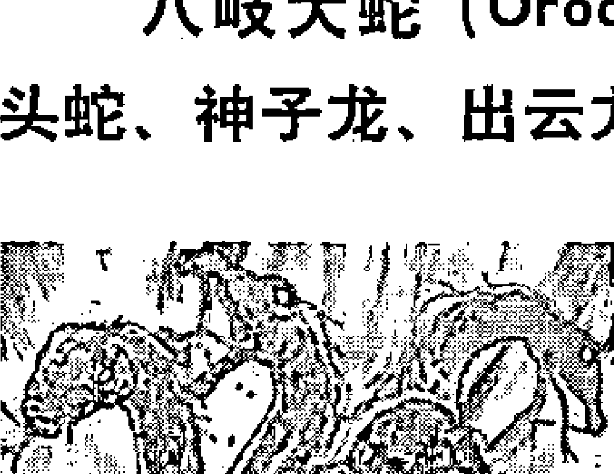

## 鹏鸟
它们是中国神话中非常罕见的鸟类，长着龙的头和鸟的翅膀与后半身，或者长着蛇形的身体，上面有羽毛和鳞片，还有鸟的翅膀、腿和爪子。它在日本被称作跳龙 (Tobi-Tatsu）或海里尤（Hai-Ryu）。

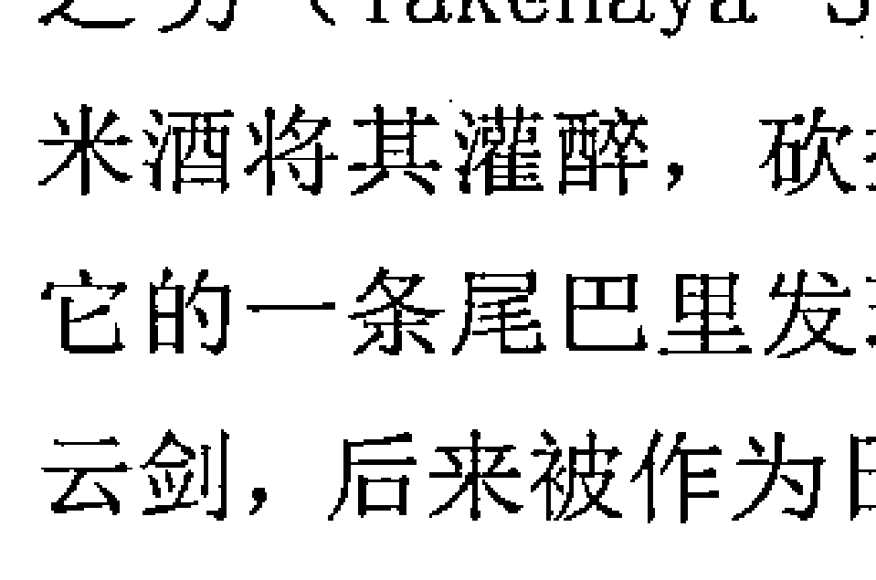

皮西斯（Pi-his）——这种幻想出来的龙是河流之王。皮西斯长着乌龟的硬壳、腿脚、尾巴和龙的头。在“最终幻想”系列游戏中它们是金刚龟（Adamantoise）的敌人。
龙神（Ryo-Wo 或 Ryujin）—— 日本的一位龙王，手握潮汐珠宝，掌管着全世界的潮汐。它住在神奇的海底宝石皇宫龙宫里，在那里靠吞吐海水来制造潮汐。据称龙神用自己的样子创造出了水母。他漂亮的女儿被英雄火远理命（山幸彦）王子赢走，于是他成了传说中的天皇的祖先。
神龙——一种漂亮、色彩艳丽、长着五趾的中国御龙，能给人间带来降水。只有帝王才能使用它的形象，其他人如果使用了它的形象则会被处死。

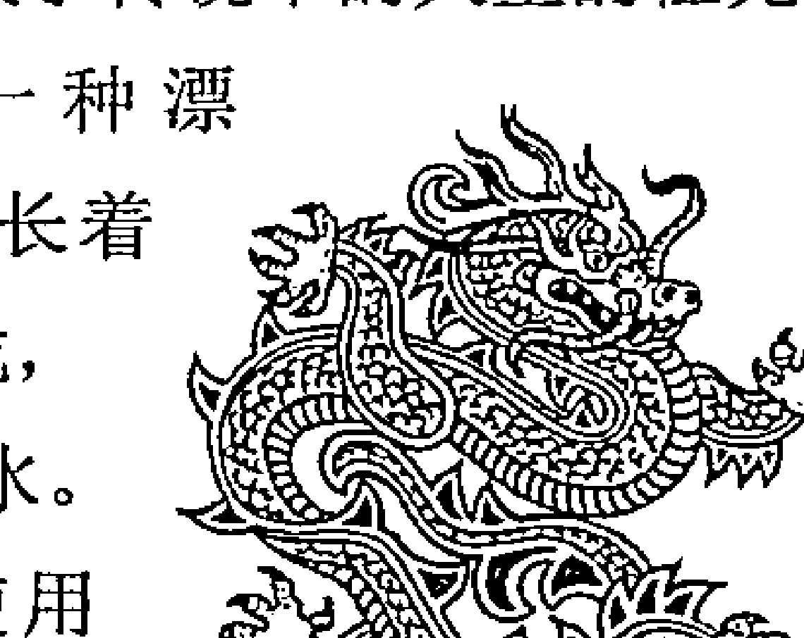

辰龙（Tatsu）——这些日本龙据说是一种中国三趾龙的后代，它与海洋的关系更为密切，可能是因为日本不想中国那样容易遭受旱灾。在日本的星座中，它和一条名为海马的小鱼相依相存。
天龙——它们背负着天宫，也是天宫的守卫。

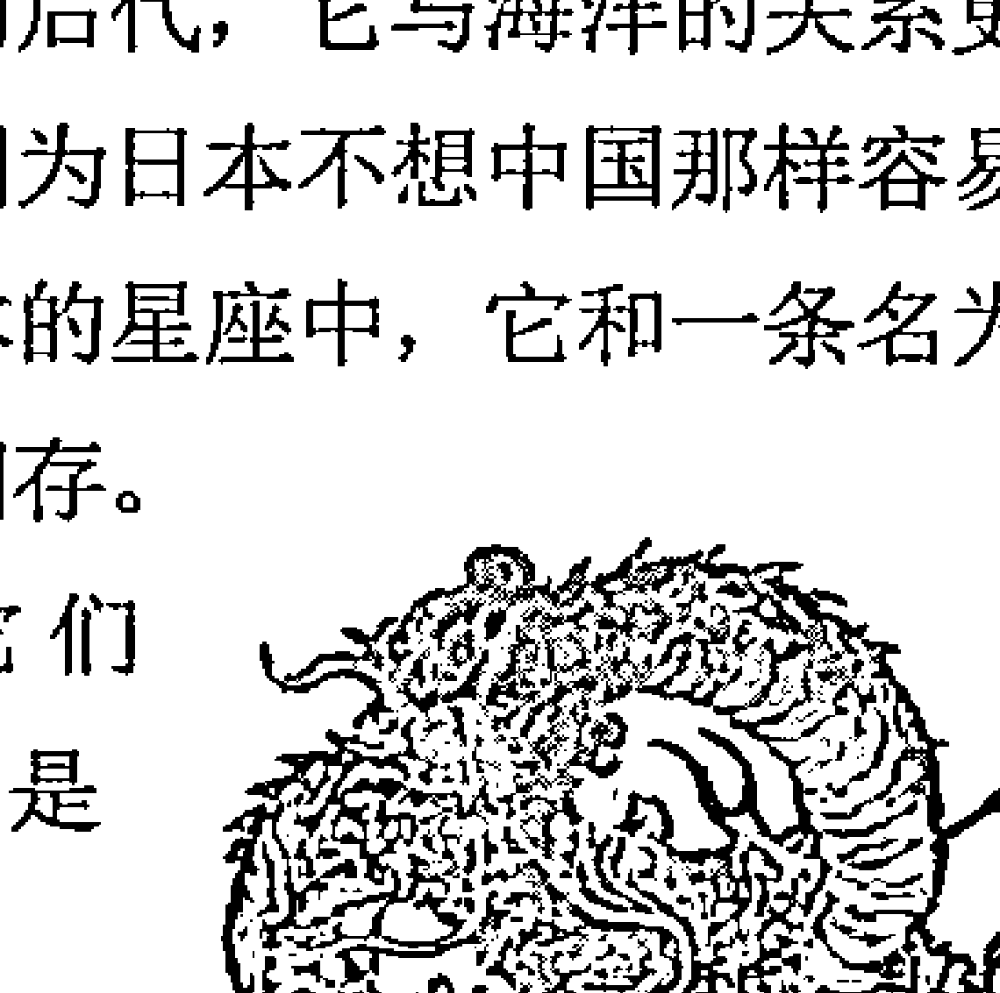

Ti’-Lung——中国神话中的天体水龙，控制着河流和溪流。
羽化岛龙（Ukasima）——一种长着白色鳞片的巨龙，住在京都附近的山城（Yama-shiro）的Ukasima湖。据说它每隔50年就会从湖中冒出来，变成一只金色的鸣鸟，也叫0-Goa-Cho。它在早上的啼鸣像狼嚎一样，会给大地带来悲伤的气息。它的样子和声音预示着灾难和噩运。Ukasima龙经常被视为严重干旱的代表。最近一次关于它的目击发生在1834年4月，此后很多地区都爆发了饥荒和瘟疫。
黄龙——在中国神话中，黄龙有两条，一条给人类带来了八卦图，另一条非常残忍，后来被八仙中的吕洞宾所杀。根据神话所说，黄龙最后变成了黄河。
应龙（Ying-Lung）——这些龙全身长着独特的毛发，还有有毛的翅膀，而不是大多数龙拥有的蝙蝠那样的膜翅。它们是水和云的护卫。PS 游戏《露娜：银河之星》和《露娜 2：永恒之蓝》中的纳尔 1 和露比就是应龙。

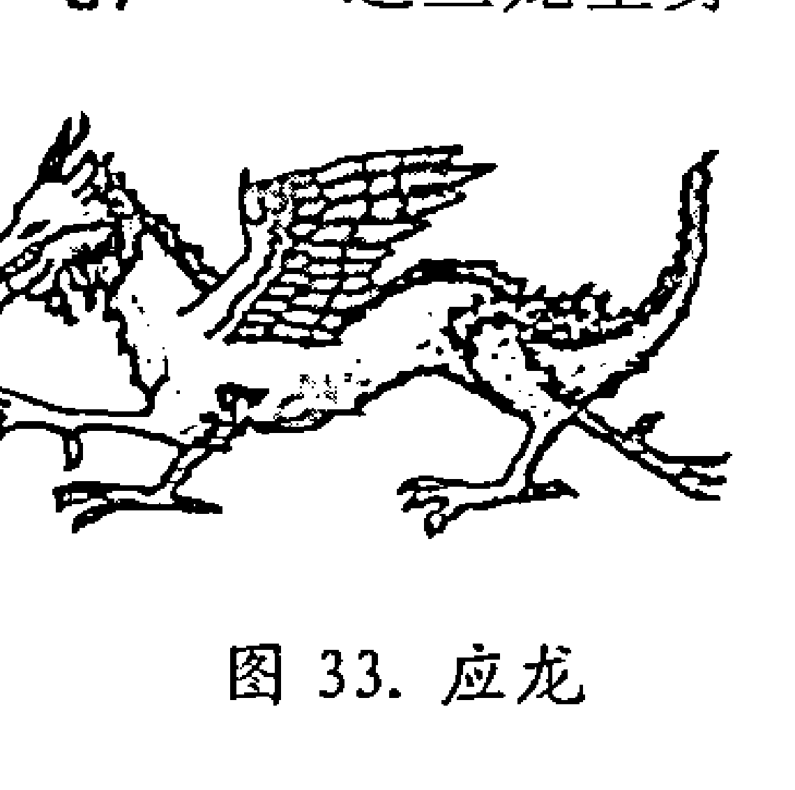

## 美洲龙
在听到龙这个词的时候，你想到的是什么？欧洲的龙，还是中国的龙？但在世界其他地区的文化中，龙在它们的神话传说中出现的频率也非常高，存在于美洲土著文化中。你听说过阿兹特克神羽蛇神魁札尔科亚特尔（Quetzalcoatl）吗？羽蛇神魁札尔科亚特尔和他的玛雅祖先库库尔坎（Kulkulcan）都是类似于欧洲神话中阿姆费特尔（Amphiteres）的龙。在它们之前还存在着一种名为帕露露孔 (Palulukon)，长着羽毛的龙。
在美洲大地上生活着许多不同的龙。如果你住在美国，你就会听说在当地的古老（或者并没有那么古老）传说中的龙。如果你住在拉丁美洲，当地的传说中也都充满了它们的身影。下面就是一些美洲龙：
古龙——这种派尤特神话中的海蛇居住在金字塔湖中，喜欢将岸边的人拉入水中淹死。派尤特人会避开金字塔湖中的漩涡，因为漩涡是古龙在寻找猎物的标志。
阿兹艾乌冈奇穆提(Az-I-Wu-Gum-Ki-Mukh-Ti) ——这种因纽特神话中的龙拥有黑色的鳞片、海象的脑袋、狗的身体和腿、鲸鱼的尾巴。这种巨大的怪兽只需用尾巴一扫，就能让船只沉没，因纽特渔夫特别害怕它。

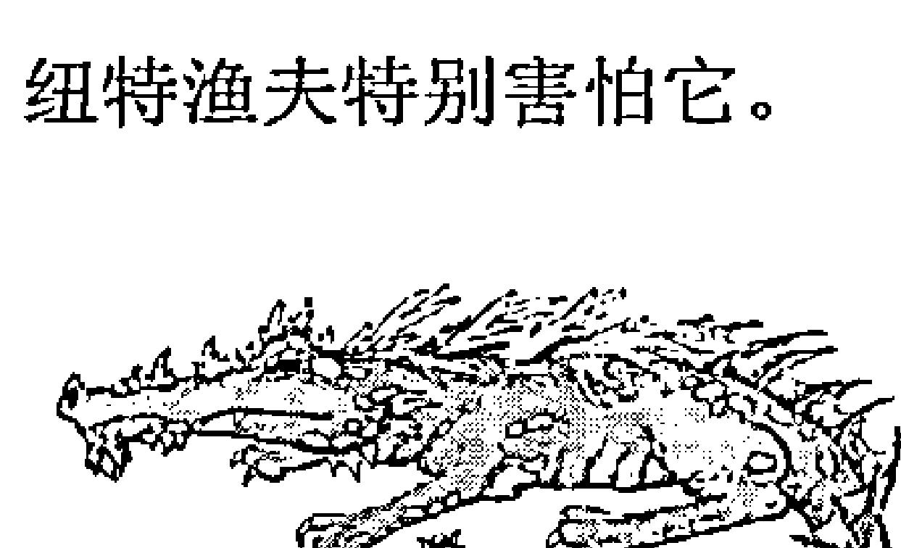

坎帕克提(Campacti或Cipatli) ——在墨西哥的阿兹特克传说中，它是一种巨大的原始龙。死后，其身体变成了大地。它被描述为一条像鱼一样的鳄鱼。
沙克(Chac) ——玛雅神话中的一种龙，控制着降水和所有的水体。人们需要向其献祭才能保证夏季有足够的降雨，但它也会用自己的鲜血来偿还活人献祭。

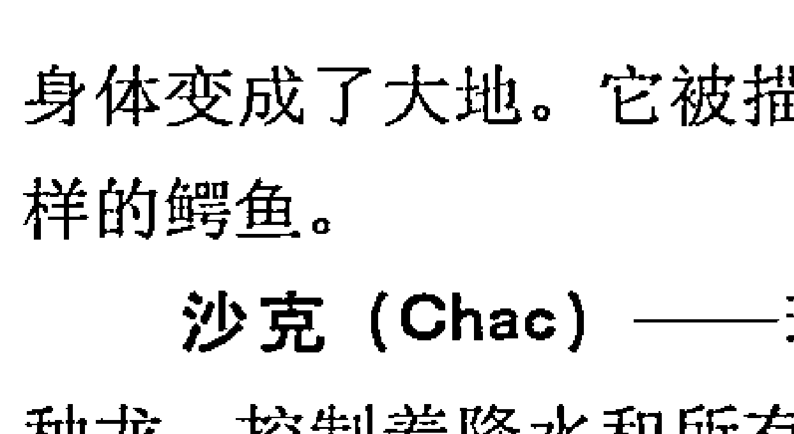

沙克与亚洲的龙非常相似，长着长长的蛇形身体，上面覆盖着鱼鳞，嘴边还有鲇鱼的晶须。他鳄鱼一样的脑袋上长着鹿的角和耳朵。沙克常被描述为一只爪子抓着它的闪电斧。

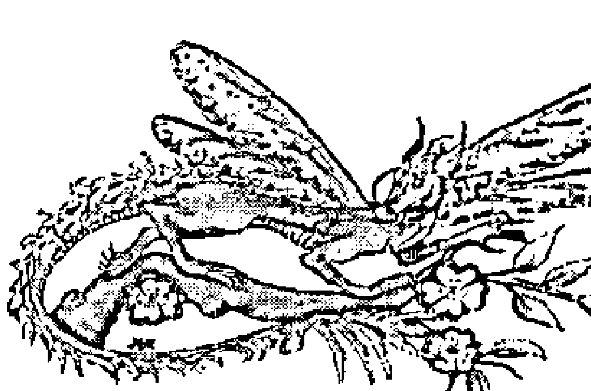

费里龙——也叫费龙或佩尼龙。这种龙在南美非常流行，它的体长从与老鼠相同到一英尺不等。尽管它与欧洲的龙很相似，但在二者间有明显的不同之处，费里龙长着两对翅膀，或像蜻蜓或像蝴蝶，同样，它们的嘴巴也更长，更尖，眼睛很大，而且有彩虹的颜色，在其出现的地方也会连续数月出现彩虹。如果用光线以合适的角度照射它的身体，它也会发出彩虹般的色泽。
格斯也恩戴尔沙(Gaasyendietha) ——塞内卡神话中的一种巨龙，据信诞生自天堂坠落至地面的陨石中，因此，它也被称为流星龙。格斯也恩戴尔沙(Gaasyendietha)居住在河流和湖泊中。
依米斯奇(lemisch) ——一种与欧洲塔泽尔亚龙(Tatzelwurm)类似的巴塔哥尼亚龙，长着蛇形的身体和狐狸的上半身。它能像蟒蛇一样将猎物缠死。
伊华伊弗路(Ihuaivulu) ——这种南美龙住在火山里。它长着漂亮的蛇形身体，上面覆盖着光滑的铜色和红色鳞片。它是南美版的九头蛇，长着七个脑袋。因为住在火山里，所以它也能喷火。
皮阿索(Piasa)——这个名字意为“毁灭者”。这种龙是各种动物的大集合，这一点与亚洲龙很相似。据说它长着熊的脑袋、麋鹿的尖角、鱼的鳞片、熊的腿以及## 图鉴二、揭秘夜之生物（上）

老鹰的爪子，在其头部周围和肩上长有鬃毛。它还有一条至少50英尺长的尾巴，能围绕身体三圈。美洲土著人称其为风暴制造者或雷霆制造者。(参见第七章：“皮阿索和曼提考”)

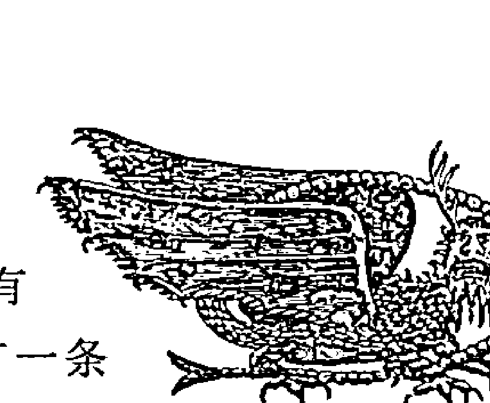

帕莱予（Pal-rai-yuk）——一种阿拉斯加龙，其蛇形的身体上长有六条腿，背上还有一串骨刺。它住在阿拉斯加的河流中。因纽特人会把它的样子画在自己的独木舟上，以免引起它的注意。

帕露露孔（Palulukon）——这种龙和中美洲的龙神都是阿姆费特尔中有羽毛的分支。尽管很强大，但它们却不问世事——仅此而已。它们代表着水元素，负责降水。据说世界就是被两条这种龙背负着在宇宙大洋中游弋的。如果被人冒犯，它们就会引发诸如干旱和地震的自然灾害。

羽蛇神魁札尔科亚特尔（Quetzalcoatl）——阿兹特克神话中长着羽毛的蛇神，是风、雨、知识、手工艺和艺术的统治者。玛雅人称其为库库尔坎（Kulkulcan），米斯特克人称其为九风王。它因创造了玛雅历法而闻名。他是阿姆费特尔中的一种，也被叫做伊厄科特尔（Ehecatl）和黎明之神。羽蛇神魁札尔科亚特尔身上长着五彩的鳞片和羽毛。它在空中飞行时会制造出彩虹。

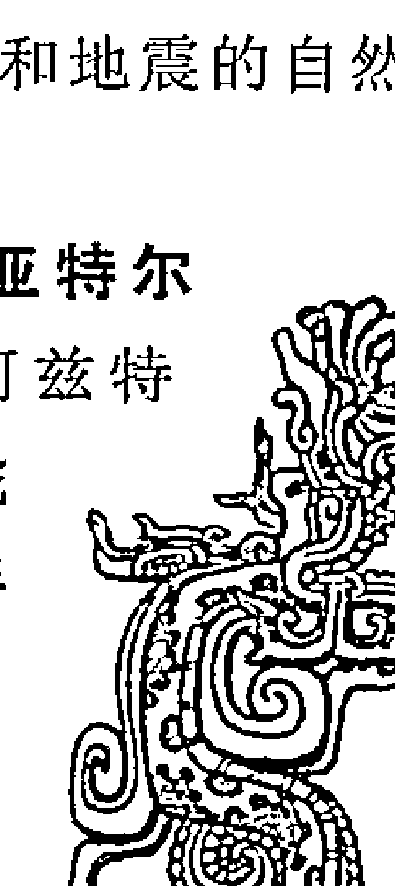

有时它也会变成人的样子。据信羽蛇神魁札尔科亚特尔曾乘着由蛇组成的筏子离开东方，一天之内又回到原点。阿兹特克人将西班牙人柯尔特斯的到来视作羽神重临，因此，为数不多的西班牙人才打败了数倍于其的阿兹特克勇士。

## 非洲及大洋洲的龙

非洲和大洋洲的龙是先前所提及的所有龙的大集合，也包括阿姆费特尔、亚龙、德拉克和海蛇。下面是一些非洲及大洋洲的龙：

比达（Bida）——西非索尼尼奇（Soniniki）神话中一种巨大的亚龙。它盘绕着迦纳帝国，给里面的居民带去黄金，作为交换，每年它都需要一个少女作为祭品。这名少女是以抽签的方式选出来的，直到后来英雄玛马迪·瑟非·德克特（Mamadi Sef e Dekote)砍掉了比达的头，救出自己的爱人才作罢。

布甲加（Bujanga）——爪哇和西马来西亚传说中的一种巨大的护卫龙。它住在丛林里，知道森林里的一切，能听懂所有生物的语言。

埃塞俄比亚龙（也叫帕蛇）——巨大的蛇形龙，能长到35英尺长，有一对或两对翅膀。据称它们以大象为食，进食后，它们需要三年的时间来吐出大象的骨头。这种龙也许源自尼罗鳄（Crocodylus niloticus）和网纹蟒（Python reticulatus），这两种蛇都能长到那么长（尽管都没有翅膀）。

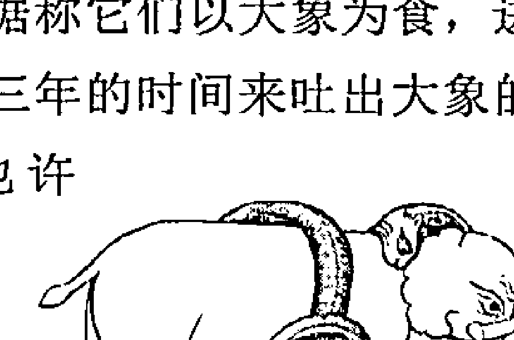

空阿马托（Kongamato）——一种赞比亚亚龙。它是一种小型龙，拥有3至4英尺的翼展，尖尖的嘴里长着锐利的牙齿。它的皮肤上有红色的毛发。它们住在禁乌度沼泽里，以从空中俯冲攻击船只为消遣。

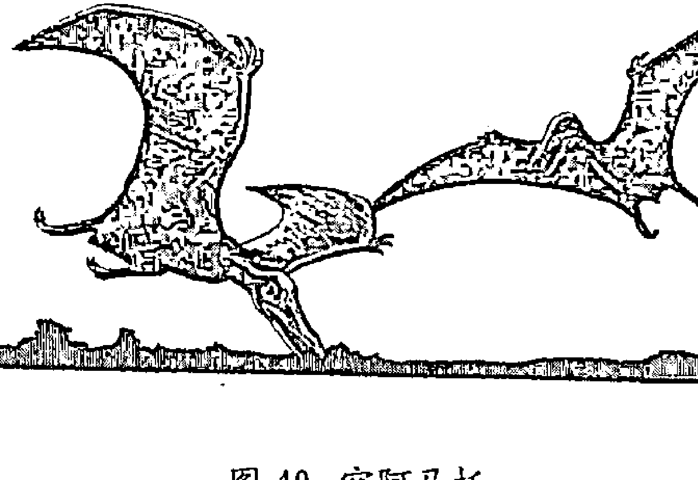

恩古马·摩内内（Nguma-monene）——这种巨大的刚果亚龙长着一条贯穿整个背部的肉脊。据说生活在东古-马塔巴（Dongou-Mataba）河中。

### 斯塔利斯[Scitalis 或 Scytale，源自“优雅”（scitulus）一词]——这是一种有翅的蛇形龙。它只长有两只前腿，身上覆盖着漂亮的彩色鳞片，引得人和动物都会驻足观看——此时，这种貌似行动迟缓的爬行动物就会迅速将其击倒，然后吃掉。任何被其咬到的人都会全身起火。它的体内有熊熊的火焰，即便在雾极大的时候，它都会走出巢穴褪下皮肤。T·H·怀特认为它可能是“被夸张了的”犀牛毒蛇（Bitis nasicornis），这种蛇在非洲西部和中部的丛林中都有发现。

## 现存的龙

作者：奥伯龙

龙是西方神话中古老而原始的怪兽，共有四个种类：穴居龙、飞龙、海龙和喷火龙。它们中的雄性被称为“德拉克”，雌性被称为“奎因（queen）”，二者都被描述为西方传说中古老、强大和恐怖的爬行生物，是自然原力的象征。龙非常聪明、狡猾、残忍、贪婪。它们热衷于搜集各式各样的财报：黄金、珠宝、武器以及神奇的遗物，它们把这些都堆放在一起，小心地看护着。

龙能理解所有生物的语言。日耳曼英雄西格弗里德无意中尝到了一滴龙血，这让他拥有了理解鸟类和动物语言的能力。每条龙都有其特殊的性格，它们拥有不同的名字，研究它们能给人带来力量。在故事中常出现的龙的名字有费米特拉克斯（Vermithrax）、德拉古（Draco）、凯拉辛（Kalessin）和史矛革（Smaug）。而伶盗龙（Velociraptor）、暴龙（Tyrannosaurus rex）、食肉牛龙（Carnotaurus）、恐爪龙（Deinonychus）和棘龙（Spinosaurus）则是希腊文中龙的名字。

有翅龙有两种基本类型：四脚龙，它们的翅膀像蝙蝠或像鱼鳍；双脚亚龙，它们的翅膀由其前爪变化而来。它们和史前翼龙有着令人震惊的相似之处，人们甚至相信它们就是翼龙中的幸存者。电影中也出现过很多非常棒的飞龙。在《魔幻屠龙》（1981年）中出现过一种亚龙，在《龙之心》（1996年）中出现过四脚龙。尽管龙被认为是神话动物中不可或缺的一部分，但我们不能视其为完全的虚构产物。实际上，很多龙的传说都源自真实存在着的动物，其中有些还存在世上，有些则已经灭绝（或至少被认为已经灭绝）。

世界上第一种真正存在过的龙是英国古生物学家理查德·欧文在1842年命名为“恐龙”（意为“恐怖的爬行生物”）的怪兽。他同样也可以用“龙”来命名它们，因为数千年来，它们都是被这样称呼的——而且现在的中国古生物学家仍然这样叫它们。它们的体型从鸡一样大到100英尺长不等，体重也能达到100吨（阿根廷龙），它们横行地球长达1亿5千万年，一直到6千5百万年前的大灾变时期才灭绝。它们留下来的巨大化石向人类证明，龙真的存在过。

如此强大，存在了如此之久的这些怪兽并不会一夜间全都死去。正如那些远去了的精灵和矮人们一样，龙的灵魂继续着古老的足迹，存在于梦幻之地和我们的记忆中。

而且，直到今日也可能还有一些幸存者存世。从最早的“黑暗非洲”时期的欧洲探险家开始，各种关于活恐龙的流言和报告一直都在广袤的刚果河盆地流传。它们都有着可怕的名字，如河霸龙（Mokêle-M’ Bèmbe）、齐彭柯维（Chipekwe）、伊美莱南头卡（Emela-Ntouka）和姆乎路（Muhuru），据说它们拥有厚厚的鳄鱼尾巴、长脖子、长角、背刺和／或尖锐的爪牙。所有的这些描述都和恐龙一样，看到恐龙照片的土著人都立刻说它们就是传说中的怪兽（参见第25章：“现存的恐龙”）

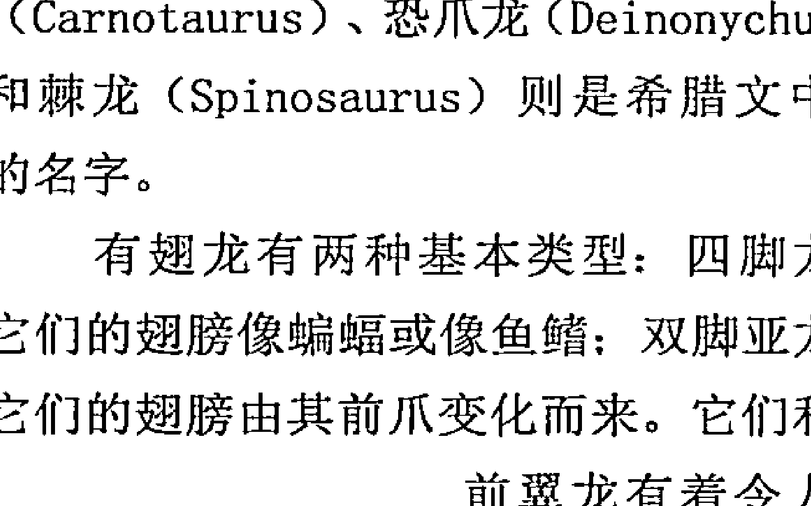

在古代文明中也能找到龙的痕迹——比如埃及斯塔（Sta）或玛法德特（Mafadet），以及著名的怒蛇（Sirrush）或“伊斯塔之龙”，它在尼布甲尼撒（Nebuchadnezzar）大帝时期（公元前605-562年）被刻在古巴比伦的伊斯塔门上。它也被叫做姆西拉西（Mushrush）或穆苏苏（Mušhuššu），在《但以理书》中也有所记载，它可能是一只被人杀掉的“活着的龙”（《但以理书》14:23-27）。它有可能是被一位非洲统治者作为贡品带到古巴比伦的河霸龙（Mokêle-M’Bèmbe）吗？

尽管恐龙及其化石毫无疑问地证明了龙在古代（甚至一些非洲不为人知的沼泽地里）曾经存在过，但它们却无法解释欧洲传说中的很多龙，比如温特利龙、蓝顿龙或被圣乔治一世杀死的那条龙。我相信这些报告中的龙是今天被我们称作湖怪的生物。这种说法至少能够解释那些被称为虫（Worm）或欧姆（Orm）的龙。对此种生物更为详细的讨论——以及我对于它们是动物的证明——请参见第18章：“湖怪”。

虽然在现代都将龙描述为体型巨大、长着蝙蝠翅膀，但在人类历史上的绝大多数时候，它们并非是这个样子的。在中世纪，大部分龙都被描述为巨大的蜥蜴或蛇——二者间差别很小。实际上，人们形成了一个惯性思维，将任何体型巨大的爬行动物——水生的、陆生的、两栖的——都自动视作龙。

第一种被欧洲探险者遇见的活龙是埃及的尼罗鳄（Crocodylus niloticus），它们通常能长到20英尺长。河口鳄（Crocodylus porosus）比尼罗鳄还要大，它是所有存在着的爬行动物中体型最大的一种，它们只存在于印度尼西亚，身长可达30英尺。很多龙实际上都是鳄鱼。

除此之外，还存在着著名的科莫多龙（Varanus komodoensis），它是一种巨蜥，同样只生活在印度尼西亚。其体长可达6至10英尺，体重能长到365磅，长着一条长长的、黄色的、分叉的舌头。它吞吐舌头的时候就像在喷射火焰。远古时期的科莫多龙被称作古巨蜥（Megalania），体长15至20英尺，体重1000至1300磅。对于任何人而言，它们绝对都是活生生的龙！尽管古巨蜥被认为已经灭绝了4万年，但在澳大利亚和新几内亚偶尔也有关于它的目击报告。1979年，科学家弗兰克·戈登就目击到了一只，他将其误认为是一根原木。澳洲土著文化中有关于一只名叫姆果昂加里（Mungoongalli）的巨型蜥蜴的传说，它可能就是一只古巨蜥。最近，有人发现了一块仅有100至200年历史的古巨蜥髋骨化石。

## 真正的飞龙

巨蜥和鳄鱼都没有翅膀。那为什么我们会有关于飞龙的传说呢？

当然，在古生物记录中记载着那些长着皮质翅膀的巨龙。第一种进化出翅膀的脊椎动物——翼龙（“有翅爬行动物”）——曾在2亿2800万年至6500万年前统治着中生代的天空。它们的体型从麻雀（蛙嘴龙 “Anurognathus”）到翼展达40英尺的巨型生物（翼龙“Quetzalcoatlus”）不等。在中世纪龙的传说中，它们被称作亚龙，它们是四脚龙，只是两只前腿变成了翅膀。

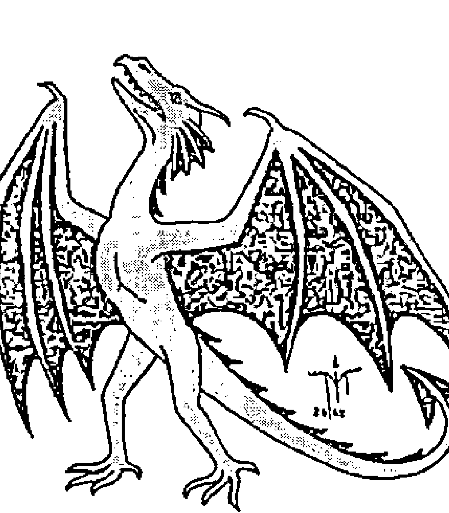

图 48. 威尔士双足飞龙（奥伯伦绘制）

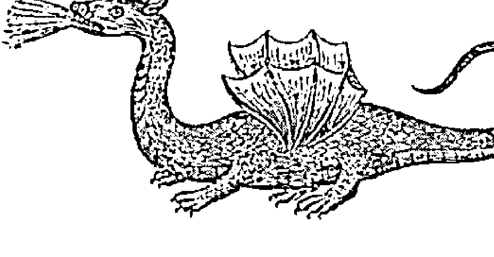

图 50. 中世纪的鳍翅龙（爱德华·托普塞绘制，1607）

12世纪，第一批欧洲人开始沿着丝绸之路穿越阿富汗到达印度，带回了香料、旅行者的故事和小型纪念品，其中就有一些据称是被做成木乃伊的龙宝宝。而且它们是货真价实的——因为它们身体两侧长着鱼鳍一样的翅膀。对那些动物寓言集编纂者来说，通过这些“幼崽”来想像成年个体的模样并非难事。于是，现在备受欢迎的飞龙的形象便诞生了。看一看早期对飞龙的描述就能发现它们的原形就是那些现在用其名字命名的蜥蜴。

但那些著名的昆虫龙——长着四条腿和两只皮翅——又源自什么动物呢？在整个地球的进化史中都没有昆虫脊椎动物，所以这种动物一定是不存在的，对吧？呵，你最好别相信。

德拉古属（Genus Draco）（“龙”）包含着24种小型飞龙科蜥蜴，比如飞蜥（Draco volens）。它们只有7至9英尺长，在马达加斯加、印度、东南亚和印度尼西亚的丛林中都有发现。曾有关于它们在164英尺高的地方，依靠自己由肋骨支撑起的膜状翅膀在树与树枝间滑行的记录。

1960年，三名新泽西的小男孩发现了一枚处在三叠纪沉积层中，身长7英寸，翼展达10英寸的有翅蜥蜴化石。它们在当地被冠以飞龙（icarosaurus）之名，这个词源自希腊神话中的“伊卡洛斯（Icarus）”，因依靠其羽翼飞得太靠近太阳而被烤化了。还有一种名叫孔耐蜥（Kuehneosaurus），同样生活在三叠纪时期的有翅蜥蜴，它身长2英尺，翼展有2英寸。在中国，有一种有翅蜥蜴叫赵氏翔龙（Xianglongzhaoi），生活在1亿2500万年前的白垩纪时期。像德拉古一样，这些古代的物种能够展开翅膀滑行，也能将翅膀收拢在身体两侧。

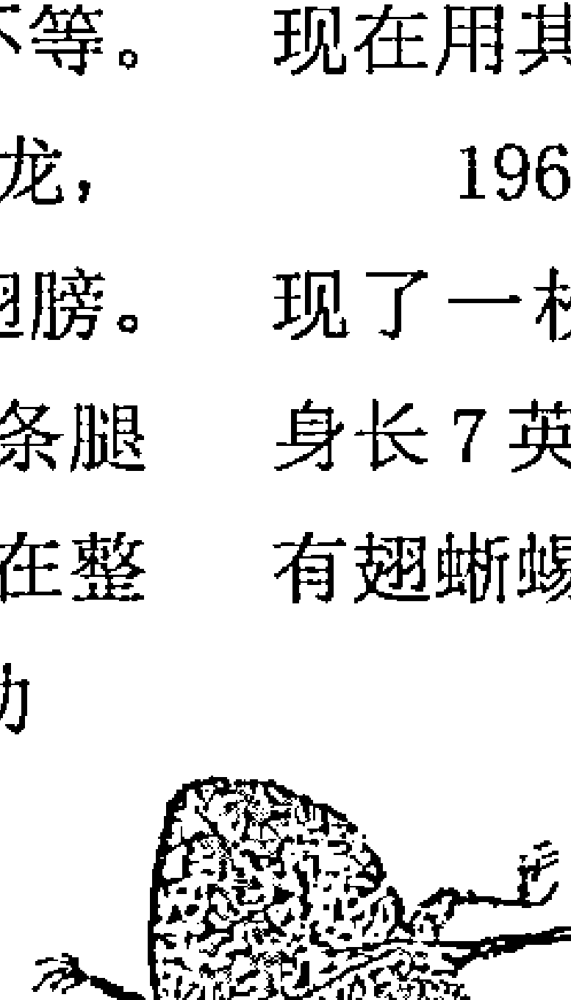

图 49. 飞蜥

（Mechistotrachelos aperos），它长有跟空尾蜥一样的翅膀，以及一条像龙一样的长脖子。

但最为令人震惊的发现是1910年在德国一座铜矿里出土的2亿5千万年前晚二叠纪时期的化石。1997年，卡尔斯鲁厄博物馆从一些业余的化石猎人手中购入了一副完整的骨架，它是一只12英寸长的蜥蜴，长着华丽的头冠。其学名被重新诠释为空尾蜥（Coelurosauravus），它是已知最老的飞行脊椎动物，长着与其它任何动物都不相同的翅膀。与那些由诸如前肢和肋骨的内骨骼支撑的翅膀不同，它那像鱼鳍一样的膜翅是由长在其身体两侧，在前后肢之间的独立骨骼支撑起来的——这与飞鱼的翅膀很相似。想像一下——在鱼类、鸟类、翼龙以及蝙蝠横行天空之前数百万年，这种能长着四条腿的脊椎爬行动物就已经长出了鱼鳍一样的翅膀！

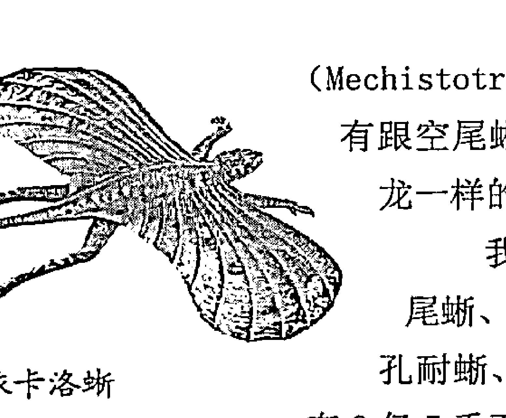

我们很容易就能随着诸如空尾蜥、依卡洛蜥（Icarosaurus）、孔耐蜥、赵氏翔龙及飞行长颈蜥蜴在2亿5千万年中的进化而想象出更多古代生物的模样，随着时间的流逝，这些传说中的龙变得越来越庞大。它们的后代当然与我们头脑中飞龙的形象差不多，实际上，探索频道在2005年播放的一部以纪录片形式制作的节目——《龙的世界：幻想成为现实》——正是受到了它们的启发。

## 怪兽电影：龙

作为所有魔幻动物中最受人欢迎的一种，龙或许已经成为了魔幻电影中最为常见的角色。下面就是一些涉及龙的电影，以时间先后顺序排列：

### 西方龙：
- 《辛巴达七航妖岛》（1958年）
- 《睡美人》（动画片，1959年）
- 《巨人与巨龙》（Goliath and the Dragon）（1960年）
- 《魔法剑》（1962年）
- 《哈比人历险记》（动画片，1977年）
- 《妙妙龙》（动画片，1977年）
- 《屠龙记：亚龙》（1981年）
- 《诸神之战：九头蛇》（1981年）
- 《巨龙之战》（Flight of Dragons）（动画片1982年）
- 《Q来了（大魔龙）：阿姆费特尔》（1981年）
- 《邪典之屋首发蛇妖》（1988年）
- 《龙行天下》（1994年）
- 《柳树:欧姆龙》（Willow:Orm）（1988年）
- 《巨人杀手》（1994年）
- 《恐怖屋历险记》（动画片，1995年）
- 《龙之心》（1996年）
- 《大力士》（动画片，1997年）
- 《寻找卡米洛城》（动画片，1998年）
- 《龙行天下2：续写传奇》（1999年）
- 《杰逊王子战群妖》（电视剧，2000年）
- 《龙之心2：新的开始》（2000年）
- 《龙与地下城》（2000年）
- 《哈利波特与魔法石》（2001年）
- 《怪物史莱克》（动画片，2001年）
- 《火龙帝国》（2002年）
- 《怪物史莱克2》（动画片，2004年）
- 《乔治与龙》（George and the Dragon）（电视剧，2004年）
- 《地海传说》（电视剧，2004年）
- 《哈利波特与火焰杯》（2005年）
- 《大力士：九头蛇》（电视剧，2005年）
- 《龙与地下城2》（2005年）
- 《龙的世界：幻想成为现实》（2005年）
- 《失落世界的统治者》（2005年）
- 《最终幻想7：圣子降临》（2005年）
- 《龙骑士》（2007年）。

### 东方龙：
- 《哥斯拉》（从1954年到至今的所有系列电影）
- 《大魔域》（1984年）
- 《花木兰》（动画片，1998年）
- 《龙之心2：新的开始》（2000年）
- 《最游记》（五十集系列动画片，2000 - 2001年）
- 《千与千寻》（动画片，2001年）
- 《钢之炼金术师：香巴拉的征服者》（动画片，2005年）。

## 直立行走类（上）

### 4、独角兽

作者：奥伯伦、牵牛花·格洛瑞和汤姆·威廉姆斯

### 为什么选独角兽？

15世纪之后，独角兽开始大量涌现。原因很简单，在一个被污染的世界里，独角兽能够用其独角碰触污水使其净化；当其它物种都开始灭绝时，独角兽也能一直存活下去；当我们都变得急躁而忙碌时，独角兽却能获得轻松自在。它们代表着感性、力量、诱惑、自然、纯净和真理。在现在这个没有信仰的时代，独角兽能让人回到美好的时代——也是独角兽的时代。当处在苍凉未来的人们回顾从前的时候，独角兽也不再只是希望或力量的象征，它还告诉我们，那些看似高不可攀的东西是值得人们奋斗、寻觅和相信的——即使这些美好的东西仅仅存在于人的头脑中。

> ——南希·哈萨薇，《独角兽》

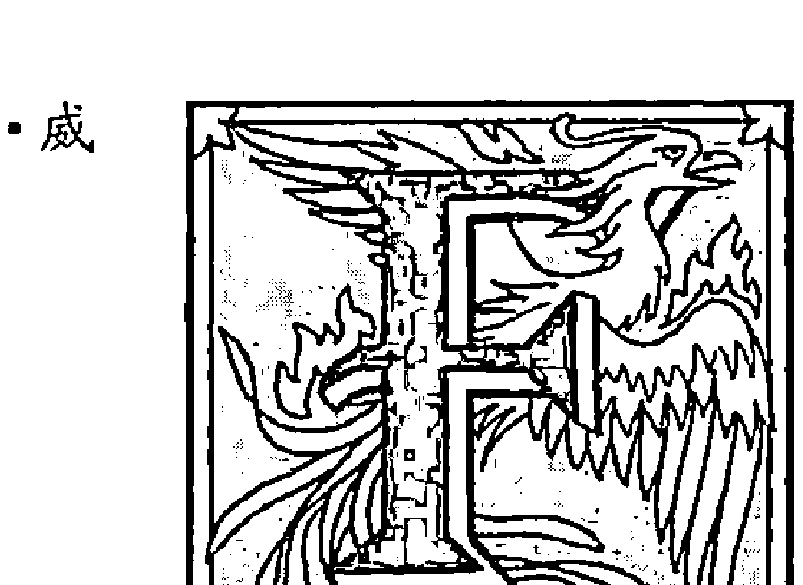

独角兽是为数不多的让现代人为之着迷的魔幻生物。它在最为人所熟知的神话动物中排名第二（仅次于龙），几乎在东西方所有神话中都出现过，包括中国、日本、西藏、鞑靼、马来西亚和尼泊尔。这种中世纪生物的现代形象可能源自它所代表的纯净、力量、希望的属性——都是我们这个物质化的时代的稀缺品。令人赞叹的是，这种源头已经消失在传说和历史中的神奇野兽在当代又重新被赋予了生命。

在这个嘲笑奇迹的时代，这些论调必定会遭到怀疑论者的攻击——很快他们就会条件反射式的否定：“独角兽并不存在，它们只不过是神话罢了！”但是，特洛伊城在1871年被海因里希·施利曼（Heinrich Schliemann）发现之前也被认为仅存在于神话之中。神话是纯粹的幻想，而传奇则# 寻找独角兽

作者：汤姆·威廉姆斯

独角兽的起源就像一条发源自许多尚未有人涉足过的群山的河流。古代来自阿拉伯和非洲的旅行者传说中就有长着一支角的野兽，波斯和印度的传说故事在中世纪被欧洲人用在了天主教寓言和绣在了挂毯中。在所有的故事、寓言、遗迹和诓人的话中，这种超然的、神秘的生物真实存在于世界某处，它也能像其它动物一样被人捉住，作为某次冒险的战利品献给国王。

这只是独角兽传说之河的千万条支流中的一条，但它有可能是真的吗？如果是真的，那么它就能带领人们找到被传说了数个世纪的独角兽，多么令人惊奇！最近，有人跟随这个传说开始寻找独角兽，但这次是出于学术目的，以向犬儒主义和科学假设作出证明。最终，他们得到了可喜的结果以及……一只真正的独角兽。

将事实从虚构以及将传说从神话中分离出来的过程常伴随着误读和假象，因此这份工作需要正确的态度——即，古代的作者和土著人并非蠢蛋或骗子；那些被称为迷信的东西是因为受到我们并不熟悉的文化和世俗的歪曲而形成的。在试图从不同的历史和文化的角度来反观各种报告时，我们得到了一些非常有趣的事实。

要理解独角兽的传说显得非常棘手，因为数个世纪以来，它们与宗教传说、骑士传说、神话和商贸活动，诸如曾经一度盛行的独角鲸角贸易，交织在一起。而那些公信力很高的作家所写出的独角兽的故事通常都会吸引公众的注意力。独角兽的故事中有很多虚假的线索——被那些害怕黑暗的人尊崇为“合理的解释”。但其它一些传说和描述却包含着真实的部分，当人们不再带着有色眼镜去审视它们时，这些故事将为他们铺开一条通往活生生动物的金光大道。

# 独角兽的历史

根据一则流行的圣经故事（谢尔·希弗斯坦用其写成了一首脍炙人口的童谣），独角兽因为没能赶上挪亚方舟而被大洪水淹没。但独角兽是中世纪的生物，而大洪水则发生在此六千年前（公元前5150年），这让这则寓言看起来奇怪而不合时宜。

尽管独角兽的真正源头仍不为人所知，但在4000年前的印度河谷和美索不达米亚文明，却有关于它们的雕刻、封印、浮雕。直到最近我们才解读出这些高深莫测的图形中的意思。在青铜时代，即占星术中的金牛座时代，独角兽被广泛地视为巨大的独角公牛——独角牛。考古学家试图解释这种说法，称古代艺术家还未掌握透视效果，由此将长有双角的动物画成了只有一支角的样子，就像插图2中的那样。其余的图案都雕刻得很完整，比如在插图3中，让人对其描述的物品一目了然。

这两个文明在公元前1600年的地理和社会大动荡中沦为牺牲者，青铜时代结束，铁器时代登上历史舞台。这也是锡拉古城（公元前1628年）沦陷、犹太人离开埃及、铁质武器出现和旧制度被颠覆的时代。米诺斯克里特文明突然就没落，埃及中王朝时代和印度河谷的哈拉帕文化开始繁盛起来。

独角兽也几乎一同消失了，它变成了一种稀有且神秘的动物，再次出现时，它们已经改变了自己的外貌。

在接下来的铁器时代——占星术中的白羊座时代——独角兽变成了长有独角的公羊或羚羊。在埃及，被描述为独角兽的羚羊包括瞪羚（gazelle）、剑羚（oryx）和悬羊（ibex）。

日渐稀有的独角兽身上的代表性和传说并未减少。虽然埃及人从未获知过独角兽是如何产生的，但在新王朝时期的墓穴和纸莎草中却有关于将一只独角羚羊作为祭品，放在月亮女神伊西丝祭坛上的画面，她是太阳神荷鲁斯的处女母亲。这些被当作祭品的“独角兽”被清楚地画成长着一只弯角的样子，它们拥有和独角兽一样的重要作用。

## 图鉴二、揭秘夜之生物（上）

或许最早对独角兽进行描述的作者是希罗多德（公元前484-425年），他曾提及过锡西厄的“角驴”。到了公元前5世纪，独角兽已经成为西方世界一种非常流行的动物。普鲁塔克（公元45-125年）讲述了一则轶事：有人向伯里克利献上了一只长有独角的公羊的头，告诉他这是他将成为雅典的唯一统治者：

> 有一则故事讲的是，有人曾向伯里克利献上了在其农场中长大的一只独角公羊的头，圣人兰鹏（Lampon）看到这只羊额头上又长又粗的独角时给出了自己的评断，当时在当地有两个强大的派别，一派是修昔底德，另一派就是伯里克利，权力会被赋予拥有此物的那一方。——普鲁塔克，《伯里克利的一生（7）》

这只独角羊的寓言最终实现了，希腊大地终究统一，被划入了伯里克利的统治下（公元前460-429），世人称其为“希腊的黄金时代”，诞生出了众多杰出的哲学家、剧作家、政治家和建筑师，奠定了西方文明的基础。

自公元前416年至公元前398年，希腊医师克特西亚斯作为御医，为波斯国王大流士及其继任者亚达薛西效力。尽管他本人并未到达过印度，但在其《尹迪卡》（Indica）一书中，他试图对独角兽进行描述：“在印度……生活着像马一样大的野驴，它们中的一些前额上长有独角，有一只腕尺那么长（其角能解百毒）。” 在其《动物志》一书中，亚里士多德（公元前384-322年）将克特西亚斯所著的“印度驴”纳入其中。

不幸的是，两者关于独角兽的这些描述都源自旅行者们对于独角印度犀牛断章取义式的描述。可这还是被后来的马可波罗（1254-1324年）收入了自己的书中，这让其相信在他前往中国的途中所看到的犀牛就是独角兽。犀牛看起来也相当独特，于是它们被收入了动物寓言集中，命名为卡卡丹（Karkadan）。它们被描述为长着牡鹿的头、马的身体、大象的腿和野猪的尾巴。

尽管在此时期对其目击极少，但独角兽的传说还是传遍了世界。在中国，独角兽又被叫做麒麟，据称居住在天宫中，只偶然出现在人间，它的出现代表着新的和谐与启蒙时代的到来。麒麟代表着好运、长寿、高贵、公正、正义和智慧，只在明君统治或圣人出生、死亡时出现。

中国神话中的第一只麒麟据说现身于5000年前，它教会了皇帝伏羲写字。根据《通鉴纲目》(Tse-Tchet' tong-kien-kang-mou)，在公元前2697年，另一只麒麟出现在了黄帝的花园中，被视作他的统治将长久而平和的预兆。在公元前22世纪，皇帝舜的一名谋士得到了一只名叫獬的“独角羊”，它会将有罪的人杀死，放走无罪的人。在尧统治期间也据说生活着两只麒麟，他是4000年前5名创世皇帝中的一位。中国的麒麟，或“龙马”是一种像鹿一样的独角兽，长着有分叉的角。它是中国神话中四种神兽中的一种。据说在孔子于公元前551年出生时，曾有一只麒麟现身。根据传说，孔子的母亲在怀孕时遇到了一只麒（雄性独角兽，雌性叫“麟”），她当时正在花园中纺线。这只麒嘴里叼着一块刻有图案的玉牌将头放到了她的腿上，于是孔子的母亲用线缠在它的角上（图七）。它口中的玉牌赋予孔子极大的智慧。他的《论语》奠定了后世中国文化的基础，中国的历届皇帝都根据他的训诫治国，希望自己的统治能得到麒麟的垂青。

70年后，一些猎人杀死了一头麒麟。孔夫子跑去查看尸体，发现在其角上仍然缠有一些丝线，他哭了，因为他知道自己将在不久后死去。一种不同寻常的独角兽被叫做卡姆福尔（Camphur），据说生活在印度尼西亚摩鹿加岛岸边的水中。它长着鹿的身体和前腿，后腿则像鹅掌一样长着蹼。

中世纪和文艺复兴时期——公元3世纪至16世纪——的独角兽既不是公牛，也不是公羊，也不是羚羊，更不是犀牛，而只是一种像鹿一样的山羊，长着偶蹄、山羊胡和丰满的鬃毛，其高耸的尾巴末端长着簇绒，这让后来的画家给它绘上了纹章狮的尾巴。它非常勇敢、骄傲、强壮、美丽，神秘且难以接近。它既凶猛又温柔，是其它野兽的保护者。它具有优雅的体态和强壮的骨骼。这种独角兽的形象代表着得体的举止和庄重的外表。《生理论》的一个典型的版本是成书于九世纪的中世纪动物寓言集，里面将这种独角兽描述为“一种小型动物，像孩子一样，但却非常凶猛，脑袋中间长着一支角”。

## 独角兽存在的事实基础

中世纪欧洲旅行者们所目击到的独角兽似乎要么来自尼泊尔，要么来自埃塞俄比亚，后者是卡菲尔(Kaffir)和丁卡(Dinka)部落的所在地，他们似乎受到独角兽的领导和保护。即使是在20世纪，据说在这些部落中都还存在着3至5只角。谢泼德(Odell Shepard)引用另一名观察家的话说道 “丁卡族住在白尼罗河南边，不仅收藏牛角，更用其来决定部落首领的人选。”

普利尼（公元 23-79 年）是罗马官员和百科全书编纂者，在其《自然历史》中提到一种操纵牛角的方法，他说这种东西 “非常容易弯曲，在生长的过程中，人能用煮开的蜡铺在上面将其弄成自己想要的形状。” 法国旅行者弗朗索瓦·勒瓦扬(François LeVaillant)在其《非洲之旅》中提到一种类似的方法：“在小牛刚开始长角的时候，它们的双角被固定在前额上，直到两支角长到一起。然后它们就被这样固定起来，在脑袋中央一只生长，就像独角兽那样。”

在史料中同样记录着在尼泊尔献给当时还是威尔士王子的英格兰国王乔治五世的礼物中有几只独角公羊，它们在1906年的伦敦动物园中展出。我不知道它们是怎么变成那样的。一个尼泊尔皇室中的英国人在 1921 年的一份关于独角绵羊的报告中写道：

> 通过某种虐待，能将双角绵羊变成独角绵羊。这需要用烧红的烙铁将 2、3 个月大的雄性羊羔刚开始长角时在它们头上进行作业。伤口需要用油和煤烟的混合物进行处理，当其愈合后，它们的角就会从前额中长出来。

需要注意的是，这些解释根本经不起科学的推敲，只能是报告者的猜测，或是当地人为了守住自己的秘密而编出来的故事。用滚烫的蜡将双角绞在一起或用烧红的铁块来烫那些可怜的动物的脑袋只能让它们受伤。

图 10. 阿尔布雷特·丢勒绘制（出自皇帝马克西米的祈祷书）(1516 年)

独角兽的传说在 13 世纪的时候迎来了新的篇章，当时成吉思汗占领了大部分亚洲，建立起一个巨大的帝国，但与一只独角兽的干预却让其取消了对印度的入侵。当时可汗正在为一次轻而易举的大胜做着准备，一只独角兽 “像鹿一样，长着马的脑袋，前额上还有一只角，身披绿色的绒毛”出现在他的一位斥候面前，跪下并说道：“你的主人该回到自己土地上了。”当成吉思汗听到这件事之后，他撤走了军队。历史上最为残忍和无畏的勇士被一只独角兽“驯服”了，印度因此而幸存了下来。

图 11. 约尔格·布雷乌达尔绘制，出自 Ritterlich und Lobwirdig Rayss, Lewis vartoman（奥斯博格，1515）

# 魔法师的怪物图鉴

> 它们中最为高大的一只长得很像一只三个月大的库尔特（coolte），在其前额上长有一只独角，有三只腕尺那么长。其余的则要年幼得多，只有一岁大，样子也和库尔特幼兽差不多：它们的独角是人手掌长度的四倍。这种野兽体色像黄鼠狼，脑袋像牡鹿，但脖子却很短，鬃毛也很短，只长在脖子的一边。它们的腿非常纤细，像麋鹿的一样。四只蹄脚像山羊，其后腿外侧长满绒毛。这种野兽非常凶猛，但只在适当的时候发作。曾有一只这种独角兽被当成最为珍贵和稀有的礼物赠送给了麦加的苏丹（Sultan of Mecca），赠送者是一位埃塞俄比亚的国王，他想用这个礼物来取悦麦加的苏丹。——刘易斯·瓦托曼，《旅行指南》（1576年）

最后一次对于典型中世纪独角兽真实的目击发生在16世纪。这次目击的重要之处在于当事人是博洛尼亚的路易斯·瓦托曼，他在1503年曾游历过近东诸国。在他的《旅行指南》中，瓦托曼描述了自己已在埃塞俄比亚麦加的苏丹的一个动物园中目击到一只独角牛，以及两只独角捻角山羊（Capra falconeri）的经过。60年后，文森特·莱布朗克跟随他的脚步，在1567年自己14岁时开始前往东方的旅行。他只见到了瓦托曼所说的独角兽中的一只，其余的早已死去了。但他却在勃固（Pegu）看到了另外两只。在其《文森特·布朗克著名游记》中，他写道：“我在苏丹的闺房中见到了一只独角兽，另外在印度和埃斯库列尔都见到过。”这是历史上最后一段记录。

独角兽并不是单独的一个物种，中国的麟是其中唯一的雌性，它是对长有独角的有蹄类动物的统称，是其所属物种中最为高级的形态。它们的独角从前额的中心（“第三只眼”）中长出，下面就是其天灵盖——因包裹着其内分泌腺，如垂体，它被神秘主义者称为大脑的精神中心。因此独角兽会长得比任何同类都更为巨大、聪明和敏感。它是种群的首领，其头上的独角相比起其它有角动物的弯角而言是一种无敌的武器，这让独角兽能保护自己的种群不受狮子的侵害。“从它们头上蹦出来的独角对敌人而言是非常致命的，是一种攻防兼备的武器。”（娜塔莉丝·科迈斯，1551年）。

图12. 一块波斯粗呢布上绘制的狮子和独角公牛

## 图鉴二、揭秘夜之生物（上）

## 象征和寓言

独角兽在4000年前就已经出现，成为了忠诚、霸权、神圣的标志。在中世纪，独角兽也代表基督、不朽、智慧、爱和姻缘。

在占星术中，独角兽代表月亮，而雄狮代表太阳。当它们相遇时便会产生月食或日食。史前浮雕上用月亮绘出了独角的方程式，而且它们也频繁出现在古巴比伦、尼尼微、乌尔、波斯波利斯的圆筒图章（cylinder seals）上。当月亮发生盈缺或月食时，独角兽在世界上许多文明中成为了重生和生命战胜死亡的代表。

独角兽的秘密似乎在15世纪和16世纪的宗教大动乱中最终消失了，当时天主教宗教裁判所和宗教改革将所有被视作异端的书籍及人都统统烧死了。

十字军和伊斯兰教在北非的扩张毁灭并征服了那些掌握着天主教徒和穆斯林所不知道的畜牧方法的土著人或农民们。当这些人死去后，他们的秘密也随之而去。16世纪中叶，独角兽已经成为一种日益稀少、濒临灭绝的动物。尽管形象被人类绘制在纹章中，但在文艺复兴的欧洲却没有它们的容身之地，这导致了其最终的灭绝。

但它们的传说却保留了下来，成为基督教寓言艺术中救世主的化身。中世纪和文艺复兴时期的圣母像要么捧着还是婴儿的耶稣，要么就和一只基督的独角兽在一起（时常伴有满月）。

它们都是古埃及伊西斯的直接翻版。在埃及艺术中，伊西斯通常被描绘成坐在王座上给荷鲁斯喂奶，这也是她在象形文字中的形象。在最早的“少女与独角兽”图画中都将少女描绘成赤身裸体，或至少裸露着双乳的样子，而独角兽则趴在其大腿上。

在欧洲和东方的传统中，独角兽都被认为是弥赛亚，在世界最黑暗的时刻出现，预示着一个更为光明和美好的时代的到来。在炼金术中被视作土元素，它代表着大地的意识和自然价值的重现。

## 猎杀独角兽

中世纪欧洲传说中最为流行的一则就是“猎杀独角兽”。在这个故事中，独角兽是一种野蛮、凶猛、狂暴、难以接近的野兽。然而，他却会被处女的纯洁所迷惑。故事中的猎人们将一位处女放在一棵树下陷阱中当作诱饵。独角兽对其纯洁毫无抵抗之力，趴在了她身边，将头放到其大腿上，沉沉入睡。这时，猎人们从树林中窜出来杀死它。非常好的一则故事。奇怪的是，这个故事中的那位处女通常被人等同于圣母玛利亚。

猎杀独角兽的故事被绣在诞生于1495年至1505年的一系列精致挂毯上，它们是约翰·D.洛克菲勒于1922年从法国的拉罗什富科家族手中买到的，现在被悬挂在纽约市艺术博物馆的回廊里。它们被认为是世界上最美丽的挂毯，描述的内容是一群猎人和穿着富贵的贵族正在围猎一只独角兽，当时这只独角兽正在用其独角净化一口井中的水，之后人们将其赶出茂密的森林，在光天化日之下杀死了它。之后，它又被人们带回一座城堡里，在那里复活过来，囚禁在用很小的栅栏围起来的一棵石榴树下。他流出的鲜血后来成为了石榴的种子和果汁。

长期以来，基督教作者们都...但流血也预示着普希芬尼的异教徒神话中恶魔将从地狱重返人间。

## 消失和遗忘

独角兽头上的角被称为独角（alicorn），是16和17世纪欧洲药品中必不可少的成分，据说能抵御瘟疫和毒素。完整的角被掌权者和权贵放置在自己的桌子上，因为他们相信这种角能在遇到染毒的食品或饮料时结出水珠。出于同种目的，皇室使用的杯子上都刻有独角兽之角。有趣的是，天然动物角中的角蛋白确实能将溶液中的砷分解，因此这种说法具有一定的现实依据。

在启蒙时期和1662年皇家科学院的建立，人们对独角兽的信仰逐渐消失，特别是当人们得知以前被称为是独角兽之角（unicornum verum）的东西实际上大部分都是独角鲸的牙齿。在中世纪和文艺复兴时期，这种买卖曾盛极一时，当时独角兽之角的价值比黄金都还高出30倍。后来，独角鲸牙被猛犸象和海象的牙齿所取代——后来变成了石化的木头、化石甚至石钟乳——直到后来的18世纪中叶，独角兽之角被移除出药典为止。具有讽刺意味的是，独角鲸、海象和猛犸象的牙齿都由牙质构成，而非角蛋白，它们不具备化解毒素的作用。用牛角做成的容器更可能使里面的液体染毒！

不幸的是，克特西亚斯将犀牛当作独角兽的观点却一直盛行，在距离现在更近一些的时代，在东方，犀牛角都被认为就是独角兽之角，而用来治疗很多的疾病——尤其是男性。这种做法促使印度和非洲的犀牛几乎灭绝殆尽。

个人认为，将独角鲸视作独角兽有些不太公平，毕竟它们是除了长得不那么好看的犀牛之外，唯一的一种天生就长有长独角（uni-cornu）的动物，但它们实际上只是一颗长牙而已。它们是非常精致、美丽的生物，我喜欢它们恰如其分的法文名字：la licorne de la mere——“海之独角兽”。

## 图鉴二、揭秘夜之生物（上）

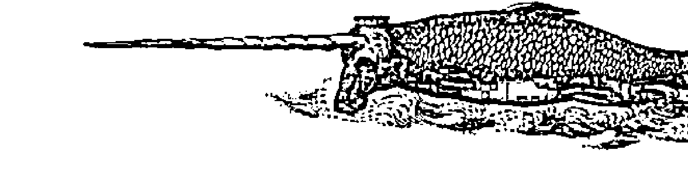

独角兽在最近400年里才被人描述成了长着独角的马的样子。这种生物完全是艺术加工的结果，当然，对马而言，它们根本不会长角。也许它们的这种形象是源自以前战马戴上头饰的样子。当人们再也找不到真正的独角兽来参加皇室活动时，骑士们就会给自己的战马装上有独角的头饰，将其扮成真正的独角兽。但事实上，马并不会长角，它们只是“假独角兽”。

尽管如此，真正的独角兽传统还是保存了下来，因为即便是马形的独角兽都会被描述成长着偶蹄脚和山羊胡。朱利安·富兰克林是纹章中的权威，他在试图化解这种误解时说道。

独角兽在1827年被“考古学之父”拜伦·乔治·居维叶宣判死刑，他在1829年宣布世界上不可能存在长有偶蹄和独角的反刍动物，因为其额骨是裂开的，这样根本就不可能长出独角来。在科学界，没有人敢于挑战像居维叶一样杰出的权威，他的这条格言在今天的很多教科书里仍然存在着，尽管居维叶本人在1821年曾说过：“世界上再也找不到大型四脚动物了。”可是后来人们发现了科迪亚克熊、山地黑猩猩、俄卡皮鹿、尼亚拉山羚羊、侏儒河马、安第斯狼、柬埔寨野牛以及其他大型四脚动物，这让他的断言看起来极为愚蠢，现在被人称为“居维叶鲁莽的箴言”（这是隐生动物学之父贝纳德·霍伊霍尔曼所创造出来的一个短语）。

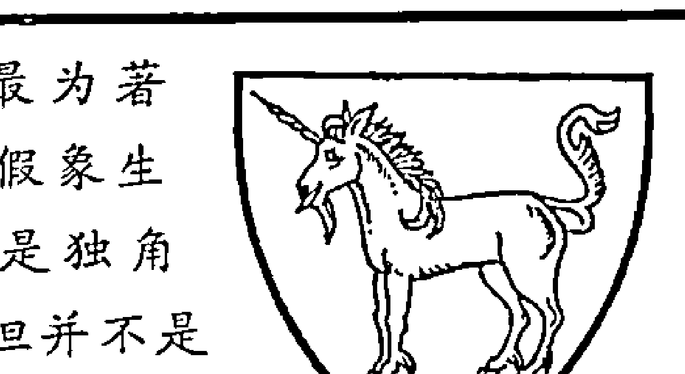

最为著名的假象生物就是独角兽，但并不是所有的人都知道这一点：当人们被问到独角兽的长相时，大多数都会将其描述为一匹长着螺旋独角的马。不知者无罪，以为它们经常被画成这个样子——即便是在皇家军队中也是如此。独角兽实际上源自山羊，长着偶蹄脚，以及胡子……它还长着纹章狮的尾巴。

很多年以来，学者们都在追随科特西亚和马可波罗的脚步，将犀牛视为独角兽，尽管所有的目击和报告都无法自圆其说。毕竟，专家们称独角兽不可能存在，因此它们就不曾存在过。

## 活生生的独角兽

现在该讲述我们自己和独角兽的历史了。我和我的妻子及灵魂伴侣，牵牛花，一起翻阅数世纪以来独角兽的历史，在各个神话、传说、旅行者故事中进行筛选，从解剖学、动物学、人类学上去研究，企图找出神话背后的真相。我们研究了从古至今的很多材料，搜集了各个时期、各个文明对于独角兽的艺术描绘。后来，在1976年秋，我们终于找到了拼图的最后一块，解开了独角兽之谜。

在开始阶段，我们和其他一些学者一样，认为独角兽不过是犀牛的一种远亲。

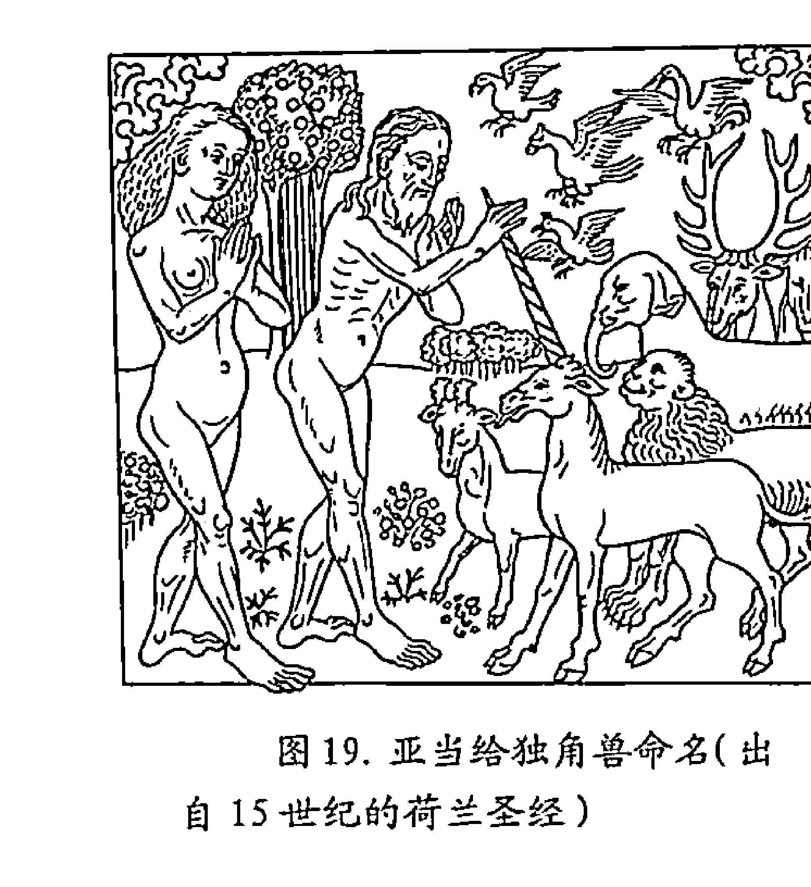

## 图19. 亚当给独角兽命名（出自15世纪的荷兰圣经）

但在把所有的图像都进行分类之后，我们开始意识到，独角兽并非只有一种，而是有很多种，它们都有一个共同点，长有独角。除此之外，我们还有一个发现，除了在魔幻小说中，世界上从未有过雌性独角兽，即便是在伊甸园中也是如此，它是第一个被亚当命名的动物，一直以来它都独来独往，没有伴侣。当和其它动物一同出现时，他总是以一种超然的保护者或领导者的姿态出现。

显然，独角兽根本不是一种物种——在神话中也不是——而是一种一些长有独角的不同动物。和白化病一样，这种独角病也会发生在某些物种的个体身上。它们二者间的区别在于，白化病是自然发生的，而独角病则是人为的——这与日本的盆景差不多。

如果世界上曾存在过独角兽，那么它们应该和其它动物一样有自己的进化轨迹，因此我们认为它是一种某些物种中的独角病现象，而这一现象我们能用一些已经失传了的古老技法来实现。然而，这种技法不仅能够创造出一只长相与描述相吻合的动物，而且它的行为也和传说中的一样。这样的动物会变成另外一种动物。一些牧羊人、不懈的学者和人类学家其实距离发现这个答案并不遥远：

> > 这看起来是完全可行的，因此我认为那些被称作独角兽的动物是真实存在过的，它们只是以某种方法进行过处理的家畜，而这种方法对文明世界而言仍然是神秘的。这也许能解释伊良（Aelian）在埃塞俄比亚遇到的那些长有独角的奶牛和公牛、普利尼书中记录的生存在摩尔大地上的独角牛……农夫送给伯里克利的独角公羊曾是羊群中的首领，它也是雅典首领的代表，根据普鲁塔克的理解，他们希望用此来给予其主人同样的寓言。

1976年，我和牵牛花一起在位于尤金的俄勒冈州立大学教书，在那里我们发现了最后一块拼图。我开始延续富兰克林·德福博士的研究，他是一位缅因州立大学的生物学家，在1930年代对牛角的生长进行试验。在1935年的一篇题为《角生长的生理学》的论文中，他追溯了很多先前试图制造出独角兽的成果，并将自己的成果在后面记录下来。他有一个巨大的发现：角并非像居维叶和其他人所认为的那样直接长在动物的额骨上的。而是，像大角（os cornu）或骨刺，是从一种名为“角芽”的组织节点中长出来的，它位于前额松弛的皮肤中，长成之后才和额骨融合在一起。

在出生后几个小时，这些节点会向下面的骨头发出一种酶，“影响下面组织的发育”，刺激骨骼向上生长，形成骨芯，然后上面会长出一层角蛋白。德福实验得出的结论是如果这些节点的位置在动物出生后就立即被转移，它们的角就能长在任何你想要的地方。当然，这样做还是有限制的，即组织间的联系不能被中断，否则就无法成功。

德福回忆起那些在伦敦展出的尼泊尔独角羊，最终认为他的实验能够造出同样的动物，而实际上，这便就是那些古代部落制造出真正独角兽——传奇的真正基石——的方法。

## 独角兽重生

作者：汤姆·威廉姆斯

1933 年，德福将一头一天大的艾尔郡牛幼崽的角芽移到了它头骨中央，并将角芽和头骨的接触面修整成扁平状，他希望借此让这头小牛长出独角。他确实做到了，后来这头小牛长大了，头上一直有一只漂亮的独角（插图 19）。这头牛头上的角是紧密地和其头骨连接在一起的，这与居维叶的观点正好相反。这头牛最后变成了一只独角兽，完全出乎德福的意料之外，他认为这头牛长得并不像传统的独角兽，但它却让人明白了独角兽的由来。

德福注意到，它头上的独角对其独特的行为有一定的影响，这些行为与书中的独角兽一致。首先就是独角兽天生的高贵气息：

> 它是牛群的首领，一直都是。这在行为学上也有很多原因作为支撑。任何长着独角的动物都拥有着一把独特的武器，很容易就能征服族群中的其它成员……独角兽的行为会因其独角而发生改变，独角代表它的统治地位和独特的行为方式，这与其原始基因没有任何关系。之所以独角兽能成为族群的领袖是因其引人注目的独特行为方式。

所谓的丁卡技术终于被破解了，人们又开始寻思如果一头食肉动物拥有了这种武器会变成什么样，比如狮子。实际上，在独角兽传说中，狮子一直都是它们的死对头，甚至在英国纹章中也有描述。丁卡人好像并不只是制造出了族群头领，他们其实制造出的是能对抗猎食动物的护卫。

在传说的同化和德福的努力下，理性的舞台终于搭建完毕。独角兽可能，而且非常可能已经被很多人因很多原因制造出来过。关于这些动物的知识一定是在中世纪时以各种各样奇怪的内容流入欧洲的。约四、五百年前，它们的秘密被人遗忘，最终消失了，欧洲人再也没见过独角兽。它们的形象被扭曲，又因其被认为只是神话中的生物，于是后来它们被传说成了完全不可能存在的神秘生物。

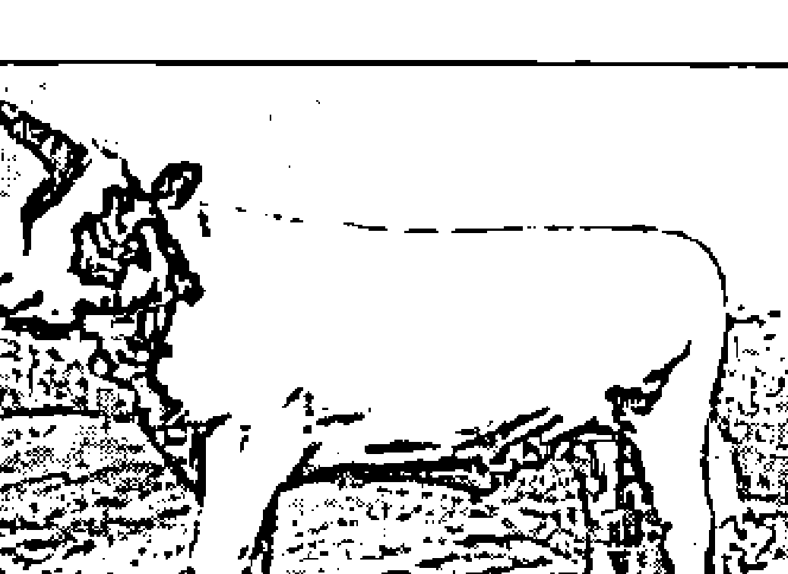

图 20. 法兰克林·德福博士的公牛独角兽两岁的时候

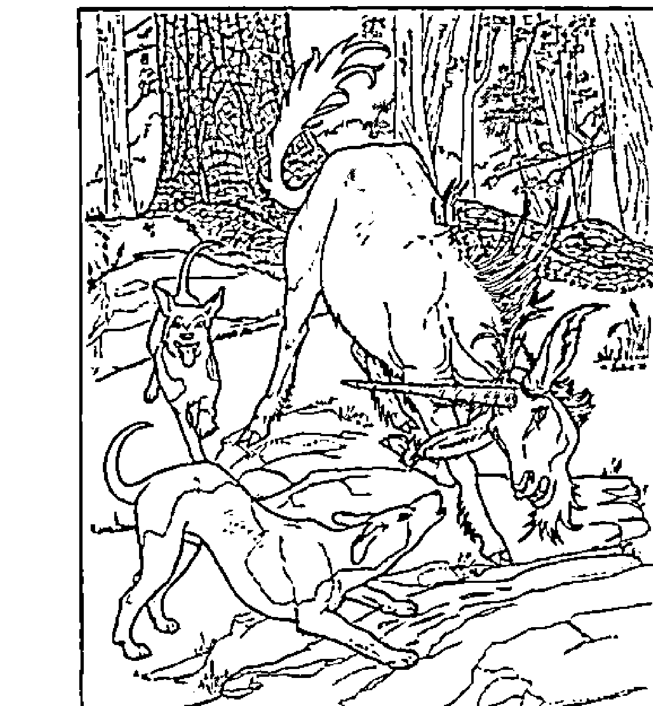

图 21. 搏斗中的独角兽（卡伦·朱莉绘制）

完全不同的东西。但德福却将其大部分的知识拼凑了起来：中世纪挂毯上的独角兽的原型是山羊。

奥伯伦和牵牛花戈洛瑞觉得他们能够复制中世纪独角兽的制作方法，于是决定寻找一种与挂毯中的生物最相似的一种山羊。最后他们找到的是安哥拉山羊中一种相对聪明的山羊：白色、长着如丝般的长毛、四肢细小、还有山羊胡。

在 1980 年的春分时节兰斯洛特 (Lancelot) 出生了，几小时后，奥伯伦给它做了能让其长出独角的手术。创造独角兽不仅要将角芽移动和融合，还需要长时间地训练。由于其可能存在的恐惧，他们决定将其“驯服”得适应人类。兰斯洛特和它的弟弟贝德维尔 (Bedivere) 与主人睡在一起，还有一只驯化了的麋鹿做它们的玩伴。

在德福早期的发现中，角芽会自动与头骨进行连接，然后开始长出独角。X光清楚地显示独角是与头骨长在一起的，在前额上形成了一个很厚的区域。令人意外的是，鼻窦会长进角里，极大地增强了动物的嗅觉。兰斯洛特很快将其独角当成了一种工具——以及武器——用来抗击犬只，但幸运的是，只要有人出现，他就会变得平和起来！

## 独角兽归来

作者：奥伯伦

德福博士认为他找到了远古部落用来制造传说中的独角兽的方法。当牵牛花戈洛瑞和我得到他的研究笔记时，我们跟他持有同样的想法，而且还意识到我们掌握了独角兽的秘密，有能力将中世纪的独角兽重新带到世界上。

当然，其他人可能只会因此而写一本书，就像我们最开始计划的那样。但是创造独角兽的诱惑却是无穷的，我们一定要试一试！于是我们搬到了乡下，成为了一块 220 公顷荒地的看守者，这是一个占地 5600 公顷的社区的一部分，把那里建成了独角兽农场。我们盖起了房子、马厩、围场还有花园，打井、种树、养鹿还修了一个池塘，开始了一种全新的生活。与此同时，我们还喂养了合适的对象（安哥拉山羊），学习兽医学和养殖学，与独角兽展开了一段非常独特的旅程。

正如汤姆先前所说的那样，魔法应验了，兰斯洛特在 1980 年春分时节降世，两周后，在月圆之夜，它的弟弟贝德维尔（我们用圆桌武士的名字来命名他们）也出生了。它们非常美丽，皮毛像日光下透亮洁白，有绸缎一样的光泽，长脖子旁的鬃毛就像云朵一样蓬松。

我们发现了一种神奇的魔法同步现象。在那个春天，有史以来第一次，我们所有的东西上都有独角兽的影子，书籍、珠宝、衣服、塑像、日立、海报、家具、明信片、茶壶、卡通、玩具和小摆设——那就是独角兽之年！

在那年夏天，我们参加了当地的集会以及全国各地的无数电视新闻、坊间流言、动物节目、封面新闻中。我们的独角兽成为了国内所有报纸的封面人物，甚至在杂志和书籍中也有提及。在 1982 年的《年度大英百科全书》中有一张兰斯洛特的照片，上面的标题写着：“《大英百科学全》将独角兽定义为‘一种与马或小孩类似，前额上长有独角的动物。’前往距离旧金山不远的海洋世界参观的游客确信兰斯洛特这匹年幼的安哥拉山羊是真的。也就是说，兰斯洛特是一头真正的独角兽。”

对牵牛花戈洛瑞和我而言，和兰斯洛特一起出席 1981 年 10 月在加州圣罗莎举办的科幻大会是一次美好的经历。我们以取自彼得·比格 1968 年出版的幻想小说《最后的独角兽》的“莫莉·葛茹、魔法师德瑞克和最后一匹独角兽”的身份获得了角色扮演比赛的大奖。这为我们的旅程画上了圆满的句号。

在接下来的几年中，我们继续制造更多的独角兽，以及参加美国和加拿大各地的集会——有时甚至分成了四个小组，每个小组有一只独角兽。在参加旧金山附近的海洋世界的演出时，它们被画在了巨幅的招揽海报中吸引人们的注意。

1984 年，在与美国专利局进行了 4 年的角力之后，我们最终获得了制作独角兽手术的专利权，里面包含了德福的成果和很多来自不同书籍的知识，证明了独角兽的真实性。在此事件中，我们得到了当地兽医詹姆斯·马迪根（James Madigan）博士的支持。

最后，我们的代理人给了我们一份为期四年的，与玲玲马戏团（Ringling Bros）以及巴纳姆及贝利马戏团（Barnum&Bailey）共同出演的合同，在随后的十年中，我们的独角兽成了世界上最受欢迎的明星，在数以百万的观众面前表演。我们留了几只在身边作伴，暂时送了几只给当地的动物园。数十年后，我们还能收到那些人生因与“不可能的梦想”接触而发生了改变的人们的来信，他们有些是来向我们所要独角兽的，有些则是表达在看到独角兽后自己产生了顿悟：既然独角兽是真的，那么一切都有可能！

独角兽的故事在现代也有续集。这些故事都是源自寓言和真相群山中的河流，它们证明了科学上的好奇心与人类被独角兽在历史长河中展现出来的魅力所折服，这两种情况都存在。

独角兽不属于任何一个国家或大陆，也不属于人类，它是和平之子，预示着好运。

> > “……啊，金色的马蹄，啊，
> 白色的鬃毛，
> 啊，宽阔的鼻孔
> 骄傲地昂着，它的脖子
> 高高地拱起，它是多么的
> 荣耀啊！
> 它定能犁出长长的垄沟
> 让农夫心满意足
> 然后再回到马厩
> 安静地吃草。
> 现在天色渐暗
> 我们才刚上路，
> 男人们吓破了胆
> 就像枯萎的花朵。”

> > 全世界，恐怕都将诅咒因你的出生——
> 因为有你，方舟才会留下独角兽。”
> ——西北书局（N.W.），
> “方舟出航”
> 摘自《重拳出击》（Punch），
> 1948年

## 独角兽的预言

> > （摘自《独角兽法典》（Codex Unicornis），作者玛格纳鲁西斯（Magnalucius），15世纪）
>
> 独角兽是一种对我们友善并能服务于我们的物种。它为我们导航，守护我们，等候我们。
>
> 看那！科学为人类的希望笼上阴影的时代就要到来，钢铁战车会在大地上驰骋，压得大地无力支撑。空气中充满了各种噪音。未知的瘟疫和疾病会肆虐人间。月球上也会有人类的脚印。
>
> 两大王国将在全世界抗衡，最后又将对抗全世界，直到土地和海洋染病，空气污浊。人类将得到审判，最终，没人能够逃脱对光明和黑暗的选择。
>
> 然后，在大清洗时代，独角兽会重回世间，在人类世界徘徊，给我们种下光明时代的希望种子……

- 《幻想曲》（动画片，1940 年）
- 《最后的独角兽》（动画片，1982 年）
- 《传奇》（1985 年）
- 《小独角兽》（2001 年）
- 《纳尼亚传奇》（2005 年）
- 《星尘》（2007 年）

## 5、神奇马
作者：牵牛花·戈洛瑞

> > 马的大力是你所赐的么。
它颈项上挓莎的鬃，是你给它披上的么。
是你叫它跳跃像蝗虫么。它喷气之威使人惊惶。
它在谷中刨地、自喜其力。
它出去迎接佩带兵器的人。
它嗤笑可怕的事、并不惊惶、也不因刀剑退回。
箭袋和发亮的枪、并短枪、在它身上铮铮有声。
它发猛烈的怒气将地吞下。
一听角声就不耐站立。
角每发声、它说、呵哈。它从远处闻着战气、又听见军长大发雷声、和兵丁呐喊。
——《约伯记》
39:19-25

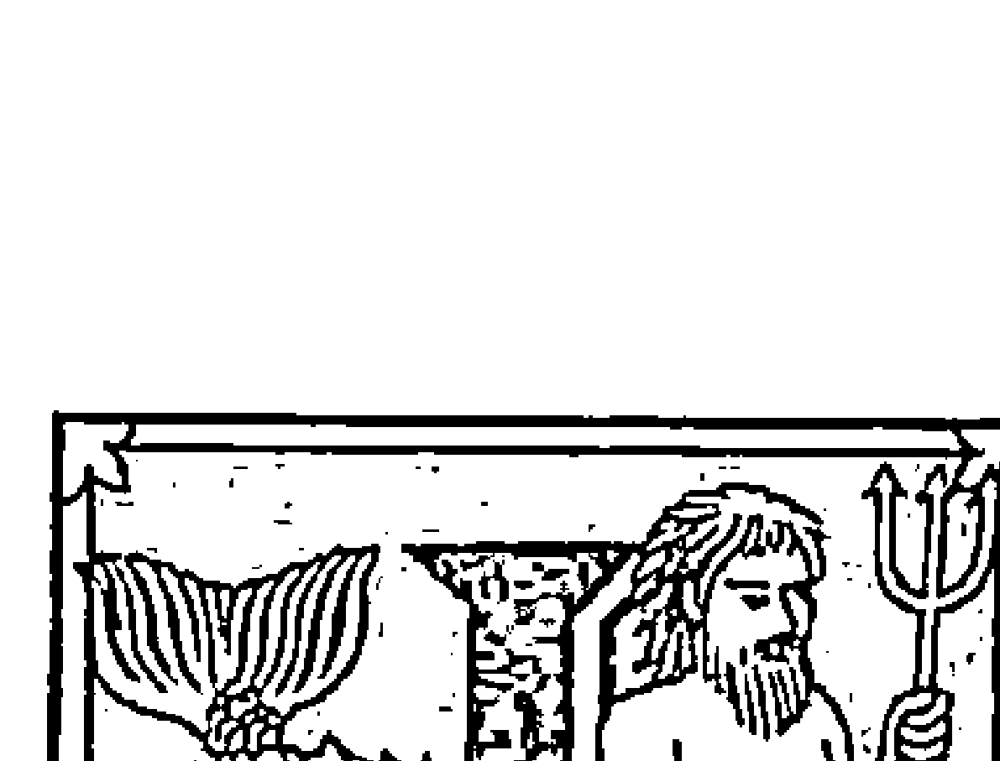

在神话传说中，我们赋予很多物种永生的能力。这些故事慢慢传承下来，由最初的只言片语渐渐变成了现在的整个神话体系。

那些强大、神奇、与人类共处的生物们，比如马儿，往往都在时间的控制之外。于是人们创造出了神奇马。有时神奇马独自行动——飞到一位孤军奋战的勇士身边解救他、带来预言或做一些卑鄙的勾当。但绝大多数时候，神奇马们都和英雄们有所联系，有些是在人根本不知情的情况下给予他们帮助。很多时候都是神奇马知道自己的命运是和某位英雄联系在一起的，并将知识教授给他。有时，这些神奇的马儿则是不朽之身，有时他们又是血肉之躯。通常情况下，它们的神奇之处在于能在天地间穿行——或能到达地狱。它们能通过自己的长子继承权、互相学习或自身的努力获得不朽的能力——有时候这些马能够超越那些创造了它们的文明而存在。神奇马长着偶蹄出生在地面上，但就像马厩一样，它们在人类的梦幻中变得纷乱起来。所有的人类文明都有关于它们的传说，而这些传说都出乎意料地一致，即便这些文化相隔千里之遥。马儿有太多能给我们带来各种各样遐想的地方了：它们蹬踏地面时发出的力量、光滑皮肤下强壮的肌肉、跑动时摇摆的脑袋和飞舞的鬃毛、动作中充满的诗意、快如闪电如同飞翔般的奔跑速度。即便现在已经不是人类的主要交通工具了，马儿们仍然在将我们带往魔幻世界中，在我们心中始终有一块地方属于它们。

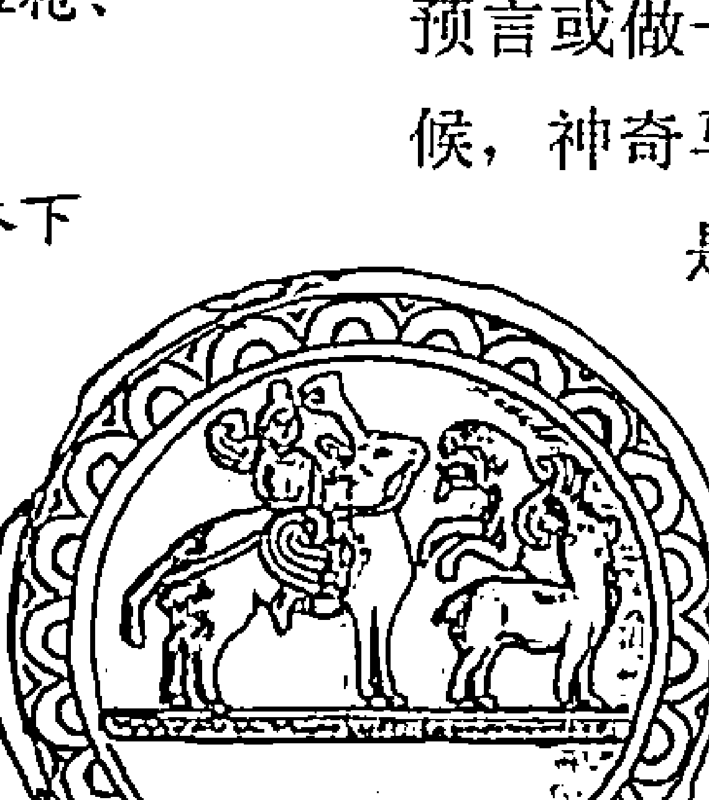

图1. 石板上的赛西亚翼马

金工匠，这里我们看到的就是第一个飞马的肖像。西徐亚人给他们绘上了漂亮的颜色、绣上了有羽毛的羁，还有高高的头饰，还给骑手的腿部和马的肩膀上装上了保护装置，将这些装置装饰得像翅膀一样。想象一下这些人骑着这些马一路尘土飞扬地飞驰，手中握着长矛和弓箭，他们的坐骑有些长着羊角或牛角，有些长着鸟羽，有些长着红白色的翅膀。这些人穿过城镇，播下了神话的种子。

## 飞马

想像一下驾着一匹长着翅膀的马儿飞翔在空中的感觉！很多孩子都这样幻象过，而它并未因为年岁的增长而从我们的脑海中消失。但飞马……这种概念是如何产生的？表面上，它看起来非常荒谬，但对那些并不熟悉马儿及其习性——跑、跳、绕圈——的人来说也许这并非是一个现实的想法。西徐亚人是世界上最伟大的战士和牧马人之一，他们住在俄罗斯以南、古希腊和波斯以北的地区。他们是绝佳的黄金

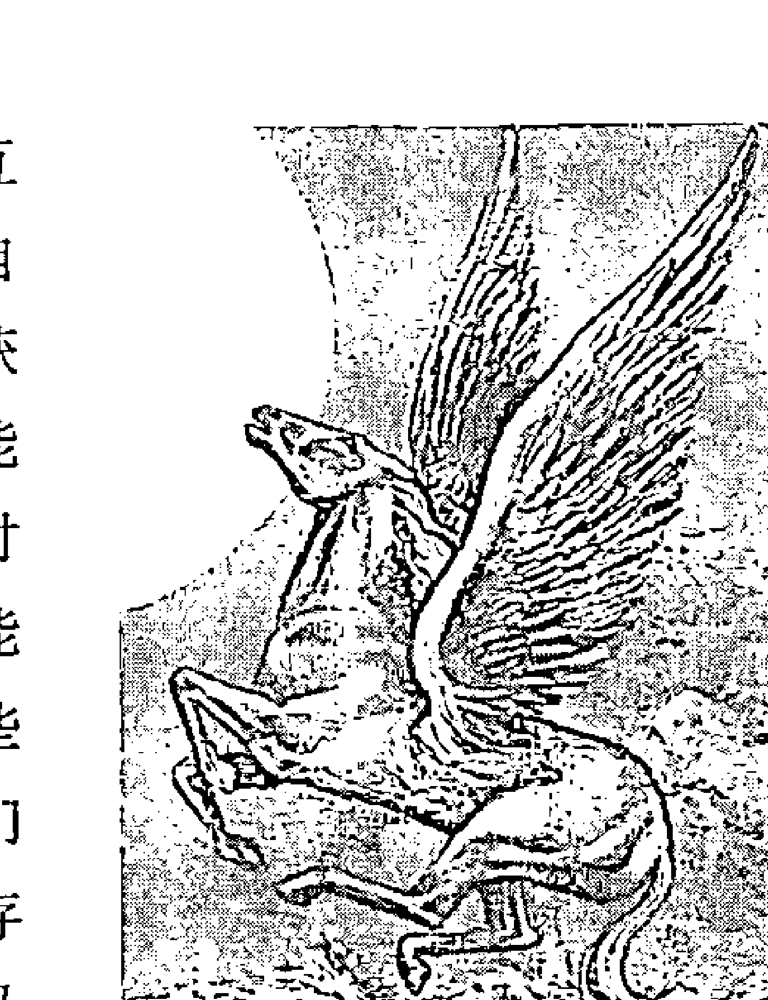

珀加索斯（Pegasus）是希腊神话中最著名的不朽的马。美杜莎的头掉入了海中，她的鲜血混合着波塞冬的海波，变成了珀加索斯。他有一个弟弟，与自己同时出生，但却和自己大不一样：克律萨俄耳（Chrysaor），一头长有黑色翅膀的野猪。

最初被人描述为是红色的，珀加索斯是一匹全身亮白的骏马，长着巨大、柔软、天鹅般的翅膀，能飞到天堂中，进入众神的领域。在他重返地面时所碰到的地方涌出了一股泉水（灵泉，形状像马蹄）。它的泉水能给人写诗的灵感。英雄柏勒洛丰（Bellerophon）从雅典娜那里得到了一套魔法马具，他用此抓住了珀加索斯，后来骑着这匹骏马杀死了在乡间散布瘟疫的奇美拉（珀加索斯弟弟克律萨俄耳的长子）。之后，柏勒洛丰乘着珀加索斯越飞越高，直到天堂边缘。人类的到来让宙斯很生气，他放出了一道闪电，将柏勒洛丰打到了地面，摔坏了屁股。珀加索斯自由了，从那时起，他就住在奥林匹斯山上，偶尔帮助厄俄斯（Eos）给大地带来黎明和给宙斯传递闪电。他后来得到了一个伴侣厄维佩（Euippe），生下了两个孩子，莫拉尼佩（Melanippe）和塞勒里斯（Celeris）。最后他被授予一个星座，所有的飞马——飞马座——都因他而得名。

阿里翁（Arion）的名气要稍小一些，但却可能更为令人称奇。它是一匹种马，希腊神话中有两个关于它的故事。在第一个故事中，阿里翁是世间第一匹马——一匹波塞冬用三叉戟敲击地面时诞生的不朽、长着黑鬃毛的种马。在第二个故事中，阿里翁是海神联盟的孩子，有着种马的身体，而女神得墨忒耳（Demeter），长着母马的身体。阿里翁的右脚是一只人手，但左腿却长着马蹄，它说话的声音像人类，音量能达到小号一样的水准，它飞得很快，没有人能够看到它。波塞冬将其交给赫拉克勒斯，后来他又被交给了英雄阿德拉斯托斯（Adrastos）。在七将攻底比斯之战中（Battle of the Seven Against Thebes）中，阿里翁以自己机灵的行动和建议拯救了阿德拉斯托斯的性命，还在看到一个小孩死去的时候像人类一样哭泣。

> 诗人普罗佩提乌斯(Propertius)写道：“阿德拉斯托斯之马，阿里翁，胜利加冕//用人类的声音在阿切莫鲁斯的坟前哭泣”

印度神话中有神奇的天马达第克罗（Dadhikravan），一匹长有老鹰翅膀的，会发光的宇宙白马。它是新月的化身，在夜空中飞行，消灭天宫的敌人。中国的天马是一种古老的神马。最早的天马叫Tiansi，因其处在星座Fang（青龙）上，天马最后和龙联系在一起。在其最早的电影《永无止境的故事》中，天马看起来和福龙（Luck Dragong）差不多。它的汗水也像冒出红色树脂（很可能是朱砂）一样，让人觉得它在流血。它是帕米尔山区中的一条生活在湖中的龙与一匹野生母马的独生子。后来，天马成为了十二生肖中的一位。

西班牙童话中的七色马的毛皮有不停变化的七种颜色。，它能说话、能飞、能实现抓住它的人所提出的愿望。它帮助英雄救出了新娘。这种马在当地童话中非常常见。

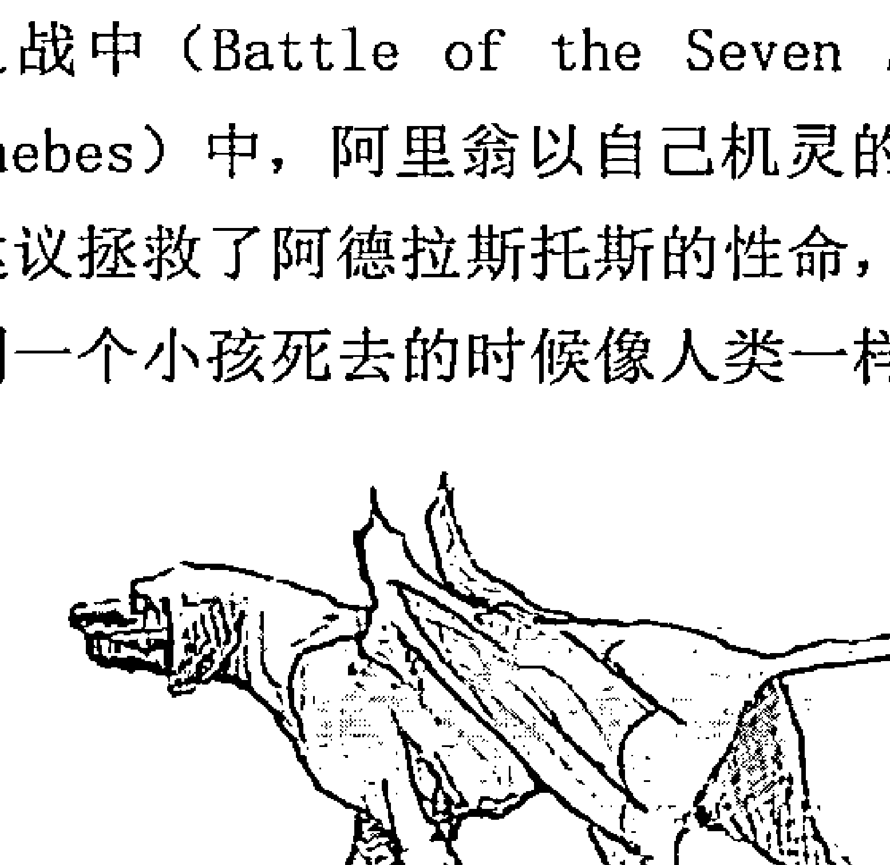

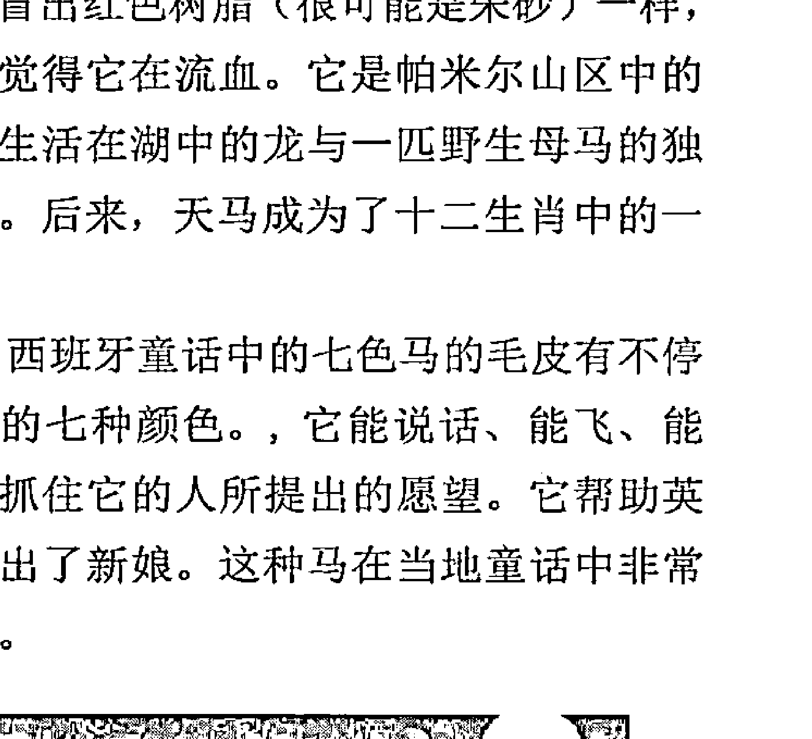

缇帕卡（Tipaka），西迦王传说中的骏马，是泰国神话中美丽而神奇的马。它能在瞬间到达想去的地方。

勃里根（Beligen），蒙古布里亚特英雄格泽的坐骑。勃里根的蹄子从不会滑倒，它的腿从不会冷却，它的眼睛一直闪## 图鉴二、揭秘夜之生物（上）

烁着光芒。
古希腊的众神——包括赫拉、哈迪斯、赫利俄斯（Helios）和狄俄斯库里（Dioskouroi）双胞胎——的战车都是由飞马拉动的。阿涅莫伊（Anemoi）是四风之神，他常扮成马的样子，拉着宙斯的战车。得墨忒耳（Demeter）金马能在玉米苗上飞奔而不会将其踩弯。

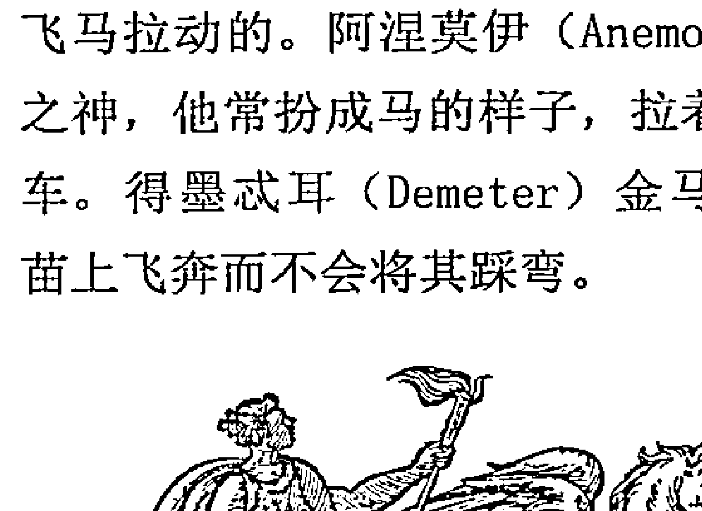

北欧的众神同样也乘着飞马，只是有些骑马，有些坐马车。奥丁、逊奈（Sunna）和玛尼（Mani）、吉恩那（Gna）、诺特（Nott）及其他众神都在阿斯加德仙宫（Asgard）和彩虹桥（Bifrost）之间的北方天空中穿梭，造访巨人的领域。其余的，比如女武神瓦尔基里（Valkyries）则下到地面收取死去英雄的灵魂。

在印度神庙中也有很多天马。在吠陀和之后的经书中记载着楼陀罗、毗湿奴、湿婆、苏摩（Soma）和苏拉亚的坐骑都是飞马。其中一些，如苏拉亚和毗湿奴，偶尔也会变化成马的样子。纳拉斯（Naras）是为印度教中的财富之神俱毗罗在越过天际的旅途中为其拉战车的飞马。

## 仙马

耳朵立起搜集最细微的声音，鼻孔颤动着嗅探难以捉摸的气味，皮肤颤抖着肌肉紧绷着随时可以跃入空中，马儿似乎处在一个我们无法感知的世界中。我们经常觉得它们并不属于这个世界，不是吗？它们优美的身形和本性让它们看起来如同仙子一般。事实上有哪个童话里能少了马儿的存在呢？大多数著名的仙马都来自凯尔特传说和中世纪故事。

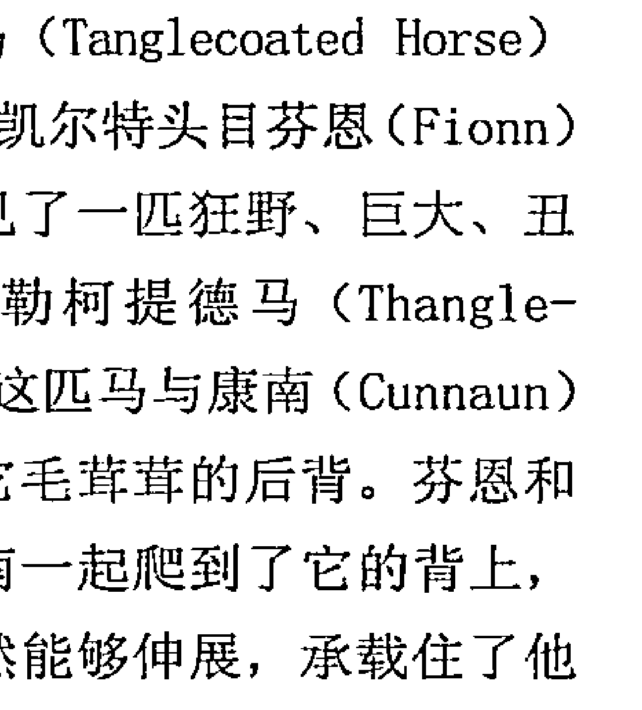

汤勒柯提德马（Tanglecoated Horse）来自爱尔兰传说。凯尔特头目芬恩（Fionn）在外出打猎时遇见了一匹狂野、巨大、丑陋的马——汤勒柯提德马（Thangle-Coated Horse）。这匹马与康南（Cunnaun）交好，他爬上了它毛茸茸的后背。芬恩和他的手下跟着康南一起爬到了它的背上，而这匹马的背居然能够伸展，承载住了他们所有人。后来这匹马把带他们越过大地，进入海中。在海波之下，这匹马带他们进入到了海中仙女的王国。这匹马的名字叫撼地神马，当听到别人叫自己名字的时候，它就会变成一匹高贵美丽的骏马，全身散发出银色的光芒。它身上挂着的那根绳子是用来在帮助人们在海中旅行的（只要人抓住绳子不放他们就能在水下呼吸）。在离开仙女的王国时，撼地神马又变回了以前的样子。然而，此后只要芬恩和他的手下想再次造访水下城市的时候，撼地神马都会来帮助他们。

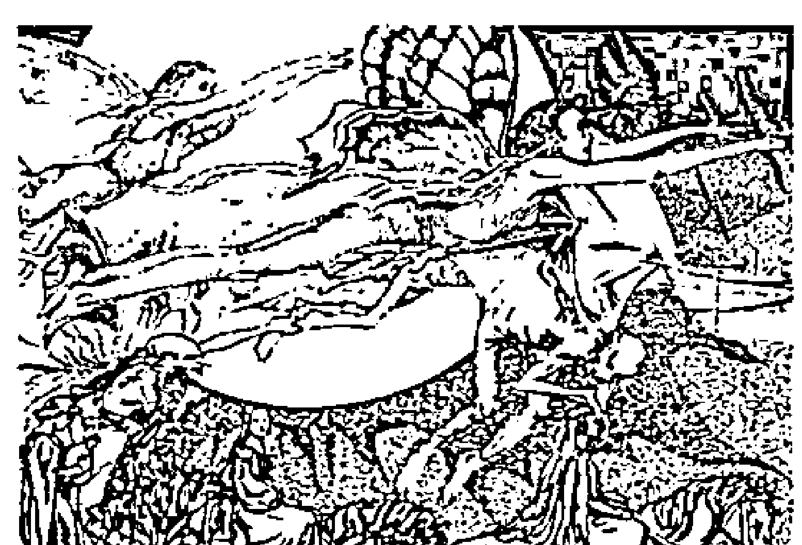

图 7. 仙子利德（斯科特·弗雷绘制）

你可能也听说过关于仙子利德的马（Horses of the Faery Reid）的故事。仙子们骑着这些马参加集会。有些马是银灰色的，有些是缎黑色的，有些是金栗色的，有些则是雪白色的。它们都美得令人惊叹，身上装饰着绿色的饰品、挂有铃铛和丝带的金银色马勒。有时会有凡人偷偷地溜进这些集中，骑到这些马背上去。在觉得自己被冒犯之前，它们都会载着这些凡人，有时则会把他们头朝下扔进沟里。

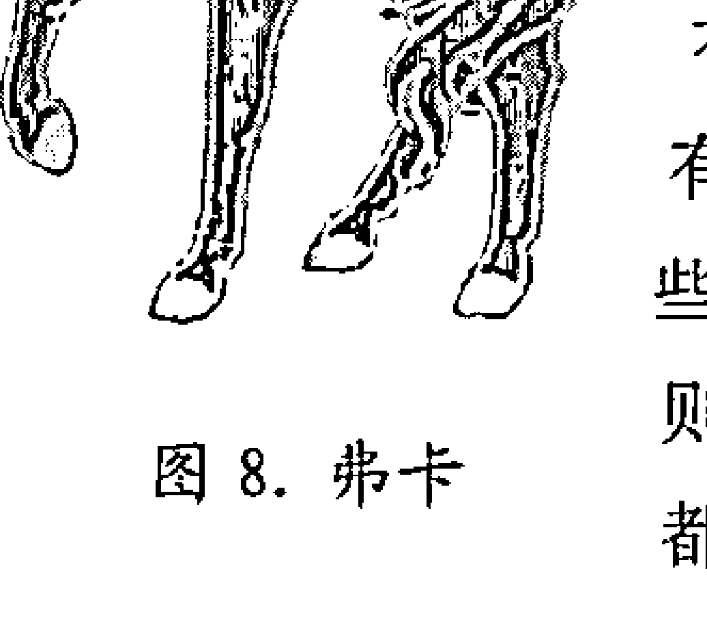

图 8. 弗卡

爱尔兰的弗卡（Phooka）是一种与之类似的生物，尽管它的本性有些黑暗。这种无害但却调皮的精灵能变成很多不同动物的样子，但它最喜欢的是变成一头全身黝黑、眼光如火的马。他喜欢伪装成一匹看似温顺的毛茸茸的小马驹，让疲惫的旅行者爬到它们背上，但在这时，它就会像出膛的子弹一样狂奔不止，最后把吓坏了的旅者扔进泥潭或水沟中。当这些人清理干净自己耳朵中的淤泥时，他们就能听到已经变回原形的弗卡边跑边发出的嘲笑声。

通常情况下，童话故事中的人物其实都会遇到一匹能够引导他们冒险之旅的马——比如奥吉尔（Ogier），他是一位丹麦王子，遇到了一匹叫帕皮伦（Papillon）的仙马，得到了它的智慧、力量和魔力的帮助。帕皮伦能说话，也能飞，还能在各个世界间穿行。它把奥吉尔带入了一片草地，见到了仙女莫甘娜（Morgana），她带他去见了阿瓦隆（Avalon）。帕皮伦慷慨地带着他在凡人世界和阿瓦隆之间穿行，最后他们都留在了阿瓦隆。

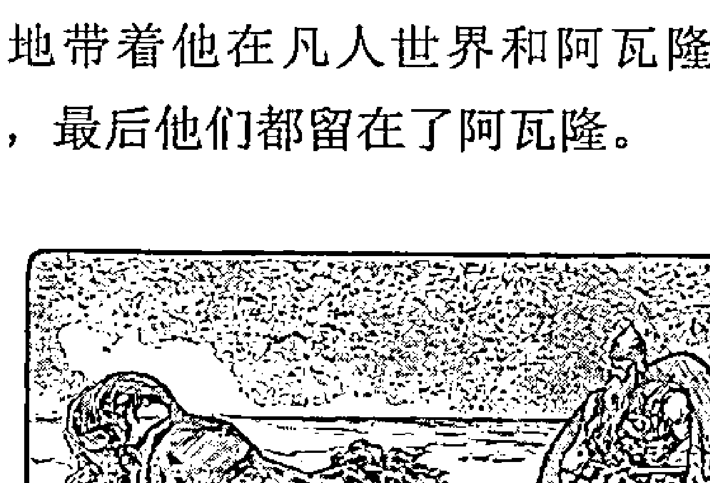

图 9. 奥吉尔与帕皮伦

有时故事中的英雄必须经过战斗才能降伏马匹。奥斯伯特爵士的幻影骏马（Sir Osbert’s Phantom Courser）是一匹巨大、美丽、黑色的骏马。他在一个月夜，在一个被废墟包围的平原上遇见了一位行踪不定的骑士，他战胜了这名骑士，获得了那匹马。奥斯伯特爵士虽然赢得了胜利，但却负伤累累，不得不跟长着火红眼睛的马匹一起回到他的马厩中，在那里呆到公鸡报晓，这时，这匹马突然双眼发光，用后腿站了起来，倒在地上消失了。很多英雄都是从这个世界流浪至神话和童话世界的，他们和自己的马儿在那里永远地生活在一起。在一处遥远的山洞中埋葬着一位迷失的国王和他的骑士们都骑着自己勇敢的战马建立过卓越的功勋。他们在那里沉睡，等待着王国的召唤，届时他们就会再次出现打败入侵者，获得胜利。大多数古代和中世纪的民族英雄们的灵魂都存在于这些神奇的山洞中，当然也是与他们忠诚的战马一起。

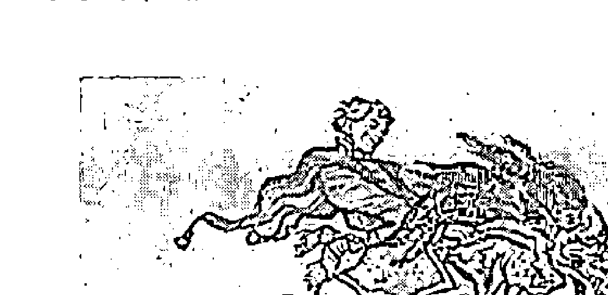

但有时，英雄并不是伟大的骑士，而只是一个农民小男孩，比如俄罗斯的伊凡（Ivan），他碰到的是如意马（Wish-Fulfilling Horse），通常被叫做长着驼峰的小马（Humpbacked Horse）（konyokgobunok）、小魔马（the Little Magic Horse）或金鬃马（the Golden-Maned Horse）。这匹小马看上去和伊凡一样温顺又谦卑，但它却拥有强大的法力，能够满足小男孩的愿望将其变成一位骑士，他后来将美丽的火鸟带给沙皇，迎娶了自己心爱的伊莲娜（Yelena）公主。

## 天使马

奔驰的天使马像云朵一样从天上席卷而下。天使通常被认为是好人，它们是众神的助手、化身、信使。名为坎塔奇（Kantaki）的白马拖着悉达多乔达摩升天成佛。

在《摩诃婆罗多》中，第一匹马的名字叫乌柴刷瓦（Uccaihcravas）（“它长着尖尖的耳朵”），是群马之王。乌柴刷瓦全身亮白，长着一条黑色的尾巴，像思想一样迅速，在空中追逐太阳。它是因陀罗的群马之一。

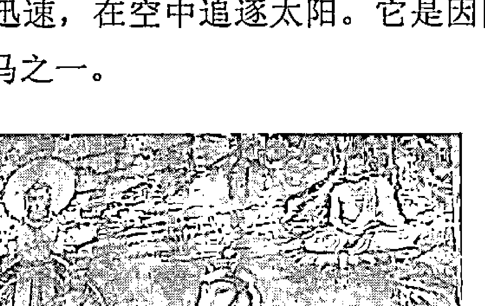

在《旧约·撒迦利亚书》中记录了出现过两次的守卫天使的马。在第一次时，一个天使乘着一匹红马出现，后面跟随着许多红色和有斑点的马，它们在大地上盘旋，报告一切安好。在第二次时，四台战车由天使马拉着：第一辆战车由红马拉着驶向西方；第二辆战车由黑马拉着驶向北方；第三辆战车由斑白（灰蓝相间）的马拉着驶向南方；第四辆战车由白马拉着驶向东方。同时也有许多枣红马自己四处游走。

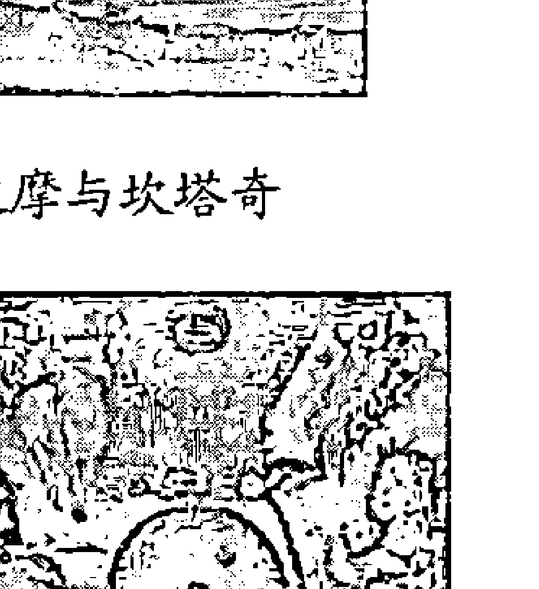

先知穆罕默德也有许多马，其中最为著名的叫阿尔博拉克（Al Borak），这是一匹种马，其名字的意思是“闪电”。它是由大天使加百列送给这位先知的，他就是乘着这匹马升入天堂的。对博拉克有两种不同的描述。一种说它长着人脸，但脸庞却像马一样，它的眼睛像风信子，智慧如同群星一般，它还长着老鹰的翅膀，能像人一样说话，全身散发着明亮的光芒。另一个（更为平淡）版本来自《克罗奎米台尼II.9》（Croquemitaine），阿尔博拉克是一匹高大、强壮、干净的骏马，它金色的皮毛像大理石一样光滑，它的双眼和鼻孔非常巨大，而且里面都喷射着火焰，在其前额上有一个白色的五星，长长的脖子上长着丝般柔滑的鬃毛，它厚厚的尾巴拖在地上。尽管容貌易变，博拉克却是少数几个能升入天堂的动物。

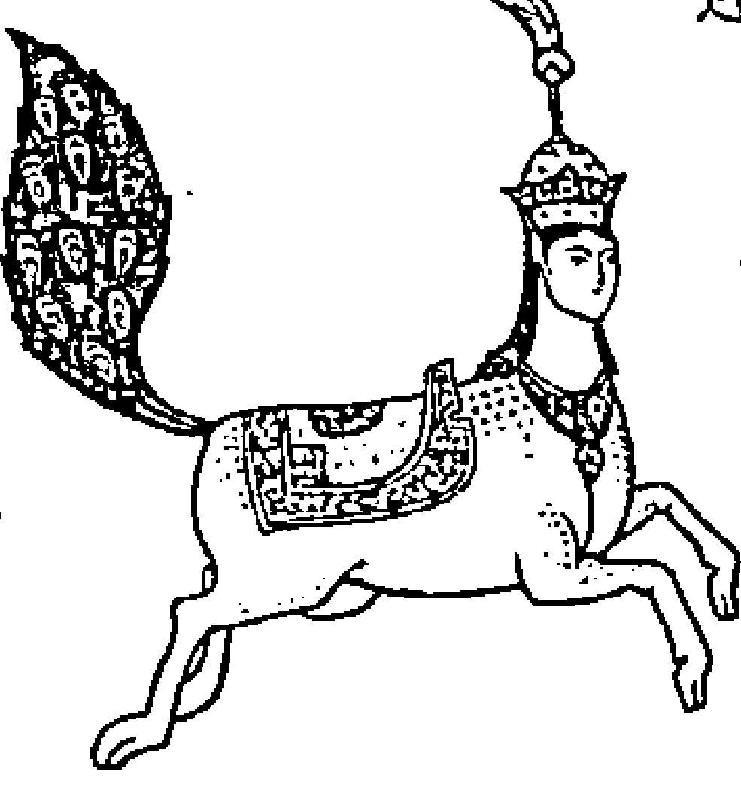

图13. 阿尔博拉克

还要有魔鬼马。如果你曾在暴风夜骑在生气的马背上的经历，那么你在事后多半也会编一个或两个故事来讲！很奇怪的是，我们有多喜欢一样东西，我们就会有多怕它，有时对它的恐惧甚至超出了对其喜爱的程度。这样，相比天使马而言，我们有着更多关于魔鬼马的传说，尽管其中有少部分都是模棱两可的。

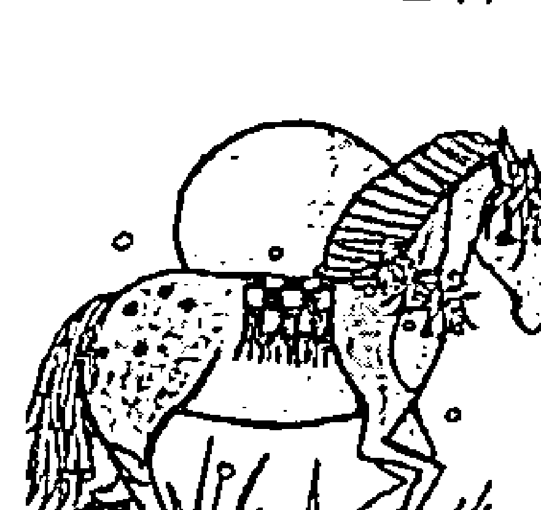

图15. 布拉格（丹娜·凯斯绘制）

霍伯果博林（Hobgoblin）最初的意思是指一种魔鬼马，这个词的衍生词是“hob”，源自中英语的“hoby”，意为“一匹小马”，以及“goblin”，意为一种恶魔般的精灵。被称为布拉格（Brag）的骏马通常都是以黑马的样子出现，人们只能在英格兰北部诸国偏僻的沼泽和路上看到它，它们会引诱旅行者踏上死亡之路。

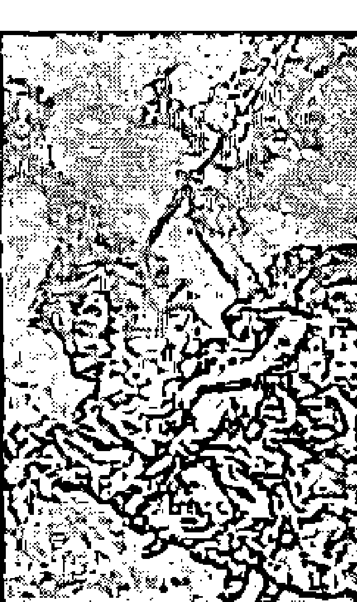

图14. 瓦尔基里

在冰封的北欧天空中生活着瓦尔基里之马（Horse of the Valkyries），这个名字最初的意思是战斗中的狼与乌鸦，但在后来的传说中却变成了九匹长有天鹅翅膀白云般的马。它们掠过大地，帮助瓦尔基里搜集战场上的死尸。它们也在海洋上盘旋，将死者从船上或海中叼出来。它们的鬃毛和尾巴上都沾满了露珠和冰霜，在它们的蹄子和人鱼的利剑中能射出闪电，它们二者的盾牌和装甲都能反射北极光。

## 魔鬼马

任何东西都有相对面，所以我们必须你同样不会希望遇上格温·阿普·路德之马（Horse of Gwyn ap Nudd），因为它是威尔士荒野猎人的坐骑。这位猎人横跨在一匹黑色的魔鬼马上，这匹马名字的含义是“战争的折磨”。他捕猎的对象不是鹿，而是人的灵魂，因为他是凯尔特地下世界的王。在德国的梅克伦堡还有另一位幻影猎手，他骑着弗劳渥德白马（White Horse of Frau Wode）在山坡上的树林中穿梭。这位古代女神坐着她的白色灵马，有时还跟随着白色的猎狗和其它幽灵般的野兽。她的出现预示着好运和丰收。

劳奇伦迪黄马（Yellow Horse of Loch Lundie）有时被认为是伪装起来的恶魔。它以金色小马的样子出现在那些安息日到该湖中钓鱼的人们面前。任何试图爬到它背上的人都会立刻被黏住，无法脱身，然后这匹马会将他们带走，这些人之后再不会出现。即便是那些恶毒的歹徒都必须小心爱尔兰传说中的“Each Tened”（盖尔语，“火马”）。这种带火的幻影马拥有永生的能力。

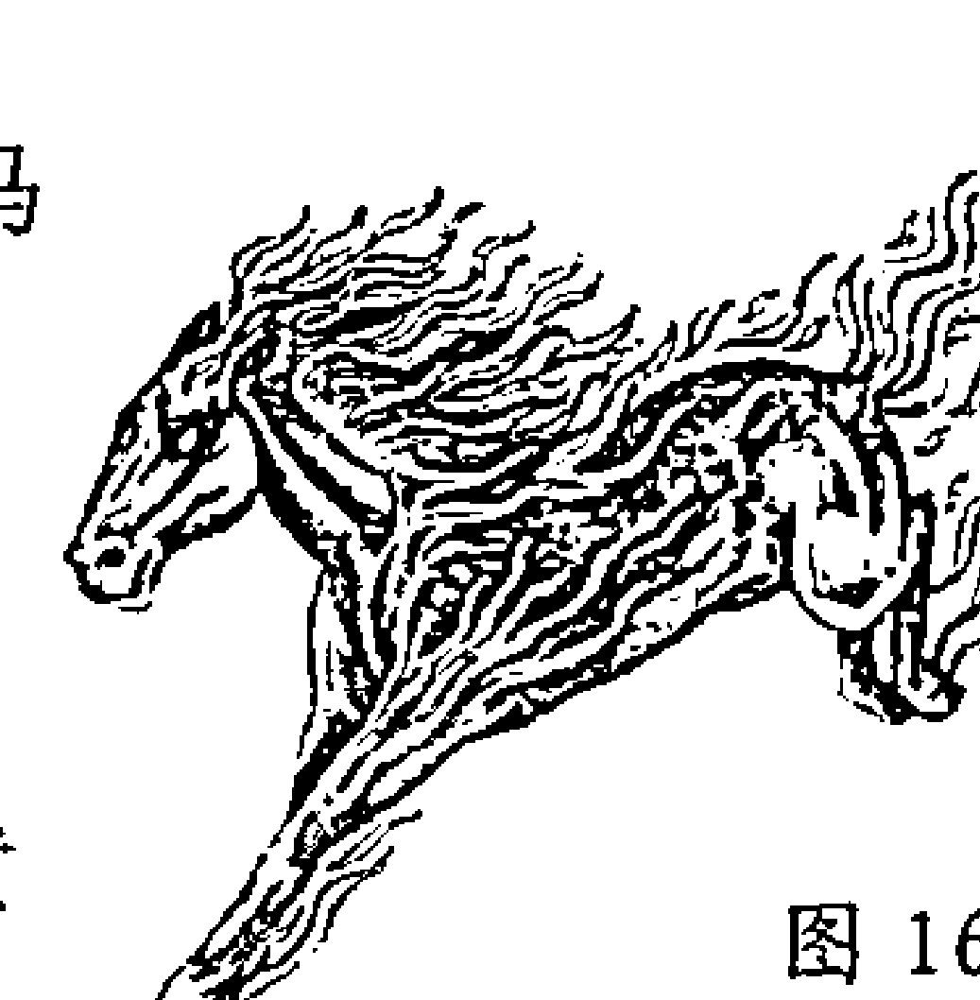

在亚洲还有另一种恐怖的马。白马是一种得了白化病的马，它尾巴长得像牛，声音像老虎。它住在中国四川和甘肃交界处的白马谷中。在波斯神话中，康诺瓮尼（Conopenii）是一匹巨大、能喷火、长着驴脑袋的马。凯西（Keshi）（梵文，“长毛”）是印度神话中的一匹巨大、凶猛、长着长鬃毛的马，它会攻击人类，后来被毗湿奴掐死。在《黎俱吠陀》中同样也提到了雅图德哈纳斯（Yatudhanas），它是一个马头怪，长着大大的爪子，以人类、马肉和牛奶为食。火神阿格尼（Agni）后来砍掉了它的头。

即便是在美国你也能找到同样的魔鬼马。《山姆·哈特和魔鬼马》是一个美国民间传说，讲述的是一个喜欢赛马的农夫受到一位陌生的骑手挑战的故事，这名骑手骑着一匹散发着硫磺气味的黑色灵马。山姆骑着自己用来耕地的马贝奇（Betsy）走近道从一间教堂中穿过，而对手却不敢这样做，于是他们赢得了比赛。比赛的奖品就是那匹黑马。后来这匹魔鬼马让山姆赢得了所有的比赛，变得富有起来，但他后来却成了一个小气和贪婪的人，失去了自己的妻子和忠诚的马，最后酗酒而死。

这些故事可追溯到基督教时代。古代的狂野猎马（Horses of the Wild Hunt）要么像沥青一样黑，要么非常苍白，拥有火一样的眼睛和怪异的嘶鸣声。它们在暴风夜踏着雷鸣般的脚步在夜空中奔跑，时而会踩坏一些树枝。众神都与其有关，包括奥丁、赫尔（Hel）、赫恩（Herne）、荷德夫人（Frau Holde）、格温·阿普·路德（Gwen ap Nudd）和阿奴恩（Arawn）。他们身边都跟随着一大群黑色或白色的猎犬，还伴有雷鸣闪电。在某些地区，听见它们经过的声音被视为好兆头，但在其它地区，这都被认为会带来噩运。最终，“猎人”被定义为坏心肠的精灵，残忍或贪婪的贵族，以及——可预见的——恶魔本身。这些马能像风一样飞行，随意出现或消失，有时还会在石头上留下脚印。

## 莫瑞根与凯勒阿奇之马（Horses of the Morrigan and the Cailleach）

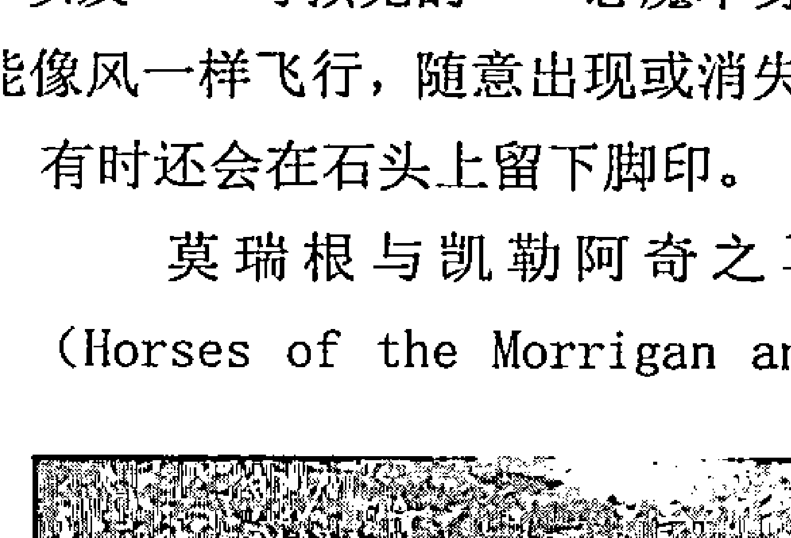

是战斗女神的坐骑。它们背负着注定要死去的战士们的灵魂参加战斗。在很多方面它们都与瓦尔基里的天使马相似，它们要么是黑色的，要么像鲜血一样红，眼睛闪闪发光。它们与乌鸦一起在战场上空飞舞，人们在死去之前就能闻见死亡的气息。它们奇怪的叫声和乌鸦的叫声是死去战士最后能听见的声音。之后，它们会冲下来，取走他们的灵魂，将其送到一片葱绿，没有战争的萨默兰。在《Tain bo Regamna》中，莫瑞根（Morrigan）在见库丘林（Cuchulain）时用一条腿横跨骑在马上。

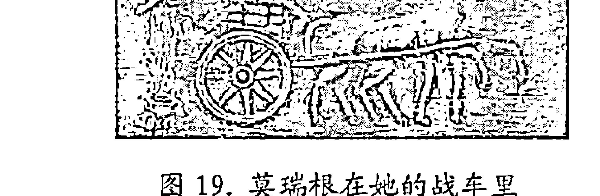

在《圣经·启示录》中有一匹高大、或灰色或白色的骏马，在他身上坐着一名穿着黑色盔甲，拿着大镰刀的骷髅骑士。

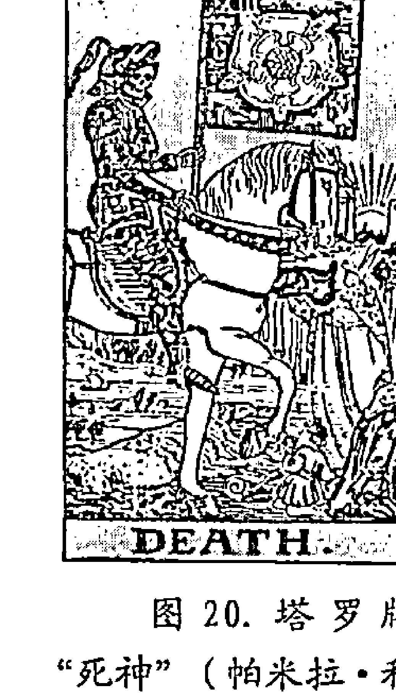

从此开始，死亡的灰色马被传说了一千年。在塔罗牌中也有他的形象。死亡之马能飞，能入水，能在墙上或火中行走——简而言之，任何发生死亡和灵魂需要被释放的地方。在一个更为现代的版本中，他能让人不是那么痛苦地中风而死，而不再是恶魔的化身。宾奇（Binky）采纳了这种观点，写出了小说《碟形世界》（Terry Pratchett's Discworld）。

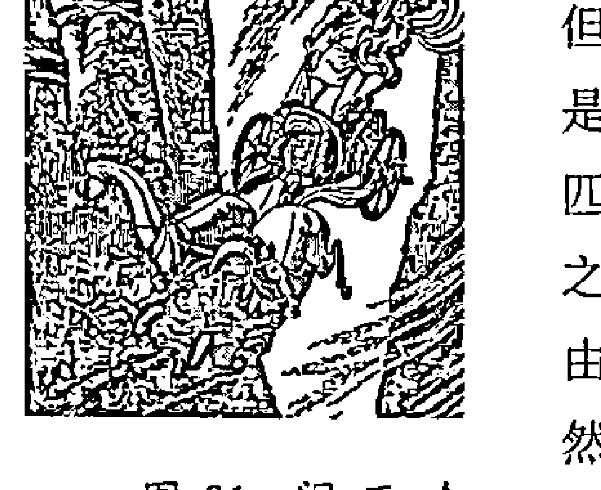

尽管自身并算不上是魔鬼马，但哈迪斯之马却是希腊神话中四匹拉动地下世界之王战车的马儿，由此也被理所当然地视作黑暗生物。它们的名字分别是阿巴托斯（Abatos）（“不可接近”）、阿巴斯特（Abaster）（“远离星辰”）、阿伊顿（A'eton）（“迅捷如鹰”）和诺纽斯（Nonios）。他们像煤炭一样黑，眼睛则像珠宝一样闪耀。他们的鬃毛又长又蓬松。他们还能用黑色的烟雾将自己包裹起来，隐藏自己的行踪。被他们蹬踏到的地面都会裂开形成山洞。黑暗之神借此用金色战车带走了科莱（Koré），变成了自己的死亡女王。根据《罗马书》所述，这些马的嘴上都有一块黑色的地方（希腊文写做“hippomanes”）。人们认为母马会拒绝喂养长着这种恶魔标记的马驹，有时甚至会将其咬死。忒奥克里托斯（Theokritos）认为“尿囊小体（hippomanes）”来自阿卡迪亚“（它）让那里的马驹和母马发狂。”

在希腊神话中还有狄俄墨得斯牝马（Mares of Diomedes）。这支由四匹吃人的马所组成的队伍归于古希腊比斯通（Bistons）之王色雷斯麾下。它们有时被描述为长有翅膀，与蛇发女怪戈尔贡（Gorgon）和鸟身女妖哈耳皮埃（Harpy）有关。它们的名字分别是德诺斯（Deinos）（“恐怖”）、兰鹏（Lampon）（“明亮”）、桑索斯（Xanthos）（“黄色”）和婆达克斯（Podarkes）（“快脚”）。戴奥米底斯（Diomedes）用外来人的肉体喂食他的马匹，后来赫拉克勒斯在其第八个功绩中驯服了它们：“他控制住了这些贪婪地在血腥马槽中大快朵颐的马……”然后这位英雄将戴奥米底斯扔给了这些马，让它们把他吃掉，然后骑着它们到达迈锡尼（Mycenae），在那里他将这些马献给了女神赫拉。它们的后代据说在亚历山大大帝时期（公元前356-323年）都仍然存在，实际上，袭击亚历山大大帝的皮西法拉斯（Bucephalus）据说就是他们中的一位。

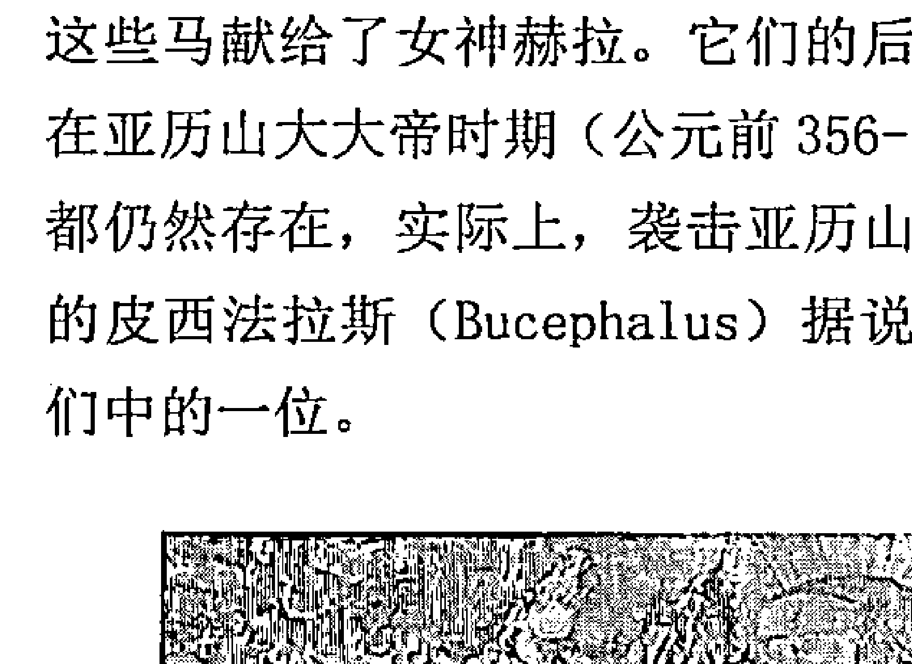

图 22. 狄俄墨得斯的食人母马

一千年后，美洲土著人开始传说恐怖的吃人野马。肖松尼（Shoshone）印第安人有关于一匹黑色魔鬼的传说，它是一头墨黑色的种马，长着火红的眼睛、尖利的牙齿，据说能说话，而且还以人为食。

但所有的这些黑暗之马在它们老祖母面前都相形见绌。她是在我们潜意识中徘徊的恐惧之一，在人类还是穴居动物的时候她的形象就已经被画在了岩壁上。她就是梦魇兽，在所有被提及的魔鬼马中，她是最为人熟知、流传最为广泛的。
梦魇兽（NightMare）是由各个文化中的神话、传说所拼凑起来的。她是苏美尔地下世界女神厄里斯克革（Ereshkigal）的红色坐骑；是希腊赫卡特（Hecate）在梦境中十字路口上遇见的幽灵之马；是北欧传说中赫尔的骷髅马；是吸血的撒克逊马（SaxonMare）也叫玛拉（Mara）；是威尔士的会咬人的骷髅头，它被穿在一根杆子上，名叫马里·路德（Mari Lludd）。在现代的流行文化中她甚至被说成是友好的幽灵盖茨比的坐骑。很多关于她的传说都随着岁月消失了，但人们仍然在不停地经历梦魇（NightMare），这让她的名号长盛不衰。这些东西都融合在了一起，组成了某种我们在梦中也无法摆脱的东西。

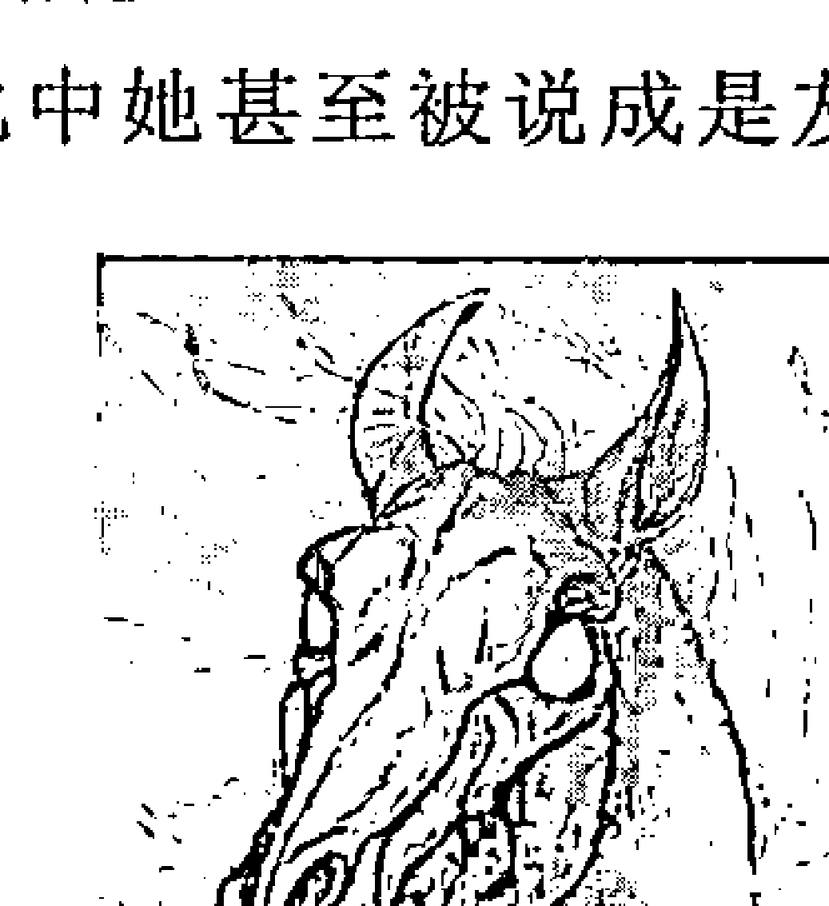

图 23. 梦魇兽（斯特芬尼·汉恩-斯纳巴绘制）

梦魇兽是一位坐在睡梦中的人胸膛上的魔女。最初她让人做充满诱惑和色情的梦，然后梦境变得越来越恐怖，而她自身的重量让人无法呼吸，她就这样以人类的恐惧和痛苦为食。随后，她会慢慢地将人的灵魂拉出他们的躯体，直到这些人要么醒来，要么在睡梦中死去。实际上，在做噩梦时确实可以导致死亡。现代科学也研究睡眠瘫痪症，给出各种各样的药方和疗法，但其实也该意识到梦魇兽的传说和致死能力。

她的马巢由蓬乱的杂草、狗头、羽毛和垃圾组成，里面常藏有宝藏。免受其害的最好办法是在卧室门上挂一只马掌，把马掌钉钉在床里，或者在睡觉的人脖子上围一块圣石（中心有孔的石头）。很多蒿草也有同样的效果。要让她远离马群就要用一根棉绳系上一把铁钥匙，再把它拴在马厩或马羁上。钥匙是女神赫卡特（Hecate）的象征，这样这些马就都被纳入了她的保护之下。梦魇兽是真实存在过的古老生物，她能够将所有人都控制起来。希望大家都平安醒来。

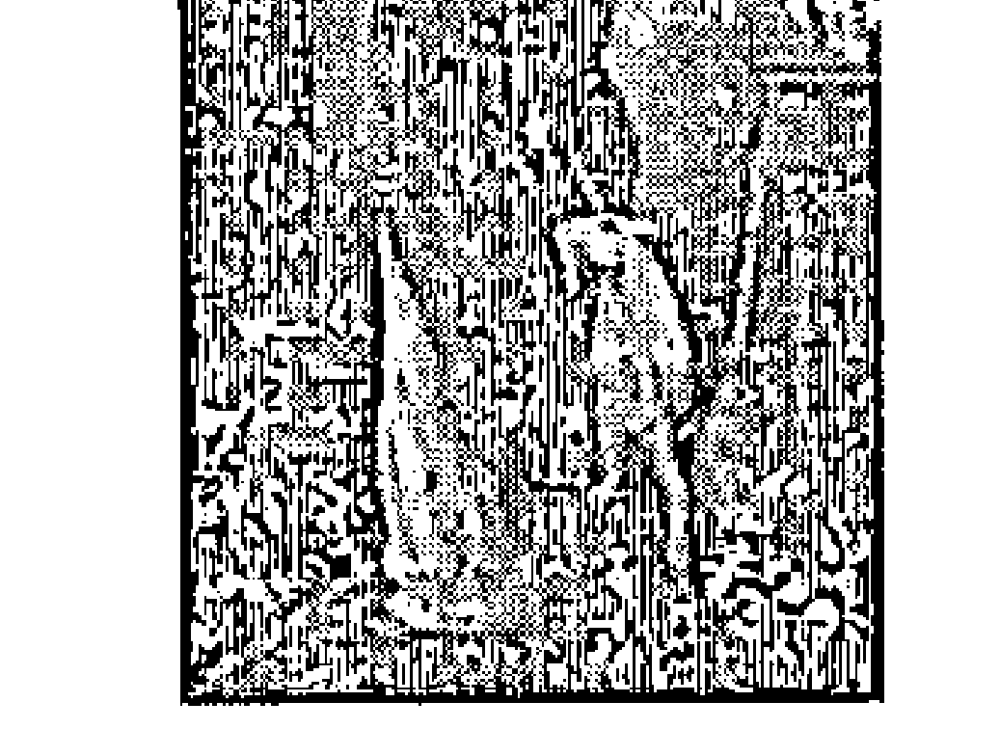

图 24. 迈克尔·斯科特

然而，有时这些魔鬼马也能为人所用。巫师迈克尔·斯科特的魔鬼马来自一个16世纪的传说，说这位巫师将一个魔鬼变成了一头巨大、长着银色马蹄、拥有恐怖力量的黑马。他越过大洋，从苏格兰飞到了巴黎，用人的声音说着话，试图引诱身上的骑手说出圣名从而获得自由。当巫师遇上法兰西王时，这匹马跺了三下马蹄：第一跺让所有的塔顶上的钟都响了起来，第二跺让三座宫殿上的塔倒塌了，在第三跺之前，国王已经投降了。

中世纪《武功歌》（chansons de geste）中出了一匹名叫贝亚德（Bayard）的魔鬼马，它的名字意为“长着棕黄鬃毛”。它被巫师马拉吉吉（Malagigi）从地狱里召唤出来，送给了多尔多涅的埃蒙（Aymon）。这匹马有很多神奇的能力：它比任何马都要灵活、能够听懂人的话、能随意变大和缩小。它被埃蒙之子雷诺（Reynaud）继承，之后它便像服侍埃蒙一样服侍雷诺（甚至帮他从与查理曼大帝（Charlemagne）的比赛中赢得了一只赛跑金冠），他成了这位皇帝愤怒和嫉妒的牺牲者。查理曼大帝征服了埃蒙之子，将贝亚德绑上一块磨盘石扔进了塞纳河中。有人说它被淹死了，也有人说它用魔力拯救了自己。此后，阿登森林中的农民时常会看到它的脚印，听到它马蹄的声音和在月圆时的嘶鸣。根据传说，在苏瓦涅（Soignes）森林中和迪南（Dinant）附近的一块石头上都还能找到它的脚印。

## 神圣而永生的马

> 现在，这些拉动终身战车的飞马和赶马的车夫都是贵族以及贵族之子……车夫把它的安置在马厩中，用安布罗沙和花蜜来喂养。 ——柏拉图，《斐德诺》246

有些马是靠自身的努力变成神灵的，珀加索斯和上面提到的很多高贵的骏马都属于此类。然而，其它的马则是通过组合获得神力的，比如拉动战车的马和众神。因为马的身份大多数都是骑手赋予的，所

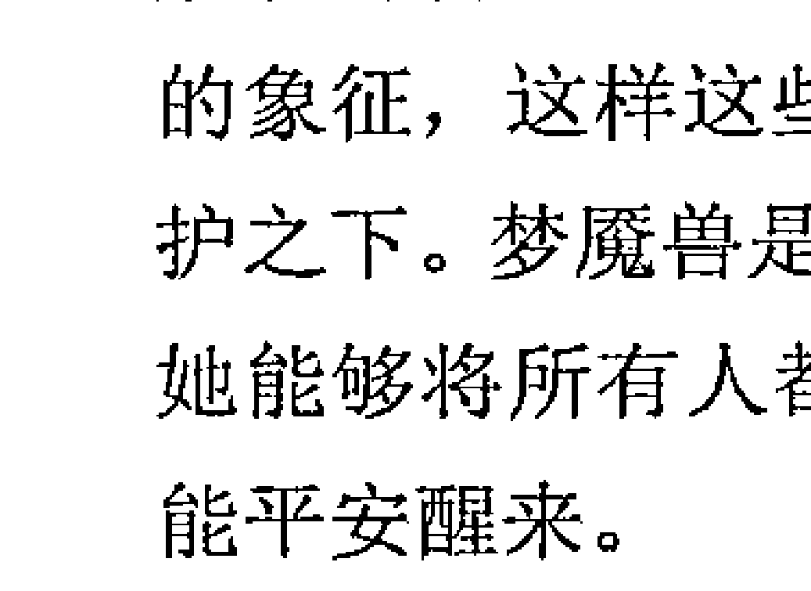

图 25. 贝亚德

## 图鉴二、揭秘夜之生物（上）

以有时候就很难将马匹与其主人分开来谈。但是，我们总是发现自己忍不住地在思索独行侠（Lone Ranger）要是没了银雪（Silver）还能靠什么行动？答案当然是‘走路。’

希腊的西珀伊·阿塔纳托伊（Hippoi Athanatoi）（‘不死马’）多得都数不过来。尽管众神的战车都是由他们的图腾生物拉动着的——比如，阿佛洛狄特（Aphrodite）的贝壳似的战车是由巨大的天鹅拉动的——但，奥林匹斯山上的居民都有自己所钟爱的马，不管是它们来拉车还是用来骑的。宙斯、赫拉、阿瑞斯（Ares）、耐克（Nike）、得墨忒尔（Demeter）、波塞冬和哈迪斯都有由很多长着翅膀的种马或母马拉着的战车，他们都用不朽的蜜酿：花蜜和安布罗沙来喂养它们。

卡斯托（Castor）（被称为‘驯马者’）和波利克斯（Pollux）是圣人双胞胎，他们二人培养出了一群最为奇妙的圣马来拉动自己的战车在云海中和大地上空穿梭。哈尔帕格（Harpagos）、库拉洛斯（Kyllaros）、弗洛吉奥斯（Phlogeus）和桑索斯（Xanthos）构成了这支队伍。当罗马人和拉丁人在里吉洛斯湖（Lake Regillus）边发生战争时，这些天上的勇士冲在军团的最前面。这些西珀伊·阿塔纳托伊用闪电般的速度将胜利的消息传回了罗马。这两位圣人用因图那喷泉的水来喂养自己的马匹，后来人们在那里建起了一座神庙来纪念他们。在里吉洛斯湖边的火山岩中的马蹄印迹被认为是这些天外来客所留下的。

拉俄墨冬的永生马（Immortal Mares of Laomedon）被特罗斯（Tros）献给了宙斯，作为对其绑架伽倪墨得斯（Ganymede）的补偿。它们喝光了水，吃光了粮食，最后被卖给了特洛伊王拉俄墨冬（Laomedon），他将它们作为奖品，要求赫拉克勒斯从一个海怪那里救出自己的女儿。后来拉俄墨冬违背了协约，赫拉克勒斯为了得到这两匹马而洗劫了特洛伊。

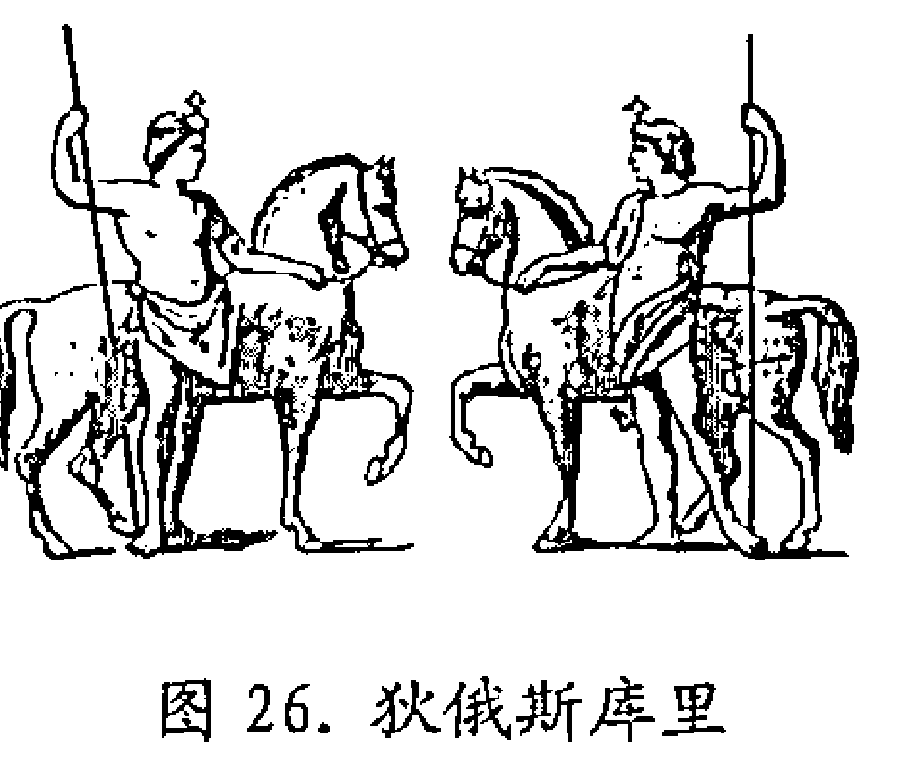

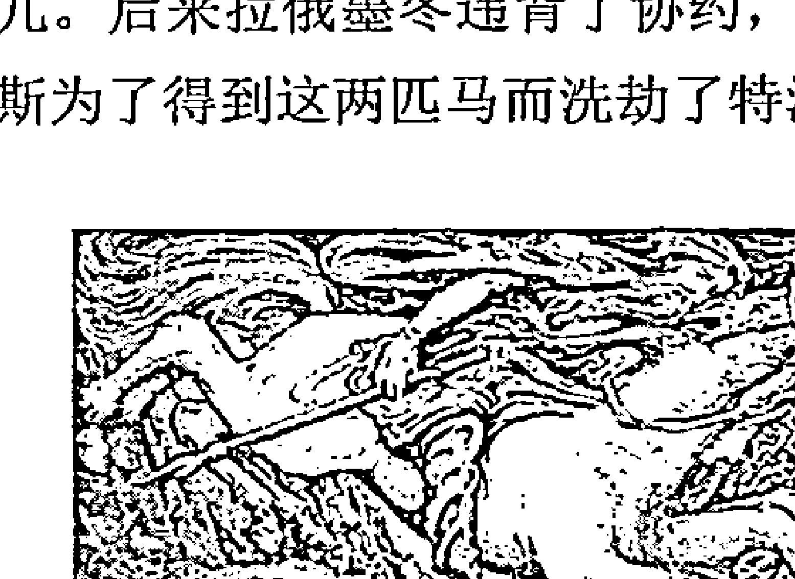

挪威人因龙船而被人们记住，但马也是他们文化中非常重要的一部分，不管是用来骑的还是用来祭祀的。亚萨神族（Aesir）每天都会骑着马越过彩虹桥（Bifrost）造访其它的王国，众神也理所当然地有着自己钟爱的坐骑——其中最受欢迎的叫斯雷普尼尔（Sleipnir）（‘滑行者’，因其就像在很平滑地滑行一样）。这匹有魔力的马是北欧诸神之父奥丁的八腿骏马。斯雷普尼尔跑得比风还快，能在空中飞行，穿过所有的陆地和海洋，进入女神赫尔的领域——只需九天的时间。它的八条腿代表着指南针的八个方向。有一个关于它和它的主人的谜语：什么东西在骑马的时候有三只眼睛、十条腿和一条尾巴？当然，奥丁只有一只眼睛，因为他用另一只眼睛来换取了无尽的智慧。

斯雷普尼尔像北欧天空多云时的灰色，它依靠啃食世界之树伊格雷拉修（Yggdrasil）而变得不朽（直到世界末日）。奥丁将其通过巨大牺牲获得的符文刻在了斯雷普尼尔的牙齿上，这让其获得了超自然的智慧。它被挪威人认为是所有马中最伟大的。亚萨神族其他的马有格拉德（Gladr）、基里尔（Gyllir）、格拉尔（Glaer）、斯肯德里米尔（Skeidbrimir）、斯尔福林托普（Silfrintoppr）、斯尼尔（Synir）、吉尔斯（Gils）、法霍夫尼尔（Falhofnir）、古尔托普（Gulltoppr）和勒特非提（Lettfeti）。

另一匹著名的挪威马叫史瓦迪法力（Svadilfari）（“旅途不幸的马”）。它是一匹巨大的具有魔力的马，属于巨人希利穆图斯（Hrimthurse），他同意在亚萨神族诸神的家乡阿斯加德仙宫旁建立一道防御墙来换回太阳和月亮——以及弗雷亚女神。众神被洛基说服，同意并设定了一个冬天的时间作为期限，他们确信希利穆图斯不可能按时完成任务。但巨型的种马史瓦迪法力拥有一百倍于普通马的力量，在他的帮助下，在最后一天午夜时分，这堵墙就已经几近完成了。绝望的众神命令史瓦迪法力做点什么来阻止巨人获胜，于是洛基变成了一匹漂亮的白色母马，引诱了史瓦迪法力，逼迫希利穆图斯放弃了修墙去追逐他的马。两匹马生出了八条腿的斯雷普尼尔，随后洛基变回了自己原来的样子。

对凯尔特人而言，马也是非常重要的，因为有很多关于它们的艺术作品——最为特别的要数山坡上刻出的巨型马的肖像。但大多数的圣马都是守着一个或多个马之女神的控制的：艾波娜（Epona）、莱安诺（Rhiannon）和莫瑞根（Morrigan）。因为这些女神时常骑马，自己也会随意变成马的样子，所以很难区别她们到底是神还是马。然而却有一匹凯尔特圣马自己跑到了我们身边，他叫昂巴（Aonbarr）（“独特的至高”）。这匹雄伟的种马属于爱尔兰海神玛纳诺·麦克·列（Mannan Mac Lir），能够穿行于任何表面，不管是山脉、平原还是海洋，甚至还能潜入水中。它被借给了大神卢格（Lugh）帮助其寻找光明之剑。

有时，神性会以一种奇怪甚至莫名其妙的方式获得。比如，拿科尔特斯（Hernando Cortez）最喜欢的坐骑厄尔·莫兹罗（El Morzillo）的故事来说吧。莫兹罗是一匹全身黑亮的种马，身上散发着红色的光泽。它弄伤了自己的一条腿，不得不被留在佩滕湖（Peten Lake）旁的村落里。那里的印第安人从未见过马，从而将其视作神明。当它由于吃得太多而死去的时候，它的形象被刻在了石头里，取代了那些印第安人之前信奉的神。事后回来的牧师被吓坏了，但厄尔·莫兹罗成了西班牙征服者带到新世界的唯一一匹名字为人知晓的马：这匹马变成了阿兹特克神。

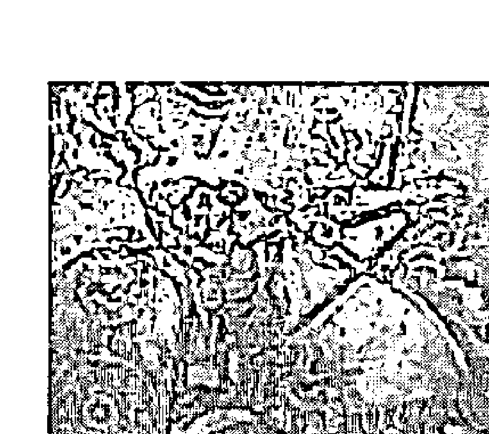

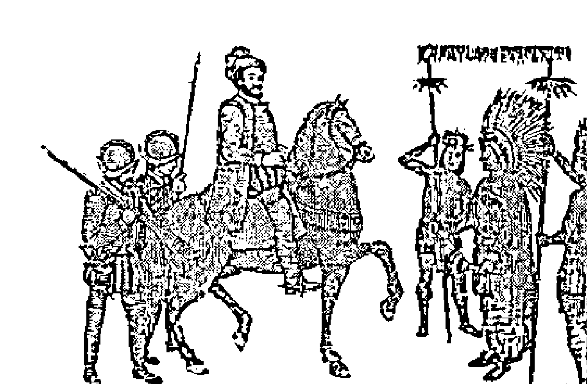

## 太阳之马、月亮之马和夜之马

> 看！他的马跳得如此高，
它的四肢和肌肉是如此强健。
在天空的前额上，
拉着战车任意驰骋。
——《梨俱吠陀经》

### 太阳之马

希腊太阳神赫利俄斯的战马是永生而且异常健壮的。它们中有些长有火焰般金红色的鬃毛和尾巴，在天上拉着太阳燃烧的战车奔跑。

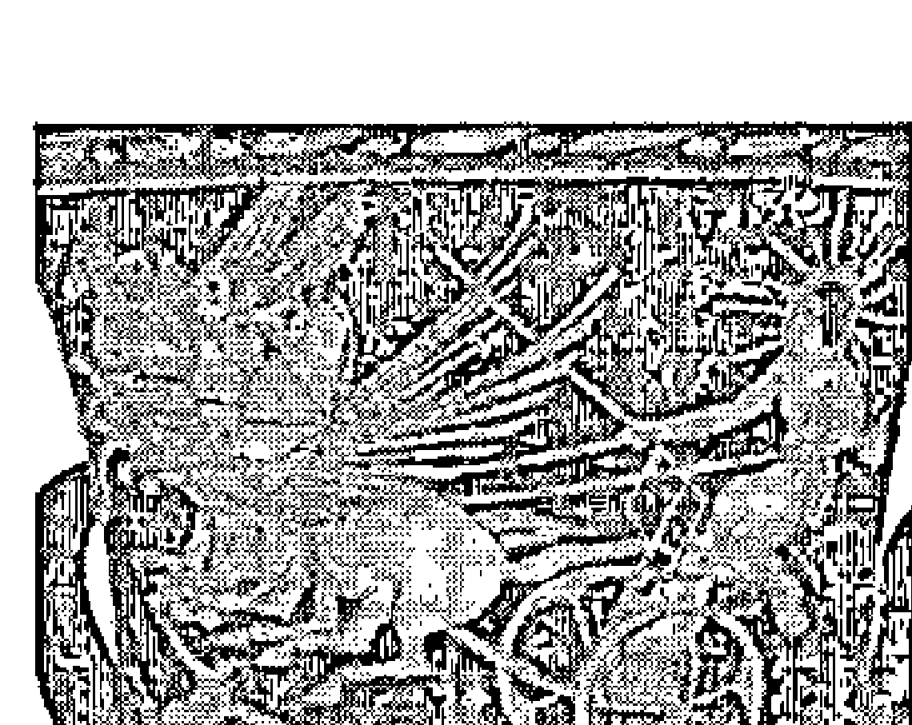

有一次它们和赫利俄斯的凡人儿子法厄同(Phaeton)一起下到了地面，于是地面上几乎所有东西都开始燃烧，幸好后来得到了宙斯的阻止。有时他用七匹马拉车：勃朗特(Bronte)（“雷霆”）、厄尔斯(Eos)（“黎明”）、埃塞俄普斯(Ethiops)（“迅捷”）、厄彤(Ethon)（“火焰”）、厄立特里俄斯(Erythreios)（“红色”）、费洛基亚(Philogea)（“热爱大地”）以及皮洛伊斯(Pyrois)（“狂暴”）。有时又用四匹马拉车：亚克托安(Actaeon)（“智慧”）、费勒干(Phlegon)（“燃烧”）还有厄尔斯和皮洛伊斯。亚克托安是其中意志最坚定的，厄尔斯总是慢条斯理的，皮洛伊斯最为绅士和最易掌控，但费勒干则是他最为喜欢的。

希腊黎明女神厄尔斯的战车比太阳神的要小一些。她的车队由两匹不朽飞马组成：莱博斯(Lampos)（“闪耀”）和法厄同(Phaethon)（“光芒”）——后者是以赫利俄斯(Helios)不幸的儿子名字命名的。

印度太阳神苏利耶(Surya)同样也有一队漂亮的飞马，名叫七战马(Seven Harits)，她们都是母马，拉着神的战车在印度的天空上驰骋。七战马分别是：伽亚帖(Gayatri)、波哈提(Brhati)、尤斯尼克(Usnik)、阇迦底(Jagati)、特里斯塔普(Tristup)、安努斯塔普(Anustup)和潘克提(Pankti)。七位乾闼婆是自然界的半神，他们也变成种马的样子来伴着他飞行。有时苏利耶会变成一匹名为塔克西亚(Tarkshya)的马。

在古代亚美尼亚神话中，厄尼克(Enik)、摩尼克(Menik)、贝尼克(Benik)和森尼克(Senik)是太阳之马，也是孩子们数数节奏“一二三四五，上山打老虎”的来源。

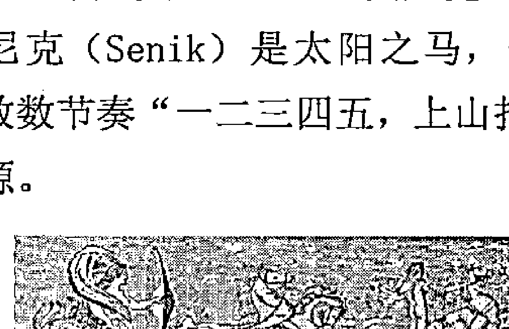

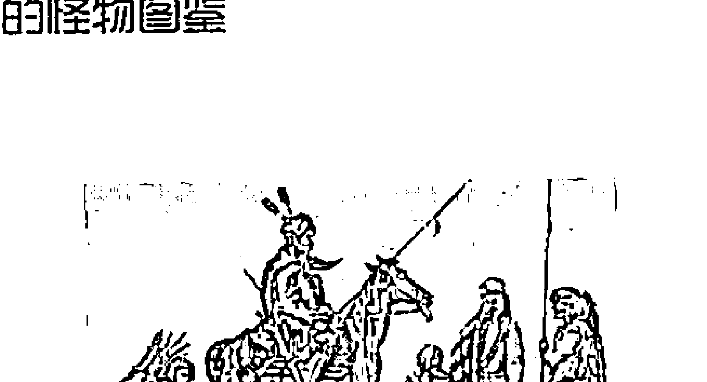

挪威太阳神是一位名叫迦奈或索尔的女神，她的战车由两匹巨大、闪亮的马拉动着：阿尔斯维（Alsvid）（“迅捷”）和阿瓦库尔（Arvakur）（“早醒者”）。北欧的日子之神达格（Dagur），拥有一匹美丽的飞马，斯基法克西（Skinfaxi）（“闪亮鬃毛”），它的鬃毛能照亮大地和天空。

尽管马是后来才被带给美洲土著人的，但他们也像其他民族一样喜爱和使用它们。纳瓦霍的太阳神陶哈诺（Tsohanoai）拥有世界上最美丽最敏捷的马。每一天都分别由五匹马掌管着：白马掌管黎明、蓝马掌管中午、红马掌管日落、有斑纹的灰马或黑马掌管黄昏。夜之马是一匹名叫奈拓为（Nightaway）的黑色骏马，最受陶哈诺的右撇子儿子的喜爱。

奈拓为是一匹毛色光滑、鬃毛长长的黑色种马，它的皮毛上长着一个个小小的银色云母斑点。它快过流星，能在其尾巴上跳跃，也能在彩虹上跳舞。陶哈诺的右撇子儿子骑着他父亲的这匹最为健壮的马下到地上，奈拓为挣脱了他手上的缰绳，鼻子里喷着火，疯狂地穿行在繁星密布的夜空中，但这个男孩已经经过成人仪式，变成了神，他重新抓住了缰绳，骑着奈拓为一直到黎明。奈拓为后来成了所有纳瓦霍马的祖先。

### 月亮之马

大家都普遍认为月亮是一位骑着月亮之马穿过夜空的女神或男神。希腊的泰坦月亮女神赛琳娜（Selene）要么乘坐着由两匹奶白色的骏马拖动的银色战车，要么直接骑在一匹套着银色马羁的马的背上。帕台农神庙里的大理石上刻着她的形象。挪威的月神叫玛尼，他的坐骑叫亚斯维德尔（Alsvider）（“迅捷”），曾有一个故事是关于玛尼骑着亚斯维德尔追逐太阳神逊奈的。当她被他追上时，日食就会发生。阿尔瓦（Arva）是印度月神苏摩的长有翅膀的银马，它在空中飞舞，用光芒照亮大地。在立陶宛，月神梅奴里斯（Menulis）的马有很多名字，有库梅里尤库·奥库叟·帕萨勾姆（Kumeliuku Aukso Pasagom），“长有金色马蹄的马”，或劳卡司·阿克里斯（Laukas Arklys），“套有白色口套的马”或“田野中的马”。它被梅奴里斯派去帮助那些年轻的英雄们寻找人鱼。

### 风之马

阿拉告诉南风：“我要用你来创造一个生物。凝结吧。”于是，风凝结了起来。然后他又告诉新造出来的马：“我要让你变得无双，比所有生物都要优秀。你能无翅飞行，世间所有的祝福都会被放置在你的双眼间，所有的幸福将被放在你的额头上。”

骑是一匹能够在空中和水面奔跑的马，她们为奥丁的妻子跑腿。这匹马叫霍瓦尔普尼尔（Hofvarpnir），意为“飞快的马蹄”。

在大风天，牧场里的马都会“发疯”般的四处狂奔，甩着尾巴，摇着脑袋，对着风喷鼻子和蹬腿，好像是要和风来一次赛跑似的。

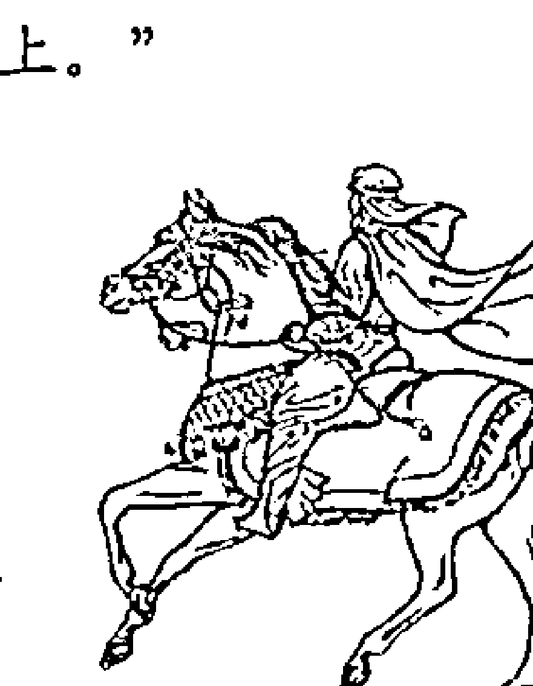

美洲的乔克托（Choctaw）印第安人有关于自我牺牲的乔克陶语（Choctwa）。风之马是最后一种拥有所有自然之力的马，它们能在空中飞行，而且非常勇敢。它们最快、最友善、最温柔。风之马能将苦难中的印第安人带到安全地带，它曾经还将一位受伤的小男孩带到了狩猎天堂，虽然它知道自己再也回不来了。
印第安人失去了风之马，但神灵给他们送来了普通的马给他们作伴。

它们在地上跑动的声音像雷鸣一样，风将它们的鬃毛吹得乱翻翻的，这也难怪有那么多的传说将马与风联系在一起。在梵文里，“vatacvas”意为“风之马”，现在也仍被广泛地用来形容跑得最快的马。巴纳特·阿尔·里（Banat al Rih）（“风之女”）则是阿拉伯纯种马的原型。

在一个杜撰的故事中，先知穆罕默德拥有一百匹最快和最美丽的马，有天他决定要测试一下它们对自己是否忠诚。他将它们关上三天，直到它们都非常饥渴。然后他带它们去到水边，然后用号角将其召回。只有五匹母马回来了，她们成了他最喜欢的马，她们的后代独享“阿西尔”（asil）——“纯种”——之名。希腊人的赛马都源自伊莱克图尼亚斯（Erichthonius）的 12 匹母马，她们都是北风波瑞阿斯（Boreas）的后代，北风和其它的一群母马都属于达达尼亚王。这 12 匹母马能在麦田上奔跑而不会踩坏庄稼，她们还能在海面和波浪上奔跑。

### 夜之马

并不是所有的夜之马都是梦魇兽，其中很多都非常友好。吠陀宇宙马代表着夜空，皮特里斯（Pitris）在夜空里“用珍珠装饰这匹黑马”。

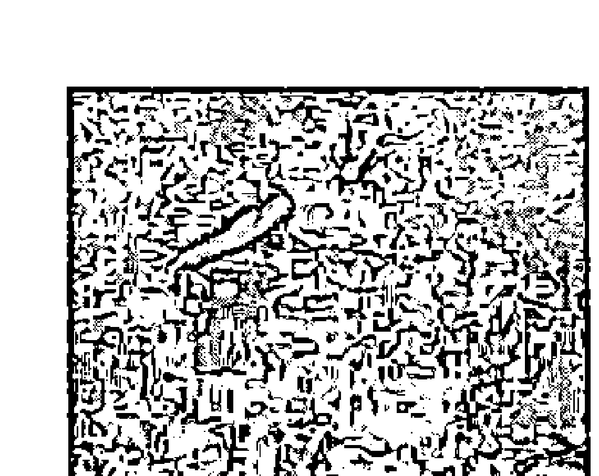

在纳瓦霍传说中，最受太阳神喜爱的马就是黑色的午夜之马奈拓为，它是所有马的祖先。

赫利姆法克西（Hrimfaxi）（“冰霜鬃毛”）是北欧夜之女神诺特（Nott）的马。它全身都像煤炭一样黑亮，上面分散着白色的毛发。它的鬃毛和尾巴都是白色的，在它大口咀嚼时，上面会渗出露珠。这些露珠与从吠陀神因陀罗的马身上渗出的安布罗沙一样，都会让大地变得富饶。

在印度神话中，暴风神马尔苏（Maruts）的母马是由风暴之神用灰色风暴云创造出来的。在北欧神话中，吉恩那是弗丽佳（Frigg）的一个婢子，她的坐骑是希腊夜之女神尼克斯（Nyx）拉战车的马在后来希腊的诸多诗歌中都有所描述。她有时是一位披着迷梦黑色斗篷的黑发女神，坐在由黑马拉着的黑色战车中，唤醒天上的星辰。

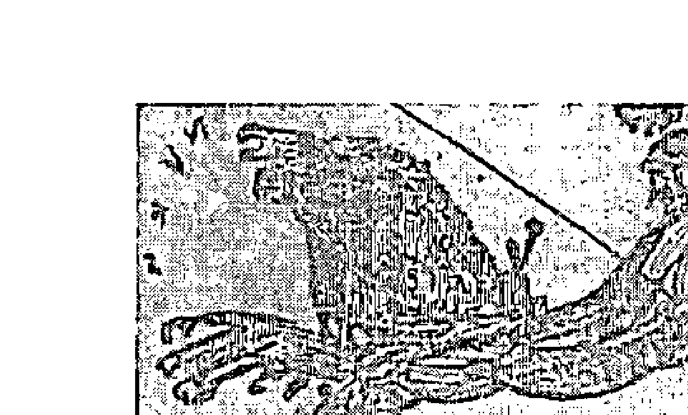

关于这些夜之骏马的古代记忆到至今都还仍被传说著。克拉丽莎·平克拉·艾斯提斯 (Clarissa Pinkola Estés) 博士告诉我们：“我家里的老人们说，划过夜空的流星是天空铁匠用铁锤敲击铁砧时发出的火光。那是她在为太阳打造能将它在夜晚挂在大地之下的银挂钩。”

### 英雄马和战马

人类与马联系在一起的历史多半都和战争有关。“战马”是在面对困难时的勇气、忠诚、坚韧克己的代名词。战场是一处险象环生之地，在那里很难分清真实和虚幻，这也难怪在战马身上有那么多的传说。只允许真正英雄骑在自己背上的英雄马是传说的主题之一。在一则俄罗斯通话里，小汤姆试图充当一名英雄，但当他试图骑上一匹死去英雄的马时，这匹马知道他是冒充的，于是不准他爬到自己背上。另外，英雄的马会说话，经常能给主人提供警告或好的建议，在主人死去的时候还会为其哭泣。即便在死后，一匹英雄马的遗骨都还拥有这匹马的力量。

雄马的传说中最为奇特的，这是一个讲述塔托什经历的故事。塔托什出生就很畸形，它是在一个圣灰星期三，从一只被一名英雄夹在腋下七个夏季和七个冬季的黑色五角形的蛋里出生的。它以产自一块银田的黄金燕麦为食。在它出生的那天就已经长到了一棵树的一半那么高，它的鬃毛像银子一样散发着光芒。到了第二天，它已经长得高过了树，其皮毛变成了黄金。在第三天，它身上的残疾全都不见了，它耸立在天地间，驮着那位英雄四处旅行。

在爱尔兰史诗《沙纳玛》（*Shanamah*）中，巨人英雄鲁斯塔姆（Rustam）选择了高大，身上长有红斑的年轻种马拉克西（Raksh）作为他的坐骑。这匹马非常勇敢，在主人还在酣睡时它就开始和敌人作战了。他也非常聪明和机灵，会像鲁斯塔姆通报即将到来的危险。在战争很激烈的时候，鲁斯塔姆忽视了拉克西的警告，认为它只是害怕了。他命令拉克西继续前进，还用马鞭抽它，拉克西被迫前进，掉入了一个陷阱里，最后他们都被抓住活埋了。

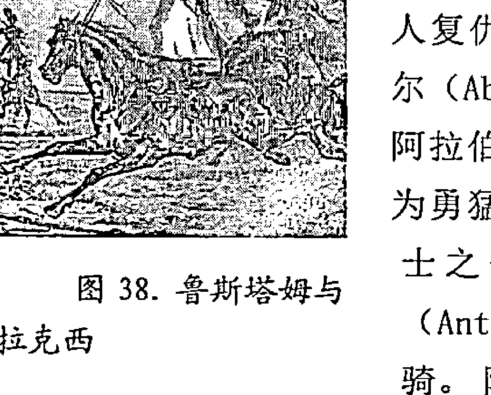

英雄马的另一个贡献是他们会为死去的主人复仇。阿布吉尔（Abjer）是阿拉伯传说中最为勇猛的沙漠勇士之一安塔尔（Antar）的坐骑。阿布吉尔（Abjer）非常聪明，比黑夜还黑，比风还快，他是安塔尔用自己所有的一切买来的。在安塔尔战死之后，阿布吉尔杀死了敌军中除统领之外的所有人——但他却被刺瞎了双眼，弄残了四肢仍在沙漠里受罪。

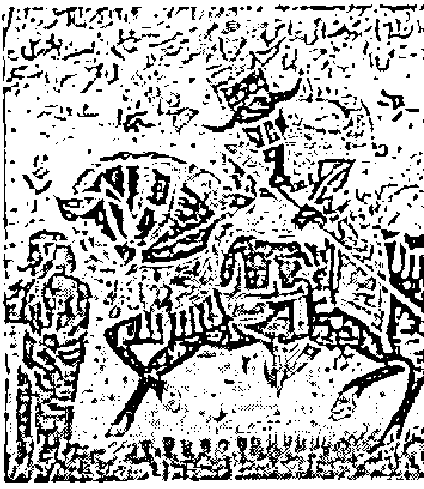

图 39. 安塔尔和安布尔

大多数时候，英雄及其坐骑都必须要经历重重难关，其中有身体上的也有精神上的。斯弗西科（Sivushko）是一位中世纪俄罗斯骑士伊里亚·穆罗梅茨（Ilya Muromets）的战马，它比煤炭还黑，也被叫做巴鲁西卡（Barushka）、马图西卡（Matushka）或科斯玛图希卡（Kosmatushka）。它是俄罗斯最漂亮的马，一步就能跨出33英里的距离，还能一下跃过山脊。这位英雄及其坐骑都是天生跛脚，只是后来被一位神秘的僧侣治好了。他们一起杀死了一头名叫夜莺强盗的怪兽，还单枪匹马地击退了进攻切尔尼科夫城的敌人。

很多时候，英雄及其坐骑在他们魂归天际很久之后就会成为传说。卡拉里·马可（Krali Marko）是一名保加利亚英雄，生活在公元1350年左右，他对抗过奥斯曼土耳其帝国，他强大的战马名叫沙尔-科里亚（Shar-koliya）。传说是永恒的：马可是一个被维拉（vila）（森林精灵）收养的孩子，由于他非常强壮，只好选择了一匹他无法摔倒的马作为坐骑。沙尔-科里亚是一匹杂交的种马，能跃过山峰、喷吐火焰，喜欢喝混有血液的酒。尽管他们后来战死沙场，但人们还是认为他们只是在一个山洞中沉睡着，等待着国家的再次召唤，出来消灭入侵者。最近一次目击是在第一次世界大战时的马尔科城堡之围中。同样的，亨戈罗恩（Hengroen）和拉姆雷（Llamrei）——亚瑟王最喜爱的种马和母马——据说是和亚瑟王一起下葬在巴德布里灵思（Badbury Rings）附近的一个山洞中的，他们会在不列颠的最后一战中出现。

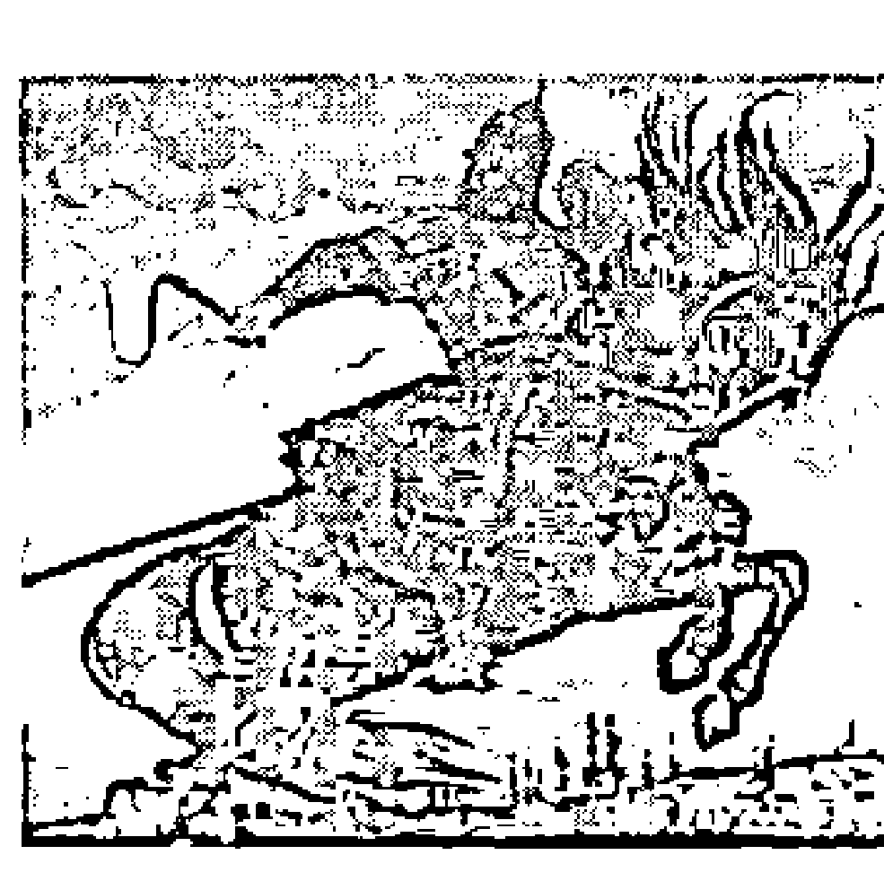

图 40. 斯弗西科（瓦斯特内特索夫绘制，1914年）

史上最为著名的战马之一叫布西发拉斯（Bucephalus），一匹无人能驾驭的野马，只有马其顿的亚历山大成功地爬到了它的背上。他调转马头，让它对着太阳，这样他就不会被自己的影子吓到。这匹马的名字意为“牛头”，据说它头上还长着牛角。传说亚历山大大帝用俘获的敌人狄俄墨得斯（à la Diomedes）的肉和混有牛血的葡萄酒来喂养它。布西发拉斯载着亚历山大四处征战，最后在印度被象兵杀死，可在临死之前，它都挣扎着把主人背到了安全地带。亚历山大在埋葬它的地方修建了一座以其名字命名的城。

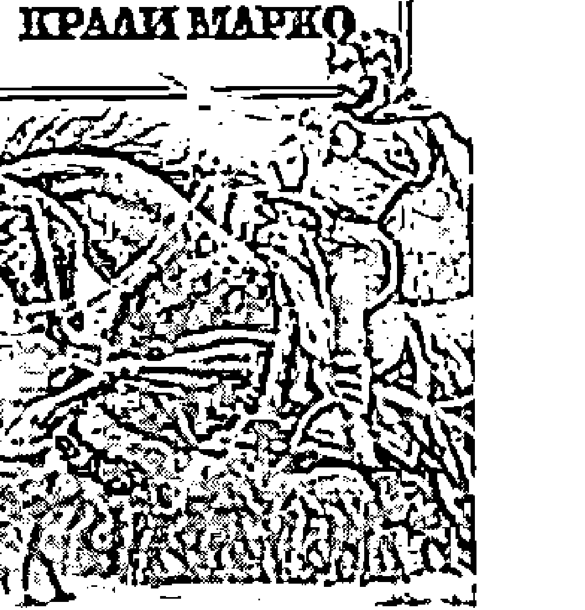

图 41. 沙尔-科里亚与卡拉里·马可

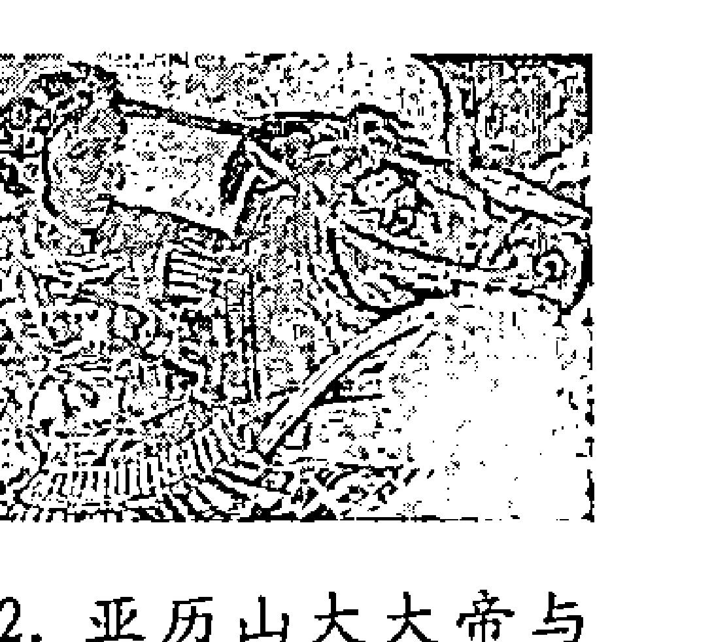

图 42. 亚历山大大帝与布西发拉斯

# 魔法师的怪物图鉴

市。尽管亚历山大自己在很多地方被人认为是神明，但布西发拉斯却被认为是普通的或只是有魔力的生物。然而，罗马皇帝卡里古拉却宣称他的马因西图斯（Incitus）是神明，并用珠宝装饰在它身上，还骑着它到达罗马元老院，然后任命其为领事。卡里古拉解释说，他的马比任何一个企图掌管帝国的人都要聪明。另外一名罗马皇帝也有奇怪的坐骑，他就是凯撒大帝，他的马据称长着脚趾，而非马蹄，而且它还预言了凯撒对世界的统治。

另一方面，战神阿瑞斯的坐骑则是所有战马的祖先，这一点无需任何皇帝的认可。波瑞阿斯（Boreas）在北风中出生，它是埃利尼斯（Erinnyes）（愤怒）中的一位，其余的成员分别叫：艾东（Aithon）（“红色火焰”）、弗罗吉斯（Phlogeus）（“烈火”）、福波斯（Phobos）（“恐惧”）、克诺波斯（Konobos）（“骚动”）。它们的呼吸中都带着火焰，能将河流蒸干，大地也会在其铁蹄下颤抖。

# 幻影马

尤福顿（Uffington）的白马是英国最为著名的山坡雕刻。它的历史可追溯至公元前1000年，是在绿色植被和下层的白垩上刻出来的。在地面很难看到它的全貌，最佳的观察点是空中。在山上有一处小土丘，其中心有一个圆形的洼地，叫做马槽。传说在有些月圆之夜，这匹马会出现，到马槽里吃东西。很多人在那里留下礼物，希望它能进入自己的梦中，让自己怀孕、发财或变得健康。

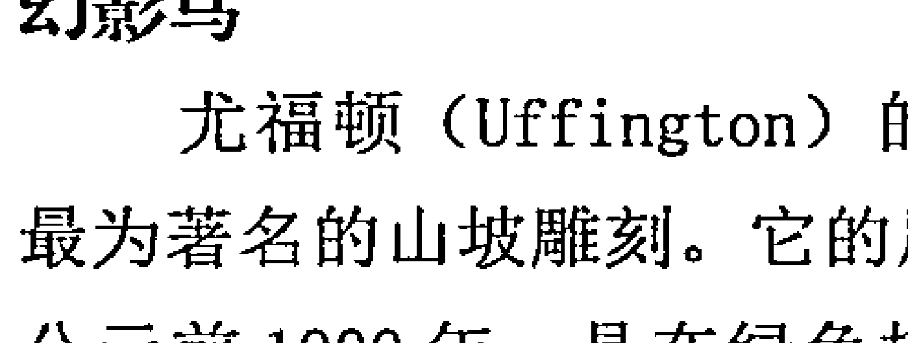

在设得兰群岛上，你可能会碰见尼戈勒斯（Neugles）。他们曾是危险的马形水鬼，但现在已经变成了和善的幻影马，会出现在沼泽边给那些迷路的人指明回家的道路。他们会在跃过伯恩溪时在岸边留下圆形的脚印。尼戈勒斯体型很小，但却长着餐盘一样大的马蹄。

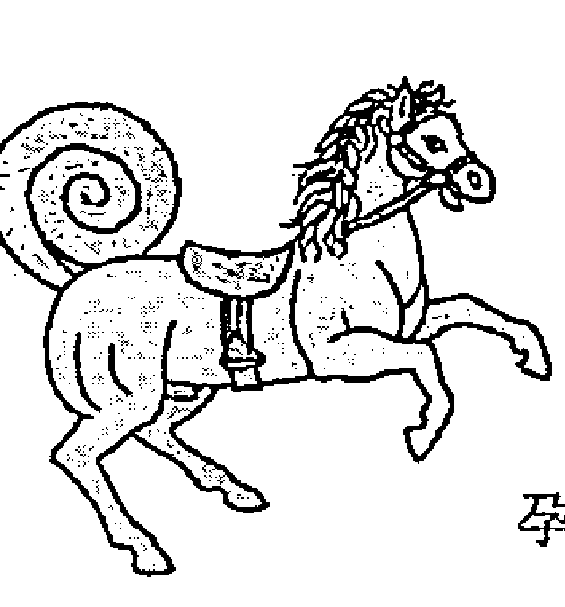

午夜时分，在威尔明顿山的偏僻道路上，会出现名为格洛斯特夜行马车的幻影。这是一辆由6匹马拉着的马车，能到达凡人所不敢到达的地方。整个不列颠都盛产无头幻影马，它们的数量令人吃惊，而《哈里·波特》中的无头尼克就是它们中的一个。在康沃尔（Cornwall）的兰丽斯（Lanreath）有一辆由无头马拉着的马车。安妮·博林（出自《安妮的一千日》）的父亲托马斯·博林爵士曾被人看见和女儿一起坐在那辆马车里。即便是美国，在新英格兰地区也有几个关于伊卡伯德·克莱恩（Ichabod Crane）和他瘦弱老马的故事。一部1999年的电影让他们再次风靡于世，只是在电影中他们成了黑森州雇佣军和黑白花色的大眼睛骏马。

白灵马既代表魔法也代表空想的幻影。在拉科塔苏印第安人碰见一匹白马时，他们认为它是来传递精灵旨意的。当纳瓦霍人碰见一匹白马时，他们认为它是从太阳神那里带来礼物的。这些草原上的乳白色的马速度非常快，从未被赶上过，它们也异常聪明和狡猾，会躲在任何地方避开危险。“小心那匹白马，它背上的骑手手里握着弓箭……”从孤单游侠的银马到白色的野马，人们都只见过，并未捕获过，这些神秘的骏马是类似于北美当地的白水牛一样的生物。

宙斯命令它们离开。当阿基里斯责备它们没有保护好帕特洛克罗斯的时候，桑索斯（Xanthos）说道：“我们会保护你，但，坚强的阿基里斯，你的死期已近。这不是我们能控制的，它是大神的安排。”

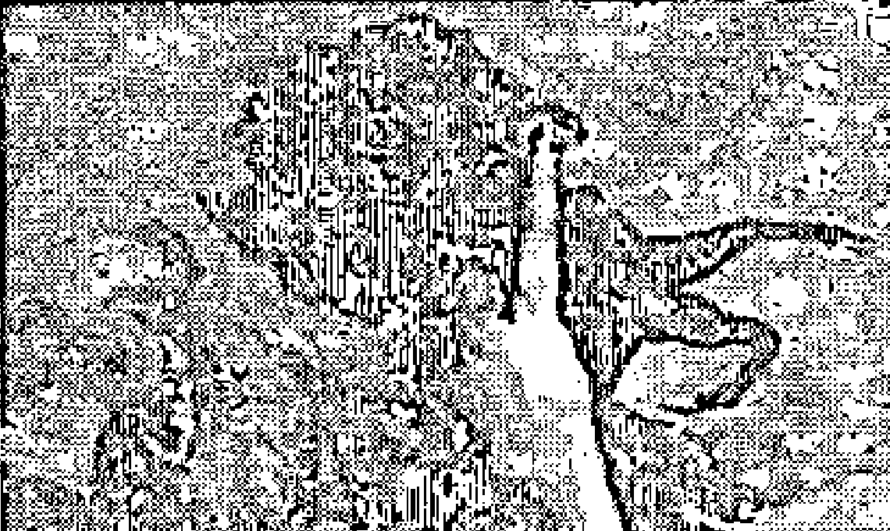

图45. 巴利斯与桑索斯

# 能说话和预言的马

> > 狡猾的大自然赋予了那些超越一切生物的马聪明的大脑和巨大的心脏。……以前一匹叫做桑索斯（Xanthos）的战马打破了沉寂的边缘，越过了自然限制，获得了男人的声音。阿里翁也有同样的能力，还能在玉米穗上奔跑和站立。
> ——奥本（Oppian）《犬儒学说》（Cynegetica）

有魔力的飞马阿里翁也能说话，它警告主人阿德拉斯托斯不要参加底庇斯之战，以免遇害。阿德拉斯托斯没有听从它的意见，参加了著名的“七勇士大战底庇斯”之战，最后被阿里翁救出，成了唯一的幸存者。

在古典史上最为知名的这种马要数巴利斯和桑索斯（Xanthos）。这两匹永生不朽的马，一匹是斑驳的灰色，另一匹则是金棕色的，它们都是鸟身女妖波达耳革和西风泽菲罗斯（Zephyrus）的后代。波塞冬将它们作为礼物献给婚礼上的珀琉斯（Peleus）王和海之女神西蒂斯（Thetis）。后来珀琉斯将其送给了自己的儿子阿基里斯（Achilles），他带着这两匹马参加了特洛伊战争。它们负责为他拉车和在战场上保护他。阿基里斯将它们借给了自己的挚友帕特洛克罗斯（Patroklos），在他被赫克托（Hector）杀死后，这两匹马非常悲伤，一直守在他的尸体旁直到在德国、斯拉夫和波斯都有关于伊奎曼提克（Equimantic）马的传说。塔西佗（Tacitus）告诉我们，在古代德国有一种占卜术，他们倾听圣马的叫声，将其翻译成众神的旨意。古斯拉夫异教中的主神叫斯凡特维德（Svantevit），他有一匹神圣的白马。他骑着它参加战斗，并在自己的宫殿中喂养它。这匹马的举动由牧师解读为对未来的预告。在公元前500年左右的波斯，国王的选举是看哪位参选者的马在商定的地点、商定的时间里首先发出叫声。大流士的马夫在选举的前一夜将他的马拉到选举地，他在那里放置了一匹漂亮的母马，第二天，当大流士他们到达选举地之后，他的坐骑立即嘶叫起来，召唤那匹母马，于是大流士便当上了国王。

与俄罗斯驼背马和西班牙的五色马类似，中国的好运马和疆运马是一种驼背、没有眼睛的小型灰色马，最初是由一个小男孩在一位有同情心的巫师的帮助下创造出来的。这匹能够满足人们愿望的马散发着善良的魅力。最开始它被叫做噩运马，与自己的伴侣好运马一起都是自己最好的伙伴瓦东（Wa Tung）的坐骑，他们一起参加了一场战争。当两军在河岸两边集结，准备大战一场的时候，噩运马变成了一匹美丽又长着彩虹色的马蹄的白色飞马，飞过大河，到对岸与敌人的马进行谈判，然后又飞回河的另一边，与自己友军的马进行了谈判。双方的马都突然背着骑手跳进水里，一遍又一遍，这下场面变得极为混乱，每个人，甚至包括首领在内都忍不住发出了笑声，于是战役就被取消了。

沙逊（Sasun）的库尔奇哥（Kourkig）是一匹会说话、能飞行的水马，原本来自一个位于湖底的王国，它帮助过三代古亚美尼亚英雄——萨那撒（Sanasar）、莫尔（Mher）和大卫。库尔奇哥载着骑手斩杀恶龙、夺取魔法石，还完成了其它许多功绩，它建议英雄的孙子大卫，在他四处奔波和神智不清的时候就到父亲的牛奶喷泉中喝点牛奶。其中的牛奶名叫索玛（soma），是众神的饮品，大卫藉此重获了力量。

有时，马儿们并不用像艾德先生或骡子弗朗西斯那样说话才能改变未来。杜姆斯特德（Doomstead）是一匹有魔力的灰色马，它载着命运三女神中的未来之神诗寇蒂（Skuld）和女武神一起四处游走。杜姆斯特德的名字源自命运三女神的家乡，

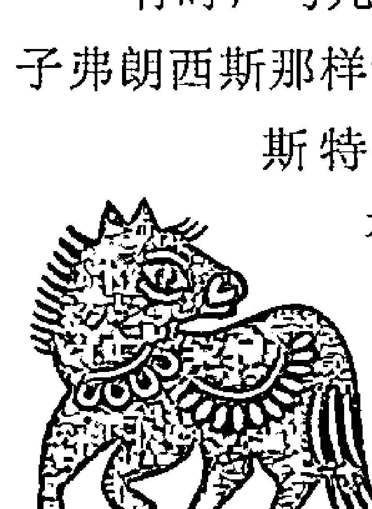

自命运三女神的家乡，他帮助诗寇蒂对加冕的英雄进行筛选。能预测未来的启示马在圣约翰的书中代表着未来。红色的马代表战争，黑色的马代表饥荒，灰白色的马代表死亡，白色的马代表征服。除此之外，他们还有几种混合型的怪兽马——蝗虫-蝎子-马和会喷火的狮子-马——他们都是从深坑中爬出来恐吓未来世界的怪兽。

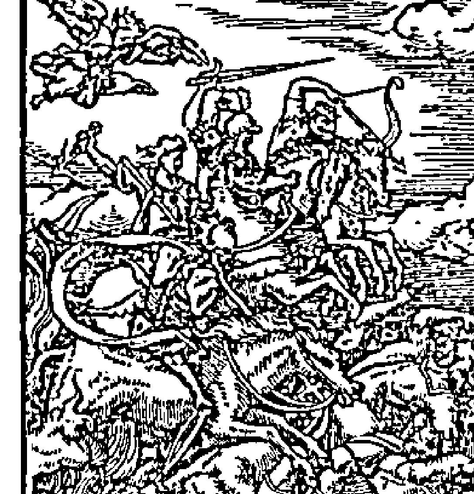

这些关于圣马——或占卜马——的故事的重点并非在这些动物能否说话上，而是表明它们非常聪明和通人性，甚至要超过了自己的主人和其它任何人类。如果阿基里斯听从了桑索斯（Xanthos）的建议，那么……

# 怪物电影：神奇马

- 《幻想曲》（1940 年动画）——佩加西斯；
- 《会说话的骡子弗朗西斯》系列电影（1948 年至 1952 年）；
- 《梦游小人国》（1959 年）——弗卡、光谱马车马（Spectral coach horses）；
- 《诸神之战》（1981 年）——珀加索斯；
- 《幽灵一族》（HighSpirits）（1988 年）——弗卡；
- 《吹牛大王历险记》（1989年）——英雄马（Heroic Horse）；
- 《巫婆怪女》（英国广播公司1996年动画）——死亡的苍白马；
- 《灵魂音乐》（英国广播公司1997年动画）——死亡的苍白马；
- 《断头谷》（1999年）——魔鬼马；
- 《指环王：双塔奇谋》（2002年）——英雄马；
- 《指环王：王者归来》（2003年）——英雄马；
- 《哈利波特与火焰杯》（2007年）——佩加西斯；
- 《碟形世界》（2006年英国广播公司）——死亡的苍白马；
- 《哈利波特与凤凰令》（2007年）——光谱马车马（夜骐）

# 未来的魔法师，欢迎来到魔法的神秘世界！

在魔法世界，如果对各种各样千奇百怪的非自然生物一无所知，那就必死无疑。现在，这本《魔法师的怪物图鉴》，将地球上10000多神神奇怪兽按字母A-Z的顺序一一列出，详细说明每种怪兽的起源、进化与能力，并且包含许多木版画、雕像，具有历史渊源的图片，和现代艺术家对这些作品的解释，可以说，没有哪一本怪物图鉴的插图能够如此精美，又如此实用！

本书还将教你如何识别神话生物在现实生物中的起源，例如北海巨妖和巨型乌贼之间的联系。作为补充，书中还介绍了尼斯湖水怪、大脚怪、加勒比海怪、天蛾人和其他未经科学证实的神秘怪兽。让你将所有怪兽收入囊底，一网打尽。

# 从此，魔法从幻想变成现实！

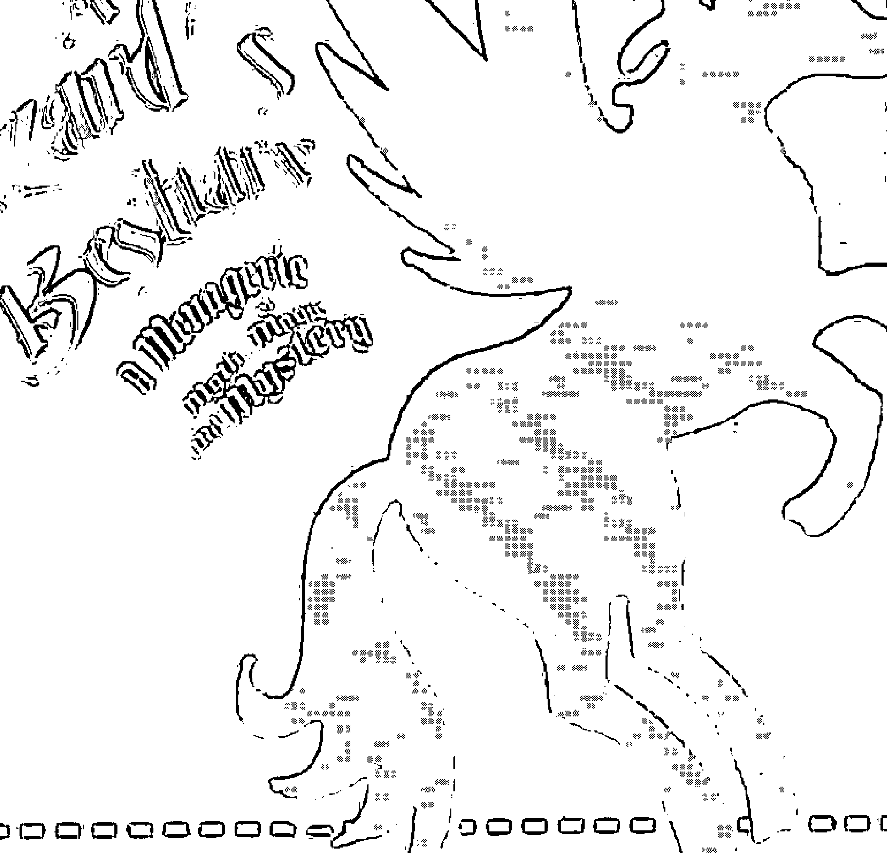