# 魔法师的怪物图鉴下

# 图鉴二、揭秘夜之生物(下)

## 直立行走类(下)

### 6. 神牛和圣牛

作者：奥伯伦·泽尔-雷文哈特

一位老牧牛人骑着一头牛
出门
那是个大风的夜晚，
在山脊上它从牛背上下来
独自往前走着，
一头巨大的红眼公牛
突然出现在他眼前，
在繁星点点的空中奔跑
好像在云朵上画画。
它们的烙印还在燃烧
他能感觉到它们灼热的呼吸。
他感到一阵恐惧
它们数以百计地在空中飞行。
他看到上面的骑手使劲地动着
大声叫出：
耶比-依-呀-呀，耶比-依-呀-呀！
那是空中的幽灵骑手！

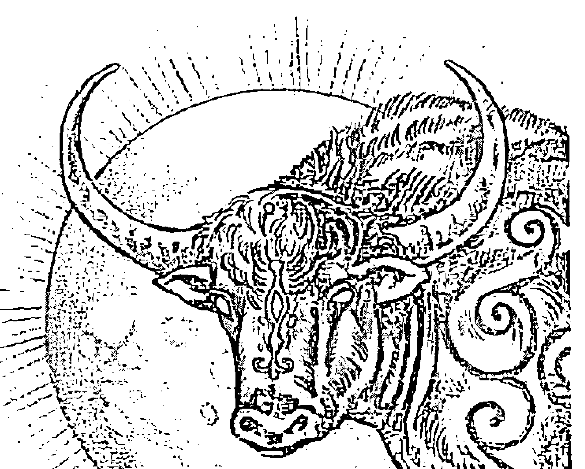

> ——约翰尼·卡什(Cash)
《空中的幽灵骑手》(Ghost Riders in the Sky)

早在9000年前的新石器时代人类就开始养牛了，它们是第一种被人用于食用而饲养的动物。已知最早的养牛人是小亚细亚（现在的土耳其）的阿纳托利亚人。

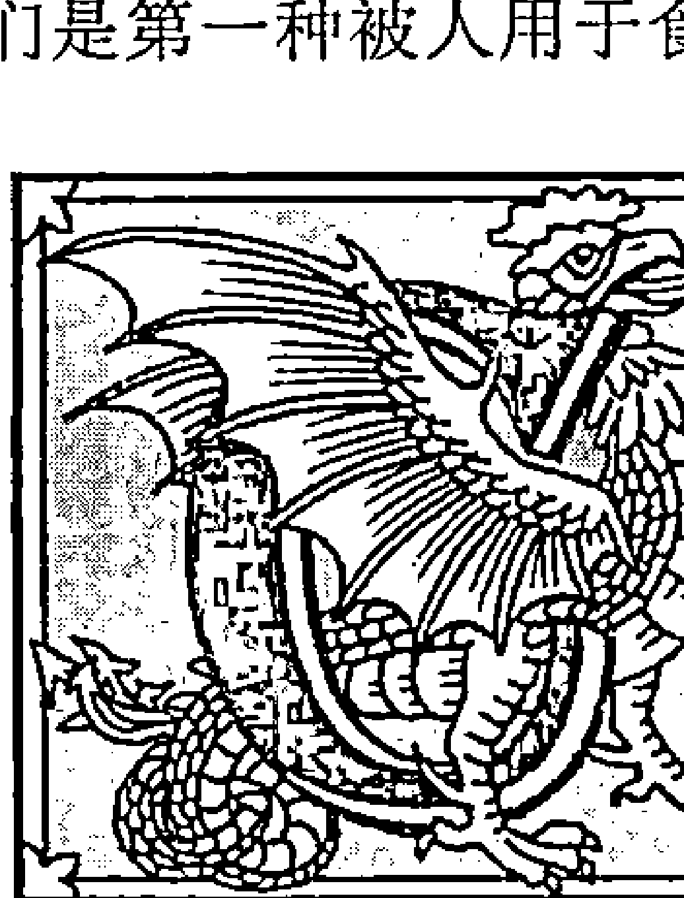

## 魔法师的怪物图鉴

很快，牛群就成了财富的象征，至今也是如此。实际上，牛（cattle）一词源自拉丁文中的“caput”（“头”），最初的意思是“家畜”，这也是我们仍将“头”作为牛的量词。它还有些派生词，如“chattel”（财产）和“capital”（财富）。

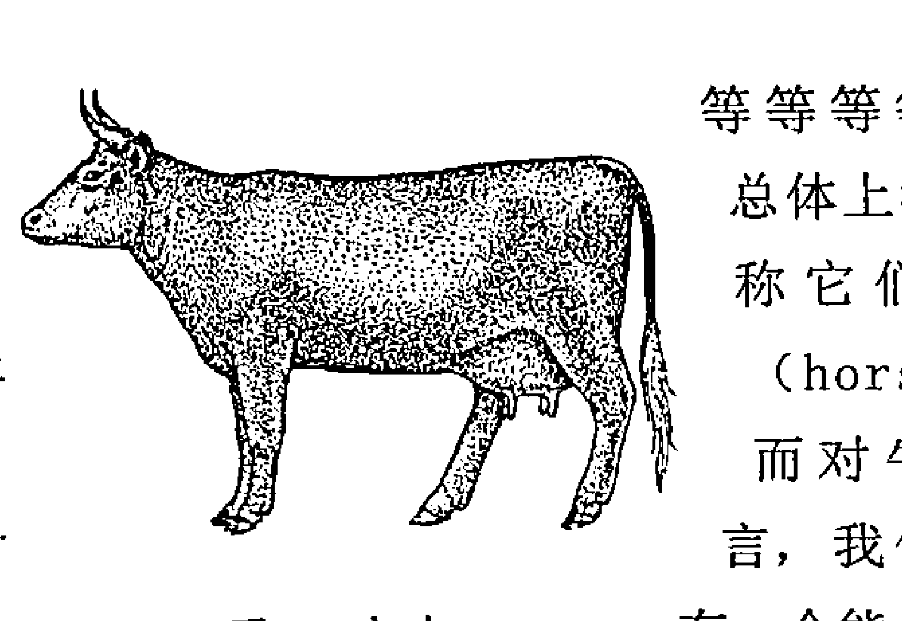

等等等等，但总体上我们都称它们为马（horse）。而对牛类而言，我们就没有一个能与“马”相对应的词了。

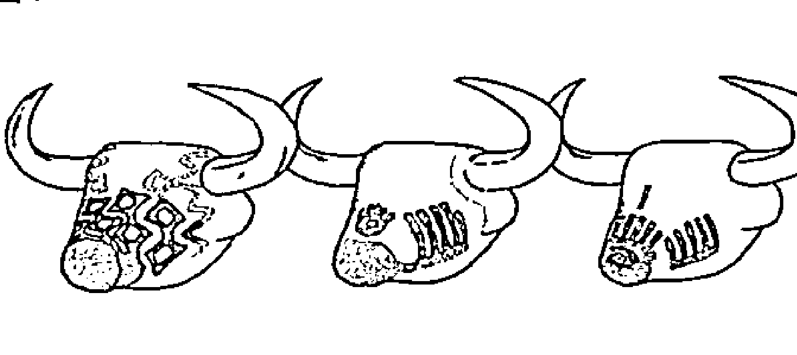

强壮的欧洲野牛（Bos primigenius）是所家养牛的祖先，在中世纪的动物寓言集中被描述为名叫乌鲁斯牛的一种体型如同公牛，长相类似阉牛的动物，它能用巨大的锯齿状牛角切断树木。喝下海水后，乌鲁斯牛会变得没有方向感，它会撞击地面或者用角切断树木，很容易就会被人捕获。遗憾的是，最后一头野牛是一头雌性，她在1627年死于波兰的亚克塔洛夫森林（Jaktorów Forest）。

成年雌性牛被称为母牛（cow），成年雄性牛被称为公牛（bull），未成年的牛被称为牛犊（calf）。这些词同样适用于其它的动物，如水牛、大象和鲸。

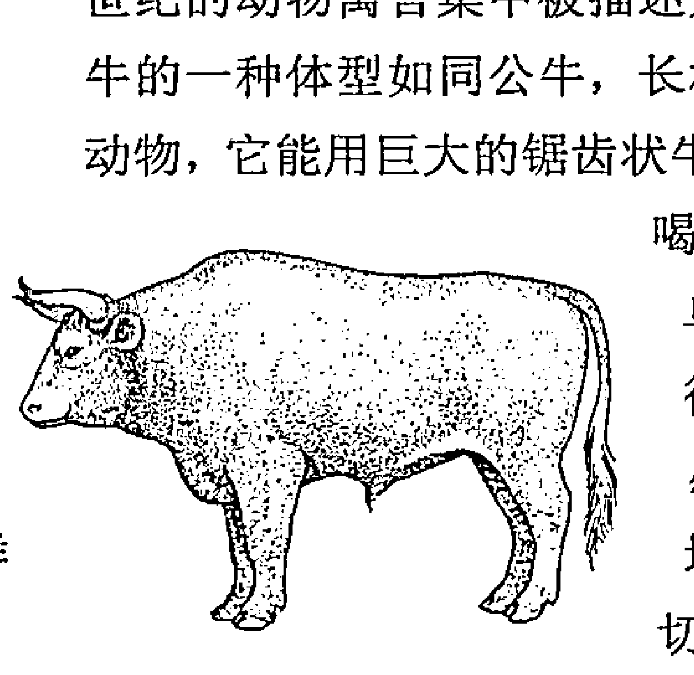

从未生产过的成年母牛被称为小牝牛（heifer），年轻的公牛被称为犍牛（bullock），这个词与阉牛（steer）一起指代被阉割了的公牛。被用于劳作（如拉犁或拉车）的阉牛叫“ox”（复数为oxen）。在成年后被阉割的牛叫阉公牛（stag）。形容牛的词汇是“bovine”，源自拉丁文中的“bovis”。牛亚科包括24种体型从中型到大型不等的有蹄类动物，家牛、野牛、水牛、牦牛和四角羚羊以及螺旋角羚羊。

虽然关于牛的词汇那么多，但有一点不得不提：对于这种动物没有一个概括性的词语。比如，对马而言，我们把雄性叫做种马（stallion）、雌性叫做母马（mare）、被阉割的雄性叫骟马（gelding），

> 在《圣经》中经常会提到一头名叫瑞埃姆牛的野牛。据说世界上只有一对这样的野牛，分别居住在世界的两端，每隔70年，它们就会进行一次为期一天的重聚，在交配后，母牛会杀死公牛。而经过12年的孕期，母牛会产下一对龙凤胎，她自己则死于生产。它们就这样不断循环着。瑞埃姆牛在《旧约》中被提及了9次：《约伯记39：9-10》、《申命记33：17》、《民数计：23：22，24：8》、《圣咏集22：21，29：6，92：10》和《以赛亚书34：7》。

尽管这个词在钦定版《圣经》中被误译为了“独角兽”，但实际上它指的是欧洲野牛。牛对安纳托利亚、印度、克里特、埃及和英伦群岛上青铜时代文明的出现非常重要。这些文明崇敬神圣的公牛和母牛，甚至还将自己的家畜接纳为社会的一员，有钱人拥有大量的妇女和更多的宦官。在《出埃及记》中，一个小金牛（代表的是埃及的阿皮斯牛）导致了人类历史上第一次有记录的对异教的大屠杀：摩西命令军队将阿皮斯的信徒全部杀死。有趣的是，青铜时代与占星术中的金牛座时代重叠在一起。而在中国的十二生肖中同样有牛的身影，而它与西方的牛没有任何的相似之处。

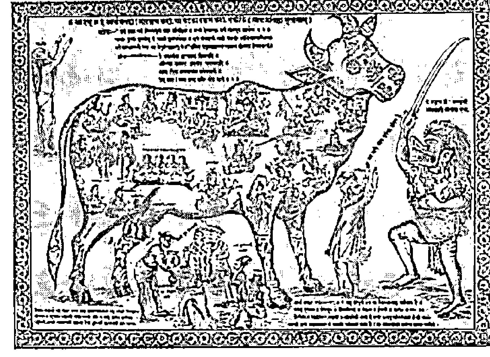

#### 天牛

在印度教中，母牛被认为是非常神圣的动物，代表着富饶、生命的尊严和只知奉献不求回报的地球母亲。印度教教徒将母牛视为母亲，温柔而为他们提供富含营养的牛奶和奶制品。虽然印度教教徒并不崇拜母牛，但她们却在其社会中占有一席之地，几乎没有印度教教徒会吃牛肉。在印度教神话中，阿底提（Aditi）或素茹阿比（Surabhi）（“香雨”）是创造世间万物的神牛。她的乳汁流成了海洋（银河），被众神搅动，创造出了世界。卡玛-德赫奴（Kama-Dhenu），富饶之牛，是太阳女神罗西尼（Rohini）的孩子之一。她出生于被众神搅动的银河里，在里面，很多东西都以牛油的形式诞生。她巨大的乳房能产出无尽的牛奶，养育了世间所有的生物。她还能实现愿望。整个世界都坐落在一头名叫朵尔（Dhol 或 Dhaul）的巨型神牛的牛角上。

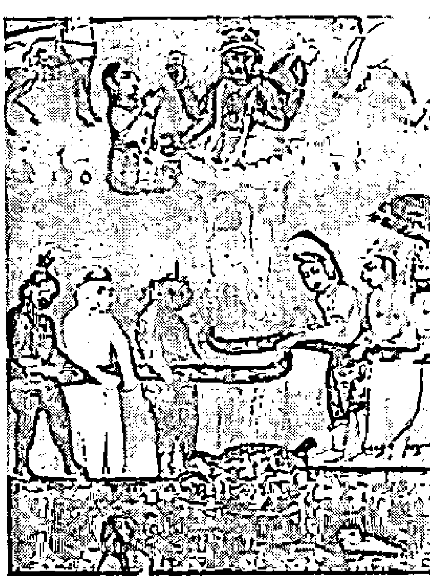

在印度的创始神话中，牛创造了众神、人类以及其它生物——还用自己的牛奶养育他们。在埃及神话中，元初之水（Mehturt）或韦赖特（Mehet-Weret）（“大洪水”）是神圣的牛之女神，是太阳神拉的母亲。她代表了承载太阳船的天河（银河）。

在波斯神话中，古昔尤凡（Gush Urvan）（也叫高昔Gosh、GMshkurkn 或 GMshkurvan）是一头巨大的天牛，她拥有地球上所有动植物的种子。她在贫瘠的土地上放牧了 3000 年，直到被密特拉（Mithra）所杀。她的尸体变成了一对牛以及 282 对其它动物，而她的四肢则变成了 65 种蔬菜。在后来的一个版本中，她被描述为一只公牛。

在北欧的创世神话中，有一头名为欧德姆布拉（Audumbla）的巨牛，她是伊米尔（Ymir）从死人国（Niflheim）的融冰中出现后的第二位生物。她的牛奶喂养了伊米尔，她还在冰上舔舐，从中释放出了第一批神灵。

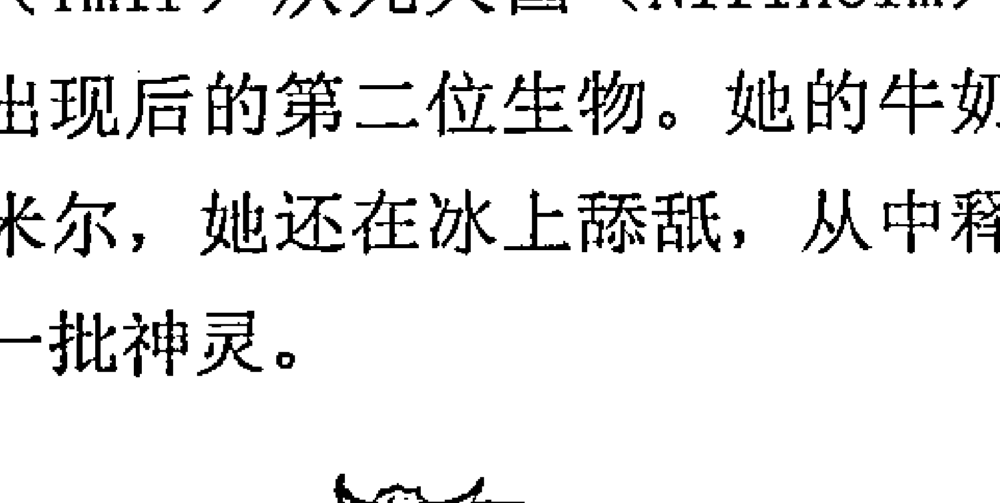

格拉斯·哈波兰（Glas Ghaibhlann）（或 Glass Ghaighlaann “灰白条纹的母牛”）是苏格兰和爱尔兰传说中的一头巨大的母牛。她是铁匠之神葛波尼尤（Goibniu）的财产，灰白的身上长着绿色的斑点，能源源不断地产出牛奶。她经常出现在贫困的家庭中，帮助他们，直到被愚蠢的人打或有人用一只漏桶来给她挤奶，她就会离开。当他们谈论一块非常富饶之地的时候，有时还会这样说：“灰牛在这里栖息过。”

在英伦三岛的传说中出现过很多棕色母牛。华威褐顿牛（Dun Cow of Warwick）是来自10世纪什罗普郡的一头巨型神牛。斯坦普勒山（Staple Hill）上的巨型石圈是她的食槽，她为当地的巨人和其它生物提供不竭的奶水。一个嫉妒的老女人做了一个筛子去试探她，而她被这个女人的行为所激怒，变成了一头暴虐的怪兽，最后被华威的盖伊爵士（Sir Guy）在顿斯莫尔·西斯（Dunmore Heath）杀死。她的一支角被存放在华威城堡中，但其实它很可能只是一只普通象牙或猛犸象牙。

在7世纪的爱尔兰诗史英雄库赫兰（Cuchulainn）的故事集《顿牛之书》（Book of the Dun Cow）中还提到了另一只棕色母牛。

在英格兰东北达勒姆郡（County Durham）有一座达勒姆大教堂（Durham Cathedral），关于它的建立有一个传说，在这个传说里就有一头棕牛。故事里说到，在公元995年时，一群僧侣正在逃离维京人的入侵，他们带着7世纪圣人林迪斯芳（Lindisfarne）的卡斯伯特（Cuthbert）的遗骨寻找一个避难所。据说他们一路尾随着两名寻找丢失棕牛的挤奶工。他们到达了威尔河（River Wear）的一处环形半岛上，在那里找到了躺着的奶牛。僧侣们放下了卡斯伯特的棺材，却再也无法将其抬起来，这被视为是他的指示，要他们把圣陵修建在那里。

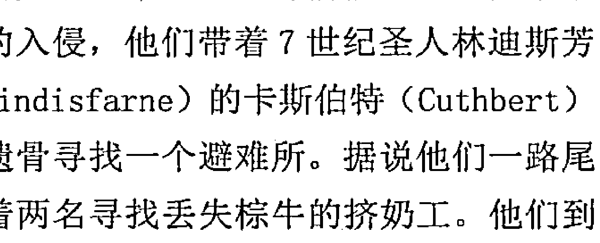

#### 神牛

> 海地神牛，它们是在阿拉卡·霍玉科（Alaca Höyük）的神圣阉公牛旁被发现的，在飓风中幸存了下来，在希泰神话中被称为赛里 (Seri) 和胡里 (Hurri)(“日”和“夜”)——这些牛背负着气象之神特舒卜 (Teshub)，或者拉着他的战车，它们在城市的废墟上放牧。

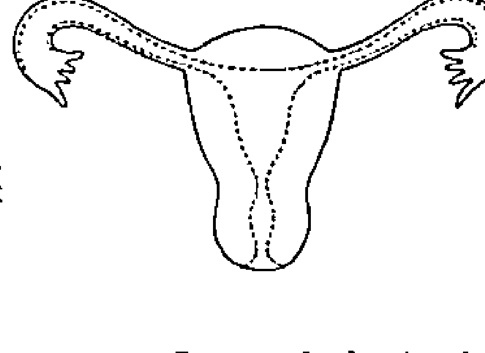

在古美索不达米亚，公牛因其牛角的样子被视为月之生物。“布克莱姆”[Bucranium (“牛头”) 是子宫和输卵管的象征。]（图8）实际上，在埃及文中，牛叫做“卡”(ka)，意为生命之力或灵魂。在整个中东地区，公牛的头骨都被放置在神庙中显眼的地方和祭台上。在嘉泰土丘 (Çatalhöyük) 和东方的安纳托利亚 (土耳其)、克里特以及塞浦路斯的新石器时代避难所中，都有装饰着公牛角的石头祭坛和由公牛头骨制成的，在丰收仪式上使用的面具。克里特岛牛头怪 (Cretan Minotaur) 的传说很可能就是受到了这种仪式的影响。

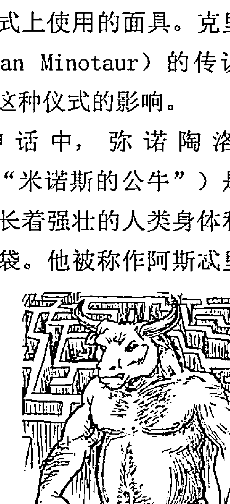

对那头公牛那不正常的爱慕被变成了肌肤攻击力的神圣惩罚。米诺斯将阿斯忒里翁关在被称为迷宫 (labyrinth) 的地宫中，这个地宫是由聪明的建筑师达代罗斯 (Daedalus)（他因为自己和儿子伊卡洛斯制造由蜡和羽毛组成的翅膀闻名）为关押这只野兽而建造。米诺斯用雅典的年轻人做成的祭品（每九年就献上七位男孩和七位女孩）来喂养阿斯忒里翁，直到后来它被英雄忒修斯 (Theseus)（在阿丽雅德妮公主的帮助下）所杀（公主给了他一个毛线球用来标识路径）。但在面见这位公牛怪之前，忒修斯必须在雅典以外 26 英里的地方抓住古老而神圣的马拉松公牛 (Marathonian Bull)。在克里特的克诺索斯 (Knossos) 墓穴中的著名壁画中就描绘着年轻健壮的男男女女抓住公牛牛角的画面。（图10）

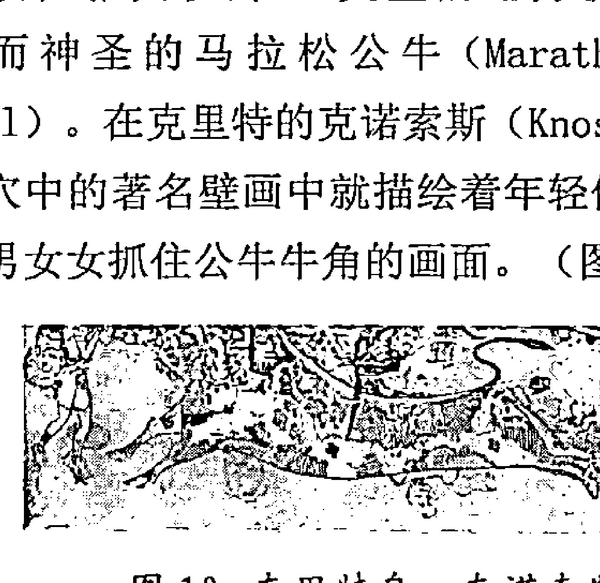

克里特也是众神之神宙斯化作一头美丽白公牛从海中出现，引诱腓尼基公主欧罗芭远离家乡与之幽会的地方。他们的孩子是欧洲人的祖先，金牛座就是为纪念这个神话而产生的。

在古苏美尔的《吉尔迦美什史诗》(Epic of Gilgamesh) 中，古加尔安纳 (Gugalana)（或 Gudanna）是阿奴 (Anu) 凶残的天牛。古加尔安纳是地下世界女神厄里斯奇格 (Ereshkigal) 的第一任丈夫，他剧毒的呼吸能杀死 200 名战士。阿努斯（Anus）派遣他前去在乌鲁克城里散播瘟疫，作为对吉尔伽美什王拒绝他女儿女神伊南娜（Inanna）求婚的惩罚。吉尔伽美什和他的伙伴智者恩奇杜（Enkidu）与之奋力搏斗，最后将其杀死。但阿努（Anu）后来却让恩奇杜（Enkidu）患病死去。这是对金牛座和分点岁差（precession of the Equinox）的另一个解释。

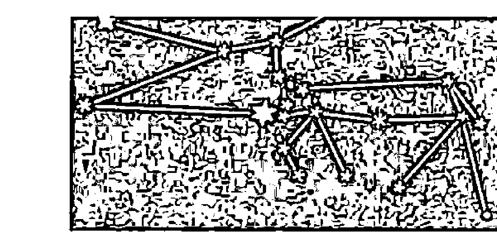

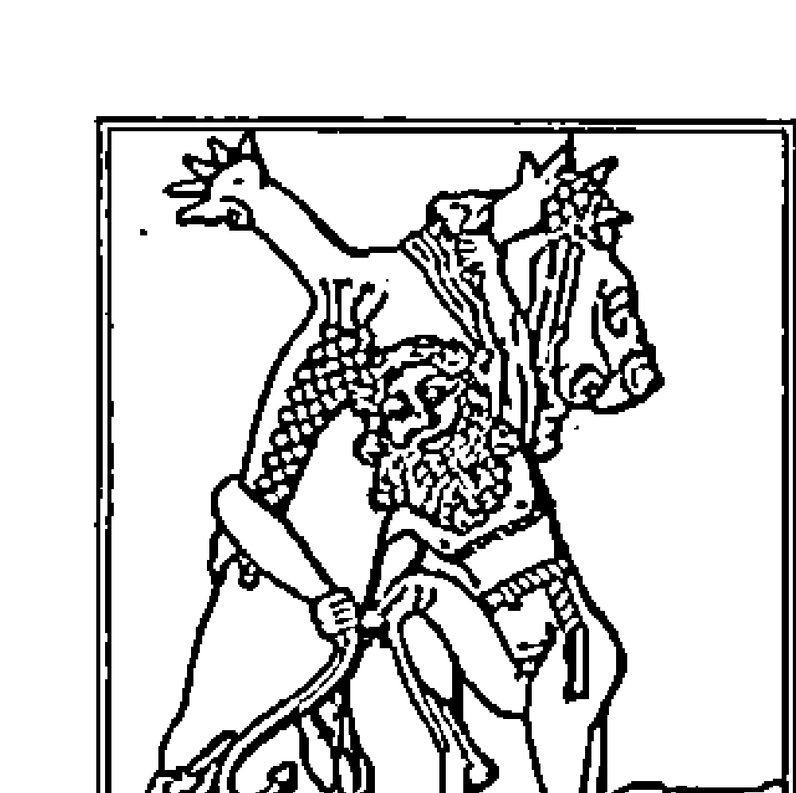

在密特拉教（Mithraism）的神话中也有类似的桥段——在公元 2 世纪至 4 世纪的罗马帝国，有一个邪教在对抗着基督教。在这个教派的所有密特拉地下洞窟（Mithraeum）（神庙）中都有一座“tauroctony”（“杀公牛”）的雕塑。这是在公元前 2300 年左右发生的在春分时太阳会从金牛座想白羊座移动的一种解释。有些历史学家认为西班牙和法国南部的斗牛正是源自这种邪教。

> 在（杀公牛的）壁画中，密特拉神（Mithras）穿戴着弗里吉亚（Phrygian）的帽子和裤子，从公牛背上将其杀死。
>
> 一条象征着大地的蟒蛇和一条狗从公牛的伤口中吸血，一只蝎子攻击攻击公牛的睾丸，使其无力抵抗。通常还会出现一只乌鸦、一只高脚杯和一头小狮子。代表光明和黑暗的考泰斯（Cautes）和柯图佩特（Cautopates）兄弟，拿着火炬，双腿交叉着站在两边，考泰斯的火炬是正着的，而柯图佩特的火炬则是倒着的。在密特拉神上方布满星辰的夜空中布置着象征索尔和露娜的符号。这一切看起来像占星术一样。戴维·乌兰西（David Ulansey）认为杀公牛是星座的符号式的象征……公牛指代金牛座（Taurus）、蛇指代长蛇座（Hydra）、狗指代大犬座（Canis Major）、乌鸦指代乌鸦座（Corvus）、高脚杯指代巨爵座（Crater）、狮子指代狮子座（Leo）、鲜血指代（红色）星星角宿一（Spica）。火炬手可能指代春分和秋分……密特拉神自己则可能与珀尔修斯有关，他的星座正好位于金牛座上方。

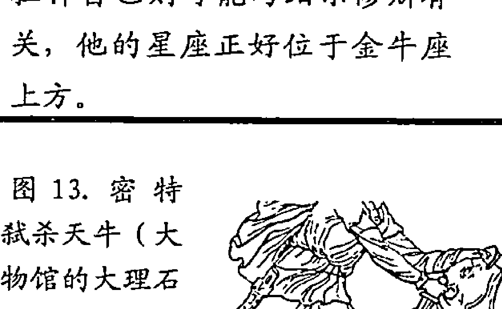

在埃及神话中有几只神牛，其中最重要的当然是阿皮斯（也叫 Hap，或希腊文中的厄帕福斯 Epaphus），它是一头巨大的黑公牛，属于早武神卜塔（Ptah）。它的双角中承载着太阳盘，它的脸上有一个白色的巨型或三角形，他的舌头下有一只金龟子，他的背上有一只白鹰。阿皮斯是卜塔和后来的奥西里斯（Osiris）的化身，而在孟菲斯却有一只长着跟它一样斑纹的真正公牛，它的母亲曾被闪电击中过。这头公牛一生都住在神殿里，在死后还被做成木乃伊，安葬在死亡之城查奎拉（Zaqara）的一个巨型石棺中。

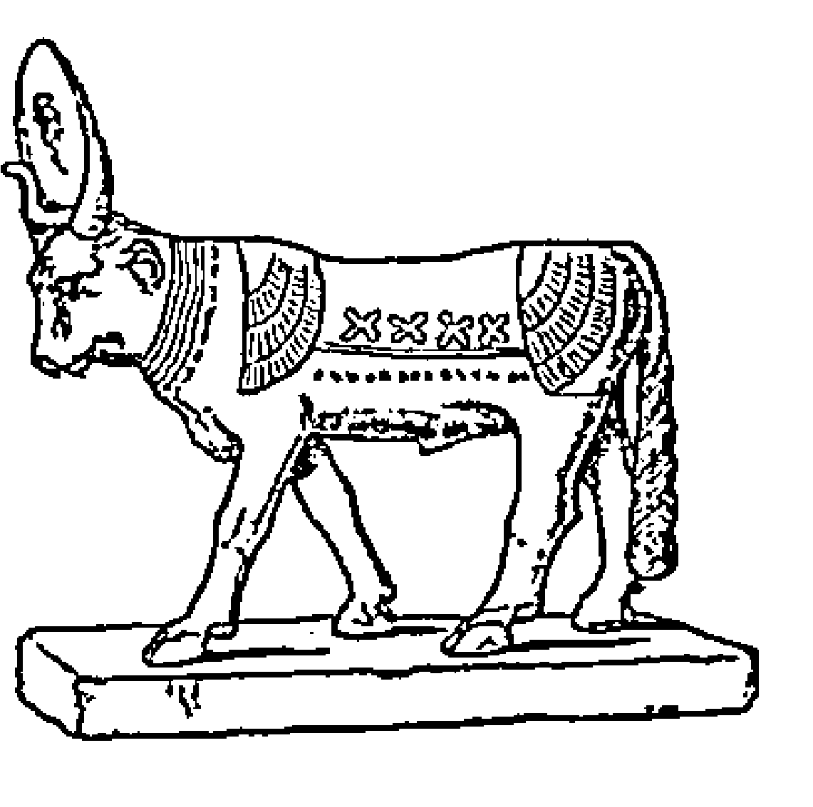

图14. 阿皮斯神牛

#### 其它神话中的公牛

阿特埃克斯（Aatxe）——西班牙巴斯克（Basque）传说中的一头恐怖的红色公牛。它住在比利牛斯山脉的山谷、洞穴和沟壑中，在风暴夜会出来猎食旅行者。它的幼崽被称为亚特泽格里。在彼得·比戈（Peter Beagle）的幻想小说和电影《最后一头独角兽》（1968年）中，它是所有独角兽的天地。他的伴侣名为蓓葛丽，是一头赤红色的母牛。

阿普勒斯（Apres）——头长着与熊类似的短尾巴的纹章牛。

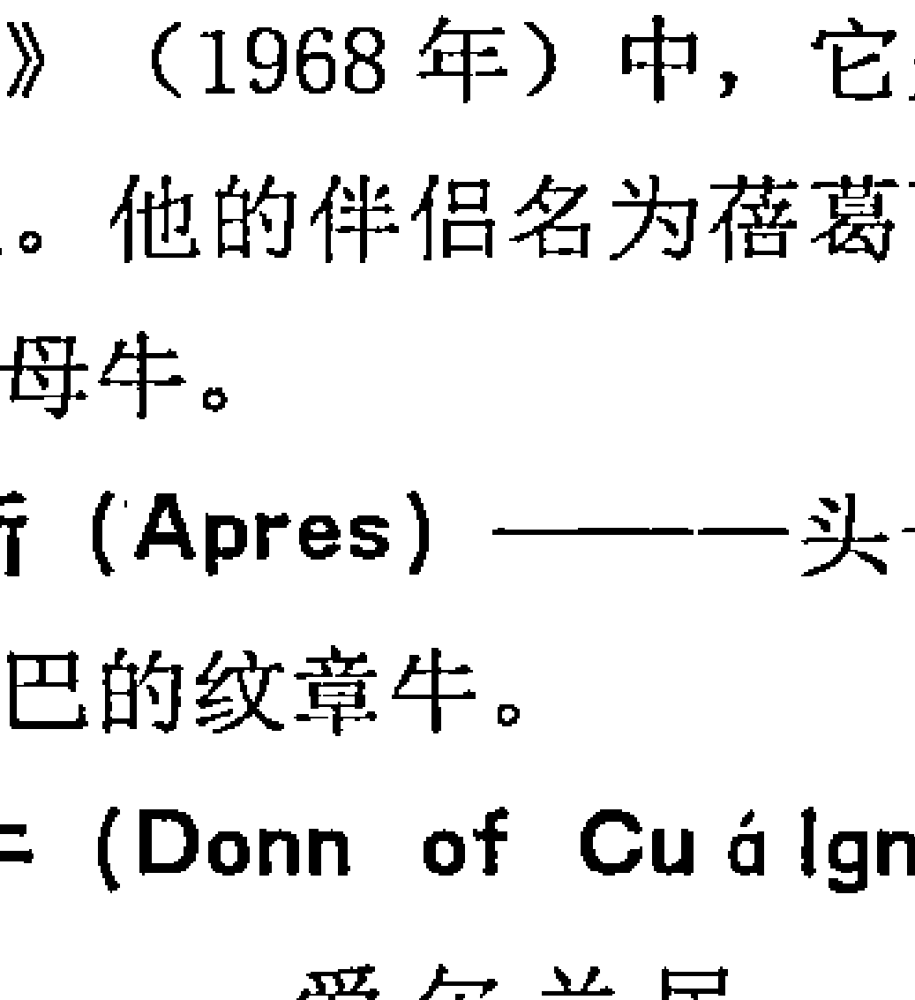

图16. 阿普勒斯

棕色公牛（Donn of Cuáilgne 也叫 Donn Tarbh）——爱尔兰民族史诗 Tain bó Cuáilgne（“库利赶牛”）中的巨大魔法公牛，在这部史诗中描述道：“它的背上能承载 50 个年轻人玩游戏，每晚他们都有足够的空间喝酒和跳舞。”他让 100 名士兵“躲在自己的影子下，不受炎热和寒冷的侵袭。”而且“每晚在回到牛栏中时它都会发出动听的叫声，这叫声能让北方、南方西方和库利的人感到欣慰。”它的叫声还能让所有母牛怀上小牛。

另一头埃及神牛是麦尔握（也叫姆奈维斯 Mnevis，希腊文中的美尼欧斯 Menius，或“麦罗埃 Meroe 的公牛”），它是太阳神亚图姆 - 拉（Atum - Ra）的化身。与阿皮斯相似，在赫利欧波利斯（Heliopolis）也有一头与之长相类似的真公牛死后被做成了木乃伊。

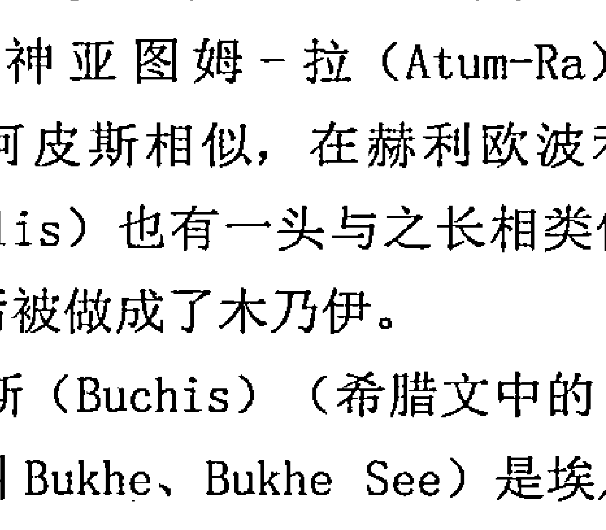

图15. 麦尔握

布希斯（Buchis）（希腊文中的“公牛”，也叫 Bukhe、Bukhe See）是埃及神话中另一头巨牛，住在莫神在赫尔孟提斯的神殿中。它的毛发是倒着长的，每过一个小时都会改变颜色。

哈德姆西（HadhayMsh）（也叫 Hadhayoshi 或 Sarsaok）——古波斯索罗亚斯德教（Zoroastrian）神话中的一头强大的牛，它背负着第一批人类在原始的大洋上漂流。在弗拉西卡特（Frashkart）——万物终结——到来时，它的脂肪会变作不# 易特特 (Itherther) ——阿尔及利亚

卡比（Kabyl）人的神话中一头巨大的水牛，它产出了大地上的所有生物。

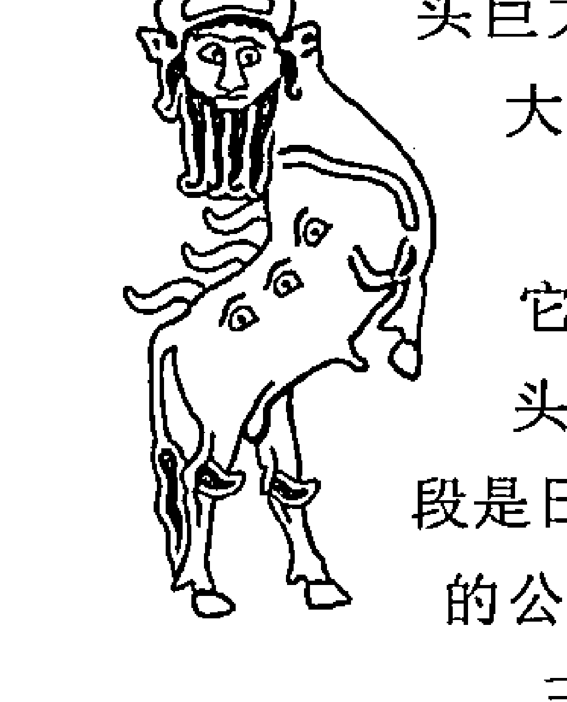

##### 九段 (Kudan) ——

它是一头颠倒的人身牛头怪（Minotaur），九段是日本传说中一头长着人头的公牛，在其身体两边各有三只眼睛。它从不说谎，能预言所有事情。

##### 神牛库加塔 (Kujata) ——穆斯林神话

神话中的一头巨大而强壮的公牛，它骑在宇宙之鱼巴哈姆特（Baharmut）身上。在它的背上背负着一颗巨大、耀眼的红宝石，还有扛着大地的天使。库加塔据说长着4000只眼睛、4000只耳朵、4000只嘴巴、4000只鼻孔以及4000条腿！

##### 南迪 (Nandi) ——印度神话

一头巨大的乳白色公牛，是湿婆神的坐骑，是迦那（Ganas）的首领，也是所有动物的保护神。它的配偶是南迪尼（Nandini）母牛。

最后，我们必须提到巴比（Babe），

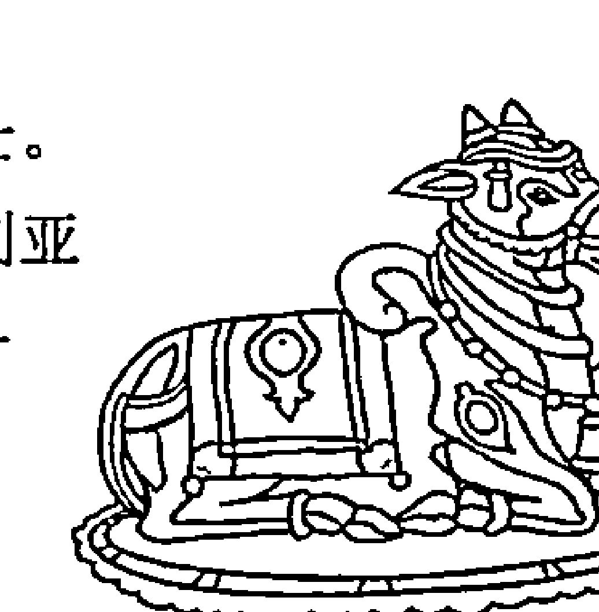

这头巨牛是传说中的伐木工保罗·班扬（Paul Bunyan）的伙伴。巴比本来是白色的，但它在蓝雪之冬（Winter of Blue Snows）的雪花下变成了蓝色。它有93个手掌那么高，明尼苏达州那10000个湖泊都是由它的脚印形成的。30包干草只够它打个牙祭（干草上还被封装线缠得好好的呢！）但在吃掉营地中所有的薄饼后它死去了——因为它将烤饼子的烤炉一起吃掉了。达科他州的巴德兰兹就是保罗在其墓地上堆出的土丘。

##### 怪兽电影：牛

- 《最后一头独角兽》（动画片，1968年）：红牛
- 《时光大盗》（1981年）：弥诺陶洛斯（Minotaur）
- 《神兵总动员》（Tall Tale）（1994年）：蓝色牛巴比
- 《大力士的传奇旅行》（Hercules in the Maze of the Minotaur）（电视剧，1994年）
- 《纳尼亚传奇》（2005年）：弥诺陶洛斯
- 《弥诺陶洛斯》（2006年）

### 7、皮亚索和人头狮身龙尾兽曼帝可拉（Manticore）

作者：奥伯伦·泽尔；雷文哈特

> 人头狮身龙尾兽是非常吸引人的生物，
它总是带着多刺的尾巴跳舞。
长有三排牙齿和两团小胡，
你会看到它穿行在山谷。
——芭芭拉·威斯巴（Barbara Wersba）（1932-）
《被遗忘的野兽之境》（The Land of Forgotten Beasts）

#### 皮阿索

伊利诺伊州的埃尔顿（Alton）被称为“全美闹鬼最厉害的小镇”，它坐落在圣路易斯北方 12 英里处的密西西比河与伊利诺伊河交汇处的密西西比河东岸上，汤姆·索亚和哈克贝利·费恩的故事就发生在那里。在埃尔顿还有另一个更为古老的传说——以及一只更为耐人寻味的神话怪兽。

住在伊利诺伊州布拉夫代尔（Bluffdale）的约翰·拉塞尔（John Russell）博士在 1836 年写了一本书，里面描述了河流两岸高达 100 英尺的悬崖绝壁：

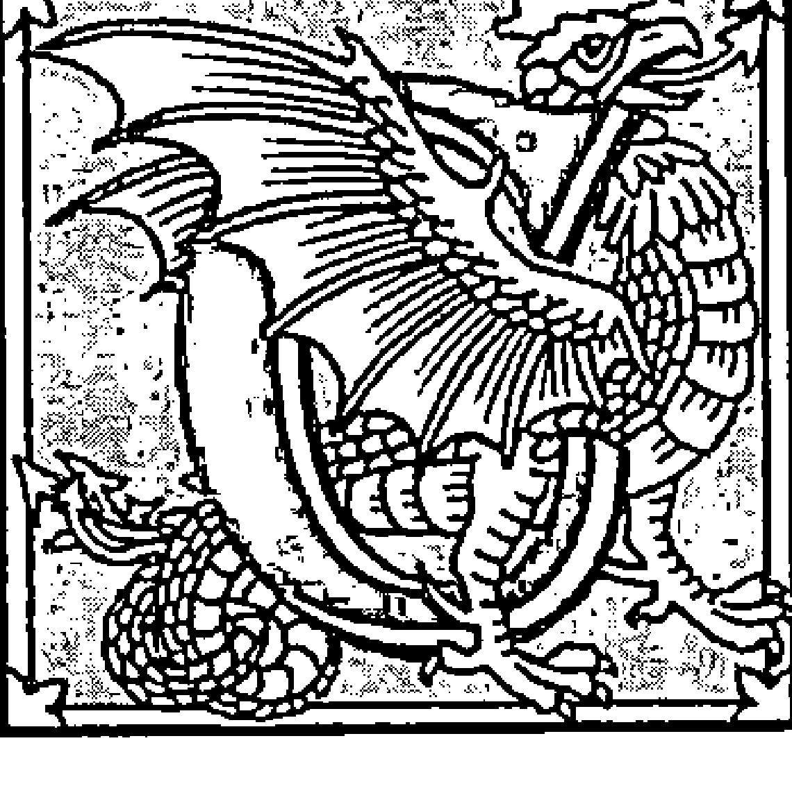

从河中顺流而下到达埃尔顿的旅人们会看到，在伊利诺伊河河口处有一条窄窄的小山沟，潺潺的小溪从中流入到密西西比河里。这条小溪叫皮阿索（Piasa，读作 Pi-a-saw），这个名字源自印第安语，在伊利尼（Illini）语中象征“食人鸟”。在溪口附近的人类无法触及的绝壁上刻着一只张开双翅的大鸟的形象。雕刻中的那种动物就是印第安人所说的皮阿索，这条小溪的名字由此而来。

## 魔法师的怪物图鉴

这幅现在非常著名的岩石雕刻最初是在1673年被雅克·马奎特（Jacques Marquette）神父发现的，他当时正在和路易斯·乔利埃特（Louis Joliet）顺着密西西比河一边旅行一边记录沿途的所见所闻。下面是马奎特神父日记中的一段话：

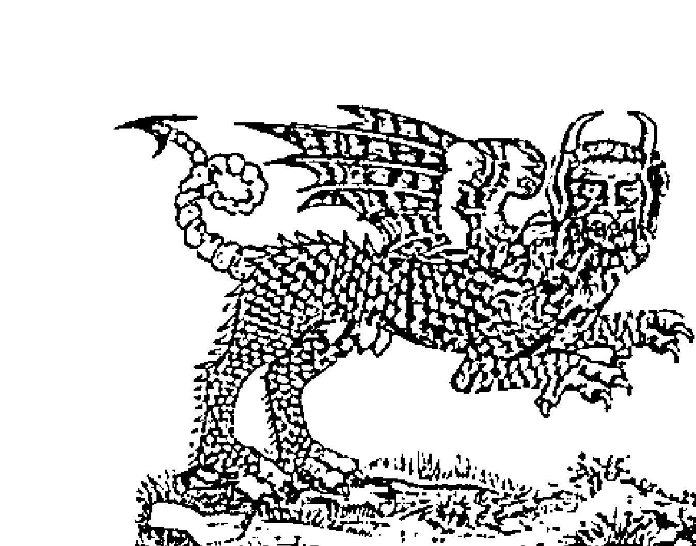

在穿过了一些高度和长度都令人惊叹的岩石的时候，我们看到了上面画着的各种怪兽。起初我们被它们吓坏了，就连最勇敢的勇士都不敢长时间地直视它们。它们体型大如牛，头上长着鹿角一样的东西，眼睛呈恐怖的红色，还有老虎一样的胡须，人类的脸，长有鳞片的身体和缠绕着身体的长尾巴，它们的尾巴从头部一直延伸到背上和四肢间，其末端看起来像鱼尾一样。这幅图由绿、红、黑三色组成。这两幅图非常精致，很难让人相信它们出自野蛮人之手，就连法兰西最好的画师也无法在那个地方舒服地作画。下面这幅图是我们临摹出来的，和原作几乎一模一样。

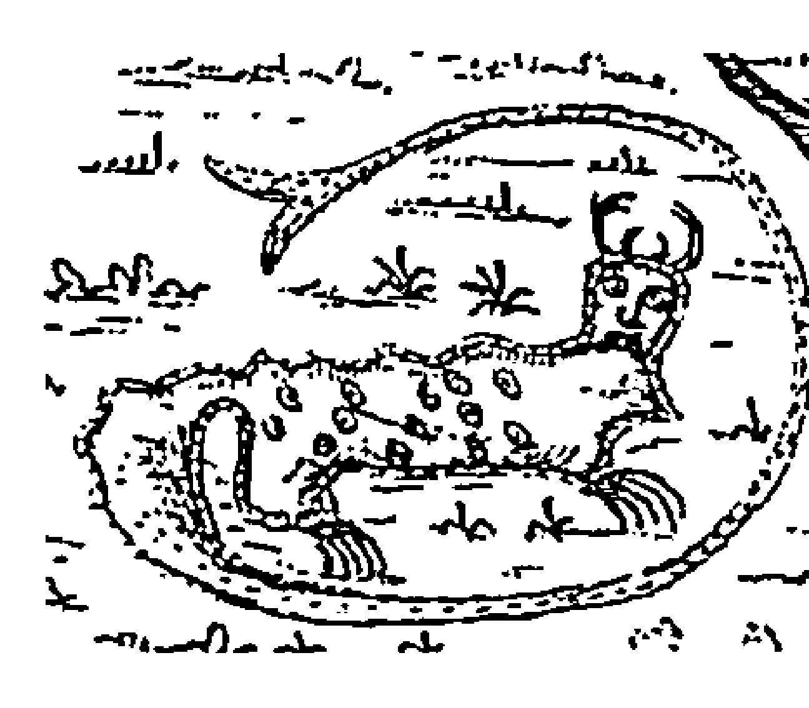

有趣的是，马奎特神父所描述的生物并没有翅膀。这些所谓的皮阿索雕刻早在欧洲人到达美洲前就已经存在了，它们很可能是一种水下美洲豹，这是一种强大、残忍的生物，常出现在当地几个土著人部落的神话中，尤其是生活在大湖区（The Great Lakes）的那些。

这些生物拥有几种动物的特征：山地狮的身体和尾巴、鹿或野牛的角、蛇的鳞片、鸟的羽毛、以及其它动物的某些部分。它的一种变体叫迷奇-皮奇欧克斯（Michi-Pichoux），是加拿大东部克里印第安人传说中的生物，据说它住在圣劳伦斯河中的岛屿上。法国牧师路易·尼古拉（Louis Nicholas）在其《自然历史》（Histoire Naturelle）（1675年）一书中将其描述为一种毛茸茸的老虎般的怪兽，身长超过18英尺，长着大爪子和海狸一样的尾巴。它长着超过2英尺的獠牙，以人类尤其是小孩为食。

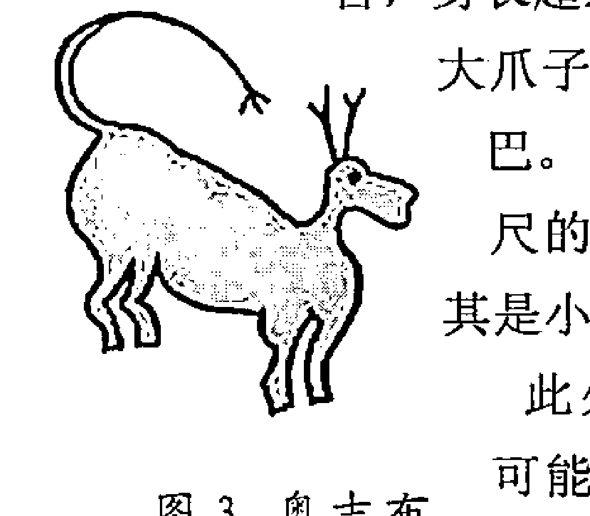

此外，皮阿索一词可能源于迈阿密-伊利诺伊印第安人语中的“páyiihsa”——会攻击游人的超自然矮人——意思并非是“食人鸟”。

这幅岩画后来陆续被阿萨尔（LaSalle）和其他17世纪的法国探险者目击到。在19世纪早期有了更多的目击报告，1825年威廉·丹尼斯（William Dennis）给它画了一幅素描，称其为“飞龙”。1841年，“皮阿索鸟”被收录到约翰·卡斯伯·外尔德（John Casper Wild）的一幅版画中。在1846年，亨利·刘易斯（Henry Lewis）也将其收入到一本发布于1854年的版画集中。在1847年，瑞士艺术家鲁道夫·弗里德里克·库尔茨（Rudolf Friederick Kurz）将其称为“巨鹰”。

在他1836年题为“食人鸟”的文章中，罗素第一次提到了“皮阿索鸟”。他还提到了关于它的一个传说，虽然既有可能是他自己创造出来的，但后来他的这些说法都被广泛地接纳了。

罗素的皮阿索的传说是这样的：很久以前，那里住着一只巨大的鸟，大到能够抓起成年人。它会突然出现在人的头上，将其抓到位于悬崖上的巢穴中吃掉。成百上千的士兵们想要消灭它，但从未有人成功过。它的存在让附近村庄的人都生活在恐惧之中。

最后，在大神（Great Spirit）的帮助下，伊里尼印第安人酋长殴阿托格（Ouatogo）挑选了20位最勇敢的战士，让他们埋伏在一边，而他自己则装成祭品，站在空旷的地方，引诱那只大鸟飞过来。就在鸟爪即将碰到他之际，20只弓箭射入了那只怪物的身体。在痛苦和愤怒的惨叫中，这只猛禽在碰到那位勇敢的酋长前就死掉了。

为了纪念这次伟大的胜利，人们把皮阿索的形象刻在了它在绝壁上的洞穴下。从那时起，只要有印第安人坐着独木舟经过那里，他们都会用火箭（后来用枪）射击那副雕刻。

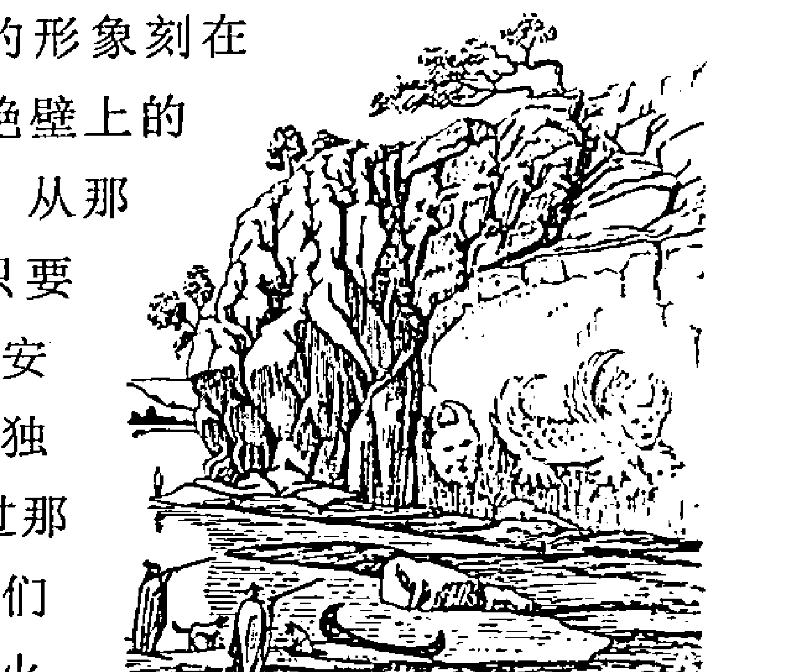

##### 图4. 悬崖壁上的皮阿索（亨利·刘易斯绘制，1846年）

> 石头上的弹痕多得简直数不过来。

在当年3月，罗素在“一位拿着铁锹的聪明的向导”的带领下，宣称自己爬上了那块高达150英尺的绝壁，进入到了高处水面50英尺的洞穴中。在艰难地爬过了入口之后，他发现自己站在一个20英尺深，30英尺长，至少20英尺高的洞穴中。他震惊地说道：“洞穴的地面上铺满了人骨。人的各种骨头乱糟糟地堆在一起，我估计不出到底有多厚，但我们在洞穴各处挖出了一些3至4英尺深的洞都还没有到底。那里肯定堆了有上千个人的尸骨。”

悲剧的是，这些悬崖、雕刻、洞穴和所谓的遗骨在仅仅11年后的1847年就被变成了采石场。1882年，尽管自己并未见过最初的雕刻，一位名叫威廉·麦克亚当斯（William McAdams）的伊利诺伊州地理学家画出了皮阿索鸟的形象。基于他的这幅作品，后来有人做出了一幅彩色的、真人大小的还原品。现在，它被悬挂在那个老采石场的一块墙壁上。那个地方后来成为了当地印第安人一年一度的朝圣地。

但是，在这幅现代的复原画中有一些奇怪之处。它并非参照了马奎特神父日记中的插画，也没有参照亨利·刘易斯和其他人的作品，而是源自一幅名为《鞑靼的曼帝可拉怪》（The Manticora Monster of Tartary）（参见插图1）的17世纪动物寓言集手稿中的钢笔画。而奇怪的是，还从未有人注意到它们之间的联系，这里可能是第一次有人提到这一点。

#### 人头狮身龙尾兽曼帝可拉

这是我们下一个的研究课题——凶残的曼帝可拉。这种印度的像狮子一样的红色凶猛怪兽也叫马提克拉（Martikhora）、马提欧拉（Martiora）、曼提柯（Manticore）、曼提寇拉（Mantichora）、曼提克里（Manticory）、曼提克拉斯（Manticoras）、曼提奎拉（Mantiquera）、曼提斯拉（Mantiserra）、曼科莫里昂（Mancomorion）、墨莫克里欧斯（Memecoleous）、塞提拉（Satyral），它长着人的脸、狮子的鬃毛、蝎子的尾巴和毒刺、三排铁牙，拥有美妙如小号和长笛的声音。它所有的名字都来自波斯语中的“Mard-khor”，意为“食人者”。
对这种恐怖的怪兽最早的描述来自公元前5世纪的希腊医生克特西亚斯（Ctesias），他为波斯的大流士二世（Darius II）和阿尔塔薛西斯（Artexerxes Memnon）服务了17年。在此期间，他编纂了很多涉及波斯和印度（他从未到达过印度）的历史及地理的文献，为后世的动物寓言集提供了物质基础。克特西亚斯的马提克拉（被亚里士多德改写了曼帝可拉，后来被很多的作者写成了其他的名字）的原型毫无疑问是皇家孟加拉虎（Royal Bengal Tiger），但其也包含了一些豪猪（Porcupine）（豪猪属）的元素。下面就是摘自其著作《尹迪卡》（由伊良保存）的完整条目：

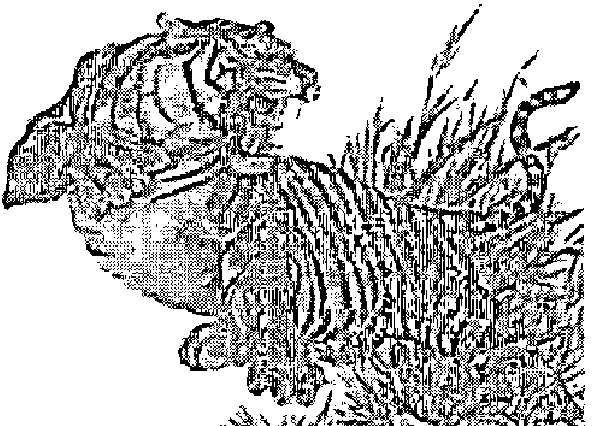

> 他（克特西亚斯）写到了一种发现于印度，名叫马提克拉的动物。它的脸长得像男人——体型像狮子一样大，全身呈朱砂样的红色。它还长着三排牙齿——耳朵长得像人——眼睛的颜色像人一样是淡蓝的，尾巴像蝎子，上面有毒刺，比腕尺还长。在它尾巴的两侧长着毒刺，并且，它像蝎子一样在头上也长有毒刺，任何靠近的人都会遭到致命的针扎攻击。如果攻击者离它尚有一段距离，它能向前或向后攻击——向前时，它会将尾巴翘起来，像弓箭一样朝敌人投射毒刺，向后时，它会将尾巴打直攻击敌人。其射程能达到100英尺，除了大象之外，没有生物能够从它的攻击中幸免遇难。它的毒刺有1英尺长，比最细小的针线还细。在希腊语中，马提克拉（martikhora）意为“食人者”，之所以叫这个名字是因为它能够将人吊起来吃掉，除了人之外它也吃其它动物。在打斗中，它不仅会用毒刺，也会用爪子。毒刺在被射出之后，在原来的地方会长出新的毒刺。这种动物在印度有很多，当地人利用大象来猎杀它们，人们坐在大象背上用飞镖将其杀死。

任何生物。后世的艺术家甚至为它安上了长角、乳房、龙翼，以及最为莫名其妙的弗里几亚帽（图7）。它在纹章中被称为立木帕戈（Lympago），也叫曼泰格（Mantygr）、人虎（man-tiger）、门提戈（Montegre）、撒泰拉尔（Satyral）。它拥有狮子或老虎的身体、老人的脑袋，还有长角。有时它的长角像牛，四肢又像龙。这种艺术上的进化正是在本章开头所展示的那副奇异的图画——它好像越过了重洋，像皮阿索一样被刻到了中美洲的石头上。

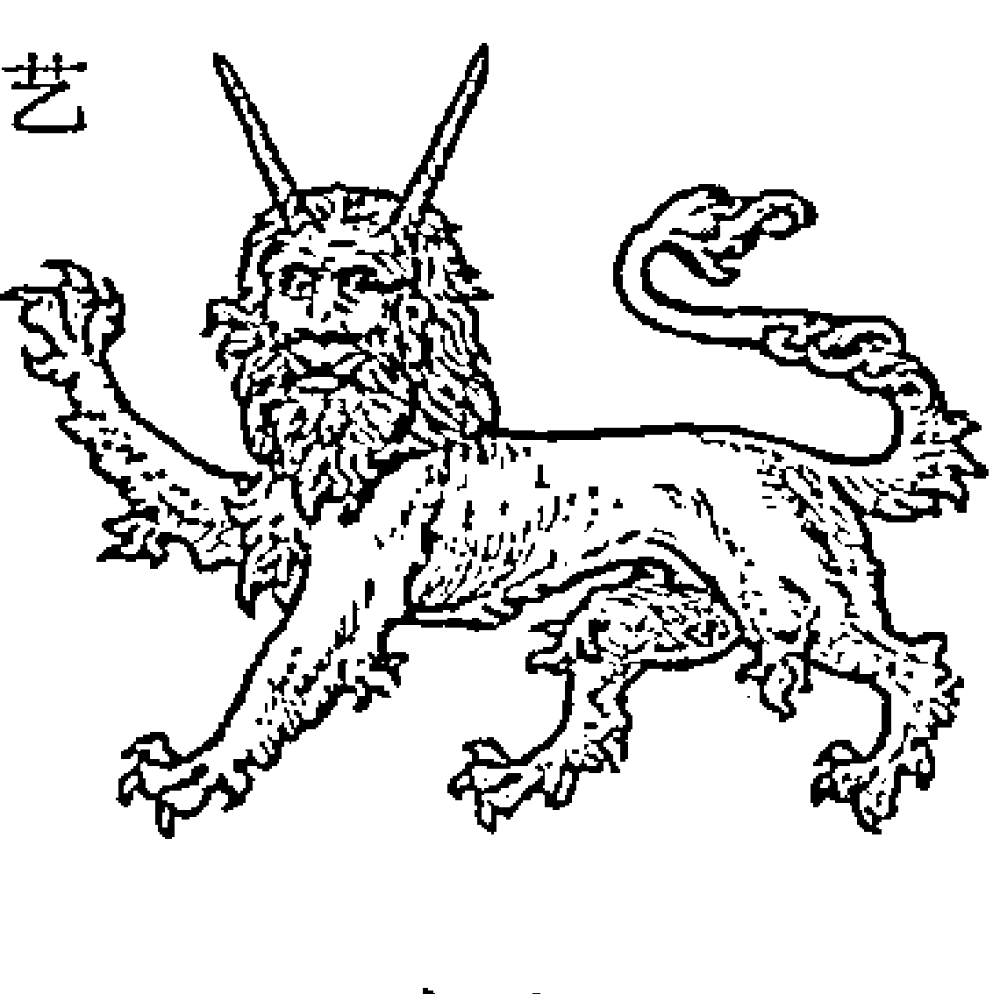

对于克特西亚斯（他的著作只言片语地存在于后世作者的作品中，直到公元9世纪才由君士坦丁堡的主教福提乌斯（Photius）搜集整理成册），其他的作者在他的成就上加入了太多自己的评论和见解，将可怕的曼帝可拉远远地带离了它现实中印度豹的原型。比如，在海地的巫毒传说中，毗高瓦乌（Cigouave）是一种长着狮子或豹子身体和人类脑袋的捕食动物，它来自16世纪的传教士对于印度曼帝可拉的描述。对此种生物的描述同样也变得越来越荒诞，最后完全脱离了现实存在的。

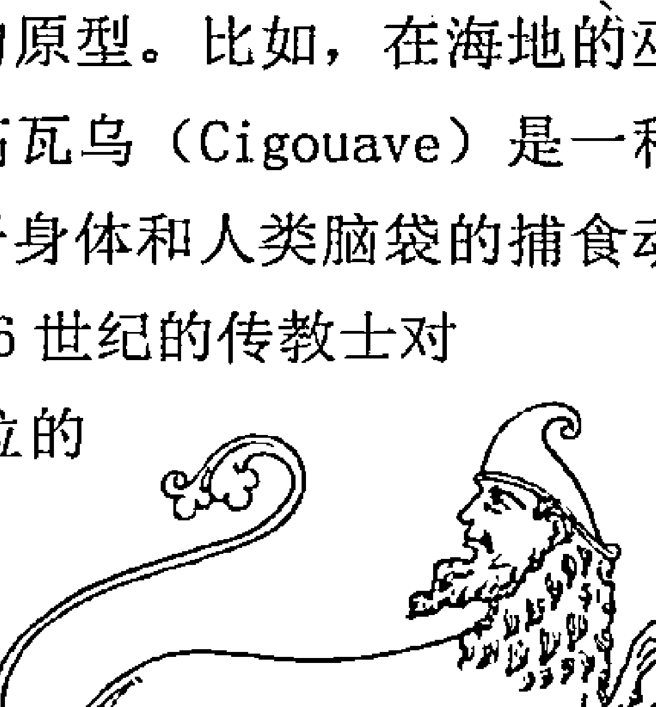

> 阿波罗尼奥斯（Apollonius）回答道：“现在有些故事荒诞得令人难以置信，因为他们说这种生物长着四条腿，它的头像男人，体型却大如雄狮，而它毛茸茸的尾巴比腕尺还长，上面的毛像尖角一样锐利，能像弓箭一样射向猎人。”——拉特（Philostratus）（公元170-245年）《提亚纳的阿波罗尼奥斯》（The Life of Apollonius of Tyana）

在印度有另外一种叫做曼帝可拉的怪兽，它长着男人的脸，嘴里有巨大的牙齿。它有山羊的眼睛，狮子的身体，蝎子的尾巴和蛇的声音，它非常聪明，能用声音将人引诱过来吃掉。就算受到威胁它也不会轻易逃走。

——威廉·卡克斯顿 (1422-1491 年)
《世界之镜》 (The Mirrour of the World)

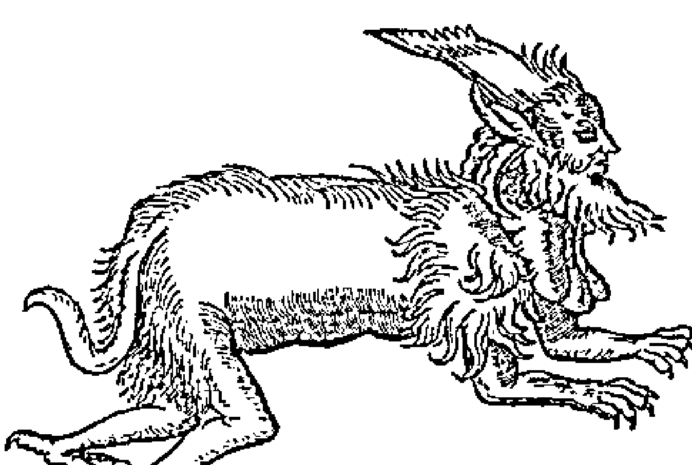

图 9. 1530 年在萨克逊尼亚的豪伯格森林捕获的可怕的曼帝可拉怪

> 我看见过几只曼帝可拉，它们是一种奇怪的野兽：长着狮子的身体、红色的脖子、人类的脸庞和耳朵，以及三排紧紧咬合的牙齿，就像互相交织的手指一样。它们的尾巴上长有蝎子一样的毒刺，而它们的声音却美妙无比。

——弗朗索瓦·拉伯雷 (François Rabelais) (1495-1553 年)
《巨人传》 (Gargantua and Pantagruel)

曼帝可拉（或波斯文中的曼提欧拉 Mantiora）是一种食人兽，它生活在印度，在上下颚上分别长着三排牙齿，体型和凶猛程度与狮子无异，其四肢也像狮子一样，它还长着人类的脸和耳朵，蝎子一样的尾巴，上面还有尖锐的毒刺。它的声音像小号或竖笛一样动听。它非常狂野，很难驯化。当印度人得到这种野兽的幼崽时，他们会将其屁股上的尾巴去掉，以让其失去飙射毒针的能力，之后它就能被顺利驯化了。

——托马斯·伯曼 (Thomas Boreman) (? -1744 年)
《三百种动物的素描》 (A Description of Three Hundred Animals)

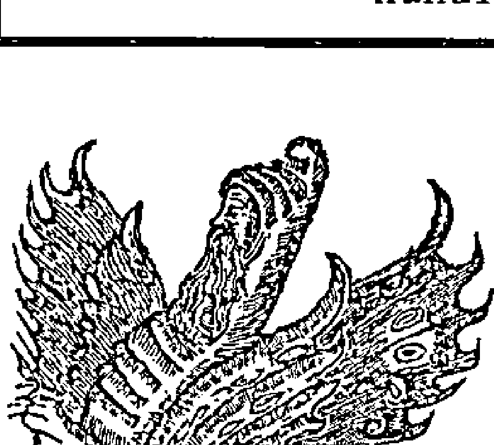

曼帝可拉有刺的尾巴可能源自豪猪，人们曾认为（也一直认为）豪猪能将身上的刺像弓箭一样射出。也许更为可能的是，人能轻易地想象出一头尾巴被豪猪刺中的老虎的样子！然而，在印度，老虎的胡须被广泛地认为是有毒的刺，当地人时常会从被杀死的老虎身上将其取下来防身。

但还有一个从克特西亚斯时期就流传至今的特征让人百思不得其解——即，它们尾巴上的蝎子毒刺的数量是有限的。然而，在1884年，爱尔兰学者瓦伦丁·波尔（Valentine Ball）发表了一篇关于曼帝可拉的论文，在里面他对此发出了明显的异议。在印度做了几年地理方面的研究后，他后来成了都柏林国家博物馆（the National Museum in Dublin）的主管。波尔的研究让其相信，几乎所有希腊医生所报道的东西都有现实基础。

比如，印度人确实是骑在大象背上猎杀老虎的——直到20世纪他们还保留着这个习俗。老虎也确实是恐怖的食人兽。波尔将“三排牙齿”看作是这种肉食动物三叶草形状的臼齿。而对于那蝎子样的尾巴，波尔说道“在老虎以及其它猫科动物的尾巴尖端，有一块小小的角质皮肤结构，这个结构像爪子或指甲一样，我认为当地人就是将其看成了蝎子的毒刺。

16世纪中叶最为伟大的成果之一就是瑞士博物学家康纳德·格斯纳（Konrad Gesner）（1516-1565年）多达四卷的著作《动物志》（Historia Animalium）（1555年），里面有数百幅木刻插图。这部关于动物世界的全面的巨著被认为是现代动物学的奠基之作，它同样囊括了一些神话般的生物，其中就有曼帝可拉。1607年，托普塞（Edward Topsell）（1572-1625年）将格斯纳的作品翻译成了英文，其书名为《四足兽的历史学》（The Historie of Foure-Footed Beasts）。托普塞的曼帝可拉形象最为人所知，也被引用得最多，而他对这种生物的描述为其增加了一个更加神话的元素——与拉克洛兽（Leucrocota）或条纹鬣狗（Hyaena）类似：

> 这种野兽，或怪兽（克特西亚斯曾这样称呼它）生活在印度，在其上下颚上分别长着三排牙齿。它不仅像狮子一样巨大和凶猛，还长着它们的四肢；它的脸庞和耳朵像人类；它双眼灰色，全身通红，尾巴像蝎子，长有毒刺，能向前射出……与之同种的有一种名叫拉克洛兽的怪兽，它们像野驴一样大小，四肢和蹄子像牡鹿，它们的嘴巴很大，直达耳根，母兽的脸长得像獾，这种动物也叫曼帝可拉，在波斯语中意为食人者。因此，我们认为它与条纹鬣狗相同。——托普塞1（1572-1625）《四足兽的历史学》（The Historie of Foure-Footed Beasts）

托普塞提到的拉克洛兽（希腊语，“白狼狗”）是一种埃塞俄比亚的动物，首次被提及于普利尼的《自然历史》（公元77年）一书中。他称其大小如驴，“长着偶蹄、雄鹿的臀部、狮子的脖子和尾巴、獾的脑袋、大及耳根的嘴巴，说话的声音像人类。”后来的作者称其为克罗克塔（Crocotta）、克欧罗克塔（Corocotta）、克罗克特（Crocotte）、斑鬣狗（Crocuta）、库克罗库特（Curcrocte）、西诺力卡斯（Cynolycus）、勒乌卡洛塔（Leucrota）、罗索玛查（Rosomacha）、阿柯博、阿拉兹伯（Alazbo）、扎博、红脚天狼。据说它是一种生活在印度，体型大如驴子的犬狼，拥有狮子的身体、鹿的四肢和偶蹄、用来引诱猎物的人类的声音。它的嘴里没有牙齿，取而代之的是长满骨头的上下颚。进食时，它将猎物整个吞下。它的眼睛不能移动，所以看东西的时候它只能转动头部。克特西亚斯将其称为西诺力卡斯，“犬狼”。它还被称为耶拿（Yena）、阿卡波（Akabo）、阿尔扎波（Alzabo）、扎波（Zabo）、阿纳尔（Ana）以及很多其他的名字，是现在被称为鬣狗（Crocuta crocuta）的动物，只不过在以前被人混入了羚羊的某些特征。

在劳姆泼（Rompo）这种动物的身上，我们能看到整个故事的完美结局。这是一种产自印度和非洲的夜行动物，以人类尸体为食。据说它身体和尾巴都很长，脑袋像兔子，耳朵像人类，还长着鬃毛，而且前腿像獾，后腿像熊。这些特征表明它正是鬣狗，但同样也会让人联想到曼帝可拉。我认为这两种动物之间的联系会在条纹鬣狗（Hyaena hyaena）身上找到，它脖子上的独特的纹理与老虎的类似。

对这个引人入胜的历史还有最后一个脚注。彼得·卡斯特罗（Peter Costello）在1571年的著作《赛弗特》（AndréThévet）中讲述了一个人遇见曼帝可拉的故事：“在我旅行于红海中时，从大陆上来了一些印度人……他们带来了一头类似老虎，但却没有尾巴的怪兽，它的脸长得像一个英俊的男人。”卡斯特罗认为这只“曼帝可拉”可能是一只类人猿，但印度却并不出产大型猿类或狒狒，而且在此描述中也并不能得知其确切物种。

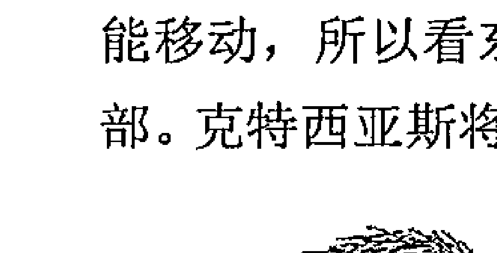

图13. 条纹鬣狗

## 魔法师的怪物图鉴

### 飞行类

### 8、火凤凰

作者：奥伯伦·泽尔-雷文哈特

地球上有多少生物最初的样子与现在的大相径庭？没有一种生物是永恒不变、重复往生、不受岁月侵蚀的。

亚述人传说这一种名为凤凰的鸟，不食人间烟火。在经历五百年岁月之后，她会将巢筑在一棵摇摆的棕榈树上——她用自己灵巧的爪子在巢里铺满树皮和香料、没药以及肉桂——然后在香气的包围中死去。从她的胸膛中——在传说中是这样的——会出现一只小凤凰，据说会继续生存五百年。当她也变老时，她会勇敢地叼起自己的摇篮（也是她母亲的坟墓）升到摇曳的棕榈树的上空，朝太阳城飞去，因为在太阳神庙中有凤凰的巢穴。

> ——奥维德（公元前 43 年 - 公元 17 年）
> 《变形记》
> （Metamorphoses）

凤凰的传说使其成为了一种贯穿整个人类历史，最为强大和流行的隐喻——在大毁灭之后会出现奇迹般的重生和再现。“浴火重生”这个词能被用在从所有被战火或自然力量毁灭后重建的城市，到大病初愈的人身上。甚至连在经历了一个失败的赛季之后夺取冠军的球队也能被称为是浴火重生。在中世纪时，凤凰被基督徒视为灵魂重生和不朽，以及耶稣基督死后重生的象征。

凤凰还被刻在女王伊丽莎白一世（1533-1603 年）的徽章上。在美国的亚特兰大、佐治亚（内战时被焚毁）、劳伦斯、堪萨斯（被南方同盟军的骑兵焚毁）、旧金山、加利福尼亚（1906 年被地震摧毁）和波特兰、缅因（被火烧毁过四次）的城市旗帜和印章上都有凤凰的形象，它象征着这些城市浴火重生的经历。凤凰也是全美第五大城市，亚利桑那州凤凰城的印章图案。这座城市是在霍霍卡姆城（Hohokam）的废墟上建起来的。

据说凤凰在受伤后会重生，这使其变得无敌且永生——这是火焰及神圣最好的代表。在希腊神话中，凤凰住在阿拉伯的一口井旁。在黎明时分，她会在井里洗澡，

#### 传说的历史

凤凰（在中世纪的动物寓言集中也被写作“fenix”）一词意为“紫色或红色”。在很多种不同的版本中，她被描述为全身着火的鹰、孔雀和野鸡。她的传说被古代腓尼基商人［他们用她的名字来命名自己从紫色骨螺蜗牛（Murex brandaris/ Murex trunculus）中提炼出来的独一无二的皇家紫色颜料］传播到各地，数世纪以来他们一直在世界各处航行，直到后来在公元前 50 年布匿战争（Punic War）中，被由凯撒大帝率领的罗马人打败为止。

（接上文）世纪），他暗示道，凤凰早已为人所熟知，它已存在了相当长的一段时间。爱奥尼亚（Ionian）历史学家米利都（Miletus）的赫卡塔爱乌斯（Hecataeus）（公元前6世纪至5世纪）同样也提到过这种漂亮的鸟类，但不幸的是，他的著作《环球旅行》（“Periegesis”）只有一些片段幸存至今。最早且最为详细的描述来自希腊历史学家希罗多德（Herodotus）（公元前484-425年），他声称自己从埃及赫利欧波利斯（Heliopolis）的牧师那里得到了一只。在其《历史》一书的第二卷中，他却说自己并未亲眼见过这种鸟，对关于她的传说持怀疑态度。他写道“如果她真如下面这幅图中所描述的一样的话，那么她的大小和样子就应该是这样的：她的羽毛是红色与金色相间的，一般情况下的体型与普通的老鹰一样。”

在《自然历史》中，普利尼（公元前23年-公元79年）称凤凰“像老鹰一样大，在其脖子上有一圈金光闪闪的羽毛，但她玫瑰色的尾羽上却有着蓝色的小点，喉部的羽毛呈簇状，头上还有一顶羽冠。”

根据传说，凤凰（世界上永远只有一只）来自埃塞俄比亚，每隔五百年，她都会在处在最高的枣椰树（Phoenix dactylifera）上，由肉桂和各种香料筑成的巢穴中下一只蛋。然后她会坐在蛋上，在黎明时分唱一支美丽得无与伦比的歌。太阳升起时，它的光芒会将凤凰易燃的巢穴点燃，这时，她会用翅膀将火扇旺，直到自己被烧成灰烬。9天后，巢里的蛋会被灰烬的热量孵化出来，凤凰就完成了浴火重生的过程。曼尼乌斯·曼尼略（Manius Manilius）（罗马执政官，公元前149年）将鸟蛋从凤凰的传说中去除，称其是从大火后的灰烬中诞生的，最初像一只毛毛虫，之后才蜕化成成鸟。

当羽翼丰满之后，凤凰会将其母亲的骨灰装进一个被掏空的没药球中，将其揉成一个蛋一样的东西，包裹在芳香的叶子中。她会将其带到埃及，将所有的鸟群都远远地甩在身后。之后，她会将这包东西放到太阳神拉在赫利欧波利斯（Heliopolis）（“太阳城”）中的祭坛上。这天是埃及的重大节日，被视为新纪元的开始。

像凤凰一样，阿拉伯的食蟹猴（Cynamolgus）或“月桂鸟”同样据说会从远处带来月桂让自己筑在一棵高高的棕榈树上的巢穴变得香气四溢。香料搜集者会用重箭将其巢穴打下来。据说月桂就是这么来的。

#### 复活的循环

曼尼略宣称每540年循环一次的天文大年与凤凰的生命周期是重合的。凤凰最后一次出现在建城（拉丁语 AUC: Anno urbis conditae—— “建城年”，指的是罗马城的建立时间——通常被设定为公元前 753 年）215 年。根据现在的估计，那应该是在公元前 538 年。

塔西佗（Cornelius Tacitus）（公元 55-120 年）在《编年史》中称，凤凰曾在埃及处在斯特里斯（Sesostris）、雅赫摩斯（Amasis）和托勒密（Ptolemy）三世的马其顿王朝时期不断地飞到那里，但却未给出确切时间。他写道，凤凰最后两次出现的间隔要小于 500 年，并怀疑最后一次目击报告是伪造的。

斯特里斯三世（Khakhaure）在公元前 1878 年至公元前 1843 年时统治埃及。雅赫摩斯在公元前 570 年至公元前 526 年（正处在公元前 538 年，凤凰再次出现的时候，但却是在斯特里斯之后的 1300 年，并非 500 年了）时统治埃及。托勒密三世的统治时期为公元前 246 年至公元前 221 年（仅在雅赫摩斯统治时期的 300 年后）。

尽管希罗多德给出的周期时间是 500 年，曼尼略给出的是 540 年，但也有其他人给出 1000 年、1461 年、1700 年，甚至 12994 年。将公元前 538 年作为起点，凤凰过去和未来出现的时间应该如下表所示：

| 500 yrs | 540 yrs | 1,000 yrs | 1,461 yrs | 1,700 yrs |
| :--- | :--- | :--- | :--- | :--- |
| 1038 | 1078 | 1538 | 1999 | 2238 |
| 538 BCE | 538 BCE | 538 BCE | 538 BCE | 538 BCE |
| 462 CE - | 2 CE | 462 CE | 923 CE | 1162 CE |
| 962 | 542 | 1462 | 2384* | 2862* |
| 1462 | 1082 | 2462* | | |
| 1962 | 1622 | | | |
| 2462* | 2162* | | | |

所以如果你想知道凤凰下一次出现的时间，就看看上面标有星号的日期吧。个人而言，我更倾向于选择 1962 年作为“凤凰年”。抑或，我们能从历史记录中知道，这张表并非是准确无误的，凤凰在任何时候都可能会出现！

#### 其他文化中的凤凰

在东方的中国，有着自己的凤凰（“朱雀”）。凤凰常出现在东方的艺术作品中，凤是雄性，凰是雌性，它们在一起代表着永恒的爱、高尚的品德、阴阳以及宇宙原力。这种美丽的鸟据说站立时有 9 英尺高，它长着天鹅的胸脯和长脖子、野鸡的头和鸡冠、燕子的脸、乌龟的壳还有孔雀的 12 根尾羽。这些描述与产于越南和马来半岛的稀有眼斑野鸡（Ocellated Pheasant）有着惊人的一致。这种鸟灿烂的羽毛能长达 6 英尺。

凤凰的身体代表着六个天体，它闪亮的羽毛代表着五种基本色（黄、绿、红、黑、白）。它从太阳中出生，不吃任何生物或植物。它是四灵中的一只，与龙王（龙）、玄武（乌龟）和麒麟（独角兽）一起被称为中国的四神兽。凤凰站在南方，代表着夏季和火元素，以及王后。它很少出现，但一旦出现就会被认为是吉祥、好运、和平、财富的象征，但在其离开人间时，灾难则会降临。

在日本，凤凰被称为 Ho-Oo——Ho是雄性，Oo 是雌性，是太阳的化身。它的出现标志着新时代的到来。它是好运的信使，降临人间造福世人，然后它会回到天上，等待下一次轮回的到来。像凤凰一样，Ho-Oo 标志着皇室和王后。除此之外，它还代表太阳、公正、忠诚和服从。

俄罗斯有关于卓霞-皮提莎（Zshar-Ptitsa）或火鸟的传说，它的羽毛闪烁着金银的颜色，它的眼睛像水晶一样闪亮。当它唱歌时，珍珠会从它的嘴里掉出来。它的歌声能治病人和盲人。它的一根火羽能够点亮整间房屋。它们为主人沙皇达尔美特（Dalmet）看守花园，但在某些夜晚，它会偷偷溜进附近沙皇福斯拉夫·安隆维奇（Vyslav Anronovich）的花园，偷取里面代表年轻、美丽、不朽的金苹果。这只美丽的鸟是伊戈尔斯特拉文斯基（Igor Stravinsky）著名的1910芭蕾舞所表现的对象。

土耳其的可克（Kerkes）在生活了1000年后会让自己在火中死去，然后重生，再活1000年。这种循环将重复七七四十九次，直到审判日的到来。神树阿巴贝尔（Ababel）——《古兰经》中的“父亲树”——在每次可克（Kerkes）复活的时候都会发出新芽。

根据《犹太法典》（Jewish Talmud）的记载，米尔查姆（Milcham）是唯一一种没有吃伊甸园中知识之树果实的动物，生命之树赐给它不朽的能力作为奖励。它居住在一座被高墙围起来的城市中，每隔1000年会跳进火中死去，留下一只蛋继续重复生命的轮回。

波斯和印度神话中都有一种叫呼玛（Huma）的天堂鸟，它住在天堂中，从未到达过人间。它同时拥有雌性和雄性的特征，双性各有一只腿和一只翅膀。像凤凰一样，这种鸟每隔几百年也会在火中死去，然后从灰烬中重生。它富有同情心，从不杀生，只吃腐肉。任何看见它的人都会得到好运和财富——尤其是当它的影子笼罩在人们身上的时候。

有些与凤凰传说有关的鸟都非常大，类似于马达加斯加的大鹏鸟（Roc）。比如，一种名叫安卡（Angka）的巨型阿拉伯鸟，据说它非常大，能叼起大象。在生活了1700年之后，它会让自己在火焰中烧成灰烬，然后重生。阿拉伯人相信安卡最初是一种完美的鸟，但后来它吃掉了地上所有的动物，开始捕食人类的儿童。人们请求上帝，阻止安卡繁殖，于是最后这种鸟灭绝了。

斯摩夫（Simurgh）（意为“30只鸟”）是阿拉伯传说中雄伟的群鸟之王，代表着神圣统一。它美丽的羽毛具有治疗的作用。像安卡一样，它也大得能叼起大象或骆驼，但同时它也据说会抢走人类的孩子喂养自己的雏鸟。它住在波斯北部的阿尔贝兹山中。与凤凰类似，这种聪明而安静的鸟能活1700年或2000年。有些传说称其是永生的，在知识之树上筑巢。据说它生活的时间非常长，曾见证过三次世界毁灭。在示巴女王（Queen of Sheba）的身边有一只同样名字的鸟，它拥有桔黄色的金属羽毛、银头、人脸、四只翅膀、秃鹫的爪子以及孔雀的尾巴。

尼科洛·达·康提（Nicolo de Conti）（约1395-1469年）是一名威尼斯商人，他花了25或36年在印度、亚洲和非洲旅行，带回了瑟温达（Sevienda）的传说，这种鸟长着布满孔洞的鸟喙。像凤凰一样，它会在火中重生，最初的样子也像一只小虫或毛毛虫。

在印度史诗《罗摩衍那》（Ramayana）中，揭路茶（Garuda）是一种神奇的火鸟，是毗湿奴神的仆人。在印度尼西亚共和国（Garuda Pancasila）的纹章上有它的形象。

#### 传说的来源

真的有凤凰——或至少与之类似的鸟类吗？跟许多其它传说中的生物一样，凤凰的传说并不仅仅定义了这种动物的来源。在其他地方，一些神奇的鸟类都被吸纳进了他们自己的凤凰传说中。

也许凤凰传说最古老的来源是埃及的贝努（Benu），一种苍鹭一样的鸟，长着红色的双腿和有长长羽毛的头冠。贝努（Benu）一词在埃及语中意为紫鹭（Ardea purpurea）和海枣树（date palm tree）。贝努来自地下世界中的火岛（Isle of Fire），带来了生命之源海克（Hike）。据说在从灰烬中重生的时候，它会唱出一首美妙的歌曲，即使是神也会被终身迷住。贝努因在《死亡之书》（The Book of Dead）和其他埃及文献中被描述为赫利欧波利斯（Heliopolis）的一种神圣象征而为人所熟知，它与日出和每个黎明都会在火焰中重生的太阳神拉有关。因其重生的能力，它也被认为和欧西里斯有关。

有一种生活在东非沙漠中的鸟——可能是沙鸡（Sandgrouse）（沙鸡科）——也被认为是埃及凤凰的原型。据说因为盐碱地对于它的蛋和雏鸟而言温度太高，于是它将自己的巢穴筑在几英寸高的土堆上，然后在上面下一只蛋。在那些土堆间流动的对流气体可能让人以为是火焰在燃烧。

另一种被认为是凤凰以及其它神话中的鸟类的来源是日全食发生时，太阳的日冕形成的鸟类形状，这让古代埃及人和美索不达米亚人创造出了带有翅膀的日盘（sun-disk）。

柏林的埃尔温·施特雷泽曼（Erwin Stresemann）教授在 1935 年发现的一种行为奇怪的“蚁浴”鸟也常被当作凤凰传说的起源。很多鸟都会啄起蚂蚁，把它们放到翅膀下和羽毛里，享受蚁酸带来的醉人感觉。1957 年，毛瑞斯（Maurice Burton）对此行为进行研究，得知芳烃和烟草具有同样的作用。一种名叫尼日尔的秃鼻乌鸦也有同样的行为，它们“喜欢在燃烧的稻草堆中玩耍。”火焰在它身下燃烧，烟雾笼罩了它的身体，它扇动翅膀，用嘴叼起燃烧的木头，试图将它们塞到自己的翅膀下面……它还会时不时地在火中张开翅膀，将头转到一边，跟经典的凤凰肖像画中一样。

凤凰传说中最为重要的组成部分也许能追溯至公元前 1000 年的新几内亚的天堂鸟羽毛贸易中找到，当时腓尼基人才刚发现这座岛。最为张扬，数量也最多的种类是新几内亚极乐鸟（Count Raggi’s Bird of Paradise），它们也因此成为当地出口最多的鸟类。这种鸟中的雄性在其翅膀下长着亮丽的放射状羽毛，在求偶的舞蹈中，它们会派上用场，此时，整个舞蹈看起来就像在火中进行的一样。让这种鸟成为凤凰传说的来源并非只是因为其亮丽的外表，同样也因为它从古埃及以及其他处在腓尼基人贸易路线上的文明带到西方的独特方式。为了将珍贵的天堂鸟皮保存下来，通过海路带到埃及、腓尼基以及其他地方，新几内亚的居民们小心地用没药对它们进行防腐处理，将其做成蛋一样的外形。它们像希罗多德（Herodotus）所说的一样，被封存在香蕉叶中。毫无疑问，当它们被带到赫利欧波利斯和泰尔的神庙中时，人们会举行一场盛大的庆典来庆祝神圣的腓尼基鸟的回归。

#### 曾经的凤凰和未来的凤凰

我认为在这种神奇的鸟身上还有一个元素没有受到人们的重视——即，一种拥有那些特征的真实存在的生物。因为凤凰像独角兽一样，只是偶尔才出现的动物。基于此点，有人认为它其实是由人类制造出来的。最可能的情况是，它是由两种鸟类组合而成的。

在如此多种的天堂鸟（见上图）中，野鸡（鸡形目）是其中最适合用来制造凤凰的一种。这种鸟包括了火鸡、松鸡、鹌鹑、家鸡、孔雀和野鸡，在全世界它包括了 256 种不同的种类。这些鸟互不相同，其雄性都有很夸张的羽毛，实行一夫多妻制。它们是亚洲分布最广的，其中很多已被驯化了千年之久。尽管完全不同的求爱方式让这些鸟类无法交叉繁殖，但当它们被关在一起的时候情况就可能变得不同了，在饲养人有意的培养下，能产出很多独特的杂交鸟。

其中，雄性锦鸡（Chrysolophus pictus）有与凤凰一致的颜色：彩虹和火焰般的红色与金色。而孔雀的体型与凤凰差不多，它有长脖子、头冠、长有独特“眼睛”花纹的羽尾。尽管孔雀彩虹般的体色在色谱上远离蓝色、绿色和紫色所在的位置，但经过突变的印度蓝孔雀（Pavo cristatus）却是纯白色的（这并非是许多人认为的白化病）。雄锦鸡和白色的雌孔雀可能就会产出与俄罗斯火鸟差不多的后代。也许是时候让美丽的凤凰重归肉体了。

> 现在我才相信
> 世上有独角的麒麟，
> 阿拉伯有凤凰所栖的树，
> 上面有一只凤凰至今还在
> 南面称王呢。
> ——莎士比亚，《暴风雨》
> （第三幕，第三场）

#### 怪兽电影：凤凰

在著名的《哈利·波特》系列故事和电影中有一只名叫福克斯（Fawkes）的凤凰，它属于霍格沃兹魔法学校的校长阿布思·邓布利多（Albus Dumbledore）。在《哈利·波特与密室》（2002年）中有关于凤凰重生的生动描述。在《哈利·波特与混血王子》（2008年）中也同样提到了福克斯。在2005年，由C. S. 刘易斯的同名小说改编的影片《纳尼亚传奇》中，一只火凤凰在雪之女王的军队前制造了一道火墙，掩护彼得撤退。

## 9、狮鹫和骏鹰

作者：亚瑟 · “豹舞者” · 迪克尔克和奥伯伦 · 泽尔-雷文哈特

> 狮鹫代表智慧、刚毅。首先是智慧，然后才是刚毅。
——查士丁尼
（Chassaneus）

狮鹫和骏鹰也许是神话世界中最不同寻常和迷人的生物。像龙、独角兽和凤凰一样，它们存在于世界各地的神话和传说中，受到人们的喜爱。它们属于嵌合生物。狮鹫长着狮子的后半身和尾巴，老鹰的脑袋、翅膀和前爪。它们通常还长着有羽毛的马耳，或像大角鸮（great horned owl）一样的有羽毛的“角”。有些狮鹫长的是蛇尾而不是狮尾，与传统的奇美拉类似。有些的尾尖上长有簇毛。骏鹰同样长着鹰的上半身，但下半身却像马。

关于狮鹫的神话历史能追溯至5000多年前，它的名字也非常多。狮鹫一词不管是出现在哪种语言中（法语“Griffin”、意大利语“Grifo”、德语“Greyff”、英语“Griffin”），都源自希腊语中的“grypos”（“钩状的”），特指其巨大的钩状鸟喙。另一种写法“Griffin”，意为“抓住”。其他的名字还有诸如“Gryph”、“Gryphus”、“Epimacus”，以及“Gryps”或“Grypes”，意为“弯曲的，长着钩状喙的”。狮鹫在日本被称作科尔尼（Kirni）。

图2. 已知的最古老的鹰首狮身图案，发现于伊朗西部苏萨城出土的一个公元前3000年的滚筒印章上。

图3. 亚述狮鹫（尼尼微宁录宫的一块石雕）

关于狮鹫最早的记载来自埃及。埃及的狮鹫长着狮子的身体和鹰隼的脑袋。包括圣飞尔（Sefer）和阿斯克斯（Axex）在内的一些埃及神明都被描绘成狮鹫的样子。古埃及的雕像中也常有狮鹫的身影，他们将其视作神圣的生物。在波斯，狮鹫被称作霍马（Homa），它们是忠诚的代表，被刻成雕像。霍马（Homa）被视为光明的守护者。

图4. 狮鹫样子的希腊船首尾花纹装饰

希腊的狮鹫则混合了更多其他动物的特征，他们长着老鹰的上半身、狮子的后半身。据说他们在洞穴中筑巢，每次下三只鸵鸟蛋大小的蛋。从传统意义上来讲，狮鹫的蛋与老鹰蛋差不多大，但在某些版本中，它们的蛋则像蓝宝石一样，而在另一些版本中，它们的蛋就是蓝宝石，或甚至是玛瑙。有时，母狮鹫会在巢中放上玛瑙来保护自己的蛋和幼崽。

图5. 伊斯塔尔城门上的巴比伦狮鹫

狮鹫是天空和大地的主宰，据说它们曾在西塞亚大草原上生活，那是一片从现在的乌克兰一直到中亚的广阔地区。根据希腊历史学家希罗多德（Herodotus）在公元前5世纪的文献，狮鹫与北方乐土之民（Hyperboreans），蒙古北风人，和独眼国民（Arimaspians），西塞亚的一个独眼牧马人部落的人民生活在一起。后者得名于阿里马斯皮（Arimaspias）河，据说狮鹫会从里面淘出黄金来。狮鹫最喜欢的食物是马，它的死敌则是牧马民族独眼国民，他们一直都在试图夺取被狮鹫守护着的金库。希腊的独眼人传说和狮鹫传说都可能源自这个传奇部落。

在公元前5世纪末期，克特西亚斯将希罗多德的“看守黄金的狮鹫”移到了印度的“巍峨群山”中，它们被描绘成了一种长着四条腿的鸟，更加接近我们现在所熟知的狮鹫。克特西亚斯在《尹迪卡》（Indica）中写道，狮鹫“像狼一样大，长着狮子一样的腿和爪子，除了胸口的羽毛是红色的外，其余部分都覆盖着黑色的羽毛。”

罗马辩论家克劳狄俄斯·埃利安或伊良（170-235年）撰写了一部关于动物传说轶事的著作，名为《关于动物》（On Animals）。下面是他对狮鹫的描述：

> > 我听说生活在印度的狮鹫是一种像狮子一样的四脚兽，长着与狮子同样强壮的爪子。人们常说他长着翅膀。其背上的羽毛是白色的，胸口的羽毛是红色的，双翼上的羽毛要么是其他颜色，要么也是白色的。克特西亚斯记录着他脖子部分的羽毛是斑驳的深蓝色的，他的喙像老鹰，头也像老鹰，正如艺术家们的绘画与雕刻那样。它的眼睛，他说，像火一样。

它将巢穴筑在群山中，尽管不可能抓住成年的狮鹫，但人们能抓住其幼兽。Bactria人与印度人是邻居，他们称狮鹫守护者那里的黄金，他们与其一同挖掘，然后把黄金放到它的巢穴里，印度人则在下面捡那些从上面掉下的黄金……在狮鹫为保护自己的幼崽而与入侵者打斗时。它们也会碰上其它野兽，但能不费吹灰之力地将其制服，但却不敢与狮子或大象交锋。

狮鹫被认为是一种实行一夫一妻制的动物，会与伴侣一生相随。如果伴侣去世了，另一只会为其孤独终老，后来它们被教会当成反对再婚的象征。
这种雄伟的动物与太阳有关，经常被描述为拉着太阳战车的形象。传统意义上，狮鹫守卫着黄金、财宝和智慧，与龙（尤其是亚洲龙，在智慧方面而言）相似。如果有人胆敢试图抢走它的财宝，它就会将其撕成碎片。狮鹫的爪子拥有验毒的能力，据说十字军在回到欧洲时带了很多回去。后来这些东西都被证明只是羚羊角，被非洲商人卖给了那些容易上当的十字军士兵们。亚洲大草原上的那些巨大的骨骼据说是“狮鹫”的骨头，实际上它们更可能是恐龙化石，这让它们没有羚羊角那样受商人的欢迎。

狮鹫在世界范围内的诗歌、硬币和雕像中很常见。

在古希腊的铜锅上就雕刻或铸造有竖着耳朵、长着嘴巴的狮鹫头的图案。在有些现代的石质艺术品上，狮鹫的头变成了有角的大猫头，而非传统的鹰头，但翅膀和鹰的上半身仍然保持不变。

天它被称为秃头鹫（Griffin Vulture, Gryps fulvus），在亚洲南部和南非都有发现。

欧吡尼卡斯（Opinicus）是一种与纹章狮鹫类似的生物，它只存在于纹章世界中。欧吡尼卡斯，或“假狮鹫”，除了没有狮鹫独特的耳朵之外长得与真狮鹫别无二样。另外，它长着狮子的前爪和骆驼的尾巴。

马被认为是狮鹫的死敌，但在故事中，其二者却有一种名叫骏鹰（Hippogriff）（或鹰角兽Hippogryph，希腊语“马狮鹫”）奇怪的组合，一种半狮鹫半马的兽类——是母马和雄狮鹫间不可能的结合（狮鹫最喜欢的食物就是马）产出的后代。描述这种奇异生物有一个词语叫“鹫马杂交”（to cross Gryphons with horses），意思与“猪会上树”（when pigs fly）一样，指的是绝不可能的事情。骏鹰长着鹰的脑袋、翅膀、胸部和爪子，但它的后半身却是马，而不是狮子。它能够被驯化，

无翅狮鹫是一种雄性狮鹫，在纹章中它们通常有尖状的图案作背景，或在肩膀上有喷射的火焰代替了翅膀。

中世纪欧洲传说和纹章中的赫里奥德罗摩斯是狮鹫与秃鹫的接合体。在今

## 魔法师的怪物图鉴

## 奇怪的传说和事实

作者：奥伯伦

狮鹫并非只是虚构出来的生物，其原型是胡兀鹫(Lämmergeier)。其身长达4英尺，翼展有10英尺。
这种鸟脖子上的一圈长长的羽“鬃毛”给了它“狮鹫”的名字。它是所有猛禽中最大也最强壮的，是宙斯之鹰。

胡兀鹫是胡兀鹫属(Gypaetus)中唯一的成员，它是介于老鹰和秃鹫之间的物种。它的德文名字意为“羊羔偷窃者”，源自其叼食羊羔的习性。这种强壮却罕见的猛禽气息在欧洲南部、非洲、印度和西藏的高山中。它在峭壁上筑巢，在隆冬季节会生下一只或两只蛋，一直留到春天开始的时候才进行孵化。
与食腐的秃鹫不同，胡兀鹫不喜欢吃腐烂的东西，它九成的食物都是骨髓。为了这种佳肴，它会将巨大的骨头叼到高空中扔下来摔成小片。这让它有了鱼鹰(Ossifrage)（“骨骼碎裂者”）的名号。胡兀鹫还会用同样的方法摔碎乌龟。

这种鹰与希腊剧作家埃斯库罗斯(Aeschylus)（公元前525-公元前456年）有着颇具讽刺意味的关系，他是《被缚的普罗米修斯》(Prometheus Bound)的作者，在这部作品中，普罗米修斯每天都会受到宙斯之鹰（即胡兀鹫）啄食肝脏之苦。公元前458年，埃斯库罗斯旅行到了西西里，住在杰拉城。一天，当他在后院中教育学生之时，一只胡兀鹫抓着一只乌龟从他头顶飞过。这只鸟将这位学者光秃秃的头顶当成了石头，把乌龟丢到了他的头上。这位伟大的作家就这样被折磨自己作品中的英雄的生物取走了性命。

还有一件关于这种看起来超自然的怪兽的轶事。1991年，一位叫艾德丽安·梅约(Adrienne Mayor)博士的，来自新泽西州普林斯顿古典艺术与文学的学者写道，亚洲中部的阿尔泰山，以其巨大的黄金贮藏量和当地的许多狮鹫传说而著名，在那里有一头狮子大小的四脚恐龙（也叫原角龙，“脸上长角的”）及其恐龙蛋的化石，其最为引人注目的特征是它那鹰一样的喙和脑袋。从白垩纪（1亿3600万至6400万年前）算起，如果这些化石被那些早在恐龙被发现之前数世纪时的淘金者发现的话，他们会如何解释？能肯定的是，这是一个拥有四条腿和老鹰头的怪兽——或，像我们今天所说的，狮鹫。

## # 魔法师的怪物图鉴

+   - 《纳尼亚传奇》，2005年（狮鹫）
- 《狮鹫》，2007年（电视剧）（狮鹫）

但此次发现与传说中的“狮鹫”最为引人注意的巧合在于通过它，我们了解到恐龙并非像大家所想的那样，是缓慢的蜥蜴般的爬行动物，而是敏捷的温血动物，鸟类是它们幸存至今的后代。新近在中国发现的保存完好的化石显示它们中有很多都长着羽毛——很有可能还包括原角龙！

### 有关狮鹫和骏鹰的书籍：
- 《爱丽丝漫游仙境》，刘易斯·凯萝（狮鹫）
- 《超越北风》（Beyond the North Wind），吉丽安·布拉德肖（狮鹫）
- 《纳尼亚传奇》，C. S. 刘易斯（狮鹫）
- 《水晶狮鹫》（The Crystal Gryphon），安德烈·诺顿（狮鹫）
- 《神曲》（Divine Comedy），但丁（狮鹫）
- 《秋暮之巨龙》（Dragons of Autumn Twilight），玛格丽特·威斯和特蕾西·希克曼（狮鹫）
- 《狮鹫王》（The Gryphon King），汤姆·迪茨（狮鹫）
- 《哈利·波特与阿兹卡班囚徒》，J. K. 罗琳（骏鹰）
- 《魔法战争》（Mage War）三部曲，梅赛德斯·拉奇和拉里·迪克森（狮鹫）
- 《疯狂的奥兰多》（Orlando Furioso），路德维科·阿里奥斯托（骏鹰）
- 《曾经与永恒之王》（The Once and Future King），T. H. 怀特（狮鹫）
- 《巴比伦公主》，伏尔泰（狮鹫）
- 《魔法之源》（Source of Magic），派尔斯·安东尼（狮鹫）
- 《巫师继承人》（Wizard’s Heir），丹尼尔·胡德（狮鹫）

### 怪物电影：狮鹫和骏鹰：
- 《梅林传奇》（Merlin），1998年（电视剧）（狮鹫）
- 《寻找卡米洛城》（Quest for Camelot），1998年（狮鹫）
- 《哈利·波特与阿兹卡班囚徒》，2004年（骏鹰）

## 潜游类

## 10、人鱼

作者：奥伯伦 · 泽尔-雷文哈特和汤姆 · 威廉姆斯

> 我的好帕克，过来。你记不记得有一次我坐在一个海岬上，望见一个美人鱼骑在海豚的背上，她的歌声是这样婉转而谐美，镇静了狂暴的怒海，好几个星星都疯狂地跳出了它们的轨道，为了听这海女的音乐？
——莎士比亚，《仲夏夜之梦》（第二幕，奥布朗对帕克语）

美人鱼“Mermaid”（来自拉丁文的Mer，“海洋”）的上半身是美丽的女人，下半身是鱼，她们一直都是神话传说中最受欢迎的生物。她代表着美丽、浪漫和海洋的奸诈，尤指那些危险的暗礁。在人类的航海史上，水手们一直在讲述着自己遇见美人鱼的故事。全身赤裸的美人鱼经常坐在石头上梳理自己长长的绿色秀发，引诱水手。她们曾被误认为是塞壬（Siren），即便后来塞壬（Siren）这个名字被给予了一种海生哺乳动物（Sirenia）。然而，希腊神话中最早的塞壬并非生活在水中，而是长着女人脑袋和胸部的鸟。
并腿畸形综合症（Sirenomelia）也被称作“人鱼综合征”，是一种罕见的先天性疾病，患有此症的儿童的双腿会长在一起，他们的生殖器也因此退化。患儿在出生后一、两天的时间内因为肾脏和膀胱的并发症而死去。到现在为止，已知的只有 3 名患者幸存了下来。

图 1. 美人鱼纹章

关于人鱼的传说非常古老而且分布广泛，存在于不同文化、不同大洲、不同时代中。他们的名字很多——阿布吉尔 (Abgal)、阿达罗 (Adaro)、塞壬 (Sirens)、舍尔奇斯海豹人 (Selchies)、特里同 (Tritons)、水精 (Undines)、美路西斯 (Melusines)、莫甘斯 (Morgans)、可瑞甘 (Korrigans)、罗蕾莱 (Lorelei)、拉苏尔奇 (Rusulki)、水精灵 (Nixies)、涅瑞伊得斯 (Nereids)、耐德斯 (Naiads)、日本人鱼 (Ningyos)。他们住在由珊瑚建成的壮观的水下城堡中，据说和水一样清澈，没有灵魂，但能通过和人通婚而获得灵魂。纹章中的美人鱼是口才的代表，她们经常以手持梳子和镜子的形象出现，被描述为“虚荣的美人鱼”（插图1）。她手中的镜子代表着月亮，潮汐的掌控者。

### 历史上的人鱼

最早的传说中的人鱼是希腊的埃亚 (Ea)，也叫奥安尼斯 (Oannes)。他是一位阿卡德 (Akkadian) 神，生活在约公元前 5000 年，后来被巴比伦人所崇拜。巴比伦贝尔的一位叫做博诺索斯 (Berossus) 的迦勒底牧师，其中的一则记录被希腊的亚历山大·波里希斯托 (Alexander Polyhistor) 所收藏：

> 在(巴比伦)刚建立的时候，在厄立特里亚古海中的某处有他的一尊雕像，它是一种有心智的动物，名叫奥安尼斯。此种动物全身像鱼，在鱼头之下还有一个脑袋，在鱼身下面长着腿，这些器官都与人类相似，它的雕像至今仍然存在。这种生物在白天时会与人类交谈，教会他们文字、科学和各种各样的艺术，但却不要任何食物做报酬。

在日落时分，奥安尼斯会回到海中，一直待到下次日出。旁边的这幅图显示的是一个戴着鱼的头饰，穿着鱼披肩的人类——也许他们的牧师就是这么穿着的。后来，它的形象被认为是典型的人鱼的样子，躯干是人类，而下半身却是鱼尾。

图 2. 奥安尼斯 (曼利·P. 霍尔绘制)

埃亚 / 奥安尼斯似乎与古苏美尔早期神话中的阿布吉尔或阿普卡尔有关。它们长着男人的脑袋和鱼的下半身，被认为是人类社会的保护者和教授艺术及科学的老师。人们认为他们源自教人灌溉的智慧女神恩基（Enki）的阿朴苏。在腓力士-亚述神话中，他们的王是龙，大地及农业之神。

图 3. 阿布吉尔

库尔（Kul），也叫库库里（Kulili），是故亚述神话中的淡水人鱼，它也是半人半鱼。雄性叫库鲁鲁（Kulullu），雌性叫库里尔图（Kuliltu）。它们对人类抱有敌意，住在湖泊、水塘和井里。它们会污染自己居住的水体，使其不可饮用。它们会被音乐迷惑，向其唱颂歌能博得它们持续终生的友情。

在历史上一直都存在着数不清的人鱼，各种神话传说和海员的故事中都有他们的身影。尽管绝大多数的人鱼都住在海里，但在淡水中也有一些——如耐得斯（Naiads）、水精灵（Nixies）、水精（Undines）——据说住在湖泊和河流中。尽管有雄雌之分，但绝大多数的传说中都只提到雌性人鱼。

虽然有些人鱼——比如德国的哈克曼（Hakenmann）、钦西安人（Tsimshian）的哈库拉（Hakulaq）、因纽特的伊卡鲁·纳帕（Ikalu Nappa）、格陵兰的玛吉格尔（Margygr）、巴西的伊普皮亚拉（Igpupiara）——被描述成样子丑陋的怪物，但传统的美人鱼却漂亮、诱惑、危险。她们的头发据说是由海藻变成，对水手而言，看见美人鱼几乎就是灾难 —— 风暴、沉船、溺水——的同义词。

人鱼据说住在涅普顿统治的海底王国里，它们会用美妙的歌声和乐曲诱惑水手跳下水来。但美人鱼也会拯救溺水的水手。

自然历史学家和探险家们都认为人鱼是真实存在的，数世纪以来，他们报告了许多起目击和遭遇。普利尼（公元23-79年）是第一位对其进行详细记录的博物学家，他将其记录在自己伟大的《自然历史》一书中（公元77年）：

> 美人鱼也被称作涅瑞伊得斯（Nereides），关于她们的传说其实并非捏造：画家的画就是她们最好的描述：她们的身体覆盖着厚厚的鳞片，即使在其像女人的上半身也是如此。

但经典的人鱼形象来自5世纪的动物寓言集《生理理论》（Physiologus），该书将其描述为“一种美妙的海洋兽类，肚脐以上的部分像少女，肚脐以下的部分像鱼儿，这种兽类在天气恶劣时非常高兴，在晴空万里时却异常沮丧。”

到了13世纪中叶，人鱼传说才算有了完整的体系。在《物之属性》（De Propietatibus Rerum）中，巴塞洛缪·安杰力卡斯（Bartholomew Angelicus）将其描述为致命的诱惑者，用甜美的歌声来引诱水手：“但事实是，她们是强壮的妓女，（会让男人）变得贫穷和丧失理智。”通常，美人鱼会对全体船员进行催眠，绑架一名水手，将他带到一个“干燥的地方”，和他做爱。如果遭到拒绝，“那么她就会将其杀死并吃掉。”

The request was rejected because it was considered high risk## 图鉴二、揭秘夜之生物（下）

下午两点和五点半之间，我们在水面上目击到它很多次，在水面下也目击到一次。在水面上看到的其滚动的背部和尾巴，时常还能看到头部。另外还看到一个较小的个体。

这时，一位名叫汤姆·奥马尔的当地人划着划艇过来了。当被问及关于伊尔凯的事情的时候，他指着露出水面的一条尾巴喊道：“伊尔凯，伊尔凯，就在那儿！”接着他说雌性长着女人的脸、头发、手和胸部，还说海湾里就住着一家：一只雄性、一只雌性和一个幼崽。那只动物一直在我们面前表演着。

礁石探险者的船长克里·皮奇（Kerry Piesch）在水下见到了更为壮观的景象。大约下午三点半时，他带着潜水设备和一部小相机从船上潜入了水中。没过多久，他报告自己在水下发现了一只伊尔凯并给它拍了照。

它身长约5英尺，在水下呈绿灰色。在其头部和躯干之间没有明显的脖子。其前肢为短短的浆状物，但在观察者的角度无法看清楚它的脸。它的后半身呈流线型，尾巴与我们在水面上看到的一样。

2月15日的早晨发生的事情让我们在诺康的活动意外终止。我们看到一些当地人在从海里将一头大型动物拉到岸上。当成员奥伯伦和汤姆·威廉姆斯从礁石探险者号上游到海岸时，他们发现那是一头成年的雌性海牛。它死于右侧胸鳍处的一处伤口。奥伯伦在随后的检查中发现它曾被高能步枪击中过。在前一天晚上，一艘名叫“拥抱”（Cuddles）的船曾在海湾里下锚，但在第二天早上就离开了。我们推测是该船上的人射杀了这头动物。

现在能够确定这种动物就是众人所说的里或伊尔凯，它与人鱼的故事有关，很可能是酷似现实生活中的印度洋－太平洋海牛（Dugong dugon）的水生灵长类动物。关于它们在水面和水下的目击报告、相片、尸体都证明了它们的存在是不可否定的。

仍然存在的问题之一，是在知道了它们不过是海牛的情况下，人鱼的神话是如何产生和保存下来的。汤姆·奥马尔的阐述可谓一针见血。这是一种信仰系统，其自然属性超越了动物学的条条框框，延伸到了人类学和心理学中去。不管这些故事最初源自哪里，它们似乎都成了男性可以自我延续的幻象。

这种男性幻象的结构或机制在与很多不同的人进行谈话后变得明显了起来。不管这些目击报告还是调查最终的结论如何，他们始终都会认为自己遇上的是里或伊尔凯。于是，只要有一名男性这样讲述自己的故事，那么其他的人也都会这样，以获得大家的赞赏。随后就会出现以前面水手的故事为基础的新故事。这样，传说就产生了。那些有类似故事的人会不约而同地组成一个“俱乐部”。现在的人可能知道自己的故事是真实的或者虚假的，但其后来者对此并不确定。实际上，有一种约定俗成的规矩，就是不能质疑其他人的故事，否则自己的故事也可能会受到怀疑。于是乎，关于里或伊尔凯确实存在的“信仰”开始出现，因为那些未曾有过经验的人倾向于接受别人的故事。这形成了一种社会互动，让原始部落的人鱼故事在我们社会中，通过私下闲谈的方式丰富起来。原始部族中对这些故事唯一不为所动的是女人们。

## 魔法师的怪物图鉴

## 怪兽电影：人鱼

很多著名的奇幻电影中都有人鱼的身影。《彼伯先生与美人鱼》（Mr. Peabody and the Mermaid）（1948年）是一名心理医生讲述的故事，他的一位病人声称自己曾抓住过美人鱼并将其放在浴缸中喂养。在《米兰达》（Miranda）（1948年）中，一个漂亮的美人鱼与一位伦敦的医生结婚，生下了一个长着鱼尾的宝宝。其续作《水晶宫主》（Mad About Men），在1954年上映。在《蒂伯龙岛的美人鱼》（The Mermaids of Tiburon）（1962年）中，美丽的美人鱼帮助一位潜水员寻找沉没的宝藏。《沙滩宾戈》（Beach Blanket Bingo）（1965年）讲述的也是一个人类与美人鱼的浪漫史。在《现代美人鱼》（1984年）中，戴露·汉娜（Daryl Hannah）饰演一只爱上人类的美人鱼，她能像女人一样在陆地上行走，但一旦碰到水，她的双腿就会变回鱼尾。在德国影片《翁蒂娜》（Ondine）（1991年），一位地产商想将湖泊改造成滑雪胜地而救了一只淡水美人鱼，她也叫翁蒂娜。迪士尼的《小美人鱼》（1989年）正是基于安徒生的一则美人鱼故事，这只美人鱼为了与人类通婚，用其尾巴和声音换取了双腿。《终极人鱼岛》（She Creature）（2001年）中有一只喜欢吃人肉的美人鱼。《异种大海怪》（Aquanoids）（2003年）讲述的是类似塞壬的海洋生物。在《美人鱼》（Auamarine）（2006年）中，两名12岁的女孩与一只能将自己的尾巴变成双腿在陆地上行走的年轻美人鱼交上了朋友。在《心之亚特兰蒂斯》（Heart’s Atlantis）（2006年），一个悲惨的男孩在其后院池塘中的美人鱼那里得到了慰藉。《水中女妖》（Lady in the Water）（2006年）中有一位纳弗（Narf），水中仙女，她出现在一个公寓的游泳池中。人鱼在《小飞侠》系列影片、《纳尼亚传奇》（2005年）和《哈利·波特与火焰杯》（2005年）中也客串了一把。

## 11、克拉肯 (Kraken)

作者：汤姆·威廉姆斯

## 克拉肯

在大洋的波涛之下，
远在深渊之中，
它正在继续着自己漫长的好梦
克拉肯在沉睡：微弱的光线
拉出它的影子，在其身上
长满了千年的海绵，
在暗淡的光线中，
它的息肉和巨大的绿色触须在颤抖。
他已在那里沉睡了太久，
这头巨大的海虫
终将在大海沸腾之时重见天日，
之后会被人类和天使协力消灭。
——丁尼生（Alfred, Lord Tennyson），1830年

伊安·丹尼尔斯

大海是什么？浅显地说，它是一层覆盖着地球七成面积的咸水。然而更深层地来说，它极大地影响了人类文明和人类的心理。它为我们提供食物和其它的物质，为贸易和探险提供便利，让战船能够四处征战，也能让人免受掠夺者的侵袭，能唤起诗人和歌者的创作灵感——其中有些是让人类最为害怕的怪兽传说。时至今日，海洋是我们探索未知世界的前线——一个黑暗而未知的领域，拥有众多奇怪、美丽的生物，还有那些我们噩梦中的怪兽。

克拉肯的传说就是源自深不可测的大海——克拉肯被公认为一种什么都吃的怪兽，长着能捕捉猎物的手臂。克拉肯——这种生物潜伏在深海中，时而会冒出水面，用其触脚缠住倒霉的船只，拖入海浪中。从最初的时候起，它就被描述为长着很多手臂或很多脑袋的样子，通常在身体中间还长着一个嘴巴或鸟喙，用来咀嚼猎物的肉体——很多时候还有它们的灵魂。

在所有恐怖的传说怪兽中，很少有像这样在真实存在的生物和神话幻象间联系如此直白的。克拉肯与鲸鱼、海龟、海鸥一样，都是真实存在的。像其它生物那样能在生物进化史上找到明明白白的证据的生物，在海员的传说和故事中最为恐怖的就是克拉肯。这种真实存在着的生物能以其难以置信的体积让我们相信，那些最为抽象的恐惧和幻想是如何出现的。

克拉肯是一种巨型鱿鱼——大王乌贼（colossal squid）是其新近被人发现的表亲。如果没有发现这个物种，我们该如何接近传说背后的真相？仅仅依靠隐生动物学研究的成果并不能给出公正和客观的评价。相当长一段时间以来，关于巨型鱿鱼的课题一直都属于隐生动物学的范畴。在本章中会出现很多的报告，在后面我们还会看到一个样本，它能追溯至人类最初开始航海的时候。除此之外还有海怪斯库拉和卡律布迪斯（Charybdis）的传说、儒勒·凡尔纳的故事，也有诸多问题，例如“这样的东西真的存在过吗？如果是真的，它能长到多大？”我们现在已经会回答这些问题中的绝大部分。但还有一个让人难以置信的问题依然存在着：“如果这东西确实存在，我们该如何面对这一事实呢？”

我认为克拉肯的存在突出显示其是人类传说、恐惧和幻想的世界与真实的生物、物理世界碰巧重合在一起的实例之一。但克拉肯拥有的一些特征是人类从恐惧中衍生出来的，并对这种恐惧有强化效果——而这些特征也存在于已知动物身上。其中一种就是其不可阻挡，尽管一直都有人在试图杀死或阻止它，但这种怪兽仍然一往无前。杀伤它只能让其变本加厉。在最古老的传说中有一种现在被称为巨型鱿鱼的多触脚怪物——以及九头蛇。

### 九头蛇

九头蛇是一种住在阿尔戈利斯（Argolis）（位于古希腊）的莱尔纳（Lerna）城附近沼泽里的怪兽。它是拥有100个脑袋的厄客德娜（Echidna）（半人鱼半蛇）和提丰的后代。九头蛇拥有蛇的身体和很多的脑袋。在某些传说中，其头的数量是九个，而在其他传说中则是100个。这里要说的重点是，这么多的脑袋很可能指的是该生物那些半独立的攻击触手。只有一个头能抵抗任何武器的攻击，而其他的头则是被砍掉之后会重新长出来的那种。而在有些版本中则是只有两个脑袋在被砍掉后会重新长出来。它的呼吸带出的恶臭同样拥有杀伤力。据说九头蛇会攻击家畜群和整个村庄，将其全部吞掉。

英雄赫拉克勒斯（Heracles）来和九头蛇作战，随行的还有他的外甥及车夫伊俄拉俄斯（Iolaus）。赫拉克勒用了点小手段打败了九头蛇：意识到只是简单地将它的头砍掉解决不了问题，他于是让伊俄拉俄斯在其脑袋被砍下来的时候用火把将其脖子上的伤口烧焦，这样它就无法长出新的脑袋。而对于最后一个据说刀枪不入的脑袋，赫拉克勒斯则是用自己的木棒将其打晕后，徒手拧了下来，然后把它埋在了地下。现在，木棒被定义成武器，所以在这里，赫拉克勒斯显然是得到了眷顾。

但让我们分析一下细节。怪兽居住的沼泽虽然并不是海洋，但其仍然属于未知的黑暗领域，同样有可能会让毫无防备的游人葬身其中。即便它不是海洋，但它也可能很深。九头蛇的头据称是长在又长又软的脖子上的，这使其能从不同的角度攻击目标。而中间的那个无敌的脑袋则是其它脑袋保护的对象。任何企图将其杀死的举动都只会让事情变得更糟。它完全不可阻挡。

### 斯库拉（Scylla）

现在看来，并没有足够的证据能证明古希腊人曾亲自碰到过巨型鱿鱼……或者，真的有证据能证明这一点吗？斯库拉是一种居住在墨西拿海峡（Strait of Messina）巨石下的怪兽。她本是一位仙女，被赛丝变成了长着12只脚和6个脑袋的怪兽。只要有船进入射程，她的12只脚就会分别从甲板上抓走一名水手，然后将其吞掉。

然而，还是没有任何直接（或间接）的证据能证明斯库拉的神话源自头足类动物。地中海中并没有大型鱿鱼，那里只有一些被当成美味的小型章鱼。

对于斯库拉及其邪恶伙伴卡律布迪斯的恐惧更可能是源自人类害怕被卷入深渊。卡律布迪斯是波塞冬和盖亚的女儿，因为偷了赫利俄斯（Helios）的牛而被宙斯变成了怪兽。卡律布迪斯能吞进和吐出大量的海水，还能吸附在船只下方，她也是深海恐惧的化身。乌力塞绕开卡律布迪斯行船，他宁肯让斯库拉吃掉自己的6个船员，也不愿让整艘船落入卡律布迪斯的手中。当然，很难说它们与头足类动物没有联系。《奥德赛》中对斯库拉有一段描述“她的12条腿像巨大的触脚一样没有关节，而在其蛇颈上长有6个脑袋……”虽然在海怪神话和巨型鱿鱼间有直接的联系，但我们也能通过推测得出令人满意的结论。

### 海洋故事

然而，在后经典时期(post-Classical era)确是另一番景象。那个时期不仅有基于一些神话的故事，更有基于水手们的真实经历，但其中有很多恐怕都是经过了加工的故事罢了。还有基于这些描述或由目击者亲自绘出的图画。那个时期，这些怪兽与头足类动物之间的联系变得日渐清晰。

在欧洲人第一次越过赫拉克勒斯（Hercules）之门时，他们才拥抱了欧洲和非洲的海岸。大西洋的广阔对他们而言是一片巨大的未知，自然而然地，在里面可能同时存在着真正的和想象的怪兽。于是，在看到蓝鲸、抹香鲸之类的巨大鲸鱼之后各种故事开始出现，它们很可能被认为是巨大的怪兽。

那时的文学作品包含着大量的报告，有些报告中的对象很明显都是巨型鱿鱼，但其余的则是其它的东西。这些报告大约来自公元1000年至20世纪初期的这段时间，是众多故事有趣的大集合。一些后世作者和调查者作出了正确的结论，即有些故事是直接源自巨型鱿鱼的，而其它的则是简单地将自己关于巨型鱿鱼的预想融入到了目击报告中，然后自我分析从什么角度看鱿鱼的什么部位会有那些描述中的效果。

详细的叙述并不适于被放在这些结论中，但来几个例子就截然相反。最值得注意的一则是奥拉乌斯·马格瑙斯对于一条“可怕的鱼”的描述，此人是瑞典的天主教大主教。他在描述（约1555年）中写道：“它们长相恐怖，它们的头是方的，全身长满了刺，脖子旁长着一圈尖角，就像倒插的树根一样……”有意思的是，马格瑙斯称其像一棵倒插的树，这让人联想到克拉肯。公元1000年左右，挪威瑟韦尔王（Severre）第一次用克拉肯这个名字来描述一种海怪，后来这个名字再次出现在了一位挪威人的作品中，他是埃里克·路德维森·庞托皮第安（Erik Ludvigsen Pontoppidian）主教，他的这本书叫《挪威自然史》（The Natural History of Norway）（1755年）。显然，克拉肯一词与倒插的树之间是不怎么会有联系的。克拉肯实际上是克拉科的复数形式，意为“海怪”。

有很多优秀的图作正确地将其反应为巨大的乌贼。即便是那些看起来像章鱼的绘画实际上也是基于乌贼的。

重点并非在仔细梳理这些绘画背后的事实，而是搞清楚这些绘画与实际动物之间的相似之处。今天我们所知的巨型鱿鱼的一切——不管它们有多大——都告诉我们它们其实并不能长到能拉沉一艘船的体积。但这并不意味着它们不大或者不危险——只是告诉你，它们并没有那么大。

最近且最为真实的一次报告来自1861年的法国护卫舰阿勒克同（Alecton）号，上面的船员报告他们杀死并捉到了一头巨型鱿鱼。船员们只将其一部分拖到了船上，因为在将其拉出水面的时候它的尸体碎成了很多块。阿勒克同号的报告和用今天的技术绘成的图像已经非常真实了，但该船的船长和海员们还是被谴责为骗子。

它的眼睛据说有餐盘那么大，其嘴巴的宽度约18英寸。另外，船员们还声称自己闻到了巨大的恶臭。在真正的动物身上，这种情况是很正常的——即，它们能分泌氨气。我们现在知道巨型鱿鱼没有鱼一样的鳍，但能通过往组织中冲入氨气来改变自己的浮力，从而改变自身的重量。这就导致了臭味的出现，也让它们的肉变得无法下咽。阿勒克同号事件应该是真实的。

### 大王鱿（Architeuthis）

在20世纪末之前，生物学领域都拒绝承认这种生物的存在，以及其巨大的体积。其中有个原因是因为科学界普遍存在的怀疑性，但除此之外还有一个原因——人类内心深处对于克拉肯的恐惧。这让我们开始怀疑，它们究竟能长到多大，究竟多么具有攻击力——因为它们确实是怪物。

当我们谈论克拉肯时，我们实际上是在说两种截然不同的物种，现在（尽管不是那么具有说服力）已经被科学证实了：它们分别是巨型乌贼（Giant Squid）大王鱿和大王乌贼（Colossal Squid）。有一段时期，人们认为大王鱿是一种被动的捕食动物，倒立着挂在深海中某个地方，用其长长的触脚捕食那些经过的猎物，再用8条短一些的触脚将其送入嘴里。现在我们知道大王鱿是一种极具攻击力的捕食者。像所有的鱿鱼一样，它也有两条叫“触手”的附加肢体，它们具有弹性，能弹射出去用末端棒状的吸盘抓住猎物，然后用8条短一些的触手送入嘴中切碎并吞掉。而巨型乌贼触手的吸盘上却长着利齿一样的钩子。

第一条被活捉的大王鱿（2006年12月，被一支日本研究队抓住）在运输过程中还在攻击诱饵，它被切断了一条触手，那条触手还在甲板上翻腾了一段时间。这条乌贼并未幸存下来，但却是第一只被拍到照片的活体大王鱿。

对于大型鱿鱼都具有的攻击性，我们能看下一个更加熟悉的例子，洪堡鱿鱼（Humboldt squid）。如其它两种巨型鱿鱼不同的是，洪堡鱿鱼是可以吃的——但它对任何试图抓住它的人都会有与巨型鱿鱼同样的行为。

当地渔民因为大多数都受到其攻击而害怕它们，而有些则被因食物打斗的鱿鱼拖下水中淹死了。洪堡鱿鱼长着与巨型鱿鱼类似有钩吸盘。它们好斗的名声并非空穴来风，它还拥有大王鱿的一些习惯。巨型乌贼和大王乌贼在触手上都长着有钩的吸盘。大王鱿在其触脚的末端长着有钩的吸盘，而大王酸浆鱿（Mesonychoteuthis）却长着旋转的钩子。

它们的体积是一个更为棘手的问题。大王鱿可能有150英尺长的推测并不可靠。而且关于巨型乌贼长度的说法也非常繁杂。对它的测量——为了使其变得更有轰动效果含有不少水分——包括触手以及末端长着宽宽棒状物两只弹射触须。至少对于大王鱿，它触须的长度是不定的，有时取决于测量者能将它们拉到多长。然后就是那8条短一些的触手，不同的种类长度也不相同。脑袋、触手和触须都是从其套膜延伸出来的，它的大小被用作区别巨型乌贼和大王乌贼的标准。

但现在我们有了更大的大王鱿标本，其套膜的长度最多达到7.4英尺，其触手的长度（并非触须的长度）达到16.5英尺。很多人可能对它们的体型感到失望，但实际上它们非常巨大，而且危险。但其只是无法将船拖入海中，或阻挡19世纪潜艇的前进。

### 大王酸浆鱿 (Mesonychoteuthis)

而大王酸浆鱿则有另一种不同的问题。大王乌贼这个名字和它非常般配。我们曾抓到过两只大王乌贼，一次是在2007年2月，它被完整地捞上了那艘捕鱼船，但在运输途中死掉了。它是一头成年的雄性，体重992磅，估计长度为39英尺。早期的记录忘记写下测量的部位。大王酸浆鱿被认为比大王鱿更重、更长。另## 图鉴二、揭秘夜之生物（下）

一个仅存的标本是一头未成年的雌性，其套膜长7.5英尺。根据雌性来推测雄性的套膜长度约为13英尺或再长一点点。而它们的体重可能接近一吨。在被抓住的雄性样本的照片中可以看出，它的嘴巴非常大。（插图12）

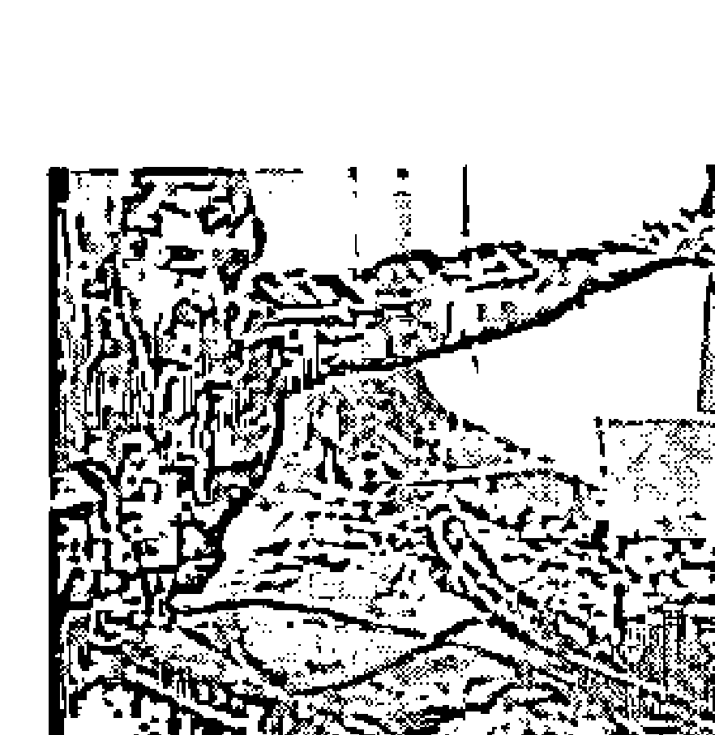

对于乌贼体型的推测能通过比较抹香鲸肚子上牙印而得知，抹香鲸是这两种巨大的乌贼唯一的天敌。有些人通过测量其触须的残片的长度和直径来推测其身长。因为从比例上来讲，大王酸浆鱿要比大王鱿要大一些，如果将大王乌贼的残片当成它的来测量就可能导致不同的结果。

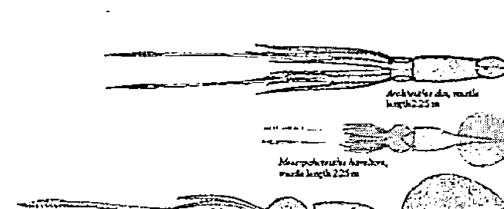

## 克拉肯

现在，我们对这种怪物有了了解。它是真的。它是一种恐怖的猎手，在其生活环境——深海——中，非常具有攻击性而且致命。但它几乎没有攻击过人类。在新斯科舍海岸边发生过一次事故，一名小男孩的小船被乌贼攻击了，他在奋力抵抗，而两个成年人却蜷缩在船里，但这是唯一被证实了的事件，可却也激起了我们内心深处最大的恐惧。它潜伏在神秘和噩梦的国度里。到底是什么让其如此抢眼？

丁尼生在年仅21岁时完成了诗作“克拉肯（The Kraken）”。里面包含着令人回味的预示着克苏鲁神话的元素。这个故事在20世纪初由H.P.洛夫克拉夫特起头，后来被包括罗伯特·布拉奇（Robert Bloch）、奥古斯特·德雷斯（August Derleth）、罗伯特·E.霍华德（Robert E. Howard）及其他作家延续着。在这些故事中有一个在海洋深处沉睡已久的巨型生物，它在昏暗中经历了无数的岁月，在未来某个未知的灾难中会苏醒过来。是什么让丁尼生在那么小的年纪就写出了这种作品，这不得而知，但能肯定的是，他一定没有接触过那些能让其它作家能形成共鸣和再现的图画。我们也不知道在洛夫克拉夫特那个时代是否已经有了这种意识存在。

作为一名作家，H.P.洛夫克拉夫特受到了其他作家如爱伦坡（Edgar Allan Poe）、洛德·邓萨尼（Lord Dunsany）和瑟·梅瑟（Arthur Machen）的崇拜。从其文学作品而言，他从未达到过爱伦坡的高度，但他的作品却极大地影响了后世的幻想恐怖故事作者们。

## 大邪神克苏鲁（Great Cthulhu）

神话是围绕着一种（或多种）外星生物而展开的，据说他们是在不为人知的远古到达了这里——他们的首领叫大邪神克苏鲁——但现在绝大多数都潜伏了起来。克苏鲁在太平洋深处的拉莱耶城中沉睡。据说它是一种体型巨大的绿色生物，长着蝙蝠翅膀、大爪子以及鱿鱼的脑袋——也就是说，它眼睛下面长着触须。拉莱耶城会不时地从深海中浮上来，旧日支配者（Great Old Ones）会在其上空盘旋直到它再次沉没。

传说某一天，当“星辰出现在正确的地方”时，这座沉没的城市会升起来，在克苏鲁带领下的旧日支配者会统治大地。

克苏鲁沉睡时做的梦都会影响到某些敏感的人，让他们受到邪恶的控制，为他办事。克苏鲁神话中也充斥着很多其他的神和生物如“爬行的混沌奈亚拉托提普”、一种名叫尤戈·索托特（Yog Sotthoth）（“灵魂吞噬者”）的模糊的吞噬怪以及其他怪物。尤戈·索托特具有启发性是因为其例证了灵魂吞噬者所拥有的什么都吃的属性——人们对它的印象就是什么都无法阻止它那张鱿鱼般的嘴的吞噬。令人恐惧的并非只是因为我们会被它吃掉，而是我们会被它一口一口地咬成碎片，在巨大的痛苦中被吃掉，这让人觉得非常恐怖。

苏醒过来吃掉了所有人（当然，除了那位漂亮的金发领队）的故事。

> “世界上最为仁慈的事，我认为就是人类无法将本来相关的事物联系起来的能力。我们生活在处在无穷黑暗海洋中心的一座平静孤岛上，但这并不意味着我们能走得很远。各种各样的科学都只研究自身范畴内的东西，迄今为止对我们并未有多大伤害，但总有一天这些看似不相干的东西会联系起来，给人类带来令人恐惧的现实，我们在其中所处的位置也会让人觉得害怕，我们要么因为真相的揭示而变得疯狂，要么逃离死光，进入到新黑暗世纪的平和与安全中。”

在洛夫克拉夫特的故事中充斥着“这种真相最好不要让人知道的为好”的感觉。在《克苏鲁的召唤》（The Call of Cthulhu）中他写道：“世界上最为仁慈的事，我认为就是人类无法将本来相关的事物联系起来的能力。我们生活在处在无穷黑暗海洋中心的一座平静孤岛上，但这并不意味着我们能走得很远。各种各样的科学都只研究自身范畴内的东西，迄今为止对我们并未有多大伤害，但总有一天这些看似不相干的东西会联系起来，给人类带来令人恐惧的现实，我们在其中所处的位置也会让人觉得害怕，我们要么因为真相的揭示而变得疯狂，要么逃离死光，进入到新黑暗世纪的平和与安全中。”

洛夫克拉夫特用自己根深蒂固的种族主义方式，在《克苏鲁的召唤》（The Call of Cthulhu）中描述了一种邪教，一些又黑又矮又胖的人受到了克苏鲁的控制，为其做邪恶的勾当。他们举行无法用语言表述的仪式，还会做一些卑鄙的事情，企图让克苏鲁苏醒过来。有趣的是，在现实生活中，一些涉及到巨型鱿鱼和大王鱿鱼相关的事与此有着很多相似之处。它们二者唯一的天敌是抹香鲸，难道大邪神克苏鲁不会为了让自己的“孩子”获得自由而让这种庞然大物消失吗？

沉睡在深海这一点看起来与巨型鱿鱼住在深不可测的海底很少露面有联系——它们只在生病或濒死的时候浮上水面。然而，看到一只从海洋深处冒出来的巨大的濒死洪堡鱿鱼——或将其看作来自未知空间的克苏鲁——能给目击者带去对深海的恐怖和害怕自己会被抓进海里的担忧。在一部拍得非常糟糕的HBO 2006年的影片《北海巨妖》（Kraken:Tentacles of the Deep）中就描述了一只巨型鱿鱼从长眠中苏醒过来吃掉了所有人（当然，除了那位漂亮的金发领队）的故事。

抹香鲸与巨型鱿鱼会在深海进行大战，通常情况下都是鲸鱼获胜。如果鲸鱼变少，巨型鱿鱼就会变多。现在，虽然有对于捕鲸的国际禁令，但仍有一些国家还是在从事捕鲸的行当。这些捕鲸人有可能是在有意或无意地为克苏鲁消灭掉自己孩子的敌人吗？

不可否认的是，近些年从深海中捕捉到的大王鱿比以往任何时候都多。即便在最近，我们也发现了至少两头大王酸浆鱿，而且以后应该还会发现更多。从另一方面来讲，这些事实证明了这些生物是确实存在的。换句话说，它们数量的增加让人惶恐不安。

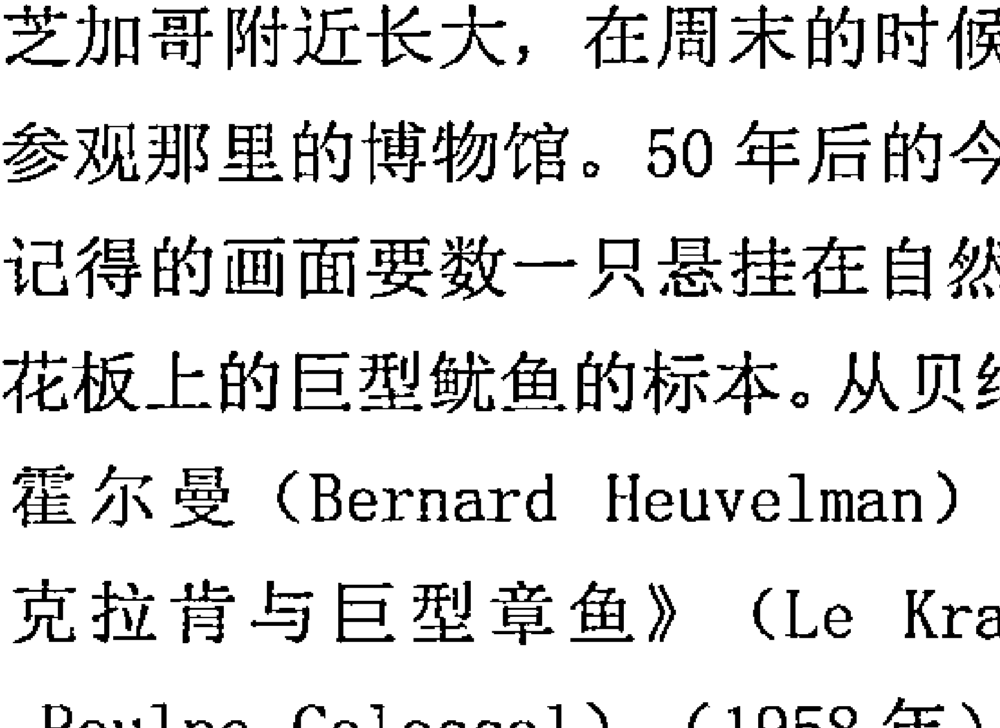

## 补遗

奥伯伦

当然，例如巨型鱿鱼和大王鱿鱼般的生物不过是自然进化而来的正常生物，对吧？那么在对其尚未如此了解的时候，人类在面对它们的相片和尸体的时候是如何想的呢？如果真有一种让我们打心底里害怕，让我们对自己的存在和完整性充满恐惧的生物存在呢？它们的数量确实增长了，还是我们对其进一步的认识导致我们意识到了它们的确切数量呢？换而言之，它们是变得更多了，还是只是看起来更多了而已？

如果它们确实变得更多，又是什么东西导致的呢？可能是气候变化，还是因为某些秘密的媒介的工作——埋葬在梦想之墙后面，消失在荒诞而黑暗的国度中？当你发现自己正处在它们的国度中，这些答案还重要吗？正如洛夫克拉夫特所说，真实的恐惧要远超过我们每天生活的“无知的孤岛”。但这是真的。它潜伏在不可预测的深渊中，它的大嘴正在无情地吞噬牙鱼（toothfish）和枪鱼（marlin）。

但或许是碰巧，或许是故意，它浮到了水面，激发了我们心中最为深沉，最为压抑的恐惧。

我像汤姆一样，时常也在幻想着头足类动物中的巨型鱿鱼。我小时候非常喜欢儒勒·凡尔纳的《海底两万里》（20,000 Leagues Under the Sea），在1954年，我焦急地等待着迪士尼的翻拍电影，其中我最喜欢的桥段是与巨型鱿鱼的大战。我在芝加哥附近长大，在周末的时候我都会去参观那里的博物馆。50年后的今天我仍然记得的画面要数一只悬挂在自然博物馆天花板上的巨型鱿鱼的标本。从贝纳德·霍伊霍尔曼（Bernard Heuvelmans）的经典《克拉肯与巨型章鱼》（Le Kraken et le Poulpe Colossal）（1958年）开始，我阅读了所有能找到的关于这种生物的书籍，将所有关于其海滩上的尸体的新闻简报和每一部包含有活样本的特别电视节目录像都保存了起来。

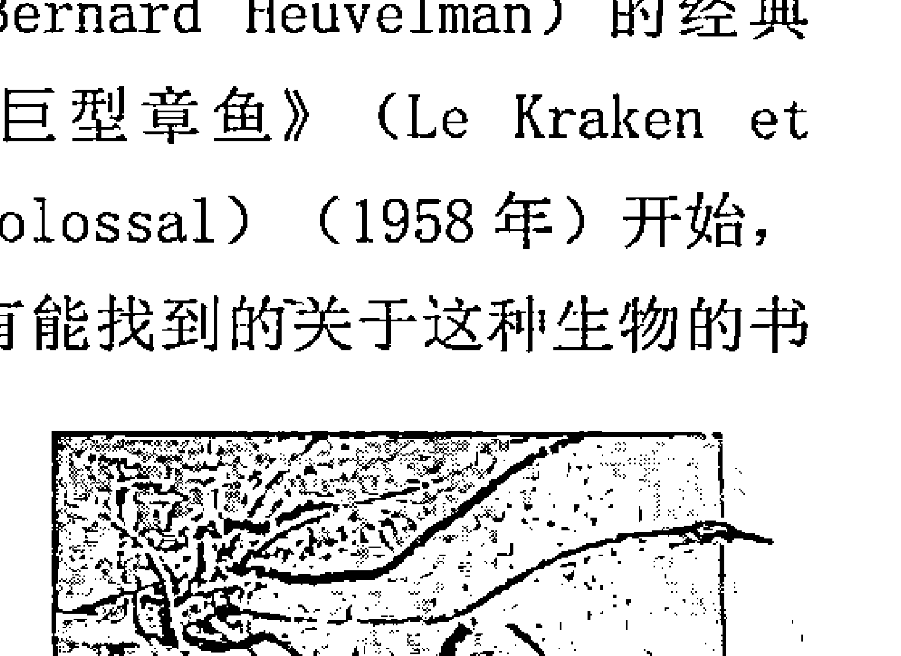

我觉得头足类动物是世界上最神奇的生物之一。它们属于贝类（软体动物类），与其它一些多细胞生物（其中有很多都灭绝了）一起，最早出现在5亿4200万年前神秘的寒武纪大爆炸（Cambrian Explosion）中。它们毫无疑问地是最初进化出智力的生物。对八爪鱼（Reef Octopus）的研究表明它们拥有与狗同等的智力。与脊椎动物不同，这种动物的大脑不会受到硬头骨的限制，它们会一直生长，就像其身体本身一样。而对于章鱼而言，一生并不长久。即便是巨大的太平洋章鱼也活不过六年，雌性章鱼会在将卵孵化后死去。所以不管它们再怎么长，也只能达到人类婴儿的智力水平。和现在比，你六岁时有多聪明？

章鱼是孤独的猎人，只在交配时出双入对。因此，除了领土和交配需求之外，它们不需要任何复杂的交流。社会群体物种（如鲸豚、灵长类、狼、大象甚至速龙）间，互相交流的需求能极大地刺激智力的发展，这一点是毋庸置疑的，所以章鱼的生活习性以及它们短暂的寿命都会影响它们智力的发展。

而这两点因素在巨型鱿鱼身上都不存在。尽管在海滩上找到的最大的尸体，从尾巴到触须尖端能达到令人惊讶的60英尺的长度，但抹香鲸身上的吸盘伤口以及它们胃中尚未被消化的残片显示大王鱿鱼确实存在——可能比巨型鱿鱼要大上两倍。尽管从未有任何大王鱿被用于研究过，但对于其它鱿鱼——长着玻璃珠大小的大脑——的研究表明其智力和章鱼的差不多。这样我们便不能推测其巨大的表亲的面包圈形状，长在头部前方的食道两旁的大脑的智力会更低。

已确认的巨型鱿鱼能达到60英尺的长度——以及其深海中或许更长的同类——表明巨型鱿鱼，像水蟒（Anacondas）、大白鲨和一些恐龙一样，可能终生都在生长。而且，跟其它的头足类动物一样，它们的大脑也在跟身体一起生长。而我们不知道的是它们的寿命。它们的寿命是像其它头足类动物一样短暂，还是更长？

与章鱼不同，鱿鱼是群体性猎人，通常都是几种不同的聚集在一起。实际上，二战时期的声纳经常收到“假海底”的回音，人们认为这正是巨型鱿鱼群惹的祸。拍摄下来的小型鱿鱼群协调的移动画面让人相信它们具有复杂的通讯手段——有可能是受了所有头足类动物都有的独一无二的敏感的色素细胞变色的控制。鱿鱼拥有所有生物中最大的眼-体比例，巨型鱿鱼拥有地球上最大的眼睛。

大王鱿和大王酸浆鱿拥有巨大的大脑，群体一起捕食，其寿命可能还很长，这些都能让人觉得它们可能有很高的智力。我们理所当然地对脊椎动物（基于声音和听觉进行交流）的智商颇有了解，因为我们就属于这一类动物。我们在某种程度上对节肢动物的属性（或至少对它们的存在）有所了解，群居类昆虫具有“蜂巢意识”（Hive Minds），它们通过气味进行交流。而对于头足类动物的研究是我们新近才开始的课题，我也对这些外形恐怖的鱿鱼的智商体现几乎无从知晓。

因此，借助古生物学和海洋生物学，我对克苏鲁神话有了自己的解释：5亿4200万年前，旧日支配者来到地球，它们的形态各不相同[参见波基斯页岩（Burgess Shale）]。在到达后的1000年间，它们大多数开始互相残杀，剩下的那些（如腔肠动物、海绵、棘皮动物和蠕虫）则退化成了无脑，甚至无柄的状态。诸如板足鲎亚纲类节肢动物和大三叶虫成功地变成了猎食动物，但从未进化出智力。头足类动物——克苏鲁的后代——最初是长有外壳的，以菊石（ammonites）和鹦鹉螺（nautiloids）的形态出现，有些能长到15英尺大。而且它们进化出了智力。

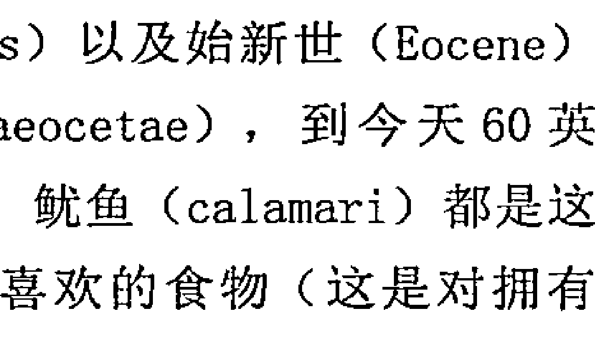

它们统治大洋长达2亿年，直到脊椎动物的出现——它们是第一种拥有坦克般武装的动物，长着尖利的嘴巴、爪子和吸盘。从上泥盆纪（Upper Devonian）30英尺长的邓氏鱼、白垩纪（Cretaceous）50英尺长的鱼龙（Ichthyosaurs）和克柔龙（Kronosaurs）以及始新世（Eocene）的古鲸（Archaeocetae），到今天60英尺长的抹香鲸，鱿鱼（calamari）都是这些海洋猎手所喜欢的食物（这是对拥有氨基体液而非水基体液的大王鱿是巨大的威胁！）。而且鱿鱼长得越大，它们的天敌也就越大。它们二者都在交替进化得更大——而且更聪明。

在过去的3亿5000万年间，这三种智慧生物始终在进行着不间断而且野蛮的争斗——在海洋中，以及在后来的陆地上。在海洋中，头足类捕食甲壳类和脊椎类的鱼，然而，它们二者也都受到脊椎类的捕食：鱼类、海生爬行类和海生哺乳类。而在陆地上却没有头足类动物，但战斗仍在节肢动物和所有的脊椎动物间进行。

纵观这整个人类历史，极少的与克苏鲁后代的遭遇给了我们很多恐怖的传说：九头蛇（来自古希腊神话）、斯库拉（来自《奥德赛》）、泰坦战争中的千手怪、挪威的克拉肯、“巨型章鱼（Le Poulpe Colossal）”、奥拉乌斯·马格瑙斯主教的“恐怖鱼类”、查尔斯·道格拉斯的“梅斯塔史铎巨虫”……在海涛之下的深处，在名叫拉莱耶城的沉没大陆上，大邪神克苏鲁的灵魂居住在一个可怕的实体中——就像蚁穴中的白蚁后一样。它等待着、憎恨着、梦想着……

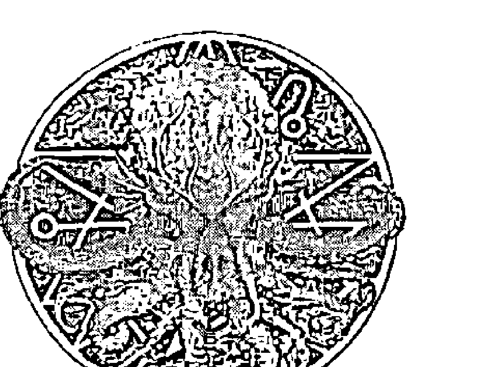

它恐怖的梦想已经渗入到了人类的噩梦里。它存在于战争中，一直都在，已经3亿5000万年了：与所有脊椎动物的战争，尤其是与自己的天敌，巨大的抹香鲸（它是地球上唯一一种可以将其肉体消灭的生物）之间的战争。

于是乎，克苏鲁给人类下了一种诅咒，让其帮它消灭自己古老的敌人：全球范围内的捕鲸业。在我的想象中，在这些捕鲸公司中的某处都秘密地安放着克苏鲁的神龛，那些捕鲸巨头都在那里向其主人进贡……

> 那永恒长眠的并非亡者，
> 在奇妙的万古之中即便死亡亦会消逝。
> ——阿卜杜·阿尔哈兹莱德（Abdul Alhazred），《阿尔·阿吉夫》（Al Azif）

## 怪物电影：克拉肯和九头蛇

世界上第一部试图在影片中加入动画的头足类动物的影片是1916年的《海底两万里》。1954年，迪士尼拍出了更为成功的版本，成为了经典之作。尽管雷·哈利豪森(Ray Harryhausen)在《深海怪物》(It Came from Beneath the Sea) (1955年)中将长有六只触须的头足类动物描绘成巨大的章鱼，但实际上他想表达的是克拉肯。同一年的《尤利西斯》 (Ulysses)中出现了长有很多脑袋的斯库拉。一部1960年上映，名为《大力神与九头蛇》的意大利电影中出现了九头蛇的身影。哈利豪森1961年改编自凡尔纳小说的影片《神秘岛》 (Mysterious Island)中有内莫船长的蛙人被巨大的史前鹦鹉螺攻击的桥段。哈利豪森最优秀的影片《杰逊王子战群妖》(Jason and the Argonauts)(1963年)中出现了守卫金羊毛的九头蛇。在《劳博士的七张面孔》 (1964年)中，尼斯湖水怪变成了多头的九头蛇的样子。1981年，哈利豪森在《诸神之战》 (Clash of the Titans)中加上了克拉肯和九头蛇的戏份。《死亡魔法》 (Cast a Deadly Spell) (电视剧，1991年)中有大邪神克苏鲁。彼得·本奇 (Peter Benchley)的《怪兽》(The Beast) (1996年)描写的是一只真实的巨型鱿鱼。斯库拉出现在1997年的迷你电视剧《奥德赛》中，同年，在迪士尼的动画片《大力神》中出现了九头蛇。彼得·杰克逊(Peter Jackson)的巨著《指环王：魔戒现身》 (Lord of the Rings: Fellowship of the Ring) (2001年)中将某种淡水克拉肯描述成“水中哨兵”。迪士尼动画《亚特兰蒂斯：失落帝国》(2001年)再次提到了克拉肯。九头蛇则出现在一部名为《大力神》 (2005年)的非常好看的迷你电视剧中。2006年科幻频道 (Sci Fi Channel)首次播放了《北海巨妖》(Kraken: Tentacles of the Deep)。但荧幕上有史以来将克拉肯刻画得最为壮观的影片，非迪士尼的《加勒比海盗：亡灵宝藏》 (Pirates of the Caribbean: Dead Man’s Chest) (2006年)莫属。

## 12、马头鱼尾怪 (Hippocampus)：海马和水马

作者：奥伯伦与牵牛花

> 啊，在海洋的波涛之下
> 我驰骋在海藻之上，
> 跳跃在珊瑚之间，
> 无拘无束。
> 我没有飘逸的马鬃，
> 只长着一张马脸，
> 但在海波之下
> 我就是障碍赛之王。
> ——布雷克·莫里森（Blake Morrison）

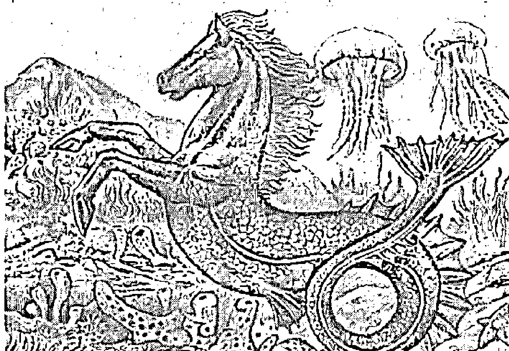

在中世纪的动物寓言集《生理论》（Physiologus）中有一句至理名言，水面就像爱丽丝的镜子一样，水下世界正是水上世界扭曲后的镜像。人们相信，所有陆生动物在海中都有与之对应的动物存在，通常它们都会用鱼鳍来代替腿脚。因此我们幻想中的动物世界就拥有了美人鱼和男性人鱼（意为“海之女子”和“海之男子”）、海狮、海中独角兽（独角鲸）、海牛、海狗、海猫（猫鱼）、海蝙蝠、海葵、海黄瓜、海兔、海羊（Capricorn）、海狮鹫、海和尚、主教鱼、天使鱼、恶魔鱼、象鱼、海蛇、海鹿、海狼——以及海马。

几乎所有的这些生物都确实存在，尽管我们当代对自然的描述与中世纪的比起来显得平淡无奇。然而值得注意的是，撇开体型因素不谈，真实的海马与其神话世界中的镜像却比其它任何动物都更加相似。

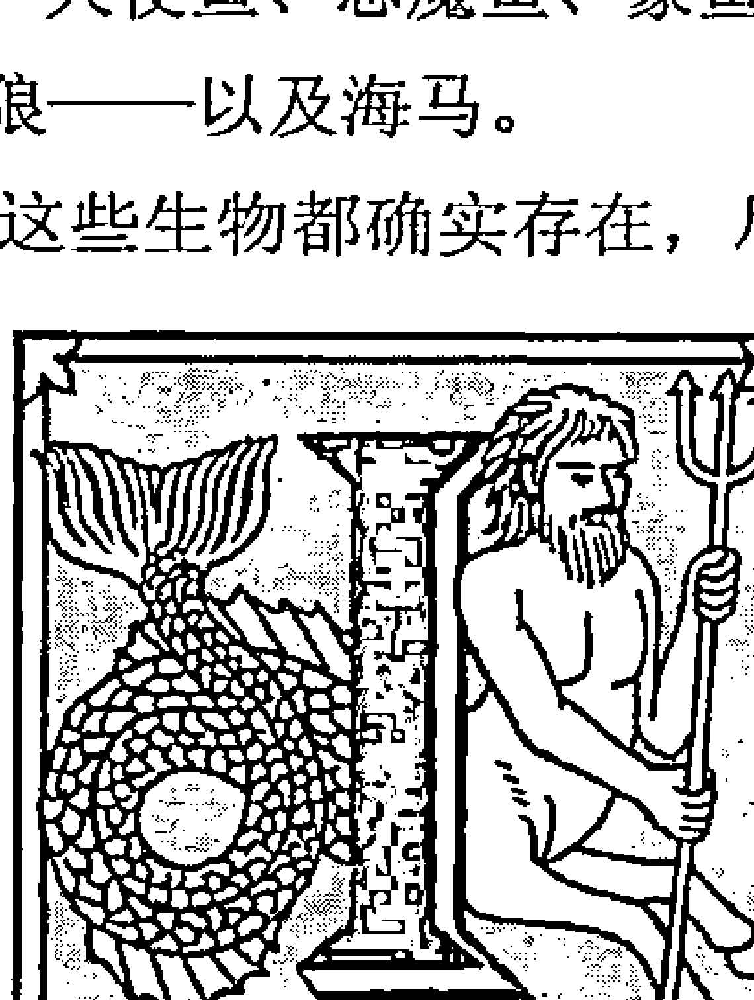

## 海马

神话中的海马或“马头鱼尾怪”（“Hippocampus”，来自希腊语“hippos”，意为“马”，以及“kampos”，意为“海怪”）是一种希腊神话中马一样的水生怪兽，长着马的脑袋和前肢，以及怪诞的鱼身和鱼尾。它的前腿上长的不是马蹄，而是鱼鳍。它被称为“水马”（“Hydrippus”）或马鳗鱼，是希腊罗马时期广受欢迎的艺术主题，尤其是在罗马的浴室中，它常被绘在瓷砖上。在罗马传说里，马头鱼尾怪据说是海洋中最快的生物。它也因此成了海神波塞冬（在罗马被叫做涅普顿）最喜欢的坐骑，他的战车由一队海马拉动。

这些美丽的海中白马是对起伏的海浪最佳的比喻，产生出了很多关于它们赫赫战功的故事。据说它们会拯救溺水的水手，能帮助船只通过难过的水域，以及会跟深海中各种可怕的怪兽作战。在古腓尼基人和古伊特鲁里亚（Etruscan），它们有时会被描绘成像罗马著名的许愿泉（Trevi Fountain）旁的雕像那样长着翅膀。波塞冬最喜欢的海马（Hippocampoi）是一匹名叫斯凯拉（Skylla）的种马和一匹名叫斯忒尼俄斯（Sthenios）的母马。

恩巴（Enbarr of the Flowing Mane）是爱尔兰海神马南南（Manannan Mac Lir）的坐骑。恩巴（Enbarr）是海浪的化身，能以超过冬季冷风的速度在海面及陆地上奔跑。它还能带领灵魂通过西方之门（Western Gate），到达福岛（Blessed Isles）。骑到它的背上让人拥有随意隐身的能力，它的唾液能让在一桶水中施放魔法，出现有人在使用恶魔魔法的幻影，尽管它被马南南送给了自己的养子太阳神卢格。

在中国，小海马曾被认为是海龙的幼崽。海马一词被用来指代叶海龙（Leafy Sea Dragon）(如图所示)和海草海龙(Weedy Sea Dragon)。它们都是可爱的小鱼，与常见的海马（Hippocampus）有血缘关系，身上还长着叶子一样的突出组织，能让自己消失在海草中。海马也是一种纹章兽，是一条长着鱼尾的龙。

墨西哥西北部的赛里印第安人流传着一个人跑到海上躲避追杀，他把檀香塞进自己衣服里的腰带上。一旦进入水中，他就变身成海马。这就是他们对于这种动物的解释。

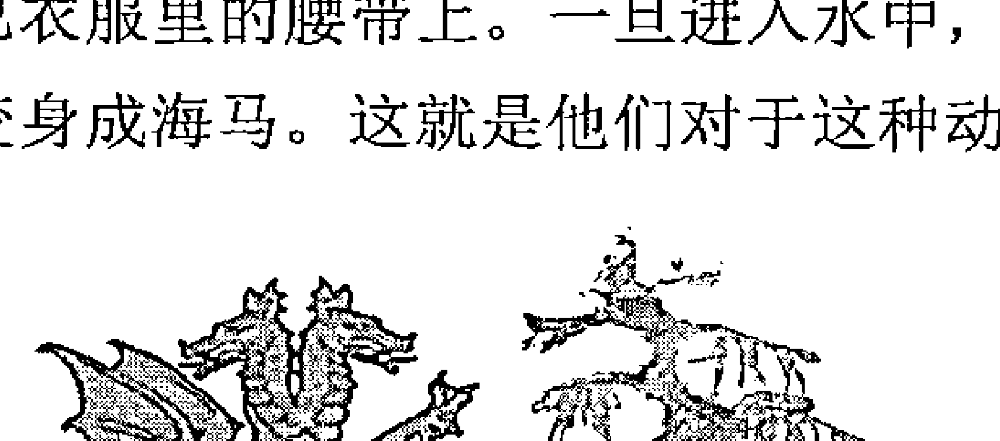

海龙纹章  叶海龙

图 3. 海龙

## 由来的解释。
海马在欧洲纹章中被称为马头鱼尾怪（Hippocampus），在本是马蹄的地方长着有蹼的脚，还有一条长长的背鳍。马头鱼尾怪是怀特岛、纽卡斯尔城和澳大利亚的纽卡斯尔大学的纹章标志。沃特福德水晶（Waterford Crystal）的标志上也有一匹马头鱼尾怪，也是插画家 W.W. 托斯洛（Denslow）的标识（logotype）。

哈维伊斯特（Havhest）（“海马”）是斯堪迪纳维亚传说的一种巨型海蛇，长着马的脑袋和一个像鱼一样的分成两瓣的尾巴。它长着发光的黄眼睛、背上有长长的鬃毛、海豹一样的前肢。它的双排尖牙能长到6英尺长。除了这些，它还会喷火！自19世纪以来，这种会将船弄沉的生物只被目击到几次。

同样邪恶的海马据说也生活在不列颠设得兰和奥克尼群岛。在那里，它被称作堂吉（Tangie）（丹麦语，“海草”），就像一匹脏兮兮的小马，长着一条海藻式的，又长又毛茸茸的鬃毛，或者又以人鱼的形象出现。它让在夜间行走在湖边的旅人害怕——特别是年轻的女人，她们会被其诱拐走，然后吞掉。在马恩岛上，渔民们害怕一种长着马头的海怪，他们称其为炎·贝西特·齐昂（Yn Beisht Kione）（“长着黑脑袋的野兽”）。

中美洲洪都拉斯的加勒比岛印第安人中的蚊子部落流传着关于海马怪（Wihwin）的故事。那是一种长着巨大尖牙，像马一样的海怪。在炎热、干旱的时候，它会离开海洋，徘徊在陆地上，捕食人类。雨水再临时它就会回到海中。

“Hippocampus”现在是通常被称为海马的小鱼的学名（插图5）。它与传说中的生物非常相似，最大只能长到14英寸长。这个名字也被用于命名人脑中的一个部分，这个部分的形状看起来与海马很相似。因为人脑中的海马组织能够抵抗癫痫带来的损害，国家癫痫学会（National Society for Epilepsy）选择海马作为自己的吉祥物。他们将其命名为凯撒，取自罗马皇帝朱丽叶斯·凯撒之名，这位皇帝据信也患有癫痫症。

## 罗斯马林（Rosmarine）

尽管“海马”一词被用在了看起来像神话中的，马头鱼尾怪的小鱼身上，但传说中的海马却是毫无疑问地源自海象。

尽管有人将难看的海象将风度翩翩的马儿等同起来很难让人接受，但你要知道，“hippopotamus”在希腊语中意为“河马”。古代的人们并不像我们一样了解这种生活在水中的大型四脚动物，所以他们对其的表述力非常有限。如果你第一次遇到一种大型动物，并试图将其描述给别人听，你就必须用别人能够理解的词汇来表达。如果我处在那种环境下，我觉得自己可能会

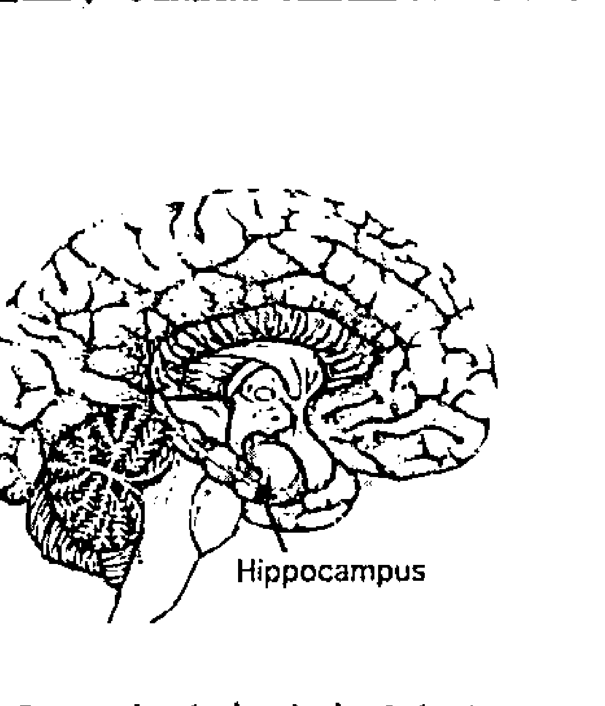

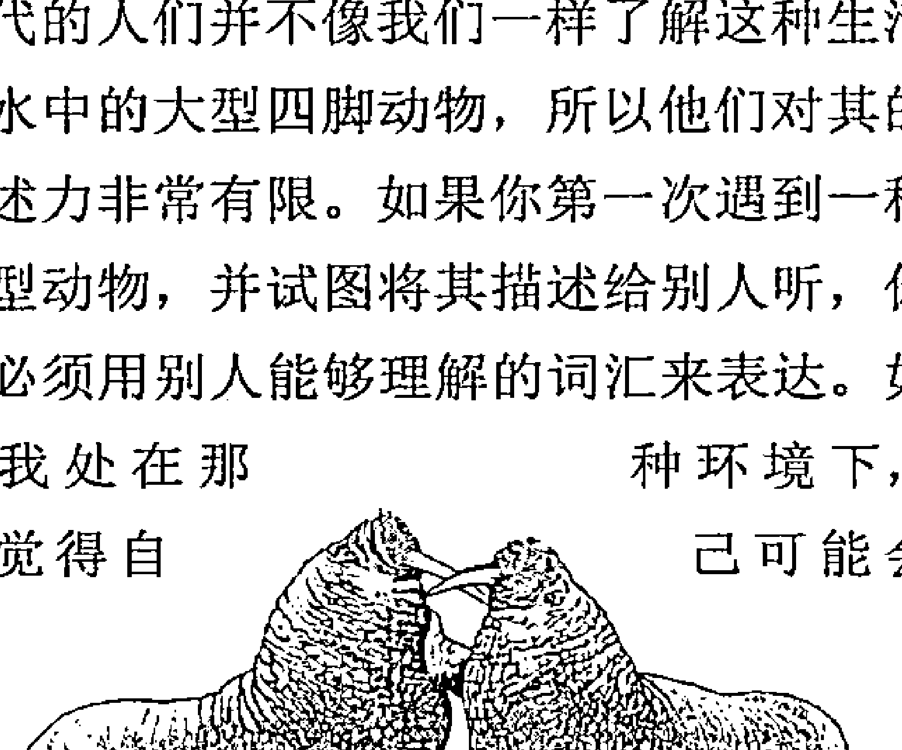

将河马与大猪联系起来——这更加符合动物学。但也许当时的人只熟悉马，于是我们也就以讹传讹了。

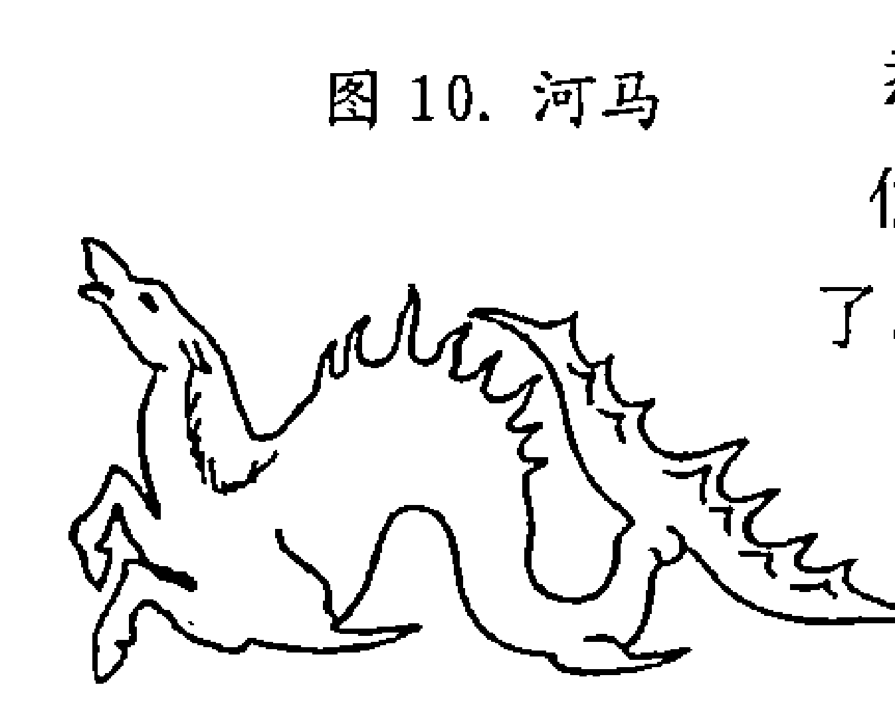

同样的情况也发生在海马身上。在不列颠和斯堪迪纳维亚的传说中，这种动物被描述成一种长着马头、马鬃、马的前半身以及马蹄的鱼。它们能在海洋和陆地上生存，常在浮冰上晒太阳。早期到加拿大北部的英国探险者的报告中有一种被称为马属毕皮斯（“Equus Bipes”拉丁文，“两腿马”）的野兽。他们对它的描述与河马非常接近：身体上长着鱼鳍一样的尾巴，前半身像马。这些生物肯定就是海象。

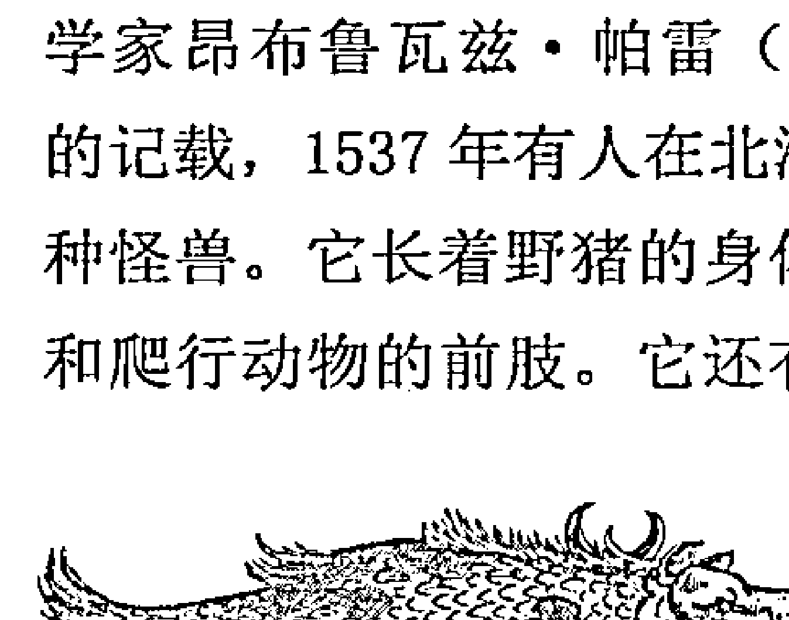

中世纪的水手们传说中一种被称为海猪（Sea Hog、Marine Boar、Marine Sow）的巨大、长有鳞片的鱼。根据博物学家昂布鲁瓦兹·帕雷（1517-1590年）的记载，1537年有人在北海看到了一只这种怪兽。它长着野猪的身体和脑袋、鱼尾和爬行动物的前肢。它还有突出的尖牙，这一点毫无疑问地表明它就是海牛。这种长着尖牙的怪兽也存在于纹章之中——它头上长角，有龙一样的四肢，眼睛长在体侧，还有一条鱼尾，背后是一轮弯月——被称作海中奇猪（Wonderful Pig of the Ocean）。

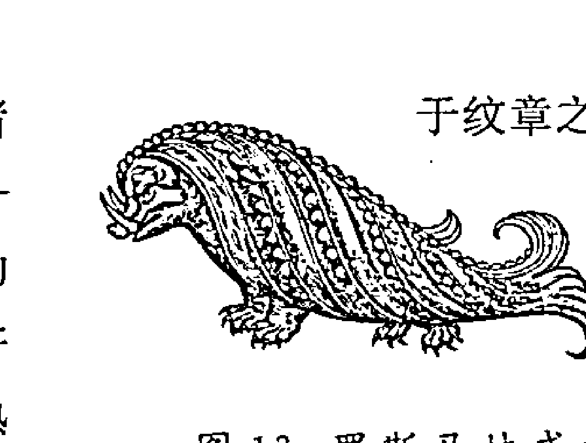

罗斯马林（Rosmarine，也叫Rosmarus或Rosmer，意为“海中之马”）是对海牛的一种荒诞的描述，将其从上往下长的尖牙变成了从下往上长。在挪威海，这种海怪被称为罗斯威尔Roshwalr（“马鲸”）、r鲁斯威尔（RUszor）或赛塔斯登塔塔斯（Cetus Dentatus）（“有牙齿的鲸鱼”），被描述为长着笨重、光滑、鲸鱼一样的身体和马的脑袋。1520年，教皇里昂十世收到了一只作为贡品的兽首，当时有人为其画了像，后来被帕雷所引用。它很明显就是一只海牛，因此这种动物的学名被叫做海象（Odobenus rosmarus）。

图尔萨斯（Tursus）是芬兰神话中的一种海怪，据称长着海牛的身体和脑袋，以及人类的躯干和手臂。它的名字源自挪威神话中的Thursir（冰霜巨人frost giants）。

## 水马

水马是一种长着马头的两栖野兽，据说潜伏在全世界众多的河流、湖泊、沼泽、水塘的深处。在英伦三岛，它们常被描述为全身灰色或黑色的马，它们的马蹄倒着生长。据说它们能随意变形，一旦与普通的马交配，它们的后代在遇到水的时候同样也会跳到水里去。它们的习性从相对温顺到嗜肉如命而不同。友好的水马可能会载人过河，而如果这个人提到了基督之名，这头野兽则会将其扔进水中。

近的水中让其淹死，吃掉除了肝脏以外的所有东西。只要骑手们不让其接近水体就不会有任何的危险，但如果它们看到或者闻到海水就预示着末日的到来，因为那个时候它们会以闪电般的速度载着骑手跳入水中。有时它也会以长着马耳的人类的样子出现。

在苏格兰，水马被叫做马形水鬼（Kelpie）。它潜伏在淡水湖、沼泽和河流中，与平静的水塘比起来更喜欢湍急的水流。通常情况下，它是丑陋的黑色怪兽，半马半牛，长着两只尖角，但它也能变成美丽的白马。马形水鬼的行为与弗卡类似，会引诱人类爬到它背上，然后跳到海里或湖里将其淹死后吃掉。它们间最大的不同在于弗卡在捕猎时更多的是抱着好玩的心态，而马形水鬼则是为了将骑手杀死并吃掉。然而，马形水鬼偶尔也会在晚上帮磨坊主转磨。

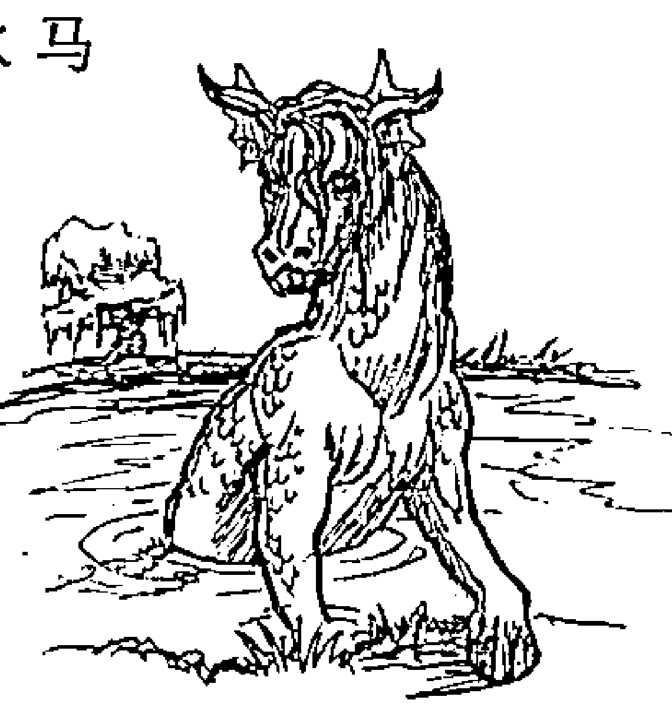

但伊奇·尤思戈（Each-uisge），一种高地水马，才是所有水马中最凶残的。它以毛色光滑、容易接近的马的形象出现，但只要有人碰到它的皮肤，这个人就会被粘在上面，然后被拖入水中淹死。尤思戈只吃人的肝脏。

在威尔士北部，当地人传说着关于希菲尔-德尔（Ceffyl-Dwr）（“水马”）的故事，这是一种发光的、灰马一样的怪物，住在瀑布和山中的水池里。据说勇敢的人将其杀死后，只会在水面上见到一团散乱的油脂。

这种生物在爱尔兰被称为佩斯特（Peiste）或水马安格西斯基（Aughisky），住在海洋和湖泊中，非常危险。它以家马的样子出现，很容易被人抓住，而且还会引诱疲惫的人爬到它背上去，然后它就会跳入最

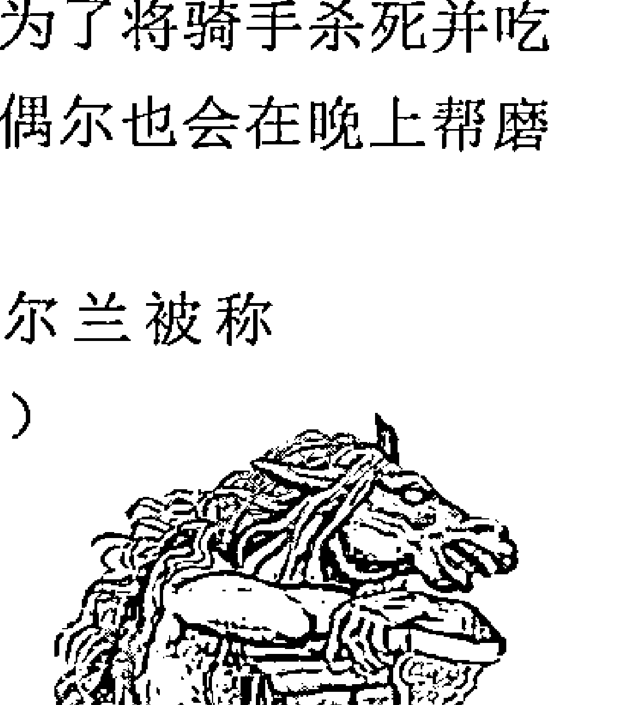

寻水兽（Afanc）是威尔士传说中的另一种水怪，它长得像海马或水马，可又具有鳄鱼或海狸的特征。它也被称作 Adang、Abhac、Abac、Addanc、Addane、Adanc 或 Acanc。寻水兽潜伏在布林贝安桥（Brynberian Bridge）附近的河流中，会将那些不小心靠得太近的人拉下水，也会给周围地区带来暴洪。其他目击到它们的地点包括里欧湖（Llyn Llion）、巴弗格湖（Llyn Barfog）、安凡科湖（Llynyr Afanc）。

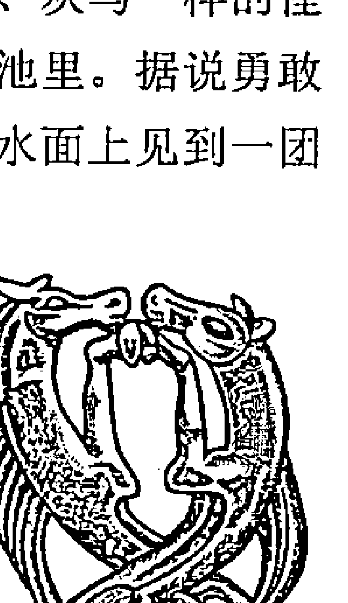

## 魔法师的怪物图鉴

寻水兽最后被人杀死了，有人说这是亚瑟王的功绩。

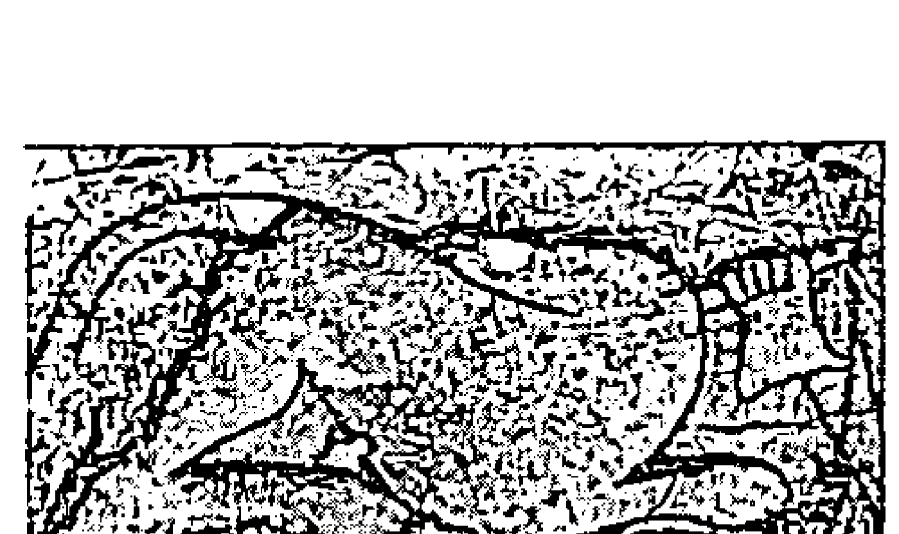

爱尔兰传说中的杜尔胡（Dobhar-Chú）（盖尔语，“水狗”），也叫 Dorraghow、湖泊之王、Dhura-goo、Dorraghowor、Dobarcu、Anchu）很有可能也是同一种生物。这是一种贪婪的、吃人的、水獭一样的生物，被认为是所有水獭的父亲。1684年就有关于它的报告，在里面它被描述为“半狼狗半鱼”6至8英尺长，长着短短的白色皮毛，背上有一个暗棕色的十字形。然而，有些人称它身上并没有毛，而是光滑的黑色皮肤。因为它非常暴虐，当地人长期称之为“爱尔兰鳄鱼”。

苏格兰的由奥伊赫（Oich）湖是连接在洛克湖（利兹的栖息地）上的一个非常狭窄的水域区域，被苏格兰运河与尼斯湖分开。19世纪的时候就有人在那里看到被称为由奥伊赫湖怪的怪兽。据说它是一条长着马头或者狗头的长蛇，全身皮肤呈黑色，有两个驼峰，蛇颈一样的脖子上长着长长的马鬃。

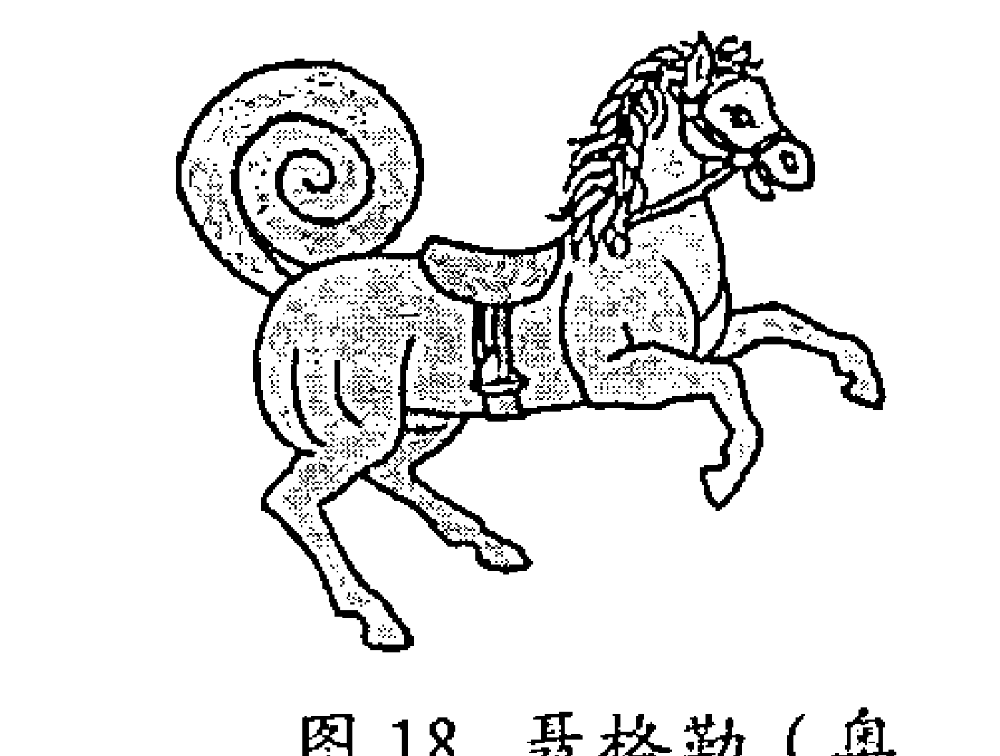

苏格兰北部设得兰群岛的斯卡洛维（Scalloway）也有自己的水马传说。这种像马的怪物被称作聂格勒（Neugle）、诺格勒（Nogle），奴格勒（Nuggle），奴吉（Nuggie），尼格尔（Nygel），长着绿色的鬃毛，它奇特的尾巴像轮子一样卷在它的背上。它以戴着马具的样子出现，在海岸上跳动着。如果有人爬到它背上，它会立即跳进水里，淹死——或至少让其湿透——受害者，然后这只怪兽会消失在跳动的蓝色火焰中。

马恩岛上住着一种狂暴的淡水怪，名叫卡比尔-尤思戈（Cabyll-Uisge——“水马”）或伊奇·尤思西（Each Uisce）（“水怪”）。与其他水马一样，它会将受害者引诱到水中，将其撕裂并吃掉。格拉西汀（Glashtyn）也会变成英俊的年轻人的样子引诱美丽的少女，但他的耳朵不会变，还是马耳的样子。

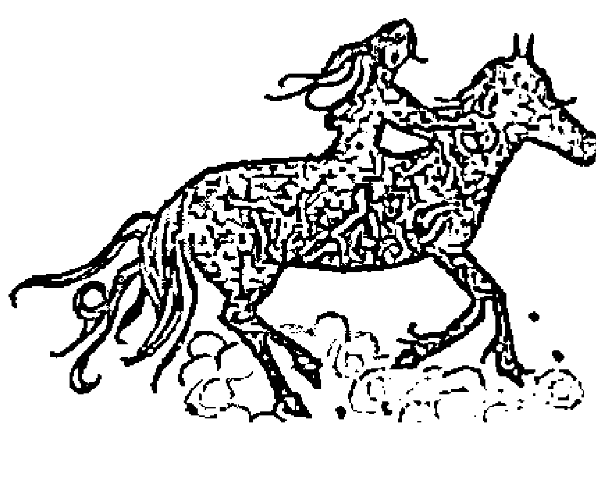

在赫布里底群岛（Hebrides），比阿斯得·纳·斯诺哥尼戈（Biasd na Srognig）（“低角的怪兽”）是一种大型、丑陋的水马，长着很长的腿，头顶上有一只独角，与水生独角兽类似。它只住在斯凯岛（Isle of Skye）的小湖中。

巴克兰沙戈（Buckland Shag）是英格兰德文郡巴克兰传说中的水马，那里拥有红色污点的石头被认为是这种水马的受害者的血迹。几乎没人敢进入它的领地，因为他们害怕被它踢死。

然而，淡水海马并不是英伦三岛的特产。水马贝亚德（Cheval Bayard）是一种据称生活在法国诺曼底河流、湖泊和沼泽中的水怪。它也同样会引诱毫无防备的人爬到自己背上，然后将其淹死并吃掉。

## 纳肯（Näcken）

是斯堪迪纳维亚和冰岛传说中的一种水怪。它也被称作巴卡哈斯特（Bäckahäst）、纳奇（Näkki）、尼克（Nikke）、尼可尔（Nicker）、尼库尔（Nickur）、尼可尔（Nicor）、尼可尔（Nickel）、尼尼尔（Ninnir）、尼奇尔（Nikyr）、尼库尔（Nykur）、尼克让(Nykkjen)、诺克(Nøkk)、欧克(økke)、诺肯（Nøkken）、海库尔（Haikur），常被描述为一匹巨大的白色水马，与苏格兰的马形水鬼类似，长着倒转的马蹄。但任何人都不能爬到它的背上去，否则纳肯会将他丢在水中淹死。在黎明或黄昏时，它会以半人马的样子出现在陆地上。它也会变成戴着红色帽子的金发男孩，或者绿色胡子上滴水的老人。在爱沙尼亚，这种怪物与吞噬船只和水手的漩涡有关。

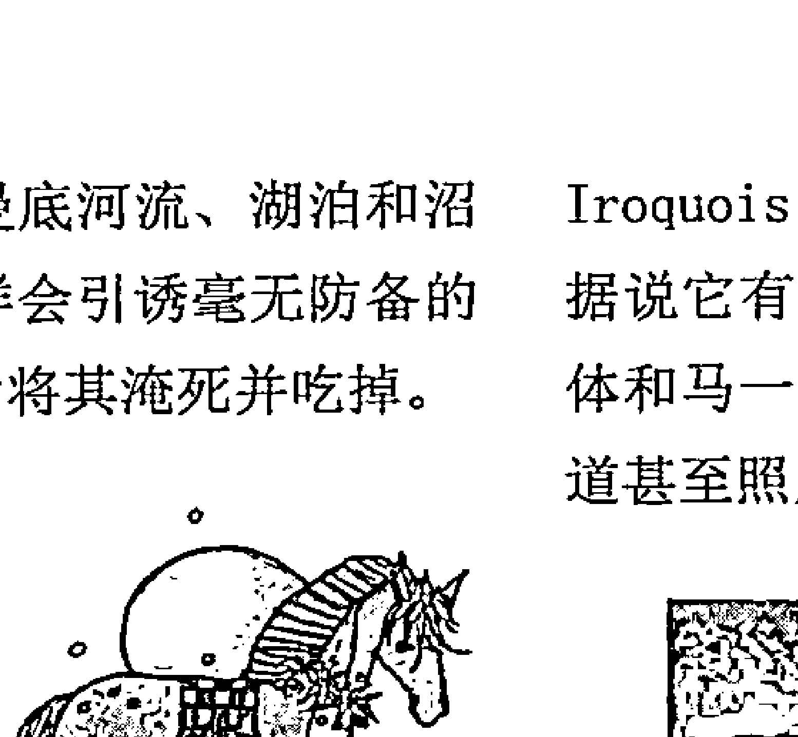

恩德洛浦（Endrop）是罗马尼亚的一种被描述为水马的水怪。像苏格兰的马形水鬼一样，它也会引诱路人骑到自己背上，然后将其淹死吃掉。意大利的马焦雷湖里也住着一种怪兽，它也被描述为身体像蛇，脑袋像马。

在北美洲，昌普（Champ）是对一种在魁北克和佛蒙特交界处的查普伦湖中的一种至少 400 年来不断有人报告的湖怪的昵称。阿布纳基易洛魁人（Abenaki Iroquois）称其为塔托苏克（Tatosok）。据说它有 20 至 30 英尺长，长着桶状的身体和马一样的头。有很多关于它的目击报道甚至照片。

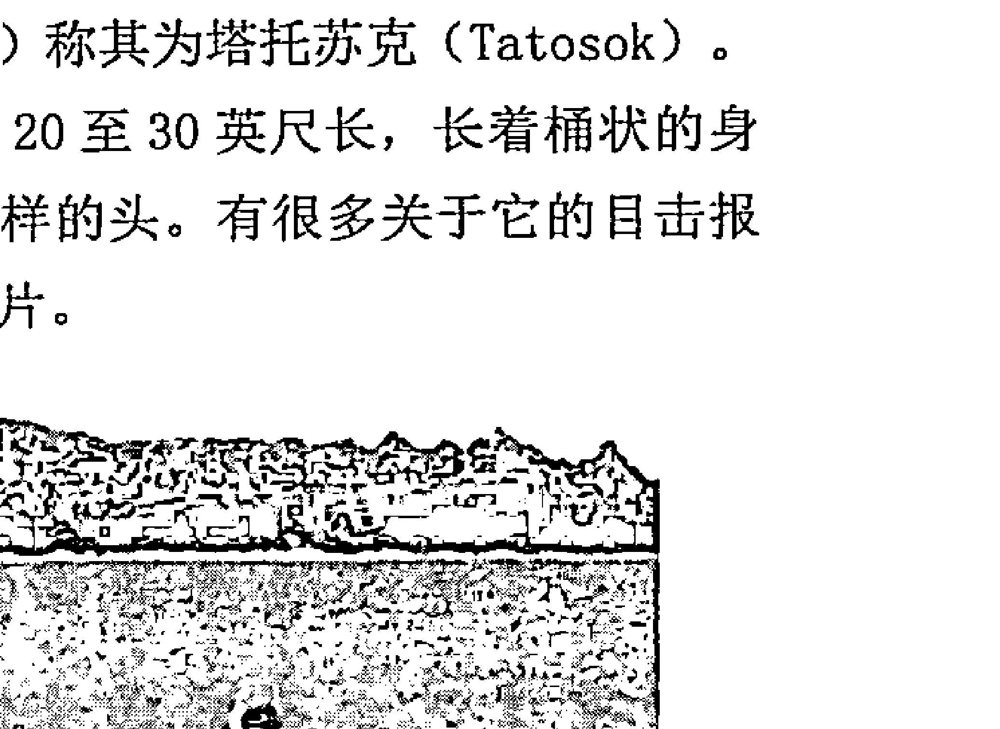

即便是遥远的印度也有一种名叫加加-图加（Jaja-Turga），会攻击偏僻水道上的旅者的水马。在阿根廷则有皮拉努（Piranu）——一种巨大黑鱼般的水怪，其头部像马，长着大大的眼睛。它住在河流深处，会颠覆侵入其领地的船只。

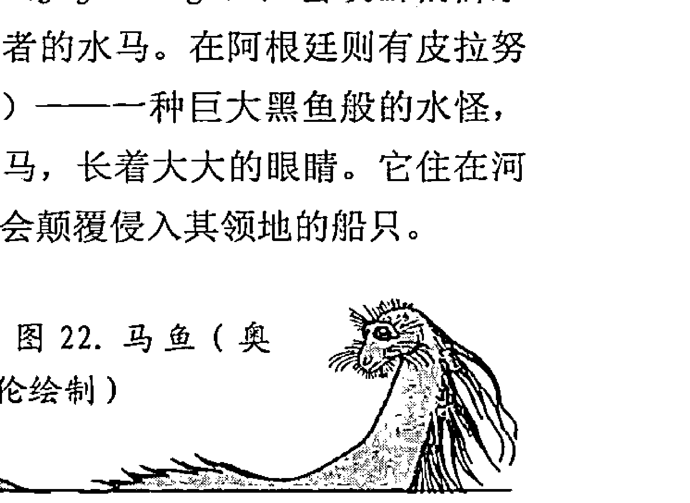

所有的这些水马可能与尼斯湖水怪及其亲戚——在世界各地都有报道的那些湖怪和海蛇——是一样的。（参见第 18 章“湖怪”和第 19 章“海蛇”）这些难以捉摸的怪兽常被人称作水马、马鳗鱼或马头，它们通常被描述为巨大、身体起伏、蛇一样的生物，长着比例跟马类似的脑袋、脖子和“耳朵”。然而，一些目击者称其还长着长角，于是它们也会被称作水公牛或角蛇。有时它们据说还长着发光的红色或黄色眼睛、巨大的尖牙，甚至还能喷火。

小一些的常被报告出没于泥潭沼泽之中，常被称作沼泽狗（Bog-Dog）。

弗卡（Phooka）[或普卡（Pooka）、(Puka)；威尔士语中的皮瓦卡（Pwca）；康沃尔语中的布卡（Bucca）；马恩语中的布戈安（Buggane）]是一种爱尔兰传说爱恶作剧、能变形的水马。有时它甚至被当作马精灵也或棕仙。有趣的是，爱尔兰的孩子们将蜗牛称作普卡斯（pookas），会一边唱着儿歌一边拉扯它们的角，这或许就是这种怪兽的原型。

## 其它的水马

法拉斯巴哈利（Farasi Bahari）[也作沙布加里菲亚（Sabgarifya）]是居住在印度洋中，有绿宝石色泽的马。在一年的某几个夜晚，这些种马会到非洲海岸边的一个岛上吃草，那里的牧马人会将自己的母马留在那里，希望它们能进行交配，产出强壮的绿色后代，它们因为没有肺而拥有无穷的耐力。

但最坏的水马怪则是萨姆瓦塔（Samvarta）。它们是印度教传说中的7匹巨型海马，肚子上有翻动的火焰，分别住在7个大洋之中。在末日来临时，它们会出现在水面上，它们身上的火焰会横扫大地，将所有东西都烧成灰烬。

## 怪物电影：马形水鬼

我所记得的唯一一部描述海马的影片是迪士尼改编自安徒生童话的动画片：《小美人鱼》（1989年）。一部名为《水马》（The Water Horse）的影片将在2007年的圣诞节上映。

## 半人半兽类
### 13、神秘的斯芬克斯

作者：奥伯伦

> > 我们已在埃及统治了千年之久。如能赢得你们的崇敬，我们将继续在日月交辉之日统治这里。我们坐在金字塔前，掌管比赛、洪水、战争和和平——永远铁面无私。
>
> ——歌德，《浮士德》
>
> “沃尔帕吉斯夜兽”
>
> 斯芬克斯如是说

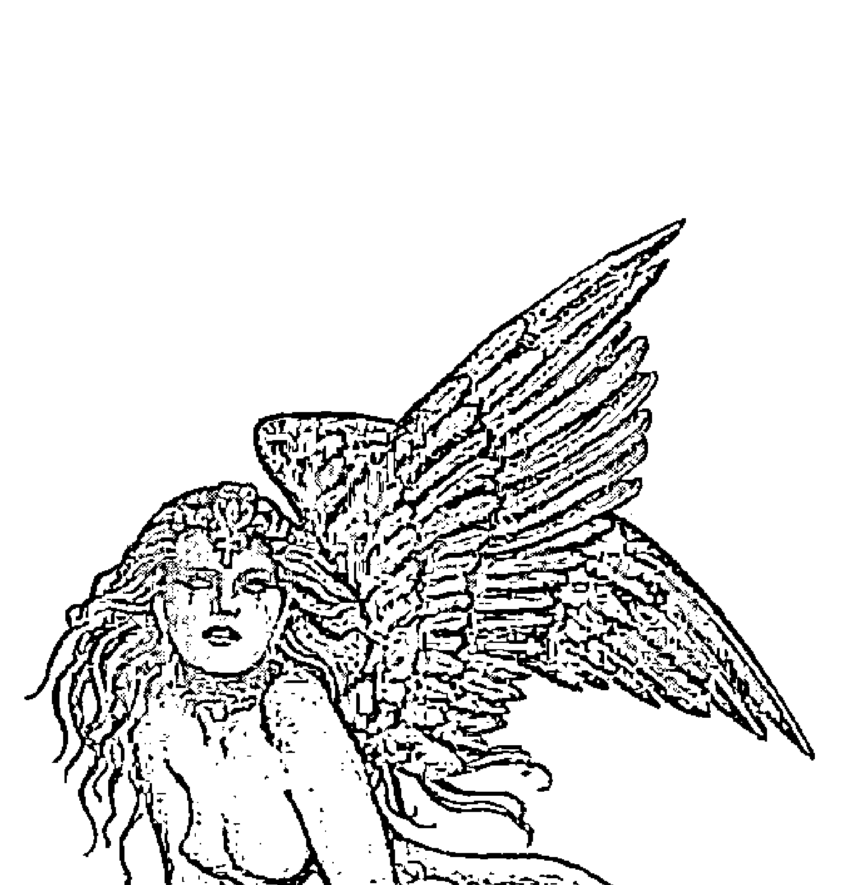

斯芬克斯是一种古典传统中雄伟的动物，长着狮子的身体和爪子，脑袋要么是其他动物的，要么是人的。有时它长着公牛的后半身，而在通常情况下，它的肩膀上都长有老鹰的翅膀。最早出现于埃及古王朝时期（公元前 2686-2134 年），后来它又出现在亚述和希腊神话中，在著名的悲剧《俄狄浦斯王》（Oedipus Rex）中也亮相过。亚洲的斯芬克斯的起源则与之毫不相干。

斯芬克斯这个名字来自希腊文中的“sphingo”，意为“绞杀”。另一种可能的来历据说是埃及语中的“shesepankh”，意为“活雕像”。因为它同时包含着人类和动物的元素，斯芬克斯象征着身体、意志和灵魂的统一，也是生理、心理和灵魂的统一。人类的脑

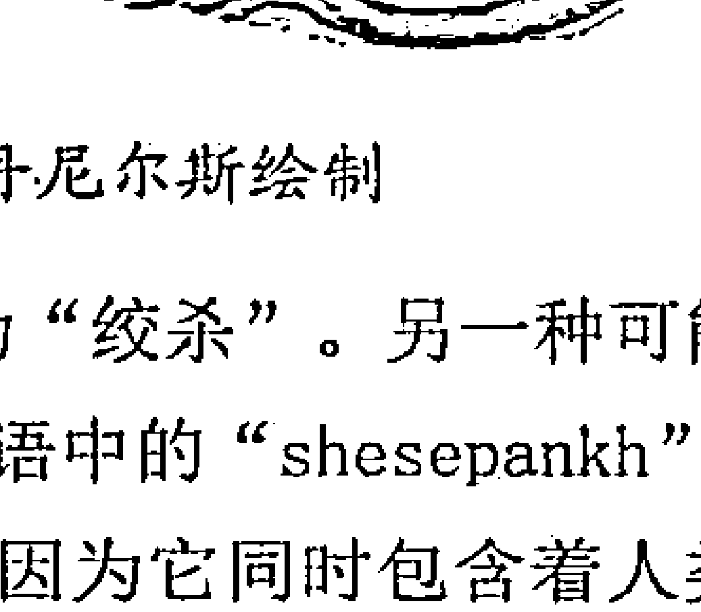

袋代表着智慧和知识，狮子的爪子代表着勇敢和行动，公牛的后半身代表耐力和持久力，老鹰的翅膀代表着沉稳。就这样，三种动物和人类共同组成了斯芬克斯，象征着毕达哥拉斯所说的四种元素：大地、空气、火和水。在古亚述和腓尼基，长着人头和翅膀的狮子是统治与神庙、宫殿守卫的象征。它们被称作拉玛苏（Lamassu），常与称为舍杜（Shedu）的生物出双入对，舍杜也长着人的脑袋以及有翅的公牛身体。除了希腊的底比斯斯芬克斯（Sphinx of Thebes）这个例外（它是唯一一个能说话的斯芬克斯），其他所有的斯芬克斯都非常友好而且是神秘宝藏忠诚的看护者，它们的形象被广泛地用来代表谜、神秘的智慧和守口如瓶。在埃及，斯芬克斯是神秘魔法和隐蔽智慧的看护者，被赋予了贤士的四种能力：能知、敢为、意绝和沉默。

> 西结书》1:5-14；《圣经·启示录》4:6-8]这些反过来又代表了基路伯（Cherubim）、四位福音传教士以及福音（马太、马可、路加、约翰）、世界上的四位王：狮子（森林之王）、老鹰（空中之王）、公牛（牧场之王）、人类（创造之王），而根据圣哲罗姆（St. Jerome）所著，斯芬克斯代表着基督的化身（人类）、耶稣受难（公牛）、耶稣重降（狮子）和耶稣升天（老鹰）。四联像在塔罗牌中出现过两次，一次是在“命运之轮”（The Wheel of Fortune）中，另一次是在“世界”（The World）中。在前者中，斯芬克斯坐在轮子上，代表着流体宇宙中的平衡。

斯芬克斯拥有人类的脑袋和胸部、老鹰的翅膀、公牛的下半身、狮子的前半身，是《圣经》中四联像（Biblical Tetramorph）和《启示录》中四种生物的象征。[《圣经·以

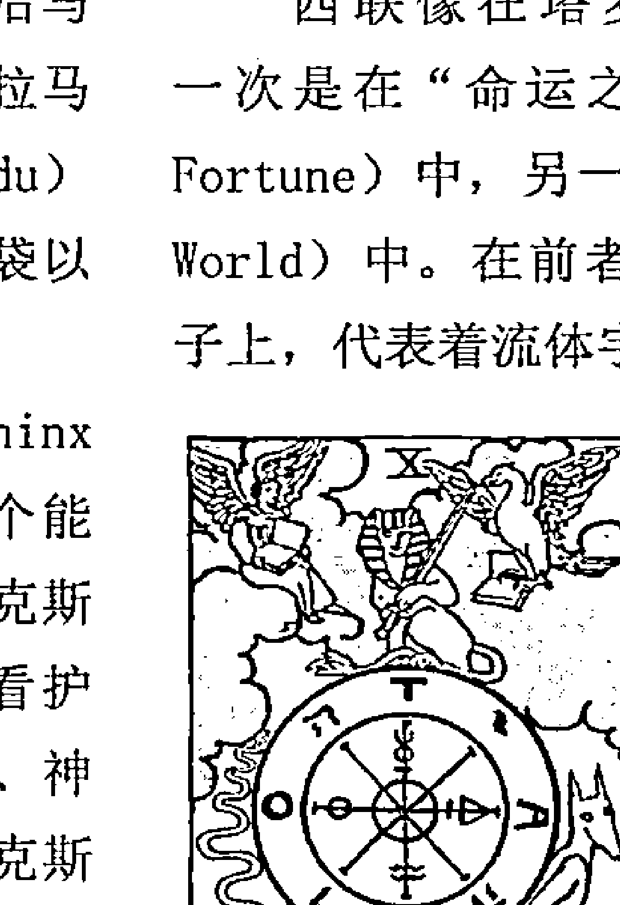

图2. 塔罗牌命运之轮（帕米拉·科尔曼·斯密斯绘制）

后来的罗马斯芬克斯则变成了太阳的象征。对占星家而言，它是一种日历兽，雌性的脑袋象征着处女座、狮子的身体象征着狮子座。人类的脑袋、公牛的身体、狮子的四肢和爪子，以及老鹰的翅膀分别代表着固定在黄道上的：水瓶座、金牛座、狮子座和天蝎座。德鲁伊也将长着许多乳房的雌性斯芬克斯视为其多产的母系标志。

## 埃及的斯芬克斯

在埃及，有三种斯芬克斯被视作守卫者刻在雕像中，它们都是没有翅膀的卧狮。希罗多德将其分别命名为羊头狮身怪克里欧斯芬克斯（Criosphinx）、鹰头狮身怪歇洛克斯芬克斯（Hieracosphinx）和人头狮身怪安德罗斯芬克斯（Androsphinx）。埃及的斯芬克斯都长着女人的脑袋。雌性斯芬克斯（Gynosphinx）象征着女神伊西斯或哈索尔，以及/或者王后。埃及人相信它们身上的人脑中智慧平衡了它狮子身体所代表的兽性，使其变得高贵。

- 羊头狮身怪克里欧斯芬克斯——造物神阿蒙（它被称为“众神之父”）灵魂的寄存者和守护者，羊头狮身怪克里欧斯芬克斯是一头长着山羊脑袋的巨狮。它的头上长着巨大的卷角，通常都是以趴在地上高举起头部的样子出现，就像卫兵那样。在底比斯城里大概有 900 座羊头狮身怪克里欧斯芬克斯的雕像，位于卢克索的卡纳克（Karnak）神庙的两侧也有很多它的雕像。

- 鹰头狮身怪歇洛克斯芬克斯——埃及神荷鲁斯的代表，它长着鹰隼的身体和脑袋。

- 人头狮身怪安德罗斯芬克斯——这种斯芬克斯长着人类的脑袋——具体而言，是那些主持修建它们雕像的法老的脑袋。它代表着神圣力量和智慧，法老用其来统治和保护他的子民。人头狮身怪安德罗斯芬克斯是富饶、力量、秘密、真理、统一、智慧和神秘的化身，它看守着金字塔、墓穴和神圣的道路。有时一对人头狮身怪安德罗斯芬克斯会与生命之树画在一起，代表富饶和意志。

> 作为太阳的标志，人头狮身怪安德罗斯芬克斯被视为与太阳神拉、地平线上的荷鲁斯、地平线之王基斯（Harmakhis）有关，基斯代表着日出和日落，重生和循环……作为地平线之王，人头狮身怪安德罗斯芬克斯的双面性在基督教中变成了基督既是人又是神的双重属性的代表。像其他很多的太阳标志一样，人头狮身怪安德罗斯芬克斯的形象也出现在早期的基督教坟墓上或附近，代表着神圣的世界之光（Light of the World）。

## 魔法师的怪物图鉴

### 吉萨斯芬克斯

最庞大且最著名的古代雕像，也是世界七大奇观之一，吉萨斯芬克斯，长达 240 英尺，高达 66 英尺，在其伸出的两只前爪间有一座罗马神庙和一块石碑。它坐落在尼罗河西岸的吉萨高原上，靠近吉萨金字塔，面朝东方。

吉萨斯芬克斯的脸通常被认为是法老哈夫拉的，也可能是其兄弟法老雷吉德夫的。它建立于第四王朝时期（公元前2723-2563年）。

有些人认为吉萨斯芬克斯已存在超过12000年，其最初是一头趴着的狮子，代表着狮子座——后来它的脸才被刻成了法老的样子。其体侧垂直的风化痕迹似乎是雨水数千年来的杰作，远比由风吹起旁边沙漠中的沙子而吹造成的横向的风化痕迹明显。传说斯芬克斯下面有通往吉萨金字塔的通道，在吉萨沙漠下还隐藏着尚未被发现的密室和通道。最近，在斯芬克斯雕像附近确实还新发现了一些通道，声纳仪器也显示，在它下面有一个密室。

斯芬克斯双爪间的花岗岩石碑的由来是这样的：一天小王子图特摩斯外出打猎，当他在斯芬克斯脑袋——沙漠中唯一的突出物——的阴影中躺下的时候，斯芬克斯托梦给他，告诉他，只要他能许诺在以后将雕像四周堆积了很久的沙子都清除掉，就会坐上王位。因为图特摩斯是法老的小儿子，继承王位对他而言几乎是不可能的。但没过多久，他的兄长就在一次打猎的时候意外身亡，图特摩斯意外地成为了法老——他是他们家族中的第四位法老，在公元前1425年至公元前1417年统治埃及。

新的法老立即命令将雕像清理干净，在它的双爪之间立上一块梦之石碑（Dream Stele）以作纪念和献给太阳神基斯，正是他通过斯芬克斯与之交谈的。图特摩斯四世在石板上刻上三个太阳神的名字：凯普里（Kheperi）、雷和亚图姆（Atum）。然而人们并不知道这座斯芬克斯本来的名字。希腊人称其为斯芬克斯，阿拉伯人称其为阿卜阿尔-霍尔（Abu al-Hôl），意为“恐惧之父”。

也许是因为图特摩斯的那个梦，清教徒们曾将耳朵贴在斯芬克斯的嘴唇上，希望能听到它的忠告。由于其悠久的历史，这座雕像成为了那些寻求智慧之人的圣象。

### 希腊的斯芬克斯

在希腊，只有一只斯芬克斯，长着女人的脑袋和胸部以及老鹰的翅膀。有时它被描述为长着公牛或狗的身体、狮子的四肢、蛇的尾巴。它的声音像人类，总是出谜题给人猜。与具有贵族气息的埃及斯芬克斯不同，它被视为死亡、毁灭和厄运的恶魔。在希腊神话中，她的意识和精神被兽性所占据，她被描述为冷酷和残忍的怪兽，是“邪恶之母”（wicked mother）的象征，还是智慧、女性、力量的变态象征。

根据赫西奥德的《诸神的系谱》（Theogony）（约公元前700年），“毁灭了卡米安斯（Cameans）的致命斯芬克斯”是厄客德娜和儿子革律翁的猎犬奥特休斯的后代。她的兄弟是涅墨亚狮，“由宙斯之妻赫拉养大，放养在涅墨亚山中，给人类带去恐怖。”像许多其它奇兽一样，斯芬克斯也被认为住在埃塞俄比亚的群山中。

斯芬克斯被赫拉从埃塞俄比亚排到了波伊俄提亚（Boiotia），因为她对那些放过拉伊俄丝国王的底庇斯人很生气，这位国王从波斯带走了克律西波斯（Khrysippos）。这只冷酷的生物现在坐在菲塞（Phikion）山的一处岩石上，俯瞰着通往底庇斯的道路，她会给每个过往的行人出一个她从缪斯处得到的谜语。在索福克勒斯（Sophocles）的《俄狄浦斯王》（Oedipus Tyrannus）中，这个谜语是这样的：“什么东西一会有一只脚，一会又有三只脚，脚越多却越虚弱？”回答正确的人就能获准通行，没回答对的人——所有人——就会被她绞死后吃掉。俄狄浦斯为了逃离自己杀死父亲然后迎娶母亲的命运而跑到了底庇斯。斯芬克斯叫住了他，想从他那里得到答案。

“人，”俄狄浦斯回答道，“婴儿用四肢爬行，长大后用双腿走路，年老时就开始依靠拐杖了。”于是，这个坏心肠的怪兽一跃而下，跳下悬崖摔死了（原来她的翅膀只是摆设！）

### 亚洲的斯芬克斯

像斯芬克斯一样，长有人头的狮子经常出现在印度、中国和东南亚的神话和艺术作品中。它们中有些能追溯到公元前3世纪，这表明它们与起源于埃及的西方的斯芬克斯毫无干系。

- 印度的普鲁沙姆里加（Purushamriga）（“人兽”）被认为在其进入神庙的时候能带走崇拜者身上的罪恶，也能驱走恶魔。因此它常被摆放在神庙的走廊或内室的入口附近。它也被称作那拉比拉拉（Naravirala）（“人猫”），它们的形象被用在灯节时的灯上作为装饰，也被用在图画中。

- 斯里兰卡的斯芬克斯被叫做纳拉辛哈（Narasimha）（“人狮”）。它是佛祖在北方的护卫，常被画在旗帜上。与其它的斯芬克斯一样，它也被视为带来好运和保护的守护神，常被放在寺庙的入口处。

- 在缅甸，斯芬克斯被称作马努斯哈（Manusiha）。传说它是由佛教和尚创造出来以保护新生的皇室婴儿不被食人女妖（ogresses）吃掉的。现在，那里的佛寺的转角上仍然刻着马努斯哈的形象。

- 泰国的斯芬克斯也是一种保护者，名叫诺拉·奈尔（Nora Nair）或泰普·诺拉辛（Thep Norasingh）。它下半身像狮或鹿，上半身是人。它总是直立着行走，雌雄经常一起出现。它们是住在圣山西马潘（Himapan）上的奇兽之一。

- 中国也有斯芬克斯，比如这里的 San Li T’u（约1661-1723年）。它是军队中用于不同级别的军官考试的三个标靶之一。考试内容中有一项射箭，要求箭支要越过这个标靶，落入其后面的木桶中。

### 绘画中的斯芬克斯

风格主义流行于欧洲建筑和装饰艺术史上的一个时期，持续时间从1520年左右的意大利文艺复兴结束到1600年左右的巴洛克时期的开端。典型的风格主义作品斯芬克斯有时也被称作法国斯芬克斯。

她如同精心梳理的脑袋高高地昂起，还长着美丽年轻女子的胸部，她还穿戴着珍珠和耳坠。这种形象因15世纪对尼禄在罗马的黄金屋的狂热而开始变得盛行起来，后来在16和17世纪，它们由开始在经典装饰图案和蔓藤图饰中遍及整个欧洲。风格主义派斯芬克斯最早出现在1520年代至1530年代的枫丹白露宫学校（School of Fontainebleau）中，一直持续到法国摄政时期的巴洛克时代末段（Late Baroque style of the French Régence）（1715-1723年）。

但在艳丽的洛可可时期（Rococo），斯芬克斯开始推出流行舞台，后来在19世纪浪漫主义和后象征主义兴起时又开始变得流行起来。这些艺术风格与风格主派斯芬克斯从希腊获得的灵感比埃及的斯芬克斯要多得多——特别是它们都变成了雌性。但它们却都没有翅膀。

### 猿猴斯芬克斯

普利尼在提到斯芬克斯时说，它们非常常见，“长着灰蒙蒙的棕色头发，胸口长着乳头。”很明显，他认为斯芬克斯是一种猿猴——尤其是狒狒。实际上几内亚狒狒（Papio papio）仍被称作斯芬克斯。从某些地方来讲，狒狒却是同时具有人类和狮子的特征。它们用四肢行走，像狮子一样，但却长着人类的身体、手臂、腿脚和双手。它们的手和脸很像狗，长着尖牙利齿，有几种狒狒中的雄性也长着狮子般的鬃毛，它们是橄榄狒狒（Papio cynocephalus anubis）、狮尾狒狒（Theropithecus gelada）、埃及狒狒（Papio hamadryas）。

狮尾狒狒只在埃塞俄比亚和厄立特里亚的高地上被发现过，在瑟米恩（Semien）山脉中住着很多。它的拉丁名字“Theropithecus”意为“野兽猿”。

埃及狒狒是狒狒中分布在最北方的一种，从埃及南部的红海到埃塞俄比亚和索马里都有分布。埃及狒狒在古埃及是圣物，被认为是文字之神透特的侍者，因此也被叫做神圣狒狒。它们以部族的形式存在于半沙漠地区、稀树草原和岩区中，睡在悬崖上，居住在水源边。

“Cynocephali”（希腊语，“狗头”）是斯芬克斯一样的生物，据说广泛分布于埃塞俄比亚。它们被描述为全身黑色、毛发浓密、身体像人、脑袋如狗的一种生物。因为这些特征，它们被与埃及神阿比努斯联系起来。这些凶残的生物被证实为橄榄狒狒，这被表述在其拉丁名字“cynocephalus”中。但产自马达加斯加的3英尺高的狐猴（Indri indri）同样很像矮小的长着狗头的人类，特别是当它站立起来和坐直的时候。

橄榄狒狒因其与狗类似的头部也叫阿比努斯（Anubis）狒狒，它的分布最广。它们居住在稀树草原、大草原和森林中，在整个北非和从马里往南一直到埃塞俄比亚和坦桑尼亚的地区都有分布，也有一些分散在撒哈拉沙漠的山地中。古埃及人驯化过它们，训练它们来摘果子。

### 怪物电影：斯芬克斯

只有一部电影中有斯芬克斯的戏份：《魔域仙踪》（The Neverending Story）（1984年），它改编自米歇尔·恩德（Michael Ende）的著作。通往南方神谕的路由几对巨大的黄金斯芬克斯像把守着，它们会将试图通过的所有清教徒都烧死。

## 14、蹄和角：半羊人和半人马

## 魔法师的怪物图鉴

**作者：亚瑟·“豹舞者”·迪克尔克**

> 萨提尔是长着朝天鼻的人，
> 它们的额头上长着独角，腿上
> 长着羊蹄，圣安东尼在沙漠中
> 曾遇见过他们。
> ——圣伊西多尔（Isidore of
> Seville）

从半人马和萨提尔到贝提罕（Betikhan）和西勒尼（Sileni），半马半人和半羊半人在神话世界中都很常见。这些生物让人着迷，在“异教万神殿”（Pagan Pantheons）和经典神话话剧中都有出现。有谁没听过潘神（Pan）、仙女龙（Puck）、瑟那诺斯（Cernunnos）呢？又有谁没读过大力神赫拉克勒斯（Herakles）与半人马涅索斯（Nessus）的对决、聪明的自我牺牲的英雄导师半人马喀戎（Chiron）的故事呢？

### 半人马和其他半人马

半人马因希腊神话而广为人知，但它们在全世界的神话传说中都占有一席之地，特别是在中东和近东地区。据信，它们源自那些从未见过人骑在马身上的人所传说的故事。半人半马，半人马最早的形象是一个完整的人从后背长着马的后半身。后来才变成了从马的肩膀上长出一个人类的上半身（更确切地说，是希波半人马）。半人马在巴比伦时期被广泛地描绘在雕塑和其他艺术形式中，在封印和印章上也很常见。这些半人马有时还会长有蝎子的尾巴，常被描述为手握木棒或弓箭。即便是亚洲人也有关于人马的传说。

希腊的半人马主要住在阿卡迪亚和塞萨利（Thessaly），以会法术而著名。有些对人类抱有敌意，而其他的则非常友善，喜欢帮助人类，比如治疗师喀戎（Chiron）——和蔼、智慧，是阿斯克勒庇俄斯（Aesclepius）、詹森（Jason）和阿基里斯（Achilles）的老师，还将普罗米修斯从不死的痛苦中解救了出来。宙斯将其放在天宫中，成为射手座。

慈祥的半人马（包括喀戎）据说是半人马的后代，他和马格尼亚的母马一起生出了第一批半人马。

另外一群半人马据说是克罗诺斯和菲吕拉的后代。他们不同于喀戎的“子民”，就像萨提尔与法翁不同一样。这些半人马住在希腊北方的塞萨利的佩里翁山（Mount Pelion）上，既好色又残忍。

在拉庇泰（Lapiths）国王庇里托俄斯（Pirithous）和希波达米亚（Hippodameia）的婚礼上，他们在醉酒后试图强奸新娘，后来在一场著名的战役中被赶出了塞萨利。内萨斯，赫拉克勒斯碰见的那位半人马，就是他们中的一个。内萨斯最终在赫拉克勒斯穿上爱妻狄阿娜拉（Deianara）送来的战袍时杀死了他。早先时候，内萨斯在自己被赫拉克勒斯沾有勒拿九头蛇（Lernaean Hydra）毒血的毒箭射死时，郑重地将这件战袍送给了狄阿娜拉（当时内萨斯正试图强奸狄阿娜拉，他告诉她，这件沾血的战袍能够“激起赫拉克勒斯的欲望”）。当赫拉克勒斯穿上它时，立即就死于难以忍受的剧毒。

半人马后来开始流行于欧洲纹章中，通常情况下都是雄性，而且始终都拿着弓箭。史蒂芬国王（King Stephen）的纹章是最为著名的之一。拿着黎明弓箭的半人马在今天被用来代表射手座阿彻。

在1980年代，威斯康辛大学的威廉·沃勒斯教授为了让人们开始思考其其它事物在生物学上的可能性、在神话中的真实性及其神话传播的过程，而重现了半人马的葬礼。沃勒斯的半人马骨骼现在被摆放在田纳西大学的图书馆中。

印度的干闼婆（Gandharvas）是半神，拥有男人的身体和马的脑袋。他们是空气和雨水之神，也是医疗和健康之神，同样也与重生和音乐有关，经常还被歌唱家和音乐家当作守护神。

在《生理论》中，半人马鱼怪（Ichthyocentaur）（希腊语“鱼人马”）是半人马在水中的分支，长着男人的躯干、手臂和脑袋，马的（有时是狮子的）前腿，还有与海马类似的，海豚或鱼类的后半身及尾巴。它代表着生育力。

### 萨提尔、法翁和其他半羊人

萨提尔是森林的生物，拥有狂野不羁的性格。它们也叫迪尔瓦尼（Dilvani）（“森林人”），常与潘神（也叫羊脚神）联系在一起。萨提尔被描述为长着毛茸茸的腿和山羊的偶蹄，还有山羊的耳朵和小角。它们通常都长着倾斜的眼睛和肉肉的鼻子。这种半人生物被认为是野性的化身。它们喜欢跳舞、音乐、美酒和女人——不管是人类还是仙女。它们还喜欢恶作剧，喜欢在醉酒后四处破坏和恐吓孤独的夜行人。萨提尔住在阿卡迪亚和塞萨利的树林深处，它们喜欢跟着绪任克斯（syrinx）用长笛或排箫（Panflute）吹出的音乐跳舞。萨提尔同样也分布在罗马和爱尔兰。

萨提尔戏剧是希腊戏剧的一种，以萨提尔合唱团和黑暗的主题、明显的性元素、恶作剧和欢闹为特点。这种滑稽戏被称作讽刺戏。唯一一部完整保留下来的萨提尔戏剧是欧里庇得斯（Euripides）的《库克罗普斯》（Cyclops）。

罗马的萨提尔比希腊的更为狂野，更倾向于与美丽的少女进行强迫性爱。除了长有羊腿之外，罗马的萨提尔还长着有凹槽的耳朵，眉毛上也长有小角。它们通常穿着豹皮做的衣服，拿着小长笛。

哲罗姆曾记录过一只萨提尔被人抓住的过程，后来这头萨提尔在希腊进行了展览。在其死后，这头萨提尔被保存在盐里，送给了君士坦丁堡皇帝。它很可能是一只猿猴，因为萨提尔已被证明为诸如猩猩（源自林奈语中的“Simia satyrus”，“萨提尔猴”）和黑猩猩（“Pan troglodytes”）的类人猿。中世纪基督教画家用萨提尔来代表魔鬼和恶魔。临床上将性欲亢进的男性称为“求雌狂”（satyriasis）。

癖”（恋兽癖）。
法翁的长相与萨提尔类似，但它们却长着山羊的弯角。有些人称其下半身是鹿而不是山羊。另外，它们更加温和。这些半人是动物之神“友善的”福纳斯的孩子及伙伴，它们像表亲萨提尔一样住在森林中，喜欢伴着音乐和笛声跳舞。尽管它们据说能制造噩梦，但法翁还是被认为是自然中温和的化身。它们喜欢引诱人类到森林中去一同狂欢，但如果你不愿意它们也不会强迫你去。它们也和罗马统治下的英国的森林之神西尔瓦诺斯（Silvanus）和有角的西尔怒诺斯（the Horned One Cernunnos）——凯尔特人的一位神灵，长着鹿的下半身和角——有关。迷人的人羊法翁·杜纳（Faun Tumnus）是 C. S. 刘易斯《纳尼亚传奇》系列丛书中一个重要角色。

在印度，法翁被称作贝提罕。它们据说住在赫尔格里（Heilgherry）山旁的森林中，以动物为食。西勒尼（“森林人”）也为希腊人所熟知，是长着人类身体和耳朵以及马尾的半人，据说在父亲西勒诺斯（Silenus）的带领下居住在佛里吉亚（Phrygia）。西勒尼跟随着狄厄尼索斯神。在希腊北部和克里特，它们共同代表着卡利坎特扎里（Callicantzari），在圣诞节后的12天里，会有穿着戏服的哑剧演员模仿他们的演出。

> 奥伯伦的真实遭遇
很多年前，在 1981 年的夏天，牵牛花戈洛瑞和我，带着我们的独角兽到肖托夸（Chautauqua）去——跟其他表演者一起从俄勒冈州的乡村市集开始，在太平洋西北部地区旅行。我们在华盛顿的一个大型嬉皮公社留宿。当时正值 7 月中旬，天上挂着一轮弯月。当晚在银色的月光下，一个女人带着她的女儿朝我们走了过来。这位母亲说：“你有一只神奇的动物。我的女儿也很神奇，她想让你知道这一点。”于是，这个女孩转过身去，羞涩地将裙子拉了起来，露出了一条美丽的尾巴——不是猴子尾巴，更像是马尾，丝滑的金色毛发达到了她膝盖以下的部位。她现在在哪里？

英格兰传说中还有一种有蹄动物，叫仙女龙（Puck），也叫普卡（Pooka），它能变形，有时被描绘成长着山羊的下半身和男人的上半身。仙女龙喜欢恶作剧，经常乱给路人指路，但并不会像萨提尔一样玷污妇女。它会吹奏柳笛，喜欢在月光下跳舞。仙女龙对人类很友好，会帮助他们，只要他们对其心存感激，而且承认它的存在就可以了。莎士比亚用自己不朽的经典《仲夏夜之梦》在现代社会中给仙女龙建立了一个避难所，在那里这种精灵获得了好人儿罗宾（Robin Goodfellow）的名字。

在德国的乡间，科恩博克斯（Kornbockes）一种羊人，会帮助农夫收庄稼，虽然在沮丧的时候它们也会践踏作物。莱西（Leshy），俄罗斯和其它斯拉夫地区森林中的生物，常被描述为长着山羊的下半身和角及耳朵。这些森林的守卫者并不会伤害人类，只是喜欢让旅者在森林中迷路。

在美国也有一种喜欢恶作剧的羊人。有些目击者称其是长着羊头的人类，也有人说它看起来更像萨提尔，还有人说它二者都像。被称为山羊人，这种生物据说身高在6英尺至12英尺间，会攻击宠物甚至汽车——有时会使用斧头。

图9. 山羊人

## 怪兽电影：半人马、半羊人

- 《幻想曲》（Fantasia）（动画片，1940年）一半人马，法翁
- 《劳博士的七张脸》（The 7 Faces of Dr. Lao）（1964年）一潘神
- 《拉尼亚传奇》（BBC TV, 1988年）一法翁
- 《大力神》（动画片，1997年）一萨提尔，半人马
- 《哈利波特与魔法石》（2001年）一半人马
- 《纳尼亚传奇》（2005年）一法翁，半人马，山羊人
- 《大力神》（电视剧，2005年）一半人马
- 《潘神的迷宫》（Pan's Labyrinth）（2007年）一法翁
- 《哈利波特与凤凰令》（2007年）一半人马

## 活化植物类

### 15、植动融合怪

作者：奥伯伦

> 那条因饥饿而变得愤怒的触须（palpi）在她的头上颤抖了一阵，突然它像被恶魔附体了一般缠住了她的脖子和手臂。渐渐地，她因惊恐而发出的尖叫变成了孱弱的呻吟，然后被一条一条的触须包裹了起来，就像绿色的蟒蛇那样残忍和迅速，在猎物的身上不断地收缩。

——卡尔·里奇（Carl Liche），1881 关于著名的《马达加斯加食人树》（Man-Eating Tree of Madagascar）

树人（伊安·丹尼尔斯绘制）

今天我们往往认为植物王国和动物王国之间的界限是非常明显的。然而，事实并非如此。中世纪动物寓言集中就包含着一些介于两者之间，同时拥有二者的某些特征的生物。我们称其为“活化植物”、“植化动物”或“植动融合体”。

俄罗斯生物学家巴亚洛夫（Dmitri Bayanov）博士就曾指出隐生动物学中没有植物类，因为它们无法像动物那样主动隐藏自己。但是，后来的发现表明世界范围内存在着众多关于这种神话中的植物的传说，只是尚未得到科学证实而已。我认为隐生植物学应该被提升为一种旁系学科（sister discipline），包含所有寓言中的有机体。

### 食肉植物和食人树

第一颗捕蝇草（Dionaea muscipula）在1760年代被植物学家发现时受到了广泛的质疑。植物能够移动并吞噬昆虫看起来简直是天方夜谭。但一旦食肉植物的存在被科学界所接受——尤其是那些能主动移动并捕获猎物的植物，比如捕蝇草和毛毡苔（茅膏菜属）——关于更大一些的这种植物存在的可能性就变得似是而非了。

尽管拥有血红色尖刺和一触即发反应时间捕蝇草是最有戏剧性的一种食肉植物，但它们却非常稀少，在自然情况下只生长北卡罗来纳州威明顿附近名叫卡罗莱纳湾的椭圆形陨石坑形成的沼泽地里。像吸血鬼一样，如果要移栽它们，就必须将它们下面的泥土一起带走，否则就会死掉。它的这些特征不得不让人觉得它们是一种外星生物！

长有触须的毛毡苔在全世界范围内已知有多达170种不同种类，我认为它们才是肉食植物中最为迷人的一种。所有的毛毡苔都能移动那些在末端有黏液的触须来包裹住猎物。这种触摸反应被称为向触性（thigmotropism），有些物种的动作是非常快的。宽叶毛毡苔（D. burmannii）和无柄新马檀（D. sessilifolia）外侧的“单元触毛”（snap tentacle）能在数秒钟内向内弯曲，裹住猎物，而粘性毛毡苔（D. glanduligera）能在数十分之一秒的时间内完成同样的动作！除了移动触毛外，有些物种，如好望角毛毡苔（cape sundew），能够卷起自己又长又细的叶子或薄片，将猎物完全包裹住，以求与其有最大的接触面。

在得知了这些食肉植物之后，要想像出在某处遥远的丛林或尚未发现的孤岛上长着更大的食肉植物就并非难事了——它们可能大到足以攻击和消化人类。但事实上它们并不存在，最大的食肉植物是生长在婆罗洲的马来西亚巨型猪笼草（马来王猪笼草），它能长到14英寸高，能消化小型的哺乳动物、爬行动物和不幸坠入的鸟类。印度食鼠草可能就是一株这种植物。根据蔡斯·赛尔蒙·欧斯伯恩（Chase Salmon Osborne）的记载，那是一株据说在1920年代在伦敦园艺馆（London Horticultural Hall）展出的植物。

特普（Tepe）也叫马达加斯加食人树（Crinoida），是一种奇妙的肉食植物，1878年，卡尔·里奇首次报道了它的存在，称其长得像一株海百合（crinoid）的化石，他还声称自己目击到俾格米姆科多（Pygmy Mkodo）部落的人将一个当地小女孩作为祭品送给它吃掉的场面。他说，其茎杆像8英尺高的菠萝树，顶部长有8张11至12英尺长坠到地面的宽叶子。在叶子中间是一个充满液体的洞，周围长着“很多长长的绿色卷须”，它们有7至8英尺长，直径从4英尺到1.5英尺不等。在它们上方，“6根几乎透明的白须朝天上卷翘着，不停地蠕动着”，它们长5至6英尺。里奇报告称牺牲者被迫爬上这棵树，喝洞里的水，然后树上的触须及叶子会将其包裹住然后压碎。

前密歇根州州长蔡斯·赛尔蒙·欧斯伯恩在他1924年的著作《马达加斯加，食人树之乡》（Madagascar, Land of the Man-eating Tree）中树立起了它的形象。他收录了里奇的报告，还增加说马达加斯加的部落和传教士都知道这种树的存在。然而，在其1955年的著作《火蜥蜴和其他怪物》（Salamanders and other Wonders）中，科普作家威利·雷（Willy Ley）却认为，“姆科多部落”、卡尔·里奇以及马达加斯加食人树都是捏造出来的。

但在1998年，一封写给卡尔·夏克尔（Karl Shuker）的信中，沙俄探险家/隐生动物学家伊凡·马克勒（Ivan Mackerle）讲述了自己在马达加斯加的历险经历：“我们找到了杀人树‘库曼加（Kumanga）’，它在开花时会放出剧毒。我们带上了防毒面具保护自己，但在当时它并未开花。我们在树下看到了一具鸟的骨架和一只乌龟的骨架。这种树只在马达加斯加的一个地方生长，在现在已经变得很稀有了。很难找到它。”

夏克尔还在1995年5月29日的新不伦瑞克省（New Brunswick）《巡夜人报》（Watchman）中说他找到了1875年对食人树的一份报告——这比里奇的报告还早3年。但这份报告里的对象是在新几内亚而不是马达加斯加。

类似的肉食树在中美洲、南美洲、墨西哥和其他地方都有报告。比如中美洲的特普，吸血鬼般的雅特夫（Ya-te-veo）（“我能看见你”），同样据说在其矮胖的茎杆上长有很多鱿鱼一样的触须或触芽，它能用这些像海葵一样捕捉猎物。这些触须上还有尖刺，垂到地面上，看似不能动弹，但只要猎物进入到攻击范围内，它们就会展开攻击，将受害者重重包裹起来，就像蟒蛇一样将其拉到树干边，在那里被匕首一样的尖刺切成小片，然后被这棵树吸收。这种植物的名字来自其长有尖刺的触须在互相摩擦时发出的嘶嘶声。

巴西魔鬼树（Brazilian Devil Tree）也叫“八臂树”（Octopod Tree），1952年哈罗德·T·维金斯（Harold T·Wilkins）对其进行过这样的描述：“土生土长于玛多克罗索省（Matto Grosso），它据说像柳树一样大，但会将树枝深藏在地里或附近的下层丛林里。任何动物（或人）都不要靠近它，也不要被它隐藏的枝条绊倒，否则这种恶魔般的树会悄悄地用埋在地下或附近灌木中的枝条将受害者抓住，将其封在越来越紧的触须中。”

尼加拉瓜食狗树是传说中的另一种。博物学家安德鲁·威尔森博士在1892年8月27日的《伦敦新闻画报》（Illustrated London News）中描述道：“它的藤条由木棍和相互交错的茎杆组成，看起来像极了没有叶子的柳条，但其颜色深至黑色，上面裹着一层从孔里渗出来的又厚又黏的橡胶。”和其他的同类一样，它也会用能动的触须抓住猎物将其体液吸干。

威尔森也对墨西哥蛇树进行了描述，这种树拥有能动的、像“细小的蛇”一样的、有吸盘的树枝。它据称被发现在马德雷山脉（Sierra Madres），能抓住降落在其枝条上的鸟类，通过吸盘喝光它们的血。1933年，法国探险家巴龙·拜伦·普罗洛克（Baron Byron Khun de Prorok）在墨西哥南部的恰帕斯丛林中发现了一株类似的“吸血植物”。普罗洛克声称自己曾目睹到它抓住了一只鸟：“这只可怜的生物落在了一片叶子上，这片叶子立马就卷了起来，它上面的尖刺刺穿了这名受害者的身体，它无助地挣扎着，在痛苦和恐惧中尖叫着。”

在《肉食植物》（1974年）一书中，兰德尔·施瓦兹（Randall Schwartz）报告了巴西猴子陷阱树（Brazilian Monkey-Trap Tree），它会利用一种迷人的香味将受害者引诱过去，然后用叶子将其包裹起来。三天后，叶子打开，将剩下的白骨扔到地面。

尽管诸如这般庞大的食肉植物不怎么可能最终被曝光在阳光下，但至少一些这种奇妙的长有触须的食肉植物似乎是源自非洲长相怪异但却无害的百岁兰（Welwitschia mirabilis），这个名字来自弗雷德里希·威尔维茨（Friedrich Welwitsch）博士，他在1860年发现了这种植物，比上述的发现都要早。它们的寿命超过2000年，百岁兰那两片宽大的叶子终生都在生长，长度最终会超过13英尺，最后裂成几条带子，围绕着长在粗短树桩上的一个碗状。

南太平洋死亡花（Death Flower of the South Pacific）比上述那些长着触须的食肉植物要温和得多。根据 1581 年的一位探险者，阿克拉特（Arkr ight）船长所述，它长在一座名叫伊尔巴努尔（El Banoor）（“死亡之岛”）的珊瑚礁岛屿上。这种巨大的花能分泌出一种麻醉香水，让毫无防备的受害者在其巨大的彩虹状花瓣上睡着，然后这些花瓣就会将猎物包起来，用酸液消化掉。隐生动物学家罗伊·马卡尔（Roy Mackal）认为这可能是苏门答腊岛的阿诺尔特大花草（Rafflesia arnoldii），它是世界上最大的花。它的直径至少 3 英尺，它那血红色、长有奶油斑点的花瓣有着皮革的纹理，围绕在中心一个多刺的、装有些许脏水的碗状物周围。然而大花草——常被称为“尸花”——那令人作呕的腐肉气息非常恶心，根本不会有人被它所吸引！实际上，它的这种气味是为了吸引苍蝇和蛆虫的。

另一种同样会让猎物睡着的食肉树被阿根廷和玻利维亚边境上查科森林中的印第安人称作伊尔九九（el Juy-Juy）。威尔金斯称它的香味能让人类和大型动物在其阴影下睡着，然后“从它的花冠上会垂下很多花，每朵花都长着一个强有力的吸盘，能从受害者身上将血和体液吸走，吸完后留下的东西就连秃鹰都不会来光顾。”

最后，巴斯树（Upas Tree），或“死亡之树”，是爪哇的一种有毒的树，据说任何靠近它的生物都会被它的毒气毒死。据说在它附近几英里的地区都是寸草不生的，地上散乱着累累白骨。实际上，这指的是箭毒树（Antiaris toxicara），也叫芒齐涅拉树（Mancenillier）、毒番石榴树（Manchineel）、曼赞尼拉树（Manzanilla），它的汁液被用于制造毒箭。而它释放出来的毒气实际上只是从该岛上的火山裂缝中释放出来的二氧化碳而已。一种与之类似的毒树，马疯大戟木（Hippomane mancenilla），生长在西印度群岛，它的汁液也被用于制造毒箭。

### 植动混合体

曼陀罗草（Mandragora），也叫曼德拉草（Mandragore）或风茄（Mandrake）是由风茄植物（茄参）长成的人像，是葵花的一种。白色曼德拉草（White Mandrake）被认为是雄性，而黑色的则被认为是雌性。它们的叶子被用作镇静剂、泻药和魔法剂。据说为了怀孕，雌性大象必须吃掉一些曼德拉草根。曼德拉草据说只生长在绞刑架下，由受刑者身上滴下的血液和精液演变而来。它的粉末也因此具有春药的作用。迪奥斯科里德（Dioscorides）称其为春药粉，指代被碾碎的男人样子的自然物。

巴里亚特（Barliate）也叫阿纳海（Annes de la mer）、巴查德（Barchad）、巴纳查（Barnacha）、贝内克（Berneke）、贝纳卡（Bernaca）、贝尼克尔（Bernicle）、黑雁（Barnacle Goose）、树鹅（Tree Goose）、包姆甘（Boumgan），是一种鹅，据说是从生长在树上或浮木上的水果中降生的。它的原型是鹅颈黑雁（Goose-neck Barnacles）（茗荷属）。

曼陀罗草就是这样来的：在生长初期（约两个月时），魔法师必须小心地将其挖出，将其塑造成人的样子，在顶端捏出一点变成脑袋和脖子，去掉多余的根须，将上面的两条须根变成手臂，下面的两条变成双腿。也能通过稍许的雕刻来给它塑形。然后再将曼陀罗草放回去，让它长大结果，届时就可以收割了。

在这段传奇背后有相当长的一段历史，因为黑雁鹅（Branta leucopsis）是一种真实存在的鸟，通常生活在英伦群岛西北部的海岸边。然而，它们的巢穴却远在新地岛——俄罗斯北边北冰洋中的一个岛屿——因此它们的蛋和幼崽从未被人发现过，这让人们对它们的发源地在哪里。

成熟的曼陀罗草据说在被拉出地表时会因疼痛而变小，这种变化甚至能让没做保护措施的人失聪、失明、发疯甚至死亡。弗拉维奥·约瑟夫斯（Falvius Josephus）（约公元 37-100 年）对其给出如下的收割指南：“必须先在它周围挖一圈沟，直到将它的下半部分暴露出来，然后将绳子系在它和狗身上，牵狗的人这时就要跑得远远的。狗会试图跟随它的主人，这样就能轻易地将其拉出来，代替主人而死。此后，它就不再具有任何危险性了。”（要是在现在，法师们肯定会选择带上耳塞！）

但是，时常会有带着鹅颈黑雁羽毛的浮木片被冲上北方的海岸。它们与小鹅的羽毛非常类似（插图 11）。于是人们便相信它们诞生于遥远土地上的某种树的果实中。这些鹅树据信长在海岸边，它们的果实掉进海里，然后继续生长为成年鹅。风暴有时会将长有果实的树枝吹断，洋流会将它们带到遥远的海岸上。

关于黑雁鹅最早的记录能追溯到1186年，杰拉德·德巴里（Gerald de Barri）的《爱尔兰地形学》（Topography of Ireland），在里面他将其认为是贝纳卡厄（“Bernacae”），详述了它的发展过程——尽管忽略了那种树[故事的此部分最早出现在博韦的樊尚（Vicent of Beavais）所编的百科全书中]，而且只提到了“它们诞生于放置在海边的冷杉木中，最初的样子像树枝一样。”因为起源于植物，这种鸟被认为并非是“肉”鸟，所以被允许在四旬斋（Lent）和其他教会规定的禁食期间食用。还需注意的是，“bernacae”在凯尔特语中是黑雁的意思，毫无疑问地是一种软体动物的名字。

在该书的插图中，这种生物的脚很奇怪——实际上是这种黑雁的输精管，如插图11所示。

虽然黑雁鹅（Branta leucopsis）被认为是传说中的鸟类，古代作家却将其与黑雁（brent goose）混淆起来，这种鸟的学名叫“Branta bernicla”。彼得·科斯特洛（Peter Costello）在他的著作《魔法动物园》（The Magic Zoo）（1979年）中用了大量的细节来描述这个迷人的传说。

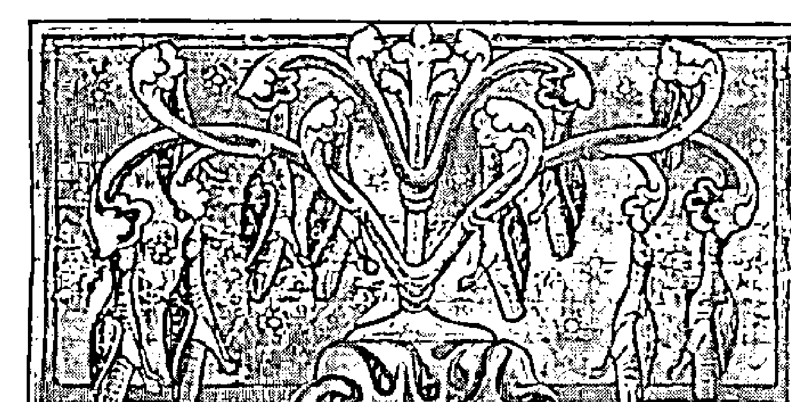

有趣的是，海因里希·施利曼（Heinrich Schliemann）在1870年代对古希腊的迈锡尼城的发掘中找到了一些描述后来被雷·兰科斯特（Ray Lankester）在《一位自然学家的转向》（Diversions of a Naturalist）（1915年）中称为巴纳库里斯德鹅（“barnaculised geese”）的东西。

绵羊草(Barometz)（鞑靼语，“小羊羔”）也被叫做鞑靼羊、鞑靼植物羊、巴巴里羊、锡西厄羊、素羊羔、石松子。在希伯来传说中，它是中东一种长有羊毛、像绵羊一样、一半是植物的生物。它们正式的名字叫徐西亚羔羊（Agnus scythicus）或“Planta Tartarica Barometz”，从小葫芦里诞生，这种葫芦成熟后会裂开，露出里面的小羊羔。它通过一小段茎秆与灌木相连，这让它们能从植物上吸取养分。一旦它们吃光了能够到的草，羊羔和植物都会死于饥饿。绵羊草被认为是一种佳肴，它的肉尝起来像螃蟹，它的血像蜂蜜。它的骨头被用在仪式中以增强先知的法力。

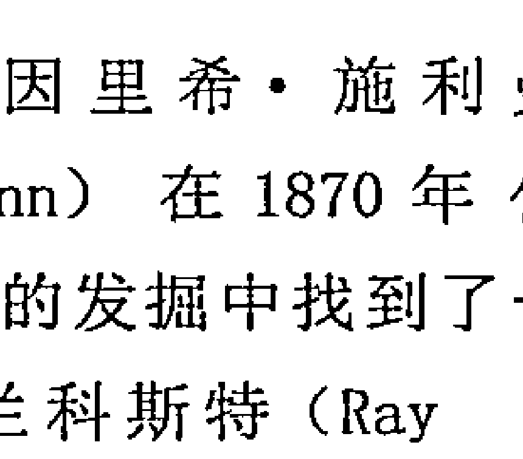

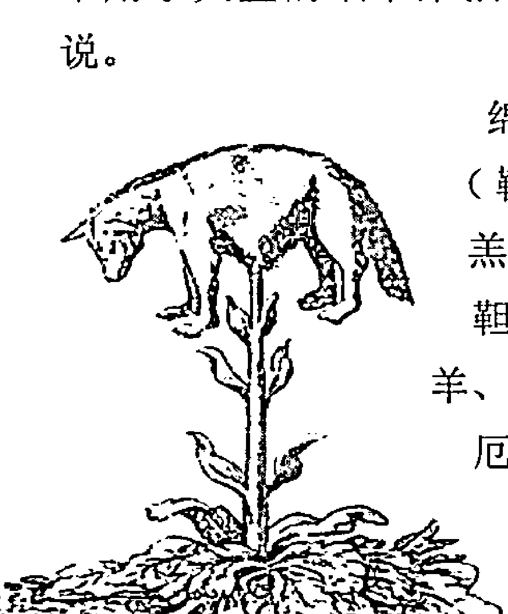

素绵羊的传说源自流行于14世纪的书《曼德维尔爵士游记》（The Travels of Sir John Mandeville）：“那里生长着一种小葫芦，当它成熟时，人们将其切开，发现里面有一只长着血肉之躯的野兽，那是一只无毛的羊羔，人们将其和果实一并吃掉，这听起来太奇怪了。”

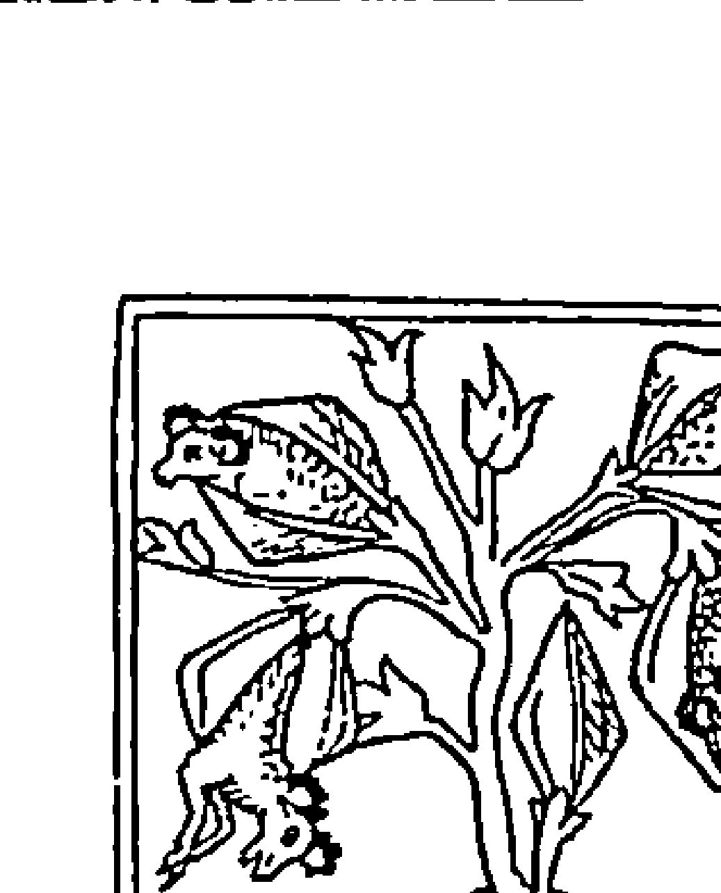

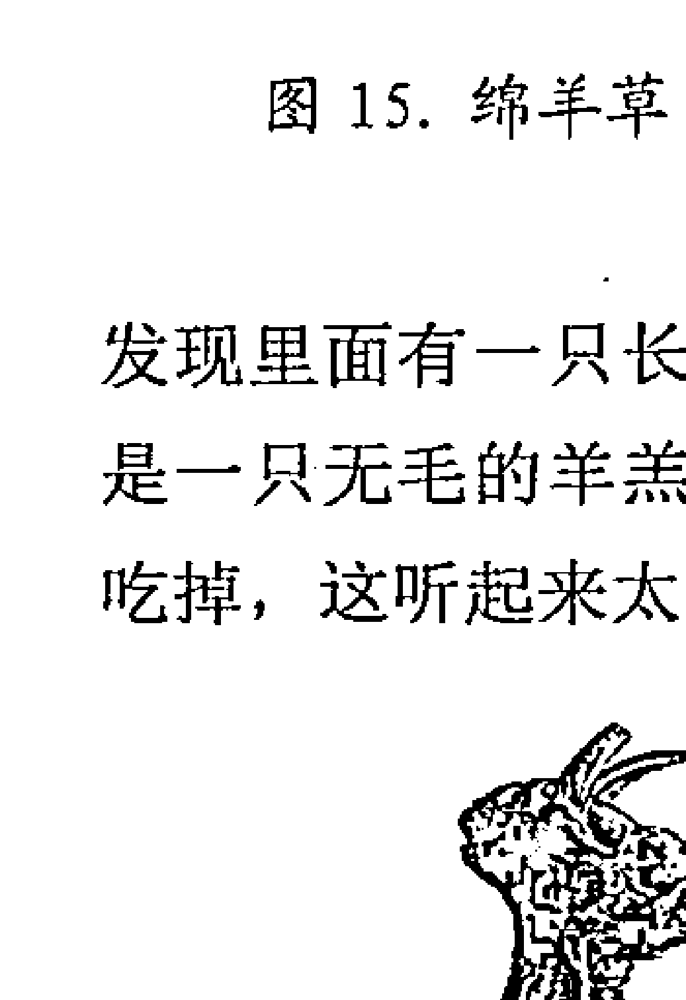

这种奇异的植物通常被认为是棉花（Gossypium），而这可能是这个传说最为贴切的解释了。但也有人认为它是一种长在中东，被用作止血剂的羊齿草（Cibotium barometz）。但更为贴切的答案是金狗毛蕨，一种亚洲羊齿草，长有厚厚的、长在地表的根，上面覆盖着厚厚的羊毛，在被切开时会渗出一种血红色的液体。在中国和印度尼西亚，这些根被做成小玩具狗的样子，叫做狗脊（Caw-tieh/Kew-tsi）。

季德拉（Jidra）是一种贪婪的植动融合体，在利文生（L. Lewysohn）的《动物法典》（Zoology des Talmunds）（1858年）和很多中世纪旅行者故事和中东传说中都有它的故事。季德拉生长在一条从地里长出来的长藤上，它是一种人形的葫芦，它的骨骼在被磨成粉末加入到酒中时会变成春药。它会吃掉所有藤蔓能够到的东西，一旦藤蔓被切断，这种生物会大叫着死去，切断处会喷出大量的鲜血。它与曼陀罗草的相似之处值得注意。

### 神话传说中其它奇怪的植物

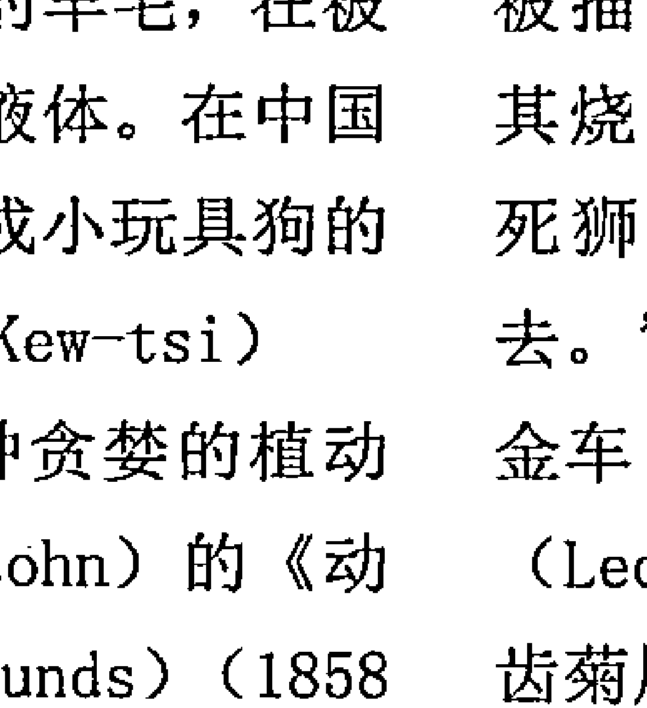

佩里德欣树（Peridexion Tree）（拉丁语称作Peridixion，也叫Circa dexteram、Environ destre、Paradixion、Pendens、Perindens）——生长在印度的一种树，能用甜蜜的果实引来鸽子在其枝桠上聚集。在那里，鸽子不会受到恶龙的威胁，如果可能的话，龙会吃掉鸽子，但他却害怕这棵树的阴影，始终呆在它的向阳处。呆在阴影中的鸽子很安全，但一旦离开就会被龙吃掉。

里昂托夫提斯（Leontophontes）——在《生理论》（Physiologus）中，它们被描述为“中等大小的生物”，人们将其烧成灰烬，用它有毒的灰涂在肉上杀死狮子，“狮子只用吃一点点就会死去。”它们更可能是植物而不是动物，山金车（Arnica）也被称作“豹子的祸根”（Leopard’s Bane），蒲公英也属于狮齿菊属（genus Leontodon）。

日光复合雪羊（Solar Complexus Americanus）——能发热的植物，原产于委内瑞拉。据说斯堪迪纳维亚的植物学家奥拉夫·李普罗（Olaf Lipro）博士（“愚人节”的变位词）是其发现者。这个“发现”被当作愚人节玩笑刊登在1995年的《格拉斯哥先驱报》（Glasgow Herald）上。

其它神话中的植物有：

- **奥斯特拉斯科克斯（Austras Koks）** ——拉脱维亚神话中的一种树，从太阳第一天升起的时候就存在了。
- **树精（Ents）**（盎格鲁撒克逊语“巨人”）——在历史上指所有巨大、人形的生物，树精因 J. R. R. 托尔金的中土世界中的移动走廊而为今天的人们所熟知。它们是聪明而古老的种族，似乎源自世界范围内传说中的会说话的树。它们的外貌和大小根据树种的不同而有差异。其遗失了很长时间的雌性被称作树人（Entwife）。
- **忘忧树（Lotus tree）** ——《奥德赛》中的一种树，其果实有麻醉作用，能让人在快乐中入睡。它可能是一种枣树（Jujube）——也许是鼠李科的枣莲（Ziziphus lotus）——还可能是海枣（date palm）。
- **魔草（Moly）** ——希腊神话中那的一种神奇草本植物，长着黑色的根和白色的花。在《奥德赛》中，赫尔墨斯将其献给奥德修斯，让他免受赛斯魔法的影响。
- **拉斯克福尼克（Raskovnik）** ——塞尔维亚神话中一种能解开任何锁的植物。
- **宇宙树（Yggdrasil）** ——斯堪迪纳维亚神话中的万能世界之树。它的三根主枝支撑着众神的九个王国，它的三条根深入到了地下世界中。

### 怪物电影：活化植物

继在《绿野仙踪》（The Wizard of Oz）（1939年）中邪恶的能动的苹果树之后，第二个出现在屏幕上的植物怪兽出自《魔星下凡》（The Thing from Another World）（1951年）。不幸的是，它与人类长得太像了。《天外魔花》（Invasion of the Body Snatchers）（1956年，1978年翻拍）里有季德拉一样的豌豆人。奥黛丽（Audrey Jr.）是1960年的黑色喜剧《恐怖小店》（The Little Shop of Horrors）中不停生长的吃人植物。《三脚树时代》（Day of the Triffids）（1962年）改编自约翰·温德姆（John Wyndham）1951年的小说，里面有会行走、长有鞭子一样毒刺的肉食植物。1963年的日本电影《玛坦戈，恐怖的真菌》（Matango, Fungus of Terror）[在美国的名字叫《蘑菇人大进击》（Attack of the Mushroom People）] 中有变异的蘑菇人。1977年喜剧《阿黛尔还没吃完饭》（Adele Hasn’t Had Her Dinner Yet）中也有巨型的食肉盆栽植物。《突变》（The Mutations）（1974年）中有变异了的植物人。《第三类突变》（John Carpenter’s The Thing）（1982年）是对1951年影片的翻拍，里面加入了更多的特效。《夜魔水晶》（The Dark Crystal）（1982年）中包括了几种活体植物。1986年翻拍的《恐怖小店》是一部卡姆皮音乐剧（campy musical）。同年的《巨魔战将》（Troll）中有一名叫哈里·波特（Harry Porter Jr.）的青年魔法师与从藤蔓中生出来的豌豆人作战。1989年的日本电影《哥斯拉之真假对决》（Godzilla vs. Biollante）中有巨大的能移动的变异植物。《哈利·波特与密室》（2002年）有曼德拉草和富有攻击性的打人柳（Whomping Willow），它们后来在《哈利·波特与阿兹卡班囚徒》（2004年）中也有出现。有谁能忘了《指环王：双塔其谋》（2002年）和《王者归来》（2003年）中的树精？《潘神的迷宫》（Pan’s Labyrinth）（2007年）中也有曼德拉草。

# 幻想的飞兽类

## 16、东方灵物

作者：亚瑟・“豹舞者”・迪克尔克
与奥伯伦

### 死水猎手

鳞片闪着银光，尖嘴咔咔
作响，
这就是罕见的河中猎手，
将猎物拖入水下，河童就
这样熟练地捕食。

它们只这样出现，
让人只能得到一瞥，
河童就这样离开，
在幽幽流水中只留下一道
波纹。

> ——亚瑟・“豹舞者”・迪克尔克

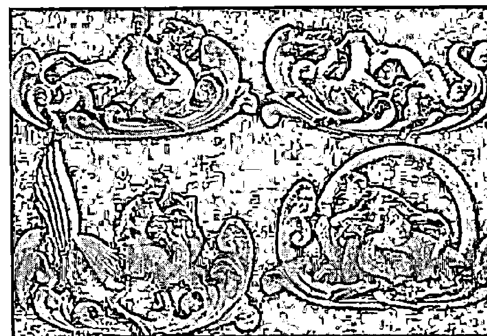

从左至右，从上至下：青龙、白虎、朱雀、玄武

从开始的时候，在普利尼、希罗多德（Herodotus）和克特西亚斯的著作中，那些现在为人所知的欧洲寓言动物都据称生活在诸如埃及、印度、埃塞俄比亚、亚洲和马达加斯加的遥远土地上。这些报告都源自诸如阿尔戈英雄（Argonauts）、被亚历山大大帝和凯撒大帝派往驻守边疆的士兵、前往圣地的十字军、穿梭在丝绸之路和后来的海洋贸易网上的商人、探险者传说中的旅行者故事。欧洲人对自己身边的动物们很熟悉，但也会遇上一些隐藏在各种湖泊中的神秘怪兽。当回到家的旅行者诉说着那些像山一样大、长着扇子一样大耳和长蛇状的鼻子；身披铠甲、长着独角兽；高耸如云、长腿长颈、长着“骆驼豹”斑纹、能够够到树木顶端的动物；生出巨大鸟蛋、其幼崽身高超过人类两倍的鸟类；巨型蟒蛇；以及体型硕大、能用大嘴咬断树木、攻击并吃掉骑手及其坐骑的动物的时候，人们的想象怎能不天马行空？当然，这些动物都是确实存在的——只不过存在于非常遥远的地方罢了。难道狮鹫、独角兽、佩利冬（Peryton）、人鱼真的比海马比大象、犀牛、长颈鹿、象鸟、巨蟒和鳄鱼听起来更不可思议吗？所以所有这些生物——不管是真实的还是想象出来的——混在一起，组成了各种各样的动物寓言集。

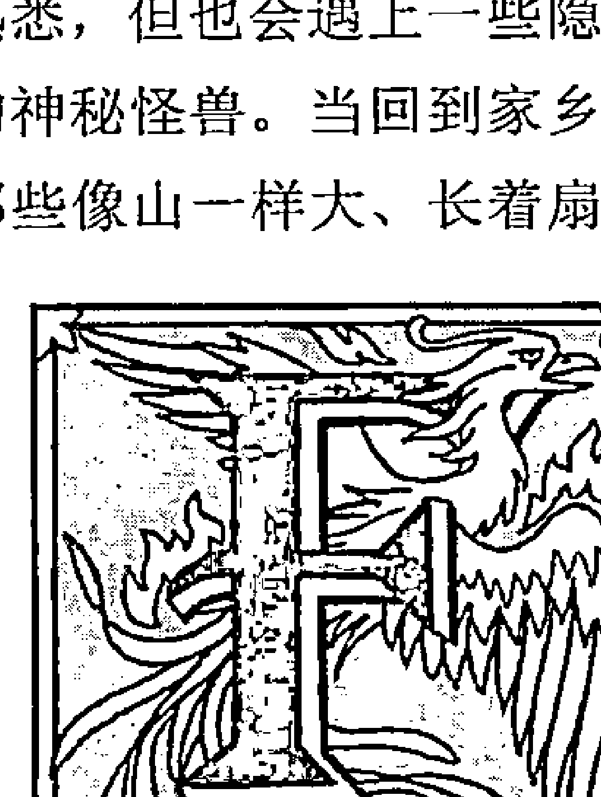

但被东方世界异常重视的那些奇怪生物却大不一样。它们在一些可疑的旅行者故事中并非是来自远方那个的常客。远东地区的生物对西方而言非常封闭，欧洲人也不会派出探险者专门到遥远的国家带回关于神奇动物的故事。中国、日本、韩国拥有很多灵物（日语中称大神“Kami”）很少是基于真正动物的。（如果源自真实的动物，它们则通常都是会变形的狐狸或浣熊。）

下面是一些有趣的东方灵物。请注意，我们去掉了所有的东方龙和独角兽（中国叫麒麟，日本叫“Kirien”），因为这些生物已经在本书关于龙和独角兽的章节中被详细地描述过了。

## 中国

作者：亚瑟·“豹舞者”·迪克尔克

## 福狗

它们是看家兽，长着猎犬的大头、狮子的身体和羽毛状的尾巴。有些福狗的额头中间还有角，有些则长有翅膀。其经典的形象是，雄性 Fo 狗用一只爪子按住一个球体，“感受世界的脉动”，而雌性则在前腿间有几只幼兽。这些天狗总是成双成对地出现，尤其是在封建时期的雕刻中。它们的雕像通常被放在宫殿或寺庙的入口处，以保护那座建筑。人们相信这些雕像在夜晚时分会苏醒过来，像灵魂守卫者一样在地上傲游。雄性负责看守建筑，而雌性负责照顾里面的居民。这些怪兽最早出现在汉朝（约公元前 206 年）的建筑中，被称为天狗、Fu 狗、狮狗。在西藏，它们被称为雪狮，而在中国，它们被称为瑞狮或狮。

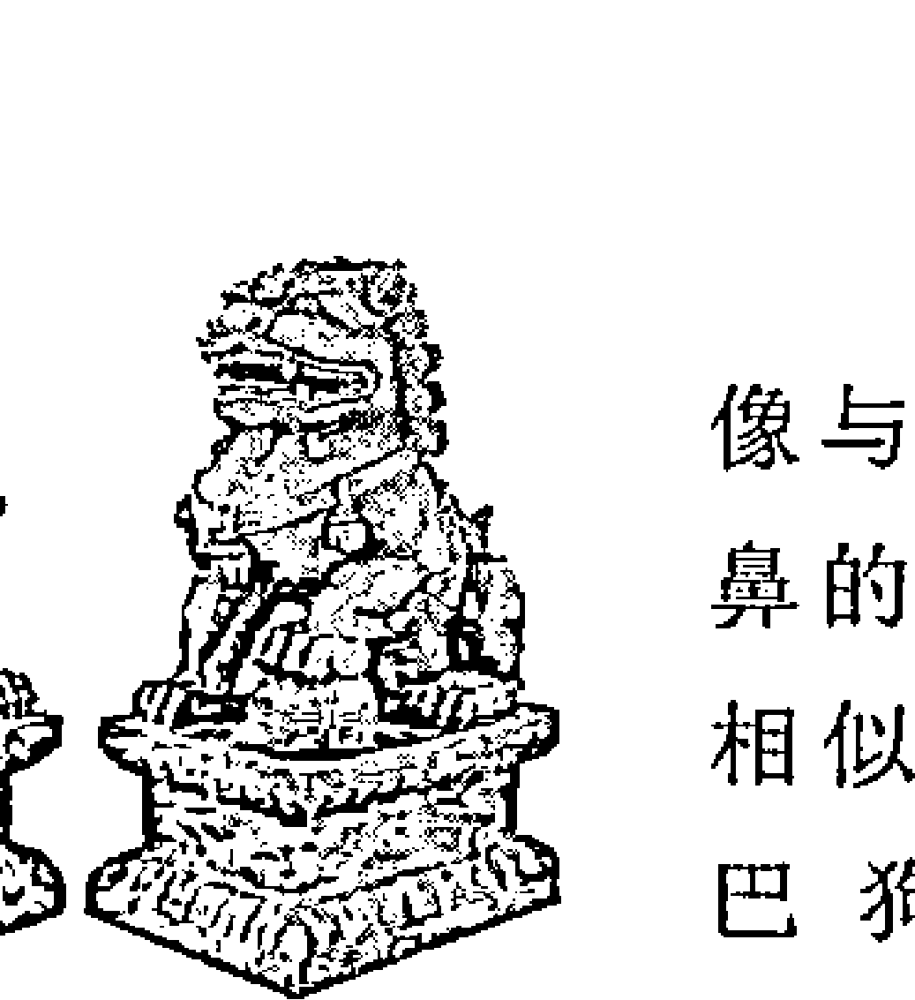

图1. 福狗

这些雕像与长有朝天鼻的东方狗很相似，比如京巴狗、狮子狗和拉萨小狮子狗（Lhasa Aspo）。在寺庙和宫殿常饲养小型看门狗来驱赶害虫。这些小看门狗据信也能驱赶恶灵。狗是忠诚和勇气的象征，只是体型较小。人们相信中国人曾喂养一种他们认为是生活在灵魂世界中的小型犬——福狗。

## 四灵

它们是神圣的“四祥兽”也叫灵兽，于盘古死后生成，在中国神话中，它们分别站在大地的四个角落上。它们还代表着一年中的四季，以及中国的星象，在很多中国历史故事和现代的日本动漫中都有它们的身影。

东方的龙王（青龙）（春），它的属性为木，负责造雨，代表阳和皇帝。
南方的凤凰（朱雀）（夏），它的属性为火，带来干旱，代表阴和皇后。
西方的麒麟（独角兽，也叫白虎）（秋），它的属性为金，代表皇权。
北方的玄武（黑乌龟，也叫黑武士），它的属性为水。它常与一条围绕着它的蛇一起出现。

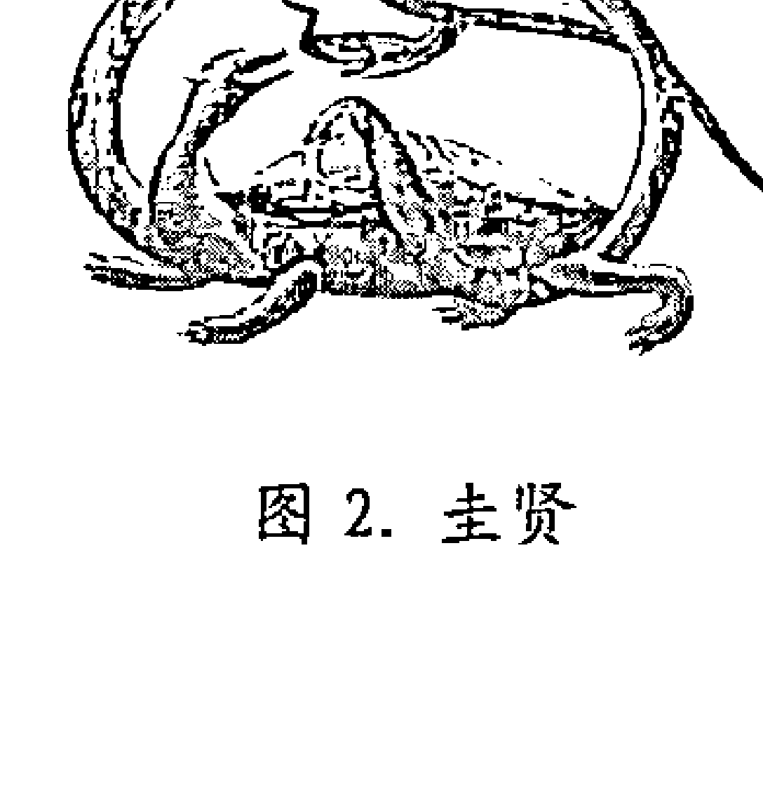

## 孙悟空（孙猴子）

中国神话中的神猴——“美猴王”——诞生于一颗受风侵蚀的蛋中。它在一座岛上统治着那里的猴群，后来踏上寻求永生之路。在路上，它学会了武功、变形，吃掉了蟠桃。孙悟空自称是“齐天大圣”。因为恶作剧，它被佛祖关在了五行山下，在那里待了500年才被观音菩萨放出来，保护三藏法师西行。经历了重重劫难，学会了更多的法术之后，它最后成为了“斗战圣佛”。孙悟空源自印度教《罗摩衍那》（Ramayana）里面的猴王哈努曼（Hanuman），它的冒险故事被写成了一部史诗《西游记》。

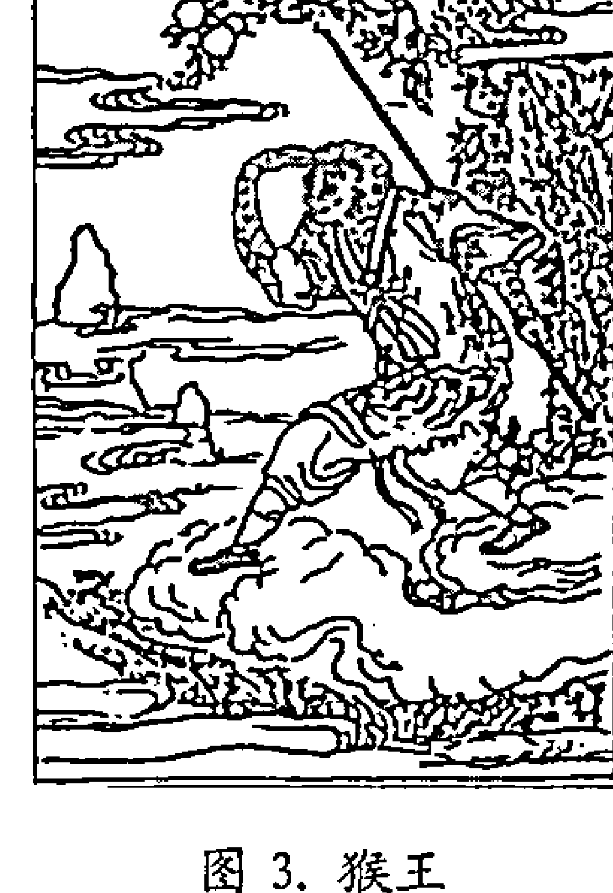

## 迦皮拉（Kapila）（百头狗）

中国佛经中记载着这种怪兽鱼。根据传说，佛祖曾碰到过一些用渔网捞上了一条长着100只不同脑袋（猴、牛、狗、狐、马、猪、虎等等）的鱼的渔夫。佛祖说，这条鱼的前世是一位名叫迦皮拉的和尚，他给自己的徒弟取了各种各样的名字，比如猪头、牛头等等。他重生后得到了报应，长出了那些他用来骂人的动物的脑袋。

## 其他中国灵物

**辟邪**——一种中国奇美拉，是一头长着翅膀和尖角的狮子。

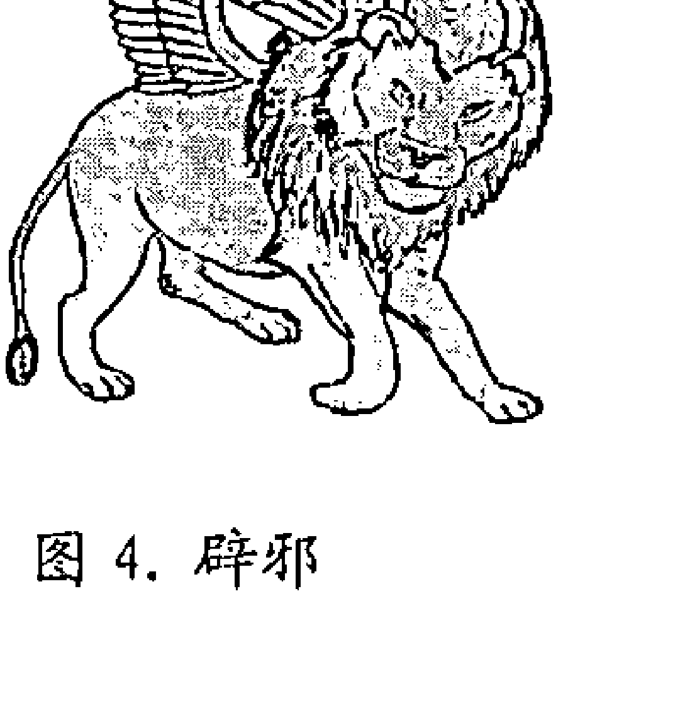

**驳**——一匹贪吃的马，长着老虎一般尖利的牙齿和爪子，额头上还有一只独角，与独角兽类似。任何人类的武器都无法伤其毫毛，它的声音像大鼓一样。

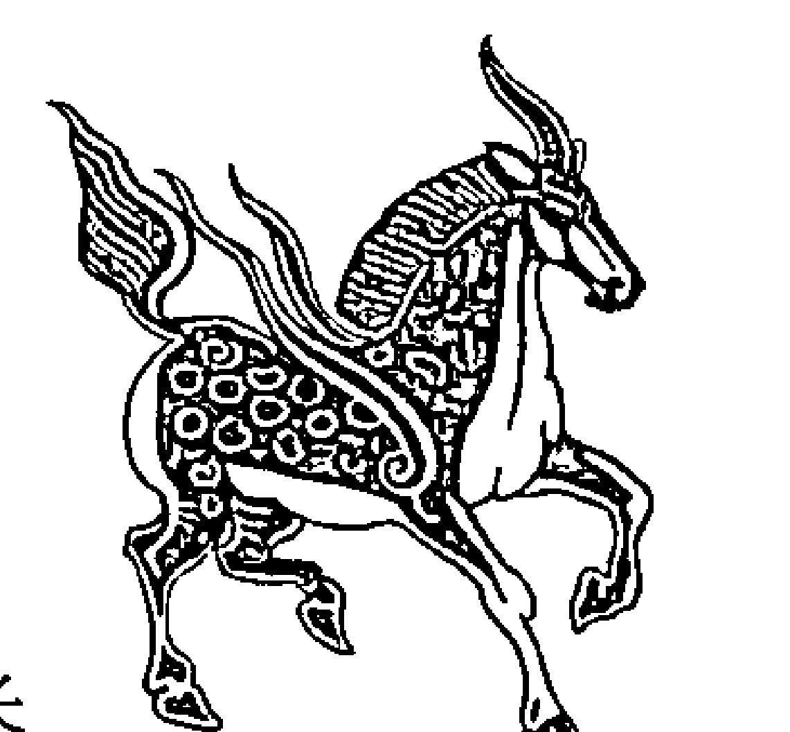

**天马**——一只长得像黑头狗的动物，它有丰盈的翅膀，可以飞行。

**天鹿**——传说中的一头能说话的鹿。它住在天宫和地下，能指引迷路的矿工找到珍贵的矿脉。但只要碰到地面，它就会碎成宝石。

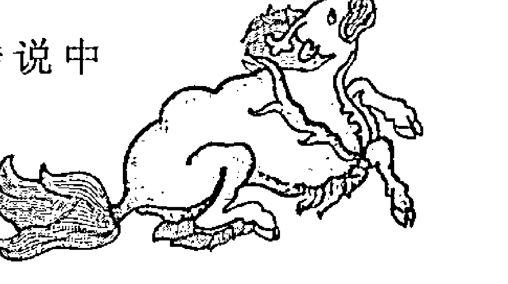

**Chan**——一种巨大的蛤蚌，它呼出的气息变成了海底的珊瑚宫。这些描述与住在南太平洋和印度洋珊瑚礁中的巨蚌（Tridacna gigas）非常类似。它们能长到超过 400 磅重和 5 英尺宽。

## 强良

强良——一种长着豹子身体、老虎脑袋、人脸的怪物。它还有长长的四肢，嘴里还有一条蛇。

## Ch'ou-T'i

Ch'ou-T'i——身体两端都长着脑袋的生物，类似于双头蛇和杜利特博士的两头羚（Pushmi-Pullyu）。它居住在红河西边的王国里。

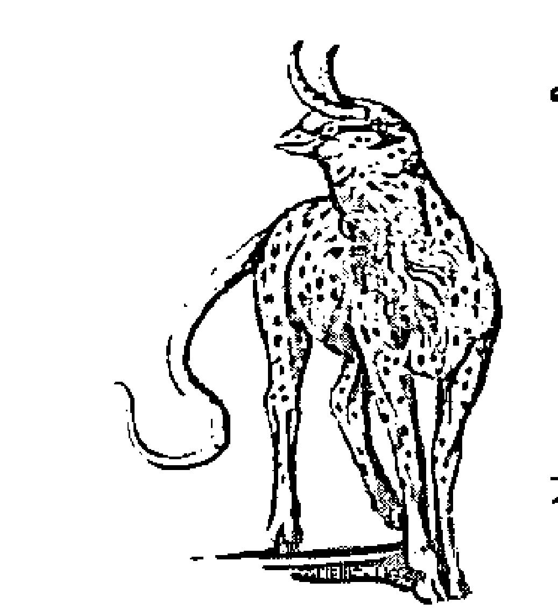

## 飞廉（也叫风伯，意为“风神”）

飞廉（也叫风伯，意为“风神”）——一种长着鹿的身体和四肢、豹子的斑点、蛇的尾巴怪兽。它的头像麻雀，上面还有牛角。它掌控着风暴，在心血来潮时就会打开风袋。

## 訞军（Hui）

訞军（Hui）——一种长有人头的大狗。它速度很快，能越过任何障碍，也不怕人。它的出现预示着台风的到来。

## I-Mu Kuo Yan

I-Mu Kuo Yan——一种像人的鸟类，拥有长着羽毛的人类身体，双臂变成了翅膀。它们很胆小，会避开人类。

## 鲲

鲲——一种身长数英里的巨鱼，住在北中国海。它最后变成了名为鹏的大鸟。

## 鸾

鸾——一只雄伟巨大，能改变毛色的野鸡。毛色不同时，它的名字也不同：黑色时被叫做阴翥（Yin Chu），红冠红翅时被称作丹凤（Fung），纯白色时被称作化翼（Hwa Yih），宝石蓝时被称作羽翔（Yu Siang），全身金色时被称作土符（To Fu）。

## 鹏

鹏——由鲲变成的巨鸟。它巨大的翅膀能连接天地。它住在北方，每年都会飞上数千英尺的高空回到南边，带来台风季节。

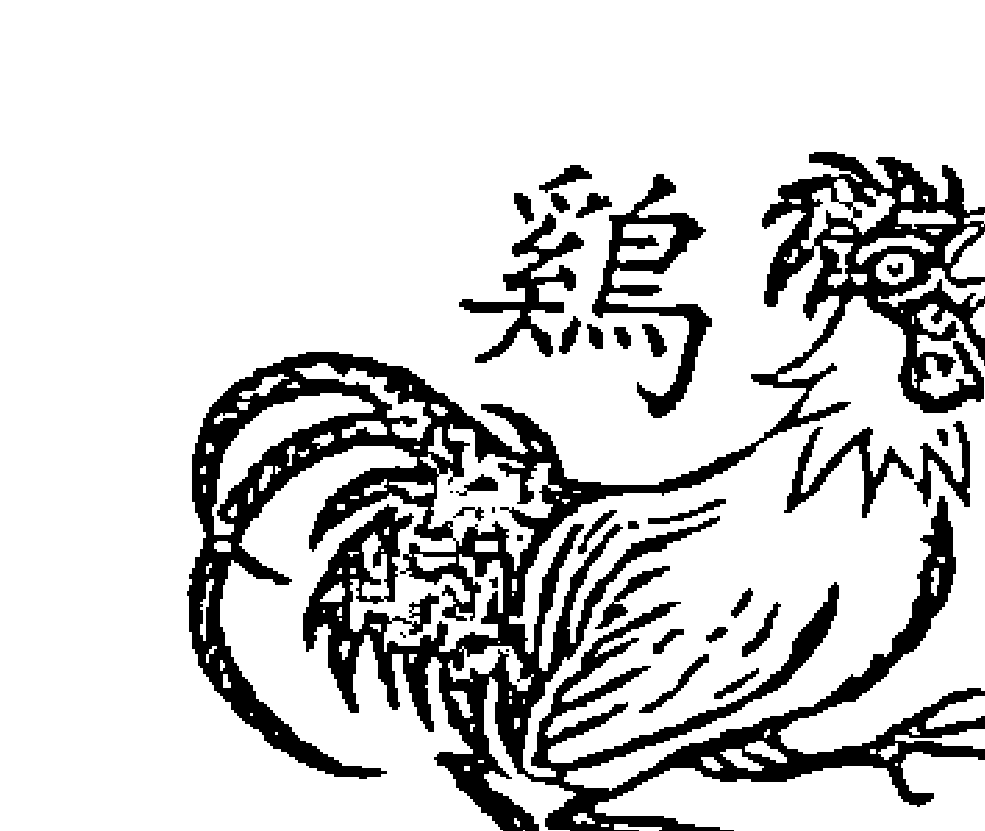

## 天鸡（黎明鸡）

天鸡（黎明鸡）——一种长着金色羽毛、三条腿的公鸡，一天会叫三次——黎明、中午、傍晚。它栖息在扶桑树上，第一声鸣叫震动天宫，叫醒了所有生物。它的蛋中孵出来的红冠鸡是所有公鸡的祖先。

## 鯱（Shachihoko）（应为日本神话动物－译者注）

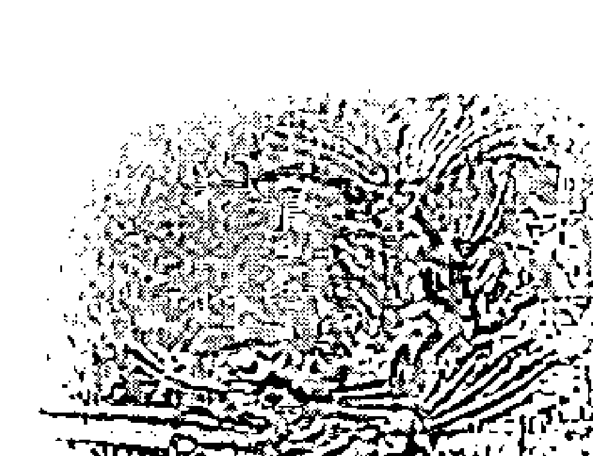

鯱（Shachihoko）（应为日本神话动物－译者注）——身体像鲤鱼，头像老虎的水怪。它全身都长着毒刺，在地上时会变成老虎。它是流行于中世纪的日本建筑上的石像鬼。

## 商羊（Shang Yung）（意为“雨鸟”）

商羊（Shang Yung）（意为“雨鸟”）——一种奇妙的独脚鸟，能随意改变腿的长度。它是雨季的先驱，能预报洪水。它用嘴从河海中盛水，将其喷洒在干涸的土地上。因此人们在旱季会向它求雨。

## Hua-Hu-Tiao

Hua-Hu-Tiao——中国佛教中一种超自然的白象，长着巨大的翅膀。它不时地就会挣脱束缚肆虐人间，杀死并吃掉所有的动物和人类。最终被 Yang Ching 从## 图鉴二、揭秘夜之生物（下）

儿童会卷起一条腿互相撞着，一边撞一边唱：“打雷啦，下雨啦，因为商羊跳舞啦！”

### Song-Sseu
长着雌性野鸡的身体和女人脑袋的鸟。它的第一声春叫是青年人出来跳舞的信号，所以它的形象被绣在了适婚公主的舞衣上。

### 饕餮（“暴食者”）
它是中国最古老的怪兽之一，它长着一个脑袋、几组前肢和两个胖胖的身体，每个身体都有独立的后肢和尾巴。它可能源于几种动物，当然也包括人类在内。它的头大得不成比例，上面有一个大洞一样的嘴巴，里面长着数排尖牙。这种长着六条腿的怪兽代表着贪吃，被画在餐桌上，告诫人们不要吃太多。饕餮在PS2游戏卡片召唤师（Culdcept）中也有亮相。

图 12. 饕餮

### 天狗
一只巨大的狗，它火焰般的尾巴像流星一样。它出现在孙悟空的故事中，在夜晚会降到地面猎食被遗弃的小孩。如果找不到吃的，它就会攻击成年人，吃掉它们的肝脏。如果还找不到吃的，它就会飞到天上去吃月亮（这样就形成了月食）。后来它被后羿射死，但它还会在每天天亮时重生，就这样一直循环往复。

### Too Jou Shen
长着狮子的身体和脑袋、偶蹄，额头中心还有一根短短的钝角。北京北方80英里处的明十三陵中的道路旁就有一对它的雕像。

### 相繇（Xiang Yao）
一种令人作呕的怪兽，长着蛇的身体和九个人头。它是黑龙共工的同伴。它们二者会用自己的粪便将湖泊和河流变成有恶臭的沼泽。

### 鱼龙
长着鱼头和鱼鳍的龙。最初是一条鲤鱼，在跳过龙门进入天宫后就变成了龙。它代表着远大的理想和考试成功。

## 日本

作者：亚瑟·“豹舞者”·迪克尔克

### 狐仙（Kitsune）
狐仙是喜欢恶作剧的日本灵狐。这些小生物能变成任何人的样子，这当然会给人带来很多麻烦！狐仙经常混在人类中，有些则住在野外，在不施法的时候与普通的狐狸一个样子。狐仙不仅能变成人类，还能操纵人类。实际上，现在的日本人仍然相信这一点。麻原彰晃（Asahara Shoko）是奥姆真理教（Aum Shinrikyo）（一种新的日本宗教的宗教，其制造了1995年的日本地铁事件）的领导者，他被以强迫信徒接受灵狐的控制而受到指控。

狐仙与日本女神稻禾神（Inari）有关，常被认为是她的灵魂信使。白狐以及白色的狐仙是稻禾神的圣物。

图 14. 狐仙

灵狐据称能活上数百年，有些还能活到1000年！年纪越大，它们的能力也就越强，年老的甚至变得如同神一般。传说狐仙会在稻禾神的保护和统治下住在她的祠堂里。只要它们服侍她，稻禾神就会为其提供住处。它们发誓会忠于这位女神，然后狐仙就一直为她效忠了。狐仙非常受欢迎，稻禾神祠堂中专门有它们的一座小祠堂。

日本有两种土生狐狸：北海道狐狸（Kita Kitsune）和日本红狐（Hondo Kitsune）。在狐仙和普通的狐狸之间有几处不同，狐仙通常长着很多尾巴，有时在变成人形后都还留着尾巴。变成人形的狐仙拥有狐狸的影子，而且与欧洲的吸血鬼传说类似，它们在镜子里也会映出狐狸的样子。有些传说称其每过一百年就会长出一条尾巴，也有人说它们会在900岁时同时长出9条尾巴。狐仙在画中通常有一条、五条或九条尾巴。它们的皮毛也会变色，顺序是白色、银色和最后的金色。它在日本艺术中很受欢迎。

狐仙不“好”也不“恶”，它们是没有是非感的生物，在这两个极端间游走。它们喜欢恶作剧，与美洲神话中的郊狼（coyote）有血缘关系。狐仙是异变的生物：如果你坚持它们所认为是“好的”东西，它们就变得有益、礼貌、为别人考虑。但千万别惹它们！否则它们会变得凶残。如果狐仙认为你是不道德的人，它们就会对你恶作剧，搅乱你的感官，让你步入死亡的深渊。另一方面，这些灵狐会帮助那些它们认为高尚的凡人，尽管它们还是会恶作剧，但通常只是为了让他们学会必须学到的东西。尽管天性喜欢恶作剧，但它们却是守信的生物。如果你和一只灵狐成为朋友，你就等于拥有了一位忠诚和值得信任一生的朋友。从另外来讲，如果你惹怒了它，就得准备好面对这个一生的敌人。

日本有几种关于狐仙的神话和传说。天狐仙被叫做天奥，这种白色狐仙主要为稻禾神服务。黑狐仙是为稻禾神服务的黑色灵狐。Kuko Kitsune 是风之狐。这些狐仙被视作恶魔，常以浓雾或旋风的形式出现。“恶魔狐”Kiko Kitsune 也被视作有恶意的生物。

在现实中，狐仙拥有控制人类的能力，但需要那个人允许被它们控制才行。而它们的控制也不会很久——只需完成需要完成的事情或传达了需要传达的信息。当控制结束时，被控制的人不会对自己做过什么有任何的记忆。而有些时候，灵狐会强行侵占人类的身体。这表明，它想拥有这个人的身体。它们也会试图侵占未出生孩子的身体。一旦它们这样做，孩子的母亲就会变得虚弱并生病。降生出来的孩子也会变得虚弱。如果它没能完全占据这个孩子，或选择离开他，那么这个孩子就会死去。如果它成功了，孩子就会顺利长大，慢慢地获得灵狐的能力。狐仙不仅能控制人类，也能控制任何其它生物。

除此之外，狐仙还拥有很多其他的能力，最著名的，尤其是在恶作剧时，是制造幻象的能力。它们能制造出“口袋中”的世界，那里的时间比真实世界或快或慢。这些世界中的大小也是可操纵的，比如，一个小洞可能在里面会变成一座大房子。狐仙也能制造狐火，这是一种绿色的幻光。它们还能喷射短距离的火焰。

灵狐能变形，但它们并不只会变成人类，而能变成任何东西，从石头到鸟儿都可以。龙有龙珠，狐仙也有“狐珠”。狐珠通常看起来像儿童的玩具，但它要么装着狐狸的灵魂，要么装着它的法力。碰到狐珠的人类能够让狐仙听从自己的指挥。有强就有弱。狐仙的弱点在信仰上：有信仰的人不会被它的幻象影响，那些幻象也会一碰就破——这对狐仙是致命的打击！

狐仙在现代日本媒体中非常流行。动画片《犬夜叉》中的七宝就是一只狐仙，经常用自己制造幻象的魔法来帮助大家。电玩／动画片《口袋妖怪》中的五尾狐六尾（Vulpix）及其进化后的“九尾”也是一只狐仙。在世嘉公司的游戏《刺猬索尼克》中，索尼克的伙伴塔尔斯（Tails）是一条两尾狐仙。这些狡猾的灵狐出现在众多魔幻小说中，比如尼尔·盖曼（Neil Gaiman）的《捕梦者》（The Dream Hunters）中就有一只年轻的雌性狐仙担任重要角色。它们还出现在默西迪丝·南迪（Mercedes Lackey）的《锯齿边缘》（Serrated Edge）系列片中。

### 河童 (Kappa)
这些邪恶的生物住在湖泊、河流和水塘中。它们有猴子一样的身体，长着绿色、蓝色或黄棕色的鳞片，背上还有一个龟壳。有些长着人猿般的脸和长头发，有些长着乌龟或鸭子的嘴。河童头上有一个凹槽，里面装着保存其生命和力量的液体。如果你向一只河童鞠躬，它就会回敬你——头上的液体就会流出来，让其变得无力。往它的洞里加水会让它重获力量。与其他的爬行动物类似，河童在寒冷的天气会变得行动迟缓，在冬天也会冬眠。它们分成两种：一种住在低地水体中，另一种被称为山和吕（Yamawaro）的则住在高地的溪流里。

河童喜欢开玩笑和制造麻烦。它们会毁坏或偷走粮食、绑架小孩，只要有机会就会吃人。但它们也能成为人类的朋友，尽管需要很多礼物和贡品。它们天生是有好奇心的生物，觉得人类既有趣又好吃。给河童最好的贡品是黄瓜，它们以鲜血和黄瓜为食，能搭着施了魔法、长着蜻蜓翅膀的黄瓜在天上飞。它们也会帮助人类，只要答应了的事就一定会办到。河童被认为能帮人灌溉，而且医术高明，尤其是对治疗骨伤。

几种事物被认为是河童这一说法的来源。一种是扔到河里的死婴，另一种是让孩子远离水道而编造出来的吓唬孩子的话。还有一种是，河童是一种稀有但尚未被人发现的水生动物。而现代人猜测它们可能是外星人！1801年有人据说在某海滩抓住了一只河童。在关于这件事的一幅画中画着一个身披蓝灰色鳞片的类人猿生物，长着有蹼的脚和龟壳，还有长长的尖牙。

### 狸猫精 (Tanuki)
图 20. 狸猫精

一种与狐仙有血缘关系、爱捣乱的变形兽，非常容易上当，而且健忘。与狐仙类似，这种动物也是真实存在的，尽管并不是浣熊，但它也常被叫做浣熊。其实它是一种看起来像狐狸的狗：浣熊狗（译者注：狸）（貉属）。狸猫精经常被描绘成拥有巨大睾丸的样子，戴着叶子做的帽子，拿着一个酒壶。它们的雕像常被放在酒吧门口以招徕顾客。

狸猫精能变成任何东西的样子，不管是活的还是没生命的。它们喜欢变成从游方僧到茶壶各种各样的样子来捉弄人类。它们也能将叶子变成钱，将草变成美食。其头上的叶子，通常是莲叶，能帮助它变形，它们变形时会念念有词。在电子游戏《超级玛丽》中，马里奥得到了叶子就会长出狸猫精的耳朵和尾巴。马里奥还有一件“狸猫精”衣，穿上后会变得难以区分。

你也许会问，为什么很多狸猫精都被刻画成拥有很大的生殖器的样子。其实它们并非好色的动物，它们巨大的睾丸是好运的象征，被称作金魂（Kintama），或“金球”，很可能指的是真的狸猫精那巨大的生殖器。

### 天狗 (Tengu)
它们是日本妖怪也叫灵物。天狗是半人半鸟的生物，有发光的眼睛、巨大的鸟喙状的鼻子。分为几个种类。最常见的是被画成长着羽毛的人类，而最低级的是乌天狗（Karasu Tengu）和小天狗（Ko-Tengu）[或木叶天狗（Konoda Tengu）]，它们嘴像鸟。它们的鸟头上长着人的耳朵，在其薄薄的翅膀末端长着人手。天狗的脸要么是红色的，要么是绿色的，要么是黑色的，通常它们都长着人类的耳朵和头发。有时在其嘴里长有尖牙，它们还长着爪子和鸟状的手脚。其翅膀和尾巴上都有羽毛，身体上也可能会有。它们通常长着红色的毛发或皮肤。乌天狗体型很大，能抓起人类，以人类为食。

图 21. 天狗

天狗与山付 (Yamahushi) 苦行僧有关联，常被绣在其衣服上。它们住在京都北边的鞍马山中的森林里，有时会拿着顶端有圆环的锡杖去驱除魔鬼的法术。其它的天狗则拿着羽毛扇，能制造大风。人们相信它们的原型是印度教的鹰神揭路茶。揭路茶和天狗在电子游戏《卡片召唤师》中变成了鸟怪古达（Gouda）。更早些时候，天狗是狗一样的生物，以人类为食。它们也被称作天狗，是流星的化身。它们代表着战争，据信是受到真实陨石的撞击的启发而创造出来的。

天狗可能友善也可能邪恶，很多在保护着人类，也有一些在试图消灭掉人类。它们拥有巨大的法力，能变成任何动物，还能控制人类，而它们在事后不会有任何记忆。它们在武术方面很在行，是森林的守护者，能够制造大风暴把人类从森林中赶走。

### 其他日本神道（Kami）生物
豪鬼（Akuma）——也叫图里豪鬼（Toori Akuma）或玛（Ma），这种魔鬼一样的怪兽非常恐怖且邪恶。它的火焰头很大，眼睛像煤块，能在空中御剑飞行。看到它的人会走噩运。

网剪（Amikiri）——长着蟹钳和长蛇尾的小型飞行生物。它能剪碎蚊帐、渔网和挂在室外的衣服。

巴库（Baku）——被称为食梦者，这种奇美拉似的生物非常友好。它长着貘的身体、大象的脑袋、狮子的鬃毛、牛的尾巴、老虎的四肢和爪子。在睡梦中惊醒的人通常会说：“啊巴库，来把我的梦吃掉吧。”于是它就会将噩梦赶走，让人睡个好觉。巴库出现在很多日本幻想故事中，特别是在动漫方面。而它在尼尔·盖曼（Neil Gaiman）的《捕梦者》中也有重要的地位。

双头鸟（Hiyakudori）——一种神奇的双头鸟，与天堂鸟类似，代表着恋人的结合。

地震甲壳虫（Jinshi-Mushi）——一种奇异的、虫子一样的生物，据说它会在地下钻洞，引发京都、日本南部的地震。它长有鳞片的巨大身体上有10条蜘蛛腿和一只龙的脑袋。

地震鱼（Jinshi-Uwo）——这条700英里长的鳗鱼背负着日本诸岛。它的头在京都下方，一颗钉在鹿岛寺花园中的巨大铆钉将日本固定在了它的背上。它摆动巨尾时会导致地震。

镰鼬 (Kamaitachi)（“镰刀鼬鼠”）——凶残、快如闪电、像鼬鼠一样的生物。它们总是三个成群地外出狩猎：第一只将猎物扑到，第二只将猎物切喉，第三只将猎物救活，它们就这样一直重复着，直到受害者最终死去。

卡米（Kami）——一条大鲶鱼（Namazu），住在日本群岛下方，据称是引发地震的罪魁祸首。传说鹿儿岛神用自己的巨剑刺穿大地，一直刺入了这条大鱼的脑袋。从那时起，每当地震发生时，这位神就会将手放在花岗岩剑柄上使其安静下来，这把剑柄现在仍然矗立在鹿岛祠堂附近。“Kami”也是日本神道教中的自然精灵的名字。

螳螂（Kamakiri）（“镰刀切手”）——一种原型被认为是螳螂（Cottus kazika）的日本神道教自然之灵。带来霉运和疾病，还能变成黑云在天上盘旋。无脸怪——像面团一样的东西，是日本传说中地狱的守卫。

唐伞小僧（Kasa Obake）（“油纸伞”，中文中的“伞妖”）——一种由物品变成的日本精灵付丧神（Tsukumogami），它们在100岁时变得能够自主行动。唐伞小僧是百年老伞的精灵。它们长着一只眼睛、嘴里吊着一根长舌头，身体下面有一条腿，穿着日本木屐。

九段（Kudan）——一只长着人头的公牛，身体两侧分别长着3只眼睛，背上还有三只角。它总是说真话，被认为是先知神谕。

世界屋脊鳉鱼（Moshirikkwechep）——一条住在大洋淤泥之下的巨鱼，它背负着整个世界。每隔一段时间它就会蠕动一下，这时会产生地震和海啸。

鵺（Nue）（日本奇美拉）——一种混合生物，拥有狸猫精的身体、猴子的脑袋、老虎的四肢和蛇的尾巴。它能带来霉运和疾病，还能变成黑云在天上盘旋。

湿女人（Nure-Onna）——一个蛇形的美人，她常在海边梳理自己的长发。据说她的身体有900英尺长，能在水面快速移动。她的爪子上有长长的手指，长有蛇眼、分叉的舌头、毒牙。有些故事称其以人为食，也有故事说她只是在洗头时不希望被人打扰。还有说她能在远处吸走受害者的鲜血。

凤（Pheng）——一只大鸟，能遮住阳光，抓起骆驼。与阿拉伯神话中的大鹏很相似。

赖奇（Raichô）（“雷鸟”）——一只巨大的秃鼻乌鸦或乌鸦样的鸟，住在一棵高大的松树上，能用沙哑的叫声招徕风暴。有一种真正的鸟也叫这个名字——岩雷鸟（Lapopus mutus）——是一种鹧鸪鸟。

獭尻（Raiju）（“雷兽”）——神道教中雷电神（Raijin）的宠物，这种恶魔般的小生物拥有猫或鼬鼠般大小的身体，像猴子一样敏捷，还长着狸猫精的利爪。它由火焰组成，是闪电球的象征，在风暴发生时变得狂暴，会在树上、田间，甚至建筑间一边穿梭，一边发出雷鸣般的叫声。被闪电击中的树木据说就是先被獭尻挠伤了的。它会试图钻进人类的肚脐中躲藏，所以在风暴夜时你最好趴着睡觉！

### 鲨鱼人（Samebito）
一种半人半鲨的海怪，长着黑色的身体、发光的巨大绿眼、一小撮尖尖的胡子。鲨鱼人住在海底一个广袤的王国中，很少与人类接触。如果你在陆地上发现一只，那通常都会遇上麻烦。其实它们都是诚实的生物，懂得报答恩情。在英雄东太郎的故事中也有鲨鱼人，东太郎邀请被流放的它们住到自己城堡旁的一个湖中，并给它们提供食物。当东太郎爱上玉名时，她贪婪的父亲要10000件珠宝作为嫁妆，鲨鱼人同情的泪珠变成了宝石，让他们最终得以成婚。

### Takujui
一种类似于九段的怪兽，长着人类的脑袋和野兽的身体，眼睛长在身体两侧，背上还有一排骨刺。它是一种吉祥的生物，只在明君执政时出现。

### 土蜘蛛（Tsuchi-Gumo）
一种恐怖而无形的蜘蛛。它以人类为食，后来被人用铁网困在了巢穴中，活活烧死。日本传说和J.R.R.托尔金以及J.K.罗琳的故事中都经常出现大蜘蛛。这些故事都是关于讲述旅者和英雄们探索古老的城堡、潮湿的洞穴或黑暗的森林，被困在巨大的蜘蛛网里，杀掉蜘蛛获得自由。

### 尤瓦巴弥（Uwabami）
一种会飞的蛇怪，有时被说成有翅膀，有时没有翅膀。它会从天上飞下来，张开血盆大口抓走人类。后来被英雄Yegara-no-Heida所杀。

### 八俣乌（Yata Garasu）
一只巨大的三腿乌鸦，是人类和众神间的信使。

## 韩国生物

### 獬豸（Haetae）
一种石狮，以火焰为食，因此能够防止火灾或任何由火带来的危害。它会啃咬月亮和太阳，造成月食、日食。獬豸也代表着水和公正。它们的雕像被放在景福宫（Kyongbok）的门边，保护皇室和国家。

### 九尾狐（Kumiho）
一种残忍、超自然、吸血、长有九尾的狐狸，是由普通狐狸活了一千年后变成的。与日本的九尾狐类似，它# 魔法师的怪物图鉴

也能变成漂亮女人的样子——有时还能变成新娘——它以此引诱人类，并将其杀害。但与狐仙不同的是，九尾狐总是对人抱着敌意，并以之为食。

##### 鸡龙 (Kyeryong) ——

南韩传说中的一种鸡、龙混合生物（与鸡蛇兽类似）。有一座山因其而得名，在那座山里有一个雌性鸡龙居住的湖。女性萨满会在该湖中沐浴，以获得法力。新罗（Shilla）的第一位女王閼英（Alyeong）据说就是鸡龙的后代。

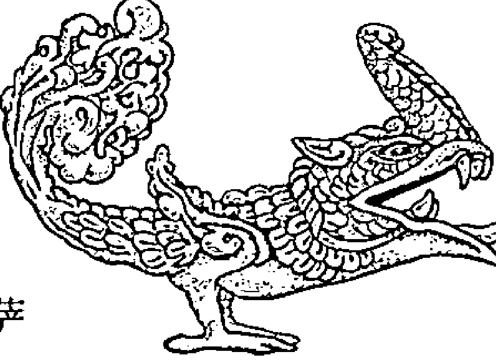

##### 怪物电影：
东方灵物

- 《日本西游记》（Alakazam the Great）（动画片—1961年）：猴王
- 《黑泽明之梦》（Akira Kurosawa’s Dreams）（动画片—1990年）：九尾狐
- 《平成狸合战》（Pom Poko）（动画片—1994）：狸猫精
- 《幻想魔传最游记》（Gensomaden Saiyuki）（动画片—1996年）：河童
- 《最游记》（Saiyuki: Reload）（动画片—1998年）：河童
- 《最游记外传》（Saiyuki: Requiem）（动画片—1998年）：河童
- 《最游记第三部》（Saiyuki Reload:Gunlock）（动画片—1999年）：河童
- 《口袋妖怪》（动画片—1999年）：九尾狐，河童，狸猫精
- 《千与千寻》（Spirited Away）（动画片—2001年）：河童
- 《犬夜叉》（Inuyasha）（动画片—2001年）：九尾狐 / 狸猫精
- 《火影忍者》（Naruto）（动画片—2004年）：九尾狐 / 狸猫精
- 《狸御殿》（Princess Raccoon）（动画片—2005年）：狸猫精
- 《妖怪大战争》（The Great Youkai War）（动画片—2005年）：天狗
- 《地狱男爵：风暴之剑》（Hellboy: Sword of Storms）（动画片—2006年）：河童，九尾狐

### 17、可怕的魔精 (Fearsome Critters)

作者：奥伯伦

这是你在刚加入伐木小队后，与这些魁梧又健谈的人在篝火旁度过的第一晚，他们已在森林中工作了很长时间。他们一边散发着啤酒，一边兴致勃勃地谈笑风生。有时这些故事恐怖得能把刺猬的毛都吓飞！

在吃了一些豆子、灌下几瓶啤酒、喝了一点浓咖啡之后，你开始四处找能方便的地方。但在起身要离开的时候，篝火对面一个长着大胡子的壮汉却警告你说：

“不要离火光太远！外面到处都是魔精！它们会在黑暗中，从背后袭击你。什么？难道你从没听过……”

——奥伯伦

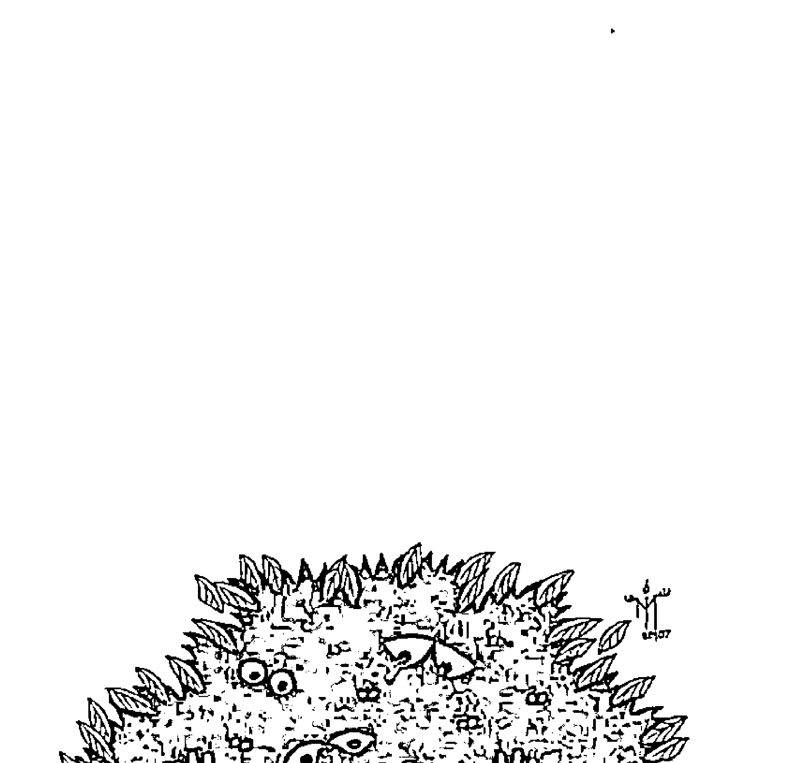

魔精指的是由19世纪的美国和加拿大伐木工为了排解工作的无聊所想象出来的各种动物（据称它们住在广袤的北美森林中。最初的时候，这些动物是工人们对在工作时遇到的各种事件，有些甚至能取人性命）的荒诞解释，后来，它们被拿来吓唬那些来参加野营且容易上当的人。

魔精从愚蠢到奇幻到恐怖的都有。

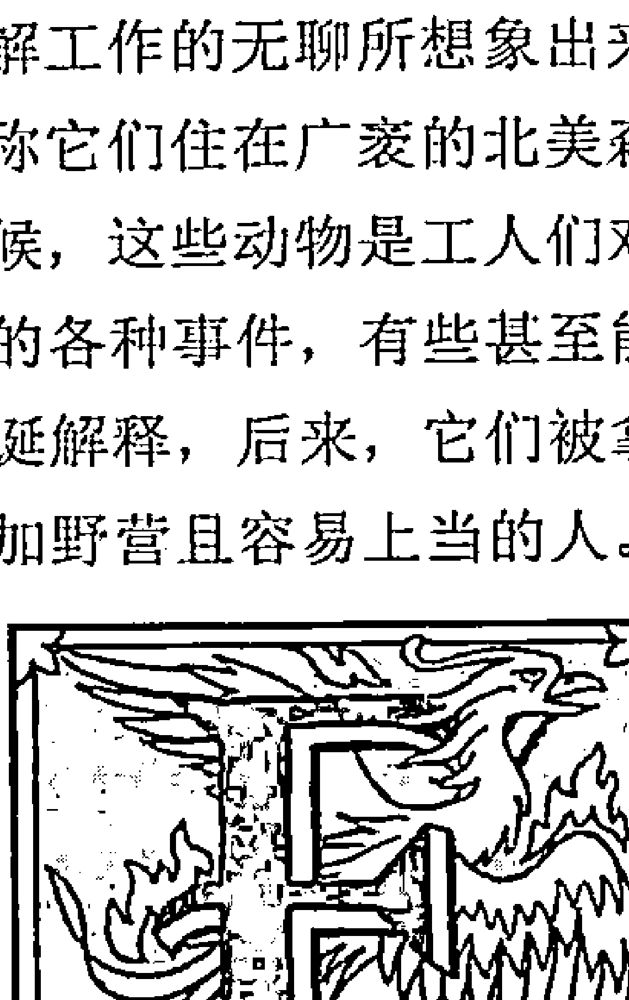

在其它地区和国家也有相同的故事，比如法国的大胡（Dahu）、苏格兰的野生哈基斯（Wild Haggis）、澳大利亚的丢熊（Drop Bears）和邦伊普斯（Bunyips）。热衷于民间传说的人搜集并编纂了这些故事。下面就是其中的一些：

阿戈佩尔特（Argopelter）或森林猴（Anthrocephalus craniofractens）——这种生物住在树洞中，会用树枝和松球攻击过路人。这种可爱的小怪物住在从缅因州到俄勒冈州的广袤地区，它们本来非常友善，都快要被猎人灭绝了。后来，伐木工们告诉它们用木棍来攻击那些靠近自己居住的树的人，以保自己。

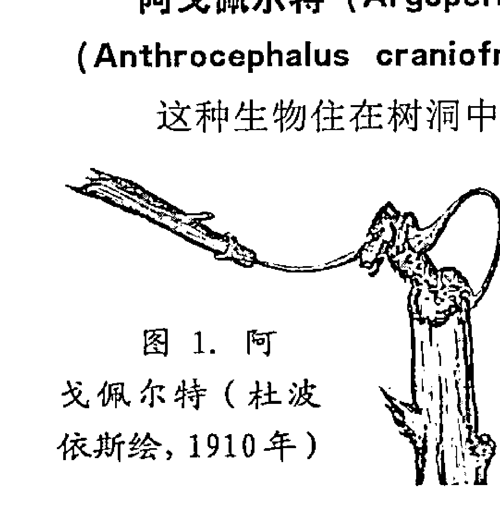

奥格里诺（Augerino）——一种住在科罗拉多州干旱土地下的钻洞魔精。因为喜欢黑暗，讨厌潮湿的地方，所以它会攻击水坝、沟渠和河道，将里面的水放干。由于住在地下，从来没人见过它们，因此也不知道它们的样子。

阿克斯汉德勒猎犬（Axhandle Hound）——它的身体又长又瘦，就像——你没有猜错！——一根斧头把，而它的脑袋又长得像斧头。它那奇怪的身体由四条粗短的腿支撑着，这让人联想到腊肠犬（Dachshund）。据说它会吃掉所有被遗弃了的斧子的握柄。

比尔戴德（Billdad）——一种来自缅因州的奇怪魔精，与海狸差不多大。它长着老鹰般的钩状喙，还有长蹼的脚，后腿与袋鼠的类似，一跃能够跳出60码的距离。它住在河流和溪流附近，用大尾巴捕鱼为食。

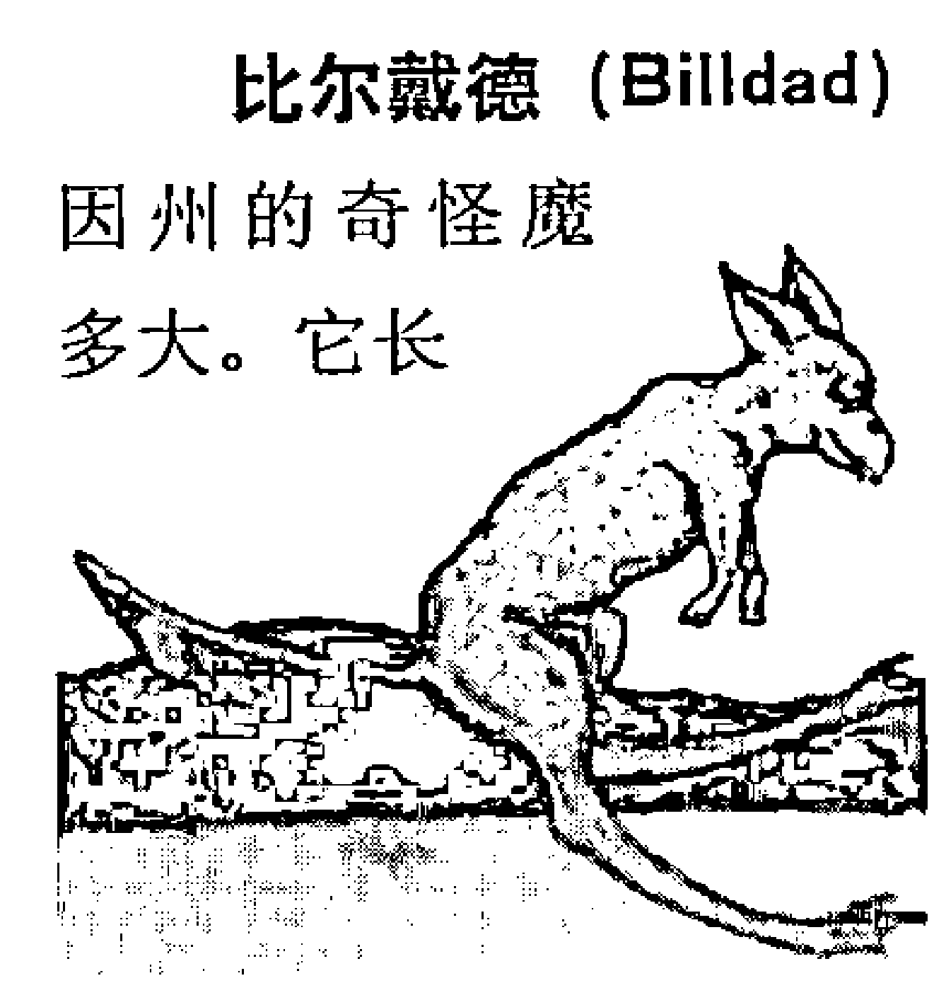

仙人掌猫（Cactus Cat）——与普通的家猫差不多大，身上长着刺猬一样的尖刺，甚至连耳朵上都有。其腿上和尾巴上的尖刺尤其长且尖锐。它喜欢喝发酵了的仙人掌汁液，经常会喝得酩酊大醉。

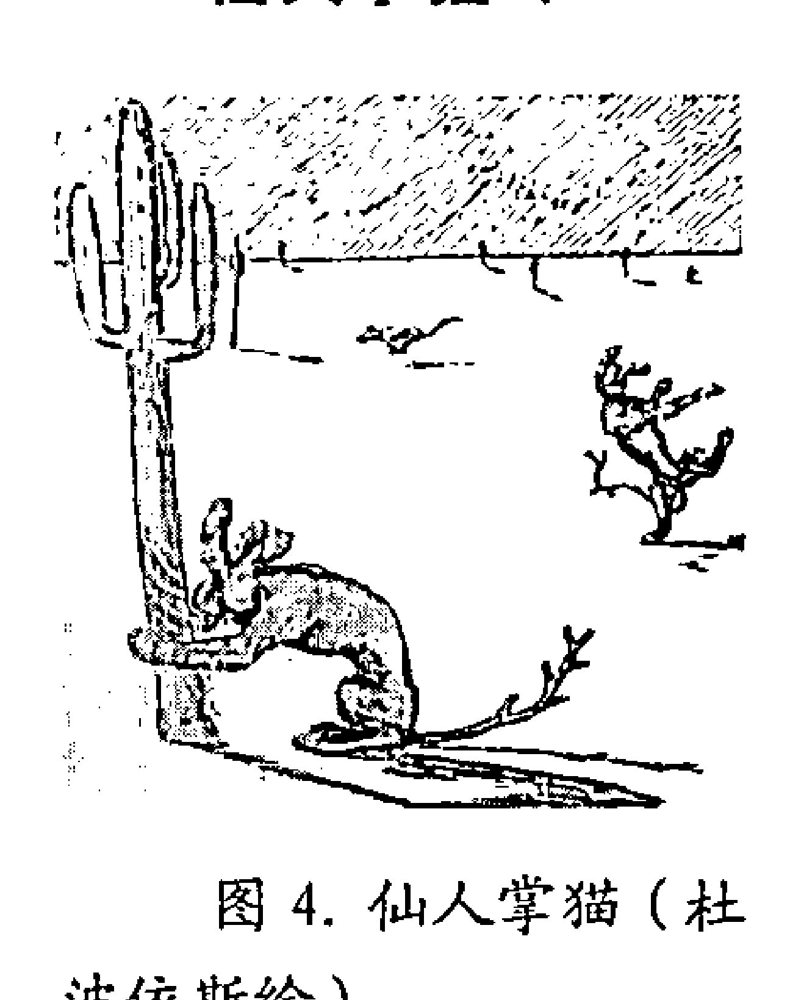

大胡（Dahu）——一种与美国吉奥斯卡塔斯（Gyascutus）类似的法国魔精。它看起来很像鹿或麂皮，只是它一边的腿要比另一边的短很多，这样它就能在陡坡上行走。而它只能望一个方向行走。它们有两个亚种：左旋大胡（Laevogyrous dahu）（左边的腿要短一些）和右旋大胡（Dextrogure dahu）（右边的腿要短一些）。

## 图鉴二、揭秘夜之生物（下）

晃晃的。它住在高地上的草原里，后来因为数量太多而不得不迁徙到沙漠中。特拉休（Terrashot）翻过高山到达沙漠，在沙漠的热量中一个接一个地爆炸了，留下许多坟坑一样的大洞。

## 丢熊 (Drop Bear) —— 巨大、残暴的食肉考拉，住在澳大利亚内陆的桉树上，以从树上丢东西将猎物砸晕的方式捕食。据说在头发上插上一把叉子或在耳朵后面涂上牙膏或咸味酱（Vegemite）能够避免受到它们的攻击。想要辨别一棵树上是否住着丢熊只需要躺在那棵树下，向上吐口水，如果口水落回到你身上，那么这棵树上就住着丢熊。

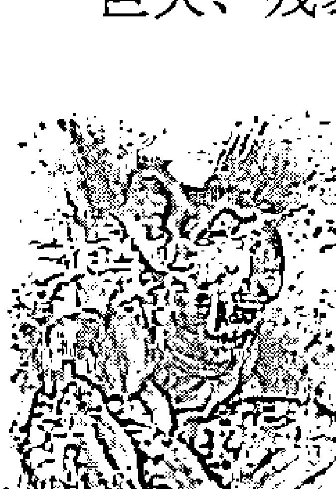

有趣的是，丢熊的传说可能与食肉的尹佛拉丝树袋熊（Phascolarctos involus）或袋狮（Thylacoleo carnifex）——史前有袋动物，体型相当于现代考拉的两倍。人们相信袋狮是一种树栖的捕食动物，可能通过从树上丢下树枝的方式捕捉猎物。

## 葬礼山特拉休 (Funeral Mountain Terrashot) —— 住在加州葬礼山（Funeral Mountain）的一种奇怪魔精，它们因这座山而得名。它的身体包裹在一层外壳中，像一个盒子一样，长度有6至8英尺，四条细长的腿走起路来摇摇晃晃的。

## 基利加鲁 (Gillygaloo) —— 在保罗·班扬（Paul Bunyan）著名的皮莱米德四十英亩（Pyramid Forty Acres）山坡上筑巢的一种鸟，它的蛋是方形的，不会从山坡上滚下来。保罗班扬将这些蛋煮过之后用作骰子。

## 格拉瓦卡斯 (Glawackus) —— 一种凶猛的魔精，据说是熊、豹、狮子的结合体。它是新英格兰地区的本土生物，据称1939年和1944年分别在康涅狄格州的格拉顿堡（Glastonbury）和麻省的弗里泽尔堡（Frizzelburg）被目击到。

## 古鲂 (Goofang) —— 一种倒着游泳以免让水流冲击到其眼睛的鱼。据称“它与翻车鱼类似，只不过要大很多。”

## 古弗斯鸟 (Goofus Bird) —— 一种倒着筑巢和倒着飞行的鸟，并不在意自己要去哪里，只在意自己曾到过哪里。

## 冈伯鲁 (Gumberoo) —— 被发现于西北太平洋地区，这种魔精躲藏在被烧毁的巨大雪松树根中，把自己弄得像木炭一样黑。它外形类似于黑熊，但却几乎没有毛发。当饥饿时它才出现，会将找到的所有东西都吃掉。它能瞬间吃掉一匹马，随后肚子就会变得很大。它像橡胶一样的粗糙的皮毛很容易着火。其原型是欧洲圭恩（Gulon）。

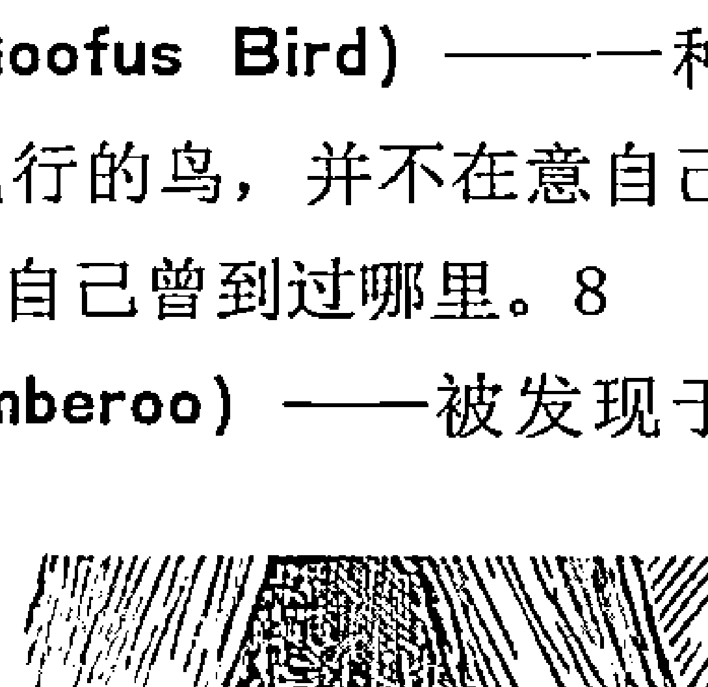

##### 吉奥斯卡塔斯（Gyascutus）[也被称为山坡道奇霍达戈、山坡小暴徒（Sidehill Gouger）、山坡迪安特尔（Sidehill Dianther）]

住在洛基山脉中的一种四脚兽，由于住在山坡上，它的四肢变得一边长一边短，于是它只能往一个方向前进。它体型与白尾鹿相当，长着一条有刺的尾巴，以岩石为食。它与欧洲大胡有血缘关系，在佛蒙特也有一种类似的魔精，叫瓦姆帕胡夫斯（Wampahoofus），在美国西南部也有一种野猪似的拉卡波尔（Rackabore）。

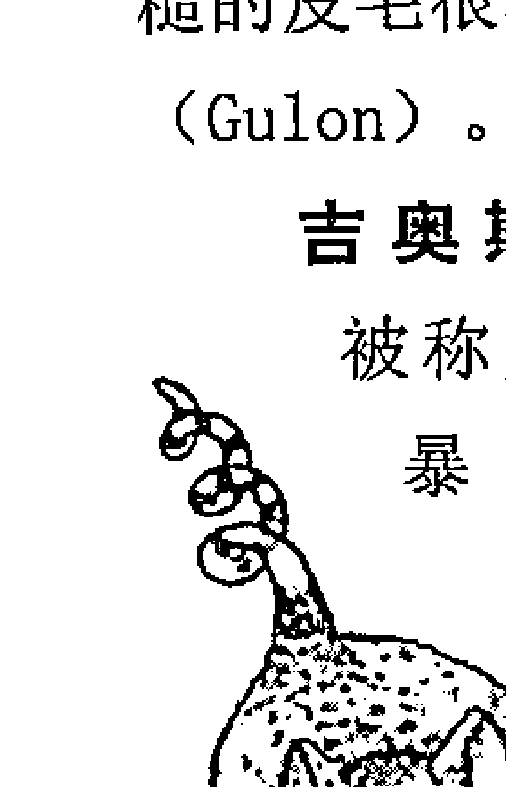

转身的时候飞快地躲到你身后最近的草堆里。没人知道它们长什么样，因为从来没人能看清它们。背后灵非常具有攻击性，很危险，会攻击并吃掉所有进入它们领地的人。

##### 哈基斯（Haggis）——苏格兰高地的本土生物

它是一种三腿鸟，翅膀很小但却长着尖牙。它的腿长短不一，一条短，两条长，这使得它能在山坡上快速奔跑。但是一旦跑到山顶，它就会失去平衡，掉入山下的谷地中。其雄性只会顺时针奔跑，而雌性只会逆时针奔跑。哈基斯的群落被称为海亚普（heap）。它们的肉是当地的一种美食。

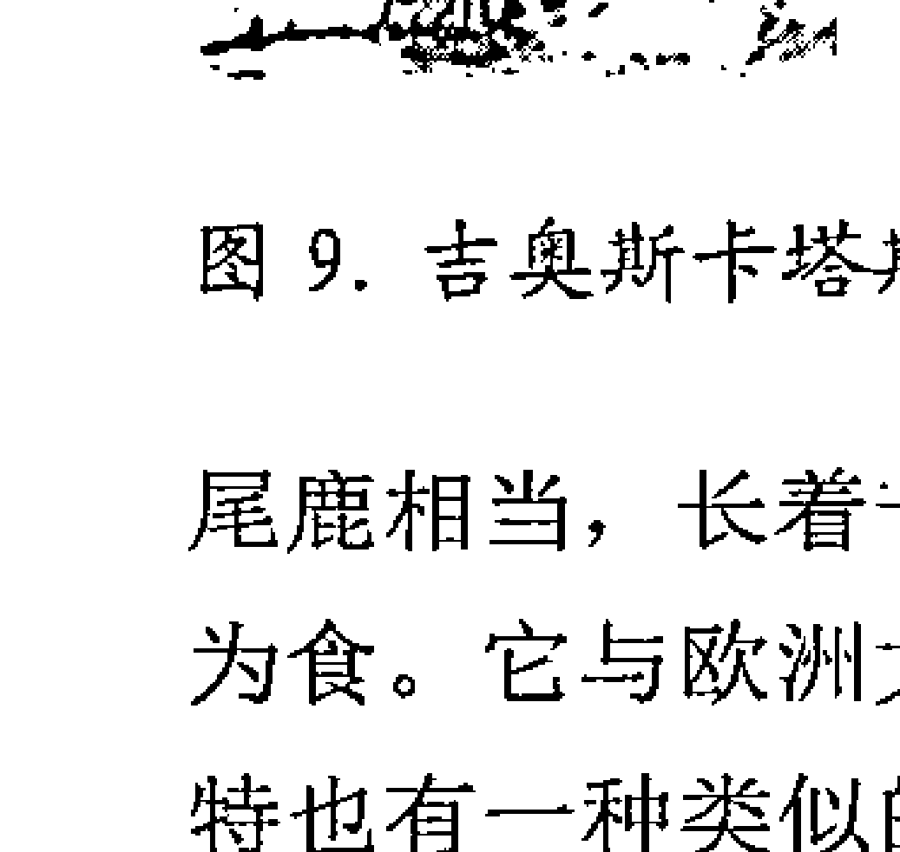

##### 背后灵（Hidebehind）——你也许能用眼角瞟到它们，但随后它们就会在你

##### 霍达戈（Hodag）——它们有几种不同的种类，其中体型最大的叫铲鼻霍达戈（Shovel-Nosed Hodag）。

它们据说很聪明，有犀牛那么大，身上无毛，看起来像穿着麦基诺风格（Mackinaw）的衣服一样。在它的鼻子上有一只巨大、铲子一样的角，这只角被用来切割树根和撞倒树木，以便吃到它们最喜欢的食物——豪猪。它们会从脑袋吃起。人们只在威斯康辛州和明尼苏达州发现过它们。

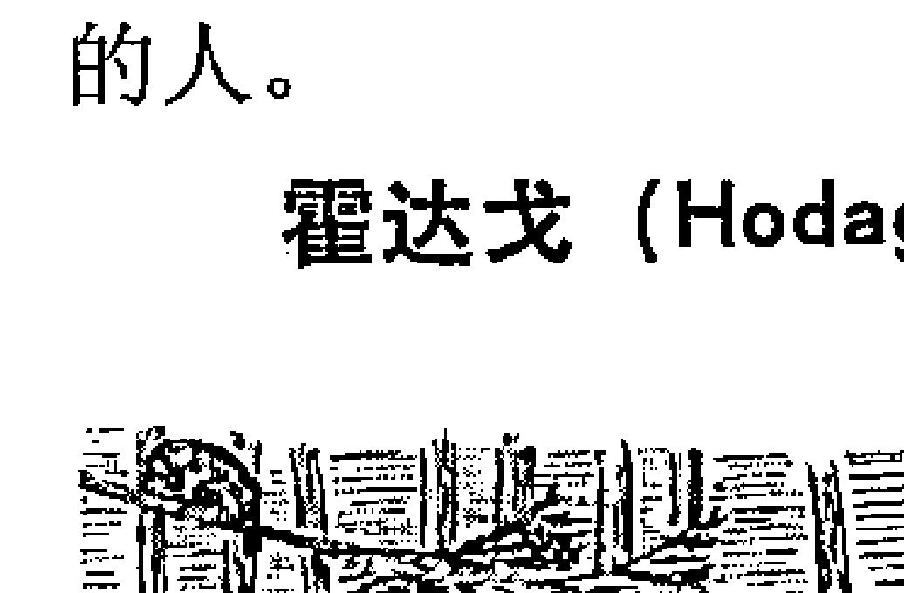

黑色霍达戈（The Black Hodag）是其中第二大的，也是最为残暴的。其身长可达7英尺以上，肩高3英尺，体重接近185磅，全身长着黑毛，头上有两只角，背上还有一排骨刺。

它们中最小的叫洞穴霍达戈（Cave Hodag），它看起来像是山坡道奇霍达戈（Sidehill Dodge Hodag），也叫吉奥斯卡塔斯的缩小版，长着三只发光的眼睛，能在遍及全美的石灰石洞穴中看清楚东西。

##### 环箍蛇（Hoop Snake）——在佩科斯比尔（Pecos Bill）的故事中，环箍蛇能用嘴咬住尾巴，像轮子一样追赶猎物。

在即将追上的时候，它会突然打开身体，用有毒的尾巴刺中猎物。逃生的唯一方法是躲在树后，这样你就不会遭到其毒刺的攻击。这种魔精的原型是蓝黑泥蛇 (Mud Snake)（泥蛇属），因其用来捕捉猎物的尖尾，而常被称为环箍蛇或刺蛇 (Stinging Snake)。

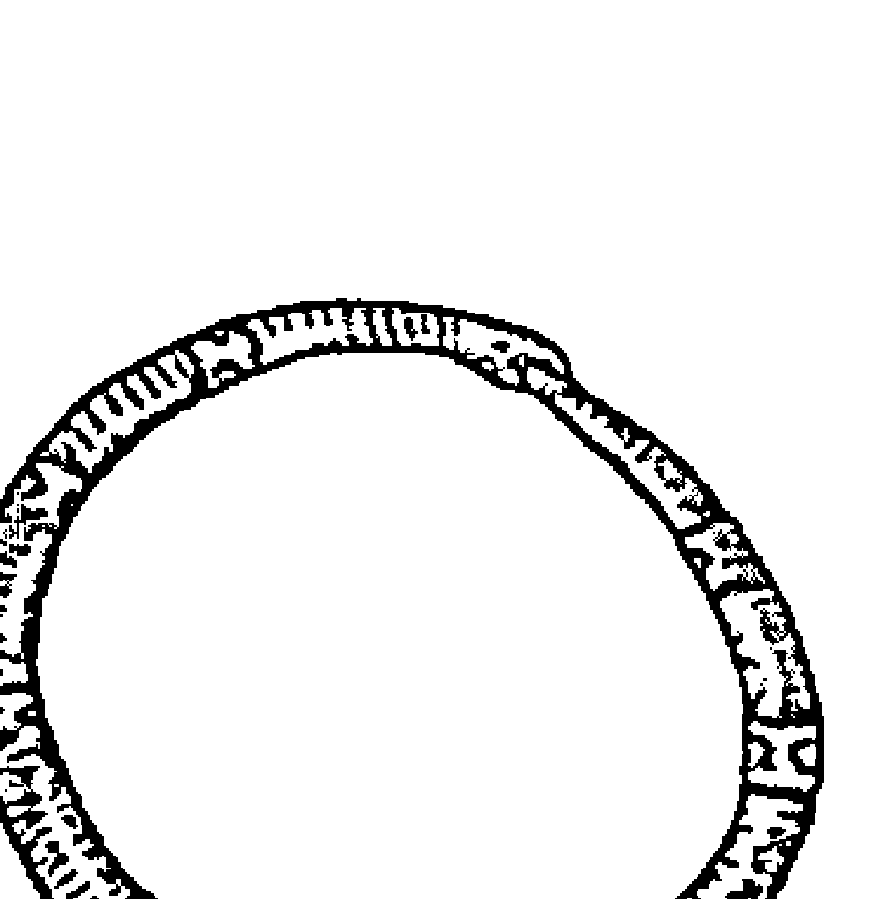

胡加格 (Hugag) —— 发现于从哈德逊湾一直到威斯康辛州和明尼苏达州的地区，这种魔精体型与驼鹿相当，四肢上没有关节，过长的上嘴唇使其无法觅食。因为无法躺下，它睡觉时必须靠在树上。猎人将它们喜欢的树砍掉一些，当它们靠上去休息的时候就会倒下，从而轻易地将其捉住。在欧洲的动物寓言集中，这种动物被称为阿克利斯 (Achlis)。

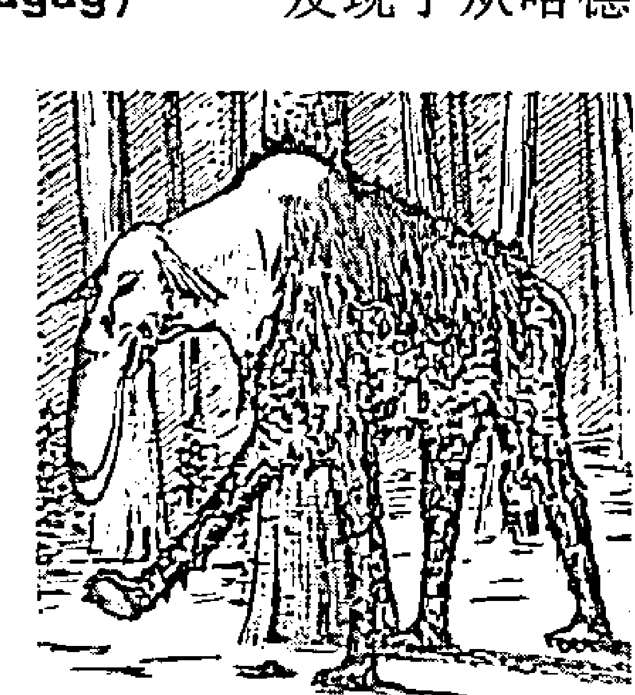

##### 连节蛇 (Joint Snake) ——一种能断成小节，也能复原的小蛇。它在美国革命时期被用作标志，旁边写上标语“连接或被毙。” (Join, or die.) 它的原型是体长2至3英尺的无腿玻璃蛇蜥蜴 (Glass Snake Lizard)（蛇蜥属），这种蜥蜴断尾后能长出新的。这种蜥蜴实际上常被称作连节蛇 (joint snake)。

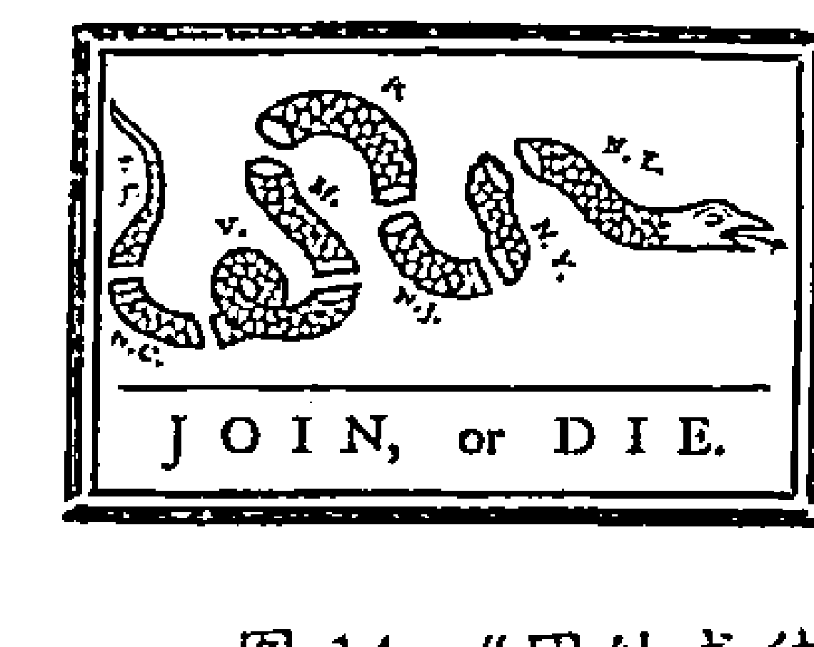

##### 山峰松鸡 (Pinnacle Grouse) ——这种奇怪的鸟只有一只翅膀，所以也只能围住山峰往一个方向转圈。它羽毛的颜色会根据季节和观察者的条件而变化。

##### 罗佩里特 (Roperite) ——被发现于塞拉山脉 (Sierra Mountains) 的山脚下，这种马一样大的魔精长着绳圈一样的喙，在乡下的空中跳着飞舞时，它会用它的这种嘴以极快的速度捕捉猎物。它尾巴上有很多的空壳，在追逐时能像响尾蛇一样摇动尾巴。它的皮毛和长角的双腿很容易受伤。

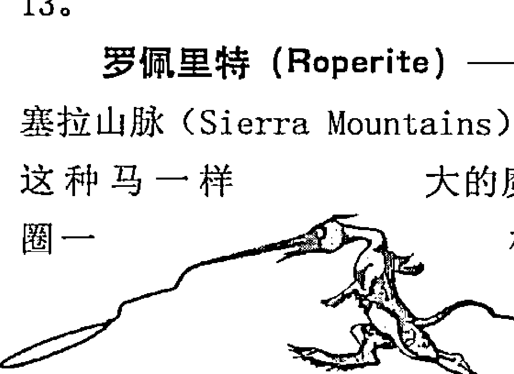

##### 拉伯雷多 (Rubberado)（也叫跳跃豪猪）——一种北美魔精，长着橡胶球一样的身体。它依靠跳跃而不是爬行或行走来移动身体。它会边跳边笑。很难将其射杀，因为子弹会被它们弹开。拉伯雷多的肉非常好吃，但吃了之后人会在几天之内都跳来跳去。

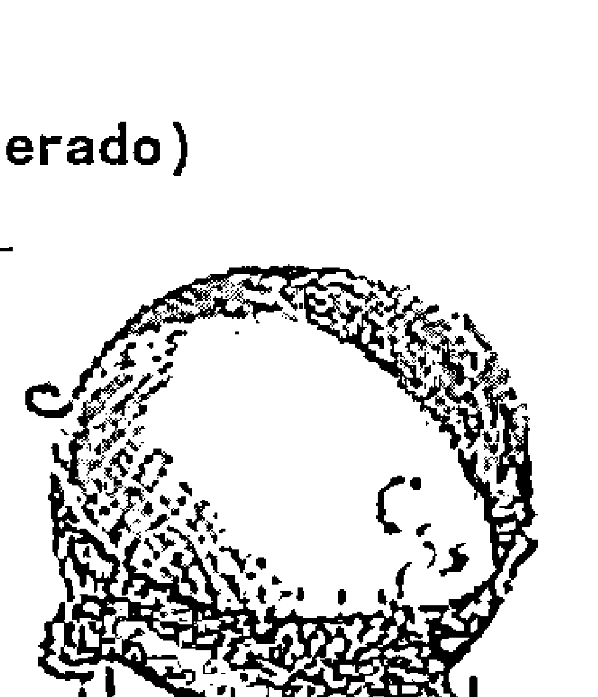

去的。

沙加马瓦（Shagamaw）——这种双足魔精沿着伐木道行走，它的脚印每过四分之一英里就会从驼鹿变成普通的鹿，但它的前肢却始终是熊爪。它会先用后腿行走440步，然后再换成前腿，留下让人疑惑的脚印。

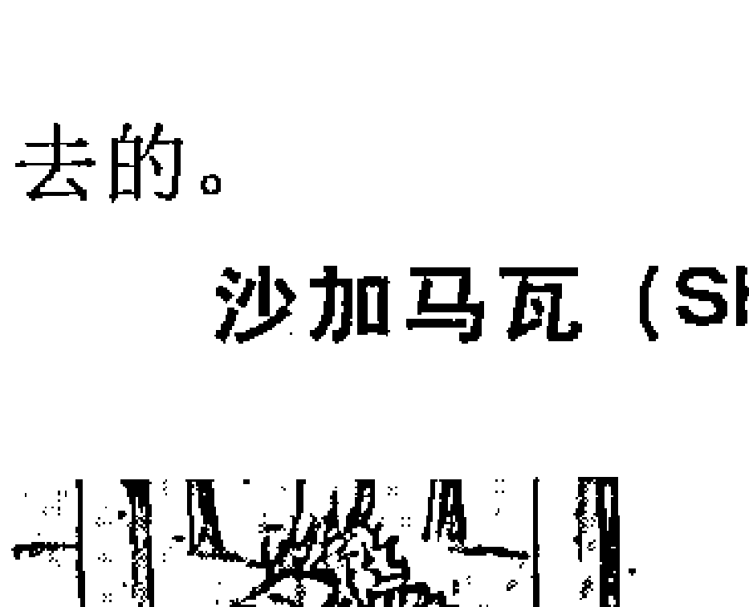

图17. 沙加马瓦（杜波依斯绘）

滑岩博尔特（Slid-Rock Bolter）——居住在科罗拉多州坡度达45度的山坡上，这种巨大的、鲸鱼似的魔精长着一条有钩的尾巴，将其固定在山坡上。当看到游客的时候，它就会松开尾钩，沿着山坡滑下来，用大嘴吞下受害者，然后重新爬上山坡，用尾巴将自己固定好，等待下一顿美餐。

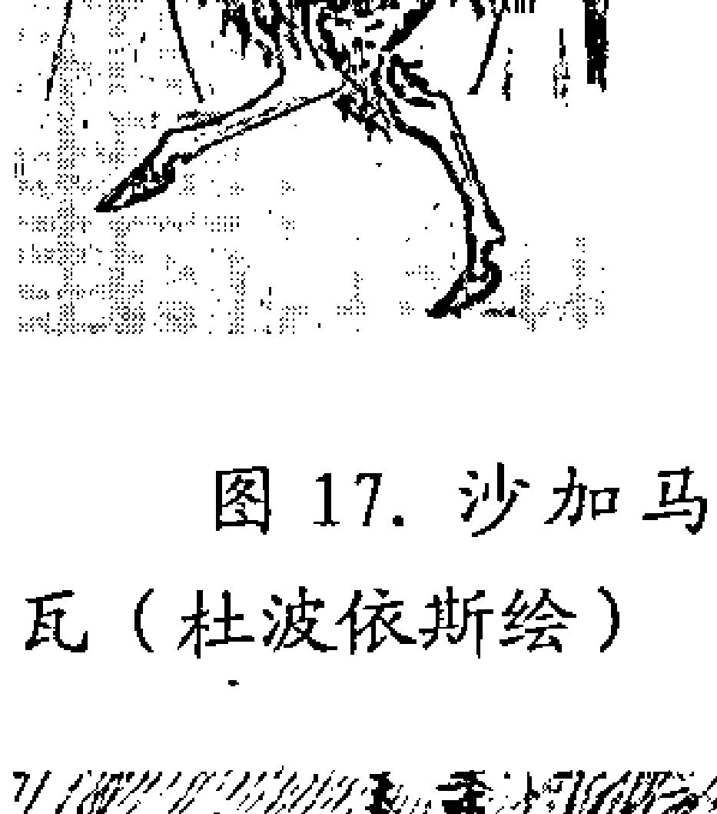

图19. 滑岩博尔特（杜波依斯绘）

斯诺里加斯特（Snoligaster）——这种魔精住在佛罗里达州的奥基乔比湖中，外形类似巨大的鳄鱼，身上长满长而光滑的皮毛。它没有四肢，没有鳍，但在长长的背上长着一排骨刺。在它尾巴的末端长着三块骨板，能被用作螺旋桨，使其像鱼雷一样在泥水中前行。它会将抓住的人类扔到背上，穿在骨刺上，然后再转过身来把它们吃掉。它的原型是斯纳利加斯特尔食人鸟怪（Snallygaster），一种翼龙一样的怪兽，据说居住在马里兰州的蓝脊山（Blue Ridge Mountains）中。

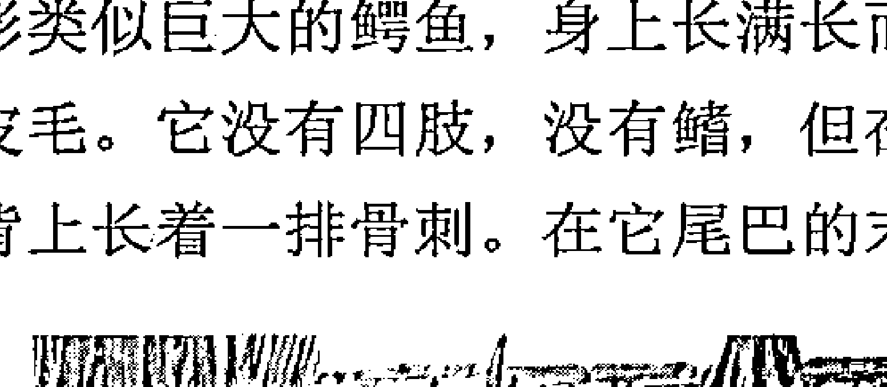

图20. 斯诺里加斯特（杜波依斯绘）

雪瓦塞特（Snow Wasset）——这种生物居住在加拿大的最北方。在夏季休眠时，它们会长出简化的四肢，毛发也会变成绿色，然后爬到酸果蔓上。但在冬季，它会变成白色，四肢也会退化，像蛇一样在雪地上寻找猎物——有时甚至会猎杀狼，因为这时它已经长到原来的四倍那么大，而行动能力也提高到了以前的40倍。

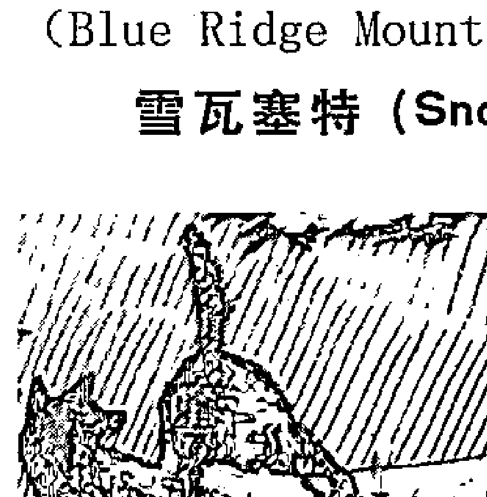

图21. 雪瓦塞特（杜波依斯绘）

斯普林特猫（Splintercat）——一种凶猛的野性猫科动物，在从大湖区到墨西哥湾的洛基山脉的东部被人发现。它以极高的速度在空中飞行，当撞上大树时，它会将其枝条都撞掉，让树木枯萎，留下一个枯死的树桩。它以此来将自己爱吃的蜜蜂和蜂蜜暴露出来。然而，用头撞树让它头痛不止，这让它总是脾气暴躁，因此千万不要靠近斯普林特猫。

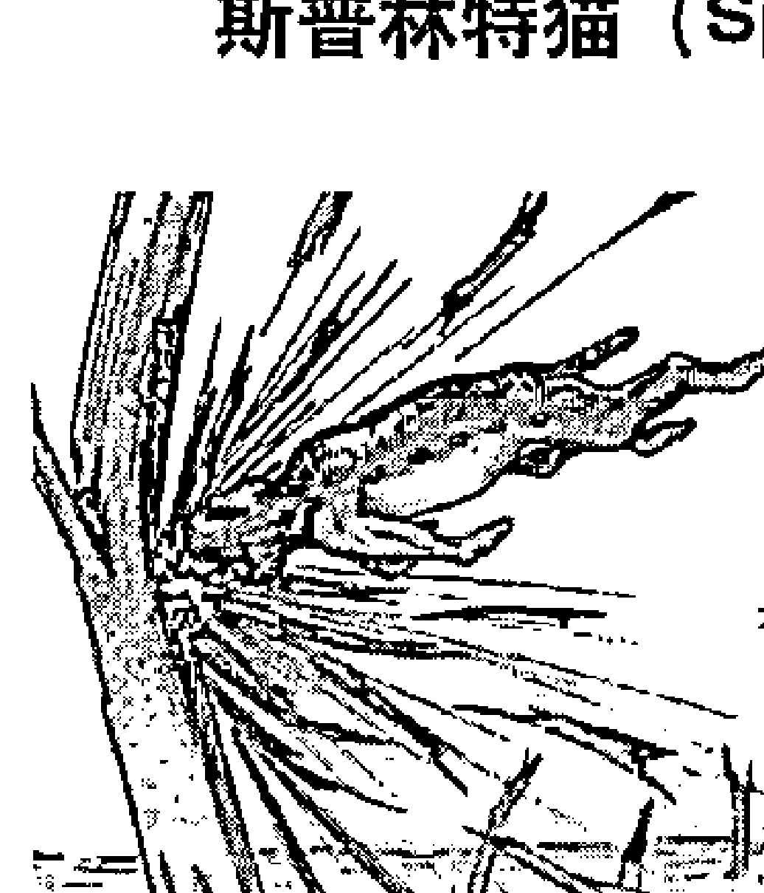

图22. 斯普林特猫（杜波依斯绘）

##### 惧鼠 (Squonk) —— 一种可怜的小魔精，住在宾夕法尼亚州北部的铁杉森林 (hemlock forests) 中。因其病态的皮肤上长满了瘤子和斑点，所以惧鼠总是躲在某处为自己的丑陋而哭泣。当被发现时，它会分解成一滩泪水和泡泡。

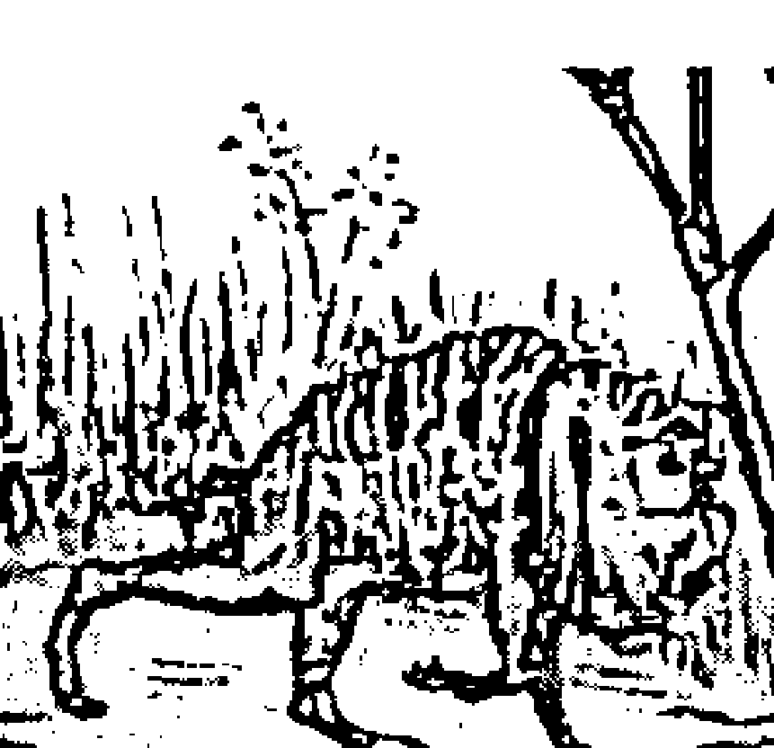

##### 提科特勒 (Teaketteler) ——明尼苏达州和威斯康辛州的本土生物，它长得像长有粗短腿和猫耳的小狗。它总是倒着走路，喷鼻时，嘴里会喷出蒸汽来。它的名字来自其发出的像茶壶一样的声音。它非常胆小，但只要你听到茶壶的声音但却找不到茶壶，那一定就是它在发声。

##### 特里坡德罗 (Tripodero) ——这种加利福尼亚的魔精长着两条望远镜似的腿，和一条袋鼠尾巴，这些都让它能高高地直立起来，俯瞰丛林，也能缩短双腿，在灌木丛间行走。当看到目标时，它会调整双腿和尾巴的角度，用巨大的嘴巴瞄准好，然后快速喷出一团干泥打晕猎物。

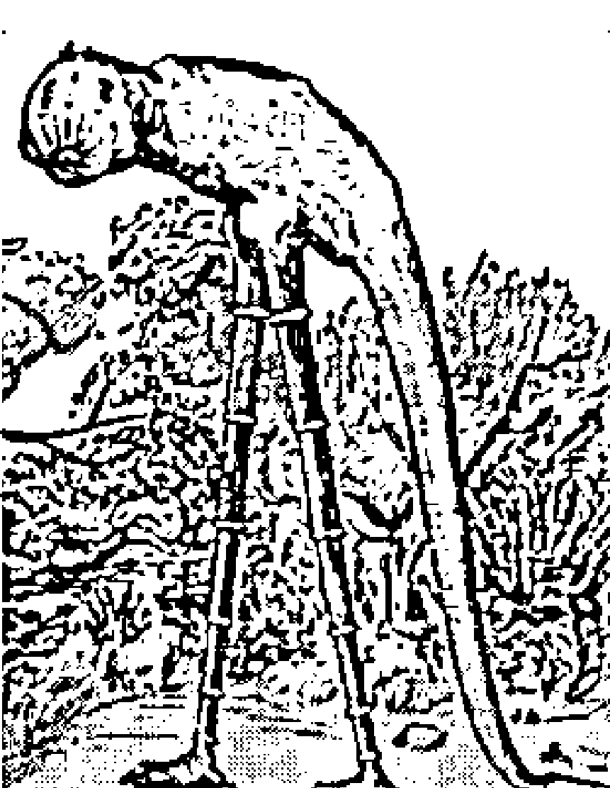

##### 昂帕恩德鲑鳟鱼 (Unpalnd Trout) ——一种因怕水而住在陆地上的飞鱼，喜欢将巢穴建在高高的树上。它的味道很好，有经验的露营者经常会叫新来的人进树林去搜寻它们的巢穴。

##### 瓦帕露西(Wapaloosie)——发现于从太平洋沿岸到爱荷达地区，这种松鼠大小的魔精住在高树上长着的菌架上。它的脚和脚趾像啄木鸟，“背”像毛毛虫。在其尾巴末端长着钉子，在爬树时方便将自己固定在树上。

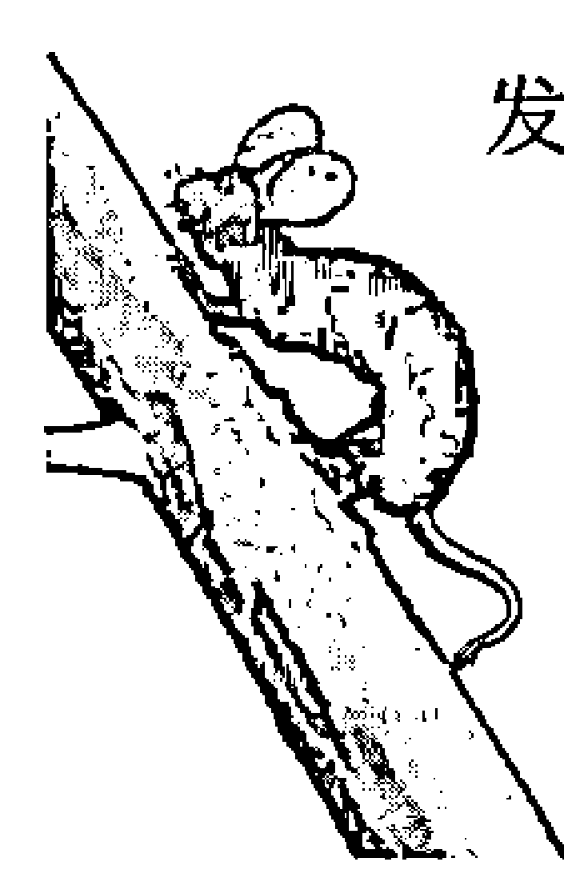

##### 温托瑟 (Whintosser) ——一种残忍和凶猛的魔精，生活在从中美洲到加利福尼亚海岸山脉的地区。它的头和尾巴能以每分钟几百圈的速度旋转。它三角形的身体很长，而它的三组腿能让其总是以正确的姿势着陆——这在经常地震的地区非常有用。

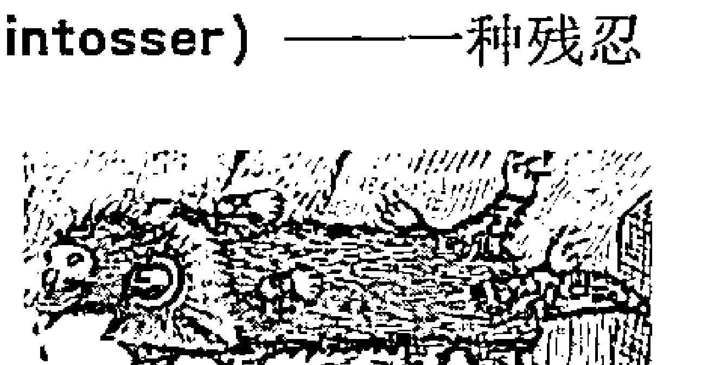

##### 灰灵维普斯 (Whirling Whimpus) ——一种嗜血的、星星样的魔精，长有巨大的双手，住在田纳西州。它的腿很小，站起来之后会快速地旋转，发出嗡嗡的声音，最终变得隐形。任何靠近的生物或人类都会被它的巨掌打成肉酱。

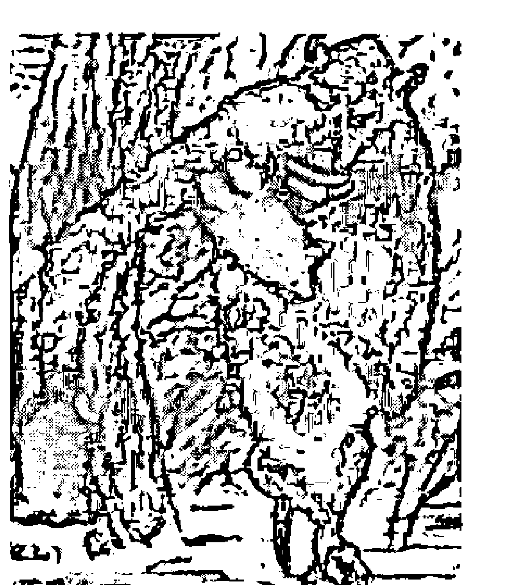

# III、怪兽的奥秘、传奇和历史

### 隐生动物学和现象学

### 水生之谜

### 18、湖中怪兽

作者：奥伯伦

有一次，一位圣人住在皮克特人（Picts）省，他要渡过耐斯河（尼斯湖）。到达岸边后，他看到有几个当地居民在埋葬一位不幸的人，那个人刚被救上来后就死去了，他刚才在河里游泳时，被水中的怪物伤得很重。这位圣人听到了这件事非常沮丧，他让一个同伴游到对岸，爬上停在那边的一条小船。那头趴在水底的怪兽察觉到了湖面的动静，浮上来想要攻击那个人，它咆哮着，在后面紧紧地跟着他，长着血盆大口。此时，那位圣人举起了一只手，口中默念上帝之名，在空中形成了一个十字标志，对那头恐怖的怪兽说道：“你不能再前进了，也不能伤害那个人，速速退下。”圣人话音刚落，那头怪兽便被吓得扭头就跑，就像是被一条绳子拉着一样……

——摘自“圣人驱怪”《圣哥伦伯传》（Life of Saint Columba， Founder of Iona）作者阿德曼（Adamnan），1874年。

传奇和未被证实的生物共同存在于尼斯湖、莫勒湖（loch morar），以及其它 250 至 300 个充满泥炭的湖泊和沼泽地中。这些湖泊分布在苏格兰、爱尔兰、加拿大以及世界范围内很多其它地区，自公元 565 年，第一位到达苏格兰的基督教传教士，艾奥纳岛圣哥伦伯（St. Columba of Iona）（521-597 年）在尼斯湖岸边遇上了“一头水怪（certaine water monster）”起，人们就对它们既好奇，又怀疑。

但其实在更早的时候，在圣帕特里克时期（公元 390-474 年），一头名叫考朗纳科（Caoránach）的雌性湖怪及其恶魔般的同类已经在爱尔兰的多尼戈尔（Donegal）肆虐了。这位圣人将其放逐到了德格湖（Lough Derg）之中，据说它在那里一直待到现在。

几乎所有据说有湖怪出没的河流湖泊都是非常深而且冰冷的，这与人们一直认为的它们是爬行动物的观点相矛盾。这些湖泊在最近一次冰川时期都曾是海洋的一部分，诸如三文鱼和鳗鱼之类的鱼类都会在产卵季节回到这些湖里产卵。

在本章中我们还会提到淡水怪兽，尽管经典的长颈湖怪与海蛇非常相似（参见第 19 章，“海蛇”）。目击者曾看见过几种不同的湖怪，有些只是体型不同寻常，比如巨大的鲟鱼、鳗鱼和鲇鱼；还有些则是体型没什么问题，但却据称出现在那些人们认为它们不该出现的地区，比如淡水湖中的海生鲸类或出现在温带地区的鳄鱼；剩下的则是体型和发现地都没问题——但却是在 3500 万至 7000 万年前的时候！

### 非典型嫌疑犯

超级鲟鱼（Acipenser），一种看起来像史前生物、没有牙齿的硬鳞鱼，巨大的骨板、鳞甲在其背上形成了一道锯齿般的背脊。它是世界上尚存的最古老的一种鱼，已知有 21 个种类，存在于北半球所有的水体中。已知的有些个体能活到超过 200 年。体长从 8 英尺到 11 英尺的鲟鱼并非没有，有些种类甚至还能长得更大。里海和黑海中的大白鲟（Beluga）（欧洲鳇）是其最大的一种，长度能长到 16 英尺以上，体重能超过 2000 磅。但最长的却是一条在俄罗斯捕到的 27 英尺长的湖鲟（Lake Sturgeon）。鲟鱼会用直直的楔形的嘴巴将湖底的淤泥翻腾起来，然后用其敏感的晶须或触须寻找软体动物、甲壳动物和小型鱼类来吃。大多数鲟鱼现在都被认为要么濒危，要么即将灭绝，所以看到它们很不容易，而且很难忘。

在那些能被划为超级鲟鱼的湖怪中有一种叫扁头湖怪（Flathead Lake-Monster）——一种巨大的、鲸鱼般的生物，住在蒙塔纳州的一个长 28 英里，深 300 英尺的湖中。它最早被发现于 1889 年。目击者称其有 15 至 20 英尺长，全身铁灰色，长着圆形的脑袋和多达三个的背刺。大多数人都称其类似于白鲟（A. transmontanus）。

据说在阿拉斯加州卡特迈国家保护区的伊利亚姆纳湖寒冷的湖水中住着一种大型的未知生物，目击者描述其有30英尺长，全身灰色，头部宽阔，身体瘦小，长着垂直的尾鳍。阿留居（Aleut）印第安人告诉那里的第一批俄罗斯定居者，在湖里住着一群吃人的怪兽，但第一次的官方报告却发生在1929年。很多后续的目击提到了越来越多的细节，让人们越来越相信它是一种巨型鲟鱼。

求斯附近的留尼汪岛（Reunion Island）抓到过一条巨型鳗鱼，它的“鱼块像切开的人的大腿一样”。鳗鱼有时会侧身在水面游动，这会让人产生与湖怪一样的幻觉。

大湖区的奥吉布瓦（Ojibwa）和阿尔冈琴（Algonquin）印第安人传说着米斯匹兹（Mishipizhiw）（“鱼王”）的故事。据说它长得像鲇鱼，背上长着锯齿状的骨刺和又长又弯曲的尾巴，它能用其制造风暴和漩涡。

在阿拉斯加因纽特人的传说中，派莱予（Pal-Rai-Yuk）是一种很长的生物，长着两个脑袋、六条腿、三个肚子、两条尾巴，背上还有一排锯齿状骨刺。它们住在河口处。它们看起来像是交配中的鲟鱼。

当然在俄罗斯也有怪兽级的鲟鱼，比如波罗斯尼（Brosnie），一种16英尺长、会发光的水生爬行动物，长着蛇一样的脑袋，它让布罗斯诺湖（Lake Brosno）和伏尔加河边的捕鱼者很害怕。

很多世纪以来，人们传说在苏格兰的敬畏湖（Loch Awe）中住着巨型鳗鱼。我们在帝莫西（Timothy Pont）（约1562-1614年）处找到了为数不多的记录中的一份，他将其描述为“像马一样大，身体非常长”，并称其让绝大多数的渔民都因害怕而远离该湖。

巨鳗（Anguilla）能长到30英尺长。尽管普通的欧洲鳗鱼（A. anguilla）很少有超过5英尺长的，而非洲的莫桑比克鳗鲡（A. mossambica）和花鳗鲡（A. marmorata）也都只能长到6英尺。而海鳗（Conger conger）也只能长到10英尺多一点。但自古以来就一直有关于更大的鳗鱼的报道。在1890年代，有人在毛里

日本九州岛上有一个火山坑形成的、深达765英尺的池田湖（Lake Ikeda），有人在那里看见了一条30英尺长、背上有刺、被称为伊西（Issie）的生物，并有许多人都拍下了照片。有趣的是，该湖也是巨鳗（humongous eel）的栖息之地，它们有些能重达33磅，长约6英尺。

纽芬兰的月牙泉（Crescent Lake）里也据说有5至15英尺长、鳗鱼一样、名叫克瑞希（Cressie）的怪物。冬季湖中冰块上的神秘空洞据说就是它们的杰作，而两位在该处搜索一架1980年代中期坠落在该湖中的潜水员曾他们发现自己被一种“像人的大腿一样粗的”鳗鱼所包围，还受到了它们猛烈的攻击。

爱尔兰米斯郡（County Meath）的巴拉教堂及修道院（Church and Abbey of Balla）的建立者圣克洛南·莫慈华（Cronan Mochua）在公元616年，记录下了里湖（Lough Ree）湖怪，起因是几个猎人因害怕住在该湖中的水怪而不敢下去追逐一头逃到湖中的牡鹿。1960年又有三位牧师看到了一只巨大、黑色、鳗鱼状的动物在离岸边不到300英尺的地方露出的脑袋。他们报告称：“它沉入了水中，一会儿又浮了起来，如此循环着。它露出水面的部分有6英尺长……脖子和脑袋加起来有18英寸。它的脖子和脑袋和三文鱼比起来要窄一些。它好像站在湖底一样，我们并未看到它的全貌。”

1800年代，在纽约伊萨卡岛（Ithaca）附近的卡尤加湖中传说住着一种巨大、蛇形的怪兽。1929年，有人开始报告称看到了两只动物，它们长约12至15英尺，同时在该湖的东岸边翻腾。在1974年的夏季，年轻的史蒂文·格里芬在湖中游泳时被“鳗鱼似的”生物攻击了，它有力的大嘴咬断了他的一条手臂。在19979年春季，J. T•马绍尔专业潜水服务公司的老板杰克•马绍尔正和一些朋友在该湖上划船，一眨眼的时间就被从水里冒出来的长约30至35英尺的“生物”缠住了。该生物获得了一个别名“老绿怪（Old Greeny）”。

鳗鱼般的怪兽在菲律宾吕宋岛的三描礼士地区（zambales region）也有发现，据说有多达五条的巨大黑色蛇形生物在提基斯（Tikis）河中游弋。当地的阿埃塔人坚称这些动物不像它们所熟知的任何一种鳗鱼、鱼类或蛇类。对其的首次目击发生在2002年11月5日，当时一个阿埃塔男孩误将一只当作了浮木，直到它动了一下才看清楚。两个月后，有几个人看到了一个7英尺长，3英尺宽的黑色生物静静地在河里游动。

### 巨型鲶鱼

因其巨大、类似猫胡须的触须而得名，鲇鱼（Siluriformes）是一种主要居住在淡水中的鱼类，在除了南极洲之外的大洲都有发现。它们有些长有骨板，有些则没有，但从没有一种长有鳞片。鲇鱼包括没有牙齿的湄公河巨型鲇鱼（Pangasianodon gigas），它住在东南亚湄公河盆地中。这种巨大的鱼据称能长到超过16英尺，是世界上最大的淡水鱼。

卢克瓦塔（Lukwata）是一种神秘的食肉鱼，据称生活在非洲的维多利亚湖中，该湖是乌干达、肯尼亚和坦桑尼亚的分界线。通常人们都称其拥有方形的脑袋和类似于海豚的棕色身体，以及白色的肚子。很多当地人都认为卢克瓦塔是一种12英尺

### 鲸鱼和鳄鱼经常被认为是湖怪的原型

它们通常都非常巨大。河口鳄 (Crocodylus porosus) 是所有现存爬行动物中最大的，通常都居住在印度尼西亚，能长到 30 英尺长。安图·科内利斯·欧德曼 (Antoon Cornelis Oudemans) (1858-1943 年) 购买的一条鲸鱼被罗伊·马卡尔 (Roy Mackal) 和其他隐生动物学家证实为史前古鲸 (Archaeocetid)，被称为械齿鲸 (Zeuglodon)，也被错误地成为龙王鲸 (Basilosaurus) ——3700 万至 4000 万年前始新世的一种长蛇形鲸鱼。

只有鱼类或鲸类长有巨大的背鳍，俄罗斯的拉不因科尔怪 (Labynkr) 湖怪就是一个例子。1964 年，几个猎人的狗因追逐一只鹿而跳进了该湖中，突然那两只动物都消失了，随后湖水开始躁动，钻出了一个巨大、长有背鳍的黑色怪物，它在下潜之前大叫了一声。当年晚些时候，一支苏联专家队在距离岸边 900 英尺处的湖中看到了三个大型物体。它们同时在水中进进出出，好像是同一个动物身上的部位。

1953 年 7 月，著名的地理学家 V·A·特韦尔多赫列博夫 (Tverdokhlebov) 在西伯利亚索东诺克·特伯兰德 (Sordongnokh tableland) 偏远的沃诺塔 (Vorota) 湖中看到了一只怪兽。他称其长约 30 英尺，宽约 6 英尺，其头上有一对奇怪的浅色斑纹，背上还有巨大的向后的背鳍。它游泳时像海豚一样上下摆动身体，还能跃出水面——砸出巨大的水花——然后潜入水中。听起来很像逆戟鲸，也叫杀人鲸 (Orcinus orca)，但它是怎么到那个湖中去的呢？

有人推测在非洲津巴布韦与赞比亚西南交界处附近的马绍纳兰省西部的卡里巴湖中也住着一对水怪。几个世纪以来这些生物都被汤加崇拜为神明，他们称其为恩雅米恩雅米 (Nyaminyami)。当地人说它们是长有鳞片的长蛇形生物，脑袋像鱼，也有人说它们体型巨大、背上有隆起，是像鲸鱼一样的动物。有些人称其长度达到了 120 英尺！

一种名叫“软泥怪 (Slimy Slim)”的怪兽据说住在爱达荷州的帕耶特湖中。它长着长约 36 英尺的蛇形身体和鳄鱼一样的脑袋。美国南部平原上的基奥瓦 (Kiowa) 印第安人传说这一种巨大的、鳄鱼似的、头上长着两只角的野兽，并视其为治疗和毒素的化身。

### 蛇颈龙（Plesiosaurs，希腊语“近乎蜥蜴搬的”）是与恐龙同时期的长颈水生爬行动物

它们的大小从 15 英尺到 50 英尺不等，其身体矮胖、扁平，尾巴短小，还长有四条鳍状肢。尽管人们认为它

们在6亿5000万年前已经和恐龙一起灭绝了，但与之类似的生物仍然不停在世界范围内被称为海蛇和湖怪。很多时候，这些目击报告都只提到了长长的脖子，而在1955年，博物学家亚历山大·拉伊梅报告称其在委内瑞拉的奥扬特普伊（Auyan-tepui）河上游，即柯南·道尔的“失落世界”所在地，发现了三头这种动物在岩石上晒太阳。1990年，两位法国探险者又到了那里，称自己也见到了同样的动物。在遥远东西伯利亚雅库兹克扬斯基地区的活火山湖哈伊尔（Khaiyr）湖中生活着一种叫哈伊尔湖怪兽的生物。最初发现它的是当时到该地区采集稀有矿样本的俄罗斯地质学家格拉德基卡先生（Mr. Gladkika）。当他坐在湖边时，一头蛇颈龙般、全身乌黑、长着长颈和小头的动物钻出水面，到岸上吃草。（插图11）数日后，探险队领队和两名助手在湖中心也发现了它。他们的描述与格拉德基卡的相吻合，但还加上了一个巨大的背鳍——该特征通常只存在于鱼类和鲸类身上。所有的目击者都称这头骨怪兽非常黑，几乎呈现出蓝色。

哈伊尔湖怪素描
在东非苏丹中南部诺湖（Lake No）附近茂密的的纸莎草沼泽地中，据说潜伏着一种怪兽，它非常巨大，有像蛇颈龙的脖子、以及驴子的身体，还长有鳍状肢。它发出的叫声像大象一样。在它的嘴上树立着刺毛，能被用来捕食猎物。它被称作劳（Lau），1914年，当地的一群希卢克人在阿达尔（Addar）沼泽中杀死了一头这种怪兽，并用其骨骼来当作护身符。从那时起，这种怪兽才受到了国际社会的注意。

另一种非洲“蛇颈龙”叫因坎雅姆巴（Inkanyamba），据说居住在南非豪威客瀑布下的深潭中。人们热情地称其为“豪伊（Howie）”，称其是类似蛇颈龙一样的巨型生物，长达24英尺，拥有鳄鱼般的皮肤，鬃毛上有鳍，还长着巨大的鳍状前肢、红眼睛，性情暴躁。在夸祖鲁（KwaZuluNatal）地区的澳洲土著那有2000年历史的岩石雕刻中也有类似的怪兽。祖鲁人和科萨人崇敬它们已达千年之久。

### 长颈“欧姆”

现在我们到了所有生物中最被经常提到也最为神秘的一种：长颈湖怪，也叫欧姆。尽管数百年以来有无数的目击报告，甚至还有一些照片，但却没人抓到过它们，也没有能够证明其存在的任何其它证据。它通常被描述为巨大、蛇形的生物，长着与马或骆驼类似的头、脖子和耳朵。然而，有些目击者将它的这些器官视作它的角，于是，这种动物也被叫做马鳗鱼、水马、水头、水牛、海羊、角蛇。有时有人说它们长着发光的红色或黄色眼睛、巨大的尖牙，它们甚至还能喷火。

游泳时，它们会上下摆动身体，经常在水面露出几个隆起，它们看起来都很像颠簸了的小船。它们的长度通常在 15 至 30 英尺之间，但也有几个报道显示它们的长度是这个的两倍多。有时有人看到它们长有短小的鳍状前肢，很少看到其后腿和尾巴。

其幼兽就是为人所熟知的尼斯湖水怪，它们住在苏格兰高地上深 755 英尺，长 23 英里的尼斯湖中。有人称其巨大、起伏的身体长达 30 英尺，有时会露出几个隆起。它们的头颈比例与马和长颈鹿类似，头上还长着小小的尖角似的突起。关于它们最早的目击报告出现在公元 565 年和 690 年，并在此后数百年的时间里一直都有人看到它们。但在 1933 年的环湖公路建成后，目击报告的数量戏剧性的减少了。

符合这种描述的湖怪存在于全世界 265 处水体中，其中包括苏格兰的湖泊，以及无数其它分布在北欧、俄罗斯、亚洲、加拿大，甚至包括南沙哈拉非洲和美国在内的偏远地区。下面就是一些典型的例子：

阿凯格湖（Arkaig）怪物——一种脖子长长、身体宽大、长有四条鳍状肢的湖怪，它与尼斯湖水怪类似，据说生活在苏格兰的阿凯格湖中。自 1800 年代以来一直有关于它的目击报告。

阿希普斯（Ashuaps）——一种类似尼斯湖水怪的水怪，住在加拿大的圣让湖（Lac Saint-Jean）阿希普斯长约 60 英尺，全身漆黑。第一份目击报告产生于 1950 年，自那时起又有很多人看到它。

比诺艾之兽（Beast of Bynoe）——一种只生活在澳大利亚达尔文附近比诺艾湾中蛇颈龙般的生物，在澳洲土著的一系列岩画中出现过。

布鲁克伊（Bruckee）——一种巨大的、长有四条腿的湖怪，据说生活在爱尔兰的山单甘（Shandangan）湖中。

考朗纳科（Caor á nach）——[也叫奇洛那（Keeronagh）]一种雌性湖怪，它的存让圣帕特里克时期（公元 390-474 年）的爱尔兰多尼哥居民非常害怕。圣帕特里克将其驱逐到德格湖中，至今仍在那里。

昌普（Champ）——一种长角怪兽，至少 400 年前，在魁北克和佛蒙特交界处的山普伦（Champlain）湖中就有关于它的目击报告。阿布纳基族易洛魁族（Abenaki Iroquois）印第安人称其为塔托苏克（Tatosok）。它长 20 至 30 英尺，有圆桶一样的身体和马一样的脑袋。有很多关于它的目击报告，甚至还有照片。

厄尔波斯特（Elbst）——1584 至 1926 年被发现于瑞士卢塞恩附近的瑟里斯伯格斯（Selisbergsee）中。它据说长得像龙一样，体型跟两艘颠簸的小船差不多，还有四只长有爪子的腿和一个巨大的、猪一样的脑袋。

##### 格里提（Gryttie）

一种据说生活在瑞典中部格里特湖（Gryttjen）湖冰冷湖水中的怪兽。它的身体有人说是蛇形的，有人说是圆形的，这种动物自1980年代被人发现过很多次。

##### 天池怪物（Heavenly Lake Monster）

一种一百多年来被传说住在中国长白山天池中的怪兽。它在1968年第一次得到了公众的关注，被描述为长约30英尺、全身灰黑、脑袋像马或像狗，上面还长有两只小角。

##### 艾古普古（Igopogo）

一种罕见的湖怪，住在加拿大渥太华、多伦多北方的西姆科湖中。据说它的脖子像烟囱一样，上面长着一个非常类似于狗头的脑袋。

##### 利勒诺（Leelanau）

一种住在密歇根州利勒诺湖中的怪兽。据说它长着长脖子、与脖子一样长的尾巴、两只大眼睛。它最早出现于1800年一座水坝建成后，这座水坝将它居住的地区的水面抬高了10至12英尺，将其变成了一个沼泽地。在1910年的夏季，一名名叫威廉·高蒂尔的年轻人打算将自己的小船系在漂浮在露出水面的几根枯木中的一根上。他选了一根约5英尺长，6英寸厚的，但当他把绳圈系在上面时，两只眼睛突然在这个被吓坏了的男孩的面前睁开。在互相对视了一会儿之后，这头怪物从下面钻过小船离开了。后来高蒂尔回忆称这头怪兽非常长，它沉下水去，在他船的另一边探出头来，而其尾巴仍然留在船的这边很远的地方。现在距离最近一次的目击报告已经有数年的时间了。

##### 利兹（Lizzie）

一种据称生活在苏格兰大峡谷的洛希湖（这个湖与尼斯湖间只隔了一个奥克湖）中的水怪。在1929年的弓形桥旁被两个看守人第一次发现了它，利兹据称有35英尺长，背上有三个隆包。随后很多的目击报告都在1933年被奥古斯都堡修道院（Fort Augustus Abbey）的僧侣记录下来了。1960年7月埃里克·罗宾逊及其家人，还有很多其他的目击者一起发现了一个它们估计长度在30至40英尺、全身深黑色、肚子白色的生物。它在大家的注视下钻入了水中，在消失前露出了一个巨大鳍状肢。1996年，阿拉斯特尔·史蒂文森在该湖中钓鱼时遇到了可怕的东西，那是一头长约18英尺、像颠簸的小船一样的动物，它咬住他的鱼饵，拖着他的船飞奔，直到后来鱼线断裂为止。同年晚些时候，尼斯湖水怪俱乐部（Official Loch Ness Monster Fan Club）拍到洛克湖的探险队用声纳系统探测到了一个长度在18至20英尺的物体在160英尺的深处像湖中心游去，那里的深度超过了300英尺。

##### 费达湖怪兽（Lough Fadda Beast）

爱尔兰费达湖中的一种长颈怪。关于它的第一份目击报告是在1954年，当时乔治娜·卡伯里和几个同伴遇到了一条“长脖子怪物”，它突然将头伸出水面，向他们的船游去。“它的头伸出水面越3英尺，样子卷曲的”，它的嘴巴则大张着，露出了白色的口腔。在最后时刻，这个生物沉到了船下，在另一边钻出了水面，露出了背上的两个隆包。1965年，受到此次遭遇的启发，尼斯湖调查局（Loch Ness Investigation Bureau）的成员在它们遭遇的地点引爆了 5 磅重的炸药，爆炸后几秒钟，一个巨大的黑色物体浮上了水面。那个生物疯狂地翻腾着，让人很难看清它的样子，不过大家都认为它看起来与任何一种动物都不同。

## **图鉴三、怪兽的奥秘、传奇和历史**

**马尼波戈 (Manipogo) ——** 一种很多人在加拿大的马尼托巴 (Manitoba) 湖和附近的温尼伯湖、温尼伯戈西斯湖、多芬湖、锡达湖、丢提湖中看到的怪物。当地印第安人在刚到此处定居的时候就知道了它们的存在。这种生物据说有 12 至 24 英尺长，全身暗绿或酱棕色，像一条巨大的鳗鱼或蛇，其长长的身体中间长着一个隆包。它的脑袋类似于蛇或羊。1960 年 8 月 10 日，有人看到三头这种生物在一起游泳，而两年后有人拍到了一只。

**米约撒——** 数百年来被认为生活在挪威利勒哈默 (Lillehammer) 附近的米约撒湖中的一种典型长颈湖怪。峡湾湖是挪威最大的淡水水体，长近 100 英里，深过 1400 英尺，表面积达 400 平方英里。

**布朗普顿的怪物 (Monster of Brompton) ——** 一种典型的湖怪，在 1970 年代的宾夕法尼亚莱康明郡的布朗普顿湖中被人发现。它呈灰绿色，有三个高出水面 8 英尺的隆包。它长着马一样的脑袋，嘴边还有刚毛。它游动速度很快，会在泥水中留下一道 250 英尺长的水波，恐吓那些试图靠近的鱼人走远一些。

**莫拉格 (Morag) ——** 住在苏格兰深达 1000 英尺的莫拉湖中的一种水怪。在 19 世纪和 20 世纪有很多报告都称其为绿色或棕色的蛇形生物，长度在 25 至 30 英尺之间，背上长有几个隆包。这些隆包被称为“葬礼船”，常有人看到它们在湖中穿梭，据说是在运送死去的部族成员。1969 年，莫拉格甚至还攻击了一艘船，被水员用船桨和步枪赶走了。

**拿活域里 (Nahuelito) ——** 一种据说生活在阿根廷哈辉尔花皮 (Hahuel Huapi) 湖中的怪兽。数世纪以来，当地的印第安人都讲述着关湖中的一种巨大的生物的故事。它们称其没有头没有腿，也没有尾巴。乔治·加勒特在 1910 年看到了他，说它“直径好像有 15 至 20 英尺，露出水面的部分可能有 6 英尺。”1922 年，美国淘金者马丁·谢菲尔德报告称自己看到了一种水生动物，它像鳄鱼一样行动，但却长着隆起的天鹅般的脖子。而在 1994 年，一些游客也看到了一种他们成为无头鲸的动物，它背上长着隆包，在身体的两侧还有小小的鱼鳍拍打着水面。

**奥古布古 (Ogopogo) ——** 住在加拿大不列颠哥伦比亚奥卡纳根 (Okanagan) 湖中的湖怪。水西瓦普印第安人称其为奈塔卡 (Naitaka) （“长鱼”）。据说它居住在湖中心一个小岛下的洞穴中，当地人制作了很多关于它的岩画、肖像画。在 1850 年代受到国际关注后，很多关于它的目击报告都被记录了下来。1975 年，有人观察到它搅动湖水，打破湖冰。目击者的报告也不怎么一致。有人说它像一根 15 至 20 英尺长、直径为 1 至 2 英尺的木桩，长着马一样或羊一样的脑袋；也有人说它起伏的身体像蛇一样，背上还长着几个隆包；还有人说，它像鲟鱼一样长着锯齿状背脊；更有人说它光滑的背上长着几个鳍。1914 年，几个印第安人在响尾蛇岛上发现了一具腐烂的尸体。这个蓝灰色的尸体有 5 至 6 英尺长，看起来重约 400 磅。它长着 4 只鳍状肢和一个长尾巴，但却没有脑袋，只长着两只巨大的鳍状肢。

##### 赛尔约尔索姆 (Seljordsorm)

(也叫塞尔玛) ——挪威泰勒马克郡 (Telemark) 附近 12 英里长的塞尔尤尔湖湖中的一种水怪。它首先是被坤雷克·安德森 (Gunleik Andersson) 发现，自那之后又有超过 100 起的目击。它通常被描述为 30 英尺长的蛇形生物，长着蛇一样的脑袋，背上还有几个隆包。1880 年，一位不知名的女性成功地将一条赛尔约尔索姆砍成两半，它的下半身爬回了湖中，而其上半身则留在了岸上，就这样慢慢地腐烂了。1986 年，阿斯穆德·斯克利 (Aasmund Skori) 称其类似于漂在平静湖面上的一只黑色的弓。它身长 6 英尺，非常厚，它四周的湖水会起泡。

##### 奥克怪兽 (Oich Monster)

——一种住在苏格兰奥克湖 (Loch Oich) 中的巨兽，该湖是一条狭长的淡水湖，最终汇入洛奇湖 (利兹的栖息之地)，被苏格兰运河与尼斯湖隔开。关于它的目击报告能追溯至 19 世纪。据说它是一种长有马头或狗头的巨蟒，身上是黑色的皮肤和两个隆包以及一条长长的类似于马的鬃毛。

##### 希拉弗 (Shielagh)

——一种潜伏在苏格兰 17 英里长的谢尔湖中的怪兽，该湖正位于莫拉湖 (莫拉格的栖息之地) 南边。这种怪兽据称有 70 英尺长，背上长着 3 个巨大的隆包。关于它的最早的目击是在 1874 年，直到在世纪之交时一直有人看到它们。此后直到 1997 年或 1998 年，关于它们的目击报道才再次爆发式地出现，其中包括一次同时出现四只的报告。

##### 珀尼克 (Ponik)

——生活在加拿大魁北克波埃尼加蒙克 (Pohenegamook) 湖中的一种怪兽。目击者称，它类似于一条颠覆的独木舟，长度有 36 至 40 英尺，背上有骨刺，头像马的或牛的，没有耳朵，有鲇鱼般长长的鳃须。有些目击者还称其背上有两个隆包，还长着两只巨大的鳍状肢。

##### 斯托瑟琼德居勒特 (Storsj odjuret)

(“巨型湖怪”，也叫斯托西) ——一种长有角或长耳的怪兽，据说生活在瑞典耶姆特兰 (Jämtland) 省附近的斯图尔湖 (Storsjön) 中。自 1635 年以来就一直有关于它们的报告，而对它们的描述也一直在改变，于是有人怀疑该湖中生活着不止一种怪兽。有些目击者描述它拥有蛇形身体，长有几个隆包，脑袋像猫的或狗的，全身皮肤呈灰色。其他人说这种生物又短又肥，长着圆圆的头。很多人将其和鳄鱼做比较，也有人将其与鳗鱼或水獭联系起来。有些目击者看到了大大的鳍状肢，而其他人则看到了强壮的后肢和短小的前肢。但所有人都称其身长在20至30英尺间，长着大眼睛和大嘴巴。不管它到底是什么，在1986年，还是被官方列为了保护物种。但最为令人震惊的发现还得数1984年1月18日在该湖岸边发现的一小具尸体，人们认为那是它的胚胎。这具体尸体现被存放在耶姆特兰博物馆的一个玻璃罐内。

##### 塔霍湖特西（Tahoe Tessie）——

特西据说生活在加利福尼亚州和内华达州交界处的塔霍湖中，该湖长22英里，宽12英里，深1645英尺。通常人们认为这种怪兽体长超过60英尺，拥有上下起伏的蛇形身体、深色的皮肤和爬行动物的特征。有些目击者称其长得像巨大的鳟鱼。关于这种生物的传说能追溯至1800年代中期，当时华秀（Washoe）和派尤特（Paiute）印第安人告诉了白人定居者湖中住着的“怪兽”的故事。在1970年代中期，著名的法国海洋学家亚克·库斯托带着一支探险队前去探索塔霍湖的秘密。他们遇到了一些恐怖的东西，他拒绝向世人揭示它究竟是什么，也没有公示过自己拍摄的任何影片的内容。他只是说了一句：“这个世界还没有准备好！”

##### 瓦罗厄（Wallowa）湖怪——

据称居住在俄勒冈州深深的冰川湖中，这种有角的两栖怪兽让当地的内兹佩尔塞人（Nez Perce）印第安人世代不得安宁。有人说它体长75英尺，背上有几个隆起。也有人说该湖中住着两者不同的湖怪：一种长约12英尺，有长长的龙形身体，而脑袋则像猪和鲨鱼的结合体；另一种只有8英尺长，脑袋像水牛，双眼间隔14英寸。还有人称其长着一个大大的犀牛角。

### 恶作剧

不幸的是，湖怪的历史中也充斥着各种恶意的恶作剧，很多都让目击者信誉扫地，让调查员蒙羞和难堪。1933年12月，非常厉害的猎人韦特雷尔（Marmaduke Wetherell）在尼斯湖岸边发现了巨大的脚印，一直通向湖中。来自国家历史博物馆的调查认为这些脚印出自一只烘干了的河马脚，这当时被用作伞架，非常流行。受到侮辱的韦特雷尔开始反击了：几个月后，在1934年4月19日，一位德高望重的英国外科医生罗伯特·威尔森上校拍下了这张著名的照片，成为了此后60年间的尼斯湖水怪的标志。

但在1994年，在90高龄的上校即将去世的前夕，克里斯蒂安·斯普林，最后的一位同谋者向外界揭示了其中的原委，应韦特雷尔的要求，他在一艘玩具潜艇上岸上了一个雕刻出来的怪物脑袋，将其放到了尼斯湖中，然后拍下照片，将照片拿个威尔森，利用他的名望向将其展现给世人。

##### 好吧，真相是什么？

一直以来，蛇颈龙都被当作尼斯湖水怪及其它同类型水怪的原型。但关于当代水怪的目击报告和照片与恐龙化石之间的所有相同点都只不过是牵强附会而已。对我而言，研究者试图将这些生物视作已知的脊椎动物时，并未将所有的细节都囊括在内。我将尝试着举出一些例子，希望能解开它们身上的谜团，并提出自己的见解，即便现在还没有证据能证明，但在动物学上也说得通。

首先最主要的就是，这些生物都能在水下呼吸，因为它们很少出现在湖面上——有些隔了很多年才再次被看到。这种能力只存在于鱼类、一些两栖类和很多非脊椎类动物身上。所有的爬行动物或哺乳动物都只能不断地浮到水面呼吸，其中包括水生美洲蜥蜴（mairne iguanas）、鳄鱼、海豹、海獭、海牛以及鲸。蛇颈龙是水生爬行动物，生活习性与海狮类似。蛇颈龙种群很难不被注意到。同样，古鲸（archaeoceti）也会像现在的海豚和鲸鱼那样浮到水面呼吸。稀少的目击次数让湖怪是用肺呼吸的生物的说法无法站住脚。

其次，所有的长颈湖怪游动时都是上下摆动身体，而不是左右摇晃的。这非常关键。在脊椎动物中，只有哺乳动物和鸟类能够这样做。这就是为什么鲸类和海牛的尾巴都是水平的，而不是鱼类那样垂直的。而且，蛇颈龙是爬行动物，它们的身体像鳄鱼一样，只能左右摇摆，不能上下起伏。

第三，这些生物的长脖子上无法长鳃，因为鳃是连接在鱼类和两栖类的头骨和下巴结构上的一个部分。有鳃的脊椎动物绝对不会长脖子。这个特征也将鲸鱼排除在外，其中包括始新世古鲸，如械齿鲸和基王龙（Basilosaurus），因为所有的鲸类——包括史前物种——都没有脖子。有些古代的爬行动物，比如蜥脚类动物和蛇颈龙，确实长着长脖子，这也就是它们会被当成湖怪原型候选者的原因。但只能水平摆动的身体和需要到水面换气的特征将所有爬行动物都排除在外。尽管所有的哺乳动物都只有七节颈椎，但还是有一些，如长颈鹿，长着长长的脖子。实际上，几乎所有哺乳动物都长着类似的“马脑袋”。而且哺乳动物的身体能够上下起伏，这是它们的另一个特征。

类经常会出现水面。这样就还剩下鸟类，它们既有能上下起伏的身体，也有长脖子。很多鸟类也生活在水中，还有一些，如潜鸟（Gavia）和鸬鹚（Phalacrocorax），能潜入水里，即使它们体型较小，但也可能会被错当成水怪。在有些报告（参见拿活域里）中称水怪长着“天鹅般的”脖子。白垩纪的黄昏鸟（Hesperornis）身长5英尺，但鸟类必须呼吸空气，而且没有一种鸟能达到报告中所称的15至30英尺的长度。更别提其它那些更大的水怪了。

现在，让我们回顾一下水生脊椎动物的相关特征（海生的和已灭绝的也包括在内，且给出的都是最大的体型）：

| 动物 | 弯曲方式 | 脖子 | 呼吸方式 | 最大体型 |
| :--- | :--- | :--- | :--- | :--- |
| 水怪 | 上下 | 长 | 水下 | 30-70英尺 |
| 鱼类 | 左右 | 无 | 水下 | 30-50英尺 |
| 两栖类 | 左右 | 无 | 水/空气 | 6-9英尺 |
| 爬行类 | 左右 | 短/长 | 空气 | 5-50英尺 |
| 哺乳类 | 上下 | 无/短 | 空气 | 5-120英尺 |
| 鸟类 | 上下 | 短/长 | 空气 | 5英尺 |

这下应该很清楚了，不管是现存的还是已灭绝的，没有一种脊椎动物符合长颈水怪标准。那么还剩下什么呢？用福尔摩斯的话来讲就是：“当你将所有不可能的东西都排除了的时候，不管剩下的是什么，虽然不大可能，但一定是它。”（柯南道尔，《福尔摩斯》）。从尼斯湖水怪和世界上其它同类型的生物来说，剩下的可能就是它们是某种巨大的非脊椎动物。但又是什么呢？

##### 塔利怪兽

1968年，F. W•“特德”•赫勒迪提出了一个关于尼斯湖水怪以及世界上其它同类型生物的激进的理论。在他杰出的、富有洞察力的著作《尼斯湖水怪》（The Great Orm of Loch Ness）中，他将所有的报告和照片都按时间排列起来分析。他是第一个得出结论，认为上面的日期排除了它们是脊椎动物的可能性，因此这些生物必然是某种巨大的、虫子一样的非脊椎动物。赫勒迪认为海蛞蝓（Opisthobranchia）是一种可能的候选者，尤其是

一块奇异的古代化石中的一种，它被以其发现者弗朗西斯·塔利（Tully）的名字命名为：“Tullimonstrum gregarium”（通常被称为“塔利怪兽”）。塔利怪兽只在伊利诺伊州被发现过，该州将其用作官方化石，它们在3亿年前的宾夕法尼亚时期是非常常见的海洋动物。但那是很久以前的事了，而且在更近的地层中没有发现它们的化石。虽然从形态学上初看起来，塔利怪兽与普通的水怪极其相似，但后续的分析却给出了怀疑。最初人们认为的长脖子和小脑袋变成了长着尖牙的长嘴巴。最开始认为的脖子底部长着的小鳍变成了长在茎杆上的眼睛。另外，这些被发现的诸多化石，它们的长度从 2 英寸到 14 英寸不等。最近的一则描述也让其更不具备说服力。

塔利怪兽长着长长的、分段的身体，两端都很尖。前端长着长长的嘴巴，里面长着 8 颗小“牙齿”。在身体的另一端长着一条尾巴和两只鳍。两只茎杆上的眼睛在身体前端附近突了出来。从流线的造型、柔软的身体和可移动的鳍来看，塔利怪兽是一种善于游动的生物。它可能像鱿鱼一样在海底附近徘徊。塔利怪兽的“嘴巴”及其明显的游动能力表明它们会像水木和虾类一样攻击其它海生生物，也许会用“牙齿”来将猎物撕碎后吸取汁液。

##### 其它的欧姆

唯一剩下的可能性就是那些也许是世界上最大的生物：软体动物，它们有些——如巨型鱿鱼——能长到超过 100 英尺长，轻松地超过了报告中水怪的长度。

在研究水怪报告，特别是近距离遭遇报告时，这些生物被描述为像虫子、黏糊糊的、令人作恶的次数多得令人震惊。乔治娜·卡伯里 1954 年在费达湖中游泳时看到了一只生物，称其为“像虫子一样。你知道的——很恶心的那种。它动起来的时候整个身体都好像在动一样。”乔治·斯派瑟和妻子在 1933 年 7 月 22 日穿过马路时看到了尼斯湖水怪，他说那头动物“非常恐怖——令人厌恶。”它的皮肤“很可怕而且庞大，呈黑灰色，上面有令人作呕的纹理，让人联想到蜗牛。”迪克·詹金斯（Jenkyns）1974 年 9 月 30 日在尼斯湖岸边看到了里面的一头生物，他说：“我觉得那头动物非常污秽，直到现在这种感觉都还在，它给我的印象就是一个大大的肚子上付着一些内脏。”斯派瑟称其长着“弯曲的脖子，比大象的鼻子稍厚一些”，只是完成了半圆形，这是其看起来像“一条长着长脖子的蜗牛。”

工程师理查德·梅克伦（Meicklem）在当年的 8 月 5 日清楚地看到了它身上的隆起物达 3 分钟之久，他称它的皮肤“长着瘤子”，有很多颗粒。丁思德（Tim Dinsdale）说“近距离观察过的人都说它的皮肤很粗糙，与蟾蜍的类似。”

实际上，这些生物古代的名字叫“虫类（worm）”或欧姆（orm）——一个被广泛应用于龙身上的词汇。古代和中世纪关于龙的传说经常会提到被杀死的欧姆的尸体“会融化”，只留下牙齿，这能够解释为何在湖中和其它地方没有留下它们的化石或骨骼。

## 图鉴三、怪兽的奥秘、传奇和历史

骨骼。在北威尔士，当地有关于希菲尔-德尔（Ceffyll-Dwr）（“水马”）的传说，这是一种会发光的灰色湖怪，触摸于瀑布和山中的池塘里。据说任何敢攻击并杀死这种邪恶生物的人都找不到它们的尸体，而只有在水面上飘着的一团乱七八糟的脂肪。

在查看报告和图画时我们还发现一个明显的特征，就是它们脖子和身体都具有橡胶般的弹性，能变得又长又细或又短又粗。它们脖子的长度能“从2、3英寸到10英尺长、1英寸厚”不等。

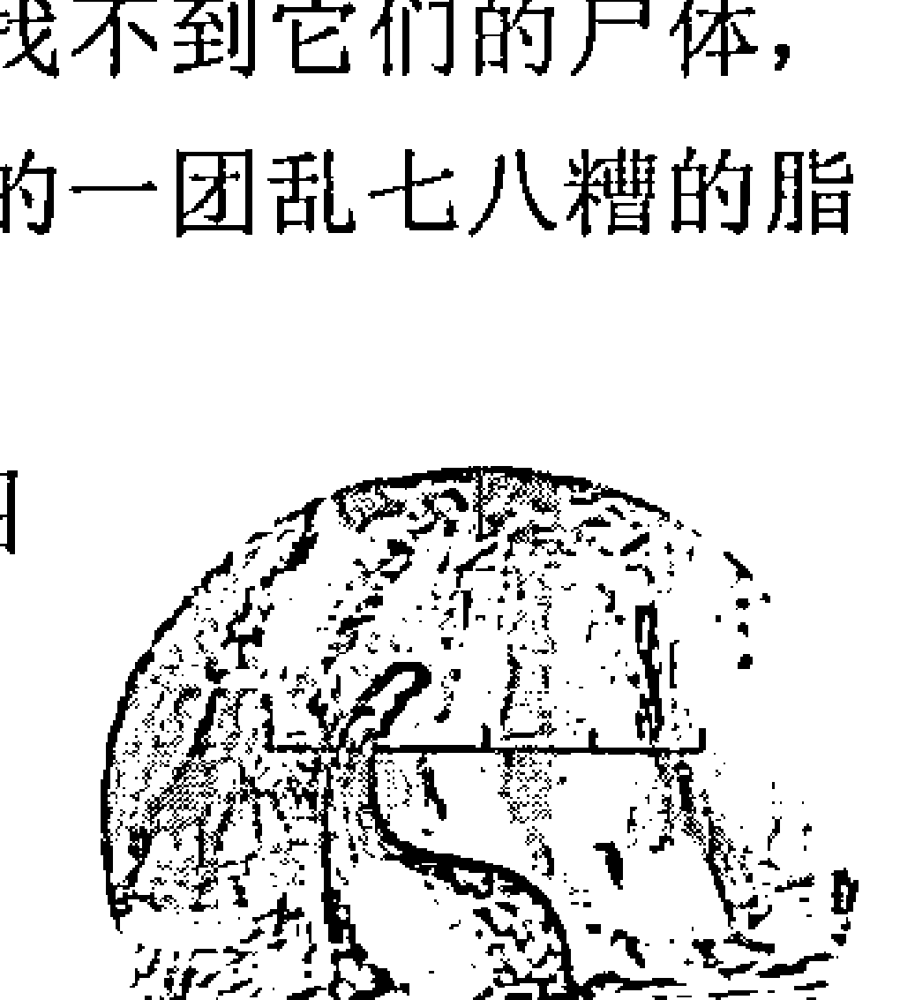

23，极少关于它们在岸上活动的报告称其像“毛毛虫一样”蠕动。在1965年9月30日的晚上，两名摩托车手分别看到了同一个20英尺长的生物，“像一条巨大的毛毛虫一样爬行”，缓缓地在苏格兰佩斯和邓迪之间的A85号公路边泰河的不远处移动。

在托奎尔·麦高乐（Torquil MacLeod）根据自己用望远镜看到的景象而画出来的作品中很清楚地表明了这种生物的弹性，1960年2月28日，他看到一只生物一半的身体贴在尼斯湖边的岩壁上。25（插图29）在休·格雷拍摄于1933年11月的一些尼斯湖水怪照片中也能清晰地看到同样的身体比例和弹性。

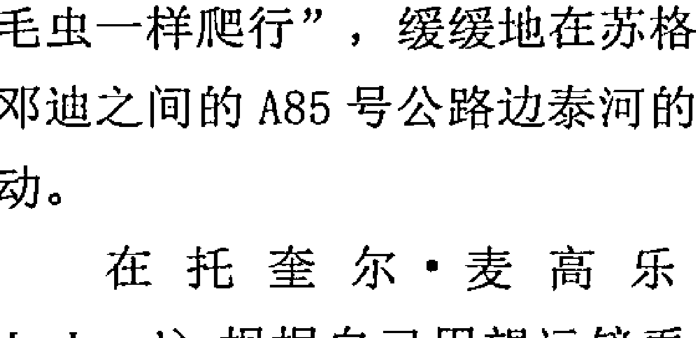

同样，关于它们头部的报告和照片（插图32）都显示出像蜗牛或蛞蝓般的触须（插图31）。实际上，丁思德还说过“有时，在它们的头上会出现两条‘蜗牛角’一样的突起，而它们的眼睛（并不常被人看到）像‘针一样的裂缝’，而它们的身体‘明亮，会反光’。”26关于另一次在1968年2月22日的爱尔兰纳胡（Nahoooin）湖中看到的东西：“（史蒂芬）科因夫妇都认为该生物有12英尺长，没有眼睛。科因太太告诉我们她注意到其头上有两根突起物。”1976年11月17日在尼斯湖又出现了一次水怪，康沃尔巫师托尼·“多克”·谢尔斯拍摄了照片并说：“它的头上有角，又粗又短……它的头极丑，像长着奇怪茎杆的蜗牛头一样。”

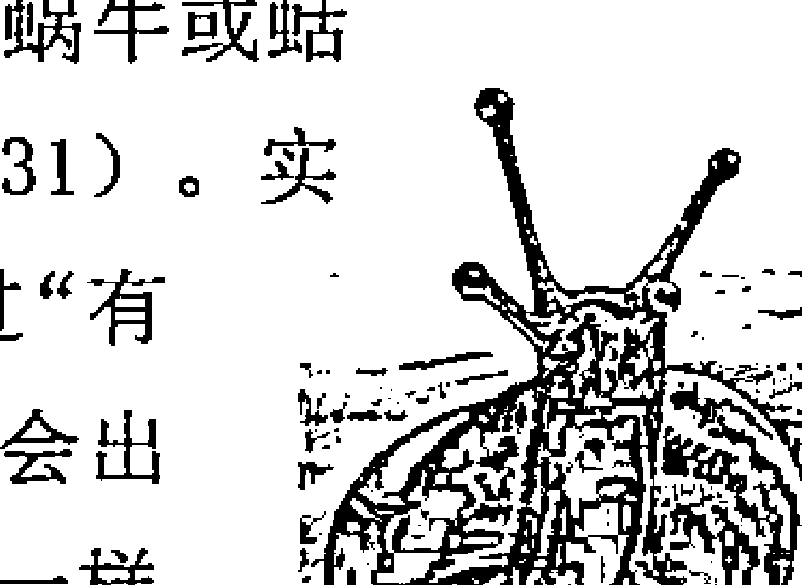

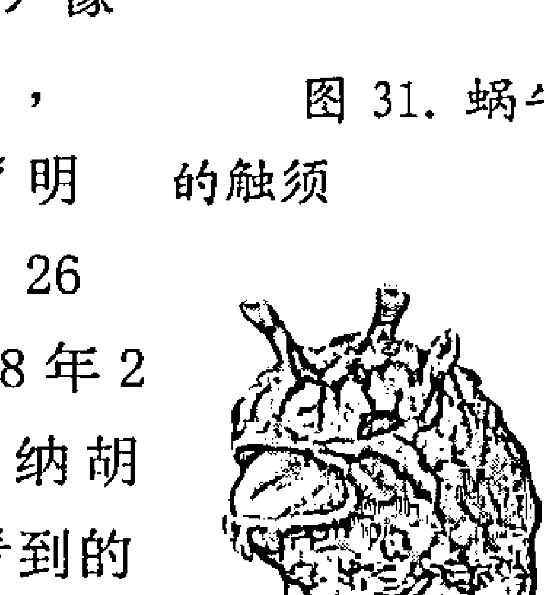

有趣的是，古埃及文字中的“男人”和字母“F”的读音通常都被视作一条“长角的毒蛇”，看起来与我们的水怪非常相似。也许最能解释清楚的是1921年被翻译成英文的威尔士双足飞龙（Wyvern）传说，里面写着：“有时人们能见它悄悄地行动，在莫尔·欧富朗拇（Moel Offrum）肥沃的山坡上到处都是，它拉长自己笨重的身体，拱起神秘的背，到处觅食，在身后留下一条黏黏的道路。”28 这种黏黏的轨迹是蜗牛和蛞蝓独有的特征。

综上所述，我认为尼斯湖水怪、彻西（Chessie）、昌普（Champ）、莫拉格（Morag）和其它那些像花园中的蜗牛一样长有长脖子和两只“角”的怪物都可能是巨大的水生蛞蝓及其亚种。

海蛞蝓是一种高度进化的腹足类动物（gastropods），有很多不同的种类，而人们知道的却只有生活在海里的那种。它们长着小眼睛，头的前方几根敏感的角状触角，用来辨别方向和嗅探食物。它们的脚都进化成了多肉的翼状疣足（parapodia）。有几个亚种，比如有壳翼足目（Thecosomata）和裸壳翼足亚目（Gymnosomata），还将其用作助游的鳍。

下面是一些报告中湖怪所拥有的非脊椎动物的特征比较：

| 动物 | 弯曲能力 | 颈部 | “有角”与否 | 呼吸 | 大小 |
|------|----------|------|------------|------|------|
| 怪兽 | 垂直 | 长 | 有 | 水下 | 30-70英尺 |
| 塔利怪兽 | 垂直 | 长 | 没有 | 水下 | 14英寸 |
| 软体动物 | 垂直 | 有延展性 | 有 | 水下 | 30英寸——？|

1975年，根据应用科学学院（Academy of Applied Science）在1972年拍摄的水下照片（插图34），彼得·斯克特爵士将尼斯湖水怪正式命名为尼斯湖水怪（“Nessiteras rhombopteryx”——“长有钻石形鳍的尼斯湖怪物”）。有趣的是，希腊文中的“pteras”（“鳍”）也有“翅膀”的意思，表明了长有翅膀的龙的来源。但如果这些生物真如我们所认为的，是水生软体动物的话，它们身上的钻石形鳍可能就是它们的鳃盖（拉丁文“operculum”——“小盖子”），海蛞蝓的鳃盖位于脖子下面，在心脏后面，而不是像鱼和两栖动物那样在头上。在照片、画作和目击报告中反映的正是这个部分。

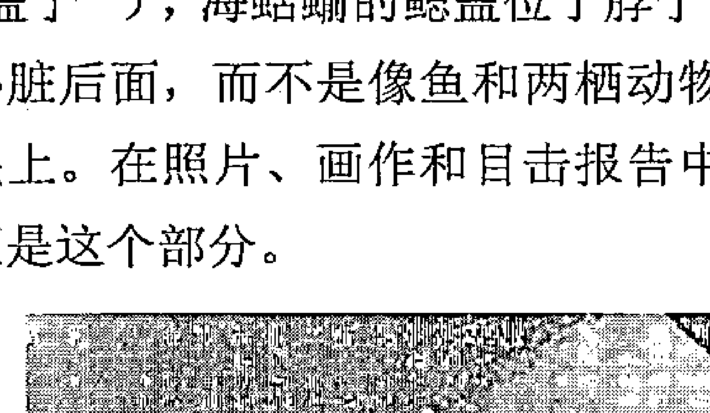

图 34. 尼斯湖怪的“鳍”的水下照片，由应用科学学员于1972年8月9日拍摄

##### 重建

1987年，我将所有的报告和图画综合起来，雕刻出了一个尼斯湖水怪的模型。我认为这个模型真实反映了尼斯湖水怪的样子，如果不是，那必须要等到有人抓住一只才能确定。而且，我认为将它们视作脊椎动物（具体而言，蛇颈龙）的错误做法误导了先前的人们。

下一步，我们应该着重在那些湖泊底部的淤泥中寻找它们的幼虫——这也包括那些据称有沼泽狗（Bog-dog）、马鳗鱼、马形水鬼出没的爱尔兰沼泽。（见第 12 章“水马”）而海洋生物学家史蒂芬·奥西（O’Shea）正在进行这方面的工作，他成功地在海洋浮游生物中找到了巨型鱿鱼的幼虫。

假设这些生物都是巨大的淡水水生蛞蝓，那么它们和历史上其它关于欧姆的描述间有什么联系呢？在众多特征中，有一条是欧姆具有剧毒，能烧伤人的皮肤、污染井水、泉水、湖水，甚至它接触过的土地。很多软体动物滑滑的皮肤的味道很难闻，有时甚至有毒，作为对捕食者的抵抗。而其它的则长着特别的针刺细胞或毒腺，有时能让捕食者瘫痪。30

神话中始终有关于“龙齿”的主题——似乎这是唯一一种能保存下来的欧姆或龙的残骸，因为没有头骨、皮肤或其它东西曾被公之与众过。蛞蝓的牙齿——它身体上唯一坚硬的部分——并不像脊椎动物那样长在嘴里，而是长在其有弹性的舌头上，也叫齿舌（radula），是一排排细小的牙齿，用来刮下或抓住食物。31 死去的蛞蝓会变成一潭粘性物，只有牙齿会被留下来。

本书中记录的很多关于湖怪的报告中所说的龙骨般的隆起物非常有趣。（插图 28）它们的数量因该动物的长度而不同，而每个隆包最长也在 5 英尺左右。“最怪的就是有些报告中称这些隆包会变形。”32 因为这些生物通常都被说成在移动时是上下移动身体的，所以这些隆包看起来就像充满气的浮力舱一样，跟鱼鳔差不多（见图解）。在鱼类中，这种密闭的器官是肺的原型，里面充满了从水中过滤出来的呼吸气体。但在巨大的、生活在淤泥中的蛞蝓体内，该器官中充满的更可能是来自消化过程所产生的气体，所以可能含有甲烷，也叫沼气。然而，正如大家所知，这是一种极为易燃的气体，为了沉入水中，这种生物必须将其排除，最有可能的通道就是嘴巴，而嘴巴并不是呼吸器官。但如果这种生物突然拥有了同鳗鱼和其它生活在泥水中的鱼类（它们将其用作导航和捕猎）一样的生物电能，那么电火花就能被用作排除这些气体，这样我们就有了会喷火的龙。这是多么奇特的防卫机制啊！

最后，当充满气体的气舱被排空后，这些隆包可能就变成了某些报告中所说的类似“背鳍”般的东西，比如俄罗斯的哈伊尔湖水怪。（插图 10）

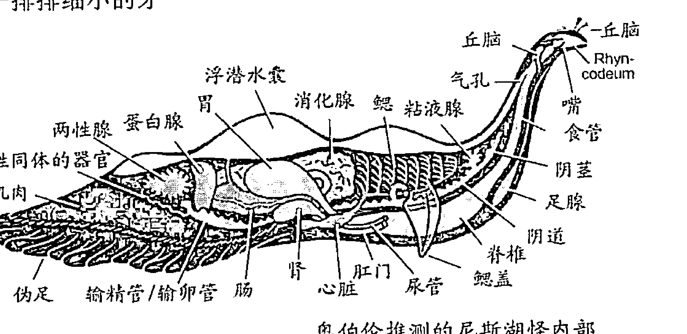

## 魔法师的怪物图鉴

> 苏格兰，爱丁堡（美联社）——2007年5月26日，一位业余科学家抓拍到了尼斯湖水怪观察者所称的，关于这种难以捉摸，游动在苏格兰最为神秘的湖水之下的神奇生物最好的画面。“当我看到这个黝黑的东西的时候，我简直不敢相信自己的眼睛，它大约45英尺长，在水中的速度非常快。”戈登·霍尔摩斯说道，他时年55岁，是约克郡希普利的一位化验员，就是他拍到了这段录像。他说这个动物以6英里的时速移动，行动路线呈直线形。

### 怪物电影：湖怪

有几部电影是基于尼斯湖水怪而创作出来的，最早的一部是《尼斯湖水怪传说》（The Secret of the Loch）（1934年），拍摄于尼斯湖环湖公路完工之时的1933年。在《劳博士的七张脸》（The 7 Faces of Dr. Lao）（1964年）中水怪被刻画得更加细致，而它们也出现在《福尔摩斯私生活》（The Private Life of Sherlock Holmes）（1970年）里，在该片中华生看到了它们。《火山湖怪兽》（The Crater Lake Monster）（1977年）讲述的一只被陨石热量孵化出来的怪物、一位疯狂科学家和坠毁中的纳粹飞机的故事。《尼斯湖水怪》（Loch Ness）（1996年）是一部优秀的奇幻电影，主演是伊安·霍尔姆（Ian Holm），他在影片中保护了这头怪兽不被人利用。在《深海大水怪》（Beneath Loch Ness）（2001年）中，一支科考队发现了一头巨大生物被冲到湖岸上的尸体。《尼斯湖事件》（Incident at Loch Ness）（2004年）是几个互相竞争的电影团队制作的水怪纪录片。在《深湖巨兽》（Mee-Shee: The Water Giant）（2005年）中，一位男孩和一头住在一个加拿大偏远大湖中的可爱水怪变成了朋友。《尼斯湖水怪》（The Water Horse: Legend of the Deep）计划在2007年的圣诞节公映。不幸的是，所有的这些电影都将这种生物假设成了蛇颈龙，而《改变世界的怪兽》（The Monster that Challenged the World）（1957年）和《致命水蛭》（Attack of the Giant Leeches）（1959年）中的湖怪却是巨型蜗牛。

### 19、海中巨蛇

作者：奥伯伦

> 你能用鱼钩钓上鳄鱼吗？
能用绳子套住它的舌头吗？
你能用绳索穿过它的鼻子吗？能用钩刺入它的腮骨吗？
它会向你连连恳求，说柔和的话吗？
它以铁为干草，以铜为烂木。
箭不能恐吓它使它逃避。
弹石在它看来只是碎秸。
棍棒只是禾秸。它噬笑短枪飕的响声。
它肚腹下如尖瓦片，它如钉耙经过淤泥。
它使深渊开滚如锅，使洋海如锅中的膏油。
它行的路随后发光，令人想深渊如同白发。
在地上没有像它造的那样，无所惧怕。
凡高大的，它无不藐视。
它在骄傲的水族上作王。
——《圣经·约伯记》

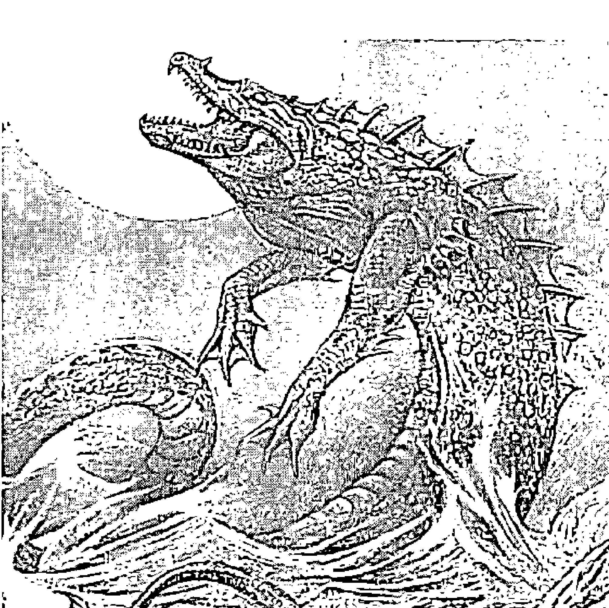

伊安·丹尼尔斯

人类利用船只在海上航行的时候总会遇到巨大的、被普遍称为海蛇的怪兽。隐生动物学家布鲁斯·尚帕涅（Bruce Champagne）统计在七大洋中有超过1200次的目击，都被记录在海洋历史中。1人们在海岸上和船上都看到过这种生物，有些报告还涉及到成百上千的目击者，有时整个过程会持续数小时之久。目击者包括从水手到科学家在内的各行各业的人。直到今天都还有人遇见它们，最近在从加州到西北太平洋地区发生了很多起目击。这些遭遇都在报纸上详细地报道出来，尽管其中很多的照片都是虚构的。

然而，对于海蛇的描述并不只有一种。有时它们是巨大的蛇类、鳗鱼、海豹、鳄鱼甚至史前生物，如蛇颈龙。隐生动物学之父贝纳德·霍伊霍尔曼（Bernard Heuvelmans）（1916-2001年）在自己里里程碑式的著作《海蛇的苏醒》（In the Wake of the Sea Serpents）（1968年）中将所有的海怪的原型分为7类：长颈类、马鱼类、肉峰类、多鳍类、超级水獭类、超级鳗鱼类、海生蜥蜴类。可是尽管目击到很多次，但却没有任何一件被证实了的未知生物样本存在。

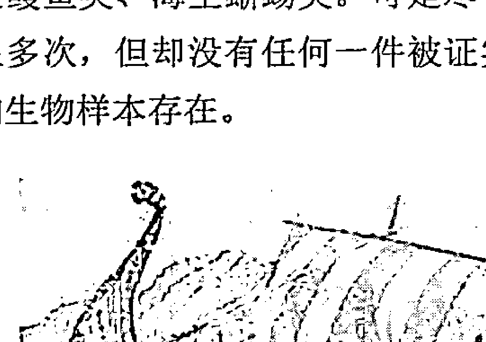

### 北欧传说中的海蛇

最早的海蛇记载来自北海上的水手，维京人，他们住在现在被称为挪威、瑞典、丹麦和冰岛的地区。1000年前，勇敢的北欧水手将它们航船的船首刻上了名为“破浪者”（古英语中的“Ythgewinne”）的海蛇形象，希望籍此避开真正的龙的攻击。

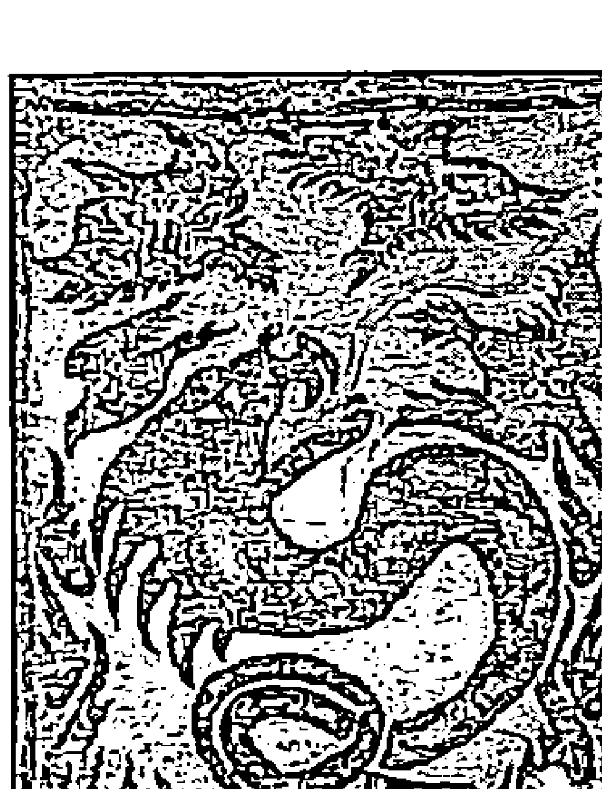

斯图尔虫（Stoorworm）（“大蛇”）是一种巨大的海蛇，它们曾经居住在现在被称为北海的地区。它非常巨大，身体能覆盖整个北欧。如果不向它献上人类作为祭品，它就将给不列颠地区带去洪水。当国王的女儿被选中之后，她的父亲想用自己一半的王国来奖给能杀了这条龙的人。一位名叫阿斯帕特勒（Assipattle）的年轻人毛遂自荐。他将慢慢燃烧的煤块投入了这条怪虫的嘴巴，从体内将其烧死。它在死前的挣扎将丹麦、挪威和瑞典之间的海洋分开了，而它的牙齿变成了法罗（Faroe）、奥克尼（Orkney）和设得兰群岛。它燃烧不止的身体变成了火山岛冰岛。这个故事可能代表了在10500年前冰河世纪结束时，英国、斯堪迪纳维亚半岛和欧洲之间的低地下沉的事件，当时冰川融化，将海平面抬高了400至600英尺。

在冰岛民间传说中，斯奇立穆勒（Skrimsli）是一条巨大的海蛇，住在围绕拉加尔弗流特（Lagarfljot）的海中，在从中世纪到18世纪的时候一直有人在那片区域目击到它。然而，它却被认为是无害的，因为它的力量被蒙德圣（St. Gudmund）所束缚，只有在世界末日那天才会被释放出来。但在近几年，在冰岛的洛古林（Lögurinn）湖（20.5英里长，367英尺深）中，有人看到了一种奇异的虫子一样湖怪，有人认为它是传说中的斯奇立穆勒（Skrimsli）的重生在世。

挪威巨蛇（Great Norway Serpent）是一条巨大的海蛇，据称居住在北海之中。它全身黑色，长有鳞片，有长长的鬃毛或毛发，据说有200英尺长和20英尺厚。它住在海岸边的洞穴中，在夏季夜晚会出现在陆地上捕食家畜。还有一种挪威传说中的海怪，斯约姆（“海虫”）。它们在陆地上孵化成小蛇，越长越大，所捕食的猎物也越来越大，直到陆地再也支撑不了它们的身体的时候，这些怪物就会回到海中，继续生长。

瑞典牧师和作家奥拉乌斯·马格瑙斯（Olaus Magnus）在自己的《海图》（Carta Marina）中描绘了很多不同形态的海怪，其中就有一种会攻击船只，吞食船员的海蛇。在其1955年的著作《北方民族历史》（History of the Northern Peoples）中，马格瑙斯对挪威巨蛇进行了如下描述：

> 那些沿着挪威海岸航行做生意或捕鱼的人都说，有一条200英尺长20英尺宽的巨蛇居住在卑尔根（Bergen）海岸的裂缝和洞穴中。在明亮的夏季夜晚，这条蛇会离开巢穴出来吃牛、羊和猪，或者它会进入海洋，捕食海中的荨麻、螃蟹和海生动物。它的脖子上长着1 厄尔（45英尺）长的毛发，有尖利的黑色鳞片和火红色的眼睛。它会攻击船只，从水里立起身来，抓住上面的人并吃掉。

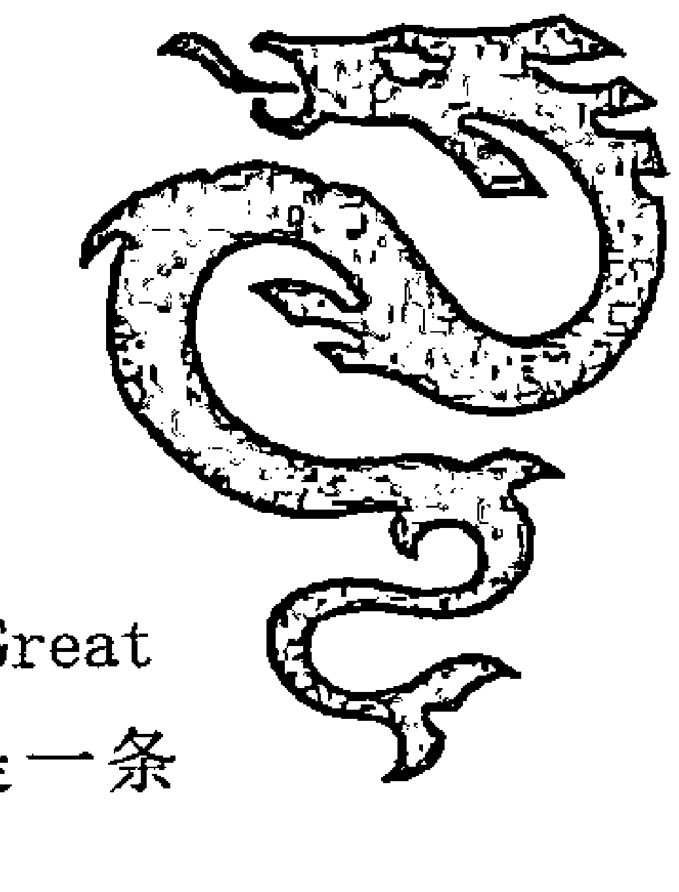

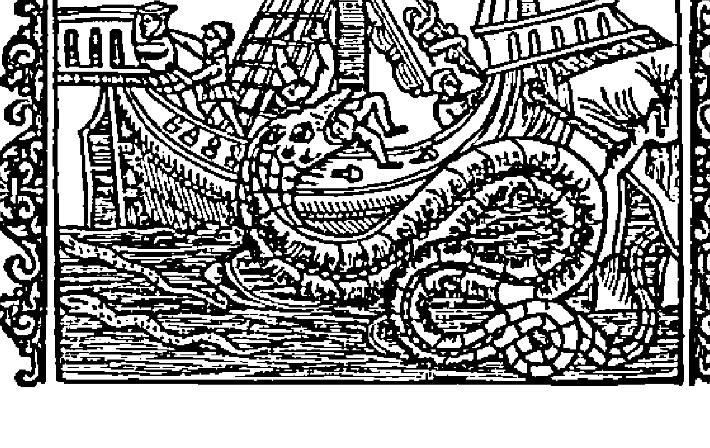

### 其它地区的海蛇传说

赫达姆（Hedammu）是古美索不达米亚飓风神话中的一种巨大、能吃掉所有东西的海蛇。与之类似的还有单宁（Tannin），一种希伯来传说中的巨大而强壮的海蛇，在《圣经》中也被提到过，它被视作原始混沌时期的一条龙，这很可能是指的是利维坦或拉哈伯（Rahab）。

在苏格兰传说中，兹雷·库洛恩（Cirein Cròin）（盖尔语，“灰色肉冠”）是存在过的最大的海蛇，能一口吞下一条鲸鱼。它也叫海中大漩涡（Curtag Mhòr a’ Chuain）、海中巨兽（Mial Mhòr a’ Chuain）和海怪（Uile Bheisd a’ Chuain），很可能指的是在阿盖尔郡（Argyll）和比特岛（Bute）的斯卡巴岛（Scarba）群岛和侏罗（Jura）群岛之间的卡里弗里肯(Corryvreckan)漩涡。在最疯狂的时候，这个大漩涡能长到300英尺宽和100英尺深，能吸入船只。

加拿大太平洋沿岸的贝拉库拉（Bella Coola）、海达（Haida）和夸扣特尔（Kwakiutl）印第安人流传着希尤斯（Sisiutl）的故事，它是一条大麻哈鱼蛇怪、一条角蛇或一条双头蛇怪。有时它被描述为长着鱼鳍、四条腿和巨大的尖牙，通常还有两个身形的身体共同长着一个巨大的头。任何和它对视的人都会被变成石头。希尤斯是战神维纳拉吉李斯的助手，它的力量是战士们的追求。

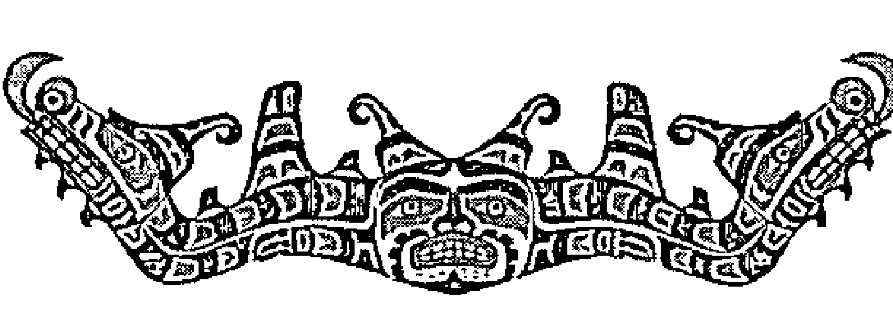

乌契吉拉（Unhcegila）是拉科塔语（Lakota）印第安人传说中的一种长着火红眼睛的雌性大水蛇。她的鳞片是打火石，她的心脏是石英水晶。她住在海里，但每过一段时期就会游到内布拉斯加州，带去潮汐，让那里的水变得不能饮用。她最终被两位英雄所杀。

拉加纳加（Raja Naga）（“蛇王”）是马来西亚西部传说中的一条巨大的海蛇。它是所有海蛇中最大的，住在海涛下一座名叫菩萨特塔斯克（Pusat Tasik）的壮观宫殿中。

龙神（Ryujin）是日本神话中的一位龙王。他住在海底的一座用珍珠建成的魔法城堡里，在那里用嘴巴制造潮汐。他美丽的女儿被火玉王子赢走，从而使这位王子成为了日本帝国的开拓者。

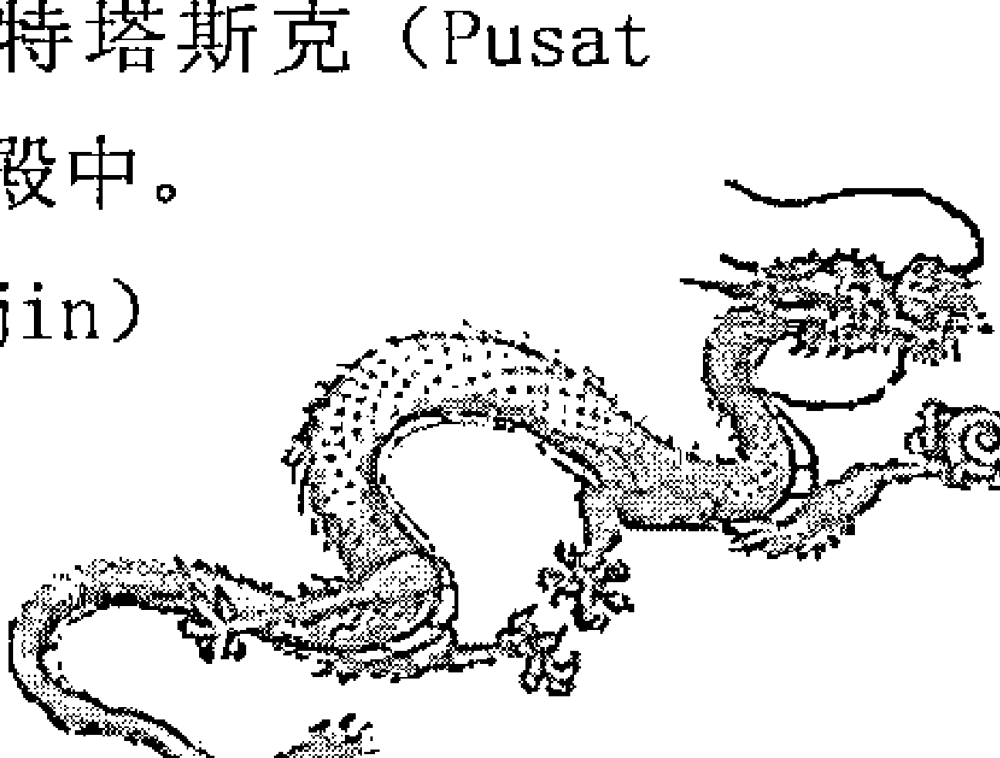

日本应龙（Yofune-Nushi）是日本的一种巨型海蛇，数十年来，一直威胁着奥基岛上的渔民们。每年的6月13日晚上，这头怪物都必须要得到一位少女作为祭品，否则就会制造可怕的风暴摧毁渔船。有一年，一位叫常世（Tokoyo）的年轻女孩自愿成为祭品。但当这头怪兽从海的泡沫中钻出来吃她的时候，这位用该的女孩拿出了一把长剑，刺瞎了怪兽的眼睛。就在蛇怪痛苦地转过身时，常世（Tokoyo）刺穿了它的喉咙，结束了其恐怖的统治。

### 海蛇的种类

对海蛇的众多描述都不尽相同，这让人不得不对其产生怀疑，科学家因此对这些目击报告持保守态度。但从大约200年前起，一些研究者就开始试图将不同的报告进行编纂和分类。说到海蛇的故事就不得不提及这些该领域的先驱们。

### 拉菲奈斯鸠（Rafinesque）

拉菲奈斯鸠（1783 - 1840年）是第一位尝试着对海蛇进行分类的博物在 1819 年 11 月发布的《哲学杂志》 (Philosophical Magazine) 中，他公布了一篇题为《关于水蛇、海蛇和海怪的论著》的文章。在讨论很多的已知物种时，他还加入了 4 种海蛇，每一种都基于独立的目击报告，以及很多扩展研究。但这仅仅是个开始。

##### 奥德曼斯 (Oudemans)

荷兰科学家安东·科内利斯·奥德曼斯 (Antoon Cornelis Oudemans) (1858 - 1943 年) 是一名动物学博士，也是海牙皇家动物园 (Royal Zoological Gardens) 的负责人。在其对 166 种海蛇的研究报告《大海蛇》(The Great Sea Serpent) (1892 年) 中他认为，这种动物很可能是一种先前不为人所知、巨大、海狮一样、长着长脖子长尾巴的生物，他命名其为“大蛇”(Megophias megophias)。他还认为也有可能是一种名叫“械齿鲸”(Zeuglodon plesiosauroids) 的远古鲸鱼，但他后来否定了这个假设。尽管他忽视了很多与自己的解读不相符的特点和报告，但奥德曼斯的结论却给后世的研究者带来了巨大的影响。实际上，霍伊霍尔曼 (Heuvelmans) 正是将《大海蛇》(The Great Sea Serpent) 作为现代隐生物学的建立基石的。

##### 霍伊霍尔曼 (Heuvelmans)

法国科学家贝纳德·霍伊霍尔曼 (Bernard Heuvelmans) (1916 - 2001 年) 博士在 1955 年发表了震惊世界的著作《寻找未知动物》(On the Track of Unknown Animals)。在 1968 年他又写了《海蛇的苏醒》(In the Wake of the Sea Serpents)。霍伊霍尔曼创造了隐生物学一词 (cryptozoology)，并在 1975 年将隐生物学中心建立在法国。1982 年，他帮助建立了国际隐生物学协会，成了该协会的第一任会长。因为这些原因，他被视为隐生物学之父。

下面是霍伊霍尔曼提出的海蛇种类，洛伦·科尔曼 (Loren Coleman)、帕特里克·灰戈 (Patrick Huyghe) 和布鲁斯·尚帕涅 (Bruce Champagne) 对其加入了一些新近的研究。4 里面的插画大多数基于霍伊霍尔曼的作品 5：

- 1. 长颈类，也叫长颈海蛇 (Megalotaria longicollis) (“长有长脖子的巨型海狮”)——65 英尺长、蛇颈龙一样的生物，长着长脖子和几个肉峰，能够上下摆动身体划水。它的头像马或是“驼状的”外形，报告中还说它身上长有毛发。人们认为它是一种长颈短尾海狮。在世界范围内都有发现，有 82 份目击报告。
- 2. 马鱼 (Merhorse) [也叫哈尔希帕斯·欧莱－马格尼 (Halshippus olai-magni) “奥拉乌斯·马格瑙斯海马”]——一种 30 至 60 英尺长，有中长脖子、大眼睛、马头的鳍足类动物。通常长有晶须。只有雄性长有鬃毛，但雌性似乎长有水下呼吸管 (snorkel)。在有些报告中，它们的眼睛非常小。在咸水和淡水中都有关于它们的目击报告。世界范围内都有，一共71次目击报告。
- 3. 多峰类，也叫“新英格兰多峰怪”（“Plurigibbosus novae-angliae”）——一种15至65英尺长、中等脖子、长身体的古鲸（archeocetacean），如械齿鲸。只在北冰洋有发现，它的背上长着一系列的肉峰，像抹香鲸一样。有82起目击报告。
- 4. 超级水獭，也叫“伊戈迪的超级水獭”（“Hyperhydra egedei”）——一种60至100英尺长、中等脖子、长身体、类似于水獭的古鲸（archeocete）。游泳时会上下摆动身体6或7次。在挪威和格林兰附近被目击到过一次，但现在被认为已经灭绝了。有28起目击报告。
- 5. 多鳍类，也叫“来自外星球的多足鲸”（“Cetioscolpenda aelani”）——一种很长的生物，体长能达70英尺，分很多节，长着许多突起物，类似背鳍，但却是反方向长的。被发现与西大西洋、印度洋和太平洋，这种生物也被称为大海蜈蚣。可能是非脊椎动物。有26起目击报告。
- 6. 超级鳗鱼类——一种大型且可能是新的鳗鱼。部分基于巨型柳叶鳗鱼（“Leptocephalus giganteus”）的幼虫，后来被发现其体型为正常水平。霍伊霍尔曼将其分为合鳃类（synbranchid）和板鳃类（elasmobranch）两种。世界范围内都有被发现，有23起目击报告。
- 7. 海生蜥蜴类——一种50至60英尺长的鳄鱼或鳄鱼似的动物[沧龙（Mosasaur）、上龙（Pliosaur）等]。被发现于大西洋和地中海。可能是一种河口鳄（Crocodylus porosus），远离了其在印度尼西亚和澳大利亚北部的栖息地。有9起目击报告。

### 不同类别的目击报告

### 长颈类

1893年，沿着非洲西海岸航行的蒸汽船乌姆富利号与一条长颈海蛇进行了一次著名的相遇。根据大副C. A. W. 鲍威尔（Mate C. A. W. Powell）的航海日志，它“长相类似蛇，有约80英尺长，长着黏滑的皮肤，背上20英尺处长着短鳍，其周长可能与成年鲸鱼的相同。我清楚地在望远镜中看到了它张开（又）闭上了自己的嘴巴。我估计它的嘴巴有大约7英尺长，里面有巨大的牙齿。从形状上来讲，它像一条海鳗。”R.J·克林格船长补充道：“有三次巧合，我看到它脖子和脑袋一共有15英尺长……它脖子连着的身体比脖子要粗得多，因此我不应该称其为蛇。”

‘巨大的克劳德（Claude）’是当地人对一条初见于1934年的海蛇的称呼，它当时正在俄勒冈州的哥伦比亚河口附近玩耍。哥伦比亚河灯塔船副手L·A·拉尔森说：“它有接近40英尺长。它的脖子长约8英尺，长着巨大的圆形身体、丑陋的尾巴，样子很凶残。”很多年来，克劳德也被其他灯塔船船员和渔民目击到过。在1937年，韦弗（Viv）号的船长查尔斯·E·格拉罕看到了一条“长长的、长着毛的、黝黑的生物，它的头像长得过大的马脑袋，长约40英尺，误差在4英尺以内。”纵帆船艾尔普（Arpo）号的船长克里斯·安德森称其在近距离看到过一次克劳德：“它的头长得像骆驼。它的皮毛很粗糙，呈灰色。它眼光呆滞，它用弯曲的嘴巴将我们钓到的一条20磅重的大马哈鱼拖走并吃掉。”

在班登（Bandon）、德拉科（Delake）、厄姆派尔（Empire）、内尔斯科特（Nelscott）、纽波特（Newport）、沃

### 马鱼类

70多年前在加拿大不列颠哥伦比亚卡布罗湾的海岸边，有人发现过一条巨大的海蛇。最早的目击报告是在1933年，目击者是律师维多利亚和妻子，当时他们正驾驶着游船。很多人都称其是一条长长的蛇状怪兽，长着鳍状肢、马鬃和骆驼样的脑袋，体长在40至70英尺间。1933年，两位渔民在那个海湾中看见了两条这种怪物，其中一条超过60英尺，而另一条只有它的一半长。另一次目击发生在两名猎人身上，他们当时正试图捡回自己打下来的鸭子。这种水怪窜出水面，吞掉了鸭子，还咬住了几只海鸥，然后沉入了水中。当地人效仿尼斯湖水怪，给它们起名为卡布罗龙（Cadborosaurus Willsi）或“卡迪（Caddy）”。

### 多峰类

第一条美国海蛇是1639年在麻省的安角（Cape Ann）被发现的。从1777年到1950年代，人们发现了一种类似的生物，称其为缅因州卡斯考湾 (Casco Bay) 海蛇，也亲昵地叫它“卡西·(Cassie)”。

从 1817 年至 1918 年，一种巨大的、蛇形的水生动物在麻省格洛斯特海湾里被很多目击者看到。人们形容其身长 80 至 100 英尺，长着宽阔的、马一样的脑袋，头上还有一只角状的突起，有些人说这种披着鳞片的怪物在水面的部分像“一排圆桶”。它后来被称为格洛斯特海蛇或大新英格兰海蛇，正式名称为 Scoliophis atlanticus。

> 起物与那些曾见到过它的人所说的一样。乘客和船员看到它的时间长达7分钟，他们当时正在甲板上活动。一位男士用一分钟的时间画出了它的画像，目击者们都确定这就是他们所看到的东西。目击者的数量和可靠性让人无法怀疑此种动物存在的可能性。

1826 年 7 月 29 日，在科德角 (Cape Cod) 有人看到了一条巨大的多峰海蛇，被记载到了 1826 年 8 月 2 日的波士顿《基督教先驱报》 (zion's herald) 中：

> 希拉斯·理查德号的船长霍尔德里奇 (Holdredge) 昨天到达了利物浦，称在通过乔治班克斯 5 天之后，他清楚地看到了一条蛇。它距离我们的船大概 10 rod (175 英尺)，当时海面很平静，它露出水面的部分有大概 60 英尺长。这条蛇的脑袋和突

### 多鳍类

1856 年 7 月 8 日，公主号正在非洲之角上航行，它遇上了一条“非常大的鱼，长着海象的脑袋和 12 条与黑鱼类似的鳍，但生长的方向却是相反的。它的背有 20 至 30 英尺长，尾巴也很长。”（A. R. N·特勒梅尔尼船长）。这位好心船长的素描后来被发表在《伦敦新闻画报》上：

1883 年，谈万孔（音译 Tan Van Con）发现了一条被冲上越南奥龙（Along）湾的巨大的、蜈蚣状的生物。它被称作大海蛇 (Con Rit)，长 60 英尺，宽 3 英尺身上呈黑棕色，肚子呈黄色，其多节的身体由 3 英尺长 2 英尺宽的壳质六边形节组成。每节两侧都长有 28 英寸长的丝状物。从未有人发现过类似生物，它在生物学上仍然是个未解之谜。隐生动物学家卡尔·舒克相信大海蛇可能是一种巨大的等角类动物或一种尚未被发现的水生唇足类动物（蜈蚣）。已知最大的蜈蚣是11英尺长的石炭纪侧板（Arthropleura）。最大的已知现存蜈蚣是亚马逊大蜈蚣（Scolopendra gigantea），它能长到14英尺。

### 超级鳗鱼类

1848年，英国护卫舰泰达路斯号（Taedalus）在通往西印度洋群岛的航行中穿过好望角时，上面的船员在海中看到了一条巨大的、鳗鱼似的海蛇。当时他们距离现在被称为纳米比亚地区的海岸约300英里，一条海蛇在离船100码的地方经过。在他的船志中，麦克维尔（M'Quhae）船长写道：

> 一条巨大的蛇将自己的头和肩膀探出水面约4英尺的样子，它当时离得很近，我们能用中帆在水里的投影来和它进行对比，这种动物至少有60英尺长，而根据我们的观察，它没有使用任何的东西来在水中前进……这条蛇头部以下部位的直径在15至16英寸间，毫无疑问，这和蛇的直径一样……它全身呈暗棕色，而喉部则是黄白色的。

1880年8月，S.W·汉纳船长在缅因州的新港（New Harbor）海岸附近抓到了一条海鳗状的鱼。这种鱼被命名为新港海蛇，它长长的身体只有10英寸宽，在其扁平的头部后长着一对小小的鳍。它上方的头盖骨盖住了它长着两排尖牙的狭长嘴巴。它有三组板鳃（uncovered gill）、一只小小的三角形背鳍和一条鳗鱼似的尾巴。它的整个身体都包裹着鲨鱼皮一样的皮肤。不幸的是，它的尸体后来却莫名地被丢掉了。著名的鱼类学家斯宾塞·贝尔德（Baird）认为对这种鱼的描述与皱鳃鲨（Chlamydoselachus Angui-neus）类似。然而有记录的最大的皱鳃鲨也才7英尺长。另一个与之比较接近的是丝带一样的桨鱼（Regalecus glesne），曾有人报告过一条56英尺长的这种鱼。

1930年，一条6英尺长的鳗鱼幼虫（leptocephalus）在南非好望角被一艘名为德纳号的拖网渔船所捕获。很长一段时间，它都被认为是一条海蛇的幼蛇。

般鳗鱼（genus: Anguilla）的幼子只有3英寸长，成年后能长到4英尺。因为这条幼子比安圭拉岛鳗鱼要大24倍，人们估计其成年后能长到20至180英尺长。但是，有几种大小类似的幼子是属于一种名叫棘鳅（Notacanths and Halosaurs）的鳗鱼的。它们的幼子——名叫巨型柳叶鳗（Leptocephalus giganteus）——长为成鱼的过程被人们亲眼目睹过，在那个时期，它们的体型变化与一般鳗鱼比较起来非常小。虽然德纳号鳗鱼比其它任何已知鳗鱼都要大，然而捕到的那条幼虫的脊椎骨数量却异常地多，那么多的脊椎骨只有线口鳗（Nemichthyidae）才有。因为线口鳗只能长到5英尺长，所以德纳号幼子可能是一条长得异常大的幼子。

### 海生蜥蜴

1915年7月30日，一艘德国U-28施密特潜艇上遇到了一条爬行动物似的海蛇。在北大西洋用鱼雷攻击了英国蒸汽船伊比利亚号后，这艘潜艇上的船员们看见一个巨大的、未知的水生动物被炸弹炸了起来。舰长弗雷赫尔·格奥尔格·君特·冯·福斯特纳（Freiherr Georg Günther von Forstner）记载道：“这个海中奇物在残骸中挣扎着……像一条水生鳄鱼，长约60英尺，有四只像巨大蹼脚的肢体，一条又长又尖的尾巴和逐渐变尖的脑袋。”

### 神秘的尸体

数百年来，在海蛇传说中有一部分是来自偶尔被海浪冲上沙滩的神秘尸体的。这些尸体腐坏得都比较严重，不像任何一种已知生物，很多还似乎长着长脖子、大大的身体和四条白垩纪蛇颈龙般的鳍状肢，这些都符合大多数人所称的长颈海蛇和湖怪的特征。

对那些支持蛇颈龙假说的人来说不幸的是，这些尸体到最后都被证实为普通的姥鲨（Cetorhinus maximus），被（在1851年）抓住过的最大的一条长40英尺，且还有人说见过更大的。姥鲨在腐烂的时候，它的下颚和鳃都会脱落，在身体的一段留下相对较小的头骨，人们常将其误以为长脖子。由软骨支撑的侧鳍和尾巴的上半部分被保存了下来，但背鳍和腹部的尾巴却被破坏成了毛发状的纤维。最后就不可思议地变成了蛇颈龙的样子，很容易就能知道它给人们带来的歧义有多大。一些其它不同寻常的尸体也被证明为是一些能长到43英尺长的突吻鲸（Ziphiidae Berardius）和稀有的贝尔德突吻鲸（Berardius bairdi）。

### 苏瓦诺岛（Suwarrow Island）大鳀鱼

鱼——19世纪被太平洋上一座名为苏瓦诺岛的环状珊瑚礁岛上的土著人发现的巨大尸体。当时英国蒸气商船鸸鹋（Emu）号正要停靠在该岛上，于是船员们打算去调查一番。这具尸体约60英尺长，上面覆盖着棕色的毛发，船长估计这个生物重达70吨，将其头部描述为马头的样子，下颚末端还长着两根獠牙。船长拿走了它上面3英尺长的头骨，保存了起来。在到达澳大利亚后，他将自己的发现送给了澳大利亚博物馆，博物馆的工作人员认定它是一头大突吻鲸（Ziphiidae Berardius）。

### 下面是一些有名的“神秘尸体”

### 斯特龙塞怪兽（Stronsa Beast）

1808年9月，一具在苏格兰北部厄尔凯尼（Orkeny）群岛中一座小岛的沙滩上发现的奇怪尸体。它呈现蛇形，长55英尺，有一条15英尺长的脖子，较宽大的躯干，背上还有马一样的鬃毛。它还似乎长着三对腿，每一只都有5、6个脚趾。当地的农夫乔治·谢拉尔（Sherar）测量了这具尸体，并将它的一块皮、几节脊椎和头骨保存了下来。这个消息迅速传到了爱丁堡韦氏自然历史协会（Wernerian Natural History Society）负责人帕特里克·尼尔（Neill）那里，他给这个怪兽起了一个学名“彭托皮丹的海中水蛇”（Halsydru pontoppidani）。但在1811年，该协会的成员约翰·巴克雷博士在奥克尼检查了那具尸体，然后发表了一篇论文描述了自己对其的看法，他认为所谓的腿不过是误认罢了，实际上它们只是鳍。这篇论文引起了著名的博物学家埃弗拉德·霍姆（Sir Everard Home）的注意，他当时刚完成了对姥鲨的研究，所以随后证明了斯特龙塞怪兽是一条姥鲨。

### 特朗克长毛鱼（Trunko）

1922年11月1日，一具45英尺长的奇异尸体被冲到了南非夸祖鲁-纳塔尔省的海滩上，前一天晚上，有几个人目睹到了一起三头巨大海怪间的壮烈战斗。人们认出其中两头是鲸鱼，但另外一个却从未见过。这具尸体有一条5英尺长的无头脖子，也可能是一条鼻子，以及一条10英尺长、对虾一样的尾巴。它在那里腐烂了10天，没有人们人前去对其进行调查，最后又被冲回了海里，再也没有出现。它绝对是一具腐烂的姥鲨尸体，很可能是被几条逆戟鲸咬碎的。

##### 瑞洋丸怪兽 (Zuiyo-Maru Carcass)

1977年4月25日，日本渔船瑞洋丸号在新西兰附近捕鱼时捕获的一具严重腐烂的海怪。尽管这具33英尺长、4000磅重的尸体被广泛地认为是一头蛇颈龙，但对其组织的后续研究却发现它只是另一头腐烂的姥鲨。

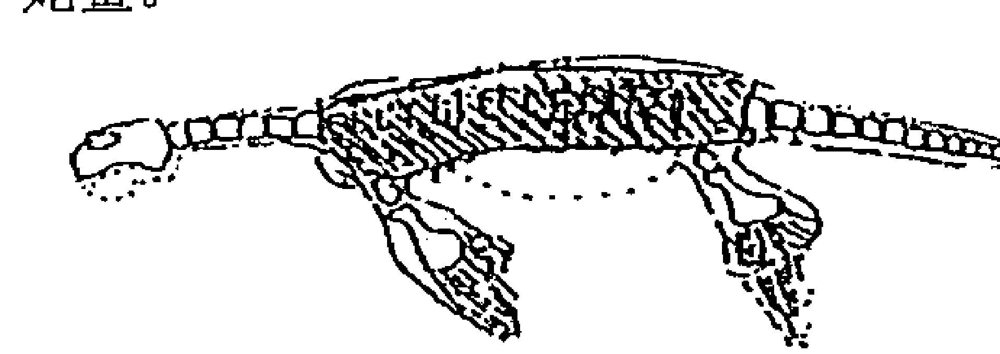

##### 马斯巴特蛇颈龙

1990年代中期在菲律宾马斯巴特群岛的一块海滩上被发现的未知动物的尸体。据称它大约40英尺长，长着黑色、或许还披着鳞甲的肉，后来在电视上它被说成小型长颈龙和无壳的大型海龟之间的交叉物种。但最后它又被证明为一头腐烂得更加严重的姥鲨。

##### 鉴定

1892年，当奥德曼斯开始分析166起海蛇目击报告的时候，古生物学和海洋生物学都才刚起步，很多现在已为人所知的生物在当时都还未得到官方的发现或科学的认知，它们中有一些可能成为当时的未知怪兽。我觉得是时候揭露一些早期的怪物分类和提出新的见解了。

在我们完成了腐烂的尸体那部分之后，海蛇的真实身份就剩下了：海藻团、皇带鱼（Oarfish）、皱鳃鲨、大鳄鱼和蜥蜴以及海豹。但在开始分析这些可能性之前，我们必须给出标尺。很多手稿和绘画中的海蛇都与已知生物差不多，除了一个显而易见的地方——它们巨大的体积。目击者常称这些生物类似于鳗鱼、海豹或水獭，但其大小却比已知的要大上很多倍。我们如何解释这种差异呢？

1985年2月，我们的潜水船礁石探险者号正在从澳大利亚前往所罗门海沟的路上，我们当时要去研究美人鱼（见第10章“人鱼”），我们遇上了一个深海海怪。一头巨大的鲸鲨出现在我们船的右边，就在水面下方。我是第一个潜入水中在这条巨鱼旁边游泳的人，我一直游到它越沉越深，看不到了为止。它在水晶一样清澈的海水中越变越小，最后变成了一条小小的米诺鱼那样。回到船上，我们互相对比各自所观察到的。毫无疑问，大多数人都觉得这头巨大的生物至少有40英尺长。然而，我们的船长经验稍微丰富一些，他注意到鲨鱼与船只之间的长度对比，确信它“只有”大概20英尺长。

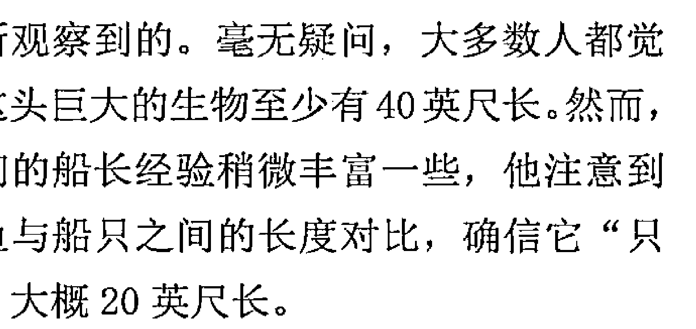

我认为，在此案例中，有两个下意识的因素起了作用。第一种非常简单：在开阔的海洋里就像在空中一样，几乎找不到对比物。望远镜只对很近的物体有效。大家都知道，从头顶飞过的生物可能距离地面100英尺，翼展5英尺，或者是距离地面100英尺，翼展有50英尺，如果视野开阔，没有人能知道它究竟有多大。在海洋中也是一样的。在没有已知物体做对比的情况下，水中的一个东西可能是任何大小，这些都取决于你估计它距离你有多远。还有，游动的生物可能会留下一道长长的水痕，这就可能会造成一种它长着长尾的错觉。

第二个因素更加有趣，就是我们更易受主观反应，而不是实际看到的东西的影响。似乎我们的头脑中天生带有一种“放大镜”，能自动地对看到的危险物或潜在的威胁进行放大，同时还会忽略周围的一切。这种隧道视野效果比实际情况要大得多。曾经住在荒凉的农场社区的时候，我也总是遇到类似的情况。响尾蛇在陆地上很常见，只要有人在孩子们常玩耍的地方发现了一条，他们就会叫我去帮助将其移走，因为我知道如何安全地处理它们。每次我都会听说一些“巨大的蛇——至少有6英尺长！”——当我到达现场时才发现它不过是很小的一条蛇，最多只有别人所说的一半长。实际上，蛇的体积会越传越大，这让大家都觉得我是一个会耍蛇的人！我们的大脑就是这样工作的，经过了数百万年的进化，它们能够将我们的注意力集中到那些可能会对我们造成威胁的东西身上。我很确定同样的感知扭曲对这些巨大的怪物的目击报告有推波助澜的作用。

将这些因素阐述清楚了之后，现在让我们来依次看看下面的这些可能性。

##### 海藻团

这看起来不可能，但有些人目击到的却是一些长长的海藻团，特别是那些长达100至300英尺、不可思议的长“蛇”。在下列的报告中，这些海藻团具有神奇的说服力。1848年，一位“史密斯先生”正在驾驶着他父亲的船北京号，后来他记录下了一段神奇的遭遇：

> 在毛淡棉（缅甸）附近，在平静的天气中我看到远处有某种东西在随着海波飘动，似乎是一个身体极长的动物。我们用望远镜能清楚地看到一个巨大的头和一条长而长着鬃毛忽隐忽现的脖子。所有的船员都看到了它，大家都认为它一定是大海蛇。我……立即命令放下一条小船……他们靠近时好像并未对这个怪物起到任何的影响……我看到他们匆忙地解开系在船上的绳子，而那怪兽则举起了头，越长越大……在半个小时不到的时间里，这可怕的怪兽已经被拉到了船上。它的身体在被吊起来的时候显得非常柔软。它身上长满了各式各样的海洋寄生虫，没过多久就消散开了，我们这才发现它原来只是一团奇怪的海藻，有上百英尺长，4英尺厚，其远处的根被当成了脑袋，因其被海涛带着摇动，就像活着的动物一样。

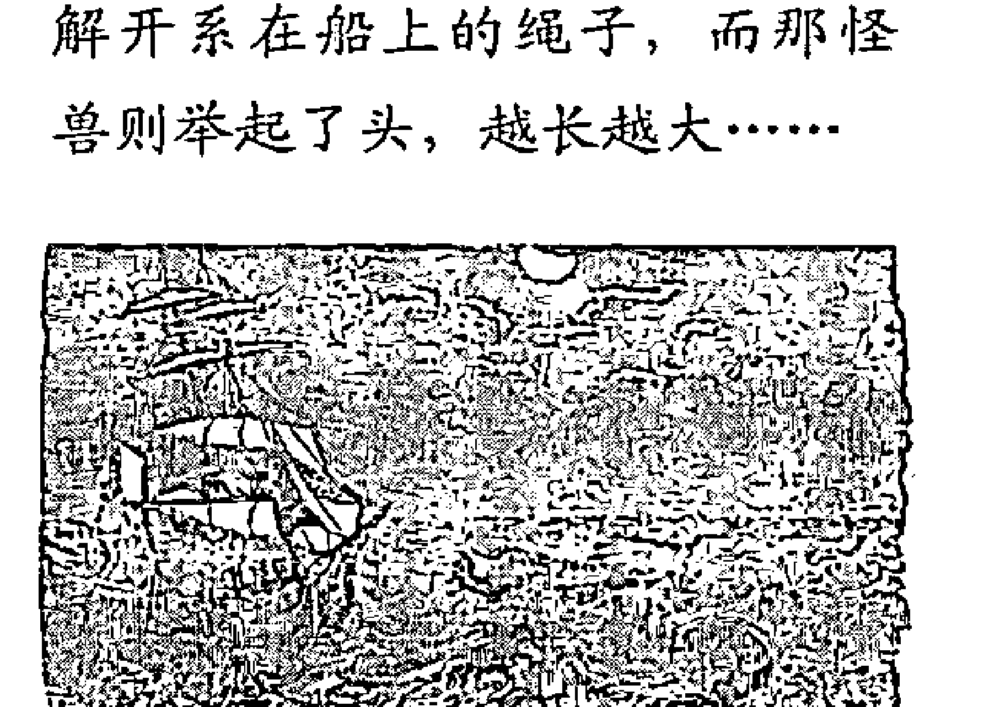

当我们到达伦敦后，达代罗斯号也报道了在同一地点遇到的大蛇，我确信它就是我们曾遇见过的大海藻团。然而，它们的外形实在是非常具有迷惑性，如果我没有派一艘船过去查看，那么我一辈子都会坚信我看到了海中巨蛇。

##### 巨型鱿鱼

尽管巨型鱿鱼的样子并不像蛇，但毫无疑问很多关于海蛇的早期报道能被这样解释。虽然在今天，这种深海怪物已经有了详尽的记载，但在以前可不是这样。在最近的1958年，当霍伊霍尔曼写下《克拉肯与巨型章鱼》（The Kraken and the Giant Squid）时，人们对于这种神话般动物的存在都还有巨大的争议。很多古画里都画着巨大的海蛇与抹香鲸拼死打斗的场面，这准确地反映了抹香鲸捕食巨型鱿鱼的场景。

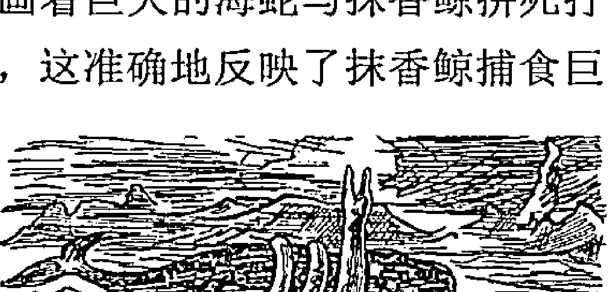

另一则经典的海蛇记载源自挪威传教士汉斯·埃格德（Hans Egede）（1696-1758年）。1734年，在前往格陵兰的航行中，他报告一次个人的遭遇：

> 在6点钟方向一头恐怖的怪兽钻出了海面，它非常大，脑袋的高度超过了我们船的桅顶。它的身体像船一样大，有船3、4倍长。它还长着尖嘴巴，像鲸鱼一样喷着水。宽大的鳍状肢，它的身体似乎包裹在贝壳中，它的皮肤非常粗糙，凹凸不平。其身体的下部像一条大海蛇，当它潜入水中时，它会倒立着往回缩，把尾巴高高举起，举到距离其身体最粗壮部分有我们船那么长的距离处。

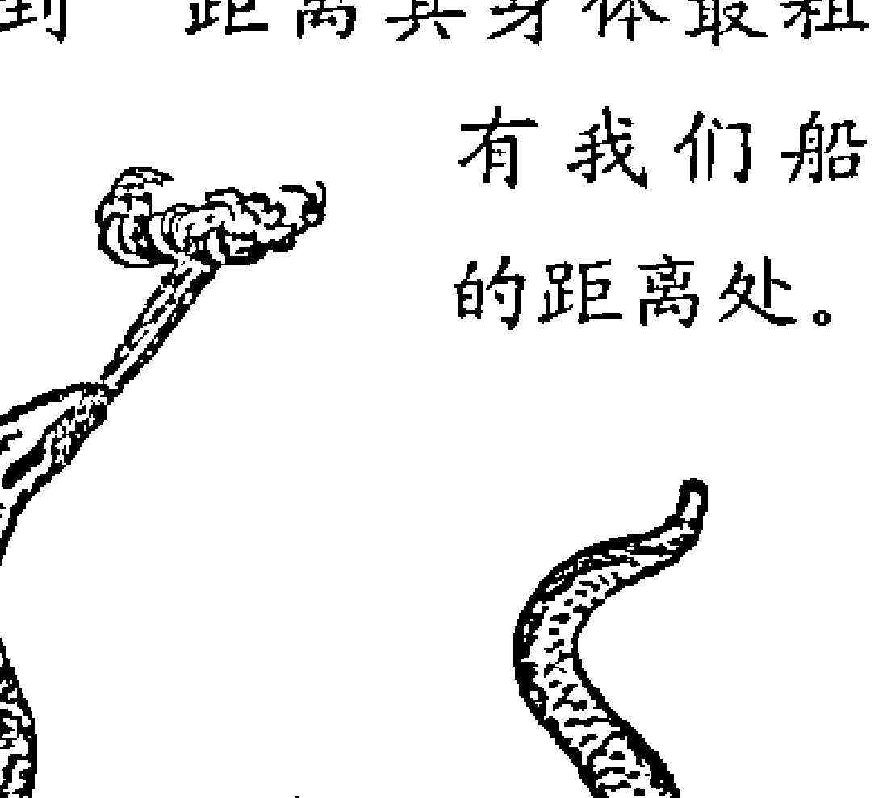

隐生动物学家们注意到，其配有的插图——与埃格德同行的传教士们根据他的描述所作——拥有太多类似摆动的巨型鱿鱼的背部和尾巴的地方了，包括一条舞动的触手，一切都太巧了。这些相似点首先是被布莱顿水族馆（Brighton Aquarium）馆长亨利·李注意到的，他将其写入了《海怪揭秘》(Sea Monsters Unmasked)(1883年)一书中。(插图30)。我赞同它的说法，这表明，像冰山一样，某个物体露出水面的部分并不一定能给出其准确的全貌。

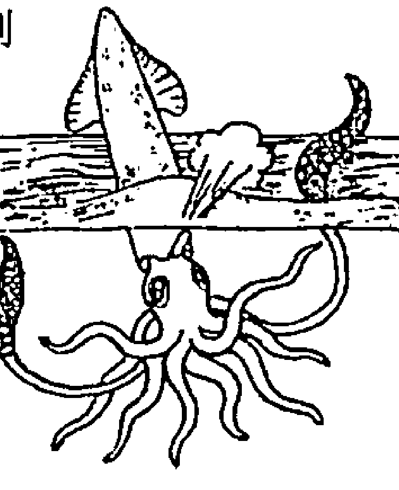

##### 皇带鱼

皇带鱼（Oarfish，也叫带鱼）也可能是很多长蛇形海怪的原型——它是现存最长的多骨鱼。1808年，一条56英尺的皇带鱼被冲上了苏格兰海滩。它们拥有银光闪闪的身体、红色鸡冠似的头冠、短桨一样的胸鳍和长长的背鳍，在我看来简直就是正宗的海蛇，不需要任何的修饰形容。

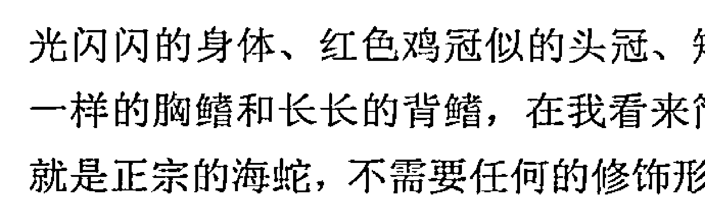

##### 皱鳃鲨

引起3亿5000万年来几乎没有改变多少特征而常被称作“活化石”，皱鳃鲨（Chlamydoselachus anguineus）像鳗鱼一样又长又细。它的名字取自其6对皱鳃，数量比普通的鲨鱼多一对。它有25排锋利的牙齿，有些像鳄鱼的牙齿那样从嘴里伸出来。它在19世纪被发现于日本海。

2007年1月23日，有人在日本海岸活捉到了一条，但在压力改变后不久就死去了。有时能在拖网船的网里发现它们，它们在世界各地都有分布，但只生活在2000至3000英尺深度的海水中，在那里它们是巨型鱿鱼唯一的捕食者，而不是抹香鲸。尽管所有被抓住的皱鳃鲨都没有超过7英尺长的，但很可能更大的存在于更深的海中。如果是这样的话，它们就有可能和械齿鲸一样被当作海怪，因为它们实在和普通的古鲸类太像了。

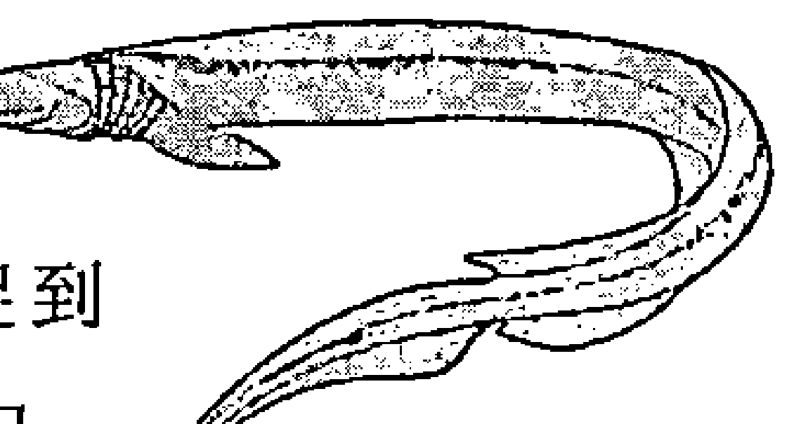

##### 鳄鱼和巨蜥

霍伊霍尔曼的海生蜥蜴只被目击过9次，而我认为如此少的目击次数能将其认定为是某种已知爬行动物。印度尼西亚和澳大利亚北部的河口鳄（Crocodylus porosus）是现存最大的爬行动物。它们因喜欢在开阔的海洋中游泳也被称作海生鳄鱼，已知其最长能达30英尺。曾有人看见过更大的，但始终未能得到证实。

在同一个地区还住着世界上最大的蜥蜴——科莫多巨蜥，它能长到10英尺长，能在岛屿间游动。它们的一位史前亲戚古巨蜥比它们要大得多，能长到15至20英尺长和1000至1300磅重。尽管被认为在4万年前已经灭绝，但关于它们的目击报告不时地还能在澳大利亚和新几内亚传出。最近，一块年仅100至200岁的古巨蜥髋骨的亚化石碎片被人发现。

##### 豹海豹

尽管戴达罗斯号事件（见上文）通常都被视作是一条超级鳗鱼，但我确定这种生物应该是豹海豹（Hydrurga leptonyx），特别是人们在极地海洋附近遇到的那些。豹海豹是凶猛而恐怖的捕食者，其特征包括长长的流线型身体、长脖子和一个巨大的、爬行动物似的、长着扁平前额的脑袋。它的鼻孔长在鼻口部的顶上。这种动物还长着非常低的下颚和巨大的嘴巴。其雄性能长到10英尺长和1000磅重。这种海豹背上是闪着银光的黑灰色，而肚子上的颜色要浅一些，还长着斑点。它们长着长长的鳍状前肢（大约有其体长的1/3），而其尾鳍则像两条鱼尾一样。

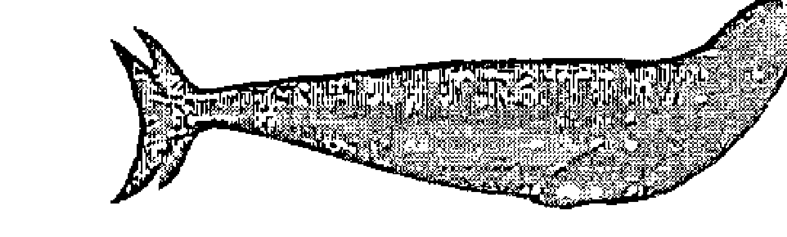

它们住在极地海洋中，以鱼类和企鹅为食。在水面游泳时，豹海豹会用长长的脖子将头高举出水面与其平行，这回就会露出它们的背，有时还会露出前鳍或后鳍。和所有哺乳动物一样，它们的脊椎也是垂直摆动的。有时它们隔热的脂肪会随着水波抖动，看起来就像隆包一样。

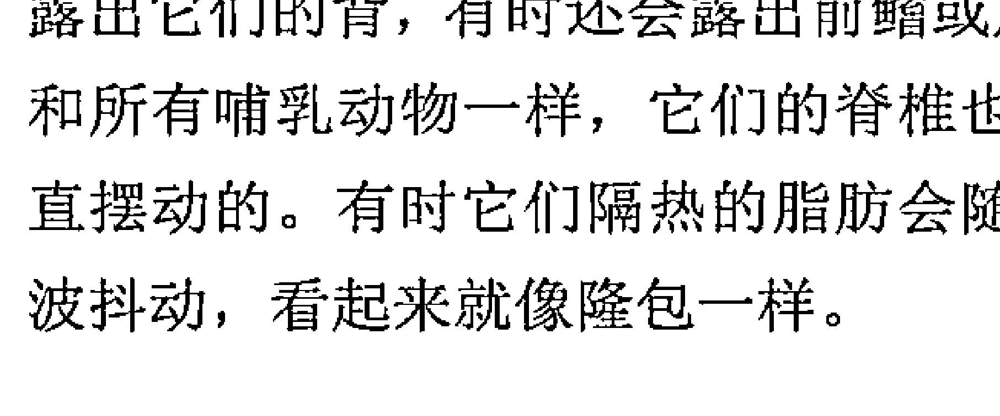

对我而言，豹海豹似乎也能解释其它的目击报告。比较一下白海豹和1848年戴达罗斯号的目击报告（插图15）以及霍伊霍尔曼（Heuvelman）所绘的这个将右鳍露在水面的多峰海蛇吧［这是海豹和海狮惯用的调节体温的方式，叫做鳍部散热（flipper fanning）］。

##### 其它海豹

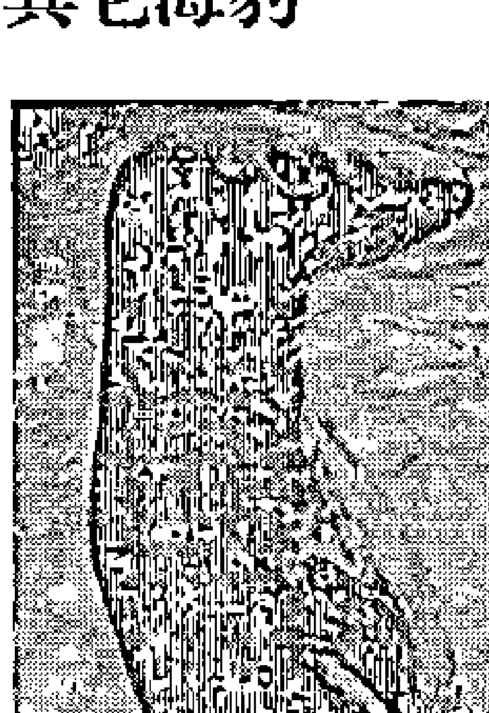

关于马鱼长着哺乳动物的晶须和大而友善的眼睛的描述只和一个种类的已知动物相吻合：海豹和海狮——特别是斑海豹（Common Seal）和灰海豹。这些动物经常以独特的“潜望镜”姿势站立，它们在水中立起身来，将前肢紧靠在身体两边，让头保持90度的角度来获得最大的视角。它的这个样子非常怪异，再加上它大大的眼睛，这看起来就像马的脑袋和脖子一样。这种效果在它从一堆海藻中探出头来时更为明显，海藻会在它脖子上形成马鬃（或人鱼头发……）一样的东西。

然而，将所有关于“马头”海怪、湖海、河怪或沼泽怪的目击都归咎于海豹是不明智的。它们当中有很多——特别是长有肉峰那些——都看起来是其它物种，因此也更被认为是长颈海蛇（或湖怪）了。

##### 仍然存在的巨大谜团

虽然我相信上面列举的已知动物能够解释很多巨大海蛇的目击报告，但它们也只是为真正未知海怪——及长颈海蛇——的出场打扫干净了舞台而已。我无法接受奥德曼斯和霍伊霍尔曼的提议，也不能接受其它追随他们的隐生动物学家们所说的，这些生物是某种巨大的、长有长颈的深海鳍足类动物。尽管在35年前第一次阅读《海蛇的苏醒》（In the Wake of the Sea Serpents）的时候我也发现这种说法很具说服力，但最终我总结出这种解释根本站不住脚。毕竟，所有的鳍足类动物都要呼吸空气，它们一生中很多时候都待在水面上。不像鲸类甚至海牛那样完全适应了海洋生活而不能回到陆地上去，所有的鳍足类动物都会聚集到布满石头的海岸上晒太阳、繁殖和养育后代。所以，时至今日不可能有任何未被发现的鳍足类动物存在。

我最终相信，长颈海蛇并非哺乳动物、蛇颈龙或脊椎动物。虽然假设它们为长颈海豹，霍伊霍尔曼自己的轮廓画却源自确切的目击描述——特别是1934年7月在古巴发生的那起著名的目击，当时海怪直接跃出了水面（插图36）——它们并没有具体地给出他模型中的样子，也不支持他的鳍足类假设，也不像蛇颈龙；它对前段中提到的所有争论都不支持。

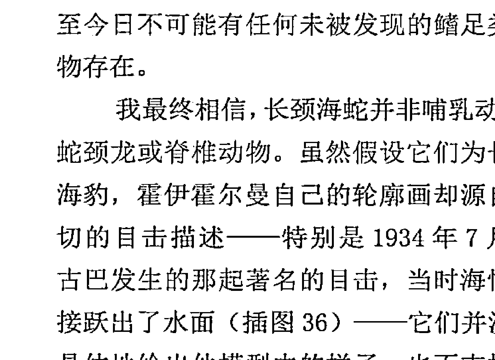

而且，通常对长颈海蛇的描述与我在前面章节中已经验明了的经典湖怪有着惊人的相似，所以我认为它们是与湖怪一样只是更大、生活在海中的生物。也就是说，它们中的一些是长着长长的、能伸展脖子，身体底部长着钻石形鳍，拥有背上长着一些体型越大数量也就越多的小隆包的庞大身体的海生蛞蝓。它们脑袋和脖子的比例与马、骆驼、长颈鹿的类似，它们头上像角一样的突起物肯定是其与普通蜗牛和蛞蝓相同的眼睛和触须。其身体的后半部和尾巴很少被看到，因此几乎没被人提到过。也许它们还长着疣足。几种后鳃目软体动物亚种，如有壳翼足目和裸壳翼足亚目，拥有同样的器官，这与一些长颈海蛇身体后半部分的描述相吻合。

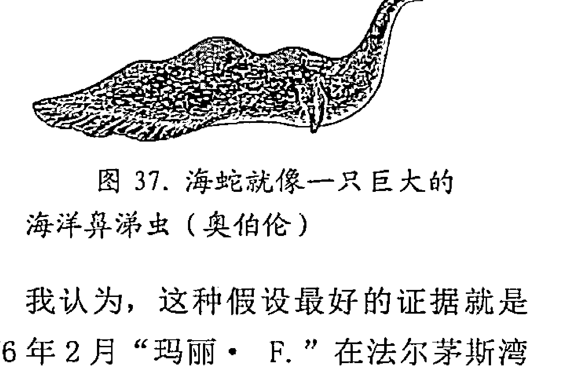

我认为，这种假设最好的证据就是1976年2月 “玛丽·F. ” 在法尔茅斯湾（Falmouth Bay）附近的罗斯姆连赫德（Rosemullion Head）拍摄的科尼什海蛇（Cornish Sea-Serpent），莫葛鲁海蛇（Morgawr）（插图42）。在她写给法尔茅斯运输号（Falmouth Packet），后来跟随照片一起被刊登出来的信中，玛丽·F. 说道，那个怪兽只出现了几秒钟，她能看到的部分有大约15至18英尺长：“它看起来像一头舞动鼻子的大象，但这条鼻子却是一条在末端长着像蛇一样的小脑袋的长脖子。它的背上有肉峰，以一种滑稽的方式移动着。它的颜色要么是黑色，要么是深棕色，而它的皮肤则像海狮的一样……它把我吓坏了。我可不愿意再靠近些去观察。我不喜欢它游动时的样子。”

在我于2006年12月写下上面这些文字的时候，第一条巨型鱿鱼刚好被活着并在其在水面挣扎时被录了像。在此之前，传说中的克拉肯从未在当代被人看到过，我们对它们的了解都来自海滩上腐烂的尸体。也许有一天我们会活捉一条长颈海蛇或拍到其影像，那时我们才能最终明白它们到底是什么东西。

同时，知道深海中还存在着未解之谜并不是一件坏事。

##### 附言

在完成本章写作后不久，我收到了一则消息告诉我，我所希望的突破口可能就要到来了：2007年3月27日，在南非海岸上的一座海豚观察游艇上，13名海洋野生动物船（Ocean Safari vessel）海豚号的船员和来自海豚研究中心（Centre for Dolphin Studies）的志愿者给一个未知的海生非脊椎动物拍了很多照片，在我看来它极像我所说的长颈海蛞蝓的缩小版。格温妮丝·彭莉（Gwenith Penry）小姐在史蒂夫·欧西亚的 TONMO.com（在线章鱼新闻杂志）网站上公布了这些照片并配上了详细的说明。彭莉报告称这种生物长12至16英尺。在其前部尖端是一个“非常独特的‘鼻子’/长鼻，是一个能区别于身体其它部位独立移动的突起物……在这个动物浮上水面时，它的‘瓜囊’有明显的充气现象，在它沉下去的时候，有明显的排气现象。”它似乎长有膜状的“裙摆”，或疣足，“其身体的后末端，绝大部分为灰色，但在边缘处有带子一样的东西……这看起来像一层薄薄的‘皮肤’，能像鳐鱼一样‘扇动’。带状区域看起来像两个除末端外都互不接触的附属肢体。”它“在水下（最多30厘米深处）被发现，随后浮了上来游向我们的船，然后停了下来，抬起‘鼻子’指向我们就像在感知在它前面的东西一样。”

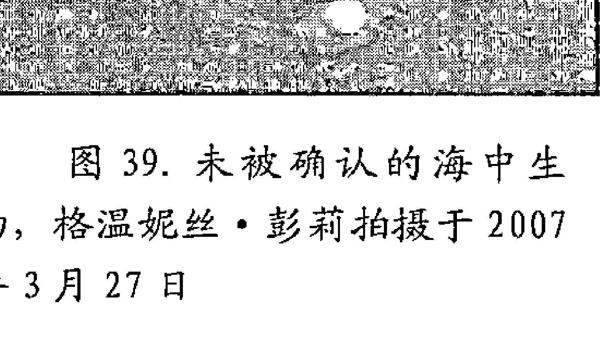

## 怪物电影: 海蛇

我知道的唯一一部有海蛇的电影是特里·琼斯的《维京奇航》（Erik the Viking）（1989年），该片的灵感来自他孩子们看的一本书，《海盗埃里克传奇》（The Saga of Erik the Viking）（1983年）。

### 20、巨龟、鱼怪和蜥蜴怪

作者：奥伯伦

> 我儿，不要害怕。夜里上帝托梦给我，向我揭示了它的神秘之处。我们所在的并非是一个岛屿，而是一条鱼——所有游鱼中最大的一条。他总是试图首尾相见，但他却因为自己的身长而无法做到。他被唤作吉阿斯卡尼俄斯（Jasconius）。
——《圣布兰登之旅》（The Voyage of St. Brendan）（9世纪）

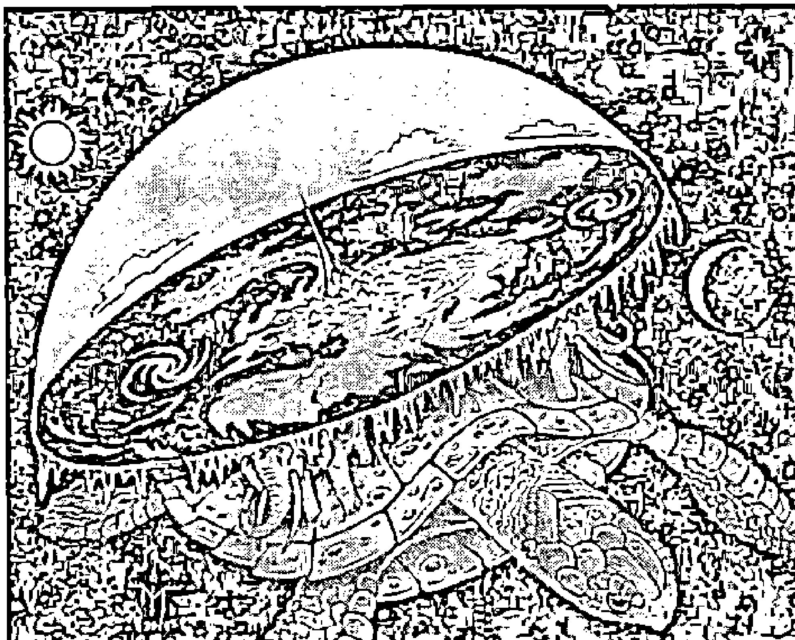

## 岛兽

在最为引人入胜的海洋传说怪物中有一种叫巨岛兽，也叫魔鬼鲸——一种尤其巨大的海怪，当它们浮到海面晒太阳时，水手们会将其误认为小岛并停泊在上面。当他们生起火，这个活着的“岛屿”就会沉入海洋深处，将船只和船员一起埋葬。很多故事都将其描述为泰坦尼克龟，一种巨大的鲸鱼或甚至是一种巨大的头足纲动物如克拉肯。经常和其它美妙的海怪一起被描绘在地图上，它总是被画成身上挂着一根船锚，一艘船半靠在其身上，背上还燃着一团火的样子。欧洲水手讲述着许多关于它的存在和目击的故事。

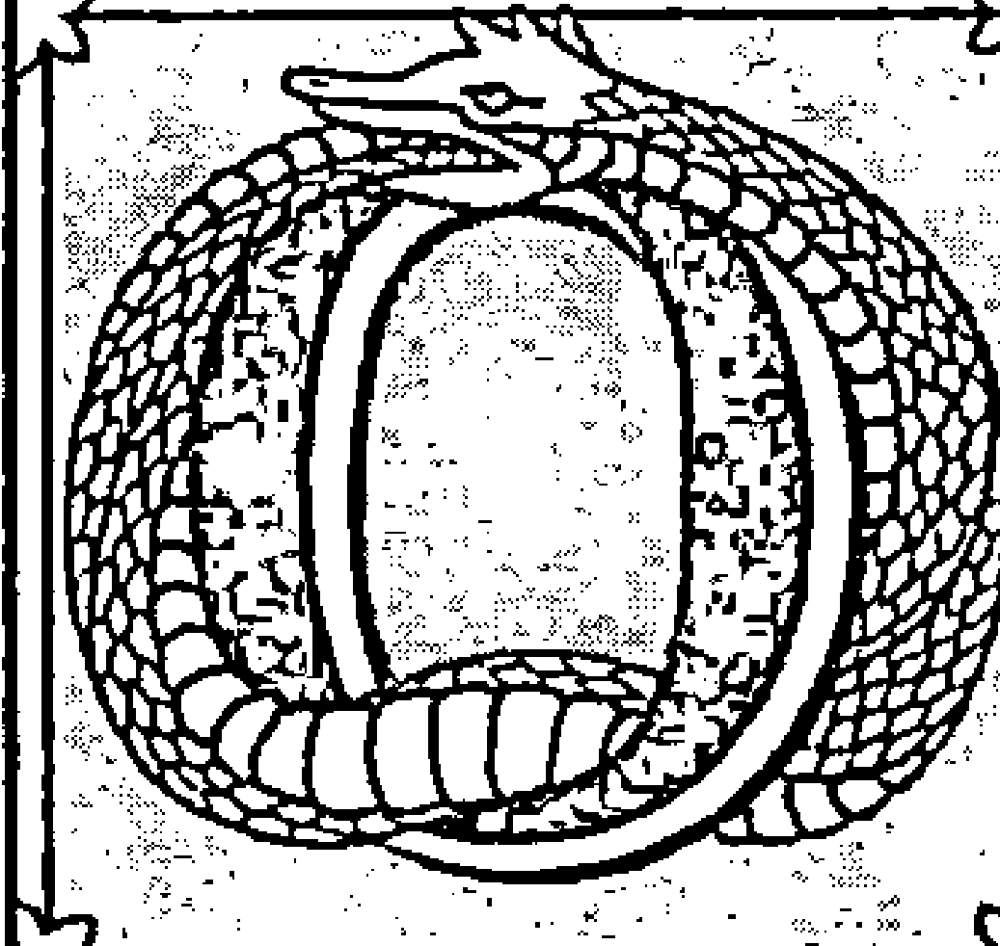

在希腊罗马时代，岛兽被叫做阿斯匹多彻龙（Aspidochelone）（拉丁文，“有壳的乌龟”）。这个名字后来在中世纪动物寓言集中变成了阿斯匹多德龙（Aspidodelone）或阿斯匹多卓龙（Aspidoicholon）（“角蝰龟”）。公元前2世纪的《生理论》将其称为法斯提克隆（Fastitocalon）（“海流上的漂浮者”）。它被描述为一头皮肤像石头的海怪，有鲸鱼那么大，类似于一座小石岛，上面还有沙子和海草。据说它非常危险，会引诱船员在自己身上登陆，然后再将它们拖入水中吃掉。如果找不到潜在的人类目标，它就会从嘴里放出一种甜甜的香味来引诱鱼群自己游到它嘴巴里，然后将其一并吞掉。

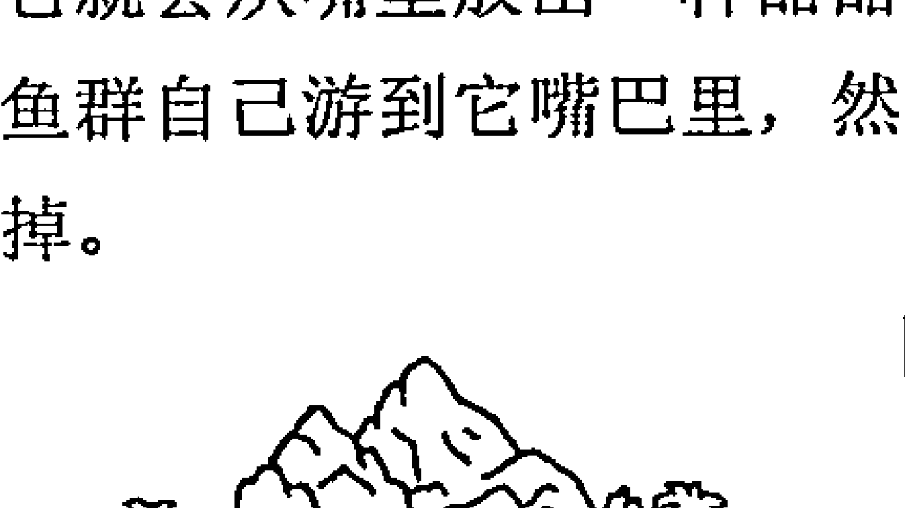

阿拉伯作者将岛兽称为卓拉唐（Zaratan），说它是一种巨大的乌龟，它广阔的背上有石头，上面的裂痕还长满了树木、草和灌木。在《天方夜谭》中，水手辛巴德在其七次航海中的第一次时就遇到了这种怪兽。

爱尔兰僧侣圣布兰登（St. Brendan）（484-578年）据说在其传奇般的前往应许之地的7年航行中遇见过这种大海怪。

> 这位僧侣登陆到一座石岛上做复活节弥撒，他点上一堆火烧水，这时他们脚下的岛屿像波浪一样动了起来。他们冲回船上，“岛屿”也游走了。（事后）布兰登告诉他们（似乎）上帝曾在一个梦中告诉他这座岛屿其实是一条鱼，“海洋中最大的一条。它总是想让自己首尾相见，但因为自己的长度而总是未能如愿。他的名字叫吉阿斯卡尼俄斯（Jasconius）（拉丁爱尔兰语，‘鱼’）。”

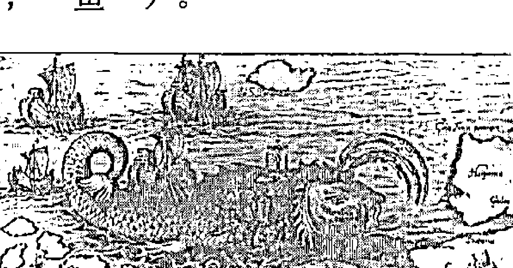

格林兰的因纽特人也有关于名叫伊玛普乌玛苏尔萨（Imap UMassoursa）的岛怪的故事。它会从下面将船拖起来扔进冰冷的海水中。

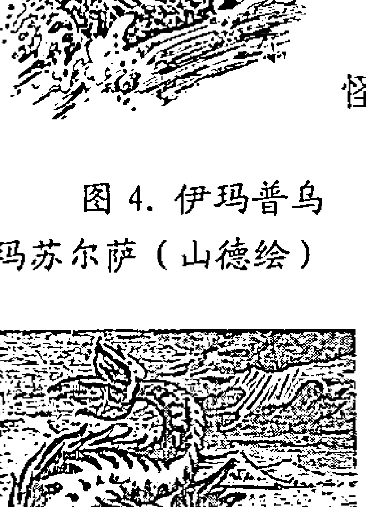

这种岛兽与《圣经》中对约拿和大鱼的记载有关，而在皮诺曹的故事里也有类似的情节，这个逃跑了的牵线木偶被魇斯路（Monstro）鲸## 图鉴三、怪兽的奥秘、传奇和历史

鱼吞进了肚子里。在孟豪森爵士（Baron Munchausen）（1720-1797年）的冒险故事中也有关于这种怪兽的精彩故事，这些故事首先被一位不知名的作者在1781年搜集并出版，后来在20世纪被拍成了几部夸张的电影。在孟豪森爵士的故事中，这种怪兽大得能将整艘船及里面的船员一并吞入肚子里，但却不能消化他们。

库尔玛（Kurma）是印度教中广阔的宇宙龟的名字。它的硬壳形成了苍穹，它的胸甲变成了大地——尤其指印度次大陆。当印度教中神搅动牛奶海（银河）创造出很多东西和生命的时候，它们让库尔玛潜入海底支撑起山峰，它们将巨蛇舍沙-纳加（Sesha-Naga）当作绳子吊着那座山。

## 宇宙世界龟

## 其它怪兽龟

人类历史上很多文化中都认为大地是被畅游在无限海洋中的已知乌龟或巨鱼背负着的。这就是为什么北美土著人也将其称为大龟岛的原因。在印度神话中，大地之盘被认为是由4头或8头或16头巨大的大象支撑着的，它们又站在一只名叫阿库帕拉的巨大的宇宙乌龟的壳上，这只乌龟在空间中一直漂浮着。

乌龟之父是苏门答腊神话中一头巨大的海龟，也是隐生动物学之父贝纳德·霍伊霍尔曼（Bernard Heuvalmans）（1916-2001年）总结出的几种海蛇中的一种。在不同的大洋中一种有4次关于它的目击记录。其中一次是蒸汽船哈诺伊号（Hanoi）的P. 梅里斯（P. Merlees）船长在1908年6月看到的一只身长30英尺的乌龟。

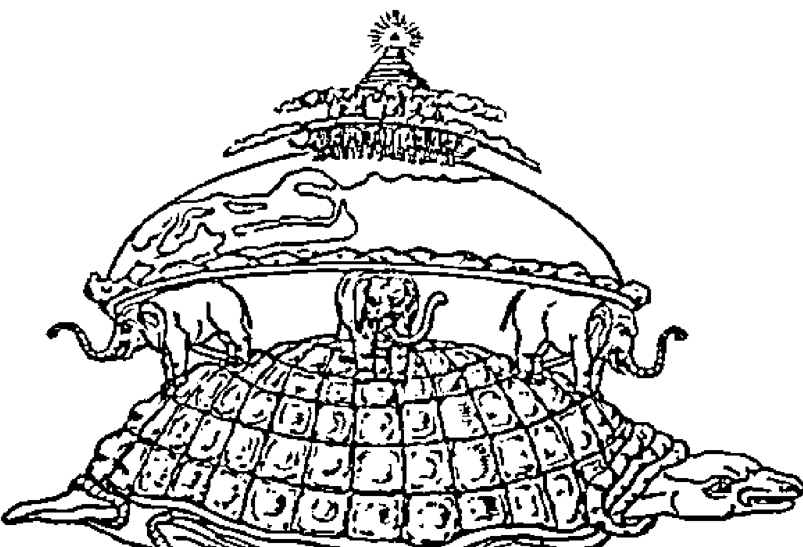

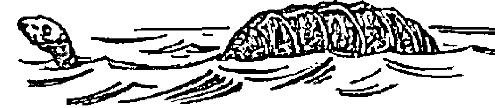

富于幻想的作者和滑稽故事大师特里·普拉切特写过一些基于这种世界的讽刺小说，他将其称作碟形世界（discworld）。这些书在魔法人群（他们是一些值得纪念的巫师和女巫）中很流行，有些还已经被拍成了电影。在这些故事中，巨大的世界之龟叫做俄团（Atuan），她寻找着一个可以产卵的地方。（见本章结尾处的插图）。

易威其（Ikaki）是西非尼日利亚卡拉巴里（Kalabari）土著人神话中的一只超自然乌龟。它喜欢唱歌跳舞，但每次抬起一条腿的时候，上面的人就会落下来被摔死——它的能力无疑非常巨大。一种被称为乌龟面具的仪式舞蹈仍然在表演着，在该舞蹈中有一名舞者带着乌龟壳模仿易威其的动作，这能传递出强大的法力。

河童（Kappa）是日本神道教神话中住在河里的生物。它们有乌龟的身体、长长的有鳞四肢、猴子的脑袋和长头发。它们喜欢喝血和吃黄瓜，能依靠施法后长出蜻蜓翅膀的黄瓜在天上飞。如果有人给它进贡，它就很友好，但如果对它不好就会被其吃掉。

## 魔法师的怪物图鉴

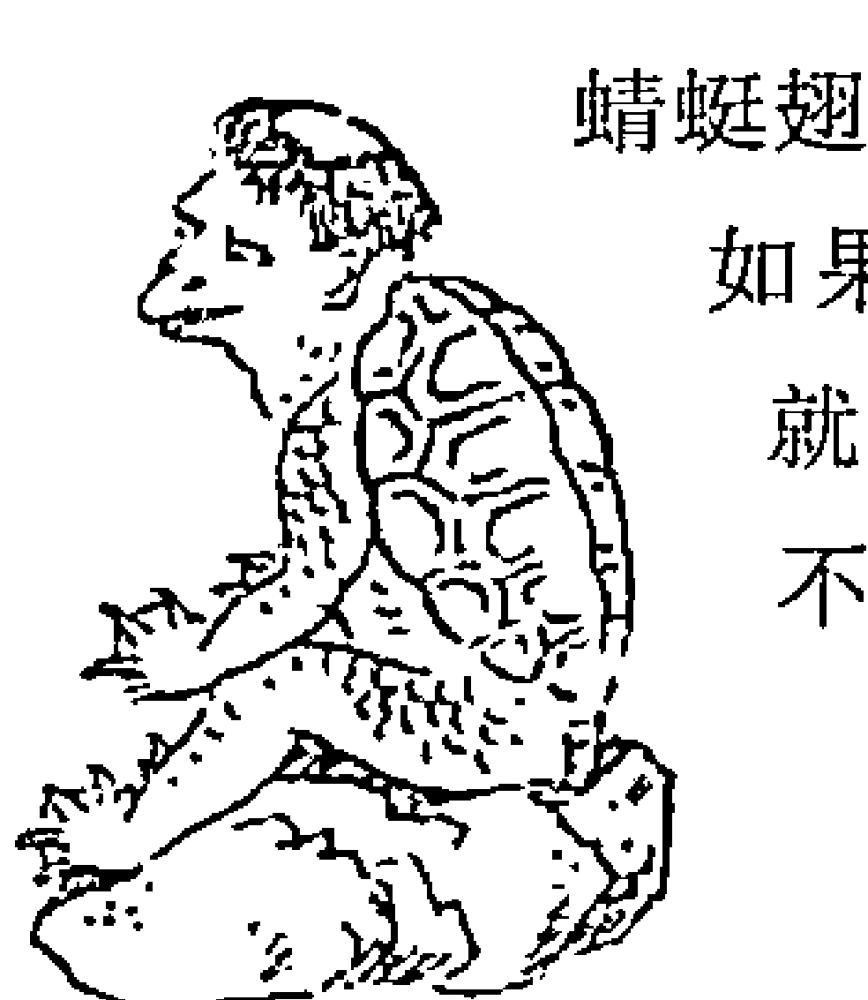

斯·卡诺瓦 (Skahnowa) 是美国东北部塞内卡 (Seneca) 印第安人传说中的怪兽龟。它帮助角蛇杜农加伊斯 (Doonongaes) 猎杀人类和动物。

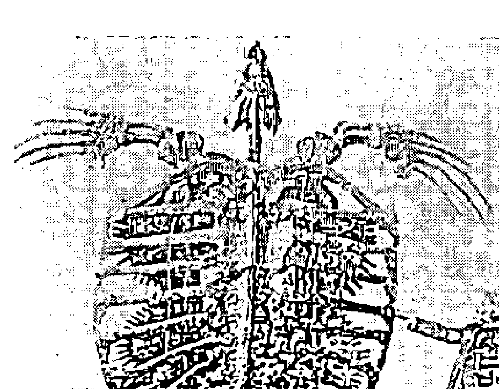

博斯克 (Bosco)（也叫奥斯卡、布斯克野兽）是对一种据说生活在印第安纳楚拉布斯科 (Churubusco) 附近的巨型乌龟的爱称。自1950年来它曾数次被目击过，当时几个沼泽地被抽干了变成耕地。目击者形容博斯克体重在100至500磅之间，壳有4英尺宽。1937年，一只巨大的大鳄龟 (Macrochelys temminckii) 在堪萨斯州的尼欧肯河中被活捉。它体重达到了惊人的403磅。

白垩纪海龟的体重估计能达4500磅。

有一种巨大的史前海龟，叫原盖龟 (Protostega) [“天顶 (first roof)”]。长达10英尺，它是存在过的第二大乌龟。

白垩纪海龟和原盖龟都与现在的皮背海龟 (Leatherback Sea Turtle) 有关。这种现存最大的乌龟长达9英尺。与当代的皮背龟类似，白垩纪海龟和原盖龟的壳上没有鳞甲，这让它们更脆弱但也更轻。它们可能以贝壳和水母为食。

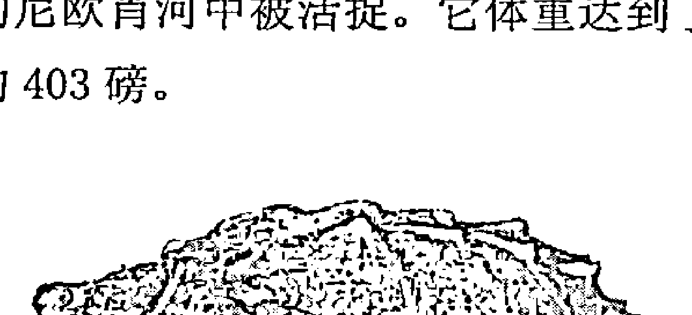

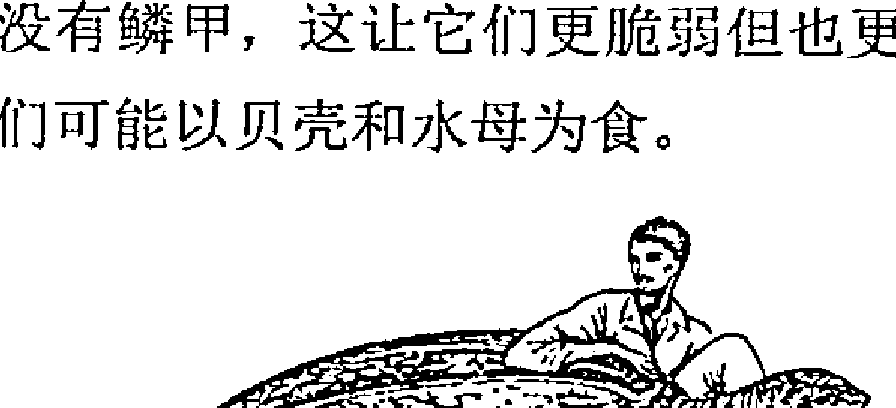

白垩纪海龟 (Archelon)（“老乌龟”）是存在过的最大的乌龟，生活在6500万年至9900万年前的上白垩纪时代，当时浅浅的奈厄布拉勒 (Niobrara) 海正覆盖着北美大陆。最大的白垩纪海龟 (Archelon) 化石发现于南达科塔州的皮埃尔泥板岩 (Pierre Shale)，长度接近14英尺，鳍状肢之间的宽16英尺。活的

已知存在过的最大陆地龟是陆龟阿特拉斯（“阿特拉斯乌龟”），也叫巨型乌龟 [巨龟属 (Colossochelys)]。它长约8英尺，高约6英尺，可能重达4吨。看起来与当代的加拉帕哥斯龟类似，这种巨型的食草龟生活在更新世时期——150万至200万年前。与其现代的亲戚类似，陆龟阿特拉斯可能也能在受到惊吓的时候将四肢和脑袋缩回龟壳中。

## 传说中的蜥蜴

龙的传说中有很多恐怖的蜥蜴。尽管在人类时代的欧洲并未生存着任何一种此类蜥蜴，但1910年在印度尼西亚科摩多岛上发现的10英尺长、300磅重的巨大蜥蜴还是造成了全世界的轰动。它们立刻就被冠以科莫多龙（Varanus komodoensis）的名号。1926年由W·道格拉斯·伯登率领，美国自然历史博物馆（American Museum of Natural History）赞助的探险队带回了两条活的蜥蜴和12具保存完整的尸体。它们中有两个的皮被保存在该博物馆的两栖动物和爬行动物馆中。伯登将自己的探险故事告诉了制片人梅里安·C. 库珀（Merian C. Cooper）。库珀将故事中的巨蜥改成了巨型黑猩猩，加入了一位美丽的女主角，拍出了经典的1933年版的《金刚》。但巨蜥并没有被遗忘，它们在该片中变成了恐龙。

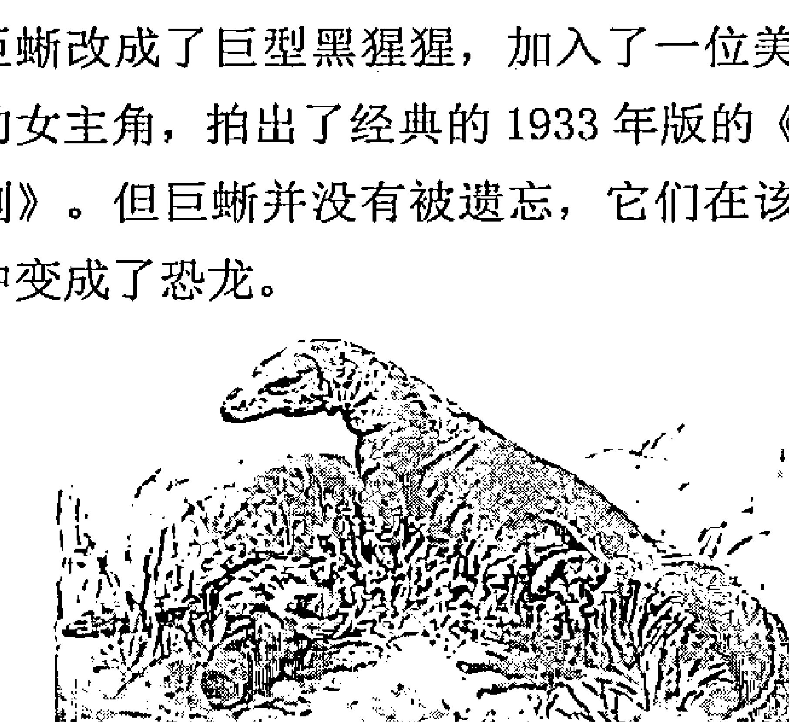

有一种史前科摩多龙叫古巨蜥（Megalania），它们更为庞大，体长在15至20英尺之间，体重在1000至1300磅之间。尽管人们认为它们在4万年前已经灭绝了，但在澳大利亚和新几内亚偶尔仍有关于它们的目击报告。1890年初，澳大利亚尤罗阿的居民称它们的村庄受到了一条30英尺长的未知爬行怪兽的威胁。一位墨尔本动物园（Melbourne Zoological Gardens）的代表戴上一张大网，组织了40人的搜查队。他们发现了一些巨大的脚印，但最后并未找到任何生物。

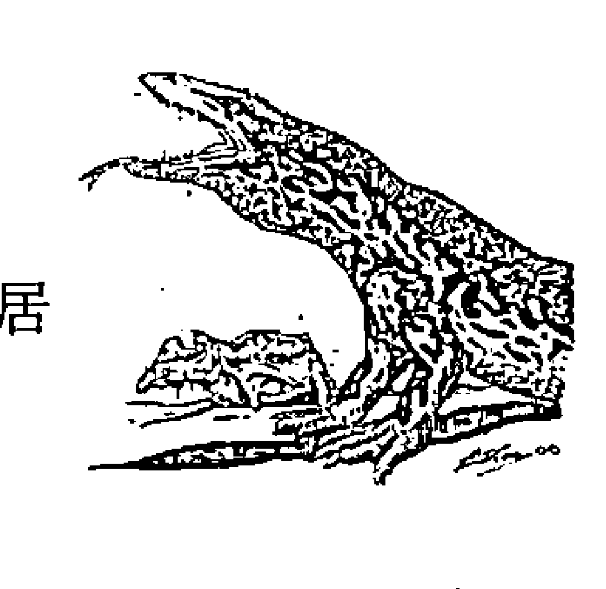

霍维伊（Whowhie）是澳大利亚穆雷河地区土著人传说中的一种恐怖的蜥蜴。它统治着那个地区，吃掉了很多人——特别是小孩。在它扫荡了一个村庄之后回到洞穴里休息的时候，人们用笼子将它困了起来。人们在洞口点起大火，将浓烟扇进洞中，这样一直持续了7天，最后霍维伊爬了出来，这时它已经看不见东西了，还在不停地咳嗽——人们用棒子和长矛将其打死。这个故事描述的是人类与一头更新世的古巨蜥（Megalania）的遭遇。

库里阿（Kurrea）是澳洲原住民黄金时代（Australian Aborigine Dreamtime）的一种住在沼泽地带的爬行怪兽，它的胃口很大。它对大家的生命都造成了威胁，于是英雄图拉（Toola）被派去杀死它。但他的长毛完全刺不进它装甲般的皮肤，而这个怪兽转过头来开始追杀他，他们在土地、石头和水上奔跑。在快要被追上的时候，图拉将其引到自己的岳母巴姆伯尔·特里（Bumble Tree）那里。库里阿看到了她，发出了害怕的叫声，随后钻进地下，留下一个大洞，此后再也没有回来害人。这是另一个关于古巨蜥的故事。

## 魔法师的怪物图鉴

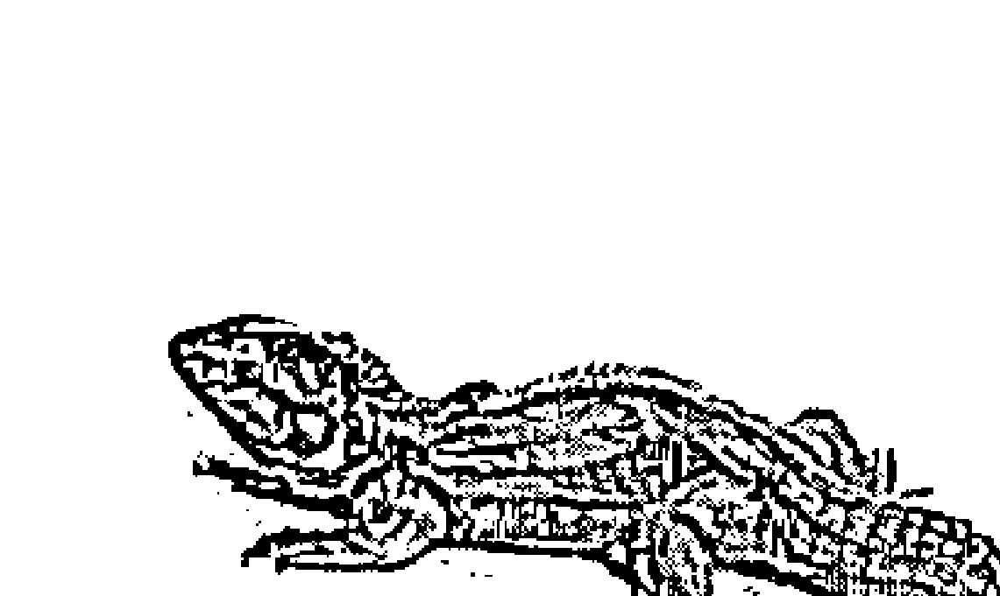

塔尼瓦（Tanihwa）是新西兰毛利人传说中的巨大爬行动物。它们据称住在河流、深洞、海洋深处——特别是那些有急流的地方。有些能在地里打洞，造成滑坡，或将树连根拔起。其它的据说在地向海洋中打洞时造就了很多的海湾。它们在海里的时候很像巨大的新西兰大蜥蜴（Sphenodon），背上还长着一排骨刺。它们会捕食那些崇拜自己的土著人，也会攻击看到的一切生物。

塔尼华霍洛马坦尼（Taniwha Horomatangi）是一条巨大的水生蜥蜴，并不吃人，有时甚至还会帮助人类。但它却会攻击独木舟和其它船只，特别是现代的摩托艇。它制造了巨大的卡瑞皮啼（Karapiti）气孔。而在另一方面，河吐-普库却以人类为食，它非常强壮和快速，没人能够逃脱它的追捕。它最终被一群猎人所杀，这些猎人在它的洞口放置了一张网，然后用话语嘲讽它，让它跑进了这个圈套中，最后用长矛协力将其杀死。杀死一只伊胡-玛陶陶（Ihu-Mataotao），将其肚子划开，就会看到里面没有被消化的受害者。而帕拉塔（Parata）用大嘴吸入并吐出海水，制造出了潮汐。科学家已经将一块化石命名为“欧氏海怪龙化石”（mosasaur Taniwhasaurus oweni），以表达对塔尼华（Taniwha）的敬畏。

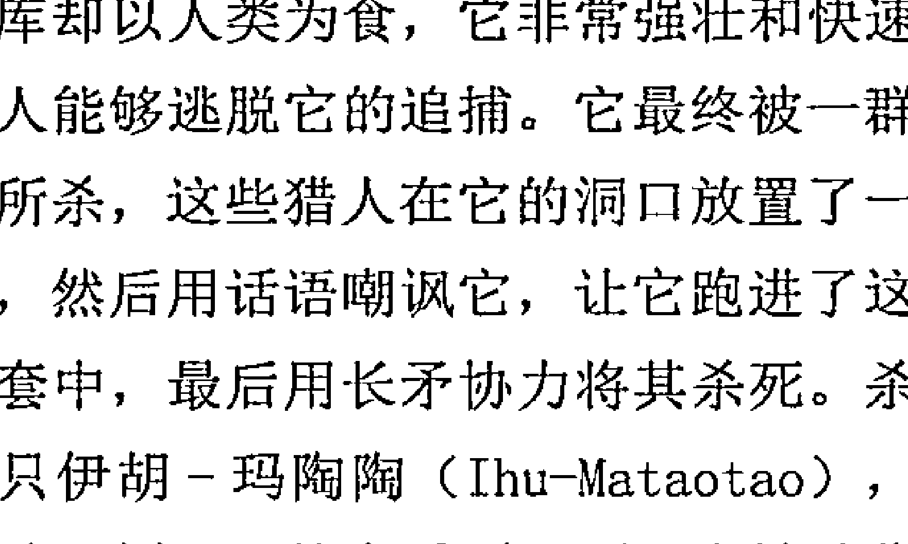

古朗阿奇（Gurangatch）是澳大利亚新南威尔士土著人黄金时代传说中的一种巨大的蜥蜴鱼似的水怪。它能在坚硬的岩石中打洞，从一个水池钻到另一个水池，让河水漫过堤坝。

1932年，一位名叫约翰逊的瑞典种植园主在穿越非洲开赛村的时候，他和一名当地的仆人看见了一只巨大的爬行动物正在攻击并最终吃掉了一头犀牛。他称其是一条40英尺长的蜥蜴，长着又长又厚的尾巴、狮子一样的四肢和长有长尖牙的大嘴。它全身呈深红色，脖子上、背上和尾巴上都有老虎般的垂直黑色条纹。这种恐怖的蜥蜴被命名为开赛暴龙（Kasai Rex）。

费力路（Fillyloo）[也叫高罗（Gowrow）、高力果（Golligog）、高力戈（Gollygog）、]是住在美洲奥扎克山脉土著人传说中的一种巨大的蜥蜴怪兽或龙，在19世纪的时候都常有人报告称遇见了它们。1951年V·兰多夫称其至少有20英尺长，长着野猪般的獠牙。奥扎克土著人传说中还有另一种蜥蜴般的怪兽，叫牡吉（Moogie）。

而智利的阿洛柯印第安人流传着关于拉姆帕鲁瓜（Lampalua）——一种长有巨爪的巨型蜥蜴——的故事。它以家畜和人类为食。

1960年代在加拿大安大略省的新汉堡附近的尼仕（Nith）河中，有人看到了一条巨大的蜥蜴怪。很多目击者称其重约50磅，全身绿棕色，长着四条腿和一条覆盖着鳞片的尾巴。但这条相对较小的生物似乎更可能是一条被人放生到那条河中的短吻鳄。

## 巨鳄

在中世纪的动物寓言集中有一种叫做窄吻鳄（Cocodryllus）或可肯蒂利尔（Corkendril）的生物。尽管对它们的描述通常都非常离奇，但这只是一种身长30英尺的鳄鱼，全身呈藏红色。埃及的尼罗鳄和印度尼西亚、澳大利亚北部的河口鳄都能长到这么长，但它们的身体和肚子通常分别是灰色和黄色的。可笑的是，在中世纪巫师的书房和炼金术师的实验室的天花板上都必须要吊上一只“可肯蒂利尔”的标本！

在白垩纪时期（1亿4100万年至6500万年前），海洋中确实存在着一种真正的怪物般的鳄鱼：恐鳄（Phobosuchus）。这种巨大的猎食性动物长约50英尺，它的头就有6英尺长，而牙齿的长度也有4英寸！

在非洲刚果共和国中部的利库阿拉（Likouala）湖沼泽地带有人看到了一种被当地人称为玛哈马（Mahama）的巨型鳄鱼。它据称有令人赞叹的50英尺长，能一口吞下木筏和上面的乘客。当地人坚持认为它是一种独立的物种，与尼罗鳄不是同类。它可能是一条活着的恐鳄吗？

汤姆潘德拉诺（Tompondrano）是马达加斯加的一种巨型水怪，像鳄鱼一样，它全身也包裹着装甲似的骨板。1926年，有一些渔民在水下就看到了它磷光闪闪的头部。实际上它是一头河口鳄，这是世界上最大的鳄鱼。通常只生活在印度尼西亚，这种鳄鱼能长到30英尺长。报告中的磷光实际上是由具有发光能力的浮游生物产生的，目击者在夜晚的珊瑚海（Coral Sea）中看到了它们。

奥罗布（Orobon）是居住在玛卓万山的阿拉伯人传说的一种住在红海中的凶猛鱼形捕食者。中世纪动物寓言集称其身长10英尺，脑袋像鲇鱼，有长蹼的爪脚，后半身看起来像鳄鱼——它很可能就是一条鳄鱼。然而，考虑到对其头部的描述，它可能是一条六须鲇鱼（wels catfish），这种鱼已知最长能长到10英尺长和330磅重。也许人们争论的东西实际上是两个不同的动物也说不定。

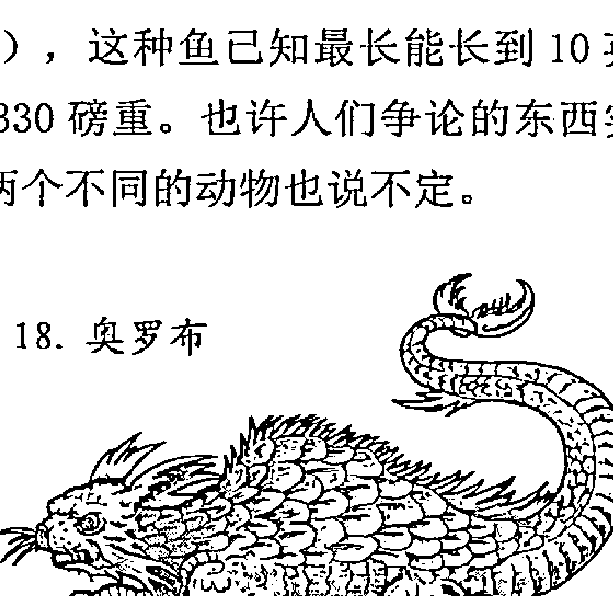

软泥怪（Slimy Slim）是当地人给爱达荷州帕耶特湖中生活着的一种湖怪取的名字。据说它长着蛇形的身体，长达36英尺，还有一只类似鳄鱼的脑袋。

## 怪物电影：巨鱼、乌龟、蜥蜴和鳄鱼

（作者按：我将那些用蜥蜴来代替恐龙的恐龙电影中的“巨型蜥蜴”排除在外。它们的名字叫苏鲁帕萨斯（slurpasaur），真正的恐龙电影迷对此都不屑一顾。）

- 《木偶奇遇记》（Pinocchio）（动画片，1940年）—法斯提托加伦鱼怪（Fastitocalon）
- 《大毒蜥》（The Giant Gila Monster）（1959年）—巨蜥（giant lizard）
- 《洞男爵的冒险》（The Fabulous Baron Munchausen）（1962年）—法斯提托加伦鱼怪
- 《史前一百万年》（One Million Years B.C.）（1966年）—巨龟（giant turtle）
- 《魔域仙踪》（The Neverending Story）（1984年）—巨龟
- 《吹牛大王历险记》（The Adventures of Baron Munchausen）（1988年）—法斯提托加伦鱼怪
- 《匹诺曹》（动画片，1992年）—法斯提托加伦鱼怪
- 《木偶奇遇记》（The Adventures of Pinocchio）（1996年）—法斯提托加伦鱼怪
- 《阿拉丁和大盗之王》（Aladdin and the King of Thieves）（动画片，1996年）—萨拉坦（Zaratan）
- 《巫婆怪女》（Wyrd Sisters）（电视卡通，1996年）—世界龟（world-turtle）
- 《灵魂乐》（Soul Music）（电视卡通，1997年）—世界龟
- 《哥斯拉》（Godzilla）（1998年）—巨蜥
- 《科莫多岛》（Komodo）（TV，1999年）—古巨蜥（Megalania）
- 《史前巨鳄》（Lake Placid）（1999年）—巨鳄（gigantic crocodile）
- 《大鳄魔》（Blood Surf a.k.a. Krocodylus）（2000年）—巨鳄
- 《碟形世界》（Hogfather）（TV，2006年）—世界龟（world-turtle）
- 《史前巨鳄2》（TV，2007年）—巨鳄

### 21、巨型章鱼

作者：奥伯伦

佛罗多觉得有什么东西抓住了他的脚踝，发出了一声尖叫……大家开始四处寻找，发现湖水开始沸腾起来，就像一群蛇从南方游了过来。一条触手从水里伸了出来，它通体淡绿，显出湿润的光泽。它分叉的末端抓着佛罗多的脚踝，正在把他往水里拖。萨姆跪在地上用小刀不停地砍它。这条触手终于放开了佛罗多，萨姆将其拉到一边，向大家呼救。这时，20条触手同时向他们袭来，黑色的湖水沸腾了，大家闻到了一股可怕的恶臭。

> ——J. R. R. 托尔金“水中守卫”（The Watcher in the Water）摘自《魔戒现身》，1954年

几百年来，人们一直传说着在深渊里居住着长有触手的水生生物。克拉肯——源自现在被称为巨型鱿鱼的真实生物——是此种神话传说中当之无愧的主角，而且在其它类型的神话传说中也被极大地讨论过。但很多神秘的头足类动物并非是鱿鱼，而是另外一些章鱼，它们二者是完全不同的动物。在这里我想讨论的两种是据称居住在淡水湖和淡水河中的那些，以及深海中存在着的那些巨大的章鱼。“魔力”一词并非指代“超自然”，而是直接引自拉丁文

## 湖中潜伏者

尽管现存的所有头足类动物都不生活在淡水中，但在过去几个世纪的时间里还是有无数关于居住在印第安纳州、肯塔基州、俄克拉何马州和西佛吉尼亚州淡水湖（常有怪兽出没的以及俄亥俄河）中的章鱼似的怪兽的报告。它们通常都被描述为长相丑陋、通体灰色、长约3英尺、看起来类似褐带蛸和纤维章鱼或胡么林奇（hummelinki）章鱼。

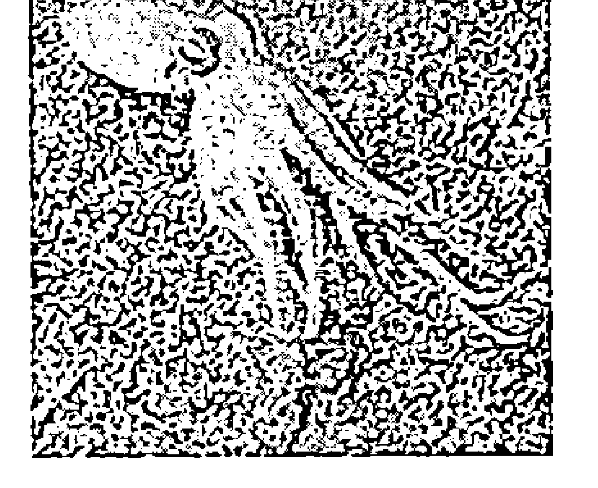

图 1. 褐带蛸

因为已知的章鱼有超过300种，所以在淡水中出现章鱼也并非令人不可接受，尽管它们不可能像托尔金的“水中守卫”那样令人震惊。

据说在俄克拉何马州雷鸟湖、乌洛加湖和特恩齐勒湖中就居住着这种长有触手的生物。当地的印第安人一直都很害怕它们，将它视作吸血虫，称其有马一样大，长着红棕色的皮革般的皮肤、小小的圆眼睛和许多触手。据说它的胃口很大，会攻击领地中的一切生物。

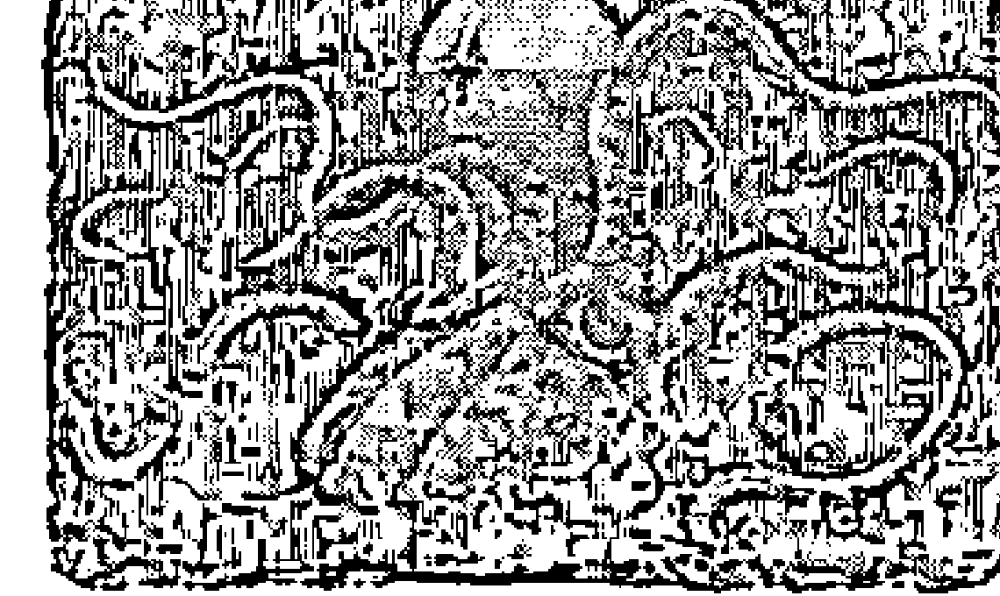

图 2. 魔鬼湖怪

在威斯康辛州索克郡的魔鬼湖中据说居住着类似的怪兽。当地的拉科塔印第安人几百年来一直传说着关于它的故事，它们是第一批目睹了一艘载满士兵的船被长着许多触手类似克拉肯的东西弄沉的人。

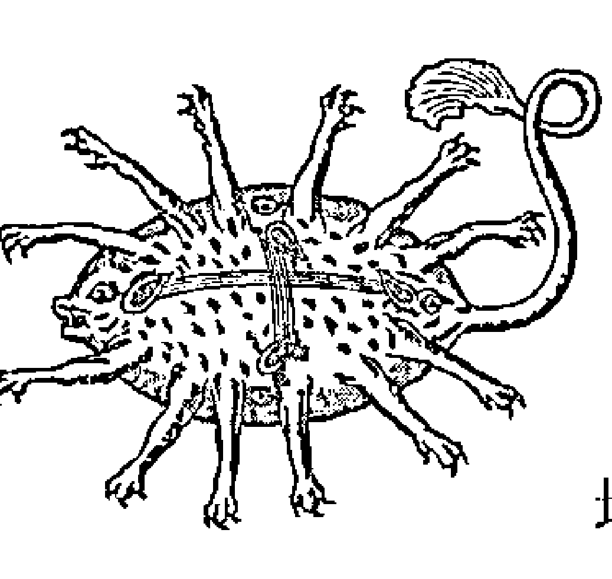

图 3. 伊尔奎罗

南美洲的淡水章鱼似乎更多。最为著名的就是伊尔奎罗（El Curro）（西班牙语，“牛皮”），也叫特雷奎湖库夫（El Trelquehuecuve）、平头怪（El Bien Peinado）。据说它居住在内乌肯南安第斯省的拉卡湖中，是一只危险的大型水怪。它像一张牛皮一样，但却长着有爪子的触手和很多眼睛。传说它来自一张掉入水中的驴皮，会将遇到的所有生物都裹起来吃掉。它在石头上晒太阳时会造成风暴。这种生物在其它地方被称作回克回克（Hueke Hueke）（“皮”），是一种生活在湖泊和河流中的恐怖生物。

当地人说它浮在水面上时就像一张摊开的动物皮。

这听起来很像一只巨型章鱼，只不过是居住在淡水中的而已。

格里历威鲁（Glyryvilu）也叫圭里乌鲁（Guirivulu），是一种生活在智利安地斯山脉中的淡水水怪。在某些地区，它被称为狐蛇（Vulpangue），被描述为一种长着狐狸脑袋的蛇或美洲豹。它长尾的末端长着

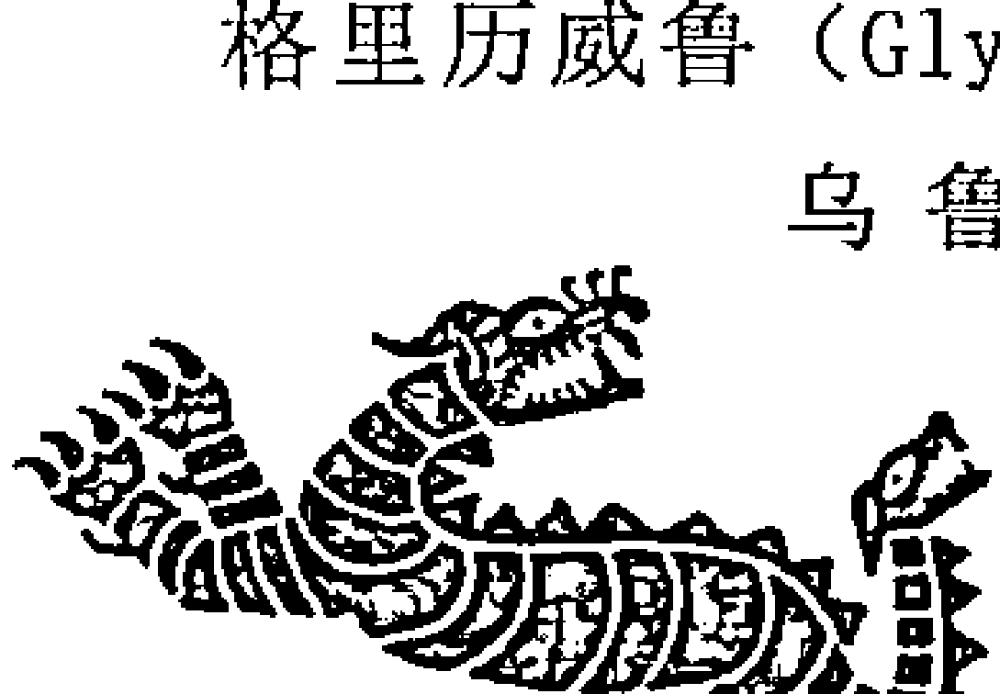

图 4. 狐蛇

## 图鉴三、怪兽的奥秘、传奇和历史

爪子，被用来抓住猎物。（插图4）它只能将猎物整个吞下，然后它的肚子就会像蛇一样膨胀起来。而在其它地方，它被说成是一种巨大的鱼或龙。但还有一些版本——与我们现在的问题比较有关——说它像盘子一样扁，类似于鳐鱼，但在身体边上长着的却是章鱼般的触手。

非洲中西部地区同样据说生活着淡水头足类动物。它们被称为米加斯（Migas），据称生活在刚果河的上游。与奎罗类似，它也被描述成一种巨大、扁平、长着触手的生物。所有这些生物看起来都像是某种章鱼，但现在还没有任何的淡水头足类动物为人类所知。然而，在日本有一种类似奎罗、格利德威尔和米加斯的生物，叫日本煎饼大头鱼（Pancake Devilfish）。（插图5）这种动物有可能像软体动物（蛤蚌、蜗牛和蛞蝓）那样也有已经适应了淡水环境的种类吗？

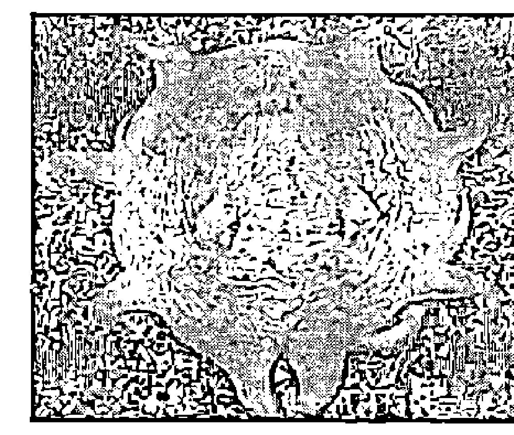

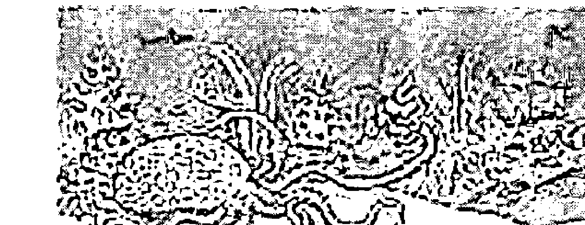

水中据说生活着一种巨大的章鱼。它被称作拉斯卡（Lusca）、大王乌贼、毛手怪。这种生物据称通常生活在安德罗斯岛附近长满红木树的神秘的深水中，住在那里被称为“蓝洞”的大型石灰岩洞里。而在该岛的“香蕉洞”——深深的咸水塘和小湖——中据称也有类似长着触须的怪兽。船主称自己曾被“类似章鱼一样长着很多触手的动物”攻击过。一位当地的向导回忆道，大王乌贼的触手有75英尺长，它们只有在能同时够到海底和船只的时候才会对人形成威胁。

> 传奇的拉斯卡要么像章鱼，要么就像鱿鱼，但它经常具有龙形生物的特征。有各种五花八门关于偷取渔船上饵料的生物的故事，尽管现在还并不清楚它们是否是章鱼。康斯塔团队拍摄的一张照片引起了广泛的关注，尽管照片中的内容只是一团看不清楚的棕色肉团。古巴也有关于巨型章鱼的传说，但这些生物并没有发光的眼睛和其它身体器官。另外，在佛罗里达至少有一种毫无争议的巨型章鱼。

在佛罗里达附近的巴哈马群岛清澈的这种尚未被证实的头足类动物已有了自己的学名：巨章（Octopus giganteus）。

关于巨型章鱼的故事并非只有加勒比地区才有，在智利的传说中就有一种名叫魔鬼鱼（Manta）的巨型海怪，它是生活在海中的奎罗（“皮”）。据称它类似一张剥下来的牛皮，长有触手和尾巴，眼睛长在身体边缘，在头顶上还有四只。尽管它的名字听起来像巨大的蝠鲼（Manta Ray）——这种鳐鱼身体扁平，能长到25英尺长6600磅重——但身上的触手表明它可能是一种章鱼，比如太平洋巨型章鱼（Enteroctopus dofleini），这种章鱼能长到30英尺以上的长度，体重也能超过100磅。据说魔鬼鱼有时会爬到岸上晒太阳，在回到海中时天上会狂风大作。这可能说的是动物被风暴吹到岸上的尸体，它们可能被吹成了牛皮一样的样子。但是卡尔·舒克曾坦率地表示过，魔鬼鱼可能是一种巨大的水母，如能长到6英尺长和450磅重的野村水母（Nomura’s jellyfish）。最近，大量的这种水母出现在很多捕鱼区域内——尤其是在日本附近，它们被认为是毁灭性的瘟疫。

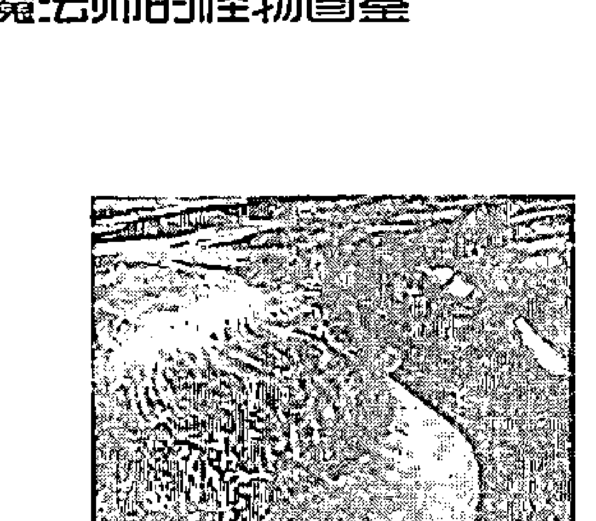

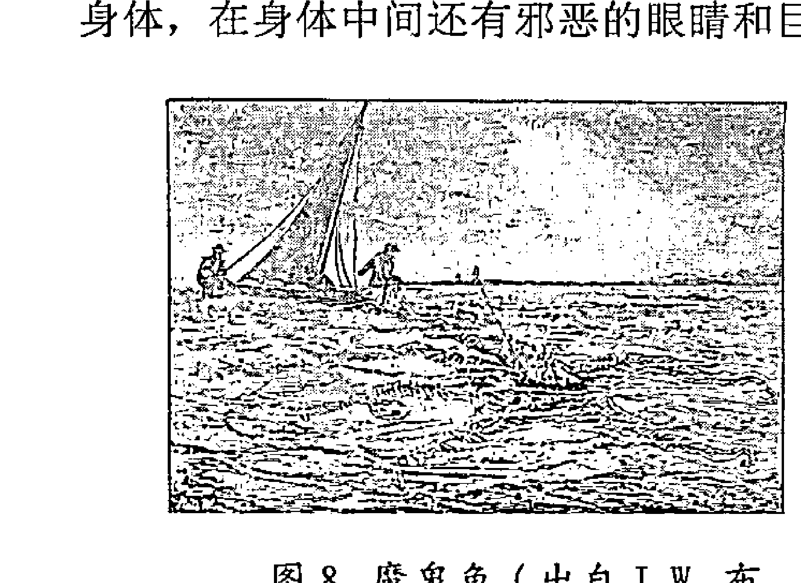

J.W. 布尔曾记载过一种巨大而强壮的海怪，长着“八条长手臂和一个扁平的身体，在身体中间还有邪恶的眼睛和巨大的嘴巴，在其周围还有几根骨刺。”它将其称为魔鬼鱼（也叫海魔鬼或海蝙蝠）。（插图8）这些名字和描述清楚地显示它就是蝠鲼，已知最大的蝠鲼能长到25英尺宽和6600磅重。但是这种鱼却并没有触手，这令人有些困惑，似乎他们是将蝠鲼和章鱼混在一起了。然而，还真有一种生物与这些描述相吻合，它就是日本煎饼大头鱼。除了北美、智利和非洲之外，在夏威夷也有很多关于淡水章鱼的报告。塔希提人（Tahitian）传说着一种名为土木拉-弗伊纳（Tumu-Ra’i-Fuena）的巨型斑点章鱼，它惊人的触手能将大地和天堂都抱住。

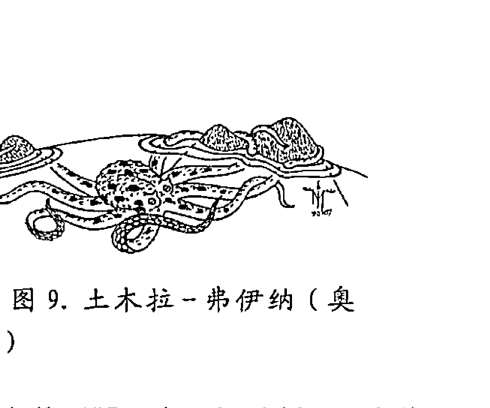

##### 格洛波斯特尔斯（Globsters）或博罗波斯（Blobs）

在佛罗里达、百慕大、新西兰和塔斯马尼亚的海滩上都出现过很多一堆堆乱七八糟的尸体。它们被称为格洛波斯特尔斯和博罗波斯，它们通常都呈圆筒形，底部平坦，长度在8至30英尺间。它们是无法辨认的胶质纤维团，没有内骨骼——没有骨头，也没有软骨——而它们橡胶似的皮肤与车胎一样粗糙，上面还经常长着稀疏的毛发。有些上面还有鳃状裂口、小嘴巴，体侧还有长长的肉垂或触手，但却没有眼睛。尽管很多都被认为是被风暴损坏了的尚未被证实的巨章的尸体，但最近却有人认为它们只是抹香鲸尸体上没有肉的部分，由其头部、肩部上方和肋骨间大量的脂肪组成。

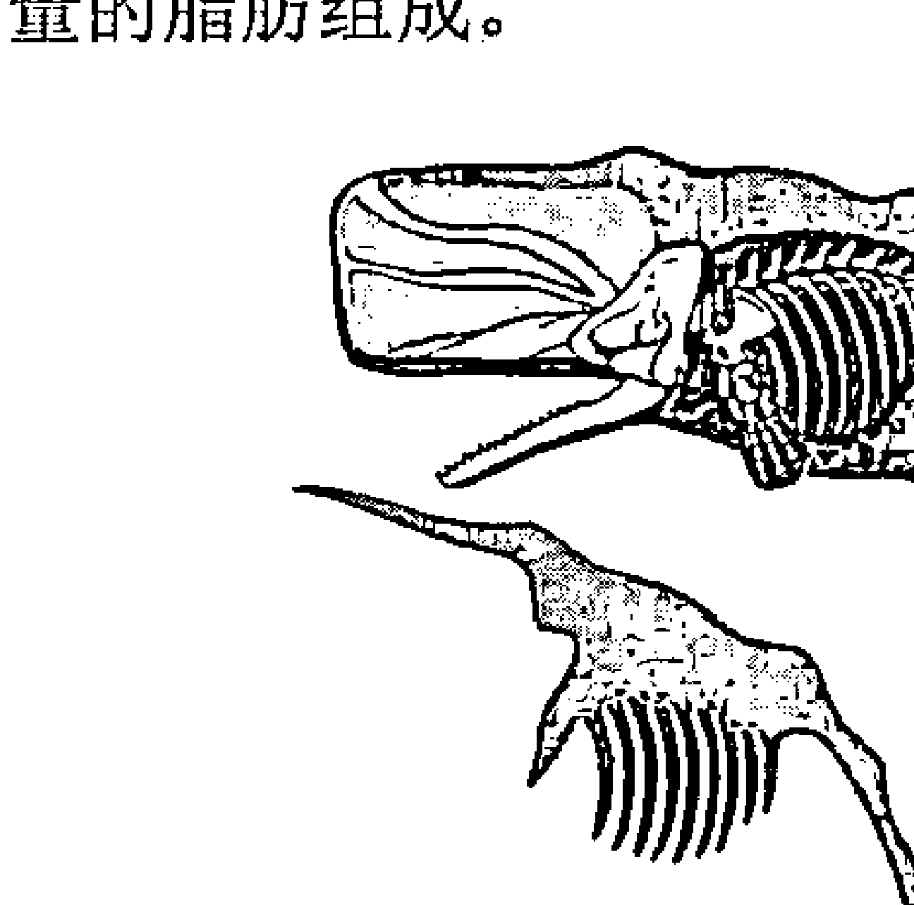

1896年11月30日，在佛罗里达州圣奥古斯丁附近的阿纳斯塔西亚群套海滩上出现了一具半掩在沙中的尸体，它暴露在外的部分有7英尺高、23英尺长和18英尺厚。随后的挖掘发现了许多长达30英尺的触手。（插图11）著名的海洋生物学家A.E. 维力尔（A.E.Verill）——他对发现巨型鱿鱼有巨大帮助——也开始加入到对这具尸体的研究之中。他在确定其为一只章鱼而非鱿鱼之后，将其命名为维力尔巨章（Octopus giganteus verill），并估计它完整体长超过100英尺。这具尸体很快便被冲回海中，但在1957年，人们又找到了并重新检查了一些组织样本。不幸的是，由于长时间的存放，这些组织样本上已经腐烂出了许多小孔，从而使得工作无法进行。1988年5月，泰迪·塔克在百慕大红树林湾（Mangrove）的沙滩上发现了一具被海浪冲上岸的奇特blob。它被称作百慕大博罗波斯，有大约8英尺长3英尺宽，非常白，而且充满纤维，没有骨头、软骨或明显的开口。它似乎长着5条手臂和腿，塔克称其看起来就像一颗丑陋的星星。（插图12）

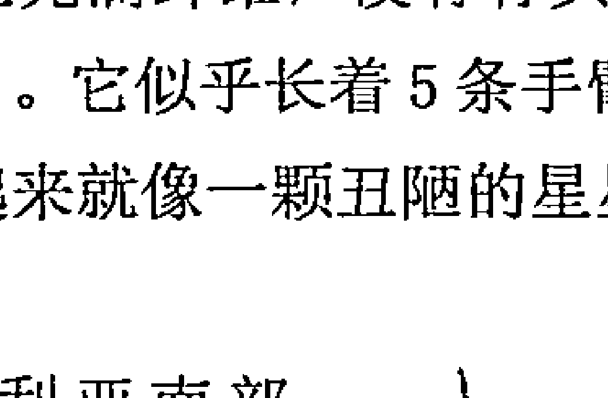

在澳大利亚南部的塔斯马尼亚海滩上曾出现过几个神秘的无骨骼博罗波斯——通常被称为格洛波斯特尔斯。第一个受到全球关注的格洛波斯特尔斯被发现于1960年8月，当时几个牧场工人在霍巴特附近的因特福尔河的岸边被一具尸体所绊倒。这具尸体长20英尺，宽18英尺，在其中间有一个4英尺高的隆起。据估算，它的重量在4至10吨之间。它上面覆盖着一层类似于羊毛的油腻的东西，而里面的肉则像橡胶一样坚韧。1962年3月，人们对其进行了更全面深入的检查。在其前部的两边发现了5、6个鳃一样的裂口。调查者还在认为是头部的上面发现了4条大大的肉垂，在最里面的两条之间还有一个类似食道的光滑的孔。但却没有发现眼睛。

1970年，在桑迪角南方几英里处又发现了一个格洛波斯特尔斯。这具有隆起物的尸体长约8英尺，比1960年的那个要新鲜很多。而在1997年，在塔斯马尼亚的四英里海滩（Four Mile Beach）上又发现了一具奇怪的尸体。它被命名为四英里博罗博斯特（Blobster），长着船桨似的鳍状肢，还有一缕缕类似意大利面的白色毛发，身体两侧还各有6条胖胖的肉垂。这具尸体有15英尺长，6英尺宽，重约4吨。与其它格洛波斯特尔斯不同的是，它似乎主要是由胶质纤维组成的。

1965年3月，一个30英尺长、8英尺高的格洛波斯特尔斯被冲到了新西兰穆丽怀海滩上。据称它1/4英寸厚的粗糙皮肤上长满了4至6英寸长的羊毛状毛发。而在这些下面是一层脂肪层，然后是紧实的肉层。但调查者J·罗伯却称，这个博罗波斯身上并没有长毛，而是一层由纤维连接起来的组织。这个“生物”最后被证实为只不过是一团鲸鱼脂肪而已。

## 怪物电影：致命的章鱼

除了在克拉肯一章中提到的那些影片外，还有一些电影也涉及到了章鱼，有1929年改编自儒勒·凡尔纳的《神秘岛》的无声电影，还有艾德·伍德的《外太空九号计划》（Plan 9 from Outer Space）（1959年）这部被认为史上最差影片的电影。在停格拍摄类影片（stop-motion）传奇雷·哈利豪森的《海底来物》（It Came from Beneath the Sea）（1955年）中有一条巨大的、留爪章鱼。在《神秘岛》（1961年）中，尼莫船长的舵手被一条长有六只触手的巨型鹦鹉螺攻击了。1970年的日本影片《阿米巴》（Space Amoeba）[美国版的名称叫来自太空的怪物（Yog, Monster From Space）]中有一条名为“季卓拉（Gezora）”的巨型乌贼。《触手怪物》（Tentacles）（1977年）是一部关于一只巨型章鱼的恐怖片。拉尔夫·巴克什（Bakshi）拍摄的《指环王》动画片（1978年）中有水中守望者。《七宝奇谋》（The Goonies）（1985年）在影院版本中删除了一段关于一只巨型章鱼的片在，后来则将其补充进了DVD版中。《章鱼来袭》（Octopus）（2000年）和之后的续集《章鱼来袭2：东河惊魂》（Octopus 2:River of Fear）（2002年）这两部影片中都有巨型章鱼的身影。但迄今为止电影中刻画得最好的章鱼怪要数彼得·杰克逊的《指环王：魔戒现身》（2001年）中的“水中守望者”。

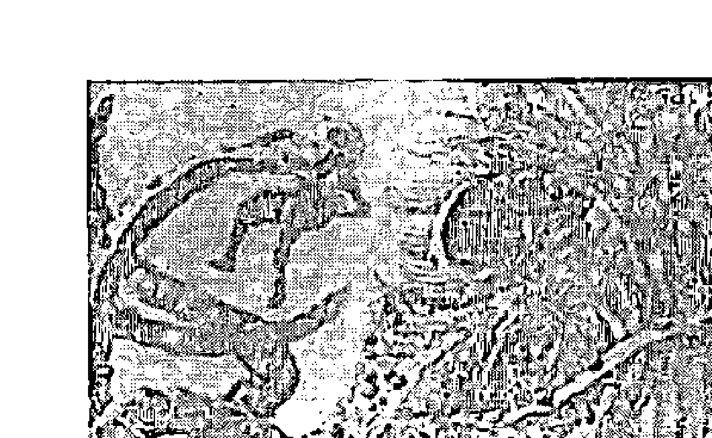

图 14.《神秘岛》中的巨型鹦鹉螺

# 22、沼泽怪兽

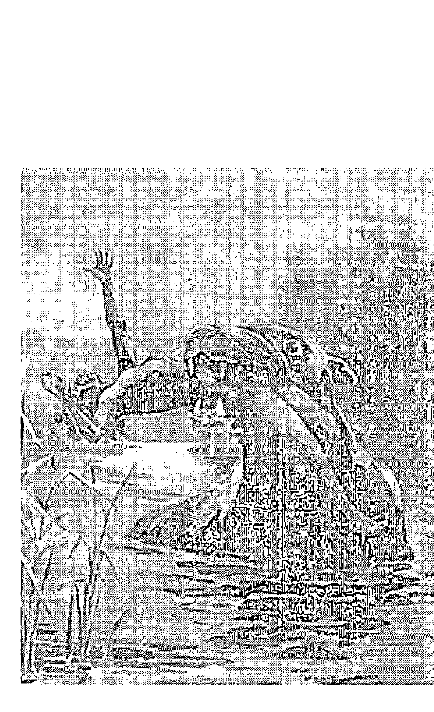

作者：奥伯伦和安娜·福克斯（Anna Fox）

这是什么东西？是一个人还是一条鱼？死的还是活的？

一定是一条鱼；它的气味像一条鱼

这个头脑简单的怪物要把我笑死了。

这个不要脸的怪物！我心里真想把它揍一顿。

一个可笑又可气的怪物！会把一个无赖的醉汉看做了不得的人！

一个咆哮的怪物！一个醉酒的怪物！

> ——莎士比亚，特林鸠罗的台词，《暴风雨》第二幕：第二场

毫无疑问，澳大利亚最为著名的怪兽非奔异兽（Bunyip，澳洲土著语中的“恶灵”）莫属。它也叫穆尔葛万科（Moolgewanke）、堂塔巴（Tuntabah）、堂那番（Tunatpan）、维瓦（Wee-Waa），是一种凶猛的水怪，据说居住在澳大利亚内陆地区的死水潭（billabong，水路边的U形死水潭）、湖泊、河流、溪流、水洞中。偶尔在夜晚，你会听到它们那令人毛骨悚然的叫声，那是它们正在攻击并吞食不幸在水边被抓到的生物。奔异兽通常被描述为约有小牛般大小，像一头黑色的、长着毛的海豹或犀牛——有时还有长臂和利爪——以及海象般的獠牙、鳍、鳞片、鳍状肢、翅膀甚至马尾和/或羽毛。在塔斯马尼亚，它被称作宇宙眼（Universal Eye），被描述成蛇的样子。当地人非常害怕它，认为它是一种食人兽。

在欧洲人刚到澳洲不久的时候，那时他们对这片大陆上的奇特生物还知之甚少，所以人们认为奔异兽只不过是另一种未知生物罢了。在夜间传来的陌生的叫声都被认为是奔异兽在咆哮。1846年，在南威尔士马兰比吉河边发现的一个奇异的头骨——那里传说就是奔异兽出没的地区——似乎表明奔异兽确实存在。几位专家很快便得出结论，这属于某种未知生物，而后在1847年，这颗所谓的“奔异兽头骨”在悉尼的澳大利亚博物馆被展出。不幸的是，没过多久，它就被证实为是一头畸形马驹或小牛的头骨。

然而，今天的“Bunyip”一词的用法与“Bogey”差不多——指代某种想像中的有些愚蠢的未知生物。随着时间的推移，对于这些生物的描述变得越来越荒诞。乔治·塔普林牧师所描述的亚历山大湖奔异兽是一只半人半鱼、长着水草般毛发的怪兽。它的叫声像大炮一样，会让人患上风湿。

但是，这些只能让这种传说中的生物变成典型的恶作剧、虚假和玩笑的产物。

它被我们记入了“魔精”一章（第17章）中。任何说自己看到过它的人都会被认为是在开玩笑或是喝醉了，而那些说自己看到过紫色食人兽的人则可能被打。“干嘛费工夫找奔异兽呢？”（Why search for the Bunyip?）（意为做无用的事）正是源自人们一遍又一遍地试图找到这种生物但却无功而返。

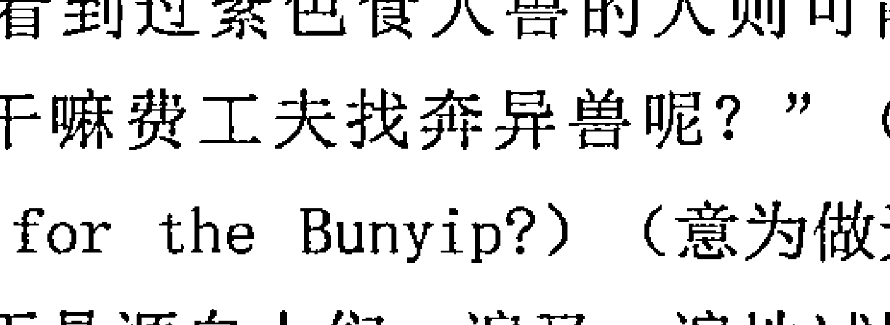

## 历史

作者：安娜·福克斯

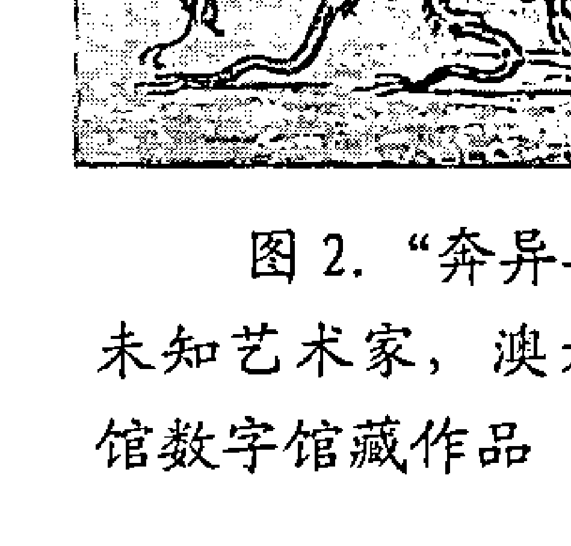

最早关于奔异兽的报告并非基于目击而是来自某种叫声。1801年6月，法国地理探险队正从澳洲西南角的海湾沿着天鹅河往内陆深入，该河的名字来自他们所乘坐的船只。突然，一声比牛叫还低沉的恐怖叫声从岸边的芦苇丛中传来，吓得这些人调头就跑，他们认为那是某种恐怖的水怪在向自己发出警告。

第一位看到奔异兽的白人是一名叫做威廉·巴克利的越狱犯，他在 1803 年至1835 年期间在维多利亚和土著人居住在一起。他报告称自己在内陆地区看到了不止一次，甚至还试着用长矛杀死过一只。巴克利还说，奔异兽全身长着灰色的羽毛，体型大概和小牛差不多。

英国探险者汉密尔顿·休姆（Hume）称自己在位于澳洲大陆另外一边的巴瑟斯特湖（Lake Bathurst）中看到了一头像海牛或河马的动物。澳洲哲学协会（Philosophical Society of Australasia）立即开始向它注资，要求找到一些样本或尸体。1818年休姆自称找到了一些较大的可疑骨骼，但却从未对其进行过科学研究。尽管如此，在 19 世纪，澳大利亚内移的人们还是有很多都称自己目击到了奔异兽，而且很多父母还借此编出吓小孩的故事，让他们不敢到草丛中去乱转。

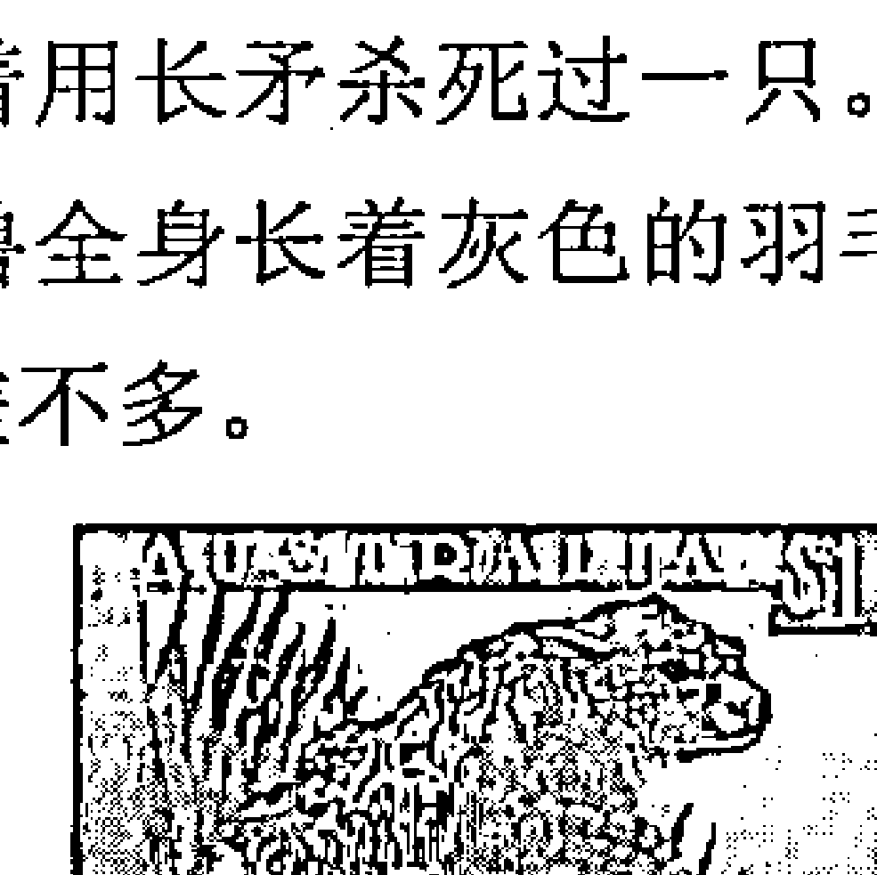

1848 年，在维多利亚的伊姆拉拉河（Eumeralla River）中发现了一头被证实为奔异兽的生物，据说是一头棕色的大型动物，长着长脖子、鬃毛和袋鼠头的动物。目击者称其嘴巴很大。长脖子和袋鼠脑袋让其听起来像一头湖怪。其它地方的湖怪都据称长着马头、牛头、鹿头、骆驼头或长颈鹿头。对这些生物的头颈的描述都非常相似，表明它们看到的其实是一种真实存在的动物。

飞利浦港有一种类似的湖怪被称为堂那番（Tunatpan）：“它像小公牛一样大，有鸸鹋的头和脖子、马的鬃毛和海豹的鳍状肢，它会在鸭嘴兽一样的窝里产下海龟一样的蛋，有时在吃腻了鱼虾之后，它会开始吃土著人。”这种长颈奔异兽只在新南威尔士有报道。

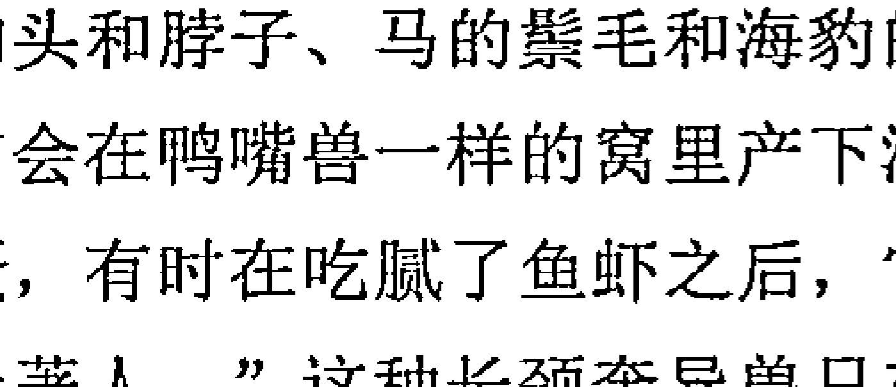

格里塔奔异兽（Greta Bunyip）据称住在维多利亚格里塔区。当地人经常听到从沼泽地里传来的巨大爆炸声，而却没能找到它的源头。在沼泽被抽干之后，就再也没有这种声音了。有人认为奔异兽仍然存在，但其他人则认为它在栖息地被毁掉的时候就已经死了。

## 土著的故事

作者：安娜·福克斯

根据土著人的传说，奔异兽最开始是人类，但他违反了彩虹蛇（Rainbow Serpent）的命令，吃掉了自己图腾中的一种动物，于是被放逐，之后它变成了一个恶灵，始终威胁着自己的族人。人们称其为奔异兽。土著人很害怕奔异兽，他们的传说中尽是关于奔异兽在夜间猎杀在水边的族人的故事。

他们很少将它的样子画出来，可能是担心画像会将其引来。但在原住民黄金时代时，也出现了些它们的画像。当时有一头被认为是奔异兽的生物死在了维多利亚的一条小溪边，于是他们在它旁边插上长矛，将那块草皮移走。后来那里成了一处圣地。这个轮廓保持了很多年，在1840年白人定居者到达那里的时候都还在。这个轮廓大概有30英尺长，形状类似一头大海豹（或尼斯湖水怪）。但最终它还是消失了。

## 鉴定奔异兽

1872 年出现了一头可能是奔异兽的动物，它被描述为一只“狗头怪”。有人称其“像一条狩猎犬，长着圆圆的头和几乎看不见的耳朵”，它出现在一艘正游弋在科兰加迈特湖（Lake Corangamite）的小船附近，吓得上面的人跌入了水中。这听起来像一只海豹，从那时起，很多类似的报告开始出现。

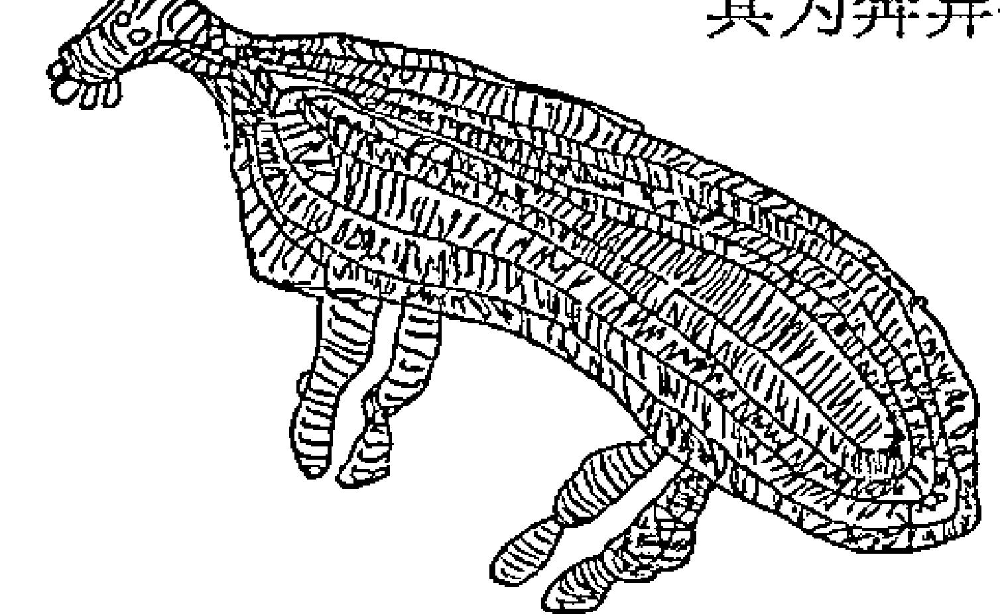

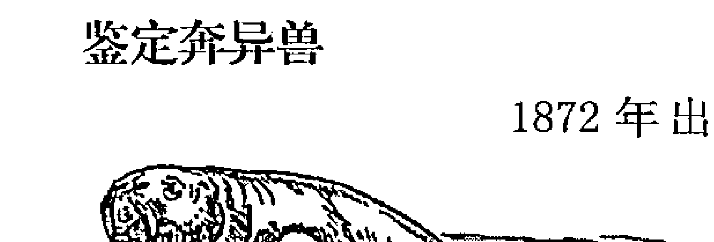

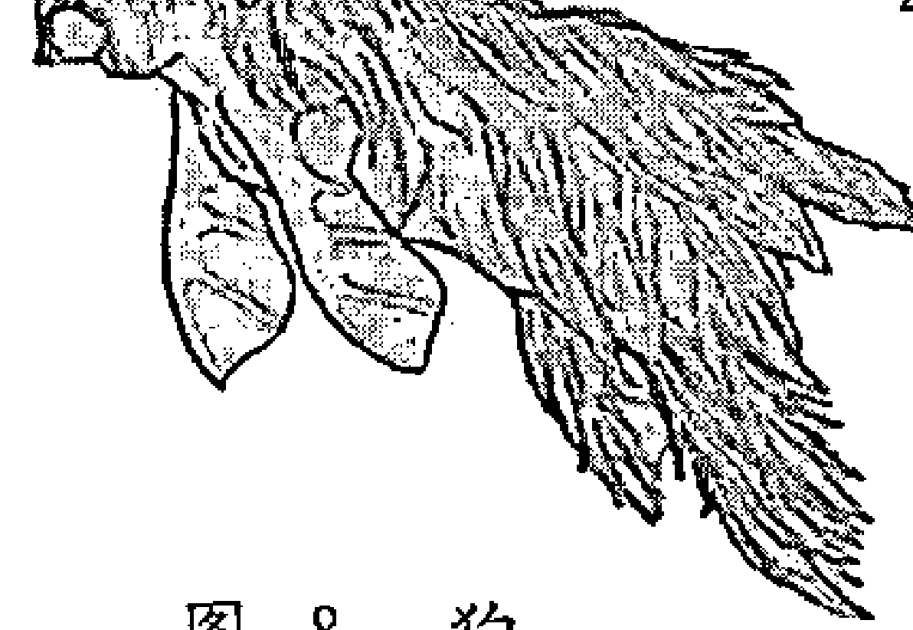

然而，它被认为是印度洋海牛（Indo-Pacific Dugong），虽然这种动物只生活在海水中。1872 或 1873 年在纳兰德拉附近的一个咸水湖中被发现的一只生物也说成是猎犬的样子，但它的体型只有猎犬的一半大，身上还长着又长又亮的黑毛。在昆士兰附近的多尔比也有人发现了一头长着海豹脑袋的类似生物，它长着不对称的双尾鳍，其中一个鳍可能是受了伤。

从 19 世纪中叶到 20 世纪，在塔斯马尼亚的很多湖泊中也都发现过类似的水生动物，其中最近的一次是在 1932 年的一个水坝附近。它们的长度在 3 至 4 英尺间，长着与斗牛犬类似的圆脑袋，还有两条小小的鳍长在身体前侧，像翅膀一样，它们的速度能达每小时 30 英里，经常会将水打到空中 10 英尺的高度。

除了那些与湖怪极其相似的以外，人们对长着狗脸的奔异兽的描述都差不多。它们生活在新南威尔士、维多利亚、塔斯马尼亚和澳大利亚首都区，通常都据称是一种毛茸茸的动物，大概有牧羊犬或猎犬那么大，长着狗一样的脑袋、很小的或根本没有耳朵、两条前鳍、一条叶尾。它身上的长毛通常都是黑黑的，但 1886 年在堪培拉附近看到的一只却是白色的。

这些描述和它们的体型都表明传说中的奔异兽就是海豹。其两性的体型差距很大（雄性是雌性的两倍），而且有时它们看起来像完全不同的两个种类，象海豹也是如此。在澳大利亚和塔斯马尼亚的水体中生活着 11 种已知的海豹——比世界上其它任何地区都多。

### 生活在澳洲的海豹种类

**海狮科（有耳海豹） (Otariidae)**
- 新西兰海狗 (雄性 8 英尺，408 磅；雌性 4 英尺，154 磅)
- 南极海狗，南极软毛海豹 (雄性 6 英尺，293 磅；雌性 4 英尺，75 磅)
- 软毛海豹，澳洲海狗， (雄性 7.7 英尺，154 磅；雌性 6 英尺，270 磅)
- 亚南极海狗，辐北毛皮海狮 (雄性 6 英尺，364 磅；雌性 4.75 英尺，120 磅)
- 澳大利亚海狮 (雄性 6.7 英尺，660 磅；雌性 5 英尺，250 磅)
- 新西兰海狮 (雄性 7.25 英尺，880 磅；雌性 6 英尺，507 磅)

**海豹科（有毛和无毛类）(Phocidae)**
- 豹斑海豹 (雄性 9 英尺，720 磅；雌性 9.8 英尺，815 磅)
- 威德尔海豹 (雄性 8 英尺，860 磅；雌性 8.8 英尺，992 磅)
- 食蟹海豹 (雄性 7.7 英尺，485 磅；雌性 7.7 英尺，485 磅)
- 南象海豹 (雄性 16 英尺，5,290 磅；雌性 9.8 英尺，1,500 磅)
- 罗氏海豹，大眼海豹 (雄性 6.7 英尺，395 磅；雌性 6.7 英尺，395 磅)

读者们可能会觉得在远离海洋的淡水湖泊和河流中可能也生活着海豹，但这只是个例。人们知道很多海豹都会顺着河流进入到内陆，但只有一种海豹，贝加尔海豹（Beikal Seal），生活在西伯利亚的贝加尔湖中（有趣的是，那里也是传说中的贝加尔湖怪的栖息地）。澳洲海狗会在河水泛滥时进入河中，然后在洪水退去时被困在河中。在远至堪培拉的地区也有很多海狗被人抓住或杀害——巧合的是，那里也是所谓的奔异兽被目击到的地方。在穆雷河和达令河流域也有海豹和海狮被发现。

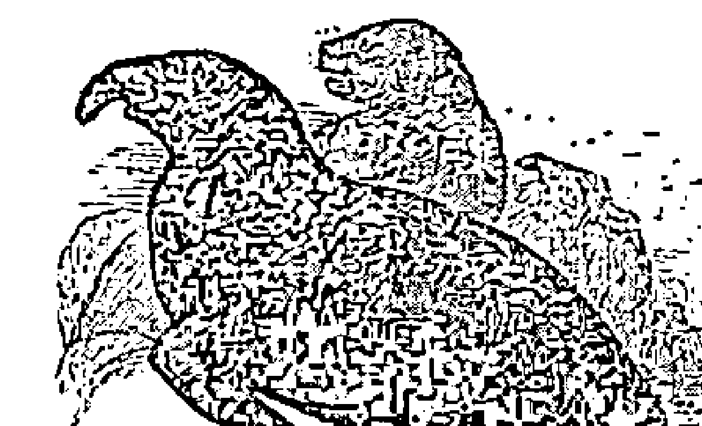

查尔斯·芬纳博士记录了在马兰比吉河口处 900 英里的孔纳格（Conargo）有人杀死了一头海豹。1870年，在肖尔黑文河中有人杀死了一头豹海豹，它是在一只鸭嘴兽的肚子里被发现的。澳大利亚博物馆的吉尔伯特·惠特尼说：“这是一头奔异兽吃掉了另一头奔异兽！”

杀至灭绝。这些岩画准确地将它们的大门牙描绘了出来，它们也因此得到了意为“双门齿”（two teeth in front）的学名。

> 卡尔·舒克博士说：“早在1924年，澳大利亚博物馆的C·W·安德森博士就表示关于奔异兽的故事可能源自澳洲土著人传说中已经灭绝了的狄普松（diprodont）——最近在澳大利亚动物学家弗兰纳里（Tim Flannery）博士和迈克尔·阿彻（Michael Archer）博士的《巨踝足龙》（Kadimakara）（1985年）中也有提及。他们二人认为貘（palorchestids）是奔异兽原型的一种。”

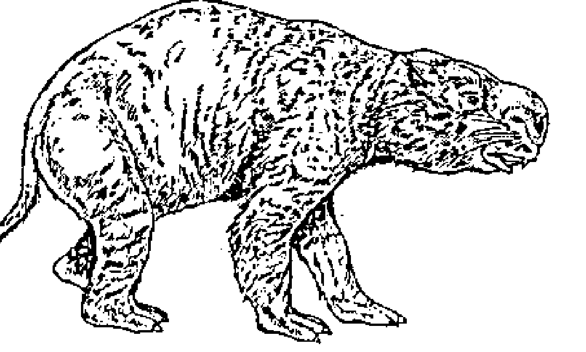

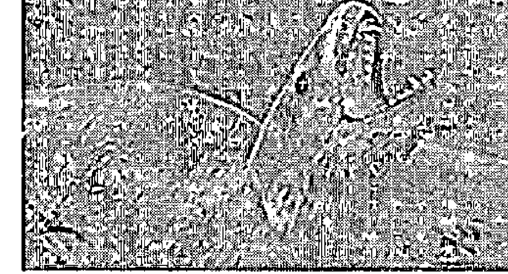

我永远无法忘记在澳大利亚悉尼塔朗加（taronga）动物园与一头豹海豹四目相接的经历。它就像一头霸王龙一样看着我，我在它身上感到一种神秘的捕食动物的气息。即使是现在，25年后，一想到它我就感觉如芒在背。在澳洲内陆的河流或湖泊中遇上这样一头野兽绝对算得上是一次令人心惊肉跳的经历！

然而，一些隐生动物学家则认为奔异兽的原型可能是澳洲双门齿兽（Diprotodon australis），一种巨大的更新世袋熊（wombat），它有犀牛那么大。早期的澳洲土著人曾描绘过它们的样子，他们在1万年前将其猎杀至灭绝。

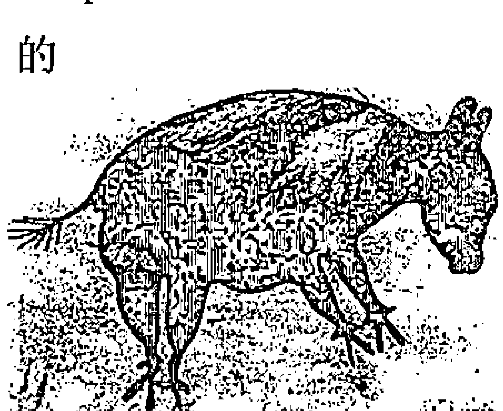

难以将奔异兽认定为双门齿兽是因为没有证据表明这种巨大的食草动物是水陆两栖的，而且它很可能并非水陆两栖，因为像所有澳洲本土的动物一样，它也是有袋动物，而没有一种有袋动物是水生或双生的，因为它们无法在那样的环境中将幼儿放在肚子的口袋里喂养，只要它们沉入水中，其幼崽就会被淹死，这不符合其自身的进化规律。

## 其它可能的候选者

## 夜之子们——把嘴闭上！

负鼠和考拉在夜晚沙哑的叫声可能会被误以为是奔异兽的，因为大多数人无法想像这么小的动物能发出那么大的声音。吠鹰鸮（Barking Owl）是一种夜行鸟类，生活在沼泽和水塘旁，它也可能是奔异兽声音的制造者，它的叫声与女人或孩子的声音很相似。布朗麻（Brown Bittern）的叫声让其获得了“穆雷牛”的别称。而灌木石构鹬（Bush-Stone Curlews）令人毛骨悚然的叫声可能也被当成了奔异兽的声音。

## 快乐的流浪汉

有人认为，从 1890年代到 1930 年代，人们目击到的奔异兽可能只是那些躲藏在沼泽和湖塘地带的逃犯的身影而已。这些人和临时工一起被称为“流浪汉”，他们都背着帆布做的铺盖卷和其它东西，显得脏兮兮的。只要听到有人靠近的声音，他们就会潜入水中，在危险过去之后又会带着全身的泥浆和水草回到岸上。任何路过的人都可能会被他们吓到，然后掉头就跑。

## 流行文化中的奔异兽

### 舞台上的奔异兽

在 19 世纪中叶，奔异兽已经变成了当地哑剧中的一种特色。1916 年圣诞节，由艾拉·艾利（Ella Airlie）编排的澳大利亚最受欢迎的哑剧《奔异兽》正在公演。该剧制作精良，耗资巨大，讲述的是一位被恶灵变成奔异兽的美丽公主的故事。共有 15 万人观看了《奔异兽》，其中最为令人印象深刻的一幕是几位真正的土著人将回旋镖在观众头上扔来扔去的情节。

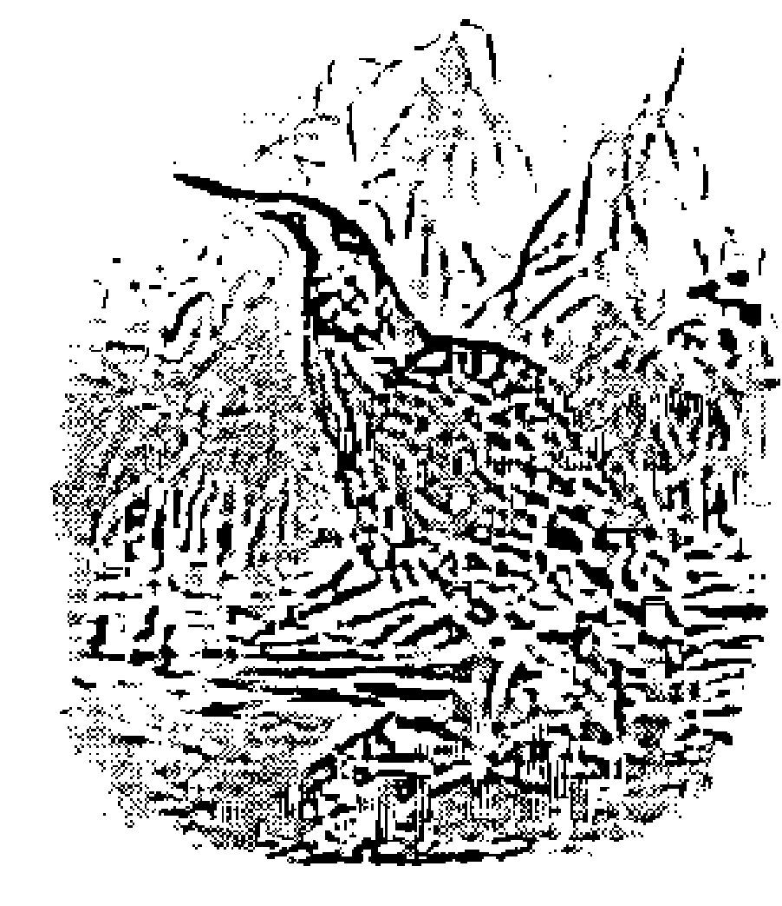

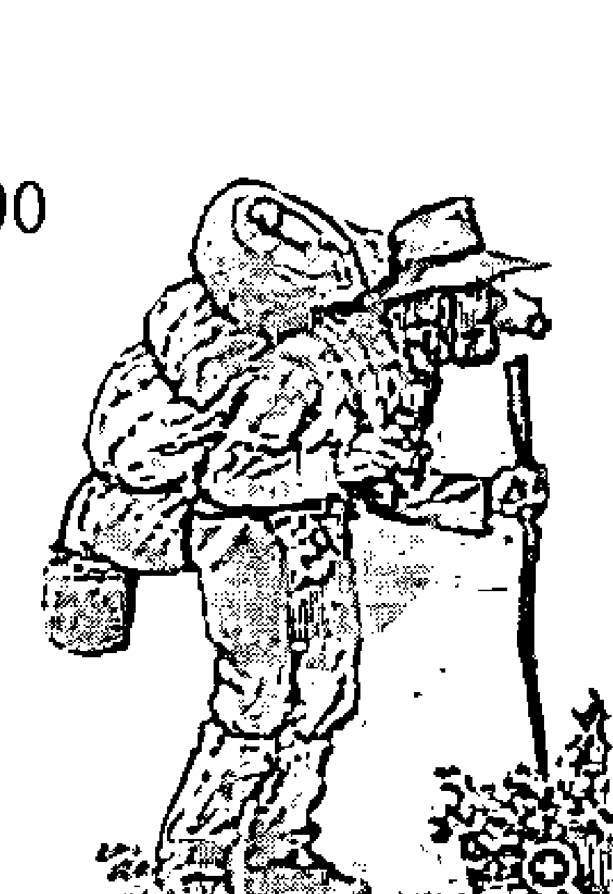

### 纪念奔异兽

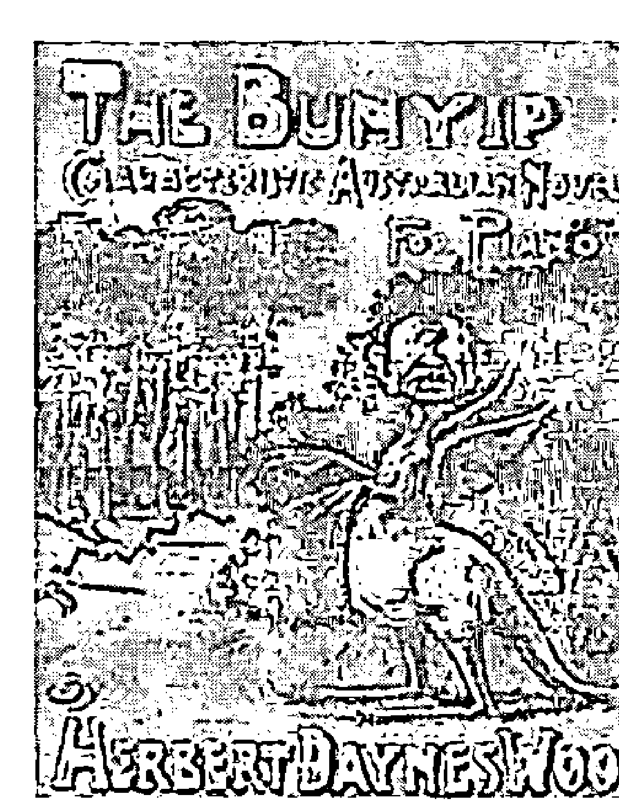

1994 年，澳大利亚邮政（Australian Postal Service）发布了画着不同本野兽的四张一套的邮票。土著画家图加尔·莫里森（Toogarr Morrison）将奔异兽描绘成其故乡西澳大利亚水塘的守护者。它长着像海狸一样的扁尾巴，

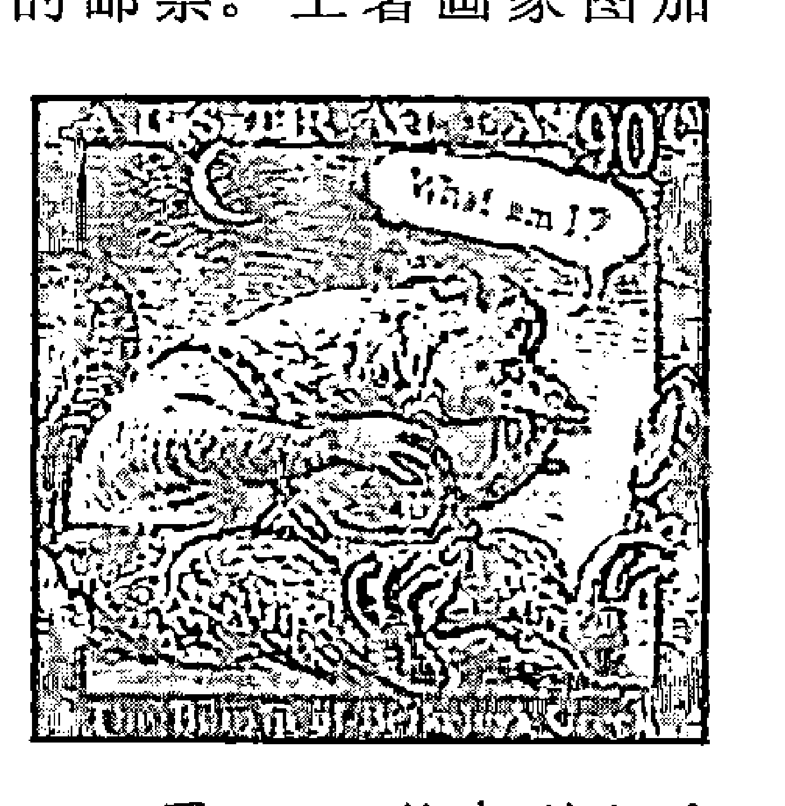

用来打水和捕食。而马格·陶特（Marg Towt）的画则是基于19世纪澳洲内陆的定居者所看到的基于真实动物的奔异兽。戴维·兰开夏（David Lancashire）将自己的奔异兽画成了与中世纪石像鬼一样的奇怪生物。罗恩·布鲁克斯（Ron Brooks）在自己1973年出版的儿童读物《沼泽怪兽》（The Bunyip of Berkeley's Creek）中的一幅画成了几代澳洲儿童的最爱，里面有一只可爱的奔异兽对着镜子问道：“我是谁？”

## 魔法师的怪物图鉴

### 怪兽电影：奔异兽

在1950年代和1960年代，一部由澳大利亚人李·德克斯特（Lee Dexter）创作的名为《奔异兽伯迪》（Bertie the Bunyip）的儿童节目在宾夕法尼亚州的费城向公众播放。《多特和袋鼠》（Dot and the Kangaroo）（1977年）是澳大利亚的一部动画歌舞短片，在播放一首关于奔异兽的歌曲的时候，画面上出现了一幅土著人关于它的绘画，而遭10年以后，在影片《多特和走私者》（Dot and the Smugglers）（1987年）中，多特试图拯救奔异兽和其它的当地动物。在1980年代，在澳大利亚儿童读物和电视节目中有迈克尔·萨尔蒙创作的可爱的“亚历山大奔异兽”（Alexander Bunyip）。澳大利亚儿童节目《Hi-5》讲述的是克里·豪嘉特（Kellie Hoggart）前往“奔异兽岛”的故事。在《吸血鬼莫娜》中有一头巨大的、浑身棕色、像兔子一样的奔异兽。在1986年的澳大利亚电影《青蛙的梦想》（Frog Dreaming）里有一只名叫“多肯金（Donkegin）”，生活在一个采石场中的奔异兽。在电视剧《圣女魔咒》（Charmed）中，奔异兽是被施咒必须打败的恶魔之一。在《影子之书》（Book of Shadows）一书中，它又变成了第二部《星球大战》里东东兽（Tauntaun）的样子。

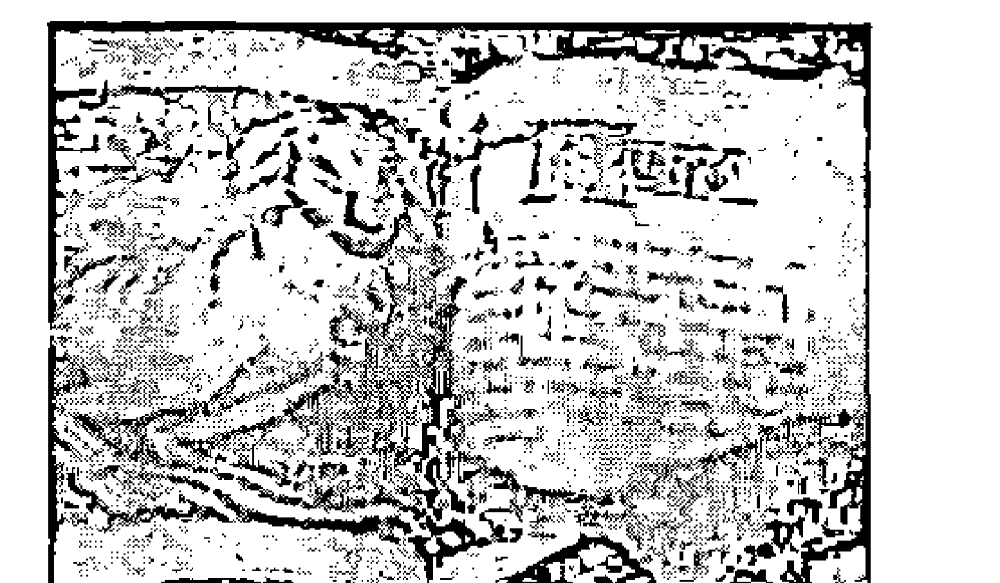

图18.《迷人的阴影》一书中的“奔异兽”插图

### 23、雷鸟、鹏鸟和其它神奇的鸟类

作者：亚瑟 • “豹舞者” • 迪克尔克和奥伯伦

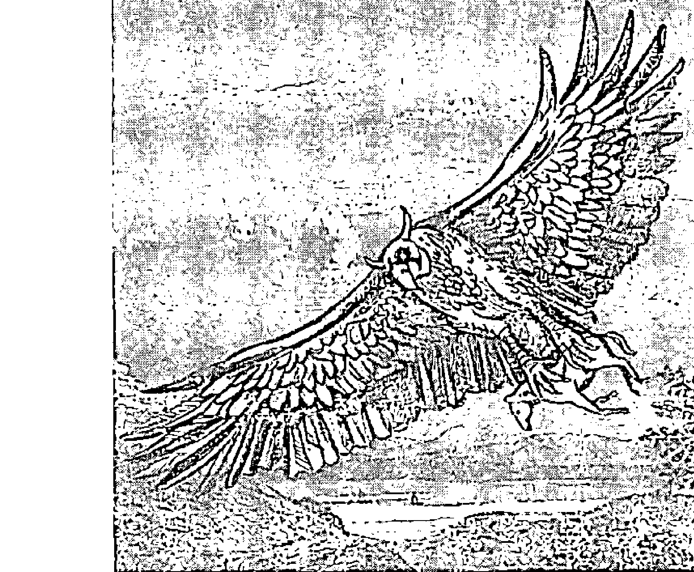

（马达加斯加）岛上的人称在一年中的某个时节，被他们称作鲁克“Rukh”的大鸟会从南方飞来。据说它的外形像老鹰，但却要比其大上无数倍。它大到能用爪子抓起一头大象，将其拖到空中再扔到地上，只为了吃死去大象的肉体。那些见过这种鸟的人都说当它展开翅膀的时候，从一端到另一端，人需要走 16 步，而它厚厚的的羽毛也有人类走 8 步那么长。

> ——马可·波罗，《旅行游记》（Travels）（III，36）

天空突然暗了下来，巨大翅膀的影子扫过大地。鹏鸟俯冲的时候会响起闪电的声音，之后它会用巨爪抓走一头大象。

从人类诞生之初开始——甚至更早的时候——巨大的鸟类就一直活跃在我们的脑海中。在其《好龙集》（An Instinct for Dragons）一书中，作者大卫·琼斯认为龙是三种威胁我们祖先生活的捕食动物的集合：大猫、蟒蛇和猛禽——捕食性的鸟类。他还说我们最早的灵长类祖先曾是它们的猎物

伊安·丹尼尔斯

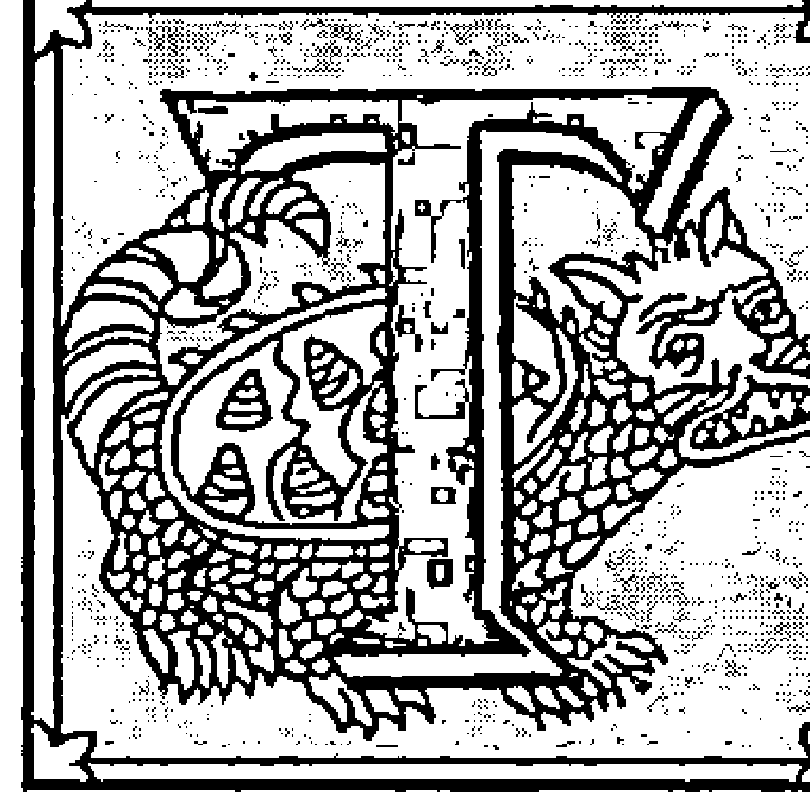

## 小心俯冲而下的鹏鸟

鹏鸟（波斯语中的鲁克 “Rukh” 或卢奇 “Rucke”）是一种波斯和印度神话中的巨型鸟类。它住在马达加斯加岛上，据说大得能抓走大象喂养其巨大的雏鸟。在《一千零一夜》或《天方夜谭》（成书于约公元800-900年）中的“辛巴达冒险故事”中有一只鹏鸟为了给自己的一颗蛋复仇而攻击辛巴达，并毁掉了几艘船。在这本书的另一个故事中，因其杀死了一只雏鸟，阿卜杜·拉赫曼·凯瓦基比（Abdal al-Rahman）的船只被鹏鸟用圆石攻击。

关于鹏鸟的故事能追溯到希腊历史学家希罗多德（公元前484-424年）那里，它从埃及牧师那里得知了这种大得能将人抓起的鸟。《天方夜谭》中的故事首先出自印度教的《本生经》（Jatakas），这部著作记录了从至少公元前4世纪以来的民间故事。然而，里面的大鸟并不叫鹏鸟。中世纪时，十字军将这个故事带回了欧洲，而在13世纪，马可·波罗将其称为鹏鸟。

早期的记录并未声明它是否是一只猛禽，但在今天人们都普遍认同了它的这种身份。有些神话称鹏鸟从未在地面停留过，只降落在世界中心名为夸弗（Qaf）的山上。鹏鸟的翼展据说有48英尺，而它的一根羽毛就有24英尺长。在1200年代中期，成吉思汗的孙子忽必烈得到了一些据说是取自鹏鸟身上的巨大羽毛。但是实际上，它们只是酒椰棕榈树（Raffia Palm）的叶子，这种树拥有植物王国中最长的叶子，其长度能得到惊人的80英尺。

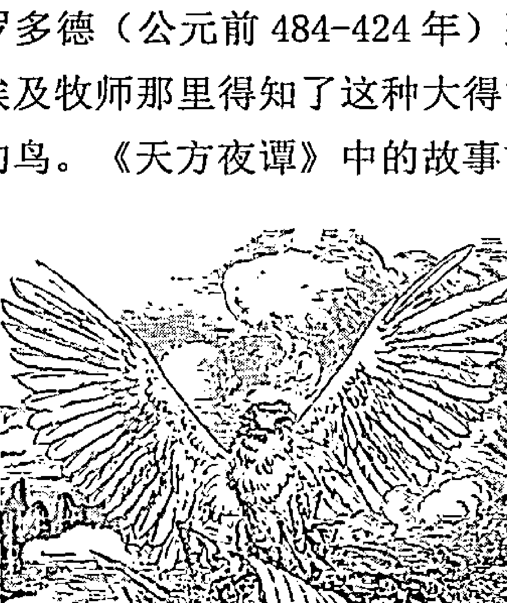

鹏鸟传说很可能源自马达加斯加岛上巨大但不能飞行的象鸟（Elephant Bird），它能长到11英尺高和110磅重。它的蛋的周长能达到3英尺，里面充满了2.35加仑的液体，这要比所有的恐龙蛋都还要大，是世界上现存最大的卵细胞。这种令人称奇的大鸟在16世纪被人类灭绝了。因其短小的翅膀和黑色的短毛，它们被认为是真正巨型成鸟的雏鸟。在《天方夜谭》中，四个故事里有两个都提到了鹏鸟那巨大的蛋和雏鸟。辛巴达所发现的鹏鸟蛋有148个鸡蛋那么大，而大隆鸟（Aepyornis maximus）的蛋确实是鸡蛋的160倍大。

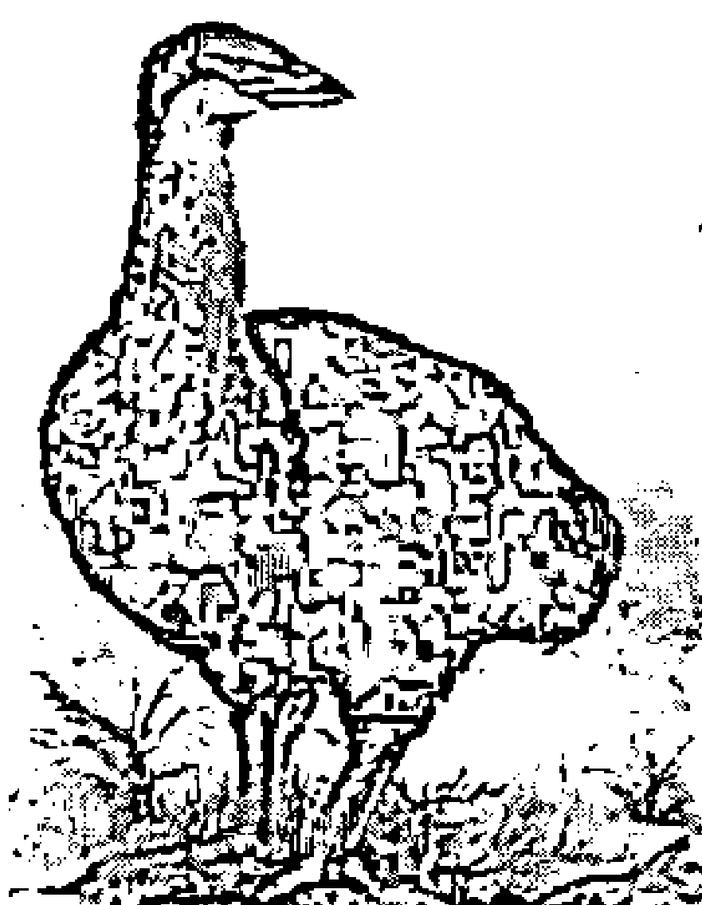

马尔科姆·瑟斯认为，关于鹏鸟的故事可能是用来解释陨石撞击的，因为在很多故事中都有巨鸟从天上扔下石头的情节，尤其是在船只上。这可能同样也是阿巴比尔故事的来源。根据《古兰经》的记载，这些巨鸟在穆罕默德出生的时候（公元571年）拯救了麦加城，它们用石头打败了对方的象兵。阿巴比尔现在被用来命名当地的家燕（Barn Swallow）。

而彼得·科斯特洛认为，巨大的漂泊信天翁（Wandering Albatross）也可能是鹏鸟的原型。它是世界上翼展最大的鸟类——有些人称其翼展能达17.5英尺。

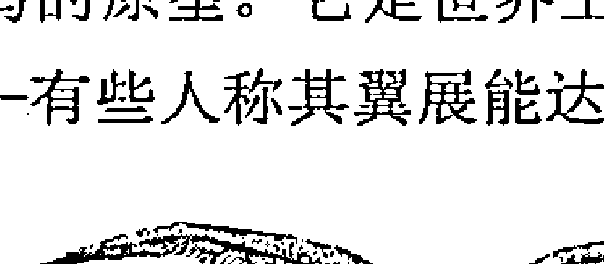

## 雷鸟

雷鸟是美洲土著神话中与鹏鸟类似的生物，据说它们能抓起野牛甚至鲸鱼。它的羽毛像船桨一样长。在扇动翅膀的时候会发出雷鸣般的声音，它的眼睛里还会闪着闪电。雷鸟被描述为一种巨大、秃鹰般的生物，而有些时候它看起来更像老鹰。据说它们是被众神派来保护人类不受恶魔侵犯的。在其它传说中，它们还能变形，偶尔还会变成人类的样子与人类通婚。

在一些美洲土著神话中，雷鸟是杀人鲸的天地。在另一些传说中，它又变成了巨大的、长着长角的水龙昂科特西（Unktehi）[见《龙之传说》一书中的“提拉诺娃巨鸟（The Tlanuhwa）及尤克特纳（The Uktena）”] 的天地。提拉诺娃巨鸟长得像一只变大了的红尾鹰（Red-Tailed Hawk），人们相信它是这种鸟类的祖先。据称它们曾经住在田纳西河边的洞穴中。

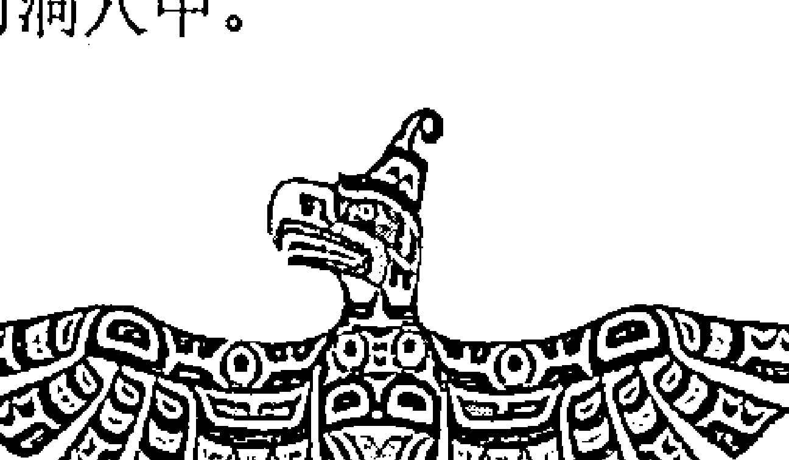

雷鸟在不同部落中有不同的名字。易洛魁人将雷鸟的头领称为科尼温（Keneun），是圣火的守护者。而夸扣特尔人将其称为乔乔（Jojo），努特卡人称其为奎-温-瓦（Kw-Uhnx-Wa），奥吉布瓦人又叫它阿尼米奇（Animikii）。它在阿拉斯加的因纽特人中的名字又是丁缪科普柯（Tinmiukpuk），能用其强大的爪子抓起北美驯鹿和人类，并将其带回自己在山中的巢穴吃掉。

乌绰森（Wuchowsen）是新英格兰地区马力希特-帕萨马科迪（Maliseet-Passamaquoddy）传说中的一种巨鸟。它现在仍然坐在世界最北方的地方，它羽毛的轻微抖动都因其横扫全球的大风。在西阿巴纳奇神话中，这种鸟被称为波姆拉（Bmola），也叫风鸟，它被人们同冬日从北方吹来的寒风联系在一起。

卡尼亚克拉（Kaneakeluh）是加拿大不列颠哥伦比亚地区夸乌特尔（Kwaiutl）神话中的一种巨鸟，它给人类带来了火种。

拉科塔人称雷鸟为瓦金炎（Wakinyan）或瓦肯昂（Waukkeon），还根据它们羽毛颜色的不同将其分为4类：蓝色的没有眼睛和耳朵、黑色的长着巨大的喙、黄色的则没有喙，而红色的瓦金炎像巨大的红鹰。

欧沙达戈阿（Oshadagea）（“露鹰”或“大露鹰”）是东北部瓦兰（Woodlands）地区易洛魁神话中的一种非常不同寻常的雷鸟。它住在西方的天空中，在背上有个洞，里面装满了露水，每天早晨他都会将其撒到大地上。当遇到由恶魔引起的森林大火时，它会用海水将其熄灭，并击退恶魔。

尼尼克努弗（Nihniknoovi）是东南部卡瓦苏土巴图拉巴（Kawaiisu Tubatulabal）传说中的捕食性猛禽。它以人类为食，能用巨大的爪子将猎物抓到水池里先喝掉血再吃掉肉。

在整个美国都有关于雷鸟的目击报告，但大部分都是在西部和中西部。最为有名的一起发生在1890年的亚利桑那州。两名牛仔杀死了一只翼展达160英尺的大鸟，这要比大多数雷鸟传说和现存任何鸟类都要大。

尽管这次目击报告被认为是假的，但在1800年代末还有另外的人称自己杀死了一只翼展在20至30英尺间、类似秃鹰的鸟。有一张照片显示，“它双翅打开着，被钉在一间谷仓的墙上，前面还有6个伸开双手并排站立的人来显示它的大小”，尽管这张照片据说被刊登在《墓碑镇的墓志铭》（Tombstone Epitaph）上，但关于它线索都只存在于记忆之中了（插图8）。它最可能是一只加州秃鹰（California Condor），这种鸟的翼展通常超过9英尺。

雷鸟通常被认为是加州秃鹰或安第斯山秃鹰（Andean Condor），后者的翼展能达15英尺以上。有些隐生动物学家推测雷鸟可能起源自翼展可达17英尺的更新世猛禽秃鹫畸鸟（Aiolornis incredibilis）。这种巨鸟也被称为巨型秃鹰。比它要小一些、生活在冰河世纪、拥有12英尺翼展的加州泰乐通鸟（Teratornis merriami）也可能是雷鸟原型之一。而最近人们发现了一块阿根廷畸鸟（teratorn）的化石，它身高5英尺，而翼展竟有24英尺。

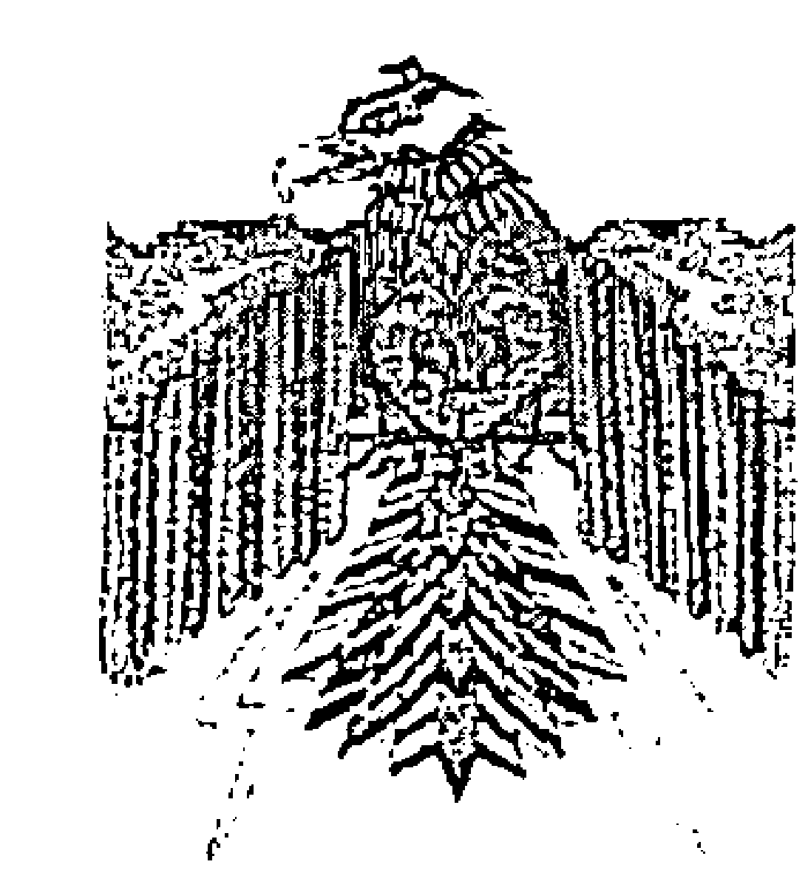

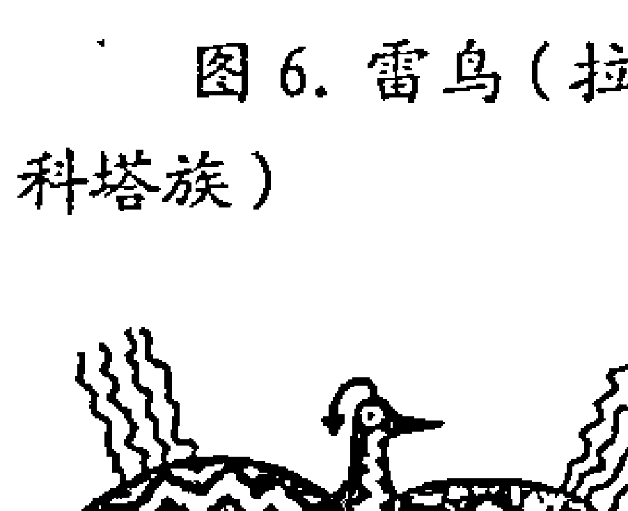

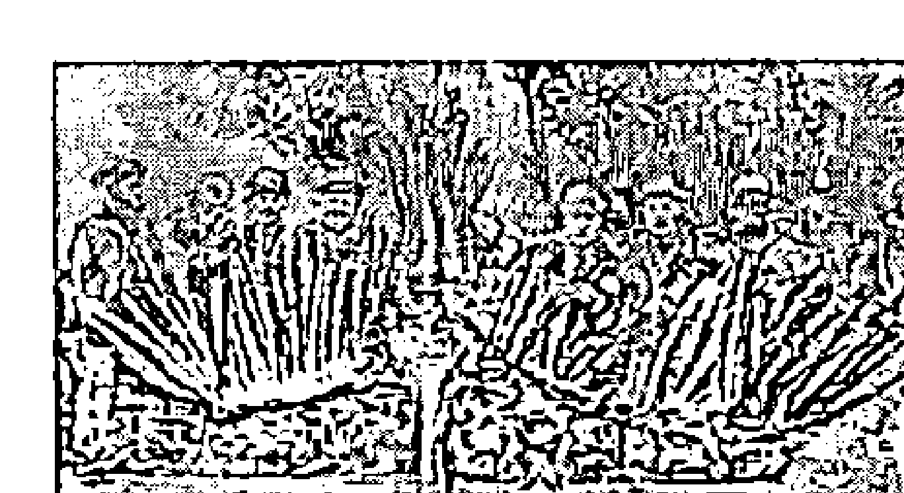

图9. 蝙蝠龙
（鲍勃·朱利亚力绘）

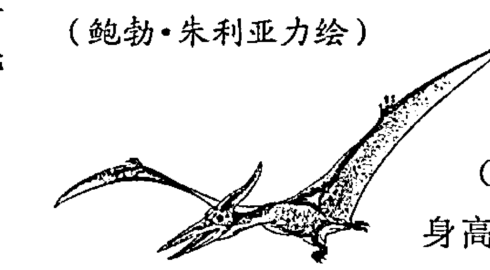

## 图鉴三、怪兽的奥秘、传奇和历史

尽管雷鸟通常被认为是秃鹰或其它的猛禽，但也有迹象表明它们也许是飞龙——这个结论来自化石和持续性的目击报告。雷鸟经常都被描述为在其脑袋的后部长有一条长长的肉冠，因此，它们常被等同于蝙蝠龙（pteranodon），这种翼龙的翼展能达到27英尺。现在已知最大的猛禽是诺氏风神翼龙（Quetzalcoatlus northropi），它的翼展有40至50英尺。

虽然人们现在认为，很多恐龙实际上都长有羽毛，但飞龙却并非如此，它们的身体上长着的是蝙蝠似的绒毛。据称1890年的那只鸟身上没有羽毛，而是一片片的垂悬物，它的头部和嘴巴的长度加起来有8英尺。它是一头飞龙吗？我们也许再也不会知道。（对某些可能仍然存活着的飞龙的信息请见第24章“皮翼”。）

雷鸟神话也可能是源于泰坦鸟（Titanis walleri）中（目前）只出自北美的骇鸟（“恐鸟”）。有些证据表明这种鸟知道15000年前才灭绝，而有些人认为它们在180万年前就已经灭绝了。在得克萨斯州和佛罗里达州都出土过它们的化石残骸。所有的恐鸟都很巨大、没有羽毛，其鸟喙的大小就跟一只马头一样。在南美洲和中美洲也有记录。

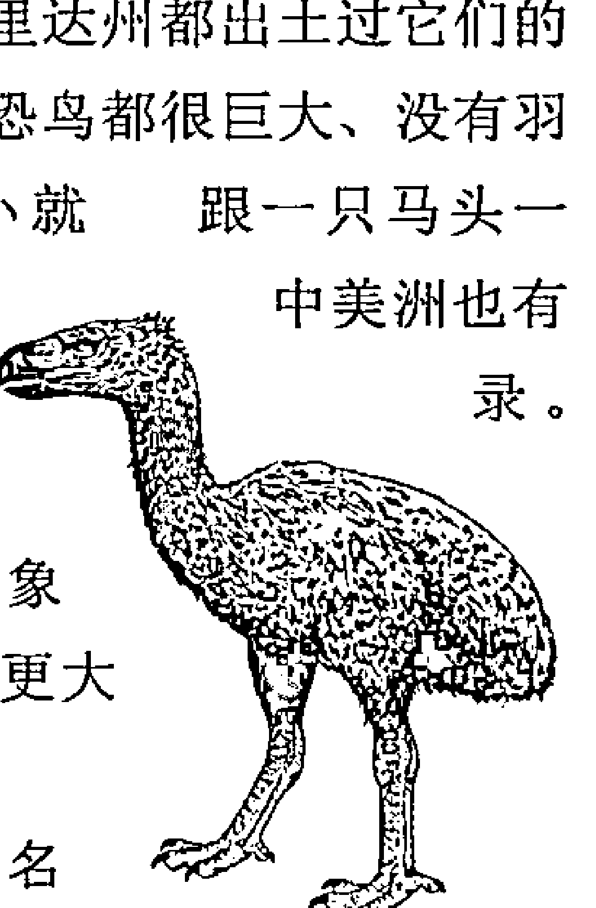

的小女孩正在与一位朋友在瑞士的瓦莱斯（Valais）山上玩耍。突然一只大鸟从天而降将她抓走，她的朋友被吓得尖叫起来。搜寻者只在一块悬崖边上找到了一只那个女孩的鞋子。后来他们找到了鸟巢，里面有两只雏鸟，它们旁边都是山羊和绵羊的尸体，而小玛丽却不见了踪影。两个月后，一名牧羊人在距离她被抓走的地方1.5英里处的一块岩石上发现了她残缺不全的尸体。

那只鸟只可能是鹫兀鹰（Lammergeier）。这种鹰也被称作狮鹰或胡秃鹫，是狮鹫的原型，也是世界上最大的猛禽，它在德文中的名字意为“羊羔盗窃者”，它正是因此而得名的。但人们并不认为这种鸟能抓起人类孩童一样大的猎物（见第9章“狮鹫和骏鹰”）。

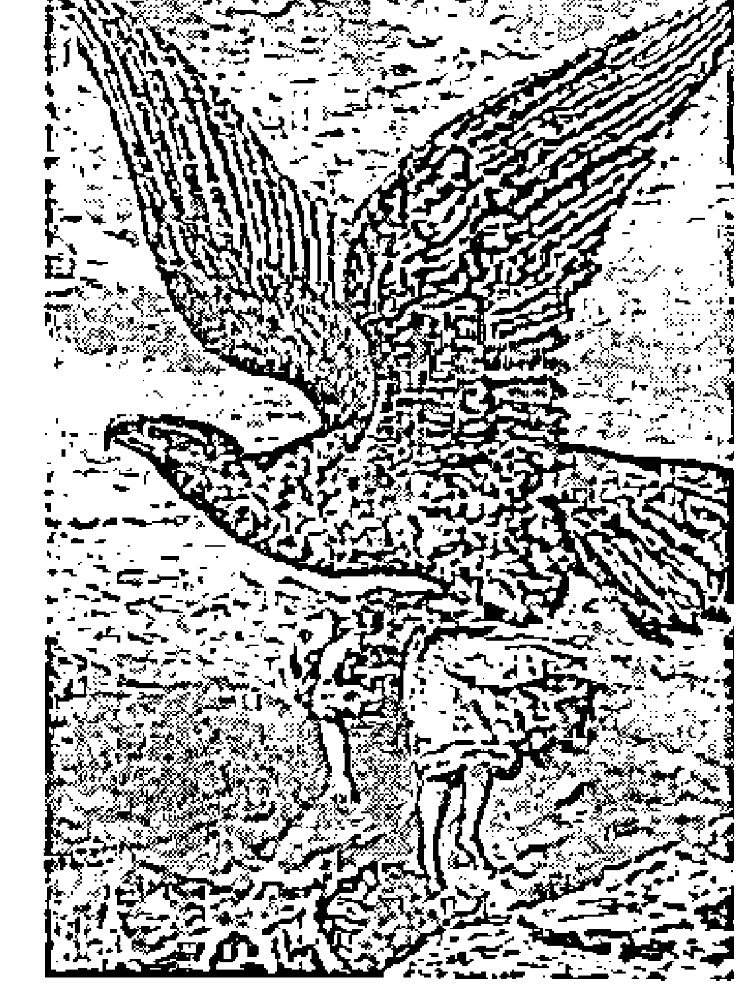

1868年，一名叫杰米·肯尼迪的8岁男童在位于密苏里州提帕郡的学校操场内被一只巨大的老鹰抓走。人们的尖叫让这只老鹰松开了爪子，但这个孩子还是因为鹰爪和坠落带来的伤害死去了。

1977年7月，有人在伊利诺伊州朗代尔看到了一只雷鸟。在25日下午9点左右，三名小男孩正在院子里玩耍，随后便遭到了一只巨鸟的袭击。一名男孩的肩膀被抓伤，那只大鸟将其抓到了2英尺的空中后才松开了爪子。孩子们说那只鸟全身黑色，在脖子处有一圈白环，这与美洲兀鹰的长相一致。

在最近的2001年6月和7月，有人在宾夕法尼亚州看到了雷鸟。目击者称其翼展约15英尺，头部的长度也有3英尺，全身灰黑色，有又长又薄的喙。在当年的9月也有人看到了同样的鸟类。距离最近的一次是在2002年的阿拉斯加海岸边，但人们认为那只是一只虎头海雕（stellar’s sea eagle）。它是北美最大的鸟，体重26磅，翼展8英尺。

##### 其它巨鸟

艾·托琼（Ai Tojon）——西伯利亚神话中一种巨大的双头鹰，它住在世界之树之巅，在那里用光照亮世界。

安卡（Angka）——一种巨大的阿拉伯鸟，大得能抓起大象。它与凤凰类似，每过1700年就会浴火重生。因其巨大的身体，它也常被同鹏鸟联系在一起。阿拉伯人相信它们最初是作为一种完美的鸟类而被制造出来的，但随着时间的流逝，它们吃掉了地面上所有的东西便开始捕食人类的孩子。人们向上帝祈求，最终让安卡无法繁殖，最终灭绝。

安祖（Anzu）[也叫祖（Zû）]——古美索不达米亚神话中的一种巨型风暴鸟。像狮鹫一样，它也长着狮子的身体和老鹰的脑袋以及锯子一样的鸟喙，但它也常被描述为长着老鹰的身体和人类的脑袋和身躯以及小胡子。它是巨大的混沌蛇龙提亚美的侍从。

巴尤克尼（Bar Juchne）[也叫巴亚克里（Bar Yacre）]——犹太法典《塔木德经》中的一种巨鸟，与鹏鸟类似，张开翅膀时能遮住太阳。它以家畜甚至人类为食。据说曾经一只蛋从它的巢里掉了出来，砸坏了300棵树，淹没了60个村庄。

克罗丘（Crocho）——据说生活在非洲之角卡普戴普（Cape Daib）（科连特斯角）的一种大鸟。人需要走60步才能从其张开的翅膀的一端走到另一端，它还能抓起大象。根据《弗拉·毛罗》（Fra Mauro）（1459年）的记载，1420年，一艘印度帆船到达了那里的海岸，发现了一只这种鸟的蛋，称其“像一只大桶一样大”（一只大桶的容积有126加仑）。

揭路荼（Garuda）[也叫塔拉苏云（Taraswin），“敏捷”]——印度教神话中的一种人形巨鸟，是毗湿奴的坐骑。它长着秃鹰的身体、翅膀、爪子和脑袋，但却有人的脸和四肢，全身金色、红色、绿色相间，是那迦族的天地。在东南亚，它是忠诚的象征，印度尼西亚的嘉鲁达航空公司还将其用作自己的标志。在泰国，它也被称为格伦（Galon）或克鲁特（Khrut）。

赫拉维格（Hraevelg）（“食蛇者”或造风者）——北欧神话中的一种巨大的老鹰，它在冰封的北方山巅筑巢。它的雏鸟就是它用翅膀制造出来的寒风。

科鲁兹尔特（Kreutzet）——俄罗斯西北部的一种大鹰。

库萨·卡普（Kusa Kap）——新几内亚和澳大利亚昆士兰北角之间的托雷斯海峡中有很多的小岛，这种巨大的犀鸟就住在那里。这种怪鸟拥有22英尺的翼展，据说能用其强力的爪子抓起海牛来，就像传说中的鹏鸟抓起大象一样。它翅膀发出的声音据称像蒸汽机一样——这是犀鸟独有的特征（如图所示），它们能长到4英尺长，翼展也有5英尺。

纳乌伊（Naui）——俄罗斯传说中的一种类似于龙的大鸟，它长着老鹰的脑袋和爪子。

纳加尼－瓦图（Ngani-vatu）[或纳古图－雷（Ngutu-lei）]——斐济群岛传说中的一种大型肉食鸟。它巨大的身体能遮住太阳，扇动翅膀时还能制造强大的风暴。它以太平洋群岛上的动物和人类为食，直到后来被英雄欧克瓦（Okova）及其兄长克寇瓦（Kokoua）所杀。

恩格澳伊玛（Ngoima）——一种据说生活在非洲刚果森林中的大鹰。它的翼展在9至13英尺之间，以猴子和山羊为食。它上半身的羽毛是深棕色的，下半身的则要浅一些。它的腿、爪像人的前臂和手一样大。这肯定是对罕见的皇冠鹰（crowned eagle）进行的夸张描述，皇冠鹰是非洲最强大的鹰，它的食物包括猴子和小型羚羊在内。甚至还曾有报告称在其巢穴中发现过人类孩子的尸体，而它们通常只会吃死去小孩的尸体而不会主动攻击人类。非洲体型最大的战鹰（Martial Eagle）才会攻击黑斑羚和小羚羊。

最近有人发现了皇冠鹰雕（Crowned Hawk-Eagle）的亚化石，它是史前马达加斯加最凶猛的捕食性鸟类，在人类定居于该岛上之后才被灭绝。它是鹰雕中最为庞大的一种，而皇冠鹰也是属于这一种鸟类的。

鹏——中国传说中的一种大鸟，是一种名叫鲲的鱼变化而成的，它的翅膀展开后能连接天地。它住在北方，每年都会升到几千英尺的高空然后飞往南方，带来台风季节。

凤——日本传说中的一种鸟，它大得能够遮住日月的光芒，也能抓起骆驼，就像阿拉伯神话中的鹏鸟一样。

普凯（Pouakai）[或普奇（Pouki）]——毛利传说中的一种猛禽，以家畜和人类为食。后来，这种鸟中的最后一只被英雄豪欧塔维拉（Hau-o-Tawera）用大网困住，然后被用长矛刺死。它是一种真实存在过的生物，叫哈斯特鹰（Harpagornis Eagle），曾生活在新西兰的南岛上，600年前才灭绝，是存在过的最大鸟类。其中雌性能长到22至30磅重，站立高度有4英尺，翼展也达8至10英尺。

##### 赖奇（Raichô）（“雷鸟”）

日本传说中的一只白嘴鸦。它居住在一颗高高的松树上，其沙哑的声音能找来风暴。有一种真正的鸟也叫这个名字，岩雷鸟（Lagopus mutus），它是一种松鸡。

##### 秃鹰山帕地（Sampati）

印度神话中的一种巨大的、长着人头的鸟，是揭路茶的后代。在《罗摩衍那》中，猴神哈努曼（Hanuman）要求山帕地帮他找到被杀死山帕地兄弟加塔亚（Jataya）的魔鬼王怪诱拐到罗婆那的女神西塔（Sita）。山帕地飞到斯里兰卡找到了西塔，然后回来告诉哈努曼如何摧毁罗婆那和拯救西塔。山帕地最后成功为其兄弟报了仇。

##### 斯摩夫（Simurgh）

［也叫西纳姆鲁（Sīna-Mrû）、斯马弗（Simarghu）、斯姆戈（Simurg）、苏马弗（Sumargh）：“30只鸟”］——阿拉伯传说中的鸟王，代表着神圣统一。它美丽的羽毛具有疗伤的作用。与鹏鸟类似，它也非常巨大，能抓起大象或骆驼，也会抓走人类小孩来喂养自己的雏鸟。它是森莫夫（Senmurv）的变体，住在波斯北部的阿尔贝兹（Alberz）山脉中。像凤凰一样，这种聪明、友好的鸟每隔1700年或2000年就会重生一次。有些人说它是不死的，在知识之树上筑巢。据说它非常年长，曾见证过世界的数次毁灭。示巴女王（Sheba）的侍从中有一只与其拥有同样名字的鸟，它长着铜羽毛、银脑袋、人脸、四只翅膀、兀鹰的爪子以及孔雀的尾巴。

##### 沃克活（Vuokho）

芬兰及斯堪迪纳维亚地区的拉普人传说中的巨型猛禽。它能用其宽广的翅膀制造雷鸣，给人类带来灾难。塞缪尔·泰勒·科尔里奇（Coleridge）在诗中这样描述它为“国家的命运”（The Destiny of Nations）。

##### 萨克希萨克尤（Xexeu）

南美卡西玛瓦（Cashmawa）印第安人神话中的大鸟。与北美的雷鸟类似，它们也负责将云赶到一起，制造风暴。这种生物很可能源自拥有10英尺翼展的安第斯山兀鹰。

##### 八汰鸟（Yata Garasu）

巨大的三腿乌鸦。在日本神话中，八汰鸟是一位神圣使者。在《游戏王》（Yu-Gi-Oh！）中它也有出现。

##### 查戈（Zägh）

——伊斯兰传说中的一种大鸟，长着人的头，能够听懂和说人类的所有语言。

席兹（Ziz）[也叫天庭歌手（Renanim）“宇宙歌唱者”、先知（Sekwi）和“鸟巢之子”]——希伯来传说中一种类似鹏鸟的大鸟。它站在大洋中时，海水只能没到它的膝盖。其巨大的翅膀能够遮住阳光，它还拥有巨大的力量。曾经它的一颗腐坏的蛋破了，冲走了300棵雪松，还淹没了60个村庄。席兹与珀斯的查姆罗西一样，据说一直保护着那些自己创造出来的小鸟，否则它们在很久之前就应该灭绝了。根据犹太传说，这种鸟的肉跟贝希摩斯以及利维坦一起，在世界末日的大胜利之后会被当作佳肴。贝希摩斯、利维坦和席兹是波斯神话生物的原型，它们经常被住在德国的拉比用作装饰。

## 怪物电影：大鸟

-   巨爪又名利爪之痕（The Giant Claw a.k.a. Mark of the Claw）（1957）——巨大的秃鹰
-   辛巴达七航妖岛（The 7th Voyage of Sinbad）（1958）——鹏鸟
-   《神秘岛》（1961）——恐鹤（Phorusrhacos）
-   神的食物（Food of the Gods）（1976）——巨鸡（Giant Chicken）
-   霍比特人（The Hobbit）（动画，1977）——巨鹰
-   救难小英雄澳洲历险记（The Rescuers Down Under）（动画，1990）——雷鸟
-   《指环王：魔戒现身》（2001）——巨鹰
-   《指环王：王者归来》（2003）——巨鹰

### 24、皮翼类

作者：奥伯伦

查林杰教授跟两名当地的印第安人一起坐在货车里，他突然将车停下，兴奋地指着右边。我们顺着方向看过去，在一英里左右的远处似乎有类似一只灰色大鸟的东西正在从地面缓缓地升起。它飞得又低又直，最后消失在树林中。

“你看到了吗？”查林杰惊讶地问道，“萨摩里，你看到了吗？”

他的同事的眼睛正直直地定在它消失的地方。“你觉得它是什么东西？”他问。

> “我觉得，那是一只翼龙。”
——柯南·道尔《失落世界》，第8章；1912

很难想象天空中飞舞着翼龙的恐龙世界究竟是怎样的一个情景。人们曾经认为，翼龙是依靠扇动巨大的翅膀来在空中进行滑行的。它们像蝙蝠一样倒挂在峭壁上，然后突然落下开始滑行。但现在人们达成了共识，小型翼龙能像鸟类一样飞行，而很大的那种，如无齿翼龙（翼展达27英尺），能轻松地乘着一股微风就像风筝一样飞到空中去，这与信天翁很像。有证据表明，一些翼龙会越过大洋寻找筑巢的地方。翼龙是第一种进化出飞行能力的脊椎动物，它们是能飞的爬行动物，前肢变化成了翅膀，就像蝙蝠那样。因为它们的翅膀是由一根长长的手指支撑起来的，所以它们也被叫做翼手龙（Pterodactyl）。翼龙身上长着绒毛，已被证明为温血动物，大脑很大而且结构复杂。它们统治着从2亿2800万年前到6500万年前的中生代天空。在中世纪龙的传说中，它们被叫做双足飞龙（wyvern）。

## 双足飞龙

是一种会飞的蛇形龙，长着蝙蝠一样的翅膀、两条鸟类的后腿和老鹰的爪子、一条有钩的长尾。总体来讲，它是一种像喙嘴龙（ramphorhynchus）一样的翼龙。它们还有很多变种，如海双足飞龙（Sea-Wyvern），都长着鱼一样的尾巴。双足飞龙据称是体型最大的龙，能捕捉像大象和犀牛一样的大型生物。在纹章中，双足飞龙代表着战争、瘟疫、嫉妒和恶毒。它在纹章中一般都是全身绿色，只有胸部、肚子和翅膀下方是红色的。

## 活着的翼龙？

尽管它们在6500万年前就该灭绝了，但不时还是有关于它们的目击报告出现。

> > 斯纳利加斯特尔食人鸟怪（Snallygaster）[也叫斯诺力求斯特（Snollygoster）]是一种翼龙一样的怪兽，据说生活在美国马里兰州布拉多克高地（Braddock Hight）附近的蓝脊山（Blue Ridge Mountains）中。1730年代到达此地的第一批德国定居者非常害怕一种名为斯其内尔杰斯特（Schnellgeiste）（“快速精灵”）的怪兽。据称它是半爬行动物半鸟类，嘴巴是金属的，牙齿像剃刀一样锋利。

> > 它悄无声息地在空中飞行，抓起猎物，然后吸干它们的血。在当地的谷仓上现在都还有让它害怕的七角星。《伦敦新闻画报》（1856年2月9日，第166页）曾报道称一些在法国圣狄斯尔和南希之间挖隧道的铁路工人在对侏罗纪的石灰岩层进行爆破时，看到了从一个洞中飞出来的一只奇异的有翅生物。它拍动着翅膀，发出嘶哑的叫声，然后落到地面死去了。工人们说，那只生物有黝黑的皮质皮肤、10英尺7英寸的翼展、四条长着“弯爪”的腿，腿中间还有膜。它的大小跟“一只大鹅”一样，还长着长脖子和一条长尾巴。

## 魔法师的怪物图鉴

口锋利的牙齿。它的尸体后来被送到了格雷，那里的一名古生物学生认定其为翼手龙鸭（wing-fingered duck——一种拼凑的生物）。

这个不可思议的故事其实是一个骗局。在那时，在巴伐利亚的索伦霍芬的石灰岩层（后来在那里还发现了著名的始祖鸟）中发现了很多精致的化石。德国的古生物学家骄傲地宣布出这些发现。上面提到的那个隧道所经过的石灰岩层跟索伦霍芬的岩层是同个时期的，于是法国佬决定要比德国人更好。

1890年4月，两名亚利桑那的牛仔宣称自己杀死了一只巨大的鸟形生物，它长着光滑的皮肤和蝙蝠一样的没有羽毛的皮翼。它的脑袋像短吻鳄。他们自称在沙漠中遇到了它，它当时已经生病而且非常虚弱。这只动物飞行了半英里之后便再次栽进了地面，这两名牛仔用步枪结果了它的性命。

哈利·麦克卢尔是一名住在新墨西哥州洛兹堡的年轻人。1910年，那两名牛仔来到他的镇上，将自己的遭遇告诉了他。60年后，在一封写给1970年夏季版的《老西部杂志》（Old west magazine）中，麦克卢尔回忆起他们对这个怪兽的描述：“它的眼睛像盘子一样，身体前方有两条像马腿一样的腿，它身上的皮肤像皮革一样，上面没有羽毛。它在距离两位牛仔比较远的地方掉到了地上，然后挣扎着飞了起来，但没过几秒钟就又跌了下来……”

根据亚利桑那《墓碑镇的墓志铭》（Tombstone Epitaph）在当年4月26日发表的目击报告来看，这两名牛仔测出的大小为92英尺的体长和160英尺的翼展！他们切下了一块翼尖，将其带到了墓碑镇里。人们计划将这个生物做成标本放在博物馆里，但至此之后便再无下文了。

这个故事还有另外一个版本，他们二人将整个尸体拉到了镇上，在那里将其展开后钉在了一间谷仓的墙上。它的翼展据说“只有”20至30英尺。这份报告——附带有一张照片——在1969年被重新刊登出来，但现在似乎找不到它的副本了，寻找这张照片也成了隐生动物学界的任务。我认为，这个案例（以及照片）与另一个完全不相关的事情混淆在了一起，有一张照片是关于一只死后被人拉开双翅达20至30英尺长的“雷鸟”的，在照片中还能看到6个人站在它身后以突出它的大小。（见第23章“雷鸟”）

还有一张神秘的照片，据称其记录的是几名内战时期的士兵围在一只死去的翼龙旁边。但对于这张照片却没有任何的进一步信息：在1909年2月至5月间，马里兰州（之前居住着有传说中的斯纳利加斯特尔食人鸟怪）布拉多克高地的居民们称自己看到了一个生物，它长着“巨大的翅膀、又长又尖的嘴、老鹰般的爪子，在它前额中心还有一只眼睛。”它的叫声“像火车头的哨声”。史密森学会（Smithsonian Institute）出资悬赏能找到它的皮的人，而罗斯福总统也被认为为了猎杀它而推迟了自己前往非洲野生动物园的计划。但这些最终都不了了之。

从1975年年末到1976年初，居住在得克萨斯和墨西哥之间格兰德河河谷的人们称自己看到了一群“大鸟”。这些奇异的飞禽据称大得不可思议，长着像蝙蝠一样的皮翼，样子长得像猫一样。

1976年1月，莉比·福特和迪妮·福特姐妹看到了一只大大的“怪鸟”站在德州布朗斯维尔外的一个水池边。她们说它有一个人那么高，脸黑黑的，像猫一样。后来，她们从一本书上认出了它，才知道它是一只无齿翼龙。但是她们的描述看起来却非常奇怪，因为无齿翼龙的脑袋像鹤嘴锄一样，根本不像猫！

几天后，在德克萨斯州圣安东尼奥西南部，3名老师正在开车去学校，突然一头巨大的飞行生物出现在高速路上，它低低地飞着，高度只有电线杆那么高。它的影子比公路还宽，一名妇女据此估计它的翼展在15至20英尺间。他们称自己能看到它翅膀上的膜里面的骨头。后来，他们翻阅了所有的百科全书，发现了一张与之相匹配的图片。那是一头无齿翼龙。这个故事在1976年2月26日被刊登在了《圣安东尼奥光明报》上。

当年，格兰德河谷的居民都因一个五英尺高、长着猩猩一样的脸、血红色眼睛和蝙蝠翅膀的生物弄得人心惶惶。它被称作“大鸟”。但自那之后就再也没有关于它的目击报告了。有趣的是，超自然调查员杰罗姆·克拉克和洛伦·科尔曼发现，在过去30年中，在该地区出现过其它类似的报告，而在更早的时候，当地的印第安人也在传说著这种生物。

在美国另一边的马里兰州伍德拜恩（Woodbine），1980年有人看到了另一个类似翼龙的生物，它让当地人想起了关于斯纳利加斯特尔食人鸟怪的传说。它有6英尺高，全身棕灰色，像人一样用双腿站立，在起飞的时候会扇动翅膀。它很可能是一只大蓝鹭（Great Blue Heron）。大蓝鹭站立时身高5英尺，翼展能达7英尺。在飞行的时候它看起来确实很像无齿翼龙，而其头上向后生长的羽毛也与翼龙头骨冠类似。

在美国华盛顿州圣海伦山上的森林中据说生活着一种长有蝙蝠翅膀的奇异夜行生物。

灵长类动物。它叫野蝙蝠（Batsquatch），拥有紫色的皮肤、红色的眼睛和类人猿的脑袋以及蝙蝠的翅膀。一些隐生动物学家推测，它可能是一种未知的果蝠。但在以水果为食的翼手类动物中，没有一种生活在北美。

## 南美翼龙

早在欧洲人到达南美大陆之前，该地区就一直传说着关于巨大的飞行生物的故事，而这些故事直到今天都仍然存在。实际上，柯南·道尔正是受到了其中一些故事的启发而在委内瑞拉建立起“失落世界”。1868年4月，智利科皮亚波的矿工们正在准备吃午饭，突然看到了“一只大鸟，我们刚开始还认为它是一片被风吹到那里的云，它遮住了太阳，让光线都变得有些黯淡了。”在它从人们头上飞过的时候，矿工们都注意到它的翅膀上没有羽毛，而是长着类似蝙蝠一样的皮革。这个故事被刊登在1968年7月的《动物学》杂志上。1947年2月，英格兰利物浦的J·哈里森先生正在亚马逊河口航行，他和同伴看到了5只巨大的“鸟”以V字队形向水面俯冲。在一封写给《奇异时代》（Fortean Times）的非公开信中，哈里森说道：“它们的翼展肯定在12英尺以上。它们全身棕色，像棕色的皮革一样，但上面却丝毫没有羽毛的痕迹。其头部的顶端扁平，还长着长长的嘴和脖子。在它们的翅膀里有骨头……看起来就像是前的鸟类一样。”下面就是他随信附上的手绘图：1992年，澳大利亚周刊《人物》报告了一架小型通勤飞机与一只巨大的飞行爬行动物在巴西群山上的遭遇。这只生物出现在飞机旁，看起来是要降落的样子，而飞机的飞行员则将飞机则向一边移动，避免二者相撞。乘务员马雅·卡朋说：“那只巨大的怪物就在飞机的旁边，离窗户自由几英尺的距离——而且还一直看着我。我觉得我们都要死了。”美国人类学家乔治·拜尔斯博士是其中24名乘客之一，他说道：“那是一只典型的拥有超长翼展的白翼手龙。当然，多年来我也听说了一些称这些史前生物仍然生活在亚马逊地区的传闻。但像所有人一样，我以前对此持怀疑态度，但当时在我旁边飞行的并不是UFO。它就是一只翼手龙。”

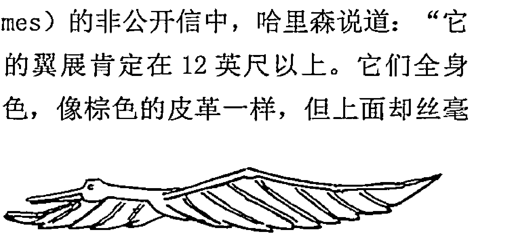

## 非洲翼龙

在赞比亚、刚果、安哥拉和肯尼亚的沼泽地带据称生活着空阿马托（Kongamato）（“船只颠覆者”）。很多关于这些巨大、长着皮翼的飞行生物的报告让隐生动物学家推测在非洲仍然生活着一些翼手龙。它们呈黑色或红色，因其喜欢倾覆船只的习性而得名。弗兰克·H·梅伦在其《在非洲》（In Wichbound Africa）（1923年）一书中，称它们全身光滑、长有牙齿、翼展达4至7英尺。还有一名目击者说它们在扇动翅膀时会发出震耳欲聋的声音。当看到翼龙的图画时，所有的目击者立即宣称它们就是空阿马托。

## 图鉴三、怪兽的奥秘、传奇和历史

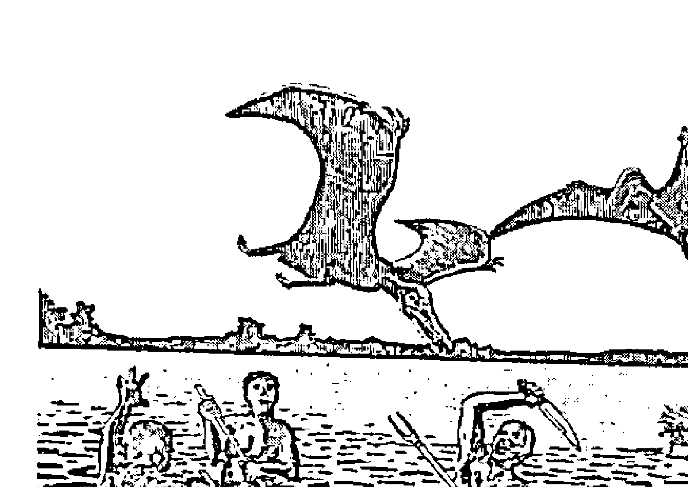

托。然而，更为可能的是，这些生物其实是锤头蝙蝠（hammerhead bat），是非洲最大的蝙蝠。它们全身深灰色，黑色的翅膀展开时有3英尺长，还长有长长的狗一样的嘴巴。

1925年，在罗得西亚南部，有人称自己在一片沼泽边遭到了空阿马托的袭击。从1928年、1942年和1950年代到现代，一直都有人在那里目击到此种生物，其中还包括隐生动物学家罗伊·麦考尔的一位同事，他在1988年也看到了它。

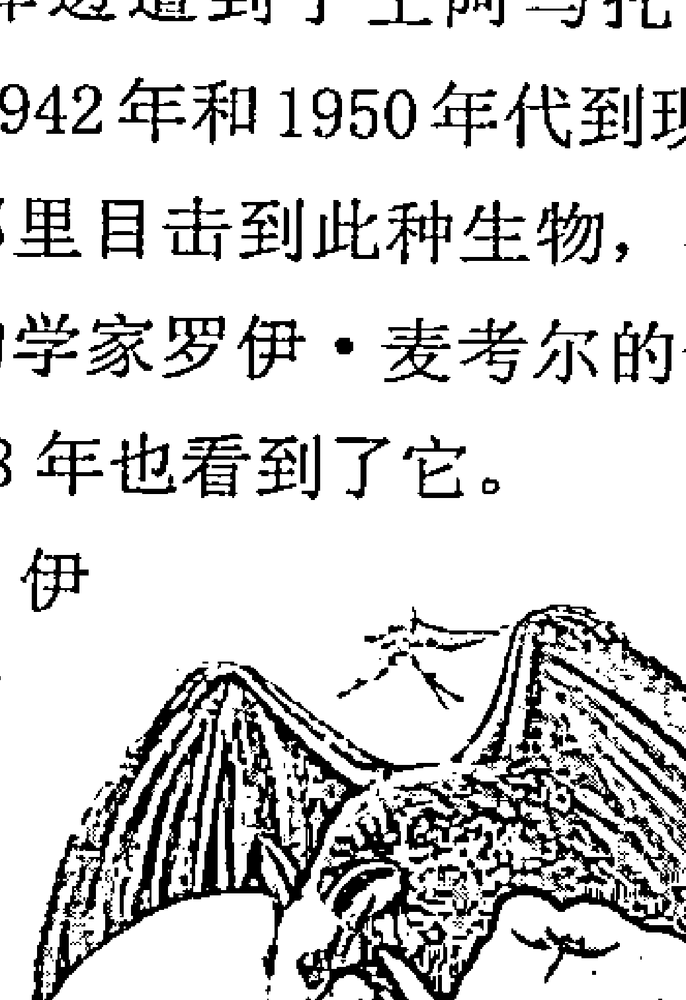

动物学家伊万·T. 桑德森和博物学家杰拉德·拉塞尔1932年在非洲喀麦隆的阿苏木帛山（assumbo mountains）看到了一只类似的黑色无齿翼龙般的生物。他们当时正在渡过一条河，那个生物从空中向他们俯冲过来然后飞走。它的大小如同老鹰，长着“稀疏的、尖尖的白牙”和“德库拉一样的翅膀”。当晚，他们又再次见到了它。当地人称其为欧利提奥（Olitiua）。桑德森后来推测，那只野兽可能是一种未知的锤头蝙蝠。但锤头蝙蝠3英尺的翼展与桑德森推测出的欧利提奥2英尺的翼展有相当大的差距！

圭阿法罗（Guiafairao）是一种据称产自西非的灰色巨型飞行生物，在白天潜伏在山洞和树洞中，到了夜间才出来活动。它的腿上长着爪子，脑袋像人的一样。隐生动物学家推测其可能是一种未知的巨蝠或锤头蝙蝠。

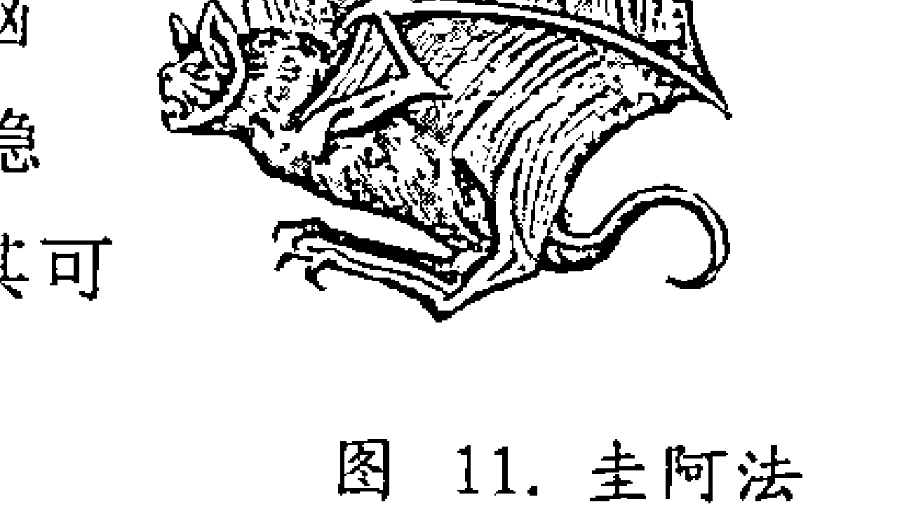

## 新几内亚飞行兽

在巴布新几内亚同样有关于巨型飞行捕食动物的报道。它们被称为都安（Duah），拥有翼展达24英尺的皮翼、长长的无齿喙和大大的头冠，外形与无齿翼龙非常接近。同样，它们以海里的鱼类为食，但也有报告称其非常凶猛，会攻击人类。

1950年代，在新几内亚的丛林中有人看到了另一种翼手龙般的生物。罗鹏（Ropen）（“恶魔飞行兽”）居住在新不列颠和温博伊岛群岛上的山洞中，只在夜间出没。它拥有翼展3至4英尺的皮翼、窄窄的齿喙、头冠、蹼脚和一条末端有钻石形突起物的长尾巴。据称它们以腐肉为食，会在葬礼时攻击尸

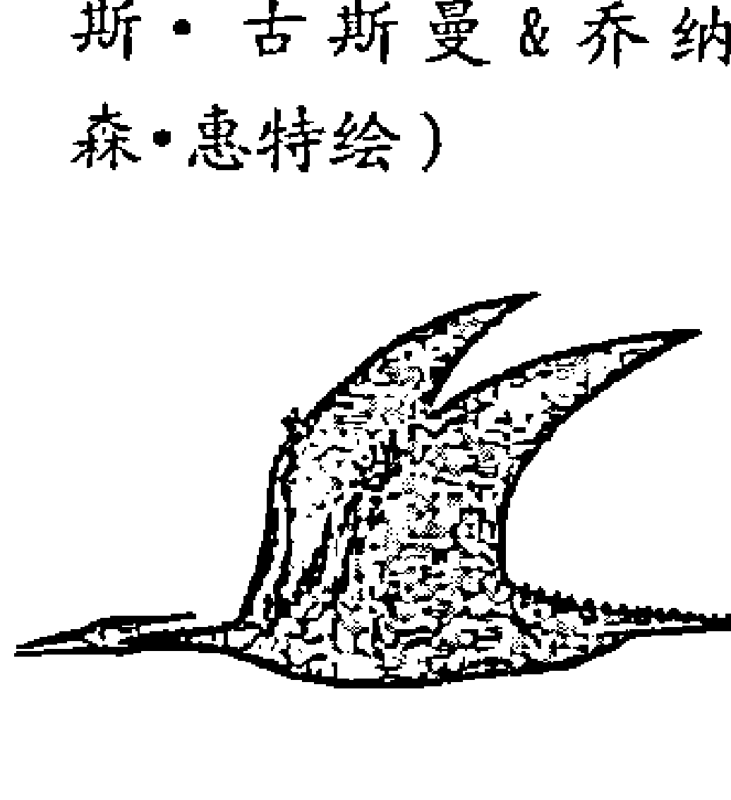

## 魔法师的怪物图鉴

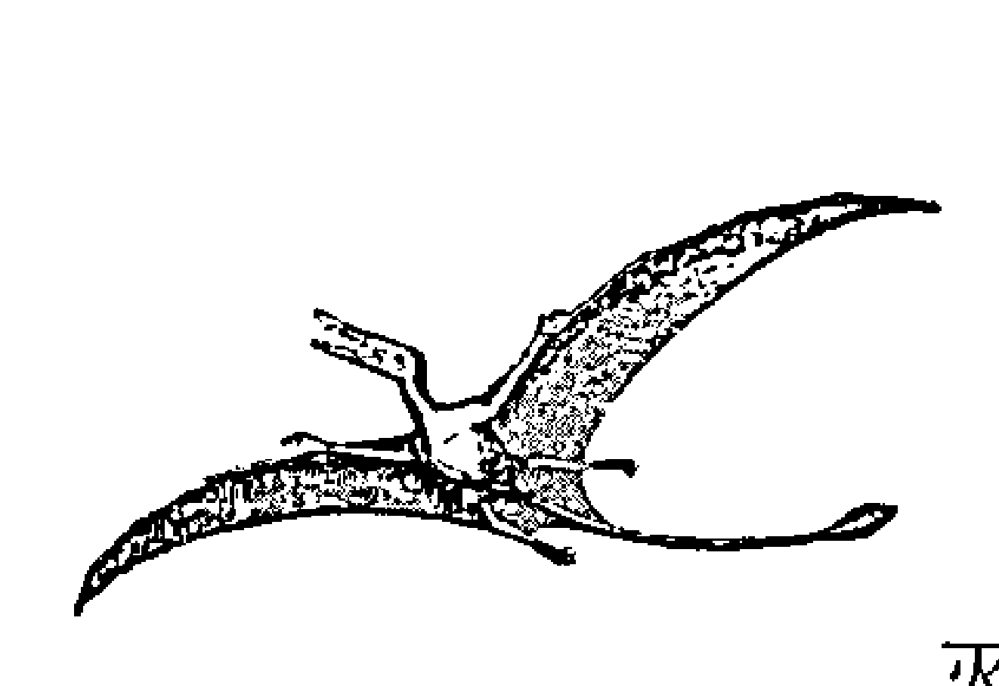

体。这些描述与据说在 6500 万年前就已经灭绝了的喙嘴龙 (Rhamphorhynchus) 有惊人的类似。我曾造访过其中的几个岛屿，爬上了那里的悬崖，检查过其中的洞穴。

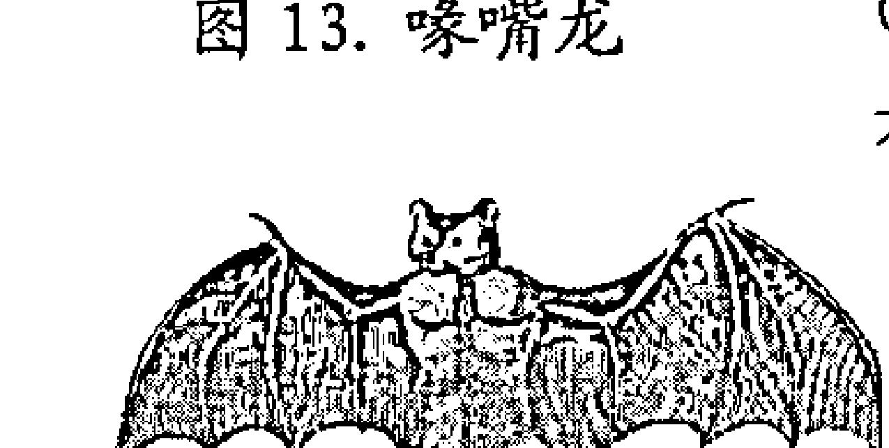

唉，我却没能发现翼手龙，看到的都是果蝠而已。

很明显，人们在新几内亚看到的都是与俾斯麦飞狐 (bismark flying fox) 类似的大型果蝠，它们的翼展能达 5.5 至 6 英尺。这种蝙蝠是科学界公认的世界上的最大蝙蝠，是新几内亚和俾斯麦群岛的当地物种。

## 目击报告

下面是一则发生在 1971 年 3 月的古巴，关于活生生的翼龙的目击报告。目击者艾斯金·库恩 (Eskin Kuhn) 是一名水兵，他在此报告中还附上了自己画的一幅漂亮的手绘图：

> 那是一个美丽、晴朗的夏日。我当时正在监视海面，突然看到了一幅令人震惊的场景。这让我永生难忘！
>
> 我看见两只翼龙在很低的高度，大约只有 100 英尺，一起飞行，我们之间离得很近，所以我能清楚地看到它们的一举一动。

它们扇动巨翅的方式非常优雅、缓慢，它们确实是在飞行而不是滑翔，就像俄亥俄州的土耳其秃鹰 (turkey vultures) 一样。它们扇动翅膀的速度接近于乌鸦，可能还要慢一些，但是真的非常优雅。

它们翅膀的结构和纹理与蝙蝠的很相似：尤其是其翅膀的支撑物是从“手”上散发出来的手指一样的东西。有几根手指很短（用于抓握），有些手指长到了翅膀末端上，还有些手指则长在翅膀的拖尾边上将膜像风筝一样撑开。

我看到的翼龙后腿很短，生长在翅膀根部，在其翅膀末端还长有一簇毛。

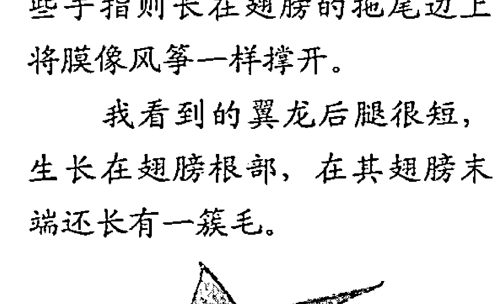

它们的脑袋出奇地大，头顶上还长着长长的头冠，除此之外，还长着长长的嘴和弯脖子。它们的胸部很突出，像老式船头一样向前伸着。

从其背上能看到脊椎的轮廓，尤其是其双肩之间的部分。我估算它们的翼展能达到 10 英尺。

## 图鉴三、怪兽的奥秘、传奇和历史

我对这位年轻的水兵充满了敬意，但根据他的描述和绘画，我发现这个生物与大蓝鹭非常接近。库恩所说的“末端长有一簇毛（他将其画成了和喙嘴龙一样的东西）”实际上是这种鸟的长腿，在飞行时它们会将其直直地伸在身后。它们扇动翅膀优雅的方式、脑袋后面的头冠（其实是羽毛）、弯脖子和“像老式船头一样突出”的胸部都是大蓝鹭的显著特征。这些是它在100英尺远的地方所看到的东西。

## 飞猴

飞猴（Hsigo）——（也叫肖“Hsiao”）这些中国的生物跟《绿野仙踪》里的飞猴简直一模一样。它们长着猿猴的身体、狗的尾巴、鸟的脑袋和人的脸，当然背上还有一对翅膀。它们的原型很可能是果蝠，在印度、亚洲、印度尼西亚和澳大利亚也叫“飞狐”。这种猴子般大小的蝙蝠与其它食虫的蝙蝠并无血缘关系，而与灵长类更为接近，它们真的是一种“飞猴”。

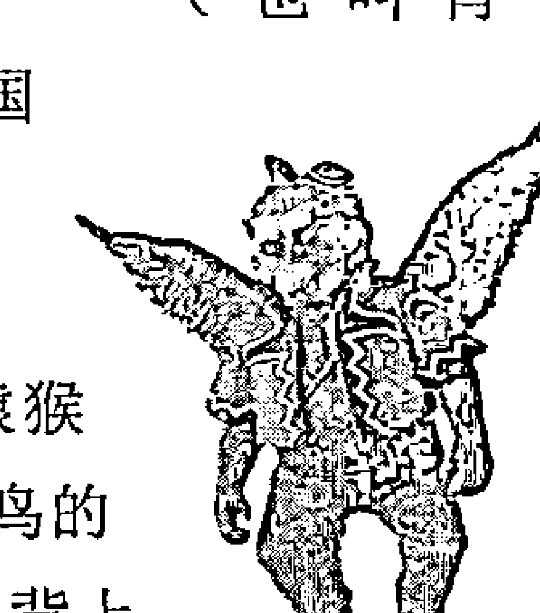

## 蝙蝠猴阿胡尔（Ahool）

蝙蝠猴阿胡尔（Ahool）——产自爪哇和越南的未知巨型蝙蝠。它们因自己的叫声而得名，据说有一岁孩子那么大，全身深灰色，长着猴子一样的脑袋。它们很可能是大型果蝠。据称蝙蝠猴阿胡尔以鱼类为食，如果真是如此，那么它们就可能是另外的某种生物了。

## 阿兰（Alan）

阿兰（Alan）——生活在菲律宾森林中的一种爱恶作剧的半人半鸟生物。它们倒转的腿上长着长长的脚趾，手上也有粗短的手指，这让其能够长时间地倒挂在树上。通常它们对人类很友好，还认为是森林中的监护者，会将那些被丢弃在森林中的婴儿养大，曾哺育过几位传说中的英雄。

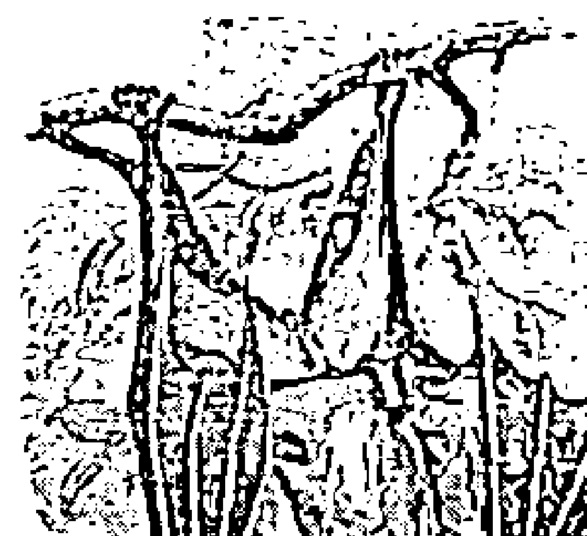

## 红毛蝙蝠（Orang-Bati）

红毛蝙蝠（Orang-Bati）——（“翼人”）印度尼西亚塞拉姆岛——摩鹿加群岛中的第二大岛——上的一种夜行捕食性灵长类动物。当地人称其像猴子一样，身高约5英尺，长着黑色的皮翼、血红色的皮肤和长而薄的尾巴，会用其“悲伤的叫声”引诱婴儿和小孩子。在白天的时候，它们潜伏在死火山凯拉图（Kairatu）里错综复杂的岩洞网络中。对它们的描述及其居住地明确表明它是一种巨型果蝠——可能也是马来西亚飞狐。

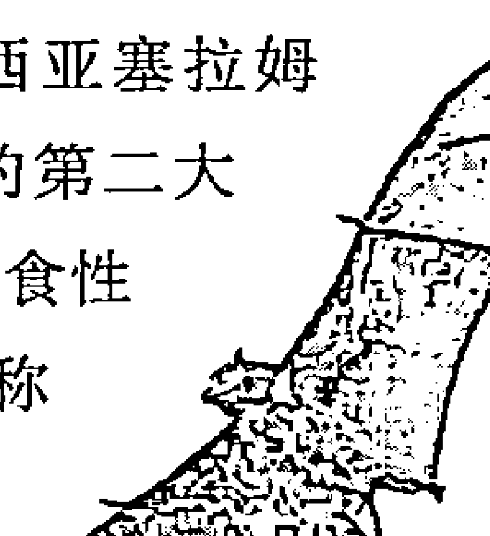

## 越南夜间飞行兽

越南夜间飞行兽——1969年在南越岘港附近被3名美国水兵看到的长着蝙蝠翅膀、会飞行的类人猿。士兵们在报告中称，3只全身赤裸、长着毛发、约5英尺高的雌性生物在午夜时

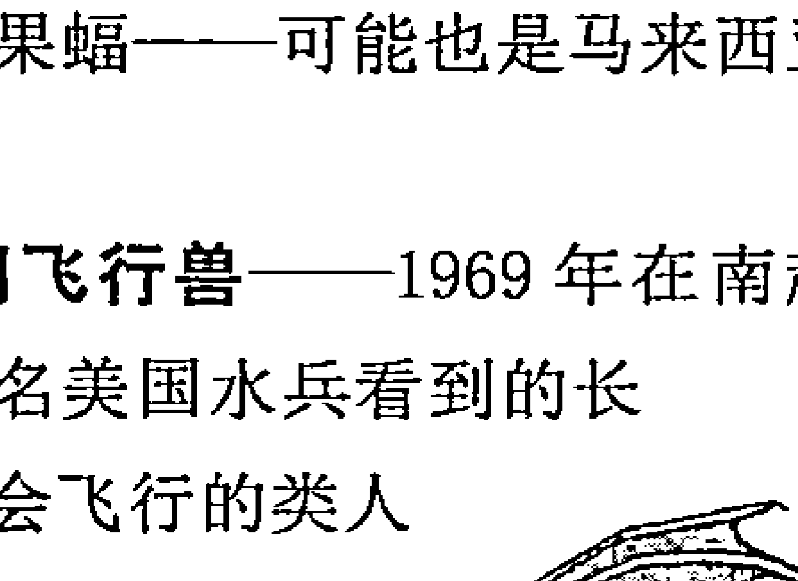

分从它们的岗哨上空飞过。这几位水兵说能听到他们皮翼扇动所发出的声音。它们肯定是马来西亚飞狐，其中的雌性（长着像人类一样的双乳）的翼展能达到6英尺，而它们的体重却最多只有3.3磅。

莎莎伯恩沙(Sassabonsum)是西非加纳传说中的一种巨大的邪恶果蝠。它长着红色的毛发、有钩子的翅膀和倒转的双腿，它们受命于姆牟阿提亚（Mmoatia），也叫矮人巫师，从空中俯冲下来将人类抓走。跟孔噶莫托（Kongamoto）、欧利提塔（Olititau）和圭阿法罗一样，它也可能是锤头蝙蝠。

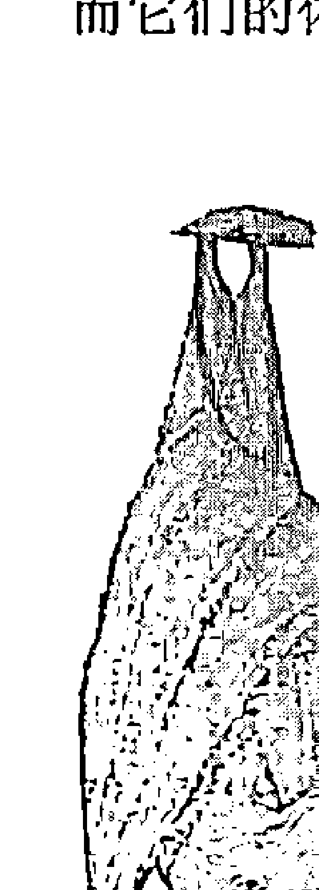

然而伊万·桑德森在其1972年出版的著作《调查未解之谜》（Investigating the Unexplained）中对这种巨大的蝙蝠状生物有了新的解释，它们可能是一种迄今为止尚且未知的小蝙蝠（microbat），通常指“食虫蝙蝠”、“回声蝙蝠”、“小蝙蝠”或“真蝙蝠”。

与果实蝙蝠，或大蝙蝠（megabat）那类似于狗的嘴巴不同的是，小蝙蝠长着扁平的猴子似的脸庞，这也是上述“飞猴”的共有特征，虽然大多数都以虫子为食，但有些体型较大的也以鸟类、蜥蜴、青蛙甚至鱼类为食——这些都是隐生动物的行为特征，并不存在于大蝙蝠身上，即便是那些远至南美的吸血蝙蝠也是如此。

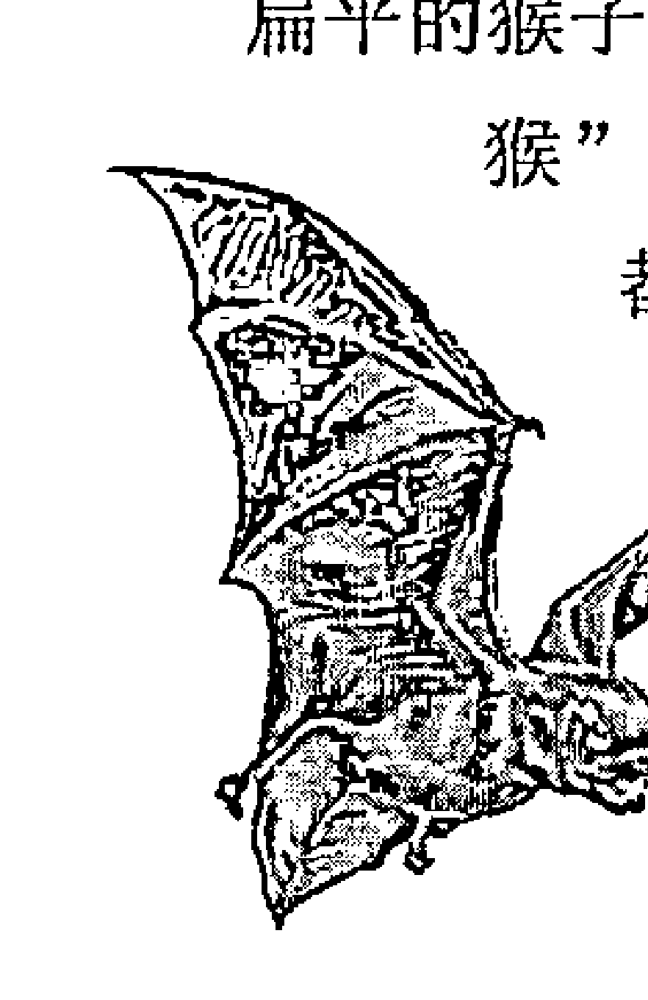

当地人称，当蝙蝠猴阿胡尔出现在地面上或像鸟一样栖息在树上时，它们会像所有小蝙蝠一样将翅膀收成鸟类的样子。而大蝙蝠会将翅膀像大衣一样裹在身体上。蝙蝠猴阿胡尔据称能用双腿站立，站立时它们的脚会转向后方。同样，只有小蝙蝠能这样做（尽管它们很少用双腿直立起来），而大蝙蝠要么依靠四肢站立，要么挂在树上。但所有蝙蝠的后腿确实都是倒着长的。

这种假说的难点在于小蝙蝠的体型都很小，其中最大的大棕蝠（Big Brown Bat）的翼展也只有13英寸。翼展达6至12英尺的小蝙蝠根本不可能存在。因为我有过类似的亲身经历，所以能对此进行客观的评价。

一天夜里，我们在户外看流星雨，一个白色的幽灵状的东西从空中俯冲下来，在我们上空盘旋了一阵才飞走。我借着烛光，观察到它体型很大——翼展至少有3英尺！尽管我们知道它肯定是一只蝙蝠，但大家都承认刚开始的时候都认为那是一只翼手龙！于是我马上跑到书房查看当地的蝙蝠种类，哈哈！找到了：苍白洞蝠（pallid bat）。它们以地面上的蟋蟀和蝎子为食，所以才会采取俯冲攻击的方式。

但问题是——它们的翼展不会超过12英寸。那么为什么我们会觉得它体型很大呢？好吧，就像我在关于海蛇那一章里所说的，在空中，就像在大洋中一样，没有对比物。空中的飞行物，如你所知，可能会被当成身高有3英尺、翼展有3英尺，也可能被看成翼展有10英尺。特别是在夜间，事情就更加不定了。于是，就像那些渔民一样，我们也认为它的体型很大。苍白洞蝠的肚子很白，在烛光的映衬下，它与我们之间的距离比实际的要近很多。另外，正如我不断在海蛇一章中提到的那样，还存在着“可变焦透镜”的因素在里面。我们的大脑会自动将对我们有威胁的东西放大。这种净化而来的预警机制在我们的大脑里形成了一个放大镜，所以我们才会将那些普通大小的东西看得很大很大。我相信在地球某处仍然生活着翼手龙，恐怕我只有继续寻找，直到找到更大的蝙蝠才能感到满足。

## 怪物电影：翼龙

作者：奥伯伦和赛斯·泰森

翼龙和双足飞龙出现在很多的电影中，不管是将场景设置为史前时期的“失落世界”类还是飞龙类。通常翼龙都被认为是一种恐龙，尽管在很多影片中它们都出现在现代——经常都在一座火山中孵化长眠的蛋。因为翼龙是真正的古代“飞龙”，所以现代的电影应该将里面的龙塑造称翼龙的样子，而不该是长着一对蝙蝠翅膀的四脚爬行动物。《屠龙记》（Dragonslayer）（1981年）和《龙之风暴》（Dragon Storm）（2004年）就是很好的例子。

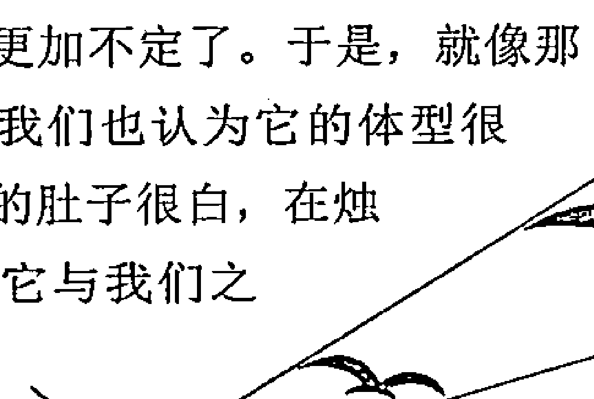

罗丹（Rodan）[也叫罗东（Radon）]是一种非常著名的、假想出来的翼龙，最早出现在1956年东邦工作室制作的《罗丹》中，该工作室也是《哥斯拉》系列的制作者。像哥斯拉一样，罗丹也源自一种真实的史前爬行动物。其日本名字罗东取自“蝙蝠龙（Pteranodon）”，也有辐射之意。罗东在美国变成了罗丹，可能是出自避免和氡元素混淆的考虑。最初它被刻画为哥斯拉的对头，但后来却变成了同盟，一起对抗更邪恶的怪兽。

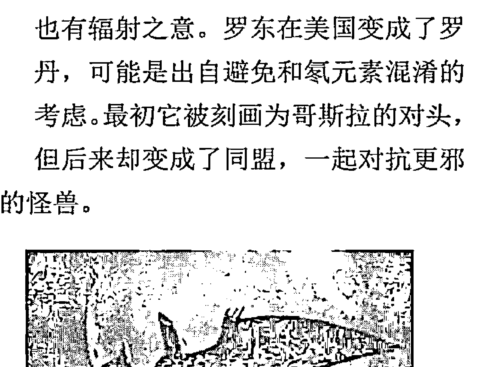

下面是一些里面有翼龙、双足飞龙和蝙蝠怪的影片——我们已将中生代和来自其它星球的那些角色去掉。下面的文章是由赛斯·泰森撰写的：
《失落世界》（无声电影，1925年），这是这则著名故事的最初版本，到今天都仍然泰然自若。在后来的定格动画版本中加入了更多的史前怪兽，其中包括非常生动的“飞蜥蜴”。《金刚》（1933年）将定格动画带到了新的高度，其中最著名的一个场景是这只大猩猩在自己山中巢穴里和一只翼龙打斗，而不幸的女主角在一旁……呃，尖叫的画面。《罗丹》（1956年）是圆谷英二（Eijii Tsubaraya）早期的作品。日本动画，包括哥斯拉系列电影在内，从来都是天马行空的，但《罗丹》（像其它影片一样）这部电影却是因为其拍得很差而变得很有喜剧效果，这也不错。罗丹或多或少地成了无齿翼龙的标准。《未知国度》（The Land Unkonwn）（1957年）和《失落世界》（1960年）成了另外两部失败的重拍作品。

《公元前一百万年》（One Million Years BC）（1966年）是早期《1000000BC》的重拍版，在这部电影拉寇儿·薇芝（Raquel Welch）首次担当主角。片中的翼龙和其它怪兽都做得非常出色。雷·哈利豪森在《暴龙谷》（The Valley of Gwangi）（1969年）中的特效非常优秀，尽管有些看起来很愚蠢，但总体而言还是非常不错的。哈利豪森在里面创造了异特龙（Allosaurus）与其它优秀的翼龙，还有始祖马（Eohippus）。在《重回侏罗纪》（The Land That Time Forgot）（1974年）中，可爱的卡罗琳·莫罗是唯一的亮点，片中的怪物显然没有达到哈利豪森的标准，但该问题可能是由于低成本造成的。《屠龙记》（1981年）在迪士尼动画片《睡美人》之后再次将龙生动地带到了观众面前，在电影史上独具一格。

在《失落的世界》（1992年）中，约翰·里斯-戴维斯（John Rhys-Davies）和大卫·华纳（David Warner）的表现非常出色，他们分别饰演互相对立但却尊重彼此的查林杰教授和萨摩里教授。尽管这部电影有“政治修正主义”之嫌，但还能让人接受，尽管里面的动画做得很糟糕。《侏罗纪公园2：失落的世界》（1997年）像其前作一样，这部影片中也有很多看起来非常真实的恐龙，特效团队的工作非常优秀。《侏罗纪公园3》（2001年）继续着前两部影片的剧情，里面也充满了各种甚是真实的生物。《失落世界》（BBC电视台，2001年）终于等来了一部优秀的重拍片！鲍勃·霍斯金斯（Hoskins）（拍摄过《兔子罗杰》）与詹姆斯·福克斯合作，创造出了很多优秀的恐龙形象。在本片中，翼龙逃到了伦敦后就再也没有出现。该片后来也有几部优秀的重拍片。《恐龙帝国》（Dinotopia）（电视剧，2004）是一部改编自詹姆斯·格尼（Gurney）优秀小说的同名电影。

《指环王：双塔奇谋》（2002年）和《指环王：王者归来》（2003年）将托尔金的虚幻世界完美地、真实地表现了出来。里面的“翼龙”更像龙，背上还驮着纳兹古尔（Nazgul）战士。在《龙之风暴》（电视剧，2004年）中，约翰·里斯-戴维斯扮演一位非常恶毒和邪恶的国王。片中对龙的刻画很到位，它身上的残废骑手也做得很好。指导过《指环王》的彼得·杰克逊拍摄的《金刚》（2005年）比原作都要好。这部影片也让杰西卡·兰格成为了超级巨星。片中的所有生物都被刻画得很完美。《翼手龙》（Pterodactyl）（电视剧，2005年）讲述的一只非常残忍、胃口极大的无齿翼龙的故事，里面的主人公是一群不死的食人无齿翼龙，它们在现代的一座孤岛上被孵化出来，吃掉了前往那里的学生和突击队士兵。影片对怪兽的刻画很真实，而情节却显得虚幻。

## 史前巨兽之谜

### 25、恐龙

作者：奥伯伦

> 我认为沃尔德伦先生（Mr. Waldron）认为因为自己从未亲眼见过所谓的史前动物，因此这些生物就并未存在过的这种想法是非常错误的。它们确实，正如他所言，是我们的祖先，但它们，依我的观点而言，是我们活在当代的祖先，在我们身上还存在着它们那种凶猛、强大的特征，只是没有了去寻找它们的力量和胆识。那些被认为只属于侏罗纪时代的生物、那些捕猎最为庞大和凶猛哺乳动物的怪兽们至今仍然存在。你问我，我是怎么知道的？那是因为我曾到过它们秘密的巢穴。那是因为我见过它们。——查林杰博士，摘自《失落世界》第五章，作者柯南·道尔

自从史前“巨龙”的遗骸被科学家命

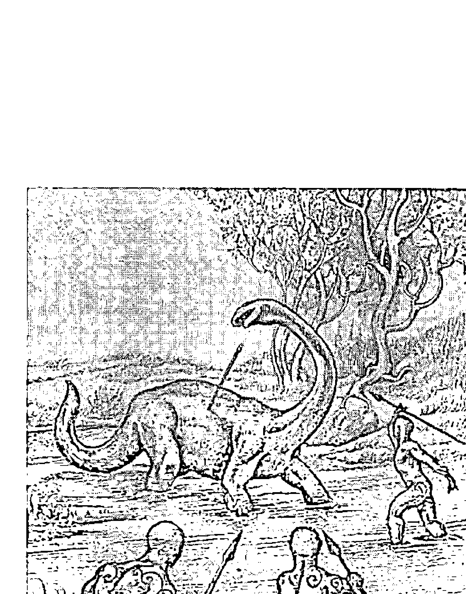

伊安·丹尼尔斯

名为恐龙开始，这些中生代的怪兽们就已以其庞大的数量和众多的种类让人心驰神往。人们一直在推测它们真实的面貌和生活习性，以及它们在6500万年前全部灭绝的谜底。

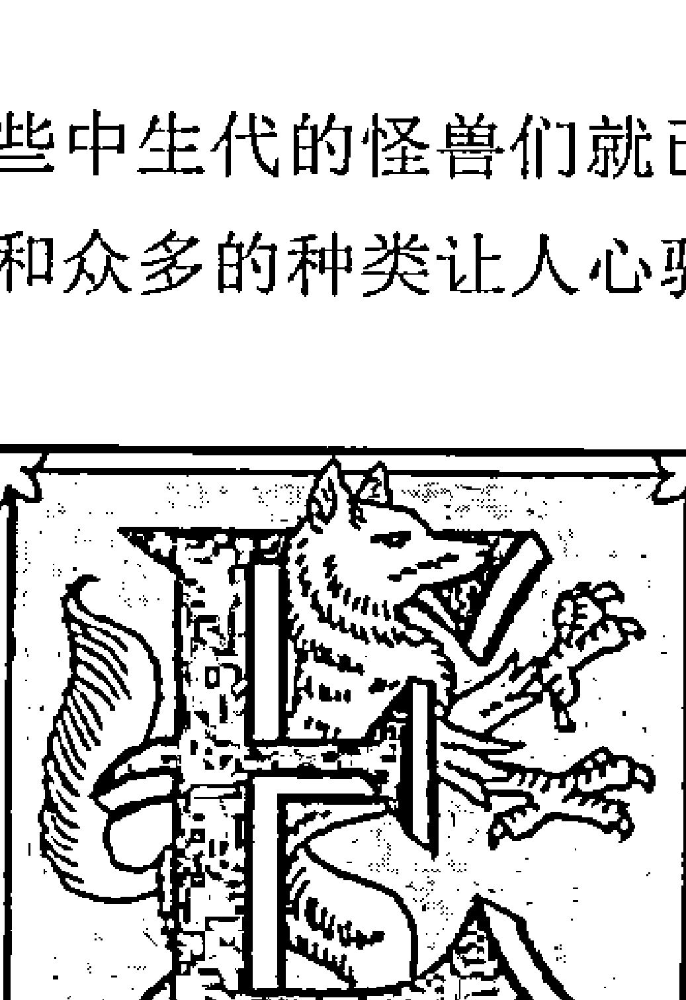尽管恐龙化石已经被证实为是在千万年前所形成的东西，但还是有很多人认为它们至今仍然存在。在欧洲，它们被认为是恐怖所留下的残骸、大洪水的受害者；而中国人则将其视作龙骨，给了它们恐龙的名号。第一种得到学名的恐龙是巨龙（megalosaurus），1676年在英格兰牛津附近发现了一块这种恐龙的骨头碎片。

1842年，英国古人类学家理查德·欧文将这种古代生物正式命名为恐龙（Dinosauria）。这个词语来自希腊文中的“deinos”，意为“恐怖的”、“可怕的”、“强大的”，以及“saura”，意为“蜥蜴”、“爬行动物”。最初，这个词并非用来指代那些蜥臀目（saurischia）和鸟臀目（ornithischia）的动物，而是泛指一切巨型动物的化石，包括现在被确认为并不属于恐龙的生物——如古鲸类、翼龙类、鱼龙类、蛇颈龙类、沧龙类等等。

今天，恐龙都被归在古蜥亚纲下，此类还包括鸟类和鳄鱼类。这些生物被认为是活跃的、温血的、非常成功的物种。我们现在统称为“猛龙”、依靠双腿行走的捕食动物，比起蜥蜴来更像鸟类，而且非常聪明，有证据表明它们身上还长着羽毛。它们在千万年前已经灭绝了，但其进化了的后代却一直统治着苍穹直至今日！

## 失落的奇幻世界

新近发现的恐龙刺激人们写出了许多虚幻的冒险故事，描写在地球某处的失落世界上，仍然有恐龙在活跃着。

柯南·道尔（1859-1930年）的《失落世界》成书于1912年，后来被改编成了同名的世界上第一部怪物电影——1925年上映的一部无声电影，威利斯·奥布莱恩（以1933年《金刚》——由《失落世界》改编而来的另一部影片——中的特技而著名为这部电影制作了活灵活现的恐龙模型和各种动画。有趣的是，在1962年的翻拍版中，这个故事的发生地被搬到了非洲。

虽然柯南·道尔将故事发生的地点设定在委内瑞拉的一个无人触及的高地上 [海拔9000英尺的罗赖马山罗赖马州（tepu i monte roraima）]，将金刚的骷髅岛设定在苏门答腊岛西南部的印度洋中，但另一位著名的冒险故事作家埃德加·莱斯·柏洛兹（Burroughs）却将它们都搬到了一个名叫帕尔乌尔东 (Pal-ul-don) (“男人之地”) 的隐蔽村庄中。这个村坐落在非洲中部茂密的丛林之中，被《可怕的泰山》(Tarzan the Terrible) (1921年) 中的人猿泰山所发现。帕尔乌尔东 (Pal-ul-don) 住着有尾巴的人类和恐龙，还有野蛮人和三角龙一样的狮鹫格里夫 (Gryf) 。
如果地球上确实有这么一个地方，在那片土地上生活着有幸逃脱了大灭绝的恐龙的话，那么，这个地方非非洲中部地区莫属，特别是刚果盆地里人类无法居住的广袤沼泽地带——在过去的6500万年里，该地区极少受到地球变迁的影响。1938年，在非洲海岸边发现了一种现存的腔棘鱼 (Coelacanth) 。这些长着四肢一样的鱼鳍的大鱼本应在7000万年前就灭绝了的。而在上个世纪人们才又在非洲发现了几种大型动物——欧卡皮鹿和山地大猩猩 (Mountain Gorilla) 。还有什么怪兽还没被发现呢？

## 《圣经》中的恐龙？

在古埃及和古巴比伦也有关于类似恐龙的生物的描述——在《旧约》中也有类似的描述，比如《约伯记》中 (40: 15-18) ：“你且观看河马。我造你也造它。它吃草如牛一样。它的气力在腰间，能力在肚腹的筋上。它摇动尾巴如香柏树。它大腿的筋互相联络。它的骨头好像铜管。它的肢体仿佛铁棍。”这种巨兽通常被认为是河马，但究竟什么东西的“尾巴如香柏树”？河马的尾巴很小，像猪尾一样，只有蜥脚恐龙的尾巴才像树干。

斯塔 (Sta) 也叫玛菲德特 (Mafedet)，是埃及艺术作品中经常出现的一种生物，它有又长又弯的脖子和长有四肢的身体 (插图 5)。在罗马艺术作品中也有类似的生物，比如这幅2世纪的画作，里面有两条长脖子相互交叉的蜥脚恐龙般的生物 (插图6)。它们被称为“北欧野兽” (Beast of Nodens)，被刻在英格兰格洛斯特林德公园 (lydney park) 的古罗马营地中。

但最为著名的一例是刻在古巴比伦伊什塔尔门上的怒蛇 (Sirrush) 浮雕，这个龙形的爬行动物长着蛇一样的脑袋和脖子、猫的前肢和鸟的后腿与爪子。它全身覆盖着鳞片，还长有一条长尾巴，头上顶着一顶头冠、头饰或一只角。很明显，这幅浮雕所要表现的是一种真实存在的动物。（插图7）
在巴比伦神话中，怒蛇是龙母提亚马特所生的龙子之一。伊什塔尔门是在尼布甲尼撒大帝（Nebuchadnezzar the Great）在位的时候立起来的。他在公元前605至562年统治着国家，其著名的功绩有征服了犹太人和耶路撒冷、在巴比伦首都建立纪念碑、修建空中花园。在《但以理书》中都有关于他的内容，里面称他的牧师们在伊什塔尔神庙中喂养了一头“活龙”，他们崇拜这头龙后来被但以理所杀。下面是对伊什塔尔门上的生物的描述：

> 有一头巨龙生活在巴比伦，它受到那里民众的崇拜。国王告诉但以理：“你不会告诉我它不只是一件青铜器吧？你看，它是活的，能吃能喝，你无法否认它是一位活在世间的神，它就是一位活生生的神。”只要你同意，国王陛下，我不用任何刀剑棍棒就能将这条蛇杀死。”“那你去吧，”国王说。
于是但以理拿了一些沥青、一些油脂和一些头发，将它们煮在一起，揉成圆球，喂给龙吃。龙在吃下了这些东西后炸裂了。
但以理说道：“现在过来看吧，看看你们崇拜的是什么东西！”
《但以理书》，14：23-27）

## 非洲的恐龙？

真的有可能在非洲还生活着恐龙吗？
在非洲中部的刚果、喀麦隆和加蓬这些国家，有关于一种巨大两栖动物的报告，它们长着长脖子和长尾巴。最早的也是最精彩的故事来自阿尔弗雷德·阿洛伊修斯·霍恩（1854-1927年），他是一名旅行家、商人和探险家。他说在加戈-尼尼（Jago-Nini），意为“巨大河流”的沼泽地中生活着一种生物。尽管并未亲眼见到过这种生物，但他确实看到了它们的脚印，它们有“周长一只大煎锅那么大，上面有三个趾头而非五个。”（插图9）有人告诉他，这种东西“会从水里钻出来吃人”。

居住在利库阿拉（Likouala）沼泽地区的人称其为河霸龙（Mokèlè-M’Bèmbe），在刚果盆地当地的矮人土著人的林加拉语中意为“截断河流者”，西方人也对这个名字最为熟悉。在其它地区，同样的生物被称为伊利兹·伊玛（Iriz Ima）、汀奥内克（Dingonek）、魔克拉-姆边贝（Ol-umaina）或恩’亚马拉（N’ yamala）。自 1776 年欧洲人第一次进入到“黑暗非洲”中西部的丛林中开始，就一直有关于它们的目击报告。

它们也出现在古代的岩画上，据说其身体的大小在河马和大象之间，身长在 15 至 30 英尺间，其脖子和尾巴分别有 5 至 10 英尺长。但在喀麦隆的目击报告责成它有 75 英尺长，其无毛、皮质的皮肤呈红棕色和灰色。它的四肢短小，脚上有三根趾头，又长又柔的脖子上长着一个爬行动物似的脑袋，还有与鳄鱼一样的又长又壮的尾巴。有人称在它头上还长着鸡冠一样的头饰，也有人说头上长的是独角或牙齿。这些细节听起来都是在说怒蛇。

被土著人画在沙地上的河霸龙看起来就像一头蜥脚恐龙。当看到蜥脚恐龙的图片时，他们称其就是河霸龙。土著人称其潜伏在泰莱湖地区，它的巢穴在河岸上那些深深的、半没入水中的洞里。

当地人说它是草食性动物，主要以长在里考拉-奥克斯-赫尔波斯（Likoula-aux-Herbes）河边的马罗姆博（malombo）草为食。但它同样具有攻击性，会攻击河马和人类。当地人还传说有渔民和猎人的船只被河霸龙弄翻，人也被它用大尾巴按在水下，这些人的尸体会随后被冲到岸上，虽然破烂不堪，但并未有被吃掉的痕迹。当地村民和探险者从 1913 年以来目击到很多次这种怪兽，甚至在 1959 年当地人还杀死了一只，但所有吃了它的肉的人都死了，随后，那个村庄就笼罩在了火灾、疾病和死亡的阴影之下。

德克萨斯州的爬虫学家詹姆斯·鲍威尔在 1979 年带领着第一只隐生动物学探险队前往该地区。在他的报告中有关于一种名叫恩’亚马拉的奇怪生物的传说，这种生物看起来与梁龙（diplodocus）类似，生活在加蓬的沼泽地带。

当地的一位巫医称自己在 1946 年看见过一只这种生物，说它有超过 30 英尺长，长着长脖子和长尾巴，至少有大象那么重。1912 年，在比属刚果，一名伊图里土著人告诉一名叫艾利克斯·戈达尔上校的第一次世界大战英雄，与尼亚马（Nyama）是“一种像河马一样大的生物，长着小脑袋和小羽毛——还有像鸡冠一样的头冠。”他称其“出水的时候会让大地震颤。”

最佳的一次目击报告来自布拉柴维尔动物园（Brassaville Zoo）的动物学家马塞兰·艾格纳加，他在 1983 年 4 月的时候带领着一支由刚果人组成的探险队前往泰莱湖。他们站在距离岸边 800 英尺的地方，一头河霸龙将头颈举出了水面，看着他们。艾格纳加报告说，它长着窄窄的红色脑袋、大大的卵形鳄鱼眼还有矮矮的鼻子。很明显那是一只爬行动物，但却无法确认它的具体类别。

在更早些时候的 1932 年，传奇的美国隐生动物学家伊万·T. 桑德森在马姆费湖 (Mamfe Pool) 上游的上横河 (Upper Cross River) 边发现了一组“巨大的、河马般的脚印”，而那个地方根本没有河马。后来，他在营地附近划船时，看见了一个巨大的身体正在潜入水中。他的当地人向导称其为河霸龙。

图12. 追踪河霸龙

1980 年和 1981 年，芝加哥大学的罗伊·麦考尔博士带领又国际隐生动物协会赞助的探险队前往泰莱湖和利库阿拉沼泽。尽管他们听说了一些故事，但却并未亲眼看到河霸龙。在最接近的一次的时候，他听到了一声巨大的“扑通”声，就好像有什么很重的东西进入了河中，除此之外还看到了对岸传来的一圈大大的水波。

在刚果的利库阿拉沼泽、喀麦隆的班委罗湖和西非海岸的其它沼泽地带，据说生活着另一种不同的大型两栖生物。它被称作伊美莱南头卡 (Emela-Ntouka)（林加拉语，“大象杀手”）、齐彭柯维 (Chipekwe) 和格鲁特朗 (Groot Slang)，据称比河马要小一些，并以河马为食。它光滑的身体可能是深绿色、灰色或棕色的，上面没有毛发，它还长着一条鳄鱼般的尾巴、犀牛一样的独角，据说它就是用这个角来分解大象的。像河霸龙一样，它大象一般的脚印上有三个趾头。1934 年有人杀死了一只，但却没有对其进行科学研究。一些隐生动物学家注意到它与属白垩纪虚骨龙 (Cretaceous ceratopsian) 的独角龙 (Monoclonius) 的相似之处，但这种恐龙肯定是吃草的。实际上这种生物听起来更像是食肉的帕尔乌尔东的格里夫！有可能柏洛兹正是由于听说了这种动物才将其写入了《可怕的泰山》 (Tarzan the Terrible) 中吗？

图13. 伊美莱南头卡

一种与之类似，名为恩格宝(Ngoubou)的生物据说长有与虚骨恐龙类似的巨大头盾和“獠牙”（尖角？）。与孤独的伊美莱南头卡不同，这些生物据说过着群居生活，与大象争夺领土。

另一种可能的活恐龙据称生活在西非的肯尼亚。它名叫姆乎路 (Muhuru)，

图14. 三角龙

很多目击者称其是一种身上披着厚厚装甲的爬行动物，脊柱上长着大大的骨板，还有一条长有锤头的尾巴。在刚果有一种类似的生物，叫姆比路-姆比路-姆比路（Mbielu-Mbielu-Mbielu）（“背上长有厚板的生物”）。矮人族渔民曾看见过它半露出水面的样子，在它背上确有一列骨板。从未有人见过它的身体、四肢或尾巴，但当地人都说它是一种温顺的草食动物。那些“骨板”明显和剑龙（Stegosaurus）身上的一样，这种恐龙在非洲被称为钉状龙（Kentrosaurus）。但侏罗纪的鸟臀目恐龙并非水陆两栖。

开赛暴龙（Kasai rex）是另一种来自中部非洲丛林中的活恐龙候选者。

1932年，一位名叫约翰逊的瑞典植物学家和几个当地的侍从正在开赛河谷中旅行，他们看到一只这种生物攻击并吃掉了一头犀牛。他称其像一只40英尺长的蜥蜴，长着又长又厚的尾巴、狮子一样的双腿和长满尖牙的大嘴。它全身深红色，在颈部、背部和尾巴上长着和老虎类似的垂直条纹。现在尚不清楚这种生物是像它名字所说的那样用双腿直立行走，长有两只小前臂，还是只是一种大蜥蜴——这样它就不可能是恐龙了。

除了恐龙，非洲还出现过其它中生代的怪兽。据说在肯尼亚的东非大裂谷中生活着一种巨大的、背部隆起的爬行动物，对它的描述与白垩纪时期属非洲食肉龙（African carnosaur）棘龙（Spinosaurus）类似。

劳是一种巨大的、蛇颈龙似的生物，长着又长又柔的脖子、驴子一样的身体还有鳍状肢，据说潜伏在东非苏丹中南部地区诺湖的纸莎草沼泽中。它的嘴边长着猪鬃一样，用以捕获猎物的胡子。1914年，一群当地的希鲁克人（Shilluk）在阿达尔沼泽中杀死了一只这种怪兽，将其骨头用作护身符，这让这种生物第一次得到了世界性的关注。

## 其它“失落世界”中的中生代怪兽

因为柯南·道尔的“失落世界”并非存在于非洲，而是在南美，所以该地区的那些翠绿的森林中出现任何关于类似生物的目击报告也就不足为奇了，下面的马迪迪怪物就是其中一种：

> 1907年英军少校珀西·福西特（Percy Fawcett）被派往测定巴西和秘鲁之间的边境。他是一名皇家工兵，以其对事件缜密和真实的记录而闻名。在马德雷迪奥斯（Madre de Dios）的贝尼沼泽（Beni Swamps）中，他看到了一只自己认为是梁龙的动物……本多阿卡亚利河（Ucayali）地区的土著人都流传着梁龙的故事……
（《东流之河》（The River Ran East），作者雷纳德·克拉克，1953年）

而在 1995 年，博物学家亚历山大·拉伊梅宣称自己看到了 3 只在委内瑞拉奥雅 - 特文溥伊（Auyan-twnpui）河边石头上晒太阳的蛇颈龙。1990 年，两名法国探险者前往同一个地点，也看到了类似的生物。即使是在今天，住在罗赖马山（Roraima tepui）地区的当地人仍在流传着一种大型蛇颈龙从上面的高地起飞，越过他们村庄的故事——这与柯南·道尔的描述一模一样。

新几内亚的大岛——仍然有广袤的地区未被探索——是一些传说中的怪兽的家园，其中就包括皮西莫里（Pish-meri），也叫美人鱼（见第10章“人鱼”）。1999年，在巴布新几内亚长达 100 英里的穆雷湖中有人就看到一只“恐龙似的爬行动物”。目击者称其“像自动倾泻卡车一样长”，双腿直立，水陆两栖，体宽大约 6 英尺，有两条短小的前臂，它的腿“像棕榈树干一样粗”，还有一条长脖子和细长的尾巴。它的脑袋与公牛的类似，长着大眼睛和长如人的手指的牙齿。据说在它的背上有“比较大的三角形洞”，而皮肤则像鳄鱼的一样。这听起来很像一只兽脚亚目类恐龙，其公牛一样的脑袋表明它是食肉牛龙（Carnotaurus），但“比较大的三角形洞”却又是剑龙的特征。

## 可能性

当然，我们所希望的就是确实存在着一个失落世界、一个骷髅岛、一个失落的世界（Land That Time Forgot），或一个帕尔乌尔东失落之地，以及在那里生活着的恐龙——也许它在南美、新几内亚或甚至在非洲。但虽然希望会带来行动，但这并不能给我们带来真正的侏罗纪公园。正如查林杰教授一样，我们需要的不仅是目击者带来的报告和那些失焦的照片。

我有些怀疑河霸龙是否是“真的”存在于这些目击报告之后。它到底是一种什么样的动物，这无关紧要，因为我已在 1985 年的《美人鱼探险》（Mermaid Expedition）（见第10章“人鱼”）一书中了解到了一些。人鱼的故事非常棒，而且充满警示意味。一个小脑袋长在一条长脖子和一个大身体上，这说的肯定是某种蜥脚类恐龙。但，正如我在第18章“湖怪”中所说的一样，目击者总是将这种东西当作蛇颈龙，因为它们都只在水面露出了一小部分的身体，这让人很难推测其在水下的部分的样貌。而在另一方面，奥德曼斯和霍伊霍尔曼认为巨大的海蛇是一种长颈海豹，而我却并不认为任何脊椎动物会长得像长颈湖怪或海蛇一样，对此种生物最好的解释就是巨型蛞蝓般的软体动物。但除了长脖子，河霸龙还有两个与其它湖怪传说和海怪传说不同的独特特征：留下圆形、有三个趾头脚印的象腿和又长又厚、像鳄鱼一样的爬行动物尾巴。如果这些描述都属实，都属于同一个动物，那么唯一可能性就只有蜥脚类恐龙了。我衷心希望这就是问题的正确答案。

然而，坦率地说，必须注意到的是，非洲的刚果也是非洲森林象（Forest Elephant）的家园，这是一种比著名的稀树草原象（Savanna elephant）和普通非洲象（Bush Elephant）都要小一些的亚种大象。实际上，它的大小与河霸龙完全契合。在非洲、欧洲和美国的一些动物园还有一些更小一点的侏儒象，这种象的高度不会超过6.5英尺，全身呈红色。尽管它的学名叫“Loxodonta pumilio”，但对这种动物在动物学上的分类并未达成一致。森林象和侏儒象都生活在刚果盆地的沼泽地带，而不是普通非洲象所喜爱的大草原。这样看来，它们比其他厚皮动物（pachyderm）更有可能适应水陆两栖的生活——众所周知，所有的大象都喜欢洗澡和游泳。一只游泳中的大象会将鼻子高高举起，这看起来跟典型的水怪的样子很相似。它的耳朵甚至可能被当成“鳍”。（插图22）而所有西方人看到的河霸龙都在水中，只有背部和脖子露出了水面。有趣的是，一种名叫水象的水怪也据称生活在刚果丛林中。但大象长有五根脚趾。

## 魔法师的怪物图鉴

趾而非只有三个，而且它们像绳子一样的尾巴也不像鳄鱼的或蜥脚类恐龙的。那所以，在有人拍到它们全身的照片、影片或抓到实物之前，陪审团仍然站在河霸龙、伊利兹·伊玛和恩亚马拉那一边。

对于鼻子上长有角的伊美莱南头卡、齐彭柯维和格鲁特莎朗也是一样。也许它只是某些人瞥到了一只犀牛的影子，再加上自己天马行空的想像所制造出来的东西。但犀牛并不吃肉，也没有鳄鱼般的尾巴——也许格里夫真的存在！

对于姆乎路和姆比路-姆比路-姆比路，它们可能真的是剑龙也说不定。解开这些谜团唯一的方法就是抓到一只活物！

## 怪物电影：现代活恐龙

恐龙一直是幻想电影中非常受人欢迎的角色。下面是一些描写存在于当代的失落世界或遥远小岛上的恐龙的影片。《失落世界》（1925 年）是一部无声电影，改编自柯南·道尔的同名小说，威利斯·奥布莱恩为此片制作了许多逼真的恐龙模型，甚至让胡迪尼大师都曾信以为真。1933 年，《金刚》向人们展现了一幅在遥远小岛上生活着的恐龙和巨型大猩猩的场面，里面的怪物也是奥布莱恩制作的。《无名岛》（1957 年）的故事发生在南极洲的心脏地带。在《失落世界》（1960 年）这部拙劣的重拍影片中，“恐龙”只是一些被吹胀了的蜥蜴 [ 它们在好莱坞被称为苏鲁帕萨斯 (slurpasaur) ]。在《恐龙！》（1960 年）中，在加勒比地区一座小岛旁的爆炸释放出了史前生物，其中包括霸王龙（T-Rex）和雷龙（Brontosaurus）。虽然据说《公元一百万年前》（1966 年）、《恐龙纪元》（Dinosaurs Ruled the Earth）（1970 年）和 1981 年的喜剧片《穴居人》（Caveman）都将故事时间设定在恐龙时期，但因为影片中有长相更加现代的穴居人，所以我将它们归入了此处《暴龙谷》（1969 年）是美国西南部的一个隐匿的地方，在那里，牛仔们的绳索套的猎物换成了恐龙。《重回侏罗纪》（The Land That Time Forgot）（1974 年）是改编自 1914 年，埃德加·莱斯·柏洛兹的同名小说。《宝贝——失落传说的秘密》（Baby——Secret of the Lost Legend）（1985 年）是迪士尼拍摄的一部关于河霸龙的影片。《失落世界》及其续集《失落世界归来》都是 1992 拍摄的影片，都将柯南·道尔的故事发生地搬到了非洲。《侏罗纪公园》（1993 年），改编自迈克尔·克莱顿（Crichton）的同名小说，里面的主角是一群生活在高科技主题公园中的克隆恐龙。《侏罗纪公园 2：失落世界》（1997 年）是 1993 年的《侏罗纪公园》的续集，一头克隆霸王龙从一个实验小岛上被人抓获后带到了洛杉矶，这后来带来了显而易见的后果。1998 年，一部让人激动的《失落世界》将故事搬到了蒙古。《侏罗纪公园3》（2001年）讲述的是人们回到实验小岛上去从猛龙、无齿翼龙和一头吞下了手机的棘龙的手中救出一个小男孩的故事。《失落世界》（2001年）是一部 BBC 电视台翻拍自柯南·道尔小说的优秀作品，里面用电脑特技做出的恐龙非常逼真。彼得·杰克逊的《金刚》（2005年）再一次讲述了1930年代在一座偏僻的小岛上的恐龙的故事，只是这次恐龙从模型被换成了电脑特技。我最喜欢的影片是《恐龙帝国》（Dinotopia）（2002年），这是一部改编自詹姆斯·格尼的优秀同名小说的电视短剧，讲述的是在一座乌托邦小岛上，人类和智慧的恐龙共同建立起一个辉煌社会的故事。

图23. 原版《失落的世界》的电影海报

### 26、多毛原始人和神秘猴
作者：奥伯伦

> 这些巨大的生物用后腿行走，从来没有被人活捉到过，它们观察人类的动作，并尽力地模仿……它们搭建起的帐篷和人类的几乎一模一样，但从来都不进到里面去。当幼崽死去的时候，母亲会将它的尸体一直抱在怀里，直到腐坏成碎片。它们一掌就能打死一个人，没有什么比它们还强大。
——《鲍迪奇夫妇》，1800年代后期，对非洲的因基纳（Ingheena）进行描述

本章是到目前为止最难写作的一个章节。可供使用的信息真的太多了——目击报告和此种生物的种类也是如此。此题材需涵盖好几十本书的内容，也需要采纳很多的机构、网站、电视纪录片和期刊杂志的信息。有很多的研究者穷尽一生的时间来寻求解决这些问题的答案。我住在北卡罗来纳州的雷德伍德郡（Redwood County），我与俄勒冈峡谷大脚怪研究中心（Oregon Dalles Bigfoot Research Center）和《大脚怪新闻报》的彼得·伯恩一起参加了1970年代末的调查工作好几年的时间。在这简短的篇幅中，我只能对此题材进行一些粗略地的阐述。

尽管在有文字记录的历史中，在世界各地都充满了关于巨大、全身毛茸茸的人形生物的报告，但当代最多的此类报告都来自美国西北太平洋地区，那里有一片超过12.5万平方英里的未经探索之地。在这片广袤的大地上，这些生物被称为大脚怪或萨斯科其人（Sasquatch）。而类似的，或甚至有可能就是同一个物种在俄罗斯高加索地区被称为卡普它（Kaptar），在西伯利亚东北部被称为刍褚纳安（Chuhuna），在蒙古被称为阿尔马斯（Almas），在西藏被称为康米（Kangmi），在澳大利亚被称为幽威野人（Yowies），在尼泊尔被称为雪人（Yeti）。

在中世纪的欧洲，它们的名字叫沃德沃思（Wodwoses）（盎格鲁撒克逊语中的“森林人”），或被简单地称为“毛野人”，它们作为插画里的主角。这种生物也叫伍德瓦萨、伍达豪斯（Woodahouses）或欧塞（Ooser），在很多中世纪绘画、教堂雕刻和手稿插画中都有出现。它们通常都手持大棒，有时穿着由叶子组成的简单短裙。它们是猩猩和猴子之外的物种，常由演员扮演，出现在话剧、假面歌剧和戏剧中。一些研究者认为它们可能是穴居人，很有可能是巨人托尔斯（Trolls）和食人女妖（Ogres）传说的原型。

甚至在英伦群岛都有关于巨猿的传说，那里的人很害怕他们。费尔拉莫尔（Ferla Mohr）（盖尔语，“大灰人”）是一种极具攻击性的灰猿，据称它们居住在苏格兰山地中，直立时身高有20英尺。

类似的生物都被统称为巨猴，在全世界范围内都有报道，很可能还包括几个不同的物种。它们的身高从4英尺到6英尺不等，长着圆滚滚的胸部、粗手臂、有力的双腿和毛茸茸的尾巴。小一些的据说长得像袋鼠，有像浣熊一样的脸和尖耳朵。它们身上的毛有短有长，毛色从红色到黑色不等。它们长有三个脚趾，足迹间距在12至15英寸间，越大的种类足间距越短。它们在美国通常被称为魔鬼猴。

### 大脚怪

西北太平洋地区的大脚怪的平均身高有8英寸，足迹间距有18英尺长。它们的毛色有红棕色、灰色和黑色。雄性、雌性和幼崽都被人看到过，它们通常都是以家庭为单位进行活动的，经常被描述为对人类害怕又好奇。这种生物似乎是夜行动物，因此也被称为夜行人，这个名字是由卡洛斯·林奈（1707-1778年）创造的，旨在用来命名这样的一种生物。

所有的目击报告都称其不会说话，不会使用或制造工具，也不会使用火——这是将人类和其它动物区分开来的主要特质。“大脚怪”这个名字首先出现在公众的面前是在1958年10月5日《洪堡时报》由专栏作家和编辑安德鲁·金佐理（Genzoli）所写的一篇文章里，这篇文章写的是在卡罗莱纳州布拉夫克里克的一处建筑工地上发现的16英寸长、7英寸宽的大脚印。有趣的是，该地区也是在大约十年前的1967年10月20日，罗杰·帕特森目击到一位高大的雌性大脚怪的地方，他还对其拍摄了一段简短的录像。大脚怪似乎是一种隐生动物。我们有很多的目击报告，对它们的所有细节都有所知晓。有证据表明是它们留下的脚印被发现、采集、收藏和分析。河边光滑淤泥中留下的清晰脚印上有纹线，印记的深度表明这种用双脚行走的生物在移动时，身体的重量分配发生的变化，以及它们身上的一些非人类特征，如巨大的脚趾和过长的距骨。脚印间距表明了与目击报告中的双腿长度相一致的步伐，以及行走时双腿关节的弯曲程度。尽管还是有人对此持怀疑态度，但那些模糊的照片和影片确实都与目击报告中的内容相吻合。人们在这些生物经过的树枝上找到它们的毛发，然后对其进行DNA分析，结果表明它是一种类人猿，但具体种类不详。它们的粪便也被分析过，并在里面发现了未知种类的寄生虫。

### 明尼苏达雪人

这些记录中甚至包括1968年伊万·T.桑德森[未解之谜调查会 (Society for the Investigation of the Unexplained)]会长和伯纳德·霍伊维尔曼（法国隐生动物学中心主任）对一具冰冻的尸体进行的那次细致的检查。桑德森的素描和霍伊维尔曼拍摄的照片得到了广泛的传播。

然而，在此次检查后不久，这具尸体就被移出了展台，然后消失了。隐生动物学家洛伦·科尔曼说：

> 最初的那具尸体消失了，一具似乎是在加利福尼亚制作的标本替代了它的位置，有很多好莱坞的化妆师都声称自己创造了冰人。但桑德森和霍伊维尔曼由于拥有马克·A.霍尔和洛伦·科尔曼所拍摄的照片而知道替代品和原件之间至少有15个不同的地方。当史密斯森协会和联邦调查局介入调查的时候，汉森解释说该生物归一位百万富翁所有，并拒绝对其进行进一步的检查。

1981年，我在北加州的农产品家畜交易会上看到了一具似乎是被做成了木乃伊的雌性大脚怪的尸体，它有8英尺高，由来自约翰·斯特朗家族马戏团的小约翰·斯特朗带着，在嘉年华的穿插表演中进行展出。在撰写本章内容的时候，我联系了约翰，向他索取更多的细节，他承认那是一个赝品，还跟我讲了很多关于人造大脚怪的历史，它们是此类穿插表演的重要组成部分。主持人里克·韦斯特告诉我：“对，我曾拥有两件大脚怪尸体。一件是从杰里·马龙那里买来的，它是由约翰尼·钱伯斯制作的，而另一件则是由我和一个朋友在1969年制作的。我们用大脚怪进行展出了5、6年的时间。从1967年开始，我认识了弗兰克·汉森，他是冰人的拥有者。我是在他死前最后一个去造访他的娱乐主持人，在那个时候我给弗兰克和那个冰人拍了照片。我听说今年夏天又有一个新的大脚怪巡演表演要开始了。”

我向里克询问更多关于明尼苏达冰人的细节，他回答道：

> 我第一次和弗兰克见面是在1967年，那是在伊利诺伊州的皮奥利亚（我当时在那里展出一头巨大的阉公牛）。那年是“冰人”的第一次展出。

1970年代，弗兰克给冰人加上了一个框架，这样就能将其带到商场里进行展出了（67年的时候，冰人是被装载一辆双轮拖车里的）。他居然把这个生物封存在一块真正的冰块里！我在2002年11月的时候拜访了弗兰克。（他在2003年春天去世）他说，那个冰人是由霍华德·玻尔在儿子肯尼斯的帮助下设计并制造出来的，而蜡像艺术家彼得和玛丽·克拉尔夫妇给它装上的毛发。弗兰克告诉我还有一个人参与了冰人的制作，但是他在当时却记不起他的名字。他们的初衷是要利用人们对大脚怪的好奇来赚钱，并不是为了单纯地制作出大脚怪。

我在69年和一位朋友一起制作出来的生物在很大程度上都借鉴了弗兰克的，只是我们的这个雪人更加精致。杰里·马龙制作的那个被放在一个装满了铬的拖车里。在展出时，他打出“这是什么？”的广告语。他的这个作品同样也是模仿了弗兰克，只是没有冰块而已。我觉得他将自己的作品放在石膏中进行保存，整件东西又重又硬，它的毛发只是贴在表面，而并非像弗兰克的和我的那样嵌入到了身体中。在将其买下后，我把它的名字改成了“大脚怪”，然后将其转卖给了里克·欧文斯。很多人都相信世界上曾经存在过或仍然存在着两个汉森的大脚怪，它们是真的。弗兰克很巧妙地制造出了这个观点，人们总是相信世界上存在着两只大脚怪，但其实从时间上来讲也是不允许的。桑德森和霍伊维尔曼觉得自己找到了圣杯！他们为此已经等待了一生。在发表了文章称其为真正的大脚怪之后，他们就很难承认自己被人骗了的事实。他们在一个冬天前去拜访弗兰克，那个东西正被封在冰块中，关在一部拖车里。他们说闻到了腐肉的味道，那其实是乳胶的味道，但桑德森和霍伊维尔曼想要并需要相信那确实是真的大脚怪。史密斯森协会对那个东西很感兴趣，但在和加利福尼亚的那些化妆师进行谈话后便放弃了原来的想法。——里克·韦斯特，[《韦斯特博士的旅行展览和动物园》(Dr. West's Traveling Sideshows and Animal Menagerie)]，私人电子邮件回复，2007年4月）

### 加拿大猿人

在加拿大有另外一种与大脚怪类似的毛茸茸的类人猿，但当地的印第安人却认为它是完全不同的东西——而且更加危险，还以人类为食。它被叫做雪怪温迪戈（Wendigo、Windigo、Windago、Wiendigo、Witigo、Witiko、Wee-Tee-Go），是因纽特人和阿尔冈昆印第安人传说中最令人害怕的生物，据说是一种有15英尺高的“人兽”，全身长着黯淡的毛发，有发光的眼睛、黄色的长犬牙和一根超长的舌头。一些目击者坚称它全身无毛，皮肤颜色很浅，上面有黄色的斑点。这种怪兽因为阿尔杰隆·布莱克伍德（Algernon Blackwood）一百多年前的短篇故事《雪怪》（The Wendigo）（1907年）而闻名于世，而这个名字也被用在了一种据说生活在安大略省贝伦斯湖中的鳄鱼般的怪物身上，这种怪物会撕裂当地渔民的渔网。但在每个人都拥有数码相机的今天，人们拍到关于此种生物的清晰无疑的影像——这是所有怪兽猎人所追求的圣杯——似乎只是时间的问题。即便只是找到了一些尸体和骨骼的残片也能对这个存在许久的问题作出科学的论断。实际上，考虑到目击到它们的历史和频率，这种生物躲避了那么长的时间简直是难以置信的。但我们必须记住，大脚怪活动的区域很广——成百上千平方英里茂密的原始森林，不只是在西北太平洋地区，更在加拿大的绝大部分地方。在稍小的地区一直都有新的物种被发现，如柬埔寨[林牛(Kouprey)，高棉牛(Bos sauveli)]、越南[武广牛(Saola)，中南大羚(Pseudoryx nghetinhensis)]、菲律宾、新几内亚以及迟到非洲地区。如果一种具有相当智力的类人猿不想被发现的话，它们确实也能长久地躲藏下去。

实际上，北美北部各州、省的土著居民在数个世纪以前就了解那里存在着大型有毛灵长类动物，如加利福尼亚的毛巨人大脚(Oh-mah)。1920年代，一名叫J.W.伯恩斯的教师用几个加拿大土著人的词汇，如赛利希语(Salish)中的“野人”——“se’sxac”，创造出了萨斯科其人（Sasquatch）一词。而这只是当地人给一种几百年前就住在从阿拉斯加一直到不列颠哥伦比亚地区广袤森林中的巨型长毛类人猿取的150多个名字中的一个。在印第安人的传说和手工艺品中甚至也有它们的身影，比如下面这两个19世纪的面具。

西北太平洋地区的努特卡（Nootka）和赛利希印第安人传说着一种长着黑色胡子的巨型长毛类人猿。它被努特卡人称作马托斯(Matlose)或卡利班(Caliban)（这个怪物后来出现在莎士比亚的《暴风雨》中），长着吓人的、类似于熊的牙齿和爪子。它的吼声能将猎物吓呆住。

在北极地区的阿拉斯加的塔莱纳（Tanaina）印第安人的传说中有一种巨大的用双腿行走的生物，他们称其为毛人。这种生物住在群山中，身上覆盖着长长的灰毛，眼睛里据说没有瞳孔。除非受到了威胁，否则它们不会攻击人类。

明尼苏达的奥吉布瓦（Ojibwa）和克里（Cree）印第安人有关于一种小一些的猴子似的生物的传说。它们被叫做梅梅戈维奇欧（Memegwicio）（“野人”），据说有12岁孩子那么大，脸上长满了毛。

1811年，白人第一次见到了加拿大的萨斯科其人（Sasquatch），自那时起，已经产生了数百次的目击和遭遇。它的身高在6至12英尺，体重在600至900磅之间，全身长满蓬松的黑色或红棕色毛。它长着长手臂、猿猴一样的脸以及扁鼻子，能像人一样直立行走，留下的足迹间距在20英寸左右。它的气味非常特殊且难闻，类似于臭鼬和打湿了的狗组合在一起的味道。

有理由相信大脚怪、萨斯科其人、马托斯、雪怪温迪戈和其它被认为是同一物种的名字都指代了至少一种喜马拉雅雪人 (Yeti)。最为棘手的问题似乎就是：它究竟是人，还是猿？

### 雪人及其它亚洲类人猿

正如北美有大脚怪一样，亚洲也有著名的雪人。这种喜马拉雅野人也被称为靳孙 (Ginsung)、美托康米 (Metoh-kangmi)、尼奥莫 (Nyalmo)、拉克斯·伯姆珀 (Rakshi Bompo)、里米 (Rimi)、托尔-芒 (Thloh-Mung)，它有时会被误以为是令人厌恶的雪人，这种住在雪地里的人猿据说生活在西藏和尼泊尔又高又人迹罕至的喜马拉雅山脉中。目击者称其有 7 至 10 英尺高，全身长着长长的粗毛——在雪山中呈银白色，在低一些的森林中呈黄棕色。正如它在美洲的表亲一样，能证明其存在的证据只不过是一些毛发、脚印和值得怀疑的目击报告。通过检查，人们发现一块保存在寺庙中的“雪人头皮”其实是一块用来祭祀的像山羊一样的苏门羚 (serow) 的皮，而那些做成木乃伊的“雪人手臂”也只是叶猴 (langur) 的手而已。

根据夏尔巴人 (Sherpa) 的传说，雪人分为 4 种，每一种的体型都不相同，其名字中的“特” (The) 的意思是动物。最大的(13-16英尺高)是尼奥莫(Nyalmo)，也叫德祖泰赫（“大家伙”）；二大的 (7-9英尺) 是里米 (Rimi)，也叫美赫-泰赫 (Meh-The)（“类人的”）；再小一些（人一样大小），也是最为著名的是拉克西·邦姆波 (Rakshi Bompo)，也叫耶-泰赫 (Yeh-The)（“在那里的动物”）。很多人认为耶-泰赫实际上尼泊尔灰叶猴，这种猴子在喜马拉雅高原上很常见，而德祖-泰赫则是一种真正的喜马拉雅黑熊。剩下的是泰赫-勒玛 (Teh-Lma)（“在那边的小东西”），它是最不为人所知的，据说有 3 至 4 英尺高，全身长着红灰色的毛，有佝偻的肩部和尖尖的脑袋。它以青蛙和其它小动物为食。

在喜马拉雅西部和阿富汗的东部，以及巴基斯坦北部吉德拉尔 (Chitral) 地区的施施库 (Shishi Kuh) 山谷中住着一种毛茸茸的猿人，名叫巴马奴 (Barmanu)（“大毛人”）。它与美洲的臭鼬猿 (skunk ape) 一样，以恼人的臭气而著名。

尽管在非洲之外的地区仅存在着一种已知猿猴，叫红毛猩猩 (Orangutan)，但在亚洲和印度尼西亚仍然有其它未知猿类生物不断地被人目击到。虽然到目前为止，对它们的目击报告都太过不同而让人怀疑其真实性，但当地人仍然坚称它们确实存在，等待着人们去发现。

其中最为著名的也许要数阿尔马斯 (Almas)，也叫蒙古野人，它也叫阿尔巴斯提 (Albasty)、阿布诺亚 (Abnuaaya)、阿尔马斯提 (Almasti)、贝克·波克 (Bekk-Bokk)、蒙古野人，据说住在新疆省和蒙古天山附近的阿尔泰山中。它们像动物一样生活着，全身除了双手和脸之外的部位都长满了毛。虽然这听起来像是某种未知的猿猴，但一些隐生动物学家还是推测它们可能是尼安德特人中的幸存者。

在西伯利亚，长毛的原始人或人猿被称为刍褚纳安（通古斯语，“被驱逐的人”），有人目击到它们身披兽皮，于是一些研究者推测它们可能是尼安德特人的遗族。它们也叫穆棱 (Mulen “强盗”)、班迪特 (Bandit) 或西伯利亚雪人，目击者称其长得很高，样子像人，肩膀宽阔，额头突出，毛发浓密，有时毛色还非常特殊。它们可能与阿尔马斯是一种东西。

往西走，在俄罗斯的伏尔加地区有一种被称为欧瓦 (Ova) 的毛人，它们的脚是往后生长的，据说它们会在抓住旅行的人之后给他们挠痒，直到死去为止。但碰触它们的弱点——在其左腋下的一个洞——就能让其变得无力。也许关于它们的故事是从欧洲或者亚洲传到那里去的，随着时间的流逝，就越发地变得奇怪起来。

在中国湖北省的树林和群山中，据说生活着一种大型长毛类人猿。它们被称为野人，通常都被目击者描述为全身长着红棕色的毛发，但也有一些个体是白色的。它们的身高预估在5至7英尺之间，也有人看到过一些身高超过10英尺的个体。它们的名字有很多，包括野人 (Yiren)、野人 (Yeh Ren)、山鬼(Sangui)、猩猩(Hsing-hsing)、狒狒 (Fei-fei)、中国野人、神农架野人、人猴或人熊。在一部成书于公元前200年周朝的中国字典中狒狒 (Fei-fei) 被描述成身高10英尺、全身长毛、介于人类与猩猩之间、喜吃人肉的物种。

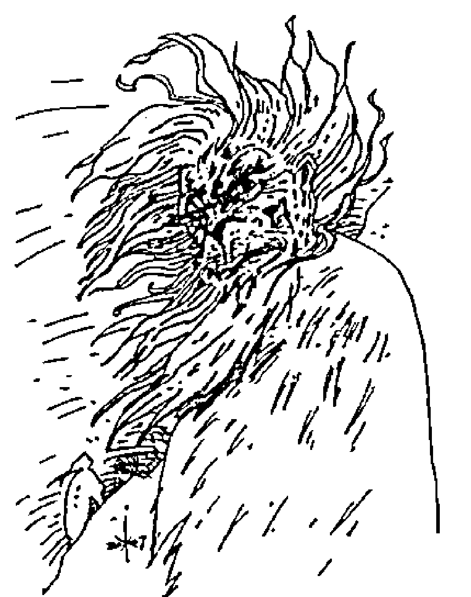

有人认为这种野人可能是遗留下的古生巨猿 (Gigantopithecus)，也有人推测它是大陆猩猩 (mainland Orangutans) 的幸存者，这种猩猩在更新世时期就在中国灭绝了。

在喜马拉雅山脉的东侧的不丹，当地人传说着一种高大、全身长毛的生物，并称其为米格尤 (Migyur)。它站立时身高9英尺，长着猿猴一样的长手臂和鼻子。

2001年4月，对米格尤毛发样本的一次 DNA 测试表明，这些毛发属于一种科学完全未知的生物。牛津大学分子医学研究所 (Oxford Institute of Molecular Medicine) 的人类基因学教授布莱恩·塞克斯和全世界的顶尖专家们一起对其 DNA 进行了分析，检查了这些毛发。“我们在里面发现了一些 DNA，但却不知道它到底是什么。它不是人类，不是熊或任何其它我们目前为止能够鉴别的生物。它是一个谜，我从未认为这次研究会以一个谜团而结束。我们从未遇见过不能辨别的DNA。”

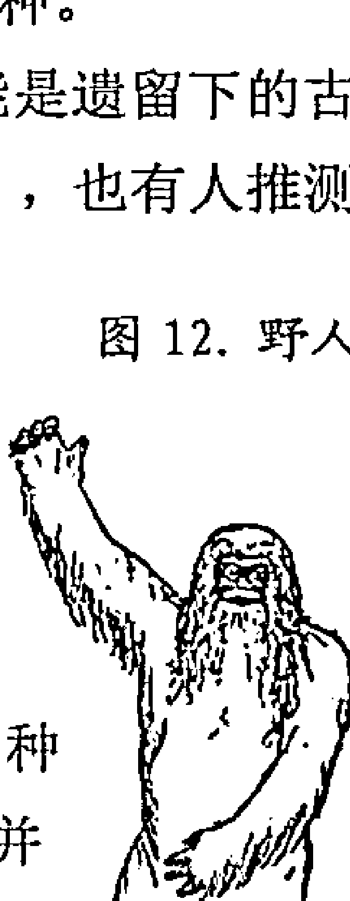

在日本传说中也有被称为山人的大型毛人。它据说住在山林中，很少露面，但害怕它的当地人会给它进贡，取悦它。

气味难闻的西八公（Hibagon）是一种小一些的日本类人猿。1972年，有人在日羽（Hiwa）看到了一只。它看起来很像大猩猩，身高约5英尺，脸上长着胡子、愤怒的眼睛和一个短平上翘的鼻子。它的脚印有10英寸长、6英寸宽。

## 扎娜（Zana）的故事

在西高加索地区的阿伯卡茨共和国（Abkazia），生活着一种名叫阿巴那阿于（Abnauaayu）的大型毛猿。在19世纪初期，有人抓到了一只雌性。它被称作"扎娜（Zana）"，在被转手卖过几次后，最终到了一名叫艾德吉·简那巴（Edgi Genaba）的贵族手中，他将其带到了自己在默克瓦（Mokva）河提克那（Tkhina）村庄中的一处庄园中，让它在那里生活了很多年，直到在1880年代或1890年代去世为止。在经过数年时间最终被驯化之后，扎娜渐渐地能够在庄园里自由活动了。但它只在吃饭的时候回来，仍然还是住在自己在房子旁边的一个雨棚下建造的窝里。

> 它的皮肤是黑色或深灰色的，全身还覆盖着红黑色的毛。它的头发又乱又厚，像鬃毛一样披在背后。

类居住在一起，但从学会任何一个阿布卡兹（Abkhaz）单词，只会嘀咕着模糊的声音，在恼羞成怒时会大喊大叫。但它……能够执行主人的命令……它很高、很大、很壮，长着大大的乳房和屁股，粗壮的手臂和双腿，以及比人类更长更粗的手指。它的脚趾能分得很开，大脚趾还能单独移动。

……它的脸很可怕：宽大、高颧骨、扁鼻子、鼻孔外翻、嘴巴与狗的类似、大嘴里长着大大的牙齿、额头很低、眼睛呈红色。但其最可怕的特征是它的表情完全像动物一样，根本不像人类……（它的牙齿）非常有力，能轻易地咬开最坚硬的核桃。

它的样貌很多年都没有改变：没有白头发，没有掉牙齿，一直都很强壮且健康。它的运动能力非常强，能跑赢马，也能在波涛汹涌的时候下河游泳，它还能毫不费劲地单手举着一袋80公斤的面粉从水磨房一路走到山上的村子里。

……它在一年中任何时候都会下水游泳，甚至在冬季都喜欢全身赤裸地行走，还会将得到的衣服撕成碎片。

有几次扎娜怀上了村子里男人的孩子，但当它用冷水给这些混血孩子洗澡时，他们都被冻死了，后来有村民从她那里拿走了 4 个孩子——2 男 2 女——并将其抚养长大。除了非常强壮、皮肤黑色之外，这些孩子看起来跟人类完全一样，也能够说话和思考。

1970 年代，在几次想要到找扎娜墓穴的行动失败后，俄罗斯古人类学家鲍里斯·波尔什涅夫（Boris Porshnev）终于找到并挖掘出了她的一个小儿子科威特（Khwit）的遗骨，科威特在世上生活了 65 至 70 年。波尔什涅夫将其头骨带到了莫斯科，那里的古人类物理学家对其进行了检查，检查结果在 1987 年被公之于众。这颗头骨（插图 15）清晰地展现出了灵长类动物的特征，与尼安德特人的类似。

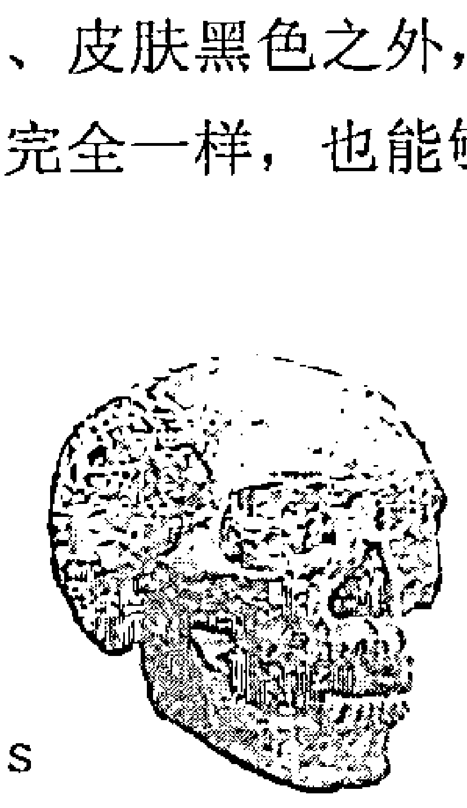

人”。但从马来半岛一直到此区域中的许多群岛，人们一直有目击到类人猿的生物，但却未能得到科学的考证。它们可能最终会被证实为大猩猩，但也可能是其它未知的灵长类动物。下面是一些可能的物种：

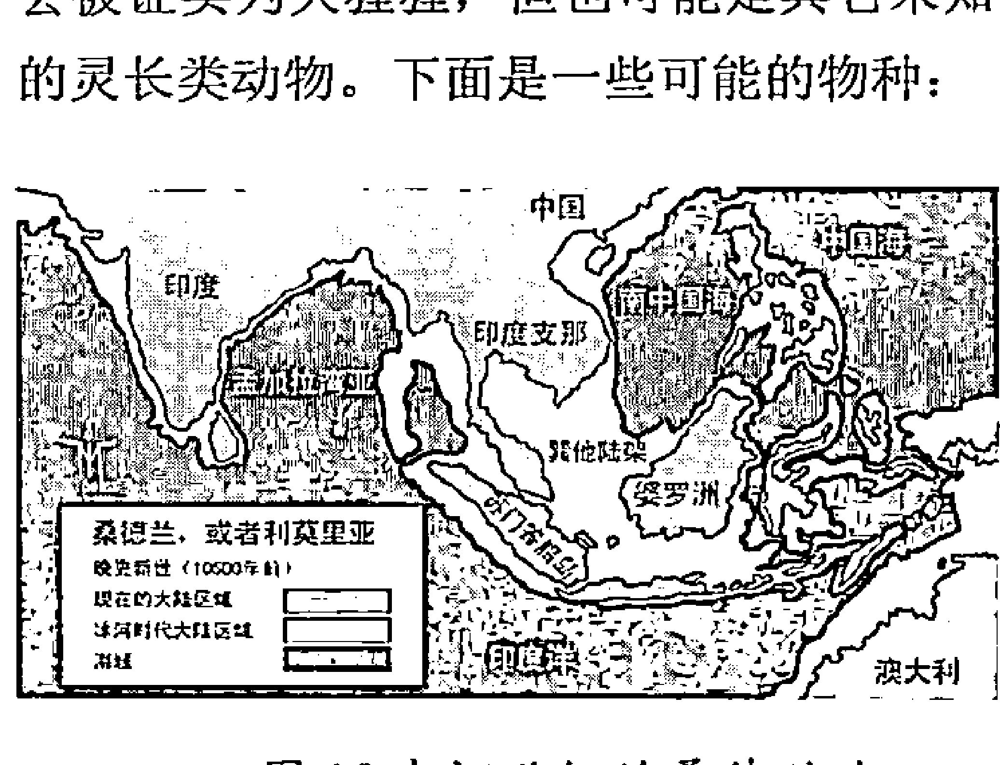

### 东印度群岛猿人

成千上万的东印度群岛是一片被叫做桑德兰（Sunderland）的山地的遗骸，这片巨大的山地从印度支那半岛一直往南延伸。同样，在菲律宾、新几内亚和澳大利亚部分地区之间曾经也是一片干燥地带。后来，所有的这些低地都在约 10500 年前的上个冰河时代结束时，由于海平面升高而被中国海淹没了。它们变成了孤岛，将上面的人类和动物与世界其它地方隔离开来。

婆罗洲和苏门答腊岛是大的两个岛屿，上面生活着两种独特的大猩猩（orangtan）。这个名字来自马来语和印尼语中的“orang hutan”，意为“森林

- **红毛达拉姆（Orang Dalam）**——马来西亚的一种长毛猿，据说有 6 至 9 英尺高，眼睛红色。雄性头、胸脯、手臂和双腿上长有很多毛发。它们身上有类似猴子尿的强烈气味。最初遇见时，它们似乎很友好，主动慢慢地靠近。之后它们会突然变得害怕并逃回丛林中。很明显，它是婆罗洲猩猩（Bornean Orangutan），在婆罗语中被称为米亚斯-帕潘（Mias-Pappan）。
- **臭猿**——有恶臭的白皮肤毛猿，偶尔会在马来西亚的丛林中看到或闻到。
- **巴士野人（Batutut）**——一种小型、红色、猿猴一样的生物，据说生活在马来西亚沙巴州（Sabah）的鱼鳞中。通常认为它与以青蛙为食、名为特马（The-Ma）

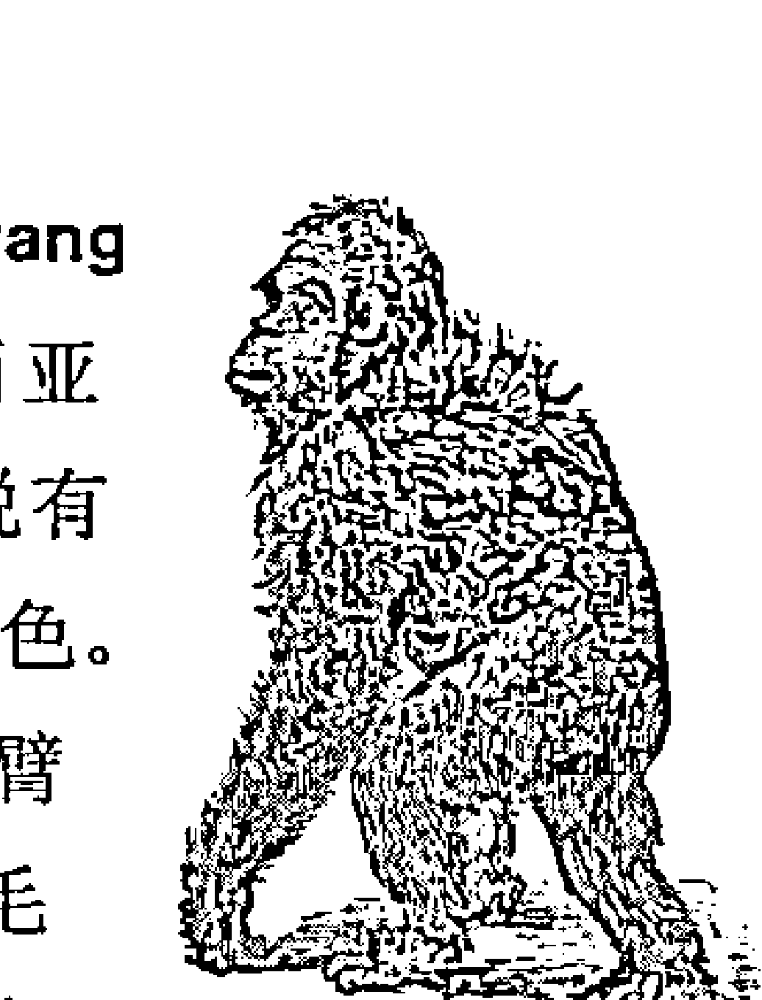

## 魔法师的怪物图鉴

[在越南语中叫越南牛圭朗 (Nguoi-Rung)] 的小型毛猿有血缘关系。也许是一种侏儒猩猩。

### 伊布呂古 (Ebu Gogu)

——小型、有毛、很少出声的穴居动物，最初由 19 世纪的葡萄牙水手在印度尼西亚的弗洛雷斯岛 (island of Flores) 发现。后来，在 2003 年，在那座小岛上发现了 7 个小型类人猿的亚化石。它们的官方名称叫弗洛瑞斯人 (Homo floresiensis)，大众媒体立即将其授予霍比人的称号。它们的身高在 3 至 4 英尺之间，可能是一种直立猿人 (Homo erectus) 的侏儒亚种。

### 红毛猩猩 (Orang Pendek) [也叫色达帕 (Sedapa), 巴士野人 (Batutut) ]

——据说生活在苏门答腊岛上广袤雨林中的一种毛人猿。它有 3 至 5 英尺高，棕色的皮肤上覆盖着黑色或棕色的短毛。它长有长长的黑色鬃毛，但却没有尾巴，其手臂比猿猴的要短一些。大多数时候它都在地面行走，足迹与人类的非常相似。这种生物主要以水果和小动物为食，也经常被当地人碰到，他们称其拥有基本的语言能力，但是说的却是当地人听不懂的语言。它有可能是苏门答腊猩猩 (Sumatran Orangutan)，是已知的两种猩猩中较小的一种。然而，一些研究者却认为它同样可能是弗洛雷斯附近的所谓霍比人。

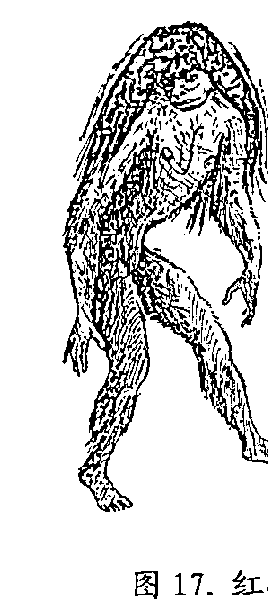

卡普雷 (Kapre) ——菲律宾群岛传说中的巨型毛猿，据说其身高在 7 至 9 英尺之间，全身长着又长又蓬松的棕毛。卡普雷住在竹林、洋槐林和芒果林中，你可能会在那里看到它坐在一棵树下抽烟。它通常对人类很友好，特别是对女人，但它也有淘气的一面，常会故意让旅行者在森林中迷路。

### 澳大利亚猿人

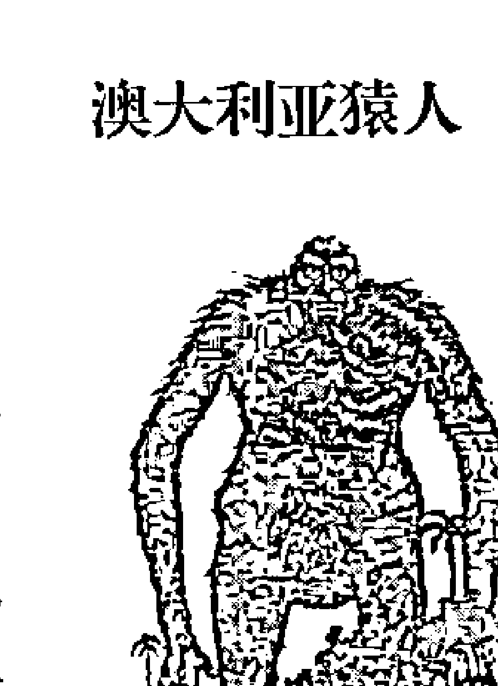

在澳大利亚有一种与雪人和大脚怪类似的毛猿，据称有 6 至 14 英尺高，长着宽阔的肩膀，但却没有脖子。通常被称作幽威野人 (Yowie)，它的背上长着长长的毛发，有深棕色或红色、黑色甚至白色的。黑棕色的和红色的最为常见。它留下的脚印有 16 英寸长、8 英寸宽。第一则来自欧洲定居者的报告能追溯至 1881 年，但当地的土著人却一直都知道它们的存在，称其为幽里 (Youree)。最开始的时候，欧洲人叫它们雅虎 (Yahoos)，这个名字来自乔纳森·斯威夫特的《格列佛游记》(1727年) 一书。最终，它的名字变成了幽威野人。

像世界上其它的毛猿一样，幽威据说也有很强的体臭。小一些的个体，可能尚未成年，非常怕人，而高大一些的就比较勇敢和有攻击性。实际上，它们二者的习性、体型和颜色都不尽相同，这让一些研究者认为它们可能是两个不同的物种——

## 图鉴三、怪兽的奥秘、传奇和历史

或至少是两种不同的性别。有些人甚至认为它们可能是存在于桑德兰上的直立猿人的遗族。

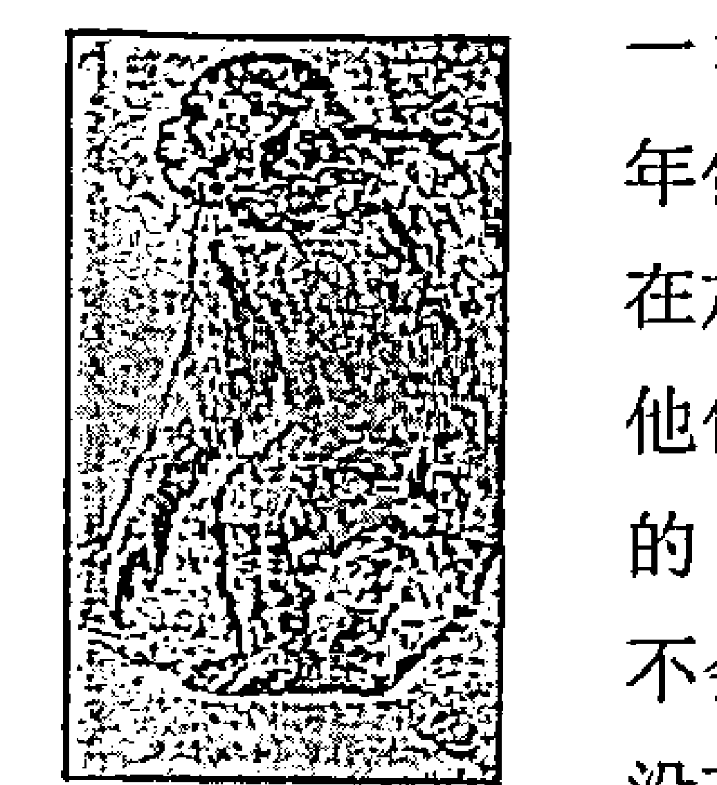

新西兰南岛上的毛利人传说一种骨瘦嶙峋手指的大型毛猿，他们称其为摩艾豪（Moehau）、摩尔罗尔罗（Moeroero）、马尔罗（Maero）。它们是远离人群的物种，但只要有机会就会绑架人类。住在山里的那些被称为摩尔罗尔罗，而住在内陆的则被叫做马尔罗。据说它们非常强壮而且很有攻击力，长相像长着长毛的人类，但体型稍小，长着长抓子，住在树林中以鸟类为食。自1840年代以来就一直都关于他们的目击报告。

### 非洲猿人

不，这里说的不是人猿泰山，而可能是关于领养他的曼加尼（Mangani），也叫大灰猿（Great Grey Ape）。很多人都认为这种生物是大猩猩，但《人猿泰山》系列丛书的作者埃德加·莱斯·柏洛兹却将二者清楚地区分开来，他将大猩猩称为波加尼（Bolgani）。因为在《人猿泰山》中没有提到黑猩猩（Chimpanzee），所以我一直将曼加尼当作黑猩猩，或甚至是最近才发现的比利猿（Bili Ape）。关于非洲猿人的目击报告应该从因基纳（Ingheena）开始——这是

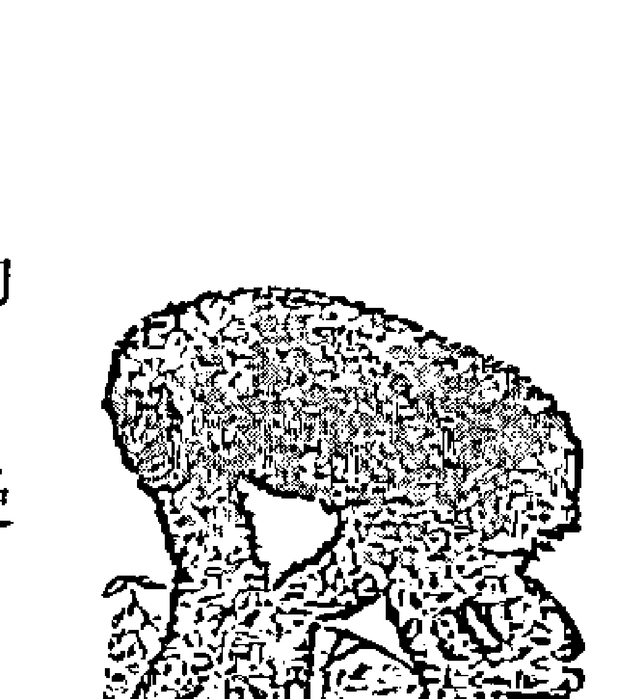

一种四肢动物（quadrumana），在1800年代末期被旅行家鲍迪奇夫妇（Bowditch）在加蓬河（Gaboon River）附近地区发现。他们并未亲眼见到它，而是听到当地人说的

> > “这些巨大的生物一直用后腿行走，从不会被活捉……它们一掌就能将人打死，没有什么比它们的愤怒更可怕的了。”

显然，它们是低地猩猩（Lowland Gorilla），它被当成神话的那个时代，人们还认为所有的大猿猴都属于猩猩。最终科学界花了相当长的一段时间，才确认了大猩猩和黑猩猩的存在，尽管在此之前有很多关于它们的报告。

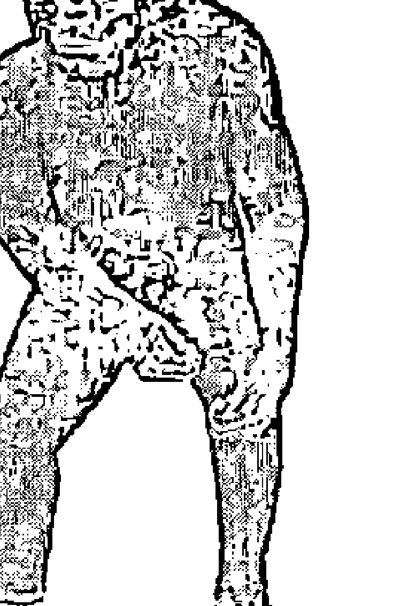

山地大猩猩（Mountain Gorilla）在1901年才被发现，而在1928年，美国解剖学家哈罗德·库里奇（Coolidge）在对一个存放在比利时特弗伦博物馆（Tervuren Musem）中的头骨进行检查后才鉴定为黑猩猩（Bonobo）确实存在，然而直到最近，它们都一直被称作倭黑猩猩，但没有学名。实际上，某些领域仍在激烈争论它们是否属于黑猩猩类（Common Chimpanzee）。倭黑猩猩因能够直立行走而与其它猿猴不同，“它们的社会属母系氏族，讲求平等，性活动在社会生活中占有很重要的地位。”它们被认为是与我们最亲近的灵长类动物。

2003年8月14日，美联社报道称，在非洲刚果共和国北部发现了一种可能是新的古人猿，名叫比利猿，它们直立的时候身高6英尺，其脚板有将近14英寸长，

## 魔法师的怪物图鉴

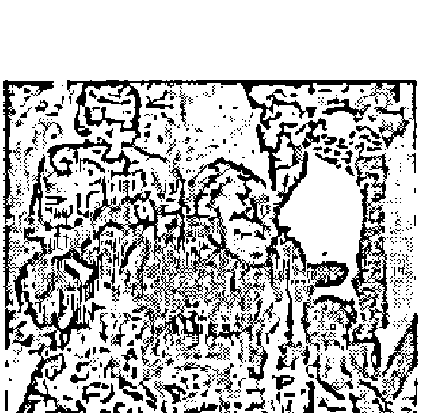

对它的第一次记录是在2002年，作者是灵长类动物学家谢立·威廉姆斯。根据一份《国家地理》杂志的报道，“这种猿猴像大猩猩一样在地面筑巢，但吃的东西和生活习性却与黑猩猩一样。”然而，对其无核DNA进行的初步检测却表明它与一种黑猩猩有血缘关系。
1992年11月，一名昆虫学家在西非的几内亚看到了一个全身长满黑色的长毛、用双腿行走、人猿一样的生物。当地土著人叫它法丁霍（Fating’ho），称其既不是黑猩猩也不是大猩猩。至今它还未得到科学证实。
在东非的坦桑尼亚也有类似的类人生物。它们被称作阿果格维（Agogwe）（在津巴布韦被称为卡坤大科里（Kakundakri），在象牙海岸被称为赦希特（Sehit）。对其第一次发现是在1900年代初期，发现这是一名叫威廉·希钦斯（Hitchens）的猎人，它在东非狩猎狮子的时候遇到了两只这种动物。1927年，卡斯伯特·伯戈因（Cuthbert Burgoyne）夫妇在葡属非洲的海岸边航行的时候清楚地看到了两个在狒狒群中慢慢行走，却没有惹恼狒狒的生物。但此后再也没有见过这种小型类人猿，它们可能已经灭绝了。
阿果歌维有奇特的特征且具攻击性，它们有3至4英尺高，用双脚行走，手很长，身上有又厚又乱的红色毛发。伯纳德·霍伊维尔曼认为它可能是南方古猿（Australopithecines）的遗族。

加那利群岛（源自拉丁文中的“Insularia Canaria”，“狗岛”）是由从摩洛哥到非洲西北海岸的七座火山岛组成的。据说在戈梅拉岛（La Gomera）上生活着一种毛茸茸的猿人，叫希尔怪（Hirguan）。可能它是一种与世隔绝的巴巴里猕猴（Barbary Macaque），那是一种像猿猴一样、没有尾巴的大猴子，被发现于阿尔及利亚和摩洛哥的阿特拉斯山脉（Atlas Mountains）以及（著名的）直布罗陀山（Rock of Gibraltar）。

### 南美猿猴

科学界至今都还没在西半球发现土生土长的猿猴。有趣的是，在《海洋与大陆》（Sea and Land）（1887）中，J.W. 比尔写道“伦德博士找到了巴西 猩猩（orang outan），将其命名为凯珀（Caypore），此名称来自那里土著人的传说。”
在19世纪初期，德国博物学家亚历山大·冯·洪堡在奥里诺科河（Orinoco）听说了一种全身长毛、像人一样、名叫萨尔维杰（Salvaje）（“野人”）的生物。据说它们会搭建帐篷，绑架女人，而且还吃人肉。所有在南美发现的类似猿猴的生物都被称为莫诺·格兰德（Mono Grande）（“大猴子”）。
1920年，瑞士地理学家弗朗索瓦·德·洛伊斯（François de Loys）在委内瑞拉的丛林中探险的时候，用枪打死了一只——或是一对——该种生物，并拍下了照片。1929年，乔治·蒙唐东（Montadon）博士将其命名为洛伊斯美洲类人猿（Ameranthropoides loysi）。它通常被称为德洛伊斯猿猴。对此持怀疑观

## 图鉴三、怪兽的奥秘、传奇和历史

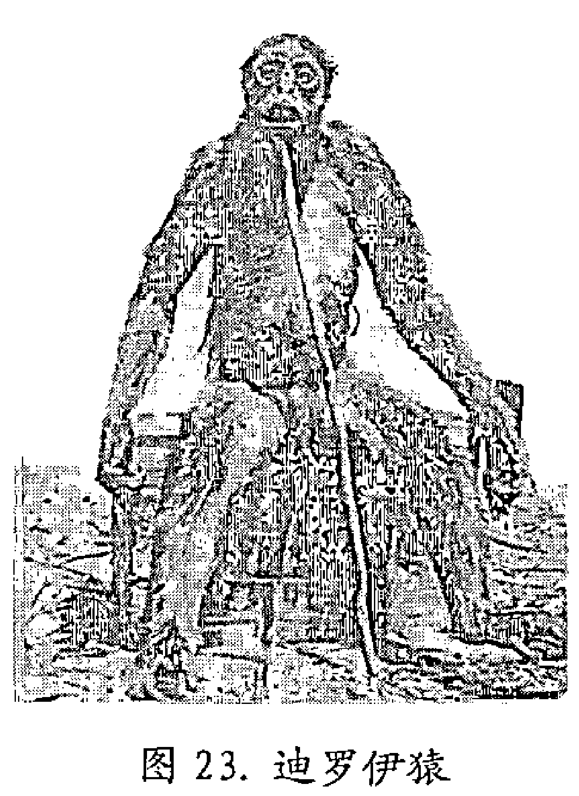

图 23. 迪罗伊猿

和沼泽地带。

臭猿（也叫南方大脚怪）——被发现于佛罗里达州的一种大型有毛类人猿，在 1970 年代至 1980 年代，有超过 100 起关于它们的目击事件发生。然而最早刊登出来的目击报告是在 1942 年的苏瓦尼郡（Suwannee County），目击者是一位男性，他声称这个生物坐在他的船上走了半英里。它们的出现伴随着一种类似于烂白菜的恶臭。目击者通常称它们有红棕色的毛发，但具体的毛色从黑色到白色不等。其白化的个体通常没有头发，鼻孔的大小有 50 美分的硬币那么大。它们有摇晃的、像猿猴一样、长有爪子的长手臂，还喜欢喷鼻子。留下的足迹表明它们有两个不同的种类：大一些的有三个趾头，并且具有攻击性，而小一些的有五个趾头，而且非常怕人，没有危险。它们的红色皮毛让一些研究者推测其为一些逃脱人类控制的猩猩。但它们有三个脚趾的脚印却让人对其身份产生了质疑。

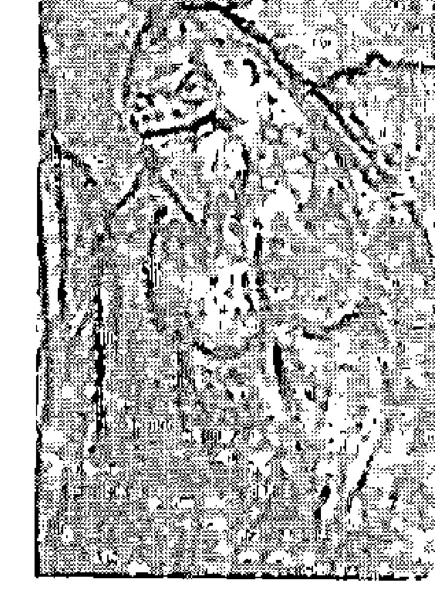

图 24. 臭鼬猿

点的人那张照片中的只不过是一只蜘蛛猴（Spider Monkey）而已，尽管这种猴的成年个体身高只有 20 英寸。但在最近，人们发现了一种史前蜘蛛吼猴（Howler-Spider Monkey）的化石残片，如果这种猴子还存在于世的话，洛伊斯抓到的就应该是它。

### 美洲类人猿

虽然似乎人们看到的未知猿猴有太多太多，但至少上文中提到的大多数都是实实在在的动物，而且，随着时间的推移，它们中会有更多会被正式地发现并分类。

但在将目光转向美国时，我们发现那里的目击报告显得非常离奇。20 世纪，在远离传说住着大脚怪或萨斯科其人的西北部的其它地区，关于一些相似但却截然不同的有毛类人猿的目击却在增多。为了将它们和其它的动物分开，研究者洛伦·科尔曼创造出了“Napes”一词——这是由北美猿猴（North American Apes）母缩写而成的。当地人给这些大型灵长类动物起了各种各样的名字，大多数的目击报告都发生在美国东南部和中西部地区的森林

### 标记原始人 (Marked Hominids)

——有毛的类人猿看起来与大脚怪类似，但其体型要小一些，也要更像人类一些。它们是臭烘烘的社会生物，住在冰锋的北方群山中的森林里。它们是强壮有力的生物，长着大眼睛

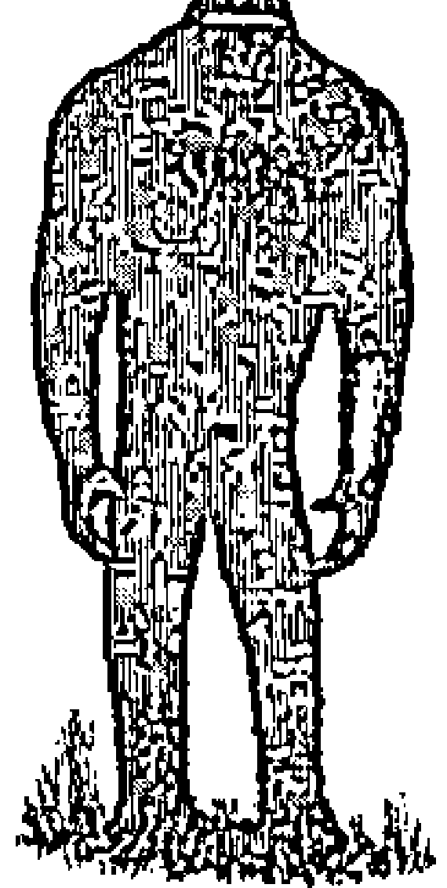

图 25. 标记原始人和大肚子，在夜间才出来活动，属杂食动物。其中一些，如老黄顶（Old Yellow Top），长着浅色的鬃毛，而其它的则在深色的皮毛上长着一片片的浅色毛发，还有一些看起来就像患上了白化病一样。

上个世纪在俄亥俄州被目击到数次的一种大型毛猿因其黄色的鬃毛而被称为老黄顶。然而，也有人传说它全身黑色，身高约7英尺。在1906年、1923年、1946年和1970年都有人目击到它，它常会造成客车翻车的事故。自1906年9月以来，在加拿大安大略省的一个钻矿附近，有人看到了同样的生物。它巨大的身体上覆盖着深色的长毛，但其头顶的毛发却是浅黄色的。它也被叫做老黄顶。

## 蜂蜜岛沼泽怪兽

一种7英尺高、大脚怪一样的生物，几个世纪以来都被传说居住在路易斯安那州新奥尔良附近的蜂蜜岛沼泽里。它身上覆盖着肮脏的灰毛，体重约在400至500磅之间。但最为让人记忆深刻的是其无精打采、分得很开的黄色眼睛，还有它散发出来的恐怖死亡臭气。印第安人称其为勒提切（Letiche），一种肉食性的水生类人猿，他们相信它曾是由鳄鱼养大的人类小孩。卡真人称其为洛浦·卡洛（Loup Carou）——与意为“狼人”的洛浦·卡洛类似。据说该地区数十年来的多起人类和家畜死亡事件都是由它造成的。

## 魔鬼猴

奇怪的、类似狒狒的生物，长着有力的袋鼠一样的腿，在美国中西部和远至阿拉斯加的地区都被发现过。甚至曾经有人在芝加哥城区看到过一只！它们似乎非常具有攻击性，会攻击人类，甚至搬动车辆。一些研究者推测它们可能是古代灵长类动物中一种名叫塔斯德斯（Tarsiids）和斯莫皮特库斯（Simopithecus）的遗族。

## 莫陌 (Momo) [密苏里怪兽 (Missouri Monster) 的简称]

一种大型、恶臭、有毛类人猿，据称住在密苏里州的边远地区。它身上毛发密得让人看不清脸。

## 墨菲斯伯勒泥怪 (Murphysboro Mud Monster)

一种会发出尖叫声、7英尺高、长着白色毛发、像猿猴一样的怪兽，在1972年5月25日，有超过200名目击者在伊利诺伊州中部的墨菲斯伯勒附近看到了它。

## 米亚卡猿人

一种毛猿，据说生活在佛罗里达州萨拉索塔（Sarasota）附近沼泽地中。它被描述为一种黑猩猩或大猩猩似的动物。

## 布爵

一种大型、猿猴似的生物，1960年秋天被人在亚拉巴马州克莱顿附近目击到。它发出的叫声像女人的尖叫一样，还在一条河边的沙地上留下了脚印。

## 伊尔·卡姆珀猿人 (El Campo)

2004年，德克萨斯州马塔戈达（Matagorda）伊尔·卡姆珀的居民们经历了一次奇异的遭遇，一名目击者称对方是一个5英尺高、全身灰色、像大猴子一样的生物。

福克怪——一种大型、有毛人猿，在阿肯色州米勒郡偏远的溪边被人发现，它当时正在攻击并最终杀死了一些动物。它脚印的石膏模型长 13.5 英寸。在 2003 年 10 月，阿肯色州西北部的目击者们看到了一个大型猿猴样的生物，他们将其比作佛罗里达的臭猿。

橙色眼睛——一种大型毛猿，自 1959 年以来，在俄亥俄州曼斯菲尔德外面的查尔斯·密尔水库（Charles Mill Reservior）一直有人目击到的一种奇异、没有手、水陆两栖、被称为密尔湖怪（参见第 30 章 “神秘怪兽”）的类人猿。橙色眼睛据估计有 11 英尺高，重达 1000 磅。最近的一次目击发生在 1991 年 6 月。

在墨西哥也有类似北美大脚怪的生物，它们被称为埃尔霍姆伯里埃尔欧索（El Hombre y el Oso）（“熊人”）。在从奇瓦瓦西部的沙漠到墨西哥湾的维拉克鲁斯的野地里，都有人见到过它们。

## 理论：怪兽、人类还是神话？

1978 年，在俄勒冈州的达尔斯的大脚怪研究中心（Bigfoot Research Center），我第一次见到了彼得·伯恩。我向他询问这些生物在动物学上被分入的类别，而他给我的答案在过去 30 年时间里一直指导着我前进的方向，尽管我并未始终坚持着那句话所说的方式，“理论”，彼得说，“是真正研究者最大的敌人。当你拥有了一个理论的时候，你就只能看到支持这个理论的证据，这样你就会错过或忽视其它的证据。所以，我尝试着抛弃理论，只追求证据。”

记住这句箴言，然后再来看看下面这几个在过去几年中被提出，而且受到极大推崇的理论——特别是将大型长毛类人猿统统当作大脚怪的那些。

### 恶作剧

不幸的是，有很多大脚怪都是恶作剧的产物，曾让很多科学家、调查员身败名裂。这些恶作剧有些是人类穿上大猩猩的衣服，到野外去拍摄的照片或影片，而那些脚印也是用大号的木头鞋子或真正的脚印石膏模做出来的。甚至还有人用大猩猩的皮包在用木头雕刻出来的怪物模型上来造假的。一些非常流行的照片和目击报告的原作者已经承认那是他们的恶作剧，他们只是制造出了一些东西，而其他的目击者才是保证其真实性的人。然而，恶作剧被揭穿的频率让人们开始严格对待得到的一切证据，这一点非常好。

这其中当然还包括了几个在嘉年华上展出的人造大脚怪的木乃伊尸体，最早的一个是明尼苏达雪人，桑德森和霍伊维尔曼在 1968 年对它进行了检查。比如那些被主持人其称为格弗斯的东西，它们都是由真正的标本家制作出来的，他们对自己的作品感到骄傲，而且对于愚弄了那么多的人感到高兴。

## 魔法师的怪物图鉴

### 逃亡者

尽管这个理论看起来不能被用在那些我们早先提到的身高 6 至 9 英尺、毛茸茸的两组动物身上，但很多持怀疑观点的人坚称目击报告一定是源自某种已知猿猴，比如红毛猩猩、大猩猩或黑猩猩——很可能是那些从动物园、马戏团或公园中逃走的。也许发生在美国的一些目击事件——比如米亚卡猿人与伊尔·卡姆珀猿人——能够证明了这一点，特别是在佛罗里达州和路易斯安那州的那些目击报告。当然，已知的猿猴能够解释大多数在亚洲、印度尼西亚和非洲的目击报告。

体重约有 1200 磅。它可能看起来与现代的大猩猩或红毛猩猩很像，但很多科学家都认为它们可能是用四肢走路的动物。而克朗茨却指出，那些稀少的腭骨呈现 U 字形，而且后部的开口很大——说明在它们的嘴里有气管，这样，它们的脑袋也可能是长在像人类一样能够完全直立起来的身体上的，而不像大猿猴那样是突出在身体前部的。伟大的猿猴雕刻家比尔·穆恩斯（Munns）正是用依照这种理论做出的这个模型（插图33）。

### 古生巨猿

大脚怪研究者格罗弗·克朗茨（Grover Krantz）（1931-2002 年）是本理论主要的支持者，他认为北美大脚怪——甚至喜马拉雅尼奥莫、德祖特雪人（Dzu-teh Yeti）——都是冰河世纪古猿的幸存者，据称它们生活在 500 万至 1000 万年前。迄今为止，人类只找到了这种聪明的灵长类动物的几颗牙齿和一些上腭骨，它们大多来自东南亚的洞穴里。它们有人类和猿猴的特征，但不幸的是，它们与现在那些存在的动物在体型上和站姿上几乎完全不同。而且，古生物学家估计一头成年巨猿的身高能超过 10 英尺，

### 傍人 (Paranthropoids)

在 1970 年代中期刚开始研究大脚怪现象时，我搬到了西北太平洋地区。我被关于大脚怪的照片、描述和图片与一种名叫罗百氏旁人 [Paranthropus robustus, 也叫：罗百氏南猿（Australopithecus robustur）和鲍氏南方古猿（Australopithecus boisei）] 的更新世原始人类（proto-human）之间的相似之处震惊了。这种类人猿生活在 200 万至 120 万年前的南非，它们几乎有被认为是人类祖先的非洲南方古猿（Australopithecus africanus）两倍那么大。其四肢的长度和其巨大骨盆的比例与人类或猿猴都极为不同。另一个重要的特征是在旁人属和大脚怪头骨上都长着矢状的头冠。 对于大脚怪，唯一一种我们能深入研究的特征就是它因其而得名的大脚印。就算是最粗心的人也无法忽视这些脚印中的一个特征：向前生长的大脚趾跟猿猴的一点也不一样，而是类似于人类的。在我们和大脚怪的脚印之间有足够多的不同之处能证明它们并非智人（Homo sapiens），但可能是傍人（“另一种人”）。

1971 年，隐生古人类学家戈登·斯特拉森博格（Strasenburgh）首先将西北太平洋地区的大脚怪命名为傍人。今天，人们广泛地接受了这个名字，这也是我所发现的最为有说服力的一点。

我们惯于认为人类是唯一一种人属生物，但事实并非如此，尽管我们总是忽略这一点。就像每种猿猴都有一些不同的亚种，早期的类人猿同样也有很多种。也许一些被我们认为已经灭绝了的亲戚仍然存在于广袤的北方森林中，只是我们还不知道而已。

### 失落的环节

自达尔文以来，每一个新发现的灵长类类人猿都会被主流媒体称作在现代人类和我们类人祖先之间的失落的一环。在目击到长毛的类人猿生物时，我们也很容易得出同样的结论，而且很多也的确被当成了我们存活至今的原始人祖先。从那些独特的类人脚印来看，这个结论是有理有据的，但其实它和古猿假说没什么差别。认为非洲类人猿与几种其它已知或未知的猿猴一起生活在它们的（或我们的）古老家园上，这也是极为可信的，因为有很多猿猴都是在最近一个世纪才被发现的。

南猿（ Australopithecus）是由伯纳德·霍伊维尔曼提出的一种已经确认了几种小型猿人，特别是 3 至 4 英寸高的非洲阿果格维（Agogwe），可能的竞争者。雷蒙德·达特在 1924 年发现，在 400 至 240 万年前的更新世的非洲居住着几种此种生物。著名的“露西”就是一名具有代表性的老年南方古猿阿法种。她说，后来的南方古猿阿法种身体更单薄、细长，据信是现代人类的直系祖先。

不幸的是，人类最后一次见到阿果格维是在 1927 年，就算它们真的活到了那个时候，它们也离灭绝不远了。在现代战争和偷猎的环境下，大猩猩和黑猩猩都快要变成濒危物种了，真是“巢倾卵破”。

第一组爪哇猿人（Pithecanthropus erectus）化石是 1891 年，由丹麦解剖学家尤金·杜伯瓦（Eugène Dubois）在印度尼西亚的爪哇发现的。1936 年，在该岛上又发现了第二个“爪哇人”的化石。它们在当时所发现的最早类人猿化石，很多人认为它们如达尔文在其进化论中所说的，是人类和猿猴之间失落的一环。最后，这些残骸验证了达尔文的理论。

1950 年代和 70 年代，在东非发现了同样的生物，这让人们开始对其重新进行分类，于是爪哇猿人被纳入了直立人（Homo erectus）的范畴内。它们成为了第一种在 200 万年前离开非洲的类人猿，当时正值更新世时期，较低的海平面露出了阿拉伯、印度和桑德兰（现在的印度尼西亚）的大陆架。它们还被认为是第一种能使用火的类人猿。有证据显示，在印度尼西亚全境内所目击到的神秘类人猿可能就是此类生物的幸存者。

### 尼安德特人

智人种尼安德塔尔亚种人（Homo sapiens neanderthalensis）现在被认为是曾经跟我们一样的物种——智人（sapiens）——但却是不同于我们的亚种。它们在13万年至2.4万年前生活在欧洲，基因中有99.5%与我们相同，但现代人类几乎没有它们身上的特征了。

它们因发明了衣服（用筋和骨针将晒干的兽皮连在一起做成的）而度过了大半个冰河时代而文明，尼安德特人曾被描述为体态笨重、全身长毛、凶猛残暴的人种——是现在人们所认为的典型“穴居人”。但很多最近的发现转换了它们的形象，它们是第一种被发现因长期缺少维生素D而患有严重关节炎和软骨病的物种。

世界级的尼安德特人专家麦拉·沙克利博士（Dr. Myra Shackley）认为蒙古的阿尔马斯和西伯利亚的乌楚纳安可能是尼安德特人在20世纪的遗族。在她写于1983年的《还活着吗？雪人，大脚怪和尼安德特人之谜》（Still Living? Yeti, Sasquatch and the Neanderthal Enigma）一书中，她列举出了对中世纪欧洲野人，也叫伍德沃思（Woodwoses）的分析。她顺着它们，一直延伸到了经典传说中的萨提尔（Satyrs）、羊怪法翁（Fauns）和西尔韦斯特斯（Silvestres）。但她却失望地总结道，它们完全是神话中的生物，并非古老的幸存者——这个假设在我看来完全是莫须有的。

### 霍比人

2003年，人们在印度尼西亚的佛洛雷斯岛上发现了7个小类人猿的亚化石残骸。它们的官方名称叫佛洛雷斯人（Homo floresiensis），但却立即被媒体冠以霍比人的名号，这个名字取自彼得·杰克逊的《指环王》系列电影。它们只有3、4英寸高，头骨只有葡萄柚那么大，似乎是直立人中的岛屿侏儒族。残骸旁的石头工具表明它们存在于1.8万至1.2万年前——当时在那个地区已经有了现代人类。有人认为它们是该岛上的某种特有动物，在1.2万年前的一次火山爆发中被灭绝。然而，16世纪到达佛洛雷斯岛的葡萄牙水手从当地人那里听说了一种矮小、全身长毛、不能说话、名叫依波高高（Ebu Gogo）的穴居生物。而一些研究者则猜测，苏门答腊的红毛猩猩可能就是幸存下来的佛洛雷斯人。

### 人猩（Humanzee）

它们也被称为 楚曼（Chuman）和曼潘兹（Manpanzee），是一种假想的人类/黑猩猩混血动物。黑猩猩和人类非常接近，有 95% 的共同 DNA 序列和 99% 的共同 DNA 码序列。在过去几年中有很多人都宣称自己进行了混合实验，甚至产出了凶猛的混血后代，其中最为著名的是名为“奥立弗”（Oliver）的一只。但在对那些试验品进行 DNA 检测后，发现它们都不是所谓的混血生物。奥立弗最后被证明为一只纯黑猩猩，只是毛发比较稀疏而已。

### 外星人？

这看起来很荒唐，但却是不容忽视的，特别是在美国的南部和中西部地区，有很多目击报告都是关于身材高大、全身长毛的类人猿的，它们身上有着《奇异时代》杂志上描述的一样的怪异特征。这些生物中，有些面部没有毛发，有些手上长着的不是手指而是长抓子，而其它的则留下了三个脚趾的脚印。还有很多并非以全貌出现在人们面前，似乎它们都只是全息影像，身体有一部分是不可见的一样。此类目击事件通常伴随着 UFO 的出现。我们确实无法将此种异类看作生物进化或自然历史中的巧合，所以我觉得我们还是不要这样以为的好。我认为，关于这种生物的目击报告只能被归入“X 文档”中。

### 怪物电影：毛猿

威利斯·奥布莱恩创作的《金刚》（1933 年）将这个巨型大猩猩介绍给了全世界。在它之后出现了很多的续集和模仿的作品，其中第一部就是奥布莱恩的《金刚之子》（Son of Kong）（1933 年），以及后来的《巨猩乔洋》（Mighty Joe Young）（1949 年）。《雪怪》（The Snow Creature）（1957 年）和《喜马拉雅山的雪人》（The Abominable Snowman of the Himalayas）（1957 年）都讲述的是雪人的故事，而它们也简短地出现在《劳博士的七张脸》（1964 年）中。《巨猩康加》（Konga）（1961 年）明显抄袭了《金刚》，此后又出现了一些继续描写金刚故事的作品：《金刚大战哥斯拉》（King Kong vs. Godzilla）（1962 年）、《金刚的逆袭》（King Kong Escapes）（1967 年）、《金刚岛》（Kong Island）（1968 年）。1976 年的《金刚》是对原作的翻拍，只是里面少了恐龙。大烂片《女金刚》（Queen Kong）（1976 年）和《猩猩王》（Mighty Peking Man）（1977 年）也是跟风之作。《火的探索》（Quest of Fire）（1981 年）讲述的是直立人与尼安德特人之间的竞争故事。《大金刚续集》（King Kong Lives）（1986 年）将大家都喜欢的大猩猩又带了回来。《大脚哈利》（Harry and the Hendersons）（1987 年）是一部家庭电影，主角是一头可爱的大脚怪，后来被翻拍成了 3 季共 72 集的电视情景剧。在它后面出现了《巨猩乔洋》（1998 年）的反派作品。《雪怪温迪戈》（2001 年）是一部传奇的加拿大恐怖电影。2005 年，彼得·杰克逊翻拍了《金刚》，里面的特效非常豪华，而在 DVD 版中附赠了一段描述金刚从巨猿（Gigantopithecus）降生的假纪录片。《失落世界的统治者》（King of the Lost World）（2005年）是一部关于巨型大猩猩之地的烂片。在《野人来袭》（Abominable）（2006年）中出了雪人，而在《摇滚之神》（Tenacious D in the Pick of Destiny）（2006年）里则出现了一个萨斯科其人。

## 现代谜团

### 27、恶魔犬

作者：亚瑟·“豹舞者”·迪克尔克

可是使这三个胆大包天的酒鬼毛骨悚然的既不是少女的尸体，也不是躺在她旁边的修果·巴斯克维尔的尸体，而是站在修果身旁撕扯着他喉咙的那个可怕的东西，一只既大又黑的畜生，样子象一只猎狗，可是谁也没见过这样大的猎狗。正当他们看着那家伙撕扯修果·巴斯克维尔的喉咙的时候，它把闪亮的眼睛和直流口涎的大嘴向他们转了过来。三个人一看就吓得大叫起来，赶忙拨转马头逃命去了，甚至在穿过沼地的时候还惊呼不已。据说其中的一个因为看到了那家伙当晚就吓死了，另外两个也落得个终身精神失常的结果。

> ——柯南·道尔
> 《巴斯克维尔猎犬》

黑色的狗在欧洲传说中被视为恶魔般的幻影狗，常出现于英格兰和苏格兰的民间传说中。它们也被称为地狱犬，据说体型很大，几乎跟牛犊一样（还有一些据称有马那么大），身上覆盖着厚厚的黑毛，长着发光的红色眼睛。尽管名字如此，但其实它们不只有图 1. 浮士德在他的实验室中遇到一只黑狗

黑色是一种颜色，也有人称自己看到过白色的、有斑点的、黄色的和棕色的。有时，尽管很罕见，也出现过长着两个或三个脑袋的冥府黑犬（Cerberean Black Dog）。地狱犬的牙齿通常被描述为要比一般的犬牙要长，而且，在很多人看来，它们似乎带着神秘的微笑，就像长得像狗的柴郡猫（Cheshire Cat）一样。黑狗可能是友好的，也可能是邪恶的，也可能两者都不是。

这些幻影通常出现在一些过渡地带——如偏僻的乡村小路，还有古老的驿道、桥梁、十字路，以及阴暗的入口处。一些地狱犬看守着宝藏或圣地。在大多数情况下，如果你不去招惹它们，黑狗是不会来打扰你的，但如果你试图攻击它们，你就会陷入麻烦之中。黑狗能造成非常恐怖的伤口，很多时候会令人丧命。实际上，在很多关于它们的传说中都提到，让迷路的旅行者保住性命的方法就是一旦看到有可能会攻击人的狗就立刻避开。黑狗也被认为和火有联系——因为它们身上都燃烧着火焰，而且会在碰触过的土地、木材或金属上留下烧焦的爪印。

## 不同的种类

黑狗的名字有很多：它们在苏格兰被称作卒西斯（Cu Sith），在威尔士又叫韦尔奇（Gwiyllgi），在马恩岛上的名字是毛特·多戈（Mauthe Dhoog），而在爱尔兰又是奎因·艾欧塔尔（Coinn Iotair）。其它的名字还有黑沙克（Black Shuck）、化犬魔（Barghest），奇都（Ki Du）、基特拉什（Gytrash）、大脚板（Padfoot）、啃骨怪（Rongeur d’Os）、塞得特（Saidhthe）、索科利克（Skriker）、苏赖赫（Suaraighe）和特拉施（Trash）。

下面是一些常见的黑狗的清单：

- 化犬魔[也叫犬魔 (Barguest)、巴韦斯特 (Barvest) 或博杰斯特 (Boguest)]，来自德语中的“Bahrgeist”“巴哈尔幽灵”]——英格兰和欧洲神话中的一种黑狗，有些巴哈尔幽灵像斗牛犬那么小，有些则像熊那么大。它们全身长着蓬松的黑毛，还有长长的獠牙、尖叫、尾巴和喷火的红色眼睛。它们在英格兰北部的约克郡、达勒姆郡和诺森伯兰郡被人看到过，只在夜间出现在几个固定的地方，如渔村和教堂墓地。有时它们也被描述为巨大的熊、无头的男人或女人，甚至是类似于爱丽丝故事中的白兔子。巴哈尔幽灵在身后拖着一条铁链，有时这条铁链是缠在它们身上的。碰到它们意味着遭难和厄运。

图 2. 化犬魔（山姆·伍德绘）

- 卒西斯(Cu Sith)[(盖尔语“狗妖精”，也叫齐尔西斯(Cir Sith)或册西斯(Ce Sith)] ——苏格兰高地上的一种恐怖的黑狗。卒西斯有牛那么大，身上长着深绿色的毛发。它的爪子比人手要大一些，其卷曲的长尾像马鞍一样放在背上。卒西斯的速度和风一样快，它会在夜间猎杀借宿在沼泽边的路人。奔跑时，它会发出马蹄声，还会留下马蹄印。在叫了三声之后，它才会擒下猎物。据说它们还会绑架哺乳期的母亲来为自己的狗崽喂奶。

- 费雷巴格(Freybug) ——中世纪时生活在英格兰乡间的一种恐怖黑狗。

- 加雷-特洛特(Galley-Trot)[也叫吉利特拉特(Gilitrutt)] ——根据英伦群岛的黑狗传说，加雷-特洛特生活在邓尼奇、伍德布里奇和萨福克郡的巴斯斯劳沼泽，骚扰夜行的路人。这种犍牛大小、毛茸茸的狗全身白色，而不是传统的黑色。

- 韦尔奇(Gwyllgi)(也叫黑暗之犬和命运黑犬) ——它是威尔士的大一些的典型英伦群岛黑狗。韦尔奇是一种喜欢在午夜出没在路人附近的巨大獒犬。它似乎很喜欢吓人，但除此之外也不会有太大的危害。

- 基特拉什(Gytrash)[也叫盖特拉什(Guytrash)、布拉什(Brash)、特拉施(Trash)] ——英格兰北部兰开夏郡和约克郡传说中的地狱犬。基特拉什的出现将带来死亡和灾难。它通常被描述为一只巨大的黑犬，身上长着蓬松的毛发，还有一对盘子大小、会发光的红眼睛。行走的时候，它有蹼的脚会发出水花喷溅的声音，喜欢在晚上的偏僻小路上吓唬路人。有时候它还会以幽灵马或驴子的样子出现。

- 吉拉特(Keelut) ——因纽特传说中的一种无毛英国黑狗。它出没于加拿大极地地区和阿拉斯加的偏僻地域，会跟在夜行路人后面伺机攻击。

- 毛特·多戈(Mauthe Dhoog)[也叫犬魔(Mauthe Doog)、黑犬(Moddey Dhoo)] ——一种幽灵黑狗，在 17 世纪时出没于马恩岛皮尔堡(Peel Castle)的走廊里和城墙上。据称，它是牛犊大小的西班牙猎犬，长着蓬松的毛发和锡盘大的眼睛。它会攻击看到的所有人并将其杀死，或让其发疯。1871 年，索德和马恩的西蒙主教(卒于 1247 年)的遗体被发掘出来，在它脚下人们发现了一具大狗的骨骼。难道那就是毛特·多戈的原型？

- 欧斯查尔特(Oschaert) ——一种长着火焰双眼的幽灵黑狗。它有时会变成高大的马儿，出没在比利时登德尔蒙德（Duendemonde）附近的哈默地区（Hamme），它已被当地的牧师驱逐了99年。它会跳到偏僻道路上路人的背上，路人每走一步它就变得更重一些，直到把人压趴。

- 大脚板 (Padfoot) ——长有发光红眼睛，出没在英格兰北部利兹沼泽的幽灵兽。它会变成巨大的绵羊、巨大的白狗甚至恐怖的黑驴的样子。在这种野兽靠近时，受害者会听到足球和铁链的声音或是它的吼声。跟其它地狱犬一样，人们对大脚板也该尽量敬而远之。

- 里索斯 (Rizos) ——一种现代希腊传说中长着大爪子的大黑狗。它出没于夜间的偏僻小路上，攻击路人。当被人碰到的时候它也会攻击人类，但大多数时候只会逃走。

- 啃骨怪 (Rongeur d' Os)（法语，“吃骨头的怪物”） ——法国北部诺曼底传说中的一种巨大黑狗。如同所有同类，它们也会攻击在偏僻道路上赶夜路的人。

- 苏赖赫 (Suaraighe)（“恶魔”） ——爱尔兰传说中的一种恐怖黑狗，是传说中在基督教传入之前的当地酋长克伦·都巴（Crom Dubh）的幽灵猎犬之一。

- 休尼 (Shony) ——康沃尔的一种能带来风暴的幽灵犬。

- 沙克狗 (Shuck Dog) [也叫沙克 (Shuck)、黑沙克 (Black Shuck)、老沙克 (Old Shuck)] ——英格兰东英格兰吉利传说中的一种恐怖黑犬。它的名字可能源于盎格鲁撒克逊语中的 “scucca”，意为“魔鬼”。沙克狗大概有驴子那么大，身上长着蓬松的黑毛，还有火红的双眼，但有人称其只在脑门上长有一只会发出绿色火花的眼睛。根据当地人所说，沙克狗（Shuck Dog）有好的也有坏的，很多都会在日落后在一些地区巡逻，只有在遭到挑衅时才会攻击人类。

- 索科利克 (Skriker) [也叫希力克 (Shriker)] ——夜间出没在英格兰兰开夏郡偏僻道路上的巨型黑狗。它长着会发光的红色大眼，会在森林中咆哮，会在夜间一直跟着孤独的路人，一路咆哮。

- 沙司·莱卡 (Sus Lika) ——极地阿拉斯加地区塔尼安那 (Taniana) 印第安人传说中的一种恐怖幽灵狗。它出没于山间小路上，行走在那里的人们可能会听到它的叫声，但从未有人见过它们。

- 瓦西拉 (Waheela) ——一种据说生活在阿拉斯加和加拿大西北部地区的狼形生物。它比一般的狼要大和重一些，长着宽阔的脑袋、大脚和长长的白毛。目击者称其肩高约有4英尺。它的后腿比前腿要短一些，而其脚印表明它的脚趾分得很开。它们是独居生物，从来不群体活动。根据当地人的传说，瓦西拉是一种恶灵，喜欢拧下受害者的脑袋。对它的描述与更新世的熊狗（bear dog）相吻合，这种动物估计在1万年前就灭绝了。

- 由迪克狗 (Youdic Dogs) ——法国西北部布列塔尼传说中的一种凶猛黑狗。它们住在由迪克沼泽中，与其它同类一样，会在夜间攻击偏僻道路上的行人。

## 地狱犬

> 黑狗、德里犬、沙克和卒，
加布里埃尔的猎犬在你身后追了一路。
惠斯特猎犬，安努恩的猎犬，化魔犬和格里姆，
看见一只黑狗，身材纤细。
黑狗、基特拉什、大脚板、奇都、奎因·艾欧塔尔追了你一路。
地狱犬、毛特·多戈、索科利克和格里姆，
看到一只黑狗，必走霉运。
——亚瑟·“豹舞者”·迪克尔克

关于游荡的地狱犬的传说有很多。传说中的不列颠黑狗负责抓捕并驱赶受到诅咒的灵魂进入地狱，也叫地下世界。死神是它们的主人。它们也被称作“加百利猎犬”(Gabriel Hound)或“狂野猎手”(Wild Hunt)。

威尔士人叫它们“Cwn Annwfn”(“地狱猎犬”)、“Cwn Mama”(“天母猎犬”)、“Cwn Wybr”(“天狗”)。它们是长着红色的耳朵和眼睛的巨大白色猎犬，跟随灰色的猎人安努恩(Arawn)一起将死人的灵魂赶入地下世界。它们在爱尔兰被叫做奎因·艾欧塔尔。

惠斯特猎犬(Whist Hound)(“whist”意为“怪诞的”，来自德文方言）是一群巨大的白色猎犬，它们长着火红色的眼睛和耳朵。在英格兰的达特穆尔和康沃尔有关于它们的传说。它们由猎人杜瓦(Dewar)，也叫角人(Horned Man)带领着。当风暴笼罩沼泽地之时，当地人就会说那是狂野猎人正在行动，搜寻人类的鲜血和未经洗礼的婴儿灵魂。看到它们的人都会生病，在几年之内就会死去。

恶魔的丹迪犬 (Devil’s Dandy Dog) 是一群英格兰康沃尔传说中的魔鬼般的黑犬。它们拥有喷火的眼睛和鼻息，捕杀活人和死人的灵魂。奎因・艾欧塔尔（Coinn Iotair）（盖尔语，“愤怒猎犬”）是一群爱尔兰传奇酋长克伦・都巴（Crom Dubh）的猎犬。

奇都（Ki Du）是布列塔尼传说中的一种地狱犬。它在亡灵前往来世（Otherworld）的途中陪伴他们，一直等到他们降生之后才离开。

希腊神话伊里布斯之门中，冥王哈迪斯的王国——地下世界——是由一只长着三个脑袋、一条龙尾、名为刻耳柏洛斯的黑狗看守着的。它允许人们进入，但不准任何人离开。他的头象征着过去、现在和将来。他能吃掉任何东西。最初的刻耳柏洛斯是提丰和厄喀德那的孩子，长着50至100个脑袋。在最后一项功绩中，赫拉克勒斯将刻耳柏洛斯拖出了哈迪斯的王国，凡是刻耳柏洛斯唾液粘到过的地方都会长出有毒的附子花（aconite）。后来诗人俄耳甫斯用里拉琴弹奏出音乐将它催眠。在罗马神话中，埃涅阿斯（Aeneas）和塞姬（Psyche）都用三个蜂蜜蛋糕（每个脑袋吃一个！）让刻耳柏洛斯平静了下来。它在《哈利・波特与凤凰令》中被刻画得活灵活现。

印度神话中的沙瓦玛（Sharama）是一头强大的狗，负责在每天开始的时候，将太阳神苏利耶的牛群赶出去吃草。它的后代莎拉梅亚斯是两头巨大、可怕、长有四只眼睛的猎犬，看守者通往由阎罗王（Yama）统治的阴间的大门。它们分别叫黑色斯亚玛（Syama）和斑点斯亚玛（Syama）。阎王派它们出去寻找死人，并将其带到他明亮的王国中，因此，死人的尸体成了对它们的酬劳。

北欧神话中的加姆（Garm 或 Garmr）是一只守护女神赫尔的死人国大门的嗜血四眼地狱犬。它守看守着格里帕（Gripa）洞，不准任何人离开。也许它就是沙瓦玛的第三个孩子！

最后到了索洛托（Xolotl），墨西哥阿兹特克印第安人神话中的一只巨大、凶猛的地狱犬，它在很多方面与北美的郊狼（Coyote）都很类似。它的腿脚是反方向生长的，耳朵能随意转动。每天夜里，它都会咬住太阳金球，将其拖到地狱里，直到第二天的早晨才将其放出。据说它创造了第一批人类，并教会他们用火，但也制造了很多的灾难。为了延长寿命，它会将自己变成其它动物，变来变去，最后成了蝾螈（Axolotl）。

## 历史

黑狗出现在英格兰英吉利附近的日期能追溯至维京时代。最早的一份目击报告出现自一份名叫《法兰克王国编年史》（Annales Franorum Regnum）的法文手稿中（约公元 865 年）。这份手稿记录了在一次礼拜中途，教堂被黑暗笼罩的事情。一只长着会发光的红色眼睛的巨型地狱犬出现了，在四处奔跑，就像在找某种东西（或某人！）一样，然后毫无征兆地就消失了。

1764 年到 1767 年间，法国东南部的乡村遭到了一头凶猛的狼形野兽的攻击。它被称为热沃当野兽（Beast of Gévaudan），据说杀死了超过 100 人和很多家畜，还把他们的内脏都拉了出来。它被描述为一种类似狼的生物，长着蓬松的毛发、长腿和会发光的眼睛。很多人相信它是一个狼人。在当地的猎人最终没能将其杀死之后，国王路易十五派出了军队。1767 年，它最终被让·查斯特尔（Jean Chastel）用两枚银子弹杀死。最后它被证实为一只从让的儿子安托万·查斯特尔的私人庄园中逃走的鬣狗（Striped Hyena）。

另一件历史奇物叫孙卡·华拉可因（Shunka Warak’ in），是一头据说生活在北美大平原上的巨大狼形野兽。它的名字在艾奥维（Ioway）印第安人的语言中意为“运狗（carries of dogs）”。一些隐生动物学家推测它可能是一头惧狼（Dire Wolf）或其它幸存下来的更新世捕食动物。在刚进入 20 世纪的时候，据说有人在蒙塔纳州射杀了一只这种生物。它后来被放到爱达荷州亨利湖的一家杂货店兼博物馆里展出，它的拥有者称其为“灵狼（Ringdocus）”（插图 12）。没人知道它现在在哪里，但它肯定是一只棕鬣狗（Brown Hyena）。

甚至在今天都仍然有关于黑狗的目击报告，其中大多数与其祖先比起来没那么可怕。它们在当今的媒体中也颇受欢迎。柯南·道尔的《巴斯克维尔猎犬》的原型就是达特穆尔的白色地狱犬。夏洛特·勃朗特在小说《简爱》中也加入了基特拉什（Gytrash）的戏份。即便是最近的 J.K. 罗琳也将黑狗作为其《哈利·波特》系列中的主角之一，只是将名字改成了西利亚斯·布莱克（Sirius Black），他是一名化兽师（animagus），其变化之后的样子就是一头毛发蓬松的黑狗，就连它的名字都是“黑狗”的意思。地狱犬同样也出现在其它地方，电影游戏赋予了它们生命，它们也是著名的角色扮演游戏中的反派。卒西斯（Cu Sith）、地狱犬和黑狗都作为敌人出现在《卡片召唤师》(Culdcept)、《魔界战记》Disgaea) 和《魔界战记 2》中，这三款游戏都是PS2平台上的。它们在著名的动画片和角色扮演游戏《口袋妖怪》中也有出现，扮演恶魔犬（Houndour）和地狱犬（Houndoom）的角色。

## 怪物电影：黑狗和地狱犬

《凶兆》（The Omen）（1976 年）。坏狗狗，坏狗狗！图片中罗特韦尔犬令人毛骨悚然的会发光的眼睛是那些来自地狱的猎犬的最主要的特征。《魔域仙踪》（The Neverending Story）（1984 年）中的大反派叫G莫克（G’mork），是一头巨大、黑色、会说话的狼形生物。它的任务是追踪并杀死年轻的英雄阿特予（Atreyu）。在《柳树》（Willow）（1988 年）中，邪恶的巴弗摩达（Bavmorda）女王的残忍地狱犬一直都在追逐着命中注定要成为合法女王的那位可爱小女孩。在日本传奇导演宫崎骏的动画片《幽灵公主》（Princess Mononoke）（1997 年）中就有一群狼神和它们的母亲，巨大的狼女神莫罗（Moro）。《狼族盟约》（Brotherhood of the Wolf）（2001 年）是一部内容丰富、制作精良的影片，讲述的是热沃当野兽的故事。《巴斯克维尔猎犬》（2002 年）改编自柯南·道尔经典的福尔摩斯故事。刻耳柏洛斯出现在《哈利·波特与魔法石》（2001 年）中，而在这部影片和《哈利·波特与阿兹卡班的囚徒》（2004 年）里也都出现了黑狗。无需多言，哈利·波特系列影片无愧为经典之作，而里面西利亚斯·布莱克（Sirius Black）化身为地狱犬的镜头尤为精彩！在《水中女妖》(Lady in the Water)(2006 年）中有一个叫“斯库兰特（scrunt）”的角色，它是一头恐怖的绿色狼形生物，它能依靠自己像草一样的毛发隐藏在草地中。

## 幽灵猫

作者：亚瑟・“豹舞者”・迪克尔克

在房间中央的一块阳光中，躺着一只巨大的生物，它像老虎那么大，但却黑如乌木。那是一头巨大而养尊处优的黑猫，它就像一只猫咪一样，躺在那里晒太阳。它如此优雅、如此强壮、如此凶猛，让我无法将目光移开。

“你不觉得它非常漂亮吗？”我的宿主激动地说道。

“太漂亮了！我从未见过如此高雅的生物。”

“有人叫它黑美洲狮，但其实它并非是一头美洲狮。这个家伙加上尾巴，身长将近11英尺。四年前它还只是一团小黑毛球，两只黄色的眼睛看着四周。我在尼格罗河源头的乡下买下了它。那里的人用长毛将它的母亲刺死了，因为她杀死了好几个人。”

——柯南・道尔《巴西大猫》（The Brazilian Cat）（1922年）

这些大猫被称作异形大猫（Alien Big Cat），简称“ABC”，它们通常被发现于奇怪或不寻常的地方。在美洲、欧洲、澳洲和很多其它地方都有人发现过这种大猫。幽灵猫可能是任何一种猫科动物，从最小的猞猁（lynx）到大一些的黑豹和狮子。但不像其它的隐生动物，它们（特别是英伦群岛、欧洲和北美的）通常都并非未知物种，而是出现在不寻常之地的普通大猫。关于它们的报道通常都被当作幻觉、媒体的错误报道或恶作剧。很多目击最后都被确认为从动物园、私人收藏者或马戏团中逃走的或遗失的猫科动物。

### 豹

根据《自然哲学》，豹是“一种大型猫科动物，毛色斑驳，是最为美丽和亲近人的一种。”它以其芳香的饱嗝而闻名于世（据说闻起来像多香果）。它在饱餐后会睡上三天，醒来的时候就会打嗝，吸引猎物前来。人们将其收集起来做成香水出售，这让人们误以为它就是会产出麝香的非洲麝猫（African Civet Cat）。豹是希腊神狄俄尼索斯最喜欢的坐骑，不会受它香气所影响。龙是其唯一的天敌。

豹一词并非单指一种，而是能代指所有的大猫——特别是黑色的那些，它们通常被称为黑豹，其中包括美洲狮、美洲豹和美洲虎，所以非洲狮被称为豹狮（Panthera leo），猎豹被称为金钱豹（Panthera pardus）。在纹章中，豹总是以被激怒或耳朵和口中喷着火焰的形象出现。有时它被描绘成普通的猫科动物，但在德国纹章中，它却长有四只长角、牛的耳朵和长长的火红舌头。

### 英伦诸岛

从1960年代至今，一直都有人在英格兰萨里（Surrey）目击到美洲狮。自1980年代开始，有很多人都在埃克斯穆尔（Exmoor）附近看到过豹子一样的生物，人们认为它可能是一头豹子或大狗。其他的目击者称其为一条黑豹。也有人在此地区看到过猞猁。

博德明野兽（Beast of Bodmin）是康沃尔郡博德明沼泽地区的一种幽灵猫，在那里曾发生目击和关于牲畜被杀的报道。后来，该地区所有的大猫都被称为博德明野兽。

在1980年，一些人在苏格兰坎尼希（Cannich）看到了一头美洲狮。人们给它起了个绰号叫“幸运”（Felicity）。1989年，有人在什罗普（Shropshire）撞死了一只丛林猫，1993年，有人在怀特岛（Isle of Wight）上射杀了一只豹子，而在2005年，有人在一处野生动物保护区看到了一只黑色美洲狮。看似确凿的证据再一次变得难以捉摸。2006年，不列颠大猫协会（British Big Cats Society）提交了一份报告，称在2004年4月至2005年6月间，在英国有超过2000起关于异形大猫的目击报告。

苏格兰高地上最为人所知的幽灵猫被称为凯西猫（Cait Sith），意为“猫妖精”。它是一种大型黑猫，有狗那么大，胸口长有一个白点，有时在它脸上也会有白色斑纹。

## 图鉴三、怪兽的奥秘、传奇和历史

凯西猫通常被认为是妖精或由巫师变化而来的。它常被描述为背部隆起，毛发竖立的样子，而这个形象也被广泛地用在万圣节中。现在人们认为凯西猫实际上是一种罕见的凯勒斯（Kellas）猫，它是野家猫（feral domestics）和苏格兰野猫之间的混血猫。这种猫的名字来自苏格兰莫里郡（Moray）的凯勒斯村。1984年，一位名叫罗尼·道格拉斯的猎场看守人射杀了一只这种猫，此后它们才正式被世人所知。它们全身黑色，大概有拉布拉多犬（也叫金毛犬）那么大。

凯西普拉格（Cath Pulag）是另一种猫妖精，来自威尔士和亚瑟王神话中。它的名字还有：查帕鲁（Chapalu）、凯西巴鲁格（Cath Balug）、卡帕鲁斯（Capalus）、凯西普拉克（Cath Pulac）和凯西巴尔韦格（Cath Balwg）。这种幽灵猫的胃口很大，捕食猫和人类，后来被凯爵士（Sir Kay）即亚瑟王所杀。它的身上有斑点，还长着一幅巨大的爪子。人们认为这种猫最早是由一位威尔士国王带到安格西岛（Anglesey）的。

苏格兰高地上的另一种凶猛大猫叫大耳（Big Ears），是猫中之王。大耳比凯西猫要更大而且更凶猛。据说猫中之王能被精神回声（Taghairm）的嗜血仪式召唤出来，在该仪式上，人们会将猫杀死后烤食，直到大耳出现，满足大家的愿望。

大耳可能是凯勒斯猫。但在最近在当地，又有人看到了另外一种苏格兰野猫，它们的耳朵比一般的要大。尽管曾有人杀死过它们，但却从未将尸体进行过科学研究。出现此类状况的还有杜夫东猫（Dufftown cat）。人们认为它可能是一种原始猫，除了耳朵要大一些外，它的毛色和体型与凯勒斯猫差不多。

爱尔兰传说中有一种体型像牛一样大的凶猛大猫，名叫艾路撒恩（Írusán）（“猫中之王”）。它住在诺斯（Knowth）的一个山洞里。它的耳朵非常灵敏，在洞中听到了一个诗人正在朗诵一首讽刺猫的诗，它跳了出来，像那个诗人发起了猛烈的攻击，后来将其拖走了。

## 欧洲

1982年，有看到了一只像野火一样在日德兰半岛（Jutland）上狂奔。后来，在1992年，又有人在丹麦看到了一头狮子一样的野兽，它们给它起了个名字，叫菲英岛野兽（Beast of Funen）。而在1970年代和1980年代的德国有人看到了一头美洲狮般的生物。自1920年以来，人们有几次都在法国的乡间看到了美洲豹和美洲狮。1893年，一头名叫俄罗斯神秘猫（Russian Mystery Cat）的豹子一样的生物据说造成了一系列的伤害。报道称其大小跟狼差不多，有直直的嘴巴、圆圆的耳朵和长长的尾巴。是颜色有变化的已知物种。但也有据称是全黑的山猫和猞猁，如所谓的奥扎克吼猫（Ozark Black Howler）。

## 北美洲

整个北美洲都有关于幽灵猫的报告，据说它们长着有尾缀的尾巴和黑色的鬃毛。有证据表明它们可能是逃走或遗失的非洲狮，也可能是冰河世纪生活在北美洲的美洲拟狮（Panthera Atrox）的遗族。

在1800世纪末期，在北卡罗莱纳州发现了一种名为桑特（Santer）的野兽。这种异形大猫据称从鼻子到尾巴都长着条纹，体型跟一只牧羊犬差不多大。到了1900年，关于它们的目击报道中断了，所以它们很可能已经灭绝。2004年在佐治亚州有人发现了一种神秘的猫科动物，它像家猫一样大，脸蛋像野猫，长有一根长尾（而山猫的尾巴却很短）。佐治亚异形大猫据称有2英尺高、4英尺长，曾有人拍到过它们的影像，但其真实性至今仍然尚未被证实。

在阿拉斯加州和北美的其它地区都有人发现过蓝猞猁和蓝山猫，但它们都只是颜色有变化的已知物种。但也有据称是全黑的山猫和猞猁，如所谓的奥扎克吼猫（Ozark Black Howler）。

也许夏威夷是异形大猫出现过的最为不同寻常的地方。自1980年代以来，在夏威夷就出现过很多关于大型神秘猫科动物的目击报道。最近的一次发生在2002年12月，是由大猫专家威廉·凡·培尔特（Pelt）和斯坦·康宁汉姆发现的。它被叫做库那大猫（Kuna Big Cat），它躲过了所有的围捕和陷阱，甚至连红外线摄像机都捕捉不到它。2003年有人得到了它的一些毛发，但对其进行的DNA测试却未获得任何结论。从描述来分析，它可能是一种美洲豹或美洲虎。

瓦姆帕斯（Wampus）猫是阿巴拉契亚山传说中的一种生物。根据传说，一位切罗基（Cherokee）妇女钻入一头山地狮的皮毛中将自己伪装成狮子，以在男人们围坐在火堆旁讲恐怖故事的时候监视他们的一举一动。当发现了她之后，巫师将其变为一头半女人半猫的生物以示惩罚，她仍在田纳西州东部的森林中生活着。

## 拉丁美洲

中美洲和南美洲都有很多关于神秘猫科动物的传说。其中最为著名的要数翁扎（Onza），它是一头细长的、美洲狮和猎豹般的猫科动物。最近的基因分析表明，翁扎实际上是一头变异了的北美美洲狮。早期关于它的目击报告可能来自另一种名叫美洲山猫（Jaguarundi）的已知猫科动物。

柯南·道尔1922年的短篇故事《巴西大猫》中的黑豹在1648年首次被亚马逊探险者乔治·马克格雷夫（Marcgrave）提到。他称其全身黝黑有光泽，身上有11个深色的斑点。在圭亚那，这种生物被称为伊尔·提戈里·内格里（El Tigre Negri）“黑虎”。在1770年代，布丰将其叫做孔加尔·诺尔（Congar Noire）（“黑色美洲狮”）。1775年，德国博物学家约翰·克里斯蒂安·丹尼尔·史赫伯（Schreber）将其学名命名为变色猫属（Felis discolor）。但因为从未抓到过它，最终人们将其从动物界中除名。帕西·福塞特（Percy Fawcet）少将在巴西和玻利维亚边境上看到了一只这种动物，后来他将这个故事告诉了柯南·道尔。

在秘鲁也有一些神秘的大猫。最有名的叫亚纳美洲狮（Yana Puma）[盖丘亚语（Quechua）中的“黑色山地狮”]。根据彼得·J. 霍金博士搜集的当地人对它的描述来看，它全身黑色、长着绿色大眼、身体比美洲虎大两倍，据说住在高海拔地区，是夜行捕食者，会吃掉睡梦中的人的脑袋。可能它跟柯南·道尔的巴西大猫是一种生物。

秘鲁的斑点虎（Speckled Tiger）体型跟美洲虎异常，但其脑袋却比美洲虎的大。据说它全身灰色，身上有黑色斑点。秘鲁的条纹虎（Striped Tiger）与它的外形差不多，但身上长着的不是斑点，而是条纹。它们二者都可能是颜色变异了的普通美洲虎。而秘鲁的丛林狮（Jungle Lion）也被认为是颜色异常的普通美洲虎。

寇阿（Ccoa）是秘鲁盖丘亚传说中的另一种像猫的怪兽。它全身灰色，长着横向的条纹，还有一个很大的脑袋和会发光的火红色大眼。它能制造具有毁灭作用的风暴和粮食减产，人类在栽种粮食时需要向其进贡。它的名字也被用作美洲狮俱乐部（Cougar Club of America）的缩写。

瑟梅尔的神秘猫（Seimal’s Mystery Cat）是一种体态巨大的猫科动物，全身淡棕色，长着斑点或背纹。它被认为是一种保留着幼年时期体色的美洲狮。也有人认为它是一种美洲狮/美洲虎的混血儿。那它能被叫做美洲狮虎（Juma）吗？

沙沙-亚瓦（Shiashia-Yawa）是厄瓜多尔土著人传说中的一种黑斑白猫。它有一名亲戚，叫帕玛-亚瓦（Pama-Yawa），它是一种灰猫，以貘（tapir）为食。尽管沙沙-亚瓦比一般的美洲虎要小，而帕玛要大一些，但它们二者都被认为是美洲虎的变种。

剑齿虎（saber-tooth）在厄瓜多尔、哥伦比亚和巴拉圭的山上都有被发现过，1975年，有人在那里杀死了一头有12英寸长獠牙的美洲虎。动物学家胡安·阿卡瓦（Acavar）对它进行了检查，认为它其实是一头一般剑齿虎（Smilodon populator），该种生物被认为在一万年前已经灭绝。

## 非洲

非洲也有很多神秘的猫科动物，很多都具有多种生物的特征。至今为止已有多个自然发生的豹子/狮子杂交案例。卢旺达的伊奇米兹全身灰色，长有深色的斑点和胡子。埃塞俄比亚的阿巴萨姆博（Abasambo）和喀麦隆的邦布林（Bung Bring）长相相似。中非的基坦加（Kitanga）和巴坦加（Batanga）是豹子/狮子的杂交后代，全身泛红，还长有斑点。基坦加长有鬃毛，巴坦加鬃毛较稀疏或根本没有鬃毛。

有人在东非肯尼亚的山地森林中看到过斑点狮 [（Marozi）肯尼亚语“斑狮”]。第一次目击是在1903年，被西方人所发现。它们的毛色比一般狮子要深一些，身上有像豹子一样的斑点。1931年，农夫迈克尔·特伦特（Trent）杀死了两只三岁大的斑狮，它们的照片在隐生动物学界广为流传。根据这些照片，伯纳德·霍伊维尔曼将其学名命名为“Panthera leomaculatus”。但是，直到现在，没人在野外活着见过它们，而大多数的调查者则相信它们是一种豹子/狮子的杂交后代，比如下面相片中的这只。

坦桑尼亚的曼戈瓦（Mngwa）[“奇怪的”，也叫楠达（Nunda）]有着悠久的历史，能回溯至1000年前或更久的过去。它非常大，体型和驴子差不多，身上有灰色的虎斑纹，有时据说长有獠牙。这种大猫非常不同寻常，据说它会像小猫那样咕咕叫。英国人在1900年代首次遇到了这种猫。帕特里克·鲍文是一名猎人，曾经追踪过曼戈瓦，他注意到这种野兽的脚印与猎豹的相差无几，只是要稍大些。它身上同样长有斑纹，但与猎豹的不尽相同。人们相信它是一种尚未被发现的非洲兰虎，也可能是一种变异了的非洲金猫（African Golden Cat）。从1922年直至1930年代，据说曼戈瓦造成了多起伤害和伤亡事件，受害人中包括一位大猫专家，他称其既不是猎豹，也不是狮子。

多年以来一直都有人目击到猎豹/美洲豹的杂交后代——它们有着猎豹的特征，但却长着云豹（Clouded Leopard）的条纹和花纹。它们现在被归为猎豹的一种自然变种，获得了王猎豹（King Cheetah）的称号。

哈德杰尔(Hadjel)、瓦叟克(Vassoko)和提格雷蒙太奇(Tigre de Montage)(“山地虎”)据称长有红色皮毛、白色条纹、鬃毛、短尾或无尾、腿上长有长针毛(guard hair)和剑齿。乍得的土著人称其就是曾经生活在那里的短剑齿虎(Machairodus)。

南非格雷厄姆斯敦神秘大猫（Grahamstown Mystery Cat）在1880年代末曾横行于该地区。人们射杀过两头这种大猫，对其的检查显示它们是一种黄褐色的猫科动物，身上有一些玫瑰花一样的斑纹，在其白色的肚子和豹子一样的脸上有一些斑点。后来，它们被划入假黑变病豹（pseudomelanistic leopard）。在马达加斯加有关于名为马尔加什狮（Malagasy Lion）的狮子的报道，但它们似乎只是被早期定居者带到那里后，逃逸或被遗弃的非洲狮。

## 中国和东南亚

马来西亚的海利毛杰勒（Hairimau Jalor）是一种老虎，当地人称其身上长着横向的条纹，而非一般老虎那样的竖状条纹。在当地还有关于符合已灭绝的巴厘虎的目击报告，这让一些人相信海利毛杰勒就是巴厘虎的遗族。

苏门答腊的吡高是一种神秘的大猫，它全身浅棕色，长着短尾巴和前肢较长的四肢，脖子上还有皱褶。它比苏门答腊虎要矮胖一些，被认为拥有很强的游泳能力。这种神秘的大猫非常具有攻击性。

中国野猫薄荷叶豹（Mint Leaf Leopard）曾被认为是云豹。而日本传说中有一种巨大、恐怖的幽灵猫，它住在奥基岛（Oki island），每年都要吃一名献祭的少女，后来被一名武士消灭。

天虎是越南安南（Annamite）神话中的四位主要守护者和统治者之一。兰虎统治东方、夏季和土，红虎（有人在印度东部的桑德班斯目击到过）统治南方、夏季和火；白虎（现在通常出现在动物园中）统治西方、秋季和金；而黑虎统治北方、冬季和水。它们中只有兰虎是有记录的真正的老虎。但1910年，在中国的福建省，美国传教士哈利·R. 考德威尔遇见了“一头深蓝色和马耳他（Maltese）老虎。”

## 大洋洲

雅里（Yarri），也叫昆士兰虎，曾在1960年代的昆士兰被人目击到过。这种长有条纹的大猫有当地特产的澳洲野犬（Dingo）那么大，只是身上长有条纹，四肢更短，耳朵像猞猁。它也会爬树。当被激怒时，它会摆动尾巴，就像一般的猫咪那样。在1700年代的澳大利亚有人就看到过老虎一样的生物，而在澳洲土著壁画中也记录着此类野兽，其年代更为久远。这种神秘的大猫有一头快成年的老虎那么大，长着长尾巴，全身都有条纹。对它的描述与已灭绝的袋狼（Thylacine）相吻合，只是脑袋更像猫一些。

新南威尔士的埃马维尔豹（Emmaville Panther）据称是一种大型、黑色、豹子一样的生物。据报道，1966年有一只黑豹从地区的一个马戏团里跑了出来。

澳大利亚的幽灵猫大体上都是二战时，由空军带来，并将其放生的美洲狮和其它大猫。但人们对此并未达成一致的看法，但由它们杀死的受害者的喉部都被刺穿，而且内脏都被吃得一干二净，这和一般大猫的做法一模一样。在新西兰，幽灵猫通常都被描述为黑豹，但就像其它很多类似的案件一样，它们的真实身份仍然未知。

## 杂交生物

已知的41种猫科动物被分成了两个大家族，分别是小型猫科动物和大型（或巨型）猫科动物。小型猫科动物体重通常低于55磅，能够像家猫一样咕咕叫。它们的幼崽被称为猫仔（kitten）。已知的8种大型猫科动物（狮子、老虎、豹子、雪豹、云豹、美洲虎、猎豹和美洲狮）的体重都超过了100磅，其成年雄性能重达270磅。它们不会咕咕叫，但能发出吼声，比如狮子。而它们的幼崽被称为幼兽（cub）。

杂交在小型猫科动物的可能性是很高的，但在大型猫科动物间也有此类事件发生，在人类的控制下诞生出了一些非常不同寻常的后代，而在自然条件下，它们同样也可能发生此种行为，这可能就造成了一些关于超常生物的目击案例。下面是一些极具戏剧性的例子：

-   **狮虎兽**——雄狮与雌虎之间的巨型后代，体重达1000磅，站立时身高有12英尺，至今为止，是地球上最大的猫科动物。它全身黄褐色，有从母亲那里遗传而来的条纹和从父亲那里遗传来的斑点。雄性长有狮子的鬃毛。
-   **虎狮兽**——雄虎与雌狮之间极为罕见的杂交后代。因为要让这些凶猛的对手在一起交配几乎是不可能的，所以世界上只有为数不多的几只这种野兽，而且都归私人收藏者所有。它们比更为常见的狮虎兽要小一些，但外形却差不多，虎狮兽长着桔黄色的皮毛，有些有条纹，有些则是斑点。雄性长着中等长度的鬃毛。它们的吼声像其父母的声音混合之后的样子。与绝大多数的杂交后代一样，它们的寿命也很短。
-   **豹狮兽**——雌狮与雄豹的后代。它们生活在日本和意大利的动物园中，体型与力量跟狮子相仿，还拥有豹子的爬树能力。雄性有稀疏的鬃毛。有人认为它们在野外可能会被误认为是传说中的刚果斑狮（Congolese Spotted Lion），也叫斑点狮。
-   **美洲虎豹（Jagleop，也叫 Jagulep）**——雄美洲豹和雌花豹的后代。1900年代初期出生在芝加哥动物园。这只身上有斑点的雌性动物后来与一头雄狮交配，产出了颇有争议的狮虎豹（Lijagleop）。

下面是一则引人入胜的历史注脚：

**帕德豹（Pard）（也叫 Pardal、Pardus、Pantheon）**——这种猫科动物被作为“一种杂色、非常敏捷、强壮、嗜血、一跃就能杀死对手的物种。”记载在《自然哲学》一书中它“不贞地”与狮子结合，产下了花豹。狮子的学名（Panthera leo）和花豹学名（Panthera pardus）非常清楚地表明在中世纪被称为帕德豹的东西就是现在的花豹，而那些被称为“leopard”的动物则是现在的猎豹，因为猎豹拥有像花豹一样的斑点和稀疏的、狮子一样的鬃毛。同样，猎豹以小型团体为单位进行活动，不同于骄傲的狮子和孤僻的花豹。所以，人们认为这种大猫是一种狮子（leo）和豹子（pard）的杂交后代，因此被称为“leopard”。最终，“pard”一词消失了，“leopard”被用在了曾经被叫做“Pard”的动物的身上，而以前被称为猎豹的动物则被改名为“cheetah”。

## 怪物电影：幽灵猫

作者：赛斯·泰森（Seth Tyrssen）

《猫人》（Cat People）（1942年），虽然片中没有变成猫的人类，但这是一部具有极强暗示性的心理恐怖片，其后续作品《猫人的诅咒》（Curse of the Cat People）（1944年）也继承了这个特点，贯穿该片的宿命氛围和优秀的剧本使其增色不少。《猫精灵》（The Cat Creature）（1973年）是一部笔者没有看过的影片。喜欢凶猛大猫的观众不能错过《辛巴达穿破猛虎眼》（Sinbad and the Eye of the Tiger）（1977年）。在《火之战》（Quest for Fire）（1981年）中有一些非常逼真的史前穴居狮，它们将直立人英雄逼得走投无路。《猫人》（Cat People）（1982年）是一部比原作更为惊悚的影片：里面的娜塔莎·金斯基（Natassja Kinski）变成了一个猫人，影片讲述的故事也更加真实、深邃，而且## 魔法师的怪物图鉴

结局也更加悲伤，大卫·鲍伊（David Bowie）为其创作的音乐加强了剧终时的感觉。《剑齿虎》（Sabretooth）（2002年）是没有情节的、肥皂剧般的烂片，里面几乎没有亮点，只有影片的标题动画做得还不错。笔者没有看过《史前剑齿》（Attack of the Sabretooth）（2005年）和《最终幻想——圣子降临》（2007年）。

### 29、好奇猫

作者：亚瑟·“豹舞者”·迪克尔克

这只猫背上长着两条附加物，不禁让看到它的人联想到一只尚未长出羽毛的雏鸡的翅膀。它的这一对附加物并不是软软地耷拉在身上，而是像一只长在起飞的鸟的翅膀那样举着。它们是在这只猫几周大之后才出现在它身上的。
——H. C. 布鲁克

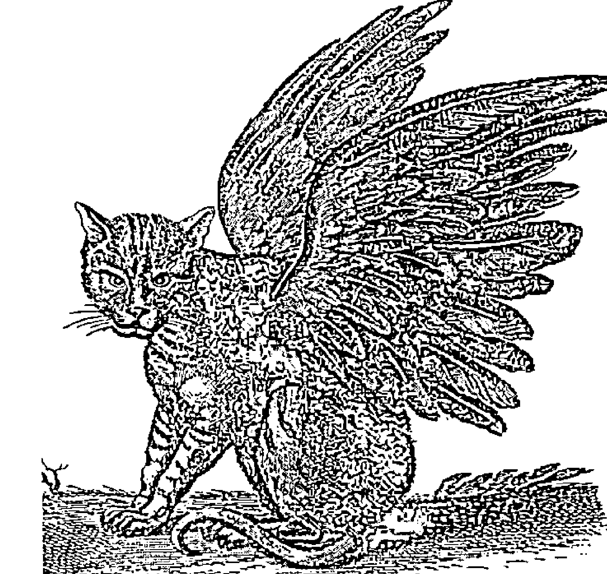

马特乌斯·梅里安

历史上，关于翼猫的报告超过了 100 起，有些正好发生在当代。其中至少有 20 起报告被记录了下来，而且还有实物和照片为证。数百年来，人类不仅遇见过翼猫，而且碰上了猫兔（半猫半兔）、松猫（半松鼠半猫）、袋猫（半袋鼠半猫）和浣猫（半浣熊半猫）很多时候它们都是人类想象的产物，而其它时候则是对一些物种的误解，如隐生动物中的猫的怪胎就是一种源自真实世界的生物。在大多数情况下，人们都只知道它们稀有的基因或独特的外表，但并不知道它们的生活习性也很特殊。

## 翼猫

翼猫是一些长着翅膀的家猫，它们的翅膀长度从数英寸到超过一英尺不等。大多数的翼猫都不能飞，但也有一两个据说能飞的。

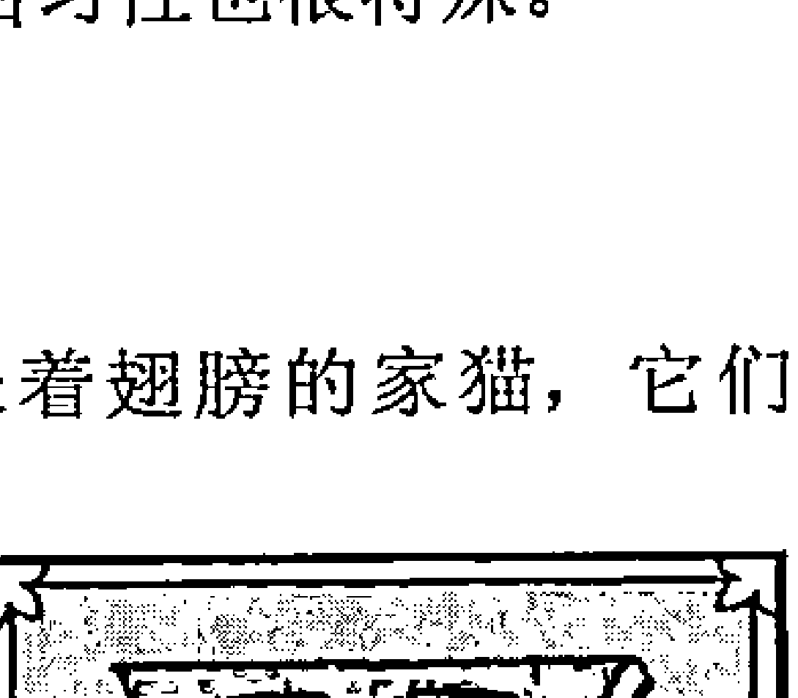

## 魔法师的怪物图鉴

最早的翼猫之一是作家亨利·大卫·梭罗（Thoreau）在《瓦尔登湖》中描写的那只：

> 几年前我住在林肯的树林里，在吉利恩·贝克先生家旁一个水塘边的一间农房中据说有一只“翼猫”。我在6月去拜访它的时候被告知它到树林中去打猎去了，这是它的习惯……但它的女主人告诉我它是在去年四月才来到这附近的，后来被他们所收养。它全身深棕灰色，喉咙处有一块白斑，四肢是白色的，有一条像狐狸的蓬松的尾巴。在冬天的时候，它的毛会变得很厚，形成一条条10至12英寸长、5至6英寸宽的条纹，摊在身体的两侧和下巴下，就像一个皮手笼（muff）一样，上面很松，下面的则缠在一起，像毛毡一样，在冬天的时候，这些东西会脱落。他们给了我一对它的“翅膀”，我将其保存至今。它们上面并没有附着膜状物。有人认为它可能是一种鼯鼠（flying squirrel）或其它野生动物，这并非不可能，因为确实有很多关于家猫与貂鼠（marten）结合并产下后代的事件。如果可能的话，我真的很想养这种猫。因为诗人的猫为何不能像他的马一样长着翅膀呢？

1868年，印度有一则报道称A·吉布森先生射杀了一只被当地人称为潘卡比（pankha billi），意为“翼猫”的生物。1894年从英格兰又传来了消息，称有人发现了一只长着鸭子翅膀的猫，它的主人带着它到处展出赚钱。这只猫只在被激怒后才会打开翅膀，后来不久它就被偷了，但事情的真相更可能是，这只猫褪掉了翅膀，变成了一只普通的猫。三年后又有另一则关于英国翼猫的报道。据称它是一只颜色黄褐黑白相间的公猫，长着野鸡一样的翅膀。这则之所以如此独特，还因为一般情况下，黄褐黑白相间的家猫都是母猫。1899年，伦敦的《岸边杂志》（Strand Magazine）刊登了一张翼猫照片和一则报道，这只翼猫属于一位住在英格兰萨摩赛特（Somerset）威弗利斯科姆（Wiveliscombe）的女士。在照片中，这只猫的背上长着一对毛茸茸的突起物，它们在小猫奔跑的时候会上下抖动，但并不能用作飞行。

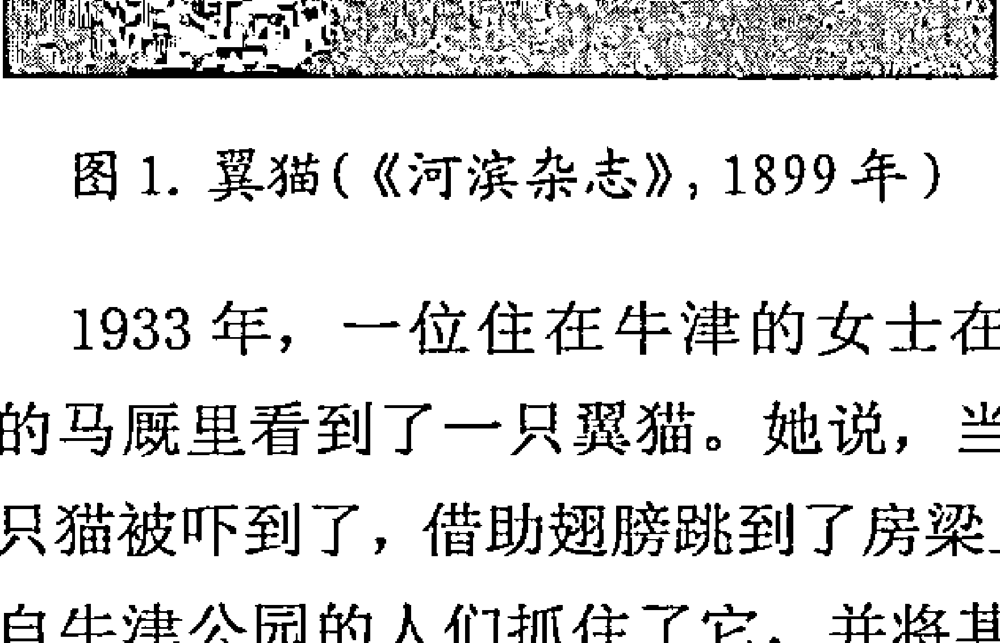

1933年，一位住在牛津的女士在自己的马厩里看到了一只翼猫。她说，当时这只猫被吓到了，借助翅膀跳到了房梁上。来自牛津公园的人们抓住了它，并将其展出了一段时间。它的翅膀有大概6英寸长。三年后有人在苏格兰看到了一只长毛白色翼猫，它一只眼睛是蓝色的，另一只是红色的。它的翅膀据说有6英寸长，在奔跑时能举起来，在休息时则平放在体侧。很显然，这只猫并不能控制自己的翅膀，而先前的那些猫中有一些能将自己的翅膀稍微地展开一些。

1939年，英格兰出现了一只黑白相间的雄猫，其翼展达2英尺。这只猫能很好地控制自己的翅膀，而且可以将其举起相当高的一段高度。

1959年，有人在西弗吉尼亚抓到了一只翼猫。这只波斯猫的“翅膀”只是一对大毛毯，在它被抓住后几个月就褪掉了。1986年的一只长毛英国翼猫也是同样的情况。

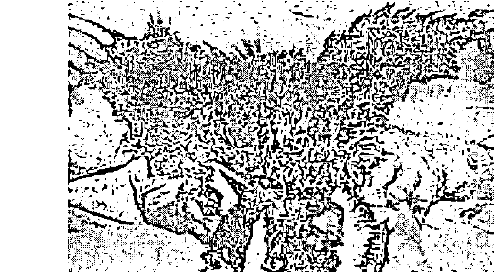

图2. 莎莉，一只翼猫，属于英格兰，谢菲尔德，阿特克里夫的M. 罗巴克太太（1939年）

1998年，在英格兰又出现了另一只翼猫。这只猫全身黑色，长着据称长达8英寸的翅膀。最近的一次关于翼猫的报道来自俄罗斯，当地的村民认为它是恶魔的使者所以很害怕，后来它在2004年被杀掉了。后来在尸检中确认了它确实拥有一对翅膀。

在编写本章节的时候，我收到了从中国发来的一则报告：

## 长翅膀的猫

一位中国妇女称自己的猫长出了翅膀

> > 据《华商新闻》报道，冯奶奶的猫长出了一对4英寸长的翅膀。“最开始，它们只是两个包，后来就开始长大，一个月后就变成了翅膀。”她说道。冯奶奶住在陕西省咸阳市，她将自己的宠物打扮成一只“天使猫”。她说这只猫是在受到异性挑逗后开始长出翅膀的。
> “一个月前，几只发情的母猫过来骚扰它，后来它就长出了翅膀。”她说。然而，专家却称，这更可能是源自基因变异，并认为其并不会给这只猫的生活造成不便。

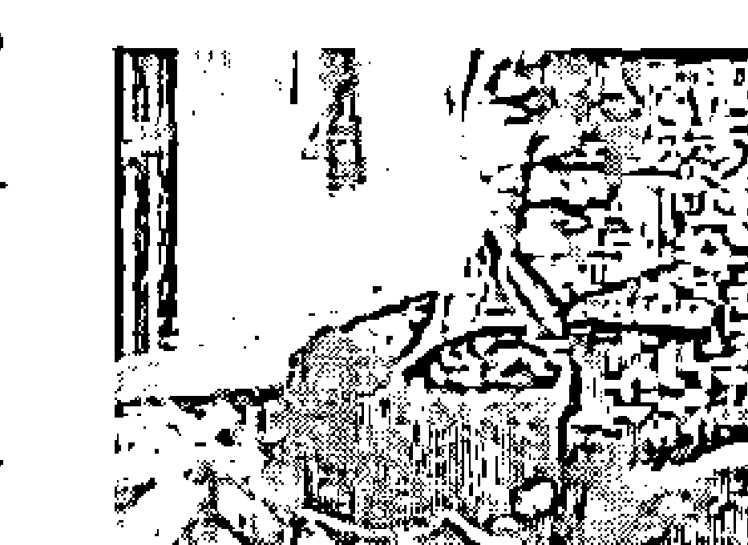

### 原因

猫长翅膀有几个可能的原因。其中一种就是过长的毛。如果不加以照顾，长毛猫的毛能长得很快，这些“翅膀”在长到一定长度之后会自动“脱落”。大大的毛垫在猫休息的时候垂在其身体的两侧，而在猫奔跑的时候就会飘起来，看起来就像翅膀一样。甲状腺功能减退（hypothyroidic）的猫也能长出一块一块的毛发，不管它们是长毛猫还是短毛猫。一些猫身上长着的残肢也被误以为是翅膀。猫长在背上的残肢看起来就像翅膀一样。这种情况很少见，大多数这种猫都活不到成年。

最后一种可能性是所谓的橡皮病（rubber skin disease），在猫身上被称为猫皮无力症（feline cutaneous asthenia）（这种病也发生在人类和其它几种动物身上）。这是一种遗传病，会使皮肤变得异常松弛，在背上和/或体侧的皮肤会越长越长，这些皮肤上长着毛发，里面也有一些肌肉纤维，能小范围地移动，但却不能被用于飞行，而最多只能在猫奔跑的时候上下摆动，给人造成翅膀的错觉。患有此症的猫的皮肤非常脆弱，容易脱落，而通常在脱落后很短的时间里伤口就会愈合，在猫的身上留下交叉的疤痕。

患有此症的猫似乎都该被送到兽医那里去接受治疗而不会用作赚钱的工具。对毛发过长的猫都应该及时地修剪一番，免得以后不好收拾。

现在的猫咪们都得到了主人更好的照料，至此翼猫事件很少出现了。隐生动物学家卡尔·舒克博士是第一位明确地将翼猫现象与毛皮无力症联系在一起的人。

### 猫兔、袋猫和松猫

在 1950 年出现了一些猫兔的报道，但它们后来都被证实为恶作剧。早期的报告称这种动物为兔猫（Racat）。它们被称作兔子和猫的杂交后代，长着短而蓬松的尾巴，走路的时候像兔子一样跳来跳去。松猫是一种与之类似的生物，人们认为它们是松鼠与猫杂交的产物，这些奇怪的猫咪长着又长又蓬松的松鼠尾巴，前肢较短。

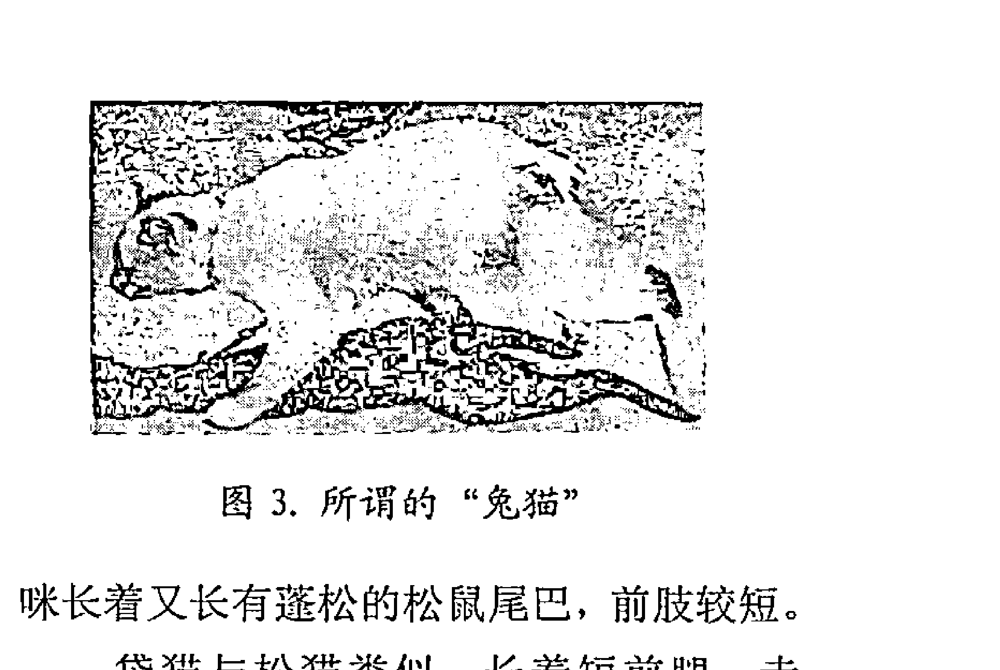

图 3. 所谓的“兔猫”

袋猫与松猫类似，长着短前腿，走路的时候一跳一跳的。关于袋猫的最早报道来自 1930 年代的英格兰，后来在 1940 年代在同一地区又有人声称看到了它们。1956 年从俄罗斯传来了一份关于袋猫的报告，后来这种动物便从欧洲消失了，只在 1970 年代和 1980 年代的北美被人发现过。到了 1990 年代，南美洲也出现了袋猫。

这些奇怪的猫咪几乎是不可能产生的。猫兔据说是兔子和猫的后代，松猫据说是松鼠和猫的后代。在现实生活中，这些动物不可能聚到一起产出后代，即便它们真的交配了，也生不出后代来。猫、兔、松鼠从基因上就跟马和海豹一样，是完全不兼容的。因为袋猫和松猫之间有所关联，所以我将它列在这里，实际上这种生物的名字来自它们的行为方式，并不是指它们是猫和袋鼠的后代。

### 原因

人类的误解是主要的原因。马恩猫（manx cat）的尾巴很短，很可能因为与其它猫不同所以让那些对其并不熟悉的人误以为它的尾巴来自兔子，而松猫也是如此。很多长毛猫都长着蓬松的尾巴，这可能会让人误以为是松鼠的尾巴。而一些前爪长有六个趾头的猫也可能会像松鼠那样用前爪抓东西。

径向发育不全（polydactyly）是一种与趾相关的病症，在此情况下，猫的前爪要比一般的要短。这种猫坐立的时候会将背部直立起来，这让它们看起来像松鼠（或者袋鼠、兔子，一切都取决于你的观点），这也能解释它们为何会跳来跳去地移动。患有严重此症的猫很可能会只用后腿跳动。

最后，这些情况也可能是由软骨发育不全侏儒症（achondroplasia dwarfism）所引起的。患有此症的猫的四肢又短又弯，但其身体又是正常的样子。而且猫的前腿通常要比后腿更为严重一些，这样，猫咪也会变成猫兔。

## 浣猫

我发现浣猫是所有怪猫中最为有趣的一种。它们完全源自人类的误解。缅因猫（Maine coon cat）是从由早期定居者带到美国的长毛猫进化而来的，后来它们与当地灰色和棕灰色的野猫交配，生出了漂亮的缅因猫。缅因猫长着又长又滑的皮毛、毛茸茸的尾巴，体型通常很大，比一般的家猫要大。在其脖子和胸口部分长着环状的毛领，而且它的皮毛分成两层，一层短毛和一层针毛。它们的趾垫上长有绒毛用来隔热——它就是一种适合生活在寒冷气候中的猫！虽然它们的颜色很多，但虎斑纹是其最为常见的毛色。我也养了一只缅因猫（上图），所以我非常了解它们。

有趣的，当人们第一次发现缅因猫的时候，它们被认为是浣熊和家猫的后代。第一批缅因猫很可能是灰色或灰棕色的，再加上庞大的体型，它们看起来确实很像浣熊。

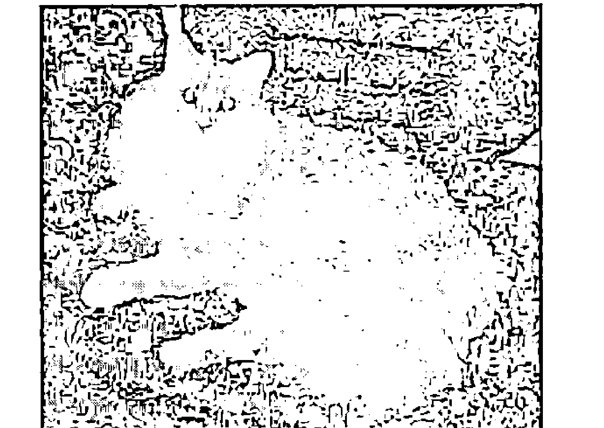

### 30、神秘怪

作者：亚瑟·“豹舞者”·迪克尔克和奥伯伦

> 霍拉旭，天地之间有许多事情，
> 是你们的哲学里所没有想到的呢。
> ——莎士比亚，《哈姆雷特》
> 第一幕第五场

怪兽被分成了很多种类。有天生残疾、变异或畸形的“自然怪”（freakes of nature）；有来自经典动物寓言集和传说中的神秘生物；有各种各样的杂交后代，如半人马怪（Centaurs）、斯芬克斯、狮鹫，以及其它对于鲜为人知的生物进行夸张后的产物，如克拉肯；有被隐生动物学家所发现的隐生生物——有很多人都看到，甚至还拍了照

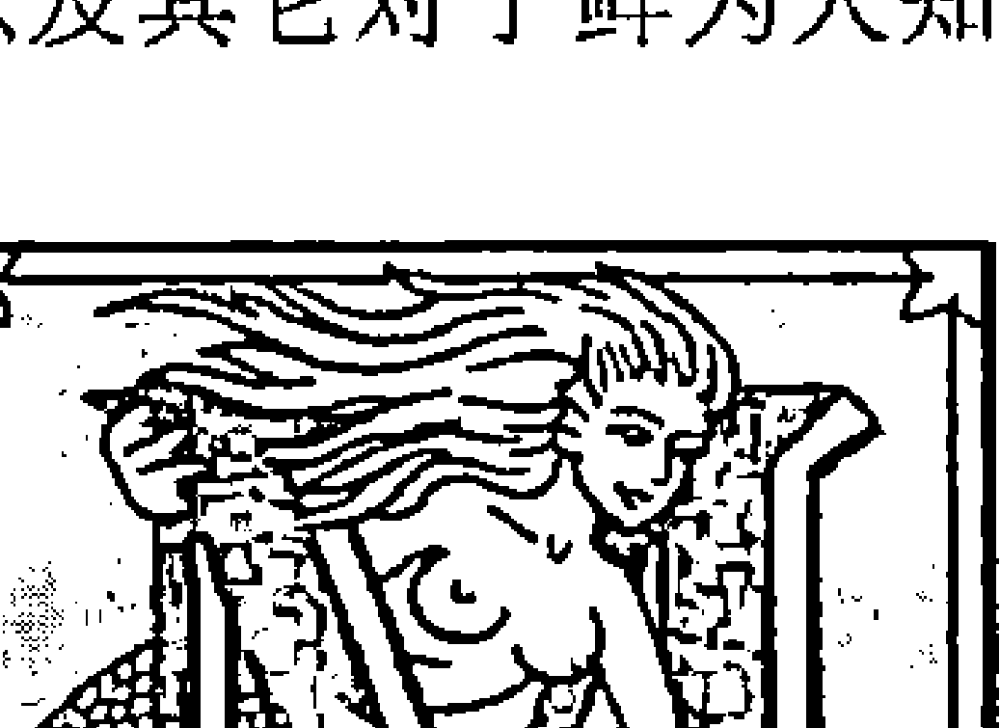

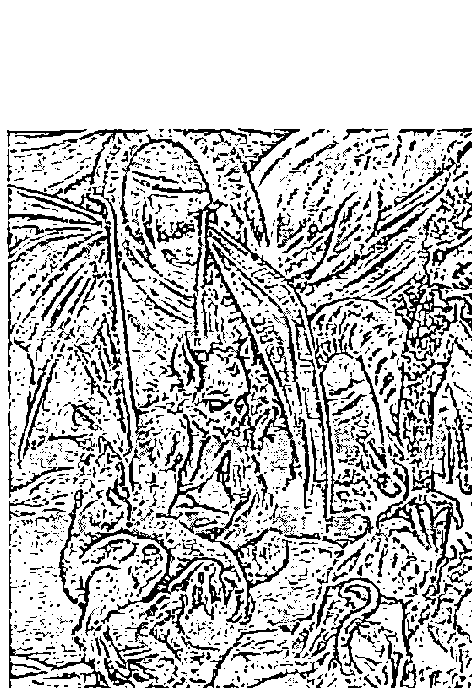

片，但却未被抓获或证实的生物——此类生物包括大脚怪、尼斯湖水怪、雪人和非洲的河霸龙（Mokele-Mbembe）。

除此之外还有些难以分类的畸形生物。关于怪诞且独特的生物的报告不时都会出现。它们通常都是某地特有的，被人在夜间的偏僻道路上碰到的，通常都被跟UFO联系在一起。它们的出现和消失都非常神秘，有时会变作一道光束，有时又是一副不完整的全息影像。这让人确实无法

## 黑暗中的恶魔：泽西魔鬼（Jersey Devil）

作者：亚瑟·“豹舞者”·迪克尔克

近 300 年来，被称为泽西魔鬼或利兹魔鬼（Leeds Devil）的神秘生物一直在新泽西松林（Pine Barrens of New Jersey）中游荡。曾有数千名目击者看到过这种神秘的超自然生物。实际上，它们带来的恐怖造成了工厂关闭和商店停业，也让住在附近的人迁往外地。

那么这种神秘的生物是从哪里来的？泽西魔鬼的来源有几种。最流行的一种称其为住在新泽西埃斯特尔维尔（Estelville）的一位叫利兹的太太的第13个孩子。据说当那位太太发觉自己怀上了第13个孩子的时候，她说希望这个孩子是个魔鬼。后来，梦想成真了，一切都超出了她的想象。这个孩子出生的时候毫无人形：它长着马一样的脑袋、蝙蝠的翅膀，还有一条尾巴和几只角。利兹太太将其驱逐到别处，后来它住进了松树林中。

在另一个版本中，她变成了一名住在新泽西伯灵顿（Burlington）、名叫利兹妈妈的巫师，她与魔鬼睡觉，生下了一个儿子。这个孩子出生时看起来和人类没有区别，但没过多久就变了样。它长出了偶蹄脚、马的脑袋、蝙蝠的翅膀和一条分叉的尾巴。这件事据说发生在1735年。后来这个怪物逃到了树林里。5年后的1740年，基督教牧师开始在那里进行驱魔仪式（exorcism），一直持续了百余年时间，而泽西魔鬼也直到1800年代末期才再次出现。

还有一个关于它的故事，新泽西利兹要塞（Leeds Point）的一位名叫施劳兹（Shrouds）的女士向上天祈愿，希望能再怀上一个孩子，就算它是魔鬼也行。她的愿望也应验了：她被诅咒的孩子出生时就很畸形。施劳兹太太将其藏在地下室中以避人耳目。一个雷电交加的夜里，这个孩子突然变了样，成了一个长着翅膀、马头的怪兽，随后便逃离了那里。

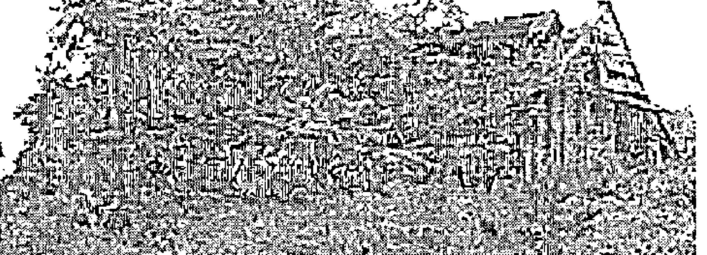

图1. 泽西魔鬼的出生地：新泽西利兹要塞

不管它是怎么来的，松林魔鬼（Devil of the Pinelands）在过去的几百年间，甚至直至今日都被人目击到过。最早和最奇特的一起发生在拿破仑的兄弟约瑟夫·波拿巴（Bornaparte）身上，在1800年代中叶，当时他正在新泽西的博登敦（Bordentown）打猎。在1840年至1841年间，该地区的许多家禽都遭到了一只神秘生物的攻击，而且有很多都被杀死了。人们发现了奇怪的脚印，在夜里还听到了刺耳的怪叫声。

此后很长一段时间利兹魔鬼都没有再出现。之后，在 1909 年 1 月，它再次出来作案了，让全州的人们都惊恐不已。在该月的 16 日星期日这一天，一个有着蝙蝠翅膀和火红眼睛的怪兽被人发现在新泽西伍德伯里 (Woodburry) 的街上飞来飞去。后来它又出现在宾夕法尼亚的布里斯托尔 (Bristol)，那里的人们用火来吓唬它，但当却没能伤到它。在雪地里出现了奇怪的蹄印。第二天，1909 年 1 月 17 日，这种奇怪的脚印遍及整个伯灵顿、哥伦比亚和赫丁 (Hedding) 以及其它的一些城市。它人们放出狗来追踪他的行踪，但狗却拒绝执行命令，在被人强迫的时候还会发狂。在 1 月 19 日的早些时候，格洛斯特的尼尔森·埃文斯夫妇被从窗外传来的一阵奇怪叫声惊醒。他们往外看去，发现了一只身高约 3 英尺的奇异生物。他们称其长着“柯利狗一样的脑袋和像马的脸”。它用两腿行走，腿上长着蹄子，手上长着爪子，脑袋下是一条长脖子，背上还有蝙蝠的翅膀。他们呆呆地看着它长达 10 分钟，然后才想起应该将其吓走。后来这只生物朝他们叫了一声就飞走了。在 1 月 20 日，利兹魔鬼出现在彭伯顿 (Pemberton)、哈登菲尔德 (Haddonfield)、柯灵斯伍德 (Collingswood)、穆尔镇 (Mooretown) 和里弗赛德 (Riverside)。一直到 2 月

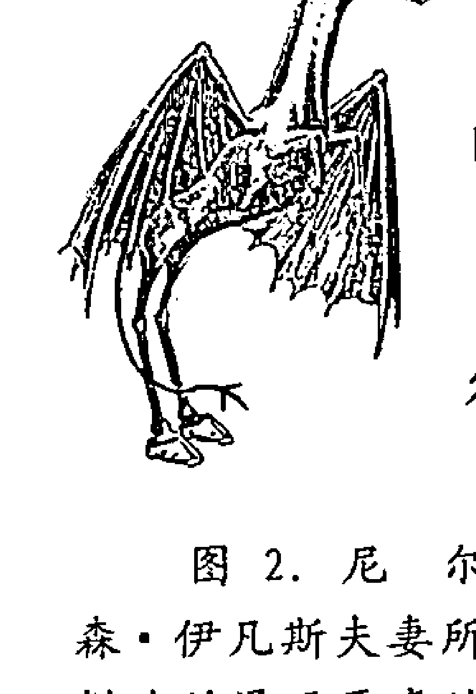

都都有人看到它，这让几所学校、工厂和商店都关了门，而且即使在白天人们都不敢出门。过了 2 月，关于泽西魔鬼的目击开始锐减，变得断断续续的了。这个魔鬼真的是离开了还是现在的人们更加小心了？后来的主要目击发生在 1927 年。一位出租车司机将车停在路边检修轮胎，一只有翅膀的生物落到引擎盖上向他发起攻击。不用说，他当时掉头就跑，管也不管自己的车了。在后来的数十年间，在夜里还能听到泽西魔鬼从林地中传出的独特的、刺耳的叫声。1961 年，一对将车停靠在松林附近的夫妇遭到了一只巨大的飞行生物的攻击。对这种生物的目击一直持续至今。那么泽西怪究竟是什么东西？一个说得通的理论是，它是一种沙丘鹤 (Sandhill Crane)，这种鸟在该地区很少见。沙丘鹤站立时约有 4 英尺高，会在感到威胁时攻击人类。它的叫声很刺耳。尽管在某些方面它能解释泽西魔鬼，但却并不能将其完全解释清楚，比如它长着的尖角、蝙蝠翅膀、马头和蹄脚、牲畜的死亡。1906 年，费城拱门大街博物馆 (Arch Street Museum) 的公关经理诺尔曼·杰弗里斯看到了这种怪物的报道，然后精心制造了一起恶作剧，他在当地报纸上发表了目击到这种怪兽的文章，然后在博物馆中展出了一只“捕获”的新泽西魔鬼。杰

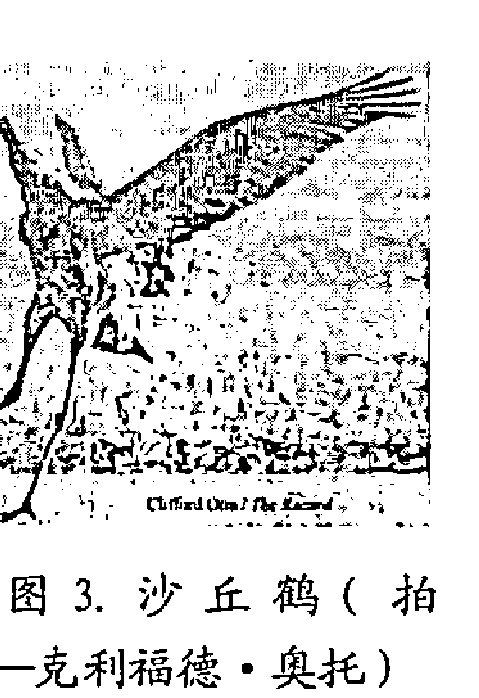

易特奎因特里珀特卓特里 (Itcuintlipotzotli) 是墨西哥的一种奇异的生物，有梗犬 (terrier) 那么大，全身无毛，长着一只类似狼的脑袋，但没有脖子，还有一条长尾巴，在背上长着一个大大的驼峰。一名牧师将其画入了一本1780 年的书中。1843 年，有人在墨西哥城附近看到了一只此种动物。它有可能跟卓柏卡布拉是同一种生物吗？

弗里的“魔鬼”其实只是一头被涂上绿色条纹，戴上铜翅膀的袋鼠。其它的一些目击报告可能也是伪造的，但并不是说所有的目击报告（请记住，数个世纪以来一直有此类报告产生）都是伪造的。有人说它就是一个现身了的魔鬼，也有人说它是松林的森林守护者，还有人认为它是一种位置生物。我们可能永远也解不开这个谜，但它一直都会是美国传说中永恒的一部分。

### 卓柏卡布拉 (El Chupacabra)

作者：亚瑟 • “豹舞者” • 迪克尔克

卓柏卡布拉是 1990 年在波多黎各被发现的一种神秘怪兽。后来，目击范围扩展到了墨西哥和远至智利的南美洲，以及美国的卡罗莱纳州和缅因州。它的西班牙名字意为“山羊吮吸者”，源自其喜欢吸食山羊和其它家畜鲜血的恶习，是由一位名叫西尔弗里奥·佩雷斯 (Silverio Perez) 的波多黎各喜剧演员给它起的。这个怪兽被广泛地认为是一种真实存在的生物、一种神秘的动物，也被认为是一种都市传奇 (urban legend)。尽管在 1990 年才受到主流的注意，但在早至1987 年的时候就有关于卓柏卡布拉般的生物的目击报告，它们被称为刺皮卓柏卡布拉 (cipi Chupacabra)。它们是另一种类似卓柏卡布拉的生物的食物，叫莫卡吸血鬼 (El Vampiro de Moca)，这种生物在 1970 年代杀死了波多黎各摩卡镇 (Moca) 的牲畜和家禽。该国全境范围内都有类似的事件发生，受害者在脖子上都有一对相同的小洞。

#### 描述

关于卓柏卡布拉的描述有几个版本。最常见的版本是，它是一种几乎全身无毛、像狗一样的生物，背上长着一排骨刺，有突出的眼眶、尖牙和爪子，而且像狗一样用四肢行走。2001年，在尼加拉瓜，据说有人发现了一具卓柏卡布拉的尸体。当 UNAN - 莱昂对残骸进行分析之后，该校的病理学家称其是一种未知生物。在另一个版本中，卓柏卡布拉是能直立行走的蜥蜴似的生物，它身上要么光滑要么有鳞，皮肤绿灰色，有狗一样的嘴部，红色的眼睛会发光，背上还有一排尖刺。它站立时约有 3 英尺高，走路时像袋鼠一样跳跃。当受到威胁时，它会像蛇一样发出丝丝的声音，释放出硫磺味道的气体。在其它称其像蜥蜴的版本中，它要么没有嘴巴，要么嘴巴很短。还有一种版本称其名为“灰人 (Grey)”的外星生物和霸王龙一样的蜥蜴。

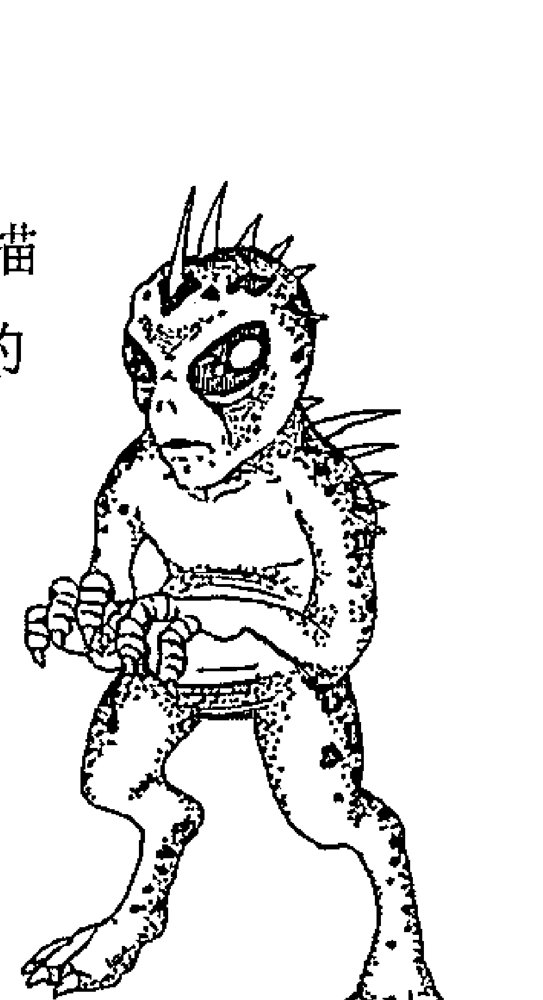

图4. 卓柏卡布拉## 魔法师的怪物图鉴

爬行类动物的后代。它蜥蜴一样的身体上长有类似外星人的大脑袋和超大的眼睛，双手又粗又短，长有三根手指。它强壮有力的爬行动物般的双腿也长着三个趾头。它的嘴巴稍长，其鼻孔就是两个小洞（这一点与爬行动物也很相似），位于嘴巴上方，它的嘴里长着像针一样的尖牙，且上下颚都有獠牙。跟其它的版本中一样，它的背上也有骨刺。

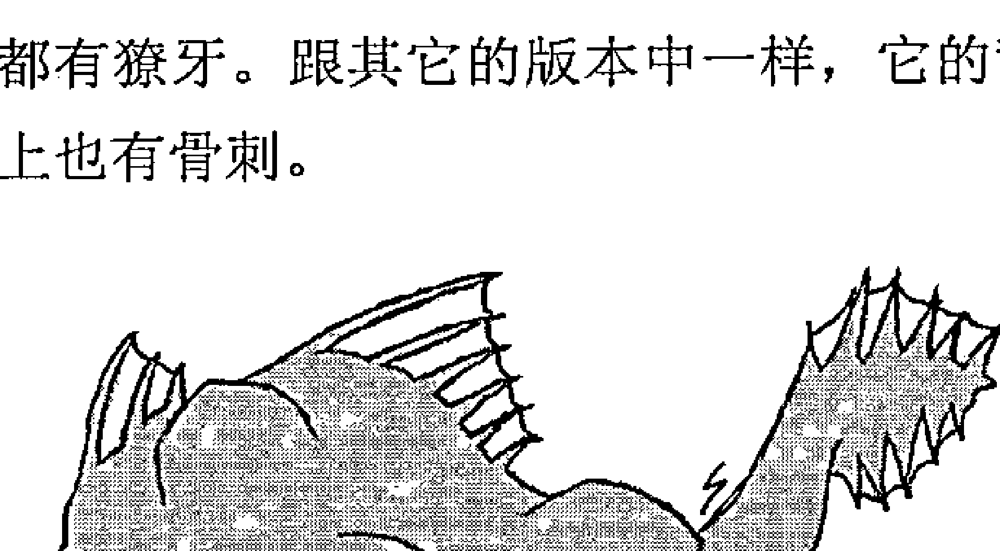

图 5：卓柏

通常人们都认为卓柏卡布拉长有会发光的红眼睛，背上有骨刺，在吃饱后肚子会明显地鼓起来，它们还有巨大、突出的尖牙，会在猎物身上留下两个小洞。另外，据说它们拥有催眠猎物的能力，这让其捕猎过程变得简单。看起来卓柏卡布拉一直在变化：最初的报告称其大小跟狗差不多，而最近的报告称它们有成年男子那么大，它们的猎物也从山羊变成了马匹和牛。

## 目击

1975 年一架 UFO 在当地坠毁之后，波多黎各的摩卡镇附近就出现了一只会攻击牲畜的生物。最初它被叫做莫卡吸血鬼，它与后来被称作卓柏卡布拉的生物的特征相吻合。调查者在检查了包括山羊、鹅、鸡、鸭和牛在内的家畜尸体之后，发现它们的血都被吸干了。一些人认为这些都是非法入境的鳄鱼干的。

1995 年 3 月，波多黎各的奥洛克威斯（Orocovis）和莫洛维斯（Morovis）也开始出现家畜被杀的现象。在 1995 年秋天，杀戮开始遍及整个岛屿。在圣赫尔曼镇，有几只羊被杀了，当地的民众赶走了一只试图杀死一些公鸡的特殊生物。卡诺瓦纳斯镇（Canovanas）是卓柏卡布拉活动的中心区域，有超过 150 只牲畜被杀。几个居民称自己在大白天看到了那个野兽。一位中年人，奥斯瓦尔多·洛萨斯多（Osvaldo Rosasdo），被一只卓柏卡布拉攻击了，他的躯干上有多处抓伤，需要治疗。这是为数不多的几次人类被卓柏卡布拉攻击的事件之一。

1996 年，在墨西哥出现了一系列的卓柏卡布拉行动，在之后 1999 年的巴西也有很多人目击到了卓柏卡布拉。在 2000 年春季，智利卡拉梅恩（Calamain）的居民在一个早晨醒来之后发现他们所有的家畜的脖子上都有两个小洞，并被吸干了血。有人认为这是由一头离群的美洲狮造成的，但人们在进行了细致全面的搜寻之后并未发现卓柏卡布拉，也没发现所谓的美洲狮。

自其第一次现身以来，据信光是在波多黎各一地，卓柏卡布拉就已经造成了超过 2000 头牲畜死亡。现在，对于此种生物的目击报告已经蔓延到了整个美洲大陆上。

## 近期的目击和尸体

2004 年 7 月——一名德克萨斯的牧场主杀死了一头像狗一样的卓柏卡布拉，当时它正在攻击他的家畜。这个生物很小，全身无毛，皮肤呈蓝灰色。对尸体的检查无法得出其真实身份，但却显示它极度营养不良。此后有更多的此类生物被人目击到，而在2004年的10月，又有人射杀了一只同样的动物。对于此种生物的分析产生了很多的结论，有些研究者说它们是未知的犬科动物，也有人说它们是极度畸形的郊狼（coyote）。这种野兽还有一个名字，叫埃尔门多夫野兽（Elmendorf Beast）。

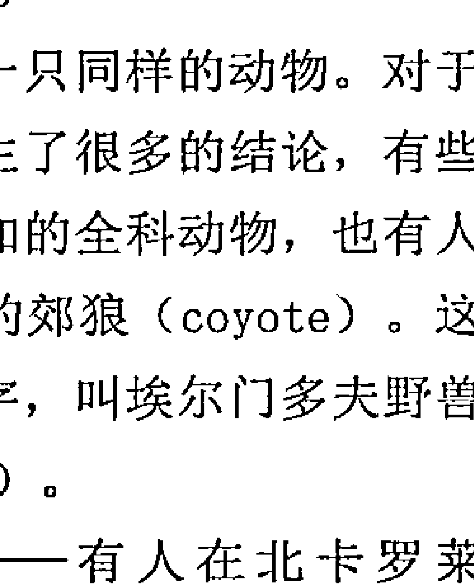

2004年夏季——有人在北卡罗莱纳州兰多夫郡的芒特普莱森特（Mount Pleasant）拍到了一个古怪的生物。这个生物与像狗一样的卓柏卡布拉相吻合，只是其背上没有骨刺。在南卡莱罗纳州查尔斯顿的一条公路边上发现了一具类似生物的尸体。对其的分析表明它是一种基因变异了的狐狸。通常人们也认为在北卡罗莱纳州发现的那个动物也是一只狐狸。

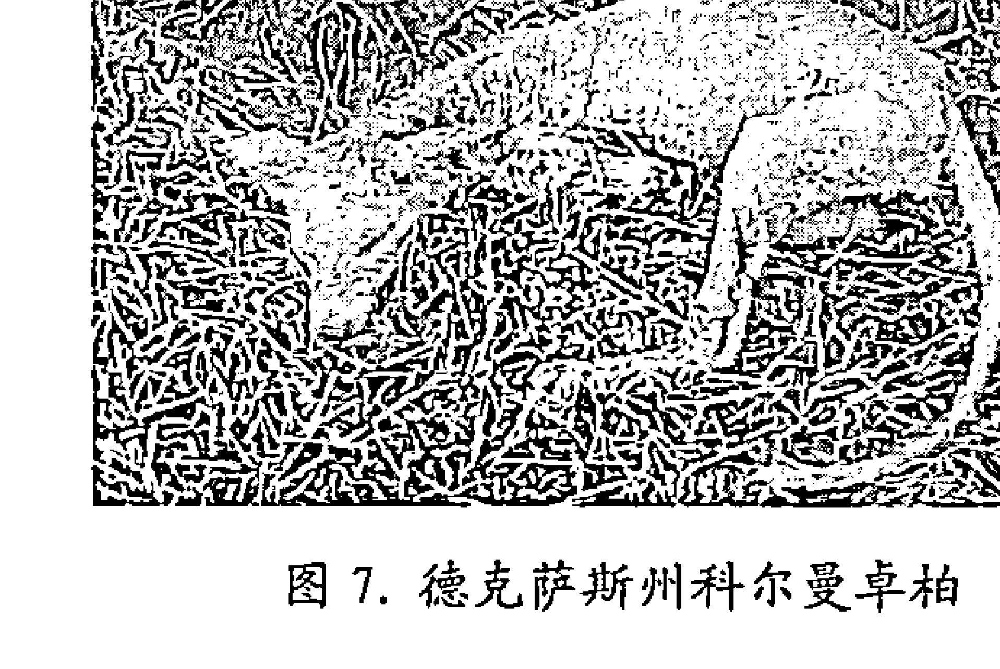

2005年9月——在德克萨斯州科尔曼（Coleman），有人射杀了一只所谓的卓柏卡布拉，在此之前它已杀死了附近的30至40只鸡。它的体型与梗犬差不多，身上长着类似羊毛的毛，只是比羊毛稍短一些。它体长在28至32英寸间，当地一名目击者，90岁的雷吉·拉戈（Lagow）说道：“那只动物跟这里的任何一种动物都不一样。”不幸的是，它的尸体并未能被保存下来用作研究。“它在一个星期二被射杀，然后在两天之后的清理垃圾的日子又被垃圾车运走了。”但人们给它拍了照片，从里面可以看出它长着袋鼠一样的腿。

2006年8月——一位缅因州的妇女在一条路边发现了可能是卓柏卡布拉的尸体。它被拍了照，从里面可以看出它长得像狗，但却和任何一种已知的犬种都不一样。在人们还没来得及将其保存起来用于研究之前，秃鹰就将其啃食干净了。此后很多年，当地的居民经常会看到一种奇怪的生物和其它动物的尸体。

2006年8月——两名分别叫乔迪·德克（Geordie Decker）和约什·昂德伍德（Underwood）的青年在纽约伯克郡（Berkshire）附近射杀了一只狐狸似的生物。这只野兽几乎全身无毛，皮肤灰色，背上有一条橘色的色带。它有黄色的眼睛，能像袋鼠一样跳跃。这个可能是卓柏卡布拉的生物的骨骼现在被展示在失落世界博物馆网站上（www.lostmuseum.com）。

2006年12月——一名秘鲁的农夫看到了一只与卓柏卡布拉描述吻合的野兽正在他的农场里吃一头野猪。吃完之后，这只动物以超过那位农夫所知的任何动物的速度离开了。那只野兽还有个名字，叫查希尔（Zahir）。

2007年7月——四天以来，菲利斯·卡尼恩（Phyllis Canion）在自己位于德克萨斯州奎罗市（Cuero）的牧场里连续发现了三具40磅重的凶猛动物的尸体。她留下其中一只的脑袋做DNA检查和留给子孙后代。“它是一种非常丑陋的生物。”卡尼恩说道，这种动物长着大耳朵、长獠牙和灰蓝色、几乎无毛的皮肤。

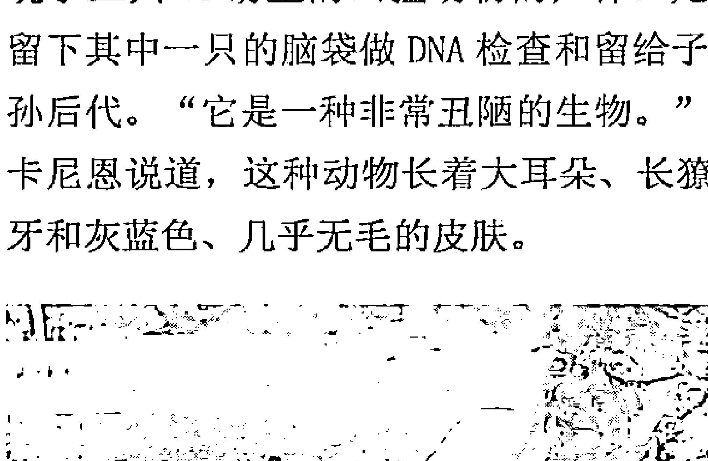

## 理论

关于卓柏卡布拉的起源有很多种理论。最为流行的一种是，卓柏卡布拉是一种外星生命。实际上这只是人的一厢情愿而已，在卓柏卡布拉和被称为灰人的外星人之间几乎没有相似点。

另一个理论认为，卓柏卡布拉是美国军方在波多黎各东部爱尔洋奎山中一所基地中做的基因实验的结果。人们怀疑，该实验室在1990年代被一次巨大的风暴摧毁，然后卓柏卡布拉就跑了出来。美国军方自1930年代开始就一直在该岛上活动，在那里进行研究和各种发展计划。

所有理论中最为合理的一种就是，卓柏卡布拉是从某种已知生物，最可能的就是当地的犬科动物，进化或变异而成的未知物种。其它同类的理论还认为它可能是自巨型吸血蝙蝠进化而来的，在南美洲发现过这种蝙蝠的化石。或者它可能与马达加斯加奇怪的栗鼠猿（Aye-Aye）有关。

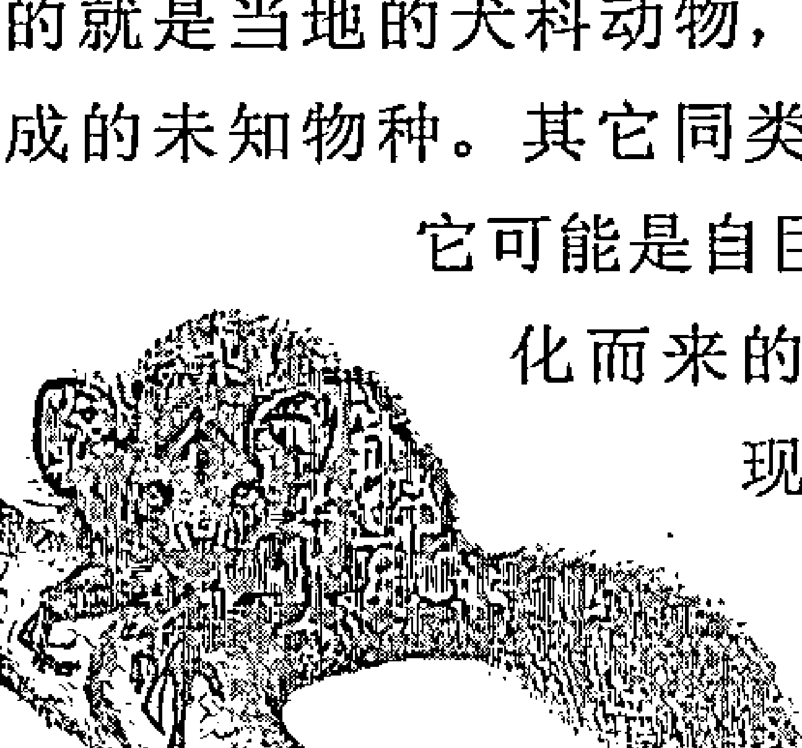

而在马戏团和游乐场中的怪物秀中也有被称为卓柏卡布拉的动物尸体。它们被称为卓柏加弗（Chupa gaff），最早是由一位名叫格·西格利（Doug Higley）的著名标本师创造出来的。考虑到关于卓柏的报告最早出现在1990年的波多黎各，我们很好奇这些卓柏加弗在传说中究竟是何种角色：

> 卓柏卡布拉最早出现在1980年代的杂耍节目中，此后便成了中美洲和南美洲地区广为流传的话题。卓柏卡布拉展览是被格·西格利引入到杂耍节目中的。格创造的第一只卓柏卡布拉在很多年前被卖给了佛罗里达的一位主持人，他将其带到了波多黎各。
——《杂耍世界杂志》（Sideshow World Magazine）

## 天蛾人与蛾人

作者：奥伯伦

人们第一次看到被称为天蛾人的神秘飞行生物是在1966年的秋天，在某个夜晚的11点30分，一对夫妇正开车驶过西弗吉尼亚的波音特普莱森特一个老旧的发电站。这个电站的大门被人从门框上扯了下来，一个7英尺高的怪兽正站在门厅里，它长着会发光的红色大眼睛，巨大的翅膀折在身体后面。这对夫妇被吓得狂踩油门，而那个怪兽也跃入空中，以高达100英里的时速追赶他们。在快到城区的时候，它才掉头飞走了。

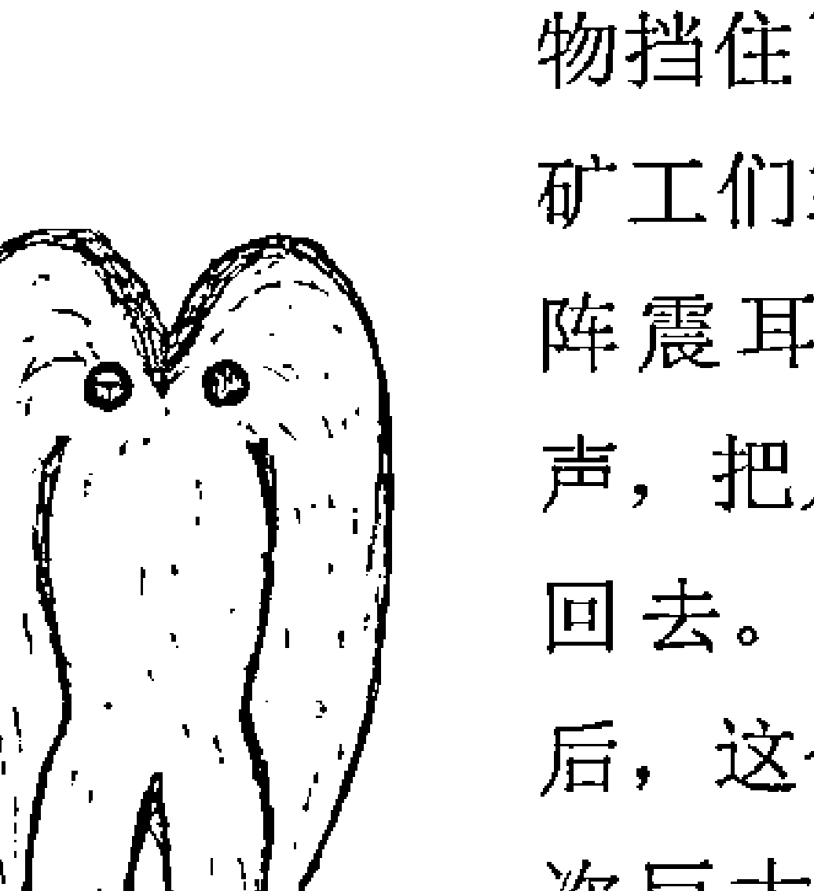

在接下来的几天，出现了很多与之类似的目击和报告，有人称看到了一只巨大的飞行生物攻击人类、偷窃犬只、咬伤动物。它的出现也似乎干扰到了无线电和电视讯号。11月16日，人们举行了一次记者招待会，在会上用流行的《蝙蝠侠》系列电视节目中的名字将其命名为天蛾人。在第一次目击发生后的一年时间之内，有超过100起报告被记录下来。

1967年10月16日，俄亥俄河上的银桥在交通高峰时段坍塌了，有46台汽车掉入了河中。这是当地有史以来最严重的一起事故，而有人猜测此次事件与天蛾人有所关联。自那时起，它再也没有出现，人群中也只有关于它的各种流言。

然而，在1978年9月10日，一只长着巨大双翅的恐怖的黑色天蛾人一样的生物挡住了德国弗赖堡一个煤矿的入口。当矿工们靠近时，它发出了一阵阵震耳欲聋的尖叫声，把人们都赶了回去。一个小时后，这个煤矿在一次巨大的爆炸中被摧毁了，在烟雾散尽后，那个奇怪的生物竟不见了，它救了这些矿工的命。后来，他们将其称为弗赖堡尖啸精灵（Freiburg Shrieker）。

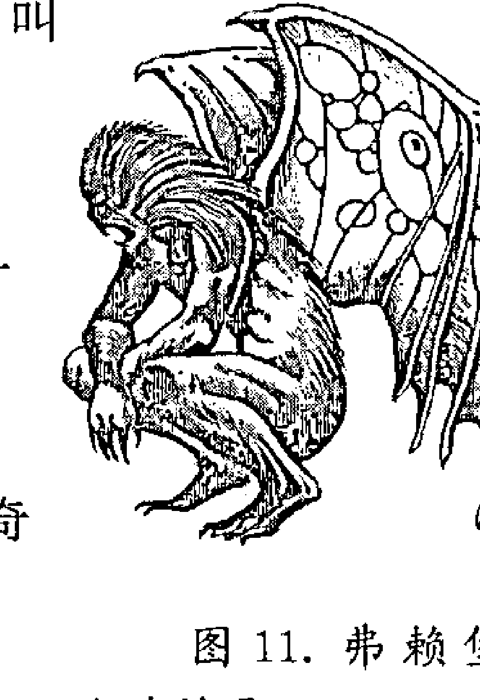

而在1986年4月26日，乌克兰切尔诺贝利核电站发生事故的时候，工人们报告称看到了一只巨大、全身黑色、没有脑袋、长着巨大翅膀和火红眼睛的人形生物。在事故发生之后，苏联直升机在已熔毁的反应堆上空盘旋，向火焰中投掷粘土、沙石、铅块和用于灭火的化学剂，一些工人称看到一只20英尺高的黑鸟在放射性的烟雾里穿梭。

但这或许并不是这种大鸟第一次出现。在1944年马里兰州的好莱坞，一位牧师看到了“一个展开大翅膀的人类从漆黑的天上向教堂俯冲。”但在降落到地面之后，它却立刻就消失了。牧师称其“极度可怕”。

在 1926 年年初的时候，人们在当时世界最大的水库——中国东南山脉上的关帝水库（Xiaon Te Dam）——上空看到了一只盘旋着的巨大、黑色的人形生物。

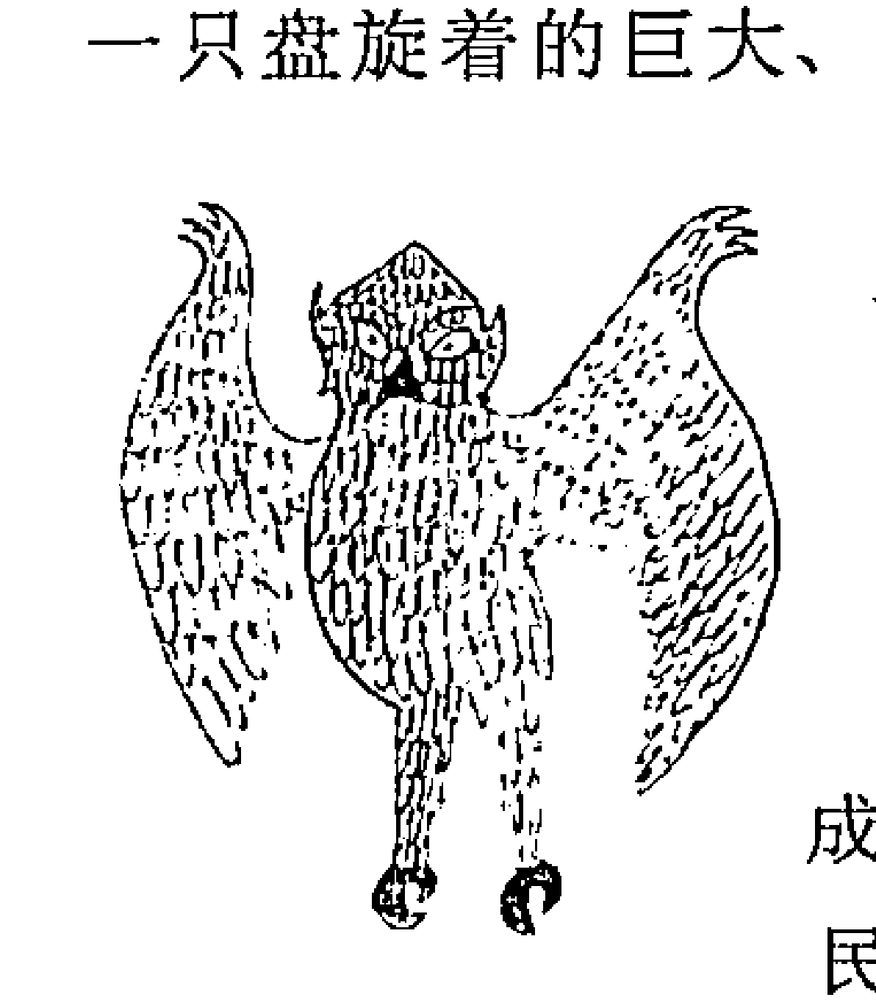

1926 年 1 月 19 日，该水坝发生坍塌，泻下 400 亿加仑的水，冲毁了下面的农田和村庄，造成超过 1.5 万名村民丧生。幸存者相信那条人龙（Man-Dragon）的出现正是在向他们预警。

自 1976 年以来，一只巨大的猫头鹰似的生物就一直出没于英格兰康沃郡的莫楠镇（Mawnan）。它被称做鸮人，据说像人一样，有长着银灰色羽毛的翅膀、尖尖的耳朵、会发光的大眼和黑色的鸟喙。在它长长的鸟腿末端长着巨大的黑色爪子。

在美国，从阿勒格尼山脉（Alleghenies）、奥扎克高地（Ozarks）到西北太平洋地区，那里的印第安人和早期的定居者都看到过类似的生物，并称其为大猫头鹰或大嘟嘟（Big-Hoot）。马克·A. 霍尔（Hall）在《雷鸟！美国巨鸟的传奇》（*Thunderbirds! America’s Living Legends of Giant Birds*）（2004 年）中认为天蛾人是一种雷鸟。

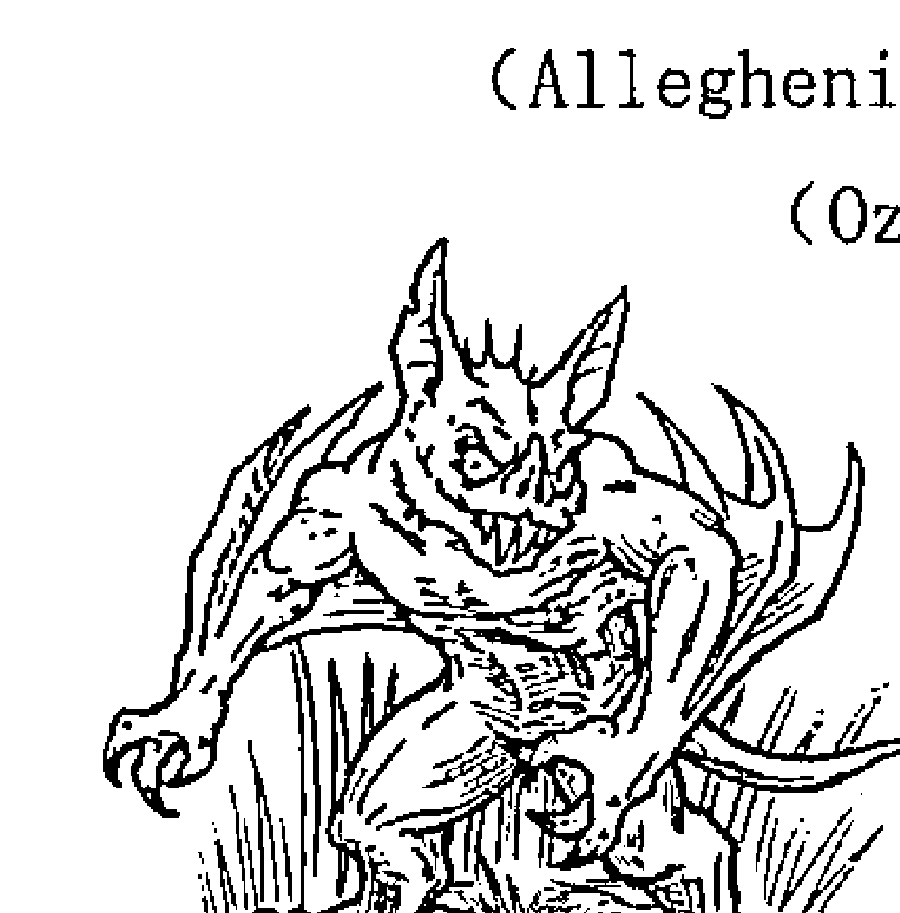

最后，我们必须要提到人们在华盛顿州看到的一种长着蝙蝠翅膀、怪异的夜行灵长类动物。它全身紫色，有红色的眼睛、类人猿的脑袋和一些蝙蝠的特征。一些隐生动物学家推测它可能是一种未知的巨型果蝠，但美洲却并不出产果蝠。

## 蜥蜴人

作者：奥伯伦

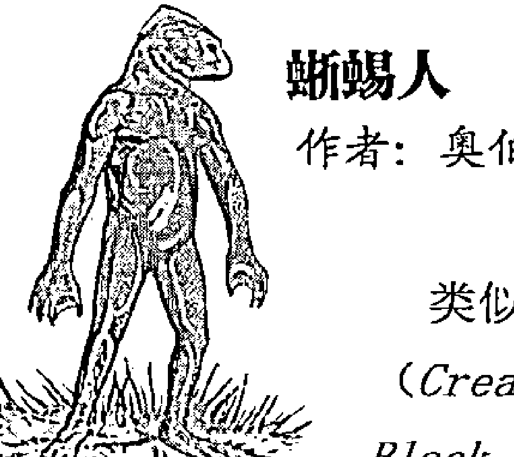

类似于《黑湖妖潭》（*Creature from the Black Lagoon*）中的奇怪混血类人形爬行动物在世界范围内都被人目击到过。其中最著名的可能要数南卡罗来纳州李郡（Lee County）比沙普威尔（Bishopville）附近的薘矿沼泽（Scape Ore Swamp）中的蜥蜴人了。它被发现于 1988 年 6 月 29 日，目击者是一位名叫克里斯托夫·戴维斯的 17 岁青年。当时大概是午夜 2 点左右，他正在薘矿沼泽旁的一条公路上修理汽车轮胎。在换胎时，他听到公路对面传来了一声巨大的扑通声，当他看过去时，发现了一个 7 英尺高、长着发光的红色眼睛的生物正在朝他冲去。他将自己锁在车里，而怪兽则开始攻击他的汽车。戴维斯后来对美联社说：“我看见了它脖子以下的部位——三根大手指”、长长的黑色指甲和粗糙的绿色皮肤。它非常强壮，而且很愤怒。”因为无法打开车门，所以它跳到了车顶上，开始用爪子攻击挡风玻璃，在戴维斯开车逃命时它还在车上留下了巨大的爪印。

类似的报告开始在李郡全境内接二连三地出现，警方也不得不另外开通一条“蜥蜴人”热线来解决这些问题。人们甚至还给它起了一个学名：“Homo subterreptus”。但到了8月，关于它的目击就停止了，只是在后来零星出现了几次。

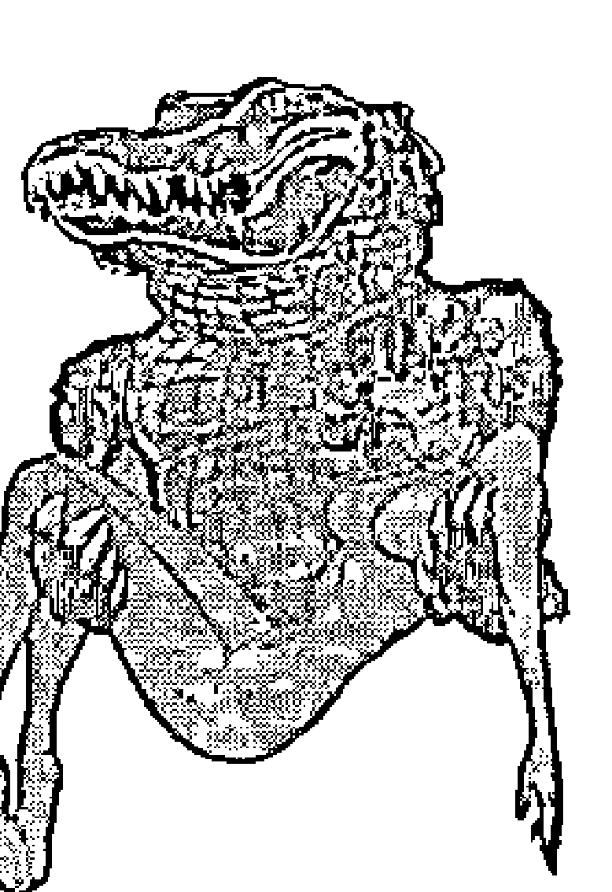

在远至 1700 年代中期的时候，人们就曾报道过，在佛罗里达州和美国东南部的大型沼泽地中潜伏着一种怪异的人形爬行生物。它们被称为鳄人，据说有 5 英尺长，像个小孩一样，长有 4 条粗短的鳄鱼腿、有蹼的脚和一条有力的尾巴。它们全身覆盖着绿色的鳞片，嘴里长满了剃刀般锋利的尖牙。不幸的是，在一份小报上刊登的所谓鳄鱼人的照片后来被证实为人造品。

在 1973 年夏天，有很多人在新泽西州的牛顿拉斐特地区看到了一只类似的鳄鱼人。而在 1977 年，纽约州立自然保护区 (New York State Conservation) 的博物学家阿尔弗雷德·哈尔斯特拉克 (Hulstruck) 称在该州的南部地区住着一种“长着鳞片的人形生物，它在黄昏时分会从长满水藻的水里爬到岸上吃蕨类植物和苔藓。”

据称几百年以来，加拿大普吉特湾区的夸口特尔印第安人都遭到一种食肉的两栖类人生物的骚扰。它被称作普格维斯 (Pugwis)，据说长相类似《黑湖妖谭》中的怪兽。

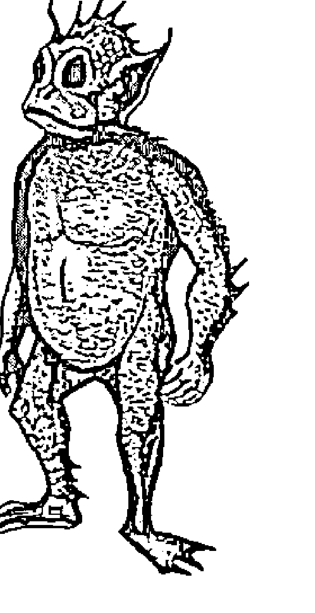

据说在不列颠哥伦比亚温哥华岛上的忒提斯湖中生活着一种像人那么大、有鳃、两栖的人形生物，它在 1972 年 8 月 19 日那天从湖里冒出来，攻击了两名小男孩。它身高约 5 英尺，体重估计有 120 磅，全身覆盖着银灰色的鳞片，双手和双脚都长有蹼，以及尖利的爪子，它抓伤了其中的一名男孩。几天之后，另外两名年轻人又遇到了它，他们称其模样恐怖，脸上长着突出的眼睛、鱼一样的嘴巴、大耳朵，而在它的脑袋上有六根被薄膜连接在一起的锋利骨刺。

1955 年 8 月 21 日，达尔文·约翰逊夫人正在印第安那州伊万斯维尔 (Evansville) 附近的俄亥俄河中游泳，突然她的膝盖被一个巨大的爪子给抓住了。她不停地踢那个试图将她拉入水中的看不见的敌人，最终爬到了岸上。她的腿上有多处抓伤，还有一个好几天才消失的绿色手印。

1959 年 3 月，一个奇怪的生物出现在俄亥俄州曼斯菲尔德的查尔斯·密尔湖中。目击者称其是一个没有手臂的人形怪物，站立时身高超过 7 英尺，有一双会发光的绿眼睛。1963 年，又有人看到了它，而在随后的几年中，关于它的目击也陆陆续续地发生着。甚至还有人宣称自己在岸边发现了一些巨大的蹼脚印。

在南非夸祖鲁省的祖鲁传说中有一种名叫尹士罗（Intulo）并拥有人类特征的蜥蜴怪。

## 拉夫兰青蛙

作者：奥伯伦

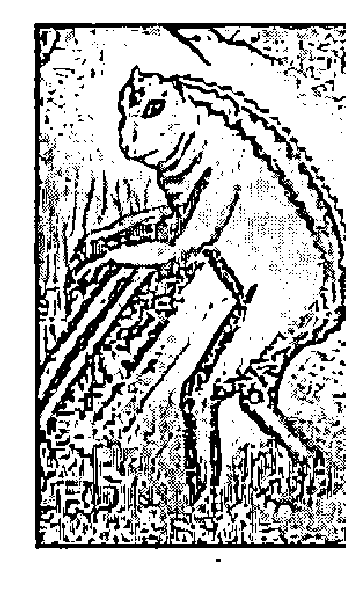

拉夫兰青蛙的故事始于 1955 年，当时一个人正在凌晨 3 点半驾车穿越俄亥俄州的拉夫兰，他看到了 3 个青蛙状的爬行生物直立着站在路边。这个人将车停下，观察了它们几分钟，他看到其中一个举起了一根尖端闪着火花的魔棍。

那个人将这件事报告给了当地的警局，但直到 1972 年 3 月才又有人发现了它们，当时一名拉夫兰警官正在午夜 1 点驾车沿着河滨路（Riverside Road）行驶，他在路边发现了一个蹲着的动物。当他用手电筒照到它身上时，这个动物突然用两条后腿站了起来。它的身高在 3 至 4 英尺之间，长着爬行动物或青蛙一样的脑袋和皮质的绿色皮肤。它看了一眼那位警官，然后跃过护栏，跳进了小迈阿密河（Little Miami River）。

两周后，另一名警官报告称自己看到了一个类似的生物，而这次的这个生物当时正在一瘸一拐地从路上走到河里，似乎受伤了。此后，拉夫兰青蛙再也没有出现过，没人知道它们的真实身份。

## 多佛恶魔（Dover Demon）

作者：奥伯伦

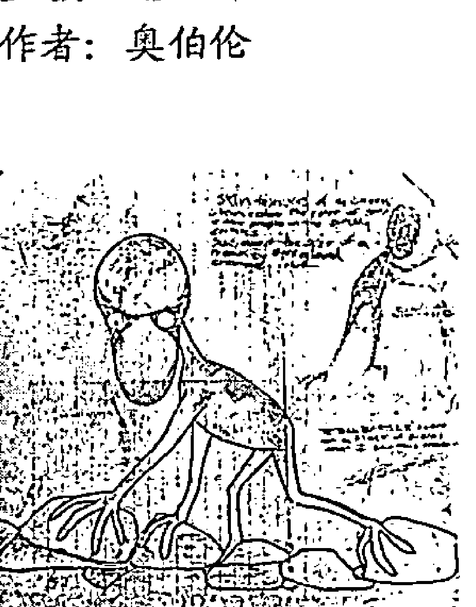

多佛恶魔第一次被人发现是在 1977 年 4 月 22 日，地点在马塞诸萨州波士顿市郊的多佛。当天晚上 10 点半，3 名 17 岁男孩正驱车回家，司机比尔·巴特利特（Bartlette）看到前灯照到了一个正缩在路边一堵石墙下的奇怪生物。他说，它长着西瓜般的脑袋，上面除了两只大大的橘色眼睛外没有其它的东西。它的身体很瘦，长着长长的四肢和手指，正抓着石头。其身高约 4 英尺，全身皮肤非常光滑，呈桃红色。

巴特利特的朋友们当时正在聊天，没有看到任何东西。后来他们回到了现场，但却什么也没有发现。一回到家，巴特利特就画下了自己所看到的东西的样子。

这次遭遇的两小时后，在 1 英里开外的地方，15 岁的约翰·巴克斯特（Baxter）和他的女朋友正在往家里走，他们发现在路上有一个身影正在向他们走去。巴克斯特认为那是一名他所认识的男孩，于是他叫出了那个男孩的名字，但对方却没有作出回应。这个生物逃离了公路，跑到了河边。

巴克斯特紧跟着它，看清楚了它的模样。他说，它有一个大大的脑袋，瘦小的身体和长长的四肢和手指。巴克斯特站在那里盯着它看了一分钟，然后由于害怕就离开了。他也画了一幅画像。将巴特利特和巴克斯特的画对比起来，很显然他们看到的是同一种生物。但那究竟是什么呢？
在事件发生后的第二天，巴特利特将自己的遭遇告诉了他的朋友威尔·泰恩托（Taintor）。当晚午夜，在泰恩托载着女友艾比·布拉汉姆（Brabham）回家时，艾比在路边看到了一个卷曲着的生物。尽管她事先并没听过别人的遭遇，但她的描述与其它的人的完全一致。泰恩托称自己也瞟到了它。
自那时之后就再也没人看到过这种生物，多佛恶魔的秘密仍然未被解开。

## 弗莱特伍德怪物 (Flatwoods Monster)

作者：亚瑟 • “豹舞者” • 德克

在 1950 年代早期发生过很多的 UFO 事件，西弗吉尼亚小镇弗莱特伍德上的人们看到了一个红色的球体降落在了一座山后。他们称看到了一个发光的物体，“似乎是从一个降落在地面上的物体中飞出的”。3 名小男孩打算去调查这个神秘的光球，后来一位母亲带着自己的两个儿子和两名朋友加入了他们。在山顶上，他们看到了一个有房子那么大的巨大火球。他们又在附近碰到了一个站在树荫里的生物。有人称其长着一个“像黑桃的”脑袋和一对会发光的眼睛。而其他人则说，它的脸长得像红桃。没有人看见它有类似手臂或双腿的东西，而该生物的眼睛距离地面有大约 6 英尺的距离。它似乎是滑行着移动的，而非步行。它首先向这些目击者移动了一段距离，之后便朝火球走去。在移动时，它会发出一阵阵嘶嘶声和巨大的噪音。那些人还称闻到了硫磺的味道，而他们肯定这种味道就是从它身上发出来的。此次遭遇只持续了数秒钟，当人们在第二天回到现场时，他们发现了一处草地被压得很平，就像有个巨大的物体曾停在那里一样。

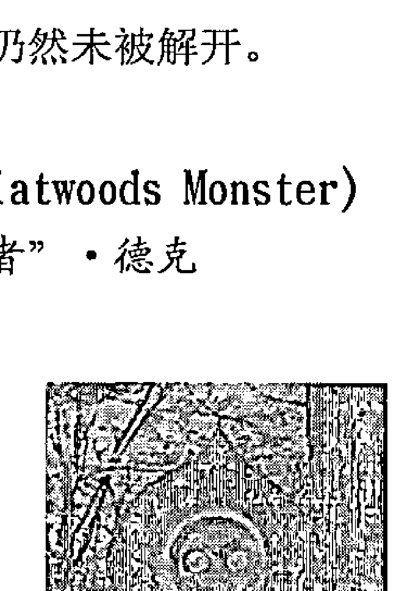

在弗莱特伍德事件发生的前一周，家住 12 英里以外的韦斯顿（Weston）的一名母亲和自己的女儿在从教堂驱车回家的路上碰到了一个类似的生物。在弗莱特伍德事件发生后第二天的晚上，在 20 英里开外的一个地方，一对夫妇的车神秘地停了下来。他们称当时有一个类似弗莱特伍德怪物的生物正在靠近自己，它身上也有硫磺的味道。在近 20 年后，一名魁北克的妇女在某天夜里醒来时，发现自己的窗外站着一个类似的生物。

有一个理论说，那些称自己近距离观察过该生物的人，实际上只是看到了一颗陨石而已——他们因为被暴露在有刺激性的气体中而产生了幻觉。而当他们开始着手调查的时候，由于自身的紧张，而把遇见的猫头鹰当成了某种奇怪的生物。人们相信这些人只不过看到了一只被吓飞的猫头鹰。因为猫头鹰长着红桃一样的脸，在受到惊吓时会发出嘶嘶声。觉得奇怪吗？其实人在害怕的时候确实会如此。

最后的，是恩菲尔德怪物（Enfield Horror），这是一种在伊利诺伊州恩菲尔德被发现的神秘的怪物。据目击者称，它全身灰色，长着三条腿，从胸口往外长着两只手臂，还有两只电筒般大小的眼睛。警方的调查员在现场发现了像狗一样有六个垫子的脚印。有人能解释它究竟是什么东西吗？

## 怪物电影：神秘怪兽

编纂者：赛斯·泰森

在《黑湖妖潭》（1954年）、《怪物复仇记》（Revenge of the Creature）（1956年）和《怪物就在我们之间》（The Creature Walks Among Us）（1956年）中都有低成本电影时期最值得纪念的怪兽之一。尽管人鱼并无事实基础，但这些影片中的服装和特效做得真是太逼真了。而在《鳄鱼人》（Alligator People）中也是如此。长着鳄鱼脑袋的人类？真奇怪，但是该片中的特效也非常不错。

在《蛇魔》（The Reptile）（1966年）中，有一个蛇女人，而在《欧克特人》（Octoman）（1971年）中则有一个章鱼人。虽然《SSSSSS》（1973年）的制片人并未生活在影片中大多数蛇所生活的地区，但他们还是拍出了这部关于人类变成蛇的影片。在此之后有《蝙蝠人》（The Bat People）（1974年）——也许这部影片是“蝙蝠男孩”恶作剧的灵感来源。

《异种大海怪》（Humanoids from the Deep）（1980年）是一部低成本但高品质的影片，里面有一个类似于《黑湖妖谭》中怪兽的人鱼，但它们的不同之处也非常明显。《泽西恶魔》（13th Child: Legend of the Jersey Devil）（2002年）里有本书中的一些内容。《天蛾人的预言》（The Mothman Prophesies）（2002年）是一部乏善可陈的影片，全篇只是对被很多人目击到并被认为是真实存在的天蛾人进行了一通简洁的介绍。它是被留下来的外星人，还是诞生于一次恐怖基因实验的产物？我们不得而知。《噬肉标靶》（El Chupacabra）（2003年）、《加勒比海怪》（Chupacabra Terror）（电视剧，2005年）和《“卓帕卡布拉”又名墨西哥狼人》（Chupacabra AKA Mexican Werewolf）（2005年）是笔者看过的影片。《蛇王》（The Snake King）（或《蛇人》）（2005年）里有很多蛇人。

## 未来的魔法师，欢迎来到魔法的神秘世界！

在魔法世界，如果对各种各样千奇百怪的非自然生物一无所知，那就必死无疑。现在，这本《魔法师的怪物图鉴》，将地球上1000多种神奇怪兽按字母A-Z的顺序一一列出，详细说明每种怪兽的起源、进化与能力，并且包含许多木版画、雕像、具有历史渊源的图片，和现代艺术家对这些作品的解释。可以说，没有哪一本怪物图鉴的插图能够如此精美，又如此实用！

本书还将教你如何识别神话生物在现实生物中的起源，例如北海巨妖和巨型乌贼之间的联系。作为补充，书中还介绍了尼斯湖水怪、大脚怪、加勒比海怪、天蛾人和其他未经科学证实的神秘怪兽，让你将所有怪兽收入囊底，一网打尽。

从此，魔法从幻想变成现实！

## World Bestiary A Menagerie into Myth and Legend