# 魔法的故事


### 占卜师

几千年来，人们总是企图以这样或那样的方式预先对自己命运的方向有所把握。占卜术就是其中最直接、使用最普遍的方法，人们希望通过各种各样的占卜去得到神谕。

## 巫师的梦魇

15-17世纪，巫师遭到了惨绝人寰的屠杀。狂热的猎巫者“立志”不惜一切代价要把巫师——这些将灵魂出卖给魔鬼的人消除，以绝后患。他们认为只有将巫师处以火刑才能使这些罪恶的灵魂永不超脱。

## 淫梦妖

淫梦妖分为淫梦男妖阴库巴斯和淫梦女妖思克巴。据说他们常常在人们睡觉的时候偷偷降临与之交媾。不过，被他们选中的往往都那些被视为巫师的人。

> 巫魔会
长期以来人们一直将女巫视为叛国的情人。关于她们的聚会——巫魔会，外界更是充满了各种各样的猜想与臆想。本图所描绘的就是巫魔会上的盛况。画面将所有巫术魔法涉及到的内容在图中一一展现出来。

## 飞行药膏

飞行是巫师最重要的一项“秘技”，巫师通常使用一些具有镇静、麻醉、兴奋、催眠功效的植物调制出可以帮助他们飞翔的飞行药膏。

## 占星术

占星术与炼金术相同，对现代科学都产生了不可小觑的作用。现代天文学就是它的延伸。与天文学不同，占星术所捕捉的不仅仅是天气的变化，而是斗转星移所带来的影响与后果。

##### 女巫

女巫在巫师的队伍中占有很大的比例，这不仅是社会对于知性女性的误解，更是因为女性自身的感知能力远远要强于男性。

## 数字命理学

数字在古代人眼中同样具有魔力，每个数字都有自己的寓义，其中一些还与人类命运紧密相联，在人们的成长与发展中起到不可忽视的影响。

## 蟾蜍

在西方传统中蟾蜍被赋予各种各样的寓意，它既代表了雨水与丰产，也是幸运和富有的标志，还是贪欲好色的象征。在炼金术中，蟾蜍表示的是大地与水。

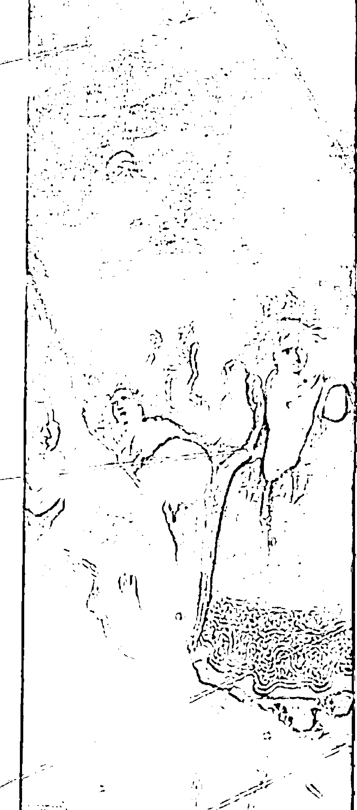

### 炼金术

炼金术是现代化学的前身，虽然炼金术士的著作总是让我们摸不到头脑，但他们在炼金过程中表现出的追求完美的执着精神，也许能给我们一些启迪。

### 六角星

六角星也叫“大卫王之盾”、“所罗门封印”，是男女力量的象征。12世纪时，西班牙的犹太人首次接触到六角星，后来这个标志成为了犹太教神秘主义喀巴拉的代表，17世纪以后，六角星更成了犹太人的标识。

### 神杖

在西方人眼中智慧之神赫尔墨斯还是炼金术的创始人，据说他的权杖可以点石成金，还可以中和属性矛盾的元素。一些炼金术士常常在工作的时候将“赫尔墨斯的权杖”立在一旁来表示对赫尔墨斯的敬意。

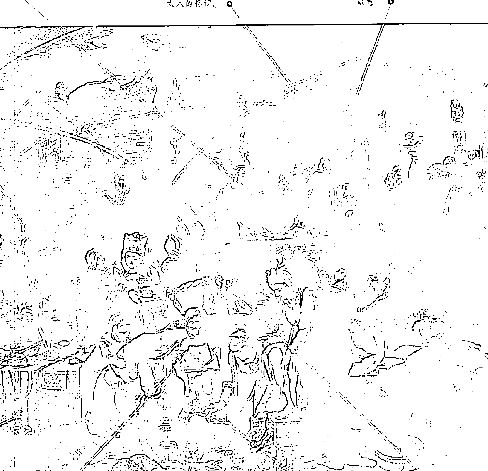

### 天书

天书是魔法书籍的总称，多以象形符号记录魔法咒语以及魔界大事。因而外行人常常将其称为“天书”。

### 骷髅

骷髅是死亡的象征，在巫师眼中它是进入灵界的敲门砖。

### 占卜

占卜预言是巫术魔法中的重头戏，人们总是希望预知未来，以便能够事先做好应对。

### 魔鬼

在一些人看来，魔鬼是女巫灵魂的主宰者、巫魔会的召集者，他们在巫魔大会中享有君主般的无上权利。

## 魔法世界中的精灵

与天界中的神明相比，魔法世界中的精灵更贴近人们的生活。他们总是出其不意地显身于人们的身旁，以自己的好恶影响、引导人们的生活。因而往往会带给人们一些不必要的麻烦，使人们不得不向魔法师们求助，希望可以摆脱精灵的纠缠。约瑟夫·诺艾尔·佩顿的这两幅取材于莎士比亚《仲夏夜之梦》的油画，讲述的就是精灵帕克导演的一出人与精灵之间的恶作剧。

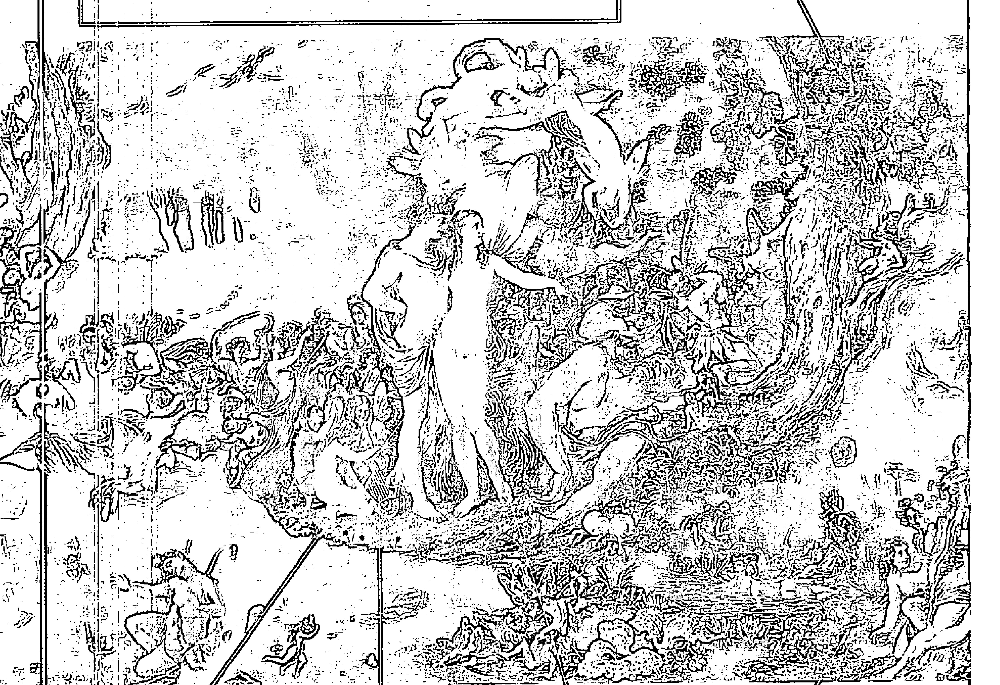

## 葡萄

葡萄玄秘的色彩和晶莹的体态可以为恋人们营造出浪漫的气氛。在这里葡萄的出现还暗示了酒的作用。毕竟没有酒的精灵聚会多少会有些遗憾。

## 奥伯龙

奥伯龙是欧洲中世纪传说中的精灵之王。他与妻子泰坦尼雅的一次争执，引出了一场热闹无比的“仲夏夜之梦”。

## 竖琴的魔力

在西方，竖琴代表了希腊神话中的俄耳甫斯。相传俄耳甫斯琴声的魔力可以让顽石点头、野兽俯首，因而对于西方人来说它绝不仅仅是一件乐器，它更是法律与教化的象征。

## 泰坦尼雅

泰坦尼雅是精灵之王奥伯龙的妻子。精灵帕克的捉弄对象，在“仲夏夜之梦”中帕克用魔法药水让她爱上了一头驴。

## 玫瑰

玫瑰是爱情的象征，维纳斯的化身，也是一种具有催情效用的魔力植物。

## 长矛

长矛在这里作为权杖，代表着精灵之王奥伯龙“至高无上”的权利。

## 山林之神——潘

希腊神话中的畜牧、山林之神潘是一个情种。他找遍拉东河里所有的芦苇，用爱人绪任克斯化身的那支做成笛子，后来成为牧羊人的乐器。

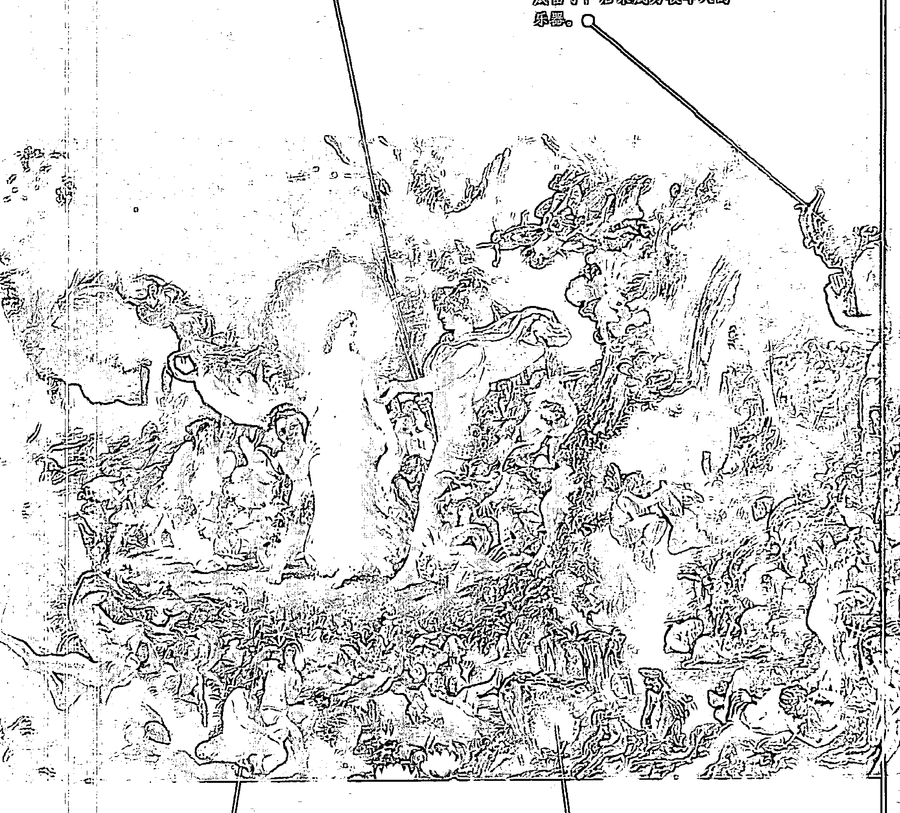

## 精灵的恶作剧

精灵帕克导演的这场“仲夏夜之梦”实在让人头痛。他的恶作剧不仅祸及人类，而且殃及到了他的主人奥伯龙。相信这场闹剧谢幕后，精灵帕克一定逃不掉奥伯龙的惩罚。

## 拥有魔力的菌类植物

自然界除了精灵具有魔法之外，一些植物也拥有一定的魔力。菌类植物就被视为是可以益寿延年的神奇植物。

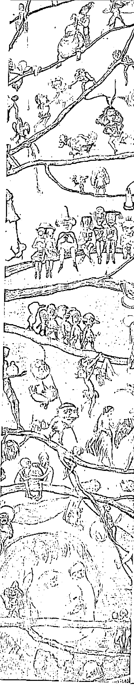

## 原版序言

在《牛津英语大词典》中是这样定义传统意义上的魔法：

魔法：一种所谓的魔幻法术。它通过咒语、仪式等与神灵进行沟通，进而控制人类生活及自然现象。一直以来它扮演着影响历史进程，制造非凡自然现象的角色。

但是这个注解与其他的解释一样，并不能让人们觉得更满意——毕竟每个人对同一事物的理解都各不相同。

即使在科学发达的20世纪，日常生活中的一些表象也曾一度被视为魔法现象。在下个世纪，也许根本到不了那个时候，现在我们认为不可思议的超自然现象，或许都可以从科学的角度解释清楚。但是目前我们还做不到。我们能够理解魔法可以带来的强烈快感，这种快感可以用生理学或是心理学来解释，但是在魔法领域，它依然充满神秘，使人们心醉神迷。

现代魔法师用多种观念来阐释魔法。法国19世纪魔法研究者埃利法斯·莱维和英国现代著名魔法师艾利斯特·克劳利，认为魔法是一种释放魔法师所拥有的神奇力量的途径，但是他们从未使用“意志力”来阐述魔法：因为他们反复强调“意志力”中的“意志”意味着“使用自己的意志操控自己和他人”。

20世纪，对于多数人来说有关魔法的概念已经开始淡化了：“魔法”是一个很少使用的单词。然而在过去数千年中，魔法一直在人类生活中扮演着重要的角色，是早期人们探索和认知世界的三条道路之一。其他两条道路一条是科学，也就是经验研究；另一条道路是宗教。

不管是从前还是现在，魔法大都是基于事实的，但常常戴着神秘的、令人迷惑不解的面具。例如巫师们声称，他们可以像鸟儿一样在空中自由地飞翔，而且有相当一部分人可以提供确凿的证据。他们确信自己拥有这种超能力。现在我们知道了巫师之所以能“飞行”是因为使用了魔法药膏（飞行药膏）。这种魔法药膏大多含有令人兴奋或使人催眠的物质，这些物质所产生的效果加上巫师们所处的心理状态，使他们相信自己可以飞翔。所以他们“飞翔”了，而且相信自己飞翔，这算是魔法吗？

历史上确有一些表面上似乎应验了的巫师咒语。直至现代，世界上依然存在一些可以致人于死地的土著咒语。然而心理学者将会证明正是由于人们对咒语的相信和畏惧，咒语才发挥效力，而咒语本身毫无魔力可言。一位作家曾写到，他的祖父记得有人曾在北美的一个牛舍的墙壁里发现过一个装着尿、头发和指甲的药瓶。据说这个牛舍里的牛产量一直都很低。我们不禁要问，这些牛会知道咒语吗？难道又是魔法产生的效力吗？

生活中，人们往往会梦到未来配偶的样子。这听起来似乎十分玄妙，人们甚至会怀疑冥冥中是否真的有魔幻的力量主宰着我们。然而心理学家提示我们：在我们未遇到现在的配偶之前，可能在无意识之中就形成了对他（她）的要求（外貌或性格），也许正是如此，使我们按照几乎成形的要求专注地寻找拥有这种能激发我们爱情的人。这难道也是魔法吗？

魔法似乎还与直觉、超感知有关联。而科学研究也逐渐对超感知产生了兴趣。其实宗教裁判所本应该烧死尤利·盖勒的，那个机智善变的家伙因为过于炫耀而损失了不少魔力。他所做的与克劳利和莱维的工作一脉相承——也是通过“意志力”来达到一种常人无法达到的境界。

直到现在我们仍在遵守一些传统，比如，在肩膀上撒一层盐、避免在梯子下面穿行。姑且不论这些传统是否有意义，但毕竟这样的迷信只是无害的游戏而已。地球的力量是非常强大的，我们正在逐步地意识到这力量的存在。即使精灵们和仙女们并不深居于山林之中，但生物固有的灵气仍然促使我们尊敬大自然，满怀热情地去保护大自然。所以，绿色环保运动并不是完全基于一种信念——如果不保护大自然我们就将自取灭亡，也出于一种对自然的敬畏。在有关自然的问题上，我们必须认识到自然的本质。

宗教和巫术魔法一直纠缠在一起，不可分割。正如E·M·巴特勒在他的著作《巫术仪式》（1949年）中提到：如果没有巫术和魔法奠基，根本就不可能产生宗教；同样，没有宗教中的一些根源，巫书和魔法也不会被赋予重要的意义。著名的人类学家詹姆斯·弗雷泽爵士（1354—1941年），在其著作《金枝——对魔法和宗教的研究》中认为，在人类操控大自然的各种方法之中，魔法占据着首要地位，随后才是宗教。宗教并不像魔法那样强调去控制、使用我们看不见的、无形的力量，而是寻求一种对它实行劝说祈祷的方法，这就是宗教与魔法的区别吧。

传统基督教认为，魔法在其不断发展的时期，与基督教创造者上帝以及众多神灵的发展是同步的，直到耶稣降生，基督教才和魔法分道扬镳，各自走上了迥然不同且不可调和的道路。从那以后，如果谁把基督教与魔法相提并论，轻则是无理，重则是对神灵的亵渎。另一方面，不可知论者和唯理性论者一直认为所有的宗教都和魔法有着千丝万缕的联系，即对祈祷功效的信仰与对咒语效用的深信不疑在实质上毫无差异。我们会同样看重巫师大会的符咒仪式与英国国教祈祷书的祈祷仪式，因为二者都狂热地忠于自己的信念，我们无法偏袒任何一方。

到19世纪末，现代科学技术的发展使得魔法的真相逐步为人们所知晓。1877年，仅仅通过各种机械装置一系列的传导，伟大的发明家托马森·爱迪生的声音就是从一个喇叭里传出来。同样，1900年R·A·佛森登通过一个叫“无线电”的装置听到了远方友人的声音。早在17世纪，意大利的约瑟夫主教几乎已经可以利用他的飞行装置飞行到40米的高度。在1880年，奥托依靠他自己的滑翔机做到像鸟儿一样地飞翔。1903年，第一架装有动力装置的飞机冲上了蓝天。

据说，那些虔诚的信徒和那些“千里眼”可以见到几英里之外圣人的真身。而在1936年的伦敦，人们坐在家中通过屏幕就可以看到几英里以外演播室中载歌载舞的演员了。同样，当初次见到电灯、照相机和接触了X光照相之后，我们会认为自己处于魔幻世界。我们中的大多数人都见过电脑，领教过它令人难以想象的、甚至可以说是带有魔力的功能，尽管当时我们可能并不知道它的工作原理，但是我们还是接受了这个事实——它并不是巫师，也没有超自然的能力，仅仅是科技发展的产物。

而在17世纪，以上的所有情况都被认为是不可思议的。借助于科学对魔法的解释，人们才意识到魔法仅仅是超自然的说法。在1901年，一位著名的科学家宣称：马可尼绝对不可能通过空气把信息从意大利发送到大洋彼岸的美国，就像人们永远都不可能站在月球表面上一样。然而，几年后在事实面前他不得不惊叹“像魔法一样不可思议”。

20世纪90年代我们发现了这样一个评价魔法的体系，体系的一端是诸如鬼魂之类的异象，许多人声称他们见过鬼魂或与其打过交道，以至于使人们认为它们是“真实的”；体系的另一端是实用魔法，据说这些实用魔法正在逐步将科学家们的注意力吸引过来。这些实用的魔法还包含这样一些现象，如李力所称的“马赛克探矿棒用法”——它是通过使用类似于小木棒或钟摆的装置发现其周围存在的金属，探测到地下的水源。对于这个“魔法探测”，尽管没几个人会认真对待，但也有人会完全否定它的作用。

如果说寻求水源和矿藏尚且处于科学解释范围外，那么其他的似乎也不能轻率地归入“魔法”的范畴之内，它们或多或少都与科学有所联系，如远程医疗、预测星象及天体逆行、控制自己或他人的意志、预言未来的先知，以及基尔连的物体光环照片……然而大多数证明其真实性的证据都像奇闻轶事一样让人困惑不已。除此以外，我们个人的情绪或智力因素也阻碍我们看清楚眼前的“证据”。

在说完诸多借口后，对魔法回顾的结果恰恰吻合哈姆雷特那著名的台词，“在天堂和尘世间有许多东西你是感觉不到的，它们并非如你所见，霍雷肖，甚至比你在梦里所见到的还要多得多”。想要解释清楚其中的一些现象将是十分困难的，或者根本就是不可能的。而这些没有答案的神秘恰恰就是那些最有魔力、最令人着迷的部分。

为什么一些组合特别的号码总是伴随着我们——出现在我们的车牌号码、门牌号码、电话号码，还有我们的信用卡号码中？为什么有些人仅仅是通过将自己的意念施加在病人的身上就可以影响治疗呢？为什么一些特殊的药材疗效甚好，而科学却无法对其进行解释？为什么在一些事情发生之前，有些人就可以做出精确的预言呢？

总有一天我们会知道答案。现在科学似乎明显地畏缩不前，不敢背离传统做深入地研究，导致这种现象的主要原因也许是科学家们耻于被人嘲笑为荒诞不经。但一些勇敢、明智的学者们已经意识到：在人类已触及到的空间里，科学不可能去解释我们生活中每一个方面。然而，当一些科学机构的研究触及到了超自然的，或是现代科学无法理解的领域时，还是被认为是不体面的，甚至还会被说成是一种对科学的亵渎。而像超自然科学调查审核委员会（CSICOP）这样的科研实体，甚至还带有十分强烈的主观色彩。

只有当科学摆脱了它现存的局限性，开始真诚地去对待实际存在的魔法现象时，一些神秘的魔法现象才可能获得解释。魔法是一个令人着迷的主题。现在，我们持着充分怀疑的态度去接近它，颠覆一些痴迷者的学说。我们的发现使得我们不得不承认一些魔法师的论断：宇宙不仅仅是我们所想像的那样神奇，甚至比我们的想像还要神秘。

在序言中我们还要提到这样一点。我们可能会因为忽视曲解黑魔法或是对其内容轻描淡写而被控告。在过去几十年里，媒体上有很多关于邪魔附体或在巫术仪式上用活人祭祀的报道，而且往往可以解释得通。虽然人们经常根据这些表象提出诉讼，但是最终在进行深入广泛的调查之后却失败了。

必须记住，无论人们对大自然魔法的信仰是什么，它都在人类的精神世界中产生着巨大影响——事实已经证明了这一点。然而不幸的是，那些沉迷于巫术的人也同样信仰自然的魔法，他们狂热地渴望控制这种无形的力量，企图利用这神奇的力量达到个人的不正当目的。

德里克·帕克和朱丽亚·帕克夫妇
Derek and Julia Parker

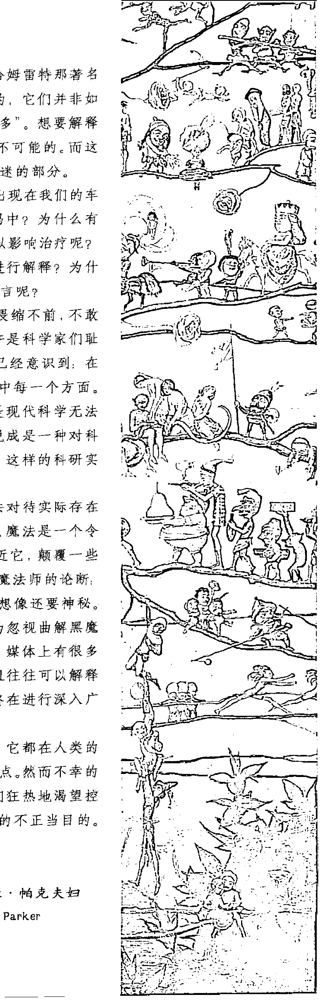

# 目录

## 原版序/6

## 古代魔法

- 第一章 历史回眸/12
- 第二章 神灵世界/36
- 第三章 咒语、魔符和护身符/58
- 第四章 典礼、仪式和迷信/80
- 第五章 魔法的故事/102
- 第六章 植物与动物/124
- 第七章 巫术与性/142
- 第八章 炼金术/156
- 第九章 占卜术/170

## 今日魔法

- 第十章 今日巫术/180
- 第十一章 实用魔法/196
- 第十二章 治疗与医药/216
- 第十三章 数字命理学和预言/225

## 原版跋/234

## 术语表/235

## 中英文专有名词对照表/236

## 参考书目·鸣谢/238

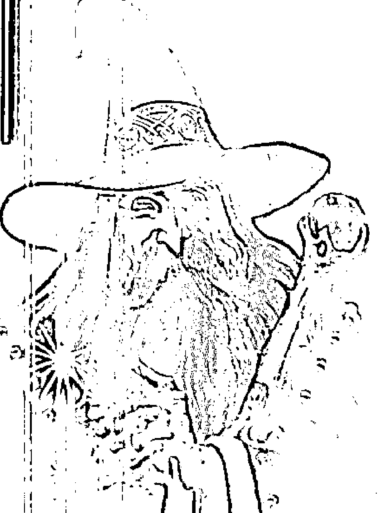

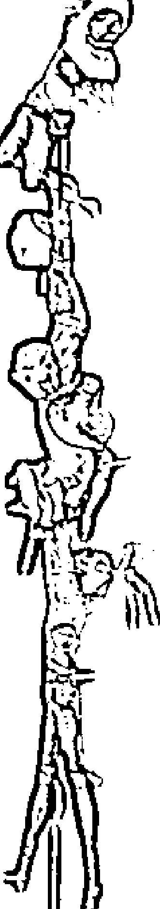

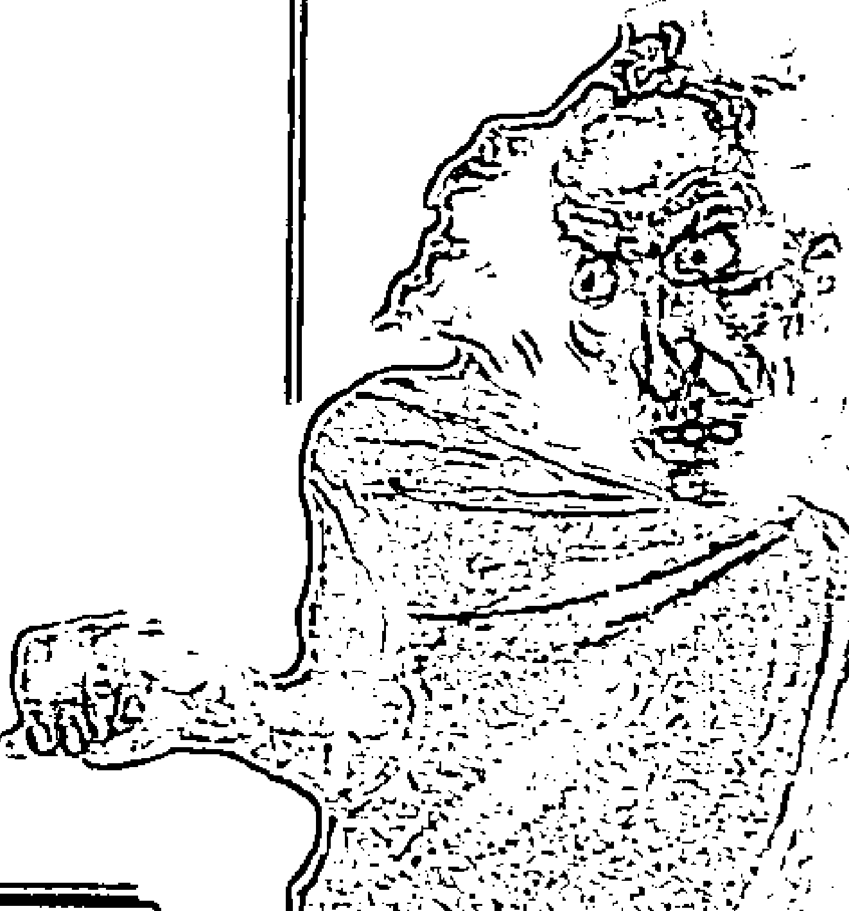

## 第一部分

## 古代魔法

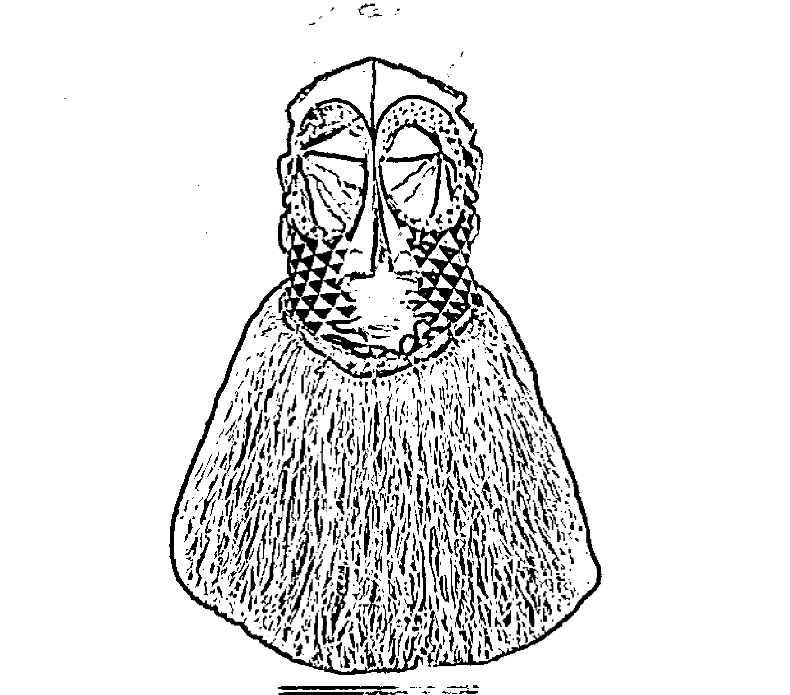

# 第一章
## 历史回眸

尽管我们对于早期宗教和魔法的具体活动知之甚少，但是通过在法国拉斯科和西班牙艾特米亚岩洞中发现的一些有关史前人类活动的岩刻和壁画，我们或许可以得到一些重要的信息。在这些岩洞里，美洲、欧洲的野牛、驯鹿、岩羚羊、猛犸象（毛象，属于古生物）和一些其他的动物被生动地刻画在岩壁上。它描述的不仅是原始的狩猎场面，更像是古代猎人试图与那些大自然中掌管动物的神灵们沟通的一种方式，目的就是希望神灵们给他们带来充足的猎物。如果将这视为一种早期的魔法应用现象，那么其他的一些现象则可以被看成是一种简单的宗教现象。例如，在瑞典东部的一个山洞中，考古学家发现一些熊的头盖骨被恭敬地放在了洞内墙壁凹进去的部分，原始居民用这样一种带着崇敬的仪式表达了他们的种种敬意，或许是出于一种对熊神灵的信仰或是膜拜吧。

早在新石器时代（新石器时代在欧洲大约始于公元前3500年，但是古埃及却要比欧洲早上大约4000千年），人类就已经开始相信周围存在一些无形的力量。这种力量十分强大，但却不是人人都可以控制的，只有那些拥有特殊能力的天才们才能触及并控制这种力量。祭司、巫师、巫医和药剂师（当时那些能调制魔法药水的人），还包括那些部落的首领以及那些天生就拥有特异功能的人都被列入了这个范围内。

我们对那些关于传统女巫的特征已经耳熟能详，无须赘述。（本书中，非特别说明情况“巫师”泛指“女巫及男巫”。）药剂师或萨满教巫师们通常都手拿一只木杖或木棒，身穿由动物皮毛或是鸟类羽毛制成的长袍。萨满教起源于亚洲的北部、西伯利亚和爱斯基摩地区。作为一种神秘的巫术，北美的药剂师以及非洲的巫医都可以归入萨满教范畴内。那些远在北方、带有明显游牧民族色彩的部落巫师也通过祈求神灵来聚集动物，为了能够在部落捕猎时助其一臂之力。他们的游牧生活方式与法国或西班牙岩洞中壁画所描述的景象十分相似。

萨满教的教义中充斥着万物皆有灵的观点。他们认为，无论是动物还是植物，甚至我们周围一切“东西”，都像男人和女人一样，拥有生命，拥有灵魂，因而我们完全可以与它们沟通、交流。但是并不是每一个人都能做到这一点，只有那些拥有特殊能力的人才能做到。（这种特异能力在各地有不同的称呼，如南太平洋的美拉尼西亚部落称之为“玛纳”——超自然的能力；美洲印第安人中的苏族部落称之为“瓦坎灵力”——来自于大自然的灵力；北美洲土著居民中的易洛魁部落则称之为“奥兰德”。）

那些拥有这种神奇力量的人可以通过类似佛教中“入定”（一种通过冥想与周围的物质环境相分离的状态）的方式进入到神灵的世界。在那里，他不仅可以与万物神明进行心灵相通的交流，而且还可以与神或上帝沟通。他可以从神灵那里得到一些信息，还可以借助神灵的力量去医治病人精神上亦或身体上的创伤。巫师所拥有的力量通常和衣着密切相关，他的衣服常常由自然界中的动物皮毛或羽毛制成，表示与自然界的同盟关系。在他的魔法之旅中的某个时刻，这种同盟可以助他一臂之力。在美国，巫师的斗篷都是由北美野牛皮制成的；在波利尼西亚，魔法师的披风则是由一种树皮布缝制而成，上面绣着精美的图案；塔西提岛和夏威夷巫师的斗篷比这些都华丽的多，它们都是用一种稀有鸟类的羽毛为原材料，精心缝制而成的。萨满教巫师、巫医和魔法药剂师都有一种可以和死者灵魂沟通的本领，即人们常说的“通灵”。巴西巫师的技能通常都是继承来的，父亲传给儿子——偶尔也有例外，如果部落中某人没有继承到这种非凡的能力，那么他也有资格去学习“通灵”的本领，让某个神灵（其中声望最高的神灵要属美洲虎的神灵）附入他体内，使其成为一名真正的巫师。

历史上第一位魔法师很可能是一个萨满巫师，或者是部落的术士、巫医。他是与神灵沟通的媒介，可以神游神灵世界。

### 与魔法相关的早期岩刻

在法国拉斯科岩洞中发现的一些旧石器时代的动物岩画。这些原始的画面或许反映了16000年前的魔法活动，说明这些部落的巫师或术士们或许已经寻求到了这种控制动物神灵的能力。

### 与性相关的魔法

早期在世界的每一个角落几乎都存在着与性相关的魔法。旧石器时代人们的生活除了捕猎，还包含其他的内容，他们用丰富的想像力创造出了许多神灵的木像和石像，希望能够人丁兴旺。在这里，最著名的莫过于沃尔道夫和劳塞尔的断臂维纳斯了，它向我们展示了史前男性心目中理想的女性美——直到现在，在非洲体态丰满的女人仍是男子们择偶的首选。因为在那里，女人的丰满程度被认为是衡量健康、勤劳和生育能力的重要标准。

而在印地安人那里，关于性的魔法得到了显著的发展——他们把男女之事提高到了神圣的地位，甚至早于希腊的性爱崇拜。印度教认为，男人强烈的生殖欲望是大自然一种最强烈的本能，是有关神灵力量的一个范例。他们对于性爱的敬意不仅源于爱的艺术，更表明他们对繁衍生殖的膜拜。

在世界各地，生殖器象征随处可见，尤其男性生殖器崇拜流行甚广，似乎是在表明男性的力量。公元前3100年的古埃及象牙雕刻以及多塞特的阿巴斯巨人石像都是男性力量最好的象征，而且人们相信它们还可以赋予男人性的能力。直到近代，人们依然相信，不孕的伴侣若在阿巴斯巨人石像脚下交合，定能如其所愿——怀孕生产。

#### 女性生殖崇拜

古时人们将性爱视为推动世间万物运转的原动力，是一种神圣的事情，因而形成了早期的生殖崇拜。（上图右）这尊公元前450年的雕塑为我们展示了原始时期男人眼中“魔鬼”身材，虽然与现在的标准稍有差异，但在当时女性的丰腴是男人择偶的首要标准，因为这是健康与丰产的象征。同样在公元前500年的旧石器时代的晚期，岩洞的壁画（上图左）上的女性形象仍然以健康、丰满为主题，她手中的牛角隐喻着男性生殖器。

#### 男性生殖崇拜

在罗马人看来男性生殖器还具有避邪的功效，因而常常用青铜将其铸成风铃悬于门前。（上图）
浪漫的罗马人将人类的繁殖与农作物的生长联系起来，如这幅瓶画中所绘的女子正在播种男性的阴茎，希望通过这种方式求得人口的丰产与繁盛。（左图）

### 魔法的施行场所

特殊的场所对早期的宗教或是魔法活动来说意义重大。这些场所包括庙宇、史前的墓石牌坊、史前巨石和一些被排列成线型或环状的巨石等等。人们在欧洲发现了许多这类遗址，其中包括英国的一些小岛，以及西班牙、葡萄牙、法国、瑞典、丹麦、德国和地中海的一些岛屿（在马耳他还有5个特别的例子），此外在高加索山脉和克里米亚半岛，在非洲和亚洲，在叙利亚、波斯、朝鲜、日本、墨西哥和秘鲁也有类似的遗迹。世界上还有一些其他巨型建筑的摹本——从安第斯山脉峭壁上叹为观止的巨型岩刻到太平洋复活节小岛上那令人瞠目结舌的巨人头像。它们无不与宗教和魔法的起源有着密不可分的关系，这一点是毋庸置疑的。

我们别无参照，只能依据这些遗址——诸如法国卡纳克的石柱队列、德国埃克斯泰恩的巨石和不列颠维特郡的巨石柱，来推测魔法或巫术仪式是怎样进行的。然而事实上我们并不知道这些遗址具体是用来做什么的，也不知道这些遗址所代表的更深一层的精神象征。但通过研究这些古迹的尺寸、占地面积和它们的重要性，如果说它们拥有超自然的性质，或是与某种神奇的力量相关联，我们丝毫不会感到奇怪。我们的先辈无法想像这些体积巨大的石柱是如何被聚集到此并被搭建起来的，因而猜想它们可能与巨人和巫师有关系，说不定是他们用某种魔力搭建的。蒙默思郡（英国威尔士原郡名）的杰弗里（？－1155年）是一位有趣且热衷于发明创造的历史学家，他宣称史前巨石主要的搬运者是亚瑟王时期著名的魔法师梅林以及其他效忠于亚瑟王的巫师们；而法国的历史学者认为，在很久以前，巨人王高康大把那些条状的巨石树立在英国。

对此我们表示怀疑，许多人游览或是考察过那些史前的遗址——由于一些旅游观光事业的开发，这些遗址已经遭了不同程度的破坏。我们怀着一种不理性的敬畏瞻仰这些神奇的景观，它们让我们感受到自然的伟大、宇宙的神秘，我们坚信它们的确有种神秘的力量——这种力量是我们无法否认的。在今天，人们也许无法完全揭示它的秘密，但是总有一天，这种不可思议的神秘会大白于天下。

> **男性生殖崇拜的典范**
位于法国布列塔尼半岛的卡纳克巨型石柱队列，大约4000年前它们就已经站在这里，默默无言地见证那个魔法与宗教毫无差异的年代。

### 西方魔法的起源

人们常常会把一些神秘的事物与一些古代的石头、甚至是古埃及的金字塔联系在一起，这毫不奇怪。在整个19世纪，人们都致力于揭示有关这些神秘建筑的疑问——这些神秘的现象似乎只能在电影中才能给人以充分的解释——古埃及王朝究竟是如何建成这么巨大的建筑物？神秘的金字塔给我们留下了不解之谜。它们的比例尺度在一些方面仍然十分重要。据称，如果把一些水果放在和金字塔具有相同比例的小金字塔中，这些水果就可以长期保持新鲜，同样，把刮胡刀放在里面，刀锋在数月之内都可以保持锋利。

在埃及，魔法和宗教的出现无法分清孰先孰后。祭司把魔法作为他们统治这片土地的主要武器。他们告诉法老王如何去控制大地万物和尼罗河——这关系着埃及的繁荣昌盛。告诉人们将死者添加上防腐剂埋葬，然后举行神秘的葬礼仪式，这样死者就可以在另一个世界遇到奥里西斯（古埃及冥神，他每年一次的死而复生象征了大自然的自我更新）。

魔法还涉及到天空中的行星，早期人们完全把它们当作神灵一样供奉和膜拜。占星术的起源地或许是在底格里斯河和幼发拉底河流域，现在被称为伊拉克，而最初则被称为阿卡德和苏美尔。这里曾经出现过非常强盛的古巴比伦王国和许多具有传奇色彩的魔法师。甚至更早一些，在乌尔城（古代美索不达米亚南部苏美尔的城市），其遗址在现今伊拉克的东西部，迦勒底王国的所有臣民都由魔法师的首领统治着，他利用魔法的力量控制着农作物的生长。魔法师之后的祭司则每天用大量的时间去进行一些预言。女祭司是作为城市中女神的化身，在阿拉伯世界里地位一直低下的妇女在这里也达到了僧侣般的等级。

迦勒底人或许是第一个利用占星预言来取代人们心目中神灵的。在信仰的同时他们还预言，神界的活动将会对人类的重大事件造成影响，并且对事情的结果起着决定性的作用。当时，尽管有些地方如希腊已经发展到了相当的文明程度，但对魔法的信仰与推崇依然笼罩着整个世界。对魔法的信仰贯穿了古代的各个文明古国，其中以印度和墨西哥为甚。在那时，整个国家都处于一种试图使魔法与神界一致的状态。

埃及被公认为是西方魔法传统的发祥地，古代魔法顺着这个源流传入古希腊时代和罗马时代，并且变得更加文雅，也更加强大了。西方魔法传统中的中心人物赫尔墨斯，作为希腊神话中商业之神的名字广为人知，但是很少有人知道早在公元前400年他就存在于埃及神话中，埃及人把他取名为透特（埃及神话中的月亮神），是埃及人的魔法、智慧和写作之神。赫尔墨斯这个名字只是希腊对其文化来源改造后的结果。当时，大量的文学作品都以与赫尔墨斯对话的形式著就，这些作品无不在宣扬精神与物质的二元性，以及通过特殊知识自我拯救的可能性。

这种观念后来由诺斯替教（早期基督教相信神秘直觉说，含有西亚、东亚哲学，曾被视为邪教）发展壮大：公元2世纪，诺斯替教运动达到了顶峰。诺斯替教教义声称真知或是灵知（即我们所说的“知识”）起源于古希腊对神启的膜拜，就如同古希腊伊洛西斯神秘仪式，以及犹太人的喀巴拉神秘哲学体系中将知识视为可以使认知者获得赎罪与拯救的手段。

西蒙·麦戈斯相传是诺斯替教创始人，《圣经·新约》中提到他还是一名魔法师。西蒙·麦戈斯曾试图贿赂圣彼得希望获得一种神圣的力量，在被其断然拒绝后，他便愤怒地冒充基督升到空中，以此来发泄对基督的愤恨。然而，基督的门徒们对他默念符咒，使其跌落下来，麦戈斯因此受了重伤。随后，西蒙·麦戈斯宣称自己将在被埋葬的三天后升入空中，如同基督一般地复活。他的信徒们埋葬了他，但是（根据这方面的权威圣希波吕托斯的观点）西蒙·麦戈斯再也没有出现过。

**智慧之神**

智慧之神在古埃及和希腊分别以不同的形象出现，右为埃及的透特，据说就是他在开天之初将文字引入埃及。在希腊神话中赫尔墨斯（左）除了以智者的形象出现，还充当起神灵的信使，为人们传递来自天国的消息。

**国王的信仰**

巴比伦的一位信奉魔法的国王与女神伊师塔见面，她是金星的化身，古巴比伦和亚述神话中掌管爱情、生育和战争的女神，她的信徒包括寺院中的神妓。

诺斯替教早于基督教出现，在基督诞生后的两个世纪里，曾经非常普及，并一次又一次的以各种形式出现过。尽管诺斯替教徒认为天使会到地球上看管人类，并相信数字占星术、护身符和一些其他相关的东西，但是他们对魔法的兴趣却微乎其微。他们当中最著名的魔法师要算马库斯，他生活在公元2世纪，是一位虔诚的诺斯替教信徒。他认为古希腊的字母表显示了一切生与死的真理（耶稣也曾经被称做阿尔法和欧米伽）。

既然诺斯替教徒们坚信世界是由一种邪恶的力量所创造的，那么他们的魔鬼崇拜以及诸如此类的信仰就不足为奇了。摩尼是摩尼教的创始者（公元241年，摩尼在波斯的宫廷中第一次公布了他的信条），他认为邪恶人类的思想里仅仅存有微乎其微的仁慈，而这一点点也是耶稣为了拯救人类而布道得来的。他鼓励发展魔法的祭祀仪式，他的信徒也遵其教导，公元385年，一名叫普里西连的主教为了祭祀而献出了他的生命。

今天诺斯替教派仍然存在，并在广大地区继续发挥它古老神秘的影响——在美索不达米亚平原，库尔德斯坦地区，亚美尼亚，以及高加索地区，人们仍然保持着魔鬼崇拜，在一些洞穴中膜拜圣蛇和撒旦。

#### 中东传统

西方魔法的传统体系几乎是刚刚出现（由于罗马的传播），就在野蛮人入侵的过程中迅速地土崩瓦解了。而严肃的魔法则成为中东人研究的重要领域。在伊斯兰文明中随处可见魔法的痕迹，有些甚至早于穆罕默德的传教（约570-632年）的传说。从《一千零一夜》中，我们可以读到许多有关魔法的描述。对这些描述，读者或多或少会相信一些。吉尼（伊斯兰神话中的神仙）可以与西方世界的天使相提并论：他们都是光的产物，能够飞翔，而且可以隐身。

当然我们无法一一提及人类试图控制神灵的每一个尝试或每一个方法。然而，我们有必要提到犹太人的喀巴拉，它是犹太人的神秘宗教体系，在12-13世纪流行于西班牙一带，而它的神秘教义起源更早，甚至早于基督教（传说上帝曾在西奈山上告诉摩西喀巴拉的神秘与应用）。

喀巴拉的产生似乎源于灵轮教，原始的灵轮教来源于以利亚（《圣经·旧约》中的希伯来先知）升入天堂，这表示着人类的灵魂可以得到净化与升华。喀巴拉教士对冥想及入定的技巧很感兴趣，这就和魔法有所关联。他们的一些书写材料（大多数秘密保存着，直到近代才被发现）铭记了许多神秘的原则。喀巴拉最重要的两部著作应该算是《创世纪之书》（大约成书于3世纪），以及《光彩之书》（大约成书于13世纪晚期的西班牙）。

喀巴拉的星际之旅
在神秘的喀巴拉仪式中，智慧的22条途径能将灵魂提升到最高的行星。

喀巴拉信徒相信整个宇宙是一个统一的整体，世间万物都是互相关联、互相作用的。人们完全有理由去弄明白控制我们世界的秘密法则，尽管上帝说世界是无法让我们凡人看得清楚的。

为了获得喀巴拉的帮助而达到自己的目的，比如杀伤敌人或一些其他的目的，喀巴拉教土总是在一个圈子里面作法。这个圈子被视为是可以驱魔辟邪的。他们必须得到十种控制宇宙的力量的认可。这是个相当困难的任务，因为智慧的22条途径把每一种控制力量都连接在一起，并阻碍他们攀登生命之树（这个理论与现代巫师的星际旅行很相似）。教土的旅程中会遇到许多神灵——邪恶的或是善良的。进行土星之旅时，他们可能会遇到土星的守护者鳄鱼或是一个裸体的漂亮女子，她戴着美丽的花冠，十分慈善。在这神秘之旅的顶点，旅行者会被神或女神附体，他或她可以了解旅行者的目的，然后帮助他们通过层层阻碍返回现实。当旅行者从冥想状态回到现实之后，就会发现在神的帮助下他们的要求已经变为现实了。

#### 魔法与基督教

今天，仍有许多宗教始终与炼金术、占星术以及其他传统魔法保持着紧密联系。而基督教在其发展早期便坚决地与“异端”的魔法分道扬镳了。基督教的产生多少带有一些魔幻色彩。基督的一个显著特点，就是他的超自然能力——他可以在水面上如履平地，可以瞬间妙手回春，可以驱逐魔鬼，可以起死回生。这种超能力显然会被认为是魔法的力量。当时有许多魔法师声称自己也拥有同样的能力，如西蒙·麦戈斯。《新约》中说他“使用魔法除掉了撒马利亚人的双脚”。相传西蒙死后，他的魂灵仍可以从地府飘游到人间（据说现代的瑜珈修行者也可以做到）。西蒙似乎对和性爱相关的魔法也有浓厚的兴趣，因为据史料记载他曾经在实施魔法时使用过男人的精液和女人的经血。西蒙的一些信徒坚信咒语的力量，而且擅长使用各种咒语。

对于基督教来说，试图与魔法断绝所有的瓜葛的确是件困难的事情。自从基督教发展壮大以来，就竭力宣布它不是建立在魔法的基础上，更不是魔法的一个组织形式，但收效其微。耶稣自己在生前也被指责为“行径如恶魔一般”（法利赛人急呼“只有通过比阿斯莫德，这个仅次于撒旦的魔鬼，才可以把这个恶魔驱逐”）

正如基督教所强调的，为了劝说野蛮人皈依基督教，传教士们将古老的魔法想象都解释成耶稣带来的奇迹现象。基督教土其实并不熟知古代魔法的施行与实践，他们的大多理论无非是纸上谈兵，是“学术的魔法”——仅仅是对于庞大复杂魔法体系的一知半解，以及对野蛮人魔法的零碎研究（这并不可靠）。从这些一知半解中，现代人对于魔法有了浮光掠影的了解：如亚瑟王的魔术师和预言家梅林，宫廷魔法师，飞行机器，幻觉与咒语……但是即使他皈依了基督教，而且顺从地听从劝说焚烧魔法书籍，依然很难令魔法师们完全摒弃魔法，虔诚信仰基督。

### 亚瑟之死

亚瑟王之死似乎是天命与人为的一场斗争的结果，虽然巫师梅林预测到了亚瑟将死于自己儿子的手中，预见到自己将被女巫尼莫困住，却依然不能使亚瑟摆脱这种宿命的安排。

就像他们很难相信死去圣人的腿骨——经常被尊称为圣人遗物，和其他被赋予魔法力量用作护身符的物体之间是完全不同的。

同时，魔法在西欧也一直被广泛使用，而且信徒为数众多，其中以德鲁伊教派最具代表性。我们对德鲁伊教祭司知之甚少，他们是古代凯尔特人中祭司等级的成员，他们是威尔士及爱尔兰传说中的预言家和占卜家。据说他们的魔法知识大部分源于古罗马，但是他们更像是自然崇拜者，对此有许多牲畜祭祀甚至活人祭祀的证据。德鲁伊教派的宗教仪式经常在户外举行，在小树林里（长有槲寄生的橡树林尤其受到尊崇），在湖边，或在江河的源头。德鲁伊祭司中有男有女，他们组成打破部落划分的团体。他们最伟大的仪式场所之一至今还存在着，那里屹立着他们的查特斯教堂。他们每年一次在此集会，调停个人与部落间的纠纷。他们也可能使用过早期的一些做法场所，像英国的大石柱。由此可以推断传奇中的梅林与这些移动巨石的关联，因为梅林本身就是一个德鲁伊祭司。而亚瑟王传奇充满了令人遐想不已的魔法现象——如亚瑟王的神剑，为数众多的邪恶女巫，更不消说充满神秘色彩的梅林了。德鲁伊祭司相信灵魂是不死的，坚信肉体死后会进入到一个不同于尘世的世界。随着基督教的兴起与发展，欧洲似乎笼罩在基督教的光环之下，但基督教中许多神灵依然带有凯尔特神话中圣人的影子。这些神灵居住在爱尔兰乡下的神山上，而那里也正是德鲁伊教派的圣地。那些古老的传说至今仍然被现代“异端”以及巫术崇拜者们所深信。

日耳曼和北欧（尤其是挪威）的原始信仰和神话传说也取自魔法和民间的传说，不仅如此，它还突破了基督教千百年的笼罩，流传至今，而且拥有众多拥护者。今天伟大的欧丁神——北欧神话中的战神和死神，仍然在德国的一些艺术形式中随处可见，而瓦格纳的歌剧中更是充斥着这种“异端”宗教或传说中的素材。

### 微妙的中世纪

这是最后一个融合混杂的时期。从这一时期开始，由于十字军东征的缘故现代玄学主义出现了，古典魔法、阿拉伯玄学，以及喀巴拉尽管仍被基督教斥之为异端，但不再是吓人的洪水猛兽了，而且还可以供学者们去研究。在这一时期，欧洲以及中亚建立了大学。在大学中，炼金术（可以说是化学的前身）和占星术（此后发展成为现代天文学）都是十分热门的学科和研究话题。

圣托马斯·阿奎纳（1225-1274年）宣称，基督教的奇迹与人们所说的“魔法”其实是风马牛不相及的——魔法是邪恶的，是泯灭人性的，基督教徒不该使用它，尽管他们可以为了展示魔法的邪恶而去学习。但是在一些领域，至少在伊斯兰教中没有这种偏见——穆斯林们可以像巫师一样引导死者的魂灵进入天堂，或通过意念治疗病人（当然，假如他们有这能力的话）；还可以佩戴护身符来保护自己不受邪恶巫术的引诱（这听起来似乎很荒谬）。

#### 人体大宇宙

人被置于四大元素以及大风中央（左图），表示中世纪德国修道院和神秘主义者对人与宇宙的观点。修女希尔德加德（右图）以“莱茵河的女预言家”在当时被人们所熟知，据说她在童年时便拥有了各种神秘的能力。

从古代，人们就一直致力于炼金术和占星术的实施；毫无疑问，炼金术中有着魔法的因素——而在占星术中，魔法所占的比重似乎少些。因为，尽管行星们最初被视为神的象征，但随后人们逐渐认识到各种天体与地球的关系确实存在因果关系，有象征意义，但并没有什么魔法的关联。

许多中世纪和欧洲文艺复兴时期的学者、魔法师都在炼金术领域孜孜不倦地进行研究。尽管他们普遍对魔法也有兴趣。而他们中一些人也在教会中身居要职——包括圣阿尔伯特·麦戈纳（1200–1280年）以及他的学生圣托马斯·阿奎纳，他们都坚持认为炼金术是一项值得人们重视的科学和事业。他们对炼金术的宣传使得其他基督教徒不仅可能，而且可以满怀热情地投入到这一科学的研究中去。

罗杰·培根，（1214–1294年）英国修道士、科学家和哲学家，他也曾被认为是一位黑魔法师。因为他不仅致力于对炼金术的研究，还对广义的魔法产生了浓厚的兴趣，进行了大量魔法应用的研究。维兰诺卡的阿诺德（1235–1313年）相信金属转变（在炼金术中假想的从贱金属到金或银的转变），并且撰写了一篇论文，将贱金属向贵金属的转变与基督的诞生、受难以及重生相比较；而博韦的文森（1190–1264年）也对魔法兴趣浓厚，他的著作在当时看起来是一部相当详尽的大百科全书，其间充斥着大量与魔法相关的阐释。

我们将在第八章详细讲述炼金术，与其相关的文献众多，而且它的应用也极为广泛，几乎遍及世界各地——从古埃及到中国，从波斯到西欧。炼金术与玫瑰十字会也有紧密联系（古玫瑰十字秘教和玫瑰十字会都是国际性组织，其成员致力于研究神秘的、哲学的和宗教的教义并把这些教义应用到现代生活中去，他们对炼金术深信不疑）。玫瑰象征着神秘与秘密，而玫瑰十字会的行动也极为隐秘;即使现在,人们仍无法清楚地知道这一组织究竟做过什么,又是如何活动的。“现代”玫瑰十字会是在17世纪,由德国基督教徒罗森克洛兹建立的。罗森克洛兹是一名玄学家的学生,曾经旅行到东方,并在阿拉伯、埃及和摩洛哥居住过数年。他声称在那里学会了引导神灵、与神灵交流。

在德国,罗森克洛兹召集了一批志同道合者组建了一个玄学小团体。在团体内部,他们使用自己发明的语言沟通交流,团体的主要活动是通过意念治病救人。在罗森克洛兹逝世的一个世纪后,他的坟墓被挖开,人们惊奇地发现里面的油灯还在亮着,而更令人瞠目结舌的是墓穴里面竟然有一个放满玄学书籍的藏书室!

几个世纪以来,玫瑰十字会一直断断续续地持续着,并于19世纪末在英格兰重又振兴,就是我们提到过的金色黎明会。其成员据说都拥有法术(包括可以用魔眼杀死亵渎教义的成员的能力)。艾利斯特·克劳利即是其中的狂热成员,他在苏格兰尼斯湖边建立了一个神庙,曾在那里施行过魔法。当时许多著名人士都与金色黎明会有关系,很多上流人物都是它的会员,甚至包括当时最著名的爱尔兰诗人叶芝(1865-1939年)。他与克劳利私交深厚,但后来克劳利断然断绝了二人的关系,据说是因为他发现叶芝利用所学的魔法对他和他的情妇下了魔咒。

历史也记载了一些当时著名的黑魔法师——如亚伯拉·梅林。他被称为犹太的亚伯拉罕,施行过很多令人惊骇的魔法。他曾经利用咒语从空中召唤来2000名骑兵帮助他的资助人弗雷德里克,还利用魔法使约翰主教关押的多名反对者成功逃离监狱。早期的一本手抄本中有史有据地记载了他的保护神灵——包括魔王卢西弗、利维坦(《圣经》中的海中怪兽)、撒旦、彼勒(《圣经·旧约》和《新约》中邪恶和罪孽的化身)以及许多对他帮助不是很大的神灵,像比阿斯莫德。

#### 天体与人体

中世纪的占星术把人体和天体联系起来。黄道十二宫的星座与人体的各部分对应，并会相应地影响人体组织与器官的运行。

### 7 隐密的魔法

到了15世纪,魔法的施行及应用已经变得十分深奥微妙,魔法的影响颇为广泛,而且开始允许人们研究魔法了,而魔法师也将原有的魔法知识归纳总结、去伪存真,令其更加实用。当然,对魔法知识的传授也被置于更秘密、严格的控制之下。对神秘魔法的崇拜导致了魔法界产生了一批教科书,通常称之为“格里莫以耳集”(我们将在以后章节中详细讨论它们)。中世纪的魔法教材主要讲述如何施符咒(最著名的莫过于《所罗门之钥》),但假若不甚熟悉魔法施行的人按此教材练习,那将是非常危险的。此外还有一些教材可以有效地指导如何与超自然界最强大的黑魔法力量接触并获取帮助。

在19世纪,人们做了许多尝试去使用这些魔法教材,尤其是艾利斯特·克劳利。他如着魔一般研究这些教材,他曾描述自己为“人世间最邪恶的人”,他成年后,除了用一部分时间去周游世界去探求魔法的玄妙,他余下大部分时间都在西西里岛的塞勒玛修道院度过。在那里，他在一批助手的帮助下，进行大量有关巫术中性爱的研究，他认为巫术中有相当比重的性爱是不正当的。

怀着严肃的目的研究玄学的学者确实可以称为科学家，因为他们首要的兴趣和目的是在探求事物是如何运作的；如果人们认为他们通过呼唤神灵询问这些问题是一种消遣的话(尽管那相当危险)，那么又有谁会去享受这么劳神费力而且充满危险的消遣活动呢？

天主教的一些教皇，尽管也对占星术颇感兴趣，但却对炼金术持有激烈反对的态度——如教皇约翰二十二世和伊诺森六世; 但这并未阻碍科学家和学者们对炼金术进行理论研究和实践。除了较著名的研究者帕拉塞尔苏斯和科尼利厄斯·阿格里帕之外，一个叫做亚历山大·西顿 (？ —1603年) 的苏格兰人曾周游欧洲展示他在炼金术方面的成功实验 (虽然受到拘禁关押、严刑拷打，但他始终拒绝透露自己炼金的秘密)。此外17世纪一些最著名的学者仅对炼金术兴趣浓厚，如著名的玫瑰十字会会员、药剂师、治疗师罗伯特·弗洛德，但还有不少人研究其他的魔法领域。A · 基歇尔(1601-1680年)曾对金属转变 (在炼金术中假想的从贱金属到金或银的转变)深入研究。尽管最终论定这是不可能的，他还对非生物起源说深信不疑。此外，他还旁征博引写了一部有关古代钱币学的著作。

#### 宗教与巫术

在中世纪，公众中还有相当多的人仍然认为魔法是宇宙间可以为人应用的法术，而且持有此观点的牧师和僧侣也为数不少。后来由于对当时横扫欧洲的一系列灾害——尤其是14世纪令欧洲损失1/3人口的黑死病——很难给出合理的解释。基督教会认为这灾害是对人类罪恶的惩罚，但这个解释听起来太过冷酷无情了——那么什么样的理由可以合理地解释仁慈的上帝缘何降给他的子孙以如此大的灾难呢？人们似乎找不到任何答案：传教士仅仅是简单地忏悔他们的无知，“当灾难来临，我们却不知道所为何故，不知道有何对策……”。对于这灾难涉及某种魔法的假设，他们并未提出质疑。因而，既然在这个问题上，医学和神学都无法给出合理的解释，无力为人们消灾弭难，人们不得不依赖于护身符以及一些带有魔力的药物如干蟾蜍粉、药酒和砒霜等以躲避灾难。还有许多人前往一些圣地朝拜，如英国的坎特伯雷、西班牙的圣地亚哥、甚至耶路撒冷，以祈求神佑。许多人或在朝圣路上死去，或魂留圣地。

> 当时大众对基督教圣人的敬畏颇像古希腊与罗马人民对他们的神灵的敬畏：
我们怀着畏惧膜拜圣人，
惟恐强大的他们心有不快，
降灾祸于我们软弱的人类，
哪个凡人不畏惧圣劳伦斯？

##### 曼丹印第安人的野牛舞

宗教与巫术之间的血缘关系，不仅留存在浩若烟海的古代记录中，也清晰地通过许多土著部族的日常活动反映出来。图为19世纪初期画家乔治·卡特林描绘的曼丹印第安人正在跳一种《野牛舞》，该舞是奥基帕仪式的一部分。这个既具有巫术性质，又带有祭司特征的仪式，是为了庆祝在曼丹神话中大洪水退去以后，惟一的幸存者重建家园。曼丹印第安人相信举行过这个仪式，就不会再有毁灭性的大洪水的发生。大约在1836年，曼丹印第安人在一次奥基帕仪式后不久，整个部落就毁于一场天花。

> > 尘世间谁敢反对圣安东尼的索求？
> 否则，他会燃起恐怖的熊熊大火，
> 甚至让我们的羊群全部染病而亡。

之后，威廉·廷戴尔（1494—1536年）将圣安东尼阐释为一个邪恶的巫师，威廉也是著名的《圣经》翻译者。

中世纪晚期，礼拜用的书中事实上包含着符咒的内容——如保佑家产，保佑出海航行，保佑牲畜兴旺、五谷丰登的祈祷，还有驱逐风暴的祈祷，令家畜和妻子多产的祈祷，以及对保佑教堂大钟的祈祷，以防邪恶神灵栖身其上，昼夜地敲响钟声干扰人们。

以上这些祈祷与无恶意的巫师们的咒语如出一辙，只不过是从带着十字架、沾着圣水的牧师们的口中说出而已。魔鬼会给人类带来厄运，人类不能坐以待毙，必须要与其对抗，想办法驱逐魔鬼；自然地，教会应该交给人们驱逐魔鬼的方法。圣水在此方面颇为灵验，尽管有人认为牧师的圣洁程度与圣水的效果有直接关系。

有时候宗教与魔法的界限很容易混淆，往往会令牧师们有些不知所措，他们很难掌握好这微妙的尺度。一个寡妇，受到了诅咒，于是她把圣水洒到给她施加诅咒的托普克里夫身上，托普克里夫的马为此发疯般暴跳不已，将它的主人重重地摔倒在地。显然，这个女人是一个巫师，但她也使用了圣水。由此看来，宗教与魔法之间的界限实在过于模糊，很难清楚地辨别某些边界行为是属于宗教范畴还是魔法范畴。甚至连基督教中神圣无比的圣饼本身也被亵渎了，因为人们将它应用于世俗目的。当普通的礼拜者们看到圣餐受着小心翼翼、毕恭毕敬的对待时，自然会认为圣餐有着魔法般的魅力，因此他们会在圣餐仪式弥撒上将自己的那份圣餐只吃一点，偷偷地将剩下的部分带走，以便用来向爱人求爱、治疗猪痘或让蜂蜜多产蜂蜜。

在宗教改革中，新教徒们视这些罗马天主教的繁文缛节为一种迷信，因而在新教中强烈反对这些活动。一些作家如英国政治哲学家托马斯·霍布斯（1588-1697年），曾猛烈抨击天主教中的祈祷仪式，认为这与巫术毫无差异，天主教中的弥撒也与巫师集会如出一辙。而随后清教徒们对天主教仪式的批判更加深入彻底，罗拉德教派（英格兰宗教改革中的一个教派，其成员均是14-15世纪威克利夫的信徒）成员们将坚信礼（基督教接受洗礼教徒为其成员的仪式）描述为：

> > 显然是一种毫无用处的巫术，魔法，妖术，欺骗。
> 主教煞有介事地对着受洗孩子们咕哝一些拉丁文字，
> 为他们作些祈祷，画个十字，用恶臭无比的天主教圣油
> 涂抹他们的头顶，随后在他们颈间挂上个麻布似的牌子，
> 然后，孩子们带着所谓的主教赐福回到家里。

然而宗教改革并没有成功地将宗教与魔法截然分开，巫师般的牧师们仍然使用像咒语一样的祈祷来治疗一些疾病，并且指导人们应用一些祈祷与胡言乱语混合的无用符咒。即使那些相当有教养的人也依然无法分清宗教与魔法间微妙的界限。英国一位银行家托马斯·米德尔顿（1560-1631年）是一个虔诚的清教徒，但他却定做了一些护身符，并且按照古老传统在相对应的星相日子里开光。然而他却在佩带护身符的时候念颂基督教祷文。据说苏格兰圣安德鲁斯教堂的大主教也曾在1597年向一位“神秘”的妇人请教，尽管同年一位神职人员也曾因求教于巫师被他免职。从那时起，在欧洲大陆和英国，魔法与宗教的混淆及相互作用的现象至少在以后的两个世纪里依然没有什么大的改变。1606年，革命党人约翰·贝尔由于使用符咒治疗发烧的病人而被告到皇家医学院；1637年，弗来克尼教区的牧师使用咒语来治疗牙痛；丹尼尔·笛福在自己的著作中也提过一个使用咒语治疗疟疾的浸礼会牧师；在距离我们较近的1804年，多塞特郡阿尔普德尔教区的牧师认为他的孩子被人下了诅咒，于是他对孩子施加另一种咒语以使孩子摆脱蛊惑。

且不论那时欧洲的巫术狂热（见第五章），整个16、17世纪，欧洲乡村的居民头脑中一直萦绕着巫术的观点。大多数巫师——无论是确有其人，还是存在于人们的想象中——很少参加集体活动（也没有记载显示当时他们会参加有规律的巫师集会）。许多巫师经常独自活动，有时候他们会变得癫狂，因而多数情况下他们身披破布，离群索居。许多这样的巫师被同行憎恨，因为他们太过于独特——大家认为他们或者是精神不正常、情绪失控，或者是想特立独行、彰显个性。

#### 巫术和巫师迫害

在大多数人眼里，巫术的历史似乎就是黑魔法的历史。然而事实上，二者并不能划等号。黑魔法有时也被称为“邪恶魔法”，是基督教会一直强烈谴责的。到17世纪，尽管有一些大城市已经发展到了相当的规模，在那里足以让巫师们隐藏自己的身份，然而大部分城镇还是相当小的，居民们不但对每个人的职业都了如指掌，还十分乐于干涉他人的私事。1661年，安德鲁·坎普怀疑贝雷太太对他的孩子们施加了邪恶的符咒，于是他冲进贝雷太太家中将她摁倒在地，并骑在她身上不停地殴打。随后他的妻子也前来助战，她抓破了贝雷太太的眼睛，大骂她是一个邪恶的女巫（传说如果你令女巫流血，那么你就在某种程度上阻碍了她可以获得的超能力）。

社会对巫师所表现出来的仇视与残忍是十分可怕的。在奥利弗·海伍德 1680年3月的日记中记载了他所在地区的人们是如何折磨一位他们认为是女巫的人：

> 他们令人发指地用皮鞭鞭挞她的躯体，
并把伤痕累累的她拖到黑暗的地牢里，
那里臭气熏天，满是人畜的粪便，
整夜，她可怜地躺在污秽之中。
早晨，她的身体起满了水疱，带给她刺骨的疼痛。
上帝啊，这是多么残忍的行径啊！

在巫师迫害者的歇斯底里与普通人对巫术的不屑与漠视中，仍然有巫术生存发展的空间。因为许多聪明人还是相当重视巫术的，尤其当一些灾难或疾病无法用其他方法解释或消弭时，人们便会转而寻求“邪恶”的魔法的帮助。中风、癌症以及肺结核等疾病引起的死亡往往被认为是诅咒带来的结果，因为除此以外似乎没有更合理的解释。在1623年的一个案例中，甚至英国皇家医学院都倾向于相信“也许是巫术导致了这位病人莫名其妙的衰弱”，当地治安官员认为“只有巫师的诅咒才会让健康的身体毫无缘由地突然衰弱”。在没有其他合理解释时，巫术始终是嫌疑对象。对于动物无法解释的疾病，人们就更容易相信这是由于巫师下了符咒的缘故。

##### 女巫的劫难

在 15、16 世纪的欧洲，人们对于巫术、魔法的信仰、敬畏一夜之间突然消失了。巫师与魔法师成了魔鬼的代言人，女巫更被视为撒旦的仆人，代表着邪恶与淫乱。于是狂热的猎捕巫师的运动在欧洲大规模的兴起了。一个女人一旦被指控为女巫，那她的生还机会几乎等于零。对于女巫的迫害一直延续到17世纪，成千上万的人为此丧命。本图为1549年在荷兰阿姆斯特丹烧死被指控为巫师的6兄弟的情景。

即使那些殚精竭虑在这个领域研究的权威人士——比如著有《宗教与衰落的魔法》一书的基思·托马斯——也无法解释为什么17世纪末期人们对于巫术的信仰突然崩塌，一些高级神职人员不再对魔法抱有丝毫的信仰，而普通人也不像上两个世纪那样对其心存敬畏了。

（尽管他们依然相信符咒、咒语的力量，依然向神灵祈求好运）。这种信仰的崩塌并非是基督教教义深入人心的结果，虽然表面上似乎如此，但事实正好相反，那些经常去教堂参加例行礼拜或祷告的人仍然对教义知之甚少，这不能不说是基督教的悲哀。1870年，一位牧师弗朗西斯·基尔博特在他的周记里写道：当他给两个教区居民分发圣餐时，一个居民双手接过圣餐，摸着他的额发说，“祝你健康，先生”，而另一位也举杯祝基督健康。头脑简单的乡村居民对乡村迷信风俗几乎无不通晓，而对神学和基督教义的知识就乏善可陈了。

在神职人员之间，他们越来越认为上帝不会允许凡人去接近或获得那些巫师才有的超能力。与此同时，似乎是一个180度的大转弯，他们不但反对正式的巫师迫害运动，还反对欧洲各地居民对巫师此起彼伏的残忍迫害。

雷金纳德·斯科特（1538—1599年）在46岁时出版了《巫术探秘》一书，强烈攻击了幼稚荒谬的巫师迫害狂热。然而，尽管国王詹姆斯一世（他对巫术的迷恋如痴如醉）下令公开焚毁斯科特的著作，但这本书依然在下一个世纪产生了深远的影响。斯科特承认巫师的确存在，但他认为巫师或者是由于真的癫狂而使用毒药绝不是魔法治病救人，或者是装作法力无边以骗取钱财。他根本不相信任何超自然影响力的存在。

##### 玫瑰请柬

这是一张1771年“玫瑰十字会”的会议请柬，文字被写在象征“知识之峰”的三角形内。文字上方是玫瑰十字架的符号，它被赋予了含蓄、晦涩的含义。

从19世纪初期开始，巫术是魔鬼对付人类的阴谋的观点几乎销声匿迹了。而人们对于一些“智慧的妇人”（偶尔指女巫）了解很多自然植物的药性，可以有效地治病救人的能力依旧确信不疑，就像几个世纪以来人们一直相信符咒和好运一样。但是“巫术”这个词语的真正含义已经死亡——即使存在，那也只是暂时的。

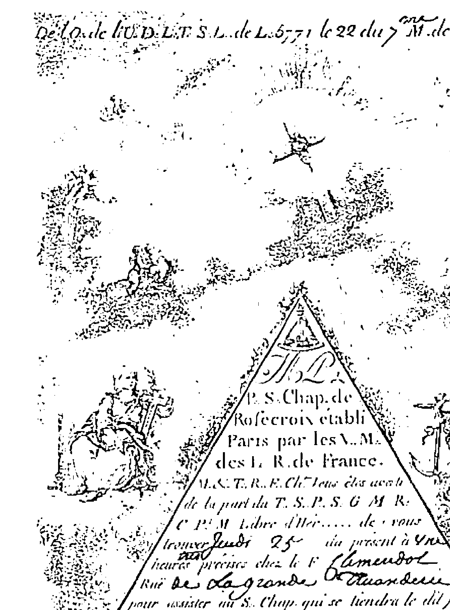


### 今天的魔法世界

经过了18世纪的理性年代，一些相信魔法的学者如罗伯特·弗洛德的影响已经逐渐衰微了。然而，19世纪初期，随着浪漫主义运动的兴起，人们对魔法的兴趣似乎又复苏了。1801年，弗朗西斯·巴瑞特出版了著名的《魔法》一书，这本书带有精美的插图，记述详实，将魔法教材以及古代魔法师的魔法力量一览无遗地展示给公众。巴瑞特关于炼金术的著作、文艺复兴时期一些魔法哲学家的著作，以及犹太喀巴拉著作如数家珍，他内容详尽的作品在欧洲和美国都产生了巨大影响。不久之后的欧洲，神奇的埃利法斯·莱维（1810–1875年）对后世产生了更深远的影响。莱维原名阿方索·路易斯·康斯坦，是一个鞋匠的儿子。他本来学习神甫教程，但在他即将被任命神职时中断了学业。几年后，他成了一名革命社会党党员，开始对玄学产生强烈兴趣，尤其对喀巴拉深入研究，然后开始应用魔法仪式进行实验。随后他将自己的结论集结成书出版，即著名的《高级魔法的教义和仪式》。也因此，他当之无愧地被视为当时魔法研究界的领袖。莱维的著作基于“协调原则”，这一原则来源于古老的信仰：人类即是一个小宇宙，一切活动都与大宇宙中的万物联系着——如人的生殖能力与黄道十二宫中的天蝎座相联系，红色是火星的颜色，人的灵魂即是“宇宙的魔镜”。他还相信人类若得到适当的引导将会是强大无比的、万能的。最重要的是，他坚信无形的、不可见的“星界之光”（这一概念来源于帕拉塞尔苏斯）遍布自然，而且人的意志可以使它成为可见的物体——正如在降神会上可以见到神灵一样。

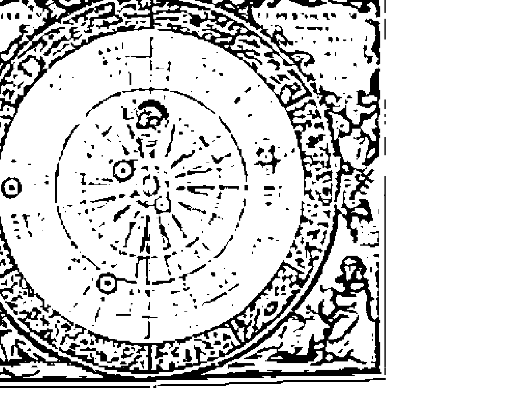

莱维去世后，他的影响依然存在，而且更加普及，并在斯坦尼斯拉斯·古艾塔侯爵（1861–1897年）领导的玫瑰十字会复兴运动中起到不可小觑的作用。看起来玫瑰十字会似乎与共济会有所联系。事实上，19世纪末期，在如何与其他派别联系的问题上，玫瑰十字会内部各有说法，纠纷一直无法调解。其中一位领导成员约瑟芬·培拉丹(1858–1918年)，公开反对十字会的命令，拒绝“与招魂学派、共济会以及佛教扯上任何联系”，而致使这场玫瑰十字会的复兴运动最终四分五裂。

金色黎明会是原玫瑰十字会一些退出成员创立的，由迈克格雷格·马瑟领导。他们在伦敦建立了伊西斯–乌拉尼亚（分别为古代希腊掌管生育和天文的女神）神庙。整个组织都处于绝对的秘密状态，任何透露组织信息的成员都将被以残酷的魔法处死——但却没有一个这样的例子发生过。

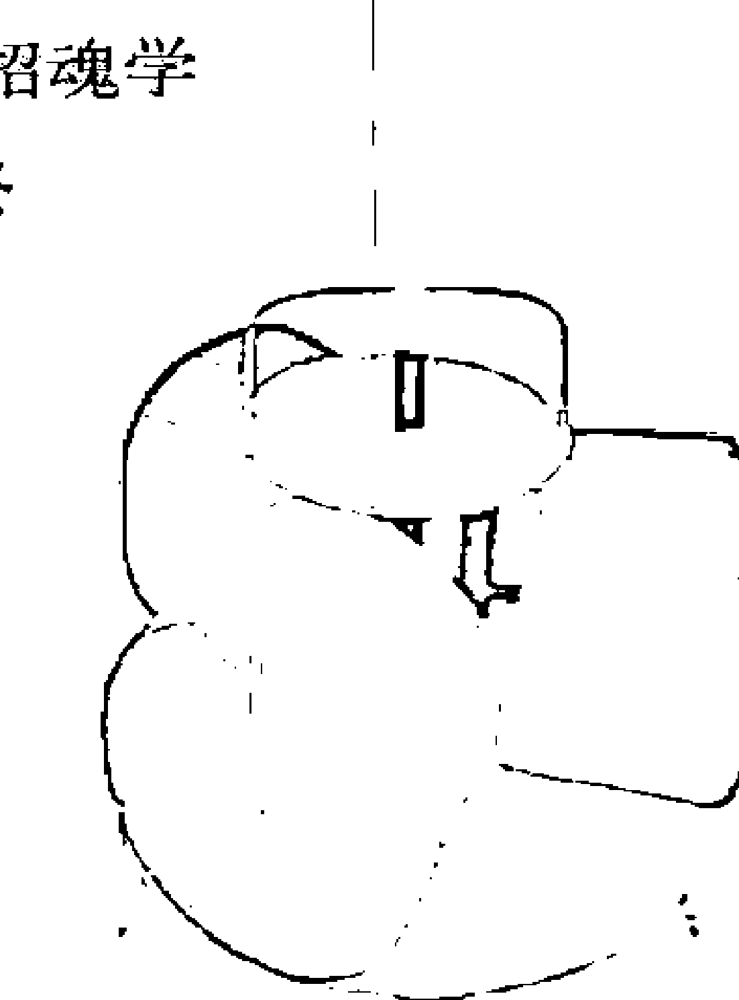

文学学会成员。金色黎明会有相当多的繁琐仪式,每一位成员都要具备一些技巧上的知识,如制作图章、护身符、解读塔罗纸牌的占卜意义、使用伊诺克文字书写等等。

迈克格雷格·马瑟是金色黎明会的首领 (他自称为 Adeptus Exemptus, 即人类中最高等级的人)。他是一位伟大的现代魔法师。当叶芝首次见到他时,他就指导叶芝拿着一块彩色卡片放在额前,随即,叶芝就看见了一些景象: 沙漠和占城的废墟。据记载,还有很多马瑟应用或写或画的符号激发超能视觉的例子。

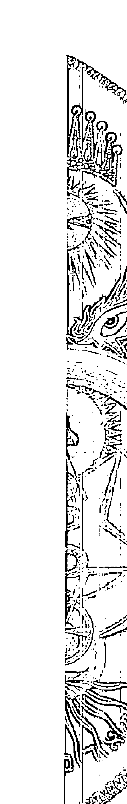

艾利斯特·克劳利于 1898 年加入金色黎明会, 到 1900 年, 他已经成为一位次级Adeptus。他声称自己的许多文章都是直接在某种玄妙的力量指导下写出来的, 甚至有时直接由这种力量书写, 他只充当一个工具而已:他还说有时候连他自己都不知道究竟是什么强大的力量在指引着他。对于那本亵渎神祇、甚至邪恶的《法则之书》, 他声称这是 1904 年他在开罗逗留期间, 在天使埃娃斯的口述下写就的。1906年, 他访问了中国, 1913 年又赴俄国旅行, 在那里他写了一本关于诺斯替天主弥撒的书, 里面提到了许多他自己臆造出的圣人——这些圣人中有鲍吉亚主教, 还有他自己。1916年, 他访问了美国, 在那里出版了一些反不列颠的小册子, 并在一次亵渎基督地解读《圣经·新约》的讲演时, 将一只癞蛤蟆钉死在十字架上, 以此表示他对基督的怀疑和对基督教的蔑视: 他认为这些行为使他成为宇宙中的一位伟大魔法师。

他建立了自己的魔法等级——银星, 并曾管理西西里的泰勒玛修道院数年, 在那里他集合了一批志同道合者, 但人们传说他们有猥亵、放荡的性行为, 还有用婴儿祭祀的恶行。后来他的几名助手以及他的妻子和孩子都莫名其妙地神秘死去。他最后成为瘾君子, 并像魔鬼附体似的要实现他的野心 (即他对自己的称呼): 伟大的野兽, 人间最邪恶的人。

尽管如此, 还有很多人认为克劳利性格十分和善, 平易近人, 而且显然不是个骗子, 因为他相信自己那严密的魔法体系。在他死后, 他的影响力并未随之而去, 反而影响更加深远, 金色黎明会也更加发展壮大, 尤其是在美国。F·I·瑞戈迪博士——曾是克劳利的秘书, 后来成为草药学的专家——一直在努力强调克劳利和金色黎明会的积极方面。瑞戈迪博士旁征博引强调克劳利魔法体系的合理性, 他参考了印度密教和中国道教的教义, 以及起源于古代、到 19 世纪基本成形的欧洲魔法理论。许多当代美国魔法师也开始对他的工作感兴趣, 并着手研究。随着现代巫术的成长和发展, 它值得作为一门独立的研究课题, 我们将在第十章详细讲述。

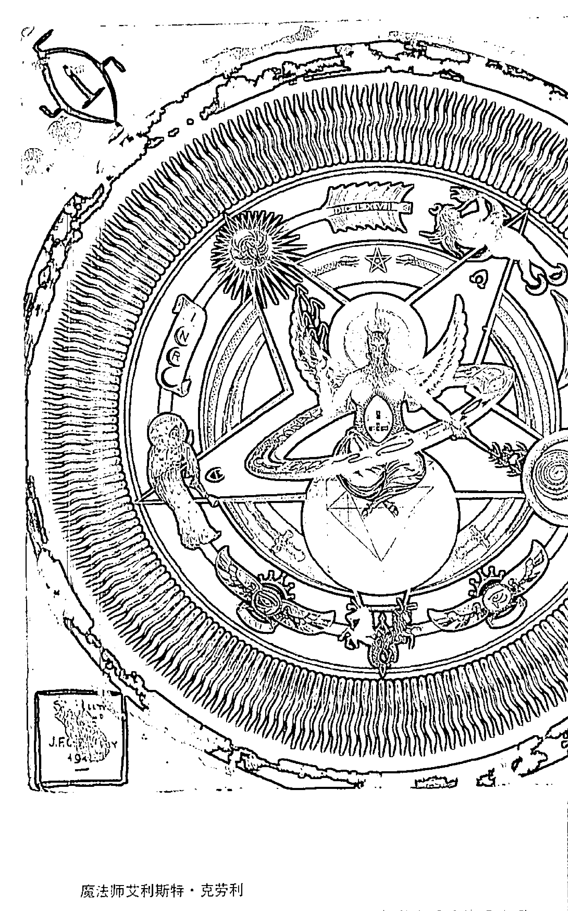

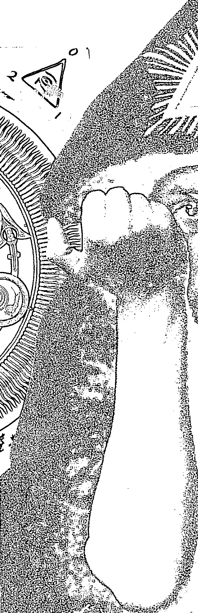

#### 魔法师艾利斯特·克劳利

艾利斯特·克劳利（右图）发展了一套影响深远的魔法理论。基于金色黎明会的基本教义，克劳利的理论包括东方玄学实践、各类与性相关的魔法，以及一个新的宗教“力与火”。克劳利的印章（上图）和其中一个图样（左页图）包含着他所谓的“泰勒玛法则”的细小暗示。

## 第二章 神灵世界

我们居住的世界似乎满是各种神灵——他们隐身于凡间，或者赐福人类，或者危害人类。我们知道，在早期猎人们打猎的时候，总是念一些咒语，希望可以引出他们要追踪猎物的神灵。后来他们意识到一些神灵对人类也有强烈兴趣——就像人类试图引出猎物的神灵一样——这些神灵或是要引诱人类步入邪恶的泥潭，或是要鼓励人类追求真善美。有时候神灵也以各种方式压抑或满足人类的欲望。

历史上的魔法师（或巫师）为了实现他们目标——知识、权力、财富、健康以及其他一直在上下求索——他们的方法就是引出那些隐身的、居住在超自然世界中的神灵，并且向他们祈求帮助。有时候祈求者会得到神灵慷慨帮助，然而有的时候他们就要面临极大的危险。魔法师们在祈求神灵的仪式上必须要使用特制的精致器具，以保护自己不受危害，因为那些可怕的强大力量随时可能转而伤害到自己。

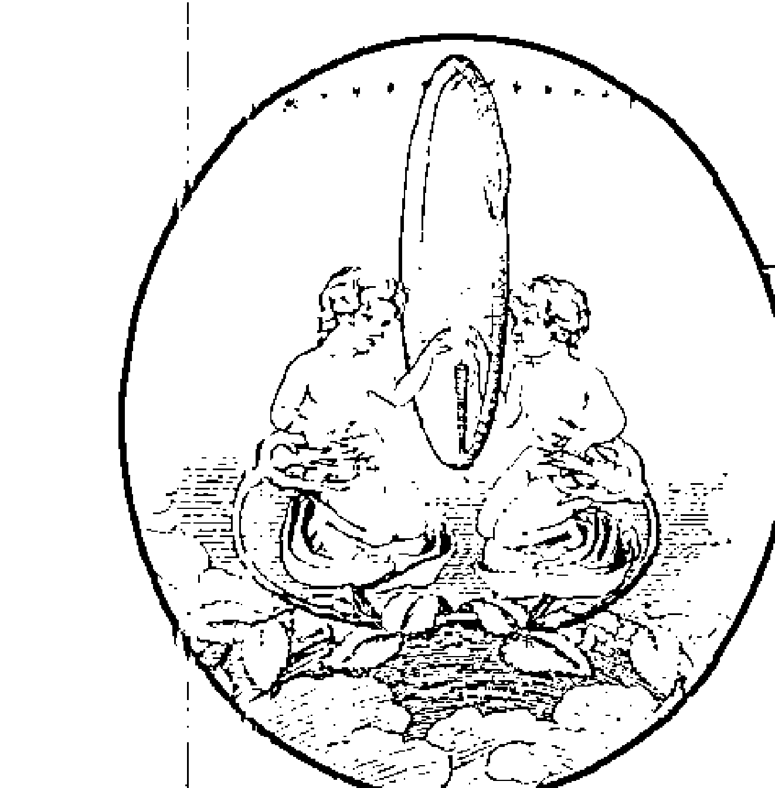

### 1 自然世界的神灵

早期的文明十分贴近自然，这是由于当时的人类十分依赖自然，相信那些居住在自然界、能控制自然力量、与一切自然现象相关的神灵。一个明显的例子就是希腊神话中的潘神（掌管树林、田地和羊群的神，有人的躯干和头，山羊的腿、角和耳朵）。即使在今天，那些采集草药的人在采摘多年生植物的花或浆果的时候，都会很真诚地说声“对不起”，似乎是安抚附在上面的神灵。也许人类最熟悉的自然神灵——而且至今还对西方产生强大的影响，就是“小人儿”了，也可叫做仙女或者精灵。人们认为精灵居住在远离人烟的大自然中，有时会见到他们在

精灵树 (右页图)
这是英国“精灵画家”理查德·柯南道尔运用色彩最多、精灵形象表现最丰富的一幅作品。树枝上的精灵不少于200个，精灵之王位于正中，茂盛的胡子颇具特色，看上去很有精灵领导者的派头。

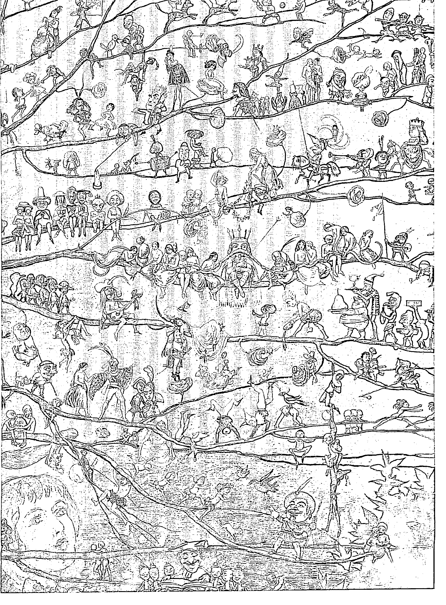

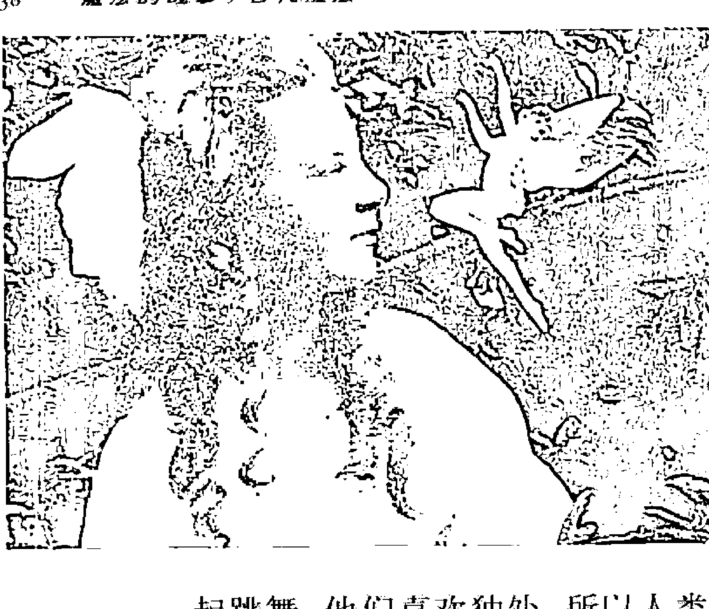

#### 虚幻的仙女

一张仙女的照片，1920年在英国的约克郡由某人伪造，这张照片曾使柯南道尔（他创造了侦探史上最著名的形象——福尔摩斯）对仙女的存在深信不疑。

一起跳舞。他们喜欢独处，所以人类最好不要唐突地去打扰他们。有时候他们也会对人类搞些恶作剧，甚至还会偷走某家的孩子，而留下一个愚钝低能的孩子作为代替物。

防止精灵对自己恶作剧捣乱的最好方法就是保证你的房子和居住的人都整洁干净。当然给精灵们提供食物也不失为结交他们的一个好办法，最好把食物放在方便的地方，还要周到地提供水和毛巾。

在欧洲许多地区一直坚信着精灵的存在，尤其是在凯尔特人聚集的地区，这种信仰一直到20世纪还保留着。这些“小人儿”在乡村居住了几千年之久。仙女或精灵修炼的魔法大多是乡村魔法——邪恶的行为是邪恶的神灵导致的，而真善美的神灵则会带来幸福和好运。但有时候这些精灵们也会调皮捣蛋，如帕克（恶作剧的小精灵），他是德国神话中常见的坏心肠精灵，在莎士比亚的名剧《仲夏夜之梦》中，我们就看到了他的恶作剧。这样的精灵肯定是危险的，会给人类甚至动物带来疾病和灾难。然而人们也默认他们的存在和魔力。英国著名的古文物研究者约翰·奥布雷说在他孩提的时候，听过很多恶作剧小精灵的民间传说。1670年他详细地记载了塞伦塞斯特附近的一次神灵现身，“这个精灵似的离奇东西飘飘忽忽，当人们问他是善是恶时，他没有答话，倏地一下消失了，留下一阵奇特的香味和悦耳动听的弦乐声音。威廉·李力先生坚信它是一个精灵。”

约翰所提到的威廉·李力（1602-1681年）是当时著名的星相学家，他曾用多种办法试图与仙后取得联系。李力在自传中记述了他一次特别的、振奋人心的经历：他邀请“一位十分温柔贤明的、有着优雅的举止和得体谈吐的仙后”到他赫特福德郡（位于英国英格兰东南部）的家中做客：

> 当我虔诚祈求仙后现身后，
> 一阵微风轻轻吹过。
> 随后，在那些树木之间，
> 又刮起一阵旋风。
> 逐渐地，风势转强，
> 我的眼睛几乎无法睁开。

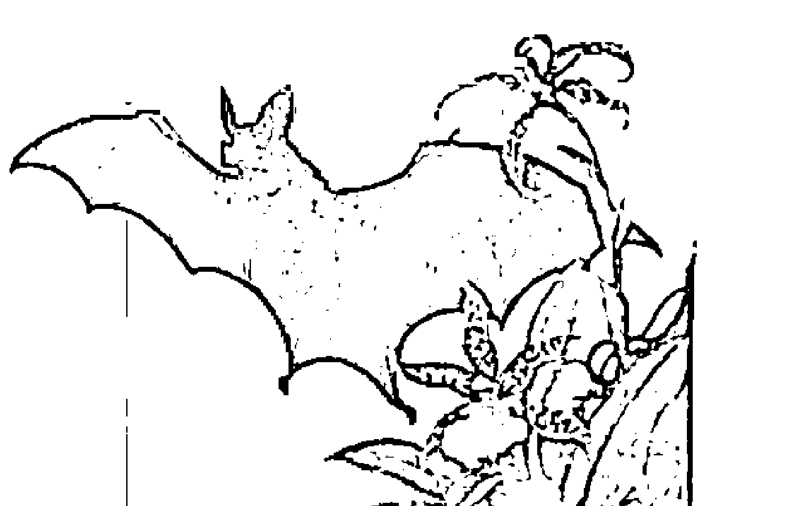

这时，仙后带着无上的荣耀降临人间。
“我对您的崇拜已经无以复加了！”
我恭迎着仙后，我的心是如此的激动，
几乎都要停止了跳动。

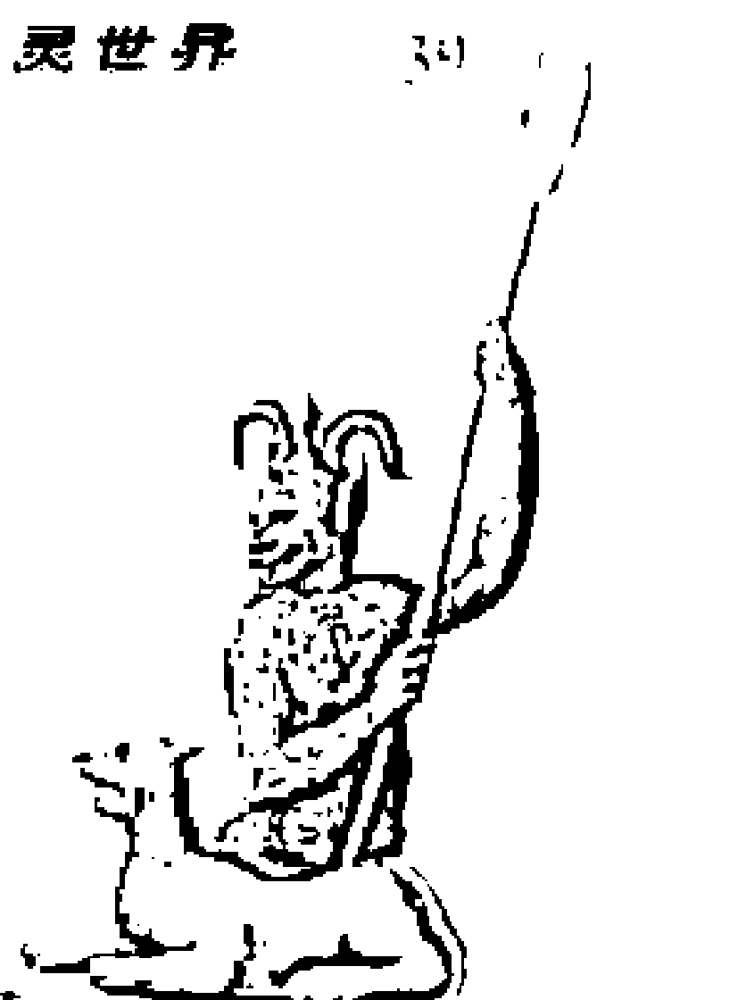

仙后的传说一直流传至今，人们也相信她的存在。在英国乡下长大的孩子一定都记得祖母讲的仙女精灵的故事，如仙女的舞场，小精灵的恶作剧，这些故事一般都是带着戏剧的元素，但是同时也让人紧张，即使是让人害怕的。因为听了故事的人在深夜明亮的月光下独自走在空无一人的小路时，往往会担心小精灵出来捉弄自己。甚至在今天，还有人认为穿绿色的衣服是不吉利的。绿色是那些“小人儿”钟爱的颜色，要是因为穿了绿色的衣服而被小精灵捉弄，那实在是太不值得了。

仙女、精灵以及其他的自然神灵很少被简单地划分为善或恶。他们也许会很邪恶，但是总体来说只要人类对他们尊敬有加，他们基本上不会危害人类。

不论是天使还是魔鬼，如果哪个迷糊的魔法师敢小看他们的能力，那后果将不堪设想。在人类文明的早期，就大致分出了神灵的善恶，后来更具体到了每一个神灵。

希腊罗马神话创造了一个不可见的神灵世界。在这个世界里，众神有各种等级，掌管人间各个方面。其实这只是把人类的美德和缺点提升到了神话的高度。这些神灵英勇无比，但也会恶毒堕落；慷慨大方，但也用情不专；高尚尊贵，但也下流卑鄙——他们反映了人类的各种优缺点，只不过是以一个更加宏大的角度来透视人类。万能的宙斯也像凡人一样，尽管掌管一切，受到万物崇拜，却也摆脱不了人的贪婪、邪恶等等缺点。

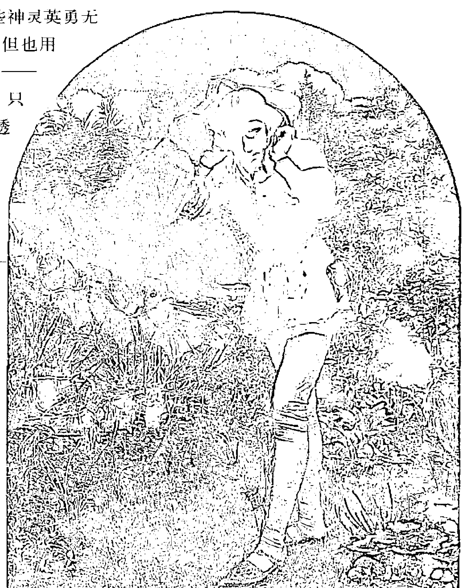

#### 费迪南德与精灵

此图描绘的是莎士比亚的《暴风雨》中，精灵带领普洛斯彼罗的仆人——费迪南德去寻找他的主人。途中精灵欺骗费迪南德，说他的父亲那不勒斯王在离开普洛斯彼罗岛屿时遭遇海难。19世纪的英国画家约翰·埃弗雷特·米莱斯精确地捕捉到了费迪南德当时错愕、不确定的表情。精灵们不时的恶作剧，总是让人措手不及。因此人们对于精灵总是敬而远之，就连它们所钟爱的绿色，人们都是惟恐避之不及。

#### 人神世界

在古典希腊罗马神话世界中，仙女、森林之神与人类共同生活。羊身人面的森林之神显然与随后出现的基督教里的魔鬼有一脉相承的关系。

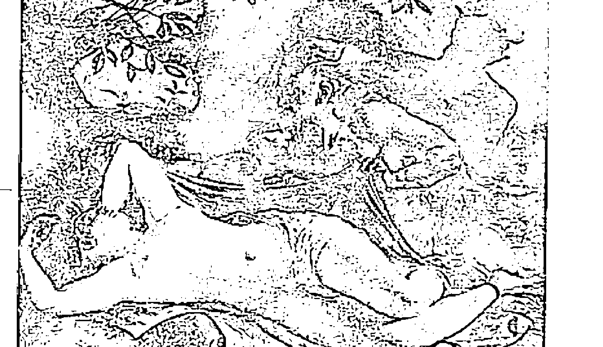

许多宗教都认为世界上只有存在邪恶，神才会存在。因而对神来说，邪恶是不可或缺的。然而这对万物的创造者并不适用，如果他也有邪恶的一面，那么就和他的本质——世间一切真善美的集合——相矛盾了。所以，上帝的对手就是邪恶的神——魔鬼，一个幻想出来的大魔头，领导着无数鬼怪。

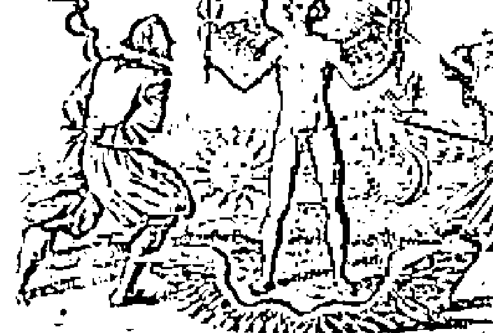

### 2 上帝与魔鬼

犹太《旧约》中，惟一的神——上帝代表世间一切真善美，他管辖的一些精灵也代表美好的一面，因而我们把这些好的精灵叫做天使。有了代表真善美的上帝，当然也要有反对者，这个代表邪恶力量的神灵就是大魔鬼——人们通常叫他撒旦，他象征邪恶的灵魂，是地狱的统治者和上帝的敌人。撒旦本身是一个大天使，堕落以后又纠集了众多鬼怪，联合反抗上帝。上帝带领的美好一派与撒旦领导的邪恶一派为争夺对人类灵魂的支配权而不可避免地产生争斗。而人类中的一些企图祈求撒旦帮助的魔法师将会冒着极大的危险，很可能会因此失去不死的灵魂，永远无法进入天堂。

只有在《启示录》（基督教《圣经》中的一章，81-96年）中，有关堕落天使的观点才首次公开地见诸于经典：“他（撒旦）管辖着天堂里第三级星星（天使），并把他们全部抛到了地球上……包括他自己。这欺骗了整个世界，事实是撒旦被上帝抛落到地球上，与他一起的还有那些天使们。”塔斯卡勒姆的红衣主教详细地清点了堕落天使的数目——共有133,306,668个，并提供了一些有据可查的名字：山姆海洋、阿莫诺斯、萨姆萨威尔、考克贝尔……

另一方面，《创世纪》（前8世纪）也记录了一些天使“见到了人间的少女，并娶之为妻”，此举导致了他们的降级（被上帝从天堂贬到人间）——这也是早期的基督教研究者先人为主地认为性欲是原罪的根源（他们还认为这些堕落天使导致了一些女性化妆用品的出现如项链、手链、胭脂、眼影等）。

有关撒旦的传说纷云，他拥有不计其数的传记。最初他是六翼天使的首领——十二翼天使。“他被所有的天使拥护着，向他们传授知识与荣耀”教皇格利高力六世曾这样写到。他认为撒旦是在第6世纪被贬斥的。自那以后，撒旦又在《新约》里出现，作为黑暗之神，他领导着各种邪恶力量。

撒旦可以以各种化身，各种名字出现：可以化身为各种动物（羔羊、公牛和驴子除外，

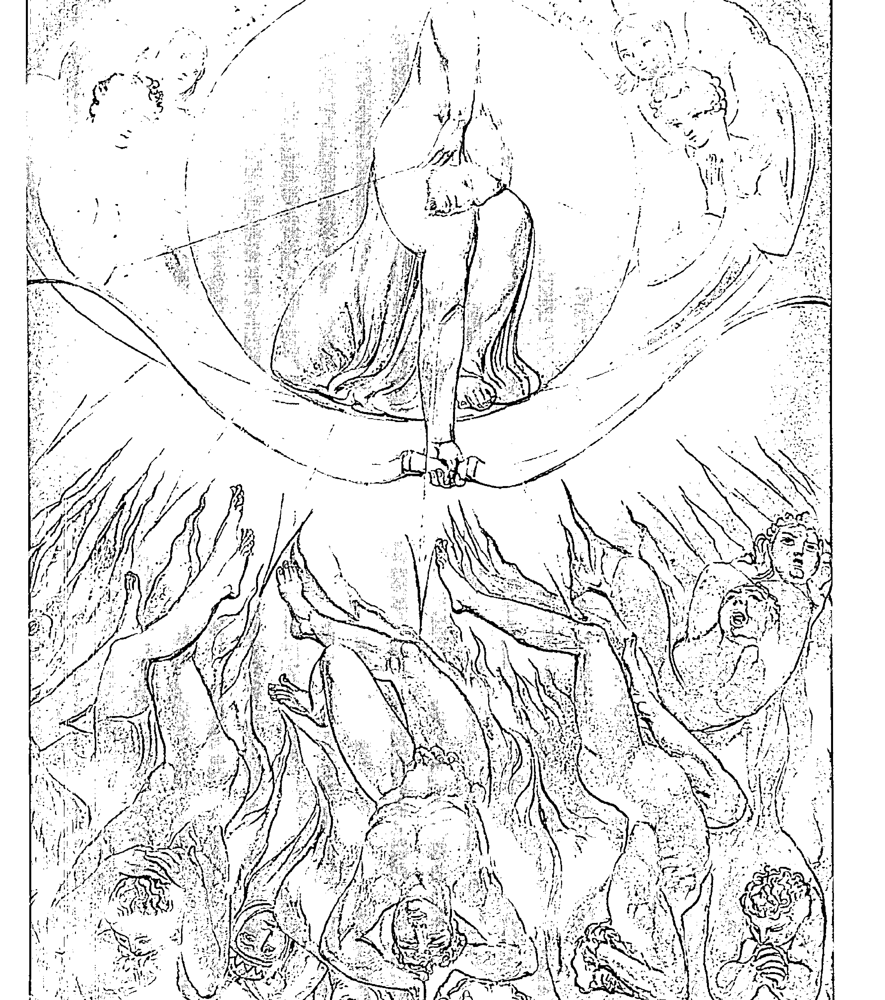

#### 堕落天使

这幅画是英国神秘主义诗人、画家威廉·布莱克以约翰·弥尔顿的《失乐园》为题材所绘制的12幅作品中的一幅。在这幅作品中布莱克利用光影效果，通过色彩的转换，将天使坠落瞬间的速度与力度精确的表现出来。同时他也将八天使面对如此紧张的情况的种种表情惟妙惟肖的刻画出来。

这些动物与基督有紧密联系):通常撒旦最喜爱的伪装是毒蛇、龙、山羊和狗。有时候,他假扮成牧师或神学家,有时候还扮成年轻貌美的少女。但是他的真正相貌却实在让人不敢恭维,出奇地丑陋:他有裂开的蹄子,由于从天堂坠落的缘故,还跛了脚,他的膝盖扭曲向后,在肚皮上还有一个面孔,他没有眉毛、鼻子和生殖器奇大无比。他总是一头红发(所以出卖基督的犹大也是红发)——而且皮肤如黑炭般。尽管如此,他却很轻易地就能勾引到男人或女人。

这个大魔头掌管着一切有罪的或黑暗的邪恶力量,凡是正统基督教所不容许的事物都置于撒旦的掌理下:如异端的神庙,乡村的原始宗教(在早期这些事物与泛神论的异端教关系密切,随后又被认为和巫术扯上关联)。同样地球上任何异常现象也都被认为和他有关,如同性恋现象,大自然中的山峡,沟渠等等。所幸,尽管他的权位很高,但得到的尊重却远远不够;在1648年,一个传单被印刷并广泛流传,其目的是“反驳那些相信世界上不存在邪恶神灵的信徒”,其中详细描述了:

> 人们在许多地方都见到魔鬼,在地窖里,在储藏室里,
> 甚至一个屠夫还割开了一个魔鬼的喉咙,卖了一部分肉,
> 留下一部分自己享用,还请了许多人共品晚宴。
> 此事被城中很有威望的人郑重以信件证明了其真实性。

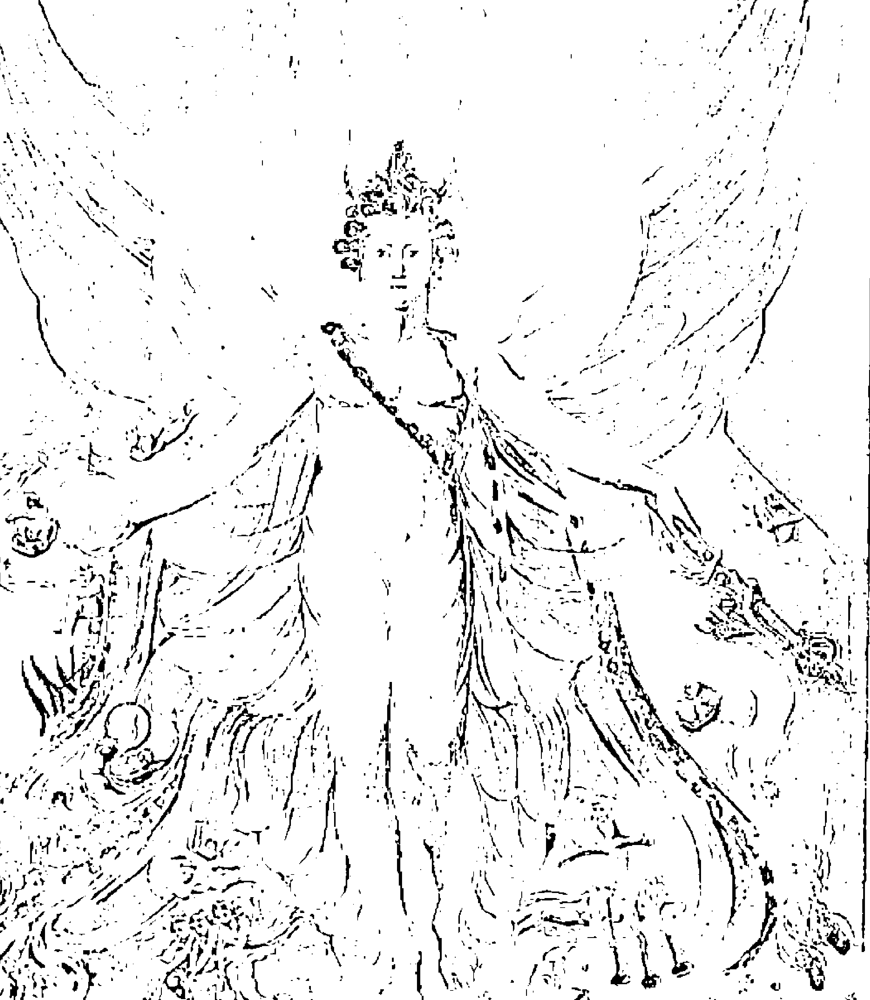

#### 撒旦有数以万计的追随者

他领导的魔鬼们:这些魔鬼遍布空中,数量多如牛毛,假使一根针从天堂落下,它在到达地面时不知会碰到多少个魔鬼:

- 无毛的魔鬼、长角的魔鬼,
- 愠怒不乐的魔鬼,淘气顽皮的魔鬼,
- 秃毛的魔鬼、毛发浓密的魔鬼,
- 大胡子的魔鬼、该死的魔鬼,
- 愚蠢的魔鬼,
- 男性的魔鬼、女性的魔鬼,以及幼小的魔鬼。

#### 天使的容光

布莱克的这幅作品展示了撒旦荣耀的一面。还是大天使的撒旦绶带加身、权杖在握,丰满的羽翼舒缓展开,言从面呼后拥,无不突现了撒旦作为十二翼天使的骄傲,然而他头上滋长的罪恶之花却预示着他将踏上一条荆棘丛生的道路。

#### 公墓中的撒旦

意大利比萨一座公墓中描绘地狱的壁画，画中撒旦怒目而视。

所有魔鬼家族的后裔，都来自撒旦可怕手中，产生的速度甚至比光速还要快。

魔鬼并非是基督教的特殊产物。其实，在古典希腊神话中，人们认为每个个体都与不同的魔鬼紧密联系着，这个个体独有的魔鬼会记录此人的一切言行，但保持着中立态度，不会驱动人向恶或向善。而且在世界不同地区，魔鬼有许多分支流派，有不同的称谓：如在阿拉伯称为厄布利斯（伊斯兰神话中的恶魔，魔鬼，魔王）；在迦勒底王国（古巴比伦人的一个王国）称为玛斯基姆；在荷兰称为杜约尔；在埃及叫做提丰；在印度教中称为罗刹；在爱尔兰民间传说中称为布卡（爱尔兰民间传说中常变成动物出现的鬼怪，恶精灵）；在古代波斯传说中被叫做阿修罗。它的称谓简直是不胜枚举，但实质上大同小异。

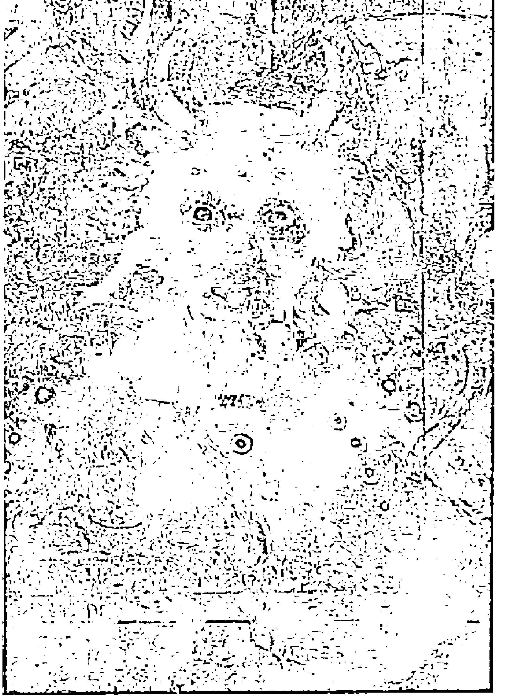

至于犹太教神学家提到的魔鬼，其数目也被犹太法典编著者统计出来了：共有7,405,926个——比起红衣主教统计的堕落天使数目要少得多。然而，如果按照另一个犹太人拉比·胡纳的观点（暂且假设他的观点正确），那么主教统计的天使数目又远远不够。拉比认为每个人都被无数魔鬼环绕着，左边有1000个，而右边有10000个。这些魔鬼也有不同等级，最顶级的是三位一体的魔鬼：撒旦和他的两个随从——一个是统治海洋的魔鬼，一个是统治地球的魔鬼。在那三位一体恶魔的嘴里，又有三个以青蛙形式出现的不洁魔鬼；然后是大批次等级魔鬼，马身人面，带有狮子的利牙和女人的长发，戴着黄金的皇冠和黑铁的胸甲，身后还拖着一条长满倒刺的尾巴。

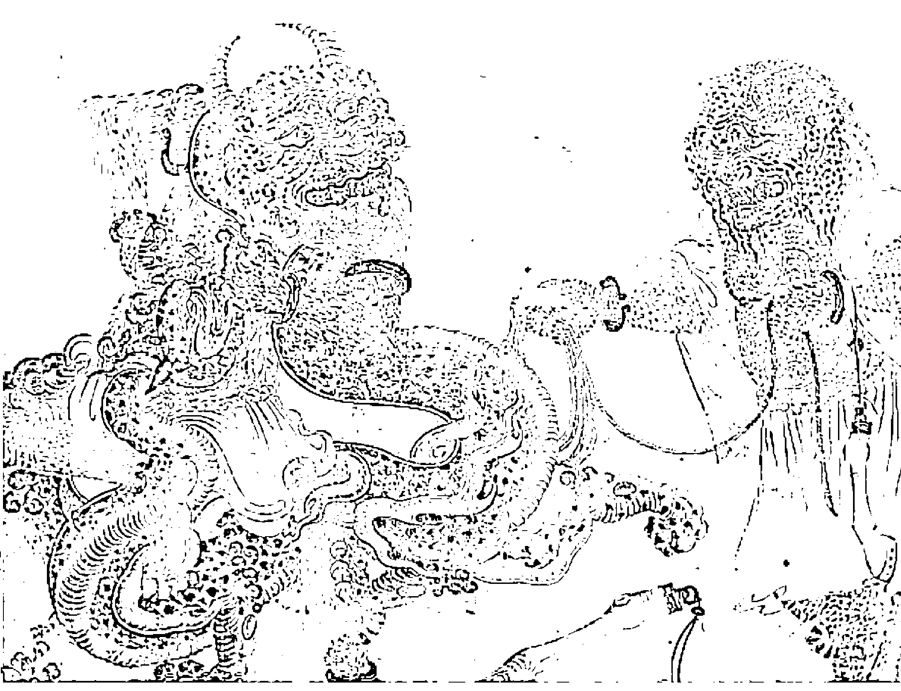

谐趣魔鬼
在各种文化中，都有不同的魔鬼。伊斯坦布尔托普卡比博物馆的壁画以一种诙谐的笔触来表现魔鬼可怕又好笑的一面。

#### 善与恶的神灵

天使是在上帝领导下代表美好、善良的神灵。因而这些上帝的仆人也就具有一种神圣的力量（在梵文中，天使表示神圣的精灵；而在波斯语和希腊语中，天使代表着传递美好消息的信使）。天使和魔鬼都可以被人召唤，可以和人交流。因此一些拥有这种能力的人会通过召唤或交流来获取神灵的魔力，从而达到一些特殊的目的。而上帝呢，是宇宙中无处不在的神灵，可以以任何一种面目出现，威力大得惊人，力量深不可测。因此人类不敢也无法与之交流。上帝的力量只能通过灵媒来触及（而撒旦的力量，则可以被一些人获取，尽管工程浩大而且充满危险）。

在那些花费大量精力与时间试图与神灵交流的人中，最著名的莫过于英国人约翰·迪。他是一位伟大的学者。他在数学和航海方面成就显著，此外他也是一位炼金术士，创建了英格兰第一座图书馆，他还是伊丽莎白一世册封的皇家星相学家（但在玛丽女王当政时期，他差点被当作巫师烧死）。当时著名戏剧作家本·约翰逊还创造了一部以他为原型、以他的名字命名的关于炼金术士的戏剧，还有人认为他是莎士比亚名剧《暴风雨》中普洛斯彼罗的原型。迪对魔法极度痴迷。他的头脑中满是大自然的神秘与魔力。他认为自己对魔法的沉迷与研究属于科学范畴，绝非反科学的魔法范畴（这两者是绝对不能混淆的）。他对自然的魔力极其虔诚，激烈地反对一切忽略自然的言论和行为，显然这也符合他想召唤并与之交流的天使们的立场，一个天使曾这样告诉他：

> 对自然的忽视会使你内心受到最痛苦的折磨；对科学的渴求令人类灾祸连连……

约翰·迪用喀巴拉方式来召唤天使，这是一种复杂的系统，需要使用希伯来文，而且经常要用字母易位来破译。在这种系统中，与希伯来文相对应的数字被仔细巧妙地以某种规律排列。与迪一起召唤神灵的还有一位灵媒，叫爱德华·凯利——很多人怀疑历史上是否确有其人。凯利声称他可以从水晶球中看到未来的景象。后来，凯利成了一位炼金术士，却因为没能给疯狂的布拉格皇帝鲁道夫二世炼出黄金，被投入监狱，并死于一次越狱中。正是凯利声称他见到了迪所召唤的天使，并把这次召唤归功于一种特殊的语言——伊诺克，这是一种天使的语言，这种语言有自己的字母表和语法。因为从水晶球中看到的天使的名字都是颠倒的，所以也要倒过来拼读。

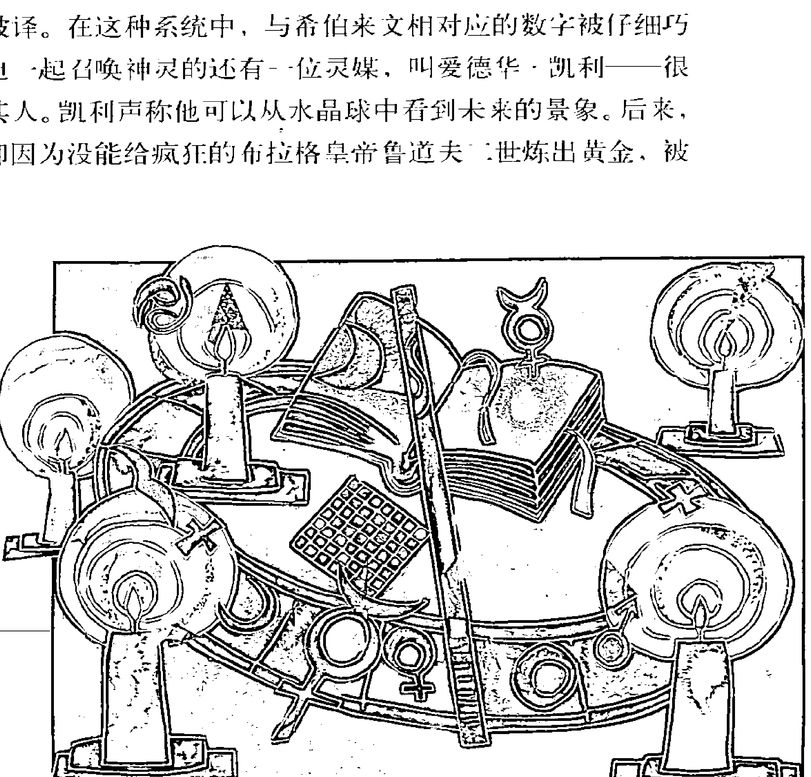

#### 道具

伊丽莎白一世时期的名流、著名的魔方师约翰·迪博士使用的炼金术的道具。

#### 魔法的故事/古代魔法

为了记录这种语言，凯利端坐在水晶球前，天使加百利拿着写满字母和图形的画板以及教棒来到他面前。加百利指引他写下49个表格，每个表格含有49行，每行都有49个小方框，每个方框中要包括一个伊诺克字母。凯利从水晶球中可以看到天使指着一个方框，并对迪念出象征这字母的数字。迪随着他的指引找到了这个方框，并相应地写下这个字母。就是这样，天使向迪传授了伊诺克文字，使彼此可以沟通，而迪也可以召唤天使。

他们之间的交流最后以伊诺克文字集结成书，当然也是颠倒过来写的。如果逐句地，按照字义破译这本书——尽管这原文也许没有什么意义，我们会认为凯利根本不可能记住整个复杂的系统，更无法将它们组合成可读的书。显然，这其中有一些更为奇妙的东西。

早期，他们在召唤乌列（基督教《圣经》和伊斯兰教《古兰经》所载天使长之一）时取得明显的成功。乌列是光明天使，他告诉迪有49个象征着美好的天使乐意听从他的命令来此现身。他主要的情报员是天使玛迪米，她曾连续7年现身于凯利和迪面前：

> 这是一个神奇的天使，宛如7到9岁的漂亮小女孩，头上带有鹿角的装饰，满头可爱的小卷发，身穿可变成绿色和红色的长袍，调皮地在我的书后钻来钻去。

玛迪米是一个活泼可爱的小天使，她“以一种小女孩的活泼姿势跳上跳下，自娱自乐，还有一些其他的小天使从角落里与她对话，但只有她一人现身于我们眼前。”

其他的天使偶尔也会现身，其中不乏“调皮淘气”者，他们穿着古怪，拿着孔雀羽毛，言谈滑稽，经常讲些色情笑话，让严肃认真的迪博士哭笑不得。玛迪米还透露了一个重要的信息，她在言谈间不经意地指出“宇宙中没有任何秘密，除了那些埋藏在人类灵魂深处的东西以外”。与天使对话是件十分严肃的事情，而且“并不是所有人都有机会直面天使”，威廉·李力曾经郑重地提醒我们，“尽管有时候天使会一次次地听从召唤，但他们不会给每个人机会瞻仰他们的荣光。”一些人可能会因为这样或那样的原因被剥夺了瞻仰天使的权利，例如，李力曾见过一个叫格莱德维尔的魔法师，此人曾经与天使乌列和拉斐尔谋面交谈”，然而由于他粗心大意，无意冒犯了天使，此后再也无缘见到他们，这两个天使最多只是偶尔现现身，便倏然隐去，不会给他任何启示。”

##### 恶作剧精灵埃舒

埃舒是西非约鲁巴人的恶作剧精灵，负责灵界与人类之间的沟通，当然有时他也是麻烦的制造者。约鲁巴的谚语中说：“埃舒可以把正确的变成错误的，把错误的变成正确的”。埃舒最大的特点也是善变，他能以256个不同的形象出现在人们面前，如果人们拒绝了他的诱惑，就奖赏他们；反之，他就会惩罚他们。

##### 法翁与精灵

此图是丹尼尔·麦克斯·利兹为爱德华·布尔沃·利顿（即利顿爵士）所作，原名《潘与跳舞的精灵》。画面描绘了月圆之夜，半人半羊的农神潘伏在小妖精的洞口，恶作剧般地吹响了排箫，誓要把赌气似的蜷缩于洞内的小妖精引出来。悠扬的箫声引得洞外的精灵们翩翩起舞，洞内的妖精坐立难安，焦躁难挨，灵动的画面，富有生气的色彩，使灵界本该对立的双方处于和谐的统一之中。

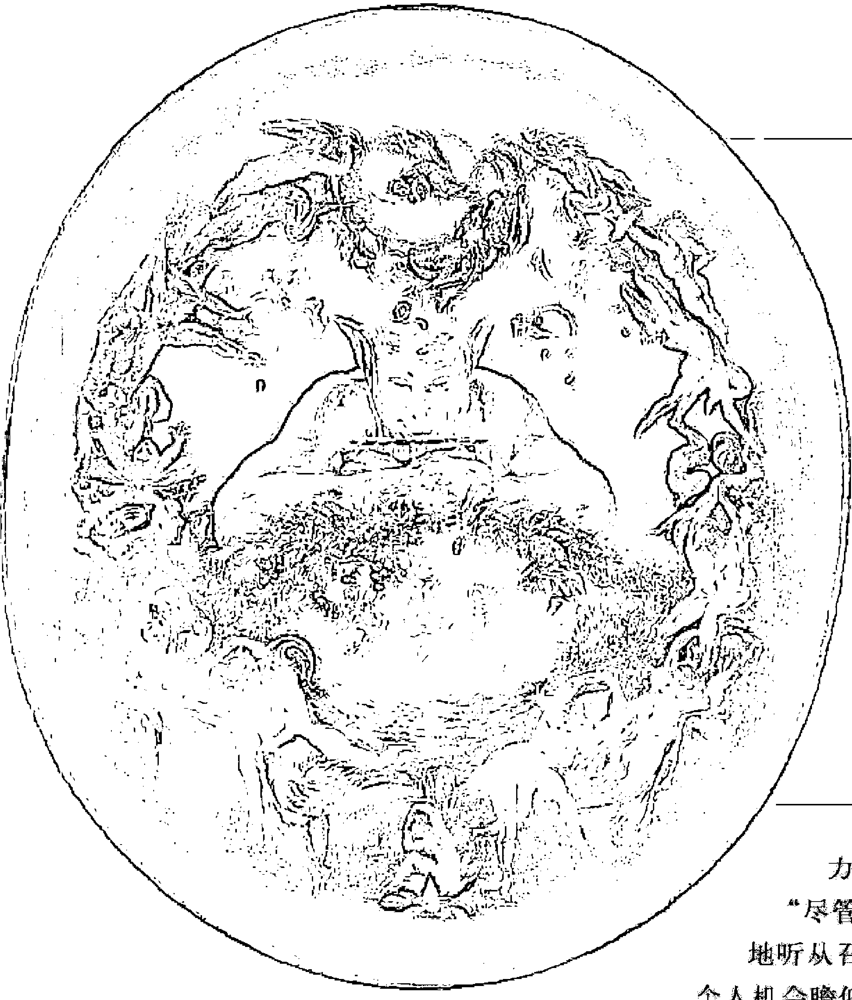

##### 天使与圣徒

基督教、犹太教以及伊斯兰教中都有天使的概念：天使，神的使者侍从，上帝不死的精灵，为上帝或真主服务，他们有自己的责任，并具有特别的力量。而圣徒代表正义的不死灵魂，基督徒们相信这些圣徒会使一些奇迹发生，并且可以给虔诚的信徒们传输一种力量去实现一些奇迹。

#### 天堂花园

天使们在天堂花园里快乐地翩翩起舞。这是油画《天使》中的一个局部，由15世纪佛罗伦萨修道士弗拉·阿吉力克创作。

天使是高级的神灵，同样年纪也很大；他们都在巴比伦出生，先被波斯人收养，后来又被希伯来人收养。只有两个天使（人们也经常叫他们守护神灵）在《旧约》中被冠以名字——米迦勒（基督教《圣经·旧约》中犹太人的守护天使长）和加百列（《圣经》中七大天使之一，替上帝传送好消息给人类的使者），这两个最古老的天使都源于古巴比伦神话。拉斐尔是除了他们以外最老的天使，他在《新约外传》中出现。

在早期的基督教时期，许多天使都是由伊诺克命名的，但他们也在与《圣经·新约》同一时期的其他文献中出现过（大约在公元1世纪左右），虽然在那里他们倍受冷落，但是犹太教的一些神秘著作使他们广为人知，而且大受欢迎。

在11-13世纪，不知出于什么原因，天使学莫名其妙地兴盛起来，那时大约有1000多个天使被命名。当时对天使的形成众说纷纭：天主教神学家们坚持天使是在创世纪之初被上帝创造完毕的；犹太教神学家们认为他们“每天都是新的”，上帝的每一次呼吸都在不停地形成和创造他们。

天使的级别也让人感到有些混乱。根据米兰主教圣安布罗斯·格利高力教皇以及其他权威人士的观点，天使们在超自然力量的次序中是最低级的：炽天使（或称六翼天使），智天使以及座天使是天使中地位最高的，其次是主天使、德天使和力天使，最后是权天使、大天使和天使。但是除此之外也有其他排列方式和不同的名字，如在犹太学者迈蒙尼德斯博士（1135-1204年）的《所罗门的伟大钥匙》中，“十大神圣天使席位”是如下排列的：力天使、座天使、权天使、主天使、炽天使、德天使、大天使、天使、智天使、堕落天使。

在犹太神学中，大多数天使都是男性，尽管在阿拉伯传奇故事中贝娜德·哈舍尔是上帝的女儿，但女性天使并不常见。对于犹太人来说，一个极大的特例是舍琦娜（意为耶和华的神姿，光云，神之显现），被称为“神的新娘”，她经常被拿来与湿婆神（印度教的主神之一）的性力崇拜相提并论。她由雅各命名（雅各在《圣经·旧约》中是以撒之子，亚伯拉罕之孙。他的12个儿子后来成为以色列12个部落的祖先）。在《创世纪》中，作为“使我从所有罪恶中忏悔赎回的圣洁天使”；她曾经指点过摩西（尽管摩西的兄弟亚伦由于她的吻而丧生）；她曾保佑所有的犹太夫妇免受异族的迫害。

天使们经常守卫在婚床之侧，甚至还会在男女房事上提供帮助。在喀巴拉信徒坚信的301,665,722个天使中，47个是专门负责各种男女交合之事的。其他的天使另有其职，如司掌一年十二月——一月由加百利司掌，二月由巴切掌管，三月由玛琪迪尔掌管，四月由阿斯莫戴掌管，五月由安布列掌管，六月由穆列掌管，七月由弗切尔掌管，八月由哈马列掌管，九月由乌列掌管，十月由巴比尔掌管，十一月由安德切尔掌管，而十二月由哈尼尔掌管。

当然，每一颗行星（除了近代发现的三大行星以外）都有自己的守卫天使。根据弗朗西斯·巴瑞特的著作《魔法》记载：拉斐尔司掌太阳，安尼尔司掌金星，米迦勒司掌水星，加百利司掌月亮，卡夫杰司掌土星，扎德切司掌木星，沙米尔司掌火星。除此之外，还有多种不同的行星护卫天使理论。行星在各种魔法形式中都含有重要的意义，也许正因为如此，在《图列尔天书的秘密》一书中，作者认为九大行星是九个“神灵，上帝的使者，宇宙中的智人”。

同样，一星期的每一天也都有两位天使守卫司掌，星期一除外，星期一是由加百利独自司掌，他是掌管死亡和复活、怜悯和复仇的高级天使，还负责天堂里的事物。大天使卡米尔和天使扎米尔司掌星期二，米迦勒和拉斐尔司掌星期三，星期四由扎菲尔和萨切统治，星期五由哈涅和安尼尔掌管，扎菲尔和卡西尔掌管星期六，而星期日还是处于米迦勒和拉斐尔司掌之下。

同样的，一天之中的每个时辰也都有天使在司掌着。如果把这种天使司掌的时辰应用到实际中，我们会惊奇地发现这个系统似乎并不完全等同于日夜的时辰，它与现行的传统二十四小时没有任何关联。在这个系统下，若要知道一年中任何一个白昼的时间，人们必须先要统计一天中从日出到日落共有多少分钟，然后平均除以12，这样计算出白昼中每一个小时有多少分钟。例如，1991年8月3日，在英格兰的伦敦太阳于早晨5点26分升起，于傍晚8点46分落下，这样从日出到日落，一天中共有920分钟，除以12，这样一白昼的“十二”个“小时”中，每个“小时”应有76分钟。所以那一白昼的第四个小时，应该是从日出后的第228分钟开始，即从上午8点34分开始。夜晚的时辰以同样方法计算，从日落到日出的时间均分为十二个小时。根据一个相当精细的运行系统，白昼与夜晚的时辰也由星相和行星来司掌着。

对我们来说一些天使的名字耳熟能详，如加百利、米迦勒、拉斐尔……其他的我们就不甚熟悉了；但是或多或少我们会了解他们的一些情况。如卡西尔，位居制权天使的等级，他曾是一个王子，掌管孤独与泪水；安尼尔，是七大创造天使之一，掌管第二级天堂，也是爱情之星金星的守卫天使，同时也掌管着人间的男女之事；扎菲尔则是那些想使用魔毯的人崇拜与召唤的天使。

至于圣人，人们认为他们一生中经常使用带有魔力的治疗手段（也许这些治疗手段用于现代就不再那么难解释了），而且人们认为他们可以在两地同时出现。同样，人们还相信圣人可以作为上帝与凡人沟通的媒介，人们可以通过祈求来获得帮助。而他们的帮助事无巨细，大到治病疗伤，小到寻找失物等一些琐屑事件。他们拥有神奇的力量，尽管虔诚的宗教信徒们不愿使用“魔法”这个字眼。

#### 魔鬼附身

魔鬼会附入某人体内，这种观点已经流传了数个世纪，而且常常用来解释某人突然的反常行为；既然魔鬼可以如此轻易地主宰人的灵魂，因而人类邪恶的一面也就可以顺理成章地被接受了。在基督教社会里，魔鬼伪装成各种事物来折磨引诱修道士——他们会事先进行周密的计划，针对修道士的年龄以及嗜好来设定诱惑——对于年长的修道士，魔鬼们用安逸、美食或美酒来诱惑，对于年轻的则以美色来引诱。有时候，魔鬼们自己化身成各种干扰或诱惑。如圣安东尼的默祷就曾被魔鬼以各种化身干扰过，如狮子、熊、豹、毒蛇、蝎子、狼等等。他还不止一次受到过人身攻击，曾多次在路上被数个魔鬼击倒，人事不省。圣希拉里昂也曾受到牲畜叫声、婴儿哭声、以及野兽吼叫声等各种噪声的骚扰。其他的修道士也常常受到歌声、口哨声甚至很响的放屁声困扰。

对抗魔鬼困难重重，一个最大的困难就是这些魔鬼有时候把自己变得很小，或者干脆隐身，这样人们根本无法看到他们。于是他们就会随着人们的呼吸进入到体内。有时候魔鬼通过鼻腔进入会使人打喷嚏，所以往往某人在打喷嚏后，周围的人会说“上帝保佑”（今天我们依然会吸入一些东西，不过我们称之为细菌，而不是魔鬼）。

尽管人有时会看见魔鬼造访，但凡人的肉眼却很难分辨出是魔鬼还是天使。修道士们掌握了分辨魔鬼与天使的窍门，这可以使魔鬼现出原形。当然最简单的方法莫过于直面造访者，开门见山地询问他是上帝的精灵天使，还是人间的妖孽鬼怪。如果他是天使，就会现身：如果是魔鬼，听到这样直接的问话，就会逃匿无踪。一个真正的圣人，尽管总是被各种魔鬼骚扰，但最后他总会击败这些虚张声势的家伙。

圣人是凡人，并非神灵。但当他们死后，他们会变成神灵，而且会应凡人的祈求帮助他们，充当上帝的使者，成为人间与天堂的媒介。

中世纪的神学家们确信凡人都可能被魔鬼附体，他们的肉身会成为魔鬼的栖息地。这毋庸置疑，难道《圣经》里不是充满了这类魔鬼附体的事例吗？难道人们不是常常见到那些因被附体而痛苦异常的人吗？今天，教会不甚肯定这种说法，但也没有哪个牧师敢于断言魔鬼附体纯粹是无稽之谈。

驱魔即是指通过符咒或祈祷使魔鬼离开所附人体。在过去数个世纪里，基督教和穆斯林都举行过驱魔仪式。在今天，少数罗马天主教或英国国教的牧师中仍掌握驱魔方法。同样不遵奉英国国教的新教牧师也有自己的驱魔仪式，但他们更多使用劝说的力量，不是祈求神灵的力量，而且仪式没有过去那样正式隆重，减少了很多繁文缛节。

要想成功驱魔，首先，也是决定性的一步，即在驱魔者和附体魔鬼之间建立某种沟通桥梁，这是驱魔的开始阶段。通常当魔鬼回应驱魔者的指令，确认他们的身份后，驱魔的开始阶段结束。在《圣经》中有类似记载，当耶稣询问附入体内这“不洁的精灵”的名字时，这

#### 魔鬼的游戏

根据中世纪圣人的观点，魔鬼在人类打喷嚏时随着气流玩耍。

#### 驱魔会

这里描绘的是16世纪法国举行的一次驱魔仪式，谨慎地在基督教教义指导下进行，大多数牧师在驱魔时大部使用圣水、熏香，以及嘈杂的各种声响赶走那些入侵者。

#### La Croisée de l'Eglise.

#### 魔鬼附体

无论在原始社会还是文明社会，人们都惊恐于魔鬼附体的惨状，这幅19世纪的木刻画生动地描绘出了这种惨状。

> 精灵回答道“我的名字是兵团，因为我们有不计其数的同类”。

最简单的驱魔方式就是大声宣读这个简单的句子：“我命令你离开某某的身体……”。然而，在大多数实际应用中，往往要用到十分复杂的仪式。在距我们最近的一个有记载的例子中，驱魔者花了数个小时来驱除附在体内的魔鬼，数目竟有13个之多！

也有很多被魔鬼附体的人在驱魔后仍然如恶魔一样攻击他人，也许是因为他们知道附体的魔鬼需要犯罪的缘故。

尽管从很多例子中可以得出这样的结论：魔鬼附体不过是一种错觉，并非事实，力量强大的魔鬼似乎不需要为实行自己邪恶的目的而进入人的肉体——但是许多在这一领域进行严肃研究的人却不同意这种观点。他们认为魔鬼附体是不争的事实，一些精神病医师也确信病人的心理确实被控制，一种强大的心灵控制力量令他们神智不清。在这个话题上，魔法和幻想再一次交锋，且依然分不清孰是孰非。

在现代世界，人们既然不能确定魔鬼的存在是否是幻觉，那么当然也无法确定天使存在与否。在这一问题上，基督教会的观点就很可能不成立，他们的看法过于片面。正如我们所知的，任何基督教会都确信天使的存在，尽管他们一直认为上帝与人类之间根本不需要有任何媒介，因而天使也不应该被认为是上帝与人类之间的媒介（尽管在过去，天使一直都被认为扮演着这个角色）。在个人的守卫天使这个问题上，各界议论纷纷。同样在神灵引导的问题上，几乎每一个问题都有多个不同的答案。

我们已经初步地了解了古代的天使世界。可见，任何人都没有理由不去选择个人守卫天使，以祈求他的帮助。如果这被看作是魔法的话，那也只能算作是温和的基督教魔法。而且可以让我们知道二者的区别：在宗教和魔法之间，超自然力量都起着控制性的作用，区别是宗教依赖祈祷和请求来获得这种力量，而魔法则是通过命令来控制这种力量。

天使们的任务多种多样，不只是通过唱颂歌来称颂上帝的伟大与荣耀。天使们也起着守护神的作用，有时候还是苦难者的安慰者、迷途者的向导和咨询者，甚至在过去天使们还可以是厨师和媒人！所以，人类没有理由不去寻找这些善良的天使，并请求他们的帮助。

#### 仲夏的黄昏

这是一幅表现森林精灵的典型作品，画家爱德华·罗伯特·休斯以强烈的形象对比突出花仙子温婉可人的形象，精灵们调皮可爱的性格。这幅作品集中体现了维多利亚时期精灵画作的神秘与玄妙的艺术特色。

同样，圣人们也如同天使一般慈善，他们通常会与宗教联系起来，被认为是上帝与人类之间的媒介。圣人们把人类对上帝的称颂与祈祷传呈给上帝。所以，选择一个你认为可以帮助你的圣人，作为你事业生活的守护者，对他倾诉你对上帝的恳求吧——但要秘密地、虔诚地。

我们可以选择守卫天使或圣人，并向其寻求帮助，前文中我们也知道“千里眼”们声称有一些神灵护卫我们一生，那么这二者之间有什么异同呢？许多信奉神灵的巫师更愿意称天使和圣人为“守门者”，尽管二者的含义基本相同。巫师们认为这些神灵如我们一样是有灵魂的，却没有血肉之身，他们的灵魂从不在地球上以任何具体形式出现，只是漂浮在空中的能感觉到却无法看到的“灵”（而基督教神学主义者认为，天使与凡人迥然不同，天使不仅仅是个灵魂，而且是一个实体）。

也许守卫天使并不是按照原始的意思护卫我们，他们不会手执喷火的宝剑保卫我们不受邪恶侵袭，或阻止我们不去做邪恶的事，而是通过建议来打消我们邪恶的念头或行动；也就是说天使护卫着我们的道德心。巫师们声称这些“守门者”与被守卫者有特殊的一一对应的关系，他们站在此世界与彼世界之间；在天使对人的积极作用方面，巫师与传统基督教的观点是一致的，也就是这些天使或圣人可以让被守卫者表现出自己更好的一面——这一面也许是我们在没有超自然力量帮助下无法表现的。

人们相信还有一些其他类似的神灵会守卫我们一生——或者至少可以为我们提供指导或建议。比天使对个人的守卫更进一步的是那些在家门口守卫我们的神灵。这类神灵的守卫使我们认识到过去那些可能阻碍我们精神进步的事情或因素，像一些欲望、野心、嗜好等等。这些也许会引领我们走上歧途，让我们轻易地原谅自己，从而阻碍我们精神上的进步。这种守卫其实是一种有益的心理暗示——传统的魔法符咒或宗教祈祷总是与现代最新的心理理论不谋而合，这确实是件有趣的事情。

人们相信我们可以与个人的守护者或指导者接触联系，一般是通过冥想与他们取得接触，然后再寻求一生中的各种帮助。同时人们也争论不休，认为守护者们并非是在无偿地指导我们，从中他们也可得到自己的利益。这些守护者通过对我们的指导会变得更加睿智，知识更加广博。也就是说，这种接触联系是使双方都受益的。关于灵魂引导者这个玄妙的问题，或是根本没有答案的疑问。出于某种原因，在这些灵魂指导者中，有相当大的比例是美国印第安人——但并没有人可以解释这一现象有什么重要意义。许多人声称，他们与他们的灵魂指导者之间相处得十分融洽，可以看到他们在房子里出入，甚至可以与他们像老朋友一样愉快地交谈。我们有一次在一个朋友家共进晚餐，当朋友从厨房里上主食的时候，我们听到餐厅门外似乎有由于拥挤引起的餐具碰撞的声音，当我询问朋友发生了什么事时，他说他的灵魂指导者恰好站在那里，空间很拥挤，无法让他和他手中的托盘顺利通过。当然，很可能这些灵魂引导者只是人们生动幻想的结果，而且必须承认证明灵魂引导者的存在甚至比证明鬼魂的存在更加困难。但是对于那些信仰神灵，经常与他们的灵魂指导者对话的人来说，这幻想或是信仰使他们坚信，这些神灵们就像邻居和朋友那样真实；那么与这些近乎真实的神灵在一起，这些凡人一定会更加自律，更加信守道德。

献祭 丰收的守卫神灵接受供品以保证带给献祭者五谷丰登。

#### 天使媒人

在各类神话中天使大都喜欢牵线做媒，“天作之和”也许就是由此而来。英国画家伯恩－琼斯的这幅作品描绘的正是天使引恋人相见的情景。画家将恋人相见那一刻的紧张、局促准确地表现出来，相比之下图中的天使就表现得泰然自若得多，看上去已经是驾轻就熟了。

## 第三章 咒语、魔符和护身符

如之前所见，魔法总是与召唤超自然的力量以达到某种特殊目的相关联。这就要求魔法师必须慎重地选择那些神灵，召唤时把词语、数字、象征和声音神奇地交织在一起。这种神秘的组合，或者说神秘信息，就是我们通常所说的咒语。在某些语言里，“咒语”和“魔法”就是一个词——毛利语中的“斯卡拉其亚”(Skanakia)这一个词就可以被解释成为这两种意思。而咒语向来也是魔法中关键的一环。

### 声音的力量

每当提起魔咒的时候，我们总会联想到话语，或是咒语。显然声音在魔咒的创造中扮演了很重要的角色。从口语这种形式来讲，咒语就是一系列声音的组合——过去的魔法师们在运用这些声音的时候，也许无意识地就给咒语输入了一种至今尚不能完全解释的力量。我们知道声音是可以创造奇异效果的，这一点基本上多少可以用物理的方式来解释——如果我们用细沙铺成一个平面，并在这个敏感的接触面附近制造声音，细沙就会排列出微妙的形状；又比如高亢的声音可以震碎玻璃。有人曾计算过90分贝（差不多就是离你不过几英尺远的汽车鸣喇叭所发出的响度）的声音便可以造成心脏的每秒过血量加倍。

人类可以本能地感觉到声音的力量。在历史学家尤西比乌（前260—前340年）的记录中，国王阿尔巴的军队就在出战前用盾和剑互相撞击制造出巨大的响声，从而乞求上天之神将力量传送到他们的战士体内，也把恐惧敲到敌人的心窝里去。美国南北战争中的联盟军用的“起义的呼喊”也是希望达到同样的效果。即使是在今天，入伍特训的新兵在向草扎的目标刺枪时都必须声嘶力竭地叫喊。

> **语言的魔力（右页图）**
> 语言的力量对魔法的效果至关重要。咒语，不管是说出来的，还是写下来的，都是通过声音或象征将物体同神秘力量结合在了一起。

### 声音的形状

由于气流的震动，声音会表现为各种特殊的形状，这清楚地显示了语言的力量。神智学所谓的“思想的形状”就是由声音的这种性质而来的。

这当然是打心理战——咒语确实是复杂了一点，但普通的声音仍然可以制造同样的效果。最近，声音更是被运用到各种折磨人的方法中。虽然持续嘈杂的声音对人类的确切影响还不十分清楚，但可以肯定的是这绝对会对心理和生理造成可怕的后果。剧院对声音的处理，这其中除了音乐还包括声效，毋庸置疑地会对我们的情感有所冲击。

但是对于那些对魔法和宗教感兴趣的人来说，声音具有更深远的意义。他们声称，声音是这个宇宙的核心，是无所不在的。瑜珈密教的信徒说，是圣母唱出了宇宙的和谐之曲。而基督教的《圣经》则说，上帝创造了宇宙的同时也就创造了声音——他说了一句话（“要有光”），这也许是第一个也是最伟大的咒语。

音乐对于情感的作用是如此地神奇，几乎和魔法一样。为什么几个音符的组合，成曲也好，一个简单的和弦也罢，都可以直达心底？音乐一直以来都像谜一样让人琢磨不透、无可比拟。也许我们可以用现代摇滚乐的基本节奏（大概和我们的心跳节奏有某种联系）来解释其对我们感官上的作用。可是一曲简单的民谣或是更复杂一些的曲子，例如巴赫或是莫扎特，它们在听者心里造成的那种如痴如醉又要如何解释呢？

音乐形式的进化奇迹至少符合了魔法的一个定义：它可以释放出人们未曾意识到的能量。这一点被很多“大器晚成”的人所证明。如果说音乐形式的神奇变化与声音和咒语的神奇力量之间有某种联系也未尝不可。

魔法师同神学家一样——两者并不互相排斥——时不时地就会把注意力转向去发现那个神秘的字眼——对于犹太人来说，那就是上帝神秘的名字。按照《旧约》所书，耶和华（或者叫作雅赫维）这个名字当然没有什么神秘，但是它蕴涵着无穷的力量（这个名字是从神名而来，也被称作是表示上帝的四个字母，Y H V H——其原始的发音已无从查考）。《旧约》提到的另一个“神”名是 Shemhamforash，也就是摩西分开红海时所呼喊的名字。这个名字有13个字母，发音同样也无从考证。比较容易发音的名字是我主(Adonai)和埃洛希姆(Elohim)，这是希伯来的《圣经》用语，而且经常被魔法师们所使用。

对类似于上帝神秘之名等具有潜在力量的声音的运用与佛教和印度教进行冥想时所念的祷文有相似之处。有些特定的声音如果一再被重复，就可以用来医疗，或对别人发号施令，甚至是赋予人飞檐走壁、穿梭时空的能力。

印度密教认为声音可使一个人更靠近万物的中心。古时的许多咒语正是本着这样的目的而创造出来的。其中最为著名的例子就是 OM 这个音节，它被誉为是终极神秘之音，经常被重复使用，而正是这种不断的重复营造出了一种灵与肉的和谐。

印度密教的经文认为一些特定的种子咒是同脊柱上的七个气轮（即能量中心）相对应的。这些气轮分布在从荐骨（也称“骶骨”）到头骨的那一段上。正确的念咒就可以激活人体每一处轮。这样灵能（即如蛇般盘缩在荐骨的能量）就可以从海底轮（即根部）移动到顶轮（也就是千莲之轮）。在古印度有些先知们宣称他们可以看见咒语在空中形成的形状。瑜珈之所以很强调对呼吸的控制也是因为瑜珈认为每一次呼吸实质上就是一个咒语——阿贾帕(ajapa)咒，或叫作“和谐的呼吸”。我们习惯了更为传统的西方“咒语”，所以在念这些咒的时候得有点耐心，因为可能一个咒语要重复好多遍。曾有人用嘲讽的语气说过，如果他要让一个印度学生把咒语背十万遍，他肯定二话不说立马开始做，而要是换个西方的学生，就算让他背一千遍他也会怨声载道。

### **天使的文字**

这是魔法师雷金纳德·斯科特在他1584年出版的《魔法大揭密》里所给出的“掌管一周七天的七位天使的字体和他们的名字”，除此之外还有“数字、封印和护身符”，据说只要正确使用就可以赋予人神奇力量。

从某种角度来说，一种咒语是针对那些念诵它们的人的内在意识的。而另外的一种咒语显然是外在的，并不是想让念咒的人受益，相反的是要去影响别人，或是召唤超自然的力量。这才是我们大部分人所理解的“魔咒”，而不像那些写下来的咒语，看似无情，含义深远，让人琢磨不透。

咒语所用的词和声音与咒语所期望达到的效果是紧密联系在一起的。比如说要是想念一个让出海的渔船顺利平安的咒语，部落的魔法师就会选用各种各样浮力特别好的树木的名字，再搭配上一些模仿浪涛和风的声音。同样，要祝福打猎顺利，选用的声音就是模仿各种奔跑的动物或是受伤的奄奄一息的野兽。

这本16世纪的“天书”，也称“黑书”给出了一张主管天使的画像，他也许叫作萨麦尔。同一页上还有各种各样的魔法图样并附有姓名。天书也就是魔法师的百科书，通常都会包括一些以防他人盗用而设置的密码。

### 神秘语言和魔法文字

自古以来魔法就披着神秘的外衣。在最原始的一些部落里所使用的咒语都要对邻近部落，甚至是隔门的魔法师保密。符咒一旦被泄露就变得毫无用处，所以咒语都是由魔法师用最谨慎的方法代代相传的，通常的办法就是用只有几个特定的人才通晓的语言。伊特鲁利亚人据说是从吕底亚人那里学到了魔法，他们的书写方式无人能懂。在他们神秘的魔法书中，人们向他们咨询的问题是用普通文字写下来的，但是回答用的却是最为古老、神圣和秘密的文字。一向被视为最伟大的魔法师的埃及人也是得益于这种保密方法，除了祭司谁也读不懂他们的书。卢修斯·普利亚（约125年－约170年），是一个对魔法着了迷的人（这个人在他自己的小说《变形记》中扮演了很重要的角色），他曾在埃及求学。在他取得初级魔法师认证书后，发现他必须要读的书藏匿于整个寺庙最为隐秘的地方。

### 天书

我们之所以对几个世纪以来魔法师所用的咒语有所了解，是因为部分咒语以书面的形式流传了下来，也就是说，是以天书的形式将魔法记录下来（天书也称为“黑书”）。这些魔法书通常是很难读懂的，因为它们也许是用密码写就的，甚至是用如伊诺克这样神秘的语言写成的。

一本名为《拜火教的占卜预言》的著名天书大约已经有1500年的成书历史。这本书记载了许多“原始的咒语”，也许称它们为“音”比“语”更加合适，因为这些都是组合到一起的音节，在任何现知语言的字典里都没有对它们的记载。还有很多著名的天书，比如说《霍诺瑞斯天书》，书中提到为了获得敌人最高的精神力量就必须吞食人肉。

如果真有这样的魔语，我们就应该把霍诺瑞斯（他大概是个祭司）称作是“黑巫师”。他的咒语很大程度上都是一些符咒或是图样。而这些图样多是在圣灵集会节过后太阳升起的时候，用黑雏鸡身上的毛制成羽毛笔画在牛犊纸上，墨水一定要用庆祝天使集会时的圣酒。

《摩西之钥》也是一部被认为具有相当法力的天书。摩西在公元前1世纪被人们视为一位法力无边的巫师，在很多希腊——埃及的纸莎草纸中都能看到他的名字。如果我们想一想他在《出埃及记》里所完成的奇迹，这一点是很容易理解的。然而这本以他的名字命名的书却是一本邪恶之书——至少品位极为低下。举个例子来说，他对于“让女人顺从”所给出的咒语是：

> 用从你手中流出的血把你的名字写在门上；用从你手指流出的血把你的名字写在纸上。然后说出如下咒语：“以上帝之名我召唤你，强大的神灵， I H I H V H， I H V H。真实万确啊，这就是摩西完成他的那些奇迹和伟大功绩时所用的剑。愿这剑发出力量，愿它的主人赐予我力量。”

“很快她就会来到你的身边”，作者向我们保证说。

任何想要实践一下这些魔法书的人都要十二万分地小心，因为据多种记载，这些试验曾释放出令人十分不快的力量。例如一本叫《亚伯拉-梅林的神秘魔法》的书是指导如何在牛犊纸上刻写一系列具有力量的词语的（这些字看来毫无意义，但读起来却十分别扭——瑟迷、戴尔姆森、阿塔索伊姆、查若斯豪，利亚米索（“Surmy, Delmusan. Atalsloym, Charusilhoa, Liamintho”）。20世纪初的一位魔法师做了这么一张纸，结果他的房间里充满了“可触摸的黑暗”，即使是在阳光最为明媚的日子里他仍需点灯工作，而日身后还总有鬼影相随。1927年的时候，另一个不太明智的研究者在一个类似的试验里制造出了一个具有可怕力量的看不见的生物，这个生物最终成了一个魔鬼，头发全是一条条毒蛇，听起来好像是希腊神话中的墨杜萨。她不得不向一个女巫求助，才得以从幻觉中摆脱出来——如果那确是幻觉的话。20世纪30年代，一个著名的魔法师也是作曲家——彼得·沃洛克用自己的手结束了他的生命，在他的手臂上刻有“亚伯拉-梅林”咒语的文身。

天书通常会为一些特定场合或特殊目的提供一些简单的咒语或魔法。相传，成书于13世纪的《今世梅瓦亚斯书》，由多米尼加的修道士、也就是圣托马斯·阿奎纳的老师——阿尔伯图斯·马格纳斯或者是科隆的圣阿尔伯特所写。书中提供了一系列实用的魔法——把白色的天仙子根挂在脖子上可以治疗疝气；熄灭油灯时产生的烟可以促使早产；把田凫的心、脑或者眼睛挂在脖子上可以“强化理解力”；把任何一种石头挂在驴的尾巴上就可以让它停止嘶叫。

不过还有一些更为古怪的咒语。例如：

+   1. 10月28日，与两名同伴一起去树林，带上狗就好像是要去打猎。把你第一个发现的野兽带回来，配以一颗狐狸的心，你就会懂得鸟兽之言。如果你希望别人也知鸟兽之言，亲吻他，他就能懂。
2. 将青蛙的舌头煮一下，放到一个熟睡的女人的两乳之间就可以确信她会吐露肺腑之言。
3. 如果“想要给任何人在梦中带去恐惧，在他的脑袋下放一张猿皮”。

梅林的诱惑（左页图）
历史上流传的许多“天书”都喜欢假借梅林之名，因为梅林恐怕是历史上最著名的巫师，他在著名的亚瑟王传奇中是个不可或缺的角色。他通过惊人的魔法帮助亚瑟王成就了一方霸业，却惟独没有预测到他与巫女尼莫的相遇会造就他一生中最大的遗憾——使他困于自己的魔法中，在亚瑟王最后的麻烦中缺席。此图描绘的是梅林在尼莫的咒语中正在丧失自己的魔力。他的目光已经失神却依然痴迷。画家爱德华·伯恩-琼斯爵士极为生动地讲述了一个伟大的魔法师的遭遇。

### 数字的魔力

我们也许会以为咒语是一系列声音和词语的组合，但在大多数情况下，其实数字也是一个相当重要的元素：或是咒语的一部分，或是用来掐算准备或施展咒语的良辰吉时。

几千年来数字都被公认具有巨大的魔力。早期的思想史就记载了人类已经意识到数字的神秘——16世纪的希腊哲学家毕达哥拉斯是迄今所知最早对数字着迷的人。他甚至说，“万物皆为数”。如果一个人穷其一生研究数字的话，那么他会说出这样的话也不为过。他相信数字与宇宙的结构、甚至与宇宙的“意念”有着紧密联系。另外数字还与宗教密不可分：“数字是形式与意念的统治者，亦是神与魔的来源”，他在《神秘对话》中曾这样写道。

毕达哥拉斯仔细研究了数字与音乐之间的联系（如今的数学家仍旧在使用诸如“调和中数”和“调和级数”之类由他发明出来的词）。在提出了地球和行星都围绕太阳旋转的理论之后，他认为地球及行星都会就他们与太阳不同的相对位置发出相应的声音——即所谓的“天体音乐”。

他还就数字的形式和外形进行了研究，甚至是它们的形状，由堆起某些形状所需要的鹅卵石的数量提出了“立方”、“平方”以至于椭圆、三角和金字塔形数字。

不过我们最关注的一点：数字对于毕达哥拉斯和他的信徒来说似乎是永恒的，与世俗的时间分割开来的——他们代表了上帝的思维。柏拉图（约前428—前348年）称他为几何学者，詹姆斯·金斯爵士（1877—1946年）认为他对数学上了瘾。

毕达哥拉斯和他的门徒们对奇数和偶数之间的差别十分感兴趣，这一点包含着很多的感情因素：他们认为偶数代表着力量与雄性，而奇数则相对无力和女性化——无论如何我们都可以完全拆分一个偶数，但是奇数总会多出一个余数，而且把一个奇数和一个偶数相加总是得到奇数。

宗教哲学试图将数学与神学结合起来；而长久以来巫师们和那些对巫术感兴趣的人已经发现数字和数字“所起的作用”的特别之处。它们神奇的意义古已有之——例如早在基督教开创之前，数字13就被视为不吉利（“最后的晚餐”中的13人不过是强化了这个概念）。

可能是一些自然的原因引发了人们早期对数字的联想。
数字7的地位是如此重要可能是因为那时人们知道有七大行星，七原色和七窍——双眼、两个鼻孔、双耳和嘴——总数正好是7。《旧约》里记录了7次绕城——约书亚带领士兵围攻了耶利哥城6次，到第7天的时候，7个祭司吹响7个羊角7次，城墙应声而崩塌。上帝创造世界用了6天，第7天他休息。诸如此类。

不过大概自从占星学家提出各种各样的行星特质以来，每个数字都有了它自己的意义。数字“1”

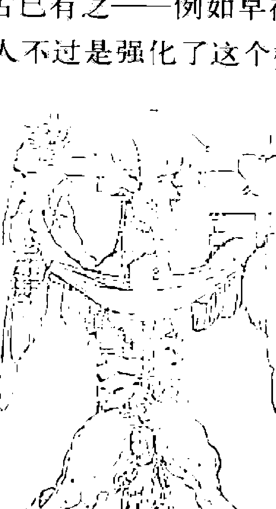

代表着野心和行动；“2”代表着顺从；“3”是多才多艺；“4”则意味着坚持；“5”代表淫欲；“6”代表和谐；“7”是智慧的化身；“8”是占有；而“9”代表了精神。

数字命理学这种伪科学是由犹太教神秘主义喀巴拉发明出来的，他们认为既然上帝以给万物起名的方式创造了世界，

#### 阿拉伯的魔法数字

正如我们在这幅魔法方块图中看到的，阿拉伯的魔法有其自成的数字命理学和神奇的几何学，这也许同科威特涡卷装饰中农神萨杜恩的图饰有关。

#### 神奇的数字“7”

古时，“7”一直被人们视为有魔力的数字，是智慧的化身。本图所绘的即为创世纪之初的7天。

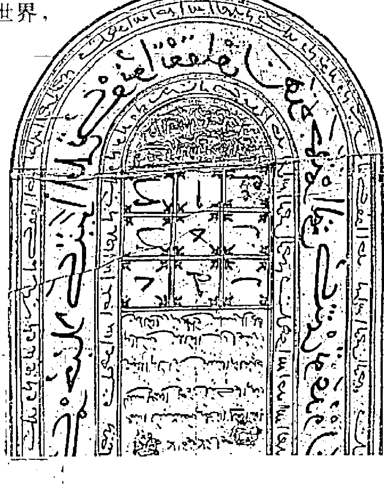

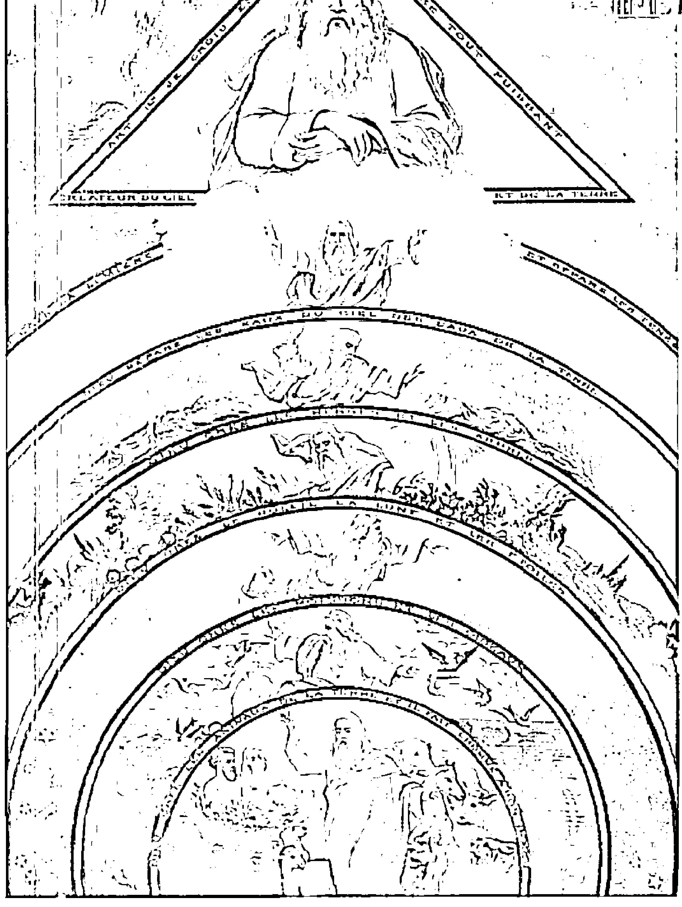

那么这些名字必定有着极为重要的意义，那么通过他们对数字进行的研究就能预测很多事情。于是他们开始对22个希伯来字母进行记数，这样就很容易算出一个名字的基本数字（把每个字母的数字加起来，再对总数进行简化），也就是说如果一个名字的字母加起来为129，这三个数字进一步相加得到12，然后1+2=3，所以这个名字的基本数字就是3。

他们所发明出来的“占星系列”主要是以1到22之间的数字为基础，利用希伯来字母表的22个字母并为它们配上相应的黄道十二宫的行星和标志。运用到英语中时自然会出现多个字母对一个数字的情况，如下图：

| 字母名称 | 字母 | 数字 | 中文名称 |
|----------|------|------|----------|
| Aleph | A | 1 | 水 星 |
| Beth | B | 2 | 室女宫 |
| Gimel | G | 3 | 天秤宫 |
| Daleth | D | 4 | 天蝎宫 |
| He | E | 5 | 木 星 |
| Vau | V U W | 6 | 金 星 |
| Zain | Z | 7 | 射手宫 |
| Cheth | H | 8 | 摩羯宫 |
| Teth | Th | 9 | 宝瓶宫 |
| Caph | CK | 11 | 海王星 |
| Lamed | L | 12 | 双鱼宫 |
| Me | M | 13 | 白羊宫 |
| Nun | N | 14 | 金牛宫 |
| Sameck | X | 15 | 土 星 |
| Ayin | O | 16 | 火 星 |
| Pe | FP | 17 | 双子宫 |
| Tzaddi | TsTz | 18 | 巨蟹宫 |
| Quoph | Q | 19 | 狮子宫 |
| Resh | R | 20 | 月 亮 |
| Tau | T | 22 | 地 球 |

喀巴拉主义者花费了大量时间来研究《圣经》文本，从中找出了许多数字意义，以至于后来有些学者对莎士比亚的著作中所出现的“honorificabilitudinitatibus”这个词感到十分困惑，甚至想从字谜的角度来证明培根才是莎士比亚作品的作者。

最为知名的喀巴拉数字学者要数吉尤塞卜·巴尔萨默（1734—1795年），而他则以华丽的化名——阿莱萨多·德·卡里奥斯特伯爵为人所熟知。他是个意大利的神秘学主义者，曾游历德国和法国，作为一个预言家和业余的心理学家他获得了巨大成功。据说他有一套万无一失的博彩方法，他卖给一个巴黎的贵族三张中奖的彩票，而且通过对国王和王后名字的数字分析，他预言了路易十六和玛丽·安托妮特不幸的死亡。

卡里奥斯特伯爵有他自己的数字命理学，他依如下方法为字母赋值：A、I、Q、J等于1；B、K、R是2；C、G、L和S代表3；D、M、T则是4；H和N等于5；U、V、W、X代表6；O和Z是7；F和P等于8。

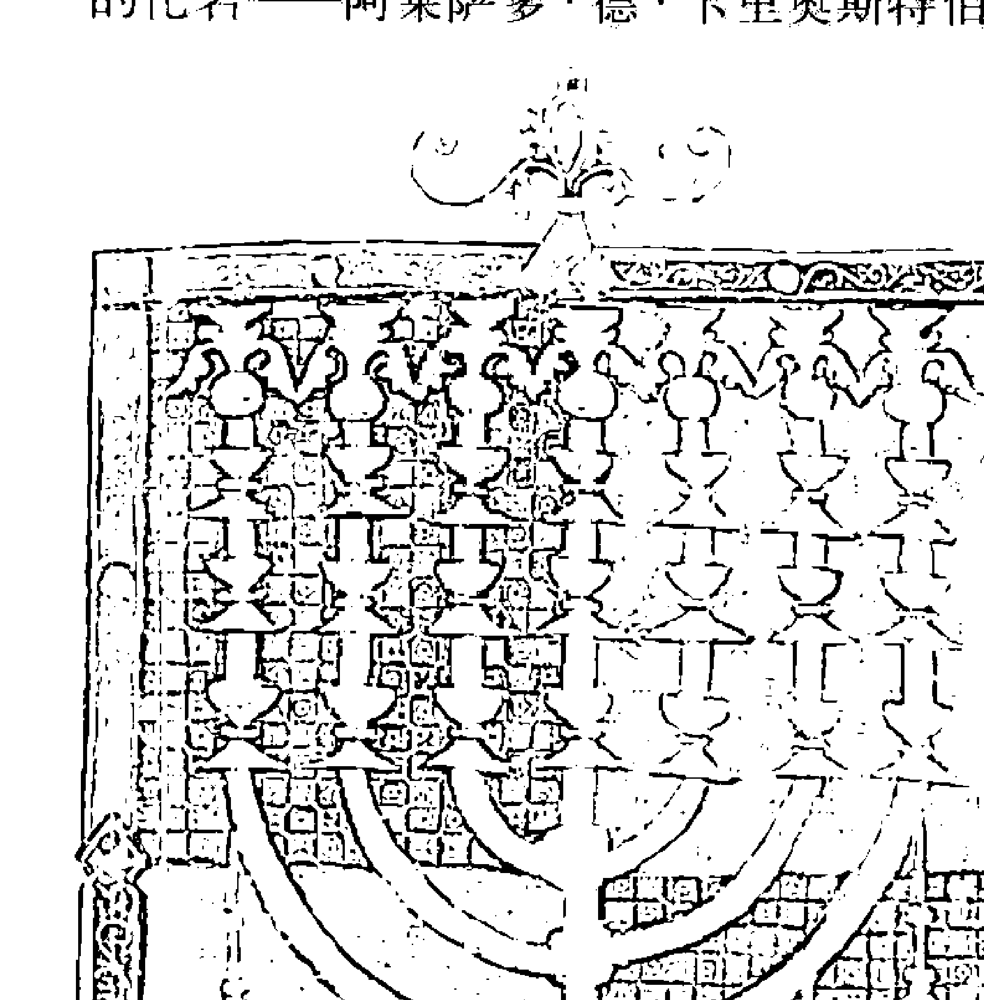

全世界都对数字给予重视：对毕达哥拉斯来说“4”是神圣的数。（现在我们仍旧有四季、四大元素、东南西北四个方向）。

#### 七盏分枝烛台

喀巴拉神秘主义哲学认为：“数”是上帝的属性，他们常以7支烛架及3个接点的七盏分枝烛台来代表恒久不变的数字“10”。因此七盏分枝烛台也是犹太教的圣物，犹太人的象征，至今则仍是以色列的国徽。

数字5对于中国人和印度人来说有着重大意义。这也许同从1～10十个数字出现的频率有关。如果你将成对的数字相加，比如说，从两头往中间，结果总是10（5×2）：1+9，2+8，3+7，4+6；只有5被单独留在了中间。然后如果你将所有这些数字相加得45（9×5）；将所有奇数相加得到25（5×5）；将所有的偶数相加得20（4×5）。

中国人有五行、五刑、五法，而且也将五行（土、木、金、火、水）同那时所知的五个行星对应（土星、木星、金星、火星和水星顺序相对）。

“9”也是一个具有重要意义的数字，部分是因为用9可以玩出许多数字游戏。任何数字乘以9，得到的结果数字相加仍是9（5×9=45，4+5=9）。把这个数字倒过来（54）仍旧是9的倍数。随便找一个数字——比如说73——除以9，所得的余数(1)总是同你把这个数字拆开相加（7+3）再除以9所得的余数相同——这就是为什么数学家通过“除9法”来演算结果。

埃及人崇拜九柱神；但丁为人们描述九重地狱——中世纪“9”是“第一个也是最重要的天数”。几千年后“9”在某些文明中仍扮演着重要角色。日本的京都划分为9个区。中国的皇帝要在活着的时候登上天坛祭祀，官员分成九品要站在由九重台阶中心辐射出来的九圈石路上行三跪九叩礼。

现代缅甸的统治者奈温用数字9来指导他的生活。他于第9个月的第18天 (8+1=9) 发动了民主政变，并在政党内把9号、18号、27号 (2+7=9) 三天设为官方投票选举日。1987年他坚持收回所有的纸币，代而发行以45和90面值的缅币，因而给缅甸造成了经济混乱。“9”对于他来说，就是一个强大的数字，既然不想被它征服就要征服它。

西方对数字的“占星系列”似乎是独立发展而来，与卡巴拉的系列方法无多大关系，甚至可能早于他们出现。在这个系列里（并不与字母表相关），每个数字都有一个特定的象征意义，可是有趣的是这个象征意义却与卡巴拉意义差别不大。

-   1. **1** 是传统的神意象征——不过同时也是太阳的象征：它是所有数字的基础，也是生命的根。
-   **2**（受月亮控制）是两面性的象征，是成对的矛盾体——女性意象和男性意象，阴和阳，同时也是生育的象征。
-   **3**（木星）与生活的准则相联系，基督教讲究三位一体（不过在更古老的宗教里有的就与奥西里斯、伊希斯和荷鲁斯有关）；三代表了过去、现在和未来——时间的三元素，代表着理解、收获、富足和父权。三与木星有着特殊的联系，始终是数字命理学的重要组成部分。
-   **4**（太阳）代表了正方形、立方体、十字，象征着智慧、对立、反叛、爆发——这是一个与炼金术紧密相关的数字。
-   **5**（水星）一方面代表着多才多艺和适应性，批判与分析，也代表着交流。
-   **6**（金星）与合作、和谐及性有关；古代的数字命理学家认为这个数字力量较弱——如果被重复使用，将会有可怕的结果（所以阿莱斯特·克劳利用《启示录》中的“野兽 666”这个词，暗示666是“野兽和人类的数字”。）
-   **7**（月亮）是代表了革命和自由的数字，不过同时也代表了分裂；许多“7”影响着我们的生活——7色折射光，一周7天，7封印，还有人类的 7 个年龄段……这是一个神秘的数字——它代表着魔法，在各种各样的仪式中运用广泛。在英国，7 则与生育有着紧密联系。

#### 《启示录》中的数字

17世纪的学者弗朗西斯·波特用了整本书的篇幅，来探讨666这个数，在《启示录》中它是野兽的神迹，波特的著作串页包括了《旧约全书》及《新约全书》中的主题，而且试图“证明及展示这个数字应该如何被阐释为”一种“所有其他反基督教的论述都赞同的政府状况”的描述。波特的这本书曾风行一时，下面便是该书的一页插图。

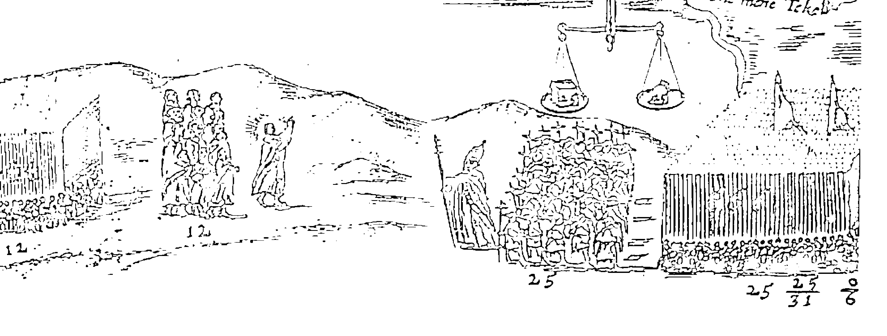

符号（土星）支配着老年、死亡、时间和空间：希腊人把 8 称为正义的数字，8 也一再地在《旧约》等很多书中以象征性的意义出现——诺亚是亚当的第 8 代子孙，自拉哈伯开始有 8 位先知，法利赛人有 8 个分支，诸如此类；有些神秘主义者则认为三个 8（888）是代表了基督的数字。

符号（火星）代表了主张、能源和勇气，却也可以指愚蠢的固执。

10 代表了无限、不可预知性和神性，同时也代表限制和不完美，无限大和无穷小。

在 10 之后，简单来说，11 代表同情和博爱；12 是全面的了解；13 是新的开始；14 是自然力量和生长；15 代表了命运；16 是热情和怒气；17 是不朽和理解；18 是物质和机会主义；19 代表了欢乐和愉悦；20 则是精神性和信念；21 代表成果和权威：22 代表了虚荣与自我吹嘘。

总的来讲，这些数字可以通过占星术对其字形的阐释，以及对与数字相关的行星的描述来解释清楚。这是一种对解释而言非常有效的方法，但只用于阐释行星：数的“性”有些时候被“阴性”或“阳性”这样的词语取而代之。在这种情形下，“阴性”代表女性，而“阳性”则代表男性。当然，这些称谓在意图和感情上，都并没有那种本性别第一主义的强烈体现，性别也并没有在那里得以表明，有些数字也为两性所用（众所周知，水星是这样的，数字 5 自然也如此）。

| 字母 | 数字 | 性别 | 行星 |
| :--- | :--- | :--- | :--- |
| AIJQY | 1 | 男性 | 太阳 |
| BCKR | 2 | 女性 | 月亮 |
| GLS | 3 | | 木星 |
| DMT | 4 | 女性 | 太阳 |
| EN | 5 | | 木星 |
| UVW | 6 | | 金星 |
| OXZ | 7 | 男性 | 月亮 |
| IIFP | 8 | | |
| ThTsTz | 9 | | 火星 |

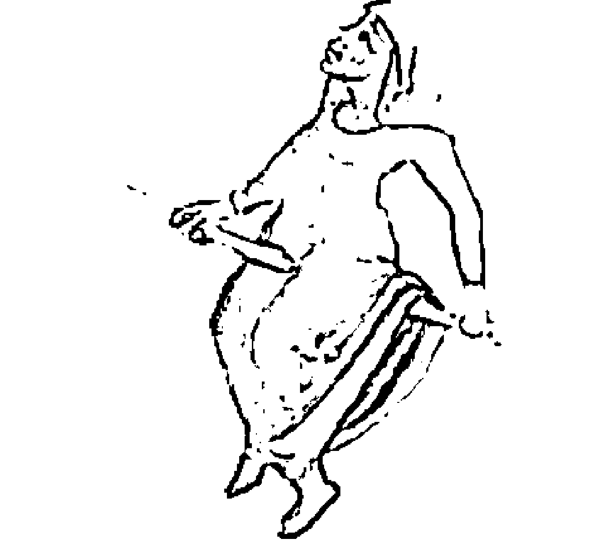

任何掌握星相学常识的人，都会观察到一些异常现象：月亮支配了两组字母，一组代表男性，另一组代表女性；还有两组字母，尽管为火星及金星所辖，但却保持了“无性别”，而有关其性别事宜，在占星学上并不存在疑问！

我们列出上述条目，以供感兴趣的读者把这些古老的体系弄个明白：今天，对数字命理学家来说，按数字标出的西文字母是很常见的，A 被视为第一，而数到 9 时，自然就是字母 I。J 再次被认定为第一（参见本书前面列出的简单表格）。

但提及广义上的魔法时，通行的规律就是让其成为自己的魔法，而且如果玄学或占星术的体系可以发挥作用的话，那么就没有理由不利用它。

### 护身符和神奇的物体

许多咒语是以念祷的方式进行的，但是有些最为有力的咒语，而且是为了达到某种功效的咒语，是被写下来或是刻在物体上的。神奇的物体可以分为好几类，它们需随身携带以给人力量或是保佑主人。护身符是一种力量的源泉，可以驱邪避灾。护身符是一种符咒，也可以说成是一种徽章或是“具有神秘力量的图样”。

长久以来，人们发现过各种各样奇怪而可怕的徽章和图样。刽子手用来行刑的绳子被当作蕴涵了无穷力量，简直就是自然魔法的工具，所以刽子手如果把这种绳子拆了来卖，还能发一笔小财。不过最可怕的符咒要算是“光荣之手”了——即从被绞死的人身上所砍下来的手，用盐和硝酸钠来腌渍，最后要在7月底到8月15日之间在太阳底下晒干。

“光荣之手”的用法颇多——尤其是被窃贼使用，假如你用这只手在一个熟睡的人头上划一个倒十字，那你就可以把他的屋子洗劫一空，而他却依然沉睡不醒。直到1831年，在爱尔兰的洛夫克鲁，一伙入屋行窃盗贼还有这么一只手。据记载，一些秘密的仪式也需要在“光荣之手”的火光下举行——“光荣之手”的手指被点燃，熊熊燃烧如火炬一般。

对于巫师们来说，死亡似乎让这种符咒变得神圣起来。裹尸布的碎片、棺材的钉子、死人的指甲或是头发都成了施巫术的工具。把一个棺材钉敲进一个死者生前留下的脚印中，口中同时向魔鬼念祷就可以一劳永逸地击败你的敌人；18世纪一部不大为人所知的天书——《天书真本》介绍的一种隐身术很重要的一个环节就是要在一个死人脑里装满黑豆。

中国道教的护身符是以书法的形式保存下来的，这套护身符相当实用，旨在指导男人和女人如何在日常生活中互相协调——如何谋生，如何从好收成中获利，如何寻找配偶，或是如何保障家里的安全。道教是中国古老的宗教，同整个自然运作息息相关。道教所指引的方法——并不是像其他宗教一样有许多严格的规范，相反，道教讲究的是放松、自发和直觉。书写的护身符和符咒是为了通过其所含的灵气来帮助一个人积极地入世。

#### 道教符书

道教的符书多由汉字、动物、星相图、武器等拼凑而成，具有驱邪避魔、保平安的功效。这幅中国明代的道教符书就是驱魔、镇宅符书的代表。

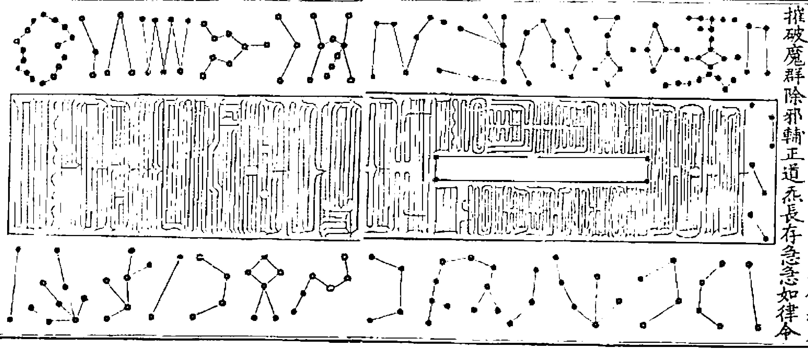

这些护身符当然是在公元1190年以前就存在了，当时有一本名为《道藏》的书收入了1000多例这样的护身符。这些护身符是由道教的道士和信仰者所制，而在这些符上写上——说画上也许更恰当——文字的时候（因为至关重要的就在于其书法之美），他们的灵气就随之传到了护身符之中。如果你拥有这样一个护身符，你就可以随时同藏于其中的神灵交流了。

不仅护身符上的书法很重要，其所用材料和所用的墨色也同样重要：黄色代表着中心，蓝色代表东方，红色代表南方，白色代表西方，黑色代表北方。因为红色象征着血，所以写在红纸上的护身符就能够保佑全家远离疾病。人们会用桃木，特殊的纸或是丝绸，甚至是金器和玉器来作为刻画的底料。五色符（用来驱病防瘟疫）需要画在五彩的丝绸上。可以在战争中避免死亡或受伤的红灵符则要用朱砂写在黄色纸上。

要制作一个护身符需要极为谨慎。首先要请一个风水先生来挑选一个良辰吉日来举行仪式。参加仪式的人也要经过严格挑选以保证他们的生辰八字不会与所选的日子和时辰相克。最关键的是要取决于蕴藏在护身符里的神灵：想要“抓”住钟馗的灵气，这道护身符就必须在他的命名日制作——即五月初五，中午11点到下午1点之间的午时。

我们也许很难想象人们对这些护身符的虔诚。它们可不仅仅是带来好运的符咒，人们更是对它们敬畏有加。如从制符人手中接过护身符的过程，如同被介绍给了一位令人尊敬的长者。你需要大声念出你的名字，深鞠一躬，也许还要说上一段特殊的套话。然后这个护身符才可以挂在你身上、挂在家大门口、系在屋门上或是顶梁上、竖在十字路口或是其他公共场所，甚至可以把护身符烧了，然后吞下纸灰。

至于护身符所用的语言，是颇具有象征性的。你可以看到大量书法符号，除了它们的神奇力量之外，其本身也是精美的艺术品。刻画的文字总是多少代表了天地一体（在早期的护身符中，细线代表了天，粗线则代表地），后来圆形代表阴，宇宙中的女性物质；方形则代表阳，宇宙中的男性物质。点则代表了星星（这些星星之神是邪恶强有力的对手）。符上还通常会有神的画像（通常只是粗略和象征性的几笔——比方说只有一只手或一只脚）和守护神的名字。无论神或者神灵都是从天将中挑选出来的。

护身符绝不是可笑的迷信，这些护身符所受到的尊敬可与基督徒们对圣人遗迹的景仰相比。它们使人可以不断与体内或是体外的灵进行交流，并且帮助自己达到善与恶的和谐统一。只要能维持平衡，就能达到永久的均衡状态。

虽然护身符、符咒、驱邪符在巫术史中有重要地位，可是在西方，它们从未受到过如此的尊敬。虽然现在只有很少一部分人将其视为力量与保佑的重要源泉，但这不能抹杀它们曾有过的巨大影响。

对于护身符的文字记载最为详细的要数《魔法师》，也叫《上天的智者》，此书在1801年出版时作者弗朗西斯·巴瑞特将它称为“神

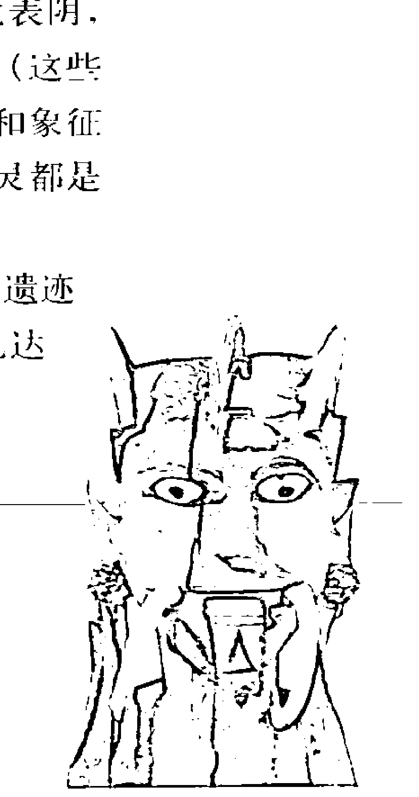

#### “光荣之手”

他们相信被绞死的人的手有巨大力量，前提是得在合适的季节砍下这手。这种所谓的“光荣之手”，竟成为罪犯的最爱。

#### 神秘哲学的完整体系”

这的确是一本划时代的巨著（当然如果放到今天几乎就是一本读不懂的书），书中涉及了占星术、数字命理学、神灵召唤、喀巴拉术以及无以计数的其他巫术。巴瑞特尤其提到了在“图案、封印、指环和镜子”的帮助下，通过“上天挑选的躯体”来传输力量，并进一步详细描述了他在各种古迹中所发现的图案，比如为了“得到女人的爱慕”，就需要在“金星升起的时刻”，在天青石上刻画金星的护身符：

> 一个赤裸的女人，头发四散，手里握着镜子，一条链子缠于脖间——她身旁是一个英俊的青年男子，左手里正攥着那条链子，右手抚摸着她的头发，两人都望着对方，彼此爱慕——他们身边还有一个带翅膀的小男孩，举着剑或者架着弓。

巴瑞特还描述了“月亮的二十八宫”，并为每一宫都提供了制作方法——例如，为击败敌人而建的第十三宫的图案，就被描述成“一只挂着狗头的猫，这个符咒必须刻画在铁片上，再配上死狗身上拔下来的毛”。

不过此书有关符咒最令人惊奇的部分是制作太阳及五大行星的魔法印章和护身符的方法。巴瑞特对挑选制作的时间十分谨慎——“想让任何一个人获得好运，那我们就要挑选生命的启示者、生命的给予者——也称“亥斯”、“行星及各种迹象”都处于吉时。这就意味着一个占星家得推算出在何时何地，哪个行星与要携带护身符的人最为相配。巴瑞特在这点上给出了相当具有技术性的建议——包括建议制作一个击败敌人的符咒的恰当时机，“（从任何地方都可以）追逐特定的、对你有害的野兽，或是去引诱其他人的情人”。

这些指示极其复杂，没有受过占星训练的人会觉得根本不知所云。准备一个“收获”的护身符就需要在如下时间举行：

当物质之寓的统治者与星位统治者以30度或60度的角度联结，中间亦有物相连时，你将会从第十一个和第八个星位统治者那里得到好运，否则，就把那部分好运置于星位……

每一个现代的占星学家都会觉得这难于理解，而一个没有任何占星知识的人会有如坠云雾之中的感觉。幸运的是现在那些想自己制作护身符的人已经不用再遵循那么深奥难懂的指示了，我们将在本书的第二部分详细说明。然而小心翼翼地准备背景资料是必须的——一个制作材料与特定行星相关并刻有其标志的护身符可以有效地吸收来自那个行星的影响或灵气。

### 魔法书与封印

1801年出版的弗朗西斯·巴瑞特的《魔法师》(上图)中的两页，上面有一幅天使的肖像，还有符咒以及对卡西尔的描述。根据巴瑞特的说法，卡西尔是掌管星期六的天使。伊丽莎白时代的学者和魔法师迪博士所设计的大封印(左下图)中，包括了罗马字母和天使之语——伊诺克语的字母。

一直以来,行星于某些物质之间都有着显而易见的联系,这一点是基于巫术中重要的通感理论:宇宙中的任何事物都与其他一切相关。所以因为火星总是与铁相关,铁制的护身符是传导火星力量的最佳媒介。

护身符有时也以印章的方式出现。根据犹太玄学家的说法,所罗门就是靠一个印章来控制魔鬼之军的。总是有人想重新制造一个这样的印章,这也就不足为奇——其中最为著名的恐怕要数法国人阿方索·路易斯·康斯坦。也许埃利斯特·莱维的名字更为人所熟知,如果当时的记录属实,那他就是一个著名的试验家,引人注意却也令人恐惧的成功地唤来过几次神灵。

莱维所模仿的所罗门的大印章似乎没有取得什么实质性的成功,虽然它集合了多种巫术常用的图案:比较著名的有五角星形。如果在顶部只有一个角,这就代表一个人的灵魂;但要是顶部有两个角——是魔鬼之角的象征——就代表了邪恶的力量。而与此相关的数字5在巫术中代表着自然的力量。五角星总是被画在一个具有魔力的圆的内部,在这个圆圈里,魔法师就可以抵御邪恶的力量。

根据《所罗门之钥》的记载,将五角星(有时也被称为五角星形)在月亮升起到处女宫的位置时,刻在一张小牛皮上,而且只能挑选星期六或星期二的晚上,还要将明矾、雪松木、芦荟和树脂放在一起点燃,让空气中弥漫着它们的气味。弄好之后,五角星要佩带在魔法师外袍的正面位于心脏的位置。

### **护身符**
金饰 埃及 公元前1965-前1920年

护身符一直被视为力量的源泉,出于对前人、圣人的景仰,往往刻上象征他们的符号或是图案。这个埃及人制作于公元前1965-前1920年的金质护身符上刻的就是埃及法老塞索斯特里一世的名字。

几乎与大印章同样驰名的是所罗门的护身符,在塞亚得·阿得里斯·萨哈(Sayed Idries Shah)的手稿和他1978年出版的《魔法秘要》中,有关于它的制作方法。这个护身符是由蜡制成,还要混合金印或银印来使用;两样东西的准备都得十分小心——魔法师可以召唤天使来帮助他们制作。

护身符上的铭文通常是很难解读的,而且通常看起来毫无意义。但是在通常情况下这些铭文都是根据极其严格的规则制作出来的(严格程度就像挑选刻这些铭文的材料一样)。了解哪种图案可以召唤哪些神灵是很重要的——选择的范围很大,甚至是从为人熟知的图案中挑选:一本名为《雷蒙盖顿》的天书,或者叫《神灵书》,也是跟所罗门有关,书中列出了72种神灵,其中有18个是国王,26个公爵,15个侯爵夫人,12个长官和5个伯爵。所有人都有名有姓,可在不同情况下召唤他们以求帮助。他们中的一部分人,比如旦他利昂、盖普、高默利和贝莱斯在爱情方面颇有帮助;其他如贝莱尔和奥利亚斯有助于升职;布恩和夏克斯可以带来财富;巴森和盖普可以助人飞翔;贝利斯和萨根对炼金术士大有启发;维尔弗是窃贼的朋友。

刻在印章或护身符上的文字通常都会蕴藏着语言魔力,至少耍了点小把戏——比如说回文（把一句话或一个词倒过来念仍旧成立）。回文被认为是极其厉害的巫术，用处也颇多。最为著名的回文也许要数“Sator arepo tenet opera totas”。

| 回文 | 说明 |
|------|------|
| S A T O R<br>A R E P O<br>T E N E T<br>O P E R A<br>R O T A S | 这则回文用蝙蝠血在一种特殊的羊皮纸上写成，藏于门槛底下，诅咒所有跨过这道门槛的人都会情不自禁的手舞足蹈。 |

| 回文 | 说明 |
|------|------|
| C A S E D<br>A Z O T E<br>S O R O S<br>E T O Z A<br>D E S A C | 如果把这则回文护身符挂在脖子上，就可以有效抵御女巫的力量，迫使她们离开房间。 |

18世纪早期的一本书中（作者是阿普拖卡特大师，一位阿德里安堡——土耳其埃迪斯的旧称——的巫师）绘出了一种可以鼓动暴力的回文。用铁器在铅皮上刻下如下字母：

```
H D D H
I D I D I
D H D H D
D I D I D
```

刻画在金属上的这则护身符将会引起暴力冲突。佩带者分别转向四个方向并且叫喊七遍“鲁多默！”和“帕鲁拉！”就会引起旁观者的恶战，当佩带者再说出“奥姆多！”的时候，一切就归于平静。

# # 制作一个咒语

如之前所述，准备工作对任何咒语都是至关重要的一环。如果制作方法不对，那么这个咒语可能就无法生效。为了施展一个咒语而做的准备需要极为谨慎，不仅仅要用正确的字眼（如果咒语是书面形式的）还必须使用合适的材料，挑选恰当的时机。

只在很偶然的情况下，我们会碰到一个“易于理解”且流传下来的咒语，因为通常它们都是以密码形式写成。例如，大英博物馆内保存着的一张埃及纸莎草纸，上面有一个唤醒侏儒王贝斯的咒语，他是睡梦之神，同时也与生育有着一定联系。这则咒语必须用一种特殊液体写成:普通墨水混合桑葚汁、乳香、没药(一种药材)、雨水、水银硫化物、艾草液还有豌豆汁的液体，再用牛血和猪血调稠。然后在纸莎草上画上贝斯的画像，写上想要神灵回答的问题，这时祈祷者念出咒语：

> > 让忠实的先知从圣殿到这里来吧，从兰帕苏特，从苏门答腊，从巴里巴斯，从达达兰，从爱奥莱斯，从阿那斯，从萨尔巴那，从桑伯，从贝里斯……今夜您来吧。

祈祷者还要使用供奉给女神伊希斯的黑布，一端缠绕于左手，另一端穿过背后，然后躺下睡觉。贝斯神会出现在他梦中并回答他的问题。

### 贝斯

古埃及睡眠之神，通常都被画成具有獠牙的丑怪，如果正确地呼唤，他将会回答睡眠者的问题。

### 民间符咒

阿尔伯图斯·马格纳斯最简单的咒语与留存在我们祖母的记忆中的被广泛使用的“符咒”之间的差别并不是很大。简单的咒语形式配以简单的动作，这样的符咒不仅容易记住而且有一部分还有着相当悠久的历史。蛊格鲁-萨克逊人有一种摧毁敌人的咒语，几个世纪以来，以这样或那样的形式流传了下来。最初的版本是这样的：

> 愿你如炉火之炭被耗尽，
愿你如墙上的粪被风干，
愿你如桶中之水而干枯，
愿你缩小如亚麻籽一般，
还不到那芥藓的十分之一，
小到你最终化为无形。

在现行记录中，一个德国老农在割伤自己后会自言自语说：

```
Sprach jingrau Hille      (呼唤希勒女神啊
Blut stanne stille          血就会止住)
```

这则咒语自从异教徒时代开始就有了，希勒就是瓦尔基里·希尔达。
在最为古老和流传最久的符咒中，有很大一部分是用来对付疣症的。说不定谁都能背上这么一个咒语。把在疣上摩擦过的豆荚连同下面文字一起埋在岑树底下：

> 当这豆荚日渐腐烂
我的疣，你也将消失不见。

也可以用生牛肉来代替豆荚。在爱尔兰，如果人们碰上了送葬的队伍，他们会蹭蹭自己的疣并重复三次说，“让这些疣和这逝者的身体一起消失吧，永不回来。”

乡间也会有一些“智慧的女人”会发明出她们自己的符咒来。19世纪80年代在英格兰的什罗普郡，一个老妇人就曾发明出一种除疣的符咒。身上有多少疣，她就收集多少根小树枝；用每一个树枝轻碰每一个疣并且说，“这里有一个疣”，然后再轻碰没有长疣的地方说，“但是这里没有”。然后把这些树枝都埋起来，一两个星期之后，疣就会消失。

当然疣本来就会自动消失的。大部分的疣，如果你不去管它也会自然消失。不过现在的医学权威认为无论是由医护人士或是非专业人士来操作，类似的暗示疗法通常十分有效。

如果我们不想深入去了解那些准备起来极为复杂、仪式深奥难懂的魔法，那么我们无论是谁都可以对简单的魔法世界略知一二。那些最为严肃和危险的咒语，由于种种原因我们无法掌握，这一点也许值得我们庆幸。但是只要我们愿意，我们都可以试试那些最为简单的。比方说，为了“见到你的情人”，你必须与一个同性未婚的人坐在一起。然后你独自一人寂静地从半夜等到凌晨一点——你有多少岁就从你脑袋上拔多少根头发，连同一株巴黎草或白檀放到布包里，当时钟敲响一点的时候，把头发一根根烧掉，并说：

> 善良的圣托马斯，可怜可怜我吧
今晚，把我的情人带来我面前，
让我看看他的面容
让我感觉他的怀抱。

这样你的情人就会出现在你梦中。这些符咒也许看起来很傻，因为我们本就知道日有所思，夜有所梦，潜意识可以完美地创造出我们想得知的图像——也许一个人自己都没想好自己要什么样子的情人，梦却给了答案。

当然不是所有的传统符咒都是一样的简单且灵验。据说有一个万无一失的可以让人隐身的法术。在施洗约翰前夜（即6月23日），你要拿一个盘子去接一些蕨类掉落的种子——这一切看起来很简单，但是不能摇晃它们；种子必须是自己掉落。拿着种子，藏在你周围附近的地方，然后念道：

> 自由地掉吧，自由地掉吧
掉落在无人知晓的地方
然后把你这同样伟大的本领
传授给我吧。

然后你就会隐身了，不过要施展这个咒语所需要的条件太难达到了，这也许正是这个咒语很少被验证的原因吧。

# 第四章

# 典礼、仪式和迷信

魔法师为了与灵界世界进行接触并祈求他们的帮助，除了要选择和准备恰当的咒语和法器，还必须举行必要的仪式。没有仪式来赋予咒语力量，神灵们就不会给予帮助，咒语也就失灵了。魔法师自己也要做好心理和生理的双重准备，仪式也要在适当的环境中举行。

魔法仪式经历了几个世纪的发展演变以后，魔法师发现魔法仪式是由各种复杂的因素构成的，就像是一个咒语或是符咒会在精心地准备组织后发挥出最大的效力。人们对仪式的信仰是如此强烈以至于即使在今天这样一个充满怀疑的社会里，这种信仰依然有迹可循，只不过退化到迷信的层次。大多数的迷信活动都是我们日常举行的一些行为，这几乎是无意识的，是为了避开灾祸或是带来“好运”。我们几乎从不把这些看作是什么魔法，但事实上同所有魔法仪式一样，这些行为都是希望借助超自然的力量来改变事物的本质。在做这些动作的时候，我们其实已经把自己同悠久历史的民间魔法联系在了一起。

“好运”或是“厄运”这种观念其实离魔法并不遥远，只是不属于“严肃”的魔法的范畴。当人们把一个护身符说成是好运符的时候，就贬低了护身符的价值，护身符的本意是要以积极的力量来影响事物，但好运符的说法给它扣上了欺骗的帽子。这就是一个在合适的时间、仔细设计制作并赋予神力的好运的象征同欺诈诈术之间的区别——也是魔法和纯粹的迷信之间的区别。

运气的观念——我们做成或没做成，完成或没完成的事所带来的好运或厄运，是一种对生活的飘渺不定的防备；这说明我们意识到生活大部分时候是无规律可循，除了不断期盼意外，希望这些意外不会对我们造成太大伤害之外，我们无能为力。在某些文明中，有些神是十分危险的，他们总用一些很卑劣的手段来测试或折磨人类。这也就难怪我们会想出一些方法来保护自己。希腊哲学家德奥弗拉斯特（前372-前287年）在他的著作《性格说》中描绘了典型的迷信者：

+   他会在泉水中清洗双手
+   用寺庙的圣水喷洒自己
+   出门前口含几片月桂树叶。
+   如果有黄鼠狼在他面前穿过，等不到其他人通过他就会停滞不前，或是向对街投掷三块石头才肯继续。
+   要是他在房间里看见了蛇，如果还是红蛇，他就会立马在原地竖起圣坛。
+   当走过的十字路口时，他会从瓶中倒出油来浇灌那光滑的石头，双膝跪地，祈祷直至离开。

希腊人和罗马人语言占卜的方式带有更多迷信的成分而非魔法（这两者之间的界限很模糊，有时更被混为一谈），虽然很多迷信的护身符和手势都植根于他们自己的宗教信仰。基督教后来的观点是除了上帝，不能崇拜任何别的神，所以任何能召唤“运气”的做法都被视为异端邪说。在过去的两千年有数不清的异端信仰产生，包括在巫术治疗、咒语和符咒方面的诈骗之术。

但事实上基督教也有很多迷信的说法，几千年的非逻辑和非理性的信仰历史中也有它的身影。基督教与不同教派之间的斗争对此也有一些影响，因为天主教的信仰（他们信仰基督的圣物和圣水，讲究禁欲）对于新教来说就是危险的迷信。伏尔泰说过新教把“罗马教廷的一切仪式都当作是无理取闹的迷信”。

不可否认到了 20 世纪末，迷信和运气的观念仍然十分流行。在海湾战争中，战斗机的飞行员就如同阿金库尔战役中的弓箭手一样佩戴着护身符，而战斗机上所绘的标语则让人想起古代将士剑锋上所刻的字迹。

在日常生活中，我们也会偶尔迷信一下，内疚地在自己的肩头洒盐，绕道以避免从梯子下通过（或是故意小心地从梯子底下通过以证明我们不迷信！）。我们会用“运气不好”来原谅自己的失败，正如我们谦虚地把自己的成功归功于“运气好”一样。

我们知道西欧流传着许多迷信说法，因为他们一直以来都相信巫术、神灵和魔鬼的力量。要一一列举它们确实是件浩大的工程，这里所给出的是一些最为普通、最为有趣的例子：

-   **从另一边下床** 这个迷信至少可以追溯到 16 世纪，不过这一说法的来源却无从考究。所谓“另一边”是指你不常用的那一边。据说如果你从这“另一边”下床可以为你带来好运——但前提是你必须在无意识的状态下这么做。
-   **把消息告诉蜜蜂** 这是一个非常古老的传统。如果你养蜂，在把任何重大的消息告诉家人之前都要事先告诉蜜蜂，尤其是死讯。
-   **铁匠和马蹄铁** 在乡村，铁匠通常都是“好运”的象征，据说还可以给孩子治病。而马蹄铁和好运之间的关系就更为久远。如果能找到一块马蹄铁那将是无比幸运（因为在今天这已经很难找到了），或者向铁匠要一块然后钉在前门上。雷金纳德·斯科特（约1538-1599年）在他的《魔法揭密》中写道：

> 要阻止或抚平这些符咒和巫术所带来的悲伤……那么就在你房子最高的门槛的内侧钉上一块马蹄铁，这样没有一个魔法师可以进入你的房子……在很多村庄里你都会看到这样的例子。

马蹄铁的鞋跟或者鞋的开口部分要朝上，否则就会事得其反。1983年的时候，一个艾塞克斯郡的小男孩向《迷信大词典》的作者之一爱奥那·欧佩解释说如果把马蹄铁的鞋跟朝下，“运气就都会溜走了”。

### 流血

用一枚钥匙沿着脖颈背部滑落来止住鼻血，这种做法由来已久，但这同许多类似的、据说能止血的宗教符咒一样毫无医学根据。

### 维吉尔随意翻抽占卜法

这种方法是从对罗马诗人维吉尔的一本书的使用发展而来的。意思是说随意翻开一本书，然后用夹子或手指（闭着眼）在任一页上指一下，据说点中的那个词就与你心中想问的问题有关。对这种做法最早的记录可以追溯到397年的英国。而且经常使用《圣经》或是荷马的作品作为占卜道具。这个方法同中国古代的艾草占卜有着异曲同工之妙——通过投掷艾草枝或硬币来挑选诗文。

### 抱新娘过门槛

是可以追溯到罗马帝国时代的习俗，起源不详。一种说法是这代表了新娘不愿失去童贞，她必须被强迫抱进她丈夫的房间。还有一种说法是门槛是神圣的，所以男人（房子的主人和统治者）要将他的伴侣抱进房间，这样她就能得到幸福的生活。

### 抛新娘捧花

新娘在离开结婚酒会时把捧花抛向人群，接到的女孩（或男士）就是下一个走进结婚殿堂的人。这也许起源于美国20世纪初的时候，但是没有人能够解释为什么，在英格兰的兰开夏郡，那里的做法是伴娘把新娘的鞋扔出去被击中的男士就是下一个结婚的人。

### “借来的东西，蓝色的东西……”

新娘的身上要有“旧的东西，新的东西，借来的东西，蓝色的东西”。大概在一个世纪前这才被写成诗句，但是这种观念形成得却很早。新娘穿着华美的结婚礼服时还必须佩戴一样从生活幸福美满的已婚妇人那里借来的东西，这种做法在几个世纪前就有了。而要佩戴“旧的东西”则是最近发展出来的——有时在新婚的前夜伴娘会让新娘穿着她最旧的睡袍。而蓝色象征着幸福的婚姻生活这个意义则至少有600年的历史（乔叟就曾经提到过）。

### 猫

早在古埃及时代猫就与魔法有着密切联系，与猫有关的迷信说法更是举不胜数。猫的一些普通的动作通常会与天气预报联系在一起；如果一只猫给自己洗澡，那就预示着一定会下雨；如果它背对着炉火就会下霜；如果它到处横冲直撞，那表示风暴就要来了。和牛一样（据说牛一躺倒就代表要下雨），这些也许是基于观察所得。一种不大令人信服的说法是如果猫清洁它耳后的部位，就说明有陌生人要来。

有些治病（尤其是儿童病）的处方十分残忍——要烧烤猫的心脏或是脑袋。更为无辜的是，如果眼皮跳或者眼睛痒，用黑猫的尾巴蹭一下就会好。黑猫跑过面前会带来好运或厄运的说法各执一词。认为猫有九条命的说法也许同它们用肉垫着地的本领有关，但是数字9同时也是数字命理学中相当重要的数字。

### 带着胎膜

“出生时带着胎膜”（有时在孩子出生时头部仍裹着羊膜囊）被认为是好运的象征。如果一个人带着自己的胎膜去战场，就不会受伤甚至是死亡——这个迷信生命力十分持久。在一战中就有人贴广告求购胎膜，尤其是水手们，因为据说胎膜可以保护人不会溺水而亡。

### 钟

一直以来人们都坚持认为如果家中有人去世，钟就会停在那一刻。或许有那么一两次巧合使得人们开始迷信起来，但是在19世纪之前，这个说法显然已经在整个西欧和美国广为流传。

### 四叶苜蓿草

这也许是因为相对罕见的缘故，才让四叶苜蓿草的叶子成了好运的象征——这一传说至少已经在英国传播了500年。据说如果一个人带着一片四叶苜蓿草，就会看到别人看不到的仙女。

苜蓿草是一种开着白花的草本植物，通常有3枚叶片，又称三叶草。相传如果能找到四叶的苜蓿草，就可以得到希望与幸福。

### 运气的炭火

19世纪的英国，警察会在大多数的入屋行窃者身上发现一块“运气”炭火。还有一种说法就是，如果你把烧着的木炭“翻个身”就可以唤得善良神灵的保护，不受邪恶力量的伤害。

### 触碰尸体

对于死者的害怕与恐惧引发了许多迷信，其中之一就是触碰死者的尸体就能让人不再梦到逝者；如果眼泪掉落到死者身上，无论哪个部位，都会让死者的灵魂离开；如果死者在一星期内或是新年初始未能下葬就会带来厄运；从死者身上砍下的手可以用来治疗各种疾病，尤其是疣和另外一些包块；如果搬运死者的时候经过一片田地，以后那里将寸草不生。

### 重叠手指

重叠手指以求好运似乎是一个古老的迷信，其实关于这种做法最早的记录是在1912年；但是重叠双腿以带来好运却至少流行了300年了。

### 乌鸦

看到两只乌鸦在一起会有好运，两只以上则是凶兆。这个古老的迷信至少有2000年的历史了，乌鸦本身在很多文化中都是不祥的代表。

### 驴子的杂毛

从驴子背上拔下的杂色毛据说可以治疗百日咳。

### 老树

老树和园丁们的诅咒也引发了无数迷信：砍倒一棵老树会有厄运，即使是对它们进行修剪也要说声抱歉。焚烧枝叶繁茂的老树十分不吉利，而且厄运会一直跟着用老树做成的任何东西（虽然据说老树的制成品可以治疗因骑马造成的肌肉酸痛和僵硬，还可以保护人不被雷电击中）。

### 火

火对人类十分重要，因而有很多迷信与火相关也就不足为奇：如果火势不旺就象征着困难和反对意见；如果火只在一侧燃烧，标志着婚礼、乔迁或者是死亡；如果一直烧到第二天早上就预示着疾病的发生；火星代表有消息。在元旦（或是除夕）如果让火熄灭是十分不吉利的；这一天也不能允许别人“借火”，就是将自己的“火”借给别人。如果不想招来厄运，你不要向火中吐口水。如果你认识别人不到7年，就不要去拨弄他的火。

**元旦第一个访客** 元旦那天你的第一个访客预示着你一整年的运气。最好是个男访客，还要穿着深色衣服。

**星期五** 或多或少这都算是不太吉利的日子（它总让人联想起耶稣被钉在十字架上受难）。选择星期五出发去冒险是不吉利的，同样不适于出门旅行、求爱、结婚或乔迁。星期五再遇上13号尤为不吉利。

**头发** 头发一直被认为具有强大的魔力——魔法师们要实施一个邪恶的魔法时就需要从被害者头上拔一根头发以保证灵验。如果有只鸟衔了一根你的头发去做窝，后果将不堪设想。焚烧自己的头发是很不吉利的，虽然在一些占卜未来情人的长相的法术中会用到这一招。

**绞刑绳** 一直以来执行绞刑的刽子手通过出售绞刑绳的一段或一截获利：据说这样的护身符可以治愈头痛和疟疾。自杀用的绳子可以在很大程度上让人避开厄运。

**兔子脚** 一般认为家兔或野兔的脚会带来好运，能避开巫术。同时也是预防痛风和风湿有效的护身符。

**石南花** 认为石南花会带来好运，那是因为维多利亚女王把一朵传说中由已故王妃采摘的石南花赐给了她看好的儿媳亚历山大公主，还说这朵花会给她带来好运。这则消息一经报道，众人竞相效仿。

**从梯子底下走过** 这个迷信大概从18世纪开始流行，也许同泰伯恩刑场（伦敦著名的刑场）所使用的梯子有关。传说任何人如果从梯子底下走过，一年内就不会结婚。不过据说从梯子下走过之后，吐三次口水就可以破解这个厄运。

**不祥之鹊** 鹊有时被认为同乌鸦一样不吉利，会带来凶兆。

**七年厄运** 认为打碎镜子会带来厄运的说法也许同魔法师经常用镜子来召唤神灵有关。镜子的魔力从圣经时代开始就受到人们的重视（“现在我们透过这面镜子看去，朦胧地。”）。打碎之后会有怎样的厄运说法不一，可能是死亡或只是七年之灾。在病房里除非病人想要照镜子，否则镜子都要蒙上一层布。

**槲寄生** 在槲寄生树下接吻被视为是幸福而吉祥的；古时候人们认为在槲寄生树枝下性交就可以让妇女怀孕。

**月亮** 关于月盈月缺有许多迷信：月圆之日公司开张就会生意兴隆；蔬菜和其他粮食要在月缺时收割；手指月亮是不吉利的（这样就冒犯了住在里面的老人）；月圆之光会引发癫狂或恶化狂躁的症状；在月光下睡觉对健康有害，但同时月光可以带走疣。每次新月升起，你第一眼看到的时候都要行鞠躬之礼；如果第一眼看到时它在你右侧，则预示着将有好运；如果第一眼是透过玻璃看到的则是不吉利的。

- **烤老鼠** 能治愈百日咳。
- **手指甲和脚指甲** 这些剪下来的碎屑同头发有着一样的作用（见前文）。在甲板上剪指甲是十分不吉利的——或者是在星期五或星期天剪。星期二才是剪指甲的日子。
- **知更鸟** 奇怪的是厄运总是同知更鸟联系在一起——也许是因为它的胸脯像血一样红。人们认为它在一个无药可救的重病患者的窗户上敲三下，就是预报死亡。然而它也是神圣的鸟，不能伤害。
- **盐** 这个人类生活的必需品同火一样从古时就有了许多关于它的迷信传说（那时它被当作圣物）。撒了盐是不吉利的，除非事后把盐洒在当事人的肩头。盐可以用来避开巫术甚至邪恶的精灵；借盐是不吉利的；在火上洒一把盐就可以解除巫术；在尸体上洒盐就可以防止他的灵魂游走。
- **打喷嚏** 据说瘟疫的第一个征兆就是喷嚏，这就是为什么别人一打喷嚏，我们就说“愿上帝保佑你！”。不过在古罗马时代如果有人打喷嚏，人们也会说类似的话。而现在人们说这句话就像是打招呼一样平常。旧时有首诗是这样说的：
    - 星期一打喷嚏，那可不吉利；
    - 星期二打喷嚏，吻上陌生人；
    - 星期三打喷嚏，你会有书信；
    - 星期四打喷嚏，事情有转机；
    - 星期五打喷嚏，感怀心悲凄；
    - 星期六打喷嚏，明天见你爱；
    - 星期天打喷嚏，魔鬼欺近你。
- **蜘蛛** 这个小东西一直以来都被人们认为能带来好运和财富；弄死一只蜘蛛是很不吉利的。罗马的自然历史学家普林尼认为把蜘蛛网覆盖在伤口上可以促使伤口愈合——蜘蛛网是一些药方的药引；据说它还能治疗百日咳。
- **吐口水** 即使是在我们今天所处的这个讲究卫生的时代，吐口水仍被看作是很平常的事，而且可以用来对付巫术、咒语和一些普通魔法。罗马人如果在街上看到了残疾的人或者乞丐就要吐口水以化解自己的厄运；吐口水还可以治病。对着一个巫师吐口水，他就没法伤害你。

**雨伞** 在房间里撑伞不吉利的说法颇为现代，因为直到18世纪中叶欧洲人才开始使用伞（虽然伞在古代中国已十分普遍）。如果在屋里把伞举过人的头顶就预示着死亡。

我们认为迷信可以说是一种仪式。从它们身上我们能得到关于魔法仪式的什么启示呢？它们告诉我们，以下这些是仪式的重要元素：颜色、动作、时间和各个事物之间的联系。

### 仪式的组成元素

行为和仪式同声音和符号一样，早在有历史记录以前就同魔法联系在一起了。我们不知道从什么时候开始人们就相信如果在特定的条件下念诵魔咒就会发挥其最大效力，但是从一些洞窟画中我们可以推测，至少两千年以前人们就意识到了这一点。

对我们的日常生活来说，仪式本身就非常重要：我们握手的时候就是在举行友谊的小仪式：当我们对强行并道的司机做出粗鲁手势时，我们在本能地进行一种诅咒。通常这些仪式不仅仅涉及到言语，还有声音、动作甚至着装。洞窟画表明在历史发端，舞蹈与魔法仪式就有着某种联系：现在人们普遍认为富有节奏性的动作同打击乐一样都能把人们引入一种魔法或者宗教体验的世界里，并拥有相应的情感体验。无论是在原始的非洲或都市化的北美，人们的宗教仪式里都有唱诵圣歌、有节奏的叫喊和敲击的成分，证明了在各种各样的祭祀崇拜中，类似的行为是很重要的。巫医和祭司都穿着特殊——在英国的斯达卡尔有一只穿了洞的鹿头骨被当作头部装饰品；而在法国一个名为“三兄弟”的史前洞窟的墙上，有着一幅栩栩如生的巫师或巫医的画像，它长着鹿的模样，身披鹿皮。

仪式可以说是被时代和习俗神化了的动作和手势（无论是那些狂野的原始舞蹈还是那些经过精心编排的以表示对天主教敬意的舞蹈），在魔法和宗教中都有着重要意义。音乐，无论是那种简单自然的鼓声，还是东方美妙的饶音，抑或是西方的作曲大家的作品，通常对于这样的仪式都是至关重要的。巫师的鼓也许是在他召唤神灵时最重要的道具。

有着特殊目的的特殊仪式——由特殊动作、法器和颜色组成的特定仪式，有时可以极为复杂，有时与一种特定的民族宗教有关，但经常也会同各种各样旁门左道的宗教有关。与各种各样的

> 史前魔法师 这幅被命名为“魔法师”的岩壁画，是在比利牛斯山一洞穴内发现的旧石器时代画作，表现的是一个带着面具的半鹿人。

仪式相关的“圣”物在世界各地的古宗教遗址都有所发现，当然还包括已被挖掘的或有待发掘的宗教或魔法活动的核心物体——无论是跟基督有关的十字架，还是东方宗教中普遍的生殖器崇拜的象征物，或者是古老巫术的奇怪符号，它们中有很多都隶属于一些“消逝的宗教”。

与宗教仪式相似，魔法的仪式有的简单朴素，有的详细复杂，有的感人，有的却粗暴残忍，它们都有各自不同的成因。这里我们主要讨论一些动作和意识，以及一些用于治疗病患、召唤神灵和施咒魔法所涉及到的气氛和背景。

#### 魔法仪式的音乐要素

> “任天堂”是一支来自意大利的前卫金属乐队，正如乐队的名字，他们的音乐中结合了交响乐、古典史诗等众多元素。自然流畅的速度金属曲风，暴风骤雨般的节奏和小提琴的高潮独奏，将文艺复兴前中世纪欧洲的黑暗、焦躁、繁乱、动荡淋漓尽致地展现在人们面前。他们以声音与旋律让人们感受到了暴风来临前力量积蓄的过程，借以给人鼓励和启迪。这不能不说是音乐的魔力。

### “堪冬贝”仪式

这是在巴西的里约举行的“堪冬贝”仪式，重温了西非的奴隶被带到南美大陆时的习俗。这个仪式结合了古老的非洲宗教和天主教两者不同元素之间的撞击，高潮出现在向海之女王伊曼嘉祈求时。

### 颜色

在最简单层次上，颜色是用来帮助魔法师进入状态，而并非集中在魔法力量上。据说在古埃及、古迦勒底王国、古印度和古中国医疗和宗教仪式里都要用到颜色——现在的精神病学家认为，即使他们还没彻底弄清楚原因，但颜色可以对我们造成很大影响。对于这一点我们都很有感触：大部分人在穿某一种颜色比穿其他颜色要来得“感觉好”，而且尽管最近有时尚顾问认为这是因为人可以分为两种，“秋天”的人和“夏天”的人，但是更可信的事实是每个人的内心深处都会对特定的颜色有特殊感觉。

从另一个角度来说，这种感觉有时会与集体的无意识有着明显的联系，而有时会与迷信有关，这一点完全可以理解——在过去的一两个世纪里，绿色在西欧都被认为是不祥的颜色，因为它总是让人联想起乡间的精灵——“小人儿”，他们总是能带来很多的不幸，很少拥有正义感。而近来，绿色同安全（“绿光”在北欧被视为幸运的象征）还有绿色运动（同绿色植物有关）联系在了一起，而红色则代表了危险——然而也代表了性（色情活动的聚居地会被称为“红灯区”也许是种巧合吧）。在很多国家蓝色代表着安全、法律、秩序和警察的力量。

特定的颜色与特定的行星有着联系，也和一些神灵有关。它们被用在制作某些护身符中，正如我们所看到的制作道教的护身符。不过也许印度密教对颜色的运用最为彻底。

科学正在介入魔法的很多领域，以期从中找出古时信仰的缘由。印度密教一向认为红色与性生活有着一定联系。众所周知，红色的灯光可以让男子的生殖器官勃起，提高性能力。同时红色也对大脑皮层有刺激作用：在红灯下工作的学生相较于在普通灯光环境里工作的学生来说，表现出更强的解决数学问题的能力。实验结果还显示了不同颜色灯光的其他功效：物体在红光下显得沉重；在绿光下则显得轻盈；红色和黄色的光会让时间变得非常难熬，而蓝光和绿光具有相反的作用。

魔法师在把颜色运用到各种各样咒语和仪式中以取得他们想要的效力果时，至少意识到了颜色的这几项特性。这是魔法根植或趋近于科学的又一例证。

在印度密教中，有专门用颜色的理念进行的修炼：学徒们在明媚阳光的照耀下，配合瑜伽功独特的呼吸法，想象他们首先是沐浴在红光中，然后是黄光、蓝光、最后是白色的光芒中——这一切集中在气息中有所表现，“太阳散发出的七道光芒”，有着深不可测的力量。

但是这能被称作是“魔法”吗？我们已经不是第一次面对这样的疑惑。毕竟一直以来人们都意识到太阳光和月光的作用，前者（虽然近来人们更强调它的危险）可以用来治疗抑郁。几世纪以前，中国的男性通过赤裸地晒太阳来壮阳，而女性则赤裸地沐浴在月光里滋阴。

### 行星

不仅是太阳和月亮，各个行星也与魔法有着联系。毫无疑问地是这种联系来源于人们本身对行星的信仰，人们相信他们所看到的在特定的星空中漂浮的神秘物体是神的化身。虽然有关行星对人类性格的影响的说法现已被证明是经验主义的说法，但是在那些占星术占据主导地位的时代，行星的魔力还是很大的。所以几乎在魔法和巫术的各个方面，从召唤神灵到护身符的制作，行星说都有着重要的地位。

行星的“感应”至关重要，这在远古就有了定论。在那个遥远的年代，特定的金属、石块、颜色和身体器官都与特定的行星有关（当然，那时天王星、海王星和冥王星还没有被发现）：

| 行星 | 金属 | 石块 | 颜色 | 身体器官 | 象征 |
| :--- | :--- | :--- | :--- | :--- | :--- |
| 太阳 | 金 | 黄玉 | 黄色 | 心脏 | 父性 |
| 月亮 | 银 | 水晶 | 白色 | 胸部 | 母性 |
| 水星 | 水银 | 玛瑙 | 灰色 | 肺 | 智力 |
| 金星 | 铜 | 翡翠 | 绿色 | 肾 | 爱 |
| 火星 | 铁 | 红宝石 | 红色 | 性器官 | 进取心 |
| 木星 | 锡 | 蓝宝石 | 蓝色 | 肝 | 宗教，哲学 |
| 土星 | 铅 | 缟玛瑙 | 黑色 | 骨头 | 年长 |

虽然我们只是猜想，但是这些感应看来颇有道理：月亮的银白色和它对女性的作用形成了其特有的影响，而太阳温暖的金色光芒，火星的火红色，还有水星稍纵即逝的身影都相应地形成了它们对人类的影响。不同的宝石与黄道十二宫之间的联系似乎是另外独立发展起来的学说，如果我们看一看行星与黄道十二宫标志的联系就会发现两者的冲突。正如我们所看到的那样，行星主要是与颜色而不是与其他什么联系在一起的。

祭司、巫师和魔法师很乐于尝试运用行星的力量，而且用过各种办法验证行星的影响。埃及的祭司通过行星的运动来计算仪式举行的时间，很有可能一些石圈和一些巨石建筑，例如英国的史前巨石柱，爱尔兰的纽格兰奇就是用来计算仪式的时间天体“钟”。巫师或者魔法师如果要帮助一个急于怀孕的妇女，他们要穿上白袍，把整个环境布置成白色，用一根银布包裹的枝条，并在月圆之日举行仪式。

早先行星还同医术有特定联系：治疗特定疾病的草药和植物要在掌管它们的行星运行到吉位时采集——尼古拉斯·库皮佩于1640年出版的《草药说》对这个问题有详细阐述，这也是欧洲草药医术学最重要的一本书。何首乌“受土星控制”，菌类受“位于狮子宫的水星支配”，万灵草则“由火星支配，代表暴躁、尖锐、易怒，可以治疗由邪恶火星对人体的折磨……”。

在仔细研究行星及黄道十二宫与身体器官的联系之后，要在恰当的时间采摘适用的草药并且在吉时进行调配。

同样，究竟在什么程度上这些说法可以被称为是“魔法”，没有定论——库皮佩称之为“经验主义和常识的结合”。

### 魔法标识

19世纪富有影响力的魔法师埃利斯特·莱维所设计的五角星，包括了喀巴拉的元素以及天书中的仪式魔法。莱维并不避讳承认说这些魔法仪式多少有他自己性格的影子。

### 时间

起源和意图都颇为神秘的护身符需要在特定的精确的时间里，用根据占星术选择特定的金属制作，上面还刻有或画有象形文字和与行星相关的图案。除此之外，还需要举行特定的仪式给护身符开光或赋予它们神力。19世纪末活跃的魔法组织——金色黎明会，深入研究了在埃及、希腊、罗马、犹太和中国为诸神举行的特定仪式中如何使用颜色、香味。

研究者们需要查阅大量书籍和手稿，还混杂着时间、地点、条件和动作的有关信息。最复杂的也许要数对时间的考证，复杂到连那本最具影响力的魔法著作——《所罗门之钥》的作者都试图简化它。不过首先，你还要考虑其他的因素，比如说，你的魔法需要运用到哪颗行星。

这项工作可能相对简单了。所罗门（暂且让我们就把他就当作是那本《所罗门之钥》的作者吧）列举出很多：如果是因为爱情，那就要观察金星，有关友情、旅行和欢乐之事也跟金星有关；火星掌管着战争，还有不和谐与死亡，如果“想要在军事

> 魔法师中的基督徒 这个由16世纪的学者兼魔法师雷金纳德·斯科特绘制的仪式圈图是为了“把灵魂圈在全能基督的掌握之中”而特意设计的，顶上五个圈里的名字代表着“五个恶魔般的国王”，获得他们的帮助是必须的。

中取得好运，就得找火星；土星可以在建筑、商业、财产以及水果和蔬菜方面帮助你，还可以“让人们在睡梦中同他们所熟悉的神灵对话”；木星则与财富和生理健康联系在一起；太阳和钱对应；水星对应着艺术与科学，以及窃贼落网和雄辩；月亮支配旅行、顺从和消息（当然还有许多其他的可能性）。

接下来的问题就是与行星相关的时间的重要性。如果你要召唤神灵，就要挑选受土星、火星和月亮支配的时间；火星的时间就是“从地狱召唤灵魂”的最佳时间，而木星或是太阳则是得到“隐身术、爱、安康和所有不寻常的经历”的时间支配行星。行星的位置（在占星术中为了方便起见，把太阳和月亮都称为行星）必须纳入考虑范围之内。在发明计算机之前，计算行星位置可是件费力的事。

### 准备

一旦上述工作都完成了，微妙且颇具危险性的仪式就可以开始了。最重要的是魔法师的生理和心理状态，这一点在魔法教科书中一再被强调通过的。一般来说禁食是先决条件（有趣的是基本上在所有的文明中，各种各样的巫医和巫师都会通过禁食使自己的精神集中，施展他们的魔法）。禁食的程度并不一致，不过通常情况下是6天或8天，有时会更长。所罗门认为完全禁食只要持续3天——不过巫师们至少要在做法前的9天内断绝一切“世俗和欲望的诱惑”。他要小心翼翼地清洁身体，穿着得体，最好是穿上由处女织成的丝绸袍子——亚麻的也可以。他的袍子和鞋子上要印有一定的图案，当然还要用笔刻上和做法目的相关的魔法标记。接下来就是要布置环境了：屋外的装饰包括特定的颜色以及一系列必要的小东西。准备过程中最关键的环节是设置一定的障碍以保护魔法师不受潜在的邪恶力量蛊惑，致使灵魂受他们的控制，这也一再在每本魔法书里被强调。一定要画上五角星，当然这得在特定的条件下进行（尤其是颜色、特定的羊皮纸和特定的时间）；然后最重要的就是画魔法圈。关于这种魔法圈历史上有不同记载，有些是用黑石，有些则建议用面粉撒在地上画出圈，还有的人用金属。而所罗门的方法是最特别的：用一根9英尺长的绳子来做圈，而且最好是在墓地里。在圈里面还要划一个直径不到1英寸的圈（同时还要唱诵《赞美诗》）。

在两个圆圈之间的东方和南方，要刻上I H V H（这是代表上帝的四字神名），在其他三个部分则要刻上代表力量的名字(AHIII, ALVIN 和 ALH)。然后在魔法圈画上两个正方形，四个角指向东南西北四个方向，四个角上还要再画四个直径为1英寸的小圈，在里面写上四个名字：ADNI, AGLA, IH和AL。同样要把上帝的四字神名写在两个正方形之间。

### 召唤神灵的仪式

点燃熊熊的火焰并且洒上香料，魔法师站在圈中，开始念诵与当时情景相符的咒语来召唤神灵。即使是有五角星、特殊的着装还有魔法圈的保护，召唤成功与否很大程度上还要靠运气。不过毫无疑问的是所有的环节都需要严肃对待。有关召唤神灵的最可靠的记录并不是从一位魔法师，而是从一位业余人士那里流传下来的。艺术家贝温尤托·切利尼(1500–1571年)在自传中回忆道，他在罗马的时候曾与一位叛教的西西里岛的牧师交谈过。牧师答应给他演示一次召唤神灵。他们两个人再加上切利尼的朋友文森西奥·罗曼里和牧师的一个助手，在一个晚上出发前往罗马圆形大剧场，在那里牧师画上必需的保护圈，升起火，焚烧香料，然后用一个小时念了各种咒语。

切利尼说，许多神灵都相继出现，直到圆形大剧场都布满了神灵。牧师催促艺术家赶紧问他想知道的问题，于是艺术家就请求神灵让他与刚刚抛弃自己的女友复合。

### 西伯利亚萨满教巫师的服饰

对于巫师来说，他们穿的衣服必须能帮助他们接近灵界 否则不但不能引导神灵，还会惹祸上身。这件西伯利亚匀坦族萨满巫师的传统服装，样式虽极为简单，但是它所立赋予的寓意却一样也不少。

当天晚上艺术家并没有得到答复，不过几天后的晚上，切利尼应牧师的要求带了个“童男”回到大剧场，显然这个男孩对法术的成功至关重要。牧师又一次为仪式做了准备，并用希伯来语、拉丁语和希腊语念诵咒语，切利尼的两个朋友罗曼里和艾格洛·盖迪看见到处都是“魔鬼”。虽然男孩头顶上有切利尼举着的五角星保护，但是看到这一切他还是被吓坏了。接下来就是一阵躁动，魔鬼们在火焰中跳来跳去，惊声尖叫，小男孩大声呼喊说四个巨人要来攻击他们，切利尼的朋友艾格洛吓得尿了裤子。不过，在混乱之中魔鬼们向切利尼保证一个月之内他就会和他的女朋友安吉利西亚重归旧好。

过了一段时间，切利尼和安吉利西亚意外的在一家小饭馆相遇了，她以令人难以想像的热情欢迎切利尼。

> 从夜幕降临前两小时一直到第二天清晨
我和她在一起，度过了从未有过的美妙时光。
我享受快乐的同时，我也记得魔法圈里的魔鬼
他说过一个月之内，而那天正是一个月的最后一天。
所以任何想要和神灵打交道的人可得记住，
我是冒了多么大的风险。

当然我们只能接受切利尼的说法。但是切利尼的手稿并不是为出版而写。事实上，这份手稿直到18世纪才出版。不明白为什么他会写得如此富有浪漫色彩。也许他确实看见过自己所写的东西。但可惜其他的证人没有留下任何记录。

还有一些其他试图召唤神灵的人所留下的记录，这些记录并非都来自遥远的国度。19世纪最为传奇的记录与一个叫阿方索·路易斯·康斯坦的人有关。他是一个鞋匠的儿子，他以他的希伯来名字——埃利斯特·莱维闻名于世。他原本是要成为一名牧师的，可是却因为他非正统的观点被赶出了神学院，从此当起了半专业的魔法师。不久以后他就对神秘法术十分精通，还出版了一系列相关的书，包括《魔法历史》（1860年第一版）。他给人印象深刻，英俊而又谦恭有礼，具有演讲的天赋——虽然根据某些现代的观察家们说，他不爱碰香皂和水，却对食物和酒有着十足的兴趣。他对这些嗜好毫不避讳，因而吓走了不少意志不坚的崇拜者。

这里留下了1854年他在伦敦所主持的一场仪式的记录（类似的记录参见他的另一本书《先验魔法》），至少就细节来说是十分可信的，其描述细微而繁琐。这场仪式是在诗人、外交官和政治家布尔沃·利顿的庇护下进行的。利顿在担任巴黎的领事时遇见了莱维，但莱维开始谢绝为利顿的神秘俱乐部的成员演示任何与魔法有关的东西，经过一番协调，外交官承诺为魔法师提供魔法袍、善本书以及他与死者交谈时所需要的一切物品。

实验是在一间经过精心设计的屋子里进行的，而且显然用于装饰的花费颇为昂贵。政治家为召唤神灵做足了准备，莱维在《先验魔法》中写道：

> 把地点定在一间小塔楼里：四面凹面镜
和一个大理石面的祭坛
被一匣吸铁石链包围起来
大理石面上雕刻着五角星标志，
一张崭新的白羊羔皮铺在祭坛之下
上面有着各种颜色。大理石台的中央
是一只盛着桤木木炭和月桂枝的铜火锅，
而在我面前的是一张三脚桌，上面也同样
放着一只火锅。

已经禁食7天（21天没有吃肉）的莱维穿着白袍走进了房间，他头上戴着马鞭草环，一手举着剑，一手拿着“仪式书”，准备召唤一世纪的希腊巫师兼哲人阿波罗尼奥斯的亡灵。

和所有忠实的魔法师一样，接下来莱维并没有写出太多细节，不过他提到他用的书《魔法哲学》是帕特里修斯根据扎尔多什特（拜火教创始人）和赫尔墨斯·特里斯墨吉斯忒斯的著作写成的。念诵完最后一道咒语，他点起的火开始摇曳不定，祭坛前面逐渐升起一个巨大的身影。莱维又念了一些咒语，安全地站在魔法圈里，他看见了那个人：

> 浑身上下被一种裹尸布所缠绕
似乎是灰色而不是白色。他身形削瘦，
面容惨淡，没有蓄胡子，看起来一点
也不像我所设想的阿波罗尼奥斯的样子。
我以为他会异常地冷血无情，当我
努力想要向他提问的时候，却发现我
竟然一个音节也发不出来。于是我把
手放在那个五角星标志上，剑尖
指向那个身影，以五角星的名义
命令他的灵魂服从我，而不是恐吓我
于是他的身形开始变得模糊，突然间
就消失不见了……

过了一会儿，莱维试图第二次召唤神灵，不过：

> 我感觉四肢全无力气，而且很快
就感到不可抑制的恐惧，于是
我退了两步，坐下，发现自己
精疲力竭，并进入了梦乡，关于
这一切，我醒来之后只能回忆
起几个片段。

鬼魂只有在听到“死亡”这个词的时候才会回答具体的问题，不过莱维发现这一招并不好用。后来他又试过一两次，收到了较好的效果，包括他发现了“如果公开，足以在短时期内完全改变社会的基础和法律的两个喀巴拉的秘密”。可惜的是，这两个秘密还是不能为公众所知。

莱维对他经历的描述虽然奇怪却让人信服，而且人们至少得接受这一点：莱维的描述是准确的。不过遗憾的是，虽然他邀请了另外两个人做见证，但他们却因受惊过度提前退场了。

有趣的是，到了 19 世纪中叶，如果条件允许，受过教育的人都会接受类似的实验。但是公众对此的反映却总是模棱两可。当然在巫术狂热期，任何同撒旦或者魔鬼的对话都被认为是邪恶的。另一方面，巫师们用来召唤神灵的仪式或者咒语都会包括带有传统色彩的祷文或赞美诗，虽然有时我们不知道他们想要召唤的神灵是正义的还是邪恶的，是天使还是魔鬼。

所罗门在他著名的《神灵》一书中列出了一系列为达到不同目的而召唤的神灵。参考了这本书，魔法师们就知道如果要寻找隐藏的财富，应该找神灵布恩、维尔弗可以在治疗疾病方面助你一臂之力，召唤巴森可以远离敌人，而奥利亚斯(他时常以一只俊美的美洲豹的形象出现)则可以让人发狂。

### 艺术化的魔法仪式（左图）

一堆篝火的火光映衬出穿着“天衣”的身影，和着笛声和羊角翩翩起舞。这是一位艺术家对一次巫师聚会的仪式的回忆。

### 撒旦的情人

这幅18世纪的版画详尽描述了女巫们在夜间聚会的场景。女巫们围绕着头上长角的撒旦跳舞，她们一直被视为“撒旦的情人”。在这个癫狂的聚会中，她们不仅与魔鬼厮混，还煮食婴儿。这幅画集中表现了人们对“邪恶女巫”的想象。

### 仪式的阴暗面

所有的仪式都需要借助超自然力量进行，但是相对无害(虽然会对魔法师个人造成一定伤害)的仪式和那些相对令人不快的仪式之间是有着清楚的界限的。那些不愉快可能是色情的、带有虐待性质的，甚至会导致死亡。

“黑弥撒”仪式本身比较现代，它从17世纪开始流传，不过黑(意味着邪恶)魔法在此之前已经存在了几个世纪了。

关于此类仪式有很多毫无意义的描写和议论，它们通常都用一个万能但不准确的词“黑弥撒”来描述，同时也被无知地与巫术联系在一起。现代的媒体尤其应该对此负责，一旦有什么跟虐待或谋杀有关的事件发生，他们都会联系到“黑魔法”身上。最为臭名昭著的例子发生在1969年的美国，一个名叫查尔斯·曼森的虐待狂牵涉到一桩多重谋杀案中，因为他确实是一群古怪而且完全自发的恶魔崇拜者的首领，人们纷纷把他同巫术联系起来。实际上，传统的巫术和真正的魔法与所谓的“黑魔法”几乎没有联系。当然这并不代表它不存在，不代表人们没有想过要控制所谓“黑”的力量；而且正是因为人们以为这种力量来自于邪恶并且希望从中获利，所以才会用邪恶的方法试图征服它。例如把猥亵、痛苦甚至是死亡加诸于动物甚至人身上。关于“黑弥撒”，让我们来看一看第一场臭名远扬的黑仪式——法国皇帝路易十四得到了一份调查报告，说有一些秘密组织为了这样或那样的目的大规模地使用毒药。这时人们才听说了黑仪式。这份报告的确揭露了一大批使用毒药的人。也许是出于好事者的生动想像，有关这些社团的成员为赤裸少女的尸体做弥撒、纵欲、以仪式之名滥交、谋杀婴儿并喝下他们的血等种种令人作呕的行为也被“调查”出来。这些亵渎神明的弥撒被冠以黑名很可能就是因为其黑色的本性，不过也有人说是因为他们做弥撒时穿着黑色的衣服。随着对这些令人不齿行为的描述越来越详细，皇帝最终得出了结论，这一切都是因为头脑过热所造成的，于是在1682年，他停止了调查并结束了所有的迫害行动。如果任由类似黑弥撒的活动继续下去，人们肯定会认为，这绝不是在试图召唤撒旦和他的手下们的灵魂，而是对基督教的野蛮攻击。基督教为了反对这种做法，举行了像圣餐礼这样与黑弥撒本质截然相反的仪式来讽刺这种无耻的行为。对于这样的行为，我们用“消遣”这个词来形容显然太轻了，但是我们可以用它来描述英国的地狱火俱乐部在之后一个世纪里的作为。弗朗西斯·戴士伍德爵士邀请了一帮朋友（包括本杰明·弗兰克林在内）到他白金汉郡的寓所内大吃大喝，进行嫖妓。戴士伍德和他的朋友被指控为渎神和猥亵，可他们远远称不上是魔法师，就连他们是不是相信魔法比相信上帝或撒旦来得多一些都不确定。作为理性主义者，他们只相信及时行乐而且竭力这样做。于是戴士伍德一位虔诚的邻居认为他们所进行的黑魔法只是他们娱乐的添加剂并为他们带来了更多的欢乐。历史证明这世界上有无数男女对于邪恶力量的热情就如同别人对于善良的渴望一样，而这样一来在魔法的世界里就造成了纯粹的恐惧。如果硬是要死守“黑魔法”传统的意义，就不能轻易忽视吉里·德·拉瓦或者叫巴伦·德·瑞兹（1404-1440年）的主张。德·瑞兹是一个富有野心的布列塔尼人，他完全相信魔法可以助他完成梦想。25岁的时候，他辞掉了法兰西执政官的头衔，挥别了荣耀的军戎生涯（他在一场由贞德率领的抵抗英军的战役中表现卓越），开始了黑魔法的实验，并且得到了意大利一个声名狼藉的牧师普拉提的帮助。8年之后，德·瑞兹所经过的法国地区相继出现了幼童失踪的事件，这引起了人们对他所作所为的关注。1440年，南特的主教开始着手调查他的档案记录。从主教的叙述中我们看到瑞兹曾试图召唤一个叫巴伦的神灵，据说他可以给他所喜欢的人以巨大财富。德·瑞兹为了讨好巴伦就用装在玻璃杯里的小孩的心、眼睛和血来献祭。主教对此高度关注。当布列塔尼的公爵报告说已经至少有150个孩子失踪的时候，德·瑞兹被逮捕并被教会和当地法庭指控为异端和涉嫌谋杀。在酷刑之下德·瑞兹才开始忏悔，但毫无疑问地是他至少对自己的某些暴行还是有负罪感的。他被处以绞刑和火刑，不过普拉提却逃脱了。当你读到他的忏悔录以及法庭的解释时，你不禁要问，德·瑞兹的行为究竟有多少是出于他对魔法的信仰？又有多少是为了饱享淫欲？毫无疑问两者都有，但是我们永远都不会知道究竟哪种因素在主导德·瑞兹的行为中占了上风。

这是个牵涉到“黑魔法”和性活动的例子，在大多数情况下都会涉及到这两者，由于性高潮是人类最敏锐和最有爆发力的经历，所以性高潮一直以来都被当作是魔力的来源之一。很自然，清教徒出于心理上的原因，把所谓的“黑魔法”中的性经历同一定的恐惧联系在一起。不过，如果有人觉得某些仪式中多少存在着一些令人不愉快的因素的话，就会与之产生混淆。

有些印度密教的仪式则要求在腐烂的尸体中或在由人头盖骨所围起来的栅栏里端坐冥想，而在密教的某些仪式达到高潮时，要求当场进行交媾也就不足为奇了。

这样的仪式是真实的也好，想象的也罢，它们的目的就是要强化可以使气轮（即人体中7个力量中心）燃烧的魔力。这样几次演练以后，密教所说的贡茶利尼——一条想象中盘旋在最低处的那个轮中的蛇——它的至高能量就可以开始运转。这种力量足以摧毁肉体，可以在上升的所有精神通道里游走，并让人感到无上的喜悦，与宇宙合为一体——这种境界就好像炼金术士所渴望的那样，将所有东西都熔成了金子。

### 黑魔法的老巢

吉里·德·瑞兹位于法国的蒂法奇城堡，据称是他举行黑魔法仪式和谋杀儿童的地点。

## 第五章 魔法的故事

在字典中，魔法是“对魔术或巫术的运用”。但是对于我们大多数人来说，这个词可能使我们想起一个更为具体的形象。在无数的神话故事和儿童读物中，巫师就是一个独自住小屋子中的老女人，通常有一只猫陪伴（当然屋中的东西肯定比我们想像的要多）。她能治愈你的疣症，能给你一个治牙痛的符咒。如果她的邻居以某种方式惹怒了她，她就会给他们的牲畜下咒。

旧时期欧洲的巫师似乎一直与自然和季节有着紧密的联系。他们与古老的萨满教巫师（在非洲，有时候被叫做巫医）有一些共同之处，这些萨满教巫师以他们可以与灵界进行交流的能力来影响社会。例如，飞行的能力、在宗教仪式中使用动物作为伙伴或“同盟者”以及对于药剂和医学药膏的准备都是巫师和萨满教巫师所共有的特点。但是，萨满教巫师通常不会聚集在宗教仪式上，而欧洲的巫师则经常出现在巫师集会或巫术崇拜中。尽可能地将他们的力量聚集起来。

在古代社会中，萨满教巫师因为具有通灵的能力而使他（或她）在社会中起着重要作用。例如，在澳大利亚，土著的科戴察（kurdaitcha，土著语，意为魔法师）在治愈疾病和用疾病来诅咒那些“不幸”的牺牲者方面往往都是很成功的。在扎伊尔，玛占扎和穆夫木（mganga，班图语，意为魔法师；mufumu，意为魔法师）不仅是医生，还是魔术师、草药医生和术士，他们能够驱赶邪恶的灵魂、预言未来，甚至能够求雨。在巴西，图皮人会雇佣一个拜瑞（pajé，意为魔法师）来寻找已经死去亲人迷失的灵魂。据说拜瑞死后，可能会成为一只美洲虎。但是，这些人虽然很出色，可根据我们对于巫师这个词的理解，他们却几乎算不上是巫师。

事实上，巫师更像是一个村子里的治病者和符咒制作者，他们只是为了满足当地人们的需求而工作。即使是听了传教士们耸人听闻的假说，也只有很少部分的人会真的相信巫师会喝小孩的血或是在疯狂的夜间集会中与魔鬼交流。

巫师们的知识和他们现有的能力不可避免地将他们与社会中的其他人隔离开来。而且，他们经常是既受人尊敬又令人恐惧。在中世纪追杀巫师的狂热中，这种恐惧发展到了歇斯底里的程度。

### 遍布世界的萨满教

这种挂满配件的萨满教巫师的装束来自西伯利亚。（下图）这幅记录萨满教巫师形象的壁画是在美洲一个古老的洞穴里被发现的。

## 文档标题

这是段落内容，包含一些文字...

- 1. 列表项一
- 2. 列表项二
- 3. 列表项三

| 项目 | 描述 |
| ---- | ---- |
| A    | 内容A |
| B    | 内容B |

> > 这是引用的内容，用于强调某个观点。

```python
print('Hello, World!')
```

### 非洲巫师

里。巫师被看作是魔鬼的同谋，因而很多无辜的人被折磨至死。
历史上，巫师是一个应用感应魔术（根据人与人互相影响的原理）的人。他拥有（或声称拥有）飞行的能力、治疗或伤害的能力、制作符咒的能力、改变他人外形的能力、与动物交流的能力以及唤起灵魂的能力。性，作为普遍认知的生命动力，被认为是巫师仪式的一个重要组成部分。传统上，巫师会在一年之中的某些重要节日聚会并举行仪式：万圣节前夕（10月31日）、圣烛节、五朔节前夕（4月30日）、仲夏节前夕（6月21日）。这些都是基督教产生之前的重要宗教节日，特别是对于凯尔特人来说。而且这些节目能清楚地指出“旧宗教”时期一个异教徒的生存状态。巫师们更喜欢用古老的凯尔特语来称呼他们的节目：万圣节（11月1日）前夕被叫做萨姆翰（Samhain）（一年的末尾），圣烛节（2月2日）被叫做伊布勒（Imbole），五朔节前夕被叫做贝尔泰恩（Beltane）。这些节目与八月的收获节一起成为一年之中的四个“四季日”，它们标志着能够追溯到青铜器时代的时间划分。
其实巫师的大多数活动都是无害的：巫师们用符咒召唤地上和空中的灵魂，召唤能够使他们达到目的的任何神灵，这些神灵中肯定还包括一些异教的神，无论是希腊的、罗马的还是北欧的神。因为生命的原动力非常强大，所以性可以以这种或那种方式使巫师们的能力得以完全释放。

非洲的巫医与传统的西方巫师有一些相同的特征。苏丹的丁卡巫师（右）站在一个保护圈内来迎接鬼魂，穿着一件美洲豹服装的喀麦隆巫医（左），使人想起许多欧洲巫师的猫类伙伴。

### 巫魔会

人们对于巫魔会的好奇由来已久，还为其设想过种种画面。15、16世纪随着狂热的猎巫活动的开始，人们的好奇心终于有机会得到满足。狂热的猎巫者为了让所谓的巫师们供出巫魔会的过程几乎无所不用，甚至将他们的主观臆想强加于人。

但是这种观点没有为我们解释清楚巫师究竟是什么？巫师究竟在做什么？首先也是最重要的一点是，我们必须肯定大多数巫师都是与自然的感应魔法有关，除了有时对邻居的牛群和鸭子的气急败坏的诅咒之外，巫师们还都是善良的，并不邪恶；巫师们并不全是恶魔，他们抵制追思弥撒，他们除非必要否则绝不会去召唤邪恶的灵魂，他们更多是忙于帮助、治疗和祈祷而不是诅咒。

那么，他们的坏名声来自于哪呢？确有无火之烟吗？是否真的有成千上万的巫师像婴儿一样无辜？他们中的许多人（甚至是大多数人）都是被冤死的？

对魔法的理解与对施符咒的理解是不可分割的。施符咒的概念本身就基于这样的观念（这种观念现在又一次开始流行）：我们所知道的宇宙只有一个——每一种力量都要与其他的力量相联系才能存在。因此，一种力量就可以被用来影响另一种力量。所以，在古代，人们相信通过进行一种专门的仪式可以使谷物生长得更好；通过进行另外一种仪式，女人就可以生更多的孩子；通过毁坏某人的蜡像，就可以伤害到这个蜡像所代表的人。符咒主要是基于感应魔法，因此一个符咒所指示的人就可以用“玩偶”或男人、女人的微缩肖像来表示。

我们有时比我们想像的还要更接近魔法。也许，当我们听到土著巫医通过一种特殊形式的圣歌伴着一种特殊的舞蹈来求雨的时候，我们会付之一笑。但是，人们仍然会在西方的讲道坛上听到对雨的祈祷。巫医的求雨与西方讲道坛上的祈雨最大的不同在于有舞蹈。是一套不同的祷告词和另一种祈祷的技术，而不是召唤恶魔的咒语。宗教裁判所认为即使女巫能够通过将占卦杖浸到水里然后将水洒向天空求来雨，她也不应该因为驱除干旱而得到赞扬，因为是上帝而不是她制造了雨，她只是通过与魔鬼达成协议而将雨带来。由此可见，巫师从一开始就注定是一个失败者。

“巫师”这个词可以追溯到印欧语系中的“weik”一词，这个词与魔法有着模糊的联系，并且产生出许多分支，如古挪威语中的vik（圣洁）和古英语中的wigly（魔法），wicca（施巫术）（一个仍然被许多现代巫师所使用的词）和wiccian（制造魔法或令人着魔）。

巫师总是被当作特立独行的人，这可能就是为什么在每一个时代巫师们都被人们怀疑。

### 魔法预备式

来自南非的一个巫医准备念咒，就像西方的巫师一样，自我约束和仔细的准备对于法术的成功是很重要的。

尤其是被宗教组织和社会统治者怀疑的主要原因。这种社会偏见导致了两方面的结果：一方面巫师们遭到残酷地迫害；而另一方面比如不久之前在一些英国的小村子里，我们还会听说某个由于某种原因逃避社会而独居的老女人是“一个老巫婆”。

### 来自津巴布韦的法器

一个来自于南非津巴布韦的巫医在展示各种各样的施法工具，其中包括一个用来盛魔法药的葫芦瓢。

### 西方社会中的巫师

我们知道魔法在最早的原始部族中是怎样产生。这也许是因为渴望得到好运——获得一场大丰收或是得到一个英俊的丈夫；也许是因为受到伤害而要去报复某人。我们也知道目前魔法在非洲、南美洲以及澳大利亚土著居民中是怎样实施的。事实上，现在魔法仍以极为相似的形式存在于世界各地，尤其是在那些只受到部分“文明”影响的地方。

在古代，在巴比伦人和闪族人中间，巫师就已经“恶名远扬”。因为人们无法理解疾病的蔓延或传染病的本质，就推测说大多数疾病都是诅咒的结果。同样的，如果一个人每天从凌晨到黄昏都辛苦地工作，得到的却只是庄稼的枯萎或牲畜的不育，那么相信这是由于某个巫师在作怪可能会有一定的安慰作用。

巴比伦人、闪族人和美索不达米亚人中的巫师使用的魔法比较简单。它与感应魔法有很大的联系，尤其是玩偶的制作。日前已经发现了一些由巫师制做的、想要影响别人的替身小陶像。更多的小陶像已经被烧毁了，因为在读完咒语之后，陶像通常是要烧毁的。一个能够控制受害者的更简单的方法是当他走过的时候，在他的面前向地上吐唾沫。如果他踩到唾沫上，他就会在吐唾沫者的影响下立即摔倒（即使人们可以通过应用一两个不同的咒语来破解这个咒语）。

虽然在古代，人们常常将巫师与幽灵混为一谈——像丽丽姆那样的危险幽灵，或者是像莉莉丝那样的幼年鬼怪，或者是吸干希腊和罗马男人元气的吸血鬼拉弥亚——但是令人感到惊奇的是，对于巫师的传统理解就很快形成了统一的概念，而且变得十分普遍。无论是在原始的非洲社会还是在希腊和罗马这样高度文明的社会，被怀疑为巫师的人通常都是一些孤独的老女人。她们被认为能飞和能够改变她们的形态。她们喜欢吃小孩，经常有一个动物“伙伴”陪伴（通常是一只猫），而且她们经常在夜间集会，狂饮美酒。其中一些说法是根深蒂固的：例如，关于巫师会飞的说法在几乎每个时期的每一种文明中。来自于墨西哥的、现存最早的一位巫师的图画，描绘了巫师戴着一顶传统的尖帽子，骑在一把扫帚上（扫帚在现代的巫师集会中也被象征性地使用）。在10世纪的欧洲，人们声称“邪恶的女人在死亡之夜与异教女神黛安娜一起骑着某种野兽飞行于空中”。

魔法与鬼神学的联系是从古希腊时期就开始了。希腊人相信所有的巫师都与魔鬼为伍。虽然，他们可能是善良的。同样的，关于巫师们的聚会是狂欢放荡的说法也极可能是从希腊流传的。这个说法实际上精确地记录了希腊酒神狄俄尼索斯节的宴会上的情况，这个宴会上包括了跳舞、唱歌和狂热的性交。在罗马，这种狂欢的节日变成了酒神巴克斯节（巴克斯是狄俄尼索斯的拉丁名字），而且对于这些狂欢的描述（在公元前186年宣布它为非法之前）与对于信魔者夜半集会或巫师集会的描述是非常相似的。

有可能是在某种程度上对于巫师们的嫉妒和恐惧使人们慢慢地开始谴责巫师。而在之前人们遇到危险的时候，巫师往往被认为是有用的。巫师的力量被传说得越强就有越多的巫师受到迫害，尤其是来自于政府或政府首脑的迫害。例如，大多数罗马帝国的统治者都清楚地意识到如果巫师的影响过于强大将难以安抚，因此不仅将他们宣布为非法，更使事情走向极端，使那些迷信的人的生活变得极为艰难。在这个时期内，一个人可能就因为做了一个抚摸木头乞求幸运的小动作，或将手放在胸前重复7个希腊元音而被处死，即使这个动作只是一些无意义的动作，却被认为是治疗胃痛的咒语。

早期的基督教徒也遭受过同样的迫害，就像之前狄俄尼索斯的追随者一样。当传统的宗教在整个西方世界传播的时候，曾经也是非法群体的基督教徒们开始怀疑起魔法的合法性。刚开始的时候他们表现出理性的宽容，因为在中世纪早期，一个被发现正在念咒语的老女人一般只被罚以三年苦役。

### 巫师与基督教

在西方，巫师就是一种拥有“神奇力量”的人，而这种“力量”绝非来自于教会及其机构。如果这些“力量”并不是来自于上帝，人们就会相信这些“力量”直接来自于魔鬼。因为绝对没有第三种来源。

认为巫师的存在就是对正统的宗教和上帝的挑战，这种观点由来已久，而且逐渐成为社会内部的一种压力，时刻寻找着发泄的出口。虽然这种情形造成了一定的社会紧张，但多年来，教会与巫师也还是相安无事的。

基督教认为世界就是上帝与魔鬼的战场，这种观念让巫师的处境更加困难。“魔法师”一词已经越来越广泛地被认为是巫师的同义词。他们与魔鬼交流并指使魔鬼做坏事。虽然基督教徒也会调用同为神灵的天使和圣人，但是却不能通过指使，只能通过祈祷。天使和圣人们不会去统治人类——而一旦人类请求魔鬼的帮助，魔鬼就会让人类臣服于他们。那些与魔鬼进行交易的人本身也被视为是邪恶的。900年的一个法令谴责那些“被魔鬼领入歧途，相信自己能够在夜间骑着怪兽外出”的女人（虽然这根本算不上“信仰”——好像巫师最初是因为思想被魔鬼控制而受到非难，并不是因为确实会飞）。

渐渐地，教会权威们的态度强硬起来。在1450年之后持续了大约两个世纪的追杀巫师狂潮的初期，我们开始发现对于巫师所作所为的传闻已经有了广泛记载。这些记载里面包含了以下内容：巫师与魔鬼达成协议——否认基督、参与祭祀狂欢节、亵渎十字架和圣体、谋杀婴儿并喝他们的血。

在对巫师所作所为的重复性描述中，人们一定会认为这些描述大部分是由那些沉迷于将巫师尽可能丑化的人所记录的，或来自于某些因受到最可怕的折磨而言不由衷的人的口中。如果有人站出来说这些暴行从来没有发生过，那他一定是个勇敢的人。如果杀害婴儿的事实确实极为罕见，而对于魔鬼真面目的记录也是同样少得可怜。那就意味着大多数人认为巫师没有与魔鬼为伍，这显然是对基督教的否认或是另一种亵渎。就像当狄俄尼索斯被撒旦取代后，性的诱惑仍然会很急迫一样。

早在1022年，夜间狂欢的故事就已经普遍存在了。对异教最早的行刑发生在奥尔良。在那里，人们宣称异教徒深夜在地下洞穴中集会并迎接邪恶的灵魂，当这些邪恶的灵魂出现的时候，所有的灯全部熄灭，在一声“干吧！”的喊声之后，在场的每个人都抓住身边最近的一个人——无论是兄弟、姐妹、父母——发生性行为。而因此出世的婴儿将成为献祭。

很快其他有关所谓的巫师集会或巫师狂欢的事件层出不穷，并在全欧洲成为巫师审讯时普遍使用的新词语。人们声称，加入巫师集会都会毫无例外地杀害婴儿（为此，新入会的会被要求带一个婴儿过来）和亲吻巫师集会的男性领袖（可能是也可能不是魔鬼本身）的屁股来表达对他的爱慕。接下来，这个新成员就会被赐予非凡的力量，授以咒语和参加仪式，并被给予能够助飞行的药膏配方。

一些或所有恶性的杀害婴儿事件可能发生过也可能根本没有发生：一些人因不堪忍受折磨，而被迫承认他们确实做过，因为他们已经听说过关于这种事情的报告。也有一部分人被那种歇斯底里的狂热所欺骗，可能会自认为他们曾经参与过这种仪式；只有极个别的人可能确实做过这种事件。他们在做这种令人发指的事情时，头脑可能极为清醒。总是有许多异教徒争论说，人们只有经历过人类所能堕落的极限，才能上升到人类所能达到的最高点，身体是邪恶的，性是令人恶心的。因此，一个人就要通过实施这种最淫秽的行为来使自己堕落。而且如果一个人为了这个理论确实这么做了，那他就可以得到原谅。与此同时，也存在着另外一种安慰性的观点：人性并不适用于那些追随圣灵的人。如果一个人不追随圣灵，那这个人就会被谴责而且被栽上一些其他的罪名。

在中世纪，魔鬼的重要地位不断增强，这个认识对公众理解魔法有很大影响。人们不仅相信一个巫师与魔鬼的协议是严肃魔法的基础，而且相信与魔鬼的性交（至少是与他在世间的化身）也是正常的。人们一般都相信巫师集会总是诱拐一些美丽的年轻处女，而集会的领导人拥有君主般的权利。

虽然“巫师”这一词对于男性和女性都适用（而“术士”这一词意味着欺骗者和异教徒），但大多数情况下巫师都是女性。偶然情况下，也存在魔鬼与男性之间的同性性交；但是在大多数情况下，魔鬼还是更喜欢女性——不仅仅是由于他的性取向，主要是因为女人更愚蠢，更容易被引入歧途。我们没必要因为魔鬼的“偏爱”而责怪他；这只是教会所持有的观点而且被铭记在那可怕的教会文件《女巫之锤》（或是《魔法之锤》）中，这本书在1486年首次问世，是针对那些热衷于寻找巫师的人而编写的教科书。在书中说，女人在感情上都是无节制和不成熟的，在肉体关系上更是贪得无厌，比男人更加轻信和喋喋不休，没有男人聪明，经常撒谎，比男人软弱，更倾向于通过魔法而不是体力来报复男人（也就是那些犯错的丈夫或粗心的情人）。作者肯定地说“女人的罪恶是被证实了的”。对于那些巫师追杀者来说，这无疑是令人兴奋的。在中世纪的时候，确实因为种种原因有一大群未婚女人，她们有些人由于穷困而绝望，或是由于孤独而几乎疯狂，因而成为被怀疑的对象。

### 追杀巫师和迫害

在中世纪晚期，反对巫师的狂热席卷了整个欧洲，并在1560年到1660年间达到了顶峰。教会卷入其中，这一点可以从教会的绘画和对《女巫之锤》的广泛分发得出结论，这本书在30年中出版了13个版本，教皇伊诺森八世不仅同意出版这本书，还亲自为它写下了序言——也是这本书的核心。他在序言中说：

> 许多人都将自己交给魔鬼、梦魇和女淫妖，并且通过他们的咒语、符咒、魔法，暴行和令人恐惧的行为，将仍在母亲腹中的婴儿杀死，就如同杀死一只小牛一样。他们摧毁地球上的一切成果，酿酒用的葡萄，树木的果实。不仅如此，还有男人和女人，挪运用的牲畜，食草的牲畜以及其他的一些动物，葡萄园、果园、草地、牧场、谷物、小麦及其他的谷类食品；这些灾难还会通过可怕的和可怜的痛苦及痛彻心肺的疾病，从外部和内部同时折磨和残害那些男人和女人、搬运东西的牲畜、食草的牲畜以及其他的一些动物，他们阻碍男人们进行性行为，阻碍女人们怀孕。结果丈夫们不理解他们的妻子，妻子也不能接受她们的丈夫……在人类敌人的教唆下，他们毫无顾忌地犯下最邪恶的罪行，并疯狂地使自己的灵魂陷入无可挽救的致命危险之中，这就是为什么他们侮辱神圣的上帝，并成为丑闻的主要来源，而且对大多数人来说都是危险的。

除了历史意义之外，《女巫之锤》也因为作者提供了实施魔法的细节而令人着迷。我们不知道他们是怎样收集到这些信息的，但是很清楚的是大部分信息都来自于“普通人”：那些轻信的、有偏见的、惊恐的、甚至是邪恶的人。

他们得出结论说，人们很容易就会掉入魔鬼的陷阱：一个人只需要偶尔向巫师请求帮助，例如问他是否可以治愈一头母牛的瘟热病或者是帮助她找到一个好丈夫？如果这个请求被应允了，就是可能会附带一个条件，那就是这个人要在神圣的宗教仪式上向地上吐唾沫。

### 狂热的女巫猎杀者

在15、16世纪欧洲兴起了一股猎杀女巫的狂热。猎杀者为了能够捕到“猎物”，无所不用。大量的无辜村妇含冤而死

### 水刑

对于刑细节描述最生动出自于老卢卡斯·克拉纳赫的著作，而这种被称为“水刑”的刑罚是老卢卡斯·克拉纳赫在1545年创作。

地被领到一个巫师集会上，还被要求进行正式的效忠宣誓，通过敷用死婴骨头和肢体做成的药膏以及与魔鬼或他的化身性交作为正式的封印。

《女巫之锤》描述了巫师涂抹了飞行药膏后是如何“被带到空中整日或整夜，看得见或看不见”地飞行。“飞行药膏”的处方现在还流传于世，里面包含了某些特殊的成份，这些成份包括乌头、颠茄、罂粟种子和芹叶钩吻——所有这些都是有毒的，将它们捣碎，敷在皮肤上，就会使人产生幻觉。是否这就能解释为什么许多巫师都认为自己能飞。在中世纪，大部分人对人类拥有这种天赋并不感到惊讶。直到最近，在欧洲的某些地方，人们仍然相信有能飞行的神灵——例如瓦尔基里和沃坦的马夫；而且许多圣人都被认为是漂浮在空中的。天使能够飞翔，魔鬼能够飞翔——那为什么巫师们不能呢？

通常药膏被视为是魔法仪式的一部分，它是由我们所能想像到的最令人厌恶的东西构成。但是这些药膏一直被应用于各种“巫术”仪式中——例如，作为生育仪式的一部分，这些药膏经常被摩擦进身体，以达到激起性欲的作用。希腊人就以这种方式来使

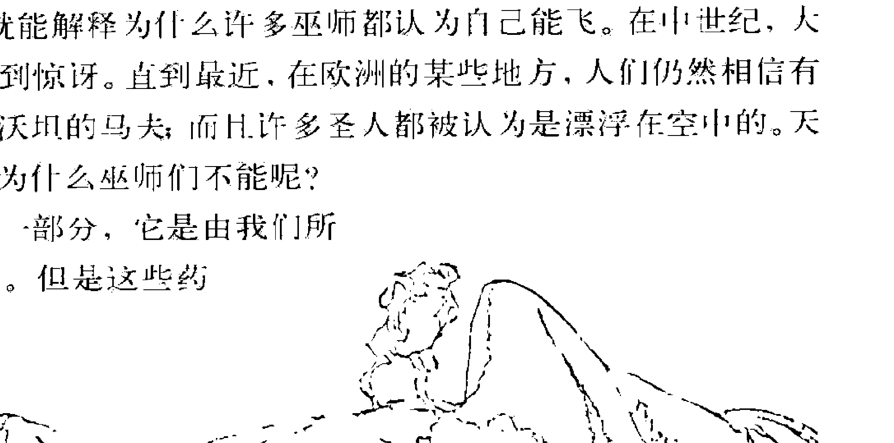

### 魔鬼的性交

在1941年米什莱的图画中，一个卢庭（Lutin）或一个小妖精正跨骑在一个年轻巫师赤裸的身体上。

用这种药膏，因为它能够带来快乐；而快乐增加了，怀孕的机会也就随之增加。

《女巫之锤》还提供了一些轶闻来证明女巫和巫师经常以超乎常理的方式从一个地方搬到另一个地方。例如，德国佛莱辛的一个人声称他曾经被魔鬼带到世界最遥远的角落。而且苏黎世奥拜道尔夫的一位牧师对此事进行了证实，因为他曾经见到这件事的发生：那个人“双臂伸展开被带到很高的空中，他是在呼喊而不是呜咽。”

《女巫之锤》主要讲述魔法和性欲方面的内容。这可能部分是由于教会对享受性生活的限制。但是无疑也是要加深男人对于那些邪恶的女巫的恐惧。因为那些女巫的目的很可能就是“破坏男性的生育能力”甚至是“使男性丧失性能力”。在详细描述了一个灵魂如何与一个人性交之后，作者们又为他们的结论留下了余地。他们叙述说，虽然这样的灵魂都是看不见的，但是女巫却经常被看见赤裸地躺在地上，

> “虽然旁观者看不到魔鬼，但从她们肢体的动作……以及她们小腿和大腿的扭动可以清楚地表明，她们确实正在与魔鬼性交……”

这个描述对于那些还记得在两个世纪以前，卢顿女修道院事件的报告的人来说应该是很熟悉的。在那份报告中还提到有许多人都见到过魔鬼“与他们的妻子进行性交，虽然他们当时认为那不是魔鬼而是人”。

有了《女巫之锤》这本书在手中，那些在中世纪遍布欧洲的业余和专业的巫师追猎者们就决定清除掉那些邪恶的女人，挽救那些身处危险的男人和他们的教会。我们很想知道在这些成千上万的因此而受苦受难的成年男女中，究竟有多少人是真正对魔法感兴趣的，更不用说究竟有多少人真正在从事那些专业的符咒制作。但是，这些巫师追猎者们在抓捕巫师和巫师嫌疑人的时候毫不留情，尽管有时有些人可能只是被邻居说了坏话。

第一步就是要寻找拥有魔鬼标记的嫌疑犯。任何东西都可能是一个标记——一个形状奇怪的胎记或者是任何胎记；一片胎块或一个伤疤，以及任何被误认为是魔鬼留下的作为标志的痕迹……然后，这个嫌疑犯可能就要经受一些考验。他们认为巫师身体的某些区域是没有感觉的，所以一个女人可能会被用锋利的工具戳遍全身，来寻找一个地方，在这个地方，疼痛要比其他部位小得多。事实上人的身体确实存在这样的区域；但是如果不装出疼痛状，这将是一个致命的错误。

游泳的考验可能是比较温和的一种。巫师嫌疑人在手和脚都被绑住以后，被扔进深水里。如果她沉下去了，则证明她就是无辜的（虽然通常情况下她会因此丧命）；如果她能浮起来或是她试图浮起来，那么她就是有罪的，就会被拖出来经受进一步的拷问。

拷问当然是必须的，首先是为了那些“巫师”自己的利益。因为拯救巫师们不死灵魂的惟一办法就是在她们被绑在树桩上烧死之前，让她们主动放弃魔鬼。但是从她们那里得到的情报也同样重要。她是怎样被招募进去的？她的情人具体是哪个魔鬼？她是怎样与魔鬼达成协议的？在她与其他巫师们见面的夜半集会上发生了什么？她给别人下的是什么咒语？最重要的是，与她一起参加女巫集会的其他巫师的名字是什么？

每一个去拷问室的人都必须是有罪的，巫师追猎者为了得到所需要的情报，尤其是其他巫师的名字，任何方法都可以使用。在绝望之下，那些可怜的经受拷问的人总是会说——有时为了以往的恩怨而说出她们敌人的名字，有时在绝望之中提到了她们的姑姑、侄女、表姐妹甚至是她们的丈夫和孩子。

这些拷问已经被描述得足够多了，再提就是多余的了；但是在历史上即使是在纳粹盖世太保的拷问室也没有产生过比这更大的恐慌了，无辜的男人和女人被带上拇指夹，押上绞架，在拷问台上被拷问，经受水刑，经受刺钉熨烫之苦甚至被扔到沸水中。

有一种观点认为自从12世纪以来，所记录的大部分魔法仪式都是巫师追猎者们捏造出来的，是他们记下了自己所设想的在巫师集会上发生的事，记录了魔鬼是怎样和为什么被唤醒的。

但是这些集会没有留下任何证据；没有相当于《祈祷书》的书——根本就没有巫师夜半集会的文字材料。事实是我们不知道仪式上发生了什么。有些祈祷或诅咒肯定会使用；但是大多数都是被秘密使用的。至于在巫师集

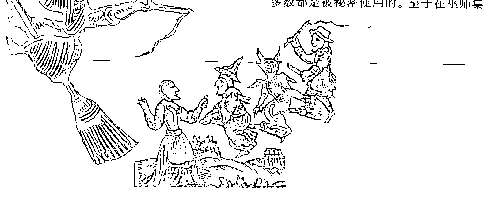

### 巫魔集会

根据17世纪巫师追杀者的描述，英格兰兰开夏的巫师们正与魔鬼举行盛宴。

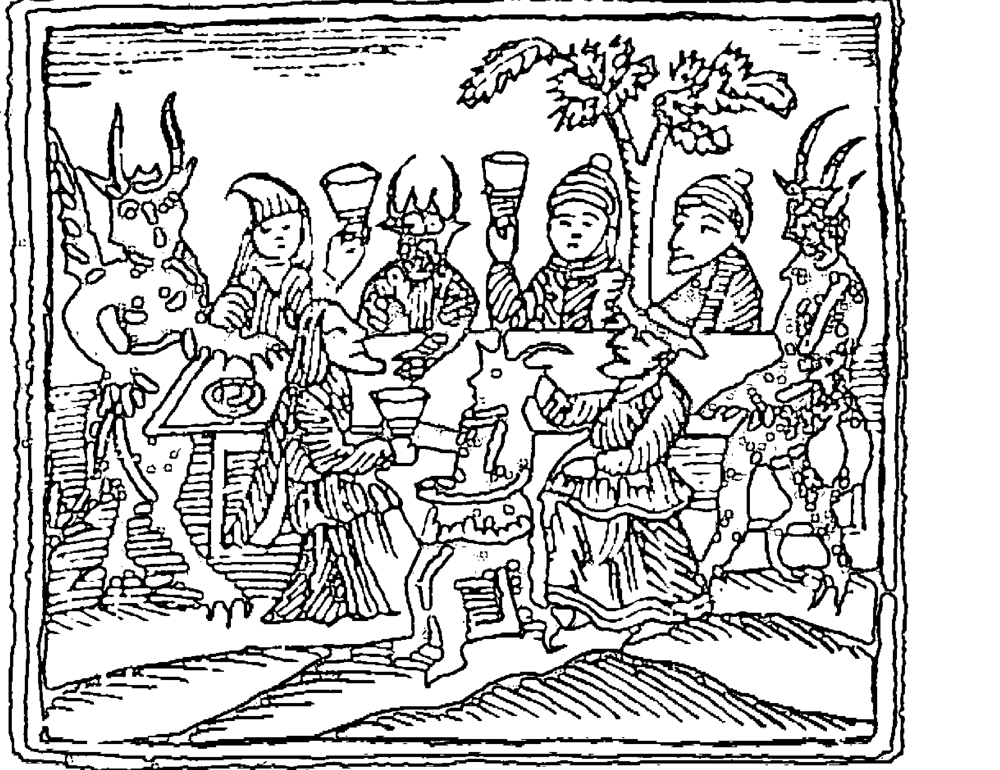

会时究竟发生了什么，我们只能猜测——而且在不同的国家之间，甚至在不同的村子之间，仪式也有所不同。
有时他们自己编造这些报告；有时他们依靠拷问而得到报告。例如，在1628年7月24日，班贝格市的约翰尼斯·朱尼厄斯，承认在巫师夜半集会上见到无辜的邻居。他承认他被魔鬼指使去杀害孩子，但是他却杀了一匹马来替换，从而骗过了魔鬼。这不足以使他接受折磨，所以他又承认他曾经亵渎过上帝。

> "任何被带进巫师监狱的人都要经受拷问直到他能够凭借想像编出一些事情来。"

可怜的朱尼厄斯写道，而这时他的手因为经受拇指夹之刑几乎握不住笔了。
在这类案件中的证据根本就不能算作证据。也许在某种程度上依赖于巫师自述的《女巫之锤》还有些可信。这本书至少记录了教会中的两位德高望重的人及宗教裁判所对于巫师及巫师行为的认识。

他们确信使用魔法的主要目的就是通过与魔鬼达成协议，进而利用魔鬼的力量——有时是为了迷惑别人，有时可能是为了权力或是报复，有时好像仅仅为了快乐。除了体验飞行的快乐之外，还有什么原因使这些巫师们愿意去飞行呢？毫无疑问就是为了方便。

在一个男性统治的社会里，巫师们被怀疑蓄意去伤害男性的生殖能力也是不足为奇的。例如，通过使用各种各样的包括蜡像、草药或公鸡的睾丸在内的

### 梦幻中的巫师

在16世纪和17世纪追杀巫师的狂热中，骑在扫帚上（左图）飞行的能力被认为是专属于巫师的能力，包括男巫师和女巫师。就这一能力与更为久远的萨满教徒的飞行也是有关联的。与以山羊形象出现的魔鬼进行性交（左）也可以追溯到希腊酒神狄俄尼索斯。对于男性的诱惑和阉割（右）也有一定的历史渊源。

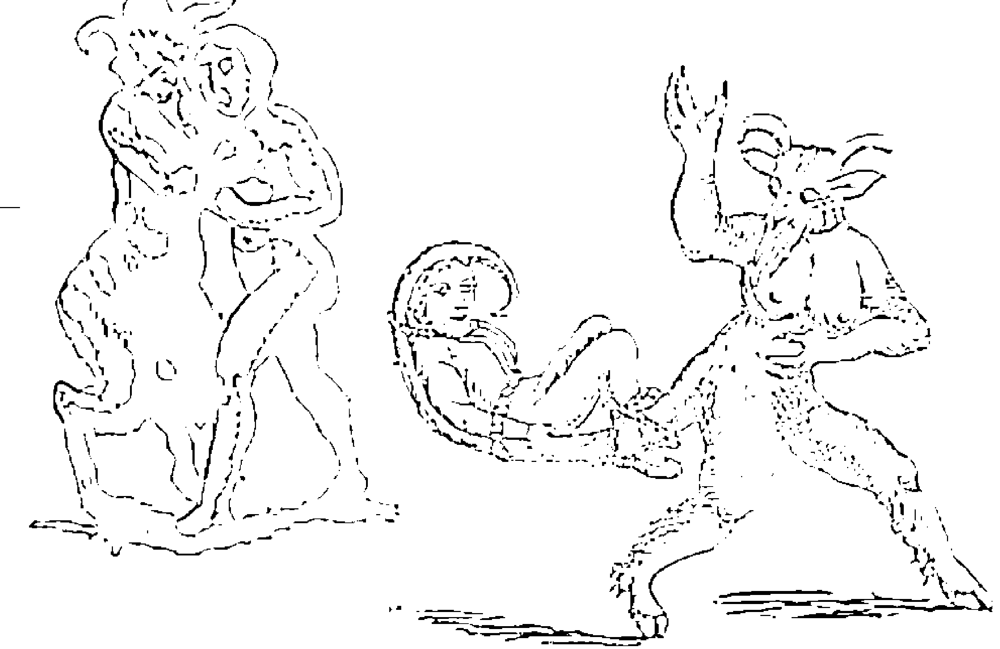

咒语来阻碍勃起。在一些情况中，男性的生殖器甚至被魔法连根拔起，从而使身体变得平整，于是便有了这样的案例。女巫会“大量收集男性的生殖器官，有时甚至会多达二十到三十个。把它们放到一个鸟巢里或一个盒子里。在里面，它们就像真人一样动来动去，吃着燕麦和谷物，这已经被很多人验证过而且出现在报告中。”事实上，《女巫之锤》告诉我们，在一个真实案例中，一个在事故中失去阴茎的男人向巫师请教，巫师让他爬上一棵树，树上有一个装着几个阴茎的鸟巢，他可以从中选择一个。他当然选择了其中最大的，但是却被告知不能拥有这个，因为那是属于一个教区牧师的。

巫师能把人变成野兽；能够控制一个人的身体和灵魂；能够引发“人身体上的任何弱点，比如麻风病或癫痫病”。疾病的起因通常是“制作一个蜡像或其他类似的东西……或者通过将熔化的石墨倒进水中制造一个人的化身。”但是同样的魔法可以仅仅通过巫师向人的脸上吹气而生效。癫痫病就是通过服用“与死尸一起埋葬的鸡蛋，尤其是与巫师的尸体一起埋葬的鸡蛋”引发的。

就如同其他时期的迫害活动一样，当一句抗议的话就可能导致抗议者被推上拷问台的时候，那种狂热根本不可能消退。除了一些德高望重的人拥有特例，如比利时的约翰·韦尔医生（1516-1588年），他写了一本名为《咒语实践档案》的书。在这本书中，他声称大多数被指控为巫师的老女人只是在精神上有问题。这一观点激怒了神职人员，而韦尔本人很快就被指控为巫师，但是由于他是杜塞尔多夫有权势的朱力克公爵的家庭医生，因而得到了强有力的保护才免于迫害。

英格兰女王伊丽莎白一世（1533-1603年）对于神秘之事很感兴趣，她经常向魔法师约翰·迪博士请教。然而正是在伊丽莎白女王在位时期，切尔姆斯福德发生了英格兰历史上有记载的第一个巫师审判。在女王的亲笔签署下，女巫们、巫师们和巫士们被判处了死刑。虽然对巫师的审判是依据国法而不是教会法规，但是英格兰的巫师即使不被执行火刑也要判以绞刑。

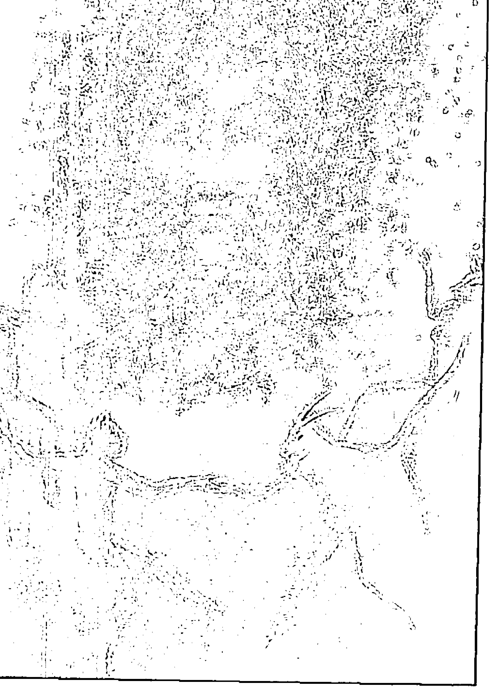

### 与魔鬼相遇在中世纪

> “与魔鬼相遇在中世纪”成为造成人们对魔法的困惑的主要原因。

在英格兰的切尔姆斯福德，伊丽莎白·弗朗西斯小姐因为承认从她的祖母那里学会了魔法，而最终被判以了绞刑。在1579年，艾塞克斯的几个女人也因为相同的原因被指控。但是除非是在苏格兰否则根本就不存在魔法使社会处于极度危险的证据。国王詹姆士六世（1566—1625年）对一个叫做艾格尼丝·辛普森的老妇人的供白印象深刻。这个女人在被强迫几天几夜不睡觉之后，又被用长钉穿过舌头和脸颊通过嘴里的铁器将她固定在墙上，她承认曾经与一些朋友到达过北贝里克郡，在通过筛选后，当魔鬼出现在当地的一个教堂时，她们去亲吻了魔鬼的屁股，并策划杀死国王。当卡尔文教徒詹姆士在1603年作为詹姆士一世成为英格兰的国王之后，他始终坚信巫师们已经在他的土地上泛滥，并钦定了一个《圣经》版本。在这一版本里，许多专有名词都被仔细地误译，以此来满足他对巫师和巫术的强烈憎恨。在利用制造出来的证据审判了几个巫师之后，詹姆士的态度才有一些缓和。但是对于1612年

### 女巫西多里亚

这幅 19世纪画家伯恩－琼斯的水彩画，主题来自德国著名的“女巫西多里亚”的故事。这位“女巫”是16-17世纪的德国女贵族，81岁时因巫术而被判死刑。她的美丽和妖术成为英国拉斐尔前派画家们想像力的来源。

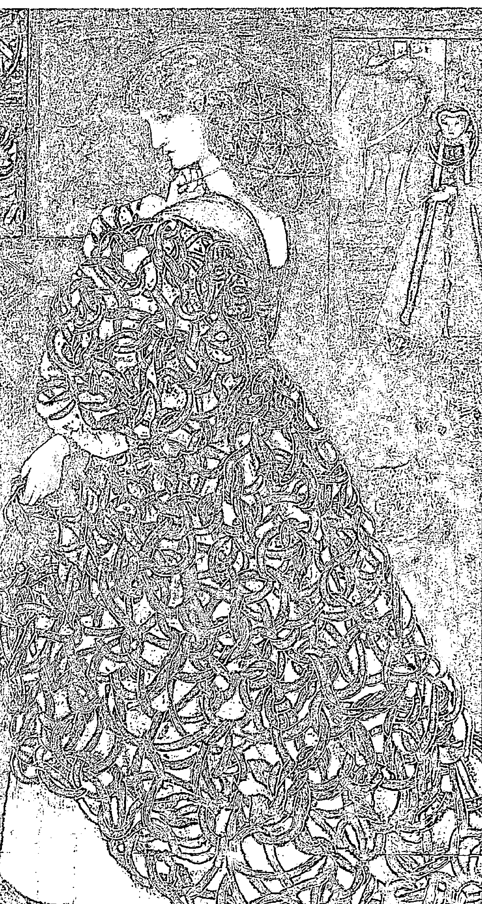

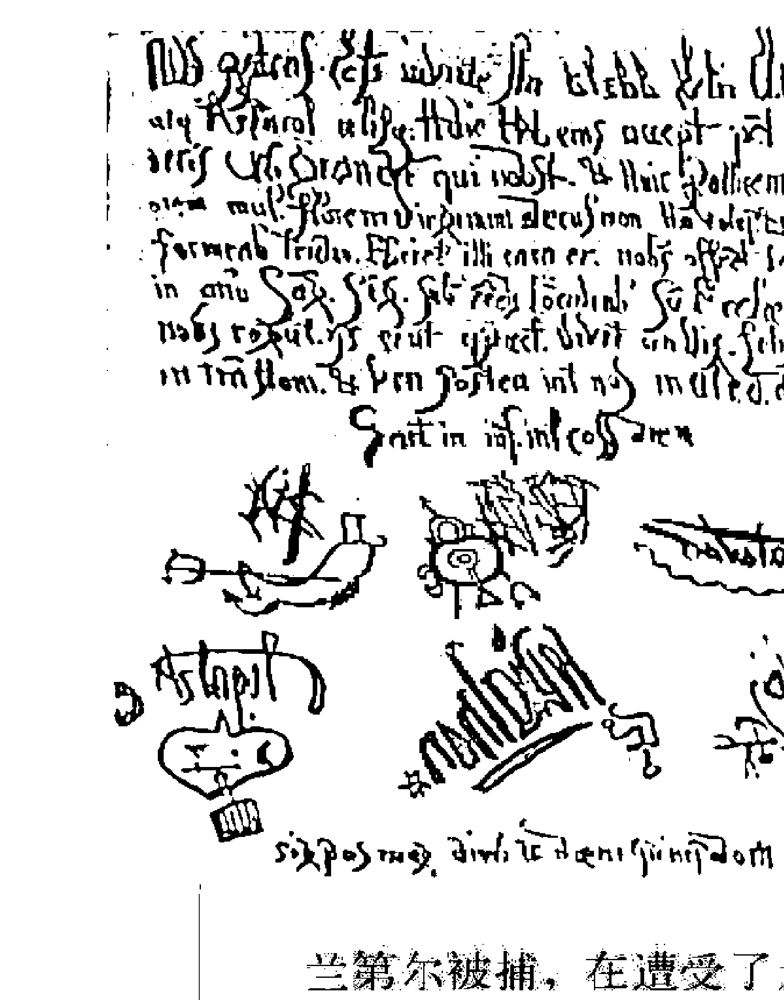

### 协议书

这份在1643年发现的“与魔鬼的协议”被认为有魔鬼代表乌贝恩·格朗迪埃的签名。

在英格兰兰开夏郡被判决的20位巫师来说已经太晚了，据说他们将一只作为魔鬼化身的棕色小狗围在中间，秘密地施行魔法。

在众多案例中，1633年发生在卢顿的一群疯狂的修女的案件应该算是最著名的迫害案件。在这个法国小镇的乌尔苏拉修道院，修道院院长和修女们指控她们的乌贝恩·格朗迪埃神甫对她们施用魔法。她们还通过在地上打滚、嘟囔猥亵的语言、经常表现出非宗教的和亵渎的言行等作为证据。她们中的一些人在格朗迪埃被捕，在遭受了无穷无尽的折磨之后放弃了自己的说法；但是却太晚了，那时格朗迪埃的敌人们已经得到了可怜的神甫亲笔签名的坦白书，坦白了他与魔鬼达成了协议，魔鬼也通过在这个文件的页脚画上干草叉对此进行了认可。结果格朗迪埃神甫被绑在树桩上烧死了。同时受到这件事情的影响，一些修女仍然继续她们奇怪的言行，但是似乎没有人因此怀疑格朗迪埃可能是无辜的。

在英国内战期间（1642－1648年），一名叫马太·霍普金斯的清教徒是英格兰最著名的巫师追猎者，经由他手治罪的巫师最多。在切尔姆斯福德，他更是大名鼎鼎。霍普金斯通过各种方法来获取坦白书，而他使用的方法即使不像常用的方法那么恐怖，却也十分令人讨厌。

读一读这些坦白书，就可以很容易地看出，那些折磨者期望他们的受难者能坦白关于巫师活动的普遍认识：夜半集会、纵酒狂欢、谋杀婴儿、与魔鬼性交以及与那些化身为猫、狗和癞蛤蟆的同伴的友情——霍普金斯本人就在工作中看到过这些文件。例如，还坚持说一个布兰德斯通本地的牧师约翰·洛斯，通过巫术使一条船沉没了。

在复辟时期之后，对于巫师的审判仍然在继续——但是气氛改变了：对巫师的定罪渐渐减少，罚款也相应减轻，不再是那么具有毁灭性。随着启蒙时代的到来，巫术对于统治者来说已经过时了。英格兰的最后一宗巫师审判案发生在1731年，被怀疑为巫师的简·温翰姆最终被宣告无罪。

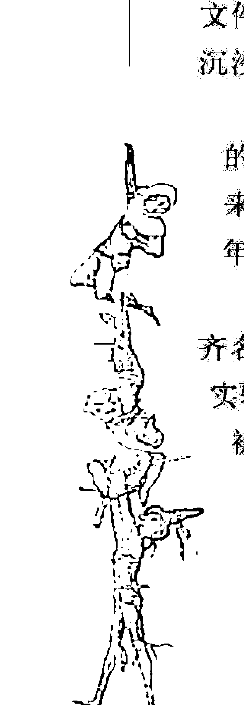

在美洲，巫师和巫术的影响并不像在欧洲那样普遍和深入，除了与卢顿事件齐名的塞伦巫师事件。塞伦是马萨诸塞州的一个小镇，在1691年，两个进行预言实验的小女孩突然疯狂了。当地的一个医生因无法查出病因，暗示说她们可能是被实施了巫术，这引发了当地以悲剧结局的强烈反应。

这两个女孩，毫无疑问沉浸在她们所得到的广泛关注之中，并因此变得越来越歇斯底里。她们的几个朋友因为想得到同样的关注也加入进来。在询问下，她们指控了3个当地女人对她们施了巫术。而3个女人之一，一个名叫蒂度芭的印第安奴隶立即承认了指控，并详尽地描述了魔鬼。

邻居们因此变得极为惶恐。越来越多的人被捕和被指控，当这种狂热结束时，至少已有19个人被处死。

从这些事件来看，如果我们不能肯定巫师是什么，那是因为“巫师”已经成为了离群索居的人的标签。而那些我们嫉妒、害怕的人则宁愿远离我们这个社会。这看起来可能都是些毫无意义的东西，但是却有某种一致性——在一千多年的关于魔法实践的描述中，同样的主题总是反复出现。其中有些东西是很难理解的——性行为是一种令人极度渴望和极具煽动性的体验，因此它的力量总被运用也就不足为奇了。同样的，精液作为生命的来源，也成为许多仪式的中心。但是在其他的方面，那些象征和形象就不那么容易解释了：为什么癞蛤蟆经常成为神秘的媒介呢？同样的，为什么巫师总与猫相关呢？

在本书的其他部分，我们详细讲述了符咒和仪式。在这一章，我们只是尽力概述了魔法的历史，并没有试图去做不可能的事——事实上是讲述了艺术的真正实践。在《女巫之锤》中讲述的一些仪式今天可能还在继续；但是“平常”的巫师是否经常地或偶尔地参与进来就值得怀疑了。即使是为了对某人的山羊下咒语或为了治疗某人的头疼而与魔鬼达成协议，这也是不可思议的事情。对婴儿的谋杀，各种淫秽的仪式，也不大可能发生。但是我们也不要漠视那些居住在乡镇或小村庄的巫师们，她们中的一些人也许真的试图与自然力量沟通，制作一些有治疗效用的药物或是偶尔参与到她们认为的魔法活动中去。

“真正”的魔法可能总是与某种仍在现代巫师集会或夜间集会中出现的仪式有关，我们将在第二部分中讨论。

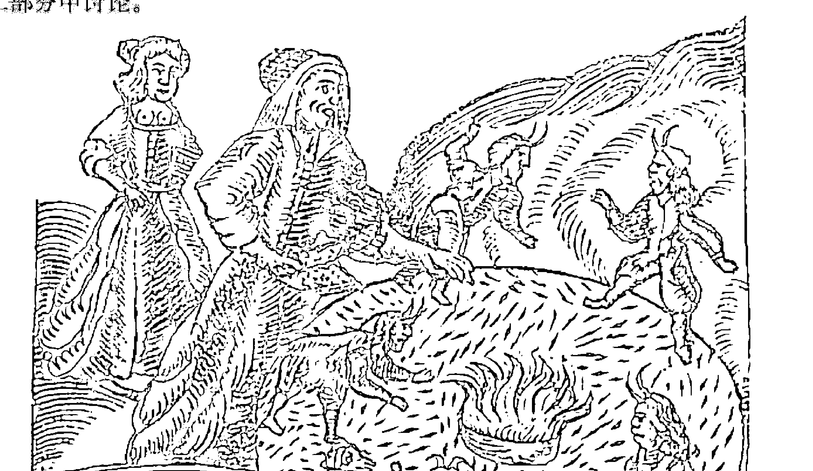

### 女巫的魔力

据记载，17世纪一个聪明的女人安妮·博登翰姆“用她的魔杖画了一个圆圈”就召来了4个魔鬼，这些魔鬼总是延时地以“顽皮的男孩的形象”出现，与巫师的猫和狗一起跳舞。

## 第六章 植物与动物

正如第二章中所讲，巫术的历史源远流长，可以追溯到史前时期。那时人类的始祖们与自然紧密相依，在他们的生活中万物生灵都有其独特的作用。这也就不难解释为什么巫术中那些奇奇怪怪的信仰与仪式里会包含那么多的动植物了。

萨满教的巫师可以说是世界上最早的魔法师，关于他们的各种传说流传已久，其中一个说法就是他们有飞翔的能力。对于这种超自然能力，其中一种解释是他们使用一些神奇的植物，而这些可以让人产生幻觉的植物包括蘑菇和各种各样的真菌等，巫师把它们制成药膏擦在皮肤上。这些带有“魔力”的药膏渗入血脉，随着奔流的血液一起流遍全身，可以带给人们凌空飞翔的感觉。

那些据说可以圆“飞翔”之梦的植物有芹叶钩吻、罂粟和颠茄。芹叶钩吻可以与毒药相提并论，相传古希腊大哲学家、智者苏格拉底就是因为被迫服下这种毒草而丧命的。罂粟与颠茄是用作提炼毒品的原料因而就更加臭名昭著。如果将飞行药膏不小心吞到肚子里，那后果就不是飘飘欲仙而是一命呜呼了。

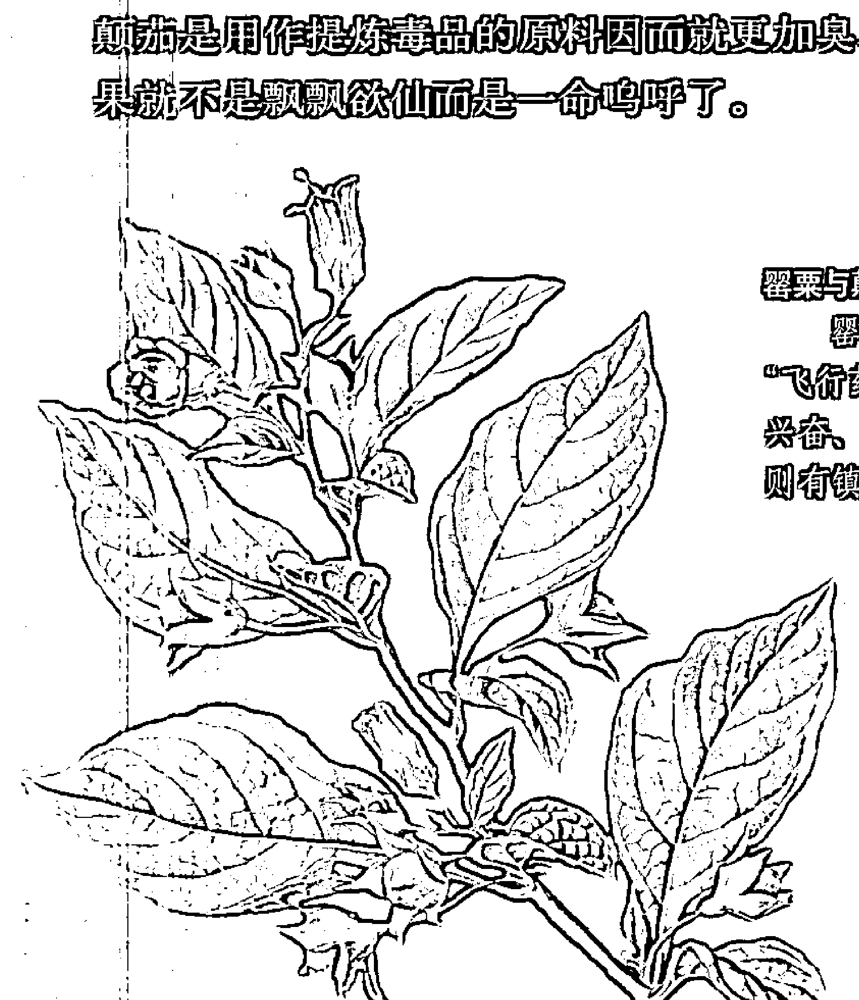

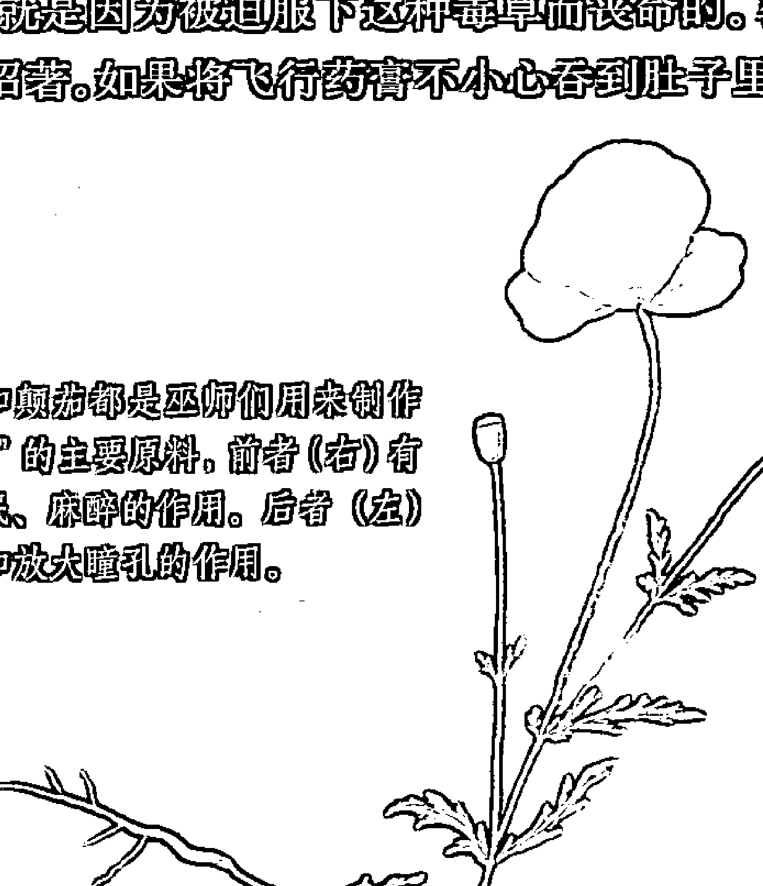

罂粟与颠茄
罂粟和颠茄都是巫师们用来制作“飞行药膏”的主要原料，前者（右）有兴奋、催眠、麻醉的作用。后者（左）则有镇静和放大瞳孔的作用。

自然界的魔法（右页图）
巫术在魔法师和巫师手中历经几千年的传承，它吸收草木的精华，从动物身体中汲取神秘力量。它的力量不断壮大，在人们看来巫术更加变幻莫测，更加不可捉摸。

对这种神奇“飞翔”的另一种解释要追溯到中世纪人们对巫婆的迷信。那个时期人们对巫师巫术的狂热崇拜达到顶峰，各种书本里有不少对“飞翔”能力的记录。一本典籍上还记录了某种叫做“舞蹈病”的流行病，据说是小麦被一种含有麦角胺的菌类污染，用这种麦粉做成的面包给人吃了以后，人就会得这种怪病，因为麦角胺的一个副作用就是会让人产生幻觉。
在巫术中有许许多多植物与“爱情”有关系。它们使人坠入爱河不能自拔，让人情欲暗生不能自己，而大多数对这种“撩拨”情爱的神奇草药的叙述又和关于古希腊美与爱之神维纳斯的种种传说紧密交织。由于九月份正是太阳到达黄道天秤宫，并到达金星(九大行星中最明亮的一颗，代表爱神维纳斯)位置的时候，这些草药就又与九月扯上了关系。根据对这些植物的传统叙述，每个月份都有各自不同的代表花卉，九月之花是玫瑰，而玫瑰正是象征了情与爱的花朵，它代表着维纳斯这位爱情永恒的保护神，她是浪漫与情欲的化身。

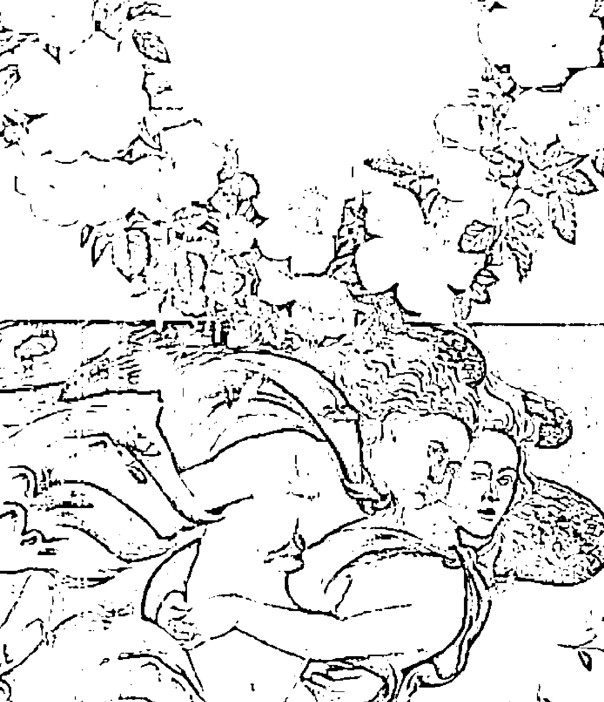

### 玫瑰花环

这只经典的玫瑰花环是由最著名的“玫瑰画家”雷杜德于1817年所绘制，包含了各种野生玫瑰的典型形态。

### 维纳斯的诞生

维纳斯是文艺复兴以后，西洋绘画中出现最为频繁的神话中的女性。波提切利绘制于1485年的这幅画则创造了经典的爱神形象，因为爱神维纳斯的所到之处总是有玫瑰相伴，所以玫瑰也被视为爱情的象征。据说这种花就是与维纳斯一起诞生的。

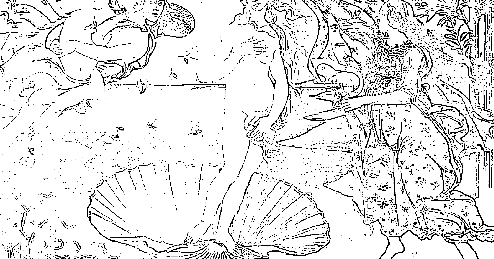

The request was rejected because it was considered high risk此美丽、慑人心魂的声音掩盖了所有的邪恶与危险……
这是一次与地狱的对抗，我用尽了全身的力量，呐喊着疯狂地试图从这个迷人陷阱里解脱，那妖媚得撩人心弦却又恐怖之极的声音像一片泥沼一样牢牢地吸住了我的双腿。我挣脱出来了，全身精疲力竭，似乎所有的精力已被某种莫名的力量吸得干干净净。

### 5 有魔力的动物

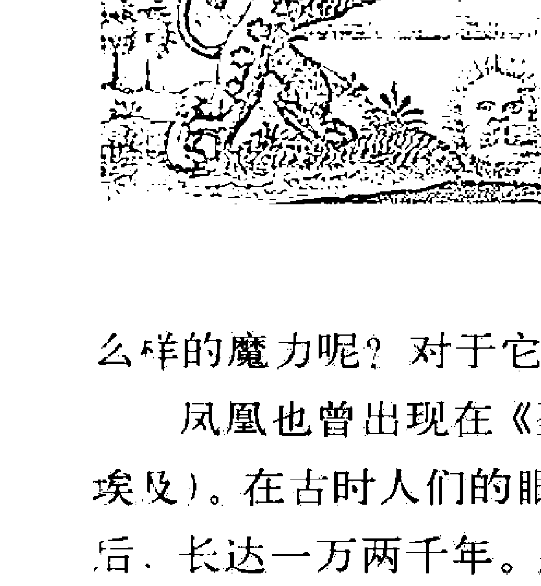

从上面的叙述中我们了解到、在各种说法中，那些平凡常见的动物被赋予了令人惊讶的力量，那么对于古老的神话传说里那些从诞生之日就笼罩在无比眩目光彩中的动物，它们有什么样的魔力呢？对于它们与生俱来的神奇，人们又有过什么样的误传呢？

凤凰也曾出现在《圣经》中，但其实这种奇异的鸟早在公元前8世纪就诞生了（大概在埃及）。在古时人们的眼中，光辉灿烂的凤凰是象征着太阳的吉祥鸟，它的寿命之长空前绝后，长达一万两千年。凤凰的象征意义的影响力已经深深地渗入欧洲文学之中。

现在我们可以总结出这类动物的魔力所在了，就在于它们在人们脑中激发的想象。神话中被誉为“万蛇之王”的怪蛇（或称作王蜥，其气息与毒液能致人死命），它致命的毒液和其本身一样富于神话色彩。而在神话中也占了一席之地的独角兽则被看作象征淫欲的最合适的代表。据说，独角兽凶猛异常，但在处女面前却变得服服帖帖。杰拉尔德·雷在他的一本书中提到：

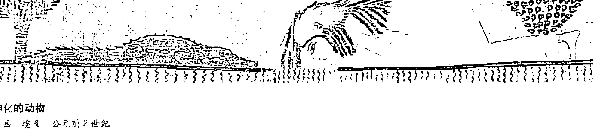

神化的动物
壁画 埃及 公元前2世纪
古代的人们对于神秘的自然会产生一种莫名的敬畏心理，进而将这种敬畏对象神化，甚至是神化。对那种充满灵气、亦或是凶悍的动物更是不能例外。这幅壁画所描绘的是埃及的女祭司向水神索贝克的化身鳄鱼膜拜的情景。

独角兽的致命弱点（右页图）
独角兽只有在美丽的处女面前才甘心就范。

“妄想借助武力来猎捕独角兽是无济于事的，对于这种凶猛强壮的野兽，人们必须摸清它的习性，最有效的方法就是——美人计。找一位美貌的少女出现在独角兽出没的地方，当它现身后，少女掀起自己的衣裙，这个暴力的猛兽就会立刻浑身酥软，心魂荡漾。它会低下头，拜倒在少女的石榴裙下，在温馨的香氛中沉沉睡去，直至被暗中埋伏的猎人捕获宰杀。”

在各种绘画中有许多图案是对独角兽与少女的描绘。这种把独角兽与“性”联系起来的观念，其来源在于它的“角”。如果能够把角锯下磨制成粉，可以制成最最强烈的春药。然而这种激发人的性欲的粉末却与毒药只有一步之遥，长久以来，它也一直是制造各种常见毒剂的主要成分。独角兽的角磨制成粉后还有一种功效，就是可以治愈腹泻。

随着历史的变迁，人们在科学技术方面的知识不断增长，那些长久以来笼罩着神秘光环中的各种现象已不再带有任何神奇色彩，而宗教的态度也使得人们对神话的热情逐渐冷却。独角兽似乎已退回到了遥远的远古时期，它的存在已不再有人相信。和它命运相同的还有古代雕塑中常有的半人半驴的怪兽，以及埃及獴。但并不是所有对动物的崇拜都已经灭绝，在世界的很多地区，对某种动物的崇拜习俗至今仍根深蒂固。

在希腊直到19世纪，还有人深信那位半人半兽的森林之神潘仍躲在遥远的森林里，伺机诱惑美丽的少女。他乍一看就是一位浑身散发着青春光彩的英俊男子，可其实他却有着山羊的身体。这个半人半羊的丛林之神一直是色

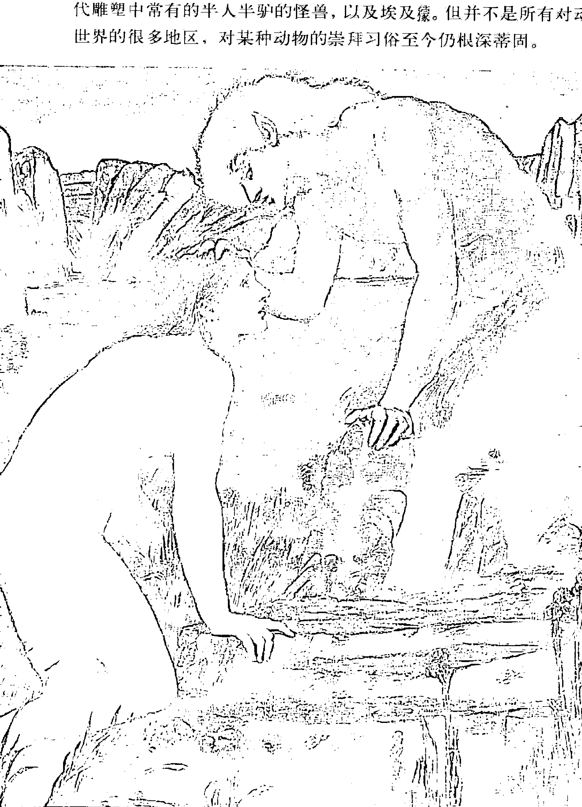

潘和山林女神
希腊神话中半人半兽的森林之神潘常被描绘成一个既好色又痴情的神。这幅画表现的就是潘对山林女神绝望的追求。画家伯恩-琼斯在谈到此画时曾说：“我想通过一幅画，表现某种美而浪漫的梦：它从未出现也不会出现，它在比所有亮过的光都美好的光中，它在除了欲望，无人能够记起和辨识的地方，其中的形状有神性的美，然后，我就醒来。”

欲与淫荡的象征，而他那山羊的身体更是与“好色”这两个字分不开。早期一位《圣经》的译者把他解释为“一种多毛的东西”。毫无疑问，在多数基督教徒的眼里，他可以与恶魔相提并论。

### 动物的妙用

我们大都见过符咒的物质形式——护身符。那么如果动物当真生来就具有这种神奇魔力，或者只是它们身上的某一部分有着特殊的妙用，它们会不会也被人当作护身符，或制成各种药剂？

在长篇大论地讨论了动物的各种“神奇”特征之后，我们似乎漏掉了一个极其重要的题目，这就是有“魔力”动物的药用。同前面讲的一样，动物的“药用”与动物本身的特征之间有着千丝万缕的联系。举个例子来说，古罗马人吃鬣狗的心脏，他们觉得这样有助于治愈心悸。还有一种说法是把野猪的颚骨焚化成灰能够治好骨折。但有一个疑问是，动物的这些药用理论是怎么形成的呢？一位生活在伊丽莎白时期的地主兼妓院老板菲利浦·汉斯洛先生又是怎么搞到奇怪秘方的？这位汉斯洛先生有一阵子耳朵痛得厉害，也不知从什么地方取经，搞到两个怪异之极的药方。一个是把蚯蚓放在鹅油里炸，然后在把炸出来的那些油腻腻的东西放到耳朵里；另一个药方的工序颇为复杂，需要搜集许多的蚂蚁卵，把它们压烂后放在一块网眼细密的布里过滤，然后用天鹅的油脂或者将黑甲虫的头压榨成汁进行过滤，和之前制成的蚁卵过滤液混合到一起，最后滴入耳中就可以了。

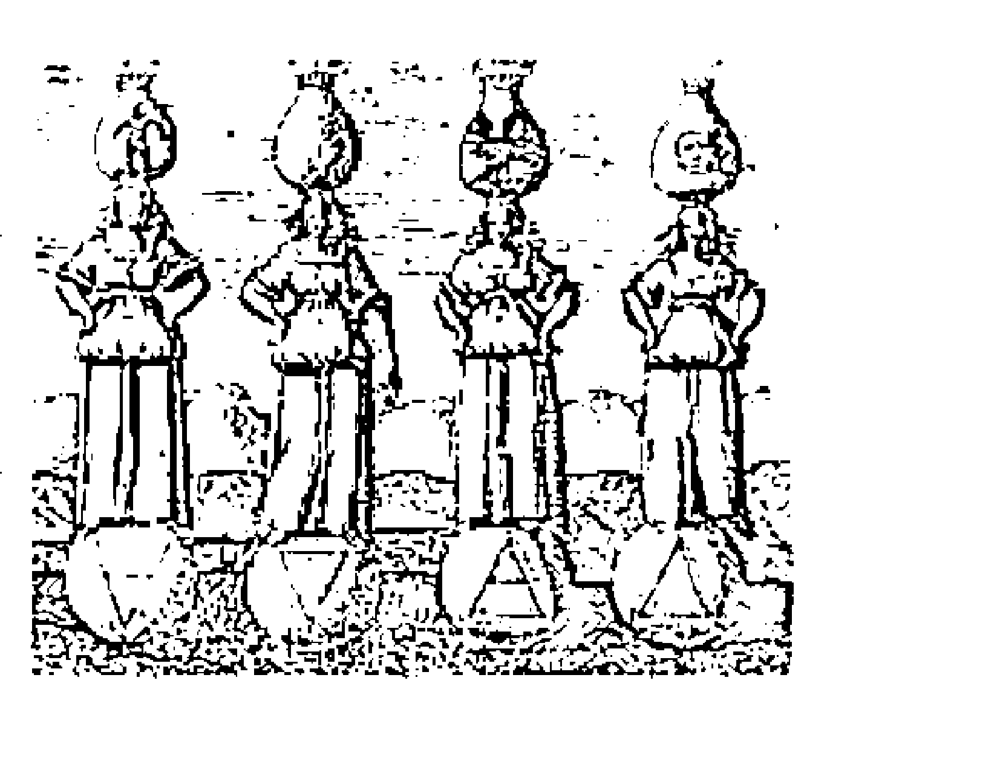

这种药方有时候居然管用，也许是因为对它深信不疑的人们心理作用的结果。不管怎么说这些药方总是有人信的，就算对治疗疾病百无一用，人们也甘愿找出各种各样的借口为它开脱，比如说这是神的谕旨啊，或者有巫师从中作梗啊等等。也不知道有多少位妇女就因为听从了古罗马那位自然学家普林尼的避孕药方，结果腹中再度珠胎暗结。那个“妙方”就是将一种毛蜘蛛脑袋里的两条虫子取出捆绑在鹿皮里做成护身符。而对于治疗耳痛，普林尼也建议了一种稀奇古怪的药方，就是在公猪与母猪交配后，从母猪体内流出的公猪的精液可以治愈耳病，但必须在精液未滴到地上之前将其收集起来。说实话，要把这些这些“珍奇”的配料收集全了还真是不容易。不过相比之下后面的一种治疗耳痛的方法就容易多了，只需要把蜈蚣与葱韭放到一起煮，或者用蟑螂头部榨出来的汁液也行。头痛的话，不妨去试试秃鹫的脑浆。对于那些深受外生殖器瘙痒之苦的男士来说，有一种方法说不定能解除他们的难言之隐，就是将乌鸦的肝脏烤熟后榨成汁，涂在患处按摩。当然还有许多其他的方法，在此就不一一列举了。

大家一定觉得这些所谓的“灵药妙方”听起来比那些病症还要让人心惊胆战，可更让人难以忍受的还在后面呢。这世上就是有人在患了近视后，硬是在新月当空的时候，将母山羊的粪球大口大口地吞下；还有一些人患了感冒后竟然把马粪、燕麦和大麦搅在一起兑酒当药服下。

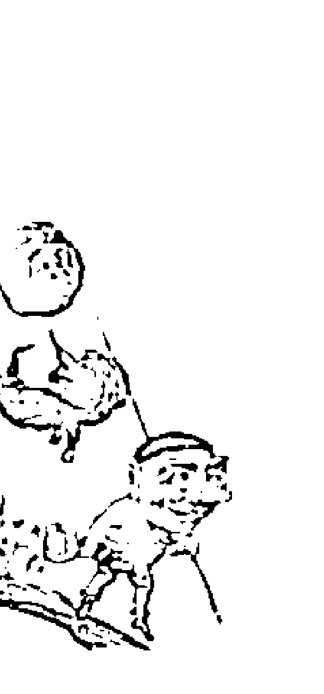

稀奇古怪的例子远不止这些。对于药的滋味，过去有过不少争论。许多人觉得这些药的味道，尽管有些令人恶心，有些难以下咽，还是可以理解的。这一点其实又显示了人们“联系思维”的本领。像当今许多信奉基督教的科学家一样，不少有知识、懂科学的人依然认为，得病染疾就是中了“邪”。恶魔在人的身体里播下“病种”，而他手下那些魔鬼爪牙们则将病痛传遍人身。那么，对付这些“病魔”的办法就是以毒攻毒。只有用令人痛苦难当的药剂才可以将恶魔的小喽罗们撵出人体。罗伯特·伯顿（1577—1640年）在他写下的《忧郁症解析》中讲到，“当‘邪’侵入人体后，与人自身的忧郁情绪水乳交融，它们便开始肆无忌惮地蔓延，把人的身体当作了乐园，这样人的健康在它们无所顾忌的践踏下自然每况愈下。”

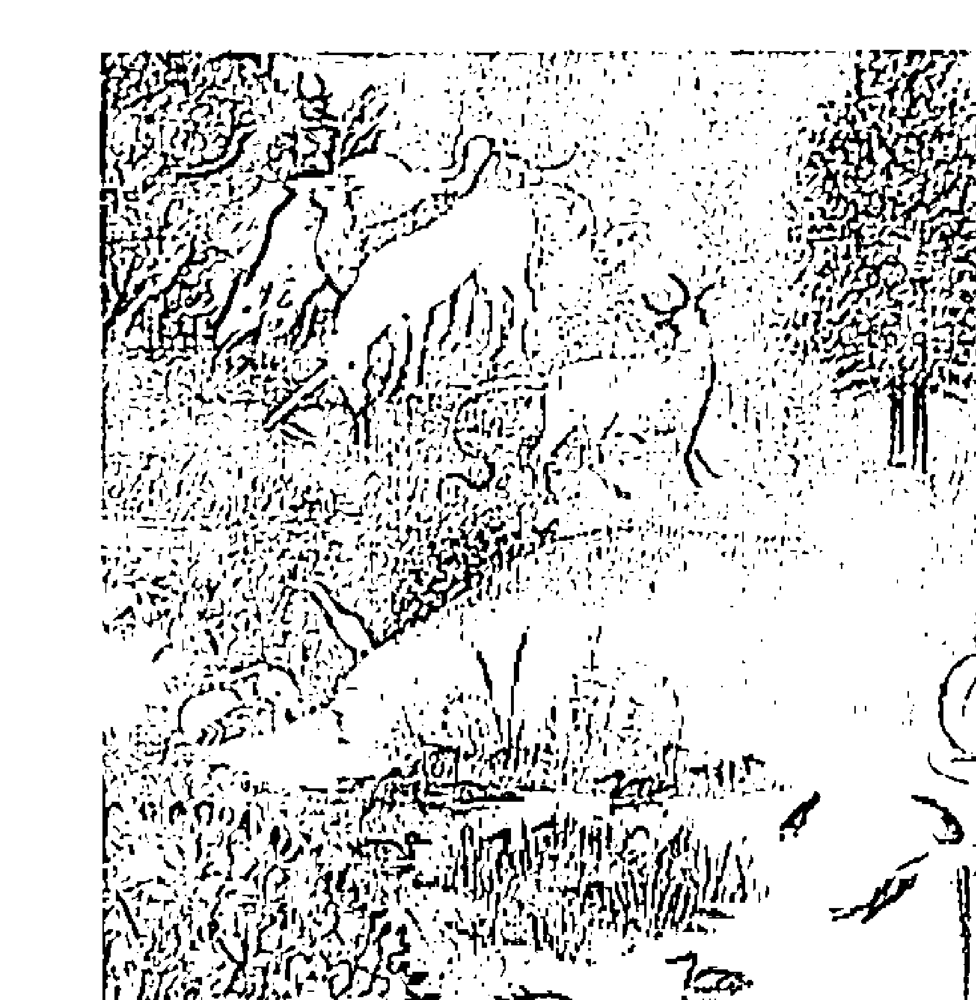

### “现世的乐园”

佛莱芒画家希罗尼穆斯·博施（1450—1516年）的这幅充满幻想的作品中，各种各样的动物在“现世的乐园”中自在嬉戏。

### 微笑的蜘蛛

像其他长相“邪恶”的动物一样，蜘蛛也是传说中的魔法游戏中不可或缺的一员。这种长相怪异的节肢动物以吐丝布网和诡异的捕食能力著称。它在魔法中的作用在于释放人的心灵。画风怪异的象征主义画家奥狄龙·鲁东于19世纪末期绘制了不少这种长着人脸的蜘蛛，它正贪婪地仰视着大概会成为其捕获物的东西，“脸”上露出毒牙并浮现出笑意。画家认为它是自己寻求精神解放的图像标志。

人们对用动物做成的各种美容药品争议较少。用公牛的粪便涂擦面颊可以让面庞光泽红润；将山羊胆汁和硫磺的混合液服下后能够消除雀斑，让面颊白璧无瑕；服食乳牛的脑子有助于使睫毛浓密修长。这些美容偏方听起来虽然天马行空，不过比起现在人们在美容上花的功夫力气，还算是省事的呢。例如，将公驴生殖器烧成灰后吃下，或者将野猪油

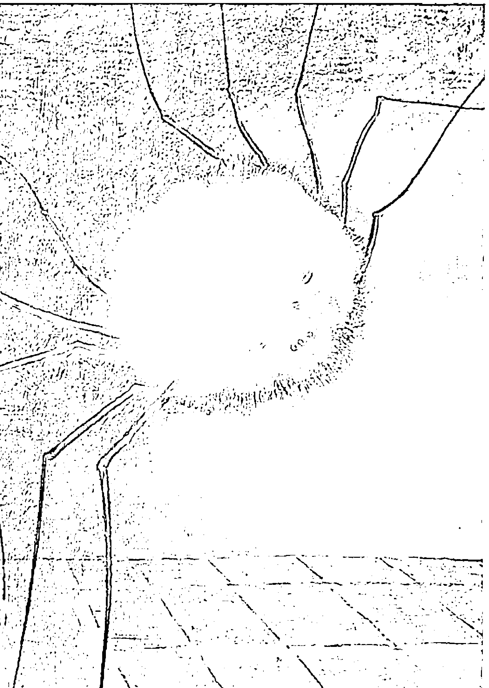

与鸦片酊和铁线蕨汁液混合后涂抹在秃顶上可以让黑发丛生。这听起来的确不可思议，效果如何也没人知道，但做起来毕竟要比移植头皮轻松容易得多了，而且还免去了手术的不便与痛苦。

### 动物们的“真实”魔力

我们似乎有点越说越离谱。其实，动物对人而言的确有着其难以言喻的妙用。比如说，宠物的作用。宠物对老年人和孤独者有不容小觑的安抚作用；而最近的一些实验结果证明，医院里那些可以经常逗逗宠物、抱抱狗的病人比其他病人痊愈得快。

我们在上面提过的“联系”理论仍然有它的市场。在20世纪30年代曾流传过这样的说法，注射猴子的腺液可以让上了年纪的人恢复青春与活力。相信这种说法的人还不在少数，记者萨默塞特·穆汉也是这种疗法的信奉者之一。在这一点上，人们对魔法的信任不亚于对医药的信任。

在动物具有的各种“特异功能”中，最为神秘的就是那些令人自叹不如的能力。这些功能或者在人类长期进化过程中已经消失，或者在人体内沉睡已久，却没有被人类发现。我们没有像一些动物那样灵敏的感官，想像一下一旦我们也具备了它们的功能，一个无比奇异的世界将突然展现在我们面前。就拿犬类来说，这些动物在嗅觉上异常灵敏，比如说人有500万个嗅觉细胞，而一条德国牧羊犬的嗅觉细胞则多达2.2亿个；它们的听觉也远远超过了人类，人最多能听见一秒钟振动2万下的声音，而狗则能听见一秒钟振动3.5万下的声音。而其他动物在感知地震的能力上更是远远超过了人类。

> 有些动物甚至具有超感知觉，而这种能力在人类中极其罕见。著名的兽医大卫·泰勒曾在他的书——《奇特的狗》（1990年第一版）中写道：“反复实验结果显示，某些犬类具有令人惊异的心灵感应，也就是人们常说的‘第六感’。举个例子来说，你想要出去散散步，可就这个念头在你的脑中浮现之前，你的狗就已经感觉到了。”

### 使者

在凯尔特人眼中，土拨鼠是春天的使者。每年的2月2日，冬眠的土拨鼠都会准时醒来爬出洞口，预报春的到来，否则的话春天将会放缓到来的脚步。而在人们看来，土拨鼠带来的不仅是春的气息，更是新一年的希望和好运。

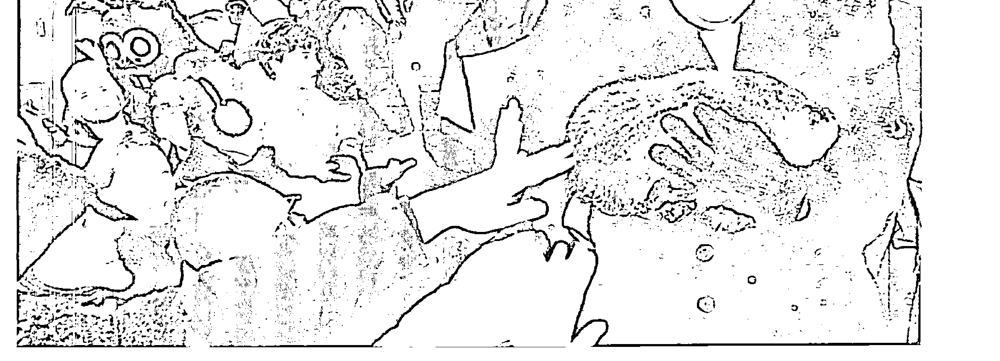

## 第七章

### 巫术与性

那些对性方面的巫术感兴趣的人不外乎两种：一种人的兴趣在于性本身，他们希望能更充分地享受性的快乐，而巫术对他们而言只是达到这一目的的手段而已。毫无疑问古往今来有那么多人沉溺于各种方术中，为的就是能让性发挥到极致，得到那种痛快淋漓的迷醉之感。（当然也有不少人对此求而不得）。其他一些人则沉浸于淫秽猥亵、甚至带有虐待倾向行为中；一些人像艾利斯特·克劳利一样纯粹是为了研究巫术本身的；还有一些则仅仅为了获得性的满足。值得一提的是，在我们所处的时代，几乎所有证据都显示，那些恋童癖和时常虐待儿童的行为往往出于畸形色欲。

在过去的几个世纪里，有不少人想方设法寻找能激起强烈情欲的药剂。也有人对意中人苦苦追求而不得，只好借助于春药与巫咒，希望梦中人能够落入自己布下的情网中。在某些神秘色彩浓厚的地区，或是在宗教与巫术紧密结合的地方，许多人将“性”功能看作是“神赐”的礼物。在他们看来，男人与女人的交媾是宇宙的力量，是和谐与欢乐的体现。

而在基督教中，以圣保罗为代表的一群人对性的看法是：性行为本身就是不折不扣的罪恶。这些人的想法其实很容易理解，亚当和夏娃正是因为这项罪恶被赶出了伊甸园。（当然，在《创世纪》中对于亚当和夏娃被撵出伊甸园的原因不是这样写的。）而直到近些年，性行为作为夫妻之间的正当行为才逐渐被基督教所接受，虽然一些保守的基督教徒对此仍感到十分勉强。但是一些性行为以“奇特”的形式仍然为许多基督教徒所不齿，被认为是应该受到诅咒的肮脏行为。

对于一些宗教而言，性行为是现实享乐的重要内容之一。它们并不排斥“性”，或将其视作一种“罪恶”。相反，“性”在这些宗教里受到的是赞美与推崇。比如产生于古代塞浦路斯岛帕福斯城的对爱神维纳斯的祭拜仪式。这一仪式体现的正是爱神对人们美满性生活的祝愿与赞同。在她的神庙中，人们丝毫感觉不到淫荡与猥亵，爱神所褒扬的性永远笼罩在神圣的光环里。正如詹姆斯·弗雷泽爵士在他所著的《金枝》中所说：“你感觉不到任何肮脏赤裸的肉欲，在这里性是爱神对人们美满生活的祝福，是这位母性之神帮助人类繁衍后代以至生生不息的神圣职责。”与其他异教徒居住地区情况相同，神庙中有一些负责接待和服侍维纳斯信徒们的侍女；在神庙中，每隔几码就设有一个壁龛，这样信徒们就可以用他们认为维纳斯所喜爱的方式来祭拜这位女神。

另外一个至今将“性”视作神圣功能的宗教性派别是印度教中的瑜伽派。在这一教派的思想中，性行为中交缠得难解难分的身体正是灵魂相结合的表现，是创造与繁衍的序曲。这一思想最早来源于古印度，至今已有数千年的历史，今天仍有一小部分人对此坚信不疑。印度密宗佛教传入尼泊尔、蒙古以及中国的西藏后兴旺至今。印度教则在柬埔寨、爪哇和亚洲南部地区流行。

印度密宗佛教中的各种理论与施行方法极其复杂神秘，西方人对东方的这一宗教尤其感到迷惑不解。这里面的确包罗万象，涉及了形而上学、数学和性等多方面理论，它的许多仪式不仅鲜为人知，而且不曾留下任何文字的记载，只有教中人才能从师傅或领袖那里学到。所以，虽然想让读者尽可能对密宗佛教中涉及魔法的内容有个大致把握，但我们也只能给大家一个不甚清晰的概念。

密宗佛教的基本理论思想，就是接近宇宙，体验最高真理：人们应当积极地享受世俗快乐，接受现世的磨炼。而最高的真理有阴阳两面，两者相辅互动。人体与宇宙有着某种神秘的关联，而最高程度的关联就在于人与宇宙能量的合而为一。宇宙的能量将世间万物囊括于无边无垠的“博爱”中：父爱、母爱、姊妹之爱、兄弟之爱。而置于各种各样“爱”之上的，则是阴阳交融体现了无尽创造力的“性”之爱。

这种关于性的思想与密宗佛教中的爱神迦摩以及其他方面的教义联系紧密。这些教义详细阐释了阴阳交合的各种形式。在许多庙宇中的绘画与雕塑都体现了阴阳交合时产生的剧烈无比、撼动宇宙的激情。例如卡杰拉霍，即印度中央邦北部的古城，现在的著名旅游胜地与考古地址，就是以众多供奉湿婆、毗湿奴的庙宇而闻名。不少西方人怀着好奇心企图探求这种

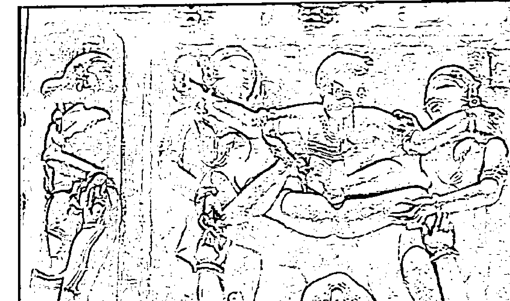

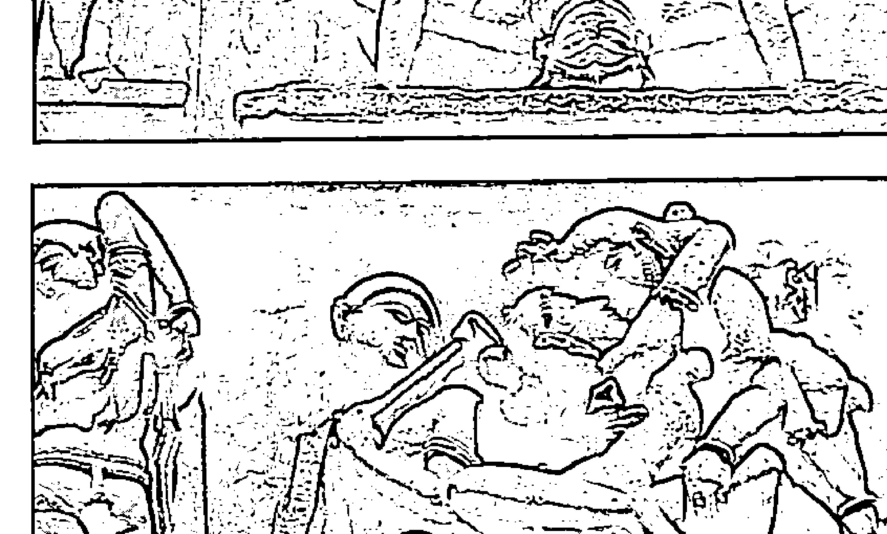

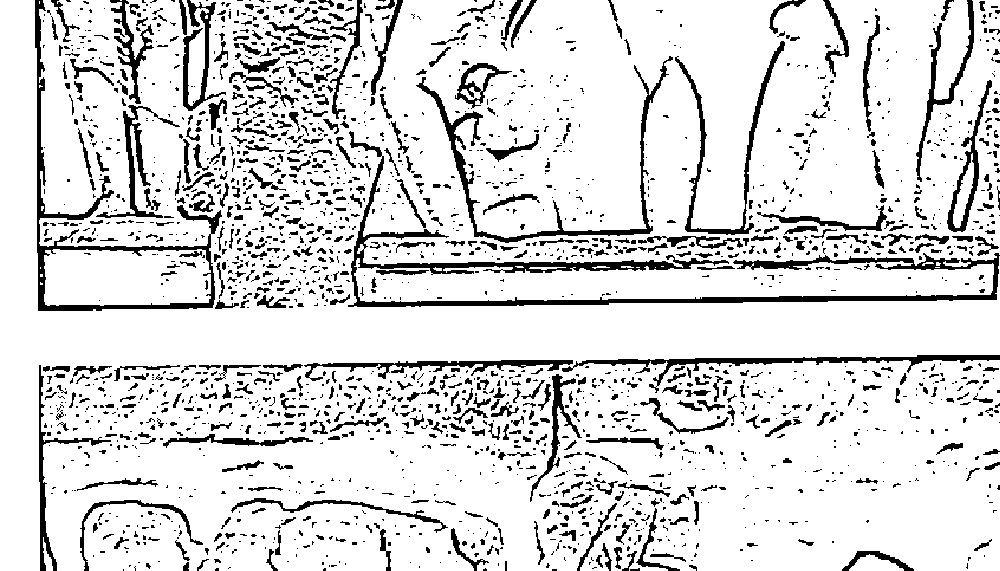

爱情的魔力（左下图）
人们总是喜欢将解释不通的现象或问题归入魔法的范畴，爱情就是其中之一。处于热恋中的人总是沉醉于自我的感官世界中，不顾一切地投入，就像画中的女子一样，即使为此心神俱疲，却仍然沉醉其中。

性爱的力量
在印度卡杰拉霍古城的神庙中，这些雕刻赞颂了人类男欢女爱所产生的神圣力量。中国道教中的一部分思想也体现了这一点，即人类的性行为是宇宙阴阳两气混合交融的体现。

东方宗教中笼罩神秘色彩的“性”的奥妙。这里涉及了不少操作上的技巧，这些“性”技术似乎可以将男性提升到充满阳刚之气的“男子之神”的高度，而在女性方面也另有一套理论。

这些技巧囊括万千，涉及了各种声音、色彩、饮食、静心沉思、瑜珈功以及用特制的香油按摩身体。此外还有各种各样的复杂仪式和咒语，这些在印度教的礼拜、祭祀神灵的仪式上以及黛瓦达西的传说中都有所体现。黛瓦达西是一些人形的精灵，他们体现着阴阳交合的神圣力量，他们所到之处无不受到人们的欢迎。悦耳的铃声、优美的音乐、美丽的鲜花、沁人心脾的香水，还有洁白的奶油、流淌的牛乳蜂蜜，全是对他们的献礼。代表幸福结合的精灵则分别以不同的颜色来表示他们各自的性别，这些精灵用许许多多的用途各异的手臂，鼓励人类效仿他们的做法，这是最终达到理想境界的第一一步。

由于篇幅过长，我们无法完完全全地描述整个仪式。在此我们可以简单介绍一下。按照西方的时间习惯，这种仪式大约发生在晚上7点钟到午夜之间，在一间布置舒适且光线昏暗的房间里放置许多特殊的物品：银质的餐碟上放了准备好的食物（一般为肉类和鱼），杯中倒了酒，屋里还放着麝香草与广藿香的精油。

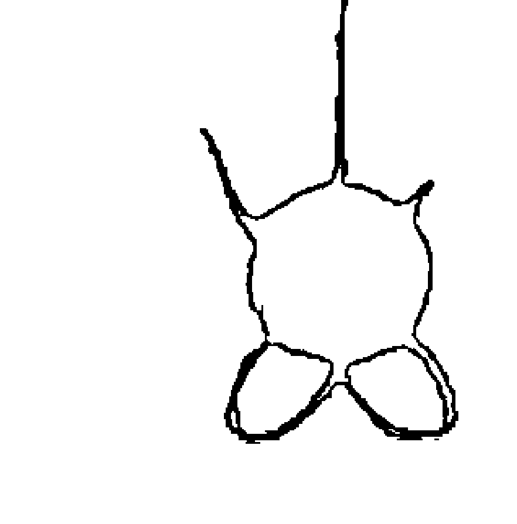

在中国的道教思想中，将“性”作为接近最高真理——将人和无限广阔的宇宙空间融为一体的理论也得到了详细而深入地阐释。这在老子的《道德经》和庄子的《庄子》两部著作中体现得尤为突出。《庄子》认为“道”即“气”，这种气存在于宇宙万物之中。人体（无论是男性还是女性）中既有“阴”又有“阳”。阴象征着女性的阴柔，阳则代表男人的阳刚。而活力无限、拥有无限力量的“气”，是一切事物力量的源泉，而人正是靠着这一口“气”而成为活生生的人，如果没有这口气，人是一具死尸、一个没有“生气”的躯壳。关于道教的各种说法神乎其神，据说有一个道士只需运运气，就可以让旺火上的水无法沸腾，让狗停止吠叫。

> 符
上面是一道中国道教的护身符，它表示阴气过重会致病，因而需要通过两性的交欢来使得阴阳平衡。

“气”的另一种形式就是性行为中产生的力量。在道教的观点中，只有阴阳达到平衡，人的精神才会达到理想境界。而男与女的性器官则象征着宇宙的两种力量，其中女性的外阴代表着“母地”，即“阴”；而男性的阴茎则代表着“父天”，即“阳”。当男女合欢，两种生殖器官结合在一起时，阴阳达到了平衡，天地合为一体。这种平衡维持得越长久，它神奇的力量就越为显著。

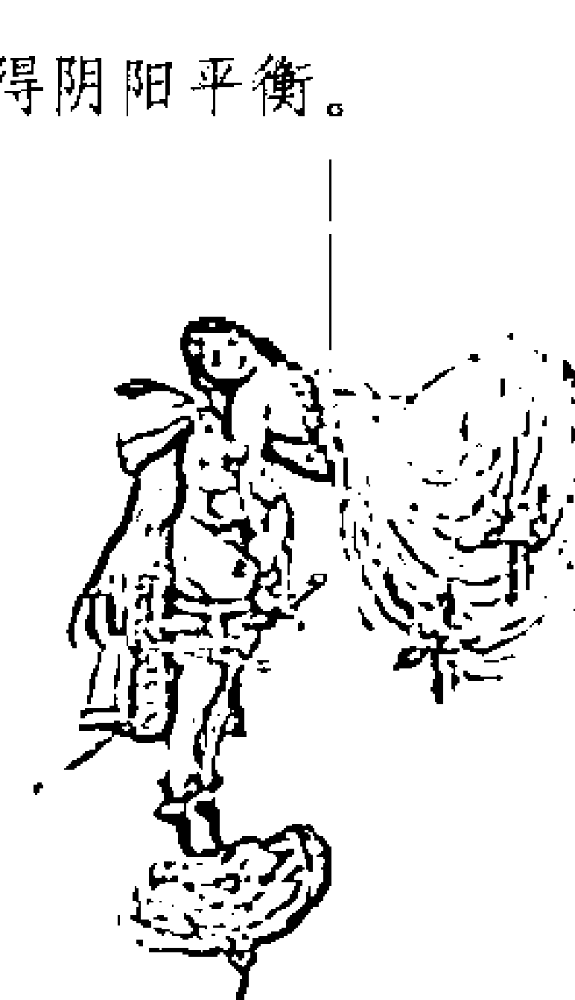

在道家观点中，男女交媾有时日上的限制，有适合的良辰，也有不宜行房事的日子；在地点上也有所规定，并不是在什么地方都可以交欢；甚至，在躺的方向上都有一套理论。据说，新月期与满月期的晚上是“龙虎交汇”的好时机，此时的阴阳交合将达到最高的境界。

The request was rejected because it was considered high risk因素将浩大宇宙里的种种力量联结在一起。炼金术士深信，点金石正是那把打开知识宝库大门的钥匙。用14世纪一位名叫约翰的学者的话来说，点金石正是掌握宇宙中日月轮转、星空瞬息变幻的奥秘所在。

长久以来，点金石一向带着浓浓的神秘色彩。在这里我们不得不提出的一点就是，过于浓厚的神秘气氛反而为炼金术的研究设下了障碍。典籍里满是令人迷惑不解的密码和怪异象征，搅得人头晕脑胀：有大小乌鸦、鹈鹕与鹰、鸽子和龙、天鹅、红白玫瑰，还有绿色的狮子。那些对这些怪诞语言研究不多的人往往对炼金术典籍倍感头痛。因此，我们今天了解到的炼金术方面的知识大部分来源于各种传奇和轶事。在读炼金术方面的书籍时，最佳的态度与方法就是理性的质疑。当然，也有不少炼金术士在医药和科学上取得了很大成果，我们完全可以放心地研读他们的著作。

### 炼金术的用途

炼金术与医药的关系源远流长，炼金术典籍中最著名的一部出自帕拉塞尔苏斯。帕拉塞尔苏斯原名菲利普斯·塞俄弗那斯图斯·朋巴斯图斯·冯·胡恩海恩，于1493年出生于瑞士的苏黎世。他一度取得了内科医师的资格，还被任命为巴塞尔大学的医药学教授。在对医药的研究中，朋巴斯图斯发现他的同僚们对待炼金术的态度与无知简直到了令他难以忍受的地步，“无知”已经是他对那些同事们最温和的评价了。他确信，从各种不同的金属中可以得到掌控着整个星球的神奇力量，而这种力量能够被应用到医药的研制中。

他认为，不断新陈代谢的人体本身同炼金的过程极为相似。人体消化吸收各种食物、水和各种饮品，转化成自己需要的能量，排出从前吸收进去现已无用的废物，这种吐故纳新的过程促使人不断成长。他还提出，毒性大的物质也可以用于治疗。从这一点来看，可以说朋巴斯图斯开创了免疫学与顺势疗法的先河。

今天，从很大程度来讲炼金术中“炼制黄金”和“研制药物”的两种观点或意图已经让位给某种更特殊的寓意。这层更深的含义就是对完美的追求，对人类本身的提高与升华。将粗陋金属炼制成纯净黄金的过程正是从低级向高级的前进，从人类本身的角度看，人的精神在“炼金”过程中得以升华，人追求的是精神上纯净的“黄金”。

从哲学意义上讲，最棒的炼金术士看重的是炼就“完美之人”。当然在别人看来，他们与摆弄各种金属，炼造黄金还是脱不开关系。他们让最底层、最粗俗不堪、最重物欲的男人或女人在“炼金炉”中洗尽凡俗，洗去铅华，成为永不腐朽的“金身”。他们让这些人认识到深藏于自己灵魂中的纯金，教导人们发掘自己的美好本质，让其从一切污俗中挣脱出来，像金子一般灿然发光。在这里我们说的“炼金炉”当然不是普通意义上炼金术士们的炉子，而是爱的火焰在其中熊熊燃烧的精神的熔炉。瑞士现代著名的精神病专家卡尔·荣格(1875-1961年)发现炼金术与现代分析心理学，尤其是与原始意象元素有着莫大的联系。甚至可以说，炼金术就是现代分析心理学的早期萌芽。他是在为一部关于中国古代道家炼金术的著作——《金花的奥秘》写序言时产生了这种念头。他在研究过程中发现，他的梦境中曾出现了许许多多与古代炼金术相似的符号，而且他父母也对他描述类似的梦境。在一本书里，他兴奋地写到：“我感觉，我和古代的炼金术士们虽然相隔久远，但我们有着同样的经历和感受，他们的世界就是我的世界。”几年以后，在卡尔步入老年的时候这本书终于出版了，名为《心理学与炼金术》(1944年)。

卡尔认为，炼金术士将所有的精力都投在实验室中进行研究，这就像科学家在实验中小心翼翼观察各种物质的化学变化一样。在炼金术士的努力下，黄金从粗陋的金属混合物中被“解放”了出来。与此同时，他也在试图将自己从粗俗不堪的凡躯里解放出来，摆脱人们所意识不到的各种污秽黑暗的思想。如果他能从一大堆污七八糟的矿物中提炼出如此纯净灿烂的金子，他为何不能让自己也变得这样高尚而纯洁呢？就像现代的心理学家一样，炼金术士也在寻找真相，寻求对自我的认识。

卡尔进一步深入地阐释了他的理论。在炼金术的各种术语中，不少与现代心理学有着神奇的共通之处。“黑色”意味着黑暗和人类的潜意识；“隔离”分开了青少年时期的各种烦扰杂念与成年时的成熟，或者也可解释为将自我从各种阴影中解放出来；“忧郁”代表了各种各样失落沮丧的情绪；而“完美的纯白色”则象征了自我认识经过不断地深化，直到炼金术象征意义中的“国王”与“王后”合而为一，人性中所有美好的品质全然实现，最终将产生代表着完美的“点金石”。

对于炼金术上与现代人心理之间的这些千丝万缕的联系，我们如果还有任何疑惑，可以查阅卡尔所著的《心理学与炼金术》，或者安东尼·斯蒂芬博士写的《卡尔·荣格》，这一本书是对卡尔一生的概括。将古代的“魔法”与现代的“神奇”联结起来将带来无尽的精彩。想想看，古时“掌控自然法则的神秘力量”将在我们的日常生活中大放异彩！

### 著名的炼金术士

把约翰·弗里德里希·施韦策（也许人们对他的另一个名字艾尔维修更加熟悉）说成是轻信的傻瓜，这种说法本身就是可笑的。艾尔维修绝对是个一流的、作风十分严谨的物理学家。他从不对那些不切实际的东西大加鼓吹，然而他讲述的一个故事却引起无数人的怀疑。他说，在1666年12月27日那天，有一个陌生人来到他家。艾尔维修对他的描述是：那个人中等身材，脸上的胡须刮得干干净净，长有些许麻子，长头发，皮肤黝黑。这个人向他大讲特讲一种包治百病的奇药的制造方法，随后又从自己的口袋里掏出一个小盒子，里面装了3块石头，每一块都有核桃那样大小，透明略带一些硫磺的灰白色。他还给惊讶不已的艾尔维修看了几枚金质奖章，告诉他说这些奖章是通过炼金术炼制出来的金子打造的。

这位异人与艾尔维修进行了一次愉快的交谈。不久之后，又再次来到他家给他看了那种神秘物质。两个人连同艾尔维修的妻子（绝大多数的炼金术上都是在女性助手的协作下工作的）一起合作，结果令人十分满意，他们成功地将铅变成了“最上等、最纯净的黄金”。

艾尔维修有几位见证人可以做证，一位是哲学家巴鲁克·斯宾诺莎，他对他们的实验作了检验、相信了他们的理论。另一位是艾尔维修所在省的省化验局的官员，他检验了艾尔维修等人炼制出的黄金，证明这是真金。那么人们是否相信这个故事呢？这到底是真实的事件，或者只是虚构出来的故事？也许否认它的真实性更能令人满意。切丽吉尔克里斯特在《炼金术元素》(1991年)一书中指出，从艾尔维修所有的描述来看，那个行为神秘的陌生人简直就像是“土星神或古罗马神话中的农神萨杜恩的化身”，而土星正是所有炼金术士的守护星与指导。但无论如何我们也不应该武断地说艾尔维修是在编造一个荒唐的故事。

此外，还有一位炼金术士的观点也值得我们注意，这就是费拉莫尔。他在自己的经历中写到：“1382年4月25日的下午5点，我成功地将水银转化成了黄金，在成色上比那些普通的黄金要纯净得多，而且更加柔软并富于延展性。我没有半点虚言，这是真的。这个实验我又重复了两次，每次都获得了成功。实验中我的妻子给了我很大帮助，她也十分精通炼金术，每次实验时都是我们两个人共同合作。”

费拉莫尔遗留下的著作无不显示了这位炼金术士的诚实品格。他声称自己在炼金术上大部分的知识来自一本叫做《亚伯拉罕之书》的手稿。他在1357年得到这部手稿，当时书上满是奇形怪状的符号，无从破解。在一些学者的帮助下，他终于确信自己明白了书里的各项解释说明，并按照这些方法成功地炼制出黄金，他用这些财富资助了巴黎市内的14家医院、3座礼拜堂、还有7座教堂，可能还捐助了法国其他一些地区的慈善机构。以他手稿抄写员的工作，人们不能不怀疑为什么费拉莫尔会有这么一大笔钱。这样也就很容易让人相信他通过出售某种价值昂贵的东西发了财，而这种昂贵的东西极有可能就是金子。

费拉莫尔的坟墓位于巴黎的查鲁尼博物馆。他去世几年后，他的住宅和花园被人上上下下搜了一番，地皮都快被掀了一层，结果那本炼金术手稿和点金石连影子都没有。为了制止这种混乱的搜寻，地方官员查收了弗拉莫尔的住宅，进行有序的搜查，但还是没能找到大家想要的东西。

### 炼金术的起源

> 迈克尔·麦鲁斯认为太阳和月亮具有象征意义。根据赫尔墨斯·特利斯墨吉斯忒斯的说法，“太阳是炼金术之父，月亮是炼金术之母”。

在现存的一些早期炼金术著作中，炼金术士或声称自己已炼制出了真金，或说自己已接近成功，同时他们也清清楚楚地说明，他们在编著这些书籍的时候为了防止被后人滥用，故意隐瞒了部分内容。一般来说，他们在如何开始炼金的部分故意略去了一些主要的矿物。这种被略去的矿物可能是某种金属、某种土质或粘土。古时炼金术士认定，炼金用的原料应该是极为“基本”的原料。那些感觉上毫无价值可言，看起来不引人注目、没有任何实用价值的东西，往往颇受炼金士们的青睐。这也就不难解释为什么中世纪的炼金术士用的原料都是那么奇怪而粗陋不堪，比如说各种各样的粉末、灰尘，甚至是阴茎、尿液和人体本身。

有意思的是，迄今为止叙述最详细的炼金术典籍来自英国在北美的殖民地。这部手稿于1769年由一位名叫威廉·杰拉尔德·德·布兰姆的德国人从美国费城带到了英国，这名德国人曾在神圣罗马帝国查尔斯七世的军队里任过工程师。这本书里介绍的各种方法，比其他任何炼金术典籍里建议的方法都要简单，易于实行。至少，它是用英语写成的。

然而，今时今日的我们要是想按照书中的说法炼制黄金，那也不是件容易事。我们的情况和布兰姆之前诸多炼金术士所遇到难题一样，这位布兰姆先生有意无意地略去了“最重要的原材料”是什么，以及在哪里可以找到这些原料。这让我们无从下手。但是可以确信的是，如果能够按照书中方法顺利将实验进行下去的话，那么

> “阿尔克墨涅就会产下（她与宙斯的）儿子赫拉克勒斯——这其实就是指：加入水银，再燃烧硫磺，就会产生一种 Vitresible Earth，并把它浸泡在蒸馏出来的硫酸钾（Aal enixum）溶液里。而硫酸钾的特性使其成为万能的灵丹妙药，它既不挥发，但又能与液态金属混合燃烧；它也不是固体，但又能与任何蔬果汁混合，做成对人大有益处的美食。”

有充分证据表明，这种所谓的“万能之药”实际是在伦敦制成的。一组科学家在达特茅思爵士的委任下，试图研制一种能治愈英皇乔治三世的疯病的药物。可惜，那本炼金术典籍里的“灵丹妙药”未能使皇帝有丝毫好转。

### 石中剑（左下图）

炼金术是现代化学的前身。T.H.怀特的这幅取材于古典小说《石中剑》的作品为读者提供了一个非常具象的古代“化学”实验室——凌乱而应有尽有，繁杂而又颇有秩序。一些看似无用的东西其实都是炼金术士眼中的珍宝。

### 魂灵鸟再生的7个阶段

1)  这只栖息在人头骨上的魂灵鸟，象征着将人的灵魂与肉体分开的死亡。

2)  魂灵鸟注视着自己在这片死亡土地上的倒影，它看到了自己空虚的精魂。

3)  另外两只魂灵鸟将它灵魂的精髓带到更高的境界。

4)  灵魂化作王冠，由两只魂灵鸟衔着带上天空。

5)  灵魂回归了大地，从土壤中生长出来，魂灵鸟对它细心看护。

6)  生长出土地的灵魂显现了它的色泽，这些玫瑰花的红色代表着太阳，而独角兽的白色则象征了月亮。

7)  生命复苏了，图中的这个女人形象象征了炼金术士期待的完全觉醒。

德·布兰姆提出，水银总是与炼金术紧密相连。此外，纯净的水，尤其是沾染在植物或是自然界其他物质上的清新露水在提炼的过程中也显得颇为重要，因为人们认为它吸取了世间万物的一切精髓。露水或是经过提炼的蒸馏水（蒸馏水是露水最合适的代替品）目前仍用于几种药物里，当然我们指的是那些不按照惯例制成的药。比如说在结晶学中，将些许晶体洒入水中一会儿就溶得无影无踪了，而当爱德华·巴赫博士在研制药物时也需要先提炼出蒸馏水。巴赫博士的药在他的试验者中享有盛誉，据说用在动物身上也一样有神奇疗效。

为了获得传说中包治百病的灵药和点金石，炼金术士们不惜一遍又一遍地对材料进行提炼蒸馏。一种液体会经常被蒸馏上百次甚至上千次。最后，纯净的物质终于从粗陋污杂的原料中分离出来，从杂质繁多的金属里提出了纯白的银，那么再进一步就可以炼制出令炼金术士魂牵梦萦的点金石了。但这一步工作要非常小心谨慎，要控制好每一道工序包含的各种因素，包括占星术。因为在炼金术中，每种金属都有与之相对应的星，使用哪一种金属就要看准当时是哪一颗星在夜空与之相应。

炼金是一项危险的工作，这不仅是因为炼金术士要与自然界不为人知的神秘力量对话，还在于实验室中燃烧旺盛的炼金炉往往会使室内闷热难忍。实验室出现事故并不是什么稀罕事，有时候炼金术士会为此而付出生命。

### 现代炼金术

我们必须承认，古代的炼金术士为现代科学着实做出了不少贡献。这就像说从前的占星术是当今天文学的前身一样，那么炼金术可以说是现代化学之父。千百年以前，在炼金术士的炼金房中的确产生了早期的科学发现。比如，化学元素钾正是11世纪的炼金术士大阿尔伯特在自己的实验室里发现的；而硫酸钠则是约翰·格劳伯发现的；苯甲酸的出现归功于布雷斯·维吉耐尔；氧化锡由德拉·波尔塔发现；罗伯特·波以耳(1627-1691年)被尊为现代化学之父，他和艾萨克·牛顿(1642-1727年)一样，一向被视作最著名的科学伟人，他们都曾在炼金术上付出巨大努力。

现代化学自然与古时的炼金秘术相去甚远。当今的科学家重视对某一理论进行不厌其烦的验证，以求得“证明”。这种侧重面的不同使得许多炼金术士感到疑惑不解。他们追求的是炼金过程中精神上的历炼，这一点就可以和不断的实验验证拥有同等的地位。有些炼金术士甚至执著到了自杀的地步(只是一些说法)，当他们发现自己的同伴想像力太过局限，无法摆脱经验的桎梏因而不能理解某些理论的奥妙时，这些人竟然走上自杀的道路。

启蒙运动的兴起和发展未能使炼金术趋于消亡。20世纪的炼金术开始了它新的发展。这其中出现了一个著名而又神秘的人物菲尔卡纳里，他在自己的一部著作中声称，许多艺术上的奥秘就铭刻在巴黎圣母院教堂中央门廊的墙壁上。有一些传言说，菲尔卡纳里曾在原子能释放方面协助过一些科学家进行研究。

炼金术在不断进步，从前许多困扰炼金术上的难题如今已迎刃而解。它还引发了科学家们的兴趣。1910年，卢瑟福成功地将氮气转化为氧气。另一位德国化学家弗朗茨·陶森德受到了这一喜讯的鼓舞与启发，开始对炼金术产生了极大的兴趣。在20世纪20年代，弗朗茨声称他将氧化铁和石英变成了黄金。埃利切·冯·卢登多夫将军还特地为此开办了一家公司，希望对这项发明作进一步研究。据说，到了1928年，弗朗茨已经制造出了723克黄金，协议书也都签好。然而公司还是倒闭了，原因是卢登多夫把资金全都投进了纳粹党。

古代炼金术士声明的各种发现，如今已难以考证，主要是因为典籍中的语言实在晦涩难懂。因此，今天的炼金术士想再现古老的实验过程根本无从着手。当然，有人曾声称自己找到了点金石，制造出了金子。然而，更多情况下，这些人造出来的算不上是“真金”。但直到今天，炼金术仍然吸引着不少人竞相试验。阿基博尔德·考克兰是一位正骨科大夫，他在自己的著作《炼金术探秘》（1940年）中说，通过使用某种特殊金属（当然他没有告诉人们这种金属到底是什么），他找到了“神奇的水银”（“天堂圣水”）。这种“圣水”其实是气态的，闻起来感觉像六月清晨被露水滋润了的土地的气息，其中还浸染了鲜花的香气，连同吹拂过小山和石南花丛的风的馨香，还带了些雨水洒落在微热大地的感觉。

不久，考克兰声称他已将这一气体压缩成了金色的液体，再加入了氯金酸钠盐之后就制成了“油状的黄金”。据说这一物质对人的某些疾病颇具疗效。当时有一种很流行的说法，就是将氯金酸钠液作为针剂注入静脉后，能够治疗风湿病和关节炎。令人惋惜的是，这位炼金术士未能将他的实验继续下去。德军对英国的闪电战夺去了他的生命，这项伟大的实验也由此告终。

### 现代炼金术士

艾利克斯·巴伯特是一位现代的炼金术士，那些长颈瓶里装的是炼制黄金和白银的物质，据说是从浓缩的露水里提炼出来的。

比考克兰更晚一些出现的炼金术士，例如法国的尤金·康塞里耶、罗杰·卡罗、路易斯·卡蒂奥和艾利克斯·巴伯特等炼金术士，他们沿着同样的方向继续研究。巴伯特是这些新一代炼金术士里比较有名的一个，除此之外，他还是个出色的占星学家。他开始工作时，用的原料称为“神奇之炭”，据说这一原料需要在某一特殊时刻、特殊地点（按照占星术中关于星相的一套理论）从距地面几厘米的地下挖出来。

和从前的炼金术士一样，巴伯特并未向人们透露过这一原材料到底是种什么东西。我们可以知道的是，实验中使用了露水。为了采得露水，巴伯特将一块布铺在清晨沾满露水的草地上，等布将新鲜的露水吸饱后，再用力拧，把收集到的露水注入桶中。随后在水里撒上一些金粉，将这种混合液在一定温度下加热，然后放置4个小时。这一过程要重复7次，直到得到一种清亮的金色液体，称作“黄金营养液”。巴伯特和他的医生朋友们宣称，这种溶液能够有效治疗多种硬化症、尿毒症和梅毒。

# 天空中的星座

这是一幅祖卡罗为法尔内塞皇宫所作的屋顶壁画。画中描绘的是夜空中的众多星座。在西方的星相学者看来，星座之间的相互运动、位置的相对变迁，都会引起世间万物的相应改变。

## 第九章 占卜术

古往今来，曾有许多人宣称自己能够未卜先知、预见未来，这一天生禀赋一般与遗传有很大关系；据说一个人第7个儿子的第7个儿子往往具有这种特异功能，除此之外，吉普赛人也被人们赋予了“先知”的神奇能力。

预言，即预见未来的能力，这一说法是与各种各样的魔法或巫术同步产生的。它们都与宗教的兴起和发展息息相关。在古希腊，预言家是诸神神谕在人间的传达者。这些预言家本人在阐述神的谕旨时像发了疯一样激动，口齿不清，让人无法理解他们到底在说些什么。古希腊德尔菲城阿波罗神庙的祭司们，用含混的诗句记录并解释了皮提亚（阿波罗神谕的传达者）的话，其难度不下于当年那一大群学者聚在一起，探讨并试图解释法国占星术士诺查丹玛斯晦涩难懂的文章。

无论是否能成功地预见未来，这件事本身就十分危险。有了这层认识就不会再奇怪为什么那些预言家们说的话总是那么含糊不清，令人迷惑不解，因为万一预言没能应验，这些人好给自己一条退路。用这种方法找台阶下仍然有它的弊端，对于那些不相信神谕和预言的人们，神谕传达者表达不清的语言给了他们攻击的口实。但不管怎么说，公众中大部分人对神谕还是坚信不疑，即使传达者们在表达“神的谕旨”时是多么精神恍惚和口齿不清，毕竟这些难懂的话是从“凡间之外的神祇”来的嘛。

> 西比拉·德尔菲卡

西比拉·德尔菲卡是传说中的阿波罗的女祭司，在德尔菲（希腊古部）主持神秘仪式。她将自己的预言写在月桂树的叶子上。图中她正站在门边的三脚火炉边阅读神秘的信息。

《旧约》中那些有预知能力的人是世界的阐释者与人类精神的领袖，他们被视作先知，就算不能准确预言未来会发生什么，至少他们也能说出个大概。《塞缪尔之书》的作者把自己奉献给了耶和华，将自己视为上帝的奴仆并试图预见未来。大约同一时期，在腓尼基王朝中有许多人扮演着预言家的角色，其中还包括一些年轻人。有些预言家在历史上享有盛誉，如《旧约》全书中最伟大的一位先知以利亚。他曾经在耶洗别王后滥杀无辜的时候保住了100人的生命。耶洗别是一位曾身为腓尼基公主的残忍的犹太王后，因为自己的信仰与犹太王国的宗教信仰不同，她无情杀害了众多预言家，只将850名肯为己效力的预言家收罗为己所用，并让他们解释腓尼基神（犹太人称之为“邪神”）巴力与阿瑟拉神（古闪米特人崇拜的众神之母）的神谕。

以色列有过众多的预言家，他们中有最底层那些四处游荡的预言家，也有在香火旺盛的神庙中供职的祭司。在聆听神谕时，传达者们往往处于精神恍惚状态，口齿含糊不清。但即便如此，这些人仍对当时社会的各个阶层产生了不小的影响。

公元前750年这段时间被称为希伯来预言家的黄金时代。当时，在以色列北部有先知阿摩斯与何西阿，在巴勒斯坦南部的古代王国犹大有以赛亚、弥迦和耶利米。许许多多的事例都证明，这些受人拥护的先知和他们所传达的神谕，对当时的社会产生了巨大的影响。

### 手相

不少人相信，一个人的命运就写在他的手上。

### 生命之轮（下页图）

这个不停转动的命运之轮带来的既有好运也有厄运，没有人能抗拒命运，而就算是能预知它的转动的预言家们也无法躲避。

# # 先知

在古希腊德尔菲的帕纳萨斯山下，有一座在长达800年的时间里都是最著名的神示所。据说这一座神示所是太阳神阿波罗自己建立起来的。神示所里传达神谕的女祭司皮提亚是个容貌丑陋的老年妇女（据说曾有一个年轻美丽的皮提亚，她在被人诱惑失去贞洁之后就丧失了所有的法力），她在聆听神的谕旨时总是进入一种恍惚而疯狂的精神状态，她一边呼吸着从一个深深地下室中散发出的蒸气，嘴里还一边嚼着月桂树的叶子。当请示者向她提出问题时，她开始讲话，她的语言让人似懂非懂，必须由她的助手加以解释。从这座神庙收到的各种丰厚供奉来看，皮提亚传达出的神谕即便不怎么准确，肯定也颇能迷惑人。当然，要是皮提亚的话一点都没有应验，这座神示所也不会香火旺盛800年了。德尔菲女祭司皮提亚传达的神谕太过玄妙，就像后世的那个法国预言家的话一样，似乎句句都蕴含了无限深意，令人们给予它无数的解释，可谁也不能肯定哪一条解释是最正确的。

#### 阿波罗神庙

然而在古代，希腊德尔菲城的太阳神阿波罗神庙一向被人称作预言之源地。这座神庙坐落在一块巨大岩石的裂缝之上。

# # 预言技能

并非所有预见未来的能力都属于天生禀赋。有时“先知”的本领可以通过训练培养出来。在经过一段时期的特殊训练与实验后，一些人便能够真正具有预言家的神奇本领。占星术的发展（这并不在本书论述的范围之内）增强了人们在预见未来方面的信心。人们相信，未卜先知也不是没有可能，当然实施起来还要根据科学的观察与实验。然而，有许多颇有名气的先知是靠着一种疯狂和激动的情绪获得了对未来的认识。后来，尤其是希腊的预言家开始对其他的方法和技能产生兴趣后，“命运天注定”的概念更使得“预知未来”成为可能甚至极其可行，但相信自由意志决定命运的人对此则感到难以接受。

在古埃及，通过梦境占卜未来的做法也十分流行。请示者在墓地中最接近亡者魂灵的地方睡下，因为他们相信死者也能预知未来。古罗马人则通过检查死去动物的肝脏来占卜未来。从巴比伦经过埃特鲁斯坎远道而来的占卜者在古罗马举行了令人难忘的仪式。在仪式上，占卜者要在祭坛上宰杀一头公牛，取出它的肝脏。公牛的体型、体重、肝脏的数量、血液的体积都与未来存在密切的关系。今天人们已发现了古代占卜时按照公牛肝脏制作出来的陶质模型，这是用来教授学生的工具。仪式内容还包括了羊，对其肝脏解剖与检查的方式与公牛相同。除肝脏之外，这些人还须检查动物的心。动物解剖占卜术在罗马一度极其兴旺，当时在一所教授这门学问的学校里，老师不少于60名。这些肝脏解剖占卜家在当时与神庙的祭司一样受人尊敬。

#### 《命运的巨轮》

《命运的巨轮》是画家伯恩-琼斯根据威廉·莫里斯的遗作所绘的《衰落的特洛伊》中的一幅作品。画家以巨大的车轮象征人类的生命轨迹，画中的天使转动巨轮使其不断前进，而人类则被锁铸在自己的命运中无法挣脱。画家以一种浪漫的方式暗示我们，命运天注定。

# ## 吉普赛算命女郎

吉普赛算命人能够通过一个水晶球窥见到未来，有人说预知未来的能力是可以遗传的，但另一种说法则认为这种特异功能是与生俱来的，就潜藏在人类的灵魂中。

各种征兆是预测一天中吉凶的方法之一。其中有些方式实在令人费解。有一种方法，是要把油涂抹在童男的指甲上，从科学的角度看，它的效果实在是令人起疑。有的方式就更加十分异想天开了，例如早晨起来观察马的哪只脚先迈出马厩的门，左脚和右脚各自预示着不同的运气。这些征兆大部分都是跟运气有关的。有这样一种观点——人的行为不论大小，都牵动着运气的变化。听上去玄之又玄，可是有不少人对此深信不疑。不同的地方对吉日凶日各有自己的一套理论。根据出生日期等数字占卜祸福的数字命理学，还规定了人一生中最重要的几年。比如说人生中的“危机时期”一般被定在一个人63岁那一年（63是数字7与9的乘积，这两个数字在预测命运时被认为有特殊意义）。总之，迷信使得人类不厌其烦地给自己定了一大套规矩，吉利与不吉利的行为将各自导致好运与厄运。

# ## 女巫

这幅《女巫》是19世纪末20世纪初的画家约翰·威廉姆·沃特豪斯晚期的代表作品。他试图将女巫这一传统意义上的神秘角色诠释为具有思想、理性的新形象。

#### 一些著名的预言家

西方曾出现过一些著名的预言家，他们宣称自己能预知未来的事情，这些人中包括法国预言家诺查丹玛斯与乔安娜·索斯科特。这些预言家均成功树立起了自己的名望，有些人小有名气，而另一些则声名显赫。社会上流传的许多轶事说的都是这些人对未来的判断多么多么准确，但我们知道，对于轶事来说，它的娱乐性远远大于它的真实性。

许多后世的预言家大都是占星学家，也有些预言家诸如诺查丹玛斯与约翰·迪，他们将占星术的技术与其他一些方法结合了起来。他们和冥冥中的灵魂交流，用水晶或一盆水将它们的真面目聚集而且反映出来，或干脆就只是借助于那种恍惚疯狂的精神状态来与灵魂沟通。当然，后面的那种方式是诺查丹玛斯的惯用手法。虽然他被许多人奉若神灵，直至现在他的名字还十分流行，但其实这些“预知未来”的方法很难立得住脚。

米歇尔·德·诺查丹玛斯（1502—1566年）是法国的一名医师，出生在圣雷米。他曾经是一名无可挑剔的医生（在法国的一次瘟疫流行期间，他表现得十分勇敢）。在35岁的时候，他成为了一名预言家。1555年，他出版了《世纪连绵》的第一版，这是一部格式为四行诗的荒唐诗集，然而却成了西欧地区有史以来最具影响力的一部预言书。许多人为这部书做了不同版本的注释，甚至有人把这部预言书与现当代的重大历史事件联系到了一起，比如一战爆发、第一颗原子弹爆炸等等，连美国总统肯尼迪的命运在书中似乎也有所暗示。

这种现象的出现原因其实很简单，以诺查丹玛斯这本书晦涩难懂的程度，任何一个人的解释听上去都头头是道。但有一点我们不得不承认，与其说他的这本书对后世许多事件都有所预测，还不如说，是后人把他的著作引申臆造才得以和现当代的事情联系起来。

现在，我们面对的问题是，这些四行诗形式的预言是怎样得来的？肯定不是通过占星术，用水晶球占卜倒有点可能。这一点倒有点像约翰·迪博士的手法。约翰·迪博士所处的时代正是伊丽莎白女王统治时期，女王曾经用他的魔镜，试图弄明白里面那些黑色旋涡状的东西都意味着什么（那面“魔镜”至今还保留在大英博物馆中）。据说，约翰·迪还准确地预言了玛丽·都铎女王的逝世、对苏格兰玛丽女王的处决以及英国对西班牙无敌舰队战争的胜利。

历史上还有许多和他们成就相当但却名不见经传的预言家。比如说17世纪的爱尔兰预言家马拉奇·欧莫盖尔。传说他具有飘浮空中的神奇能力，他留下了许多预言都是关于未来将出现哪一位教皇，其中有许多预言都奇迹般地应验了。13世纪苏格兰有一位预言家，人们称他为“诗人托马斯”，他也预言了未来将出现哪位教皇，令人惊奇的是，正如他所预言的，罗马教皇雷欧十八世的盾徽上确有彗星的图案！

普通大众对预言的迷信程度令人惊讶，从下面这个事例就可见一斑。英国西南部德文郡曾出了一位女预言家。乔安娜·索斯科特出生于1750年，自称为先知，当然的表演天赋自然是无可挑剔，否则也不会有10万人相信她的话。她去世后留下了一本书，里面记录了她对未来世界的预测，但是这本书只有在24名主教在场的时候才能供人阅读。毫无疑问，要想劝说坎特伯雷郡的大主教召集各区那么多主教，这可不是件容易事。后来这本书被打开了，里面除了一派胡言，根本没有任何有价值的内容（不知道我们是否应该责怪那些未到场的主教们）。

# # 诺查丹玛斯

诺查丹玛斯是法国16世纪著名的医师和预言家。他的诗篇形式的预言晦涩难懂，却一直被人们认为是对未来精确无误的预言。

一些现代的预言家的行为比从前的先知还要奇特。比如伦敦的乔治·金博士。他声称自己于1954年被一些外星生物带到地球外的宇宙空间，在那里他亲眼目睹了金星人与火星人的一场大战，然后他还与上帝在德文郡的一座小山上会面，并预言了世界末日的到来。他所说的世界末日是在1962年的2月。英国的大卫·伊克是一位电视与广播评论员，还是英国绿党的发言人。他对“第二次接触”的预言在当时被传得沸沸扬扬。

据说还有一个叫珍妮·迪克森的美国人，她成功预言了美国总统肯尼迪、印度圣雄甘地，以及美国黑人领袖马丁·路德·金的遇刺事件。

毫无例外，从预言出现一直到18世纪，所有的预言家都相信人可以预知未来。“科学时代”的到来令人们对“预知能力”的态度转为否定。但最近几年，人们对“预言”的看法又有所转变，原因是人类对于时间的性质了解还远远不够。心理学家荣格曾经说过：“我们无法突破地点与时间的限制而想象某一种东西的存在，但这并不意味着这种东西就不存在。”这样看来，对事件的预言并非全无可能。在本书的第二部分我们将讲述同时代的人对预言都怀有什么样的看法。

#### 强大的意念

在古代，巫师们认为意识是强大的，可以无孔不入，因而集中起来的意念也可以无坚不摧。即使可以使人穿墙而过，也可以用于远程治疗。

# 第二部分 今日魔法

## 第十章 今日巫术

巫术——巫师们更愿称之为魔法——在科学普及的今天似乎比在一直笼罩着神秘面纱的过去几个世纪里更加广为人知。由于各种各样的原因，自巫术产生起就一直被人们诋毁仇视，那些宗教教旨主义者恐惧、痛恨巫术，将它看作洪水猛兽，而它的原意也完全被误解甚至扭曲（甚至直到近代，一些大众出版物还将魔鬼作为巫术的同义词，还偏见地将巫术与性、原始的欲望、甚至对儿童的虐待联系起来）。

巫师们坚称巫术是一种宗教，而事实上，如果人们把宗教定义为“虔诚且温顺的信徒对超自然控制能力的一种信仰与崇拜”，那么的确无法反驳巫师们的观点。但巫师们所崇拜的力量显然与宗教信徒崇拜的神——如基督教中的上帝不同。巫术中的神都源于自然力量，是原始古老的神。在莎士比亚的名剧《暴风雨》中，普洛斯彼罗穿着他那带有魔法的袍子，这样祈求古老的神：

> “统治山川、河谷、湖泊、丛林的神啊，
> 无声无息行走在海滩上的神啊，
> 你们为我追逐那衰弱的海神尼普顿，
> 当他返回此地，请你们在月色下，
> 掀起海洋墨绿色的波浪吧！……”

我们很难想像一位基督信徒，或者是其他宗教的信徒，在信仰本宗教惟一神的同时，也是这样一位泛神论的巫师，尽管巫师们并不热衷于反对其他宗教所宣传的教义及布道。巫师们恪守着自己的本分，同时对其他宗教抱着宽容的态度——这不得不令其他宗教信徒面有愧色。

当代有各种各样的巫术崇拜仪式。但是由于巫术的各种仪式一般都是秘密进行——当然也都是违法的（在1951年以前，根据英格兰《欺诈法案》规定，巫术以及相关的活动一直都是违法的），所以历史上对于巫术的仪式始终没有公开的正式记载——历史上从未有过一本类似宗教经典一样记载巫术祈祷仪式的书。但在巫师内部，他们一直保有着世代相传的个人手抄纪录——巫师们称这些手抄书为“影子书”，因而巫术仪式得以一代一代秘密地传下来。凡是新加入巫师队伍的人必须发誓对手抄书“始终保守秘密，不得对他人泄漏，妥善保管……”

在巫术界，保守秘密是极其重要的：美国的巫师们除了要求那些新加入者口头发誓外，还要求他们在一份文件上签字，以加强约束。新加入者必须承诺“保守这智慧之术的秘密；永不对外透露任何巫师的地位和身份；永不透露仪式举行的场所，巫术实施的方式，以及巫术工具的制作方法”，从不“将巫术看作是基督教或任何其他宗教的模仿与衍生”，从不“将巫术与邪恶联系起来”，否则将“受到公正的惩罚”——意味着不再享有巫师的资格。

对现代巫术的兴趣与关注起因于许多个人的努力——尤其杰拉德·布鲁索·戈德纳对现代巫术的复兴起着重要的作用。据说他曾经受教于一位名为多罗西·克拉特巴克的巫师（至于她是否存在无人知晓）。戈德纳是金色黎明会的狂热成员，与著名的艾利斯特·克劳利有着深厚友情。他改进了巫术的仪式，并使之成为现代巫术仪式的准绳（他在自己的手记里详细记载了每一个细节），他还是巫术中古老的角神的委托信徒。他以极大的精力投入到西方现代巫术的复兴上，他的著作（尤其是《今日巫术》）一直是其他巫师们在争取正当权力时引用的经典，当然不同的人也有不同的用法。比如，在英格兰共有两个主流巫术宗派，戈德纳派和亚历克山德派，分别以戈德纳和亚历克山德的名字命名，后者自称是从祖母那里学的巫术。这两个宗派当然不是彼此敌对，而是同样怀着振兴现代巫术的目标。但显然两个宗派也各有特点，各有侧重，基本上可以区别为欧洲巫术和北美巫术，但差异并不十分明显。我们必须认识到对巫术这一古老神秘的“魔法”来说，不论什么派别基本上都是大同小异的。
与巫师集会取得联系要求

# 哈利·波特

现代人脑海中的魔幻世界就是城堡、蝙蝠、隐士、魔法师的黑袍子和高帽子、尖耳朵大眼睛的精灵、可以飞的扫帚、魔法药水，还有数不清的瓶瓶罐罐。所有的这一切都在电影《哈利·波特》中一一展现出来。

# Introduction to the Document

This document outlines the key components and structure of the system. It includes textual descriptions, lists, code examples, and visual aids.

- Overview of the architecture
- Detailed specifications
- Implementation steps
- Performance metrics

The following sections provide in-depth analysis and technical details to support understanding.

```
function calculate(x, y) {
  return x * y + 10;
}

const result = calculate(5, 3);
console.log(result);
```

| Component | Status  | Notes          |
|-----------|---------|----------------|
| Module A  | Active  | High priority  |
| Module B  | Pending | Under review   |
| Module C  | Active  | Fully tested   |

> > "The design emphasizes scalability and maintainability, ensuring long-term viability."

For further details, refer to the appendix or contact the development team.

### 入会准备

入会并非我们想像地那么困难。在英格兰，异端联合会可以受理你的这个请求；在欧洲和北美，刊登许多巫师新闻及广告的《新时代》杂志也欢迎严肃的请求和垂询。我们必须要格外注意“严肃”这个字眼，由于长期遭受愚弄的不幸经历，让巫师们很善于判断人们的意图是严肃还是玩笑。很多人之所以想成为巫师，或者因为他们相信巫术可以使之达到狂热的性爱高潮，或者因为他们想学习如何给对手施诅咒，然而在这些明察秋毫的巫师面前，他们的幻想都会破灭。事实上，现代巫师所施行的巫术一般都是“自我提高”式的，巫师们借用一些神秘的仪式帮助人们打开心扉，鼓励人们完善自我人格，发挥潜在的能力——这似乎令那些对巫术充满感官满足幻想的人们大为失望。

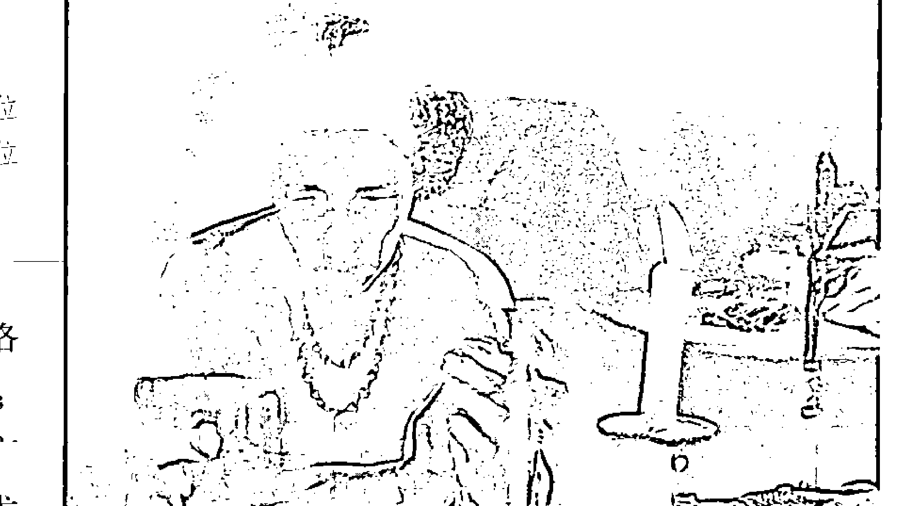

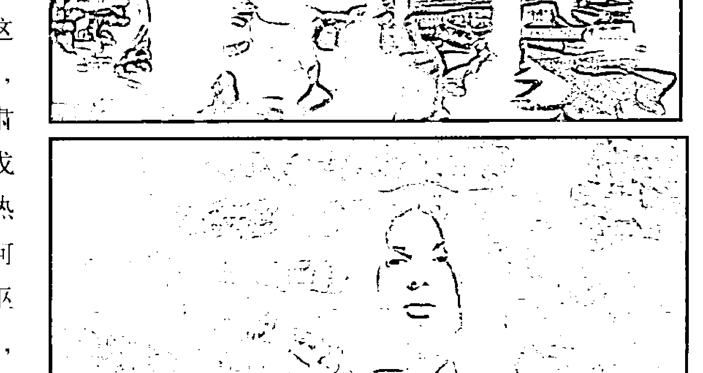

一旦巫师们确定请求者是真心要成为巫师，第一步就是准备加入。准备阶段通常有三个仪式，首先希望成为巫师的人要向集会陈述请求，类似宗教里的祈祷形式。一般情况下，当集会领导和请求者认为时间适当时，即可举行入会仪式（按照古老的规矩，这个仪式一般是在首次接触巫师一年后的同一个日子举行）。

女性请求者一般由男巫师引导入会，反之亦然。薇薇安·克罗雷博士是一位荣格心理学家，在她的《巫术，新时代的古老宗教》一书中，将这种传统与荣格的男性的女性倾向和女性的男性倾向联系起来。值得一提的是，巫术复兴运动与女权运动有时候都是要把男性排除在某个领域之外，比如，古老宗教里的狩猎女神戴安娜，可以在巫术中呼风唤雨，而在基督教等其他宗教里却无一席之地。在现代巫术里，角神——丰收之神，与戴安娜的作用相同，然而却要让位于戴安娜，退居次位。

请求入会者通常着“天衣”（巫术界对裸体的特殊称谓），即一丝不挂，恢复到最原始的状态。这是一个古老的传统，因为巫师们认为裸体不仅仅代表着纯真与人的脆弱，还可以阻挡邪恶的入侵，他们坚信裸体可以使请求者与宇宙亲密接触，直接对话。入会者往往被蒙住眼睛，并且象征性地被捆绑起来（这再一次象征人的脆弱，同时也象征请求入会者对巫师集会及其成员的信任）。

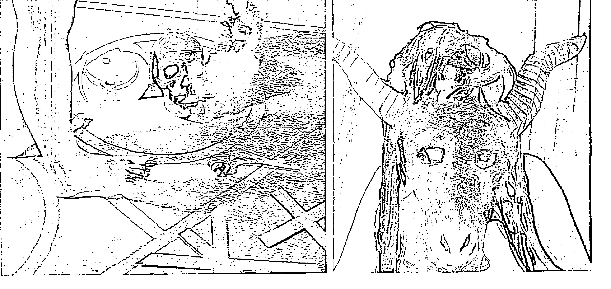

### 法器

在该法圈内，一位巫师正在为“歌舞圈子”施法，这种圈子源于17世纪（左）。在巫术仪式中，山羊面具也通常与巫师应用（右）。

然后，巫师们围成一个圈子。这个圈子也是巫术界的传统，我们在前面魔法的历史中已经了解了圈子的重要性。构成圈子的方法和仪式并不统一，各个集会有各自的做法，但通常都是象征性地在空中划个圈子，同时口中念念有词，似乎控制了一个空间，这个空间在传统上被认为是“介于人类世界和万能魔法世界之间的媒介”，但当代的巫师们却认为是“介于肉体世界和灵魂世界的空间”，在这个空间里，巫师可以“通灵”——即借助巫术，令肉体接触到另一个世界的神灵。

最令人沉醉的莫过于巫术的传统象征——扫帚了，它在准备仪式中起着重要作用——清扫场地，这象征着将巫师头脑中与集会无关的思想统统清除。然后巫师们开始念一种奇特的符咒，每个巫师集会都有自己的符咒，而且往往是固定的，它们或者口耳相传，或者留于丹青。同时女祭司使用阿瑟姆（Athame，举行此类仪式时专用的匕首——即意念的象征），划定这个圈子，似乎把圈子里的俗物全部驱逐，连空气都不能存留，用来盛装并保护巫师们的精力、免受外界的侵害。女祭司将掺有盐的春天的水洒在圈子的边缘，使圈子神圣化。然后男女祭司以及其他巫师将水洒在自己身上以沾染神圣之灵，同时也意味着他们源于大地，与尘土平等。

巫术仪式中许多传统是相当古老且有独特象征意义的。比如，要首先在圈子的北部洒上圣水；按照传统，北部是神的家园，而且按照薇薇安的研究，北部是夜晚太阳之光无法直射的地方，暗示着人类无意识的心灵中最深邃阴暗的地方。

### 魔法圈（在下页）

在传说中巫医好奇闯入魔法圈的人都会受到这样或那样的惩罚，布莱恩·弗洛德和艾伦·李的这幅水彩作品就是由这个传说衍生而来，误闯魔法圈的可怜人被迫加入到魔鬼的狂欢队伍中，一直不停地跳舞。

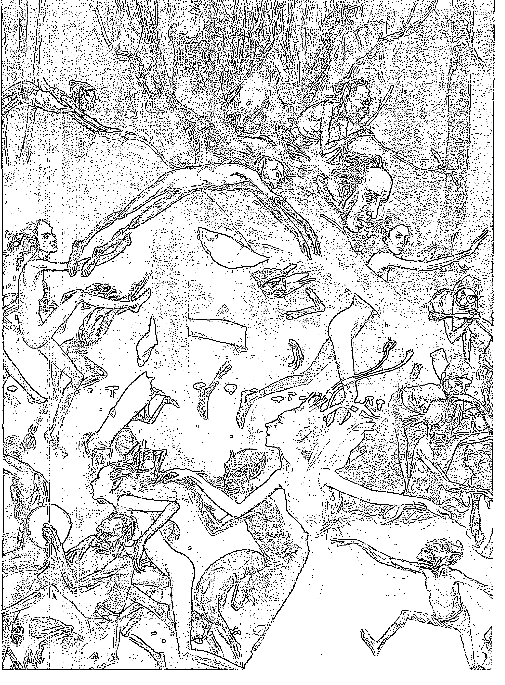

塔，他们在圈子四周念符咒，然后用阿瑟姆刻上奇特的符号，然后把四大元素火、水、风、上的神灵请出来作为守护神，他们分别是厄罗斯、诺特斯、仄弗洛斯和博利斯，他们既象征着外部世界——大宇宙的力量，也象征着人内部——小宇宙的能量。

然后，入会仪式就可以在圈子中举行了。第一个仪式里，巫师们背诵始于13世纪的Bagahi神秘咒语，这首中古的巫师词是这样开始的：

> Bagahi oca batzaihe
> Lema lachai hecatoule
> Barrelious...

神圣的力量似乎被祝词激发出来了，然后扫帚柄（这被看作是男性和女性的象征，因而代表着男女的交合）被放置在圈子边缘象征着“门”，请求入会者必须要通过这扇门，触摸阿瑟姆的刀尖，同时挑战自己的勇气：“你最好从我闪着寒光的锋利的刀尖上走过，即使牺牲，也远远胜于怀着恐惧小心翼翼的尝试”。通过门，触摸过刀尖，获得祭司准许后，请求者得到祭司的亲吻，这代表他已经被接纳到这个巫师集会中来了，然后祭司带领他依次到各个“望塔参见（这样他们的神就会认识并接纳新的成员，而且当他传教会保护他）。然后

### 《魔戒》中的巫师甘道夫

甘道夫是科幻经典小说《魔戒》中虚构出来的人物，在书中巫师甘道夫总是灰毯加身、帽子高戴，骑着扫帚来去自如。由家哈珀·柯林斯以细致的笔触、巧妙的点缀以及光影效果的运用，将骑着扫帚行进的巫师甘道夫刻画得入木三分。

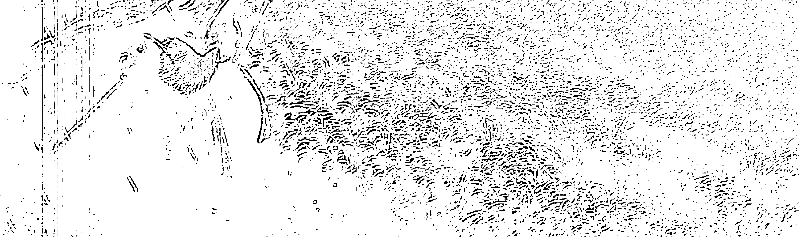

就是仪式的结束曲，集会的所有成员“围着圈子像跳舞一样三进三退，一起跺脚，齐声合唱”。通常他们会唱：

银色的月光，照亮暗夜
东、南、西、北
我们唱着巫师的乐曲
来一起把神召唤

土、水、风、火
铸就这世界
神让我们充满渴望
而我们以祝词向你致敬

绳索、香炉、鞭子和宝刀
巫师的力量与锋芒
让我们从沉睡中惊醒
给我们无穷的智慧与灵光

天堂之神，地狱之主
黑夜的隼神
以你们的力量赐予我符咒
让我意念魔力无边

陆地和海洋的力量
日月星辰的魔力
帮助我们进行这神圣的仪式
歌唱这神奇的颂歌

Eko, eko Arazak
Eko, eko Zamilak
Eko, eko Cernunnos
Eko, eko Aradia

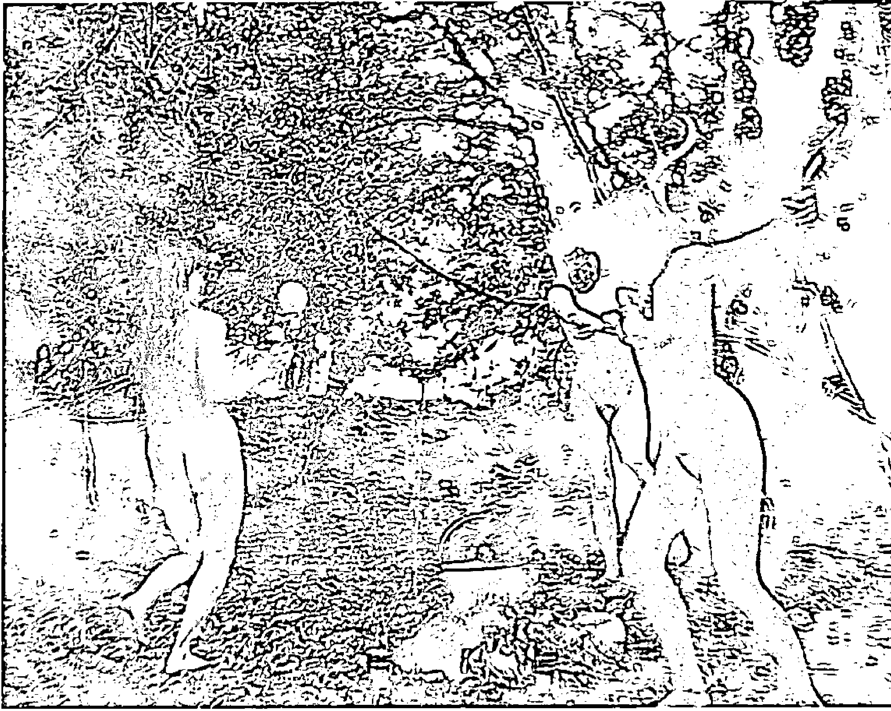

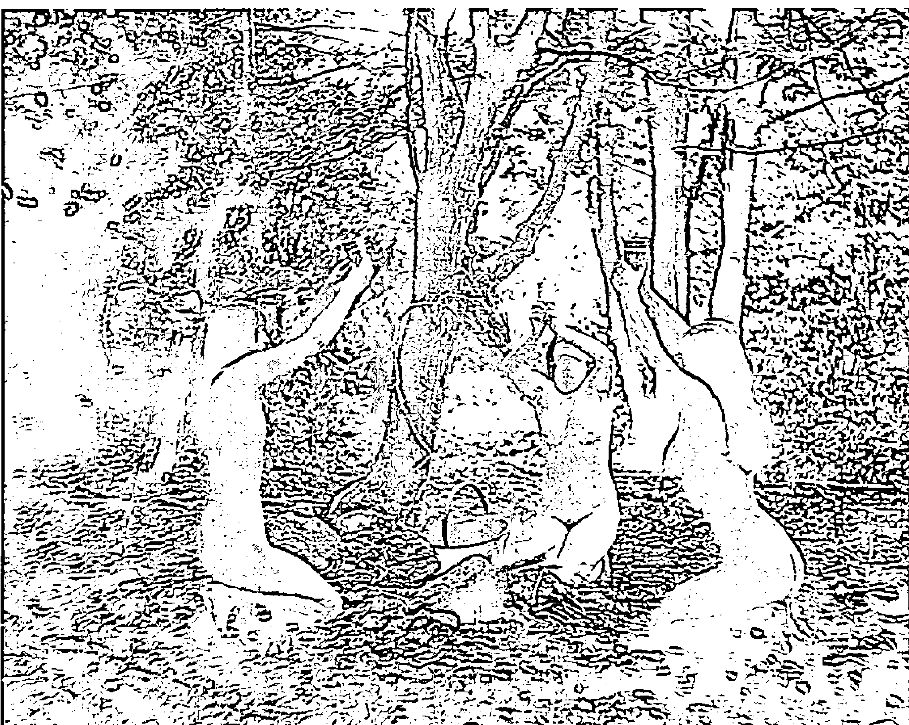

在巫术仪式上，舞蹈和祝词十分重要，几乎是贯穿仪式的灵魂。入会仪式开始时，舞蹈与祝词是这个重要时刻的前奏：当请求入会者被带到圈子西部的时候，引导入会的祭司唱祝词颂扬人内心的神圣，颂扬大自然的神圣力量与人的内在精神的完美结合，然后申请人被引

### 现代的巫师集会

北美派的一些巫师正在举行引出夜游神的仪式。她们一丝不挂，以与宇宙更加接近。这个仪式必须在万圣节举行。万圣节是凯尔特人的重要节日，据说在这一天，巫师可以在人类世界与魂灵世界之间通灵。

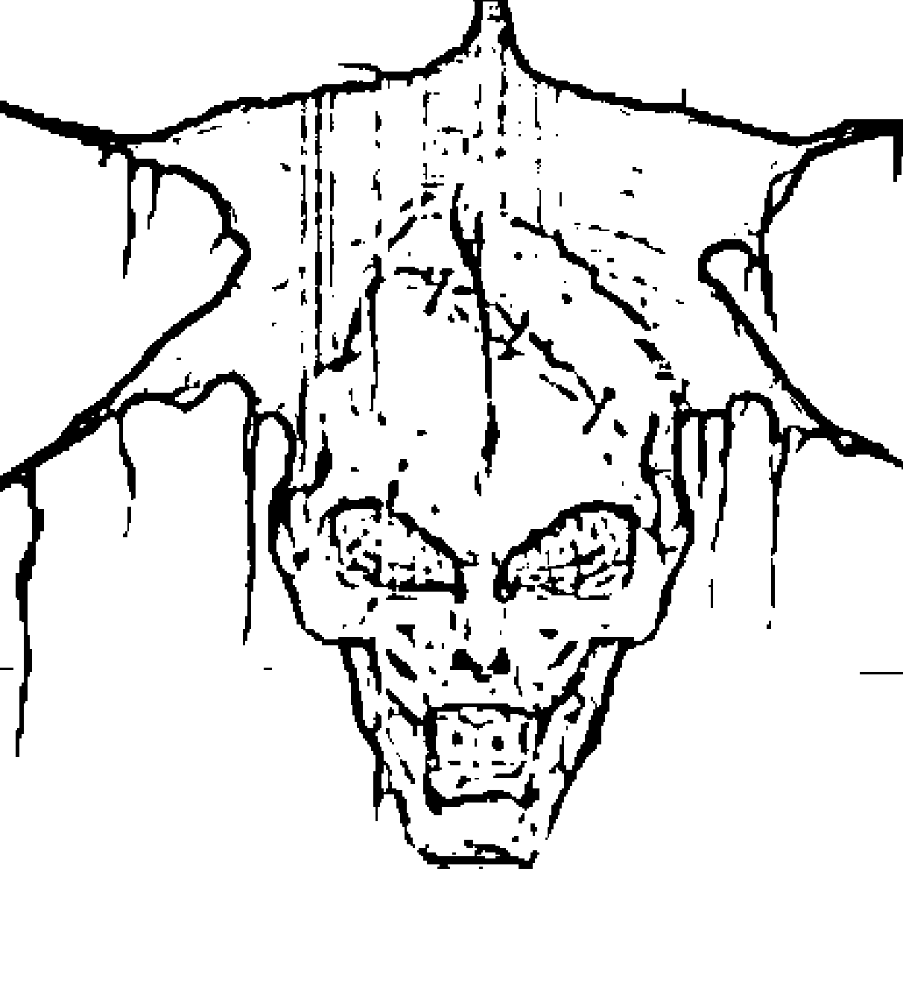

向圈子东部，这时敲响铃声。随后，更高级的祭司跪在申请人面前，虔诚地触摸他的身体，同时背诵祝词来祈福与他：

> 神会庇佑你走过朝圣之路的脚，
> 神会庇佑你即将跪在圣坛的膝，
> 神会庇佑你带来后代的神圣之物，
> 神会庇佑你哺育美与力量的乳房，
> 神会庇佑你念诵神圣之名的嘴唇。

在颂扬身体的神圣之后，申请人就要准备发誓了，在发誓之前，他的脚必须要用绳索松松地绑起来（“脚从不受束缚，却又永远不自由”），随后，祭司们测量他的身体，似乎是要准备裹尸一样（这个仪式必不可少，传统上认为它带有一种魔幻的力量，祭司对申请人身体的测量意味着他把自己的魔力传给了申请者），这时候铃声再次响起，然后申请者要象征性地接受40次鞭打，当然都是轻轻地，这代表着走过炼狱。

随后开始发誓，誓言基本上都是表示忠诚和保证保守秘密。到此，入会仪式就基本结束了，然后铃声响起并且持续很长时间，申请人这时已经成为巫师集会的一员，可以摘掉蒙眼布，祭司给了他一把带有魔力的匕首——阿瑟姆（带着白柄只能用于这圈子的小刀），一个魔杖，一个五角星，一个皮鞭（痛苦的象征），以及绑过他的绳索。

之后，入会者被告知的第一条即是：巫师的力量来自身体内部，人类的每一部分都是圣洁的；同时入会者要明白巫师的准则“不伤害任何人，按神的意愿行事”。

在新入会者学习一段时间以后（至少一年零一天），如果已经掌握了基本的魔法常识及应用，他还可以进行第二次或第三次新入会仪式。第二次入会，基本上与第一次相同，主要内容是拜会角神，以及黑暗死神，这象征着巫师们充分认识到善与恶并存。第二次入会着重强调“经历痛苦以获得新知”。这时，新巫师像引导他入会的祭司那样，用魔具划出圈子，用意念建起了望塔，并且控制激发出的力量。

然后巫师们开始演绎女神传奇。女神是大地力量的代表，她的传奇起源于古老的描述。在这传说中生与死、爱与恨、角神和女神都和谐地融入其中。如果理解并且接受了这些（其实重点在于经历痛苦后获得的新知），新巫师也许会被授予高级祭司的头衔。

第三次入会将给予一个巫师建立并管理一个巫师集会的权利。这包括举行大仪式，即演绎神性爱。当然这种演绎既可以是真实的，也可以是象征性的。据“影子书”记载，大仪式应当在每个安息日举行。现在的大仪式通常是在高级男祭司和女祭司之间秘密地举行。

一般是一男一女两名巫师一起为第三次入会进行准备，当然也同时被接纳。大多数情况下两人是夫妻或恋人的关系，这样他们就不介意在大仪式上真正地演绎性爱。情况若非如此，两人就象征性地演绎。一些巫师集会坚持，在仪式上性爱必须是真实地演绎，因为这不是代表两人真正地结合，而是代表着神与女神的结合。因而演绎者必须要“鄙弃人的欲望，全身心地投入到对神的诠释中去”。

对于第三次入会仪式，任何记述都是浮光掠影的。因为它总是披着神秘的面纱，我们只能得到一个模糊的印象。但总有些东西是我们可以看清的，进而可以管中窥豹。在一个演绎

### 巫师的四季

巫师主一年是由许多神秘的颜色和奇特的植物装点而成的。植物的变换代表着四季的更替，它们给年添上一种迷幻的色彩，如橡树叶，冬青树，颠茄，接骨木等。在下图，四季之轮被一条蛇围绕着，象征着重生和更新。轮内包括着代表上灯节的一轮新月和雪花，它们来迎接迎春花代表的春分，火代表的五月节，夏至，丰收节；而盘旋在泥下方的龙则象征着在万圣节——年尾时释放出的力量。

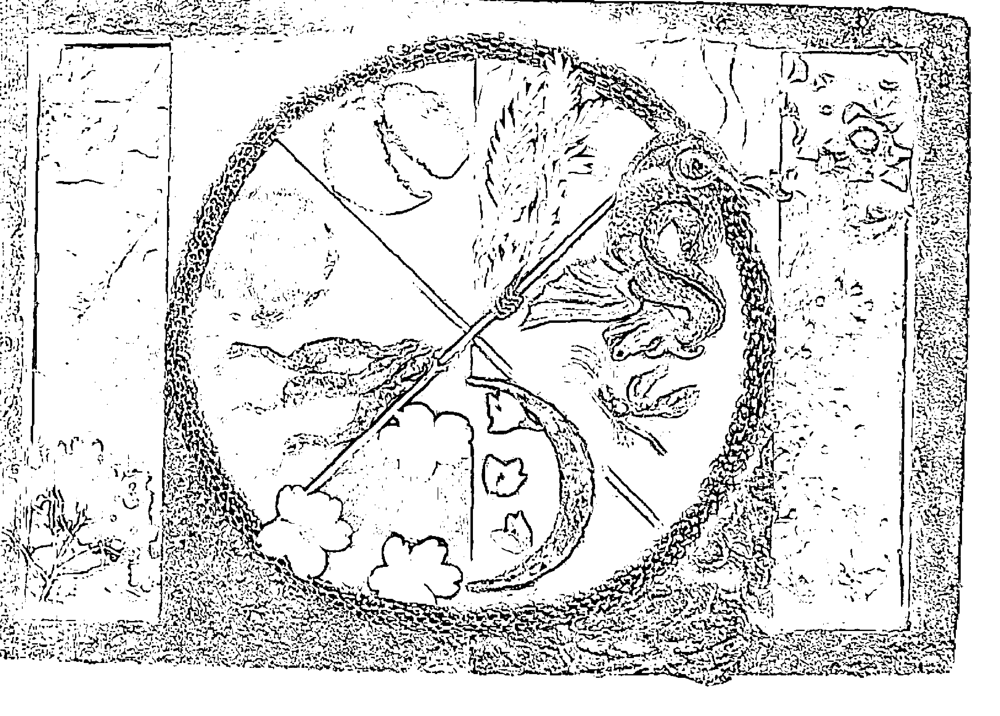

问，他要准确地回答所有问题，然后放下剑（控制男性欲望的象征，代表着泯灭爱与信任），走近六角星中的女巫师。这样象征神圣的结合的大仪式就开始了，或者以真实的方式，或者以象征性的方式，当然在二人交合期间，还要用到许多传统的姿势、器具以及咒语。

然而我们仍然怀有疑问，巫师集会时究竟会发生什么？魔力是怎样起到作用的？既然以我们现有的知识无法解答这些问题，那么先入为主的成见更加无法说清楚事实，而且说不定还会对巫师的职业有所损害。

每个集会都是用自己的一套仪式去激发那种力量，这种力量可以使成员发挥魔力。但是有些因素是不可忽视的，例如选择满月的日子来举行重要的集会。传说满月会使巫师通灵的能力达到极致，而且在现实生活中满月确实可以令人精力充沛。我们可以从生活的许多方面看到满月的作用，不论是女性与潮汐相关的生理周期，还是人类灵魂深处的动物行为周期，都毫无疑问地说明了满月的神奇“魔力”。

### 巫历年

重要的集会和礼拜多是在古老节日之时举行

- 12月20日或21日，新年（Yule），冬至之日
- 2月1日或2日，圣烛节（Candlemas 或 Imbole），举行入会仪式的最佳时节
- 3月20日或21日，播种节（Eostre）春分之日
- 4月30日，五月节前夕（Beltane）
- 6月21日，仲夏节（Midsummer）
- 8月1日，收获节（Lammas）
- 9月20或21日，丰收节（Harvestide）
- 10月31日，万圣节（Samhain）

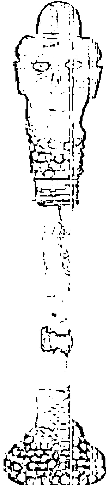

不论在安息日或是普通的巫师集会，带有宗教色彩的舞蹈都是必不可少的。这种节奏感很强的舞蹈几个世纪以来给人们留下了深刻的印象。它可以激发人的意识，给巫师们一种亲如一体的感觉，还可以产生一种催眠作用，这很像原始部落的古老舞蹈。在巫师集会中，舞蹈还起着集中巫师注意力、激发魔力的作用。

舞蹈通常都是在这些环境下产生的，而且在早期还带有夸张的性暗示，甚至是淫荡的意味，也许舞蹈就应该这样。可是现代人关注的是舞蹈的节奏和动作，认为这可以集中人的生理能量，却忽视了心理能量，其实这二者是紧密关联的。也许正是因为这个原因，舞者们才常常裸体歌舞，因为衣着会阻碍他们释放激发出的力量。

舞蹈通常是采取螺旋性的顺时针方向。尽管偶尔也使用逆时针方向，但传统上认为是不吉利的。一般在跳舞时，男女要交替排列以平衡阴阳的力量。在安息日或集会结束之前，大家通常享受一顿快乐的大餐，随后祭司打开圈子，宣告安息日或集会结束。

无论我们如何估量舞蹈和歌唱在激发魔力方面的作用，都不可否认它们确实有一种强烈的心理影响作用。对于这一点，只要参加过任何集体活动——集体舞、声乐班，或者是参加过普通的篝火晚会的人都会切身感觉得到。人的力量与能量总是或多或少地被狂热的舞蹈激发出来。即使在现代，人们也依然像巫师们那样依靠舞蹈激发出某种狂热的情绪。20世纪40年代令美国青年如痴如醉的街舞，50年代让人狂热激动的摇滚都是生动的例证。歌舞几乎可以应用在任何宗教集会：教堂里人们集体唱歌，弥撒上人们集体跳舞，尤其在北美更为常见。

巫师集会上，舞蹈的目的并非只是使人狂热激动，而是要激发出某种魔力，提高巫师们的力量，同时也起到团结巫师们的作用。不论是谁，只要与其他人合作过——无论在一个表演班，还是一个体育队，或是一个工作小团体，都会感觉到集体意识的力量。这种集体意识不仅让一个成员与其他成员团结起来，还使整个团体产生一种集体认同感。这种感觉令集体成员很容易把“自己人”与“外人”区分开来。

这是一种团体的力量，同时它也激发了魔力，可以使巫师们实施魔法，至于这些魔法是什么，我们很难给出确切的定义。它的外延极其广泛：从救治受重病折磨的病人到帮助失业者寻找工作。在1991年海湾战争期间，许多巫师集会都在致力于反对萨达姆·侯赛因，就像

### 女巫的激情

这幅作品源于当代奇幻作家詹姆斯·克莱蒙斯《女巫的激情》，作者将一个红发女巫置身于巨型蝙蝠的势力范畴之内，她的右手已被蝙蝠啄伤，但她却面带满足之色，整个画面呈现了阴森、静谧的主题。

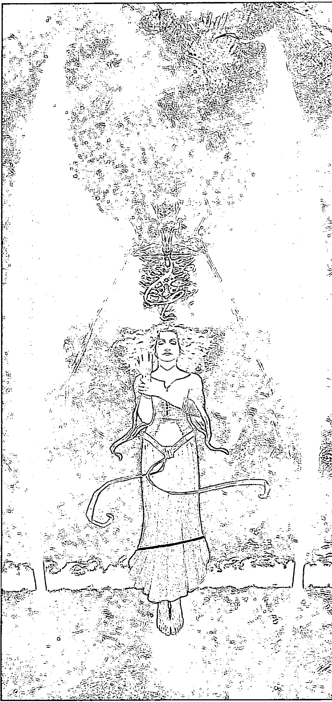

在1940年德国轰炸英国期间一样，巫师们纷纷给敌方施加符咒。最新的例子是，在美国许多巫师将他们的魔力应用于防止地球生态破坏。比如，在马萨诸塞州波士顿有一个地球日，那天许多歌手举行露天义演，而同时在威斯康辛，许多巫师举行大型集会来祈祷“拯救地球”。

在美国巫师中女性占了绝对的优势，据说有10万之众。她们坚信神都是女性——神即是母亲。这些神的力量都来自于史前的欧洲女神。她们的这种观点并非说笑，而是严肃认真的。一位在加利福尼亚罗马天主教圣名学院授课的教师和两名联合卫理公会教徒都是这样解读《圣经》的：当耶稣被罗马总督钉在十字架上后，他并没有在复活节再生，而是由苏菲娅（象征智慧）代替来到天堂。苏菲娅是女性信徒们喜欢使用的一个带有神圣色彩的名字。

我们许多人都是站在巫师立场之外冷眼旁观，只能臆想他们的魔法活动，好像他们的行动恰如我们想像的一样。对于那些认为远程治疗或心电感应效用显著的人来说，他们也许很容易接受巫师的魔法也可起到同样的作用这个观点。如果个人的心理能量可以激发出来，而且可以应用于治疗生理或心理疾病患者，那么我们没有理由不去相信集体的力量也能如此，甚至可以达到更好的效果。

### 音乐魔法

Pantera 是世界著名的力量金属乐队。主唱声嘶力竭的低吼，主音吉他炫技似的独奏所制造出的马嘶雷鸣般的音墙，强劲有力的节奏，狂野顺畅的旋律无不撞击着听者的心灵，直面听者的内心。Slayer是以速度见长的金属乐队，他们的音乐给听者带来超炫的快感，让人着魔似的随之癫狂，随之沉沦。现代的摇滚乐也许在不自觉的情况下运用了类似巫术仪式的节奏和形式，它们所达到的效果也是一样的——即对心灵的捕获与控制。

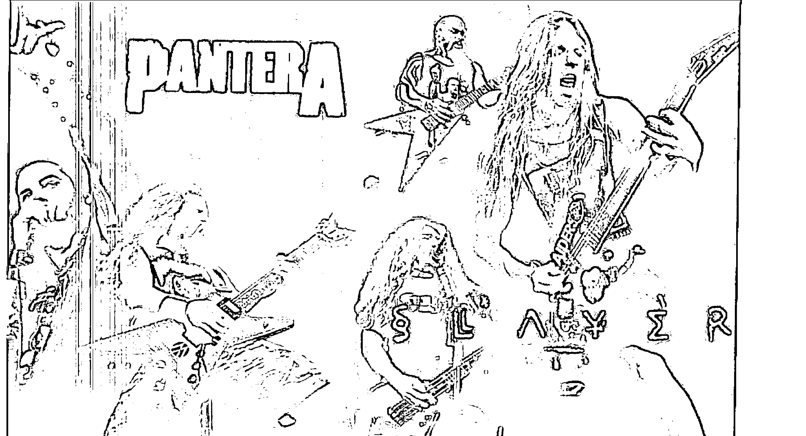

对于那些满脑子现代科学的人来说，魔法确实近乎荒诞。但是我们必须提醒自己，在过去的几个世纪里并没有今天那么多我们耳熟能详、熟视无睹的东西，例如无线技术、电视、X射线等等。

当然巫术有很多方面确实是天方夜谭，无法理解，比如以咒语祈求古代神灵现身相助。一些巫师狂热且忠实地信仰崇拜古代神灵，还有一些很尊敬这些神灵所代表的力量。但是除了神力以外，巫师的意识仍然起着重要的作用。在某种程度上，巫师们带有魔力的意识似乎可以使祈求神灵变得不再那么荒诞不经，似乎可以让我们理解求神施符等种种科学无法解释的事情。巫师们一再声称他们的魔力是自然赐予的，而并非超自然的。

薇薇安·克罗雷博士曾讲述过左右脑活动的问题，并指出当人们进行一些超自然的活动如意念治疗、思想解读，以及意念弯折金属时，脑电波确实与平时不同。她认为在巫师集会上，巫师们会感受到一种类似东方中世纪时“通灵”的意识，这种氛围使巫师们能够与那些他们想帮助的人建立超越时空的联系，从而按照他们的意愿进行治疗与帮助。

巫师们热衷于祈求古代神灵，似乎把我们的日常生活升华到了一个很高的，甚至有些神圣的层次上。无论是在东方还是西方的任何文化中，神总是力量的代表，这种力量是人们梦寐以求的，或者说至少是想要利用的。但是薇薇安·克罗雷博士指出：“树木、洞穴、池塘等所带

### 魔戒

正义与邪恶、爱情与阴谋、忠诚与背叛、误解与遗憾是一个精彩的故事必备的几大要素。《魔戒》除了具备这些之外，还融入了魔法、精灵、幽灵等颇具诱惑性的元素。因此多年来《魔戒》一直被西方读者视为最伟大的科幻巨著。

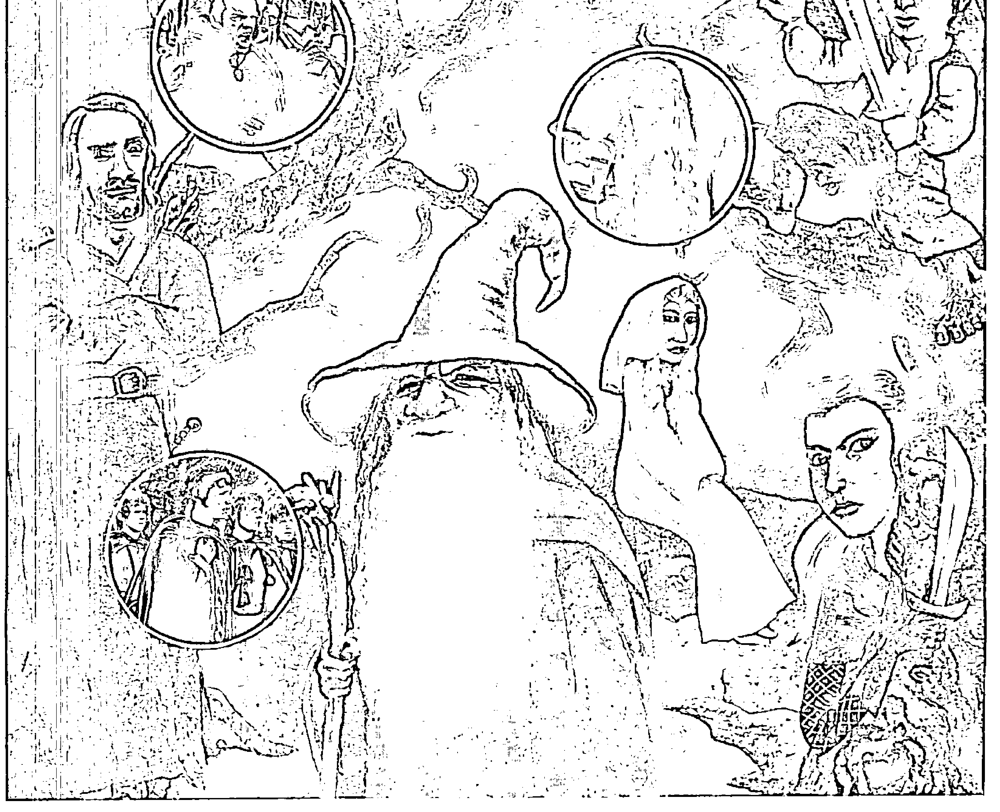

有的灵气并非是神圣的，而是最基本的元素——这也可以看作是自然本质。我们之所以认为有些东西神圣、纯粹，是因为我们所居住的地球本身的缘故。她的观点和最近许多科学家所倡导的“地球本身就是一个鲜活的生命，带有自己的神灵”不谋而合。这种观点反过来也正面肯定了巫师们几个世纪来对自然的敬畏与尊敬。出于对自然力量的敬畏，当巫师摘下一朵花时，他会真诚地对花的神灵道歉。现代的绿色环保组织至少也应该与这种行为产生共鸣。

对巫术感兴趣并渴望施展巫术，并不一定意味着要成为巫师集会的一员。有很多依靠阅读古代或现代书籍而自学成才的巫师，而且还有很多巫师愿意传授怎样应用激发出的力量。

然而一些业余学习者通常被警告自学巫术并且将其应用于实践是相当困难的。这实在是个艰巨的工作，必须要严肃对待，丝毫马虎不得。对巫师来说，有时候你打开门不知道会有什么东西进来，甚至不知道是否还会关上门。无论你对魔力采取什么样的观点，它绝对是巫师释放出的一种力量。它是玄妙的，作用于人心理的，如果你不能控制这种魔力，就会被这种魔力所控制，那么我们就不知道它为你带来的是巨大的好处，还是灭顶的灾难。

巫术的理论与实践太过高深，我们很难言简意赅地全面概括出来。但大家都知道主持巫术仪式，应用魔法肯定不是件简单的事情。因而魔法一次次地被强调为“艰苦工作”。巫术以及它所激发的魔力当然有被滥用的情况，但是从记载可以看出巫术总的来说还是向着积极的方向发展。总有一些人抓住一些滥用魔法的例子来攻击巫术，但是我们要知道许多这类例子并非是真正的巫师制造的，而是来自于许多想给巫术抹黑的人，甚至是一些力图证明巫术怪诞不经的科学家，或者是那些认为崇拜自然大逆不道的基督教徒们。但很少是伊斯兰教或是佛教教徒。

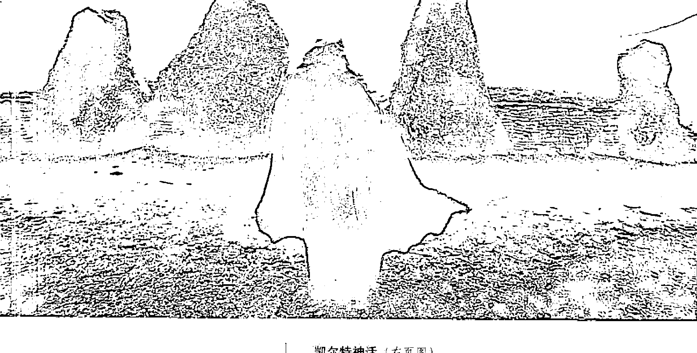

### 巫师的圣地

一位穿斗篷的巫师站在传说中异人韦兰位于威尔特郡的锻造厂中，传说巫师们在这里举行连接人类世界和魂灵世界的仪式。

### 凯尔特神话（右页图）

巫术魔法中的许多元素都是从凯尔特神话中借鉴或是引申过来的。约翰·豪的这幅《凯尔特神话》凸显了凯尔特神话与巫术魔法之间的关联，将巫术魔法中富有寓意的要素——巫师、精灵、独角兽、乌鸦、树妖等等全部表现出来。

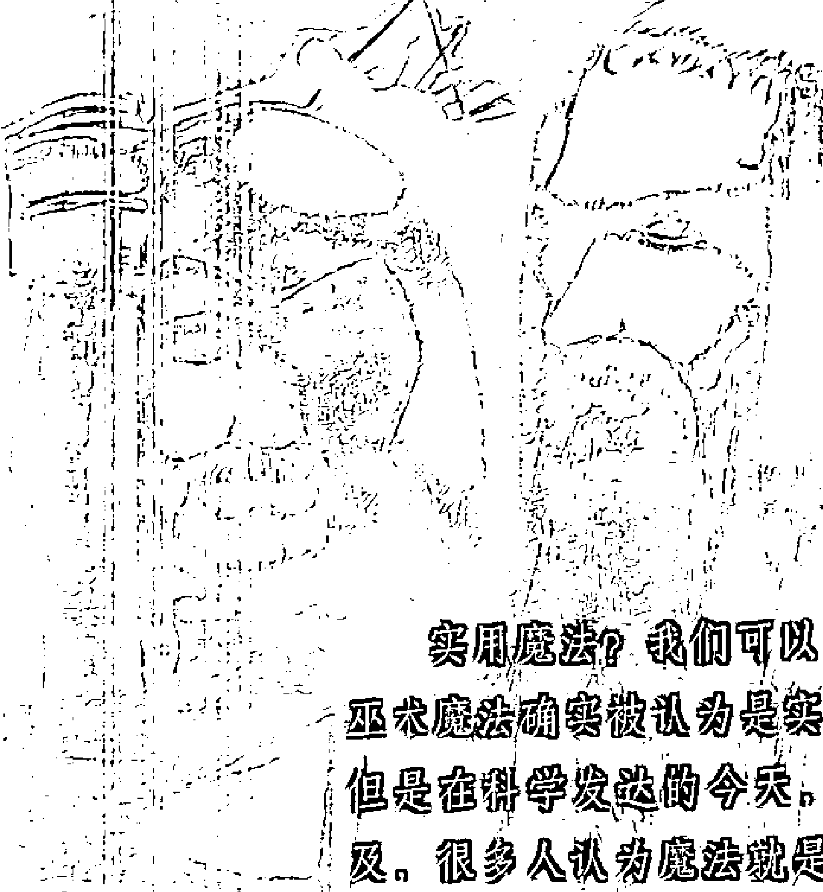

## 第十一章 实用魔法

实用魔法? 我们可以用 “实用” 来形容魔法吗? 在过去的几千年里，巫术魔法确实被认为是实用的，直到现在仍然有许多人持有这样的观点。但是在科学发达的今天，“魔法” 这个词语似乎与 “实用” 风马牛不相及。很多人认为魔法就是虚幻的东西，何来实用? 世界各地的许多不同宗教信徒都虔诚地相信祈祷的力量，而且我们可以把祈祷看作是一种试图引出或影响神奇力量的活动 (而神圣的力量是最为神奇的)。公元2世纪以前，宗教的祈祷和巫术魔法并没有实质的区别，只不过宗教的祈祷是依靠对上帝的屈从和恳求，巫术的魔法来自于对神灵的命令和指导罢了。因而，我们可以这样说 (当然我们对宗教并没有丝毫冒犯和不敬的意思)，那些牧师或是信徒们包括基督教徒、天主教徒、伊斯兰教的阿訇，韩国的萨满教徒，他们对他们创造者虔诚的祈祷，与巫师们向盎格鲁古神的祈求与命令并无本质区别，甚至宗教信徒们的祈祷词都与巫师们制造护身符或避邪物时的念词如出一辙。

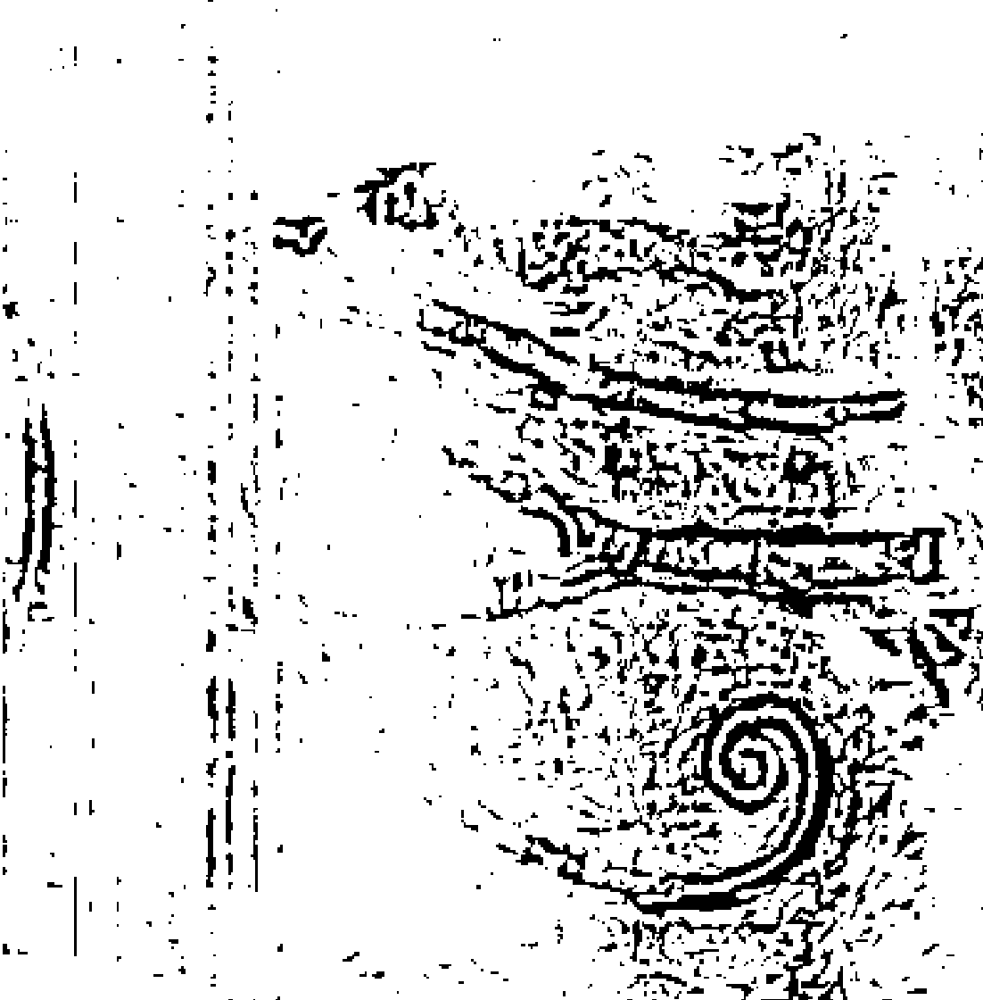

### 护身符

在人类文化起源初期，人们就佩带护身符 (或避邪物)。人们相信护身符会带来，或本身就含有一种神奇的力量。例如罗马天主教教堂就一直珍藏着历任教皇用过且赐予祝福的念珠。这些护身符真的可以给人带来好运吗? 在今天，护身符是不是真的可以看作是实用的巫术? 答案也许是相当肯定的。对于这一点当然我们是认真严肃的。

在今天这个人口快速增长，物以稀为贵的现代社会里，人们喜欢佩带或携带护身符以突出自己的与众不同。几乎每个人都佩带着某种护身符——有时他也许根本没有许多人带着项链或其他饰物，有的是朋友或情人送的，有的是在假日无意识地购买的，也许是因为追赶时尚，或者是因为纪念什么事情——但对于所有者来说这些项链和饰物仍然带有一种特殊的力量。

在动荡的年代，人们通常佩带或携带一些可以带来好运的东西。当遗失了这类物体时，人们便和一些恶兆联系起来，有意无意地赐予并夸大了这物体的重要性。当佩带或携带多年的饰物遗失或者被偷，我们的感觉绝不仅仅是丢了个什么东西，而是丧失了一种十分重要的力量。我们也许并没有意识到一条项链是保护我们不受邪恶侵害的护身符，但是不可否认在我们的潜意识里也许已经接纳它为一种信仰。

数千年来人们一直坚信护身符能够保护主人，并且带来好运。关于护身符的信念甚至感染了一些基督教圣徒——圣查斯丁曾嘲讽地询问自己：如果上帝创造了一切，那么信仰太阳教的‘异端’们所佩戴的护身符上也应该带有上帝的光辉和力量啊？其实护身符的力量存在于人们对它的信仰之中。而在魔法的每一领域，信仰是最为重要的。在科学唯物主义产生以前，我们的祖先坚信刻上神名的护身符将会把神的力量带来以保护自己。随后，又有一种传统，将行星的名字以及保卫行星的天使名字和级别刻在护身符上，这样护身符就会带给你那行星的力量。

> > 如果上帝创造了一切，那么信仰太阳教的‘异端’们所佩戴的护身符上也应该带有上帝的光辉和力量啊？

我们也许认为处于科学发达的21世纪，我们已经成为脱离愚昧和荒诞的人。但是心理学不停地提醒我们，人类是脆弱的生物，最强大的人往往是借助于其他的力量来保护自己。既然人们不愿意承认护身符的魔力，那么今天佩带护身符也许可以被解释为以下的原因（虽然很牵强）：突出个性，或者表示你期望成为的人。

怎样制作自己的护身符呢？在一个护身符上刻几个完全个性化的文字或标记也许是自己的指纹，也许是自己的星相运势或者生日命运图（当然如果有一个人与你是同时出生甚至就在一个产房里，那么这个护身符就称不上是独有的了）。根据《天书》（历史流传下来的一本魔法和巫术的教科书，据说是由超自然的力量编写的）的程序，我们有一两个不错的建议。

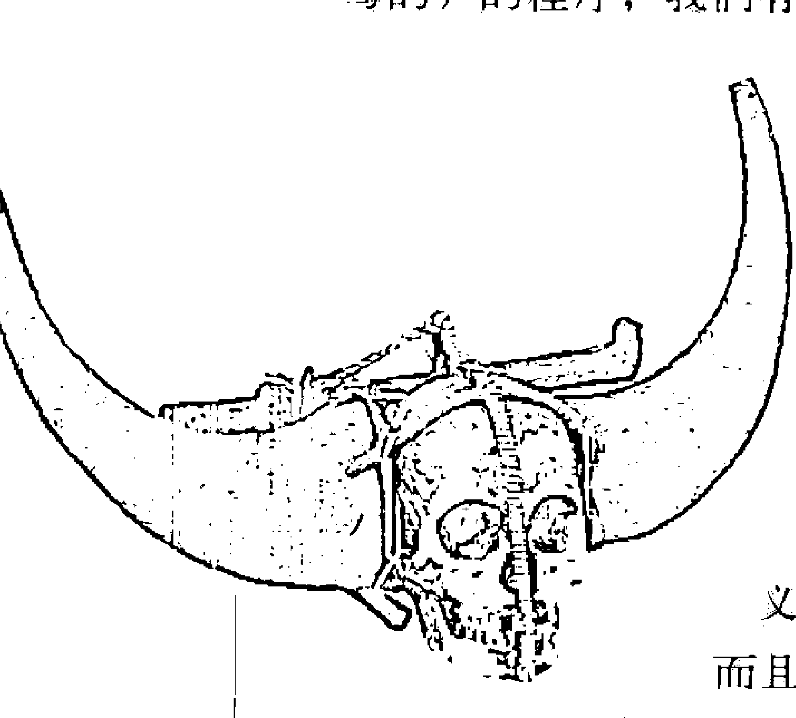

### 制作自己的护身符

在过去，制作护身符是相当繁琐的事情，而且由于一些传说使其制作过程还蒙上了神秘的面纱。其实制作过程简单一些也会带来同样的效果。当然制作过程是不可省略的，因为我们不可能从商店里买回来一些有象征意义的东西，什么也不做就挂在脖子上——那实在太过于简单，而且发挥不了什么神佑的作用。那些神秘主义者认为，无论在什么情况下，在商店里放置几个月的东西会渐渐失去原有的魔力，而且说不定还会沾染一些邪恶的色彩。

那么就需要自己动手制作护身符。这并没有想像的那么困难，就算你用金或银等金属制作也并不困难。如果你买不起黄金，普通的镀金或者锡也可以用来刻上自己喜欢的文字或符号。基本原则再简单不过了：如果无法得到贵重的金属，可以用相似的来代替。如要制作水星的护身符最好用白银，但没有白银就可以用锡或铜来代替。

制作什么样的护身符完全取决于个人的观点：你可以按照自己的目的去制作想要的护身符，在准备制作的时候仍然有一两个基本原则：最主要的即是要在上弦月时制作，避免在下弦月时制作。如果你想使用天文星象作为护身符象征，必须要记住最重要的一点就是选择与这个星座对应的日期制作。例如：如果想制作太阳的护身符，应该在星期日。而月亮的，应该在星期一。同样地星期二、星期三、星期四、星期五、星期六各自对应火星、水星、木星、金星和土星。而近代发现的行星如天王星、冥王星、海王星一般不被应用于护身符的象征中，它们也许带有星座的象征，但是在神秘主义者看来，它们带有的魔力微乎其微。

按照传统，护身符做好后，必须要使其纯洁化、神圣化——就像佛教中的法器要开光一样。不过除非你坚持要这样，或者坚信追随古代的传统可以使你的护身符增加一些魔力，否则这道程序可有可无。使护身符纯洁化的过程极其简单。你可以在纯水中洗洗护身符，默念着护身符所带有的魔力的名字；你也可以把护身符托在手上朝向四个方向，恳请四大元素来给它带来圣洁；或者你也可以把它放在草地上，用一棵草盖住它，让它接受自然和月光的洁净。

令护身符神圣化就是另外一码事了——通常认为，你在这个程序上投入的精力越多，付出的努力越多，你的护身符就会越神圣。形式是多种多样的——你可以发明一种自己的，或者按照一些特定的规矩，像埃利法斯·莱维这种权威制定的规矩——虽然这些繁琐的规矩会给你带来些麻烦。比如，要想使一个象征金星的护身符神圣化，莱维认为你应该用绿色和玫瑰色的布和一些铜币装饰房间，戴枚玳瑁戒指和青金石的王冠，拿着天鹅羽毛制作而成的扇子，还要把刻有亚纳尔（金星守护天使）名字的铜币穿在绳上，戴在脖子上。如果要使代表太阳的护身符神圣化，你必须站在狮子皮毛制成的地毯上——这个规矩似乎不适合那些脑筋不大变通的读者。

为了尽可能地让你的护身符带有更多你的能量，你最好在给它开光的过程中赤裸身体，在仪式结束后穿上衣服就意味着护身符已经具有了圣洁的力量。开光的日子也要仔细选择，不是随便哪一天都可以的（这一天的重要性基本上相当于选择制作护身符的日子）。给护身符传输自己的能量也有最简单的方法：首先尽可能地使自己处于舒适状态，而且确保你不会被打扰；然后把护身符托在手掌上，专注地凝视它并想着这护身符能如你所愿地保佑你、帮助你，专注地想着你的愿望。给护身符传输自己的能量被形象地比喻为充电，你需要尽可能长时间地拿着它，专注于你的愿望，当你觉得自己已经很难再保持专注了，那表明你的护身符已经饱和，仪式可以结束了，但还要在其他场合重复。

如果你希望通过祈求神灵为你的特殊情况加点与众不同的东西，你可以在开光过程中放点音乐，或其他的什么。这完全取决于你自己。不过要切记，最好要独自完成开光过程，而不要牵扯其他人。在当代出版的《护身符的魔力》一书提到：无论你和朋友或恋人多么心心相印，最好都不要邀请他们参加这类仪式，有些情况下一丝一毫的怀疑和不诚实都会带来致命的灾难。

现在我们就要谈谈如何在护身符上刻上字或符号了。一些天文星相的护身符在占星术中往往有特定的符号。这些符号有的是星座的，还有的是和与星座相关的天使甚至魔鬼联系起来的。最重要的是护身符上一定要有一个矩形——Zahlenquadrat矩形或Kamea矩形，矩形内部包含着一些与行星魔力相关的数字。

举个例子，让我看看金星护身符（左图）。我们发现在正面的顶端刻有数字1225，这是矩形kamea（下页左上图）内所有数字的总和，这也是六翼天使——酒神教和犹太教中最高等级的天使的数字。金星的智力之神是哈吉尔，他的象征数字是49，金星的“精灵”或者说是魔鬼凯德莫尔，象征他的数字是175。矩形内的横向、纵向和斜向每一栏数字相加都是175，这不仅仅是魔鬼凯德莫尔的数字，也是希伯来女神曼妮（对应于爱神维纳斯）的数字（右上图）。

在护身符的反面，我们可以看到很多符号和标记。在右下角是金星的图示符，顶部是金星的传统印记——这是最原始的设计，印记里的线条若叠加在矩形里就会穿过里面所有的数字。下部是行星智力之神哈吉尔的标记，他的线条如果叠加在矩形里也会穿过一些数字，而根据古代数字占卜术这些数字恰好代表哈吉尔的名字。

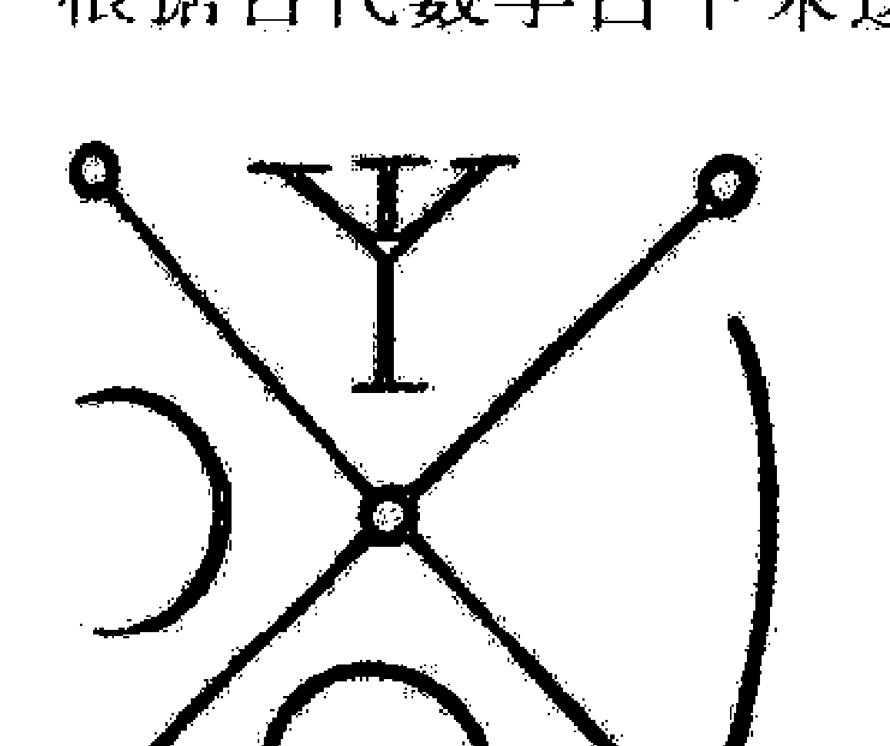

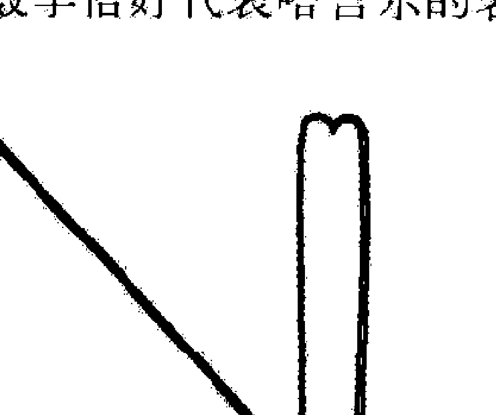

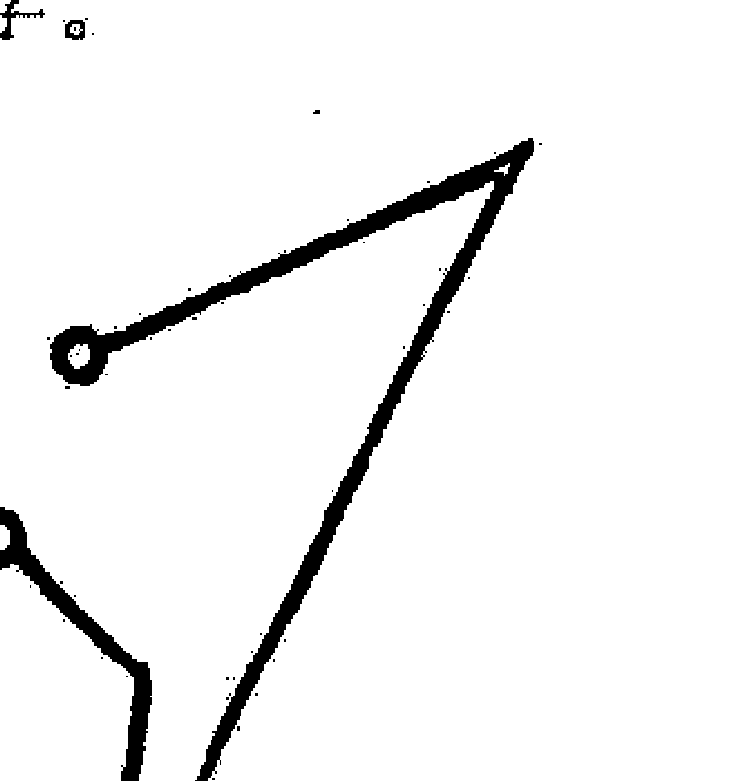

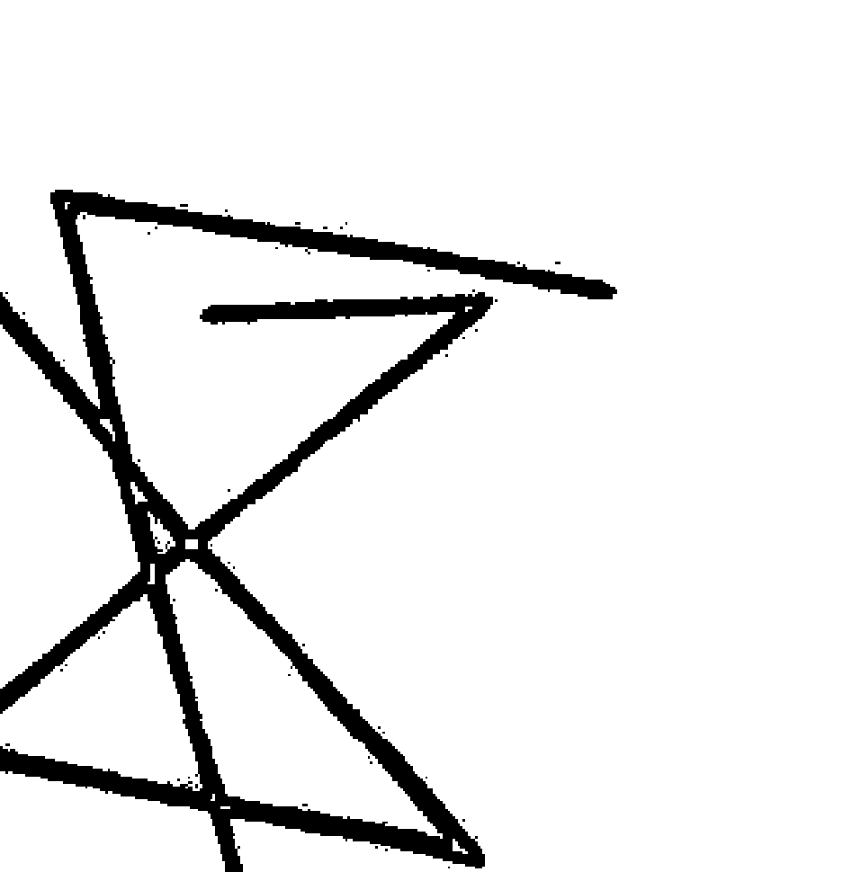

所以你也可以根据上面这些规律制作自己的星相护身符，比如和太阳相关的护身符。记住太阳操控狮子座，月亮操纵巨蟹座，水星对应双子座和处女座，金星对应金牛座和天秤座，火星对应白羊座和天蝎座，木星对应人马座和双鱼座，土星则对应摩羯座和水瓶座。

当制作这类星相护身符时，还要注意使用不同的材质。太阳的护身符最好刻在黄金上，太阳护身符可以使人善良，事业成功，名噪一时，而且“提高财运，随心所欲做自己喜欢的事”。月亮护身符应刻在白银上，可以给人带来快乐、荣耀，驱走厄运，保佑旅途平安，身体健康。

土星的护身符一般使用铅质品，据说它可以送子予人，还能助人登上权利巅峰，如人所愿佑其成功。水星护身符也使用白银，或者锡、黄铜，还可以写在羊皮纸上，可以给人带来好运，助人敛财，远离贫穷，还可以帮助“记忆、理解和预言”，帮助人“解梦”。

金星护身符也使用白银，或者也可以按照一些权威坚持的使用红铜。金星护身符可以带来友情、终止争吵与调节不和谐、吸引异性的爱、帮助女性怀孕、并且保护不受对立魔法的侵害。

火星护身符一般使用铁质品以强调力量，它可以使人在战争中神勇异常，令敌人闻风丧胆。木星护身符也使用白银，可以带来财富与好运、爱与和平、神圣和荣誉以及与敌人的和解。

如果你不想使用传统的标志和象征，那么你完全可以使用自己的发明。你可以在护身符上刻上一些别人无法解读的密码，也可以使用古代字母来书写你的名字或是名字的缩写。在弗朗西斯·巴瑞特著名的《魔法师》一书中，我们可以看到很多这种指导。如下：

### 底比斯字母表

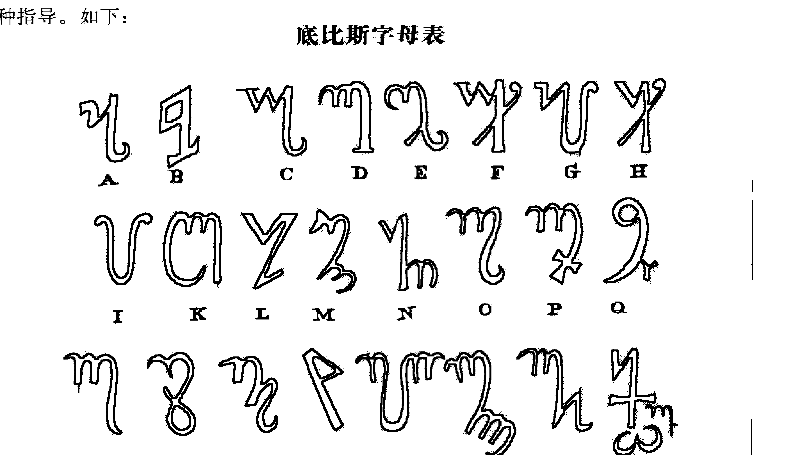

巴瑞特认为底比斯字母是不解自明的；而要想明白天书字母（或圣人之书）、孔雀翎字母，或渡河字母，你就必须要了解字母的希伯来名字了：

| 字母 | 希伯来名 | 字母 | 希伯来名 | 字母 | 希伯来名 |
|------|----------|------|----------|------|----------|
| A | Aleph | R | Res | V | Vau |
| O | Vau | G | Gimel | L | Lamed |
| B | Beth | S | Samekh | W | Vau |
| P | Pe | H | He | M | Mem |
| D | Daleth | T | Teth | Y | Yod |
| Q | Qoph | J | Yod | N | Nun |
| E | He | U | Vau | Z | Zain |
| | | K | Caph | | |

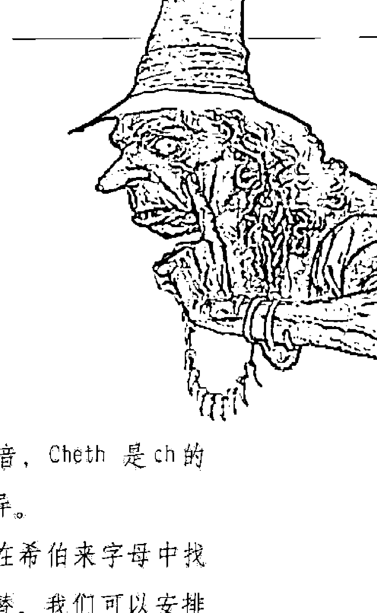

除此以外，Tau发软音t，从喉后部发音，kuff也是软音k. Shin 代表sh的音，Cheth 是ch的音，而 Lade 要发 Tz 的音。希伯来字母的发音基本上与西方字母发音有很大差异。

还要注意到许多希伯来字母同音（如 E 和 H，J 和 Y），而且有许多罗马字母在希伯来字母中找不到对应的，如 C，F，I，以及 X。当然，对于 G，我们可以用 Cheth 或 Caph 代替。我们可以安排一些代替字母。比如，我们可以用希伯来读法来说出Julia这个名字：Yod，Vau，Lamed，Yod，Aleph。

### 天书字母

- Lamed：符号类似希腊字母α的变体，线条连接圆点。
- Caph：符号类似倒U形，两端有圆点。
- Jod：符号类似三角形，底部有圆点。
- Theth：符号类似U形，两端有圆点。
- Cheth：符号类似H形，中间有横杠连接。
- Zain：符号类似T形，顶端和底部有圆点。
- Vau：符号为一条竖线，顶端和底部有圆点。
- He：符号类似希腊字母Π，两端有圆点。
- Daleth：符号类似门框形状，顶部和底部有圆点。
- Gimel：符号类似希腊字母Γ，两端有圆点。
- Beth：符号类似Z形，两端有圆点。
- Aleph：符号类似X形，四个端点都有圆点。
- Tau：符号类似数字7，左上角和底部有圆点。
- Shen：符号类似U形，中间多一条竖线，三个顶部有圆点。
- Res：符号为一条弯曲的线条，顶端有圆点。
- Kuff：符号类似倒U形加一条竖线，三个点。
- Zade：符号类似Y形，三个端点有圆点。
- Pe：符号类似螺旋形，起始点有圆点。
- Ain：符号类似钩形，底部有圆点。
- Samech：符号类似U形，两端有圆点。
- Vun：符号类似L形，两端有圆点。
- Mem：符号类似N形，三个端点有圆点。

### 孔雀翎书写

- Caph：符号类似倒U形，两端有圆点。
- Jod：符号类似U形，底部有圆点。
- Theth：符号类似X形，四个端点有圆点。
- Cheth：符号为两个并排的正方形。
- Zain：符号类似W形，三个顶部有圆点。
- Vau：符号类似倒V形，顶部和底部有圆点。
- He：符号类似N形，三个端点有圆点。
- Daleth：符号类似Π形，三个顶部有圆点。
- Gimel：符号类似U形，两端有圆点。
- Beth：符号类似U形加一点，三个圆点。
- Aleph：符号类似十字形加横杠，多个圆点。
- Pesh：符号类似V形，顶部和底部有圆点。
- Kuff：符号类似U形，三个顶部有圆点。
- Zade：符号类似正方形加一竖线，多个圆点。
- Pe：符号类似X形，四个端点有圆点。
- Ain：符号为正方形，四个角有圆点。
- Samech：符号类似烛台形，多个圆点。
- Samech：符号类似星形，多个圆点。
- Schin：符号类似M形，三个顶部有圆点。
- Tau：符号类似H形加两点，多个圆点。
- Nun：符号类似Y形，三个端点有圆点。
- Mem：符号类似H形，四个端点有圆点。
- Lamed：符号为一条竖线，顶端有圆点。

### 符文书写

除了以上这些例子以外，还有许多其他的可能：你可以使用迪伊博士特有的以诺语言，或者自己发明一种书写语言。

除了你的名字以外，你还可以用这种数字占卜术来把情人或朋友的名字，或者把自己的生日书写在护身符上。书写数字时，也可以用普通的罗马数字。

最后，还有许多种传统的书写方式：如把字母排列成回文矩形——例如我们前文提过的SATOR矩形，此外还有如下的几种古老的字母矩形：

SALOM
AREPO
LEMEL
OPERA
MOLAS

这最迟起源于1458年，但今天它的神秘象征意义很少有人知晓。

ROLOR
OBUFO
LUAUL
OFUBO
ROLOR

这种回文字母图是一个巫师发明的，据说可以使护身符佩带者像乌鸦一样飞翔。

最广为人知，也是最神秘难解的一种护身符文字书写要算是——ABRACADABRA三角图形。在护身符上，这种文字是以下页上图中的方式书写的。

这种书写方式的含义无人知晓，但穷毕生精力研究这种文字的埃里希·比斯科夫博士在他关于喀巴拉的著作中，认为这个三角形象征着占星术语言中的Abbada ke dabra，意味

### 十字

你可以从中任意地选择一种传统的文字和符号来制作你的护身符。几乎从泰国到北美，从日本到新南威尔士，都可以看见有人脖子上佩戴这种刻有传统符号的护身符。然而尽管这些护身符符号随处可见，但可以说它们的原始意义早已湮灭在时间的灰烬中了，几乎很少有人知道它们的意思，佩戴它们已经逐渐沦为一种纯粹的装饰。

- 一个明显的例子就是十字架，很多人没有什么特别目的的选择佩带十字架，当然也不乏虔诚信徒佩带十字架。尽管大家广泛认为十字架是与基督受难联系起来，但事实上早在基督降生以前，十字架就已经是个意义深远的符号了，早在石器时代末期人们就在使用这个符号，同样那时候人们也将其用于宗教的象征符号，现在常见于印度、叙利亚、埃及、波斯、墨西哥以及北美等地。在很多地方，十字架常与自然崇拜联系起来，正如道教中的T形一样。在古埃及和古亚述雕刻中，我们常常可以看到顶部刻有十字架的浮雕，这又与神圣联系起来。

但是，基督受难以后，在许多地方一直带有神圣色彩的十字架，已经仅仅局限于同基督的联系，完全变成了基督教的象征，至少在西方是如此。与之相联系的其他“异端”魔力也被认为减淡了，甚至永远消失了。而事实上，如果你想佩戴十字架，你有多种选择：传统的

的性、内万、手、身、神、亥、万、手、掌、上（顶图），也出现在罗马的镶嵌物上（上图），甚至还出现在史前岩刻上（中图）。其他的护身符还包括中国太极图案（下图），以及埃及的T形十字章（底图）。

而纳粹党所用的卍字记号，或者说万字形，也是一种十字架，即是四个希腊大写字母γ（gamma）重叠后的形状。在印度和中国，万字形是一种宗教的符号，而且早在公元前就存在着，不过与纳粹党使用的“卐”字方向相反。万字形据考证是起源于印度，最初可能是火的象征，然而也有人认为它象征着初升的太阳，还有人声称它是世界四个方向的代表，或象征着托尔——北欧神话中的雷神。它一直都被认为是吉祥、好运、如意的象征，直到20世纪30年代德国纳粹党采用它作标志。从那以后，人们不再青睐这种十字架了，甚至对它憎恶至极。现在不论在西欧还是美国，它在人们的头脑里也一直是极端右翼势力的象征。不过这种万字形也有很多形式，说不定什么时候它又会以某种形式流行起来呢。事实上，印度教徒们一直使用万字形，今天也是如此，他们把红色的万字形放到门廊上或台阶上，以避邪驱灾。

钥匙形状也是一个很古老的象征，尽管没有十字架古老，毕竟先有锁头随后才能有钥匙。钥匙的意义就是让我们打开门——打开通往灵魂世界的大门，或是自由之门，或是知识之门。在希腊，钥匙被认为是太阳神阿波罗的神物；在罗马则是两面神亚诺斯的神物。在一些国家，往往是三把钥匙结在一起象征着健康、财富和爱情。在基督教中，钥匙也是圣彼得的象征。

而埃及的T形十字章（古埃及生命的象征）看起来结合了十字架和钥匙二者的形状。在早期基督教徒的坟墓里就出土过这种十字章。传说中的埃及诸神也佩带这种十字章，它是男性生殖器官的符号，象征着生命以及力量。

#### 埃及T形十字章

出土于图坦卡蒙墓
约公元前1320年
T形十字章在古埃及是生命力的象征，代表着古埃及的神秘力量。这个包金木料的T形镜盒做工精美，工艺考究，上缀有玉髓和彩色玻璃。

#### 曼陀罗

曼陀罗又称“风茄儿”，属于一年生草本植物，原产于热带、亚热带地区，花冠成漏斗状。古老的印度教、佛教、婆罗门教都将曼陀罗花视为圣洁之物。

恶，还可以帮助人恢复精力。在世界其他地方，瓢虫同样也被赋予此种象征。
埃及人有时也佩带一个乌加特（也称“何露斯之眼”，据说与何露斯为父报仇有关），来象征强大的太阳神拉（Ra）与月亮之神透特（Thoth，它也是魔法和知识之神）的眼神交会，这种护身符据说可以使人百邪不侵。
如果把世界上所有的护身符都列出来，那将举不胜举。有佛教和印度教中的曼荼罗、中国的阴阳太极、魔法中常见的五角星，以及旅行者钟爱的圣克里斯托夫金属标志等等。这些你都可以拿来当作护身符。一些权威们认为即使你从商店里买到这些护身符，你也可以通过将其神圣化使它变成你独有的避邪圣物。
在漫长的年代里及人类各种社会形态里，护身符都一直被使用着直到现在。它的流行说明了人们对魔法和超自然力量的坚信不疑，也说明了在科学发达的今天，当一些现象无法得到合理解释时，人类对于魔法或多或少的认可。
所有的护身符，无论其传统意义是什么，现在只是对佩戴者意义重大。当你制作并使其神圣化的时候，你已经赋予了它你自己的能力，护身符拥有你的能力，并且以此来保护你。个人的护身符只是你自己的想法、做法而已。

### 女性的护身符项链

据说用如图所示的方式制作的项链，可以给女性带来情感治疗的作用。
这组项链是由当代著名的巫师艾米·赫兹格制作的。

- 1. 孔雀石，象征与大地的连接，代表创造性和自尊心。
- 2. 西瓜石，可以治疗心理创伤，平衡情感，控制消极倾向。
- 3. 皇家黄晶石，金黄色象征着温暖与富足。
- 4. 富拉玄武岩，可以让人睁开天眼，与魂灵接触，感觉先兆。
- 5. 热带贝壳，代表大海能量、情感、生命活力的起伏，以及美丽。
- 6. 绿玉，可以像海洋一样带来安静，抚慰和净化，可以表达宇宙真理，打开心灵之窗。
- 7. 印加玫瑰，象征与情感的连接，以及性能力。
- 8. 蓝晶石，可以穿越时空，接近逝去的生命。
- 9. 水晶玫瑰石，爱情宝石可以治疗心灵创伤，带来爱情。
- 10. 玉髓玫瑰，它代表女神——圣母的力量，象征女性的华育，带给女性同情心，可以打开心灵之窗。
- 11. 绿宝石，象征智慧，可以激发智力，带来欢乐。
- 12. 猫眼石，象征激励，可以带来火的力量，以及内部的和平。
- 13. 蓝矿石，象征精神能力，以及创造力。
- 14. 西藏绿松石，象征交流与友情。
- 15. 天青石，代表着神的启示，可以平静心灵。
- 16. 水晶木化石，象征森林的力量、精灵、魔力等。
- 17. 淡水珍珠，象征着圣母的女性美，同情心，纯洁以及神圣。

图中所示的这个护身符项链据说集结了圣母和女神的能量。它主要的作用就是带来用于情感疗伤的女性力量。它可以令佩戴者接触到古代女神的力量，并且通过佩戴者的言谈举止把这种力量扩散到她周围。这种古代的力量孕育了我们居住的星球。请注意项链中间的大宝石上隐隐约约可看到圣母的神像。

这条项链是花了很大功夫制作出来的，可以说是专门为它的佩戴者服务的。制作者不知花了多少时间从林林总总的宝石、水晶、贝壳、舍利以及珍珠中甄选出这些东西制成项链。不过制作者更多地是凭着直觉而不是根据它们的象征意义来筛选。在筛选阶段，一种精神的、创造性的直觉在指引着制作者，似乎是宝石自己的选择一样。

然而当所有的原料筛选完毕后，制作者要将它们以一种特别的方式排列起来来表达一种感官的平衡，这也是凭着一种直觉，或是“超我”的感觉。同样串起宝石的绳子颜色也要与那些宝石相对应，要与宝石的作用相得益彰。在穿项链的过程中制作者要陷入冥想沉思状态。这通常需要20个小时左右。当她每串一个宝石的时候，她都认为是把自己的精力传输到宝石上。制作过程中的冥思和专注可以使护身符项链的魔力更加强大。

几乎所有的原料都是自然的，带有大地的神圣力量。当穿好宝石后，还要把融化的蜂蜡浇在项链上，以表示接受火的洗礼，项链被赋予火的力量。还要进行熏烟仪式，这是一种北美的仪式，点燃干松木用烟熏项链来表示净化项链，然后用薰衣草油涂抹项链，并赐予祝福。之后项链就可以佩带了。当戴上项链时，可以看到每一颗宝石都惊人地闪亮着，这说明宝石正在发挥它们的避邪护身作用。

### 男性的护身符项链

赋予佩带者战士的力量，可以起到治疗和平衡作用
由艾米·赫兹格制作

- 1. 绿松石，象征创造力，交流以及精神。
- 1a. 亚瑟王之剑，充满传奇色彩，可以连接现在与过去。
- 2. 尼日利亚海贝壳，代表海洋的力量（贝壳对于佩带者来说有独特的个人意义，贝壳内部往往有七彩彩虹的条纹）。
- 3. 古代摩洛哥化石，带有古代的智慧，可以连接过去。
- 4. 石英水晶，代表纯洁，可以增大能量。
- 5. 石箭镞，象征着战士的力量，与北美土著的勇敢联系起来，还代表保护、锋利、工具等。
- 5a. 海水珍珠，经常置于项链的后部，象征着女性的力量，代表圣母的圣洁，同情心，奉献精神以及女性的美丽。
- 5b. 小天使图案，守卫天使，射出爱神之箭，也象征着纯洁和天真。
- 6. 绿玉，象征纯洁，带有疗伤作用，可以带来繁荣。
- 7. 猫眼石，象征能量以及创造精神。
- 8. 富拉玄武岩，可以让人睁开天眼，与魂灵接触，感觉先兆。
- 9. 金色方解石，象征精神的激励，专注，平衡阴阳，带来欢乐。
- 9a. 紫水晶，代表灵魂的指引，可以带来神秘的意识，平静心灵。
- 10. 黑色电气石，象征保护，可以控制消极思想，带来神圣光环。
- 11. 金褐石，代表力量，有疗伤作用，可以打开心灵之窗。
- 12. 箭簇（见5）褐色代表与大地的连接。
- 13. 天青石，代表直觉，启示，象征尊贵。
- 14. 圣甲虫形的中国绿松石，古埃及神圣的代表，可以带来好运，保佑佩带者，使其永生。
- 15. 阿波罗石，代表心灵的美，给佩戴者带来激励以及安全。
- 15a. 鱼形紫水晶，生命的神圣象征，代表富饶，以及其他（见 9a）。
- 16. 透明天青石，代表天堂的圣洁，空气的能量。
- 17. 玫瑰色石英，爱情宝石可以治疗心灵创伤，带来爱情。
- 18. 三叶虫化石，这50亿年前的昆虫化石象征着时间的烙印以及久远的智慧。
- 19. 邪恶之眼，两千年前非洲马里的出土珍珠，可以避邪。

这个护身符项链具有强大的男性力量，但同时也加入一些带有女性柔美的宝石以平衡阴阳。这激励佩带者去打出一片天下，同时也提醒他要听从心灵的召唤，跟随自己的智慧。这个护身符可以帮助佩戴者成长。它包含了很多平衡和疗伤的宝石，具有强大的保护力量。它还可以唤醒佩戴者神圣的天性以及纯洁的心灵。

### 护身腰带图

由巫医塔贾拉·夏拉里制作

这条腰带的圣体是手工缝制的丝带，丝带中空，包裹了一些草本植物的茎干、熏香、舍利子、钱币、手写的符咒以及小的雕琢宝石。这是为特殊的佩戴者制作的，原料也是根据她的需要选择的。包括可以净化心灵的熏衣草，象征着龙血，可以驱除邪恶的树脂；象征真爱的天竺薄荷，可以带来繁荣的钞票；象征个人的雕琢宝石，手写的符咒，以及其他可以启示心灵、治疗伤痛、保护并激励佩戴者的其他自然原料。绑在腰带上的贝壳象征着女性的性能力。丝带的颜色是可以唤醒心灵的紫色。这个带子是按照古代非洲传统制作的，由母亲一代代地传给女儿，当然也可以象征姐妹间的情谊。制作者把丝带当作爱情信物，并把自己对佩戴者的爱也缝制到了丝带中。这个带子不仅仅是装饰，而是有多种用途的护身符。这个丝带必须要时时戴在腰上，就算是洗澡时也不可以摘下，直到佩戴者认为它已经完成了使命，它才可以拿下来以便戴上新的护身腰带。

### 现代魔法的催情作用

中世纪时，有一位被爱情烧昏头脑的委托人向一位魔法师请教一种可以使他心仪的少女乖乖就范的咒语。这位魔法师回答说他确实可以提供一种只需要很少付出，不需要魔法咒语，甚至不需要准备任何草药的方法。“如果你想得到爱，”他告诉他的委托人，“那么你必须先付出爱。”

对那些整天在北京大街小巷的货摊里转悠寻找真正高丽参的人，那些到喀麦隆度假打算碰碰运气买些壮阳碱（从茜草科柯楠树皮提炼出的生物碱）的人，或者那些天天咀嚼槟榔（槟榔树的种子，与槟榔叶、石灰和调味品一同咀嚼，用作中度兴奋剂）以至牙齿都变红的人来说，这位魔法师的建议是个不必伤神、不必劳力的有效办法。真正的性爱是发乎于情的，这种激情的高潮确实是魔法无法带来的。欧洲传说中的唐璜，有数不胜数的勾引妇女的风流韵事，甚至令整个欧洲都感到羞耻。然而他从不使用春药。他更依赖自己的自信，一个英俊男子的自信真是致命的诱惑。他的仆人记录了他每一次艳事，宣称仅仅在西班牙就有1003件。

有些男人表面看来并不是十分有魅力，然而他只需勾勾手指就可以把女性勾引上床。这样的例子不胜枚举。本世纪最有名的一个例子莫过于英国小说家威尔士，他是巨著《世界大战》的作者。他的外貌真的不敢恭维：他身体粗短、行动笨拙、五官也是一般，然而他却有数不清的风流韵事。连他的情妇们也说不清他到底哪一点吸引女人，只有一个情妇给出了勉强的答案，她用一种极其困惑的语调说：“他的身体闻起来像蜜糖一样香”。

我们可以猜测一下威尔士的魅力所在，那就是对他自身吸引力的强烈自信。各种类似经验表明如果一个人对异性自信且诚实，那么吸引异性是顺理成章的。当然会有人反对，认为这根本不是什么魔力。然而无疑地是，两性间的吸引确实无法用理智来解释。而且可以说我们每个人都生活在以自己为中心的宇宙里，我们就是我们自己心中的形象。如果其他人给予我们绝对的关怀，绝对的奉献，那么他自然走进了我们的自我宇宙，变得对我们无比重要。

然而我们必须承认某些催情药还是有一些神奇的效用。如果我们继续看看那些经典的定义——其中有一些可以产生“惊人的生理作用”。通过使用一些“神秘的控制方法”，我们应该可以分析这些春药如何作用于人体的。而且一些现代的化学的药性分析早已涉及到了这一领域。

传统的独角兽角的粉末其实也没有什么作用，包括第六章我们描述过的排斥药剂。那么让我们看看今天使用的催情药是否有用吧。最古老的，也是屡试不爽的一种气氛催情术至今仍然十分有效，而且颇具魔力。因为我们还无法解释清楚它为什么会产生如此作用。如果，按照某些专家坚持的，两性的诱惑并无神秘而言——它只是单纯的交配

欲望促使以便繁殖后代，那么为什么在演奏浪漫音乐的背景下中，在空气中漂浮着香水味道的气氛中，人更容易受到诱惑呢？

在魔法的历史中，许多事物都因为它们的形状而与性相关联，香蕉就是个突出的例子，无花果也同样让人遐想。今天，除非是开玩笑，已不再有人相信这些理论。但是有些食物仍然被认为可以作为春药，也许是因为传统的原因。

印度的一位专家把催情药分为三种——动物类、植物类和矿物类。对于动物类催情药，他推荐各种鸟蛋、奶类（尤其是山羊奶）、健康动物的肉、鱼子酱、蚌类、牡蛎，以及许多动物的性器官。“小牛丸”在英国维多利亚时代极其流行，其实就是生吃的小牛睾丸。其中显然含有雄性荷尔蒙，但是今天也许只有那些迫不及待、无路可走的人才会试一试这道菜。

东方的医生更看重植物催情药，其主要成分包括人参、茴香、蘑菇、洋葱、甘草、松果、黑胡椒、葡萄干、新鲜的蜂蜜以及类似于大麻、鸦片的麻醉剂。矿物类的催情剂多来自于硫磺、铜、砷、金、银、琥珀、珊瑚，甚至是红宝石、蓝宝石、钻石等元素。

一些催情剂甚至直接作用于性器官：例如，掺入人参粉和肉桂粉的白檀油、稀释的茴蓿油，樟脑油……但是必须要注意的是男性生殖器官是十分敏感的，药性太强恐怕会适得其反。因而必须要加倍地小心。据说干斑蝥粉（一种昆虫研制的粉末）是绝对不能这样使用的，否则那将会十分危险。

香水很早就被公认具有催情作用，这种用法的最早记载是在埃及，希伯来人从那里学习香水

#### 致命的魅力

弗兰克神话中阿洛斯之子俄耳浦斯能弹善唱、相貌出众，是众多少女心中的偶像。然而，妻子欧律狄刻的死使他心灰意懒。后来俄耳浦斯因拒绝参加酒神狂女梅纳斯举行狂欢而最终惨遭肢解。居斯塔夫·摩罗的这幅油画描绘少女一手捧着俄耳浦斯的头颅和竖琴，心中充满了无限的哀思与惆怅。画家以精简的构图呈现出这疯狂而又凄美的一幕。

制造并出口到西方世界，这给恋人们提供了新的诱惑气氛。

女人们一直使用香水，因为这样使她们更有魅力。很久以来，就有关于一些特别香水的传闻，认为香水在吸引异性方面具有作用。而最近的香水销售高潮是由麝香所掀起的，大概20年前，麝香味道的须后水、香水席卷而来，这些男性专用的麝香据说可以令男人的魅力无法抵挡。

当然，我们不能忽视人的自然体香。当一次战役后，拿破仑准备返回巴黎时，他写信给约瑟芬皇后要求她不要洗澡——他太渴望闻到她的体香了。对于大多数人来说，这个话题可能扯远了，但肉体散发出来的体香确实有强烈的性吸引意味。不可否认肉体确实有特别的味道，我们也许记得过去的医生也常常根据味道来诊断病情——伤寒症带有一种烤面包的味道，麻疹带有一种拔掉的羽毛的味道，而黄热病的味道很像肉店里的腥味。

当我们考虑香水的魔力，也就是它不可思议的催情作用时，也要记住正如在魔法的其他领域一样，香水也是与星相联系的。与金星联系的香水被认为是有催情的作用——尤其是芦荟油（经常与麝香混合使用）、神油、阿米香树油（据说古代用于维纳斯神庙祭祀）、艾蒿油（据说可以恢复男性生殖力）、以及小豆蔻油（据说是催情作用最强烈的香水）。独活草和鸢尾草的提取油也经常用于吸引异性。

但是让我们来看看那些依然有效的传统催情药吧，这些药的作用还真的不可小觑。一些催情药的强烈催情作用可以被很清楚地解释和理解，然而还有一些确实是带有魔法般的神秘力量。如曼德拉草根数百年来都被认为是有魔力的催情草药，许多例子都很好地证明了这一点。

在书中前几章节中我们也提过曼德拉草根，以及与之相关联的传说。曼德拉草根依然带着神秘的色彩，就像在圣经时代一样。曼德拉草生长在欧洲南部，它的根部磨成的粉末，经常被巫师们用做“飞行药水”，尽管伞形毒菌和蝇蕈比曼德拉草更常用。它的主要作用即是让人进入一种昏昏欲睡的催眠状态，来做一些幻想的、奇怪的梦，因而其催情作用也基于此，毕竟幻想总和欲望密不可分。

催情药的作用不外乎使人放松，而当人们从束缚压抑中解脱出来，自然就会产生性的感觉和渴望，这时几乎所有的催情药都适用。比如，野生菜——可以产生生菜碱（类似鸦片），就是一种温和的麻醉催眠药。卡法酒（用这种植物的根制成的麻醉性饮料，含有二甲麦角新碱）也有着同样的麻醉作用。这种酒在斐济经常是集体饮用。因为这可以给人带来狂热的感觉和兴高采烈的气氛，而且基本没有任何副作用。所以卡法酒经常被用来招待客人。伊丽莎白二世访问斐济时也喝过这种酒，然而却看不出她有任何欢快的神情。卡法酒也常常用于催情药，通常是用于一群恋人中，据说卡法根提炼出的浆汁与酒一起饮用，其作用不亚于大麻。

槟榔在印度也同样风行，正如卡法酒在斐济一样：男性每天都嚼大量的槟榔。槟榔含有槟榔碱，这种碱可以刺激神经中枢，而且使人感觉时间飞逝，槟榔有时也用于一些特殊的目的，如密教的性爱展示。

### 豆蔻

豆蔻属于多年生草本植物，原产于热带。花和果实均可入药，具有健胃止呕、祛寒止泻的作用。然而据说大量服食肉豆蔻可以使人精神兴奋、产生莫名的恐惧。在中国，人们喜欢用“豆蔻”来形容十三四岁的少女。

### 芦荟

芦荟被誉为“真正的药材”、“青春之泉”。关于它的药用最早的记载始于公元前1550年。公元前4世纪，人们发现芦荟不仅可以美容养颜，还可以强身壮体。芦荟油据说具有催情作用。

### 大麻

大麻原产于亚洲中部，现在遍及全球，是人类最早种植的植物之一。大麻除了具有超强的麻醉、镇静作用，还可以作为催情药物使用。

20世纪仍然使用的一些催情药可没有这些草药这样单纯了。最初产于刚果和加蓬的一种植物伊波加，现在主要在西非人工种植，它可以引发恶心、麻痹甚至痉挛，经常在刚果的一些秘密集会的入会仪式上使用，或者用于通灵来获得灵魂世界的信息。事实上，它的作用就是产生强烈的幻觉来影响感官，催情的作用反倒并不明显，而且在药力作用下服用者似乎会对原本亲密的爱人生疏。

使用育亨宾（壮阳碱，从茜草科柯楠树皮提炼出的生物碱）也同样会带来令人不快的后果。西非的土著人将这种树皮内部刨下来的材质用于男性狂欢仪式，这个仪式要进行十四天之久，当然气氛越发狂热，育亨宾也使用越多。育亨宾（一般像沏茶那样喝）可以刺激神经中枢，使人产生幻觉，但是也会影响脊髓神经中枢，导致长时间的勃起——甚至会持续两个小时，不论是否有性活动。

### 催情茶

取等量的肉桂皮，新鲜小豆蔻，与等量新鲜生姜根、黑胡椒、丁香子、肉豆蔻、人参和藏红花粉混合沏茶，并加入适量蜂蜜调和饮用。据说这种配方的茶具有催情的作用。

近些年，在西方国家的巫师婚礼上，育亨宾常被使用，但必须要注意，切不可与酒精或其他处方药甚至是奶酪混用，这会导致血压的骤升骤降。然而它对一些男性功能障碍疾病颇有疗效，经常作为医生给阳痿患者开的处方，它可以促进血液向生殖器官流通从而提高性能力。

### 槟榔

槟榔原产于马来西亚，于1500年前传到中国，被尊为“宾郎”，即“上客”。清人汪昂《本草备要》记载鲜食槟榔：“醒能使醉，醉能使醒，饱能使饥，饥能使饱。”中国台湾人认为唾出嚼槟榔所染红的口液能驱邪避魔，祛病延年。

### 苦艾酒

《苦艾酒》是爱德加·德加最著名、也是争议最大的一幅作品。画家利用光影效果所表现的现实生活中两个潦倒没落的平凡人最真实的生活状态，以及苦艾酒所隐喻的催情效应，都激怒了认为艺术应该表现高尚事物的保守型批评家，受到了“恶心”、“低俗”的评价。画中女士面前摆放的即为苦艾酒。

那么现代最有名的壮阳药——人参呢？天然人参十分贵重，一般生长在中国东北长白山一带，在中国服用人参至少有6000年的历史。正像曼德拉草根一样，人参的形状也很酷似男性生殖器，因而想当然地被认为有壮阳的作用。北美的印第安部落也有服用西洋参的传统（在美国许多州，可以发现野生的西洋参）。

服用人参最好的方式莫过于嚼食。中国人用人参制作人参茶，但根部往往被吞下去。西方常见的人参成药被认为效用不大。无疑人参的补养作用也是有些心理暗示的，但人参所含有的皂角苷配基确实对神经中枢有一定作用。不论在性生活方面是否有用，世界各地的许多人仍然定期地服用人参，几乎每日必用，他们认为这可以壮阳补肾，而且人参令他们感觉良好。

当然最流行、最常用的催情药就是酒精了，莎士比亚名剧《麦克白》里的门房就一语论定酒精为催情药“它刺激欲望，不需要任何掩饰”。当然，酒精也是一种放松品，紧张的时候很多人都饮酒来缓解一下。同样和其他许多药品一样，酒喝多了就感觉不到它的催情作用了，而且酗酒过度无疑会使男人萎靡不振，甚至会导致阳痿。

在所有的酒精类饮料中，公认催情效果最好的莫过于苦艾酒，它是由向日葵科的苦艾提炼而成。苦艾在历史上一直被认为是一种催情药，尤其是在墨西哥，在欧洲也常见。在欧洲幸运节那天，少女们喝下与醋、蜂蜜调和的苦艾酒，这样她们就会梦到未来的情人。

苦艾酒之所以成为一种饮料（上个世纪在法国尤其盛行），是因为人们相信它可以使人从沉闷与紧张中解放出来，这也是它被认为是催情药的原因。现在苦艾酒已经被列为禁用酒类，而且被法国绿茴香酒取而代之（二者的味道极其相似）。法国绿茴香酒并没有那么明显的效果，因为它不含有金钟柏——它对男女都有强烈的催情作用。（金钟柏在味美思酒含量很少，但效力已很明显了，因而干马提尼酒的催情作用也是不可忽视的。）

这条项链是为爱人制作的，制作者将他的性爱能力和生命之火赋予了项链。在项链中间，是一颗红宝石，象征深深的爱、澎湃的激情、力量和生命活力。下面的石英水晶集中并放大了能量，同时也象征着光明。两侧各有一个黄玉，象征温暖，可以带来金黄的光环。制作者的四颗奶牙也被织在项链上，给爱人带去情感交流和精神力量，象征制作者已经成长为男子汉。至于珠子可以给爱人带来保护。在搭扣处，是心形雪花黑曜石，象征爱的平衡。还有一个深海珍珠，它代表女性的美丽、同情心、奉献精神、纯洁和情感的理解。佩戴者将置于制作者的激情、欲望和爱情之控制下。项链上还绑有一束来自印度的天竺薄荷，它带有一种浓郁泥土气息的、温暖且肉欲的香味，可以刺激性能力，被公认为一种催情药。

# 第十二章

# 治疗和医药

不论是有意还是无意，人类总认为灵魂与肉体有着密切的关联。在过去的40多年里，无论是非传统的医药学家，还是精神病学家，以及内科医师都在这一领域有了更深刻的认识。巫师们也相信二者之间的密切联系，并从身体的变化来认识灵魂的状态。

以利沙的起死回生之术

镶嵌画 中世纪

一直以来，人们认为渴望康复、渴望生存的意志力在与各种病魔作斗争中起着关键的作用。反之，如果人总是心理紧张、情绪易波动，那么病情往往会有所反复，甚至加重。

同样很多人认为自己的意志力也可以感染其他人，因而很自然地将意志力应用于治疗他人。如果说一个人的意志能够映射出其他的形象或信息——正如实验所发现的那样，那么为什么这意志不可以将信息传递给其他人呢？这种传输给病人的意志力可以增强他的求生意志，鼓励他与病魔斗争。

在过去的几千年里，人们对有些人拥有意念治疗的特异能力深信不疑。希腊名医希波克拉底（约前460-前357年，古希腊医师，被称作“医药之父”）一直认为一些特殊的人可以通过抚摸病人来治疗疾病。在《圣经·旧约》里也有用这种意念治疗的记载：先知以利沙俯在一个昏迷垂死的男孩前，手握住男孩双手，口对口来传道，不久这个男孩就苏醒过来了。这也许只是人工呼吸的一个范例，但通过记载，这看起来更像是萨满教的意念治疗仪式，而且从记载中还可看到一些魔法的暗示，因为男孩苏醒后，接连打了7个喷嚏，又出现了这个带有魔力的数字——7。

镶嵌画始终是装点教堂的亮点，内容多取材于《圣经》。这幅画讲述的就是先知以利沙通过意念使一个男孩死而复生的故事。意念治疗属于远程治疗的范畴。不过从传说中以利沙具体的操作手法上看，这却是一次人工急救的成功案例。

早期基督教也有类似的意念治疗——按手疗法或称作“抚头顶祝福礼”，教徒们认为这样可以得到圣灵的力量。后来教会废除了这种仪式，担心这会和巫术扯上关系。其实意念治疗者为病人所念诵的祈祷几乎在每一个宗教分支中的正式仪式上都可以见到。当然在一神教中，治疗仪式本身更为常见。

而在教会之外，意念治疗方式不一。最有戏剧色彩的还是按手疗法。一些男女一个城市一个城市地举行重生集会，这集会充满浓郁的宗教色彩。他们邀请病人来参加会议，以手来抚摸病人的额，或身体其他敏感地方。同时口中念念有词，这样病人的病就被驱除了。他们一般是引导病人用自己的灵魂意志来治疗身体疾病，有时也施加些外力。

治疗者本身对于他们的力量也有多种解释。通常，他们认为自己仅仅是将神圣的自然力量传输给病人而已。他们从不认为这是巫术，尽管在我们的定义中这确实可以算作巫术魔法。如果他们可以向病人灌输自信的精神态度，治疗效果会更加明显，虽然这有些画蛇添足。对于那些坚定的无神论者来说，这种信仰治疗纯粹是无稽之谈。然而很多婴儿甚至动物通过这种治疗康复，还有很多病人通过这种治疗戏剧性地转好，虽然有时他们自己并没有意识到。

### 远程治疗

事实上，治疗者并不需要与病人面对面才能进行意念治疗。一些人经常在远离病人的地方实行意念治疗，甚至有的时候病人毫不知晓，当然尽管出现这种情况的几率非常小。远程治疗远没有触摸治疗历史悠远。它仅仅是20世纪才出现的，而且主要是由于托马斯·J·哈德森的研究，远程治疗才逐渐被人们接受。哈德森的见解不同于基督教学者，他认为疾病不仅仅是一种幻觉，而是源于身体与自然的不和谐，这种不和谐可以用“主观意志”来矫正。哈德森做了许多试验，试图用自己的主观意志来治疗病人的疾病。他经常在100英里以外的地方进行远程治疗，并发现这种异地治疗在一定的医疗环境中确实有着很明显的效果。一些对哈德森理论颇感兴趣的人经常自发地组织起来，进行远程治疗。这种实践一直延续到今天。这些组织常常“集会”，有时候大家真正碰头，有时候只是简单地在事先约定的时间一起集中治疗某位特殊的病人，将他们的意志一起用于治疗病人。这时候，他们并不必真正地聚集在一起，只需要将意念集中起来。他们碰头也常常是对着病人的一根头发，甚至一滴血来集中他们的力量。这种东西往往作为诊治对象，被置于一个钟摆下，这个过程被称之为“心电感应现象”。

#### 意志精神的对抗

用铁钎穿入前胸肌肉的自残者，戏剧性地揭示了精神意志对肉体的控制作用。这位印度教的圣徒在新加坡湿婆节上如此表演。铁钎被拿掉后，他在恍惚的状态下修炼瑜伽，随后，身上不见一丝伤痕。

在治疗中，相对来说很少用到钟摆。理论上认为从身体散发出的射线可以看出疾病的本质，然而治疗成功与否完全取决于个人。

似乎每个人都可以学会应用钟摆来发现身体内在秘密的能量，然而并非每个人都有必需的本能和技能来有效地应用钟摆探求疾病的本质。

治疗者（巫师）在治疗的时候，往往会施加一些主观意志。这会带有不可思议的力量，而不仅仅是帮助重建病人的信心以及求生欲望，它确实给病人带来了心理和生理上的康复。对此，一些人进行了科学的探究，其结果惊人地一致。一些十分有趣的调查还明确地提出一种主张——“是因为病人十足的信心和强烈的生存欲望驱除了疾病”。例如，一个试验显示，治疗者（巫师）可以有效地影响植物的生长。伦敦大学80年代的一些试验显示被治疗者施加过主观力量的水芹种子明显比那些普通的种子长势要快。这决定性的结论揭示了治疗者的主观力量不可忽视，更不可怀疑。

意念疗法 通过意念的作用，巴西的外科医师和巴拉圭的外科医师在不施加麻醉的情况下进行器官切除手术，而病人并未感到疼痛，似乎完全处于健康状况。

然而身体和精神意志之间的关系还远远未被彻底地发掘。主观意志可以治疗疾病，平复伤口，但却不是绝对的。一些酷刑在事实上反驳了这种主观意志决定论：如滚烫的开水浇到身上会导致一度烫伤。那么我们可以说这伤痛是想像的吗？可以主观认为伤痛并不存在就减轻或平复伤口吗？这显然不可能。

治疗的一个重要方面一直被历代人提及：自我治疗。尤其是在治疗癌症方面——也许是因为无论多么先进的医药都无法降服这种疾病吧——病人经常应用自我心理暗示，这常常起到了超乎想像的作用。尽管只是暂时的病痛减缓而不是长久的治愈。一种自我假设法也常常应用于此，病人们常常想像大批的健康细胞雄赳赳地向那些癌细胞进攻，并将它们打得落花流水。在这种自我治疗的帮助下，白血球数量往往会惊人地增多。

### 2 魔法与医药

现代许多常用的医药中都含有一些带有神秘色彩的成份。而药效却常常微乎其微，治疗、催眠等的效果也差强人意。

一位澳大利亚科学家鲁道夫·斯泰纳（1861－1925年）提出一种新理论称之为“人智说”。他认为人智不仅是男女的意识还包括他们的肉体，他们的宇宙身体以及星相身体，意识可以令肉体脱离大地，亦即脱离一切疾病的根源，而肉体则可以使意识产生喜怒哀乐。斯泰纳的理论是对俄罗斯籍神秘主义者布拉瓦茨基夫人理论的发展，而后者的观点来源于印度教的神秘教旨。布拉瓦茨基夫人的《神智社会》一书很严肃地讨论了这些教旨。

宇宙身体、星相身体、肉体以及自我（精神中心）可以大致地等同于四大元素——土、水、气和火。这四者互相连接，因而完美的健康取决于四者完美的平衡与和谐。另一方面，如果始终保持着完美的平衡，那么平衡就会发展到新的阶段；我们所要做的就是找出这四大人智元素的不平衡，学会如何控制它们，使之保持平衡。

坚持人智学的医生们会采用多种治疗方法，包括草药治疗、顺势疗法以及香料按摩疗法，当然还有些常用的成药。总体上来说，他们信赖各种物质，包括各种金属如黄金、白银、水银、铁、黄铜、铅以及锡等。这可以说是由斯泰纳的工作伙伴魏格曼发展而来。每一种金属都会与一种身体功能相匹配，当疾病侵袭了肉体，就可以用相应的金属去治疗。

#### 星相身体光环

这是一位智者的星相身体光环，由李德比特绘制，他是布拉瓦茨基夫人理论的忠实信徒。

这是一个正在发怒的男人的星相身体光环。

### 香料按摩疗法

人们使用花草树木的天然香料入药已经有几千年的历史了（中国人和波斯人也许是最早的实验者），植物元素也经常在巫术中使用。香料按摩师们十分信赖那些久经验证的古书上的记载。从植物中提炼出的植物油和酒精混合使用。这些植物油经常用于巫师预言、沐浴或者摄入，据说植物油可以有多种用途，可以治疗多种不适。不仅可以治疗诸如穴位不调、消化困难或者偏头痛等生理疾病，还可以治愈精神委顿、紧张、焦虑等心理症状。

#### 檀香

檀香味微苦，燃烧时散发一种香甜的气味，能消除莫名的恐惧，可以帮助人入静冥想。长久以来，被视为美容养颜的佳品。除此之外，檀香还具有理气养胃的功能。

### 艺术治疗法

艺术包括音乐、绘画、书法等，是人类生活最神奇的一个方面，证明了人类不仅仅有身体还有精神和智慧。毕加索说过艺术就是魔法。尤其是在本世纪，艺术经常用于治疗某种心理疾病或平复一些情感伤痕，而其积极作用正如艺术本身那样神秘、令人无法理解。40年代在英格兰，一位荣格心理精神治疗医师昌普诺恩率先将艺术应用到疾病治疗上，他请了很多艺术家、音乐家以及舞蹈家等通过美妙的艺术来治疗一些情绪失衡的病人。

声音治疗历史颇为久远。从史前到今天，在世界各地萨满教的治疗仪式上，鼓都是不可缺少的用具。早期的宗教仪式也依赖声音去营造一种所要达到的效果和氛围，而且声音治疗师们坚信声波不仅仅可以影响一些器官，还可以影响身体的很多其他细胞。和谐的声音可以产生积极的效果，而不和谐的则会影响健康。医师们将通过调整受影响的部分来达到和谐，从而减少一些疾病的发生。唱圣歌也经常被当作一种治疗方式。

超频率声音——即由于频率太高，人类无法捕捉到的声音——也被一些治疗师用来治疗肌肉扭伤，其他外伤的辅助治疗。当然人的精神无法发出超声波，但这种机器发出的声波却能达到一种“有魔力的”治疗效果，而许多人认为只有精神才可以激发出这种魔力。

### 光环

地球上每一个物体都有光环——这一说法是属于魔幻世界还是现实世界，对此各界始终争论不休。甚至一些完全接受这一观点的人也“认为”虽然这种光环确实存在着，但是要证实它的存在是不可能的。

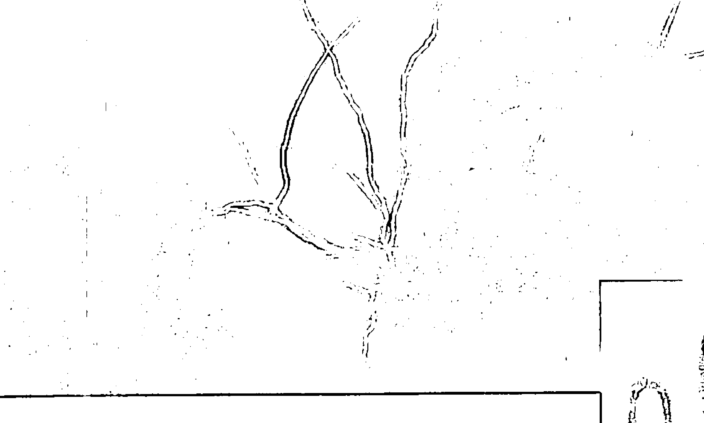

是它的存在是不可能的。鲁道夫·斯泰纳坚持，用科学来探测精神光环这一观点是“异想天开”，因为光环是只能被意识感知，而无法探测到的。然而，俄罗斯的赛米昂·基尔连从1939年就开始致力于给物体的光环拍照，并在之后的25年里拍出了很多照片。这些照片似乎是证明光环存在的确凿证据。基尔连偶然地发现了生物——植物或动物，拥有一种能量场，若将其置于高频放电的环境下，这种场就可以被观察到。而且，这类场的大小以及亮度可以显示出物体所处的状态。比如，正在生长的植物光环就比已经割掉的植物光环明显鲜亮得多。观察者们注意到人体皮肤所发出的高亮度图像并非代表神经末梢、动脉或静脉，而是与中国穴位图所显示的穴位分布相吻合。这说明光环与中医理论中的“气”有所联系。

许多有“神眼”的人可以看见物体的光环，不过据说每一位凡人都可以根据指点看见光环。临床医学家们通过人体光环的不同颜色来诊治不同的疾病——比如，光环若有些淡红色就表示性腺器官功能有些紊乱，橙色则意味着脾腺或肾上腺有些问题，而黄色代表胰腺或消化系统有所不适等等。

### 3 颜色

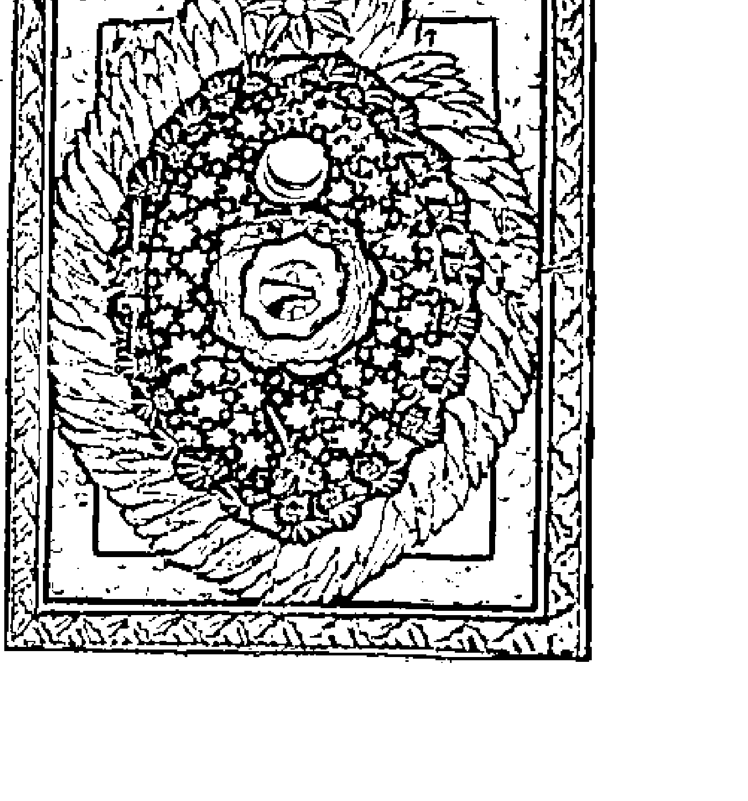

我们已经从诸多事例中看出了颜色在施行魔法方面的重要作用。显然颜色总是对人类有着重要影响，因而颜色治疗应用在医学上也就毫不奇怪了。人们都发现病人周围的颜色对他的康复有一定的影响。即使病人双眼被蒙上，不能察觉到颜色，可是颜色对他身体的影响却依然存在，这听起来似乎十分玄妙。

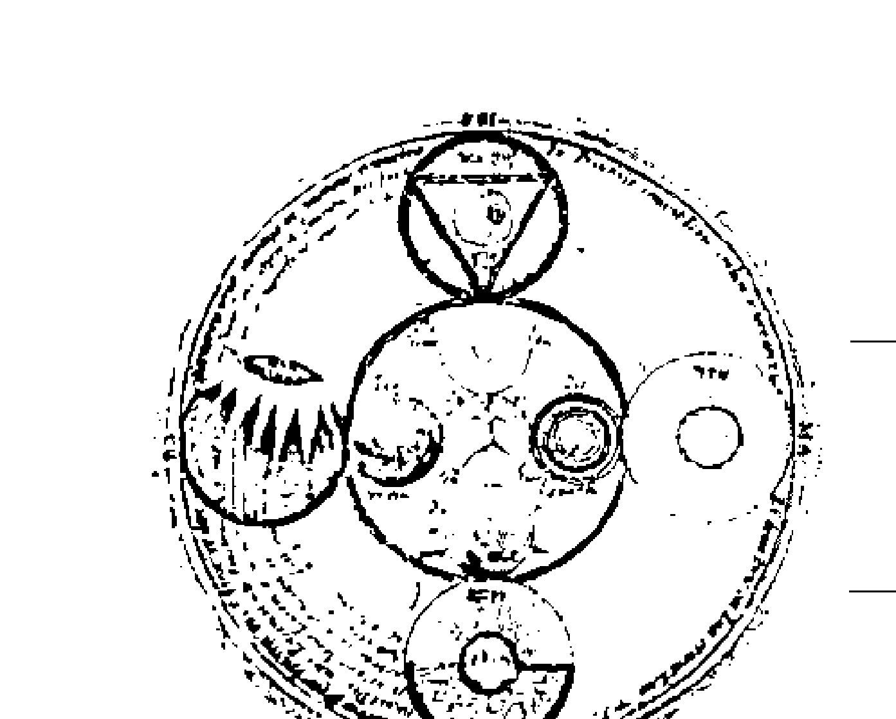

### 4 顺势疗法

相当多的人坚信顺势疗法只是一种医疗方法，它与魔法风马牛不相及。但是看看现代科学的一些观点，可以发现顺势疗法似乎以一种完全魔幻的方式起着作用——也就是说，我们无法科学地解释顺势疗法是怎样达到治疗效果的。

言简意赅，顺势疗法的治疗依据是希腊名医希波克拉底提出的“引导疾病，用类似的病理去治愈”——即用导致疾病产生、使人痛苦的物质来治疗疾病，也就是中医理论中的“以毒攻毒”。当然这要有效地控制，小心地引导来掌握好使用的尺度。用于治疗的物质越接近疾病的本质，治疗效果就越明显。当然，魔法中类似的原则早就存在，而且远远早于希波克拉底。这也是魔法治疗理论的一块奠基石。

一些墨守成规的医生反对顺势疗法，理由是如何控制以毒攻毒太过精妙，往往难以掌握好精确的尺度，有的时候几乎无法确定治疗药物中是否含有所需的些微毒素，因而，有效的治疗往往就被认为是魔法的奇迹。科学实验有时候似乎也证实了魔法确实有很好的治疗效果，顺势疗法就是一个例子，在顺势疗法中所使用的药品含有疾病的成分，尽管科学对此无法探测出来。

通过拜奇医生的治疗，我们可以测试顺势疗法理论的合理性与有效性。爱德华·拜奇（1880–1936年）从各种植物中提炼出38种药品，他认为这些药品可以有效地治疗一些精神疾病，而且许多健康食品商店以及药店都大量地销售这些药品。瓶装的植物精华必须要再一次提炼，而且仅用一两滴就可以入药——这又引起了一些用途上的讨论。赞同者们热烈地推崇这类用于顺势疗法的植物元素，例如他们认为龙胆根的提炼物可以治疗怯懦和胆小，虎眼万年青的提炼物对惊吓、不安疗效显著。

### 赤脚医生

中国的郎中（左图）和印度的传统草药医生（右图）一直在应用草药治病，但并没有对植物的魔力和医药特性做出明显区分。

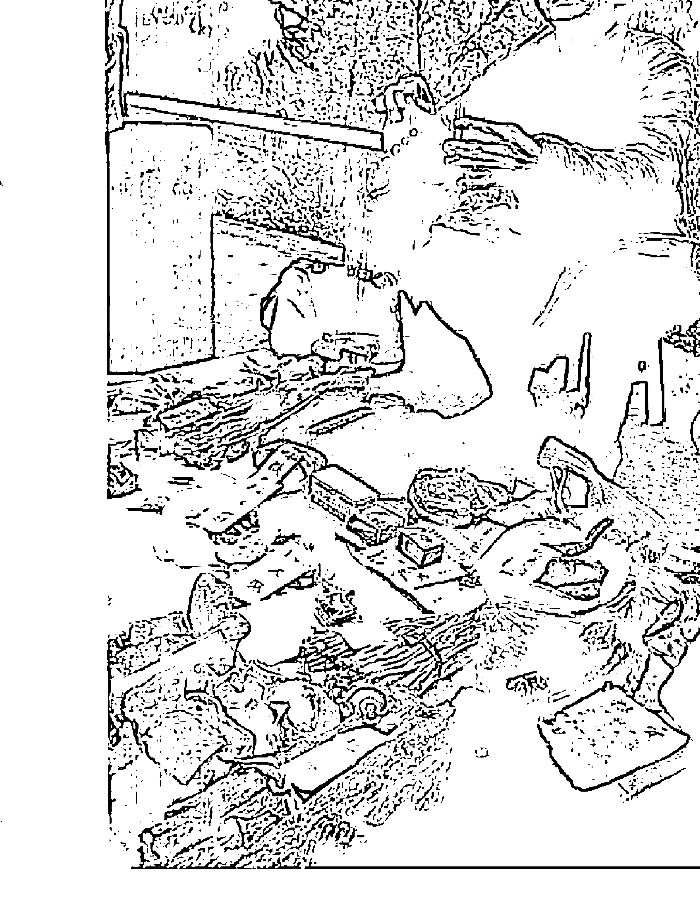

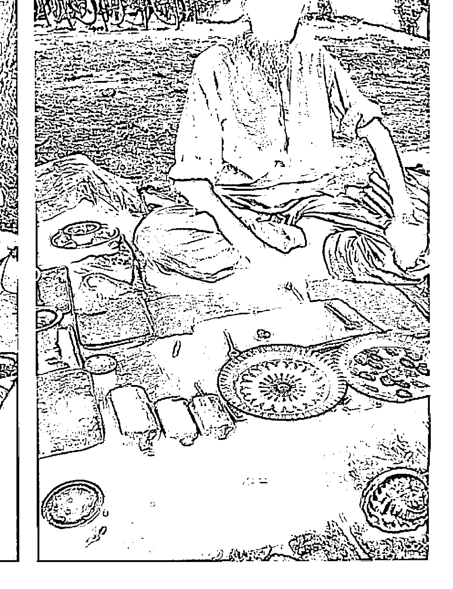

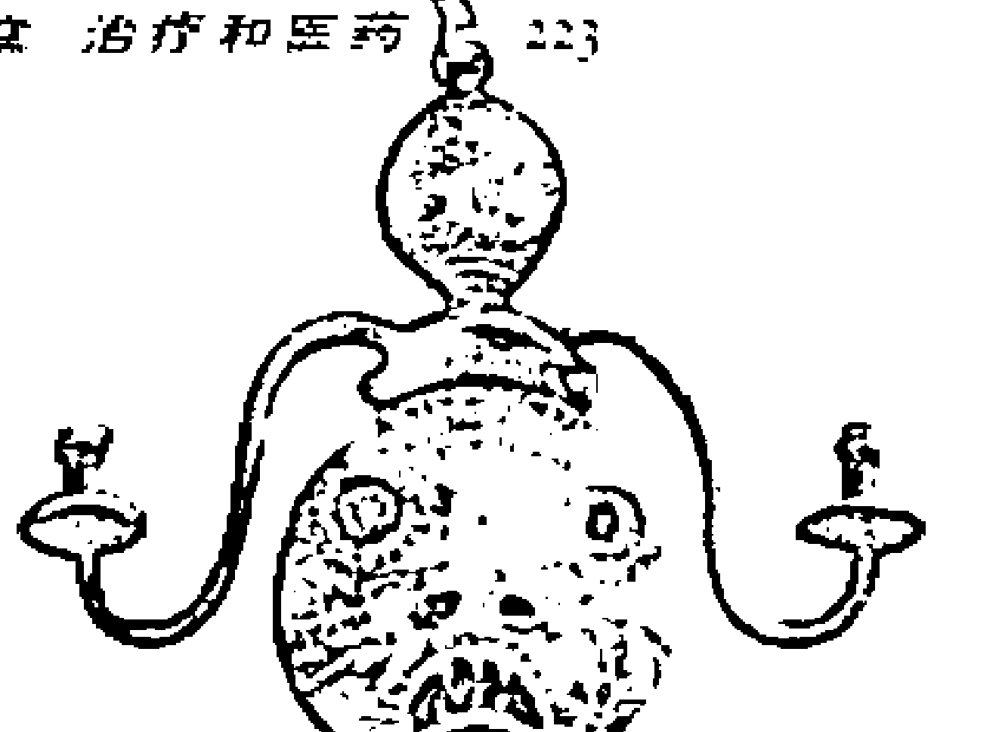


### 远程治疗

画家兰德尔·加勒特的这幅作品也许会使人们对远程治疗产生一种感性认识。兰德尔以闪电的传导形式将巫师用于远程治疗时的意念传输生动形象地展示出来，给人一种直观、具象的体验。

## 第十三章

## 数字命理学和预言

在现代社会中，数字命理学是否还能占有一席之地呢？它是否像其他类似的神秘之术一样并可以归入魔法范畴内呢？有许多命理学家在神秘主义杂志上做广告，宣称他们可以从 “7” 这个数字上分析出美德，而从数学“8”上分析出邪恶。也就是说，数字带有某种魔幻的意义。当然在高科技的今天，人们还可以用一种电脑程序，来分析自己的名字，并且算出自己的幸运数字，幸运日以及幸运颜色。

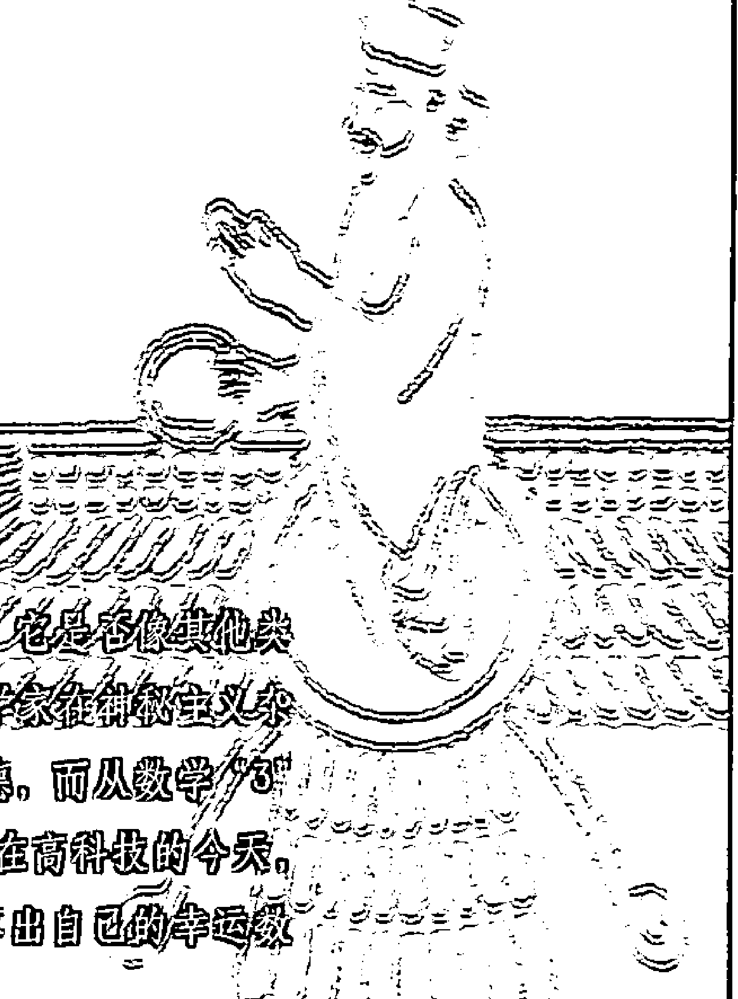

古老的数字命理学起源于人们相信数字含有某种共振磁场，就像矿物质一样（事实上，据说每种物质都含有特殊的磁场）。但是对于这些磁场，这种共振是如何发挥作用的，数字命理学家也无从解释。在科学发达的今天，魔法和其依然强大的吸引力令人颇为费解。综合已知的观点，人们相信某种物体名字（或生日）中的数字结合具有某种神奇的预示，相信这些可以揭示人的个性与命运，这种效果是其他的方法无法达到的。这种结合包括数字总和、元音的数字、辅音的数字、某种数字的重复出现以及其他。一位现代的数字命理学者说，“每一个灵魂都有它自己独特的振动结构、特有的磁场，因而有着特殊的含义。”

首先我们要问，我们一出生父母给取的名字怎么会含有共振磁场呢？这有各种可能，也许我们确实与自己的名字有一些个性化的甚至是奇怪的联系。有时候我们十分憎恶自己的名字，因而也许会自作主张地改掉它。有时候我们还会给自己的名字取个简单的昵称（或者是别人给取的），但是有时候很奇怪我们会逐渐地成长为符合自己名字的人。心理学家也十分关注我们个人与自己名字的契合现象。这往往会发展成为对数字命理学的兴趣。但这绝非是伪科学，某种意义上我们确实认为某个特殊的数字对我们有非同寻常的意义。心理学家弗洛伊德也认为自己被一系列数字控制着个性和命运，但却无法解释这种先入为主的观点。

正如我们在第三章提过的，许多现代数字命理学家都使用一个简单的数字占卜系统（226页）来解释人名字中的数字意义。而这就是我们常说的毕达哥拉斯数字占卜系统。毕达哥拉斯数字占卜系统的字母与数字对应如下所示：

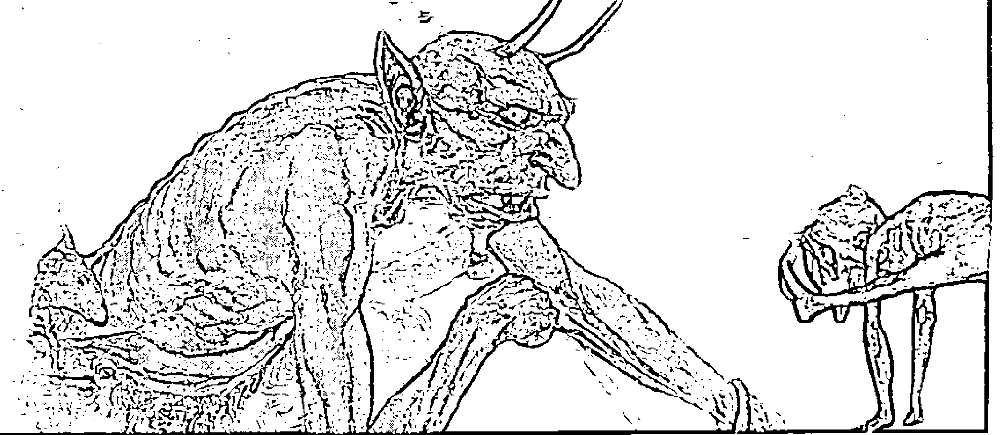

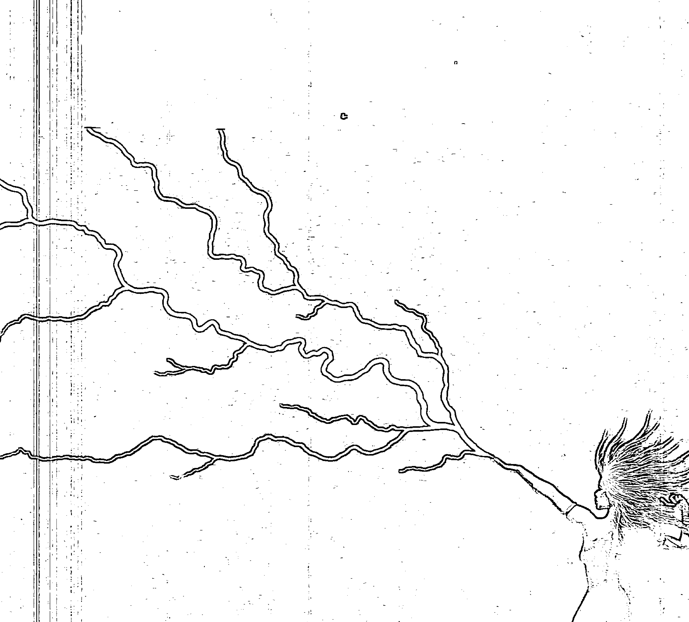

6 这个数字代表着金星，因而也就意味着十分情绪化。你会很迫切地要寻找一个搭档来享受令人满足的激情生活。这也许会令你过早地放纵自己，有时甚至不假思考。你性格会偏重女性的一面（无论你是男是女）。你会对艺术和时尚很感兴趣。你很容易获得柔情、友谊。对你来说适应社会不过是小菜一碟，但切忌盲目乐观，而且最好不要总是认为生活很美好。

7 乐观、幽默和诚实是这个数字的缺点，然而有些矫枉过正。这个数字也往往意味着盲目乐观、粗心大意和不负责任。你的灵魂十分自由，何时何地都向往着个人的自由。你在表达自己观点时往往过于直率，缺乏一些灵活和机智。你的情绪化有时会令你看起来唐突肤浅。你对体育十分热爱。

8 这个数字与野心紧密联系在一起。同时你在理论和工作中又是务实的、耐心的、遵守纪律的，你也许有一些保守。这和你内心里的悲观主义有关。因而你信奉只工作不放松的生活信条，这使你的生活缺乏乐趣。你的幽默感对你自己和他人来说都是一种优雅，而你的粗鲁则会让你在生意上付出巨大的代价。

9 你的友好和忠诚意味着你永不会孤单。你很有创新精神。你思想独立，这使你远离执拗、不可预测等缺点。你的独创性意味着你总能别出心裁地解决他人焦头烂额的问题。你积极乐观，这会令你成为一个能力突出的领导者。但有时你会很难和他人建立十分亲密的私人关系。

我们名字（除去姓）的数字总可与爱情相关：从前页John Philip Brown的例子可看出代表爱情的数字是2+7=9

古典的数字占卜系统告诉我们一些特殊的数字总是在彼此之间保持完美和谐的共振。一些数字可能也可以保持调和，而还有一些则处于完全不和谐的状态。更有一些数字则并未表现出和谐与否。

- 1
  - 与9最为和谐
  - 与4和8可达到调和状态
  - 与6和7不和谐

- 2
  - 与8最为和谐
  - 与7和9可达到调和状态
  - 与5不和谐

- 3
  - 与7最为和谐
  - 与5，6和9可达到调和状态
  - 与4和8不和谐

- 4
  - 与6最为和谐
  - 与1和8可达到调和状态
  - 与3和5不和谐

- 5
  - 与5最为和谐
  - 与3和9可达到调和状态
  - 与2和4不和谐

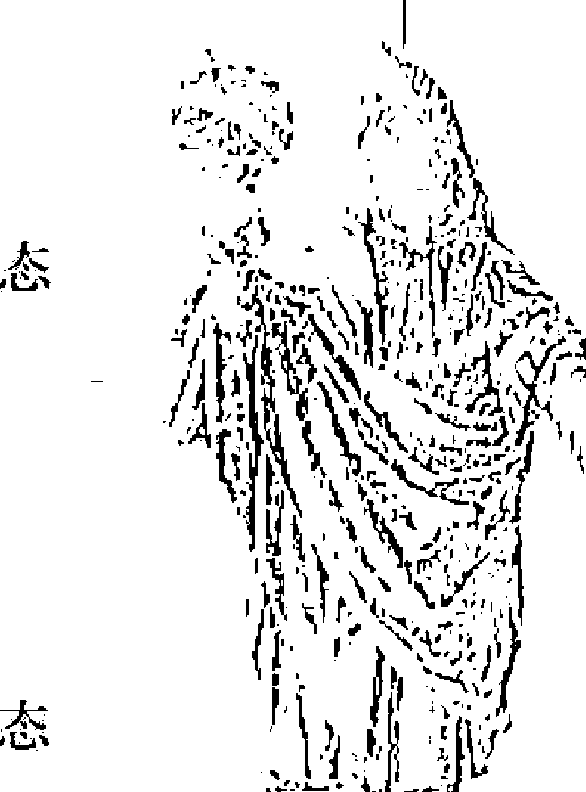

- 6
  - 与4最为和谐
  - 与3和9可达到调和状态
  - 与1和8不和谐

- 7
  - 与3最为和谐
  - 与2和6可达到调和状态
  - 与1和9不和谐

- 8
  - 与2最为和谐
  - 与1和4可达到调和状态
  - 与3和6不和谐

- 9
  - 与1最为和谐
  - 与2，3和6可达到调和状态
  - 与7不和谐

互相之间可达到完美和谐状态的数字表明两人之间有强大的自然吸引力，而调和状态的数字则表明两人可以相处很融洽，不和谐的数字意味着二人之间很难沟通相处。当然相同的数字最易达到和谐状态。

### 数字在爱情上的含义

- 1 你对待爱情像对待其他事物一样，喜欢尝试不同的感觉，因而你很难与恋人保持长期的关系。你的性能力有些受到压抑。
- 2 你期望得到感情上一个放心的承诺，但你却会不停地指责恋人。你需要一个理智、热情，还要充满激情的恋人。
- 3 你会十分想要一段长久的感情。你可能会很快地就选择一个恋人，也许是你身边的熟人，但并非如你想像中的那样称心如意。
- 4 你一旦陷入爱河就不可自拔。你需要两性间的互相吸引。对你来说，性爱总是使你走向极端。对爱来说，要么无足轻重，要么决定一切。
- 5 你虽不将爱情当作儿戏，但也不甚认真。风流韵事对你来说如同家常便饭，尽管这很激动人心，但你从不会嫉妒吃醋。你精力旺盛，因而你的恋人也要和你相配才可以，你的多样选择往往会令你成为歧路亡羊。
- 6 你经受不起奉承的引诱。你迫切地想找到一个恋人以至于你完全相信他所说的一切。切记恋爱时不可轻信。你的爱情会更多依赖外界氛围，你很需要浪漫的气氛，因而你会尽力创造它。
- 7 你很乐于表现自己激情的天性，但有时可能会很唐突。你很随意，而且抵触程式化的东西和事先做好的计划，恋爱时你的方式总是与众不同。你经常会在遇到桃花运的时候丢下正经事不做。
- 8 你一旦做出承诺就会完全负责；但是你必须要摸清自己的状况。对你请求的拒绝将是对你自尊心的莫大打击。你有时会内心爱得火热，但表面却似寒冰，这让你的恋爱对象无法摸清你的内心，因而你要善于表达自己的感情。
- 9 你看起来似乎不太可能得到理想的爱人，你很难公开表白自己的情感，而且会保持若即若离的态度。但是一旦你坠入爱河，那狂喜的心情会迫使自己表白情感。

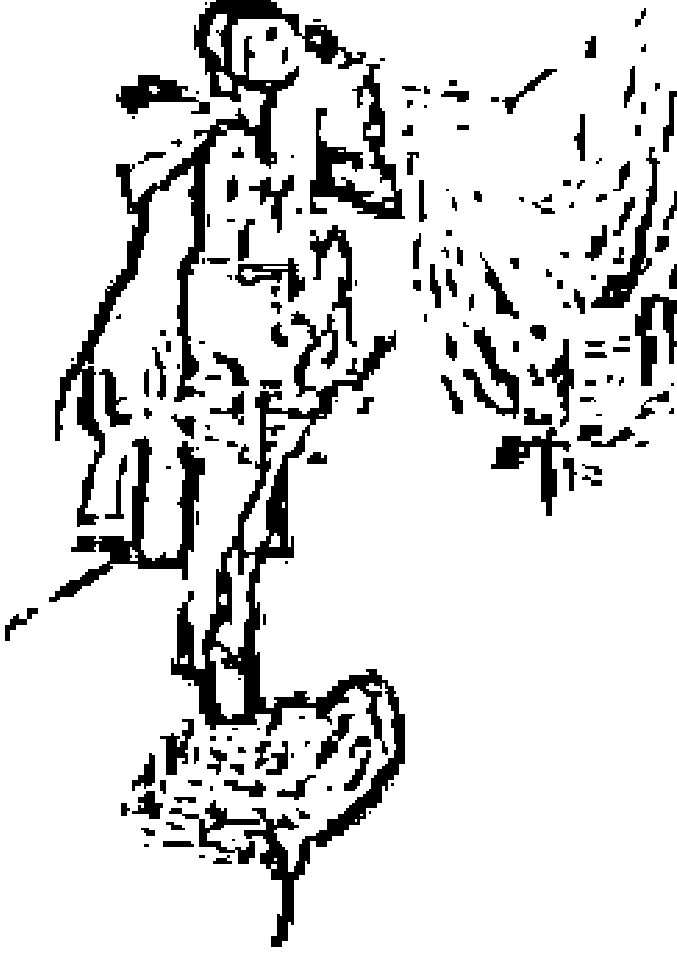

你也许会提出异议：这些特点都很含糊不清，似乎适用于任何人。当然这里确实有些规律性的东西，例如每个外向的人性格中都有内向的一面，每个男人性格中都有女性的一面。但是如果你照着做了，而且发现这简单的测试确实可以在某种程度上揭示出你的性格。你会疑云顿生，为什么名字和数字符号之间会有这种神奇的关联呢？也许解释有很多，而且似乎每个都比其他的更经得起推敲。可见如果数字命理学准确有效的话，哪怕只是一点点的效果，那也说明它确实挑战了理性和科学。那么数字命理学当然可以当之无愧地归在“魔法”的旗下。

### 预言

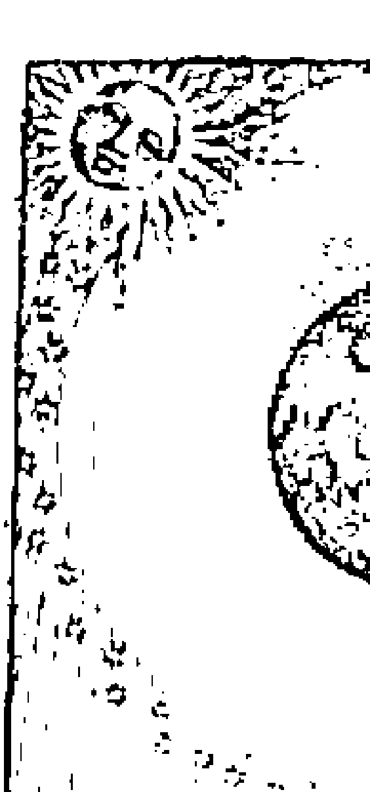

许多多年来，人们都试图运用一种强大的魔法力量去预见未来。一方面是因为未来很神秘，我们对它很好奇；另一方面也是因为预知了未来，我们就可以更好地筹划我们的生活。其实更主要的原因是我们想从预见中寻求一种保证：也许我们会转财运，爱人会回到身边，事业会兴旺发达。然而我们必须要同意埃斯库罗斯的话——“只有未来到来的时候，你才会知道它，现在不要胡思乱想了！”然而几乎每个人都梦想会乘坐时间机器去未来，哪怕只对未来瞥上一眼也会心满意足。

去未来的可能性当然取决于时间的特性。许多现代思想家们认为时间并非一定是连续的。而常规上，我们总是误以为时间是一根长长的、无尽头的绳子，绳子上的结就代表着“现在”，绳结前面的部分是我们经历过的，即是“过去”，而绳结后面的部分则是“未来”，是我们无法看到，也无法预知。

我们一直是这样认为的，因而这种先入为主使我们形成的思维定式很难接受其他的观点。当然，早餐是在午餐前，星期一是在星期二前。但也可能早餐和午餐一起吃——“不列颠之战”和“阿金库尔战役”要同时开战了。

早期的人们相信在梦中可以预见未来。历史上，很多人以此谋生，并发明了无数方法，他们试图掀开厚厚的时间之书，来解读未来的秘密。许多方法一直在使用着，如神谕、抽签占卜以及水晶球卜算等等。但是在20世纪，人们用什么方法来预知未来呢？

历史上大多数预见未来的方法至今依然被使用。许多人只相信古代流传下来的方法，如解梦。事实上，我们很难从一些解梦预言的例子中看待这是否准确，尤其是从那些预知外界灾难的特殊事例中。这些似乎留下了一种无法消散的气氛，不仅在几年后还可以感觉到，而且似乎在事件发生之前就可以预知或梦到。

一个著名的例子就是英格兰白金汉郡艾斯伯雷亚一个妇女的经历。她曾梦到一个村庄被黑泥浆淹没。而两天后，即1965年10月21日，威尔士山发生煤矿崩塌事件，淹没了部分她所居住的艾伯芬村庄，附近学校里128名孩子死于这场灾难。据说在此事发生的当天早晨她拒绝去学校，因为她梦到学校“处于一片黑暗”。

对解梦预言有所怀疑是完全情有可原的。例如许多人声称都曾经梦到过（在事发前）肯尼迪遇刺。但是想想看，地球上的每个人每天平均要做五六个梦，而肯尼迪当时有很大的被刺可能，没有人事先梦到肯尼迪之死才奇怪呢。

也许我们无法如此解释林肯梦到自己遇刺，也无法解释马克·吐温那著名的梦境。马克·吐温梦到自己看到他弟弟亨利躺在一个金属棺材里，棺材放置在两个椅子之间，上面有一束白色的花，中间是一朵红色的花。一星期后，他弟弟因其工作的货轮发生重大事故而不幸去世，葬礼上的场景与他的梦境一模一样。

一些预言方法最初也带有魔法的一鳞半爪。有些方法已经失传数个世纪了。纸牌占卜——一种依靠扑克牌的特殊符号含义来预言的系统，一直都很吸引那些神秘主义者。

对许多现代纸牌占卜者来说，纸牌占卜的主要用途就是让那些有着“千里眼”的人通过纸牌符号来预知算命人的命运走向以及周围状况。同样，卢恩字母（神秘的字母，有时被认为具有魔力）也可以这样解读以预测未来。

现代星相学家也认为未来不是无法预测的，但他们却声称自己不能预知未来，既然科学来自于不停地取证实验，那么依靠长期观察研究的星相当然也无法称之为魔法了。

《易经》是中国古老的占星卜卦经典，其中似乎缺少魔法的内容——除非把心理学算入魔法。另一方面，《易经》中的“八卦”总是被用作魔法中的护身符。这说明它们对魔法世界有一定的影响，至少对那些使用这种护身符的人有影响。

如果我们这样论证下去，我们就会陷入没有结果的争论中去。魔法是经常在那些信奉魔法的人心里显灵，还是实实在在地发生在物质世界中呢？许多权威争论不休，大多数人都认为魔法是基于心理学的，是人们内心的神奇力量。

纸牌和《易经》都是可以预见未来的工具，这为我们提供了看清宇宙的一个新视角。它并不告诉我们未来到底会发生什么事，但是它让我们旁观者清，从完全不同的客观角度来观察事态的发展可能。从这点来说，占卜对我们有莫大的帮助。

《易经》和其他预言系统都是用来“解读”未来的，但这种解读却是那些严肃的哲学系统不赞同的。然而我们却不能忽视或贬低那些“千里眼”用这种方法做出的预言。他们使用《易经》图案来解读未来，正如他们的同行使用水晶球、盆水、茶叶或其他东西来预知未来一样。“千里眼”们在预见未来时需要某种道具，以便在向未来世界传递信息时可以集中精力。

每一位解读都必须要使用神眼。许多著名的“千里眼”所做出的预言都被验证，因而许多人对此深信不疑。如莫里斯·伍德拉夫就是著名的“千里眼”。另外美国的珍妮·迪克松也在预言界享有盛名，据说她预言了她一生中的每一件大事，而且都一一应验了。

### 逆位的预示

塔罗占卜纸牌中“倒挂的人”，预示未来颠倒的景象。

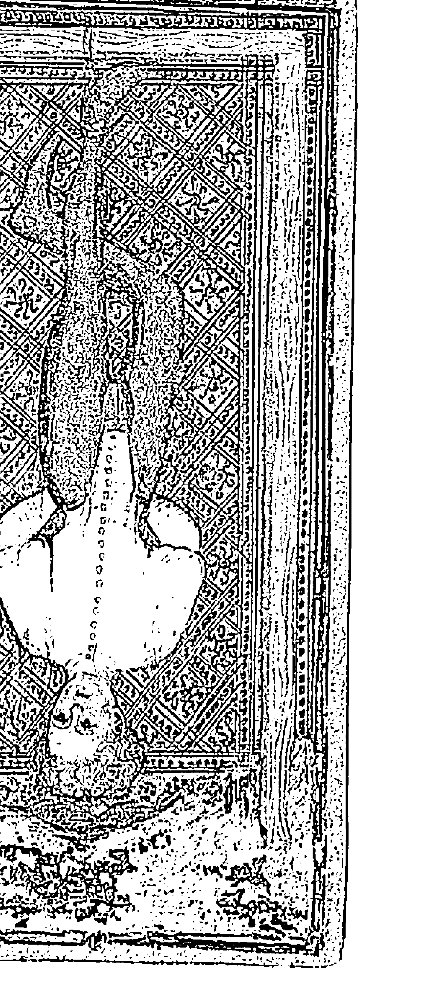

“千里眼”这种能力基本上是与生俱来的，而不是后天培养的。他们似乎是居住在一个与我们的世界完全不同的时空里——至少是暂时可以，或是暂时可以经历另外的一维空间，在那里他们可以更清晰地透视我们的世界，可以拥有更敏锐的未来察觉力。“预见未来”仅仅是他们的一项特异功能，当然他们还可以看见物体的光环，可以成为治疗者。

如果我们刻意地要去发掘预见未来的能力，那么似乎我们都有可能成为“千里眼”。有很多普通人突然具有这种超能力。他们通常是在一场事故或一场大病之后，发现自己与原来不同了。所以我们没有理由不去试验自己是否拥有这种能力。例如我们可以记录自己的梦境，或者让自己处于虚空冥想状态，来检验自己是否可以看见未来。如果你很认真，那么你就必须要严格精确地记录你的预言，以便以后检验你的预言是否会发生，是否丝毫不差。

与预言相关的技巧和方法很多，人们第一个想到的大概就是占星术了。事实上占星术并不能预知未来，如果这样认为，那么占星术完全被误解了。早期的占星有云：“星相下沉，但并不预示什么”。同样，占星家们也不一定就有“千里眼”，当然有时候，有些占星学家具有这种超能力，若是这样，占星学家们在研究星相图时，就不得不抑制一下这种能力，以防带来干扰信息。

占星学家们的工作主要是研究星相之间的特殊关系，他们预测（尽管他们很多人表示不赞成使用这个词）天气的变化。但与气象学者不同，这种变化可能会造成一些特别的事情发生。所以占星学家们不可能这样对委托人说：“你在下星期三下午三点会车毁人伤”。相反他们可能这样告诫委托人：“你那天最好凡事小心，尤其要谨慎驾驶，当心事故发生。”

然而相当多证明星相预言总体上还是很准确的。最著名的例子莫过于英国星相学家丹尼斯·艾威尔的预言了。他早在1987年给很多航海公司写信，指出3月的星相形势与当年泰坦尼克沉船时期的星相形势几乎一模一样，并建议所有的航船要格外小心。同时，他把信的副本寄给银行以此作为凭证。

然而当时的一些海运公司并没有在意他的警告，仅仅回信说他们对自己公司的安全预防系统很放心。然而在3月6日，满载着渡海汽车的货轮“自由先锋”号在离开泽布吕赫（比利时西北部港市）后不幸倾覆，188人罹难身亡。

站在个人的角度上，占星学家们的委托人对他们的“预测”很满意，而那些试图验证他们预言准确性的统计学家和科学家们则并不乐观，但是他们也无法令人信服地反驳这些预言。

### 占卜术

从古至今的预言方法包括研究星相天官图（上），使用西洋蓍草茎根据易经卜卦（中），以及分析手相（下）。

### 占卜师

水晶球晶莹剔透，象征着纯洁。因为它可以感应到“月亮”的能量，所以常常被西方的魔法师用于占卜未来、预测吉凶。在爱德华·伯恩－琼斯的这幅作品中占卜师正按照天书的指示，聚精会神地观察着手中的水晶球，期望能从中找到神的旨意。

### 原版跋

大多数人，包括那些根本不相信魔法、巫术以及神秘事物的人，偶尔也会觉得这个世界不仅仅是我们所看到、所接触到的那样，似乎还有一个与我们生活的世界同时存在的神秘世界。在那个神秘的世界里，我们的法则不再适用。然而我们偶尔也会对那个神秘的世界瞥上一眼。这一瞥总给我们似曾相识的感觉，似乎对一些不可能发生的事情又有些“记忆”。

在魔法是否存在的问题上，即使拥有被科学全副武装的头脑的人有时也会有所动摇。在做了一辈子科学研究后，英国的占星家们却发现当手里握着魔法探测杆时，可以感觉到地下的水源。这实在让他们惊骇不已，因为这种技能是科学无法解释也无法获得的。另外，许多人对远程治疗也不屑一顾，但事实上，它确实带有某种魔力，可以穿越时空，引导人们接触到宇宙中任何一点。这也是目前科学无法解释的，而且是不可否认的。

时间是否可以让我们透视未来呢？这个问题实在太令人好奇了，人们根本不会去想将有什么危险。时间像个深邃无底的黑洞，我们偶尔会扫上一眼，从中看到一些奇怪的事情。在应用魔法时，巫师并不可能完全抵挡邪恶的侵害，大多数巫师也许会受到一些危害。有时候巫师们不得不承认，一些黑暗的神秘力量会吸引他们去使用一些邪恶的力量，做出邪恶的事情。这个问题并不会令人们大惊小怪，只有傻瓜才会相信巫术从不用于邪恶下流的目的。当然巫师们这样做时，必然会受到法律的起诉，无论他们只是侮辱或伤害他人（如在庭院或教堂里装神做法），还是真正地攻击动物或他人。而且必须要指出的是，许多宗教本身也带有邪恶的本质，而那些盲目的信徒却总是把宗教想得高尚无比。

不论是过去还是现在，凡是巫术、魔法方面的著作总会警告读者“随便使用未知的无法控制的力量十分危险”！尽管此书不必以什么名言警句结尾，但我还是要为其做些结束语。如果魔力确实存在——我们书中所讨论的事例已经让那些理智的头脑困惑不已了——那么我们不能毫无理由地相信魔法只起到积极的作用。很明显，魔力要被尊敬，要被睿智地控制。这样魔法才能为人所用，焕发神秘且令人向往的光彩。

每一位认真研究魔法的人——且不论其对魔法成因、效果的结论如何，都必须要在这一领域加倍小心，因为无论是哪种神秘力量起作用时，参与其中的只是人本身的灵魂，这二者之间的平衡极易被打破。所以，最好尽可能详细地研究古代和现代魔法，而且一定要小心翼翼，还要毕恭毕敬。说不定魔幻世界的神灵正在注视着我们的一举一动呢！

### 术语表

**Alchemy 炼金术** 将基础金属锻造成黄金的工艺。炼金术士一方面寻求能够净化生命的万能灵药，另一方面试图去掉人类身上的瑕疵，使其变得更加完美。

**Amulet 护身符** 一种可以佩带的图饰或物品，可以用来消灾避难。（见 talisman）。

**Athame 阿萨姆** 常用于魔法仪式中一种白色手柄的匕首，仅限于在魔法圈内使用。

**Caballah 喀巴拉** 古老的犹太神秘主义哲学，以《旧约》为核心，其中包含了数字命理学，在12-16世纪颇为流行。

**Ch'i 气** 道家学说中的一种生命灵气，包含一切。与生命、运动、精力息息相关。

**Coven 女巫大聚会** 十三女巫大集会。

**Devil'Mark 魔鬼之印** 与生俱来的人体标记，如痣或胎记，被视为女巫的特殊标记。

**Divination 占卜** 通过玄妙或超自然的方法获得预知的行为。

**Dowsing 探测棒** 利用榛树棒或金属棍（古代被称为点金棒）来探测地下水或矿藏的位置。

**Enochian 伊诺克语** 一种天使的语言，据说在伊丽莎白时期，天使加百利通过学者约翰·迪的助手爱德华·凯利将其传授给迪。

**Exorcism 驱魔** 驱逐或试图驱逐附在人体或主宰某地的恶魔。

**Extrasensory perception (ESP) 超感知** 一种使用非感官获得的感知能力，例如心灵感应。

**Gematria 文字数码学** 一种用数字解释字母的方法，在中世纪喀巴拉的教徒中盛行。

**Gnosticism 诺斯替教** 古希腊后期和基督教早期的一个组织，认为灵知会引导灵魂的释放。灵知特指一种深奥的关于精神哲学。

**Grimoire 天书** 历史上流传下来的关于魔法和巫术的教科书，据说是用超自然的力量编写而成的。

**Haruspicate 内脏占卜** 通过检验动物的内脏来预言未来。

**Hermetic lore 赫尔墨斯集** 一些关于巫术魔术的著作，相传由赫尔墨斯·特利斯墨吉斯忒斯所著。赫尔墨斯·特利斯墨吉斯忒斯认为生物和物体之间要互相协调，互相沟通。

**iChing 《易经》** 中国古代一本研究变数的书，也称《周易》，根据64个乾坤太极“六线形”，通过抛榛树棒或硬币来预测卜算。

**Incubus 恶魔明库巴斯（又名淫梦妖）** 据说他常与熟睡中的女人交媾。

**Left-hand path 旁门左道** 那些黑魔法巫师的实践活动。

**Magic circle 魔法圈** 画在地上或围起来的圈子，魔法师或女巫在里面做法或与魂灵沟通时，可以不受任何邪恶力量的侵害。

**Magus, mage 魔法师** 古代的魔法师或巫师。

**Mantra 咒语** 印度教或佛教中的一些神圣语言，与特殊的神或力量有某种联系。也可以认为是一种思考方式。

**Medium 灵媒** 灵魂世界和现实世界沟通的媒介，通常是指神灵指定的魔法师。

**Necromancy 巫术** 魔法或称之为黑魔法，字面的意思是一种召唤死亡的能力。

**Oracle 神谕** 在古希腊，男女祭司作为神与凡人的媒介来传达神谕。这个词也用来表示预言或神旨，有时也表示举行传达神谕的圣坛。

**Possession 附体** 神灵（通常是魔鬼）对人或动物的精神控制。

**Numerology 数字命理学** 对数字所代表神秘意义的研究。

**Pentacle 五角星形** 五角星或五角星形是魔法的代表，常用于建造魔法圈。

**Philosopher's Stone 点金石** 炼金术中，一种可以将基础金属转变成黄金的物质。

**Poppet 玩偶** 巫师制作的可以影响他人的木偶或娃娃，据说巫师们对它“用刑”，可以给它所代表的人带来痛苦甚至死亡。

**Rosicrucians 玫瑰十字会员** 17、18世纪秘密组织或会社的成员，他们的教条包括喀巴拉主义、炼金术、占星术。

**Scrying 水晶球占卜** 通过视觉方式得到的预言，尤其使用是水晶球。

**Shaman 萨满教巫师** 传统社会中，现实世界与神灵世界的中介者。

**Sigil 魔符** 一个赋有魔力的标记或图案，上面通常刻有特殊字母或符号。

**Sky-clad 天衣** 巫术对于裸体的解释。

**Sorcery 巫术** 特指黑魔法或是为谋取个人私利而使用的魔法。

**Succubus 思克巴女妖（又名淫梦女妖）** 传说这种女妖在男人睡觉时降临与其性交。

**Spell 咒语** 可以说出或写出的赋有魔力的语句。

**Talisman 护身符** 能够给佩戴者带来超自然的力量或保护、好运和成功的饰物。过去称为 "Amulet"，而 Talisman 是使用特定的材料，在特定的时间按照特定的方法制作，其本身含有自然保护力量。

**Tantra 密教经典** 印度教和佛教中与神秘的魔力实践相关的教义，包括为某些神秘目的施行的性爱。

**Tarot 塔罗纸牌** 用来卜算命运或占卜未来的扑克牌。

**Voodoo 伏都教** 一种源自西非，流行于海地的神秘宗教，具有一定的魔法，可以和灵界沟通。

**Wicca 巫术崇拜** 古英语中的词语表示“巫术崇拜”，20世纪用于指代实用魔法中祭拜活动。

### 中英文专有名词对照表

| 中文 | 英文 |
| :--- | :--- |
| **A** | |
| A·基歇尔 | A. Kircher |
| 阿贝·吉堡 | Abbe Guibourg |
| 阿波罗石 | Abalone |
| 阿方索·路易斯·康斯坦 | Alphonse Louis Constant |
| 阿加德 | Accad |
| 阿莱萨多·德·卡里奥斯特伯爵 | Count Alessandro di Cagliostro |
| 阿蒙神 | Amun |
| 阿莫诺斯 | Armaros |
| 阿诺德 | Arnold |
| 阿萨姆 | Athame |
| 阿斯莫戴 | Asmodel |
| 阿斯莫德 | Asmodeus |
| 阿修罗 | Asuras |
| 埃利法斯·莱维 | Eliphas Levi |
| 艾尔维修 | Helvetius |
| 艾利克斯·巴伯特 | Alex Barbault |
| 艾利斯特·克劳利 | Aleister Crowley |
| 艾米·赫兹格 | Amie Hertzig |
| 艾萨克·牛顿 | Isaac Newton |
| 爱德华·拜奇 | Edward Bach |
| 爱德华·凯利 | Edward Kelley |
| 安布列 | Ambriel |
| 安德鲁·坎普 | Andrew Camp |
| 安德切尔 | Adnachiel |
| 安厄尔 | Anael |
| 奥利弗·海伍德 | Oliver Heywood |
| 奥利亚斯 | Orias |
| 奥西里斯 | Osiris |
| **B** | |
| 巴比尔 | Barbiel |
| 巴比伦 | Babylon |
| 巴黎香草 | Herb Paris |
| 巴伦·德·瑞兹 | Baron de Retz |
| 巴切 | Barchiel |
| 巴钦 | Bathin |
| 白羊宫 | Aries |
| 柏拉图 | Plato |
| 半夜拜鬼仪式 | Sabbats |
| 贝莱尔 | Belial |
| 贝莱斯 | Beleth |
| 贝利斯 | Berith |
| 贝娜德·哈舍尔 | Benad Hasche |
| 贝斯 | Bes |
| 贝温尤托·切利尼 | Benvenuto Cellini |
| 毕达哥拉斯 | Pythagoras |
| 别西卜 | Beelzebub |
| 槟榔 | Betelnut |
| 波利尼西亚 | Polynesia |
| 播种节 | Ecstae |
| 博利斯 | Poreas |
| 博韦 | Beauvais |
| 薄荷 | Mint |
| 布思 | Bune |
| 布彭 | Pookas |
| 布拉瓦茨基夫人 | Madame Blavatsky |
| **C** | |
| 茶树 | Asi |
| 超感知觉 | Extrasensory perception (ESP) |
| 超声波音响 | Ultrasound |
| 炽天使 | Seraphim |
| 处女宫 | Virgo |
| 《创世纪之书》 | Book of Creation |
| **D** | |
| 大麻 | Marijuana |
| 大天使 | Elohim / Archangel |
| 戴安娜 | Diana |
| 丹尼尔·笛福 | Daniel Defoe |
| 丹尼斯·艾威尔 | Dennis Elwell |
| 旦地利昂 | Dantalian |
| 淡水珍珠 | Freshwater pearl |
| 道教 | Taoist |
| 德奥弗拉斯特 | Theophrastus |
| 德里克·帕克 | Derek Parker |
| 德鲁伊教派 | Druids |
| 德天使 | Malachim / Virtues |
| 底格里斯河 | Tigris |
| 颠茄 | Belladonna |
| 癫痫病 | Epilepsy |
| 点金石 | Philosopher's Stone |
| 顶轮 | Kundalini |
| 豆荚 | Beanpod |
| 独角兽 | Unicorn |
| 杜伽 | Durga |
| 杜约尔 | Duyel |
| 堕落天使 | Ishin |
| **E** | |
| E·M·巴特勒 | E. M. Butler |
| 厄布利斯 | Eblis |
| 厄罗斯 | Eurus |
| **F** | |
| F·J·瑞戈迪 | F. J. Regardie |
| 法利赛人 | Pharisees |
| 菲尔卡纳里 | Fulcanelli |
| 翡翠 | Emerald |
| 费德鲁斯 | Phsedrus |
| 费拉莫尔 | Flamel |
| 丰收节 | Harvist de |
| 凤凰 | Phenix |
| 弗朗西斯·巴特瑞 | Francis Barrett |
| 弗朗西斯·基尔伯特 | Rev. Francis Kilvert |
| 弗雷德里克 | Frederick |
| 弗洛伦斯·法尔 | Florence Farr |
| 弗切尔 | Verchiel |
| 伏都教 | Voodoo |
| 富拉玄武石 | Labradorite |
| **G** | |
| 盖普 | Gaap |
| 甘草 | Liquorice |
| 感应巫术 | Sympathetic Magic |
| 高加索山脉 | Caucasus |
| 高康大 | Gargantua |
| 高默利 | Gomory |
| 缟玛瑙 | Onyx |
| 格里莫以耳集 | Grimoires |
| 格利高力 | Gregory |
| 古代摩洛哥化石 | Ancient Moreoccan fossil |
| 《光彩之书》 | Book of Splendour |
| **H** | |
| 哈马列 | Hamaliel |
| 哈姆雷特 | Hamlet |
| 哈尼尔 | Hanael |
| 哈涅 | Haniel |
| 哈索尔 | Hathor |
| 海底轮 | Muladhara |
| 海水珍珠 | Sea pearl |
| 何首乌 | Aconite |
| 赫尔墨斯·特利斯墨吉斯忒斯 | Hermes Trismegistus |
| 赫尔墨斯 | Hermes |
| 黑色电气石 | Black tourmaline |
| 红宝石 | Ruby |
| 槲寄生 | Mistletoe |
| 琥珀 | Amber |
| 护身符 | Amulet |
| 护身符 | Talisman |
| 皇家黄晶石 | Imperial topaz |
| 黄道十二宫 | Zodiac |
| 黄玉 | Topaz |
| 茴香 | Fennel |
| 火星 | Mars |
| 霍雷肖 | Horatio |
| **J** | |
| 基尔连 | Kirlian |
| 加百利 | Gabriel |
| 迦勒底 | Chaldea |
| **K** | |
| 喀巴拉 | Cabalah |
| 卡尔·荣格 | C. G. Jung |
| 卡夫杰 | Kafziel |
| 卡纳克 | Carrac |
| 卡西尔 | Cassiel |
| 凯尔特人 | Kelt |
| 考克贝尔 | Kawkabel |
| 科尼利厄斯·阿格里帕 | Cornelius Agrippa |
| 孔雀石 | Peacock ore |
| 苦艾 | Absinthium |
| 库尔德斯坦 | Kurdistan |
| **L** | |
| 拉 | Ra |
| 拉比·胡纳 | Rabbi Rav Huna |
| 拉斐尔 | Raphael |
| 辣椒 | Capsicum |
| 蓝宝石 | Sapphire |
| 蓝晶石 | Kyanite |
| 蓝矿石 | Bule tourmaline |
| 劳塞尔 | Laussel |
| 雷金纳德·斯科特 | Reginald Scot |
| 力天使 | Chariot (ha-Qadesh)/ Power |
| 利维坦 | Leviathan |
| 炼金术 | Alchemy |
| 灵媒 | Medium |
| 硫磺 | Sulphur |
| 艾蒿 | Mugwort |
| 露水 | Dew |
| 卢顿 | Loudun |
| 卢西弗 | Lucifer |
| 卢修斯·普利亚 | Lucius Apuleius |
| 芦荟 | Aloe |
| 芦笋 | Asparagus |
| 鲁道夫·斯泰纳 | Rudolph Steiner |
| 路易十四 | Louis XIV |
| 吕西亚斯 | Lysias |
| 绿宝石 | Golden beryl |
| 绿松石 | Turquoise |
| 绿玉 | Aquamarine / Beryl |
| 罗伯特·弗洛德 | Robert Fludd |
| 罗杰·培根 | Roger Bacon |
| 罗拉德教派 | Lollard |
| 罗森克洛兹 | Rosenkreutz |
| 罗刹 | Rakshasa |
| **M** | |
| 麻风病 | Leprosy |
| 马可尼 | Marconi |
| 马库斯 | Marcus |
| 玛瑙 | Agate |
| 玛琪迪尔 | Machidiel |
| 玛斯基姆 | Maskim |
| 迈克格雷格·马瑟 | S. L. MacGregor Mathers |
| 迈蒙尼德斯 | Maimonides |
| 曼德拉草 | Mandrake |
| 猫眼石 | Opal |
| 没药 | Myrrh |
| 玫瑰色石英 | Rosequartz |

## M

- 玫瑰十字会 Rosicrucianism
- 玫瑰十字会员 Rosicrucians
- 美拉尼西亚 Melanesia
- 美索不达米亚 Mesopotamia
- 蒙特斯庞侯爵夫人 Mme. de Montespan
- 迷信 Superstitions
- 米迦勒 Michael
- 密教经典 Tantra
- 摩尼 Mani
- 摩西 Moses
- 摩羯宫 Capricorn
- 蘑菇 Fungus
- 魔法圈 Magic circle
- 魔符 Sigil
- 魔鬼之印 Devil's Mark
- 墨丘利 Mercury
- 穆列 Muriel
- 苜蓿 Clover
- 木星 Jupiter

## N

- 内脏占卜 Haruspicate
- 纳粹党所用的十字记号 Swastikas
- 尼日利亚海贝壳 Nigerian seashell
- 女巫大集会 Coven
- 女妖 Succubus
- 诺查丹玛斯 Nostradamus
- 诺斯替教 Gnosticism
- 诺斯替教徒 Gnostic
- 诺托斯 Notus

## O

- 欧丁神 Odin

## P

- 帕克 Puck
- 帕拉塞尔苏斯 Paracelsus
- 潘 Pan
- 砒霜 Arsenic
- 葡萄干 Raisin
- 普里西连 Priscillian

## Q

- 气 Chi
- 铅 Lead
- 切尔姆斯福德 Chelmsford
- 芹叶钩吻 Hemlock
- 青铜 Bronze
- 驱魔 Exorcism
- 权天使 Aralim/Principalities

## R

- R. A. 费森登 R. A. Fessenden
- 热带贝壳 Tropical shell
- 人参 Panax
- 人马宫 Sagittarius

## S

- 撒旦 Satan
- 撒玛利亚人 Samaritan
- 萨杜恩 Saturn
- 萨根 Sagan
- 萨姆萨威尔 Samsaweel
- 萨切 Sachet
- 塞加拉 [埃及北部一村庄] Saqqara
- 三叶虫化石 Trilobite
- 沙米丁 Samael
- 萨姆萨威尔 Khamael
- 山姆海泽 Shemhazai
- 珊瑚 Coral
- 闪族人 Sumerians
- 蛇 Snake
- 舍琦娜 Shekinah
- 麝香 Muskiness
- 神谕 Oracle
- 圣阿尔伯特·马葛斯 St. Albertus Magnus
- 圣安德鲁 St. Andrew
- 圣安东尼 St. Anthony
- 圣甲虫 Scarab
- 圣甲虫形的中国绿松石 Chinese turquoise scarab
- 圣托马斯·阿奎纳 St. Thomas Aquinas
- 圣约瑟夫 St. Joseph
- 圣烛节 Candlemas/Imbolc
- 狮子宫 Leo
- 湿婆 Shiva
- 石箭簇 Flint arrowhead
- 石英水晶 Clear quartz crystal
- 史前巨石柱 Stonehenge
- 收获节 Lammas
- 数字命理学 Numerology
- 双鱼宫 Pisces
- 双子宫 Gemini
- 水晶 Crystal
- 水晶玫瑰石 Crystallized rose quartz
- 水晶木化石 Crystallized fossilized wood
- 水晶球占卜 Scrying
- 水瓶宫 Aquarius
- 水星 Mercury
- 水银 Mercury
- 斯坦尼斯拉斯·古艾塔侯爵 Marquis Stanislas de Guaita
- 松果 Pinecone
- 苏美尔 Sumer
- 苏族的 Sioux
- 所罗门 Solomons
- 《所罗门之钥》 The Key of Solomon

## T

- 塔贾拉·夏拉里 Tajullah Xolali Skylark
- 塔罗纸牌 Tarot
- 塔斯卡勒姆 Tusculum
- 塔希提岛 Tahiti
- 太阳 Sun
- 泰国 Thailand
- 檀香 Sandalwood
- 探测棒 Dowsing
- 桃金娘 Lehua
- 提丰 Typhon
- 天秤宫 Libra
- 天青石 Lapis lazuli
- 天使 Beni Elohim/Angel
- 天书 Grimoire
- 天蝎宫 Scorpio
- 天衣 Sky-clad
- 铁 Iron
- 铜 Cuprum
- 透明天青石 Celestite
- 透特 Thoth
- 秃鹰 Condor
- 《图列尔天书的秘密》 The Secret Grimoire of Turiel
- 土星 Saturn
- 托马斯·J·哈德森 Thomas J. Hudson
- 托马斯·爱迪生 Thomas Edison
- 托马斯·霍布斯 Thomas Hobbes
- 托马斯·米德尔顿 Thomas Middleton

## W

- W. B. 叶芝 W. B. Yeats
- 瓦尔基里 Valkyries
- 瓦格纳 Wagner
- 玩偶 Poppet
- 万灵草 All-heal
- 万灵节 Samhain
- 威廉·杰拉尔德·德·布兰姆 William Gerard De Brahm
- 威廉·李利 William Lilly
- 威廉·廷戴尔 William Tyndal
- 薇薇安·克罗蕾 Vivianne Crowley
- 维尔弗 Vassfor
- 维吉尔 Virgil
- 维兰诺卡 Villanoca
- 维纳斯 Venuses
- 文森特 Vincent
- 沃尔道夫 Willendorf
- 沃坦 Wotan
- 乌尔城 Ur
- 无花果 Fig
- 乌列 Uriel
- 乌鸦 Crow
- 巫术 Necromancy/Sorcery
- 巫术崇拜 Wicca
- 《巫术仪式》 Ritual Magic
- 五角星形 Pentacle
- 五月节 Beltane

## X

- 西藏 Tibet
- 西藏绿松石 Tibetan turquoise
- 西瓜石 Watermelon tourmaline
- 西蒙·麦戈斯 Simon Magus
- 希波克拉底 Hippocrates
- 锡 Stannum
- 夏克斯 Shax
- 暹罗 (泰国的旧称) Siam
- 小麦 Wheat
- 小天使 Cherub
- 邪恶之眼 Evil eye bead
- 泻根 Turpeth
- 《心理学与炼金术》 Psychology and Alchemy
- 心灵感应 Telepathy
- 新年 Yule

## Y

- 亚伯拉–梅林 Abra-Melin
- 亚里士多德 Aristotle
- 亚历山大·西顿 Alexander Seton
- 亚美尼亚 Armenia
- 亚瑟·梅琴 Arthur Machen
- 亚瑟王 King Arthur
- 亚瑟王之剑 Sword of King Arthur
- 燕麦 Oats
- 洋葱 Onion
- 伊拉克 Iraq
- 伊洛西斯神秘仪式 Eleusinian Mysteries
- 伊诺克语 Enochian
- 以利沙 Elisha
- 《易经》 I Ching
- 易洛魁族人 Iroquois
- 阴阜巴斯 Incubus
- 银 Silver
- 印加玫瑰 Rhodochrosite / Inca rose
- 罂粟 Poppy
- 尤利·盖勒 Uri Geller
- 尤西比乌 Eusebius
- 犹太法典 Talmud
- 疣 Warts
- 幼发拉底河 Euphrates
- 鱼形紫水晶 Amethyst fish
- 瑜伽修行者 Yogi
- 瑜伽 Yoga
- 玉髓玫瑰 Chalcedony rose
- 育亨宾 Yohimbine
- 约翰·奥布雷 John Aubrey
- 约翰·迪 John Dee
- 约翰尼斯·朱尼厄斯 Johannes Junius
- 约瑟芬·培拉丹 Josephin Peladan
- 约书亚 Joshua

## Z

- 西弗洛斯 Zephyrus
- 扎德切尔 Zadiel
- 扎菲尔 Zaphkiel
- 扎米埃尔 Zamael
- 扎伊尔 Zaire
- 詹姆士一世 James I
- 詹姆斯·弗雷泽 James Frazer
- 占卜 Soothsaying / Divination
- 蒸馏水 Distilled water
- 智天使 Kerubim/Cherubim
- 仲夏节 Midsummer
- 咒语 Mantra
- 咒语 Spell
- 宙斯 Zeus
- 朱莉娅·帕克 Julia Parker
- 朱鹭 Flirthead
- 主天使 Chashmalim/Dominions
- 紫水晶 Amethyst
- 座天使 Auphanim/Thrones

### 参考书目 Bibliography

下列书目均为作者精选出的关于魔法的最有趣、实用的书籍，供读者参考。

- Ashcroft Novicki, Dolores. *The Tree of Ecstasy, An Advanced Manual of Sexual Magic*, London, 1991.
- Bischoff, Erich. *The Kabbalah: An Introduction to Jewish Mysticism and Secret Doctrine*, York Beach, 1985.
- Blotfeld, John. *I Ching: The Book of Changes*, London, 1989.
- Brennan, J.H., *Experimental Magic*, London, 1984.
- Butler, E.M., *Ritual Magic*, Cambridge, 1949.
- Cavendish, Richard, ed., *Man, Myth and Magic*, London, 1974.
- Cockren, Archibald, *Alchemy Rediscovered*, London, 1940.
- Connolly, Eileen, *The Connolly Book of Numbers*, California, 1988.
- Crowe, W.B., *A History of Magic, Witchcraft and Occultism*, London, 1968.
- Crowley, Aleister, *Magick*, London, 1973.
- Crowley, Aleister, *Magick in Theory and Practice*, New York, 1968.
- Crowley, Vivianne, *Wicca: The Old Religion in the New Age*, London, 1989.
- Deacon, Richard, *John Dee*, London, 1968.
- Douglas, Nik, and Penny Slinger, *Sexual Secrets: The Alchemy of Ecstasy*, Vermont, 1979.
- Flint, Valerie J., *The Rise of Magic in Early Medieval Europe*, Oxford, 1991.
- Garrison, Omar V., *Tantra: The Yoga of Sex*, New York, 1964.
- Gilchrist, Cherry, *Alchemy*, London, 1991.
- Green, Marian, *Ritual Magic*, London, 1990.
- Halevi, Z'ev ben Shimon, *Tree of Life: An Introduction to the Cabala*, London, 1973.
- Hudson, T.J., *The Law of Psychic Phenomena*, London, 1992.
- Idris Shah, Sayed, *The Secret Lore of Magic: Books of the Sorcerers*, London, 1978.
- James, T.G.H., *Ancient Egypt*, London, 1979.
- Jones, Prudence, and Caitlin Matthews, eds., *Voices from the Circle*, Wellingborough, 1989.
- King, Francis, *Rites of Modern Occult Magic*, New York, 1971.
- Kright, Gareth, *A History of White Magic*, London, 1979.
- Legeza, Laszlo, *Tao Magic*, London, 1975.
- Leland, C.G., *Aradia, the Gospel of the Witches*, London, 1974.
- Leventhal, Herbert, *In the Shadow of the Enlightenment*, New York, 1976.
- Lévi, Eliphas, *Transcendental Magic*, London, 1968.
- Long, Max Freedom, *Recovering Ancient Magic*, London, 1936.
- Mathers, S.L. MacGregor, *Astral Projection, Magic and Alchemy*, London, 1972.
- Miller, Richard Alan, *The Magical and Ritual Use of Aphrodisiacs*, New York, 1986.
- Opie, Iona and Moira Tatem, *A Dictionary of Superstitions*, Oxford, 1989.
- Pennick, Nigel, *Practical Magic in the Northern Tradition*, Wellingborough, 1989.
- Parker, Derek and Julia, *Dreaming*, London, 1985.
- Playfair, Guy Lyon, *If This be Magic*, London, 1985.
- Regardie, Israel, *The Golden Dawn*, Chicago, 1937.
- Regardie, Israel, *How to Make and Use Talismans*, Wellingborough, 1972.
- Roney-Dougal, Serena, *Where Science and Magic Meet*, London, 1978.
- Russell, Jeffrey B., *A History of Witchcraft*, London, 1980.
- Ryall, Rhianon, *West Country Wicca: A Journal of the Old Religion*, Washington, 1989.
- Skelton, Robin, *Talismanic Magic*, York Beach, 1985.
- Smart, Ninian, *The World's Religions*, London, 1989.
- Tansley, David V., *Subtle Body*, London, 1977.
- Thomas, Keith, *Religion and the Decline of Magic*, London, 1971.
- Thorndike, Lynn, *The History of Magic and Experimental Science*, New York, 1971.
- Waldo-Schwartz, Paul, *Art and the Occult*, London, 1977.
- Watson, Donald, *A Dictionary of Mind and Spirit*, London, 1991.
- Weinstein, Marion, *Earth Magic*, New York, 1979.
- Weinstein, Marion, *Positive Magic*, Washington, 1980.

### 鸣谢 Acknowledgments

#### 特别鸣谢

- Aimie Hertzeg,
- Tajullah Xolali Skylark, Fred Gettings and Glen Childs.

#### 插图作者

- Sarah Ball
- Michaela Blunden
- Flyda Bowtell
- Conat Lippa Cover
- Meille So

#### 照片提供

- James Johnson

#### 图片提供

- The Bridgeman Art Library/Musée Cluny, Paris
- The British Museum,
- Mary Evans Picture Library,
- /Explorer
- /Guy Lyon Playfair,
- /Harry Price Collection, Univ of London,
- Fortean Picture Library,
- /Klaus Aarsleff,
- /Dr Elmar R. Gruber,
- /Anthony Shiels,
- Giraudon,
- /Musée du Louvre,
- The Hulton Picture Library,
- The Hutchison Library,
- Hutchison/Sarah Errington,
- /Carlos Freire,
- /Melanie Frend,
- /Maurice Harvey,
- /John Hatt,
- /Michael MacIntyre,
- /Edward Parker,
- Images/Colour Library/Charles Walker Collection,
- Royal Commission for Historical Monuments,
- Scala/Museo di S Marco, Florence,
- Science Photo Library/Michael Burgess,
- Science Photo Library/G. Hadjo,
- Syndication International.