# 魔法药草百宝箱

# 前言

歡迎光臨不可思議的魔法藥草箱。希望大家把本書當作二〇〇六年《女巫不傳的魔法藥草書》的姊妹作。

在《女巫不傳的魔法藥草書》中，主角是以女巫軟骨做成的藥草，以及驅魔草、魔法草等等和女巫相關的藥草，而本書的主角就是與藥草有關的故事。

身邊看似平凡無奇的植物，在童話與傳說中，擁有不可思議的力量。

量。與其說是不可思議的植物，倒不如說那是植物本身的不可思議。

我想，讓大家暫時沉浸於植物那不可思議的氛圍也不錯，於是便從《格林童話》、傳說、《聖經》中選出了這些不可思議的故事。

出現的一些植物，也許會讓讀者驚嘆「真是不可思議的藥草！」或者出現的女巫讓人讚嘆「這就是女巫啊！」總之，希望大家可以在閱讀故事的過程中，欣賞針對藥草與女巫的描寫。

植物和女巫也隨著時代有所改變。舉例來說，德文中的 Eiche，一般稱為櫟樹（歐洲橡樹），是很久很久以前日耳曼神話裡的雷神——多納爾所棲息的樹木，即異教之樹，現今在德國鑄造的歐元硬幣上就有歐洲橡樹的樹枝，其已成為代表德國的樹木。

自古以來藥草就是民間治療藥品，後來修道院也開始栽種，並將藥草作為基督教擴大勢力政策之一，成為聖母瑪利亞為信徒淨身的「瑪利亞的藥草」。然而，現在這些藥草在藥物學研究基礎下，應用於許多領域，不但化身為解救化學藥品危害的幫手，亦用來療癒精神上的疲勞。

以前的人都知道，藥草當中有效性愈強愈有效。其毒性讓人認為那種草具有魔性的力量，因而對於這些藥草感到恐懼。這就是「女巫藥草」的起源。不過，在現代已經沒有人會真的懼怕女巫藥草。畢竟現代人知道藥草的使用方式，也很享受有藥草的生活。

另一方面，儘管女巫在過去為遭到迫害的受害者，或者被視為使用黑魔法的恐怖存在，然而在小說、繪本、動畫等世界裡，則以與自然共存且具有魅力的知性女性之姿，一直到現在仍然受讀者愛戴、崇拜。這則是「新女巫」的誕生。

不過，就讓我們先稍微回到那個藥草與女巫有如此改變之前的世界吧。這就是不可思議的魔法藥草箱的世界。

至今，我曾造訪迫害女巫時代釀成許多犧牲的德國小鎮，參觀了許多監禁女巫的「女巫之塔」，以及用以鎮魂的紀念碑。

除此之外，我也探訪了德國大學與修道院附屬植物園、博物館與宮殿，還有位於公園一隅等各種大大小小的植物園、藥草園，以及藥事博物館、藥局等等。最後本書將介紹其中幾個景點。

那麼，就讓我們來打開不可思議藥草箱的蓋子吧。

# 格林童話

## 女巫與藥草

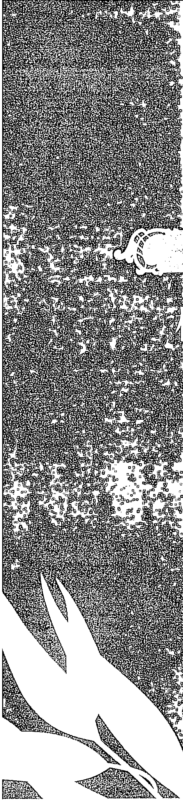

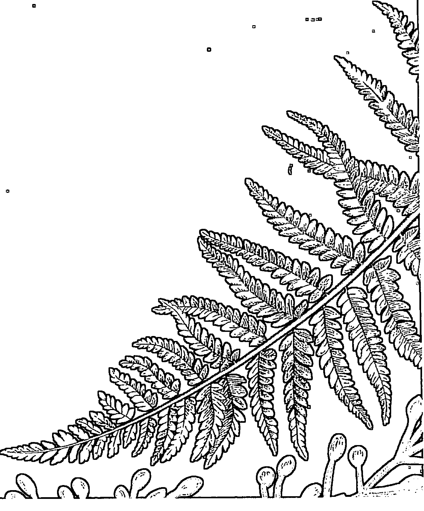

現在我們所讀的《格林童話》（第七版）總共有兩百一十個故事。當中三分之二以上都有出現「森林」這個單字。由此可看出，《格林童話》的世界與森林息相關。但是，其森林的意象，和美麗的森林、休憩的森林、療癒的森林等等相差甚遠。森林深處生長著蓊鬱茂密的樹木，昏暗、詭譎，無法得知有什麼潛伏其中。

《格林童話》的登場人物都會進到如此森林當中。有些是穿越森林的旅人，有些是要打獵的國王，也有尋找草木果實的村民等各種角色。有時也會遇上妖怪、野狼、強盜。

小紅帽就是在前往探訪住在這般森林裡的奶奶途中遇到大野狼，雖然後來得救，仍然被吃下肚。儘管如此，森林可不是只有恐怖的一面，小紅帽繞遠路的小徑可是個花田呢。

森林裡有可作為建材或當柴燒的木材，也富含三餐的必需食材。在前往森林的途中有田地、牧草田，小徑上也有許多藥草生長。村民會在庭院開闢菜園。

《格林童話》中出現的植物有大麥、小麥、黍、豌豆、小扁豆、葡萄、蘋果、草莓、櫻桃、核桃、亞麻、燕菁、高麗菜、馬鈴薯等等，許多作物都與人類日常生活息息相關。人類就生活在儘管可怕處處，卻也會帶來恩惠的自然之中。

同時，《格林童話》中也會出現女巫。想當然爾，出現的次數不及植物。總共有二十個故事有女巫登場。其中，有些故事會讓人不禁懷疑，「那個故事中有女巫出現嗎？」例如，〈不來梅音樂家〉。此外，也有故事會讓人感到詫異，「奇怪，那個角色竟然不是女巫？」譬如〈灰姑娘〉。

這麼一想，就會對於女巫產生各種疑問：女巫們究竟做了什麼事，又是如何死去呢？女巫與藥草究竟有什麼樣的關聯性？童話可以任人解讀。每個讀者都有其各自的解釋。因為人類的想像力在童話的世界中，不受任何制約，且非常自由。

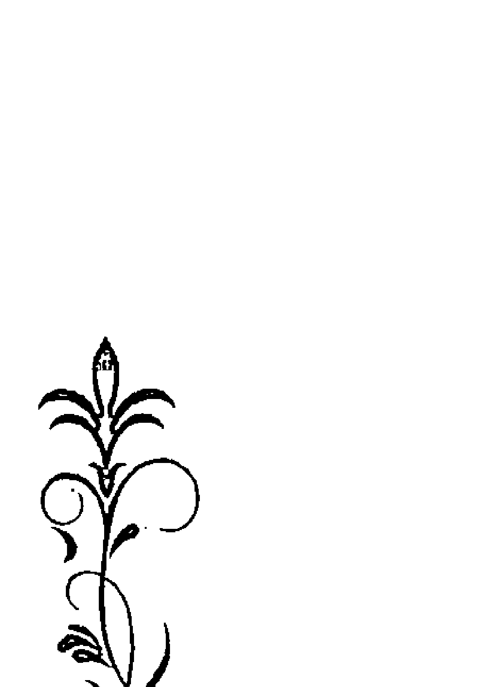

## 1 〈白雪公主〉——白雪公主的继母是女巫吗？

「魔鏡啊，牆上的魔鏡啊，這個國家最美的人是誰？」「皇后陛下，在這裡是您最美。不過，山的那一頭和七個小矮人同住的白雪公主，比您美上數千倍。」「什麼！」聽到不會說謊的不可思議魔鏡這番話，令皇后臉色變得蒼白。「我雇用的獵人難道沒有在森林裡殺掉白雪公主嗎？他不是帶回了她的肺臟和肝臟當作證據嗎？所以我才會把那些吃下肚。既然白雪公主已死，我應該是最美麗的女人，不是嗎？」

原來獵人不忍殺掉白雪公主，便宰殺路過的野豬，帶回牠的肺臟和肝臟交差。皇后發現自己遭到獵人欺騙後，打算親自殺掉住在小矮人家中的白雪公主，於是便喬裝成賣日用品的小販，來到小矮人的家。

由於白雪公主想要美麗的胸帶，女王假藉要教她如何使用，趁機用力一勒白雪公主的胸口。白雪公主無法呼吸就此倒地。回到家中的小矮人發現後將胸帶切斷，白雪公主就恢復呼吸。

皇后再次聽到那不說謊魔鏡的答案，得知白雪公主仍舊活著的事實。這次她使用學來的女巫之術，製作毒梳子，變裝成另一個販賣日用品小販，來到了白雪公主住處。
她騙白雪公主，「讓我用這把梳子幫妳把頭髮整理一下。」當梳子一碰到頭髮，白雪公主就有如死去般倒下。然而，這次小矮人又發現了梳子，白雪公主再度復活。

女王又透過誠實的魔鏡，得知白雪公主仍然活著的消息，她決定「無論如何都要殺了白雪公主」，而這次是製作毒蘋果。蘋果一半呈現鮮紅色，帶有毒性；而另一半白色的部分則無毒。女王扮成農婦來到了小矮人的家。由於小矮人對白雪公主忠告，「不可以讓陌生人進到家裡」，於是便隔著窗戶聽農婦說話。即便如此，那蘋果愈看愈美味。

農婦說：「如果你擔心的話，我可以吃掉一半，」便吃下白色部分。而白雪公主忍不住伸出手接下，吃下鮮紅色那一半，就這麼倒下。

這次，小矮人找不到白雪公主倒下的原因。他們悲傷地把白雪公主放入玻璃棺中，安置在山上。過了很久，有一天某國的王子剛好路過，他便說服小矮人把白雪公主讓給自己。

當僕人抬著棺材下山時，其中一人沒走好，便一個踉蹌差點跌倒。棺木因此劇烈搖晃，那片堵在白雪公主喉嚨裡的蘋果掉出口中，白雪公主就這麼復活。

白雪公主和王子將在城堡舉行婚禮。皇后也收到了婚禮的邀請函，在她出門前，又問了魔鏡，魔鏡如此回答道，「皇后陛下，在這裡您最美麗，但是新王妃比您美麗上千倍。」雖然皇后感到十分不安，但由於她實在太想看到「新王妃」，便出門前去參加婚禮。想不到，站在那裡的毫無疑問就是那個白雪公主。新王妃拿了燒得透紅的鐵鞋，來到呆站著的皇后跟前，硬是要她穿上。皇后燙得四處跳躍，最終就此喪命。

這個故事就是家喻戶曉的〈白雪公主〉，通常在繪本或動畫中，只演到王子和白雪公主結婚就結束了。儘管我知道篇幅會加長，仍然告訴各位在《格林童話》裡的白雪公主，是以這般結局收場。其中皇后使用學到的女巫法術，製作了毒梳子和毒蘋果。我想大家對於「女巫法術」這個詞並不熟悉，不過其意義上與一般的魔法或法術有些出入。魔法有分好魔法與壞魔法。舉例來說，假設您幸運獲得了「讓優秀造型師做造型」的機會；過幾個小時後，當你看到鏡子裡的自己，不禁覺得「這真的是我嗎？好像被施予了魔法一樣。」這是好魔法。不過，當諸事不順時，就好像遭到詛咒一般。這就是惡魔法。詛咒是用在祈求好結果，而詛咒則是用來祈求讓對方得到壞結果。然而，無論是魔法、法術，還是詛咒，在英文裡都是 magic。這個「女巫之術」是在獵殺女巫時代，告發女巫時使用的詞彙。女巫之術是指讓「牛奶腐壞」、「讓人家畜患病」、「左右天候」等邪惡法術，專指女巫所使用的邪惡之術。也就是說，〈白雪公主〉裡皇后所學的是「女巫之術」。那麼，皇后究竟是不是女巫呢？皇后確實是對於殺害白雪公主相當執著，是個籌備了三次殺人計畫的壞人。不過，白雪公主只要稍微聰明一點，皇后的殺害計畫就不會成立。

就算是毒蘋果，也不見得需要特別用上女巫之術。稍微有點藥草的知識就可以製造出毒物。把一半的蘋果染紅，注入毒物後，就可以簡單做出毒蘋果。而且，白雪公主之所以如死般倒下，並不是因為中毒，而是因為蘋果卡在喉嚨裡，真是個令人費解的故事。

《格林童話·白雪公主》中，並沒有說皇后是女巫。即便如此，皇后下場十分悲慘。在獵殺女巫時代，光是傳出某人使用過可怕女巫法術的小道消息，她就在完全沒有任何辯解的機會下遭到燒死，這些女巫的命運與皇后的下場不謀而合。假設以現代的法律審判皇后的殺人未遂事件，又如何呢？

這個話題先暫且擱置，讓我們來談談蘋果。蘋果或者蘋果樹在《格林童話》中，屬於出場最多的植物之一。蘋果不僅在《格林童話》，於文學、歷史、科學等各領域中，皆擔任重要角色。

說到蘋果，腦中應該立刻可以浮現幾個印象：原本應該是別種果實，但給亞當夏娃的還是蘋果（舊約聖經）、從三位女神中選出最美女神給予蘋果的帕里斯審判（希臘神話）、由女神伊登所掌管的回春蘋果（北歐神話）、德國王權象徵十字聖球「帝國的蘋果」、瑞士獨立運動英雄威廉·泰爾（Wilhelm Tell）的蘋果、牛頓發現萬有引力的蘋果軼事、蘋果公司註冊商標等等。這些蘋果都是指蘋果果實。而《格林童話》當中，以《白雪公主》為首，共有十四個故事出現的，也都是蘋果果實。

以前我在德國鄉村搭計程車時，道路兩旁種滿蘋果樹，淡粉色花朵盛開。當時聽計程車司機說，「以前在德國，很多年輕人為了成為師傅（Meister），便踏上拜師學藝的旅程。而為了讓他們在旅途中飢餓時能夠果腹，所以就在街道上種植蘋果樹。」真是一樁美談。

然而，蘋果花似乎不太受到注意，存在感很低。明明那麼美麗。而我好不容易想起《喀秋莎》這首歌。

> ……
（關鑰子譯）。

蘋果花綻放，河面茫霧繚繞，你不在的地方，春天也悄悄來到

這是一首在河岸邊思念愛人時所唱的歌。蘋果花綻放，象徵春天來臨。歌曲好聽，歌詞也有意境。我原以為這是古老不知名的俄國民謠，結果作曲家和作詞家都有名有姓，在一九三八年所製作的俄羅斯歌曲。我後來才得知這歌詞中的戀人，是受到徵召擔任國境警備的年輕士兵，並且當一九四一年德蘇戰爭開打後，戰場上許多士兵都愛唱這一首歌，令我非常驚訝。

> 聽我那住在德國的日本朋友說，她的德國老公似乎將日本盛開的櫻花稱為「給人看的櫻花」，因為不會結櫻桃，或許是個玩笑話，但德國人事事講求實際，無論對象是蘋果還是櫻花，非常耐人尋味。

◇西洋蘋果（薔薇科 Malus pumila）

白雪公主會落入皇后陷阱，也是因為看到鮮紅美味的蘋果果實，嗯，我並沒有要比較誰優誰劣，只是果實若換作梨子或栗子，又有何種結果？

蘋果果實富含維生素C與礦物質，營養價值高。多酚具有抑制體內脂肪蓄積的功效。以前蘋果減肥法曾盛行一時，也是因此緣故。

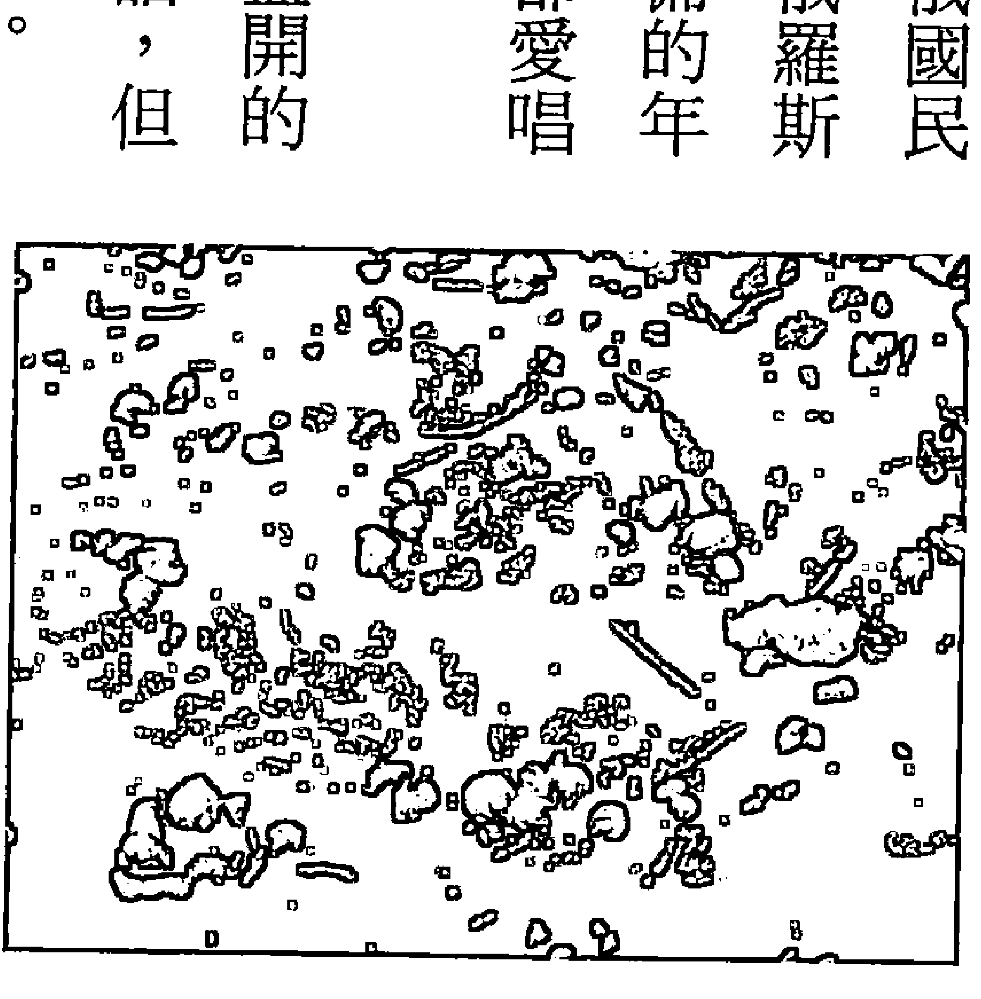

原產地為中亞。在土耳其發現有西元前六百年時已碳化的蘋果。

現在日本能吃到的蘋果是西洋蘋果，這是明治時代才開始種植的品種。

蘋果具有去痰、利尿、整腸，調整消化道、呼吸器官的效果。甚至還可以消解煩躁、增進食慾、解除宿醉、鎮定、增加力氣。因此蘋果在食用上，如此受歡迎相當合理。根據某項統計（2009年），日本蘋果產量為世界排名第十四名，德國第十二名，中國第一名。

蘋果汁是最為普遍的飲料，不過有一種稱為 Apfelwein 的蘋果酒是法蘭克福的名產。它由於帶點酸味有些人並不喜歡，不過我自己算是喜歡的。

卡爾瓦多斯酒（Calvados）這種白蘭地也是以蘋果為原料製成的蒸餾酒。順帶一提，這是在法國諾曼第地區所釀的酒才能使用這個名字，其他地區的酒只能稱為蘋果白蘭地。這道理和香檳一樣，只有出自香檳地區的氣泡葡萄酒才能稱為香檳。

蘋果在歷史、傳說、風聞、童話、餐桌等各層面不但未曾缺席，還多次登場，或許是水果之王也說不定。

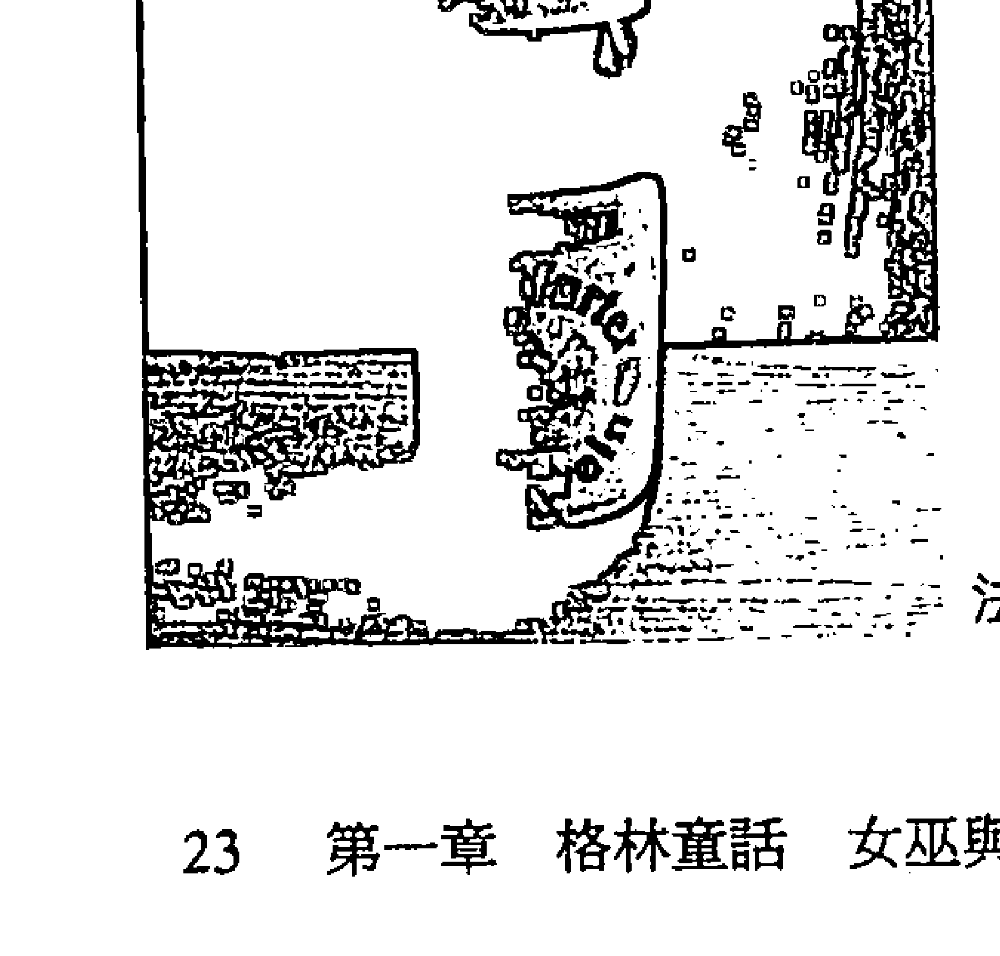

## 2《杜松的故事》——甦醒之樹

这是个父亲将至爱儿子吃下肚的故事，一开始以为会诡谲又恐怖，想不到结局竟然带给人一种温馨的感觉，十分不可思议。就如同标题，杜松从开始到结束都担任重要角色。以前有一对夫妇一直生不出孩子。在一个冬天的日子里，妻子在杜松树下削苹果时，不慎切到手指。看到血液滴落雪中，不禁感叹，『要是有个像血一样红润，又如同雪一般白皙的孩子就好了。』《白雪公主》的母亲也是许愿想要一个『如雪一样……

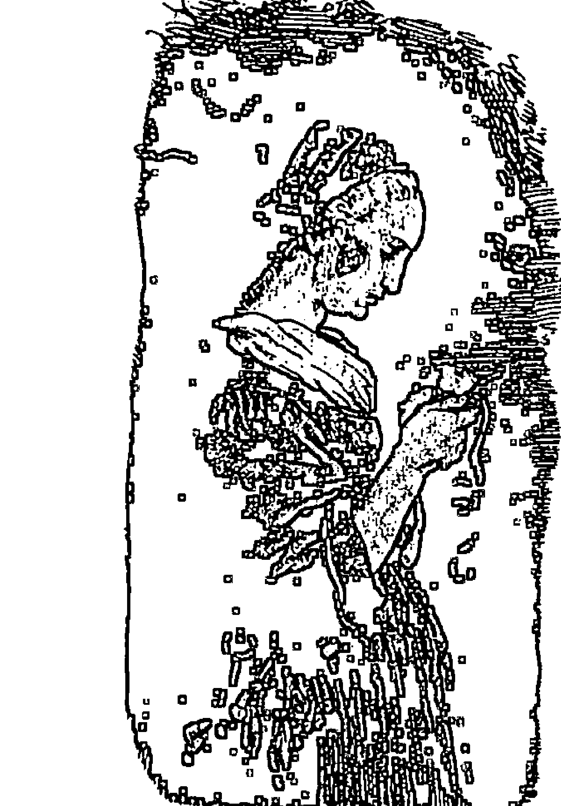在這幅畫中，骨頭並不是放在樹下，而是埋在樹根。(Ludwig Richter繪)

白皙，像血液一般紅潤」的孩子，於是就如她所願生下女孩白雪。在〈杜松〉這個故事裡，生下的是男孩；無論是哪個故事，我總是感到疑惑：「像血液一般紅潤」到底是哪裡紅潤呢？有臉頰和嘴唇等解釋，然而臉頰真的那麼紅潤，根本如同喜劇一般，而嘴唇那麼紅潤的話，又很奇怪……

閒聊到此為止。

當杜松散發出香氣，妻子聞到香味就開心，然而吃下杜松的果實後，便鬱鬱寡歡開始生病。妻子死前對丈夫說，「我死後，把我埋在杜松樹底下」，她在產下「像血一樣紅潤」，又如同雪一般白皙」的男孩後，便離開人世。

丈夫將妻子埋在杜松樹下，沉浸在悲傷中一陣子後再婚。與這一任妻子，生下一個女兒瑪蓮娜。瑪蓮娜與男孩感情非常好，而繼母卻討厭這標緻的男孩。於是她便趁丈夫不在時，殺了他甚至殘酷地放入湯鍋裡燉煮。目擊一切的瑪蓮娜一直哭，哭個不停。父親回家後，三人一起坐在餐桌前。就在父親喝下一口湯後，大讚美味，完全不讓任何人吃，獨自一人喝完全部的湯，並把湯裡的骨頭都丟到餐桌下。瑪蓮娜邊哭邊撿拾那些骨頭，並用絲綢包裹放到杜松樹下的草皮上。

於是，杜松的樹葉就開始發出稀稀簌簌的聲音，伸展枝葉，突然一隻不知從何處飛來的美麗鳥兒出現了。而包有骨頭的絲綢就此消失。鳥兒開始停在城鎮各家的屋頂上唱歌。

媽媽殺我。爸爸吃我。瑪蓮娜找到我的骨頭，以絲綢包裹，放在杜松樹下。啾咿特、啾咿特，我真是美麗的鳥兒啊。

最後鳥兒飛到男孩家，停在庭院的杜松樹上開始唱歌。父親和瑪蓮娜聽到歌聲，立刻一掃陰霾停止哭泣，來到外面看鳥兒。繼母心想，不知道是男是女；而这孩子杀的是「我（我）」，因此過在《鵝媽媽》中只提到被故事〉中鳥兒所唱的歌。不媽〉裡，也有類似〈杜松的大綱。英國傳統童謠〈鵝媽這就是〈杜松的故事〉集煙消雲散後，男孩就站在死繼母。結果，一陣霧火交的巨大石臼由上方落下，砸玄關走出來，正好鳥兒搬來來到外頭會好一點，就從「怎麼會這麼不舒服。或許那裡。

的手足撿拾了骨頭，埋在「冰冷的大理石下」。歌曲就此結束，無法得知這個孩子有沒有復活。

杜松是復活之樹，這和此樹的名稱有關。杜松的德文為 Wacholder，每個地方都有不同的叫法。《格林童話》是以低地德語（北方言）書寫，因此稱為「Machandelboom」。也有其他幾個不同的名稱，不過都具有「讓人有活力」的意義。

他們相信亡者的靈魂會暫時停留在杜松樹上，最後就會復活。因此不能埋在大理石下。

杜松具有驅魔功效。在聖誕節時，為了不讓女巫、妖怪進入家中，會把杜松樹枝裝飾在家門口。此外，為了不讓女巫在牛奶中施展女巫之術造成牛奶腐敗，會使用杜松做成的木棒攪拌牛奶。

除了杜松以外，在童話、傳說中也有其他可以讓亡者起死回生的植物。譬如說《格林童話·三片蛇葉》的故事。故事非常有趣，不過恐會增加篇幅，因此我把重點放在葉子的部分：蛇的身體被切成三段，其他的蛇見狀就咬著三片葉子前來，把那隻蛇斷掉的身軀接起來，放上三片葉子。於是蛇就這麼復活了。這種草也能讓人類復活。

然而可惜的是故事中這個葉子的敘述只有「綠葉」。

古代美索不達米亞《基加美修史詩》（西元前七世紀阿卡德語標準版）中有回春草的蹤影。主角基加美修國王面對摯友死亡，開始對於死感到恐懼。因此，為了向烏特納比西丁（具有不死之身，與神相同的存在）請教生與死的秘密，便踏上了旅程。而基加美修就這麼從他那獲得了回春草。那是一種根部帶有刺的草，其名稱為「讓年邁者回春」。

就在基加美修帶著那種草回故鄉途中，他以泉水清潔身體時，一隻聞草香而來的蛇，將那種草奪走。基加美修痛哭。於是他就空虛地回到故鄉，終身善盡國王的職務。人老了就會死，這就是人類。明知沒有復活或回春的特效藥，卻仍會去想有其可能性的大概就只有人類吧。

### ◇刺柏（柏科 Juniperus Communis）

刺柏，另一譯名叫杜松，為自然生長在北半球寒冷地區的常綠樹。在日本杜松果實以杜松子（Juniper berry）這樣的名稱販賣。不僅能用來增添琴酒香氣，在製作德國著名的酸菜時也會使用。具有如萘（可製樟腦丸）一般的強烈氣味。根據以上資訊類推，杜松也能用來消毒與殺菌，在十四世紀歐洲鼠疫大流行之際，曾大量使用。此外，由於香氣強烈，故有人將杜松稱為驅魔之木。北德有個叫做「呂訥堡石楠草原」的廣大石楠荒原。這裡是自然保護區域，所以只能搭乘觀光馬車或徒步行兩種遊覽方式。夏天時歐石楠小花盛開時，有如鋪上了紅紫色地毯。其中四周呈紡錘狀的杜松，看起來非常美麗。歐石楠與杜松皆為生長於乾燥瘠土地的植物。

## 3〈薔薇公主〉——「聰明女性」就是女巫嗎？

王妃生下了一個極可愛的女孩。國王非常開心，舉行盛大的慶祝宴會。國王並決定邀請十三位具有神力的女性，希望她們能夠疼愛自己的女兒。然而，盛裝賓客料理的金色盤子只有十二個，所以有一位沒受到邀請。在慶祝的宴席中，她們送了禮物給公主。一個人送了品德，下一個人贈予美貌，接著是財富。就這麼到了第十一位女性獻上贈與的話語時，沒受到邀請的第十三位女性出現，喊道：「公主十五歲的時候，就會遭到紡車的紡錘刺死。」然後便離開現場。而還沒致贈話語的第十二位女性則說，「公主並不會死亡，而是沉睡一百年。」這不是迪士尼動畫的〈睡美人〉。而是《格林童話》的〈薔薇公主〉。迪士尼是以法國的《佩羅童話集》（一六九七年）為背景改編而成，受到邀請的是三位妖精，而未接到邀請的則是名叫梅爾菲森特的女巫。在〈薔薇公主〉中，無論有無受到邀請，皆稱為「具有神力的女性」。翻成「具有神力的女性」，其德文原文為 "Weise Frau"，直譯的話就是「聰明女性」。前輩累積而來的經驗才能獲得。她們特別熟悉藥草，有協助治療婦女病和幫助生產等貢獻，在民間相當受到重視的一群女性。

童話世界中出現的「聪明女性」，又添上了一筆，將她們描繪成具有超能力的女性。

力的女性。在以前都會翻譯成「巫女」，然而現在大多譯為「具有神力的女性」。薔薇公主的父王之所以希望這些「具有神力的女性」可以疼愛自己的女兒，正是想要她們運用其超凡力量祝福自己的女兒。
因此她們不單只是贈與物品，也包含品德與美貌等，正是這個緣故。

迪士尼動畫原作夏爾·佩羅的〈睡美人〉與《格林童話》的〈薔薇公主〉非常相似。在佩羅的故事中，是邀請全國所有的妖精來參加慶祝宴會，替國王女兒取名。妖精有七位。然而，還有另一名杳無音信的妖精，下詛咒的正是她。

在那個還沒有創立大學和婦產科的時代，「聰明女性」發揮了產婆的功能。有時候產婆也會成為替孩子取名的人。替孩子取名的人，必須在新生兒受洗之前替其取名，直到那個孩子長大成人之前，都扮演其法定監護人的角色。在基督教中則稱為教母（God Mother）或教父（God Father）。《薔薇公主》中登場的具有神力的女性，我想應該就是這種幫忙取名的產婆角色。

薔薇公主之所以會陷入百年沉睡，就是源於未受招待的那位具有魔力女性的憤怒。至於為什麼沒有邀請她，是因為金色的盤子只有一個。以日常生活的角度來想，這種餐具都是以一打為計算基礎，因此一般來說，少一個盤子並不稀奇。即便如此，再怎麼說還是國王舉行的宴會；照理講，根本可以多準備一兩個金盤才對，為何沒有這麼做呢？

大家腦中應該都會立刻想到，十三是個不吉利的數字。在耶穌遭到處死的前一晚，最後晚餐的列席者，包含耶穌一共十三人。其中有背叛耶穌的猶大。因此就連現在大家仍會避免讓宴會的參加人數達到十三人。

確实在《格林童話》中是十三人，然而在《佩羅童話集》則為七人。問題並不在參加者人數，而是有一個人沒受到邀請。因此，我便大膽地如此假設：也就是說，邀請具有神力的女性（產婆）前來參加慶祝宴會是慣例，即時金盤數量不足也沒必要刻意訂做，表示她們早已不是V I P了。

由兩位聖明教士所撰寫的《給魔女的鐵鎧》（一四八六年）中，曾大力抨擊產婆，『產婆為對天主教最具危害的人物』、『女巫產婆殺害孩子或獻給惡魔，造成更多傷害。』

這是個天主教徒攻擊產婆的時代。即使薔薇公主的國王想要那些具有神力的女性疼愛自己的孩子，卻也想盡可能與產婆保持距離，其心態並不奇怪。在這方面若解讀成那個時代就連國王都不得不屈服，恐怕是一種恣意的解釋。

然而，就在薔薇公主陷入沉睡的同時，城堡的時間也停了下來，全部都靜止了。只有城堡周圍的野薔薇持續生長，把整個城堡包圍了，最後就連城堡的樣貌都無法辨識。

包覆薔薇公主城堡的薔薇，並不是觀賞用的豪華人工栽培薔薇。

我想應該是一種叫做狗薔薇（Rosa canina），它乃樸素可愛原始物種的薔薇。正因狗薔薇會攀爬的能力，具有一直往上延伸的特性。我曾在希爾德斯海姆（德國中部）大教堂外牆看過攀爬覆蓋的狗薔薇樹，蔓延到相當高處。

薔薇最早現身於文學世界的作品據說是《基加美修史詩》。其中有一節，「那個刺會如同野薔薇，刺傷「你的手」吧」（第一二六九行）。這裏提到的薔薇，依照時代來看，恐怕也是薔薇的原始物種吧。
德國童話街道的沙巴堡城堡（卡塞爾近郊），就是以《薔薇公主》沉睡的城堡為原型廣為人知。城堡周圍生長了茂密的玫瑰，可以欣賞到花和果實。沙巴堡城堡的餐廳有提供撒上薔薇花瓣的料理。

### ◇玫瑰（薔薇科 Rosa rugosa）

玫瑰的德文是Kartoffel-Rose（又稱為馬鈴薯玫瑰）。由於果實呈現扁平狀，我心想根本不像馬鈴薯啊，據說是此種玫瑰葉與馬鈴薯葉相似。順帶一提，日文中的玫瑰（浜茄子，讀音：ハマナス）其中的茄子並非蔬菜的茄子，而是因為果實的形狀很像梨子，以前稱為浜梨（ハマナシ），後來以訛傳訛才變成了浜茄子（ハマナス）。浜茄子（ハマナス）為東亞包含日本的原始物種，是一八四五年傳到歐洲的品種。別名為Japan-Rose（日本玫瑰）。想不到童話街道的薔薇公主沉睡的城堡，竟然是受到傳唱的那個網走紅玫瑰所包圍。【譯註：這裡應是指電影《網走番外地》的歌詞】

### ◇狗薔薇（薔薇科Rosa canina）

狗薔薇是歐洲最普遍的野薔薇。花朵的顏色為近乎白的粉色，花瓣為一重（五片）。無論在英語（Dog rose）還是德語（Hunds-Rose）中都有狗這個字。帶有狗這個詞頭的植物，一般而言實用性較多，通常用來形容似是而非的東西。例如，番紅花（鳶尾科）和秋水仙【譯註：日文為「犬番紅花」（百合科）是日文裡才會有這個詞頭，中文的名稱沒有】，此外，以前歸類為百合科，不過現在植物分類上屬於「秋水仙科」的花長得很像，卻是完全不同種的植物。那麼狗薔薇的狗字是怎麼一回事呢？是否認為和園藝品種的高級薔薇相比，不但實用性低，並且似是而非呢？如果是這樣的話，真是失禮的命名。當然盛開的大朵重瓣園藝品種固然美，不過說到底還是由狗薔薇等原始物種改良後才有的品種。不可以輕視其父母。狗薔薇和玫瑰（Rosa rugosa）的鮮紅色果實在英文稱為Rose hip而德文則是Hagebutte，薔薇茶便是使用這種果實製作，含有大量的維生素C，具有利尿、排汗、促進血液循環、預防感冒的效果。還能做成果醬，玫瑰精油用來平衡調整賀爾蒙，而其香氣更是療癒。從根長出來的新枝只要扦插就能繁殖，也能作為嫁接用的砧木。實用性相當高。

狗薔薇多生長在德國森林空地或路旁，隨處可見。春天會綻放一朵花，而秋天則會結出鮮紅的果實。狗薔薇正是薔薇的原點。

【譯註：玫瑰與薔薇在日常中文使用上較易混淆且不明確，本書翻譯所採用的薔薇是薔薇科薔薇屬的統稱，而玫瑰、狗薔薇、野薔薇則為薔薇科薔薇屬下的三種品種。】

## 4《六隻天鵝》——解除詛咒的花草

這就是天鵝王子？不過多了一隻。在德國常常能看到在河川中悠游的天鵝。

在森林中迷路的國王遇到了女巫，女巫說只要國王願意娶她的獨生女為王妃，就告訴他穿越森林的路徑，於是國王就答應了這個承諾。女巫的女兒儘管很美，但卻有種詭譎的氣質。國王與過世的前妻之間，生養了六個兒子和一個女兒。國王深怕王妃欺負他的孩子們，便把孩子藏在森林裡的城堡中，並且三不五時就會偷偷地去見他們。王妃得知此事便用女巫之術，把六個男孩變成天鵝。倖免於難的小女兒為了尋找不知飛向何處的哥哥們，便來到森林深處，終於再度相會。哥哥們在晚上只有十五分鐘能恢復人類之身，之後又會再度變成天鵝。為了解除哥哥們身上的詛咒，妹妹必須連續六年不說也不笑，使用一種叫做「星星之花」的花朵，縫製六件哥哥們的衣服。從此以後，妹妹便採集星星之花，並會坐在樹上專心地製作衣服。時光就這麼流逝，有一天，某國的國王來到了這個森林，發現了這位小女兒，便將她帶回城堡娶為王妃。然而國王的母親是個邪惡的女人，並不贊成國王的婚事，因此把王妃所生的孩子藏起來，還對國王宣稱王妃將孩子吃掉了。由於王妃不能說話，故也無法辯解。第二個孩子被藏起來時，國王仍舊不理會他母親，但到了第三胎，無可奈何之下只好對王妃進行審判。處以火刑。

當王妃被送上處刑台時，正好縫製到第六件衣服，唯獨剩下單側手臂的部分尚未完成。這時飛來了六隻天鵝。當王妃將完成的衣服一拋向天鵝後，她的哥哥們就恢復了原形。只有最小的哥哥少了一隻手臂，取而代之的是，背上還是天鵝的翅膀。王妃終於能說出在自己身上發生的事，而三個孩子也回來了。狠心的女人則取代王妃遭到燒死。國王一家從此過著幸福快樂的生活。

這個故事的登場人物較多，因此關係也較複雜。國王在森林裡遇到的女巫，是否在把女兒嫁給國王後，就完成了她的任務呢？她從此再也沒有出現過。她的任務只是把女巫之術傳授給她女兒罷了。而女巫的女兒也是在把男孩們變成天鵝後，就再也沒有出現。這裡出現了一個疑問，女巫的女兒究竟是不是女巫？
《格林童話》有許多故事中的女兒其母親都是女巫。有些就如同這個《六隻天鵝》的女兒一樣，成為母親女巫的成功後繼；也有些像《老母驢》（吃了高麗菜就會變成驢子的故事）的女兒一樣，儘管心地善良，卻因受到母親女巫恫嚇，心不甘情不願地做惡的女兒。在《格林童話》的世界中，即使母親是女巫並無法一概而論女兒也會是邪惡的女巫。

然而，在迫害女巫的時代，遭到告發為女巫的女性，其母親也會被視為女巫，一同受到審判，處以火刑。
好在妹妹以星星之編織的衣服終究趕上了，才能千鈞一髮地免於到處刑，而這個星星之花（Stem Blume）究竟是什麼樣的花呢？真的是能夠編織成衣裳的花嗎？話說回來，能夠以花來編織衣物嗎？最後難免會導向這個問題，而最開始的第一件衣服能夠就這樣撐六年嗎？或許不該將童話做如此實際的解讀，但仍不禁這麼想。
《格林童話》中遭到女巫詛咒的故事大約有十則。例如《青蛙王子》是王子受到女巫詛咒變成了青蛙，為了解除詛咒，需要公主的協助。而《樹林小屋》裡的王子遭到女巫詛咒成了老頭子，後來因「善良親切的女性」而得以解除詛咒。而《六隻天鵝》中這般使用花草解除咒語的手法較為稀奇，它是由女魔法師而非女巫下的詛咒。其他也有故事是使用花草解除咒語的。
在那之前，必須先提一下，關於女巫之術和魔法的差別，在《白雪公主》中也曾提及，不過《格林童話》中對於女巫和女魔法師有嚴格的區分。女巫從頭到尾都是女巫，並不會在故事中突然改稱為女魔法師。

## 5《萵苣公主》——金髮女孩與女魔法師

〈約靈德和約靈革爾〉中，約靈革爾因戀人遭到女魔法師變成鳥，嘗試幫忙恢復其人類之身。（George Cruikshank 繪）

法師。在《格林童話》中大多都沒有寫出女魔法師的下場，然而只要是女巫，則下場都非常淒慘。例如《漢賽爾與葛麗特》的女巫被燒死於麵包爐；《白新娘和黑新娘》中的女巫遭到處以放入滿是釘子的桶子裡，再讓馬匹拖行該桶子之刑；其他還有因受到火刑、吊死、毆打等等而死的女巫。也就表示，由於女巫是邪惡的存在，即使最後下場淒慘，也莫可奈何。可見迫害女巫時代對於女巫根深柢固的價值觀。

〈約靈德和約靈革爾〉就是個可藉由花草來解除女魔法師詛咒的故事：有個名叫約靈德的女孩，被女魔法師用魔法變成一隻鳥，為了解除這個咒語，需要「紅如血並且正中央有一顆美麗大珍珠的花」，她的戀人約靈革爾翻山越嶺走九天九夜終於尋獲。

這朵花確實紅如血，正中央的不是珍珠，卻是「巨大的露珠」。或許這個「巨大的珍珠」是一種使用比喻的表現。若是帶有朝露的紅花，並無不可能。但光是如此還缺乏決定性的線索，無法鎖定花的名稱。果然只能說是想像出來的花朵。那麼《六隻天鵝》中的「星星之花」也是完全虛構的花朵嗎？日文大多翻成「友禪菊」，學名 Aster novi-belgii 中的 Aster 有星星的意思。而花韭和大星芹在德文裡也是星星之花，都是美麗的花朵。儘管認知上不可能存在有以花

### ◇花韭（百合科 Iphieon uniflora）

為球根植物，其德文有「春天的星之花」的意思。花如其名，只有三至五月的開花期能看到其地上部分。花的形狀也確實呈星形。因為花朵、氣味皆近似於韭菜，故得此名。

### ◇大星芹（繖形科 Astrantia major）

大星芹屬於歐洲庭園中不可或缺的園藝植物。不具有日文名稱（アストランティア・マヨール），而直接以學名大星芹（Astrantia major）稱呼。德文則為 Sterndolde，俗稱 Sternblumen。

原產於廣大的歐洲，生長於森林與草原。大星芹本身並不高大，莖的頂部會開出美麗的花朵。看似花瓣，卻有如星光呈放射狀發散，其中心綻放數十朵小花。有白色、粉紅色，也有深紫色的品種。

一名懷有身孕的女子由於很想吃鄰家栽種的萵苣，她要求丈夫去向對方要來。隔壁是女魔法師的家，丈夫偷偷摸摸地盜採萵苣回來給妻子吃。妻子讚不絕口，隔天也吵著要吃。當丈夫又進入菜園打算偷採時，被女魔法師逮個正著。

女魔法師在了解事情原委後說道，「如果是這樣的話，想吃多少都可以給你。然而，相對地孩子出生後必須交給我。」丈夫恐懼不已，便答應了。女兒終於出生後，女魔法師便前來帶走這個孩子，將她取名為萵苣。

當女孩長到十二歲時，被關進只有上方一個窗戶作為入口的高塔中養育。那麼，女魔法師究竟如何進入塔中呢？當她在高塔下說，「萵苣姑娘，萵苣姑娘，放下妳的長髮吧。」金色的長髮便會從上方的窗戶放下。女魔法師就這麼抓著長髮攀爬上去。在此我們不需要刻意去討論頭皮究竟痛不痛。因為故事中也沒有提及原先是如何將萵苣公主關進這個連入口都沒有的高塔。

就這樣隨著時光流逝，有一天有個王子經過高塔，聽到萵苣公主的歌聲從塔中傳來，便愛上了她。就在連續盯梢幾次過後，王子得知了女魔法師的手法，就有樣學樣；當萵苣公主看到王子嚇了一跳，畢竟這是她出生以來第一次看到男性。不過在聽到王子溫柔的話語，她便愛上了王子，也接受了他的求婚。

最後女魔法師得知了萵苣公主與王子的秘密，一氣之下剪掉了她的長髮，並把她放逐荒野。之後女魔法師從窗口放下萵苣的長髮，不知情的王子進入塔中，一看驚覺站在那裡的卻是長相嚇人的女魔法師。當王子得知萵苣公主已不在，便絕望地從高塔一躍而下。這時，王子的雙眼遭到高塔下的玫瑰刺傷，成了盲人。幾年以來，他在森林中哭著尋找萵苣公主，徘徊度日。

而萵苣公主在荒野的一間房屋中生下了王子的孩子（雙胞胎），在那裡生活。最終，王子來到了荒野，聽到了萵苣公主的歌聲。就這樣，兩人終於能夠重逢。她留下兩滴眼淚，沾濕了王子的眼睛，王子便恢復了視力，有個快樂的結局。

這個故事的有趣之處，其實只到萵苣公主遭放逐以前。特別是萵苣公主將金髮放下那幕，應該能夠煽動畫家的創作欲。光是蒐集這一幕的繪畫，就能集結成冊了。在塔下大喊「萵苣公主」，作為感測器的長髮辮子就會從窗戶順順地放下來，也有遊樂園有「萵苣公主之塔」這樣的設施，總是令孩子們開心不已。二〇一〇年迪士尼製作了《長髮公主》（片名：《魔髮奇緣》）的3D動畫。儘管與《格林童話》中的〈萵苣公主〉故事相當不同，然而銀幕上的長髮仍舊非常壯觀。

說到頭髮，稍微比較恐怖的是，二十世紀醫學界所發表的長髮公主症候群。主要出現於二十歲以下的少女，她們會把自己的頭髮吃下肚，屬於異食症的一種。在日本則稱為食毛症。

也就是說，提到萵苣大家都會聯想到長髮，然而這個故事的開端——萵苣，究竟是什麼樣的植物呢？格林兄弟在《格林童話》解說書籍裡，僅簡單提及這是收錄自弗德里希·舒爾茲（Friedrich Schulz）書中（一七九〇年）的故事。然而，到了二十世紀，童話研究家馬克思·綠提查出這是翻譯路易十四的法國人女官德拉佛爾斯（de La Force）的作品《妖精的房屋》（一六九八年）裡的一篇故事〈佩希內特〉（Persinete）。佩希內特在法文中為芹菜的意思。儘管佛爾斯表示那是她自創作品，然而在義大利詩人吉姆巴地斯達·巴西耳（Giambattista Basile）故事集《五日談》（一六三四∼一六三六年）中也有類似的故事——《佩乔西耐拉》，其意思也是芹菜公主。也就是說，巴西耳的《佩乔西耐拉》和佛尔斯的《佩希内特》都是芹菜。既然如此，為何舒尔兹在翻译佛尔斯的作品時要改成「萵苣」？這令我感到非常不可思議。

根據小澤俊夫在《格林童話的誕生》中，比較了佛爾斯與舒爾茲的作品，在佛爾斯的《佩希內特》中提到：「這個時代，在此香芹是極其珍貴的物品，可是特別從印度訂購的植物」，然而舒爾茲在翻譯這部分時，他翻譯成：「萵苣在這個時期仍然是非常珍貴的草，可是從海的彼端訂購來的物品。」儘管無法了解這個故事究竟是發生在哪個時代、哪個地方，不過香芹的原產地為地中海沿岸，古希臘時期被視為神聖的植物，古羅馬時代則作為料理食用。中世紀的修道院也有大量栽培。反而，萵苣卻似乎無法如此特定出來。現階段最有可能為敗醬科的野苣，原產於地中海沿岸，十七世紀以後，便開始以蔬菜田栽種。日本也採取此說，因此萵苣的日文名稱為ノヂシャ（野萵苣）。我也是若提到萵苣，就認為是野萵苣。然而，在德國稱為萵苣的植物有兩種。一種是花朵盛開時呈吊鐘形狀，為桔梗科的牧根草風鈴草。這在十六世紀時，已成為食用植物，於蔬菜田栽種。

### ◇惡魔的鉤爪 (Phyteuma)

另一種則為桔梗科的「惡魔的鉤爪」。這也被稱為萵苣，有好聞的香氣，在過去也當作蔬菜食用。生長於歐洲海拔六百公尺以上的山岳地帶。

翻閱植物圖鑑，可看到其莖上方有紫色的小花呈紡錘狀綻放，這種花的一部分有如鉤爪一般向外彎曲。這個可怕的名稱由來，據說與基督教普及前的宗教儀式有關。

某位德國女草藥師以「惡魔的鉤爪」就是《萵苣公主》中的植物作為前提介紹它，而她的解釋令我相當吃驚。女魔法師因萵苣遭竊而暴怒；萵苣公主的母親想吃到「不能吃寧可死」的地步，這是因為她們都被惡魔的鉤爪勾住了，即受到惡魔引誘，故萵苣公主親生父親其實是惡魔。

儘管無法得知舒爾茲是想到哪一種萵苣，才把香芹翻譯成萵苣，然而如果在舒爾茲所處的年代屬於稀有蔬菜的話，果然還是十七世紀以後才開始栽種的野苣，此說法較為有力。然而疑問仍舊存在，究竟在法國與義大利香芹是否曾經如此稀有？

此外，還有另一個疑問：也就是萵苣公主雙親及女魔法師的後續。故事中再也不見這對夫婦蹤影，只能想成他們的角色存在已經功成身退了，這種走向在童話中很常見。但女魔法師呢？萵苣公主喚她為葛索阿姨。葛索（Gothel）是教母（取名者）的方言。關於教母在〈薔薇公主〉有詳細說明，是新生兒很重要的人物。女魔法師也替這個出生的孩子取名，並且緊盯著她不讓那些蒼蠅般的男性靠近。在王子出現以前，萵苣公主和葛索阿姨的感情並不糟。最後萵苣公主放開了教母的手，通過重重試煉抓住了幸福。儘管葛索把萵苣公主關進高塔這點較為極端，不過葛索應該也盡她所能細心地養育呵護萵苣公主。雖說她是女魔法師，卻沒有使用任何魔法。即便如此，每當提到恐怖的女魔法師，特別在電影或繪本中往往會變成女巫。或許是因為她把新生兒帶走的緣故。

萵苣公主的教母葛索，儘管一怒之下把萵苣公主趕了出去，不過她一定希望萵苣公主得到幸福。她對萵苣公主的父親說：「我一定會讓她幸福，我會像母親一樣照顧她。」她或許是一個人，孤獨地吃著自己菜園裡的野苣過活；又或是以綁架孩童的女巫為由，遭到女巫審判吧。無論是哪一種下場都很可悲。

### ◇野苣 (敗醬科 Valerianella locusta)

日文名稱為ノヂャ（野萵苣），與菊科的萵苣是完全不同的物種。在德國普遍都稱為野苣（Feldsalat），也有些包裝上會標示為萵苣（Rapunzel）或者寫出兩者。可將嫩葉摘下作為生菜沙拉食用。超市也有把菜葉包成一包，或者秤重販賣。

如果不摘下來的話，莖就會長長，並開出白色的小花，非常可愛。

野萵苣屬於富含鈣質的蔬菜很適合孕婦食用。

順帶一提，香芹的鐵質含量豐富，具有增進食慾、消除疲勞、去除肌膚斑點等效果，同樣也適合孕婦食用。在日本常作為配料的香芹葉子較小又有皺褶，這是因為經過品種改良。

## 6《霍勒太太》——受到祝福的接骨木

「把我們搖下來吧！把我們搖下來吧！現在正好吃喔！」霍勒博物館的展示面板。（卡塞爾近郊，黑西斯希利希特瑙市）

有一位美麗又勤奮的女孩，她繼母只疼愛懶惰又醜的親身女兒，卻總是讓她做艱苦的工作。有一次，正當她在紡織時，從指尖噴出的血液把線軸染成鮮紅色。於是她打算以井水清洗線軸卻不慎把它弄掉入井裡。她哭著去找繼母，卻遭到責罵，「是妳弄掉的，去撿回來。」女孩實在沒有辦法，只好跳入水井中尋找線軸。

然而，竟來到了一片花朵盛開的草地。她走著走著看到了烤麵包爐。有很多烤好的麵包拜託她「把我們拿出來」。她照做後，繼續走著，接著遇到了結實纍纍的蘋果樹。蘋果拜託她「搖動這棵樹，放我們下來」。她又照做，繼續往前走，就抵達了一間小屋。

屋裡頭有一個滿口巨大牙齒、有點恐怖的老婆婆。她原本打算拔腿就跑，不過老婆婆對她說，「如果你幫我做家事，我就會讓妳得到幸福」，於是她便決定在老婆婆家工作。幫老婆婆整理床鋪，特別是用力甩枕頭的羽毛。

老婆婆說，「這麼一來，在人類世界就會下起雪來。我是霍勒太太喔。」據說在德國即使到現在，一下雪大家仍然會說「霍勒太太在拍枕頭」。

她努力地完成了老婆婆交代的工作，過了一陣子還是開始想家了。因此霍勒太太便讓她回家。當她一走出門，一陣黃金之雨從天而降，包覆了她的身體。她回家後把在自己身上發生的事告訴了繼母。

那麼，接下來發生了什麼事呢？這次換又醜陋又懶惰的女兒登場。她同樣地把線軸丟進井裡，並跳了進去。但是，對於麵包和蘋果的請求，她都厭惡地拒絕了，在霍勒太太家也只有第一天認真工作，到了第二天就開始遊手好閒。霍勒太太讓她回家時，她以為會下起黃金之雨，便開心地站到了門下。想不到，竟然從上方倒下了一大鍋煤焦油（災厄）。當她回到家以後，身上那些又黏稠又黑的煤焦油一輩子都洗不掉。

《霍勒太太》是描寫善良又勤奮的人將會得到快樂結局的典型童話故事。我們知道在童話中有魔法，動植物會說話等等，與現實生活相違之處。因此《霍勒太太》的家可以出現在井底、甩枕頭的羽毛會化成雪從天而降，這些內容我們都能欣然接受。

只不過，這個霍勒太太不是為了童話而虛構出來的人物。根據自古以來的民間謠傳，霍勒（Holle）就是一個住在異次元世界的不可思議存在。關於霍勒的真面目，有各種說法。

霍勒也稱為胡爾達（Hulda）、佩露西塔（Perchta）、貝魯希特（Bercht），據說在一月六日的主顯節（基督教的紀念日）晚上，或者是十二夜（聖誕節至主顯節前），飛到空中觀察女孩們是否勤奮工作。勤奮的女孩可以得到獎賞，而怠惰的女孩則會受到處罰。

她特別喜歡努力紡織的女孩。儘管傳說中對於霍勒的描繪不盡相同，然而唯一的共通點就是，非得要穿過池塘或水井才能前往霍勒的世界。池塘或水井正是通往異次元世界的通道。也就是說，霍勒被視為居住於冥界的死亡女神。與其說是童話故事的登場人物，霍勒本來就存在於傳說的領域中。

霍勒有的年輕有的年老，有的醜陋有的美麗，其年齡和容貌並沒有一定。根據口耳相傳，她會變成年輕貌美的女性，在白天來到河川沐浴，惡整路過的旅人或獵人。此外，也有傳說指出孩子是從霍勒居住的池塘出生，死後人的靈魂又會回到那裡。禮拜天出生的孩子（傳說禮拜天出生的孩子會得到幸福）會時常聽到池塘裡傳來的鐘聲。如果想要生孩子的話，可以到那個池塘沐浴，那裡的水據說有強大的療癒能力。

她是居住在地底，即死亡世界，有時會現身於地面上。這較接近在基督教之前就存在的古代死亡女神。這是與異教眾神家系圖相連的女神。教會不可能認同這些神祇。

於是基督教便來打壓異端與異教。不只是暴力，也運用了傳教這一種較為溫和的手段。並且採取融合策略，將民眾重要的祖先風俗習慣，融入基督教。

譬如說，在基督教會納入以往民間舉行的迎春慣例，作為慶祝耶穌基督復活的復活節；對於無法採納的部分，則視為反抗神的恐怖女巫所為，以這種全新概念一一抹殺。霍勒也是如此，在天主教較為強盛的巴伐利亞地區（德國南部）等，則不再接受對於霍勒的崇拜行為。

紡織廠的女員工在寒冬中能待在溫暖的工作室實在值得感謝。有時候和監督人聊天，也會唱唱歌。

童話故事〈霍勒太太〉和〈薔薇公主〉中出現的重要物品——線軸，被視為女巫的象徵。儘管理由並不明確，但也不難了解。紡織一直以來都是女人的工作。有人在自家紡織，而受僱的女性則是在紡織房工作。就如街談巷議一般，在紡織的同時，可以彼此交換各種資訊。這就成了不滿的開端，最後演變成能夠威脅權力的一股大勢力。害怕這種事態的當權者，便刻意將線軸塑造成反社會存在的女巫（又或女性）象徵。然而，來到十八世紀，女性們開始受僱於紡織同業工會賺錢。當時已經過了迫害女巫的最高峰。

霍勒是對自然界有影響力的古代女神。其中，霍勒和接骨木的關聯最為人知。接骨木在德文中稱為 Holunder。Holander 的 Holu，或者胡爾達（Hulda）的 Hul，據說都是取自霍勒（Holle）。在大家仍相信霍勒存在的年代，人們對於接骨木抱有特別的情感。或許是認為砍伐或傷害接骨木，就等同於傷害霍勒，因此不得不砍時，還會向接骨木請求原諒。此外，接骨木也被視為可以保護自己不遭受魔術、女巫、火災、落雷的樹木。傳說只要待在樹下，就不會被蛇咬，或者受到蚊蟲叮咬。

接骨木在德國鄉間的庭院或道路都很常見，屬於非常普遍的植物。春天有白色小花一叢叢綻放，並不醒目。然而到了秋天，紅紫色的小漿果結實纍纍的樣子，只要看過一次，就不會認錯。樹皮有一層厚厚的木栓質，時間一久會變稠黑褐色，甚至裂開。傳說恐怖的裂痕就是霍勒的臉。

接骨木有如「庭院裡的藥箱」一般，從樹幹到根部，全都能利用的完美植物。霍勒不僅賜予接骨木她的名字，還送上了能夠替人治病的神奇力量。有說，完全奉獻己身工作的接骨木成了霍勒的眼鏡，因此才獲得霍勒名字的一部分做為獎賞。無論如何，童話故事的霍勒太太與逐漸遭到遺忘的霍勒傳說不同，現在仍然受到歡迎。勤奮的女孩取名為黃金瑪麗（金色的瑪麗），而懶惰的女孩則為災厄瑪麗（焦油瑪麗）。

德國有幾處號稱為霍勒的住家。其中最有名的是卡塞爾（Kassel，德國中部）近郊的霍勒之池。卡塞爾是格林兄弟長年居住，創造出《格林童話》的城鎮。

這是一個非常古老的池塘，池底還曾發現石器時代的打火石，以及西元九十年左右的羅馬金幣。格林兄弟也在十九世紀初造訪了此地。在他們出版的《德國傳說集》（一八一六年）中，有五個霍勒傳說，其中兩個就是和這裡的霍勒之池有關。傳說「這一帶的山和沼澤住著許多妖魔鬼怪，常常困擾或傷害旅人與獵人」。在這個周圍有許多樹木圍繞，悄悄地恢復平靜的池塘，只要起霧，即使到了現在，仍有股「妖魔鬼怪」在此徘徊也不奇怪的氣氛呢。

### ◇西洋接骨木（忍冬科 Sambucus nigra）

在日本以英文名稱Elder較為有名。由於花朵具有促進排汗的作用，因此當感冒時，可以喝接骨木花茶。果實可以製成果汁、茶、果醬、果凍，或者糖煮。葉子則可以用來治療扭傷、撞傷、瘀青等。接骨木別名西洋庭常，將其枝幹煎煮至黏稠狀，在過去作為治療骨折的貼布。也曾是綠色、紫色、黑色等染料的材料。在重新檢討化學染劑的現代，加入Holunder天然色素的染料逐漸獲得較好的評價。能應用於各個領域的Holunder，說是民間藥品之王，實在是實至名歸。

位於梅斯納考逢嘎（Meissner-Kaufunger）自然公園森林中的霍勒之池。（由卡塞爾往東南二十公里）

## 第2章

# 德國傳說

## 女巫與不可思議的植物

格林兄弟蒐集了許多以前的故事加以分類，先後出版了《格林童話》以及《德國傳說集》。針對童話與傳說的差異，格林兄弟曾在《德國傳說集》的序中提及：「童話中較具有詩的要素，而傳說則是含有較多歷史的要素。……應該將傳說與歷史兩者相互疊合，視為一條河川來思考。」（櫻澤正勝、鍛治哲郎譯）至於是否不懂歷史就無法理解傳說的有趣？倒也不盡然。以〈哈梅爾的吹笛手〉傳說為例，即便不了解德國十四世紀的狀況，不知道哈梅爾以磨粉為主要產業的地區特殊性，仍不減故事的趣味。此章所選的五個故事即便不參考歷史讀起來也很有趣。開始的兩個故事是流傳於哈茨地方（德國中部）的女巫傳說。這在我前作《女巫不傳的魔法藥草書》中曾簡單介紹過，我知道會有重複，不過由於在日本這些傳說不曾受到介紹，因此不只是大綱，我希望能讓讀者盡量在接近原作的情況下閱讀。藉此讓大家了解在哈茨這裡是如何談論「沃普爾吉斯之夜」和女巫。並且我也希望讀者能夠了解這個創造出女巫傳說的哈茨地方。

> 「童話中較具有詩的要素，而傳說則是含有較多歷史的要素。……應該將傳說與歷史兩者相互疊合，視為一條河川來思考。」

接著則是兩則刊載於《德國傳說集》中，具有不可思議力量的曼德拉草與百合的故事。最後是德國的英雄敘事詩《尼伯龍根之歌》裡有關樹的故事，雖然這並不屬於傳說，不過它是個一片葉子就決定人類命運的故事。格林兄弟說童話是「如牛奶般溫潤美好的食品」，而傳說則是「有分量的料理」。那麼在本章出現的五個故事究竟是怎麼樣的料理呢？

## 1《德吕贝克的青年》——沃普尔吉斯之夜与药草

本节所介绍的故事乃集结哈茨（Harz）地区传说的《哈茨精彩传说》（Wiesenmüller 编）中所收录的一则女巫传说。所谓沃普尔吉斯之夜，即在四月三十日这天夜里，女巫会来到布罗肯（Brocken）山上聚集，与恶魔同欢。

很久以前，在德吕贝克的村庄里，有一对年轻的兄弟。两人常常边牧羊边谈论女巫和恶魔的话题。也曾想过「我们这个村庄里，究竟有几个巫女呢？」这样的问题。

就在沃普尔吉斯之夜（Sankt Walpurgisnacht）当日黄昏，两人坐在山中十字路口上，吹着笛子牧羊。那是个美丽的夜晚，两人都不愿回家。他们想看女巫参加沃普尔吉斯之夜，朝着布罗肯山飞去的样子。用牛至草、缬草和女巫草做成一个圆圈。两人便在圆圈中小睡。因此两人打算在此等到入夜，并且为了不让女巫对他们作怪，使这时远处响起了教堂的钟声，午夜已经降临。整个夜空开始热闹起来。女巫有的乘着扫帚、拨火棒、堆肥耙子，有的骑着公山羊、母猪、鸡、猫头鹰、蝙蝠，进到啤酒杯、水桶、奶油木桶，一边低吼一边前来。

最后就连住在青年隔壁的女性，也将乘着堆满干稻草的无马拖车飞去。于是两个青年终于忍不住，对她叫喊道：「也带我们去。」「好啊，上来吧。」女性回答。两个青年不忘带上以牛至草（奥勒冈）、缬草、女巫草捆成的草束。

马车快速地在空中奔驰，一眨眼就来到了高山上。山顶上正在焚烧许多木柴。宾客众多，大家一起配合着美妙的音乐手舞足蹈。头上有两根大角的恶魔，也将剃下的狗毛燃烧，撒到空中。于是，四处便芳香四溢。

恶魔跳着舞、吹着笛子。而青年终于忍不住，也使劲地吹起笛子。

恶魔发现后，便将可以吹出更大音量的笛子抛了过来。女巫跳到跟房子一样高，继续跳着舞。

恶魔做个暗号，音乐便戛然而止。他汲取「女巫之泉」倒入女巫的盆子里。任何人都必须用这个水清洗身体。恶魔一时兴起把所有人丢进水中，欢呼声此起彼落。

雯时间，突然一切停止，所有人都消失无踪。两位青年以为自己是作梦。事实上，是因为两人不在牛至草等植物做成的草圈之中。这时，恶魔蹒跚问两人，「你们两个，有没有想要的东西？」他们回答，「想要好的笛子。」恶魔说道：「那这个给你们，」将笛子递过来后便消失不见。翌日五月一日当太阳升起，笛子就变成了奄奄一息的猫咪，吹嘴的部分则是猫的尾巴。也就是说，青年昨晚正是含着这只猫的尾巴巴吹奏。

沃普尔吉斯之夜，在德国民俗学者普雷托流斯《布洛斯贝尔格的恶行》（一六六八年）一书中初次介绍到。后续将会探讨此类型传说诞生的背景。

等一下，回来谈谈德吕贝克青年的故事，当两个人在思考究竟自己的村子里有几个女巫时，完全没有可怕的感觉。就连邻居太太是女巫也毫不在意。反而还视为一个机会，请对方带他们前往沃普尔吉斯，且仍不忘带上驱魔的草。

我们因此可得知两位青年对于沃普尔吉斯之夜非常有趣。据说沃普尔吉斯之夜似乎只有女性才能参加，男性无论如何也会想去。因此，传说有的男性会寻找女性涂剩下的飞行软膏，把这种软膏往身上涂抹后企图飞行，但因不知道正确的咒语，而四处碰撞撞好不容易才抵达，也有的男性会以一路上完全不说话作为前提，请妻子带自己前往，却在途中不小心叫出声来从空中坠落。每当读到这样的故事，就会觉得哈茨的女巫并不是恐怖的女性，而是只有到了沃普尔吉斯之夜才稍微喘口气玩乐的普通女性。

在基督教传入以前，五月一日是庆祝春天到访并期许夏季丰收的日子。前一天即四月三十日的沃普尔吉斯之夜，则为驱除冬日魔神，祝福春天的夜晚。对于以农耕生活为主的人来说，新生长的春天、太阳能量最强的夏天、带来收获喜悦的秋天，都是重要的季节。大家在附近的高山上，载歌载舞以驱逐冬日魔神，并向他们的神祈求丰收。尽管基督教对此种异教活动感到不快，却无法将之完全根绝。因此基督教便故意移花接木，将迎接春天改为基督教的工作，而冬魔则为女巫或恶魔，沃普尔吉斯之夜则为恐怖的撒巴特（恶魔崇拜集会）。

哈茨居民信仰的神祇实为日耳曼的神祇。即便在全德国都改信基督教后，北德人内心深处想必仍存在着身为萨克森人的自尊。说到萨克森族的起源，在格林兄弟《德国传说集》中有记载：“根据古老的民间传说，萨克森人与其第一任国王阿斯卡内斯（阿斯卡尼伍斯）皆一同自哈茨山中的岩石诞生。”

德国基督教是由南方开始盛行。如同哈茨这种北德地区当时几乎不接受基督教。他们这些萨克森族即使受到法兰克王国的查理大帝征讨时，仍旧维持对于古代神祇的信仰，以及风俗习惯一阵子。诗人海因里希·海涅在其《精灵故事》（一八三五—六）中针对「基督教是如何抹杀古代日耳曼宗教，或者将该宗教某些部分采纳进基督教的做法，以及民间信仰是如何保存古代日耳曼宗教的痕迹」进行论述。海涅身为犹太人而不被社会接受，其后改信基督教，他将此称为「进入欧洲社会的入场券」——这番话令我替他感到悲伤。尽管沃普尔吉斯之夜这种在四月三十日晚上迎接春天的风俗习惯仍存在，但其中已不见古代神祇的踪影。大家对于将沃普尔吉斯之夜视为恐怖恶魔与女巫的撒巴特这点也深信不疑。即便如此，只要阅览哈茨传说就可得知村民非但不忌讳这个夜晚，还很期待四月三十日夜的到来。哈茨位于下萨克森邦与图林根自由邦的一部分，下萨克森邦将近一半以上为山岳地带。该地最有名的正是传说中「沃普尔吉斯之夜」的举行地点布罗肯山（高一一四二公尺）。

在柏林围墙倒塌后，山顶上悬挂的布条写着「布罗肯山顶再次自由！」（一九八九年十二月）

布罗肯山的妖怪（明信片，布罗肯博物馆）

村民对于布罗肯山怀有深厚的感情。在德国拥有小名的山并不多，布罗肯山则有「布罗克斯贝尔克」这样的小名。当德国分裂为东西两国时，布罗肯山为东德的山脉。到了一九八九年十一月柏林围墙倒塌后，隔月十二月哈茨人穿过雪道突破禁区，登上苏联旧基地的山顶庆祝解放。我的朋友也参加了那次的活动。

布罗肯山一年之中有半年会产生雾气。冬天为雪所覆盖，而夏天则有强风吹拂。人们将这样的现象称之为布罗肯现象。当太阳光照射布罗肯山后方时，就会在云雾之中产生彩虹圈，由于可在彩虹圈中看见自己的影子，故在哈茨将此称为布罗肯的妖怪。

北欧仍然留存沃普尔吉斯之夜的传说，我也曾听说现在瑞典还有庆祝这个夜晚。然而，只要提到沃普尔吉斯就和德国，而且是布罗肯山关联，这样的定论受到德国文学家歌德作品《浮士德》的影响。该作品针对这个夜晚发生的事进行了详实的描述。

主角浮士德受到恶魔梅菲斯托费勒斯邀请，而参加沃普尔吉斯之夜。众多女巫唱着而来：「精油给予力量，褴褛幻化为肌肤，酒桶为船，今天飞不起来就永远无法飞行。」（池内纪译）

认为女巫应该乘着扫把飞行的人，或许会对「把酒桶当船」感到诧异。在《德吕贝克的青年》之中也出现许多交通工具。

有关女巫的飞行我已在前作《女巫不传的魔法药草书》中详细介绍过。能够飞上天并非扫帚的神力，而是把会产生幻想或悬浮感的成分，如颠茄、罂粟、大麻、洋金花等当作基底制成的软膏，涂抹在身上就会有如此效果。《浮士德》中女巫所歌颂的「精油」就是指这种软膏，女巫把此种软膏涂在身上便能精神抖擞地飞向沃普尔吉斯之夜。

哈茨传说中出现的则是饮料而非软膏。浮士德喝了女巫厨娘所调制的饮料便恢复年轻。似乎饮料的制作较为容易。只要没选错药草，再将那些药草放入酒中腌渍即可，相当简单。所使用的药草应该与软膏的成分大同小异。

在哈茨的特产店有贩卖名产「女巫药草酒」。将丁香、药用一串红、肉桂、月桂叶、杜松等香味强劲的药草放入利口酒中，此酒尽管气味香甜却很浓烈，因此较难直接饮用。虽然不太合我的口味，不过如果可以飞天的话，还是会心甘情愿喝下肚。

那么，话又说回《浮士德》中的沃普尔吉斯之夜，当晚出现了美丽女巫、年轻女巫、年长女巫、半人女巫、甚至二手用品店的女巫。

歌德住在威玛（与哈茨邻接的德国东部城镇）时，曾搜集哈茨一带传说来阅读。在他的作品中四处都有采纳这些传说。譬如说，浮士德把他的恋人抛诸脑后与美丽的女巫共舞，直到他目击女巫口中飞出红色老鼠才恢复神智。在哈茨，传说红色老鼠是由女巫所创作。

德吕贝克的青年将驱魔的草带到布罗肯山上。缬草或牛至草等驱魔草并非稀有的药草，于田园或路旁都可轻易找到。这两种药草我在前作已有详细说明，两者皆具有强烈的气味。牛至草（Origanum vulgare）类似胡椒具有好闻的香气，而缬草（Valeriana officinalis）则会散发出令人想要掩鼻的臭味。如此强烈的气味似乎就是驱魔草的关键。

### ◇女巫草（柳叶菜科 Circaea lutetiana）

此种草本植物分布于欧亚大陆较为凉爽的区域。【译注：根据维基百科，该草又名「露珠草」花期为五至六月。由于日本没有此种植物故无日文名称。与其近缘种水珠草十分类似。女巫草乍看是平凡无奇的草本植物，甚至会让人怀疑凭什么是女巫草。然而其学名的 Circaea 来自希腊神话中使用魔法的女神喀耳刻之名。

女巫草

喀耳刻以魔法料理将奥德修斯（荷马史诗《奥德赛》主角）的部下变成猪。会有这样的学名，或许可以想成喀耳刻当初料理的材料中有使用到这种女巫草。

抑或是与人们推测喀耳刻原本是古代的月之女神有关。古代母性宗教女神的至高母神（大母神）或者地母神（大地母神）后来都被基督教女巫化。而希腊罗马神话的众女神也是面临同样的下场。因此，女巫草也可能是过去献给古代女神的药草。

晚宴，话说，沃普尔吉斯之夜的究竟有什么样的料理呢？在《德吕贝克的青年》故事中并无提及食物的部分，仅写道「四处芳香四溢」。这是否为料理的气味呢？或者又是散发著什么样的香料呢？

在女巫论者乌赫利西·莫利图尔的著作《吸血鬼与女巫》（一四八九年）中有刊登两幅名为「女巫的撒巴特」木版画。两幅都是画上三位女巫一同享用撒巴特料理，尽管可勉强看出桌上放有一个大玻璃酒瓶与面包，然而餐盘上究竟盛着什么，再仔细看也看不出个所以然。

在艾希斯特（南德）受到女巫审判（一六三七年）的四十岁女性针对在撒巴特所吃到的食物曾供称：

>> 烤肉和汤都放在绿色的器皿中，全部都像发霉似地难吃，又黑且无味……完全不见面包和盐。

被冠上参加过撒巴特的罪名，即使完全没有印象，但不回答就等着遭受拷问伺候；所以我想到她死命想出来的竟然是这种料理，不禁悲从中来。

即使只存在于传说中的世界也好，德吕贝克的青年享用了香味四溢的佳肴，且享受了沃普尔吉斯之夜。

## 2 〈女巫凡特立德〉——采药草的少女

>> 这也是出自《哈茨精彩传说》中的女巫传说。

从博德塔尔（Bodeltal，哈茨博德川溪谷）往上看，有耸立天际的赫克森坦兹普拉兹（Hexentanzplatz，女巫舞池）台地。根据古老的传说，那里曾居住着会使用凡特立德这种法术的女性。由于她总是使用恐怖之术作恶多端，大家谣传她是女巫并且避而远之。她会举办舞会或派对，运用花言巧语邀请可爱的少女来参加，最后以法术将少女变成女巫。

那是发生在哈茨村人改信基督教后的事，有一个笃信基督教的塔勒（赫克森坦兹普拉兹山脚下的村庄）少女，她的名字是希尔达。在某一个美好的夏日傍晚，她前往森林采药草。采到药草时，她总是小心翼翼地放入篮子内，并决定将篮子装满药草后便回家。

天色已经逐渐昏暗，似乎很难再找到良好的药草。少女行走了数十步，月光便穿过树梢洒下银色光线照亮了她的脚下。

之后希尔达便再度埋首于寻找药草，进行采集。每当她的手指将药草自土壤拔出时，从她的口中吐出古老且罕见的言语。这是过去村庄里的风俗习惯。

有一株药草的根部很难拔，于是希尔达蹲了下来。这时她发现身旁的杜松树上，有一双黄色的眼睛盯着她看。那是双有如猫头鹰般圆圆的眼睛。她惊声尖叫快速逃离，一路跑向森林之中。在她跑了一阵子后环顾四周，看到月光照的森林空地上有一只像猫一样大的生物发出奇声向着她而来。她逃亡之际听到背后传来低沉的嗓音。

「不要怕。我什么都不会做。这样好了，我来告诉妳哪种草可以和妳爱恋之人修成正果吧。」

希尔达想要的正是那种草。不过她并没有因此而遭到诱惑。那头动物不断逼近，持续在她耳旁重复同样的话语。然而，希尔达知道，那头动物的真面目就是女巫凡特立德。

尽管希尔达死命地逃向森林的出口，然而当她发现逃错方向时，她人已经在赫克森坦兹普拉兹山脚下了。那里是凡特立德的地盘。那头动物瞬间变成削瘦的女性，头发灰色卷曲，眼睛布满了血丝。从她那歪斜的大口中喷出了蓝色火焰，朝向希尔达袭来。

霎时间，希尔达奇迹似地想起她那虔诚母亲的教诲以及基督教的各种奇迹，她以右手画十字圣号并喊道：「主啊！救世主，请来到我灵魂身旁。」近乎同时，有一道风卷来，阵阵雷鸣使岩石摇动，把邪恶的凡特立德吹走。当凡特立德被吹到空中时，遭到岩石打中就此石化。希尔达平安返回村庄，最终和恋人结婚，成为三个孩子的母亲。她的子子孙孙成为诚实的矿工，几百年来都在这个美丽的哈茨山区生活。

> > 「快看，凡特立德在引诱少女们去跳舞。」

博德川流经两个形状完全相同的断崖，这两个断崖面对面耸立。一边的断崖上的台地就是赫克森坦兹普拉兹，那是有「萨克森之墙」之称的石墙。据说是取自萨克森人曾居住此地，才有此名称。另一边的断崖上则有称为「Rosstrappe（马蹄痕）」，如马足迹的凹痕。有可能是古代日耳曼人祭祀时所留下的遗迹。布罗肯山附近有一座山名为武尔恩贝尔格，这里挖掘出似乎为古代日耳曼人在此居。现在许多人为了一睹赫克森坦兹普拉兹美景的风采而来，然而当月色朦胧呈现黄色，照射山顶上的云雾时，在这样的夜晚山脚下的人们会比画十字圣号，不安地窃窃私语道，在二十一世紀的今天有許多觀光客來到赫克森坦茲普拉茲。廣場的中央有數個大石頭圍成的原型「女巫圓圈」，一座頭上坐著妖孽的女巫青銅像倚著石頭。女巫臉上有巨大的疣，其肩膀上有老鼠，臀部上則有蜘蛛。

儘管這個青銅像是出自現代雕刻家之手，仍可看出女巫臉上的疣正是根據迫害女巫時代所留下的刻板印象。

女巫當然不是戴著黑色三角帽、肩上乘著一隻貓四處走來走去。其實被指控為女巫的人都是一般人，她們的外表與其他普通人並無不同。然而

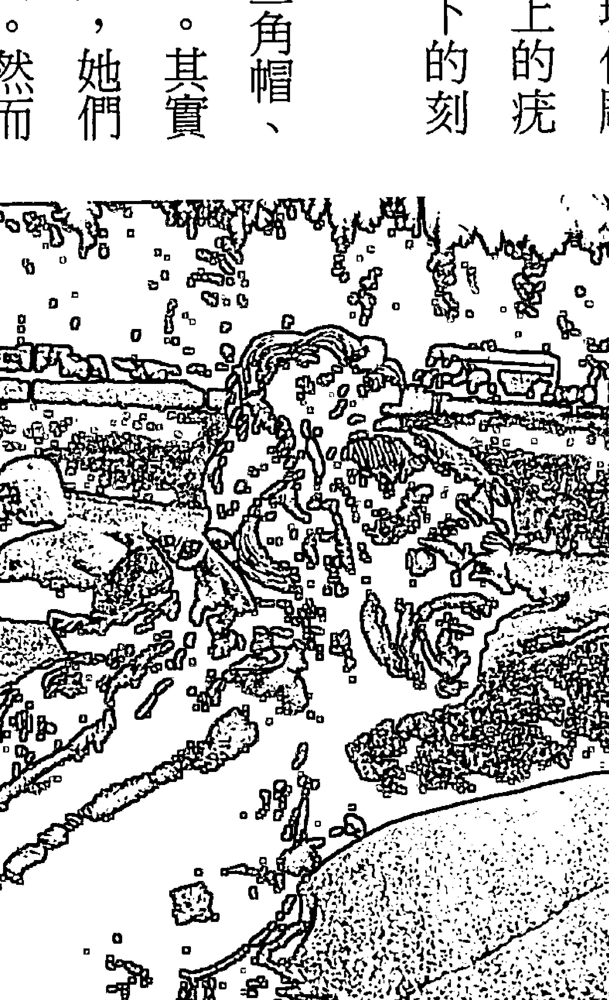
女巫青銅像

在審判時利用拷問逼迫女巫自白，並宣稱女巫在看不見的地方有疣、痣，有時甚至說她們有三個乳頭，對這些女性進行帶有侮辱的身體檢查。在哈茨地方的女巫判決光是十六世紀就有高達八千件。

雖然無從得知《女巫凡特立德》的傳說是何時出現，不過應該是希爾達母親甫改信基督教不久的時候。因此當時仍留下異教的風俗習慣。說是異教倒不如說是民間的風俗習慣。

大家都希望打獵成功，農業豐收，這時候如果相信某種儀式或咒語的力量，理所當然會加以運用。然而具有咒語要素的民間儀式與習慣最後仍然被納入基督教的活動。將夏至摘藥草與施洗約翰這一天重疊。過去人們會把摘下的藥草帶到山上請神明為自己淨身，不知不覺中則改為獻上瑪莉亞的祭壇，請求她為自己淨身。

因此希爾達所唸的異教咒語便引來了女巫凡特立德。傳說中的

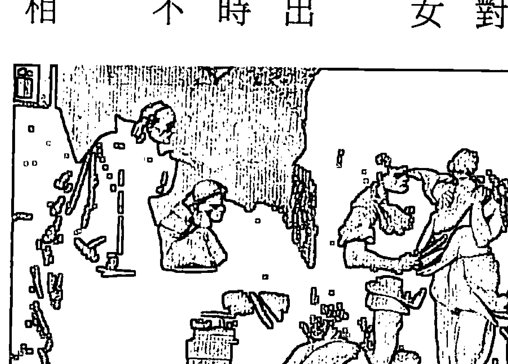
伊爾賽之岩（伊爾賽斯坦）。口耳相傳這座立有十字架的岩石，曾被女巫變成岩城。這是一八一三年為了紀念拿破崙戰爭時期犧牲者的十字架。

凡特立德總是被描繪成居住在森林裡的恐怖女巫，但只要改變看法，也可說她是拒絕改變信仰，而逃到森林生活的女性。或許她對於什麼都遭到基督教奪走的村莊感到痛苦，而誘惑少女也只不過是想尋求同伴。然而凡特立德因希爾達口中的「主啊」，而無情地遭到石化。比畫十字聖號的行為或者說出「神」等話語，就能保護自己不受魔物侵襲。在哈茨的某個村莊，傳說看到女巫們齊聚跳舞的青年大喊一聲

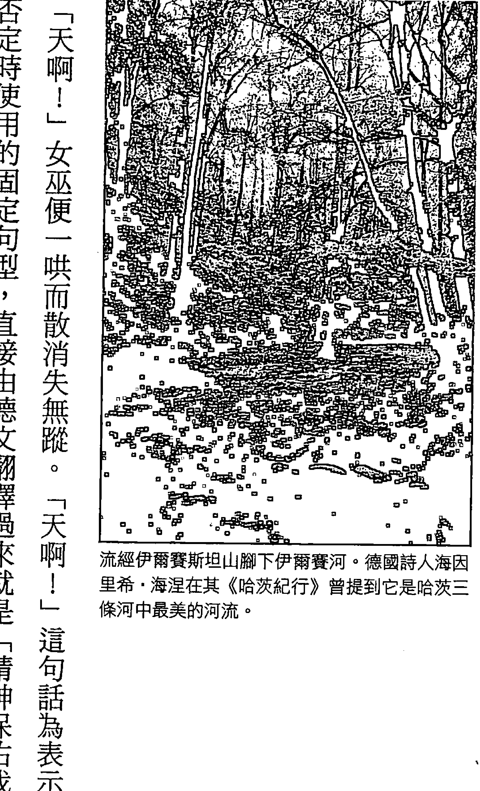
「天啊！」女巫便一哄而消失無蹤。「天啊！」這句話為表示強烈否定時使用的固定句型，直接由德文翻譯過來就是「請神保佑我」。也就是說因為出現「神」這個字，導致女巫消失。就連凡特立德也無法抵抗「神」這個字。

哈茨山地西側有一座岩山叫做伊爾賽斯坦（伊爾賽之岩）。據傳居住在這裡的女巫伊爾賽由於嫉妒公主的美貌，把公主的城堡變成岩山，並裝上了只有伊爾賽看得到的門。於是公主只能在伊爾賽規定的日子外出。由洪佩爾丁克作曲的德國歌劇《漢賽爾與葛麗特》（又譯《糖果屋》），第一次演出在一八九三年）中的女巫角色設定，就是住在這個伊爾賽斯坦一帶的森林中。

說到森林中的女巫，我曾經看過一幅有趣的景象：有一排蘑菇沿著山的斜面往山上長。長成一圈的蘑菇稱為女巫圓圈，這較為常見。不過卻很少看過排成一列的蘑菇，因此我便將它取名為女巫隊伍。在德文中有森林植物的名稱與女巫相關，非常有趣。

竹下菌（Phallus impudicus）為女巫蛋；澤漆（Euphorbia helioscopia）的汁液為女巫乳；而東北石松（Lycopodium clavatum）的孢子則為女巫麵粉。

究竟有幾位女巫隱居在哈茨森林裡呢？

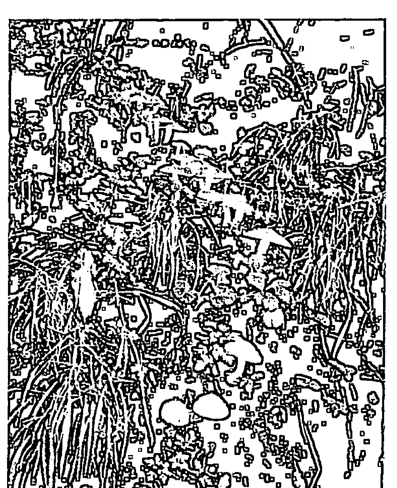

## 3 《愛娜溫》——淪為虛構的植物

在格林兄弟的《德國傳說集》中有這樣一個故事。來源自《給市民與農民的手冊》（一七四四年）。凡是盜賊家庭出身、由屬於盜賊家族之母親所生下的孩子，即使沒有犯下竊盜等罪嫌，一旦自白為強盜遭受絞刑時，若是年輕處男的話，小便或精液失禁之處便會長出名叫愛娜溫或 Galgenmännlein（絞刑台的少年）的植物。其莖的上部有大片的葉子與黃色的花。挖取這種植物將伴隨著極大的危險。一旦把該植物從土中拔出，根部便會發出可怕的聲音，讓挖掘的人立刻身亡。那麼該怎麼辦呢？必須在週五太陽出來之前，以棉花或蠟塞住耳朵，帶一條全黑的狗一同前行。在愛娜溫上畫三次聖十字，挖掘周圍的土壤，處理到細如鬍鬚的根部與土壤接觸部分僅剩一點點時，把根部以繩子綁在狗尾上，用麵包吸引狗兒漸漸離去。於是狗兒便會為了吃麵包而向前跑，將植物連根拔起。但是狗兒聽到那根部傳來的叫聲便會死去。

如此費盡心力得到的根以紅酒洗乾淨，用紅白相間的絲綢包裹放入小盒子裡。每到週五便得拿出來清洗，而新月的夜晚則得為它換上全新的白色內衣。

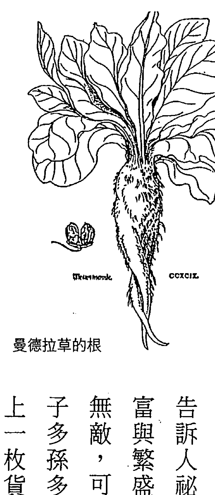
由於愛娜溫具有預知未來、告訴人秘密，可以藉此獲得財富與繁盛。擁有愛娜溫便天下無敵，可以免於貧困，還能多子多孫多福氣。只要前一晚奉上一枚貨幣，隔天早上就會變兩枚。然而，如果想一直仰賴愛娜溫的力量，就不得許過大的願望。若愛娜溫擁有者離世，必須由最小的兒子繼承，並在過世者棺材中放入一片麵包和一枚硬幣。若家中應該繼承的小兒子比父親早離世的話，則由長子繼承，並得由長子將麵包及硬幣與最小的弟弟一同埋葬。愛娜溫在古高地德語（八世紀至十一世紀）中稱為阿露露娜和阿露露恩，根據格林兄弟，這名稱取自於古代日耳曼女神之名。這個愛娜溫正是以詭譎植物為人所知的茄科植物——風茄，又名曼德拉草（英文為Mandrake）。以前口耳相傳像曼德拉草這般不可思議的魔法植物在現實中並不存在。為什麼呢？光憑它看似長了兩隻腳，形狀很像人類這點來說較為薄弱。我曾在德國的博物館看過一些曼德拉草根部的實物，怎麼看都不像人類。有其他植物的形狀長得更像人類下半身，例如高麗人參，有時候白蘿蔔也會長成類似的形狀。此外，自古以來人們把曼德拉草當作治病的藥物使用，其有毒，

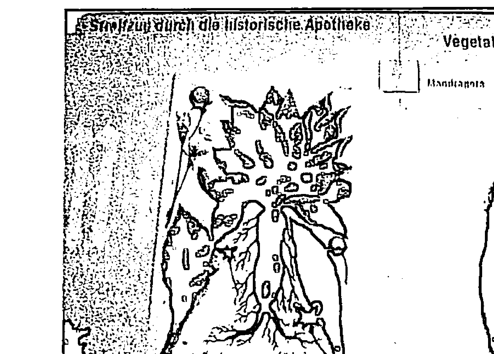
右方為實際曼德拉草的根部。（慕尼黑，德意志博物館）
若過量會產生幻覺甚至死亡。然而由於其他藥草也具有如此作用，因為此這個解釋也無法讓人信服。即便如此，一直以來仍流傳著許多曼德拉草那不凡力量的傳說。閱讀那些與曼德拉草有關的文獻時，有些很明顯讓人覺得那是作者刻意塑造出的恐怖形象。若該文獻沒有載明出處，疑心病的我就會忍不住懷疑。

曼德拉草傳說究竟是什麼呢？這個傳說的特徵在於其出生、形狀、連根拔起時的恐怖叫聲，挖出時的儀式與方法、曼德拉草所擁有的魔力。讓我們來整理一下。

很難確定曼德拉草究竟是何時出現。在《舊約聖經》中曾提到，在創造世界的第三天，

> 神說：「地要長出青草，和結種子的菜蔬，並結果子的樹木，各從其類，果子都包著核」（創世紀第一章第十一節），
就這麽完成了。神不會出錯，因此曼德拉草應該也是在這時被創造出來。由於神第六天才創造人類，所以在那之前曼德拉草就存在了。先把玩笑放一邊，從很久很久之前曼德拉草便早已與人類產生連結。
在埃及的法老圖坦卡門（Tutankhamun，西元前一三四二年左右～西元前一三二四年）的墓中發現了象牙製、具有蓋子的小盒子。其蓋子上的浮雕為法老與王后面對面站著。周圍雕有虞美人、矢車菊、曼德拉草作為邊緣裝飾。下方則為兩位女性採集虞美人與曼德拉草的繪圖。

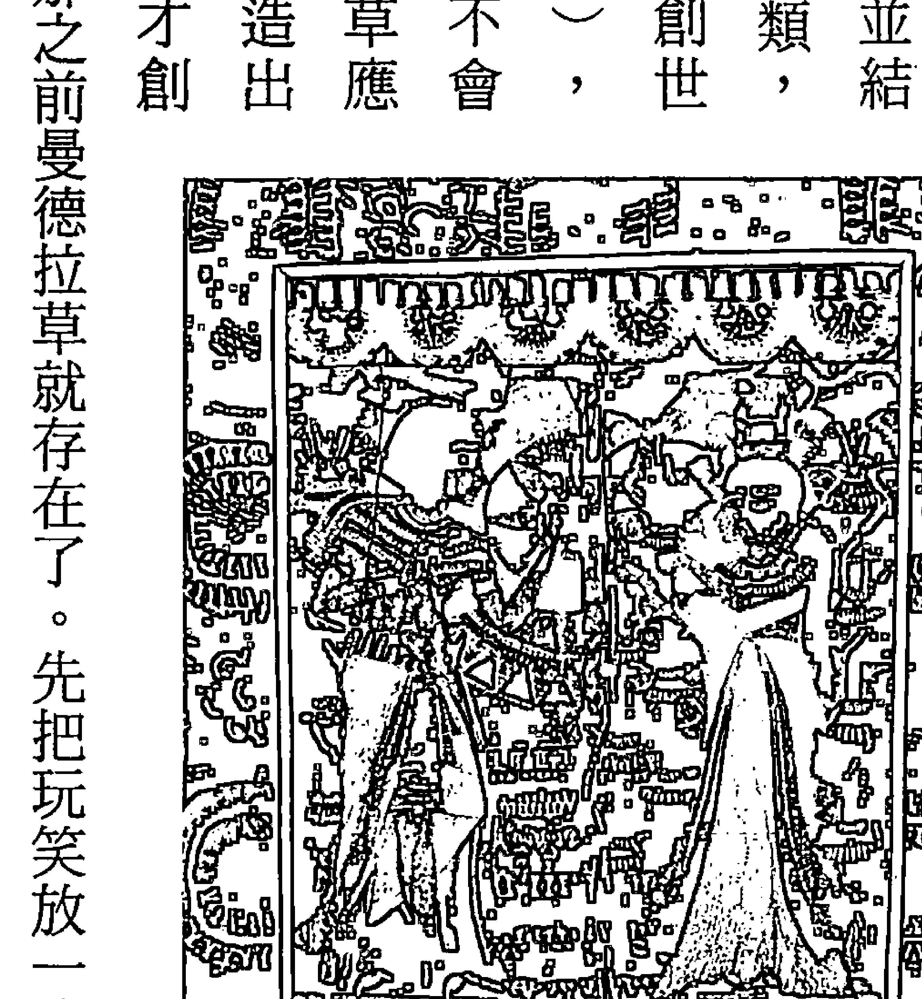
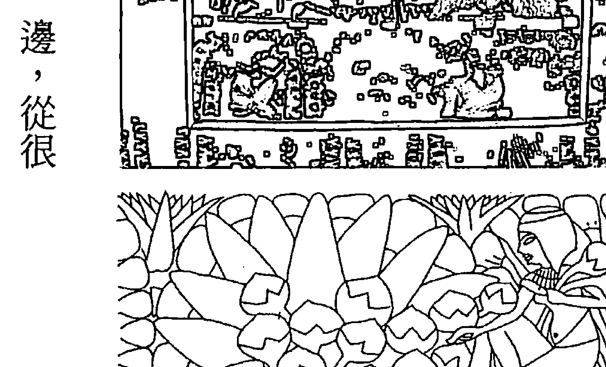
圖坦卡門墓中的小盒子裝飾。下方繪有採集曼德拉草的少女。（下）照片的下半部：線描

古埃及時期便已經開始種植曼德拉草。當時的人將曼德拉草當作具有春藥效果的水果食用。在《舊約聖經》亞伯拉罕之孫雅各與兩位妻子利亞和拉結的故事中，曼德拉草以不知該說是春藥功效的結果，或者該說是具有受孕功效的植物登場。這個部分由於已在前著中詳細探討過，在此將省略不談，不過其效果似乎極佳。它被翻譯成日文「戀愛茄子」，而翻譯成英文和德文則是「愛的蘋果」，實在是譯得真妙。又過了一段時間，古希臘哲學家和植物學家的泰奧弗拉斯托斯（Theophrastos，西元前三七一～西元前二八七年）在其著作《植物志》中，

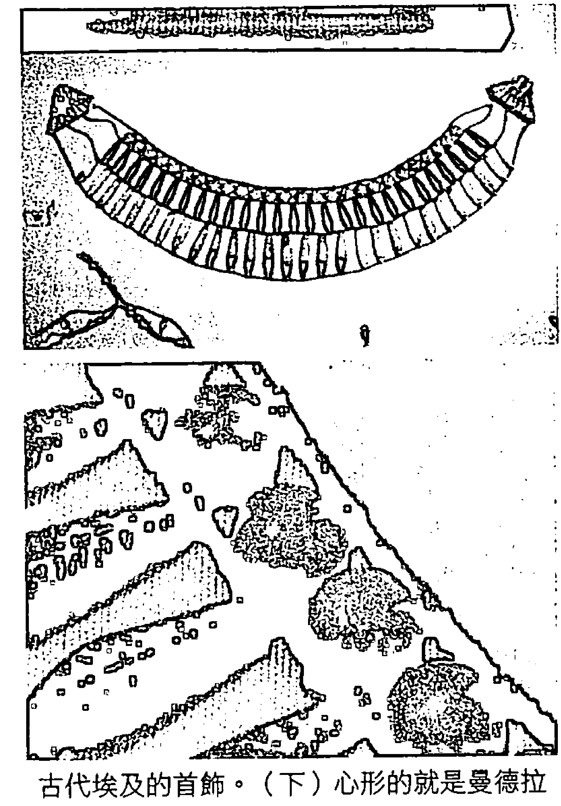
針對曼德拉草提到，「把根部削皮浸泡到醋中，可治療丹毒、痛風，具有催眠、春藥的效用。」曼德拉草由於含有天仙子胺、阿托品、東莨菪鹼等會引發幻覺的有毒成分，在過去曾用來做麻醉藥物來緩和痙攣、難產，同時還會讓人沉迷於幻想世界的春藥效果。此外，泰奧弗拉斯托斯在書中講述到，「據說切曼德拉草時必須在周圍用劍畫出三重圓圈望向西方切。」這項記述列入「採集具有藥效的根部，以及與其相關的迷信」項目中。也就是說，他認為這種挖掘方法是種迷信。在古代埃及菜園中栽種的風茄，以及《舊約聖經》中從田裡取來的戀愛茄子，都沒有提及挖掘時的儀式。然而在泰奧弗拉斯托斯的時代，即便是從傳聞也可得知大眾將風茄視為需要儀式、具有魔力的植物。在泰奧弗拉斯托斯時代的大約三百年後，古羅馬植物學家老普林尼（Gaius Plinius Secundus，西元二三～七九年）曾在著作《博物志·植物篇》中斷言：「挖掘曼德拉草的人必須謹記不能面迎風，先

> 把根部削皮浸泡到醋中，可治療丹毒、痛風，具有催眠、春藥的效用。
> 據說切曼德拉草時必須在周圍用劍畫出三重圓圈望向西方切。
> 採集具有藥效的根部，以及與其相關的迷信
> 挖掘曼德拉草的人必須謹記不能面迎風，先

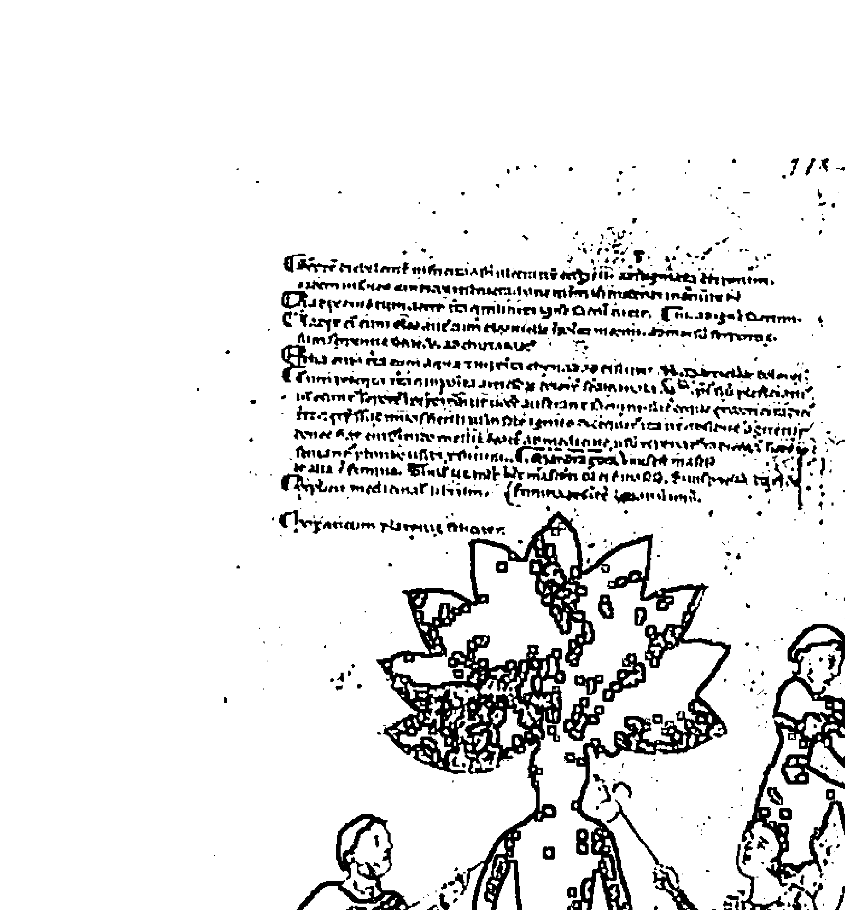
採集曼德拉草的情形，右方有帶著狗的人。（約一世紀的繪畫）
在周圍以劍畫三個圓圈，再朝向西邊挖掘。」
但是，兩人的著作中都未提及曼德拉草那可怕的叫聲以及使用狗協助的方法。因為我實在太好奇了，便開始查證。於是發現利用狗兒的方法，看來應該是始於西元一世紀活躍於羅馬的猶太作家弗拉維奧·約瑟夫斯（Titus Flavius Josephus，西元三七～一〇〇年間）筆下。
在其著作《猶太戰記》中，他針對霸拉斯（Baaras）這種特別危險的植物寫道：「直接用手觸摸非常危險，恐將喪命。必須小心讓手在不碰到這種草的狀況下拔出根。能夠避開危險的另一種採集方法如下，」後方介紹了利用狗兒挖出根部的方法。

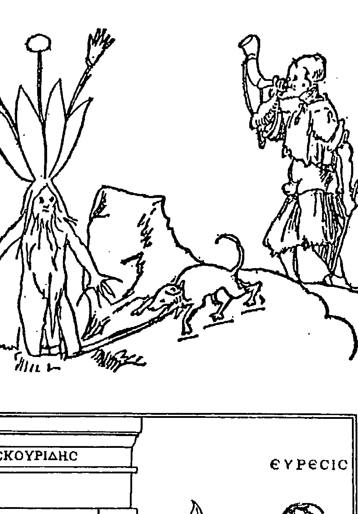
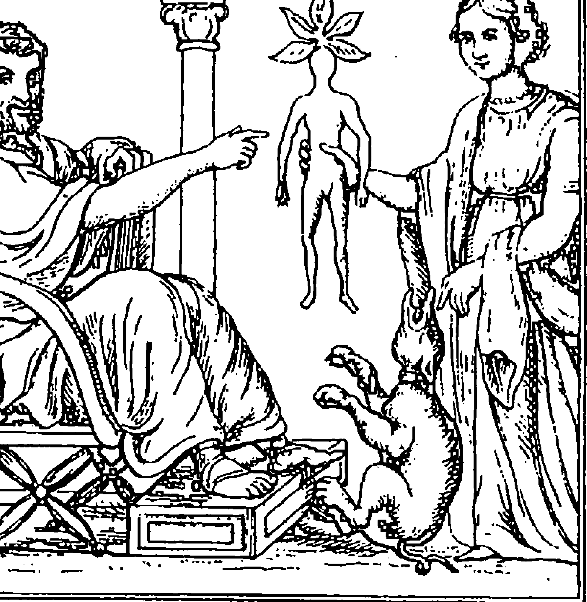
+   - 上圖：為了不要聽到曼德拉草根那可怕的叫聲必須吹奏號角。（中世紀的圖畫）
- 下圖：迪奧科里斯與曼德拉草。

許多研究學者皆認為這個霸拉斯就是曼德拉草。儘管約瑟夫斯的著作獲得好評，不過因他寫的內容實在較為誇張，並且按照自己的意思解讀歷史，因而也受到批評。評價一個人的是非是件難事，不過他似乎是個問題人物。約瑟夫斯和老普林尼可說幾乎是同一時代的人物。不知究竟是老普林尼不曾聽說利用狗兒的方法，還是他不認為曼德拉草和霸拉斯是同種植物呢？
不過，如果霸拉斯這種植物以及利用狗兒的方法都是約瑟夫斯所創造出的產物，其他人還真能對它感到畏懼又欣然接受其存在。因此利用狗兒的方法才會流傳至今不曾消失。

那麼，曼德拉草根部的叫聲又是怎麼一回事呢？在約瑟夫斯的著作中並未寫到根部發出的叫聲，反而寫有「其顏色有如燃燒的炎色一般，會在傍晚發出光亮」，如此新訊息。
另外，不知曾幾何時，甚至描繪出挖掘者只要不去聽那個叫聲，使勁吹笛即可，這種嶄新的主意。也聽過有版本是以蠟作為耳塞。甚至流傳曼德拉草到了夜裡會來到陸地上，偷偷地四處行走，還有如同本節一開始的傳說一般，由遭到處刑囚犯失禁流出的精液累積處長出，這些恐怖的傳言逐漸傳開。

在古希臘醫師、植物學家迪奧科里斯（Pedanius Dioscorides，西元四○○年左右～九○○年）的《藥物論》手抄本中，有許多藥草的插圖。其中也有曼德拉草的插圖。希臘神話的寧芙（妖精）把曼德拉草交給

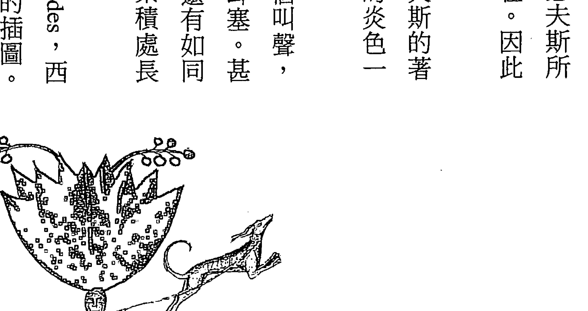
變成採集重要成員的狗兒

迪奧科里斯。她的腳邊有畫出看似已經喪命的狗兒。這是五二一年的手抄本。狗儼然已經成為曼德拉草的附屬品 (attribute)。

儘管曼德拉草有如此詭異的傳說，泰奧弗拉斯托斯和老普林尼都只把此種植物當作藥用植物看待。老普林尼在書中記載了保存曼德拉草的方法，以及藥用液體的作法，也寫到光是嗅聞到根部或果實的汁液就會頭痛、讓人失聲甚至致死，以四、五毫升為適量。到了迪奧科里斯時期，他的處方指示更加詳細，只要適量不但可以麻痺疼痛、緩和下痢，也能作為灌腸藥劑。

曼德拉草的原產地為地中海及黎巴嫩地區，常見於人煙稀少的原野。這真令人感到意外。畢盡盛傳這是能夠作為財運護身符的珍貴植物，才會進行超級麻煩儀式去挖掘出來，因此我以為曼德拉草根部在當時應該以高價販售才對。一五七〇年在瑞士沙夫豪森（地處德瑞交界）有三名販賣偽造曼德拉草的流浪者遭到逮捕。他們把胡蘿蔔根加工成像人形的模樣。可見當時的需求多到有詐騙出現的地步。

曼德拉草的傳說與現實似乎天差地別。它真是一種謎團籠罩的植物。《格林童話・巨人和裁縫》中也出現曼德拉草。膽小的巨人和膽大的裁縫師較勁，巨人心想「這個人體內有曼德拉草」而感到畏懼。巨人認為裁縫具有如曼德拉草般的神奇力量。即使沒有任何說明，也可得知當時對於曼德拉草的恐懼已經深深固著。到了二十世紀德國作家漢斯・海茲・愛華斯 (Hanns Heinz Ewers) 寫了一本名叫《愛娜溫》 (Airaune，一九一一年) 的奇幻小說。透過人工授精出生的美少女愛娜溫，其魔力讓周遭的人走向毀滅。此書不僅在德國暢銷，也翻成日文版。在後來的《哈利波特》和多數的漫畫、遊戲軟體問世之前，曼德拉草成了讓人走向毀滅、不可思議、若遵循固定方法挖掘就會致死的恐怖植物。

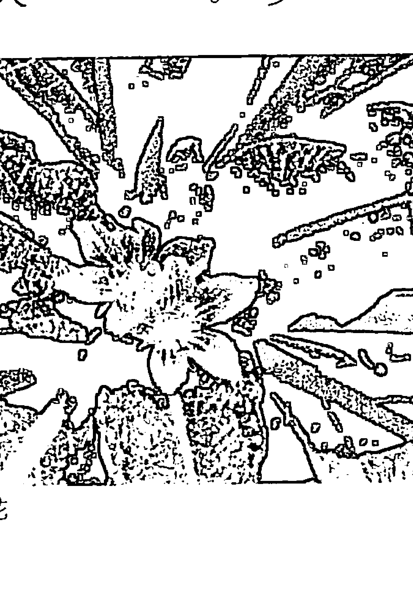
曼德拉草的花

### ◇曼德拉草
(茄科 Mandragora officinarum=M.vernalis/Mandragora autumnalis Spreng.)

曼德拉草一直以來被視為沒有形體僅有意象的植物。也就是說，曼德拉草成了虛構的植物。

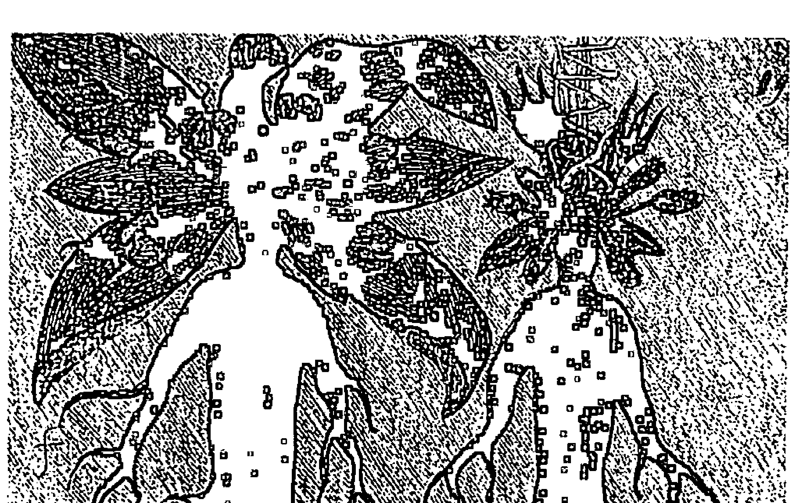
歐洲的曼德拉草有分春天開花（Mandragora officinarum）與秋天開花（M.autumnalis）的品種。春天開的花是紫褐色，而秋天開的花則是淡藍紫色。葉子呈叢葉型，由於沒有莖，圓滿的果實就直接長在地面上。
這是繪於十六世紀的雌雄曼德拉草圖。在我前作的封面與封底都有曼德拉草的圖案，雌曼德拉草擁有如維納斯一般的美麗姿態，而雄曼德拉草卻像悲慘的裸男。有關雌、雄曼德拉草的記載，雖然不知道是不是始於老普林尼，不過在其《博物志》中有提及。事實上並沒有區分雄株與雌株，曼德拉草本生就是雌雄同株。曼德拉草的根、葉、果實（未成熟的）、種子皆含有可怕的毒性成分——生物鹼。在創造出世界最古老都市文明的蘇美（現在伊拉克共和國南部）曾使用曼德拉草的根、葉、液體作為牙齒止痛藥、健胃劑，因此當時的人普遍知道適當分量的調劑方法。關於曼德拉草真正的毒性，根據藥學界的報告中，若攝取其果實案例。果實若是成熟就幾乎無毒。儘管會產生數日的幻覺，不過結束後就會恢復正常，實際上並無死亡。

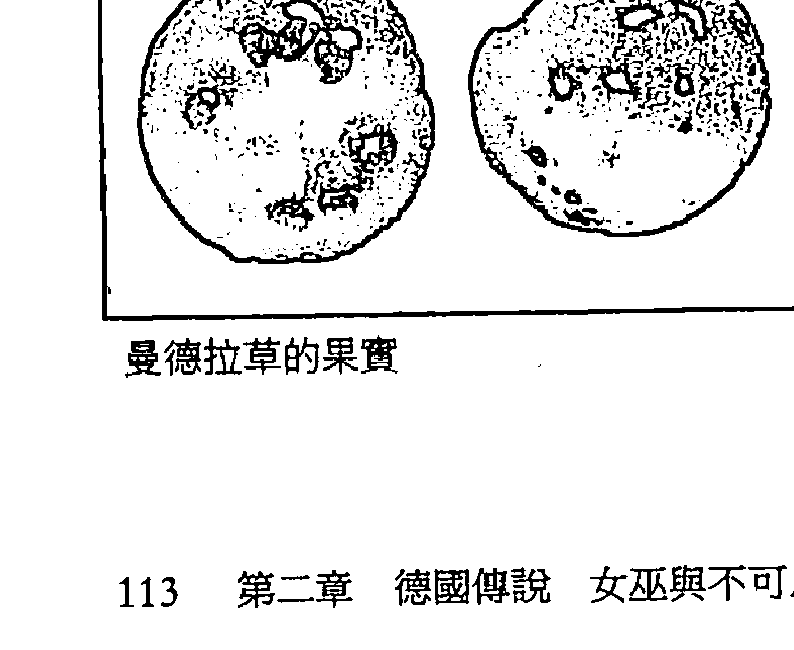

## 4 《科何威修道院的百合》——亡者之花

在威悉河畔的科何威修道院（Corvey Abbey），每当有修道士快要死亡，挂在聖堂內殿青銅花環的百合，便會在其死前三天預告。
這個百合會離開花環，來到將死之人的椅子上。如此一來絕對難逃一死。這個不可思議的現象據說持續了數百年。有天一位年輕的修道士看到自己椅子上有百合時，他便把百合放到年邁修道士的椅子上。年邁的修道士知道自己即將死去便生起病來，最終又恢復健康。
反觀想要逃避死亡的年輕修道士，則如預言般在第三天猝死。

這是記載於《德國傳說集》的〈科何威修道院的百合〉內容摘要。

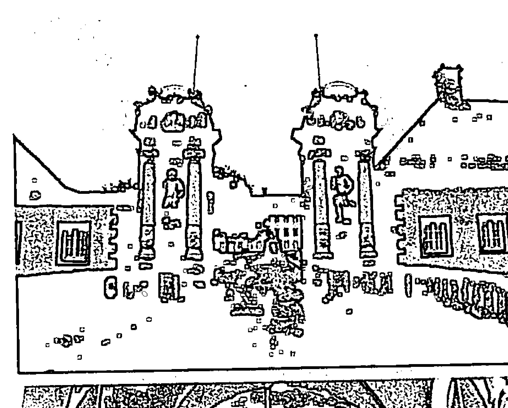
科何威修道院。建於九世紀，為德國早期的基督教文化中心。（下薩克森邦）

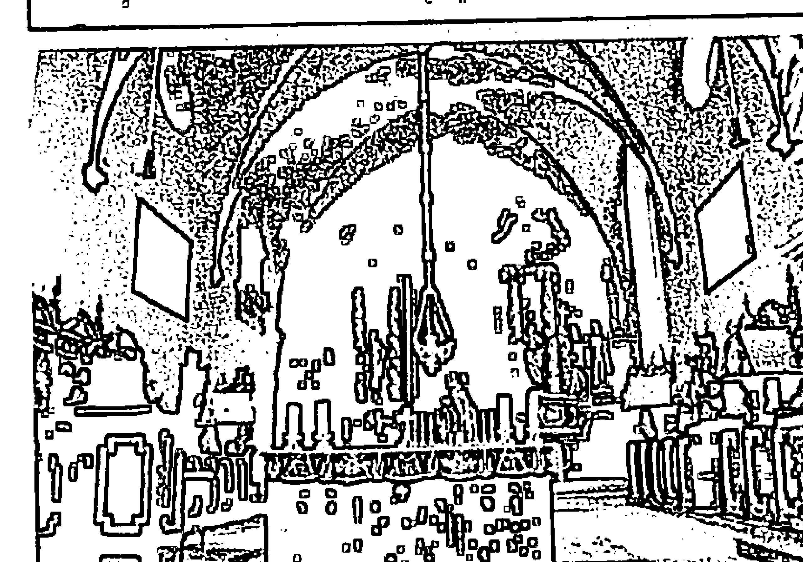
科何威修道院。建於九世紀，為德國早期的基督教文化中心。（下薩克森邦）

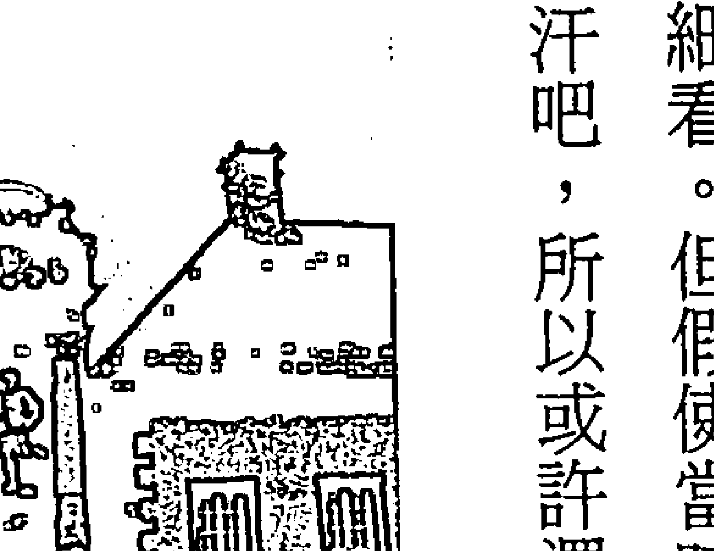
科何威修道院。建於九世紀，為德國早期的基督教文化中心。（下薩克森邦）

以前我曾造訪科何威（德國中部）修道院。
它也是德國國歌作詞的著名詩人法勒斯雷本（一七九八～一八七四年）長眠於此地，頗氣派的修道院。我曾參觀過內部，或許有看到內殿的青銅花環，不過當時我並不知道這個故事，可惜沒有仔細看。但假使當時知情，花環上沒看到百合的話，可能會嚇出一身冷汗吧，所以或許還好當初並不知道這件事。

傳說集》中有另一個《百合》的故事。有一位男性知道如何將砍頭後恢復原樣的魔術，而受邀至宴會來表演，他砍下了男僕的頭卻不知為何接不起來。

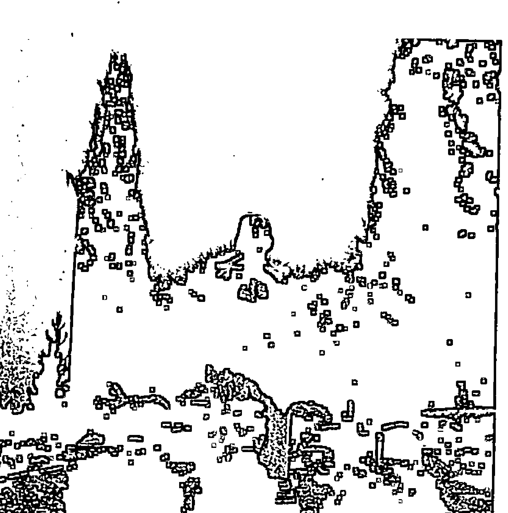
於是這名男性讓桌上長出一株百合，並把那朵花斬斷。結果有一名賓客便從椅子上倒下，他的頭滾到地上後，男僕的頭便恢復了。這名男性最終只好離開該地，直到獲得原諒以前都沒有回去。

故事就到此。這名男性為了消除擾亂自己的人，把百合花想像成人頭將之斬斷。在那個時代，普遍相信只要製作一個和想詛咒對象類似的人頭，就能對其造成傷害，這種信仰就是這個故事的由來。似的物品，再加以施法，这个法术就会降临在该对象身上使诅咒成功。这和日本把稻草人看作讨厌的对象，每晚丑时来到神社用五寸钉把草人钉到神木上。这种诅咒方法由于不是实质上攻击对方，因此应该有人会想尝试。

可是，为什么是百合呢？如果是我，反而脑中会先轻轻落下的山茶花朵。或许就如同科赫修道院的故事所述，百合是亡者之花。

《格林童话》中有〈三只小鸟〉的故事。有对三姊妹，姊姊嫁给国王，而两个妹妹则各自嫁给大臣。在姊姊怀孕时国王不得出远门，只好托两位妹妹照顾她。然而，生不出孩子的两个妹妹竟然把姊姊的孩子丢到河里淹死。于是就有小鸟飞来唱歌，或许你已有死亡的觉悟，接下来会受到神的庇护，在那之前变成一束百合花吧。勇敢的男孩。

这两个妹妹对国王说姊姊生出了狗。国王说如果这是神决定的那就算了。于是 有如童话的套路，同样的事件会 重复三次。国王终于忍无可忍把 王妃关进牢中。而两个男孩和一 个女孩都被路过的渔夫救起。 这些孩子后来得知自己是被 渔夫捡来的，便一个个离开踏上 寻找生父的旅程。路途中的故事 较长在此省略，不过最后他们终 于见到父亲，而母亲也从牢狱中 获得释放，邪恶的两个妹妹则被烧死，故事结束。

这个故事里有几个有趣之处。因入狱多年身体孱弱的王妃，凭着饮用取自长有一株老树的井水恢复健康。这棵树和井水意象与前一章的〈霍勒太太〉有所重叠。而给孩子们建议的亲切妇女，则符合一聪

明女性」。妹妹们就这样遭到烧死，这让人联想到处刑女巫等等。不过这些都先摆一边，现在先来专门谈论百合。由于这个故事是以方言书写，对我来说较难读出当中特殊的义涵，然而针对小鸟所唱的歌可以这样解读：孩子们被丢到河里或许真的丧命，而孩子们要上天堂还是再度回到人世间，都是神的决定。在那之前必须待在百合花束中等待。在百合花束中一定有许多人等待神的指令。其中或许是人间和死亡世界的交界。故事中对于孩子们被丢入的河川，有提到「我想应该是威悉河」。这和本节一开始的科赫修道院同属于威悉河畔，这是否仅是偶然？我并不清楚威悉河畔与百合究竟有什么样的关联。同样在《格林童话》的〈贫穷和谦卑指引天国之路〉故事中，过世之人一手拿着玫瑰一手拿着百合花，因此其墓上也长出了玫瑰和百合。在这些故事中，百合可以预告死亡，人类和百合藉由死亡结合成一体，或者作为灵魂暂时休憩的场所，可得知百合就是亡者之花。

我们每个人对于花都有各自的想像。我非常喜欢每到彼岸日（春分、秋分）就会绽放的鲜红彼岸花（曼珠沙华），然而因这花让人联想到燃烧的火焰，因此有不得放在家里的迷信。

那么对于百合则有怎样的想像呢？百合那浓烈的芳香、那看似威武的雌蕊或雄蕊、一旦碰到衣服就很难处理的花粉，我认为百合是具有强烈自我表现欲的花朵。当然，这是我个人的看法。

百合是常出现在《圣经》的花朵，象征纯真无邪。其代表天使加百列手拿白色百合花，向玛利亚传达她将受孕的消息。那就是圣母百合（Lilium candidum）。若加百列没有手持百合的话，可能已被投入花瓶放在地上。根据基督教的图像学，传递受孕信息时为白色百合，玛利亚身穿红衣、蓝色斗篷。

白色则由于未受染色是纯洁的象征。同时白色这种无色与死亡这种绝对的无有所关联。日本以前死亡的装束大多为白色，近年来被称为临终衣装（エンディングドレス）多选择有颜色、图案的洋装或和服。不过，本节开头的修道院百合，我认为一定是白色。

百合的原始物种有近百种。是代表性的花。百合根有与鳞片状叶子相连的鳞茎，其主要成分尽管为醣类，其中储藏着蛋白质、钾等养分，营养相当丰富。卷丹、博多百合等百合属的球根具有滋养强壮、利尿、止咳、治疗精神官能症、心神不宁的效果。

百合根在中药上汉字写作「百合」，日文念作「hyakugo」。表示对于「百」种疾病的综「合」症状都有效。原来百合的汉字在日文里有这层含义啊，令我深深折服。

日本料理也会使用百合根。最代表性的作法是加到茶碗蒸里，有银杏和百合根的茶碗蒸是极品。同样属于食用的茄子或马铃薯，花虽美却没有栽种来观赏用；然而具有清纯无邪意象，有时又和亡者有关的百合花之于茶碗蒸里的百合根，这个差距非常有趣。

在德国也会食用同为鳞茎的洋葱和蒜头，却未认同百合根的实用价值，实在相当可惜。

复活节百合。基督教国家会在复活节时装饰复活节百合。这是原产于琉球列屿的麝香百合（Lilium longiflorum），有如喇叭般的白花向两边绽放。

## 5 《齐格非之死》——龙之血与菩提叶

在一二○○年至一二○五年间创作而成的英雄叙事诗《尼伯龙根之歌》（作者不详）是有二千三百七十九节构成的大作。因此要简介其内容非常困难。由齐格非与克里姆希尔特的婚姻、克里姆希尔特的哥哥勃艮第王国国王古伦特与冰岛布伦希尔德公主的婚姻、两位王妃克里姆希尔特与布伦希尔德赌上自尊彼此斗争、齐格非悲剧性死亡、克里姆希尔特的复仇、勃艮第王国的灭亡等等可各自成为独立的有趣故事所构成。然而在此要介绍的是齐格非之死，以及致他于死地的一枚树叶。

首先在调查这部大作中究竟出现多少植物时，令我大吃一惊：具体讲出名称的植物仅有三叶草、柳树、蔷薇、菩提树四种。我不禁怀疑自己的眼睛。尽管有三十七种手抄本，不过植物的名称应该不会因此增加。而且前两种植物还只出现在歌曲中，不但没有特别意义也无用处。然而第四种植物菩提树，尽管这个名词只出现三次，不仅在齐格非之死，于整部作品中占有极重要的一席之地。重点并不在次数。出生于荷兰桑腾（现为德国）的齐格非王子，为了向勃艮第国王古伦特之妹克里姆希尔特求婚，千里迢迢来到了沃姆斯（Worms，莱茵河畔）。齐格非在勃艮第国王身边待了一年，他为饱受敌国侵略的勃艮第国奋力而战，且赢得胜利。在庆祝战胜的宴席中，他终于与克里姆希尔特相见。

齐格非帮助国王古伦特与冰岛女王布伦希尔德结婚，并得到和克里姆希尔特结婚的许可。于是两对佳偶的婚礼同时举行。婚后，克里姆希尔特便在齐格非的故乡生活，也生了小孩过着幸福美满的日子。

然而过了一阵子，克里姆希尔特迟迟不回故乡，而齐格非明明身为臣下却不来伺候国王，布伦希尔德因此起疑并且逼问国王古伦特原因。布伦希尔德过去是个高傲的女王，她曾宣言自己只嫁给赢过自己的男性。而古伦特国王之所以能和她结婚，全凭齐格非的协助。齐格非使用从尼伯龙根族抢来的隐形头巾，帮助古伦特国王打败布伦希尔德。

当时齐格非以古伦特国王臣子的身份一同前往布伦希尔德的住处。因此布伦希尔德认为未前来伺候的齐格非是失礼之徒。由于古伦特国王实在是推托不了妻子的要求，于是便拜托齐格非和克里姆希尔特一同回娘家。

于是齐格非夫妇又再次回到沃姆斯。有一天骑士们齐聚一堂，前来参加比武活动。布伦希尔德和克里姆希尔特一开始好端端地看着骑马战术的比赛，渐渐地两人开始较劲，炫耀自己的丈夫比那些骑士更厉害。最后，布伦希尔德说出齐格非不过只是古伦特国王的臣子罢了，克里姆希尔特为了证明丈夫不是臣下，回答『进入教堂礼拜时，我要比你早到』，便不欢而散。于是两人约在教堂前见面，又是一阵针锋相对。

> 布伦希尔德：「你一个臣下妻凭什么站在王妃的前面？」

> 克里姆希尔特：「什么时候侧室能当上王妃啊？」

布伦希尔德回答：「你说谁是侧室？」

弥撒结束后她抓住克里姆希尔特。

> 布伦希尔德：「你有我是侧室的证据吗？」

> 克里姆希尔特：「当然有。看看这个金戒指，这可是我丈夫躺在你旁边时，为了我拿来的。」

> 布伦希尔德：「这个戒指被偷了，现在可让我知道凶手是谁了。」

> 克里姆希尔特：「哎呀，把我当小偷吗？那我身上的这条带子呢？」

听到这番刺耳的 话语，布伦希尔德脸 色苍白说不出话来。

布伦希尔德在初夜时 抵抗了国王，力气不 足的国王无计可施， 便在隔天将这件事向 齐格非抱怨。于是， 齐格非又使用了隐形头巾压制住布伦希尔德，让古伦特国王占有了她。齐格非就是在这个时候偷偷带回布伦希尔德的戒指和丝绸腰带，竟然送给了妻子。

布伦希尔德是多么沮丧与愤怒。她终日以泪洗面。在齐格非面前抬不起头的古伦特国王仍向他说明了事情的经过。齐格非面色凝重地说道：「应该管教那些妇女不要净说些无聊的话。我为妻子的不检点深感惭愧。——看到这里忍不住脱口而出「这个男的在想什么啊？」降低了我对齐格非的评价。

另一方面，古伦特国王的忠臣哈根看着每日哭泣的布伦希尔德，他心想：即使克里姆希尔特是国王的妹妹，也已经嫁到别人家了，自己该守护的应该是勃艮第国王妃布伦希尔德的名誉。因此哈根认为必须要齐格非为王妃的这份屈辱付出代价。

于是，他便举办了狩猎大会，邀请齐格非进入森林，再以枪将其刺杀。

齐格非曾经击退守护尼伯龙根族宝物的龙，沐浴其血液获得不死之身。至于拥有不死之身的齐格非为何会被杀死呢？他当初沐浴龙血时，刚好有一片菩提树叶贴在他肩胛骨之间，所以只有那个部分没有变成不死之身。

而告诉哈根这个秘密的人，就是齐格非的妻子克里姆希尔特。哈根故意制造最近战争又要开始的流言，而得知此事的克里姆希尔特为了自己的丈夫，就请求哈根紧急时刻要保护他，却因此正中哈根下怀。

哈根暗自窃喜并问到，该怎么保护拥有不死之身的齐格非？克里姆希尔特就如此如此这般这般地说出了其「两肩胛骨之间」的弱点。

她对于自己的过失造成丈夫死亡感到悲痛，以及对于哈根的愤怒与复仇发狂，最后不只是哈根和古伦特，且把整个勃艮第王国都导向灭亡。

这就是《尼伯龙根之歌》亦称为《尼伯龙根之魔》大作的结局。

就连拥有不死之身的英雄也有致命弱点，还挺有趣的。自古以来许多英雄被打败都是输在意外的弱点。阿基里斯的母亲在他出生后便握着他的脚踝，将他浸入不死身之川替他洗澡，因此脚踝就成了他的弱点。

> 《旧约圣经》的士师参孙因受不了非利士女性大利拉的逼问，就说出自己要是被剃头就会失去怪力。

参孙从出生时就没剪过的头发乱如杂草，再加上个性又火爆。相较之下齐格非是个有魅力又勇敢的男性，较为受欢迎。在华格纳的戏剧《尼伯龙根的指环》以及弗里茨·朗的默片《尼伯龙根：齐格非之死》（一九二四年）中都可以欣赏到许多齐格非的魅力。

很久以前，我得知在波昂近郊有一座能够俯瞰莱茵河的山上，有齐格非屠龙浴血的地点，因此感兴趣前往。那是座海拔高度仅有三百二十一公尺的山，上头有一名为「Drachen-fels」（龙岩山）的废墟城堡遗迹，其三角形的望楼仅残存一部分。城堡下方有似乎无水的小型浅池。我想着这里可能是龙的血迹，又能俯瞰莱茵河的绝佳美景，便心满意足地离去了。

但不记得那附近是否有菩提树，

于是为了确认，近期又再次造访。结果不仅没有标示说明，也没看到关键的菩提树。如果没有菩提树的话，齐格非仍会是不死之身。就不可能酿成齐格非的悲剧了。由于作品中并无记载他和龙搏斗场所的具体名称，或许只是我自己的想像，不禁有点失望。

那么齐格非究竟在哪里被杀呢？根据《尼伯龙根之歌》，他在举行狩猎活动的「瓦斯根森林」里的泉水旁遭到杀害。虽然齐格非和国王在狩猎之后有举行宴席，但当时并无提供饮品。这也是哈根的计谋。于是他告诉齐格非，这附近有冰凉的涌泉水，大家一起比赛看谁先喝到。

怪力脚力皆惊人的齐格非最先抵达，不过因他很注重礼仪，便将武器靠在泉水旁的菩提树上，等待晚一步抵达的国王一行人。最后国王等人终于到达喝了泉水后，正当齐格非弯下身子欲饮泉水解渴，哈根从他背后以枪刺杀。没有人知道这口泉水的确切位置。经研究员各种调查后，这个森林应该在莱茵河右岸，因此猜测应为欧登瓦德山的森林（Odenwald，南德）。而这个森林里也正好有几处泉水，我曾造访过其中两处。一个是「林德布龙嫩」（Lindenbrunnen，菩提树之泉），正如其名这个泉水周围都是菩提树。我两度造访此地。最初来访时，水从岩中流出。在歌中提到「冰凉、清澈、好喝的泉水」，不过当时的泉水让人有点却步，因此我便没有喝。原本打算第二次来时要喝喝看泉水，想不到不知是否那年日照较长，泉水已干枯。那泉水的位置从国道进入小径就立刻抵达，不过什么都没有，给人一种悲剧舞台般的氛围。另一处名为「齐格非布龙嫩」（Siegfriedbrunnen）。泉水位在陡峭的山路三十分钟左右的森林中。然而此处由岩缝流出的泉水水势孱弱，有如水滴一般。泉水边伫立着一株看似新种下的小菩提树。不知是否因

心想著要是菩提树会很有趣，可惜并非如此。

二〇〇二年举行了《尼伯龙根之歌》创作八百年的纪念典礼，其中有一个活动就是把许多让人联想到传说中各种场景的纪念像放置于

十四个城镇。于是把原本的尼伯龙根大道和齐格非大道合并为齐格非大道。

搭乘火车的话较不方便，大多数人都开车或骑自行车前往。也有专门的旅游手册。类比日本的话，或许可比拟为「奥之细道巡礼」。

它较偏向探访尼伯龙根遗迹，故事的介绍稍嫌不足。

然而，这首叙事诗「正是日耳曼·德国文化的源流」（石川荣作）。

我认为有这样的街道，能够探访旧迹接触德国文化，很有意义。可说歌德的《浮士德》与此英雄叙事诗的流传，象征德国人精神不灭。

齐格非的悲剧、勃艮第王国的灭亡，都起因于一片菩提树叶。尽管在如此庞大且长的诗歌中只出现三次菩提树，但其角色何其重要。

说到命运之树，释迦牟尼佛悟道时，也正好在菩提树下打坐。然而在此的菩提树为桑科的印度菩提树，与西洋菩提树并不相同。从叶子的形状就可看出差异。印度菩提树叶前端较为细长，而西洋菩提树叶则较圆滑且呈心形。

绵绵……」（近藤朔风译）也相当美妙。走出城门离开小镇的人与前来的旅人，都会饮用城门旁的泉水解渴。那里伫立着菩提树，依依不舍的恋人便在树干上刻下爱的话语，相许再次重逢。

这个菩提树和泉水是以德国中部的巴特索登阿伦多夫镇（Bad Sooden-Allendorf）为原型。「布龙嫩」译为泉水，在此指的是井水。

或许是树叶呈心形的缘故，西洋菩提树被视为爱之树，在舒伯特的作品《冬之旅》第五号的《菩提树》非常优美，纵使现...

> 诗人威廉·米勒的诗词「泉边蓊郁菩提树 忆起甜蜜往事 昔日刻于木 情话」

我曾造访过数次，它在一个不大的石柱上装有水龙头，水不断地流出，但现在已非饮用水。后方有一棵大菩提树。我仔细观察了树干，上头并没有刻记爱的话语。据说这棵是二世。

在《格林童话・真正的新娘》故事中，有一位受到继母虐待的女孩，得到聪明女性的帮助，终于与英俊的王子相遇。

王子向女孩求婚后，说要回城堡取得双亲允诺后会回来迎接，因此要她待在此处。这里的「此处」指的是菩提树下。这棵树虽然也可以是橡树、杨柳、松树、杉树，不过还是爱之树——菩提树最适合。

不过，菩提树不仅是爱之树，也有严肃的一面。据说古代判决都在菩提树下进行。这种树称为「格里希特林德（裁决菩提树）」。我知道在阿姆瑙（德国中部）山丘上有一棵叫这样名称的菩提树，好奇的我便前往寻找。村子周围都是田地，田中央有一座高起来的小丘，一棵大菩提树伫立其上。高度三十公尺，树围四公尺。在三十年战争（一六一八～一六四八年）期间，村民在这棵树下接受审判。当初的被告是哪些人呢？有没有女巫呢？究竟是犯了什么样的罪呢？我抬头望向菩提树，任想像驰骋。

另外，菩提树也具有避难所（Asyl）的功能。只要逃到菩提树下，世俗（国家）权力无所及之处就是Asyl。同于教会、圣地，菩提树下也属于这样的地方。寄托予菩提树的爱、裁决、保护，都是我们人活下去的必要元素。

### ◇西洋菩提树（椴树科 Tilia × europaea）

西洋菩提树为小叶椴与宽叶椴树的自然杂交种。夏天会有数朵花呈聚伞花序垂下，之后将由船形的总苞长出圆圆的小果实。好不可爱。菩提树的德文为Linde，在日文中有以其花朵焙煎制成的茶称为リデンティー（Linden Tea），具有治疗不眠、镇定、降低血压、防止动脉硬化等效果。

# 第3章
## 圣经
### 旧时代的植物

我从《圣经》撷取出三个与植物有关的故事。每当提及《圣经》里的植物，一般说来都会想到蛇引诱夏娃吃下能获得分辨善恶智慧之树的果实——苹果的故事，这是自从弥尔顿在《失乐园》（第九卷）中具体写出智慧之树果实为苹果，才因此广为人知。

然而，据说在植物学家各方调查之下，怀疑这智慧之树的果实应该为杏桃。即使古时候有长出苹果也会又酸又硬，不太可能会如同《圣经》记载“有着可口的外观”。

希罗多德、柏拉图、亚里士多德、泰奥弗拉斯托斯、老普林尼等人研究过《圣经》里的植物，而在哈洛德·摩尔登可与阿尔玛·摩尔登可（Harold N. Moldenke & Alma L. Moldenke）的著作《圣经的植物（Plants Of The Bible）》中，提到最开始专论圣经植物的书是由雷彼奴斯·雷姆门斯著述之《充满圣经的……》（一五六六年），书名极长一共由三十九个拉丁语单词组成。

其后，也出现不少类似的书籍，不过那些书并非根据实地植物观察而写成。一七四九年首创由瑞典植物学家林奈的弟子进行实地植物观察后，经过林奈编辑才出版。自此以后，便开始出现根据实地调查结果的读物。现今市面上有许多关于圣经植物的书籍。

那么远古时代的植物是否也存在于今日呢？此外，那些植物的名称，与现在被如此命名的植物是否为同种植物呢？想当然耳，必会冒出这些疑问。

但是，我无法讲述如此专精的面向，也无法站在宗教学或神学的立场解读；即便如此，《圣经》仍然有趣。圣经时代的人们喜爱吃的蔬菜，我们现在也还在食用。古往今来，人类会将带有美好香气的植物纳入生活。蔬菜也曾被用来缴纳税赋。而对于情人的爱恋则寄托予美丽的花朵……在此我想分享这样的植物。

### 1 雅歌——如同石榴剖半的脸颊

来吧，我的爱人啊，你我可以往田野去，
在指甲花树中过夜。
我们早起前往葡萄园，
看看葡萄是否发芽、
花是否绽放，
石榴花开了没，
我将在那里把我的爱献给你。
风茹释放芬芳，
在我们的门旁，
有新品、旧物，全都是最上等的物品。我的爱人啊。这些是为你所留存。（旧约圣经・雅歌七章十一～十三节）这是《旧约圣经》中所记载“雅歌”中的一节。或许有人会为《圣经》里怎么会有如此露骨，充满大胆情话的歌而感到不可思议。然而，这确实记载于《旧约圣经》中。尽管翻译为“雅歌”，其希伯来文书名为“歌中之歌”，意即最好的歌曲。

> （旧约圣经・雅歌七章十一～十三节）

至今许多人针对这首雅歌的作者、歌曲的意图、是否适合纳入《圣经》等等有各种议论。希腊神学家俄利根（二、三世纪）曾解释“雅歌是祝婚歌，也就是庆祝婚礼的歌曲，出自于所罗门之手的剧本”，并表示新娘是由神所创造的灵性，指教会，而新郎则是指神。俄利根是古代基督教地位最高的神学家。他拥有强大的影响力，尔后他的解释也长期获得支持。但是到了十八世纪末，“雅歌是将纯爱藉由高雅话语演唱的大众文学”（约翰·戈特弗里德·赫尔德），如此与过往不同的解释逐渐被接受。不过俄利根的解释至今仍然受到采信，常用于“雅歌”的解释中。一直以来当我引用《圣经》的原文翻译时，使用的都是“日本圣书刊行会”的新改译（一九八八年版），针对这首〈雅歌〉，我知道是年轻少女与青年的恋爱歌曲，然而若为婚礼歌曲的话，究竟在哪些地方演唱呢？这点我完全摸不着头绪。此外，由于男女的第一人称都翻译成“我”，因此不知道哪一句是新娘，哪一句是新郎所唱。再加上上还有少女们的合音，更让人难以分辨。

不过，读了《旧约圣经Ⅷ》（胜村弘也译・注释）后我便豁然开朗。

书中写道：“尽管有人尝试将歌曲全都解释成新娘与新郎的对话，但是现在支持那种解释的学者不多，”并提出，“雅歌中神并未登场。其中描写的性爱并非宗教性行为，仅是这个世界中的人类行为。雅歌是百分之百世俗的恋爱歌集。”

接着针对《圣经》收入这首歌的意义作出如此解释，“正因如此，雅歌中的世界才会遭到曲解，暗示出统治一切被造物的至高存在与被造世界之爱的关系。因为雅歌的世界是受到教人类‘爱’的至高存在者祝福的世界。”引用的部分稍长，不过给我一种“原来如此”的感觉。

然而，在此将不会更进一步探讨〈雅歌〉的解释。我们由列举出的歌词可明显看出，雅歌的世界充满了为数众多的植物，以及充斥了扑鼻的香气。让我们踏入那个世界吧，再看一节。

你生产的是结出最好果实的石榴园，指甲花与甘松，甘松、番红花、菖蒲、肉桂、各种乳香木、没药、芦荟、所有最高品质的香料。（雅歌四章十三～十四节）

光是本节一开始以及在此举出的歌曲中就出现了十一种植物。而大略计算后，雅歌通篇出现了将近二十种的植物与香料。其中特别反复登场的是葡萄（田、园、树、果）。没药、睡莲、黎巴嫩雪松、椰枣、石榴也都出现数次。在本书〈爱娜温〉的章节中提过的“恋爱茄子”，也因其增进爱情的春药效果而出现在雅歌中。我们来试着探讨这些植物。

首先从石榴开始。石榴给人一种不吉利的印象。由于果实成熟后便会裂开，故相传这是一种自毁的情形。另外，也会让人想起鬼子母（诃利帝母）。

鬼子母吃他人的小孩面不改色，一旦失去自己的孩子，就有如发狂似地悲痛。她和佛陀达成协议，如果想吃小孩的话就改吃石榴。也就是代表，据说石榴有人肉味。石榴的花及果实具有形体之美，是我喜欢的植物之一，不过只要想到那酸甜的滋味竟然是人肉的味道，就不禁丧失了吃的欲望。但是这完全是民间传说，相反地石榴因其种子数量多，在过去是多产的象征。所以，母子鬼神是顺产与育儿之神。石榴并非不吉利，反而是受到喜欢的植物。可是，接下来的歌词中出现的石榴，又让人感到头痛。〈雅歌〉中石榴一共出现六次，其中有两次的歌词完全相同。

> 面纱下的你的脸颊，有如剖半的石榴。（雅歌四：三／六章七节）

呃，剖半石榴般的脸颊究竟是什么样的脸颊呢？我的脑中不禁浮现意大利画家阿尔钦博托（Giuseppe Arcimboldo），收集水果蔬菜所绘成的奇妙肖像画。胜村弘也的翻译为“你的脸颊透过面纱‘看起来’有如石榴的裂缝：并且注解中写到，
有如美丽的女性包裹着面纱，
有如石榴果实表面覆盖
的坚硬果皮，红色会先
从裂缝迸出。“将这个意
象与从面纱之间看得到的
某处相互对照，有一说认
为是女性张口时所看到的

在利兹・马尼卡著作《法老的秘药》中，写到那是将女性牙齿比喻为带有光泽的石榴种子。带有光泽的红齿可是相当诡异。据《圣经的植物》的作者摩尔登可所言，淡淡一抹红色、美丽的石榴果实是用来代表年轻人红润脸颊的诗歌表现。啊，那我就安心了。口腔内部，这也是很难懂的解释。口中可看见的红色物体是什么？

古代以色列国王所罗门王建设的“主之家”使用石榴作为装饰。有记载：“在内殿制作锁，并安装在柱子顶端，制作数百个石榴，安装在锁上。”（历代志II三章十六节）装饰于神殿的石榴不可能不吉利。

### ◇石榴（千屈菜科 Punica granatum）

针对石榴的原产地有许多说法，据说土耳其、伊朗都是其中之一。初夏会开出鲜红色的花朵。石榴的果实是由花托发育而成，成熟后坚硬的外皮就会裂开，带有红色透明多汁的果肉粒就会迸出。种子则在这些果粒中。石榴种子在过去用来做成驱虫剂、口内炎或扁桃体炎的漱口水、利尿剂。十多年前，传说石榴果汁所含有的雌激素对于更年期及乳癌有效而导致价格飙升，石榴果汁造成流行。后来分析在国民生活中心流通的石榴果汁与萃取锭的结果，并未检出雌激素。不过，石榴本身的雌激素含量就是少之又少，而针对石榴对于妇女病是否有效也曾受到质疑。

接着是甘松，在《新约圣经》中有这一段内容。有一天耶稣来到住在伯大尼的马大与马利亚姊妹家用餐。马利亚准备了三百公克的甘松精油，涂抹于耶稣足部，并用自己的头发擦拭其足。（约翰福音十二章三节）

甘松的精油在过去十分昂贵。据说相当于劳工一年份的薪水。耶稣的弟子犹大斥责马利亚此浪费行径时，耶稣说“她是为了我安息之日而留存”（约翰福音十二章七节），袒护了马利亚。

在马可福音中则变成“一位女性”将甘松油从耶稣的头上淋下，耶稣说：“她只是做了她能做的事，为了我的安葬事先把油涂在我身上。”（马可福音十四章三～八节）

甘松也是古代埃及时埋葬时，涂在死者身上的精油。这天是耶稣被钉上十字架的一周前，耶稣已经知道自己死期将近。周围那些仰慕耶稣的人也稍微感受到危险逐渐逼近耶稣。针对这个故事有许多解释，都是马利亚之于耶稣的爱无法以金钱替代。

章三十八～四十二节）。马利亚坐在耶稣身旁一动也不动，倾听耶稣的话语。而马大则为了款待耶稣站在厨房里忙。

于是，马大便对耶稣说，“您看到马利亚只让您一个人负责款待，不觉得不妥吗？请叫她来帮忙。”是啊，马大也想听耶稣的讲话。毕竟是耶稣让她们的哥哥拉撒路死而复活。拉撒路一家真心相信耶稣就是神。所以马大才想准备一顿美好的晚餐。然而，耶稣却说马大太客气。必要的一件事。而马利亚做出了好的选择。也就是说不需要忙东忙西，只要听我耶稣讲话就好。圣经学者针对这对姊妹的行动解释为“观念式生活与活动式生活

甘松（Curtis's Botanical Magazine，一八八一年）

活”这两种型态的表现。然而，是否真是如此呢？耶稣不是很明显认为马利亚的生活方式较好吗？不过如果没有像马大这样的人，那么这天的晚餐会如何呢？毕竟人不是不能仅依靠物质上的满足吗？

### ◇甘松（败酱科 Nardostachys jatamansi）

原产于印度。日文名称为甘松香（カンショウコウ）。作为中药具有镇定胃痛及头痛的效果。不过使用频率最高的还是从其根部抽出的精油。

针对其香气，《圣经的植物》（一九五二年）的作者摩尔登可曾说过，西欧社会的妇女早已不使用甘松油，事实上很多妇女并不喜欢它的香气。

由甘松为败酱科缬草的近亲看来，确实不能说是甜蜜的单纯香气。由于缬草有助于睡眠，在德国药局会贩卖缬草茶与花精。

有一次我在慕尼黑的药草专卖店买过切碎的缬草。我嗅闻了一大口，虽然没有昏厥，那个臭味实在是令人震撼。因此完全同意缬草是“女巫的药草”。然而稍微泡成茶喝了以后，臭味转为芬芳，导致我喝上瘾。

为了确认甘松是否带有类似的气味，我前往精油店寻求试闻的机会。但是店员说，“您找的东西真是罕见。”店内没有甘松油，必须特别订购。问了价钱果然十分昂贵，因此我没有订购。如果有能够不惜高额都能买的“爱人”，要不要订购看看呢？

### ◇没药

没药为橄榄科（Burseraceae）没药树（Commiphora myrrha）树木所分泌的树脂，其英文名称myrrh也广为人知。尽管具有健胃剂或漱口药等药用效果，然而其作为香料的使命更大。在古埃及会在神圣的场所焚烧没药。

关于香气有“独特的”、“有如软膏”、“香甜的”、“接近‘恶臭’”的说明。说明香气果然是件难事。因为是香是臭因人而异。

不过如果古埃及时代就没药作为薰香，表示对于当时的多数人来说是香味吧。

没药不仅是薰香，在制作木乃伊时也会使用。据说日文里的木乃伊（ミイラ）就是Mumm演变而来。会因此产生意思上的误会，或许就证明了没药是制作木乃伊不可或缺的植物。

上图：没药的树脂
下图：没药树

### ◇乳香

和没药同属于橄榄科，乳香属的树脂。据说有止痛和缓和肌肉痉挛的效果，不过大多用于薰香或香水。可知耶稣诞生的“三智者”带来献给耶稣的三个礼物就是黄金、没药、乳香。由此可看出在当时没药和乳香是与黄金同等贵重。 闲聊一下，当我在欧洲城镇中散步时，有时候会看到门口大门上有似乎以粉笔写上的“C＋M＋B”。我以前一直以为这是三智者（卡斯帕尔、麦琪欧尔、巴尔塔萨尔）的第一个字母，但似乎不仅于此，也有一说是取“耶稣，祝福”的第一个字母。 天主教会在弥撒的最后时焚香，他们会在香炉中放入香料，而神父便会一边摇晃香炉慢慢离场。于是教堂便会充满香气。在我仅有的经验中，永远都是同一种香味。那是种香甜，令人着迷的香气。后来我才知道这是乳香的香味。由于香味会残留一阵子，因此就可以知道今天有举办弥撒。

### ◇指甲花 (千屈菜科 Lawsonia inermis)

这是生长于埃及一般干燥、排水佳的丘陵地带的常绿低矮树木。其花穗呈粉色或奶油色，带有甜甜的香气。能够治疗皮肤肿胀不适、防臭剂，也能用来染头发、染布。据说以前将指甲花叶干燥后捣成粉状溶于水，作为头发、眉毛、指甲的染料，在现代也有以“指甲花OO”这样的名称在市面上贩卖。然而，尽管有证据指出古埃及人有擦指甲油，却没有确认是否使用的是指甲花。爱花也好，享受香气也好。话说回来，我觉得我们所居住的自然界为我们准备了许多如此美好的赠礼。

### 2 逾越节——最后的晚餐料理

当晚要吃那种（羊的）肉。即必须将羊肉以火烤，搭配无酵饼与苦菜食用。（出埃及记十二章八节）

于是，门徒遵照耶稣的吩咐，准备了逾越节的筵席。（马太福音二十六章十九节）

耶稣在被钉上十字架的前一晚，和门徒一同享用了“最后的晚餐”。根据《圣经》记载，这天是“除酵节的第一天”（马太福音二十六章十七节），是犹太教三大节期之一“逾越节”首日。“逾越节”是纪念在埃及人支配下受苦的以色列人，终于在摩西的引导下逃出埃及的祭典，从希伯来历的一月十四日起持续七天。以我们的历法（格里历）来说则是从三月到四月，每年节日日期会有所变动，在二〇一三年为三月二十六日。所谓的“逾越”是因神灭埃及时曾说，只要住在埃及的以色列人在家的两根柱子以及门框涂以羔羊血，当晚就会“跳过”不会灭该处人家。并且，主说“当晚要吃那种（羊的）肉。即必须将羊肉以火烤，搭配无酵饼与苦菜食用”，下达了每年为了纪念这一天必须连续七天吃无酵饼。无酵饼是没有加入酵母的面包，因此无法烤得松软，味道不佳。然而，当初由于必须快速逃离埃及，没有时间添加酵母，故此为无可奈何之计。在此提到的苦菜究竟是何种蔬菜？因没有具体名称，所以并不清楚。说到苦味，就会想到菊科的中亚苦蒿（Artemisia absinthium），然而在《圣经》里苦菜的希伯来文为maror，在现今的希伯来文口语则指的是十字花科的辣根（西洋山葵、山葵萝卜）。

以色列人即使到了现代，在逾越节时仍会制作逾越当时的食物来吃。苦菜比起苦味，倒不如说是带有辣味，主要使用的是辣根。除此之外，据说也曾使用过与菊苣同样具有强烈苦味的萝蔓莴苣、西洋菜、苦苣、蒲公英、青葱等等。

### ◇辣根（十字花科 Armoracia rusticana）

原产于东欧。正如其别名山葵萝卜，其根部成白色，辣味强劲。将其磨成泥后，可替烤牛肉更添一层美味。从明治时代便作为食用植物进入日本。据说栽种方法简单，只要把根部的断片埋入土中就会发芽。日本市售的罐装及软管装的山葵，事实上用的都是辣根。因为百分之百纯正的山葵太贵了。

### ◇中亚苦蒿（菊科 Artemisia absinthium）

苦菜的另一个原料中亚苦蒿也难分轩轾。在埃及的暴政下，遭到强迫劳动过度，为了不要忘记这段漫长苦难的旅程，或许这样的苦味恰到好处。

中亚苦蒿带有独特的苦味及香味。常被用来增添酒精饮料的香气。像是啤酒、苦艾酒都有添加。其中最有名的就是作为艾碧斯 (Absinthe) 的香料。

但是，由于中亚苦蒿中所含的香味成分侧柏酮会引起幻觉，故艾碧斯曾暂时遭到禁用。据说诗人魏尔伦、画家罗特列克、梵谷皆死于艾碧斯中毒。
尔后，订定艾碧斯中侧柏酮的可容许含量，现在已经解禁。艾碧斯的酒精浓度高达约百分之七十，是非常强劲的酒精饮料。然而，即使明知危险，其独特的香味仍然令人着迷。

### ◇西洋菜／荷兰水田芥 (十字花科 Nasturtium officinale)

其日文名称为荷兰水辣椒，辣如其名。生的植物所含的黑芥酸钾较容易分解成辣味与可抗菌的物质。可以作为沙拉或生吃搭配肉类料理。日式烫青菜、天妇罗等做法也会很好吃。具有促进食欲的效果。
德国的女修士赫德嘉・宾根，在著作《自然界》（一二五一中提到，“黄疸、发烧时，将西洋菜于耐热器皿加热，温温地入口便会痊愈。”
话说回来，耶稣是在哪里吃最后的晚餐呢？
当天徒弟来到耶稣跟前询问“要在哪里享用逾越餐点”，耶稣回太福音二十六章十八～十九节），因此门徒便照办，并准备了逾越的餐点。

马可福音（十四章十三节）与路加福音（二十二章九节）皆有记载这一天。两者内容完全相同，比马太福音更加钜细靡遗。耶稣告诉门徒，进了城以后，会遇到搬运水瓶的男人，跟随他回家，询问那个家的主人。

于是主人便带门徒去看自己准备好的饭厅。那饭厅位于二楼。或许耶和华早已和那一家之主谈过了也说不定。在当时耶稣可是罗马帝国的危险人物，有一位强力信奉者为了他准备用地点。

那么，这位信徒为耶稣准备了哪些餐点作为祂最后的晚餐呢？是否如耶和华下达的命令确实准备了羔羊、无酵饼和苦菜呢？观察《最后的晚餐》画作与雕刻实在是很有趣。

最常见的是盘子上的小牛、红酒与无酵饼。也有画作里只有红酒与面包，甚至有绘画以鱼取代羔羊。而当我在意大利拉文纳城，看到新聖亞坡理納聖殿中的馬賽克壁畫《最後的晚餐》，不覺大吃一驚。連紅酒都沒有。桌上疑似放著掰成數個小塊的無酵餅，而餐桌正中央放著一個大盤子裡頭是一條大魚。那條魚還真是栩栩如生。

說到最後的晚餐，達文西的畫作最富盛名，然而一直到二十世紀後半修復過後才發現桌上放有切塊的魚肉。這幅畫是受到米蘭公爵請託，繪製於天主教恩寵聖母的多明我會院（米蘭）的食堂牆壁。想不到這個案主非常喜歡魚。

為什麼是魚呢？有個趣聞。在《聖經》中有幾個故事提到魚，因此很多人都視魚為耶穌的象徵。但是，這稍微不同，事實上魚是隱藏版的基督教象徵。

兩條半圓線相交形成魚的形狀。希臘文的魚 (ΙΧΘΥΣ) 是由「ΙΗΣΟΥΣ ΧΡΙΣΤΟΣ ΘΕΟΥ ΥΙΟΣ ΣΩΤΗΡ = 耶穌、基督、神的、兒子、救世主」的第一個字母組成。在基督教徒仍然受到迫害的羅馬時代，藉由讓對方看魚的圖，暗示自己為基督教徒。

波蘭獲得諾貝爾獎的作家顯克維奇的作品《你往何處去》（一八九四～一八九六年）為描寫在尼祿王時代遭到迫害的基督教徒。其中有一個場景為異國少女在沙上畫魚的圖案，而其身為羅馬貴族的戀人卻完全無法理解。

此種魚的圖樣也使用於現代。最有名的就是名為達爾文魚，在魚身上畫出一雙小腳，而身體的部分則寫上達爾文的字樣。這是用來支持達爾文的進化論，以反對神的創造論而創造出的符號。

某位住在美國的朋友曾經給我看，有人使用達爾文魚圖案的汽車保險桿貼紙。

上圖：黑西斯希利希特瑙（卡塞爾近郊）的教區公布欄
下圖：達爾文魚 (Darwin Fish)

最近我在德國某城鎮的公布欄，看到畫有青蛙和魚插圖的海報。上頭的標語寫著「別一直當隻蛙，變成魚吧」。現今這個魚圖案仍然具有相同的功能，令我相當驚訝，又多看了那個布告欄幾眼。

魚的部分占太多篇幅了。重要的是苦菜。在德國畫家豪斯不麥斯特（Meister des Hausbuches）的畫作中，有一塊巨大的羔羊肉直接盛裝於盤子上，旁邊則有如同綠葉的物體。此外，在看似菸灰缸般的深盤中，裝有綠色的物體。或許這就是苦菜。儘管不知道這個物體的真面目，不過有畫出類似苦菜物體的畫作相當稀有。

《最後的晚餐》。Meister des Hausbuches 繪，一四七五~一四八〇年。（下圖）畫作局部。

在前作也曾提過，法蘭克福有以七種藥草製成的名產 Grune Sobe（青醬），而在法蘭克福大教堂一角，放置了淋上青醬羔羊的《最後的晚餐》祭壇。那樣的地方情懷讓人會心一笑，然而同樣位於法蘭克福的美術館中，我則看過一幅令人笑不出來的畫作。那是由德國的現代畫家米歇爾·圖黎格爾創作的《最後的晚餐》（一九九四年）。只有耶穌一人坐在餐桌前，完全不見十二門徒的蹤影。餐桌空空如也。究竟是耶穌在等門徒前來，還是門徒已經離開？雖然不知道圖黎格爾的意圖，仍舊感到震撼。

「馬鈴薯和水煮蛋佐法蘭克福青醬」，這是一種以醬料為主的料理。

## 3 十一奉獻——以藥草支付

地上的十分之一，無論是長在地上的作物，樹上的果實，其十分之一皆為主之物。

> （利未記二十七章三十節）

初期的基督教徒皆為自發性布施給教會或貧苦之人，然而到五世紀，教會開始為了募集營運資金，要求信眾繳納收入的十分之一（十一奉獻）。本節一開始引用的《利未記》，正是其依據。

「十分之一」一詞早在《創世紀》中出現過

> （十四章二十節）

據說戰勝後，祭司麥基洗德贈與亞伯拉罕麵包與葡萄酒以祝福他，而他則把自己所擁有的物品的十分之一獻給祭司。雖然無法確切知道亞伯拉罕當時擁有什麼物品，推測應為戰利品。

把十分之一的物品猶如稅賦般上繳給神殿或國王的習慣始於古代東方。在新巴比倫尼亞時代（西元前一千年中葉）留下許多這樣的紀錄。而猶太世界則繼承了這個習慣。

到了八世紀，十一奉獻就成了強制繳納的稅賦。信眾以穀物、野菜、果實等農作物或家畜繳納。即以物納稅。年貢中以米或穀物較能長期保存，或以家畜為佳，而無法長期保存的蔬菜水果則該如何處理呢？除此之外，還有哪些其他物品被繳納呢？

馬太福音中有一個章節內容為對於法利賽人（過度嚴守律法的猶太教徒，在《聖經》中則常常作為偽善者的代名詞）的批判——

「你們以薄荷、蒔蘿、小茴香等作物來十一奉獻，視律法中最重要

> 「義、憐憫、誠實為無物。」（馬太福音二十三章二十三節）

路加福音也有記載相同內容，不過卻是「薄荷、芸香、各種蔬菜」（路加福音十一章四十二節），可見當時也有栽種這些藥草，並作為十一貢獻繳納。

路加福音中的「各種蔬菜」，究竟有什麼呢？當時由摩西所帶領的以色列人民朝向約定之地，踏上痛苦的漫長旅程。漸漸地大家開始發牢騷。其中對於食物尤其不滿，抱怨道：「啊，好想吃肉。想起在埃及可以免費吃魚，還有小黃瓜、西瓜、韭菜、洋蔥、蒜頭。」（民數記十一章四、五節）這些都是現代的我們也很常吃的蔬菜，不禁對於很久以前的以色列人湧現一股親切感。

在歐洲看到的小黃瓜和茄子形體大多比日本產的大。然而，「沒有在日本看過那麼大顆的水果、「西瓜好像日本的一樣」，種種關於東西食材的比較相當有趣。

# 向聖職人員繳納十一奉獻的農夫隊伍。（一四六八年）

看左右兩張圖，當時似乎普遍以羊或鳥等家畜繳納。籃子裡的是不是馬鈴薯呢？也有看到一束束的稻穗。這些都是上繳的農作物。

### ◇薄荷（唇形科Mentha sp.）

薄荷屬的總稱。薄荷種類多且容易雜交，因此有無數的栽培品種。例如帶有蘋果香氣的蘋果薄荷、有檸檬香氣的檸檬薄荷、帶有薑味的薑薄荷等等，而較為普遍的應該是綠薄荷（M.spicata 荷蘭薄荷）與胡椒薄荷（M.piperita 西洋薄荷）。

據摩爾登可所言，《聖經》裡的薄荷應為馬薄荷（歐薄荷）。其香味類似胡椒薄荷。古代希伯來人、希臘人、羅馬人將薄荷作為藥物或調味料使用。

清新涼爽的薄荷茶也是一種好喝的香草茶。在驅魔時似乎會使用薄荷，它的香讓那些魔物也會聞香而來。畢竟薄荷是種穿越時代、地區都受人喜愛的藥草。

### ◇ 蒔蘿 (繖形科 Anethum graveolens)

這是一種連古代美索不達米亞（約西元前三千年）文獻都有紀錄的古老植物，據說在西元前七四〇年間的巴勒斯坦地區已開始栽種蒔蘿。

或許以日本來說，大家對於英文名稱的dill更為熟悉。呈放射狀的莖上頭有小巧的花朵綻放，仔細一看如發射出去的煙火一般美麗。

果實與葉片具有強烈香味，常用於羅宋湯、醃菜、咖哩等等。此外，也作為治療胃痙攣及下痢、緩和疼痛等藥物使用。由於是多功用的藥草，成為課稅對象也是理所當然。

### ◇芸香（芸香科 Ruta graveolens）

在《聖經》裡所寫的「芸香」就是Ruta。原產於地中海沿岸。在日本文中「芸香」不會用於植物的名稱。瑞香科的瑞香（Daphne odora）在日本文中也稱為芸香，然而卻是別種植物。埃及人曾栽培芸香。它具有強烈的香氣。多使用於治療高血壓與腹絞痛。

### ◇小茴香（繖形科 Cuminum cyminum）

小茴香葉呈絲狀，有良好的香氣。葉子常用於越南料理，而種子（茴香籽）帶有濃烈的香氣。小茴香是印度咖哩不可或缺的辛香料。也會使用於醃菜、利口酒，以添加香味。並且具有幫助腸胃蠕動的功效。小茴香的精油也能作為按摩油使用。

古代羅馬偉大的自然歷史學家老普林尼在《博物志》曾提到一件有趣的事。唇形科的羅勒為種子較多的藥草，如果希望長出種子時，書中寫道「許多人教導最好耕種時施以惡言、辱罵」，「而小茴香播種時要期望發不出芽」。這是否是促進種子發奮圖強的咒語？

十一奉獻雖依地區或時代而有所改變，到了現代則以教會稅的型態持續。這是因為基督教為公認法人，獲得國家認可的教會為了維持營運針對會員課徵的稅賦。
儘管新教、天主教或者各州有些差異，信徒約莫必須繳納所得稅的百分之八至九。然而信眾也是國民，也得繳納一般稅。聽說因此經濟負擔而脫離教會的人也不少。

芸香

但是，許多人即便脫離教會仍想參加聖誕彌撒，二〇〇八年德國部分議員提出「應將制度改為十二月二十四日的彌撒僅限有繳交教會稅的人才可以參加」，引發熱議。於是一〇一二年天主教德國主教協會得到羅馬教廷的許可，並發表了以下指示・教牧書信：「未繳納教會稅的信徒無法參加聖禮（基督教傳達神聖恩典的數種儀式），也不得參加教會的各種活動。」

我認識的人雖為新教徒，但由於未繳交教會稅，因此當他過世時，聽他兒子說他們必須付給教會相當高額的葬儀費用。我原以為所有教會會員皆必須繳交教會稅，想不到美國、義大利、法國等不需要繳納，只有北歐、德國有此義務。我另外一個朋友所居住的村落因教會遭到關閉，於是與鄰村合併為一個教區。本以為是經營困難所致，據說真正的原因是少子化造成村莊人口減少。現在的結婚典禮、葬禮已經沒有非得在教堂舉辦的必要，然而出生後的受洗，在人生最後一程希望有牧師在場的人，正是教會之所以存續的重要關鍵。在日本主要是檀家，寺院無疑問一定會幫忙主持喪禮。相對地，他們會用各個機會要求布施。

因此，許多人選擇不成為檀家，只有在舉行葬禮時使用無宗教關係的共同齋場與墓地。

雖然不能說是真的布施，日本素有不採收所有的柿子、橘子等果實，刻意留下百分之五農作物的習慣，稱之為「布施田」。這是為了冬季的野鳥事先留下的另一種「布施」。將收穫視為「神所擁有」的基督教以及視為「大自然所有」的日本，可看出兩者看法相異處，相當有趣。

根據日本某經濟機構調查顯示，擁有家庭的上班族零用錢約為其收入的一成。揮汗工作的上班族獲得的「報酬」與神明取得的分量相同，這樣合理嗎？

女巫與藥草，這不可思議的關聯或許是歷史與自然的造化。若大家能在這個「不可思議的藥草箱」中找到有趣的事物，就是我的榮幸。
那麼，到此就讓我們悄悄地闔上藥草箱的蓋子吧。

# 傳記

# 参訪德國藥草園與迫害女巫遺址

# 藥草園與追溯女巫

我追尋女巫腳步的旅程，不知不覺也加入藥草園的行程。儘管女巫與藥草密切相關，此兩者存在的場域則完全不同。藥草園中雖有許多與女巫息息相關的藥草，然而藥草並不是為了誰而存在，它本身就是獨立存在的個體。反觀女巫則無法獨立存在。女巫是由需要她的人製造出其存在。每個時代的要求都不盡相同。從十五世紀後半至十八世紀，女巫是由基督教會、世俗權力、一般民眾所製造出來。到了現代，女巫成了大家崇拜且愛戴的對象。是解放女性的新歷史中所誕生的積極女性象徵。此外，現今大眾開始重新審視藥草的療效，希望當作避免化學藥物危害的其中一個方法。以此為契機開始出現許多自稱藥草女巫的女性。現代的女巫已非過去的受害者，而是以積極參與社會的「聰明女性」為面貌而生。

然而，女巫所遭到的无无情杀害，並不會因此從人類歷史消失。一直以來我尋訪這些昔時女巫的蹤跡，持續旅行。

我並沒有在開玩笑，藥草園不但沒有女巫，而女巫留下足跡之地也不見藥草生長。可見兩者存在於不同的場域，沒有在同一條路上。即便如此，仍有重疊的部分。

參觀藥草園是件很開心的事。大學、修道院、宮殿、公園的植物園、藥事博物館、藥局、鄉土博物館的藥事區，以及其他和藥草有關的地方全都是我旅行的目的地。無論規模大小，說誇張一點，只要有長草就算是路旁或山路，我都認為是了不起的藥草園。在專家眼裡看來幼稚的事物，對我來說都是新發現。素人也有素人的看法、享受。

另一方面，造訪至今仍保留的女巫迫害歷史遺跡，總是令我感到心痛。凡是女巫的嫌疑人在受到判決以前，多被關到城牆附近有人守衛的高塔之中。爾後人們稱這些塔為女巫之塔。德國至今仍然留下許多這樣的高塔。到了二十世紀後半，人們開始重新檢討迫害女巫的這段歷史，並有愈來愈多城鎮針對被以女巫罪嫌遭到殺害的人，製作鎮魂碑。每當看到這樣的石碑，雖然無從得知是否真有鎮魂效果，我卻能感受到這些願意正視黑暗歷史，而非佯裝不知情者的良心所在。
難免會有人問我為何要特地去看那些鎮魂碑？我自己也這麼自問。那是一股想要見證過去不太能攤在陽光下歷史的心情。除此之外，我找不到其他答案。我會持續追尋女巫的足跡旅行下去。
那麼就讓我來簡單介紹幾個我曾造訪的藥草園與女巫受到迫害的遺跡吧。

## 藥草園

### 1 修道院的藥草園

修道院是「勞動與祈禱」的場所，基本上過著自給自足的生活。

修道士們從森林運來木材，自行燒製磚塊。會雕刻祭壇與裝飾牆上的耶穌基督或聖人像，以及繪畫，也會創作讚美歌、製作樂器。

他們會到河裡捕魚、飼養家畜、做飯。還會鍛造冶煉、剝皮。

在農園栽種果樹、蔬菜、葡萄。而藥草園則是栽種治療疾病的藥草。

修道士們不僅擅長神學、哲學、醫學，還有建築、繪畫的才能。修道院漸漸成為基督教文化的中心地。

後來修道院的活動漸漸拓展，只要修道士增加，就需要更大的修道院。如此一來，便不能像初期階段那樣完全親手製作。此外，當教會開始與世俗權力緊密結合，就成了築奢華豪華、金碧輝煌修道院的濫觴，也建造了美輪美奐的圖書館、學校、醫院。

但是，無論修道院規模大小，都會供給迷途的旅人、朝聖者住宿，也會接收病人。這是修道院莫大的社會貢獻。所以醫療上不可或缺的藥草園更顯重要。修道士們閱讀古代羅馬、希臘的書籍、草學的書籍，累積了相關知識。包括泰奧弗拉斯特斯《植物志》、迪奧斯科里斯《藥物論》、老普林尼《博物志》等抄本。修道士前往他國時也會攜帶珍貴的植物回來栽種，製作能有效治療的藥物。

現在德國看得到的藥草園，大多參考聖道明修道士艾爾伯圖斯·麥格努斯（Albertus Magnus，約一二〇〇～一二八〇年）組合藥草與觀賞用植物的著述《關於植物》，以及本尼迪克特修道士瓦拉弗里德·史特拉伯（Walafid Strabo，八〇八～八四九年）的《庭院照顧守則》等書籍，尽可能忠實呈現當時的模樣。

說到修道院就會想到《聖經》。有收集《聖經》中曾出現藥草的聖經藥草園，在德國超過百所。然而，如果是《聖經》裡的大學的植物園都有，只要列舉出想看的植物名稱，基本上應該都看得到。

# 密歇斯坦修道院

密歇斯坦修道（Michaelstein Abbey）位於前面章節中介紹過的哈茨地區。建造於九五六年作為熙篤會（天主教修會之一）的修道院宿舍，並於一一三九年開始修道院身分。現在修道院的一部分作為音樂學校使用，二樓則有值得參觀的樂器博物館。

其中庭院裡有藥草園和蔬菜田。蔬菜田中種植一般蔬菜、穀物、果樹。藥草園是以（瑞士）聖加侖修道院的設計圖（八二〇年間）與瓦拉福里德·史特拉伯的《庭院照顧守則》（約八四四年）及中世紀版畫等等為範本所呈現出的樣貌，其中栽種了藥用鼠尾草、茴香、苦薄荷等中世紀作為藥物使用的上百種藥草。

藥草依照種類，分別種植於四方形的育苗床，由於有寫上學名、德文名稱以及功效的標示，非常有幫助。例如，蓍（Achillea millefolium）與羽衣草屬的親戚（Alchemilla mollis）則標示可治療婦女病。其他還有發炎、咳嗽、神經、腸道、傷口、香料、美容等標記。

往往我看得入神就會花上比想像中更久的時間，不過那個當下我非常享受。

# 梅姆雷本修道院

梅姆雷本（Memleben）應該是個大家不太熟悉的城鎮。這是位於圖林根自由邦的小城鎮，從萊比錫到瑙姆堡轉乘巴士，需要花上將近三個小時。

梅姆雷本是深受鄂圖一世喜愛的地方，他在這裡建造居城，九七三年逝世於此。儘管無從得知其居城當時的正確位置，然而與它同時建造可參觀的，是位於修道院遺跡一帶的梅姆雷本修道院。鄂圖一世就是指德意志民族神聖羅馬帝國的第一代帝王。只在歷史書籍上看過的人物，突然變得很親近。

公車會停在梅姆雷本修道院前。走進入口，前方是現在僅剩下部分的馬利亞教會（十三世紀）遺跡。其深處是過去只有修道士才可以進出的區域。這裡有博物館，裡頭有人偶、圖表詳細說明修道士生活的展間，與影片播放等等非常豐富。有時也會開設特別展。以前的修道院是否也是如此，我並不清楚。藥草園位於入口進去後的右手邊。儘管並不寬廣，藥草的種類也不多，不過整體氛圍很好。我第一次造訪時，看到結實纍纍的瓠瓜，感到非常訝異。我以為瓠瓜是由中國傳入日本的蔬菜，其蹤跡應該僅限亞洲，不存在於歐洲。而那是出於我的無知，想不到瓠瓜不僅從非洲傳到全世界，乃是最古老的栽種植物。修道士會攜帶以瓠瓜做成的水壺踏上旅程。每每充實這些知識就會有種很划算的感覺，這就是素人的幸福。

# 本尼迪克特布蘭修道院 (Benediktbeuern Abbey) 為七三九年由本篤會建造，是巴伐利亞最古老的修道院。從慕尼黑火車總站搭乘路面輕軌大約一個半小時，就會抵達本尼迪克特布蘭站。修道院就在車站正前方，是巴洛克風格的巨大建築。現為神學大學，仍有修道士生活於此。

藥草園位於入口進去後的左手邊。以修道院的占地來說，藥草園的規模相當迷你。可見修道士並沒有真正使用此藥草園。入口附近有一個寫著 Bad Heilbrunner 公司名稱及有關藥草存在意義的看板。這家公司是德國有名的自然藥品公司，在日本其出品的花草茶與入浴劑也相當有名。讓人覺得該公司與此修道院藥草園的打造有著密切關係。
確實看這藥草園整理得很有條理，也有附上拉丁文學名與德文名稱的立牌。對照於修道院的規模，這個藥草園看起來像點綴，然而不愧有製藥大廠的介入，它非常整齊。

### 2 大學的藥草園

藥草學研究因科學發展而大有進展。現代藥草園也是植基於那些研究成果。負責這一塊的正是大學。德國單科大學加上綜合大學一共有約兩百所，其中有九十所以上的大學擁有包含藥草園的植物園。

大學的植物園由於肩負研究使命，理所當然數量多，規模相當龐大。有些植物園甚至像是擁有一整片森林。也有大學植物園在其園內設有導覽行程。而令我感受最深的是，大學植物園是市民常用的休憩場所。

## 符茲堡大學植物園

符茲堡（Würzburg）是從法蘭克福搭乘快鐵約一個多小時能抵達的古老城鎮。這裡不但有德國代表性雕刻家兼該城鎮地方首長——蒂爾曼·里門施奈德的老家，也是與日本關係密切的西博爾德出生地，還有倫琴發現X光的大學、廣大的葡萄園與弗蘭肯地區葡萄酒莊、德國最有名的羅曼蒂克大道起點……符茲堡是坐擁許多觀光景點的城鎮。但是，如果對藥草感興趣的話，即使犧牲幾個景點，也要在這裡的大學植物園待上半天。

園裡的藥草種類相當豐富，各種藥草依照成分分區栽種。寫著「有毒植物」的紅色標示也很顯眼。另一側則有農園，種植了蔬菜與果樹。

還有醫生兼植物學家的西博爾德區。他立下的功績甚大。

十九世紀西博爾德 (Philipp Franz von Siebold) 從日本帶回歐洲的植物標本，成為日本植物的重要資料。他將繡球花記載為新品種時，將其命名為Hydrangea otaksa。植物學家牧野富太郎推測，西博爾德妻子為日本人，取其姓名楠木瀧（阿瀧，日文發音otatsu）為繡球花命名。此藥草園是受到在日本亦有名氣的克奈圃公司老闆——藥劑師羅伊薩夫妻倆的許多捐贈打造而成。克奈圃是德國最龐大的治療藥物製造商，總公司位於符茲堡近郊。由創造出使用藥草與水療法的克奈圃神父，與羅伊薩的父親合作所開設的公司。他們在經濟上援助大學，可說是貫徹其公司理念的證明。

## 漢堡大學植物園

漢堡大學（Universität Hamburg）植物園裡有聖經植物區。從入口進去馬上望向左方，立有木製十字架非常明顯。在此種植了許多杏仁、杏桃、無花果、石榴等在《聖經》中登場的果樹。

此植物園的主題為「植物與人類」，栽種了藥草、穀物、蔬菜等對人類有用的植物。我在逛有毒植物區時，忍不住差點喊出「這就是女巫的藥草箱啊！」除了經典的毒胡蘿蔔、烏頭、嚏根草、秋水仙等等，還有可說為有毒植物之後的天仙子（Hyoscyamus niger）都生長良好。這個區域很值得一看。

此外，漢堡還有「辛辣博物館」。這裡展示了世界各地的辛香料，販售處則賣含有辛香料的鹽與紅茶等商品。入場券則是裝有胡椒粒的袋子。此博物館位於倉庫街，是漢堡觀光經典景點的一角。由於參觀不會花上太多時間，建議或許順道去看看。

## 柏林自由大學植物園

占地四十三公頃，種植大約兩萬兩千種植物，是全德最大的植物園。特別是這個植物博物館非常棒，有詳細解說世界各地植物的螢幕、模型展示，對於想要了解植物的人十分有幫助。就連我這樣的素人看了也覺得很有趣。藥草園寬敞，基本上所有的藥草都可以在這裡看得到。

十年前曾經計畫要大規模縮小面積，但當時幾個月內就有七萬八千人連署反對，好不容易才保留下來。即便如此仍然不得不大幅刪減預算，據說從事園丁行業的人因此工作機會銳減。可見占地如此廣大，應該花費不貲。但是，我希望至少可以維持現狀。

說到醫學就不得不提德文。醫生要到德國留學，病例得以德文書寫。這在以前的日本據說是理所當然的現象。但是，現在似乎是美國站在醫學最前線。我聽說在世界級的醫療學會使用的語言也是以英文為主。日文的病例【譯註：カルテ，原文：Karte】一字雖然是取自德文的外來語，現在也多以英文書寫。

儘管如此，德國的醫學對於世界的貢獻依舊不容小覷。德國有幾間藥事博物館將這段歷史傳承至今。造訪這海德堡藥事博物館。以前的藥物都裝在如此美麗的陶器中。

### 3 藥事博物館

### 海德堡藥事博物館

海德堡藥事博物館位於海德堡城堡內。此藥事博物館設立於一九三七年，屬於德國藥事博物館集團下的財團法人，歷經各種興衰後終於在一九五七年在此處落地生根。

在這裡除了有藥事相關的展覽品以外，例如藥劑實驗器具、容器、調度品等之外，還有藥物相關的歷史文獻，可說是德國第一藥事博物館。

在這些展示當中希望大家不要錯過的展覽品之一，就是在第二章介紹過的曼德拉草根部實體的展區。

此外，藥局的招牌變遷展示區也非常值得一看。德國的藥局有全國共通的招牌標誌。招牌設計為字母A，腳邊有一條蛇纏繞著玻璃杯且彎著脖子的模樣。但是這個標誌直到二戰後才出現，在那之前的納粹德國時期，是以古代日耳曼人用來作為咒語的盧恩字母，而非現在的蛇和玻璃杯。更之前的標示為細長的桶狀物體加上三根湯匙，即帶有一天服用三次的信息。聽說這個古老的實體招牌只在這裡有。那是個有古早藥店味道的木製招牌。

### 因哥爾斯塔特藥事博物館

因哥爾斯塔特（Ingolstadt）為多瑙河畔的古老城鎮。從慕尼黑搭快鐵只要四十分鐘就能抵達。因哥爾斯塔特藥事歷史博物館是受到因哥爾斯塔特大學醫學系的要求，於十八世紀中葉建造的巴洛克風格的建築物。

這是網羅古代埃及以降之醫療發展相關文物的珍貴博物館。展示外科手術等各式各樣醫療器具，讓人可以了解治療的歷史。這裡收集了最早到現代的義眼、中世紀使用過的椅子造型分娩台等許多其他藥事博物館很難看到的物品。雖然館內空間並不寬敞，不過仔細看展覽品仍舊會花上一些時間。庭院栽種許多藥草。

### 4 赫德嘉的藥草園

我在前一本著作已針對《自然界》的作者，德國女修道士赫德嘉·馮·賓根（Hildegard von Bingen，一〇九八～一一七九年）有詳細敘述故在此省略，她對於藥草所立下的相關成就直到二十一世紀依舊受到矚目，研究她所揭示的藥草功效團體也逐漸增加。

賓根（萊茵河畔）的羅庫斯布魯克山上有赫德嘉廣場，是由十字女修道會（一八四一年創立於史特拉斯堡）所經營的機構。此廣場建於一九二〇年，有研討會室、與赫德嘉相關的書，以及販賣藥草的區域，而在餐廳則能享用符合赫德嘉精神的有機午餐。

庭院裡的藥草園雖不寬廣，這裡栽種了赫德嘉書中的藥草，是個能讓人放鬆的舒適空間。有一次在那裡我遇到了一對德國夫婦，他們摘了當時盛開的金盞花（菊科）花瓣（正確來說應該是所謂的舌狀花）含到嘴裡，並向我推薦：「這很好吃喔。」在德國似乎會將金盞花做成沙拉食用，但在日本應該不會吃金盞花吧。寶根河畔的赫德嘉博物館旁有「赫德嘉的庭園」。那是個栽種《自然界》書中藥草為主要，管理得當的藥草園。而在日本，針對赫德嘉的介紹活動也發展蓬勃，有數個讓人能夠體驗享用赫德嘉藥草料理的團體。

## 迫害女巫遺址

> 根據符茲堡的女巫判決（一六二九年）紀錄：

- * 第七次的受刑人 ｜ 皆為年齡不詳，有十二歲少女、男性、女性、村長、三名女性。而讓犯人逃獄的守衛則於別處遭到處刑。
- * 第二十六次的受刑人 ｜ 符茲堡最肥胖的政治家鮑納。新大殿的主教座堂參事會會員達非特・漢斯。政治家拜登布許。鮑姆嘉通旅館主人的妻子。某位老婆婆。
法爾肯貝爾各年幼的女兒遭處私刑，其遺體在博樹森林中被放火燒。議會官吏的年幼兒子。大殿主教座堂參事會的代理主教巴古納則慘遭活活燒死。

（《惡魔學大全》羅賽爾・霍普・羅畢恩茲。青土社）

根據記錄，符茲堡的主教領主在任期間一共主宰二十九次的女巫審判，總計處刑了九百人。這並不限於符茲堡。德國的女巫審判各地皆有，直到一七九九年為止，許多男女老幼的生命遭到剝奪。女巫迫害採取異端審問的形式，是個讓全歐洲陷入恐懼的歷史汙點。

### 1 女巫之塔

格爾恩豪森（Gelnhausen，法蘭克福東方）為建造於十一世紀的古老城鎮。十七世紀的作家格里美爾斯豪森（一六二二年～一六七七年）出生的家。進入他出生房屋一旁的小徑，有個由圍牆包圍的庭園，那裡有女巫之塔。高二十四公尺、直徑九公尺，建造於十五世紀中葉，當初的目的是作為防禦塔使用。頂端有如尖帽般形狀的尖塔，外觀相當美麗。

這個塔的牆上裝有板子，上頭刻有在此城鎮遭到女巫迫害而被處死的名單。一五八四年至一六六三年，這裡留下了五十五名男女以女巫之嫌被剝奪生命的紀錄。

當我讀到這項事實時，感受到非常大的震撼，看著庭園裡佇立的一個《吶喊的人們》青銅雕刻作品時，震撼感又更加強烈了。貌似樹木約一公尺高的青銅柱上有無數的臉部浮雕。最上面的面朝天張開大口，好似訴說著什麼，而柱狀周圍有閉唇闔眼的臉，有許多類似的臉。只要看過一次絕對永生難忘。

這個是受到市民捐款，以及在市政府協助下於一九八六年所製作的紀念碑。白天庭院可以自由進出，塔內則必須向市政府的觀光服務處申請才能入內參觀。

### 伊茨泰因

伊茨泰因（Idstein）位處法蘭克福西北部的小城鎮。城鎮的城牆有座高四十二公尺的塔。雖然看起來這座塔並未收容過遭受逮捕的女巫嫌疑人，但是卻不代表這個城鎮不曾發生過迫害女巫事件。塔旁的城牆掛著一片板子，上頭刻有犧牲於一六七六年在此城鎮所舉行的女巫審判名單。從名單上所刻的名字來看，女性三十七名、男性八名。

### 2 女巫的牢獄

### 埃施韋格

埃施韋格（Eschwege，德國中部）是木構屋舍比鄰的美麗小鎮。

一六五七年在這裡的凱薩琳與其母親，因女巫之嫌，分別在不同場所遭處火刑。兩人的罪狀為施展女巫之術。鄰居控訴凱薩琳以施展女巫之術的奶油麵包殺害自己的女兒，甚至還讓鄰居的女兒承受痙攣之苦。連自己的孩子都殺實在離譜，於是凱薩琳便和母親一同遭到逮捕。

兩人遭到處刑的場所、墳墓都不清楚，僅剩凱薩琳受到監禁的牢獄仍保留至今。那是間從牆壁到天花板皆為石造的個人房。牆壁突出的狹窄石椅與地上，留有裝設鎖鏈以束縛她手銬的痕跡。

市民集資捐款在牢獄旁立下了鎮魂碑，而地方歷史學家則將這些判決記錄編纂成書。只要向小鎮的觀光服務處提出要求，就可閱覽此書。

### 3 女巫之家

班伯格 (Bamberg) 有許多有名的觀光景點，前來的旅客非常多。但是應該沒有人知道，約在三百五十年前，這裡究竟有多少人死於女巫罪嫌。

一六一七年有一百零一人，一六二六年起至一六三〇年止，有四百人遭到燒死的紀錄，這個城鎮建造了能收容超過三十人以上的女巫專用監獄「女巫之家」。當時的設計圖仍舊保留至今，也知道確切地點，但卻早已不見一點痕跡。連鎮魂碑都沒有。

我曾參加過在這個城鎮舉辦的「尋訪女巫遺跡之旅」，全都只是舊地痕跡。當我詢問導遊是否有設立鎮魂碑的打算，他回答我：「我也認為有這個必要。」市政府恐怕認為舉行這樣的旅行就足以聊表心意了吧。

### 4 德國最後的女巫審判地

### 肯普田

德國的女巫審判到了十八世紀開始逐漸減少，卻未完全絕跡。一七七五年德國最後的女巫審判於阿爾高地區的肯普田（Kempten，巴伐利亞邦）。嫌犯為一位受僱農婦，安娜·瑪莉亞·舒薇格林。她失去工作、遭受放逐，最後因竊盜罪嫌而遭到逮捕。痛苦的牢獄生活使她精神異常，導致在審判時未能作出任何抗辯，就遭判死刑。但是她的死刑沒有被執行，六年後她便死於獄中。

# 後記

這次能夠以前作《女巫不傳的魔法藥草書》姊妹作之姿，出版本書《魔法藥草百寶箱》，實在是非常喜悅。原本出版社要我寫《女巫不傳的魔法藥草書》的續集，然而該書已經夠完整，要再寫相同形式的續篇有其難度。自從出版《女巫不傳的魔法藥草書》已經過了八年。這段時間雖然我對於女巫與藥草的興趣從未消失，然而對於傳說、故事、聖經、神話中對於女巫與植物的描寫，這個面向的興趣更是逐漸增長。我想，如果是朝這個方面或許我就寫得出來；恐怕有違想要閱讀《女巫不傳的魔法藥草書》第一集讀者的期待，請大家原諒。在此感謝山與溪谷社的勝峰富雄先生、擔任我編輯的大西香織女士成全我的任性。

而植物部分，有幸仍邀請到東京藥科大學名譽教授的藥學博士田豐先生審稿，在此致上我最高的謝意。並且還要感謝對於德國深度了解的各界友人給予我的建議。

此外，我也要感謝設計排版的大野理沙小姐，將許多版畫、照片以適合的形式編排。再加上，擁有高度德國文學涵養、我敬愛的池內先生給予的書腰評語，令我感到十分光榮。集結各位如此的幫助，本書才得以成書。

最後，閱讀本書《魔法藥草百寶箱》的各位讀者，若也能了解「女巫與藥草的不可思議」之趣味，那麼對我來說將是無上的幸福。

二〇一四年二月等待新芽與春天
西村佑子

# 引用與參考文獻圖片一覧

- ◇《グリム童話集》天沼春樹／西村書店 2013
- ◇《完訳グリム童話集》（1～5）金田鬼一譯／岩波文庫 1979
- ◇《グリム童話の誕生》小澤俊夫著／朝日選書 1992
- ◇《ドイツ伝説集》グリム兄弟編 桜沢・鍛治譯／人文書院 1987
- ◇《マザー・グース3》谷川俊太郎譯／講談社文庫 1981
- ◇《悪魔学大全》R・ホープ・ロビンズ著 松田和也譯／青土社 1997
- ◇《魔女狩り》ジャンーミシェル・サルマン 池上俊一監修／創元社 1991
- ◇《植物誌》テオフラストス著 大楓真一郎・月川和雄譯／八坂書房 1988
- ◇《博物誌・植物編》プリニウス著 責任編集大楓真一郎／八坂書房 1994
- ◇《薬物誌》ディオスコリデス著 大楓真一郎他譯／エンタープライズ 1983
- ◇《聖書》新改訳 日本聖書刊行会譯／いのちのことば社 1988
- ◇《旧約聖書 VIII》月本昭男・勝村弘也譯／岩波書店 1998
- ◇《雅歌注解・講話》オリゲネス 小高毅譯／キリスト教古典叢書 10 創文社 1982
- ◇《図説・聖書物語 新約篇》山形孝夫著／河出書房新社 2002
- ◇《図説・聖書物語 旧約篇》山形孝夫著／河出書房新社 2001
- ◇《聖書の植物》H&A・モルデンケ 奥本裕昭譯／八坂書房 1991
- ◇《図説・ドイツ民俗学小辞典》谷口・福嶋・福居／同学社 1984
- ◇《ギルガメシュ叙事詩》月本昭男譯／岩波書店 1996
- ◇《シュメル神話の世界》岡田明子・小林登志子／中公新書 2008
- ◇《ファラオの秘薬》リズ・マニカ 編集部譯／八坂書房 1994
- ◇《ユダヤ戦記3》フラウィウス・ヨセフス 秦剛平譯／ちくま学芸文庫 2002
- ◇《ニーベルンゲンの歌》相良守峯譯／岩波文庫 1955
- ◇《ニーベルンゲンの歌》を読む。石川栄作著／講談社学術文庫 2001
- ◇《ファウスト》ゲーテ著 池内紀譯／集英社 1999
- ◇《ラファエル前派の画家たち》スティーヴン・アダムズ著 高宮利行譯／リブロポート 1989
- ◇《流刑の神々・精霊物語》ハインリヒ・ハイネ著 小沢俊夫譯／岩波文庫 1980
- ◇《マンドレークの栽培》指田豊著／《日本植物園協会誌》38号所収 2004
- ◇《聖ヒルデガルトの医学と自然学》ヒルデガルト・フォン・ビングン 井村宏次監訳／ビィング・ネット・プレス 2002
- ◇ Brüder Grimm: Kinder- und Hausmärchen. Artemis & Winkler. 1997
- ◇ Brüder Grimm: Kinder- und Hausmärchen. inseltaschenbuch 112-114
- ◇ Deutsche Märchen. Eugen Diederichs Verlag. Ludwig Richter Abbildungen.
- ◇ Bechsteins Märchen. Insel Verlag.1995
- ◇ Brüder Grimm: Die Deutsche Sagen. Diederichs. 1993
- ◇ Die Nibelungen. Von Fiedrich Hebbel. Reclam Leipzig 1862
- ◇ Die Nibelungen. Von Johannes Scherr. Verlag von Otto Wiegand.1860
- ◇ Heinz Wegehaupt: Hundert Illustrationen aus zwei Jahthunderten zu Märchen der Brürder Grimm. Verlag Dausien Hanau.
- ◇ J. Praetorius: Blockes=Bergen Verrichtung Faximile der Originalausgabe aus dem Jahre 1669. Edition Leipzig 1968
- ◇ Hexen-Katalog zur Sonerausstellung Museum für Vörkerkunde Hamburg 1979
- ◇ Peter Haining: Hexen Verlag Gerhard Stalling 1977
- ◇ Claire Singer: Das grosse Buch der Hexen. Tosa Verlag. 2000
- ◇ Jakob Sprenger, Heinrich Institoris: Hexenhammer. Dty Klassik 1996
- ◇ J. W. von Goethe: Faust Fhillip Reclam Stuttgart 1986
- ◇ Die Bibel Herder
- ◇ Der neue Kosmos Pflanzenfihrer. Franckh-Kosmos Verlags-GmbH.1999
- ◇ Heinrich Marzell: Zauberpflanzen Hexentränke. Kosmos.
- ◇ Susanne Fischer-Rizzi: Blätter von Bäumen Wilhelm Heyne Verlag 2002
- ◇ Susanne Fischer-Rizzi: Medizin der Erde Wilhelm Heyne Verlag 2002
- ◇ Eisenach-information: Sagen des Wartburglandes 1. Eisenach 1990
- ◇ Von Unholden und Hexen: Ulrich Molitor Ulbooks Verlag 2008
- ◇ Hans Biedermann: Handlexikon der magischen Künste Akademische Druck- u. Verlaganstalt 1968
- ◇ Gertrud Scherf: Zauberpflanzen Hexenkräuter BLVVerlagsgesellschaft mbH 2003
- ◇ Die schönsten Sagen aus dem Harz:Zusammengetragenvon Hans-Joachim Wiesenmiller. Druckhaus Quedlinurg
- ◇ Irene Franken, Ina Hoerner: Hexen. Die Verfolgung von Frauen in Köln. Katharina Henoth-Kreis Hrsg.