# 黑母鸡之书


> > “包含魔法护符和戒指的知识；用于命令天堂与地狱灵体、西尔芙、昂丁和地精的通灵术与卡巴拉；用于获得神秘知识；用于发现财宝，用于获得命令众生的权利，用于揭秘所有邪恶咒语与巫术。”

> > “源自苏格拉底、毕达哥拉斯、柏拉图、琐罗亚斯德、伟大的阿罗曼西斯之子的教谕，及其它在托勒密图书馆中免于被烧毁的哲学家手稿，由米扎波拉 杰巴米亚博士，丹乌泽鲁斯博士，奈麻密安博士，朱大恩博士，和艾乐波博士翻译于魔法文字和象形文字，并由A.J.S.D.R.L.G.F在埃及译成法语。”

## 序言

文中含有关于超自然的内容，勿将其以为是神幻或笔误。我们只推荐最具口碑的作品。我们所呈现内容的原则是基于古代和现代尊崇神性之人的教义。这些人永远是人类的朋友，竭力推崇美德，揭露恶行的丑恶。我们沉浸在最纯净的源泉之中，仅看见真理之爱，与启发那些热切希望发掘自然秘密的人的愿望，奇异的事件向那些尚未将自己与周围的黑暗剥离出的人们层层地显露。它只给予那些被伟大的存在所喜爱的人。他们将自己升华于地球之上，计划在以太的领域大展拳脚；本书是写给那些受恩惠的人阅读的。

我们不在乎敌视我们的怒言。沉默与轻蔑的微笑是我们唯一的回答。我们应跟随指向天堂中闪亮之星的步伐，它们在我们的头顶上，照亮千言万语，与我们宇宙至高无上的君主一起每日祝福着。君主创造了宇宙，也创造了我们，以维护其令人赞扬的次序，引导着我们的赞扬，我们的尊敬和我们的爱。

## 黑卡弗莱斯 出品

## 黑母鸡之书/下金蛋的母鸡

在开始这个主题，让我的读者了解这一影响深远的学术（它是至今最常和最深奥的冥想研究目标）之前，我必须得吐露这些奇妙的秘密是如何与我沟通的，以及神圣君主如何允许我脱离险境，好比神圣之手指引着我，证明神圣的意志足以将其自身升华为最后的生命，又或是将那些在地球上用所有力量掩盖自己的遁为虚无。因此，我们都源自神，神是一切，没有神，一切都无法存在。他是我无法看透的永恒神圣的真理。

我作为在部队中的军官，组织了前往埃及探险的部分成员。我参与了这个部队的成与败，无论胜利或迫于放弃都是出自不测与环境的力量，一直用荣誉掩盖着真相。在这里对这些难忘的事迹进行详述是没有意义的，然而，我要描述其中的一个事件，它对我意义深远，与在序言中提到的那位有关。我是被将军派遣的，他命令我绘制金字塔的图纸；他给了我一些轻兵马。我与他们在抵达目的地前并未经历任何突发状况，也没注意到能猜测到在前方等待着我们的是什么。我们在靠近金字塔的地方下马。在拴住了马匹之后，我们坐在沙上缓解着旅途的奔波劳碌。法国人愉快地为我们朴素的食物添加佐料。正当休息结束，而我正在专心我的工作时，一群沙漠阿拉伯人突然出现在我们面前。我们没有任何准备反击的机会。挥舞着的剑向我们斩落，子弹穿梭着，我多处受伤。我不幸的同伴们躺在地上，不是已经死了，就是正在迈向死亡。我们残酷的敌人在拿走了我们的武器和衣物之后，与我们的马匹一起如闪电般地消失了。我面朝着太阳，躺在地上苟延残喘。在恢复了一些力气之后，我忍着疼痛起身。我的头上有两处剑伤，左臂上一处。我观察了四周。在无际的沙漠中，我只见到尸体，灼热的天空与不毛的沙子，和令人惊悚的孤独。我自知死亡的必然，顺从天命地对我的国家，我的父母，和我的朋友说再见。我爬到金字塔边上，向上苍祷告，从伤口中流出的血液染红了沙子，它们很快将是我的葬身之地。

在抵达世界奇迹的脚下后，我坐下，靠着经过数世纪风吹雨打的庞然大物。我想，我的生命很快将终结，就如现在的太阳近黄昏一般。

“灿烂的恒星啊，再见了，”我情绪激动地说道。“我的眼睛再也看不见你了，你的光芒再也无法向我照耀。再见。”正当说着以为是最后一次的再见时，太阳消失了。黑夜降临，黑色的幕帘遮盖着世界。当轻微的噪音在我几步距离发出的时候，我最悲痛的反射神经听到了。一个大石块从金字塔上脱离，并落在了沙上；我望向那边，借着他手提灯笼的光芒，我看见一位庄严的老人从金字塔里走出。白色的长缕胡须盖着他的胸膛，他的头上盖着头巾，与身上其余的装束表面他是伊斯兰教徒。他的目光向四方环视；加快步伐，在我不幸的同伴旁停下。

## 圣术的谜团 出版

“我的天那！”他用土耳其语喊道。“一个人受伤了，一个法国人死了。” 他望向天空，“哦，阿拉。” 然后，他走向我剩余的同伴，检查是否有生还者，为了确定，我看见他将他的手放在他们的心脏的位置上。老人意识到他们都回天乏术。痛苦地长叹一声，泪水从眼角流出，只见他朝着进入金字塔的方向走。我感受到自己求生的意志。我已经牺牲了我的生活；我的心中重新燃起了希望。用尽我所有的劲力向他呼喊；他听见了我的呼声，将他的灯笼向我所在的方向照去，他看见了我。快步走到我的身旁，我抓住他向我伸出的手，想借力起身。他看见我受了伤，血液从我的头部的切口流出。

他将灯笼放在地上，他解下自己的腰带，将它绑在我的额头上。然后，他帮助我起来。我已经流了很多血，身体极度虚弱——我几乎没有力气支撑身体。他将他的灯笼让我拿着，再用他的手臂扶着我，他将我扶到靠近金字塔出入口的地方，将我轻轻地放在沙上。他亲切地握了我的手，向我表明他将回金字塔一趟，会很快回来。

我感谢上苍这意想不到的帮助。老人带着大酒瓶回来。他拔掉软木塞，往杯子里倒了一点酒给我喝。可口的香味围绕着我散发。这神圣的酒渗透了我的肠胃，令我感到重生了一般，我有了足够的力气，能与我的恩人一同进入金字塔。

我们停下了一会儿。他将落下的石块放回，用一根铁棒调整它，我们经过平滑的斜坡进入金字塔的内部。在同一条路上，我们迂回曲折地走了一段时间之后，抵达了一扇门前。他小心神秘地打开了它，然后，我们进入了宽大的大厅，进入了另一个地方。天花板上吊着一盏灯；一张放着几本书的桌子，几把东方风格的长凳或椅子，和一张用于休息的床。亲切的老人将我引向一把椅子旁，让我坐下。他将灯笼放在桌上，打开橱柜，拿出了几个瓶子。

他靠近我，帮助我小心地脱去衣服。在检查我的伤口时，他用从瓶子中取出的药膏涂抹在上面。伤口的疼痛很快就缓和了。他让我躺在他的床上，我的眼皮不久就感到沉重。

当我醒来的时候，我发现老人家坐在我的附近，他不敢入睡，深怕我可能有什么需要。我用手势真诚地向他表示最深的感谢。但是，他希望我平躺下来。他又给了我一份之前使用过的补剂。他对我表示极大的关心，在注意到他已无需再担心我有生命危险后，他亲切地轻拍我的手。然后，他到石室另一边的被褥躺下，很快我就听到了他的熟睡声。

> > “乐善好施者，”我对自己说，“你的品德无比高尚，好比神仙转世；你将人们带到了一起，令他们忘记了备受折磨的疼痛。因为你，他们恢复了笑脸，你即是幸福，是他们的所求所愿。”

我的东道主移动了身体，起了床。他来到我身前，高兴地看到我现在平静的状态，令他不会对我的存在感到惧怕。他告诉我，他要到金字塔外看看，探查外面的情况。他将他认为我会需要的东西放我的旁边，然后留下我一个人离开了。

直到现在，我还是不知道我究竟发生了什么。我发现我自己安全地呆在这个隐蔽的场所，我对我的东道主也没有任何不安；然而，在我痊愈之后，这都会结束的，我必得离开这里，重新回到军队。当我看见老人回来的时候，我专注在这些想法中。他告诉我有几个阿拉伯士兵和马穆鲁克（中世纪埃及的奴隶骑兵，原为奴隶）在附近搜查，他能不被注意地回来，是因为他能躲过所有人的眼睛。他表示他会照顾我，会待我如子；从而，我能对他完全卸下心防。我用手势向他表达由衷的谢意，他显露出满意的神态。而我对自己用手势表达而感到不高兴，他给我一本书，说明它能帮助我们很快地畅快交流。打从我儿时开始，我的职业就让我对冥想很熟悉，我喜欢大脑的运用，而我很快就恢复到能倾听老人的身体状态。他也向我展现了，即便没有坚强的意志，也能在这些课程中取得进步。我对新学到的知识保持安静。我完全的康复比我想象中的要久。我的东道主时不时地会出去查探，因为他对世俗世界完全不知。

有一天，他出去的时间比平时更久，在他回来时，他告诉我，法国的军队已经撤离了埃及，我如果要此时离开，就不能讲述与他一起度过的日子。我应该留下，他的仁慈和爱也会让我这么做。在我特殊的被“监禁”案例中，我命运也不会如我想象般残酷，因为他会教授我那些令我惊奇的事物，在财运的面前，没有什么能阻挡我的。我开始学习土耳其语。他叫我起来，我顺从他。他拉着我的手，将我领到石室的尽头。他打开一扇与石室入口相反的门，拿起在桌上的灯，我们进入了地下室，他打开在那里的几个箱柜，里面都是金银珠宝。“看，我儿，有了这些，就不必担心贫穷。这些都是汝的了；我将抵达我职业生涯的终点，能将它们留给汝，让我感到欣慰。这些财宝并非不义之财。我熟悉超自然知识，这些财宝是能看透自然秘密的伟大存在给予我的恩惠。我仍能控制转移现世与空间的力量，不让普通人类看见。”

“我喜欢汝，我可爱的儿啊。我在汝的内心中，见到了适合这些技艺的率真与诚挚，我尤其希望汝知道，我为它们进行了八十年的研究，冥想，与历练。”

“除了我这个守护者，人类的衰败已将魔法师的技艺和象形文字遗失了。我会将这些珍贵秘密传授给汝，我们将一起阅读这些在金字塔墙上，令学者绝望的符号。”

他预言似的谈吐深深地影响了我，我对他想令我了解的事物产生了浓厚的兴趣。我用初学的土耳其语和他说话，他亦用可令我理解的话回答。

> “汝的愿望将被达成，” 我的养父回答道。他将一只手举向天堂的拱门，以庄严的口吻说道：热爱吧，我儿，热爱善良与伟大的哲学之神，如果他令汝与智慧的产物沟通，在它们的陪伴下，令汝参与在他力量的奇迹之中，汝不得骄傲。

在说完了类似祈祷文之类的话后，他看着我说：“这是汝必须得理解的原则。试着让汝自己配得上接受这些光芒。汝重生的时刻已经到来。汝将成为一个新的个体。”

“真挚地对他祈祷吧。他勇敢又创造新心脏的力量，给予汝理解我将要传授给汝的伟大事物的能力，并启示我，令我对汝倾囊相授自然的秘密。祈祷吧。希望吧。我赞扬寄托在灵魂中的永恒智慧，与向汝揭露其玄妙真理的愿望。我儿，汝将是幸运的，如果大自然让汝的灵魂拥有这些高等秘密所需的坚毅决心。汝将能学会控制所有自然的产物。只有神会是汝的导师，只有启蒙的意志会是汝的同伴。无上的智慧会光荣地服从汝的愿望。恶魔会远离汝。汝的声音能令他们在深渊的洞穴中颤栗，他们会因为汝服务而感到高兴。哦，我崇拜汝，伟大的神啊，汝让所推崇之人获得如此的荣耀，将他塑造成造物的君主。

“汝感受到了吗？我儿，汝感受到这个智慧产物所散发出的英雄志气吗？汝是否勇于只服侍一位神，而统治其他？生为君主，汝是否了解如何作为一个人，如何拒绝奴役？如果汝就像汝的面相一样，拥有这些高贵的思想，汝是否有深思熟虑过，自己是否具有为获得汝与生俱来的荣誉，而一路过关斩将的勇气与力量？

他在此刻停止了说话，目不转睛地注视着我，如同在等待我的回答，又或是他正试图读我的心。

我问他，"我需要摒弃些什么？"

> "所有邪恶的。这样汝才能将自己只专注于 '善' 的。人之初，性非善。这些情欲会让我们被感官奴役，有碍我们专注于学习之中，品尝其甜蜜，取得其果。汝要知道，我儿，我所对汝的要求并不是令人痛苦的，不是超出于汝能力之外的；相反，它会让汝抵达人类最能接近的高度。汝接受我的要求吗？"

> > “我的父亲，”我回答道，“正当与美德正是我的所求。”

“这足够了，”老人回答，“在汝开始完全认知神秘事物的学说之前，汝必须得理解，元素是被非常完美的生物占据的。天与地之间巨大的空间居住着比鸟与蝼蚁更高贵的生物。在浩瀚的大海中，除了鲸鱼与海豚还有其他主人。在大地深处也和它们一样除了水与矿物还具有其他事物。比其他三个元素更高贵的火无法忍受无能与空虚。气充满着具有人类形态的数不尽的生物，它们外表有点骄傲，但容易产生效果，是科学的热爱者；精巧，但会服从于伟大魔法师和愚蠢与无知的敌人：它们是西尔芙（风精灵，Sylphs）。海洋与河流是昂丁（水精灵，Ondines）的栖息地，大地基本上是地精（Gnomes）的天下，它们是奇珍异宝的守护者。它们是人类容易命令的朋友。它们提供给魔法师的孩子所需的金钱，只求被命令的荣耀作为回报。”

## 童书的法则 出品

> > “而火域的居住者沙罗曼蛇（Salamanders），它们虽为哲人服务，但却不愿引起同伴的注意。”

我也可以谈论下我所熟悉的灵体：苏格拉底和毕达哥拉斯，以及其他几位智者都拥有他。我也有一个；在我需要他的时候，他总是会在我的附近。这显然会让你感到奇怪，但即便你的眼睛无法令你信服，但你也要对苏格拉底、柏拉图、毕达哥拉斯、琐罗亚斯德、普罗克鲁斯、杨布里科斯、托勒密、特里斯梅季塔斯及其他智者有信心，因为他们给予我们大自然的知识。

> > “我会告诉汝关于护符与魔法圆的知识，它们会给汝控制所有元素的力量，避免所有的危险，也能免于陷入敌人的陷阱，确保汝所有事业的成功，和愿望的达成。”

他起身，打开在他床脚下的箱子，取出一个杉木匣子，金色的饰面上镶嵌着多颗钻石，璀璨耀人。匣子的锁上刻画着金色的象形文字。他打开这个匣子，我看见好多护符和戒指，它们被钻石镶嵌着，上面刻画着魔法与卡巴拉的符号。要看着它们而不感到晕眩很难。

> > “汝看，我儿，每个都有其独特的性质。如果汝要使用它们，就必须得理解在上面刻画的魔法语言，从而正确发音。我会先教授汝它们，然后再与汝和臣服于我的权利之下及盲目顺从于我的灵体及动物一起进行伟大的仪式。

> > 汝会在汝对这些神秘事物入门之后理解，那些认为奴役于是不正确的人，在他们的观点中存在着多少错误。他们热爱真理，相信自己通过抽象概念所发现的，却在不知极限的推理信念中迷失了自我。

## 里术的法则 出品

“俗人对这个世界的理解无非就是白天的光芒与黑夜的星空罢了。这些是宇宙的限制。某些哲人有更多的理解，将自己的知识增加到现今看似不可思议的地步。此外，最令人惊异的作品无非是一击就能击中人类灵魂的作品！甚至用一生的时间进行研究；借用黎明的翅膀，飞向这个星球之外的土星。汝会发现新的星体，新的天体，世界一个又一个地累积。汝会发现物质、空间、运动，以及它们的色彩与阴影的无限大。如同我们的灵魂随着我们的想法扩张，所理解的事物以某种方式吸收，人们要看透多少深奥事物才能感到满足呢。智慧给予我的恩惠，我才能成为暴发户，汝也会有如此。”他起身，拿起在桌上的几份手稿。“我儿，这些是珍贵的书，它们会让汝认知世人不理解的事物。这些书是从托勒密图书馆火灾中幸存下来的。正如汝所见的，它们受到了有一些损伤；有好几页被火烧黑了。

“正是因为我从这些作品中所获得的知识，才能令我命令栖息在气和土领域的所有生物。

“哦，我儿！对神性拜倒吧，在他的面前哀悼人类灵魂的错误，向他保证尽可能地做个有优秀品德的人。防范众多愚昧作品，空想所产生的计谋，灵体的焦躁，与为了成名而影响自己的创作。在那些追求真理的作品，或其他高于公众用处的作品中寻求守护。

我怀带着崇拜与敬意地听着老人；他停止了说话，可我却仿佛仍能听见。他的外表充满着威严感，从他口中道来的信念仿佛是一条倾泻而下的清澈河流，灌溉着大草原。他注意到我诸如狂喜般的仰慕之情。

“我儿，”他说，“我原谅汝的惊异。汝之前生活在腐化的人类生活中，他们已经学会怀疑任何事物，忘却需对创造者尊敬的道理。智慧对他们是无意义的困难，但正如汝所学，它们将成为汝实用的优点。它对汝而已会变得十分简单，就如同汝的吸入的空气一般，对汝的存在十分重要。汝的窗口正在愈合。明日我将开始教授汝智慧，开始汝的第一堂课。我现在要去大鸟笼喂食我的俘虏了。

> “什么！”我对他说。“你的俘虏！你所表现的人生观与对人性的爱是假的吗？原来你会剥夺其他生物的自由？”

> 他对我的意见笑笑。“我可爱的儿啊，我这么做对于我的神秘工作而言是必要的，但那些顺从我律法者的命运或许比享受完全的自由者更甜蜜。另外，他们永远也不知道代价，所以无法期望它。你会在明日得到这些谜团的答案。

然后，他离我而去，进入之前向我展示珠宝箱的房间洞口。很快他就回来了。我起了身。他叫我走到雨篷，这样我们就能在睡前吃点什么。

## 更多的品质 出品

他拿起在桌上的纸张。他拿了把椅子，让我坐在他身旁。我照做了，但我并没有看见任何食物，他笑了笑告知我，我们将要吃的不是十分实质的，但很快我就能看到他聪明机智的烹饪与奴役能力。他立刻说出这几个词：Ag，Gemenos，Tur，Nicophanta，向戴在自己手指上的戒指吹了三次气。房间立刻被凭空变出的七根无色水晶做的枝型吊灯照亮。九名奴隶进入，每人手上托着用金色盘子装的各色菜肴与美酒。香薰在三角炉中释放着香味，仿佛能听见来自天堂的乐曲。

他们都以最美丽的次序摆放在桌上，奴隶站在我们旁边等候吩咐。

> > “看见没有，我儿，”老人对我重复说道，“我的命令都被服从了。吃吧，好好对待自己，选择能让你满意的。”

我品尝的每一道菜都太美味了。然后，我拿起我的高脚杯，品尝了犹如甘露的葡萄酒，其酒香在灌入杯中之前就扑鼻而来，令我的感官振奋不已。当我品尝完美酒佳肴之后，我感到自己的血液中仿佛有股神圣的热火流淌着。我看着服务我们的奴隶；他们都正当盛年，外貌俊美，身着白色腰带的玫瑰丝绸束腰外衣。他们金色的卷发过肩。目光略低表尊敬，专心于主人的命令。

老人允许我进行我的调查，他再说道：“我儿，吃饱了吗？”“是的，我的父亲。”他举起了他的手，说：Osuam，Bedac，Acgos，奴隶就匆忙拿走桌上的物品，并离开了。吊灯也不见了，两张床在房间的两边布置完毕，房间里只剩下油灯发出的薄暮般的柔光。

“好了，我儿，这就是汝以后每天会受到的待遇。在汝即将度过的时光里，会不断推陈出新，以免令汝的生活乏味。快去准备入睡吧，我亦当如此，待明日天亮，我自当信守对汝的承诺。”

“但父亲大人，您要知道日光是无法进入这里的；您又如何得知天亮呢？”

“这取决于我的意志，我儿；这是我将向您展示的另一惊喜。待明日再说，快好好地睡吧。”

他将手伸给我，我将其安向我的胸口。他则走向自己的床，躺下，很快就闭眼入睡了。在我模仿了他的动作一会儿后，我也睡着了。

当我睁开双眼的时候，油灯已经灭了，日光照亮了房间，太阳的光芒竟能穿透到这里。老人拿着一本书走着。我的动作惊扰了他的阅览。他含笑地看着我。我则快速起床，飞入他向我伸出的双臂怀抱中。

“我的父亲，早安。”

“汝休息得很好，我儿，”他说，“从汝的放松的面部表情中足以看出这点。感谢无上君主吧，他令汝再一次享受这美丽的日子，让我启蒙汝智慧的神秘，我会和你就我的教义进行一些交谈，它对今后的发展是必要的。”他递给我一本书，上面的开头写着：“这些你必须对伟大存在致意的第一页祈祷文。”它接着写着：

## 贤者的致辞

> 万物之不朽、永恒、无法言喻的神圣父亲，汝在这个循环的世界中毫无停歇地继续驾驭着战车。以太平原的统治者，汝力量的王座在那里得到提升，在那里的高度，令汝强大的双眼发现一切，汝美丽神圣的双耳听见一切。倾听汝的子民吧，他们自娘胎以来汝一直给予着关爱。

## 基本法则

因为汝伟大永恒的权威照遍世界与星空，汝在它们之上。哦，闪耀的火焰啊！汝们以恰当的光彩燃烧并保持着自己。汝们生物的不尽光流滋润着汝们无穷的灵魂。这个无穷的灵魂产生了万物与无穷的物质财富，汝们无法失败，是因为围绕在它周围的形式，而非填充的数量，汝们在一开始就装填着它。源自这个灵魂，特殊的圣王站在汝王座的周围，他们组成汝的法庭，亦绘制着他们的起源。哦，宇宙的父亲！哦，独一无二者！哦，收祝福的凡人与不朽者的父亲！汝不可思议地创造了与汝永恒的思绪与汝令人崇敬的本质相像的力量。汝创造了凌驾于对世界宣告汝愿望的天使的他们，汝创造了我们，元素的统治者。我们持续地赞美汝，崇拜汝的意志。我们辈想要理解汝的愿望所燃烧。哦，父亲啊！哦，母亲啊，最温柔的母亲们啊！哦，令人尊敬的母亲们柔情的榜样！哦，孩子，所有孩子的花朵！哦，所有我们形态的模子！令人爱戴的灵体、灵魂、协调与所有万物，我们崇拜汝们。

## 卡梅利娅

当我读完的时候，他对我说：“我的爱儿啊，我对汝说过居住于苍穹，海洋，土地，与火焰的灵体，他们就是元素。我对汝说过关于灵体的事，我将更详细地告知汝，扩展汝理解力的极限，令汝知晓看透与理解我向汝泄露的神圣秘密的方法。”

当宇宙充满生命的时候，有个独特的孩子，这个无上君主的产物接受到了一个球状的身体，这是所有的孩子所接受到的中，是最接近完美的；他受命于循环移动，这个形态是能令他最方便的。无上君主彬彬有礼地调查他的工作，与他在调查中所用的模型进行比对，他高兴地发现原版的主要特性在拷贝中得以重复。他没有准予他永恒，因为两个世界不能拥有同样的完美。于是，他创造了时间，静止永恒的易变形象，用以将经验世界 (sensible world) 作为理智世界 (intellectual world) 中的永恒度量标准，测量其持续的时间。他则留下了自己存在的痕迹。无上君主点燃了太阳，将它与其他行星一起投入广阔孤寂的空中。也就是在那一刻，天体将天空注满了它的光芒。

## 基本准则

然后，万物的创造者对委托给天体管理权的灵体告知戒律；

> “因我而生的神灵们，听从我至高无上的命令。汝们无权享有不朽；现在只是因我的意志而让汝们参与其中，它比汝们互相结合的力量更为强大。它为所有这一切保持完美，令海洋，大地，与空气，充满居民。如果他们立刻受我的恩惠，逃离死亡的帝国，他们会与神等同。我从而告知汝制造他们的方法。我力量的中介者啊，以从我手中接受到的不朽之力，结合这些易腐烂的身体吧。以那些统领其它动物并臣服于汝的生物为模型；以在汝的命令下诞生的生物为模型；以增加了汝善举的生物，并在死后与汝相聚，参与在汝的幸福之中的生物为模型。”

他说着，突然，他向跪在面前的盆子里灌入世界的灵魂，并对剩余的灵魂进行保存，他再捏造个别的灵魂，并加入神圣的精华，他为他们加入了不可变更的命运。最后，对指定的低等神灵进行成功的肉体重塑，以提供并控制他们的需求，无上君主重新进入永恒的休息。低等的神灵有责任使用同样的方法令我们成长，因而会有身体的疾病，甚至更严重的灵魂疾病。所有的在宇宙中都是普遍善良的，特别是源自无上君主的人类；所有有缺陷的人都是因为内在的邪恶。

> “我儿，在无上君主委托灵体宇宙的管理之后，大地与天堂就充满了生命；他将他们分配到各处自然显得有生气的地方，但主要是那些地球与月亮之间有足够空间的地方。强大的权利就是在那里进行练习的，他们散播生命与死亡，善良与邪恶，光芒与黑暗。”

> “每个国度，每个个体，认为这些看不见的代表是热情的朋友，要保护他，敌人有同样的热情追逐他。他们身着气元素身体；他们的本质保持在神性与自然中间；他们在智慧上高于我们；他们中有一些服从于我们的热情，多数是以令他们升华到更高等级为条件。因为他们数不清的数量，灵体被分为四个阶层：完美生物的第一个通常是野兽崇拜的，居住于星体之中；第二个，那些有恰当名称的灵体，我与和汝交谈过；第三个，那些生物没那么完美，然而，为人类提供很多服务；第四个，那些我们灵魂的，在他们与所居住的肉体分离之后。我们可以从前三个中辨别出某日将变为我们本性中一部分的荣耀，只要我们专心地培养自己的智慧与美德。”

> “为了让汝对关于灵体有更感官的认识，我会告知汝顺从于我的那些。要知道，他们仅能在长时间的冥想与祈祷之后，方能与灵魂沟通。我之所以能获得我灵体的控制权，是因为我长期对美德的实践。起初我很少看得见他；某日，在我重复的恳求之下，他将我传送到了灵体的领域。听着，我儿，这是我出体旅行的故事。”

> “离开的时刻已经到来，我感到自己的灵魂与肉体分离，我发现自己出现在栩栩如生的物质世界里，善良或邪恶，欢乐或悲伤，谨慎或粗心之中。我们跟随着他们一段时间，我想，我认出了那些引导国家与个人利益的人，引导圣人研究的人，引导众人意见的人。”

> “很快，一位身材巨大的女人缓缓从天而降，她的面纱罩住了天空，她向随从下达命令。我们滑入几座房子。静止下来，她的部下散播满手的罂粟；当寂静与和平缓缓地在各类人物中传播开来之时，悔恨与令人惊恐的幽灵用暴力震摇着邪恶的温床。”

> “黎明与小时打开了白天的障碍；我的指引者告诉我。是时候升向天空了。我看到了埃及的守护灵从尼罗河灌溉的不同城市与领域高飞遨游起来。他们尽可能地驱散进行威吓的邪恶；然而，他们的乡村会因为黑云的挺进而毁坏；他则告诉我军队的到来，以及我将是其中的一份子的事。”

> ‘现在观察这些刻苦的中介者吧，他们高速地飞翔，如燕子般没有停歇，剥去地球表面的浮物，仔细地看穿四面的贪婪与热望；他们是人类事务的审查员。其中的某些对自己守护的人散播甜蜜的影响力；而有些则对犯下重大过错的人进行无情的报应。看着这些中介者，这些毫不停歇地升降的解释者；他们携带着汝的祈祷与汝对神的奉品；他们带还给我们快乐或痛苦的梦，以及从圣贤之口向汝揭露的未来之密。’

“哦，我的守护者！”我突然喊道，“凶神恶煞的生物来追我们了。”

> ‘逃吧，’他对我说，‘他们不快乐，他人的好运会激怒他们，他们只赦免那些遭受痛苦而死的人。’

逃离他们的愤怒，我们发现了不低于痛苦的目标。不合，折磨人类可恶与永恒的纠纷来源，骄傲地在他们头上行军，对他们的心低语愤怒与复仇。随着小心的步伐与降低的视线，祈祷者加快自己的步伐，竭力回忆自己某处的平静。荣誉被嫉妒追逐；真理被时刻更换自己容貌的骗子追逐；每个美德被携带陷阱或刀具的多种恶行追逐。

> ‘好运突然出现。’我的指引者告诉我，‘汝可以与她交谈。’她对凡人的恩惠令我感到高兴。她很认真地告诉我，她其实是非常关心的。在说话的时候，她将花朵与果实浸泡在另一只手上的毒酒杯里。

然后，在我们身边经过两种非常强大的灵体。一位是战争，另一位是智慧。

> “我的指引者告诉我，两只军队互相接近，厮杀随时可能爆发。智慧会呆在将军的附近，因为他将会是胜利者，财富必将胜利。”

> ‘让我们离开这哀伤的氛围；’我的灵体说道。我们以闪电的速度跳跃黑暗与死亡领域的界限。我们穿越了月亮的领域，到达了被永恒的日光所照亮的区域。‘我们先休息片刻吧；’我的指引者说。‘看下汝周围的雄伟景观；倾听因天体有规律的移动而产生的神圣和谐；看下每颗行星和星星是如何与灵体相关联，并指引其道路的。这些天体是被比我们更高级的自然的崇高智慧所居住的。”

> ‘随着我的眼睛注视到了太阳，我陶醉地注视着灵体用其强壮的臂膀推动这炙热的球体，到其被命令的位置。我看着他愤怒地权力跳入球体沸腾的波涛中，虽然他们不值得这一祝福，但却净化着自己。我辈他们的不幸感动了，请求我的指引者带我离开此地，前去远方的外围，远离过于光辉的光芒。我希望能看见被那些纯净生物的君主辅佐所围绕的宇宙无上君主。我的指引者告诉我，无上君主的居住地是人类无法接近的，我们应该向他奉献敬意，并回到地球。

“话音刚落，我就发现吾们出现在之前离开的地方。他对我说，‘我已经让汝看到了没有凡人被准允看过的地方。从此刻开始，对我而言，以没有向汝隐瞒任何事的必要了。’他向我展露了秘密，我都会让汝参与到。为了让汝相信那些真理，汝将会看见我的灵体，他也将会成为汝的，因为我已经收养了汝。他会在我身上看见另一个汝。’

他念出了这几个词：Koux, Ompax。我立刻看见一名英俊非凡的青年男子出现在我面前；他身上闪耀着所有的魅力，在他的头顶闪烁着令我无法注视的光芒。他笑着对老人说道：Oles，Nothos，Perius。老人则握着他的手回答：Solathas，Zanteur，Dinanteur。灵体站到他的旁边。

老人注意到灵体的光芒令吾无法睁开双眼。

> “当汝对智慧的秘密启蒙之后，汝就能忍受这个光芒，而不必担心危险，甚至能忍受太阳的光辉。让我们开始启蒙仪式吧，大家站立着。”

我照做了。他把手放在我的头上，说：

> “Sina，Misas，Tanaim，Orel，Misanthos。”

收藏着所有珍石的洞穴传来回答的声音：

> “Torzas，Elicanthus，Orbitau。”

我刚听到最后一个词，就发现我们深陷极度的黑暗之中。在灵体头上的光芒也同样消失了。

> “不必惊恐，”老人说着。

> “我的父亲啊，我不是在您的身旁吗？”

“汝的回答令我满意，说明汝很有信心。汝现在要测试其效果了。”然后他又说道："Thomatos，Benasser，Elianters。"然后，似乎黑色的光芒照亮了周围，我看到几个人进入，围绕着房间站立。"他们是将服从于汝的所有灵体；我将向他们宣布汝。"他拉着我的手，围绕着房间引导。他在每一位灵体前停留，并对我说，"重复我的话：Litau，Izer，Osnas。"我照做了，每位灵体都鞠着躬说，"Nanther。"总共有三十三位。当我们已经抵达过最后一位的时候，他要我回到之前站立的地方。他则拿出一根大约六尺长的木杖，木杖的一端有着蛇头，另一端则是尾巴。在木杖上有着金色的图案，头与尾亦是如此（见图一）。他用金锁链将两头扣住，形成一个圆；他把它放在地上，自己则站在中间。

> “我儿，汝想在此刻看见什么呢？”他问我。

> “你发现我睡死挣扎的平原，”我回答道。

- 1. 沾染羔羊血液的木杖图片

他举起他的双手，指向天空：“Soutram, Ubarsinens。” 灵体立刻接近我，用他们的手臂托着我升起，我发现自己被传送到金字塔的顶端，我看见很多骑着马的阿拉伯人在调查它。虽然我并没有注意到老人，但他在我的附近对我的惊讶表示喜悦。“我儿，汝看见了没有，所有的灵体是如何为汝服务的，他们会如何服从汝，并服从汝的命令。汝希望回去，还是到空中的其他地方？汝知道吗，汝可以看见在汝周围发生的一切，而汝只对希望给予汝智慧的伟大存在与那些陪伴汝的人可见？”我承认想要试探的意图。“在朝向东面伸展双臂的时候说Saram，汝的意愿就满足了。”我发出这个单词的声音，并作出所指示的姿势。灵体将我与老人举起。我们接近了云朵，广阔的视野令我的双眼着迷。老人再次对我说：“我并没有谎言吧，汝亦会在实践中获得同样的成功，我们先回到金字塔吧。灵体正等着我们，让你我们继续吧。”他说“Rabiam，”我们很快便回到了老人的住所。

当我们坐下的时候，灵体消失了，只有第一位还与我们在一起。所有的标志都改变了，非常强烈的光芒照亮着洞穴。他则形成第二个魔法圆，让自己站在其中，老人对我说：“去站在汝灵体的旁边。因为我知道汝有一颗纯真的心，所以我允许汝这么做。如果汝不具备这个条件，汝将在这个圆内猝死。去吧，我儿。” 我照着他的指示做。他打开装着戒指的匣子，取出一枚如图三所示的护符，将其放在我的手中。

> “这枚戒指用于召唤天堂与地狱的力量。将戒指戴在手指上，护符按在汝的心口，然后念出这些词：Siras, Etar, Besanar，汝就能感知到效果。”

我刚说出这些词，我就看见多位灵体与不同形态的影子。在我身旁的灵体告诉我：“说出汝的愿望，它们将被满足。”老人补充道，“我儿，天与地正等待汝的命令。我想，在此时刻汝或许不知道想要什么；如果汝信任我，在证明这些灵体的智慧与能力之后再进行。要让他们消失的话，将汝手上的戒指与护符拿掉，他们就会回到原处。”我照着他的吩咐做，他们都就像一场梦一样消失了。

> “要让你熟练使用这些戒指和护符，我还有还能多东西要教汝。这项教学将是非常重要的，我们将在灵体的帮助下一同完成。”

“那我们继续吧。汝呆在这里。” 他给了我另一枚戒指与护符（见图片 4）。

> 这两个是非常珍贵的物品，能让汝被人类种族中最美丽的一部分人热爱。没有一个女人会拒满足汝，亦不会吝啬地使出浑身解数。汝希不希望大国王最貌美的婢妾立刻出现在汝面前？将戒指呆在汝左手的第二根手指上，护符按在嘴唇上，温柔地低声说：o Nades，Suradis，Manier。”突然，一名有玫瑰翅膀的灵体出现了；他跪在我的面前。“他正等待汝的命令，”老人说。“对他说：Sader，Prostas，Solaster。”我重复了这些词后，灵体消失了。“他正以眨眼的速度穿越广阔的空间，将最美丽的带到汝的眼前，她们也将作为绘画的模特，就像神圣的先知答应他忠实的仆人那样。哦，吾儿，汝是多么的幸运啊；不是所有的凡人都能获得伟大灵体的眷顾。”

> 当他说完话的时候，玫瑰色翅膀的灵体又出现了，这一次，他带着一位被白色大面纱遮面的妇女。她貌似睡着了，他将她轻轻地放在我附近的沙发上。他掀起她的面纱。我从没见过如此动人的美女。她是如此纯洁的维纳斯。她叹了一口气，睁开了世上最美艳的双眼，并注意到了我。她以最优美的声音惊讶地说，“是他。”老人让我接近美人，单腿跪地，拿着她的手与她说话。我服从了，她对我说：“我在梦中见过你，能亲眼见到你真令我开心。比起那个苏丹，我更喜欢你。”“够了，”老人激烈地说道，“Mammes Laher。”四位奴隶出现，并搬走了沙发，以及躺在其上令我印象颇深的女子。老人注意到了我的情绪，以及离开她的痛苦。他对我说，“汝会再见到她的。想要拥有智慧，就必须知道如何抵制诱惑。”

他的话令我恢复理智，我对他说，“对不起，我的父亲，但你也见过她，请您原谅。”

我将戒指与护符放回匣子，而他则递给我如图片5的。

> “这个护符与戒指丝毫不比之前的逊色。它们会让汝发现所有的宝藏，并能确保汝拥有它们。将戒指呆在汝右手的第二个手指上，用汝左手的拇指与小指拿着护符，说，Onaim，Perantes，Rasonastos。”我重复了这三个单词，七位铜色的灵体出现了，每位拿着大隐藏袋。它们装着金币。我没有注意到其中的一位灵体肩膀上有一只黑鸡，它的头上戴着某种帽子。“正是这只鸡，”老人对我说道，“令他们发现这些财宝。不要认为这些是汝之前在这里看过的一部分。”我回答道：“对我而言，你就代表着真理。我的父亲啊！你认为我会怀疑吗？”

他做了个姿势，灵体将金币放回袋子，消失了。

> “我儿，你要知道这些护符与戒指的性质。当汝了解他们全部之后，汝就能在没有我的帮助下，实践这种奇迹。将它们放回匣子，拿这个（图片6）。”

## 重大的法则
### 出品

> “它们能令汝发现最隐秘的秘密；汝能穿越任何地方，而不被看见，在世界上被说出的每一句话都逃不过汝的法耳，无论汝是想要亲耳听到，还是让汝的中介者带回来。为了证明给汝看，重复这几个词，并将护符放在汝的耳边，而做事紧紧拿着戒指：Nitiae，Radou，Sunandam。”

我清晰地听见一个声音在我耳边说：

> “皇帝已决定将在他的秘密会议中，宣布对中国的战争。”

另一个声音对我说：

> “这些不过是在君士坦丁堡的传言而已。昨晚苏丹的妻子被人拐走了，皇帝现在很不开心。他命人斩首了所有的太监，并把他们的尸首扔进了海里。”

我痛哭着。

> “老天啊！我不杀伯仁，伯仁却因我而死。”

老人说，

> “这是汝应当汲取的教训——不要被自己的情绪所奴役，要懂得如何抑制它们。今天就到这里，我们明天再继续吧。”

第二天，我们继续进行神秘的工作。灵体并没有离开我们。

老人对我说，

> “汝要知道，我儿，自信与没有污染的纯粹灵魂会让所有事情变得简单。”他打开匣子，从中取出如图7的护符与戒指。

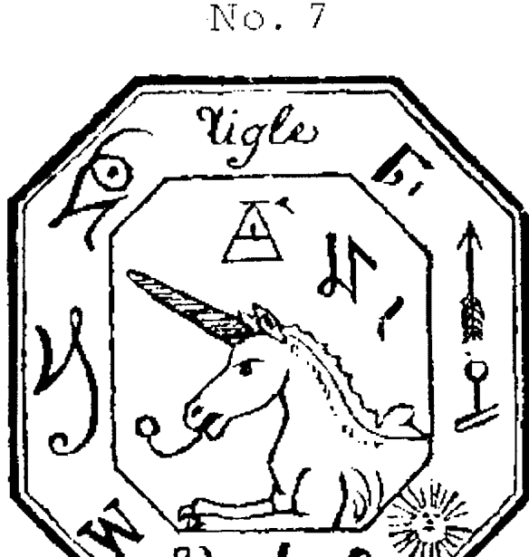

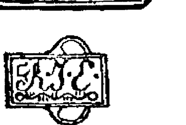

这些魔法字符应被刻在戒指的内侧

## 基本的法则
### 出品

当他将它们放在手里的时候，他说了两个单词，并说：“将戒指戴在汝左手的小指上，护符放在汝的右耳，再谨慎的人也会向汝吐露他隐藏的想法。那两个单词是：Noctar, Raiban，如果汝加上第三个词Biranther, 汝最强大的敌人也无法避免自己大声地想汝透露他们的计划。为了让汝信服，我将会让开罗的贝伊之一显现在汝面前，他会告知汝关于敌对法国的所有计划。”然后他对灵体说“Nocdar,”灵体则如闪电般消失了。一刻钟之后，他与贝伊一同归来。贝伊说：“我们已与英国人结盟，与法国的休战协议会在毫无警告的情况下破碎。”他在老人说了“Zelander”之后，与灵体一同消失。清真寺的穆夫提会出现在汝的面前，他会给汝一份连他的好朋友都无法一睹的作品。”我照所指示的那般做了，穆夫提很快就出现了，并将他的手稿放在桌上，他对我说：“Tonas, Zugar,”它们在魔法语言中的意思是：读，相信。老人很热亲地看着他；他握住他的手，亲切地发声，o Solem，穆夫提便在鞠躬之后，消失了。

> “把护符和戒指给我，”老人说，“戴上这个。”（见图8）

## 墨卡的法剂
### 出品

#### No. 8

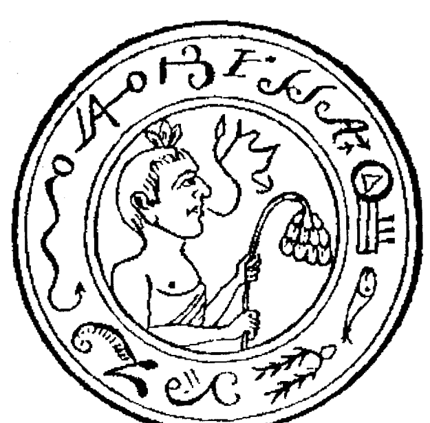

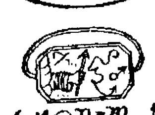

```
手写字符序列：7ΠJNΦM♂♀πγ
```

字符应被刻在戒指的内侧

## 重本位法则
### 出品

> > “它能帮助汝激活如汝所愿的灵体数量，用以摧毁或阻止对汝不利的事情。魔法的词语是：Zorami, Zaitux, Elastot。我们在此刻不会进行任何实验；明日，我们一同前往去尼罗河岸，一起建立一座跨到河对岸的单拱桥。”

> > “这是下一个护符，及其戒指（见图9）。”

#### No. 9

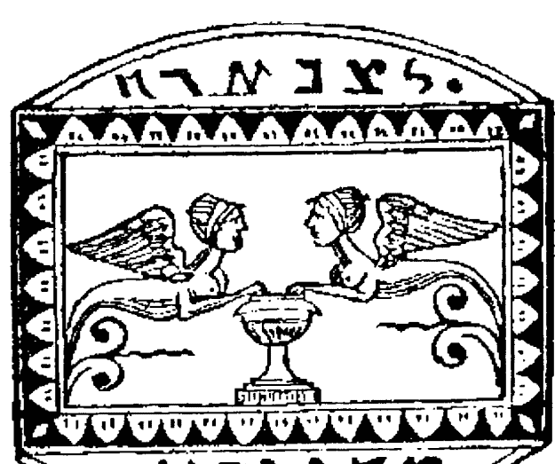

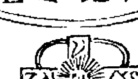

这些字符应被刻在戒指的内侧

## 生长的法则
### 出品

它们是毁掉万物的力量，控制着元素，雷袭，冰雹，陨石，地震，飓风，海啸，并能保护我们的朋友免受所有灾难。要使用它们，必须要念出的词是（数字表示汝希望要运行的每个事物）：第一，汝念出：Ditau，Hurandos；第二，Ridas，Talimol；第三，Atrosis，Narpida；第四，Uusur，Itar；第五，Hispen，Tromador；第六，Paranthes，Histanos。

## 垂直的法则
### 出品

#### No. 10

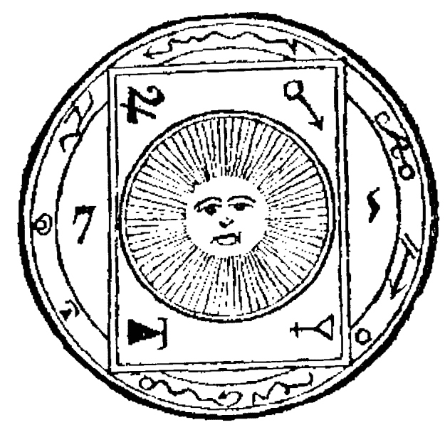

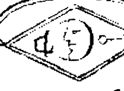

手写字符：特殊符号序列（近似：B Z O N • A O A I S I S H L）

这些字符应被刻在戒指的内侧

> > ‘（图10的）护符与戒指能让汝对别人的肉眼隐形，甚至能欺骗灵体。只有伟大的存在能知晓汝的步伐与行为。汝能穿透任何地方，海洋中央，大地内部，汝亦能调查空中，没有人的行为能对汝隐藏。只需要说：Benatir, Cararkau, Dedos, Etinarmi.’

我重复了这四个词，通过金字塔的墙壁，我看见两个阿拉伯人在外面的平原上，似乎想要搜寻到什么值钱的东西。“只要汝希望，汝可以证实我所教授给汝的其他事物，只需要将戒指连续地替换在右手的不同手指上。”

## 坐卡前点法则
### 出品

#### No. 11

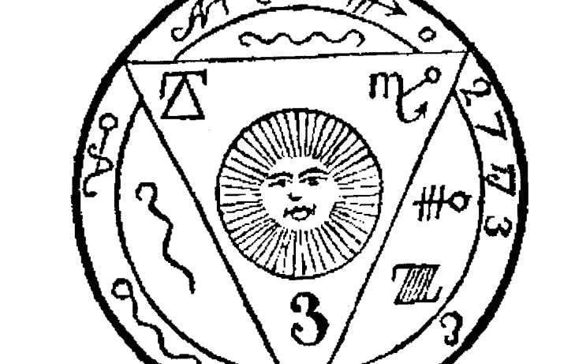


手写符号序列（符号难以转录）

这些字符应被刻在戒指的内侧

## 巫术的规则
### 出品

> > “护符与戒指（图片 11）能将汝传送世界上的任何地方，而不会遭遇危险。只需要说 :Raditus ,Polastrien ,Terpandu ,Ostrata ,Pericatur , Ermas。但我不希望汝使用这些方法，在未经我允许的情况下，离我而去。”

> “我的父亲啊，我保证不这么做。”

## 魔术的法则
### 出品

#### No.12

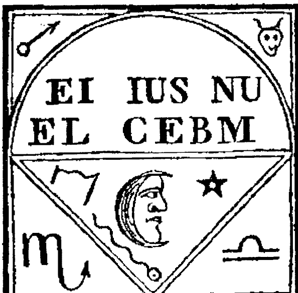

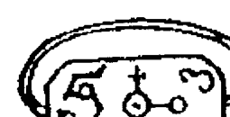


这些字符应被刻在戒指的内侧

> > （图片12的）护符与戒指，汝能够打开所有锁，无论是使用什么神秘的方法锁住的；汝不需要钥匙。只需要用戒指接触它们，并说出这三个词：Saritap, Pernisox, Ottarim, 汝就能毫不费力地打开它们。
立刻实践下吧，我儿，” 老人告诉我。“关上在那张桌上的匣子。” 我这么做了之后，并确保自己除了钥匙，无法使用其他方法打开它。我用戒指触碰它，并念出了魔法的词语，它就自己打开了。老人补充道：“就算是汝有可能被囚禁的监狱大门或坚固的城堡亦会如此。”

## 巨人神法则
### 出品

#### No.13

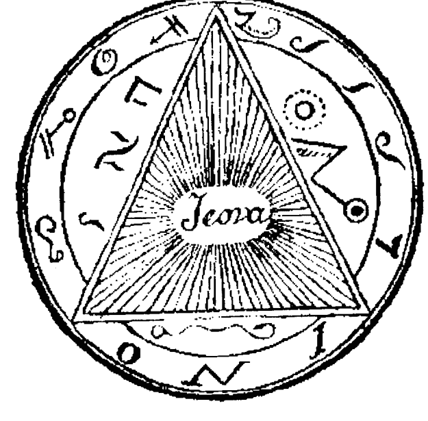

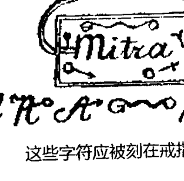

这些字符应被刻在戒指的内侧

## 坐上西法则
### 出品

> 这个戒指与护符能让汝看见所有房内的情况，而不必亲自进入它们；汝能够读取所接近的任何人的细想，汝能够让他们为汝服务，或让他们受伤。汝需要将护符放在汝的头上，对戒指吹气，并说：o，Tarot，Nizael，Estarnas，Tantarez，这几个词是用于了解他人想法的。

> 为了让应得的人享受服务，汝需要说：Nista，Saper，Visnos，他们会立刻获得各种财富。

> 要惩罚邪恶之徒，或者汝的敌人，汝需要说：Xatros，Nifer，Roxas，Rortos，他们会立刻受到惩罚。如汝所见，我已经向汝证实了没有什么是我没有领悟的了；因此，没有证实的必要。

## 黑卡的秘藏
### 出品

#### No. 14

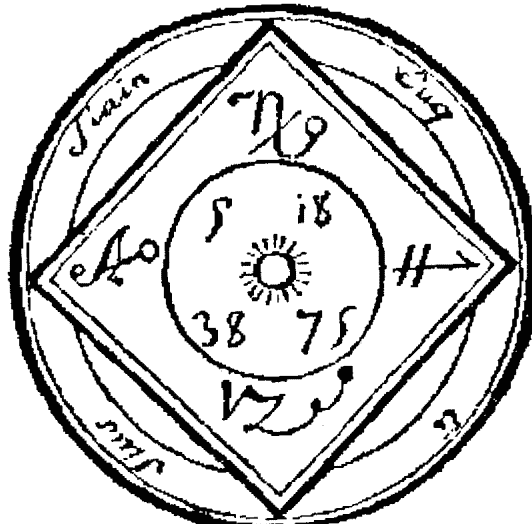

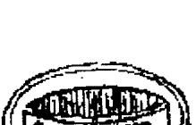

这些字符应被刻在戒指的内侧

(图14) 这个护符与戒指能让汝毁灭所有敌对汝的计划，如果有任何灵体想要对抗汝的意志，汝能强迫他服从汝。将护符放在汝左手下方的桌子上，戒指戴在右手的第二根手指，汝需要倾斜着头用低沉的声音说：Senapos，Terfita，Estamos，Perfiter，Notarin。

## 黑卡的法则
### 出品

#### No. 15

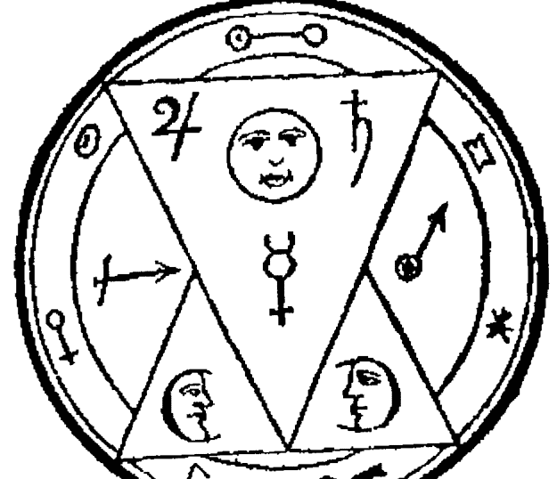

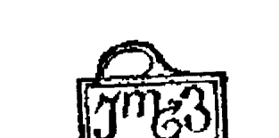

这些字符应被刻在戒指的内侧

> > “护符与戒指（图 15）具有非凡的属性；它们能让汝具有所有美德，所有才能，让具有恶性质的事物改变其所有实质向善。为求第一个目的，汝需要举起护符，将戒指戴在左手第三根手指的第一个关节上，说：Turan，Estonos，Fuza。

为第二个目的，汝需要说：Vazotas，Testanar，汝就能见证我所宣称的奇迹。

## 里卡尔注解
### 出品

#### No. 16

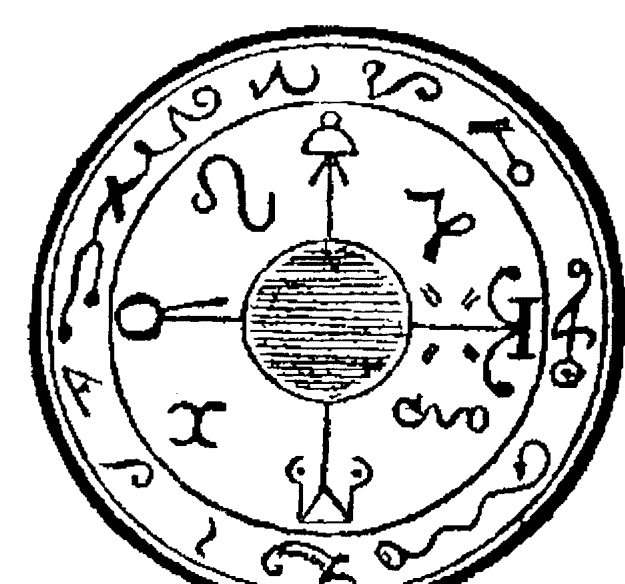

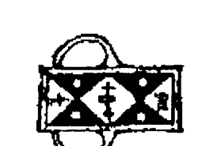

```
2L a~ o w z 9 16 9 9
```

字符需被刻在戒指的内侧

> “（图片 16 的）护符与戒指能帮助汝了解所有矿物与植物的属性，汝能掌握全部的药学。没有疾病是汝无法治愈的，没有解药是汝无法成功配置的。埃斯克拉底厄斯与希波克拉底与汝相比，简直是新手。汝只需要念出这几个词：Reterrem，Salibat，Cratares，Hisater，当汝接近一名病人时，汝需将护符放在腹部上，把有圣安德鲁十字图案的戒指放在汝的脖子周围火焰色的缎带上。

## 墨卡德尔法则
### 出品

#### No. 17

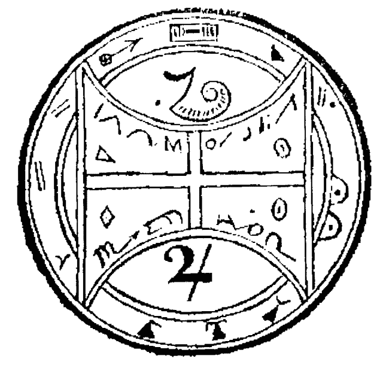

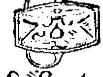

```
2 X 7 f 6 o L 2 9 H ->
```

字符需被刻在戒指的内侧

“护符与戒指（图片17）能保证汝在最凶猛的动物中间的安全，令它们服从汝，理解它们不同的叫喊声。疯狂的动物会与汝保持距离，汝可以令它们立刻死亡，只需念出我所教授的词。

“为第一个目的，汝只需说：Hocatos, Imorad, Surater, Markila。第二个目的：Trumanterm, Ricona, Estupit, Oxa。

## 坐市雨法师
### 出品

#### No. 18

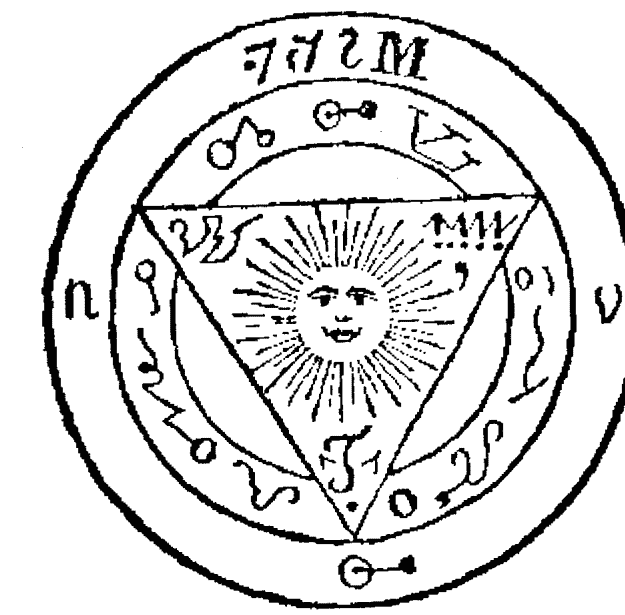

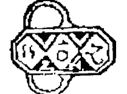

```
符号文字：一系列特殊符文或魔法符号
```

字符需被刻在戒指的内侧

“护符与戒指（图片18）能让汝知晓所有即将于汝见面的人的意图的善与恶，并能在他们的脸上标上记号，对所有人可见。将护符放在汝的心上，戒指戴在汝右手小指上，并说出这些词：Crostes，Furinot，Katipa，Carinos。

## 魔术的新法则
### 出品

#### No.19

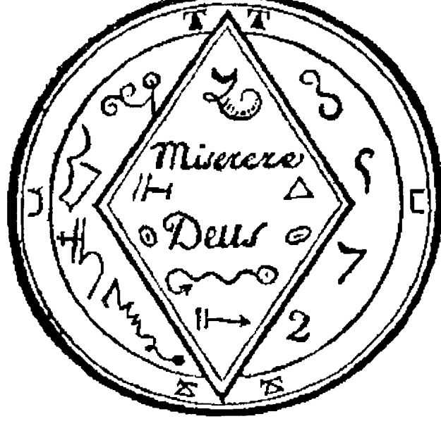

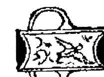

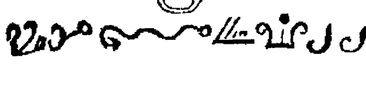

字符需被刻在戒指的内侧

## 史卡的法则
### 出品

( 图片 19 的 ) 护符与戒指能让汝拥有所有的才能，与对所有艺术深刻的理解，让汝能实践成为伟大的艺术家。只需按汝认为适合的方式，携带这个护符与戒指，并念出这七个词：Ritas, Onalun, Tersorit, Ombas, Serpitas, Quitathar, Zamarath, 再在这些词前加上汝想要拥有的艺术或才能名字即可。

## 重小的出品
### 出品

#### No. 20

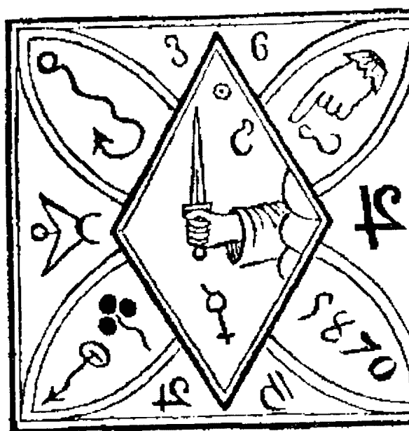

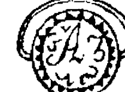

```
2 M 3 E c o m o n
```

字符需被刻在戒指的内侧

## 基本的法则
### 出品

> > ( 图片 20 的 ) 护符与戒指能帮助汝赢得彩票，并能确保汝在游戏中胜过对手。汝需将护符放在汝的左臂上，用白色缎带绑定它，戒指需佩戴在汝的右手小指上；然后，选择说 Rokes ，两个数字的组合说 Pilatus ,骰子说 Zotas ,四位数字说 Tulitas ,五位数字说 :Xantanitos。要确保汝在博彩机前念出所有词，而在扑克中，汝需在每次切牌的时候念出，如果切牌的人是汝或汝的同伴，在开始前，汝需触用右手碰汝的左臂护符位置，再亲吻汝的戒指。这些都需在没有引起汝对手注意的情况下进行。

#### No. 21

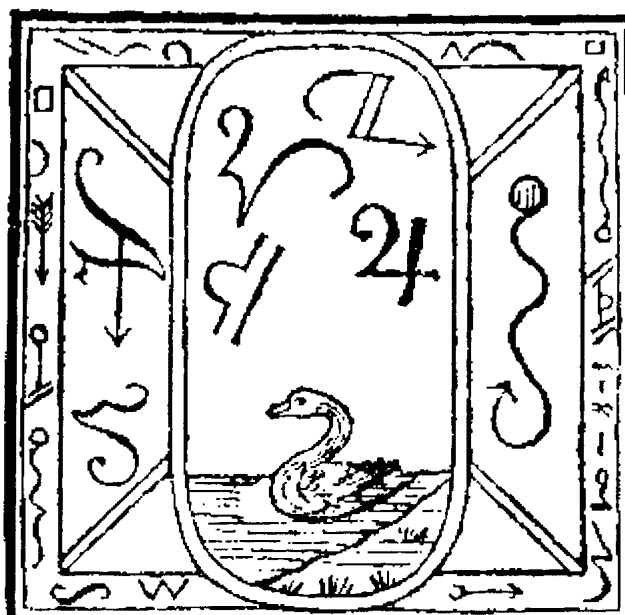

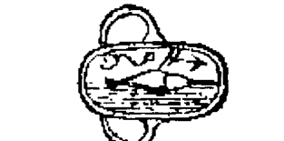

一些装饰性符号或文字

字符需被刻在戒指的内侧

## 等书的法则
### 出品

“（图片21的）的护符与戒指能帮助引导所有地狱的力量，抵御汝的敌人或汝朋友的敌人。汝可以以汝觉得恰当的方式携带它们，并念出这三个词：Osthariman，Visantiparos，Noctatur。”

#### No. 22

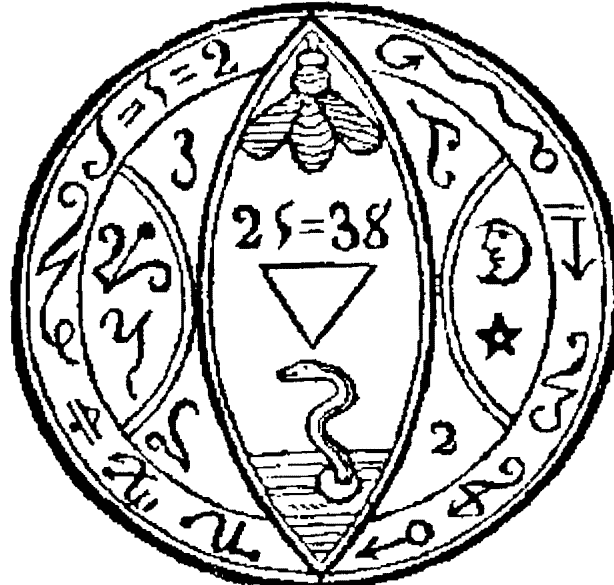

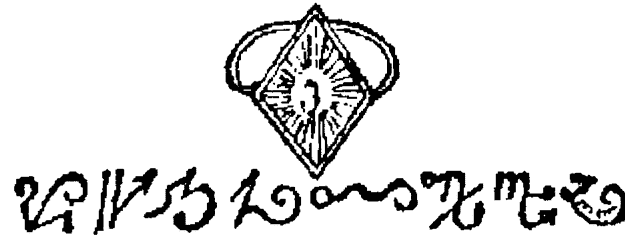

> “（图片22的）护符与戒指能帮助汝认出哪个地狱力量希望承担任务，汝也能停止它们所有的计划，只需将护符放在汝的胸口，戒指戴在左手小指的第一关节上。需要念出的单词是：Actatos，Catipta，Bejouran，Itapan，Marnutus。”

#### 护符与戒指的构成

> “汝可能还无法将护符与戒指制作得和我的一样的方法，”老人说，“汝需以我指导的方式制作它们。刻有字符的戒指需用镀铜钢制作。护符应根据图片尺寸用绸布制作。”

- 1. 图片1. 白色绸布，金色刺绣。
- 2. 图片2. 红色绸布，银色刺绣。

## 超千份巨制
### 出品

- 图片 3. 天蓝绸布，银色刺绣。
- 图片 4. 黑色绸布，银色刺绣。
- 图片 5. 绿色绸布，金色刺绣。
- 图片 6. 紫色绸布，银色刺绣。
- 图片 7. 金黄绸布，金色刺绣。
- 图片 8. 淡紫色绸布与颜色渐淡的丝刺绣。
- 图片 9. 辣椒红绸布，银色刺绣。
- 图片 10. 黄色绸布，黑丝刺绣。
- 图片 11. 深褐色绸布，金色刺绣。
- 图片 12. 深蓝色绸布，银色刺绣。
- 图片 13. 淡灰色绸布，金色刺绣。
- 图片 14. 玫瑰红绸布，银色刺绣。
- 图片 15. 金黄色绸布，银色刺绣。
- 图片 16. 橘黄色绸布，银色刺绣。
- 图片17. 深绿色绸布，金色刺绣。
- 图片18. 黑色绸布，金色刺绣。
- 图片19. 白色绸布，黑丝刺绣。
- 图片20. 樱桃红绸布，银色刺绣。
- 图片21. 灰白色绸布，颜色渐变。
- 图片22. 红色绸布，中间金色刺绣，边缘银色刺绣，符号黑色与白色丝刺绣。

老人再告诉了我这些信息后，将所有的护符与戒指放回了匣子里。在我身旁的灵体将它关上，并给了他钥匙。老人对我说：“我儿啊，在汝面前所实施的所有奇迹，都不能对这些护符与戒指的力量与美德产生怀疑。如果汝没有在过程中遇到任何问题，那是因为汝的心是纯洁的，也就是说，汝的灵魂石没有污迹的。美德、正直与荣耀一直会帮助汝。一个不会责备自己的人，一个破坏他人善行的人，又或一个只有这些意图的人，是无法参与到我们的神秘运作中的。他的努力只会徒劳。

天的力量——气的，地狱的，土的，和那些海洋与火焰的——会反抗他。他所希望的只会令他困惑于蒙羞，每次召唤的尝试，每次所恳求帮助与介入的力量会回答他：放弃吧。汝乃罪人。在命令吾们之前，先净化自己，补偿汝的罪孽。

”如果他继续召唤力量，那他就会最终受到惩罚，必然会丧失性命。我儿啊，要记住，只有美德能让一切可行，没有罪孽是会不被惩罚的。在每次召唤祈祷之前后，还有两段祈祷文汝必须小心地背诵；它们是：

## 第一段祈祷文

天上焰火是无法熄灭的，它永远散发着光芒，是生命的起源，所有生物的源泉，万物的信条。这个火产生了一切，除了它所消耗的，一切都不会被毁灭：它让自身了解自身。这个火无法保留于任何地方；它没有身体或物质。它包围着天空，从它散发出的一点火光，产生了太阳、月亮、星星所有的火焰。这就是我所知道的神：不因其超越知识的理解，而试图理解它。更何况，要知道邪恶的人无法在神面前隐藏自己；没有任何言辞与借口能躲过他透视的双眼。神明了一切：神无处不在。

## 第二段祈祷文

神如同火焰的无穷深奥；然而，我们的内心不能惧怕接触焰火或被焰火接触；因为平静、和谐的它不会被被这口爱的焰火烧毁。只有即是神的火焰能够存在。没有人能生起它；它没有母亲，它知道所有事，而没有人能知道关于它的任何。它的计划是不可改变的，它的名字是妙不可言的。它即是神；因为对我们而言，我们即是他的信使，我们## 野卡的法则

只是神的一小部分。

“我儿啊，要知道，我之前所给予汝的所有指示都是基于对于神的亏欠之情，因为他是万物的信条，当我们让自己以尊崇之心证明了自己，顺从了他的意志，及其不变的法令之时，其大慈大悲的善心让我们的每一天充满了欢乐。”

在这一番感想之后，老人又对我说：“我儿，汝定已意识到，我对汝说过要喂养的鸡，汝亦见过灵体也有一只；当金子储藏在汝脚下的时候，这些鸡能帮助他们以他们的直觉和所念出的魔法与卡巴拉的语言来发现它。要获得这些鸡是非常困难的，汝必当战胜并唾弃那些世俗之人，因为他们也会与汝竞争，以无意义的努力尝试获得它们。它们是非凡的黑母鸡。伟大的奥罗马西斯（Oromasis），琐罗亚斯德之父，是第一位拥有它的人；我是从他处获得召唤它们的秘密，这是一份关于孵化这些鸡的手稿，极其珍贵。”他为我打开的时候，我注意到这份手稿的封面是薄金片做的，上面镶嵌着几颗钻石、红宝石、黄晶石和蓝宝石，其散发的光芒令人难以注目。纸张非常洁白，上面写的是玫瑰色墨迹的象形文字。

“我会教导汝如何像我一样阅读这本书，”他告诉我，“我们先看关于孵化黑母鸡，以及如何获得令她前来的鸡蛋。”他拿来几块芳香的木头，如芦荟，雪松，或柠檬，月桂，一些鸢尾属植物的根，及一些叶子已被太阳晒干的玫瑰。（译者注：作者明确指明是叶子，而不是花瓣。）他将它们放入金色的炉子里。在上面加入纯粹的香油（balsamic oil）。透明树胶（transparent gum），并说：Athas，Solinam，Erminatos，Pasaim。阳光投入洞内。他将一块玻璃放在锅上。与此同时，阳光照向玻璃，在盘中的香料燃烧成火，玻璃随即液化，惬意的味道在洞中四散。很快就只剩下灰烬。老人并未停歇，从黑色天鹅绒布袋中取出一枚金蛋。他打开这个蛋，将灰烬放在其中，再将蛋放在黑色的垫子上。他把分成块面的水晶钟盖住它；然后，他向地下室抬高双眼与双臂，他喊叫道：o Sanataper， Ismai， Nontapilus， Ertivaler， Canopistus。阳光似乎强有力地将其光明照向了钟。

钟变为火焰的颜色，金蛋在我的眼前消失了，一缕薄雾在空中升起，我于是看见了一只振翅的母鸡站立，发出朦胧的咯咯声。老人向她伸出一只手指，她站到了上面。然后，他说出了这两个词：Binusas， Testipas。有翅膀的生物滑向了他的胸部。

“这就是获得黑母鸡的方法。”老人说道：“在几天内，它会是普通的大小，我会在汝面前指示它。汝将看见这一动物的发现隐藏宝藏的本能，即便是极小量的金子也逃不出它的眼睛。让我们感谢伟大的存在准允我们获得这些秘密吧。我们一起念两段祈祷文。”在完成这一任务后，他对我说：“我儿啊，这就足够了。我们休息一会儿吧。”阳光已照耀了我们一段时间。它消失了，它的光芒被几盏烛光取代了。灵体并没有离开我们，他拿起一把里拉（七弦琴），用魔法的语言自弹自唱了起来。

老人仔细地听着灵体的声调。而我自己已入了迷，他无趣地带着微笑观察我。“够了，”他对灵体说。“在我们休息前，我希望能向汝展示不用我之前所用的资源，而拥有黑母鸡的方法，因为在某些时候，会难以取得材料。如果你在将来，遇到了值得启蒙的某人，这就是汝应当实施的方法。取一只鸡蛋在中午的阳光下照耀，观察它是否没有一点污迹。再选一只尽可能黑的母鸡；如果它的羽毛上有任何其他颜色，汝需要将其拔出。汝要用黑色材质的兜帽盖住它的头，让其无法分辨任何，但要允许其使用嘴。将其放入内衬为黑色材质的箱子内，将其置于没有光照的房间内。记住仅在夜晚喂食。当这些不可缺少的预防措施完成后，汝须给它鸡蛋，让其孵化，注意不能有任何噪声干扰它。成功率全取决于这只母鸡是否够黑，它的想象力会受其影响，在合适的时候，汝会看到孵化的母鸡是全黑的。但我要警告汝，实践这的人定要有足够的智慧与美德才能参与到这神圣的秘密中。我们虽无法读懂人类的心，但伟大的灵体却不同；他明了一切，能看透我们内心深处最秘密的意图。他会根据其意志赞同或拒绝给予我们偏爱与礼物。”

“我们坐了很久了，”他说道，“我们必须先进食再休息。”他击掌三次，之前出现过的奴隶与灵体再次引起我的注意，食物立刻出现在我的眼前。菜色很丰盛；老人很欢快。灵体也其乐融融。我很受鼓舞，我加入了谈话中。我们最终感到了疲倦，离开桌子，进入了甜蜜的梦乡。

最让我感到愉快的梦境是关于他们欢快的景象。当我醒来的时候，阳光照进了我们的住所。我没有看到老人或灵体。我以为他们都出去了，我于是沉浸于自我的观想中。我不对未来感到迷茫，没什么能让我紧张的了。如果未来是快乐，谁会比我更快乐呢。我无法预见自己有任何无法满足的事；如果有其他人类知道的话，他们会羡慕我的命运。

我希望能很快回到自己的国家。正当我在这么想的时候，我听见轻微的声响，看见灵体跟着老人进来。他们靠近我，每人拉着我的一只手，我立刻被从床上托起。

“我儿，汝休息得很好，”老人说。“在汝还在睡的时候，我与灵体出去参观我的鸡们，我将让汝熟识它们的才能。”在他触碰墙内机关的时候，一扇门打开了，两名黑奴将七只黑母鸡放入笼中。“这些动物具有寻找金子的天性。汝将作为裁判。”他将几块金子放在垫子下，几块放在墙缝内，并用头巾遮住，然后，他说：Tournabos， Fativos， Almabisos。他们打开笼子，将鸡的兜帽拿掉，母鸡走出，立刻分散在藏有金子的不同位置，并将金子一块块地啄起来，放到老人的脚旁。

他将鸡一只只地抓起来，并爱抚它们。他对我说：“你看，他们多么温顺；我们一起去平原待一会儿；我之前已在沙子里放了几块金子。我们等会儿放了这些鸡，它们会很快找到财宝。”他对奴隶做了个手势，他们立刻将鸡重新关进笼子。

很快，我们就来到离开金字塔大约五百步的平原上，他打开鸡笼。它们走了几步路；它们很快就似本能般地找到了财宝的位置。它们朝着方向奔跑，到达位置之后，七只都开始猛烈地用爪子抓。它们很快就发现了粗麻布袋，其中之一开始咯咯叫；我们向它们接近，发现那个之前老人隐藏的布袋。我无法忍住自己的惊讶之情。“我儿啊，在神的帮助和其力量的守护下，什么都是可能的。”我们拿着布袋，重新回到金字塔。

他将鸡重新关起来，正如带它们出来的措施一样。他对我说：“我们去看看新生的那只情况如何。”他打开小盒子，发现羽毛已经开始长出来了。“再过几天，”他说，“它就能上第一堂课。”他将盒子放回原处。“自从我们在一起之后，我们就没出去过；我们等会穿着当地人的衣服去乡村短途旅行一番。”灵体用头巾遮盖头部，穿得就像土耳其人一般。我亦如此，我们已准备好了离开。在离开之前，我看见老人拿了一个护符和戒指。他告诉我要注意安全措施。然后，我们静静地出发了。老人告诉我们在世界上不时发生的事情，星星与行星的大变革。突然，他貌似在暗示我们马上要发生的事。一群阿拉伯人出现在我们面前，举起刀落。老人看着他们而不反抗，他举起他的一只手；歹徒们停止行动了。他念出图片10的护符单词，我们便隐形了。这些恶徒的惊讶之情难以描述。他们的首领貌似惊呆了。老人笑了。他大叫一声Natarter，他们立刻飞速逃跑。“平静下来，”老人说：“他们会有很长一段时间不敢出现在这块土地上。”

我们继续走了一段时间。时间飞逝；与老人的谈话题目各种各样，令我收获颇多，他的魅力难以令人抵挡。“我们回去吧。”再说出这几个词后，他看着太阳，喊道：“伟大的星空，神性的形象，汝带给地球生气，给予自然生命，接受我的敬意吧；愿我在离世之前一直享受汝的光芒。”

“怎么会突然有这么严肃的想法，”我立刻叫道，“为什么你会想到离开人世呢？”

“哦，我的儿啊！随着时间的流逝，我们正一步步地走向坟墓。幸运的是，我们正是可以平静地走向神的怀抱的人，能享受拥有美德的回报。另外，我儿啊，汝是否相信我不关心自己的最后时刻？在我这个年纪，想这件事是很正常的，而我一直认为死亡时没什么可怕的。我已经270岁了，我见证过不少事情；我也会死亡。好了，不谈这个了。我知道这让汝烦恼，而这不是我的意图。我们谈些其他的吧。”

图片20的护符与戒指能让汝赢得彩票。我也想让汝知道，精确的计算也能得到同样的效果。

我们继续前进，并抵达了金字塔。他打开了大门，我们进入，抵达了大厅，我们坐在沙发上，面对放着护符匣子的桌子。老人将驱走阿拉伯人的护符放了回去。我们保持了一段时间的沉默。

老人貌似累了。他向后靠着，很快便睡着了。我看着他令人尊敬的形态，安宁在他的容貌上散播开来，令我敬仰他的平静。我对灵体说及此事，他对我说：“这是他灵魂的景象。我服从他的时间已经超过一个世纪了。你无法想象他的美德，他的智慧，他的友善。在他活着的日子里，他做尽善事。如果不朽之灵创造万物时，需要借助一个榜样，那他就是最好的人选。正直的人类不正是地球上神的形象吗？很多人都具有过这个头衔，但又有多少人值得拥有它呢。”在说完了这番话后，灵体起身，跪在老人的旁边，将双手和双眼抬向天堂，用令我敬畏的声调说道：

“不朽之灵，汝听得见我，汝读得懂我，延长这个善良人类的寿命吧。确保他带着汝的祝福长时间存在于世，除非汝让其守候在汝的身旁，作为对他的奖励。”

他话语中所带的情操深深地打动了我。泪水浸湿了我的双眼，我如他那样跪下了双膝。

老人在此刻醒了，目光射向了我们，他笑着对我们说，“我的孩子，你在做什么？”我告诉他，我们正向伟大的存在祈祷，保佑我们的父亲。

“我的好朋友啊，”老人回答道，“我们的生命是被天安排的；即会开始，亦会终结；只有神是不朽的。我们唯一能够幸存的，只是对我们善行与美德的记忆。像旅行者一样，我们可以感受到自己的天命，因为我们或多或少会被自己的激情所奴役，快乐是属于那些能控制自己，并能消灭快乐的人。对我而言，我已经足够快乐了；在我人生的黄金时间，我已能做出区分，在我人生的黄昏，我已经品尝到了甜蜜。我很快就会回到创造我的他的身边；在我入睡时的梦已向我告知。在几个小时之内，我的灵魂便会离开我的肉身，升向天堂的领域。”

“天哪，”我哭喊道：“你知道自己在说什么吗？”

“汝必须像我一样等待着，我儿啊，我感到我的离开是受到祝福的，在我临死之前，能将自己的知识留给一个值得拥有它的人，汝热爱美德，汝会实践它，这就足够了。我会告知汝我最后的心愿，如果汝爱我，如果汝心存感激，汝就应该按时执行它们。”

“哦，我的父亲！”我哭道，“你怀疑我不会那么做吗？”

“不，我的儿啊，我丝毫不怀疑。好了，听我说。所有在这地下房间内的金银珠宝都是汝的了，汝所见过的护符与戒指，奴隶和鸡亦都是汝的了。Odous，”他对灵体说，“我无法掩饰对我的继任者的关切之情。爱他，服务他，就像汝对我的那样，我将在天体之上，保佑汝们。”他拍击了手掌，所有的奴隶出现了。“这位是汝们的主人，”他对他们说道。“我命令汝们服从他。”他们都来到我的身前，并跪了下来。“把你的手伸到他们的头上，作为支配的象征，”老人对我这么说。我照做了。他们起了身，老人做了一个手势，他们便都消失了。

他补充道，“将右边柜子里的金瓮拿出来，放在桌子上。当我不再存在的时候，把我的身体放在这个房间的中央。用芳香木围绕在我周围，它们可以在靠近装满金子的箱子附近找到。之后再将挂在顶部的花瓶取下，将里面的液体倒在木头上。使用我塑造鸡蛋的护符。在念出了魔法的词语之后，点燃葬礼桩，燃烧我残留的肉体。再将我的骨灰装进瓮中。保存它们。人类啊，珍惜我的记忆吧；我死亦知足。如果不是上天的意愿的话，我还想向汝展现教导黑母鸡的方法。Odous会教导汝；他也知道这个秘密。我感到我的灵魂已准备飞翔。来吧，我儿啊，擦干汝的泪水，让我能再次拥抱汝。记住，死亡只会令那些不正直的人惧怕。”我靠近他，他给了我一个吻。“再见，我亲爱的儿子，”他说。“记住我最后的愿望。”

当我还跪在沙发旁的时候，他断气了。我无法抑制自己哽咽，而他的死让我感到甜蜜与令人嫉妒。我感到我恩人的教诲几乎没有意识了。Odous让我恢复理智，告知我不要忘记完成我们父亲的命令。我们则按他所命令的实施，很快，所剩下的只是最正直、最具美德的人类骨灰。

我对Odous说，“我们今天就离开，进行所有回到我的国家的必要安排。”“我和你一起走，”灵体回答道。“你的意志就是我的意志；我将服从你。”我让所有的奴隶出来，命令他们穿上法国的服装。对我而言，拥有护符就足够了。我将所有的财宝运输到尼罗河的岸边，珍贵的瓮由我自己保存。Odous找了一艘船。我们沿着河流往下走，很快便到了船只的停泊处，并扬帆驶往马赛。我的人都上了船，很快便到了海中央。船长和水手都很好奇地观察我们。我随便说了各种语言，他们都很惊讶。

夜晚降临，刮起了大风。船长告诉我，他担心可能有暴风雨。我告诉他船只状况良好，足以抵抗。他所预言的发生了；大海波涛汹涌。恐惧与失望显现在所有人的脸上。航船者再也无法控制住船。只有我很冷静，丝毫没有动摇。我使用了图片9的护符，并说出了相关单词，我抓住了舵柄，让之前还是大海风浪的玩具快速驶离了海面。整个船员团队都视我如神，甚至那样命名我。“我只是个人，”我告诉他们。“我的朋友们，我没那么被惊吓，我知道如何导航，而只有在冷静的情况下才能摆脱暴风雨。”

我们剩下的旅途十分愉快。我们抵达了马赛，在上岸前经过了检疫所。我为我的随从和我慷慨地支付给船长路费。我给每位船员一份礼品，离开时得到了他们的祝福。我在马赛待了一段时间。给我出生的地方写过信后，我发现我的父母已离世了。他们在我在不在的时候离我而去，留下他们的家产给我继承。我通过代理人将家产卖掉，并让他将收益寄给我。我在马赛的近郊购买了一处房产，普罗旺斯美丽的天气令我愉快。我装修了自己的家，住得很愉快。我能如所愿地获得财富，甚至满足自己。我给过几位朋友建议，他们都对自己的成功感到惊讶。

但他们对于来源是无知的。我并没有将那些智慧分享给任何人。

爱好令我写了这本书。如果那些获得它的人知道如何从中获益，并是值得参透这其中的奥秘的话，他们将用所储备的美德与智慧来赌博。他们必不得气馁。正如古代的箴言，只要功夫深，铁杵磨成针。如果成功没有降临，他们不能责怪自己。那是因为他们不够品行端良。那些认为我是愚者，空想者的人是无知的。我不那么在乎别人对我的看法。事实就是如此。我不想要反驳对我的侮辱。某些热爱收藏他人作品的家庭藏书者，可能会出版这一作品的翻版。这一行为是我唯一会用护符与戒指惩罚的。我还保存着昔日的国王麦德斯（Midas）授予我的行凶者勋章。这是我给某些编辑的警告。你可能注意到了，作为一名术士，我不喜欢复仇。

而你们这些寻求启蒙自己，试图参透并理解自然奥秘的人，这本书是为你们写的。要知道微小的污点亦会污染你的灵魂，影响成功的可能性。你会看见港口，而无法靠岸，在你觉得安全的时候，船沉了。阅读吧，祈祷吧，希望吧。再见，我亲爱的读者们。愿你们能轻松实践，像我一般幸运。阿门。

老人并未指导我教导所孵化的黑母鸡的方法，但在他离世之前，他告诉我Odous会传授给我这个知识。当我们住在马赛的家的时候，我提醒他老人的承诺。母鸡已经到了普通的大小，并渴望满足我。它与我非常相熟，很少离开我的身边。我在我们的旅途中更细心照料它，如果我没有提及这一事实，那是因为我认为它不是很重要。我们随后专注于教授我们的鸡。我们将一块金子放在它睡眠的篮子里，将它的眼睛用兜帽遮住。在那之后的两三天，在我每天早上都喂它食物的时候，它会在篮子里抓，用嘴叼住金块，在我拿走它之前，它一直守着它。

这只鸡的本能非常卓绝。Odous对我说，“我从没见过这么聪明的，但也必须得承认我们善良的父亲使用了只有他知道的令它诞生的方法，他都从来没在面前施展过。这证明他给予汝的关爱与友情。我们明天在院子里藏一块金子，将母鸡抱得远一点，看它是否能找到它。”第二天，我们按照计划行事。我拿掉鸡头上的帽子；它待在我的膝盖旁一段时间，看着不同的方向。终于，它轻轻地跳到地上，跑到我们对面的一颗大树的脚下。它立刻开始抓地。Odous对我说：我保证那颗树下藏了什么宝藏。让母鸡继续。”她抓了很长时间，为了节省时间，我拿起园丁放在附近的铲子，挖了大约两英尺，我挖出一个大约四英尺长的银镶边正方形箱子。因为我们没有钥匙，我让Odous去拿护符（图片12）。我在触碰之后，它立刻打开了，我们找到几包装着金子和银子，盘子，钻石，珠宝，和其他几个珍宝，我们估计价值150法郎。这些财宝估计是在内乱的时候隐藏起来的，所有者可能在尚未揭露这一秘密之前死亡。这块土地是我从远亲那买的。我和Odous一样，无法抑制自己称赞黑母鸡的本能，但它还得找到隐藏的其他金子。她跟着我们走了几步路。很快她超到我们前面，在藏着金子的附近停住了。她很快找到了它，并将它叼了起来，将其放到我的脚边。“好母鸡，”我叫道！“你真是我的好宝贝。你让我成为了更好的人，我的最亲切与令人尊敬的父亲。”

Odous对我说：“看她是否能听命神圣的语言，每天都要念给她听，向她表示要去寻找物品。”他则清晰地说出Nozos， Taraim， Ostus。母鸡貌似有注意听，并理解了。她开始在我们附近到处抓，找到了一颗镶嵌在戒指上的红宝石。“我将要念出另外三个词，让她回到主人身边休息。”他则说：Seras， Coristan， Abattuzas。母鸡来到了他的脚旁。Odous补充道：“你所拥有的母鸡都知道这些单词，但要教导她们需要一点时间。必须要有人用一根缎带抓住她们：当在说前一句单词的时候，必须要有人让她们行走；当念后一句单词的时候，必须要有人停住她们。因为这些鸡与生俱来的特殊本能，所以她们才能完成你的愿望。”

我的奴隶带来我的匣子，我将母鸡所找到的物品放入其中。

我有一座由克雷莫纳大理石筑成的亭子，我将装有老人骨灰的瓮放在黑色大理石底座上，在底座上还有银色的名牌表示我的哀悼。我种植了柏树与柳树，每天日出的时候，我与Odous一同拜访这个名牌，待上一个小时，悼念我们的父亲，谨记他给我们的教诲。我会很沉重地在几个纪念日陈述：在救了我，并带我进入金字塔的日子，以及他的祭日。这个日子在我的家里充满了哀悼与沉思。我的奴隶每年都有一天进入畜群。我在畜群周围装上金属架，这样就没人能够进入。我也让道路曲折，并种满灌木，让人无法轻易窥视到凉亭。我的日子在工作、学习、冥想和实践中度过。我的家仅接待过几个拜访者，但没## 圣者的生活法则

有人知道的私生活。就像圣者说的，要活得快乐，就要隐蔽地生活。

这一箴言是我行为的法则与基石。