## 黑魔法

**Black Magic**

在古老的传说中，人们相信透过咒语与仪式，可以请动超自然的力量为自己服务，甚至召唤恶魔，以达成愿望。本书收录了关于黑魔法的传说、仪式、咒语和工具，带你进入一个神祕而危险的世界。

**郑巧蓉**、**孟韶丽**

- 黑魔法的基本法则、如何捕捉灵魂与影子、与恶魔缔结契约、成为女巫的仪式、魇寝、幻惑魔法、变身魔法、狼人魔法、透明人魔法、爱情咒文、降灵术、黑弥撒、天候魔法、恶魔附身魔法。

**101项黑魔法相关知识全收录！**

- 转移灾厄魔法、光荣之手、女巫的邪眼、阴阳师的式神咒役、犬神咒法、摄魂术、草人纸人巫蛊之术、禁制法、取酒之术、猫鬼法、蛤蟆妖术、狐诞之法、邪屁黑魔法、复仇咒药、巫蛊娃娃。

## 黑色的

## 圣经

Black Magic

## 前言

魔法可以行善，也可以为恶。使用魔法为人治病、驱除恶灵，是善的使用；相反的，使用魔法使人致病、招致恶灵，便是恶的使用，魔法的善恶之分便是从此衍生而来。后来人们才将善的魔法称为白魔法，恶的魔法则称为黑魔法。

无论白魔法或黑魔法同样都是魔法，特意做这种区分其实是很可笑的。以科学技术来比喻，虽然科技可以行善也可以为恶，却没人将科技分成善恶两种，因为科学技术本身并无善恶之分，端看使用者而定。

照道理说魔法也应该如此。这是否表示魔法本身并无善恶之分，而取决于使用魔法的魔法师呢？事实上的确是这样没错。魔法虽有白魔法与黑魔法两种，但这两者间却无法划出严密的界线区分。魔法就是魔法，无论黑白，原理其实都是相同的。

既然如此，那为何还有白魔法与黑魔法之分呢？之所以会这样区分，可以说是因为白魔法与黑魔法两种魔法的氛围不同所致。有别于科技，魔法很容易受到人类的主观意识影响，因此当人们行使邪恶的黑魔法时，其仪式或做法等都容易让人感觉相当恐怖骇人，结果便导致白魔法与黑魔法看起来像是两种迥异的魔法。

本书便是在这样的定义下，蒐罗并解说诸多使用于邪恶目的、充满邪恶氛围的黑魔法。书中介绍的黑魔法有许多都是过去实际存在过的魔法，无一不是为其邪恶目的而行使的，至于千万不可模仿效尤之类的叮咛，相信已不须笔者赘言。

草野　巧

## 目次

## 第一章 黑魔法的基础与实践

- No.001 何谓黑魔法 — 8
- No.002 黑魔法的基本法则 — 10
- No.003 宗教式黑魔法 — 12
- No.004 形象黑魔法 — 14
- No.005 死者黑魔法 — 16
- No.006 加害者的黑魔法 — 18
- No.007 衣服的黑魔法 — 20
- No.008 脚印的黑魔法 — 22
- No.009 捕捉灵魂的黑魔法 — 24
- No.010 影子与映像的黑魔法 — 26
- No.011 剩饭的黑魔法 — 28
- No.012 毛发与指甲的黑魔法 — 30
- No.013 血与唾液的黑魔法 — 32
- No.014 名字的黑魔法 — 34
- No.015 咒文与黑魔法 — 36

专栏：从魔法书的角度来看《金枝》 - 38

## 第二章 欧洲的黑魔法

- No.016 欧洲的黑魔法 — 40
- No.017 与恶魔缔结契约 — 42
- No.018 女巫的黑魔法 — 44
- No.019 女巫的入会仪式 — 46
- No.020 魔宴 — 48
- No.021 仪式魔法 — 50
- No.022 幻惑魔法 — 52
- No.023 变身魔法 — 54
- No.024 狼人魔法 — 56
- No.025 恶魔学者诠释下的狼人魔法 - 58
- No.026 欧洲的植物性春药 — 60
- No.027 可怕的春药曼陀罗根 — 62
- No.028 欧洲的动物性春药 — 64
- No.029 爱的蜡像 — 66

- No.030 爱情咒文 — 68
- No.031 透明人魔法《所罗门王之钥》 - 70
- No.032 透明人魔法《真正奥义书》 - 72
- No.033 牛乳魔法 — 74
- No.034 奶油的窃盗魔法 — 76
- No.035 曼陀罗根的窃盗魔法 — 78
- No.036 不孕魔法 — 80
- No.037 女巫的绳梯 — 82
- No.038 咒杀的蜡像 — 84
- No.039 天候魔法 — 86
- No.040 操风魔法 — 88
- No.041 恶魔附身 — 90
- No.042 驱使魔宠的黑魔法 — 92
- No.043 女巫的软膏 — 94
- No.044 转移灾厄的魔法 — 96
- No.045 光荣之手 — 98
- No.046 制作魔弹 — 100
- No.047 女巫的邪眼 — 102
- No.048 黑弥撒 — 104
- No.049 法国黑弥撒事件 — 106
- No.050 圣西日尔黑弥撒 — 108
- No.051 降灵术 — NECROMANCY — 110
- No.052 女巫伊瑞克梭的降灵术 — 112
- No.053 月之子的降灵术 — 114
- No.054 吉拉丢斯之铃 — 116

专栏：《所罗门王之钥》与《所罗门王的小钥匙》 — 118

## 第三章 日本的黑魔法

- No.055 日本黑魔法的特征 — 120
- No.056 丑时参咒 — 122
- No.057 阴针法 — 124
- No.058 犬神咒法 — 126

- No.059 阴阳道的式神与咒杀 — 128
- No.060 式神反噬的诅咒 — 130
- No.061 伊邪那岐流厌魅之法 — 132
- No.062 摧魔怨敌法 — 134
- No.063 六字经法 — 136
- No.064 大威德明王调伏法 — 138
- No.065 降三世明王调伏法 — 140
- No.066 昆沙门天咒杀法 — 142
- No.067 鬼子母神诅咒法 — 144
- No.068 九字法 — 146
- No.069 摩利支天隐形法 — 148
- No.070 摩利支天神鞭法 — 150
- No.071 饭纲法 — 152
- No.072 军胜秘咒 — 154
- No.073 附身用反诅咒 — 156
- No.074 蛤蟆妖术 — 158
- No.075 鼠之妖术 — 160

专栏：呪术・魔法・妖术・邪术 — 162

## 第四章 中国与其他地区的黑魔法 — 163

- No.076 中国的黑魔法 — 164
- No.077 禹步 — 166
- No.078 禁人 — 168
- No.079 摄魂（摄生魂） — 170
- No.080 木偶厌魅之术 — 172
- No.081 草人纸人厌魅之术 — 174
- No.082 厌魅之术的各种道具 — 176
- No.083 工匠厌魅之术 — 178
- No.084 蛊毒法 — 180
- No.085 金蚕蛊 — 182
- No.086 挑生法 — 184
- No.087 猫鬼法 — 186
- No.088 败酒之术 — 188
- No.089 狐涎之法 — 190
- No.090 玉女喜神术 — 192
- No.091 中国的植物性春药 — 194
- No.092 中国青楼的性爱魔法 — 196
- No.093 阴门阵秘法 — 198
- No.094 摩膁过气之法 — 200
- No.095 怖畏金刚之秘法 — 202
- No.096 僵尸黑魔法 — 204
- No.097 岑里岛的黑魔法师雷雅克 — 206
- No.098 阿赞德人的复仇咒药 — 208
- No.099 阿赞德人的邪恶咒药 — 210
- No.100 马来半岛的恋爱魔法 — 212
- No.101 巫毒娃娃 — 214

专栏：为何直至今日人们仍然相信魔法？ — 216

注释附录 — 217

中英日名词对照索引 — 221

参考文献 — 231

*本书注释皆列于P.217-P.220页，敬请读者翻阅参照。

## 第1章 乘法的奥秘

### No.001 何谓黑魔法？

黑魔法早自太古时代便因为人们有排除厌恶对象与竞争对手的需求而存在，而且无论怎么禁止都未曾断绝过。

#### ◎全世界从太古时代实行至今的邪恶魔法

所谓的黑魔法，就是邪恶的魔法，是为实现利己愿望、掀起恶劣天候妨碍众人、盗取他人财产、伤害仇敌身体等目的而行使的魔法。召唤邪恶的恶魔、恶灵、死灵等也是黑魔法，而执行活人献祭、动物活祭等残酷仪式的魔法，都可以算是黑魔法。

或许有人会想既然黑魔法如此邪恶，只要禁止不就得了吗？但事实上无论怎么禁止，黑魔法都从未消失。就如同世间的犯罪从未根绝，黑魔法也是早从太古时代至今都未曾有片刻消停。

因为无论是处于何等未经开化的社会，群体生活总难免会遇到不投机的人。在这种情况下，人类从很久以前便已学会使用黑魔法来试图折磨伤害自己讨厌的对象。也有人为了娶美女为妻，不惜利用黑魔法诅咒她的丈夫。当时甚至还相信毫无来由的头痛或是摔倒受伤，也是因为遭不明人物以黑魔法诅咒所导致。

随着社会发展，进入当权者开始相互攻讦、展开激烈权力斗争的时代，黑魔法也变得愈发盛行，甚至经常会召集多达数十名的魔法师举行恐怖的黑魔法仪式咒杀敌对势力大将。说到宫廷中众嫔妃间的争宠，黑魔法更可谓是唯一的斗争手段，因为女性无力从事武力斗争，除黑魔法以外别无其他选择。

最糟糕的是，绝大多数的魔法师即便在使用黑魔法后仍然不认为自己是黑魔法师。魔法师往往都会认为自己是正义的白魔法师，而对方才是邪恶的黑魔法师。

##### 何谓黑魔法？

从古至今遍行于全世界的邪恶魔法。

- 实现利己愿望
- 盗取他人财产
- 伤害讨厌的对象
- 兴起恶劣天候妨碍众人
- 召唤邪恶的恶魔、恶灵、死灵
- 执行活祭等残酷仪式
- 行使猥亵异性的行为

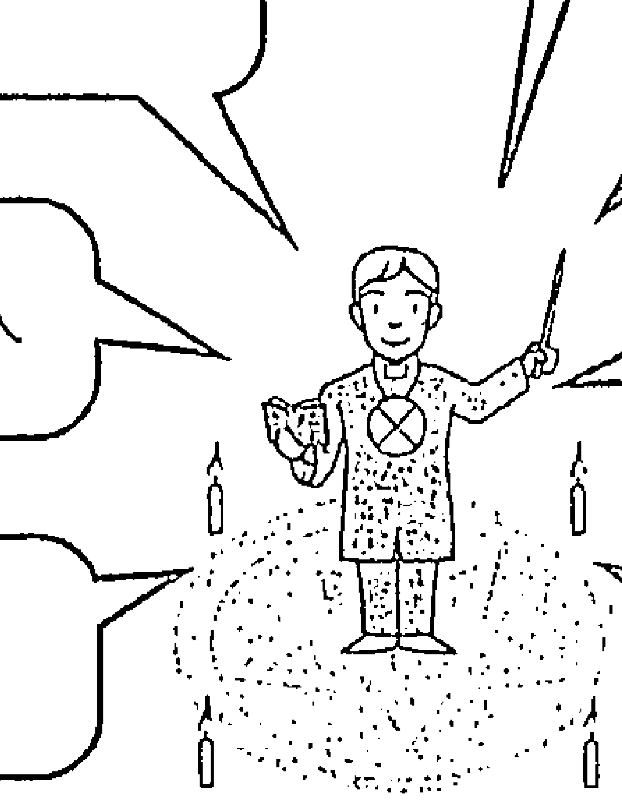

##### 何时会需要黑魔法？

自古以来，在社会中生活的不同情况下，黑魔法一直都是必要的存在。

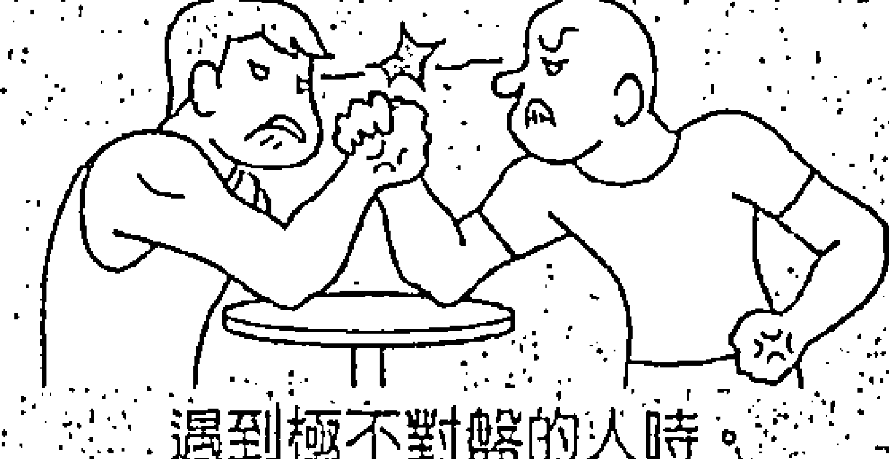

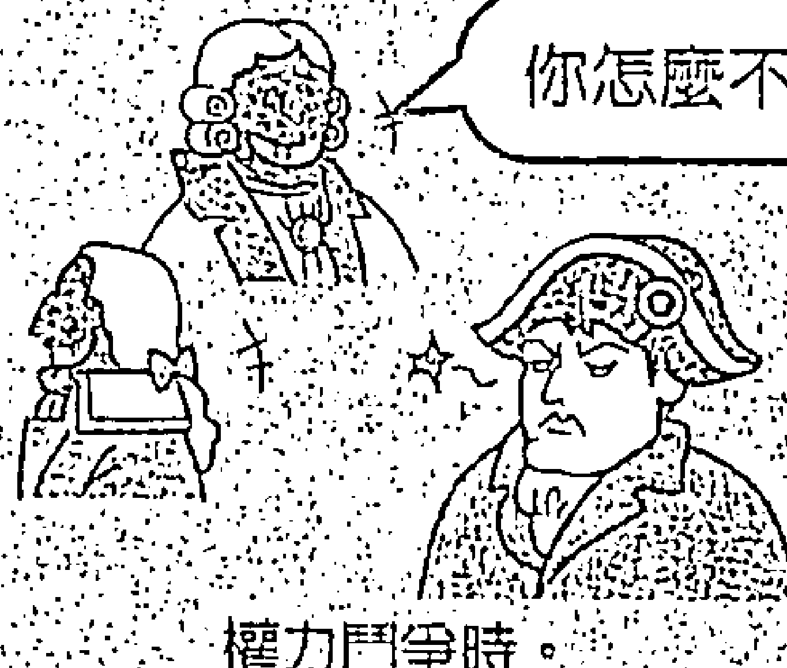

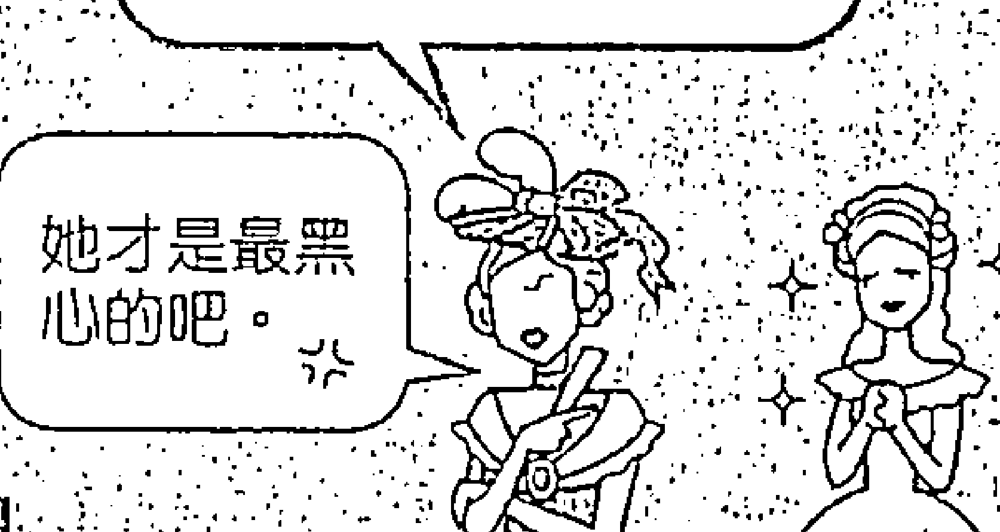

##### 黑魔法的基本法则

自太古时代以来，魔法便一直是以“类似法则”与“感染法则”为基础法则，两者合称为“共感法则”。

#### ● 仅由两个基本法则构成的黑魔法

不论黑魔法或白魔法，魔法的基本法则从太古时代至今没有任何改变。所谓的基本法则，就是“类似法则”与“感染法则”，两者又合称为“共感法则”。魔法可以分成建立在类似法则之上的魔法，以及立基于感染法则的魔法两种，前者为“类感魔法（类感咒术）”，后者则为“感染魔法（感染咒术）”；这二者又都是根据共感法则而成立的，因此亦称为“共感魔法（共感咒术）”。

这些用语始见于詹姆斯·弗雷泽于20世纪初研究未开化社会的著作《金枝》。本书经常会提到这本书，因此先介绍给各位读者认识。

类似法则与感染法则的意涵大致如下：

第一法则类似法则主要是说，类似的事物将会衍生出类似的事物。举例来说，A跟B是两种类似的东西，那么当魔法师对B做出某种行为的时候，在A上面也会发生相同的效果。或是当魔法师让B做出某种动作时，A也会跟着做出同样动作。这类魔法中最具代表性的，非人偶黑魔法莫属；制作人偶模拟施术对象，再用针刺来折磨对方的黑魔法，想必是无人不知无人不晓。

第二法则感染法则则是说，某个整体的一部分或是曾经有过接触的物体，即便在两相分离后，对其中一方施以某种行为，另一方也会出现完全相同的效果。在黑魔法的世界里，之所以会将牙齿、毛发、指甲等曾是人类身体一部分的事物视为诅咒仇敌的重要咒物，便是由此而来。

##### 黑魔法的基本法则

魔法只有两个基本法则：类似法则与感染法则。

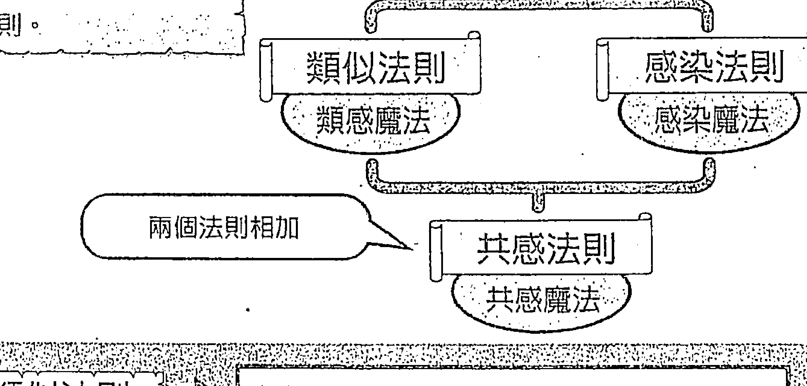

##### 类似法则

类似的事物会衍生出类似的事物。

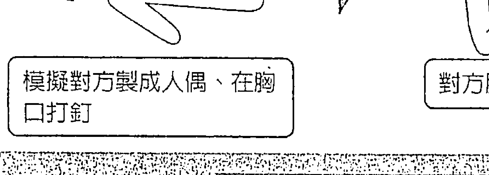

##### 感染法则

以前曾是一体的事物，即便在分离后仍对另一方有影响力。

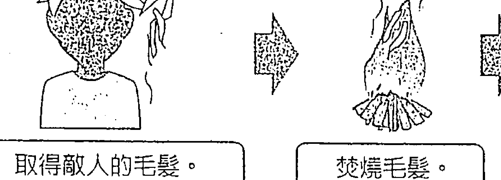

> 詹姆斯·弗雷泽（James George Frazer）→出身于苏格兰的社会民族学家，其作品《金枝》（The Golden Bough）获得极高评价。1907年叙任爵士爵位，1921年就任母校剑桥大学三一学院的教授。

## 宗教式黑魔法

宗教式黑魔法凭借的不光只是魔法的基本原理“共感法则”，而是比较重视向神灵祈祷的行为。

### ◎利用足以支配世界的神灵之力来实现黑魔法

建立在“类似法则”之上的“类感魔法（类感咒术）”与立基于“感染法则”的“感染魔法（感染咒术）”，这二者毋庸置疑是魔法的两大原理，但从古至今所有的黑魔法却并非悉数可透过这两个原理来得到说明，这是为什么呢？

原来是因为后来发生了一种现象：魔法之中渐渐有了宗教掺杂混入。这样一来，就不能光靠这两大原理来说明魔法。因为宗教认为神灵才是推动这个世界的主角，而宗教式的魔法自然也就比较重视向神灵祈祷的行为。

以使用人偶诅咒他人为例，这种非宗教式的魔法相信只要模拟憎恨对象制作人偶并写上名字，再加以针刺或打钉，便能够加害对方。换句话说，黑魔法师的诅咒会直接影响到对方。

然而宗教式黑魔法却并非如此。宗教认为世界是由天上众神灵推动的，所以若魔法师想加害他人，就非得先诉诸天上的神灵不可。换言之，黑魔法师与诅咒对象的关系并非呈直线影响对方，而是要透过神灵，整体呈三角关系。

这种现象无论欧亚皆然。在宗教达到某种程度发展的世界，黑魔法师往往必须诉诸神明、恶魔甚至其他众灵，藉以实现自身的愿望。

诅咒他人的“呪”（日文汉字，意同“咒”）这个字，也体现了这层道理。“呪”的偏旁“兄”字便是一个人朝着天上张口说话的象形，也就是象征他正在对着天上的神灵说话。

#### 宗教时代的魔法原理

宗教时代的黑魔法除了魔法基本原则以外，向神明祈祷的行为也变得相当重要。

- 类似法则
- 感染法则

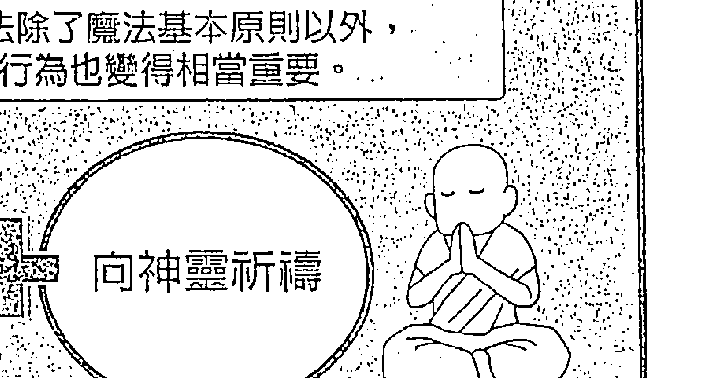

#### 宗教出现前的魔法与宗教式魔法

宗教出现前的黑魔法当中，魔法师与诅咒对象间乃直线关系

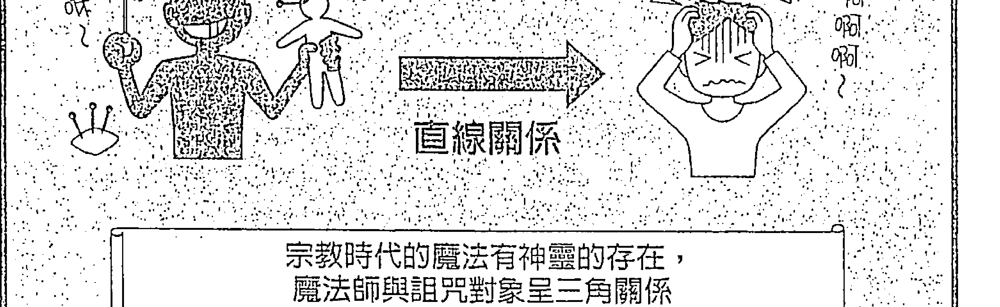

宗教时代的魔法有神灵的存在，魔法师与诅咒对象呈三角关系

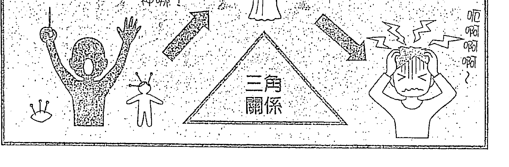

### No.004 形象黑魔法

形象黑魔法是利用人偶等模拟仇敌的偶像（形象），是所有利用类感魔法原理的黑魔法当中最普遍的一种。

#### ◎伤害偶像（形象）以加害他人

早从数千年前，世界各地便出现以伤害模拟某人物的偶像（形象），藉此对该人物造成同样的伤害，甚至致死的魔法，直到现在还有许多地区仍盛行这类魔法。形象黑魔法运用所谓“类似衍生类似”的类感魔法原理，是最常见的黑魔法。

例如欧洲的蜡像黑魔法、日本著名的稻草人黑魔法等，这些虽然都是属于相同系统的黑魔法，但施行作法却因地而异。

以北美洲的印第安人为例，他们相信只要在沙土、灰尘或黏土等表面描绘目标人物的模样，再拿尖棒或戳或刺攻击人像，目标人物就会受到完全相同的攻击伤害。

同样在北美洲的欧及布威族印第安人则是会使用某种黑魔法：制作目标人物的小木偶，再用针或箭矢刺击木偶，他们相信这样便会使目标人物身体的相同部位感到剧烈疼痛；或是咏唱特殊咒语后焚烧木偶，将其埋进土里，便可让对方立即猝死。

马来半岛等地的马来人，他们的形象黑魔法更加复杂：首先要从目标人物身上盗取其身体的一部分，如毛发、眉毛、指甲或唾液等，再将它拿来跟蜜蜂的旧巢揉在一起，捏成人偶，并把人偶放在火上连续烤七个晚上，接着咏唱以下咒文：“我烤的不是蜡，而是〇〇（名字）的肝脏、心脏、脾脏。”据说只要连续烤七个晚上，目标人物就会猝死。

> 我烤的不是蜡，而是〇〇（名字）的肝脏、心脏、脾脏。

##### 形象黑魔法

- 使用拟人形象（人偶）的黑魔法。
- 是全世界最常见的黑魔法。

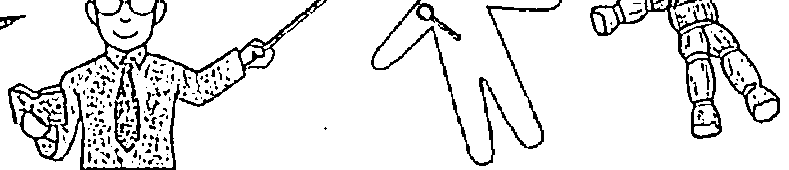

欧洲的蜡像和日本的草人属于同一类。

##### 各种形象黑魔法

形象黑魔法因地区不同而有不同的变化。

###### 北美洲印第安人

在沙土、灰尘或黏土等处描绘敌人模样，再拿尖棒或戳或刺攻击人像，使现实中的目标人物受到完全相同的攻击伤害。

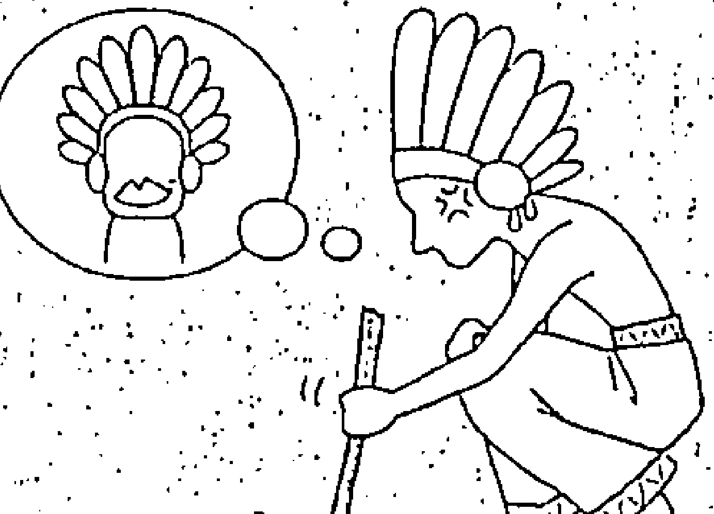

###### 北美洲欧及布威族印第安人

制作目标人物的小木偶，再用针或箭矢刺击木偶，使现实中敌人身体的相同部位感到剧烈疼痛。

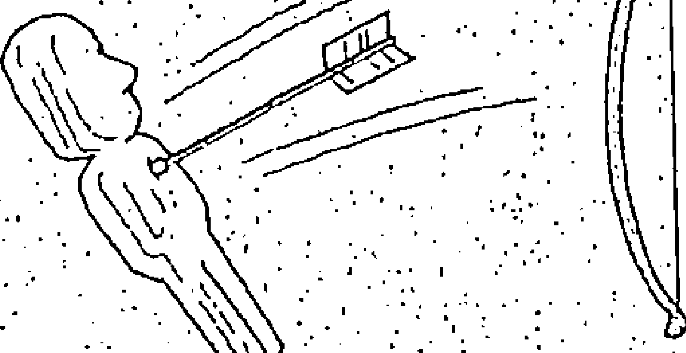

###### 马来半岛的马来人

取敌人毛发、眉毛、指甲或唾液跟蜜蜂的旧巢揉成人偶，连续火烤七个晚上，并唱诵固定咒文，对方就会猝死。

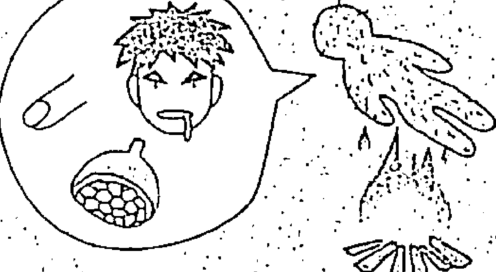

> ◎欧及布威族印第安人（Ojibwe）→ 分布于美国北部至加拿大一带的阿尔衮琴语族印第安人，亦称齐佩瓦族。

### No.005 死者黑魔法

所谓的死者黑魔法，就是一种能让目标人物陷入目不能视、耳不能听、身不能动，恍如死者般状态的黑魔法。

#### ◎传染死亡使之失去行动能力的魔法

死者目不能视、耳不能听、口不能言，也无法动弹。着眼于此，未开化社会的黑魔法相信循着类感魔法的原理，取死者的骨骸烧成骨灰来施法，就能使目标人物仿佛死者般陷入全无视觉、听觉、言语或行动能力的状态。

这种魔法遍见于世界各地，而且最受宵小喜爱。在克罗地亚东部的斯洛伐尼亚地区，进行夜间偷盗的窃贼经常会借重以下这个魔法：首先准备死人骨骸，在进屋里前先将骨骸掷到目标建筑的屋顶上，唱诵“如果这骨头也有睁开眼的一天，这户人家就醒来吧！”后，再进到屋里。这样一来，这户人家就不会有人被惊醒。

爪哇则有种从墓场取泥土撒在目标人家周围的魔法。只要这样一撒，就能让那户人沉睡不醒，夜盗便可自由偷窃。

东斯拉夫的鲁塞尼亚人还有一种使用死者大腿骨的魔法：拿这支大腿骨填塞兽油制成蜡烛，点燃后绕行目标房屋三圈，屋里的人就会如死者般沉睡，连小偷潜入也浑然不觉。

古希腊的宵小则是会从火葬场捡拾还在燃烧冒烟的树枝，藉以行使魔法。只要带着树枝，就算遇到凶猛的恶犬，也能让恶犬不敢吠叫。

另外，像欧洲著名的“光荣之手”（请参照No.045）也是属于相同系统的魔法。

死者黑魔法

利用死者的骨頭或骨灰，使目標人物如同死者般無法動彈的黑魔法。

小偷愛用的死者黑魔法

> 死者黑魔法能讓睡著的人絕對不會被驚醒，因此廣受全世界宵小喜愛。

克羅埃西亞的小偷

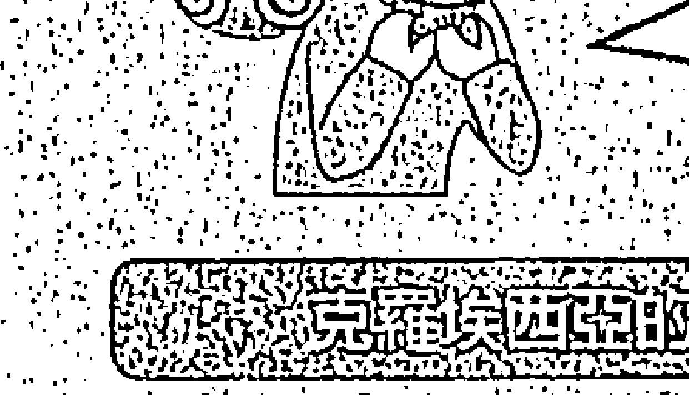

將死者骨骸擲到目標屋頂上，唱詛咒文。

爪哇的小偷

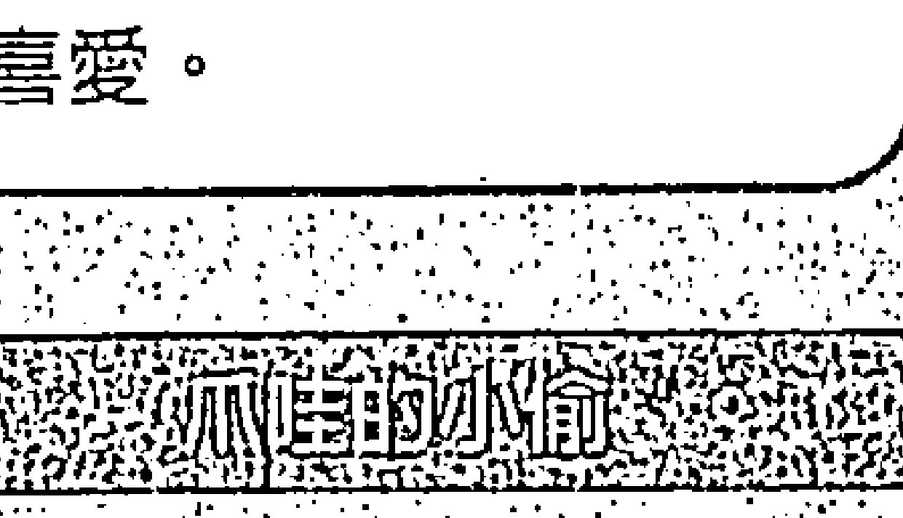

取墓場泥土撒在目標房屋周圍。

東斯拉夫的小偷

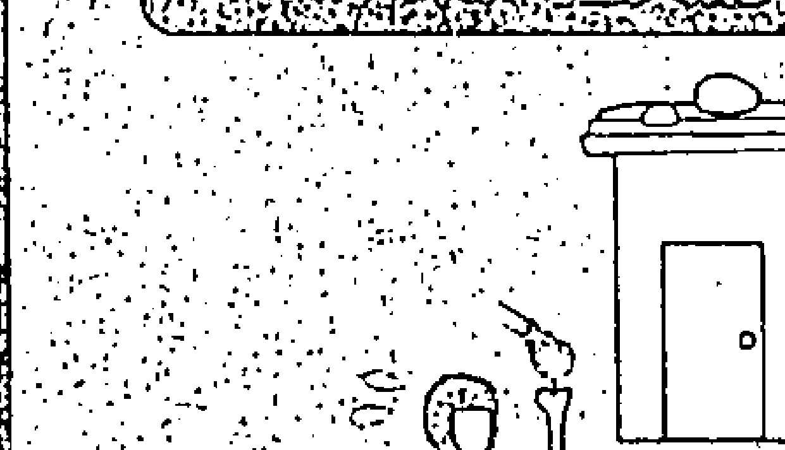

取死者大腿骨塞入獸油製成蠟燭，點燃後繞行目標房屋3圈。

馬利的小偷

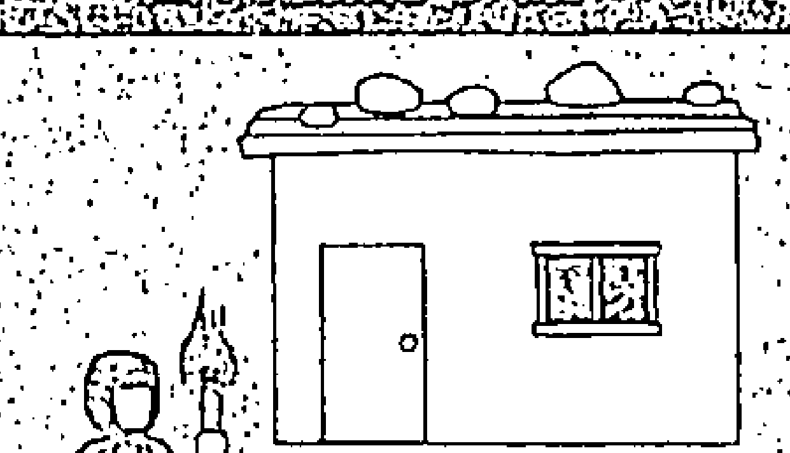

從火葬場撿拾仍在燃燒冒煙的樹枝，帶在身上便能讓看門犬乖乖地不作聲。

加害者的黑魔法

根據感染魔法的原理，對加害者做出同樣行為也會影響到被害者，並加劇被害者的傷勢。

❶讓負傷敵人傷勢加劇的黑魔法

根據未開化民族相信的感染魔法原理，只要兩者之間曾有過接觸，即便後來分隔兩地，對甲方做出某個行為，乙方也會受到同樣的影響。若將這個原理套用在加害者與受傷的被害者兩者身上，只要對加害者做出某種行為，就會影響到受害者。

這個原理可以直接應用在黑魔法上，使用武器傷人的加害者可以利用這個原理讓被害者的傷勢惡化加劇。舉例來說，加害者如果覺得炙熱難耐、痛苦，或是吃下對身體有不良影響的刺激性食物，除了加害者本身感到不適外，這個感覺還會感染被害者，使被害者傷勢惡化，嚴重者甚至可以致命。

傷敵的武器亦可用於相同目的。加害者如果想要進一步折磨敵人，可以將殺傷敵人的武器拿去火烤加熱；若取得刺傷敵人的箭頭，也可以拿箭頭去烤。除此以外，有的會將射傷敵人的弓弦拉得極度緊繃，再撥動弓弦，他們相信這麼做就能夠刺激敵人的傷勢，藉此折磨敵人。

這個原理當然也可以應用在白魔法之上，而且可說是全世界共通。如歐洲相信只要在傷敵的武器上塗抹油脂，就可以得到治療傷勢的效果，不論負傷者身在何處，只要在武器上塗油脂就可以治傷。如果是被刺到，也可以將其拔出後在尖刺上面塗油。

反之，如果將武器表面塗的油脂抹掉，被害者的傷勢就會再度惡化。

加害者的黑魔法 → 對加害者或加害用的武器施加某種行為，則影響力也會及於受害者、使其感到痛苦。

加害者、武器與被害者的關係

加害者、武器與被害者之間的關係如下。

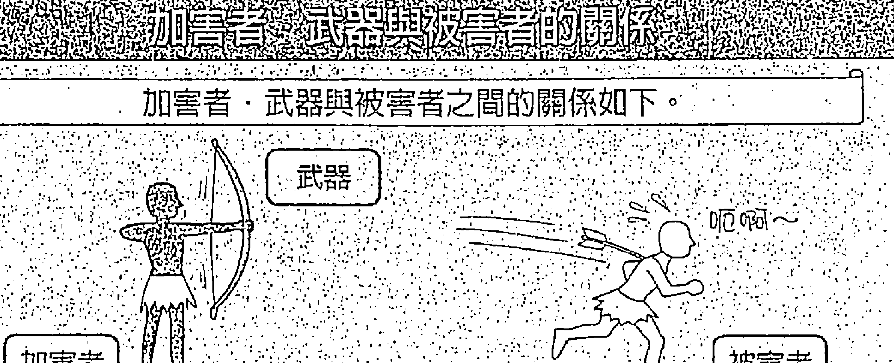

加害者與被害者的關係

如果加害者吃滾燙、極苦或刺激性的食物而感到難過時，這股刺激也會及於被害者，嚴重者甚至可以使其致命。

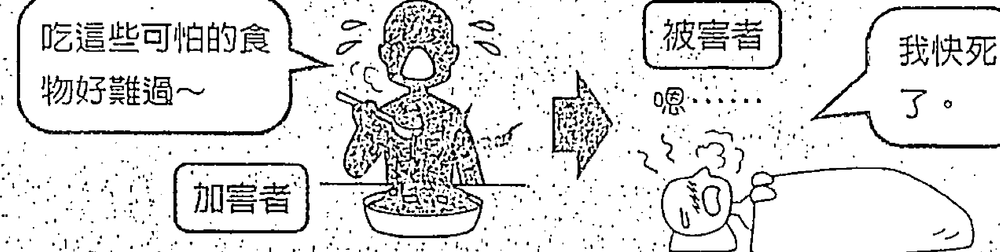

加害武器與被害者的關係

取殺傷敵人的武器或箭頭去烤火，或將弓弦故意繃緊撥弄，就能使被害者傷勢惡化，感到更加痛苦。

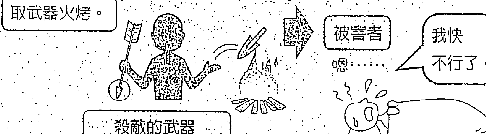

No.007

衣服的黑魔法

> 無論彼此距離有多遠，只要能取得沾染汗水或體味的衣服，便能咒殺穿過這些衣服的人。

◎毀壞衣服藉以傷害曾經穿著的人

平時最貼近人們的衣服，容易沾染到汗水或體味，因此在未開化社會的黑魔法當中，占有很重要的地位。

南太平洋萬那杜共和國（赫布里底群島）的塔納島民認為如果對某人懷恨在心想要一雪仇恨，首先就要取得他的衣服，用樹葉或樹枝摩擦那些衣服，接著用衣服包覆樹葉或樹枝，捲成類似香腸的筒狀後慢慢地燒掉。如此一來，目標人物就會隨著衣服的燃燒而愈來愈痛苦，並且在燃燒殆盡時喪命。

普魯士（德國北部一帶）也有類似的黑魔法，當地相信即便小偷已經逃離無蹤，只要有小偷脫逃時落下的衣服便能將其擒捕到手，因為他們認為只要拿棍棒用力敲打小偷留下的衣服，小偷就會生病。

之所以會有這種現象，是因為人與衣服之間有種特別的咒術共感關係，即便分隔兩地，衣服所受到的危害同樣也會傳達到穿過那衣服的人身上。

不光是身上穿的衣服，坐墊也能拿來施行詛咒。澳洲維多利亞的原住民咒術師光是取別人坐過的袋鼠皮坐墊拿來烤，就能讓坐墊的持有者生病。若要解開這個詛咒，就要由坐墊持有者的家人或朋友前去拜訪咒術師，在獲得咒術師許可的情況下取回被火烤過的坐墊，用水洗掉火氣。

衣服的黑魔法

衣服沾有汗水和體味，是黑魔法的重要道具。

世界各地使用衣服的黑魔法

依地區不同 而有各式各樣利用衣服 一掃怨氣的方法

馬紹爾共和國塔利島

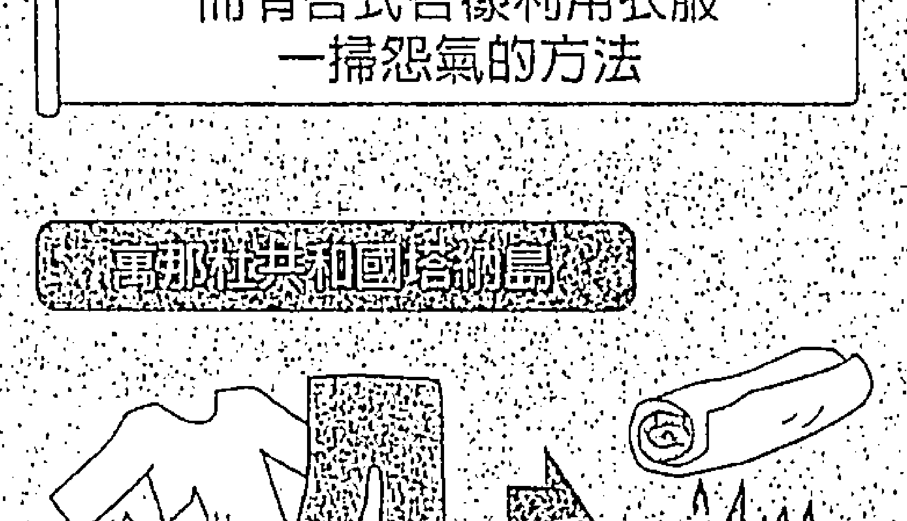

取樹葉或樹枝摩擦敵人衣服，捲成筒狀後慢慢燒掉，衣服燒光的同時敵人就會死亡。

印度馬德拉斯

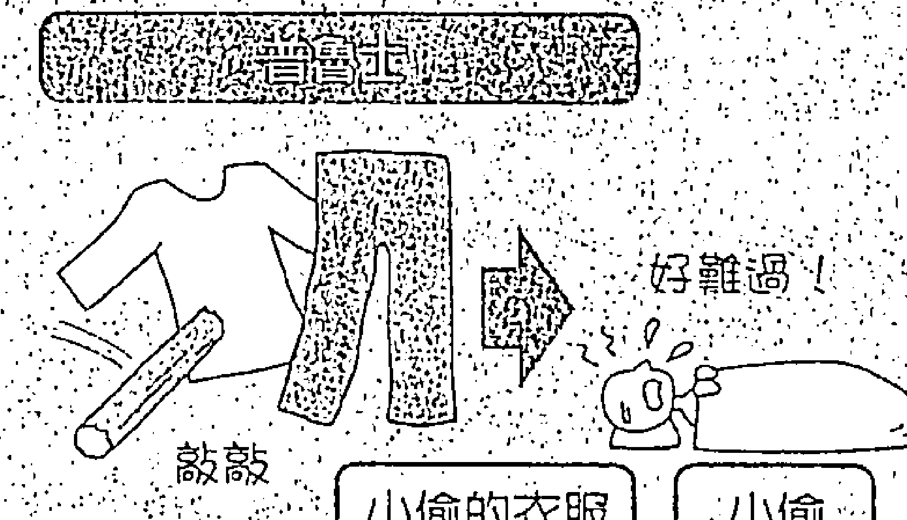

只要以棍棒用力敲打小偷落下的衣服，小偷就會生病，可以藉此捉到小偷。

澳洲原住民族

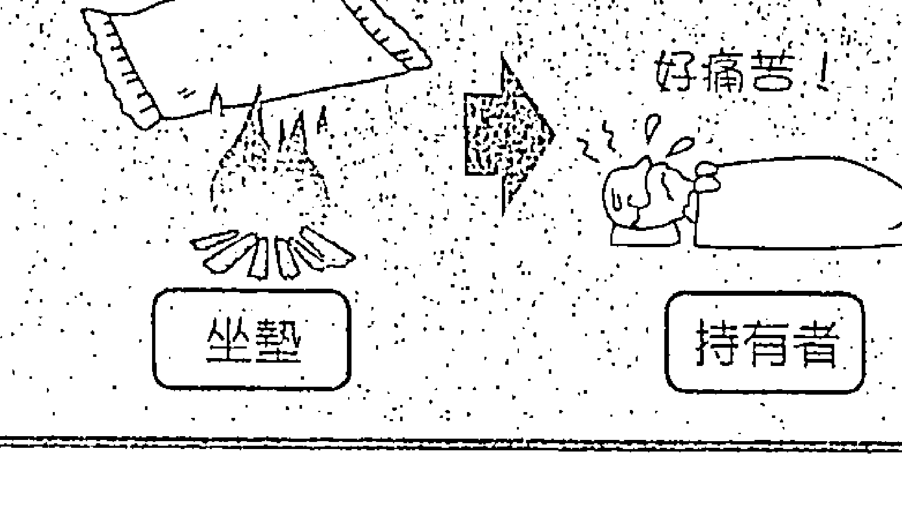

拿別人使用的袋鼠皮坐墊用火烤，就能讓持有者生病。

No.008
脚印的黑魔法

光憑留在砂土上的腳印、掌印或身形痕跡，黑魔法師便能夠詛咒留下這些痕跡的人，以劇痛折磨對方。

透過腳印或掌印危害他人

人只要在砂土上走動，就會在該處留下腳印、掌印或身體的痕跡。這些痕跡跟曾經在這裡活動的人有過密切的接觸，適用於感染魔法的魔法原理。在黑魔法的世界裡，透過留在砂土上的腳印、掌印或身體痕跡，便足以詛咒當初的那個人。

腳印是這些痕跡當中最普遍的，利用腳印行使的黑魔法可謂是遍見於世界各地。

以澳洲東南部的原住民族為例，當他們想要讓憎恨對象痛苦時，就會尋找那個人的腳印，並拿石英、玻璃或骨頭等物去刺擊，光是這樣就足以讓那個人的腳出現異狀，甚至瘸腿跛腳。因此當澳洲原住民風濕痛發作時，就會認為自己的腳印被別人施了魔法。

同樣的魔法亦可見於歐洲各地。臨波羅的海的德國梅克倫堡地區有一種在仇人腳印上打釘的魔法，這釘子還必須是從棺木中拔出來的封棺釘，如此一來便能使仇人跛腳。

澳洲東南部的原住民族還相信，躺臥時所留下的身形痕跡同樣也可以用來施法。取石英或玻璃等銳利的碎片埋在該地，其咒力便足以使對方的身體感到劇痛。

古希臘畢達哥拉斯學派有條戒律規定每天起床以後要抹去留在寢具上的痕跡，其目的就是要避免遭人施行這類魔法。

脚印的黑魔法

透過腳印、掌印或身形痕跡詛咒留下痕跡的人。

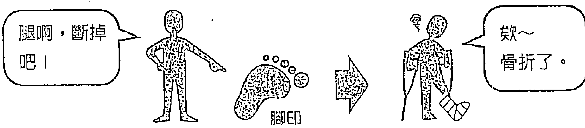

遍見於全世界的脚印黑魔法

世界各地均流傳利用脚印或身體痕跡行使的黑魔法。

澳洲原住民

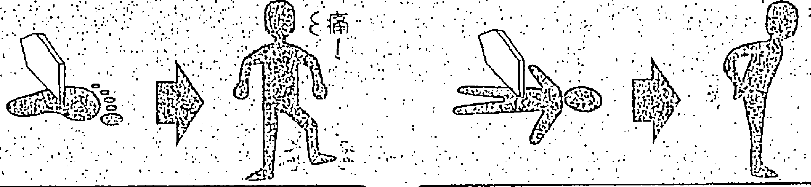

用玻璃或石英等刺擊脚印，便能使人脚痛。

用玻璃或石英等刺擊身形痕跡，便能使人感到身體疼痛。

德國海克倫堡

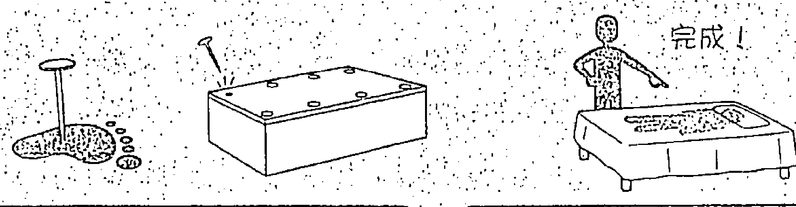

要在脚印上打釘，非得使用封棺釘不可。

為避免遭到黑魔法襲擊，起床後要立刻抹掉床舖上的身形痕跡。

※畢達哥拉斯學派（Pythagoreanism）→亦稱畢達哥拉斯教團，傳為古希臘哲學家畢達哥拉斯所創設的宗教結社。

No.009
捕捉靈魂的黑魔法

世界各地都有捕捉靈魂的黑魔法，據說黑魔法師只要傷害捉來的靈魂，就能讓靈魂的主人生病，進而死亡。

①奪取仇敵靈魂以行攻擊的黑魔法

擒捕靈魂可謂是黑魔法的基本魔法之一，盛行於世界各地的未開化民族之間，他們相信靈魂若遭魔法師奪取將會罹患疾病，最終致死。

在斐濟，酋長會使用靈魂捕縛術來對付不肯認罪的犯罪者。酋長會拿著頭巾在犯人的頭頂上不停揮舞，待靈魂進入後立刻將頭巾折疊，釘在獨木舟船頭，如此一來靈魂遭剝奪的犯罪者就會漸漸衰弱而亡。因此，犯罪者只要一聽到酋長提到頭巾這件事就會害怕得不住顫抖，將實情和盤托出。

南太平洋丹傑島的魔法師遇到仇敵生病時，就會在對方的住處附近設置一個兩側裝著兩個大小不同的環、全長約五公尺的陷阱。當地的人們相信生病就代表靈魂已經離開了身體，而魔法師此舉就是要捕捉靈魂，讓它無法回到主人的身體裡面。如果靈魂（據說會以小鳥或昆蟲的模樣體現）落入陷阱，那麼失去靈魂的人就必死無疑。

西非的黑魔法師也會設下陷阱，趁人們睡覺、靈魂離開身體時捕捉靈魂。黑魔法師不管靈魂究竟是誰的，只要捉到靈魂就會把它吊在火堆上烤，靈魂乾燥以後那個人就會生病。據說黑魔法師此舉並非是跟人有什麼恩怨，只要那個人願意付錢，魔法師就會立刻釋放靈魂。至於有意傷害對方的黑魔法師，則是會在囚禁靈魂的缽狀容器中放置利刃或鉤子；一旦在裡面受了傷，即使靈魂幸得逃脫，靈魂的主人也會生病。

捕捉靈魂的黑魔法

**靈魂捕縛術** → 靈魂遭奪取將會導致病死。

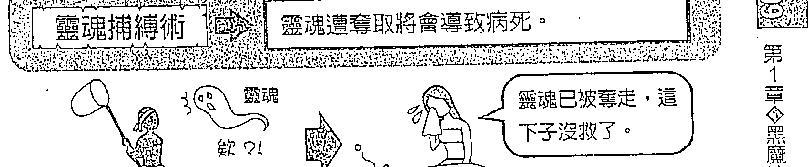

各地的靈魂捕縛術

各地捕捉靈魂的黑魔法都不盡相同，必須注意！

因紐特

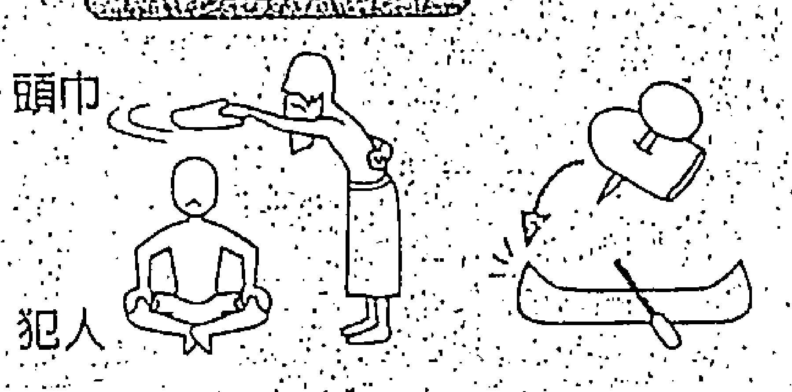

取頭巾在犯人頭頂揮舞，待靈魂進入後將頭巾折疊，釘在獨木舟船頭，靈魂遭奪取的犯罪者就會衰弱而亡。

阿伊努

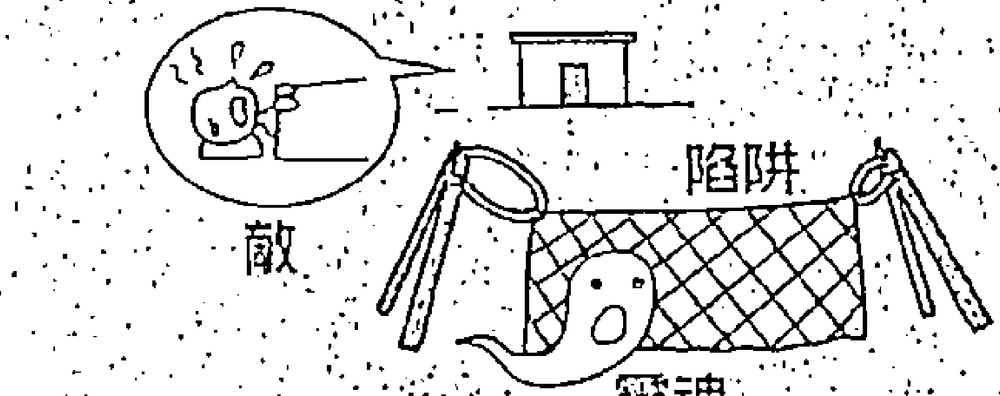

仇敵生病時，在住處附近設置兩側有環的陷阱。只要靈魂以小鳥或昆蟲的模樣困在陷阱中，那人就必死無疑。

西非

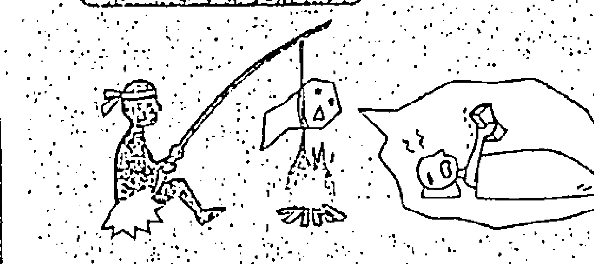

以陷阱捕捉人們睡著時脫離軀殼的靈魂，並使用火烤，待對方不耐其苦拿錢來贖，才會放過對方。

No.010
影子與映像的黑魔法

透過影子或映像加害他人

拖曳在地面的影子和映照於水面的身形，就跟遺留在沙上的腳印或掌印一樣，皆可當作黑魔法的重要道具使用。

這是為什麼呢？因為世界上許多地方都相信，映照在地面或水面的影子映像便是那個人的靈魂或生命的一部分。

影子與映像的黑魔法有形形色色各種不同的類型。

舉例來說，印尼的章塔島就有種或以長槍刺擊、或以利刃斬切影子，好讓施術對象生病的黑魔法。

希臘通常都是使用獸血獻祭祈使建築物能夠屹立不搖，有時卻也會使用人影的魔法。這魔法是將人帶到建築物的地基礎石處，偷偷採錄那個人的身形尺寸，將抄錄下來的尺寸埋在地基礎石底下，或是將地基礎石壓在人影之上。如此一來建築物就會牢不可動，但那個人卻活不過一年。

羅馬尼亞的外西凡尼亞地區則認為像這樣影子被埋起來的人，40天內就會死亡。於是這個地方後來甚至還發展出專門出售影子給建築家，好保證牆垣堅固的影子商人這種職業。

白令海峽的愛斯基摩人則相信魔法師有能力盜取他人的影子，若影子遭竊就會日漸衰弱，終致死亡。

畫筆繪成的肖像畫和照相機拍出來的照片，同樣也能拿來做這種恐怖用途。只要取得肖像或相片，便等於取得了足以奪去對方性命的決定性力量，這也就是為何許多未開化民族如此害怕讓人照相或繪製肖像畫的原因。

> >*見P.217頁No.010注釋

影子與映像的黑魔法

影子與映像

+   - 是人的靈魂或生命的一部分。
- 可作為黑魔法的道具。

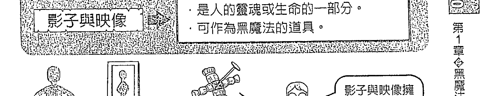

影子與映像擁有與稻草人偶同樣的力量。

各地的影子與映像的黑魔法

無論地面的影子或水面的倒影，一經黑魔法師的手，就會產生極可怕的結果。

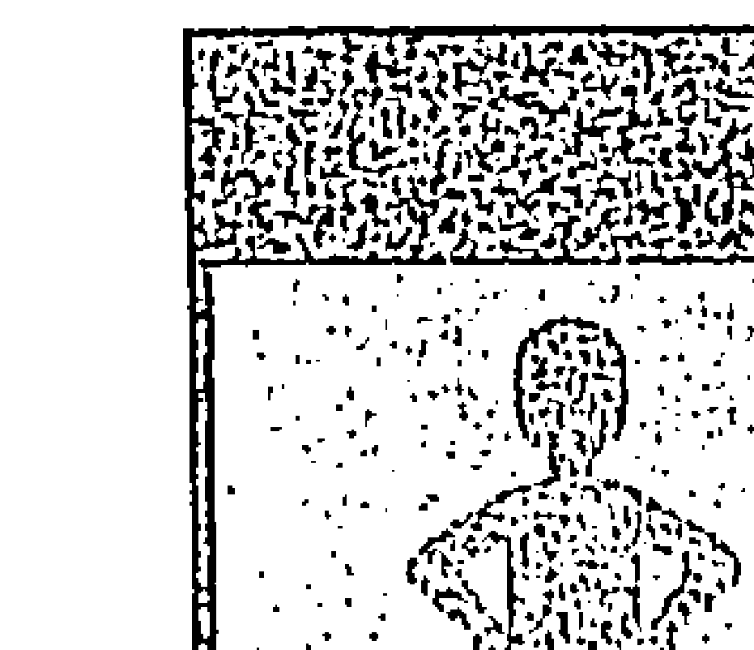

拿苔島

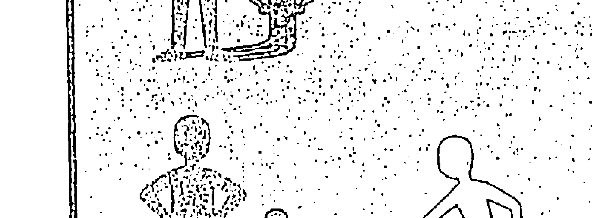

持長槍或刀刃刺擊他人的影子，那個人就會生病。

厄瓜多

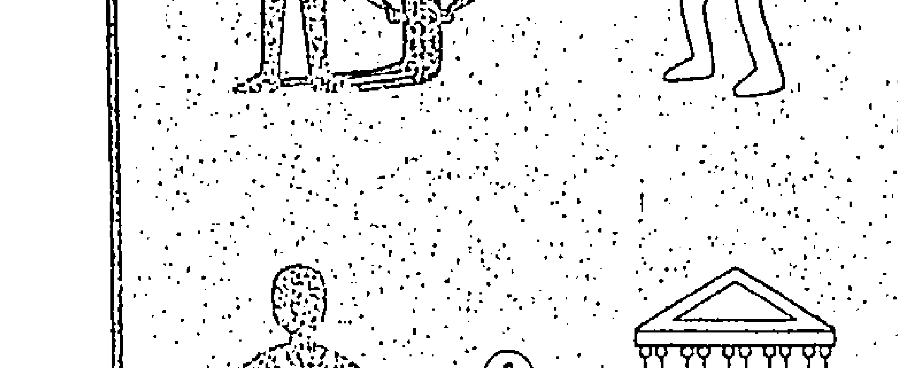

偷偷採錄他人的影子尺寸，並抄起來埋在建築物的地基礎石底下，便能保證建築物穩固屹立，但那個人卻會在年內喪命。

英吉利海峽的愛爾蘭人傳說

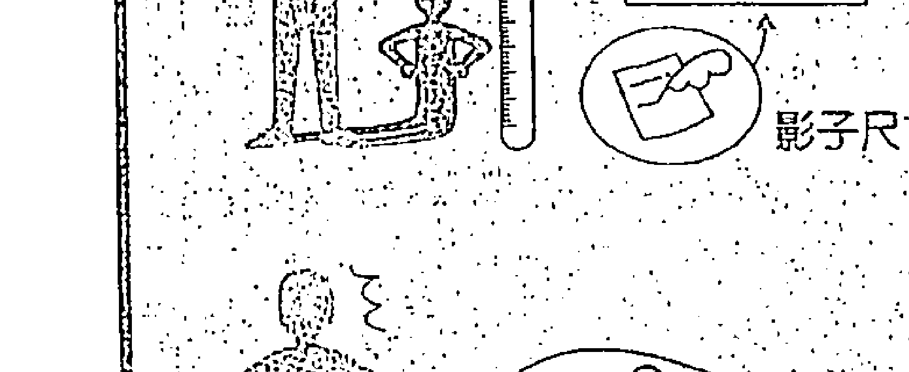

影子遭竊者會漸漸衰弱，終致死亡。

No.011
剩饭的黑魔法

吃剩的食物也可以作為施行詛咒的強力道具。黑魔法師當中亦不乏總是在蒐集聚人剩菜剩飯的魔法師。

❶对他人剩菜剩饭虎视眈眈的黑魔法师

别人吃剩的食物也是一种用来诅咒他人的重要道具。当某人进食并留下部分的食物时，原本属于一体的食物就等于是分别存在于那个人的胃中与身体外部两个地方。若按照感染魔法原理来解释，这两者之间有着非常深的关系。

利用剩菜剩饭诅咒他人的方法非常多样化。以澳洲南方某部族黑魔法师的仪式来做说明：首先拿红土与吃剩的鱼油揉成泥团，将鱼眼珠和肉片也揉在里面，再把揉成球状的泥团插在鱼骨骨前端，放在尸体怀中一段时间，此举的用意是要让咒物吸收死亡的力量。

接着将泥团取出，燃起火堆，把鱼骨头插在一旁的地面上，此时鱼骨前端的泥团会因受热而慢慢融化，待其完全融化之际，受诅咒者就会一命呜呼。这个地区的黑魔法师经常在寻找他人吃剩的鸟骨、兽骨、鱼骨头，因为他们就是靠着施行诅咒要督他人支付钱财来维持生计。

南太平洋新赫布里底群岛塔纳岛的黑魔法师则是会到处去捡别人吃剩的香蕉皮，用小火慢烤，当香蕉皮烧完的同时，那个人便会死去，所以吃下香蕉的本人或亲戚要赶忙去找黑魔法师送礼，央求他撤消诅咒。

如前所述，吃剩的东西若落到黑魔法师手中就会变得非常危险，因此这些地区都有吃完饭后立刻自行处理残羹剩饭的习惯。基于相同理由，古罗马人也有用完餐后随即将蜗牛壳或蛋壳压碎的习俗。

剩饭的黑魔法

用别人吃剩的食物施行诅咒的魔法。

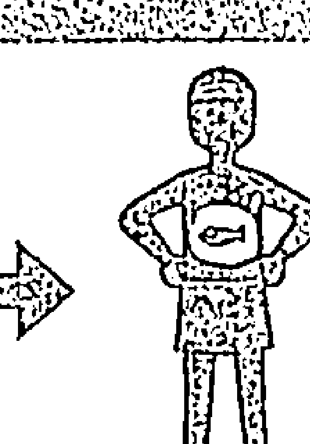

根据感染魔法的原理，吃剩的食物和已经吃下肚的食物两者之间有著极深的魔法性关联，可作为黑魔法的道具运用。

澳洲南部的剩饭黑魔法

方法为何？

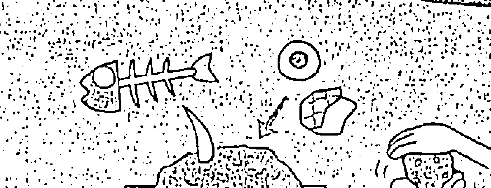

将红土和吃剩的鱼油揉在一起，把鱼眼珠和肉片也掺杂其中。

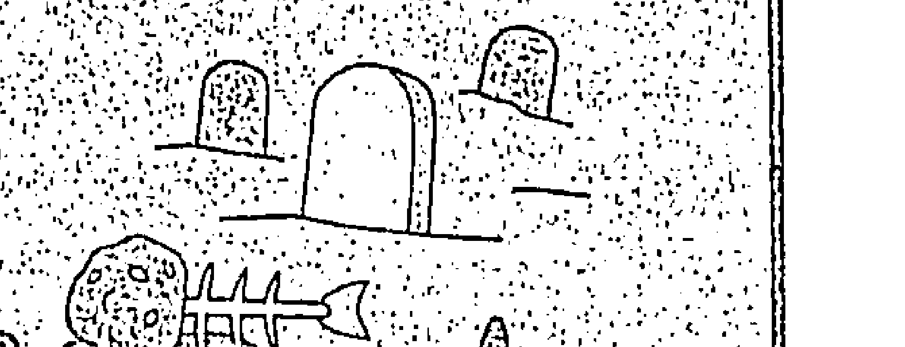

捏成球状插在鱼骨头前端，置于尸体怀中。

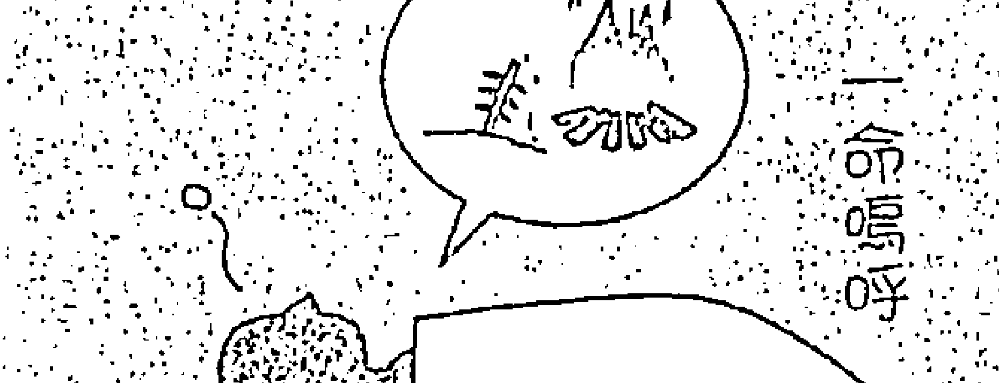

取出泥团，燃起火堆将鱼骨头立于一旁。

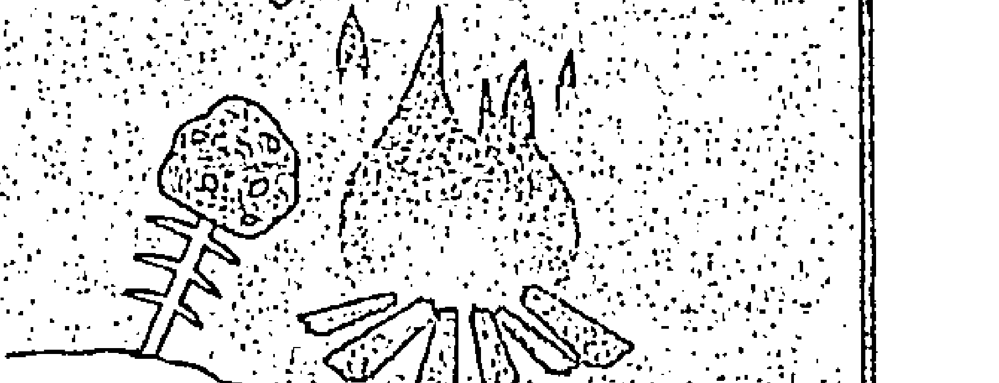

鱼骨头前端的泥团受热融化殆尽时，遭诅咒者就会丧命。

No.012 毛髮與指甲的黑魔法

毛髮與指甲自古以來就被視為是擁有非常強大力量的咒物，只要在詛咒用人偶中摻入毛髮或指甲，便能夠使詛咒的力量增強數倍。

能使黑魔法力量倍增的駭人咒物

在黑魔法的世界裡，毛髮與指甲自古以來就一直被視為擁有非常強大力量的咒物。只要握有從身體切下的毛髮或指甲，便能對那個人施行魔法，這種思想遍見於世界各地。以世界各地利用人偶施行的黑魔法為例，只要將那個人的毛髮或指甲摻於人偶之中，便能使詛咒的力量增強數倍之多。就算只有毛髮或指甲，其力量也絕對足以對那個人施行詛咒。

馬克薩斯群島的魔法師會蒐集人類的毛髮、指甲和唾液等這些從身體分離出來的東西，放進特殊的袋子裡，經過儀式後埋進洞裡，光是如此便足以使人生病。於是人們經常會將切下來的毛髮和指甲等物燒掉後埋在沒人知道的地方，以免落入黑魔法師的手中，這種習俗遍見於全世界。

未開化的社會民族之間還有種習俗：會先剪下戰俘的頭髮後再將其釋放。頭髮被剪的俘虜因害怕遭到施法，自然就不敢再與自己為敵。

毛髮當中蘊含著人類的生命力與超自然的力量。歐洲民間相信，女巫的魔力便是充塞在毛髮之間。聖經曾描述力士士師參孫的怪力同樣源自毛髮，後來他也因頭髮被壞女人大利拉剪掉而失去了力量。

此外，世間還普遍有種信仰認為陰毛是最富愛情魔力的毛髮。因蘇格蘭女巫案遭到逮捕的男性女巫約翰·費安（John Fian）就會施行過陰毛的魔法。據說他為使年輕女子愛上自己，偷取該女子的3根陰毛施行戀愛魔法，可是他的死對頭竟然從母牛乳房拔下3根毛，偷偷跟女孩的陰毛調換，所以他非但沒有得到女孩的青睞，還落得讓母牛四處追著跑的下場。

毛髮與指甲

擁有強大力量的黑魔法咒物。將頭髮、指甲摻入詛咒人偶，可使詛咒力量增強數倍。

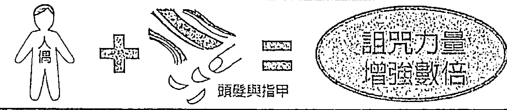

頭髮的魔法力量

人類因畏懼頭髮所蘊含的黑魔法力量，而衍生出各種形形色色的習俗。

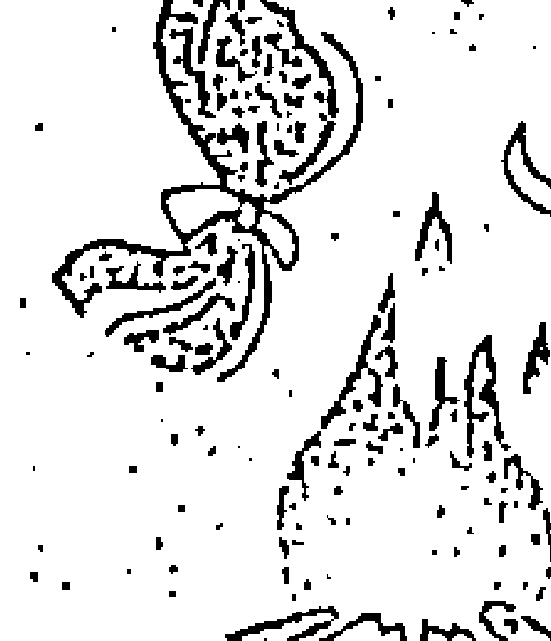

為避免落入黑魔法師的手中，世界各地都有將毛髮與指甲斷片燒掉或掩埋的習俗。

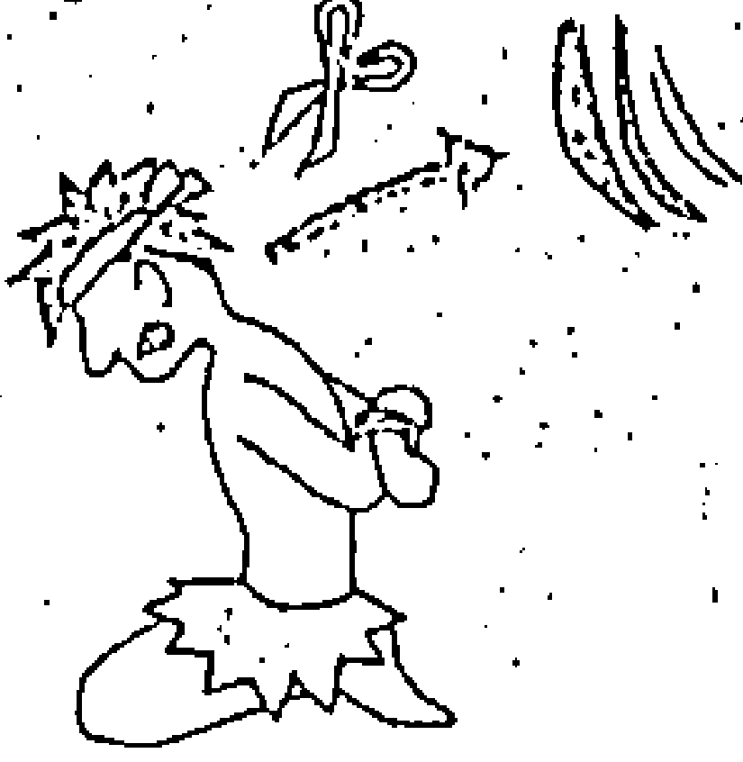

俘虜敵人後剪下其頭髮讓對方再也不敢與己為敵的習俗。

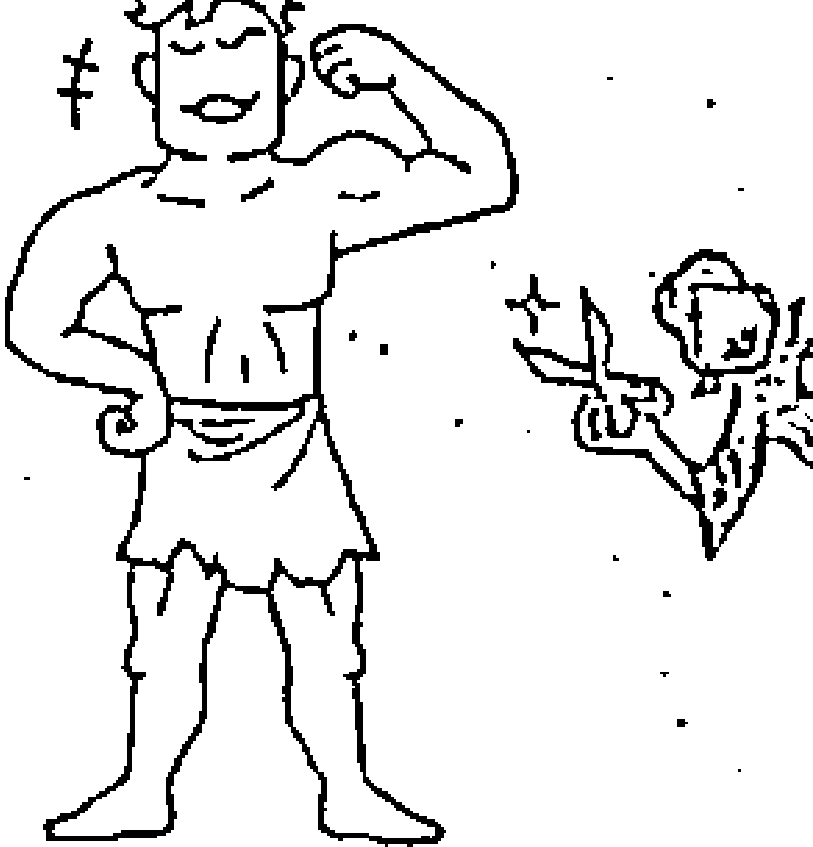

頭髮是力量的泉源，聖經英雄參孫就曾被惡女大利拉剪掉頭髮而變得衰弱。

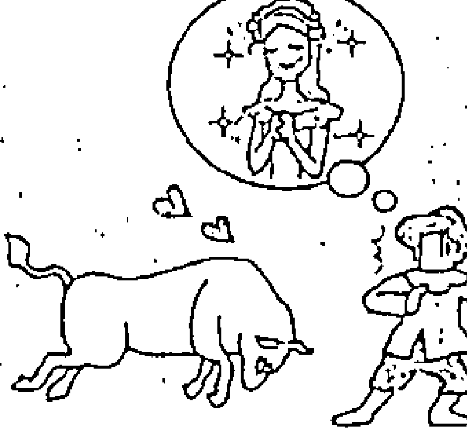

16世紀的巫師約翰·賈安，因藉由3根陰毛，施行黑魔法，讓年輕女孩愛上了自己，而遭到逮捕。

◎馬克薩斯群島（Marquesas Islands）→位於大溪地東北方約1500km處，南太平洋由14個火山島所組成的群島。
◎士師參孫（Samson）→但族出身的以色列英雄，以對抗非利士人而聞名，後來卻被非利士出身的妻子大利拉剪掉頭髮而遭非利士人殺害。

血液與唾液的黑魔法

血液、唾液跟毛髮、指甲一樣都擁有強大的黑魔法力量，尤其是女性特有的經血更擁有使男性臣服於自己的強力戀愛魔法成分。

◎有千萬種使用方法的黑魔法詛咒道具

血、唾液跟毛髮、指甲一樣，都是擁有強大黑魔法力量的恐怖咒物。這是因爲血與唾液原本也屬於人類身體的一部分，一般相信即便與人體分離後，還是能持這些物質對人施以魔法。同樣以藉人偶施行詛咒的黑魔法爲例，優秀的黑魔法師除毛髮與指甲以外，也不會忘記摻雜血或唾液增強法力。

從前有個印第安的黑魔法師曾取得敵人唾液，將唾液注入馬鈴薯，再煙燻馬鈴薯來詛咒敵人，而敵人便會隨著馬鈴薯的乾燥而漸漸衰弱。又或是讓青蛙吞下唾液，擲入激流中，據說敵人就會因此罹患瘧疾。

既然血與唾液擁有如此驚人的魔力，要是落入敵人手中，下場自然是不堪設想。於是人們只要看見血或唾液滴落地面就必須儘快以沙土掩蓋，若沾染木材等物時就要迅速將其削落，以免遭魔法師惡用，在世界各地都有類似的習慣。

除此以外，血與唾液還有諸多不同的魔力。根據歐洲民間傳說，從前女巫在詛咒敵人時經常會使用到自己的唾沫。亦有黑魔法在詛咒他人的同時將唾液抹在石頭或短刀上，再加以摩擦，意圖使其生病。血的重要性更甚於唾液，經常被視爲人的靈魂與生命。無論人類或動物，失血過多自然會小命不保，所以有這種思想也是極其自然。血等於靈魂，有些地方甚至禁止飲用獸血。

再說到女性特有的經血，更蘊含可使男性臣服的戀愛魔法強力成分；只要添加區區一滴經血在男性的餐點內，就必定能夠獲得那名男子的愛。

##### 血与唾液的黑魔法

血与唾液 → 拥有强大黑魔法力量的咒物。

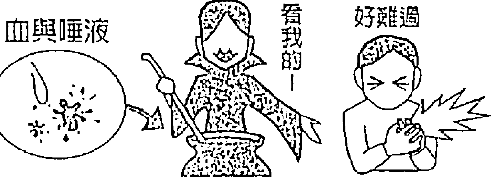

血与唾液原是身体的一部分，即便离开身体，仍然能藉其施行魔法。

##### 世界各地均有使用血与唾液的黑魔法

###### 印第安人

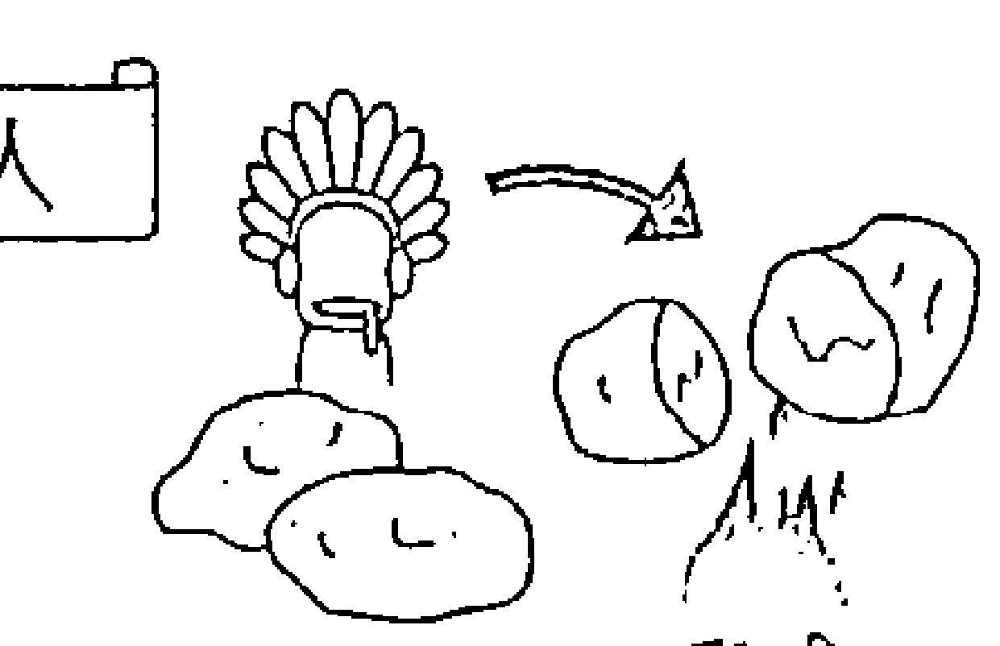

将敌人唾液注入马铃薯再生火烟熏。

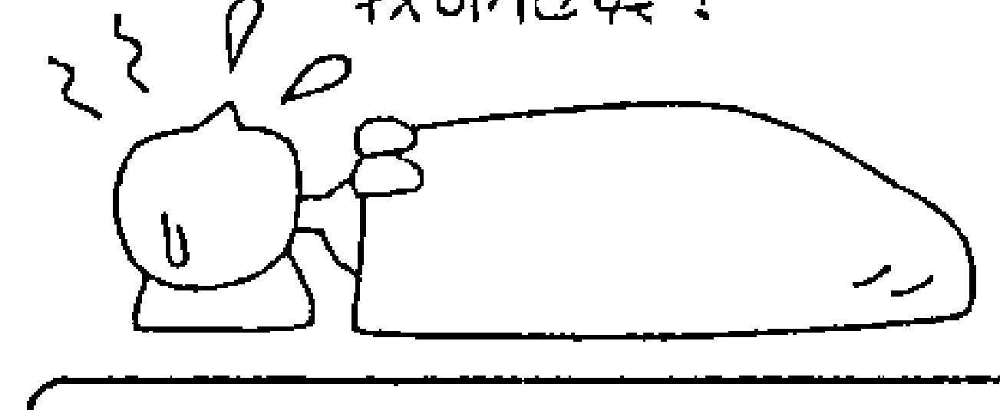

敌人会随着马铃薯干燥而愈渐衰弱。

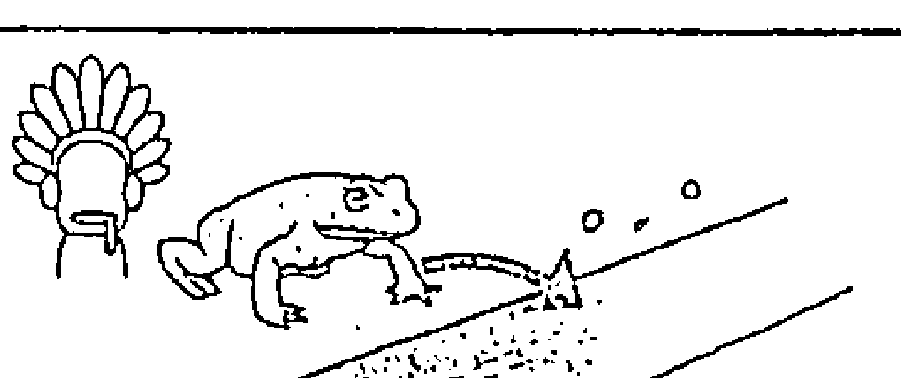

令青蛙吞下敌人唾液，掷入激流中。

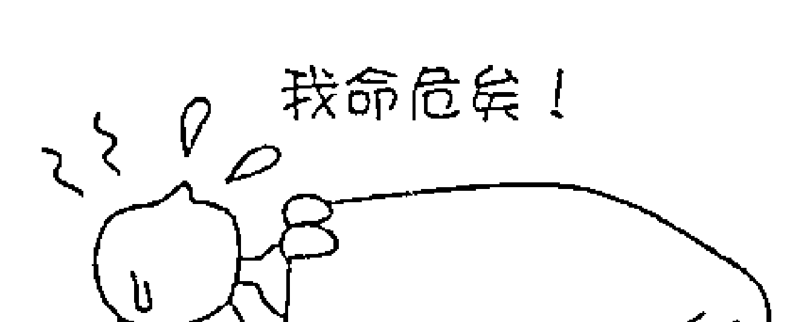

使敌人罹患疟疾。

###### 欧洲女巫

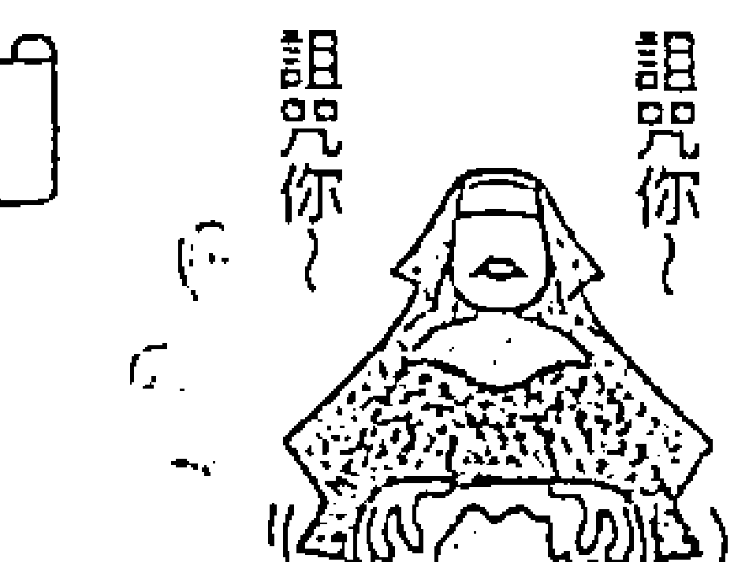

诅咒他人的同时将唾液抹在石头上。

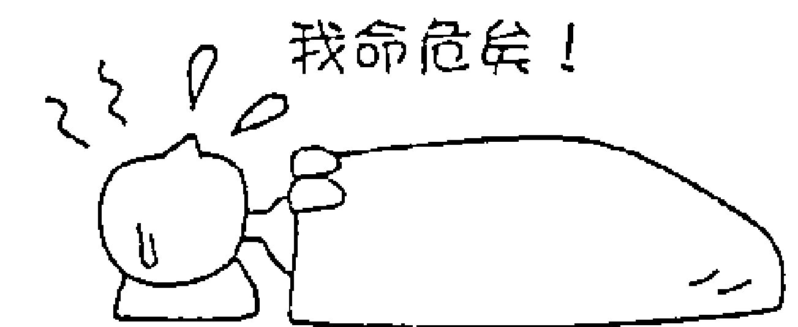

使敌人生病。

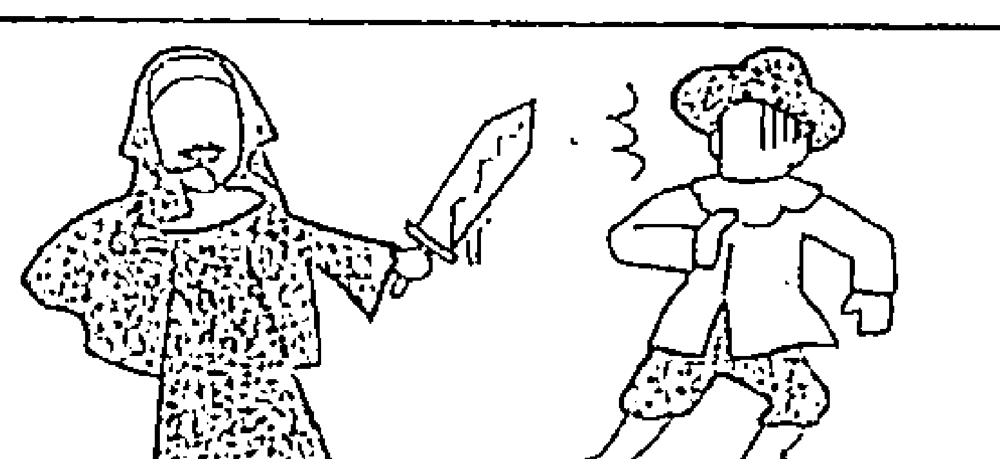

拿涂抹唾液的剑摩擦敌人。

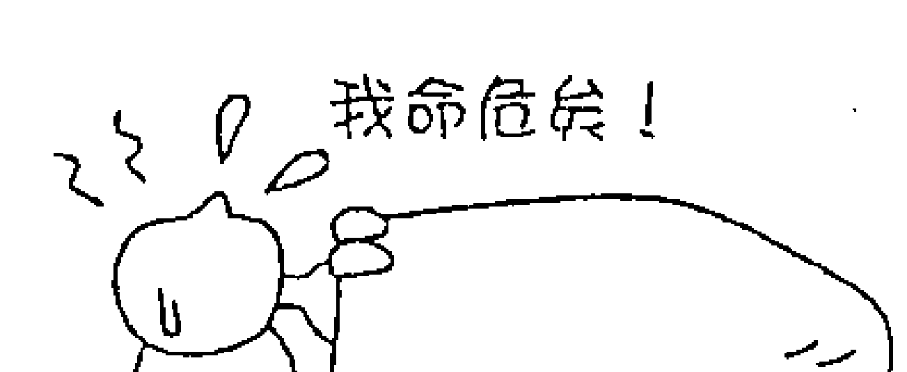

使敌人生病。

##### 名字的黑魔法

### ◎人的本质宿于真名之中的恐怖

在黑魔法的世界里，人的名字就跟人偶、毛发、指甲等物同样可以用来诅咒他人。对黑魔法师来说，名字其实并不是拿来指称某人的字眼而已。

名字当中蕴藏着人的本质，就某个层面来说，名字甚至比毛发、指甲、血液或唾液更加重要。古希腊罗马就会将仇人的名字连同诅咒文字写在破陶片上后掩埋，藉以诅咒他人。除此之外，有些地方还有在名字上钉钉子的习俗。

由于名字非常容易招致危险，所以许多地方都衍生出作为日常使用的名字和真名两个名字的习惯，例如埃及人就有使用两个名字的习惯，他们有大名字与小名字，平时以小名字行走世间，大名字则是隐而不宣。

澳洲中央地带的土著民族除了日常生活使用的名字以外，还有一个圣名，除了特殊场合以外并不会使用，而且平时禁止提起这个圣名。古印度也会给孩童取两个名字，一个是平常用，另一个是只有父母才知道，唯有在结婚之类的特殊场合才会使用。

神祇、天使与恶魔的名字也是如此。根据古埃及神话记载，女神伊西斯曾经想要刺探太阳神拉的真名，企图藉此夺取其神力：伊西斯搜集拉的唾液和着泥土捏成毒蛇，拉被这条毒蛇咬中后相当痛苦，只得将真名告诉伊西斯，伊西斯便取而代之成为了世界的统治者。

##### 名字的黑魔法

- 人的本质宿于其中。
- 比人偶、毛发、指甲、血液、唾液等更加恐怖的咒物。

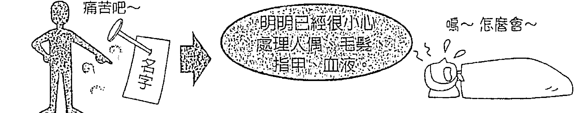

就算没有人偶、毛发、指甲、血液等物，光靠名字同样也能对敌人施行诅咒。

###### 古希腊的名字黑魔法

古希腊人会将敌人名字与诅咒写在陶片上后掩埋，藉以诅咒仇敌。

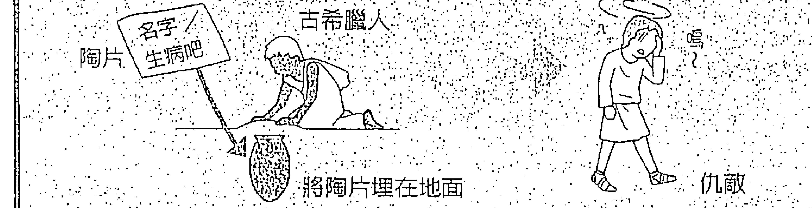

###### 大名字与小名字

从前的埃及人有大小两个名字，一般只使用小名字，大名字则隐而不宣，以免遭人诅咒。

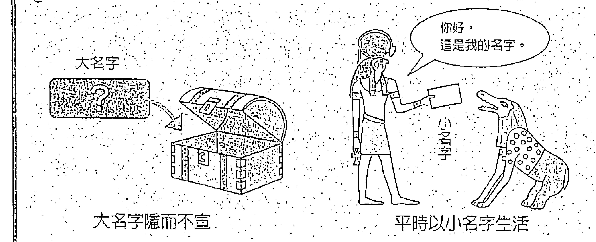

## **No.015**

##### 咒文与黑魔法

所谓的咒文就是指拥有特殊力量，足以驱动自然精灵、神明或恶魔，藉以实现自身愿望的语句，是魔法当中不可或缺的要素。

### ◎ 使用蕴藏特殊力量的魔法咒文

自古以来，咒文便与魔法有着密不可分的关系。早在宗教尚未出现的时代，人们就相信自然界有着各式各样的精灵存在，魔法师们除运用共感魔法的原理以外，还要诉诸于众精灵，希望能借重其力量。宗教发达以后，更复如此：唯有透过向神明、恶魔等神灵发愿请求，才能使愿望得到实现。

咒文内容虽因宗教而异，不过基本上使用的通常都是该宗教认为富含强大力量的名字或词句。

基督教认为唯一的神“耶和华”与耶稣之名最具力量，因此最常使用。欧洲魔法的咒文经常会使用到“埃尔（El）”、“耶洛因（Elohim）”、“耶洛亚（Eloa）”、“撒巴夫（Sabaoth）”、“阿多奈（Adonai）”等词句，这些其实全都是指称神的一般用语。当中象征耶和华的“YHVH”四个字母亦称为圣四文字（Tetragrammaton），是个极为特殊的名字。有时候人们也会凭“阿里蔑（Alimiel）”、“加百列（Gabriel）”等重要天使的名字寻求庇佑守护。透过这些名字便能借重神灵、天使或恶魔的力量来实现愿望。其他还有许多如“驱病符”等起源与含意均不可考的名字。

日本的密教*（佛教）真言（Mantra）原是拥有魔力足以驱动众神佛的语句，后来才演变成魔法的咒文。“真言”意指“真实之言”，密教相信唱诵真言便能够直接将魔法师的愿望传达诉诸于神佛。大威德明王的真言为“嗡·绀利·卡拉鲁帕·吽堪·梭哈。”，降三世明王则为“嗡·苏婆·你苏婆吽·鞞絜哩·吽发吒。”；唱诵该神佛的真言再搭配诅咒仇敌的真言，便能借神佛之力一雪仇恨。

##### 咒文与黑魔法

- 行使魔法所需的特殊语句。
- 诉诸精灵或神灵以实现愿望。

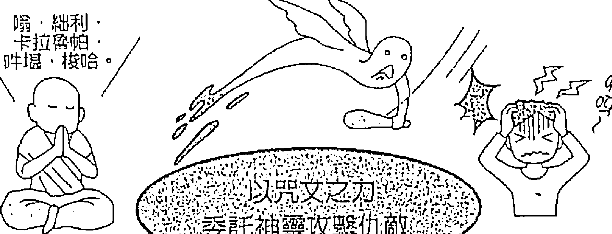

###### 基督教世界拥有力量的语句

欧洲魔法认为唯一的神与天使的名字拥有特殊力量，可以作为咒文使用。

| 拥有力量的文字 | 圣四文字=YHVH |
| :--- | :--- |
| 指神的咒词 | 埃尔、耶洛因、耶洛亚、撒巴夫、沙代、阿多奈、耶和华、亚、耶亚、札巴欧特、哈深、阿多深、沙洛姆 |
| 天使的名字 | 阿里农、加百列、巴拉基尔、列贝斯、赫里松、亚实里沙、革农 |
| 意思不明的语句 | Abracadabra、SiraS etar beSanar、Onaim, Perantes、Rasonatos |

###### 密教的真言

密教等佛教魔法是在咒文中加入指称众神佛的名字和诅咒的语句，藉以驱动神佛。

| 大威德明王 | 嗡·绀利·卡拉鲁帕·吽堪·梭哈。 |
| :--- | :--- |
| 降三世明王 | 嗡·苏婆·你苏婆吽·鞞絜哩·吽发吒。 |
| 毘沙门 | 南么·三满多没·驮南·嗡·么里支·娑婆诃。 |
| 摩利支天 | 嗡·啊·歪矢阿·喔拿·耶·那摩·吽·娑婆诃。 |

◎驱病符（Abracadabra）→驱逐疾病、驱退与恶灵之护符所使用的咒语。

* 见P.217页No.015注释

* 日本的密教真言与台湾略有不同，此处直接采音译。

## 从魔法书的角度来看《金枝》

希望对黑魔法稍有兴趣的读者，都能知道这本书：《金枝》。

《金枝》是詹姆斯·弗雷泽爵士（1854～1941年）所著的民族学古典鉅著。弗雷泽著作此书的目的，是意欲解开流传于意大利内米森林（Woods of Nemi）的某个传说之谜。这座森林里有个名为“森林之王”的祭司，这个祭司职位要任职到被他人杀死为止；换句话说，谁想要成为新的祭司就必须先将现任的祭司杀死才行。而且还有一 个条件：杀死现任祭司，欲成为新任“森林之王”的人，首先必须到内米森林湖畔的森林中折取神圣的金枝（榭寄生）。

这是为什么呢？为何非得折取金枝不可？弗雷泽为解开这个谜题，一方面沿引世界各地的神话与传说、未开化社会信仰等作为佐证，一步步推论建立起他所构想的理论。

笔者特别于此处介绍《金枝》的用意，并不在于其“解开金枝之谜”的主题。跟《金枝》的主题比较起来，反而是那些主题以外的部分与黑魔法的关系更加密切，这是因为弗雷泽为铺展与主题有关的论述，大量阅览了述及世界各地未开化社会的书籍，并收录近乎无数的咒术事例，还附有详细的说明。

本书《图解黑魔法》第一章已经介绍了认识黑魔法时不可或缺的魔法基础知识，并提到两个基础法则：“类似法则”与“感染法则”，这二个法则又合称为“共感法则”。前述也解说了根据法则而形成的形象（人偶）、死者、加害者、衣服、脚印、影子、毛发、指甲、唾液……等诸多手段，是如何在魔法的世界里演变成一股极为强大的力量。

其实这些内容《金枝》大多都有写到。也因为如此，《金枝》固然非魔法书籍，却是一本可以当成魔法书来阅读的作品。这也是为什么笔者希望能将《金枝》这本书介绍给对黑魔法感兴趣的读者。

除此以外，《金枝》非但曾经出现在霍华·菲利普·洛夫克莱夫特（H. P. Lovecraft）的小说《克苏鲁的呼唤》中，TRPG（桌上型角色扮演游戏）版《克苏鲁的呼唤》更将其定位为魔法书。

为什么会有这样的定位呢？其实只要知道《金枝》是本什么样的书，相信便不难理解了。

## 第2章 魔方教程

##### 欧洲的黑魔法

> > 受基督教支配统治的欧洲认为所有的邪恶全部来自于恶魔，而施行黑魔法势必也要借用恶魔的力量。

### 借恶魔之力的欧洲黑魔法

欧洲也跟世界其他地方相同，将加害他人的邪恶魔法定定义为黑魔法。欧洲黑魔法的特殊性在于4世纪后，基督教形成一股极大的绝对势力，其教义认定世间所有邪恶全都来自于恶魔，因此也认为黑魔法师全都是借恶魔之力来行使法术。

欲借用恶魔之力，最基本的方法便是与恶魔缔结契约。这个观念虽然早在4世纪时便已确立，但头一个以缔结恶魔契约而闻名的，却是6世纪的狄奥菲鲁斯（Theophilus）。狄奥菲鲁斯原是西西里教会的主教，可是他遭竞争对手击败后便以灵魂作为交换条件与恶魔缔结契约，重新夺回了主教的宝座。16世纪德国传说中的浮士德博士同样也是以为实现自身愿望不惜将灵魂卖给恶魔而闻名。

来到中世纪末期，与恶魔缔结契约者，无论男女一律都被视为女巫，遭众人厌恶忌避，更有无数的女巫被冠上莫须有的罪名，处以死刑。

除此以外，还有些黑魔法师不需与恶魔缔结契约，也可运用恶魔的力量：他们以魔法阵、魔法杖等道具搭配唱诵咒文藉以命令恶魔，使用的是仪式魔法。仪式魔法在中世纪后半有长足的发展，在整个欧洲掀起了一阵大流行。

无论是要跟恶魔缔结契约或是要向恶魔下达命令，势必都要先将恶魔给召唤出来，该召唤术便因循“Necromancy（降灵术）”而唤作“Nigromancy”。“Nigro”这字当然就是黑的意思，强调的就是黑魔法的本质。

##### 欧洲的黑魔法

- 加害他人的邪恶魔法。
- 借恶魔之力施行的魔法。

###### 借用恶魔力量的方法

欧洲相信黑魔法要借用恶魔之力，有以下三种方法。

####### 与恶魔缔结契约

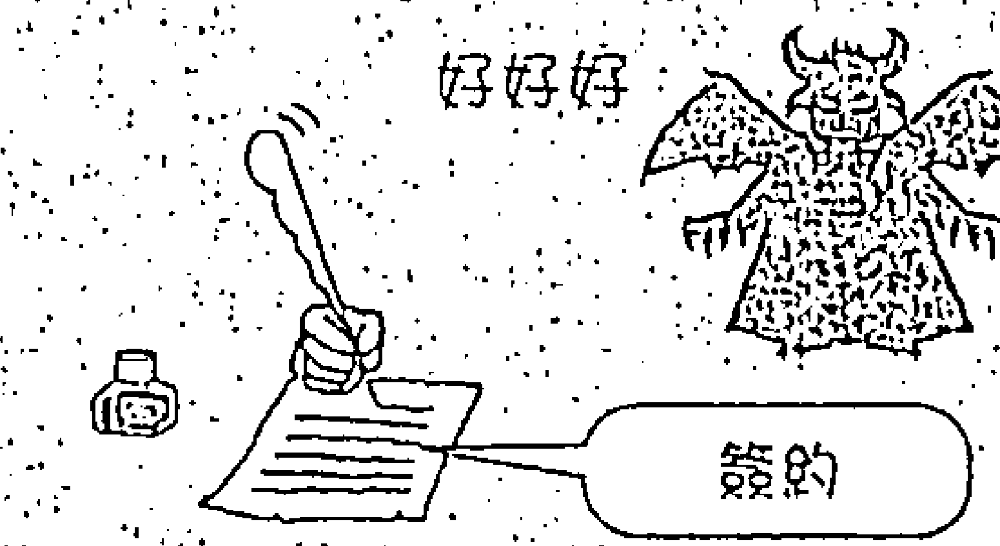

缔结契约让恶魔替自己实现愿望，相对的约期满时要交出自身灵魂作为交换。

####### 成为女巫

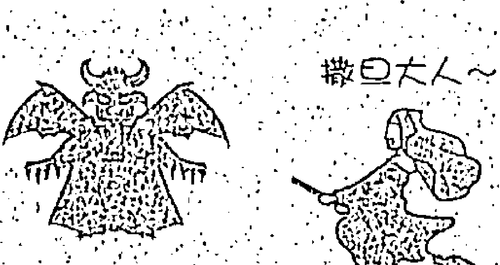

中世纪末期以后相信与恶魔签约成为女巫，便能借用恶魔的力量。

####### 仪式魔法或召唤术

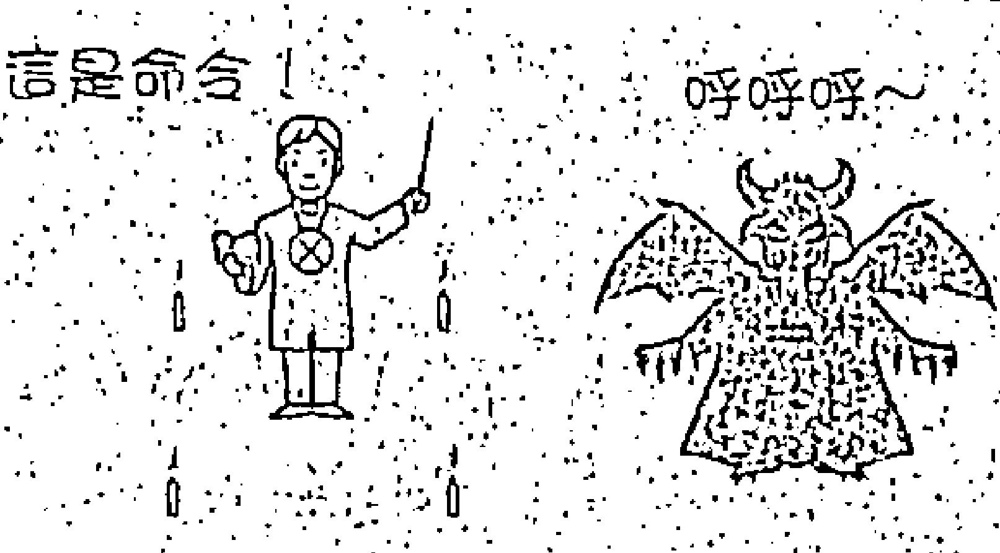

仪式魔法是运用魔法阵、魔法杖与特殊咒文等召唤恶魔，不需以灵魂为交换便可单方面命令恶魔来施行黑魔法。

> 浮士德博士 (Doctor Faustus) →成为歌德作品《浮士德》的传说中人物原型，据说曾与恶魔梅菲斯特 (Mephisto) 缔结契约。

### No.017 与恶魔缔结契约

基督教时代的中世纪欧洲相信，实践黑魔法必须与恶魔缔结契约，而恶魔契约却往往会招致极为可怕的后果。

#### 与恶魔缔结契约成为魔法师

基督教时代的中世纪欧洲认为，魔法或占卜等超自然现象都是凭着恶魔之力而实行的，因此所有实践黑魔法的人都必须与恶魔缔结契约。这是为什么呢？行使魔法之前，人类与恶魔之间要先议定各种暗号或咒文分别代表何种意思，恶魔就能依照黑魔法师给的暗号来达成寻常所不能的事情。这中间的议定程序，便是所谓的契约。不过，与恶魔缔结契约往往会招致极为可怕的结果。

以16世纪德国传说中的浮士德博士为例，来看与恶魔缔结契约的魔法师最后会有何下场。

传说浮士德博士为了要成为魔法师而在威登堡附近森林的四叉路绘制魔法阵，从晚间9点开始唱诵咒文到10点，成功召唤出恶魔梅菲斯特，再用自身鲜血书写证文，与恶魔缔结契约。契约规定浮士德博士在24年后，必须将自己的身体、灵魂、身家财产等全数让渡给恶魔，相对的恶魔则是必须在这24年期间实现浮士德博士要求的所有愿望。

后来浮士德博士习得了欺人耳目的幻惑魔法、变身成其他事物的变身魔法、腾空翱翔的飞行魔法，甚至是将女性玩弄于股掌间的性爱魔法等众多魔法。除了整个欧洲以外，他游遍了埃及、高加索地区，甚至还在转瞬间就游历了天国与地狱。换句话说，只要与恶魔缔结契约，任何愿望都可以实现。

然而恶魔的契约却会带来令人恐惧的后果。来到契约期满的那晚，浮士德博士的身体在极大的爆裂声响之下变得四分五裂，一切如契约规定，全数归于恶魔。

##### 恶魔的契约

- 恶魔的契约：为施行黑魔法而缔结契约。
- 人类与恶魔间必须先议定各种暗号或咒文分别代表的意思。
- 往往会招致可怕的后果

###### 传说中浮士德博士的恶魔契约

著名的浮士德博士在威登堡附近的森林与恶魔梅菲斯特缔结以下契约，获得了幸福的人生。

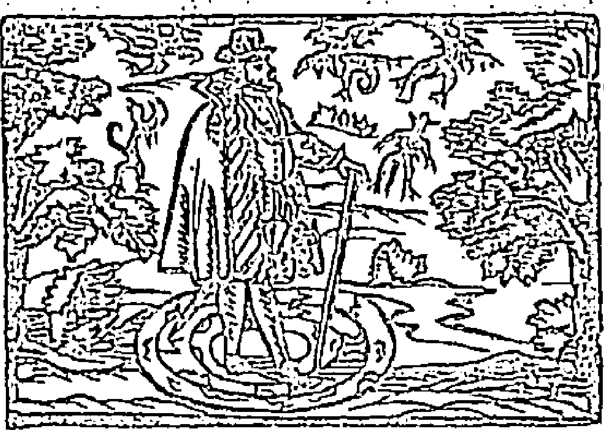

契约内容：24年后将身体、灵魂、身家财产等全部让渡予恶魔，相对的恶魔必须实现博士所有的愿望。

契约效果：不但习得了魔法，还实现了所有愿望。

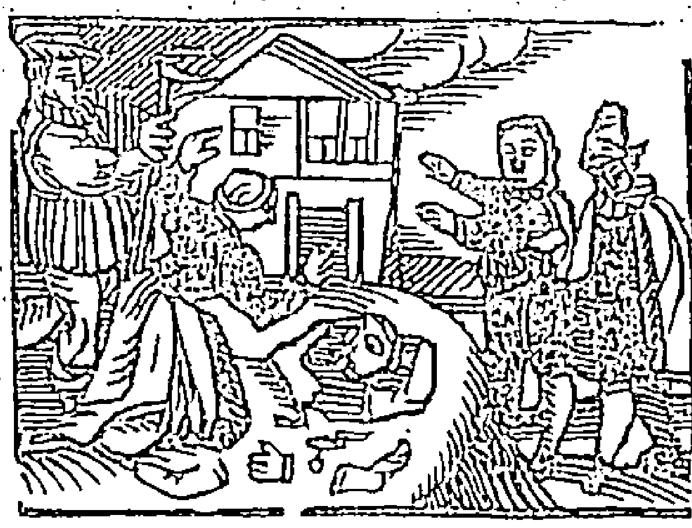

契约期满后的结局：约满当晚夜半，博士的身体便伴随着极大声响爆裂，最后如契约所规定的，全数归于恶魔。

##### 用语解说

◎梅菲斯特→歌德作品《浮士德》所提到的梅菲斯特，其实是歌德自创的字词。

## No.018

##### 女巫的黑魔法

> 女巫们全都是黑魔法师，他们会透过令家畜致病死亡、暴风雨、久旱不雨、失恋、性无能等各种形式加害众人。

### 带来各种自然危害与灾厄的女巫

中世纪欧洲相信女巫会利用黑魔法来做各种恶行，例如损害他人人家畜或财产、使人致病甚至死亡等。有些女巫能使男人变得性无能、使女人不孕。而头痛、被跳蚤咬等小事也是女巫所为。这些女巫所做的坏事，统称为“巫术（Maleficia）”。为恶就是与撒旦缔结契约的证据，无论是男是女，都是女巫。

女巫使用黑魔法来加害的对象，通常与农业相关者为多。女巫能行使黑魔法来兴起暴风、暴雨、强风、恶劣天候，使农作物枯萎、家畜致病甚至死亡。也因为如此，每每遇到这类灾厄又原因不明时，众人往往会认为是女巫在作祟。心中稍有头绪的人会告发疑似女巫的嫌疑犯，再由女巫猎人一并检举可疑份子。

这种主要危及农业兴衰的女巫黑魔法尤以北欧最为盛行，因为北欧地区的农业生产力自中世纪以来便相当高，农业在当时已是很重要的产业，所以有许多女巫都是以危害农业的罪名遭人逮捕。

当时认为女巫虽可凭借恶魔之力行使黑魔法，却必须要使用软膏、药草、人偶与绳结等物作为施术的手段。使用人偶等模拟物应该要算是古典共感魔法的范畴，这种方法遍见于全世界，不过在女巫审判中藉此杀人的案例很常见。此外，还有利用咒文、邪眼或魔宠行使的黑魔法，而使用著名魔法道具“光荣之手”的案例，亦不在少数。

##### 女巫的黑魔法

- 女巫 → 利用黑魔法做各种坏勾当。
- 当时相信女巫会利用魔法带来各式各样的灾厄。
    - 不孕、暴风雨、破产、性无能、死亡、疾病、痛苦、家畜死亡、干旱

###### 巫术

女巫的恶行统称为巫术。

###### 女巫行使黑魔法的手段

女巫虽都是在恶魔的协助下行使黑魔法，其手段却各不相同。

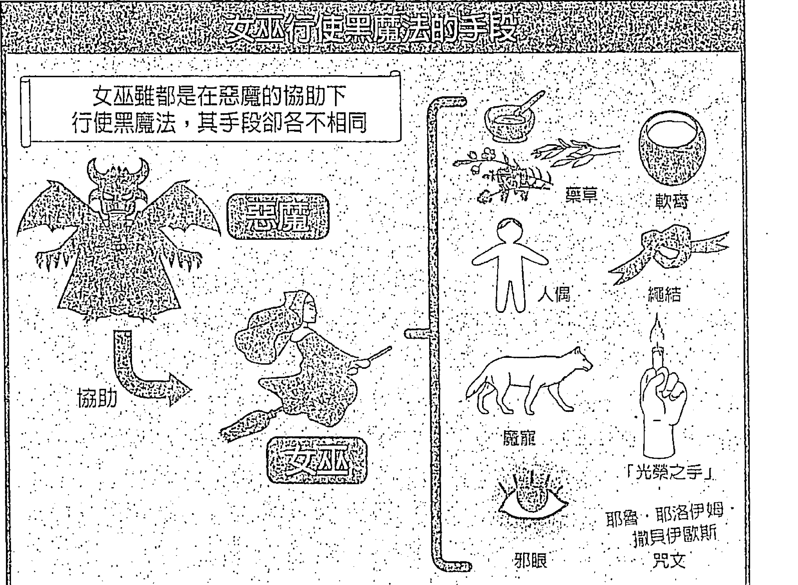

◎女巫→自古以来便有能治疗疾病、行使神奇魔法的女巫存在，只是中世纪后期以后普遍将女巫视为恶魔的爪牙，施以宗教审判，再予以判刑。

## No.019

##### 女巫的入会仪式

中世纪欧洲的女巫是透过参加女巫的晚宴（魔宴）在魔王撒旦面前执行入会仪式，与恶魔缔结契约。

### 成为女巫不可或缺的恶魔契约

与恶魔缔结契约的方法不只一种，除浮士德博士使用的传统方法以外还另有他法。16～17世纪欧洲猎女巫运动盛行期间，许多女巫便是使用这个方法来与恶魔缔结契约。这些女巫首先要参加由众女巫举办的晚宴——魔宴，并在魔王撒旦面前执行入会仪式，与恶魔缔结契约。

关于女巫的入会仪式，女巫和恶魔学家都曾经提出各种说法。16世纪的恶魔学家威廉·珀金斯就曾说举行入会仪式时，女巫会跟撒旦交换用自身鲜血所书写的契约书。也有人说女巫会在缔结契约之际亲吻撒旦的臀部。

弗朗切斯科·马利亚·瓜佐所著的《蠢物要览》（1608年）中记载的女巫入会仪式则是如下所述：

> 首先新人女巫要站到撒旦面前否定基督，立誓归依恶魔，宣誓完成后，要践踏十字架、圣母玛莉亚像或圣人像。撒旦会给女巫一个新的名字，施以再洗礼，据说再洗礼所使用的都是脏水。接着，撒旦会在女巫的脸上做出刮除的动作，这是象征刮除施洗圣油的仪式。再来则是否定女巫旧名的命名父母，决定新的命名父母。女巫向恶魔贡献象征服从的印记和衣服碎片，在地面上画魔法阵，站在魔法阵里向恶魔宣誓效忠。

女巫会请求撒旦将自己的名字写进“死亡之书”，承诺每年固定一次以稚童作为祭品献给恶魔。撒旦会在女巫全身各处留下女巫之印，最后女巫必须立誓今后不再行使任何基督教的仪式，并且保守恶魔契约的秘密。

经过上述程序成为女巫的人，便能得到恶魔之力襄助。

##### 女巫的入会仪式

- 许多女巫与恶魔缔结契约的方法。
- 从此便可运用恶魔之力行使黑魔法。

###### 女巫入会仪式的流程

> 根据《蠢物要览》（1608年）记载，女巫的入会仪式是按照下列流程进行。

- ① 否定基督教信仰，立誓归依撒旦。
- ② 撒旦对入会者施以再洗礼。
- ③ 施洗圣油的刮除仪式。
- ④ 女巫献上服从的印记以及衣服碎片。
- ⑤ 站在魔法阵中，立誓服从恶魔。
- ⑥ 将名字记入“死亡之书”。
- ⑦ 承诺以稚童献给恶魔。
- ⑧ 发誓今后不再行使基督教的仪式。

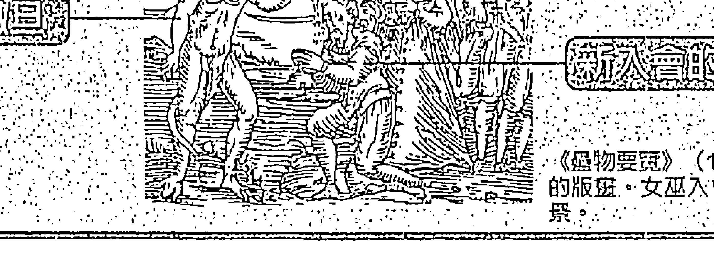

◎威廉·珀金斯（William Perkins）→1555～1602年。英格兰的恶魔学家，清教徒派的布道师。◎弗朗切斯科·马利亚·瓜佐（Francesco Maria Guazzo）→17世纪初叶的托钵修道士。

##### 魔宴

能使用黑魔法的女巫全都参加过由恶魔撒旦主办的魔宴，因此魔宴跟黑魔法有着密不可分的关系。

### 由恶魔主办将普通人变成能使用黑魔法的女巫聚会

所谓魔宴就是指恶魔撒旦为众女巫所主办的晚宴，因此魔宴本身并非黑魔法，但与黑魔法有着密不可分的关系。从中世纪直到17世纪前后，欧洲深信恶魔是妖术与魔法的力量泉源，而使用邪恶魔法的人无论男女，都是与恶魔缔有契约的女巫，会定期参加魔宴。

当时的人对魔宴的印象大致如下：

当夜，女巫会小心不让丈夫或妻子发现偷偷溜出被窝，并在身上涂抹软膏，此时身体就会漂浮起来，便可骑着扫帚等道具扬长飞去。他们的集会场所大多是在人烟稀少的荒地、森林、洞穴等处。参加者集合后第一件事就是向恶魔献崇拜，初次参加者便要参加入会仪式。

撒旦通常会化为巨大漆黑的公山羊模样，头顶两支山羊角中间有支燃烧的蜡烛。接下来是进行用餐，此时众女巫会取出事先杀好的童血童肉进食。宴会结束以后，众女巫会将火把吹熄，使周围陷入一片漆黑，待一声令下便互相拥抱，无论身边是同性或异性、是否为近亲一概不论，即展开乱交。最后是离别的仪式，回到家后要无声无息的钻回被窝里。

重要的是，魔宴是个不存在于现实的幻想，每位证人针对举办日期、举办场所、参加人数等细节都是说法不一。17世纪初的女巫猎人皮耶·德·朗克雷（Pierre de Lancré，1553～1631年）则表示魔宴就像个市集，疯狂的参加者从各个方向如波浪般涌来，其数量甚至可达数十万人。

##### 魔宴

女巫＝黑魔法師定期聚會的晚宴。

###### 魔宴的形

獵女巫時代的歐洲人觀念中，對魔宴的想像如下。

###### 概要

- 舉辦日期 非週六、週日的深夜舉辦。
- 移動手段 周身塗抹軟膏、乘掃帚飛行而來。

###### 魔宴的流程

- 惡魔禮拜 向惡魔表達敬意的臣服禮拜。
- 入會式 初次參加者的入會儀式。
- 宴會 美味的料理（不過也有貓、狗、青蛙等料理）。
- 舞蹈 搭配鄉村風格音樂跳舞（多為輪旋曲！）。
- 亂交 不論男女，與身旁的人進行亂交。
- 結束 自然結束，或者以黎明雞啼為號。

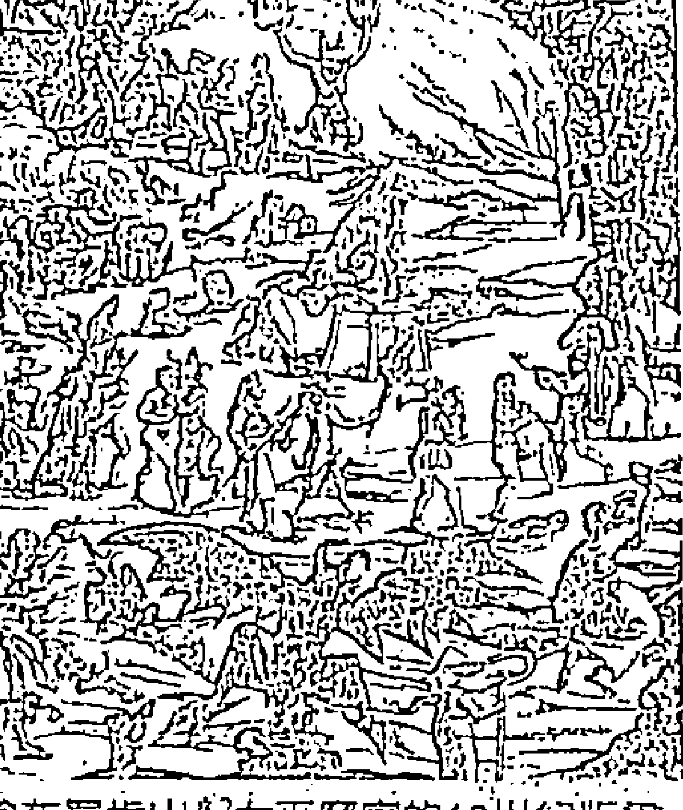

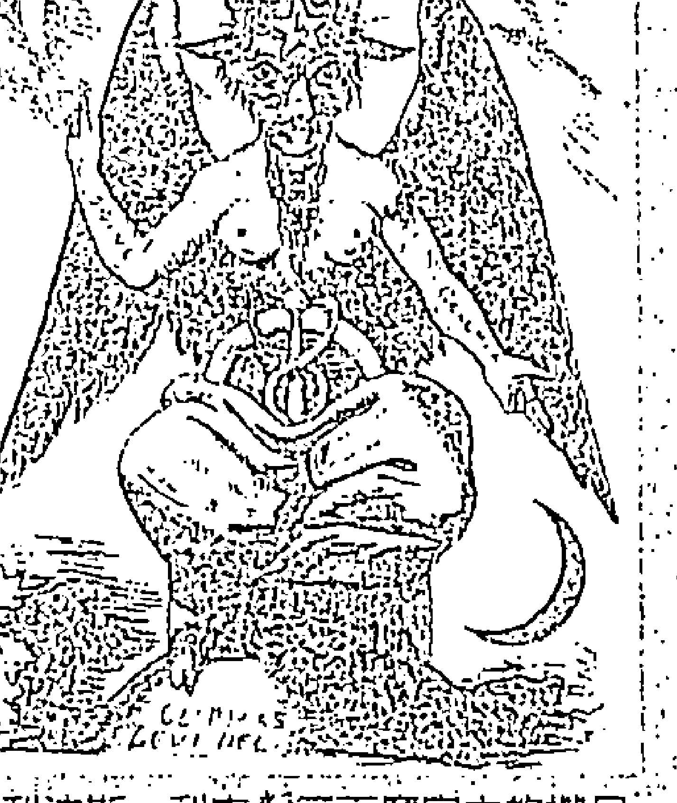

* 見P.217頁No.020注釋

## 儀式魔法

儀式魔法是不需與惡魔締結契約便可使用的黑魔法，自中世紀後期蓬勃發展，流行全歐洲。

### 以繁複儀式令惡魔服從的黑魔法

歐洲也有不需與惡魔締結契約便可使用的黑魔法存在，即為利用魔法陣、紋章、護符、印記、魔法杖等魔法道具，特別著重以咒文之力召喚惡魔為己所用、實現自身願望的儀式魔法（Ritual Magic）與祭儀魔法（Ceremonial Magic）。

這類魔法雖然自古便已存在，卻等到中世紀後期才獲得較大的發展，因此直到近世才有許多詳細解說儀式魔法程序步驟的魔法書（Grimoire）大量問世，如《所羅門王之鑰》、《大奧義書》、《教皇洪諾留的魔法書》。眾魔法師相信只要循著這些魔法書的指示，不需冒險與惡魔締結契約便可以施行魔法；而使用儀式魔法，魔法師便不是必須服侍惡魔的僕從，而是惡魔的主人。儘管如此，儀式魔法同樣是與惡魔有關連的魔法，所以往往遭人斥為黑魔法。

儀式魔法之所以會被視為黑魔法，跟儀式中經常牽涉許多殘酷噁心的內容也脫不了關係，18世紀初於巴黎大受歡迎的《教皇洪諾留的魔法書》便堪稱為代表。這部作品基本上都是在介紹召喚黑暗之靈的方法，準備階段往往必須從事血腥殘酷的行為，例如活祭黑母雞，刨出眼珠、舌頭、心臟後，曬乾磨成粉，撒在羊皮紙上。

施術者要斷食三日，以連禱形式朗誦詩篇的數節內容，並按規定以所羅門王的魔法陣或星陣圖獻禱，接著再以指定的魔法陣等陣形召喚惡魔。儀式魔法正是因為它的殘酷，才會被視為黑魔法。

##### 祭儀魔法

- 不需與惡魔締結契約便能利用惡魔的魔法。
- 使用魔法陣、印章、護符、魔法杖、咒文等。

中世紀後期以後大為流行，大量魔導書問世。

##### 惡魔契約與儀式魔法的差別

> 惡魔契約的架構之下，惡魔是主人、魔法師是僕從，但儀式魔法中魔法師是主人、惡魔則是僕從。

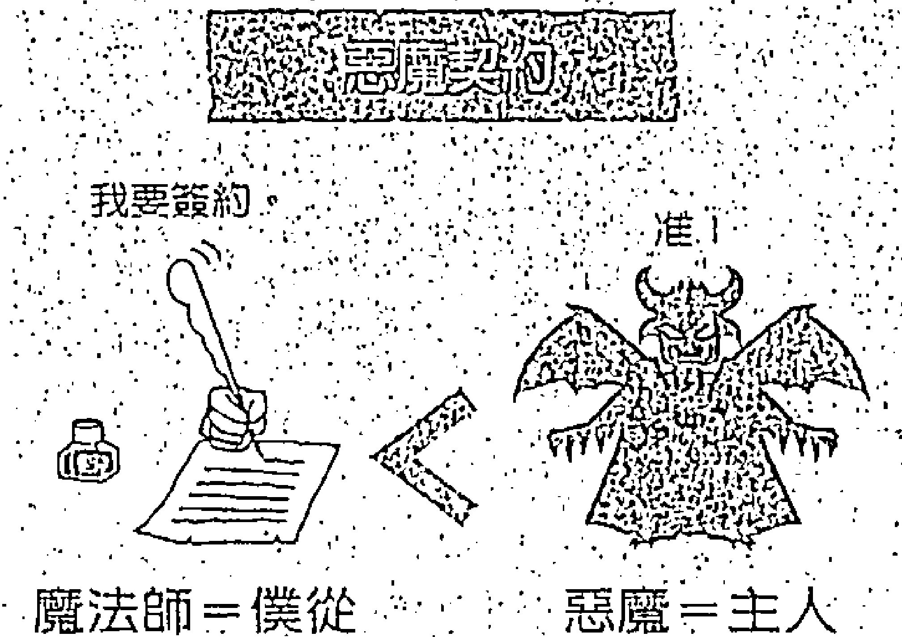

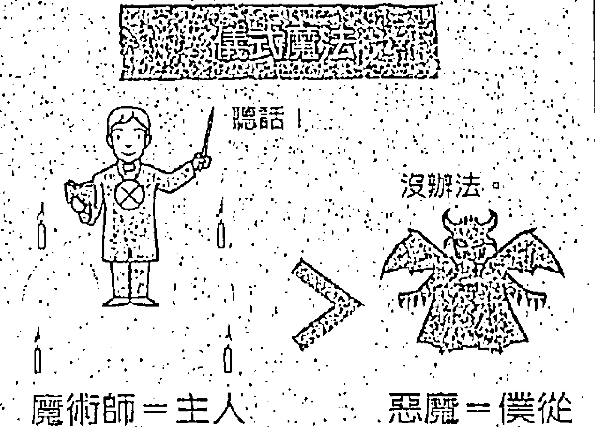

##### 殘酷噁心的儀式魔法

##### 儀式魔法的儀式

往往有許多極為殘酷噁心的內容。

宰殺黑母雞，刨出母雞的雙眼、舌頭與心臟，曬乾後磨成粉狀，撒在羊皮紙上。

更增添黑魔法的邪惡氛圍。

- ◎印記（Sigil）→指紋章與護符所繪的特殊圖形，因召喚的惡魔或施法目的不同而異。
- ◎《所羅門王之鑰》（The Key of Solomon the King）→魔法書當中最重要的一部，相傳為傳奇的君王所羅門王所著，成書於14～15世紀間，極受歡迎。另有《所羅門王的小鑰匙》。

### No.022 幻惑魔法

所謂的幻惑魔法是能朦蔽他人耳目，使人聽覺或視覺失常的黑魔法，除了能夠搏得驚嘆以外，還能拿來詐取錢財或讓人視為神明。

#### ◎溯及術士西門的傳統黑魔法

幻惑魔正如其名，是種能朦蔽他人耳目以達欺瞞目的的黑魔法；這種幻象除了能夠搏得眾人的驚嘆，還能用來詐取他人錢財，甚至讓人視為神明。

說到歐洲曾經使用過幻惑魔法的著名魔法師，首推聖經《使徒行傳》中記載的術士西門（Simon Magus）。據《黃金傳說》〈第84章使徒聖彼得〉記載，術士西門曾對尼祿皇帝說道：「仁慈的皇帝陛下，為向您證明我乃神子，請命令您的部下將我首級斬下，我將在三天後復活給您看。」。皇帝遂令刑吏砍下術士西門的頭，但刑吏砍下的其實是公山羊的頭顱。三天後，術士西門秋毫未損再度出現在尼祿皇帝面前，皇帝萬分驚嘆，並信為神之子。

這件事後來很快就被使徒彼得拆穿，原來術士西門所謂的復活純屬幻惑魔法而已，全是惡魔所造成的幻象。

歐洲許多傳說均曾多次提及這類幻惑魔法，譬如16世紀德國的浮士德傳說也曾述及與惡魔簽下契約的浮士德博士，將載貨馬車連同馬匹吞進口中、嚇壞農民的場面。

這裡必須強調的是，上述幻惑魔法無一不是憑著惡魔的助力而為。也就是說，欲施行幻惑魔法有以下兩種可能的方法：其一，以靈魂為交換條件與惡魔締結契約，換得惡魔協助（請照No.017）；其二，參考魔法書等資料召喚惡魔並驅使之（請參照No.021），最後便可讓惡魔執行幻惑魔法。

##### 幻惑魔法

- 朦蔽他人耳目以行欺瞞的黑魔法。
- 可博得驚嘆，詐取錢財。

###### 術士西門的幻惑魔法

- 以幻惑魔法而聞名的魔法師。
- 新約聖經《使徒行傳》曾有記載。

根據《黃金傳說》記載，術士西門的幻惑魔法如下：

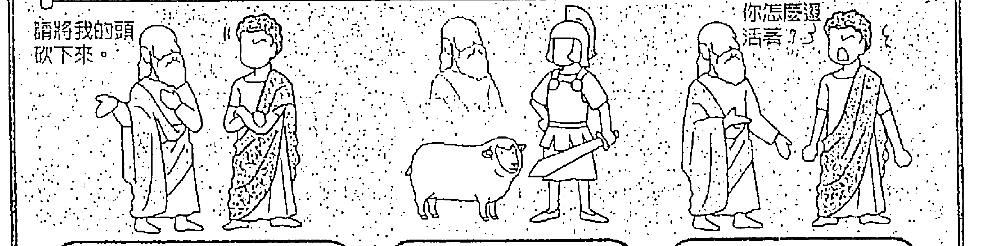

- 直接跟尼祿皇帝說：「命部下將我的頭砍下來，我將在三天後復活」。
- 術士西門使用幻惑魔法，讓刑吏將公羊頭當成自己的首級。
- 三天後現身於尼祿皇帝面前，使皇帝深信自己是神之子。

###### 幻惑魔法的原理

幻惑魔法憑藉惡魔之力。

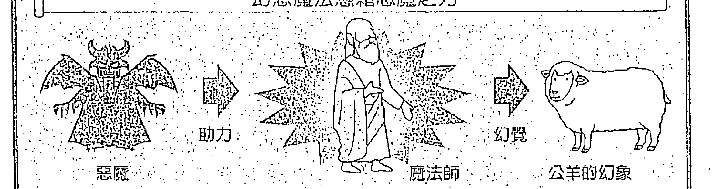

###### 用語解說

> ◎尼祿皇帝 (Emperor Nero) → 羅馬帝國第五代皇帝，西元58～68年在位。因迫害基督徒被稱為暴君尼祿。
> ◎使徒彼得 (Peter the Apostle) → 跟隨耶穌基督的十二使徒之一。

## 變身魔法

變身魔法是種可使人類變身成為動物或其他物體的黑魔法，這種魔法經常被用來在暗地裡做壞事，或是讓他人變身使對方感到困擾。

### ◎藉膏藥與惡魔之力將人變成動物的黑魔法

變身魔法是將人類變成動物或物體的模樣，是歐洲自古便有的黑魔法。有時會讓自己變身以便在暗地裡做壞事，有時則是令他人變身，使對方陷入困境。

2世紀羅馬作家阿普列尤斯（Lucius Apuleius）曾在小說《金驢記》（The Golden Ass）中描述該時代的變身魔法。主角魯巧出外旅遊，來到塞薩利*借宿於高利貸米羅的家。米羅的妻子潘毗累（Pamphile）原來是個魔法師，懂得變身魔法。她的變身魔法如下：首先褪去所有衣物赤裸身軀，從小盒子裡拿出極為特殊的膏藥，從腳尖到髮梢塗個通遍，接著快速的小幅度顫動手腳；此時全身上下便會隨著顫動漸漸生出柔軟的絨毛，並且慢慢長出一對翅膀。同時，口鼻變成鳥喙、指甲變成鉤，最終變成一隻貓頭鷹。變成鳥以後，潘毗累一振翅就立刻朝為愛瘋狂的年輕人飛去了。要解開這個魔法很簡單，只要以茴香、桂葉浸泡泉水，再用泉水沐浴便能恢復原狀。

但是自從歐洲進入基督教獨大的中世紀以後，變身魔法就被視為幻惑魔法之一，是與惡魔締約的女巫憑藉著惡魔力量所行使的術法。正如同《金驢記》所述，當時的變身魔法經常要使用到膏藥，甚至有些女巫證詞還指出曾經在變身時唱誦咒文。1662年蘇格蘭女巫審判的被告伊莎貝爾·高迪就說自己曾經重複唱誦「我身化兔，多悲多嘆多憂之兔，入我（惡魔）軍門：直至再度歸返之時。」咒語三次以上，最後變身成為兔子。

> *見P.217頁No.023註釋

- 令自己或他人變成其他模樣的黑魔法。
- 中世紀歐洲視為幻惑魔法的一種。

##### 古羅馬的變身魔法

小說《金驢記》曾描述古羅馬的變身魔法。

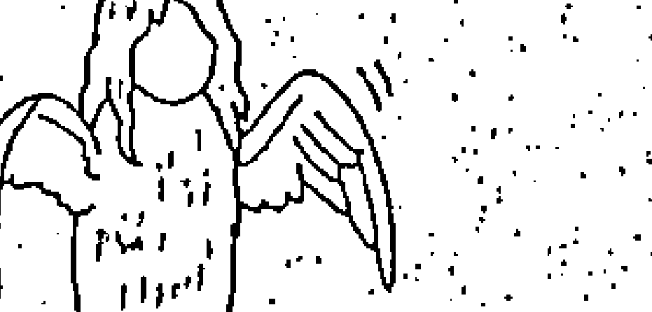

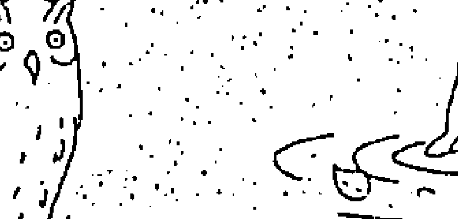

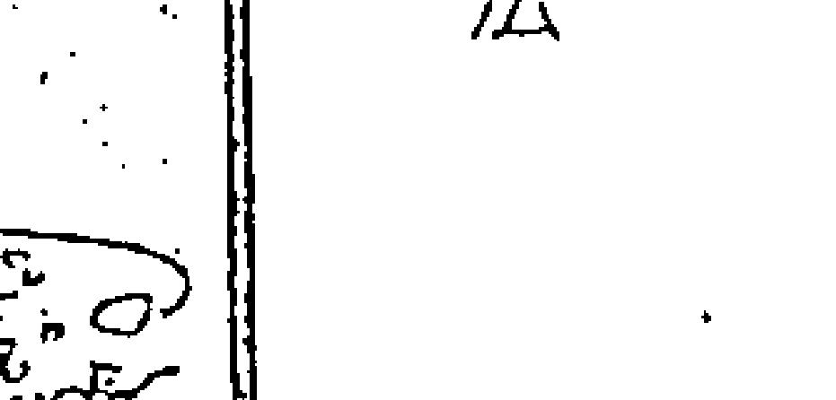

- ① 脫個精光，取特殊的軟膏擦遍全身。
- ② 抖動手腳，身體就會漸漸產生變形。
- ③ 完全變成貓頭鷹，振翅飛去。
- ④ 以浸泡茴香、桂葉的泉水沐浴，便能恢復原貌。

##### 伊莎貝爾·高迪的變身咒文

1662年遭女巫審判起訴的女性伊莎貝爾·高迪提出證詞指出自己曾以下列咒文變身成兔子。

> > 我身化兔，多悲多嘆多憂之兔，入我（惡魔）軍門，直至再度歸返之時。
> 兔兮兔兮，神降憂於汝身。我形雖為兔，即化女形。

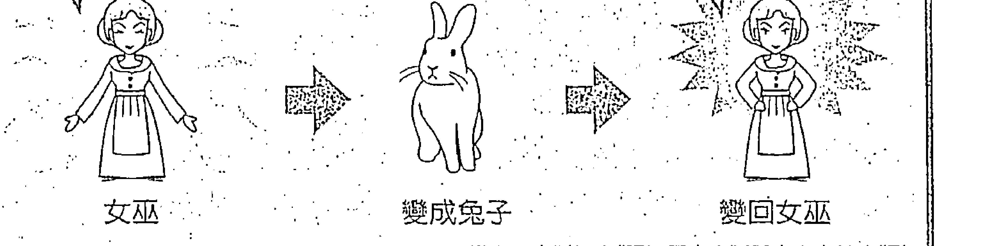

> 變身咒文引用自《惡魔學大全》(日本育土社出版)

## 狼人魔法

自身或令他人變身成狼，進而噬人，狼人魔法雖是變身魔法當中最恐怖的黑魔法，卻也有弱點。

### 最恐怖的變身魔法——狼人魔法

所謂的狼人魔法就是指自身變成狼，或是令他人變身成狼的魔法，即便在變身魔法中也是最恐怖的一種黑魔法。

> >先針對自身化狼的變身方法來作介紹。1世紀時，羅馬作家佩特羅尼烏斯（Petronius）的小說《馬奇奧之宴》記載的方法如下：選一個月明如白晝的夜晚，來到墓地褪去衣服，將脫下的衣服堆疊起來，然後在衣服四周撒尿，連成圓圈，如此一來就會漸漸變身成狼。
>
>歐洲東部的斯拉夫地區也流傳著許多狼人傳說，俄羅斯故事中所講述的變身方式如下：首先在森林裡找棵已被伐倒的樹木，拿銅製小刀刺在樹幹上，然後繞行樹幹唱誦咒文「出海去，出大海去，來到普楊島去，出到空地上去，月在白楊樹梢亮，毛茸茸的狼兒穿過蔭綠森林與微暗山谷，所有長角的家畜都在牠的狼牙之下。可是，狼不入森林亦不進山谷。月啊月，黃金的新月啊，融化砲彈、鈍化小刀、擊碎帶節的木杖，令禽獸、人類甚至蟲子全都心懷戰慄恐懼，讓他們無法捕捉灰色的狼、無從剝取牠溫暖的毛皮！我言之堅甚於永眠，更甚於勇者之言！」（摘自《斯拉夫吸血鬼傳說考》，栗原成郎著）。最後躍過樹幹三次，便可變身成狼。

但人類像這樣變身成狼或其他動物時，有件事必須注意：變身成動物期間身體若是受傷，變回人類模樣以後也會在相同的地方有相同的傷勢，許多人便是因此才使得變身一事曝光。

##### 變身成狼的方法

不同时代或地区都有许多变身成狼的方法。

###### 古羅馬的方法

- 選一個月明的夜晚在墓地褪去衣服，將衣服堆起來，然後在周圍尿一圈。
- 馬上變成狼。

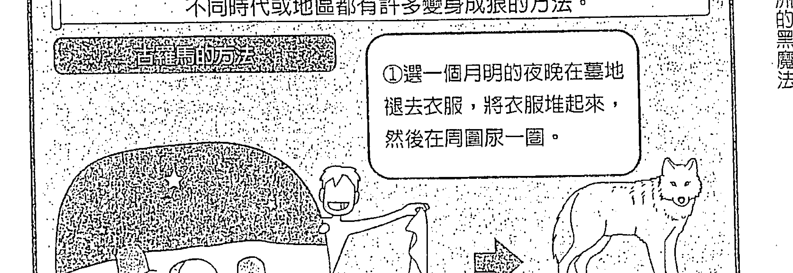

###### 新大陸地區的方法

- 在森林裡找棵被伐倒的樹，取銅製小刀刺在樹幹上。
- 繞行樹幹唱誦特殊的咒文。
- 蹤過樹幹，重複三次。
- 變身成狼。

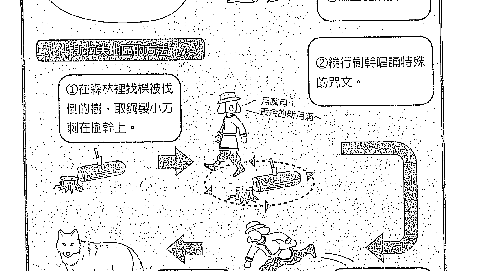

## No.025

### 惡魔學詮釋下的狼人魔法

猎女巫时代的众多恶魔学者认为人类根本不可能变成动物，变身魔法全是恶魔所引起的幻觉。

#### 认为变身成动物实为恶魔所致幻象的恶魔学者

提到变身魔法，一般认为是人类变身成动物或狼的魔法，不过中世纪欧洲的众多恶魔学者却认为变身魔法非属现实，而是透过某种特殊机制所引起的幻觉。

以变身魔法当中最令人战栗的狼人魔法为例。狼人魔法是让人类变成狼，夜里徘徊于郊外等地攻击人畜，最后再变回人类模样的魔法。若是变身成狼的期间身体哪里受了伤，变回人类模样后也会在相同部位发现相同伤痕，这是狼人魔法最重要的特征。

针对这个现象，恶魔学者们做出以下的解释：能够施行变身魔法的人便是与恶魔缔有契约的女巫，而女巫们会在身体涂抹有致幻作用的特殊软膏，让自己觉得好像变成狼一样；换句话说，女巫等于只是做了一场变身成动物、极为真实的梦而已。此时轮到恶魔出场，恶魔会到女巫梦中梦见的地方实际附于狼只身上，攻击人畜。倘若狼受了伤，恶魔就会在睡梦中的女巫身上留下一模一样的伤痕，这样一来，任谁都会觉得是女巫变身成狼。还有另一个更费力的方法：恶魔会用空气做成野兽的模样罩在女巫身上，让女巫看起来就跟变身成狼没有两样。总而言之，他们认为女巫变身成狼这件事从头到尾纯属恶魔所致的幻觉。

话说回来，为何当时的恶魔学者需要提供如此复杂的说明呢？理由很简单，基督教的恶魔学基本立场就是认为人类根本不可能变身成其他动物，因为恶魔无力改变实体，唯有创造世界的神才拥有足以改变实体的神力。

##### 惡魔學者詮釋下的狼人魔法

中世纪欧洲的恶魔学者主张变身成狼是恶魔所致的幻觉。

###### 狼人魔法說

###### 一般解釋

人真的变成狼。

###### 惡魔學解釋

恶魔让人产生变成狼的幻觉。

###### 女巫所施展的狼人魔法

恶魔学者认为女巫变身只不过是恶魔所致的幻觉，并就现实世界中的现象说明如下。

女巫在身体涂抹膏药产生幻觉，梦见自己变成狼袭击他人。

恶魔实际附于狼身并按照女巫梦境袭击他人。看见的人便是目击者。

若现实世界中的狼负伤，恶魔就会在女巫身体的相同部位留下相同的伤痕。

##### 歐洲的植物性春藥

歐洲有使用尤加利樹、月桂樹、仙客來、纈草、蕪荽等植物的植物性春藥。

### ◎從前在歐洲相當普遍的植物性春藥

歐洲有許多用來贏得異性愛戀的魔法，其中最常見的便是運用草或樹等來製作植物性春藥，使用的植物包括尤加利樹、月桂樹、仙客來、纈草、茉莉、番紅花、蕪荽、蕨類、三色堇、萵苣等，形形色色五花八門。使用方法也大多較為簡單，通常都是磨成粉狀混入飲食，讓心儀的對象吃下去。其他的使用法包括藏在異性的房間裡、埋在對方經常會走過的地面，甚至是將春藥塗在對方住家的柱子上。

這些植物當中的蕪荽是《一千零一夜》曾記載到的著名春藥，據說其使用方法如下：

調製春藥之前，首先要點燃油燈，以火鉢焚香，一邊唱誦「愛情的惡魔哈勃狄亞啊，以汝之名行此魔法」，一邊想著要奪取其芳心的那位異性，將心念集中於過去的回憶，好讓對方能對自己懷抱好感，內容必須是能讓對方對自己抱持好感的美好回憶才行。完成祈願後，準備開始調製春藥。

以聖杯盛裝蒸餾水，取7粒蕪荽種籽置於研磨缽中，專心想著對方的模樣，將種籽磨碎，重複唸出對方名字三次，接著唱誦咒文：「暖暖種籽，暖暖心。使彼此永遠不分離」。將磨好的粉末小心慎重地倒入聖杯中，就如同將自身願望傾注於其中一般。傾注全副意念，緊盯杯中看著粉末漸漸溶於水，唱誦最後的咒文「如我所願！」。伸出右手食指指向空中，在聖杯的上方劃三次十字，其後將溶液靜置12小時，用薄絲類的布過濾，加入對方的飲料或食物當中。據說只要將這春藥吃下肚，對方就會成為自己的俘虜。

##### 歐洲的植物性春藥

植物性春药 (欧洲) → 中世纪欧洲最普遍的爱情魔法。

使用的植物有？

- 尤加利树、月桂树、仙客来、缬草、茉莉、番红花、芜荽、蕨类、三色堇、莴苣等。

###### 春藥芫荽的使用方法

《一千零一夜》曾提及的著名春药芫荽，使用方法如下：

- ①点燃油灯以火钵焚香，向爱情的恶魔哈勃狄亚祈祷。
- ②想著思慕的对象，心念集中于过去的回忆，好让对方能对自己萌生爱意。
- ③将蒸馏水倒入圣杯，取七颗芫荽种籽放进研磨钵中。
- ④专心想著对方模样的同时将种籽磨碎，重复唸出对方名字三次，将磨成的粉末倒入圣杯，唱诵「如我所愿！」
- ⑤在圣杯上方划三次十字。其后将水溶液放置12小时，以薄丝类的布过滤，偷偷放进对方的饮料或食物中即可。

###### 用語解釋

◎芫荽 (Coriander) → 原产于地中海东部的芹科一年生草本植物，是人类自古便懂得食用的植物。

### No.027 可怕的蒔蘿曼陀羅根

人類自古便將曼陀羅根視為具有魔力的可怕植物，也是所有製作春藥的材料當中最為知名，別名「愛的蘋果」。

#### ◎關於曼陀羅根的可怕傳說

曼陀羅根（或名曼陀羅草Mandrake）是所有製作春藥的材料當中最出名的，別名「愛的蘋果」。從義大利直到小亞細亞的地中海沿岸地區都能採集這種有毒藥草，因含有類似毒品的致幻成分，其根部又分成兩股，整體看起來就像人類的形狀，更添詭異氛圍。

或許是因為這個緣故，曼陀羅根自古就被視為擁有魔力的可怕植物。中世紀德國著名的女性神秘學家賓根的赫德嘉曾說過：

> > 「曼陀羅根酷似人形，惡魔用來為非作歹、施奸計最適合不過了。」

中世紀的歐洲人相信曼陀羅根都是從死刑臺底下發芽，並吸收從絞首死刑犯身體滴落的水分成長。

傳說曼陀羅根在拔出地面的瞬間會發出淒厲的尖叫聲，而聽到這個尖叫聲的人會立刻斃命。因此曼陀羅根非得按照以下做法採收不可：若找到曼陀羅根，要選在半夜採摘；必須事先在耳朵裡塞好蠟或棉花以確保聽不見任何聲音，再把根部附近的土壤給挖開，挖出根部後用繩子捆住，繩索的另一端繫在黑狗的脖子上，然後遠離此地，並朝黑狗看得見的地方丟肉片。

黑狗為了要吃肉，自然會拔腿奔跑將曼陀羅根連根拔起。這個時候曼陀羅根就會發出尖叫聲，黑狗一聽見就會當場死亡，最後只要將屍體埋在原地即可。

據說若將曼陀羅根用葡萄酒洗過放在小箱子裡，它就會告訴我們未來將會發生什麼事情，甚至還有能使不孕女性懷孕的功效。

##### 可怕的春藥曼陀羅根

曼陀羅根
· 歐洲最有名的植物性春藥材料。
· 別名「愛的蘋果」。
· 有毒藥草，有類似毒品的致幻作用。

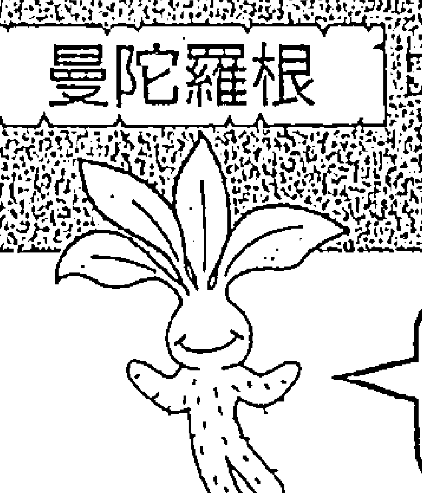

因為根部分成兩股，整體看起來就像個人形而受人畏懼。

###### 如何取得曼陀羅根

> 曼陀羅根被拔起時會發出極淒厲的尖叫聲，任何人聽見都會當場斃命。因此想採曼陀羅根就必須按照下列方法。

- ① 發現曼陀羅根，必須在半夜去採。
- ② 耳朵裡塞蠟或棉花確保聽不見任何聲音，挖開根部周遭的地面。
- ③ 挖到根部後用繩子綁住，繩索另一頭繫住黑狗的脖子。
- ④ 從遠處朝黑狗看得見的地方丟肉片，狗追著肉一跑，曼陀羅根能連根拔起。這時曼陀羅根會發出尖叫，狗聽見尖叫聲後會當場斃命，再將黑狗就地掩埋即可。

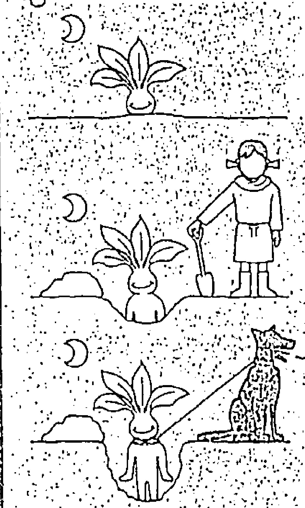

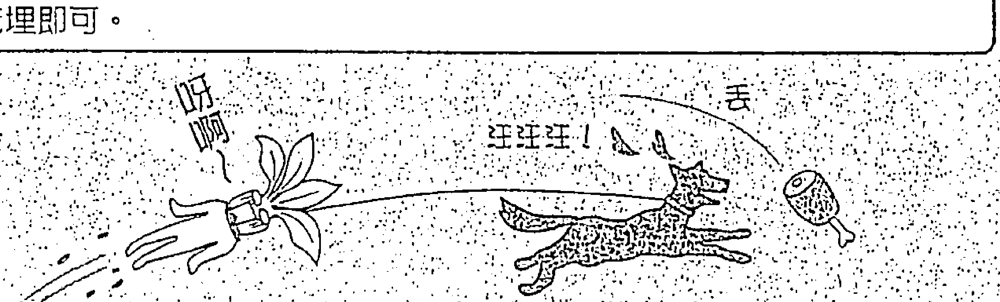

###### 用語解說

賓根的赫德嘉（Hildegard of Bingen）→以神秘學著作為世所知，同時也被奉為德國的藥草學之祖。12世紀德國的女子修道院長。

## 欧洲的动物性春药

欧洲的动物性春药有的是用动物的心脏或肝脏，有的则是使用人体排泄的分泌物制成，大多很恶心。

### 大多很恶心的动物性春药

从前欧洲使用的春药除了植物性以外，尚有动物性春药。受异性爱恋是千万人的想愿，有许多这类魔法存在也是很自然的事情。

18世纪法国魔法书《大阿尔伯特的秘法》曾经记载以下这种方法：取鸽子心脏、麻雀肝脏、燕子子宫、野兔肾脏晒干，加入少量自身鲜血再度晒干，只要让心仪的对象吃下，就能获得对方的爱。

下面这种魔法也常见：只要拿狼皮裹住云雀的右眼珠随身带着，便能受到当权者眷顾；若是掺入饮食让女性吃下，就能得到那名女性的爱。再者，将长春花连同蚯蚓磨成粉，让男女一同服下，两人就会两情相悦。

若是说到女性欲使男性听任自己摆布的常用材料，就会有点令人冒冷汗了，因为材料就是从女性身体排泄出来的分泌物。

首先泡个热水澡，大量出汗后取面粉撒遍全身，待面粉吸满汗水后再用亚麻布擦拭身体，把面粉挪到烤面包用的盘子上。剪下手脚的指甲、头发与阴毛一同烧成灰，再掺在面粉里面，接着打颗生鸡蛋搅拌均匀，放进烤箱烤成面包，最后让心仪的男性吃下。

另外，像女性的性器也经常作魔法用途使用。举例来说，可以将捉到小鱼放进阴户闷死，磨成粉后让爱慕的男性服用；或者是按卖家开价买下一只黑母鸡，活生生挖出母鸡的心脏插入阴户，再让男性将鸡心吃下。

##### 欧洲各种动物性春药的处方

动物春药种类极多，其中不乏使用女性分泌物或女阴等令人不愉快的春药。

取鸽子心脏、麻雀肝脏、燕子子宫、野兔肾脏晒干，再加些自身鲜血再度晒干，让喜欢的对象服下。

拿狼皮裹住云雀的右眼珠随身带着，便能受到掌权者眷顾。

将长春花连同蚯蚓磨成粉，男女同时服用，就可以两情相悦。

## 女性意图操控男性的魔法

用泡热水澡流出的大量汗水和着面粉，再掺入指甲、头发、阴毛烧成的灰，烤成面包给心仪的男性吃。

## 爱的蜡像

> 虽然同属使用蜡像的魔法，却可以因默祷内容的不同而从咒杀他人的术法，转为得到异性爱慕的魔法。

### ◎在爱情魔法当中同样能发挥极大力量的蜡像

提到蜡像，相信许多人会立刻想起咒杀他人的黑魔法（请参照No.038），但蜡像的效果绝不仅止于此，蜡像魔法在意欲得到异性爱恋的时候也颇有功效。

藉蜡像获得异性爱恋的方法百百种，举其一例如下：

尽可能制做出与自己想要诱惑的女性一模一样的蜡像。脸蛋五官自是不在话下，生殖器同样也要细心制作。在蜡像胸口写下该女性的名字：“○○（女性的名字）。○○（女性父亲的名字）之女，○○（女性母亲的名字）之女”，在蜡像背部重复写一遍。写好名字后，唱诵“神啊，请凭汝的意志让○○之女，○○对我疯狂地爱慕。”以确定这次施行魔法的目的。

接着找个目标女性经常会路过的地面挖个洞，小心翼翼将蜡像埋在洞中不要碰伤。静置24小时后挖出蜡像，施洗礼三次；这三次洗礼必须依序以三位大天使米迦勒、加百列与拉斐尔之名施洗。

将蜡像浸在自己的尿里面，再将其风干，完成后小心保管蜡像。必要的时候在蜡像胸口插入全新未使用过的针，每插一针，该名女性心中的情愫就会被唤醒一次。

千万要牢记的是，必须专心默祷自己的目的。即便同样将写有名字的蜡像丢入火中，也会因为心中念祷的内容而有完全不同的结果；若默祷欲致对方于死地，蜡像融化殆尽之际便是对方断气之时；相反的若祈祷对方的心能如同蜡像般融化，那么对方就会柔情万千的爱上自己。

##### 魔导的蜡像

爱的蜡像 ▶ 利用蜡像获得异性爱慕的魔法。

蜡像可以用于爱情魔法，也可用于诅咒魔法。

##### 从蜡像获得异性爱慕的方法

爱的蜡像魔法必须强力默祷自身愿望，再按照下列程序操作。

- ① 尽可能制作与目标女性一模一样的蜡像。
- ② 在蜡像胸口与背後写下女性的名字後，唱诵“神啊，请凭汝的意志让○○之女，○○对我疯狂地爱慕。”
- ③ 在该名女性经常路过的地面埋下蜡像，放置24小时。
- ④ 挖出蜡像，以大天使米迦勒、加百列、拉斐尔之名施洗三次。
- ⑤ 用自己的尿浸泡蜡像，风干後保管。
- ⑥ 有需要时将蜡像取出，在胸口插入全新未使用过的针，唤醒女性胸中的爱恋情愫。

##### 爱情咒文

进入17～18世纪以後，欧洲开始流行远比春药更容易获得爱情的魔法，而唱诵爱情咒文的魔法从此受到世人爱用。

### ①远比调配春药来得简单的爱情魔法

从前中世纪欧洲只要讲到能够虏获异性爱慕的魔法，一般指的都是使用春药，但是後来愈来愈少使用春药。因为春药就算调配成功，也很让目标对象不疑有他吃下肚。因此进入西元17～18世纪以後，欧洲便开始流行比春药更简单的魔法。

爱情咒文堪称是这类较简单的爱情魔法代表。

举例来说，男性要追求女性时可以用“我来帮妳占星，看看妳将来会不会结婚”之类的藉口来接近对方，并趁机与对方四目交接，此时只要唱诵“卡非、卡西达、偻卡非拉与其子啊，为彼身之所有而言语”，便能使该名女性听命于己、任意摆布。

有些魔法则是要握着女性的手，唱诵“贝斯塔贝特诱惑女性之内在”，光是这样就能让女性为自己神魂颠倒。

如果手头有马鞭草汁液的话，可以用这汁液搓揉双手，再用手去触碰目标男性或女性即可。

魔法书《所罗门王之钥》里面也有几个能够任意操纵异性的星阵图护符，例如准备好金星的第四星阵图，想要谁来就能立刻让对方来找自己。

另外，据说只要将金星的第五星阵图出示给别人看，对方就会对自己陷入疯狂的爱恋。

##### 爱情咒文

爱情咒文
- 获取异性爱恋的简便魔法。
- 比春药更简单，故受众人喜爱。

###### 超简单的爱情咒文

> 使用爱情咒文操纵女性远比使用春药来得简单。

据说只要这样就能获得女性的爱。

###### 能轻易获得异性爱恋的所罗门王星阵图

> 魔法书《所罗门王之钥》中记载可轻易操纵异性的星阵图护符。

想要谁来就能立刻让对方来找自己。

只要出示星阵图，便能让对方陷入疯狂的爱恋。

## 透明人魔法《所罗门王之钥》

从前有变成透明人的魔法，这是为了遂行偷窃盗取，或对女性做猥亵行为等不法目的。

### ◎为遂行调戏女性的猥亵目的而存在的黑魔法

透明人魔法在中世纪与近世欧洲极受欢迎，就连《所罗门王之钥》这等魔法书也有介绍。变成透明人这件事听起来好像动机很单纯，实则不然，其真正目的不是想遂行偷盗之实不让人发现，要不然就是想调戏女性，没一个能登大雅之堂。所以变成透明人的术法也算是黑魔法的一种。

那么要如何才能变成透明人呢？《所罗门王之钥》的相关记载如下：

首先要在1月的土星日与土星时，用黄色的蜡制作男性的蜡像；制作蜡像时，要在皇冠底下头顶部分用针刻下特殊的符号，另外再取青蛙皮写下其他符号与文字，这里所使用的青蛙皮，必须是事先自行宰杀剥下来的。然後找个洞窟，半夜12点在洞窟里用自己的头发把蜡像给吊起来，并在蜡像底下焚香唱祷咒文。

> “灭它多隆、摩洛克、贝洛特、诺托、威尼贝特、马克。我透过蜡像向您祈祷。以神之名，凭着这些符号与字句，把我变成透明，阿门。”

最後再度焚香，完毕後把蜡像收入箱子里，埋在地底。如果下次想要神不知鬼不觉地潜入某处，只要取出蜡像放在上衣的左左边口袋，如此唱诵：

> “无论我去到哪里，绝对不要离开，紧紧地跟随着我。”

据说这时施术者就会马上变成透明人，待达到目的、满足欲望後，再将蜡像收回箱子埋进地底收藏即可。

##### 透明人魔法

以偷窃或猥亵为目的的黑魔法。中世纪与近世欧洲极为盛行。

我要变成透明人尽觅天下财宝与女人！嘻嘻嘻。

###### 《所罗门王之钥》的透明人魔法

> 《所罗门王之钥》记载变成透明人的方法如下。

① 1月的土星日、土星时，用黄色的蜡制作男性蜡像。在皇冠下方蜡像头顶处写下这个符号。

② 亲手宰杀青蛙剥皮，书写以下符号。

③ 半夜12点时用自己的头发把蜡像吊在洞窟的天花板上，唱诵特殊的咒文，其後将蜡像埋在地底。

④ 要使用时，取出蜡像放进上衣左边口袋，唱诵“无论我去到哪里，绝对不要离开，紧紧地跟随着我”就能变透明。

##### 透明人魔法《真正奥义书》

透明人魔法在欧洲人气极高，18世纪罗马出版的魔法书《真正奥义书》也曾介绍到使用死人颅骨变成透明人的方法。

### 以死灵之力灌溉黑豆促其成长的黑魔法

虽说施行透明人魔法之目的不外乎遂行猥亵与犯罪，但18世纪罗马出版的魔法书《真正奥义书》却也有记载这种魔法。

这魔法是要借用死灵的力量，首先必须准备7颗黑豆与死人颅骨。准备好後，要赶在周三日出之前展开仪式。

首先分别在颅骨的口、双眼、两个鼻孔、左右两耳的窟窿里面分别放置1颗黑豆；在颅骨的额头部位描绘指定图形，脸部朝上埋进地底。之後每天要在黎明前来到此地，用上等的白兰地和水灌溉。

每天这样持续下去，到第八天时死灵就会出现问说：“你在这边做什么？”，这时要回答：“我在帮我的植物浇水”，死灵便会伸手要拿白兰地酒瓶并说道：“给我，我自己来浇”，这时候绝对要拒绝。接着死灵会不死心地继续要酒瓶，无论如何千万要拒绝。这时候死灵就会亲手取下颅骨，出示额头部位的图形，如果比对图形与埋在地底的颅骨吻合无误，那就可以将酒瓶交给死灵。倘若没有先确认清楚，被其他死灵给欺骗，那麽先前做过的努力只能付诸流水，因此必须特别注意。

将白兰地交给死灵以後，死灵就会自己拿酒往头顶浇，施术者看着死灵浇完以後便可以回家。隔天，也就是仪式开始後的第九天，再度来到相同地方就会发现那里已经长出1株豆子树。将豆子采收下来，有需要时便取一粒含在口中，只要嘴里含着豆子身体就会变成透明，没人能看见。

##### 透明人魔法《真正奥义书》

###### 《真正奥义书》的透明人之术
> 借死灵之力而行的黑魔法。
> 《真正奥义书》：18世纪罗马出版的魔法书

###### 《真正奥义书》记载变成透明人的方法

根据《真正奥义书》记载，按照以下方法就可以变成透明人。

1. 准备7颗黑豆和死人颅骨。

2. 分别在颅骨的口、双眼、两个鼻孔、左右两耳的窟窿里面放置 1 颗黑豆。在颅骨的额头部位描绘指定图形，脸部朝上，再埋进地底。

3. 每天黎明前来此地，并用上等的白兰地和水灌溉。

4. 第八天死灵现身，必须先确认其额头所绘图形无误後，再交出白兰地。看着死灵拿白兰地浇在自己头上，然後回家。

5. 第九天来到相同地方就会发现有株豆子树。采收豆子，只要嘴里含着豆子身体就会变成透明。

> > 《真正奥义书》（Grimorium Verum）→属所罗门王系统的魔法书，据说是记载如何操纵地狱恶魔的黑魔法之书。

##### 牛乳魔法

各种盗取他人财产的窃盗魔法当中，最普遍的当属牛乳魔法，而这魔法也向来被视为女巫们的惯常恶行之一。

### ◎盗取他人牛只乳水的牛乳魔法

牛乳魔法是一种盗取他人财物的窃盗魔法。

打从很久以前，欧洲便一直认为魔法师肯定跟窃盗魔法有很深的关系。中世纪的欧洲人相信，魔法师或恶魔绝不能无中生有，他们都是靠着盗取他人财物才能过着宽裕的生活。猎女巫运动盛行的时代甚至认定窃盗魔法是女巫的诸多恶行之一。其次，中世纪欧洲农耕社会的人们认为世间财富有一定的极限，如果有人富裕，就代表有人变穷困；换个说法，富裕者就等同于是从某处偷盗来的。这也是为什麽在从前中世纪欧洲的农耕社会里，较常人富裕者往往会招人投以异样的眼光，并被怀疑可能是魔法师。

各种窃盗魔法当中，市井民间以牛乳魔法最为常见。每当自家饲养的牛病死或是不再分泌乳汁时，人们就会怀疑村子里有谁用牛乳魔法偷走了他们家牛的奶水。

一般来说，施行牛乳魔法必须做以下仪式：首先，选个家中的角落坐下，双腿膝盖夹住水桶，拿小刀或斧头插在墙壁或柱子上，然後召唤魔宠，念祷道想要哪个人家的牛乳，接着将刀柄或斧柄当成牛的乳房开始挤压，就会有牛奶从柄部缓缓流进桶子里。

不过牛乳魔法却也有个能够捉出犯人的魔法可以抗衡：拿新的锅子将牛奶煮沸，念咒询问谁是犯人，届时头一个出现在锅子里的人就是使用牛乳魔法的犯人。

##### 牛乳魔法

盗取他人财产的窃盗魔法之一。

###### 农业社会与窃盗魔法

> 中世纪欧洲的农民认为世间的财富有限度，若有人变富裕，便是因为使用魔法从别处偷盗来的。

| 盗来的财富 | 被盗的财富 |
| :--- | :--- |
|  |  |

###### 牛乳魔法的施行法

当时认为牛乳魔法的做法如下。

1. 双腿间摆个桶子。
2. 取小刀或斧头刺在柱子上。
3. 心里想着某个特定人家里的牛乳。
4. 仿佛挤牛奶似的挤压柄部。

有牛奶从柄部流出。

##### 奶油的窃盗魔法

对欧洲的农民来说，奶油跟牛奶同样都是很重要的生产物资，因此偷奶油的窃盗魔法也被视为是邪恶的黑魔法。

### 盗取欧洲人生活必需品的黑魔法

奶油跟牛奶同样都是欧洲人饮食生活当中不可或缺的食物，也是农户的重要生产物资。所以有盗取牛奶的魔法，自然也有偷奶油的魔法。

15世纪以猎女巫教战手册而闻名的《女巫之槌》就曾记述与恶魔缔结契约的男性女巫使用魔法盗取奶油的场景。

5月某日，某个男子跟朋友步行来到草原，就在他们走到小河附近时，女巫问道：“你们想不想吃好吃的奶油啊？”，只见女巫脱掉衣服，走进牧草地的小河里，背对上游往水流中蹲下去，同时不知道说了些什麽话，接着挥动双手使劲把水往背後拨。转眼间，就见到女巫从水中取出大量的奶油。在场者都吃了奶油，并称道是品质极佳的美味奶油。

当然，如果光就那个场景而论的话，女巫从水中取出奶油看起来不像是偷的，但当时的恶魔学家却不这麽解释；他们认为将某物质变成另一种物质如此高等的技巧，除了神以外没人办得到，恶魔的力量顶多只能把他处的奶油搬过来而已。换句话说，在这同时其实有某个人的奶油被偷了，或是恶魔从牛只身上盗取生乳，搅拌制成了奶油。

《女巫之槌》还写到葡萄酒也有类似的窃盗魔法。魔法师需要葡萄酒时，只要半夜带着空的容器出门就好，回来时容器内便已装满葡萄酒。

##### 奶油的窃盗魔法

盗取农家奶油的黑魔法。

###### 偷奶油的方法

据说魔法师（女巫）是用下面这个简单的方法偷奶油。

1. 脱掉衣服走进小河里，背向上游蹲入水中。
2. 唱诵咒文，双臂使劲将水往背后拨。
3. 从水里出来时，手中已经捧着大量的美味奶油。
4. 乍看之下，魔法师像是用水制作奶油，实则不然，奶油是从他处农家里偷来的。

## 葡萄酒的窃盗魔法

据说魔法师（女巫）是用下面这个简单的方法偷葡萄酒。

魔法师需要葡萄酒时，只要半夜带着空的容器出门就好，回来时容器内便已装满葡萄酒。

## 参考文献

《女巫之槌》（Malleus Maleficarum）→出版于1486年的恶魔学书籍，其後200年间成为仅次于圣经的大畅销书，并且被当成猎女巫的教科书。

##### 曼陀罗根的窃盗魔法

法国南部地区相信手中握有曼陀罗根的女巫会不断夺取他人财富，让自家富裕起来。

### 夺取他人财富使自身富裕起来的曼陀罗根邪恶魔力

提到曼陀罗根，通常就是指根部分成两股、看起来酷似人形的奇怪植物。欧洲传说这种植物在被拔出地面时会发出奇怪的尖叫声，听闻者将会发狂而死。

不过曼陀罗根并不一定是植物，有时候也会采取老鼠、狐狸、松鼠、母山羊等小动物形体。

重要的是，曼陀罗根拥有各种神奇的魔法效果，无论它是采植物抑或小动物形体。法国南部地区常见的曼陀罗根窃盗魔法，便是一例。

这种窃盗魔法与牛奶魔法（请参照No.033）相同，都是夺取他人财富使自家富裕起来的魔法；不同的是以曼陀罗根施法的范围并不仅限于牛奶或山羊乳，而是对各种财富都有效。

这种曼陀罗根固然有可能是因为某种幸运机缘而取得，不过人们相信绝大多数仍然是女巫透过某种方法而得到手。哪一户人家只要获得曼陀罗根，就会愈见富裕、愈来愈有钱，就算不下田耕作同样也能获得丰收；或是完全不去照顾牲畜，牲畜同样也会繁衍兴旺、分泌大量奶水。相反的，同村的其他户人家就会毫无来由的作物歉收、牲畜或病或毙，因此失去许多财富。

于是村里若是有谁家特别富裕，村人们就会开始嚼舌根议论说那户人家肯定藏着曼陀罗根，破坏他人财产以获得自身财富，最後结果往往都是被举发指为女巫。

##### 曼陀罗根的窃盗魔法

曼陀罗根的窃盗魔法
- 能从他人手中盗取各种财富。

###### 各种能用于窃盗魔法的曼陀罗根

###### 曼陀罗根窃盗魔法的运作方式

女巫拿到曼陀罗根後，就算什麽都不做也会愈来愈富裕，反之，同村其他人家的财富遭到夺取，会愈来愈贫困。

### No.036 不孕魔法

不孕魔法是自古便有，相当普遍的黑魔法，据说能让男性阳痿或无法射精，抑或使女性的阴户闭锁起来。

#### 以绳结或锁头剥夺他人的生殖能力

所谓的不孕魔法，就是剥夺他人的生殖能力，使其无法从事男女关系的黑魔法。

不孕魔法能让男性阳痿或无法射精，或让女性的阴户进入闭锁状态。在猎女巫时代的欧洲，不孕魔法也是女巫的众多恶行之一，但事实上不孕魔法是早在猎女巫时代很久以前便已经存在的黑魔法。

这种魔法的做法非常简单，拿缎带、丝线或皮绳等打成绳结，放进目标男子的床铺、枕头或者坐垫底下即可，这样便能使受诅咒者无法从事正常的男女关系。根据恶魔学家博丹调查，制作绳结的方法视目的而异，端看是要让人无法性交还是无法生殖，只诅咒对象本人抑或连同其配偶一并诅咒等，共有超过50种不同的打绳结方法。但只要找到藏在某处的缎带绳索，解开绳结后，诅咒自然就会解开。

其他还有使用锁头使人不孕的方法：将锁头锁起，跟钥匙分别藏起来。当然，只要找到锁头和钥匙解开锁头，诅咒也会跟着解开。

遭人施以不孕魔法者将会在身体某处形成肿瘤，这个肿瘤便代表着那个本该受孕出生的孩子。

中世纪欧洲原则上禁止离婚，不过遭施魔法而变成性无能的男性却可以跟妻子离婚，不孕魔法往往会变成解除不愉快婚姻关系的借口。也就是说，那些有了新的爱人而厌倦旧妻的男性，或是迟迟无后继者的王公贵族们，都会主张自己是遭人施以不孕魔法而无法有正常的男女关系。

##### 不孕魔法

以魔法使目标男女变成性无能。

自古便有的黑魔法。

###### 使人性无能的一般方法

###### 绳结法

- ①准备缎带或绳索。
- ②将缎带打成结。
- ③将绳结藏在床铺、枕头里或坐垫下。
- ④目标男子在此起居。
- ⑤变成性无能。只要发现绳索并解开绳结，就能痊愈。

###### 锁头法

- ①准备锁头与钥匙。
- ②将锁头锁起，与钥匙分开藏起来。
- ③找出锁头钥匙将其解开，魔法就会解除。

> 恶魔学家博丹→让·博丹（Jean Bodin），16世纪末法国的著名人文学家，1580年刊行著名的女巫学著作《女巫之槌》，对其评价有相当大的损伤。

### No.037 女巫的绳梯

女巫的绳梯就是只要准备一条绳索打几个绳结，就能让牛只乳汁分泌变差，甚至还能咒杀他人的黑魔法。

#### 绞首咒杀仇敌的不祥绳结魔法

「女巫的绳梯」是绳结魔法的一种，是欧洲女巫想让牛只乳汁分泌减产，或是想咒杀仇敌时使用的黑魔法。

做法非常简单，首先准备一条绳索，打几个绳结，绳结的数目基本上以9个或13个为准，不过各家做法不同，有些方法甚至必须多达40个绳结。

打绳结时必须清楚的将自身愿望念出声来，例如「让○○去死」或是「让○○的牛挤不出奶」，打好绳结以后将绳索埋在仇敌家门口、床铺底下、牛舍里面或牛舍附近。如此一来，仇敌的脖子就会如同绳结般愈绞愈紧，终至死亡；或是牛铺中的牛只乳头仿佛被打结锁住，渐渐挤不出牛奶。

不过这魔法还是有解除的方法：遭施法以后尽快找出绳索，解开绳结即可，魔法的力量便会随之解除。

有些「女巫的绳梯」在制作时，会在绳结的部分多绑上鸡毛，像这种绑着鸡毛的「女巫的绳梯」便唤作「女巫的花圈」；制作方法除另行绑上鸡毛以外跟「女巫的绳梯」全无二致，效果也相同。

1887年英国索美塞特郡威灵顿在拆除某个传说女巫居住过的房屋时，就曾经在天花板发现「女巫的花圈」，据说当时还在阁楼里面发现了被认为是女巫作为飞行道具使用的四支扫帚与扶手摇椅。

##### 女巫的绳结

- 绳结魔法的一种。
- 让牛乳分泌不佳的黑魔法。
- 绞杀仇人的黑魔法。

###### 女巫绳梯的制作与使用方法

传说能绞杀仇敌的女巫绳梯制作方式如下。

①准备绳索打结，打结的时候要清楚将自己的愿望念出来，如「让○○去死」。绳结数目基本上以9个或13个为准。

②将打好绳结的绳索埋在仇敌家门口等处。

如此一来，仇敌的脖子就会如同绳结般愈绞愈紧，终至死亡。

###### 绳结处绑上羽毛的女巫的花圈

绳结处另行绑上羽毛的「女巫的绳梯」则唤作「女巫的花圈」，制作与使用方法完全相同。

### No.038 蜡像的诅咒

蜡像是欧洲诅咒他人最常用的道具，而诅咒目标大多是那些活在权力斗争之中的王公贵族。

#### ◎最普遍的咒杀法——蜡像魔法

在欧洲对他人施以诅咒时，最常使用的道具便是蜡像，尤其是中世纪到文艺复兴的这段期间，那些每日活在权力斗争当中的王公贵族们，最容易成为蜡像诅咒魔法的目标。除了蜡像以外，欧洲也有使用黏土人偶来施以诅咒，这也是源自于相同的发想。首先第一件事就是要尽可能地制作与诅咒对象酷似的人偶雕像，做得愈像是把对方毛发、指甲等身体一部分揉进人偶里，效果就会越大。

若是拿针刺进心脏部位，或把整个蜡像融掉，对方就会毙命。若是想要给对方造成持续性的长期痛苦，只要把针刺或火烤过的蜡像给埋藏起来，便能使对方痛苦不已，直到找到蜡像为止。16世纪的人相信，其效果可以持续长达约2年之中。

如果使用的是黏土人偶而非蜡像，使用的材料大多都很邪恶而恐怖，例如拿新下葬墓地的泥土、男女骨骸烧成的骨灰和黑蜘蛛加水捏成土偶。

根据弗雷德·格丁斯（Fred Gettings）《神秘学事典》记载，某部魔法书记载使用蜡像咒杀法必须在适当的日期时间制作蜡像，并在青蛙皮或蟾蜍皮上面绘制魔法印记、用蛙皮裹住特殊的咒文，半夜用自己的头发吊在洞窟里面。

无论如何，使用蜡像施行魔法时务必要将愿望大声说出来，或以强烈的意志祈念，因为蜡像即可以用咒杀对方，也可以用在博得对方爱恋的魔法上。

##### 咒杀的蜡像

- 欧洲最普遍的咒杀道具。
- 王公贵族往往会成为咒杀目标。
- 使用泥土人偶也不少。

###### 咒杀蜡像的制作方法与使用方法

以蜡像诅咒他人的方法如下。

1. 制作与诅咒对象相似的蜡像，若能掺入对方的毛发或指甲等，效果将会倍增。
2. 如果要杀死对方，必须专心念稿，同时将铁钉打入蜡像心脏，或将蜡像整个烧毁。
3. 若想给对方造成持续性的痛苦，就要破坏蜡像并埋藏起来，对方在找到蜡像之前都会痛苦不已。

###### 泥土人偶的材料

诅咒用泥土人偶必须以邪恶而恐怖的材料制作。

- 新墓的坟土。
- 男女的骨灰。
- 黑蜘蛛。
- 和水搓揉。
- 制成泥土人偶。

### No.039 天候魔法

可任意操纵气候、召唤冰雹、暴风、豪雨的天候魔法，会对以农业为中心的生活造成重大危机，导致社会动荡不安。

#### ◎透过恶劣天候引发社会不安的黑魔法

所谓的天候魔法就是任意操纵气候，召唤暴风、豪雨或冰雹，造成大众困扰的黑魔法。从前天候不顺时会对以农业为中心的生活带来极大危机，并引起剧烈的社会动荡不安。中世纪欧洲便有许多人因此被冠上操纵天候魔法的女巫罪名而遭处极刑。

从前行使天候魔法有各种不同的做法。以德国莱茵地区最终遭处火刑的女巫为例，这位女巫平时便遭众人厌恶排挤，她看到某天村里举办婚事，到处喜气洋洋，唯独自己一人孤伶伶，心里气愤不平，于是女巫便召唤恶魔，让恶魔将自己带到可以俯瞰全村的山丘上。女巫在那山丘挖了个小坑，尿在坑里并用手指搅拌，再由恶魔将那尿带到天空中，变成刮有冰雹的暴风袭击村子，破坏村里的欢乐气氛。

1590~1592年间的「北贝里克女巫审判」事件中的天候魔法更为恐怖。1589年，英格兰国王詹姆斯一世与丹麦女王安妮订婚，女王曾经数度乘船航向英格兰，却都受阻于暴风雨。当时判断为女巫所为，于是便召开审判。根据经过严刑拷打而自白的女巫表示，原来当时众女巫正在举行规模达百人的集会，并替一只猫咪施再洗礼。她们在猫咪身体的各个部位黏上已经死亡的男性重要部位和许多肉块，最后把猫丢进海里，才唤来了暴风雨。

当时的女巫审判记录里面还有记载到其他召唤恶劣天候的魔法仪式，诸如将打火石高举过左肩掷向西方、挥舞沾湿的扫帚、取去势公猪的硬毛来煮、在干涸的河床摆放木杖等方式。

##### 天候魔法

召唤暴风、豪雨、冰雹等恶劣气候的黑魔法。

中世纪欧洲相信以天候魔法为害者便是女巫。

###### 在恶魔的协助下召唤冰雹

1. 召唤恶魔将自己带到俯瞰全村的山丘上。
2. 挖坑尿尿，并用手指搅拌。
3. 恶魔将尿送到空中变成强烈冰雹，直袭村子。

村人期待已久的婚礼全泡汤了。

> ※北贝里克女巫审判（North Berwick witch trials）→苏格兰女巫审判史上以拷打用刑最残酷而闻名的女巫审判事件。

##### 操风魔法

操风魔法是能够兴起暴风，使风势止息的魔法，不只是居住于陆地的农民深感恐惧，靠出海讨生活的船员更是极度畏惧。

### 左右船员生死的风系黑魔法

操风魔法属于天候魔法的一种，是能够兴起暴风或使风势止息的魔法。操风魔法对陆地居民的影响自然是不在话下，出海讨生活的船员更是畏惧之甚。对船员来说，暴风固然可怕，但没风却也会让人伤透脑筋，而陆地上的人迟迟等不到船来也会是个问题。

举例来说，君士坦丁大帝时代的君士坦丁堡便曾经有个名叫苏帕忒尔的人，因用魔法止住风势的罪名而遭处死刑。其实这是因为定期从埃及与叙利亚开往君士坦丁堡的谷物船困在海上无法前进，濒临饿死的民众骚动起来说是魔法师故意止住了风势，或是故意造成逆风阻挠。

各种操纵风势的方法当中，以绳结法较为有名。这是芬兰魔法师用的方法：拿绳索挂在风车的叶片上、打3个绳结，把风锁在绳结中；第1个绳结锁的是适度的风势，第2个绳结锁的是强风，第3个绳结锁的则是暴风，解开就会有暴风发生。因此芬兰的船员们从以前就有个习惯，每当没风犯愁的时候就会去跟魔法师买风。

可以想像的是，操风魔法能在船只海战中发挥出极大效用。据说1653年瑞典国王就曾经将4位女巫编入自国船队，借此与丹麦开战。

芬兰魔法师操纵的风不仅让船员伤脑筋，对爱沙尼亚的农民也造成了很大的威胁；原来爱沙尼亚的农民们相信他们就是因为芬兰魔法师送来的风势而出现了疟疾与风湿等症状。

##### 操风魔法

能兴起暴风或使风势止息的黑魔法。

破坏田地、让船只失去动力，对船员、商人、农民与市民造成很大损失

###### 芬兰的操风魔法

芬兰魔法师的操风魔法使用的是绳结法，方法如下。

- ①取绳索绑在风车叶片末端、打3个绳结，把风锁在绳结中。
- ②第1个绳结锁的是适度的风，第2个绳结锁的是强风，第3个绳结锁的是暴风，解开第3个绳结就会兴起狂风。

芬兰的船员无风可航行时，就会去找魔法师去买风。

###### 海军中同样有用的操风魔法

人们相信操风魔法对海战亦有帮助，于是1653年瑞典国王便在自国船队中编制了4位女巫，准备与丹麦开战。

> ©君士坦丁大帝 (Constantine the Great)→罗马帝国皇帝 (在位306~337年)。统一原已分裂成东西两侧的罗马帝国，迁都君士坦丁堡 (拜占庭)。

### No.041 恶魔附身

与恶魔缔结契约变成女巫的人可以委託魔王撒旦派遣各种恶魔去攻击他人，引起恶魔附身的现象。

#### ◎女巫委託撒旦造成恶魔附身现象

所谓的恶魔附身，就是指恶魔寄附于某人、某物、某场所的现象。这个现象在相信世间有恶魔存在的地区一点也不罕见，每每遇到原因不明的疾病、疯狂、混乱与不幸，人们往往会将原因归咎于恶魔。只不过寻常的恶魔附身大多都是恶魔由着自身的意志去附身在人类的身上，而并非他人的黑魔法所导致。

在欧洲，因为黑魔法所引起的恶魔附身则是以16～17世纪猎女巫时代发生最为频繁。当时相信与恶魔缔结契约变成的女巫，可以委託魔王撒旦派遣各种恶魔去攻击他人，引起恶魔附身的现象。换言之，只要是与恶魔缔结契约的女巫，便能够行使让恶魔附身他人的黑魔法。

当时相信女巫在遣送恶魔攻击他人时，会使用有形的物体作为媒介。最常用的媒介当属食物，特别是苹果。17世纪的恶魔学家亨利·波揆就主张遣送恶魔攻击他人时，最适宜的食物就是苹果，因为苹果最方便让恶魔躲藏，而且不容易被对方发现。同时代发生于法国卢丹的恶魔附身事件当中，恶魔就是寄附于主任祭司格朗迪埃神父丢进女子修道院墙壁里的那束玫瑰花里面。

遭恶魔附身的人会如何呢？当时恶魔学家们所举出的恶魔附身症状包括：口吐猥亵渎神的字眼、行为猥亵、暴露身体、口吐铁钉或石子等不寻常的物品、畏惧圣物或圣迹、发出动物般的声音或举止等。

##### 恶魔附身

恶魔附身于人、物、场所的现象。

与恶魔缔结契约的女巫可委託恶魔造成恶魔附身。

让恶魔潜伏于葡萄酒或花束里送给他人，尤以苹果最为理想。

恶魔从礼物中现身，附于对方身上。

###### 恶魔学家所指的恶魔附身症状

- 认为自己遭恶魔附身。
- 生活不检点。
- 疾病不断，经常昏睡。
- 经常受鬼神所扰。
- 口吐亵渎或渎神的话语。
- 行为猥亵，暴露身体。
- 口吐铁钉、铆钉、铁石等不寻常物体。
- 畏惧圣物与圣迹。
- 样貌变得奇怪而恐怖。
- 声音举止有如动物。
- 性格凶暴、有暴力倾向。
- 有厌世倾向。
- 会在发作后失去记忆。

> ◎亨利·波揆 (Henry Bouquet) → 活跃于17世纪的法国恶魔学家，以女巫学著作《女巫论》而闻名。
> ◎卢丹 (Loudun) → 以17世纪前期发生的史上最著名恶魔附身事件而闻名的城镇。当时有大批修女遭恶魔附身，格朗迪埃神父则以犯人身分遭到处刑。

### No.042 驱使魔宠的黑魔法

女巫与恶魔缔结契约后可以获得貌似小型宠物的魔宠，供其在施行黑魔法时作为爪牙利用。

#### ◎透过貌似宠物的魔宠去做坏事

中世纪至近世的欧洲人相信，与恶魔签下契约以后，恶魔就会赐予女巫阶级较低的小恶魔，也就是所谓的魔宠，有时亦称「魔精」（Imp）。

女巫可以将魔宠当作爪牙使用，对人畜施行魔法或咒杀，不过相反的也必须用自身的鲜血喂养魔宠作为报偿，因此饲养魔宠本身就属于一种黑魔法。

魔宠吸吮女巫鲜血的部位，称为「女巫之印」。每个人身体的某个地方难免都有痔或疣之类的突起物，当时相信这些突起物便是「女巫之印」，就相当于一个小小的乳头；而「女巫之印」的存在，便是身为女巫的证据。

魔宠多采猫、狗、山羊、公牛、蟾蜍、猫头鹰或老鼠等随处可见的日常动物形态。虽然是采动物形态，但魔宠始终有别于变身成动物的恶魔。

女巫必定拥有魔宠在当时的欧洲已成定论，因此有无魔宠在女巫审判中自然也就成了一个很重要的判别基准。倘若女巫嫌疑者有饲养猫狗，就会被判定为女巫；倘若没有养猫狗，那飞过来爬过来的苍蝇或蟑螂也会被认定为魔宠。

据说魔宠对女巫来说就跟宠物没两样，女巫审判的纪录显示有许多女巫都曾经饲养复数魔宠，并给它们取名字。以17世纪猎女巫运动的牺牲者伊利莎白·克拉克为例，她就养了小猫霍特、胖胖的西班牙猎犬贾马拉、灰狗维涅加、黑兔萨肯修格和鼴鼠纽兹。

##### 魔宠的黑魔法

魔宠 -> 女巫与恶魔缔结契约时得到的小动物。

施行黑魔法可作为爪牙利用

按照女巫命令四处活动，做各种坏事。

- 女巫会比照宠物来照顾魔宠。
- 若魔宠完成命令，女巫就会以自身鲜血喂养以示嘉奖。

###### 受女巫重视的魔宠种类

魔宠通常是化为日常随处可见的动物模样。

> 这些都是我可爱的魔宠唷！
> 女巫猎人玛丽·霍普金斯著书《女巫的发现》（1647年）书册插画，图的是他定罪的女巫伊利莎白·克拉克当时饲养的众多魔宠。

### No.043 女巫的软膏

凭着以油为主要成分所制成的软膏，与恶魔缔结契约的女巫便可以腾空飞翔、变身成动物，甚至用来杀人。

#### 将飞行与变身化为可能的女巫软膏

中世纪欧洲人相信与恶魔缔结契约的女巫可以靠着以油为主要成分的软膏来施行黑魔法。使用这个软膏，女巫就能腾空飞翔、变身成动物，甚至用来杀人。

软膏的材料十分多样，不过经常会用到婴儿脂肪、蝙蝠血之类的骇人材料，或是添加有致幻作用的药物毒物。举例来说，能够引起恶魔附身现象的软膏是使用「圣体、圣别过的葡萄酒、磨成粉的山羊、人骨、孩童颅骨、毛发、指甲、肉、魔法律师的精液、鹅的雏鸟、母鼠、脑」等物；杀人用软膏使用「毒萝卜、乌头的汁液、白杨叶、煤、毒芹、菖蒲、蝙蝠血、婴儿脂肪」等物；飞行用的则使用「从墓里挖出来的孩童脂肪、洋芹、乌头、莓叶委陵菜*的汁液」等。

当初相信女巫会将这些材料全部投入大铁锅中长时间熬煮。若要腾空飞行，便将软膏涂遍全身上下，连同飞行骑的扫帚也要涂抹，女巫就能变身成动物的模样、骑着扫帚腾空飞翔。

进入15世纪后，欧洲绝大多数的恶魔学者却开始怀疑女巫的软膏是否真有那种可以变身或是飞行的实质力量。恶魔学者让·尼诺尔德（Jean de Nynauld）在《狼化与女巫》（1615年）里面写到，无论恶魔的力量再强大终究不是神，无法改变事物的本质，所以恶魔无法使人类变身成动物，也无法将灵魂抽离肉体，再重新将灵魂安回去。既然如此，女巫为何主张自己确实有过如此体验呢？他认为那是恶魔利用幻觉迷惑女巫感官所致。

*见P.217页No.043注释

##### 女巫的软膏

女巫的软膏 -> 女巫用来飞行、变身、杀人的邪恶膏药。

###### 软膏的目的与材料

软膏经常会用到许多婴儿脂肪之类的邪恶材料和有致幻作用的药物毒物类。

###### 恶魔附身用软膏
圣体、磨成粉的山羊、孩童颅骨、毛发、指甲、肉、鹅的雏鸟、母鼠、脑等物。

###### 杀人用软膏
毒萝卜、乌头的汁液、白杨叶、毒芹、蝙蝠血、婴儿脂肪等物。

###### 飞行用软膏
从墓里挖出来的孩童脂肪、洋芹、乌头、莓叶委陵菜汁液等物。

当时认为女巫会用大锅熬煮制作软膏。

###### 15世纪恶魔学者的推想

女巫的软膏 -> 引起幻觉。

恶魔学者认为女巫拿软膏涂抹身体产生幻觉，将梦境误认为现实。

The request was rejected because it was considered high risk## 降靈術—NECROMANCY

降靈術
- 召喚死者亡靈來預言過去或未來。
- 陰森而恐怖的儀式。
- 中世紀歐洲相信降靈術召喚出來的靈就是惡魔。
- 被視為黑魔法。

## 降靈術儀式的特徵

降靈術是從前基督教禁止的各種魔法形態的濃縮。

半夜選在墓場，或是剛發生戰爭、兇案的現場等恐怖的地方舉行。

經常以人偶進行聖別。

跟召喚惡魔一樣，經常使用多元的符號與圖形。

呼喚連聽也沒聽過的名號，或是將惡魔跟天使或聖人的名字混在一起使用。

開墓刨屍，將屍體卸成數塊，並宰殺動物活祭。

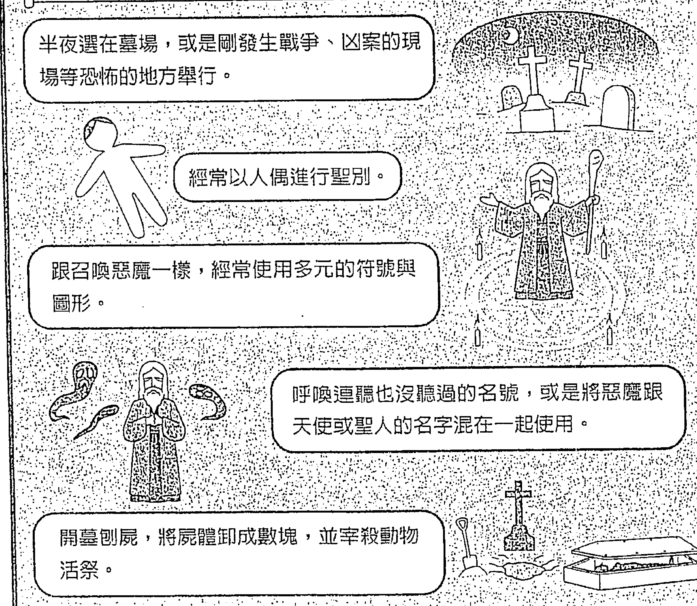

### No.052 女巫伊瑞克梭的降靈術

尼祿時代的古羅馬詩人盧坎筆下敘事詩《法沙利亞》詳細描述了基督教尚未出現前的古代降靈術儀式內容。

#### ◎古羅馬降靈術的不祥儀式

尼祿皇帝時代的古羅馬詩人盧坎*¹所著的敘事詩《法沙利亞》曾經描述到女巫伊瑞克梭接受大龐培之子塞克斯圖斯·龐培（Sextus Pompey）委託進行降靈術的場景。從這裡便不難發現，打從基督教尚未出現前的古羅馬時代開始，大部分的人便認為降靈術是種很恐怖的儀式。

伊瑞克梭彷彿將自己當成了死者，平時就住在荒蕪的墓地裡，生活在屍體、火葬燒過的孩童骨骸，以及死人的皮膚、指甲、舌頭、眼珠和衣服等穢物之間。待接到施行降靈術委託後，會先準備一具肺部還很健康，能大聲說話的新鮮屍體；因為腐敗的屍體不但說話比較小聲，記憶也比較模糊，常常搞不懂到底在講些什麼。

伊瑞克梭找到剛死不久的屍體，就會把屍體運到一個周圍有紫杉樹木環繞的暗處，然後剖開屍體胸膛，將新鮮的經血、狂犬病犬隻的唾液、大山貓的腸子、啃食過屍體的鬣狗的肉瘤、蛇蛻下來的舊皮、伊瑞克梭吐過口水的植物葉子全部混合在一起，塞進屍體胸腔裡面。接下來伊瑞克梭又會用好像混合了狼嚎、狗吠、貓頭鷹尖啼聲、野獸吼聲、蛇信嘶嘶聲、拍打岩石的水聲、森林的聲音與雷聲的模糊聲音唱誦咒文。最後則是要依序呼喚泊瑟芬*²、赫卡蒂*³、赫密斯*⁴、命運三女神、冥河擺渡人加龍*⁵等活動於冥界或地獄的諸神名字。

此時靈就會出現。亡靈先是抗拒，直到伊瑞克梭恫嚇威脅以後才肯進入屍體。過不了半晌，屍體的血液漸漸暖和起來、開始恢復脈搏與呼吸，並坐起身來回答龐培提出的全部問題。待所有的問題都得到解答後，伊瑞克梭才肯釋放亡靈，將屍體燒成灰，好讓靈能回到亡者的國度。

##### 女巫伊瑞克梭的降靈術

- 基督教問世前古羅馬時代的降靈術。
- 敘事詩《法沙利亞》有記載。

###### 女巫伊瑞克梭降靈術的特徵

從女巫伊瑞克梭的降靈術就不難發現，降靈術早在基督教時代來臨以前便已相當受人畏懼。

###### 女巫伊瑞克梭的起居情形

住在荒蕪的墓地裡，生活在屍體、火葬燒過的孩童骨骸、死人的皮膚等穢物間。

###### 降靈術的方法

1. 找個肺部還很健康、能大聲說話的新屍體。
2. 將屍體運至暗處、剖開胸膛，塞進新鮮的經血、狂犬病犬隻的唾液等物。
3. 用極恐怖的聲音唱誦咒文，呼喚珀瑟芬、赫卡蒂、赫密斯等諸神，靈就會現身進入屍體當中，便可以向靈發問。
4. 問完後將屍體燒成灰，釋放亡靈。

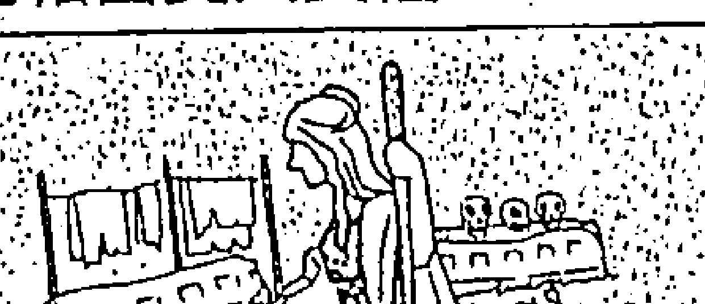

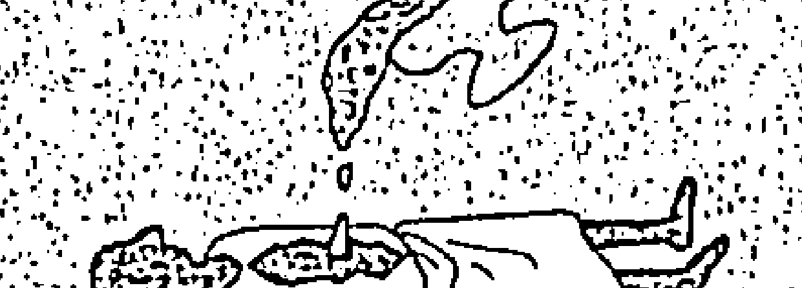

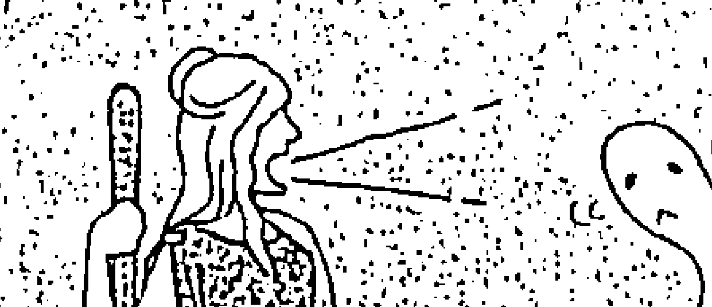

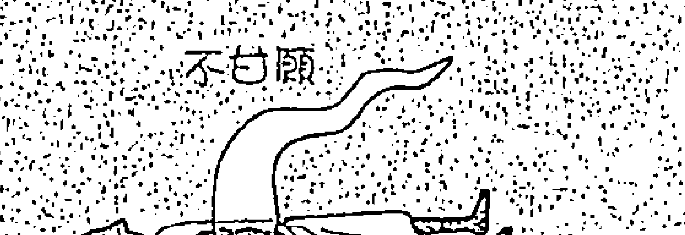

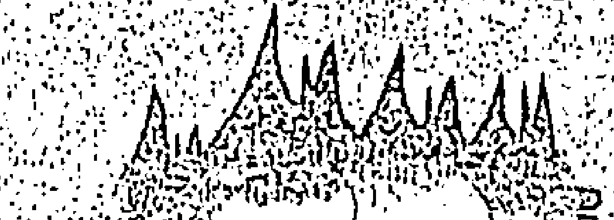

###### 用語解說

◎大龐培（Pompey）→西元前1世紀羅馬共和體制末期的軍人、政治家。曾經與凱撒、克拉蘇組成三頭同盟。

> * 見P.218頁No.052注釋

## 月之子的降靈術

> 20世紀黑魔法師亞雷斯特·克羅利的小說《月之子》也曾對降靈術陰氣森森的儀式有所描述，其內容究竟為何？

### 20世紀黑魔法師所著小說中描述的降靈術

以20世紀著名的黑魔法師亞雷斯特·克羅利（Aleister Crowley）所著的小說《月之子》中描述的降靈術儀式可作為比較接近現代的新案例。這部作品發表於1917年，是探討克羅利降靈術樣貌的珍貴資料。

根據這部小說記載，儀式是要從日落時開始，場地則是選在荒廢禮拜堂的一個角落。先拿從濕地取來的泥土打底，然後取硫磺往上鋪一層，再用杖頭岔成兩股的長杖在上面畫出魔法陣，並且用碳粉填滿畫出來的線溝，最後將死人頭朝北方擺放。

參加者僅降靈術師與兩個助手而已。助手A手持點燃的黑色蠟燭，助手B則是一手繩索牽著山羊、一手握著大鐮刀站著。降靈術師必須是最後一個踏進魔法陣，在圓周處豎起9根蠟燭並點起燭火，接著取出籠子裡的四隻黑貓，分別在東西南北四個方位，用黑色鐵箭活活將黑貓刺穿。

助手A開始祈禱，連續呼喊惡魔的名字，羅列並讚美眾惡魔諸多殘酷的功績。此時就會聽見彷彿地獄哄笑般的聲音響起，眾家惡靈就會現身，那些惡靈的模樣看起來活脫脫就像是恐怖的外星生物。

此時助手B拿起大刀，一刀刺進奮力抵抗的山羊心臟，接著再砍下山羊頭、剖開死人腹部，把山羊頭塞進去。就在這個時候，該名助手便會彷彿發狂似的撲向死屍、扯咬屍肉舔飲屍血。最後才突然站起身來，人格身份切換成受召喚的亡靈，開口說出降靈術師想要知道的秘密。

##### 月之子

・20世紀黑魔法師亞雷斯特・克羅利的小說。
・對降靈術有詳細的描寫。

###### 克羅利所認識的降靈術

小說《月之子》裡的降靈術進行方式如下。

- ① 儀式於日落時分的荒廢禮拜堂一隅舉行。
- ② 於儀式場所鋪上從濕地取來的泥土與硫磺。
- ③ 用杖頭分岔成兩股的長杖畫出魔法陣，再用碳粉填滿畫出來的線溝。
- ④ 將死屍頭朝北方擺在魔法陣裡面。
- ⑤ 助手A手持點燃的黑蠟燭，助手B牽著山羊拿著大鐮刀、走進魔法陣。降靈術師最後才踏進圓內，在圓周豎起9根蠟燭並點燃燭火，再取4隻黑貓，分別在東西南北四個方位，以黑箭將黑貓活生生地刺穿。
- ⑥ 助手A開始祈禱，惡靈現身。
- ⑦ 助手B砍下山羊頭、塞進屍體腹部以後會突然發瘋，代替亡靈將知道的事情全數說出。

### No.054 吉拉丢斯之鈴

> 吉拉丢斯之鈴是種不需執行恐懼的儀式便可輕易召喚出死者亡靈的魔法道具，其製作方法都詳細記載在古抄本之中。

#### 記載於魔法書的降靈術師之鈴

根據格里歐・吉弗里（Grillot de Givry）所著《巫術師・魔法師・鍊金術師》記載，法國國家圖書館館藏抄本第3009號《吉拉丟斯的微光小冊・論自然的驚人秘密》書中收錄名為吉拉丟斯之鈴的魔法鈴鐺。

這是個輕易就能夠行使降靈術的鈴鐺，因此特別在這裡介紹。抄本當中收錄有降靈術鈴鐺的圖片，由圖判斷，鈴鐺尺寸應該比手掌還大。鈴鐺下方寫有聖四文字（YHWH），也就是不可直呼其名諱的唯一神耶和華；其上畫有七個行星的符號，在上面寫的是阿多奈，吊環部位則是記載著耶穌的名字。鈴鐺圖形周圍有兩個同心圓環繞，圓與圓之間繪有七個行星的符號，圓內則是分別記載著各個行星神靈的名字。這些神靈的名字與魔法書《阿爾馬岱的魔法書》記載的奧林匹亞精靈相同，從正上方開始按照順時針方向依序是：太陽精靈Och、金星精靈Haggith、水星精靈Ophiel、月之精靈Phul、土星精靈Aratron、木星精靈Bethor、火星精靈Phaleg。

這個鈴鐺必須是以鉛、錫、鐵、金、銅、無揮發性的水銀、銀等合金製成，據說這合金要選擇在受召亡靈誕生於人世的同一個時刻熔解。書中有收錄降靈術師正裝的圖片，圖中術師右手拿著寫有七個行星符號的羊皮紙，左手則是拿著鈴鐺。鈴鐺製作完成後，降靈術師會用綠色的塔夫塔綢*包裹起來放在墓穴正中央七天，如此一來日後只要搖響這個鈴鐺便能夠輕易地將亡靈召喚出來。

> *見P.219頁No.054注釋

##### 降靈術師的鈴鐺

輕輕鬆鬆就能實施降靈術的鈴鐺。

###### 降靈術師的鈴鐺特徵

法國國家圖書館抄本收錄的某個降靈術師鈴鐺圖片如下。

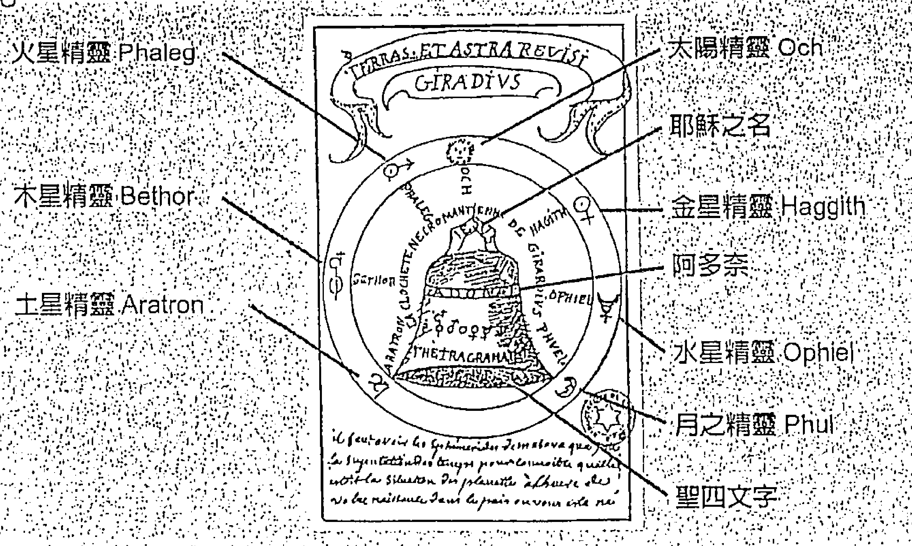

- 火星精靈 Phaleg
- 木星精靈 Bèthor
- 土星精靈 Aratron

- 太陽精靈 Och
- 耶穌之名
- 金星精靈 Haggith
- 阿多奈
- 水星精靈 Ophiel
- 月之精靈 Phul
- 聖四文字

###### 降靈術師的鈴鐺製作方法

降靈術師的鈴鐺是按照以下方法製作。

1. 以鉛、錫、鐵、金、銅、無揮發性的水銀、銀等合金製成鈴鐺。
2. 以塔夫塔綢裹起來，放在墓穴裡面七天。
3. 日後只要搖響鈴鐺就可以輕易將亡靈召喚出來。

> 《阿爾馬岱的魔法書》（The Grimoire of ARMADEL）→1575年於瑞士巴塞爾以拉丁語出版的魔法書。不屬於《所羅門王之鑰》系列的魔法書。

## 《所罗门王之钥》与《所罗门王的小钥匙》

14～18世紀前後，歐洲有許多收錄如何驅使惡魔藉以實現自身願望的儀式魔法，名為魔法書（Grimoire）的魔法書問世。這些魔法書當中最有名的當屬《所羅門王之鑰》與《所羅門王的小鑰匙》，這兩部魔法書書名相當類似、容易混淆，故在此做個簡單的說明。

《所羅門王之鑰》（別名《所羅門王的大鑰匙》）傳為所羅門王所著，不過根據歷史考據推測應是成書於14、15世紀前後的魔法書。這本書的主旨是要從存在於宇宙間的眾多神靈（如惡魔或天使等）當中選出適合自身目的的神靈並驅使之藉以達成願望，而此書的最大特徵就是介紹了44個驅使神靈時必須用到的星陣圖。

所謂的星陣圖，就是指繪有特殊印記的紋章或徽章之類的圖形，施術者只要出示星陣圖，便可以確實並且安全地號令神靈。舉例來說，若以火星第六星陣圖召喚神靈，施術者便可以獲得強大的防禦力，非但刀槍不入，還能使敵人被自己的武器所傷。

另一方面，《所羅門王的小鑰匙》（別名《雷蒙蓋頓》）同樣亦傳為所羅門王所著，但這部作品其實是由5部各自獨立的魔法書所組成的：這5部魔法書原先各自成書於14～16世紀間，直到17世紀才被彙整編成一部作品。也因為這個緣故，《所羅門王的小鑰匙》是採5部構成的結構，每部介紹的眾神靈各不相同，而其最大特徵便屬題為「哥耶提雅」（Goetia）的第一部，裡面記載到著名的所羅門王72惡魔的召喚方法，並且針對各個惡魔的地位與能力有詳盡的解說。讀過這部魔法書，就會知道假如想要讓朋友失和，那只要召喚擁有散播不和能力的惡魔安托士（Andras）即可。

只不過，無論《所羅門王之鑰》或《所羅門王的小鑰匙》，書中記載的絕非僅止於邪惡的魔法而已，這些魔法書也有助讀者獲得有關藥草、天文學、數學等各種學問的知識。當時的人們之所以會將其視為黑魔法，可以說是因為他們認為這些魔法並非依靠神，而是依靠惡魔的力量行使的緣故。

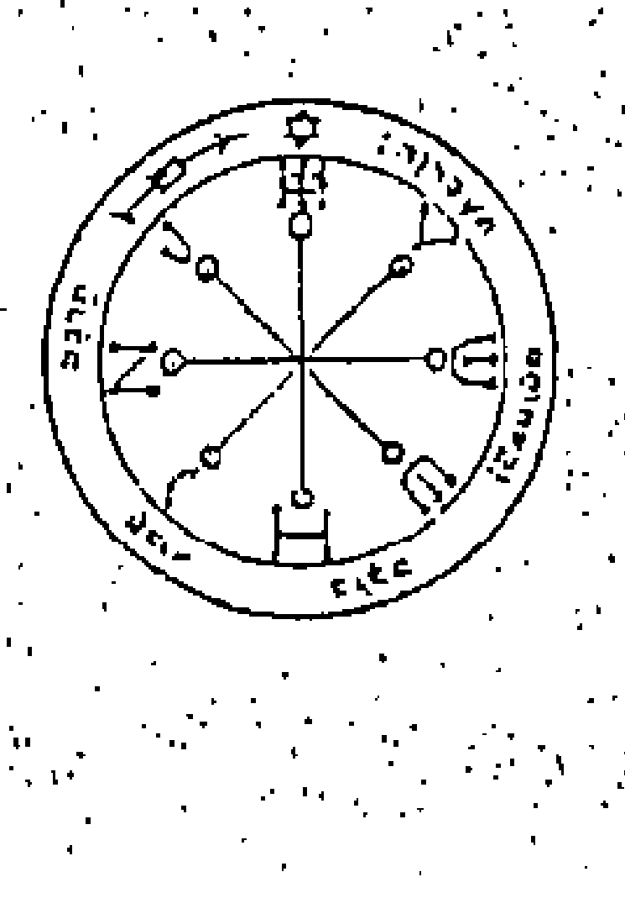

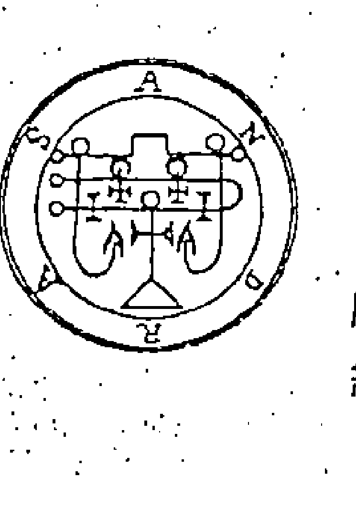

## 第3章 日本的黑魔术

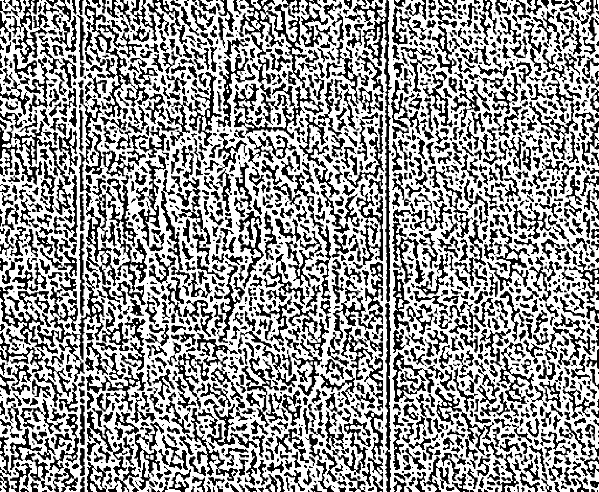

## 日本黑魔法的特征

> 日本包容了神道、阴阳道、密教、修验道等各种古老的思想与宗教，因此黑魔法的种类也很丰富。

### ❶因为思想、宗教环境而有多样化发展的日本黑魔法

日本是个多宗教且多宗派的国家。神道、阴阳道、密教（佛教）、修验道等，自古以来众多的思想与宗教在日本这个狭窄的国家兼容并蓄，并相互磨砥直至今日。光凭这点就不难知道，日本的黑魔法也是极为多姿多彩。

日本的黑魔法在平安时代便已十分发达。平安时代的贵族们为了击败政敌，往往会依靠诅咒的手段，而无论实施诅咒或阻止诅咒，通常都是阴阳师的工作。那个时代的贵族认为疾病等祸事是诅咒所致，经常会聘请阴阳师等人举行祓禊仪式。

阴阳师使用的阴阳道来自中国，跟密教同样是在5～6世纪间传入日本，7世纪的日本便设立了名为阴阳寮的政府机关。阴阳道在能使式神咒法的安倍晴明所活跃的10世纪进入鼎盛期，从此直到江户末期为止，阴阳道时时刻刻影响着日本人的思想与行动模式。高知县物部村直到今天仍存在的「伊邪那岐流」便是属于阴阳道系统的魔法。

论及宗教系黑魔法，则以密教系与修验道系最为盛行。修验道发端于山岳信仰，是由密教、道教、阴阳道等思想体系融合而成，是意欲藉由山岳修行以期获得超自然验力的宗教。获得验力的修验者等同于拥有咒力的魔法师，他们经常会应庶民的请求而执行黑魔法。

密教则由空海、最澄等佛僧传进日本，用于成就愿望的加持。祈祷体系特别发达，最终发展出远较其他宗教更加隆重正式的咒法。除了打击仇敌的调伏法外，还另有六字经法、降三世法、大威德法等黑魔法。元军袭日时期筑前观音寺为调伏蒙古而行使的五坛法，便是密教的调伏法。此外，还有属于个人规模的黑魔法，如江户时代流行的丑时参咒。

##### 日本黑魔法的特徵

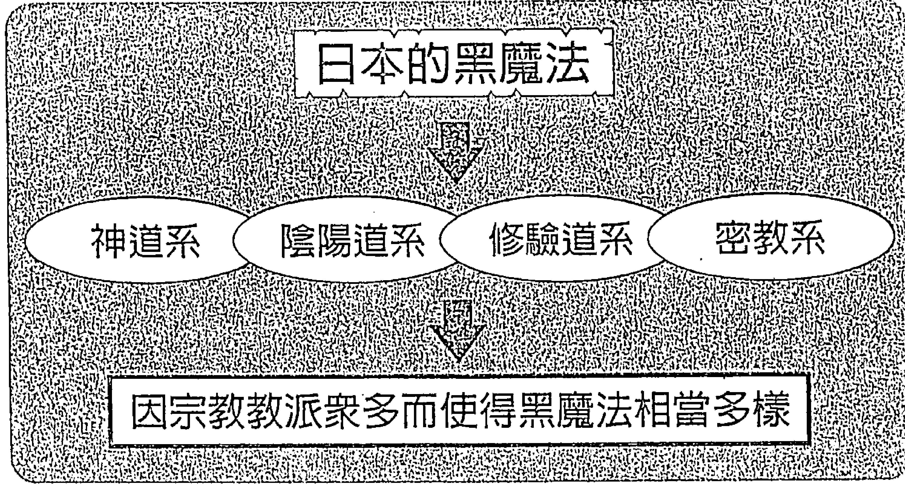

##### 日本最主要的咒法系統

日本有許多黑魔法系統，其中聲勢最盛的當屬陰陽道系、密教系與修驗道系，各宗教特徵如下。

- **陰陽道**
  - 5~6世紀間由中國傳入。
  - 安倍晴明活躍的10世紀為鼎盛期。
  - 高知縣現存的「伊邪那岐流」亦屬陰陽道系統。

- **修驗道**
  - 欲藉山岳修行獲得超自然驗力的宗教。
  - 修驗者等同魔法師，會應庶民的請求執行黑魔法。

- **密教**
  - 空海、最澄等人移植進入日本。
  - 加持祈禱體系特別發達，發展出遠較其他宗教更加正式的咒法。
  - 有六字經法、降三世法、大威德法等咒法。

- **其他**
  - 丑時參咒等個人行使的黑魔法。

##### 丑時參咒

從前心懷怨恨的日本庶民會在夜半的丑時三刻悄悄前往神社或佛寺參拜，取稻草人偶擬作仇敵釘在神木或鳥居上。

### 將擬作詛咒對象的稻草人偶釘在神木上

丑時參咒就是夜半選在丑時三刻（凌晨2點～2點半左右）悄悄前往神社或佛寺參拜，再將擬作仇敵的稻草人偶釘在神木或鳥居上面，祈求詛咒能夠生效的儀式。「丑時參咒」亦作「丑時參拜」。

丑時參咒盛行於江戶時代，經常被民謠、淨溜璃、浮世繪等藝術作品採用作為主題。詛咒實際的操作方法與服裝也隨這些藝術創作而定：施詛咒者全身穿得雪白、胸掛銅鏡、腳踩高木屐、披頭散髮倒戴五德*、五德上面還要插著3支蠟燭，必須連續七天執行丑時參咒，絕對不可以让別人看見。據說直到願滿的第七天，詛咒對象就會在稻草人偶被打釘的身體部位感到劇烈疼痛並死亡。雖然關於這個詛咒該使用何種釘子、何種稻草人偶並無硬性規定，但也有說法指出使用較大的五寸釘，以及在稻草人偶中夾雜詛咒對象的指甲或毛髮有助於加強咒力。

> 屋代本《平家物語》（劍之卷）有篇故事說到有個女人為了殺死自己嫉妒的女人而向貴船大明神祈願執行丑時參咒，結果得到貴船大明神神諭：將長髮捲成5團、用松脂固定將頭髮定型成5個角的形狀，顏面與身體全部塗滿紅色染料、頭戴鐵環，並且在鐵環的3隻腳綁上3支點燃的火把，連續二十一日每天浸泡宇治川的河水。那名女性依照神諭而行，果然願滿之日她化為厲鬼，不光是她嫉妒的人，還把其他相關人等全都殺死，這便是著名的宇治橋姬的故事。這個故事雖然未提到稻草人偶與五寸釘，不過後世流傳的恐怖咒法恐怕就是從這裡描寫的丑時參咒演變發展而成。

##### 丑時參咒

夜半將稻草人釘在神社神木等處的詛咒儀式。

丑時參咒在江戶時代最為盛行，還經常成為淨瑠璃與浮世繪的創作主題。

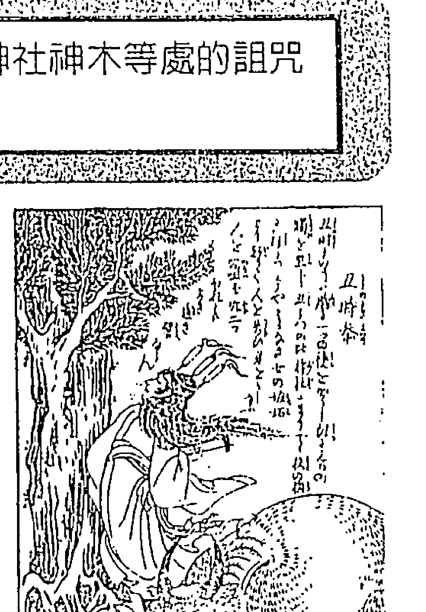

※右圖為江戶中期浮世繪師鳥山石燕所繪「丑時參」。

###### 丑時參咒的標準服裝

- 插3支蠟燭
- 倒戴五德
- 鐵鎚、木槌
- 五寸釘 (釘子愈大效果愈大)
- 銅鏡
- 稻草人 (摻入對方指甲或毛髮可增強效果)
- 白衣
- 高木屐

看起來愈恐怖愈好。

## 陰針法

陰針法跟丑時參咒同屬使用人偶施行的咒法，是神道 古神道奉為少彥名命秘傳的詛咒秘法。

### ◎神道視為少彥名命秘傳的詛咒法

陰針法是神道、古神道奉為少彥名命秘傳的咒法，這種使用人偶的黑魔法除了可以用來調伏怨敵以外，據說還有治療疾病、除厄、結緣斷緣等效果。

施行陰針法，必須準備針、榻榻米與人偶。針的材質可以選用金、銀或鐵，必須選在甲子日日出時刻以徹底淨化過的鐵砧製作。所有的針都必須是4寸8分長，針頭4分長；使用的針分成3種：陽針1支、陰針1支，其他針8支。接著還要準備2張榻榻米：一張長8寸、寬5寸、厚1寸8分；另一張長8寸、寬5寸、厚4分。2張榻榻米的邊緣都要使用紅色的大和錦*1圍邊。再用2張半紙*2折成人偶。人偶的大小要能夠完全夾在2張榻榻米中間不露出來。

執行儀式前，將人偶、針與榻榻米擺在神前桌几，朝著神前二拜二拍手。接著自行行使祓禊潔淨自身，召喚少彥名命。

將人偶摆在厚1寸8分的榻榻米上，再將厚4分的榻榻米覆於其上。雙手捧著針，集中精神想著目標人物，把針捧在肚臍附近。右手持針，用左手將針尖抵在榻榻米上。如果對誰有怨恨的話，便唱誦「禁厭一念通神御針。怨敵調伏」三次，待氣勢最高漲的瞬間一口氣將針刺入榻榻米中，令針貫穿人偶的頭部，刺完1支針後再取第2支針從雙手捧針的步驟開始重複操作，直到氣消為止。儀式過後直到詛咒實現前，切不可將針拔出。若願望果真實現，需要一面唱誦神樂的秘文「天空晴亮，多麼光采歡樂，多麼聖潔光明」*3，一面將針拔取出來，最後將紙人燒掉，讓灰燼流入河川或大海。

* 見P.219頁No.057注釋

##### 何谓阴针法？

- 神道、古神道少彦名命的秘传之法。
- 利用人偶调伏怨敌的黑魔法。
- 也有治疗疾病、除厄、结缘断缘等效果。

##### 准备事物与使用方法

###### 准备事物

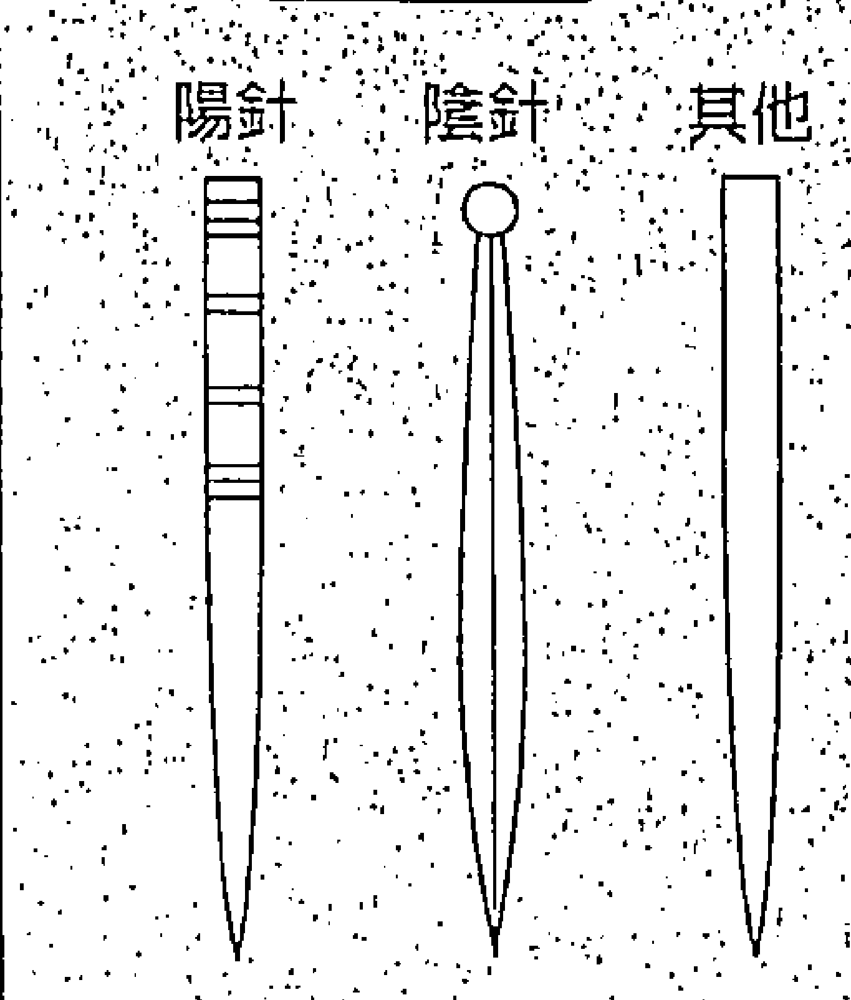

使用金、银或铁为材料制作。

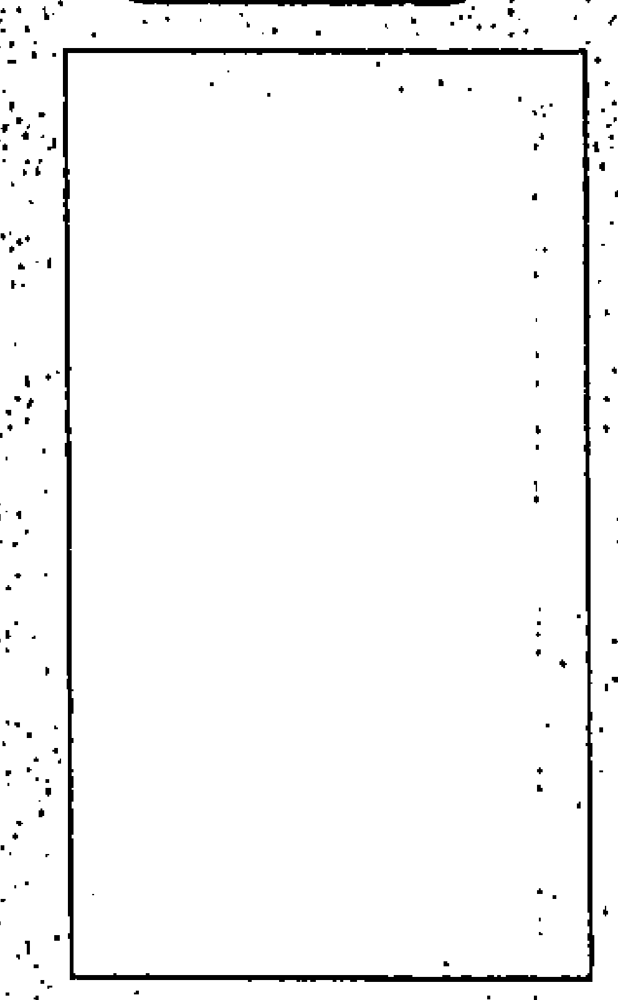

长8寸、宽5寸、厚1寸8分与厚4分的榻榻米各1张。

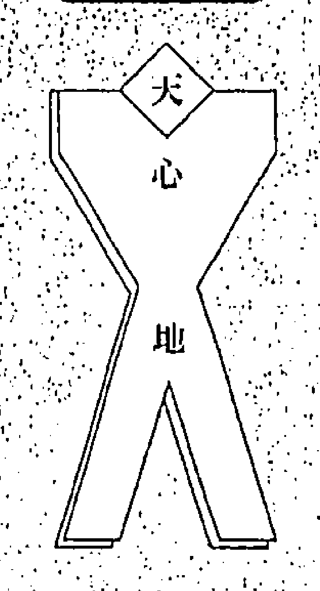

大小可藏进2张榻榻米中间的半纸制人偶。

###### 使用方法

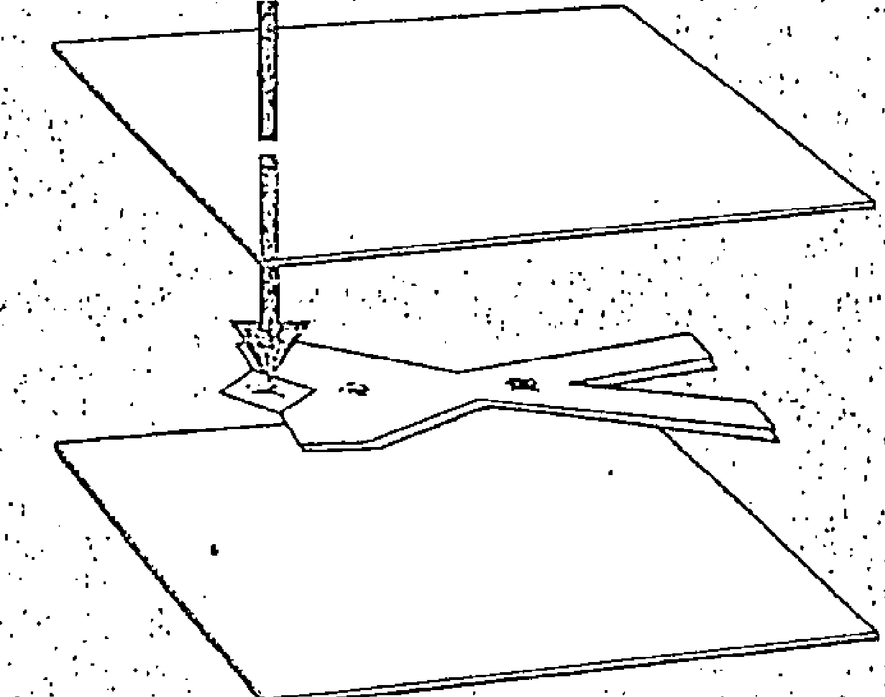

将人偶夹进两张榻榻米中间，取针刺进榻榻米、贯穿人偶的头部。

##### 用语解说

②少彦名命→日本神话中协助大国主命创造国土的神。少彦名命属于常世神，却也以酒、医药、咒法之神为人所知。

③甲子日→甲子是天干地支组合起来的第一天，为吉日。

## 犬神咒法

所谓的犬神咒法便是将犬灵奉为自家守护神祭祀，从而操控犬灵夺取他人财富，使自家致富的黑魔法。

## 驱使犬隻魂魄的蛊毒法

四国伊邪那岐流等教派所传的犬神咒法是中国蛊毒法的末流，是一种利用操作犬灵来损人利己并致富的黑魔法。犬神是一种会附身于家屋的灵，让犬神附身的人家代代都要将其奉为神明，需小心伺候令其满意，犬神就会为该户人家带来财富；若是伺候得不周到，犬神就会使该户人家面临灾厄。

相传欲得犬神可按下列的顺序执行：将狗活生生地埋在地下，只露出狗头，不让牠吃东西，还要拿食物摆在牠面前，待极度饥饿的时候才将狗头给砍下来。

把狗头埋在人来人往的四岔路口等处，尽可能让更多人踩踏，接着挖出狗头，将其奉为咒物祭祀。如此一来犬神就会受人控制，主人可以任意操控犬灵。如果需要的话，让犬灵替自己杀死仇敌也不是不可能的事情。

可是只要使用过犬神，哪怕只有一次也好，犬神就会从此长驻在那个人的家里不走。像这种有犬神附身的家就叫做「犬神筋」，该户人家子子孙孙所有家人都会获得操纵犬神的能力，不过相对的他们也必须代代祭祀犬神。

四国的偏僻农村相信奉为犬神祭祀的犬灵，大小就跟老鼠或鼬鼠差不多。除此之外，据说有犬神附身的人家只要每生一名女婴，就会增加75尊犬神。

另外，也传说迎娶犬神筋家里的女孩，犬神就会跟新娘一起移动，因此犬神也会跟着定居在夫家，也就是说夫家从此也非得祭祀犬神不可。

##### 何谓犬神？

附身于人家的犬灵，能使人致富、愿望实现。

- 1. 附身于人家的犬灵。
- 2. 必须代代好好祭祀。
- 3. 能使该户人家致富。
- 4. 能为主人加害，甚至杀死仇敌。

##### 犬神的制作方法

获得犬神的方法相当残酷，现今是绝对不被允许的。

- ① 把狗埋在地下，只露出狗头，不给牠东西吃。
- ② 让狗看得见吃不到，饥饿到极点时砍下狗头。
- ③ 埋在四岔路口让众人踩踏。
- ④ 挖出狗头奉为咒物祭祀，犬神就会受人控制。

## No.059

## 阴阳道的式神与咒杀

平安时代的阴阳师能驱使式神寄附于咒物之上，再将其埋在敌对者住家的地板下面，让敌对者罹病，甚至死亡。

## 阴阳师所驱使的式神究竟是什么？

所谓的式神，就是指平安时代的众家阴阳师可以任意操纵的鬼神（恐怖的神灵）。式神可以化作人类、动物或妖怪等诸多模样，有时候并非肉眼可见。

诅咒并非阴阳师驱使式神的唯一用途，若以式神催动诅咒，经常会一并使用到咒物。换言之，只要让式神寄附于某个物体上，该物体就会变成咒物。至于让式神寄附的物体，无论陶土器、剪纸、头发或糯米饼等皆可。

《宇治拾遗物语》（卷十一之三续「晴明杀蛙事」）内中记载到了以下的故事：平安时代的官人阴阳师安倍晴明有次拜访某个僧侣时，同席的年轻僧侣问道：「听说你能驱使式神，那你能在瞬间杀人吗？」，晴明答道：「这事虽不简单，但只要稍微费点气力就能杀人，如果虫子就简单多了。」，众僧便说：「那就请你咒杀那边池子里的一只青蛙」，只见晴明不情愿地摘下一片叶子，口中唱诵咒文然后将叶子抛向青蛙。眼看着那片叶子就要落在青蛙身上的时候，青蛙竟然瞬间被压扁。换言之，是式神附在叶子上，杀死了青蛙。据说目击者无不骇然哑口。

但其实就式神咒法而言，这并非一般的做法。阴阳师驱使式神寄附于咒物、施行诅咒最普遍的做法，还是要将咒物埋在地下。埋藏处通常是选在诅咒对象起居住屋的地下或井底，又或是该人物经常出入的寺庙神社境内等地，只要目标人物出现就会触动式神施以诅咒，其结果往往就是使得目标人物罹患疾病，甚至因而殒命。

##### 阴阳道的式神与咒设

式神 → 指阴阳师操纵的鬼神。

可化作人类、动物或妖怪等各种模样。

##### 式神与咒物

施行诅咒时，令式神寄附于某个物体，作为咒物使用。

##### 一般咒物的使用方法

一般来说，咒物通常要埋在目标人物起居的住家范围内。待对方经过式神就会自动发动，对目标人物施加诅咒。

##### 用语解说

- ◎剪纸→将纸张剪成某种形状的图样。
- ◎《宇治拾遗物语》→成书于13世纪前半期的日本说话物语集，跟《今昔物语集》同为日本说话文学的最高杰作。

### No.060 式神反噬的诅咒

即便敌方阴阳师派出式神施行诅咒，只要懂得式神反噬的诅咒法便能将式神原原本本的奉还，杀死敌人。

#### ◎反噬阴阳师的式神

阴阳师固然能够利用式神诅咒目标人物，但目标人物也有可以对抗的手段，那就是委托更优秀的阴阳师，让敌方阴阳师遣来的式神反噬回去；若能藉此阻止敌方的诅咒，遣来的式神返回，而敌方便会被自己派出去的式神给杀死。

《宇治拾遗物语》（卷之八「晴明封藏人少将事」）讲的刚好就是式神反噬的故事。某天任职于藏人所*的近卫少将正要进内里（天皇居住区）时，头顶有只乌鸦飞过并拉屎落在他身上。安倍晴明看见这个状况，立刻看穿「如此年轻气派的人竟像受人诅咒，那乌鸦肯定是式神」，于是晴明立刻驱前向少将说明他已遭到式神诅咒，坐视不理则命危矣。少将闻言一惊，拜托晴明无论如何要出手相救，于是晴明马上就跟少将返回其私宅，抱着少将施行固身之法，整晚不停地唱诵咒文、加持祈祷。

隔日天明有人上门来访，原来是诅咒少将的阴阳师派来的使者，道出了事情的来龙去脉：原来这少将有个职叙五位藏人的连襟原本跟他住在同一个家里，家里的人偏爱少将，对连襟却甚是鄙视，连襟遂忿而聘请阴阳师想利用式神咒杀少将，岂料少将因为有晴明加持祈祷而使得式神反弹，如今那位阴阳师已经遭式神反噬得奄奄一息。后来，那位阴阳师果真就此丢了性命。

从这里便可以知道，受诅咒者若得优秀的阴阳师行固身之法保护，便可以将式神反弹，甚至可以杀死发动诅咒的阴阳师。

##### 式神反噬的原理

- 式神反噬
- 将敌人派来的式神反弹回去的魔法。

优秀的阴阳师能击退敌人遣来的式神将其反弹，甚至能够杀死对方。

##### ◎安倍晴明的固身之法

- 固身之法
- 祈愿人身安全的护身咒法。
- 可抵御式神攻击、反弹式神。

抱着遭式神攻击的人，彻夜唱诵咒文，不停地加持祈祷。若能撑到天亮就能击退式神，并让式神反噬。

### No.061 伊邪那岐流厌魅之法

伊邪那岐流承袭自古代阴阳道，至今仍流传存在于日本高知县偏僻农村的民间宗教，其诅咒用人偶，须视各月份而选用不同的材料制作。

#### 承袭自古代阴阳道的「稻草人偶」诅咒法

伊邪那岐流厌魅之法是属于使用人偶来诅咒他人的诅咒法。伊邪那岐流流传于日本高知县香美郡物部村的民间宗教，据称此宗教承袭了古阴阳道的流派。

使用人偶施行诅咒的诅咒法多不胜数，而伊邪那岐流诅咒法的最大特征便在于一年的每个月份用来制作诅咒人偶的材料各不相同。

- 正月用松木
- 2月白茅
- 3月桃花
- 4月麦秆
- 5月绿叶
- 6月卯花*1
- 7月胡枝子*2
- 8月稻叶
- 9月菊花
- 10月芥菜
- 11月白纸
- 12月冰

只不过这些材料并非绝对不可或缺，也可以拿一般的稻草人偶替代。攻击人偶的方法有「枠法」、「天神法」与「针法」三种。

所谓枠法就是将木匠用来画线的墨斗里的墨线当作弓弦，再拿尖头小箭去射设置于下方的人偶；天神法则是将人偶置于铁砧、以铁锤敲打；至于针法则是用铁锤将针或钉子打进人偶里面。攻击人偶之前，先要前额贴地或仰天而望，大声重复喊出：「好运当我，噩运当〇〇（敌人的名字）、绝子绝孙」，然后再催动憎恨的情绪反复执拗地攻击人偶。

如此一来，不光是可以咒杀憎恨的对象，甚至还能牵连其子孙受苦。但若被诅咒者请咒力更强大的祈祷师进行反诅咒，发出的诅咒就会加倍奉还，必须小心慎用。

> * 见P.219页No.061注释

##### 伊邪那岐流的厌魅之法

###### 伊邪那岐流厌魅之法

使用人偶的诅咒法。

所谓的伊邪那岐流 → 流传于日本高知县的民间宗教。

#### ◎ 各月规定用于制作人偶的材料

伊邪那岐流厌魅之法规定各个月份分别要使用下表的材料来制作人偶。

| 月份 | 材料 | 月份 | 材料 | 月份 | 材料 | 月份 | 材料 |
|------|------|------|------|------|------|------|------|
| 1月 | 松木 | 2月 | 白茅 | 3月 | 桃花 | 4月 | 麦秆 |
| 5月 | 绿叶 | 6月 | 卯花 | 7月 | 胡枝子 | 8月 | 稻叶 |
| 9月 | 菊花 | 10月 | 芥菜 | 11月 | 白纸 | 12月 | 冰 |

##### 攻击人偶的方法

伊邪那岐厌魅之法攻击人偶有拙法、天神法、针法三种方法。

###### 拙法

以墨斗墨线为弦朝人偶射箭。

###### 天神法

将人偶置于铁砧，以铁锤槌打。

###### 针法

以铁锤将针或钉子打入人偶中。

### No.062 摧魔怨敌法

即便是在主要以国家或宗族为诅咒毁灭目标的密教魔法当中，摧魔怨敌法也是相当强大的咒法，有时还能用于咒杀个人。

#### ◎集诸神之力毁灭敌国敌族

摧魔怨敌法，又名转法轮法，在密教魔法当中算是较为强大的咒法，即便大多都是以国家或宗族作为诅咒毁灭目标，但有时也会用来咒杀某个特定的个人。据说首次实施此法的是真言宗东密二流当中的小野流始祖——仁海（951～1046年），他根据空海自中国传入日本的《转法轮菩萨摧魔怨敌法》为典据而施行；时值保元之乱（1156年），仁海奉后白河天皇命令，欲藉此法击破敌对的崇德上皇势力。

若欲从事这个仪式，首先就必须制作一个长18cm、直径4cm的圆筒，名为转法轮筒。转法轮筒的材料以苦楝木最为理想，不过用桐木、竹子或金铜制成的也可以。

接着还要准备代表敌对者的诅咒用纸偶。先拿纸偶的头部与腹部让不动明王踩踏过，然后在这两个部位写上敌人的姓名。

准备妥当以后，摆定设有调伏用三角炉的护摩坛，再将转法轮筒置于护摩坛中央。焚烧安悉香，将想要消灭敌方纸偶折起来，放进转法轮筒里面。接着向摧魔怨敌法的本尊祈祷、召唤十六大护众神，利用观想法与众神合为一体，讨伐消灭敌人。摧魔怨敌法的本尊有弥勒菩萨、大威德明王、降三世明王等各种说法众说纷纭，不过施法时无论召唤其中任何一位本尊都可以。

召唤众神的真言为「曩莫·三漫多·没驮南·萨缚怛啰·阿钵啰底贺多·行菩提·播哩一布啰迦·娑贺」。仪式至此结束，仪式后只要将人偶取出，以三角炉烧掉即可。

##### 摧魔怨敌法

- 毁灭国家或宗族的强大咒法。
- 也可用于个人咒杀。

###### 摧魔怨敌法的使用方法

摧魔怨敌法进行如下：

- ① 制作转法轮筒。使用苦楝木或竹子等材质。（附尺寸图：直径4cm，高18cm）
- ② 制作敌人的纸偶。头部腹部让不动明王踩踏过，再写上敌人的姓名。
- ③ 护摩坛摆设三角炉与转法轮筒。（附示意图：包含护摩坛、三角炉、转法轮筒及术师的位置布局）
- ④ 焚烧安悉香，将敌人纸偶放进筒中，召唤十六大护众神等诸神，利用观想法与众神合为一体，讨灭敌人。（附插图：绘有神明消灭敌人的场景，敌人喊“救命啊～”，神明说“消灭！”）

※东密→指真言宗密教。因当初空海以东寺为根据地而得名。平安时代中期枝分成广泽流与小野流两个支流。
※十六大护众神→密教奉为国家守护神的昆首羯么、却比罗、法护等16位神明。

### No.063 六字经法

所谓六字经法是以调伏炉焚烧天狐、地狐、人形三类形纸偶的密教黑魔法，平安时代的皇族贵族经常都要依靠六字经法来进行权力斗争。

#### 焚烧天狐、地狐、人形形象施行诅咒的黑魔法

六字经法是奉六字明王为本尊、咒杀仇敌的密教咒法。除六字明王以外，有时也会奉六观音（圣观音、千手观音、马头观音、十一面观音、准胝观音、如意轮观音）或奉圣观音为本尊。平安时代的皇族贵族往往会利用六字经法来进行权力斗争，文献中记载12世纪前期鸟羽上皇曾经命令属下实施六字经法，企图打击对立的兴福寺势力。

六字经法的做法如下：若奉六字明王为本尊，那便张挂六字明王图像，并且在图像前方设置护摩坛与调伏用的三角形护摩炉。以护摩炉焚烧调伏用的护摩木（幼树或树根等），重复唱诵六字明王的真言「唵・羯罗羯罗・羯支・矩噜矩噜・娑贺」召唤本尊。

事先准备剪好天狐（鸢）、地狐（犬）、人形（诅咒目标）形状的三类形纸偶各7张，总计21张，唱诵真言并以护摩炉焙烧，所有三类形纸偶要事先用墨汁写上诅咒对象的姓名，烧成灰烬后要放在容器里面好好保存。

另外要在护摩坛上方准备弓箭，并且用芦苇制成的箭依序射向东南西北上下六个方向。以上是一天的仪式程序，仪式总共要进行七天。仪式结束后要将纸偶烧成的灰烬送给诅咒的委托人，让委托人用热水泡开饮下。全部仪式至此告终，接下来只要等待敌人毙命即可。

此处描述的六字经法属真言宗系统，后来天台宗为与之抗衡也发明了名为「六字河临法」的咒法；此法是在船上施行六字经法，再将三类形纸偶投入河中以咒杀仇敌。

##### 六字经法

- 奉六字明王为本尊的密教咒杀术。
- 平安时代多用于权力斗争。

###### 第3章◇日本的黑魔法

##### 六字经法仪式的主要必备咒具

六字经法仪式所需主要咒具如下：

###### 调伏用护摩木

- 幼树、树根等。

###### 三类形

- 剪成天狐（鹰）、地狐（狗）、人形（诅咒目标）形状的三类形纸偶各7张，合计21张。

### No.064 大威德明王调伏法

大威德明王调伏法多半用于祈愿战胜、降伏恶魔等目的，却也可以作咒杀特定个人的黑魔法运用。

#### 咒杀恶人、令男女反目的密教秘法

大威德明王是密教奉为五大明王之一的神祗，经常化作6头6眼18臂6足、骑着水牛的模样。即便在以忿怒相教化世人的五大明王当中，也是位令人畏惧的神明，其调伏法经常用在祈愿战胜、降伏恶魔等目的。例如从前平将门叛起东国时，京都八樻法观寺的净藏就曾经实施大威德明王调伏法，结果平将门之乱转眼间就被镇压下来了。

不过大威德明王调伏法也可以用来咒杀个人，因此也可定位为恐怖的黑魔法。

以大威德明王调伏法咒杀他人的做法如下：首先面朝南方设置护摩坛，坛上配置正三角形的护摩炉，坛前再挂幅大威德明王的图像。

紧接着再进行以下仪式：手结大独钻手印，唱诵真言「嗡·绀力·卡拉鲁帕·吽堪·梭哈」1万回。唱诵完毕以后取粘土捏成敌人模样的土偶，仰天放在护摩坛上。

准备5根长度适中的尖木椿，涂抹动物粪便。2根木椿刺进土偶的左肩右肩，2根刺进左右大腿，最后1根则是打进心脏；每打入1根木椿，就要唱诵真言108回。再度坐回护摩坛前，焚安悉香并唱诵真言1万回。据说仇敌就会因此吐血而亡。

但如果觉得这样还不够，可以再将钉了木椿的人偶用铁锤敲个粉碎，然后再将粉碎的土偶丢进护摩炉里烧掉，这样便能进一步确定仇敌必死无疑。

> *日本密教真言与台湾略有出入，此处采音译。

##### 大威德明王调伏法

祈愿战胜、降伏恶魔的咒法。也可用于咒杀个人。

镇压平将门之乱时也曾使用过。

###### 以大威德明王调伏法咒杀个人的方法

- ① 设置调伏用的护摩坛，并在前方放置大威德明王图。
- ② 结大独钴手印，唱颂真言「嗡·紐力·卡拉鲁帕·吽堪·梭哈」1万回。
- ③ 按照敌人模样捏制粘土偶，涂抹动物粪便并打进5根木桩。
- ④ 坐到护摩坛前、焚安悉香，唱诵真言1万回。
- ⑤ 据说仇敌就会因此吐血而亡。

平将门→承继桓武天皇血脉的平安时代中期关东豪族，兴起叛乱标榜东国独立，与朝廷对立。

##### 降三世明王调伏法

若不仅仅只是想杀死仇敌，则可使用降三世明王调伏法，能使对方陷入恐惧与不安当中，受疾病所苦，甚至进入假死状态。

### ◎使仇敌受恐惧与不安所苦后再咒杀

降三世明王调伏这种密教咒法不单能够杀死仇敌，还能使对方陷入恐惧与不安当中，受疾病所苦，甚至进入假死状态。降三世明王与大威德明王同属五大明王之一，是位3头8臂、头发有如火炎般冲天逆竖、相貌极为骇人的明王。也有一说他是大日如来的化身。

进行降三世明王调伏法必须事先做好下列准备：七七四十九天断绝五谷（米、麦、粟、豆、黍）与盐巴，唱诵降三世明王的真言「嗡・苏婆・你苏婆・吽・苏絮哩・吽发吒」10万回来净化自身，便可得到神的守护。接着面朝南方设置调伏用护摩坛，前方张挂降三世明王图像，即可应不同目的来举行仪式。

欲使仇敌陷入恐惧与不安，就要准备有刺的树木并唱诵「嗡・苏婆・你苏婆・吽・苏哩诃拏・苏哩诃拏・吽・苏哩诃拏・播野・吽・阿曩野・斛・婆诃铄・缚日罗・吽发吒」，焚烧树木，重复执行相同步骤324回。欲使仇敌致病，就要在摆设好调伏用护摩培以后唱诵根本真言「嗡・啊埤啦哇嗟・婆贺」1080回，再焚烧红黑两种罂粟1080粒，同时唱诵敌人的名字。

若欲咒杀仇敌，就将按照仇敌模样捏制的人偶与写着对方姓氏名字的纸丢进炉里，唱诵真言108回，并集中意念必定要咒杀对方。接着抓一把砂子掷向人偶，最后把人偶烧掉。如此一来，敌人便与死人无异，除非以特殊方法苏生，否则对方就会断气死去。

> > *日本密教真言与台湾略有出入，此处采音译。

##### 降三世明王调伏法

咒杀仇敌的咒法。能陷对方于恐惧不安、使其致病，甚至进入假死状态。

###### 何谓降三世明王？

与大威德明王同属五大明王之一。3头8臂，头发冲天竖立有如火炎。也有一说是大日如来的化身。

###### 降三世明王调伏咒法

- 1. 断绝五谷（米、麦、粟、豆、黍）与盐巴七七四十九天，唱诵降三世明王真言「嗡·蘇婆·你蘇婆·吽·藥紮哩·吽發吒」10万回，净化自身。
- 2. 面向南方设置调伏用护摩坛，坛前挂降三世明王图像。
- 3. 将捏成敌人模样的人偶与写着姓名的纸张丢进调伏用护摩炉，唱诵真言108回，心念必定要咒杀对方。
- 4. 抓一把砂掷向人偶，最后将人偶烧掉。

### No.066 昆沙门天咒杀法

昆沙门天咒杀法虽然对反抗权力的叛逆者或穷凶恶极的罪犯有极大效力，却必须视咒杀对象来调整仪式。

#### ◎自行绘制昆沙门天图像施行诅咒

昆沙门天咒杀法是奉昆沙门天为本尊咒杀仇敌的密教咒法。此法对反抗权力的叛逆者与穷凶恶极的罪犯固然能发挥极大功效，却也有必须视对象而调整仪式的特征。昆沙门天也称为多闻天，是代表佛教守护神的四天王之一，是守护北方的武神。

昆沙门天咒杀法如下：首先要亲自绘制左手持三叉戟、右手插腰的昆沙门天像，再画昆沙门天身旁随侍的哪吒太子与坐在脚边的夜叉。

选个不会被别人看到的地方设置护摩坛与调伏用三角炉，坛前张挂昆沙门天图像；护摩坛以各种花朵装饰，换上干净的衣服焚香。

咒杀仪式选在月亮亏缺、伸手不见五指的夜晚展开。唱诵击破仇敌的诅咒陀罗尼（咒文）「嗡·支遮那吠室罗·摩路野摩娑夜叉·支婆曩莫吠迦吠犁·摩陀罗贺地·娑贺」30万回，然后焚香供养尊像。

接下来就要视诅咒目标不同而展开不同的仪式。

- 咒杀叛逆国家者，要取松叶放进三角炉焚烧，然后唱诵「吠娑罗知世邦」，进入想像世界，以金刚杵打进敌人的头部与心脏。
- 咒杀穷凶恶极者，要唱诵调伏咒文并以三角炉焚烧苦楝木，还要拿煮苦楝木出来的汁揉合黄土捏成7个敌人士偶，胴体写上诅咒对象的名字，每日将1个土偶投入火中焚烧即可。

*日本密教真言与台湾略有出入，此处采音译。

##### 昆沙門天呪殺法

昆沙門天呪殺法 ⇒ 奉昆沙門天為本尊呪殺敵人。

對反抗權力的叛逆者與窮兇惡極的罪犯能發揮極大功效。

###### 昆沙門天呪殺法的程序

昆沙門天呪殺法要按照下列程序執行。

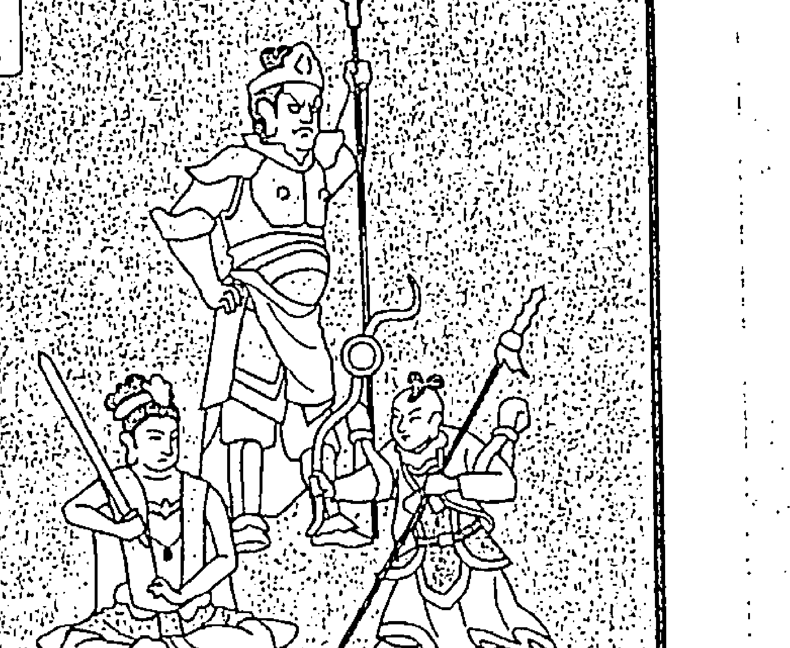

-   ①自行繪製昆沙門天圖像。
-   ②在不會被人看見的地方設置調伏用護摩壇，壇前掛昆沙門天圖像。
-   ③於月亮虧缺、伸手不見五指的夜晚展開儀式。
-   ④欲呪殺叛亂者則以三角爐焚燒松葉，觀想持金剛杵消滅敵人的場景。
-   ⑤欲呪殺窮兇極惡者則焚燒苦楝木，製作7個敵人土偶，每日拿1個投入火中焚燒。

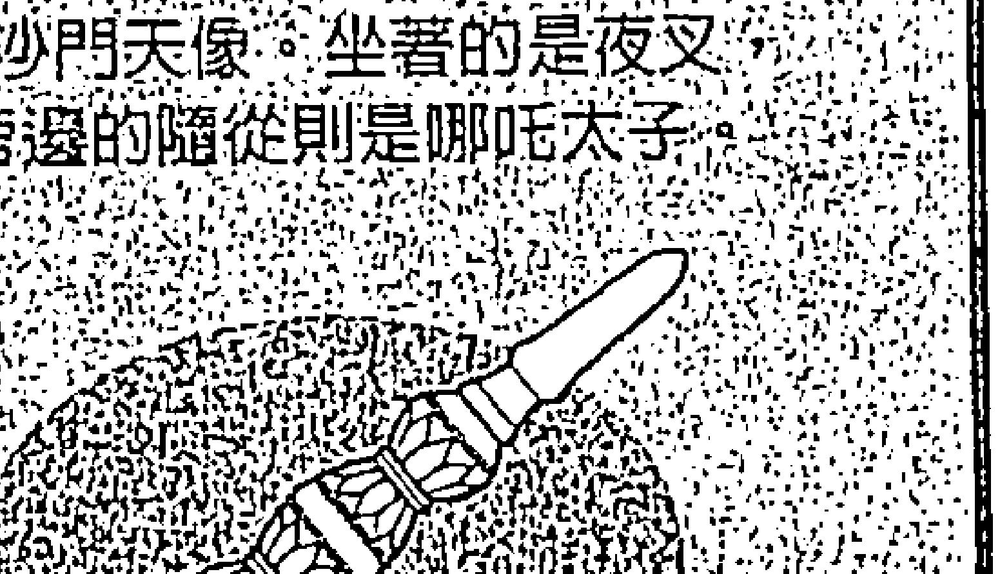

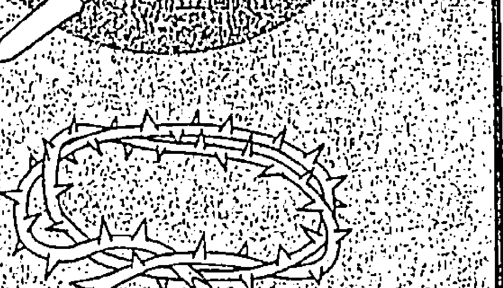

### No.067 鬼子母神呪法

鬼子母神的歡喜母神據傳擁有獲得愛情、破鏡重圓、結成良緣等效果，其中卻也能涵蓋能夠消滅邪惡敵人的可怕詛咒法。

#### ❶有如吞噬人子夜叉般的黑魔法

鬼子母神的印度名稱爲利帝，別名訶利帝，或名歡喜母。她原是奪人子女、食其血肉的恐怖夜叉，直到受佛陀戒律，歸依佛法以後才成爲了幼兒的守護神。因爲祂正是這樣的一位神明，冠其名的歡喜母法自然也被視爲是擁有獲得愛情、破鏡重圓、結成良緣等效果的魔法。

不過鬼子母神的歡喜母法當中也不乏用於調伏詛咒的駭人黑魔法，主要是用來消滅隨時會造成威脅的邪惡敵人，而且這種魔法不僅能夠消滅敵人，還能讓敵人全家陷入瘋狂狀態、互相憎恨咒罵衝突，甚至相殺以致全家死絕，是種極恐怖的詛咒。

這種魔法儀式內容如下：首先要從墳場等地盜取1顆死人的顱骨，據說生前愈是凶暴、愈是善妒的人，效果愈佳。然後要對著那顱骨結「被甲之印契」，唱誦鬼子母神的陀羅尼（呪文）「挪摩羅挪提拉野·達摩迦利切·摩訶野掐支提（中略）伐利伐提·涅提喇迦提·薩巴吉巴迦喇多業·娑賀」21回，將顱骨藏在敵人住家的秘密處所，這樣便足以讓敵人全家雞犬不寧、慘事連連。

但如果敵人因詛咒太恐怖而軟化悔改，甚至乞求原諒的話，也要視情形解開詛咒。解除詛咒要先唱誦鬼子母神呪文21回，並回收藏在敵屋的顱骨，放回原處即可，如此一來，敵人就可以從詛咒得到解放。

*日本密教真言與台灣略有出入，此處採音譯。

##### 鬼子母神詛咒法

鬼子母神詛咒法 → 使敵方全家互相憎恨，甚至彼此殺戮的恐怖黑魔法。

###### 鬼子母神詛咒法的儀式

鬼子母神詛咒法如下施行。

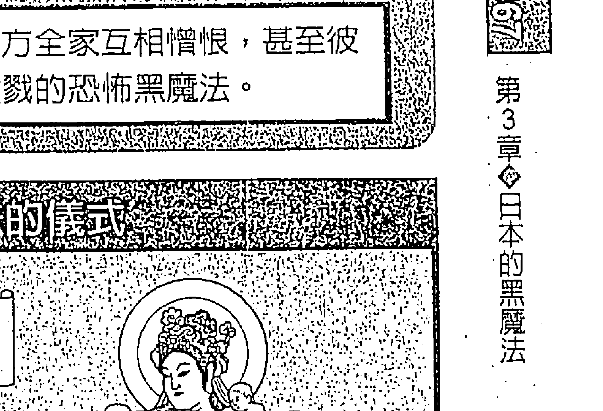

-   ①準備生前凶暴善妒者的顱骨1顆。
-   ②朝顱骨結被甲印契，唱誦鬼子母神陀羅尼21回。
-   ③將顱骨藏在敵人住家，就能引起一連串恐怖的慘事。
-   ④欲解開詛咒須唱誦鬼子母神咒文21回，回收藏在敵人住家的顱骨放回原處。

鬼子母神
據說有賜子、安產、育子、夫婦和合等效果。

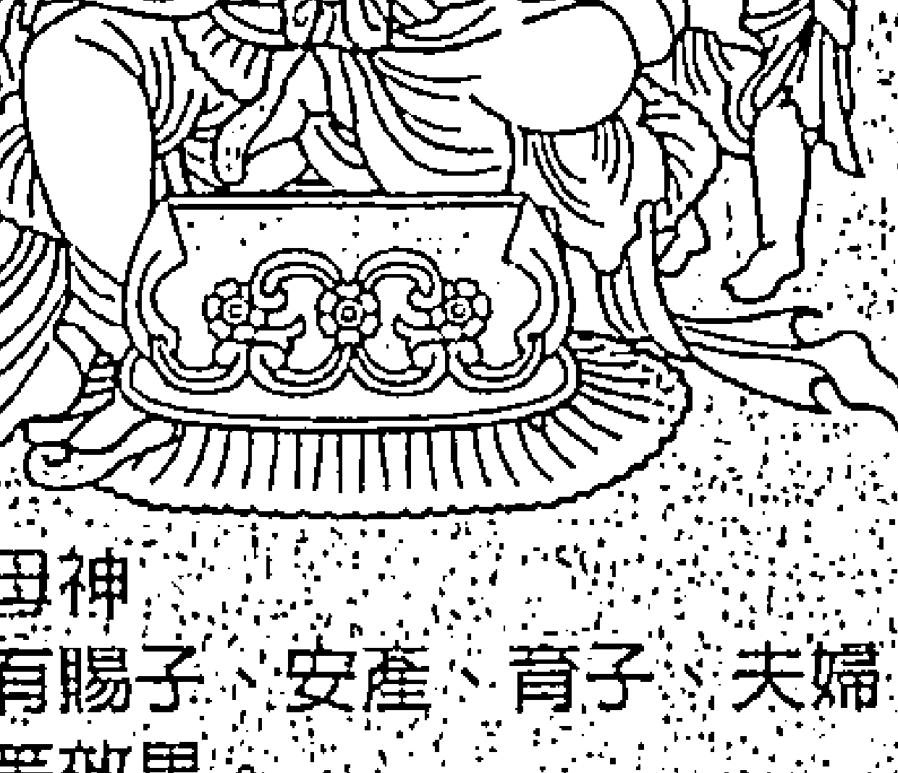

###### 鬼子母神陀羅尼

挪摩羅挪提拉野，達摩迦利切，摩訶野招支提，阿婆招業，薩契業訶吉涅，婆達伏利野業，安陀訶利尼業，範薩豁提拉，沙鞞訶利巴業稀利訶喇業，巴招鞞薩巴薩提巴，諾拔索利塔耶，巴招邦訶利切，訶利泰耶巴貝泰薩麼，婆達提遮拔契，薩婆羅鞞耶，婆訶邦賀拉契薩，婆訶邦莫西鞞西，賀羅豁契喇，毗欽諾毗諾耶迦，播利訶薩伐鞞多鞞，漫契喇婆達賀鐸喇，訶喇薩耶，諦尼耶鞞，西婆鞞，伐利伐提，涅提喇迦提，薩巴吉巴迦喇多業，娑賀

### No.068 九字法

九字法是日本修驗道與陰陽道均有傳承的普及咒法之一，分成手結九字印與手劃四縱五橫印兩種施行法。

#### ❶可作調伏法使用的修驗道護身法

九字法是日本最普及的咒法之一，主要以修驗道與陰陽道為中心流傳至今。此法源自中國的道教，西元4世紀葛洪所著《抱朴子》當中記載名為「六甲秘咒」的驅魔咒文，唱誦的是「臨兵鬥者皆陣列前行」九字。也就是說這九字法原本屬於護身法，直到傳入日本以後才又衍生出護身法以外的功效，甚至可以當作消滅怨敵的調伏法使用。

日本的九字咒文與《抱朴子》稍有出入，而且不同宗派使用的文字也或多或少略有不同，修驗道用的便是「臨兵鬥者皆陳列在前」九字。

九字施行法又分成手結九字印和手劃四縱五橫印兩種。

結九字手印者，必須一字一字唱誦九字，同時配合與各文字相對應的手印。這九個手印依序是金鋼鈷印（獨鈷印）、大金鋼輪印、外獅子（外師子）印、內獅子（內師子）印、外縛印、內縛印、智拳印、日輪（日光）印、寶瓶（隱形）印。

四縱五橫印也稱為刀印寶或早九字，是豎直兩指作劍印、依序唱誦九字，然後按橫→縱→橫的順序，朝著虛空迅速比劃出格子的形狀。換句話說，「臨」字劃橫、「兵」字劃縱、「鬥」字劃橫，以此類推。

無論使用哪種方法，九字法能將自身意念指向對方、使對方的狀態愈發惡化。

如果使用九字詛咒對方以後又想要中止的話，只要唱誦真言「擎契利掐伐·伐羅伐羅·縛識濁拔·娑賀」3回即可。

##### 九字法

-   使用來自中國的九字咒文所行使的咒法。
-   原本是護身法，也可作調伏法使用。

###### 九字咒文為何？

-   1. 臨
-   2. 兵
-   3. 鬥
-   4. 者
-   5. 皆
-   6. 陣
-   7. 列
-   8. 在
-   9. 前

###### 九字法的執行方法

九字法分成結九字印與手劃四縱五橫印2種。

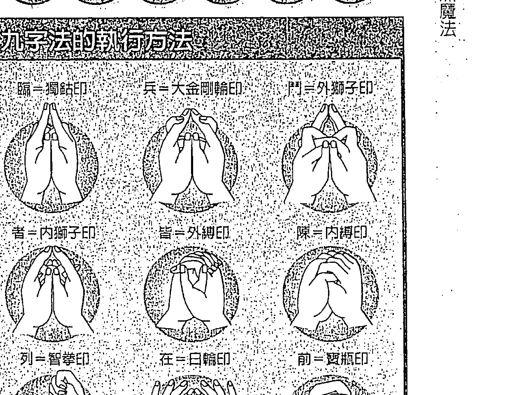

###### 結九字印的方法

一字一字唱誦九字，同時配合與各文字相對應的手印。

###### 四縱五橫印的方法

豎起兩指結成劍印，一字一字唱誦九字並按橫→縱→橫的順序，朝著虛空迅速比劃出格子的形狀。

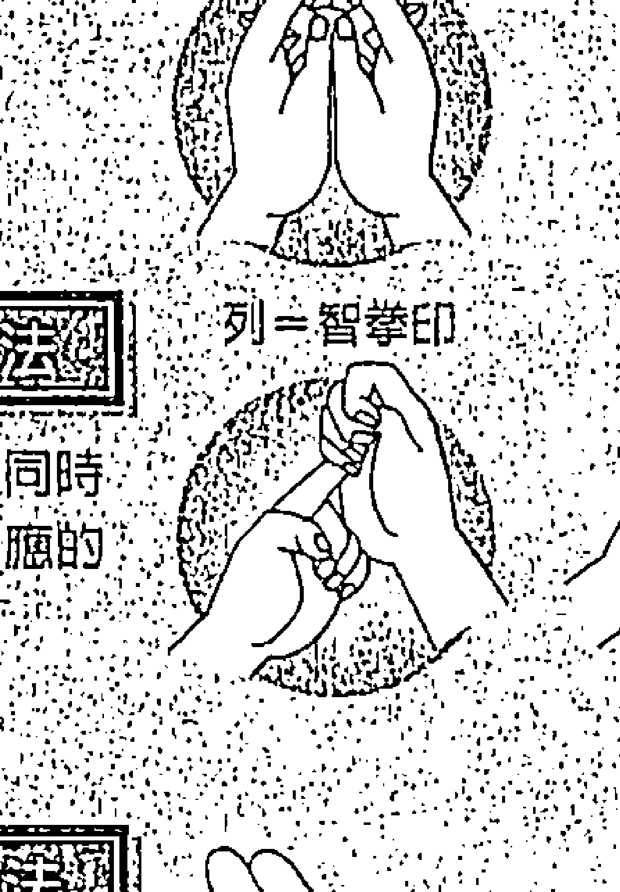

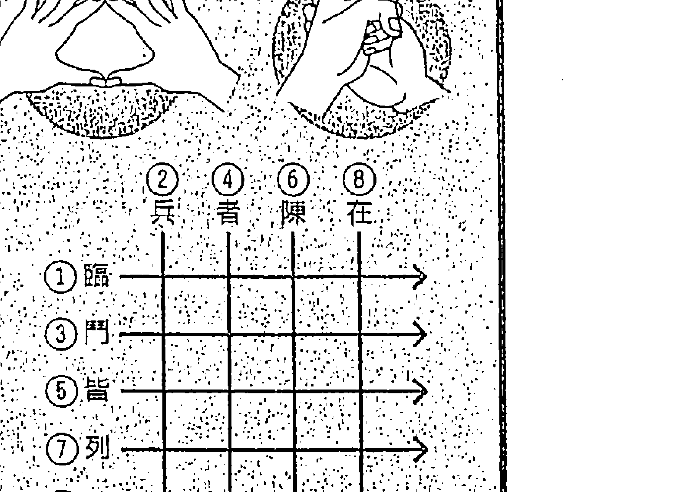

## 摩利支天隱形法

摩利支天是能夠保護自身免於各種敵人的護身法，若能配合調伏仇敵的摩利支天神鞭法使用便是最強的黑魔法。

### ※確保施行黑魔法絕對安全的摩利支天

摩利支天是陽炎*之神，任誰都無法看見他的模樣，也就是說他是位不會受到敵人任何攻擊的不死之神。摩利支天也因此而被奉為隱形法（隱匿身形之術）的守護神，極受忍者、武士諸侯信仰崇拜。

摩利支天隱形法便是修驗道流傳的向摩利支天祈念，與其合為一體而得其守護的術法。換句話說，摩利支天就是種透過觀想摩利支天而變成有如陽炎般肉眼所不能見的存在，再也沒有任何攻擊可以及於己身的護身法。因為這個緣故，摩利支天隱形法本身並不能算是黑魔法。但摩利支天卻又被奉為九字法的本尊，是位擁有調伏怨敵、調伏惡靈的強大神明，同時他也是恐怖的怨敵調伏法——摩利支天神鞭法（請參照No.070）的本尊。

若將摩利支天隱形法搭配同屬摩利支天職掌的神鞭法合併使用，便可以形成一種可怕的黑魔法；因為一旦這兩種咒法配合起來，施術者就可以從絕對不會受到攻擊的安全場所攻擊敵人，消滅仇敵。

而且使用方法也不困難，只要結摩利支天隱形印，唱誦摩利支天真言「南摩・三滿多沒・駄南・唵・摩里支・娑婆訶」想像自己進入摩利支天的體內，與摩利支天合而為一。如此便能變成如同陽炎般透明，在沒人知道的情況下使用摩利支天神鞭法。不過也有說法認為隱形法並非真正隱形的術法，而是摒除心中動搖的術法。

*見P.219頁No.069註釋

##### 摩利支天隐形法

摩利支天的咒法分为两种：
1. **隐形法**：使自身隐形的最强护身法。
2. **神鞭法**：恐怖的调伏法。

两者搭配使用便能从绝对不会受到攻击的安全处所攻击人，等同于最强的黑魔法。

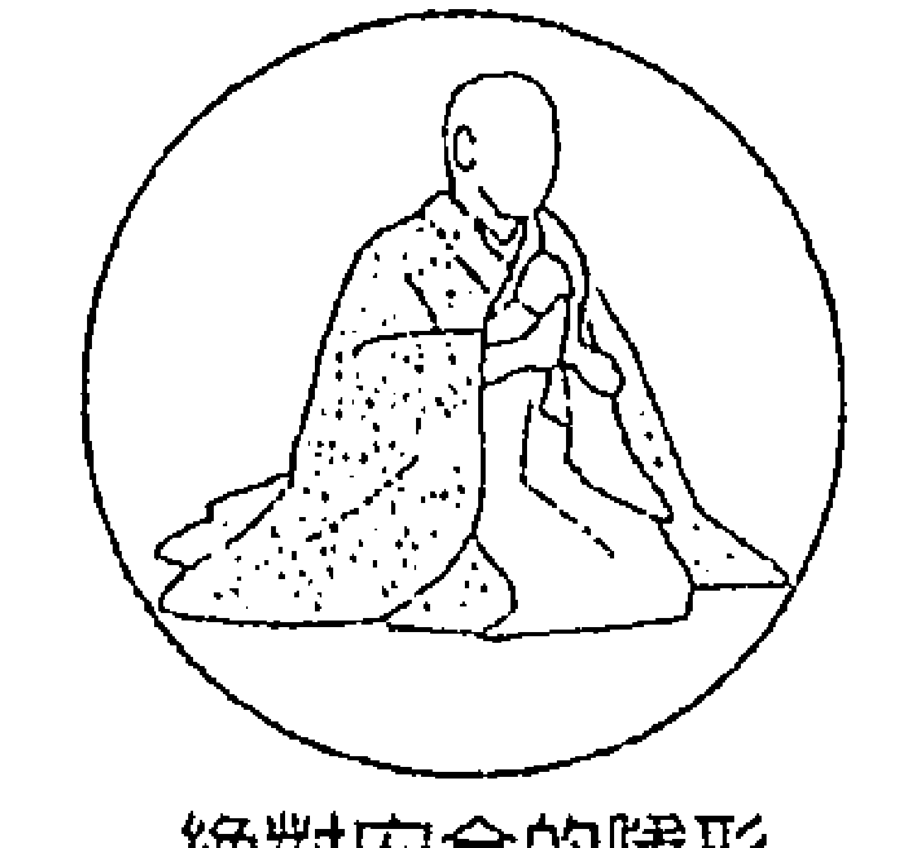

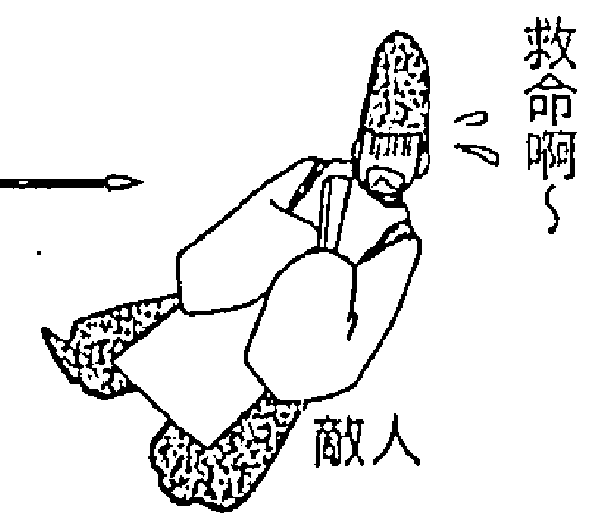

###### 摩利支天隐形法的施行方法

摩利支天隐形法施行如下。

-   ① 结摩利支天隐形印，唱诵摩利支天真言「南摩·三满多没·驮南·嗡·摩里支·娑婆诃」。
-   ② 同时想象自己进入摩利支天体内，与摩利支天合而为一。
-   ③ 可以从绝对安全的地方施行摩利支天神鞭法。

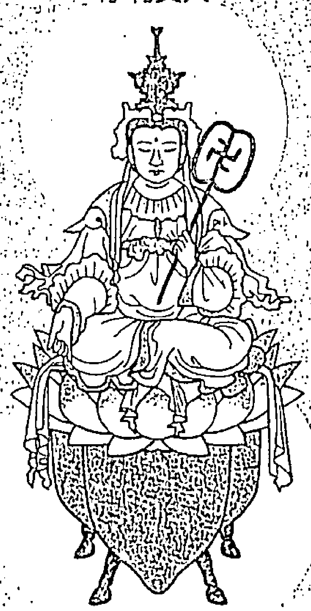

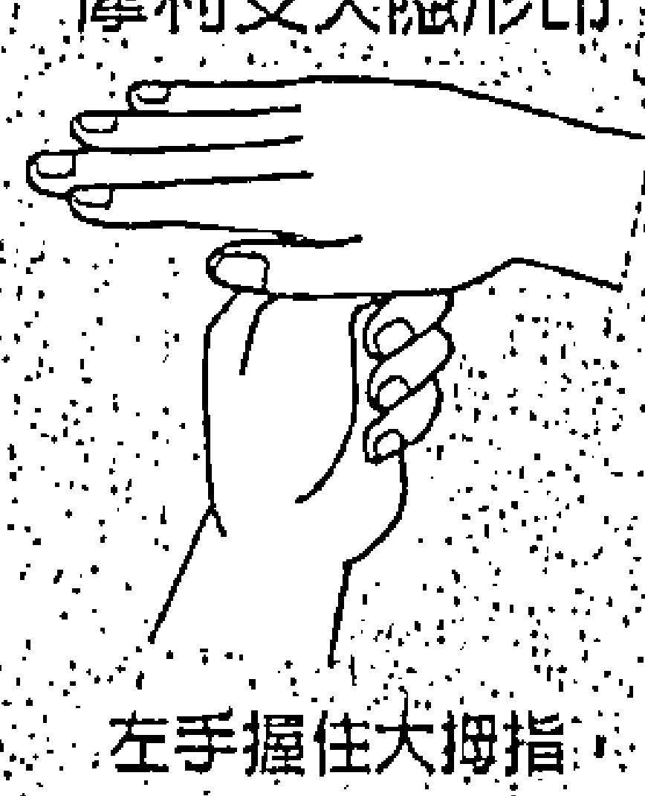

### No.070 摩利支天神鞭法

修驗道的摩利支天神鞭法是將敵人名字寫在紙上，用棒狀的鞭刺擊紙張的怨敵調伏法，就施行方法來說可謂是最基本的黑魔法。

#### 将敌人名字写在圆圈中并持尖棒戳刺

摩利支天神鞭法屬修驗道調伏法，此咒法能使仇敵與惡魔毀滅。摩利支天是陽炎神格化而成神明，作3頭6臂模樣，即便在修驗道眾神當中，也是位特別可怕的本尊，尤其特別受武士奉為守護神。

摩利支天神鞭法是在紙張書寫敵人名字，再用棒狀的鞭戳刺，就施行方法來說是最基本的黑魔法，做法非常簡單。首先砍鹽膚木*¹樹枝作鞭。鹽膚木是漆樹科的植物，滿山可見，想要使用神鞭法就是要砍鹽膚木樹枝，製作長30～50cm的鞭。做好後拿鞭蘸墨，在紙上畫一個圓，圓裡面寫上象徵摩利支天的摩字（*）跟自己的本名，然後一面唱誦摩利支天的真言「唵·麻利西耶依·娑賀」，一面想像自己變成3隻腳的烏鴉（八咫鳥*²），烏鴉又變成摩利支天。

接著再畫個圓，寫上「破敵」二字，下方再寫想要詛咒的敵人名字。右手執鞭、左手握拳抵在腰間，戳刺敵人名字三次，重複唱誦「唵·麻利西耶依·娑賀」1000回，同時執鞭不停地戳刺敵人的名字，完畢以後將紙張燒掉。若事先決定要進行百日就必須百日內每日都要執行相同的作業，據說如此就能消滅敵人或惡靈。

若欲施行摩利支天神鞭法，必先實施摩利支天隱形法（No.069）。摩利支天隱形法是透過與摩利支天一體化使自身隱形的術法，因此可以保密不讓別人知道自己在做什麼。

見P.220頁No.070注釋

##### 摩利支天神鞭法

武士守護神摩利支天的詛咒法。

###### 摩利支天神鞭法的作法

摩利支天神鞭法是最基本的黑魔法，做法非常簡單。

-   ①找鹽膚木樹枝，製作木鞭。
-   ②以鞭蘸墨，在紙上畫圓；圓內寫上象徵摩利支天的摩字 与自己的本名。
-   ③唱頌摩利支天的真言，一面想像自己變成三隻腳的烏鴉（八咫鳥），烏鴉又變成摩利支天。
-   ④再畫個圓，寫上「破敵」二字，下方再寫詛咒對象的名字。
-   ⑤右手執鞭，朝敵人名字戳三次，重複唱誦「唵·麻利西耶依·娑賀」1000回，拿鞭不停地戳刺敵人的名字。
-   ⑥據說每日操作相同作業百日，便能消滅敵人。

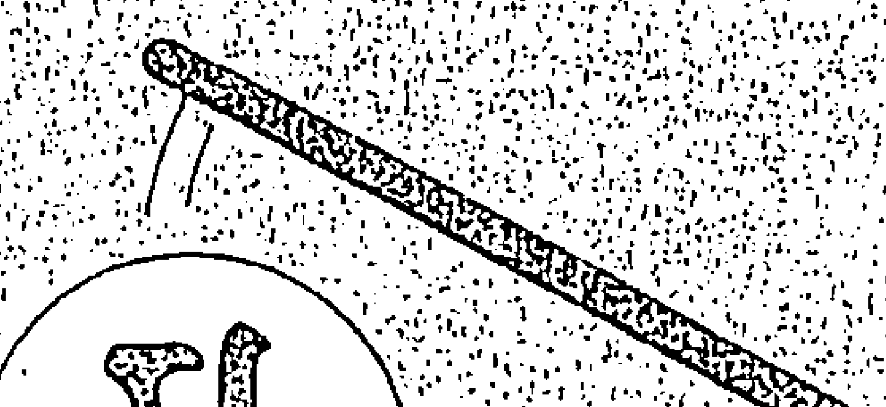

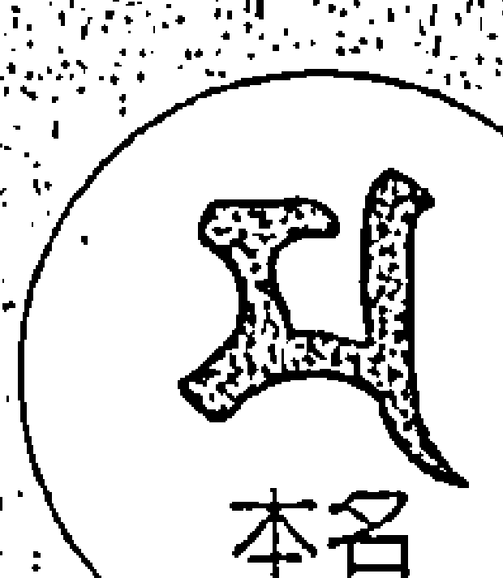

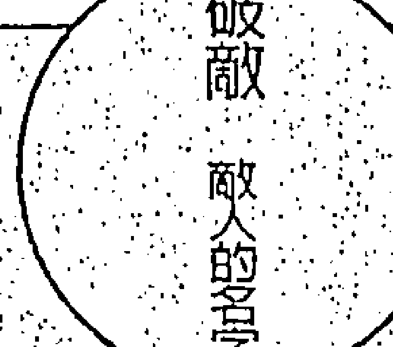

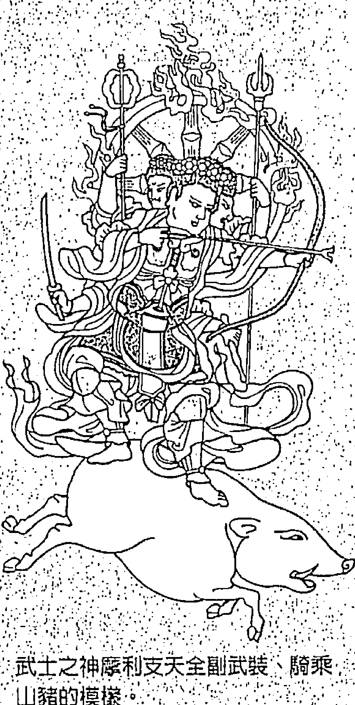

武士之神摩利支天全副武裝、騎乘山豬的模樣。

##### 飯網法

飯網法是操縱天狗或狐狸的靈籍以實現自身願望的魔法，可應用於咒殺敵人等邪惡目的。

### ◎派遣天狗或狐狸以實現願望的邪法

飯網（飯繩）法是操縱天狗或狐狸的靈，藉以實現自身願望的修驗道系黑魔法。為何說它是黑魔法呢？因為這些願望當中也包括了咒殺敵人之類的邪惡目的。

飯網其實是長野縣北信地區的山名，是與戶隱山、妙高山等齊名的名山。傳說山中有位名叫飯網權現的神，能傳授人飯網法。根據江戶時代的傳說記錄，1233年曾經有位名為伊藤豐前守忠繩的人攀登飯網山，進行絕食等修行，向飯網權現祈求並獲得了神通力，此即為飯網法的肇始。飯網權現是位騎乘白狐、手持劍與索（繩索）作烏天狗模樣的神明，同時祂也以頗受上杉謙信、武田信玄等武將信仰的武神而聞名。

基本上這是種實現自身願望的咒法，透過飯網法可以實現的事情非常多。據說室町時代的武將細川政元就曾修行飯網法而獲得了在空中飄浮與飛行的能力；戰國時代的關白九条植通則是透過張掛輪袈裟，結手印並唱誦真言而修得了飯網法，從此無論他在何處就寢，夜半屋頂必定都有貓頭鷹啼叫，步行時前方必定會刮起旋風。

若想習得飯網法，必須經歷過極嚴苛的修行，一旦修行得道後想要使用飯網法卻很簡單。施行飯網法首先要結飯網六印法等印形，所謂的六印就是指對應於佛教的地獄道、餓鬼道、畜生道、人道、阿修羅道、天道等六道的六種印形。接著利用觀想法使自身與飯網權現融合一體化，將生命力灌注進入飯網六印之中，然後強烈並具體的想像操縱天狗或狐狸的情景，據說天狗或狐狸就會為施法者實現願望。

##### 飯網法

操縱天狗或狐狸的靈實現願望的法術。

###### 何謂飯網法？

-   長野縣北信地區飯網山中的飯網權現所授術法。
-   1233年伊藤豐前守曾於飯網山向飯網權現祈得神通力，是飯網法的肇始。
-   飯網權現也以武神身分頗受上杉謙信與武田信玄等武將熱心信仰。

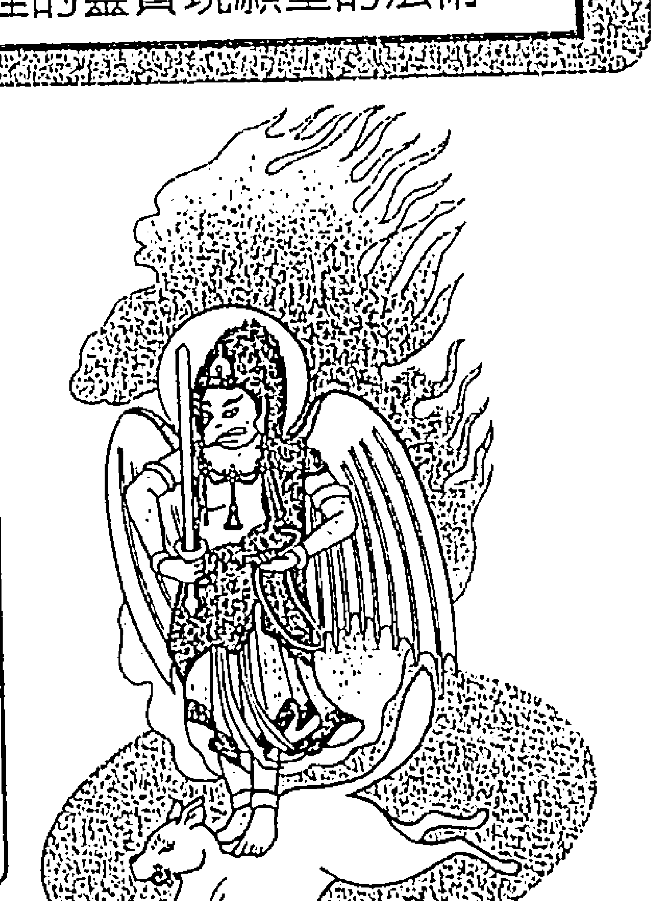

###### 飯網法的效用

飯網法是種實現願望的術法，因此可以應用於各種魔法而不僅止於黑魔法。

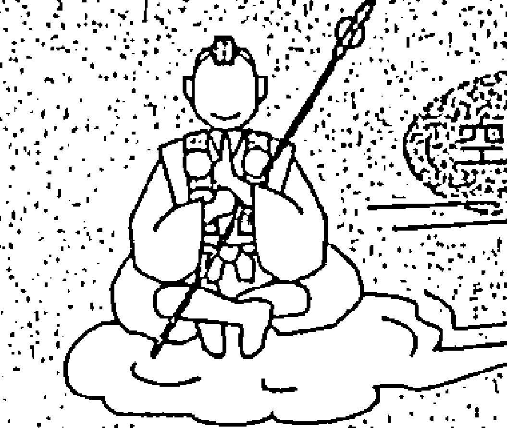

在空中飄浮或飛行

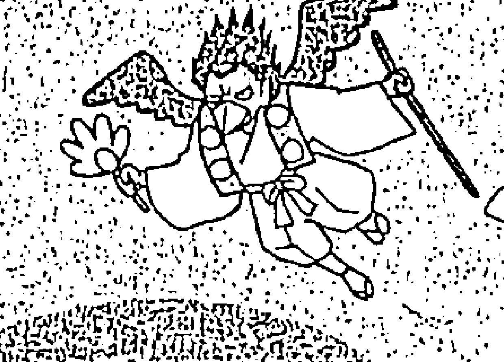

任意操縱天狗或狐狸實現各種願望

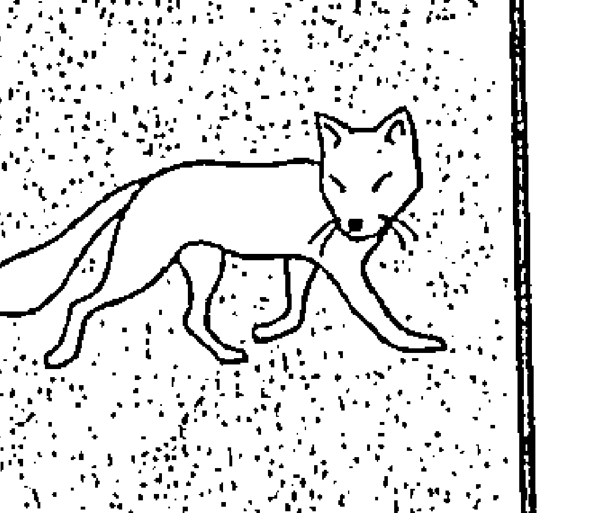

步行則前方必定刮起旋風

###### 用語解說

烏天狗→指跟尋常天狗同樣作山伏打扮，卻擁有烏鴉嘴喙與翅膀的天狗。

### No.072 軍勝祕咒

軍勝祕咒是南九州修驗道所流傳的咒殺祕法，需要大量使用到人髪、人骨、人血、蛇皮、牛頭、牛血等極度陰森駭人的祭品。

#### ◎南九州島津家、兵道家牧家的不傳之秘

軍勝祕咒是南九州修驗道所流傳的咒殺祕法。幕末時期島津藩有島津齊興繼承者之爭，一方是齊興側室由羅之子・島津久光，另一方則是正室之子・島津齊彬，史稱「由羅騷動」，傳說久光陣營曾經在這場繼承權之爭當中使用軍勝祕咒試圖咒殺齊彬與其子女。

根據直木三十五的小說《南國太平記》的說法，軍勝祕咒是阿毘遮魯迦法祭祀大威德明王所行使的人命調伏法；這是島津家鄉紳、兵道家牧家的不傳之祕，執行方式如下：

首先要設置用來擺放各種咒術道具的正三角形修法壇，此謂壇上三門，三角形各邊長6、7尺。壇中央設置正三角形的護摩爐，稱為鈞召火爐。修法壇面邊緣擺設香爐，禮盤（座位）旁邊則準備108支護摩木（浸過油的乳木*¹與薪柴）。修法壇面也要備好人髪、人骨、人血、蛇皮、肝、鼠毛、豬糞、牛頭、牛血、丁香、白檀、蘇合香*²、毒藥等物，這些全是施行咒殺的祭品，此外也經常會使用到狗頭。

接著正座於禮盤，唱誦「東方阿閦如來、金剛忿怒尊、赤身大力明王、穢跡忿怒明王、結跏趺坐於月輪之中，圓光魏魏，摧滅惡神。願闍吒羅火、謨賀那火燒盡邪惡心邪惡人，使圓明智火充滿虛空世界」。點燃護摩木、取芥子與鹽巴的混合物揮灑淨化以後進入護摩壇。黑煙竄起以後，再依序將護摩木與祭品投入火中，然後唱誦「南無金剛忿怒尊，御尊體散發青光，縮短○○的壽命吧」「南無赤身大力明王、穢跡忿怒明王，請成就此大願」，據說便可調伏仇敵。

##### 軍勝秘咒

南九州島津藩流傳的咒殺法。
島津家後繼者曾使用過的傳說黑魔法。

###### 軍勝秘咒專用的修法壇

軍勝秘咒必須設置名為壇上三門的三角形修法壇，並準備各種動物作為祭品方可使用。

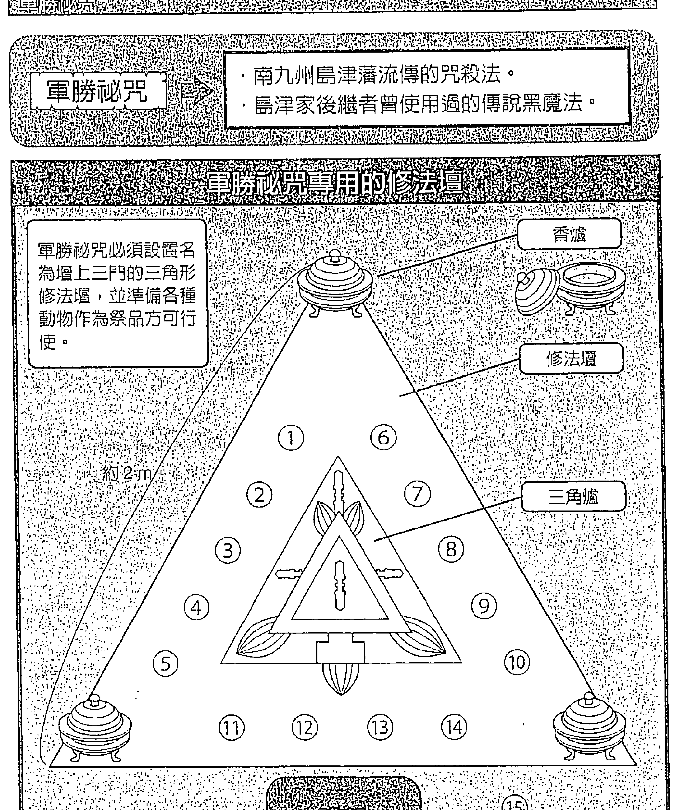

| 序号 | 项目 |
| :--- | :--- |
| 1 | 人髮 |
| 2 | 人骨 |
| 3 | 人血 |
| 4 | 蛇皮 |
| 5 | 肝 |
| 6 | 鼠毛 |
| 7 | 豬糞 |
| 8 | 牛頭 |
| 9 | 牛血 |
| 10 | 狗頭 |
| 11 | 丁香 |
| 12 | 白檀 |
| 13 | 蘇合香 |
| 14 | 毒藥 |
| 15 | 護摩木 |

> 島津藩→指當時領有鹿兒島全境與宮崎縣西南部的薩摩藩（鹿兒島藩）。

### No.073 附身反诅咒

日蓮宗流傳的附身用反詛咒法不但能使詛咒失效，還能將詛咒原原本本地反彈給始作俑者，使其覆滅。

#### ※将狐靈附身反彈給施法者使其覆滅

針對遭人詛咒而罹患狐靈附身等疾病的人，日蓮宗有種附身用的反詛咒法。此法不單單能使詛咒失效，還能將其原原本本地反彈給施法者，使其覆滅，可謂是種兼具白魔法與黑魔法兩種性質的魔法。

執行此儀式必須準備稻草人偶，人偶身體四肢貼著寫有固定咒文的紙張，左右兩臂寫「眾生被困厄，無量苦逼身」，胸口左右貼「緒余怨敵，皆悉摧滅」，中央貼「還著於本人」，左右兩腳則貼「咒詛緒毒藥，所欲害身者」。讓稻草人偶雙手拿著御幣*，還要準備幾支木劍和36支五寸釘。執行儀式時，讓遭狐靈附身者雙手拿著御幣，再用五彩繩線連繫人偶與病人的御幣，讓人偶坐在椅狀的台座上。

儀式從晚上7點開始展開，參加者包括執行儀式的修驗者、擔任助手的協驗者、病人與看護者。首先要不停唱誦《法華經》的第一章，待病人手上的御幣動起來、牽動人偶手中的御幣，便唱誦曰「咒詛緒毒藥，所欲害身者，念彼觀音力，若不順我咒，腦亂說法者，頭破作七分，緒余怨敵，皆悉摧滅」，同時將五寸釘打入人偶頭部、木劍刺進人偶的雙肩雙股。每次儀式使用7～11支五寸釘，每晚重複執行。待一尊人偶打滿36支釘子以後，再將木偶藏進箱子裡，然後再拿一尊新的人偶從頭執行相同的儀式。

如此不斷重複相同的儀式直到病人恢復，屆時附身的靈體就會反彈、施咒者就會頭破血流而死。所有問題都解決以後，就可以把釘子全部拔起來，帶著人偶到某個遠離人煙的地方挖洞埋掉。

##### 反詛咒法

將附身靈體反彈使施咒者毀滅的咒法。

###### 反詛咒法的稻草人偶

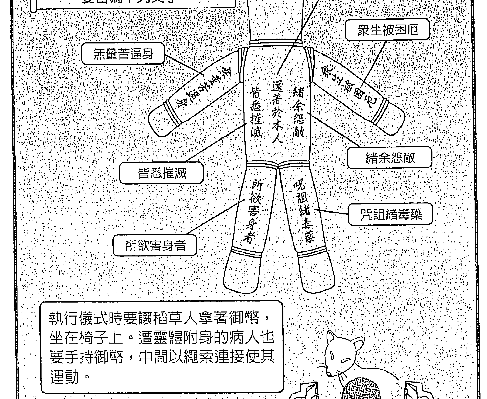

執行儀式時要讓稻草人拿著御幣，坐在椅子上。遭靈體附身的病人也要手持御幣，中間以繩索連接使其連動。

* 見P.220頁No.073注釋

### No.074 蛤蟆妖術

> 江戶時代的小說與戲劇當中惡漢使用的蛤蟆妖術就是變身成巨大的蛤蟆，口吐烈炎或毒霧的黑魔法。

#### ●因天竺德兵衛與兒雷也物語而聞名的黑魔法

蛤蟆妖術是江戶時代小說或戲劇中惡漢經常使用的一種邪惡的黑魔法。若論能夠行使蛤蟆妖術的妖術師，則以淨瑠璃《傾城島原蛙合戰》（1719年）的七草四郎藤原高平、歌舞伎《天竺德兵衛聞書往來》（1757年），小說《自來也說話》（1806年）或《兒雷也豪傑物語》（1839~1868年）等作品所提到的自來也或兒雷也最為著名。

不同故事對蛤蟆妖術由來的描述雖然有些出入，不過大同小異，此處且以天竺德兵衛的故事為例進行介紹。

根據《敵討天竺德兵衛》記載，蛤蟆妖術是源自於中國蛤蟆仙人的妖術。德兵衛在鬼海島的蛤蟆谷向奇人肉芝道人拜師學道三年，經過各種苦難磨練以後終於習得蛤蟆之術，從此便改以天竺德兵衛自稱。

蛤蟆術基本上屬於變身術，術師可透過咒文變身成為巨大的蛤蟆。變成蛤蟆以後可以騰雲駕霧飛行、口吐烈炎或毒氣、颳起濃霧瘴氣，除此以外還能亂人心神、欺人耳目。

其咒文有各種不同種類，最簡單的就是「でいでい・はらいそはらいそ」（答伊答伊・哈拉伊梭哈拉伊梭），只要詠唱此咒文便能變身。也有一說指這「でい」與「はらいそ」其實是基督教用語，分指「Zeus（神）」與「Paradise（天國）」。

但蛤蟆終究只不過是蛙類，始終背負著怕蛇的致命缺點，往往會輸給生肖屬蛇的敵人。據說最後當德兵衛敗下陣來，蛤蟆仙人也就此離去了。

##### 蛤蟆妖術

變身成巨大蛤蟆、欺人耳目的黑魔法。

###### 天竺德兵衛的蛤蟆妖術

《敵討天竺德兵衛》裡的蛤蟆妖術。

創始者 中國的蛤蟆仙人

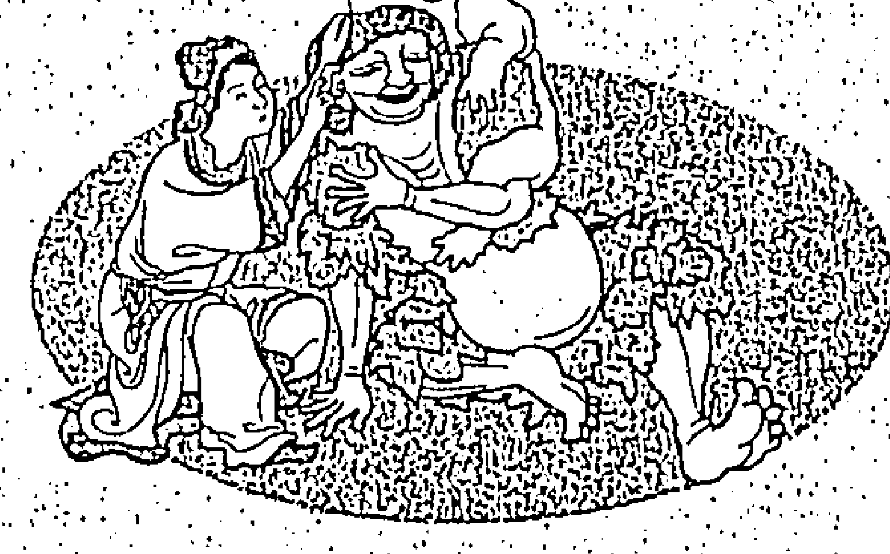

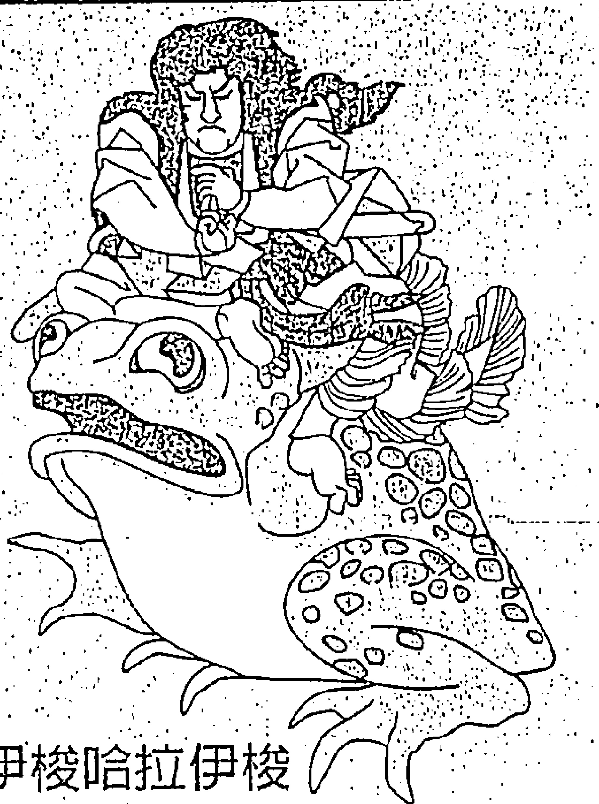

咒文 答伊答伊·哈拉伊梭哈拉伊梭

###### 有何能力？

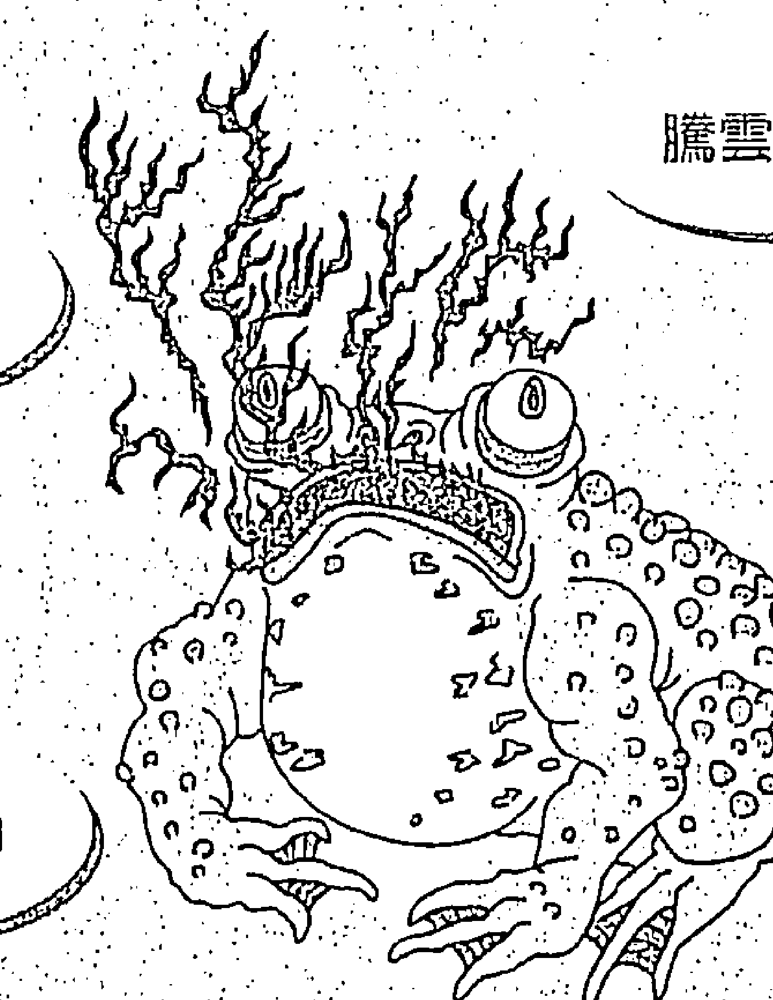

- 騰雲駕霧
- 口吐毒氣
- 颳起濃霧
- 欺人耳目
- 變身成巨大蛤蟆
- 口吐烈炎
- 亂人心神

弱點是？ 怕蛇。容易輸給屬蛇的敵人。

##### 鼠之妖術

所謂的鼠之妖術便是操縱成千上萬大量老鼠，或變身成老鼠，藉此襲擊他人為害的黑魔法。

### ◎口吐老鼠為害他人的黑魔法

鼠之妖術跟蛤蟆妖術同樣，都是江戶時代小說與戲劇中惡漢經常使用的黑魔法之一。能使鼠之妖術的惡漢，包括山東京傳所著小說《昔語稻妻表紙》（1806年）的賴豪院、曲亭馬琴所著小說《賴豪阿閣梨怖鼠傳》（1808年）的美妙水冠者義高，以及歌舞伎《伽羅先代萩》的仁木彈正等人物。

從前段二度提及賴豪這個名字便不難想見，賴豪跟鼠之妖術頗有淵源。賴豪本是11世紀後半葉三井寺的高僧，卻在跟延曆寺的權力鬥爭中敗下陣來，飲恨而終。

相傳賴豪死後過沒多久，其怨靈便化作了鐵牙石身的84,000隻老鼠攻進延曆寺，四處啃咬佛像與佛書經典。因為這個緣故，江戶時代的故事只要提到鼠之妖術，就會立刻聯想到賴豪。

鼠之妖術的內容也跟賴豪傳說頗為類似，是種能夠操縱成千上萬大量老鼠的術法，或是變身成老鼠的法術。

先看看《昔語稻妻表紙》這部作品，故事裡有位名叫賴豪院的修驗者，他受多位惡漢委託用法術向該領地的少主施詛咒，結果少主不但罹病，還讓無數老鼠咬遍頭髮與全身血肉，愈見衰弱，甚至賴豪還變身成老鼠，前來取少主的性命，好在警衛適時趕到暫時救了少主一命，豈料賴豪現出原形後又從口中吐出大量老鼠，讓在場眾人動彈不得，自己卻趁隙逃脫。

不過既然是老鼠，勢必始終無法克服怕貓的弱點。許多故事都說鼠之妖術一旦遇見貓就會破功，而且也往往會敗給名字裡有貓這個字的人。

##### 鼠之妖術

操縱無數鼠類攻擊敵人的術法。
可變身成老鼠。

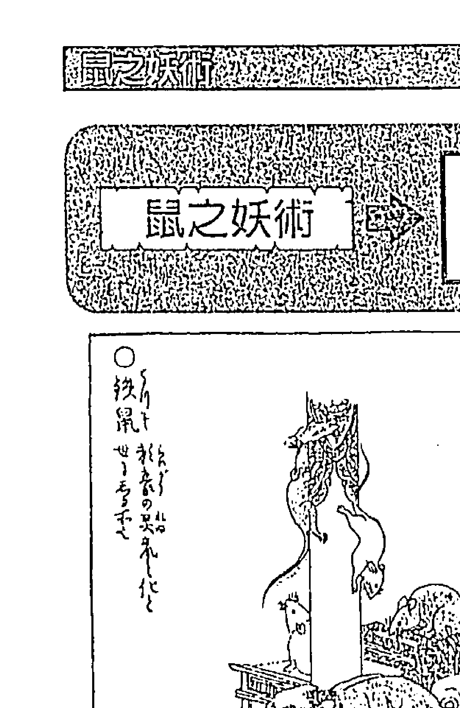

> 傳說變成鼠之怨靈襲擊延曆寺的11世紀後期三井寺高僧賴豪，在江戶時代的妖怪畫集《畫圖百鬼夜行》（鳥山石燕繪）裡面被畫成了名為「鐵鼠」的妖怪。

###### 昔語稻妻表紙的鼠之妖術

江戶時代的小說《昔語稻妻表紙》曾述及使用鼠之妖術能變出無數老鼠使他人致病，或變身成巨鼠，或是口吐老鼠。

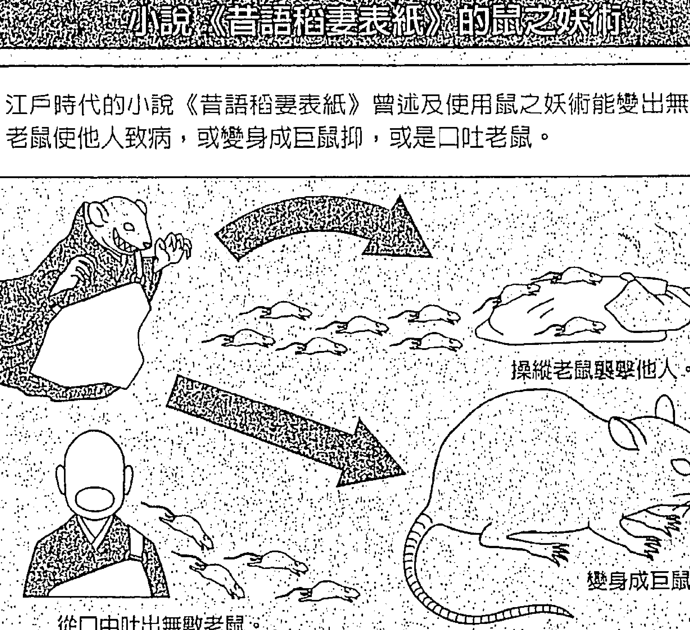

日語裡面有咒術、魔術、妖術、邪術、魔法等許多指稱魔法相關概念的用語，這些用語分別有何種意涵呢？在此借用幾位聞名世界的名人說法，來驗證以上用語該如何使用。

首先從詹姆斯·弗雷澤的《金枝》看起。正如同本書第1章末專欄所述，《金枝》記載了許多咒術相關事項。筆者選用的譯書是岩波文庫版本，書中譯為咒術的地方英語原文是「magic」（magic也可譯作魔術，也就是說咒術與魔術是相同的）。弗雷澤又將咒術分成理論性咒術與實際咒術，然後再進一步將實際咒術分成積極咒術與消極咒術兩種。

所謂的積極咒術就是指治療疾病或咒殺他人之類有積極作為的咒術，而消極咒術通常都是禁止某事的咒術，例如名字關係著人的本質，所以萬萬不可以真名稱呼他人之類的禁止咒術。講到這兩種咒術，弗雷澤將積極咒術稱為「sorcery」，消極咒術則稱「taboo」，翻譯過來則是「sorcery」是魔法，「taboo」是禁忌，從這裡就不難推斷：所謂的魔法就等於想要積極作為造成某種影響的咒術。

接下來讓我們看看日語譯本由瑞穗書房出版的艾德華·伊凡·普理查（E.E. Evans-Pritchard）作品《阿贊德人的巫術、神諭和魔法》（Witchcraft, Oracles and Magic Among the Azande）（1937年發行）。這是一部介紹中非未開化民族阿贊德人咒術的名著，這部作品又在咒術（magic）概念底下首創妖術（witchcraft）與邪術（sorcery）這兩個前所未有的概念而聞名。根據他的說法，有些人天生就擁有能夠加害他人的心靈力量，那種力量就是妖術。換言之，所謂的妖術就是與生俱來的心靈力量，妖術師欲加害他人不需有任何特殊行動，有時候甚至可能完全不受自身意志限制就害到了他人。相對的，使用咒物等道具加害他人的惡性咒術，就是邪術。這種並非與生俱來的力量，只要按照正確的方法任何人都可以行使。

不過還有一點必須特別注意：「witchcraft」這個英文單字並非總是用來指稱這個意涵。介紹歐洲獵女巫時代女巫的書籍便曾經將「witchcraft」譯作巫術，此時的「witchcraft」就是與惡魔締結契約後的女巫法術，而絕非指稱某些特定人物與生俱來心靈力量的那種妖術。其次，「sorcery」這個英語單字在《金枝》中譯作魔法，《阿贊德人的巫術、神諭和魔法》卻譯作邪術，這點也值得注意。

從這裡便不難發現，咒術、魔術、妖術、邪術、魔法等用語固然意涵的確是各不相同，卻也很難做出嚴密的定義。

## 第4章

## 中国美妆市场的崛起

### No.076 中國的黑魔法

除一般使用人偶施詛咒的黑魔法以外，中國還另有由獨特的「氣」思想衍生出來的黑魔法、異族傳入的黑魔法等，各種類型五花八門。

#### 早自古代便高度發達的中國黑魔法

黑魔法在中國經常作巫蠱或厭魅等稱呼，這個擁有4000年歷史的國家，黑魔法的歷史自然也非常悠久。
西元前3世紀初的戰國時代，秦昭襄王就曾經命人雕刻名為「詛楚文」的石碑詛咒強敵楚懷王。西元前2世紀末漢武帝攻打大宛時，也曾舉行過國家規模的祭祀儀式詛咒敵國。
就詛咒個人的層級而言，漢代也曾盛行使用木偶的詛咒法，這也是為什麼漢武帝年老後總是懷疑自己遭到周圍眾人詛咒，而屢屢以施行黑魔法罪名將清白無罪者處以極刑。但其實在宮廷裡面，以黑魔法作為武器的女性遠比男性要來得多。當權者的妻子往往想方設法要讓自己親生的兒子繼承王位，從而讓黑魔法師詛咒其他競爭者。
中國也以「氣」的思想聞名，當然也有光靠這個「氣」便能殺人的魔法——禁人，不過這種技法與其說是種魔法，倒不如說是某種超能力可能還更貼切。另外，有許多黑心魔法師會利用黑魔法賺錢，他們會使用攝魂術奪人魂魄，或是施法讓酒家的酒變質腐壞，藉此榨取財物。
中國歷史悠久且幅員遼闊，從前異族活動也相當繁盛興隆，因此經由異族傳入的黑魔法自然也不在少數，其中最具代表性的當屬世稱蠱毒的黑魔法，原先流傳於西南方的異族之間。中國西南地區與眾不同的黑魔法似乎特別豐富，除蠱毒以外，還有利用狐狸唾液詛咒他人的狐涎法，以及令女性褪去衣衫以行姦淫的玉女喜神術等。

##### 中國的黑魔法

- 稱為巫蠱或厭魅。
- 早在西元前便已經有國家規模的黑魔法。

###### 大至國家的黑魔法

詛咒敵國或敵國國王的魔法。

###### 小至個人的黑魔法

詛咒敵對個人的魔法。

###### 中國主要的個人黑魔法

中國如此廣大，光是針對個人的黑魔法就有諸多不同種類。

####### 木偶詛咒

- 流行於漢代。
- 後宮女子用於打擊爭寵者。

####### 荼人

光靠「氣」的力量便能咒殺他人，接近超能力的黑魔法。

####### 竊魂

剝奪生靈，使人生病或將其殺害的黑魔法。

####### 敗酉之術

讓釀酒家的酒腐壞藉以榨取財物的黑魔法。

####### 蠱毒法

經由西南方異族傳入中國的恐怖黑魔法。

####### 狐涎法

盛行於西南地區，利用狐狸唾液詛咒他人的黑魔法。

####### 巫敘喜神術

西南地區用來令女性褪去衣衫，行姦淫之事的黑魔法。

## No.077

###### 禹步

禹步是道教執行魔法儀式時會使用的步行法，雖然它本身並非黑魔法，但卻是執行各種黑魔法時所不可或缺的技法。

### ❷可作為黑魔法應用的道家步行咒法

道教的魔法儀式經常會使用到禹步，這是種走起來看似踉蹌的步行技法，屬於道教系統的魔法無論是黑魔法或白魔法，儀式中都經常使用到禹步。

譬如貓鬼法就是一種可以打造人頭貓身怪物的可怕黑魔法，其詳細做法如下：首先養隻貓，與牠親近，再找個約莫1歲就夭折的嬰兒，抱著貓去墓地將嬰兒的屍體挖出來，腳踏禹步唱咒，砍下貓頭與嬰兒的頭，將嬰兒頭顱塞進貓屍腹中，唱誦咒文，貓就會復甦，變成人頭貓身的怪物。只要派這個怪物去偷竊，就算半夜偷進別人也不會被發現，唯獨家裡養的狗會有所感應，而這個怪物也只怕狗，並且無論如何也無法克服這個弱點。

從此便不難發現，禹步本身並非黑魔法，卻往往是執行黑魔法時所不可或缺的技法。

儘管禹步的步法大致上是隨著時代而從簡單愈趨繁複，堪稱道教魔法聖經——葛洪《抱朴子》所記載的方法卻很簡單。根據《抱朴子》仙藥篇記載的方法如下：兩腳併攏而立，首先跨出左腳，接著右腳再往前踏出，然後將前方的右腳收攏與左腳併合，此為第一階段；第二階段是先跨出右腳，再踏出左腳，然後將左腳收回與右腳併攏；第三階段按照第一階段執行，至此便完成禹步。

禹步當中的禹字，是指中國太古時代傳說中的聖王。傳說禹為治理黃河水患而奔走，途中受傷拖著腳步而行，該步法就是後來的禹步。

###### 禹步

###### 禹步

- 跟蹤而行的步法。
- 中國魔法儀式中不可或缺的技法。

###### 禹步使用例

使用禹步製作人頭貓身怪物的可怕黑魔法儀式過程，如下所示：

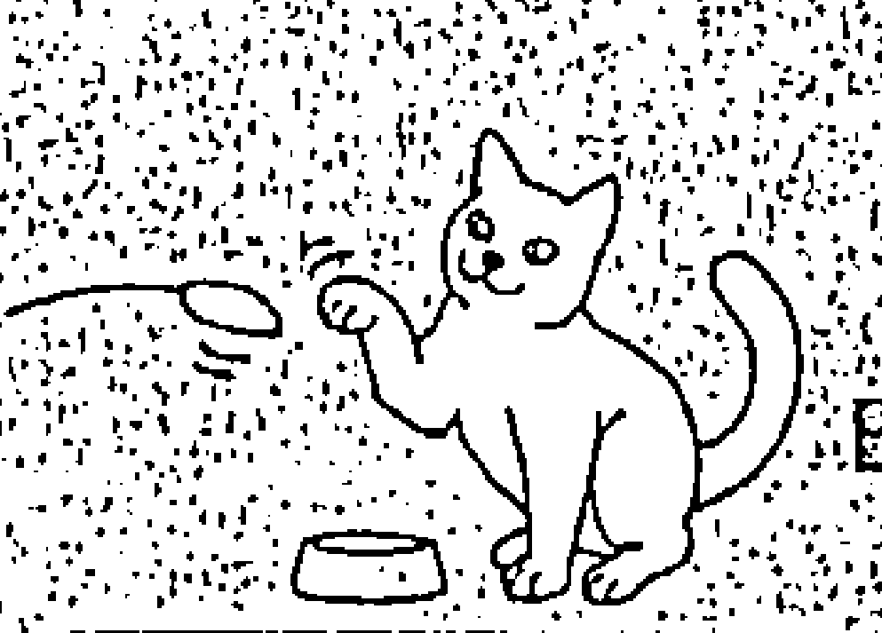

- 養隻貓讓牠親近自己。

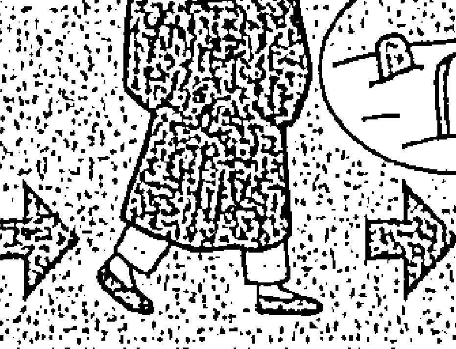

- 抱著貓去找個約1歲就天折的嬰兒墳墓。

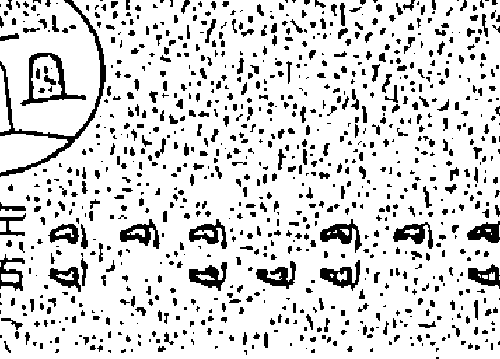

- 挖出嬰兒的屍體，腳踏禹步唱咒。

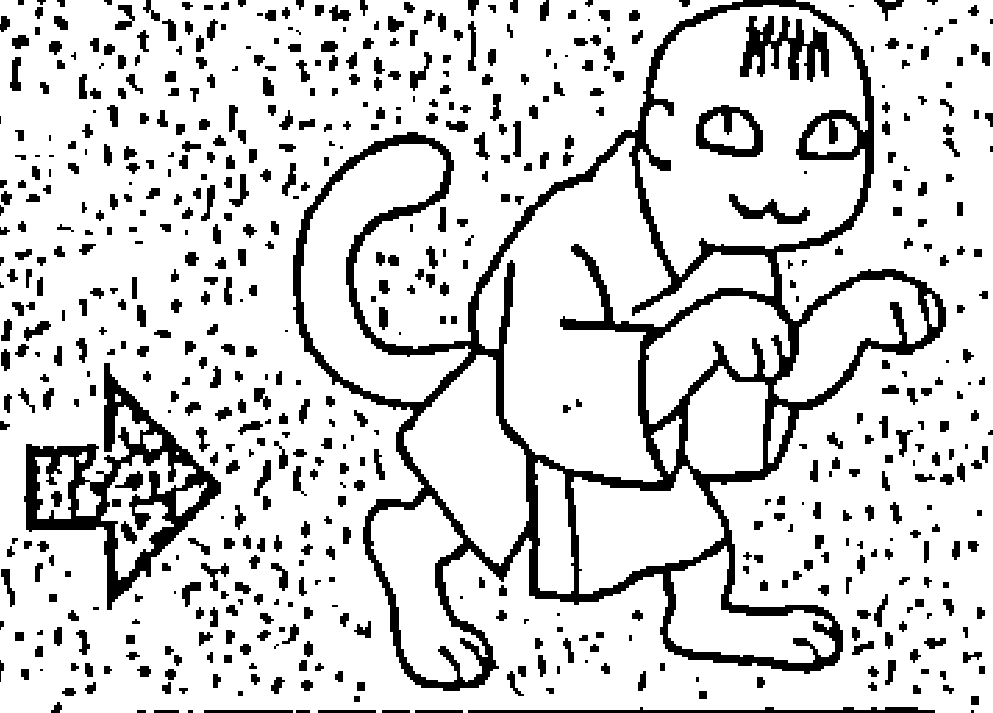

- 將貓與嬰屍拼起來唱誦咒文，便可形成怪物。

###### 禹步步法

據葛洪《抱朴子》登涉篇記載：禹步相當簡單，首先雙腳併攏站立，按照①~⑨的步驟左→右→左→右→左→右→左→右→左，如此前進即可。注意每三步須將雙腳併攏。

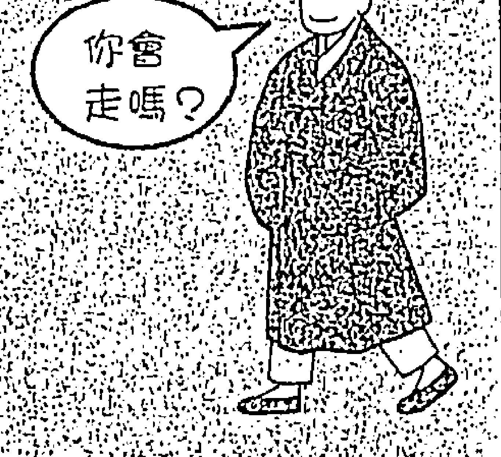

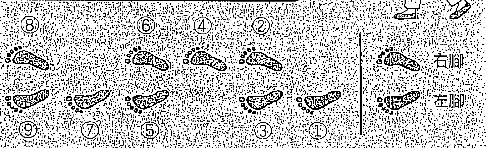

###### 用語解說

道教→中國最具代表性的民族宗教，講究追求現世利益，咒術性格強烈，以長生不老為主要目的。

### No.078 禁人

#### 奪取事物能力的一種禁術

禁人是古代中國魔法——禁術的其中一種。此法是利用氣的力量剝奪事物能力，同時還能使能力逆轉。

##### 禁術

運用氣的力量剝奪事物能力的魔法。

使用禁術便能辦到這些事情。

- 拔出深深打進木頭的釘子。
- 拔出刺進體內的箭頭。
- 免於毒蛇嚙咬。
- 河水逆流。

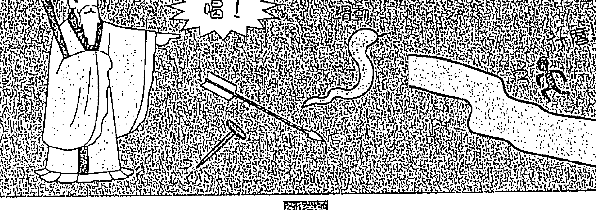

###### 禁人

將禁術應用於人類身上的魔法。

禁人能使人動彈不得，一旦禁錮過度就會變成可怕的黑魔法。

- 動彈不得。
- 雙手背在身後無法活動。
- 呼吸困難。
- 流鼻血、頭顱迸裂，當場死亡。

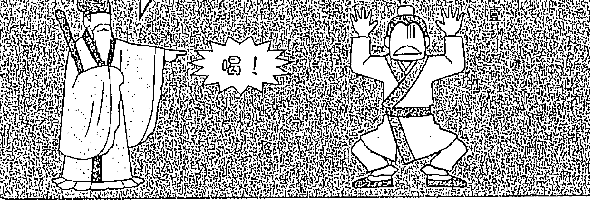

###### 用語解說

- 氣→中國人傳統信仰的宇宙力量。
- 《神仙傳》→中國兩晉時代的作品，收錄多達90名以上的仙人傳說。與《抱朴子》同為葛洪所著。

### No.079 擷魂（擷生魂）

> 召唤活人生靈或魂魄的擷魂術一旦遭到恶用，就会变成夺取人命，甚至奴役他人生靈的恐怖黑魔法。

- 奪取並拘禁他人生靈的邪術

所謂的擷魂或擷生魂，是種召喚他人生靈、生魂（活人的靈或魂）以便驅使的法術。倘若只是召喚生靈，並不會造成實際傷害，但如果遭到惡用將會變成極恐怖的黑魔法。若以擷魂法害人，經常都是將召喚來的生靈關在罈或桶子裡面。

北宋仁宗皇帝時代有位道士因為客人不肯支付謝禮，就在密室裡設置祭壇，放個大桶子，然後披頭散髮揮舞長劍將那人的生靈趕進桶子，拿塊石頭壓著，將生靈囚禁在裡面。只要如此施法，遭詛咒者就會生病，甚至可能死亡。當然，只要那個人或他的親友在病情惡化到無可收拾前支付謝禮，道士就會釋放生魂，病人很快就能痊癒。

除此之外，也可以在奪得生靈後殺死對方，再利用留下來的靈魂從事犯罪。元至正3年（1343年）便發生了一樁妖術殺人案：有位名叫王萬里的占卜師捕捉了幾名少年少女的生靈，先將他們悉數殘殺，再利用他們的靈魂犯罪。

當時曾經沒收王萬里所使用的各種魔法道具，這些道具包括：木印、黑繩、女偶、紙張、五色絹布、五色毛線、小葫蘆1個；葫蘆上頭拴著紅頭繩，裡面裝著2顆琥珀珠、外包五色毛線，還貼著一道朱書符命。

官員又進一步調查，發現這些東西是取少年少女的心臟與肝臟乾燥後磨成粉末，包起來用五色毛線與頭髮綑成人偶，灑符水再施以魔法。也就是說，王萬里就是使用這些魔法道具施行黑魔法，驅使他強奪而來的少年少女的生靈。

##### 擷魂（擷生魂）

- 召喚生靈生魂並驅使的法術。
- 將生靈生魂囚於甕中為非作歹的法術。

###### 將生靈禁錮於桶中的方法

捕捉生靈必須於密室設置祭壇，放個大桶子，然後披頭散發揮舞長劍將生靈趕進桶子，拿塊石頭壓著。

生靈遭剝奪者，嚴重可能會喪命。

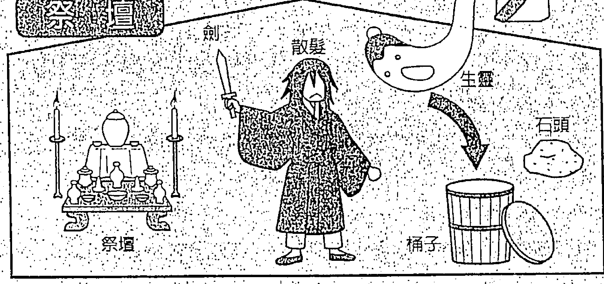

###### 驅使他人生靈犯罪的魔法道具

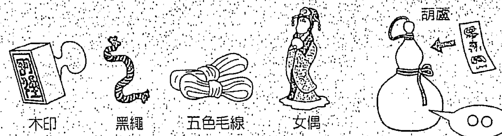

傳說元代官府逮捕的黑魔法師便是利用這些道具殺害少年少女，驅使其生靈犯罪。

葫蘆外包五色毛線、上頭拴著紅頭繩、貼著朱書符命，裡面裝著 2 顆琥珀珠。

##### 木偶厭魅之術

> 木偶厭魅就是利用木製人偶詛咒他人，可說是種相當普遍的黑魔法。中國人選擇用木頭製作人偶時，通常是用來詛咒特定的個人。

### ◎主要用來詛咒特定個人的木偶厭魅之術

木偶厭魅之術是利用人形木偶詛咒他人的中國黑魔法。中國也如同世界其他地方，自古以來就有利用人偶來詛咒他人的黑魔法。

人偶的材質有很多種，不過一般來說木偶通常都是拿來咒殺特定的個人使用。又因為漢代經常選用桐木材質，因此中國也稱詛咒用人偶為桐人。

詛咒的詳細步驟與儀式內容須視施術者而異，基本上不外乎是刻木為偶、埋進土裡使用。怨念較深的人，也會替人偶加上腳鐐手銬、捆綁雙手，或是朝人偶的心臟打釘。

先來看看中國古文獻中記載的木偶厭魅之術用的是什麼方法吧。

清代作家褚人獲《堅瓠廣集》卷三有則「咒狀元」的故事。從前浙江省有個韓狀元侵占鄰家土地，鄰居雖然想要討回，卻苦於狀元的權勢而莫可奈何。就在這個時候，他們聽說了有個精通木偶厭魅之術的風水師，立刻花大錢將風水師請來施咒。

風水師請壇燒符並唱誦特殊咒語，花了七天七夜刻成了1尊7寸大的桃木偶，木偶製成以後便每晚唱誦咒文，朝地面打進1寸，重複操作了七個晚上，終於將木偶全部打進了地底。當時韓狀元正在都城跟夫人飲酒，豈料夫人突然發怒，朝狀元的臉上胡亂抓，抓得狀元滿身是血，當天晚上就死了。

##### 木偶厭魅之術

以木偶行詛咒的黑魔法。

中國經常選用桐木製作，故稱詛咒人偶為桐人。

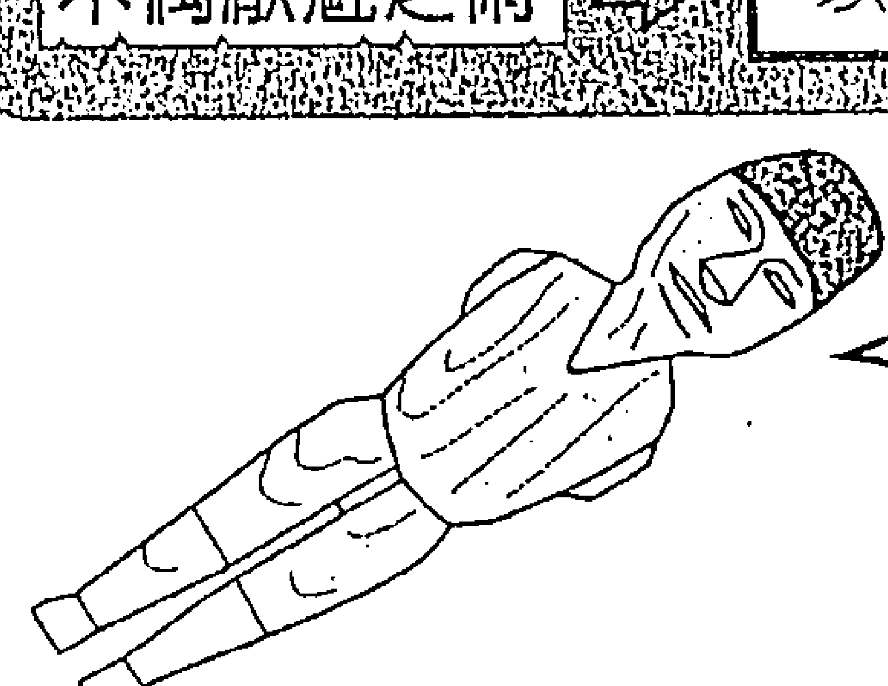

###### 木偶厭魅的方法

###### 一般的方法

- 用木頭刻成人偶。
- 視必要加上腳鐐手銬，心臟打釘。
- 挖洞埋進地面。

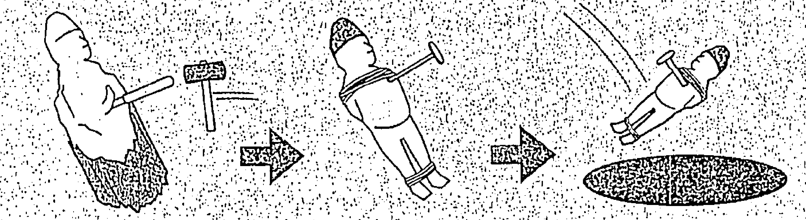

###### 小説記載的複雜方法

- 花費七天七夜將桃木刻成7寸的人偶。
- 唱誦咒文，每晚將人偶打進地底1寸。待人偶全數沒入地面之際，敵人就會斃命。

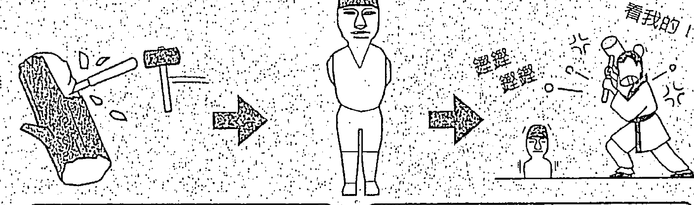

在中國，木偶主要是用來詛咒特定的個人，草人紙人則是用來詛咒不特定的多數人。

### ◎使全市陷入恐慌狀態的邪法

雖說同樣都是人偶，不過中國人相信使用草人紙人施行咒術時，效果跟使用木偶不同。

木偶在中國主要是用來詛咒特定個人目標的道具，相對的草人紙人則多是用來詛咒不特定的多數人。取草葉或紙張便可製成狐狸、貓狗等動物，甚至是魑魅魍魎的形狀，再操縱他們騷擾市民、引發恐慌，便是這項魔法的目的。

催動草人紙人等人形偶有很多不同的方法，其中一種方法如下：首先準備紙張，將紙張剪成各種鳥獸的形狀，排列在地面上；手中持刀，腳踏禹步並唱誦咒文，以口含水作霧狀噴向紙人。

如此一來，紙人就會進入他人家中，從各個角落現身恫嚇人們，還會在他人家中四處搗亂、打碎器皿、推翻棚架，弄得一塌糊塗。成功在城裡引發混亂以後，再度踏禹步唱誦咒文，所有紙人就會從窗口飄回原來的地面上，變回平凡無奇的紙張。

有些魔法使用的並非如此簡單的草人紙人，而是以竹為骨、貼紙為皮所製成的紙偶。此時須在紙偶的4隻腳全部貼上寫有篆字的紙符，在腹部寫上「有事千變萬化，無事速去速來」，再拿一支釘子與小蟲用紙包著，放進紙偶裡面後，紙偶就會彷彿有生命般活動起來，跑去嚇人。

## 草人紙人厭魅之術

- 草人厭魅：使用草人的詛咒法。
- 紙人厭魅：使用紙人的詛咒法。

使不特定的多數人陷入恐慌的黑魔法

##### 草人紙人厭魅之術的進行程序

草人紙人厭魅之法有很多不同辦法，以下是紙人厭魅法的其中一例。

① 準備紙張。
② 將紙張剪成許多鳥獸或魑魅魍魎的形狀。
③ 踏禹步唱咒文，朝紙形噴水。
④ 紙形活動起來，在鎮裡各戶人家中搗亂引發恐慌。
⑤ 再次踏禹步唱誦咒文，紙形就會變回平凡無奇的尋常紙片。

###### 用語解說

篆字→用篆體寫的漢字。這種字體屬於古代文字，現今的印章仍會使用。

### No.082 厭魅之術的各種道具

中國的厭魅之術除了使用木頭、草葉、紙張製成的人形獸形偶像以外，還會使用衣服或名為牛頭願的木版像等種類繁多的咒物。

#### ◎使用各種咒物的中國厭魅之術

中國的許多厭魅之術會用到木頭、草葉、紙張等材質製做人形或獸形的偶像，不過除此之外還有各種模樣各異的器物可以拿來當作詛咒道具使用。

自古以來使用衣服就是魔法的基本原則之一，中國也有相同的詛咒法。明代作家陸粲的隨筆集《庚巳編》卷三「楚巫」便記載到使用綁腿與鴨頭施行詛咒的故事。

從前楚國的某位有力人士脫下綁腿，結果綁腿被風給吹走，某個名叫姜聰的男子偶然得到綁腿，心中起了歹念。他宰殺鴨子、用綁腿包住鴨頭，拿到神明坐鎮的地方打鐵釘、唱誦咒文。那位有力人士的腳果真痛了起來，吃也吃不下、睡也睡不著，就算請咒術師日夜祈禱也不見起色。此時，姜聰出面表示自己能治這個病，先跟受害者的部下收了錢才拔出了釘在綁腿上的鐵釘，果然那人的腳很快就不痛了。後來姜聰又這樣如法泡製了好幾次，賺到巨額的禮金。

清代作家施鴻保的《閩雜記》也曾經記載拿木板雕刻牛頭、馬頭、狗頭的「牛頭願」詛咒法。對他人心懷怨恨者可以購買幾十張施牛頭願詛咒法的印紙，取一半拿到雕像前面燒掉，右手敲打雕像並訴說怨恨，然後說「請跟我來」將神靈領到對方家門前。來到對方住家前方，再取出剩下的印紙焚燒，將怨恨的內容重複訴說三次。如此一來，那戶人家就會生病或是有人喪命。牛頭願的廟似乎是專作詛咒使用，廟裡有販賣各式各樣的詛咒用印紙，甚至還有能夠讓仇敵發瘋的印紙。

##### 驅魅之術的各種道具

###### 中國的詛咒道具

有許多用木頭、草葉、紙張等製作的人偶或獸偶。

還有許多詛咒道具！

###### 鴨頭詛咒法

> 明代作家陸粲隨筆集《庚已編》記載的鴨頭詛咒法如下：

1. 取得對方使用的綁腿。
2. 宰鴨，用綁腿包住鴨頭。
3. 拿著鴨頭和綁腿到神聖的場所，打入鐵釘。
4. 使對方無來由的腳痛。

###### 牛頭願的施法步驟

牛頭願是利用雕刻於木板的牛頭、馬頭、狗頭像施行的詛咒法，內容如下：

1. 購買幾十張牛頭願使用的印紙。
2. 取一半印紙在木板像前焚燒，右手敲打雕像的同時訴說怨恨。
3. 領著神靈前往仇敵家。
4. 在仇敵家前方焚燒印紙，重複訴說怨恨三次，仇人就會生病或死亡。

### No.083 工匠厌魅之术

工匠厌魅之术有别于其他使用人偶的诅咒法在于：此法必须委託木匠等工匠，在目标人物家中布置人偶。

#### 透过土木建筑工匠布置人偶的黑魔法

中国将使用人偶诅咒他人的法术称为厌魅或厌胜，其中有种利用木匠等工匠在目标人物家中布置设下人偶的诅咒法。这里所谓的工匠厌魅之术，指的便是这种类型的诅咒法。

这种术法虽然通常是要委託木匠等工匠进行，不过有时候木匠却也会主动使用这种诅咒，例如盖房子时有些木匠觉得伙食或待遇太差而感到不满，就会偷偷制作人形木偶或纸偶藏在天花板或墙壁里面来诅咒屋主。总之不管是受人之托或出于自身意志，这种诅咒一旦生效就会让该户人家发生不幸。

欲使某户人家里的某人生病，那就要清楚的祈祷并说出口希望谁生病，这是工匠厌魅之术的基础，而且也只有清楚的将诅咒内容说出口，那些人偶与器具方才能成为拥有诅咒效果的咒具。

视不同目的使用不同的人偶，则是另一个确保诅咒效果的方法。举例来说，若是将2尊木偶作扭打的模样摆在横梁间，那房子就会夜夜传来好像有人在扭打的声音；若是弄个彷彿正在与众多男子交合的春宫女偶藏在屋顶椽木，生出来的女儿全都是爱搞外遇；摆个吵架中的男女人偶，就能够使那户人家家庭失和、夫妻子女争吵，甚至出手相向；如果做个乘着双头马车往外面奔跑的人偶藏在家中，那户人家就会愈来愈贫穷；做个撒尿模样人偶藏在寝室天花板裡，住在那裡的人就会尿床。

不过只要找出这些人偶烧掉便可破解厌魅之术，而且施术的木匠也会随即毙命。

##### 工匠厌魅

由土木建筑工匠布置人偶的黑魔法。

工匠厌魅之术可以是他人委托木匠执行，也可以是木匠凭自身意志施行。

###### 工匠厌魅之术的基础

布置人偶等咒物时必须清楚说出目的，此为工匠厌魅之术的基础。

###### 对应于不同目的的人偶

若能视不同目的使用相对应的人偶，便能进一步确保工匠厌魅之术的效果。

- **扭打的男女人偶**
  效果：夫妻终日争吵，家庭失和。
- **乘马车向外奔跑的人偶**
  效果：愈来愈贫穷。
- **春宫女偶**
  效果：生的女儿全都爱搞外遇。
- **撒尿的人偶**
  效果：住户罹患夜尿症。

## 蛊毒法

蛊毒法是种使用蛇、蛤蟆、壁虎、蚤等恶心的昆虫或爬虫类咒杀他人，甚至夺取他人财产的邪术。

### 藉昆蟲、爬蟲類等毒蟲行使咒殺與斂財的邪法

所謂的蛊毒法就是使用毒蛇、蛤蟆、壁虎、蜘蛛、蠍、虱子、蜈蚣等噁心的昆蟲、爬蟲類或兩棲類來咒殺他人，甚至奪取他人財產的邪術，因此蛊毒法的施術者家裡會愈來愈富有。除昆蟲爬蟲類以外，有時也會使用雞犬貓羊等比較大的動物施法。

雖然說蛊毒也有可能是自然而然在家中形成，不過絕大多數其實都是按照下列方法製作：正如「蠱」字（器皿載著許多蟲）所示，此法是將諸多種類的昆蟲與小動物放進罌裡加蓋，讓牠們互噓，最後只剩下1隻存活，而這隻蟲就是名為蛊毒的特殊毒物。

也有一說指出必須選在端午將毒蟲投入罌中，待過年後再打開罌蓋，屆時仍然活著的那隻蟲便是蛊毒。倘若存活下來的是蛇便稱「蛇蠱」，若是蜈蚣便稱「蜈蚣蠱」。

得到蛊毒後必須好好飼養，每年定時祭祀數次，然後將蛊毒摻進詛咒目標的食物裡面，讓對方吃下去。有些做法是使用蛊毒的糞便或是將蛊毒燒成粉末讓對方食用，有些則是將蛊毒埋在對方住家下方。遭詛咒者就會因此斃命，其財產就會轉而進入養蛊毒者之手，所以養蛊毒的人會變得愈來愈有錢。

蛊毒在使用過後並不會死亡，仍然還要繼續飼養。從最普遍的蛊毒——金蠶蠱（請參照No.085）便不難發覺，長期飼養蛊毒可不是件輕鬆的事。因為這個緣故，固然有染指蛊毒而致富的人，但最後因無力持續飼養而導致家破人亡的案例卻也是多如牛毛。

##### 何謂蠱毒法

利用各種小動物（蠱毒）咒殺他人、奪取財產的邪術。

##### 蠱毒的製作方法

1. 將蛇、壁虎、蜈蚣等蠱毒關在罌裡使其互噁。
2. 最後存活下來的那一隻便是蠱毒。
3. 好好飼養，每年祭祀數回，便可用於蠱毒法。

##### 蠱毒的使用方法

蠱毒有許多不同的使用方法，包括取蠱毒糞便讓目標食用，或是將蠱毒埋在對方住家底下。

- 直接讓對方吃下肚。
- 取糞便讓對方吃下。
- 製成粉末讓對方吃下去。
- 埋在對方住家底下。

> 用語解說　蠱毒法→亦稱蠱術。

##### 最具代表性的著名蠱毒法

在所有利用生物行使咒殺斂財的蠱毒法當中，金蠱是最為人所知的一種。據說所謂的金蠱是種酷似蠶的蟲子「食錦蟲」；這是種金色的蟲，彎曲著身軀就彷彿像只戒指似的，就像蠶吃桑葉那般食用昂貴的錦緞維生。

金蠱的使用方法很簡單，只要將金蠱的糞便摻入詛咒目標的食物裡讓對方吃下肚，那人便會中毒身亡，但金蠱法的效果不僅止於此。遭咒殺者的財產還會轉入施蠱毒法者之手，其人自然也就會富裕起來；這也就是為何擁有金蠱者的人，財富會以極為驚人的速度不斷增加。

可是，養金蠱其實是件極辛苦的事情。一說認為飼養金蠱就必須每年殺1個人，若找不到咒殺目標就得殺自家家人，否則養金蠱的本人就會遭金蠱殺害。

而且金蠱幾乎是不死之身，無論用水淹火燒或是刀割，怎麼樣都殺不死。

話雖如此，還是有辦法可以讓飼養者擺脫金蠱。這個方法喚作「嫁金蠱」，是將金蠱連同透過金蠱得到的金銀財寶都放進盒子裡，丟在路旁，要是有誰發現那盒子撿回家，金蠱就會轉移到那戶人家去。取得金蠱的方法也大都是循此法撿拾別人丟棄的金蠱為多。

當然也有些是像普通的蠱毒法那樣先讓各種毒蟲互噓，而最後存活下來的剛剛好就是金蠱。

###### 何謂金蠱蟲？

- 殺人斂財的蠱毒法之一。
- 使用的是與蠱酷似的食錦蟲。

###### 金蠱蟲的飼養方法

飼養金蠱必須遵守以下原則。

用昂貴的錦緞餵養。
每年用金蠱蟲殺1個人。
若無咒殺目標，就殺自家人。
如果沒做到上述事情，便會遭到報復。

###### 如何擺脫金蠱蟲

將金銀財寶連同金蠱裝盒丟在路邊。

> 這種方法叫作「嫁金蠱」

如果有人把盒子帶回家，金蠱也會跟著轉移到那戶人家去。

> 怎有這等好處！

## 挑生法

> 所謂的挑生法是使食物在腹中膨脹、壓迫心肺等臟器，最終使人致死的詛咒法，也是蟲毒法的一種。

蠱毒法當中有種在魚肉或雞肉等食物中灌注怨念恨意藉以咒殺目標人物的法術，名爲挑生法。挑生此語似乎有餵人以魚肉，讓食物在腹中成長，用以害人之妖術的意思，也就是說，遭挑生法詛咒者，食物就會在腹中不停膨脹、壓迫到心肺等臟器，最終致死。只要是吃得進肚子裡的東西，無論是瓜果還是茶水等飲料，似乎都能行使挑生法。

根據清代的某則故事記載，遭詛咒者並不只是單純的腹脹而死，死後還會成爲施咒者的奴隸，聽任其擺布，光就這點來說幾乎已經跟巫毒教的殭屍沒什麼兩樣。有個說法是當食物仍停留在橫隔膜以上部位時可服用天然的升麻，食物若抵達腹部則可服用薑黃催吐，將毒物全數吐出就會痊癒。

此外，還有種相當特別的挑生法叫做挑氣法，此法使用的並非食物，而是利用「氣」亦即念力來行使的特殊挑生法。

此法是如何執行的呢？使用挑氣法的魔法師只須前往拜訪目標人物，三言兩語稍作對話，然後藉機朝著對方發出特殊的氣即可。那股氣就會鑽入目標人物腹中不斷膨脹，結果肚皮就會被撐大變薄，據說甚至薄到從體外就可以清清楚楚看見五臟六腑，過不了幾天，那人就會死亡。

正因為挑氣法是如此殘酷的魔法，不是任何人都能學會，唯獨擅使挑氣法的魔法師才能使用這種法術。

##### 挑生法概述

- 令食物在腹中膨脹殺人的黑魔法。
- 將人殺死以後還可奴役之。
使用「氣」的一種挑生法。

###### 挑生法的施作程序

1. 滿懷恨意來調理雞肉或魚肉。
2. 讓仇敵吃下料理。
3. 讓食物在腹中膨脹，殺害目標。
4. 可奴役目標的屍體。

###### 挑氣法的施作程序

1. 三言兩語交談間，將氣往目標人物送。
2. 氣在目標腹中不斷膨脹，持續撐大肚皮。
3. 數天後目標就會死亡。

### No.087 猫鬼法

猫鬼法属于蛊毒法的一种，是操纵猫灵咒杀他人、夺其财产的黑魔法。据说猫鬼法在从前隋代蔚为流行，家家户户都有饲养猫鬼。

#### 使用较大动物灵魂的特例蛊毒法

猫鬼法属于蛊毒法的一种，此法是藉由操纵猫灵咒杀他人、夺其财产。一般蛊毒使用的都是较小的昆虫，此法却是使用猫这种相当庞大的动物，相当特异。

欲得猫鬼，须执行相当恐怖的仪式：首先找只猫将其绞杀，设祭坛供奉食物等供品祭祀七七四十九日，如此便能操纵猫的亡灵，而这灵便是所谓的猫鬼。取得猫鬼以后，便能驱使猫鬼咒杀他人、夺其财产，可是养猫鬼必须每隔12天要在地支属子（鼠）那日祭祀猫鬼，猫鬼只要每杀1个人，就会将那人的财产运到饲主手上。

另外还有一点必须注意，有说法认为猫鬼与饲主是一心同体。清代作家杨凤辉《南皋笔记》的「蛊毒记」中有记载这一则故事：某晚有个咒术师走在路上，看见有只猫钻进了一户人家。咒术师知道那猫其实是只猫鬼，于是立刻以符咒制伏猫鬼，将其关在瓮中。隔天就看见养蛊那户家人全都出动四处找寻那只猫。咒术师质问之下，对方才托出原来是那家太太养的猫鬼，可咒术师并未将猫鬼归还，反而还拿热水倒进瓮中烫死猫鬼，恰恰就在那个当下，蛊家的年轻太太也像是遭热水浑身烫伤，死在床上。

猫鬼法在隋代大为流行，几乎家家户户都有饲养猫鬼，不过后来举国兴起一扫邪道的运动，养猫鬼的人家全都被放逐到边疆。也可以说正是因为这个缘故，猫鬼案在唐代大幅减少。

##### 猫鬼法

以猫靈咒殺他人，奪其財產的一種蠱毒法。

須進行恐怖的儀式。

###### 取得貓鬼的儀式

①絞殺貓隻。
②將貓擺在祭壇上祭祀七七四十九天，便可得到貓鬼。
③操縱貓鬼殺人奪取財產。

###### 貓鬼與飼養者的特異關係

貓鬼與飼養者一心同體，即便分隔兩地，貓鬼受傷，飼養者也會受到同樣的傷害，須得小心。舉例來說，如果貓鬼遭熱水燙傷，則飼主也會受到嚴重燙傷。

呀～好燙啊喵！
哇！怎麼燙傷了。

### No:088 敗酒之術

從前中國有些以術法要脅市民索討財物，行徑跟黑道如出一轍的妖術師，他們通常用讓酒腐敗或讓烹煮物冷掉的法術。

#### ◉ 惹事端索討財物的黑魔法師

中國有許多非但會使妖術害人，還會藉此要脅尋常市民、索討財物如同黑道般的妖術師。有的是讓酒家釀的酒變質腐壞，有的是讓飯店烹煮的食物冷掉，有的則是搗亂魚塭使收無魚獲，藉此要脅經營者索討贖金。這些魔法雖不像咒殺魔法那麼恐怖，卻仍然會為害一般市民，應屬黑魔法一類。

在這類黑魔法當中選擇敗酒之術來進行介紹，這是則記載於中國南宋時代洪邁所著的志怪小說集《夷堅志》的故事。

湖北襄陽鄧城縣有個妖術師每年都會去各家酒家索討金錢，某年他特地跑到一家頗為興旺的酒家說：「你們生意這麼好，這次要多給點。」索要比平時更多的錢，酒家當然拒絕了這個要求，於是妖術師回客棧以後便派下人去那酒家打1升的酒，將酒放進小壺子裡，添加穢物攪拌，然後帶著這個壺來到山腳下，行使禹步數回並唱誦咒文，將壺埋進地面以後離去。

剛好有名道士撞見這個場景，後來又在偶然間去到那間酒家，發現整個酒家兵荒馬亂、忙成一團。一問之下，原來酒家恰恰是遭到那位妖術師所害，如今整家店的所有酒甕都傳出了糞便的味道。

店家苦無辦法，正準備要去支付妖術師索求的贖金。道士聞言後說道：「沒有這個必要，我用法術助你！」並焚香唱禱咒文，結果不出半日惡臭就散去了。而且那個勒索錢財的妖術師當天腳上就長了腫瘤，漸漸失去行走的能力，數年以後渾身糞尿的死去。

##### 敗酒之術

使酒家的酒腐敗藉以勒索錢財的黑魔法。

###### 敗酒之術的施行方法

根據志怪小說集《夷堅志》記載，使酒家釀酒敗壞的術法是如下施行。

①從酒家購買 1 升的酒以小壺盛裝，加入穢物攪拌。
②將壺運到山腳，踩禹步數回唱誦咒文。
③就地掘洞，將摻有穢物的酒壺埋進去。
④酒家的所有酒藏全都腐敗，散發惡臭。

NO.088 第4章 中國與其他地區的黑魔法

##### 狐涎之法

狐涎之法是利用狐狸的唾液殺死敵人，而且還能夠在敵人死後任意奴役之的黑魔法。

### ❶ 運用狐狸唾液的黑魔法

狐涎之法是流行於中國宋代福建、廣東、廣西等東南地區的南法，是種利用狐狸唾液害人的術法。此法跟挑生法類似，非但能殺害仇敵，還能在死後任意操縱奴役對方。

狐涎之法施行如下：首先選個壺口窄小的壺，在裡面放肉片，埋在經常有狐狸出沒的野外；狐狸發現此壺當然想吃，但是又鑽不進壺嘴，自然就會垂涎滴入壺中。等到狐狸唾液完全滲透肉片以後將肉片取出曬成乾肉，再將乾肉磨成粉末混入飲料食物，讓詛咒目標吃下肚，吃下乾肉粉末的人就會喪命，死後就會成為施咒者的奴隸。

但其實狐涎之法還有另外一種用法，那就是將詛咒目標變成人不像人的模樣，做法非常簡單：首先用相同方法取得狐狸唾液，再將唾液摻入臉盆的水中，讓對方用盆水洗臉；用那水洗過的部分就會變成怪物的模樣。如果有個人只用那水洗左半邊臉，那就只有左半邊臉會變成怪物，右半邊臉則仍然是原來的長相。

狐涎之法在宋代原本流行於中國的東南地區，後來則傳往西北地區。根據文獻記載，金國大定年間（1161～1187年）陝西地區曾經有妖術師因為秘密持有裝著狐涎的壺而遭處刑，便可以作為證據。

除日本以外，中國也有流傳許多狐狸化作人形的傳說，因此我們可以想像中國人肯定是認為狐狸的唾液也有某種特別的力量，從而才衍生出這樣的魔法。

##### 狐涎之法

狐涎之法：利用狐狸唾液害人的黑魔法。邪术南法的一种。

非但能杀死仇敌，死后还能奴役之。

###### 狐涎之法的程序

一般狐涎之法的执行程序如下。

1. 将装着肉片的瓮埋在野外，搜集狐狸的唾液。
2. 将浸透狐涎的肉片晒成肉干。
3. 将干肉磨成粉末，掺入饮食让人吃下肚。

食用者就会死亡，死后施术者还可以奴役之。

狐涎之法还能将人变成怪物的模样。

1. 将狐涎混入水中。
2. 让人用那水洗脸。
3. 脸部变形成怪物。

### No.090 玉女喜神术

玉女喜神术是使刚入眠、半梦半醒间的女性瞬间移动到自己的房间，在神不知鬼不觉的情况下与该女发生性关系，是为达猥亵目的而行使的黑魔法。

#### 秘密与睡梦中女性交合的奸淫之术

中国有许多能够神不知鬼不觉与女性交合行猥亵事的黑魔法，玉女喜神术便是其中之一。

南宋作家洪迈编纂的志怪小说集《夷坚志》（丁志卷十八）便记载到一个道士施行玉女喜神术，结果令年轻女子怀孕的故事。

故事中讲述到有名住在江苏茅山附近句容县的女性未婚怀孕，父母虽然怀疑她偷偷跟男人来往，可是她平时足不出户，又不见男子来拜访。追问之下，女孩说出每晚她就寝进入半梦半醒的状态后，就会有位道士把她带到某个不知道位于何处的房间。如果只是在那里一同用餐倒也无妨，但女孩却答应道士的要求与其同寝，所以才怀了身孕，长期以来一直羞于说出口。

双亲听女孩说完知道恶道士就在茅山立刻拟了计策，假称要做做法事将附近的道士全部招待来，让女儿从垂帘后方认人，结果发现某个道观的道士就是犯人，立刻报官捉人。官府调查案情后，得知那道士使用的正是玉女喜神术。这个道士被关押在牢中，几句咒语就召来黑雾将周遭都笼罩起来，伸手不见五指，黑雾散去以后那道士竟也不知所踪。

这则故事固然没有记载到玉女喜神术是如何使用的，却把它形容得很清楚。玉女喜神术是道教术士所使用的法术，能够将入睡后半梦半醒间的女性瞬间移动到自己房间，神不知鬼不觉地与女性发生关系。

##### 玉女喜神术

秘密对女性行猥亵事的黑魔法。

###### 玉女喜神术的作用原理

> 根据南宋时代小说集《夷坚志》的故事描述，玉女喜神术之原理如下。

1. 对中意的年轻女子施下玉女喜神术。
2. 年轻女子每晚就寝后必定会进入半梦半醒、不醒人事的状态。
3. 施术者出现，将女子带往他处的房间。
4. 到那房间里面，除共进餐食以外还要同床共寝。
5. 年轻女子即便足不出户还是怀了身孕。

*   道观→出家道士集体起居的道教设施。

## 中国的植物性春药

以植物为材料制作的春药在中国同样也相当普遍，古文献便曾经记载有和合草、相怜草、安驼驼等草药。

### 能让异性爱上自己的和合草、相怜草、安驼驼

中国同样也有可以无视于对方意志，使异性爱上自己的求爱黑魔法，这类黑魔法使用最多的便是植物制作的春药。

古文献曾经记载到许多可供制作春药的植物，如和合草、相怜草、安驼驼等。

根据清代作家刘崑的见闻记《南中杂说》记载，和合草是云南地区用的一种春药，通常都是丑女让男子服用。无论是何等丑陋的女子，男子服下以后都会看作是绝世美女，从此终生不能相离。

其他文献也有和合草的相关记载，指出和合草必定是以成双相对的形状生长，或说和合草就像曼陀罗根那般，形状仿佛就像是一对男女纠缠在一起的模样。

宋代作家周密的《癸辛杂识》则记载到某种名叫相怜草的春药。这种草据说生长于广西地区，使用方法颇有别于其他春药。通常春药都必须让对方服下，相怜草却是截然不同，遇见心仪想要交往的对象，只要取少量相怜草趁对方不注意掷向对方即可，只要那草还黏在对方身上未曾掉落，那人就会按照自己的心意行动。

##### 著名的中国春药

中国各种植物性春药当中，尤以和合草、相怜草、安驼驼等植物最为著名。

| 名称 | 地区 | 描述 |
| :--- | :--- | :--- |
| **和合草** | 云南地区 | 一种春药。让男子服下，则无论长相如何丑陋都会被看作是绝世美女。 |
| **相怜草** | 广西地区 | 一种春药。朝对方投掷使用。 |
| **安驼驼** | 云南地区 | 一种极强力春药。将安驼驼制成的春药涂在2颗石头上放置一晚，隔天2颗石头就会靠拢，威力极为惊人。 |

##### 中国青楼的性爱魔法

中国明代小说当中描述青楼女子为留住富有的恩客，赚得巨款，不惜使用相当可怕且恶心的性爱魔法。

### 让男人离不开卖春妇的月经血咒术

中国明代作家祝允明编纂的志怪小说集《志怪录》曾经记载到流传于中国某个青楼（从前卖春的地方）可以留住恩客的性爱魔法。只要使用这种魔法，便能令男子离不开某个特定的卖春妇，并奉上大笔金钱。

故事中遭人施此魔法的是位青年。那青年迷上一名女子不能自拔，已经在青楼里住了一年之久。因为青年很有钱，女子也给予无微不至的招待。

某天女子在青年的午睡时间回到家里来，仔细一看女子手里拿着午饭要吃的鱼。青年察觉有异，躲在一旁偷看，只见女子拿着那只鱼走进厕所。这下男子觉得更奇怪了，于是便走近一看，赫然发现那女子将鱼放进一个小小的容器里面，又从另一个容器倒入颜色很不寻常的液体，原来那液体就是青楼女子自己的月经血。

青年见状一惊，同时也猜懂了卖春妇的用意。那女子是要让青年吃下浸过自己月经血的鱼，好让他想要继续长时间留下来。

然而事情已经被撞破，原本心中的爱恋之情早已烟消云散，青年立刻愤怒的离开了那名女子。

或许有些读者会觉得此处描述的魔法很奇怪，不过使用女性月经血的魔法在中国其实并不少见。举例来说，将浸泡月经血的布埋在家门口，无论是男是女，只要一踏进那门口就完全不会想离开了。

##### 中国青楼的性爱魔法

青楼的性爱魔法 → 让常客离不开卖春妇的黑魔法。

###### 使用月经血的性爱魔法与类似魔法

除这种使用月经血的性爱魔法以外，中国还另有各种类似的魔法。

*   将浸泡月经血的布埋在门口，进去的人就会不想出来。→ 让你今天不想回去。
*   将浸泡月经血的布埋在厕所前，女性就不会产生嫉妒。→ 譬你还会不会嫉妒我。
*   妇人将头发埋在灶前，就可以稳坐家中。→ 我决定要在这家落脚生根。

### No:093 阴门阵秘法

所谓的阴门阵秘法是种让众多女性朝敌阵裸露阴部，使敌方火炮无法击发，是种极罕见而奇妙的黑魔法，盛行自明代末期。

#### 女性裸露下半身使敌方大炮无法击发

所谓的阴门阵秘法就是让多名女性一同朝着敌阵裸露阴部，使敌方火炮无力击发，是种极罕见而奇妙的黑魔法，自明代末期开始盛行。

从前明期末年流寇袭击河南开封时，城中防御固若金汤，三次攻城都丝毫不为所动。贼军见攻不下来，便使出旁门左道奇术对付：贼人绑来数百名女性，让她们全部裸露下半身倒立，然后大骂敌军，结果惊人的事情就发生了，城墙上所有大炮竟然没有一个能够击发，此术法谓之「阴门阵」。

不过阴门阵其实有个破解法，开封守将正好知道这个破解法，立刻就召来数百名僧人，让他们裸体站在城墙上，结果让贼兵的火炮同样也无法击发，此谓「阳门阵」。

若说到比较新的记录，则是有文献指出清光绪20年（1894年）也曾经使用过这个魔法。

那时四川省盗贼群起，眼看就要攻到顺庆市。提督派出讨伐军，并且从都城之上视察讨伐军与贼军的战况。只见数十名全裸的女性被推到了贼军前线，不停尖叫哭喊，使得讨伐军的大炮全都无法击发。

这魔法虽然特异，原理却很简单。女性的阴部当然属阴，拥有阴性的力量，这种魔法便是企图透过大量集结这种力量来压制火炮这种属于阳性的力量。

##### 阴门阵秘法

让女性朝敌阵裸露阴部，使敌方火炮无力击发的法术。

###### 原理为何？

大量聚集女性阴的力量，藉以粉碎大炮阳的力量。

###### 万人冢所记的阴阳门对战

清代作家屠笏严所著志怪小说集《六合内外琐言》有篇小说名为《万人冢》，有记载阴门与阳门相互对抗的故事。

从前有个名叫汪畬的妖术师在山东齐州煽动民众掀起叛乱，并率女弟子包围了清渊城。该城守备队长荆公立刻下令发射大炮击杀贼军，只见贼军让那些女弟子放开喉咙大声唱咒，荆公惊道：“此阴门阵也。”，赶紧让城中兵卒剔除阴毛，将阴毛塞进炮管中击发，果然杀伤了许多贼兵。贼军又召集许多15岁以下的少年，让他们裸体射箭入城，这次轮到守备队死伤惨重。荆公说：“这次是阳门阵吗？”，又让许多娟妇上城头排排站，朝贼军露出阴部。此虽为阴阳之战却并不纯粹只是阴阳而已，而是老阴与少阳之战。最终是由老阴娟妇战胜了少阳少年，结果贼军差不多1个月时间便告败走，叛乱者遭到歼灭。

*   志怪小说→蒐罗魏晋南北朝时代所有奇怪灵异事件的记录集。

### No:094 摩脐过气之法

所谓的摩脐过气之法就是让男女裸身肚脐贴肚脐，名为透过肚脐孔互通精气，实际却是以性交为真正目的的猥亵黑魔法。

#### 以男女性交为目的的邪教秘密仪式

摩脐过气也称为摩脐气，是让男女裸身摩擦肚脐，使双方精气透过肚脐孔相互交流的法术。乍听之下好像是种等级相当高的魔法，但纯粹只是以男女性交为目的的情色魔法。男女裸身摩擦肚脐本来就是性交的体位，无论再怎么编织借口，摩脐过气始终还是以性交为终极目的的邪术。

明代景泰年间（1450～1457年）有个道士迁居至苏州的尹山，过没多久众徒弟就到处宣传：

> 「吾师实践道教呼吸法已十年，有病者与吾师摩脐便可立即痊愈，无病者则可延年益寿。」

待镇上女性风闻而来，众徒弟便用毒液去洗她们的眼睛。那毒液是将蛊毒法的毒虫毒液掺水制成。众女因毒液而进入周遭光线很刺眼的异常状态，此时她们就会看到诸多鬼神的形象，从而信以为真误以为是真正的佛。趁着这个机会，道士便让众女性褪去衣衫，裸身相拥并行奸淫之事。

许多女性都是这样遭到了色道士毒手，却没有人举发说自己遭人奸淫，使得被害者不绝于后。

当时官府虽然有人想要逮捕那个道士，可是就连众士兵都惧于道士的法术而拒绝出动。最后终于有个不怕死的士兵发动突袭，这才逮捕了道士及其徒众，将其押送至苏州首府，在市中心当众处以死刑。

##### 摩脐过气之法

男女肚脐贴肚脐、互通精气。

以性交为真正目的的猥亵魔法。

*   肚脐贴肚脐互通精气。
*   疾病痊愈，延年益寿。
*   但是！以性交为目的行使的那个！

###### 色道士的诡骗手法

> 与我师摩脐可以治病、延年益寿！
>
> 咦～真的吗？

明代的色道士好言诱骗女性，取毒液洗目让她们产生幻觉，进而取信之。

> 大家用这个药来洗眼睛！
>
> 喔喔，是佛祖！

### No.095 怖畏金刚之秘法

> 此秘法是要趁不受控制的罪犯尚未犯下重大的罪行前将其咒杀，送往文殊菩萨主宰的净土，乍看像是白魔法，实则属于黑魔法。

#### 与神明合体并以水牛角讨敌

怖畏金刚之秘法是西藏密教史上最有名的其中一位咒术师，活跃于11～12世纪间的怪僧多杰扎巴的拿手黑魔法。多杰扎巴自己则是将这奥义称为「度脱」，此术是趁已经不受控制的罪犯尚未犯下更重大罪行以前，运用怖畏金刚的力量将其咒杀，并且送往由怖畏金刚的本尊文殊菩萨主宰的净土世界。因此，他并不将这奥义视为咒杀，而是视为造福万人的慈悲行为。

怖畏金刚是由密教的大威德明王（请参照No.064）发展形成的神明，祂有9头34臂34足、水牛面水牛角，模样颇为吓人。

欲施行怖畏金刚之秘法首先必须修行阶及神明的成就法，任何人只要修得此成就法便可以行使怖畏金刚之秘法。集中精神具体观想怖畏金刚的形象，想像自己与怖畏金刚合为一体，然后想像自己舞动头顶水牛角打击敌人的模样即可。只要如此施作，便足以造成非常恐怖的结果。

有个名叫迪金巴的人伙同他人绑了多杰扎巴的妻子，多杰扎巴相当愤怒，很快就使出了怖畏金刚的秘法。

他进入观想怖畏金刚的状态，与神融合，挥动水牛头角击向敌人，竟然把迪金巴一行人住的村落击成了粉末，这些罪犯的身体也全都在转眼间被送往文殊菩萨所主宰的净土世界。

##### 怖畏金刚之秘法

*   怪僧多杰扎巴拿手的黑魔法。
*   尚未犯罪以前便将罪犯送往文殊菩萨的净土世界。

是故，此秘法并非咒杀而是慈悲的「度脱」行为！……怪僧多杰扎巴的想法。

###### 怖畏金刚秘之法的实践方法

据说怖畏金刚之秘法是如下施行。

1. 行获得阶及神明，变成怖畏金刚的成就法。
2. 集中心神具体观想怖畏金刚的形象存在。怖畏金刚是密教的大威德明王发展形成的神明，外型相当恐怖吓人。
3. 与神合体，想象挥舞牛角击碎敌人的场景。

> 如此便可将敌人送往文殊菩萨的净土世界。

### No.096 僵尸黑魔法

> 这是海地用来处理罪犯的黑魔法，先使其历经假死状态再行复活，变成失去自我意志的奴隶，从事极端严苛的工作。

#### 使死者复活并奴役之的黑魔法

信奉巫毒教的海地共和国相信有种名为波哥（Bokor）的黑魔法师能将活人变成僵尸，所谓的僵尸便是指复活的死者。虽然说是复活，复活后却已经并非生前的那个人；僵尸全无自身意志，只能做魔法师的奴隶，完完全全受到控制与操纵。

僵尸的工作大多以农活为主，却也经常要从事其他极严酷的工作。因此，海地人固然害怕僵尸，但更害怕被人变成僵尸。

关于僵尸的制作方法，投身海地研究僵尸的哈佛大学学者韦德·戴维斯（Wade Davis）的著作《蛇与彩虹——解开僵尸之谜》记载如下：想要制作僵尸，必须用到一种叫做僵尸粉（Zombie Powder）的粉末，混掺食物让人吃下，或是涂抹伤口使其进入血液。这粉末内含蟾蜍、毒蛇、腰果等各种动植物成分，其中最关键的成分当属河豚毒素（Tetrodotoxin），这种成分能使活人变得跟死人没有两样。

这些所谓的死人埋葬入土以后，波哥再去将尸体挖出来，然后取甘蔗、地瓜、曼陀罗等物混合的饮料喂食，使其复活。这种饮料能让人产生某种幻觉，待魔法师替复活者取了新名字以后，那个人就会进入催眠状态，变成唯命是从的僵尸。不过戴维斯也写到波哥会将人变成僵尸，其实是对违反生存共同体规范者的一种刑罚。

##### 僵尸黑魔法

*   指海地传说中死后复活的死者。
*   黑魔法师波哥所为。

僵尸会被当作奴隶课以重度劳动，所以海地人固然害怕僵尸，却更加害怕被人变成僵尸。

###### 僵尸的制作方法

> 学者韦德·戴维斯表示僵尸的制作方法如下。

1. 以各种动植物成分制作名为僵尸粉的粉末。
2. 将僵尸粉掺入食物让人吃下，食用者将会进入假死状态。
3. 假死状态者埋葬以后再偷偷将其挖出来。
4. 以混合甘蔗、地瓜等物的特别饮料喂食挖出来的尸体。
5. 尸体复活后给他取个新的名字，尸体就会变成唯命是从的僵尸。

### No.097 峇里岛的黑魔法师雷雅克

峇里岛的黑魔法师雷雅克听命于女巫让特，她们能使灵魂出窍，还能变成猴子或猪等动物，抑或棺木汽车等物体，做尽各种坏事。

#### 峇里岛民极为畏惧的黑魔法师雷雅克

印尼峇里岛相信世间有种名叫雷雅克的黑魔法师，故此为文介绍。

雷雅克是峇里岛传说中的女巫，也就是黑魔法师，同时也是黑魔法师女王——女巫让特的爪牙。每个村子都有几个雷雅克，她们能使灵魂出窍，还能变成猴子、猪等动物或棺木汽车等物体，做尽各种坏事。至于做甚麽坏事范围极广，举凡家人有谁骨折或伤口化脓，甚至家畜死亡，都要归咎于这种黑魔法师。除带来各种疾病以外，雷雅克还会用毒。

雷雅克都在深夜活动，经常出没于墓地、河岸或海边等地，替死亡女神多尔加召开恐怖的晚宴；晚宴中会将内脏挂吊在树头，下方以大锅子盛接滴下的血，好将人类的鲜血奉献给死亡女神，而树根则四处散落着死人骨头与头骨。

据说半夜雷雅克聚集的情况看起来跟日本的鬼火相当类似。夜半时分山腰附近会有光线成列行进，时而移动、时而停伫、时而漂荡；有时突然消失，有时又突然再度亮起。

一般相信雷雅克有阶级之分，等级最高的便是女巫让特。女巫让特是终极的黑魔法师，恐怖到甚至经常被视同于死亡女神多尔加。时至夜半，女巫让特也会跟雷雅克一起出动，挖墓曝尸来吃，或散播疫病造成饥馑，为人間带来各种不幸。

##### 巴厘島的黑魔法師雷雅克

雷雅克 → 巴厘島傳說中的女巫、黑魔法師。

###### 雷雅克有何特徵？

女巫讓特是終極的黑魔法師，雷雅克則為其爪牙。

###### 女巫雷雅克

每個村子都有數名雷雅克，做盡各種壞事。

夜半祭典中，女巫雷雅克會將內臟吊在樹頭，以大鍋盛接熬煮獻給死亡女神多爾加。

女巫雷雅克的夜半集會就如同鬼火成列移動。

## 阿赞德人的復仇咒藥

復仇咒藥是分布於南蘇丹與中非共和國等地的阿赞德族使用的咒物，是種以正義之名咒殺犯人的恐怖咒藥。

### ◉ 以正義之名行復仇之實的黑魔法

復仇咒藥是分布於南蘇丹與中非共和國等地的阿赞德族使用的一種咒物。

阿赞德人相信人死後可能會變成妖術師或邪術師的犧牲品，因此要使用復仇咒藥將犯人處以死，貫徹正義。若是有物品被盜，同樣也可以使用復仇咒藥。受害者趕忙搭起茅草小屋，或是在小屋地底埋下咒藥，抑或是將咒藥吊在小屋當中，然後朝著咒藥唱咒殺犯人的咒語。

> > 「不幸降臨汝身！天打雷劈，奪汝性命！使汝喪於蛇咬、亡於疾病！汝再活也沒多久了！世間各種苦痛加諸汝身！咒汝出獵時落入陷阱，被同伴當成獵物誤殺！」

至於使用的是何種咒藥，就不得而知了。阿赞德人的咒術完全是以個人為單位行使，會盡量避免讓人知道自己使用的是何種咒藥。

要特別注意的是，這種復仇咒藥必須是為了正義而行使，絕對不可以惡意對清白的人使用，否則復仇咒藥就會反噬，毀滅施術者。

因為咒藥會自動去找尋罪人，所以當罪人並不存在，咒藥找不到目標時就會反彈，反而會殺死送出復仇咒藥的那個人。所以行使復仇咒藥之前必須請占卜師占算確認死者是否成了邪惡的妖術師或邪術師犧牲品。又如果與犯人談定了賠償條件，就要趁咒藥尚未傷人以前儘早將其破壞。

##### 阿赞德人的复仇咒药

复仇咒药 → 将犯人处死的阿赞德族咒杀术。

###### 复仇咒药的使用方法

据说阿赞德人行使复仇咒药魔法如下，使用的咒药配方是个人秘密，故无从得知。

- ①施法前先请占卜师占算能否使用复仇咒药。
- ②搭建小屋，将复仇咒药埋藏或吊挂于其中。
- ③唱诵咒杀犯人的咒语。
- ④咒药会去找寻犯人，发现后将其咒杀。
- ⑤假如没有邪恶的犯人而使用复仇咒药，咒药就会反噬杀死施咒者。

## 阿赞德人的邪恶咒药

阿赞德人所谓的邪恶咒药是种无论怎么看都显得邪恶目的以外别无其他用途的黑魔法咒物，光是持有便足以构成重罪。

### ❶以邪恶咒药杀人的黑魔法

分布于南苏丹与中非共和国等地的阿赞德族出于恶意，想使人致病甚至想杀死对方时，会使用某种藉「邪恶咒药」施行的黑魔法。

这个咒药有相当多种类，除杀人的咒药以外，还有能使法律手续失效的咒药、破坏他人家庭关系的咒药等。总而言之，这种咒药可以说是除邪恶目的以外，别无其他用途的东西，光是持有便足以构成重罪。

其中最恐怖就是曼築雷，使用方法如下：阿赞德人相信曼築雷是种唯独黑魔法师才知道的植物萃取物，也有人说曼築雷是将某种植物磨成粉末状制成。

不论如何制作，只要在满月之夜去到诅咒对象的居住地，在他家入口、占地中央以及通往那里的道路到处撒下咒药，撒药时必须清楚地说出对方的名字、唱诵咒文。如此一来，咒药就只会在指定名字的那个人路过这些地方时发动攻击，回家以后就会死亡，死状仿佛就像是被人掐死似的。如果成功打倒敌人，黑魔法师还要在牺牲者死后数日内穿着频婆草裙，否则黑魔法师就会生病。

相反的，如果怀疑遭人施以邪恶咒药诅咒，就要前往道路交叉处跪地挖洞，朝洞里面说：「我体内的曼築雷啊，我已经帮你挖了个洞。如果你真的是曼築雷的话，不管去哪都好请你离开吧。请你踏遍我打从小时候走过的所有道路，然后再杀我。如果不行的话，就请不要杀我吧」，据说如此便可幸免。

##### 阿贊德人的邪惡咒藥

邪惡咒藥 → 阿贊德人惡意詛咒他人使用的黑魔法。

###### 邪惡咒藥的使用方法

- 1. 將曼桀雷的原料植物磨成粉。
- 2. 滿月之夜來到咒殺目標的家門口、占地中央或是通往該地的路上。
- 3. 清楚說出對方名字，唱誦咒語並撒下曼桀雷粉。
- 4. 目標踩過咒藥回到家以後就會斷氣，死狀就彷彿像是被人掐死似的。
- 5. 咒殺若成功就要穿上頻婆草裙，否則自己反而會生病。

> ©頻婆草裙→阿贊德人服喪時都要穿這種草裙，所以穿著時也不會立刻被懷疑是行使了黑魔法。

##### 马来半岛的恋爱魔法

使出马来半岛的恋爱魔法，即使是冰山美人也能无论日夜，随心所欲地唤其前来。

### ◎擄獲冰山美人靈魂的黑魔法

马来半岛流传着一种魔法，无论对方是何等的冰山美人，都可以擄获其灵魂、听任自己摆布。

趁着月亮刚爬上东方的天空还带着点赤红，出到户外沐浴于月光之下，右脚姆趾踩着左脚姆趾，右手作喇叭状唱诵以下咒语：「我一放箭则月阴日倾，星星也要黯淡。但我射的既非日月亦非星星，而是村里那女孩的灵魂。那人的灵魂啊，来吧。跟我一起走，跟我一起坐，跟我同枕共眠吧。可爱女孩的灵魂呐！」如此重复三次并以右手吹哨，心仪的对象就会出现来到眼前。

> 「我一放箭则月阴日倾，星星也要黯淡。但我射的既非日月亦非星星，而是村里那女孩的灵魂。那人的灵魂啊，来吧。跟我一起走，跟我一起坐，跟我同枕共眠吧。可爱女孩的灵魂呐！」

另外，还有种用头巾捕捉对方灵魂的方法。

满月之夜与隔夜连续两晚走到户外，面朝月亮坐在蚁冢上、焚香唱祷以下咒语：

> 「蒌叶拿去沾石灰让那人嚼。那人无论日出日落都要爱我入骨，爱我更甚于父母、更甚于家庭。无论雷鸣风吹雨打鸟啼，都要想着我。就连月亮也会看起来如同我的模样。灵魂呐，到我这里来吧。我的灵魂虽不属于你，你的灵魂却属于我。」

言毕，手持头巾朝月亮挥舞七次，然后回家把头巾垫在枕头底下睡。白天还要焚香祷唸道：「我枕头里面的并非头巾，而是那人的灵魂。」如此心仪的对象很快就会奔向自己。

##### 马来半岛的恋爱魔法

掳获对方灵魂或爱情的黑魔法。

###### 恋爱魔法的施行方法

马来半岛流传有种能掳获心仪对象的恋爱魔法，施行如下。

####### 其一

①趁著月亮剛爬上東方的天空還帶著點赤紅的時候走到戶外。

②月光中，右腳姆趾踩著左腳姆趾，右手作喇叭狀唱誦咒語。

③重複唱誦咒語三次並以右手吹哨，心儀的對象就會出現來到眼前。

####### 其二

①滿月之夜與隔夜連續兩晚走到戶外，朝著月亮坐在蟻冢上、焚香唱禱咒語。

②手持頭巾朝月亮揮舞七次。

③回家把頭巾墊在枕頭底下，心儀的對象很快就會奔向自己。

用語解說
●檳榔→咀嚼會有味道、類似嚼煙的某種嗜好品。

## 現今以許願人偶博得廣大人氣的巫毒娃娃其口並非來自海地，而是紐奥良所孕育出來的人偶魔法

### ◎視願望選用不同顏色大頭針的人偶魔法

巫毒娃娃是美國一種比較新的人偶魔法。因名爲巫毒娃娃，常被認爲是來自於巫毒教發源地海地的魔法，實則不然。這種魔法是美國路易西安那州紐奥良的產物。據說這種魔法是受到來自海地的巫毒教影響，才演變成今日的形態。

巫毒娃娃是種至今仍然相當風行且不斷發展發達的魔法，人偶的製作方法與施行方法也往往會因魔法師而異，不過紐奥良似乎多是使用2根長短不一的木棍製作，也就是將這2根木棍架成十字形狀，然後用麻繩纏繞作成人偶的形狀。人偶上面纏布當作衣服，同時還要做出詛咒對象的長相特徵，例如對方若是蓄鬍，就要替人偶做鬍子。除此之外，還可以在人偶裡面放置對方的相片或寫著名字的紙張，其他像是毛髮或指甲等也可以。

人偶製作完畢以後，就要拿大頭針來刺。巫毒娃娃的最大特徵便在於大頭針，須視施術目的選用不同顏色的大頭針：權力相關使用紅色、金錢相關使用黃色、精神相關使用綠色、愛情相關用藍色、靈性相關用紫色、苦痛與復仇相關用黑色、積極性相關用白色、生死之事用粉紅色。

將針刺入人偶時，須在腦海中具體想像詛咒的內容。舉例來說，如果要讓對方痛苦就要唸叨「痛苦吧、痛苦吧！」，然後將黑色大頭針刺進自己想要折磨的身體部位，因爲替人消除痛苦時同樣也是使用黑色的大頭針，所以態度必須明確。

##### 巫毒娃娃

誕生於紐奧良的新人偶魔法。

視目的選用不同顏色的大頭針。

###### 巫毒娃娃的製作方法

####### 紐奧良的巫毒娃娃

- 1. 取2根木棍架成十字，用繩子綁好。
- 2. 以麻繩纏繞木偶。
- 3. 麻繩上再加布料為衣服，做出對方的外表特徵。

###### 大頭針的顏色與目的

巫毒娃娃根據目的不同，用來刺擊娃娃的大頭針顏色也會隨之改變

> 痛苦吧～痛苦吧～

## 第3章：為何直至今日人們仍然相信魔法？

非常遺憾，現代是科學的時代，早已經不是魔法（咒術）的時代。無論各位讀者再怎麼喜歡魔法，相信也沒人能夠徹頭徹尾地相信魔法吧。可是在科學時代尙未來臨的數千年期間，幾乎所有人類都相信魔法，這究竟是為什麼呢？為什麼從前的人們那麼相信魔法呢？答案很簡單，因為在科學時代尙未來臨以前，人們只能利用魔法的原理來說明這個世界所發生的事情。此處所謂的魔法原理，也就是本章開頭曾提及的「共感法則」。在這種人們試圖以魔法詮釋說明世界的現象，在相信魔法的情況下，魔法是否能夠造成實際的效果早已經不是那麼重要，因為就算魔法師失敗了，也可以自圓其說。舉例來說，假設有個人生病前來求助於魔法師，診斷過病人以後，魔法師就會舉行治病的儀式、唱誦咒文。從前的魔法師也擁有相當豐富的藥草知識，許多病往往因此痊癒。如果痊癒就可以說是魔法生效，不過就算病沒好也不會有問題，藉口多得是：好比「儀式步驟搞錯了」、「患者來訪的時間不利治病」、「你的病我治不好，我再介紹更偉大的魔法師給你」，就跟現代某些奇怪又可疑的新興宗教的教祖大人所謂「病沒好是因為你的信心不夠，你再捐個100萬元」的說辭其實沒什麼兩樣。再加上患者也對魔法深信不疑，往往就會認同魔法師的說法，絕對不會認為魔法是騙人的伎倆。這種深信不疑是何等地強烈、何等恐怖，只要看看鍊金術師的例子便可以一目瞭然。歐洲從中世到近世有無數的鍊金術師試圖製作賢者之石、變銅鐵為金，他們做過無數次的實驗，經歷過無數次的失敗，失敗的理由大多是在快要成功的時候燒壺壞了、爐火滅了之類的。即便將幾乎全部的人生花費在鍊金術的研究，即便經歷過無數次的失敗，那些鍊金術師從來都不曾認為鍊金術是不可能的事。或許身處現代的讀者會難以置信，但相信魔法其實就是這麼一回事。

## 注释附录

* 章塔岛（Wetar）：印尼马鲁古省的岛屿，位于小巽他群岛以东，是西南群岛最大的岛屿。居民大多信奉伊斯兰教，少部分信奉基督教。
* 密教：全名为秘密大乘佛教，是大乘佛教的一个支派。因这一系教派，有许多不公开的修行方式，再加上充满神秘的特征，又被称为密教。历史上密教流传地域十分广泛，目前在日本和西藏最为兴盛。
*¹ 轮旋曲（Rondo）：器乐曲式。其特征是由一个特定的旋律或乐段作为开头和周期性的反复，在每次反复之间插入对比的素材加以分隔。
*² 布罗肯山（Brocken）：哈次山脉的最高点。在德国韦尔尼格罗德（Werni-gerode）西南13公里处，海拔1142公尺。过去每年4月30日在此举行传统仪式，歌德的《浮士德》描述过这座山峰。
*³ 伊利法斯·利未（Eliphas Levi）：19世纪的魔法师。他大胆运用既有的神秘学和在圣尼古拉神学校接触到的催眠术，统合两者后重新诠释；他还构想出半物质半心灵状态的媒介——星气光（Astral Light），藉以说明灵异现象。代表作有《高等魔法之教理与祭仪》、《魔法的历史》（A History of Magic）、《大神秘之钥》（The Key of Great Mysteries）
* 塞萨利（Thessaly）：或译色萨利。希腊大区，位于希腊中部偏北，下辖四州：卡利察州、拉里萨州、马格尼西亚州、特里卡拉州。历经鄂图曼帝国统治达4个半世纪以后，于1881年成为现代希腊的一部分。
* 草莱委陵菜（Potentilla fragarioides）：蔷薇科委陵菜属植物，分布于朝鲜、蒙古、俄罗斯、西伯利亚、日本以及中国大陆各地。常生于草地、灌丛、沟边、地边及疏林下，目前尚未由人工引种栽培。

* 奥克尼群岛（Orkney Islands）：常简称为奥克尼，英国苏格兰东北部群岛。
* 拉普兰（Lapland）：北欧一地区，大部份位于北极圈内，从挪威、瑞典、芬兰北部延伸至俄罗斯的科拉半岛。西接挪威海，北临巴伦支海，东濒白海。拉普兰得名于萨米人（Sami，或称拉普人Lapp），这个民族散居此地已数千年。拉普兰跨越数国边界，不存在任何行政实体。
* 埃伯哈德髯须王（Eberhard im Bart）：即埃伯哈德一世（Eberhard I），初代符腾堡公爵。升格公爵之前则称符腾堡伯爵埃哈伯德五世（Eberhard V）。
* 圣别：原指基督教为某些神圣用途，会藉由仪式来洁净人或物，以与普通世俗的用途区别。
* 加斯科涅（Gascogne）：位于法国西南部，今阿基坦大区及南部庇里牛斯大区。以出产雅文邑白兰地而闻名。
*¹ 卢坎（Marcus Annaeus Lucanus，西元39～65年）：罗马诗人。最出名的著作是史诗《法沙利亚》（Pharsalia），描述凯撒与庞培之间的内战。这部史诗虽是未完成的作品，却被誉为仅次于维吉尔（Vergil）《埃涅阿斯》（Aeneid）的伟大拉丁史诗。
*² 泊瑟芬（Persephone）：泊瑟芬是希腊神话中的冥界女王，是宙斯与狄蜜特的女儿。原本为谷物女神，但因为被黑帝斯掳走，成为黑帝斯的妻子，顺理成章变成了冥界的女王。
*³ 赫卡蒂（Hecate）：希腊神话中掌管魔法（尤其黑魔法）、地下世界（冥界）和月亮的女神。希腊人将赫卡蒂描绘成一位三面三身的女性：三张脸象征她的力量可及于天上、地上、地下三个世界，同时也象征著月亮新月、半月、满月三种面貌，以及时间的过去、现在、未来三种状态。
*⁴ 赫密斯（Hermes）：希腊神话中众神的传令神兼商业之神，同时也是旅行者的守护神。除此之外，赫密斯还是一位盗贼、赌博、说谎神明。有时候宙斯也會要他幫忙死者帶路，引領至黑帝茲。
*⁵ 加龍 (Charon) : 或譯作卡隆、喀戎。他是位穿著污穢襤褸的老人，脾氣暴躁，表情嚴肅不苟言笑。他為亡者擺渡時，會要求一元金幣 (orobos) 作為酬勞。因此希臘人喪葬時，習慣在亡者口中放置一枚金幣，以免因無法進入冥界過不了河而淪為孤魂野鬼。
* 塔夫塔綢 (Taffeta) : 或譯「塔夫綢」。是種以平紋組織製作的熟織高檔絲織品，織品密度大，是綢類織品中最緊密的一個品種。綢面細潔光滑、平挺美觀光澤好，織品緊密、手感硬挺，但折皺後易產生永久性折痕，因此不宜折疊和重壓，常用卷筒式包裝。
* 五德：3隻腳的圓形臺架。立於火堆灰燼之中，用來放置鐵壺或鍋子。
*¹ 大和錦：相對於自中國傳入的唐錦，是織有日本傳統紋樣的錦布。
*² 半紙：指日本傳統紙張的半張尺寸，長24cm X 寬34cm。
*³ 典故出自日本神話中天照大神從天石屋戶後露面，使黑暗的世界重獲光明的神話。
* 藏人所：簡單來說就是負責處理天皇周身所有事務的職役。
*¹ 卵花 (Deutzia crenata) : 即齒葉溲疏，為虎耳草科溲疏屬下的一個種。
*² 胡枝子 (Lespedeza bicolor) : 蝶形花科下的一個屬，為多年生草本至灌木植物。該屬共有約90種以上，分布於亞洲、澳洲與北美。
* 陽炎：地面上的水蒸氣。
*¹ 盐肤木 (Rhus chinensis) : 通称五倍子树，为漆树科盐肤木属植物。落叶小乔木或灌木，分布于印度、印尼、马来西亚、日本、朝鲜、中南半岛以及中国东北、新疆、内蒙古等地区。
*² 八咫乌 (Yatagarasu) : 日本神话里神武天皇东征之际，高御产巢日神派来替神武天皇带路、从熊野国前往大和国的三只脚的乌鸦，不过神话里并未明确记载八咫乌有三只脚。
*¹ 乳木 : 指树汁乳液较多的桑树等生木。
*² 苏合香 (Storesin, Oriental Sweetgum) : 金缕梅科乔木植物苏合香树的树脂，汉方指其有开窍醒神、辟秽止痛的效果。
* 御币 : 将撕裂的麻布或折叠好的纸夹在细长形木棒上制成的祭具，常用来驱逐恶灵。
* 升麻 : 毛茛科植物中草药。别名龙眼根、周麻、窟窿牙根。有解毒、镇痛、消炎、降低血压、解痉、抗惊厥的功效。

# 中英日名詞對照索引

## 画符

- 七草四郎 Nanakusashirou 七草四郎 …… 158
- 九字印 Kujiin 九字印 …… 146
- 九字法 Kujihou 九字法 …… 146、148
- 人形 Human Figure 人形（ひとがた） …… 172、174、178
- 十六大護衆神 16 Daigo Gods 十六大護の神々 …… 134
- 大名字 Big Name 大きい名前 …… 34
- 《大阿爾伯特的秘法》 Grand Albert 『大アルベールの秘法』 …… 64
- 大威德明王 Yamantaka 大威徳明王 …… 154、202
- 大威德明王法 Magic of Yamantaka 大威徳明王法 …… 138
- 大威德法 Magic of Yamantaka 大威徳法 …… 120
- 《大奥義書》 Grand Grimoire 『大奥義書』 …… 50
- 大独鈷印 Bentu Mudra 大独鈷印 …… 138

## 画符

- 女巫 Witch 魔女 …… 44、48
- 女巫之印 Witch's Mark 魔女の印 …… 92
- 《女巫之槌》 Malleus Maleficarum 『魔女への鉄槌』 …… 76、100、102
- 女巫伊瑞克梭 Witch Erichtho 魔女エリクト …… 112
- 女巫的入會儀式 Witch's Initiation 魔女の入会式 …… 46
- 女巫的花圈 Wreath of Witches 魔女の花輪 …… 82
- 女巫的軟膏 Witches' ointment 魔女の軟膏 …… 94
- 《女巫的發現》 The Discovery of Witches 『魔女の発見』 …… 93
- 女巫的黑魔法 Black Magic of Witches 魔女の黒魔術 …… 44
- 女巫的繩梯 Witch's ladder 魔女のはしご …… 82
- 女巫惡行 Maleficia マレフィキア …… 44
- 小名字 Small Name 小さな名前 …… 34
- 《小阿爾伯特》 Petit Albert 『小アルベール』 …… 98
- 小偷 Thief 泥棒 …… 16
- 工匠厭魅之術 Craftsman Emi Skill 工匠厭魅の術 …… 178

## 画符

- 丑時參咒 Ushinokokumairi 丑の刻参り …… 120、122
- 不孕魔法 Magic of Infertility 不妊魔法 …… 80
- 中國的植物性春藥 Chinese Autonomic Nerve Aphrodisiac 中国の植物性媚薬 …… 194
- 中國的黑魔法 Chinese Black Magic 中国の黒魔術 …… 164
- 中國宵樓的性愛魔法 Sex Magic of Chinese Whorehouse 中国娟家の性愛魔術 …… 196
- 丹傑島 Danger Island デンジャー島 …… 24
- 六甲秘咒 Liu Jia Mi Zhou 六甲秘咒 …… 146
- 六字明王 Rokujimyouou 六字明王 …… 136
- 六字河臨法 Rokujikarinhou 六字河臨法 …… 136
- 六字経法 Rokujikyoho 六字経法 …… 120、136
- 天竺徳兵衛 Tenchiku Tokube 天竺徳兵衛 …… 158
- 天候魔法 Weather Magic 天候魔法 …… 86、88
- 天神法 Tenjihou 天神法 …… 132
- 少彦名命 Sukunabikona 少彦名命 …… 124
- 幻惑魔法 Illusion Magic 幻惑魔法 …… 52
- 日本的黒魔法 Japan Black Magic 日本の黒魔術 …… 120
- 《月之子》 Moonchild 『ムーンチャイルド』 …… 114
- 月経血 Menses 月経血 …… 196
- 木偶厭魅之術 Emi of Wood Figure 木偶厭魅の術 …… 172
- 毛髪 hair 毛 …… 30
- 毛髪與指甲的黒魔法 Black Magic of Hairs and Nail 毛髪と爪の黒魔術 …… 30
- 牛乳魔法 Milk Magic 牛乳魔法 …… 74、78
- 牛頭願 Nyou Tou Yuan 牛頭願 …… 176
- 犬神 Inugami 犬神 …… 126
- 犬神咒法 Curse of Inugami 犬神の咒法 …… 126
- 奶油的竊盗魔法 Butter Stealing Magic バターの窃盗魔法 …… 76
- 加害者的黒魔法 Black Magic of the Victimizer 加害者の黒魔術 …… 18
- 加斯科涅地区 Gascogne ガスコーニュ地方 …… 108
- 北貝里克女巫審判 North Berwick witch trials ノース・ベリックの魔女裁判 …… 86
- 卡爾·馬利亞·馮·韋伯 Carl Maria von Weber カール・マリア・フォン・ウェーバー …… 100
- 召喚術 Nigromancy 召喚魔術 …… 40
- 四縦五横印 Shijugokouinn 四縦五横印 …… 146
- 尼禄皇帝 Emperor Nero ネロ皇帝 …… 52、112
- 布里姬·比夏 Bridget Bishop ブリジット・ビショップ …… 102
- 弗朗切斯科·馬利亞·瓜佐 Francesco Maria Guazzo フランチェスコ・マリア・グアッツオ …… 46
- 弗雷德·格丁斯 Fred Gettings フレッド・ゲティングス …… 84
- 玉女喜神術 Yu Nu Si Shen Shu 玉女喜神術 …… 164、192
- 生霊 Seiryou 生霊 …… 170
- 皮耶·德·朗克雷 Pierre de Lancle ピエール・ド・ランクル …… 48
- 伊西斯 Isis イシス …… 34
- 伊利莎白·克拉克 Elizabeth Clark エリザベス・クラーク …… 92
- 伊邪那岐流 Izanagi Ryu いざなぎ流 …… 120、126、132
- 伊邪那岐流厭魅之法 Izanagi Ryu Emi Magic いざなぎ流「厭魅」の法 …… 132
- 伊莎貝爾·高迪 Isabel Gaudi イザベル・ガウディ …… 54
- 光榮之手 Hand of Glory 栄光の手 …… 16、98
- 共感咒術 Sympathetic Magic Curse 共感呪術 …… 10
- 共感法則 Law of Sympathetic Magic 共感の法則 …… 10、38
- 共感魔法 Sympathetic Magic 共感魔術 …… 10
- 印 Seal 印 …… 146
- 印記 Sigil シジル …… 50
- 吉拉丢斯之鈴 The Bell of Girardius ギラルディウスのベル …… 116
- 名字的黑魔法 Black Magic of Name 名前の黒魔術 …… 34
- 多傑扎巴 Dorje Drak ドルジェタク …… 202
- 多爾加 Dolga ドゥルガ …… 206
- 多聞天 Tamonten 多聞天 …… 142
- 《宇治拾遺物語》 Ujishuuimonogatari 『宇治拾遺物語』 …… 128、130
- 宇治橋姬 Ujinohashihime 宇治の橋姫 …… 122
- 安倍晴明 Abenoseimei 安倍晴明 …… 128、130
- 安駝駝 Antuotuo 安駝駝 …… 194
- 式神 Shikigami 式神 …… 128、130
- 式神反噬 Shikigami Reounding 式神返し …… 130
- 死者黑魔法 Black Magic of the Death 死者の黒魔術 …… 16
- 自來也 Jiraiya 自来也 …… 158
- 血與唾液的黑魔法 Black Magic of Blood and Spit 血と唾の黒魔術 …… 32
- 衣服的黑魔法 Black Magic of Clothes 衣類の黒魔術 …… 20

## 魔画

- 亨利·波揆 Henry Bouquet アンリ・ボゲ …… 90
- 佛教 Buddhism 仏教 …… 120
- 《克蘇魯的呼喚》 The Call of Cthulhu 『クトゥルフの呼び声』 …… 38
- 妖術 witchcraft 妖術 …… 162
- 巫毒娃娃 Voodoo Doll ヴードゥー・ドール …… 214
- 巫毒教 Voodoo ヴードゥー教 …… 204、214
- 巫蟲 Wu Gu 巫蟲 …… 164
- 氣 chi 気 …… 168
- 形象黑魔法 Black Magic of Image イメージの黒魔術 …… 14
- 災厄轉移 Disaster Tranferring 災厄転移 …… 96
- 狄奥菲魯斯 Theophilus テオフィルス …… 40
- 肖像畫 Portrait 肖象画 …… 26
- 身體的痕跡 Body Traces 身体の跡 …… 22
- 邪眼 Evil Eye 邪眼 …… 102
- 邪術 Evil Magic 邪術 …… 162
- 邪悪呪薬 Evil Curse Suffix 悪い呪薬 …… 210
- 術法 Shen Magic 術法 …… 132

## 呪術

- 亜雷斯特・克羅利 Aleister Crowley アレイスター・クロウリー …… 114
- 使徒彼得 Peter the Apostle 使徒ペテロ …… 52
- 佩特羅尼烏斯 Petronius ペトロニウス …… 56
- 兒雷也 Jiraiya 児雷也 …… 158
- 呪文 Cursing Spell 呪文 …… 68
- 呪文與黑魔法 Cursing Spell and Black Magic 呪文と黒魔術 …… 36
- 呪物 Cursing Item 呪物 …… 10、30、128
- 呪殺的蠟像 Cursing Wax Figure 呪殺の蝋人形 …… 84
- 呪術 Cursing 呪術 …… 162
- 和合草 He He Cao 和合草 …… 194
- 夜叉 Yasha 夜叉 …… 142
- 夜盗 Yatou 夜盗 …… 16
- 宗教式黑魔法 Religional Black Magic 宗教的な魔術 …… 12
- 怖畏金剛之秘法 Secret Magic of Vajrabhairava ヴァジュラバイラヴァの秘法 …… 202
- 性愛魔法 Sex Magic 性愛魔術 …… 196
- 《所羅門王之鑰》 The Key of Solomon the King 『ソロモン王の鍵』 …… 50、68、70、118
- 《所羅門王的小鑰匙》 The Lesser Key of Solomon the King 『ソロモン王の小さな鍵』 …… 118
- 拉 Ra ラー …… 34
- 《抱朴子》 Bao Pu Zi 『抱朴子』 …… 166
- 波哥 Bokor ボコール …… 204
- 《法沙利亞》 Pharsalia 『ファウサリア』 …… 112
- 法桑黑彌撒 Black Mesa of La Voisin ラ・ヴォワザンの黒ミサ …… 106
- 法桑黑彌撒事件 Black Mesa of La Voisin ラ・ヴォワザンの黒ミサ事件 …… 104
- 狐涎之法 Magic of Fox Spit 狐涎の法 …… 190
- 狐涎法 Fox Spit Magic 狐涎法 …… 164
- 《金枝》 The Golden Bough 『金枝篇』 …… 10、38、162
- 金蠶蟲 Jin Tsan Gu 金蚕蟲 …… 180、182
- 《金驢記》 The Golden Ass 『黄金のロバ』 …… 54
- 阿昆遮魯迦法 Abisharoka Magic 阿昆遮魯迦法 …… 154
- 阿普列尤斯 Lucius Apuleius アプレイウス …… 54
- 《阿爾馬岱的魔法書》 The Grimoire of ARMADEL 『魔術のアルマデル』 …… 116
- 阿贊德人 Azande アザンデ人 …… 208、210
- 《阿贊德人的巫術、神諭和魔法》 Witchcraft, Oracles and Magic Among the Azande 『アザンデ人の世界』 …… 162
- 附身用反詛咒 Anti-Curse for Cursing Item 憑き物用の呪詛返し …… 156
- 芫荽 Coriander コリアンダー …… 60## 索引

## 三划

- 南法 Nan Fa 南法 ..................................................................................................................... 190
- 契约（与恶魔的） Deal,(with Demon) 契約（悪魔との） ......................... 40、42、46
- 威廉·珀金斯 William Perkins ウィリアム・パーキンズ ................................................. 46
- 屋代本《平家物语》（剑之卷） Yashirobon Heikemonogatari Tsuruginomaki 屋代本『平家物語』(剣の巻) ........................................................................ 122
- 度脱 Dorr 度脱（ドル） .......................................................................................................... 202
- 怨敌调伏法 Odekityoufukuhou 怨敵調伏法 ..................................................................... 148
- 指甲 Nail 爪 ....................................................................................................................... 30
- 挑生法 Tiao Shen Fa 挑生法 ......................................................................................... 184、190
- 挑气法 Tiao Ki Fa 挑気法 .................................................................................................... 184
- 春药 Aphrodisiac 媚薬 ......................................................................................... 60、62、64、194
- 映像 Image 映像 .................................................................................................................... 26
- 星阵图 Pentacle ペンタクル ................................................................................... 50、68、118
- 洛夫克莱夫特 Howard Phillips Lovecraft ラヴクラフト .................................................... 38
- 相怜草 Shian Lian Grass 相憐草 .......................................................................................... 194
- 禹步 Uho 禹步 ................................................................................................... 166、174、188
- 约翰·费安 John Fian ジョン・フィアン ............................................................................... 30
- 耶和华 Jehovah ヤハウェ ...................................................................................................... 36
- 耶稣 Jesus イエス ................................................................................................................ 36
- 军胜秘咒 Gunshouhiju 軍勝秘呪 ....................................................................................... 154
- 降三世明王调伏法 Choufu Magic of Trailokyavijaya 降三世明王の調伏法 ...... 140
- 降三世法 Trailokyavijaya Magic 降三世法 ........................................................................ 120
- 降灵术 Necromancy 降霊術 ................................................................................... 40、110、112、114
- 降灵术师之铃 Bell of Necromancer 降霊術師のベル ......................................................... 116
- 神灵 Spirit 霊 ....................................................................................................... 12、118
- 韦塔岛 Wetar Island ウェタル島 ......................................................................................... 26
- 韦德·戴维斯 Wade Davis ウェイド・デイヴィス ................................................................... 204
- 食锦虫 Shi Jin Chong 食錦虫 ............................................................................................... 182
- 峇里岛 Bali Island バリ島 .................................................................................................... 206
- 毘沙门天咒杀法 Bishamonten Cursing Magic 毘沙門天の呪殺法 ................................. 142

## 四划

- 修验道 Shugendou 修験道 ............................................................ 120、146、150、152
- 哪吒太子 Nuo Zha Tai Zi 哪吒太子 .................................................................................... 142
- 埃及 Egypt エジプト ............................................................................................................... 34
- 捕捉灵魂的黑魔法 Black Magic for Capturing Souls 霊魂を捕まえる黒魔術 .. 24
- 桐人 Tong Ren 桐人 ........................................................................................................... 172
- 浮士德博士 Doctor Faustus ファウスト博士 ......................................................... 40、42、52
- 狼人魔法 Werewolf Magic 人狼魔法 .............................................................................. 56、58
- 《狼化与女巫》 On lycanthropy, transformation and ecstasy of witches 『狼憑きと魔女』 ..................................................................................................................... 94
- 《真正奥义书》 Grimorium Verum 『真正奥義書』......................................... 72
- 真言 Shingon 真言.................................................................................. 36
- 真言 Mantra マントラ.............................................................................. 36
- 《神仙传》 Shen Xian Zhuan 『神仙伝』................................................... 168
- 《神秘学事典》 Dictionary of Occult Hermetic and Alchemical Sigils 『オカルトの事典』................................................................................ 84
- 神道 Shindou 神道.................................................................................. 120、124
- 纽奥良 New Orleans ニューオリンズ.......................................................... 214
- 纸人 Paperman 紙人形.............................................................................. 174
- 草人 Scarecrow 草人形............................................................................ 174
- 草人纸人厌魅之术 Emi Magic of Scarecrow and Paperman 草人紙人厭魅の術 174
- 针法 Needle Magic 針法........................................................................... 132
- 马克萨斯群岛 Marquesas Islands マルケサス諸島........................................ 30
- 马来半岛的恋爱魔法 Love Magic of Peninsula Malaysia マレー半島の恋の魔術 212
- 《马奇奥之宴》 Trimalchio's banquet 『トリマルキオの饗宴』..................... 56
- 鬼子母神诅咒法 Curse of Kishiboshin 鬼子母神の呪詛法........................... 144
- 消极咒术 Taboo 消極的呪術...................................................................... 162

- 剪纸 Papercut 切紙................................................................................. 128
- 动物性春药 Animal Aphrodisiac 動物性媚薬................................................. 64
- 参孙 Samson サムソン............................................................................ 30
- 曼陀罗根 Mandragora マンドラゴラ........................................................ 62、78、194
- 曼陀罗草 Mandrake マンドレーク........................................................... 62
- 曼桀雷 Menzele メンゼレ....................................................................... 210
- 基伯格 Priest Étienne Guibourg キーブール............................................. 106
- 基督教 Christianity キリスト教................................................................40、42、58
- 密教 Esoteric Buddhism 密教................................................................120、134
- 《教皇洪诺留的魔法书》 The Grimoire of Pope Honorius 『ホノリウス教皇の魔道書』................................................................................ 50
- 败酒之术 Alcohol Corrupting 酒を腐らせる術............................................. 188
- 梅菲斯特 Mephisto メフィストフィレス.................................................... 42
- 毕达哥拉斯学派 Pythagoreanism ピタゴラス学派....................................... 22
- 祭仪魔法 Ceremonial Magic 祭儀的魔術................................................... 50
- 祭仪魔法 Ceremonial Magic セレモニアル・マジック................................... 50
- 《蛇与彩虹——解开僵尸之谜》 The Serpent and The Rainbow 『蛇と虹』.... 204
- 蛇叠 Snake Curse 蛇疊........................................................................... 180
- 术士西门 Simon Magus シモン・マグス..................................................... 52
- 透明人 Hollow Man 透明人間................................................................... 70、72
- 阴毛 Pubis 陰毛...................................................................................... 30
- 阴门阵秘法 Secret Magic of Yin Men Zhen 陰門陣の秘法........................... 198
- 阴阳师 Onmyouji 陰陽師........................................................................120、128、130
- 阴阳道 Onmyoudou 陰陽道 .............................. 120、128、132、146

## 索引一

- 剩饭的黑魔法 Black Magic of Leftovers 食べ残しの黒魔術 ........................ 28
- 博丹 Jean Bodin ボダン ............................................................. 80
- 唾液 Spit 唾 .................................................................... 32
- 复仇呪药 Bagbduuma バグブドゥマ ..................................................... 208
- 复仇呪药 Bagbduuma 复讐呪薬(バグブドゥマ) ........................................... 208
- 恶魔 Demon 悪魔 ........................................................ 12、40、58
- 恶魔的契约 Deal with the Demon 悪魔との契約 .......................................... 42
- 恶魔附身 Demonic Possession 悪魔憑き ................................................... 90
- 恶魔学者诠释的狼人魔法 Werewolf Magic of Demonologist 悪魔学者の人狼魔法 ............... 58
- 掌印 Hand Print 手跡 ............................................................... 22
- 植物性春药 Autonomic Nerve Aphrodisiac 植物性媚薬 ........................... 60、194
- 蛤蟆仙人 Toad Immortal 蝦蟇仙人 ..................................................... 158
- 蛤蟆妖术 Black Magic of Toad 蝦蟇の妖術 ............................................... 158
- 诅楚文 Zu Chu Wen 詛楚文 ............................................................ 164
- 诃利帝 He Li Di 訶利帝 ............................................................... 144
- 诃利帝母 He Li Di Mu 訶利帝母 ......................................................... 144
- 阳门阵 Yang Men Zhen 陽門陣 .......................................................... 198
- 饭纲 Inazuna 飯綱 ................................................................. 152
- 饭纲法 Inazuna Magic 飯綱の法 ......................................................... 152
- 饭纲权现 Inazuna Gongen 飯綱権現 ...................................................... 152
- 《黄金传说》 Golden Legend 『黄金伝説』 ................................................. 52
- 黑弥撒 Black Mesa 黒ミサ ................................................ 104、106、108
- 黑魔法 Black Magic 黒魔術 ........................................................ 8、10

## 索引二

- 塔纳岛 Tanna Island タンナ島 ........................................................... 20
- 奥克尼群岛 Orkney Islands オーカニー諸島 ............................................... 96
- 嫁金蚕 Jia Jin Tsan 嫁金蚕 .......................................................... 182
- 感染咒术 Contagious Magic Curse 感染呪術 ...................................... 10、18、28
- 感染法则 Law of Contagious Magic 感染の法則 ..................................... 10、38
- 感染魔法 Contagious Magic 感染魔術 .................................................... 10
- 爱的苹果 Love Apple 愛のリンゴ ........................................................ 62
- 爱情咒文 Love Charm 愛の呪文 .......................................................... 68
- 新赫布里底群岛 New Hebrides ニューヘブリデス島 ........................................ 28
- 照片 Picture 写真 ................................................................... 26
- 禁人 Kinjin 禁人 .......................................................... 164、168
- 禁术 Kinjutsu 禁術 ................................................................. 168
- 经血 Menses 経血 ................................................................... 32

## 魔法術

- 篆字 Zhuan Zi 篆字 174
- 網帯 Ribbon リボン 80
- 陰針法 Innshinn Magic 陰針の法 124

- 操風魔法 Magic of Wind Controlling 操風魔法 88
- 盧丹 Loudun ルーダン 90
- 盧坎 Marcus Annaeus Lucanus ルカヌス 112
- 猫鬼法 Mao Gue Fa 猫鬼法 166、186
- 積極咒術 Sorcery 積極的咒術 162
- 賴豪 Raigou 賴豪 160

## 魔法書

- 塞倫女巫審判 Salem witch trials セイラムの魔女裁判 102
- 鍊金術 Alchemy 鍊金術 216
- 隱形法 Invisibility 隱形法 148

## 魔法術

- 轉法輪法 Denhou Rinhou 転法輪法 134

## 魔法術

- 繩結 Knot 結び目 80、82、88
- 羅馬 Rome ローマ 28、34、96
- 類似法則 Law of Sympathetic Magic 類似の法則 10、38
- 類感咒術 Sympathetic Magic Curse 類感呪術 10
- 類感魔法 Sympathetic Magic 類感魔術 10、14、16

## 魔法術

- 攝生魂 She Shen Hun 攝生魂 170
- 攝魂 She Hun 攝魂 164、170
- 蠟像 Wax Figure 蝋人形 14、66、70、84
- 魔術 Magic 魔術 162
- 魔法 Magic 魔法 162
- 魔法書 Grimoire グリモワール 70、118
- 魔法書 Grimoire 魔導書 70、118
- 魔法陣 Magic Circle 魔法円 50
- 魔宴 Sabbath サバト 46、48
- 魔精 Imp インプ 92
- 魔彈 Magic Bullet 魔弾 100
- 《魔彈射手》Der Freischütz 『魔弾の射手(フライシュッツ)』100

- 魔寵 Familiars 使い魔 92

- 歡喜母 Huan Shi Mu 歡喜母 144
  - 歡喜母法 Huan Shi Mu Magic 歡喜母法 144

- 竊盜魔法 Magic of Stealing 窃盗魔法 74、76、78
- 《蠱物要覽》 Compendium Maleficarum 『蠱物要覽』 46
- 蠱毒 Gu Du 蠱毒 164
- 蠱毒法 Gu Du Curse 蠱毒法 126、180、182、184、186
- 變身魔法 Magic of Transformation 変身魔法 54、56、58

- 讓·尼諾爾德 Jean de Nynauld ジャン・ド・ニノー 94
- 讓特 Rangda ランダ 206
- 靈魂 Soul 靈魂 24、26

- 觀想 Visualization 觀想 148

## 参考文献

黒魔術 リチャード・キャヴェンディッシュ 著／梶正行 訳 河出書房新社

大アルベルトゥスの秘法 アルベルトゥス・マグヌス 著／立木鷹志 編訳 河出書房新社

黒魔術のアメリカ アーサー・ライアンズ 著／広瀬美樹ほか 訳 徳間書店

高等魔術の教理と祭儀 教理篇 エリファス・レヴィ 著／生田耕作 訳 人文書院

高等魔術の教理と祭儀 祭儀篇 エリファス・レヴィ 著／生田耕作 訳 人文書院

魔術 実践編 ディヴィッド・コンウェイ 著／阿部秀典 訳 中央アート出版社

魔術 理論編 ディヴィッド・コンウェイ 著／阿部秀典 訳 中央アート出版社

悪魔学大全 ロッセル・ホープ・ロビンズ 著／松田和也 訳 青土社

魔女と魔術の事典 ローズマリ・エレン・ギリリー 著／荒木正純、松田英 監訳 原書房

魔女とキリスト教 ヨーロッパ学再考 上山安敏 著 講談社

狼憑きと魔女 ジャン・ド・ニノー 著／宮槇瑠子 訳 工作舎

ドイツ民衆本の世界3 ファウスト博士 松浦純 訳 国書刊行会

妖術師・秘術師・錬金術師の博物館 グリヨ・ド・ジヴリ 著／林瑞枝 訳 法政大学出版局

オカルトの事典 フレッド・ゲティングズ 著／松田幸雄 訳 青土社

金枝篇1～5 フレイザー 著／永橋卓介 訳 岩波書店

魔術の歴史 エリファス・レヴィ 著／鈴木啓司 訳 人文書院

魔術 理論と実践 アレイスター・クロウリー 著／島弘之、植松靖夫、江口之隆 訳 国書刊行会

魔術の歴史 J.B.ラッセル 著／野村美紀子 訳 筑摩書房

魔術の歴史 リチャード・キャヴェンディッシュ 著／梶正行 訳 河出書房新社

世界で最も危険な書物―グリモワールの歴史 オーウェン・ディービーズ 著／宇佐和通 訳 柏書房

黄金伝説2 ヤコブス・デ・ウォラギネ 著／前田敬作、山口裕 訳 平凡社

黄金のろば上巻、下巻 アプレイウス 作／巽茂一 訳 岩波書店

ヴードゥー教の世界 立野淳也 著 吉夏社

媚薬の博物誌 立木鷹志 著 青弓社

スラヴ吸血鬼伝説考 粟原成郎 著 河出書房新社

人狼変身譚 西欧の民話と文学から 篠田知和基 著 大修館書店

ジャスミンの魔女 南フランスの女性と呪術 E.ル=ロワ=ラデュリ 著／杉山光信 訳 新評論

ファウスト伝説 悪魔と魔法の西洋文化史 満井裕一 著 文理閣

ムーンチャイルド アレイスター・クロウリー 著／江口之隆 訳 東京創元社

吸血鬼伝説 ジャン・マリーニ 著／中村健一 訳 創元社

図説 日本呪術全書 豊島泰國 著 原書房

呪法全書 不二龍彦 著 学研パブリッシング

呪い方、教えます。 宮島綾 著／鬼頭玲 監修 作品社

図説 恋物呪法全書 豊嶋泰國 著 原書房

図説 神仏祈禱の道具 豊嶋泰國ほか 著 原書房

道教の本 学習研究社

呪術の本 学習研究社

密教の本 学習研究社

修験道の本 学習研究社

陰陽道の本 学習研究社

陰陽道 呪術と鬼神の世界 鈴木一馨 著 講談社

呪術探究 巻の1（死の呪法） 呪術探究編集部 編 原書房

火の山（上・中・下） 海音寺潮五郎 著 六興出版

南国太平記 [Kindle版] 直木三十五 著

妖術使いの物語 佐藤至子 著 国書刊行会

中国の呪術 松本浩一 著 大修館書店

- 呪いの都平安京 繁田信一 著 吉川弘文館
- 修訂中国の呪法 沢田瑞穂 著 平河出版社
- アザンデ人の世界 E.E.エヴァンズ=プリチャード 著／向井元子 訳 みすず書房
- 禁厭・祈禱・太占 神道秘密集伝 宮永雄太郎 著／大宮司朗 編 八幡書房
- 性と呪殺の密教 怪僧ドルジェタクの闇と光 正木晃 著 講談社
- Grimorium Verum Joseph H.Peterson 編訳 CreateSpace Publishing
- THE HAMMER of WITCHES Christopher S.Mackay 訳 Cambridge University Press
- Magic in the Middle Ages Richard Kieckhefer 著 Cambridge University Press
- THE COMPLETE BOOK OF SPELLS,CURSES,AND MAGICAL RECIPES Dr.Leonard R.N.Ashley 著 Skyhorse Publishing
- Greek and Roman NECROMANCY Daniel Ogden 著 Princeton University Press
- The BOOK OF BLACK MAGIC Arthur Edward Waite 著 WEISER BOOKS
- The Key of Solomon the King(Clavicula Salomonis) S.Liddell MacGregor Mathers 英訳 WEISER BOOKS
- AN ENCYCLOPEDIA OF OCCULTISM Lewis Spence 著 Dover Publications
- Pharsalia; Dramatic Episodes of the Civil Wars [Kindle版] Lucan 著
- WITCHCRAFT AND BLACK MAGIC Montague Summers 著 Dover Publications
- Curse Tablets and Binding Spells from the Ancient World John G.Gager 著 Oxford University Press
- FORBIDDEN RITES - A NECROMANCERS MANUAL of the FIFTEENTH CENTURY Richard Kieckhefer 著 The Pennsylvania State University Press
- The Satyricon — Complete [Kindle版] Petronius Arbiter 著
- THE VOODOO DOLL SPELLBOOK - A Compendium of Ancient & Contemporary Spells & Rituals Vol.1 Denise Alvarado 著 CreateSpace Independent Publishing Platform

## Maps

| 編號 | 書名 | 作者 | 定價 |
| :--- | :--- | :--- | :--- |
| IP001 | 圖解鍊金術 | 草野巧 | 300 |
| IP002 | 圖解近身武器 | 大波麓司 | 280 |
| IP004 | 圖解魔法知識 | 羽仁 | 300 |
| IP005 | 圖解克蘇魯神話 | 森瀨燎 | 320 |
| IP007 | 圖解陰陽師 | 高平鳴海 | 320 |
| IP008 | 圖解北歐神話 | 池上良太 | 330 |
| IP009 | 圖解天國與地獄 | 草野巧 | 330 |
| IP010 | 圖解火神與火精靈 | 山北篤 | 330 |
| IP011 | 圖解魔導書 | 草野巧 | 330 |
| IP012 | 圖解惡魔學 | 草野巧 | 330 |
| IP013 | 圖解水神與水精靈 | 山北篤 | 330 |
| IP014 | 圖解日本神話 | 山北篤 | 330 |
| IP015 | 圖解黑魔法 | 草野巧 | 350 |

## 目典

| 編號 | 書名 | 作者 | 定價 |
| :--- | :--- | :--- | :--- |
| HR009X | 武器屋（全新封面） | Truth In Fantasy 編輯部 | 420 |
| HR014X | 武器事典（全新封面） | 市川定春 | 420 |
| HR026C | 惡魔事典（精裝典藏版） | 山北篤等 | 480 |
| HR028C | 怪物大全（精裝） | 健部伸明 | 特價 999 |
| HR031 | 幻獸事典（精裝） | 草野巧 | 特價 499 |
| HR032 | 圖解稱霸世界的戰術——歷史上的 17 個天才戰術分析 | 中里融司 | 320 |
| HR033C | 地獄事典（精裝） | 草野巧 | 420 |
| HR034C | 幻想地名事典（精裝） | 山北篤 | 750 |
| HR035C | 城堡事典（精裝） | 池上正太 | 399 |
| HR036C | 三國志戰役事典（精裝） | 藤井勝彥 | 420 |
| HR037C | 歐洲中世紀武術大全（精裝） | 長田龍太 | 750 |
| HR038C | 戰士事典（精裝） | 市川定春、怪兵隊 | 420 |

## 國家圖書館出版品預行編目資料

圖解黑魔法 / 草野 巧 著 ; 王查銘 譯. -- 初版. -- 臺北市 : 奇幻基地出版 : 家庭傳媒城邦分公司發行 : 民104.01
面 : 公分. -- (F-Maps : 015)

譯自 : 圖解黑魔術

ISBN 978-986-5880-87-3 (平裝)

1. 巫術

## F-Maps 015

- 原著書名 / 圖解黑魔術
- 作者 / 草野 巧
- 譯者 / 王查銘
- 企劃選書人 / 楊秀貞
- 責任編輯 / 陳珉萱
- 行銷企劃 / 周丹蘋
- 行銷業務經理 / 李振東
- 總編輯 / 楊秀貞
- 發行人 / 何飛鵬
- 法律顧問 / 台英國國際商務法律事務所羅明通律師
- 出版 / 奇幻基地出版
- 城邦文化事業股份有限公司
- 台北市民生東路2段141號8樓
- 電話 : (02)25007008 傳真 : (02)25027676
- 網址 : www.ffoundation.com.tw
- e-mail : ffoundation@cite.com.tw

發行 / 英屬蓋曼群島商家庭傳媒股份有限公司城邦分公司

聯絡地址 : 台北市民生東路2段141號2樓

書蟲客服服務專線 : 02-25007718 ; 25007719

24小時傳真專線 : 02-25001990 ; 25001991

服務時間 : 週一至週五上午09:30-12:00 ; 下午13:30-17:00

劃撥帳號 : 19863813 ; 戶名 : 書蟲股份有限公司

讀者服務信箱 : service@readingclub.com.tw

歡迎光臨城邦讀書花園 網址 : www.cite.com.tw

香港發行所 / 城邦 (香港) 出版集團有限公司

香港灣仔駱克道 193 號東超商業中心 1 樓

電話 : (852) 2508-6231 傳真 : (852) 2578-9337

e-mail : hkcite@biznetvigator.com

馬新發行所 / 城邦 (馬新) 出版集團 Cite (M) Sdn Bhd

41, Jalan Radin Anum, Bandar Baru Sri Petaling, 57000 Kuala Lumpur, Malaysia

電話 : 603-90578822 傳真 : 603-90576622

email : cite@cite.com.my

封面設計 / 黃聖文

排版 / 浩瀚電腦排版股份有限公司

印刷 / 高典印刷有限公司

2015年 (民104) 1月6日初版

Printed in Taiwan.

售價 / 350元

ZUKAI KUROMAJUTSU by KUSANO Takumi
Illustrations by FUKUCHI Takako
Copyright © KUSANO Takumi
All rights reserved.
Originally published in Japan by Shinkigensha Co Ltd, Tokyo.
Chinese (in complex character only) translation rights arranged with Shinkigensha Co Ltd, Japan through THE SAKAI AGENCY.
Complex Chinese translation copyright © 2015 by Fantasy Foundation Publications, a division of Cité Publishing Ltd.

著作權所有 · 翻印必究
ISBN 978-986-5880-87-3

| 廣告回函 |
|----------|
| 北區郵政管理登記證 |
| 台北廣字第000791號 |
| 郵資已付，免貼郵票 |

104台北市民生東路二段141號11樓
英屬蓋曼群島商家庭傳媒股份有限公司城邦分公司 收

每個人都有一本奇幻文學的啟蒙書

奇幻基地官網：http://www.ffoundation.com.tw

奇幻基地粉絲團：http://www.facebook.com/ffoundation

## 奇幻戰隊讀書樂園集點贈獎活動

活動期間，購買奇幻基地作品，剪下封底折口的點數券，集到一定數量，寄回本公司，且依點數多寡兌換獎品。

## 點數兌換獎品說明：

- 1. 奇幻戰隊好書袋一個
- 2. 2012年布蘭登·山德森來台紀念T恤一件
  有S&M兩種尺寸，偏大，由奇幻基地自行判斷出貨
- 3. 【蕭青陽獨家設計】典藏限量精緻帆布書袋
  紅線或銀灰線繡於書袋上，顏色隨機出貨

## 兌換辦法：

2014年2月～2015年1月奇幻基地出版之作品中，剪下回函卡頁上之點數，集滿規定之點數，貼在右邊集點處，即可寄回兌換贈品。

【活動日期】：即日起至2015年1月31日

【兌換日期】：即日起至2015年3月31日（郵戳為憑）

## 其他說明：

- * 請以正楷寫明收件人真實姓名、地址、電話與email，以便聯繫。若因字跡潦草，導致無法聯繫，視同棄權
- * 兌換之贈品數量有限，若贈送完畢，將不另行通知，直接以其他等值商品代之
- * 本活動限臺澎金馬地區讀者

【集點處】

| 1 | 6 | 11 |
|---|---|----|
| 2 | 7 | 12 |
| 3 | 8 | 13 |
| 4 | 9 | 14 |
| 5 | 10 | 15 |

（點數與回函卡皆影印無效）

為提供訂購、行銷、客戶管理或其他合於營業登記項目或章程所定業務之目的，英屬蓋曼群島商家庭傳媒(股)公司城邦分公司，於本蒐藏期間及地區內，將以郵件、傳真、電話、簡訊、郵寄或其他公告方式利用您提供之資料（資料類別：C001、C002、C003、C0111）。除本集團外，亦可能包括相關服務的協力機構。如您有依個資法第三條或其他需服務之處，得致電本公司客服中心電話(02)25007協助，相關資料如為非必要項目，不提供亦不影響您的權益。

## 個人資料：

姓名：_________________________ 性別：□男 □女

地址：________________________________________________________________________________

電話：_________________________ email：__________________________________________________

想對奇幻基地說的話：________________________________________________________________________

______________________________________________________________________________________

請剪下右側點數，貼於背面的集點處，集滿5貼以上，即可寄回兌換抽獎