# 黑魔法之书

## 介绍

本书的第一部分包括各种性质的符号，它们为所召唤的灵体或恶魔提供力量，当你有想要召唤他们的时候，根据他们不同的力量，帮助你完成愿望；假设他们已经完成了他们的任务，也不会给你带来任何的不适；因为这类生物不会为你免费做事。在第一部分中，会教授你召唤与气、土、海或火元素性质相关的灵体。

第二部分向你介绍由恶魔所操纵的自然与超自然的秘密。你会发现使用他们的方法，毫无欺骗。

第三部分是本书的关键，也就是使用他们的方法。但在开始之前，你应当要知道：有三种力量，分别为：Lucifer, Beelzebuth和Astaroth。你必须在正确的时间以正确的方式刻画他们的符号。相信我，它们都很重要，不得忘记。

## 第一部分

### 关于魔鬼们的符号

你必须要把下述的符号随身携带。如果你是男性，就把它放在右边口袋。它一定要用你自己或海龟的血来书写。把你的名和姓写在纸的两个半圆上。如果你愿意，也可以把符号画在绿宝石或红宝石上，它们会产生共鸣。特别是太阳的符号，它是最具智慧的。如果你是名女性，把符号放在胸部的右边，就像一个圣物箱；但是，不管是什么性别都应当注意：刻画符号要在火星日火星时。以这种方式尊敬他们的话，他们也会尊敬你。

强大又崇高的灵体，他们只服务于他们的知己和亲密的朋友，要想成为他们的朋友，就必须要签订契约或者根据某个特定的人物在 Singambuth 或其巨大意志上签约。我们会给你 Aabidandes 的信息，他是最熟知召唤、恳求和束缚的人物，就像在钥匙中看到的一样，你会被给予一个和灵体签契约的方法。

### 关于契约的性质

有两种契约，无言的和有言的。如果你读完这本书，你就会知道。有很多种灵体，其中的一些比较有吸引力，而其他的没有。一旦你和一个灵体签订了契约，就必须给这个灵体一些本属于你的东西，所以你一定要谨慎。

### 灵体的种类

对灵体而言，他们有高等和低等之分。高等灵体的名字是：撒旦，Beelzebuth，Astaroth。撒旦的臣子遍布在欧洲和亚洲。Beelzebuth住在非洲，而Astaroth居住在美洲。在这之中，他们每人有两个能命令他们部下的人物，只要主人有决心要在世界中做任何事，反之亦然。

### 关于灵体的可见外表

灵体每次都以不同形态出现。这是因为他们并没有任何实质或形态，必须要以一个肉体出现，一个适于他们的意欲的外观。撒旦将以一个精灵男孩的外貌出现，当他生气时，他看上去是红色的，并没有什么关于他是怎样怪异、恐怖的事情。

Beelzebuth 有时以怪异的形态出现，有时像一个巨大的奶牛，有时像一只有很长尾巴的山羊，当他生气时，他会喷出火焰。

Astaroth 以黑色、人类形态出现。

撒旦有三个符号在他的圆外：

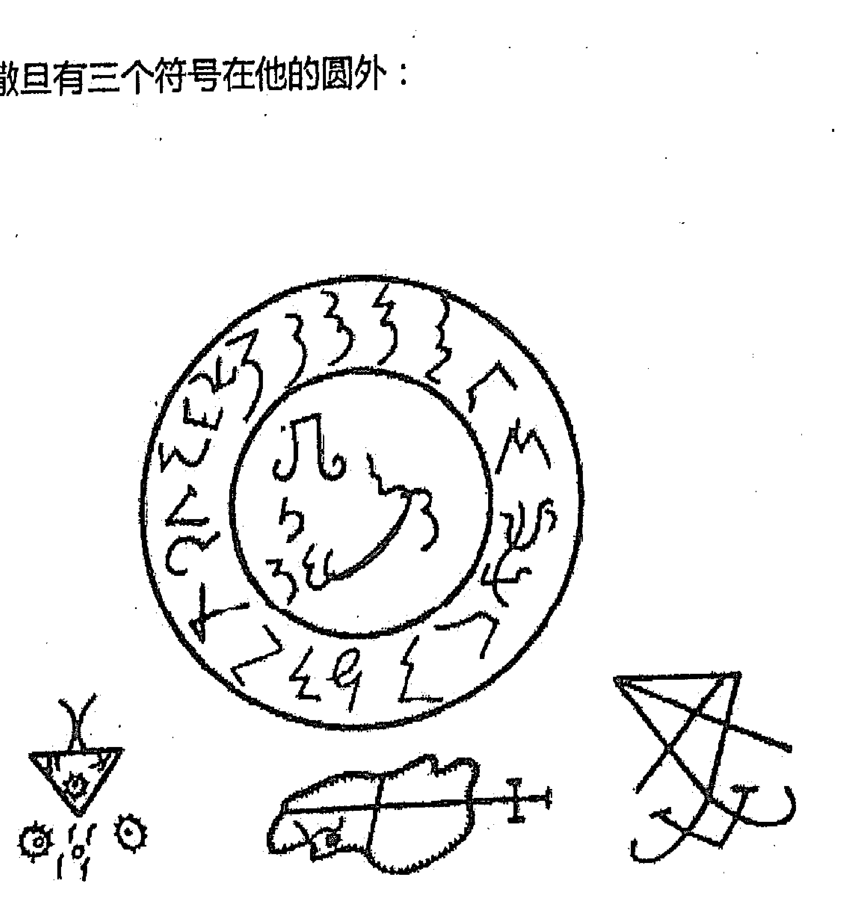

还有 Beelzebuth 和 Astaroth 在他们的圆之外的符号：

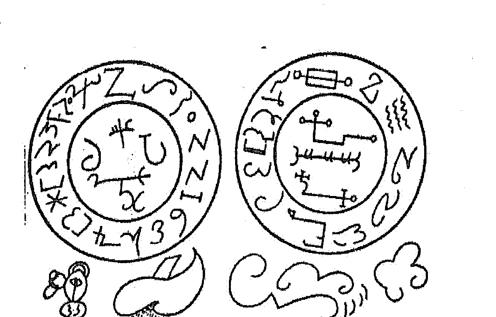

### 召唤灵体

如果你希望召唤他们，这只能是不得已的情况下，用他们给予的符号召唤。当你想要召唤他们的时候，以第三部分的方法召唤他们为你服务。

### 下级的低等灵体

撒旦有两名魔鬼在他之下：Satanackia 和 Agalierap。在 Beelzebuth 之下的是：Tarchimache 和 Fleruty。Satanackia 和 Fleruty 的符号是：

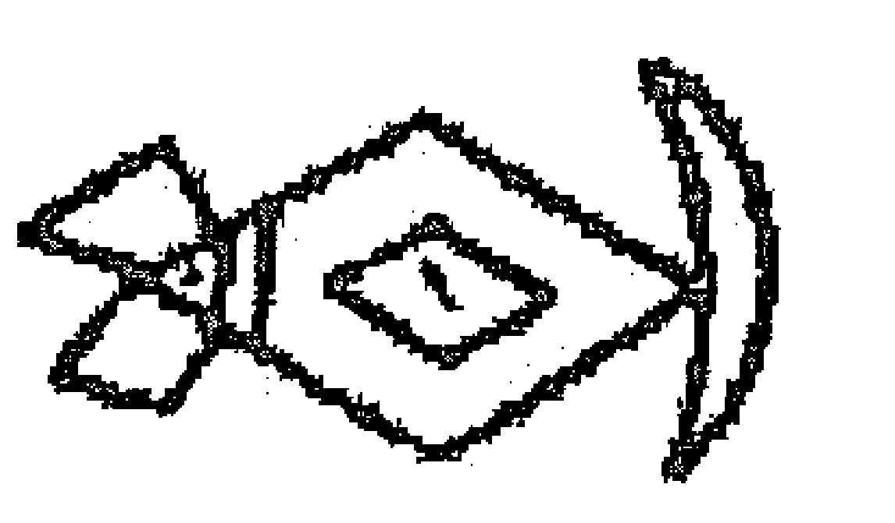

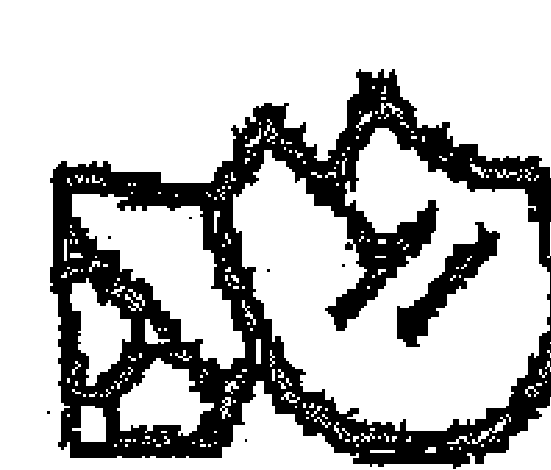

在 Astaroth 之下的是 Sagatana 和 Nesbiros，他们的符号是：

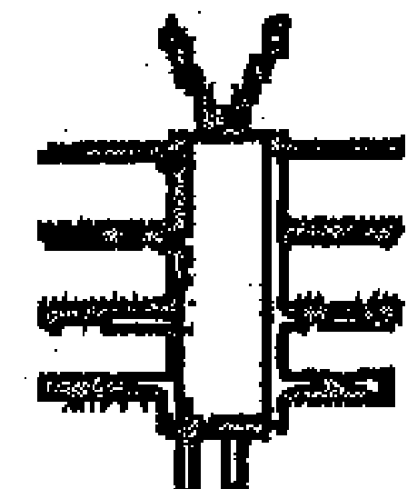

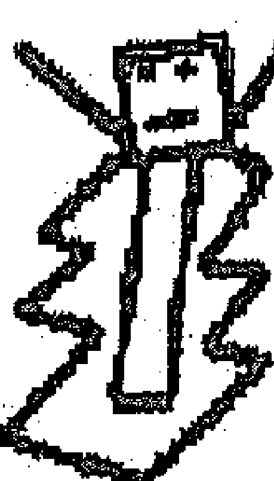

当然除了这些，还有其他魔鬼，他们在 Duke Syrach 之下。共有 18 个魔鬼，他们的名字是：

- I. Clauneck
- II. Musisin
- III. Bechaud
- IV. Frimost
- V. Klepoth
- VI. Khil
- VII. Mersilde
- VIII. Clisthert
- IX. Sirchade
- X. Segal
- XI. Hicpacth
- XII. Humots
- XIII. Frucissiere
- XIV. Guland
- XV. Surgat
- XVI. Morail
- XVII. Frutimiere
- XVIII. Huictiigaras

这些是十五个低等灵体的符号：

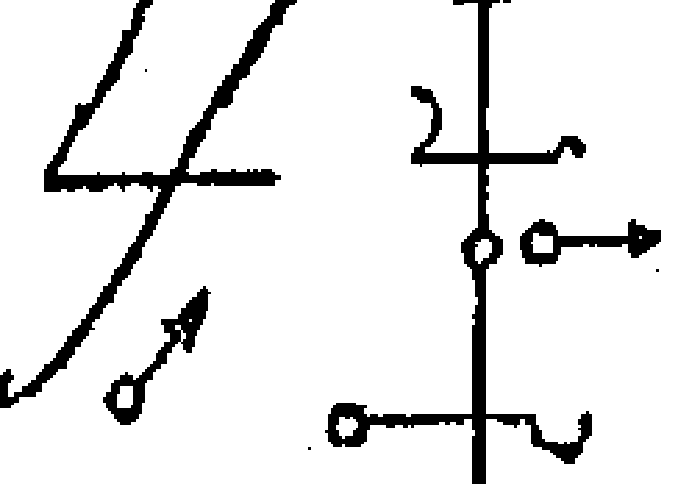

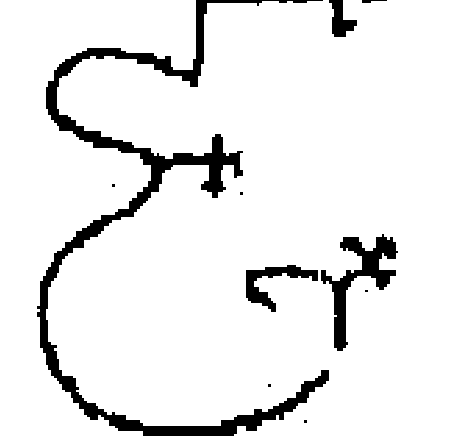

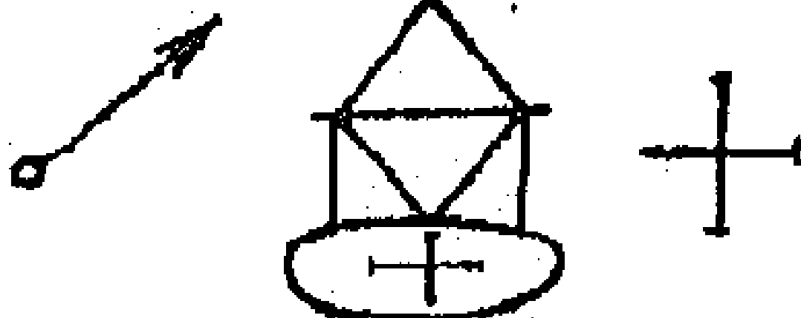

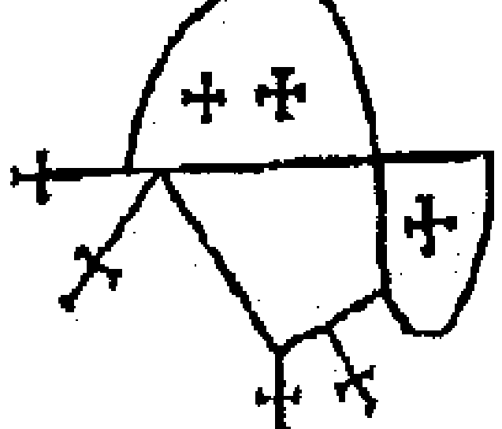

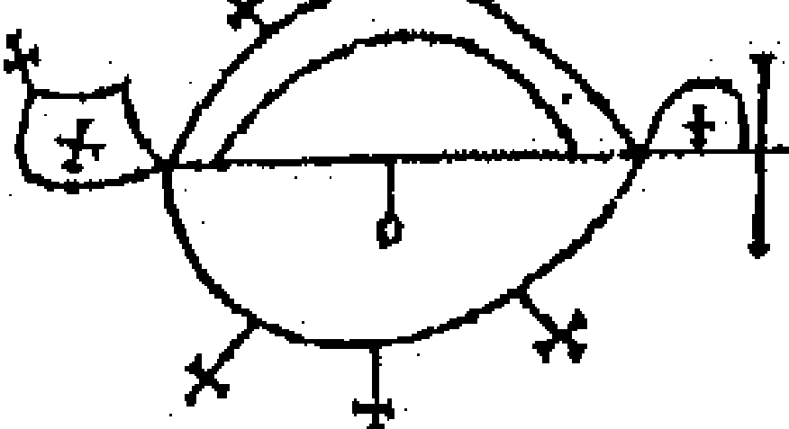

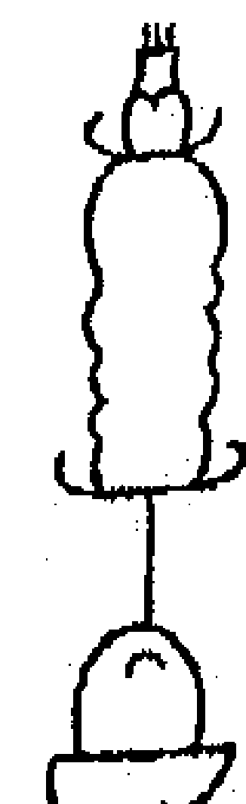

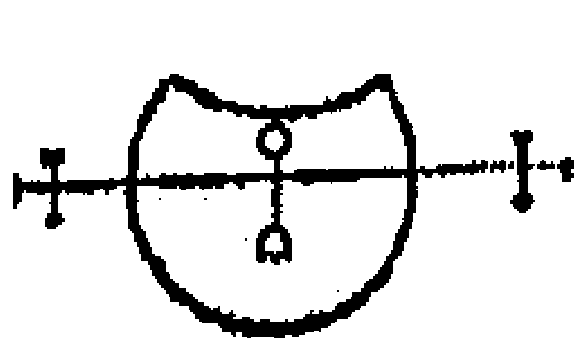

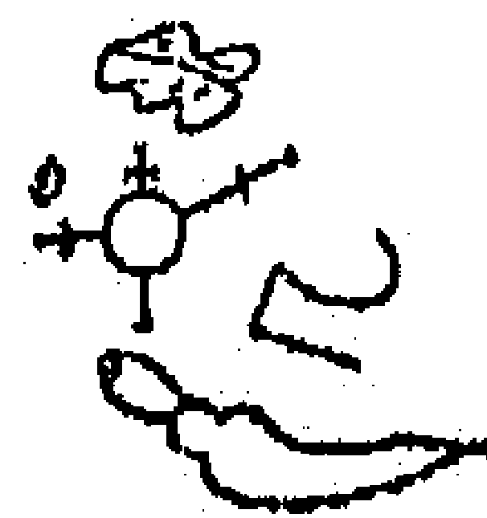

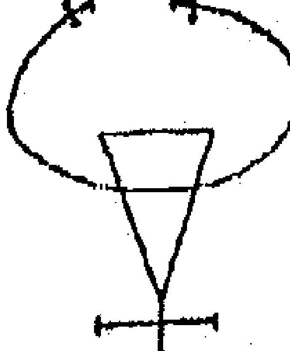

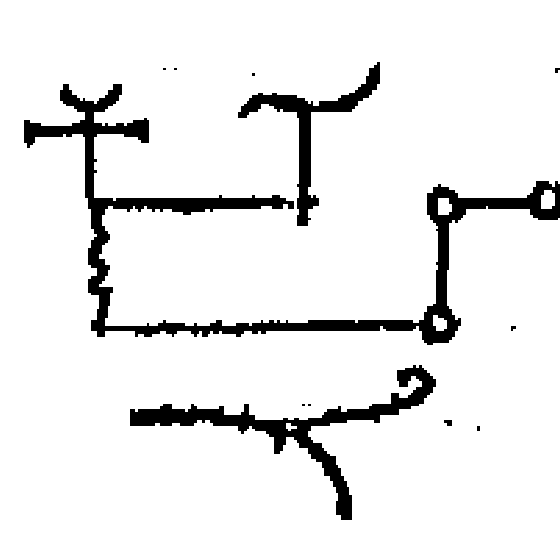

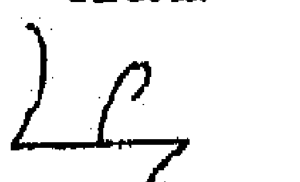

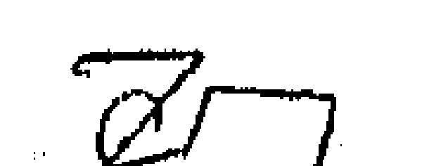

## 第二部分

AGLA * ADONAY * JEHOVA

还有其他没有力量的魔鬼，我们不必与他们对话。那 18 个上述提到过的魔鬼们的力量是：

CLAUNECK 拥有支配财富的力量，能够使人发现宝藏。因为撒旦对他宠爱有加，他可以给与他签订契约的人很大的财富。他是能带来金钱的魔鬼。

MUSISIN 拥有支配伟大主的力量，教导所有发生在共和国和同盟国的事件。

FRIMOST 支配妇女与少女力量，能帮助你获得她们。

KLEPOTH 让你了解所有的梦和幻觉。

KHIL 创造强烈的地震。

MERSLDE 能瞬间传递任何人到任何地方。

CLISTHERT 允许你控制白天或黑夜。

SIRCHAD 让你了解所有自然与超自然的动物。

HICPACTH 会瞬间带来一个你想见的人，即使那个人在很遥远的地方。

HUMOTS 可以带给你任何你希望看到的书。

SEGAL 可以带给你任何奇迹。

FRUCISSIERE 复活死者。

GULAND 促使疾病的发生。

SURGAT 能打开任何类型的锁。

MORAIL 可以使任何东西隐形。

FRUTIMIERE 为你准备一次盛宴。

HUICTIIGARAS 促使在一些情况下睡眠，除了失眠。

在 Satanachia 和 Sataniciae 之下的有 45 个魔鬼（或者，在其他的一些版本中是 54 个）。其中的 4 个领袖是 Sergutthy, Heramael, Trimasael 和 Sustugriel。其他的并不重要。

这些灵体有很多的优点，他们工作很努力、勤奋，在任务中能满足实施者。

Sergutthy 在事情顺利的时候，能支配少女与妇女。

Heramael教授医学，包括任何疾病及其治疗方法的完整知识，他也能让你了解植物的作用、发现的地点、采摘的时间。

Trimasael教授化学和所有欺骗自然的手段或花招的咒术。他也教授制造神秘投射装置，能让基本金属转变成金或银。

Sustugriel教授魔法学。他教授熟悉的灵体，用于任何目的，他也教授曼多拉哥尔（音乐）。

Agalierept和Tarihimal是Elogap的支配者，支配与水相关的事物。

Nebirots支配Hael和Surgulath。前者（Hael）能使任何人能用他会的任何语言会话，也教授任何可以写的字母，他也能教授那些最神秘和完全隐藏着的事物。

Surgulath给予任何思索的方法。他还教导打破阶级的方法和打败对手的策略。服从于那8个最具力量的下属。

- I. PROCULO, 能使一个人睡足48小时，具有睡眠领域的知识。
- II. HARISTUM, 能使任何人穿过火焰而不被其接触。
- III. BRULEFER, 能让一个人成为女人的心爱者。
- IV. PENTAGNONY, 能够给予良种好处，获得隐形的能力和伟大领主的爱。
- V. AGLASIS, 能带着任何人或任何东西到任何地方。
- VI. SIDRAGOSAM, 使任何女孩裸舞。
- VII. MINOSON, 能让任何人在任何游戏中胜出。
- VIII. BUCON, 能使异性之间相互厌恶和嫉妒。

## 第三部分

### 召唤文

这是召唤恶魔的咒语：

HELOY + TAU + VARAF + PANTHON + HOMNORCUM + ELEMIATH +SERUGEATH + AGLA + ON + TETRAGRAMMATON + CASILY.

这个咒文要和恶魔^{3/4}的符号一起写在上等羊皮上，使作为媒介的 Scirlin 降临。不管他们愿不愿意，他能强迫他们出现，因为他具有君主的力量。

### 关于祈祷：准备

中文：尊贵的安东奈（Adonay），汝用自己的形象和外表创造了人类！吾，可怜的罪人，请求汝恩赐祝福及神圣化这杯水，使其可让吾的肉体和灵体健康，与所有愚蠢的事物分开。

拥有无尽力量、神圣而又尊贵的神啊，汝带领汝的子民出埃及，使他们不弄湿双脚而穿越了红海！请教授吾，让吾能用吾的所有罪孽净化这杯水，使吾能毫无邪念地出现在汝的面前，阿门。

英文：Lord God Adonay, who hast made man in Thine own image and resemblance out of nothing! I, poor sinner that I am, beg Thee to deign bless and sanctify this water, so that it may be healthy for my body and my soul, and that all foolishness should depart from it. Lord God, all-powerful and ineffable, and who led Thy people out of the land of Egypt, and has enabled them to cross the Red Sea with dry feet! Accord me this, that I may be purified by this water of all my sins, so that I may appear innocent before Thee! Amen.

当实施者净化了自己之后，他开始制作仪式器具。

### 关于魔法的匕首

拥有一把匕首或小刀在仪式中很重要。用新的钢在木星日木星时的新月夜晚打造。如果自己不能打造，也可以选择购买，但是它的打造时间必须是上述提到的那样。

得到匕首后，你可以念出下面的祈祷文或咒语，它会为你的匕首服务。

### 仪器的圣名召唤

> 中文：吾恳求汝，哦，以我们神之父万能的权力，以天堂及星星的性质，以天使们的性质，以元素的性质，以岩石和芳草的性质，及以雪、风和雷的性质所构成的器具：汝现在已获得能让我们现在所关心的事物圆满达成而所必需的力量！并且这股力量是没有诡计、虚伪或者大自然无论什么的任何事物，是天使和太阳的创造之神的力量！阿门。

> 英文：I conjure thee, O form of the Instrument, by the authority of our Father God Almighty, by the virtues of Heaven and by the Stars, by the virtue of the Angels, and by the virtue of the Elements, by the virtues of the stones and herbs, and of snow-storms, winds and thunder: that thou now obtain all the necessary power into thyself for the perfectioning of the achievement of those things in which we are at present concerned! And this without deception, untruth, or anything of that nature whatsoever, by God the Creator of the Sun of Angels! Amen.

然后，我们背诵 7 篇赞美诗，再接着念出下列字句：

Dalmaley lamekh cadat pancia velous merroe
lamideck caldurech anereton mitraton :最无邪的天使们啊，成为这些器具的守护者，很多事物需要他们的力量。

### 献祭的匕首

在火星之日（星期二）的新月之夜，用新钢打造一把坚韧到足以切断小山羊脖子的匕首，在同一天，同一时刻，制造一根木仗，在其上面刻上以下符号：

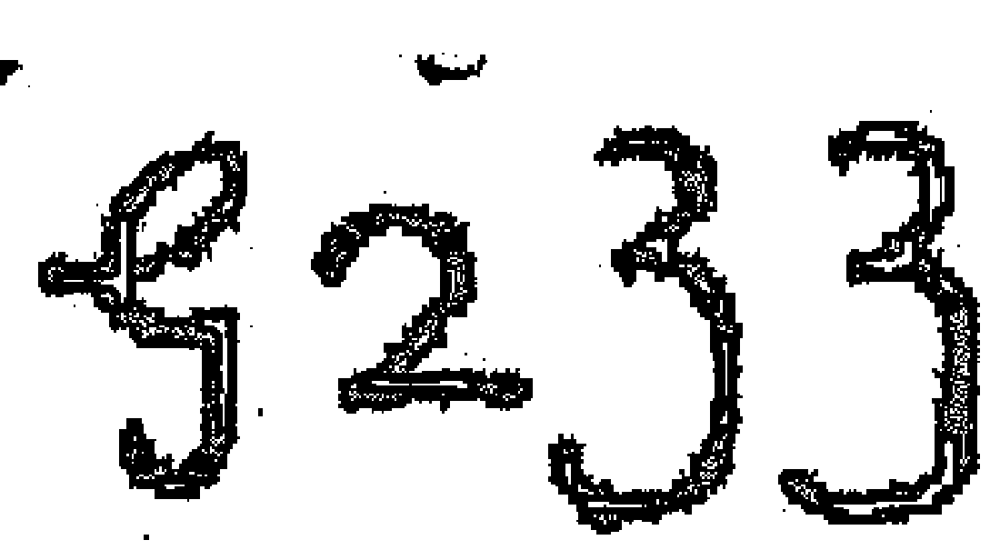

然后对其进行洒水礼和烟熏，你就已经准备好了一件可以随时随地使用的器具。

### 洒水礼与烟熏礼的方法

第一步，在洒水礼的时候念一段祈祷文：
以不朽的神之名，将水洒向[名字]，将汝所有的愚蠢和虚伪净化，汝将比白雪更白，阿门。

然后，在上面洒上水，就像弥撒一样，念道：
以父之名+以子之名+以神圣+鬼魂之名，阿门。

这个洒水礼对每件仪式器具都相当必要，烟熏也是一样。

在烟熏之前，要先拥有一个香炉，这样你就可以把煤点燃，在这上面放置香料，当烟升起的瞬间，念道：
神的天使，请给予吾们帮助，使吾们的工作达到完美。Zalay, Salmay, Dalmay, Angrecton, Ledrion, Amisor, Euchey, Or. 伟大的天使们：请您也那样做，哦，Adonay，降临此地并给予其高尚的品德，使这个创造物获得一个形态，让我们的工作完美达成。以父之名+以子之名+以神圣之名+鬼魂+阿门。

然后，在Judicum tuum Regida and Laudate Dominum omnes gentes之后，背诵七篇赞美诗。

### 关于上等羊皮纸

上等的羊皮纸有多种方法制作，一般多以山羊或绵羊的皮制作，也可以使用其他动物的外皮，但其必须是处子之身。

在刀上雕刻 AGLA 并将其烟熏后，这把刀就可以使用了。记住，当你为了从小山羊身上获得羊皮而献祭时，所有仪式器具都要放在祭坛上。

要制作榛木权杖[或杆，拐杖]，需要其没有结过果实，在水星之日（星期三）的水星时的新月夜晚，截断榛树的一根枝节。在其尖端用艺术笔或刻刀雕刻以下符号：

Frimost 的封印及其符号应该刻在第一根杖上：

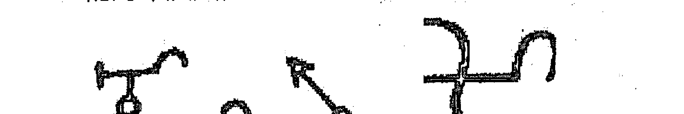

然后，你应当制作另一根榛木杖，它必须没有结过果实，在太阳之日（星期天）太阳之时剪下它，在其上刻下符号：

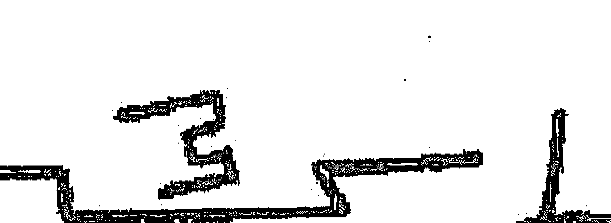

Klippoth 的封印及其符号应该刻在第二根杖上。

当这些完成之后，在你的杖上念诵以下召唤文：

### 召唤文

> 中文：最具智慧力量的安东奈（Adonay）啊，赋予其祝福，使其神圣化，保全这根杖，让其具有必要的性质，哦，最神圣的 Adonay，敬意和赞扬围绕着汝，阿门。

> 英文：Most wise, most powerful Adonay, deign to bless, sanctify and conserve this bâton so that it may have the necessary virtue, O most holy Adonay, to whom be honor and glory for all time. Amen.

### 关于小刀

拥有一把新的小刀是必要的，像匕首和镰刀一样召唤并准备它。在水星之日水星之时的新月夜晚制作。现在就可以照着献祭小山羊的方法做了。

把山羊安置在平面上，颈部向上，这样更容易斩杀它。用你的刀在其颈部划一刀，然后，说出你要召唤的灵体名字。

例如，你说：吾以[名字]的名字与荣耀杀死汝......（I kill you in the name and in the honor of [N]...）

这个很容易理解，在切其喉咙的时候要当心，不能划两次，但是要能致它死亡。

然后，你用刀扒开它的皮，去皮的时候，念诵以下咒文：

中文：Adonay, Dalmay, Lauday, Tetragrammaton, Anereton,及汝们所有圣洁的神之天使们，降临此地，赋予这块羊皮力量，使其能正确地保存下，所有写在其上的字画能变得完美。

英文：Adonay, Dalmay, Lauday, Tetragrammaton, Anereton, and all you, Holy Angels of God, come and be here, and deign to infuse into this skin the power that it may be correctly conserved, so that all that is written upon it may become perfected.

在去皮之后，用盐洒在拉紧的皮上，让它充分覆盖在羊皮上。在使用盐之前，一定要对其念诵祝福语。

## 盐的祝福

> 中文：我召唤你，哦，盐的创造者，你是众神之神，众主之主，所有虚幻的事物离你而去，你会适应这块上等的羊皮。

英文：I exorcise you, O creature of the Salt, by the God who is living, the God of all Gods, the Lord of all Lords, that all fantasies may leave you, and that you may be suitable for the virgin parchment.

结束后，让这块布满着盐的羊皮放在太阳下曝晒一整天，然后，找一个玻璃制广口瓶，用艺术笔在上面画出下列符号：

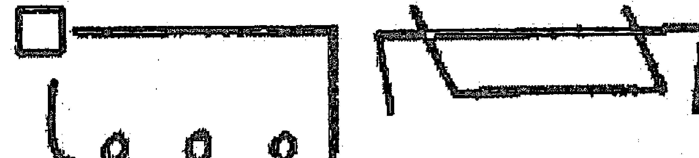

把生石灰与驱邪过的水在广口瓶中中和。再把山羊皮放在里面的液体中，放置一段时间后，毛发会松动脱落。

一旦用手触摸山羊皮，毛就会脱落后，把它拿出广口瓶，用雕刻过的榛木刀剥去毛发。这把刀使用前一定要念诵以下语句：

> 中文：哦，最神圣的 Adonay，透过神圣的 Agason 之名，把力量注入这把刀中吧，使其清理这块羊皮，阿门。

> 英文：O holiest Adonay, put into this wood the power to cleanse this skin, through the holy name Agason, Amen.

当羊皮去毛之后，要在一块新木块上将其拉紧，石块压在皮上，使其平整。这些石头要来自河岸。在放置石头前，要念诵以下祈祷文。

## 石头的祈祷

> 中文：哦，Adonay，最强大有力的主，请允许这些石块将这块羊皮弄平整，让其远离所有的邪恶，这样它们就能具有所需要的力量了，阿门。

> 英文：O Adonay, most puissant and all-powerful Lord, allow that these stones may stretch this skin, and remove from them all wickedness, so that they may possess the required power. Amen.

## 水的弥撒

所有在进行这些仪式的水都必须经过弥撒，在它上面念诵以下语句：

中文：伟大的神，父亲，最具力量者，吾的慰藉和吾的生命，帮助我吧，神圣的父亲，因为吾爱着你，Abraham之神，Isaac之神，Archangels和Prophets之神，万物的创造者。吾以谦恭的姿态，呼唤你神圣的姓名，吾恳求汝们祝福这水，使它能净化吾们的身体与灵体，通过汝，最神圣的Adonay，永久的统治者。阿门。

英文：Lord God, Father, all-powerful, my refuge and my life, help me, Holy Father, for I love you, God of Abraham, of Isaac, of Jacob, of the Archangels and Prophets, Creator of All. In humility, and, calling upon Thy holy Name, I supplicate that thou wilt agree to bless this water, so that it may sanctify our bodies and our souls, through Thee, most holy Adonay, Everlasting Ruler, Amen.

待这块羊皮干了后，在清除污点前，对其念道：

Je, Agla, Jod, Hoi, He, Emmanuell (守卫这张羊皮，使其没有幽灵可以接近它！)

当羊皮干了后，就可以将木框架拿走，祝福及烟熏之后，就可以使用了。

最重要的是，这块羊皮决不能给女子看见，特别是在她们月经期的时候，否则，它会失去其力量。你也要知道，当你在制作及使用它的时候，你一定要是干净、纯洁的。

实施者要在物品‘出生’时做弥撒，所有的仪式器具都要放在祭坛上。

## 关于洒水

用一串由薄荷、马郁兰和迷迭香及处女编织的丝线制成稳固而不漏水的洒水壶。

这个水壶要在水星日，水星时的新月夜晚制成。

## 关于熏香

是指世纪树、肉豆蔻树及檀香树的木料。就豆蔻而言，是圆中仅需的香料，在熏香上念诵以下祈祷文。

## 熏香的祈祷文

> 中文：赐福吧，哦，主，为了能挽救人类，使这个创造物神圣化，通过对汝神圣之名的召唤，让它也能挽救吾们的灵体与肉体！让所有吸着这个气体的生物能拥有他们的身体与灵体：通过永恒的主！阿门。

英文：Deign, O Lord, to sanctify the creature of this, in order that it may be a remedy for the human race, and that it may be a remedy for our souls and bodies, through the invoking of Thy holy Name! Agree that all creatures which may breathe in the vapor of this may have wealth of their bodies and souls: through the Lord who has fashioned the time eternal! Amen.

## 关于仪式用的笔

找一根羽毛，像其他仪式器具一样地对其进行洒水礼和烟熏，然后，当你在切它尖头的时候，说：

Ababaloy, Samoy, Escavor, Adonay：吾从这根羽毛中驱逐出所有幻影，这样，当吾们在使用它时，它就能具有有效的力量了：对仪式、符号及咒文阿门。

## 关于（古时用牛角制成的）墨水瓶

你要在水星日水星时购买一瓶新的墨水瓶。在这段时间中，写下符号：

JOD HE VAU HE + METATRON + JOD + KADOS + ELOHIM SABAOTH.

然后，将新制的墨水放在已驱邪过的（角）瓶中，念诵以下驱逐咒语：

> 吾驱逐你，这墨水的创造物，以 Anston, Cerreton, Stimulator, Adonay 之名，以用一个字创造了万物，可达成所有愿望者之名，请汝助吾一臂之力，使吾的工作如吾所愿地完美达成，请通过神的准允，带来一个成功的结果。阿门。

然后，用这个祝福语来祝福墨水：

> 伟大又万能的神啊，汝永久地掌管着万物，汝让伟大的奇迹发生在汝的创造物上，赐予这墨水汝神圣灵体的荣耀。祝福它，使其神圣化，让它具有特别的力量，无论吾们说什么或做什么或希望什么，请让结果完美：通过汝，最神圣的王子，Adonay，阿门。

### 实施者的准备

当器具有准备好后，实施者必须要准备好自己。第一步，先由准备祈祷文开始：

> 中文：伟大的神，Adonay，汝以汝自己的肖像创造了人类，吾，毫无价值并充满着罪恶，恳求您神圣化这水，让它洁净我的肉体和灵体，使我纯洁。

> 英文：Lord God, ADONAY, who hast formed man in Thine image, I, the unworthy and sinful, beseech Thee to sanctify this water, to benefit my body and soul, cause me to be cleansed.

实施者用祝福过的水洗脸和手。

注意：这里的水是用来洗脸和手的，当你洗完之后，也意味着三天的禁欲期开始：当然，很多人都意志力薄弱，尤其是对于你贞节的守护。

在这三天期间，你可以学习这本书及以下形式的祈祷，白天五次，晚上四次。

中文：Astrachios, Asach, Ascala, Abedumabal, Silat, Anabotas, Jesubilin, Scingin, Geneon, Domol :哦，主，吾的神，汝坐在比天堂更高的地方，看到更深的内涵，吾祈求汝看到我的思绪中的事物，让其能成功：通过汝，哦，伟大的神，您永远统治着，阿门。[Shah给了我们一个变动的注解："Astrocio, Asath, a sacra Bedrimubal, Felut, Anabotos, Serabilem, Sergen, Gemen, Domos: . . ."]

英文：Astrachios, Asach, Ascala, Abedumabal, Silat, Anabotas, Jesubilin, Scingin, Geneon, Domol: O Lord my God, Thou who art seated higher than the Heavens, Thou who art seated higher than the Heavens, Thou who seeth even unto the depths, I pray that Thou unto me the things which I have in my mind and that I may be successful in them: through Thee, O Great God, the Eternal and who reigns for ever and ever. Amen. [Shah gives a note of a variation: "Astrocio, Asath, a sacra Bedrimubal, Felut, Anabotos, Serabilem, Sergen, Gemen, Domos: ..."]

在这些都正确完成后，剩下的就是照着以下步骤召唤和画符号了。

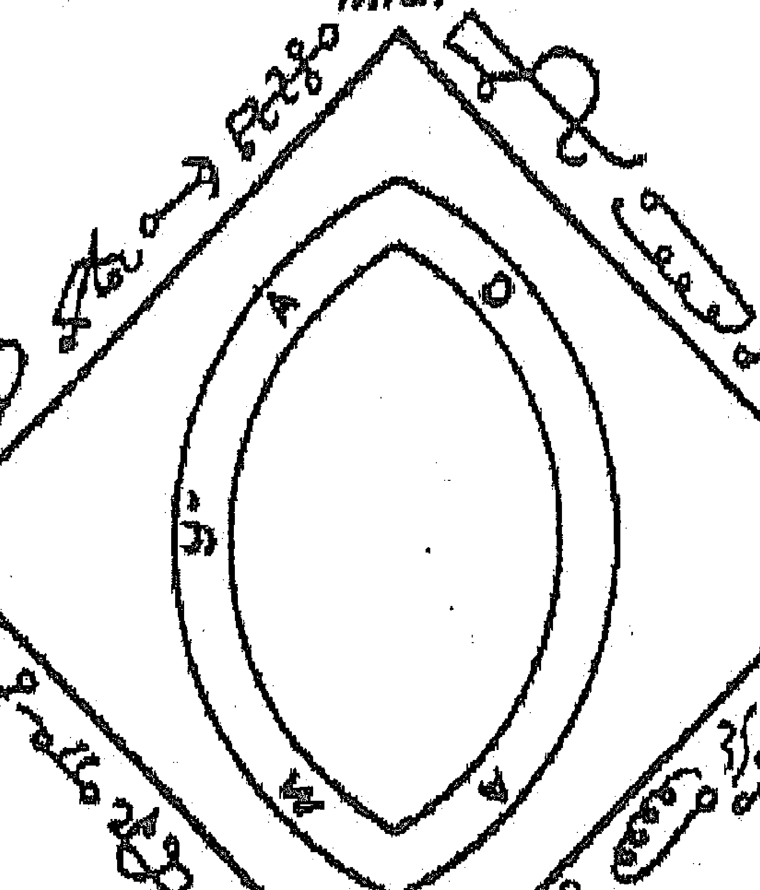

在火星日火星时[星期二]的新月之夜，在第一天的第一个小时——日出前的一刻钟——你要准备好一块书写着你所想要召唤的灵体和符号的上等羊皮。

例如，在上述提到的时间里，你的小指上（即是水星的手指）应被处女系上一条丝线，再用小刀划开手指，就像本页开头中所叙述的那样，用鲜血画出 Scirlin 的符号。然后，写下你的祈祷文。

## Scirlin 的祈祷

> HELON + TAUL + VARF + PAN + HEON + HOMONOREUM + CLEMIALH + SERUGEATH + AGLA + TETRAGRAMMATON + CASOLY.

你必须要把你名字的第一个字母写在字母 A 处[在 Scirlin 的符号&符号]，把你姓的第一个字母写在字母 D 的位置上。灵体 Aclassis 的符号能非常有效地给予你帮助，会让你拥有超过其他灵体的力量。

画出上述中你希望降临的灵体符号，以他的荣耀点燃熏香。然后对你希望出现的灵体进行祈祷，以他的荣耀点燃熏香。

## 对撒旦的祈祷

Lucifer, Ouyar, Chameron, Aliseon, Mandousin, Premy, Orient, Naydrus, Esmony, Eparinesont, Estiot, Dumosson, Danochar, Casmiel, Hayras, Fabelleronthou, Sodirno, Peatham, Come, Lucifer, 阿门。

## 对Beelzebuth的祈祷

Beelzebuth, Lucifer, Madilon, Solymo, Saroy, Theu, Ameclo, Sagrael, Praredun, Adricanorom, Martino, Timo, Cameron, Phorsy, Metosite, Prumosy, Dumasо, Elivisa, Alphrois, Fubentroty, Come, Beelzebuth, 阿门。

## 对Astaroth的祈祷

Astaroth, Ador, Cameso, Valuerituf, Mareso, Lodir, Cadomir, Aluiel, Calniso, Tely, Plorim, Viordy, Cureviorbas, Cameron, Vesturiel, Vulnavij, Benezmeus Calmiron, Noard, Nisa, Chenibranbo Calevodium, Brazo Tabrasol, Come, Astaroth, 阿门。

在对高等灵体进行七次祈祷后，你会看到灵体出现，并可对其许愿。

## 灵体的遣散

当你在上等羊皮上写下你的祈祷文，看见了灵体，满足了你的愿望时，你可以用下面的话遣散他们：

Ite in pace ad loca vestra et pax sit inter vos redituri ad mecum vos invocavero, in nomine Patris + et Filii + et Spiritus Sancti + Amen

[回到你的住所，让你和我之间和睦相处，当你再次被召唤的时候，准备来到我的面前，以父之名+以子之名+以圣洁灵体之名+阿门]

## 低等灵体的祈祷

OSURMY + DELMUSAN + ATALSLOYM + CHARUSIHOA + MELANY + LIAMINTHO + COLEHON + PARON + MADOIN + MERLOY + BULERATOR + DONMEDO + HONE + PELOYM + IBASIL + MEON + ALYMDRICTELS + PERSON + CRISOLSAY + LEMON SESSLE NIDAR HORIEL PEUNT + HALMON + ASOPHIEL + ILNOSTREON + BANIEL + VERMIAS + SLEVOR + NOELMA + DORSAMOT + LHAVALA + OMOR + FRAMGAM + BELDOR + DRAGIN + 来吧, 名字...

## 低等灵体的遣散

安静下来，名字，回到汝原来的地方，愿和平伴随着汝，每次吾召唤汝的时候，就请来到吾的身边，以父之名+以子之名+以圣洁灵体之名+阿门。

然后，你应把符号烧掉，因为他们只能用一次。

## 其他的祈祷

中文：吾恳求汝，名字，以伟大现存的神、至高无上的万物创造者之名，请汝以人类的形态显现，公正、同意、没有任何吵闹或不便之处地回答我的疑问。我恳求汝以圣洁和神圣的名字的力量达成吾愿。

英文 : I conjure thee, N., by the name of the Great Living God, Sovereign Creator of all things, that thou appear in human form, fair and agreeable, without noise or inconvenience, to answer truthfully in all the interrogations that I shall make. I conjure thee to do this by the power of the Holy and Sacred Names.

### 对萨拉曼德斯（Salamanders）的祈祷

中文：不朽永恒的万物之父，汝坐在不断前进的战车上，在不断旋转的世界中：Etherian(兽亚纲哺乳动物)国家的支配者，那是汝力量的王座。汝在上面用那可怕双眼览尽万物，汝的双耳听见汝孩子的声音：汝的花园和伟大、永恒的王权照耀着世界、天空和星星，汝为万物欢欣雀跃，哦，闪烁的火焰啊，汝用汝的光芒照耀着，它照射出失去光泽的基础光线，滋养着汝无穷的灵体。那无穷的灵体产出了万物，使强大的财富围绕在您的身边。哦，宇宙的父亲！

哦，唯一者，哦，快乐的终结和不朽之父！汝创造了特别的力量，它非常绝妙，就像永恒的思想，来自于汝令人敬爱的本质。汝已超越了天使，创造了在元素中第三个统治种类。吾们的练习是因为崇拜汝的愿望。吾将愿望烧毁是为了拥有汝，哦，父亲，哦，母亲，最温柔的母亲！哦，母亲美妙的感受和亲切！哦，圣子，所有孩子的花朵，所有形式的形式！心灵、灵体、融洽和万物之名，请保吾们，吾们应当被祝福，阿门。

英文 : Immortal, eternal, ineffable and Holy Father of all things, who is carried by the revolving chariot unceasingly, of the worlds which continually revolve: dominator of the Etherian countries where there is raised the throne of Thy power: above which Thy redoubtable eyes see all, and Thy holy ears hear all Ñaid Thy children whom Thou hast loved since the birth of the centuries: for thy golden and great and eternal majesty shines above the world, the sky and the stars, Thou art elevated above all, O sparkling fire, and Thou illuminates Thyself by Thy splendor, and there go out from Thy essence untarnishable rays of light which nourish Thy infinite spirit. That infinite spirit produces all things, and makes the mighty treasure which cannot fail, to the creation which surrounds Thee, due to the numberless forms of which she bears, and which Thou hast filled at the start. From this spirit comes also the origin of those most holy kings whoare around Thy throne, and who compose Thy court, O Universal Father!

O Unique One, O Father of happy mortals and immortals! Thou hast created in particular the powers which are marvellously like the eternal thought, and from Thy adorable essence. Thou hast established them over the angels, Thou hast created a third kind of sovereign in the elements. Our continual exercise is to worship Thy desires. We burn with the desire to possess Thee, O Father, O Mother, the most tender of Mothers! O wonderful example of feelings and tenderness of Mothers! O Son, the flower of all sons! O Form of all forms! Soul, Spirit, Harmony, and Name of all things, preserve us and we shall be blessed. Amen.

## 关于五芒星及其运用方法

我把所罗门的五芒星的形式写在这里，你就可以做好安排，它们非常具有价值。

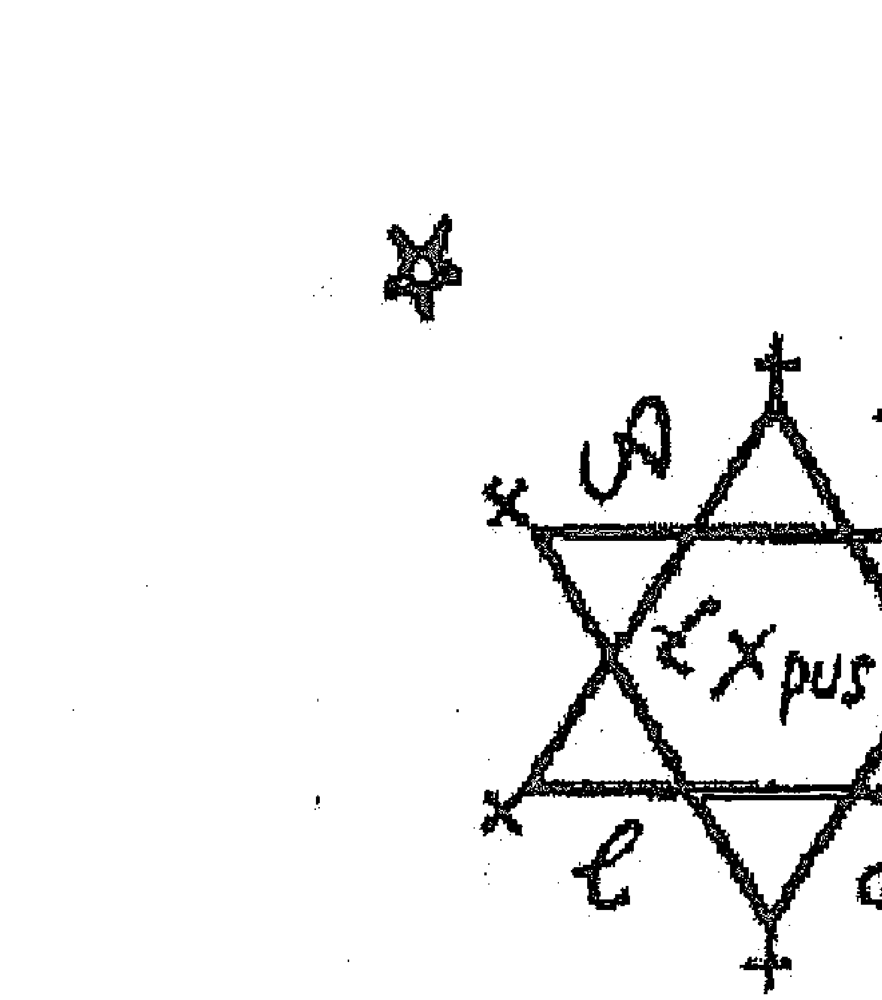

当你在做完圆后，在正式进入前，要点燃麝香、琥珀、芦荟木和薰香。那些薰香用来祈祷。

你应该要在祈祷期间保持一直有火，当你点燃熏香时，这会是你召唤的灵体之名。当你把熏香放在火上，不断的重复说：

> 吾燃烧它，名字，以[名字]之名，向其致敬。（I burn this, N., in the name and to the honor of N.）

应该要记住，你的左手持符咒，右手持一根较早制作的木杖，勺子和匕首用你的脚。

当所有这些都整备好后，站在结界内。如果你有同伴和你在一起，你们互相牵着对方一只手，一个接着一个背诵第 50 篇圣歌。当结界完成后，用圣水洒向它。把符号画在结界的四个角落上。一般有四个无芒星形，每个都指向南方；灵体被禁止进入特定的结界区域。

然后，重复七遍祈祷文。当灵体出现后，让他在你手中的符号上签下名字，这样他会在你呼唤他的时候出现。问他你觉得必要的事情，他会把答案告诉你。

## 灵体的遣散

以下列字语让他离开。

> Ite in pace ad loca vestra et pax sit inter vos redituri ad mecum vos invocavero, in nomine Patris + et Filii + et Spiritus Sancti + Amen.
[安静地回到你的住所，让你我之间和睦相处，准备好我的再次呼唤，以父之名+以子之名+以圣洁灵体之名+阿门]

# # 珍贵&不可思议的秘密

## 制造所罗门之镜的方法，对所有预言有益

以上帝之名，阿门。你可以在这面镜子中看到任何你希望看到的事物。以被祝福过的主之名，以上帝之名，阿门。第一步，你应当放弃所有的食肉欲，也要远离所有罪孽（包括语言和行为举止），在这期间，躺在这里。第二步，你要做善事。第三步，找一块外观良好的钢制盘子，轻轻地擦亮它，用白鸽子的血在四个角落上写下这些名字：JEHOVA, ELOYM, METATRON, ADONAY。

把盘子用干净的白色布料包好，等待在新月的那天，日落后的第一个小时，打开窗户，虔诚地对天空说：

> > 哦，永恒的，哦统治者永恒的！不能说出的神！您，以对人类的热爱创造了万物，一个对人类存在的隐藏决定，请屈尊看着我，名字，我是您微不足道的仆人。

> > 屈尊派遣您的天使到我的这里，也派遣天使到这面镜子上空，他指挥并命令他的同伴，哦，您是最具力量的主，永远都是，因此，以您的名义，他们可以工作并公平地行动，请给予我万物的知识，让我可以追寻他们。

现在你把燃烧中的熏香扔出。当你正在这么做的时候，说：

> 在这之中，我在您面前倾诉，哦神，我的神，您祝福着，三位一体，您坐在智天使和六翼天使之上，您用火焰审判地球上的人类，请听我述说！

反复念诵三次。当你说完后，在镜子前深呼吸三次，说道：

> 来吧，Anael，来吧：请欣然地来到我面前：以+最强大的父之名，以+圣子之名，最具智慧，以+圣洁的灵体之名，最起作用的！

> 来吧，Anael，以恐怖的Jehova之名！来吧，Anael，以永远存在的神之力量！来吧，您，用Metatron右手臂！

> 出现在我面前吧，名字，命令您的随从，让我通过他们的爱、喜悦和安宁了解他们，了解隐藏在我双眼的事物。

当你完成了这些之后，扬起你双眼，对着天空说：

> 哦，最具力量的主啊，您以您的意志引起万物的移动，请倾听我的祈祷，让我意向得到您的同意！哦，主，如果这您的意志，凝视及祝福这块镜子，让它神圣化，让您的仆人Anael可以来到他的同伴身边，请赞同我，名字，您的可怜，卑贱的仆人！哦，神，祝福并唤起上述所有天堂的灵体，您一直存在，统治着。阿门。

当这个完成时，在你自己身上和镜子上画上十字符号，也在之后的 4~5 天中画上。在结束的时候，天使 Anael 会出现在你面前，他就像一个美丽的孩子会像你问候，并命令他的同伴服从于你。

并不是一直需要那样做，直到天使出现就可以，然而，他有可能到第十四天出现，这是根据请求的程度和实施者的热情。

当他来到时，无论什么愿望都可以问他，也可以请求他当你再次召唤他的时候降临。

当你想让 Anael 再次降临。你所要做的是烟熏镜子，并对它说：来吧，Anael，来吧，请同意——这个祈祷的剩余部分，就是上文的祈祷，直到 Amen 为止。

## 遣散灵体

当他回答了你的问题，你也满足了他时，你必须用以下语言遣散他：

我感谢您，Anael，出现并实现了我的请求。因此，您可以平静地离开，当我再次召唤您时回来。

Anael 的熏香是藏红花

# # 乌列（Uriel）的预言

为了成功运作，进行试验的他必须做到这里教授的事。他要选择一间九天或更长时间没有女子出现的小房间或者地方，特别是女子的月经期。

这个地方一定要干净，用供奉洒水的方法视为神圣，房间的中间要放置一个用白布遮盖的桌子。在上面放置的是装满着春雨的玻璃制的小瓶 ,为了在运作前带来短暂的准备，要三个（蜡和人造脂肪混合的）小锥形；一块上等羊皮，一只大乌鸦的羽毛（适合书写）；一瓶装满新鲜墨水的脊骨墨水瓶；一个小金属瓶，里面有可以燃烧的原料。

你也要找一名九到十岁的男孩，他应该有良好的行为举止和干净的穿着。他必须要靠近桌子。

还需要一根长针插在三个小锥形之一上，放在玻璃瓶后六英尺的地方。另外两个小锥形应该放在玻璃瓶的左右边，距离要相等。

当你正在这么做的时候，念道：

> > Gabamiah, Adonay, Agla, 哦，力量之主请帮助我们！

把羊皮放在玻璃瓶的右边，羽毛笔和墨水放在左边。在开始前，把门和窗关闭。

现在，点燃火焰和蜡制锥形。让男孩跪着注视玻璃瓶。他应该不戴帽子，双手交叉。

现在，雇主命令男孩凝视玻璃瓶不动，温柔地在他的右耳旁，说道：

## 祈祷

> > URIEL + SERAPH + JOSATA + ABLATI + AGLA + CAILA，我用四个上帝对他的仆人摩西说的字请求和恳求您：JOSTA + AGLA + CAILA+ ABLATI。以您生活着的就天堂的名义，也以在您之前的这个孩童的童贞，请出现一次吧，展现出我想知道的真理。当这完成之时，我会平静及充满善心地放出您，以最圣洁的Adonay之名。

当这个祈祷结束时，问这个孩童他在玻璃瓶中看见了什么。如果他回答说他看见了天使或其他物质，雇主应该用友好的音调说道：

受祝福的灵体，欢迎您。我再次恳求您，以最圣洁的Adonay 之名，立刻展现在我面前。。。。。（这里雇主以灵体的意愿请求）

然后对灵体说：

如果因为任何理由，您不希望对其他人述说，我恳求您把答案在今天与明日之间写在这上等的羊皮上。另外，请在我的梦中将它展示给我。

如果灵体可听见地回答了你，你必须尊敬地倾听。如果他在你重复三次请求后仍没有开口，熄灭锥形蜡，离开房间。第二天回到房间，如果答案没有在你的梦中展现的话，你会发现答案已经写在了上等的羊皮上。

## 鸡蛋的预言

鸡蛋的作用是知道在实施期间在任何人身上发生的事情。

拿一只黑母鸡所生的鸡蛋，在白天的时候打碎它，取走蛋黄。

你要有一只大的玻璃制杯子，它的玻璃壁要非常地薄，清晰。里面盛放清水和蛋黄。

把杯子放在夏天的正午太阳下，操作的首长要背诵祈祷文和当天的祈祷。

这些祈祷和咒语就像在所罗门之匙中找到的差不多。

用食指搅动水，让它与蛋黄混合。然后。把它放置一段时间后，你从玻璃中注视它（不要触摸）。你会看见答案，它会在一个工作日内有效，因为这些灵体会在平常时间降临。

如果你想知道一个男孩或女孩是不是处子之身，如果是的话，蛋黄会沉到底部，如果不是的话，它还会是老样子。

## 看见空气中的灵体

拿一只鸡的脑袋，一些死者棺材上的粉末，核桃油和原始蜡。将这些都混合在一起，用上等羊皮包好，羊皮上要写上下列字语：

GOMERT KAILOETH，和 Khil 的符号。

把它烧掉后，你会发现巨大的事物。但是这个仪式只适用于那些什么都不怕的人。

## 在晚饭后，让三个女孩或三个男士出现在你的房间

这个仪式需要实施者保持三天的贞节，然后你就会振奋的。

-   I 准备 在第四天，一旦到了早上穿完衣服后就可以开始打扫、整理你的房间。你一定要在这段时间禁食。保证你的房间在跟着发生的一整天中没被任何人打扰。注意，房间中应当没有任何悬挂物，包括交叉放着的物品；挂毯或者挂着的衣物，不要有帽子或者床上的帘子等等。上述的所有要求，都必须保证遵守，房间内的物品一定要打扫干净。

-   II 仪式 当你进行晚餐后，悄悄地进入你的房间。现在，在桌子上放着一块白布，旁边是三张椅子。在每个位子前，放置小麦卷和干净的玻璃杯和清水。现在，把椅子放在床边。用下述语言就寝：

> III 咒语 Besticitum consolatio veni ad me vertat Creon, Creon, Creon, cantor laudem omnipotentis et non commentur. Stat superior carta bient laudem omvistra principiem da montem et inimicos meos o prostatis vobis et mihi

这三个人已经到达，正坐在炉火前进食及饮水，并会感谢招待他们的人。如果你是名男士，那么来的是三名女士；如果你是名女士，那么召唤出的就是三名年轻的男子。

然后，他们会抽签决定谁留下陪你。如果实施者是男性，赢了女子就会坐在床边的椅子上，陪伴你直到午夜，她就会和她的同伴一起离开。

当一个招待你的时候，另外两名会待在炉火边。

当她和你在一起的时候，你可以问她任何问题，可以是关于任何学术和科学，或者上述的所有话题，她会一次给你明确的答复。你可以问及隐藏财宝的下落，她会告诉你它在哪里。如果财宝被恶魔的灵体看守着，她会和她的同伴一起保护你，免受恶魔的伤害。

当她离开的时候，她会给你一枚戒指。如果你把它戴在手指上，你会在赌博中变得幸运。如果你把它戴在任何女子的手指上，你会立即得她的意志。

## 让女孩靠近你，即使她可能很害羞。

较高智慧的不可思议的体验。

等待下弦月的晚上，要能在十一点到午夜之间看见一颗星星。在正式开始前，准备以下物品：

在贞节羊皮上写下你希望来到的女孩名字。羊皮的形状见以下数据( The shape of the parchment is to be as you see in this figure ) :

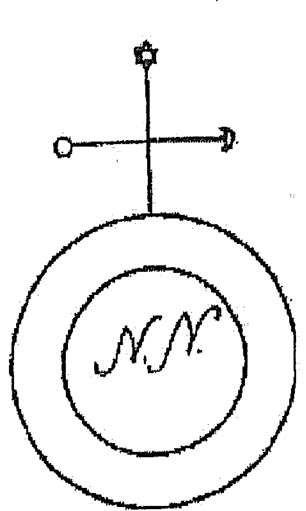

在羊皮的另外一边写上 MELCHIAEL，BARESCHAS。然后，把羊皮纸放在地上，把写着名字的那页朝地面。把你的右脚踩在羊皮上，左脚跪在地上。然后仰望天空最远的星星。在你的左手上拿的是一个锥形白蜡（大到足以燃烧一个小时），然后说出以下语言：

## 祈祷

我向您致敬并恳求您，哦，美丽的月亮，哦，最美丽的星星，哦，我手中闪耀的光芒。以我手中的光芒，以我呼吸的空气，以我接触的土地：我恳求您。以灵体的王子之名。以不能说出名字、创造了万物的 ON！以你，哦，华丽的天使 GABRIEL 与水星，王子，MICHIAEL 和 MELCHIDAE。

我再次恳求你，以神的神圣之名，让你力量传达给受到压迫，折磨和烦恼的肉体与灵体及（名字）的五感。写在这里的是她的名字，让她来到我的身边。让她因而受到折磨，苦楚。去吧，立即！去吧，MELCHIDAE，BARESCHES，ZAZEL，FIRIEL，MALCHA，及所有与您在一起的！我以伟大现存的神之名恳求您服从我的意志，而我和（名字）保证也会满足你。

当这个祈祷念出三次时，把羊皮用锥形蜡之火烧掉。第二天，羊皮放进你左脚的鞋子（我不知道她指的是羊皮的灰还是什么，大家来看看原句，难道有两张羊皮？：When this conjuration has been said three times, burn the parchment with the taper. On the next day, take the parchment, put it in your left shoe）里直到你想见的人主动寻找到你。在祈祷中，你一定要说出她出现在你面前的时间。

# # 使某人隐形

这个仪式需要收集七颗黑豆。在星期三的日出前开始仪式。取走一个刚死不久男子的头部,把一颗黑豆放入他的嘴巴,两颗放进他的眼睛里,两颗放进他的耳朵。然后,在他的头顶画上 Morail 的符号。

当你做完之后,把他的脸朝上埋入土中九天,并在每个日出前的早晨,用极品白兰地对其浇水。当在第八天的时候,你会发现灵体会对你说：“你要干什么？”

你回答道：“我在浇我的植物。”然后,灵体会说：“把瓶子给我,我希望由我自己来浇。”以拒绝他来作为回答（即使他会再次问起）。

然后,他会伸出他的手,向你展示你在头上所画的符号。现在,你可以确定这是你要寻找的灵体。

如果其他的灵体可能会捉弄你的话,就会很危险,因为有可能会带来有害的结果——你的仪式也会因此失败。

然后,你就可以把瓶子给他,他会在浇完后离开。在第二天——也就是第九天——当你回来的时候,你会发现黑豆正在发芽。把它们放进嘴里,用镜子照照自己的样子,如果你什么都没看见，就说明成功了。以同样的方法测试其他的几颗，可以放入自己的嘴里，也可以是孩子的。如果没有成功的话，就需要把头再埋回土里。

# # 拥有金和银，或荣誉之手

从母马的尾毛根部拔出一些毛，在靠近大自然的地方，说DRAGNE, DRAGNE, DRAGNE, 然后，把它们打一个结。再买一个有盖陶壶（不要还价），尽快地回到你的家，把壶灌满泉水（不要很满），把打了结的马尾毛浸在水里，把壶盖盖好，再把陶壶放在你和其他人都看不见的地方（因为里面充满危险）。

在九天后，之前隐藏的时间，把陶壶拿出来并打开，你会发现里面有一条像蛇的动物。她会突然跳起。然后说道：我接受契约。

不要用你的手接触这个动物，把它放进一个新的盒子（另外购买，不能还价）。你必须要每日以小麦喂养这个生物。

当你需要金子或银子时，把你所需要的放进盒子里。把盒子放在床边，三到四小时后，你会发现，你放在盒子里的金钱都翻倍了。需要注意的是，放入盒子的物品一定要从左边进入。

如果这只不过是一条普通的蛇，你每次不能要求超过一百个法郎。但是，如果它有一张人脸，你就有可能每次获得一千法郎。

如果你想要杀掉这个生物，把被牧师在第一次弥撒中祝福过的面粉放进盒子里。在吃了这之后，它就会死亡。不要忽略上述中的任何要点，因为这并不是一个笑话！

# # 诅咒（一个敌人）

去一个墓地，从一口老棺材上取出一根钉子，说道：钉子，我拿走你，你就可以为另一边服务并使任何我愿意的人带来不幸。以父之名，以子之名，以圣洁的灵体之名。阿门。

当你希望使用它的时候，你必须寻找那个人的鞋印，把 GULAND，SURGAT 和 MORAIL 的符号画在上面，并把钉子钉在中间，说道：

Pater noster upto in terra[我们在地球上的父亲]

用石头击打钉子，念道：

使不幸降临在（名字）上，直到我将你拔除。

把这个地方用尘土遮盖，并记住具体位置，当你决定将其拔除的时候，念道：

我将你移除，使被你诅咒的（名字）的不幸会结束。以父之名，以子之名，以圣洁的灵体之名，阿门。

然后，将钉子拔出，抹掉符号：不要用之前你画的那只手，这样会比较没有危险。
