The request was rejected because it was considered high risk若利斯·卡尔·于斯曼的门生，《恶魔学与魔法》一书的作者朱尔斯·博瓦 (Jules Bois) 主张，塔罗牌中的第五张牌“教宗”所描绘的，正是这位伪教宗卡达鲁斯的肖像。自不待言，图画虽然看似稚拙的漫画，仔细想想却是很有意思的，由此可见这种神秘的纸牌与异教及卡巴拉哲学的诞生有着密切关联。

塔罗牌的第二张牌“女教宗”中画有满头卷发皮肤黝黑的女子肖像。若说到有女教宗的存在，或许有人会感到惊讶，不过这位正是众所皆知传说中的人物琼安 (Popess Joan)，而且一直以来皆相信确有其人。虽然过去有段时间都认为这位人物是个男人，不过有次爆出丑闻，她竟然在仪式中，从僧衣底下诞下一名婴孩，自此以后，据说在选举罗马教宗时便有一个惯例，一定会让候选人坐在设有孔洞的椅子上，以便从下方伸手进去确认是否具有男性性征。无论是伪教宗或是女教宗，基督教历史的内幕还真是无奇不有。

《宣誓就职的荣誉书》的原著《所罗门的钥匙》，堪称为所有魔法书之根基的经典原著，依据犹太人所罗门王创始神秘学的这项古老传说显示，这本书早在罗马时代就已经相当盛行，且按照希伯来语的格式，用罗马字著作而成，包含彼得罗·达巴诺¹以及阿格里帕这些大魔法师，纷纷秘密收藏。以除魔符号描绘而成的圆圈中，除了有五芒星形以及三角形之外，事实上还包含了复杂的形状，而所罗门护身符，则是用二个三角形组合成的六角形。

召唤恶魔的方法中有许多繁复的仪式，不过接下来将从最简单的《黑母鸡》魔法书为大家介绍。依据这本书的内文所示，试图召唤恶魔的人，首先须抓着一只未曾下过蛋的黑色母鸡，走到二条路交叉的十字路口，于深夜时站在这里将母鸡一分为二，并用拉丁语唱诵咒语，“神啊！魔鬼啊！听从我的召唤吧！”此时还必须向东跪下，手持柏木枝。传闻如此一来，恶魔便会现身。这个作法很简单，有兴趣的人不妨一试。还有一些其他的魔法书，是由生于十六世纪的德国，闻名遐迩的伟大妖术师约翰·浮士德所著作。例如以《地狱束缚》¹¹为题的著作，曾出现非常多不同版本，其中一个版本是教宗亚历山大六世在位期间于罗马所出版。但在浮士德堕入魔道时，已经是教宗亚历山大六世去世后二十年的事了，所以浮士德为作者一说实在令人生疑。另一个版本，则是在1407年时于帕萨印制而成，但是印制时间却比浮士德的出生日还早一百年，时间错误根本不合理。就连以《伟大的海之灵》¹²为题的魔法书，传说也是浮士德的著作，这本书是在1692年于阿姆斯特丹印制而成，于贺尔贝克·贝卡这家书店贩售，这本比较值得让人相信为浮士德所著。这本书的序文中有写道，浮士德与派遣梅菲斯托费勒斯（Mephistopheles）前来的恶魔巴力西卜所进行的交易。浮士德设计的除魔圈，是将金属板打穿制造而成，作工繁复，而且在用槌子使劲捶打时，必须念诵“赋予我足以对抗恶魔的强大力量”。此外，置于其外围的三角形，一定得用绞刑台上窃取而来的三条锁链，加上受车裂之刑处死的罪人额头钉入之铁钉，才能制作而成。

成。像这样制成除魔圈后，咒术师须站在正中央，虔诚地念诵祷文，不时发出类似“i、ge、two、i、ge、shi、san、mimu、a、shi”这类用意不明的拟音。接着在最后，会用“倘若你已获恶魔宝藏，最好向神致谢，并即时前往外国。磨蹭的话，恐遭危险”这句话作结尾。如此庸俗不堪的浮士德，歌德若得知肯定悲从中来。

> 魔法书《赤龙》中，描写了几种主要恶魔与其容貌，接下来引用内文让大家参考：「魔王「路西法」，就是地狱的皇帝，长着四根角，相貌诡异；王族「巴力西卜」，侧脸就像一只鸟一样；大公爵「亚斯她录」，一直伸出舌头像在嘲笑人；首相「路西法格」，十分类似美洲印第安人；大将军「撒但纳契亚」，看似奇异的昆虫；「阿加利亚雷特」也是大将军，一张脸像被压扁一般；「弗尔莱迪」是中将，以马蹄为象征；「萨尔加塔纳斯」是旅长，有如地狱的蝴蝶；最后是少将「纳贝流士」，看起来像叶子，也像只虫。」

现在法国国家图书馆现存的二份恶魔亲笔合约书，一份是十七世纪卢丹（Loudun）案件中被烧死的修女让娜（Jeanne des Anges）所有（上有恶魔阿斯摩太[Asmodeus]的署名），还有一份是因为同一案件被处以火刑的神父于尔班·格兰迪耶*所有（上有恶魔利维坦[Leviathan]等其他恶魔的署名）。

话说有个名叫雅各布斯·德森（Jacobus Derson）的善良教士，十分沉迷魔法，他想和恶魔签约，于是断食三天，为魔法书焚香，并在周五夜晚潜心祈祷。此时通常会牺牲蛇类或蛙类用于仪式当中，但他似乎误会什么，居然选用了猪只。因为他认为，要降伏恶魔用猪这种基督教徒的动物，会比邪门歪道的爬虫类来得管用。每当雅各布斯想将猪只赶入火中，猪就会嘶吼狂叫，绕着除魔圈四周奔逃。

> 「神啊！米迦勒啊！泰特龙啊！让恶魔寄生在这个充满诅咒的动物体内吧！」

雅各布斯说完这句话后，便将驱魔长袍（袈裟的一种）朝猪用力丢过去，同时奋力吟诵天使之名，最后使剑一击，将可怜的猪劈成两半。从容不迫现身的恶魔，属于地位最低下的等级，这个名叫「马尔德夏」的二流恶魔，与牺牲丧命的猪实在绝配。

> 「我想与你签订三百年的合约，你若同意的话，这条猪就是你的了。」

> 「你说要签三百年？不觉得时间太长了吗？想活到三百年实在痴人说梦！」

> 「别误会，就算我死了，我子子孙孙的灵魂还是能归你所有，所以这是长达亲子三代的合约，你没道理挑剔。合约书我都已经准备妥当，快来签名吧！」

恶魔勉为其难地签了名。不过，后来依据雅各布斯所言，他彻底上当了。当他取回盖有恶魔爪印的合约书后，仔细详查才发现，三百年这几个字当中的一个零，居然神奇地消失了，所以并非三百年的合约，其实只签订三十年。即便他捶胸顿足懊悔不已，也已经为时已晚。这个传说告诉我们千万不能对恶魔放松警惕，而这段看似滑稽的魔法史轶事，便称作「雅各布斯的猪」。

---

**脚注：**

1.  彼得罗·达巴诺（Pietro d'Abano，1257—1316），文艺复兴时期意大利的哲学家、占星学者、帕多瓦大学的医学教授，被控异端和无神论，死于宗教裁判所，尸体遭到火刑。
*   于尔班·格兰迪耶（Urbain Grandier，1590—1634），据阿道斯·赫胥黎著作的《卢丹的恶魔》所述，法国小城卢丹的英俊神父于尔班·格兰迪耶因为过多的风流债，最后受到修女让娜的报复，告发其与魔鬼签订契约而造成众多修女放浪淫荡，最后被处以火刑。

---

**图3 恶魔的种类，引用自魔法书《赤龙》**

1.  **LUCIFER**, Empereur. （符号：复杂的人脸或面具图案，伴有类似“Ouabe Oer”的文字）
2.  **BELZÉBUT**, Prince. （符号：类似鸟或猛兽头部的线条图案）
3.  **ASTAROT**, Grand-duc. （符号：由多个三角形和尖刺组成的抽象图案）
4.  **LUCIFUGÉ**, prem. Ministre. （符号：一个带有放射状线条的头部图案，以及一个较小的抽象符号）
5.  **SATANACHIA**, grand général. （符号：类似翅膀或火焰的线条图案）
6.  **AGALIAREPT**, aussi général. （符号：类似骷髅或怪兽面部的复杂线条图案）
7.  **FLEURETY**, lieutenant gén. （符号：一个带有斜线纹理的抽象形状，以及一个类似动物的图案）
8.  **SARGATANAS**, brigadier. （符号：一个类似太阳或花朵的放射状图案，以及一个小型抽象符号）
9.  **NEBIROS**, mar. de camp. （符号：一个带有圆圈和尖刺的抽象图案，以及一个类似植物或火焰的图案）

---

**参考书目：**

-   1. *De Incertitudine Et Vanitate Scientiarum Liber*, Agrippa von Nettesheim, 1527.
-   2. *Le Dragon Rouge*, 1522.
-   3. *Le Grant Albert*.
-   4. *Le Petit Albert*.
-   5. *Le Trésor du Vieillard des Pyramides*, 1967.
-   6. *Enchiridion Leonis Papae*, 1584.
-   7. *La Poule Noire*, 18th C.
-   8. *The Sworn Book of Honorius*, Honorius PP. III, 13th C.
-   9. *Dogme et Rituel de la Haute Magie*, Lévi Éliphas, 19th C.
-   10. *Le satanisme et la magie*, Jules Bois, 1896.
-   11. *Höllenzwang*, D. Fausts, 18th C.
-   12. *Doctor Faust's großer und gewaltiger Meergeist*, 1692.

---

# 第二部

## 卡巴拉的宇宙

每次翻阅魔法或占星学的书籍，肯定都会看到“卡巴拉”这几个字，究竟这种思想是由何种神秘且不可思议的原理包装而成的呢？这种思想又是在哪个时代被何人创立，最终达到何等隐密的发展呢？既然要来谈论黑魔法，必定少不了“卡巴拉”。这是个充满谜题，孕育邪恶梦想的希伯来秘教，我们对它一定要有个大概的认识才行。

首先要从一段轶事开始谈起。第二次世界大期间，当德军占领希腊之后，一群居住在叙利亚的犹太人，因为邻近希腊，担心希特勒的军队总有一天会攻入自己国家，日日夜夜不能寐。犹太人认为盟军势单力薄，终究敌不过德军，束手无策只能坐困愁城之下，前去向卡巴拉学者救助。于是这群卡巴拉的学者彻夜未眠，闭目沉思之后，出现在坐立难安的群众面前，信誓旦旦地表示，“大家请放心，危机已过”，一群人才松了一口气。

这究竟是怎么一回事？答案很简单，总之就是这群卡巴拉的学者运用了所谓“更换”（Temurah）的易位构词（anagram）神秘仪式，将叙利亚（Syrie）这个单字，改成了俄罗斯（Russie）这个单字。在希伯来语里，这二个单字是用一模一样的文字组成，所以只须将顺序调换，叙利亚就会立即变成俄罗斯，而个中秘密就在这里。最叫人震惊的是，现实中希特勒的军队真的停止进军近东地区，而且不久后便将矛头朝向了苏俄。

卡巴拉信徒藉由语言与数字的魔力，就能像这样召唤精灵，实现难以置信的奇迹，譬如扑灭熊熊燃烧的大火、击退瘟疫，并使战火转向偏远地区，这就是所谓的技巧咒术（Art magic）。不单如此，传闻他们当中有一些人，还运用了堪称卡巴拉最古老圣典的《创世之书》¹，创造出令人毛骨悚然的人造人。

爱好法国电影的影迷，应该都知道一代名导朱利安·迪维维耶（Julien Duvivier）所执导的科幻电影《巨人魔像》（Le Golem）。片名中的 Golem，在希伯来语意指“尚未成型之物”。十六世纪中叶，初次创造人造魔像的卡巴拉大师，就是学问渊博的犹太僧侣——切尔姆的以利利亚（Elijah of Chelm）。以利利亚在黏土制成的人偶额头上，写上了神的隐秘姓名，再对着这个人偶注入生气。但在迪维维耶电影中出现的卡巴拉学者，其实是更为后期的人物，即名叫犹大·罗·本·比撒列（Judah Loew ben Bezalel）的布拉格律法博士（犹太教教士）。传说中指出，这位教士并不害怕日渐成长的魔像，还消去人偶额头上刻划的神姓名，使它变回原来的黏土。在电影中，这个魔像随同犹太百姓反抗代理官员压制的暴动场面，十分值得一看。

话说回来，由此可知卡巴拉的奇迹与语言的魔力相互依存着。写在人偶额头上的神姓名，还有易位构词的神秘仪式都会展现出强大效果。话虽如此，若将技巧咒术视为另一种务实派别的话，原本在希伯来语中只代表“传统”之意的卡巴拉，便属于一种纯理论的形上学体系，试图剖析出现在《旧约圣经》中隐藏象征的一个秘教。

有关这段历史的起源，众说纷纭，传闻是亚当得到天使拉结尔赐予的卡巴拉原典，后来传到以色列所罗门王手中，所罗门王便靠着卡巴拉原典掌握了地上与地狱。另外还有此一说，其实亚伯拉罕（Abraham）才是前文中《创世之书》的作者。但是无论如何，在公元前追溯卡巴拉的起源只是徒然，一切都会覆盖在神秘云雾之中，所以认定卡巴拉二大原典之一的《创世之书》¹，是在8世纪出自律法博士阿基瓦（Rabbi Akiva）之手，另一本《光辉之书》²是在13世纪末，由西班牙的某位高僧所著作，似乎比较妥当。尤其后者在中世纪文艺复兴时期广为普及，对于皮科·德拉·米兰多拉（Giovanni Pico dei conti della Mirandola e della Concordia）、罗伊希林（Johannes Reuchlin）、阿格里帕、吉拉姆·波斯特（Guillaume Postel）以及罗伯特·弗拉德这些大魔法师，都造成了极大的影响。

在一般的基督教义中，人类无法得知天地创造的意义，只能不断赎罪才能获得救赎；但是依据卡巴拉的异端教义，人类可以靠知识（sophia）探索宇宙奥秘，与神一同进行小规模的创造，这点正是正统基督教与卡巴拉异教的决定性差异。在古代末期荣极一时的亚历山卓的诺斯底主义（Gnosticism），同样不认为亚当有罪，而是相信知识可以据以实现（例如炼金术），这种观念便与卡巴拉主义十分接近。总之人类会夺走万能神的秘密，统治一个小宇宙（Microcosmos），这在一般老实的基督教徒眼中，实在是无法无天且自负不凡，当然会将这些人看作是难以渡化的恶魔。

在这种情形下，卡巴拉主义十分重视知识，认为知识就是力量。有一幅图是用代表神圣知识的蛇（Ouroboros）取代基督，挂在十字架上，这充分说明了这段期间的一切现象。初期基督教异教中，甚至存在所谓的拜蛇教徒（奥菲特教派），这一派的教义，将神看作是善妒无知的傲慢存在。神不仅创造了不完美的世界，还派遣夏娃这个女人害人类堕落，不过身为知识化身的蛇，教导人类采食智慧之树的果实。讽刺的是，背叛神的女人居然成为男人的共犯。神禁止人类采食智慧之果，打算使人类永远处于无知的状态，但人类却在蛇的帮助下，得到了知识，开始能够对抗邪恶的神，奋战不懈——这就是拜蛇教主张的教义，这类信仰会在后起的卡巴拉主义内部持续造成影响，其来龙去脉诚如前文所述。从上述各点，也足以说明炼金术何极为重视女性。女性属于煽动者，为男性的共犯，是自然的象征。基督教则无视女性的角色，视其为危害自然的存在排除在外，双方呈明显对比。尼古拉·弗拉梅尔在著名的《沉默之书》中便提到，炼金术在进行实验之前，必须与妻子一同跪在灶前祈祷。灵魂与精神的结合，即所谓男性要素与女性要素统合为一体是最重要的事。包含拜蛇教徒在内，对于这些崇拜女性的异端，初期基督教做了猛烈斗争，事情经过可从当时顽强的使徒保罗著作的《哥林多前书》³中略知一二。在这本书中，可以看到许多“女子在教会内应保持缄默”这种藐视女性的露骨思想。话说回来，与基督教背道而驰的卡巴拉主义里，男女二元论则带有重要意义。原本卡巴拉的教义基础，就是名为“生命树”的数字哲学，认为世界是由数字发展而来，仿照全能之神被创造出来的人类亚当，就是呈现人类造型的四字神名（Tetragram）。所谓的四字神名，是用希伯来语表示唯一神耶和华的四个字母，所以天国的亚当无非是肉身化的神。卡巴拉中特有的亚当崇拜与性魔法（Magia Sexualis），正是源自于此。接下来引用艾利冯斯·李维的主张来一探究竟。

> >“亚当是呈现人类外型的神，在希伯来文「Jod」当中，代表男性阴茎的形象。在「Jod」一字之后，加上「Eve」三字的话，就会出现耶和华的名字。而从前的大司祭在称呼耶和华一名时，便曾念作「Jodcheva」。就像这样，富含意义的三字与一字完全结合之后，就会形成所有数字、所有运动与所有形态最关键的四字。创造的要素为理想的男性阴茎。被创造的要素为实际存在的女性阴部。垂直的男性阴茎与水平的女性阴部相交后，会产生充满哲学的奇妙十字形。”
> ——《高等魔法的教义》

由此可知，卡巴拉的教义应是由数字发展而来。充满哲学的十字形，即意味着代表四的四字神名，所谓的性魔法，则是助长这些数字发展的动因。

十九世纪美国魔法师帕绍·贝弗利·兰多夫博士（Paschal Beverly Randolph）著有一本《性魔法》，书中描述的内容，其实算是与性交相关的技巧咒术，与形而上学说扯不上什么关系。书中出现了一些相当有趣的性交体位插图，如有机会很想介绍给大家。

不过在卡巴拉中提到的“性魔法”，更适合在宇宙历史的发展阶段作运用。只是想要理解这部分，必须先懂得黄道十二宫的符号。虽然这些隶属于占星学的领域，但是与卡巴拉的宇宙论息息相关，因此会在这里简单说明一下。下图（图5）所示的宇宙发展示意图中，将标记出十二宫以及七大行星的符号。

| 行星   | 对应星座                       |
| :----- | :----------------------------- |
| ☉ 太阳 | ♌ 狮子宫                      |
| ☽ 月亮 | ♋ 巨蟹宫                      |
| ♄ 土星 | ♑ 摩羯宫、♒ 水瓶宫           |
| ♃ 木星 | ♐ 射手宫、♓ 双鱼宫           |
| ♂ 火星 | ♏ 天蝎宫、♈ 白羊宫           |
| ♀ 金星 | ♎ 天秤宫、♉ 金牛宫           |
| ☿ 水星 | ♍ 处女宫、♊ 双子宫           |

为大家说明一下如何解读这张图。首先以天秤宫的生殖轴为起点，顺着生的方向，也就是顺时针方向前进即可。

起先是宇宙的胎动期，属于太阳的黄金时代。太阳一面形成漩涡状星云一面旋转，逐渐凝聚之后，不久便产生为数众多的行星。地球最初也存在于太阳之中，久久之久分离之后，才位居火星与太阳之间的位置。金星、水星在当时则尚未出现。

其次是处女宫的时代。这段也是黄金时代，不过月亮的影响甚巨，此时地球仍像太阳一样闪闪发光。对地球而言，这个时代是最初的白昼。

接着是狮子宫的水银时代。地球光辉逐渐衰退，发出暗淡光芒如同青白的水银一样。

不久后地球渐渐冷却下来，来到青铜与铁时代，身为地球之子的月亮诞生。双子宫的符号，表示地球与月亮已经分离了。

锡与铅的时代，是金属旺盛燃烧后汽化及液化的过程。接下来地球会接近黑夜与死亡时代。正如太阳推动地球的诞生一样，此时土星在准备地球的死亡，不过这时的死亡绝非灭亡，而是会发展为新生的假死。

进入夜的时代之后，地球踏上与白昼时代完全相反的过程，慢慢从液体变成固体，完成渐进的变化。双鱼宫的符号是豪雨的象征，水瓶宫的代表地表全部被海覆盖，空气与水已经分离开来。“浸湿的太阳，扰乱的天空”*这句波特莱尔的诗句，不就是在形容这个时代的风景吗？

再来是魔羯宫的时代，此时是大地震与大洪水的爆发期。这段期间，大陆首次浮出海面，露出它荒芜的模样。这个时代的符号用铁及火来表现肯定并非偶然。

接着是青铜时代，属于金星维纳斯的时代，藉由水和土和空气的联姻，在这个时代终于诞生出动植物的细胞。自不待言，生命仍在海中，生殖之神维纳斯·乌拉尼亚还躲在贝壳里。人马宫的符号是箭，这枝箭象征精灵的生殖行为，而破坏力同时也是一种创造力。

后续是天蝎宫的水银时代，天蝎宫的符号是身有剧毒的可怕节肢动物，完全像是海中蟹类栖息在陆地上一样。然而当空气日渐清澈之后，生命也不愿永远被覆盖在沉重的甲壳底下。

至此，再度回到天秤宫的黄金时代，太阳的时代来临。天秤宫的符号是平衡的象征。沉重的外壳，变成在内部取得平衡的骨骼，也就是说，脊椎动物诞生了，但是太阳的工作却尚未完成，因为神之子人类并未出现。此时处于人类与哺乳动物的过渡时期，也许传说中曾经十分猖獗的人鱼、半人马和半兽人等怪物……

---
**图注/脚注：**

图2 阿格里帕的魔法圈
图4 卡巴拉的寓意画，引用自罗伯特·弗拉德（Robert Fludd）的著作
图5 宇宙发展示意图（原文档此处指代前文表格）
¹ 《创世之书》（Sefer Yetzirah）
² 《光辉之书》（Zohar）
³ 《哥林多前书》（1 Corinthians）

The request was rejected because it was considered high risk

這個源自帕拉塞爾蘇斯，並在德國巴洛克時代開花結果，充滿神秘的玫瑰十字傳統，對十九世紀德國浪漫主義幻想小說，帶來極大的影響。譬如諾瓦利斯、克萊斯特及霍夫曼這些撰寫魔幻及奇幻小說的作家，相信讀者都瞭若指掌。

此外，黑格爾在《法哲學原理》的序言中，將理性稱作「存在現在十字架中的玫瑰」，證明黑格爾哲學的辯證法與魔法有著密切關聯。

說到十七世紀，一般會視為理性萬能的古典主義時代，事實上當時卻是玫瑰十字的傳說在百姓間口耳相傳，想來實在諷刺。甚至在德國新教與舊教敵對交戰的三十年間，奇聞傳說也是遍布街頭巷尾。這些都是關於「隱密哲學家」的傳聞，其實這些人就是在各國流傳身懷秘技的煉金師，這些人也和玫瑰十字會有間接關係，接著為大家舉幾個範例。

一六六六年十二月二十七日早晨，有位名叫愛爾維修（Helvétius）的知名醫師家中，突然出現一名陌生的外國訪客。這個人外表看似忠厚老實，實則傲慢無禮，穿著修道士風格的簡陋斗篷。

他問愛爾維修是否相信哲人石一說，醫師回答不相信，接著這名男子便從容不迫地打開小小的象牙盒子，拿出裡頭三顆類似蛋白石的東西給愛爾維修瞧，還得意洋洋地表示：「這就是那顆著名的石頭，單單這些分量就能製造出二十噸的黃金。」

愛爾維修醫師半信半疑，問男子能不能分些石頭給他，結果傲慢的訪客堅定地回絕：「我絕對不會分給你，即便你把財產全數歸我，我也不可能答應……」

就在愛爾維修面露狐疑之色時，男子將黃色物質啪地一聲分成一半，一塊遞給愛爾維修，「這些就夠你用了，我會再來的。」說完後便轉身離去。

男子第二次現身時，愛爾維修手上類似蛋白石的東西，成功將鉛變成了玻璃。「早知道就先包上黃色的蠟了，這樣就不會變成玻璃，而是貨真價實的黃金了。」男子一臉遺憾地說道。接著又說，明早九時一定會展現奇蹟，只是等他轉身離去後，便再也不見人影了。

不過愛爾維修獨自遵照外國人教他的實驗方式，終於煉成了黃金。他將黃色物質用黃色的蠟包起來，扔進三德拉克馬*融化的鉛液中，結果瞬間變成了黃金。

愛爾維修拿著這些黃金來到打金鋪做鑑定，據說真的是如假包換的黃金，商人還以一盎司五十弗羅林 (Florin) 的行情買了下來。

哲學家史賓諾沙 (Baruch de Spinoza) 聽說這個消息後，不辭辛勞專程前往打金鋪確認詳情。

這名商人是個名叫布雷希特爾的男子，身為奧蘭治親王御用的優秀打金師，沒道理會說謊，而且還有很多人作證。於是學者接著來到愛爾維修府上，要求參觀實驗時使用的熔鍋，結果容器內部還巴著黃金殘渣閃閃發光。據說就連史賓諾莎也只能驚嘆，不得不相信煉金術確實存在。這就是「隱密哲學家」的第一則故事，接下來為大家介紹第二則故事。

有個名叫亞歷山大・塞頓 (Alexander Seton) 的蘇格蘭人，他是遠近知名的煉金術師，有一天，他從蘇黎世乘船前往巴塞爾旅行時，遇到了名叫沃爾夫岡・迪恩海姆 (Wolfgang Dienheim) 的同行乘客，後者還擁有佛萊堡大學教授的頭銜。

不過這名教授在船隻抵達目的地之前，卻喋喋不休地抨擊煉金術。當船隻終於到達巴塞爾後，塞頓便邀請教授：「證據能說明一切，那邊的先生，請你也和我們一道同行吧！」受到邀請的第三名男子是巴塞爾大學的醫學教授，名叫茲溫格 (Jakob Zwinger)，是《德國醫學史》一書的作者。

三人一同前往鄰近的金箔師店鋪。半路上，在貴金屬店借了熔鍋，買了硫黃和鉛。到了金箔師的店鋪之後，馬上點燃爐火，用熔鍋將鉛和硫黃加熱。才過了十五分鐘，塞頓便說：「請將這個紙團扔進熔液裡，記得要好好扔在正中央的位置，否則著火的話會很危險。」

後來依據迪恩海姆的證詞，紙團中的確包著少量粉末。總之，再經過十五分鐘之後，鉛和硫黃被加熱到沸騰，不久後爐火熄滅時，熔液便全部都變成純金了。「如何？」塞頓笑著說：「證據能說明一切就是這麼一回事吧……？」不過這位名叫塞頓的煉金師，命運卻十分悲慘，他為了薩克森選侯克里斯蒂安二世被關進大牢*，遭受嚴刑拷打，被人用鐵棍刺身、用烙鐵燙身，不過他到最後還是沒有泄漏秘法，終究執刑拷問的人也拿他沒轍，然後在同為煉金師的波蘭人申迪沃斯（Michael Sendivogius）幫助下離開牢獄，沒多久就去世了。據說他在臨終時，將比生命更重要的「哲人石」，交給了救命恩人申迪沃斯。

* 克里斯蒂安二世（Christian II）聽說了塞頓煉金的成就，邀請他到自己的宮廷，但其不願意離開自己的妻子到他鄉，便找朋友威廉·漢密爾頓（William Hamilton）代替他過去。威廉進行了一場成功的煉金實驗後，加深了二世直接接觸塞頓對談的渴望，並命令其入宮。雖然塞頓在宮廷受到熱情款待，但他很快地發現二世只想利用他了解煉金術的秘密。而對煉金術頗有使命感的他便斷然拒絕滿足二世更多的貪婪，最後慘遭囚禁與酷刑對待。

> * 德拉克馬 (deachma)，古希臘和現代希臘的貨幣單位。

+   1. Prognosticatio ad vigesimum quartum vs annum duratura, Paracelsus, 1538.
2. Les Propheties, Nostradamus, 16th C.
3. Le Roman de la Rose, Guillaume de Lorris 1230—1235, Jean Clopinel 1275—1280.
4. The Chymical Wedding of Christian Rosenkreutz, Johann Valentin Andreae, 1459.
5. Instruction à la France sur la vérité de l'histoire des Frères de la Roze—Croix, Naude Gabriel, 1623.
6. Grundlinien der Philosophie des Rechts, Georg Wilhelm Friedrich Hegel, 1975.

# 第四部

## 夜行妖鬼篇

圖17 約翰·維耶爾（Johann Weyer）的肖像

自古流傳下來充滿自然哲學色彩的高等魔法（high magic），在阿格里與帕拉塞爾蘇斯的努力下建構出卓越的體系，依據高等魔法的原理顯示，在這個宇宙存在所謂的四大精靈，有地精靈諾姆（Gnome）、水精靈溫蒂妮（Undine）、風精靈西爾芙（Sylph）以及火精靈沙羅曼達（Salamander）。除了這些血統純正的精靈種族之外，在低俗魔法（low magic）的世界裡，還存在著令人毛骨悚然、陰鬱不祥，地位無法搬到檯面上來說的精靈，即所謂四處橫行的惡靈（larva）這類種族。

惡靈一詞在生物學上原本意指「幼蟲」，在魔法領域使用時，意味著從靈體組織中流溢而出、不屬於任何地方，尚未存在前便存在，代表萌芽的徵兆。例如罪人被處刑後，當不潔之血或精液流入土裡，惡靈便會在此生成。另外還有一種說法，像是處女或已婚女子的汙血，還有男性自慰或睡覺時噴出的精液，會像陰森的蒸氣一樣冒煙，變成惡靈。

總之，受詛咒下地獄的靈魂，還有受詛咒被浪擲的生命種子等，直到生物體滅亡後，依舊試圖苟延殘喘，這些怨念與執著，最終會如同詭影化為惡靈，擾亂人世。

所以惡靈會傾向於聚集在重病患者、胡思亂想者、矜寡孤獨者以及抑鬱寡歡者的四周。在沙漠修行禁慾的教士聖安東尼（St. Anthony the Great）所看見的幻影，歸根究柢或許也算是惡靈所為。有違常理的夢想、受挫的意志、無法滿足的欲望及怨恨，這些都是惡靈的絕佳溫床。雖然同樣來自靈界，但是溫蒂妮以及西爾芙都有具體的形態，帶給人清晰且爽朗的感覺，反觀惡靈這方面卻完全可用陰鬱、幽暗、死氣沉沉、下流、卑賤、淫靡、爛糊、軟弱無力、苦悶……等形容詞來說明。朱爾·波瓦曾說過，惡靈就是「永遠長不大的胎兒在長嘆一般」，形容的實在貼切。

除了聖安東尼之外，中世紀的禁欲教士以及修女，都曾在禮拜堂或是孤獨的床上飽受惡靈所擾，並留下許多的真實故事。只是現在沒時間在此一一舉例，甚至連那位桀驁不遜的帕拉塞爾蘇斯，也經常在就寢時將長劍擺在手邊，以備惡靈來犯，所以說即便是方士也具有人類的弱點。書中便有記載：

> >「帕拉塞爾蘇斯經常在深夜裡被惡夢驚醒後，持劍起身，朝四周的黑暗亂砍。沒多久便筋疲力竭，大汗涔涔，回過神後，發現自己周圍全是被砍下頭的惡靈，還有癱軟的手足，充斥著令人作嘔的惡魔之血。」
> >——朱爾·波瓦《惡魔學與魔法》

其實和這些惡靈極為類似的靈體，還有魅魔（succubus）與夢魔（incubus）。根據知名的鬼神論者馬丁·德里奧（Martin Anton Delrio）、布丹（Jean Bodin）以及聖湯馬斯（Thomas Aquinas）等人所示，夢魔是男惡魔，會與女子性交；魅魔是女惡魔，會在睡眠期間挑動男子性欲，促使對方主動求歡。

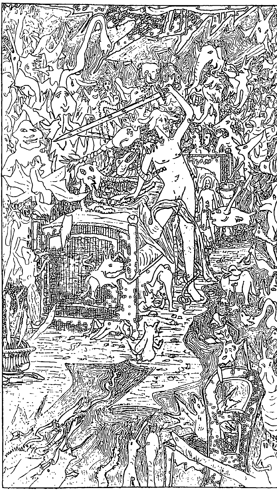

十五世紀科隆大主教雅各布·斯普倫格（Jacob Sprenger），是鬼神論中最早位居重要地位者，他多次表示曾看見女妖術師與惡魔在地上交疊，難看地擺動身軀，進行交歡。那時會散發出一股難以言喻的惡臭，但當女妖術師滿腔妒火的丈夫撲向惡魔，手持短刀朝空中猛砍，卻完全砍不到惡魔。
斯普倫格在教宗依諾增爵八世（Innocentius PP. VIII）委託下所著作的《女巫之槌》¹，是有關如何識別女巫的法典，再版過數次，並在歐洲四處流傳。書中這樣寫道：
「女性的肉慾強過男性，這種情形自主神從亞當胸前取下一根彎曲的肋骨，藉此創造出女性祖先夏娃以來，一直都是如此。所以女性是不圓滿的動物，因此總是最容易被惡魔誘惑。」
總而言之，人類真的與惡魔擁有肉體之歡的推論，天主教這方面的人士，例如聖奧古斯丁（Aurelius Augustinus）、聖湯瑪斯、聖文德（Bonaventura）或教宗依諾增爵八世，還有其他多位博士都能確切證實，研判在這樣的結合之下，會誕出下一代也不無可能。只不過此時與人類女子交歡的男夢魔，推測是偷取了男性夢遺來用，所以孩子生下來後，生父究竟是與母親同床共枕的夢魔，還是被偷取精液的男子，這個問題在神學上便值得深入討論。關於這一點，聖湯馬斯明確表示生父並非男夢魔，而是夢遺的男性，著實很有意思。曾經身為瑪麗·德·麥地奇（Maria de' Medici）告解神父的瓦拉迪爾（Valadier）則主張，

圖19 女魅魔與男夢魔

「撒旦從沉睡中的男子身上借取使人懷孕的原料，接著藉由晚上作夢，便能將這些原料注入女子體內。這種作法實在機敏，無須破瓜，原料便能送入處女體內。處女根本不知情，卻已經在孕育這些原料。」

但是依照歷史學家錫尼斯特里 (Ludovico Maria Sinistrari) 的說法，他認為不管是女魅魔或是男夢魔，事實上都不是與神對抗的惡魔，而是眾所皆知的異教半獸神，譬如法翁 (Faunnus)、潘 (Pan) 和薩堤爾 (Satyrus) 等等。原來他會在此提起早在中世紀企圖掩滅的偶像崇拜，為的是打算公開潛意識中的性議題，這種主意實在有趣。的確在中世紀盛行的妖術，其實都是在強烈暗示古代信仰一直存留在民眾心中的潛意識裡。

在惡魔崇拜與古代東方秘教尚未存在本質性差異的時代，教會並沒有將之視為危險。但是到了中世紀之後，可怕的撒旦與神對抗的性格明顯表露於外，當他要求將惡擴及人世之後，對於這些神學方面的嚴重問題，教會這邊可不會默不作聲。恰巧當時的黑死病逐一攻陷了歐洲都市，撒旦的統治使世界變得危險，因此才開始慢慢有損教會的權威。

中世紀的惡魔崇拜，主要為妖術或巫魔會 (Sabbath)，這類的低俗魔法活動屬於百姓以及貧民階級或在鄉村才會見到的景象。教會的理念確實是想將富裕與貧困者相結合，將充滿和諧的神之國度在人世加以實現，但是對於貧困交加的百姓來說，神的國度同時也是絕望的國度。他們每一天都必須為了教士及貴族流血流汗，過著極度悲慘的生活，恐怕今日的我們根本無法想像。

充滿絕望的農奴因逃避而進入夢鄉，也是理所當然之事。於是他們放聲高喊，將消失在遠方潛意識彼岸的古代眾神，或中世紀被驅除的魔鬼及精靈喚回。此時現身的，有棲息在地下的小矮人精，或是具有牛頭或羊頭的半獸神。

薩堤爾（Satyr）全身濃密毛髮，長有睪丸，具備旺盛的生殖力，所以不必像基督教的惡魔一樣偷取男性夢遺，也能讓百姓婦女順利懷孕。簡直就是農民才能幻想出的魔物，可說是否定神學闡釋的惡魔觀念，屬於自然的惡魔崇拜。

另有一種見解為薩堤爾或是法翁這類的神話怪物，是人類與動物之間交合的結果，得以居間調停人類世界與惡魔世界，如同獸交在以色列人之間，是極其平常的習慣。在耶利米（Saint Jerome）的《耶利米註解》一書中，將法翁形容成「擁有無花果者」，除了意指這個半獸神滿臉無花果（ficus，也就是膿瘡）醜惡無比之外，在阿拉伯及西班牙的俗語中，無花果一詞也代表女性性器，似乎在暗示著這個半人半獸的怪物，是以色列人慾望的對象。

十七世紀的鬼神論者弗朗切斯科·古亞佐（Francesco Maria Guazzo）主張，男夢魘有時也會附體在母馬身上，他在書中這樣寫道，「母馬在惡魔衝動時順從的話，惡魔就會溫柔愛撫，為母馬編結鬃毛，一旦母馬不聽話，惡魔便會出手虐待用手戳捅，最後還會將母馬殺死」。這種事情其實每天都會發生。

近代醫學興起之前，一般認為流產可能也是惡魔所為。妖術師在巫魔會上群舞的空檔，會頻繁排出黏稠狀、類似硫磺惡臭的噁心肉塊。

> 《歐洲劇院》²這本書中寫道，在波美拉尼亞接受拷問的十歲少女白白，「自己曾經生下二名惡魔之子，現在肚子裡還懷著第三個孩子」，最後據說遭火刑處死。然而審判官證實，少女本身仍為完璧之軀。這真是個離奇且令人目不忍睹的故事。

神學書籍中有記載，想要趕走男夢魔，可在房間裡將胡椒、馬兜鈴的根、石竹、生薑、肉桂、肉豆蔻、蘇合香、安息香與伽羅樹混合後加以焚燒。聽說這個配方對於偏好水氣的惡魔十分有效。書中還提到，若要對付其他種類的惡魔，最好使用睡蓮、地錢、大戟、曼陀羅或天仙子等藥草。

進入十九世紀之後，這類的夢魔現象仍未消失，甚至反過來變得更加考究。舉例來說，一個名叫吉拉德考登堡的人，他在《靈界與基督教的知識》³這本著作中寫道，他和聖母瑪利亞有著不尋常的友情，雖說這段故事聽起來充滿偽善的氛圍，卻還是不容錯過。

考登堡沉迷於降靈術，是個對狐狗狸（日本一種源自西洋「桌靈轉」的占卜）及自動記述有研究的人，他還可以和去世的家人及朋友對話，不過他不滿足於只能對話，開始夢想著能和這些人用嘴唇及雙手直接接觸。後來他在實驗時，得到了幸福的愛撫以及接吻的快樂，於是在一八五四年十一月，他曾同妹妹，試著向聖母瑪利亞提問。起先他歌詠祈禱文，接著手拿著筆，做好自動記述的準備之後，筆自行動了起來，在紙上順暢地寫下瑪利亞的名字，這代表瑪利亞的靈體回答了問題。除此之外，他手上握的筆還繼續寫著，最後在署名的裝飾文字上加上了小小的十字架！

「這時，感恩之情促使我用嘴唇輕碰了小小的十字架」，考登堡這樣寫道。結果令人驚訝的是，我的嘴唇明顯感受到回吻。不知道是不是心理作用的關係，我完全沒想到會有這種事。於是我試著再吻一次，同樣感受到愛撫的回饋，我的質疑也就完全消失了。我全身不寒而慄，卻感覺很美好。之後沒多久，我要入睡前，在黑暗與沉默之中，再次回想了這件事。雖然那是看不到、摸不到又聽不到的存在，卻近在咫尺。就在那一瞬間，我內心湧現令人心醉神迷的美好感覺，我只能用高聲呼喊和潰堤的淚水來表達我幸福絕頂的感受。這種感覺就這樣持續了三十分鐘以上，比起我過去所知道的任何一種感覺，都還要來得強烈。

「某日，我請求在天上的女友與我對話，她透過自動記述這樣回答我，『快樂是我們唯一被允許的事，不能說話』。有一天晚上，她的回吻速度加快，這使我感到神怡心醉，心中充滿無法言喻的喜悅。神祕終於得以實現，天地因愛而結合了！」

> 「無論這種逸樂如何持久激烈，之後也絕對不會在精神或肉體上殘留疲勞感。參與靈魂幸福的器官，果然依舊一無所動，肉體完全沒有出現任何細微變化。」

考登堡提出了這樣的結論，但是如此強烈的官能逸樂，肉體卻能做到不出現任何變化，可見需要斷絕幻想的禁欲與克己的修煉。我絕對不是在懷疑考登堡先生的良心，只是懷疑他就像狂熱信徒與神秘主義者一樣，似乎不知不覺掉進了自我欺騙的陷阱中。

另外在一八一六年，有個名叫瑪麗·安吉（Marie-Angé）的十七歲少女，她實現的神秘事件更是驚人。根據記錄者的記述顯示，她用奇怪的字體簽下了基督與瑪利亞的名字，還接連不斷地提出預言，並在屋裡看不見的僕人協助下穿脫衣服。但是最叫人驚訝的是，她像考登堡一樣，不只感覺到和基督接過吻，而且在接吻的同時，她覺得口中有糖漿注入，接下來，又有相當大量的糖漿從嘴巴湧出。最後從她敞開的嘴唇兩端，不斷地有液體潺潺流出。目瞪口呆的眾人，用手指沾取這些糖漿舔了一口，嚐過之後發現味道實在甘甜。

> 「有時候，當基督的接吻變強烈，年輕女孩就會從口中吐出美麗的糖果。『每次接吻到能聽見聲音的時候，瑪麗·安吉就會出神』。目擊者如此寫道，『有一次接吻時，從口中生出一顆如豌豆般大小的糖果，等她將近數百顆糖果塞滿嘴巴之後，便嘩啦嘩啦地吐了出來。看到這些五顏六色的糖果，我們的驚訝之情實在難以言喻……」

寫下這段記錄的，是住在法國小城貝茲一個忠厚老實的醫學士。就像這樣，乍看之下對於魅魔及夢魔的執迷，在十九世紀之後加上考究的態度，技巧性變得偽善，讓人以為中世紀當時難以捉摸的恐怖、淫猥已經消失，不過於斯曼這些人卻做出了不同的解釋。他認為現在女魅魔與男夢魔的職責，大多落在被喚醒的死靈身上，而非惡魔或靈體。事實上，在十八世紀中葉有位名叫奧古斯丁·卡爾梅（Augustin Calmet）的修道士，他在《幽靈概論》⁴ 這本巨作中曾以吸血鬼為主題，後來這個喚醒死靈的議題，在基督教及惡魔學中，開始大舉浮現檯面。已經看過電影《德古拉》的讀者一定早就知道，舉凡塞爾維亞、斯洛伐克及匈牙利等東歐各國自古流傳的吸血鬼信仰，完全可視為是女魅魔或男夢魔的變種之一。在波蘭將吸血鬼稱作「Upior」，在希臘則稱之為「Vrykolakas」。根據德國神祕學家約瑟夫·戈雷斯（Joseph Gores）的說法，其中最為殘忍的是塞爾維亞的吸血鬼。塞爾維亞的吸血鬼「Vampier」，會在夜晚掙脫墳墓，勒住人的脖子吸血。傳聞如果在白天挖開墳墓察看，吸血鬼的玫瑰色紅唇會有一絲鮮血不斷地往下滴。吸血後被殺死的人也會變成吸血鬼，以死亡作為媒介的吸血鬼種族將逐漸繁殖。塞爾維亞的吸血鬼是一種死後依舊受到詛咒無法完全死去的生物，想要徹底消滅他們，必須將楔子釘入他們的心臟，砍斷首級，並將屍體燒毀才能解決。

行。如果沒有這麼做，整座城將會被受到詛咒的死亡緊緊糾纏，甚至累及家畜及動物。

奧古斯丁·卡爾梅曾嘗試將《幽靈概論》的一章，以《流行性狂熱病》為主題，從科學的角度說明吸血鬼的現象。書中提道，墓地土壤的化學成分，可永久保存屍體。土壤中內含的氮與硫磺，在放熱反應之下，會使已經凝固的血液再次液化。而且吸血鬼在臨死前發出的叫聲，是因為火刑時的熱壓，將囤積在其咽喉的空氣擠壓而出所產生。有時候強直性暈厥，也就是所謂的「僵住症」，也算是一個能用來解開吸血鬼現象的關鍵。

無論如何，依照於斯曼的說法，被女魅魔與男夢魔附體的人，可分成二種。一種是因為個人氣質或是天生宿命的關係，可說是自然而然直接受到惡魔影響的人，這種人都是將精力耗盡在可怕的肉體運作上，所以會衰弱、橫死或是自殺而亡。另一種人，是因為凶惡之人或集體的詛咒，遭他人強迫而被惡魔纏身的人，修道院等地常見的例子就是這一類。在近代學者眼中，這些人只算是一種色猜狂，所以與其進行驅魔，倒不如送進精神病院。

不管是惡靈、夢魔或魅魔，全都是在中世紀歐洲廣為流傳的觀念，這些夢魔會因為時代及地區不同，被人用不同的名字來稱呼。像是希臘人口中的「Ephialtes」，德國人口中的「Alb」、「Marr」等等，全都是夢魔的別名。德國更是妖術的大本營，其他還有Würger（意指勒死鬼）、Gespenst（意指幽靈）、Nachtkobold（睡魔）、Auflieger（壓人鬼）、Quälgeist（麻煩鬼）等各式各樣的夢魘。俄羅斯的夢魘稱作「Kikimora」，北歐諾斯語叫作「Mara」。法語中的「Cauchenar」（惡夢），則源自於「Mara」（惡魔）與「Cauche」（壓碎）這二個字詞。

此外，依據伯恩哈德·約瑟·斯特恩在《土耳其的醫學、迷信、性生活》5書中的記載，南斯拉夫的南部有一種名叫韋施蒂察（Wjeschtitza）的魅魔，她會爬上沉睡中的男子胸膛，緊緊抱住使其窒息或發瘋。

十六十七世紀時，許多醫生爭相解析這種夢魔現象，企圖提出一個合理的說法，卻反而落入空洞的理論，不過在這當中，帕拉塞爾蘇斯的理論終於帶來了一道曙光。

帕拉塞爾蘇斯注意到一點，人類擁有三個身體，包括眼睛看得見存在人世的「實質身體」、眼睛看不見呈現以太狀的「星辰身體」，與堪稱人類內在聖靈顯現的「靈性身體」。他還明確表示，所謂夢魔的現象，其實也是來自人類的想像力，總之就是從「星辰」本質中創造出來的東西，他在書中有下述這段記述：

> 「想像力是源自星辰身體的產物，在肉體交合時無法實現的行為。因此這種孤獨而沒有對象的愛具有一種特性，會生成氣體狀的精液。這種心靈精液，將會產生壓迫女性的夢魘，以及挑逗男性的魅魔。」
—— 《無形的疾病》

這篇文章主要在說明，手淫會產生女魅魔及男夢魔，而且還強調這些惡魔不具實體，只是來自想像力的幻覺，這個說法在當時是極具水準的論點。近代的精神分析將夢魔現象視為癔病的幻覺，這部分在原理上是一致的。譬如哥雅、波希、愛倫·坡、洛特雷阿蒙這些創作者充滿優異想像力的藝術作品，毫無疑問都是從人類的脆弱醜惡中催生出形形色色的夢魔，在他們擺弄下受到刺激與鼓舞，所以自慰式的藝術與惡魔在此潛藏著密切關係，不過這個問題容後再述。

（順帶解釋一下，拉丁語的 cubo 意指「睡覺」，夢魔是指「睡在上面的人」，魅魔則是「睡在下面的人」。）

### 書目注記

- 1. Malleus Maleficarum, Jacob Sprenger, 1486.
- 2. Theatrum Europaem.
- 3. Le Monde spiritual, Girard de Caudemberg, 1857.
- 4. Dissertations sur les apparitions des anges, des démons et des esprits, Augustin Calmet, 18th C.
- 5. Medizin, Aberglaube Und Geschlechtsleben in Der Türkei, Stern Bernhard, 1903.

# 第五部

## 古代塔罗牌之谜

現在眼前，排放著七十八張奇妙紙牌，張張都是五顏六色，充滿幼稚且拙劣的插圖。乍看之下，與普通撲克牌相似，實則天差地別。這是遠從幾千年前流傳至今二十世紀，備受吉普賽女人及魔法師重視，並在世界各地廣為複製的神奇紙牌。傳說精通魔法的大師，會將這些紙牌排成各種形狀，占卜人類的命運、過去及未來。這種神秘的紙牌，在法國稱作「tarot」（塔羅牌），在德國稱作「tarock」，在義大利則稱作「tarocchi」。最具影響力的神秘學作家狄克森·卡爾（John Dickson Carr），在他的作品《寶劍八》1中，便出現過這種塔羅牌，賦予整本小說奇異的神秘氛圍，相信愛好奇幻小說的人都知道這本書。《寶劍八》雖稱不上是傑作，不過將塔羅牌作為工具套用於故事情節之中，這一點倒是很值得一提。此外，在我所見所聞的範圍內，我記得丹尼斯·惠特利的《魔鬼出擊》2中，也出現過一個會算塔羅牌的恐怖老太婆。先前別人拿給我看過，義大利最受歡迎的塔羅牌，是已故畫家內田嚴先生的家傳之寶，聽說是跑國際航線的船員送給他的。內田先生的千金路子小姐再三叮嚀，「這不能給你，只能借給你喔！」然後笑著將塔羅牌交給我，不過我現在一直後悔把牌還了回去。其實參照許多學者的論點顯示，塔羅牌的起源可追溯到遠古時候。十八世紀的大學者庫爾·德·格貝林（Antoine Court de Gébelin）說過，「世人如果知道古埃及的書籍虎口逃生倖存到現代，應該會急著想一探這驚人的寶貴作品有何奧祕（《原始世界》3 第八卷）。這正是第一個將塔羅牌起源判定於古代的意見。雖然每一張塔羅牌各自獨立，不過塔羅牌確實是古代文物。格貝林認為，塔羅牌屬於一種象形文字，藉由充滿暗示的寓意畫偽裝，才能倖免於蠻族的破壞，成為世界最古老的秘傳之書。

在格貝林的年代，埃及學並不如現在如此發達，想要了解埃及文明，必須仰賴普魯塔克、希羅多德和楊布里科斯這些希臘、拉丁作家的作品。因此格貝林才會大膽猜測，斷定埃及神話中登場的《托特之書》4，必定是塔羅牌的起源。

如此超群的意見帶給全世界學者巨大的《托特之書》衝擊，一舉提升大家對於埃及的關注。托特指的是頭部長得像朱鷺的埃及神，同時也是月之神、語言和文字的發明者，也是歐西里斯冥王的書記。發明黃道十二宮符號與煉金術的也是托特，希臘人將他與天之使者荷米斯等同視之，稱作荷米斯·崔斯墨圖（Hermes Trismegistys，意為「偉大無比的荷米斯」）。總而言之，埃及神話的托特與希臘神的荷米斯已經混為一談，人稱托特·荷米斯的煉金術元祖形象儼然形成，所以以前文提到的《托特之書》，被視為這位傳說中人物所留下的著作，是一本代表魔法奧義的書。

只不過，究竟荷米斯·崔斯墨圖這個神話人物真的存在嗎？為了更深入探討這個問題，暫時擱下塔羅牌的說明，讓我們流連在廣闊的古埃及世界之中吧！

埃及人自公元前二九〇〇年左右，便在努比亞一帶發現了金礦，有值得信賴的記錄顯示，當時透過驚人的技術在精煉金屬。當然，這些精煉技法都是修道士及學者苦心積慮研究之後的發現，所以這些秘密並不會輕易外洩出去。另一方面已經證實，埃及的化學實驗中一定會伴隨咒法儀式，所以彙整這些事實之後，世人一定會想要探尋埃及煉金術及秘傳之書的起源。

舉例來說，四世紀亞歷山卓的佐西姆斯（Zosimus）曾說過，「埃及王國的富裕全靠這些金屬挖掘法在維持，除了修道士以外，任何人都無法任意為之」，有如在暗中表示秘傳之法的存在。

記述亞歷山卓時代，更準確來說是二世紀到四世紀左右的煉金術之書，絕大多數都是在後世以寫本的方式被保存下來，所以有諸多疑點，例如著名的「克麗奧佩脫拉的煉金法」，不過是十世紀左右的寫本被保留至今。但是也有類似萊登紙莎草紙（Leyden papyrus X）以及紙莎草紙（Papyrus Graecus Holmiensis）這種，從底比斯魔法師墳墓中被發現，明顯可回溯至遠古四世紀的希臘式埃及古文書，還有前文引用過的佐西姆斯、奧林匹奧多羅斯（Olympiodorus）、辛奈西斯（Synesius）、史蒂芬努斯（Stephanus）等這群亞歷山卓學者的理論書，確實都是照這樣的形式被保留下來，所以這些文獻能讓我們逐步釐清隱藏在神秘雲霧之下的古代秘密。

透過這些文書，被視為煉金術元祖的荷米斯·崔斯墨圖，正確來說並不是希臘的神，而是存在埃及這個希臘殖民地（亞歷山卓）的神。

埃及的希臘人，十分尊崇自遠古法老時代連綿不斷傳承下來的古老宗教，雖然這個尼羅河王國的宗教已經日漸式微，但在他們虔誠信奉的同時，也為這個宗教增添了希臘色彩。

事實上在亞歷山卓殖民地，有許多民族雜居於此，而希臘人是當中最具知性且精練的一群人。埃及宗教與希臘哲學混雜之下，他們試圖導引出符合愛好且純粹的原理。當然，這當中還有猶太教的傳統卡巴拉、東方各民族的宗教、祆教以及密特拉教等宗教渾然一體。就像這樣，希臘人將文字與語言的發明者、魔法之神荷米斯與托特等同視之，創造出名為托特·荷米斯這號傳說中的神，即為荷米斯·崔斯墨圖。傳說他著作的書籍，包含可疑的作品在內，坦白說可能高達幾萬冊，楊布里科斯則認為有二萬冊之多。

當然這些書籍都是在幾世紀的歲月間，由無數有名或無名的煉金師或魔法哲學家，假借荷米斯之名著作而成，不過後代的煉金師卻相信此皆出自荷米斯·崔斯墨圖之手。之所以會如此，是因為那些書籍的內容充滿難解的象徵，對一般人來說像是走入神祕迷宮之中，根本望塵莫及。

現在荷米斯·崔斯墨圖殘存下來的書，僅有以希臘語寫成的十四篇短文，還有基督教神學家保存下來的若干片斷，其中最有名的，就是十五世紀義大利學者費奇諾（Marsilio Ficino）所翻譯的《荷米斯文集》5，又称《秘文集》，其中有部分内容酷似《约翰福音》，另外也和柏拉图的《蒂迈欧篇》6 十分相似。

此外还有一个荷米斯的作品经常被人引用，这个被神秘主义者视为信条的文章，就是名为《翠玉石板》7，又作《艾默拉德石板》8 的作品。这是在阴暗墓室内，荷米斯木乃伊手持的艾默拉德石板上刻著的文章，传说中提到，这个墓室应该位在吉萨大金字塔内部。几千年间，只有他的弟子能够自由出入这个地下礼拜堂，学习咒术以统治大自然及众神的力量。

《艾默拉德石板》由十二段简洁却含意深厚，充满象征性的文章组成。譬如「如其上，同其下」（As above, so below）这样的文章，成为后世炼金术师的金科玉律。还有「其父为太阳，其母为月亮，风将其载于腹中，地为其供营养分」等文章，也是在象征炼金术的原理，在十七世纪玫瑰十字会团员米夏埃爾·邁爾的著作《科学家与伪造》9 中，留下了很有意思的寓意画。

不过现在已经知道，荷米斯·崔斯墨图这号人物在现实中并不存在。吉萨大金字塔的内部也全都搜索过了，却没有任何一片《翠玉石板》。很不可思议的是，传说虽不属实却也相去不远。诚如前文所述一般，一八二八年，从位在埃及底比斯的某位无名魔术师墓中，发现了被称作莱登纸莎草纸的一系列文书，这些古代文献里头，内含有史以来年代最久远的《艾默拉德石板》复本。难不成这位无名的魔法师，就是荷米斯·崔斯墨图？

在此將話題重新導回塔羅牌上。承前所述，十八世紀的學者格貝林認為塔羅牌的發明者是托特·荷米斯，傳說中提到，他既是文字之神、魔法之神，也是繪畫技法之神，所以擅長描繪眾神的肖像。彙集了托特·荷米斯神秘肖像畫的書籍，名叫《A. Rosh》。「A」意指教理，「Rosh」則是開始的意思。寫成文字之後，應該很容易理解 A — Rosh 會變化成「Taroch」。依照格貝林的說法，塔羅的 Tar 意指「道」，Rog 意指「王者」，所以塔羅就是「王道」的意思。

格貝林的說法建立在含糊不清的假設之上，這成為近代埃及學發展的導火線。換言之，一七九九年，拿破崙的埃及遠征軍在尼羅河口的羅塞塔發現了黑色玄武岩的石碑後，開創了象形文字解讀的開端，這就是羅塞塔石碑被發現的始末。石碑是為了古埃及王托勒密五世所打造，利用象形文字、世俗體（Demotic）及希臘文三種字體，刻出歌頌埃及王德行的字句。考古學家商博良（Jean-François Champollion）解讀後，數千年來充滿神秘的古埃及文明，才開始有了一絲曙光，這件事後來也是遠近馳名。

日後許多學者繼格貝林之後，延續了塔羅牌的埃及起源說。在這當中，有像特埃利阿（Etteilla）為筆名撰寫論文的理髮師阿利埃特、知名的神秘主義者史坦尼斯·德·古埃塔（Stanislas de Gaita）的秘書奧士華·沃斯（Joseph Paul Oswald Wirth）、對於卡巴拉有獨自見解而著手研究名聲響亮的帕普斯（Papus），還有在《高等魔法的教義及儀式》最後章節嘗試將塔羅牌用卡巴拉解釋的艾利馮斯·李維，傑出者眾多，但是到了二十世紀之後，有位約翰·金·范·倫斯勒夫人，为这塔罗牌加上了全新的解释，撰写了《预言知识及游戏的纸牌》10 这本书。伦斯勒夫人主张，塔罗牌是从埃及、希腊与巴比伦尼亚等各地共通的古老占卜法里派生而来。在埃及古寺裡的四方墙壁上，仍画有今日塔罗牌上可见的奇妙肖像画。过去祭司习惯站在祭坛上，竖起几根类似大筌竹般的棍子，棍子倒下指向壁画后，祭司便会依照这张壁画占卜过去及未来，听从众神的命令。

在宗教受到迫害的时代，祭司纷纷弃寺逃亡，不过他们依然记得将寺院的壁画做成小纸卡，偷偷带在身上。祭司从埃及经由著名的「小麦之路」，一路逃往义大利。「小麦之路」在当时是相当重要的交通路线，连接亚历山卓与拿坡里附近的巴亚。分散在东欧各地的吉普赛人，应该就是这群埃及逃亡者的子孙。所以伦斯勒夫人表示，在他们当中有塔罗牌名人，也完全不令人意外。

话说回来，前文为大家说明了塔罗牌漫长的历史起源，接下来想为大家介绍一下塔罗牌的涵义与用法。在七十八张牌当中，从〇到二十一为止，附有编号的纸牌（大塔罗）有二十二张，在这些纸牌裡头，一定都画有人像，所以这些纸牌又叫作「人物牌」。人物牌分别表示人类的欲望、恐惧、智慧、活动、善意或恶意等等，如同全世界的缩影。第十八张的「月亮牌」，则画上了二隻狗来代替人像，这些狗的用意是在藐视十六世纪的占星学家。而向月狂吠的狗，总之就是讽刺人类的图画，所以也算代表「人像」的一种。

由此可見，塔羅牌的花色多半與拜占庭寺院的花窗玻璃，以及壁畫上出現的聖像畫（icon）十分类似。藉由人像表現神聖觀念的手法稱作圖像學（iconography）。但是塔羅牌與圖像學的差別，在於後者是在表現神聖的觀念，前者則是在展示現世的觀念。假如拜占庭寺院表達的是人類與神聖之物的關係，塔羅牌則是在表示人類與世間萬物的關係。

話雖如此，其實二者都具有相同的功能，都算是一種「記憶法」。

中世紀的人們透過圖畫組合，很容易就能理解用文字長篇大論的複雜觀念。即使不是偉大學者，無知文盲也能透過繪畫輕鬆「解讀」。這就是中世紀所謂的記憶法，這種方法實在優秀。例如魔法師拉蒙・柳利筆下名為《記憶的藝術》11的奇妙作品，當初創作的目的也是一樣，他將《聖經》裡的各種主題用圖畫表現出來。例如他把約翰、路加及馬可這些福音書的作者，分別用鷹、公牛與獅子這類形象來展現，除了這些形象之外，他還將聖經中的各種場面用袖珍畫（miniature）的方式描繪出來。在這些袖珍畫裡頭，當然同樣大量使用了各種象徵以及寓意表現。藉由這種方式，就連不識字的無知份子，也能藉助圖像，將《聖經》的事蹟深深烙印在記憶裡。

現代教育十分發達，如今從我們的角度來看，感覺這些方法完全就像騙小孩的把戲，但是在只有少數人能夠讀寫的時代，透過圖畫記憶的方法，實在不容小覷，而塔羅牌的花色也是利用顏色、形狀以及附屬物等無數的傳統象徵符號所組成，屬於記憶法的一大體系。

话说回来，究竟记忆法是用来做什么呢？如此周密隐藏的象征意义，又代表什么呢？到此我们的推理突然陷入僵局。如果是《记忆的艺术》，描述的是《圣经》里基督的事迹，会有人人都了然于心的对象。然而塔罗牌呢？

至少塔罗牌的象徵并不是在展现固定一种教义，这点无庸置疑。虽然纸牌的图画都是用单纯老套的线条描绘，但却各自暗示著接连不断的活动。也就是说，塔罗牌的目的，似乎是要将我们的精神引入生气勃勃的状态，藉由不受任何拘束的精神、习惯及固定观念，让平时一直沉睡在意识深处魔法般的心灵能力，蓬勃地甦醒过来。

所以塔罗牌的奥秘，找不到解开的钥匙也是不足为奇。使用塔罗牌的人，各自提出独到见解即可。这样说起来，解牌看似笼统又不负责，但是说到魔法，不管是哪一种技巧咒术，绝对无法用固定的理论做出合理的说明，运用魔法的人经常才是问题所在。至于无法解释的部分会视为秘法，通常是在方士之间传承最基本的秘密。

因此，塔罗牌也和占星学一样，虽然以预言未来以及人的性格为目标，但却完全不具备占星学这方面的科学根据。塔罗牌占卜者认为，未来无法以数学理论加以解析。占星学者会透过计算以及抽象的思考，努力挖掘宇宙的秩序，但是当这些努力遇上瓶颈，就会像对月狂吠的狗一样，徒劳无功。方才提过的第十八张牌，就是用来嘲讽这种占星学者的妄想。

總而言之，塔羅牌占卜者始終立足於世間百姓的信仰基礎之上。也就是說，當煉金師及占星博士一心一意精進個人孤獨的夢想以及完美無缺的技術時，塔羅牌占卜者將百姓視為朋友，在他們日常生活中遇到幸或不幸的事情時，提供諮詢服務。

塔羅牌另外的五十六張牌，稱作小塔羅，就像一般的撲克牌一樣，分成四種花色，有權杖、寶劍、金幣與聖杯，四種花色都有一到十的編號，另外還有四張主牌，分別是國王、王后、騎士與侍從。四種不同的花色，代表中世紀的社會階級，所以權杖是百姓，寶劍是貴族，金幣為商人，聖杯為教士，分別具有不同的象徵。近代的撲克牌，幾乎可說是由分成四組花色的小塔羅變形而來。

另一方面，二十二張塔羅牌（大塔羅）則是由小塔羅獨立出來的一組牌，分別具有下述名稱及涵義。

- ○ 愚人——瘋癲、靈感、信賴、狂熱
- 一 魔法師——提問者、神、權威、引路人
- 二 女祭司——學問、神秘、冥想、和平
- 三 女王——決斷力、行動、愛、家庭
- 四 國王——意志、天理、理性、支配
- 五 教宗——靈感、指導、祭司、辯護人
- 六 戀人——熱情、自由、結合、一致
- 七 戰車——勝利、知性、獨立
- 八 力量——力量、工作、勇氣、忍耐
- 九 隱士——智慧、慎重、祕法
- 十 命運之輪——命運、時間、恩寵、幸運
- 十一 正義——正義、責任、公平
- 十二 倒吊人——犧牲、考驗、規律、服從
- 十三 死亡——死、再生、永續、人性
- 十四 節制——節約、中庸、純潔、平靜The request was rejected because it was considered high risk

The request was rejected because it was considered high risk接下來就從艾爾伯圖斯著作的《植物以及寶石的神奇效力》這本小書中，引用部分內容。

「香水草（Heliotrope）——這種植物的名稱，由希臘語中的太陽「helios」與變化「trope」此二字所組成。這種花近似太陽，才因此命名。假如你在八月正中採摘這種花，與狼牙一起用月桂樹葉片包起來，好好地隨身攜帶的話，就沒有人敢說你壞話或是中傷你。如果睡覺時放在枕頭下，你就能（在夢中）看見潛入你家的小偷長哪副模樣；假使藏在教會裡，瞞著丈夫搞外遇的妻子，則再也無法走出教會一步。」

「咬人貓（Nettle）——將咬人貓和金魚藻一起握在手中之後，無論遇到怎樣的幽靈，你都完全不會感到害怕。將咬人貓與蛇紋木（snakewood）的汁液混合，擦在雙手之後，再將剩餘汁液倒進水裡扔掉，就能輕易地徒手抓到魚。」

「白屈菜（Greater celandine）——將這種植物與鼴鼠心臟一起放在病人枕邊，如果這個病人的命運難逃一死，他會放聲高歌；如果這個病人註定痊癒，將會淚如雨下。」

「玫瑰——將這種花朵的果實、芥菜子的果實和黃鼠狼的腳一起吊在樹上，那棵樹將不再結出果實。若將這些混合物放在乾枯的高麗菜旁，二天後菜將恢復生機。若再將玫瑰放在發出火光的油燈邊，在場的人看起來都會像惡魔一樣。」

「一串紅 (Salvia splendens)——將這種植物放入小玻璃瓶內，澆上肥料之後，就會產生類似蟲或鳥的生物，而且這種鳥的尾巴就像斑點鵓一樣。若將這種生物的血擦在某個人的胃部，這個人將失去知覺兩週以上。將這種蟲燒死後，再將灰燼丟進火裡，馬上就能聽見轟雷貫耳。如果將這些灰燼放入油燈裡，將會於屋內見到蛇在扭動身軀。

「磁石」——假如男人想知道妻子是否堅貞，可以拿鐵色磁石的石塊放在妻子頸部下方。倘若妻子保有貞潔的話，就會擁抱丈夫，反之則會立刻逃離開床。

「祖母綠」——欲成賢者、積累財富及預知未來的人，須手持透明閃耀的祖母綠寶石。黃色寶石為最上品，往往可在獅鷲的巢穴中尋得。將這種寶石帶在身上，將會才氣無雙、記憶力超群；含在舌下的話，將產生預言能力。

「紫水晶」——持有這種紫色的水晶，能讓頭腦清晰，絕對不會喝醉。極上品的紫水晶產自印度。想要醒酒、養足精神鑽研學問，沒有其他寶石的效果能夠比得上紫水晶。

「編瑪瑙」——想讓對方難受、害怕或引發內心糾結的人，須擁有黑色的編瑪瑙。極上品產自阿拉伯，摻有大量白色細紋。如果將編瑪瑙掛在某人的脖子或是戴在手指上，這個人會立刻陷入憂鬱，容易感到害怕；晚上會做可怕的惡夢，與友人不睦。

> 「珊瑚——想讓暴風雨平息渡過大河的人，最好持有珊瑚。珊瑚有紅有白，而且經實驗證實時，珊瑚都能發揮顯著效果趨吉避凶。」

> 「尿淋沥 (Stranguria)」——結束這些論述之前，要告訴大家一個驚天秘密。在獨角獸頭中發現到的白色奇石，就是能治療醫生俗稱尿淋沥疾病的特效藥。有排尿困難的人、染上瘧疾的人，靠尿淋沥就能痊癒。若是孕婦帶在身上，保證不會受傷。」

以上是艾爾伯圖斯所著魔法書中的摘錄，由此可知，人們認為寶石中存在大自然形成的純粹神秘力量，人類無法干預。這樣的論點後來發展成各式各樣的技巧魔法，例如中世紀以後開始盛行的護身符 (Talisman)、幸運指環、勳章，或是反映大自然的骨相學及手相學。但是接下來繼續中世紀的艾爾伯圖斯之後，想在本章節為大家介紹的，是文藝復興時期搏得盛名的自然魔法巨匠吉安巴蒂斯塔·德拉·波爾塔 (Giovanni Battista Della Porta，一五三八－一六一五)。

波爾塔是拿坡里的天才醫生，年輕時周遊西班牙、法國等歐洲各地，與當時的魔法師有來往，並在一五六〇年，於拿坡里成立名為「大自然奧秘學院」 (Academia Secretorum Naturae) 的奇妙研究所。這個研究所看似邪門異教，引起羅馬教宗保祿五世的警戒，下令立即關閉。於是波爾塔前往羅馬，詳細說明學院從事哪些研究活動之後，教廷這才首肯，允許重啟活動。

波爾塔繼承了中世紀首屈一指的阿拉伯學者阿諾德·諾瓦 (Arnaldus de Villa Nova) 的實驗精神，不僅發明了許多光學儀器，還在暗室裡裝上巨大鏡片，製造出一種暗箱裝置，所以也被稱為攝影術之父。他在晚年時蒐集奇珍的動植物和礦物，還在自家庭院栽培產自外國的奇特植物。據說到拿坡里旅行的人，回程前都會去參觀波爾塔這間奇幻迷離的博物館，與充滿異國風情的庭園。

有趣的是，這位對大自然奧秘著迷不已的學者波爾塔，卻是應用類推法，來彙整出他獨創的骨相學系統。類推法簡單來說，就是假設某個人與某個動物（或是植物）相似時，這個人和這個動物（或是植物）的性格也會相似。一個人的氣質（與體液學說相關，可分成多血質、抑鬱質、膽汁質與黏液質），也包含在天地萬物之中，就連乍看之下毫無關係的東西裡頭，仔細觀察也能發現具有相同的性格，這就是所謂的類推法。

舉例來說，外形象鹿角的樹枝，具有與鹿相同的性格（參閱圖33）。長著牛臉的男人，就會擁有倔強、急慼與易怒的個性（參閱圖34）。長得像鴕鳥的人，就是膽小、做作而且抗壓性差的男人。像豬一樣的男人，完全像隻豬一樣貪吃，懶散又小氣，不愛乾淨還很愚昧。臉長得像獅子的男人，勇氣十足，品格清高。長得像羊的男人，則是彬彬有禮，不會堅持己見。諸如此類，大致上就是如此。

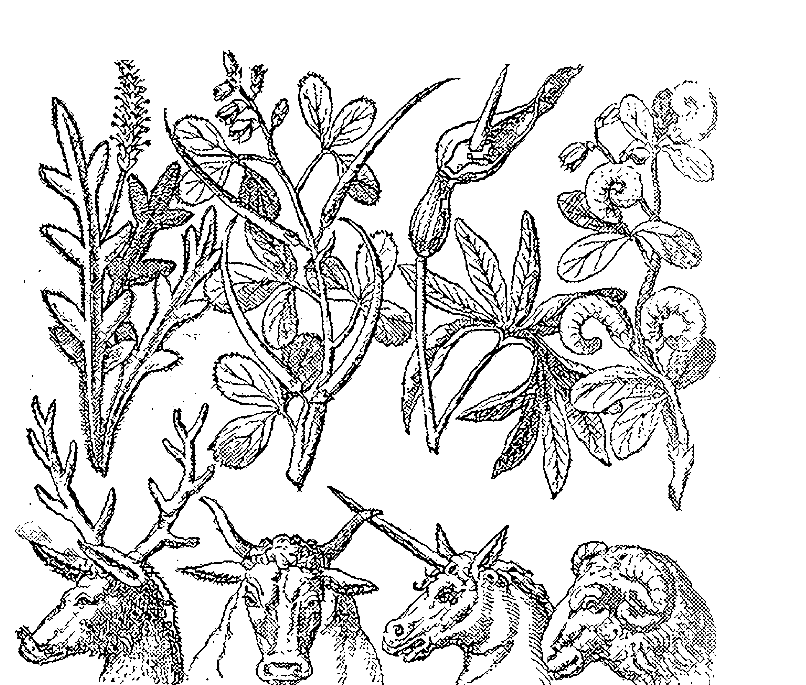

圖33 動物與植物相似

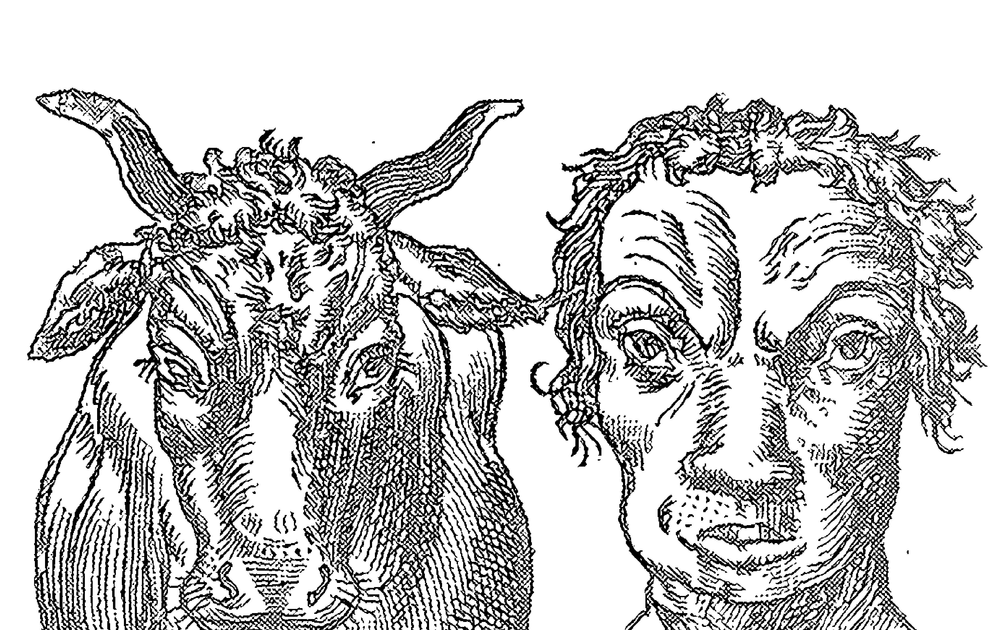

圖34 牛臉男

波爾塔原本就是名醫，大概就是因為這樣，才有機會比較各種患者的性格及容貌以進行研究，提出如此異想天開的學說。包含帕拉塞爾蘇斯、安布魯瓦茲·帕雷（Ambroise Paré）在內，許多醫生在科學的黎明期，都為引領文化起了很大的作用。

波爾塔的著作名為《人相學》³，在全歐洲掀起了不尋常的反響，並在威尼斯、漢諾威、布魯塞爾、萊登這些當時的文化中心，不斷地再版。後來瑞士出現了一名深受波爾塔骨相學影響的著名哲學家，就是讓·歌德、巴爾扎克（Honoré de Balzac）都敬服的十八世紀神秘主義思想家約翰·卡斯帕拉瓦特爾。他引用了波爾塔的牛臉男圖片，憤慨地寫道，“從幾百萬人中，也找不到第二個長得這麼像牛的男人吧？假使有一個這樣的男人，也會比牛優秀許多！”

就像羅馬的博物學家老普林尼（Gaius Plinius Secundus）一樣，吉安巴蒂斯塔·德拉·波爾塔也是根據古書記載，才提出了引力與斥力的論點，認為自然界某些物質會彼此吸引，某些物質會相互排斥。波爾塔在《自然魔法》⁴這本書中，便利用“不愉快”以及“協調”這些用詞來說明這三個原理。

按照作者的說法，為大家舉一個淺顯易懂的例子，譬如被綁在無花果樹下的牛，不管有多凶暴，都會馬上變乖巧。因為無花果會與牛相互吸引，產生某種共鳴。加入無花果葉一同烹煮的牛肉，一下子就能煮得軟爛，也是同樣的道理，這點在東方賢人瑣羅亞斯德（Zoroaster）的書中都有詳細記載。（雖然不知真偽，不過波爾塔就是這麼說的。）所以要馴服惡牛，餵無花果榨出來的汁液給牛喝就行了。

在波爾塔的《自然魔法》一書中，還有介紹其他許多奇蹟案例。例如有讓物質腐爛後自然生成動物的方法、（艾爾伯圖斯的著作中，也有類似的案例。）製造人造寶石的方法、讓人類二十四小時精神錯亂的方法、用毒茄蔘使對方睡著的方法、用蠶豆加上洋蔥及蒜頭讓對方做好夢或惡夢的方法，以及其他還有製造煙火的方法，以及釣魚的方法等等，族繁不及備載。

但是其中最不尋常的，就是教人用魔法燈產生幻覺，讓人看到毛骨悚然的馬。大家還記得嗎？在艾爾伯圖斯的書中，也曾提到將藥草扔進油燈裡，就會見到惡魔鬼幻影的方法。波爾塔在書中提到下述內容：

> 「古代哲學家阿奈克西拉奥斯（Anaxilas）有一段著實有趣的故事，他十分樂於用蠟燭芯及蠟燭殘骸，讓人產生錯覺，將人臉變成像妖怪一樣。不過這種事對我們來說是輕而易舉。比方說，取來母馬身上剛和種馬交配後的有毒分泌物，放進新油燈裡點燃即可，在場的人臉部一定會立刻變成像馬臉一樣。雖然我沒有做過實驗，並無法斷言，不過我認為這件事是真的。」

喬塞福·彼得魯奇（Gioseffo Petrucci）有一幅銅版畫（阿姆斯特丹，一六七七年）曾描繪過這種魔法景象，請大家仔細觀賞，簡直就像是格列佛遊記中去到慧駰國一樣（參閱圖32）。

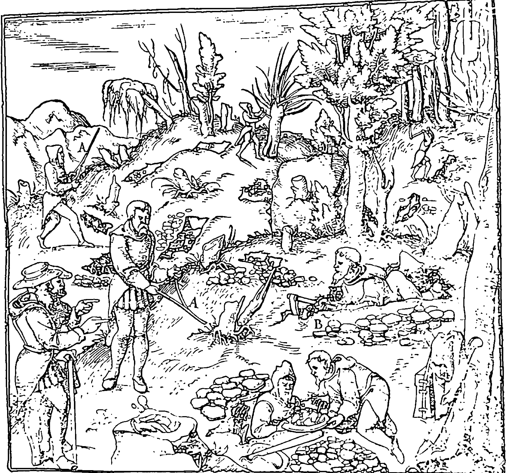

圖35 用占卜棒發掘礦脈

接下來再為大家介紹自然魔法的另一面，時間將穿越到十八世紀末期，馳名當世的「占卜棒」相關爭論。

放眼古代，會使用棒、箭與杖作為占卜工具，即便到了近代，人們還是會使用這些神秘工具，探尋地下的礦脈、煤炭層或礦泉等等。當然近代有許多學者，對於這種占卜棒的效力抱持著懷疑的態度，不過其中還是有傑蘭·力加這類有力學者認同占卜棒的可信度，所以問題就變得更加棘手了。

一五七一年格奧爾格·阿格里科拉（Georgius Agricola）在法蘭克福出版的《論礦冶》這本古書中，記載著用這種占卜棒成功找到礦脈的事實，甚至有木版畫的古拙插畫描繪出礦坑的現場（參閱圖35）。二名占卜師拿著雙叉的占卜棒緩緩而行，站在一旁觀察的二名測量技師正用手指著占卜棒指示的地點。阿格里科拉用占卜師在現場念誦的魔法咒語，說明了占卜棒的用法，十七世紀的耶穌會修道士基爾學（Athanasius Kircher），也承襲了這項說法。

另外在一六九二年，蒙彼利埃一名叫作皮埃爾·加尼耶（Pierre Garnier）的醫生，呈報了令人難以置信且不可思議的事實。有名多菲內的百姓傑克·埃馬爾，他用占卜棒尋找小偷及殺人犯的下落，結果都能找到人。有一次，里昂一家酒館的夫妻慘遭殺害，當傑克·埃馬爾一走進發生殺人案件的酒倉，占卜棒立刻發生劇烈震動，直接按照著占卜棒指引的方向追尋犯人的行蹤之後，來到了一家旅館，這裡就是幾天前犯人曾經留宿的地方，接著占卜棒指著犯人碰過的酒瓶。追到南法之後，終於在博歐凱耶爾監獄前停了下來，占卜棒暗示犯人就在監獄裡。沒想到事實果真如此，犯人只好認罪，終於坦承犯行。

在《神秘物理學暨占卜杖相關論述》一書中，瓦萊蒙神父（Abbé de Vallemont）試圖用科學的角度解析這種神秘現象。依照他的說法，這類乍看不可思議的自然現象，同樣也是基本粒子運作下的結果。

據悉瓦萊蒙神父就是依此進行科學性的說明，但是我們卻完全不知所云。像這種「粒子的哲學」，雖然算是低俗的魔法，不過大家還是公認寶石中具有醫學方面的療效，相信人體會放射出物質特性的光線，范·海爾蒙特（Jan Baptist van Helmont）一派古老自然魔法學說的頑廢苛存，是不容質疑的。

> 「粒子在握著占卜棒的手中，會進行發散作用。也就是說，地下水及礦脈會促進粒子的放射，而逃亡的殺人犯讓粒子呈一直線流露出來，因此這些粒子才會引發占卜棒的反作用力。」

寶石神奇療效的應用案例，可參考方才提過的波爾塔的《自然魔法》一書，不過在更早之前，中世紀的女先知赫德嘉·馮·賓根（Hildegard of Bingen）就已經實際運用過，傳聞她會利用刻有十字架符號的寶石及麵餅為病人治療。

波爾塔對於青金石（alectorius）這種完全不為人知的寶石，斬釘截鐵地表示，「假如這是從四年前去勢的公雞腹中出現，或是從母雞胃裡取出的話，持有這個寶石的人將會得到無比的力量。」

艾爾伯圖斯也有提到相同的主張。而且依照波爾塔的說法，「紅瑪瑙可治癒罹患花柳病的婦人；鋯石可作為解毒劑；黃玉可矯正色情狂；綠松石治療憂鬱症及心臟衰弱十分有效；祖母綠掛在脖子上能預防癲癇，而且隨身攜帶祖母綠的人只要一失去童貞，寶石就會馬上一分為二。」

> > ——引用自於斯曼的《彼方》

十八世紀後半，巴黎出現了一個自稱治療醫學專家的男騙子，倡導所謂的動物磁流學說，這個人就是來自德國的法蘭茲·安東·梅斯梅爾（Friedrich Anton Mesmer，一七三四年——一八一五）。他認為從天空發出的能量，可以儲存在類似蓄電池的設備裡，只要將這種能量導入病人體內，病人肯定能恢復健康。而且將強大能量積蓄在體內的人，只要能自由控制這些磁流，屆時將手放在病人頭上，即可將自己的能量注入病人體內。

在梅斯梅爾豪奢的屋內，放著一個巨大桶子，他就是用這個來當作蓄電池。桶子呈圓柱形，裡頭以放射狀的方式排放著許多瓶子，設計原理是將所有能量導入，儲存在中央的大瓶子內。瓶子裡裝滿了磁力水、玻璃粉與金屬屑。蓄電池上有蓋子，還有幾根鐵棒及導線從蓋子的地方朝外伸出來。

因此病人得抓著這些鐵棒接受磁力療法，在機器周圍，則備有病人專用的舒適椅子。治療期間，小型管弦樂隊會演奏音樂，設備齊全十分舒適，完全沒有醫院陰沉的氣息。喜好奢華的梅斯梅爾，還用昂貴繪畫、華麗的洛可可式時鐘與水晶玻璃藝術品裝點屋內。他談笑風生，和蔼可親，身段柔软，以致於全巴黎上至貴婦公子，下至貧民百姓都爭先恐後前來找他治病。雖然巴黎的醫學學術院妒忌他的成功，不過梅斯梅爾受到路易十六的保護，因此也拿他沒轍。只是梅斯梅爾最後還是面臨被時代潮流遺棄的命運。梅斯梅爾有一名極度熱情的信徒，就是著名的埃及及學者庫爾·德·格貝林，他在梅斯梅爾屋內的大桶子前接受治療時，居然暴斃猝死了，這下子秋後算帳的日子到了。在現在這個時代，並不會因為一、二個病患去世，就對醫生或醫學投以不信任或猜疑的眼光，但在十八世紀的巴黎，事情可就不是如此了。梅斯梅爾慘遭薄情的巴黎民衆驅逐，離開了法國，晚年在英國孤單生活，後来回到出生地德國，結束了一生。

# 第九部

## 星位與預言

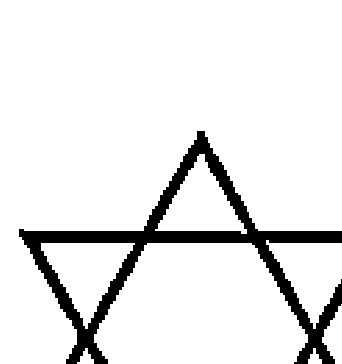

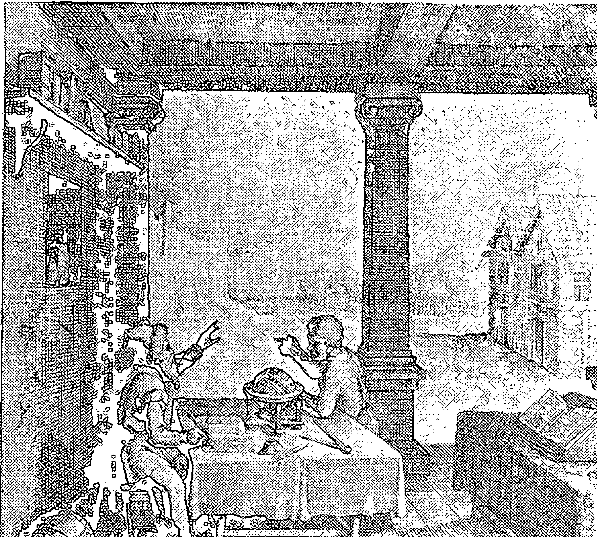

圖36 占星師，引用自羅伯特·弗拉德的著作

有一次，我粗手粗腳打開剛從法國寄來的舊書包裹，拿起很大一本發出餿臭味的真皮封面書籍後，從書頁中掉下了薄薄一頁被蟲蛀滿洞的小冊子。我心裡納悶著，不記得自己有訂過這本書，結果一看封面，上頭寫著「法國氣象學會會員 V·羅素夫人寄給馬賽醫院院長 S 博長，關於霍亂的書函」，出版於一八六八年，並不會太古老。
恐怕是偶然被夾進古書內頁裡，但是不知道什麼緣故，就這樣被送到我這裡來了。篇幅不多，迅速翻閱過後，發現裡頭的內容是對占星學瘋狂著迷的老太太，歸結疾病發生原因全在於天文學，於是才會向醫院的醫生提出她滔滔不絕的論證。這位相當博學的老太太，在炫耀自己對於帕拉塞爾蘇斯學派星辰醫學論的造詣高深，意氣飛揚。看來公開的小冊子是自費出版的，這單純是出自她善意的論戰，希望醫院方面能納入參考，至於醫院方面是否有尊重她的意見，這方面便不得而知了。
現在要逐一介紹這封信的內容會過於繁瑣，在此省略，不過藉此可以了解，占星學的信仰是如何廣泛滲透到歐洲人民的心中。話說回來，究竟何謂占星學呢？
所謂的占星學，可將宇宙比喻成一個精密的時鐘，而占星學就是用來發現天界齒輪裝置轉動法則的秘法。這個時鐘上的錶盤，亦即鑲嵌上群星的天球，因此最重要的就是觀察星星如何運行。天界雖有一成不變的秩序，人類的命運卻看似變化無常，但是果真如此嗎？人類的命運其實也和宇宙的齒輪裝置存在微妙關係，無論生死，都像時鐘一樣十分正確，且按照數學公式事先決定好了嗎？——這就是占星學理論成立的第一步。

然而，以數學公式計算星象運行的方法，與文明起源同樣古老。舉凡迦勒底人、埃及人、亞述人、希臘人或波斯人，大家在這點上都是精明的數學家。他們不但沒有計算機，也沒有望遠鏡，卻已經發現了許多重要的天文學現象。眼鏡最早在十七世紀初期才出現，開始普遍使用望遠鏡則是一六六三年的事，如此看來，亞歷山卓托勒密（Claudius Ptolemaeus）那拙劣的天體圖，我們必須投以敬服的眼神才行。

文藝復興時期的天文學者也很令人驚豔，他們單靠尺規觀察星象，埋首研究高度的理論，當然當時還是用肉眼在觀測。包含哥白尼以及第谷·布拉赫（Tycho Brahe）的實績，也是在這樣的環境下促成。我們往往會想像哥白尼在操作望遠鏡的情景，這卻是現代人在歷史演變中會犯上的錯覺。

所以十九世紀陷入這種錯覺的畫家，在想像中世紀占星學家的肖像進行描繪時，神秘的畫像中動不動就會加上巨大的天文望遠鏡，或是其他非常不可思議的器具，企圖精心營造額外的氛圍，展現古老的神秘感，卻反而露出了馬腳。科蘭·戴·布蘭西在《地獄辭曲》1 一書中穿插的諾斯特拉達穆斯的肖像畫（參閱圖37），就是其中一例。

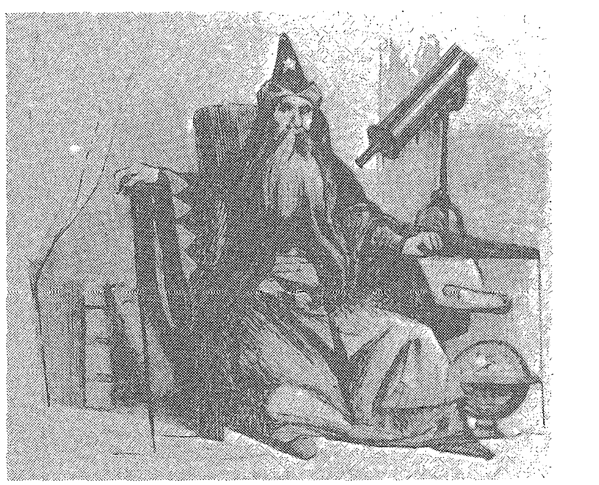

圖37 諾斯特拉達穆斯的肖像，繪於十九世紀

在這張圖畫中，十六世紀首屈一指的預言家諾斯特拉達穆斯戴著奇妙的尖帽，穿著寬鬆袖子的衣服，可是當時的占星學家，絕對不會打扮成這副魔術師般的奇裝異服，他應該是穿著類似當時大學教授那種儉樸單純的服裝。諾斯特拉達穆斯身旁，還擺著氣派的天體望遠鏡，當然這種東西在十六世紀當時不應該存在。

另外在十八世紀，還留有一幅諾斯特拉達穆斯肖像畫的銅版畫（參閱圖38），這幅畫比較接近真實人物。十六世紀占星學家的服裝，大致上照這樣去想像就不會有錯了。同理可證，著名占星家威廉·李利（William Lilly）在肖像畫（倫敦，一六四七年）中穿著的黑色長袍，就是十七世紀中葉英國學者最具代表性的服裝。

另外在羅伯特·弗拉德的《兩宇宙的歷史》一書中，有幅插圖是一名占星學者出現在觀測所裡的銅版畫（參閱圖36）。在這幅畫中，一把鬍子長得像聖誕老人一樣的占星學家，頭上戴著毛皮帽子據說是為了保護頭部，以免受到星象造成的磁力及氣流所影響。

特別值得一提的，是在這些古老圖畫中，完全沒有描繪到望遠鏡。容我重申，望遠鏡在一六○四年才由荷蘭人發明出來，直到伽利略第一次應用於天體觀測之前，從未在占星學及天文學領域登場過。

- 1. The golden bough, Frazer, 1922.
- 2. De Lapidibus Pretiosis et Eorum Virtutibus, Albertus Magnus, 13th C.
- 3. De humana physiognomonia, Giovanni Battista Della Porta, 1586.
- 4. Magiae naturalis. Liber 1-7. German, Giovanni Battista Della Porta, 1680.
- 5. De re Metallica, Georgius Agricola, 1571.
- 6. La Physique Occulte: Ou Traite De La Baguette Divinatoire, Abbé de Vallemont, 1693.

The request was rejected because it was considered high risk## 费兹笔记

一五九八年赫曼·罗夏克 (Hermann Rorschach) 于瑞士出版的《黄金之帆》一书中，也煞有其事地记录下帕拉塞尔苏斯从所罗门·菲菲尔或是德利斯摩西奴斯这些人物手中取得了「哲人石」。

堪称放荡天才的帕拉塞尔苏斯，据说绝对不会待在同一个地方超过三、四个月。话虽如此，那样受到天主教及保守势力厌恶，树敌众多的他，事实上却在全欧洲各个贵族及富豪家中来来去去，无论去到何处都从未受到冷淡对待，实在很不可思议。当然，一定是他出类拔萃的医术起了作用，但是与此同时，从这点也可以推测他也许加入了某种秘密组织。

在中世纪的时候，从相互扶持的精神发展出来的同业公会，纷纷于各地成立。其中由建筑师及石匠组成的公会称作共济会，自大教堂建筑开始盛行的八世纪以前就已经存在了，国王及教宗还赋予他们许多特权。因为建筑技术属于「王者的技术」，个中秘密只会传授给够格学习这门技术的人。

而且只要加入这类秘密组织，就算抱持异端思想，一般来说或多或少都能在这种职业的表面伪装下备受宽容。所以与正统天主教会立场不太一致的卡巴拉学者及炼金师，会将这类的同业公会当成一种避难所，自然也是极为正常的趋势。

当时想去旅行的人，也不得不仰赖这类组织。加盟组织的人，只要出示暗语或徽章，四处都能借宿。反观工匠组织或是秘密团体，同样为了求得新知，也会希望进一步和外国人来往，所以这种技术或思想层面的国际交流，一直在社会的暗处偷偷地热络进行着。这种趋势持续到了法国革命为止，歌德著名的《威廉·麦斯特的熟练工年》等著作，想必也是在这样的背景下诞生出来的吧。

虽然没有证据显示帕拉塞尔苏斯参加过这类组织，但是能从容不迫走访语言不通、习惯不同的外国，所到之处皆受到知识阶层、贵族阶级的吹捧，在各地让当时一流的画家（鲁本斯、丁托列托等人）画下肖像画，在诸多事实的背后，几乎可认定这般臆测具有十分可靠的根据，难道不是吗？

无论如何，处于中世纪根基逐渐瓦解的动荡时代，类似帕拉塞尔苏斯这般自命清高的精神，犹如流星曳步的苍白光芒，世界奔走四处流浪，每每听闻都是令人兴致勃勃的话题。

说到帕拉塞尔苏斯奇迹般妙手回春的案例多不胜数，其中最为人所知的，就是发生在巴塞尔著名出版业者约翰·弗罗本（Johann Froben）身上的故事。

弗罗本被右脚骨折一事所苦，镇上许多医生的治疗都不见起色。这时名声超群拔类的当代大学者伊拉思谟，正好寄居在他府上。伊拉思谟想起数年前在牛津遇见的帕拉塞尔苏斯，为了朋友派名人去将这位有名的医生请到巴塞尔来。经由帕拉塞尔苏斯巧手治疗后，弗罗本的伤马上就愈了。

自此以后，伊拉丝谟完全信任帕拉塞尔苏斯，不时写信向他请教治病事宜。那阵子，佛罗本家里有一大群参加宗教改革运动的新时代学者进进出出，而帕拉塞尔苏斯会与这些学者深交，前后因果也不难揣测。

很久以后，歌德会受到帕拉塞尔苏斯极大影响，这些事情从日记及自传中也都很容易窥见一二。就连浮士德的四大咒语，「火精灵沙罗曼达燃烧吧！水精灵温蒂妮翻腾吧！风精灵西尔芙消失吧！地精灵诺姆努力吧！」无外乎是参考了帕拉塞尔苏斯一派的自然观。

继亚里斯多德之后，最先将宇宙四元素融入自然哲学的人，是贵为帕拉塞尔苏斯先进的阿格里帕·冯·内特斯海姆；帕拉塞尔苏斯反而更重视炼金术的三元素（也就是使物质流动的水银、使物质可燃的硫黄与使物质凝固的盐这三元素）甚过四元素。

依据九鬼周造博士的见解，「在帕拉塞尔苏斯眼中，自然哲学的基本包含相反的原理、发展的思想、个体的原理」，不过这部分深入到哲学议论，所以在此省略。

倒不如来谈谈关于歌德的著作，书中提到浮士德的弟子瓦格纳用瓶子调合物质，制造出人造小人何蒙库鲁兹（Homunculus）的情节（第二部 实验室）。这部分都有明确出现在帕拉塞尔苏斯的《物性论》³著作中，所以歌德也是从帕拉塞尔苏斯的想法中得到了创作的灵感。

「将男性精液密封在蒸馏器中四十天，不久后当精液腐败，就会观察到出现变化。接下来会出现近似人形的物质，而且是透明的，几乎看不见实体。但是这个全新的生成物要小心翼翼地用人血培养，放在马的子宫内维持固定温度，等到四十周的时间过后，它就会像女性生出来的小孩一模一样，形成四肢健全的孩子，只是尺寸极小。在它成长茁壮展现智能之前，必须照顾得无微不至。这正是神对于罪孽深重死不足惜的人类，下达的最大秘密启示之一。虽说这个秘密总是存在人类不为所知之处，但是事实上会以半兽人、水精灵的形态出现，自古便众所皆知。也就是说，他们正是这些生成物的祖先。因为这些何蒙库鲁兹到了成年的阶段之后，有些会变成巨人，有些则会变成矮人。人们利用技术，赋予它们生命、血肉与骨骼。它们因技术而生，它们即是先天的技术。所以人们不需要教育它们，反而是它们才有资格教育人类。因为它们有如庭院里的玫瑰花，从技术中生成，藉由技术维持着生命。换言之，它们超越人类，近似精灵。」恐怕读者会取笑帕拉塞尔苏斯的妄想吧？但是制造新生命，不只是中世纪炼金师难以割舍的禁忌梦想，更是连绵到十九世纪的秘教哲学之核心。仔细想想，应该没有比这个，会对神和天主教造成更可怕的侮辱了吧？

帕拉塞尔苏斯在过去著作的《子宫论》⁴中，强调男女在肉体上的差异。依照他的说法，子宫算是一个封闭的世界，是创造性精灵（Archeus）的栖息处，为了在胎内维持这个世界而被创造出来的女性，是与男性有着本质上不同的小宇宙（Microcosmos）。

「女性如同支撑果实的树，男性如同被树支撑的果实」，这就是帕拉塞尔苏斯本人的说法。

因此帕拉塞尔苏斯认为，将创造性的男性精液，移至与女性子宫相仿的环境之后，即便不藉助女性的肉体，也能以人工方式创造生命。传说中指出，他依照这种方式将自己的精液利用化学作用，真的制造出一个胎儿。

前文提到过，艾尔伯图斯·麦格努斯的弟子汤玛斯·阿奎那砸坏了艾尔伯图斯·麦格努斯制作的人造人偶，除此之外，还有许多何蒙库鲁兹及人造生命的传说，都存在于魔法的历史当中。

例如古代的卢西塔努斯（Amatus Lusitanus）也曾说过一名叫作朱利叶斯·卡米洛斯（Julius Camillus）的男子制造过小人的事。另外承继帕拉塞尔苏斯思想，自称「火之哲学者」的比利时人范·海尔蒙特，也留下了利用谷物、罗勒（隶属唇形科的香草）制造出人造老鼠的配方。进入十九世纪之后，布拉瓦茨基夫人（Madame Blavatsky）在其著作《伊西斯揭秘》⁵中，提到一位安德鲁·克罗斯的人物制造出类似人工蠕的虫子。

话说回来，包含帕拉塞尔苏斯在内的这些神秘学家，如要为他们的名誉做一次辩解的话，地球上生命的起源以及发生的问题，用进化论或是巴斯德（Louis Pasteur）的生源说（Biogenesis），也无法完全说明清楚。总而言之，生物独自从无机元素产生的自然发生论，近年来再次演变成有力说法。随着光化学的进步，用短波长的水银灯照射水和二氧化碳之后，就会合成一种有机物。苏联的奥巴林（Alexander Oparin）博士，也在生物体最基本的蛋白质合成方面，展现出众所周知的卓越成果。

制造蛋白质的主要物质为碳，不过也有学者主张，在地球以外的浩瀚星体中，除了「碳」能进化成生物之外，也许还存在「矽」这种基本物质进化而成的生物。在我们的世界里也是一样，昆虫坚固的外皮，也是由矽这种物质所形成。由这些地方可以预想得到，在广阔的星海之中存在着昆虫生物或是矽质生物。

另一方面，法国知名的生物学家让・罗斯坦，在他最近的著作里提到下述这样的看法：

> > 「透过甘油调剂作业研发而成的冷藏法制造出精液罐头之后，就能生下已经去世几百年的男子的孩子。不久后如能将卵子移植的话，女子也许可以借用他人生下孩子。人们说不定得以如愿实现无父生殖、胚胎分裂、人体插枝、部分或整体胎生（体外生殖或是试管怀孕）。」——《爱的动物志》⁶

读到这些内容，谁还敢嘲笑帕拉塞尔苏斯的实验精神？事实的确如此，藉由这种「先天技术」诞生的孩子，难道不是远远超出人类既有概念，有如「精灵」般的存在吗？

对于帕拉塞尔苏斯的死因，坊间谣言众多，其中一个说法，是他在居酒屋与人起争执后被杀死了。

还有一种说法，是一群眼红他名声响亮的萨尔斯堡医师，用钱收买恶棍，将酪酊大醉的帕拉塞尔苏斯殴打致死，或是被人从高处推落致死。总之帕拉塞尔苏斯就是出了名的酒鬼。

十九世纪初期，冯·索默林 (Samuel Thomas von Sömmering) 博士经当局许可挖出帕拉塞尔苏斯的遗骸，结果在调查头盖骨后，发现后脑勺有外伤的痕迹，至此谣言完全获得背书。

可是卡尔·阿伯勒 (Carl Aberte) 博士在日后重新调查过四次，证实后脑勺的外伤是因佝偻病所致。如果不是因佝偻病而亡，而是因头盖骨破裂惨遭杀害致死的话，在帕拉塞尔苏斯去世前三天向公证人口述遗言这件事，不就无法解释了？——这就是阿伯勒博士的见解。

只不过，还是有人对阿伯勒博士的意见感到质疑。究竟遗言真的是帕拉塞尔苏斯口述的吗？如果是因为佝偻病造成后脑勺外伤恶化到这种程度，想当然然胸膛及手脚也应该会明显变形才是。

再加上，阿伯勒博士为什么需要连续四次调查遗骸？其中有没有做过什么手脚？倘若证明帕拉塞尔苏斯死于他杀的话，谁必须负起责任？抹灭他杀的说法，披露病死之说，难道不是有政治上的考量？

无论如何，帕拉塞尔苏斯死后还是留下谜团，实在堪称一个怪奇人物。

古恩道夫 (Friedrich Gundolf) 在《年轻歌德》中写道：

> 「一七七〇年歌德于圣特拉斯堡写下的日记里，内含他参考帕拉塞尔苏斯、神秘主义者以及化学家的各种摘要。阴森的预感，引导歌德走向探究神及世界奥秘这二条充满未知数的方向。在宗教上吸引他成为神秘主义者、在科学上吸引他成为化学者的，都是同一个原因，就是公认的神学固定且独断，公认的经验分解成素材后，对于存在其中的精神统一充满着冲动。」

这种「阴森的预感」与「对精神统一的冲动」，后来引起纳粹的文学者（例如科尔本海耶）对帕拉塞尔苏斯的研究兴趣。政治方面形上学的自我中心主义、独裁的观念，都属于魔法的一种。在这方面，或许存在以帕拉塞尔苏斯为原型、以尼采为最后预言者，所谓德国精神的深奥秘密。

- 1. Heinrich von Ofterdingen, Novalis, 1949.
- 2. Wilhelm Meister's Journeyman Years, Goethe, 1889.
- 3. De Natura Rerum, Paracelsus, 16th C.
- 4. De Matrice, Paracelsus, 16th C.
- 5. Isis Unveiled, Madame Blavatsky, 1997.
- 6. Le Bestiaire D'Amour, Jean Rostand, 1958.

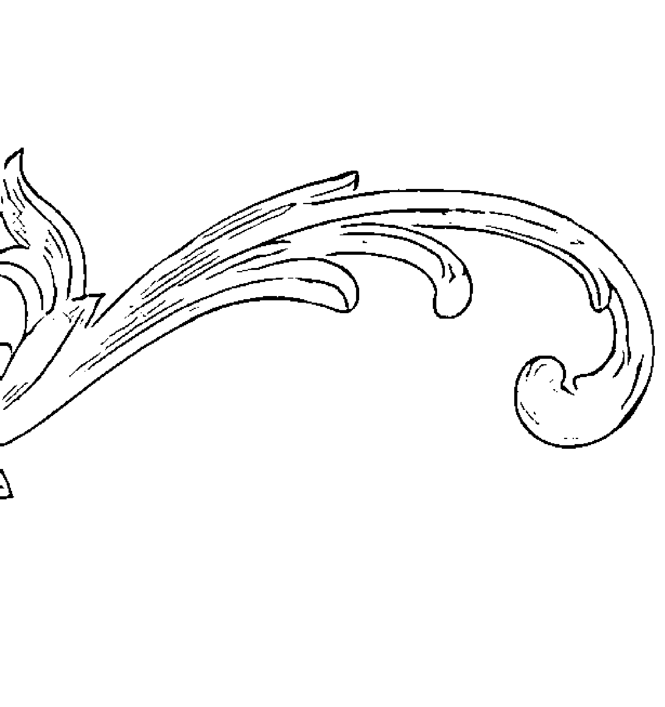

## 第 十 一 部

# 蜡像的诅咒

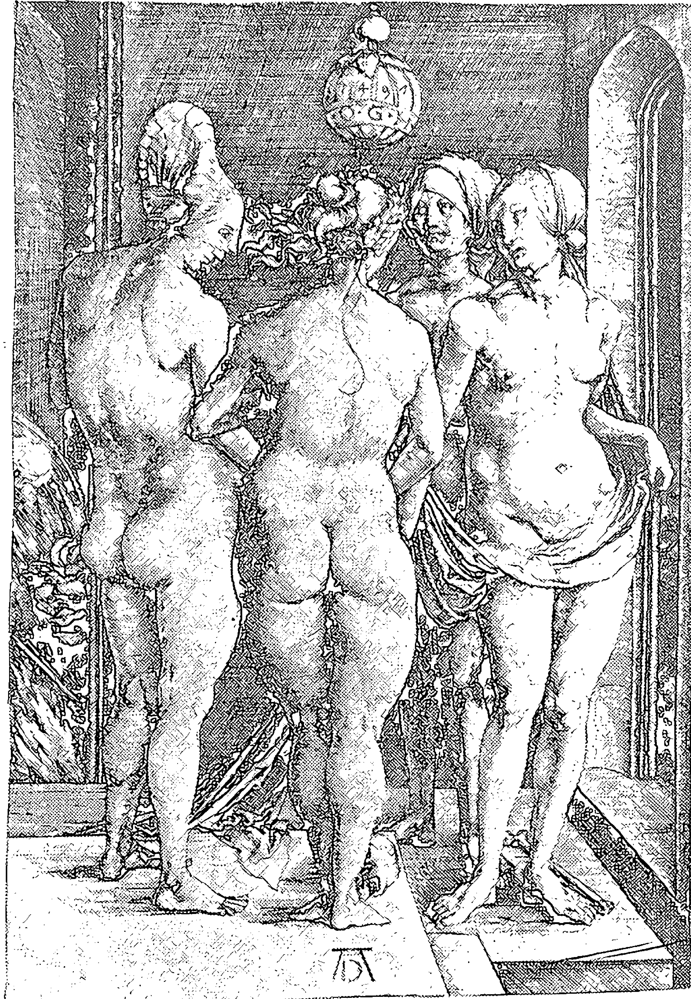

图43 女妖术师。杜勒 (Albrecht Dürer) 的画作

正如米什莱 (Jules Michelet) 等人提出的意见，妖术这种现象经常混杂了性的要素，例如各种「咒术」当中，也可分成爱之咒与恨之咒这一种。所谓爱之咒，是为了让喜欢的人成为自己的另一半，而且一般来说，所有与性有关系的咒术，有时都会称作爱之咒。

在爱之咒当中，自中世纪以来最广为人知的，就是利用细绳来行使的「结绳术」。这可说是一种性无能、性功能障碍的咒术，中了这种咒术的人，男性性器官会萎缩，完全无法进行性行为。像是喜欢的女人被其他男人抢走的人，就可以请妖术师向对方施咒，这样当对方结婚后，就会因为不明原因，无法履行夫妻之实，实在是十分困扰人的咒术。

在魔法书《小阿尔伯特》中，有记载下述「结绳术」的做法，在此引用为大家介绍：

> > 「杀死一隻狼后马上取下阴茎，接着走近你想施结绳术的男人身边，呼唤他的名字，等他回应之后，马上取白绳细绑这只狼的阴茎。自此以后，他就会等同被去势一样，成为性无能者。」

依据同一本魔法书所言，对于这种不可思议的咒术，据说有一个特别的破除法。就是这个人只要将戴上黄鼠狼的右眼镶嵌而成的指环，无论妖术师如何施咒，结绳术都不会见效。

具有生殖力，意味着能藉此获得生命永续的保证，无非是在时间空间当中，确立自己的永久性。反观剥夺对方生殖力的「结绳术」中，明显表露出所有黑魔法共通的支配欲与权力欲，这点

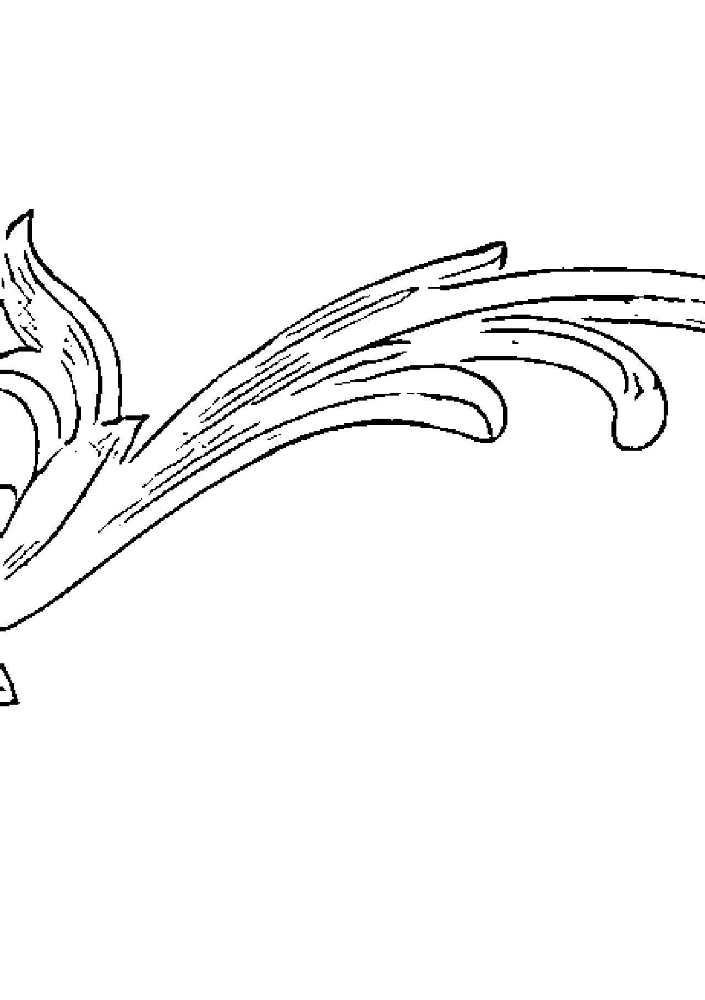

读者应该有心有所感。此外，听说圣奥古斯丁、圣金口约翰及希洛尼摩斯等基督教早期教父也十分警戒这种「结绳术」，想必读者都会感到有些意外吧？

> 「一对男女在他雷多城里因结合方式过于激烈，不时像狗在交尾分不开来，于是将他们吊挂在一根棍子上。男女分别挂在两侧，就像罪孽深重的二人在天秤上不相上下，让他们在众人面前被当笑话看。此时嘲骂声及呐喊声四起，完全像是神借恶魔之手拷问犯人一样，向犯罪的男女施加刑罚。」

除了有害对方变性无能的咒术，另外还有让正在翻云覆雨的男女紧紧相连，像黏鸟胶一样分不开的咒术。接下来引用十六世纪末大恶魔学者皮埃尔·德·朗克 (Pierre de Rosteguy de Lancre) 留下的奇怪证言，来一探究竟。最可怜的，是心无此意却分不开的男女。依照德·朗克的说法，他们会紧紧相连都是因为被恶魔迷住的关系，所以这还是属于重大罪过。依照近代医学的观点，会将这种现象称作阴道痉挛，但是不管是否在封建时代，将男女示众都算是践踏人权。

施展爱之咒相当出色的妖术师中，有一个叫作里科迪的加尔默罗会 (Ordo fratrum Beatæ Virginis Mariæ de monte Carmelo) 修道士。十四世纪初期，他制造出居住在卡尔斯松 (Carcassonne) 与图卢兹 (Toulouse) 的美女肖像并献给魔王撒旦。他将自己的鼻血与唾液，混入

蟾蜍的血中，再将肖像泡在这个混合液里，然后恶魔就会融入这个肖像当中。等到晚上，加尔默罗会修道士会来到美人家门前，将这个肖像放在门口，美女们就像会梦游一样，摇摇晃晃地走出来，倒入他的怀抱。听说里科尔迪为了感谢恶魔，会牺牲一只蝴蝶作为供品。不过没多久他也被人告发，自己坦承罪行后，终身入狱服刑了。

「如果美女是处女的话，要用新蜡制作肖像，若非处女，用普通的蜡即可」，魔法书《所罗门的钥匙》中如此写道。肖像做好之后，再献给主掌爱与淫乱的三个神・维纳斯、邱比特及亚斯她录。接着在蜡上雕刻出女人肖像后，念诵出下述这样的祭文。

「支配东方的王奥理恩斯（Oriens）、西方的王派蒙（Paymon）、统治南方的大王亚麦依蒙（Amaimon）、平定北方的埃金（Egyn），听我悄然陈述。请融入这些肖像中，借强大的主之名，成就我的愿望！」

接下来，将美女肖像放在枕边，美女就会在第三天来到面前，或是捎信过来。向主管四方八位的神祈祷，就是为了从四面八方包围心目中的美女，让她无处可逃。

有时候还会在这个肖像上画上心形，用柠檬树尖刺猛扎，同时念诵下述咒语，「我扎的不是妳，而是心脏、是灵魂、是五官。直到我的愿望实现之前，让妳凡事都无能为力……」。

据约翰・拜耳（Johann Bayer）所言，还有一种爱之咒的做法，就是在金星之时制作蜡像，并

刻上美女姓名与魔法记号，再将这个蜡像放在灶边烧融。在近代的魔法师中，据说还有人偏好一面呼唤自己心爱女子的姓名，一面将她的照片扔进火中。头发也可以用来制成爱之咒。施咒者相信将自己与女子的头发绑在一起，或是将女子少量头发供奉在祭坛上祈祷，就能迷惑她的心。对于头发的信仰历史悠久，自妖教以来就已经存在，中世纪的人们会十分谨慎地将缠在梳子上的头发去除，以免落到妖术师手上。根据弗雷泽的说法，恐怕一般人都认为，人体上生长迅速的头发及指甲，有别于人类的躯体，而被视为像独立的寄生物一样，也许是因为这点，才会给人一种毛骨悚然的感觉。

苹果也常被用来象征情色。知名的圣安东尼的诱惑图中，也是经常描绘美女向隐士递出红色果实。这部分依照妖术审判官亨利·波盖（Henry Boguet）的看法，不过是「撒旦再次使出诱惑人类祖先亚当与夏娃的技术」。

根据《所罗门的钥匙》一书所言，摘下苹果之前最好要淋上香油，增添苹果的香气，进行完这些步骤之后，妖术师再念诵下述咒语：「四大造就亚当与夏娃的神啊，正如当年夏娃与亚当一同作恶，夏娃使亚当犯下罪过一样，吃下这颗果实的人，也会任我摆布！」

另外还有下述这种方法，

> 『在金星之日（星期五）比太阳早起，进入果园，摘下最美的苹果后切成四块，去除果核，再塞入写上神圣记号与名字的便条纸取而代之。接下来一边念诵下述咒语，『我刺的并非汝，乃阿斯摩太（Asmodeus）在刺我所爱之人的心脏』，一边用二根针交叉呈十字刺穿果实。接着再念诵下述咒语，『我烧的并非汝，就像阿斯摩太在焚烧这个苹果，让这个女人心里燃起对我的熊熊爱火』，同时将苹果扔入火中。』

除此之外，还有下述这样的方法，

> 『将小马额头上的肥肉烤成肉乾并磨成粉，填入红色苹果中央，将这四分之一的果实，让你喜欢的女子吃下，或是将这些粉末化成液体让她喝下。不然还可以直接用这些粉末，涂在她的衣服或皮肤上。』

例如马鞭草或是赫马芙罗（Hermaphroditus）这些植物，据说不需要念诵什么咒语，就能展现爱的魔力。知名的炼金师范·海尔蒙特便曾提过这类植物的使用方式与其效果，接下来将为大家引用介绍，但这也许更偏向自然魔法的领域。

> 『我知道有些植物在手中揉碎后就会温热起来，带有热度。假使你用这双手与他人握手的话，对方就会产生喜欢上你的感觉，在几天的时间内，对方会不顾一切地爱上你。这些植物就是

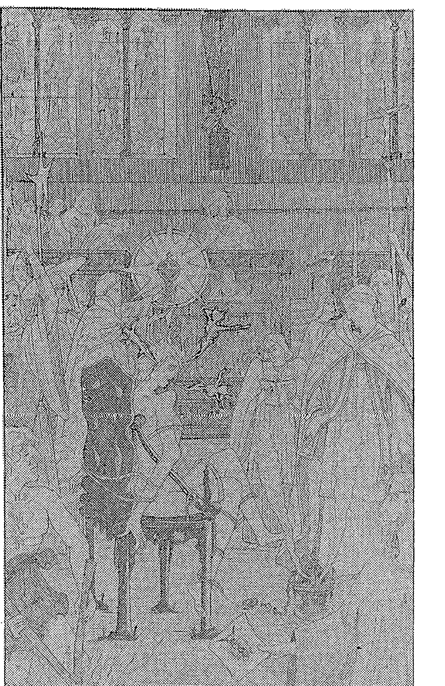

#### 图45 驱魔

具有这样的特性。譬如我握住小狗的脚之后，小狗便开始紧追着我，一整晚待在寝室前叫个不停，等到我终于开门之后，牠才会停止叫声。」

老实说，这些咒语的诀窍就是要让肉体失去平衡，耗费精神，借此削弱对方的意志。因为情色恶魔也完全无法附身在健康的男女身上，一个人在精神以及意志力薄弱的瞬间，才会有身中魔法的风险，也就是魔法书里提到的「白色孩子杀死红色孩子」的瞬间，这句话的意思是在说白色淋巴液胜过了红色血液，意即贫血。

朱尔·波瓦说过，所谓的咒语就是「某人的意志围困了他人的意志」，也就是说，一个人的意志被他人的意志征服了，于是悠荡蹒跚地脱离身体，以服侍新的主人。所以从咒术师的角度来看，咒语也算是神秘流体前往某个灵魂荒废之地的远征。咒术师超群绝伦的流体，瞬间拘束弱敌的流体，押到小车上，带到自己的阵地后，关进牢房里。这座牢房，也就是咒术师使用的蜡像。被关进蜡像的这个孱弱意志，就像被关禁在弥撒圣体面饼中的基督一样，在具有强大意志的咒术师（祭司）媒介下，牺牲奉献给魔王（神）。所谓的咒术，不过是某种形式的牺牲。无论是白魔法或是黑魔法，这些手法的原则如出一辙。

方才已经谈过了爱之咒，接着来说说恨之咒吧。在这个部分同样会用到蜡像，妖术师会仿照敌人模样，用新蜡捏出蜡像，而且愈仿真愈理想，因为两个相似物之间具有神秘关系。想让敌人蠟像的詛咒

經歷哪些洗禮，蠟像就必須接受相同的考驗。
第一步要將咒語刻在蠟像上，盡可能還要取得對方身上的一小塊衣服，讓這個小蠟像穿上。而且最好分別將對方的二、三根頭髮插在蠟像頭上，將對方的指甲屑黏在蠟像手指上，將對方的一、二顆牙齒放在蠟像嘴裡。完成之後，再念誦下述咒語：

> 「阿拉托爾魯、雷比達托爾魯、天太托爾魯、所姆尼亞托爾魯、杜克托爾魯、柯思美托爾魯、德沃拉托爾魯、塞杜克托爾魯，與破壞和憎惡為友的執行者啊！施咒、播種不和的人啊！
我向你們祈願，為了讓〇〇充滿憎惡與不幸，請你們授予這個蠟像考驗，並給予祝福吧！」

> ——《所羅門的鑰匙》

〇〇的地方，當然是要填入對方的姓名。念完咒語之後，再用鐵針或釘子猛刺蠟像的身體，然後給心臟一擊，最後扔進火裡。蠟像的身體完全燒融的瞬間，被詛咒者也會同時死亡。還有一種方式不用將蠟像融化，而是兇狠地詛咒之後，埋在對方住家附近。

約翰·拜耳對於恨之咒有下述的描述，「有的人想對他人做壞事時，會做出對對方肖像施行傷害對方的咒術。利用全新未使用過的蠟做出肖像後，在肖像右側腋下，放置燕子的心臟。然後用全新的繩子，將這個肖像掛在自己的脖子上，並用全新的針，在肖像身體四處穿刺。這時候，還會念誦某個咒語，但是為了避免好奇心強的人隨便模仿，容我省略這個咒語」。

倘若有人覺得蠟像毫無生氣又冷冰冰，沒有活人的感覺，有些美中不足的話，最好使用動物的心臟來施咒。流動的鮮血，加上抽動的鮮肉，肯定會進一步煽動妖術師的熱血，像是蟾蜍、蛇、貓頭鷹、老鼠等，自古便深受愛用。

關於使用蟾蜍來施咒，十六世紀的鬼神論者德爾里奧曾留下一段有趣的故事。

「居住在伊斯特里亞聖傑米納斯小鎮上的年輕男子，迷戀上一個女妖術師，他不但拋棄了美麗貞淑的妻子和孩子，還開始與這個女妖術師同居，把家人忘得一乾二淨。不久後這名男子的妻子察覺他是中咒了，跑去找丈夫，並偷偷地在屋中搜索，結果在他的臥床下，發現罐子裡關著一隻蟾蜍，而且這隻蟾蜍的眼睛還被縫了起來。妻子抓住這隻蟾蜍，將牠的眼睛打開，丟進火裡燒掉後，丈夫馬上就恢復記憶，從魔法中清醒過來，回到了家人身邊。」

就像這個故事一樣，藏起來的東西一旦被發現後，據說魔法的效力一定會消失。不僅如此，這對咒術師來說，也是非常危險的一件事。十七世紀末著名的「霍克（Hocque）事件」，就是最典型的範例。

霍克是帕西這個地方的牧羊人，因為犯下施行妖術的罪行，被關進了巴黎的監獄裡，有一次，他被關在一起的男受刑人比阿特利斯灌酒後，無意中誇誇其談自己的秘密。「我跟你說，我用的魔法藥，是用聖水、聖體麵餅屑、動物糞便、臭酸的米和念珠的珠子混合而成的。我們那群人叫這種妙藥作『九大咒禁』或是『天神丸』，就裝在罐子埋在帕西這個地方的馬廄裡。你別跟別人說呀！

這個讓霍克說出秘密的男人，其實是裁判所的密探。密探馬上向帕西的地方領主報告，領主起用了一位看得懂魔法書的男人，名叫『鐵腕』，命令他去將埋起來的罐子挖出來。後來果真在馬廄地下挖出了罐子，接著便將罐子裡的東西全燒了。就在同一時間，遙遠的巴黎監獄裡，霍克也因為奇怪的痙攣發作，一命嗚呼。

就像這樣，當咒術被破之後，迷失彷徨的流體便無處可去，變成可怕的能量，逆流到施咒者身上，這在魔法用語裡稱作『逆行的衝擊』。『逆行的衝擊』會形成強大力量，甚至經常會讓學藝不精的魔法師橫死。在比利時的列日附近，有一座名叫『逆行聖母院』的教堂，據說在這裡奉祀的聖母瑪利亞像前祈禱的話，原本要傷害自己的咒術就會反彈到對方身上施以攻擊。

咒術師該怎麼做，才能避免『逆行的衝擊』呢？十九世紀的大學者史坦尼斯·德·古埃塔（Stanislas De Guaita）認為，事先應安排好第二備用的詛咒對象，當第一個詛咒被破解時，才能讓第二個對象承受流體的逆行。另外還有其他的意見，就是咒術師在進行咒術的期間，絕對不可以離開魔法圈裡頭，才能讓自己周圍充斥著靈氣帷幕，使逆行的流體反彈回去。一般來說，就只有這兩種作法。

## 蠟像的詛咒

話說回來，讓咒術在歐洲宮廷盛行開來的人，傳說是獲得凱薩琳·德·麥地奇寵愛的義大利人科西莫·羅傑里（Cosimo Ruggeri）。他在數次拷問之後，才終於坦白說出他在王后命令下所做的咒術。

這時候，英國的格洛斯特（Gloucester）公爵夫人被關入大牢，因為她為了讓丈夫早日登上王位，竟用蠟像詛咒英國國王亨利六世。

受到凱薩琳·德·麥地奇寵愛的女巫莉奧諾拉·多里（Leonora Dori Galigai），也是因為在宮廷裡用蠟像詛咒多人的罪行，於一六一七年在格雷夫廣場被燒死了。當時她堅稱自己無罪，大張旗鼓宣稱「我只不過是擁有強大靈魂，得以支配孱弱靈魂罷了」。但是對審判官來說，這點正是成為妖術師須具備的首要資格。

一般認為笛卡兒及波希生在的十七世紀是「理性時代」，但同樣也有許多類似咒術的妖術。

傳聞著名的毒藥殺人魔布蘭維利耶侯爵夫人（Marquise de Brinvilliers），就是請來一位破戒教士，在聖體麵餅上寫上了一對戀人的姓名，進行完黑彌撒後，卻讓一對並非戀人的男女吃下了這個聖體麵餅。

一六一九年夏天的某個晚上，聖日耳曼德佩墓地的守墓人，撞見三個老太婆將血肉模糊的肉塊棄置在墓穴裡。那晚正好是個月光皎潔之夜，守墓人逮住了這群老太婆，查看墓穴裡的東西，結果發現是一個插滿了長針及釘子的羊心臟。其中一個女妖術師坦承，這是用來詛咒的道具。

同一時間，有個對英國貴族充滿恨意的年輕女子，偷了男性貴族的左手套後，先將手套浸泡在熱水裡，再用針刺出好幾個洞，接著一邊念咒一邊將手套埋入地底下。不久後英國貴族發現自己手上出現了奇妙的傷口，轉眼間，傷口逐漸擴大，最後還因此喪命。（瑪格麗特、芙洛瓦共同著作的《驚奇發現》1。）

在一六一〇年出版的《炎熱的第一天》2這本書中，曾經描述有名女子被某個女妖術師下咒，導致腸道穿孔，因此痛苦不已，後來附近的陶器工人來她家門口查看，找到了一張佈滿針孔的肖像畫，工人將這張肖像畫扔進火裡，結果痛苦的女子便馬上痊癒。

### 書目謎記

- 1. The wonderfvll discoverie of the witchcrafts of Margaret and Phillip Flower, Flower Margaret, Flower Philippa, 1619.
- 2. Le Second jour des jours caniculaires, 1610 (Le satanisme et la magie, Jules Bois, 1871–1943.)

## 聖女與藍鬍子男爵

吉爾·德·雷男爵的肖像

#### 圖46 女妖術師的火刑

在夏爾·佩羅 (Charles Perrault) 的童話裡，大家最熟悉的「藍鬍子」，就是中世紀的法國元帥吉爾·德·雷男爵，他不但是史上最慘無人道的幼兒虐殺犯，同時也是十五世紀首屈一指的藝術愛好者，更是熱衷惡魔禮拜及煉金術的探險家。

這就是吉爾·德·雷這個人非常有趣的地方，接下來我們將透過十五世紀這個黑暗的魔法全盛時期，看看此名荒唐不經的怪物如何度過他的人生。

吉爾的少年時代有許多不明疑點，記錄顯示他是在一四〇四年底時，出生在位於安茹地區的尚多歐塞城堡中。吉爾家擁有法國古老的名門血統，當時他是在城堡中名為「黑塔」的一個房間裡誕生的。他的弟弟雷內則生於一四一四年。

吉爾十歲的時候，父親出門打獵結果被野豬獠牙刺死了，後來母親沒多久便拋下吉爾和弟弟改嫁他人，所以外公讓·德·克朗 (Jean de Craon) 成為兩個兄弟的監護人。（有一說是雷內出生後沒多久母親便去世了。）這個老人，實在是集封建社會頹廢思想於一身，屬於典型的墮落貴族，利欲薰心又野心勃勃，讓年幼的吉爾受到極其不良道德的浸染。

因此有些傳記作者主張，吉爾從少年時期就已經出現可怕家族遺傳精神變態的徵兆，不過這種說法實在令人質疑。

在《同性戀魔法師吉爾·德·雷》這本書中，評論家馬克·杜布提到吉爾從小患有癲癇的事，如下所述，「少年不時從床上起身，目光呆滯，口吐泡沫，簡直就像想避開野獸或惡魔的攻擊，揮動著痙攣的雙手」。

不過這種文章誰都寫得出來，就是在睜眼說瞎話，古書上並沒有記載，所以沒有人敢斷言，究竟吉爾·德·雷的性倒錯始自何時。佛洛伊德將性倒錯的原因歸究於戀母情結，可是吉爾從十歲左右就已經離開母親，因此司空見慣的佛洛伊德論點並不適用在他身上。

還有一位評論家歐仁·博薩爾神父 (Eugène Bossard)，提出更為嚴謹的意見，他認為，「吉爾肯定先在黑暗與神祕中，學到了孤獨的快樂。外公在晚年大概曾經突然闖入孫子房內，逮到他正在幹壞事」。

根據於斯曼的記述，「這個莽撞的老人，在一四二〇年十一月三十日逼吉爾和名叫瑟琳·瑟琳的女人 (Catherine de Thouars) 結婚，以逃避監護人的麻煩責任」，不管怎樣，與這個叫作瑟琳的八親等表妹近親結婚，背後似乎有著不可告人的秘密。

話說回來，吉爾明明在十分惡劣的環境下長大，卻很早就對學問及古典文學具有深厚的理解力。弟弟雷內則完全是個文盲，不過當時大部分的貴族皆是如此，雖然連自己名字都寫不出來卻不以為意，然而吉爾正好相反，他足以和十五世紀文藝愛好者的知名大貴族，比方像貝里公爵（Duc de Berry）、勃艮第（Duc de Bourgogne）與麥地奇家族（Medici）並列，算是個業餘愛好者。

他說得一口流利的拉丁語，總是隨身帶著喜愛作家寫的書，還自行將書裝幀得十分精美，甚至帶去旅行。他最偏好希波的奧古斯丁的《上帝之城》²、奧維德的《變形記》³、瓦萊里烏斯·馬克西姆斯（Valerius Maximus）的著作等等。可以想像，在他讀過蘇埃托尼烏斯（Gaius Suetonius Tranquillus）的《十二皇帝傳》之後，對於尼祿和卡利古拉殘忍的放蕩生活，會燃起血氣方剛的想像力。

當時法國在柔弱的查理七世統治下，飽受戰亂摧殘，瘟疫橫行，英軍任意劫掠，陷入窮困深淵，但在這危急存亡之際，吉爾自費起軍，助救國聖女貞德（Jeanne d'Arc）一臂之力，轉戰安茹及曼恩各地，立下許多功勞。

> 借用於斯曼一句話來形容，「他如影隨形跟在聖女貞德身旁，連在巴黎城牆下都緊緊守護著少女將軍，甚至在漢斯的成聖會這天，還是出入相隨」。

吉爾在二十五歲時，國王賦予他元帥的封號，這也是百戰功高的獎賞。

一般相信，他和這位奧爾良少女有所來往，才會讓他對神祕主義的衝動開始萌芽。神祕思想與惡魔禮拜相差無幾。他與聖女貞德之間有過哪些接觸，在資料不足下，並無法得知，不過根據博萨尔神父等其他人的意見顯示，吉爾只是充滿騎士精神，想像聖女一樣捨身奉獻，才會虔誠追隨聖女貞德。

只不過，因為某些原因，他對戰爭及戰功徹底失去熱忱，窩居在蒂福熱的城堡裡閉門不出，開始過著窮奢極欲追求高尚的生活。這部分在他波瀾萬丈的人生中，最是充滿難解的謎團。

說些題外話，虐殺嬰兒的吉爾·德·雷，為什麼會被看作是殺害妻女的「藍鬍子」呢？關於這點有許多說法與大家分享。

博薩爾神父做出結論，在布列塔尼地區的古老傳說中，出現了吉爾的名字，於是肯定藍鬍子與吉爾為同一個人物。總之夏爾·佩羅的童話，就是將古老傳說重新改編，在殘酷及異常的地方改成基督教的故事。反觀厭惡基督教的費爾南·弗勒雷（Fernand Fleuret）則主張，藍鬍子的故事源自柯諾莫王（Conomor）的傳說，因為吉爾·德·雷和柯諾莫王都是被逐出教會的人，所以才將兩者視為同一人。

柯諾莫是中世紀布列塔尼的領主，屢次娶妻又加以殺害，所以他在傳說中終年都是鰥夫。
小說家費爾南·弗勒雷用匿名埃爾南德斯博士，調查了盤詰異教的審判記錄，寫下了有關吉爾·德·雷的論文，認為吉爾是被冤枉的，成了基督教的犧牲者。

#### 圖47 希律王(Herod)屠殺嬰兒

此外，依據亨利·查爾斯·李在《盤詰異教的歷史》⁴ 一書中的記述，「吉爾蓄著沾沾自滿的紅鬍子」，據說是惡魔將紅鬍子變成了藍鬍子。這種說法實在荒唐，完全把讀者當傻瓜了，可是書裡都這麼寫了也拿他沒轍。

比較有趣的是十九世紀中葉由年史作家保羅·拉克魯瓦 (Paul Lacroix) 提出的說法，真相說不定就在這裡，他認為，

> 「吉爾·德·雷男爵乍看之下不像是個行事兇暴、個性惡劣之人。反而長著一幅溫和、親切的臉孔，理成燕尾造型的鬍子，也完全不會給人陰沉的感覺。他一頭金髮，別具特色的鬍子卻是黑色的，再加上光線照射下產生變化，有時會散發出藍色光芒。就是因為這樣，吉爾才會在布列塔尼地區遠近馳名，被人稱作『藍鬍子』，讓他的故事變成荒誕無稽的童話故事。」

在我們眼中，吉爾是不是「藍鬍子」，其實一點都不重要，另外在十六世紀知名鬼神論者布丹的《鬼憑症》⁵ 這本書中，做出了極為暗示的描述，在此引用給大家參考。

> 「在南特因妖術師身分被宣告有罪而處刑的吉爾男爵，殺害了八名幼童，還坦承企圖殺害第九個小孩。第九個小孩，其實是他的親生兒子，而且孩子還在母親腹中時，他就已經決定將小孩殺死獻給惡魔……」

这段内容，有二点与事实不符。首先是吉尔并没有儿子，其次是吉尔杀死的孩童数量岂止八个而已。这点虽然与事实相违，不过八这个数字却是意味深长。因为据传说所言，蓝胡子杀死八名妻子……。

不过关于蓝胡子的传说，差不多该停止讨论了，让我们继续往下看吧！

说到吉尔的容貌，阿曼德·盖罗（Armand Gueraud）及瓦莱特·德·维里维尔（Auguste Valet de Viriville）等众多传记作者，都描述得含糊其辞，比如说他“身材高大，外表迷人”，但是没有多少资料证实，因此难以就这样让人接受。但是至少，我们也许可以像于斯曼这样，再次试着勾勒出他的内在性格。

依据于斯曼的说法，吉尔在当时几乎是个与世隔绝的人，也是个单纯的艺术家、奇珍异物的爱好者，会用金字或精美图画装饰案头上的书，还是个会自己作画的业余爱好者。

> 他的同辈都是单纯的野蛮人，反观他却期终极艺术的洗练，梦想晦涩高深的文学，撰写关于降魔的著作，热爱罗马教会的音乐，而且身边所用之物只能是独一无二的珍物佳品。

吉尔除了有如此高雅艺术家气质的一面，在战场上也是英勇善战，更具有骑士精神与圣女崇拜的倾向，这些都是他众所皆知关于前半生的记录，所以我们不得不承认，在他隐居蒂福热城堡之后，他的种种美德不知道什么缘故，竟然摇身一变成恶行。这些恶行，就是傲慢、淫荡与残酷，将他塑造成史上屈指可数的杀人魔。

现在请容我暂时以犯罪心理学的角度来探讨。自我崇拜、傲慢到猖狂的地步，正是吉尔的第一恶行。直到审判的最后阶段，吉尔还是不承认自己有罪。在众多证人佐证下，大肆揭发他所犯下的罪行，使他无辩驳余地之后，他才向众人坦承，祈求神的原谅与灵魂的救赎。这种在倨傲孤独之中日渐增长的自恋情结，甚至让他向亲信吹噓、自夸他犯下的无数罪行，使他失去理智。

例如在犯罪史上以别名“杜塞道夫 (Düsseldorf) 的吸血鬼”远近驰名的德国人库尔滕 (Peter Kürten)，同样是个有性倒错倾向的杀人魔，他向审判官再三表示，“我做的事你是无法理解的，没有人可以理解”。吉尔也曾高傲地在法庭上大张其词，“我做的事全世界没人敢做的事，这是我与生俱来的使命”。

像这种罪大恶极的人特有的傲慢态度，并非一般所谓的虚荣与自傲，而是一种难以自拔且挥之不去的快感，具有禁不住想让自己高人一等的倾向。同时这也是恶魔主义者对于现存社会秩序的特殊叛逆方式，而堕天使撒旦会被逐出天国，也同样是因为这种骄傲自满之罪。

另外在吉尔·德·雷内心里，其实潜藏着如烈火般慷慨激昂，不知满足的淫欲，唯有藉着脱离常规的放纵行为，才能平息这把淫欲之火。

当淫欲镇定下来之后，就会陷入一种昏睡状态，等他一醒来，又会充满猛烈的悔恨之情，让他投身于十字架前潸然泪下。不久后，欲望又会再次勃发刺激，开始发现渎神后的快感后，进而一步步走向失去理智的性虐待领域……

话说吉尔的性倒错和性虐待，是与生俱来的吗？能够回答这个问题的人，老实说只有他本人，即便他身在法庭，也没有回答这个问题。但是在天生的强烈好奇心，加上对于怪奇事物的嗜好衍生出来的淫荡性格，最终将他导向残虐与杀人的领域，这点是无庸置疑。从他在法庭上的自白可知，吉尔从少年时期就是个性偏好怪异的人。

> “对于在何时何地懂得同性恋的罪行，他回答是在尚多欧塞城堡的时候，但是明白表示时间已经忘记了，不过应该是在外公休兹侯爵去世的时候才开始的样子。”

> “此外，被问到犯了下述罪行时，是遭何人教唆煽动的问题，他回答没有任何人唆使他，是一个人的想像，只是为了自己的快乐和淫欲，才会犯下以下罪行。”

透过上述审判记录的片段内容，证实吉尔从年少时就是同性恋者。针对他性虐待的变态行为，就像博萨尔神父与于斯曼说的一样，吉尔应该是从苏埃托尼乌斯古老写本的插画中，早早将提贝里乌斯（Tiberius Julius Caesar Augustus）以及卡拉卡拉（Caracalla）让少年全身染血的放荡画面铭记于心了。吉尔确实有偏好观看处刑场面的窥视症倾向，这点和罗马皇帝提贝里乌斯十分相像，而且也和卡利古拉为了让牺牲者意识到死亡这件事，命令刽子手放慢速度行刑这点，有一脉相通之处……。一四三二年吉尔的外公在尚多欧塞城堡去世后，他才终于在二十八岁时，继承了堪称法国金额最高的财产。光是土地及城堡便难以估计，每年更可为他带来三万里弗尔（Livre，法国的古代货币单位名称之一）的收益，再加上法国元帅的俸给高达一年二万五千里弗尔。当时勃艮第公爵的亲戚，一年仅有六千里弗尔的收入，可想而知吉尔是家财万贯。后来这些巨额财富，在区区六年时间，就被他挥霍一空，所以只能说他浪费成性的情形实在惊人。究竟他为什么会这么快就破产了呢？

有几个原因，首先是他整备了豪华的军队。毕竟是在群雄割据的时代，有钱就能手握大军。美奂的军队，就连布列塔尼公爵约翰五世也会心生嫉妒。吉尔在他身边召集了逾二百名骑兵作为他的亲卫队，每一位还配有衣着奢华的仆人。见到这美命第二个浪费的原因，是他建造了壮丽的教堂。当时野心勃勃的大贵族，例如路易十一以及切萨雷·波吉亚（Cesare Borgia）等人，都相信建造礼拜堂有助于洗清他们在现世犯下的罪行，吉尔也没有例外。但是包含附属的祭司以及唱诗班在内，要维持一个约八十名圣职人员服侍的教堂，一大笔开销是少不了的。

除此之外，始终偏好浮华的吉尔，还让圣职人员穿上了金光闪闪的豪奢服装。矫揉造作漫步的教士，一身栗鼠毛皮的法衣、白鼬皮衬里的深红色法衣、用金丝及丝绸织成袖饰的法衣，简直就像大主教派驻的教堂。教堂的装饰也是穷极华丽，大量使用了刺绣蕾丝、金线织花的锦缎、镶嵌宝石的天鹅绒以及黄金烛台等等。马谢库整座城镇，完全像是一个宗教王国。

当然无庸置疑，吉尔的自尊心因为这样得到了大大的满足。但是这种装腔作势的嗜好，或是他真诚的宗教热忱暂且另当别论，因为他还另外动机，其实是对教会音乐几近狂热地沉溺其中。

或许唱诗班的少年合唱，在他耳中无疑是一种性乐趣。

以精神医学的观点来看，对于某一种人来说，教会音乐会引人陷入色欲中神志不清，这和陶醉于神秘主义的沉迷感觉是一样的。克拉夫特·埃宾在《性精神病态》一书中，认为不管是人类的爱欲或是宗教的神秘主义，同样都是在探求无限，有着相同的类似关系而彼此连结，书中内容如下所述：

> >“无论是对宗教的感觉或是对性的感觉，当发展到极限之后，带给人的刺激量及其性质，都会展现出雷同之处。因此，这部分在某些条件下可以彼此置换，如果存在必要的病理学条件，两者都可能形成残虐的要素。”

说到吉尔·德·雷这个人，显然具有这两方面的倾向。我们都知道，他是圣女贞德的崇拜者，是受过百年战争残酷摧残的战士，而且还是个对艺术狂热的爱好者。

如此想来，他偏好额我略圣歌以及少年合唱团的神圣嗓音，这与淫荡及罪恶的欲望毫无矛盾之处，反而只是煽动淫荡及罪恶的动机，由此便很容易理解了。神秘思想与恶魔礼拜仅一纸之隔这一点，也能像这样透过性病理学的原理获得解释。

苏埃博士 (Robert Soueix) 在吉尔相关的医学论文中，引用了匈牙利的马图斯卡 (Silveszter Matuska) 这个著名的犯罪者案例。马图斯卡用炸药将急行列车炸翻后，听着受难者痛苦的哀鸣以此为乐，是个诡异的天才犯罪惯犯。博士在书中如下写道：

“近来（一九三一年）匈牙利有个名作马图斯卡的男子，用炸药将急行列车炸翻后，眼睁睁看着压在破碎车体下发出痛苦哀鸣的受难者，体会不可言喻的快感。不过这名犯罪者有着古怪的宗教情怀，总是随身携带他崇拜的圣人像——圣安东尼像。而且他一看到犯罪计划实现，翻覆的火车熊熊燃烧，来不及逃命的乘客变成一团焦黑，就会喜笑颜开地走到附近的教堂，向自己最崇拜的圣人祷告，感谢神让他的罪行得以成功。就像这样，可想而知吉尔·德·雷也是在沉溺于可怕的杀戮之中，藉由诗歌班少年的美丽歌声，将神的愤怒平息下来。”

苏埃博士的推理有些戏剧性，不过的确有证据显示，吉尔迷恋少年诗歌班歌声的程度，与受难者苦闷的哀嚎不相上下。魔法学者格尔雷斯也提到，“吉尔将受难者献给恶魔巴隆、巴力西卜与彼列，在杀戮行为期间，命唱诗班为恶魔献唱复活节的圣歌”。

根据斯坦尼斯拉斯·德·古埃塔 (Stanislas De Guaita) 的说法，“身着金光法衣的祭司，日复一日奔波找寻新的唱诗班少年”（《撒日的教堂》），就算古埃塔的话过于夸张，但是无庸置疑的，吉尔很快就在当时的法国北部，拥有了最优秀的合唱团。他不惜重金，将美誉少年都聚集到他的身边。一个名叫罗西尼奥尔 (Rossignol，意指黄莺) 的少年，原本隶属于圣西里尔教会的合唱团，但他引起了吉尔的注意，于是吉尔答应将拉里维埃 (La Rivière) 的土地赠予他之后，便强行将他从普瓦捷带到蒂福热来。由此可知，无论是歌手或是演奏家，吉尔都用超额的薪资予以雇用。音乐会让人联想到异教的祭祀仪式，属于邪恶的行为，所以教会有很长一段时间并没有使用音乐，直到大教宗额我略的时代（六世纪末），发现音乐是唤起虔诚心情最有效的手段，于是才得以将礼拜方式与恩颂圣歌集彙整起来，使音乐在教堂中从此不可或缺。吉尔的唱诗班学校也使用了当时流行的所有乐器，包含手摇琴、竖琴、鲁特琴、小号和长笛等等，而其中风琴占了相当重要的地位。稍微顺着小栗虫太郎的角度，进入音乐史的领域来一探究竟。风琴最早在拜占庭帝国受到重视，起初用的是水风琴，后来才制造出用空气推动的风琴，但在八世纪左右，才由东罗马皇帝五世将风琴传入法国。他将一台风琴献给法兰克王国丕平国王，另一台献给了查理大帝。依据圣加

伦的修道士所言，『青铜管在牛皮风箱鼓动下发出隆隆雷鸣，类似七弦琴的音色，也像是铜钹的声音』。

吉尔肯定格外喜爱由这种『隆隆雷鸣』演奏纪尧姆·杜飞（Guillaume Dufay）的经文歌《悲切圣母》。在这个圣母与地狱的珍贵和音中，确实远远地反映出这些牺牲者临终前的哀诉。

但是在当时，民众对于他脱离常轨、沉迷在戏剧、音乐会、宴会中的奢侈生活，只会投以羡慕与赞叹的目光，完全没察觉到，这位难以理解的贵族内心，潜藏着怎样的血腥欲望。在蒂福热城堡里，他依旧是凯萨琳夫人的丈夫、独生女的父亲，却无人了解这个男人惨淡内心的烦恼，人们依旧贪恋平和地沉睡着。

我那耸立的住所被你轻蔑看待时 “在选择当中只求一瞥” 无论教诲或祭坛我将全盘否定—— 你痛苦的哀嚎就像这样回响在黑暗之中

施特凡·格奥尔格（Stefan George）

## 書目雜记

- 1. Gilles de Rais, Magicien et sodomite, Marc Dubu, 1945.
- 2. City of God, Augustine, 5th C.
- 3. Metamorphoseon libri, Ovid, 43 B.C. – 17 A.D. or 18 A.D.
- 4. A History of the Inquisition of the Middle Ages, Henry Charles Lea, 1900.
- 5. De la demonomanie des sorciers, Bodin Jean, 1580.
- 6. Psychopathia Sexualis, Richard Freiherr von Krafft – Ebing, 1891.
- 7. Le Temple de Satan, Stanislas De Guaïta, 1891.

## 水銀傳說之城

吉尔·德·雷男爵的肖像

#### Ⅲ

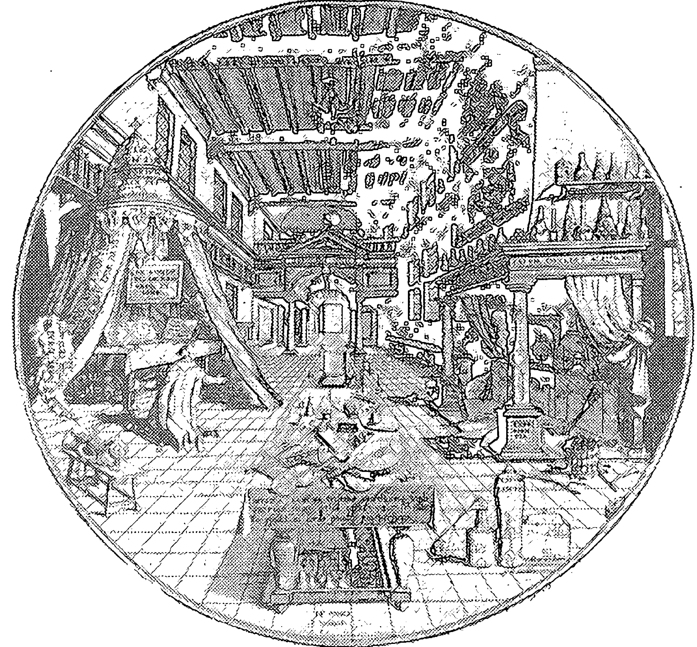

图48 炼金师的实验室，引用自海因里希·昆哈特(Heinrich Khunrath)的著作

屹立在南特到普瓦捷这条干道上一团漆黑的蒂福热城堡，是建造在古罗马城寨遗迹上坚不可摧的要塞，吉尔·德·雷男爵最爱待在这里，这是他最喜欢的地方。最终他在财政压力逼迫下，眼见即将破产，才乍然放弃宫廷生活，丝毫不以为意地隐居在这座满是大理石雕刻，点缀着五颜六色壁布的华丽城堡里。

过去在这座蒂福热城堡附近，受过民族大迁徙的余波影响，被达契亚（Dacia，现居罗马尼亚的民族）的一个部族所占领。虽然无法得知吉尔是否混有东欧达契亚人的血统，但是传说中提到，入侵过蒂福热城堡的蛮族世袭君王，有别于其他日耳曼各部族的首领，据说公然允许同性恋的存在。在夏多布里昂谈论罗马帝国没落始末，十分著名的《历史研究》一书中提到，这个部落的青年“被强行要求与男性交媾，童贞之花在这令人厌恶的结合之中备受蹂躏。他们必须击退野猪或熊，才能从这违背人伦的婚姻中获得解放”，看到书中的这段记述，使人联想到吉尔先天的性倒错，令人不禁感慨，或许在这个地方横流着浑浊且不祥的宿命之血。

在三层城墙围绕下的蒂福热城堡高塔附近，还盖有一座外观优美，吉尔相当自豪的礼拜堂，这里不但举行过好几次的黑弥撒，也办过宴会。宴会席上，几近一丝不挂的合唱队美少年穿梭在吉尔邀请的宾客之中，用内含肉桂的葡萄酒或加入兴奋剂的酒斟满酒杯。根据 G·穆尼耶的说法，这种刺激性的饮品“在这座没有一名宫女的诡异城堡中，使与会者的淫欲如按捺不住的噩梦般蜂涌而出”。

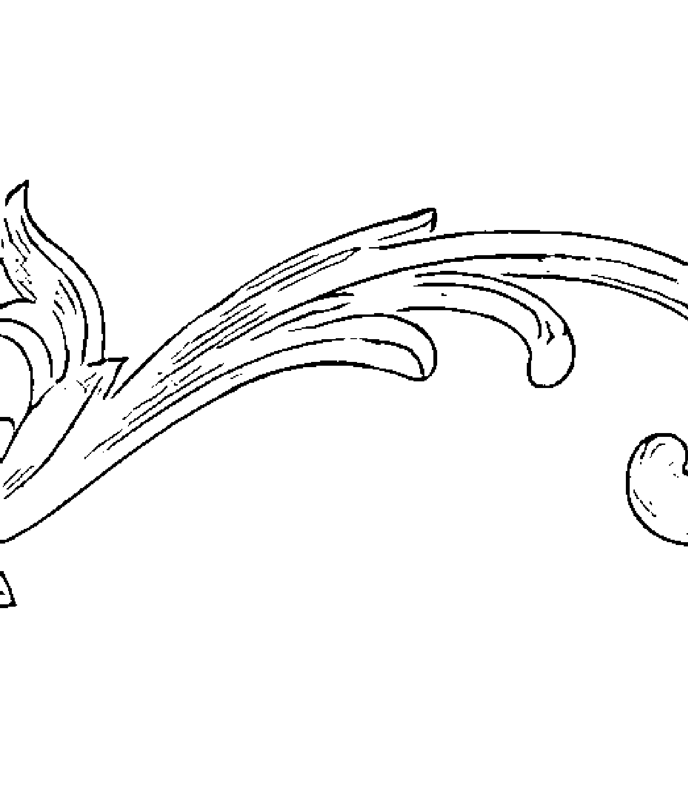

吉尔家族早已因为他的浪费而惴惴不安，不时向国王查理七世恳求干预家族财政。吉尔对于家族这样的做法十分震怒，便将妻子凯萨琳与女儿玛德琳逐出蒂福热城堡，长期幽禁在普佐热。更何况他对一般女性一直心生厌恶，他过去浪漫的圣母崇拜情结突然一变，如今彻底沉迷于同性之爱，着实叫人惊讶。吉尔就像颓唐时期的罗马贵族一样，待在几乎看不见宫女的城堡里，怀抱着众多少年，还让他们在宴会上，满足宾客的欲望。对于被逐出城的妻女，至死他都不屑一顾。

原本吉尔在蒂福热城堡幽深的研究室里，有万卷藏书为伴，埋头于炼金术实验之中，他孤身一人沉浸在纯粹的求知乐趣里，这点无庸置疑。不过在他濒临破产之际，他想藉由这神秘又不可思议的学问，实际炼出黄金摆脱眼前贫困，也难怪他会费尽心机乖谬炼金术的本义，走上邪门歪道。在阿拉伯传来的熔炉（Athanor）及梨形壶影响下，希望之火熊熊燃起。究竟能否用“哲人石”炼出黄金来呢？

多姆·洛比诺修道士在《布列塔尼史》¹中提到，吉尔“想方设法寻找精通这种骗术之人，没多久就找到了几名能让水银凝固且手法熟练的方士。但是就像炼金术师将梦寐以求的金属点石成金之前，『哲人蛋（烧瓶的一种）』总会发生破裂一样，很不幸的吉尔在进行实验的期间，也遇上了法国王子突然造访的意外。炼金术属于秘密术法，不得公然为之，所以他不得不毁掉炼金炉中止实验”。

这就是吉尔·德·雷元帅倒霉的炼金术研究过程的精简记录。洛比诺修士口中的“骗术”，以十七世纪的知识来探讨的话，会如此形容也是很正常的事。再加上大家必须明白一点，中世纪的玻璃器具并不耐热，非常容易破裂。

大家或许可以想象一下，在蒂福热城堡一隅，吉尔·德·雷的蓝胡子微微颤抖，内心充满期待，与吉尔·德·夏尔、尤斯塔许·布朗谢（Eustache Blanchet）等一众心腹，俯身凝视曲颈甌瓶底的模样。参阅我们现有的文献，显示吉尔打造了炼金炉，也就是所谓的熔炉，并买进了铁锅、坩埚、蒸馏器（Alembic）以及鹅瓠形蒸馏器（Pelican）等容器，在城堡一侧盖了实验室。安托万·德·巴勒姆（Antoine de Palerne）、弗朗索瓦·隆巴德（François Lombard）还有巴黎的金银细工工匠吉恩·珀蒂（Jean Petit）等人，都曾经待过这里。

无论是将物质加热、融化、使之升华的素陶罐或烧瓶，肯定都与浮士德博士及法兰克斯坦（Frankenstein）博士实验室中出现的奇形土器或玻璃器具十分类似，吉尔在这种不伦不类的神秘幻影纠缠下，希望之火愈发热烈。

于斯曼认为，“贞德死后没多久，吉尔马上就落入了魔法师手中。而且这些魔法师都是精练的恶人，也是聪明绝顶的学者。从头到尾前往蒂福热城堡拜访吉尔的众多人士中，不乏热心的拉丁学家、令人惊叹的议论家、奇珍秘药的持有者，还有精通上古神秘的人。传记作家将这些魔法

师形容成低俗的食客或骗子，但是这种说法大错特错，这些人是十五世纪具备贵族精神的人。
恐怕他们即使任职于罗马教会，如非大主教或教宗这等阶级，都不会得到他们的青睐，但是他们终究不可能爬上高位，因此在当时那样无知又混乱的社会中，他们只能投靠吉尔这样的大领主，成为避世之士了。

> ——《彼方》

确实吉尔生在的十五世纪，是炼金术风行欧洲的全盛时期，有教养的大领主都会将世俗不容的优秀炼金师召来身边，花费大量金钱与时间，在城堡里偷偷追寻著黄金梦。

关于炼金术的起源，在「塔罗牌」章节里已经详细说明，所以在此仅谈论其沿革的部分。一开始炼金术源自埃及，后来在亚历山卓发扬光大，并在荷米斯·崔斯墨图的《翠玉》中被加以定义，由美索不达米亚的大学者贾比尔（Jabir）集大成，但是这最后的人物是否真有其人，至今仍是个疑问。不过号称奇异博士（Doctor Mirabilis）的罗杰·培根（Roger Bacon）等过去众多方士，据说都抱持最大敬意深入研究过《秘术大全》及《哲学之书》。一般相信这些书出自阿拉伯「最伟大的王暨哲学家贾比尔」之手，书中严密记载了金属融解、精炼以及延展性的法则。

阿拉伯人进攻西班牙后，炼金术才传进了西欧世界，不过在这之前，众所周知像是罗马皇帝卡利古拉，还有拜占庭皇帝希拉克略，都投入巨资延揽众多炼金师，沉溺于炼金之梦。透过宫廷

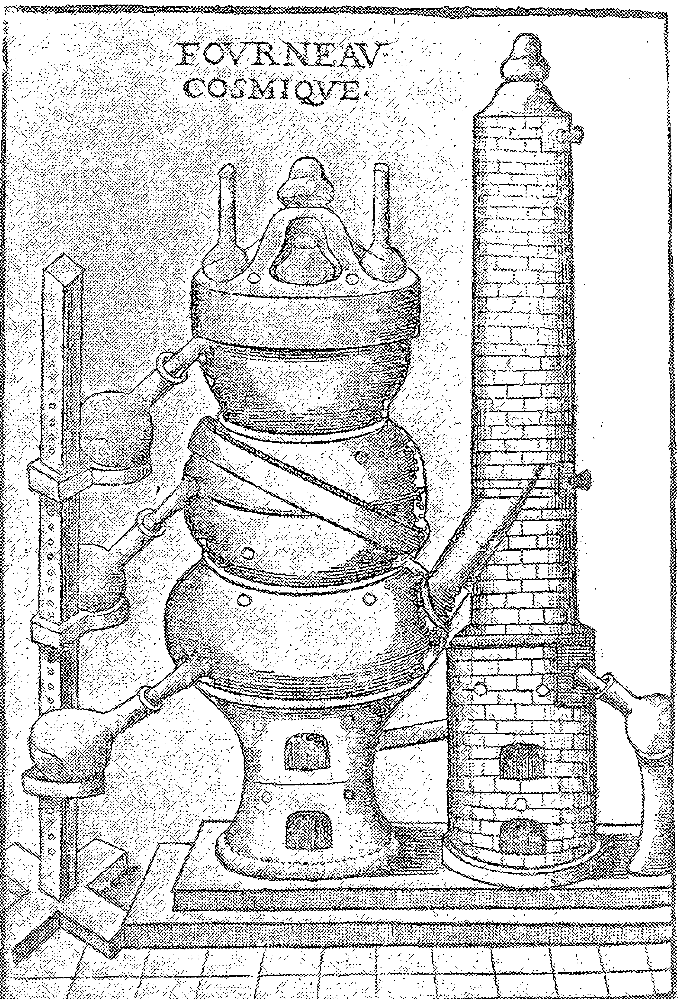

图49 炼金炉

早有阿拉伯人出入的证据显示，他们长久以来似乎在西欧及东欧（拜占庭）世界里，扮演着波斯和埃及秘术承继者的角色。

欧洲最早深究阿拉伯炼金术奥义的人，据悉是年轻时游历过世界最古老大学——摩洛哥卡拉温清真寺，并在西班牙学习占星学及卡巴拉秘教，后来成为思惟二世的葛培特修士。

因此到了中世纪，炼金术已经奠定流行一时的基础。以当时最具权威的炼金术书籍为例，包含巴希尔·瓦伦丁（Basilius Valentinus）的《炼金启示录》²、《十二把钥匙》³、《锁的凯旋车》⁴，还有拉蒙·柳利的《秘密钥匙》、《新圣典》，以及阿诺德·维拉诺瓦的《炼金术之镜》⁵、《哲学的玫瑰园》⁶、《绽放之书》⁷，罗杰·培根的《秘密之镜》⁸、《炼金术精髓》⁹，贝尔纳·特雷维赞的《泉之寓意》¹⁰、《金属自然哲学》¹¹，所罗门·特里斯莫的《金羊毛》¹²等等，当然吉尔·雷可能也持有这些书籍的贵重手写本，否则也一定耳闻过传言。

根据当时人们深信不疑这点看来，就连卑金属的铅或水银，只要使用『哲人石』，也都能马上变成贵金属。

“哲人石”也称作灵药（elixir）或“第五元素”，任何一本炼金术书籍都会出现这个名称，但用来调合的所需物质比例多少，以及将这些混合物倒入“哲人蛋”这种烧瓶中进火炉里加热的温度为何，都被视为秘密严加保管着，所以要提炼出“最佳灵药”是极其困难之事。

阿拉伯人卡利德在他著作的《三词之书》中写道，“哲人石”是“内含白色、红色、黄色、蓝色、绿色等所有颜色”的纯粹元素。

传闻十四世纪末利用哲人石使金属成功变质的知名炼金师，就是巴黎的代表人尼古拉·弗拉梅尔，他和忠贞的妻子佩内尔(Pernelle)携手，历经二十四年的长期研究，最后终于解开《阿布拉梅林之书》中，神秘寓意画集《净化之火》的秘密。他在死前，将“哲人石”的作法刻在圣雅各伯屠宰场教堂(Eglise Saint-Jacques-la-Boucherie)的门上，所以当时的炼金术师通通聚集到这里，群起解析这些难以辨别的秘术文字。恐怕吉尔一定也读过风靡一时的尼古拉·弗拉梅尔的手记，且感到兴奋不已吧！

还有一位在十四世纪夙负盛名的炼金术大师，是以幻想博士(Doctor Illuminatus)一名众所熟知的殉教者拉蒙·柳利。在他的著作《新圣典》中，详细记述着从「四季豆大小的」水银进而精炼成「哲人石」的方法。水银是当时的炼金术师最喜欢使用的原料，甚至出现了「水银学」一词，在吉尔的审判记录中，也记录了伦巴底的方士进行过水银固定的实验。

亚维农的教宗若望二十二世是最早迫害魔法师及炼金术师的人，因此在后世留下了不佳的评价，但是他在年轻时，似乎也是热衷这种「水银学」的人之一。他在十六世纪中期首次出版的著作《变质术》中，得意洋洋地提过用水银炼出无限黄金的配方。不过同样是这位教宗，公布了严格定罪水银学及炼金哲学书的诏书（一三一七年），所以中世纪实在是个奇妙的时代。

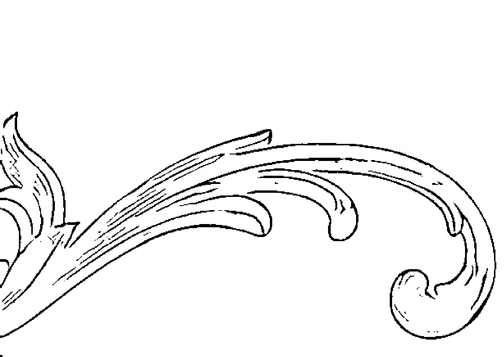

中世纪的炼金术师，几乎都是学识渊博的圣职者，尽管教会屡屡发布禁令，相信炼金术还是在修道院内广泛盛行。大概是因为除了圣职者之外，看得懂拉丁语的人在当时还是极为少数的关系。例如大家可以回想一下，在《罗密欧与茱丽叶》一书中提供秘药给茱丽叶的劳伦斯神父，还有在《钟楼怪人》一书中爱上吉普赛女郎而自杀的弗罗洛神父，他们都是信仰虔诚的修道士，同时也是在孤独的实验室中，凝视著烧瓶底部充满哲学精神的人。当然，有专注哲学理论探究物质秘密的耿直炼金术师，照理说在另一方面也会有很多专门欺骗有钱人的骗子方士，所以后来会出现但丁以及佩脱拉克这样激烈反对炼金术的人，也是很正常的事情。

在吉尔·德·雷的时代，若望二十二世的诏书已经开始失去效力，但是国王查理五世在一三八〇年公布的炼金术禁止令，却依然保有效力。所以吉尔虽在远离巴黎的乡下肆无忌惮的为所欲为，却还是得冒着极大风险。

教会原本就是站在反对这类异端学问的立场，但在下级的神学者中，完全如妖术师一样，深信五芒星、降魔术与咒术的伙伴却意外地多。因此，出现了像是罗马尼亚方济各会（Ordine francescano）宗教裁判所的审判官奇尼·乌戈里尼的《异端论》¹⁵、尼古拉斯·艾默里奇的《宗教裁判所审判官规则书》¹⁶、布拉格大学神学教授尼古拉斯·马尼的《迷信论》¹⁷，以及道明会修士约翰尼斯·尼德的《蚂蚁的对话》¹⁸等，支持教会立场的学者接二连三提出了否定炼金术的论文。

在这样的氛围下，那样野心勃勃埋头召集炼金术师的吉尔，肯定萌生了恶魔主义特有的，违背禁令所形成的快感。他将心腹手下送往各地，投入庞大资金，企图将欧洲出名的炼金术师全部召集到蒂福热城堡来，这般执着实在令人惊恐。

当时巴黎是研究神秘学的要地，德国以及意大利也分别有独特的传统秘术。但是聚集在蒂福热城堡里的这群方士当中，机敏才智最为出类拔萃，人人畏惧的魔法高手，就是由吉尔心腹尤斯塔许·布朗谢从意大利佛罗伦萨带回来的俊美破戒教士弗朗索瓦·普勒拉蒂。

毕竟意大利是走在当时文化的最尖端，即便在神秘学的领域，仍具备悠久罗马文化养成的正规传统。由占星学分支出来的星辰医学，在罗马宫廷尤其兴盛，意大利的方士在各国求才若渴下，滞留欧洲各地行医，或是远赴阿拉伯世界热切寻找失落已久的秘术。譬如知名的魔法师彼得罗·达尔巴诺，他便前往拜占庭研究希腊医学，还有威尼斯大学医学教授汤玛斯·德·皮桑（Tommaso da Pizzano），他更受邀成为法国国王查理五世的御医。

吉尔埋头于炼金术之际，特里维索（Treviso）伯爵贝尔纳多（一四〇六年出生于帕多瓦）正走访欧洲各地寻找“哲人石”。贝尔纳多用海盐、蛋壳、硫化铁及水银做实验，直到倾家荡产，才终于在一四八三年发现了哲人石，只是在同年，却因病去世了，实在令人遗憾。

话说除了义大利人普勒拉蒂之外，在吉尔身边评价最高且自称是炼金术师的人，就是来自普瓦捷的让·德拉·里维埃 (Jean de la Rivière)。

有天晚上，他和吉尔、布朗谢在侍从亨里尔及普瓦图陪同下，来到蒂福热城堡附近的森林里，说要在这里展示黑魔法给大家看。四个人在森林入口等着，仅魔法师权步走进森林中。

主从害怕到失去知觉，盯着黑阴深处猛瞧，突然在森林里传来了刀光剑影的幻听。

四人裹足不前，摸索着走进黑暗之中，只见魔法师一脸惊恐，脸色苍白地瘫软在地上。一问之下，魔法师表示恶魔化身成一隻巨豹向他袭来，于是他拔剑奋战。但是他说的一切却前后矛盾，才说他与巨豹争斗，又说巨豹没瞧他一眼便走进森林去了。布朗谢觉得可疑，只好继续追问，才知道他刻意用剑敲打森林里的树木在装模作样。传闻干了傻事的魔法师自觉不妙，隔天拿了钱后便逃之夭夭了。

这样的骗子除了让·德拉·里维埃之外，其实数不胜数。总之来路不明的女巫及妖术师，耳闻吉尔的风声后纷纷从南法各地涌入蒂福热城堡。吉尔盛情款待了这群骗子，热心聆听他们得意洋洋的炼金秘术以及降魔术，不过最后还是开始对魔法师的能力感到怀疑。

就在这个时候，有一位降魔高手（没有留下名字的纪录）来到蒂福热城堡，向吉尔展示了可怕的实验。这让吉尔也感到十分恐惧，后来让他对恶魔的存在深信不疑。

實驗在蒂福熱城堡的一隅舉行，見證人是吉爾與他的心腹手下夏爾。夏爾十分小心地守在窗邊，手持聖母像，準備發生意外時能立即逃走。魔法師在地上畫了一個很大的驅魔圈，命令吉爾與夏爾走進圈中，但是夏爾覺得害怕不聽從魔法師所言，只有吉爾一個人走進了驅魔圈。

只是過了一會兒，吉爾開始湧現奇妙的恐懼感，同時覺得胸悶頭暈，難以忍受而手畫十字，禁不住詠頌出聖母之名。結果魔法師大怒，馬上命他離開驅魔圈。這時候吉爾竟然倉皇失措地從大門逃出，夏爾則從窗戶脫逃。來到屋外的二人，從屋內聽見魔法師遭惡魔攻擊的聲響，嚇到四目相覷。

當聲響終於平息下來之後，二人鼓起勇氣走進屋內一看，發現魔法師被打到額頭上腫了一大包，全身是血，氣若游絲。在吉爾細心照顧下，幾天後才終於康復。這個魔法師身體好轉後，也馬上逃走了。

究竟這個寂寂無名的魔法師，是否真的召喚出惡靈，我們不得而知，但在降魔實驗尚未結束時便跑出驅魔圈外，可是非常危險的一件事，這點乃不爭的事實。然而這個魔法師卻連這件事都不懂，也許真的是名騙子。

傳說文藝復興時期著名的方士約翰尼斯·特里特米烏斯，他在神聖羅馬帝國皇帝馬克西米利安一世面前展示降魔實驗時，皇帝見到了亡妻勃艮第的瑪麗（Marie de Bourgogne）的亡靈，忍不住跑出了驅魔圈外，險些遭雷擊劈死。

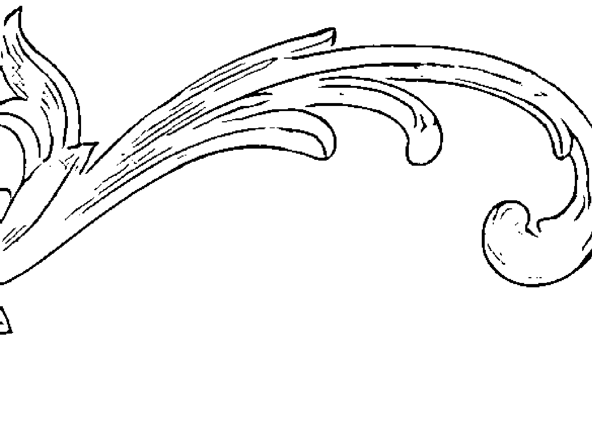

話說最後出現在吉爾身邊，將他的靈魂給與最後一擊，帶向罪惡與瀆神深淵的人，就是前文提過來自佛羅倫斯，惡名昭彰的魔法師弗朗索瓦·普勒拉蒂。唯獨他令吉爾衷心傾倒，對待他的方式與過去的騙子方士有著天差地別。

依據審判書的內容顯示，普勒拉蒂在一四四〇年於佛羅倫斯附近的皮斯托亞（Pistoia）誕生，立志成為聖職者，由阿雷佐（Arezzo）的主教收入門下，沒過多久，成為佛羅倫斯醫生讓·德·豐塔內爾的弟子，學習魔法與煉金術，不時與師傅一起召喚惡魔。

某一天，惡魔化身成十二隻烏鴉現身，又有一天，變身美貌青年出現。據說師傅豐塔內爾都曾將母雞、鴿子與斑鳩獻給這個惡魔。

在義大利旅行的途中，吉爾的心腹布朗謝發現了這名年紀輕輕卻才華洋溢的魔法師，於是欣然將他帶回了蒂福熱城堡。吉爾一見到他，好像就對這名年僅二十四歲又博學多才的俊美才子深深著迷。在審判記錄中，吉爾對普勒拉蒂的評語如下所述，「弗朗索瓦是個很能幹的人，說得一口流利的拉丁語，個性勤快工作認真」。

居然說他個性勤快工作認真！但是這個男人卻為了禁忌的地獄儀式，向吉爾苦求要活人獻祭，將吉爾隱藏在內心的欲望接連激發出來，到頭來，就是他將原本只是個性淫亂具性倒錯傾向的封建大諸侯吉爾，塑造成人人畏懼、瀆神又極度瘋狂的極惡之人。

假使沒有這個男人，吉爾在中世紀其實只是平凡無奇的放蕩貴族，度過他風平浪靜的一生，也許並不會在犯罪史上，留下難以抹滅的「藍鬍子」惡名。

話雖如此，吉爾·德·雷的盛名，還是在「藍鬍子」的傳說中永久留名。關於這方面的反論，在第二次大戰中死於收容所的超現實主義詩人羅伯特·德斯諾說過下述這段話。

> 「現在有人嘗試為吉爾·德·雷開脫，但是這種努力只是徒勞，令人備感困惑。吉爾·德·雷只是與我們的時代有所關聯，才會成為我們感興趣的對象。對一個男人的回憶在他死後生生不息，這個男人便與生者有同樣資格，日日發生變化，不對，應該說隨生者使他產生變化。就像這樣，不管後世的神話作者或是律師如何為吉爾·德·雷辯駁解釋，他終究只是將自己引向斷頭臺的機巧殺人犯。」

- 1. Histoire de Bretagne, Dom Lobineau, 1707.
- 2. Les douze clefs de philosophie de frère Basile Valentin, basilius valentinus, 1899.
- 3. The Twelve Keys of Basil Valentine, basilius valentinus, 1599.
- 4. The Triumphant Chariot of Antimony, basilius valentinus, 1661.
- 5. The Mirror of Alchimy, Arnaldus de Villa Nova, 1550.
- 6. Rosarius Philosophorum, Arnaldus de Villa Nova, 1597.
- 7. Flos Florum, Arnaldus de Villa Nova, 16th C.
- 8. The Mirror of Alchimy, Roger Bacon, 1597.
- 9. Speculum alchemiae, Roger Bacon, 1557.
- 10. Evangelium Medici: Seu Medicina Mystica, De Suspensis Naturae Legibus, Sive De Miraculis, Bernard Trevisan, 1699.
- 11. Collectanea Chymica, Bernard Trevisan, 1684.
- 12. The Golden Fleece, salomon trismosin, 1395.
- 13. Liber Triumphorum, Calid.
- 14. Aesch Mezareph, 1956.
- 15. Super materia haereticorum, zanchini ugolini, 1330.
- 16. Directorium Inquisitorum, Nicholas Eymerich, 1369.
- 17. Tractatus de superstititionibus, Nicholas Magni, 1405.
- 18. Formicarius, Johannes Nider, 1431.
- 19. De L'érotisme, Robert Desnos, 1923.

## 地獄譜

吉爾·德·雷男爵的肖像

Ⅲ

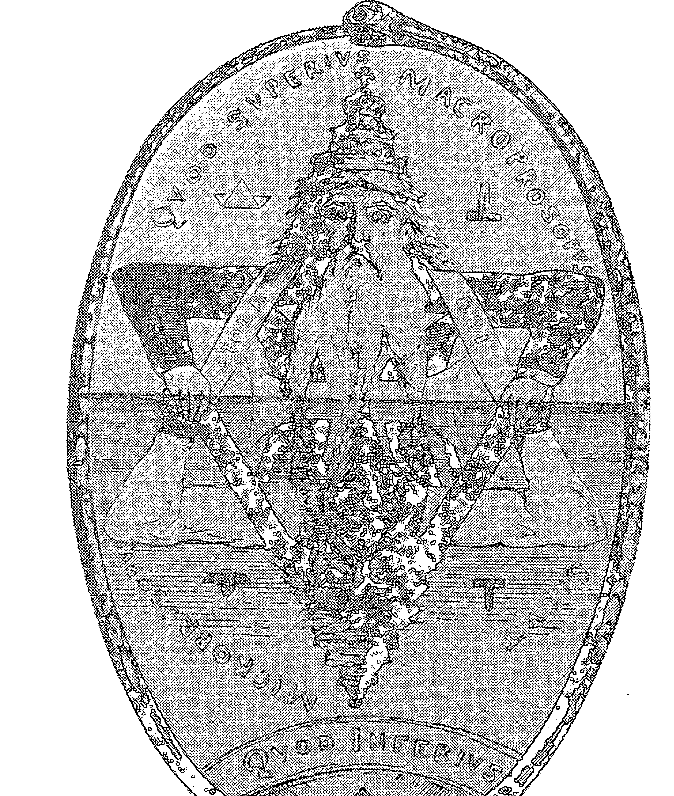

圖50 所羅門的象徵，引用自艾利馮斯·李維的著作

過去人們一直相信，所謂的惡魔隨時隨地都能現身，幻化成各種東西，不容大意。十五世紀算是中世紀的末尾，但在這個時代的人們，依然二十四小時生活在恐懼之中，害怕惡魔隨時會以可怕姿態現身眼前。當時認為，無論在泥土、火焰、空氣當中，都有精靈及惡鬼棲息，所以不能惹怒他們，最聰明的做法，還是一起和平共存。

惡魔的力量強大，沒有人懷疑他們的存在，但是從古代至中世紀的神學家，卻都永無止境地議論著惡魔究竟有何來歷，為何開始誘惑人們。而這些繁複的議論，當然與民眾信仰毫不相干。

約翰的《啟示錄》中寫道，

> 「戰爭在天上就存在了。米迦勒及他的使者與龍奮戰，龍也和他們交戰，卻未能獲勝，天上再也沒有他們的棲身之處。那條大龍就是大家口中的惡魔，又被叫作撒旦，正是迷惑全世界的古蛇，牠由天上墜落，摔到地上，而其天使也一同落下。」

總之根據約翰的說法，惡魔就是一條巨大的老蛇，原本居住在天上，和天使戰鬥後才被逐到地上。

話說惡魔摔落地上後發生了什麼事呢？這方面倒是眾說紛紜。例如聖保羅主張惡魔棲息在天與地中間的大氣層，變成了「空氣之王」。這與魔王路西法本身為「光之天使」，曾位居天使最高階層，卻因為自大傲慢而被逐到地上的說法十分類似。在《路加福音》中有云，「我看見撒旦如閃電般從天墜落」。而《哥林多後書》中則記載「撒旦自己也裝作是光之天使」，有看過的人就知道撒旦的天使名字就是路西法，二者是相同的。

另外還有其他的說法，認為惡魔是「地獄之王」，為了誘惑亞當與基督，傳說曾二次出現在地上。這種說法與方才《啟示錄》中蛇的說法一致。《彼得後書》中有提道，「神不會赦免犯罪的天使，於是將他們推入地獄，安置在黑暗洞穴裡，看守到審判時刻為止……」。

聖彼得還將惡魔形容成吼聲如獅，如下寫道，「務必謹慎清醒，你們憎恨的惡魔，如同吼叫的獅子，四處徘徊找尋獵物吃下肚」——就像這樣，聖彼得這套論點與煽動群眾的陰險手段十分類似，一再強調魔鬼的可怕之處，引發修道士內心的恐慌，因而主張如為防止惡魔的誘惑，唯有堅定信仰。

話雖如此，在基督教理論中，惡魔絕對沒有足以對抗神的力量，所以這點與妖教和摩尼教（Manichaeism）的惡魔概念大相徑庭。誠如特士良（Tertullianus）所言，撒旦只是「模仿神的猴子」，無論再努力都無法觸及神的無所不能。所以只能為難人類，從弱點下手獲得滿足，神也為了給基督教徒考驗，有時甚至會利用惡魔的力量，也就是認同惡魔的行徑。

這樣一來事情就有趣了，當惡魔的所作所為對神的作為有幫助，那麼懷疑惡魔的存在，等同於懷疑神的存在，是個重大的謬論。事實上，聖湯馬斯甚至在《神學大全》中明言：「天主教承認惡魔的存在，認同惡魔的行徑危害人類」。

除了聖湯馬斯以外，還有許多預言者、神學家以及著名的魔法博士都說過承認惡魔確實存在。在這句話，所以也難怪在中世紀大教堂的雕刻及彩繪玻璃等處，都會出現那樣醜陋無比的惡魔圖像。其實一開始魔鬼的形象並沒有那麼醜惡，在拜占庭的壁畫上，墮落的「光之天使」便畫得十分宏偉，後來魔鬼的形象會逐漸變得奇形怪狀，肯定是因為教會認為有必要進一步煽動信徒內心的恐懼。

惡魔的形態學及分類學在文藝復興時代才被深入研究，在這之前，教宗額我略一世、伯爾納鐸（Bernardus Claraevallensis）、艾爾伯圖斯·麥格努斯、鄧斯·司各脫（Johannes Duns Scotus）、海斯特巴赫的凱撒里烏斯（著有《不可思議的對話》）等人，都在中世紀期間提過相關論述。以文藝復興時期最知名的著作來舉例，有義大利人喬瓦尼·洛倫佐·達納尼亞的《論惡魔之性質》²、比利時人約翰·維耶爾的《惡魔的蠱惑》³、德國人約翰尼斯·舍克（Johann Schenck）的《珍奇考察》（法蘭克福，一五八四年）以及法國人布丹的《鬼附身狂》⁴等等。

還有人親眼看見過惡魔。據說這個人是歐塞爾（Auxerre）市鎮的修道士羅杜爾富斯·格拉貝爾（Raoul Glaber），他在床腳看見的這個惡魔，是個有「細脖子、瘦長臉、黑眼睛，而且窄額頭上長滿皺紋，加上扁鼻子、雙耳立起、滿口狗牙的怪物。可見自從惡魔被逐出天國後，變得相當落魄潦倒。

依據聖熱羅尼莫（Saint Hierom）的說法，撒旦被逐出天上後，帶走了他底下三分之一的天使，因此地獄裡有為數眾多的惡魔，也具備完整的階級制度及軍隊。約翰·拜耳的著作，以及在一五二二年左右於亞維農出版的著名魔法書《赤龍》裡，皆詳細分析了這種惡魔的階級制度（參閱《雅各布斯的豬》章節）。

惡魔的軍隊一直在等待機會，企圖引誘人類犯罪，只要魔王一聲令下，就能在地球各地現身。根據第歐根尼·拉爾修（Diōgenēs Laërtios）的說法，世界各地都「充斥著精靈及惡魔」，所以絕對無處可逃。惡魔會變成動物、空氣、怨靈、男夢魔抑或女魅魔，讓設定目標的人誕下孩子。亨利·波蓋的《妖術師論》中有提到，惡魔「可用空氣製造出肉體」。

另外拜占庭的哲學家普塞洛斯（Michael Psellos）、耶穌會的惡魔學家德爾里奧、煉金師特米烏斯的意見一致，他們都認為惡魔依據不同的棲息地，區分成六大類，分別有火、空氣、土、水、地下、黑暗。巫魔會上看到的惡魔，就是黑暗的惡魔路西法格·羅佛卡萊（Lucifuge Rofocale）。路西法在拉丁語中意指「發光」，路西法格則意指「厭光」。

總之，這些惡魔會依照與人類訂定的契約，授予人類在地上擁有的可怕的特權，而我們的主角吉爾·德·雷，同樣不禁這種惡魔的誘惑，草率地將自己的靈魂賣給了地獄的惡魔。

承前所述，在義大利人普勒拉蒂來到蒂福熱城堡之前，不時會和佛羅倫斯的魔法師一同施展降魔術，所以當然在拜訪吉爾時，他也沒忘記帶著魔法書。這是一本用黑色皮革裝訂而成的羊皮紙書籍，記錄著五八花門的魔法儀式及配方。在十五世紀，幾乎沒有人看得懂魔法書上難解的記號。當時包含吉爾在內，沒有任何一個人懷疑過這個來自外國的年輕魔法師所具備的能力。事實上普勒拉蒂正如布丹給他的定義，「是一名妖術師，是在惡魔居中調解下努力實現某些事的人」，而且他的行徑確實如此。

一四三八年底的某個晚上，吉爾與普勒拉蒂手持蠟燭，關在蒂福熱城堡樓下的一室內，用劍尖在地板上畫了一個很大的圓圈和魔法文字。接著在素陶罐裡升起炭火，將磁石粉、香料、沒藥與蘆薈籽倒入罐中焚燒，不久便散發出濛濛煙霧。他們在這些煙霧中，誦詠了長達二小時左右的降魔咒語，但是惡魔卻始終沒有現身。

不過普勒拉蒂認為，惡魔一定會告訴他們隱藏寶藏的所在地與煉金秘術。那陣子吉爾·德·雷才剛賣掉尚多歐塞的土地，終於陷入財政困難的他，不畏一開始的失敗，對這個魔法師信心十足的說法，熱情更加高漲。

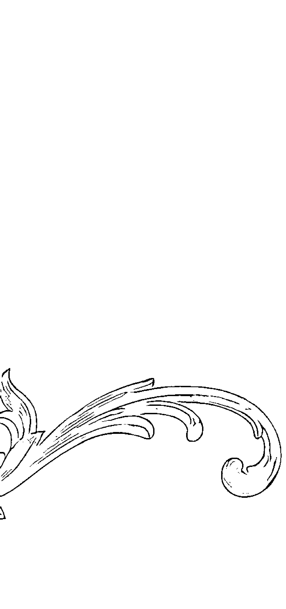

普勒拉蒂念著咒語，

> 「以聖父聖子聖靈聖母瑪利亞之名，懇請巴隆、撒旦、彼列、巴力西卜在我們面前現身，與我們對話，聆聽我們的願望！」

惡魔巴隆是和普勒拉蒂有交情的惡魔，想來或許是因為吉爾·德·雷是個男爵（Baron），與巴隆同音），所以特別是這個名字相同的惡魔才容易被召喚。

順帶介紹一下，十九世紀篇幅最浩繁的魔法書，就是由知名的科蘭·戴·布蘭西著作的《地獄辭典》，我們來從中找找看普勒拉蒂企圖召喚的四個惡魔叫什麼名字。

首先在「巴隆」的章節中，有個段落寫著，「德·雷元帥活人獻祭的惡魔之一」。

其次是「彼列」，在這部分的記述稍微冗長一些，內容寫道，

> 「賽達（Said）人崇拜的惡魔。在地獄中最為放蕩不羈、猥褻，一心只為了做壞事而做壞事。靈魂雖然醜惡，外表卻十分俊美，充滿優雅與威嚴。也在另一個城市索多瑪（Sodom）備受崇拜，但卻不曾在祭壇上受到供奉。」

## J.H.S

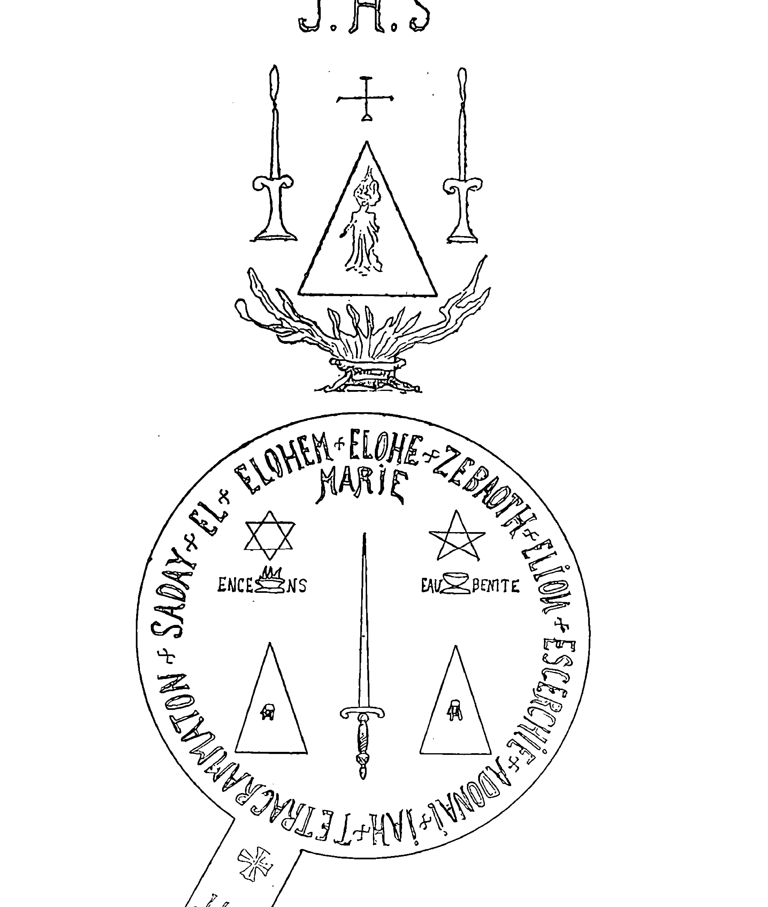

圖51 降魔術的驅魔圈，進行實驗的二個人須站進圈內的三角形中，惡魔會從圈外的三角形中現身

接下來關於「巴力西卜」的記述篇幅最長，「聖經上記載是惡魔的王子，依照米爾頓的說法是繼撒旦之後的掌權者，許多惡魔學家則認為是地獄王國的最高領袖。巴力西卜這個名字，意指「蒼蠅殿下」，是迦南（Canaan）民眾最尊敬的魔神，經常常用蒼蠅形象來表現。由於他具有預言能力，所以當時以色列國王亞哈謝（Ahaziah）生病時，曾經仰賴巴力西卜的啟示。他在妖術師浮士德面前現身時，曾化身成長著可怕雙耳、五顏六色的毛髮以及龍尾牛身的模樣。德·雷元帥見到他時，則化身成豹的姿態，一生氣就會口吐火焰，發出狼叫聲。」

最後的「撒旦」敘述，

> 雷金納德·斯科特（Reginald Scot）覺得他是一等或第三等的惡魔，依照一般人的看法，他則是惡魔與地獄的首領。當天使對神造反的時候，當時身為北部司令官的撒旦會統領反叛軍，也就是所謂的革命家。撒旦這個名字在希伯來語裡意指「敵人」。依照米爾頓的說法，撒旦身高如塔，長四萬英尺。但是不管人們如何懇求，他還是不會現身在巫魔會上。

以上內容，就是科蘭·戴·布蘭西在《地獄辭典》中的大略摘錄。四處可見吉爾·德·雷的名字，由此可知，吉爾在惡魔史中，其實一開始便扮演著最主要的角色。

話說吉爾與普勒拉蒂就像這樣每晚不斷向惡魔祈求，起初還獻上公雞、鴿子或斑鳩這類的小動物作為供品。還有一次，他們找不到「迪亞多克斯」這種奇珍異石，無計可施下導致實驗無法進行。這個名稱奇特的石頭，依照博薩爾神父的說法，算是祖母綠中的一種綠柱石。當時在蒂福德熱城堡內還再三進行過其他實驗，卻沒有一見的成果，惡魔巴隆完全沒有現身，吉爾深切的願望終究無法向惡魔傾訴。

因此普勒拉蒂改變手法，為了討惡魔歡心，於是向元帥進言，應依循正式手續與地獄之王簽約。十五世紀十分盛行地獄契約，吉爾在和普勒拉蒂會面之前，已經兩度在契約書上署名，不過全都上當受騙了。第三次要他簽約，當然多少面帶難色，不過吉爾對普勒拉蒂還是極為信任。

於是吉爾親手簽訂契約，向惡魔巴隆宣誓忠誠，答應除了靈魂與生命以外，惡魔要求的一切都會全數奉上。

契約一旦簽定之後，接下來便一瀉千里，滑落頭暈眼花的性虐待螺旋樓梯，從此只能深深陷入那黑暗的萬丈深淵。這就是惡魔主義的鐵則。

反正，包含於斯曼這樣優秀的傳記作者在內，都曾寫道，「吉爾對於犯下殺人罪並不感到害怕，但他堅決不將生命讓渡給魔王，也不願放棄靈魂」，天主教徒果真相當冥頑。事實上他確實與惡魔簽約了，簽約之後當然須默默放棄基督教的信仰，也就是說，吉爾已經成為異端了。

一三二六年若望二十二世發布的詔書中也清楚寫道，「與亡者和地獄簽約者、向惡魔活人獻祭者，以及向惡魔提問獲得回答、為了滿足邪惡欲望而仰賴惡魔之力者」，須全數告發。即便與地獄簽約了，吉爾卻從來沒機會見到惡魔一面，但是據說普勒拉蒂自己卻獨自一人會見過惡魔巴隆好幾次。本來口說無憑，不過他表示惡魔總會化身二十五歲左右的俊美青年出現。有一次，惡魔出現時帶著奇妙的黑色粉末，忠告普勒拉蒂如想一夜致富，只要將這些粉末倒入銀器中隨身攜帶即可。此時吉爾正前往布爾日旅行，普勒拉蒂馬上命下人將粉末送至當地，著實勞苦功高。

就像這樣，據說帶在身上就會引來好運的物品，在魔法用語裡稱之為「護身符」(amulet)。

> > 老底嘉(Laodicea)宗教會議的決議文有一段寫道，祭司及聖職者「不得成為魔法師、數學家、占星學家。不得製作護身符。持有護身符者，將逐出教會」

所以普勒拉蒂在這時候，同樣大膽違犯了教會的禁令。

還有一次，惡魔巴隆在蒂福熱城堡的大廳裡現身了，並且將金光閃閃的金塊拿給普勒拉蒂看，不過惡魔嚴格命令他，時機未到前不得觸碰金子。普勒拉蒂急忙帶吉爾回到城堡，二人再次走進大廳一看，結果普勒拉蒂突然在眼前發現了一條大尾綠蛇，身體像狗一樣粗，於是驚聲大叫，吉爾嚇出一身冷汗逃出大廳，不過馬上又帶著十字架返回，然後試著用手碰了金塊，結果哪理有黃金，其實只是掉在地上的垃圾在發出金色光芒罷了。

故事如果這樣寫的話，大家也許會覺得普勒拉蒂實在是個惡劣的騙子，不過事情不能這樣一口咬定。尚且不必提到《舊約聖經》裡先知但以理的例子，許多人看不見的事物，有可能只有一個人可以清楚看見，自古以來，神秘家在在證實，無論黑魔法或白魔法，時常因為超能力而看見幻覺。驚動過康德的史威登堡*，就是最明顯的例子。因此無人敢斷言，普勒拉蒂沒見過惡魔或綠蛇。

以醫學的角度來看，這些幻覺現象也可以解釋成神經衰弱、妄想狂或寄生蟲侵入內臟所造成，但還是有無法解釋清楚的偶然巧合，這部分保留在神秘領域會比較明智。至少在本書《黑魔法手帖》裡，要是嚴守像這樣超越科學界限模棱兩可的合理主義，書就寫不下去了……。

* 史威登堡（Emanuel Swedenborg，一六八八—一七七二），為著名瑞典科學家、哲學家、神學家和新教會的理論奠基人。在一七四五年他堅信自己看見異象，於是開始致力研究《聖經》以及著手寫作神學方面的著作，在一七四七年辭去了皇家礦務局的職務，在之後的25年發表了十四部神學作品。

話說回來，從犧牲動物作為供品，變成犧牲人類作為供品，這是惡魔禮拜的常規。恐怕吉爾一開始也是依循了普勒拉蒂的意見，將一個孩童的手、眼與心臟獻給地獄魔王後，自此開始墮落，所以第一次純粹是為了惡魔禮拜，後來嗜血成性，則是很久以後才開始增加的興趣。

將孩童獻給魔神，這在古代東方的祕教中出現過許多例子，其實據說在中世紀，同樣有名為聖殿騎士團的異教祕密組織，將自己的新生兒獻給詭異的崇拜偶像巴風特。吉爾也和這些發源自古代的祕密宗教祭司一樣，不知不覺將神聖的逸樂與肉體的歡愉混為一談，等他察覺到的時候，那種沾滿鮮血令人不寒而慄的屠殺習性，已經滲透全身上下了。

究竟吉爾殺害過多少孩童，他自己也答說不記得，不過依據審判記錄顯示，自從他隱居蒂福熱城堡之後，直到被判死刑這八年期間，殺死了超過八百名孩童。如果是用納粹近代的殘殺手法倒還可以理解，但是這八百人的數字，在當時實在令人目瞪口呆。無論是羅馬暴君、義大利的專制君王還是蒙古大汗，絕不會為了個人惡魔主義的享樂，刻意做出如此大規模的屠殺。

不過這個數字各方見解不同，米什萊估計是一百四十人，蓋爾雷斯覺得是一百五十人，朱爾斯·勒尼奧（Jules Regnault）博士主張是二百人以上，就連於斯曼也說，很難想像吉爾曾殺害過八百人。薩洛蒙·雷納希（Salomon Reinach）與盧多維科·埃爾南德斯（Ludovico Hernandez）博士則斷言，其實吉爾犯下殺人罪全是捏造，不過是妄想而已，雖說他們想為吉爾恢復名聲，但是這種意見似乎還是有些過於極端。

布列塔尼公爵曾下令讓·德·托切龍德 (Jean de Tocheronde) 警官負責搜查，他在搜查報告書中，記錄下幾件慘絕人寰的兒童綁架事件。

尤其是在一名六十歲上下的可怕老婆婆佩林·馬丁 (Perrine Martin) ，她在兒童綁架事件中擔負重任，總是率領身強力壯的男子在附近原野闖蕩，一看到美貌的少年就會走進森林裡。然後守著那裡的男子便會堵住孩童的嘴巴，綑綁手腳塞進袋裡，帶回蒂福熱城堡。

依照米什萊的說法，這個老太太綽號叫「白尾鷺」，大家都很怕她，聽說她總是「用黑布包住半張臉」，但在審判記錄中，只寫著她身著灰色衣服與黑色頭巾。

八年前，不管是在蒂福熱村莊裡，還是在拉蘇茲，都再難看到男孩的蹤跡，而尚多歐賽城堡高塔的地下室裡，則是屍骨高疊。根據證人紀堯姆·希萊萊特 (Guillaume Hilairet) 耳聞的謠言顯示，「在尚多歐賽城堡中，發現了塞滿兒童屍首的大木桶」。

吉爾的僕人亨里爾與普瓦圖陳述，二人分別將四十餘名男女兒童交到主人手上，聽說主人在瘋狂屠殺之前，會讓孩童滿足他性倒錯的欲望。

換言之，他讓孩童一度為他的放蕩行徑作出奉獻，吉爾異於常人的欲望，並不是想姦淫兒童，而是將自己的身體架在被迫仰臥的孩童腹部上，藉此得到滿足。訴訟記錄裡有一個段落寫道，「這個作法比在兒童性器上完事，更能得到快樂又能減輕痛苦」。

這種行為以天主教的說法稱作瀆犯（pollutio），或是近似精神病理學中所謂的摩擦欲（frottage，藉由摩擦他人身體以得到快感），毫無疑問將吉爾性倒錯傾向的部分，清清楚楚地展現出來。

> 「我至今仍時常漫步曠野」
>
> 尚·惹內（Jean Genet）在書中寫道：
>
> 「尤其是黃昏時刻，在我造訪過去吉爾·德·雷居住過的蒂福熱城堡廢墟回程路上，遇見金雀花時，都會對這些花興起深切共鳴之情，我會滿心愛戀地仔細欣賞這些金雀花。我不敢斷言我不是金雀花之王，說不定我是金雀花精靈，金雀花就是我在自然界的徽章。其實我是透過金雀花，在吉爾·德·雷手中被刺死、屠殺、火刑的孩童及青年粉碎骨骸滋養下，才能扎根於這片法國土地上。」
>
> ——《小偷日記》

- 1. Dialogue on Miracles, Caesarius of Heisterbach, 13th C.
- 2. De natura daemonum, Giovanni Lorenzo d'Anania, Venice, 1589.
- 3. De praestigiis daemonum, Johann Weyer, Basel, 1568.
- 4. De la démonomanie des sorciers, Jean Bodin, Paris, 1580.
- 5. Discours exécrable des sorciers, Henry Boguet, 1979.

## 幼兒屠殺者

### 吉爾·德·雷男爵的肖像

#### IV

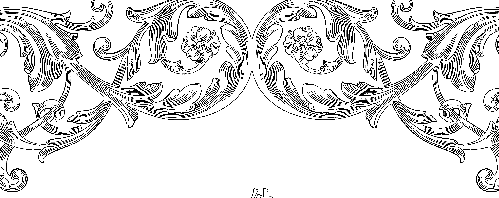

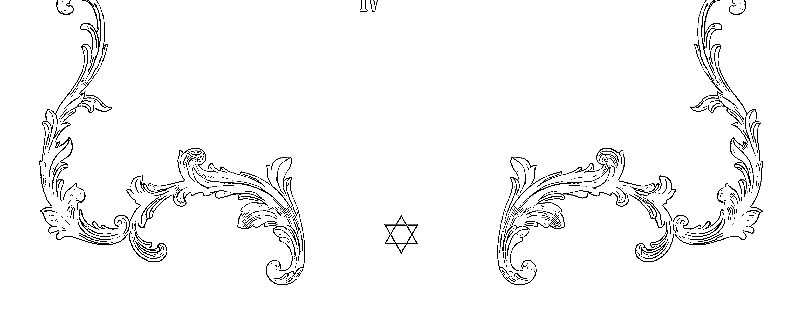

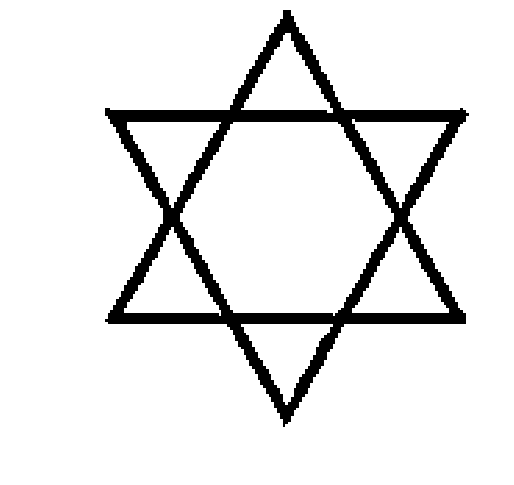

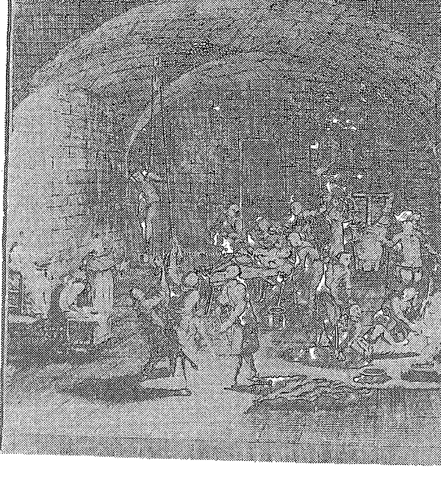

**圖53 異端裁判所的拷問情形**

惡魔禮拜與性虐待、同性戀之間，似乎有著切也切不斷的關係。當然像是十七世紀在修道院誘惑純樸修女，因而被燒死的著名妖術師高弗里迪（Louis Gaufridy）或於爾班・格蘭迪耶，大多擁有正常的性欲，但在惡魔附身的狀態下，以及性倒錯的時候，似乎在本質上有其共通的地方。

舉例來說，法國思覺失調症的權威，吉恩・雷荷密特（Jacques Jean Lhermite）便提出下述證言：

「若以心理學的角度來分析鬼附身患者的性變態現象，發現大多數都會出現欲望低落或是性倒錯的情形。其中最令人害怕的，是同性戀的傾向。」

由於雷荷密特觀察到的都是現代人，難不成在這二十世紀的原子能時代，法國周邊依然存在許多被惡魔附身的人？可見人類的精神疾病，還是無法藉由文明及技術的進步徹底驅除。

若從歷史的角度來調查非自然性行為（sodomy，包括同性戀與獸交）與魔法的關係，首先在《聖經》中會瞧見各式各樣充滿暗示的文章。就像日本德川幕府的齊藤將軍一樣，古代近東和中東的專制君主，也有完全沉浸在淫蕩生活之中，精神錯亂又短命的慣例。除此之外，他們身邊都聚集了眾多魔法師及占卜師，眾所皆知他們幹盡了現代人無法想像的瘋狂行徑與缺德惡行。

舉例來說，以色列掃羅王（Saul）自從罹患了原因不明的憂鬱症之後，為了請教女占卜師的預言而在沙漠中來回蹣跚，最後終於失去理智，聲稱見到了士師撒母耳的幽靈。這段故事在《撒母耳前書》中也有記載。

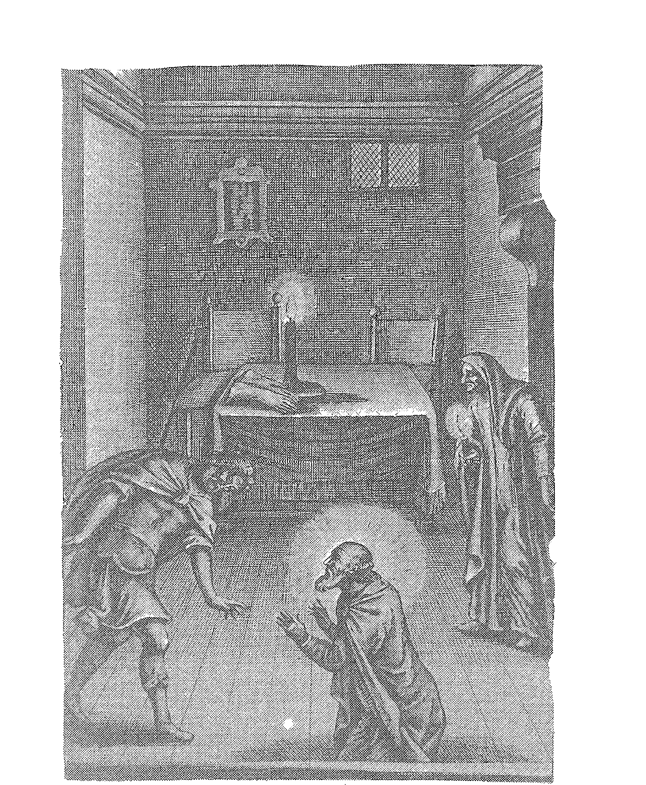

**圖54 掃羅王與撒母耳的幽靈**

因「空中花園」而遠近馳名的巴比倫王尼布甲尼撒（Nebuchadnezzar），因為沉溺魔道最終患上了動物附身妄想症，他想像自己是頭牛，不但發出牛叫聲，還雙手雙腳著地步行，甚至跑到原野上吃草。依據《但以理書》的記載，「終於他的毛髮如同鷹的羽毛，指甲長得像鳥爪一樣」，於是最後他在原野上發瘋而死，真是一個令人毛骨悚然的悲慘故事。類似的現象，後來被稱作狼化妄想（lycanthropy），正如同日本的「狐狸附身」一樣，在野狼等野獸出沒的歐洲鄉村大舉蔓延。

另外在古歷史學家西西里的狄奧多羅斯（Diodorus Siculus）的書中有提到，以豪奢著名的亞述末代君王薩達納帕魯斯（Sardanapalus）「經常避人耳目如同女人般在過生活，他會在女人的房裡打發時間，穿著女性服裝，臉抹白鉛，將婦女用的化妝品塗滿全身。除此之外，還煞費苦心裝作女性嗓音，與男男女女不知羞恥地沉浸在歡愉之中」。

代代羅馬皇帝為男色和魔法神魂顛倒的事實，在蘇埃托尼烏斯的《羅馬十二帝王傳》都有詳細描述。像西塞羅（Marcus Tullius Cicero）這樣的哲學家雖然寫了《占卜論》來否定魔法，卻也無法抵抗這股洶湧澎湃的風潮。

古羅馬盛行的占卜，是將動物的腹部切開後，觀察其內臟以判斷吉凶的「腸占卜」，對此感到懷疑的皇帝提貝里烏斯，一方面禁止這種腸占卜，大量虐殺魔導師，另一方面又偷偷招攬知名預言家特拉西盧斯（Trasillus）入宮，研究召喚惡靈的咒語等。

最有名的，就是尼祿聽從占星家巴比盧斯（Balbillus）的指示，將許多魔法師一個接一個給處死了。

這個尼祿同時也是熱愛異性裝扮的同性戀，傳說他以女裝和名叫提格利努斯（Tigellinus）的男子結婚，還曾身著男裝與名叫斯波洛斯（Sporus）的男子成親。薩德侯爵的小說裡，便出現過具有如此怪異嗜好的男子，名字叫諾爾瑟伊（Noirceil）。

而為了去世的美少年安提諾烏斯（Antinous）建造神殿的哈德良皇帝，正好可以聯想成日本室町時代的將軍，是個多愁善感的頹廢皇帝，但他還是十分熱衷魔法及占卜術。關於身兼太陽神祭司一職的赫利奧加巴盧斯皇帝，則是非得與敘利亞出身的魔法師商議，才敢做出政治上的決策。

他是個與中世紀的吉爾·德·雷不相上下的性倒錯者，犧牲了許多孩童供奉太陽神巴力，還自己打扮成女裝與奴隸希羅克勒斯（Hierocles）及鬥士佐蒂克斯（Zoticus）結為夫妻。

進入中世紀之後，妖術在大眾面前受到廣泛討論，雞姦之罪在教會嚴厲壓制下，乍看似乎消失無蹤了。不過這種說法完全不可能，因為不只是封建大諸侯，包含羅馬教宗在內，一直偷偷沉溺在千古流傳的罪惡行徑之中。因「卡諾莎之行」*而聞名的日耳曼尼亞亨利四世，被教會以通姦、強姦、違背人倫等等之罪告發；而美男子腓力國王的法律顧問，則反過來譴責法國教宗波尼法爵八世是同性戀、魔法師，而且雙方都是有憑有據。

有些人主張，是十字軍導致西歐開始流行同性戀。因為十字軍的騎士擔心在遠征時不小心與各國女子有染的話，會患上麻風病或丹毒，不得已只好找同伴彼此滿足欲望。

在中世紀魔法一大重地的西班牙托雷多，若提到「托雷多學」，馬上就知道是魔法的意思，這座因葛雷柯（El Greco）的繪畫而名聲大噪的陰森城鎮，尤其盛行召喚死靈的「招魂術」。與托雷多並列魔法重地的還有法國的迷笛，摩尼教、波格米勒派、阿爾比派與卡特里派等各門異教在這塊土地上急速拓展。特別是卡特里派一直認為懷孕是惡魔所為，所以才會默許與不會有懷孕之虞的男同志性交。

十四世紀勢力非常龐大的宗教秘密組織「聖殿騎士團」，也有奇怪的入會儀式，新團員簡直就像身在巫魔會中，必須親吻舊團員的臀部及陽具。這種行為不一定是性放蕩，也具有崇高精神的表現，但是對這一派有反感的人們來說，恰好成為他們譴責的藉口。

> * 卡諾莎之行（l'umiliazione di Canossa），發生於一〇七七年一月，神聖羅馬帝國皇帝亨利四世因危害教廷執政地位，被教宗額我略七世處以破門律絕罰並逐出教會。亨利擔心貴族叛亂，決意與教廷和解，並從萊茵河畔的施派爾到艾米利亞—羅馬涅的卡諾莎城堡向教宗額我略七世屈膝要求赦免絕罰，為赤足越過阿爾卑斯山的苦行。

在文藝復興時期存在許多黑彌撒的例子，而黑彌撒與惡魔禮拜、性變態的結合最是經典。前文已經提過凱薩琳·德·麥地奇的例子了，接下來繼續舉一個有名的事例，就是在巴黎郊外的萬塞訥城堡古塔裡，沉溺於妖術及降魔術的法國國王亨利三世。當時巴黎市民大大風傳他在這裡活人獻祭，所以亨利三世死後，據說在古塔裡發現四處都有經過鞣製的孩童人皮，以及黑彌撒用的銀器等等。

文藝復興時期是個毫無秩序又解放的時代，雖然道德頹廢卻充滿藝術涵養的奇人輩出，其中與切薩雷·波吉亞 (Cesare Borgia) 齊名，極惡無道的人物就是義大利里米尼的專制君主西吉斯蒙多·馬拉泰斯塔 (Sigismondo Malatesta)。

> 依據歷史學家布爾克哈特 (Carl Jacob Burckhardt) 的記載，「歸罪他殺人、強姦、通姦、近親相姦、褻瀆聖物、偽證、背叛的，不只有羅馬法庭，歷史上的判決更是如此。但是身為一個人最叫人不寒而慄的，是他主動挑逗兒子羅伯托的同性戀行徑，雖然當時兒子持短劍將父親逼退了，不過仔細想想，這不只是單純因為不倫背德所導致，而是迷信占星術及魔法的結果。」——《義大利文藝復興時期的文化》

自古以來，專制君主對魔法及非自然性行為如何瘋魔，使得令人忌憚的精神衰弱與殘虐行為屢屢發生的例子，參考前文幾乎足以說明了。如此想來，中世紀大貴族吉爾・德・雷的情形，大家應該也都能理解，這未必是前所未聞的特殊案例。雷荷密特教授也說過，在惡魔主義與性變態之間，肯定存在著必然的關係。

只是吉爾・德・雷與古代頹廢掌權者最大的不同點，是他並不會單純為了性興奮而採取嗜血的行徑，而是對性虐待更加講究，由此追求與肉慾對抗的無償想像力遊戲。以這點角度來看，他算是一名藝術家，儘管在現實中犯下了無數的殺人罪，最後還是活在夢幻般的概念世界裡。

- 可憐的孩童被帶到城堡之後，吉爾先命令部下，將用來活人獻祭的少年塞住嘴巴，把孩童吊在牆上的鐵鉤上。當充滿恐懼的孩童眼見就要窒息時，吉爾再將孩童從鐵鉤上放下，讓他們坐在膝上為他們拭去眼淚，溫柔安撫。接著會指著部下說：「你們這群人真壞，不過有我在你們就不用擔心了，我一定會救你們的。」於是孩子放下心來重展笑容，完全不知即刻將被殺害。這對吉爾來說，會勾起他惡行之後無法言喻的快感。就在孩童慶幸得救之際，吉爾會從背後靜悄悄地砍下他們的頭，一見到鮮血直流，他會忘我地欣賞剛斷氣的孩童屍首終抽搐的模樣。接著馬上發出尖叫再一面反覆揉搓屍體，翻來覆去地把玩。

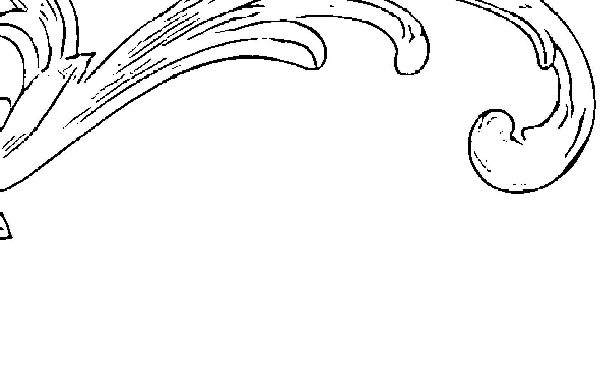

胡鬧玩過一陣子之後，吉爾再次命令部下，將孩童的手腳切成好幾塊，有時還會自己動手，用短刀將頭部與身體切開，甚至開腹將內臟扯出來，聞著微溫臟腑的悶臭味，再用帶釘的木棒將頭蓋骨敲開，使腦漿四溢。視劊子手的心情好壞，有時孩童還會活生生接受這種殘酷的處置。元帥像這樣見血之後，出神忘我的程度就會極度升高。

驚人的笑聲，在蒂福熱城堡深處的厚重城牆中迴盪著，那是精神病猛烈發作的性虐待狂發出的笑聲，那是吸血鬼的笑聲。這時候只能猜想，他這個人已經化身成魔王撒旦了。

對吉爾來說，死亡與痛苦才是遠高過性高潮的喜樂泉源。就像男傭普瓦圖在法庭上的證詞，每當犧牲者開始露出臨死前的痛苦神情，吉爾會走到他們身邊，彷彿欲舔嘮般地盯著他們的表情。吉爾自己也自白說，在擦拭犧牲者血痕或將屍體寸斷之前，會猛然地坐在他們身上，欣賞他們痛苦的痕跡是他最大的樂趣。

> 在此引用米什萊著名的《女巫》書中內容，如下所述：
>
> 「在這種惡魔的宗教裡，最可怕的一點是人類會逐漸破壞內在的心性，直到最後會變成人以外的東西，將成為惡魔。起初雖然心不甘情不願地為魔王殺人，但是不久後會開始樂於為自己去殺人。比起痛苦，更加享受死亡。如此重大的生命，卻完全為了一時的消遣取樂，實在可怕。悲慘的吼叫、臨死前的痛苦掙扎，取悅著他的耳朵。瀕死時苦悶的表情，將引爆他的笑聲。最後當犧牲者開始痙攣時，他還會坐在他們顫動的屍身上。」

在米什萊簡潔呈現的名文中，完美捕捉到惡魔主義與性虐待的奧秘。眾所皆知，吉爾愛好獵物可滿足肉欲的濃厚肉汁，搭配上摻雜香料的刺激烈酒。不過酒與惡魔禮拜及性變態有何關係呢？接著就來看看切薩雷・龍勃羅梭 (Cesare Lombroso) 針對某個犯罪者所提出的觀點。

接著順便引用十六世紀末義大利的魔法家，吉安巴蒂斯塔・德拉・波爾塔對於酒精效力的意見。他以〈使人瘋狂的方法〉為題寫了一篇文章，提到酒精讓人感覺像是犯罪的導火線，但以結論來說，他的意見與近代醫生一般的觀點沒有太大差別。也就是說：

「一個名叫瑋昂的女子有性倒錯的傾向，受酒精催化下，絞殺了兒童還感到異常的性快感。只能說明是酒精引起了她的犯罪。」

在吉爾・德・雷這個例子中，酒精不也是舉足輕重嗎？關於這點，在法國曾以吉爾・德・雷作為醫學論文主題的貝內爾 (Frédéric-Henri Bernelle) 博士，便提出了相當大膽的假設，他認為吉爾說不定是遺傳性酒精中毒的受害者。這個假設，乍看之下近似胡說八道，但是假設十五世紀當時的許多貴族，經常沉溺酒色，在酒精中尋求快樂、狩獵以及戰爭帶來的刺激，就這點事實來看，也未必難以讓人認同。

> 「想讓人瘋狂，可利用下述方法合成的酒。首先要取毒茄的根丟進煮沸的葡萄液中，待滾滾冒泡後，倒入容器蓋上蓋子，放置在適當場所三個月的時間。需要的時候，讓對方喝下即可。對方喝下酒後，一開始會陷入沉睡，接著會喪失正常意識，一整天都會變得瘋瘋癲癲，但是只要睡上一覺，即會恢復正常，也不會有嚴重的不適感，反而會留下開心的回憶。」 ——《自然魔法》

先不論遺傳性酒精中毒的情形，但是任誰都無法斷言，來自毒藥及春藥發源地義大利的魔法師普勒拉蒂，沒給過吉爾某些利用魔法調製而成的春藥或興奮劑，說不定是大麻、洋金花？也可能是顛茄或天仙子？

無論是哪一種，吉爾在病理學的傾向，終究非這些毒物可以比擬，其症狀嚴重乃不爭的事實。所有的性倒錯傾向，都能在他身上發現，由這點看來，吉爾也許就居住在薩德侯爵描述的幻想世界裡。

舉例來說，克拉夫特・埃賓視為性虐待之一的戀屍癖（necrophilia），也名列吉爾變態症狀的細目之中。

「為了克服人類在屍體前自然而然感到的恐懼，發現與屍體性交結合的快樂，必定須具備變態的性慾。」克拉夫特·埃賓如此表示，不過吉爾瘋癲的事跡，甚至嚴重到將屍體四分五裂，拿著切斷的頭顱及手腳，像美術品一樣熱情地欣賞著，進展成哪個屍塊最美的品評會了。

接下來當討人喜歡的頭顱雀屏中選，他就會撓著頭髮將頭顱提起，忘我地熱吻冰冷的嘴唇，暫時擱在暖爐上的層架做裝飾，沒多久看膩之後，馬上丟進爐灶裡燒成灰，並站在塔上讓這些灰爐隨風飄散，或是丟進茅房。吉爾這樣玩弄屍體、品評屍塊的行徑，是不是會讓人聯想起過去曾在《新青年》中連載過，谷崎潤一郎的性虐待小說《武州公祕話》中的一段插曲呢？

依照於斯曼的說法，「某一天吉爾的孩童存貨用光了，終於向懷孕婦女下手，甚至做到剖腹取出胎兒用於向地獄之神祈禱時，便幹過同樣的行徑，而且《日本書紀》中也有記載，日本古代的武烈天皇做過相同的事。

布丹在《鬼附身狂》中也寫過，洛桑市教區有個叫作斯塔德林（Stadlin）的人，殺了七個仍在母親腹中的胎兒，德國波美拉尼亞一個名叫約阿希姆·韋德爾（Joachim von Wedel）的人，他在年纪記（Chronicle）也寫道，有名男子殺死二十四個孕婦，將胎兒取出用於魔法實驗，犯行曝光後，於一五八一年九月十六日被處死刑。

吉爾將薩德透過小說描述就能滿足的世界，完全加以實現變成現實了。

總之，讓現世變成惡魔的樂園、暗黑的天堂，這人類史上唯一的天才犯罪者，非吉爾·德·雷莫屬。

逮捕吉爾·德·雷的過程，一直是個謎。

那樣一個顧前不顧後的元帥，即便無力迎擊國王的軍隊，為何還是躲在城堡一隅，並未抗戰到最後一刻呢？於斯曼的推論如下所述：

> 「若要臆測他的心境，恐怕是因為長久過著放縱之夜，損害健康導致體虛。也許是褻瀆聖物後的惡劣快感搞壞了身體，或是在後悔之情折磨下意氣消沉。也可能厭倦了過去的生活期盼受到刑罰，與多數的殺人犯一樣，已經放棄自我。這當中的來龍去脈，不得而知。」

他於一四四〇年十月二十二日在法庭上的告白，從煉金術開始到魔王祈願、幼兒屠殺等等，鉅細靡遺陳述了所有犯下的重大罪行。

當他開始在裁判所述說犯罪過程時，聽說旁聽席上滿滿的人群中，有一些女人發出駭人的哀嚎聲後昏厥過去，甚至有一些主教一臉蒼白，十足可以想像為何如此。

## 書目詮記

- La Sorcière, Jules Michelet, 1862.

吉爾對於這樣的騷動不以為意，他用類似夢遊症患者的眼神，盯著自己的雙手，彷彿想擦去滴落的鮮血，汗流如雨地繼續陳述著。自白結束後，他突然全身無力跪倒在地，全身顫抖流下眼淚，哀訴道：『神啊，請大發慈悲寬恕我吧！』於是，將後半輩子獻給惡魔的稀世殺人魔，在最後那一瞬間又再次變回崇拜聖女貞德的神秘主義者，請求神的慈悲，心滿意足地登上了火刑臺。

> 「神啊，請大發慈悲寬恕我吧！」

## 文庫版後記

六〇年代我一頭栽進惡魔學及神秘學裡，一開始先入手了於斯曼的序文，以及內有亨利·馬爾瓦插畫，由朱爾斯·布瓦著作的《惡魔學與魔法》，後來才開始陸續將文獻蒐集成全。此道魅力無限，一旦陷入便難以自拔。因此在我的書架上，皮革封面的古書與日俱增。

原本這本《黑魔法手帖》，是我千辛萬苦跨足神秘學領域後，以一名初學者的角度執筆的成果，現在重新翻閱，隨處可見幼稚的見解以及辭不達意的表現，還有小錯不斷。現在市面上也出版了相當多有關魔法及煉金術的書籍，所以不應再期待這本書會出現當初出版時的衝擊力了。當初《黑魔法手帖》初版上市之際，無論外盒、封面、側面都是一片漆黑，在書界掀起小小話題，現今已故的三島由紀夫，也曾讚嘆這是一本「職業殺手般丹蒂主義 (Dandyism) 之書」。

《黑魔法手帖》從昭和二十五年（一九六〇年）八月至三十六年（一九六一年）十月為止，共在《寶石》（並非光文社推出的同名雜誌，而是寶石社發行的推理小說專業雜誌）雜誌上連載十五次，後來由桃源社於昭和三十六年十月出版單行本，而三島由紀夫讚嘆的就是此版本。另外還收錄在昭和四十五年（一九七〇年）二月出版的《澀澤龍彥集成》第一卷中。

回想起美日安保條約在社會上引起紛擾之際，正是我著手撰寫《黑魔法手帖》的時候。現在自初版上市已逾二十年，此時推出全新的文庫本，我刻意未加潤飾，以尊重自己當初稚拙的文筆，敬請各位見諒。

昭和五十八年（一九八三年）十月
澀澤龍彥

## 黑魔法手帖

Kuromajutsu no Techou by Tatsuhiko Shibusawa
Copyright © Ryuko Shibusawa 1983
All rights reserved.
Originally published in Japan by KAWADE SHOBO SHINSHA Ltd. Publishers,
Chinese (in complex character only) translation rights arranged with
KAWADE SHOBO SHINSHA Ltd. Publishers,
through CREEK & RIVER Co., Ltd.

出版 ◇ 楓樹林出版事業有限公司
地址 ◇ 新北市板橋區信義路163巷3號10樓
郵政劃撥 ◇ 19907596 楓書坊文化出版社
網址 ◇ www.maplebook.com.tw
電話 ◇ 02-2957-6096 傳真 ◇ 02-2957-6435
作者 ◇ 澀澤龍彦
翻譯 ◇ 蔡麗蓉
責任編輯 ◇ 周佳薇
校對 ◇ 周季瑩
封面插畫 ◇ 安品
港澳經銷 ◇ 泛華發行代理有限公司
定價 ◇ 380元
出版日期 ◇ 2022年6月
ISBN ◇ 9786267108499