# 条条经络通脉轮

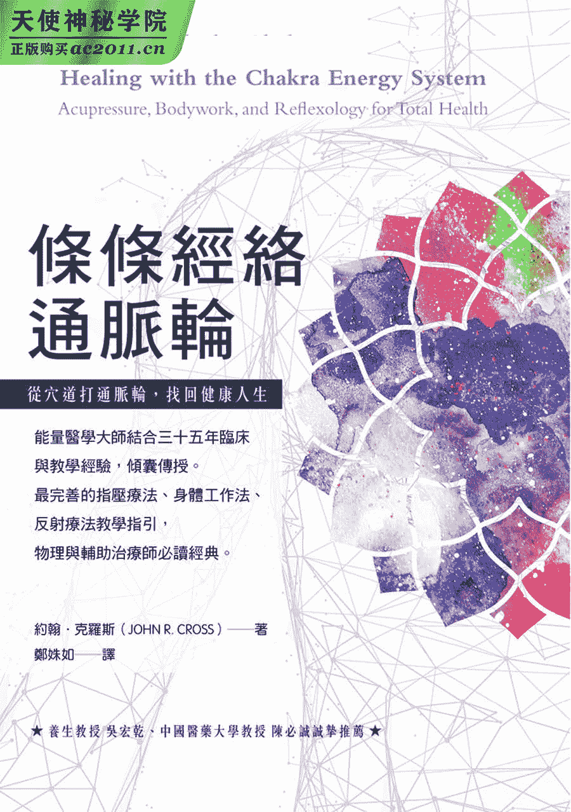

# 专家推荐

真正的疗愈是要让人更趋完整，作者结集近五十年的临床经验，首创这套结合脉轮能量系统及经络穴位的疗法，快速简便，疗愈层级可达肉体、乙太体、情感体及心识体，全书内容兼具广度、深度、细度及温度，是一本非常实用及发人深省的好书！

个人在翻译期间常因久坐赶稿，导致肝瘀气滞、全身痠痛，运用此脉轮疗法来疏通能量，确实有立竿见影的效果；而在睡前平衡一下足底各个脉轮反射区的能量，也往往能带来一夜好眠，真是实用至极，在此大力推荐！

──美国执业中医师　郑姝如（本书译者）

这是一本结合西方物理治疗专业、中医穴道运用，以及印度脉轮能量系统来进行治疗的好书，作者分享他历年教学及诊断经验，佐以图片讲解分析，内容相当丰富精采，值得推荐。

──宜陞中医诊所院长、养生教授　吴宏干

一般人在成长过程中，习惯用眼、耳、鼻、舌、身去感知世界、但那都是「朝外」的，久而久之积聚五蕴，当到成熟后方知：身心灵协同的重要性，开始懂得要「朝内」，但要先取得开门钥匙，中国道医家的内观、导引、经络气功；印度的脉轮、瑜珈功法均是敲门砖。本书作者从脉轮理论到临床运用，由浅入深，系统的让读者认识「精微身脉轮」，开启人生的另一视野，并以之养生，进而助人，期推广善知识，故本人乐为之荐。

──博士中医诊所院长、中国医药大学教授　陈必诚

# 序言

很高兴约翰‧克罗斯中医师的著作《条条经络通脉轮》成为一系列临床教科书的第三册。前两册分别是二〇〇〇年出版的《指压疗法：肌肉骨骼病症的临床应用》（Acupressure:Clinical Applications in Musculo-Skeletal Conditions）及二〇〇一年出版的《指压疗法和反射疗法可治疗的医学病症》（Acupressure and Reflextherapy in the Treatment of Medical Conditions）。同时，也很高兴克罗斯医师开始准备第四本讨论脉轮能量系统和针灸的著作，还有其他讨论轻触反射疗法（Light Touch Reflextherapy）和脊椎的整体疗法（Holistic Spine）的书也在酝酿中了。（编按：以上书籍尚未有中文版。）

身为英国皇家特许的执业物理治疗师，克罗斯医师在其多年杰出的临床生涯中，治疗的领域很广，从急性的运动伤害到最慢性、最棘手的案例都有。他结合了对解剖学及生理学的深度了解，以及对东方能量系统的探索，创造了一个物理治疗的整体疗法。对任何想在物理治疗领域内更深入认识能量医学的物理治疗师，本书是一个绝佳管道，因为它是由拥有深厚临床经验的同侪所写；对辅助治疗师而言，本书对身心功能障碍所引起的身体症状，则提供了无价的临床应用指南。

在前两章中，克罗斯医师将贯穿全书的文字与插图紧密结合，带领读者进入尚不熟悉的「气场」，以及流经穴位与经络网的精微能量场，到达它们位于七个主要脉轮的重要生命源头。克罗斯医师巨细靡遗地将能量系统连结到腺体、荷尔蒙、神经系统、肌肉骨骼结构、皮肤、呼吸系统、内脏、生殖器官及传统的解剖学和生理学。他指出身心灵之间的互动是不间断的，若一个或多个部位有功能障碍，就会影响整体健康。这份深度了解为接下来的三个章节奠定了理论及临床的基础。文中更透过指压疗法、身体工作法、反射疗法及疗愈的原理，来描绘个案的病史诊断和实际治疗；这三个章节是如此通透、完整地将这些疗法呈现给读者，每一章都值回票价！

对那些思维模式局限在西方医学的人而言，这些概念的探讨乍看之下似乎太过「抽象」，无法融入到他们的临床治疗上。无论如何，我建议读者在阅读第三章和第五章的病例时，停下来稍作反思，想一想克罗斯医师对于脚后跟「情报站」及头颅「情报站」的深入讨论，这些都是临床上的重要关键。

我要以这些「情报站」打个比方：现在，请你看一个类似带状壁纸的图案，如果你从正确的方向看过去，会看到一只身处花丛中的蝴蝶。你试了又试，有条不紊地扫视和分析那图案，但都不成，它还是一个没有花丛、没有蝴蝶的图案，这让你越来越沮丧。过了一会儿，你那疲惫的心开始放松，你停止了所有心识上的活动，眼睛也不再敏锐了；忽然间，你很惊讶地发现那个二维空间的图案消失了，取而代之的是一个三维的蝴蝶在花丛中的图像。它一直都在那儿，是一个三维的图像隐藏在二维的图案中，这个隐藏的实相只有在你杂乱的心放松到能安静地接收信息时才看得到。病人的内在实相和他呈现出来的外在临床症状同样重要，但它往往被外在临床症状所蒙蔽了！克罗斯医师在本书中所要传达的讯息是：病人存在于多维的实相中，你可以从每一个维度获取讯息。当然，你必须询问病史、进行临床检查，还要记录病历；但是，这是一个非常重要的「但是」，在某个节骨眼，你必须停下所有的忙碌，必须静止下来，只是「在」那里「聆听」病人的身心灵想对你说的话；你要调对频道，才能听懂它们的耳语。当这个内在图像显现后，你所选择的温和疗法才会变成疗愈，才能发挥「疗愈」这个字的真实意义，成为整体的疗愈。

我在写这篇序时接到一个消息：克罗斯医师获颁英国皇家「特许的物理治疗协会」（Chartered Society of Physiotherapy,CSP）卓越成就奖，这个奖充分肯定他在整合东方概念和西方物理治疗实作经验上所开拓出来的道路，他在物理治疗理论与实作方面的重要贡献尚无人能及。我坚信所有曾透过他的著作、演讲、研讨会或工作坊而受到启发的人，或至今仍持续受到启发的人，一定会觉得这个奖项对他的高专业标准及成就，是一项实至名归的荣誉。

罗伯‧查曼（Robert A.Charman），物理治疗师

二〇〇六年春

> 注：罗伯‧查曼是《物理治疗师的辅助疗法》（Complementary Therapies for Physical Therapists）一书的编辑，他也是英国皇家特许能量医学物理治疗师学会（Association of Chartered Physiotherapists in Energy Medicine）创会会长，以及「疗愈组织联合会」（Confederation of Healing Organization）主席。

# 概述

我经常被问及是如何对脉轮（THE CHAKRAS）产生兴趣的？为何我会花职业生涯这么多年来钻研它？我是在一九六八年，就在我和未婚妻安德莉亚订婚后，开始对这主题感兴趣。她的父亲弗瑞德是位唯心论者，有时会带我去教会见证那些有灵视及疗愈能力的人，他也是进行心理研究的国际组织的会员。我对他手边那些有关精微能量、脉轮和疗愈的文献，远比唯心论这个主题更入迷。实际上，我是一名非常传统的基督徒，在一九八〇年代成为卫理教会当地的传教士。弗瑞德在伦敦是位举足轻重的人物，他是伦敦大桥的专家，非常务实，一点也不离谱，这是我最崇拜他的地方。弗瑞德试着以非常求真求实的态度来看待唯心主义和深奥的事物。我教学时的名言之一就是：在探索这些现象时，我们的头可以处在云端，但我们的脚一定要踩在地上。

一九七〇年发生了两件重大的事情：我和安德莉亚结婚了（我们结婚至今满三十六年），以及我成为英国皇家特许的物理治疗师，并在州里注册。一开始，我在一般的物理治疗领域做得满开心的，但之后很快便意识到，我可以用很多不属于「常规的」治疗方法来帮助病人；我想要疗愈他们，而不是像一般处理慢性病症的方式，只是去减轻他们的症状。我开始学习顺势疗法、远距传播能量法（Radionics），再深入学习针灸及反射疗法。随着我对中医的兴趣日益增加，很自然地，我就把它和传统的物理治疗手法结合起来，之后更学习各种不同的指压疗法，以及运用精微能量的物理治疗医学。而脉轮也在此时引起我的兴趣，它是一个重要且强大的能量中心，常应用在疗愈、瑜伽及静坐冥想上。我开始思考将之运用在物理治疗上的可能性。

一九七〇年代中期，当时完全找不到任何有关脉轮运用在治疗及疗愈方面的西方文献，我开始深入研究这个主题，并发表文章和演讲。在早期，我得到的反应正反面都有，特别是在英国皇家特许的物理治疗协会的年会演讲时，有来自各种不同临床领域的团体参加，反应更是不一。多年来，精微能量的疗愈技巧逐渐获得重视，我首创的这个疗愈法已成功用在上千名病人身上。在过去二十五年中，我也教授过成千上万人这个方法，可教授此「奇怪的」物理治疗医学真是无比荣幸。偶尔我也会遇到无法接受此方法的治疗师，他们继续用自己喜欢的方法来做，然而大部分学生都能接受这个理论和技巧，也有很多人因实践此方法而更上一层楼。

有数不清的人要求我写一本有关脉轮的书，虽然我在十五年前可轻松地书写出来，但它可能不会像今天这么成熟。在动笔书写这本书之前，先写其他两本书是很重要的（一本是指压疗法、一本是反射疗法），这可以先把不同形式的接触疗法灌输给治疗师。我曾在二〇〇〇年出版的《物理治疗师的辅助疗法》一书中，用一个章节来介绍脉轮能量系统的疗愈观念。先结合应用指压疗法和传统疗法，再进展到指压疗法和脉轮并用，更熟练后，就可以只用脉轮来达到效果，因为脉轮实在太强大了。本书针对医学治疗师而写，主要是希望能将这项万用且效果强大的疗法推广出去，让全世界上千万名病人能受益。在过去的二十五年，我以我岳父为榜样，尽可能用通俗易懂且求真求实的方式来解释脉轮和深奥的医学，我衷心希望所有治疗师能接受本书的内容，也希望此疗法终有一天可从未来疗法变成现行疗法。

谨将此书献给已故的弗瑞德‧塞穆尔‧赫尔，我由衷地感谢他！

# 第一章　精微体

在东西方哲学的许多领域里，七是很重要的数字：

‧地球是在七天内创造出来的，或更确实来说，是在七个世纪内创造出来的。

‧一周有七天。

‧农历的一个月有七乘四天。

‧乐谱上有七个音符。

‧光谱上有七种颜色。

‧有一种说法是说，人的一生分七个阶段。

‧《圣经》上提到人的寿命是七十年（七乘十）。

‧皮肤有七层。

‧人体每七年会全面更新一次。

‧有七个内分泌腺。

‧有七个主要的灵性中心，或称为脉轮，从中萌生出七个密实的精微体。

‧有二十一个（七乘三）次要脉轮。

‧有七百个（七乘一百）针灸穴位及主要的反射穴位。

我还可以想到更多例子。东方哲学提到人死后有七重天，佛陀在地球打坐时曾到过极乐世界（第七重天）；《圣经》中也提过数十次的数字七，它在拔摩岛的圣约翰所着之《启示录》一书中也至少被提到三十四次，包括几次提到人所拥有的七种精神；它在犹太教中也是神圣的数字，代表着事物的完美或完成，并被当做描述整体性的一种象征。

七个精微体在东方宗教哲学中是广为人知的。几个世纪以来，它们的意义及内涵已有些改变，每个精微体都有它的功能和目的，在本书中不可能一一详述；除了解释它们之间的重要关系，以及它们的能量失衡后在身体引发的征兆及症状，其他也没必要详述。本书大部分读者都已被灌输西医观念，我知道要从一个新的角度去阅读某些东西，进而改变想法（及临床）是很难的。若从西医的生理学角度来看，本书探究的哲学就象是外星文，几乎不可能用科学来合理化或量化。然而几个世纪以来，这些哲学早已变成东方神祕主义者和瑜伽士的第二天性。我们身处在科学时代，似乎已着迷于用科学来证明每件事，这现象在五十年前还没出现呢！尽管如此，科学在过去几年来已经跨出巨大的一步，尝试从整体上去验证「能量体」及能量医学！

## 气场

一般普遍认为，从活的生物身上发出的能量场或气场，是由七个包括肉体在内的精微体所形成，有些专家则把七个精微体放在肉体之外。这七个精微体较广为人知的命名是肉体、乙太体、情感体、心识体、直觉体、一元体和圣灵体，不同的人或哲学体系会根据不同的讨论场合来为其命名，譬如说，用东方宗教、印度教、佛教或西方灵修的词汇。乙太体据说还有分支，而且在圣灵体之外，至少还有两个更细的精微体，分别连接到两个脉轮做为其出入门户。一些具有灵视天赋的人可看到气场并描述出来，有些人可感觉到气场但看不到它们，还有人能看到气场的颜色。

在这些年的研究和临床经验中，我已经可以看到乙太体，以及「感觉」到大部分的精微体。在介绍脉轮之前，先掌握这些精微体是很重要的，了解及接受它们是学习和使用脉轮的基础，两者缺一不可。

现在，就让我们来回顾一下。

##### 肉体

大部分徒手治疗师看到、感觉到和触摸到的密实物质是肉体，它也是我们进行触诊、捶打、敲击、热敷或扎针的地方。若从奥祕的观点来看一个人，这肉体或这密实体是微不足道的。譬如说，一位瑜伽士或圣人对肉体的病症并不感兴趣，但对其他如我们一般的凡夫俗子，肉体却是我们用物理治疗、徒手疗法、指压疗法、针灸、反射疗法、生物磁场疗法、按摩、颅荐疗法（craniosacral therapy）等来治疗的地方；更重要的是，能量失衡时，它是在肉体显示征兆及症状让我们知道，而症状则是治疗师用来找寻病因及决定治疗步骤的黄金信息，并藉此来治愈或平衡疾病。

除非是治疗一处很明显的外伤、肉体遭直接打击的伤处或重复性扭伤，否则大部分疾病的病因并不在肉体上。医生可以验血、采样及做组织培养；外科医生可以尝试切除器官及进行复杂的手术来达到疗愈，但他们通常是以误导的方式在进行这些治疗。一般而言，肉体只是显现症状，并不是造成疾病的主因，这个观念极为重要，也会一再提到。你可能完全不相信我这些离经叛道的陈述，但在你抛开本书之前，我向你保证，藉由结合脉轮、指压疗法和其他疗法来治疗肉体，可以影响其他的精微体，进而解决疾病或伤害的主因，这不正是治疗师梦寐以求的吗？

当然，仅仅透过对肉体的诊断和治疗，物理治疗师也可达到非常好的效果。许多治疗师在治疗机械性病症时，通常不会想到被治疗的这部分肉体和内分泌腺、体内器官或能量通道有何关联，更别提和灵性通道的关联了。其实，每一部分的肉体都和这些有关联，当我们成为有整体观的治疗师时，要把所有关联性都考虑进去，所以病人没被治疗的部位出现反应时，我们也不会太惊讶。肉体有许多反射通道可用来进行诊断及治疗，有一些通道已在传统的东方医学、应用肌肉动力学及反射疗法的领域广为人知。当你的治疗包含这些反射通道时，将能真正做出整体的分析及诊断，也能更深入地帮助病人。

很明显地，物理治疗师有很多种，也会用各自不同的方法来治疗肉体；很不幸的是，就像在任何领域都有好的和坏的执业人员一样，物理治疗师也有不好的，这些治疗师只会在局部病症区治疗症状。然而，有经验及有意识的物理治疗师会知道，严重的脚踝扭伤如果没有接受治疗，将在短时间内随着机械式的改变而在其他部位造成后续影响：外翻的肌肉会变紧绷，可能造成距骨半脱位，也一定会影响到上胫腓关节连接的腓骨上端，这会在腓总神经、髋关节和髂关节造成紧张，随后是骨盆倾斜、胸椎侧弯，最后造成寰椎（第一颈椎）或头颅不正。

这些机械式的偏差都是原始的失衡所造成的。好的整骨医师、整脊医师或徒手物理治疗师能够以相反的顺序来调整各个关节，最后让肉体各个部位归回正位。就象是一层层拨开洋葱般，让病人解除所有因原始损伤而继发的创伤。这改变可能发生得很快，病人几乎不会察觉到变化，但这调整却有着巨大的影响。

有整体观的治疗师会明白，身心是「一体」的，身体只是不同频率的能量。同一位脚踝扭伤而未经治疗的病人，他的器官也会改变，最初是膀胱及大肠的改变。女性可能会有外阴部周围的皮肤刺痛感，再来是上腹部疼痛，接着是喉咙痛，最后是头晕、头痛，甚至耳鸣。病人也可能出现各种情绪波动，在焦虑、恐惧、愤怒和流泪之间打转。如果你不明了情感和肉体的连结，可能会认为病人在治疗后抱怨的这些感觉都只是神经质罢了！你也该注意别去压抑症状，病人身上显示出的症状只是用来引导我们去找出病因，症状本身并非疾病，千万不要用药物、电疗、舒缓疼痛的针灸或任何擦拭软膏来抑制它，除非你是在治疗局部的外伤。

身心关系是一个庞大的主题，本书无法充分涵盖。我的另一本书将以此为主题，不仅提到关节、肌肉、器官、内分泌腺和每个脊椎的关系，还提到如何用物理治疗来处理这些失衡的问题。

##### 乙太体

###### 结构

乙太（Etheric）一词来自醚（Ether），指的是「在能量和物质之间的状态」。虽说它是第一个「无形」的体，但灵视者可以看到它，乃至七岁以下的孩童也看得到，甚至觉得这是很稀松平常的事。所有的生命都有乙太体，动物和植物有着非常强的乙太能量场，而孩童的乙太体能量比成人更强，这也说明了孩童和动物对精微能量治疗的反应比成人好的原因。

虽然乙太体对大多数人来说是无形的，但藉由勤奋练习，我们是有可能看到它的。我上了很多这方面的密集课程后，已经能够侦测到乙太体较密实的部分了。乙太体有两个部分，即「肉体─乙太体」（physical-etheric）和「乙太体─情感体」（etheric-emotional）两部分，肉体─乙太体是由细小的管线形通道组成的网络，通称经脉（Nadis），它和脊髓液、内分泌腺及自主神经系统有关，在稍后的章节将详细介绍此经脉。乙太体的这两部分随时在相互沟通，因此被视为一个精微体。

乙太体是一个持续移动的网状结构，灵视者看到的是快速移动的蓝灰色光芒，和其他的精微体交织在一起。有些深奥的书上提到乙太体就是肉体的复制，包括身体器官和组织等。肉体─乙太体的外缘大约是从身体向外两公分的地方，乙太体─情感体的外缘则大约是从身体向外八到十公分的地方，这些距离随着年龄、性别和个人的健康状况而有很大的差异。一个非常健康平衡的人，他的乙太体和生病的人是不同的。肉体上有发炎的地方，它的乙太体色彩通常会比较强，而有慢性病症的地方，乙太体的能量会比较偏半透明，颜色也会显得有所阻塞和黯淡。图 1a 显示气场的各个精微体，这也显示在彩图 1。

###### 功能

乙太体有三个主要功能，这些功能彼此息息相关。它透过脉轮来接收、同化及发送生命力；换句话说，它是一个从内到外、从外到内的巨大能量交换所，同时负责同化及筛选能量；它是人类所拥有的最大「滤器」。个别的脉轮是能量进出肉体和精微体的门户，这将在下一章详细讨论。

|  |
| 图说：图 1a　主要脉轮和气场 |

###### 证据

除了灵视者所看到的之外，还有什么证据可证明乙太体和其他气场的存在？沃特‧基尔纳博士（Dr.Walter Kilner）由于对灵视者所宣称的事感到好奇，在一八六九年开始用染料、玻璃镜片和一个荧幕来研究人体的电场，也「证明」气场是可见的。虽然他只侦测到乙太体的第一层，但可谓一个重大的胜利。而第一个成功拍摄到气场照片的是克罗埃西亚的工程师尼古拉‧特斯拉（Nikola Tesla），他最早的照片是拍摄指尖附近的气场，后来还拍摄了全身的气场。特斯拉据说也是现代电力的发明者，他将很多电线接到身体来拍摄这些影像。

苏联科学家谢苗（Semyon）和瓦伦蒂娜‧克里安（Valentina Kirlian）在一九三九年透过可发射电流的电板来拍摄气场，这是更实用的方法。被拍摄者将他的一只手放在冷凝板上，电流经由电板传到指尖，照片就拍摄下来了。克里安摄影术至今仍有人采用，但在一九八〇年时大量被盖‧科金斯（Guy Coggins）和其他人所开发的气场成像技术所取代。这项技术使用了一种特殊的相机来产生全光谱的气场，这个气场成像照相机日益流行，随时可用来探看气场样貌。一个人的气场会根据心情、性格和身体的疾病而有所变化，这意谓着要真正记录一个人的气场，就必须在短时间内拍摄好几张照片，为了能看到精微体的移动，科金斯正着手研发一种气场的录像系统。

###### 感觉

由于触觉及感觉是本书的核心，继续往下读之前，让你能先练习去「感觉」乙太体实在是一个好主意！你可能已经在周末的工作坊练习过了，如果没有，可参照这里的简单指示：放松并舒适地坐着，脑子不要有多余的思绪在打转。保持头脑的清醒和专注，在距离身体几公分远的地方将双手合掌，再轻轻将手打开至与肩同宽，此时手心仍对着手心。现在，将双手慢慢合在一起，直到双手相距约三公分，重复此动作两到三次。你有什么感觉吗？当手相距约十公分时，虽然是很微细的感觉，但大部分人都会感觉到某种形式的「障碍」，而另一个障碍在更远的地方会感觉到。当手很靠近时，会经历到一个缓冲区，类似于磁铁两极相互排斥的感觉。做为一个科学试验，这个试验并没有「证明」任何东西，只意谓着多数人在做此练习时，大致感觉到相同的事情，但对我而言，这个事实却有着重大的意义。

帕拉塞尔苏斯（Paracelsus）是十六世纪的炼金术士和医生，他对乙太体如此描述：「人也有动物的肉体和乙太体，两者是一体的，不是分离的。两者之间的关系如下：动物的肉体由肉和血组成，它本身是死的，只有通过乙太体才能把生命的动力带入其他体。这乙太体是火和风，它也连结到人类的生命中，所以人类是由地、水、火、风所组成。」

大卫‧坦斯利（David Tansley）在他开创性的《远距传播能量法和人类的精微解剖》（Radionics and the Subtle Anatomy of Man）一书中，描述乙太体「是由细微的能量线和光所组成，肉体是依此原型而建立起来的。描述乙太体最好的说法是：潜藏在肉体的每个细胞和原子内的能量场，渗透和贯穿肉体的每一部分，更从肉体延伸出去，形成一个健康的气场。」乙太体产生一个能量场，包覆在肉体内外，而脉轮是乙太体通往肉体的能量出入口。这能量场长久以来被不同的人及文化提及，这股力量被称为普拉纳（prana）、气、自愈力、自然力、胡那（huna）、生物磁性、元气、宇宙能量和生命力等。在这本书中，我们称它为生命力。

操作存在于乙太体和肉体间的生命力，可以把失衡变平衡、缓解疾病、将不和谐变和谐。在乙太体建构的肉体内，你可以用许多本书讨论的方法去感觉及使用这个生命力，例如指压疗法、反射疗法、应用肌肉动力学、颅荐疗法、各种形式的软组织和关节的松动法，还有乙太疗愈，这些治疗全都是要让个人的生命力达到平衡。

##### 情感体／星芒体

###### 结构

第三个体（也是第二个精微体）通常被称为情感体，因为它牵涉到我们的感受。这个体和肉体及乙太体有相同的形状，它的外围边界距离身体大约二十到二十五公分，与乙太体─情感体交织混合，并在头顶及胸部中段有加重的能量场。与乙太体相比，它的结构比较液态，也不是肉体的复制，这点是绝大多数深奥的宝典都认同的。而灵视者看到的是像彩云般持续流动的微细物质，靠近乙太体边缘的是蓝黄色，越靠近心识体之精微区的就越偏黄白色。

大多数的灵视者（就我所知，并非全部的灵视者）可以看到情感体，但若不是天生就具有此能力的人，则需要花费很多天的精力，全神贯注才能看到距离肉体及乙太体更远的地方有一些「东西」。芭芭拉‧安‧布蓝能（Barbara Ann Brennan）在她卓越的著作《光之手》（Hands of Light）中写道：

「这个体贯穿了它周围比较密实的体。它的颜色从光亮清晰到黑暗泥泞的色调都有，取决于产生它们的能量或感觉是清晰或混乱的。比较清晰及高能量的情感，如爱、兴奋、喜悦或愤怒，颜色是明亮且清晰的；而那些混乱的情感则是黑暗泥泞的。这个体包含彩虹的所有颜色，每个脉轮看起来像一个不同颜色的漩涡，并依照彩虹的颜色排列。」

这些颜色将在第二章中进一步讨论。

###### 功能

不管个人喜不喜欢这个事实，情感体的变化是持续发生的，而每个人也都会受到某种内源或外源不断刺激。与乙太体的功能相似，情感体的主要功能也是做为一个过滤器，过滤从心识体到肉体的刺激、心识体以外的刺激，以及肉体内部产生的刺激。这个过程并不为我们所知，我们在大部分时间都将之忽略，只有在情感体本身或贯穿情感体的脉轮中发生能量失衡时，才会意识到出状况了。

我们情绪的变化最终会导致肉体的变化和症状，据说绝大多数的肉体失衡是由恶化的情感体所造成，这种恶化是由情感体内持续累积的负面情绪而来，如愤怒或恐惧，或是从心识体过滤出的负面「思想形体」（thought forms）造成的。当一个人有负面的情绪和感受，即使只维持很短的时间，它在情感体内产生的破坏力最终会影响与之相关的肉体部位。例如，害羞和无法轻易表达自己情感的人，常常会出现喉轮的不和谐，造成喉咙、肩膀和大肠附近的症状；还有人说，通过脉轮来影响肉体的许多病毒都是从情感体传来的。当有强烈及持久的情感失衡时，灵视者常会看到情感体的呆滞区域因治疗而变得更加清亮及有活力，情感体可说是所有体中最复杂也最活跃的。

###### 证据

在一个人的精微体组织中，情感体可说是「低我」的精微体中最高阶的，剩下的四个体代表「高我」或较「灵性」的方面。情感体的存在证明，依赖的是数百位灵视者所看到的现象，科学的依据很少，曾有一度以为克里安摄影术是照到情感体，但目前已知这不属实。另一种气场摄影术宣称可以描绘出情感体，但这方面的研究还在进行中。

###### 感觉

经过适当的训练，要感觉到情感体相对来说很容易，尤其要感觉它和乙太体及心识体的边界更是容易。有人可以在边界感受到不同之处，当治疗师把手放在情感体的脉轮（位于情感体和心识体边界，尺寸有如直径十五公分的盘子）时，感觉最灵敏，但在非脉轮区也可感觉到，这些相关的感觉会在最后一章讨论！

##### 心识体

###### 结构

心识体可说是「高我」或「灵性」的精微体中最低阶的，它可以从身体延伸七十五公分出去，而且密度很明显比之前介绍的其他体都低。组成心识体的细微物质是白黄色的，振动频率比密度高的体还快很多。灵性疗愈师就是用这个精微体（和更外圈的精微体）来进行「离体疗愈」（off-body healing）。

###### 功能

心识体的质素是思想和心念的运作，有时称之为「思想形体」。简单来说，当我们思考时，我们的念头即是源自此处，我们所想的会影响我们和我们所接触到的人。如果我们的天性是正向的、乐于助人的，我们也向同胞（及我们自己）传送很多关爱的思想，那我们会感觉很美好；相反地，如果我们显现负面、仇恨、悲观、悲伤或忧郁倾向，这些最终也会反映在我们的肉体组成上。

有一句老掉牙的话说「吃什么像什么」，就某程度来说是对的，但更真实的说法是「想什么像什么」。有正面思想时，我们不只感觉更好，我们身体内的化学成分也会一下子改变：血液的化学成分、荷尔蒙的数值和器官的分泌物都会改变，自主神经系统也会发生许多变化，最后会影响到中枢神经系统。如果我们只有负面思想，终究会毁了自己。我们必须完全为自己的健康负责，或要为我们在怀孕和分娩时的健康负责，还要明白各种环境因素也会影响到我们。这是一个很简单的哲理──对我们遇见的所有人展现爱与慈悲，意识到缺点和失败，并试着不要表现出自傲和自私的态度，因为这两者都是负面的。

###### 证据

如前所述，除了很有天赋的灵视者，大部分的人都很难侦测到心识体。相关研究一直在进行，科学家也在开发电子仪器，以侦测心识体内所存在的超高振动频率。

###### 感觉

和情感体一样，心识体也是可以感觉到的，但是必须经过非常多训练和拥有很高的专注力才能做到。就像生命中的多数事物一样：熟能生巧，治疗师越试着去感觉精微体，就越能成功。非接触式的疗愈会在最后一章讨论。

##### 直觉体、一元体和圣灵体

剩下的三个精微体称为直觉体、一元体和圣灵体，这些体依照哲学和文化有几个不同的名字，芭芭拉‧安‧布蓝能称它们为乙太样板体（Etheric Template）、精妙样板体（Celestial Template）及因果体（Ketheric Template or the Causal body）。比较深奥的文献或佛学文献称之为佛理、原子、理法或灵性。我们如何称呼它们并不重要，重要的是去了解每个体都比它近端的邻居更精细微小。脉轮贯穿所有体，提供人类和他的灵体沟通交流的管道。更进一步描述这些体已超出本书的范围，如果你想知道更多，许多深奥及抽象的书中有更完整的描述。

对于研究过瑜伽、冥想、神智学（theosophy）、人智医学（anthroposophical medicine）或一些东方宗教的人而言，对目前讨论过的许多内容或许已很熟悉；然而，如果你是西医哲理的死忠派，就会和我多年前一样，要深呼吸才能吸收这些理论，不过你迟早会承认：许多疾病的疗愈来自这些精微体。缺少这份认知，许多精微及物理性的疗愈方法就无法合理解释了，不论是针对精微体或肉体的疗愈。

## 脉轮

脉轮这个字在梵文是「轮子」（wheel）的意思。脉轮被称为「力量中心」，或是从肉体的某一点渗透到精微体的每一层，而形成越来越大的扇形能量漩涡。这些精微物质的旋转漩涡被认为是能量接收和传输的焦点，灵视者可轻易看到这些能量中心。

每个脉轮在形状、组成、颜色和频率上都不一样，据说有七个主要脉轮、二十一个次要脉轮，以及七百多个与针灸及主要反射点相关的迷你小脉轮。七个主要脉轮和肉体的接触点就是穴位，虽然多数的东西方及新时代权威都接受七个主要脉轮的说法，但从一些研究及个人经验来看，至少还有两个和肉体没有直接接触的脉轮，它们在顶轮之上，存在于情感体以外的体，我会在最后一章讨论这点。有些权威相信有多达九个主要脉轮及四十个次要脉轮，有些则认为只有三个主要脉轮及八个次要脉轮。

学习脉轮确实是一辈子的事，这整个概念建构在不同的哲学及文化上，本书会参考其中一些概念。有些权威坚信，影响脉轮的力量完全来自心识，如昆达里尼瑜伽（Kundalini Yoga）和一些静坐冥想的形态即是如此主张，其他人却认为要透过疗愈手法才能影响脉轮的能量，其主要的哲学来自佛学、印度教、神智学、神人同形同性论、新时代，以及一些混合以上哲学的西方各派主张。本书会讨论脉轮中心如何被不同的治疗原理所影响，特别是爱丽丝‧贝利（Alice A.Bailey）（神智学）、大卫‧坦斯利和其他几位人士的治疗方式，然而，本书内容大多根据我的观察和经验而来。

##### 结构

每个脉轮的结构不同，也因当事人的年纪而有所差异，形状大致上象是倒放的圆锥状冰淇淋筒，尖端会「连到」肉体。在乙太体外围边界的脉轮大小约五公分，而在情感体外围边界的脉轮约为十五公分的碟子大小，在心识体外围边界的脉轮约为三十公分的餐盘大小。显而易见的是，不同的主要脉轮在远离肉体的更细微阶段，彼此的能量是互相混合的。（图 1a 和彩图 1 显示主要脉轮和它们贯穿的精微体，参看彩图 2 到彩图 8 显示灵视者对脉轮的诠释，也请参照图 5b）

小婴儿的顶轮和海底轮形状和大人一样，其他五轮则比较小而圆，因为这五轮要到七岁左右才完全运作。海底轮与概念上的能量或祖先的能量有关，顶轮则和我们的灵性觉知有关，丹田轮在七岁时开始正常运作，太阳神经丛（大脐轮）和其他几轮也跟着正常运作，而脉轮的形状就在此时变得和大人的一样，像倒放的圆锥状冰淇淋筒。在每个脉轮中有四个或更多旋转的漩涡，形成小一点的脉轮，形状为圆柱体。这些个别的漩涡会以一个特别的频率共振，较低脉轮的共振有些慢，而天目轮和顶轮的共振则非常快速，透过练习便可以感觉到这些不同。经由足够的练习，你可以感觉到各个脉轮的差别，以及它在乙太体、情感体或心识体层级的差异，也可确定哪些治疗是必要的，在第五章会有较多篇幅的讨论这点。

海底轮是由四个旋转的漩涡构成，丹田轮有六个漩涡，太阳神经丛（大脐轮）有十个，心轮有十二个，喉轮有十六个，天目轮有九十六个，而顶轮有惊人的九百七十二个，这也是顶轮被称为千瓣莲花的原因（实际上，它还少了二十八个漩涡）。每个脉轮被分割成四个或更多的旋转球型组件，据说有一个中央核心及对外放射的区段，类似眼睛中的角膜和虹膜。

不管治疗师是选用碰触身体或离体模式来治疗，每个脉轮的解剖位置及功能都差异极大，这是有关脉轮结构最需要知道的一点；藉由持续去感觉及了解它们在结构及功能上的不同，你便能掌握它们在临床及治疗上的重要性。脉轮「确实存在」，但是当科学证据非常少时，实在很难去对那无形的精微体歌功颂德。我强力建议参加一个针对此一主题探讨的工作坊，进而学着去「感觉」脉轮，光看书是不可能练习的。不过，如果你很勤奋地照书上的建议去做，开始用脉轮来调和肉体，这样就不会错了！请不要一开始就跳到情感体去练习，这样难有所成，我们在学会跑步之前，必须先学会走路！

##### 功能

脉轮有三个功能：

‧调和肉体、乙太体和情感体，并为它们注入生命力。

‧促进自我意识的发展。

‧发送灵性能量，将个人提升到灵性境界。

本书教授的治疗法可达到第一项功能，就某种程度而言，也会达到第二项功能，因为病人经由治疗，身心灵更合一了。第三项功能则属于冥想艺术及各种瑜伽形式的范畴。

根据坦斯利在《远距传播能量法和人类的精微解剖》一书中所述，脉轮的失衡以三种方式呈现：阻塞、受到过度刺激、不协调，这些失衡通常会一起出现，不会单一出现，以下让我们来研究这些失衡的情况。

###### 阻塞

当能量无法自由移动时就会出现阻塞，常发生于一个生命力或气的流动停滞的区域，这会影响淋巴引流、血流、神经刺激，以及脊髓液的流动。这个过程可能是由内往外或由外往内，由内而外可能是摄取太多饱和脂肪，造成胃和小肠的阻塞，最终反映到皮肤，引起淋巴阻塞和内分泌的失衡，继而导致太阳神经丛（大脐轮）和喉轮的阻塞；由外而内的例子则是入侵的微生物导致喉轮阻塞，引起扁桃腺的淋巴阻塞，还可能影响其他免疫系统。脉轮阻塞的感觉和其他两种失衡的感觉不同。

###### 受到过度刺激

当太多能量进入及通过脉轮时，会受到过度刺激。发烧就是过度活跃的能量点试着分散能量，而将能量往外流到肉体的表现；过度的性交会造成海底轮和丹田轮的过度刺激；一个长期在日光灯下工作的人，他的天目轮受到过度刺激会导致头痛，以及产生「头昏脑胀」的感觉。

###### 不协调

当两个相关脉轮的其中一个变弱时，就会出现不协调，最终导致健康不佳。如果脉轮在肉体及乙太体相对应的部分没有整合好，就会变得衰弱、失去生命力。当一个脉轮阻塞或受到过度刺激时，它会向配对的脉轮寻求支援，因而引起配对脉轮的症状。例如，阳痿是由喉轮和丹田轮的不协调所引起的。

每个主要脉轮都相应到一个内分泌腺、一个自主神经丛、一个器官和一条经络，还有许多其他的配对，「外在的」脉轮和内在的器官是由经脉连结起来的，这些无形的能量网会贯穿且渗入肉体的框架。理查‧格伯（Richard Gerber）在他第一本书《振动医学》（Vibrational Medicine）中写道：

「经脉是由微细的能量线所形成，它们和经络不同，经络管状系统实际上是有相对应的物质体在其中，当身体的神经充盈时，经脉代表那个与神经平行的液状能量网络。在东方瑜伽文献中，脉轮已被观想成花的形象，经脉是花瓣的象征，也是花朵似的脉轮的细根，它将每个脉轮的生命力和能量传送到肉体。各种来源描述，在人体的精微解剖中有多达七万两千个经脉或乙太体的能量通道，这些独特的通道和身体的神经系统相互交织，正因其和神经系统错综复杂的交会，经脉也影响着脑、脊椎与周边向外延伸的神经网络的传导质量，所以脉轮和经脉的功能障碍与神经系统的病变有关。」

灵媒将经脉描述为一个五彩缤纷的综合轨道网。能够从灵媒或灵视者的眼中去看人体，感觉很棒，我们可以知道，人类是多么伟大的创造，人类终究是不同形式和不同频率的能量罢了！

##### 所有一切都是能量

我们常说「所有一切都是能量」，这句话是如此真实！地球上高于绝对零度的每一物体，都会发射出一种特定的放射波，与某频率共振，科学家毫无疑问地证实了这一点（请参考詹姆士‧欧须曼〔James Oschman〕所着的《能量医疗的科学依据》〔Energy Medicine:The Scientific Basis〕），即使是深度休眠及看似已经死亡的物质，其分子活动还是存在的，如果视「所有一切都是能量」为真理，我们就可以接受压抑肉体的症状是徒劳无功的道理，即使是体内最深处的内脏器官和骨头都是能量，都有成长、繁殖和自我疗愈的能力。

治疗师可运用脉轮来影响全身每个系统的疗愈状况，如前所述，大部分的疾病源自情感体及心识体，这股「负面力量」经由脉轮「下传」到肉体，治疗师确实可藉由脉轮疗法、针灸、指压疗法、反射疗法、颅荐疗法、按摩、整骨疗法（osteopathy）、感应力疗法（radiesthesia）、顺势疗法，甚至「按手礼」（laying on of hands）等来加速肉体的自愈，这效果比用其他形式的治疗还要快得多。在本书中，疗愈指的是「恢复完整个体」，不是指「治疗」。不论选择哪个层级的疗愈，你只是运用病人的能量系统来让他们的失衡状况恢复平衡罢了，治疗师本身从未疗愈或治好任何人，会如此宣称的都是骗人的江湖郎中。

## 疗愈层级

脉轮可用于疗愈任何层级的失衡，从明显的机械式失衡到情感体及心识体的失衡均可，现在就让我们来探索这些疗愈层级。

##### 肉体层级

肉体的症状如果是源于外伤、某种外力或爆裂引起的，那针对该症状来治疗是完全允许的，重复性压力症候群也归属于此。

我们可以使用一些物理治疗来缓解因能量阻塞所引起的疼痛，能量阻塞以西医的说法就是血管、淋巴或神经阻塞。许多参加过脉轮疗愈工作坊的治疗师仍在治疗肌肉骨骼的病症，这倒也无妨，治疗师的能力水平决定病人能医治到何层级，而通常治疗师会吸引到他们可以治疗的病人，这不是在诋毁或庇护这团体中的治疗师，后面几章会清楚解说，仅仅用脉轮疗法就可以疗愈肉体，你对此会相当惊讶！

##### 乙太体层级

由一个以上的脉轮失衡所引起的肉体症状，可藉由乙太体来治疗。这些症状的名单是列举不完的，许多病症在本书后面的章节会提到，此刻浮现在脑海的有：退化性关节炎（非因关节骨折引起的后遗症）、脊椎移位、周围关节错位、因不良饮食习惯造成的胃肠疾病等。这个层级的治疗可用温和的物理疗法、整骨疗法、整脊疗法（chiropractic）、姿势训练、零平衡徒手疗法（zero balancing）、反射疗法、颅荐疗法、针灸、指压疗法、草药和低效能的顺势疗法，越温和的治疗方式越好；要平衡越精微的体，越要使用温和的治疗法。

这就看出了使用粗暴的手法来治疗脊椎及周边的病变相当愚蠢，真的没必要这样做，当我们了解万物都是能量且最终会自我疗愈，我们使用的治疗法越温和细微，效果就越好，病人也不用承受因重手法治疗而引起的治疗后创伤或痠痛；话虽如此，有些病人还真喜欢重手法治疗。如果没像摔角似的被整治一番，他们会觉得自己受骗上当了，所以这层级的重手法治疗有时也是需要的。

##### 情感体层级

如前所述，很多疾病肇因于情感体，所以治疗师能找出疾病的源头颇为重要，例如循环、神经、肠胃、肾、呼吸和许多肌肉（是的，肌肉）的病症就属于此类。如果有些难以置信，可以调查一下所有抱怨腰部或上背纤维组织炎的病人，不管他们有没有脊椎病变，你会发现这些病症通常是压力或负面情绪引起的。

治疗这些病症必须着重在更精微的方面，治疗方式包括针灸、指压疗法、反射疗法、巴西脚趾按摩法（metamorphic technique）、颅荐疗法、零平衡徒手疗法、生物磁疗法（biomagnetic therapy）、色彩疗法、声音疗法、瑜伽、冥想、疗愈、灵气疗法（Reiki）、远距传播能量法、中高效能的顺势疗法（势能 30c 到 1m）。

情感体层级的疗法并非意谓着不能碰触肉体，当然有很多治疗师和疗愈师很有信心在这个层级做这类不碰触肉体的治疗，也确实很有效，但不代表一定得这样做才行。在这层级上还是可以用手碰触肉体来治疗的。

##### 心识体层级

大多数的身心及心识失衡源于心识体。这种失衡可能来自心识体本身的失衡或情感体的失衡，或是更细、更精微层级的失衡。诸如忧郁、恐惧、害怕、不安全感、焦虑、某些过敏和偏执的病症，可能是来自心识体的能量失衡，最适合的治疗法是非接触式或远距的疗愈、巴西脚趾按摩法、催眠疗法、冥想、灵气疗法、瑜伽、观想疗法、感应力疗法、远距传播能量法、心理治疗及高效能顺势疗法（势能 10m 以上），而按摩、指压疗法、反射疗法和针灸用在心识体的失衡依然有效，因为乙太体和情感体经由脉轮与心识体连结，这些也需要清理、平衡和治疗，才能让此高层次的疗愈更有效。

脉轮可运用在不同的疗法中，借以治疗及平衡能量，亦即进行全人治疗。你可去询问任何优秀的中医师、顺势疗法治疗师或自然疗法医师，到底是哪个主要症状影响他决定治疗和用药的方向？顺势疗法治疗师会说强烈的「心识」图像很重要，他们会挑选出药剂并提供给病人，一旦药选对了，病人所有的症状都会及时消失；而中医会先把脉，查看病人的舌象、腹部和形体外貌，以决定在哪些穴位扎针或艾灸来影响气的流动，进而平衡病人的能量系统；远距传播能量法的治疗师会决定使用哪种速度「频率」能把主治的器官或区域平衡得最好；草药师会选出最符合病人整体症状的草药；整骨医师、整脊医师或物理治疗师会选择最能平衡损伤区的手法，在软组织上操作，以创造出病人的机械力学、关节、肌肉和神经的和谐。

## 真正的疗愈

这些疗法全都有效，我也都运用过，但当我们进入脉轮疗愈的世界时，就只有远距传播能量法的治疗师或「疗愈师」，会对此能量系统有经验和认知。由于我们是治疗病人疾病或病症的病因，这个技巧让我们能进行「真正的疗愈」。大多数疾病的根源在情绪，只有藉着脉轮的平衡及治疗，我们才能成功找到问题的主因并对治它。

个别脉轮的平衡及治疗是以几个肉体和情绪的症候群为准则，每个准则都很重要，因为每个症状对治疗师来说都是一个信号，显示某处有点不对劲了。不论你打算做哪个层级的疗愈，运用脉轮疗法可以把其他症状也一并平衡及疗愈。这是相当大胆的陈述，我是在运用了二十八年的脉轮能量系统后才会如此有信心地说，绝不是信口开河。不论是整骨医师希望沿用整骨疗法或想换其他疗法，或是反射疗法治疗师希望沿用反射疗法或想换另一种疗法，这些都无所谓，每种徒手疗法都能和脉轮能量系统并用，都是有效及重要的疗法，绝不容小觑！

因此，不论你专精在哪个领域，都可使用下列准则来制定一个治疗方案，并留意下列情况：

‧身体某部位明显失衡与特定的脉轮有关，如用喉轮来治疗肺部的病症即为一例。

‧内分泌腺明显失衡与特定的脉轮有关，如用丹田轮来治疗雌激素的失衡即为一例。

‧明显的骨骼失衡与特定的脉轮有关，如用心轮来治疗背部中段的病变即为一例。

‧明显的肌肉失衡与特定的脉轮有关，如用海底轮来治疗腰肌的大失衡即为一例。

‧明显的或细微的情绪与特定的脉轮有关，如用天目轮来治疗生气或愤怒即为一例。

‧由脉诊得知，特定经络的气（能量）失衡与脉轮有关，如用丹田轮来治疗脾经的失衡即为一例。（没用过或听过脉诊的人请不要绝望，后面的章节会提到以其他简单的方法来测试经络的气及脉轮的能量流动。）

‧更精微（几乎是第六感）的感知到脉轮处于失衡状态，需要去平衡及治疗它。有些人天生就可看到气场和能量中心的状态，并知道需要进行什么治疗，他们可以看到不同的能量振动、不同的颜色和不同稠密度的精微体。其他无法轻易看到这些的人，多年来对如何实际去感觉能量也较为拿手了。碰触的感觉会用于分析、诊断和后续的治疗。虽然拥有这类直觉很有利，但初学的学生或治疗师可能会问你为何要使用某些技巧，你要是告诉他们：「就是这样做啊！我也不知道为什么。」他们绝对不会满意的！

在所有诊断及治疗的基本原理中，每个医疗的传统诊断方法和西医的常规诊断方法都可使用。在任何时候，只有一个脉轮处于失衡状态是很少见的，通常会有三个或更多的主要或次要脉轮（中心）需要平衡与治疗；不言而喻的是，病人罹患疾病的时间越长，需要的平衡及治疗就越多。不管采用的是哪种诊断法，症状的重要性有很明显的顺序：

一、心识、情绪或身心症状。

二、气（能量）的失衡（由反射通道诊断出）。

三、内分泌失衡。

四、肉体或器官的症状。

五、骨骼失衡。

六、肌肉症状。

我刻意从名单中删去「第六感」这一项，因为它不在本书的讨论范围内。

「开启」和「关闭」这两个词通常是联合脉轮的情况来使用，这是对脉轮能量状态的单纯描述，但时常引起误解。如果某物是关闭的，这意谓着它完全无作用了，但这里指的是脉轮处在呆滞或阻塞的状态，需要被刺激；而开启这个词通常是指正常及和谐的状态。这些是灵媒及冥想者使用的词汇，没有任何临床上的意义，虽然可以单从心念和意图去影响每个脉轮的能量，但想以意念随意开启和关闭是不可能的事。

## 疾病的病因

在开始分析和治疗之前，很重要的是要从最广泛的角度来了解疾病的成因、其涵盖的原则与背后的理由。疾病的成因在我的上一本书有很详尽的讨论，以下我将阐述其中最突出的论点。

许多人类的疾病根源于心识体及情感体，疾病的模样从乙太体经由脉轮进到肉体，最后呈现出肉体上的症状。疾病的产生通常分为内因和外因，其余的都是这两类的变形。

##### 内因的疾病

内因的疾病是先天性、遗传或对某些刺激的反应。

现代顺势疗法的创始人塞穆尔‧哈内曼（Samuel Hahnemann）把所有慢性病的成因归纳为三种「遗传毒害」（miasms），就是银屑病、梅毒和精神病。我所受的传统顺势疗法训练也在无数场合中证明哈内曼的假设是对的。哈内曼的时代（十九世纪）并没有基因和基因码的知识，现代则知道每个人与生俱来都有特定的基因蓝图以决定他的弱点或长处；因此，有可能一个人出生时即拥有弱点，例如出现溼疹症状的机率较高，后来经由意外、受伤、中毒（例如食物中毒）、哀伤等对系统的惊吓或伤害，症状就显现了。溼疹在出生时处于休眠，人们出生时带有此毒害或倾向，在「不和谐」发生后就物化成症状了。哈内曼很漂亮地形容它是「遗传毒害浮上台面了」。

在溼疹的例子中，银屑病的毒害是活跃的；在溃疡的例子中，精神病的毒害是活跃的；在腺热的例子中，肺结核（银屑病和梅毒的组合）的毒害是活跃的。哈内曼付出了好几年的心力来研究复杂的遗传毒害，据说海底轮可以影响遗传毒害。海底轮确实代表概念上的能量及从祖先来的能量，也就是出生时传给我们能量的质与量。建议去买一本有关顺势疗法哲理的书来研读，你绝不会后悔！

许多急性和发热的症状是我们的身体对某些毒素的过敏反应，譬如感冒、肠躁症、口疮、皮肤痒、扁桃腺炎、行为失衡、流汗和疲劳等症状，可能是由食物的不良反应引起的。身体透过免疫系统、皮肤及大便来排毒，如果可以诊断出是对什么食物有不良反应，病人应避免摄取此食物，至少将引起敏感或过敏反应的食物从饮食中排除三个月，治疗师则应透过喉轮或太阳神经丛（大脐轮）来治疗病人。

身心障碍是另一种失衡现象，会引起内在的症状，很多成年后发生的症状根源于我们孩童和青少年时期的遭遇，很多能量失衡肇因于我们对当年生命中的压力和变化的反应。经由仔细问诊和谘商，你应该可以确定主因，这大多数是用天目轮和心轮的组合，加上少许的太阳神经丛（大脐轮）来治疗。这种形式的失衡症状将以身心障碍显现，有时会是肉体的症状，冻肩、下背痛或胃痉挛就是其中的三例。仔细问诊很重要，可以确定是否有因意外或伤害引起的肉体症状；如果答案是否定的，那就该寻找另一个病因。我就遇过好几个冻肩的病例是由错误的饮食或内向害羞这类心理因素所引起。

这些例子乍看之下是有点怪异，但都解释得通。在错误饮食的病例中，病人采高碳水化合物、高脂肪的饮食方式，导致身体要排出体外的毒素都累积到器官和排泄的经络上，因此肺、小肠、大肠及淋巴的通道和引流系统都阻塞了，而这些通道都位于肩膀附近。「不能肩挑重任」这句自古流传下来的话，也指出由情绪所引发的症状。在初诊时问对问题非常重要，有些心理学方面的训练可帮助你将问题引导到正确的方向。

##### 外因的疾病

外力会造成外在疾病，由外来创伤引起的骨骼、肌肉、关节伤害及局部伤口，这类失衡是唯一可局部治疗又不会引起身体其他部位失衡的。局部的物理治疗可以有效治疗扭伤和拉伤，越早治疗越能探明伤害的程度。先将显见的症状治疗后，再进行「整体」检查。有些物理治疗师和整骨医师，对于只治疗肉体部分而没考虑其他方面会抱有罪恶感。一旦治疗结束，「平衡」受伤的部位和身体的其他部位有其必要性，有一些简单有效的方法可以做，本书稍后会提到一些。还记得前面讨论过的脚踝扭伤没好好治疗的例子吗？那可是会衍生出非常多的问题。

我们经常在生命中经历身体或情绪上的创伤，除非我们在事件发生后马上对创伤做出回应，否则停留在系统内的惊吓和反应会变成「阻碍」或分界线。最新的医学研究相信，每个细胞都有记忆，身体会记忆和储存创伤及意外事件。我们经常会听到病人说，自从颈椎拉伤后、自从父母过世后、自从服用类固醇后、自从施打疫苗后……，他们从未好转过，这些情况都是对治疗的「阻碍」。在主要的治疗开始前，要先处理这些情况。

当阻碍是一种身体伤害时，病人会随着治疗将这个伤害松解开来；如果是由惊吓或病毒之类的外物引起的阻碍，它会随着治疗而「释放掉」；有些病毒感染就像巨大的绊脚石，如没快速处理会引发系统浩劫，病毒可在身体内造成非常严重的损害。我一直很惊讶如此小的东西会造成这么多浩劫，一个很简单的理由是：因为多数的病毒对身体的能量系统来说是异物。根据《外太空来的疾病》（Diseases from Space）的作者弗瑞德‧霍伊尔博士（Dr.Sir Fred Hoyle）所述，病毒不属于这个世界。他坚称，大部分的病毒是跟着陨石和冰粒子进入地球的大气层。霍伊尔在他的书中把流感及其他流行传染病的发生率，与慧星经过、有散布碎石残骸的特定地理线描绘出来，由于病毒对人体来说是外星来的，很难以正确的方式进行治疗。

## 生命力

对每一种病因的分析，都可以从人的生命力发生改变或气的能量变化来看。

生命力就是组成身体的能量，它渗入及贯穿身体的每一个细胞及气场的每一部分；没有它，我们就不存在了，就无法呼吸或生存了。在我的前两本书中，我把描述生命力的术语命名为「气」，因为那两本书主要是讲述指压的徒手疗法，即中医的一种疗愈技巧。那么，在身体经络中流动的气和脉轮系统的能量有何关联呢？说穿了，这是无人知晓的。藉由治疗脉轮来影响脏腑和经络，治疗师和疗愈师早就将此视为理所当然的事。

那其他对身体有影响的生命力，如：生物光子能、生物电能及新陈代谢的能量，又是如何运作的呢？有些治疗师会说它们都一样，而其他人会说，不同的能量类型存在着巨大的不兼容性。如果我们接受「所有一切都是能量」的说法，那相当简单的答案就是藉着脉轮的使用，我们确知它们会影响身体所有其他的能量系统。理查‧格伯在他的巨作《二十一世纪的振动医学》（Vibrational Medicine for the 21st Century）中讨论这些不同类型的生物能，并称之为「多维的人类」。他列举出四种不同的生物能：新陈代谢的能量、生物电能、生物光子能和精微的生物能量（精微的生命磁能）：

‧新陈代谢的能量来源是食物（脂肪、糖、蛋白质），它们被身体转化为三磷酸腺苷（ATP），即细胞能量货币。它存在于身体所有的细胞中，为细胞的基本运作提供动力。

‧生物电能的复杂源头来自于神经、肌肉、心脏、消化道、大脑、骨基质及细胞的粒线体。它藉由神经系统的细胞、肌肉、器官、承重的骨头及细胞间基质来发送。生物电能用于血液、食物和尿液的移动，器官和神经系统间的沟通，强化骨头和修补感染或创伤后的局部组织。

‧生物光子能的来源是细胞核内的脱氧核糖核酸（DNA）发射出的紫外线生物光子，它位于身体所有的细胞核内，用于细胞对细胞的沟通。

‧精微的生物能是最复杂的组成，也是最少被记载的。格伯把它再细分为普拉纳、乙太体能量、情感体能量、心识体能量及更高的灵性能量。

普拉纳是一种由氧气和阳光携带来的环境营养精微能量，它流经脉轮和经脉，为器官和身体组织提供能量补给；格伯陈述乙太体能量相当于基本的生命能量或生命力，它流经乙太体的脉轮，为肉体提供精微的能量成长样板；情感体能量以情绪的「思想形体」流经情感体和它的脉轮；心识体能量以心念的「思想形体」流经心识体和它的脉轮，并参与智力方面的作用、创造力和抽象思考的运作；更高的灵性能量流经更高的灵性「光」体，被当成进入肉体的「灵魂」能量流。

格伯博士对能量的分类，显示出他对人体内外不同形式能量的深入研究，以及科学化的合理解释。人体上的穴位和主要反射点存在着不同的频率，也产生不同的电磁场影响，这些都做过研究了。

以科学术语来说，是什么让穴位在临床上发挥作用且效力强大？是什么因素导致它没有任何临床价值？为什么主要和次要的脉轮会定位在那里？毕竟，脉轮呈现在肉体上的穴位点并不比针头大啊！在回答这个问题之前必须说明的是，大多数哲学都认为主要脉轮的定位正确无误，而它在肉体上的确切定位则是我自己从临床研究、常识和直觉综合得来的。次要脉轮的定位要艰巨得多，这个过程将在下一章中解释。

穴位的力量和功效可由人体的生物能量场分析得知，特别是有关能量频率的研究。据了解，疗愈发生在不同的频率，比如神经的再生是发生在二赫兹，骨头的生长在七赫兹，韧带的愈合在十赫兹等。有些人已知会对某些频率过敏，也就是指一些化学物质的气味或摄入，会导致一些人感到非常不适。这意谓着在许多不同的频率中，同时存在着和谐与不和谐。目前已知地球的磁场频率范围是介于七到十赫兹，平均值是七‧八，即舒曼共振（Schumann resonance）。

这个频率也是阿尔发／系塔状态（Alpha-Theta）的频率，当和谐及疗愈的情形出现在疗愈师和病人之间时，正是这个频率。研究显示，结缔组织的频率与大脑相同，这是一个了不起的科学研究，它强化了接触治疗师持续一段时间的信念，现在已知的事实是：当结缔组织受到精微或刺激的手法影响，会进而影响大脑和中枢神经系统。的确，首先受按摩和芳香疗法等影响的是自主神经系统，更为显著的是，疗愈、和谐及合一发生时的频率，即阿尔发／系塔状态的频率，和前面的心轮在身体上之对应点的频率相同，这个点位于胸骨中央的膻中穴。心轮可用于治疗情绪和精神失衡，这在之后的篇章会讨论到。如果治疗师能够把心轮的频率和病人的神经系统共振到七‧八赫兹，即让心轮处于阿尔发／系塔状态，那么冷静、和谐、放松及情绪方面的疗愈就会发生。西里尔‧史密斯博士（Dr.Cyril Smit）对穴位的频率做了深入的研究，表格 1a 即显示史密斯博士发现的脉轮频率。

表格 1a　脉轮频率

| 脉　轮 | 最小频率范围 | 最大频率范围 |
| 顶　轮 | 0.245 | 0.265 |
| 天目轮 | 2.88 | 3.04 |
| 喉　轮 | 79.9 | 82.4 |
| 心　轮 | 7.68 | 7.92 |
| 太阳神经丛（大脐轮） | 21.8 | 24.4 |
| 丹田轮 | 79.9 | 82.4 |
| 海底轮 | 79.9 | 82.4 |

从表格中，我们可以看到越往上频率越低，喉轮是唯一的例外，它与海底轮、丹田轮具有相同的频率（这将在下一章中解释）。除了心轮以外，没有必要去记每个脉轮的频率。有趣的是，心轮位于一个人的中央，相对应的脊椎也是如此，后面的心轮连到第六和第七胸椎，那也是脊椎的中央。

前面已经提过，我们是从几个不同的哲学观点来了解脉轮能量系统，而下面引用的是佛教哲学中一个非常深奥的观点。在这里，久司道夫解释了上天之力透过顶轮进入身体，以及地球之力藉由海底轮与脚进入身体的现象：

「以人体为例，上天之力进入头顶（顶轮）并产生气场。进入头部后，上天之力在大脑内大量充电，向数百万个细胞发射电磁波。由于这些电荷分布在大脑的各个部位，在大脑每个区域的细胞都像高度通讯的仪器在运作，接收各种振动及电磁脉冲来产生图像。上天之力不断下降，在口腔深处形成悬雍垂，然后将力量传到舌根和咽喉部位，包括声带。它进一步下降到心脏，心脏的外部肌肉被活化，其中的电荷分布到血液循环系统和淋巴循环系统，其运作方式与电荷从脑部中央分布到所有脑细胞的方式相同。上天之力再下降到胃部，再分布到胰脏、脾脏、肝脏、胆和肾脏等周围器官。

「因此，这些器官产生各种液体，它们是带电的，包括胃酸、胰汁、胆汁及局部荷尔蒙。上天之力继续下降，对小肠下段大量充电，因为这个充电以波浪形式传播到整个小肠和大肠中，这些器官便透过收缩和扩张而蠕动。由于这些散布出去的力量，食物分子在肠道的消化、分解和吸收，以及食物和粪便的蠕动才得以运行。这力量进一步下降，为包括膀胱和生殖器在内的身体下段充电。膀胱的功能是收集和排除尿液，生殖器的功能是产生和排除生殖细胞，这些都是靠此力量充电所产生的结果。上天之力接着产生另一个『悬雍垂』形式的器官，即阴茎或阴蒂。

「另一方面，地球之力从地面往上升到天上，通过上天之力下降时的同一个通道。地球之力经由双脚进入身体，它也进入包括生殖器在内的身体下段，形成一个独特的洞，就是男人的前列腺和女人的子宫、卵巢。地球之力不断上升并加强电力，在腹部和上天之力产生大冲撞，这加速了各种肠道活动，包括肠液和性腺荷尔蒙的分泌。地球之力继续上升，产生了给胃、胰脏、脾脏、肝脏和胆的能量。它更进一步上升，为心脏区域充电，心脏的运动也因这两个力量的结合而得以运作。地球之力接着振动声带，加强呼吸功能，加速舌头活动，并释放电荷到口腔（任督二脉的连接处），藉此产生高音，让气可被吸入，以及促进舌头的快速运动。地球之力接着被传送到大脑区域，并对大脑中央和数百万的脑细胞充电。上天之力倾向于对大脑的右侧充电，地球之力则对左侧充电，这两股力量在身体上碰撞和联合的部位就称为『脉轮』。这些地方各自产生向外流动的电磁波，也接收来自周遭的无形力量，为内在功能充电。」

这篇文章的描述真是妙极了！它提供了一些脉轮在肉体─乙太体形成的理论，以及许多深奥的生理学讯息。我们身为治疗师，可真要下功夫去思考啊！

# 第二章　脉轮

我们已大致探索气场和脉轮微细的剖析，现在就深入来检视脉轮吧。

## 七个主要脉轮

神智学者李德彼特（Reverend C.W.Leadbeater）的著作《脉轮》（The Chakra）于一九二七年首次出版，他在该书中将主要脉轮放在身体前方，而藏文和梵文文献将它们置于脊椎上。十四世纪的哲学家迪瓦库（Djwal Khul）说它们位于脊椎后方七‧五公分处。大卫‧坦斯利说是在前面找到它们的，而芭芭拉‧安‧布蓝能在她的《光之手》中，把它们放在前面和后面。圣约翰在他的《启示录》（Book of Revelation）一书中写到了「生命册」背面的七印（Seven Seals），指的就是力量中心及其安置。实际上，这些都不重要，因为根据个人的理念和实践，每个位置都是正确的。我的经历与布蓝能的相似。每个脉轮在背部和腹部都各有一个位置，由此水平环绕身体一周，就是这个脉轮对身体的影响范围。然而，在脊椎和前方位置的能量更集中，这就是为什么这些地方会被选来进行治疗的原因。其中，脊椎方面主要用在肌肉骨骼与「阳」的不平衡；腹部方面主要用在器质性的、情绪的，以及「阴」的不平衡。脉轮及其相对的脊椎位置和腹部穴位如下表 2a：

表格 2a　七个主要脉轮的位置

| 脉　轮 | 脊椎位置 | 脊椎穴位 | 腹部穴位 |
| 顶　轮 | 　 | 百会穴 | 百会穴 |
| 天目轮 | 枕骨－第一颈椎 | 风府穴 | 印堂穴 |
| 喉　轮 | 第七颈椎－第一胸椎 | 大椎穴 | 天突穴 |
| 心　轮 | 第六胸椎－第七胸椎 | 灵台穴 | 膻中穴 |
| 太阳神经丛 （大脐轮） | 第十二胸椎－第一腰椎 | 脊中穴 | 巨阙穴 |
| 丹田轮 | 第四腰椎－第五腰椎 | 腰阳关穴 | 气海穴 |
| 海底轮 | 尾骨 | 腰俞穴 | 曲骨穴 |

严格来说，脉轮位于肉体之上的气场中，但其能量的焦点在脉轮中心，此中心即位于皮表的一个穴位上。因此，如前所述，通过使用本书讨论的疗法，可以同时影响肉体和乙太体的能量。

##### 关联和对应

七个主要脉轮（有时称为「中心」）中的每一个轮，都有多达二十二种不同的对应关系。虽然通盘了解它们并不重要，但能完整地研究它们是一件很棒的事。每个脉轮都有一个腹部的解剖位置、背部的解剖位置、腹部穴位、背部穴位、梵文术语和解释、符号、配对的主要脉轮、配对的次要脉轮、相关的内分泌腺、相关的器官、相关的脊椎、「关键」穴位、相关的经络、相关的灵性现象、相关的肌肉、相关的自主神经、对应的颜色和声音，以及不同数量的旋转漩涡。还有许多超出本书范围的关联，包括元素、生命课题、宝石、精油、水晶、草药、地球能量、行星和金属。

###### 解剖位置

解剖位置是以穴位和解剖学术语来定位，同时代表着脉轮位于身体（皮肤）上的点，通常也是脉轮影响力的中心点。虽然每个脉轮都有一个确切的点，但有时会因人而异，就像穴位有时也会变动一样。每个主要和次要脉轮都在周遭有一个影响范围，和普通穴位一样。在临床治疗时，有时会将整只手掌放在脉轮上，但通常只用到手指腹来运作，这一点很重要。根据经验，当「对准」穴位来操作时，效果会更好。（见图 2a）

###### 梵文

梵文是古印度雅利安语言，以及印度和印度教的古典语言，至今仍在使用。每个主要脉轮都有相应的梵文术语：

‧顶轮：梵文 Sahasrara，意思是「千瓣」，也是「没有支援的居所」。

‧天目轮：梵文 Ajna，意思是「权威、指挥，以及无限的力量」。

‧喉轮：梵文 Vishuddha，意思是「纯净」。

‧心轮：梵文 Anahata，意思是「不受伤害、不败」。

‧太阳神经丛（大脐轮）：梵文 Manipura，意思是「宝石之城」。

‧丹田轮：梵文 Svadhisthana，意思是「自我的居所」。

‧海底轮：梵文 Muladhara，意思是「基础」。

| 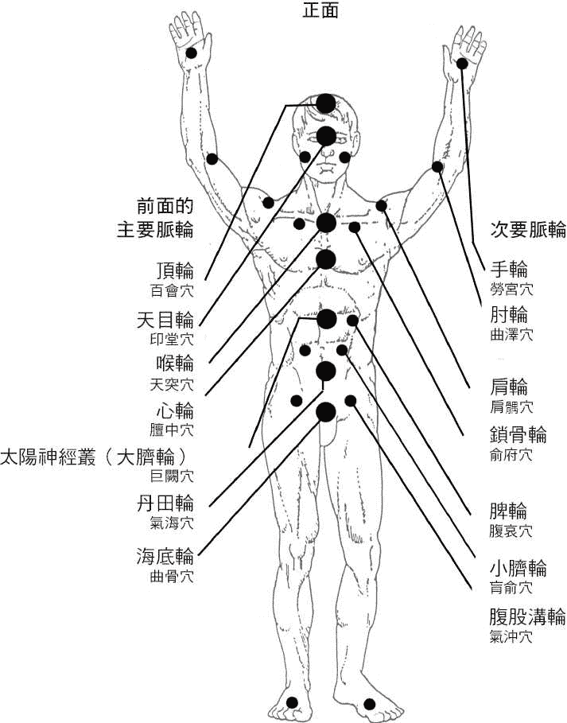 |
| 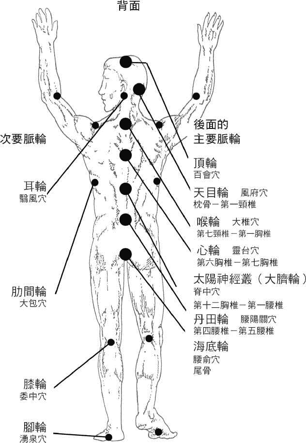 |
| 图说：图 2a　主要和次要脉轮的解剖位置 |

###### 符号

用于每个脉轮的符号都起源于印度教，并且主要是冥想时的焦点物。从顶轮往下到海底轮，它们依序是莲花、星星、新月、十字、圆圈、三角形和正方形。印度教和佛教文化中也使用了一些与动物相关、更精细的符号，如大象和鳄鱼。这些符号的形状和形式取决于国家、文化、历史和个人喜好。然而，这些符号通常相当深奥，徒手治疗师不用关注太多。

###### 配对的主要脉轮

主要脉轮之间的关系经常在临床上被用来平衡每个脉轮中心的能量：

‧顶轮与海底轮相关。

‧天目轮也与海底轮相关。

‧喉轮与丹田轮相关。

‧心轮与太阳神经丛（大脐轮）相关。

请注意，海底轮与上两个脉轮「顶轮」和「天目轮」有关。稍后将会提供实际应用的所有细节。

###### 配对的次要脉轮

每个主要脉轮中心都与一个次要脉轮中心相关，次要脉轮是主要脉轮中心的能量反射点，它本身也是一个强大的穴位：

‧顶轮与脚轮和手轮相关。

‧天目轮与锁骨轮和腹股沟轮相关。

‧喉轮与肩轮和小脐轮相关。

‧心轮与耳轮和肋间轮相关。

‧太阳神经丛（大脐轮）与脾轮相关。

‧丹田轮也与脾轮相关。

‧海底轮与膝轮和肘轮相关。

这些关系在临床实践中大量使用，稍后将充分解说。

###### 内分泌腺

七个主要脉轮中的每个轮都和一个内分泌腺有关，这可能是我们需要去学习和理解的最重要对应关系。它在临床上、理论上和实际操作上的重要性甚巨，尽管在深奥的文献中，这种关系并没有充分记载，但这稳固的相关性可以在治疗时一再重复使用，并产生惊人的临床效果。内分泌腺显然是肉体的一部分，并经由神经、血液、淋巴和能量连接到肉体，产生天然化学物质（荷尔蒙），这些化学物质可以大大地影响肉体、乙太体和情感体。深奥的文献指出，经脉是乙太体的脉轮和肉体的内分泌腺之间的调解管道（见第一章）。颅荐疗法和其他徒手精微疗法的出现，无庸置疑地证明了这一点。脉轮和内分泌腺之间的关系如下：

‧顶轮与松果体相关。

‧天目轮与脑下垂体相关。

‧喉轮与甲状腺和甲状旁腺相关。

‧心轮与胸腺相关。

‧太阳神经丛（大脐轮）与胰腺相关。

‧丹田轮与卵巢和睾丸有关。

‧海底轮与肾上腺髓质和肾上腺皮质相关。

请注意，天目轮也与大脑的丘脑和下丘脑区域有关。这里介绍的海底轮和丹田轮及其相应的内分泌腺之间的关系，是我自己的发现，与其他出版物中提到的部分内容相反。这些发现将在稍后讨论个别脉轮时加以解释。（见图 2b）

| 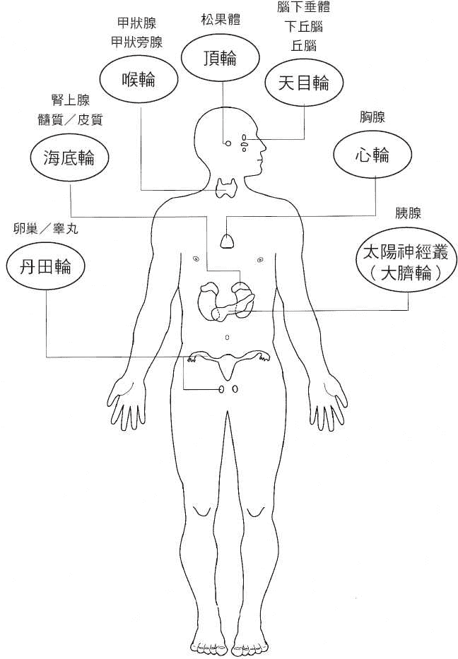 |
| 图说：图 2b　主要脉轮与内分泌腺的关联 |

###### 相关的器官

每个主要脉轮都与一个或多个内部器官或某些身体部位相关。这个知识在临床上十分重要。脉轮透过经络能量系统与器官或身体部位联系起来，无论是透过双边的主要十二经脉，还是奇经八脉：

‧顶轮与大脑上部（高等功能）和右眼相关。

‧天目轮与大脑下部（脑和神经系统）、耳朵、鼻子、左眼相关。

‧喉轮与肺、支气管、喉咙、喉头、咽部、上淋巴管和大肠相关。

‧心轮与心脏、血液循环、中淋巴管和迷走神经相关。

‧太阳神经丛（大脐轮）与胃、肝脏、脾脏、胰脏、胆囊，以及小肠区的十二指肠或空肠部位相关。

‧丹田轮与生殖系统、下淋巴管和小肠区的回肠部位相关。

‧海底轮与脊椎、肾脏和膀胱相关。

###### 相关的经络

每个主要脉轮都与一条、两条或三条经络相关，但每个次要脉轮只与一条经络相关。这些关系可以用在几个方面：可以用于平衡和治疗的「备用」能量系统，也可以在治疗开始时用于镇静或刺激相关器官或身体部位。

这些关系是我基于几年实作经验所得的结论，下面的清单中，我把奇经八脉放在括号内，结合针灸与脉轮疗法时，会用到这些奇经八脉。脉轮和经络之间的关系如下：

‧顶轮与三焦经相关。

‧天目轮与胆经（阳维脉）相关。

‧喉轮与大肠经和肺经（阳蹻脉）相关。

‧心轮与心经和小肠经（阴维脉）相关。

‧太阳神经丛（大脐轮）与肝经和胃经（带脉）相关。

‧丹田轮与脾经和心包经（阴蹻脉）相关。

‧海底轮与膀胱经和肾经（任脉、督脉和冲脉）相关。

###### 关键穴位

当针灸与脉轮能量系统结合使用时，首先需要在与每个脉轮相关的关键穴位（主要脉轮有两个穴，次要脉轮只有一个穴）下针，以便「开启」能量中心。它们的使用方式类似于奇经八脉的关键穴位。这些关键穴位在身体正中线和周围，当脉轮与指压疗法及反射疗法一起使用时，可平衡及治疗脉轮，而且是整个治疗的一部分。在碰触疗法中，只需使用到周围的关键穴位。

在下面的清单中，括号显示的是针灸时会使用到的其他关键穴位：

‧顶轮的关键穴位是外关穴（关元穴）。

‧天目轮的关键穴位是三阴交穴（命门穴）。

‧喉轮的关键穴位是蠡沟穴（气海穴）。

‧心轮的关键穴位是极泉穴（中枢穴）。

‧太阳神经丛（大脐轮）的关键穴位是阳池穴（膻中穴）。

‧丹田轮的关键穴位是曲泽穴（身柱穴）。

‧海底轮的关键穴位是曲泉穴（天突穴）。

这些脉轮的关键穴位信息是基于我自己的研究所得出的结果。一九八七年撰写针灸博士论文时，我认为这些关键穴位只对针灸有用。然而，进一步的研究显示，它们在指压方面也具有重要的实用性。我最初是藉由错误尝试、探测及普通常识来发现这些关键穴位。现在回想起来，我真无法想象因为我试图验证这些关键穴位的准确性，而让我可怜的病人们经历了什么！

###### 相关的肌肉

这个神奇的疗法可用来治疗肌肉骨骼的损伤，应用肌肉动力学的出现，提高了我们对经络的能量流和肌肉的神经支配之间的整合，也提高对器官和肌肉关联的觉知。我自己的研究又更进一步拓展到各种肌肉与每个主要脉轮的关联。

以实用性来说，透过脉轮来平衡肌肉已成为一个快速简便的方法，可用来强化、减弱或治疗肌肉。至于如何使用应用肌肉动力学来平衡肌肉能量，在我的前一本书中有详细说明。本书第三章中也有一个完整的表格，列出了肌肉、主要脉轮和次要脉轮的相互关系。

###### 相关的反射

与身上任何部位一样，脉轮在身体上也有反射穴位或反射点。以实用性来说，重要的反射点位于手和脚上，它们也出现在手臂和腿上。我发明了一种使用脚上的脉轮反射区来治疗的方法，称为「轻触反射疗法」（LTR），这会在第四章中描述。

###### 相关的情绪

每个主要的脉轮也与情绪有关，每种情绪都是诊断数据库的一部分，可用来识别哪个脉轮可能处于失衡状态。反过来说，脉轮疗愈技术可彰显出疾病的情绪因素。如前所述，有很高比例的病症和疾病有情绪上的肇因。当病人的治疗结合脉轮与指压疗法、反射疗法、颅荐疗法时，经常会感受到情绪的释放，这情绪可能与被治疗的脉轮有关，也可能没有关联。情绪释放可能表现为愤怒、流泪、叹息、打呵欠，甚至是轻微的幻觉，可以预料病人在表达自身情绪时会有这些反应出现。有些情感上的连结很复杂，后面会详细叙述，但一般的关联如下：

‧顶轮与杞人忧天和几种恐惧症相关。

‧天目轮与愤怒相关。

‧喉轮与羞怯、内向和偏执相关。

‧心轮与流泪、焦虑、忧郁和分离相关。

‧太阳神经丛（大脐轮）与忧郁和焦虑相关。

‧丹田轮与羡慕、嫉妒和欲望相关。

‧海底轮与不安全感、质疑和许多恐惧症相关。

###### 灵性

每个主要脉轮也具有「灵性」的内涵，它是客观的，根据不同的哲学和文化对它会有不同的诠释。每个脉轮的灵性关联，等于和各个能量中心的原始连结，因为好几个世纪以来，它们只被用于冥想和瑜伽练习。这些连结如下：

‧顶轮是与超意识及「一切万有」配对。

‧天目轮与直觉配对。

‧喉轮与表达配对。

‧心轮与爱配对。

‧太阳神经丛（大脐轮）与平稳、掌控、「土地」配对。

‧丹田轮与快乐和享受配对。

‧海底轮与物质和肉体配对。

###### 自主神经丛

寻找脉轮和自主神经系统之间的关系，是我多年来众多研究项目之一。本书解释了它们的确切关系，这是你在其他地方找不到的。内分泌腺和自主神经系统之间的连结已经是众所周知，你不需要跨越巨大的信仰即可将脉轮连接到它们相关的自主神经系统。我们现在具备了运用头颅的律动来做分析的能力，这使得这些连结在临床上得到证实。这种关系在实用的治疗中具有重大意义，也让人领会到自主神经系统在整个疗愈领域中的重要性。它们的关系如下：

‧顶轮与自主神经系统没有连结。

‧天目轮与上颈神经节连结。

‧喉轮与下颈神经节连结。

‧心轮与腹腔神经丛和神经节连结。

‧太阳神经丛（大脐轮）也与腹腔神经丛和神经节连结。

‧丹田轮与肠系膜下神经节连结。

‧海底轮与骨盆丛连结。（见图 2c）

| 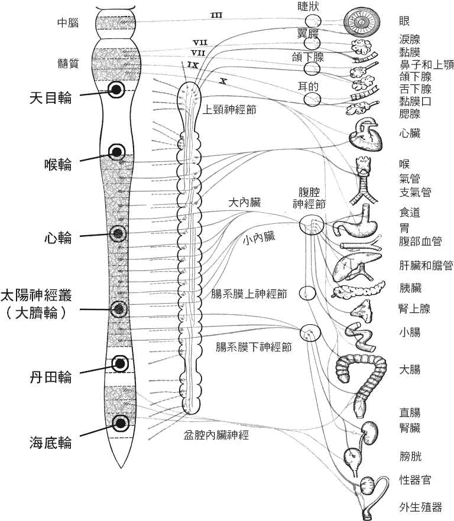 |
| 图说：图 2c　主要脉轮与自主神经系统的关联 |

###### 旋转漩涡

灵视者能够在每个脉轮内看到数个个别的旋转漩涡。每个脉轮的漩涡颜色、条纹和数量都不相同。在脉轮中心的旋转漩涡数量或花瓣的数量，反映了每个脉轮的精微度。脉轮中的花瓣数量越少，对应的症状就越「物质化」和密实；花瓣数量越多，脉轮的密度越小、越精微，因此会产生较多与情绪相关的疾病，如忧郁或焦躁。

使用肉体和乙太体的脉轮中心来治疗时，旋转漩涡的数量并不重要；使用情感体来分析和治疗时，它们才会显得较为重要，因为根据疾病的不同，每个脉轮在情感体的不同部位会「感觉」不一样。

‧顶轮有九百七十二个旋转漩涡。

‧天目轮有九十六个旋转漩涡。

‧喉轮有十六个旋转漩涡。

‧心轮有十二个旋转漩涡。

‧太阳神经丛（大脐轮）有十个旋转漩涡。

‧丹田轮有六个旋转漩涡。

‧海底轮有四个旋转漩涡。

请参考彩图 2 至彩图 8，灵视者对这些旋转漩涡的图示。

###### 声音和颜色

一切都是能量，这陈述过很多次了！其中也包括声音和颜色。声音和颜色共振的特定振动频率被用于数种治疗类型中。当然，声音和色彩疗法本身很受欢迎，但与脉轮能量结合使用，它们会变得更有效。这些方式中的每一种都可以用于诊断和治疗。每个人都有不同的声音和颜色，包括和谐及不和谐的。一个人发现某颜色不和谐或和谐，都可能代表某个脉轮处于失衡状态。在治疗模式中，特定的声音或颜色可以传送到特定的脉轮来进行疗愈。你可以使用彩色灯笼或色彩片，将颜色传导到脉轮，或者可以让病人坐在色彩瀰漫的房间中。在声音疗法中，鼓励病人以与特定脉轮共振的特定音调，唸诵正向的肯定句或咒语。这和谐的共振关系如下：

‧顶轮与紫罗兰色、金色、白色和 B 音调共振。

‧天目轮与靛蓝色和 A 音调共振。

‧喉轮与蓝绿色、天蓝色和 G 音调共振。

‧心轮与绿色和 F 音调共振。

‧太阳神经丛（大脐轮）与黄色和 E 音调共振。

‧丹田轮与橘色和 D 音调共振。

‧海底轮与红色和 C 音调共振。

###### 振动速率

振动速率是远距传播能量治疗师使用的数字，传送出此「速率」来治疗和平衡每个脉轮的能量。这几种速率来自远距传播能量法的书籍，也是我当远距传播能量治疗师时所使用的几种速率。在每个主要脉轮的章节中，将以表格列出每种速率。

###### 频率

正如上一章所解释的，频率是指与每个脉轮共振的频率，并经过科学证实。它们会出现在讨论个别脉轮的表格尾端。

## 个别的主要脉轮

现在，让我们来谈谈每个主要脉轮的位置、功能和症状。

##### 第一个脉轮：顶轮 Sahasrara

###### 位置

顶轮只有一个位置，位于百会穴，即头顶，眉毛和颅骨底部连线的正中央，也是双耳假想连线的中央。（见图 2d）

| 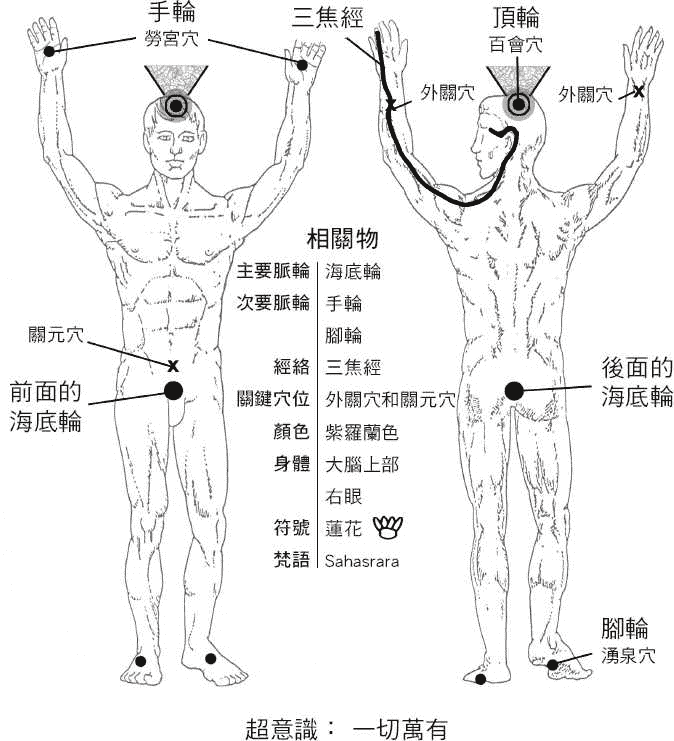 |
| 图说：图 2d　顶轮的相关物 |

###### 功能

这个脉轮直到一个人的内在发展达到高水平，才能完全发挥作用。它展现出来的是松果体，医学上已知七岁以下的儿童，其松果体比较活跃，但七岁之后活动会减缓。

研究显示，这个腺体与视觉感知有关。此腺体产生褪黑激素荷尔蒙，调节视网膜中的光感受器。褪黑激素在夜间增加的话会让人感到平静，而持续的光线照射会减少褪黑激素的产生。在白天，松果体会大量产生另一种激素：血清素，它会影响活动力。这两种激素在连续的昼夜生理循环中起作用。血清素对我们的情绪状态有相当深远的影响，大量的血清素会改善情绪并让人平静。正是这个原因，冥想和瑜伽中会大量使用这个脉轮。

顶轮有时称为千瓣莲花，用于控制大脑上部（上运动神经元）和右眼。它也被认为是一个人与他的灵性存有之间的连结，直通到圣灵体。这个脉轮广泛用于各种形式的冥想和瑜伽。以「灵性」层面来说，这个脉轮当然是最重要的，但与碰触疗法一起使用时，可能是最不重要的。治疗师在平衡和治疗这个脉轮时要小心谨慎，因为有可能使病人「脱离」现实，并感到头昏眼花或「精神恍惚」。但是，步骤正确的话，这情况应该不常见。

与顶轮相关的经络是三焦经，外关穴是主要关键穴位，而关元穴则是次要关键穴位。

###### 症状

眩晕、耳鸣、高血压和低血压、右侧偏头痛、其他类型的头痛、上运动神经元疾病的症状（如多发性硬化症）、季节性情绪失调（SAD）、指甲易碎和头发无光泽。

当非自然症状明显出现时，例如高血压和低血压，脉轮可能表现出不同形式的能量失衡。可能是能量瘀阻产生的慢性（阴）症状，或能量过度活跃而产生急性（阳）症状。

你还会注意到某些病症和失衡状态出现在一个以上的脉轮中。正如我们从与顶轮有关的症状清单中看到的那样，它不是一个病症密集的脉轮；事实上，这个脉轮除了治疗高血压和头痛外，并不常单独使用，而是广泛地与其他主要和次要脉轮合并使用。它可以与天目轮一起用于治疗头痛、头晕、眼睛疲劳、耳鸣、颞颚关节症候群、鼻部症状和眩晕。

表格 2b　顶轮

| 腹部解剖位置 | 颅骨顶部 |
| 背部解剖位置 | 颅骨顶部 |
| 腹部穴位 | 百会穴 |
| 背部穴位 | 百会穴 |
| 梵语 | Sahasrara |
| 符号 | 莲花 |
| 配对的主要脉轮 | 海底轮 |
| 配对的次要脉轮 | 手轮和脚轮 |
| 内分泌腺 | 松果体 |
| 相关器官 | 大脑上部、右眼 |
| 脊椎水平覆盖区 | 颅骨 |
| 关键穴位 | 外关穴 |
| 相关经络 | 三焦经 |
| 相关肌肉 | 斜方肌、冈上肌、面部肌肉 |
| 情绪 | 忧郁、恐惧症 |
| 灵性 | 超意识、一切万有 |
| 自主神经丛 | 无 |
| 旋转漩涡数 | 972 |
| 音调 | B |
| 相关颜色 | 紫罗兰色、金色和白色 |
| 振动速率（远距传播能量法） | 6668610.76 |
| 频率 | 0.25 赫兹 |

##### 第二个脉轮：天目轮 Ajna

###### 位置

天目轮位于枕骨─寰椎交界处的枕外凸隆中。针灸穴位是风府穴，在腹部则是位于两眼中间的印堂穴。（见图 2e）

| 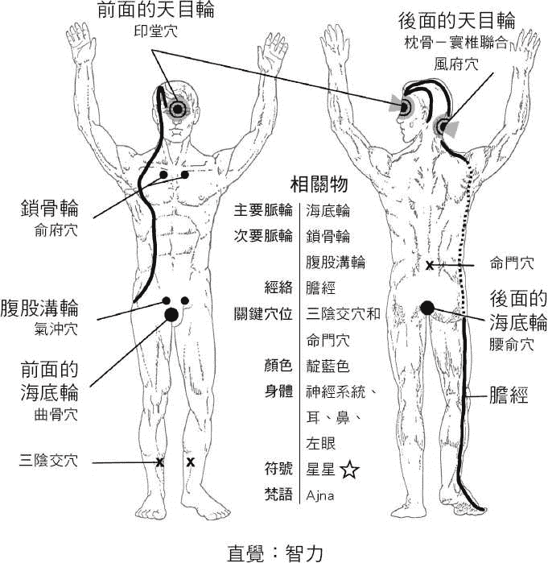 |
| 图说：图 2e　天目轮的相关物 |

###### 功能

在深奥的文献中，这个脉轮据说代表第三只眼。这种关联非常适切，因为它在治疗肉体和情感所引起的病症最有用。据说超感知觉和灵视力是透过天目轮外展出来的，而这个脉轮对直觉力也有非常重要的影响；天目轮也会影响一个人的性格，它的外显是脑下垂体，此为内分泌系统的主腺体。如果其他内分泌腺没有分泌足够的特定激素，脑下垂体将透过分泌促进荷尔蒙激素来帮助它们，但通常会导致诸如偏头痛这类的失衡。

许多文章将天目轮与松果体相连、顶轮与脑下垂体相连，这是不对的。因为天目轮是与「祕密」之眼相关，而非与视力相关。天目轮透过脑下垂体和下丘脑来与直觉力相连。当你用针灸来影响天目轮时，它透过脑下垂体对荷尔蒙的分泌产生重大的影响，这不可能透过使用顶轮来达成。用指压疗法也可做到这一点，但这会是相当漫长的过程，尽管这过程颇为值得。天目轮的中心控制着大脑下部（脑干和小脑）、左眼、鼻子、耳朵和中枢神经系统。与其他脉轮及穴位联合使用以控制激素时，它是一个非常重要的脉轮。

天目轮位于印堂穴，此穴相当于睛明穴，同时具有许多与它相似的功能。此脉轮的关键穴位是三阴交穴和命门穴，它与胆经有关。

###### 症状

偏头痛、慢性和急性黏膜炎、鼻窦炎、感染及传染性疾病、耳聋和听力改变、上颈椎关节炎、颞颚关节症候群、梅尼尔症、眩晕、头轻和头晕、头痛、压力与忧虑、一些运动神经元疾病的症状、愤怒和羞怯。

在这个强大的中心使用指压和针灸来治疗黏膜炎、鼻窦炎和影响咽鼓管的病症最为有效，它也是治疗许多上下运动神经元疾病的焦点，如：多发性硬化症、帕金森氏症与共济失调症。与所有座落两侧的脉轮一样，背侧方面有助于肌肉骨骼病症的治疗，腹侧方面则能最有效地解决器官和神经病症。此脉轮的前后双侧穴位可能是全身上下最强大的抗压和放松穴位。平衡它们的能量可以产生非常有益的结果。

表格 2c　天目轮

| 腹部解剖位置 | 两眼中间 |
| 背部解剖位置 | 寰椎－枕椎联合（枕外凸隆） |
| 腹部穴位 | 印堂穴 |
| 背部穴位 | 风府穴 |
| 梵语 | Ajna |
| 符号 | 星星 |
| 配对的主要脉轮 | 海底轮 |
| 配对的次要脉轮 | 锁骨轮和腹股沟轮 |
| 内分泌腺 | 脑下垂体 |
| 相关器官 | 大脑下部、神经系统、耳、鼻、左眼 |
| 脊椎水平覆盖区 | 颅底－第四颈椎 |
| 关键穴位 | 三阴交穴 |
| 相关经络 | 胆经 |
| 相关肌肉 | 前面和后面的颈部肌肉 |
| 情绪 | 生气 |
| 灵性 | 直觉、智力 |
| 自主神经丛 | 睫状神经节 |
| 旋转漩涡数 | 96 |
| 音调 | A |
| 相关颜色 | 靛蓝色 |
| 振动速率（远距传播能量法） | 66674789 |
| 频率 | 2.96 赫兹 |

##### 第三个脉轮：喉轮 Vishuddha

###### 位置

喉轮位于颈底部的第七颈椎和第一胸椎交界处，即大椎穴的位置，在腹部则是位于胸骨切迹中心的天突穴处。（见图 2f）

| 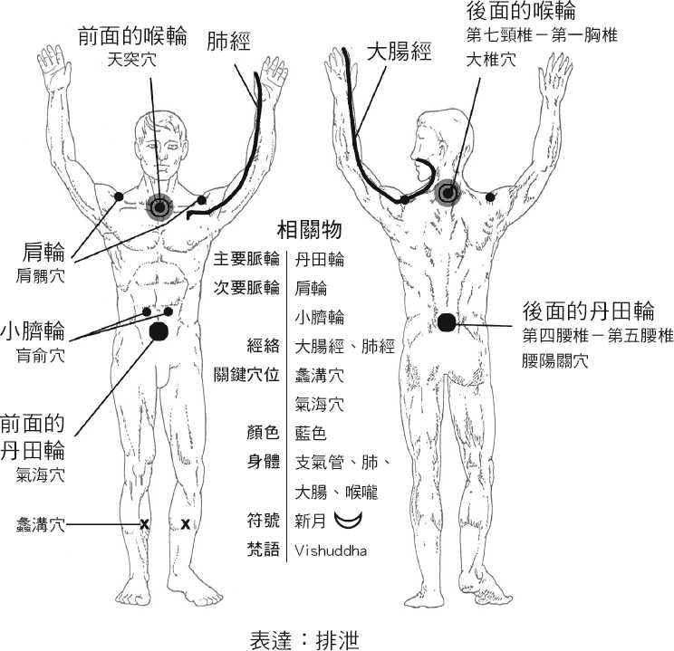 |
| 图说：图 2f　喉轮的相关物 |

###### 功能

这是一个非常强大的脉轮。它可能是第二常用的脉轮，仅次于海底轮。喉轮据说是高我的脉轮中最低阶的，并透过甲状腺和甲状旁腺显现出来。有生物体和病毒入侵时，喉轮通常会变得阻塞，从而产生喉咙痛和扁桃体炎等身体症状，也因此成为人体的第一道防线。它对治疗由细菌和病毒引起的急性发热性疾病很有用，而长期用药物来抑制腺体所产生的后遗症，有可能是引发腺体热和哮喘的因素之一，也可以用此脉轮来治疗。据说无法轻易表达自己的人，或是隐居、害羞或内向的人，喉轮是处于失衡状态，而哀伤这类突发情绪冲击，也可能对此脉轮造成损伤。

喉轮和各个层次的排泄有很大的关联，它与大肠和肺相关，两者都与身体排泄有关，它也和废弃的思想及「个人情感上的焦虑烦恼」（与恐惧症不同）之排除有关。它与次要脉轮肩轮和小脐轮有关，这点更强调了它对排泄过程的影响。当病人的肉体或情感体出现阻塞状态时，必须去平衡和治疗其喉轮。通常在病人经历了旧情绪或喉咙阻塞时，治疗师即使只是轻轻地把手放在喉咙区，病人也会有窒息的感觉，这是喉轮需要治疗的一大指标。那些深奥的书会建议用瑜伽或冥想来清理脉轮，但是很有用的徒手疗法或针灸也可以清理阻塞。

它的关键穴位是气海穴和蠡沟穴（在胫骨内侧，三阴交上方两寸或三横指的地方，此处的寸也称为「同身寸」，相当于大拇指指节的宽度）。与它相关的经络是大肠经和肺经。

###### 症状

偏头痛、急慢性喉咙痛、扁桃腺炎、哮喘、味觉丧失、急慢性支气管炎和其他呼吸道感染、喉炎、结肠炎和肠躁症、回盲瓣症候群、慢性皮肤损伤（如溼疹和脱发）、羞怯、内向和偏执。此脉轮的背部位置在颈胸交界处，对治疗累积在颈部肌肉的压力、纤维组织炎及某些类型的肩周炎很有效。在软组织阻塞和纤维组织炎的情况下，于患部周围和远处按摩是有益的。

表格 2d　喉轮

| 腹部解剖位置 | 胸骨切迹 |
| 背部解剖位置 | 第七颈椎－第一胸椎 |
| 腹部穴位 | 天突穴 |
| 背部穴位 | 大椎穴 |
| 梵语 | Vishuddha |
| 符号 | 新月 |
| 配对的主要脉轮 | 丹田轮 |
| 配对的次要脉轮 | 肩轮和小脐轮 |
| 内分泌腺 | 甲状腺、甲状旁腺 |
| 相关器官 | 支气管、肺、声带、消化道、喉咙、皮肤 |
| 脊椎水平覆盖区 | 第五颈椎－第三胸椎 |
| 关键穴位 | 蠡沟穴和气海穴 |
| 相关经络 | 大肠经和肺经 |
| 相关肌肉 | 背阔肌，胸大肌，肱三头肌，前臂肌肉 |
| 情绪 | 害羞、内向、偏执 |
| 灵性 | 表达 |
| 自主神经丛 | 上颈椎神经节 |
| 旋转漩涡数 | 十六 |
| 音调 | G |
| 相关颜色 | 蓝色 |
| 振动速率（远距传播能量法） | 66678575 |
| 频率 | 81.2 赫兹 |

##### 第四个脉轮：心轮 Anahata

###### 位置

心轮位于第六和第七胸椎中间，针灸穴位是灵台穴，腹部位置在胸骨中间，即膻中穴的位置。（见图 2g）

| 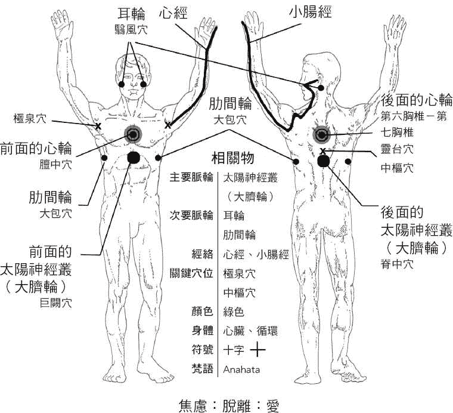 |
| 图说：图 2g　心轮的相关物 |

###### 功能

在临床上用于治疗肉体疾病的脉轮中，如果喉轮是最常使用的脉轮，心轮则属于最少使用的脉轮之一，它的重要意义在于治疗情绪失衡。这个脉轮的腺体是胸腺，包含在自体免疫系统内。当这个脉轮过度活跃时，可能会产生不道德、不负责任的行为。如果能量无法控制地涌进这个中心，可能会对这个人的人格造成破坏性影响，特别是与心脏有关的事！过度刺激可以产生一种纯然幸福的状态，就和坠入爱河时感受到的一样，几乎会产生「超出现实世界」的感觉，整个人会变得很容易哭泣和心烦意乱。这也是使人「咯咯笑」的脉轮，以及让人在咨询时诉说他们的悲伤故事时潸然泪下的脉轮。许多公司的执行长和大亨们的心轮承受着巨大的压力，可能因而患上心脏病；而无法将自身与病人分开的医生和治疗师也面临类似的困境（治疗师们，请记下来！）。胸椎侧弯如果不是过度融合及病程太久，也属于以心轮来治疗的常见病症。

与心轮相关的经络是心经和小肠经，关键穴位是极泉穴和中枢穴。

###### 症状

良性肿瘤及其生长、脊椎侧弯、从充血性心衰竭到单纯的循环失衡之心脏病症、心悸、心绞痛、静脉曲张、流泪、焦虑、孤独和内向。

在开始平衡这个脉轮中心的前侧及后侧时，应小心谨慎（后面章节将进一步讨论），因为病人过去若有过情绪失衡，坐立时可能容易晕倒。请让病人侧躺，这会让你的治疗轻松许多！

表格 2e　心轮

| 腹部解剖位置 | 胸骨中段 |
| 背部解剖位置 | 第六胸椎－第七胸椎 |
| 腹部穴位 | 膻中穴 |
| 背部穴位 | 灵台穴 |
| 梵语 | Ahanata |
| 符号 | 十字 |
| 配对的主要脉轮 | 太阳神经丛（大脐轮） |
| 配对的次要脉轮 | 耳轮和肋间轮 |
| 内分泌腺 | 胸腺 |
| 相关器官 | 心脏、静脉和动脉、迷走神经 |
| 脊椎水平覆盖区 | 第四胸椎－第八胸椎 |
| 关键穴位 | 极泉穴和中枢穴 |
| 相关经络 | 心经和小肠经 |
| 相关肌肉 | 竖脊肌 |
| 情绪 | 流泪、焦虑 |
| 灵性 | 爱 |
| 自主神经丛 | 下颈椎神经节 |
| 旋转漩涡数 | 12 |
| 音调 | F |
| 相关颜色 | 绿色 |
| 振动速率（远距传播能量法） | 66664424 |
| 频率 | 7.8 赫兹 |

##### 第五个脉轮：太阳神经丛（大脐轮）Manipura

###### 位置

太阳神经丛（大脐轮）位于第十二胸椎和第一腰椎交界处，其针灸穴位是脊中穴，腹部位置在胸骨剑突下方的巨阙穴。（见图 2h）

| 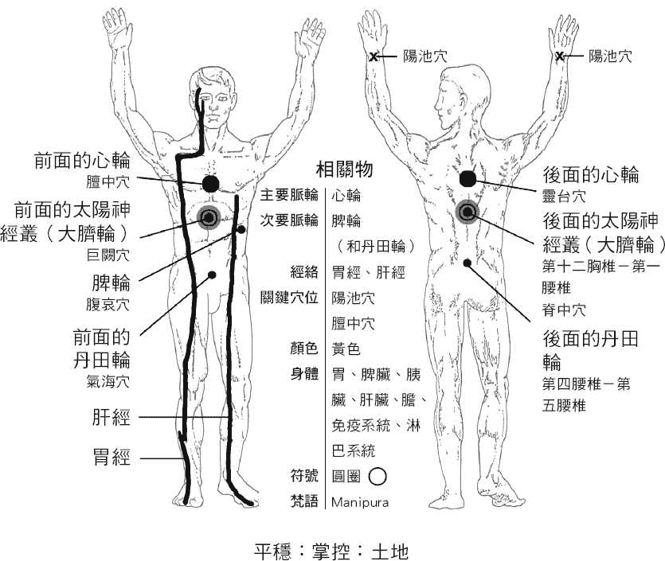 |
| 图说：图 2h　太阳神经丛（大脐轮）的相关物 |

###### 功能

这个脉轮代表横膈膜下方一个巨大的能量交换所。大多数人的太阳神经丛（大脐轮）是活跃的，无论是阻塞还是过度刺激，均起因于食用含有添加剂或不自然的加工食物，又或者是生活步调所引起的。这可能导致神经紊乱和胃、肝脏、胆囊、胰脏、脾脏疾病。如果变成慢性失衡，则会降低人体免疫系统的能量，并造成诸如慢性疲劳症候群等病症。若是因脉轮阻塞而使得该区域变弱，可能导致脊椎侧弯或肌肉失衡，还可能进一步影响颈椎和腰椎，因为它们会试图弥补中段胸椎的不正。因此，太阳神经丛（大脐轮）对于治疗许多器官和情绪病症是非常重要的。治疗开始之前，总要先平衡心轮与太阳神经丛（大脐轮）的能量，因为情绪的症状与病因息息相关。

胰腺是和太阳神经丛（大脐轮）相关的内分泌腺，它产生胰岛素并参与糖的代谢，而与太阳神经丛（大脐轮）相关的经络是肝经和胃经，关键穴位是阳池穴和膻中穴。

###### 症状

皮肤病症如溼疹和痤疮、胃溃疡、癌症的生长、肝炎、胆囊绞痛、消化不良、腺体系统整体感染、腺热、慢性疲劳症候群、过敏、花粉热、小肠痉挛、肠躁症、回盲瓣症候群、担忧、忧郁和焦虑。

与太阳神经丛（大脐轮）失衡有关的两种主要慢性疾病是糖尿病和癌症。虽然这些疾病往往有物理及化学方面的肇因，但症状往往是心识体和情感体的失衡所引起的。糖尿病可能是由于一个人不允许足够的甜蜜和爱进入他的生活，癌症的肇因则可能是持有愤怒、恐惧和仇恨的情绪。传统的西医疗法会有很大的作用（显然挽救了生命），但没有治疗病根。指导病人进行冥想或瑜伽，并接受脉轮疗法极为重要，他们可以在接受传统西医疗法的同时做这些事情。太阳神经丛（大脐轮）通常被称为我们情绪的所在。对事物「有直觉」这句话就和太阳神经丛（大脐轮）有关，而紧张时或在重大事件发生之前，胃出现「翻滚」就表明太阳神经丛（大脐轮）过度活跃；当病人放松时，这些症状就消失了（只有慢性胸椎发炎的情况例外，它可能会将疼痛转移到胃与横膈膜区域）。

表格 2f　太阳神经丛（大脐轮）

| 腹部解剖位置 | 在胸骨的剑突下方 |
| 背部解剖位置 | 第十二胸椎－第一腰椎 |
| 腹部穴位 | 巨阙穴 |
| 背部穴位 | 脊中穴 |
| 梵语 | Manipura |
| 符号 | 圆圈 |
| 配对的主要脉轮 | 心轮 |
| 配对的次要脉轮 | 脾轮 |
| 内分泌腺 | 胰腺 |
| 相关器官 | 胃、肝脏、脾脏、胰脏、十二指肠、胆 |
| 脊椎水平覆盖区 | 第九胸椎－第二腰椎 |
| 关键穴位 | 阳池穴和膻中穴 |
| 相关经络 | 肝经和胃经 |
| 相关肌肉 | 腹部、股四头肌 |
| 情绪 | 忧郁、担忧、焦虑 |
| 灵性 | 平稳、掌控、土地 |
| 自主神经丛 | 腹腔神经丛和神经节 |
| 旋转漩涡数 | 10 |
| 音调 | E |
| 相关颜色 | 黄色 |
| 振动速率（远距传播能量法） | 6666410.53 |
| 频率 | 23.0 赫兹 |

##### 第六个脉轮：丹田轮 Svadhisthana

###### 位置

丹田轮位于脊椎底部的第四和第五腰椎交界处，针灸穴位为腰阳关穴，腹部位置在气海穴处，它位于脐下一‧五寸（两指宽）的地方，这个前方的穴位也称为哈拉（hara），它在冥想、瑜伽、武术和精微的能量运动，如合气道和太极拳中被广泛应用。（见图 2i）

| 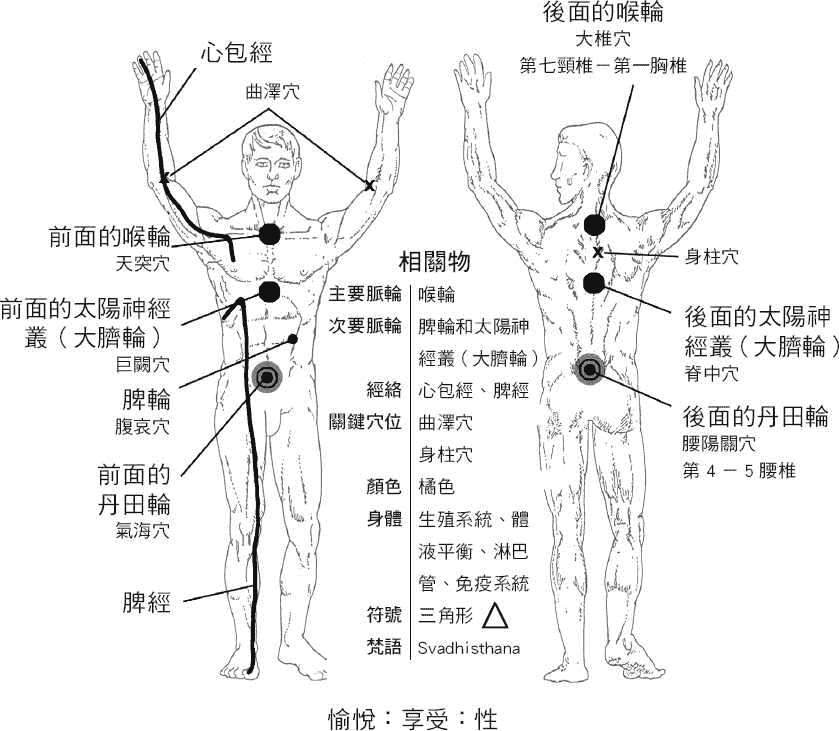 |
| 图说：图 2i　丹田轮的相关物 |

###### 功能

据说这个脉轮既可以控制生殖系统，又可以控制体内的水分。它广泛用于与这些系统相关的病症。它还与喉轮配对，两者在治疗水肿、慢性喉咙痛及许多病症都很出色。若与海底轮结合使用，也可治疗腰椎、荐椎和骨病症。然而，它在生殖、妇科和产科病症中的用途最广。在一些文献中，这个脉轮称为脾轮或小脐轮，但我的研究和实践成果对此有异议，因为这两个脉轮本身就是次要脉轮，具有独立的功能。

丹田轮也与小肠的下三分之一相关，因此参与了食物吸收的部分。体内的水分控制显然与肾脏有关，但肾脏和丹田轮似乎没有很强的关联。在我看来，肾脏与海底轮有关。然而，丹田轮失衡会影响体内水分的律动，这是无可否认的。某些美洲原住民的萨满教义认为所有水中生物与丹田轮相关。月球周期对我们的水系统周期也有巨大的影响。其他昼夜循环及月周期，包括月经周期，都是由此脉轮控制。

有些文献将此脉轮与肾上腺连结起来，但我的广泛研究和临床实践结果显示，与此脉轮连结的内分泌是子宫和性腺，而非肾上腺。如果这个脉轮不活跃，病人就会有过食的冲动，性欲也会增加。这些因素都可能导致肥胖、对某些食物不耐受、慢性皮肤病和可能的阳痿。传统的教学告诉我们可透过舞蹈、捧腹大笑、瑜伽、呼吸练习和观想橘色光来重新平衡丹田轮（神圣的轮）。

与丹田轮相关的经络是脾经和心包经，关键穴位是曲泽穴和身柱穴。

###### 症状

低活力、肠胃病症、肠躁症、慢性疲劳和嗜睡、阳痿、性欲异常高或低，慢性喉咙痛、产热机制失衡（包括脚冷和冻疮）、月经和停经期的病症、水肿、脚踝肿胀和一些类风溼的病症。

表格 2g　丹田轮

| 腹部解剖位置 | 就在肚脐下面 |
| 背部解剖位置 | 第四－五腰椎 |
| 腹部穴位 | 气海穴 |
| 背部穴位 | 腰阳关穴 |
| 梵语 | Svadhisthana |
| 符号 | 三角形 |
| 配对的主要脉轮 | 喉轮 |
| 配对的次要脉轮 | 脾轮 |
| 内分泌腺 | 性腺和子宫 |
| 相关器官 | 生殖系统、体液平衡、淋巴管 |
| 脊椎水平覆盖区 | 第二腰椎－第二荐椎 |
| 关键穴位 | 曲泽穴和身柱穴 |
| 相关经络 | 脾经和心包经 |
| 相关肌肉 | 膕旁肌、前后胫骨 |
| 情绪 | 嫉妒、羡慕、欲望 |
| 灵性 | 愉悦、享受、人际关系 |
| 自主神经丛 | 肠系膜下神经节 |
| 旋转漩涡数 | 6 |
| 音调 | D |
| 相关颜色 | 橘色 |
| 振动速率（远距传播能量法） | 66663206 |
| 频率 | 81.1 赫兹 |

##### 第七个脉轮：海底轮 Muladhara

###### 位置

海底轮位于脊椎底部的尾接合处（sacrococcygeal junction），即腰俞穴处，腹部则位于耻骨联合上嵴处的曲骨穴。这些是进行徒手疗法时会用到的位置。实际上，海底轮只有一个身体上的对应位置，即位于尾骨下方的会阴处，但显而易见的是，在对这个非常重要的脉轮进行治疗时，需要「可接受的」位置来做碰触疗法（注：会阴处太过私密，不方便做为治疗点，因此选腰俞穴和曲骨穴来取代），因为施作在腰俞穴和曲骨穴时，其影响范围可扩展到海底轮。在所有的病症中，海底轮的使用情形比所有脉轮都要多。将手放在病人的这些部位之前，记得要先告知他们！（见图 2j）

| 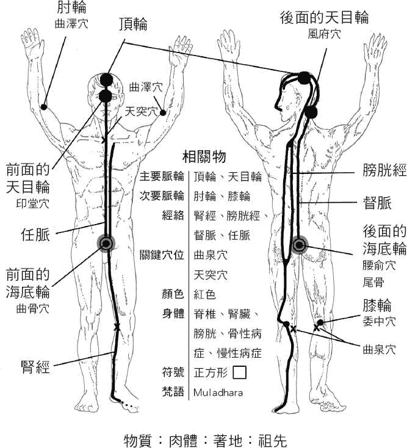 |
| 图说：图 2j　海底轮的相关物 |

###### 功能

如上所述，在每天的临床治疗中，海底轮（有时称为根基轮）可能比其他脉轮更常使用到。它被用于治疗所有慢性病症。治疗慢性机械性病症、骨关节炎、遗传病和深层的情绪病症时，不论是单独使用，或与其他相关脉轮结合使用，都经常使用到它。据说海底轮负责将肉体平稳地安置在物质界，并提供管道让意愿可以自由表达。虽然一般人的海底轮相对来说较不活跃、处于休眠状态，但现代的生活压力已促使海底轮的活动力与日俱增。

海底轮与肾上腺髓质和皮质相关，前者负责制造肾上腺素，后者负责制造皮质酮（可的松）。此脉轮用于治疗深层的遗传疾病和遗传来的弱点，它也是所有关于脊椎和肾脏病症的治疗焦点，其他如生存意愿低落等心理问题，也和此脉轮有关。

大卫‧坦斯利在他的著作《远距传播能量法和人类的精微解剖》一书中写道：

「海底轮过早的过度刺激，会导致沿着脊椎的乙太网保护层被烧掉，脉轮因而敞开，让个体尚无法处理的力量进来。那些花费时间、试图藉由冥想来打开脉轮的人，或是为了寻求实际上并不存在的灵性捷径，而试图升起拙火（昆达里尼）的人，可真是在招致危险。幸运的是，大多数涉猎某种瑜伽和冥想的人，会因自己对该主题的无知而受到保护。海底轮可让肉体的物质活化。拙火（昆达里尼）的能量，在用正确方式激发并用全然的意识来控制时，会以类似疗愈符号的蛇杖几何图案沿脊柱攀附而上；够古怪的是，包含生命密码的 DNA 分子，其双螺旋结构中也出现了相同的模式，这也正反映了海底轮和身体细胞之间的联系。」

请不要担心每天使用脉轮能量系统会升起拙火，它不会发生的！拙火能量的升起需要数月，甚至数年不断冥想和专注的练习，大家可以经常使用海底轮而不必为此担忧。毕竟经年累月地使用脉轮来进行冥想是一回事，在短期内将它们用于物理治疗又是另一回事。海底轮代表一个非常强大的区域，可用于疗愈，我们也是受海底轮的影响才能固着于地球，我们都需要这个「根」来接地。

与此脉轮相关的经络是肾经和膀胱经，关键穴位是曲泉穴和天突穴。

表格 2h　海底轮

| 腹部解剖位置 | 耻骨联合处 |
| 背部解剖位置 | 尾骨连接点 |
| 腹部穴位 | 曲骨穴 |
| 背部穴位 | 腰俞穴 |
| 梵语 | Muladhara |
| 符号 | 正方形 |
| 配对的主要脉轮 | 顶轮和天目轮 |
| 配对的次要脉轮 | 肘轮和膝轮 |
| 内分泌腺 | 肾上腺 |
| 相关器官 | 脊椎、肾脏、膀胱、输尿管 |
| 脊椎水平覆盖区 | 第三荐椎到尾骨尖 |
| 关键穴位 | 曲泉穴和天突穴 |
| 相关经络 | 膀胱经和肾经 |
| 相关肌肉 | 腰肌／髂肌、比目鱼肌、腓肠肌、脚部肌肉 |
| 情绪 | 不安全感、怀疑 |
| 灵性 | 物质和肉体 |
| 自主神经丛 | 骨盆神经丛 |
| 旋转漩涡数 | 4 |
| 音调 | C |
| 相关颜色 | 红色 |
| 振动速率（远距传播能量法） | 66658874 |
| 频率 | 81.1 赫兹 |

###### 症状

骨关节炎、僵直性脊椎炎、类风溼性关节炎、僵硬关节、肾炎、慢性膀胱炎、慢性和急性前列腺炎、引力溃疡、「生长期的」疼痛、舒尔曼病（脊椎驼背后凸症）、其他骨骼疾病（如胫骨结节软骨炎〔膝盖下方疼痛〕）、忧郁、嗜睡、慢性疲劳、慢性盆腔病症、骨病症、腰椎病症、胸椎病症、颈椎病症、颅骨病症、某些恐惧症及精神失常。

现在我们已经探索各个主要的脉轮，接着来看看次要脉轮。关于主要脉轮还有很多可说的，在其他书中能找到更多细节，但大多数谈论此主题的书籍都涉及瑜伽练习、冥想和深奥的生理学。虽然所有信息都很重要，但本书是为了治疗师所写，因此以扎实且与临床治疗相关的说明为主。

## 二十一个次要脉轮

直到撰写本书前，都还没有书籍深入讨论次要脉轮。到目前为止，我只读过三本书有约略提到，其中两本还是根据坦斯利定位的原图而来（见《远距传播能量法和人类的精微解剖》一书），但在我看来，这本书中给出的定位，大多数都是不正确的。我对次要脉轮的位置和功能进行了几年的研究，以下提供的信息在概念和实践上都是首创的。

它们为什么称为次要脉轮？为什么说有二十一个？它们被称为次要的，是因为其能量低于主要脉轮，但比大部分「普通」的穴位更强。我数了二十一个是因为有十个穴位在双侧都有，再加上一个奇数的脾轮。稍早我说过，肉体上的每个主要脉轮穴位都是通往星芒体（高我）的门户，每个穴位皆代表肉体上十三个最强大的穴之一（注：主要脉轮有六个是前后两边都有穴位，加上顶轮的百会穴，共十三个穴位）。灵视者曾告诉我们，每个主要脉轮都有二十一个同心圆或能量轮，而次要脉轮是肉体上第二组重要的穴位／触发点／能量点，因为它们有十四个同心圆的能量；其他如合谷、太冲等主要穴位，有七个同心圆，而次要穴位和反射点有二到五个，依它们的重要性而定，这些都是需要进一步研究的领域。

尽管象是在扮演魔鬼的拥护者，但我就是无法完全接受某些含糊的理论。我透过常识和实际的研究，选择了代表次要脉轮在肉体上的穴位。尽管次要脉轮本身就是强大的能量穴位，但它们最多只连接到乙太体─情感体的边界，并没有与星芒体或灵性连接的证据。因此，它们可以被认为是七个主要脉轮的反射点或反射路径。它们的主要特色是可用在缓解疼痛，这点已被证明，是无庸置疑的。它们还有许多其他功能，这些功能将在下一章提及。

##### 位置

次要脉轮的编号和位置如下（见纸本书七〇页图 2a）：

1 脾轮位于左侧的腹哀穴。

2 和 3 脚轮位于双侧的涌泉穴。

4 和 5 手轮位于双侧的劳宫穴。

6 和 7 膝轮位于双侧的委中穴。

8 和 9 肘轮位于双侧的曲泽穴。

10 和 11 腹股沟轮位于双侧的气冲穴。

12 和 13 锁骨轮位于双侧的俞府穴。

14 和 15 肩轮位于双侧的肩髃穴。

16 和 17 小脐轮位于双侧的肓俞穴。

18 和 19 耳轮位于双侧的翳风穴。

20 和 21 肋间轮位于双侧的大包穴。

我已经为每个次要脉轮指定我自创的简单名称。在阅读了深奥的书稿后，我发现每一个次要脉轮都有一个梵文翻译，这翻译与身体穴位的特质相似，但没有一个单独的梵文单词存在。要特别指出的是，除了脾轮之外，所有次要脉轮都有双侧的穴位，而且主要出现在身体的前外侧面。有些文章强调脾轮强大到足够有两个接触穴位（事实上，它有时被称为第八个主要脉轮，常常与丹田轮相混淆），和主要脉轮一样，背部和腹部各有一个穴位。虽然有人会争辩说脾轮具有背部穴位，但经常被使用的还是左侧的腹哀穴。

另外，每个次要脉轮在肉体上的接触穴位，本身就是一个强大的穴位。理由很明显：因为有脉轮参与的地方，能量就很强，这些穴位可以很不可思议地进行调整和操作。还要注意，有三个次要脉轮位于肾经上，两个在心包经上。根据传统中医六经的说法，这些是最深沉的能量。

与七大主要脉轮一样，二十个双侧的次要脉轮也在身体的同一侧有一个配对的次要脉轮，例如，右侧的配对右侧的，左侧的配对左侧的。这意谓着当其中一个脉轮处于失衡状态时，可以从其配对的脉轮，以及身体另一侧的「伙伴」（对称穴位）那边吸取储备能量。此外，每个次要脉轮都有一个关键穴位，可在治疗前用来「打开」能量流。每个次要脉轮都有其相关的经络、症状、颜色、音调、连结的主要脉轮、频率，以及在远距传播能量法中使用的振动频率，每个次要脉轮的共振频率也连结到与它频率相同的顺势疗法药物。我要再说一次，这是一个可以取得丰硕成果的研究领域。在一天当中的某个时候，能量可以比其他时间更具影响力，这与中医生理时钟的理论相似。该理论指出，在两个小时的周期中，某一特定器官的气会比较强，这理论可以应用在临床上。

次要脉轮的配对需要详细解释一下。几个世纪以来，人们在传统医学中得知，透过所谓的平行区域，脚和手、肘和膝是彼此相关的。反射疗法的哲理已经表明，手和脚上的穴位和区域，可以用于影响器官或身上的部位；膝盖和肘部的穴位和区域也一样；腹股沟轮和锁骨轮的配对位于同一条经络和地域在线，两者都与任脉及身体深层的祖先能量有关；耳轮和肋间轮的配对位于身体最外侧的同一地域在线；肩轮和小脐轮的配对与排除身体的废弃物有关──以上这些脉轮组合在一起，形成非常强大的配对。还要注意的是，每个次要脉轮都有一条相关的经络，只有脾轮例外，它和两条经络相关。

这些配对的经络似乎与中医六经中的配对很接近。一些古籍指出，经络是一个连续的能量回路，通过胸部，从手到脚、再从脚到手。这个中医系统在德国和欧洲地区很常见，因此在指压疗法中，是沿着双侧经络连续点按，而非沿着单条经络按。

除了脾轮之外，其他脉轮的关键穴位都在相关的经络上，所以一旦学会了经络，应该很容易记住它们。关键穴位是我花了很长的时间才整理出来的，其中有几个络穴、几个补穴、几个原穴，再加上一些郄穴。目前没有简易的学习方法，你就是得花功夫去学！

##### 脾轮

脾轮是所有次要脉轮中最重要的脉轮，它在各方面而言都是奇特的。它与太阳神经丛（大脐轮）和丹田轮密切相关，因此，为取得治疗及平衡这个脉轮能量的最大利益，最好和前两个脉轮结合使用。值得注意的是，脾轮位于左侧的腹哀穴，其关键穴位是筋缩穴，两者位于身体的同一水平线上。（见图 2k 及下表）

| 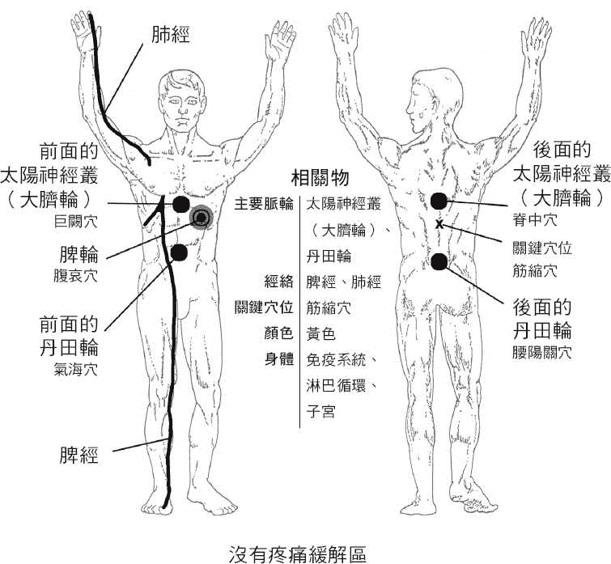 |
| 图说：图 2k　脾轮的相关物 |

| 配对的次要脉轮 | 无 |
| 配对的主要脉轮 | 太阳神经丛（大脐轮）和丹田轮 |
| 经络 | 脾经和肺经 |
| 针灸穴位 | 左边的腹哀穴 |
| 关键穴位 | 筋缩穴 |
| 最大能量时段 | 下午六点到十点 |
| 颜色 | 黄色 |
| 音调 | E |
| 振动速率（远距传播能量法） | 445664 |
| 顺势疗法药物 | 奶蓟（水飞蓟）Carduus marianus |

###### 症状

脾轮在能量失衡时所引起的症状，和西医及中医理论的说法吻合：

‧自体免疫系统。

‧白细胞失衡。

‧感染。

‧淋巴循环和阻塞。

‧子宫失衡。

因此，下列病症可能是由于单一的脾轮失衡，或加上与其配对的太阳神经丛（大脐轮）和丹田轮的失衡而引起的：腺热、儿童的皮肤病症、慢性扁桃腺炎、乳房肿瘤、经期不规律、白带、更年期症状、水肿、慢性疲劳症候群、嗜睡、一般过敏性病症、花粉热、引力溃疡、胸椎侧弯和病毒感染。

现在，我们来谈谈剩下的二十个次要脉轮。他们主要的作用是缓解疼痛，如何应用将在其他章节讨论，现在先探讨它们的相关物、局部症状和一般症状。症状的治疗是将脉轮加上其相关脉轮或与其他穴位一起使用。不论是主要或次要脉轮，很少仅用一个脉轮来进行治疗。虽然我们把每个次要脉轮当一个个体来描述，但它们最好的使用方式是与其相关的脉轮来做配对，或三个一起用。

##### 脚轮

位于涌泉穴，这是足底唯一的经络穴位。这个穴位非常强大，与手轮和顶轮有连结。（见图 2l 及下表）

| 配对的次要脉轮 | 手轮 |
| 配对的主要脉轮 | 顶轮 |
| 经络 | 肾经 |
| 针灸穴位 | 足底的涌泉穴 |
| 关键穴位 | 阴郄穴 |
| 最大能量时段 | 中午十二点到下午两点 |
| 颜色 | 紫罗兰色 |
| 音调 | B |
| 振动速率（远距传播能量法） | 111038 |
| 顺势疗法药物 | 硅石（二氧化硅）Silica |

###### 局部症状

跖骨疼痛、脚痛、足弓下陷（扁平足）、骨痂形成、足部水肿、脚后跟刺痛。

###### 一般症状

高血压、婴儿惊厥、癫痫、昏迷、休克、嗜睡、头晕、头痛、偏头痛和失眠。

##### 手轮

位于手掌中央的劳宫穴。（见图 2l 及下表）

| 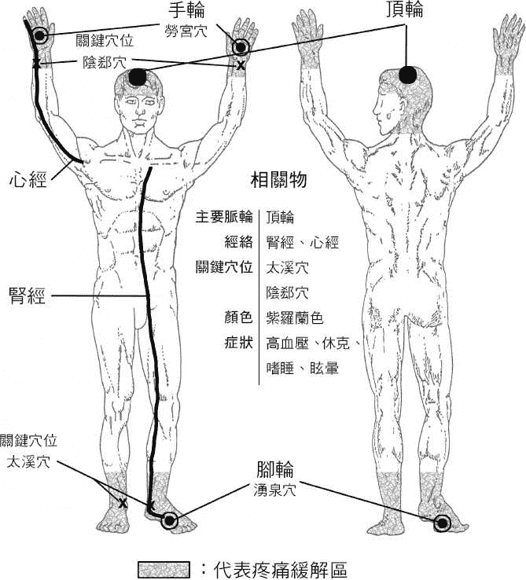 |
| 图说：图 2l　脚轮和手轮的相关物 |

| 配对的次要脉轮 | 脚轮 |
| 配对的主要脉轮 | 顶轮 |
| 经络 | 心经 |
| 针灸穴位 | 手掌中心的劳宫穴 |
| 关键穴位 | 太溪穴 |
| 最大能量时段 | 上午十点到中午十二点 |
| 颜色 | 紫罗兰色 |
| 音调 | B |
| 振动速率（远距传播能量法） | 996835 |
| 顺势疗法药物 | 北美香柏（金钟柏）Thuja |

###### 局部症状

足底筋膜炎、掌挛缩病、手和指甲局部的皮肤感染。

###### 一般症状

请查看脚轮列出的症状。

##### 膝轮

位于膕窝的中心，与肘轮和海底轮有关。（见图 2m 及下表）

| 配对的次要脉轮 | 肘轮 |
| 配对的主要脉轮 | 海底轮 |
| 经络 | 膀胱经 |
| 针灸穴位 | 膕窝中央的委中穴 |
| 关键穴位 | 支正穴 |
| 最大能量时段 | 下午两点到四点 |
| 颜色 | 红色 |
| 音调 | C |
| 振动速率（远距传播能量法） | 443002 |
| 顺势疗法药物 | 北美山梗菜（去痰菜）Lobelia inflata |

###### 局部症状

坐骨神经痛、滑囊炎、膕窝痛和膝关节后部软弱和不适、胫骨粗隆症候群、骨性关节炎引起的膝盖改变，尤其是在外侧边缘。

###### 一般症状

脚冷、腿部循环不良、臀部疼痛、膀胱炎、骨髂痛和关节改变、腰椎疼痛和关节改变、臀部僵硬。

##### 肘轮

位于肘前方的肘窝的中央，即曲泽穴处。（见图 2m 及下表）

| 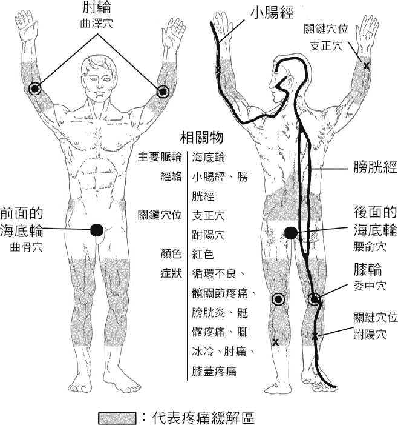 |
| 图说：图 2m　膝轮和肘轮的相关物 |

| 配对的次要脉轮 | 膝轮 |
| 配对的主要脉轮 | 海底轮 |
| 经络 | 小肠经 |
| 针灸穴位 | 肘中央的曲泽穴 |
| 关键穴位 | 跗阳穴 |
| 最大能量时段 | 下午四点到六点 |
| 颜色 | 红色 |
| 音调 | C |
| 振动速率（远距传播能量法） | 997436 |
| 顺势疗法药物 | 仙人掌 Cactus |

###### 局部症状

肘关节疼痛和僵硬（或许会伴随关节改变）、非创伤性病因的急性和慢性网球肘和高尔夫球肘。

###### 一般症状

与膝轮的症状相同，再加上心悸和心绞痛。

##### 腹股沟轮

位于耻骨联合附近的气冲穴，与锁骨轮及天目轮有关。（见图 2n 及下表）

| 配对的次要脉轮 | 锁骨轮 |
| 配对的主要脉轮 | 天目轮 |
| 经络 | 肝经 |
| 针灸穴位 | 耻骨联合处的气冲穴 |
| 关键穴位 | 大陵穴 |
| 最大能量时段 | 上午二点到四点 |
| 颜色 | 靛蓝色 |
| 音调 | A |
| 振动速率（远距传播能量法） | 228893 |
| 顺势疗法药物 | 杜松（欧洲刺柏）Juniperus comm |

###### 局部症状

髋关节疼痛、关节改变和僵硬、腰部寒冷、疝气、睾丸问题、性欲减低和一般泌尿生殖症状。

###### 一般症状

低血压、非精神性哮喘、呕吐和胸痛。

##### 锁骨轮

位于锁骨内侧端的俞府穴，与腹股沟轮及天目轮有关。（见图 2n 及下表）

| 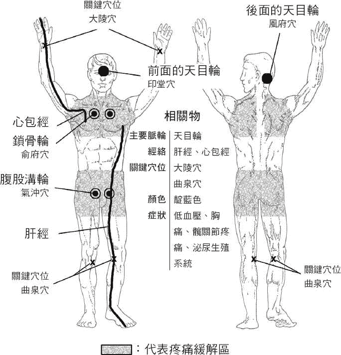 |
| 图说：图 2n　腹股沟轮和锁骨轮的相关物 |

| 配对的次要脉轮 | 腹股沟轮 |
| 配对的主要脉轮 | 天目轮 |
| 经络 | 心包经 |
| 针灸穴位 | 锁骨内侧面的俞府穴 |
| 关键穴位 | 曲泉穴 |
| 最大能量时段 | 上午四点到六点 |
| 颜色 | 靛蓝色 |
| 音调 | A |
| 振动速率（远距传播能量法） | 116845 |
| 顺势疗法药物 | 美类叶升麻（总状升麻）Cimicifuga racemosa |

###### 局部症状

胸痛、甲状腺失衡、下端颈椎僵硬、胸骨疼痛和胸锁关节痛。

###### 一般症状

症状与腹股沟轮中列出的症状相同，再加上钙代谢失衡所引起的广泛骨性异常的增加，例如舒尔曼病和僵直性脊椎炎。

##### 肩轮

肩轮是一个非常强大的脉轮，位于肩膀尖端的肩髃穴，与小脐轮和喉轮有关。（见图 2o 及下表）

| 配对的次要脉轮 | 小脐轮 |
| 配对的主要脉轮 | 喉轮 |
| 经络 | 大肠经 |
| 针灸穴位 | 肩膀尖的肩髃穴 |
| 关键穴位 | 丰隆穴 |
| 最大能量时段 | 上午六点到八点 |
| 颜色 | 蓝色 |
| 音调 | G |
| 振动速率（远距传播能量法） | 888735 |
| 顺势疗法药物 | 白金（铂）Platina |

###### 局部症状

肩关节疼痛（可能伴随关节改变和僵硬），以及肩周炎。

###### 一般症状

胃炎、小肠及大肠的症状和疼痛、便祕、慢性腹泻、憩室炎、重度忧郁症、进食障碍。

##### 小脐轮

位于肚脐旁的肓俞穴，与肩轮和喉轮有关。（见图 2o 及下表）

| 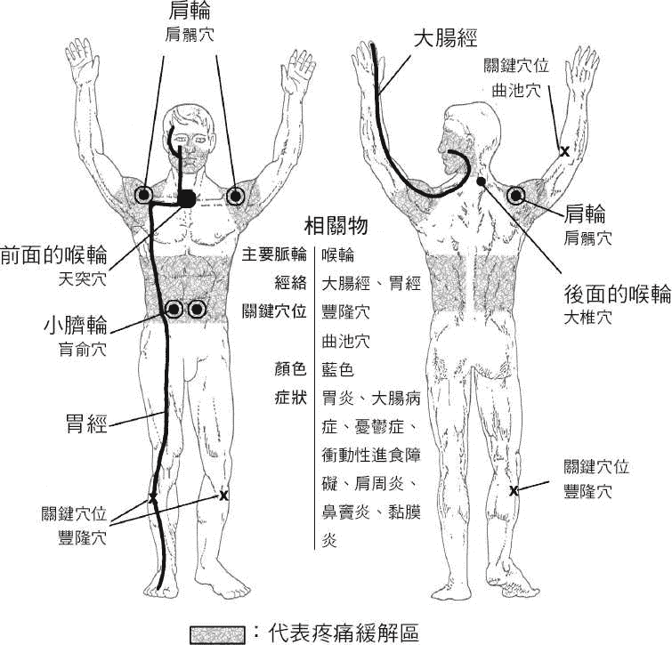 |
| 图说：图 2o　肩轮和小脐轮的相关物 |

| 配对的次要脉轮 | 肩轮 |
| 配对的主要脉轮 | 喉轮 |
| 经络 | 胃经 |
| 针灸穴位 | 肚脐旁的肓俞穴 |
| 关键穴位 | 曲池穴 |
| 最大能量时段 | 上午八点到十点 |
| 颜色 | 蓝色 |
| 音调 | G |
| 振动速率（远距传播能量法） | 114969 |
| 顺势疗法药物 | 铅 Plumbum |

###### 局部症状

肚脐周围局部疼痛、肠躁症和回盲瓣症候群。

###### 一般症状

这些症状与肩轮列出的症状相同，多加了一般的疲倦和一些与厌食症有关的症状。

##### 耳轮

位于耳垂后方的强大穴位，即翳风穴处，它与心轮和肋间轮有关。（见图 2p 及下表）

| 配对的次要脉轮 | 肋间轮 |
| 配对的主要脉轮 | 心轮 |
| 经络 | 胆经 |
| 针灸穴位 | 耳后的翳风穴 |
| 关键穴位 | 阳池穴 |
| 最大能量时段 | 晚上十点到午夜十二点 |
| 颜色 | 绿色 |
| 音调 | F |
| 振动速率（远距传播能量法） | 665689 |
| 顺势疗法药物 | 碳酸钡 Baryta Carb |

###### 局部症状

局部的耳肿胀、乳突炎、斜颈、耳鸣、创伤性病因的轻度耳聋、中耳炎、贝尔氏麻痺症、晕眩和头昏眼花。

###### 一般症状

眼睛疲劳、白内障、胸椎疼痛、僵硬和关节改变、下肋骨疼痛、膈肌疼痛和缝合，以及头部带状疱疹。

##### 肋间轮

位于第六肋间隙之腋中线上的大包穴，与耳轮和心轮有关。（见图 2p 及下表）

| 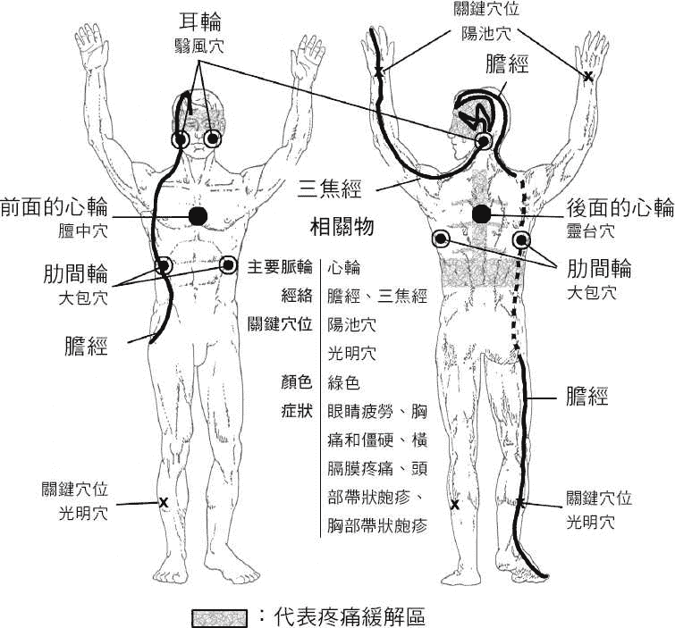 |
| 图说：图 2p　耳轮和肋间轮的相关物 |

| 配对的次要脉轮 | 耳轮 |
| 配对的主要脉轮 | 心轮 |
| 经络 | 三焦经 |
| 针灸穴位 | 第六肋间隙之腋中线上的大包穴 |
| 关键穴位 | 光明穴 |
| 最大能量时段 | 午夜十二点到上午两点 |
| 颜色 | 绿色 |
| 音调 | F |
| 振动速率（远距传播能量法） | 444661 |
| 顺势疗法药物 | 碳酸钾 Kali Carb |

###### 局部症状

胸部疼痛和不适、肋间带状疱疹。

###### 一般症状

这些症状与耳轮中列出的症状相同，再加上全身乏力、四肢不适和一些发热性疾病。

## 主要脉轮和次要脉轮的结合

如前所述，次要脉轮没有出入情感体的门户。然而，每个次要脉轮都可穿透到乙太体的微细边缘，这使得它们比用于镇静和缓解疼痛的普通穴位，或奇经八脉的八个关键穴更加强大。回顾一下，每个次要脉轮都与一个主要脉轮相关，这表示它们是主要脉轮的反射穴位，例如，手轮和脚轮的所在处是劳宫穴和涌泉穴，它们是位于百会穴的顶轮之反射穴位，依此类推。这些力量中心很容易就能结合到治疗方案中，提供六种非常强大的治疗方法，可用于物理治疗和针灸，你会遇到的大多数病症都可以此来治疗。使用脉轮的组合，可以治疗更多慢性疾病。为了增强你的记忆，这里再次列出这些组合：

‧次要脉轮的脾轮与主要脉轮的丹田轮和太阳神经丛（大脐轮）有关。

‧次要脉轮的手轮和脚轮，与主要脉轮的顶轮有关。

‧次要脉轮的肘轮和膝轮，与主要脉轮的海底轮有关。

‧次要脉轮的腹股沟轮和锁骨轮，与主要脉轮的天目轮有关。

‧次要脉轮的肩轮和小脐轮，与主要脉轮的喉轮有关。

‧次要脉轮的耳轮和肋间轮，与主要脉轮的心轮有关。

##### 脉轮组合疗法可治疗的症状

以下段落仅代表脉轮组合疗法可治疗的一些病症，下一章将详细介绍治疗的原则和实际操作方法。

###### 顶轮、手轮、脚轮

头部带状疱疹、颈椎病、跖骨痛和其他慢性足部疾病、眩晕、高血压、慢性头痛、妄想、与上运动神经元疾病有关的症状。

###### 天目轮、锁骨轮、腹股沟轮

所有慢性呼吸系统疾病、所有慢性咽喉病症、偏头痛、黏膜炎、一般感染和传染病、听力改变、头晕、一些慢性泌尿生殖系统病症、慢性腰痛。

###### 喉轮、肩轮、小脐轮

哮喘、内向、结肠炎和肠躁症、憩室炎、肩周炎、鼻窦炎和偏执狂。

###### 心轮、耳轮、肋间轮

胸部疱疹、某些面部神经痛、一般慢性心脏病和循环系统疾病、心悸、静脉曲张，良性肿瘤及其成长，以及囊肿。

###### 太阳神经丛（大脐轮）、丹田轮、脾轮

自体免疫系统病症、腺热、慢性疲劳症候群、忧郁和担忧、溼疹、花粉热、淋巴阻塞、更年期和月经不调、阳痿、类风溼性关节炎症状、水肿和水潴留。

###### 海底轮、肘轮、膝轮

慢性脊椎病症、僵直性脊椎炎、腰椎关节炎和慢性腰痛、肘关节炎和膝关节炎、嗜睡、慢性膀胱炎、肾炎、忧郁症、与骨骼相关的病症、骨折（特别是特发性骨折，可让骨骼更快愈合），以及妄想症。

如今，我们探索了一般的脉轮理论，在接下来的章节中，将看看如何实际应用这些强大的脉轮，以及如何将其应用到许多徒手疗法中。如上所述，脉轮可以用于许多不同的治疗模式，从徒手疗法到非徒手疗法均可。我以最自然的顺序来介绍实际应用的章节，从第三章［身体工作法与指压疗法］开始，进展到第四章［反射疗法］，再以第五章［疗愈］作总结（该章节又细分为接触及非接触技巧）。我将一些颅荐疗法的哲理囊括进去，因为它整合了评估和治疗的方法。

正如我们所知，疗愈这个词的意思是「整体化」，因此所有之前提到的方式都可以用于疗愈。有无数治疗师用双手来治疗能量体（肉体和气场），我在最后一章的标题中使用了疗愈这个词，就是为了解决这些治疗师的需求。这绝不意谓着我认为某一种治疗方式优于另一种。每种使用脉轮能量系统的方式都以治疗师的感觉为主，端看是哪种特定的治疗方式在实践时感觉最得心应手。

在这本书中，我描述了徒手就可以治疗脉轮的方法。虽然每章都描述了一种特定的疗法，但请不要认为每种方法都得单独使用。每次治疗都可以结合提过的疗法，例如治疗腰痛时，治疗师可以使用脉轮疗法、指压疗法、反射疗法和疗愈法来减轻症状，并防止进一步失衡。在大多数章节中，我为治疗模式提供了一些相关的病例。虽然我将某些病症连结到某些方法，但这纯粹是为了方便理解，并不是指其他疗法就不适用。因此，第三章自然就涉及有关肌肉骨骼的机械和结构方面的病症，再加上疼痛纾缓解；第四章是包含肉体和情感体的病症；第五章则主要介绍情绪病症和压力释放。无论如何，肉体和情绪病症之间是没有实际区别的，任何一方的问题都可能导致另一方的问题，这在每一章中都会指出。

# 第三章　身体工作法与指压疗法

我最初拥有的医学资格是英国皇家特许的执业物理治疗师，这让我一直觉得自己很幸运。在这专业领域中，即使后来往更完善的自然医学模式发展，我仍是徒手疗法的先驱，并在无数个强调碰触疗法的会议、课程和工作坊中演讲。在很多场合，我还恳求物理治疗师放弃他们的电子设备，将专注力放在有效的徒手疗法上。

世界上许多物理治疗师将自己的领域扩展到针灸的研究和实践中，我只是其中的一员。许多刚取得执照的中医师似乎执迷于针灸。然而，中医有很广泛的治疗方式，如扎针、艾灸、草药、饮食和指压疗法。许多古老的指压技巧已经传了好几代，也成为各自独立的疗法。这些包括经络指压疗法、反射疗法、穴位指压疗法（tsubo point pressure）、中医推拿、日式指压按摩、印度头部按摩，以及一些新兴的疗法，奠基于「碰触」和应用肌肉动力学而来。所有指压疗法和按摩技巧都有它的用处；找对人来做的话，每一个方法都有效（没有双关语）。

碰触疗法和按摩本身就是很好的治疗方式，若再加上与身体精微的能量系统一起工作，所获得的成果可以大大增强。这种结合的疗法实际上是一个全面的医学系统，似乎无法用指压疗法这个词来描述。在本章中，我们将讨论如何结合脉轮能量系统与身体工作法及指压疗法，来治疗肌肉骨骼和疼痛的病症。我并非意指只有使用这些方法才能治疗肌肉骨骼病症，也不是说其他类型的疾病就不能用指压疗法来治疗。

## 身体工作法

许多不同风格的身体工作法可以和脉轮能量系统一起使用。主要的身体工作法有不同形式的按摩、关节与椎骨的松动、应用肌肉动力学、极性疗法（polarity therapy）和温和的手法操作或调整。阅读本书的整骨医师和整脊医师已经知道两个主要的手法操作学派的历史。然而，一些物理治疗师和其他身体工作法的治疗师可能没有意识到它们的起源是以能量医学和整体论为基础的。整脊疗法的创建通常归功于帕尔默（D.D.Palmer），他在一八九五年调整了一位聋哑清洁工的第三颈椎，进而恢复他的听力。帕尔默坚信，有一种重要的力量或能量，称为「先天的生命力」（Innate）。先天的生命力是让自主系统运作的力量，并透过神经系统来传达。帕尔默表示，整脊疗法本身并不能治疗病人，而是透过调整来缓解及移除病因，进而让先天的生命力毫无障碍地传递脉动，并达到治疗的目的。当然，许多现代整脊疗法的哲理已没有「能量体」的概念了。

安德鲁‧泰勒‧史迪尔（Andrew Taylor Still）是整骨疗法的创始人。他就读医学院，然后加入军队，并升到少校的阶级，成为军队的外科医师。他开始相信应该视一个人为一个整体，所以病人不会只在身体的一个部位生病，其他部位则没事。史迪尔根据他对人体解剖学、生理学的详细了解，以及新发现的身体与其功能之间的相互关系，开发出手法操作疗法的艺术。他发现，通过仔细触诊病人的软组织，他可以确定器官的失衡，并藉由温和地操作内脏和软组织，可以取得惊人的效果。史迪尔活到八十九岁，也留下了一个传奇，在美国和欧洲训练了超过一万一千名骨科医师。人们至今仍然记得他简单而深远的陈述：结构掌控了功能。

## 指压疗法

指压疗法用于疗愈已超过五千年，并成为一种有用的辅助疗法。指压疗法有许多类型和方式，本章将讨论如何轻触和刺激穴位，来平衡身体的能量。如我们所知，经络是容纳生命力或气的主要能量通道，已命名的经络有十四条，其中十二条与西医所理解的器官有关（译注：十二正经，即肺、大肠、胃、脾、心、小肠、膀胱、肾、心包、三焦、胆、肝经），另外两条是单侧的（任脉与督脉）；还有额外的六条是其他经络的混合及复合体（冲脉、带脉、阴维脉、阳维脉、阴蹻脉、阳蹻脉），所以总共有二十条经络（十八条双边的和两条单边的）。

穴位是经络上的特定点，在皮肤的特定位置上。这些穴位很容易发现和检测到，因为它们通常位于某些骨头突起的近端或远端，或位于肌肉或肌腱交会而自然形成的凹陷中。这些穴位可以比喻为运河上的闸门，闸门开启时，水就可流过，因此穴位被活化时，能量就可沿着经络流动。然而，这是一种对精微解剖非常简化的观察方式，许多科学家甚至不相信经络的存在！穴位是很细小的「纤维」结节（周长大约一公厘），与特定器官有着内部能量的连接。我对穴位的看法是：它们是中枢神经系统和自主神经系统的反射点，因此对丘脑和脊髓也有作用，必须藉由脊椎的连接才能达到能量的「平衡」，但这么说并不表示刺激或按压穴位时，器官的内部、外部及气场不会受到影响。这是一个复杂的领域，更多细节在此暂且不表。

在应用脉轮来平衡和治疗时，治疗师通常会使用柔和的碰触。唯一例外是处理慢性病症时，需要去刺激海底轮和其他主要脉轮的穴位。当任何主要或次要脉轮阻塞，并处于「阴性」状态时，也必须刺激穴位来「创造」一个能量储备库。

##### 感觉

除了极少数的例外，指压疗法不仅仅是针灸的淡化版本而已。早在过去的三十多年里，我便对此大声疾呼了。其中的例外是治疗慢性神经病症，或者因为穴位的位置（例如位于眼睛内眼角的睛明穴）而最好使用针灸的时候。使用指压疗法和任何形式的身体能量工作法时，你会对你试图影响的能量有一个真实的感觉。在针灸中，关于能量流是否受到影响，唯一且真正的指导原则是「针感」或「得气」的感觉，这需要时间去练习，而且身体每个穴位都会是很难确定的感觉。虽然针灸是平衡和治疗脉轮能量系统非常有效的方法，但毫无疑问地，指压疗法和徒手疗法在很多方面都更具优势。

治疗师对病人有「感觉」，病人也对治疗师有「感觉」是至关紧要的事，这必须是双向的。如前所述，透过指压疗法，治疗师实际上可以感觉到能量，并知道能量平衡何时发生、何处达到和谐了。感觉可以用许多不同的方式来描述，以下是手指或双手放在皮肤上时最常见的感觉：

‧在两指间下面的微细脉搏，最终会变成平衡的脉搏；也就是说，脉搏可能一开始是不规则的，但一段时间后就变得平稳一致了。当脉搏强度相等时，两穴之间就达到了和谐或能量平衡，而你可能会感觉到双手或双指的「合一」。

‧不管有或没有脉搏，可能会有渐渐热起来的感觉。怀疑论者会说，这代表身体接触的热传导（当然，这是正确的），但实际上不只是这样。这感觉会变得和谐，当热量激增且脉搏一致时，你知道能量平衡发生了，重点改变也发生了，这在下一节中会描述。尽管在达到能量平衡后不久，就可以进入治疗的下一个阶段，但双手多保持几秒钟的接触不失为一个好主意。这样做会给病人带来和谐的感觉，以及放松和幸福的感受。你的双手或手指看起来会象是黏在病人的皮肤上的样子。

‧你可能会对经络沿线或其他无形的能量线有所感觉。这感觉也许像「涓涓细流」或「电击」般，或仅仅象是一道愉悦和谐的光芒。在进行指压疗法时，碰触正确的穴位非常重要。如果你的手指稍微偏掉，效果不会那么好。与针灸一样，尽管每个穴位周围都有一个影响范围，最好还是命中要点。病人也会收到某些治疗正在发挥作用的信号。他可能会在你手指按压处感觉到热，或者感觉到从你的一只手指到另一只手指的能量「细流」。习惯这种治疗的病人会本能地知道什么时候能量已达到平衡，并经常主动告知你。所有的按摩和徒手技巧都来自经验，使用脉轮能量系统的指压疗法也不例外。

##### 重点改变

「重点改变」这一术语描述了病人和治疗师的脑波频率所发生的变化。每个人（和动物）都会经历不同层次的意识，这与他们当时的脑波频率和呼吸模式有关。表格 3a 即探讨了这些不同的意识层次。

让我们分析一下这份表格。我们一般日常的意识层次是贝塔状态，这让我们能呼吸、思考和存活，我们的脑波活动在这种状态下是介于每秒钟十三到三十周期（cps，通常被称为赫兹）之间。尽管很少见，在过度活动和焦虑的情况下，最高数字可能会超过九十赫兹。我们上班时，很多时候可能会稍微偏离结构化的意识思维，这称为「阿尔发状态」，其共振在八至十三赫兹之间，在这种状态下的呼吸模式也变得更长，吸入与呼出都是。我们在一天中进入阿尔发状态的时间比我们意识到的还要多；这种状态可能持续一秒，或者几分钟。当我们做一些规律的事和「无聊」的时候，经常会发生这种情况。有个例子就是沿着一条熟悉的街道行驶时，突然发觉我们已经在不知不觉中走了将近一公里，却没有意识到这一点。如果长时间处于这种阿尔发状态，可能会有可怕的后果！

表格 3a　意识层次

| 意识状态 | 脑波频率 | 呼吸节奏 | 存在状态 |
| 活跃思考 | 贝塔（Beta） 每秒钟十三到三十周期 | 吸气一到二秒 呼气一到二秒 | 质疑 思考 |
| 想睡 | 阿尔发（Alpha） 每秒钟八到十三周期 | 吸气八秒 呼气八秒 | 作白日梦 |
| 重点改变 「疗愈」 | 阿尔发／系塔（A／T） 每秒钟七‧八周期 | 吸气四秒 呼气八秒 | 从个人转变到超个人 |
| 昏昏欲睡 | 系塔（Theta） 每秒钟四到八周期 | 吸气四秒 呼气十六秒 | 超个人、创造、直觉 |
| 睡着 | 德塔（Delta） 每秒钟〇‧五到四周期 | 吸气四秒 呼气高达三十秒 | 身心安宁、和谐、和平 |

如前所述，下一个意识状态称为阿尔发／系塔状态。在任何自然疗法的治疗期间，如果重点在于产生放松和疗愈，病人可能会经历这种状态。因此，阿尔发／系塔状态可能发生在指压疗法、反射疗法、疗愈和针灸的过程中。在前三种碰触疗法中，治疗师和病人都可以同时感受到这种变化。针灸治疗时，只有病人会感觉到阿尔发／系塔状态。在碰触疗法中，当你的手指或双手与病人接触至少两分钟时，你就会「调频」到病人的能量流了，无论是全身还是正在治疗的特定系统能量流。当你和病人的脑波频率为七‧八赫兹时（阿尔发／系塔状态），你们之间会产生一种和谐；只有达到这种和谐状态，真正的疗愈及合一才能发生！

在这个频率上，治疗师和病人都处于放松状态。在实际的指压疗法、反射疗法和碰触疗愈过程中，所感受到的感觉非常明显（即使发生得很微妙）。在手指或双手的下方，似乎有一种感觉的「转移」，是之前没有的柔和、温暖感，那些组织似乎改变了它们的质地，变得像温暖的「灰泥」般，让你的手指能够更加「沉进」组织里，病人也经常会感觉到这种变化，虽然不是每一位都有感觉到。所以阿尔发／系塔状态是一个先兆，预示着治疗师与病人之间合一时刻的到来。

本书中将多次使用「重点改变」或「重点转移」这个词，而「一般的」能量平衡会在指压疗法和反射疗法中出现，那「只是」在手指下一种相似的感觉罢了，如何去分辨这种一般状态与阿尔发／系塔状态之间的差异相当重要。如果你在阿尔发／系塔状态之后，将手指或双手放在穴位或反射点的时间太长，病人很可能会在不知不觉中睡着。这是一个令人鼓舞的迹象，表示病人非常放松，并且对你这位治疗师有极大的信心。下一个意识状态是系塔状态，其共振频率为四至八赫兹，这是一个昏昏欲睡的睡前状态，也是进行冥想的状态；然而，一些非常有经验的冥想者可以在任何意识层次下达到这种状态。在系塔状态下，人通常会觉得很轻，有时会脱离存在的物质层面，有些人在这种状态下会有离体的经历。最后一个意识状态是德塔状态，其共振频率在〇‧五至四赫兹之间，在这种状态下，呼气很长；也就是睡着了。

##### 规则

观察及遵守以下这些金科玉律，会加快治疗速度，并达到更好的效果：

一、不要太试图用「意志力」去促使能量流及平衡的发生，乃至于病人的进步。专注是非常重要的。随着时间的移转，疗愈能量将开始流动，穴位也会达到平衡，所以不要急于求成。

二、把你的心念放在病人身上，不要心不在焉，但这不是要你专注到其他事物都不管了，只是说专注于眼前的工作会达到更好的效果。

三、在做平衡时，双手请使用相同的手指，例如用双手食指或双手中指来进行。如果你的双手使用不同的手指，能量平衡将不会很快达到，这是因为每只手指都有一个负极性或正极性的磁极。能量从负极向正极流动，左手食指具有正极性，右手食指具有负极性，因此透过使用相同的手指，可以达到更好的能量平衡。在大多数治疗情况下，我最喜欢使用中指。哪只手指让你感觉最舒服就用哪只吧！

四、大多数与脉轮结合使用的指压疗法是采用非常轻的碰触。请记住，我们处理的是精微的能量，不要在病人的皮肤上「磨皮」或按出个洞。做平衡时，只需用手指指腹轻轻碰触即可。但在治疗慢性病的初始阶段，会改用别的技巧，这稍后会有更多的说明。我有很多学生是物理治疗师或骨科医师，我忍不住要责备他们对皮肤质地完全缺乏感觉。这些治疗师被灌输要用重手法的身体按摩或肌腱按摩，没有任何精微手法的经验。当这些学生学到这种精微手法时，有时会很震惊地发觉它确实有效。他们很快就发现，精微意谓着力量，也意谓着效果！

##### 技巧

指压疗法结合脉轮的使用，其规则与指压疗法结合经络的使用一致，我前两本关于指压疗法和反射疗法的著作中有详尽的类型和技巧清单。结合脉轮使用的三种主要技巧是刺激、镇静和平衡能量。现在，让我们看看它们是如何操作的：

一、刺激：通常是用食指或中指（有时是拇指）的指腹来进行。它包括对单一穴位施加恒定的均匀压力，这是为了「输入能量」到该穴位。这方面其中一个例子就是刺激位于尾交界处的后方海底轮，以便将一些能量投入该穴位，随后再进入脉轮。这是最常用的技巧，尤其是针对慢性疾病。本章后面将对此进行更详细的描述。

二、镇静：将中指的指尖或整个手掌放置在肉体的脉轮上进行镇静。当脉轮或正在治疗的穴位中有太多能量时才会这样做。将手指或手掌放在要影响的穴位上，直到产生不同的感觉为止。这感觉可以从穴位的增温到完全的重点改变。

三、平衡能量：使用手指指腹或整只手，在两个穴位之间进行。当每只手指或手掌下的感觉相同时，你会知道能量平衡了，这可能需要一段时间。重要的是，你不以任何方式去意导或鼓励这种能量平衡的发生，当穴位准备好时，平衡就会发生。平衡能量需要考虑两个方面：首先，简单的能量平衡发生得相当快（接触后大约一分钟）。在大多数情况下，这是在进入下一阶段治疗之前需要发生的。平衡能量的第二个方面涉及持续用你的手指或手掌来握住穴位，直到重点改变，即疗愈要展开时，治疗师和病人之间产生合一的那个点。这持续的时间可能需要五分钟或更久，而且通常是平衡个别脉轮前后能量的主要治疗方法。

那么，藉由结合脉轮能量系统的指压疗法和身体工作法能够实现什么？正如先前理论所述，你正在解决能量失衡的病因，所以这些直接结合脉轮来使用的疗法，可以产生一些令人难以置信的结果。

本章接下来将讨论肌肉能量平衡与肌肉刺激的实用法、腿长差异、急性和慢性的关节周边病症、急性和慢性的脊椎病症、使用次要脉轮来缓解疼痛，以及病例。

## 肌肉能量平衡与肌肉刺激

在本节中，我们将看看如何使用脉轮能量系统来治疗许多肌肉方面的病症。

##### 器官、脉轮和经络的相关物

物理治疗师曾被教导说，损伤区附近的肌肉痉挛是自我保护机制的一部分，必须按摩痉挛的地方以「软化」肌肉，藉此让足够的血液、淋巴和气流入肌肉和下面的软组织，这将允许他们调整由于痉挛而错位的关节。这是直到一九六〇年代初期，物理治疗师、骨科医师和整脊医师治疗肌肉失衡的基础。虽然它经常奏效，但治疗的核心还是以症状为主。由于痉挛的病因尚未得到解决，底层结构仍然容易发生不正及半脱位。它也代表用一种非常「牛顿式」的方法来为病人做点什么，有时就象是「痛才有效」那种强迫的态度。

正是在一九六〇年代初期，乔治‧古德哈特医师（Dr.George Goodheart）提出了肌肉运用的新想法。古德哈特总结说，并非肌肉痉挛导致了疼痛和关节错位，而是身体一侧的肌肉弱化，导致正常的对侧肌肉（拮抗剂）变得很紧或看起来很紧。当肌肉很紧或打结时，表明肌肉很弱，不够强壮！古德哈特的研究表明，大多数肌肉通过经络或「内部」能量系统，与内脏器官有能量联系。他设计了称为「应用肌肉动力学」的治疗系统，这是现代整脊医学的一个分支。根据应用肌肉动力学的说法，可以对肌肉进行「测试」，以了解它们的强弱程度，而弱的肌肉需要「强化」，以便在肌肉、器官和经络中产生能量平衡。但是，这并不是那种物理治疗师通常会进行的肌肉强度测试，因为问题当然不在力道，相反地，它是一种使用非常精微的按压技巧来确定肌梭是否「收缩」或「伸展」的方法。

一六四、一六五页的表 3b 显示了每个器官、经络和肌肉的关联。这张表格无法涵盖身体的每一块肌肉，但你应该能将这些知识用于治疗百分之九十九的肌肉骨骼病症，这些知识对治疗这类病症具有深远的意义。许多看似机械性质的病症，却可能没有机械病因；相反地，它们可能是由器官、气、淋巴或情绪因素所引起的，而机械式的病症看来仅仅是寄宿在病人身上的症状。因此，只治疗症状而不解决病因的话，总是不符合病人的最佳利益。可以询问病人病症是如何发生的，这是确定病因是否真是机械式的一种好方法。如果他回答是直接伤害、扭伤、打击或创伤，那么你可以使用任何已运用多年的物理治疗方法来治疗局部症状；但如果回答是「它就这样发生了」或「它是缓慢加剧」，表示是一种非机械性病因，有必要去解决真正的病因，而这只有使用脉轮能量系统才能做到。当然，为了帮助病人，必须缓解局部症状，但除非找到病因并平衡能量，否则症状还会再回来。

这份表格代表了我自己数年来的研究，这是基于大卫‧沃尔瑟（David Walther）和约翰‧席（John Thie）等人的工作。你会看到每个椎骨都与一个或多个肌肉互相关联，为了平衡相关肌肉中的能量，这是你要碰触的地方，确切的碰触点是椎骨棘突下方的空间。这个点也可以用于分析或做「局部治疗」。请不要把相关椎骨和许多起源于脊椎的肌肉神经连接混淆在一起，而试着去合理化任何神经连接只会让你更混淆！其次，每个肌肉都有一个相关的主要脉轮和次要脉轮，可用于强化和平衡肌肉。这里使用的是脉轮在身体的位置，因为它们是强大的穴位，可以用来治疗病症的主因。先前的研究显示了肌肉和经络之间的相关性。从表格 3b 可以看出，每个肌肉的相互关系都有不同的「规则」，因此针对每个肌肉的平衡技巧也是独一无二的。与传统指压疗法使用的方式相反，这里不需要区分能量流对该肌肉会造成镇静或刺激。透过下列技巧的使用，你可以平衡曾经很弱的肌肉能量，使它变得强壮，也可以使曾经处于痉挛状态的肌肉恢复正常。

表格 3b　肌肉、器官、经络、脊椎、主要及次要脉轮的相关性

| 肌肉 | 器官 | 经络 | 脊椎 | 主要脉轮 | 次要脉轮 |
| 胸锁乳突肌 | 鼻窦 | 胃经 | 第一颈椎 | 顶轮 | 耳轮 |
| 面部 | 鼻窦 | 督脉 | 第一到第二颈椎 | 顶轮 | 耳轮 |
| 前颈和后颈 | 鼻窦 | 胃经 | 第一到第三颈椎 | 天目轮 | 锁骨轮 |
| 上斜方肌 | 眼和耳 | 肾经 | 第三颈椎 | 顶轮 | 耳轮 |
| 冈上肌 | 脑 | 任脉 | 第四颈椎 | 顶轮 | 耳轮 |
| 提肩胛肌 | 甲状旁腺 | 胃经 | 第五颈椎 | 喉轮 | 锁骨轮 |
| 胸大肌（锁骨） | 胃 | 胃经 | 第六颈椎 | 喉轮 | 肩轮 |
| 胸大肌（胸骨） | 肝 | 肝经 | 第六颈椎 | 喉轮 | 锁骨轮 |
| 肱二头肌 | 胃 | 胃经 | 第六颈椎 | 喉轮 | 肘轮 |
| 前锯肌 | 肺 | 肺经 | 第六颈椎 | 喉轮 | 肩轮 |
| 肩胛下肌 | 心 | 心经 | 第六颈椎 | 喉轮 | 肩轮 |
| 冈下肌 | 胸腺 | 三焦经 | 第六颈椎 | 喉轮 | 肩轮 |
| 肱肌 | 胃 | 胃经 | 第六颈椎 | 喉轮 | 肘轮 |
| 肱挠肌 | 胃 | 胃经 | 第六颈椎 | 喉轮 | 手轮 |
| 手腕伸肌 | 胃 | 胃经 | 第六颈椎 | 喉轮 | 手轮 |
| 肱三头肌 | 胰 | 脾经 | 第七颈椎 | 喉轮 | 肘轮 |
| 中下斜方肌 | 脾 | 脾经 | 第七颈椎 | 喉轮 | 肩轮 |
| 旋后肌 | 胃 | 胃经 | 第七颈椎 | 喉轮 | 手轮 |
| 背阔肌 | 胰 | 脾经 | 第七颈椎 | 喉轮 | 肋间轮 |
| 手腕屈肌 | 胃 | 胃经 | 第七颈椎 | 喉轮 | 手轮 |
| 三角肌 | 肺 | 肺经 | 第一胸椎 | 喉轮 | 肩轮 |
| 大圆肌 | 脊椎 | 督脉 | 第一胸椎 | 喉轮 | 肘轮 |
| 小圆肌 | 甲状腺 | 三焦经 | 第一胸椎 | 喉轮 | 肘轮 |
| 菱形肌 | 肝 | 肝经 | 第二胸椎 | 喉轮 | 手轮 |
| 骶棘肌 | 膀胱 | 膀胱经 | 第二胸椎到第三腰椎 | 心轮 | 肋间轮 |
| 腹肌 | 小肠 | 小肠经 | 第四胸椎到第十二胸椎 | 太阳神经丛（大脐轮） | 小脐轮 |
| 股四头肌 | 小肠 | 小肠经 | 第一腰椎到第二腰椎 | 太阳神经丛（大脐轮） | 腹股沟轮 |
| 髂腰肌 | 肾 | 肾经 | 第二腰椎 | 丹田轮 | 腹股沟轮 |
| 缝匠肌 | 肾上腺 | 三焦经 | 第三腰椎 | 丹田轮 | 膝轮 |
| 股薄肌 | 肾上腺 | 三焦经 | 第三腰椎 | 丹田轮 | 脚轮 |
| 胫骨前肌 | 膀胱 | 膀胱经 | 第四腰椎 | 丹田轮 | 脚轮 |
| 内收肌 | 循环 | 心包经 | 第四腰椎到第五腰椎 | 丹田轮 | 膝轮 |
| 阔筋膜张肌 | 大肠 | 大肠经 | 第五腰椎 | 丹田轮 | 膝轮 |
| 臀中肌 | 性器官 | 心包经 | 第五腰椎 | 丹田轮 | 腹股沟轮 |
| 臀大肌 | 性器官 | 心包经 | 第一荐椎 | 丹田轮 | 膝轮 |
| 膕旁肌 | 大肠 | 大肠经 | 第一荐椎 | 丹田轮 | 膝轮 |
| 胫骨后肌 | 肾上腺 | 膀胱经 | 第一荐椎 | 丹田轮 | 脚轮 |
| 腓骨长肌 | 膀胱 | 膀胱经 | 第一荐椎 | 丹田轮 | 脚轮 |
| 腓肠肌和比目鱼肌 | 肾上腺 | 三焦经 | 第二荐椎 | 丹田轮 | 脚轮 |
| 膕肌 | 胆 | 胆经 | 第三荐椎 | 丹田轮 | 膝轮 |

###### 治疗方法

一、确定需要进行平衡的肌肉。肌肉可能因为疼痛、痉挛、阻塞，或者因为分析后证明它很弱而需要平衡。所有受到创伤的肌肉都处于失衡状态，尤其是手术过后的肌肉。用这种方法治疗可以节省数小时甚至数天的肌肉强化训练；如果有潜在的创伤或能量失衡，试图以常规手段去强化肌肉，成效会令人非常绝望。这里描述的方法可为更有价值且更少痛苦的康复铺路。

二、然后，沿着能量流动的方向轻敲相关的经络，这可以用手非常温和地大范围扫描双边的经络来完成。如果病人想要这样，也可以隔着衣服来完成。

三、找到相关的椎骨，并用中指指腹按着它（记得碰触相关椎骨的棘突下方的空间）。而腹肌和棘肌与多节脊椎相关，在这种情况下，每个脊椎就必须依次轮流来平衡。接着将另一只手的中指指腹放在相关的主要脉轮（前面）穴位上，当每根手指下的感觉相似时，就达到能量平衡了；并不需要经历重点改变，但持续时间越长，结果越有效。如果肌肉长期失衡，建议至少持续一到两分钟，或更长的时间。

四、继续将手指放在脊椎点上，并将另一只手的中指指腹放在相关的次要脉轮穴位上，至少花一分钟来平衡这两个点。

五、最后，需要平衡主要脉轮和次要脉轮两者的穴位，这应该花不了多少时间。

重新测试肌肉时，你会发现它变得很强壮。虽然这听起来有点不可思议，但真的管用！你自己尝试一下就知道。现在，你可以对肌肉或其他相关部位做进一步的治疗。最后在治疗结束前，可把一只手（或手指）放在受影响肌肉的肌腹，来平衡它和主要脉轮的能量，这也非常有用。这样做可以增强治疗效果，并会受到病人高度赞赏。

表格 3b 乍看之下会有点令人生畏，有几种方法可以使内容更易于记忆。首先，你必须知道解剖结构，否则会感到很迷惘，你也必须知道每个肌肉的起源和附着处。其次，除了少数例外，你会注意到大多数肌肉都用喉轮或丹田轮做为平衡点。大部分的上半身肌肉与喉轮相关，下半身肌肉则与丹田轮相关。这两个穴位及相关的次要脉轮穴位都很容易找到。

## 腿长差异

大多数患有脊椎和骨盆相关病症的病人，在治疗前都需要检查腿长。最重要的是腿长应尽可能相同。由于骨盆连结的关系，几乎每个人都有一定程度的腿长差异，可能双脚有多达一公分多的差异也没有明显的问题；但对某些病人来说，即使是这样的失衡也会产生骨盆，甚至是寰椎的损伤。

让病人完全平躺来测量其腿长差异，俯卧或仰卧均可，并尽可能从头到脚拉成一条直线。腿的长度在胫骨内踝突出处测量，而不是在脚跟底部测量。腿长失衡有六种不同类型，大多数患有脊椎病症的病人将表现出至少其中一型。下面列出的一至三型很常见，其他则比较不常见。以下的技巧在过去是运用奇经八脉的关键穴位，但由于我发现了脉轮能量系统与指压疗法的应用，所以只需要使用手轮的劳宫穴和脚轮的涌泉穴这两个穴位即可；这节省了很多时间和麻烦，我希望使用它的每一位治疗师也同样因而受惠。用中指指腹来按住这两个穴位，用非常温和的压力保持着，直到手指下的脉搏一致，它可能需要几秒钟的时间来达成，最多花一分钟来做，没有必要用这种技巧来经验重点改变，它的结果有时是立即而显著的。现在，我们来看看这六种腿长失衡的治疗方法。

###### 第一类型　骶骨病症

病人俯卧，检查发现同一侧有长腿和低臀部。膝盖弯曲时，情况仍然一样。

治疗：平衡短腿侧的脚轮和手轮的穴位。

###### 第二类型　涉及寰椎的骶骨病症

病人俯卧，检查发现同一侧有长腿和低臀部。膝盖弯曲时，长腿变短。

治疗：平衡长腿侧的脚轮和手轮的穴位。

###### 第三类型　一般脊椎病症

病人俯卧，检查发现同一侧有长腿和高臀部。

治疗：平衡长腿侧脚轮与短腿侧手轮的穴位。如果不见起色，表示是脊椎上部的病症，可以简单地平衡两个手轮的穴位。

###### 第四类型　下背痛

病人仰卧，检查发现同一侧有短腿和高髂骨稜（iliac crest）。

治疗：平衡短腿侧的脚轮和手轮的穴位。

###### 第五类型　下背痛，伴随坐骨神经痛

病人仰卧，检查发现同一侧有短腿和高髂骨稜，病人抱怨有部分或全部神经沿线出现坐骨神经痛。

治疗：平衡短腿侧的脚轮和手轮的穴位（与第四类型相同），然后平衡膝盖脉轮（膕窝中央的委中穴）和患侧的脚轮。

###### 第六类型　无法调整的差异

无法解决的差异可能是由于长期存在的风溼病症、僵直性脊椎炎，甚至是臀部或膝盖的骨关节炎改变。当然，它们也可能代表由于骨盆、股骨或胫骨骨折等老损伤，导致腿长差异的永久性改变。

治疗：这种类型的差异无法改变，只能小心地把脚后跟外侧或内侧垫高。

上述程序乍看之下相当复杂，但实际上很容易操作。每次看诊时都该检查腿长差异，因为腿长可能真的会改变，尤其当病人从事久坐的行业，而且有一段时间没有来看诊时，更要检查。

如果骨盆没有对齐，往上的脊椎有可能对齐吗？如果骨盆等同于建筑物的地基，就必须要建立坚固而平衡的地基，否则，建筑物的上层（腰椎，胸椎和颈椎）将会受到影响。

## 肌肉损伤

在本节中，我们将着眼于慢性肌肉损伤的治疗以及由于疤痕组织、纤维结节、淋巴管阻塞或肌肉撕裂未解决而导致的失衡。这种类型的损伤通常很难治疗，并且在病症解决之前，通常会花许多时间在深度按摩和电针疗法。

###### 治疗原则

一、尽可能让肌肉恢复功能。

二、增加阻塞区域的血液和淋巴循环。

三、增加流向该区域的气，并确定该肌肉与其他的身体结构校准。

###### 治疗方法

一、确保你和你的病人都感到舒适，然后用油去按摩患处以改善血液循环，并开始纾解瘀阻。

二、在患处肌肉的两侧寻找最靠近的脉轮穴位，并用中指指腹轻轻按压，直到感觉能量平衡了。穴位可以找主要脉轮、次要脉轮或两者的混合，都没关系。举例来说，在腓肠肌或比目鱼肌撕裂的情况下，可按压膝轮和脚轮的穴来平衡能量，或者在腰椎纤维结节的情况下，按压太阳神经丛和海底轮的穴来平衡能量。还有许许多多的可能性，无法在此全部列出。

三、当双指下的脉搏持续稳定，能量也达到平衡时，慢慢地、有条不紊地将一根手指头（通常是主导的那只手，伴随旁边几根手指头支撑着）从一个脉轮画线到另一根手指按压的脉轮。画线时必须按压一定的深度，也就是说，肌肉需要受到影响，而不仅仅是皮肤。而「移动」的那几根手指必须抹油，好让病人感到舒服一些；它不会妨碍治疗师的感觉，实际上，反而会增强感觉。当主导的那只手以相同的按压深度缓慢移向另一只手时，如果手下的脉搏保持一致，表示手指下面已有足够的能量流。

当主导的手指移到损伤区时，你会发现脉搏停止了（是的，旧肌肉撕裂和深部疤痕组织是感觉得到的），这表示此区肌肉组织的质地已经改变，必须加强处理。一旦「移动」的手指下方的脉搏停了，请停止移动，等待二十秒来恢复脉搏，大约百分之八十的案例都是这种情况。如果在二十秒以后还是没有脉搏，则应该刺激位于另一脉轮穴位的远端手指及损伤区上的局部手指，有可能得用手指进行数次十秒的突发刺激，才能恢复脉搏。每当脉搏消失时都需要重复此程序。使用这种方法，你可以完全掌握程序，不会错失目标，因为手指是不会撒谎的！

「移动」的手继续前进，直到双手在远端相遇。在又长又深的疤痕或撕裂处，整个程序可能需要几分钟的时间来完成，最后采用上一个章节所描述的方法，「输入能量」到该肌肉区来完成治疗。

如果正确执行技巧，通常只需要一次治疗即可完全恢复受损肌肉的所有功能。病人不仅会发现受损的肌肉恢复正常，而且因为肌肉与其他相关物的能量平衡了，所以病人会感觉自己好得不得了！

## 关节周边病症

我创造了一种关节病症（脊椎和周边）的治疗法，称之为「中国式物理疗法」或「中国式整骨疗法」，名称依特定工作坊的学生而异。这是因为我将中医哲学应用在身体工作法领域，才用这些术语。我们或许可以把这种将脉轮用在指压疗法和身体工作法的方式称为「印度式物理治疗」，不过这可能有点离题了！在此要提醒你关节周边病症所使用的穴位：

‧手轮，位于手掌中间的劳宫穴。

‧肘轮，位于肘窝中间的曲泽穴，在肱二头肌肌腱的外侧面。

‧肩轮，位于肩锁关节的前部和下部边界的肩髃穴，当手臂外展时位于肩峰以下。

‧后喉轮，位于正中线，第七颈椎和第一胸椎的棘突之间的大椎穴。

‧后丹田轮，位于正中线，第四和第五腰椎的棘突之间的腰阳关穴。

‧腹股沟轮，位于耻骨联合上方往外旁开三个手指宽度（两寸）的气冲穴。

‧膝轮，位于膝盖后面的膕窝中间的委中穴。

‧脚轮，位于足底中线，距足跟三分之二处的涌泉穴。

###### 治疗原则

一、在受损的关节内创造能量（气）平衡，以改善血液和淋巴循环，并纾解阻塞。

二、减轻疼痛、肿胀和炎症，并改善患部关节的活动范围及功能。

三、平衡改善的关节与其配对区域之间的能量。

###### 治疗顺序

一、沿着能量流动的方向按摩经过患部关节的经络。（见图 3a）

二、按摩并刺激远侧脉轮，在四肢中形成能量储备库。

三、平衡介于远侧脉轮与近侧脉轮之间的患部关节能量。

四、平衡介于远侧脉轮与损伤关节疼痛点之间的能量。

五、从两个方面「放松」患部关节。

六、平衡被治疗的关节与其配对的反射区之间的能量。

| 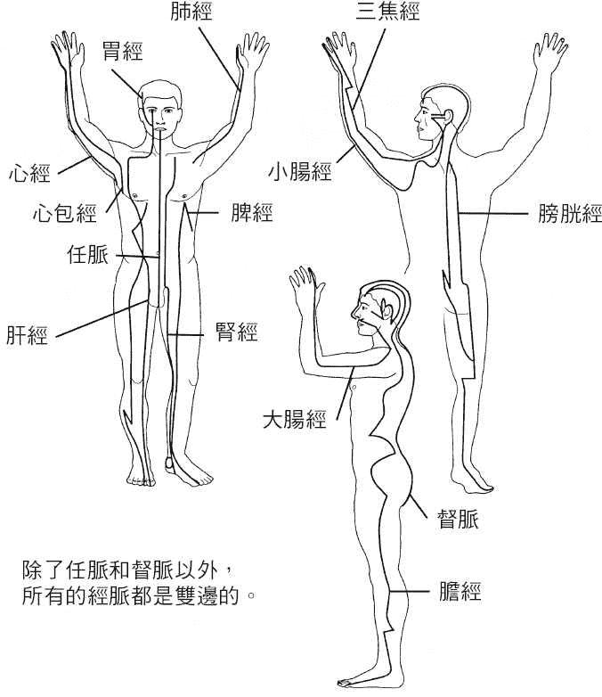 |
| 图说：图 3a　传统中医经络 |

###### 治疗说明

一、虽然脉轮能量系统是疗愈中非常强大的独立工具，但使用经络有助于增强通过关节的能量流动。你只需要了解大概的经络走向就好，不需要像研究针灸般来学习经络。你可以整只手都用上，也可以透过薄衣服来进行，但最好在皮肤上完成。如图 3a 所示，最重要的是按照能量流的方向进行按摩，使关节内的气达到最多。在每次治疗开始时按摩所有主要经脉（十二条双侧和两条单侧）显然是一个很好的主意，但这通常很不切实际。尽管如此，按摩经过患部关节的经络至关紧要，从每条经络的第一个穴到最后一个穴，平顺地轻扫三到四次。

在手臂上，三条阴经可以从肩部向手部一次合并轻扫；同样地，你可以将三条阳经从手指一起扫向肩部和脸部。腿部经络通常分得较开，阴经和阳经可能各自需要轻扫两到三次。无论你决定怎么做，这程序都不需要很长的时间。这个技巧不论是在能量或心理方面都很有用，也是一个让你「自我介绍」的好方式，并让病人初步接受「碰触」疗法。

二、下一阶段是刺激及按摩远侧脉轮的穴位。在所有亚急性和慢性病症中，先用指腹按摩至少一分钟。越慢性的病症，需要进行的刺激越多。在治疗的这个阶段，并不需要特地去放置「不做事」的手，但将它置放在患部关节上是满舒适的。基本上，你必须要感受到正在刺激远端脉轮的手指下发生了什么，它应该在几秒钟后会温暖起来，随后是组织的弹性变得更佳，甚至有「软油灰」的感觉。在进入下一个阶段之前，必须经历到这种感觉上的不同。

三、下一阶段是平衡远侧脉轮穴位（已被刺激，且仍然有一根手指在其上）和关节的近侧脉轮穴位之间的能量。双手应使用相同的手指来平衡两个穴位的能量，也可以将整只手放在脉轮穴位上，或者使用两根或三根手指，而非一根手指的指腹来平衡能量，采用任何做起来舒适又感觉正确的方式进行。这么做的目的是让贯穿患部关节的能量能达到平衡，这可能会是整个程序中最困难的部分，因为精微的身体工作法对初学者而言特别费力。因此，最重要的原则是「让它自然发生」，而不是去强迫或试图影响任何事情。在慢性关节失衡中的能量势必相当迟缓，因此能量不会快速或轻易地流动。

最初，不同手指之间或双手之间的感觉可能会有很大的差异，一只手可能很温暖，另一只可能很冰冷；或者，一只手根本没有任何感觉，而另一只感觉充满活力。凭借丰富的经验，你将能够分辨平衡何时完成。例如，双手之间的感觉必须一致，每根手指下的感觉相同，而且从一只手到另一只手之间的感觉应是和谐的。病人也经常会感受到某些感觉，如温暖、涓涓细流，甚至是电击感。在这个阶段，尽量不要分析太多病人组织中发生的事，接纳它就好。如果在每个阶段都能够将意念专注于患部关节，将会带来很大的助益，特别是在这一阶段，必须「观想」能量流经关节。此外，要求病人专注于治疗程序，双方站同一阵线上也会有很大的帮助。进入下一阶段之前必须达到能量平衡，这是最重要的。

四、患部关节在第四阶段开始参与，并要平衡它与远侧脉轮之间的能量（其中一根手指仍然位于远侧脉轮）。将另一只手的手指置于关节疼痛部位（损伤处），因为该阻塞区域通常就是症状所在。与处理大部分疼痛部位一样，应该注意不要用力过猛，轻轻按压就足够了，几秒钟后会有类似第三阶段的感觉。可能需要「按着」大约两到三分钟，这时间比第三阶段要少，但你这时要收集所有累积起来的能量，并把它专注于最需要的地方，即慢性关节病症处。手指放置的时间越长越好，要比平衡能量所需时间长。手指在穴位按压的时间越长，组织会变得越温暖、柔软，整个区域也感觉越来越舒适。在这个阶段应该会感觉到重点改变，当这一发生，病人会开始感觉他的疼痛减轻了。

五、「放松」的阶段听起来可能是最复杂的，但实际上通常是最容易的。在所有关节和肌肉的创伤中，身体已经接受一种特定姿势代码，也就是正展现出来的姿势。众所周知，当关节受伤或关节炎发生时，许多姿势便伴随着这种情况而改变，有时在关节、有时在其周围环境、有时在整个身体中。这是自然而然就发生的，是人体试图保护自己免受进一步伤害或创伤的反应。患部关节周围的韧带和肌肉会变得更加紧缩，而且会依个别肌肉的强度来调整原始的姿势定位。为了恢复关节及其周遭环境的动态平衡，首先必须重新获得原始的姿势代码，才能恢复该区的舒适，并防止进一步的损伤。

颅荐疗法、零平衡、极性疗法和拨恩技巧（Bowen technique）是治疗师都知道的放松方法（仅举几例）。双手放在关节的两侧，并停在那里约半分钟，随后会感觉到温暖，关节的拉力也因为关节放松而慢慢缓解。对于以前未曾体验过的人来说，这将是一种独特的感觉。掌握这种技巧可能需要一些时间，而关节会试图以细微而有力的方式恢复正常。所以，除非已经完成先前的阶段，否则放松是不会发生的，千万不要走捷径。我再次建议「让它自然发生」，不要试图移动你的手来违抗关节的自然运动。你只是这个程序的发起者，病人自己正在执行这程序；你只要坐下来，让它发生即可。你所做的只是在病人的能量场中「改变一个装置」，以促进自我修复。放松可能需要长达五分钟的时间，而且必须改变手的位置，直到关节所有四个「角落」都被解开。对于一些读者来说，这种自然疗法的整体概念看起来可能有点奇怪，特别是对那些习惯为病人「做」事情的人。毫无疑问的是，能量医疗是未来的医学，终有一天会被视为标准程序。

六、在进行了第一至第五阶段之后，病人的关节现在应该有更多的活动范围、更少的疼痛，通常也应该感觉更舒服。当然，有可能需要多次的治疗才能缓解多年来一直僵硬和疼痛的关节。接下来必须去平衡该关节与其他配对的关节、脊椎脉轮及其相关的反射点（反射区域）之间的能量。这个程序可强化之前的治疗，并使该关节与身体的其他部位整合起来。这个步骤很重要，要确实做到才能达到更加平衡的效果！这里指的配对是：平行的关节、相对的关节、相关的脊椎脉轮、适当的反射点。

平行关节是指上肢关节与它在腿上的配对关节，要去平衡两者的能量，例如：肩膀与臀部、膝盖与肘部、手腕与脚踝、手与脚。相对的关节意谓着与身体另一侧的关节做能量平衡，例如：肩膀与肩膀、肘部与肘部、手腕与手腕、手部与手部，然后去平衡关节及其相关的脊椎脉轮之间的能量。对于上肢关节，这是位于第七颈椎和第一胸椎处的后喉轮；对于下肢关节，它是位于第四腰椎和第五腰椎处的后丹田轮。可用手的平坦部位来做，如果关节太小，则用手指来做，按住约半分钟即可完成。反射点或反射路径可能在脚、手、头颅、腿或手臂上，下一节会介绍处理特定关节的治疗方法，其中将提到一种最合适的方法。

## 特定关节病症

##### 肩关节

你可能需要治疗的病症包括「肩周炎（冻肩）」、骨关节炎、冈上肌和肱二头肌的肌腱炎，以及肩锁关节损伤。虽然最后一个病症不一定涉及肩关节囊韧带，严格来说甚至不一定是肩部的损伤，但治疗理论是相同的。

###### 治疗顺序

见图 3b。

一、沿着能量流动的方向按摩大肠经、小肠经、胆经、三焦经、肺经、心经和心包经。请注意，如果发生非常急性的病症，请逆着能量流动的方向敲打肩关节旁边的经络。

二、刺激肘轮（位于肘窝中心的曲泽穴）。

三、贯穿肩部损伤区，平衡肘轮和后喉轮的能量。后喉轮位于颈胸部交界处的大椎穴。

四、平衡肩关节损伤区（手放在「疼痛点」，如是慢性冻肩则放在前方）和肘轮之间的能量，直至获得重点改变。

五、放松肩关节，先用一只手放置在肩膀的侧面（肩膀上方的肩髃穴），另一只手放在颈胸部交界处的后喉轮大椎穴上；接着，双手彼此反向放置在关节的前方和后方。

六、（a）平衡与身体同一侧髋关节的能量。

（b）平衡与对侧肩膀的能量。

（c）不必去平衡与后喉轮的能量，因为之前已经完成了。

（d）平衡与脚和小腿的肩部反射区的能量。

| 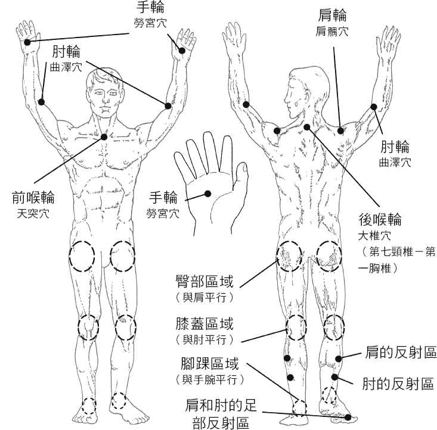 |
| 图说：图 3b　用于治疗肩、肘和手腕病症的穴位 |

平衡能量时，每个点的按压时间应不超过三十秒，直到每只手下方的感觉相似为止。重要的是，要将手放在肩部损伤上，并将另一只手放在其反射的适当部位上。如果是肩部前侧疼痛，则要平衡它与臀部前方（腹股沟轮）和另一肩膀前侧的能量；如果损伤位于旁侧（可能是肩锁关节损伤），则平衡它与臀部旁侧及另一肩膀的相同区域的能量。

##### 肘关节

肘部病症包括网球肘（外侧炎症）、高尔夫球肘（内侧炎症）和重复性劳损症候群引起的广泛性关节囊炎。一定要确定肘部疼痛是否由脖子疼痛而引起（和肩膀疼痛的例子一样），治疗应暂时缓解牵连的疼痛，同时解决下颈椎的问题。

###### 治疗顺序

见图 3b。

一、顺着能量流动的方向，敲打心经、心包经、肺经、三焦经、大肠经和小肠经。只需要在手指和肩膀之间进行敲打。

二、刺激远侧脉轮的劳宫穴（手轮，在手掌中）。

三、贯穿肘部的损伤区，平衡手轮和肩轮（肩髃穴）之间的能量。

四、平衡手轮和肘部「疼痛点」之间的能量，直到获得重点改变。

五、放松关节。通常只需将双手放在关节的内侧和外侧，即可达成此目的。

六、（a）平衡与身体同侧的膝关节的能量。

（b）平衡与对侧肘部同区域的能量。

（c）平衡与后喉轮之间的能量。如果疼痛实际上来自脖颈区域，这会特别有效，例如第七颈椎与第一胸椎间的神经根引起的高尔夫球肘。

（d）平衡与脚部和腿部的肘反射区能量。经验显示，这些是可供使用的最佳反射点。

##### 手腕关节

这里要考虑的病症是重复性压力症候群、其他形式的腱鞘炎、腕状隧道症候群和手腕的慢性水肿。

###### 治疗顺序

见图 3b。

一、顺着能量流动的方向，敲打与肘关节治疗时用的相同经络。只需要在手指和肘部之间进行敲打。

二、刺激手轮位于手掌中的劳宫穴。

三、贯穿腕部的损伤区，平衡手轮和位于肘窝中间的肘轮曲泽穴之间的能量。

四、平衡腕部疼痛点和手轮之间的能量，直到获得了重点改变。请注意这两点可能相邻（尤其是腕状隧道症候群），同时注意两者不要重叠。

五、放松关节。只能使用前方和后方的点。

六、（a）平衡与身体同侧的踝关节能量。请注意，手腕的前方与踝关节的内侧相对应，手腕的后方与踝关节的外侧相对应。如果你对应该用关节的哪一面来平衡有任何困惑之处，请记住：在所有关节损伤中，反射区会较为柔软，这应该会让你更容易找到该使用的点。

（b）平衡与对侧腕关节同一面的能量。

（c）平衡与后喉轮的能量。

（d）平衡在下腿部的手腕反射区的能量。在腕状隧道症候群的情况下，反射区域是阿基里斯腱。

##### 髋关节

髋关节疼痛可能是由关节本身的骨关节炎改变、骨盆充血和发炎引起的髂与腰交界处的关联性疼痛，或由于髋关节挫伤引起的股骨头错位及发炎、膝盖或脚踝的创伤所引起的。由于髋关节位于骨盆深处，对于从事这类工作的人来说，这是一项艰巨的挑战。然而，只要有一点耐心，你和你的病人都可以获得很大的回报。

###### 治疗顺序

见图 3c。

一、顺着能量流动的方向，敲打胆经、胃经和膀胱经。这些经络只需在脚趾和胸部之间进行敲打。特别要注意胆经，这是唯一通过髋关节的经络。

| 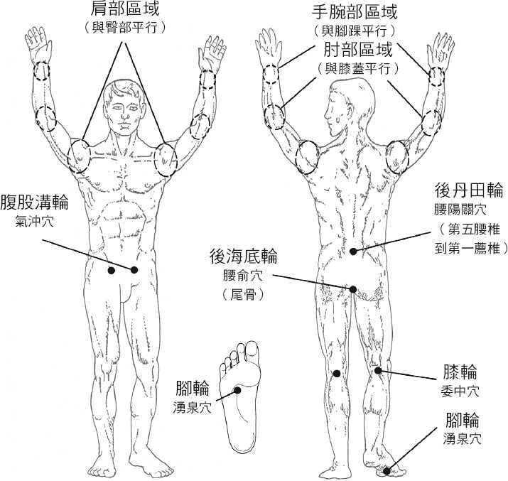 |
| 图说：图 3c　用于治疗臀部、膝盖和脚踝病症的穴位 |

二、刺激膝轮位于膕窝中心的委中穴。尽管膝轮是用于创造能量储备库的正确远侧脉轮点，但是在所有慢性关节炎和膝关节的病症下刺激后海底轮（正好在尾骨上方）通常颇为有利。这有几个原因，首先，所有慢性关节疼痛的病症都应该刺激海底轮；其次，髋关节的骨关节炎通常与一般盆腔充血和紧绷有关，刺激海底轮可缓解疼痛。使用后海底轮时，病人必须侧躺着才容易接触到穴位。其余的治疗可使用膝轮做为远侧脉轮，因为海底轮将在稍后的治疗中使用到。

三、平衡膝轮和经过髋关节的后丹田轮（位于第四、五腰椎间的腰阳关穴）的能量。

四、平衡髋关节疼痛点和膝轮之间的能量，直到获得重点改变。这通常是程序中最困难、最艰苦的部分。经验显示，病人在髋部和盆腔周围都会出现慢性髋关节疼痛，因此试图找到局部疼痛点可能很困难，毕竟每个地方都很痛啊！我唯一可以提供的建议是使用最不舒服的部位，这些部位位于髋关节外侧和髋关节前方的大转子后面，恰巧与位于气冲穴的腹股沟轮有关。两处的能量平衡程序需要个别独立完成。

五、放松关节。这可能很有趣！你可以运用两种方式做到这一点：

（a）双手放在关节的前方和后方。

（b）一只手放在大转子的外侧面上，另一只手放在骨的上方周围。

虽然你可以在病人仰卧时进行放松（颅荐疗法治疗师的噩梦！），但首选位置是侧躺，患侧髋关节朝上。由于放松往往需要几分钟的时间才能达成，因此必须做好长时间坐在相同位置的准备。可参阅本章最后一节关于治疗师舒适性的说明。

六、（a）平衡与身体同侧的肩关节相关部位的能量。

（b）平衡与对侧髋关节同一部位的能量。

（c）在慢性关节炎改变的情况下，平衡与后丹田轮和后海底轮的能量。

（d）平衡脚和手臂上（也可能在手上）髋关节反射区的能量。

##### 膝关节

治疗师通常会遇到的膝盖病症是内侧和外侧韧带的急性扭伤、撕裂的软骨，或重复性劳损（如女佣的膝盖）引起的单纯性滑膜炎，以及骨关节炎。膝盖的骨关节炎非常普遍，对这类的治疗反应非常好，上胫腓关节半脱位或炎症（STF 症候群）也是如此。

###### 治疗顺序

见图 3c。

一、顺着能量流动的方向，从脚趾朝下腹部和胃部敲打肾经、肝经和脾经（阴经），以及从下肢到脚趾敲打胆经和膀胱经（阳经）。

二、刺激脚轮位于足底的涌泉穴。注意不要对患有高血压或容易在头部、颈部产生头痛，以及循环障碍的病人刺激此穴过久。过度刺激可能会暂时恶化这些症状。

三、贯穿膝关节损伤区，平衡脚轮与腹股沟轮（气冲穴）之间的能量。如前所述，观想是有帮助的。

四、平衡膝关节疼痛部位和脚轮之间的能量，直到获得重点改变。与之前髋关节的例子一样，此处可能有多个疼痛点。在这种情况下，每一个疼痛点都应该分别处理。

五、放松关节。膝关节的解剖位置让它很容易放松。双手放在关节的任一侧（外侧和内侧）和关节的顶部和底部（前方和后方）上。

六、（a）平衡损伤部位与身体同侧的肘部相关部位的能量。

（b）平衡损伤部位与另一膝关节完全相同点之间的能量。

（c）平衡损伤部位与后丹田轮之间的能量。在每种慢性病症中，平衡膝关节与后海底轮之间的能量也是至关紧要的。

（d）最后，平衡损伤部位与在脚部和手臂的膝关节反射区之间的能量。

##### 踝关节

治疗师遇到的踝关节病症，从急性外侧扭伤到骨关节炎都有。慢性跟腱炎也可以用这种方法治疗。如前所述，慢性疾病对这种治疗方式的反应特别好；换句话说，其他方法都不管用时，这种方法会奏效。

###### 治疗顺序

见图 3c。

一、顺着能量流动的方向，敲打与膝关节相同的阴经和阳经，但只需在脚趾和臀部之间进行。

二、刺激脚轮位于足底的涌泉穴。

三、平衡脚轮与膝轮位于膕窝中央的委中穴之间的能量。

四、平衡损伤区（疼痛点）和脚轮之间的能量，直到获得重点改变。请注意，这两点可能非常接近。在跖骨痛的情况下尤其如此。

五、放松关节。脚踝会引导自己去放松，请将双手放在关节和跟腱区的前方，之后放在踝关节的外侧和内侧面上。

六、（a）平衡损伤部位与身体同侧的手腕相对部位之间的能量。在跖骨痛的情况下，使用掌骨区域。你会找到一个感觉柔软的点，就是那里！

（b）平衡损伤部位与对侧踝关节同一区域之间的能量。

（c）平衡损伤部位与后丹田轮之间的能量。这样做对治疗慢性踝关节水肿特别有效。在治疗慢性病症时，也要去平衡损伤部位和海底轮之间的能量。

（d）最后，平衡损伤部位与在手上的反射区之间的能量。

其他可以治疗的周边关节是：颞下颌关节、胸锁关节、耻骨联合关节和髂关节。颞下颌关节和髂关节的治疗将在后面的「病例」中讨论。关于另外两个，其治疗原则与四肢关节所使用的相同。

## 脊椎关节治疗

关于脊椎关节的基本治疗，在我先前出版的《指压疗法：肌肉骨骼病症的临床应用》（编按：未有中文版。）有关临床应用的章节中可以找到，但脉轮系统和指压治疗之间存在许多微妙及实质上的差异。这不是说使用指压疗法来治疗脊椎疾病不好，而是说另一种方法似乎能带来更快速、更持久的效果。

##### 分析和评估

实际上，有很多种不同的脊椎病症，每种都有一组不同的征兆和症状，要各个来讨论是不可能的。不过，因为每种病症的处理都遵循相同的程序，所以没有必要个别讨论。除了一些神经系统病症外，如何诊断这个问题并不重要，因为都将使用相同的脉轮疗法来治疗。医师和治疗师经常陷入困境，企图找到明确的诊断，而这往往是没有必要的。当然，专业治疗师必须判断和辨别不属于他们临床实践和专业知识范围的病症。如果有疑问，不要着手解决问题，而是将病人转诊给具有适当专业知识的人。尽管可以使用脉轮疗法来治疗急性脊椎病症，但这类病症通常对其他形式的治疗反应良好，如物理治疗、整骨疗法、整脊疗法和针灸疗法。然而，在慢性脊椎病症的治疗中，用脉轮能量系统来疗愈则是徒手疗法中的首选。在过去三十五年里，我采用过许多不同的疗法来治疗脊椎病症，所以以下讲的都是经验谈。我只要求你去尝试一下，你不会失望的！

##### 急性脊椎病症

任何类型的急性病症都会表现出疼痛（局部或牵连的）、肌肉痉挛、炎症和局部畸形。如果在损伤发生后的四十八小时内未正确治疗，脊椎其他部位通常会出现疼痛和急性畸形的继发反应，以及周围关节会感到疼痛和僵硬。急性脊椎损伤的例子包括：

‧深部椎间肌肉的肌肉撕裂（不同程度）。这产生疼痛、局部炎症和肿胀，但很少有局部畸形。

‧椎间韧带的韧带撕裂（不同程度）。这会产生疼痛、痉挛、炎症和局部畸形，导致小关节发生半脱位或超伸展。

‧神经根炎症。这是由突然间过度伸展或侧面盘突出造成的，并会产生非常剧烈的疼痛（局部或放射）、局部肌肉痉挛和炎症。这可能会导致整条神经都发炎的神经炎症（例如坐骨神经痛）。

‧中央型椎间盘突出。这会导致痛苦的局部和牵连疼痛、痉挛和炎症。身心全面休息和服用抗炎药物是初期唯一的治疗方式，但在病发四十八小时后，使用脉轮结合指压疗法可以有很好的帮助。

急性脊椎损伤通常是因慢性脊椎无力所造成的结果，而慢性脊椎无力可能是由于孩童时期跌倒或其他一些创伤而引起的。由于损害是在婴儿期就产生了，病人有多年时间在补偿这个潜在弱点所带来的问题，而这个原始的弱点最后会在某些活动中（不一定是剧烈的）引起急性症状。

##### 慢性脊椎病症

慢性脊椎病症的例子包括：

‧肌肉损伤。这些可能是由于一系列微创伤或脊椎试图补偿旧的姿势不平衡而发生的。脊椎的微创可能是因孩童或青少年时反覆跌倒，跌在尾骨区或侧面（从马或围墙上摔下来、在冰上滑倒、在学校操场上跌倒等）而引起。旧的姿势不平衡则是由于孩童或青少年的姿势不正确，包含无精打采地站着、一次几个小时维持不正确的坐姿、运动不足，或试图弥补身材过高而造成的。通常会有局部和远端疼痛、肌肉痉挛、淋巴循环炎症或充血。肌肉内部有时会形成纤维结节，这称为纤维组织炎或纤维肌瘤，是一系列广泛的症状，如果出现在腰椎则是腰痛。许多医师和治疗师都会轻视纤维组织炎，并经常忽略几年前发生过的腰痛，但是这些病症都非常真实，不可轻忽。

‧韧带损伤。由于旧的姿势不平衡或韧带反覆过度伸展所导致的伤害。发生椎间韧带缩短和增厚，引起两个或更多椎骨的固定。病人出现瀰漫性疼痛和痉挛，加上局部和远端畸形。

‧急性椎间盘损伤后的慢性病症，在急性期治疗不当或不治疗的情况下，颈椎和腰椎（偶尔是胸椎）的急性椎间盘损伤后遗留下来的慢性病症，会出现多处肌肉痉挛、韧带缩短和增厚、通常会形成纤维状结节，以及血液和淋巴循环不畅。

‧先天性畸形，如脊椎侧弯、脊椎后凸（驼背）、脊椎前弯等。尽管并非总是如此，但这些往往会在晚年出现症状。缓和疗法通常可以缓解疼痛和痉挛，使日常功能更容易执行。长期来看，激烈的治疗和手术干预可能导致更糟糕的结果，会牺牲掉脊椎的移动性。

‧手术干预导致的病症，例如脊椎融合术、椎板切除术、椎间盘切除术等。脉轮结合指压疗法对于这一类数量不断增加的病人非常有效。不过应该知道的是，你所能达到的效果就只能像手术干预后的那样，不会再更好。

###### 治疗原则

一、在潜在的解剖畸形结构下，尽可能减少疼痛、炎症和畸形。

二、增加运动范围，从而减少畸形。

三、平衡患区关节及其相关区域之间的能量，以便在该地区产生动态平衡。

###### 治疗顺序

治疗的顺序与周围关节病症的治疗非常相似：

一、按摩患处和膀胱经。

二、松动脊椎骨。

三、刺激远侧脉轮穴位以创造能量储备库。

四、平衡贯穿脊椎骨患区的远侧脉轮和近侧脉轮之间的能量。

五、平衡脊椎损伤区和远侧脉轮之间的能量。

六、平衡关节和其他配对的反射区：平行脉轮、次要脉轮、脚轮和手轮之间的能量。

七、放松关节。

八、最后，分别松动或调整关节。

###### 治疗说明

一、徒手治疗师知道各种形式的按摩之正面优势。除了血液和淋巴循环的生理改善之外，心理层面的提升也非常重要。永远不要低估碰触灵魂的力量。手放在病人身上时，他们通常会觉得更舒服。以下类型的按摩是需要的：

（a）一般的舒缓按摩。最初，你必须感觉到病人的组织，而他们需要感谢你的双手，这是一个双向对话。沿着整个脊椎做几次短的和长的敲打（最好使用大豆油来按摩），这对病人有舒缓作用，也可以让你了解组织的状态。

（b）局部按摩。在损伤区周围做几次短的敲打，或用姆指指腹和其他指腹来揉，也可以做一些短的结缔组织按摩（CTM）。请在进行结缔组织按摩前警告病人，因为它可能非常锐利。结缔组织按摩是一种很美妙的按摩方式，可以改善血液和淋巴循环，如果你还没有学过，它非常值得学习。

（c）膀胱经按摩。这是透过放在脊椎两侧的中指指腹和食指指腹来进行的，从脖子到骨区域用比较重的手力来按摩。在比较「内侧」的膀胱经到腰部底端时，比在颈部处更往脊椎外侧延伸，所以手指的外扩也应该调适这种差异。治疗慢性脊椎疾病需要改善脊椎局部和远端区域的能量，按摩膀胱经可以做到这一点。沿着内侧膀胱经和外侧膀胱经来使用结缔组织按摩，这在腰部位特别有效，受损区域应该在按摩后变得更放松及充血。

二、接下来，应轻轻松动患区的脊椎骨，以伸展紧缩的韧带，并进一步改善局部血流。物理治疗师应该满熟悉梅特兰关节松动术（Maitland mobilizing），在这种情况下它是最完美的关节松动方式。对那些没有接受过这种训练的人来说，应在病人俯卧时，将患部椎骨的棘突从后方轻轻推到前方（P─A 运动），你可以用拇指指腹或手掌后跟的豌豆骨来做。应用短暂的重复推动运动来松动椎骨，用足以明显移动关节的极平缓压力来做，每个椎骨最长三十秒。这只不过是梅特兰二级松动法，不是操作手法！

三、到目前为止，这种方式包括了物理治疗师开始治疗脊椎病症的常用法，不同之处从这里开始。远侧脉轮穴位需要受刺激，以便在脊椎内形成能量（气）储备库，这是治疗慢性病症的必要阶段。如果没有能量的刺激，就没办法解决慢性病症的问题。慢性病通常伴有迟缓和瘀阻的组织，患区的能量必须受刺激，才会朝成功的方向前进。虽然有需要在每一种慢性脊椎病症中刺激海底轮，但只有在慢慢形成的脊椎关节炎，如颈椎、胸椎和腰椎退化病中才必须这样做。这还可以搭配使用患区相应的远端脉轮穴位，这将在稍后关于个别脊椎区域的治疗部分中解释。远侧脉轮穴位需要用手指指腹刺激至少两分钟，直到可以感觉到热度的变化和「穴位的柔软性」。如果你不确定需要多长时间的刺激，请停止刺激几秒钟，以确定刺激点是否有不同的感觉。如果没有明显的感觉，请再刺激一分钟左右（是的，这是一段很长的时间），然后再按着几秒钟。重复这个按压程序，直到穴位附近的组织有明显差异为止。例如，对于严重的脊椎关节炎，可能需要五到六分钟才能发生。「过度」进行远侧脉轮穴位的刺激按摩永远是一件好事，这样会有更多气血可用于日后的工作，它是不会按摩过度的。

四、下一阶段是平衡刚刚受刺激的远侧脉轮穴位与近侧脉轮穴位之间的能量。有可能仅需半分钟左右就能达到能量平衡，但通常需要比这更长的时间。这个目的是要贯穿损伤区来进行刺激和输入能量。急性病症会在几秒内完成，慢性病症则需要更长的时间，而且近侧脉轮穴位也必须跟着远侧脉轮穴位一起刺激。至此，虽然看似没有对损伤区进行特定的工作，但治疗师和病人都会注意到脊椎感觉更放松了。

五、现在，总算到了可以把手放在损伤区的时候了。虽然这属于个人偏好，但我喜欢在病人仰卧时治疗上颈椎的损伤，而在治疗下颈椎到尾骨的部分，则请病人俯卧在有适当的「呼吸孔」治疗床上。这样对于治疗颈椎损伤，可以更容易将手指指腹放在损伤处，而另一只手相对的手指指腹则放在远侧脉轮穴位来平衡能量。至于颈椎以下的脊椎损伤，就是个人选择的问题，可以整只手或只用手指指腹来给予局部压力，怎样做最舒适就怎么做！

与周边关节的治疗一样，这部分的程序最为重要，需要全神贯注，而且必须持续按压，直到发生重点改变。在这之后，你和病人都会立刻感觉到损伤区变得舒缓许多，你会觉得好像有了一个「突破」。实际上，这和事实差距不远──从这一刻起，治疗师可以平衡损伤区和其他穴位之间的能量，以便「加强」已经发生的疗愈，并强化迄今所进行的治疗。

六、平衡损伤区及其各相关区之间的能量。包含：

（a）根据洛维特（Lovett）兄弟协会的相应脊椎点，即第一颈椎对应到第五腰椎、第二颈椎对应到第四腰椎等等。请注意，这不是极性疗法中的脊椎「谐波」。

（b）在脚或手的相关反射区（看哪个比较舒适、比较方便取用）。

（c）相邻的次要脉轮。

七、放松关节的时候到了。有三种方法可以做到这一点，挑一种执行即可，但如果三项都完成，治疗将会增强。

（a）最简单的方法是将双手放在损伤区的任一侧，放在脊椎损伤区的近侧和远侧。

（b）可以将双手放在损伤区的任一侧，在脊椎旁侧。在前两种方法中，双手之间的间距很小（约两公分半）。

（c）你也可以将一只手放在损伤区，另一只手放在之前讲的洛维特兄弟椎骨上。在这种情况下，双手之间有时会有相当一段距离。

上述三种放松方式的原理和程序是相同的。在将手放在病人身上后，第一分钟会很少有反应或根本没有反应。慢慢地，随着组织的放松、变暖，你手下的组织会移动并改变它们的质地。整体原则是「随它去」，不要去阻碍放松过程。放松完成时，下一阶段即可开始。尽管不可能一次就完全放松四十年的老损伤，但身体是非常聪明的，它会在一个特定的治疗时间内尽可能放松。

八、关节及其邻近区域感觉比以前更加柔韧、放松，现在可以结束治疗，或者进一步松动有问题的椎骨、增加韧带弹性，检查并确定脊椎的活动性是否比以前更好。

## 特定脊椎损伤的治疗

接下来要介绍使用脉轮能量系统来治疗肌肉病症的许多面向。

##### 第一至第四颈椎

见图 3d。

病人应该仰卧，头部用一个枕头，或最好使用「豆袋」来支撑，这将提供足够的空间，让你的手和手指在脖子下滑动，对病人来说也比较舒适。或者也可以让病人俯卧来治疗，将病人的脸放在合适又舒适的呼吸孔中，但仰卧似乎更好控制，对病人来说也比较友善。

由压力所引起的病症往往会影响到脖子的这个区域，现代人的生活节奏会在脖子上产生紧张感，进而引起肌肉痉挛和局部炎症。这会影响该区域的神经传导及脑脊髓液流动，甚至导致眼睛紧张、黏膜炎、耳朵紧张、头痛、头晕和头昏脑胀。结合脉轮的指压疗法和身体工作法非常适合纾解这些症状。

| 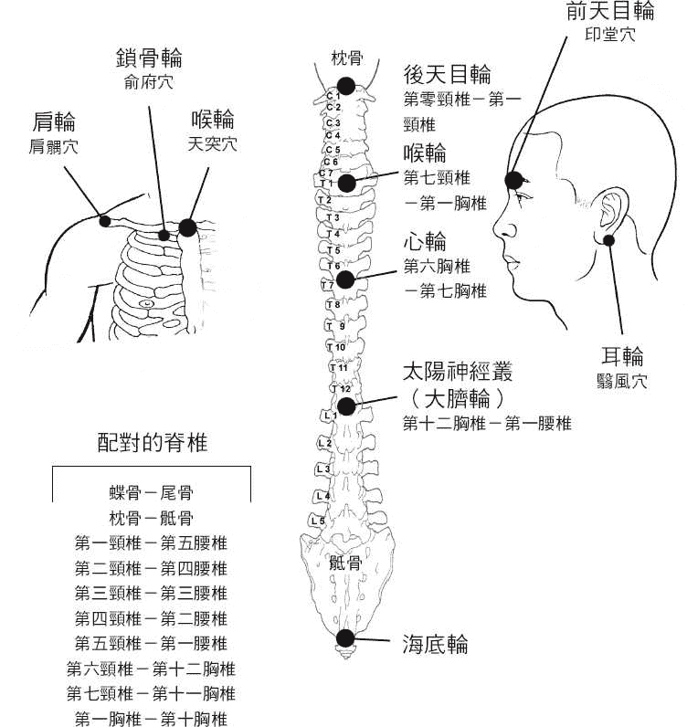 |
| 图说：图 3d　用于颈椎病症的穴位 |

###### 治疗顺序

一、用少量油来按摩大部分地区（这是首选）。这种按摩应该要包含一般的轻拍和敲打。不管脊椎旁的肌肉有没有痉挛，重要的是去搓揉它，这就意谓着膀胱经被按摩了。花几分钟的时间来按摩，时间够长才能让病人放松下来，并确定损伤部位。

二、松动第一至第四颈椎的棘突和横突（如果你有能力这样做），记录何处的移动受限、何处疼痛等。

三、远侧脉轮穴位是位于第七颈和第一胸椎之间的后喉轮大椎穴，刺激大约一分钟或直至穴位感觉到温暖和「充满能量」。如前所述，治疗任何类型的慢性脊椎疾病都应该刺激海底轮，特别是骨关节炎这类病症时。不必治疗后海底轮，只要刺激最容易取得的穴位即可。前海底轮位于曲骨穴（刚好在耻骨联合的近侧），病人仰卧时很容易可触及；后海底轮位于腰俞穴（尾骨交界处），如果病人俯卧躺着，就可刺激此穴。碰触病人之前一定要先告知、征求同意才做，这是基本原则。

这两个脉轮穴位都位于解剖学上非常敏感的部位，事先询问总是比较有礼貌的，可以简单地问：「我可以把手放在这里吗？」或诸如此类的话。

四、下一步是平衡远侧脉轮穴位（后喉轮）和后天目轮之间的能量，后天目轮位于枕骨远端的枕外凸隆处（枕骨到第一颈椎〔寰椎〕之间）。如果损伤靠近寰椎或枕骨，最好把顶轮当成近侧穴位。这么做的要点是去平衡通过损伤区的能量。在非常慢性的病症下，我建议你两个穴位均刺激并按压几秒钟，重复几次直至达到平衡。

五、将一只中指指腹放在损伤部位，另一只中指指腹放在后喉轮上（一直放在这位置）。这是治疗过程中最重要的面向，这两个穴位应该持续按着，直到感觉到重点改变（大约三分钟左右）。

六、平衡各个相邻的穴位和相关点的能量，以增加疗效。相邻的穴位是：

（a）两个位于翳风穴的耳轮。

（b）两个位于肩髃穴的肩轮。

（c）两个位于俞府穴的锁骨脉轮。

（d）前喉轮（天突穴）。

（e）位于印堂穴的前天目轮。

这些相关点是：

（a）洛维特兄弟的平行区，即第一颈椎对应到第五腰椎，第二颈椎对应到第四腰椎，第三颈椎对应到第三腰椎，第四颈椎对应到第二腰椎。如果病人仰卧，你的手必须轻轻放在病人背部。简单的做法是将整只手放在损伤部位，另一只手放在第二腰椎到第五腰椎的下方。

（b）可能的话，平衡损伤区与其在手或脚的反射区之间的能量。

（c）当你的病人在手臂上出现牵连的疼痛或有针刺感时，平衡损伤区与肘轮（曲泽穴）和手轮（劳宫穴）的能量会很有帮助。

七、倒数第二阶段是放松损伤区域。这个区域要放松比较具有挑战性，但可以透过三种方法择一实现。那么，何不三种方法都做呢？

（a）将中指指腹置于棘突两侧（在横突上），并轻轻往组织推。当你的手指「顺其自然」推动几秒钟后，损伤区域会放松，这可以持续几分钟左右。

（b）把手放在损伤区域上方和下方的任一侧（由于空间不足，可能只能放两到三根手指）。

（c）将一只手放在整个损伤区域，另一只手放在平行区域（第二到第五腰椎）上。此程序可以在上一节中完成平行区平衡时同步完成。这种案例的放松可能会相当剧烈，如果你的病人在肌肉开始放松时就想要离开治疗床，请不要感到惊讶。

八、最后一步是松动或拉伸该区域来确认可活动范围，或要求病人进行一系列的头部运动来确认。病人可能会对结果感到吃惊！

##### 第五、第六和第七颈椎及第一胸椎

见图 3d。

这个区域代表脊椎中非常「繁忙」的一个区域，它是平行四边形的力量中心：往下到脊椎，并横过肩膀和手臂。这里会出现许多慢性损伤，如颈椎病和椎间盘损伤，且往往会在手臂、肩胛骨后方或胸部前方产生牵连的疼痛。结合脉轮的指压疗法和身体工作法对患有这些痛苦病症的人来说非常有益。病人可以俯卧或仰卧来治疗颈部这个区域。大多数治疗师喜欢俯卧位治疗，如果是这种情况，要确保为病人准备一个舒适、有呼吸孔的垫子。除非有呼吸孔让病人的头不用转向侧面，否则不要尝试在俯卧位治疗颈椎病。

###### 治疗顺序

一、按摩局部区域，并沿脊椎旁及横过肩膀和手臂，进行一些长、短敲打，也可用指腹搓揉膀胱经。结缔组织按摩对该区域非常有效，尤其有慢性病症时，纤维结节可能累积了不少。

二、如前所述，在该区域松动脊椎骨非常重要。除了在治疗该区域时向病人提供此服务外，这道程序也让你有机会评估损伤或疼痛点的位置。

三、远侧脉轮的刺激是有选择性的。在慢性病症时，无论做什么，海底轮都必须受到刺激。如果有明显的情绪病史，导致该区域内紧绷，则应该刺激后心轮（第六胸椎和第七胸椎之间）；如果没有情绪病史，则选择后太阳神经丛（第十二胸椎和第一腰椎之间），择一或两个都进行，但是在慢性病的情况下也要刺激海底轮。其余的治疗，包括能量平衡，将透过心轮或太阳神经丛来进行。如前所述，任何一点刺激都要持续两分钟以上。

四、下一个阶段是平衡后心轮或后太阳神经丛与位于枕骨下方的后天目轮的近侧脉轮之间的能量，并试着观想能量流经损伤区。

五、平衡损伤区与后心轮或后太阳神经丛之间的能量。这是治疗中最重要的阶段，需要持续按压，直到发生重点改变。如果有一个以上的疼痛点，每个点都需要与远侧脉轮的穴位进行能量平衡。

六、损伤区现在需要与所有局部和远端反射穴位进行能量平衡，以支持前面所做的治疗。其中相邻的点有：位于肩髃穴的两个肩轮、位于天突穴的前喉轮、位于俞府穴的两个锁骨轮、位于曲泽穴的两个肘轮（如果有任何牵连到肘部的疼痛时，需平衡此处）。

相关的区域是：

（a）位于第十胸椎到第一腰椎间的平行区域。只需将整只手放在损伤部位，并与第十胸椎到第一腰椎间的区域平衡即可，不必找出确切的损伤点，即可达到非常好的能量平衡。

（b）与脚轮或手轮上的反射点做能量平衡，也可教导病人使用手轮的反射点，自行在家治疗。

七、放松损伤区域的时候到了。可以藉由几种方法来执行，如前所述，全部都做更好！

（a）将双手中指指腹加上邻近手指来支撑，将之置于脊椎两旁距离正中线约五公分的地方，在损伤区脊椎位置的任一侧均可。这种放松最好在病人仰卧时完成，但也可以用俯卧位完成。

（b）更好的方法是将整只手放在损伤区脊椎的任一侧来放松。

（c）将整只手放在损伤区的远侧和近侧。

（d）将一只手放在损伤区上，另一只手放在第十胸椎到第一腰椎间的平行区域上。

（e）请注意，还有一道放松的程序：在损伤区域和前喉轮之间放松。这将在探讨疗愈的章节中讨论，因为它比纯治疗肌肉骨骼病症具有更显著的效果。

八、该区域现在需要做最后的松动，以便确定改善情况，并消除组织中任何残留的问题。病人坐起来时，检查他的活动范围。

##### 胸椎

见图 3e。

因为整个胸椎的远侧和近侧穴位相同，本节将一并讨论。不过，每个椎骨除了一般性的疼痛和痉挛之外，可能会表现出不同的症状。由于在横突旁边有交感神经链（构成自主神经系统的一部分），不同脊椎的损伤可能会引起不同的内脏器官系统毛病。不过，你不必过于担心个别症状，只要意识到内部器官失衡可能是由胸椎损伤所引起的，反之亦然。

| 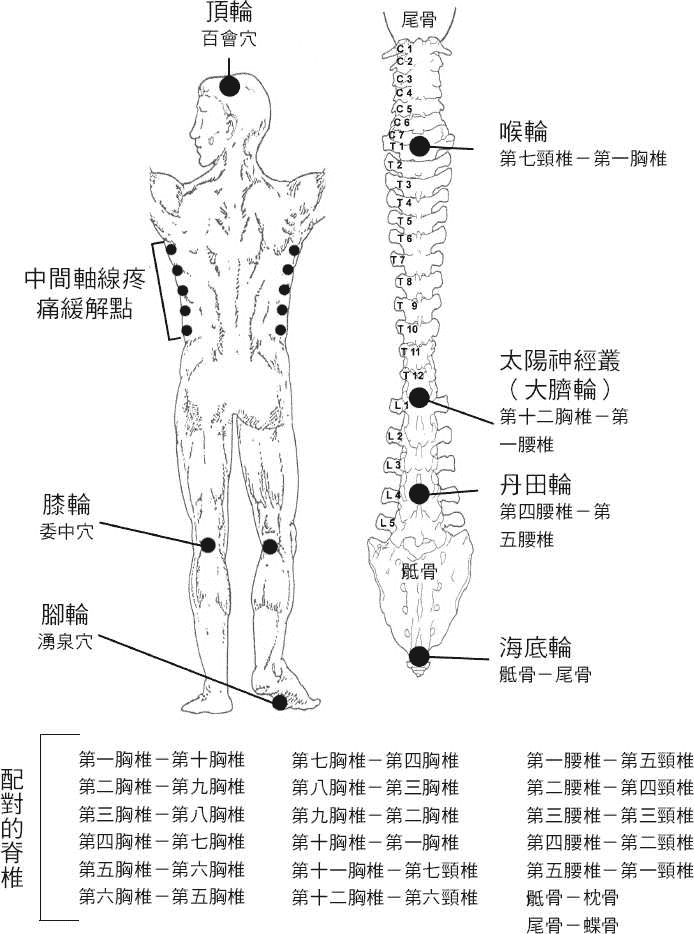 |
| 图说：图 3e　用于胸椎、腰椎、尾椎病症的穴位 |

###### 治疗顺序

一、先做一些按摩，改善该区域的循环。可以在脊椎任一侧进行一些长和短的轻拍、沿着肋骨边缘和肋骨之间的肋间空间来按摩，并且沿着内侧膀胱经揉捏。

二、接下来是松动损伤区附近的椎骨。首先最好松动离损伤部位最远的椎骨，再回来松动受损的椎骨，这样做可以更确切地指出损伤位置。脊椎侧弯常影响胸椎，这会出现很多不同的病症，通常都是先天性的，除非是在脊椎局部出现症状，或是沿着肋骨在身体前方出现症状，否则没有什么可担心的。如果是脊椎不正或「塌陷」的旋转性侧凸，可能会给胃或横膈膜带来直接不适，并出现自主神经系统的症状。如胸椎已定型为「S」形曲线或「长的 C」形曲线，在这种情况下是不会对松动有反应的。我相信任何运动都比没有运动更好，即使是脊椎已定型，也应该鼓励病人稍微运动一下，要活就要动啊！

三、刺激远侧脉轮穴位的时候到了，这样才能在脊椎上形成能量储备库，要刺激的穴位是位于第四和第五腰椎间的后丹田轮。如有慢性病症，别忘了要刺激海底轮。两者可以同时以规律的「刺激、按压」模式来进行，直到确定组织发生了变化。

四、平衡后丹田轮与近侧脉轮穴位的能量，即位于大椎穴的后喉轮（第七颈椎至第一胸椎间）。观想能量流经损伤区域，这过程大约两分钟可完成，或者做到两手指腹下的感觉合一！

五、找出损伤区域，平衡此点和后丹田轮的能量。如前所述，这是治疗中最重要的部分，如果做得不正确，整个治疗将达不到预期效果。这部分治疗必须达到重点改变。

六、平衡损伤区域与邻近的点及相关反射点的能量。由于病症位于胸椎内，不太可能有一个平行的区域来平衡，除非损伤区位于第二胸椎，这种情况就要和第九胸椎平衡。损伤区越靠近脊椎的「支轴」部分时（即第六胸椎和第七胸椎间），由于双手的距离很接近，要找到平行区域的可能性越小。但是有两个反射区非常有用，一个是在脚上的胸部反射区，另一个是腋在线的反射区（胸部的侧面）。无论损伤区在哪里，由损伤区沿着肋骨到其外侧，并与那里的点平衡。这个点是损伤区在腋在线的反射点，总是比较柔软。

七、对所有胸椎病症而言，放松都是非常舒适且有益的。它可以按照前面描述的方法来执行，但可省略平行区域。放松最好是将整只手放在脊椎任一侧，再将手放在损伤区的近侧和远侧来完成。

八、重新松动该区域，以加强之前的治疗，并处理以前未发现的个别残留问题。请注意，在慢性病症中，不可能仅仅一次治疗就治好所有症状，你可能需要好几次的治疗。

##### 腰椎

见图 3e。

脊椎的这个区域承载了大部分的体重，因此比身体其他部分（除了脚的跖骨球之外）承受更多的拉力。因此，治疗师会花费更多时间治疗这个区域就不令人讶异了。

在西方世界，人们因腰椎病而请假的天数和罹患一般感冒一样多。你最有可能遇到的病症是急性腰痛（由于各种原因）、急性或慢性坐骨神经痛、腰椎骨关节炎和椎间盘突出的后遗症（PID）。用此结合脉轮的指压疗法来治疗慢性腰椎病症的报酬率是极高的！

###### 治疗顺序

一、整个区域需要按摩，以改善局部循环，并使组织变得更柔韧舒适。这可以透过执行长与短的轻拍、沿着膀胱经进行指腹按摩，以及透过拇指指腹或其他指腹揉捏最迟钝的区域来完成。而在腰椎区域进行结缔组织按摩是极其有益的。

二、用梅特兰松动法或类似方法来松动腰椎。这是开始椎骨运动的极佳方式，也是用来确认确切损伤点或区域的理想方式，至少花一分钟时间来做这件事。

三、接下来要刺激远侧脉轮穴位，即后海底轮（尾骨）。在非常慢性和长期的腰部病症中，这需要进行大约四到五分钟，才能在指腹下面感觉到明显的差异。不要等了三分钟就因为看起来没有变化而放弃，它会发生的，在处理这些病症时必须有耐心点。治疗急性腰椎病症时，刺激所需的时间要少得多。请记住，这样做的目的是在脊椎上创建一个能量储备库，以供日后使用。而运用这类脉轮系统时是没有捷径的。

四、平衡远侧脉轮穴位与近侧脉轮穴位的能量，后者是位于第十二胸椎与第一腰椎间的后太阳神经丛（大脐轮）穴位。如果是比较罕见的第一腰椎损伤，就用后心轮来做为近侧穴位；如有慢性病症，远侧穴位和近侧穴位就需要一起刺激，而且可能需要长达三至四分钟才能让流经损伤区的能量获得平衡。在这个阶段，观想和专注于手头上的工作是不可或缺的。

五、平衡损伤区与后海底轮之间的能量。由于腰椎比颈椎或胸椎大得多，因此实际损伤部位可能不是直接位于棘突或横突上方，而是在竖脊肌肌肉组织的横突外侧，很多坐骨神经痛的病症就是这样，还可能有几个「疼痛」点，每个点都需要依次平衡。在这部分的治疗中，感受到重点改变非常重要。如果不这样做，通常会对后续的治疗产生负面影响。

六、平衡损伤区与邻近点和相关的反射区之间的能量。其中的邻近点有：后太阳神经丛（大脐轮）、后丹田轮（如果损伤区在第一、二腰椎间）、膝轮及脚轮（尤其是坐骨神经痛）。相关的反射点是：

（a）足部反射在缓解疼痛上是一个非常有用的工具。

（b）颈部的平行区域也非常有用。请记住，这配对是第五腰椎和第一颈椎、第四腰椎和第二颈椎、第三腰椎和第三颈椎、第二腰椎和第四颈椎、第一腰椎和第五颈椎。使用中指指腹来平衡可以让你做得更明确，并很好地引导到下一个阶段。

七、现在需要放松损伤区，这可以透过三种不同方式来完成。如果时间允许，最好三种方法都用，病人会受益匪浅。手指放在损伤区和颈椎的平行区域时，慢慢地变换姿势，将整只手放在损伤部位，另一只手全放在颈部来进行放松。一开始可能没有任何明显的变动，但大约半分钟后，双手会开始回应下面组织的变化。如前所述，放松的黄金法则是顺其自然，不要对抗身体的自然运动。你只是协调者，不是「实行者」。其他放松方式是将双手放在脊椎的任一侧，你也可以将双手放置在损伤区的近侧和远侧。

八、再次松动腰椎。你会发现该区域有更多无痛的运动，你的病人最后离开治疗床时也是如此。

##### 骶骨和尾骨

见图 3e。

骶骨代表建筑物的地基或地下室，其余椎骨是其他楼层；若没有稳固的地基，楼层将东倒西歪，机械性的损伤也将随之发生。许多治疗师认为有任何慢性椎骨损伤时，都应该治疗骨。这区域仅代表脊椎的两个方面，但大小却是大不相同，而且继发的症状也非常不同，可能是髂关节炎、髂关节半脱位或定型、脊椎侧弯、坐骨神经痛、痔疮、尾骨痛和脚痛。对某些人来说，没有比忍受急性或慢性尾骨痛，或在脊椎底部重跌后骨骼移位的痛苦还悲惨的事了。当一些「愚蠢的小丑」（我谨慎挑过用词了，因为这些人再怎么诅咒都不够）拉走了一个不幸的人正要坐的椅子时，悲剧往往会发生。尽管尾骨是一个看起来微不足道的小骨头，但脊椎底部的损伤所衍生的问题可能非常庞大。由此产生的炎症和瘀伤会无处可去，而且由于该区域疼痛剧烈，病人会不希望此处被触摸，这种情况下可以让病人坐在冰袋上几天，然后接受温和的复健，问题可能会慢慢解决。

###### 治疗顺序

一、彻底按摩该区域，包括膀胱经。值得花点时间在孔处做一些拇指或手指指腹揉捏，而结缔组织按摩在这方面也特别有效。此外还可以尝试按摩两条大腿的髂胫束区域，这个区域称为下腰椎的淋巴管阻塞区，在各种腰部功能不全和慢性疼痛的病症中，该区域的淋巴引流会变得迟缓，因而在大腿外侧产生淋巴沉积物，此时按摩这个区域会非常疼痛，所以必须提前警告病人。而在尾骨痛的情况下，不需要按摩。

二、用梅特兰松动法或类似的方法来松动骶骨或尾骨。在坐骨神经痛的情况下松动骶髂关节要特别小心，而在尾骨痛时松动尾关节也要小心处理。

三、开始刺激远侧脉轮穴位。在骨病症时是刺激位于尾关节的后海底轮；若是尾骨问题，膝轮或脚轮两者择一来刺激。在长期病症时，这些穴位需要刺激大约两到三分钟，或是直到感觉组织有明显改变才完成。

四、平衡远侧脉轮穴位与近侧脉轮穴位的能量，后者是位于第四与第五腰椎间的后丹田轮穴位，这是要移动能量并让其流经损伤区。如前所述，这个过程可藉由观想和专注来加强。

五、找到损伤点或区域，平衡该区疼痛点与远侧脉轮穴位的能量。在慢性骨或尾骨损伤的例子下，按压或刺激的流程应继续进行，直至获得重点改变。在急性骶髂或尾骨损伤时，注意不要过分用力按压，否则病人会非常疼痛。这种情况下，可以将手指轻轻放在该穴位上，并让热和炎症透过手指散开，当热散开后，你的手指就可以按得更深。处理所有尾骨病症时，你必须告知病人何时需要碰触那个部位，并寻求口头上的许可。在非常急性的病症中，可能很难获得重点改变。

六、平衡损伤区与邻近点和相关的反射区之间的能量。其中邻近点分别是位于第四与第五腰椎间的后丹田轮穴位，以及位于委中穴的膝轮。相关的点有：

（a）骶骨的平行区域为枕骨。整只手放在枕骨上，会在此区发现与骨上的损伤区相应的压痛点或压痛区；尾骨则对应到位于百会穴的顶轮，在急性尾骨病症时必须按压这个点；痔疮或其他慢性盆腔病症时则须刺激它，这么做可以创造奇迹！

（b）有疼痛时，足部反射是非常有用的辅助手段。

七、放松是非常有用的工具，可以透过两种方法来执行。第一种方法是将双手放在位于髂区附近的骨任一侧。第二种方法是将一只手放在骨，另一只手放在枕骨上。而放松尾骨只能用一手按压损伤区，另一只手放在位于百会穴的顶轮来进行。

八、最后，再次松动该区域以进一步增加这些不可移动关节内的运动范围。

使用脉轮能量系统的指压疗法和身体工作法的治疗师，应该对提到的穴位或反射点有足够的知识，这样才能达到预期的效果。在提供整个配套治疗方案时，还有其他类型的指压能量平衡法可做为有用的辅助工具，在此暂且不提。

## 治疗师的舒适性

「保持舒适性」这个话题适用于从事身体工作法、指压疗法、反射疗法和疗愈法的治疗师，所以我将这一小节放在这里谈。尽管这个领域经常被治疗师忽略，但它是十分重要的。治疗师通常很难承认他们和其他人一样，同样容易罹患此书所提的病症，包括：腰痛、颈部劳损、头痛、重复性压力症候群和一般性的紧绷。从事这类型的工作，你会发现自己时常处在长时间的治疗中，好比在按压两个点，有时则会延展双臂，所以在治疗期间抓住所有可以放松的机会非常重要。以下的保护措施将对你有所帮助：

‧能坐就坐。

‧买一把「有轮子」的椅子，这样可以更容易治疗病人，而且从一组按压点转到下一组时，不必站起来或搬动椅子。另外，尝试使用可以调整高度的液压治疗床，虽然比携带式治疗床昂贵，但确实值得投资。但如果外出工作，这几种方法可能都有困难。

‧用手指或双手按压两个点时，不要害怕询问病人是否可以将你的前臂放在他身上，这样做可减轻肩膀、颈部和手臂的紧绷，通常病人根本不介意。还有，尽可能用治疗床来支撑你的前臂。

‧在治疗之间，起身走动，或做一些颈部和腰部伸展运动。

‧在转换病人之间要洗手，以达到卫生要求。尽管你从事的疗愈方式与灵性治疗或按手礼无关，但很可能会遇到一些散发负面「振动频率」的病人，因此最好以冷水洗手来保护自己（冷水一般比热水更纯净）。

‧最后，学会轻松进入治疗。当你还在学习时，这很难做到，但等到你经验较丰富时，就会更容易做到。好好享受这过程吧！

我始终觉得，附上真实病例的实用工作手册会使得这个主题更具可信度且为人所接受，因此我在下一节中包含了几个病例供参考。

## 相关病例

我在下面列出四个病例，帮助你对这种类型的疗法有更多的了解。我选择使用前病人的病例来研究，他们也都同意让我在此讲述他们的故事。

##### 下背疼痛伴有坐骨神经痛（涉及第一颈椎─寰椎）

###### 病史

大卫是一个二十五岁的汽车修理工人，即使只有这个年纪，他和他的家庭医生都认为他患有腰椎反覆性拉伤的病症，这是长期在汽车引擎盖下弯腰的姿势所造成的。他在十六岁时曾在冰上滑倒，有过一次腰痛，这导致了尾骨瘀伤（和自尊受损），但似乎没有其他小伤。他还患有偶尔的颈部劳损和持续不断的眼周头痛，后一种症状可能是由严重跌倒导致寰椎／轴错位引起的。他也有肠躁症，这对他来说既痛苦又尴尬。

###### 检查

检查发现，寰椎旋转（右）、颈椎和胸椎紧绷、第五腰椎旋转（左）、第五腰椎到第一椎间的关节面锁住（左）、非常紧的髂关节（左）、明显的尾骨左侧固定，还有左腿明显短了大约一公分，但膝盖弯曲时，却变成了「长」腿。虽然可以使用更传统的物理疗法来治疗，但是由于大卫有多方面的问题，因此我们决定使用结合脉轮的指压疗法和身体工作法。使用传统治疗方法会需要治疗更多次，我们必须把他有限的预算考虑进来。

###### 第一次治疗

一、由于膝盖弯曲时短腿发生了改变，表示涉及到寰椎（这也验证了其他症状）。首先要做的是调整腿长的差异。这是透过将中指指腹放在长腿侧的手轮和脚轮上达成的，可立即调整。

二、我们决定第一次治疗要专注于疼痛的腰区和坐骨神经痛，所以我做了一些按摩和松动。这个方法也显示出第五腰椎到第一椎（左）间的紧绷。由于大卫只有二十五岁，罹病时间相对较短，所以周围的关节非常灵活，很容易识别损伤区和「疼痛尖叫」点。

三、我在尾交界处刺激海底轮约两分钟，不需要很长的时间，热能就会积聚在手指下面，并使下面的组织变得更加柔软。大卫说该部分开始比较放松了。

四、然后，我平衡海底轮与丹田轮（近侧脉轮）的能量，没过多久，该地区已经累积相当多的「能量」了。

五、找到位于第五腰椎左侧横突上的损伤区，平衡它与海底轮的能量，直至获得重点改变，这在缓解疼痛方面非常有效。

六、平衡损伤区与脚上的反射点、脚轮和左腿的膝轮的能量。一开始，坐骨神经痛在缓解之前似乎略为加剧（这很常见）。

七、接着，我将双手放在损伤区旁边的位置来放松它，并平衡损伤区与寰椎的平行区能量。之后，我将整只手放在损伤区上，另一只手放在枕骨／上颈部区域。这经证明是非常有效的，我要把双手放在这里约五分钟，让所有紧绷的肌肉都放松。

八、在最后松动期间，第五腰椎到第一椎间的关节面似乎很容易就「自动调整」，没有过度的压力。大卫站了起来，我请他走一走、往前弯并侧弯他的脊椎，看看有什么感觉，他回答说好太多了。

###### 第二次治疗

一周后，我再帮大卫看诊，尽管他仍请病假、背部也还没有「正常运作」，但下半身和腿部的不舒服已大大减缓。他仍经历着复发性头痛，而且眼睛后方的头部有一种「棉絮」的感觉（病因在颅底）。检查发现下腰椎的痉挛、疼痛和炎症少多了，大卫觉得坐骨神经痛就在膝关节外面。腿长没有差异了，尽管没有明显的错位，但寰椎似乎依然很紧绷。

一、大卫俯卧，我按摩并松动了他的后背，接着按摩膀胱经，从腰部一直到颅骨。

二、我随后刺激后海底轮，以便在整个脊椎内创造一个能量储备库。紧接着，平衡后海底轮到后丹田轮之间贯穿腰椎损伤区的能量，然后平衡损伤区与后海底轮的能量，直至获得重点改变。现在整个区域舒适多了。

三、再来是平衡腰部损伤区与左膝轮的能量，以缓解剩下的坐骨神经转移痛。这很容易达成，腰椎终于松动起来了。

四、我现在把注意力转到上颈部的剩余损伤。由于整个脊椎中已经有很多能量，所以第一阶段是藉由按压后喉轮和顶轮来平衡贯穿损伤区的能量。我决定不用后天目轮来当近侧点，它太靠近损伤区了。损伤区是在寰椎的右侧横突，我平衡此区与后喉轮的能量，直至获得重点改变。

五、然后，我平衡损伤区与肩轮、前天目轮、耳轮和锁骨轮的能量。当我在平衡损伤区与前天目轮的能量时，枕骨到第一颈椎间的关节面似乎自动放松了，而这通常是由于组织松弛而造成的。

六、我将两组手指放置在损伤区的任一侧，以帮助其放松。最后，平衡该区域与下腰椎的能量。就在关节轻轻松动后，大卫坐起来，仔细地移动他的头部和颈部，以检查疼痛和运动的限制，结果发现不适几乎全消失了。他第二天就要重回工作岗位，所以我教他一些脖子和腰部的加强运动，并告诉他如果需要更多的治疗，就与我联系。

大卫一个星期后打电话来，说他度过了愉快的一周，可大幅度的运动而没有感到疼痛。他持续在做我教导的练习以加强他的背伸肌，肠躁症也有了很大的改善。

能在两次治疗中治好相当复杂的脊椎病症并不稀奇，但是如果大卫再老个二、三十岁，而且损伤更为慢性的话，还需要多一到两次的治疗。

##### 膝盖的骨关节炎

###### 病史

黛西是一名农家妇人，现年五十五岁，她一生都在努力工作。虽说只有右膝盖给她带来困扰，但她两边膝盖都因骨关节炎而变形了（她带着 X 光片来）。她在十八个月前开始感到疼痛，并接受物理治疗及止痛药和抗炎药物。黛西是由她的隔壁邻居（我的病人）介绍来的，而且是带着非常怀疑的心态来看诊。她告诉我，她多年来几次跌倒，多以背部和膝盖着地，但没有其他旧伤。她的右脚踝疼痛肿胀，下半身在过去二十年里也反反覆覆给她带来了困扰。尽管对她的情绪和心理健康状况进行了调查，但她并未回答，于是我决定把这个问题看成单纯的肌肉骨骼病症，并随着治疗进展来观察她的反应。

###### 检查

两边膝盖都很肿胀且硬化，右膝盖摸起来是温热、发炎的，过伸和弯曲度都有所局限，但十字韧带的运动正常。右脚的负重「线」严重偏离，而且双脚脚底有相当多硬皮。

###### 第一次治疗

一、我们决定第一次治疗专注于膝盖，而非试图治疗下侧脊椎。黛西躺在治疗床上，只露出双腿。我开始沿着经络做长的敲打，并在膝盖周围做短的敲打来进行治疗。我还对膝盖和双脚采用了一些被动运动（特别是跖骨关节，让它们更灵活一点，一般而言也会改善循环）。

二、我决定先刺激膝轮（在膕窝中心的委中穴），以改善局部循环，然后刺激右脚的远侧脉轮点，即脚轮的涌泉穴，前后花费相当长的时间才使组织感觉更柔顺。我随后平衡脚轮和前海底轮之间的能量，试图让能量通过膝盖。

三、膝关节的焦点是股四头肌肌腱外侧的关节边缘。我按压此点并平衡它与脚轮之间的能量，直到获得重点改变。此时，黛西突然告诉我，她膝盖的紧张和紧绷感突然缓解了。我比平时持续治疗了更长的时间，直到损伤区与其他相关点的能量都达成平衡。这些相关点是对侧的膝轮、同一侧的肘轮，以及在气海穴的前丹田轮。

四、放松膝盖经证明是非常有益的。治疗到这个阶段时，黛西已「支持」并接受了这种「怪异」的方法。第一次放松的按压是把双手放在膝关节任一侧（膝盖有支撑并稍微弯曲地放在豆袋上），双手似乎放在那位置很久（五分钟），而关节本身似乎有很多内部的扭转和缠绕在进行着。由于治疗还有足够的时间，我决定在膝盖和下腰椎之间放松，这很容易就达成了。

五、我再次松动关节，并让它有一个完整的被动运动，就像我对另一个膝盖所做的那样。黛西下了治疗床，在房间里走了几步，脸上露出了一抹灿烂的笑容。这是几个月来的第一次，她能够在没有痛苦的情况下将全部重量放在她的膝盖上。我们也同意在一周内回诊。

###### 第二次治疗

黛西无痛了大约两天，之后疼痛又重新开始了，只不过没有像以前那么痛，但她的背更痛了，这在我的预料之中。她在腰交界处确实有相当严重的骨关节炎，但那疼痛被膝盖更急性的疼痛所掩盖。随着膝关节感觉好转一点，大脑现在就接收到脊椎的疼痛信号了。她非常乐意接受更多治疗，并开始仰卧治疗，也脱下了一部分衣服，以便我治疗她的下半身脊椎。

一、治疗的第一部分与前一次大致相同，只是有更多脚的放松和松动，每个阶段都和以前一样，但能量平衡没有花上那么长的时间。

二、膝盖治疗后，黛西翻身俯卧，使我可以专注于下半身脊椎。这部份用结缔组织按摩法来按摩和松动。

三、我刺激后海底轮，然后平衡它和后丹田轮的能量。她带来的 X 光片显示她在第五腰椎到第一椎间的关节面有严重的骨关节炎变化，并且在第四腰椎到第五腰椎周围也有一些磨损。因为这是一个满大的损伤区域，我将整只手放在该区域去平衡它和后海底轮的能量，直到获得重点改变。

四、随后平衡损伤区和两个膝轮、后丹田轮和上颈部区域的能量。

五、接着，我一手放在损伤区，另一手放在上颈部区域来放松。随后将双手放在下腰部脊椎的任一侧。

六、最后，进一步松动腰椎下部。黛西从治疗床上起身，走了几步。一开始很僵硬（不习惯俯卧），随后便感觉膝盖和下腰椎区域更轻松了。我们同意在一周内回诊。

###### 第三次治疗

黛西在那周感觉好多了，她甚至做了一些以前难以做到的事情。她的睡眠模式变得更加规律，心里的感觉也更好（没有持续的疼痛感是多么棒的感觉啊！）。此时我的脑海里浮现出一个最重要的讯息──「不要改变成功的公式」，我决定采取和以前完全相同的治疗方式，专注在下腰椎而非膝盖。黛西现在大约每三个月进行一次「治疗服务」，她仍然沉醉于脉轮疗法，并将此疗法公告周知！

##### 胸椎侧弯伴随关节炎改变

###### 病史

杰克是一名五十五岁的放射线技师，专家曾告诉他，他在出生或年幼时就患有脊椎侧弯。他回忆说，从小他的肩胛骨之间就会感到疼痛和紧绷，这似乎造成了横膈膜或太阳神经丛（大脐轮）区域的紧绷，往往影响他的呼吸。在过去的几年中，他还经历了一些颈椎的不适和活动受限，被诊断为颈关节僵直，但需要治疗的是胸部病症。当杰克站起来和坐着时，他的疼痛更严重；躺下时，疼痛感就好多了。他似乎有相当明显的交感神经系统炎症，因为他经常感到非常热及多汗，偶尔会有「昏厥」的感觉。他有严重的消化不良和腹胀问题。（交感神经链位于胸椎横突的旁边，是自主神经系统的一部分，可能会受到胸椎侧弯和关节炎的持续机械性刺激影响。）

杰克告诉我，他一直在服用止痛药和痉挛药，包括安定（diazepam/Valium）以治疗紧张。他尝试了许多类型的治疗，包括针灸、物理治疗和反射疗法，并排除了矫正脊椎的手术，因为那太危险了。杰克决定使用结合脉轮的指压疗法和身体工作法，因为他是经由一位接受过这种治疗的病人转介来的。

###### 第一次治疗

一、我沿着脊椎轻拍及深入揉捏按摩，也按摩膀胱经、肋骨间隙和「肋骨线」，主要损伤区似乎在第七和第八胸椎间，这是最痛的椎骨，而这区段的交感神经是供应给横膈膜的。我透过轻轻推动棘突和横突来松动胸椎。杰克告诉我，当他接受一些物理治疗时，这部分的治疗对他有益。

二、由于杰克的病情存在很久，为了在整个脊椎上形成一个能量储备库，我刺激了后海底轮约四分钟的时间，然后平衡后海底轮穴位和位于第七颈椎和第一胸椎间的后喉轮（大椎穴）能量。这花了好长一段时间才达到平衡，因为脊椎已失衡很久，所以并不令人惊讶。我接着平衡第七胸椎的损伤区和海底轮之间的能量，直到获得重点改变，于是横膈膜的紧张就开始释放了。

三、接着，我平衡第七胸椎的损伤区与位于第十二胸椎到第一腰椎的后太阳神经丛（大脐轮）和位于第七肋下腋窝上的压痛点的能量。由于第七胸椎代表脊椎的中心，因此没有其他反射区域需要平衡。后来，我教导杰克位于脚上和手上的反射区，以便他自我治疗。

四、我再次松动胸部区域，这区的移动度看起来比以前高一些，杰克当然也注意到脊椎和膈肌的紧绷感减少了，因此我们同意一周内回诊。

###### 第二次治疗

杰克说，在第一次治疗后，他连续三个晚上睡得「像小宝宝一样香甜」，他的肠子一直在「加班」，也拥有更多的精力（都是好事）。我不希望改变成功的公式，于是重复了第一次治疗。我注意到在胸椎关节处有更多的运动（之前是「固定」不动的）；整体而言，现在脊椎中具有更多的「能量」，所以执行各种平衡所花费的时间少很多。

由于治疗还剩很多时间，我决定专注于平衡海底轮和喉轮，藉此平衡贯穿损伤区的能量，直到获得重点改变。这引起了强列的反应，杰克的呼吸模式从轻松转变为激动，几秒钟后他不得不坐起来，情绪写在他的脸上，我给了他一些纸巾，他哭了一段时间。这是相当惊人的情绪释放，可能已经刺激到主因并将问题的真正原因带到了表面，只有整合脉轮系统一起治疗时，才能确切得知某些病症的真正病因。平静下来时，杰克无法回想除了恐惧和被「困住」的感觉外，还有什么情绪涌现出来。我请他思考这件事，一周后回诊时再让我知道。

###### 第三次治疗

杰克又一次睡得很熟，感觉非常放松。他在一周内询问了他的母亲，以及在他小时候认识的其他人。他母亲说他的出生很困难，而且出生时脐带绕颈。这些经历可能造成很多内心的紧张，他那几分钟的呼吸不正常，导致横膈膜和太阳神经丛（大脐轮）的紧张现象。脊椎侧弯可能是由于深度肌肉紧绷所引起。杰克相信这个问题的原因已经解决了。我重复上次的治疗，但这次没有情绪爆发。杰克每个月或每六周定期看诊一次，以保持胸椎的「解压放松」，并通过指压疗法或针灸达到整体的能量平衡。这个案例证明了一个事实──治疗师透过身体工作法，极有可能找到更深层的病症，并找到真正的病因。

##### 慢性网球肘

###### 病史

贝佛莉是一位三十四岁的公司祕书，她的左肘已疼痛大约两年。她曾尝试夹板支撑、绷带、磁石、针灸和物理治疗，并接受过两次皮质酮注射。每次治疗都有一点帮助，但疼痛很快又回来了。贝佛莉还患有颈部疼痛、头痛、头晕目眩及拇指的针刺发麻感。我一开始认为可能是第五到第六颈椎的损伤引起肘部的牵连痛，但当她说她做过颈部的整骨疗法却没任何帮助时，我就撤销最初的念头了。

###### 检查

贝佛莉似乎是一个非常容易紧张的女人（她可能一直在想没有什么可帮得了自己）。她是右撇子，所以这病症出现在非主导的手臂上。左手肘伸指肌的起源处有明显的疼痛与不适，下颈部区域很紧，但我的结论是：这不是问题的主因，因为没有可觉察到的关节错位或神经根的征兆以兹佐证。

###### 第一次治疗

一、贝弗莉舒服地仰卧着，我坐在她身旁，开始沿着经络做长的敲打按摩，接着在肘部周围做短的敲打按摩。这引起了很多不适，桡尺关节的松动已证实是非常痛的。

二、我刺激了远侧脉轮（手轮的穴位）数分钟，接着去平衡手轮和肩轮之间的能量，试图创造贯穿肘关节的能量。至此，贝弗莉的手臂一直是紧绷的，似乎没有任何方法能带来帮助。

三、损伤点很容易找到，我平衡损伤点与手轮之间的能量，直到获得重点改变，这花了很长的时间，但当我们达到了那神奇点，肘部的组织看起来更放松，也比较不痛了。接着，平衡损伤区与身体同侧的膝轮的能量，以及与对侧肘轮的能量，也与肩轮和后喉轮相平衡。

四、我用一些更深层的按摩和松动来结束治疗。肘部大致上感觉更松了一些，但由于她之前也有过这种经验，并没有为此结果感到兴奋。

###### 第二次治疗

贝佛莉回报说，她很幸运，长久以来第一次获得了某种程度的舒适感，但还有很长的路要走（套用她的话来说）。

首先，我像以前一样按摩和松动，这些看来没有像之前那样痛了。

其余的治疗方法相同。但当我在平衡损伤区与后喉轮的能量时（试图缓解脖子的紧绷），贝佛莉开始聊起她的工作、她的老板，和她对这两者的普遍不满。突然间，问题的真正原因自己浮现出来了。在肢体语言学里，肘部的病症可能是由于这个人无法跳出沟渠、无法「摆脱对方防守」而引起的。一般来说，无法自我表达会影响喉轮，但是我的治疗经验告诉我，如果颈胸区域的整体张力很大，这可能会影响来自该区域的神经流，并带给神经流牵连的「张力」。肘关节是一个「枢纽」关节，当这个人不确定自己的未来时，配对的肘关节可能会受影响。我把这个假设告诉贝佛莉，她承认她也想过这件事，多年来她一直在考虑辞掉工作，但都没有下文。十分意外的是，她将在两天后去面试。我把剩下的治疗用来纾解她颈部和肘部「肉体」上的紧绷，她答应在面试后打电话给我。

几天后，贝佛莉打电话给我，说她在面试时表现出色，得到了这份新工作，所以她给了旧公司一个月的离职通知。过了四周后，她再打电话给我，说她在旧公司上班的最后几周，她的肘部痛得无法忍受；然而，一旦开始为新公司工作，手肘就变成过去几个月来情况最好的。在随后的三个月内，她更是完全无痛。虽然结合脉轮的指压疗法可点出她不舒服的真正原因，但因为她的真正病因是情绪，所以没有任何物理疗法可以奏效。

真是发人深省啊！

# 第四章　反射疗法

本章要献给无数反射疗法治疗师，我将介绍如何使用脚上和手上的脉轮反射点来进行反射疗法，也会参照身体许多其他区域的反射点。

使用脉轮反射疗法，你不需要持有反射疗法的文凭，尽管从课程中获得的经验会带给你一些帮助，但通常只要有敏感的手就足够了。在这里，我为不熟悉这种疗法的读者们提供反射疗法的简要历史。

足部反射疗法与针灸和指压疗法存在一样长的时间，并源自于中医。现代的「区域反射疗法」（zone therapy）是由美国耳鼻喉专家威廉‧费兹杰罗医生（Dr.William Fitzgerald）开始的，他注意到他的病人承受了不同程度的术后疼痛，同时发现那些在脚上自行使用「疼痛点疗法」（painful point therapy）的病人，疼痛情形比对这种程序毫无所知的病人好得多。在研究这种现象之后，他发现人体可以沿着其垂直面从头到脚分成十等分（身体两侧各五个），这些部分不仅是在皮毛上，也会影响内部的器官。一位对费兹杰罗医师的工作感兴趣的美国女按摩师尤妮丝‧英厄姆（Eunice Ingham），集中精力绘制出足部垂直和水平区域，以及身体的点。她发明了足部反射疗法的主要哲学，称为足部区域反射疗法（foot zonal therapy）。一开始，这种疗法集中在关节上，主要是手和脚，使用持续长达几分钟的重压。这种足部反射疗法从此成为西方最流行的形式。图 4a 显示了身体的水平和垂直区域，以及脚上的水平反射区。

| 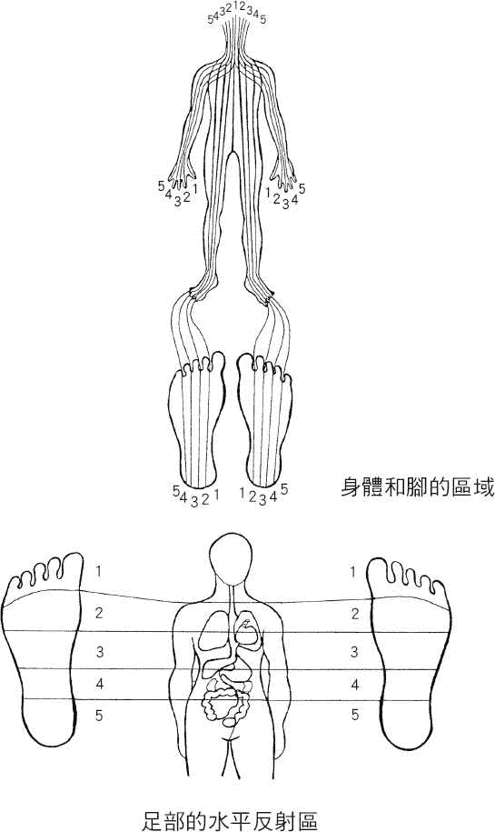 |
| 图说：图 4a　身体和脚的水平和垂直区域 |

## 反射疗法的类型

自原始的足部区域反射疗法出现以来，其他形式的反射疗法也陆续出现。其中一些包含足部区域反射疗法，另一些则使用中国经络系统、脏腑系统和脏腑─关节系统，还有一些完全使用能量原则。每种类型都假设整个身体可以映射到脚上，从而在宏观世界中提供了一个微观世界。反射疗法的类型包括「足部反射疗法」、「手部反射疗法」、「垂直反射疗法」、「脏腑反射疗法」、「宇宙反射疗法」、「区域反射疗法」和「轻触式反射疗法」。还有几个概念需要考虑，你在病人身上施用的压力取决于你研读和实践的反射疗法类型，范围从在压痛点上使用非常重手法的按摩到几乎不碰触都有。因此，有关这种美好治疗形式的各种想法和方法都一一问世了。

无论你使用哪种反射疗法，治疗背后的基本原理都是藉由碰触或按摩来影响身体许多反射区域，进而为该区域带来放松、和谐及体内动态平衡的稳定状态（能量平衡）。治疗的效果可能会是立刻感觉到、治疗结束后感觉到、在第二天或直到两天后才感觉到。当然，除了脚之外，反射区还出现在身体的许多区域。据说，身体上还有多达十四个反射区域可用于诊断、十个反射区域可用于治疗。

诊断区域包括：虹膜、舌头、牙齿、脸部、太阳穴、脉搏、手部、头颅、耳部、足部、腹部、脊椎，经络、主要脉轮和次要脉轮。治疗区域位于：耳部、头骨、太阳穴、脸部、手部、足部、腹部、脊椎、经络和脉轮上。虽然反射点出现在身体其他地方，但在本章中，我们将集中精力使用脚上和手上的脉轮反射区。

反射疗法是很好的治疗方法，可以对患有急性和慢性疾病的人产生巨大影响。虽然所有类型的反射疗法都有效，但也有一些类型比其他类型更有效。在我提出在手上和脚上结合脉轮来使用之前，有效的反射疗法类型似乎是使用轻触的那类，同时还要认知到一个事实──反射疗法的用意是轻柔按摩，而非摧毁！我数不清曾看到多少治疗师给予过度强烈的治疗，当他们在治疗床上方几公分处进行治疗时，往往弄得病人痛到说不出话，或者是痛到大声喊叫。

其实，反射疗法不需要过于强烈和重压，如果相关的身体部位处于失衡状态，反射区会变得柔软及痠痛，这应该当成是病人发出的信号，用来通知治疗师有地方出错了，因此更要善待这些反射区，而不是用重手法的按摩去击败它！

我一直以来都是轻触反射疗法的倡导者，并且了解反射疗法是透过身体的能量系统（受中枢神经系统控制）起作用的。根据经验显示，碰触越轻，治疗效果越强大，但是这还要配上治疗师的意图。与多数碰触疗法一样，如果治疗师是以同情、爱心和善意来从事治疗，反射疗法会运作得最好。纸本书二五二、二五三页的图 4b 和二五四至二五七页的 4c，显示了典型的足底和手部反射图。

## 脉轮反射区

七大主要脉轮的反射区很容易就能在脚上和手上找到。正如你所期望的那样，它们的定位反映了它们在身体上的位置，较低的五个脉轮沿着脚和手的内侧定位；天目轮位于脚拇趾和手拇指的中间，用以显示第三只眼和脑下垂体的位置；顶轮则定位在脚拇趾和手拇指的尖端上。二十一个次要脉轮的反射位置也如预期般，位于身体的侧面，例如耳轮、肋间轮和肩轮的反射区位于脚和手的侧面，而在肢体上的次要脉轮，例如膝轮、肘轮、手轮和脚轮的反射区，也在脚和手的侧面。另外，锁骨轮、小脐轮和腹股沟轮的反射区则位于第二个区域──锁骨轮介于肩轮和喉轮反射区的水平线上，小脐轮位于太阳神经丛（大脐轮）和丹田轮的反射区之间，腹股沟轮则在海底轮反射区的侧面。至于脾轮，它是故意没有位置的，因为脾轮的特性与太阳神经丛（大脐轮）、小脐轮和丹田轮非常相似，所以和其他三个脉轮一起使用是多余的。完美主义者可能会争辩说，它应该放在脾脏反射的位置，也就是左脚的第四个区域，但请记住，脾轮与脾脏器官不同啊！在实践这种疗法超过二十八年的岁月里，我从未需要使用到它。

纸本书二五八、二五九页的图 4d 和 4e，显示了脚上和手上的脉轮反射区。虽然将手指作用在准确的反射点上可达到理想的效果，但就和身体上多数穴位及反射点一样，它们周围都有一个影响区域，经验会告诉你是否已在反射点上或很接近它了，因为与脚上其他地方比起来，这个点触摸起来的感觉是不同的。这种感觉很难描述，我只能说它感觉象是「有磁力的」，也就是说，一旦手指放在脉轮的反射区上，它们将在能量平衡或治疗期间被这股磁力「保持」在适当位置。

如前所述，身体上的脉轮穴位非常强大，会在它们的周围产生一种磁力共振；脉轮的反射点也类似于这种情况，只是没有这么强大，而主要脉轮穴位的磁力又比次要脉轮穴位要强一些。下一章也将介绍在脉轮反射的身体─乙太体气场中，利用这种额外磁力来运作的技巧。

| 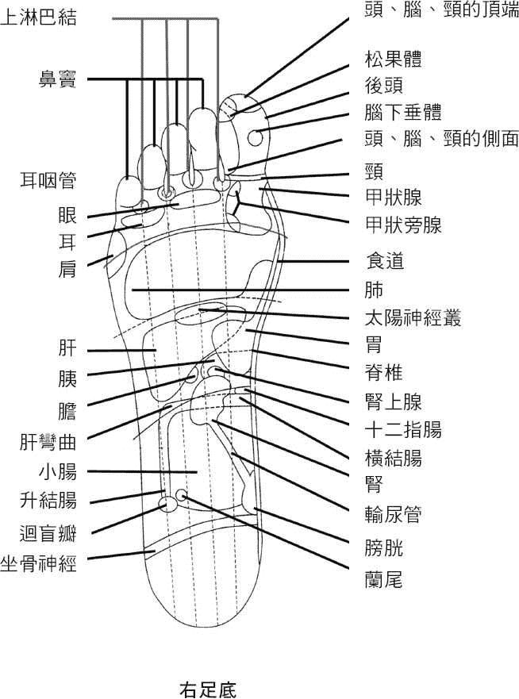 |
| 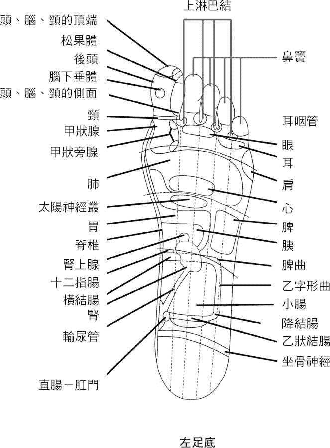 |
| 图说：图 4b　典型的足底反射图 |

| 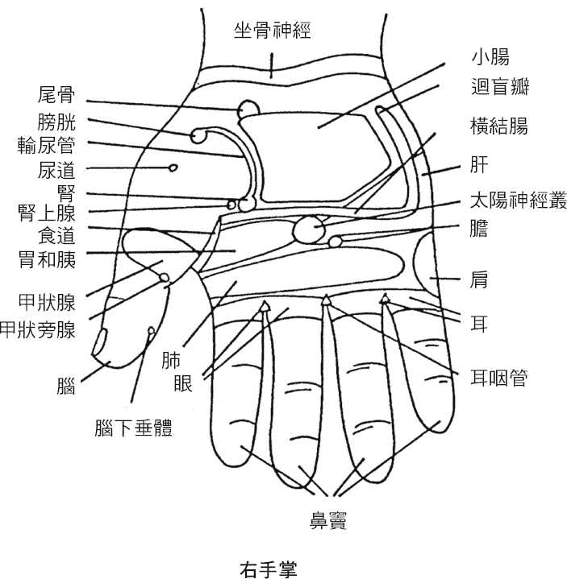 |
| 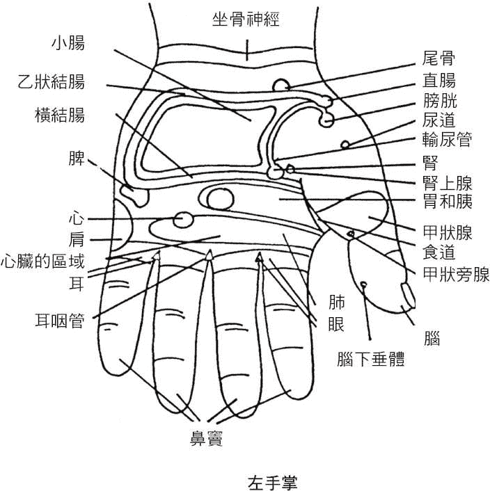 |
| 图说：图 4c-a　典型的手部反射图 |

| 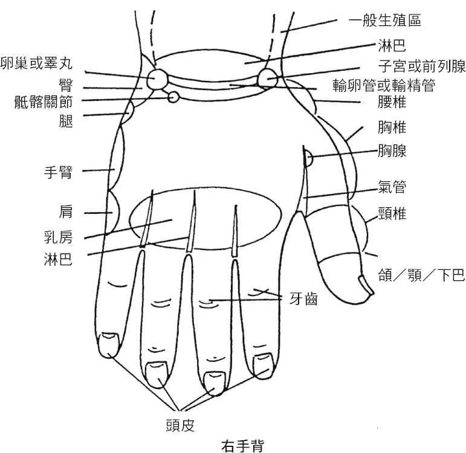 |
| 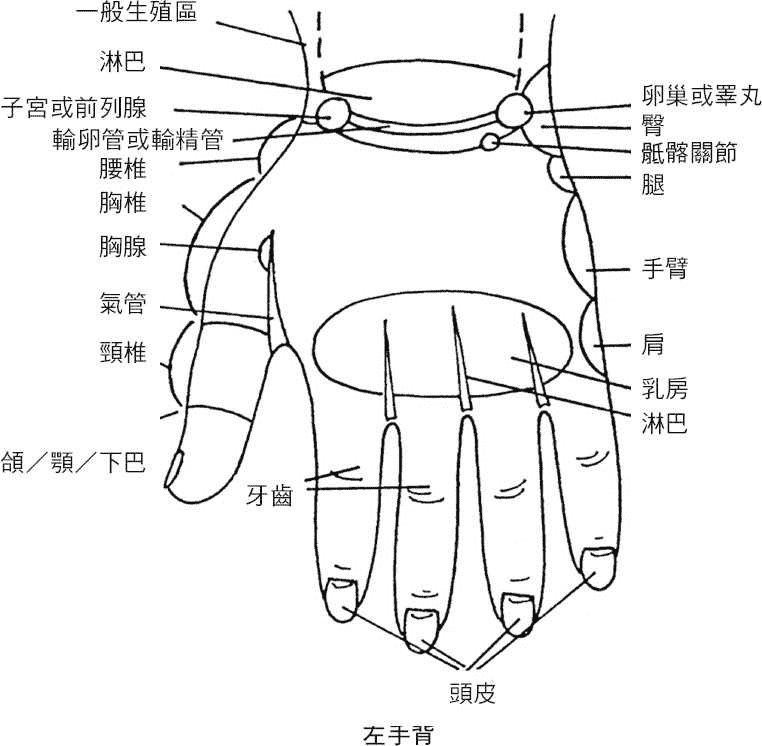 |
| 图说：图 4c-b　典型的手部反射图 |

| 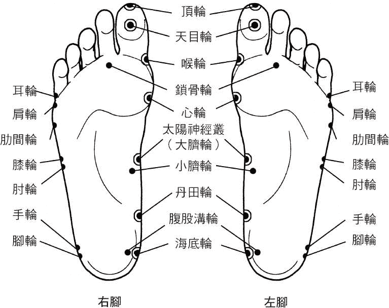 |
| 图说：图 4d　主要脉轮和次要脉轮在足底的反射区 |

| 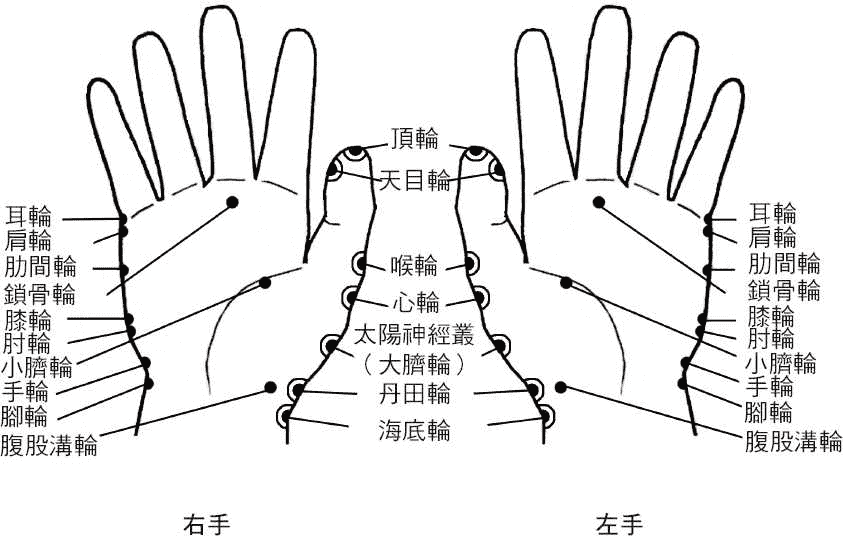 |
| 图说：图 4e　主要脉轮和次要脉轮在手上的反射区 |

## 治疗前的预先处理

让病人有充分的时间「释放」一天中或是来看诊的旅程中累积的压力，是非常重要的。小聊一下可让他们有时间放松，也很重要。病人应感觉舒适、保暖，可仰卧、坐在治疗床上，或舒适地坐在反射疗法专用的放松按摩器上。

病人的脚要露出来，放在舒适的高度；同时，你也必须像病人一样舒适，这点很重要。接下来轻轻按摩脚部，这应该会让病人感到放松，也可以让你初步评估脚的整体外观（当然，这点同时反映了全身的状况）。「是否使用按摩油」总是存有争议，经验显示它有助于提供无摩擦的表面，以便在其上工作，它对治疗会轻微出脚汗的病人也有帮助。按摩应该持续几分钟，范围包括小腿和所有脚趾。在这个阶段也应该进行一些被动的关节松动术，因为僵硬的关节在所有慢性疾病中非常常见。除了那些脚很敏感的人，病人基本上会很喜欢足部松动术。

## 初始的按压

开始按摩之后，根据所呈现的疾病类型，应该从三种初始按压中选择一种来执行，这具有启动能量平衡的作用，类型如下：

‧在紧张和焦虑的情况下，请按压涌泉穴。

‧面对所有急性病症，请握住脚趾。

‧面对所有慢性病例，请握住脚后跟。

##### 涌泉穴的使用

涌泉穴位于足底的中间区域，距脚跟约三分之二、距中间脚趾尖三分之一的地方。在反射疗法中，它与横膈膜的上部及中部接近，且刚好靠近太阳神经丛（大脐轮）的反射区。它是足底唯一的穴位，通常称为脚轮穴位。无论病人呈现出的整体情况如何，在所有紧张、压力和焦虑的情形下，应将其视为与病人的初始接触点，接着再做按摩和松动。正确使用时，它会是一个非常神奇的点。（见图 4f）

首先，用双手中指指腹轻轻碰触双侧的涌泉穴，只要碰触此点（不要刺激它们），大约两分钟后就会感受到重点改变，这时病人会开始感到更加放松。如果你觉得有需要，可以继续按住涌泉穴几分钟。此外，治疗乙太体时，涌泉穴也很好用，这部分将在最后一章讨论。如果你发现很难长时间将手指放在这个穴位上，请尝试将你的前臂靠在治疗床末端，然后交叉双臂，以便右手中指指腹碰触病人的右脚，左手碰触左脚，用这姿势来做舒适多了。

涌泉穴也广泛用于指压疗法（有时针灸也会用）和磁疗中的脉轮疗愈法。正如第二章所述，它与手轮和顶轮有关。接着，你可以握住脚趾或脚后跟，这取决于病症是急性还是慢性而定。使用手部反射疗法时，用的是手轮的劳宫穴，尤其病人不方便脱鞋和脱袜子时，这个穴特别好用。它也是一个很好的自我平稳方式，试试看，它确实有效！它比经高度使用和误用的合谷穴效力要好得多了。

| 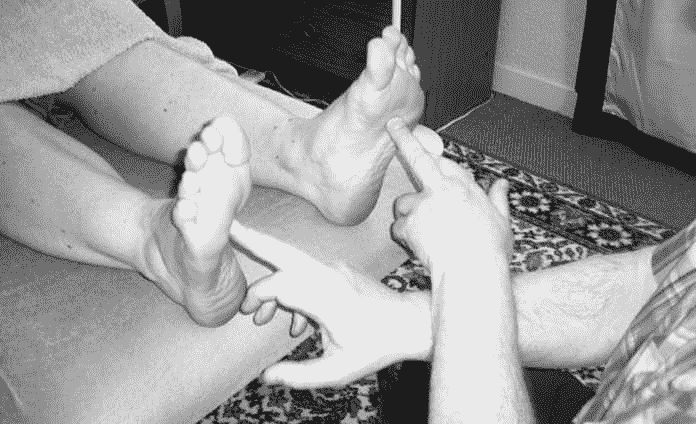 |
| 图说：图 4f-a　按住涌泉穴 |

| 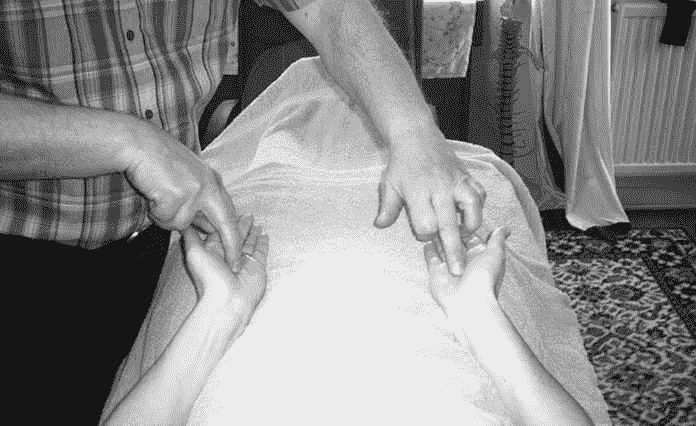 |
| 图说：图 4f-b　按住劳宫穴 |

##### 急性病症：握住脚趾

急性病症是指来得急的病症，通常透过正确的治疗会迅速消失，症状从喉咙痛到胃部不适都有。这部分通常只适用于治疗家人和朋友，因为有这病症的病人通常不会来咨询治疗师。

脚趾是脚的附属物，中医认为它可控制急性或「阳性」症状，脚跟则控制慢性或「阴性」症状。你的前臂必须有所支撑，双手完全放在病人脚趾上，以「包覆环绕」的模式握住脚趾（请参见图 4g）。在主要治疗之前，先握住脚趾几分钟有两个目的：首先，它可以衡量或导引病人的阳气状况；其次，它有助于使阳气进入稳态，从而让病人更加放松。手指下的感觉通常是热或刺麻感，你的双手通常会变得又红又热。当你的双手变得更暖和时（通过传导、对流和磁能流动的组合），病人似乎稍微凉爽起来，也更加放松和安静。握住脚趾并没有治疗任何特定病症，但会发生阳气平衡。握住脚趾之后，可以进行特定的疾病治疗（稍后描述）或去握住脚后跟，如是潜藏的阴性病因造成阳性症状时，即可如此进行。

| 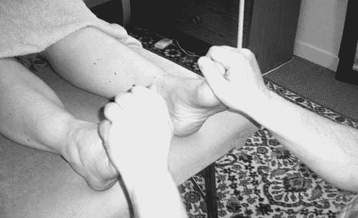 |
| 图说：图 4g　握住脚趾 |

##### 慢性病症：握住脚后跟

握住脚后跟是评估、平衡和治疗病人能量系统真正美妙的方式──基本上就是保持双手静止不动。在我前一本书中，我描述了如何使用握住头颅和脚后跟来做为「情报站」。之后，我收到有关这项主题大量的回应，而相关主题的工作坊不得不延长时间来加入这些额外的知识。几乎每个咨询过你的病人都会患有某种形式的慢性疾病，尽管你可能不是一名反射疗法治疗师，以下所讨论的治疗前预先处理也是非常值得学习的。

###### 位置

确保病人处于舒适的状态，以及你的前臂是有所支撑的。你可能会持续握住脚后跟十五分钟，所以必须确定这姿势让你很舒适。两个脚后跟应该「拥抱」起来，也就是说，右手握住左脚后跟，左手握住右脚后跟。（见图 4h）

| 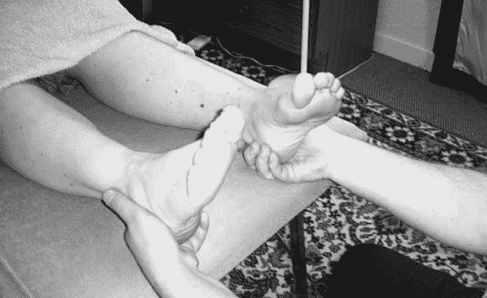 |
| 图说：图 4h　握住脚后跟 |

###### 整体能量评估

为了评估病人的整体能量水平，至少需要握住脚后跟几分钟。尽量不要移动你的手（即使是微调），也不要运用意念去做。大约两分钟后，会出现某种程度的热、刺麻感或其他感觉。一般来说，如果你和病人的脚后跟之间有温暖的光热，就表示能量大致平衡了。在这种情况下，可以开始进行具体的治疗。如果一个脚后跟很温暖，另一个脚后跟却是冷的或黏滞的，这表示能量失衡，应该先去平衡脚后跟的能量。如果脚后跟几乎没有任何温暖或光热，表示情况是极度阴性，你也应该进入能量平衡模式。当脚后跟偶尔会感觉黏滞、潮溼时，表示内脏器官大大缺乏生命力。

###### 平衡病人的整体能量

脚后跟是一个很棒的工具，可以透过它平衡病人的整体能量。请注意，病人罹患慢性疾病时，平衡不会在一次治疗中就发生，可能需要三次甚至四次的治疗。在用这些技巧时，你必须要「调频」到病人的能量，这是基本要求，这与在颅荐疗法或颅骨疗法中透过托头颅（vault hold）来调整能量的做法非常相似。颅荐疗法的纯化论者坚持认为，操作托头颅的动作时，会感觉到脑脊髓液的节奏或流动。正如我在我的第一本书提到的，一个人的训练引导了他关于这个问题的哲学。很明显地，脑脊髓液运动在脚后跟是感觉不到的，但病人的生命力（气）很明显可以侦测到，它是经由身体中的血液、淋巴液和滑液这整合的液体结构所传送的。因此，至少应该握住脚后跟两分钟，并且必须感觉到轻微的重点改变。这情况一旦发生，你便可以去感受身体内的气的流动，这可以藉由感应在脚后跟的轻微扩张及收缩来做到。

当你感觉到脚后跟的扩张及收缩时，试着扩大手中的这种感觉，来创造能量的「气球」效应。这种创造出来的向内和向外运动，与在颅底调频到脑脊髓液的流动时得到的感觉完全相同。当在每个脚后跟得到相同的感觉，其气球效应也相同时，就达到能量平衡了，可尽量使用意念来达到平衡能量的目的；换句话说，观想脚后跟能量扩张和收缩时，你也可以随着新发现的节奏温和地移动。

###### 具体分析

要使用这种技巧来分析个别器官能量的失衡与否，可以去向病人的能量系统提问，就像进行托头颅的做法一样。一旦感觉到正常的气节奏，试着询问关于个别脉轮或内部器官状态的具体问题。每个默默提出的问题都必须能用「是」或「否」来回答。例如，你可以默默地询问喉轮是否需要治疗，或者脾脏内是否有足够的能量流。当问题的答案是否定时，继续发问，而当答案为肯定时，停止发问。问题可以调整得越来越细，直到你得到确切的诊断或分析，足以帮助你制定治疗方案为止。请记住，得到肯定的答案会改变发问流程。这是病人的能量系统在与你进行交流，并试图显示失衡原因在何处的妙法。这只是「身体探测」的一个面向，在下一章中将更详尽地介绍。

###### 治疗模式中的脚后跟

没有理由不透过脚后跟来进行治疗，或者至少从那里开始治疗。许多从我的工作坊学习过这种技巧的人都说，反射疗法治疗师真的很感激这个扩展他们工作维度的方法。这个方法必须用到一定程度的意念去「调频」到手上正进行的事，由于需要时间和耐心，你可能要停止闲聊，来产生更大的专注力和意念。这通常没有问题，当你的程序进行到这个阶段时，病人通常会太过放松而不想说话了；实际上，经常都睡着了。

接着，要去辨别脚后跟里面的节奏，即气的扩张和收缩的节奏，并继续将意念朝你确定需要治疗的脉轮或器官前进。例如，如果喉轮迟缓，就需要把注意力放在这个区域。如果极端认为这种形式的能量疗法不需用全然的承诺及专注力就能成功达成，那就没希望了，其实思绪是不能到处乱晃的──它必须全神贯注。

可想象气（疗愈）的能量从脚后跟旅行到喉轮，譬如，用意念将它从脚后跟推到腿部和躯干，再到喉咙区域。当你这样观想时，气的扩张和收缩就会消失。这个步骤可能持续四到五分钟，在此期间你的注意力不得丢失，等到病人出现变化，例如有打哈欠、叹气等信号出现时，表示治疗已经成功，可再次去平衡能量了，这时也会再次感觉到脚后跟下的扩张和收缩。

许多反射疗法治疗师对于运用脚后跟来治疗感到满意，且不打算执行稍后会详述的治疗方案。这完全是个人的选择，并不意谓着治疗效果较差或较好。

## 透过脉轮反射区平衡整体能量

在某些情况下，第三章建议应在治疗个别脉轮之前完成脉轮能量的平衡，这在反射疗法中也一样，先平衡脉轮反射区有助于病人的放松，会让治疗更容易执行。它也有助于凸显失衡的地方及需要治疗的脉轮。脉轮反射区的能量平衡分为两个阶段：左脚和右脚的平衡、从上到下的平衡。使用非常轻柔的碰触，且必须使用相同的手指以获得磁性平衡。最多人使用中指，但用食指也完全没问题。手指按在同一位置，直到每个手指下面感受到类似的感觉为止。经验显示，交叉双手来做会更舒服，也就是将右手手指放在病人的右脚，并将左手手指放在病人的左脚上。交叉双手对下面的五个脉轮都很好，但到了天目轮时，双手不交叉可能比较容易做。

##### 右脚与左脚的平衡

确定病人感觉很舒适，而你将前臂放在治疗床的末端，确保它们有很好的支撑，接着将中指放在位于脚后跟内侧下端的两个海底轮反射点上，并用指腹去施加非常温和的压力。在每种慢性疾病中，海底轮的反射点都是非常迟缓的，因此可能需要花一段时间来平衡能量，也可以轻轻地刺激这些点数秒钟，使它们「活过来」，再去按住它们。这应该不到两、三分钟即可完成，一旦平衡后就没有必要延长碰触的时间，除非被平衡的脉轮也是最终需要治疗的脉轮，这种情况下就很适合延长，只是不需要达到「重点改变」即可进行下一个平衡。接着，将两根中指移到位于下腰椎水平的丹田轮反射区，重复以上的程序，然后依序将中指移到太阳神经丛（大脐轮）、心轮、喉轮、天目轮和顶轮的反射点去平衡能量。你会发现，越靠近脚趾、能量越平衡时，手指下的感觉和脚的质地会相当不同，通常「上方」的脉轮会花费比较多时间来达到能量平衡。

##### 从上到下的平衡

完成了一只脚与另一只脚的平衡后，现在要来平衡「配对」脉轮了。它们的配对关系依次是心轮与太阳神经丛（大脐轮）、喉轮与丹田轮、天目轮与海底轮，以及顶轮与海底轮。请注意，海底轮有天目轮和顶轮两个配对，就像身体上的脉轮配对一样，而此处的技巧与平衡左脚和右脚的方法完全相同。中间两个配对的平衡应该很快就可达成，涉及海底轮的外部平衡则比较久，可能需要两到三分钟。在平衡双脚脉轮反射点的整个过程中，你会觉察到异于常态的个别脉轮，这些差异可能是以平衡过程迟缓、皮肤质地不同、局部出汗等形式来呈现，而差异的出现通常表示特定的脉轮需要治疗（见下一节）。虽然平衡脉轮反射点的过程不应过于仓促，但相对于使用个别脉轮的反射区来做主要治疗，它的重要性仍居其次，这是我想提出的主要观点。话虽如此，它仍然是一个强大的疗愈工具，任何能带来放松及能量平衡的治疗，对病人都是有益的。

## 使用个别脉轮的反射区进行治疗

##### 急性病症

此技巧可用于缓解身体任何急性、疼痛或发炎的区域，以及治疗亚急性病症和慢性病症的急性疼痛。大多数慢性病症毫无疑问都有「疼痛」的一面，在这些病症的初期治疗阶段，使用这项技巧是有用的。

###### 治疗原则

这项技巧本身就很简单。将一只手的中指置于最急性的器官反射点，即急性病症区域的确切反射点，可能是一个内部器官、关节或肌肉区域，这都无所谓，然后将另一只手的中指放在相关的主要脉轮反射点上。这两根手指轻轻碰触反射点约三到四分钟，不进行任何按摩或运动，按到疼痛或炎症有所变化为止，病人通常会告知你这种情况发生了，尤其当你的手指下感觉到重点改变时，病人会立刻告诉你疼痛缓解了。这是一个和病人双向合作来治疗，而非单向为他们做点什么的绝佳例子。下面所选的例子包含了每个主要脉轮反射区对急症的治疗，请参见图 4i。

‧右眼疼痛：将左手中指放在眼睛反射区。眼睛反射区有几种定位，请选择你已经学过或感到舒服的定位法，其中图 4i 显示了在跖骨头上的典型定位。再将右手中指放在左脚大拇趾尖上的顶轮反射区。

‧左耳疼痛：将左手中指放在天目轮的反射区，右手中指放在左耳的反射区。再次说明，耳朵的反射区可能在脚拇趾的旁侧或跖骨的头部。

‧喉咙痛：将一根中指放在任一脚的喉咙反射区，另一只手的中指放在喉轮的反射区。由于这两点通常是相同的，所以看哪只脚的喉咙反射区会痛，中指就放在那点上。

‧胸骨或胸中疼痛：将一根中指放在疼痛的胸部反射区，另一根中指放在心轮反射区。

‧胆囊绞痛：将左手中指放在胆囊反射区，右手中指放在左脚的太阳神经丛（大脐轮）反射区。

‧月经痛：将一根中指放在最疼痛的反射点（这可能在脚的内侧），另一根中指则放在丹田轮的反射区。

‧膀胱炎：将一根中指放在膀胱的反射区，另一根中指放在另一只脚的海底轮反射区。请尝试这些按压法，它们真的管用！

| 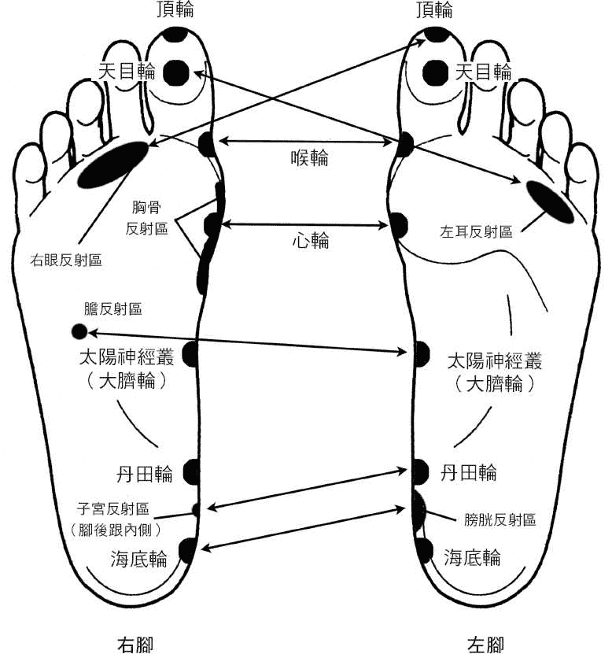 |
| 图说：图 4i　在急性病症时使用脉轮反射点 |

##### 慢性病症

就其性质而言，慢性病通常比急性病需要更多时间、耐心和专业知识来治疗。反射疗法治疗师通常要做好几次治疗才能缓解一个慢性病症，此处也不例外，只是使用这种方法会减少治疗的次数，这对你的银行存款并不总是有益，但治疗师和病人的满意度将弥补这一点。

###### 治疗顺序

一、如前所述，从右脚到左脚和从上到下去平衡主要脉轮的反射区。不论是第一次还是第十次治疗，每次治疗一开始先去平衡是很重要的。你会发现，随着病情改善、病人生命力增强，平衡的部分将变得更加容易。当能量平衡已经达到时，不要试图做更多，尽管你会很想超越那个点。

二、平衡器官反射区与相关的主要脉轮反射区之间的能量。这个程序是治疗的主要重点，因此需要花一些时间，而且治疗时要考虑到被治疗的个别脉轮与其相关器官之间的关系，通常相关的器官大多处于阴性状态，需要稍微刺激一下。这里还使用比较传统的反射疗法，使你能够运用比较熟悉的技能。

此处分为两个阶段：首先，刺激或按摩相关的反射区域。这些区域需要按摩半分钟，有需要时可以按更久一些。如果该地区极端需要治疗，它感觉起来会是阻塞、缺乏「纤维」的，此时需要用拇指和食指进行相当多的按摩。如前所述，并不是要用手指把病人掐到尖叫，而是进行相当温和且彻底的按摩，这要一直做到你明确觉知到组织有改变为止；也就是说，组织应该感觉更有弹性、更温暖，并且更「有活力」──任何有能力的反射疗法治疗师都知道这是什么意思。

其次，平衡主要脉轮反射区与相关器官反射区的焦点，按摩反射区时所找到最疼痛的点即是反射区的焦点，这个疼痛点通常就是「有症状」的点，即在反射区域上最能反映身体症状的那个点。在反射面积大的情况下，可能有一个以上的症状点。每个点都必须分开来治疗及平衡。

在此要说明，并非所有七个主要脉轮的反射区都需要治疗，你只需要治疗出现症状的脉轮，这一点很重要。可藉着从病人身上搜集到的病症信息，或者是在平衡阶段无法平衡好的脉轮反射区，来得知哪些脉轮需要治疗。一旦发现焦点（症状点），就需要和相关的脉轮反射区来进行平衡。如果这两点的位置靠得很近（这种情况经常发生），就可改成平衡焦点与另一只脚上的脉轮反射点，这样做甚至比较好。假使能量平衡很快就达成，这就很可疑了，因为这样就没必要治疗此脉轮了！因此，这两个点需要被刺激到组织开始放松为止，过程可能需要花一分钟以上，而当你觉得它们放松时，再按住那两个点两到三分钟，直到获得重点改变为止（详见第三章）。一旦重点改变发生，双方的意识也都处于阿尔发／系塔状态，组织就会感觉非常温暖、舒适且柔韧，几乎有一种「温暖的油灰」的感觉。能持续按住长一点的话更好，这是治疗的关键，两点持续按压的时间越长，效果就越好。

三、接着，平衡相关的主要脉轮反射区与其配对的次要脉轮反射区的能量。现在焦点已经与主要脉轮的反射区达到能量平衡，但是还需要透过脉轮复合体的其他部分来加强疗效。所以下一步是去平衡主要脉轮反射区与配对的次要脉轮反射区的能量，这程序与指压疗法中去平衡损伤区与脉轮的能量形成对比。当我们解决的是反射区的问题时（如本章所述），要治疗的是脉轮，而不是焦点本身，因为焦点仅代表症状点，而脉轮代表的是病因。每个主要脉轮的反射区都包含两个相关的次要脉轮反射区，只有太阳神经丛（大脐轮）和丹田轮例外，它们「共享」脾轮的反射区。与之前的治疗一样，在这两个点达到能量平衡之前，可能要先刺激它们，以便为该区域建立一些能量。每个脉轮都要分开平衡，先平衡主要脉轮反射区与其中一个次要脉轮反射区的能量，再平衡另一个次要脉轮反射区的能量；如果条件允许，两个次要脉轮的反射区也可相互平衡，能做到的话很好，但这不是必要的步骤。

四、最后，平衡脉轮反射区与海底轮反射区的能量。这治疗过程的最后一部分可加强迄今取得的成果。透过平衡脉轮反射区与海底轮反射区的能量，你正在创造一个坚固的地基，以防止治疗提早「失效」。我经常听到病人说，在一次治疗后，他们的症状会好转很多天，然后又重新出现。当脉轮反射区有海底轮来支撑时，这种现象就不会发生。当然，如果受影响的脉轮反射区是海底轮时，就不需要执行这个阶段的治疗了。

在下一节中，我们将探讨个别脉轮反射区的治疗方法。请参见图 4j 至 4p。

## 个别脉轮的治疗法

##### 顶轮

见图 4j。

‧相关的身体系统是大脑上部（更高的中心）和右眼。

‧相关的主要脉轮是海底轮。

‧相关的次要脉轮是手轮和脚轮。

‧内分泌腺是松果体。

‧可能的症状包括眩晕、高血压和低血压、右侧偏头痛、妄想症、忧郁症和恐惧症倾向。

‧反射区域包括头部反射区（脚拇趾）、位于右脚第二脚趾和中趾底的跖骨头上的右眼反射区。

| 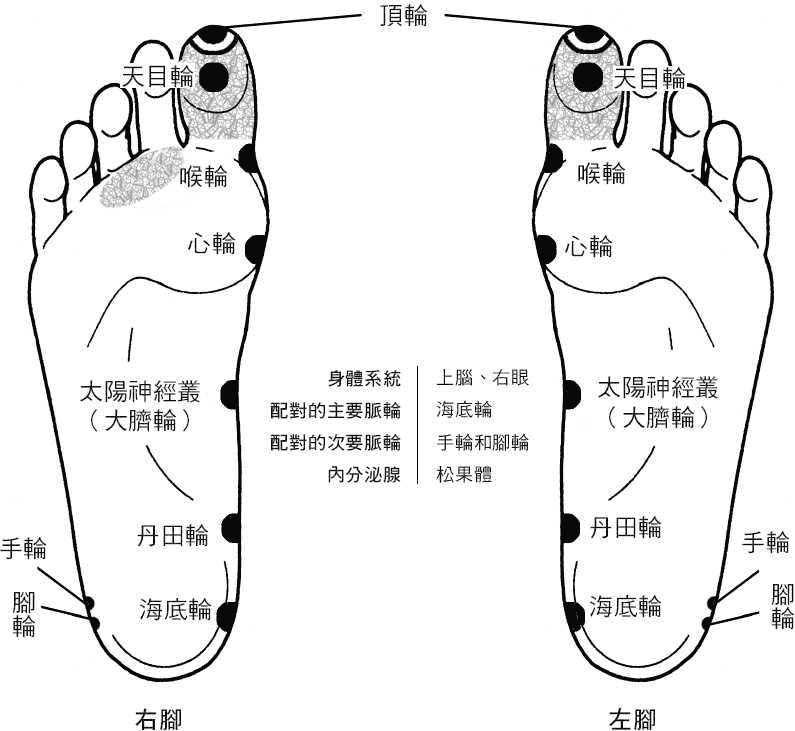 |
| 图说：图 4j　顶轮的治疗 |

###### 治疗顺序

一、如前所述，治疗的第一阶段是从左到右和从上到下去平衡脉轮反射区的能量。

二、第二阶段，用拇指指腹或其他指腹轻轻按摩反射区域，搓揉直至组织感觉更放松。记录反射区域内的各个压痛点，这对接下来的治疗很重要，一定要花时间做这件事，特别是要记录围绕着脚拇趾的所有个别反射区的压痛点。

三、第三阶段是平衡反射区域内的焦点与顶轮反射区的能量。如果病症是影响到头部，例如头痛、焦虑或右眼症状，则焦点将与这些区域中的一个有关；如果头顶部出现更多症状，则应该按头顶反射区的点；如果右眼出现更多症状，就应该按住右眼反射区的点。平衡焦点与顶轮反射区时，重要的是放一根手指在焦点上，另一根手指放在另一只脚的顶轮反射区来执行，否则点和点之间的距离太小了。请记住，在这个阶段需要获得重点改变，这对治疗是否会成功影响甚大。请记住要「让事情自然发生」！

四、下一阶段是去平衡顶轮的反射区和脚轮的反射区之间的能量（并不是脚轮的涌泉穴）。这可以在同一只脚或另一只脚上完成，都无所谓。接着，平衡顶轮的反射区与手轮的反射区的能量，两者都不会花太长时间。

五、最后阶段是平衡顶轮的反射区和海底轮的反射区的能量。这个步骤支持和加强了本次治疗剩下的部分，并且需要几分钟的时间来获得重点改变。在这个阶段，病人会感到非常放松，建议他在白天尽可能多休息是很重要的，也要告诉他多补充水分，不要吃太多含淀粉或糖的东西。

##### 天目轮

见图 4k。

‧相关的身体系统是中枢神经系统、耳朵、鼻子和左眼。

‧相关的主要脉轮是海底轮。

‧相关的次要脉轮是锁骨轮和腹股沟轮。

‧内分泌腺是脑下垂体。

‧可能的症状是偏头痛、慢性黏膜炎、鼻窦炎、感染性和传染性疾病、耳聋和听力改变、颈椎病、与梅尼尔病相关的压力和忧虑、眩晕、头晕和头脑「混沌不清」（脑雾）。

‧反射区域包括脚拇趾、所有脚趾的尖端（鼻窦反射区）、耳朵和左眼（脚趾下的经典位置）。

| 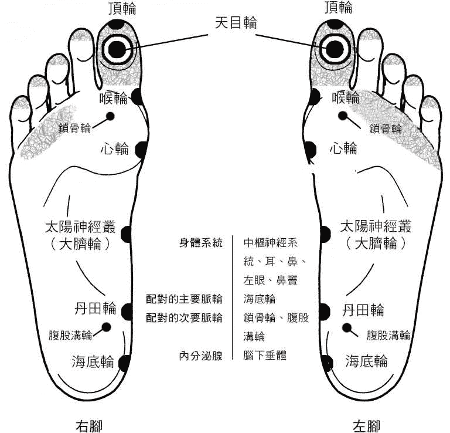 |
| 图说：图 4k　天目轮的治疗 |

###### 治疗顺序

一、如前所述，治疗的第一阶段是从左到右和从上到下的去平衡脉轮反射区的能量。

二、接下来，轻轻按摩反射区域。花点时间做这件事，并试着确定「压痛点」（焦点），以备后用。

三、下一阶段是将天目轮的反射区与之前推断出的焦点进行能量平衡。这是治疗的主要重点，在进入下一阶段之前必须获得重点改变。如能交互采用双脚上的焦点，对医师和病人双方都会比较舒服。（译注：即一根手指放在焦点上，另一只手的手指则放在另一只脚的天目轮反射区上）

四、随后，平衡天目轮的反射区和锁骨轮的反射区之间的能量，接着平衡天目轮的反射区和腹股沟轮的反射区的能量。此时使用哪只脚都可以，而且两个次要脉轮之间不需要相互平衡。

五、最后阶段是平衡天目轮的反射区与海底轮的反射区之间的能量。这强化并支持了剩余的治疗，要一直做到获得重点改变。之后，要提供病人有关放松、摄取大量水分、白天不要吃太多的建议。此外，要教导病人如何自行按摩脚拇趾上天目轮的反射点（脑下垂体点），因为这会增加治疗效果。如能确保这一点经常按摩到，病人将获益良多。

##### 喉轮

见图 4l。

‧相关的身体系统是肺、支气管、声带、消化道（大肠）和上肢。

‧相关的主要脉轮是丹田轮。

‧相关的次要脉轮是肩轮和小脐轮。

‧内分泌腺是甲状腺。

‧可能的症状包括偏头痛、慢性和急性喉咙痛、扁桃腺炎、哮喘、羞怯和内向、味觉丧失、慢性和急性支气管炎、结肠炎和肠躁症、回盲瓣症候群和慢性皮肤损伤（如溼疹和脱发）。

‧反射区域包括双脚的肺部区和大肠区。

| 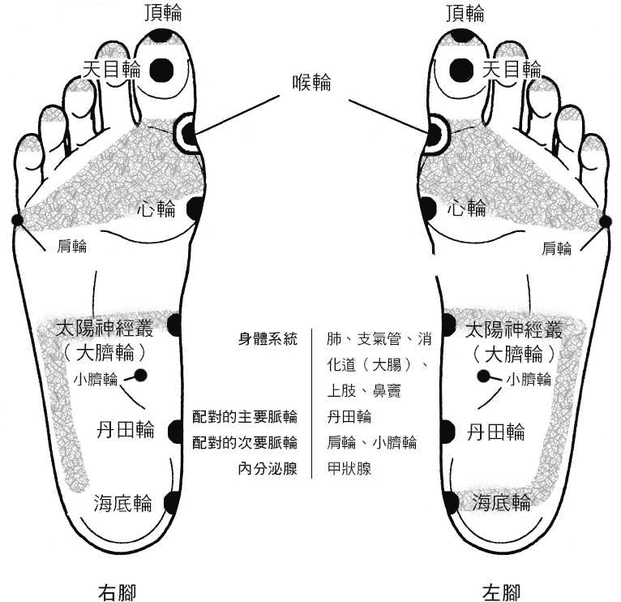 |
| 图说：图 4l　喉轮的治疗 |

###### 治疗顺序

一、如前所述，第一阶段是从左脚到右脚、并从上到下来平衡脉轮反射区的能量。

二、其次，按摩双脚底部的反射区，肺部区不要像大肠区那样用力按摩，这和器官本身的娇嫩特性有关。要明确定位稍后会使用到的焦点，这里可能会有两个焦点，一个与呼吸系统有关，另一个与大肠有关，这将取决于病人的主诉症状。

三、第三阶段是平衡喉轮的反射区和焦点之间的能量。如果这些点很靠近，请改为平衡另一只脚上的脉轮反射区。由于这个阶段是治疗的关键部分，在进入下一阶段之前必须获得重点改变。

四、平衡喉轮的反射区与小脐轮的反射区之间的能量，接着平衡喉轮的反射区和肩轮的反射区的能量。这两个次要脉轮之间不需要相互平衡。

五、最后，平衡喉轮的反射区与海底轮的反射区之间的能量，以支持和加强迄今取得的成果。这里应该着重于获得重点改变，尽管诸如慢性支气管炎等严重的慢性病例，在前几次的治疗中可能尚无法达到能量平衡。

由于喉轮涉及排泄（身体和情绪方面），请对治疗期间和之后可能发生的两件事情有所准备。首先，由于清理掉导致喉轮阻塞的深层情绪因素，病人可能会变得非常情绪化，请准备好面纸。其次，必须警告病人，治疗结束后体内可能还会继续清理，诸如：松软的大便、皮疹、油性皮肤、现有皮肤病症的恶化、鼻窦炎、黏膜炎或类似感冒的症状，请他们不要担心，这是完全正常的自然疗法反应，是要促进体内稳定平衡的一大阶段。

##### 心轮

见图 4m。

‧相关的身体系统是心脏、循环和迷走神经。

‧相关的主要脉轮是太阳神经丛（大脐轮）。

‧相关的次要脉轮是耳轮和肋间轮。

‧内分泌腺是胸腺。

‧可能的症状包括良性肿瘤及其成长、囊肿、从心力衰竭到二尖瓣狭窄的心脏病症、恶心、心悸和心跳过速、静脉曲张、流泪、焦虑、眩晕、内向和带状疱疹。

‧反射区包括心脏区和小肠区。

| 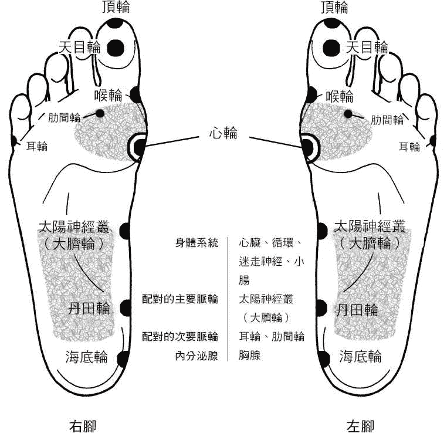 |
| 图说：图 4m　心轮的治疗 |

###### 治疗顺序

一、如前所述，治疗的第一阶段是平衡从左到右和从上到下的脉轮反射区的能量。

二、接着按摩双脚的心脏和小肠的反射区，小心确认以后要用到的焦点。

三、平衡心轮的反射区与焦点之间的能量，这是治疗中最重要的阶段，要小心体贴地进行，而在进入下一阶段之前，要获得重点改变。治疗心轮就像之前治疗喉轮的例子，也需要准备好面纸。在所有脉轮中，心轮的失衡大多由过去的情绪混乱所引起。因此，与任何形式的自然疗法一样，当病因得到解决时，病人的第一个反应就是「释放」病因，所以要让病人知道这是完全正常的，不用担心。

四、随后分别平衡心轮的反射区与耳轮的反射区和肋间轮的反射区之间的能量。除了带状疱疹外，没有必要互相平衡两个次要脉轮的能量。根据经验显示，这样的平衡有助于加强治疗。

五、最后，平衡心轮的反射区与海底轮的反射区之间的能量，以支持和加强已达到的成果。这阶段需要获得重点改变，也记得要和之前一样给病人建议。

##### 太阳神经丛（大脐轮）

见图 4n。

‧相关的身体系统是胃、肝脏、胆囊、脾脏、淋巴循环和免疫系统。

‧相关的主要脉轮是心轮。

‧相关的次要脉轮是脾轮（和丹田轮）。

‧内分泌腺是胰腺。

‧可能的症状包括如痤疮和溼疹的皮肤病症、胃溃疡、癌症生长、胆囊绞痛、腺热、自体免疫系统感染、任何类型的过敏、慢性疲劳症候群、花粉热、担忧、忧郁及焦虑。

‧反射的区域包括脚的中部，以及与淋巴引流有关的脚背区域。

| 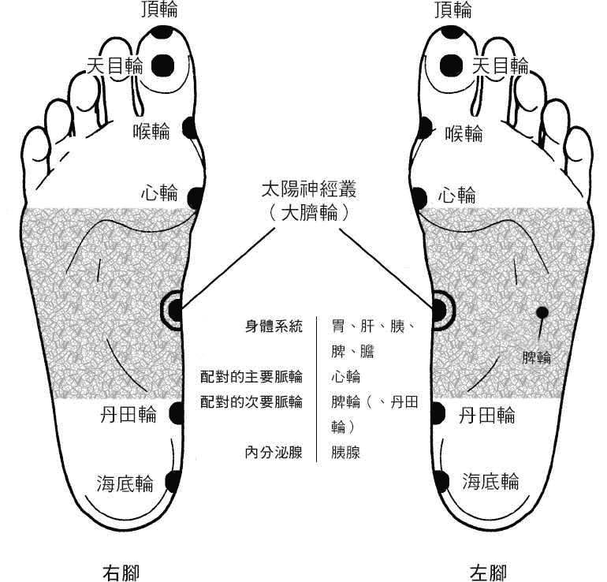 |
| 图说：图 4n　太阳神经丛（大脐轮）的治疗 |

###### 治疗顺序

一、治疗的第一阶段包括平衡从左到右和从上到下的脉轮反射区能量。

二、其次，按摩反射区域，请记得要包括脚背的淋巴区。小心地确认焦点，因为稍后会用到。

三、平衡太阳神经丛（大脐轮）的反射区与焦点之间的能量。这是治疗的主轴部分，要确定使用到正确的焦点，而且在进入下一阶段前要获得重点改变。

四、下一阶段是平衡太阳神经丛（大脐轮）的反射区与脾轮的反射区之间的能量。请注意，脾轮只有一个在左脚上的反射点。当病人患有任何免疫缺陷疾病，如：慢性疲劳症候群、腺热或任何过敏症状时，也该平衡太阳神经丛（大脐轮）的反射区与丹田轮的反射区。让脾轮和丹田轮这两个「次要」脉轮相互平衡，也会有所帮助。这些病症都涉及太阳神经丛（大脐轮）、丹田轮和脾轮这个三合一的脉轮组合。治疗患有癌症的病人时，这三个脉轮也需要使用到，这是很重要的。请记住：在辅助医学领域工作或没有注册的医疗从业人员不可以声称他们正在治疗癌症（以及糖尿病和性病）。然而，没有理由说癌症病人不能向你咨询让生命力得到极大的提升，也让身体可以忍受以治疗癌症为目标的常规（有时则是致病的）医疗程序。

五、最后阶段是平衡太阳神经丛（大脐轮）的反射区与海底轮的反射区能量，这可支持并加强已执行的治疗。此外，要适当建议病人在接下来的二十四小时内充分休息，并饮用大量的水。

##### 丹田轮

见图 4o。

‧相关的身体系统是生殖系统、淋巴循环和体液平衡。

‧相关的主要脉轮是喉轮。

‧相关的次要脉轮是脾轮和（太阳神经丛〔大脐轮〕）。

‧相关的内分泌腺是性腺或子宫。

‧可能的症状是生命力低下、慢性疲劳、阳痿、性欲高或低、喉咙痛、浮肿、「产热机制」失衡（包括冻疮和四肢发冷）、月经和更年期症状，以及一些类风溼病症。

‧反射区域位于脚后跟的内侧、下侧和外侧面。在这个区域增加了淋巴区（比照太阳神经丛〔大脐轮〕）及与生殖器官相关的脚的内侧和外侧区域。

| 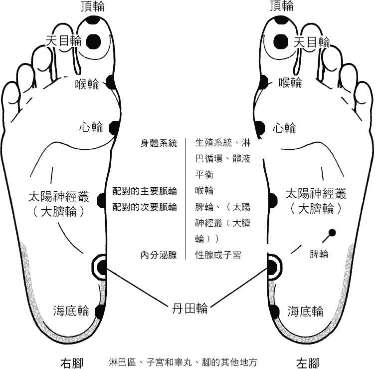 |
| 图说：图 4o　丹田轮的治疗 |

###### 治疗顺序

一、如前所述，治疗的第一阶段是从左到右和从上到下的平衡脉轮反射区的能量。

二、其次，按摩所有与丹田轮相关的反射区，要小心地把所有相关区域都包括在内，并记下最疼痛的点。随着丹田轮的失衡，焦点总是不止一个，原因是当丹田轮阻塞时，会引起慢性和长期的病症，也会产生许多导致其他疾病的因素。还有一点需要考虑的是，由于病人各种生命力失衡，往往感到非常疲倦，组织会显得迟缓、缺乏活力，所以请谨慎行事。这不意谓着你应该用热情的态度来过度刺激所有反射区，事实恰恰相反，应该像羽毛一样轻轻按摩反射区域。永远记住：用的方法越精微，治疗效果越强大，越不会有任何「治疗创伤」和突然出现的不良反应。这要再三强调！

三、第三阶段是平衡丹田轮的反射区与已知焦点之间的能量，这是程序中最重要的部分，必须要小心执行，而且在进入下一个阶段之前，一定要获得重点改变。如有两个或两个以上的焦点，必须分开来平衡，这会花比较多的时间，但请记住，整个治疗不会比传统反射疗法的治疗时间还长。

四、如前一节所述，随后是平衡丹田轮的反射区与脾轮的反射区和太阳神经丛（大脐轮）的反射区之间的能量。如三合一似的平衡三者。

五、最后，平衡丹田轮的反射区与海底轮的反射区之间的能量，这是为了支持和加强迄今取得的成果。此外，记得警告病人，他可能会感到非常疲倦，最好「顺其自然」而不去对抗它，也要建议他喝很多干净的水。

##### 海底轮

见图 4p。

‧相关的身体系统是脊椎、下肢、肾脏、膀胱和骨骼系统。

‧相关的主要脉轮是顶轮和天目轮。

‧相关的次要脉轮是肘轮和膝轮。

‧相关的内分泌腺是肾上腺。

‧可能的症状包括骨关节炎、僵直性脊椎炎、颈椎病、胸椎侧弯和关节炎、僵硬的关节、周围关节炎、嗜睡和慢性疲劳、慢性膀胱炎和肾炎、前列腺炎、引力溃疡（gravitational ulcers）、舒尔曼病和其他骨骼相关病症、忧郁、无精打采。

‧反射区域包括脚的内侧反射区（脊椎反射区）、脚的外侧反射区、肾脏的反射区、尿道的反射区及膀胱的反射区。

| 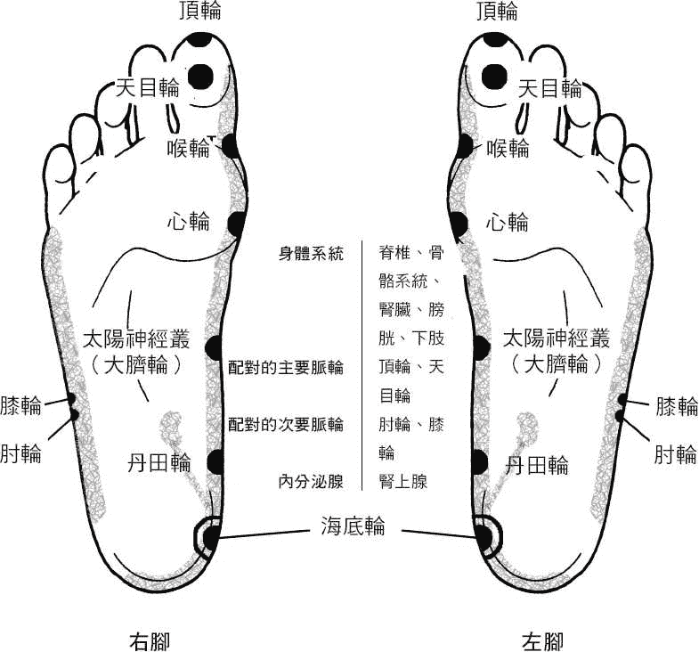 |
| 图说：图 4p　海底轮的治疗 |

###### 治疗顺序

一、如前所述，治疗的第一阶段是从左到右和从上到下的平衡脉轮反射区的能量。

二、其次，按摩脚的内侧和外侧，以及肾脏区和膀胱区。小心地标注焦点，这将在稍后的治疗中用到。所有海底轮失衡一定都有组织的慢性迟缓，所以建议和治疗丹田轮失衡一样，不要使用重手法来按摩！当反射疗法治疗师习惯在慢性病症使用重手法按摩时，可能会难以理解这种「精微是强大的」哲学，通常需要信念上的跳跃才能接受这种新的典范；一旦去学习和实践，就永远不会遗忘。

三、接着，平衡焦点与海底轮的反射区之间的能量，这是治疗过程中最重要的部分，要小心使用正确的焦点，并要尽可能在这阶段获得重点改变。

四、随后平衡海底轮的反射区与其相关的次要脉轮（肘轮的反射区和膝轮的反射区）之间的能量，如果膝盖或肘部是主要的病症处，请试着在此阶段获得重点改变。此外，除非两个关节都有关节炎改变（非常罕见的情况），否则无需相互平衡膝轮反射区和肘轮反射区的能量。

五、最后，平衡左、右脚的海底轮反射区之间的能量，这取代之前所提的方法，即其他脉轮用海底轮的反射区来平衡能量的方法。虽然你在治疗的第一阶段执行了这项工作，但是当治疗进展到此时，你会感觉到与之前相比起来有很大的变化，可试着获得重点改变，然后在治疗结束时，建议病人休息和大量饮水。

## 相关病例

我们用一些病人的病例报告来结束本章。

##### 肠躁症

这种病症非常普遍，对这种疗法的反应非常好。

###### 病史

黛安现年五十二岁，罹患肠躁症约十五年。她的手臂和腿部也有轻度溼疹，还患有黏膜炎、偶尔疼痛的鼻窦炎、专注或阅读时的头痛、喉咙痛、膝盖疼痛和静脉曲张。黛安曾经历更年期症状，现在已（慈悲地）结束了。她曾尝试从饮食中除去乳制品，但情况似乎没有改善。

鉴于这些症状，我决定可能需要治疗喉轮和丹田轮，但先平衡能量可强化治疗。

###### 第一次治疗

一、我用一点油按摩脚和小腿，还注意不要在静脉曲张部位按摩。可观察到有一些水肿，组织的整体感觉迟缓，表示淋巴引流不良。

二、从左脚到右脚和从上到下进行脉轮反射区的能量平衡。我注意到海底轮的反射区、丹田轮的反射区和喉轮的反射区都瘀阻，但不想与它们所配对的脉轮进行能量平衡。我决定先治疗丹田轮的反射区，接着治疗喉轮的反射区。

三、由于今天只有时间治疗其中之一，所以我选择了丹田轮。我轻轻按摩了丹田轮的反射区域，包括淋巴和性的区域，后来在子宫点上发现了一个焦点（这并不令人意外）。

四、接着，我平衡这个焦点与丹田轮的反射区之间的能量，这花了相当长一段时间才达成，反映了此病症的长期性。

五、最后平衡丹田轮的反射区与海底轮的反射区之间的能量。我建议黛安大量饮水及适度运动。

###### 第二次治疗

黛安一个星期后回来看我，她一直很累，睡得比平时好多了。在过去的几天里，她比以前更有精力，但是喉咙非常痛，一直用阿斯匹林来漱口。我决定治疗喉轮。

一、按摩脚和小腿，组织感觉比以前更柔软和「有活力」。

二、从左到右和从上到下的平衡脉轮反射区的能量，再次发现喉轮和丹田轮无法平衡。

三、按摩喉轮的反射区域：肺、支气管、消化道和咽喉部位，我还决定再次按摩丹田轮的反射区域。后来在喉轮区找到的焦点是在咽喉部位，那地方非常疼痛。

四、我平衡这个压痛点与对侧脚上的喉轮反射区之间的能量，似乎花了永世的时间才达到重点改变。当我经历那一点时，黛安的脚突然变得温暖且发光，她说自己正在「潮热」中。几秒钟后，她叹了一大口气，且几乎睡着了。

五、最后，平衡喉轮的反射区与海底轮的反射区之间的能量。事实证明，这比我预计的要快得多。不过黛安离开时仍然处于半昏沉状态，幸好她丈夫开车来接她。

###### 第三次治疗

黛安在两周后回来接受治疗，她起初感到相当振奋，然后很累，接着又兴高采烈地。溼疹变得更糟（她有被警告可能会发生这种情况），她的排便虽然不稳定，且有时是爆发性的，但已比之前稍微稳定一些；总之，她受到鼓舞了。此次治疗比照上一次的治疗，再加上强化海底轮反射区的能量，从而提高她的整体能量和活力。

###### 第四次治疗

距离上次治疗已经过去一个月，黛安感觉自己好多了，她有更多的精力，睡眠模式有所改善，排便次数少得多，而且疼痛更少了。在反射疗法方面，我决定以喉轮和太阳神经丛为主。治疗太阳神经丛以帮助消化并建立肝脏能量。喉轮的反射区成功与丹田轮的反射区平衡了，脉轮反射区内的迟缓和阻塞程度少很多了。

大约一个月后，黛安打电话来报告说她从来没有感觉这么好过，她还从饮食中剔除了小麦（我的建议），这大大改善了情况。回想起来，她的肠躁症可能就是长期的麸质敏感所引起，症状可以通过改变饮食而得到缓解。然而，肠躁症是一个众所周知的复杂症候群，通常是由压力相关的刺激引起。她的长期症状可能是错误饮食和压力（两者经常一起）造成的。毫无疑问地，这治疗大大强化她的生命力，特别是她的免疫系统。

##### 焦躁和忧郁症

###### 病史

二十四岁的戴尔是由当地的家庭医师转介过来的，自他的母亲在车祸中去世以来，他在过去的十年中一直患有焦躁和忧郁症。戴尔是一个很瘦、几乎是消瘦的人，甚至到了有针头恐惧症的地步，因此针灸没有列入治疗程序，我决定先采用脉轮反射疗法，希望日后可以对身体进行治疗。多年来，焦躁症慢慢缠住了他，他在封闭的空间里经常感到恐慌。他试着要停掉「安定」这抗焦躁的药，但仍在服用抗忧郁药。治疗的目的是要「清除挡路的木头以进入森林」，即要到达他系统中那些被他的创伤严重影响的记忆细胞。戴尔并没有接受催眠疗法或认知心理治疗，这真令我惊讶。

###### 第一次治疗

在最初的脚部和小腿按摩后不久，很明显地，戴尔就像鸭子入水一样自然地接受反射疗法。他非常放松，显然对自己的周遭环境充满信心。在脉轮平衡阶段的分析显示，他的天目轮和心轮是失衡的（这并不令人意外！），让我左右为难的是要选哪个脉轮来治疗，我可以加强天目轮或心轮，但这次决定治疗海底轮，以便建立他的生命力，并创造一个整体来说更加平衡的系统。在慢性病症及与恐惧有关的症候群中，海底轮总是会受到影响。

戴尔的脚最初很冷，但很快在治疗过程中「活过来了」。海底轮没有花掉太多时间便达到能量平衡，而「叹息」则发生于平衡海底轮的反射区和顶轮的反射区阶段。治疗结束后，戴尔显得更加平静。他的父亲在第二天早上打电话报告说，戴尔睡得像个孩子，感觉好多了。

###### 第二次治疗

三天后，戴尔又来复诊，他感到不那么焦躁，但矛盾的是，他更加紧张、不安和害怕，因为治疗让情绪的包袱浮到表面上来了，好在戴尔愿意尝试任何事情以恢复健康。在脉轮平衡之后，我决定治疗心轮（因为他之前的反应非常好）。在治疗期间，他抱怨感觉非常紧张不安，甚至在颤抖，他有意识地放松了一下，而且做得非常好。当我最后平衡心轮的反射区与海底轮的反射区时，戴尔突然开始哭泣，哭声非常激烈，我被迫停止治疗，扶他起来坐在治疗床边。他花了几分钟才恢复平静，我建议他休息一天。

###### 第三次治疗

四天后我看到戴尔，他发生了显著的变化。他讲话清楚明白（之前都是喃喃细语），而且更加快乐。他曾经作过几次噩梦，但除此之外，他已经摆脱「脑海中的重负」而重获自由。分析显示天目轮需要治疗，并已适时完成了。我请戴尔几天后打电话来，他也打来报告说他「打从心里」知道忧郁和焦躁已经消失，对此很高兴，并已积极去寻找工作。

毫无疑问的是，在这种情况下，脉轮系统的反射疗法效果很好。这种方法比所有其他方法多出的附加优势在于，它有助于治疗者和病人之间有足够的接触，可藉此发现病症的真正原因。

##### 类风溼性关节炎

###### 病史

克莱尔现年七十六岁，最近才搬到此地，是另一位病人介绍来的。她之前一直定期接受反射疗法治疗，这让她可以「继续走下去」。虽然她很乐意接受任何形式的治疗，但我决定沿用反射疗法。她的关节炎扩展得很广，影响了颈部、肩部、肘部和手部，她持续使用抗炎和镇痛药物，否则身体会无法「运作」。

###### 第一次治疗

继按摩脚底和平衡脉轮之后，海底轮、太阳神经丛（大脐轮）和喉轮成为需要治疗的重点区，我决定专注在治疗海底轮。海底轮的反射区应该是所有慢性疾病中首先要治疗的，病人对这种「不同」的方法提出了评论，她甜甜地笑说：「这一定没有效果，因为你实际上并没有做任何事情啊！」如果每一位发表过这个评论的病人都付我一块钱，我已经成为百万富翁了！最后，她体验到了「放松」，并感谢我的辛劳，但她的肢体语言表明她对我的方法满失望的，所以之后会再告诉我是否需要进一步治疗。我对此也感到颇为失望，但是「你不可能事事都成功」。两天后，克莱尔打电话说她感觉好多了，而且「旧关节」更容易活动一些，她想要回来做更多的治疗。

###### 第二次治疗

我决定再次治疗海底轮，如果有足够的时间，再加上治疗太阳神经丛（大脐轮）。幸运的是，下一位病人取消预订，让我有足够的时间来治疗这两个脉轮。虽然这是一个很长的治疗，克莱尔躺在治疗床上并不会不舒服，但治疗结束时，她感到相当僵硬，于是约了一个两周后的诊。

###### 第三次治疗

克莱尔报告说，她实际上已减少「那些可怕的」消炎药数量，尤其她的肩膀显得更加自由了。自从上次治疗后，她可以从事更多日常事务，还发现帮水壶加水、打开门和绑鞋带这些事，现在都能做了。这种看似无所事事、只是碰触脚上的点的治疗竟然也能达到这种效果，她对此仍然感到困惑。这次治疗是用来加强海底轮的反射区和治疗喉轮的反射区。

克莱尔大约每个月持续来治疗，并成为我这个疗法的信徒。我们并不冀望能治好像慢性风溼性关节炎这样的病症，唯一能冀望的是病人可以拥有更多的生活能力和更少的关节疼痛。她仍在进步中，甚至在一本流行杂志上撰写她的经历，即使她对此疗法仍是一知半解！

# 第五章　疗愈

在「疗愈」的领域内，脉轮能量系统的使用最广为人知。稍后将根据我超过二十五年的研究经验，来详细探讨徒手治疗和非徒手治疗的疗愈方法。现在，先谈谈疗愈（Healing）这个主题，这个环绕着很多神祕（和无知）色彩的词汇。

## 概述

在过去的几年中，对疗愈、辅助医学和灵性主题的热切渴求，如雨后春笋般涌现。简单来说，疗愈一词的意思是「整体化」，它并不意谓着「治愈」。疗愈有许多方法和类型，每一种都有一个共通点，即病人用自己复杂的精微能量系统疗愈自己，而治疗师所做的一切，就是提供正确的刺激和正向积极的思想，使疗愈得以发生。

认知到自己有天赋可以帮助自己的同胞，这过程可能是漫长而曲折的。许多人一直否认自己有这种倾向，把它搁在一旁好几年，最终还是被一个不断向他们低语的坚定小声音驱使向前。虽然每个人都有能力提供某种疗愈，但我相信疗愈的天赋是与生俱来的，就像在各行各业会用到的天赋一样，应该要善用。有些人并不知道他们该从事的疗愈是什么，这趟旅程往往是要反覆试验才有答案。相反地，有些人确切知道他们的天赋、天职在哪里，但不知道他们应该把它当全职工作，还是持有另一份工作，只在业余时才从事疗愈。

许多疗愈的方法可以分为非接触式和接触式疗愈。非接触式疗愈的例子包括：谘商、催眠疗法、心理治疗、远距传播能量法和感应疗法、风水、远距疗法、灵气疗法、灵性疗愈法、声音疗法、色彩疗法、磁力疗法和水晶疗法；还有在一个人的生命力中产生稳态进而疗愈的疗法，也属于这一组，例如：顺势疗法、草药和对抗性药物（永远不要低估安慰剂的效应）。

接触式疗愈的例子（并不总是涉及接触身体）可以分为需要长时间学习才能取得专业地位的专业领域，以及可由非专业治疗师执行的疗愈。第一类的例子包括：物理治疗、整骨疗法、整脊疗法、反射疗法、颅荐疗法、日式指压疗法、极性疗法、碰触疗法、应用肌肉动力学、拨恩技巧、针灸和指压疗法，以及各种形式的按摩法，还有更多可以囊括进来的。

以上都代表了疗愈的不同类型，不管治疗师是否如此认为，每种类型都试图让病人变得更完整。

然而，大多数人认为可以「真正」疗愈的是最后那一类非专业的接触式疗愈。这并不意谓着这一类治疗师都非专业人士，我也没有歧视或自视甚高的意思。每个人都走在各自的人生道路上，做他认为很舒适的事，不该因为他在做一些「与众不同的事」而遭到别人的评判。最糟糕的歧视往往来自无知的人，他们的文化和信仰体系，与试图把爱和同情给予需要它的人的治疗师相冲突。而这最后一类可以再细分为两种治疗方式：

‧磁力疗愈法：这只不过是通过将双手放在疼痛或阻塞区域，为人们提供舒适的能力。大多数人都有能力做到这一点，自愈主要使用的就是这种技巧。据说每只手和每根手指都具有负极的、正极的或中性的磁性影响力，因此将双手放在疼痛的区域将形成「封闭电路」的疗愈能量（生命力、气、普拉纳等等）。

‧催化剂疗愈法：这是将宇宙的自然疗愈力，透过疗愈师向某人传递的疗法。基于疗愈师所持有的文化和哲学背景，这自然的疗愈力可能被称为宇宙的生命力、上帝、圣灵、天使等等。疗愈会影响人的各个层面（肉体、乙太、情感、心识或灵性），其方式可以透过直接碰触身体来运作，或经由脉轮离体操作，或如灵气疗法通过严谨的姿势来进行。虽然疗愈有时是针对身体的个别部位和其所呈现的症状，但这种疗愈方法通常具有整体性。这类疗愈还包括一种基督徒的疗愈方式，即经由牧师、传道士或非神职人员的「按手礼」来进行。许多基督徒认为疗愈师是圣灵力量的通道，在使用一种「圣灵的恩赐」。显然，疗愈不仅仅是「基督徒」的特权，其他宗教和信仰也有自己的疗愈法。

从上面的讨论中，你会意识到这是复杂、有争议和感性的话题。但是，接触与非接触式疗愈实际上是很容易操作执行的，这复杂的研究其实和实际操作相距甚远。而感觉自己有某种天赋的人，其面临的困境是如何培育它以「回应呼唤」。即使是最有天赋和自然倾向的疗愈师也必须学习这些基本要素。或许，回应呼唤的第一站是去见当地的疗愈师或灵气治疗师，也就是说让自己试着去做做看、慢慢入行，另一个方式是去联系某个疗愈协会。

我在本章中试图要为你提供一种方式，即通过强大的脉轮能量中心来进行接触式和非接触式疗愈。这个系统对我来说效果很好，我相信它对你也会运作良好。首先，我们来看看接触式和非接触式脉轮疗愈的区别。

##### 常见问题集

当治疗师选择脉轮能量系统来做为疗愈的「疗法」时，最先面临的难题就是要进行接触式或非接触式疗愈。在工作坊常见的问题如下：

‧它们是否一样？某一种方法比另一种好吗？

‧大多数治疗师喜欢什么？

‧哪一个适合我？

‧如果我正在使用接触式疗法，象是指压疗法，那我真的是在进行疗愈吗？

‧当病人来做「物理」治疗时，我在她面前挥舞手臂会不会很怪？

我将在本章解答这些问题。如果你仍然有疑问，请不要犹豫，透过我的网站与我联系。以下是接触式和非接触式疗愈的差异、优点和缺点的简介，但这个清单绝非详尽无遗。

##### 接触式疗愈

‧这种方法适用于徒手物理治疗师，因为在指压疗法和疗愈之间没有实践和理念的巨大差异。

‧治疗师大部分时间可以很舒适地坐着、放松双臂。

‧通常（但并非总是），病人更容易接受接触式疗愈的想法，因为他们觉得比较能掌控这治疗。

‧接触式疗愈的技巧比离体工作所需的技巧更容易执行。

‧虽然这种方法不够强大，也可能需要更多时间来治疗病症，但它的易于应用就足以补偿其他不足了。

##### 非接触式疗愈

‧由于大多数能量失衡是来自精微体，因此你正在治疗病症的真正主因。

‧这种方法需要更多时间来学习和完善。

‧在治疗时可能会出现某些异常情况，初学者可能很难确定他的感受。

‧这种方法非常精微，需要时间来学习和吸收。

‧直觉的使用在这种方法中显得很重要。

‧对治疗师来说，这方法执行起来往往比较不舒服，因为需要保持在某些位置几分钟，这可能会导致肩膀疼痛和紧绷。

‧这种方法若掌握好，最终效果将更强大，获得的回报也更大。

如果你对这方法仍在摸索阶段，我建议你先学习并掌握接触式疗愈，再继续进展到非接触式疗愈。跑步前先学习走路是非常重要的，不要过早尝试太多方法；如果这样做，你传达给病人的会是尴尬和笨拙。先在一种方法上建立信心，最重要的是要做你觉得舒服、有信心的事，如果你自培训以来一直是实际操作的徒手治疗师，则无需更改。但是，如果你已经习惯灵气治疗或使用精微体，那么非接触式疗愈可能是你的理想工具。

## 分析

脉轮疗愈的首要任务是确定哪些能量中心需要治疗。在初诊期间搜集讯息时，你是可以从出现的症状和体征就知道哪些脉轮需要留意了，但这次的会面并没有提供全貌。我最喜欢的比喻是「不要以封面来评断一本书」，这说法也适用于分析和诊断病人真正的失衡情形。当病人向你描述症状和病史时，并不是每个病人对你都是百分百真实或开放。他们不一定是故意演戏，只是有些症状比其他症状更有关系，病人呈现出的症状却很少反映病情的实际原因，但你感兴趣的正是病因。因此，必须要有其他方式来分析哪个系统处于失衡状态，才会知道接下来是哪个脉轮需要治疗。

这里要强调的是，评估和「诊断」需要在治疗之前完成，因为它为治疗提供了目的，并防止你陷入困境。在这个阶段，病人会希望参与治疗，也渴望知道是哪里出现能量失衡。在疗愈时，你可以使用两种主要方法──使用头颅或脚后跟的情报站，以及在治疗之前先去平衡脉轮能量。在这两种情况下，只处理主要的脉轮。

##### 情报站

情报站指的是身体上某些区域，可让治疗师「调频」到体内各种能量失衡处。身体的许多部位都可使用，例如肩膀（我的最爱之一）、膝盖、脚踝或头骨上的许多穴位；以实用性来说，头颅和脚后跟最常用到。在颅荐疗法中，托头颅常常是用来确定脑脊髓液流动（或缺乏）的第一步，握脚后跟则是反射疗法治疗师的最爱，因为他们就在那个部位工作。由于第四章已分析过如何握脚后跟了，所以在此只描述托头颅的方法。

###### 托头颅

虽然你不需要接受某种头颅疗法的培训（颅荐疗法、颅骨疗法、印度式头部按摩、指压疗法等），但在使用该系统前练习该方法的基础程序，对分析脉轮将是一个优势。这需要特别灵巧的碰触。自己先坐在病人身后（见图 5a），让病人仰卧，头部放在某个具有支撑力的硬垫子上，再将你的双手放在枕骨下，小指几乎相互接触。确定你的前臂和肘部支撑在治疗床上，否则很容易引发疲劳。

| 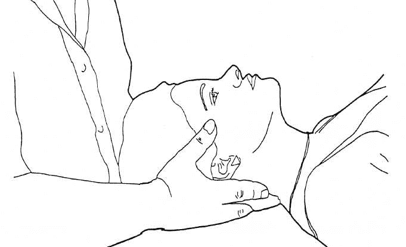 |
| 图说：图 5a　托头颅 |

这接触必须轻柔且「通风」，不会在病人头骨上施加任何压力。大约三十秒到一分钟都不会有事发生，所以你需要耐心等待。这时，手中会产生一些温暖的感觉，而这仅仅是体热的传导。病人可能会稍微动一动，直到他觉得妥善了才会平稳下来。永远不要着急，也不要试图加快速度。

大约一到两分钟后，应该会感觉到「颅骨的节奏」。这是脑脊髓液流动的自然节奏。至于到底感觉到了什么，许多学派的说法不一：有些权威人士坚信，这是脑脊髓液的物理运动；另一些人则认为，这是脑脊髓液的气或生命力的流动。我相信在这种情况下，那并不重要，你高兴怎么解读都可以。颅骨的节奏每分钟在六到二十个周期之间变化，手下的感觉就象是一种微妙的扩张和收缩。这种有活力的感觉可以比喻为海滩上的潮汐，不断流动着。在开始分析之前，花几分钟感受这种节奏是很重要的。在这个阶段，你的大脑应该尽可能保持「中立」。到目前为止，你应该感受到一种温暖的节奏性脉动。一段时间后，重点将明显转移。正如前面章节所解释的那样，这表示你和病人的生命力以大约每秒八次的周期在阿尔发／系塔频率产生共振。一旦达到此目的，「身体探测」和「调频」的任务就可以开始，目的未达成之前则要继续。

使用托头颅来做下一阶段的分析，这也要用到思想和意图。它们都是强大的、可操控的工具，所以最好明智地使用，并尊重手上的任务。现在你可以提出有关病人脉轮能量系统的问题。千万不要大声说话或明显改变你双手的位置，这样会暗示病人某些事情发生了。提出的问题一定要简单，可用「是」或「否」来回答；如问题不清楚，会导致得到模糊不清的答案，这是行不通的。

首先，询问病人的能量系统，海底轮是否处于失衡状态或需要治疗，如果问题的答案是肯定的，表示它处于失衡状态，节奏会停止或延迟。它会在几秒钟后重新开始，这时就可以来问丹田轮的状态。每次节奏停止都表示有失衡现象发生，需要进行治疗；节奏继续时，表明脉轮处于平衡状态且不需要治疗。你可能会发现两个甚至三个脉轮需要治疗。在一个小时的治疗时段中，应该有足够的时间来分析和治疗三个以内的脉轮。

###### 平衡脉轮

尽管平衡脉轮严格来说是另一种分析方法，但它算是一种治疗前的序曲，可整合到治疗程序当中，因此，它是比托头颅更有用的工具。有一学派认为，在任何情况下，都应该在治疗前先进行能量平衡，而在疗愈的案例中，这也是我的感受。一般来说，主要脉轮是通过使用整只手来平衡，所以尽量让整只手安全地放在病人身上。

###### 程序

病人需要坐在治疗床的一侧，或者侧躺在治疗床上，他身体的前面和后面必须能同时轻易碰触到。最好的方法是让病人坐在治疗床边缘，这样比较容易操作。同时，要让你的病人知道即将发生什么事情，不要「偷偷摸摸」做。平衡的「顺序」并不重要，但首先平衡较低位的主要脉轮已经算是常识了。平衡脉轮有两个方面要做，即前侧与后侧、上部与下部：

‧平衡前侧与后侧：从丹田轮开始，将双手放在每个脉轮的前侧与后侧，直到天目轮为止。在任何情况下都不应该平衡海底轮的前侧与后侧。严格地说，脉轮在任何情况下都只有一个穴位点，但在使用脉轮能量系统进行治疗时，有两个穴位点会较易于使用，而顶轮也只有一个穴位点。你应该知道穴位的确切位置，这样就可以以穴位做为焦点，把双手直接放在脉轮上。你只需要非常轻地碰触，有需要的话，可以透过衣服来做，但只能隔着一层衣服，而且必须拿掉大条的腰带。无论你坐着还是站着，都必须是感到舒适的。

平衡不是治疗，它只是治疗前的序曲，因此不需要一直将手放在位置上，也不必等到重点改变（阿尔发／系塔状态）。通常需要一分钟才能在每个脉轮的前侧和后侧之间建立表面平衡。在此处的能量平衡意谓着手下的感觉是相似的。如果一分钟后，手上没有任何明显的事情发生，或者左手是冷的、右手是温暖的，或者左手是有脉动的、右手是安静的，那么表面能量平衡就不会发生。这表示脉轮是失衡的，需要治疗。在太阳神经丛（大脐轮）、心轮、喉轮和天目轮上重复此过程。如果脉轮在一分钟内达到平衡，表示此脉轮不需要治疗。一个实践时的注意事项是，要小心平衡心轮和天目轮。心轮的前侧位于胸骨中央的膻中穴处。对于女性病人，仅用指尖碰触这一点是比较明智的，原因也相当明显了。而对于天目轮中心来说，尽管整只手可以放在前后两个方面，但使用手指腹可能更舒服。前后侧的平衡完成后，你大概已经粗略知道哪些脉轮需要治疗了，而且也知道应按照什么顺序，因为最阻塞的脉轮需要优先处理。

‧从上到下平衡：现在脉轮的前后侧已经相互平衡，你可以在病人舒适地仰卧时，从上到下平衡脉轮，因为只有脉轮前方需要平衡。如前所述，和分析的过程一样，这个程序也是治疗初始阶段的一部分。使用和之前完全相同的力道（非常轻柔的碰触），按照以下顺序平衡脉轮的前方：心轮与太阳神经丛（大脐轮）、喉轮与丹田轮、天目轮与海底轮，最后是顶轮与海底轮。将手放在海底轮与和心轮时请小心（原因显而易见）。永远记得告诉病人即将发生什么，同时也要获得他们允许，再将手放在某些解剖部位上。如果你不确定病人是否对治疗这些部位感到自在，请找第三人陪你一起待在治疗室。在两两一组的平衡之后，哪些脉轮需要治疗应该就很明确了，而且可以马上无间断地进行治疗。

## 主要脉轮的接触式疗愈

在第三章中，我们探讨了使用指压接触疗法来治疗主要脉轮。我们讨论了相关的经络、配对的脉轮、关键穴位、反射穴位和其他可做为治疗备用和强化的穴位的使用。当以「疗愈」模式治疗主要脉轮时，你唯一需要知道的就是脉轮及其配对脉轮的解剖定位。因此，一旦知道主要脉轮的前后位置，这就够了，剩下就取决于你的直觉和触觉的敏感度。

学习这种方法需要时间，这不会在一夜之间发生。许多拥有惊人天赋的新兴治疗师，因为缺乏手下的感觉而感到泄气，这是我经常在工作体验坊上遇到的问题。人们常说，生活中最简单的事情需要最长的时间来学习，这也真实地呈现在数学的世界里；最简单的公式是最难证明的，用脉轮能量系统来疗愈也是如此。这需要时间、毅力和辛勤工作才能变得熟练，并为你的客户和病人制造效果。也就是说，这些技巧实践起来非常容易。对于失衡状态的各个脉轮，通常只需做两次就可以达到稳态，最多也只需做三次即可：

一、将一只手放在脉轮前方的穴位点，另一只手放在脉轮后方的穴位点。

二、将一只手放在脉轮前方的穴位点，另一只手放在配对的脉轮穴位点上。

三、将一只手放在脉轮前方的穴位点，另一只手放在顶轮穴位点上。

##### 治疗受影响脉轮的前侧与后侧

在第二章中，我指出一个人的脉轮是他们与灵性和其他精微体交流的门户，它们分布在身体的脊椎和躯干上。身体正中线的前侧和后侧在历史上仅是灵视者、疗愈师、瑜伽士、宗教导师或专家、苏菲大师及参与疗愈艺术的人们所使用的焦点区域。因此，尽管能量圈内的所有部分都可以在需要时使用，但实际上使用的是这两个区域。我现在提出这个重要的观点是要说明，如果在识别的脉轮上进行接触或非接触式疗愈，却没有产生预期的效果，那么你可能会发现有另一个适合的区域符合要求。在每日的看诊中，这是很罕见的事，但我知道它会发生。

病人应该采侧卧或仰卧，对双方来说，就是个人对舒适度的选择。如果病人侧卧着，你的手臂可能会开始感到疲倦，所以你可能比较喜欢站着。当病人仰卧时，你放在病人背部的手可能会有几分钟要承载病人的体重，尤其治疗后心轮、后太阳神经丛（大脐轮）和后海底轮时更是如此，而后喉轮和后丹田轮就没有承载那么多体重。后丹田轮位于腰椎前凸的上部，手很容易在下方滑动。在这两个位置中，仰卧治疗更容易执行。病人在那样的位置比较舒适，治疗者也比较容易执行，而你的前臂在按压时，很自然地必须靠在病人身上。

治疗海底轮时，将手轻轻放在病人的臀部来操作，指尖碰触尾骨下侧，上方的手放在耻骨联合上。虽然这可能是一个「要小心处理」的过程，但一旦治疗开始，对于实际解剖定位的所有想法都会抛诸脑后。请注意，在这种情况下，没有用颅荐疗法的「握骨」程序。而天目轮通常用指尖来做，这样可以避免将整只手放在病人的眼睛上（与灵气疗法不同）。由于顶轮只有一个穴位点，所以在接触式疗愈模式下的治疗要以不同的方式进行，最简单的方法是坐在病人的头顶处，让病人处于舒适的位置，你将双手放在病人头骨的顶部，中指的指尖相对，而百会穴则位于两者之间，皮肤被轻轻拉展，但基本上手指保持不动。

与其他接触式疗法一样，最初并没有任何感觉，病人需要一分钟才会在手中放松，接下来的几分钟你会感觉到温暖。现在，你应该会开始感觉到失衡的情况，即在阻塞的脉轮中有「滞缓」的感觉，而在一个过度活跃的脉轮中会有「汽水发泡的嘶嘶声」的感觉。请注意，阻塞状态是迄今为止最常治疗的情况。大约过了四分钟左右，你应该会感觉到手下的重点改变。在指压疗法模式下，这是治疗结束的信号，并让你继续进行其他穴位。然而，在疗愈模式中，这是治疗刚刚开始的信号。双手应该静止不动，如果病人似乎稍微移动了点，那你的手也要跟着稍微移动。

你的思想和意图非常重要，特别是在这个程序的关键阶段，尽量不要有任何不必要的想法，请专注于手头上的工作。最重要的是，不要试图「渴望」任何事情发生，请保持开放的态度。你会通过你的双手不断收到反馈信息，这必须加以诠释。在接下来的几分钟内，手中的感觉可能会改变。曾经非常滞缓的（从精微的意义上说）会慢慢变得不那么沉重，会更透气，质地也更轻柔自然。突破可能会发生得非常缓慢或几乎是瞬间发生，每种情况都不同。通常会发生的情况是，病人会大量呼吸、叹息或打呵欠，之后会感到非常放松。偶尔会发生情绪爆发的情况（请拿些面纸在手上）。你们两位现在已经达到一个阶段，即脉轮开始清除阻塞的阶段。此时，双手应该持续按着几分钟，直到手下没有其他事情发生。总而言之，手中可以感受到的感觉依序是：

一、什么也没有。

二、热传导传来的温暖。

三、一种沉重如「浓粥」似的感觉。

四、经由阿尔发／系塔状态达到更轻松、更轻盈的状态。

五、温暖、清晰和轻盈。

六、幸福的状态和无止尽的感觉。

现在，你可抽出放在病人背部的手（这有时是一种幸福的解脱），来做下一步的治疗。

##### 平衡受影响的脉轮与其配对的脉轮的能量

一旦脉轮通过接触式疗愈被清理，现在就可平衡它与它的配对脉轮的能量了。要执行此步骤的原因在于，脉轮经常会受配对脉轮的影响而失衡，所以必须去解决这个失衡问题。该技巧与上述技巧完全相同，只是速度会更快，而且你会感觉更舒服！现在，你的双手越来越善于感应精微能量的变化，应该能够在几秒钟后感受到两个中心能量之间的质量差异。上半身的脉轮会因其本性，很自然地感到较轻松和轻盈，但当下的任务是要达到双手感觉一致。有时配对的脉轮与原始脉轮一样阻塞，但这个阶段应持续不超过三到四分钟。虽然这部分主要集中在脉轮前侧，但如果后侧需要疗愈，就像在慢性脊椎病症中一样，那后侧就是需要去运作的部分。

##### 平衡受影响的脉轮与顶轮的能量

如果海底轮已被治疗，且你正在治疗顶轮，则不需要做这最后阶段。

在其他情况下，平衡受影响的脉轮与顶轮的能量很好。如果病症有任何情绪因素在内（通常都有），这将会带来极大的帮助。顶轮应该保持非常轻的（几乎轻飘的）碰触，如果做这个的时间比前一个还长，请不要感到惊讶。病人的能量系统需要进行大量的同化操作，所以可能需要几分钟时间，事情才会开始发生。整个程序，包括这三个阶段，应在二十到二十五分钟以内。

在病人坐起身来之前，必须先问问他感觉如何。如果他感到头昏眼花或不明方向，不能让他离开，直到他「头脑清醒」之前绝对不能开车。这可以藉由将中指腹放在双脚底的涌泉穴（脚轮）约两分钟来达成。

##### 可在疗愈模式下治疗的病症

以下列出了一些可以用脉轮疗愈来解决的病症，以及患有这些病症者的人格特质。人格特质可能是由教养、文化或信仰系统带来的，它们不是病症；相反地，它们代表了这个人整体的症状图像。通常与病人「最亲近的」人（经常会一起出席看诊）会提供关于病人个性的信息。有关害怕和恐惧症方面的问题非常重要，可试着以微妙的方式提出这方面的问题。其中有一些是慢性身体病症，有一些是情绪方面的问题，而大部分身体病症都是由情绪病因引起的。我提供这份清单，并不是说这些病症都不能用其他专业训练来治疗，也不是说只有情绪病症才能在疗愈模式下得到治疗。

###### 顶轮失衡

身体：头痛、眩晕。

情绪：忧郁、妄想、幻觉、不稳定的情绪波动、悲哀忧伤、恐惧症。

个性和特征：强烈、勇敢、真实自豪、野心勃勃、傲慢、控制、顽固、不宽容、愤怒、不耐烦、不悲悯、不道德──害怕曝光和内疚（自杀的常见原因）。

###### 天目轮失衡

身体：偏头痛、眩晕、黏膜炎。

情绪：愤怒、愤恨、优柔寡断、漠不关心。

个性和特征：以自我为中心、缺乏道德勇气、有热忱、善变、探求和寻找、不知足、内心冲突、痴迷──害怕停滞和寂静。

###### 喉轮失衡

身体：慢性喉咙痛、便祕、肩周炎（冻肩）、颈椎病。

情绪：羞怯、内向、偏执狂、焦虑。

个性和特征：不安全感、批判、自私、唯物主义、情感压抑、无所畏惧、不愿改变方向、自豪、孤立、心不在焉、完美主义、受到约束──恐惧症般的害怕。

###### 心轮失衡

身体：慢性心脏和循环病症。

情绪：流泪、焦虑、孤立、忧郁。

个性和特征：对他人心智上的局限感到漠不关心及轻视、自卑情结、自我怜悯、幽闭恐惧症、无法表达和给予爱、对自我的持续性焦虑──害怕表达情感。

###### 太阳神经丛（大脐轮）失衡

身体：过敏、慢性疲劳、胃病和肝病。

情绪：忧郁、焦虑、自怜、恐慌、担忧。

个性和特征：心胸狭隘、痴迷于过去的事件、不愿意改变、僵化的思想和信仰体系、占有欲、愿意无偿地服务他人、为他人着急和担忧──害怕会不安全。

###### 丹田轮失衡

身体：性方面的病症、水肿。

情绪：嫉妒、羡慕、欲望。

个性和特征：恭敬、虔诚、自豪、缺乏自信、沟通和人际关系不佳、容易出现重度忧郁、批评、纵情地幻想──害怕失败。

###### 海底轮失衡

身体：肾脏和慢性脊椎病症。

情绪：不安全感、怀疑、内心混乱。

个性和特征：刚硬刻板、仪式化、迷信、自豪、刚愎自用、迷恋、无法脚踏实地、善变、孤独、害怕变化、受魅力吸引、偏执狂、狂喜、精神错乱──对发疯的恐惧。

## 次要脉轮的接触式疗愈

虽然人们普遍认为只有主要脉轮与个人的乙太体、情感体、心识体和灵性领域有连结，但依我的看法，次要脉轮毫无疑问地也会影响至少前三个精微体，因此使用与主要脉轮相同的方法来治疗时，也可能获得重大成效。次要脉轮可以在疗愈模式下用来做个别治疗，或与配对的主要脉轮一起使用。以下是一些例子，说明如何在疗愈模式下治疗次要脉轮系统，以及一些相关的病症。从头顶往下的解剖顺序分别是：

一、耳轮

二、肩轮

三、肘轮

四、手轮

五、膝轮

六、脚轮

其他如锁骨轮、肋间轮、小脐轮和腹股沟轮，与相关的主要脉轮也有强烈的联系，也能在疗愈模式中治疗，在此就没必要进一步说明了。

##### 耳轮

病症例子：重听、耳鸣、颞颚关节症候群、哀伤。

病人仰卧时，你在他的头顶后方，慢慢将中指指腹放在耳垂后方的翳风穴。由于所有按压都需要持续一段时间，要确定你的前臂有获得很好的支撑。这过程总共需要约二十分钟的时间，这时感受到的应该与治疗主要脉轮时经历的感觉完全相同。这段时间内，病人可能会在耳朵和头部感受到各式各样「奇怪和奇妙」的感觉。过一小段时间后，你会感觉你的手指根本没有接触到任何东西，接着开始觉得很轻、很空灵。当你确定治疗已经结束时，试着平衡耳轮与其配对的主要脉轮心轮的能量，尤其有哀伤等情绪病症时更应进行，但只需要平衡两个耳轮中的一个。

##### 肩轮

病症例子：肩膀和颈部紧绷、便祕、内向害羞、压抑情绪，以及无法「自由」。

就像耳轮一样，从仰卧病人头部后面来接近双侧的肩髃穴。最好将整只手放在肩膀上，焦点（即掌心）放在肩髃穴上进行治疗。肩轮治疗是一种减轻紧张感（尤其是在颈部和斜方肌）和舒缓一般身体紧绷的好方法。多年下来，肩膀周围会产生很多紧张感，这通常会导致颈椎和上胸部的病症，以及关节的纤维组织炎和关节囊炎。常常担心自己和他人的人会有肩膀紧绷的倾向，就和无法表达自己（身体和情感）的人一样。进行治疗时应该使用非常轻的碰触，双手似乎和身体没接触般，一旦疗愈达到你满意的程度，试着将手从身体上提起约一公分，开始体验乙太体的疗愈和离体疗愈，此时将手放在原处几分钟，并判断其差异，这在本章稍后会详细介绍。一旦治疗结束，根据症状的不同，你可以平衡肩轮与其配对的主要脉轮喉轮之间的能量，或平衡它与配对的次要脉轮小脐轮的能量。

##### 肘轮

病症例子：慢性网球和高尔夫球手的肘关节囊炎、颈椎紧张、缺乏自信、僵硬和对他人的不满。

你现在必须坐在病人的侧面才能将手适当地放在他的肘轮上，除非病人可以把双臂置放在自己的前方，否则便意谓着你的前臂要放在病人的腹部上才能进行。你可以用手指指腹或整只手来按压。肘部可能储存着大量紧张的情绪，容易有不满、嫉妒及羡慕别人的人，往往会出现肘关节病症，害羞及很难表达自己感受的人也容易在这个地区出毛病，这可以透过平衡它与配对的次要脉轮膝轮的能量，或它与配对的主要脉轮海底轮的能量来完成治疗。

##### 手轮

病症例子：普遍的僵硬或关节炎的改变、抗拒情感的表达、过度批判自我及他人、畏缩和隐遁。

可以把整只手放在病人的手下，或者把中指指腹放在病人的手上来治疗双侧手轮，看哪个方式比较舒适就选哪个。手轮疗愈非常有效，做起来也相当快速。随着疗愈的进行，病人可能会告诉你，他的头部感觉更清晰了，这是很正常的，因为在指压疗法模式时，使用手轮可使头部变清晰，这和在疗愈模式时的用法不同。此时的治疗可以通过平衡它与配对的次要脉轮足轮的能量，或与其配对的主要脉轮顶轮的能量来圆满达成。

##### 膝轮

病症例子：慢性膝关节僵硬或关节炎改变、固执、骄傲、傲慢。

黛比‧夏皮罗（Debby Shapiro）在《你的身体说出你的想法》（Your Body Speaks Your Mind）一书中，针对膝盖写道：

「膝盖就像避震器，承受着身体重量和地形起伏之间的压力。当我们无法承受负荷时，膝盖就开始反应。它们要我们放松一下，重新找我们的动线，放下压力。膝盖积水表示有情绪能量没释放，特别是对屈服的抗拒，或者可能有太多的情绪需要处理，而这些情绪就承载在膝盖上。发炎的膝盖表明某件事或某人让我们感到恼怒或生气，而我们不愿让步！」

与所有其他关节一样，疗愈可以只在一个关节或同时在两个关节进行。单独关节的疗愈可透过将一只手放在关节的任一侧，并依照先前描述的各个层级来做。不要忘记，脉轮的影响都在一个特定的层级上，次要脉轮也不例外。在疗愈模式下治疗膝关节的最佳方法是将双手放在关节的前侧和后侧。这样，在膕窝中心的焦点委中穴就能受到影响。治疗双膝时，让病人仰卧或坐着，将双手放在病人膝盖下方；最后，你可以平衡膝轮与其配对的次要脉轮肘轮的能量，或与其配对的主要脉轮海底轮的能量，来完成疗愈。

##### 脚轮

病症例子：慢性踝关节与脚部的僵硬及关节炎、拇囊炎（拇趾外翻）、不确定生命的方向、焦虑和害怕、需要接地。

当脚患有慢性的肉体病症时，需要透过将一只手放在足背上，另一只手放在足底部位来进行治疗，此时的焦点通过涌泉穴到足底。如果这个人有恐惧、焦虑、死板的信仰等情绪问题，就需要同时治疗双脚。这可以透过将中指指腹放在涌泉穴上，或将手掌放在病人的脚底来完成，后者是反射疗法治疗师在结束治疗时最爱用的方法。无论出于何种原因，当病人需要接地时，它也是很受欢迎的区域。治疗完成后，可以与配对的顶轮或手轮来进行能量平衡。

## 非接触式疗愈

由于本书序章即是对气场的描述，在此可以藉由讨论如何操作和分析气场，以便在离体模式下使用脉轮来作总结。关于非接触式疗愈这个主题，坊间已经出版很多书，而对此主题的想法也相当多。再次说明，本章纯粹基于我自己三十多年来使用这种疗愈系统的观察，并不是要揭穿或批评任何其他形式的非接触式疗愈。然而，有个必须一再强调的观点：刚开始发展且对使用气场有特别信心的徒手治疗师，必须采用「轻柔又轻柔」的方法，不要指望能够在第一次尝试时感受到所有一切。许多敏慧的治疗师知道，他们需要数月甚至数年的时间才能掌握接触式疗愈法，却又自然而然地认为在几天内就能掌握非接触式疗愈法，这点一直让我感到很惊讶！其实这些技巧可以在几周或几个月内就运用自如，只是需要耐心、毅力和灵巧熟练的碰触，请千万不要感到沮丧或仓促行事。

在这个阶段要提到的另一件事是，离体疗法并不是每个人都喜欢，也并不是每个人都想做。如果这个疗法让你觉得不舒服，请不要去学习它。有些人会受到误导，认为离体疗法就象是在和病人保持一定距离的地方挥动手臂，彷彿某些神祕或神圣的东西会突然间发生一样。事实完全不是那样的！这疗愈程序是需要精确和小心监控的，它是精心制定的协议，有着开始、中间和结束的过程。身为治疗师，请同时接受你也是病人能量系统的诠释师和协调师，影响病人的不是任何从你身上发出的东西；那个疗愈者并不是你，而是病人自己。

##### 气场

这里简要回顾一下气场的组成，以及你在分析和治疗中应该感受到的东西。你也许会想回第一章开头重读有关气场的部分。气场（或精微体）是由乙太体（有不同的两层）、情感体（星芒体）、心识体、直觉体、一元体和圣灵体组成。它们经常被赋予不同的名字，这取决于发明者的信条、哲学和文化。这里将详细讨论前三部分，因为其他部分远远超出了本书的范围。表 5a 显示灵视者所看到的精微体、它的颜色、它与肉体的距离，以及脉轮阻塞在这个层级可能出现的感觉。

表格 5a　气场的颜色、与肉体的距离，以及阻塞的感觉

| 气场层 | 颜色 | 与肉体的距离 | 阻塞的感觉 |
| 肉体－乙太 | 蓝灰色 | 二到三公分 | 稠密沉重的感觉（如糖蜜） |
| 乙太－情感 | 密度较低的蓝灰色 | 八到十公分 | 稍微不那么稠密（如水） |
| 情感 | 蓝黄色 | 二十五到三十公分 | 「汽水发泡的嘶嘶声」或「嗡嗡声」 |
| 心识 | 偏白的黄色 | 长达七十五公分 | 轻微触电的「刺麻」感觉 |

在第一章中，我建议将双手从六十公分左右的距离慢慢地靠近，就能感受到气场。当双手相距约十公分时，应该会感受到一种细微的屏障，而相距二十五公分时，也有一个较不明显的屏障。这些位置是双手感觉到的乙太体和情感体的边界。你做这个简单的练习越多，就越习惯于精微和灵巧的碰触。你可以做的另一个练习就是所谓的按摩或刺激气场。

##### 刺激气场

刺激气场可以在朋友或你自己身上进行，你甚至可以在工作坊上教它！选择较容易接近的身体僵硬关节或行动迟缓的区域，例如僵硬的拇指、手肘或膝盖。开始时不要碰触身体部位。这个做法是为了充分刺激身体僵硬或呆滞部位上方的气场，藉此改善部位的运动范围和降低僵硬度，而让人留下印象。可以使用单手或双手（更确切地说，用指尖），只需在关节上方二到五公分处旋转和连续移动。最初，你和病人都不会有什么感觉。大约半分钟后，你会感觉到热，并在手指下形成一种沉重的感觉，而病人将开始在该区域感到温暖。以这种方式继续约三分钟，看看有感受到和接收到什么不同的感觉。完成后（仍未碰触到身体部位），请病人移动关节，你会发现该处有更多的运动和更少的痛苦。此时所完成的事情是，乙太体已被充分刺激，以改善身体的能量组成和血液循环。如果这在身体的任何部位都可达成，你能想象这在主要能量中心运作时，将可达到多大的效果！

##### 脉轮的气场分析

在开始平衡或治疗前，有两种不同的方式来衡量精微体中的脉轮状态。第一种方法是使用先前描述的技巧，使用头颅或脚后跟的情报站。当你确定脉轮在身体上所处的状态时，只需「询问」病人是否需要平衡气场。当然，这是个人的选择，但下面描述的第二种方式则强烈建议采用，即通过感受来解读气场。

##### 感受气场

首先，确定病人仰卧且放松下来，接着将一只手（另一只手暂时是多余的）放在他的乙太体，即身体以上不超过十公分的地方（乙太体的上边界）。这必须非常谨慎执行，并尊重治疗床上的病人。切勿快速地引入或移除手，否则可能会发生「气场冲击」。手在身体上保持几秒钟不动，直到病人习惯它的存在，这可能要将近十秒钟的时间。之后，将手从病人身上一个固定高度慢慢移动，停在每个脉轮的中心几秒钟。任何脉轮（主要或次要的，甚至是穴位）都可以用这种方式进行评估，所以此程序没有严格的开始和结束。然而，最好的方法是从脚底开始，从脚轮到膝轮（可以从前面进入），然后是手轮、肘轮、肩轮，往下到海底轮、腹股沟轮、丹田轮、小脐轮、太阳神经丛（大脐轮）、肋间轮、心轮、喉轮、锁骨轮、耳轮、天目轮，最后是顶轮。只要每个脉轮都仔细监测，这个程序执行的顺序并不重要。当你刚接触这种工作方式时，应该只监测主要脉轮，直到你对所有事情充满信心为止。

脉轮的乙太体失衡时，它会感觉比周围的气场更「迟缓」。在先前的表格 5a 中，我使用了「稠密沉重」及「稍微不那么稠密」，来分别描述阻塞的肉体─乙太体和乙太─情感体。单单用言语要充分描述这些感觉是非常困难的，可以有很多种比喻，我有听过「豌豆汤」、「油」，甚至是「泥土」的描述。要记住，最重要的是每个脉轮之间的比较。如果能进行两次程序比较好，以确保所感受到的是真实的。还要留意的是，如果你没专注在手头上的工作，会很容易被搞糊涂。

##### 脉轮的大小及其他精微体

考虑到每个人都不同，你应该知道脉轮的平均大小，以便准确分析和治疗。脉轮被描述为一种倒立的圆锥状冰淇淋筒，在身体上有一个穴位点，再向外开展成一个旋转的能量漩涡。在离身体大约两公分的肉体─乙太体中，脉轮的直径约为六‧三公分。由于这圆圈相对来说较小，所以通常用中指指腹来评估或治疗。在离身体大约十公分的乙太─情感体，脉轮的直径大约是八到十公分，一个马克杯的平均直径。在情感体的外层，离身体二十五公分处，脉轮的直径为十五公分，大约是一个小盘子的大小。你现在应该很容易推断出主要脉轮在乙太体以外的地方有不少重叠了。在心识体的上端，离身体上方约七十五公分处，脉轮的直径是三十公分的餐盘大小。正如接下来所讨论的那样，重要的是脉轮的个别部分，所以知道脉轮有重叠是非常重要的，这样才能确定你感受到的是脉轮的上半部分，而不是邻近脉轮的下半部分。（见图 5b）

| 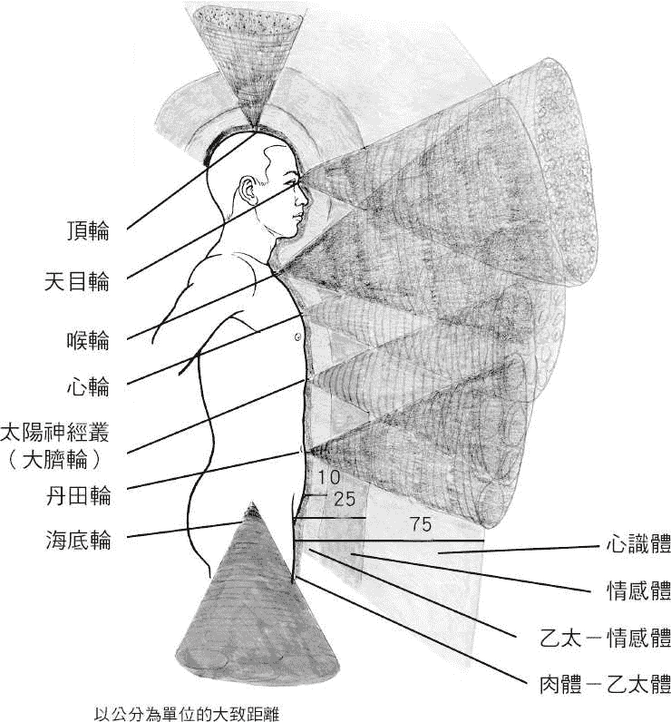 |
| 图说：图 5b　情感体以上的脉轮重叠图示 |

如表 5a 所示，阻塞的脉轮在情感体（星芒体）上层和在心识体的上层感觉不同。当你的手放在距离身体十公分远的地方感受情感体时，那不平衡的感觉更象是「汽水发泡的嘶嘶声」在手指上不断移动的感觉。而心识体带来的感受更加明显，是带有轻微电击或「刺麻」的感觉。但个人感觉并不重要，因为每种感觉都是个人的诠释，重要的是去比较身体上方相同垂直高度的每个脉轮的感觉。如果发现乙太体处于失衡状态，就不需要再去评估脉轮的其他体，但继续去评估其实是个很好的习惯，因为接下来的治疗将仰赖对整个脉轮的良好分析和评估才能进行。

##### 脉轮的天性

如果前一节中描述的内容还不足以让你吃惊，那么在分析整个脉轮时，还需要考虑每个脉轮的自然振动。如前所述，在每个脉轮中有四个或更多个形成较小脉轮的旋转漩涡，它们本身大致呈圆柱形。灵视者就是从这些个别的成分感受到某些频率的振动。较低位的脉轮是有点缓慢地产生共鸣，天目轮和顶轮却是以惊人的速度产生共鸣，这些差异应当成整体分析的一部分来考虑。据说海底轮由四个旋转漩涡组成，丹田轮有六个，太阳神经丛（大脐轮）有十个，心轮有十二个，喉轮有十六个，天目轮有九十六个，顶轮有惊人的九百七十二个（彩图显示了灵视者看到的脉轮）。

除了被分成四个或更多个旋转球形成分外，据说每个脉轮都具有辐射状的中央「核心」，就像眼睛中的角膜和虹膜。这一切似乎非常复杂，有些人因而对离体疗愈工作失去兴趣。当我首次接触这错综复杂和旋转的脉轮系统时，它的确让我相当挣扎，还好我没有迷失了重点。我多年的教学就是试图要让普通的治疗师都能接触到脉轮疗愈的整体概念（包括所有方法），这就需要设计一个不同的分析和治疗精微体的系统；虽然不容易学习，但也不需要全部都学。

这并不是说其他事情都可以忽视，临床上要知道的重要事项是：较低位的脉轮以较低的频率振动，因此自然感觉更加迟缓。阻塞的海底轮感觉会与阻塞的天目轮稍有不同。不过，这种差异非常细微，所以要领会并接受它，不要让它成为问题。如前所述，在分析和治疗中，确定脉轮的哪一部分处于失衡状态是非常重要的。基于数年来的研究，下面要谈谈我对主要脉轮失衡的解读。

##### 主要脉轮失衡的解读

前面章节概述了脉轮的不同体所感受到的不同特质，可以确定哪些脉轮需要在治疗模式下进行平衡和治疗。以下描述了一种在距离身体大约十三到十五公分的乙太─情感体层面观察脉轮气场的方式。我故意选择这个体，因为超过它之后就有重叠发生，而且解读并不那么明确或简单。图 5c 显示了从俯视角度看脉轮的平面示意图。它显示了一个外圈，尽管实际上它的样子是有点不完美的圆圈。脉轮大致划分为钟面的位置和内部的同心圆。因此，可以用外十二点、内九点或中四点来准确定位。在十二点钟方向的脉轮顶部最靠近人的头部，六点钟方向朝向脚部。该图显示了身体的哪些地方与脉轮相关，以及哪些器官随后会受到脉轮失衡影响。

| 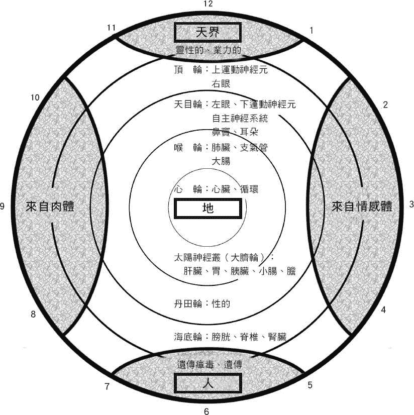 |
| 图说：图 5c　乙太－情感体的脉轮解读 |

整个脉轮分为天、地、人三种特质。如果失衡是因灵性或「业力」而来，会显现在天的部分；如果失衡是遗传来的，会显现在人的区域；如果失衡是从肉体或情感体而来的，则显现在脉轮的其他部分。如图所示，天的部分大约在十二点钟的区域；遗传的部分大约在六点钟的区域；如果起因于肉体，会在九点钟附近感觉到；如果起因来自情感体或心识体，那么会在三点钟的区域感觉到。从临床角度来看，这个诠释非常重要。以下是它实际的操作方式：

一、根据之前详细描述的步骤，完成在乙太体和乙太─情感体的分析。一般来说，会有一个脉轮比其他脉轮更「迟缓」，这些是需要平衡和清理（疗愈）的。通常配对的脉轮也会处于失衡状态，这使后续治疗更容易。

二、现在需要进一步调查失衡脉轮的乙太─情感体，以确定进一步的分析。如果十二点钟的地区凸显出来（也就是说，比其他地区更为迟缓），这就可诠释为灵性方面的病症（某些哲学家称之为业力），要解决这主因就比较使不上力了；其肉体上的病症可能会得到解决，但解决不了病因。有些权威人士认为业力可被影响，但这远远超出了本书的范围，也超出了我的小脑袋瓜所能理解的范围。

三、如果六点钟区域感觉到的「迟缓量」较显著，表示该病症是上一代祖先遗传下来的，以现代术语来说叫「遗传码」，其中现代顺势疗法的创始人塞穆尔‧哈内曼等哲学家创造了「遗传毒害」这个词，表示疾病的感染是我们遗传来的。

四、如果手指在三点钟的区域感觉到的迟缓量或「活动」量较凸显，表示该原因既不是业力也不是遗传，而是个人自己所造成的，是受到其中一个精微体的影响。这可能是一个人的思想或情绪透过脉轮影响了肉体。

五、如果九点钟的区域较凸显，这也表示病症是个人造成的。这一次，病因是从肉体发出。这可能是长期自我虐待所致，如吸烟、吃太多错误的食物、纵欲、过敏反应，或其他一百零一个不同的原因。

六、现在，非常缓慢及温和地将手再次放在最上方（顶部）的脉轮区域，即十二点钟下方的区域，并慢慢在脉轮的周围「感受」一下，这可显示脉轮的主体部分有哪些区域失衡。由于分析必须非常精准，我们必须用指尖来进行，也会发现脉轮内的一个区域（或多个区域）比其他周围地区感觉更缓慢，例如：可能是十一点钟偏外面的点、五点钟的中间点，或是在脉轮的正中心点。灵视者和一些具天赋的「灵性」疗愈师说过，迟缓区域内的不同位置还是具有某些意义的，但除非治疗时有需要细分，否则不需要去定位迟缓区域内的位置；不过，如果你觉得进一步的分析有助于填补你知识中的空白，那就去做，但我觉得不需要在诠释上变得太教条化，接受这概念并继续进行下去就是了！

## 治疗脉轮气场

在本节中，我们将探究疗愈比较深奥的层面，我想这是一般人认为能量中心可被使用的唯一方式。但是，我们知道的并不一样。

##### 让病人知情

病人对你的发现会很自然地感到好奇，并会热切期盼你的诠释，永远不要低估他们的好奇心或理解能力。如果发现病情的主因来自肉体，那简要地解释改变个人习惯、饮食等，会对治疗有所帮助，其实病人很可能也已经得出相同的结论。如果病因是源于心识体或情感体，要解释可能会有点棘手，这可能需要病人开始改变他们的生活方式，或改变一些深层的信仰，或者只需指出担忧或压力已经成为他们身体病症的主因即可；从长远来看，如果改变会让人变得更好，人们通常会愿意去改变。此外，病人对遗传来的疾病或基因码的解释也都可以接受。总之，即使治疗病因的机会渺茫（除了通过根治性手术、骨髓移植或输血），稍后教导的每一种方法都可以缓解症状。

既然我们提到输血问题，我相信病人是有可能因为得到捐赠者的遗传资料或基因码而彻底改变其疾病演化过程，所以一定要记得在病史问卷中询问病人是否接受过移植手术或输血。此外，要向病人解释病情是他们业力的一部分，这可能有点棘手，有些病人很清楚这种现象，并且很容易接受，有些病人则肯定不能接受！请谨慎行事，尊重他们的信仰，他们也会很好奇你从他们身上感受到什么不平衡，尽可能简洁描述你所感受到的，尽管要将这些感觉诉诸于语言文字并不容易！

##### 肉体─乙太体

乙太体离肉体最远十公分。如前所述，它有两个部分：肉体─乙太体、乙太─情感体。这两者对治疗的影响有着很大的差异。当在肉体─乙太体内发现阻塞和迟缓时，应该在此区温和地刺激气场。如前所述，这是透过按摩气场来执行的。这通常是用中指指尖来做，并用快速的转圆圈运动来完成。过了一会儿，迟缓消失了，整个区域变得很轻，接着变得有点温暖，再变得非常温暖，最后，感觉起来与按摩非阻塞区域的乙太体相似，这整个过程需要几分钟的时间。如是几周或几个月前的肉体失衡，运用这种技巧相当理想，这种病例的失衡尚未对病人造成束缚，而较上层的气场也尚未受到影响。

##### 乙太─情感体

在肉体以上五到十公分之间的乙太─情感体的治疗，需要用不同的方法。那阻塞的感觉并不像前一节所描述的那样密实，你必须要意识到这一点。一旦你用右手找到阻塞的区域（它的大小可能会有所不同，所以可用指尖或整只手来找），用另一只手（或中指）来找出配对脉轮中完全相同的部分。例如，喉轮的三点钟内侧有阻塞，就到丹田轮三点钟内侧去找。这个区域必须轻轻地感受，尽量不要「搜寻」过久，这会扰乱精微的能量场。在任何情况下，配对脉轮的相同部位会出现阻塞，所以应该很容易找到。一旦你找到这两个区域，双手先保持静止一分钟左右，看看感觉是否有改变。如果确实有改变（应该感觉更轻，但如果感觉更迟缓时，请不要惊慌），那保持双手完全静止，直到该区域的迟缓完全清除，并且与手下邻近区域具有相同的感觉。如果迟缓没清除掉或变得更稠密，则需要非常轻柔地按摩该区域，直到该区域开始改变。一般而言，该区域需要清理的时间长度显示了不平衡有多慢性，这可能需要长达五分钟的时间，而要将双手放在身体上方维持五分钟，真的很久啊！接着，你可检查脉轮的下一个精微层，或平衡它与顶轮的乙太体的能量，或给予徒手治疗。如果执行徒手治疗，应该很快会达到平衡。

##### 情感体

如前所述，情感体内阻塞的感觉是「汽水发泡的嘶嘶声」、「滴水」、「嗡嗡声」或其他无数种感觉，这也是这个主题如此难教的原因。情感体的范围从肉体上方约十公分到大约三十公分。因此，需要去感觉不平衡的区域相当大。要确定阻塞确切位置在哪里的最佳方法，是用主导的手缓慢并有韵律地扫描整个区域，来「找出」阻塞，这可能需要几秒钟才能达成。在扫描气场时千万不要去刺激它，这只会破坏气场的平衡。当你发现「汽水发泡的嘶嘶声」或「嗡嗡声」时，主导的手完全保持静止，另一只手则去找配对脉轮的相同区域。例如，如果在天目轮的五点钟外侧区域发现阻塞，那么另一只手就必须到海底轮的五点钟外侧区域去找。在配对脉轮中发现的感觉可能不是「汽水发泡的嘶嘶声」或「嗡嗡声」，它不会完全清楚，有时会感觉到某种形式的阻塞，有时会感觉到「寒冷」，有时会出现「刺耳」的感觉。尽可能将双手保持在同一地方，直到双手下的感觉同样地和谐、舒适。总之，「汽水发泡的嘶嘶声」的感觉，可能会在几秒钟内消失，也可能需要花上几分钟的时间。

请不要刺激这个区域，「疗愈」是在双手保持完美的静止中完成的。就在这些区域达到清净和谐之前，病人常常会叹口气或打哈欠（如果他们在这个时刻还清醒着）。下一阶段可进入心识体来确定该体是否存在不平衡，或者去平衡脉轮中先前阻塞的区域与顶轮情感体的能量。这并不一定要符合配对脉轮的确切位置，用顶轮的中心区域来做就足够了。

##### 心识体

心识体在肉体上方大约三十公分至九十公分的地方，如前所述，在心识体的阻塞感是手指下轻微触电或刺麻的感觉。与在情感体的操作一样，可通过主导的手轻轻扫描来确定不平衡的确切区域。你现在是在肉体上方大约六十公分处工作，但所得到的感觉会比前几个体的气场要精微得多。尽管感觉是精微的，但在这个层级达到的疗愈可能会对你的病人产生深远的影响，这点要特别留意，永远不要觉得你没有达到任何成果，这不是事实！在心识层级没有必要去平衡配对脉轮的阻塞区域，就这一次，非主导的手在此是多余的。刺麻的感觉通常需要几分钟才会消失，并且与其他精微体的治疗相同，常常通过打哈欠或叹息来预报，病人也可能在他体内感受到许多不同的「奇怪和奇妙」的感觉。他可以悄悄地和你讨论这些，但不应该有太多的谈话，因为你需要全神贯注，不过沟通依然非常重要。当该区域完成清理后，在这个层级的下一个疗愈阶段是将主导的手放在顶轮的心识体，通常在顶轮的这个层级会感觉到刺痛和「触电感」，你应该到这些区域去清理，尽可能多清除顶轮的阻塞，这相当重要，因为这脉轮居于其他脉轮之上，是通向此人更高的中心，并在最终达到其灵性的真正入口。顶轮中总会存在失衡现象，有时感觉就象是一个活动的地雷区，但这些感觉并不会反映成身体上的症状。

##### 脉轮气场

本书前面章节提到了可能存在脉轮气场。有些权威人士表示，可能有多达十个纯粹存在于气场层级的脉轮，并不会降连到身体，它们被认为高于顶轮的心识体等级。我第一次接触到这些理念是在科林‧布洛伊（Colin Bloy）一本很棒的小书中遇到，书名是《我正在走向酒吧去做一些奇迹》（I’m Just Going Down to the Pub to Do a Few Miracles）。这个非常引人注目的标题掩盖了它的真实信息。这些脉轮气场的「最外层」被称为「杯」或「圣杯」脉轮，应该在头上一、两公尺高处。如果你对脉轮这个非常深奥的面向感兴趣，请找找上面提到的书或其他书，我的书不会讨论这个层级的疗愈，因为这类知识很容易让刚开始发展非徒手的治疗师分散注意力。

## 治疗脉轮反射区的气场

第四章提到了治疗脉轮反射区的气场，这一训练可以使用离体技巧来执行。反射疗法的治疗师可以在气场内做好几件不同、对病人有益的事情。

##### 使用涌泉穴

你将意识到这个脚轮的奇妙穴位对身体其他部位的影响，尤其是对放松的重要性。试着将手指进到乙太体一段时间，而不要将手指放在穴位上。你会发现指尖下方的「影响力」比碰触时更为强大。更重要的是，你一开始碰触涌泉穴，再轻轻地把手指移到涌泉穴的乙太体时，病人会坚持你的手指仍然与穴位接触着！

##### 按摩气场

按摩气场的技巧可以在治疗开始时或治疗期间进行。它是用与巴西脚趾按摩法类似的方式，用双手扫描脚上方约两公分来执行的。当你的手在按摩脚部的气场时，它们将「获取」能量场中很细微的变化，这与在身体上执行时非常相似。当感觉到一些「刺麻」、「尖刺」或「微微晃动」时，这里便是后来需要治疗的区域。这些发散出的东西可能来自一个脉轮反射区或器官反射区。

##### 平衡脉轮反射区的气场

平衡脉轮反射区的气场与用手指在皮肤上平衡的方式完全相同，执行的程序也相同，先平衡左脚与右脚，然后平衡自上而下的脉轮，唯一的差异是手指约略偏离身体。这种技巧显然稍微困难一些，你需要保持双手和手指的静止（确保你的前臂在治疗床上支撑得很好）。这种技巧是我相当喜欢的技巧之一，我在工作坊上讲授时，它总是非常受欢迎。

##### 治疗脉轮反射区的气场

再次说明在治疗脉轮反射区的气场时，这种方法和「击球顺序」所需的徒手疗法没有区别。一些我多年来教过的反射疗法治疗师，现在只使用这种技巧，还告诉我他们永远不会再回去用徒手接触的方法。

我相信，透过这本书，我已经在能量医学领域开创了新的天地，也希望一般治疗师现在能以新的方式进行自己的训练。脉轮还有很多在本书范围外的东西需要去了解。脉轮可能受到声音、音乐、色彩、水晶、宝石、草药、巴哈花精疗法、顺势疗法药物、组织盐、冥想、催眠疗法、远距传播能量法、感应力、瑜伽、太极拳和气功的影响。关于这些话题，以及脉轮其他方面的讯息，例如天文考古学、地磁线（圣地古迹排列其上）及地球的脉轮能量，都可以在其他出版物中找到。

我喜欢收到反馈、疑问和一般评论，更多关于看诊的信息，请浏览我的网站，你还会找到订购本书全彩海报的讯息，该工具现已进入第十一年和第四次印刷。感谢你阅读本书，也祝你们好运。

> ##### 你可以随心所欲
> 
> 无论你想成为什么样的人，你的内在都已具备所有的潜力，
> 
> 有着所有的能量，可以去做你想做的事情。
> 
> 想象你自己已变成你想成为的那个人，
> 
> 做着你想做的事情，
> 
> 每一天，朝着你的梦想迈进一步。
> 
> 尽管有时看起来可能难以持续，
> 
> 请坚持你的梦想。
> 
> 有一天早上醒来，你会发现你是那个你梦想成为的人，
> 
> 做着你想做的事，
> 
> 只因为你有勇气相信潜力，
> 
> 并坚持你的梦想。
> 
> ──唐娜‧李维（Donna Levine）

# 参考资料

‧Academy of Traditional Chinese Medicine.An Outline of ChineseAcupuncture.Beijing:Foreign Language Press,1975.

‧Bartlett,S.Auras—and How to Read Them.London:Collins and Brown,2000.

‧Bloy,C.I’m Just Going Down to the Pub to Do a Few Miracles.Devon,Eng.:Fountain International,1990.

‧Brennan,B.A.Hands of Light:A Guide to Healing Through the HumanEnergy Field.New York:Bantam,1987.

‧Charman,R.A.,ed.Complementary Therapies for Physical Therapists,Oxford.:Butterworth Heinemann,2000.

‧Coghill,R.The Book of Magnetic Healing.London:Gaia Books,2000.

‧Cross,J.R.“The Relationship of the Chakra Energy System andAcupuncture.”PhD diss.British College of Acupuncture,1986.

‧———.Acupressure:Clinical Applications in Musculo-Skeletal Conditions.Oxford,:Butterworth Heinemann,2000.

‧———.Acupressure and Reflextherapy in Medical Conditions,Oxford,Eng.:Butterworth Heinemann,2001.

‧———.“Avenues of Healing.”Newsletter of the Association of Chartered Physiotherapists in Energy Medicine(2003):5–9.

‧Ebner,M.Connective Tissue Massage:Theory and Therapeutic Application.Edinburgh:E.and S.Livingstone,1962.

‧Gerber,R.Vibrational Medicine:New Choices for Healing Ourselves.Rochester,VT:Bear and Company,1988.

‧———.Vibrational Medicine for the 21st Century.London:Piatkus,2000.

‧Leadbeater,C.W.The Chakras.1927.Reprint,Wheaton,IL:Theosophical Publishing House,1982.

‧———.The Inner Life.1958.Reprint,Wheaton,IL:Theosophical Publishing House,1982.

‧Maitland,G.D.Vertebral Manipulation,5th ed.London:Butterworth’s,1986.

‧McNaught,A.,and R.Callander.Illustrated Physiology.London:E and S Livingstone,1965.

‧Maxwell Cade,C.The Awakened Mind.1979.Reprint,London:Element Books,1996.

‧Motoyama,H.Theories of the Chakras:Bridge to Higher Consciousness.Theosophical Publishing House,1988.

‧Shapiro,D.Your Body Speaks Your Mind.London:Piatkus,1996.

‧Sills,F.The Polarity Process.Berkeley:North Atlantic Books,2002.

‧Smith,C.W.Energy Medicine and Measurement and Molecules,Memory and Communication.Lecture,given to the Association of Chartered Physiotherapists in Energy Medicine(ACPEM),West York shire,England,September 29,2001.Copies available from Richard Harries,MCSP,conference secretary,60 Rishworth Mill,Mill Lane,Rishworth,Sowerby Bridge,West Yorkshire HX6 4RZ.

‧Stormer,C.Reflexology:The Definitive Guide.London:Hodder and Stoughton,1995.

‧———.Language of the Feet.London:Hodder and Stoughton,1995.

‧Tansley,D.V.Radionics and the Subtle Anatomy of Man.Cambridge,Eng:C.W.Daniel,1972.

‧———.Subtle Body:Essence and Shadow.Cambridge,Eng:C.W.Daniel,1977.

‧———.Chakras:Rays and Radionics.C.W.Daniel,1984.

‧Healing with the Chakra Energy System Thie,J.F.Touch for Health:A New Approach to Restoring Our Natural Energies.Santa Monica,CA:De Vorss,1979.

‧Walther,D.S.Applied Kinesiology:The Advanced Approach in Chiropractic.Pueblo,CO:Systems DC,1976.

‧Williams,T.Complete Chinese Medicine:A Comprehensive System for Health and Fitness.Bath,Eng.:Element Books,1996.

‧Zong-Xiang,Z.“Research Advances in the Electrical Specificity of Meridians and Acupuncture Points.”American Journal of Acupuncture 9,no.3(1981):203–16.

# 彩图

| 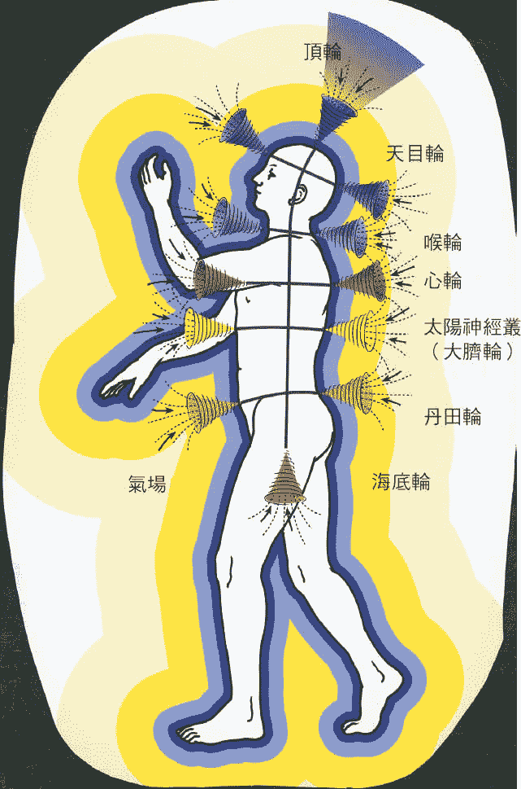 |
| 图说：彩图 1　主要脉轮和气场 |

##### 彩图 2 至彩图 8：灵视者看到的脉轮

| 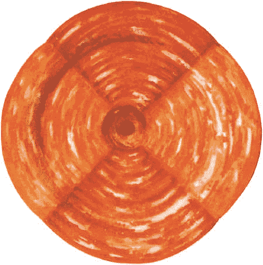 |
| 图说：彩图 2　海底轮 |

| 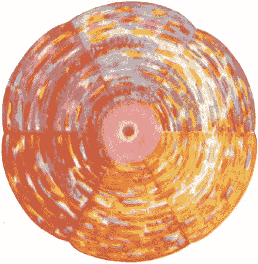 |
| 图说：彩图 3　丹田轮 |

| 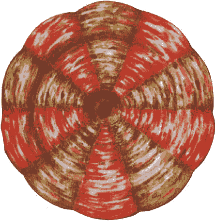 |
| 图说：彩图 4　太阳神经丛（大脐轮） |

| 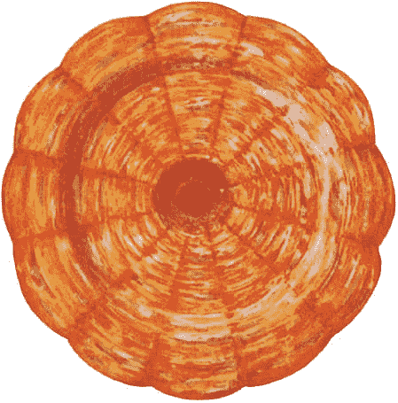 |
| 图说：彩图 5　心轮 |

| 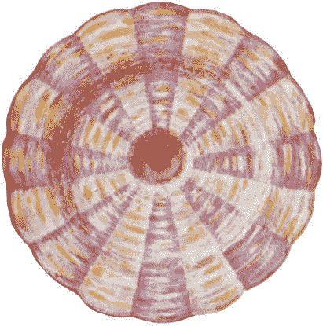 |
| 图说：彩图 6　喉轮 |

| 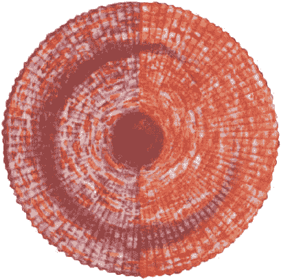 |
| 图说：彩图 7　天目轮 |

| 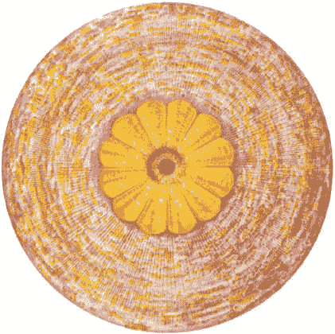 |
| 图说：彩图 8　顶轮 |
