周易2011

## 梅花艺术

## 预测术讲义

◎邓海一 著

梅花易数预测法，用周易梅花艺术预测。

华夏出版社

姜太公之清道破千古易占之迷

通神之德

古之贤

千世奇书

> 師門真傳
了悟天機

> > 俏也不争春
> 只把春来报
> 待到山花烂漫时
> 她在丛中笑

> 人外有人
天外有天
成名江湖
各怀绝技

向为易学发展作出贡献的古圣今贤致以崇高敬意！

河南省著名书画家刘大硕先生题赠邓海一老师

> 海一先生雅正，岁在甲申仲夏，书于济南，愚弟汪长胜敬题

山东省著名书法家汪长胜先生题赠邓海一老师

（右侧竖排小字，似为对联内容）
天德荫身万病消散

（左侧竖排落款文字，内容辨识如下）
河南石林贺邓海一老师著《俏梅花外应预测术》出版 甲申刘大硕书

河南石林题句刘大硕先生书赠邓海一老师

> 善结易缘在经年，来无影去无踪，恩师授我使人羡，细详参寻，理争诀

山东莱州弟子张光辉诗并书赠邓海一老师

## 致易学爱好者

“易卜仙人诀”，师门俗称“俏梅花”。相传为宋朝大数术家邵康节所创，与其“梅花易数”相比，更快更准更奇。大道至简，铁口直断。古往今来口传心授，从无笔墨遗世。作者历尽艰辛得民间异人授业，实战验证，效果出神入化。真传尽泄师门绝技，详解十六条仙人诀，直指千年易占之迷。亲测实例，疑难点窍，析理透彻，简单易懂，是易学爱好者提升层次的上乘佳作。

初学者即可出手不凡，老行家更是技艺精进。

目录

序一 15

序二 19

序三 21

序四 27

导言 29

第一编 俏梅花外应预测仙人诀讲义 35

第一讲 开悟篇 35

第一节 掀开神秘面纱 再现真实风采 35

第二节 成功每个人 圆您心中梦 39

第三节 师从天地不泥古 活用易理在变通 42

第四节 删繁就简三秋树 标新立异二月花 44

第二讲 进阶篇 48

第三讲 外应仙人诀基础知识 52

第一节 易卜时空的基本概念 64

第二节 易卜时空的作用关系 64

第三节 易卜时空与现实生活的联系 72

第四讲 八卦万物类象 78

第五讲 俏梅花外应预测仙人诀 115

第一节 外应仙人诀易占原理 115

第二节 俏梅花外应仙人诀 118

第三节 俏梅花外应预测步骤 134

第六讲 俏梅花外应预测应用举例 137

第一节 测疾病类 137

第二节 测谋事类 139

第三节 测经营类 140

第四节 测钱财类 142

第五节 测行人类 144

第六节 测寻物类 145

第七节 测婚姻类 146

第八节 测工作类 148

第九节 测风水类 149

第十节 测属相类 150

第十一节 测数字类 151

## 第七讲 师训守则 154

# 第二编 俏梅花外应仙人诀应用答疑 157

### 第一节 外应仙人诀应用答疑 157

### 第二节 征集外应预测实例启事 185

### 第三节 学员应用预测实例 186

### 第四节 附录一观物洞玄歌 195

### 附录二观物玄妙歌 198

### 附录三万物象卦赋 200

### 附录四诸事响应歌 202

# 第三编 俏梅花外应预测教学手挽手 218

### 第一节 点将台预测实例 218

### 第二节 辅导学员实例预测 221

### 第三节 群英荟萃 各显神通 228

### 第四节 鸿雁传真情 盛誉俏梅花 236

# 第四编 俏梅花外应预测精彩实例 280

### 第一节 测行人类 284

### 第二节 测钱财类 288

### 第三节 测工作类 299

- 第四节 测疾病类 304

- 第五节 测婚姻类 307

- 第六节 测寻物类 317

- 第七节 测属相类 321

- 第八节 测交易类 325

- 第九节 测子女类 332

- 第十节 测诈骗类 334

- 第十一节 测博彩类 337

- 第十二节 测伤灾类 338

- 第十三节 测宅基类 341

- 第十四节 测其他类 343

教学信息

后记

# 《俏梅花外应预测学》序

从古至今，人们都很崇拜“神仙”，因为“神仙”可以“知过去，察未来”，普渡众生，可是又有谁真正见过“神仙”呢？实际上有“先见之明，能够掌握阴阳五行变化规律，准确判断出结果而使人信服、为人造福者”就是“神仙”，而传说中“神仙”能“腾云驾雾、指石为金”则是不存在的。

在易学研究中，自称“神仙”者不少，但大都经不起考察，可真正有绝学者，反而隐而不露，谦恭待人，山东枣庄的邓海一就是这么一位“神仙”，他的“神”不是自己吹出来的，是他“历时三载，追踪万里，感动上师传授的千古绝技”所放射出的神奇，谁能完全掌握了这种绝技，谁就可以不是“神仙”而胜似“神仙”，这种绝技就是“俏梅花易卜仙人诀”，她以“快捷、准确、神奇”而成为易学皇冠上的一颗明珠。不信吗？找找邓海一，实践是检验真理的标准。我建议每个研易者都学习一下这种绝技，定会大受其益的。是为序。

中国河洛易经学院院长 于长君

# 序一

初识俏梅花，缘起与易友的交流。在交流时，不断有易友向我推荐俏梅花外应预测术。易友们为我预测几次，准验，我不由暗自称奇。我通过电话联系邓海一老师，邓老师预测随问随答，速度之快令我吃惊，且悉数准验。询问其方法时，邓老师告诉我，是师门的“俏梅花外应技法”。当时，我的脑海中留下了一个大大的问号，人不在现场如何能够提取外应？

短暂的交谈，邓老师直率真诚又毫不保守的高尚易德，给我留下了深刻印象。随着交往地加深，我对其由倾慕而成挚友。

邓海一，山东薛城人，生于1965年。其自幼酷爱易学，偶遇一寺观还俗道人，即被其铁口直断的神奇技法所折服，历时三载，追踪万里，情真撼道心，始授此千古绝技，以其聪颖好学于短短数年内已尽得师传。为弘扬易道，让更多在易门之外徘徊的广大易学爱好者得遇真知，邓海一老师遂决定公开师门技法，还易于道，道济于民。

我们智慧先哲老子、庄子，在其传世巨著中，一再强调人类与自然是完全和谐与统一的，而俏梅花外应预测术，恰恰就是从“天人相应”的整体思维方式出发，通过取类比象，把人与自然、个体与社会、精神与物质相交相融，采用易学的类比思维进行推演；在物我关系上，其提出反观的认识思维方式，认为宇宙来源于太极，“太极…也”，乃不动之体，“一”动就分为天地与阴阳，阴阳产生万物。

> > 易云：“动变见吉凶”“有形则有体，有性则有情”

这些都在俏梅花外应预测术中，得到了淋漓尽致地发挥。“俏梅花”与其他预测方法不同的是，其从易理出发，以卦相对应原理为主线，以人为太极，利用时空显现的外应来预测事物。俏梅花外应预测术，远取诸物近取诸身，找到太极点后，从时空点所处的不同时刻，对所测事物依其口诀法则作出迅速的判断。从相关联的事物中提取最相近最有把握的信息，依照对应原理进行大胆断测。打破了传统动态外应预测思维模式，改变了以往在没有外应（动象）情况下便无法断卦的观念，动态外应与固定外应相结合，更是拓宽了外应提取范围，真正使外应取之不尽，用之不竭。我们知道古人论说的角度固然有所不同，但每个易学爱好者都毫无例外地力图追求天人相通之处，“天人相应”的学说正是基于此而建立。“观之以理”，方能以“一心观万心，一身观万身，一物观万物，一世观万世”，俏梅花外应预测术深得易之精髓，大胆创新直达不测谓之神的易学最高境界。邓海一老师的另一功绩在于，他将零散的偶现外应与固定的静态外应有机揉合，使整个预测形成一条有序的预测链条，直接提取人生信息，且信息挖掘相互连贯丝毫没有脱节。这是易学界的一个创新、一个奇迹。

邓海一老师在倾力播撒“俏梅花”的同时，谦虚好学，博采众家之长，不断丰富其预测思维，张扬俏梅花技法“简、快、准、奇”等特点，从而更加凸显易经简易的真义。俏梅花预测术问世后，立刻得到广大易学爱好者的喜爱，这是情理之中的事。笔者一次用其技法为妻子的一个女同事预测，尽管其人当时不在现场且从未谋面，但结果却出奇地准确，甚至其人左右眼近视的不同程度都完全吻合，对方很是惊奇！

俏梅花外应预测术是易坛的一枝奇葩，功在当代，利在千秋，希望广大易学爱好者携起手来，摒弃门户之见，繁荣我国易学事业，共创易学未来，为易学走向世界做出更大的贡献！

谨以此序祝邓海一老师事业精进，推出更多更好的俏梅花体系预测术！

马万成 甲申年申月于山西

# 序二

易之宫殿，堂皇富丽。殿中瑰宝，繁若星辰。“俏梅花”宛如王冠上的夜明珠，格外耀眼。山东省枣庄市的邓海一老师，捷足先登，引领易友走近夜明珠，教给我们采取不同方法，站在不同角度，来赏识这一宝物。

与“梅花易数”相比，“俏梅花”更快捷，更准确，更神奇。故而称“俏”，美名不虚。

曾经看过“外应俏梅花”古例和今例，也见易友应用过，但象邓老师这样理论化，系统化的教学之法，我还是第一次聆听。听邓老师讲“外应”课，思路大开；见邓老师当场断事，顿开茅塞。整体感觉是：

> 明察秋毫，草枯鹰眼疾；
得心应手，雪尽马蹄轻。

邓老师最爱说的一句是“让事实说话”。当谜底被揭开，确实是“神奇而不神秘”。

如非现场见闻，我不会盲然作序，当然邓老师也不会浪费一个普通学易者的笔墨的。本人虽为平常之人，但每说一句话，既要为老师负责，也要为易友负责，更为自己负责。

“俏梅花”既可望，又可及。

刘霞 于北京

刘霞 女 1960 年 原籍 吉林省人 大学文化。

> > 习六爻四柱何分新法旧法？ 论人生易道只求真心真知。

北京红庙首都经贸大学院内 邮编：100026

# 序三

和邓海一老师相识缘于一本《易卜仙人诀讲义》，当我得到这本书时，立刻被书中深邃精辟的内涵所吸引，在易学界一直为大家所津津乐道，梦寐以求的心法高层技法——外应预测术就这样轻易地被我得到了。

在易占心法中讲求“远取诸物，近取诸身”、“寂然不动，感而遂通”、“阴阳不测之谓神”诸法，不是不测，而是易技到了一定层次后，完全可以抛开繁琐的起卦模式和复杂的运算程式。“何时何地出现何事物或何进何地得见何事物”皆可破解时空信息，根据“天人合一”“信息全息”的理论，在进行预测时所处的时空场态中，所呈现出来的事物或动静与所求测的事项息息相关。一草一木、一颦一笑，举手投足，拈花微笑间，皆成为取用对象，充分运用感性思维，联想思维和类比思维找出所对应事项之间的关联点。以“形”、“意”、“动”、“变”为着眼处，灵活取用，直指事物的本质和核心，所以简捷实用，准确度极高，历来为易学大家所重视，珍而秘之，深藏不露。即使偶尔用之，也不点破原理，如惊鸿掠水，让世人莫测高深，视之为神人。人们一般认为外应预测是可遇而不可求的灵感的偶然闪现，只能触机而发，偶尔尔用之。这只能说明自己学艺不到，所识有限。其实外应预测法自有它一套完整的预测体系和独特的运用技法，只是难为外人所识，历来只在师徒间口传心授，讳莫如深，鲜见笔墨遗世，故知之者甚少，而研习者更乏人矣！

今天，邓海一老师以天心为己心，以振兴光大易道为己任，摒除传统的陈规陋习，呕心沥血，再出新作，将师传的本门“俏梅花外应预测术”毫无保留地披露于世，广传于人，实为易学界一大幸事，更是广大易学爱好者的福音，此举不愧为大功德一件。邓老师指出：“研易到一定程度；要再提高只是转换角度，调整思路的问题……”真是一语道破天机，一指点醒梦中人。对苦涉易学已久而进展缓慢的广大易学爱好者来说，这是一个绝大的启示，的确是该认清误区的迷雾，回头换位思考的时候了……

香残更识俏梅花，欺霜傲雪独芳妍，“俏梅花外应预测术”以她独特的魅力和芳姿，很快就赢得了全国各地广大易学爱好者的青睐。冬去春来，习者遍天下，大家在实际运用中往往出奇制胜，屡收奇效，取得了令人满意的效果，易学历来倡导大道至简，返朴归真，“俏梅花外应预测”正是忠实于此道，一学即会，一用见效，这绝非虚言，如今年六月一次面授班午休时，一位易友的老家人打来手机，说她男人出事了，被抓进了公安局。仅凭此数语，这位易友马上断说：是三个男人一起在家的西南方出的事，因合同、票据或证件之类的事而犯案。对方立刻反馈说：对，事情起因就是这样的，其中还涉及到一个女人……这位易友接着又断：这个女人中等个，圆脸，上身穿一件黄颜色的衣服……对方对如此精确尤如亲见的断测惊奇不已，如捞到了一团救命草似的急切地问此事该如何了结？“花钱了事”易友说完轻松地挂了机！这么神奇的断测是如何推断出来的呢？其实就是中午时我们三位易友一起去西南方一家复印部复印资料的取应，一切就是这么简单而实用。

每天，打向邓老师的电话络绎不绝，邓老师都是亲自接听，在电话中耐心细致地为全国各地的学员们解答各种疑难问题，分析讲解推断思路，每次都让学员们满意而有所得。还有一部分是经学员们介绍或慕名打进的电话要求预测的，邓老师均来者不拒，往往对方话音刚落，邓老师的预测结果便尾随而至，让人不得不佩服他惊人的观察力和思维分析能力，这是他在长期实践中养就的灵敏反映。有时仅凭求测者的只言片语，便能将预测结果告知对方，真正体现了易道至简，迅捷务实应用效果。如一次我发去短信：“有三个男人来问事，有什么事？”邓老师随即回复直断是问车祸之事，准确得让我吃惊。后来，我询问他的取用依据，他说：三个男人不就是“离”与“乾”卦的关系吗？“离”为火主口舌诉讼，“乾”为金为器物为车辆，综合下来不就是因车祸而导致纠纷的信息吗？我对他简洁但精准的推断思路拍案叫绝！这与我们平常所见的预测师奉行的那一套繁琐复杂的推理形式，弄得手忙脚乱，满头大汗，最后只能告之“可能”、“大概”之类的预测结果何止天壤之别！这就是水平，不服不行啊！

> 你进步我骄傲！我断得再准确、再神奇，不如教会一批技艺精、品德佳的学生，让他们能学会用，去为民众服务，去福泽世人！

邓老师不但以精湛硬实的外应、相学、风水、八字等预测术扬名易坛独步易林，更以宽宏大度、礼让谦恭的人品赢得了天下易友们的归心，用“德易双馨”四个字来评价他最恰当、贴切不过。邓老师常说：“你进步我骄傲！我断得再准确、再神奇，不如教会一批技艺精、品德佳的学生，让他们能学会用，去为民众服务，去福泽世人！”多崇高的思想境界啊！他说到做到，以有效地教学方式迅速为全国培养了一大批易技精良、品学兼优的预测师，完全不同于社会上那种以教学为幌子，以搜刮钱财为目的的江湖庸师。教学费用低廉，对那些伤残病疾的弱势群体和经济困难的易学爱好者，他总是酌情减免，并作出郑重承诺：对学员负责终身免费指导和答疑。在利益至上的当今社会，这是难能可贵的，是很多“大师”们所做不到的，这也是众心相向，人心所归之处。尽管邓老师声名鹊起，易技超群，但他从不挟技自傲，并经常告诫学员们要谦虚礼让，努力上进，须知人外有人，天外有天，只有虚心好学，永不满足的人，才有希望达到神意相通的境界，这也是易学的阴阳辨证之理，是值得每个易学者去理解并努力去做到的，他将本门师训收录于讲义后作为学员们应该遵循的行为准则。他说作为一个易道中人，理应是福泽于人而不能陷害于人。要求学生们做到的老师必须先作到。他就是这样严格地要求自己和他的学生们的。

邓老师对人彬彬有礼、和蔼可亲，完全没有一个“大师”的架子和派头，在今年六月举办的一次面授班时，考虑到正值高温酷暑为了让学员们学习好、休息好，他特地为学员们选择了一处清凉安静、起居舒适，教学方便的场所授课，并亲自到车站迎接前来学习的学员们，让大家一下车便感到了异乡的亲切和温馨。学习班结束时，返程车票十分紧张，邓老师又帮大家提前预订了车票，并亲自和我去车站取票，想尽办法让每位的学员都能平安地返回家乡，此举令我十分感动。在教学中他讲解详尽，举例翔实，深入浅出，事理并重，他开悟大家研易要始终遵循易经的“简易、变易、不易”之大原则，要放开思想，活学活用，尽量把所学的各种知识融合贯通使用，彻底摒弃以往那种固定呆板、死执教条的思维方式，不能抱一些死的条条框框和公式程序化的东西束缚自己的灵性，只有放开了以心为易，你的易学水平才能迅速得到提高，尽快踏上通神之路……教学结束后，又征询大家对教学中的做法和意见，以便总结提高，为以后的教学积累丰富的经验。

宝剑锋从磨砺出，梅花香自苦寒来，经过多年的苦心砺志，辛勤耕耘，邓老师亲自栽培的“梅林”终于开出了一片锦绣天地，透出阵阵清香，但他并不满足，他的心在更高更远处，他还牵挂着天下那些仍在易学道路上苦苦跋涉的众多学子们！那些学易多年仍不成的易友们，记得拿起你手中的电话，拨打0632--4416548 或 13062060978，电话的另一头，一位热情的老师一定会给你一份惊喜，也许从此改变你的易学人生，让你踏上另一条轻便快捷的学易之路，将你带入另一个易学的新天地，成就你久盼未圆的易学之梦！是为序！

邓发彬 写于四川古城阆中蜗居

# 序四

《俏梅花外应预测术讲义》公开推出，这是我们俏梅花师门的一大盛事，也是广大易友的福音。

我自幼爱好易学，84年以来，先后在六爻、八字、风水等领域进行了深入研究，并取得一些成绩。在未接触俏梅花外应预测术的前20年里，我虽努力尚学，但总感觉是在易林仙山中慢慢爬行，走了不少弯路，也受了不少挫折，多年来久学不进，渐渐我在易海中迷失了方向。癸未年，有幸得到邓海一老师真传俏梅花外应预测术，是邓老师将我带上了周易预测术的高速公路。

俏梅花外应预测术，操作简单，判断迅速，数时表达明确，微观剖析，宏观显示，对过去、现在和未来，都有一个明白的阐释，是洞开未知之门的金钥匙。

修习本门技法两年来，通过预测实践检验，大有拨开迷雾见青天之感，在预测事物时，简、快、准、奇，经常令我激动不已。

预测技艺有了突飞猛进的飞跃和提高，真的是峰回路转，柳暗花明。在此，我深深感谢恩师邓海一老师，为表达感激之情，特赋诗一首，以谢恩师。

# 赞俏梅花外应预测术
——敬赠邓海一老师

邓氏真传俏梅花，
易林仙山一奇葩。
见物言事悟天机，
时空密码准确抓。
正本清源得真髓，
预测由此不起卦。
仙人妙诀示绝技，
留在世间誉佳话。

吉林弟子：李家裕

# 导言

初夏时节，老树新绿，到处洋溢着盎然生机。

在科学昌明的今天，中华古易愈发凸显出它的宏伟与雄奇。

人们日益发现，一些现代自然科学通用的方法，往往可以从《易经》哲理和《周易》象数中得到智慧；当人们在科学探索的道路上，困顿不前的时候，常常就把目光投向这里来寻求答案。诺贝尔奖金获得者美籍华人杨振宁和李政道，对基本粒子物理学是否能有新突破产生疑惑时，不由自主地翻开了这部智慧宝典。“预言有时会让人的思维向新的方向进展”，李政道博士还感慨地向外国朋友这样介绍东方的《易经》。

从计算机的二进位制，到现代先进企业管理，古老的东方智慧，以其独特的魅力征服了越来越多的人们，从远古走向未来，从中国走向世界。

值此八运来临，易学事业之发展繁荣又迎来了新的契机，古易的光芒穿云破雾的明天就要到来！

《易经》是一种思维方式，是古人探索宇宙奥秘的世界观和方法论，立足于宏观，应用于微观，服务于生活。

《易经》为什么具有预测的功能？它发现了宇宙演化规律，并建立了一整套严密体系把这样的规律体现出来。

事物发展是按照其自身固有的客观规律实现的，而不是杂乱无章、毫无秩序的。马克思主义哲学的精髓是“实事求是”，毛泽东指出：“实事”就是客观存在着的一切事物，“是”就是客观事物的内部联系，即规律性，“求”就是我们去研究。我们运用《易经》认识世界的原理，遵循客观规律，依据提取的信息，经过严密推导，追述过往，揭示未来，表现出事物的发展规律。预测神秘吗？并不神秘。雪莱有句诗：冬天到了，春天还会远吗？抛开其他寓意不说，单就它揭示的大自然春夏秋冬循环往复规律来讲，这句诗正确地表述了这样的规律。现在连小孩子也知道，冬天的尾巴后边跟着春天，因为四季往复的规律已被人们普遍掌握，所以并不感到新奇。但是，让我们换个角度来看这句诗，假如世界上还有些没有经历过四季往复的人们，你告诉他们这句话，后来事实证明，春天真的踩着冬天的脚跟来到人间，那么这些人会不会也把你看成预言家了呢？这就是讲《易经》中，蕴涵或反映了自然和社会的普遍规律。

四季可以轮回，日落又会东升，然而，人生是单程车，由生到死，一个人的人生只能经历一次，不能排练，也不能重来，所以，每个人对自己的前程充满了好奇。就像一个人坐在飞速前行的车子里，透过车窗，你可以看到一幅幅景色各异的画面，不断地被你甩在身后，对于前面将出现什么景色，尽管可以假想，却无法真切感受具体情景。换个角度来看，假若我们有幸与在太空遨游的卫星建立联系，通过信息传输，卫星提前把你将看到的景色图片发给你，并告诉你列车运行方向和终点，你就能做好用不同心态应对不同景色的准备，随着车轮转动，当你看到卫星传输的图片和你眼前看到的一样时，你会不会很惊奇，会不会说卫星是个预言家？其实没什么可惊奇的，只是认识世界的层次和角度不同而已。这就是讲《易经》中，蕴涵或反映了人生变化的一些规律，认识不到的人们，是因为境界高度不够。

其实，世界是一本打开了的《易经》，它无处不蕴藏奥秘，俏梅花外应预测术，运用易学原理，依据自然本性信息，破译时空密码，见物言象，读象知事，易卜前程。

学海无涯，艺无止境。我始终抱着谦逊和开放的心态，虚心向易界前辈、民间高人和广大易友学习。博取众家之长，力求融会贯通，不断提高服务社会、服务他人的能力。

易是技，易是艺，易是境界。技是习的，艺是悟的，境界靠修养。

在教学中，我真诚传授和认真负责的精神，赢得了信任，赢得了信誉，赢得了广大易友对我的支持和厚爱。

易之人重艺，更重德，德有多高艺才有多高。不只是对学员负责，不管是谁，只要是来信来电找到我，我都是有求必应，尽自己最大努力给大家一个满意答复。春节前，我正在授课时，忽然收到一个短信，云：年关将近，负债累累，悲观绝望，没有了活下去的勇气，请郑老师指点一下，我的人生还有希望吗？我急忙向学员说明情况，暂停讲课，认真地结合预测进行劝导，并实际指导发展方位等。时隔三、四个月，我接连收到短信，言谢，一时莫名其妙，也没太在意是哪一个发来的。可是，后来有人再三购我资料，并常来短信，不断出现的号码，才让我渐渐回想起年前短信的事来。与人为善，广结善缘，善莫大焉。

俏梅花预测术一直在民间流传，我经过艰苦努力，深化整理出了完整体系。2003年推出其系列之一，外应预测术资料《易卜仙人诀讲义》；2004年推出了其系列之二，相学资料《神相闪电眼》。一经公开，便以震古烁今之势，迅速轰动易界，并因其好学好用、神奇快捷的实战效果，赢得广大易学爱好者称赞。正是：俏梅一枝泄天机，艳冠群芳显神奇。香著人间数风流，红遍山川锦绣地。

## 俏梅花外应预测讲义

本书是在资料基础上丰富完善而成的。《俏梅花外应预测讲义》，是易学史上罕见的系统研究外应技法专著，具有划时代的深远意义。

即将推出的系列资料有：俏梅花风水术、俏梅花命理术、俏梅花养生术、俏梅花化解术、俏梅花博彩术等，期待大家继续热忱关注。

向为本书挥毫增色的河南省著名书画家刘大硕先生，山东省著名书法家汪长胜先生，表示衷心感谢！

向百忙中拨冗作序的于长君院长、山西马力成、四川邓发彬、北京刘霞、河南石林，表示衷心感谢！

向辛勤付出的弟子吉林李家裕、山东张光辉、广东施金延、江苏陈棉春等，表示衷心感谢！

向选录实例的学员及所有给予过支持的朋友，表示衷心感谢！

# 第一编 俏梅花外应仙人诀讲义

## 第一讲 开悟篇

### 第一节 撩开神秘面纱 再现真实风采

预测术神奇，但并不神秘。中国预测术门类繁杂，流派众多，追根溯源皆出于《周易》。《周易》是我国最古老、最权威、最著名的一部经典，是中华民族聪明智慧的结晶。易学发展了几千年，历经种种坎坷与考验，或褒或贬，时衰时兴，是中国传统文化的重要组成部分。这部融入祖先智慧的经典之作由两部分构成，一是经文部分，二是对经文最古的注解说明和发挥。《经》部包括卦、爻和说明卦的卦辞、说明爻的爻辞。古时以卦和爻来占卜自然和社会变化的吉凶。《传》部也称《十翼》，包括《彖》上下、《系辞》上下、《序卦》、《说卦》等十篇。它在肯定事物运动变化永无穷尽的基础上，推测事物发展到一定程度和阶段，就要走向它的反面；又把发展理解为各种矛盾趋向和谐与不断往复的过程。

《周易》的基础是八卦，即乾（☰）、坤（☷）、巽（☴）、震（☳）、坎（☵）、离（☲）、艮（☶）、兑（☱）。卦中的（——）代表阳，（— —）代表阴。由此，我们可以看出，八卦是阴阳符号的组合，是先民对世界由感性认识到理性认识的产物。

“易”有三层涵义，一是“简易”，《系辞》说：“易有太极，是生两仪，两仪生四象，四象生八卦”。“极”、“仪”、“象”、“卦”都是不同阶段的物象名称，高度抽象地归纳了事物发展的进程，体现了客观事物的可知性；二是“变易”，《系辞》说：“变化者，进退之象也”。道出了万物变化无穷，是由于天地间的阴阳这两种现象或力量往复推动所引起的，体现了客观事物永恒运动的特性；三是“不易”，《系辞》说：“乾，阳物也；坤，阴物也，阴阳合德，而刚柔有体，以体天地之撰，以通神明之德”。阐述了世界是矛盾统一的整体，体现了客观事物的相对稳定性。研究易学，就是为了掌握和运用客观世界的规律！《易经》中的每句话，蕴藏着丰富的哲理和数理，智慧的古人以图、数的方式来反映。

## 俏梅花外应预测术讲义

《周易》古经流传几千年，并且随着时间的推移，愈发显示出强大的生命力，其魅力就在于它所内涵博大精深的宇宙观，就在于它能够应用于实际生活的预测功能。

《周易》是古人智慧的结晶，是推演和研究宇宙变化规律的学说，它揭示了客观世界的变化规律。人是宇宙的一部分，自然会受到宇宙大规律的影响，宇宙阴阳五行运动就会在人们生活中发生作用，并不以人的意志为转移。预测术研究和运用的就是阴阳五行变化规律。预测术的根在《易经》，来源于生活，造福于生活，所以说并不神秘。历代统治者最愿搞愚民政策，治易又不得不与宗教巫术交织在一起，陷于图谶，易的精当之处往往被谶纬之学涂抹得乱七八糟，使本该光辉灿烂的宝藏，蒙上了神秘的色彩。可喜的是，在科学向纵深发展的今天，全息论、生物钟、微波技术等新学科层出不穷，这就有助于我们擦开其神秘面纱，正本清源，还古易之本来面目，再现其真实风采。

### 要点回放：

-   1. 《易》是揭示宇宙本原规律的学说；
-   2. 《易》有三个层次，简易、变易、不易；
-   3. 《易》是先民通过仰观天文俯察地理，
-   4. 探索出的客观世界变化规律的高度概括；
-   5. 《易》是预测术的根，预测术神奇并不神秘。

### 思维训练：

-   1. 能说出几条客观世界的变化规律？
-   2. 能说出《易》和这些客观规律的联系吗？
-   3. 请把你的感悟写下来______________________

### 第二节 成功每个人 圆您心中梦

在这个世界上，人是万物之灵，具有灵性。人人都具有预测潜能，多数人浑然不觉，慢慢泯灭了灵性，少数人彻志磨练，逐步调理完善，成为能够追述过往，预知未来的智者。有句话叫“说曹操，曹操到”，相信诸位在生活中都有体验。可以这样想，不是因为说了“曹操”（某人），“曹操”才来，而是因为“曹操”的来（动态），和你沟通了信息感应，你很自然地有了“曹操”的信息。其实这就是简单的预测，说白了叫直觉，灵光一闪，是人类预测潜能的显现，那么，是不是人人都成了预测家了呢？当然不是，因为个人零碎的潜能反应，还不能称为严格意义上的预测，只能是直觉反应灵敏。我们说的预测家，应当具有高度的易学素养，具有稳定的连续的可重复操作的反映过去、预测未来的能力。预测术是一门深奥的学问，要系统地学习预测理论，掌握其运用技巧，积累经验，更重要的是要有高师的指点。“江湖一点诀，点破不值钱。”既然有诀，就说明预测术是有规律可循的。要学好预测起码做到四点：一是多读预测类书籍，熟知预测知识；二是投师访友，相互交流。读书获得的知识是稳固的，与人交流能激发思想火花，挖掘和引发深层次的预测能力；三是勤于实践，善于归结，增加悟性；四是从社会生活中学习。预测术与其它艺术形式一样，来源于生活，同时又高于生活。纵观当今预测成果，大量增加了现代生活的新内容，这都是从生活中得来的。

培养兴趣，坚定信心，勤学多悟，在不久的将来，您也能成为出类拔萃的预测家。

## 梅花外应预测术讲义

### 要点回放：

-   1. 人是万物之灵，都有预测潜能;
-   2. 预测术是有规律可循的;
-   3. 勤学多悟，循序渐进;
-   4. 预测术是随时代发展的。

### 思维训练：

-   1. 能举出几个直觉判断的事例吗?
-   2. 能否从易理的角度破译直觉感应?
-   3. 请把你的感悟写下来

### 第三节 师从天地不泥古 活用易理在变通

“易”本来就是变化的，是灵活的。就预测术而言，有星象学、风水学、命理学、占卜学及相学等领域，古今典籍，浩若烟海。各门类都有自己固定的理论体系，推演模式，其中又派别林立，条条框框多之又多，越来越繁琐，实际来说是有失易理的。因为预测是多解方程，是一种思维方式的体现，世界上的预测学没有 1+1=2 的绝对公式，预测结果不是可以用精细的模式就能套出来的，所以并不是某门派规则越多越好，恰恰相反，繁琐地细化程序只能束缚人的灵性，限制人的思维。

> 要想突破，就要敢于抛脱程式的桎梏，活用易理，敢于生发思路。

没有百分之百的预测术，如果有人说哪派预测术百分之百准确，那真是吹牛，骗人的。任何理论都没有顶峰，马克思主义是真理，我们现在都知道，它也是不断发展完善的，是动态的。任何绝对的理论都不过是膨胀的汽泡。我们应当清醒地认识到，预测术是历经几朝几代智者，呕心沥血不断发展完善的，大多数术家的心情也和我们一样，都想让预测结果向事实靠近些再靠近些，多些欣慰，少些遗憾。预测术门类之中，也有相对优劣之别，准确程度有相对高低之分。俏梅花外应预测术源于易理，发挥易理，兼融其他门类，您掌握的预测术越多，水平越高，融会贯通，越能发挥到极至，准确度越高。

## 俏梅花外应预测术讲义

### 要点回放：

-   1. 预测术没有绝对的模式；
-   2. 预测术没有顶峰的理论；
-   3. 活用易理是预测术的灵魂。

### 思维训练：

-   1. 为什么说繁琐程式桎梏思维？
-   2. 怎样理解和分辨预测术的层次高低？
-   3. 请把你的感悟写下来

### 第四节 删繁就简三秋树 标新立异二月花

俏梅花外应预测术，精华在于象数一体，活用易理，充分体现了易的本质。特点是：简、快、准、奇。预测口诀共十六条，实际应用中真正起作用的是十条。大家只要熟记十条口诀，就完全可以进行预测了。

相传“易卜仙人诀”是宋朝大数术家邵康节所创，师门俗称“俏梅花”，较其传世名作“梅花易数”更为直白洗炼，独授其愚钝之子，历代相传，明朝刘伯温曾用，“烧饼歌”中可见迹痕，后来流入民间，门规甚严，口传心授不立文字，至清末民初，天下战乱，烽火四起，为避祸，师门高尊遁入寺观。恩师原是观中道人，解放后还俗，浪迹江湖，易卜为业，我得机缘巧遇，历时三载，追踪万里，才拜祖从师。我从师有约，须待恩师仙逝后，方可开山广布。恩师于庚辰年秋荣归仙位，为弘扬易道，光大本门数术，叩请师尊，今年首次公开传授。

“易卜仙人诀”，全部使用外应预测，比“梅花易数”更简洁直观。越是深奥的东西，其道理越简单，越是简单的道理，其内涵越丰富。世界即是“阴阳”二字，看，古人概括得多好。预测术本来就多而又杂，预测方式方法林林总总，这就足够让人眼花缭乱的了，但是，更有好事之徒半藏半露，遮遮掩掩，江湖术士故弄玄虚，神神秘秘，真是让有心钻研者不知何去何从。

> 苏东坡有首诗，“横看成岭侧成峰，远近高低各不同。不识庐山真面目，只缘身在此山中。”

我觉得用来形容此状很形象。那么，怎样才能得识庐山真面目呢？我说：跳出来！“汝果欲学诗，功夫在诗外。”详熟基础知识，把握易理，从现实生活中领悟。只有这样才能提升境界，才能向纵深发展，不要死守一门一派，一条道走到黑。预测术是智慧的先人从现实生活中得来的，是对客观事物由感性认识到理性认识的总结，这是由实化虚；再把提炼了的思想认识重归现实生活，校验正误，同时指导生活，造福人类，这又是由虚化实。世界上没有神仙，没有谁真的游走三界，先知先觉。研习易学达到一定程度，欲要再提高层次，只是转换角度，调整思路而已。

整思路的问题，食古不化者永难成大器！“易卜仙人诀”深得易之髓，删繁就简，“拨开迷雾见真章，狂风吹尽始到金。”我幼时受家学影响，酷爱术数。工作之余，潜心研易二十载，涉足星象学、命理学、占卜学、奇门遁甲、大小六壬、铁板神数、相学等门类，实践中准确程度也很高，但从师研习本门外应仙人诀后，预测技艺才有了质的飞跃，正是法门万千，大道至简，存乎一心，在于通变。

太极拳的精华在于以静制动，借力使力，练武的最高境界是无招，其实浑身是招，习易又何尝不是这样？“善易者不占”，是不需用繁琐的形式来占，世界是全息的，天机无处不在，只要心中有易，即来即去，何须动拙？！

实践是检验真理的唯一标准，事实是验证预测的试金石。想要知道梨子的滋味，何不亲口尝一尝？心动不如行动，智慧之门为您敞开，带您快速步入神奇世界，祝您早日登上新的易学高峰。

### 要点回放：

-   1. 大道至简，越是最简单的越能反映世界本质；
-   2. 要跳出框框，换个角度看易学预测；
-   3. 真正理解由实化虚，由虚化实的涵义；
-   4. 本门技法有特点，简、快、准、奇。

### 思维训练：

-   1. 能对“梅花易数”的预测方法作个简要概括吗？
-   2. 能说出“梅花易数”的优点和不足吗？
-   3. 目前你能勾画出“俏梅花”预测的大体思路吗？
-   4. 请把你的感悟写下来_______

## 第二讲 进阶篇

我有位易友，他也使用类似的预测方法。在编写时，有意将我俩交流的情况写在前面，目的是让大家看了开悟篇，再读此篇，多些感性认识，启迪思路，对帮助大家快速入门大有裨益。

-   1、辛巳年丑月，山东临沂的孙应明与弟子老王来访，刚落座，其弟子老王说：邓老师，枣庄临沂这一带搞易经的，我没遇到高手。言外之意只有他孙老师厉害。因为是初次相识，我看了他一眼没答话。中午，我在饭店招待他们，老孙说：老邓，一会儿还有人找你吃饭。我说：没约别人，就咱们三个。话音才落，我的手机响了，果然一朋友邀我。老孙又说：给你打电话的这个人属狗。我说不错，58年生。进餐时，老孙一指电视说：老邓，你前几天去咱现在位置的东北方向，参加了一个葬礼，去世的是老年……# 俏梅花外应预测术讲义

妇女。我抬头看了看画面，电视机里正播放戏曲，一老妇吊孝正哭得痛不欲生。灵犀相通，莞尔一笑，实际情况是，我参加了老家一位长辈妇人的葬礼。断东北方，是因为电视在饭桌的东北方。我问他能测出是哪一天吗？老孙回答是初六。初六是丙戌日，当天是戊戌日，他断打电话的朋友属狗，也是戊戌日的原因。话题扯到住房上，我说：老孙，你家住三楼。他弟子老王忙答：对对对，我知道我作证。我又补充说：是三楼半，底下有储藏室。他听了很吃惊，问我是用什么方法测出来的。我笑答：你用什么方法我就用什么方法，今天我别的方法不用。我们三人在这里吃饭，我说话时，服务员进来又出去，所以我给你加了间储藏室。他听后不甘心，又问：老邓，你能测出我家有几个党员吗？他有意将我的军，我不能再用‘三个’外应了，他已知道我的方法。这时，隔壁有人大声说话，我冲口而出：五个！他平时没统计过家里到底有几个党员，只觉得多，听我一说，掰着手指头数一圈，双手一拱：老邓，服了，正好五个。五个是怎么得出来的呢？正是隔壁的信息，隔壁房间在整个饭店来看属巽宫，巽为五数。喝完酒，服务员端上来的面条上有辣椒，他不愿吃辣椒，顺手用筷子夹放在碗旁的小盘子边沿上。我注意到这个动作，马上断道：你大姐脾气粗暴、强悍，不饶人，第一胎是男孩，这小孩恐怕很难长大成人。他应声道：真是这样，我大姐脾气特别瞎，我都这个岁数了，前段时间吵了两句，她一巴掌还打了我三个手指印。她头胎就是男孩，小外甥十二岁时，被开水烫伤，没治好死了。

我以上的推断思路是：他放辣椒的盘子在整个桌面的巽方，辣椒又放在盘子边沿的乾方。告别时，他弟子老王为刚见面时的那句话道歉：对不起，邓老师，我冒犯了。我一笑了之，中国预测术源远流长，博大精深，人外有人，天外有天。不过说句实在话，老孙是我迄今为止，遇到的唯一一个使用类似本门技法，并且出手不凡的易友。所以，我称这顿饭是酒逢知己，棋逢对手。

2. 壬午年巳月，易友孙应明第二次来枣庄，我们是在街头遇上的，就站在路边聊。他站在巽方，我站在乾方。老孙问：老邓，你看我近来有什么事吗？我说：有忧愁之事。他问：是谁的事？我说：你父亲的事。他问：我父亲怎样了？我说：躺倒起不来了，不是病了，就是伤灾。他问：事情在什么地方发生？我说：离屋门不远的地方。他再问：我花了多少钱？我说：600至700吧。实际情况是他父亲吃饭时，到厨房（他老家住平房，厨房在院子里）盛饭没留神摔倒了，至今卧床不起。说着话，有人打我手机，他说：有人请你客，在咱这儿看东南方向，你去后坐东北方位。我确实去了东南方向的饭店，同桌的人已给我留好座位，就在桌子东北方。我连说：奇准、奇准。马上给他回电话，验证了他的预测。

我推断的思路是：他问事面带忧色，当是忧愁之事；谁的事，我在乾方，其父之事；为什么说躺倒？立于路边，路是躺倒之象；屋门口之说，在于我站在临街店铺的门口；600—700之数，是因为他问我这句话的时候，他由巳方走向午方。

## 第三讲 外应仙人诀基础知识

### 第一节 易卜时空的基本概念

#### 一、太极图

太极图常见的有两种左旋转的和右旋转的，其形象正好相反。天与天上的风和雷属于一类，地和地上的山和泽属于一类。水性向下，从天上来归属于地；火性炎上，从地上而来归属于天。阴下阳上决定了太极图的可旋转性。古人通过研究，还绘制出了太虚图，有极图，以及太极八方图。太虚图为极空虚无有物，太虚运转，清轻上升，浊重下降，形成有极，阴阳初分，存于一体，称为图极，阳动阴静，循环无穷，运动不止，形成太极八方图。

左旋图

右旋图

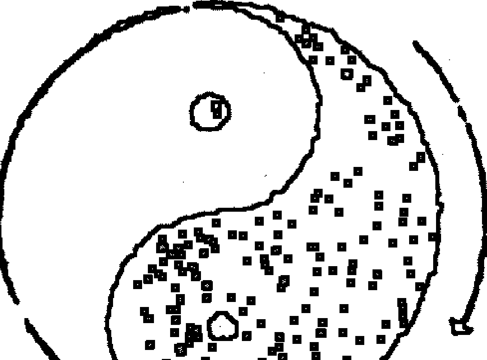

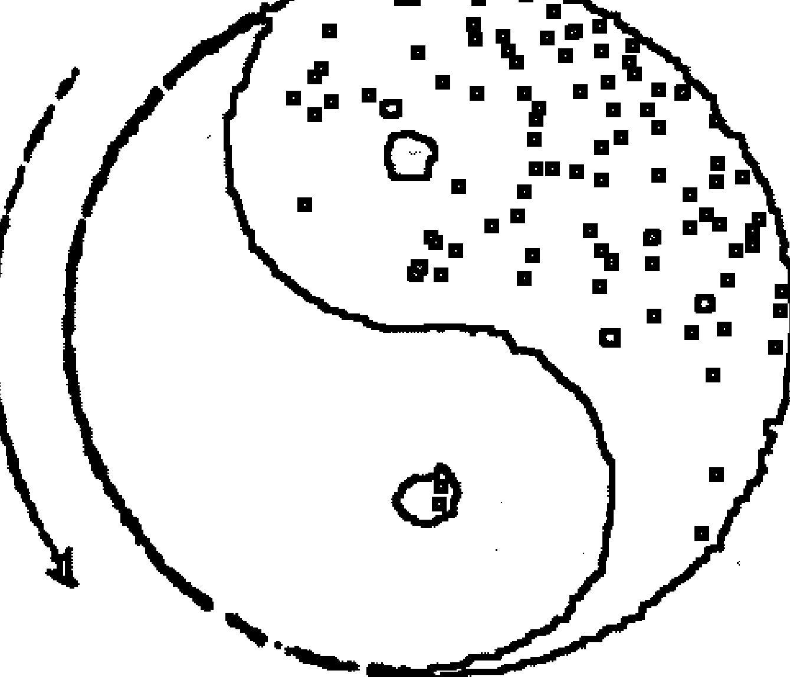

日月运行：夫周天 365 度 4 分度之一，是天度数也，日行迟，一岁一周天，月行疾，一月一周天。日，一日行一度，月，一日行 13 度 19 分度之 7——29 日半强。月行天逐日与会，一年十二会，是为十二月。每月 29 天半，年分出小月 6，是每岁余 6 日。又大岁 366 日，小岁 365 日。一岁余 11 天，未满三年已成一月，则置闰。若三年不置闰，正月为二月。九年差三月，则以春为夏。十七年差六月，则四时皆反。从此岁不正，岁不成。

地轴和北极星在一条直线上，人在地球看北极星总是正北。太阳在一年当中从圆周的天区“黄道”上不断的移动位置，形成周期。围绕北极星旋转的北斗七星，是天体的枢纽。从北斗星的斗柄所指方位，可以确定季节，如正北为冬至，正东为春分，正南为夏至，正西为秋分，即为四正。二十八宿环列于四方，围绕天体北极星而转。其半隐半现，随北斗以定四季。其实，地球随着太阳，而太阳绕其“黄道”旋转一周，则绕经北极星转360，途经北斗星及二十八宿。二十八宿随天而四转，东方七宿自角至箕，为青龙，以次舍而言，有朱雀象。虚为北方七宿之中星，昴为西方七宿之中星。星本不移，附天而移。

仲春之月，星火在东，星鸟在南，星昴在西，星虚在北。仲夏之月，则鸟转而西，火转而南，虚转而东，昴转而北。至仲秋则火转而西，虚转而南，昴转而东，鸟转而北。至仲冬，则虚转而西，昴转而南，鸟转而东，火转而北。来年仲春，则火复又转而东。

日月五星周天。汉天文志曰：“木仁也，火礼也，土信也，金义也，水智也。金星与日同，南北之行为赢，出早为日食，晚为天妖，主兵象也木星所在国不可伐，可以伐人。超舍（宿）为赢，退舍为缩出入不当，其次必有天妖。水星出早为日食，出晚为彗，四时不出则天下大饥，出于房间主地也，火星一舍二舍是为不祥，东行急则兵聚于东方，西行疾则兵聚于西方，镇星失次而上一舍而舍，则为大水，失次而下二舍，有后戚五纬的之变。”木近日则迟，远日则疾，火近日则疾。远日则迟。土平行无大迟大疾。金水辅日而行。凡五星，东行则为顺，西行则为逆，趋舍而前为盈，退舍而后为缩光，其明来不定。日月及岁星、荧火星、太白星、辰星、镇星，古人称之为七政。

#### 二、 河洛图

##### 1、 河图象数

河图是阐释五行顺行自然无为之道的。天地间造化之道，不过是一个阳五行，一个阴五行，一生一成而已。天地阴阳化生五行，五行衍生万物。河图之文，前七二，后一六，左三八，右九四，居中者五与十。前二七即二七合，后一六即一六合，左三八即三八合，右四九即四九合，居中者五与十合。

天一地二，天三地四，天五地六，天七地八，天九地十，天数五，地数五，五位相得，而合有合。天数二十有五，地数三十。凡天地之数一十有五，此所以成变化而行之鬼神是也。

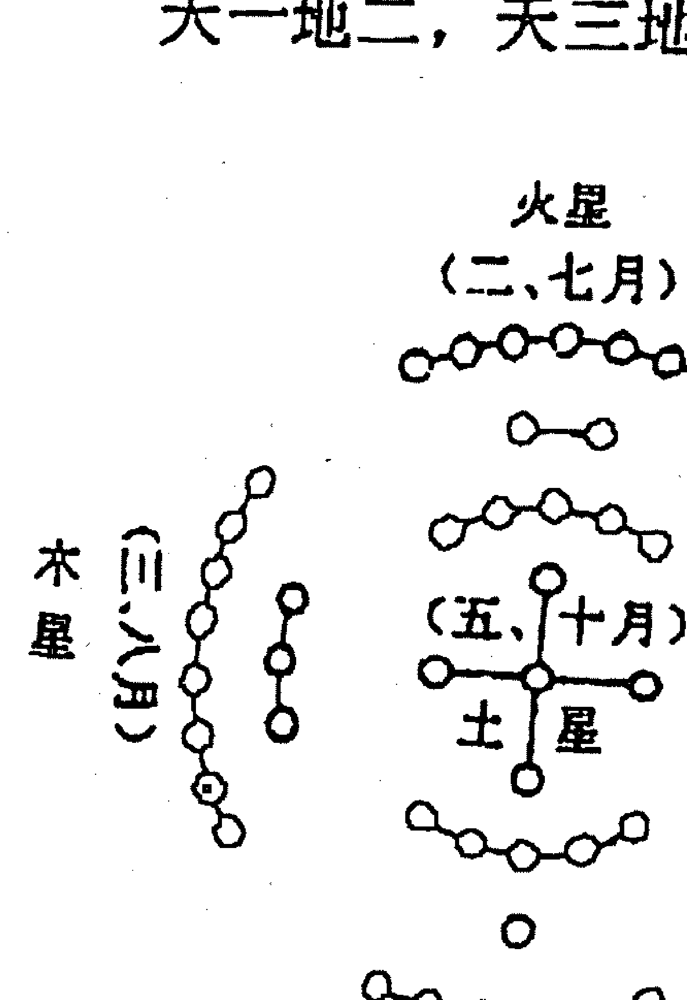

##### 2、洛书范数

洛书是阐释五行逆行阴阳变化之道的。由中央之土为始，中土克北方水，北方水克西方火，西方火克南方金，南方金克东方木，东方木克中央土，阴阳交错，动静变化。

洛书之文，戴九履一，左三右七，二四有肩，八六为足，五居中央。

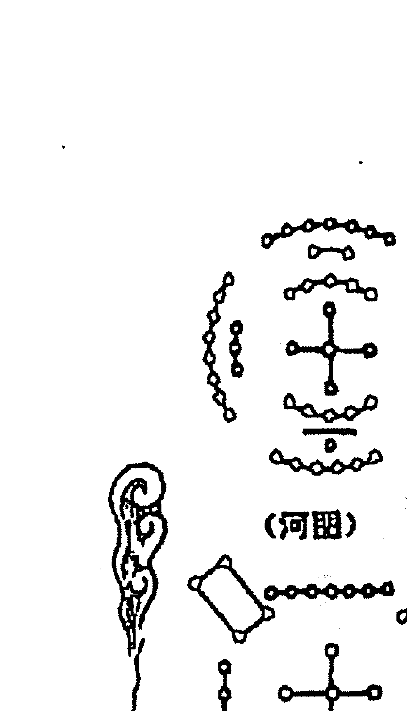

一合九而为十，二合八而为十，三合七而为十，四合六而为十，五居中此洛书纵横皆十五数合矣。初一曰五行，次二曰敬用五事，次三曰农用八政，次四曰协用五纪，次五曰建用皇极，次六曰又用三德，次七曰明用稽疑，次八曰念用庶徵，次九曰向用五福，威用六极。

#### 三、八卦图

##### 1、伏羲先天八卦图

先天八卦卦序为：乾一、兑二、离三、震四、巽五、坎六、艮七、坤八。

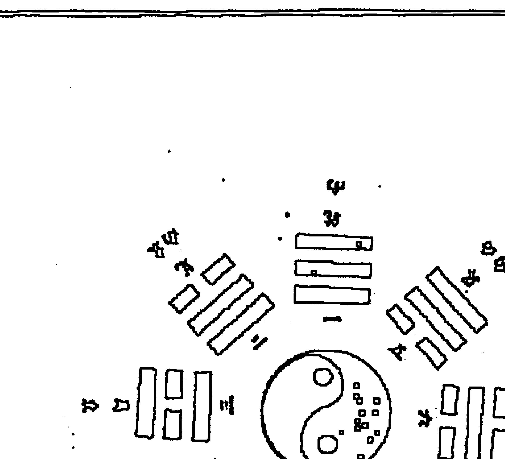

先天八卦方位为：乾南、坤北、离东、坎西、震东北、兑东南、巽西南、艮西北。自震卦至乾卦为顺，自巽卦至坤卦为逆。天地定位，山泽通气，雷风相薄，水火不相射。八卦相错，数往者顺，知来者逆。是故易逆数也。

##### 2、文王后天八卦图

后天八卦卦序为：乾为父、坤为母、震为长男、坎为中男、艮为少男、巽为长女、离为中女、兑为少女。

后天八卦方位为：乾西北、坤西南、震东、坎北、艮东北、巽东南、离南、兑西。

# 后天文王八卦图

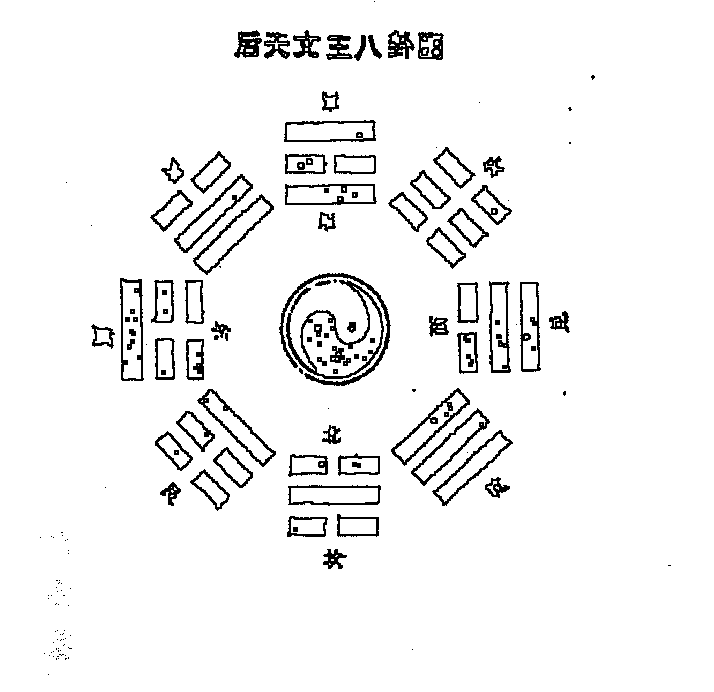

帝出乎震（正春也），齐乎巽（春末夏初），相见乎离（正夏也），致役乎坤（夏末秋初），说乎兑（正秋也），战乎乾（秋末冬初），劳乎坎（正冬也），成乎艮（冬末止也，万物所藏，文王八卦以属春夏秋冬四时之序也）。天一生水，坎之气孕于乾金，立冬时节；地二生火，离之气孕于巽木，立夏时节；天三生木，震之气孕于艮水（山高地厚，水泉出焉），立春时节；地四生金，兑之气孕于坤土，立秋时节；天五生土，离寄戊而土气，孕于离火，长夏时节。天一与地六合而成水，乾、坎合而水成于金，冬至节；地二与天七合而成火，巽、离合而火成于木，夏至节；天三与地八合而成木，艮、震合而木成于水，春分节；地四与天九合而成金，坤、兑合而金成于土，秋分节；天五与地十合而成土，离寄于己土成于火。

### 3、实用八卦图

我们在预测实践中应用的是，先天八卦的卦序，后天八卦的八卦方位。

- 乾一、兑二、离三、震四、巽五、坎六、艮七、坤八。
- 乾宫、金，西北；兑宫、金，西方；离宫、火，南方；震宫、木，东方；巽宫、木，东南；坎宫、水，北方；艮宫、土，东北；坤宫、土，西南。

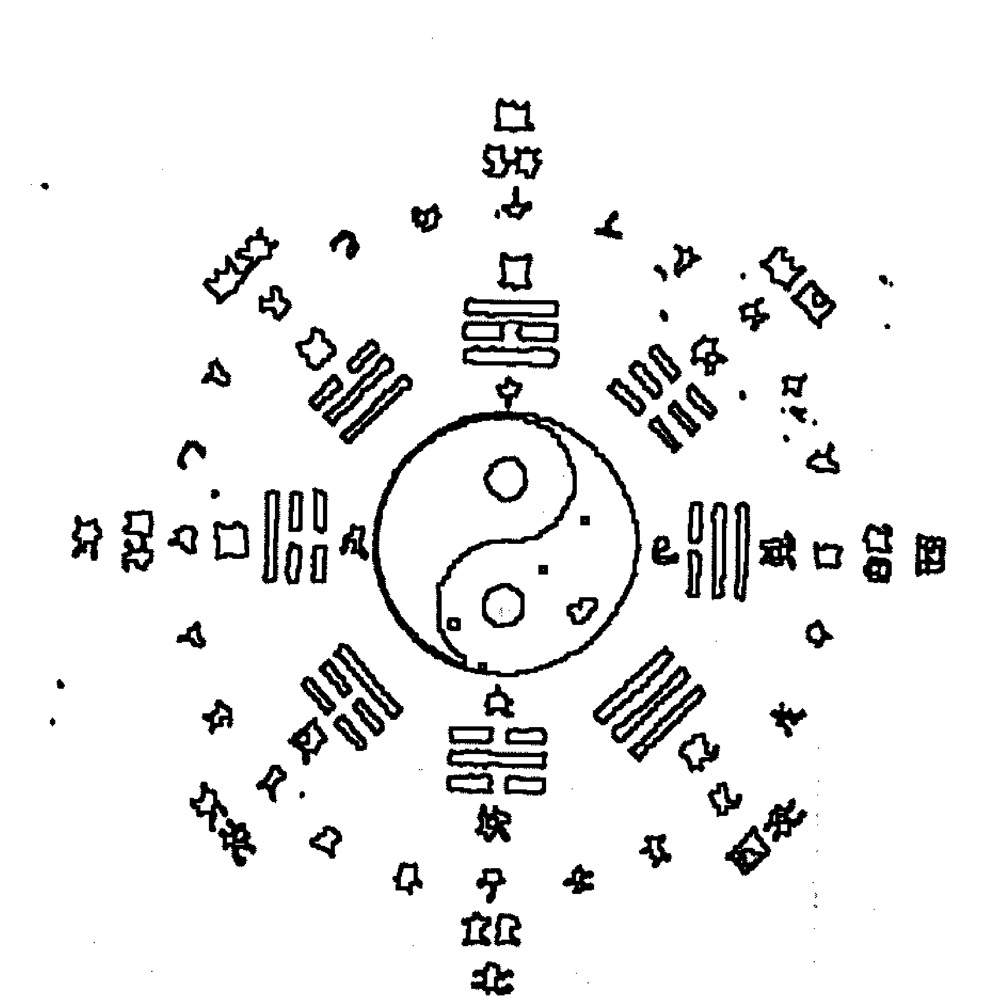

### 4、论八卦性情及取象

乾卦健也，取象天；坤卦顺也，取象地；震卦起也，取象雷；艮卦止也，取象山；坎卦陷也，取象水；离卦丽也，取象火；兑卦说也，取象泽；巽卦人也，取象风。

> 《六爻索隐》 邓海一 著

兼蓄并用新老技法的优点，自成一体，风格清新，为激发六爻预测活力，又注入了一份新的力量。披露和破译了世爻旺衰与旬空、日辰的关系，深入研究错卦、动爻、应期的信息特征，提出了世爻、六亲、八宫，作用关系新概念。

欢迎垂询，欢迎指正。

#### 四、天干地支

##### 1、十天干

甲 乙 丙 丁 戊 己 庚 辛 壬 癸。

甲乙（东方木）；丙丁（南方火）。
戊己（中央土）；庚辛（西方金）；
壬癸（北方水）。

##### 2、十二地支

子 丑 寅 卯 辰 巳 午 未 申 酉 戌 亥。子鼠水，坎宫；丑牛土，艮宫；寅虎木，艮宫；卯兔木，震宫；辰龙土，巽宫；巳蛇火，巽宫；午马火，离宫；未羊土，坤宫；申猴金，坤宫；酉鸡金，兑宫；戌狗土，乾宫；亥猪水，乾宫。

- 要点回放：
  1、太极图为什么可以旋转运动；
  2、河洛象数数理关系；
  3、先后天八卦的推演原理；
  4、实用八卦的宫位和卦序；
  5、天干地支的排列及与八宫的关系。

- 思维训练：
  1、能说出河图洛书各自主要特点吗？
  2、河洛与八卦是什么关系？
  3、能说出河洛数理在实际生活中应用的事例吗？
  4、请把你的感悟写下来_________
  ________________________________________________

## 第二节　易卜时空的作用关系

事物的发展变化总是在一定时间和空间进行的，时间、空间是变化中的事物存在的基本形式。

#### 一、阴阳学说

阴阳，是我们先民几千年前在劳动中，对各种自然现象和客观事物经过观察，把世界上的事物归为两大类物质，即阴和阳。

世界上的事物纷繁复杂，但是归根结底，无非是物质和精神两大类现象；世界上的多种关系和矛盾特别是人们认识世界和改造世界的多种关系和矛盾，千差万别，但从根本上说就是物质和精神的关系。物质为实为阳，精神为虚为阴。

随着自然科学的发展，人们对事物的具体形态、结构、属性的认识不断深化。现代科学发现，物质除了实物形态之外，还有场的形态，如电磁场、引力场、核力场等。实物存在的形态，为实为阳，场态形态存在的形态，为虚为阴。

阴阳者，天地之道，万物之纲，变化之本，消长之始。阴阳互根，阴阳对立，阴阳转化，阴阳就是运动，这是阴阳的本质。整部《易经》就是一套阴阳符号系统。

《河洛原理》说：“太极一气产阴阳，阴阳化合生五行，五行既萌，随含万物。”天地分阴阳，乾，阳物也；坤，阴物也；阴阳合德，而刚柔有体，以体天地之撰，以通神明之德。易理推源于“太极”，托始于乾坤。古代朴素哲学观，把万事万物一分为二，阴阳这两种现象，既是对立或矛盾的，又是同一或统一，“一阴一阳谓之道”，这是宇宙自然现象的大规律，万物变化无出其理。在一定条件下事物间的关系又可以转化。如太极图中阳中有阴，阴中有阳。在现实生活中，事物发展到顶峰，则有“物极必反”之虑，提醒人们得意不可忘形；在失意的时候要坚强。

“山重水复疑无路，柳暗花明又一村”等。人立天地间，无处不阴阳。万象繁杂的世界，可以划归两类，五行也可归为两行。

一切预测方法都应法于阴阳，合于术数，阴阳是预测学的最基本的规律。

日月、昼夜、幽明、男女、奇偶、虚实、动静、圆方、死生、上下、高低、前后、左右、里外、正反、对错等，这些相对概念皆属阴阳之范畴，用途非常广泛，这一对作用关系贯穿事物变化始终。

#### 二、五行学说

五行源于阴阳，五行学说是以阴阳理论为核心的，阴阳是五行内在的根本，五行可以理解是阴阳关系的外在表现。古人认为宇宙中金星、木星、水星、火星、土星影响着我们，世上万物自然禀受其五行之气，就把繁杂的万物归类五行，阐释阴阳。五行律揭示了宇宙万事万物宏观分类，归类、组合以及事物间相互联系、生克制化、循环运行的规律。1水、2火、3木、4金、5土，只不过是五大类特性特征基本事物的代号。任何事物，都有它的特性和特征，只有把握了事物的特性、特征，才便于归类和分类。

水类的特征，气寒、味咸、色黑、音羽、时间冬、方位北；木类的特征，气风、味酸、色青、音角、时间春、方位东；火类的特征，气暑、味苦、色赤、音徵、时间夏、方位南；土类的特征，气湿、色黄、味甘、音宫、时季末、方位中；金类的特征，气燥、味辛、色白、音商、时间秋、方位西。

#### 三、阴阳五行生克制化

阴阳五行，是把宇宙的生成和演化看作大系统，又是事物存在和发展中对立的两个方面，是相互依存，相互联系，又是相互对立，相互矛盾的统一体。世界上万物都是普遍联系和不断运动发展的。宇宙间一切事物都同其他周围事物相互联系着，世界就是一张普遍联系的网，联系是物质世界的一个基本特征，是事物存在的基本条件，它无处不在，无时不在。从宏观到微观，现代系统论、信息论都提出了有力证明。普遍联系和永恒发展是物质世界的两大基本特征。事物是怎样联系的呢？事物内部诸要素、各部分之间是内部联系，事物同周围其他事物的联系是外部联系。这些联系都是通过五行生克制化实现的。不经任何中间环节而发生的联系是直接联系，是指五行生克作用关系；有些联系经过了中间环节而发生的是间接联系，是指五行通关作用。有些联系可以决定事物性质和发展趋势，是指五行生克关系；有些联系只能在一定程度上影响事物发展的进程，是指五行耗泄、通关关系。事物是怎样永恒发展的呢？世界上万事万物不离阴阳，阴阳是事物发展变化的根本动力，宇宙间一切事物都处于永恒的产生和消灭中，处于运动、变化和发展中。

1、五行相生，是事物相互联系，含有滋生助长，促进生育的意思。

如：金生水、水生木、木生火、火生土、土生金。金赖土生，土多埋金，土赖火生，火多土焦，火赖木生，木多火寒，木赖水生，水多木漂，水赖金生，金多水浊。

金能生水，水多金沉，水能生木，木多水缩，木能生火，火多木焚，火能生土，土多火晦，土能生金，金多土变。

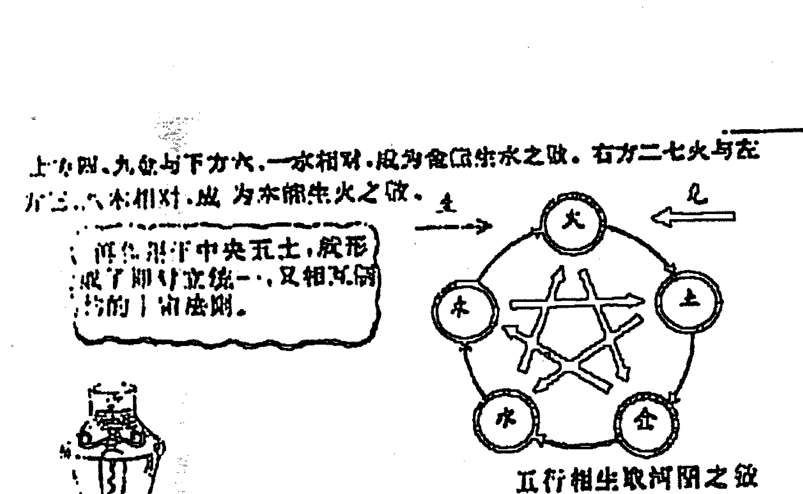

##### 2、五行相克，就是事物矛盾着的双方相互制约，克制或抑制过程。

如金克木，木克土，土克水，水克火，火克金。金能克木，木坚金缺，木能克土，土重木折，土能克水，水多土荡，水能克火，火多水沸，火能克金，金多火熄。

金旺得火，方成器皿，火旺得水，方成相济，水旺得土，方成池沼，土旺得木，方能疏通，木旺得金，方成栋梁。金弱见火，必见消溶，火弱逢水，必见熄灭，水弱逢土，必为淤塞，土弱逢木，必为倾陷，木弱逢金，必为砍折。

强金得水，方挫其锋，强水得木，方泄其势，强木得火，方化其顽，强火得土，方止其焰，强土得金，方制其壅。

##### 3、五行相生相克不是绝对的，一定条件下可以相互转化。

如：水虽生木，寒冬冷水难生木；木虽生火，湿木反熄火焰；火虽生土，炎火反使土焦；土虽生金，燥土反而熔金；金虽生水，寒金益增水寒；水虽克火，夏火逢水如遇甘霖；火虽克金，冬金逢火适暖其性；土虽克水，冻土见水相通；土虽泄火，燥土反增火焰。

这一节要很好地领悟，世界上没有绝对的事情。任何事物都有相反的两个方面，这是一种思路。相生相克是有路线的，是五行作用的主流，反克过泄等是有条件的。

# 俏梅花外应预测术讲义

## 要点回放：

- 1、一阴一阳谓之道，把复杂的事象划分的越简单越好；
- 2、阴阳互为根，相互转化，对立又统一；
- 3、五行是阴阳的外在表现形式，五行又归类为二行；
- 4、五行遵循固有的生克规则；
- 5、五行生克在一定条件下也发生逆转，又体现出阴阳作用关系。

## 思维训练：

- 1、客观世界的阴阳属性，你还能举出哪些事物？
- 2、生活中的阴阳作用阴阳转化，你能举出多少事例？
- 3、依据五行分类原则，试着把现实中的物象归类；
- 4、你了解了五行相互作用的规律了吗？
- 5、请举出几个五行生克逆反的事项？
- 6、请把你的感悟写下来

## 第三节．易卜时空与现实生活的关系

### 一、人合一思想

天人合一的思想是古代预测术的重要理论之一，它是建立在宇宙就是阴阳五行全息大系统基础上的。宇宙间一切事物都同其他周围事物相互联系着；每一事物内部各要素、各部分之间，也相互影响、相互制约着；整个世界就是一个相互联系的统一整体。万事万物是相互联系的，这种联系就是五行生克制化规律。在这种联系中，每一个具体事物又是相对独立地存在的。正是体现了其大无外，其小无内的易学思维。任何事物都是作为系统而存在的，系统是事物普遍联系的具体表现。

前苏联科学家 B.N. 雷德尼克曾在书中写道：越来越深邃的粒子内层反映着越来越广阔的宇宙范围！我们世界中的每个粒子都同整个宇宙紧密联系着，在自己的结构上带有宇宙的宏大形象的烙印。而反过来，整个宇宙的性质，也是那么牢不可破地同它的结构或粒子的性状和结构联系着。

人是宇宙大系统的一部分，建立了天地人互感互动的全息联系，所谓天地是一大人身，人身是一小天地。人既可以从宇宙场中吸收能量，又可向宇宙场辐射能量。人可以与天合一，与地合一，与人合一，与金合一，与木合一，与水合一，与土合一，与火合一，与世界万事万物合一，人可以与人，与天，与地，与物，与事等发生感应，人作为这个大系统中局部，完全能够体现出属于系统的共性来，反之亦然。由此及彼，由表及里，往复推衍，达到知此喻彼，知来数往的目的，所以强调“占卜之道要变通，得变通之道者在‘心易’之妙耳”。

### 二、远取诸物 近取诸身

八卦取象图

| 卦名 | 乾 | 坤 | 震 | 巽 | 坎 | 离 | 艮 | 兑 |
|------|----|----|----|----|----|----|----|----|
| 符号 | ☰ | ☷ | ☳ | ☴ | ☵ | ☲ | ☶ | ☱ |
| 属性 | 健 | 顺 | 动 | 入 | 陷 | 丽 | 止 | 悦 |
| 人伦 | 父 | 母 | 长男 | 长女 | 中男 | 中女 | 少男 | 少女 |
| 远取诸物 | 马 | 牛 | 龙 | 鸡 | 豕 | 雉 | 狗 | 羊 |
| 近取诸身 | 首 | 腹 | 足 | 股 | 耳 | 目 | 手 | 口 |
| 自然 | 天 | 地 | 雷 | 风 | 水 | 火 | 山 | 泽 |
| 方位 | 西北 | 西南 | 东 | 东南 | 北 | 南 | 东北 | 西 |
| 季节 | 冬秋间 | 夏秋间 | 春 | 春夏间 | 冬 | 夏 | 冬春间 | 秋 |
| 五行五色 | 金 | 黄土 | 木 | 青木 | 水黑 | 火赤 | 土 | 白金 |

三、时空影响着人们生活

斯大林有句名言：一切以条件、地点和时间为转移。时空是事物的存在形式。所谓时间是表示事物的持续性和顺序性，所谓空间表示事物的广延性、结构性和并存性。宇宙强烈的时空作用，无时不在影响着人们的生活，人们在不断认识自然的同时，也在进行着征服自然改造自然的工作。春夏秋冬四时流转，沧海桑田更替变迁，风霜雪雨，潮汐地震，哪项自然规律没在人们生活中留下深深的烙印？落叶知秋，酷暑远去，天气渐凉，北雁南飞，人们也脱去夏衣换上秋装，农民准备收获庄稼，商人备战仲秋，学子将迈进新的校园等等，社会各行各业都因时序更替有了相应行动。人与时空联系是不是很密切？山河易容，斗转星移，遵循的是自然规律；革故鼎新，随行就市，遵循的是社会规律；日出而作，日落而息，人们在生活中自觉地运用着自然规律。这一切看似凌乱的事情，实际上都是宇宙阴阳五行运化的结果。事物是以时空的形式存在和运动，但是，事物的存在和运动又决定时空的结构，表现为引力场。预测就是要探索和掌握这些规律，服务和指导人们的生活。

四、事物在不同时空存在形态

物理学研究表明，物质存在有两种形态：一种是由基本粒子组成的实体；一种是感官不能觉察的场态。实体和场态不可分割，是一个事物的两个方面，在一定条件下可以相互转化。

客观事物就是以这两种形态存在时空中，时空具有连续性、广延性。当客观事物的实体形态离开了某个时空点时，那个不被感知的场态可能还滞留原时空点，这就是预测为什么能够追述客观事物过去的原因。这些论点已被科学家证实。科学家还无意中破译了，事物场态也会存在于实体之前的秘密。有生物学家为研究花卉生长过程，用一架相机日夜不间断的拍摄。一天他发现照片中有个叶子长在枝丫某点，花卉实际部位并没有这片叶子，他感到疑惑不解，可是，后来发生的事情震惊了他，在花卉的那个部位，就真的长出一片与照片中一模一样的叶子来。场态预先泄露了实体信息，这也就是预测为什么能够推断客观事未来的原因。

预测学所研究的就是，客观事物在不同时空中存在和发展变化的规律，我们对事物过去和未来的推断，即是运用实体信息与场态信息辨证关系。

俏梅花外应预测讲义

## A...探索

......（此部分为模糊的段落文字，内容无法清晰辨认）

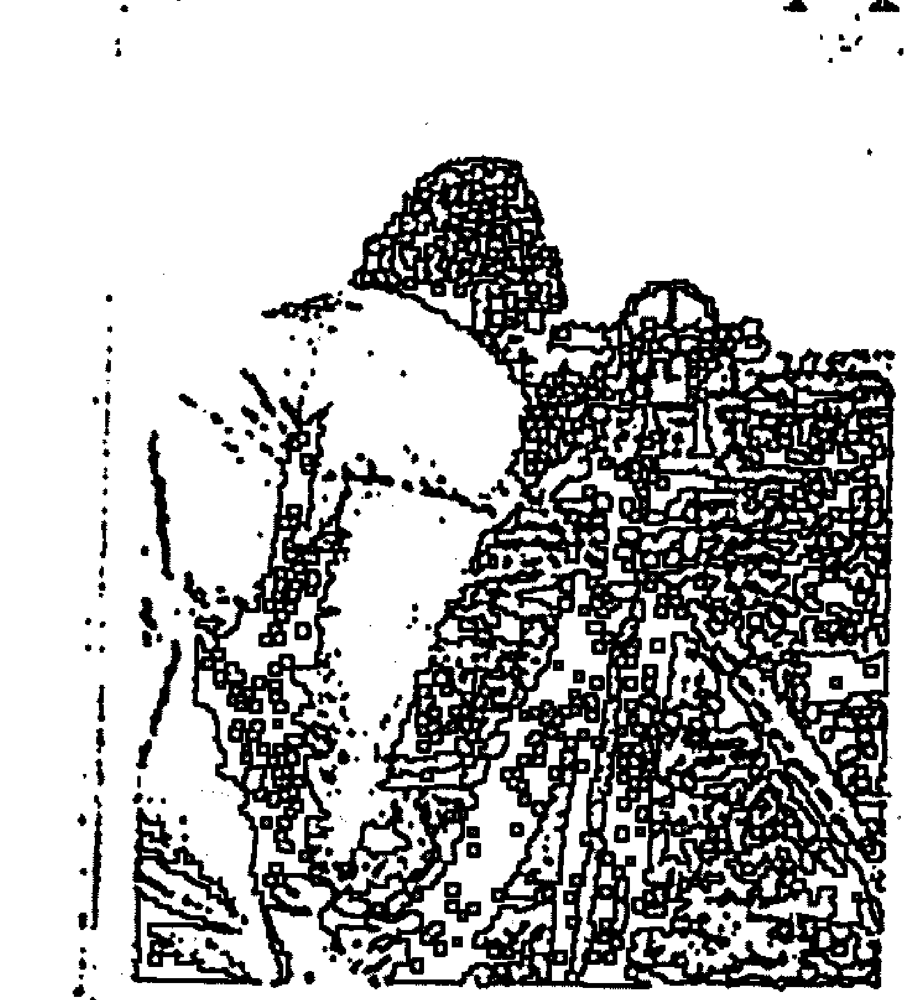

## “神奇相机”能拍“过去”？

......（此部分为模糊的段落文字，内容无法清晰辨认）

......（此部分为模糊的段落文字，内容无法清晰辨认）

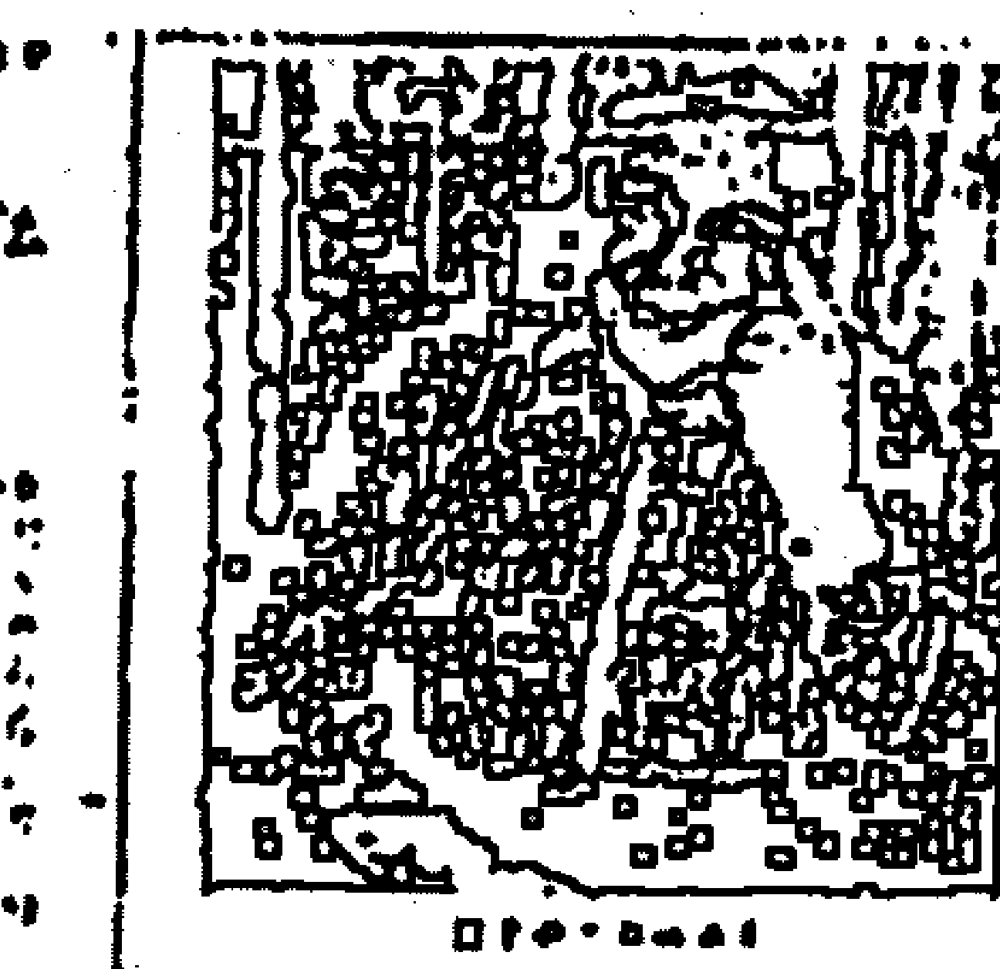

## “神奇相机”的拍摄原理

......（此部分为模糊的段落文字，内容无法清晰辨认）

## 要点回放：

- 1、天人合一的思想是预测术的重要理论之一；
- 2、远取诸物近取诸身是预测术的重要手段之一；
- 3、阴阳五行运动决定了自然与人的发展变化总趋势；
- 4、事物在不同时空中的存在形态与预测的关系。

## 思维训练：

- 1、你就天人合一的思想能谈出那些看法？
- 2、试着举几个远取诸物近取诸身的例子？
- 3、试着举几个自然规律中阴阳五行变化作用的例子？
- 4、试着举几个社会生活中阴阳五行变化作用的例子？
- 5、试着举几个事物在不同时空表现为不同形态的例子？

# 第四讲 八卦万物类象

无论任何一种预测术都离不开八卦类象。世界事物无穷无尽，谁也不能都遇到，为便于预测操作，运用八卦类象原理，将其归为八类。对于没收录或新出现的事物，大家可以依据阴阳、五行、八卦原理，归类所属。

## 一、乾

三个阳爻，纯阳刚健，如天体周而复始，运动不止，形象如天，高大宽广，明亮健全，高高在上，无所不包，它主宰万物，其行动积极、主动、遇事稳妥，争胜心强而又不骄不躁，有威严、统帅、决断之意。

> **[象意]:** 圆、起始、原始、向上、本源、盈满、高广、纯质、精华、核心、坚恒、强盛、强制、规范、恩惠、仁德、亨达、老成、主观、威严、傲慢、霸道、健全、充满、迅速、囊括、永久、吉利、道德、创造性、蓬勃、所向披靡、只争朝夕、激烈、活动、迈进、决断、功勋、统帅、施政、老、行人、扩大、发光、任性、惩罚、愤怒、侵略、制裁、冷酷、过份、轻视、压抑、灾害、专横、思想意识、自然法则。

**[性格]**：刚健武勇、果决、重义气、动而少静、威严、昭明豁达、自尊、正直、勤勉、骄傲、霸道。

**[形态]**：完美无缺的、高档的、精致的、古老的、坚硬的、老实的、圆的、转圈的、大的、高的、旧的、苛刻的、寒冰的、光泽的、趾高气扬的、大赤色的、金黄色的。

**[天时]**：天、冰、雹、霰。寒冷、太阳、宇宙、大自然、晴天。

**[地理]**：西北方、京都、大郡、形腾之地（险要、名胜）、高亢之所（高而干燥）、公厕、楼台、高堂、驿馆（旅店、饭店）。旷阔地，豪华城市、圣地、宫殿、大会堂、广场、高大圆形、建筑、省城、博物馆、体育馆、寺院、机关大院、大学、高级住宅、车站、大厦、郊野、远处、弯曲大道、办公室、会议室、招待所、金属加工厂、五金商店、配件商店。

**[人物]**：君、父、大人、老人、长者、宦官、名人、公门人（政府工作人员）。首脑、领袖、元老、会长、主席、使节、议员、代表、专家、名流、厂长、书记、经理、老板、银行家、一把手、当权者、班主任、专横者、傲慢者、祖父、父亲、家长、长辈、公务员、赘婿、公安、干警、军人、丈夫、无赖、地痞、黑社会老大、强壮瘦骨之人、执法者、经济工作者、管钱的人、乞丐、下人。

**[身体]**：首、骨、肺。脑、男性生殖器阴茎、胸、大肠、右足、右下腹、精液、体质寒凉、骨瘦之人、颧骨突出。

**[疾病]**：头面之疾、肺疾、筋骨疾、上焦疾、夏占不利。骨病、老病、陈旧性损伤、硬化性疾病、伤寒、急性病、节肠疾病、便闭雍结、变化异常之病、发烧、阳萎、结石。

**[静物]**：金玉、宝珠、圆物、木果、刚物、冠、镜、高档用品、金钱、钟表、眼镜、古董、文物、首饰、神物、高级轿车、火车、飞机、圆形金属、玛瑙、机器、实心金属制品、刚硬物、高大物、小米、木果、瓜、珍味、腊肉、辛辣之物、帽子。

**[动物]**：马、天鹅、狮子、象、龙、虎。

**[饮食]**：马肉珍味、多骨、肝肺、干肉、木果、诸物之首、圆物、辛辣之物。

**[方位]**：西北

**[色彩]**：大赤色、玄色、金黄、强烈的颜色。

**[数目]**：一（先天数）、六（后天数）、四、九（河图数）。

**[姓字]**：带金榜者，行住一四九（此人在兄弟中排行老大，老四，老九）。

**[五味]**：辛辣
**[时序]**：秋，九十月之交，戌亥年月日时，五金年月日时。
**[冢宅]**：秋占兴隆，夏占有祸，冬占冷落，春光吉利。
**[坟墓]**：宜向西北，宜乾山气脉，宜天穴，宜高，秋占出贵，夏占大凶。
**[求名]**：有名，宜随内任、武职、掌权、天使、驿官、宜向西北之任。
**[谋财]**：有成、利公门、宜动中有财，夏占不成，各占多谋少遂。
**[交易]**：宜金玉宝珠贵货，易成，夏占不利。
**[求利]**：有财、金玉之利，公门中得财，秋占大利，夏占损财，冬占无财。

## 二、坤

三个阴爻，纯阴方正，受天影响，顺从被动，有生化万物之功，能收藏万物，顺势而动，平衡发展，动静有序而无亏。

- 谨慎正直、勤劳忍耐、复杂、吝啬、优柔寡断、逆来顺受、懦弱迟缓、依赖衰微、敬奉神佛、恭敬扰养、伏藏疑惑、思想狭隘。
- 柔顺、虚静、厚载、平衡、滋育、包容、内含、谦让、木份、消极、沉默、寡断、卑贱、丑陋、昏暗、富裕、平安、宽阔、文雅、贞节、欲望、古老、堆积、平均、混乱、故乡、仓库、能容之物、粗笨之物。
- 多重性格、温厚柔顺、恭敬谦让、贞节、俭约、守信诚实、吝啬、懦弱、卑贱狭小、感情暧昧、不断改进、固执迟钝、邪恶。

**[形态]**：柔软的、平常的、数多的、四角形的、旧的、并用的、附属的、虚空的、包容的、隐伏的、潜在的、平整的、复杂的、黄色的、粉状的。

**[天时]**：阴云、雾气、冰霜、露、低气压、湿度大。

**[地理]**：西南方、田野、乡里、平地。平原、田埂、乡村、矮屋、土阶、城邑、帮困、角落、大地、旷野、森林、牧场、郊外、原籍、故乡、草坪、广场空地、贮藏室、农贸市场、肉类加工厂、鸡窝猪舍兔笼、古陵、粮库、平房、旧房。

**[人物]**：老母、后母、老妇人、农夫、乡人、众人、大人。母辈、皇后、老板娘、女首领、胖女人、大腹人、劳动者、群众、副职、谋士、同乡人、土匪、泥瓦匠、房地产商、建筑工、女主人、乡村干部、小人、母子、祖母、忠厚之人、小气者、胆怯者、尸、纺织工、随从、助手、臣民、顾问、税吏、好好先生、阴气重者、寡妇。

**[身体]**：腹、脾、胃、肉。肠、消化器官、女性生殖器、右肩、肌肉。

**[疾病]**：腹疾、脾胃之疾、饮食停滞、谷食不化。胃肠消化不良、肚子痛、浮肿、湿重、湿疹、肌肤病、疲乏、慢性病、中气虚、癌病、疣、晕病、妇科病、久病者死亡。

**[静物]**：方物、柔物、布帛、丝绵、五谷、车、斧、瓦器。药、浆、布囊、衣服、海绵、盆景、瓷器、粉状物、运输工具、饭店、妇女用品、日用品、容器、文章、书报、纸张、箱包、袋子、轿子、大车、车轮、土中之物、石灰、水泥、砖砂、五谷杂粮、牛肉、野味、甘美之物、柄把、米、杂粮、面粉、肉类、饴糖、腐草、四方平面之物。

**[动物]**：牛、百兽、马。母马、百禽、百兽（雌性）、地下虫类、猫、孕牛、夜行动物。

**[饮食]**：牛肉、土中之物、甘味、野味、五谷之味、芋笋之物、腹脏之物。

**[方位]**：西南。

**[色彩]**：黄、黑。

**[数目]**：八、二、五、十、万。

**[姓字]**：带土姓人、行位八五十。

**[五味]**：甘。

**[时序]**：辰戌丑未月，未、申年月日时、八五十月日。

**[家宅]**：多阴气，春占宅舍不安，安稳。

**[坟墓]**：宜向西南之穴、平阳之地、近田野、宜低葬、春不可葬。

**[求名]**：宜西南方或教官、农官守立之职、春占虚。

**[谋财]**：宜田地交易、宜五谷利、贱货、重物、布帛、静中有财、春占不利。

**[求利]**：宜土中之利、贱贵重物之利、静中得财、春占无财、多中取利。

**[出行]**：宜西南行、乡里行、陆行、春不宜。

**[遇见]**：利见多人、亲朋或阴人、春不宜见。

**[官讼]**：顺理得众情、讼当解散。

## 三、震

卦爻上部展开，如爆炸向外放射状，故为雷象。雷的作用是使万物运动，其勇猛直前，势不可遏，在下时犯上，在上时易逃脱。

**[象意]**：奋进、勇气、积极、果断、显现、紧迫、自立、上升、勤勉、躁动、轻率、粗糙、虚惊、惊恐、过失、盲从、妄动、多动、打击、夸张、兴起、发怒、进步、出发、新生、高大、功名大、仁慈、追求、勤思、影响大、意气风发、粗心、性急、冲突、无礼、响动、高声、震动、鼓舞、命令、决断、狂暴、迅速、茁壮、成功、可塑性、可动性、转折点。

**[性格]**：多动少静、勤奋、有和干、仁慈、直爽、性急、易怒、易心烦、倔强、自尊心强。

**[形态]**：朝气蓬勃的、有声有响的、华而实的、外虚内实的、上虚下实的、上大下小的、向外发展的、生长的健康的、勇敢的、高速的、振动的、竞争的、激烈的、吃惊的、愤怒的、急躁的、粗糙的、移动的。

**[天时]**：雷。雷雨、雷鸣、地震、火山喷发。

**[地理]**：东方、树木、闹市、大途、竹林、草木茂盛之所、山林之处、楼阁、东向之居。山林野地、春季原野、田园菜地、庭院、公园、菜市场、靶场、战场、机场、剧场、运动场、游乐场、试车场、停车场、卡拉OK厅、歌舞厅、喧哗之地、广播电台、电器商店、花店、热闹街道、大马路、邮电局、竞技场、发射场、军警公安部门、营房、军队。

**[人物]**：长男。长子、青年、名人、将帅、警察、驾驶员、运动员、舞蹈者、音乐家、鼓动者、忙碌者、活跃分子、掮客、神经过敏者、朝气蓬勃者、骚乱分子、说大话者、易发怒者、乘务员、指挥员、当头的、行政人员、保安、竹木匠、法官、飞行员、狂人、壮士、黑社会、税务工商、关卡、外交、市场管理、交通管理。

**[身体]**：足、肝、发、声音。腿、脚、神经、筋、头发（弯而稀少）、左胁、左肩、臂、关节、脸孔、眼睛、拇指。

**[疾病]**：精神病、狂躁症、神经衰弱、舞蹈症、妇科病、肝火旺、疼痛性症状、腿痛、多动症、外伤（碰撞）、突发性症状、咳嗽、声带咽喉病、肝病、足美籍、神经衰弱、羊癫病。

**[静物]**：木竹、苇、乐器（竹木）、花草繁鲜之物、核。树木、柴、蔬菜、嫩芽、鲜花、青绿色之物、多节物、蹄、筋、鲜肉、菜、裙子、裤子、闹钟、电话、BB机、音响、乐器、钢琴、鼓、车类、广播、飞机、鞭炮、武器、新产品、会动的玩具、球类、反生植物、豆类带壳植物。

**[动物]**：龙、蛇、昆虫、马鸣。骆驼、鹿、雕、鹰、鹤、云雀、金丝雀等善鸣之鸟、蜂、螃、长形的动物、鱼、壁虎、鹊。

**[饮食]**：蹄、肉、山林野味、鲜肉、果酸味、蔬菜、鲤鱼。

**[方位]**：东。

**[色彩]**：黑青、绿碧、深蓝。

**[数目]**：四、三、八。

**[姓字]**：带木姓人、行位三、四、八。

**[五味]**：甘、酸。

**[时序]**：春二月、卯年月日时，四、三、八日。

**[家宅]**：春各吉，秋占不利、宅中不时有虚惊。

**[坟墓]**：利于东南、山林中穴、秋不利。

**[求名]**：有名，宜东方之任、施号发令之职、掌弄狱之官木茶税课之任、或闹市市发之职。

**[谋财]**：宜动中谋、秋占不遂。

**[交易]**：动而可成、山林、竹木、茶货之利，秋占难成。

**[求利]**：动处求财、山林竹木、茶货之利。

**[出行]**：利东方，利山林之人、秋占不宜行，但恐虚惊。

**[遇见]**：利见山林之人，有声名之人。

**[官讼]**：健讼、有虚惊、行移取甚反复。

## 四、巽

卦象如飞箭之状，无孔不入，故为风。风的作用是使万物消散，其好动而漫，进退无常。遇难，其与交合则安就之，遭困难则居中不脱，动则摇闪而上。

**[象意]**：基础不稳、直爽、涣散、清洁干净、整齐、附和、传达、营业生意、繁荣昌盛、交流、新鲜、言语、书信、教令、捷报、举荐、奔波、薄情、怪石、幻觉、忙碌、轻浮、扫荡、忧疑、烦躁、胆略、魄力、多欲、权谋、数术、渗透、散布、长驱、进退调动、消息、命令、空虚、灵气、暂时、精细、流动、徘徊、舞蹈、歌唱、荣誉、普遍性、绳索状、没有固定地点、自由运动。

**[性格]**：柔和、不定、鼓舞、进退不果。细心、责任心强、反复不定难以决断，心志不定，仁慈直爽、谄谀，奸妄、多欲、薄情、极爱清洁、疑惑隐伏、说谎。

**[形态]**：上实下虚的、外实内虚的、外刚内柔的，向下渗透的、不确定的、基础差的、飘动的、流动的、浸润的、空虚的、轻快的、泣的、传输的、顺风的、神奇的、细致的、精巧的、忙碌的、轻浮的、长形、条形、薄形、烟状、气态。

**[天时]**：风。刮内、旋风、台风、高空带状或长条的云。

**[地理]**：东南方之地、草木茂秀之所、花果菜园、东南向之居、寺观楼台、山林之居。草原、竹林、奇观、邮局、指挥部、商店、码头、机场、设计院、工艺工厂、道路、隘路、过道、长廊、各种管道处、电梯、楼阁院子、通风道、通气道、出入通道、港口、机场、发射场、索道、升降机、传送带。

**[人物]**：长女、秀士、寡妇、山林仙道之人、僧道。处女、宗教人士、气功师、教师、商人、木材商、证券商、能工巧匠、汽车售票员、公关人员、新闻人员、科技人员、气象人员、会谈人员、造谣传谣者，优柔寡断者、额宽发细者、文质彬彬读书人，仙人、尼姑、练功者、行者、好事者、探险家、游泳者、狡猾者。

**[身体]**：肱、股、气、风疾。头发（细、直、稀、少）神经、气管、胆、筋、肠道、左肩、淋巴系统、元气、食道、血管。

**[疾病]**：股肱之疾、风疾、肠疾、中风、塞邪气疾。伤风感冒、受风、神经症状、洁僻、胆疾、传染病、坐骨神经痛、淋巴疾病、抽筋、强直强硬症、喘息、哮喘、血管病、神经炎、胯股病、筋骨病、胀气、宿酒痞满、忧郁症、血管病、寒痹症、支气管炎、病情不稳定、四肢残疾、秃顶白眼、呼号惊奔。

**[静物]**：木香、绳、直物、长物、竹木、工巧之器、臭、鸡毛、帆、扇、臼。木材、木制品、纤维品、丝线、链条、麻、邮件、旗杆、长条桌相、床、标枪、笔、管形物、刀斧类、薄的器物、裤带、桑帛、气球、气艇、帆船、赛艇、飞机、飞船、救生圈、草木之香、有香味之花草树木、香料、草药、蚊香、花草、柴薪、枝叶、海带、柳、风机、干燥机、升降机、下面有口之物、报纸、宣传品、债券、信用卡、汇票、股票、邮票、香烟、充气设施。

**[动物]**：鸡、百禽、山林中之禽、虫、蛇。鸭、鹅、禽、山林禽虫、蚯蚓类地虫、蝴蝶、蜻蜓、鱼、鳗鱼、鳝鱼等细长鱼类、虎、猫、斑马等条纹之兽、猛带风声之兽。

**[饮食]**：鸡肉、山林之味、蔬果酸味。

**[方位]**：东南。

**[色彩]**：青绿、碧、洁白。

**[数字]**：五、三、八。

**[姓字]**：草木旁氏、行位五、三、八。

**[五味]**：酸

**[时序]**：春夏之交、辰日年、月、日、时、五、三、月日时。

**[家宅]**：安稳利市，春占吉、秋占不安。

**[坟墓]**：宜东方向、山林之穴、多树林、秋占不利。

**[求名]**：宣文职、有风宪（法律）之力、宜入风宪、宜茶、果竹、木税货之利、宜东南之任。

**[谋财]**：有财、可成，秋占多谋少遂。

**[交易]**：宜山林之条之利、进退不一，可成。

**[求利]**：有利三倍，宜山林、竹、木货之类、秋占不吉。

**[出行]**：宜向东南行、有出人之利、秋占不利。

**[谒见]**：利见山林之人、文人秀士。

**[官讼]**：宜和、恐遭风宪之责。

## 五、坎

卦爻为一阳爻被围在二阴爻之中，有陷落之象。卦象有如流动之水，永不止息，故为水、为劳。

**[象意]**：险陷、沉溺、隐伏、曲折、多变、通达、外柔内刚、晚成、弃旧、漂泊、忧虑、进补、暗昧、欺诈、疑惑、义气、仁慈、劳碌、贼盗、聚集、思想、阴谋、多欲、沉沦、追求、时尚、聪明、智慧、密谋、有主张、坚持不懈、以柔胜刚、坎坷、患病、哭泣、狡猾、松狱、狠毒、破坏、罪恶、法律、流血、月、酒、桎梏、丢失、不测、伤痕、愁闷、苦难、阴影、滋润、泛滥、志气、惊惕、引导、条例、刑具、心急好动、不规则形。

**[性格]**：卑下、外示以柔、内存以刚、漂泊不成、随波逐流、足谋多智、善算计、追求时尚、多心计、阴险卑鄙、城府深、奸诈、捧上压下、有主见。

**[形态]**：劳碌的、辛苦的、中等的、忍耐的、不懈的、不良的、不悦的、狠毒的、狡诈的、暗昧的、守信的、寂静的、变化的、流动的、寒冷的、实存的、弯曲的、弓形的、轮形的。

**[天时]**：月、雨、雪、露、霜、水。寒冷、阴湿、积雨云、水灾、半夜、满月。

**[地理]**：北方、江湖、溪、涧、泉、井、卑湿之地、沟渎、地沼、有水之处、向北之居、近水、水阁、江楼。

茶酒肆、宅中湿地之处。

海、河、渠、下水道、水槽、涂地、洼地、鱼塘、水中、浴场、浴室、酒吧、冷饮店、鱼市、水族馆、消防队、水厂、妓院、按摩发廊、桑拿屋、牢狱、地下室、贫民区、水库、血库、车库、冷库、茶艺馆、漆胎厂、暗室。

[人物]：中男、江湖之人、盗贼、匪、舟人。

船上工作人员、思想家、发明家、数学家、书法家、心理学家、安全保安人员、自来水公司工人、劳苦者、劳务者、印刷工人、贫困者、水货商、冒险者、酒鬼、病人、多情轻浮者、诱惑者、诈骗者、有犯罪历史者、失败破产者、中毒者、娼妇、受灾者、流亡者、吸毒者、亡命徒、黑帮分子。

[身体]：耳、血、肾。

膀胱、泌尿系统、生殖器、体液、背脊骨、腰、肛门、血液、循环系统、水份体液循环系统、子宫、卵巢、臀。

[疾病]：肝肾、膀胱、泌尿系统疾病、肾冷水泻、消渴症、血液病、出血症、免疫系统疾病、遗精、性病、中毒（食物药物）、病毒性疾病、耳病、腰背疾病、心脏病、疲乏过度、渴冷病、拉肚子、水肿症、病情较重。

- [静物]：液体、水、油、酒杯、饮料、墨水、汤、冷饮、染料、涂料、毒物、酒瓶、壶、杯、盐、货车、轮子、弓箭、刑具、丛棘、带核之梅杏桃李等物、冷藏柜、排水设备、计算器、磁盘、录音带、录相带、激光视盘、黑色物、圆或弓形物、潜艇、桥梁、乐器、手铐、坚心或缺齿之物、蒺藜、软柔扯蔓植物。

- [动物]：猪、鱼、水族、水中之物、狐。

水鸟、脊椎动物、四足动物、脊背之马，蹄损拖行之马，驾辕之马。

- [饮食]：带核之物、带血、掩藏之物、多骨之物、猪肉、海味、酸味、冷味、酒、汤、鱼、宿食。

- [方位]：北方

[色彩]：黑、紫。

- [数目]：一、六。

- [姓字]：点水旁之姓字。

[五味]：咸、酸。

[时序]：冬十一月，子年月日、一、六、月日。

[家宅]：不安、暗昧、防盗匪。

[坟墓]：宜北向之穴，近水旁之墓，不利葬。

[求名]：艰难，恐有灾险，宜北方之任，鱼盐河泊之职，酒兼醋。

[谋财]：秋冬占可谋，余则不能成就。

[交易]：不利成交，恐防失陷，宜水边交易，宜鱼盐酒货之利，防阴失，防盗。

[求利]：有财防失，宜水边财，恐有失险，宜鱼盐酒货之利，防阴失，防盗。

[出行]：不宜远行，宜涉舟，宜北方之行，防盗匪，恐遇险阻陷溺之事。

[谒见]：难见，宜见江湖之人，或有水旁姓氏之人。

[官讼]：有阴险，有失因讼，失陷。

## 六、离

卦象中虚，外刚内柔，如太阳、火焰向外放射能量，令万物光明，其性好动而躁，变化迅速明快。

[象意]：光明、文明、前进、上升、华丽、鲜艳、依附、礼仪、发现、明察，磊落，扩张，漫延、外强中干、热躁不安、煽动、排斥，抗争、批判否定、流行、检举、侦察、轻浮、显示、自满、花言巧语、撒谎、干枯、枯燥、空虚、文饰、美术、文学、文章、影相、巧言、聪明。

[性格]：重礼、好美、有依赖性、聪明好学、虚心处事、知书达理、内心空虚、爱好书画和文章、性急、易冲动、好动、孝顺、邪恶。

[形态]：明亮的、鲜艳的、闪耀的、发光的、中柔的、美丽的、升发的、膨胀的、可燃的、冒火的、随和的、带亮的、中空的、中陷的、网状的。

[天时]：日、电、虹、霓、霞。

晴天、热天、酷暑烈日、干旱、丽日、彩虹、光、云霞、闪电。

## [地理]：南方、干亢之地、窖、炉冶之所、刚燥厥地、其地面阳。

- 南舍之居
- 阳明之宅
- 明窗
- 虚室。
- 向阳地
- 火山
- 火灾处
- 名胜地
- 教学
- 教会
- 阳台
- 画廊
- 图书馆
- 博物馆
- 展览馆
- 影剧院
- 繁华大道
- 医院
- 学校
- 军营
- 派出所
- 公安局
- 法院
- 检察院
- 银行
- 证券交易所
- 电视台
- 火车站
- 猪场
- 殿堂
- 炉冶场所
- 仓库
- 空屋
- 桥
- 立交桥
- 轿子
- 棚子
- 放射科
- 矿厂
- 工厂
- 向南的建筑
- 光亮的窗
- 电厂
- 印刷厂
- 厨房
- 监视塔
- 广告牌
- 文明单位
- 交通指挥事
- 小巷。

## [人物]：中女、文人、大腹、止疾人、甲胄之士（士兵）。

- 戴头盔的人
- 美女
- 中产者
- 白领人员
- 学者
- 演员
- 画家
- 艺术家
- 美容师
- 名流
- 革命者
- 抗上者
- 公众人物
- 多情者
- 幻想者
- 中层干部
- 财会人员
- 纪检人员
- 监察人员
- 军人
- 侦察员
- 读书人
- 新娘
- 贤人
- 贵族
- 虚荣者。

[身体]：目、心、上焦。

视力、头面、额、辅颊、喉、红血球、血液、乳房、小腹。

[疾病]：眼病、近视、远视、青光眼、白内障、玻璃体混浊、心脏病、火烧伤、烫伤、灼伤、放射性疾病、乳腺疾病、发烧、热病、炎症、尿赤黄、血液病、妇科病、癜肿扩散性疾病、肥大症、前列腺肥大增生、乳腺增生、心脏肥大、血压疾病、口舌生疮、中暑。

[静物]：火、书、文、甲骨、干戈、槁衣、干燥之物。

文件、文章、书报杂志、课本、文学艺术、美术字画、文科、医科、文书印章、证件、证券、信、合同、鲜艳物品、花、旗帜、广告、奖状、电话、电报、火柴、打火机、火炉、锅炉、电动机、发动机、空船、玻璃门窗、火车厢、电车、轿车、火焰喷射器、燃烧弹、焊枪、干肉、果脯、煎炒、烧烤食品、液化气灶、箱子、笼子、瓶罐、网带、花衣服、霓虹灯、照明用具、望远镜、照像机、摄像机、录相机、电脑、电视机、印刷机、复印机、屏风、幕、帘子、供神用品、化妆品、匾额、股票、焰火、瓦盆、枯槁空心树木或植物。

- [动物]: 雉、龟、蚌、蟹。
- 鸟、孔雀、鸡等羽毛美丽的鸟类、金鱼、热带鱼、是、螺贝类、荧火虫、有壳动物、变色龙、硬壳虫。
- [饮食]: 雉肉、熟肉、煎炒、烧炙之物、干脯之类。
- [方位]: 南。
- [色彩]: 红、赤、紫、花色。
- [数目]: 三、二、七。
- [姓氏]: 带火或立人傍姓氏，行住三、二、七。
- [五味]: 苦。
- [时序]: 夏五月、午火年月日时、三二七日。
- [家宅]: 安稳、平善、各占不安、克体主火灾。
- [坟墓]: 南向之墓、无树木之所、阳穴、夏占出文人，冬占不利。

## 七、艮

卦象为山状，山的作用是使万物保持固定状态，为阻隔、艰难之意。

[象意]：静止、诚实、慎重、信任、浑厚、威严、等待、牵引、子取得、投掷、攻击、侵占、拘留、障碍、展望、远大、稳定、贞固、安居、阻挡、终止、慎守、主观、任性、存在、抑止、禁止、不通、变化、界限、困难、独立、保守、沉着、固执、迟滞、乘戾、更替、更替、隐藏、标准、转折、讼狱、笃实、消亡、叮咛、厚重、表皮、背、至少、顶多。

[性格]：保守、固执、憨厚、安静、笃实、诚实、守信用、迟滞、审慎、乘戾。

[形态]：坚硬的、顽固的、不动的、向下发展的、上硬下软的、高的、坐着的、弯腰的、逞能脱附身的、变化的、相反的、与手脚有关的。

[天时]：云、雾、山风。有云天雨、多云间阴、气候转折点、雾、光芒。

[地理]：山、径路、近山城、丘陵、坟墓、东北方。高台、假山、大楼、仓库、城墙、堤坝、宗庙、祠堂、矿山、采石厂、边界、山路、围墙、监狱、派出所、银行、近岩石的近路的建筑、土包、土墩、交叉点、最高点、洞穴、幽谷、巷弄、门庭、宫室、亭台、停车场、山村寺观。

### [人物]: 少男、闲人、山中人、童子。

- 儿童
- 继承人
- 亲属
- 贵族
- 官僚
- 法官
- 房地产商
- 矿山
- 木匠
- 闲人
- 仆人
- 犯人
- 守墓火
- 公寓管理员
- 保守者
- 忠实者
- 小儿子
- 门卫
- 领头的
- 信徒
- 学生
- 宦官
- 小人
- 独裁者
- 顽固分子
- 修炼之人
- 猎户
- 守门员
- 训犬人
- 看守
- 孤独人
- 哺乳期母亲。

### [身体]: 手指、骨、鼻、背。

- 颧骨
- 手背
- 拇指
- 关节
- 胃
- 趾
- 脚背
- 左足
- 乳房
- 皮尾
- 子宫。

### [疾病]: 手指之症、脾胃之疾。

- 鼻炎
- 手脚
- 背之病
- 不食
- 虚胀
- 麻木
- 关节病
- 血病
- 血液循环不良
- 各种痘疹
- 皮肤过敏
- 肿胀
- 凸起的炎症
- 疑难症
- 营养不良症
- 肿瘤
- 结石症
- 血脉
- 气血不通
- 肠胃病
- 口舌
- 咽喉病
- 气逆咳喘
- 疮疖
- 血栓。

[静物]：土石、瓜果、黄物、土中之物、阉寺、木生之物、藤生之瓜。
山、山坡、土堆、坟墓、岩石、大楼、金库、纪念碑、台阶、墙壁、门、门坎、阶梯、座位、屏风、桌子、凳子、厨相、柜台、箱子、床、磁器、石刻、石块、伞、钱袋、鞋、手套、硬果、门户、黄色物体、列车、药、钟磬、粟、硕果。

[动物]：狗、虎、鼠、百兽、黔啄之物、狐。
狼、熊、喜鹊、啄木鸟、有牙、有角的动物、有尾动物、爬虫、家畜、廆隼、螺类。

[饮食]：土中物味、诸兽之肉、墓畔竹笋之属、野味。

[方位]：东北方。

[色彩]：徽黄、棕、咖啡、棕黄。

[数目]：五、七、十。

[姓字]：带土字旁之姓氏、行位五、七、十。

[五味]: 甘、甜。

[时序]: 冬春之月、十二月、丑寅年月日时、七五十月日、上年年月日时。

[家宅]: 安稳、诸事有阻、家人不健、春占不安。

[坟墓]: 东北之穴、山中之穴、近路旁有石、春占不利。

[求名]: 阻隔天名、宜东北之任、宜土官山城之职。

[谋财]: 阻隔难成、进退不决。

[交易]: 难成、有山林田土之交易、春占有损。

[求利]: 求财阻隔、宜山林中取财、春占不利、有失。

[出行]: 不宜远行、有阻、宜见山林之人。

[谒见]: 不可见、有阻。

[官讼]: 贵人阻滞、官讼未解、牵连不决。

## 八、兑

卦爻象一阴在上，两阳居下承护，喜悦之意，其性偏激好静，动而下沉，至喜反忧，但与邻无碍。

- [象意]: 恩泽、恩惠、诉病、敬爱、和睦、神经质、刚卤、喜悦、湿润、缺勒、脱落、潜伏、仰视、不足、沙闹、议论、讲演、言谈、音乐、娱乐、片面、伪装、狭小、毁谤、告知、爱欲、亲密、魅力、拍马屁、笑、骂、沙、雄辩、叫卖、口舌、不便、信仰、刑、右边的、破坏、外软内坚、上面开口、敞开。
- [性格]: 喜悦、口舌、谗、毁、谤说。拍马屁、卑劣、奉承、色情、开朗、亲热、热情、温和、喜唱歌、活跃、重感情、重义气、忧愁、口谗。
- [形态]: 坚硬的、顽固的、不动的、向下发展的、高的、坐着的、弯腰的、逞能的、附身的、变化的、相反的、与手脚有关的。
- [天时]: 雨泽、新月、星。小雨、露水、潮湿、气压低。
- [地理]：泽、水际、缺池、废井、山崩破裂之地、其地为刚卤，西向之居，近洋之后、败墙壁宅、户有损。

沼泽、水池、湿地、洼地、泥泞、低谷、碱土板结、凹地、水井、浅沟、湖泊、地潭、废墟、井坑、洞穴、巢穴、山洞、墓穴、山口、垃圾站、峡谷之地、旧宅、穴、山洞、墓穴、路口、门口、音乐厅、溜冰场、会议室、饭店、工会、公关部、影剧院、娱乐场、咖啡馆、妓院、发廊、废品收购站、游乐园、音乐厅。

- [人物]：少女、妾、歌妓、伶人、泽人、巫师、奴仆婢。

处女、美女、艺妓、情妇、翻译、说客、播音员、评论家、发言人、巫婆、神汉、媒婆、小女孩、可爱小姑娘、欢乐性职业、破坏性职业、与说唱有关的职业、人员、老师、教授、解说员、行人、导游、外科、牙科医生、食品厂长工人、饭店员工、金器加工者、秘书、亲戚、和谐可亲的人、性魅力者、刑官、县集结、副手、二把手、邻居、清洁工、传达人员、服务员、话务员、信息台小姐、钢琴家、音乐家、娱乐场所人员、坐台小姐、歌手、小丑、金融界人士、经销人员、失败者、搞破坏的人、相声演员、小姨、牧师、律师、宗教信徒、僧人。

[身体]: 舌、口、牙、喉、气管、胃、痰、涎、辅颊、女性生殖器、右肋、肛门、右肩臂、口角。

[疾病]: 口舌、咽喉之症、气逆喘疾、饮食不餐。

- 辅颊之病
- 子宫炎症
- 妇科病
- 口、齿、舌、咽喉等口腔疾病
- 咳嗽、痰喘、胸痞、胸部疾病
- 食欲不佳
- 膀胱、尿道口炎症
- 肛站疾病
- 性病
- 血压低
- 贫血
- 外伤
- 手术
- 皮肤病
- 头部伤
- 破相
- 金属器物致伤

[事物]: 金刀、金类、乐器、废物、缺器、带口之物、毁折之物。

- 破损物
- 处理
- 修理物
- 浴缸
- 垃圾箱
- 邮筒
- 冷藏车
- 冷柜
- 瓶
- 罐
- 锅
- 钥匙
- 小刀
- 剪
- 手术刀
- 耳环
- 手表
- 硬币
- 金属制品
- 喇叭
- 扩音器

[动物]: 羊、泽中之物。

虎、鳅、鳝、蚯蚓等泽中之物、豹豺狼、水鸟、兔、或小动物。

- [饮食]：羊肉、洋中之物、宿味、辛辣之物。
- [方位]：西方。
- [色彩]：白。
- [数目]：四、二、九。
- [姓字]：带口、带金字旁姓氏、行位四、二、九。
- [五味]：辛辣。
- [时序]：秋八月、酉年月日时、金年月日、二、四、九月。
- [家宅]：不安、防口舌、秋占喜悦、夏占宅有损。
- [坟墓]：宜西向，防穴中有水、近泽之墓、夏占不宜、或葬废穴。
- [求名]：难成、因名有损、利西之任、宜刑官武职、怜官泽官。
- [求利]：无利有损、财利主口舌、秋占财喜、夏占不利。
- [出行]：不宜远行、防口舌、有竞争、秋占有财喜、夏占不利。
- [谒见]：利行西方、见有咒诅。
- [官讼]：争讼不已、曲直未决、因讼有损、防刑、秋占为体得理胜讼。

## 思维训练:

1. 八卦类象的原理有哪些？
2. 你还能举出哪些生活的八卦类象事物？

## 第五讲 俏梅花外应预测仙人诀

### 第一节 外应仙人诀易占原理

宇宙是一个万物一体的大系统，由于整体间各局部的相互关联，大自然表现了极强的规律性。这种规律性不仅表现在四时流转等宏观方面，而且再现在各个细小方面，其中有很多是人们日用而不知的。先民仰观天象，俯察物形，近取诸身，远取诸物，总结出了阴阳五行规律在不同时刻，不同情况下的表演状态，并从颜色、位置、动作、方向、对象、物类、语气、气味及转换过程诸方面作出归纳。怎样对尚未发生的事情迅速作出判断？首先要从相关联的事物中，提取最有把握的信息，然后，依据我们掌握的易卜知识及感应思维进行推导。

易卜仙人诀的占卜原理，是以人为太极，取用时空显现的外应，通过解读外应，来预测事物发展变化趋势。宇宙就是一部打开的《易经》，万事万物都呈现在人们面前，道法自然，吉凶自明。我们依据五行八卦原理把世上的事物已作了归类，接下来要做的就是按照事物属性，遵循阴阳变化规律，五行相生相克作用规律，预测推断事物发展变化的过程和结果。打个比方就如下象棋，车、马、炮就是事物类象的外应，“马走日象走田，车走直路炮翻山”，就是外应事物阴阳五行作用规则，能否取胜还要看执子者的技艺。思维方式的差异决定胜负，断卦的准确程度取决思维方式。学易就要深究易之思维方式。在预测实践中，我们习惯于把天时、地理、人物等外应仅作断卦的参照，极少有人直接用外应预测。外应预测，古往今来，鲜见笔墨遗世，只有少数高人心领神会，多数预测师抓到外应也不敢大胆去运用，只称为灵感，归结为玄乎，白白错过了很多宝贵机会。邵康节大师的“梅花易数”大家不陌生，多数学易之人都是由此入门，但是，真正运用精当的可以说寥若星辰，话又说回来，纵观古今预测典籍，哪一个易卜高手，又不是梅花易数的思维方式呢？外应预测是易林中的一枝奇葩，是梅花易数最为娇艳俏丽的一枝，可以说是其最为精华的部分，历来被易家视为秘不外传出奇制胜的暗器。何时何地出现何事物，或我们何时何地得见何物，均是我们破译时空密码的金钥匙。

预测术，我划归了两大体系：一是虚拟信息体系，主要指没有实质信息载体，直接提取时间信息，宫位信息，然后通过运算导出预测结果的预测体系，包括八字、六爻、奇门、六壬、各类神数等；二是实体信息体系，主要指依靠实质信息载体，读取信息，导出预测结果的预测体系，包括星象、风水、相学等。

两大体系皆有长处和不足，二者合壁强强联手，才真正是即快捷又准确。这就是俏梅花外应预测术的魅力所在。

## 第二节 俏梅花外应预测仙人诀真诀

- 天地造化妙无穷     阴阳五行显其功
- 道法自然明真性     古今不见几人通
- 形若有情以形辨     物非同类不归踪
- 日月只在时上寻     宫看本宫与对冲
- 象数颠倒象还数     亦分亦合来回用
- 先入为主须直取     动观其变静听声
- 即收即放莫迟疑     临渴凿井白费功
- 世间没有活神仙     易占真诀在其中

蒙恩师传授真诀，我在实战中运用验证，效果确实出神入化。真传一句话，假传万卷书，其他预测术入门容易，断卦困难，程序推导繁杂，结论多样，造成判断时不知取舍，失误常见。预测术本来就是思维方式的表现，岂能用僵死模式生搬硬套？本门预测术只在活用易理，机动运用十项法则，不须死记硬背条条框框。如何取用外应是重点，是关键，以下我将详解诀中的十项法则；各位只要用心揣摩，融会贯通，再参悟后边的实例，人人定能技艺精进，铁口直断，不同凡响。

第一诀：“形若有情以形辨”，《系辞》说：“在天成象，在地成形，变化见也。”我归结为形论法则。当我们进行预测时，面对众多事物，有时间、人物、山川、河流、建筑、树木、车辆等，常常会感到老虎吃天无处下牙，不知如何取用外应。很简单，凡物皆有形，形真神似者为有情，曲者周折直为顺，圆者成功方者困，山川大地，世上万物集结成形者，皆见天地灵气。远取诸物，木形：修长、挺拔；火形：尖凸，直锐；金形：方正、端庄；水形：清秀、圆肥；土形：厚重、沉稳。这是大的分类方法，再往细里找要把成形外应与十二地支对应，鼠、牛、虎、兔、龙、蛇、马、羊、猴、鸡、狗、猪、这样就明确了，根据十二地支的类象意义来解读。

比如辛巳年七月，一单位主要领导邀我调理风水，尚未进单位大门。见其迎面假山横逼大门口，距离太近，我当即直断：你目前工作如鲠在喉，进退不得，有口难言，不是经营方面的问题，而是人事问题难处理。我指着假山坤方的一块极象猴子的山石说：在本月（申）有下属找你的麻烦，是不是闹了一阵？而且这个人该是属猴的。实际情况正是如此。该领导见我未进其门，即神断其事，钦佩不已。为什么断是人事情况而不是经营情况？（面授班再讲解）

再如广东学员曾东升电话求测恋爱事项，我取电话机旁一瓶摩丝为外应，断道：你现在正谈了个女朋友，这女青年突出特点头发发质特别好，身材苗条高个头，四季爱穿红衣服。反馈：您说的对邓老师，我谈着一个女孩，和您说的情况一样，请您看一下我们俩能成吗？我说：祝贺你了，国庆节前后关系定下来。为什么要这样断？想一想。

### 第二诀，“物非同类不归踪”，我归结为类比法则。世上万物，我们不可能都遇到，古人认识世界的朴素观点，是把万事万物根据性质特征属性，进行类比归纳。彩虹又称彩桥，为什么是彩桥？因为和桥相象，桥以渡人，天上的彩虹不也是肩负着仙男仙女相会的使命吗？我们在预测时，主要任务是辨别清楚，取用的外应与对应预测事物之间，是否存在着联系，是否有类比关系，不能生拉硬扯，胡乱联系，只有外应与预测事项之间存在类比关系时，才使用此诀预测。诸如西瓜与足球，直路与长筋等等。

壬午年夏，朋友请我到其家做客，天热，就把桌子摆到院子里。边吃边聊，他无意识地把啤酒瓶盖反正在桌上拍，不小心啤酒瓶盖掉到了地上，直滚到他自行车前轮处停下。我随口说：今天你补自行车胎了，而且是前轮。他夫人一惊：不错。这样的小事你也能测出来，真神了！不是我神，而是天机显示，一动一兆万事万物都逃不出一个理字。啤酒瓶盖与车轮相象，以啤酒瓶盖作外应，预测事项即车轮，二者之间存在类比关系。所以才能对上号。

再如癸未年九月，我应河北省廊坊市周易研究会邀请前往授课。十月份我应邀赴北京预测时，又委派助手殷老师为廊坊学员再作辅导。一周之后，我和殷老去河北高碑店，廊坊市周易研究会会长王金宇先生陪同。在路上，王会长问殷老师：上次你测的几件事很精彩，但有一件事当时没法验证，现在已得验证，预测结果错了。我想弄清是什么原因错的，能讲讲吗？殷老师问：哪件事？王会长说：当时霸州市一个乡镇领导，请求预测市检查团会不会到他所在的乡镇来检查（15个乡镇抽查3个）。殷老师预测不会来，实际情况是检查团来了。我问殷老师：你当时取的什么外应？殷老师答：当时在房间里，付会长刘辉出去复印资料，就取他动象作的外应。我听了对王会长说：这个问题我来解答。我问：被检查乡镇在霸州市什么方位？王会长答：在霸州西南，可是抽查的村庄在这个乡镇的东南。我说：现在知道结果了，我来还原当时预测现场。道理是一样的，能根据现场预测未来，也可以依据预测结果还原（反推）现场。一、你们预测时所在的房间是西南门。王会长反馈：对。二、刘辉付会长出去后到过这个房子的东南方。王会长反馈：对，他经过东南。三、你们在一起时，殷老师坐东北方位。王会长反馈：对，是这样的。邓老师推断的非常准确，如亲临现场一样。我总结说：咱们分析下殷老师失误的原因，主要是没把握住刘辉出去这个外应的实质，他出去是为搞材料，检查团来也是为搞材料，这二者关联相当密切，有类比性。殷老师只看到了动的外象，而没找出相关联的核心，这是出现失误的关键。

### 第三诀，“日月只在时上寻”，我归结为取时法则。

我们生活在时间长河，时时刻刻秉受时间的影响。所有预测术无不看重时间，外应预测术也不例外。只是本门预测术，随机性强，时上用得多些。有时用实际的钟点作外应，有时以地支代表的时间作外应，子时夜23-凌晨1点，丑时1-3点，寅时3-5点，卯时5-7点，辰时7-9点，巳时9-11点，午时11-13点，未时13-15点，申时15-17点，酉时17-19点，戌时19-21点，亥时21-23点。我们的祖先使用世界上独特的干支纪年法，干支浸淫了中国古文化的精髓，是东方文化独具魅力的载体。天干地支作外应时，多用于复杂推断，一般而言，有现在时分推断就行。

有次我去一理发店理发，老板见是我，笑着说：“你要能测准我今天干了几个活（为多少人理了发），理发钱我不要了，还请你吃晚饭。”我直取理发店墙上钟表的时间作外应，当时是晚7点整，就答道：算上我是第七个，你今天赚了70元钱，对吧？老板开玩笑说：你站在我店门口数的，正巧是七个，钱倒没数，估计也是那个数。

癸未年8月30日，易友来访，我坐西方他坐东北。他请教取用外应事情，以我为例该取什么方位。我说：取西方啊，你看能断出什么事来？他回答看不出情况来。我说：很好断的，当其他外应不明显时，就以干支外应来断。别看一天快过去了（下午六点左右），就根据你问的这个信息，我断今天我先得信息后的财。他笑了笑没作答。仅过5分钟，我的电话响了，广西一易友咨询购买我的资料。我接完电话，他深吸一口气：神机妙算，不得不服。

那天干支是乙亥日，水生木，印为文书为信息，酉生亥水为财。

### 第四诀，“宫看本宫与对冲”，我归结为宫位法则。本门预测中，宫位法占有很重要的位置，用得也多。八卦无处不在，我们置身其中。预测时，视被测人物，事情发生地点，与预测师所占的宫位关系取用外应，有时是同宫位，有时是对冲宫位，多在连续预测中运用。同宫指，乾宫包括地支的戌、亥；兑宫包括地支的酉；坤宫包括地支的未、申；离宫包括地支的午；巽宫包括地支的辰、巳；震宫包括地支的卯；艮宫包括地支的寅、丑；坎宫包括地支的子。对冲的宫位象数是“七”，“七”是宇宙最奇特的数字，凡事到了第七，就有完尽，休止的意味。天干地支的排列，顺数到第七位，会反冲第一位。六十花甲子中取任何一位当第一位到了第七位，就会出现与第一位“天克地冲”。对冲的作用规律非常普遍，可以适用于任何发展性的事项中。对冲关系的卦宫：乾巽对冲，震兑对冲，坎离对冲，坤艮对冲。对冲关系的地支：子午对冲，丑未对冲，寅申对冲，卯酉对冲，辰戌对冲，巳亥对冲。预测时用途非常广泛。

壬午年我同铜山县风水师殷先生，大六壬高手孙先生及他人，一同去宿州市拜访年近八旬的老风水师刘先生。在车上谈到预测，殷先生说：今天车上同坐三个属蛇的，谁能测点什么？我说：既然谈到属相，我就测个属相吧。一指我和并排坐着的孙先生：你今年63岁，属大龙的。孙先生大惊：这么厉害，比我的六壬还快，我属大龙，63岁。久闻邓老师大名，初次见面，开了眼界。其实很简单，辰巳同宫。外应是殷先生讲了“三个属蛇的”，这句话中有数字“3”，有属相蛇，蛇即巳，辰巳同居巽宫。我属蛇，孙先生和我并排坐，视为同宫，辰就是属相大龙，按年龄推算个位是3的属大龙岁数应该是63岁。我又指着与孙先生坐对冲位的司机师傅说：这位师傅应该属狗。回答正是。孙先生属大龙，这个外应明显，应验了，辰的对冲地支是戌，戌即是狗。

癸未年8月15日，山东郯城赵光前来学习。赵请求测下运气，我随口说：你94年不错，发点财，95年有窝心事，闹了纠纷，很尖锐，差点被人算计了，99年又发了财，2000年至今一直走下坡路。赵反馈：邓老师测的对，94年我上着班时做些生意赚了钱，95年因主张正义卷入一场官司，把我整得够呛，99年我又大发了一下，2000年至今开始不顺，二、三年也没起色。断他2000年开始不顺，就是用了地支对冲的作用关系，94年是戌，2000年是辰，辰与戌对冲。

### 第五诀，“象数向倒象还数”，我归结为象数法则。习易者都知道，有象就有数，有数就成象，象是八卦之象，数是八卦的序数。乾一、兑二、离三、震四、巽五、坎六、艮七、坤八，此诀中的“颠倒”，是指象和数之间的推算，由象可得数，由数可立象。本门预测术，是在传统象数预测的理论基础上，重新搭建的平台。以易理为主，象数并重，区别于其他象数预测的是，不用繁杂推算，直接以象取数，以数取象。

辛巳年春，商业单位一女工求测，营业款少了，疑心被同事偷走。她进门后，不在客厅坐，而是直接坐在书房我的写字台前，嚷着摇钱算卦。我没用六爻起卦，张口就说：是少了七百元吧？她说：对。我说：就在柜台底下。她说都找遍了，没有。我说：就在靠左边的前腿处。原因是写字台类象艮，写字台是外应，与预测事项的工作环境柜台有类比关联关系，所以取用。艮卦序为七。当她说柜台下已找过时，左脚无意碰了写字台的前腿。第二天早晨，她回电话，果真在柜台左边破夹缝中找到。解开心中的疑团，避免了纷争。易与人们的生活最为密切，实用性很强，生老病死，繁荣昌盛升官发财哪一点，不都在易的预测范围之内？只有掌握过硬的预测本领，才能更好地为人民服务。

### 第六谈，“亦分亦合来回用”，我归结为合分法则。“合”是指外应物象集聚成形，以合取用：“分”是指外应物象可以拆开独立作外应取用时，就各自单个取用。在实际预测中，对于复杂事项的判断，外应取用常常是时而合论，时而分论。无论分合，只要能正确反映所测之事项的本性特征，寻找外应与所测事项的关联，就是应用得当，相机而动，并无定论。

壬午年巳月，我到一易友家，见其院墙外酉方是邻居颓旧的屋山头，状如 🏠 ，断其 93 年因超生被计划生育部门罚款。原因是西方破败之屋山，财位不吉，有损财之象，这是以“合”取外应；屋山 🏠 可“分”上半部“人”字形，下半部是“口”字形，“人口”之因已明，推断时间应期，壬午年他接近四十，那么 93 年左右正是他生育高峰，故断因超生计划生育部门罚款。

癸未年 7 月，北京学员刘江电话求测职务竞聘事项。当时取用外应是二人并肩前行。我说：你这次竞聘的对手和你关系不错。差不多时间参加工作，资历条件也相当，最后结果你失利。有结果后请把情况反馈给我。后来反馈落聘。二人并行可以合起来作一个外应用，通观总体，反映两个人的情况，判断竞聘结果又需要把两人分开比较，各自考察优势劣势，才能下最后结论。

### 第七诀，“先入为主须直取”，我归结为先后法则。

当我们取用外应时，天地时空，社会自然，众象纷呈，是不是有点难以把握，到底该以哪样外应取用呢？面对时间外应，宫位外应，景象外应等，取用并不难，这里有个外应顺序问题，外应以层次分第一性外应，第二性外应。第一性外应与所测事项的关联最密切，这是预测时，首先要确定的。不论何种外应，均以最突出的取用，即抓住事项的核心，所以定为第一性外应；第二性外应是指外应特征与事项关联不明显，非事项核心问题，起到辅助作用的外应。这样一来，取用外应的脉络就清楚了，不再犯眉毛胡子一把抓的错误。有关怎样确定第一性外应，第二性外应，及其之间是怎样相互作的，可在以后面授中逐步学习领会。

### 第八诀，“动观其变静听声”，我归结为动静法则。

动观其态势、举止、气色；静时要寻其动点，虽然没动，有声音，声响即是动点，一动一兆，神机在其中。动则格局已变，举止成象，敏锐地抓住瞬间的外应，迅速作出判断。

庚辰年冬，我在外埠正和学员讲解相学，谈到可否凭小孩之相测其父母。这时有一小孩在教室门口游动，忽然站住，两腿叉开望着我们。我向学员示例说：你们看，就以这个小孩为例，用相学推断其父母不明朗，我用外应预测术敢断他父母已离婚，且在今年四月，不信问一问。有学员把小孩叫进来一问果然如此。学员要求讲讲原因，很简单，我们谈到以小孩测父母时，他就站在我们门口，两腿叉开。门可代表一家，一个家庭，叉开即是分开，他的家庭分开了，父母肯定离婚。今年四月，是因为他距离我们太近，有临近之意，可断年内，确定四月，是因为他站在已位。

癸未年8月，山东德州董翔武前来学习，陪他来的谢军，并不相信预测。吃饭时，谢军请求我为他预测，我随口说：你以前是一个单位的负责人，一把手，现在景况差了，跟别人干了。反馈：一点不错，我以前是公司经理，现在给他人打工。他不仅相信了预测，还要求拜师学艺。他问我时坐姿端庄，有情有势，就在瞬间颓首塌腰，气势全无。

### 第九、十诀，“即收即放莫迟疑，临渴掘井白费功。”

这两诀是指总体运用法则。预测术运用的是全息方法论，万事万物之间是有规律的普遍联系的。训练有素的预测师，心里就象一面镜子，所有物象全景式摄进来，各自又按照固有的角度，路线对应地反射出去。本门预测术由于太直观，外应来得快，断语下得快，全在闪念之间，一定要抓住就放，不能左思右想老是没把握，甚至加入主观臆造的成份，那样就失准了。强调的是快、大胆。当然，水平提高后，有时抓到外应，当时没用，可以象电脑存盘一样储存起来，待机而发。外应预测的外应，都是偶然天成的，且不可为求外应效果人为制造外应，那样只能是徒劳无功。比如说有的人想测出个“3”数来，一时没取到与“3”相关联适合的外应，就故意制造“3”的象，或“3”的数，结果是可想而知的。

甲申年6月，河北邯郸的邢军前来学习，他年近七旬，易学造诣深厚，尤其奇门技艺不凡。一天下午快下课时，他问：邓老师，我能请您测个事吗？我说：可以。他说：我请您测个人，您看他是不是有牢狱之灾？我说：有牢狱之灾呀，要坐牢的。他说：是这样，我也测他有灾，您是怎样断的？我说：看看你的姿态啊。他一愣神恍然大悟，笑着说：我上午就想问您这个问题，怕您取到不吉外应，考虑很久费尽心思，才选择这个位置和姿势，还是没逃过您的眼睛，真是人算不如天算啊。听他一解释，同来的学员也笑了。一动一兆，天机尽现，任何人为做作，到头来都是徒劳。

以上我已把“易卜仙人诀”一把金钥匙预测原理，十项取用法则，详细讲解并有示例。大家会发现没有复杂的程式，都是直取外应。关键在取用外应上下功夫，这要靠易学素养的积累。舞蹈演员，听到音乐就想跳舞；什么乐曲就跳什么舞；公安干警，可以从人群中，一眼认出嫌疑分子，靠的就是经验，素养。拳无定势，文无定法，说白了，初习此术时，可以按步骤选取外应，也可以按自己的感觉或习惯取用外应，大胆去实践，有了积累之后就理出思路，方能娴熟地运用诀中法则。预测时，所有法则不一定全用上，可以单项操作，也可以综合运用，这要根据预测事项的难易程度及各人的习惯而定。

在以后章节实例中，我有的例子是运用了一条口诀，有的例子是运用了几条口诀，文中没有注明，请易友仔细参悟。

可能少数易友会产生这样的念头：简单，没有什么学头。这就大错特错了，文字少，是因为我写得简略，理论浅，是因为我写得直白，其内涵非常丰富，实用性相当强，并适用于其他门类的预测中。一部《道德经》总共才五千多字，不是流传几千年，倾倒几代人吗？当然，“易卜仙人诀”不能与之相提并论，但是，带你快速进入高层预测的功用，绝不可轻视。试一试，你会有意想不到的收获，方信我所言不虚。

## 第三节 俏梅花外应仙人诀预测步骤

外应预测就是通过取用外应，破译时空密码，从中提取对应事项的信息进行预测。完成预测要经过三个步骤。

### 一、获取外应

- 时间外应信息
- 宫位外应信息
- 特殊外应信息
- 储存外应信息

从以上四个方面提取外应后，从中提取与事项关联最突出的信息。

### 二、提取信息

#### 1、破译外应

取到外应后，就要运用易学思维来破译，解读外应表现出的本性信息。怎样解读？很简单就两个字（面授班讲解）。

#### 2、组合外应

- 动态外应、静态外应之间的联系
- 外应五行生克制化的作用关系

这两条是推断过程，看外应动静，强弱变化，从中再理出突出外应，导出结论。

### 三、预测结论

对于简单或单纯事项的预测，只通过第一步四个方面就可完成，有什么样的外应，就对应什么样的事项，一定要理出外应与事项之间关联关系，口诀中都已讲到。

对于复杂事项的预测，下断语之前，可深层推断，分析外应组合，提取出第一性外应，第二性外应。

第一性外应，对应事项核心问题，第二性外应，对应其他关系问题。

断语要简洁，一步到位，不能象江湖术士模棱两可，若一语不中，直取对冲宫位，口诀中也已讲到。

## 第六讲 俏梅花外应预测仙人诀应用

### 第一节 测疾病类

#### 例1、乾宫垃圾道，老父命不保

壬午年初，市委党校的刘军，邀我去其家调理室内风水。他居住的是二室一厅，为增加室内面积，整幢楼把凹进去的部分从底层建上来。他家凹进的部分在乾宫，且改造之后把楼房垃圾道包在了室内。这次他想打掉垃圾道（已废弃不用）。见此景状，我说：你父亲身体不好，有病。他问：严重吗？什么病？我说：食道出问题，很严重，动过手术（我一眼瞧见菜刀就挂在近前）。他又问：那你看有多长时间了？我说：自从你家楼房改造之后，过了大约半年。他心服口服地说：你说的一点不错，我父亲是食道癌，动过手术，也是你说的时间。我以前不很相信预测，今天我不能不信服。我还想问我父亲不在我这里住，你为什么也能看出他的情况？还有什么办法补救吗？别的风水师都是又用罗盘，又推算，忙活半天，你怎么什么也不用张口就说。我说：你父亲在这里不在这里不影响我的判断，实际是我在破译你存在的信息。凶象成形，格局已定，别费精力了，保持现状能撑到年底，再改造只会缩短生命。至于别的风水师用罗盘什么的，他们有他们的道理，本门预测的招法，都在心里。各有其道。后来他父亲果于壬午年十一月去世。有易友问：你为什么断其父有病？因为乾宫不整。又问：为什么断是食道癌？因为垃圾通道，在人体可反映是食道。再问：整幢楼都改造了，是不是每一家都有相似的事情发生？不对，此时此地我去的是他家。

#### 例2、巧遇王区长，测妻卧病床

戊寅年冬，我在法院某庭长家中聊天，巧遇枣庄矿务局某煤矿工区区长张辰，庭长相互介绍后对张说：我这位朋友善预测，你何不趁机让他为你指点一二。我也不便推辞，以相学一一为张推算，猛见庭长夫人躺在床上面露痛苦。断然说：张区长，你家卧室在西南角。王说：对。我接着说：赶快回家，你妻子卧床不起。张不信，笑说：算卦的就会吓唬人，我今天刚从家里来，出门时妻子还送我，好好的。为了引起他的重视，临走时我正色嘱咐说回家看看吧，你妻子真的病在床上，是真是假立刻兑现。庭长也劝他：老邓平时测算很准，不会错的。退一步说宁可信其有，不可信其无，万一耽误了病，后悔晚了。张区长就没去上班转头回家，果然其妻正躺在床上呻吟。原来，妻子送他出家门后，想干点活，不小心闪了腰，动弹不得，只好躺在床上，痛苦的电话也没法接打。妻子见他突然回家，吃惊地问咋回事，他高兴地说：遇着神仙啦。

### 第二节 测谋事类

#### 例1、我听打电话，他事变了卦

庚辰年辰月，我去济南拜访易友，正遇一包工头求测，包工头承揽了一项商场装修的工程，双方接触一段时间，事情有了眉目，估计近期签约，他问投标的情况。易友请当时在场的一位颇有名气的预测家为其预测，易友走到一旁打电话，那位预测家根据六爻演变，一条条为包工头推算，结论是夺标可成，利润丰厚。这时易友电话也打完了。我不便说什么就写个纸条，递给易友。当时是这样写的：此项工程承包，夺标无望，第五天见分晓。事后请把结果告我知。半月，我收到这位易友的反馈，实际情况真的没成功，在第五天的竞标会上，另一个竞争者以只比他稍强的优势，占了先机。并问我是如何测出结果的。

我的推断思路是：预测刚进行，易友忙着打电话，实为走漏消息。即包工头拟定标的，由于保密工作没做好，被对手知道了底线；另外易友所打电话内容，也是在谈找人办某件事，谈论的结果是不欢而散；第五天，是因为我们当时4人，都坐着又加了一天。

### 第三节 测经营类

#### 例1、遭遇一烟圈，破财还赚钱

辛巳年初六，某大酒店新年开业，我应邀前往。吉时一到，乐炮齐鸣。异状发生了，在缭绕的烟雾中有个因鞭炮## 俏梅花外应预测术讲义

炮烟雾聚集而成的大圆圈，飘飘悠悠，由东向西，越过老板的头顶又转向西北飘去。当时，在场的十几人，热热闹闹，谁会去注意这个烟圈。只有我留心到这个现象，这就是我们与其他人不同之处。由于是新年开业第一天，不便扫老板的兴头，没多言语。次日，老板宴请，请我预测本年经营情况。我说了三点：

- 1. 今年春季二月前，因酒店经营问题，要发生严重口舌之争，你的顶头上司要找你麻烦；
- 2. 本年开支大，与口舌之争有关；
- 3. 入秋以后，生意越来越好，整个经营状况好于往年，但收支相抵，与往年持平。

老板谈道：目前没有异常迹象，我和局领导关系很好，节前走访时，他还鼓励我好好干。这才几天，应该不会有麻烦。真要有麻烦时，我再找你。实际情况是，正月十五过后，市直部门领导班子调整，来了个新局长，烧上三把火，打开新局面。其中一把火就烧到老板头上，有人反映他经营酒店时间太长，局委会研究决定更换承包人。老板这才慌了手脚找到我说：又让你测对了，想不到的事。他听了我的建议，四下活动，着实耗费了钱财。经过反复交涉，最终答应再让他继续承包，不过局长为了挽回影响，增加了酒店年上缴利润。入秋后，生意果然红火，天天爆满。

我的推断思路是：烟雾圆圈似人口形，由东方发起，直指西方，兑亦为口舌，两项相逢，当见口舌之争；木旺于寅卯月，金不利，好在当时烟圈先是竖着向西冲，越过老板头顶处，转形平移，可见这事与顶头上司有关联；烟雾继续飘向乾方，乾，钱也，所以入秋之后金旺时生意好。

## 第四节 测钱财类

### 例1、日柱论八字，外应显天机

辛巳年秋，我在教学员探讨八字，有学员说，单凭日柱也可断事，比如壬辰……他没说完这句话时，一抬手碰翻了茶杯，水洒在他刚写的“壬辰”二字上。我当即说：我先给你断件事，后天你将得财，但到手后，又要支出一部分。学员道：不可能，发工资规定：日子不到，我不做生意不做买卖又不当官，何处来财？我说：你先不要否定，事实胜于雄辩，到时候把结果告诉我就行。三天过后，学员的反馈是这样的：第二天一上班，上级主管部门打电话通知他们派人领存折，发房差补助。这可是意想不到的财路。学员心想得财让我测对了，但是日期不对。奇就奇在，当天下午主管部门又打电话，让把存折再收回去，数额算错了，调整后再发。真的是第三天才发到手。在第三天还有另外一桩奇事，上午来个亲戚，欠了他一年多的300元钱，偏偏今天想起来还钱。他当时心里是抑制不住地兴奋，不是因为这300元钱，而是惊奇于我们预测术神奇的准确性。下午又来个朋友向他借200元钱，本来想不答应，挑战我预测的准确性，但是左右权衡碍于情面，跟预测过不去，不能得罪朋友呀，天意难违，还是借出去了。

我的推断思路是：壬辰日柱，本身壬水见辰土就为财，巧了他杯中之水又流出来；当天是申日，第三天戌土冲辰土，所以得财又支出，皆戌土之故。

## 第五节 测寻人类

### 例1、山炮一声响，寻人在当场

辛巳年春，我的一位朋友有急事要到山地采石场找人，因为只知道大概地方，没有电话无法联系，找起来有困难，就拽上我同去。开玩笑说：今天找你当定位仪，你说能不能找到那个人？我也笑着说：你不是找到我了嘛，就能找到他。今天你是要考考我的本事。我们驱车一个多小时，来到接近他说的地方。一条南北大路，我们向南行驶，路东、路西都有山，我们不熟悉当地环境，弄不清该去东边山头，还是西边山头。他问我怎么办？我说：你请我来了就听我的，保你找到人，不走冤枉路。现在去位于路东的东南方山头，他在那里，到了山下再定具体方位。为什么去东南方的山头而不是西南方的山头？因为当天是巳日，东南也。到了山下，一看山上有五、六个采石场，又不知该去哪一个了。忽然，左边一采石场炮声响起，沙石飞扬。我说：你就去刚才放炮的那个采石场，要找的人正在石场的左边站着。朋友按图索骥，很快找到了那个人。

## 第六节 测寻物类

### 例1、来蹄即是去蹄，未土即是小羊

辛巳年夏，我去乡下亲戚家。亲戚一邻居听说我来了，急匆匆跑来说：早就听说你能掐会算，俺的羊跑了，找了大半天也没找到，快给俺帮忙查一查，找到活的俺喂着，找到死的你喝羊汤。我见她是从西南方位跑来，丢失的又是羊（未也），就说：你从这里往西南找。她说，整个村子都找遍了，西南也去了几趟，就是没有，她说话的时候，就站在一草垛的旁边，草垛的底下也有一只小羊在睡觉。我明确对她说：在村子西南方是不是有一个草垛，你家的羊就在草垛的西边草堆里，吃饱了睡大觉呢。快去吧，仔细找。二十多分钟后，她牵着羊，欢欢喜喜地来谢我。

来就是去，未就是羊，了悟天机即是仙。

## 第七节 测婚姻类

### 例1、不用排八字，也知婚姻事

壬午年十月初，朋友找到我，请我测一个四柱的婚姻情况，79年5月6日戌时。由于当时在街上，手头没有万年历，他又着急，我只得用“梅花数”排出8——5——6——11，此时，有一女青年走过，我决定先用外应方法测一测，当即断道：这是一姑娘的八字。反馈：对。我就按刚才走过去的女青年的外貌特征，发型、脸形、肤色、体态等描述一遍。反馈：太形象了，就跟你见了一样。我说：女孩的家，在咱现在位置的西南方。反馈：对。我说：她现在正谈的对象，家在咱这儿看东南方向。反馈：不对。我马上说：那一定是西北方。反馈：对。我接着说：女孩家的西北角是不是有两棵大树或电线杆？反馈：有两棵大树。我进一步思索我断男方家在巽方结果不对，总感觉5数的作用，我还没挖出来。我断卦从不放过任何一个反映出来的外应信息。猛然悟了，断道：男方是属小龙的。反馈：对。65年生。这些情况相符后，说明我的思路是正确的，再深层预测：女孩婚姻不顺，这个对象不能成，她现在思想压力大，要拖一拖，劝一劝，不要硬性强迫，那样容易出事，特别提醒女孩局中有明显车祸标志（“梅花数”不在本书探讨范围，故略，以后讲解），反馈：这女孩找了个对象，父母嫌男方年龄大，不同意，女孩坚持愿意，正要死要活地同家里闹得厉害。我嘱咐其回去让女孩父母把院子里的东西，重新调整一个，十一月底可平安。日前，朋友领女孩父母特来感谢，告诉我女孩和男方散了，情绪稳定了。

我的推断思路：外应女青年，即断八字是姑娘八字；8数，坤方，女孩家在西南；5数巽宫，蛇；男方家在西北的原因，一是巽宫对冲，二是11为乾宫。

## 第八节 测调动类

### 例1、拉手牵衣袖，局长不让走

壬午年亥月，市某地税局张兵，慕名前来预测。落座后，我到另一房间拿笔和记录本，忽然衣袖挂在了门拉手上，走不动，我暗记在心。预测时，得天风姤之乾卦，依六爻分析，是来测工作调动的，调不成的信息明显，联系到我刚才衣袖被门拉手牵住的外应，也是走不了之象，两象定一象，调不走。我写断语时，把“走不了”的“走”字，顺笔写成了“赵”字，又立即抓住“赵”字外应，断道：你单位有个姓赵的领导。反馈：有，副局长。我说：就是他不让你走的，也不是有意刁难你，而看你是个人才想培养你。又分析了其他事情。反馈：实际调动之事，已活动了一段时间，其他领导基本同意，就是赵副局长阻力大，今天就为这事来的。

## 第九节 测风水类

### 例1、东西两屋山，财官分别断

壬午年巳月，微山县民间风水师殷宪练先生，其大门口院墙外，正东方、正西方分别是邻居的两个屋山头，卯酉相冲。见面后，我直断其99年有口舌官司之事。他问原因，我说卯山之故。问：卯方有房屋已二十多年，为什么你断应期是99年而不是别的年份？我说：我是此时此地见到此物，近几年内只有99年是应期。又问：为什么断官司而不是病灾或伤灾？我说：屋山头的形状（手绘屋山头形状图示），实际可看作上半部是“人”字，下半部是“口”了，震位主官贵，形秽，当吉不吉招惹官非。震又为长男，观你之相是老三，定是你大哥99年出了官司，把你牵进去的，对吧？我继续断道你93年破财了，计划生育超生罚款。他惊问：怎么看出来的？我说：财位不吉，当然是财上受损，屋山头形状（手绘屋山头形状图示），还离不开“人口”的事因，依据年龄推断，那个时间前后，正是你生育高峰，发生因人口破财的事，肯定你超生了，计划生育部门找你罚款。殷先生研究风水很有造诣，尤其精于都天阴阳风水术，且在当地声誉颇佳，自然知道我其中用了风水理论，但见我并没有复杂操作而是张口直断，甚是称奇。

## 第十节 测属相类

### 例1、与蛇坐对冲，当见属猪拱

壬午年冬，我与几位易友去看风水。中午用餐时，我们又在讨论预测术。这时，一易友说：邓老师，再用你的外应仙人诀，测一下这位出租司机师傅是什么属相。司机师傅坐在我对面，他在乾宫，我说：别看司机师傅现在为我们开车，但他朴实外表遮挡不住不凡的气质，以前是当领导的，坐小车的。司机师傅反馈：真是好眼力，退休前是枣庄矿务局某机厂的厂长。我继续说：我断你是属猪的。反馈：正是属猪。

我的推断思路是：乾者，首领也，加之气质出众；亥居乾宫，与我坐对面，我居巽宫我属蛇，所以他居乾宫他属猪。

## 第十一节 测姓氏类

### 例1、举动现天机，泄了情人姓

壬午年夏，某领导请客，就我们俩谈心。正题叙完弄个小插曲，他忽然问我，能否测出他有没有情人。我见服务员正把空啤酒瓶撤下，桌上还剩一瓶啤酒，立即断道：你有情人，以前不止一个，但是现在关系固定的只有一个啦。他说：真有你的，不错，现在就还有一个。他边说边不停地用勺子搅桌上的羊肉汤，我笑着说：我还知道你情人是个姓杨的。他的脸色立刻变了：你怎么知道得这么清楚，听谁说的，是不是有风声？我说：别紧张，什么风声也没有，我是测出来。他长舒一口气：让你说对了，真姓杨。

## 第十二节 测数字类

### 例1、摩托安车号，在家我知道

辛巳年夏，一天我正吃午饭，妻子进家，和我开玩笑说：你不是神通广大嘛，那你测测我今天给咱摩托车安的什么号？我说：前两位是固定的，我测后边三位数。第一位是7（妻与7同音；妻子坐在艮方也为7）。这时孩子走过来，挨着妈妈看热闹，我说：第二位是2（娘俩2人为人；说着第二位数也为2）。第三位是9（我当时正喝着酒，酒与9同音）。连起来就是729。妻子心悦诚服，以后更加支持我研究易学了。

### 例2、小姐把酒劝，手机号码现

壬午年夏，我与易学名家程之海先生在一饭馆小聚。服务员小姐的手机响了，程先生打趣地问：小姐手机多少号？小姐很机灵，马上端起酒杯劝程先生：先把酒起了，再说。我马上插话：我知道。他俩不信，小姐说：你要说准，这杯酒我喝。我说：后四位是3897，对吧？反馈：对。我说：前几位数有1，有4有2还有2。（移动或联通用户在此保密）你的手机号码是XXX14223897。

我的推断思路是：当时是4号房间，在坐3人，可分解为1女，2男，男性重复，2重“先把酒起了”的谐音是3897。

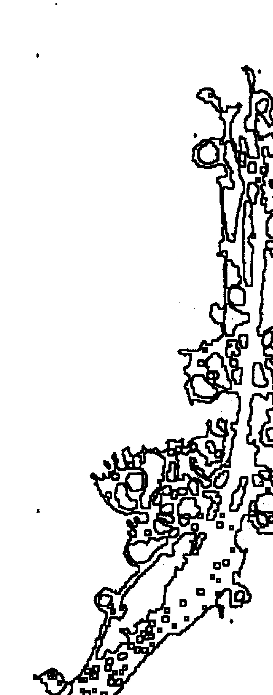

## 第七讲 师训守则

### 一、要学识广博

预测术来源于生活，又服务于生活，社会生活包罗万象，诸如医学卫生、天文地理、军事政治、财经商贸、艺体文学、电子航天等领域，易家都要学习，这样预测水平才能与时俱进，预测效果更符合现实。

### 二、要语言洗炼

预测师为人答疑解惑，语言表达相当重要，必须清楚条理，不温不火，谈吐高雅，切忌粗俗，要简洁明快，切忌拖泥带水模棱两可。

### 三、要品德高尚

作为一个合格的预测师，必须从视、听、言、动作加强修养，因为一个人心术邪正、品德贤愚，都是从这些方面随时流露出来。预测师要有高尚的操守，才是根本，需要不断修为。

### 四、要规诫劝勉

对政客前来求测者，应该用忠国爱民的语言来劝勉，导以清政廉洁之语；对家有老人的求测者，应当用“百行孝为先”之语言来劝导；对有钱人要劝导学宽容，做善事；对读书人，勉其勤学；对职员要劝其敬业爱岗；对不良之人劝诫本份，维护社会安定；扶正抑邪是预测师的天职。

### 五、要鼓励救贫

凡是没有职业前来预测的人，要劝导他，弃大就小，自营生活，尤其是现在下岗职工多，一定要劝导他们用己所长，自谋出路，鼓励他们再创业，利国利民。

### 六、要委婉求全

对绝望的求测得，要给以希望，树立生活信心，比如绝症患者，生活遭受重大变故者，这样做并不是欺骗或奉承，因为言语不慎，很可能断其欲望，造成遗憾的后果。并应当婉转谢绝酬金。

### 七、要取财有道

孔子曰“见利思义，临财尚得”这是取财的分界线。
以我们的学术，忠告善言，使求测者趋吉避凶，该得的报酬，为顺取，反之故弄玄虚，巧言令色，贪得报酬，为不当取。该取之财，虽多无愧于心；不该取之财，虽少有违天理。

### 八、七种人不测

- 第一种：依仗权势，不懂礼貌，不测；
- 第二种：语言不诚，存心尝试，不测；
- 第三种：信力不信命者，不测；
- 第四种：图谋不正者，不测；
- 第五种：重财轻道者，不测；
- 第六种：心不专一者，不测；
- 第七种：酗酒不明者，不测。

易卜要心神合一，反之，占而不验有损预测师声誉，千万要明白其中道理。

## 第二编 俏梅花外应仙人诀应用答疑

### 第一节 外应仙人诀应用答疑

问：俏梅花外应预测术是不是全部使用外应?

答：对。本门预测术在实际预测中，对所测事项的推断，完全是依据外应信息。

问：预测时，取不到外应怎么办?

答：不可能取不到外应，有天地在就有外应在。人立天地间，三才已分，四时流转，外应俯拾即是。白天有太阳、有云彩、有光线的明暗变化，朝日出震、夕阳落兑，太阳移动的方位也可取作外应。丽日风清、彩云朵朵、或分或合，形状各异，物象有别。光线强弱，可分明暗，明者，光明、开朗、向上、快乐、长者、主宰、正义、充满信心的；暗者，阴暗、龌龊、下降、伤感、从属、后者、非正义的、事情难办等。夜里有月亮、有星辰，月有圆缺星有幽明。冬雪夏雨、秋菊春兰，各自寓意不同。地有山河，逶迤绵远者，福禄康寿；短促形恶者，出暴。翠柏红花，谋事有望；朽木枯叶，诸事可叹。楼房街道，桥梁广场，形整者俊朗；颓旧破败者，都是负面作用。花草、瓜、果、猛兽、飞禽，皆可取作外应。远取诸物，近取诸身。头为乾，腹为坤。动作变化，快者，阳刚、向上、坚定；过快者，不容易听取别人意见；慢者，阴柔、善心计、稳重，过慢者者、多变化不容易成功。天地分定乾坤，形物各占宫位。预测师与被测者一见面，宫位已分明，西北为乾宫，西方为兑宫，西南为坤宫，南方为离宫，东南为巽宫，东方为震宫，东北为艮宫，北方为坎宫。预测，就是预测师对所有万事万物全景式摄入，全息式辨析，抓住主要事物，从事物的组合中找出矛盾点，即太极点。外应很丰富，不必担心取不动外应。

问：我是一个易学爱好者，看了神奇的易卜仙人诀后非常激动。我的基础差，感觉本门预测术好是好，只是难以把握，也许是我学习其他预测术习惯了程式，能不能详细讲解本门预测获取外应的步骤，第一步先怎么做，第二步再做什么？

答：很多易友都问到这个问题。在《讲义》中已讲过，预测时可以从四个方面去操作：

- 1. 时间的外应信息
- 2. 宫位的外应信息
- 3. 人、事、物组合的外应信息（特殊的外应信息）
- 4. 储存的外应信息

时间外应，就是天干地支日辰的信息，一个易卜爱好者，每天的日辰是应该记住的，哪一旬，哪一天心中要有数。这是预测时首先要考虑的；第二步是观察所测事项，所处宫位及宫位组合；第三步是特殊外应信息提取，这是最重要的，也是本门预测的突出特点，抓住主要矛盾，主要是指当时现场的人、事、物静态或动态的外应征兆，所带信息是很灵敏的；第四步是从信息外应储存库中提取信息，储存的信息，一般是特殊梦境，或临近发生的特殊事项，或是临近抓到外应后，却没有对应的事项释放出去，当前三步瞬间审查完之后，就从储存的外应中提取。

根据四个步骤顺序，运用口诀法则，选取外应，完成预测。写出步骤的目的，是让大家有个遵守的秩序，循序渐进，起到过渡作用，其实本门预测是一项综合性极强的预测术，整个过程在瞬间推断。我的预测实例也并非一一按步骤进行，有易友建议，能不能把实例按步骤一步一步套出来，我觉得这样不好，因为我本来就是随机收放，事后再按步骤取舍，就失去了原有的韵味，一切在熟能生巧。下面我举一个例子，按步骤分析，一次座谈，有易友让我测一测他有几个舅。第一步首先考虑日辰，癸卯日、癸天干为10数，卯地支为4数，再从五行角度分析，癸水为1数，卯木为3数，不统一，没特点舍弃不用；第二步取宫位，他坐在正西方，特征明显，兑宫，2数；第三步从现场人、事、物中取用外应，在场人多杂乱，又无特别外应，也只得舍弃；第四步从临近储存的外应中提取，上午我与另一易友坐出租车来会场时，开车的女司机，莫名其妙地问“就你们两个人”，说者无心，听者有意，我当时没有破译出这句话的意思，外应一直没发放出去，这“两个”与兑宫二数不正吻合嘛，所以我就断定易友是两个舅舅。

件反射，有什么外应就对应什么事相，如一步步地演出程式，反而多增加了外应，造成推断困难。

问：本门预测术预测时是否必须到现场？

答：到现场与不到现场的目的，都是为了提取外应信息。现场分第一现场，事发地，外应效果好些；第二现场为预测地点，也同样可取外应。就跟电视机一样，不是非到演出现场或电视台附近，图像才清楚。根据具体事项，具体条件来定，只要技术过硬，在哪里预测效果都一样。

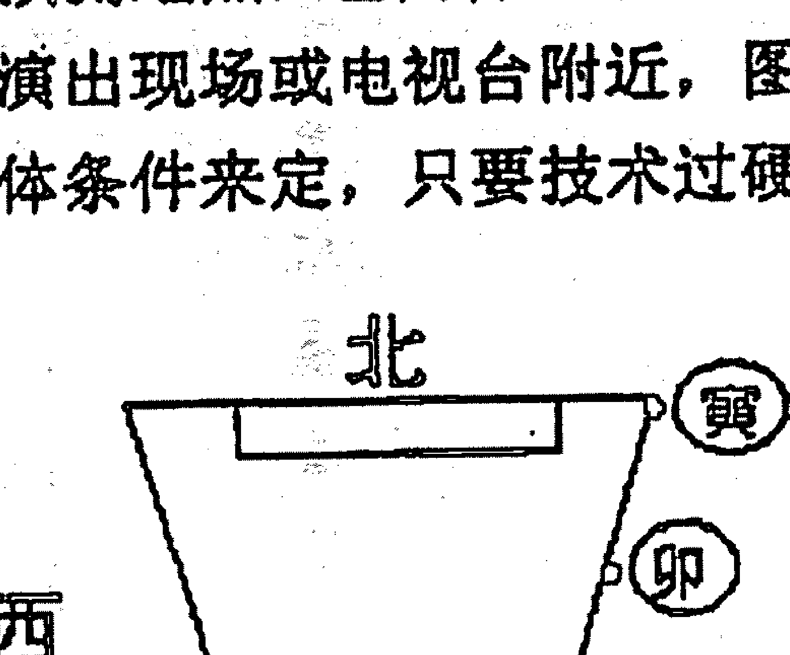

去年我在安阳参加易学研讨会，住在宾馆，同室湖北易友李明水，以一阳宅图形，问我能否测出什么事。我看了图形说：

> > “此宅最忧心儿女。”

就问李先生，此宅现在是老年人居住，还是青年人居住？李先生答是：青年人。我断道：自98年到现在，此宅没添人口，少子嗣。李先生回答：实际就是这样，一对夫妻住在此宅，结婚四年了没生小孩，两口子到处求医问药，求神拜佛。李先生接着问：此宅按《阳宅爱众篇》讲，是吉宅，诀云“前窄后宽居之稳，富贵平安旺子孙，资财广有人口吉，金玉珠宝满库门”，应该断吉才对，你怎么就断出没生小孩呢？我讲道：住宅的形状是死的，歌诀是死的，预测的方法是灵活多变的，预测者的思路是灵活的。咱们不是亲临其宅，缺少外应，这个房间是第二现场，外应不明显，也只得舍弃。以上外应条件不具备（或不充分），就从日辰上考虑，今天是癸卯日，日主癸水，癸水生卯木，卯木是癸水的孩子，再看看你画的图形，从寅位往下相继缺失，不正是缺儿少女的信息吗？其他外应不明显，只有日辰外应明显，并与所测之意相对应，因此取日辰癸卯作外应，不到现场照样可断。我所以讲不要死读书，不要读死书，条条框框多了，害人。听我一席话，李先生恍然大悟，困扰他很久的疑问，被我一语道破。钦佩之余，开始跟我研习外应预测术。

问：学外应预测术需要哪些相关知识？

答：这个问题有点大，说来话长。整理本资料的出发点意在提升易卜爱好者的层次，因此写得较简略，易学基础不牢固的，感到缺乏连贯性，可以理解。需要牢记的基础知识有：阴阳辨证思维理论、五行特征属性、天干地支物象，先后天八卦象数，八卦只用八纯卦，以后天八卦方位定宫位，顺序是乾一西北、兑二西方、离三南方、震四东方、巽五东南、坎六北方、艮七东北、坤八西南。以上是本门预测术中最基本的知识，必须耳熟能详，了然于胸。其他有关风水、相学、命学等预测知识，能知道多少是多少，多学有益，少了也不影响外应预测术的应用。知识靠积累，技巧靠归结，只要有热爱易学的兴趣，有不怕困难的决心，持之以恒定会学业有成。

问：预测时，是否与自己的心情有关系？

答：当然有。我想任何预测术在进行预测时，都与施术者的心情有关系。占卜尤甚，而在本门预测中，施术者的心情如何，本身就是一种外应，包括身体某一部位不适的感觉等。一次，我给一女孩预测了婚姻之后，忽然心情烦躁，似有心事。该女孩又问其母亲身体如何？我说其母身体有病，长远病，应该是女孩牵肠挂肚的事了，这正是我心情的反映。她问能否测出哪方面的病，我的胃部阵痛，当即回答她其母是长年老胃病。

问：老师在本资料实例篇中，测婚姻一例，生辰排出恰有一女青年经过，取作外应预测。我想请教您，如果当时是一头猪经过时，是否可取外应？

答：一切景物皆可作外应，但哪种外应与预测事项对应关系最密切，就是最充分、最明显的外应。本门预测的原理是何时何地出现何物，或何时何地得见何事物，均是我们破译时空密码的金钥匙。那一例是女青年经过，与所测事项有内在关系，所以取作外应。退一步说真的有头猪经过，首先要考虑，是不是还有别的突出外应，没有的话，猪也可以作外应，猪可断亥。就属相而言，此例中女孩79年生，属羊，此外应明显与女孩不吻合，那么就可以测是她对象的属相。这个例子女孩的对象测属猪也不对，但马上寻找对冲地支，亥与巳对冲该是属蛇，实际就是属蛇。虽然你的提问是随意以猪为例，但是，我把猪取作外应也顺理成章，这就是天机。易理通了诸事明。另外，以猪的神情、毛色、形态、破译女孩对象的体貌特征也未尝不可。

问：资料中，三个地方出现了“巳”，可是三个地方

### 巳代表的数字却不一样，为什么？

答：第一次是出现在进阶篇，易友孙应明问我他花了多少钱时，我回答6百至7百元。因为他从巳位走到午位。巳代表的数字是6，地支的顺序，子、丑、寅、卯、辰、巳、午、未、申、酉、戌、亥，巳是第六位。第二次是例解“动观其变静听声”中，断小孩父母四月份离婚，巳代表数字4，因为地支在流月中的顺序，是正月起寅、二月卯、三月辰、四月巳、五月午、六月未、七月申、八月辰、九月戌、十月亥、十一月子、十二月丑。巳是四月。第三次出现在实例篇中，“不用排八字，也知婚姻事”，断女孩对象属蛇，当时以5数取巽宫，巽宫包括辰巳两地支，舍辰不用，取巳的原因，是因为我本人属蛇，巳与已有感应，所以取巳。五数只是取宫位，并非取巳。可以看出牢记基础知识，根据实际情况灵活用，才是实践易理的唯一途径。这样的回答，满意吗？

问：在进阶篇中，老孙把辣椒夹放在盘子边沿的乾方，您断其大姐头胎是男孩，还有伤亡之象，为什么这么断？乾为父，为什么不断她父亲出事？

答：在预测时要注意，任何八卦宫位中还包涵着八卦宫位，这就是八卦的其大无外，其小无内之理。当时盘子是放在桌子巽方的，巽为女，为长女，老孙坐桌子离方，都是在桌子同一平面上的不同方位，所以断巽女为老孙平辈，他大姐，而盘子从属于巽方，盘子的乾方是巽宫之内的乾方，那么这里的乾，就不能看作是她的父亲，而应作其孩子来看，乾为一，头胎男孩。这点好理解吧？

你的意思，乾为金，巽为木，金克木才对，为什么乾金反而被伤？我们知道五行生克律中，有相生、有相克、还有反克，即某一被克五行，成党成众成势时，有相克关系的五行不但克不动被克五行，反而会被力量绝对优势的被克五行反克。如水多土散，木多金钝之理。试想一炉旺火，浇小勺水，火不但没被浇灭，反而使水化成了蒸汽。乾金在巽宫，木多伤金这是其一；其二是乾方放的辣椒，辣椒属火，毒性大，故伤乾金，因此断伤头胎男孩。另外，老孙的外甥十二岁烫伤死亡，也是有外应

## 俏梅花外应预测术讲义

的，我当时就坐在丑方，况且月份也是丑月，丑就是十二，只是预测时没抓住这些外应。

> 问：“形若有节以形辩”例解中，大门迎面假山逼近，事情不顺之断语，可否用风水学解释？

> 答：任何预测术，都是为现实生活服务的。仁者见仁，智者见智，正确的理论是相通的。此例中，大门为水，假山为土，相距太近，就有土克水之意，也应不顺。

> 问：老师在资料中的例子，都很神奇，我若见到同样的事情，可不可以重复使用您的断语？

> 答：有的可以，有的不可以。外应预测随机性强，原理是何时何地出现何事物，或何时何地得见何事物，你若死搬硬套断语，时过景迁，弄不好驴头不对马嘴，要闹出笑话。但是掌握住易理，以不变应万变，万事万物都离不开一个理字。我说的最多的也是让大家学习和掌握我的思路。天下没有两片相同的树叶，人不能两次踏进同一条河流，任何门类的断语都是有使用条件的，记住再多的例子，不如掌握一条思路。除一些固定的类象断语，可以重复使用外，其他的要根据实际情况灵活运用。(注：本门独特五行固定外应类象对应事项面授班全部讲解)

问：老师在资料中的例子，新颖神奇，的确与其他门派不同，我问一下，您在预测时都是这么准确神奇吗？有没有测错的时候？

答：测错的时候肯定有。任何预测术都不是百分之百准确的，就概率讲，对与错，各占百分之五十的机会，一点不懂预测，瞎蒙也有50%准确的机会，可见准确率达不到85%以上的预测术都不可信。据我掌握和研究的预测术来看，本门预测术准确程度确实极高。概率可占95%以上，实际预测中，很少失误。如果水平高，再配合其他方法，达到百不失一的神验境界，就算不得什么难事。关键是取用外应，就象八字预测中选取用神一样。开口第一件事对了，说明思路对了，往下都顺。如果一上来错了，就要调整思路，说明外应取错了。预测术同其他技术一样，也是在发展中不断走向完善的，医学是我们公认的一门科学，医院里不是也常有死亡的病人和出现的医疗事故吗？谁

## # 俏梅花外应预测术讲义

也不会傻到就因为出现这些情况，而怀疑和否定医学的正确性吧。失误的出现，我分析有两条：一是这门学问或技术本身存有不足之处；二是施术者本人的水平高低不同。失误，是任何预测术都无可避免的，区别预测术优劣，应该以相对失误多少为标准。实践是试金石，要想知道梨子的滋味，就要亲口尝尝，神奇不神奇，一试就知道。

**问：您在资料中多次讲要抛开推演程式，是不是什么程式都不用那怎么预测？**

**答：我讲的是不要受繁杂程式的束缚，因为使用程式（或公式）的目的，是想推导出正确的结果，程式（或公式）本身就不一定正确，试想推导出来的结果还会有多正确？所以学习预测绝不要陷入程式越多越复杂，预测就越准确的泥潭中。重在凸显易理，复杂的程式只会束缚人的灵性。认为多背几条断语，预测水平就提高了的想法，是懒汉思想。基础知识要牢固掌握，思维方式要合乎易理，预测推断时越简单、越直观，效果越好。今年（癸未年）大年初一，有女孩来拜年，顺便请我预测下找对象情况。大年初一我实在不想测。**

## 俏梅花外应预测讲义

如果测出不太好的情况，说了吧，恐怕影响新年的兴头，大过年都愿图个吉利；违心地奉承几句吧，事后不应验，又会说预测不准，给预测抹黑。左右为难，我只能挑着说，既让她信服、高兴，又不是无原则讨吉利。当时大家坐在客厅茶几周围，她坐在坎方。我说：你目前处了个对象，这个人在家兄弟排行是老二，坐办公室的，但是常出差，好动，不从事教育行业也要从事文字工作，长相有点胖，身高1.71米，能成不能成，决定权在你自己。这是我癸未年预测的第一个实例。结果正是如此，女孩讲，她现在确实处了个对象，在市某医院办公室工作，以前是当老师的，排行是老二，尤其是身高特别精确1.71米，长相也对。

我讲一讲我的推断思路：所有的一切主要是依据她坐在坎方推断出来的。她在坎方，坎为男，为有男朋友，坎为中男，排行老二，坎为水，文教卫生职业，坎为水，水形人长相胖。断坐办公室又常出差，是因为她坐着，问我时两只脚乱动。断身高1.71米，是因为1米是基数，就在我要讲身高的时候，她站起来了，借了“起”字的音作“7”用，直着身子不就是“1”嘛，合起来1.71米。易友们可以看出，我哪用什么繁杂程式？不是照样可断。另外还有一个外应当时没取到，她对象面向南或面向北办公。写本段文字时，我专门打电话核实，其坐南面北办公。

再举一例，大年初二我回老家拜年，村里人讲，某某出了车祸，宅子是不是有毛病，他家在院子的西方煮猪头肉卖。我说你们认定是这点的毛病，第一意念最重要，我就利用这个外应信息，还原现场，你们看对吧。我说是在西路上，车祸在路南边发生，汽车从身后撞上来，伤在头部。事实就是这样。我的推断思路是：在兑方煮猪头，炉灶为火，兑为金，火克金，祸害根源在火，火为离，离为南，所以断车祸地点在路南。东西路，车祸在南边，说明他是靠路南边向东去的，兑为西，兑为金，金引申为汽车，所以汽车应该是从他身后撞上来的。伤在头部是因为火克金，煮的是猪头，猪即亥居乾宫，乾为金，为头，再者猪头亦有头的外应信息。众人见预测术不但能预测未来，还能还原事发现场的情况，皆称奇。整个过程，就是依据口诀而断，活用易理，并没有复杂程式。

问：有的朋友问进阶篇中，老孙断给我打电话的人属狗，为什么？

答：资料里我已讲了，当天是戊戌日，戌地支对应的属相，就是狗。

问：进阶篇中老孙断您去东南饭店，还要坐东北方，是什么原因？

答：因为当时在街上遇到后，我站在乾方，他站在巽方交谈，我有要动的信息，他直取乾宫的对冲宫位，巽，东南方；我坐东北方的外应是，我们交谈时，来一老者正坐在艮方。

问：实例篇中，“乾宫垃圾道，老父命不保”，您以垃圾道取象食道，是不是取象排泄系统或肠道也可以？为什么断手术是在楼房改造后半年？

答：从理论上讲垃圾道取象肠道也是可以的，但是用来判断本例的病症就不准确了。我判断是食道而没有判断是肠道的依据是，整幢楼高三层，侯某家住三楼，属上部，垃圾道在室内可看见，食道外部也是可见的，而断肠道就不具备这些条件，就是这点细微的差别，我断的食道癌，令对方折服。第二问题他父亲在楼房改造半年左右动手术，是因为风水导致的灾害，有一个应期最少三个月至半年。

问：在实例篇中，某包工头求测工程竞标您用外应对了，那位预测师用六爻测错了，是不是六爻预测不如仙人诀外应预测准确？

答：不能这么说。六爻预测，自京房创制纳甲筮法以来，历代数术家在实践中积累了大量宝贵经验，六爻纳甲筮法已成为易卜预测中的大宗之法。近几年有不少易卜高手悟创出新的路子，实践中效果也不错。这也从另一方面说明，六爻预测术是不断发展的、不断完善的。既然这样，就说明原来的模式，还存在不足。那位预测家实际水平很高，在省内乃至全国范围都有一定影响，智者千虑偶有一失，不能以此一例否定其他，谁都有失误，百分之百准确那是神。六爻预测、外应预测与其他预测术一样，都是各有千秋，拥有自己的风格，外应预测有其独到的奇妙之处，这个问题就回答到这里。

> > 问：《讲义》中讲“即收即放莫迟疑”，可是您又讲外应信息可以象电脑存盘一样储存，怎么理解？

答：“即收即放莫迟疑”，是讲预测时，抓到外应，立刻有的放矢，这是对的。外应信息储存，是讲预测时抓到的外应，可能用不了，或没用上，在一段连续的时间内特征明显的外应，一定有用。平时，也要留心周围，外应信息要随时细心提取，比如我讲预测者要知道每日的干支，并且旬空是什么地支，这就是外应信息储存，当然其他很多，行车连吃红灯，被什么动物猛然冲撞等等。例如，壬午年十一月，朋友夫妻吵架妻子负气出走，请我帮助找回来。事过两天，话题还未淡去。甲戌日上午8点多，泉里发电厂一男子来求测，进门就坐在巽方。他才要开口，我示意他别讲，我说：你俩口子吵架了，媳妇离家出走是吧？只一句话，该男子听后长舒一口气，目光中露出希望，问我到哪个方向去找。我说东南方向是否有亲戚，就在东南五十里，她还在人家呢。该男子想了想，是有个不大来往的表亲，当初没考虑媳妇会到那里去。结果就是在那里找到的媳妇。我推断的思路是：一、甲戌日，甲为木，戌为土，甲木克戌土，戌土为财为妻，他又是8点多辰时的，辰戌相冲，一冲就动。可不就是妻子出走了；二、天前，朋友夫妻吵架的外应信息。去东南方向找，是因为他来后坐定东南巽宫。日常生活中，就要培养取用功夫，能训练有素。实践证明，特殊外应信息储存是很有必要、很有价值的。

> 问：在资料中，您讲不问不占，可是您的举例有很是主动预测，请讲解原因好吗？

> 答：易卜的原则是不问不占、不动不占、无事不占。要考虑爻不妄发，信息提取问题。本门预测术依靠外应取信息，外应有了，就已经把事项的信息破译了，发与不发，只是个人把握问题，水平提高后，确认外应信息提取无误，随时可以发用，真正做到收放自如。

> 问：在预测实践中，是只用本门外应预测法，还是用其他方法？

> 答：本门预测术有自己独特的预测原理，取用法则，全能够达到所要求的预测效果。但本门预测术最大的优点是可以兼容其他预测术，把命理学、风水学、相学等门类中，已成定论的精华部分吸收过来，作为外应或外应引发点。我在举例中，象“甲戌日”，以戌论财，就是借用了命理学的观点，以天干甲为日元，视坐下地支与天干的生克关系，灵活取用。外应预测学是一门综合性的学问，它具有调整、联贯各门类突出特点的功能，这是其他预测术所达不到的效果。初学者的感觉往往是，外应预测固然神奇，但是没什么学头，简单，没有那么一套一套的程式，其实越是规律性的东西越简单，越简单的东西，内涵越丰富，要想达到出神入化的境地，没有深厚的相关知识作基础，困难不小。但有一点是可以肯定的，不掌握本门预测法则诀窍，其他预测术更是达不到出神入化的地步。

> > 问：阴阳学说在在本门预测中有什么作用？
>
> 答：阴阳学说是对世界本质的高度抽象概括，在本门预测中它是指导我们预测事物及事物变化的思维方法。

> > 问：老师，您能不能再解释解释金钥匙的运用？
>
> 答：是我们破译时空密码的金钥匙。这里的何时、何地、何事物，均是外应，及外应之间的联系，是我们进行预测的切入点。有的易友提出，外应预测程式简单反而不好掌握，有点象没把的葫芦。简单是真的，八八六十四卦，只用八纯卦。什么是葫芦的把？金钥匙就是，它是预测的切入点，一定要牢牢记住，有了它才有后边口诀的运用，有了它才会感觉思想畅通。有些八字高手，可以用八字测来意并且称作秘不示人的法宝。其实流年感应之论用金钥匙一捅就开。我不厌其烦地讲解易理，多举实例，就是想让大家悟通其中道理，简单操作之后，一切问题都可迎刃而解。

问：口诀中“日月只在时上寻”是不是不用日月取用？

答：在外应预测取用中，没有不起作用的外应，此诀中日、月、时，都是外应取用对象。我在实例中已经应用了日辰作外应的取用法则，但怎么理解“只在时上寻”？这句话不点不透，日、月、时均可作外应，是用来定性的，定量一般在时上取外应。我在举例中理发店的钟表是七点，断七个理发的，还有甲戌日测妻子出走我断东南五十里，因为辰时冲动戌土，他又坐辰位。地支顺序在五位，所以定量五十里。

问：在寻人例中，为什么炮声一响，就在那里啦？

答：诀中有“动观其变静听声”，静中求动，声即动。声，分音、数、方位。这个例子虽然是讲日辰取用外应的，但是在实际预测中，几种法则往往综合运用。

问：外应预测是测一件事还是测多件事？

答：在实际预测中，不论是单测一件事，还是全面系统预测，都可运用外应预测。这与六爻预测中单一问事和一卦多断一个道理。全面预测时是不是担心外应不够用，不会的，如果一个外应不能全面反映事物的特性时，按照层次选取第一性外应，第二性外应，相机而变，分别预测，对方要求预测的问题变了，我们外应取用也要变，我在资料中举了这方面的例子。

## 俏梅花外应预测术讲义

## 问：本门预测术能否解灾？

答：如果医学只能查出病来，不能解除病人的病痛，是医学发展的不完善，就达不到造福人类的目的。一个医生只会诊病，不会开药方，其医术也可想而知。本门有独特的解灾方法，与预测术一样简单、实用、神奇。欢迎有志于研究解灾除灾，为社会奉献爱心的朋友来函来电联系。关心社会，造福人类，善莫大焉。预测功力也自然随之开悟提升。

## 问：邓老师，我想问一下最后一个实例中手机号码为什么那样排列？能否用来测彩票？

答：我欢迎大家来提问题。本例中几个手机号码数字预测出来的，正确排列是难点。为什么是 ××× 14223897，而不是其他排列形式，这还是涉及外应层次第一性，第二性问题。我与程先生两个是当时场所（或固定范围）的主题，好比包裹最里层，外一层是房间，再外一层才是为这个房间客人（主题）提供服务的小姐，她是这个固定场所之外的的人，所以“1”就排列在第一位，第二位是房间号“4”，第三、四位是“2”，“2”，“3897”最先测出后就固定了是后四位。预测数字时位数少可一位一位测，位数多时，可以测出后重新排列顺序。对数字预测有兴趣的朋友，可以试着预测彩票号码，会收到很好的效果，中了大奖别忘了让我也分享喜悦。（注：彩票预测以后讲解）。

> 问：很多易友问到《讲义》中断卦时用的方位，是不是实际地理方位？在不能辨清方位时候，该怎么确定方位？

> 答：资料中我讲的实例方位，都是以预测师为中心，目测的实际地理方位，并不是罗盘精确的分定。本门预测术以简单、快速见长，如果到哪里都拎着个罗盘，是不是俗气？再说三个罗盘放到一起，也不见得方位全部一致，还是有出入。预测时，以预测师为中心，把四周看成一个球形，时空方位都有了。比如我们在一个房间，四面墙就是四正方，夹角也就是东北、东南、西南、西北。例如今年阳历4月初，一男性亲戚来串门，我坐在书桌前面向南看书，他坐在书桌东头面向西，谈话间他把右肘搁在桌面

## # 俏梅花外应预测术讲义

上，右手抚在右脸颊，歪着头，神态极象女人状。我说：前几天，3月30日（阳历）是不是有个家是东北，和你不错的女人找你？他听我一说马上站起身，一边说：有、有、有。一边不自觉地把裤腰带解开扣上，解开扣上来回整理。我继续说：她是来跟你说说她男人的事，她男的作风不正、风流。反馈：是这样。这里别的不讲，重点讲讲方位判断。他坐在我书桌的东桌头，右手动，东北方向明显，但东北有两个方位寅和丑，为什么是寅而不是丑？因为他坐在东方，卯与寅同气，相近，所以舍丑而取寅，断3月30日，因为那天是寅日。时间和方位都出来了。还有一种方法判断方位，如果在特殊情况下，实在无法辨别方向，可以以预测师为中心，按面南背北，左东右西确定方位，可以这样理解，黑夜无灯无火，萤火虫的光亮也是光明，也是信息。此法偶尔一用有效，多用不验。

问：邓老师，本门预测术可否断来意？应期如何确定？

答：实例中有很多都是我主动讲出预测事项，可参看断来意。

## 俏梅花外应预测讲义

应期是大多数易友关心的问题，资料中没有专讲，这里作讲解。总的原则是根据取用外应的法则判断应期。

- 1. 以形论法则取用外应时，应期以十二生肖所代表的年、月、日、时作应期，再根据预测事项大小程度，综合确定。
- 2. 以取时法则取用外应时，以时上之数取应期，再根据预测事项缓急程度，综合确定。
- 3. 以宫位法则取用外应时，视距离远近或宫位数取应期，再根据预测事项缓急程度，综合确定。
- 4. 以象数法则取用外应时，直接以象的序数取应期，再根据预测事项的缓急程度，综合确定。
- 5. 以动静法则取用外应时，动则急，静则缓，再根据预测事项缓急程度，综合确定。
- 6. 方位、数目明显时，以取用外应所代表的时间，再结合预测事项大小，缓急程度，综合确定。情况千差万别，不好统一而论套死框框，大体是这样，可参看实例。

## 问：资料中的人名、地名和其他地方为什么要改动？

答：我是真心想把本门预测术高层技法全部传授给各位易友，一来弘扬易道，光大本门术数，二来让更多的易友能够尽快掌握本门预测术，不再有水过地皮湿的感觉，真真切切受益。可是，易界现实，盗版成风，有些人不是以研易为目的，而偏好克隆，为保护本人权益和修习者利益，不得不出此下策。

我已经说了本资料为限量交流，以易会友，改动之处为有序编码改动，从第一本开始，改动之处各不相同，今后出现盗版，我一看便知出自哪位易友之手，将对其停止函授，拒绝面授，揭露其丑行，并采取相应措施。如果任其所为，弄出些不伦不类的东西，一是挫伤广大易友求学虔诚之心，二是有损本门术数声誉；三是造成易友资金无形受损。

另外一个原因就是，隐去实例中的真实人名、地名，也是为了保护当事人。

## 俏梅花外应预测讲义

## 问：邓老师，本门预测术能否判断来意吉凶？

答：我们研易之目的，即是为了趋吉避凶。吉凶之象，外在是有反映的，既有固定信息类象，又有易理推断可察。外应预测术在于提取瞬间信息，发挥易理推断，吉凶预测是理当然之事。吉凶预测大体原则，外应吉则吉，凶则凶，具体事项再组合论断。有些事情的取用一定要遵循自然法则，不能主观臆造。我们习俗上喜鹊报喜，乌鸦报忧，外应取用不是不可，但一定要结合实际情况。比如我们北方，习惯上把黑喜鹊称作乌鸦，北方冬季鸟类少，鸟类的鸣叫声自然少，开春之后，鸟类渐多，黑喜鹊不住地“呀呀”鸣叫，是不是不祥之兆，作凶断呢？非也，自然之叫声，绝不可断凶，怪异之声，才可作凶断。这里讲一个道理，不动不占，不问不占，无事不占，无异状不占，随意乱占，其多不验可想而知，如一个人正在谈话，或正在笑，忽然声音变了腔调，即可判断近日必有事端，这一条易友们可以试一试，很灵验。

## 第二节 证集外应预测实例启示

俏梅花外应预测术公开传授以来，在易友间引起强烈反响，受到易界广泛关注与厚爱，我深深知道，这是大家对本人的鼓励与鞭策。在此，向所有关心和支持本门预测术的同道表示衷心感谢，并殷切希望大家能够继续倾注热情，多提宝贵意见，多方面交流沟通，为易学事业的繁荣发展作出更大贡献。

为弘扬易道，光大本门术数，为易友提供更多学习与交流机会，也为检阅修习成果，汇编国内第一本外应预测实例集《俏梅花外应预测精彩实例》，等待大家踊跃赐稿。（第一集已编出。稍后将推出《俏梅花外应预测百例赏析》，每例我都作点评，对深入研究本门技法和全面提高预测水平，起到重要作用）

要求：实事求是，测准就是测准，没测准就是没测准。写清预测的时间、地点、事项，结果如何，准确程度，应用心得，每例字数可长可短。

待遇：预测实例入选者，获赠《实例集》一册，并在其中发现和选拔优秀者，传授本门高级技法。

## 第三节 学员应用实例摘编

- 1、3月31日晚7时多，我爱人和儿媳妇在家找小孩衣服，找了许久也没找到。当时是戌时，在我们房间戌位没有箱子、柜子，（无法盛衣服）我直取对宫位辰位，东南角电视机下有一小柜子。我叫爱人到那里找，爱人说：不可能，根本就没往那里放过衣服。此时，小孙子正玩塑料球，一扔，正好滚到电视机下面小柜子的门边。我肯定地说：就在那里边，还是用塑料袋装着的。我爱人抱着试试看的心情打开小柜门，衣服果然就在里边。

- 2、4月4日，我到本城里易学起名社去看朋友。碰巧主人张师傅的徒弟正和一人共同研究八字。那人说：看看这个人（指八字命主）的父亲现在怎样？张师傅的徒弟沉思着没说话。此时，张师傅开门进来，我想：何不用此外应试一试，于是，我插话说：此人父亲身体健康，无病无灾，能吃能走，76 岁。那人大惊：确实如此。可是你并没看八字，是怎么测出来的？岁数特准，就是 76。我回答说:我是用山东邓海一老师的俏梅花外应预测术测出的。他问我:你学几年了？我说:学了才几天。他有些不敢相信，世上有这样好学好用的预测术。(我和张师傅是熟人，知道他的身体状况和实际年龄，类比取用)。

- 3、4月中旬，我去张师傅易学起名社闲聊。他的徒弟李兴桥说：药材公司招聘人员，我报了名，不知能否去上班。说话间小窗户被风吹开。我抓住这个外应，果断地说：去吧，准能成，看看门都为你开了。李兴桥半信半疑说：那好，我去看看。不大工夫回来了，欢喜地说：又让你测对了，您老人家长本事了。我也有遗憾，他们这次共招聘8人，当时我没测出来要几个人。

- 4、4月20日，我在街上遇到李兴桥。他说：有人请我批个八字，你要有时间和我一块去。家里有一个老太太、一个中年妇女。中年妇女报上生辰八字，李兴桥忙着翻万年历查四柱。我坐在旁边，老太太正收拾衣服，床上有一堆烧纸。老太太自言自语说：一会都烧了。我马上抓住这个外应，判定八字命主已不在人世。因为是坏信息，我试着说：此人都不在了，还测什么八字。只这一句话，中年妇女伤心地哭了：我是想麻烦你们算算查查，看这个人到底该不该死，是不是都是个命，我不甘心他就这么死了。又对我说：你八字也不看，怎么就知道他死了呢？是不是会特异功能？我说：我没什么特异功能，是跟山东邓海一老师学的预测功夫。

- 5、4月27日，一个八字爱好者拿来一个命局：辛酉 己亥 辛丑 甲午，问我2000年庚辰，01年辛巳，02年壬午，这三年有什么事。我明确地说：2000年庚辰年，01年辛巳年，两年考大学都没考上，02年壬午年考上大学。来人佩服地说：我只是刚说了八字，又没说大运，你也没进行八字分析，立马就判断，并且还特别准。看样子你真是个精通八字的高手。我实话实说：对八字我只是略知一二，我是用邓海一老师的外应预测术预测的。来人惊奇，非让我讲解讲解：当时正是学生中午上学，（此事项与学生有关联），有一个学生骑自行车，另一个学生说我也上去，这天正下阵雨，另一学生上去自行车时，正赶上下雨，再看看测问的这三年中，只有壬午年天干带水，我所以推断壬午年考上大学。

以上5例，是吉林易友李家裕应用本门预测术实际预测。（吉林市昌邑区延安路，电话 0432-6125789）为保持实例原汁原味的完整性，一些该点评的地方我也没点评，只是把个别语句进行了通顺条理。李易友是3月31日收到我的教学资料，当天就进行应用，并于次日寄回“点将台”例答。在不足一个月的时间里，李易友边学边用，且取得了可喜成绩，这是我最高兴的事了，这要归功于师门历代师尊的智慧。

从以上实例中，我们可以看出李家裕易友易学功底深厚，思维敏捷。我打个不恰当的比喻，易友们的易学知识就像一个大水库，我所传授的预测术是一条渠道，水愈多，愈会奔流而下。

## 尊敬的各位易友：

我谈点修习本门预测术的学习方法。要把周易预测与现实合理推断很好地结合起来。周易预测是特异思维，应用易学象、数理论，辨析推断人、事、物的过去和将来。现实合理推断是指，现实社会中客观允许的或是符合客观现实的推断。无论在哪个门类的预测术，只有把握住这两点，才能推断得更妥贴、更符合当时情况，才能进入更高层次。

六爻摇钱成卦（或其他方式成卦），目的是为了提取预测信息。本门预测术，直取自然本性信息，所以来得快、来得真、来得奇。对自然现象、社会现象熟视无睹的易友，是很难进入高层预测的。要做个有心人，要用我们的眼光去看这些现象，破解出其中的密码象意。俗话说“会看的看门道，不会看的看热闹”，我们要做会看的人。比如一支钢笔，学生看是为了看看好用吧，商人看是为了看看卖个什么价钱，收藏家看是为了看看多少年以后的价值，同一物件，看出的想法不一样，所处角度不同而已。

## 俏梅花外应预测术讲义

这个世界上，天天来来往往那么多人，热热闹闹发生那么多事，与我们本人有紧密联系的少，但一点联系没有的也少，这就足以说明众多的人和事是相互联系的，信息是相通的，外应取用是可行的。有的易友取用外应，多是瞪着眼睛，等待发现那些特殊外应，好像只有特殊外应才寄寓征兆，其实不然，什么时候学会了，从日日见的普通事物间取用外应，那时候，外应预测功夫就趋向成熟了，外应取之不尽，用之不竭。

我在实际预测外应取用时，都是信手拈来，抓到什么是什么。日前，易友赵先生陪一位远方的朋友正在某宾馆，约我过去。人贵有自知之明，自己除了懂点预测术，别无长物，约见的客人十之八九是求测的。见面落坐后，我直奔主题，开口说：你刚接了桩生意，合同或是企划案，是对方框定好的，你无权改动，是被动接受，到底干不干，你拿不定主意才来问问，是不是这回事？我的开场白，令对方目瞪口呆，缓过神来，连说：高、高，真是高手。就是这么回事，南方一老板，委托我搞煤炭生意。他给的条件太死，这里行情不稳，我不敢运作。您说能不能做？我说：不做。他接着说：这些年，我在外闯荡，也接触不少大师，没有一个象您这样预测的，也不问什么，见面握握手，张口就说，还奇准。我再请您测一下我的家庭、孩子、工作行吗？我一一作了预测之后，他追问：邓老师，我还是奇怪，这些事您说的那么到位，那么具体，到底是怎么测出的。我笑了：所有这些预测，只有断你生一个男孩，是从面相上看出的外，其他事项均是本门独特外应技法。易友赵先生边听边叹：高深莫测，断他做生意，到底是什么外应测出的？我告诉他：太简单了，我快到宾馆大门口，一个发广告的塞给了我一份广告，仅此而已。（这里简略介绍，在“精彩实例集”中再作详叙）。

4月7日晚10点半左右，我偶得一外应。当即要通了黑龙江“三姓易学”盛书笙先生的电话，告诉他明天将有两个购买本资料的。第二天，我收到盛书笙先生发来的电子邮件，除两位邮购资料易友的地址外，另有一行字：昨日预测很准，今天确实两个。盛先生曾来信盛赞俏梅花：

> 海一兄嘱：
> 养牛如家.. 以病开悟. 俯拾皆是其机可遇一悟
> 限于六字右三所算. 更任六多否一态上间. 以最吾
> 容乃已语可零. 在花如为限与治一易化埋山之此为学
> .想名弄. 容乃以此信之此教. 恩也与治一易合化
> 通名治治一易 花限悟一六. 13-88. 增大六后若二六.
> 轻生欲化二. 12.百治一现名之六 武路二. 正明若四
> 而悟这二以信. 1可加临盛选治一易来外二女
> 现讲学. 2. 话无前. 症生心六.
>
> 阿一
> 秋安
>
> 落款：
> 陈月虹 惠
> 时人易海一
> 2003.6.11

本门预测术的口诀既是招数、又是思路。金钥匙所指临时外应，为什么可以反映过去，预知未来，因为现在，一半是过去，一半是未来。随着修习的加深，大家会有更多的理解和感悟。

## 俏梅花外应预测讲义

为培养本门高级预测人才，现在接收入室弟子，每期限12人，传授本门高层次气功《皇极梅花功易占心法》，有意请联系。

- 1. 品行端正，遵纪守法。
- 2. 尊重师门，缘聚慧深。
- 3. 全面修习俏梅花预测术，好学上进热爱钻研。

## 附录一

### 观物洞玄歌

《洞问歌》者，洞达问妙之说也。此歌多为占宅气而发，昔牛思晦，尝入人家，知其吉凶先兆。盖此术云。是故家之兴衰，必有祯祥妖孽之征兆。识者鉴之，不识者昧之。故此歌发其蕴奥，皆理之必然者，切勿以浅近目之也。世间万物无非数，吉凶悔吝理先知。其五行金木水火土，生克先为主。青黄赤黑白五形，辨察要分明。

- 人家吉凶何堪见，祇向玄中判。
- 入门辨察见闻时，于此察兴衰。
- 若还宅气如春意，家室生和气。
- 若然冷落似秋时，从此渐衰微。
- 自然馨香如兰室，福至无虚日。
- 鸡豚猫犬秽薰狸，贫病至相侵。
- 男女依饰皆齐整，此去门风盛。
- 家人垢面与蓬头，定见有悲忧。
- 鬼啼妇叹情怀消，祸害到阴小。
- 老人无故泣双垂，不见日愁悲。
- 门前墙壁缺砖瓦，家道中渐歇。
- 溜漕水势向门流，财帛去难收。
- 忽然屋上生奇草，益荫人家好。
- 门户幽爽绝尘埃，必定出高才。
- 偶悬破履当门户，必有奴欺主。
- 长长破碎左边门，断不利家君。
- 遮门临井桃花艳，内有风情染。
- 屋前屋后有高桐，离别主人翁。
- 井边倘种高梨树，长有离乡土。
- 祠堂神主忽焚香，火厄恐灾殃。
- 檐前瓦片当门坠，诸事愁崩破。
- 若施破碗厕坑中，从此见贫穷。
- 白昼不宜灯在地，死者还相继。
- 公然鼠向日中来，不日耗资财。
- 牝鸡司晨鸣喔啼，阴盛家萧索。
- 清晨鹊噪连声继，远行人将至。
- 蜥蛇偶尔入人家，人病见妖邪。
- 雀群争逐当门盛，口舌纷纷定。
- 偶然鹏鸟叫当门，人口有灾连。
- 入门若见有群羊，家主病瘟黄。
- 舟船若安在平地，虽稳成淹滞。
- 他家树阴过墙来，多得横财来。
- 阶前石砌多残缺，成事多衰灭。
- 入门茶果应声来，中馈主家财。
- 三餐时候炊烟早，渐基好连宵。
- 千门万户难详备，理在吾心地。
- 斯文引路发先天，深奥人玄妙。

## 观物玄妙歌

观物戏验者，虽云无益于世，学者以此验数，而知古人作《易》之灵耳。物之于世，必有数焉。故天圆地方，物之形也；天玄地黄，物之色也；天动地静，物之性也；天上地下，物之位也；《乾》刚《坤》柔，物之体也。

故《乾》之为卦，刚则圆，贵而坚，为金为玉，为赤为圆，为大为首，为上之果物。见《兑》为毁折；逢《坎》而沉溺；见《离》为炼煅之金；《震》为有动之物；《巽》为木果为圆；《坤》《艮》土中之石，得火而成器；《兑》为剑锋之锐，秋得而价高，夏得之而褒矣。

《坤》之为卦，其形真而方，其色黑而黄，为文为布，为舆为金，其物象牛，其性恶动。得《乾》乃可圆可方，可贵为贱；《震》、《巽》为长器；《离》为文章；《兑》为士中出之金；《艮》为带刚之土石也。

《震》之为卦，其色玄期而多青，为木为声，为竹为萑蒂，为蕃鲜及生形，上柔下刚，是性震动而可惊。得《乾》乃为声价之物；得《兑》为无用之木；见《艮》山林间之物；见《坎》有气之类；《巽》为有枝叶；见《离》为带花。

《巽》之为卦，其色青，其气香，为草木，为刚为柔。见《离》为文书；见《兑》、《乾》为不用，乃遇金刀之物；《坤》、《艮》为草木之类；《坎》、《兑》为可食之物，为长为直；并《震》而春生夏长，草木档案室果蔬。

《坎》之为卦，其色黑，亦可圆可方之物，为柔为腐，内则刚物，得之卑湿之所，多为水中之物。见《乾》亦圆；见《兑》亦毁，又乃污湿；得《震》、《巽》而可食；《离》水火《既济》，假水而出，假火而成，又为滞于物；《兑》为带口也；《震》、《巽》为带枝叶，为带花也。

《离》之为卦也，其色黄而青，体燥，其性则上刚下柔，为山石之物，土瓦之类，小石于大山，为门途之处，为物。见《乾》而刚，《兑》而毁折；《坤》而土块；《巽》为草之物；而《震》为木物类也；《坎》并为河岸之物；《离》并为瓦器；《震》、《巽》并见篱壁之物。

《兑》之为卦，其色白，其性少柔而多刚，为毁折而下，全带口而圆。见《乾》先圆后缺；《艮》则金鼓废器；见《震》《巽》为剥削之物；见《坎》为水之类；得《乾》而多刚；得《坤》而多柔；工于西泽之内，于水中之类得柔而成器也。

## 附录三

## 万物象卦赋

人禀阴阳，卦分先后。达时务者，近取诸身，远取诸物；观物理者，静则乎地，动则乎天。原夫万物有数，《易》数无穷；动静可知，不出于玄天之外；吉凶必见，莫逃乎爻象之中。未成卦以前，必虚心而求应；既成卦以后，观克应以为断。当遇形影往来，我心指实皆是。及此六爻以定，三才天地既生。如寻卦象之端，终测克应之理。是以逢吉兆，而终知有喜；若然见凶征，而难免乎凶。欲知人家之事，须凭我之闻见。未成卦而闻见之，乃已生之事既定；卦而观察之，乃未来之机；或闻何处喧闹，主有斗争；或听此间笑语，必逢吉庆；见妇哭啼，叹家阴小有灾；乐至军来，必有官司词讼；或逢枷锁，而枷锁临身；倘遇鞭杖，而鞭杖必至；讼若屠而负肉，此为骨肉有灾；阴人至，则女子有厄；阳人至，则男子当灾。又须八卦中分，不可一例而论。卦吉而爻象大吉，祸患终无；封凶而爻象又凶，灾殃难免。披麻带孝，必然孝服临头。持杖而号，定主号满室。其人忧，终是为忧。其人喜，还须有喜。故当观色察形，以为决意断心。其或鼓乐声喧，又见酒杯器皿，若不迎婚嫁娶，定须会客宴酣。欲知应在何日，须观爻象值数。《巽》五日而《坤》八日，《离》三朝而《坎》六朝。
又观远近克应，以断准头之相期。应远，则全卦相同；应近，而各时同断。假如天地《否》卦，上天一而下地八；设若泽火《革》卦，上《兑》二而下《离》三，依此推之，方无一失。此人物之兆，察之可推也。及其鸟兽之应，仍验之有准。鹊噪而喜色已动，鸦鸣而祸事将来。牛羊猪犬，日辰不见；金日遇之，六畜有损。木日见猪，养猪必成。庚日见鸡鸣，丁日见羊过，此乃凶刃之杀。已日值马来，壬日有猪过，此皆食禄之兆。见吉兆而百事亨通，逢凶而诸事阻滞。或若求财问利，须凭克应。以言贽箱为藏财之用，绳索为穿钱之物。逢金帛宝货之类，理必有成；遇刀刃剑具之器，损而无益。凡物成器，方系得金；缺损破碎，有之不足。或问婚姻，理亦相似。物团圆，指日而成；物破损，中途阻折。此又是一家闻与？斯理明万事昭然。逢柴应，主忧；遇折麦，主悲；米必奇，豆必伤。柿与鞋，万事和谐。棋与药，与人期约。斧锯，必有修造；食储，必有远行。闻禽鸣，谋事虚。说听鼓声，交易空虚。拭目掩睫，内有哭泣之事。持刃见血，外有毒虫之讲。克应既明，饮食同断。见水为饮食酒汤。遇水为煎炮煸炙，见米为一饭之得，提壶为酌杯之礼。水乃鱼虾水中物味，土乃牛羊、土内菜蔬、麦面，为辛苦辣羹、刀砧，乃薰腥美味。此三天之克应，万物之枢机。能达此者，尚其秘之。

## 附录四

### 诸事响应歌

混沌开辟立人极，吉凶响应尤难避。
先贤遗下预知音，皇极观梅出周易。
玄微浩瀚总无涯，各述繁言人莫记。
大抵体宜用卦生，旺相谋为终有益。
比和为吉克为凶，生用亦为凶兆矣。
问雨天晴无坎兑，亢旱言之终则是。
天时连雨问晴明，艮离贲卦响应耳。
乾明坤晦巽多风，震主雷霆定莫疑。
凡占人事体克用，诸事亨通须有幸。
比和为妙克为凶，又看其中何卦证。
乾主公门是老人，坤遇阴人曰土应。
震为东方或山林，巽亦山林蔬果品。
坎为北方并水姓，酒财鱼盐才取定。
离言文书炉冶利，亦曰南方颜色杂。
艮为东北山林才，兑曰西方喜悦是。
生体克体亦同方，编记以为诸事应。
凡问家宅体为主，旺相须知进田土。
生用须云耗散财，比和家世安居处。
克体为凶决断之，生户以体为其母。
雨宜生旺不宜衰，奇偶之中察男女。
乾盐为阳坤为阴，又有来人爻内取。
阴多生女阳生男，此数分明县男理。

## 俏梅花外应预测术讲义

- 婚姻生用必难成，比和克用大吉利。
- 若问饮食用生体，必知肴丰味厚喜。
- 生用克体饮食难，克用必无比和美。
- 坎兑为酒离为鱼，八卦推求聚会取。
- 求财称意是比和，克用谋为迟可已。
- 求财克用日有财，生体比和俱称意。
- 交易生体及比和，有利必成无后虑。
- 出行克用用生体，所至其方多得意。
- 坎则乘舟离旱途，乾震动则坤艮止。
- 行人克用必来迟，生体比和人即至。
- 咸远恒迟升不回，艮直坎险君须记。
- 若去谒人体克用，速可追寻依卦断。
- 相生比和终可寻，总临缺并井畔离。
- 离为冶炉及南方，坤主方器凭推看。
- 疾病最宜体旺相，克用易安药有效。
- 比和凶则有救是，体卦受克为凶兆。
- 离宜服热的服冷，坤土卦温补料亨。
- 亦把鬼神卦象推，震主娇怪为状貌。
- 巽为自缢牛锁枷，坤艮落水及自衄。
- 凡占公讼用宜克，体卦旺相终得理；
- 比和助解最为奇，非止全仗他人力。
- 若问基次在何地，坤则平阳巽林里；
- 乾宜高葬艮临山，离近人烟兑兴废；
- 比和生体宜葬之，克用尤为大吉利。
- 若人临问听旁言，笑语鸡鸣亦吉美；
- 美物是为祥瑞推，略举片言通万类。

## 教学信息

小径不曾缘客扫，柴门今始为君开。为弘扬易学，光大本门技法，培养高级预测人才，常年举办学习班。

### 一、俏梅花外应预测术

1.  函授班：教材《易卜仙人诀讲义》、《易卜仙人诀应用答疑》，新内容有：本门独特五行固定外应类象及应用、动静外应组合、外应五行生克制化、趋吉避凶调理术、易卜仙人诀应用详解、精彩实例赏析，费用 200 元，学期一年。
2.  面授班：在详细讲解函授教材基础上，主要讲解应用技巧：解读外应的两大法宝、外应技法的三个层次、月破旬空之运用、核心技法八论，外应固定信息与对应事项等，全面掌握俏梅花外应预测术。真传一句话，点石成金，是久学不进者提高层次的难得机缘。学期四天，学费 1600 元。函授学员参加面授学习减免函授费用。为保证教学质量，每期限额参加，以报名先后顺序为准，需提前一周联系。

### 二、俏梅花相法预测术

1.  函授班：教材《神相闪电眼》，全心辅导，答疑解惑，费用 200 元，学期一年。
2.  面授班：以函授教材为蓝本，深化细化教材，主要讲解内容：(1)意外伤灾流年流月流日民间掌相秘图；(2)掌相断坟向秘传技法；(3)相学动象五行分类，决断财运官运，一生运程；(4)相学千变万化之符号五行归类法；(5)相卦结合，动静作用，相法快速捷诀；(6)曾经被传为相学界神话的穿宫纹秘踪大法全解。

何为实相？何为虚相？相学高层技法，前所未有，首次公开，一步到位。学期四天，学费 1000 元。函授学员参加面授学习减免函授费用。为保证教学质量，每期限额，以报名先后顺序为准，需提前一周联系。

### 三、俏梅花风水术

1.  函授班：为防止盗版，保护面授学员利益，暂不做函授，请原谅。
2.  面授班：主要传授①、生存风水与功利风水；②、宇宙能量（场）的存在模式；③、揭开洛书千古之迷；④、外局能量（场）类别；⑤、内局能量（场）类别；⑥、形法分万物，五行归其类；⑦、俏梅花风水要诀；⑧、风水吉凶应期及调理；⑨、梅花煞流年方位；⑩、阴宅风水要诀及符咒解灾。

俏梅花风水术首次公开，是广大易友提高风水技法难得机遇。一技在身，遍游神州。学期四天，学费1000元。为保证教学质量，每期限额，以报名先后顺序为准，需提前一周联系。

欢迎来电来信！欢迎随时修习！

教学理念：育成一人，传播一方。德艺双修，教学共进。

## 易学攀高峰 山东到薛城

## 俏梅花开传绝技 山东薛城邓海一

## 请易友告诉易友

联系人： 邓海一 邮编： 277000
晚间电话 0632—4416548 白天手机 13062060978
山东省枣庄市薛城八一小区 1 号楼

## 路线导航：

- 乘火车的易友，京沪铁路线，买票至枣庄站，下车即到。（火车枣庄站就是薛城）
- 乘长途汽车的易友，京福高速公路，买票至枣庄站，下车即到。（高速公路枣庄站口就是薛城）

预祝各位易友一路平安！

## 教学信息问答

问：看了您的书或函授资料，有些技法可以参悟，还有必要参加面授吗？函授与面授的区别在哪里？

答：这个问题带有普遍性，代表了部分易学爱好者的想法。

有的易友读了本书或函授资料，感觉学会了运用，并能实际预测，这很好，说明本门技法是好学好用的。但是，应当清醒认识到：因为易友们都知道的原因，有些关键性的技巧，在书中或函授资料中，是不可能全盘托出的，相信这一点易友们能够理解。有的易友，觉得自己有一定易学功底，加之天赋不错，可以慢慢参悟。我不否定有这种可能，但是，这样的结果，得到的多是只鳞片爪，甚至偏离要旨。在面授时，我将详细讲解具体应用条件和方法，主要讲解运用技法，绝不保守，并且，很多时候会闪出思维火花，使易友能够全面系统地掌握本门预测术。教学理念是：育成一人，传播一方。一步到位，不搞钓鱼式教学。

前来面授的易友，谈到体会时感叹：来不来面授收获就是不一样，听老师讲解，切身感受到了本门技法的细微精妙之处，许多奥妙，不是亲临其境，是永远参悟不到的。

问：面授费用还能够少些吗？

答：前来的许多学员，都曾参加过全国不同类别的学习班。通过对比，他们由衷感叹，来这里的收获大，费用比别处低！为让更多易学爱好者跨进门槛，学费维持原定标准。为照顾经济确实困难又真心求学的易友，可提出申请，适当减免费用。

问：参加过面授的学员，再来学习时怎么收费？

答：凡是参加过面授的历届学员，再参加同类面授班全部免费，再参加不同类别的面授班，享受20%优惠。

问：俏梅花风水术与金锁玉关、玄空、三元三合等派风水有什么不同？

答：应广大易友的强烈要求，俏梅花风水术今年首次公开。俏梅花风水术源于易理精髓，承袭俏梅花外应预测术风格，形气并重，形法分万物，八宫定其位，五行断吉凶。简洁明快，见象言事，没有那么多罗嗦虚空的条文，没有那么多繁杂花哨的程式，好学实用，便于掌握。我的所有技法特点是，争取在不动手的情况下，解决预测问题。

问：面授班次和时间是怎么安排的？

答：面授班每月都有，现在讲授的内容有：俏梅花外应预测术、俏梅花相法预测术、俏梅花风水预测术，三项全部修习学期10天，优惠费用3000元；也可以选项修习，外应预测术4天，学费1600元，相法预测术3天，学费1000元，风水预测术3天，学费1000元。所有课程都是由邓海一老师亲自讲授。

问：您的每个技法都显得那么神奇，好学实用，给人以耳目一新的感觉，请问俏梅花命理术什么时候公开？

答：由于特殊原因，俏梅花命理术暂时不准备公开，待推出之日再广告易友。欲修习俏梅花命理术的易友，敬请关注。

为照顾上班族易友，每年长假期间特别举办俏梅花预测术综合班，主要传授“俏梅花外应预测术”、“俏梅花相法预测术”、“俏梅花风水预测术”等，学期一周，优惠费用2500元，学不会者可继续学习，学会为止。为保证能有充分的精力因材施教，限额参加，按报名先后统计，额满为止。

为保证教学质量，达到包学包会的要求，每班次限额参加，按报名先后统计，额满易友按顺序转入下期班次。现在即可报名，提前联系。

## 路线导航：

- 乘火车的易友，京沪铁路线，买票至枣庄站，下车即到。（枣庄火车站就是薛城）
- 乘长途汽车的易友，京福高速公路，买票至枣庄站，下车即到。（高速公路枣庄站口就是薛城）

预祝各位易友一路平安！

## 诚聘天下英才 共享美好未来

“俏梅花”是国家工商局知识产权注册商标，为易界知名品牌。由于业务迅速增加，我中心为实现规范化，品牌化经营，面向全国诚聘预测师、合作伙伴若干名，以满足社会需求。

1.  品德佳，易技精，有三年以上从业经历，择优聘为我中心预测服务部预测师，历届函授、面授学员优先入选，待遇优厚。
2.  在全国各大城市诚聘合作伙伴，由我中心授权，经营俏梅花预测术系列资料、俏梅花祈福解灾系列吉祥物品，并走联合办学共同发展之路。（详情来信索取资料）
3.  服务项目：一、普通财、官、婚姻等一事一测，收费500元；商务交易千元起价。二、详批终身命运2000元；相学预测终身2000元。三、普通阳宅2000元，阴宅3000元；企业风水调理、选址，5000元起价。四、由于业务量大，请提前预约。五、免费为面授学员现场预测。

## 俏梅花风水术

一方水土养一方人，中国古代以五岳命名，把神州大地归为五类，察阴阳辨其形，以论吉凶，借梅花喻之。

梅开五瓣，地分五类，亦暗合五行之意。其大无外，其小无内，八场五气为其根，吉凶祸福，全在五行运化中。

世间万物各有所主，又各有所指。古人以五行类分万物，其旨在言明五行之气对世上万物影响之重要。

俏梅花风水术，以其灵活、快速见长，形法分万物，八宫定其位，五行断吉凶，见物言象，见象知事，好学好用，操作简便，实用性强。

揭示天地人阴阳真谛，展现俏梅花神奇魅力。

## 俏梅花命理术

命理学是优秀的传统预测术之一，因其时空信息具有终生不可改变的特殊性，故而，在系统预测人生信息中占有相当重要地位，古往今来，引无数英雄竞折腰。

命理学领域一直热闹异常，百家争鸣，仁者见仁，智者见智，涌现了许多光耀古今的命学大师。然而，众说纷纭的背后又说明什么呢？说明还没有形成一个成熟的体系，没有从根本上解决问题，皆属盲人摸象，面红耳赤各执一端。究其原因，是因为他们的研究，都囿于八字命局现像的分析，在泥沼中越陷越深，尽管不断有人提出新见解，终还是穿新鞋走老路，进展不大。

纵观当今命理学领域，前赴后继地探讨，取得了许多宝贵经验，突破了神煞的束缚，学会了两条腿走路（用神与忌神），阴阳辩析也作了有效尝试，八字预测体系在日渐完善。仅有这些还是不够的，有个本质问题要弄清，八字命局研究的对象是人，人有自身特定的运动规律，必须把这个因素加进去预测体系才完善。传统八字分析，难懂难记难操作，许多人东奔西走地参加学习班，到头来还是丈二和尚摸不着头脑，不要说预测技法难以掌握，就是想入门，也非要下番功夫不可。怎么解决这个问题呢？换个角度来研究，跳出现在八字分析模式的束缚，要从方式方法上解决问题。世上八字虽有万万千，但是道理却一个。从根本易理出发，化繁为简，直取关键。

数字是科学王冠上的珍珠，世上万物皆数，数字简洁直观，易懂易记，可操作性强。俏梅花命理术，就是化八字为数字，运用易理指导快捷有效的推演人生命运信息。

> 阿基米德曾说：“给我个支点，我就能撬动地球”。八字命局的支点在哪里？什么是命局作用的杠杆？怎样才能撬开命局神秘的大门，打开人生奥秘的信息库？换个思维方式，就会有全新的收获。

在俏梅花命理术中，我们不仅探讨实命局虚命局，还要探讨内命局和外命局的呼应关系。

## 命理预测何突破？枝头梅花报春色！

## 易学攀高峰

## 山东到薛城

## 俏梅花开传绝技

## 山东薛城邓海一

请易友告诉易友

欢迎来电来信！欢迎随时修习！

教学理念：育成一人，传播一方。德艺双修，教学共进。

网址：WWW.qmeihua.com 欢迎登录！

联系人：邓海一 邮编：277000

晚间电话 0632—4416548 手机 13062060978

山东省枣庄市薛城八一小区1号楼

## 第三编 俏梅花外应预测教学手挽手

### 第一节 点将台预测实例

癸未年正月初七（辛亥日）辰时，一妇女面色恐慌，登门求测其女儿出走事项。我对她略作安慰，说：你闺女和你吵架了。回答：是，我熊了她几句。我又说：因为对象的事吧。回答：虽说女大不由娘，大人说两句，那也不能说走就走呀。您帮帮我的忙，看看她上哪儿去啦，在外边不会有什么吧，哪天能回来？我说：你放心，没事。她和对象一块走的，去了西北可能想找点什么活干，5天就回来。听我这么一说，妇人神色安然了，又关切地问有多远？我说100里，是个城市，就是说去中州了。我明确地说：我不是用好话安慰你，十一那天回来，到时候给我打个电话。实际情况，十一日下午，我接到反馈电话，说2点多钟回来的，其他情况如我所测。

我的推断思路：其他外应没有明显特点，大过年的，大家对日子（时间）都较敏感，所以取日辰作外应。辛亥日，干支同属阴性，与母女相对应，辰时，辰为水库又为官，这事又与女儿对象有关，少女为兑为口舌，再看日辰组合，亥水受克轻，事情不大。女儿（亥水）并无凶象，能回来。亥属乾宫，乾为都市也说城市，乾为1，1里、10里、100里等，1里不可能，10里起点，亥水受生旺应该在100里以上，但有辰之作用可断100里。5天回来，就是辰为5数。

此例随《讲义》寄出后，收到大量易友答案，其总体预测水平准确程度在80%左右。有的易友收到资料后，现学现用，第二天就寄回预测答案，尤其突出的是吉林的李家裕，我已把他的预测情况寄给询问的易友，他的预测思路正确，其他几项基本准确，只是方向没测对，他断辰为东南。断东南的失误是没看对冲，这个不能怪他，是我对“宫看本宫与对冲”这句诀的使用没讲清。他在没有任何现场信息的情况下，仅凭提供的预测条件，能断到如此水平，实属不易，这也说明了本门预测术是好学好用的，初学者即可出手不凡。我在这里讲一下，什么时候看本宫，什么时候看对冲。当所取用外应只有本宫位，对冲宫位为虚时，使用本宫方位；当所取用外应本宫与对冲宫同时存在，或本宫方位事项预测已准确时，直取对冲宫判断。本例中，辰为主要应事外应，辰为官为对象信息已明显，况且亥水的方向就是西北，所以方向就用辰的对冲宫位西北。

### 第二节 辅导学员实例预测

例1：4月21日收到辽宁抚顺易友王淞的来信，他寄来“点将台”预测结果，其预测思路基本正确，事因吵架、口舌，能回来，应期5天。附了他自己预测的一例，并用电脑绘了图示。我很高兴，大家已经实际应用，但是，我在看他的图示时，当即判定此人现在身体欠佳，病了。在这之前，他没与我联系过，我没有他任何信息。我在回信时特别嘱咐，要他近来注意身体健康。4月24日上午，他来电话询问其他事项，当时，为了验证我的预测，就问他收到我的回信了没有？回答：没有。我就说：你目前身体健康不佳，是病了对吧？他回答：对，确实这样，近来身体不好。他既没有主动要求我预测身体状况，我又不了解他的任何情况，那么，我是怎么测出他身体不佳的呢？这一切的外应信息，都来自于他信中实例图示。

王淞易友实例原文如下：

2003年4月11日晚10点左右，妻看完电视回房间，走进门，在门口笑着说：我来了。当时我正在床上看《易卜仙人诀讲义》。见此状况，我忽然想用此一断，断家中有喜事。妻问：有何喜事。我没有答上来。随后妻说：是我考上博士吗？（妻3月初刚考完博士，有一科考的不理想，如不及格就考不上）。我随即说：对，就是考博士。妻又问：什么时候得到消息？我答：八天内。妻在我坤位。

以上是学生的鲁断，望老师给予指正。

该事例是预测喜庆之事，并没有一点生病信息。我的外应就在那个图上。依据类比法则，人躺在床上上的样子，很明显病了。再依据先后法则，我第一信息就是他生病，直取这个外应信息，果然如此。当日下午广西易友李建打来电话，忽然问我，本门预测术能否测身体状况，测一下他的身体如何。我干脆回答：有病。他感到奇怪，怎么测出来的，很简单，就是把上午验证了的生病外应信息，转给他用。这就是特殊信息的贮存与应用。

例2：4月7日下午，济宁市的朱某来访，请教外应取用诀窍。我讲了一通后告诉他，其取用法则都在《讲义》中，一定要细心领会，多加实践，熟能生巧，才能运用自如。他问：邓老师，你能举个例子吗？我说：完全可以，随手就抓，你今天就有情况，你有一个关系相当不错的女子（当时想说明是他情人，没好意思）并且今天有联络。这个易友听了，很惊讶：邓老师真的神断，既然您说了，我也不瞒你，上午来的时候，在车上我接到一个电话，一年多没见了今天约我。因为太想见您了，就改了时间。我笑了笑，又说，前天，也就是5号，你发了点外财。他兴奋地叫起来：这两点都测对了！我随便拿2块钱买张彩票中了500元，我们老祖宗的智慧真是了不起。连忙请教我是取用的什么外应。我说：咱们在一起所看到所听到的都是一样的。我就是用了你八字的日元，你日元丙辰，今天是庚戌，丙见庚，庚为偏财，庚在天干为情人；前天是戊申，丙见申，申也为偏财，申在地支为财富为外财。他马上领悟：原来是这样，您的这种情人和外财的分法，在八字分析中适用吗？我告诉他：这本为就是从八字预测中借用过来用的，当然能用。

今天（4月26日）我在写这段文字时，市易界名流周成来访，一落座，我直接说：老周，你昨天接触了一个也是搞周易的同道，对吧？老周点头称是：好家伙，你什么都能测了。是这样有一个爱好钻研的青年，搞了几年进展不大，经人介绍，昨天正式拜我为师。并跟我开玩笑说：老邓，你可别是听人说了我收徒的事，故意说测出来的。我就把刚写的上一段文字拿给他看，并讲解：我写这一段就是以日元为外应断事，忽然想起你的日元己酉，昨天是戊辰，戊己比劫，我们俩都搞这个，所以断你昨天也接触一个搞这行的同道。老周说：有道理，断今天也对啊，我这不是上你这儿来了。

外应取用既丰富又灵活，易友们一定要把金钥匙装在心里，外应与事项一定要有关联，这样才能反映预测事项的真意。

例3：近来接到易友们咨询预测电话，预测失误的仅占一、二例，失误的情况是，要求测几项事情，其中有一项或二项不对。例天津蓟县刘易友收到我的复信后，打来电话致谢，顺便问一下：邓老师您能测出我是从事什么工作的吗？我当时答：从事教育或律师工作。测错了，他本人是公务员。再问：我最近出点事，您能看出是什么事吗？我说：交通事故，一个青年人骑辆摩托车。刘易友反馈：太对了，我骑自行车去上班，身后一个小青年骑着摩托车，不知怎么就撞上来了。您是怎么测出来的，这么快？我说：我接电话时面向窗外，你问我时正有一个小青年骑着摩托车过去，我就取了这个外应。他会心地笑了：本门预测术真是神奇，听您一讲我更增强信心了，一定努力，把您的本领都学来。

现在我们共同来分析我对其工作测错的原因：（1）我测其工作时是提取的他来信的信息之象。（信上实际也没有工作情况）放下电话，我感到遗憾，怎么测错了呢？我找出他的来信一看才明白，信的信息之象提错了，记忆中把别人的信当成他的了。（2）他是5月18日来的电话，那天是辛巳日，如取辛金来断，就不会出现失误了。以上两点说明，预测时，尽量不用或少用贮存时间长的外应之象，多用临时抓取的外应。

例 4: 湖北有位易友求测工作调动，前后大约二十天，已应验，我把几次电话预测情况写下来供大家学习。（因涉及有关人员，为保护易友避免招惹麻烦，故不公开姓名）。

4 月底易友来电话：邓老师，您能否对我的工作指点一下？我说：可以。你要调动，是往你办公室西北方向。易友：您看什么时间？我说：很快，5月中旬。易友：去后境况是好是坏？我说：不乐观。易友惊叹：太神奇了，现在公司要竞争上岗，我心里刚有往西北方部门去的想法，所以想请您测一测，心里想的您也能测出来，真是不可思议。我会不会下岗？我说：绝对不会。你想竞聘那个部门的正职，对吧？（此前我并不知道易友的工作职务）易友：对对对，您看顺利不？我说：不顺利。有两个人阻挠此事，一个年龄大点，一个年龄与你差不多。易友：哎呀，真的佩服，你跟看见的一样。年龄大的是公司老总，年龄和我差不多的是人事部门经理。他们两个决定此事。您说我还要不要做点工作？我说：沟通一下可以，不需要花费。因为你要调动的新地方可能不是这个部门。原因是你如果竞聘那个部门正职，升迁，高兴才对，不符合我测出的不乐观，不理想的判断。是西北方向，你不情愿去。顺其自然，等等看。

5月14日又来电话：邓老师您测得很对。那个部门没去成。县里新成立一个机构，就在西北方向，把我借调过去，真的不想去。您能测出来我哪天知道的吗？我说：今天。易友：对，我是刚知道的。

以上预测，我全部使用外应，一边打电话，一边抓取外应。外应取用，分分秒秒不一样。对于复杂事项预测，外应取用要机动灵活，问题变了，外应亦变。外应变动的作用，相当于六爻中的动爻，但是，无论怎样变，最初判断的原则框架不能变，相当于六爻中的大象之意。

## 第三节 群英荟萃 各显神通

2003 年 4 月，黑龙江北安市通北镇的朱景华易友来信说：经过一段学习后，就开始应用，有几例确实很准确。如我一朋友打电话问我，他的货物能否出手。我一抬头，抓住了电视中一年轻男子打电话的外应信息，张口便说：“能出手，这几天就会有人来要货”几天后，真的有人来要货了。

在信的末尾他还写了这样一段：

> 辛巳年秋，我的一个朋友因打坏了人，怕官方抓捕，要出去躲几天。当他刚上汽车时，车胎却爆了。此外应说明了什么？是说明其不用出去躲事情不会太坏呢？还是说明其去了别处也不如意？或是这件事情后果会很严重？能否请老师解答，指点其中奥秘。

我在复信时，大体断了三点：

- 1. 此人去了西南方向。
- 2. 逃也没用，不如不逃。
- 3. 事经官方，和中受损。

2003年5月，又收到朱景华易友的来信：

尊敬的邓老师：

您的回信已收到，看后，高兴万分，特别是我在信末说的那件事，您断的三点，此三点完全正确。我那朋友确实躲去了西南方（约60华里处），三天后，经官方和解，给对方部分钱财了事。

看信后，更坚定了我学习此门预测术的信心。邓老师，我会按您在信中给我指点的思路研究下去。如有什么疑问，我再给您去信。

祝邓老师合家欢乐，事事如意！

这是我收到的第一个要求我测过去事项的信，我希望也是最后一封。过去的事项再测已无意义，我理解大家的心情，是想印证一下本门预测术的准确性。所有来电要求预测的易友，我都在电话中当即答复，效果非常好。本门预测术就是这么快、这么奇。

关于朱景华信上例子我是怎么断出这三条的，函授时曾让学员们各抒己见，谈谈自己的思路。从收到来信情况看，真是仁者见仁，智者见智，众彩纷呈，其中不乏闪光的火花，有些分析很精彩很深刻，也颇有道理，但是，抓到要害的少，大都是围绕车胎爆了来分析的。实际原理并不在这些，因涉及本门一项核心技法，这里就不讲了，很简单，面授时再讲。

下面把大家来信中有代表性的思路汇集如下，供大家借鉴研究：

### 一、广东 施金延

试测老师布置的思考题：老师从学友朱景华的信中取信息断了三条完全正确的结论，是取了什么外应？在老师诚心鼓舞下，我壮了壮胆试试看。想法如下：

- 1. 那人是火性人（爆性子爱打架），自然性急，虽然汽车胎爆开不动了，但因心急仍然要逃，可能转搭摩托的（因秋天为酉金，酉有摩托车之象）。那么逃向何方？车胎爆了开不动——停住了（止住了），“止”为艮卦，艮位丑；艮既为“止”又为“起”，即朝着（丑）的对面（对冲）坤（未）是西南方。丑2未8，以丑2为起点到未8，正好是6，6公里，但他想逃远一些不会被抓到，所以60公里；这或许是凑巧。
- 2. 可是事情已暴露（车胎“爆”了），逃也没用。
- 3. 终究要由官方出面解决。因事出于辛巳年（巳）秋天（酉）已在年上代表上级，酉为肇事者，巳酉为三合中之半合，克合，巳火克酉金，意为官方找肇事者罚款，罚款入金库（丑，即前面所述之丑，代表被打者），即成已酉丑三合，而得和解。至于罚多少钱，没有经验、也不知当地情况，数目与丑、艮有关（艮也表示“了结”）20太少，7000太多，可能200——700元适中，视伤势轻重而定。

以上是以“车胎爆了”和“辛巳年秋”为信息立刻想到的。

又忽然想起，老师强调取外应事物要直观、直取，越简单越好，以上的想法可能太复杂繁琐了，便想再看看有什么更直观简单的。就又有下面的想法：

因肇事者是男性，取申（阳）月为秋天，申位在西南；已刑申为恃势之刑（官方找到肇事者），申对冲寅也在艮丑位，寅巳申构成三刑，这样是能看到罚款，而看不出和解了。

又再想，老师说要“直取”，随想“车胎爆了”，火克金（爆即是火，车是金属的），与辛巳年巳火及金秋相对应，金秋取申，申位西南方。从西南方把肇事者找回来了结此事。至于 60 公里，就直取坎卦数“6”来分析。所以老师直断三条结论。可否？请老师指导。谢谢老师!!

### 一、浙江 郑钢

在《答疑》中就朱景华学友“车胎爆了”例，老师取信中外应断了三点，学生在此试断，不知对否，还望老师讲解指点。

学生认为：此信中唯有可取外应一为辛巳年秋，二为车胎爆了，不知对否。老师断第一点，此人去了西南方向，是否取庚辛为金为西，巳午为火为南之意合而为西南。二、逃也没用，不如不逃，是否取了车胎爆了外应，车胎爆为破为缺，所以说逃也无用。三、事经官方和中受损，此点学生认为重点为辛巳年秋四字，日主辛受巳火之克，所以要经官方，克我者官也，和中受损乃是秋也为金，与日主比劫，比劫为劫财，但与日主同性属金，因此受克之力不强，只受一些损失，以上三点学生鲁莽断之，错误难免，还望老师不会见怪。

### 三、广西 韦保桥

黑龙江学友朱景华一例：我认为“老师断的三点和60华里，三天”这几个的信息，完全可从汽车来取外应。

- 1、车为坤，坤为西南，所以此人去了西南方向，
- 2、车胎爆了，就必须修补整理，才能正常运行，既然能通过调理修补后，就能正常运行，那逃有何用，这里暗示了那位朋友，打坏了人后经过调解后当然就可正常了。
- 3、事经官方和中受损：(因车胎爆了，补胎当然要付钱；这里的补胎人暗指官方人，因为补胎是调理汽车正常行驶的人，而官方是调理矛盾的人。)
- 4、60华里的外应：车为坤，坤为8（汽车四个支撑点4×2=8）今车胎爆了，仅剩下三个支撑点为3×2=6，故断60华里（因为是坐汽车走，不可能是6华里或600
- 5、三天的外应：汽车四个支撑点爆了一胎，当然只剩下三数，经修补后就能正常运行，也就是说三天后经调解事件平息，趋于正常，那为何不取三小时，三个月或三年呢？因为车胎爆停须经修补，故不能断三小时。又车胎补好后，汽车就能飞速行驶，当然就不能断三个月以后了。

以上就是我的分析，不知是否正确，请点评。

(当然以上我的分析，如果没有老师先点出那提纲为前提，我也不知从何下手)

## 第四节、雁传真情 盛誉俏梅花

邓海一先生：

您好！收到您的宝书《易卜仙人诀讲义》，特来信致谢！此法是目前最简单最快之法，真是仙人所传之诀。由于本人忙于风水之事，研究预测的时间少了。特别是兼行道这个工作，一个月总有20天左右，到城乡居民家庭中去为人做法事，有时还要到寺庙去为信徒们做佛忏解灾。

我已是65岁的人了，从1962年拜师学风水，1994年又拜职业道士学行道，忙了几十年，没有一点进展，出于我的文化水平很低，对那些理论性的预测术，我不想再钻研了。看了很多书，都是纸上谈兵。现代那些“大师”们我个人也不大崇敬，就是古代的诸葛亮、刘伯温等预测大师，也都是传说中的文字。《推背图》我认为是后人（清末之间）的作品，不可信的。

现代那些大师们的预测方法，都是理论，与您的“外应预测法”相比简直是天地之隔，从易理上讲，外应是宇宙信息，时空的反映，可胜过任何预测法之绝招。

就拿我们当地 100 里外的一个民间老人，我去拜访他，这个老人连八卦不大懂，只有小学文化程度。有一个问“这笔生意怎样？”他说：这笔生意不做为好，做了要亏 120 万左右。（实亏 118 万元）还有一个 30 来岁的人求问自己是干什么的。他说：不是作家，是记者，（实际是《武汉晚报》记者）。又说：你儿子已到医院住三天了，喉咙的病。

我先后七次登门拜访求学，他说没有资料，全凭梦境，门内门外的反映，不好教。在今天看起来，这个老人的方法与您邓老师的方法是一致的。邓老师，不管您的年龄多大，您是我的老师，我决定，从现在起把原来学的那些方法和书，封存起来，专心研究您的那套外应预测法。其它资料我全部邮购，是否能早点寄发。

学生：邓汉松 通信地址：湖北省大治市大箕铺

（邓汉松先生乃饱学之士，著述颇丰，又有丰富实践经验，承先生抬爱，自当更加勤奋，以不辜负其厚望）

## 邓老师：您好！

这么快就收到了《讲义》，很高兴！您提及曾来过信，非常抱歉，当时没有复信的主要原因是，我对易界的部分“大师”都太了解、领教过的，多是市场炒作的行为，比如 xxx，到底有多少真本事？他的那一套判断 xxx 方法准确性有几成？我可是清清楚楚，我以为您的《日元旺衰新法》与他一样，故我上次没汇款，现款悉不相同。我需要该资料。我对易界已有厌恶之感，所以今年我基本中止与外界的联系。因为近一段时间专门钻研象数预测，发现您的外应预测基本是同一个范畴，我就毫不犹豫地给您汇款，我这个人有点怪：人家出于客气、好意，要送我资料我偏不接受，心甘情愿付款，人家要收款，态度不算友好的话，我则价格再低也不买，我如果不讲信誉，不顾人格，也象别人搞盗版，我的条件比他们要优越若干……但我就是不干，我认为人生在世品德至上。

所寄资料，感觉不错，建议再充实内容，形成系统，您是专家，我乃初学，仅供参考。

李萧红 勉上

（李先生乃易界名流，博学多才，人品高洁。先生宝贵建议，我努力来做，现在的这个样子，不知先生满意否？）

## 邓先生：您好！

我购过您的2本书，现来信咨询，在《易卜仙人诀》中说的《神相闪电眼》是多少钱？其他还有些什么书？您收到信后打一个电话给我，我知道多少钱后，我就用电汇款给您汇，我的电话（0878-78略），以前购来您的2本书都写得很好，因购时不看，这两天才看，内容很好，我也知道很多好东西，现在很难见到，好，别的不多说了。祝您万事如意。

云南 周友芳

（周先生当今易学名家，拙作能看得入眼，乃我幸事）

邓海一先生：您好！

见到您的大作《易卜仙人诀》，确实很精辟，另外，我想购买您的著作《神相闪电眼》和《六爻索隐》等，希望您能介绍一下书的内容。高人难得一见，看缘起缘灭，不管怎样，您的大作我一定拜读，请不吝赐下。

祝：易道大成，身体安泰！

侯景波 草于北京

## 邓老师：您好！来信收到，请放心，谢谢！

善易不占是每个易学研究者追求的终极目标，您给大家带来了无限好处，因不再起卦排卦，如果说自解放以来，中国易学历史邵伟华掀起全国学易的高潮，那么您的俏梅花也将成为中国易学历史上一个伟大的重要的里程碑，您的高尚人品和卦术将在学员中永远传扬。

今年暑假力争去您那儿一趟当面向您请教。

另：您将邮来的资料给我们一份目录，因怕邮递遗失。
您的资料，我永远珍藏！

江苏省委党校 陈棉春

> (棉春的来信让我诚惶诚恐，我有何德何能敢与邵先生相提并论。只要我的论述能带给大家一点启发，就已经心满意足了)

## 尊敬的邓海一老师慧鉴：

《易卜仙人诀讲义》，该预测术不用起卦，直取外应。以其简准快实用而著称，颇有收获和启发，待今后在实践应用中加以深悟和提高。贵作《日元旺衰新论》有所创见，甚悦。

道从理悟，法随心生，是以法无定法，道法自然，顿悟为法，其运用之妙，有乎心，所谓“我心为法，悟道自然，无著无相，即心即法”是也，以其自然无为而无所不为斯为真道，是以“善易者不占”。

学人是一名中国传统文化爱好者，诚对释道儒医气功易理五术之学深感兴趣，诚为习易走了不少弯路，可谓浪费了不少的时间和金钱，然其收获甚微。当今社会，报刊广告满天飞，骗人的东西太多，在当今商品大潮中，各种商品信息鱼龙混杂，泥沙俱下，观其易界伪师伪书伪术太多，五花八门，华而不实，故弄玄虚，弄虚作假，其误人子弟为害不浅，此为目前易学界的一大怪现象，悲乎？！

余深感真人（明师）难觅，心知邓老师您是一位具有真才实学、德才兼备、谦虚厚道、志趣不凡的研易者，诚其独具慧心，勇于探索，不断进取，求真务实，大胆开拓创新的精神诚实可嘉，深表钦佩。看得出邓老师之谦诚，亦其厚积薄发，治学严谨，务实律己，以德为本，从中更感其虚怀若谷之品德，实令人钦佩，后学不才，余虽雅爱术数，诚涉易坛，寄身易道，惜末学障深慧浅，才疏学浅，几为虚度时光，愧今尚未入道，是以愿向邓老师您学习，聆听教诲！

> 顺颂：“慈航普渡，吉祥圆满！”

陈德（九宇）居士顶礼

## 邓先生：您好！

您的“易卜仙人诀”，拜读之下，深感有道理，在我的实践中也应用过外应，也很灵验，但既不系统，又欠条理，看了您的书后，豁然开朗，再次表示敬意。

前天和你通了个电话，但因时间短，未能详谈，今再写上一信，除了致以敬意外，还想得到您的所有资料，特别是“神相闪电照”，需要多少费用请告知。

我研究易经也十有余年，也有一定的独到之处，只因还未退休，工作又忙，且我不想走出名与捞钱的路，只想研究点学问，以自娱自乐吧。

常州市兰陵路 周忠义

## 尊敬的邓老师：您好！

我所买的您的《易卜仙人诀》虽然是盗版，但是我总算得到老师的信息了，也值得。有缘啊，不然的话，我到哪里去投奔德高望重的邓老师呢？我咋能得到提高呢？我学易的经历很不顺，多次参加学习，没学到多少真东西，不知道是他们保守，还是腹中无货？今得到邓老师您的金钥匙，我看到了光明的前途。我有信心有决心，跟着您学习。我想参加面授，更上一层楼，不知道学费需要多少？请您百忙中回信写清，以便汇款。

河南南召县伏山路 高光耀

## 至朴至简乃大道 至精至胜俏梅花

北京宣武清芷园 王志刚 敬留

## 稚心通神 大道至简

河南鲁山 石林 敬赠

- 导师走遍山河地 今日得遇邓老师
真诚传授无人比 不爱财金真稀奇

山东潍坊 田庆之心表

## 清 平 乐

临别留言
——山东莱州 张光辉

> 甲申之年
欢聚六月天
邓师授艺古薛
真传铭记心间

早已沉醉俏梅
今更矢志不还
明日东莱归去
定将师友怀念

## 敬赠邓海一老师

俏梅花外应预测术，天下绝技，神州第一人。相聚薛城，恩师无私传授。老师之高尚易德，是吾生之荣幸。一定不辜负老师教诲，大力弘扬周易文化，为祖国经济建设服务。

祝恩师事业发达 万事如意！

辽宁东港市 曹益发

以下的二封信是河南张小松写来的，很有代表性，问题细致深入，对大家打开研究思路很有帮助，故录于此。第一封是只收到《讲义》时，心存许多疑惑写来的；第二封是收到了《答疑》及我的复信后写来的。两信对比可以看出其思想变化，我们从信中还可看出其易学造诣之精深。

后来，张小松于 2003 年 8 月前来面授。

## 邓老师：您好！

我购得大作《易卜仙人诀》，这本书我看过很多遍，对思路的打开很有启示，也反映了您易学功底的深厚，书中一些例子分别从不同的角度阐述了外应的取法和断法，但是书中所述的例子，其中的思路未能全盘托出，当然，我可以理解邓老师对盗版风气的困扰，不过本书读后意犹未尽，不能不说是有许多遗憾的，这些遗憾通过对答疑材料的陆续寄送，或可解决一部分，另外通过面授不知能否彻底讲解清楚？下面是我读书时的学习笔记，其中包含了一些我的疑问？因为我们是函授，所以书面提出来，请您指导比较有条理，也方便您对答疑工作的管理。

从本书中我了解到您的外应断法包含了以下特点：

- 1、类比法。如第 36 页例 2 中，在法院庭长家，遇到王区长，当看到庭长妻子躺在床上面露痛色，直接联想到王区长的妻子也有病痛发生，这是否就是物以类聚，人以群分的原理呢？但是您为什么断王区长的妻子也在家卧床不起，而不是断他妻子有其它的不顺呢？另外在此例中，断王区长家的卧室在西南角，反馈正确，原理没有透露，这条断语和后面断王区长妻子卧床不起有什么直接联系也没有交代，希望您能解释。

类比法还见诸于第 40 页测婚姻类例 1 中，看到有一女青年走过，就按其体貌特征断另一个四柱，此例非常精彩，但是其中为什么断女孩家西北角有两棵树或电线杆，没有解释推断的过程。另外，现代建筑的环境趋于复杂，如果没有树或电线杆，但是能类比的事物还有那些？也请邓老师耐心解答。

另一例：第 27 页第二诀例子中，壬午年夏在朋友家作客，看到啤酒瓶盖掉落在自行车前轮处，断朋友的自行车前轮补胎，比例中用了类比法，但啤酒瓶盖可类比的事象很多，而且按类比的方面也可分为许多类型。如单以外观来类比，啤酒瓶盖除了可以类比为自行车轮之外，也可以类比为眼镜，还可以类比为镜子、手表、电扇等等一切圆形之物，为什么您很肯定地断与自行车轮有关呢？难道就因为啤酒瓶盖落在自行车旁吗？为什么只断补胎而不是换车条？为什么只断当日补胎而不是其他时间呢？请您耐心给与解释,像这些看起来很繁琐的问题恰恰是需要攻克的难题,怎样正确地类比以及类比的各种方法,请您能够给出指导。因为我们接触到的各种思路太多太多了,但仅有思路是不够的,预测是一门技术,凡是技术性的问题,都需要有固定的操作模式,没有可操作性的理论不能称作技术,只能称作巫术,这在近几年来流传的各种易学书籍中屡见不鲜。

- 2、宫位推断:这种断法在本书中多次出现,有很高的研究价值,例如第8页第1例,孙应明和弟子与您会面,孙看到电视机中播放吊孝的戏曲,推断您去过东北方出殡,原因是电视机在东北方,这就是很明显的宫位推断方法,但为什么孙能推出是丙戊日呢?书中没有详细交待,令读者有些摸不着头脑。另外,此例中您断老孙的大姐脾气性格和子女情况也很神奇,但书中只交待了放辣椒的盘子在桌面的巽方,辣椒又放在盘子边沿的乾方这两个素材,更详细的思路没有。我知道巽代表长女,为什么您不断是他的大女儿呢?辣椒代表大姐的性格,这一点还好理解,为什么大姐的头胎是男孩呢?为什么孩子会有大灾呢?

## 俏梅花外应预测术讲义

- 第9页，第二例中老孙看到您的手机响了，断有人请您客，方位在东南方，座位留在东北方，这一例也用了宫位推断，老孙站在您的东南方，所以老孙断请客的在东南方，是这样吗？但为什么断请客，而不是其他的事呢？为什么留的座位在东北方呢？此又是一些疑惑。

### 谐音法

- 按照谐音推断从易理上完全可以说得通，只不过很少有人应用或见诸文字。在本书中第43页测姓氏类例子中，看到某领导用勺子搅羊肉汤，断他的情人姓杨就是精彩的一例。但是您也完全可以断她的情人姓汤、姓唐、姓邵等等，或断他的情人属羊。这些都不是不成立，也不是不可能，但偏偏您用了谐音“羊”，如果只是灵感的话，那么就存在灵感不可复制的难题，您自己不能复制这种灵感，别人也就更不能复制。如果有另外的方法加以辅助，还要请您详细解释。
- 在同一页测数字类的例子中，又有用谐音的过程，比如以“妻”谐音“7”，以“酒”谐音“9”，但是取这几个数字的先后顺序没有交代，就算知道谐音的用法，如果先后顺序颠倒，效果也不会太好的。
- 接下来的例2同样是用谐音法推测数字，以小姐说的：“先把酒起了”谐音“3”，这样的推论是能够接受的，但是“1422”的推论就有一些难以理解。4号房间的“4”可以算作推测的依据，但，在坐3人的“3”如果分解的话不太好掌握，“1”是从何推论出来的，也有些牵强，起码跟大多数人的思维习惯有些不符，另外，这个例子同样没有说明如何把数字的先后顺序排列出来，您能够把数字推测的方法再条理化一些传授给我吗？

### 时间取外应法

- 书中有一个令人激动、拍案称绝的例子，就是第50页，答疑摘编的例子，在没有明显外应可取之时，用日干支的关系先找出线索，癸卯日如果以日干为体，以日支为用的话，那么就能推测所问之事的一个大致范围，即所问之事与食伤有关。再看阳宅平面图的卯方有缺，所以断与子女缺乏有关，按流年看98年、99年都不吉。如果以此类推，就能发展出一种稳定可靠的预测形式。这正是所有学易之人梦寐以求的目标和理想，在此例中，邓老师把癸卯日这一信息称作外应，实际上我觉得太笼统了，本门的梅花易数自成一派，按预测方式来看是高于其他预测种类的。按邓老师的思路，“癸卯”已经成为主要预测信息和对象了，而不应该再混称为外应。以免使人误解本门之术为小道。当然，我才疏学浅，可能表达的不够准确。

### 直观取数法

- 第43页测姓氏类的例子中某领导问有没有情人，您以桌上的啤酒数来断就属于此类取数法，非常直观，非常好学，是否非常准确，还要看学员的实践经验如何。但我认为这种方法符合易道，是真正的大道至简。类似的例子还有第28页第三诀中，去理发店看到钟表在七点，断老板共有七个客人，共赚70元钱，这也是直接取数法。
- 另外稍微有一些变化的例子有第8页的例子中，当看到屋子中有三个人在座，服务员进进出出时，断老孙家住三楼半。此例中我有个疑问：老孙没有问，而您是主动判断，这样比一问一答要有难度吧？其中有没有什么诀窍呢？

### 直观取象法

- 这种例子比较多，比如第9页例2中，老孙第二次来枣庄，老孙问他的父亲有什么事，您看到的路是横的，就联想到其父亲躺倒了，他问在什么地方，您看到自己在临街店铺门口，就回答在离屋门不远的地方。直观取象法需要丰富而正确的联想力，对于一般人而言，平时没有训练过，所以根本不可能达到应有的状态，您能否提供必要的现成材料或训练的方法呢？再有就是怎样排除相似的信息而能准确定位，比如在这个例子中您断老孙因父亲之事忧愁，思路好像是因为当时您站在老孙的乾方，乾卦主父亲之象，但是乾卦也主领导。张延生看到柿子落下，砸到学员的背上，断他的领导降职，为什么不断他的父亲有灾呢？乾卦还主贵重之物，也主工作，也主名声，也主金钱，为什么当时您偏偏选择了“父亲”这一信息呢？
- 另一例在第27页第一诀中，当看到假山坤方有一块像猴子的山石，就判断有一个属猴的给领导找麻烦，也属于这种直观取象法，但是为什么认为是属猴的而不是姓侯的，一直是我心中的疑惑，像这种似是而非的问题，亟待解决，您不要嫌我罗嗦。
- 在第31页第六诀中的例子也属于直观取象法，以屋头取“人口”之象确实很有道理，以形法风水来看属于探头山同样不吉，但此例中断“酉方有破败之屋山，位不吉，有损财之象”为什么此房屋的酉方是财位呢？书中没有交代。
- 第32页第八诀中的例子：看到小孩在门口两腿叉开，父母离异，也是直观取象，但书中没有交代清楚，其叉的两腿是跨门叉开还是与门平行叉开，如果是跨门叉，就比较形象地传达出家庭破裂之象，如果是与门平行开，就很难理解为家庭破裂，或许可以理解成其不是亲父母收养也不是不可以的。
- 第35页测疾病类例1中，看到刘军家乾方有垃圾道，其父有食道疾病，我虽然能理解乾方代表父亲，有垃圾父亲会有病，但是准确定位在食道的原理书中并未交代。另外，此例中的应期判断同样不清楚，没有线索，您什么时候公布呢？是固定信息还是靠推理出来的。如果是固定信息，能不能把此类的所有固定信息编列出一份完整资料，没有这样的资料等于盲人摸象，永远在门外打转。如果有推理的思路，请您将这种思路也整理出来，如果符合逻辑法要求的类比或排除等定律，同样能够指导实际操作。
- 第36面测谋事例子中，也可以说是用了类比方法，也可以说是用了直观取象法，此例容易理解，但应期的判断还不太好理解，以在座四人为外应，应该断四天后见分晓，如果因为所有的人都坐着，应期又加一天的话，书中是这样写的：“易友走到一旁打电话”。既然易友走到一旁打电话，就不能算四个人都坐着，那么此例应期的判断就不能使人信服。另外，传统梅花易数取应期的方法是“动取原数，坐加倍，卧再加倍”，似乎与本门有差异，您能否就应期的看法做一个完整的结论，否则容易使学员产生不必要的误会。
- 第41页测调动类例子中，为张兵测工作，正巧被门拉手挂住衣袖，直观断为领导不让走，此例很形象，容易理解，但是在判断是姓赵的领导不让走时，又用了另外一个外应：“我写断语时，把走不了的“走”顺笔写成了“赵”字，我立即抓住“赵”字外应……”，这个外应的取法让人感到稍微有些牵强，因为平时靠这种失误取外应的概率太小了。其实当您判断走不成时，“走”字加上一个“叉”不就是“赵”字吗？根本就不用再取外应了。当然我也是事后诸葛，临场让我断，可能什么也断不出来。

### 其他一些问题

- 第27页有一个例子：辛巳年七月，见单位的大门前有假山横逼在大门口，断其领导有人事问题难处理，而不是经营方面的问题，这一条也没有说出原因，希望能详解。同时断有下属找麻烦，为什么不断上级找麻烦？
- 第39页测寻人类例1中，书中交待定位于东南方山头的原因，是当天日辰是巳日，但是到了山下，面对五六个采石场再细分方位时，您是以刚放炮的那个采石场作为复选目标，如果那五六个采石场都在放炮或都不放炮时，又该如何决定呢？书中没有交待。所以请您不要保守，该公开的就要公开，该出手的就出手，不要让学员猜来猜去了。
- 第38页测钱财类例1中，您在书中的推断思路是：“壬辰日柱，本身壬水见辰土就为财”。按照正常的五行十神逻辑，壬水见辰土应为官杀才对，或称为墓库也行，怎么可能是财呢？如果体用颠倒过来说壬水是辰土的财倒是能够理解，但是您又把得财的应期放在了戌日，戌和辰的关系是比劫，这一天破财的可能性倒是很大，如何又能得财呢？此例让我百思不得其解，不得不报告给您，希望能够指点迷津。
- 第37页测经营类例1中的例子，也是让我有些糊涂，书中交代看到烟圈自东向西越过老板头顶向西北飘去，断有口舌之争，且在春季二月前发生，是顶头上司找麻烦，入秋后生意越来越好。此例中烟圈类比卦象兑卦，兑又有口舌之象，这些是能够理解的，既然如此，您在分析时又说木旺于寅卯月金不利。金不利不是兑卦就不利吗？如果兑不利则可能口舌就不会发生，怎么又断春季有口舌呢？既然兑主口舌，入秋后兑卦旺，应该口舌重才对，为什么您又断老板的生意在入秋后越来越好呢？如果兑卦不仅仅代表口舌，也代表老板的生意，那么您的推断是有些符合事实，但是兑卦在夏天处死地，怎么不断老板的生意在夏天最不好或夏天的口舌最重呢？
- 第30页第五诀例子，商业单位一女工求测丢钱之事，您断丢失的钱数在700元，理由是看到该女士在写字台前问卦，而写字台的方位是艮卦，艮数为七，所以断700元，但是艮能反映五、七、十这三个数，七是艮的先天卦序数，那么什么时候才能到五和十这两个数呢？为什么您断丢失的是700元，不断70或7000元呢？它们出现的概率不是不可能的，请问您是怎样排除70元和7000元的可能性，我也能掌握这种方法吗？
- 第45页在外应类象这一章中，第一项五行外应形体类象，第二项五行外应性情类象，这两部分从五行的常态不及和太过三个方面进行了描述，但是在实际应用中怎样去区分什么是常态，不及和太过却没有交代，没有标准可参考，所以对此部分也有疑惑。
- 以上是我近日思考的一些问题，书不尽言，言不尽意，词语中如有质疑或礼貌不周之处还望邓老师海涵，但是，我没有任何恶意，只是性情直爽，对于学术性的问题，不喜欢拐弯抹角，容易钻牛角尖，我相信我的问题同样反映了大多数学员想问的问题，对于邓老师来说，这些问题可能提得非常幼稚，但是对于大多数学员来说，这些问题都是阻碍前进的拦路虎，不解决的话，只能永远徘徊在门外。出于对您的信任，这才提出来希望能得到您的解答。今打扰并占用您宝贵的时间，非常抱歉。祝您事业蒸蒸日上、财源滚滚。

河南开封学员 张小松

邓老师：您好！

来信及《答疑》材料收悉。谢谢您，不厌其烦地回答我提出的问题，书中未讲明的地方，经您补充一些关联的细节，疑云顿消，另有书中不便明言之秘法也谢谢您无私相授，请放心我一定会守口如瓶，尊重您的劳动成果。从您的文章和来信中可知，您是真心想传授技术，推动易学事业的发展，不比社会上那些沽名钓誉之辈，腹中空空，却挖空心思大肆搜刮易友们的钱财，鉴于您的学识人品以及对我的真诚帮助，我会终生对您以师礼相待。

### 关于五行固定类象

这正是我长久以来所苦思寻觅的材料，不但如此，我还曾设想，若固定类象经过组合，一定会有更丰富的信息可挖掘。可惜，由于我的天资鲁钝，对于固定类象的收集和整理始终没有头绪。看到您书中所说有固定类象的消息，非常令人振奋，我想，这一定是一个最好的学习机会。知识无价，情谊更无价。我一定会常叙师生之情的。

通过一段时间来对《易卜仙人诀》的研究，我更深刻地认识到，预测学就是对规律的总结，对一些带有共性事物的归纳和提炼，然后还原于生活，那是一门技术，又是一门艺术，在收集材料归纳总结的时候需要有严谨的逻辑思维，细致入微的观察、触类旁通的悟性，还要有对材料的组织和分辨力。在判断时，要有准确的语言表达能力，开放的形象思维，丰富而正确的联想，以及对知识的融会贯通，所以预测学是无止境的，只有更好的目标，没有最好的模式。

您在书中指出了一条光明之路，给久学不进的人带来了曙光，《易卜仙人诀》真正体现了大道至简的易学精神，摄取外应不离时空，特殊外应以关联性作为取舍的标准，储存外应道尽天机，可以说这些看似简单的技法，实际上正是解决一些瓶颈问题的良策。反观我以前接触的教学思维知识结构，无不是脱离了正确方法而造成了极大的资源浪费，六爻、梅易、四柱、风水、相法等都曾积累过一些基础知识，但如何运用这些知识却成了一个空白，我想，现今和我有同感的易友一定成千上万，我的情况是有一定代表性的，由此可以设想，无论何种预测方法，它们之间必然带有某种关联，只是在没有得到钥匙之前，存在盲点，只能各自为用罢了。所以，相、卦、风水一体论的时代就会来到。前提就是对《易卜仙人诀》进行深度的挖掘。

### 易占的方法

从思路上来说不外乎直观断卦和推理断卦，从方法上来说涉及到类比法和隐喻法，直观断卦是一种形象思维方法，例如见到圆形之物就代表成功和圆满，见到缺损之物，代表损失和失败等，这种直观断卦方法与八卦等万物类象有密切的联系，所以，对八卦、干支、五行等原始意象，根据宫位、时间、颜色、数字、动作、物象等简单素材，进行对号入座式的判断。此外更为直观的就是邓老师所传授的“以景言景。”也就是利用磁场能够共振的原理以此喻彼。如《答疑》第54页例3中，当求测者问近日发生什么事时，邓老师看到窗外有一青年骑摩托车，根据这一物象回答有车祸发生，并且是跟一个骑摩托车的青年有关，象这样精彩的判断，如果用其它任何的预测方法都不会这么轻松得出答案的。

推理断卦，属于正常的定式分析，并有一定复杂的作用关系，我现在的体会是，这种方法应该放在辅助的位置，因为所谓推理断卦，就是不断地变换分析的角度，层层打开逻辑的多权树，以深度和广度取得应验的成效。但是，其缺陷就是定位模糊，换句话说，这种方式犹如道路的路标，只能提供前进的方向，而具体的结论需要再经过复选才能靠近事实，但是复选的形式已经属于《易卜仙人诀》的外应范围。举例说明：例如某人八字用神是丙火，根据这一线索，推测其职业方面的情况，则可以得出这样的思路：丙火的原始含义是太阳的能源，与其可类比的是光明、是火焰、是文明、是文学，所以该人的职业可能是文化学者。第二条思路：丙火的原始含义为太阳的能源，与其可类比的是光明、是火焰、是火炮、是战火，所以该人的职业可能是军警、执法部门。第三条思路：丙火的原始含义为太阳的能源，与其可类比的是光明、是希望、是新技术、是新科技，所以该人的职业可能是科学家。

每一种答案都有成立的可能，所以这只是初选，复选的结果才能与事实更加靠近，复选的前提是能否有足够的初选，如果连初选都没有准备，就谈不上复选的结果。假如准备好了足够的初选材料，按照《易卜仙人诀》的理论，复选其实是很简单的一件事，那就是迅速找出一个和初选能够类比的事物，根据此事物的特征进行合理的联想。仅以上面的丙火为例，假如一眼看到有一本红色封面的书籍，则就可以大胆地推断其人的职业是文化学者，因为丙火从颜色上来看是红色，正好有一本书也是红色，这两个事物之间有了关联，初选结果也有“文化”这一元素，所以复选答案一定是文化学者。假如一眼看到南边有一台电脑，就应该肯定地将科学家作为复选答案，这是因为丙火在方位上对应的是南方，而映入眼帘的是丙火所代表的方位，正好有一台电脑，电脑与高科技是有可类比性的事物，丙火与南方也是有可类比性的，所以复选答案一定是科学家。再假如，当没有任何提示的情况下还可以注意一下干支，如今天正好是丙申日、申金有白虎之象，也是驿马之一，符合这个类象的只有军警执法部门。因为白虎主杀戮，驿马主奔波调动，复选答案只能是军警执法部门。

这个例子虽然只是一种假设，但是从原理上来讲是经得起实战检验的，有许多人像我一样，以前对物象的定位拿不准，只是一味从书中找答案，可悲的是，永远不会有哪本书会告诉你具体答案的。

### 类比法

则是预测学的灵魂，没有任何一门大宗之法能离开类比法则的指导独立出来。它的使用是建立在“物以类聚，人以群分”这一理论基础之上的，通过对同一类事物的认知和把握，继而推测出与其有共性的未知之物。这种例子在《易卜仙人诀》中随处可见。如第8页例1中，当邓老师看到易友老孙把辣椒放在桌子的巽宫盘子上时，判断老孙大姐的情况就是以巽宫类比长女，以盘子类比乾卦，又如书中36页例2中，以庭长妻子类比王区长的妻子，这一例也是很典型的类比法。

### 隐喻法

是辅助性断卦方法，在实际应用当中也是不可或缺的方法之一，所谓隐喻，就是不明显的类似特征，需要人们主观联想的成分多一些，但这种联想不是毫无根据的联想，而是紧紧围绕着求测者展开的，如书中35页测疾病类例1中，以乾宫垃圾道这一物象判断其父亲得食道癌，这一例之所以精彩，就是邓老师在宫位取象的基础上，又根据外形以隐喻的方法准确定位的。

### 下面向邓老师汇报一下学习后的实践情况

6月19日下午，我接到了您寄来的回信和答疑材料，晚上刚看过一遍，就接到了求测电话，对方是外地一女士，求测工作调动之事，在夜深人静难以抓取动态外应的情况下，我马上立出当时的四柱进行分析：

癸未、戊午、癸亥、癸亥

- 她想去的单位西南方，目前效益好；
- 目前所在的单位效益下滑人事关系复杂，同事之间在利益面前明争暗斗；
- 今年本应有提升的机会，但是被有靠山的人争走；
- 婚姻不吉，丈夫有外遇；
- 丈夫在32岁时事业达到了顶峰，目前运气不好。

经反馈：判断正确，该女士原在市公安局工作，因分局效益多，故调到分局工作，现在分局的效益下滑，人事关系难以处好，加上市局的效益增加，所以想调回市局，市局正是处于家的西南方，丈夫因外遇问题与自己离婚，目前单身一人。丈夫曾在30岁时提升为副处，主管全市的娱乐行业治理工作，后因婚姻问题葬送了前程，目前已无实权。

就在我们谈话的时候，电话莫明其妙地断开了，对于这个外应我一时判断不出其含义，所以暂时储存起来，过了一会儿，对方又接通电话，话题由工作转到了她的婚姻，她与丈夫很早就相识，没与别人恋爱就结婚了。想不到，当日子开始好过了，丈夫却变心与她分手，说到这里我突然有了灵感，马上判断她在婚前应该有过一个对象，本来感情很好却莫明其妙地突然中断了，这个判断出乎对方意料，她不得不承认有这回事，原因是由于害怕恋爱对象变心，于是单方面决定中断了两个人的关系，现在很后悔。

### 分析

- 以四柱中日干代表求测者，戊土正官代表目前的工作，未土七杀代表想调动的单位，所以市局在其家西南方，未土得月令午火所生。市局目前的效益好。
- 戊土正官本来合身吉，应有提升的机会，但年干癸水坐下太岁撑腰争合官星，所以被有背景的人抢走了提升的机会；
- 正官被群比争合，所以丈夫有外遇，年干癸水力大，所以丈夫与别的女人结婚了。
- 以四柱大限分法，每柱管16年，月干官星坐下午火最得力，所以其夫32岁事业达到顶峰，日柱时柱全是癸亥，戊土无根，所以目前行运阶段其夫已无实权，电话中断时是突然的，没有征兆，我担心电话接通后，该女士接着问工作的事情，那样就是调不成的外应了，但是对方没有问工作，而是谈婚姻之事，所以我判断，外应指的是婚姻方面的事，但对方已经离婚，只能断结婚前后事了。

另一个例子发生在昨天，有四个朋友请客，我到场后有人问起单位的事，看能否预测一下，我看到四人当中只有西北方是一位女士，在她的头上有一台空调挂在墙上，马上判断她们单位的正职领导不在位，现在是副职掌权，正职领导有肠道或脑血管疾病，反馈正确，又问这种情况能持续多长时间，我回答要持续四年。

另有一位坐在巽方的人问我，他想转卖一辆客车，看顺利否？我正在犹豫的时候，门开了，服务员端上一盘大鱼放在了桌子的坎方，鱼头也冲坎方，我脱口而出：“目前没有合适的买主，要脱手须等到子月。”

### 分析

西北方为乾卦，代表领导，但是却坐着一位女士，阴阳不得位，所以正职不在、副职掌权。墙上的空调代表正职，被高高挂起，也不是正职当权之兆。空调五行属水，汇乾宫之气，所以断肠道或脑血管疾病，肠道疾病被证实了，可能是因为当时在饭馆预测的原因，脑血管疾病没有人知道，但是我们坐在楼上空调又在高处，所以也没有排除有脑血管病的可能，屋中共有四人在坐，所以应期定在四年。

以上判断有失误、错误之处，请邓老师一一批评指正，算是我近期的作业吧，另外邓老师对入室弟子的要求是什么，请通知我，现在我先报个名，如果论悟性和天赋，可能我不算是最好的，但是对预测我有极大的兴趣，愿意为之付出全部的热情去研究，如果条件允许，我定当亲自去山东当面拜访。

祝万事如意 桃李满天下

河南开封学员 张小松邓老师：您好！

羊去猴至，新的一年又来到了，沐浴在春意融融的暖阳里，心中弥漫对自然万物的感激之情，沉浸在老师关怀期待的目光中，心中又生起依依恋恋的幸福之情。是呵，春天来了，万物正以各自的生存方式萌发出蓬勃生机，宣告自己的存在和苏醒，正似易学的生生大天，而今又孕育着一个新生的势头和发展机遇。

多次在电话里和您恳谈，多得您耐心的点拨和指导，这不是一句轻松的感谢所能表达的。想以前应许多函授中心的承诺，递去一封封求教信都如泥牛入海，杳无音讯，打去电话的催促声那头永远响着无人。这不仅冷落的是师生之间那份纯真的情感，更是冷淡了风凉了众多莘莘学子那颗求知求欲的心。而今，当电话的另一头传来老师那熟悉的山东口音时，心中那份亲切、那份激动，真是难以言表，心中凝着沉甸甸的感激之情、敬佩之意，久久无法消融。如果众“大师”都能如此教学育人，如此尽心尽责，那我辈有希望矣！易学的明天有希望矣！！

## 俏梅花外应预测术讲义

现在已进入了高速信息化时代，社会变化也日新月异，时不我待，催人奋起，易学也如雨后春笋，竞相争发，日见高节。各种数术如百花盛放、争奇斗艳、五彩纷呈。因此，易学的教学和宣传也应跟上时代的发展和变化，充分利用现代多媒体信息技术和快捷手段，可收到事半功倍，迅捷简便的效果。因此，各种易学机构和学术团体竞相抢滩登陆，注册上网，扩建网容，争占先机。过去有“酒好不怕巷子深”的说法，但现在即使“酒好”，也要走出“巷子”，展示于路人，请予品尝。因此，邓老师虽借助了一些宣传手段，但我认为效果并不理想，受制于别人不说，光是凭几页简单介绍的文字怎么能表达本门“俏梅花”的精深底蕴？的妍艳姿色？？的馨心香浓？？？况且能发送的地址也是有数的那么一些地头和人手，他们原来所学的技法都没研透，怎么有暇顾及到另外的东西。再加上易学者天生就有先入为主，抱残守缺的本性，对新生事物有一种排斥的习性，或许只不过随手扔了：又是骗人骗钱的玩意！——哪曾细看！要想让世人真正了解鉴别什么是好东西，是真货。就应了北方人常说的那句话：是骡子是马拉出来遛遛。将自己的学术理论（基础）和实例推断通过网络展示在大家面前，把学生们的习作成绩推到大家面前，让大家品味细赏，让事实来说话，岂不胜过千言万语？

易学要走出来，不能固步自封，要将其发扬光大，变为大众艺术，扎根于民间，让世人接受、理解、适用，才能真正实现“还易于民、道济天下”的宗旨，为易学正名！那些整日寓在家中东算西掐，活动在巴掌大的天地中，故作高深，我不示人的易学者，仅能算个“命匠”而已，而教学确能很快将自己的学术和影响传播到天南地北，通过学生的成就和影响而提高自己的成就和影响，进而影响全国各地，跻身易学界而大成。那时桃李满天下，而占尽风流的不是老师是谁？笑得最灿烂的不是老师是谁？？感到最自豪的不是老师又是谁？？？而易学事业前程远大，是大有作为之地啊！

通过网络教学交流方式，学生既学到了别人许多独到的知识，又开启了自己的智慧，提高了认识水平，于是便向往更高层次的境界求索，面授便是最好的去处，广大易友一个很大的特点，就是想通过极短时间的学习，而后运用于实际，起卦方便，想测就测，常常收到令求测者出其不意的效应，无形中更显示神秘莫测。迅速在全国各地培养出了一大批能活学活用，技艺全面，出类拔萃，独挡一面的易学人才，以您真才实学和高尚品德而赢得天下。

老师最大的特点不是仅仅教会学员预测，而是同时提升学生的人生境界，用易经大法来规范人生，指导人生，首先让一个个学员做一个品德高尚、心地善良、懂得顺应时代、适应潮流、懂得变通、遵纪守法的正派人，然后才是运用所学济世福民。首先立论就高，就脱俗于趣味庸俗的“算命匠”，而成为当代社会所容纳，所接受，所尊重的“预测师”。要求学员们要熟读易经中的系辞等篇章，深刻领会其含义和所指，又要求学习老子的“道德经”做到虚怀若谷，清静无争，顺应天地道，活用阴阳之理。并要熟记佛家“般若菠萝蜜多心经”，要“虚法空相”，“心无挂碍”，如此方可得无上智慧，开慧开悟。同时对自己的人格升华，心性向善很有帮助。目的是要学生转变观念和思维方式，从传统的理性思维、逻辑思维逐渐向形象思维、联想思维、灵感思维方面转变，从而把习惯性僵化、死板、教条的脑子催化得灵动、活泼起来，彻底进行一次思维大洗牌，思路重组装，扬弃那种死执一技一法的狭隘思想，而获一道百通，灵活多变的大道法，以什么样的心态去教书育人，去发扬光大易学，让其从少数人的手中解放出来，还易于民，造福于民，如此皆大欢喜，亦不失为功德一件，如此冀为天下易学者之幸，实为天下苍生之福啊！

邓老师，建网站实有必要，刻不容缓，比如您打算出版的《实例集》完全可以收诸网上，一登而毕，在结尾加以点评，让学生们看到自己的长处，认识到自己的不足，又同时可以启发他人，有条件的还可以通过电子邮件把稿子编辑成文字传输过去，既省事又省力，让知道不知道邓老师的人都去看看，去重新认识邓老师和他的学生们。还可以与其它网络链接，在别人打开的网站的同时，也有机会打开您的网站，从而给他一个惊喜：原来这里别有洞天！广泛扩大自己的影响，让自己认识别人的同时也让别人认识您。

现今社会上电脑网络建设维护和文字编辑处理等方面的人材遍地皆是，并不要很高深很特殊的条件和要求。让其进行必要的技术支持和文字处理，程序编排，您自己只作创意性工作和题材组织工作，适当作些书面回信和电话接答。只进行宏观指导，这样也把自己从繁忙的劳作中解脱出来，把精力放到最需要的地方去，做到劳逸结合，为广大易学学员和初创的易学事业，您也要保重自己，善待自己！

邓老师，我曾数次打电话求教求测，在所测事项中均一一正确，我想知道其论断依据和所取的外应：

- 我打电话问汇寄的款项收到没有？您立即说收到了，书已到了阆中，其断测的外应依据是什么？
- 我有一友问我：他的兄弟找他借钱是否借予？您在电话中说：不能借，本大利薄怕到时还不上，借钱是去做生意（木材生意）这是怎样看出来的？
- 更奇的就是最近，有三个男人来问事，不说来意，起卦得“雷泽归妹”之“震”，求教其它高人均无法定锤。您发来短信回复：是车祸，一锤定音，干脆利落，直击事物之本质，我想知道您是怎样断出来的？

我只为真正的易学叫好！

邓发彬 四川阆中市人

（发彬以其拳拳诚挚之心，热情洋溢之情，建议和鼓励我尽快建立网站，让更多的易学爱好者，认识俏梅花，了解俏梅花，热爱俏梅花，传播俏梅花！我非常感谢大家的厚爱。只要是有利于对易友们的事，我会努力来做。到时候还要大家多支持啊！）

## 尊敬的邓老师：

前日收到老师寄来教材（前两天刚想起，便收到了！）。
谢谢老师！读后又有所开窍，实有助益，非常感谢老师！！

1956 年夏，从南京大学的气象系毕业，进入“广州中心气象台”部门之后，也就一直在这气象台和“广州热带海洋气象研究所”，没间断地从事天气分析预报及其预报方法研究工作。为更好地“与天通话”，也不计劳苦、不畏“迷信”和“不科学”之说，自 1982 年起，参与了全国性跨越各本学科的“天地生（生物）”学术研讨，与“边缘学科”结了缘，同时有幸逐渐与“易”接触。

### 俏梅花外应预测术讲义

1984年初次在书摊上见到有周易书，很高兴购得一本，后来这一类书籍在市面、书店逐渐多了起来，凡见有合适于自己看的也就买了，但没有足够的时间连续阅读，只是零敲碎打吸取些许用于本专业工作的“东西”，做点探索性的事；后在1997年一次极偶然的机会，得以参加邵伟华老师的第8届周易函授班。曾用所学的那点知识，探索与天气的联系，感到若起卦方法不同，其预报的准确程度会有不同，把天干、地支一起加入起卦，所得结论最接近自然，尤其预测香港回归日的天气，真具奇效，更令我感叹！我因曾经阅读过太多预测书籍，自己在脑子里套了个无形的框框，正如老师指出的一种现象那样，似乎觉得要学好《易》、预测得准，必需多灌些“条条”，希望寻求一套既方便又灵验的“公式”。因而，买书越多，“条条”不断增多，花钱也越多；虽堆积的书籍、条条越多繁琐，自己预测的胆量却越来越小，若想测一件事，总怕自己掌握的条文不足和不实，没把握下手，以致无所适从。

因实践少，所学的基础知识耽搁久了，也自然容易丢荒，只是常常有看一些易书资料。在一小报偶见介绍邓老师著《易卜仙人诀》，受此高层次预测技法吸引，并有缘得以学习，真是万幸！在初习老师传授的“俏梅花”预测技术时，思路也总惯了首先往复杂繁琐处想，常会自找麻烦。经反复学习教材，感到老师强调“直取自然本性信息”，才有点儿开窍，初步感觉，外应随时在我们身边，它的显现是一种“天机”，“天机”是刻意追求不到的，只能用心“接应”，一旦疏漏就会被“跑掉”。老师的教材实例瞬间取应即测，断事微妙，足见“简单”“直取”合乎“天道”、《易》道。十项法则简便扼要，但施行时，思路既是遵循“法则”又“法无定法”。犹如猫捉老鼠，“不管白猫黑猫”，一旦发现有老鼠的“动静”（信息），必须立刻循其踪影“直扑”过去，如果那猫要等待多想想，该采用哪条法则“捉鼠”时，鼠则早无踪影也。快而准，这是“俏梅花”施行预测一大优势，只动（用）心不动手，心中想粗想细、想浅想深，全依事情之所需，只要不离该事物本象，真可“随心所欲”。直取外应，使繁琐的预测程序变得简单而有趣，奇妙！我学《易》不深，不具备什么本领，感觉老师传授此预测法，因活用易理加即时灵感，所得结果就好象是“天给的”，最接近自然，真正体现了“大道至简”！衷心感谢老师！

### 俏梅花外应预测术讲义

上次收到老师在百忙中专为我写答疑信，更令我感动和敬仰！那么多问题，老师不嫌烦，耐心地条条周到答复指导，确是当今无处寻的最诚心老师！万分感谢老师悉心教导！每想起自己都感到可笑，多年读《易》书，至今却仍处于初学状态，虽有诸多客观情况，但怕也是自己慧根太浅之故，又这么大年纪再要从头学起，若非老师诚心鼓励，早已无多大信心了，就请老师多多指教。谢谢！！

敬祝老师

事业蒸蒸日上！万事如意！

广东广州 施金延

（我很尊重金延女士，饱学多才过谦了。以其之年岁尚好学不辍，我辈定当勤勉。我们共学共进吧）

## 第四编 俏花外应仙人诀预测精彩实例

## 俏也不争春只把春来报

在百花盛开的春天，散发着墨香的《俏梅花外应预测精彩实例集》和大家见面了。所编选的实例都是学员预测的，是学员们应用本门技法成果的集中展现，充分反映了俏梅花外应预测术，在人们生活中的应用价值；同时也反映了广大学员，在学习和应用本门技法时所表现出来聪明才智。

俏梅花外应预测术公开传授以来，赢得易界广泛赞誉。很多学员应用本门技法后，怀着激动的心情来电来信，诉说内心的喜悦。大部分学员的实例，都很有鉴赏性。汇编成册，供大家交流研究。有些没选录，不是因为技法应用不好，而是记录不条理不规范，电话中讲述的也没选录。入选实例，都是学员原汁原味的记载，真实地反映了学员的预测水平。这次向大家介绍的主要有吉林弟子李家裕、山东弟子张光辉、广东弟子施金延、四川学员邓发彬、浙江学员郑钢、山东学员潘忠杰、王玲、山西学员王然德、江苏学员徐晓光、辽宁学员曹益发、河南学员钟兴昌、广西学员韦保桥、内蒙古学员宋振龙、河北学员丁聪和黑龙江学员王瑞喜。

本门技法好学好用被易友们称作是学习预测的高速路，能让初学者出手不凡，更让老行家技艺精进。目前易界有些混乱，伪书伪学伪大师多，真的假的，一切让事实说话。

“青出于蓝而胜于蓝”，看到学员们的技法不断成熟，我心里非常高兴。“师傅领进门，修行靠个人”，只有勤学多悟，才能与时俱进，我衷心希望大家都比我掌握得好，运用得好，为弘扬俏梅花外应预测术作出更大贡献。

在众多实例中采撷的一朵小花，在八运到来之际，祝愿独具魅力的俏梅花沐浴着春天和煦的阳光，散发出更加迷人的芳香！

向选录本集的弟子、学员，表示诚挚的祝贺和衷心的感谢！

向所有来电来信和关心支持本门技法的广大易友表示衷心感谢！

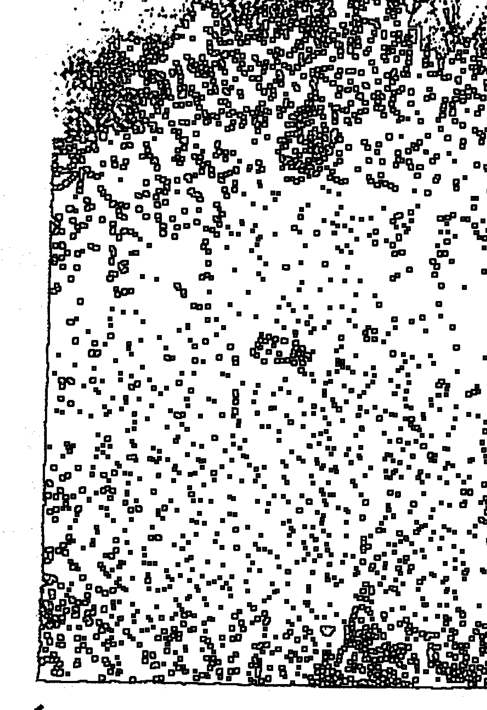

| 人物信息 | 详情 |
| :--- | :--- |
| **邓海一** | 山东薛城人，俏梅花预测体系奠基人，中国河洛易经学院易学教授，当代易学家。长期以来，注重易学实用性研究，挖掘完善了俏梅花外应预测术，俏梅花相法预测术，俏梅花风水预测术，俏梅花命理预测术及俏梅花易学养生术。著有：《俏梅花外应预测术》、《神相闪电眼》、《八字看配偶》、《六爻索隐》、《风水真经--地理梅花阵》等。 |
| **电话** | 0632-4416548, 13062060978 |

弟子：李家裕   吉林省吉林市人，61岁。铁路退休职工。84年涉入易学领域，先后研习六爻、八字、风水等，易学功底深厚，在当地易学界颇有名气。

弟子：张光辉   山东莱州人，53岁。教书出身，多才多艺，是当地有名的书法家。仙人诀的确很灵验，很多事可以张口就说，使求测者莫名其妙。今寄上所测实例，请老师点评。为表达我对恩师的感激之情，特赋诗两首。

## 感师恩

> 一
蒂结易缘作经年，急欲义理细详参。
恩师授我仙人诀，争寻俏梅登峰巅。

> 二
易苑面目似庐山，识得明师亦葱眼。
仙人妙诀真绝技，款密洞察天机现。

### 一、测行人 类

例一、2003年6月10日上午，在易友起名社与张师傅闲谈，这时来了一个张师傅的朋友，姓常，此人在火车站前设摊算卦有十几年，他拿来一个他朋友求测的卦例，他朋友有一相好，已经一年多了，最近突然不来了，也无消息，测一下此女做什么去了，能否回来，常易友断此女已另有新欢，回不来了，问张师傅这么断有没有出入。（这时进来一姓郭女士，想让张师傅测一下儿子考大学的事），张师傅说：“让李师傅给你解答吧”。我说：“你朋友的相好离过婚，她有一男孩，今年考大学，她为此事奔忙，此事一过，就会回来，大约在七月十日左右，此女身高1.60米左右（此为郭女士身高，离过婚，儿子今年考大学）”，常易友说：“你也没看卦，根据什么这么断？”张师傅说：“李师傅正跟山东一位姓邓的高人学外应预测术，他就是用这种方法”，七月十五日，常易友又来了，说：“太神了，你所测的，我问我朋友和你说的一样，前天，女友也回来了”，表示佩服，中午请我和张师傅吃饭。吉林弟子：李家裕

例二、去年冬天的一个早晨，（辰时）我坐在桌旁看书，突然见一条狗从大街上由乾位向我直奔而来，猝不及防，我被吓了一跳。不动不占，无异状不占，何时何地见何物占之。于是我心动而测：狗为戌居乾位，又从乾位来，今日当见老者来访。辰时见戌狗，辰冲动戌，辰时即见。而居本市乾位的老者又时常相聚者，只有李易友。过了一会儿，李易友如期到来，我说：我知你这时会来！他问为什么，我把事情原委向他讲了，我俩会意相视而笑。
四川省阆中市：邓发彬

例三，2004年7月19日早上十点左右，送经理去本市的公证处办事，见经理过去很久还没回来，于是就想能否试用外应断他们多久回来，当时，我车子停在公证处对面不远处的一家大酒店停车场，正巧有旁边三辆车同时起动，经过我车前开出停车场，我立断十八分钟可回来。我看了一下手机上时间，以便验证对错。结果是对了。
推断思路：三辆车同时起动开走为快速之象，车为6×3辆不就是十八分钟吗？ 浙江宁波 郑钢

例四：2003年12月26日，有一外地学友之友打来电话，话中说起一件事，他有个小学时候的女同学，因做生意被人骗光了钱，五年前借款去了新疆做地产生意，说等挣够钱还完了债再回来见他，同时要还给向他借的一万元；后来听其家人说，与她同去的一个好朋友过了两年后患癌症回来死了，但其本人至今一直没有消息。他准备过个年回家乡向其家人打听情况，顺便问其在新疆的电话号码。我听了即对他说：怕已经不在新疆了，你永远见不到这个人了。他说“她临走时说，等挣够钱回来一定会给我打电话，一直没有打，肯定还在新疆，一定能见到”。过了十天又打电话要我替他测看看，我觉得他太自信，不想为其费精神，就说：你不是会用气功感应吗？就自己感应看看嘛，你自己感应一定行的。又隔了三天，来电话说他用手掌感应，开始很久都没有感觉，等到十五分钟后才有感觉，所以还是能见面的。但我听他所说，更认为见不到了。后又在春节前一星期来电话说，因外出办事，距那同学家乡不远，就特地抽出半天时间，想到她家中问消息，很奇怪本来很熟悉她住家房屋，可是此次转了半天怎么也找不到她们家的房子，只好倒回来了。听他所述情况我即说：你不必再找了，已经不可能再见到了。可是他仍坚持说能见到。过了春节，正月十六又来电话，说找到那同学家里的电话号码，本想向她的儿子问她在新疆的电话号码，打通后是其媳妇接电话的，听其儿媳说，婆婆已于年初五早殁死在其好朋友家里（脑溢血），是两年前已从新疆回来了，因为躲债一直住在那好友家，连自己家人都不知道，直至死了，那好友才通知她家，至今连儿子都还不知道母亲已死，只有其媳妇知道此事。

断此事思路：初次听说时，直取话音新疆（谐音→“僵”）、做地产（→“在地上”。因他普通话发音不好，总是听到他说“在地上”）、去了两年后其好友患癌症回来死了（→“回来死了”）。第二次是取其说“手感”情况的开头语“很久都没有感觉”→没有。第三次直取其专程去“转了半天怎么也找不到”，更加明确不可能找到。对此事的预测，前后共延续了20多天时间，三次直取外应信息都是一致的，而我本来也没有想测它，可见“俏梅花”外应信息，是与之直接关联的事物本身在自然界的反映（自然表露），真奥妙！

> 广东 弟子 施金延

### 二、测钱财类

例一、2003年古历10月24日（甲午日）上午9点10分左右，我坐在炕上边看书边喝茶。忽然不小心弄翻茶壶，水撒于地上。炕上（快而急之象，又在眼前），我急忙扶起茶壶，壶中水已不多了。我立即想到是破财或耗财的事要发生，数额在千元左右，应期该在最近，最多不超过七天（我也是根据逢7相冲的原理）。
对此事我立即作了记录。结果10月26日就验证了。原来是我妻子的二弟开石材厂，锯片掉下来砸伤了工人的腿（严重骨折），住院急需交押金，其石材厂刚建厂不久，效益不好，负债很多，我得知消息，碍于亲情，无偿地送去一千元相助。
方法是观物取象，取象比类，比类表意。
山东莱州弟子：张光辉

例二、癸未年腊月初七日（子月，丙子日）某单位文书邀我去聊天（问儿子婚事），其办公室还有一位打工者，坐在兑位，我居卯辰位，文书在艮位。我对打工者说：“你在兄弟排行绝不是老大。”“对，是排老二。”“99年，你有是非，又不象官司那么严重。”（因他手中不时地打火吸烟，话也不少），答曰：“是跟我三弟争吵打架，为父母的事。”“你三弟属大龙的，1米73的个头，长发，“对，对，对”（以我为应）“你在兄妹中话最多，你家东北方有水沟，且98年运气较好，对吧？”“是这样的，先生神算。”此时，文书从写字台下拿出不满的一瓶酒送给他，因打工者说年底急于回家，讨要工钱，文书说明天（初八日）再来吧，经理今日开会去了。我插言：“后天初九准拿到钱。”（酒为九音，文书送到眼前的艮方。断98有水沟之应，初八日，被月令子所绊合不得之故。）过了几天，文书来电话约给其他人测事，便提起了以上之事，他说打工者的工钱我给他送去了。我说：“对呀，那酒就是你送到人家跟前的，是初九吧？”“是呀”“是四千多元吧？（丙子日，丙为3，子为1）且你没给齐钱。”“对，你怎么知道？”“哈哈都在你的那瓶酒上啊。”对方惊喜大笑。山东莱州 潘忠杰

例三、2003年10月25日（乙未日）今天上午10点多钟一女士来我家购买结婚对联，付了她一半多一点货后，## 俏梅花外应预测术讲义

其它几样我怎么也找不到了。急得我团团转，始终没找到，最后我说你先把这些拿着走吧，以后我找到叫人送去。

在我没找到东西时，忽然平度一个朋友来电话，说他在外面有4-5千元款没收上来，对方有些不讲理，看看是否还好要？我一时没找出外应，便打电话问邓老师，是否还能给，老师说能给，给一半。（注：4-5千元款，却没有打欠条）。

放下电话我心想邓老师真神了，这样的问题，张口就说。我却不知道邓老师是用什么外应断出的。这时猛然省悟了，刚才付结婚对联的情景不就是外应吗？她来拿对联，我没找齐货，还欠她一小部分，她拿着一半多一点的货就走了，也可引申为追款之象嘛。于是我拿起电话对我朋友说了。我说不要口松，他最少付一半给你，可能一半还要多一点。（注：我测的也不一定对，即便对了，因我是第一外应现场，邓老师是第二外应现场，邓老师张口就回答，实在不简单。）

山东弟子：张光辉

## 例四：04年4月21日晚妻下班回到家，见餐桌上有菜，说道我饿了，然后端起咸肉冬瓜汤就喝，边喝边问我：

能否测出我们今天做了多少营业额？我说：你们今天做了六千二百元左右。妻说：正确，刚好六千二百元，本事长了啊。断此数所取外应是妻喝汤，汤为水为坎故为六，嘴动象明显，嘴为兑为二，不正是六千二百元吗？

浙江宁波　郑钢

## 例五、癸未年腊月12日，我女儿说要寄部分款给我，过年好用。挂上电话，对象问我能寄多少钱？我一看时间已过中午12点，我立即说是一千元。实际寄来1200元。但是其中有200元，是寄给她姥姥的，故也算准确。

山东莱州弟子：张光辉

## 例六、癸未年5月，我到一朋友开的服装店去玩。进门正赶上一相师给女服务员看手相，只听女服务员说道：“你说我前几年破财，你看是哪年，什么时候？”相师面露难色，半晌不敢轻下断语。我说：“去年八月，阴历”，一语中的。

取用外应：女服务员当时站在南方，问话时，边说边走，引起我的注意，一直看她绕到了正西方才停下，所以断是壬午年酉月。

河北任丘市 丁聪

## 例七、2004年1月15日(癸未年腊月24日)癸巳日早上辰时，

一女工给我送来厂房钥匙，我和妻子都在西厢房厨房里，女工说今天要去平度某个单位送礼追款，你看能否要到款？我说能，数额是两个数，两千或两万元，她问何以见得？我说你手拿钥匙，来到西方，西为金，你会打开金库之门的。西为兑，为二，故取本宫之数定量。

过午，我又见到她，她面带笑容，我开口就问，是否要到两万元？她说正对。

山东莱州弟子：张光辉

## 例八: 04年4月18日下午,

公司有块很大的玻璃要处理掉,因此找来收旧货的人问他是否要买, 收货的人说他的朋友要,询问卖多少钱? 单位同事王某说这么大的玻璃最起码能卖四五十元钱。他刚说完,我接上说到最多只能卖20元。之后我出车去接晚班经理来上班,几分钟后回公司刚走到门卫处,看见那个收旧货的人和其他二人一起,把一块一角有缺损的大玻璃抬出来。我问收旧货的人, 是不是二十元钱买的？他说对，正好二十元。断此价格所取的外应，其一是王某说能卖四五十元时，旁边的另一位同志沉某，刚好拿出一把钥匙来玩，钥匙外应明显，钥匙为兑为二；其二，回来时看到玻璃一角缺损，缺也为兑为二，故断为二十元。

浙江宁波 郑钢

## 例九、癸未年腊月26日，过午，还是上一女工，问腊月28日还要去要钱，能否要到。我说这次就不易要到了，结果确实没要到。

思路：我正走到半坡崖，他夫妻俩骑着摩托车从后面追上来，停下车问事。坡为艮象，阻隔难成之象，上坡，本来就需要油门才能上去，停下车来再发动，就更费力啦，故如此断。

山东莱州 张光辉

## 例十、癸未年腊月29日上午8点，一朋友打电话说他今年干活的钱非常难收，有一个欠款者开始说给，现在到了腊月29了，又来电说不想给了，原因是他也没收上钱来。该朋友很着急，因为一旦他不给钱，不但明年经营困难，过春节也很困难，让我看一下能不能给。

我说能给，数额是五个数。明天8点钟，你赶紧吃饭，9点钟前赶到他家要钱。后来他告诉我，对方果然付了五千元给他。

推断思路：该日是戊戌日，他辰时问财事，辰为巽木，木克土为有财，欠款者住在我朋友的辰位，戌日冲辰，双方都呈动态。巽宫和辰位都为五，故断能付五千元。说9点前赶到他家，也是取辰时这个有利的时辰。

山东莱州弟子：张光辉

## 例十一、2003年七月份，一天，星期六晚上九时多，我关灯准备睡觉，电话铃响了，是山东青州一位易友打来的电话，询问邓海一老师的住址及电话号码，又问了一些关于外应预测方面的事，随后很客气地说：不用别的方法，只用外应预测一下他今年和明年的财运，我说：你今年财运不如往年，财运下降，销路不畅，找买主困难，明年财运好，有待于验证。他说：你说得很对，今年财运确实不如往年，我用六爻算了一下，明年财运和你断的一样，并说找邓老师学习外应预测术。

推断思路：接电话时未开灯，室内黑暗，以此为外应，答疑中曾有，黑暗代表下降等路，故断今年财运不好，他买的是盗版书，不知道邓老师的地址及电话，以此为外应断他找买主困难，断他明年财运好，晚上过去，明天必然光明，光明代表上升，故断他明年财运好（此有待验正）

吉林弟子：李家裕

## 例十二、2004年2月20日，易友唐明君到我家来，他在工作中出点小毛病，怕罚款，自己摇了一卦，卦中兄弟爻动，他认为要破财，找我问此事，并拿出卦让我看，我说不破财，而且还要增加收入，在百元左右，他不相信，3月份打电话来说，果然没罚款，确实增加收入八十多元。

推断思路：我二人看卦时，我爱人端了一杯茶水放在唐的面前，水为财，故断他不破财，还要增加收入在百元左右。

吉林弟子：李家裕

## 例十三、这个例子虽然是照搬邓老师《固定外应详解之一》中的例2，却准的让人惊奇。

9月27日（戊辰日）早饭后，一朋友来我家闲坐，我对象泡茶招待。当我对象给我添水时，水没有先添到茶杯里，而是添在茶杯外的乾位，我一看，她在巽宫，我在乾宫，洒在杯外的水不多，今天又是辰日，在巽宫。她给我倒水先洒于杯外，后添入杯内，是快的类象，水为财，洒出的少，花钱不多之象。我何不按邓老师的思路断一下，看是否验证？

“你可能要去东南方一趟，要花一点钱，不过花不多，并且今天上午就能验证。”

“你这么说了我偏不去，试试灵不灵？”

可是不到一个小时，我对象笑着对我说：

“还是让你测对了，刚才来了个卖豆腐的，我去买了两元钱的豆腐，正是在东南方向，买来家我才反省过来，想使犟劲也不成！”

山东莱州弟子：张光辉

## 例十四、2003年5月31日，我到易学起名社去，李兴桥和我半开玩笑地说：

“我明早去龙潭山，你看能有什么事？”我本不想回答，这时停在门口的两辆自行车在无风的情况下，突然倒了，压在一起。我想，这不就是外应吗？就说：“你明早是骑自行车去，要和别人相撞，破财二十元。”李兴桥不信，说：“是骑自行车去，为什么是我与别人相撞，而不是你？”我说：”这也很简单，因为是你问我，再说，明早我也不去龙潭山。”李兴桥不服：“明早你也去，看看应在谁身上，事情发生在几点？”因自行车放在辰和巳的地点，又说明早去，故不会辰时，辰为5，我说：“时间在明早5-6点”李兴桥说：“那好，明早五点整，我到你家找你”，6月1日早不到5点，我就到楼下等李兴桥，等到5点15分，李兴桥才来，见了我说：“让你说着了，刚才我和一妇女骑车相撞，说来奇怪，大马路上没车没人，人家停在那儿，我就把人撞了，花了10元钱，买了瓶药给人家。”从龙潭山回来，我请他吃早点，他仍然有点不服，说：“你只对了百分之七十，你说破财20元，实际我破财10元”，我说：“这只是试验，不足为凭”。6月2日，他碰到我，说：“这回真服了，我昨天回去，腿有点肿，花10元钱买了一瓶药，正好和你预测的一样，骑车相撞，破财20元。时间也对，邓老师的外应预测术真是叫人叹服。”

使用方法：两车倒在一起，即有相撞之意，车有坎象，水位1，故破财20元。

吉林弟子：李家裕

## 例十五

去年腊月八日（丁丑日），两位临村妇女来算命，进门坐在丁位，刚一坐下，我说你今日去南边，花了60多元钱。“七、八十块”她抢着答。“不对，你好好算算，应该60多一点”。她又仔细一算，是不足七十元。外应是，丁丑日，丁为4丑为2，且她坐丁位，因日干生坐下丑土未动，断花钱而非进财，丁4，丑2，并切不可能是6元，日常中花60元即不少。

山东莱州 潘忠杰

## 例十六

二月初，在某商店一女职员问其婚，我说：“先说说你商店的情况吧，去年收入不太好，至少不如前年。”未位虽有饮水机但空而无水。午位有两只暖瓶且有水。此时老板（女）进来，我说：“02年你有口舌或官司”，火炉在离方。答对。“98年收入最好。”寅位有水盆……

山东莱州 潘忠杰

## 三、测工作类

例一、2003年古历10月24日，甲午日，戌时，一对夫妻来到我家，女方说：“我对象两年前就应该退休了，可是到现在也没退下来，你看看应该怎么办？”正说话间，她男人离座去小便去了，回来落座后我去拿烟给他，不小心将烟盒掉在地上。于是我说此事阻力出在保险公司，保险公司不同意，应该托人办一下，直接找说了算的人。我又说此事阻力很大，不能过急，应顺其自然。（此人有公伤，故牵扯到保险公司）

思路：
- 刚进行预测，其男人去小便，急象，困象。我对其不满（不礼貌），可断上层单位不同意（找我预测，我代表上层单位）。
- 说问题出在保险公司，理由是上一次谈此事的时候，其妻子曾谈过。并且那天和她一同来的又正是一个干保险工作的业务员（也是来测事的）。
- 说此事阻力很大，是因为其男人的左右手指都用胶布缠着（因开口子），手指又曲屈不直，是困住之象。另一困象是此男子在门口坐着凳子，是门中（口）有“人”，有“木”为“困”字象。还有他坐于艮宫，为山，阻隔难成之象。
- 说应找人帮办的外应是当时电视屏幕上出现一个人开弓射箭的镜头，是须得人之力才能成功的类象。
- 另有一个外应，就是在我去拿烟给他的时候，不小心将烟盒掉在地上，烟盒可引申为礼盒、礼包，也是需托人送礼类象。盒中不足二十支烟，礼不必超过两千元之象。
- 小便，是不顺，受困，又不得不为之之象，也是破财之象，此财又非破不行。（小便为食伤，为排泄物）。
请邓老师指点，思路是否正确。

山东莱州弟子：张光辉

## 例二、2004年1月3日腊月12日（辛巳日）有人打电话问其女儿能否考上研究生，我回答能考上，但需破费一些钱财，数额三千元或三万元。

思路：她问我话时，电视正演到宋江求招安的镜头，在高俅面前，宋江颇有乞求之姿态，招安为了求官，考研究生也为了晋级，有相通之处。另一个外应是正逢有人送礼品给我。说数额三千元，是因为当时室内共三个人。（电问邓老师，和我测的相同）

山东莱州弟子：张光辉

## 例三

今年2月初，应农机站长邀去闲聊，见办公室的西墙南边挂着一块画匾，画面是“大海行船，一帆风顺”红日彩霞加时钟我说：“你今年权位难保啊”他问为什么？我答：“你看那块匾即知，人家本来日出东方，你确日落西山，今逢猴年，匾在猴位，且时针已停止不动了。”“唉，今年正月初八，镇上通知我去开会，说叫我退休了。”我言此乃天意。又根据室内外布局我断言，你在97、98年发大财（水缸、水器在丑寅位）2001年也不错（饮水机在巽位）2002年开发新项目（午位马年、有门）但挣的钱拿不回来，（南院有自来水）在午位，别人正在使用之帮，“可不是，钱是挣了，至今也未给咱，他货没销出去（与韩国联营），真晦气。你看看今年怎么样？”“今年你在东北方位仍有财可发，可能是水产、水利方面。其他不理想”。“我在东北方有两个养鱼池，上百亩，还有连生树林”。

山东莱州 潘忠杰

## 例四

上个月，某学校长来预测，他问要把办公室改为二层楼是否可以，并邀我去了学校，一看才知他已拆了上盖，我心中一愣，有不祥之感，看了学校环境我说：“此园吉凶参半，我还以为你只打算改建，你却已经拆了。”

带我去了临时办公室在丙位，落坐后观其布局，我说：“你在94年有好事，工资长幅很大。”“是啊，94年我结婚，那年工薪确实长的最大。”“02年你动了单位”。（子位门半开，对应午年）“对，正是02年调到本校”。看其未位放一高型座钟，摆动很慢。我说“你去年想动，但未动成。”“那今年能动否？”“今年不可动，动则有不好的事。”原因申位空无吉物，坐空无人，不吉之兆。过不久听说他已被拘留，因卖学校地产之故，我悔自己学得不深，没能在深入断出事来。

山东莱州　潘忠杰

## 例五、我有一个姓任的同事，因电信局要在03年庚申月戊日以业务技能考核为依据，淘汰后几名人员作为下岗对象，为此，他庚申月庚申日酉时到我家求测考试能否过关一事，其四柱是：乾：乙卯　戊寅　庚子　丙戌卯流月庚申，流日庚申，测时酉时，是庚坐比为忌最旺之时，比劫为竞争场所，意味竞争有失败的征兆，在求测中，求测人又不断变化座位，先从和本人并坐的沙发东移到西方座位，更印证了本人思路的正确，所以我直断，落选下岗，其人的确在本月底卷铺盖回家。

河南林州市合涧　钟兴昌

## 例六、2005年2月17日，市某领导请我为其家勘察风水，见面后看我年轻显得不太热情。我即外应面授技法，单刀直入断其31岁开始走官运，2001年仕途受阻，总体官运比较平稳，今后上升空间不大。有才华但傲气，不会来事，不擅交际，不爱求人办事。31岁前从事财务工作，96年财运最好，02年财运不佳，妻子下岗，05年单位有提职机会但无人推荐他。句句说到实处，他坐不住了马上给我递烟、倒茶水，热情起来，并说能否再去单位看看办公室风水。我说现在即可给你看。话一出口，大脑一片空灵，继而出现图象。我断其办公室西南角有个金属大衣架。听此言，他惊讶得从沙发上弹起来，连说我有特异功能。我告诉他是用俏梅花外应技法断的。（缘起面授时，第一天讲课前老师谈了个例子，老师讲话时，我高度集中，直觉胸中有个圆球裂开，分成五瓣并旋转着。老师例子还没讲完，我已知道例子中的人死了。从此，我既有了点特异功能，是老师的能量激发出了我的潜能，写至此我已是满眼感激的泪水，谢谢您邓海一老师！）由于他的打扰，我大脑中图象消退了，我只好凭记忆画出他办公室状况，我说他坐东向西办公，时常头昏，门开西北，东为沙发，北为书橱。他见此图甚感惊奇，完全正确。晚上请我吃饭时，又故意问我酒名，我大脑再次出现图象，显示‘西凤’字样，直说是西凤酒，他在佩服声里把西凤酒打开。以上所写句句是实，如你边有特异功能者请他考察，你也可以预测一下，我在写缘起时，眼中满是感激邓海一老师的泪水！

内蒙古　　宋振龙

## 四、测疾病类

例一、5月1日，我到易学起名社去，正赶上张师付和一梅河口来吉林的易友谈话，张师傅介绍说：“李师傅现在正跟山东一位姓邓的师傅学易卜仙人诀。据说不用起卦即能预测，并且出奇的准。”梅河口来的郭师傅不信，说：“我虽然不是易学高手，但我也见识不少，此种方法还头一次听说过。我试一下可以吗？”我说：“可以，不过我才学习一个月，未必能测准。”郭师傅说：“不用客气，你看我小孩身体如何？”此时天热，门正开着，我正寻找外应，这时正好有两个小姑娘在玩（10岁左右），一个小姑娘说：

“你气得我肝疼”。我马上说：“郭师傅你的小孩为女孩，在上小学，她肝有病”。郭师傅不信，说：“我来时好好的，不可能有病”，并和解的说：“测不准没关系，我学此道七八年了，有时也不准，你才一个月，你再努力学习吧”。当时无法验证，也就不了了之，三天后，郭师傅从梅河口来，打电话约我到起名社，对我说：“你测准了，我回梅河口后，妻子对我说‘学校检查身体，发现姑娘有肝炎’，现在正打针，今天特意从梅河口赶来，想让你给我介绍一下你用的什么方法，这方法既快又准，太神奇了。”

思路：郭师傅问小孩，门外有小孩在玩，小孩说：“你气得我肝疼”。

吉林弟子：李家裕

## 例二、2003年12月15日壬戌日酉时，浙江昆山一韩姓易友打电话询问邓老师电话号码，随后让我用外应为他预测一下近况，我说：你近来身体不好，有病，已见好，心情不好，烦闷，工作上不顺，受到上级批评，他说确实如此，身体有病见好，受到上级批评，心情特别不好，想出家。我劝了他一阵，他很高兴，并请我到他那里作客。

推断思路：当时我孙子正有病，刚好，故断他有病见好，打电话时，我爱人让小孙子练习写字，他发烦不愿意写，我爱人说了他几句，他哭了，故断受到上级批评，心情不好。

吉林弟子：李家裕

## 例三、2004年古历12月12日（辛巳日）我今天从早上开始就肚子疼，一直疼到吃晚饭，还是不住地疼，其间虽然吃了些消炎止痛药，也无济于事，疼得连腰也直不起来。晚饭后，我妻子对我说这说那，我也无心听，说：“肚子疼得我心里很烦，我什么也不想听。”这时电视上打出推广心酒的广告，我灵机一闪：我刚说疼得心烦，就出现售心酒的广告，何不喝点酒试一下？于是我喝了两口白酒。（我不善饮酒）仅几分钟后，奇迹出现了，肚子疼很快消失了（心病需心药治）。

山东莱州弟子：张光辉

## 例四、2005年10月29日，电话求测。我说其面向东，面向东北，她说都不对。我据此断她有轻微肝病，胆病严重，有结石。我边脱衣服边喝水，接着断她求测之事是单位上与资金帐目有关，找麻烦的是个女性，小巧玲珑，这次主要责任人是个男的，中等身材，方形脸，爱吃肉，有资金和色情上的事。这次事件对她本人并无大影响。她胆部确实有严重的病，急切地求问化解之法。我依上述断测，寻去其原位之吊角位破解。第二天中午来电话感谢，化解当晚即见奇效。

## 五、测婚姻类

例一、6月2日中午，我正在看电视，电视中夫妇吵架，这时，易友杨景林打来电话，我问杨景林是否和爱人吵架了，杨问我听谁说的，我说是测出来的，杨说确实和爱人吵架了，已经十多天未回家了。来电话问我能否离婚，此时电视画面正演到夫妻和好，我告诉杨离不了，杨不太相信，几天后，杨爱人打电话说，她请有名的卦师预测婚姻，说必离无异。我说：“你们肯定离不了”。七月二十四日，杨景林打电话说，夫妻已和好，果如所测。

李家裕

## 例二、5月20日，在起名社碰到了教武术的杨教练，他常到起名社与张师傅闲聊，这回和他大师兄刘某一起来，据说刘某在营城一带算卦批八字较有名气，这次到吉林看望杨教练，顺便会会同行，张师傅说：“我的强项是地理风水，预测一类，你和李师傅谈”。我和他们讲我正在学习易卜仙人诀，他们很感兴趣，要求试一试，刘某说：“你看我几时结的婚？”说着站起来，从丑位起到辰位又移动到卯位，我说：“你二十四岁结婚，两个孩子，一男一女”，刘某说：“对，他们差两岁”，我又说：“你爱人属鸡，个子不高，体形稍胖，剪短发。你儿子属狗，34岁，女儿属猴，36岁，不知对不对？”刘某大惊，说：“太对了，我也久走江湖，预测如此神速还是头一次。以前看大仙预测，但那是装神弄鬼，但也没你快。这次吉林没白来。以后有时间我也跟邓老师学习学习，这个技术太神了。”

使用方法：他先坐在丑位为2，后又移到卯位、震宫均为4，故断24岁结婚，‘宫看本宫与对宫’，正说话时，有一妇女领一男一女两小孩从窗前经过，故断子女为一男一女，‘即收即放莫迟延’，说刘某爱人属鸡，乃是看对宫，爱人体形高矮与发形，是经过窗前妇女之形象，‘先入为主须直取’，刘某先到辰位后到卯位，也说明小孩为一男一女，巽为女，震为男，最后站到震位，应是女孩大，男孩小，辰对宫为戌，故断他儿子属狗，断这个时心里并无十分把握，只是试一下，口诀如此用能否行通，至于女儿属猴，## 俏梅花外应预测术讲义

之梦

是刘某说差2岁，儿子测对了，女儿的属相往回数2位即是申，故为猴，36岁。吉林弟子：李家裕

例三、癸未年深秋的一天，一女子打电话问我，她的丈夫是否有外遇。就在这时，挂在东南方向的鸟笼里的鹦鹉忽然欢快地鸣叫起来。心想常把夫妻、情侣比作鸟儿，这不是外应吗？这时我想告诉她有，又怕产生不良后果；便对她策略地作了回答。

可是如果当时鸟不叫，只看到形（鸟），是不是不能断有外遇呢？

鸟笼在东南，是否还可断该男子的情人居住的地方在东南方向呢？（此女人说其丈夫的情人在青岛，正是东南方向，但我心里没准，不敢说。）山东莱州弟子：张光辉

例四、2003年古历9月初7日（戊申日）我到一位友人家聊天，谈话谈到刘××的婚姻问题。朋友的对象忽然问我说：“小刘和她对象的关系会发展到什么情况？”我说：“她们的关系不行了，不久要离婚了。”

思路：刚谈到婚姻情况，电视屏幕上出现男女挥手告别的镜头：“摇头摆手事不成”是分手的类象。张光辉

例五：今年（2004年）2月12日，受香港亲戚之托带了一些物品，要送到其胞妹家，这天晚上十点，过关后刚踏入深圳火车站口的阶梯，人群安静地急忙赶路，突然在我的右边一声巨响，我即朝右边一看，原来是与我并排走着的一位约三十多岁的女子，其右手提的旅行箱把柄断了，手中只抓住了一个把，与箱子完全分离，我便说了“喔，断掉了”，随即又想这突然现象一定是某事情之“外应”，似乎象征不好的事情，会是什么事？便想：此女走在我身旁，此事会否与我有直接关联？忽然明白，我肩上背着亲戚胞妹家的东西，应该是她们家的事，那么，是这一家人要分家了！应是这一家的大儿媳妇闹分家的。果然，三天后从电话里得知，是正准备分家，是这一家的大媳妇（30岁）竭力要分家的。

判断思路：此女子手提的旅行箱把子断掉了，按常理也可以断其“离婚”，但我即时第一感觉是“分家”，因女子手中只抓住一个把，“把”是她的丈夫（杖），箱子就是“大家庭”，她手中抓住的把子与箱子断开，表明她和丈夫一起与“大家”分开（分家）。我们向北走，该女子在我右边，是东面，属震宫，震为长男，但是个女的，应是长男的老婆即大儿媳，在安静场合，唯她那里发出巨响，箱把子断了所以是她闹分家的。果真是，后听其家人说，因大儿媳不想多做事，闹着要分家很久了，后来，家中长辈及邻里认为分家也好，因大儿媳爱赌，常向家里要钱，分家后她赌输就不致连累家中微薄的财产。终于在3月5日正式分家了。[注：3月5日是出现外应信息后第22天，正应“外应”凸显时间是在22时（晚上十点钟。定量“在时上寻”），但我当时只想着会出现什么事，而没想应期问题。]

广东弟子 施金延

例六、2003年10月初3日晚上9点多钟，我招待客人吃完饭后，一位二十四岁的小伙子忽然问我，他今年能否找上对象来。

我一看，他坐于震宫，面向兑宫，而兑宫为西，为少女，西间房门又开着，墙上贴着双“喜”字（我女儿9月初6日结婚回门贴的），他又在吸着八喜香烟，香烟盒开着在眼前，于是大胆地说：“年前对象就找成了。”

思路：

取双喜字和八喜香烟为外应。双喜是两个人的喜，八喜是很把握的喜。西为兑，为少女，门开着，少女很喜欢他，香烟盒已打开，水杯又在眼前，是百（杯）年合（盒）好的意思。另外，问我话时面带笑容，听我分析完后他拍手大笑，都是喜事能成的类象。

他问几月份能成，我一看钟9点多了，可以断10月份能成，还可以断属鸡的（看对宫）方向非东即西。十月份果然应上亲事来了。

山东莱州弟子：张光辉

例七、2003年古历10月17日（丁亥日）过午，我与人谈论预测的事，当谈到仙人诀讲义中邓老师测外遇，连杨姓都测出来了的时候，他不信，说：“你别吹，你测我有没有外遇？”

我说：“有，最少是两个，可能是去年春或今年春天开始的。”他又问：“叫什么名字？”，我说：“这个很难说，不过我可以测一下，一个叫‘河’一个叫‘xx福’，如果不对，可能也与这些字有关联。不过，你们的关系可能已经中断了。因为现在感情不太好了。”

此人听后，眼神脸色都变了。缓过神来后，连声说：“神奇！神奇！”后来，他承认我的预测完全正确。我也更叹服邓老师的仙人诀，学好了真能洞察秋毫，尽泄天机！

思路：他问我话时，正在割两副春联，春联音同春恋，故断春天开始的。说最少两个，因为是两张（两副）春联，说有，是因为上下联印在一张纸上，需折叠合起来割，又是亲热、接吻、交媾之象。说关系已中断，是因为他正用刀割开。说感情不太好了，是因为割时反面朝上，白色在外面红色在里面，是反脸之象。另，春联的词句是：满庭吉祥春，合家欢乐年，也与他所问之事似有通意。至于断他恋人的姓名，心里也不是很有把握，但全断对了能说只是巧合吗？“河”是“合家”二字断出来的（是其一恋人的乳名）。另一恋人的字名是联想出来的：纸以x为单位，春联分上下联，所以取x字，春联又叫对字，论副，所以三个字是：xx福，是另一恋人之名。

也许是巧合，也许是一种理性，不管怎么说，此例让我感到惊讶。正象邓老师说的：“有些预测的效果，让你自己也会吃惊”。
山东莱州弟子：张光辉

（因为是真名实姓，在编审时很费脑筋，既要反映出预测实际，又要保护当事人，只能这样了，大家可以自己去推敲。）

例八、曾有一外地学友游广州时，因受人之托要买木制头梳，请我帮助寻找，买到了许多大小不一、形状各异的木梳子，回去分给亲朋们享用；那其中之一人，于2003年11月26日直接打电话找我，要求再帮买一种“鱼”形的梳子，我为其先后费了很多时间，都找不到那种“鱼形”的梳子了，只好买些其它形状的梳子寄去，她收到后来电说，是因为那种“鱼形”的梳子最好用，梳头时感觉特别舒适，但都被其丈夫拿去讨好他的情人了，所以想再托我专买那种“鱼形”的，买不到了，她及其夫都很失望，并说出的她的丈夫情人多，“少也有七个八个”，说“他是想要鱼和熊掌兼得”（其实是贪财好色）。我听了即对她说：你的丈夫将是什么都得不到了。她表示怀疑，认为她的丈夫坏习性无可救药。我则说：不是你的丈夫能改邪归正，而是他的情人们都会一个个离开他，他以后连一个也缠不上了。她说怎么可能，我说：这是明摆着的，因为他本来是想要“鱼和熊掌兼得”，但却把你家原有的“鱼”都送走了，又想要买新的，可是再也买不到了，这不就是说明旧的离开了，想再追新的也都没人理他了，不是吗？她听着笑了，以为我是说笑话安慰她。其实，这是应用老师的“俏梅花”预测技术，直取凸显的外应信息——“鱼”为断事依据。而天地间的事也竟那么巧合，果于今年2月初反馈，证实了我的“玩笑话”正与其结果完全相符。

广东弟子 施金延

例九、今天是2003年古历10月23日（癸巳）过午，一位姓陈的朋友来我家，说他想去深圳，看看行不行。边说边用手拿着一张“喜”字看，我立即说：“可以去，有意想不到的喜事”。

思路：我正找外应，他应拿起“喜”字来看玩，欣赏。是喜在眼前之象，故说可以去。口诀：“动观其变。”“形若有情以形辨”。我又说：“你干的事可能须多宣传，演讲。”反馈：对。思路：“喜”头有“士”（男士），下有“口”，且有二十张口。士连着口字为“吉”字，是吉事。

山东莱州弟子：张光辉

例十、2004年（腊月13日，壬午日）1月4日。一位55岁姓梁的朋友来测婚姻情况。原来他原配夫人今年正月去世了，后来又找了一个，一起居住了一段时间，心里越来越觉不及以前好，想弃而再找，但拿不定主意。又说最近他又物色了一个，长相和条件都好于前者，并说女方也有意思。让我看看是否能行。我说这两位都不能给你带来欢乐和幸福，第三个才行。

推断思路：落座后，我泡茶招待他，他面前放着两杯凉茶，是昨天别人留下的（代表两位别人的遗孀），还没倒掉，他顺手拿起一杯来喝了一口（他误认为是热茶），哼了一声，吐出门外。坐下后他以为另一杯是热茶，端起来又喝了一口，哼了一声又吐出门外。我大笑说：“你急什么？茶还没泡好呢。”两杯凉茶代表两个女人，昨天留下的，代表二婚（半花）女人，凉水，说明不能给他带来幸福和欢乐，吐出门外，意为最后的结果都是拒之门外，不欢而散，兼损财之象。山东莱州弟子：张光辉

### 六、测寻物类

例一、5月9日，桦皮厂的李长海请我到他家去做客，吃饭时，有一李长海朋友作陪，此人是当地有名的地理大师，叫韩君，第二天请我到他家吃午饭，九时多，我三人上街，正赶上桦皮厂集市，韩师傅说：“我给你买活鲶鱼，不知能否买到，李师傅可否测一下”。当时快到十字路口，电线杆上挂一牌子，牌上写“养鱼池”，上面画三条鲤鱼，鲶鱼在下面。这时李长海说：“这个集市七、八回也没有鲶鱼”，并示意我不要预测，免得不准，我说：“能买到，鲶放在鲤鱼下面”。到鱼市去了一圈也没有看到有鲶鱼，这时韩君说：“李师傅没这个福，咱们买鲤鱼吃吧”。买鲤鱼后，韩君与卖鱼的说：“怎么没看到有鲶鱼呢？”卖鱼的说：“有哇，在鲤鱼的下面放着”，说着从放鲤鱼的容器下面拿出两条鲶鱼，韩君看了看我说：“真神了。今天算是开了眼了，令人佩服”。这时李长海说：“人家受过名人指点，得到了真传”。此用‘形若有情以形辨’，‘先入为主须直断’。
吉林弟子：李家裕

例二、癸未年九月初六日大清早，一女士匆匆忙忙来到我家说她的保险单不见了，到处找也找不到，测一下是否真的丢失了，能否找到。

她一开始坐在北方，后是戌位，我在辰位，一会她站起来走到我的写字台前，用双手按着桌子，看我写什么。而我在找本子时又在东南方的窗台上的一个木盒内找到。于是我说你的保险单并没丢失，是在东南方向一个木制小盒内放着，找到后给我打电话。该人回家后果然找到了保险单，原来放在东南方壁子的阁棚上一个木盒中，时间久了，记不起来了。

思路：我知道该人五行土多，老鼠见了她都跑不动。该日是丁未日，火生土，土更旺，她坐于北，为水、为财，说明财没丢（强土克水）。我在东南方木盒中找到本子，而她又双手按着桌子看我写东西，故断在东南木盒中。

山东莱州弟子：张光辉

例三、甲申年2月初6日酉时，接电话问钥匙丢在哪里？我答：“丢不了，在腰里”。可事情并非这么简单。当时电视剧中一大学生出走，家人找得正急，我认为大学生

### 外应预测术讲义

是童，丢不了。并下意识，用手摸摸腰中的钥匙，即回他。当时反馈说没有。7点过后又来电说找到了，在，被兜布窝在里面了，坐下吃饭时，感到腰中有硬物，钥匙在腰带的里面，特告知，一来道歉二来验证。

山东莱州 潘忠杰

例四、一个仲秋的下午，一中年女子来我家求测，说一张欠条是千元左右的欠款条不见了，想去追款，怎么不到，测一下究竟丢失没有，能否找到。

当时她在西间炕的艮位，我坐在震位。天气有些冷，能感到有些凉意，便双手交叉，两手在两肋部上下拉动，朝下。顺指尖所指看去，就是炕上的地板革，黄中带黑。根据一物一太极的原理，我大胆地说：“条子没丢，在东方向一个黄色东西里夹着。”此人回家后，果然在东向找到了欠条，是在牛皮纸信封里装着。是在四间屋北角（大太极）找到的。

推断思路：她来时面带笑容，无忧之象，又运用“行情以形辨”和“动观其变……”“宫看本宫”的口诀。

另外，我把炕看成了一个太极，她坐东北艮位，我就断东北方向，但我却不敢断在西间东北方，觉得那样断太具体，出错的可能性大。结果幸亏没那样断。
张光辉

例五、邻居问我：“我织毛衣的钩针找不到了，家中各处都翻遍了，也找不到，你给我测一下在什么地方？”

就在这时，一位四十岁左右的妇女坐在了她的左侧，正在屋门口里面。见此我就说：“你的钩针被人借去了，这人和你岁数差不很多。”她说：“的确是有人借过，但记不清还了没有。”

思路：她在向我问钩针的事，恰巧这时进来一个年纪相仿的女人，又在正屋门里坐下，说明到她家里借的。兑为口，借东西要说话。可惜的是当时我没有按照“以形辨”的口诀描述一下借针人的相貌特征（实际基本一样，连当时穿的衣服颜色，高矮年龄，走路和说话的动态都有9成以上的相同点）。这是我实战经验不足或反映不敏锐的表现。
山东莱州弟子：张光辉

例六、癸未年腊月的一天，一女士的电视保修卡找到了，问我是否丢了？我说没丢，是在东间炕下面，被东西夹着。该人回家果然在东间炕下找到了。张光辉

### 七、测属相类

例一、昨天是2003年古历十月16日（丙戌日），一女士来测事。落坐后我见她坐于戌位，我在辰位。我想说：“你是属狗的吧？”但怕错，没敢说，后来问她，果真是属狗的。我不由感到非常惊讶，邓老师的外应断事法真神奇。

此例我是根据邓老师进阶篇的例子：邓老师站在戌位，又是戌日，所以赵忠祥说打电话者是属狗的。此例是戌日，她又坐于戌位，有统一性，共同点，故认为是属狗的。只可惜的是没敢明断，但启发却很大。莱州弟子：张光辉

例二、今天（2003年庚寅日），有人问我：“一个男子是属猪的，你说他的对象是属什么的？”我一看另一个女子在一旁聆听，而我又知其属鼠，便说“是属鼠的”。该人回答“对”。但仍不甘心，又问：“那么一个男士属马，她对象是属什么的？”我想再说属鼠绝对不对（马与鼠犯冲）。又想到她的属相是猴，就说“是属猴的吧？”结果不对，

我忽然想到未与申同属坤宫，午（马）与未（羊）合，故说那一定是属羊的。结果正对。山东莱州弟子：张光辉

例三、一天夜晚，我和李易友谈到有关“奇门”的话题，想请教擅长“奇门”、“六壬”预测的张师傅，于是电话相约而至，同来的还有另外一位老风水师。大家相让而坐，我坐桌子东方和张师傅对坐，李易友坐北和风水师对坐。话题谈到了俏梅花外应预测上。因为我和李易友刚接触此术不久，心中无底，于是李易友试探性地问对坐风水师属相，答曰“属牛”。李易友直指坐我对面的张师傅说“属蛇”。众问其故，李易友解释说：我属牛，坐我对面也属牛，发彬（指我）属蛇，所以，坐在他对面的张师傅也一定属蛇了。张师傅听了半晌无语，似乎心有不甘，就将手中的茶杯往桌上一顿，说：那你根据我这个杯子能看出我今天有什么事吗？李易友说：你今天进了财，三数或六数。张师傅回答：我今天给人算命挣了三十元。说完了请教预测依据。李易友解答：你说话时，刚好服务员给你斟水，得水得财。你茶杯外有一朵红花图案，为离为坎，坎六离三，故断得财三数或六数。众人听了皆叹俏梅花外应预测真是出神入化。四川阆中市：邓发彬

例四、癸未年腊月初5日，一位姓翟的朋友，一进门，当着许多人的面说：“张大哥，外面的人把你说的神乎其神，说一进门就知道是来干什么的。你说我是来干什么的吧？说对了输200元钱给你。”

我一看，他站在屋中央问我话，中央为土，今日是甲戌日，也为土，甲木克戌土，戌土为财，我在辰位，他在戌位，间隔桌子，为工作而来。于是我说：“我也不想挣你的钱，不过可以说出来试试灵不灵。你可能是为与土有关的事而来，房子也为土，你站在屋中间问我，是与房子有关的事，又是与钱有关联（木克土，为财），此事又与你的工作有关。”反馈：“正确”。问我：“三歪属马（绰号），他老婆是属什么的？”我回答说：“也属马”。他惊奇地说：“看起来你有点真本事，完全正确。”又笑着说：“我这200元这不真输给你了。张大哥以后这不就成了神仙大哥啦？”我一笑了之。

运用的是宫位法则加日建分析。在测属相时，他站于北面，朝向南，他又提到三歪属马，对宫为离，故断其对象也属马。

山东莱州弟子：张光辉

例五：

04年3月31日，我打电话与山东的一位易友联系，因没通几次电话，所以不知道对方有多大。当时通电话时，我谈到易友是否属鸡，今年36岁。对方听后立即验证是36岁，属鸡的。我当时向他说：我是利用外应断的。他感到很惊讶。其实，此外应是当天我收到他的来信，在看信时候我家电视正在播放六频道，且当日的地支为酉金，酉者鸡也，再加上通话时所听到声音不像年龄很大，再者36岁刚刚属鸡，二者结合而断。浙江郑钢

例六：

甲申年卯月，一熟人领一女前来找我预测，此女坐在我的酉方，我看她年龄30上下，于是说：“你是属兔吗？”她说：“是呀！属兔的”，此是用的对冲宫位。我思索她坐酉方，本宫又反映什么信息呢？正在想呢，她问道：“先给我看看婚姻”，我说：“你结婚早”她说：“是”我说：“那你是93年结婚”她回答：“对了”又问：“看我会离婚吗？”我看到她毫无忧愁之象，立刻说道：“你不要考我，你现在婚姻很好的”，我们都笑了。河北 任丘市 丁聪

### 八、测交易类

例一、癸未年九月的一天，一位姓王的朋友来测事，当时有四个人在坐，不便讲，待其他二位相继走后，他问我最近有一项工程准备投标，你看我有没有中标的可能？

思路：照搬讲义中的例子，刚要测事，电话响了，又是坏消息，故断中标无望。请老师点评。弟子：张光辉

例二、癸未年九月，丙辰日，一女子前来求测她推销安利产品能否成功。她坐在戌位，我在辰位。她话音刚落，双手便呈合掌势放于左侧胸前，我当即回答：能成功，但要费很大力气，不停地进行宣传。

思路：“点头合掌可成功”。说她要费很大力气是因为她在戌位，我在辰位，相冲为动态。另外一个外应是和她一同来的人不赞成她干这个行业（是一种阻力的外应情况）。

另有一点，不知对否，丙辰日、辰当令、辰旺，而我在辰位，她在戌位，戌辰相冲，成费力。但临戌月，戌力也不小，故也是成功之类象。山东莱州弟子：张光辉

例三、2003年9月29日（庚午日）9点多几分，一女士打电话给我说她想买一处房子，是学校的，你看学校能不能卖？多少钱能卖？我当即回答她：“能卖，价格是9个数多一些，超不过13万。”

思路：她问买房子的事，而我自己正在卖房子（同类之物）。说9个数多一点是因为当时正9点多几分钟，9满了就应该是10，如果是商品房应该是10万左右。而我自己的房子售价也订价在13万元，因为我的房子是普通民房，扩大10倍，就正是13万元，没想到我说超不过13万元，对方说非常接近实际情况（他也是估计数），感到非常神奇。打电话问邓老师，邓老师也说价格应在10万元多一点。此外应是否还可以说明我的房子在近期会有买主？还没验证。

今天是2003年古历十月初七日（丁丑日），有人给我送来了六千元订金，说房子他要定了，十天以后再付四千元，余下的两千八先打欠条，春节前付清。

已验证：因为半月前他答应在初七签约，结果还是款不足，没签成。

山东莱州弟子：张光辉

例四、我收到邓老师仙人诀《讲义》和答疑后，便开始学着用外应断事，不用不知道，一用才知道用外应断事的准确程度极高。下面的例子就很耐人寻味：

我有一处旧房子想出售，已经将广告贴了出去。一天我和两位朋友正在议论房子的事，一妇女忽然送来一件衣服。原来这衣服是我对象让她做的。放下衣服她就往外走，我随后送她，当走到大门时（大门在坤位），她忽然问到房子的事1.2万元卖不卖？我说不卖，少了1.3万元不能卖，她让我考虑一下，说罢就走了（她想讨价还价）。

坐下后我对在坐的两位朋友说：“看着两家的关系，我最多再让她200元钱（成了1.28万元）。

后来经中间人介绍，对方同意一万两千八百元成交，但是又说手里没有钱，需收下帐再付款，付款也最多付一万## 俏梅花外应预测讲义

万，余下的两千八百元先打白条，春节前付清。我碍于情面，又知道他家困难，没好说什么，可是这一万元到现在也没拿出来，白拖了我一个多月的时间。

前几天，我和我对象议论着房子的时候，她忽然拿出一个月饼来对我说：“这个月饼是三黄的。”看到月饼后我先是一喜后是一忧，喜的是“圆者成功”，忧的是“三黄”二字，与“算黄”或“散黄”同音，是售房子不成的暗示。（注：三黄月饼就是馅里有三个鸡蛋黄）实际情况到2003年10月26日为止，这个买我房子的人拖了我将近一个半月了，到现在还没付我一分钱。

正当我售不出房子，心急如火的时候，我忽然于2003年10月（古历庚午日）24日9点多几分接到一女士求测买房子的电话，（见例八）我就把我的情况套用给了她，没想到非常准确，这个求测者当时在电话中说：“我从来没听到断事如此准确。”第二天，她亲自登门求测别的事情，使她非常叹服！

我开始售房子时还没跟邓教师学易卜仙人诀，学了后，我回想起售房的过程，觉得很有心得体会，不知思路对错写出来让老师指点一下，对今后的学习一定大有帮助。

1、我正愁售房不顺，有人又打电话问购房的事，是否说明房子会被另外什么人买去？确实有好多人想买，我不留面子给他家，房子早就出手了。2、一万二千八百元的价格，一万是基数，两个人站着谈房子为2，站在坤位为8，合起来是一万两千八，对不对？3、坤为“困”，困住了的意思，所以拖到现在也没成是否正确？

弟子：张光辉

## 例五

有一天，我去朋友家有事，朋友正在吃饭，边吃边问我，有一项安装工程（安装铝合金门窗）能不能接到手？正在这时，他不小心弄翻了饭碗，饭撒了一地。见此我说不成了，活让别人接去了。后来朋友去一问，果然被别人包去了。

思路：干活与挣饭吃有直接联系，饭撒于地是挣不到饭了的类象，也就说明工程包不成了，“这口食”吃不到了。

## 例六

古历11月25日上午（乙丑日）吃午饭时，我与妻子边吃边议论今年春联的销售情况。在我的销售客户中，有一名叫吕秀林的，每年给我销不少货，不知今年还能不能来。正在这时，电话响了。我妻子去接电话，原来是其二妹子打来的电话，谈的是给我妻子做衣服的事。

我对象放下电话，我说：“吕秀林会来的”。果然，只过了几分钟，吕秀林就打电话来订货。

思路：
1.  正在吃饭，谈起了生意，有共同性，能挣到饭象。
2.  其二妹打电话，谈的是为我妻子怎样做衣服的事，衣服为印星，是保护之神，顾客是财星，是“上帝”，也有共同性。

山东莱州弟子：张光辉

## 例七

癸未年腊月24日晚上，莱州一位朋友问我，他有一处房子，准备以15万元价格出售，出售后好还一下债务，看这个价格能否出手。我说很难出手的。对方也点头承认，看来他已经售了一段时间而无人问津。

思路：问我话时，他反复出现摆手的动作，还不时地出现摇头，挠耳（难办之象）的动作，故如此断。

## 例八

三月初的一天晚上，一青年来问做一生意成否，其人来时，面赤，酒气足，当即坐在兑宫。我说你要做的生意不动资金，不费力气，以口为业，信息方面。“对，我一表兄单位用煤炭，另一亲戚在煤矿销售煤，俩人不相识，都愿帮我作点生意，我从中搭桥，他们给我一点信息费，少则几万，多则几十万元。”此时，他接一电话，又电视中小火车被炸，少剑波（林海雪原）被土匪骗了。我又说：“你这生意做不成了。因信息透露，他们之间直接做了，反你抛在一边。”

山东莱州 潘忠杰

## 例九

癸未年腊月二十九日，过午，一朋友说明年他想上一个石材异型加工项目，问是否能挣到钱，我当即回答他：“你已经胜券在握啦，放手大干吧！”他感到很神奇：断事如此之快！

思路：1、问我话时他面带笑容，无忧之象。2、他面前有个烟灰缸，灰缸塑着猴戏元宝和铜钱，他又问的是猴年的财运。有相通类此之处。3、他问话时手中握着一张“发”字，一张“财”字，两张合卷在一起，双手合握于膝前。故说已胜券在握。4、“发”字和“财”字是卷起来直立着创在膝前。直立为乾，为圆，也是能成功的类象。

山东莱州弟子：张光辉

## 例十

甲申年正月初三日（壬寅日），一女士问我，其单位准备引进外资，看一下能否成功，我说能成功的。

1.  问我话时，她正守着一堆瓜子，花生和糖果，她边吃边问事，引资与成果（并且是炒熟之果）有类比关系。
2.  问话时，她不经意地把左手的衣袖用右手向上扯了一下（向上引之状），领（扯）袖状，暗示企业不仅引进了外资，而且引进了企业管理人才。

运用的是：类比法则和动观其变法则。

山东莱州弟子：张光辉

## 九、测子女类

### 例一

此例是我学习外应断事法后，第一个预测实例，已验证确实生的是女孩，录于此。

2003 年古历 9 月初 9 日，我一位梁姓朋友来我家，问他儿妇能生男孩生女孩。话音刚落，他的头歪向西方（我们坐在北面，我在东，他在西），我当即说是应生女孩（西为兑为女），他问你凭什么说生女孩？我说明原因后，他确矢口否认，说他是先往东歪的头。这时我一抬关，又发现院墙西笼里养着鸡（为酉，为兑，为女），又说：“一定是女孩。”姓梁的朋友还不信，用手上下点划着说：“我让好几个人算过，都说是生男孩。”我一看，他无意中点划着茶杯（为口，为兑，为女），我又说：“定了，一定是女孩。”他有点扫兴，用手捂住嘴，歪着头思忖（口为兑，为阴象，为女），我大笑起来说：“一切迹象都是女孩。“（结果确实生了个女孩) 当时无法验证，现在于验证结果确实生了个女孩。

山东莱州弟子：张光辉

### 例二

二月二十日，我在梅河口市办完事后，就到易友李清海家串门，李清海正和他的易友刘、张两位师傅闲聊，李清海介绍说：“李师傅和咱们是同行，现在正研究外应预测术”，刘师傅很客气地说：“我试一下可以不？”我说：“我也是刚学，不一定测得准”，刘师傅说：“我儿媳妇正在医院生小孩，你看是男是女，什么时候生？”李清海住的是平房，门窗都开着，当时李清海爱人正和小外孙在门口玩，听她在外面喊小外孙：“小子快过来，小子快过来”，我借此外应说：“现在已生，是男孩”，刘师傅不信，给儿子打电话，儿子告知刚生，是男孩，正想给刘师傅打电话报喜，这时张师傅起来递灯，不巧碰倒了半杯水，我说：“张师傅今天破财五十元左右”，张师傅说：“真神了，今天确实破财五十元，谁也不知道，你是怎么知道的？”我跟他讲：“是利用外应”，他们都感到很神奇。

李家裕

## 十、测诈骗类

### 例一

六月十九日，农历五月二十日，癸亥日，我在起名社给张师傅看屋子，午时，来了一姓孟女士，她想算一算，问找一个人能否找到，她说被这个人骗了，这时张师傅的弟子李兴桥穿了一身新衣服骑自行车回来了，就站在门口听我二人说话，我说：“不用算卦，马上就能给你说，骗你的这个人，是个搞预测的，也就是算卦的，57岁，属猪的。此人能说会道，骗去你一万七千元左右，你还给此人做了一套新衣服，又送给他一辆自行车，你已经报了官，此人明天就能抓住”。孟女士大惊，说：“除了明天能抓到此人能不能准以外，其他的都准，你是否有特异功能？”我说：“没有，只是用了邓海一师傅的外应预测术”，六月二十二日，孟女士又来了，说：“二十日中午在河湾子公安人员将骗子抓获，供认骗去一万七千元和价值三千元的衣物和自行车等”，孟女士当场要拜师学外应预测术，我说：“我也是刚学，只得此皮毛，没资格当你的老师，要学，跟我老师邓海一学，他得过真传”。我把邓老师的地址、电话告诉了孟女士，孟女士高兴而去。

口诀：先入为主须直取，宫看本宫与对宫，亦分亦合来回用。

断此人是搞预测的，李兴桥正于此行，他属猪，亥日也为猪，57岁，他骑车回来，站在门口，离我近，所以此事快，门可以看作口，人在口中间视为囚、犯人，只有公安人员能把人变成阶下囚，所以说，报了官，此人能抓住，当时孟女士坐在子位，我坐在午位，子为一午为七，说话时孟女士眼泪汪汪，说明破财大，故断破财一万七千元，当时是午时，午对冲为子，故断明天子时能抓获此人。

吉林弟子：李家裕

### 例二

癸未年腊月26日，一司机因出车祸，问一下是否有牢狱之灾。我说有，可能是两个月或两年。

思路：该人坐在丑位，双膝夹住两手，身后是窗，为口，加人为“囚”字，还有他神态木然，无生机，对宫为未，为8，其数象为手铐，故断有牢狱之灾。说两个月或两年是取了丑数2之故。[丑为2，为流男，手铐（8）锁流男（2）]。

山东莱州弟子：张光辉

### 例三

去年（2003年）12月29日中午，我从小食店买了一盒某地特色汤水饺，用以提此汤盒的塑料袋扎得很稳妥，手中除提此盒外别无他物，所以一路提到家门前都很安稳，却偏偏在将要开门的时刻，突然听见一声“啪”响，此时我才发现，手中所提的塑料袋连水饺盒一起，已掉落在门坎外的水泥地上，真感奇怪为何此物会在此时不知不觉地掉落，就在感到奇怪的同时也立刻从地再提起袋子察看，袋子是完好无损的，全部保持原样不歪不斜，自觉满意，开门踏进屋内，当转身正要关门时，忽然想：刚才发生的事必定是某种事情的“外应”，那么，将会出现什么事呢？喔！应是与这饺子“产地”的人和事有关，便联想三年来我曾被那地方的几个贪财者骗取了不少财物资助，现在这汤饺子还未拿进门就已掉落在门外了，这是提醒我，那里的人又要再找我骗，必须“将其拒于门外”，便不会失败（盒袋落于六外而汤水无外流），因而，从这天起我特别警惕来自那个地方的电话。果然到第七天（即2004年1月5日）中午，突然到那地方一个人的电话，说是要携其外孙女来我们这里手术治病，要我帮忙寻找好的医院，我立刻明白这是“外应”期到了（因这“外应”现象凸显于“午”时，地支数为7），应该给予拒绝，立即回答：你们那里有那么好的医院，为什么不就近医治，却偏要千里迢迢跑到我们这么远的地方来找医院？而我也不知道该找哪个医院才合适？对方听我这么“问”，就笑了，说是只想我们这里会有好医院，而没想起就近的那个好医院，说谢谢我的建议，要就近医治。其目的不是很明白吗？！

我心中万分感谢老师的“俏梅花”预测技术，帮我避免了一大笔不必要的损失！

思路：因这盒“地方特色水饺”的“动静”，明显与那个地方的人事直接关联，所以直取此水饺凸显的信息进行思考断事。

施金延

## 十一、测博彩类

### 例一

04年4月14日下午16：00左右，公司总务科有二麻袋信件要送到邮局寄出，到了邮局后，我下车看到对面有一家书店内有福利彩票投注站，我想去买二注彩票试试运气，但走到书店前五米处，取一外应就知道今天买彩不会中奖，连小奖都没有，但为了验证这个外应，还是买了二注。二天后开奖号码出来，果然连小奖都没有，但我觉得外应断对了还是值得的。

实际情况是我快到店前时，刚好有一要饭的，赶到这家书店门口向老板娘乞讨，却没讨到一分钱，所以我断边小奖都没有；就是没见到要饭的，也不可能中奖，理由于我们寄信，信为离，彩票也为离，二者相同之意，信寄出去了当然是有去无回了，怎能中奖呢？

邓老师，我现在每取一外应立断后，也尽量去验证它的结果，不管是对还是错，我觉得只有这样，技术才能逐步提高，不知说的对否？

浙江宁波 郑钢

### 例二

2004年2月10日，同事王某问他所买的一只黑化股份的股票，今天行情如何？（当时他问我时，该股比早上开盘时上涨一毛）我听后马上对他说：这只黑化股票到晚上收盘时，不但没得生，还要下跌一毛左右。他听后不信。到下午三点收盘后，我碰到他问起结果如何。他说收盘果然比早上开盘时下跌一毛三，不但没赚还要赔钱。

推断思路：此例取外应在于他问我时，旁边停在二楼很久的货梯突然下到一楼。所以我取电梯下来为外应为股票下跌，从二楼到一楼，二者相差为···，所以断为下跌一毛左右。

浙江宁波学员：郑钢

## 十二、测伤灾类

### 例一

2003年农历二十月廿二日，易友孙兴卯到我家来，我见其面部气色灵暗，问他最近有什么不顺心的事，他说农历二十到连襟家串门，留吃饭，二人都有半斤的酒量，刚喝一杯酒，连襟突然说：不定哪一天我打死你，孙感到奇怪，刚喝酒，又没醉，平时二人关系较好，怎么会说出这样的话来，就拍了拍连襟的手背，说刚喝怎么就醉了，连襟又说我和我儿子把你打死，孙很不高兴，照连襟的脸拍了几下，连襟的妻子说：你怎么打我们呢，孙说，没打，只是拍了几下，其妻说：我都听见响声了，孙觉得没趣，吃了几个饺子告辞回家，问我能有什么事没有，我问当时是什么时间，坐的方位，孙说他坐在南边，大约午的位置，他连襟坐东边，卯的位置，我说你的亲属当中，属鸡的最近有死亡之象，伤在头部，凶手是和属鸡的不错的朋友，很可能和他儿子一起动手，注意25日这天。孙说我弟弟属鸡，但我看他八字，看不出有灾，我说，我根据你说的情况用外应进行推测，未必准，叫你弟弟注意些就行了，廿七日，孙打电话，叫我在家等他，他来了以后，告诉我说：他弟弟在农历廿五日甲午日被朋友请去喝酒，被朋友和其儿子打死，伤在头部，大约在酉时，弟弟的朋友和儿子去郊外抛尸，回来的路上，巡警发现车窗上有血手印，当即扣押，问其带血手印，弟弟的朋友说杀猪弄的，在派出所追问到半夜，供出了杀人经过，孙对此事表示叹息，同时也对外应预测感到惊叹。

推断思路：连襟说要打死人，孙拍了拍连襟手背，说明此事要发生（合掌拍手可成功），时，为6，二十日至廿五日，正好是6天，孙坐午位，廿五日甲午，所以说应在廿五日，事后细推此事，罪犯很快被抓也应推出，因为连襟妻说：我听见响声了，朋友所为，因连襟和孙关系很好，但我没有断出是兄弟，事后问邓老师，邓老师问哪一天，我说二十日，己丑，邓老师说，看当日干支，己丑为比劫关系，当然是兄弟了，我恍然大悟，是我推断不细所致。

弟子：李家裕

### 例二

04年3月9日下午4点左右，公司总经办秘书，外出去工商局办理执照年检，上车后，她对我说：看我的头，前几天真倒霉，坐三轮车与汽车相撞，受了伤。我立即说道：是否在路口与轿车相撞，而且是一辆黑色的别克轿车，开车的是一个女的。她听完后瞪大眼睛看着我，说：你怎么知道得这么清楚，那天你也在现场吗？我说：这都是算出来的。她不信，又问道：既然是你算出来的，那后来怎样了？我说：不了了之，对方走了，没有赔钱，你也找不到她们的，这辆车可能是外地的。她说：这你也知道啊，虽然这没注意到车牌，但女驾驶员说的不是本地话，肯定不是本地车，由于当时我心慌害怕，没注意，让对方的车跑了，是三轮车夫赔我的钱去看医生。我说：是否花了七十元左右的医药费？她说：花了79元，你真的快成半仙了，要知这样，早点让你算，我也不会弄伤头了。

这一切我是根据秘书上车前五分钟，我停车的公司门口发生一起二车相刮擦的贮存外应断的。当时，开着一辆外地牌照黑色别克轿车的女驾驶员，和一辆本地的货车在相互倒车时有一些刮擦，由于问题不大，这女的后来开着车走了，不了了之，至于医药费七十元，是当时她去看医生的时候，突然有一辆中巴车超车到我的车前，我是根据它车牌的最后二数70而断的，不过我看她受伤的头，也没有大问题，只是皮肉之伤，因此才断70元左右，以上所断方法就是根据老师所授的方法。

浙江宁波学员：郑钢

## 十三、测宅基类

### 例一

2004年2月28日，丁丑日，一食杂店老板打电话问，说近几天心烦，能发生什么事不，我说你的食杂店可能被拆，就在最近几天，他说不可能，我干得好好的，拆它干什么，3月1日打电话告诉我说，果然被你说明了，我自己拆了，原因是2月份吉林市一场大火，烧死五十余人，上边下命令，靠楼房的一些棚子必须拆出。

推断思路：接电话时，楼下的副食店正拆，所以断他副食店要拆，为什么说近几天，因为楼下正拆，所以说快。

吉林弟子：李家裕

### 例二

2004年丁卯月乙酉日巳时，我去南方，在大街一家出殡人家的门前遇到了一位易友，他说要借我的书看，就跟我一起回到家。他与我面北并坐客厅，他坐东边，茶几上正好放了一瓶刚开口的酒，易友拿起即喝，面有愤色，我说：您肯定是为阴阳宅的事不顺心而烦恼，易友惊问：“你咋知道的？”我说：“你的日元是丙火，流月丁卯，流日乙酉，丁、卯为你命局中有的实神为印，酉冲卯，这是其一，其二你借书为印，印为保护层，其三在出殡地相遇，其四酉为酒，所以说你为阴阳宅烦心借酒冲，”由于我点破了他的心病，易友就把因与儿子房子及自己的阴宅纠纷事，哭诉了2个时辰。

河南林州 钟兴昌

## 十四、测其他类

### 例一

04年4月15日中午，我在爸妈家吃饭，吃完后我帮我妈洗碗，这时，我妈说，气象台说今天多云到晴，怎么上午小雨下了好几次，不知下午还会下雨否？我立断下午不会下雨，原因在于我妈问的时候，我刚把碗洗好，正用干布把洒在水台旁的水渍抹干，水被抹干了，事实下午一直到晚上没有下过雨。

浙江宁波学员：郑钢

### 例二

甲申年寅月，朋友们过年喝酒，拿一个硬币放在手里，让我猜在左手还是右手，输了罚酒。第一次，朋友握紧双手伸出，我一看他的双手下方是两个菜碟，右手下有菜，左手下的空空，当即猜在右手，对了。第二次，朋友握紧双手伸出，仍在两碟之上，还猜右手有硬币，又对了。“再来！”他这次伸出双手，边说边翻了翻腾，我当时想：噢反过来了，那是在左手里了，结果再次猜中。

### 例三

甲申年卯月，一朋友打电话求测买房，问明天能否谈成，我当即说：“不能”。“后天呢？”“后天能成”我说。对方说：“说好了，明天定的”：看他还有些不信，我说：“你现在面向西方，坐着的”“是呀！”“那就没错了”我说。果然后天才谈成。取用外应：自己正有一事处理，要后天才能完成。我接电话时坐着，面向西方。

### 例四

甲申年卯月，外地一易友来电话，闲聊中，我心中一动，问道：“你的电话在左手，还是右手？”他回：“左手”。我：“那你应该面朝西，坐着，一脚着地，是左脚，右腿放在左腿上。”全对。

河北任丘市 丁 聪

### 例五

在参加俏梅花预测术学习的第二天，晚上到街上去吃饭。坐下后，我问老板娘：“03 年你们家里是不是有官司？”老板娘立刻很警惕的问：“你问这个干什么？”我边吃边说：“我只是随便聊，没其他意思。”这时老板走过来问怎么回事。我就说：“你家 03 年或 98 年肯定有官司，应在老大身上，是因为土地纷争的事，并且闹到村委去了。”他说：“对呀！你怎么知道的？”我笑了笑说：“那个官司最终也没分出理非，不欢而散。”老板急忙点头，然后凑到我桌旁，坐到我戌方，老板娘站在他身边，我立即断：“你家里外当家做主的应是老板说了算。”老板娘说对。我又断：“你家有比你大的女人比老板有能力，并且家庭条件优越，财旺，是你的贵人，很能给你帮忙。”他说：“对，我家大姐很好，我开店的房子都是她的。”我又说：“你今年财运不如往年，买卖利润薄，这两个月开销不够，但关不了门。”这时来了几个男的，说了些话又走了，最后那个人从巽方提起暖瓶倒了点水就走了。我说：“老板你今年5月份有破财之事，或者有人向你借钱，从今年3月下半月，生意开始好起来，4月有两个女人来给你帮忙。”他说：“每年的这个时候，生意就会红火，大姐、二姐都来帮忙。”我继续断道：“96、97年你们家里烦事多，盆盆罐罐的，不顺，02年有动房之象或改行。”他说：“对，02年盖的这饭店，03年开始干的。”我说：“你家里父亲有妨，不吉。”他说：“已经去世了。”我接着说：“是在01年去世的，并且是下半年。”他说：“对，12月8日去世的。”我又说：“你们家的坟地迁出来了，新点的穴位，是在01年8、9月份。”他说：“是那时间点的新穴。”我说：“点穴时，没花多少钱，只是喝了几场酒，点穴的不是外人并且是个属兔的。”老板说：“对呀！”老板娘惊奇地睁大眼睛，把她儿子推到我跟前：“你看得太准了，再给俺看看儿子能不能成器？”我说：“别慌，还没说完。你父亲是久病去世，躺了有半年才去世的。孩子学习成绩一般，有个最大的爱好打篮球，还爱玩电脑电视。”老板娘听后哈哈笑了：“他就是不爱学习，要是用玩的劲头来学习肯定占上游。”我又对老板娘说：“你小时候住宅，出门南面都是坑，现在结婚后的住宅，西北方有个庙，香火不好，香客少。”我又给他们随便断了些其他事，老板两口子感激得千恩万谢，其实，我比他们还激动，现学现卖，初战告捷，断出的一些事项连我自己也吃惊，心里感叹邓老师传授的预测术真是神了！ 淄博 王玲于枣庄学习班

尊敬的邓老师：您好！

首先感谢邓老师为我女儿解病之法！

您的工作一定很忙，打电话一时说不清楚，今特书信问安和感谢。拜读老师宝书，受益甚大，虽然以前见过外应之说，但从未应用过（因不会使用）。真可谓受到“启蒙之教”，试用两次皆灵验。第一次，只在心中断事，未敢直言。如下：7月29日，辛未日酉时，下雨。我在私人医疗室聊天，一男子（中年）扶老母进来求诊，直进酉方位处治室。我在心中起卦：辛金日主，秋天金旺，酉金旺，直奔西方金旺地，未日，虽然未土脆金，但今天是雨天湿土反而要生金，金过旺，必为五行酉金之疾——肺、呼吸系统病。原来我们共三人，3数，未日为8数，又进来二人，总人数为5数，必为发烧38.5度。一会测体温果然38.5度。又观其老母年龄70多岁，未日，酉时，必见71或73岁。次日得知其母果然71岁，属鸡，因去西方又酉时。可惜首次用外应未敢直言。第二次，有人来问现在进货，冬春出售如何？我开始用六爻，（也按老师你的时日法），正遇有人接货归来，（我家临街居住），言说所带钱款不够，借了别人的钱，装货袋上写着“1444元”。取此外应我马上说：你这次进货有利可图，但手头资金不足，缺少一千四、五百元吧？此人回答：对、对、对，正是钱不凑手，才犹豫不定。今天你怎么不让我摇卦了啊，啥时长的本事不起卦也能测准？（此人是我常客）我说：我有缘遇邓姓高人，教我此术。因此，通过学习和应用，我很钦佩和感谢老师传此秘术。老师您收到的信件可能成百成千，我的信件您也许不会在意。我在学易过程中走了很多弯路，盼望着您能多给我一些指导，再次感谢您。

山东莱州半百愚人：潘忠杰

邓老师：

您好！有缘学习您的《易卜仙人诀》我很荣幸。在这段学习时间里，边学边用，有两个例子向老师汇报一下，不知推断思路和结果对否，请邓老师给予点评和指教。

例一、二00四年四月初九日中午，商贸城做广告牌业务的肖老板请我吃饭。一间大包间，放着两张大圆桌，我们十二人坐在了东方的一张桌子，我坐在了桌子的艮方，我的右边是学易经的，平时知道，但不很来往。席间，有人问肖老板的属相，我借此机会，问我右边的刘先生，我说：“刘先生是属牛的吧！”刘说：“对”。他说“你是怎么知道的？”我没有回答，便问左边的康先生说：“你是属猴的”。康说：“对”。因为他俩都是学易学的，我便介绍说：“这是用山东邓海一老师的‘易卜仙人诀’推断出来的”。刘易友表示要学习《易卜仙人诀》。

我的推断思路是：我坐在桌子的艮方，艮的右边一定是丑。艮的左边一定是寅，我属虎，已经占了此位，按老师《仙人诀》、宫看本宫与对冲，寅对冲申，申却是猴。

正说时，一个年轻人进来了，肖老板起来迎接，握手后，让年轻人坐在了他的座位上，因有人问肖老板的属相是属兔的，借此外应，对年轻人说：“你是属兔的”。肖老板介绍说：“对，他是属兔的，我正好比他大一轮”。

例二，04年6月7日下午5点后，我到商贸城佛像店找易友康、刘二先生，一女士（35岁属狗）进门坐在了巽方，让康先生给她预测，康先生坐在兑方，当时我坐在乾方，没听清她要测什么。正预测时，三位男士进了门，也是来找康先生预测的，我们都站了起来。因楼下人多，地方小，三位男士与康先生一起上了二楼。此时这位女士由巽方移到兑方，又转到乾方，坐下了，我即坐在了巽方。女士要我说说她的事，我说：“不知你测什么？”她说：“看儿子学习怎么样”。我说：“学习成绩不好。”她说：“何止是不好，而是特别的不好。”她又说：“看我的婚姻如何？”我说：“你的婚姻不顺，夫妻貌合神离，想法不一致，意见不统一，说不到一起”。她说：“一点也不错”。随即她又报了生辰八字：（庚戌、庚辰、辛巳、壬辰）。

我的推断思路是：
1、巽到兑为六煞，到乾为祸害，都是金克木，到乾坐下不动了，断她婚姻不顺。六煞主淫乱，此女不贞洁，六煞加祸害，其儿子贪玩不爱学习，成绩如何能好！
2、正在预测之间，三个男人进门，连同康先生一起上了二楼，四个男人走了，再找一个，不正是五个男人了吗？
3、坤造：庚戌 庚辰 辛巳 壬辰 辛巳日生于辰日旺相，月干庚金坐月今生扶助身有力，但壬水坐辰土库根泄身无伤，日元从，身偏旺，以克泄耗为用神。日支巳火为用神，被月、时支辰土夹晦或泄，巳火官星严重受伤。年支戌土为用，但辰戌冲减力，官用神被制，丈夫信息明显。巳火官星亦主工作，不在夫妻宫，其工作婚姻自然就不顺了。财星，不见木，木为财，但用神弱而受制，也很难发达，只是有钱而已。官星在地支，很难找到正式工作，不为行政部门公务员，可为经商之人。我说：“你和爱人都是做买卖的。”她说：“对。”壬水伤官在时干，在辰月不旺，又坐墓库之地，儿子学习自然是不佳。因其四柱组合不佳，层次下降了。49岁行大运，有凶无吉。

以上推断不知对否，请教师点批指教。

山西省晋中市榆次 王然德

尊敬的邓老师：

您好！我是一个易学爱好者，与易结缘也有近十年时间，今年我非常有缘有幸参加了您“易卜仙人诀”和“神相闪电眼”的学习。人生知己难得，明师更难逢，我心里很希望长期得到您的指教。我学了“易卜仙人诀”后，试着为别人预测效果确实惊奇，今举一例，望老师指正。

4月23日中午，有一位朋友打电话问，明天她女儿考英语如何？那时我正吃好中饭，面向着西方接电话，而这时又刚好西面有一个女服务员，吃好饭拿着盆子脸上笑嘻嘻地走过。我用老师的口诀，马上回答朋友：明天考试考得肯定很好，我断是99分。过几天，朋友打电话对我说：你测得太准了，确实是99分。

推断思路是：那时我正吃好饭，饱满之象，面朝西方，见一女服务员也吃好饭，脸上笑着，成功得意之象，且西方为兑，为少女，女服务员也为少女，当天为壬申日，壬为9，申也为9，所以不加思索，直断99分。我激动之余，感叹老师仙人诀太妙了。

江苏无锡市 徐晓光

邓老师：您好！

我很荣幸地拜读了您的大作《易卜仙人诀讲义》及《神相闪电眼》，咱们师生很有缘分。我早在92年在书摊上买了邵伟华《周易预测学》和《周易入门》，98年又买了二本风水学书，我看了觉得内容太繁杂，书中又没讲出真东西，并且是盗版的，错字句太多，就束之高阁。我对易学是有浓厚兴趣的，心里想早点拜师求教，学习些真东西，到处打听搜寻有关易学方面的信息，但是全都落空了，时间就这样流失掉了。自今年2月份收到一张易学小报，得到老师您的信息，开始我对易报宣传您等有关易学方面书籍及成就，是半信半疑的，因为当今社会风气不正，拜金主义很重，易学界也是真假难分，就像企业宣传产品广告一样，鱼目混珠。我反复把这张易学报看了几遍，并与其他同类报道作了比较，觉得报道还是有真实感，但心中无底，只好碰碰运气了。当我从老师您那里得到《神相闪电眼》第一卷，阅读后感到书中语言简洁，内容丰富没有废话，讲的真东西，确实是真传一张纸，假传万卷书之理。当我研读老师《易卜仙人诀讲义》内容时，被您的高超技法和精彩实例吸引住了，爱不释手，看了又看，比看武侠小说还有趣，比看散文有味道，老师技法太棒了，所以说我和老师有缘分，我决心拜您为师，学好本领造福人民。

我无有易学功底，是“白手起家”，今年 54 岁（甲午生），在乡镇作农业技术推广工作，岁数大了，记忆减退了，但有决心学好《易卜仙人诀》技法。我知道老师很忙，在这里不多占老师时间，下面我将近日几个应用《仙人诀》预测例子邮给老师，请指教。

我于 04 年 6 月 3 日中午 12 点半，收到老师的《易卜仙人诀》，从收书时起拜读到深夜 22 点 18 分时，爱人又一次叫我吃晚饭时，我一看不知不觉到了深夜。

例 1、在 6 月 4 日下午，我利用外应预测了一例。04 年 6 月 4 日下午 6 点 45 分左右，我的前院（南边居民）姓荀的家妇女约 60 岁，正和一人家妇女因为地边地角一事争吵，此时我爱人看见后，劝解她们，也争吵了几句嘴，我也上前劝解她们别为了鸡毛蒜皮小事伤了邻居和气。不动不占，根据此事我断明日我站种子农药店有口舌，从离方有一农家妇女约 60 岁左右，为了土地上之事来药站吵闹。果然，6月5日早7点半钟，我上班到站里药店一看，正好一位58岁农妇正与药店老周争吵起来，是为了水田地里杂草用农药没除干净一事而吵嘴仗，一打听此妇人是从石桥村（离方）而来。

以上我是用同类归宗，类比法口诀。但在上午10点45分市工商局人员来检查农药质量一事我没断出来。

例2：6月7日傍晚5时10分，我打电话找我妹妹叫她们明后天回老家（父亲家），把坟地四风吹雨打的槐树砍一砍。妹妹说，待晚上妹夫回来后合计一下有无时间再说。吃完晚饭，我后院子老师（中学教师）来我院观看花，手中拿了把镰刀，观完花后说，我要割一支好看的花朵回去。她就到西北方（乾方）（我老家坟地正好是乾方）割了一支槐花走了。我用类比法断明日我家坟地的槐树一定能砍伐。是我父亲雇用外边人去砍伐。但是男是女我当时没断出来。第三天我回老家一打听是父亲雇用本队老谷（男57岁）来砍伐，花了50元。

例3：6月15日傍晚，我用塑料管接在自家室内的自来水开关接头上浇芸豆菜地，不一会儿，妻子边作晚饭边叫喊，我一看在接头处塑料管掉了下来，自来水跑了些在地上。我急忙接上管子接头。不动不占，我断明日我破点财。水为财，水跑了，为耗财，漏的不是破财数少，破是少财，此时我一看，在我院外坤方有三个人，其中一女约30岁，一男35岁，站着看，另一个男子约45岁爬上电话线杆，维修电话线（原来是我东房王家电话线不通），我取用外应断，我明日耗财与电或线有关，可能与有线电视收费有关（可是历年都在年底收费），耗财为120元上下。

证实：6月16日上午8点钟，广播站小施来单位收04年全年有线电视费，我付了120元正。

例4：6月13日（癸亥日）在农技推广站药店共坐着站着6个人，准备打麻将。政府王老师和另一农民（采购货）坐在离方，小王和老周站在门口里外（老周在门外），另一个农民坐艮方，我站在震方，此时，小学倪老师找麻将友也进来了，不一会他又走了。室内仍为6人。他们在议论昨日麻将输赢情况。王老师说他昨天输了200元，小王输了不到150元，老周说赢了300元正。我利用他们议论数字额断，或利用房内人数断，今天输钱总额在600元以上，在600－650元之间，（因老师进来又走了，为半数）。到中午我一打听，共输了620元，全叫老周赢了，当时没断出是谁输赢（他们在上屋，我没到现场看坐向）。

以上四例断法的思路是否正确，请老师指教。另外，请教下列问题。

1、面相断阴阳宅准确率占多少？如何解灾？（此断法请老师相见时详细教导）。
2、从手相如何断高考成功否，考取高校方位？
3、仙人诀能否象四柱一样断一生的大小流年运详情？如何解灾？
4、我看了老师及师兄断例子太精彩了，我希望自己将来达到师兄水平，可我的易学基础差，如何学习易学基础？请老师指教速学技巧。
5、用仙人诀如何断阴阳宅？外应如何取用？（在不到第一现场情况下）
6、请老师教给我如何运用仙人诀断高中考升学技巧（主要是思路及技法）？

祝恩师健康幸福，易业发达，万事如意！

辽宁东港市 曹益发

邓老师：

您好！您寄来的资料我在前段时间就收到了，今天才给您写信，深表歉意，虽然彩票预测技法暂时没有得到，但我恳请教师在技法的完善后寄一份给我好吗？在此先谢了。现在我寄上我近段时间所预测的一些实例，请老师点评。下面是我测的一些实例：

例1：上个月，我村一个姓唐的朋友，早上到我家后就被朋友邀去打牌（麻将），直到下午我们正吃晚饭，他笑眯眯地走进我家坐在艮方，我们给他倒了一杯酒，其他朋友猜说他赢钱了，有说几十，有说二、三百元的，我说是七佰元，果然是七佰元。因酒一杯为一佰，艮为七，当然为七佰。

例 2: 甲申年丁卯月庚子日酉时，我正下班，身后一位女同事于西方突然说：“好久没喝酒了，不知今晚有没有人请喝酒？”我当时借这个外应说：“今晚有人请喝酒，并且是同事或朋友请的”。果然在晚上九点钟，我的一位朋友就到我家请我去茶吧喝酒了。可惜我没有断出是谁请客。(取用外应：酉为兑，为泽为酒杯，并且是子日，子为坎，为水为酒)

例 3: 在上个月初的一个星期天，我朋友的一个工人打电话（巳时）给我说：有一个产品的颜色有问题，叫我去看看（我帮朋友调各种产品的颜色），当时我到厂里后见到这位工人，我马上说，是红色的产品对吧？他说正是。(取用外应：巳为火为红色。)

祝老师心想事成，全家幸福安康！ 广西学员 韦保桥

尊敬的邓老师：

您好！百忙之中多有打搅。学生有幸于 26 日午时收到《易卜仙人诀讲义》及辅助资料。在此表示感谢。拜读之余，为之振奋或许是和老师缘结心通之故，信息交融之因，宝书《仙人诀》之启发，学生灵性萌发，少有渐悟，预测实例，尚待恩师忙中抽闲，给予印证为盼！

一、27 日晨时，有两妇人赶集归来，路过本店（起名所）时，看到“处理婚纱”广告便来到店里。其中一人拎着蔬菜，一人夹着一卷“地革”。由我妻子接待着处理婚纱，当时我正在内室书房俯案拜读《讲义》，只听一阵短暂的喧哗后，一人说：“等有时间再来看吧”。她们走出店门后，我因此感悟，今天能有人来询问起名事宜，当时不能起，但今天定有人来起名，来者急。我将此外应储备下来，待以验证。

当未时过半时，听到门前停下一辆摩托车声，随后进来一位男子，问有关起名事宜，临走时说回家商量再说。事隔几分钟，该男子再次返回店来（后得知此人家距本店 10 多里路），示意讨价。此时他的手机突然响起，他走到店外回话去了。这时我妻问到：“你看他能回来起名吗？”我说：“邓老师的书我刚刚看，哪有这么神，一看就会，不过我可以试试。”我将昨夜看过“讲义”中的记忆理顺片刻，很自信的说：“放心吧，他一定会回来起名的”。话音刚落，人已进门，为刚生不久的贵子起名付了款，并说：“早点起好，我着急落户。”第二天清晨，此人来取回“取名策划书”。

总结思路：二妇看婚纱一幕，一妇拎菜，财也，一妇夹着一卷“地革”，夹有沉重之义，与给其子起名很珍重同理；一卷“地革”似一张取名策划书，等有时间再来看，有事急之象，该男子着急落户也同存急象；二妇看婚纱无购而退，示意再来，有退也有回旋之象，而该男子二次走出店门重演回退之象；手机响起，有信息也，断能起名与“菜”、“地革”之间吻合。

此用外应信息储存后释施的结果，其中应用形若有情以形辨、物非同类不归踪、先入为主须直取、动观其静闻声和即收即放莫迟疑口诀，万没想到，能如此的灵验神奇。

二、4月29日巳时，夫妻二人走进店内，询问书写牌匾价格后说一定送来牌匾，当我回到书房的时候，无意中透过窗户看到夫妻二人，站在路南量什么。我对妻子说：“可能刚才来写牌匾两人不会来了”。妻子说：“不是谈价格了吗？怎么不会呢？”我说：“等着看看吧”。话音刚落该妻又登门而入，最终讨价未成。

接着吃早饭，（早饭未吃，我用木勺从铁钵中盛米饭，盛完后我把木勺放回铁钵中，当放回缩手时不慎右手碰着勺把，将勺子碰到桌子上，因当时正在想能否回来写牌匾之事（当地我们是唯一一家书写牌匾的），我灵机一断，对妻子说：“他们不会来写牌匾了”。后来果然未来。

总结思路：通过窗户看到夫妻二人站在十字路口，犹豫举棋不定之象。饭桌在室内巽方，木勺为木，为女为该妻，铁钵为铁为圆为金为兑为口，为该妻因钱之事讨价还价；后未来原因，左手碰木勺，左为阳为乾为难为男为其丈夫，木勺落于饭桌坤方，坤为女为其妻子，夫妻意见不统一，还不下价故没来。

上述实例是学生首次用外应推断事物，同时又证明“俏梅花”确实是出手不凡，至简至易，诚望老师给予印证指教，学生翘首以盼能早日登堂入室。

最后祝恩师全家幸福，愉快！代家人问好！

黑龙江学员：王瑞喜 敬书

## 神相闪电眼简释

### 易卦思维解读相学符号

相法预测由来已久，上至皇权，下至民间，中外盛行。这是人们聪明智慧的又一体现。从一个符号、一个纹路、一个斑痣的积累，经过大量的统计归纳，产生了完整的用以预测人生的预测体系。古今中外大量的史料记载，相法预测具有很高的准确性。相信每位相学爱好者都能说出几则鲜活的事例。但是，尽管手面相上的斑点纹路能够反映人生的一些事项，却不会与现实完全吻合。古今圣贤又在精、气、神上作了有益探讨，还是不能尽如人意。有人认为记住几个纹路，背会几条口诀，就可以替人预测吉凶祸福了。这三招两势在江湖混饭吃尚且不足，距离真正的相法预测那就相差更远了。相法预测和其他预测门类一样，都离不开易理来指导分析，综合全面地看待相学符号组合才是正途。人秉天地之气来到世间，各色人种，芸芸众生，千人千面，能是几个符号概括得了的？所以，死背教条永远达不到相法高层境界。相学符号和卦象一样，都是为了提取信息，可看作是卦象的另一种反映形式，掌握易理，活用易理，一通百通，千变万化，却逃不出一个理字。

象卦思维解读相学符号，概括为八大法则：
一、重点部位论变化。用以预测近期或具体事项。
二、左右有别论阴阳。用以预测人生某个侧面。
三、形态举止论动静。用以预测人生品德贵贱。
四、符号组合论远近。用以预测人生阴阳宅的风水。
五、相格五行论宫位。用以预测人生事业，近几年运程兴衰。
六、略。（面授班讲解）
七、
八。

相学符号是死的，怎样才能在实际预测中鲜活起来断出神采呢？古人以心、神、气、色等论之，又找出光线不好不看，酒后气色不正不看诸多理由，束手束脚难以深入。现代人生活节奏快，哪有时间来等你瞧半天。我在实际预测时，都是运用象卦思维解读相学符号，即快捷又准确效果很好。如癸未年丑月，易友某市易学研究会会长李教授邀我去交谈，我和他谈话时，另一个易友为我添水时水撒了，我当即用本门俏梅花外应技法断他刚花掉一笔钱。答曰果然。李会长反映快马上问到：老邓，我现在没倒水，看看我的财运如何？我说：可以。你也花了一笔钱，是在前天。李会长回答：是前天，我为家属买了药，平时只买一个疗程的药，现在要到年了就买了三个疗程的。还能测出花了多少钱吗？我回答：2400 元左右吧。李会长奇怪我测得这么具体，非让我讲解是怎么断出来的。说来很简单，他问我时，我看了他一眼，问钱财重点观察鼻头财帛宫位，财运好正常状态是黄明润泽，但是我看到的是一个黑影，他戴着眼镜，在晚上灯光下，眼镜架形成一个黑影正落在鼻头，失财之象，故断他花了笔钱款。为什么是2400 元左右？加入了外应技法。为什么是前天？因为当天是巳日，前天不就是卯日吗？加入外应技法。这也打破了传统相学晚间不能看相酒后不能看相的陈规。只要技术过硬，什么时候不能看呀？

相法预测不一定非看着面孔，扳着手掌的，领会了心、气、神、形、色要旨，掌握了象卦思维法则，就能从全局来把握求测者。一般情况是有了什么事才求测的，他们关心的是所求测重点事项准确度，对他近几年发生的一些大事能把握住，就足以让他信服。至于测出他爷爷兄弟几人来，对他来说不痛不痒，那不是他真正关心的。

## 俏梅花外应预测术讲义

占测对象，婚姻不好的测婚姻，官场测仕途，经商测交易，人生不外乎生老病死，升官发财，结婚生子几件事，只要用心揣摩，就能做到。

在相法预测中，不仅分男女还要分阴阳，面相左右分别看，手相两手不同论。具体法则：男以左为主右为辅，女以右为主左为辅。实际操作左右同看，综合论断，左为先天自我潜意识，右为后天外在社会性，善于观察不同点，抓主要矛盾，才能反映根本问题。如壬午年，我在济南开会，有易友求测，观其相突出特征是左右耳不一样，左耳靠山，右耳前翻。我告诉他，你家妻子地位高，女人掌权，你的积蓄就依靠你固定工资收入，下海你不行，外边的钱来得快你花得也快，根本剩不下。财运中等，温饱型的，一生与大款无缘。他回答说实际情况就是这样。看财运本来部位不是耳朵，可是他两耳差别特征太明显。相书云：两耳靠山守祖业。又云：对面不见耳富有千仓。左耳为先天，右耳为后天。左耳信息是内在骨子里本份节俭，但右耳反差太大，招风耳，这就说明他社会情况财运差，不适宜自己创业，花起钱来大手大脚，存不住钱。

相法预测是从符号的角度破译人生信息，其实人们在举手投足间就已把学识、性情、修养、品德等表露出来了。相法高人可以通过言语行动，坐卧形态中，准确判断来者的品行才学，继而推断出过去和将来。步履沉稳有胆有识，脚跟不沾地一生没有大富大贵，言语刻薄长叹怀才不遇，小聪明难有大成就，待人宽厚常怀仁爱之心，身处困境也终会出人头地。壬午年，在宴会上接触一个朋友，有人介绍这是个有成就的老板，席间言语平和真诚坦率，我已心中留意，用饭时他的一个动作，让我对他有了更深刻了解。我们这里主食是煎饼，他吃的时候，一手拿着一手在嘴巴下接着。（干的煎饼比较酥，容易掉渣）休息时，他请我预测，我没加思索就告诉他：你三十岁前日子过的穷，发迹不过十年。你的钱来得不容易，花的时候更是咬牙。近期你是不是要扩大经营，再上个新项目？他说：已经考察一段时间了，还在犹豫，想请您预测下前景。我告诉他大胆干还有十年好运气。今年春节来拜访我时，很兴奋地说：按您说的我投资二百万，上了两台机器，行情也好，效益增加近一半。

相法预测观察符号时，一定要全面综合来看符号组合，把符号割裂开就有片面性。怎么样把符号串联起来呢？就是象卦思维。癸未年八月，有个推销员到我办公室。我用外应预测了他公司的一些事，他很惊奇，要求我进一步预测时，我用相法预测谈了他的居住风水。我说：你家是正南大门，东西两边邻居少，西边三十米内有高坡，院外远处西北角有个大坑。你家住在村庄的西北角，在你家看西北人家少，东南人家多。我说的这些，有的就不是相学符号能看出来的。此人长相，长方脸小额头瘦面颊，右颧外有个肉瘤，法令纹呈括弧形，除此以外并无其他特征。他进门我就看出，是农村出身文化不高，但很精明那种人。法令呈括弧形，准头正，标准午方大门向，两颊无肉，东西少邻居。既然西边邻居少，这个肉瘤也主先天财位不吉，再根据颜色判断，应该是个高坡。他是农村出身现在开公司，说明他以前生活不如现在好，也就说明他阳宅后天风水好于先天风水。所以，我断他住在村庄的西北，东南人家多，西北人家少。

有些相学爱好者，学习时间不短了，书籍秘诀也读了不少，看的时候头头是道，一旦临场应用，却总是手忙脚乱说不到点子上。学习不可谓不用功，只是不得法而已。

## 俏梅花外应预测术讲义

相学符号繁若星辰，各类组合千变万化。人的大脑毕竟不是电脑，谁也记不全，况且记住了，也是书本上的死符号。要想学好用好相法预测，就要掌握象卦思维。每个符号好比粒粒珍珠，象卦思维是根红线，串起来才是光彩夺目的项链。该从那些方面着手呢？一是，具备扎实的相学基本知识，了解线纹痕痣的意义；二是，具备易学基本知识，熟悉八宫十二支分布；三是，运用五行生克、八卦象意综合解读相学符号，大胆应用走自己的路。

在以后的学习中，我将全面详细讲解。

祝大家学有所成，学而致用，步步登上相法预测高峰！

俏梅花 山东 邓海一

邓老师：您好！

拜读了您的《神相闪电眼》，使我茅塞顿开，原来还有这么好的高层相法。再看其他大师写的书就味同嚼蜡了。

您的相法，快、准，真让我痴迷，相信许多易学爱好者和我有同感。不知老师是否举办面授班，招收弟子吗？学费是多少？万望邓老师百忙中告知。

河北深州市唐奉乡南大町村 尚冬钊 于无垢斋

## 俏梅花风水术简释

世间万物各有所主，又各有所指。万物万象无不秉受五行之气的影响，五行既是天地间的五种能量（场）。五行生克制化的运行，就蕴涵着吉凶祸福。日月星辰，山川大地可分五行，其大无外，其小无内，一座城市、一个村主、一家公司、一户人家，及至每件物品亦可进行五行分类。

察阴阳辨五行，揭示天地奥秘。比如一家公司，我们在进行风水勘察时，不仅要对其所处位置的周遍环境（外局）考察五行，还要考察其内部五行分布，更重要的是要弄清其机构（部门）的五行属性，老总办公室、招待室、会议室、人力资源部、公关部、宣传策划部、销售部、财务部、保安部、仓库和车间等都是什么属性，该怎样安置才能是五行和谐。

当我们掌握了这些五行属性，运用五行生克原理，吉凶自明，看一眼，就能知道是哪个地方（部门）出了问题，什么样的问题。是领导决策失误还是产品质量不过关？是市场销售不力还是财务管理混乱？是策划宣传不到位还是安全保卫没尽职守？确定病症，才能药到病除，达到趋吉避凶，旺财催官的目的。再不会象从前一样，不论哪方面出问题，都要改大门，调整领导的办公室。

外五行与内五行对一处风水吉凶祸福的影响各占50%，外五行为祸主要引发意外灾祸，内五行为祸主要引发疾病和人为因素造成的事件。分清这些，就有利于我们明晰快速地判断。

俏梅花风水术自成一体，独树一帜，特点鲜明，判断快速，定位准确，定量具体，调整到位，效果明显，易学易懂，操作简便。

俏梅花风水术的神奇之处，在于揭开了洛书的千古之谜，这是对风水乃至易学发展的又一大贡献。古人讲东西总爱半现半隐，喜欢讲一半留一半，让后人猜谜。洛书到底是讲什么的？又隐藏了些什么呢？在风水上是如何应用的？告诉大家，洛书在风水上起到至关重要的作用。凡是学过“金锁玉关”的易友都知道，1、2、3、4要水，5、6、7、8要砂，但是，哪个宫位最高？哪个宫位最底？它们的顺序是怎样的等等？有人提出看对宫比较，这也是不确切的模糊的，不能从根本上解决问题。这些问题，成为制约风水技法提高的瓶颈，使得广大易友风水预测始终徘徊不前，无法精进。天地万物皆是遵循易道，源自易理。突破这一点，风水技法就会有质的飞跃，若具备其他门派风水基础的易友，更会是如虎添翼。

一般风水师勘地时，手不离罗盘，非要亲临实地才可操作，而俏梅花风水术随时随地即可操作，有时仅凭事主的讲述或草图就能铁口直断，更显出高层风水技法的神奇魅力！2005年12月初，我在北京大学讲授“俏梅花心易思维预测学”，课间，河北学员王慕请教：“邓老师，我想要个男孩，可是我妻子习惯性流产，以前也请风水师看过，但都不凑效，您能帮我调理吗？”我对他讲：“你家的厨房是在东北方位，对吗？”他答：“对”我说：“卧室安在了西南方位，对吗？”他答：“对”我接着说“你家卧室床上有一盏吊灯，是花瓣形的尖儿朝下，睡觉时正照在你妻子的腹部。你妻子不只是习惯性流产，平时还有痛经现象。”他惊奇地说：“一点没错是这样啊，您就跟到家里看见的一样。”随后，我向他讲了应该怎样调理的方法。

人类为什么生活在地球上而不是生活在其他星球上？因为地球的环境适宜人类生存，这是生存风水；有人为什么调整风水后财运旺了仕途顺了？因为风水可以催官旺财，这是功利风水。俏梅花风水术从人们生活实用性出发，研究了家居风水、商用风水、办公风水、高考风水等，源自易理，密切联系生活实际，与时俱进，最大程度地满足人们不断增长的生活需求。俏梅花风水术灵魂性的技法，就只有两个字四句话（面授班上讲解）。

实例 1、2005年年底，为江苏南京 xx 机械制造有限公司进行风水勘察。当时，公司老总把我接到宾馆，谈话间画出公司草图，该公司 2003 年建成，占地近 200 亩，地形南北长东西短。如图一所示。

我看着草图给他讲：①从整体来看，目前公司经济效益不好，投入多收益少，处于困顿境地；②公司最大的优势是技术力量雄厚，处在整个行业的前沿地位：③老总身心疲惫，力不从心，决策受制于技术人员，有技术人员以技术向要挟，提出不合理的高报酬等条件；④效益不好的原因，出在产品质量上。A车间员工会出现口舌纠纷、工伤麻烦事，B车间也会有口舌纠纷，但更重要的是有火灾，其他车间相对安定，尤其C车间让你最省心，从没发生任何事。

老总一边听一边点头：您分析的几点完全对，我们的技术是一流的，是国内唯一一家能与国际高端品牌接轨的公司，确有技术人员提出不合理要求，已经解决了，A车间乱事不断，B车间刚发生了火灾，C车间最顺当，从生产到现在什么事也没有过。

休息后，我到其公司实地勘察，针对存在的问题提出了九条风水调整建议。

实例 2、2005年11月，在山东“俏梅花风水术”面授班上，来自沈阳的学员严华，课堂上画出他家的室内图，如图二所示：

我立即指出几点：
- 你在社会上交际不广，人事关系受挫，工作积极认真但得不到领导赏识，导致目前仕途受阻；
- 你们家人身体多病，从住这房子以来就这样；
- 你妻子子宫有病，99年最重。

他连说：“对、对，就这情况，我妻子99年子宫手术。”

我接着说：“一高兴，再给你说点隐秘的，我知道你家的钱在哪儿放着，让我说吗？”

他笑着说：“没关系，老师您说吧。”其他学员也兴致勃勃等待着。

我用手指着图上的A处。严华点头鼓掌，课堂上响起一片掌声。

## 神奇的俏梅花命理预测术

时间：2005年10月23日
地点：北京某饭店
在场人员：邓海一老师、北京易林盛世文化研究中心总经理赵凤琳女士、樊教授、来自西安的铁板神数大师陈智武先生、誉满海内外的某特异功能大师的弟子李女士以及八字专家刘洋先生。

中午用餐。因为是初次见面，李女士对俏梅花命理预测术不了解，李女士试探性地问：“邓老师，能否展现一下您的俏梅花命理术呢？”邓老师说：“可以。”李女士说：“有个男的是（阴历）57年9月12日上午10点左右出生的，能看出是干什么的吗？”邓老师随口即说：“这个人是武行里的文职人员，师级干部。”李女士兴奋地答：“对，是个师政委。再请教一个可以吗？也是男的生于……，您能看出这人如何？”邓老师微笑着说：“这个人不简单。不当官却很有权，不做生意却很有钱，黑白两道通吃，一生很有建树，在某个领域里是个霸主人物。可能跟我们这行有关。”李女士钦佩地说：“您说得不错，这人是我师傅。”（因涉及某位名人，故其出生时间隐去）

当时，技惊四座，一问一答，未见演算，速度之快定位之准，前无所闻。

在返回宾馆的路上，八字专家刘洋先生心存疑惑，请教邓老师：“俏梅花命理术真是神奇，没见您排八字呀，是怎样断出的呢？”邓老师说：“即使你排出八字，也不见得断出这样的结果。”刘洋先生感叹说：“我算开了眼界了，其他命理预测术与之相比显得逊色多了，今后我一定好好跟您修习俏梅花命理预测术。”

## 教学信息

小径未曾缘客扫，柴门今始为君开。为弘扬易学，光大本门技法，培养高级预测人才，常年举办学习班。

### 一、俏梅花外应预测术

- 1、函授班：教材《易卜仙人诀讲义》、《易卜仙人诀应用答疑》，新内容有：本门独特五行固定外应类象及应用、动外应组合、外应五行生克制化、趋吉避凶调理术、易卜仙人诀应用详解、精彩实例赏析，费用 200 元，学期一年。
- 2、面授班：在详细讲解函授教材基础上，主要讲解应用技巧：解读外应的两大法宝、外应技法的三个层次、月破旬空之运用、核心技法八论，外应固定信息与对应事项等，全面掌握俏梅花外应预测术。真传一句话，点石成金，是久学不进者提高层次的难得机缘。学期四天，学费1600元。函授学员参加面授学习减免函授费用。为保证教学质量，每期限额参加，以报名先后顺序为准，需提前一周联系。

### 二、俏梅花相法预测术

- 1、函授班：教材《神相闪电眼》，全心辅导，答疑解惑，费用200元，学期一年。
- 2、面授班：以函授教材为蓝本，深化细化教材，主要讲解内容：
    - (1)意外伤灾流年流月流日民间掌相秘图；
    - (2)掌相断坟向秘传技法；
    - (3)相学动象五行分类，决断财运官运，一生运程；
    - (4)相学千变万化之符号五行归类法；
    - (5)相卦结合，动静作用，相法快速捷诀；
    - (6)曾经被传为相学界神话的穿宫纹秘踪大法全解。

何为实相？何为虚相？相学高层技法，前所未有，首次公开，一步到位。学期四天，学费1000元。函授学员参加面授学习减免函授费用。为保证教学质量，每期限额，以报名先后顺序为准，需提前一周联系。

### 三、俏梅花风水预测术

- 1、函授班：为防止盗版，保护面授学员利益，暂不做函授，请原谅。
- 2、面授班：主要传授
    - ①、生存风水与功利风水；
    - ②、宇宙能量（场）的存在模式；
    - ③、揭开洛书千古之迷；
    - ④、外局能量（场）类别；
    - ⑤、内局能量（场）类别；
    - ⑥、形法分万物，五行归其类；
    - ⑦、俏梅花风水要诀；
    - ⑧、风水吉凶应期及调理；
    - ⑨、梅花煞流年方位；
    - ⑩、阴宅风水要诀及符咒解灾。

俏梅花风水术首次公开，是广大易友提高风水技法难得机遇。一技在身，遍游神州。学期四天，学费1000元。为保证教学质量，每期限额，以报名先后顺序为准，需提前一周联系。

欢迎来电来信！欢迎随时修习！

教学理念：育成一人，传播一方。德艺双修，教学共进。

易学攀高峰
山东到薛城
俏梅花开传绝技
山东薛城邓海一
请易友告诉易友

联系人： 邓海一 邮编： 277000
晚间电话 0632—4416548 白天手机 13062060978
山东省枣庄市薛城八一小区1号楼

路线导航：
- 乘火车的易友，京沪铁路线，买票至枣庄站，下车即到。（火车枣庄站就是薛城）
- 乘长途汽车的易友，京福高速公路，买票至枣庄站，下车即到。（高速公路枣庄站口就是薛城）

预祝各位易友一路平安！

## 教学信息问答

问：看了您的书或函授资料，有些技法可以参悟，还有必要参加面授吗？函授与面授的区别在哪里？

答：这个问题带有普遍性，代表了部分易学爱好者的想法。

有的易友读了本书或函授资料，感觉学会了运用，并能实际预测，这很好，说明本门技法是好学好用的。但是，应当清醒认识到：因为易友们都知道的原因，有些关键性的技巧，在书中或函授资料中，是不可能全盘托出的，相信这一点易友们能够理解。有的易友，觉得自己有一定易学功底，加之天赋不错，可以慢慢参悟。我不否定有这种可能，但是，这样的结果，得到的多是只鳞片爪，甚至偏离要旨。在面授时，我将详细讲解具体应用条件和方法，主要讲解运用技法，绝不保守，并且，很多时候会闪出思维火花，使易友能够全面系统地掌握本门预测术。教学理念是：育成一人，传播一方。一步到位，不搞钓鱼式教学。

前来面授的易友，谈到体会时感叹：来不来面授收获就是不一样，听老师讲解，切身感受到了本门技法的细微精妙之处，许多奥妙，不是亲临其境，是永远参悟不到的。

问：面授费用还能多些吗？

答：前来的许多学员，都曾参加过全国不同类别的学习班。通过对比，他们由衷感叹，来这里的收获大，费用比别处低！为让更多易学爱好者跨进门槛，学费维持原定标准。为照顾经济确实困难又真心求学的易友，可提出申请，适当减免费用。

问：参加过面授的学员，再来学习时怎么收费？

答：凡是参加过面授的历届学员，再参加同类面授班全部免费，再参加不同类别的面授班，享受 20%优惠。

问：您的每个技法都显得那么神奇，好学实用，给人以耳目一新的感觉，请问俏梅花命理术什么时候公开？

答：谢谢广大易友的厚爱和支持。因为为了保证教学质量，目前所有课程都是由我来亲自讲解，精力所限，所以，俏梅花命理术暂时不准备公开，待推出之日再广告易友。欲修习俏梅花命理术的易友，敬请关注。

问：俏梅花风水术与金锁玉关、玄空、三元三合等派风水有什么不同？

答：俏梅花风水术源于易理精髓，承袭俏梅花外应预测术风格，形气并重，形法分万物，八宫定其位，五行断吉凶。简洁明快，见象言事，没有那么多罗嗦虚空的条文，没有那么多繁杂花哨的程式，好学实用，便于掌握。我的所有技法特点是，争取在不动手的情况下，解决预测问题。

问：面授班次和时间是怎么安排的？

答：面授班每月都有，现在讲授的内容有：俏梅花外应预测术、俏梅花相法预测术、俏梅花风水预测术，三项全部修习学期 10 天，优惠费用 3000 元；也可以选项修习，外应预测术 4 天，学费 1600 元，相法预测术 3 天，学费 1000 元，风水预测术 3 天，学费 1000 元。所有课程都是由邓海一老师亲自讲授。

为照顾上班族易友，每年长假期间特别举办俏梅花预测术综合班，主要传授“俏梅花外应预测术”、“俏梅花相法预测术”、“俏梅花风水预测术”等，学期一周，优惠费用 2500 元，学不会者可继续学习，学会为止。为保证能有充分的精力因材施教，限额参加，按报名先后统计，额满为止。

为保证教学质量，达到包学包会的要求，每班次限额参加，按报名先后统计，额满易友按顺序转入下期班次。现在即可报名，提前联系。

## 诚聘天下英才 共享美好未来

“俏梅花”是国家工商局知识产权注册商标，为易界知名品牌。由于业务迅速增加，我中心为实现规范化，品牌化经营，面向全国诚聘预测师、合作伙伴若干名，以满足社会需求。

- 1. 品德佳，易技精，有三年以上从业经历，择优聘为我中心预测服务部预测师，历届函授、面授学员优先入选，待遇优厚。
- 2. 在全国各大城市诚聘合作伙伴，由我中心授权，经营俏梅花预测术系列资料、俏梅花祈福解灾系列吉祥物品，并走联合办学共同发展之路。（详情来信索取资料）
- 3. 服务项目：
    - 一、普通财、官、婚姻等一事一测，收费500元；商务交易千元起价。
    - 二、详批终身命运2000元；相学预测终身2000元。
    - 三、普通阳宅2000元，阴宅3000元；企业风水调理、选址，5000元起价。
    - 四、由于业务量大，请提前预约。
    - 五、免费为面授学员现场预测。

## 俏梅花风水术

一方水土养一方人，中国古代以五岳命名，把神州大地归为五类，察阴阳辨其形，以论吉凶，借梅花喻之。

梅开五瓣，地分五类，亦暗合五行之意。其大无外，其小无内，八场五气为其根，吉凶祸福，全在五行运化中。

世间万物各有所主，又各有所指。古人以五行类分万物，其旨在言明五行之气对世上万物影响之重要。

俏梅花风水术，以其灵活、快速见长，形法分万物，八宫定其位，五行断吉凶，见物言象，见象知事，好学好用，操作简便，实用性强。

揭示天地人阴阳真谛，展现俏梅花神奇魅力。

## 俏梅花命理术

命理学是优秀的传统预测术之一，因其时空信息具有终生不可改变的特殊性，故而，在系统预测人生信息中占有相当重要地位，古往今来，引无数英雄竞折腰。

命理学领域一直热闹异常，百家争鸣，仁者见仁，智者见智，涌现了许多光耀古今的命学大师。然而，众说纷纭的背后又说明什么呢？说明还没有形成一个成熟的体系，没有从根本上解决问题，皆属盲人摸象，面红耳赤各执一端。究其原因，是因为他们的研究，都囿于八字命局现象的分析，在泥沼中越陷越深，尽管不断有人提出新见解，终还是穿新鞋走老路，进展不大。

纵观当今命理学领域，前赴后继地探讨，取得了许多宝贵经验，突破了神煞的束缚，学会了两条腿走路（用神与忌神），阴阳辨析也作了有效尝试，八字预测体系在日渐完善。仅有这些还是不够的，有个本质问题要弄清，八字命局研究的对象是人，人有自身特定的运动规律，必须把这个因素加进去预测体系才完善。传统八字分析，难懂难记难操作，许多人东奔西走地参加学习班，到头来还是丈二和尚摸不着头脑，不要说预测技法难以掌握，就是想入门，也非要下番功夫不可。怎么解决这个问题呢？换个角度来研究，跳出现在八字分析模式的束缚，要从方式方法上解决问题。世上八字虽有万万千，但是道理却一个。从根本易理出发，化繁为简，直取关键。

数字是科学王冠上的珍珠，世上万物皆数，数字简洁直观，易懂易记，可操作性强。俏梅花命理术，就是化八字为数字，运用易理指导快捷有效的推演人生命运信息。

阿基米德曾说：“给我个支点，我就能撬动地球”。八字命局的支点在哪里？什么是命局作用的杠杆？怎样才能撬开命局神秘的大门，打开人生奥秘的信息库？换个思维方式，就会有全新的收获。

在俏梅花命理术中，我们不仅探讨实命局虚命局，还要探讨内命局和外命局的呼应关系。

## 命理预测何突破？枝头梅花报春色！

易学攀高峰

山东到薛城

俏梅花开传绝技

山东薛城邓海一

请易友告诉易友

欢迎来电来信！欢迎随时修习！

教学理念：育成一人，传播一方。德艺双修，教学共进。

联系人：邓海一

网址：www.qn...hua.com

晚间电话：0632—4416518

手机：13062060978

山东省枣庄市薛城八一小区1号楼 邮编：277000

## 路线导航：

乘火车的易友，京沪铁路线，买票至枣庄站，下车即到。（火车枣庄站就是薛城）

乘长途汽车的易友，京福高速公路，买票至枣庄站，下车即到。（高速公路枣庄站口就是薛城）

预祝各位易友一路平安！

## 后 记

书成之日，兴尤未尽，还想再写上几句题外话。沉思良久，又不知从何说起。凭窗而立，仰望苍穹，繁星点点，或远或近，或明或暗，多么象古今圣贤智慧的光芒，交相辉映在易学发展的历史长河里啊！

人类是宇宙间的生灵，是地球上的高等动物。伟大又渺小。我们人与人相比，一般来讲智力相差无多。小时一起长大的朋友，有的人功成名就，为社会发展进步作出了贡献，有的人却流于平庸，甚至成为社会的负担，是时间拉开了人与人的差距。鲁迅先生曾说，他是把别人喝咖啡的时间都用在了学习上。我们国家现在提倡创造学习型社会，促进全民素质提高，实乃民族兴盛之举。勤学多悟，业精于勤。术业有专攻，行行出状元，敬业爱岗，天助自助者。

易学是人类文明发展的一部分，由于种种原因，在历史上也是潮涨潮落，在今天我们要感谢邵伟华先生，是他让更多的人了解了周易，认识了周易，学习应用了周易，推动了易学的发展。

俏梅花外应预测术一直在民间流传，我得高人授业，现在又介绍给广大易学爱好者。在这几年的时间里，白天要尽心尽责工作，夜晚的时间，我就在易海中遨游，接听电话，解惑答疑，每信必复，有针对性地辅导不同层次的学员。丰富完善本门技法的同时，又应广大易友的要求，不断推出新的资料，很少外出应酬，我耽误不起我的时间，生怕做得不好，凉了大家的心，辜负了对我的信任和期望。写作时，我有抽烟的习惯，怕影响家人，就在阳台上伏案挥笔，大部分文字，都是在这里写出的。有时写至深夜，再想睡时已睡意全无。到底有多少不眠之夜，我也记不清了。我抱着审慎地态度继续着我的夜间工作，讲出去的每句话要经得住时间的考验，经得住事实的检验。讲多了怕束缚大家的思维，讲少了又怕大家领悟不到。我常对学员们说，做学问和做人一样，一定要实实在在，来不得半点。

## 俏梅花外应预测术讲义

虚假。虚大空是没有生命力的。我们要为易学正名，不能染有江湖习气。

当今易界，伪书伪学成风，泥沙俱下，鱼龙混杂，“大师”们如雨后春笋，一不留神，就会被冒出的尖儿扎了脚。很多易友学习应用了本门技法后兴奋不已，纷纷来信来电，一些过誉之辞愧不敢当。有的称开创外应预测“一代宗师”，有的言必称“大师”，有的一口一个“您老人家”，我笑着说：今年才40，别把我喊老了。我的信条：永不称“大师”，“大师”是到了顶峰的，那样还怎么能向前发展？永不妄言“天下第一”，井底之蛙的天地就小了，呱呱叫只有孤芳自赏。有学员说得好：邓老师，我喜欢这样叫您，不叫您大师。师者授业解惑也，尊我声老师，我就感到很荣幸了，大家各有所长。在教学中，我喜欢与大家亦师亦友的关系，喜欢共学共进的氛围。

有的买了盗版资料，几经周折得知我的电话后，通话时第一句话：邓老师，与您通上电话了，我真幸福。有的乘飞机、坐火车遥遥几千里，是为了想和我见一面。我知道这是大家对我的尊重和鼓励，同时又是一种无形的压力，督促我更勤奋更努力，拿出更好地东西奉献给大家。我是一个平凡的人，我自己知道自己的份量，天才是百分之九十九的勤奋，加上百分之一的灵感。我只能说我还算是一个勤奋的人。

大多数易友心态平和，也有极少数人，由于参加过这函授班那面授班，钱花了不少，本领没见长多少，有过上当受骗的经历。在来电咨询时，反复考问，我当然能理解大家的心情，可是这样的态度我也免不了心烦，就有这么几个，一个是新疆的××，来电咨询时我作了答复，知道我年龄后，似乎感觉年轻，说开自己年纪有多大，××年大学毕业，在邵××处学过什么，又在李××处学过什么，还在安阳周易学院学了几年，最后说，我要跟您学。可是，没隔三分钟电话又要过来了，提了个问题，说：邓老师，我正填写汇款单，现在您测一下我在几楼？测对就给您汇，测不对不汇。 我听了又想生气又想笑，直接告诉他：你在二楼。只听电话那头，惊喜地大声说：对！邓老师，我这就汇款，跟您学。还有一天晚上，安徽的××来电，竟说：邓老师，都盛传您的预测神奇，我很想学，可是我得知道老师的水平有多深。我这会儿正和朋友聚会，您测一下我们是几个人？测对了，我倾家荡产花五十万跟您学，不对不学。我给他讲：预测术没有百分之百的，我做不到百分之百，也教不到你百分之百。我是人不是神，投缘者我可以分文不取，无缘者一百万元我也不一定教你。你再有钱，要知道还有些东西是金钱买不到的。话说到这份上，他还是一个劲地追问：我真心想学，就想知道老师的水平，快测一下我们是几个人。我真的生气了：还没有人这样强迫我，你是想考我吗？就你一个人，咋呼啥？对方当时应声：邓老师，是我一个人。您是真水平，我跟您学。现在，他们也都成了我的学生，这里且不说出名字。（讲这些不是批评你们，看到这段文字时需端正心态，也请对我多理解些。）我性子急，有事就想一气干完，把心里的东西快点都讲出来，有段时间，连续通宵劳作，虚火太盛，牙疼吃不下东西，真是累了，身心疲惫，也有过歇一歇的念头。可是，想一想易友们渴望的心情，想一想易友们在来电来信中，祝福我要为大家多保重身体深切关心的话语，心中就有一股暖流。广州的施金延女士，年届七旬了，多次来电来信嘱咐我注意休息，保重身体。真诚地关心，我心存感激。我很敬佩她勤奋好学、开朗向上的人生态度，也同样祝福她身体健康，事事如意，乐享晚年。在此也祝愿广大易友劳逸结合，弘易大成，事事如意。

为了弘扬易学，光大本门术数，让更多的人了解俏梅花外应技法，还易与人民，推出此书，少不了冷雨热风，也会有红眼绿光，我都将如蛛丝般轻轻抹去，天理在上，易道在心，好自为之吧。又因为我本着实事求是的态度，书中的事例及学员电话，都是真实的，这样又怕给他们增添麻烦，社会上就有那么一些人，喜欢招摇撞骗，今后一定会有人打着我的旗号，（现在就有不知天高地厚的败类，大言不惭妄称我师门长者），借钱借物，我在此特别声明，除规定学费外，我任何时候不以任何方式任何借口向易友伸手，现在不会，将来也不会，如遇类似情况，直接用我的话揭露其嘴脸，不论他（她）说得多么巧妙，都不要理睬！必要时请一定和我联系，避免钱财受损，切记！！就是让骗子们无缝可钻，没有市场。

薛城曾是古代大贤士孟尝君的封地，人杰地灵，改革开放的今天更加美丽富饶。京沪铁路横贯南北，京福高速畅通全境；东边接壤世界最大石榴园，漫山遍野虬枝硕果；西边濒临江北最大淡水湖，千顷荷花一望无际；国家森林公园抱犊崮，有齐鲁小泰山之美称；铁道游击队弹唱的“土琵琶”，至今回荡在城乡阡陌。而今的薛城又迎来了，枣庄市委市府迁驻之喜。景象繁荣，商机无限。欢迎全国各地朋友前来观光旅游，交流学习，投资兴业，共谋发展。

诚邀八方朋友，共执一壶老酒，笑谈古今兴衰事，漫道阴阳孕化时，岂不快意？易学的使命是什么？我以为应该是提高人生品味，促进社会进步。

您愿意来吗？我期待着电话铃声骤然响起……