## 指掌乾坤

### 预测学

◎ 邓海一 著

揭示天地人阴阳真谛，展现指尖神奇妙功。

展现指尖神奇妙功。

真传师门外应绝技，直指千年易占之迷；

初学即可出手不凡，行家更是技艺精进。

沉香书坊

## 间谍与反间谍

### 预测学

邓海一 著

## 国家图书馆出版品预行编目(CIP)资料

俏梅花外应预测学／邓海一 著．
-- 初版．-- 台北市：滚石出版：沉香书坊发行，2008.12
面；公分．-- (沉香易书;22)
ISBN 978-986-84441-9-5 (平装)
1. 易占
292.1
97023854

沉香易书 22

## 俏梅花外应预测学

- 作 者：邓海一
发 行 人：邓屏南
发 行 所：沉香书坊
电 话：(886-2)2733-4586
传 真：(886-2)2733-9048

- 出 版 者：滚石寰宇企业社
企划编辑：徐菊英
文字编辑：牛奕凯
美术编辑：陈秋霞
地 址：台北市嘉兴街216巷16弄10号1楼
电 话：(886-2)2733-4586
传 真：(886-2)2733-9048
网 址：http://rsp.wunme.com
e-mail：a93739373@yahoo.com.tw

- 经 销 商：千淞图书有限公司(千富/建中)
电 话：(886-2)8512-4067
地 址：新北市三重区光复路一段68巷24弄1-1号
版 次：2008年12月初版
2015年12月二版1刷
售 价：380元
ISBN：978-986-84441-9-5 (平装)
邮政划拨：19801291
户 名：滚石寰宇企业社

版权所有 翻印必究
本书如有破损或装订错误，请寄回更换

## 目录

- 序言 ……………………………………………………… 6
- 推荐序一 ……………………………………………………… 10
- 推荐序二 ……………………………………………………… 11
- 推荐序三 ……………………………………………………… 14
- 推荐序四 ……………………………………………………… 15
- 推荐序五 ……………………………………………………… 20
- 第一篇 开卷篇 ……………………………………………………… 21
  - 易道禅机俏梅花 ……………………………………………………… 22
- 第二篇 基础篇 ……………………………………………………… 33
  - 第一章 易卜时空的基本概念 ……………………………………………………… 34
    - 太极图 ……………………………………………………… 34
    - 河洛图 ……………………………………………………… 36
    - 洛书范数 ……………………………………………………… 37
    - 八卦图 ……………………………………………………… 38
    - 天干地支 ……………………………………………………… 40
  - 第二章 易卜时空的作用关系 ……………………………………………………… 41
    - 阴阳学说 ……………………………………………………… 41
    - 五行学说 ……………………………………………………… 43
    - 阴阳五行生克制化 ……………………………………………………… 43
  - 第三章 易卜时空与现实生活的联系 ……………………………………………………… 46
    - 天人合一思想 ……………………………………………………… 46
    - 时空影响着人们生活 ……………………………………………………… 47
    - 远取诸物 近取诸身 …………………… 48
    - 事物在不同时空存在形态 …………………… 49
  - 第四章 八卦万物类象 …………………… 50
    - 乾 …………………………………… 50
    - 坤 …………………………………… 53
    - 震 …………………………………… 56
    - 巽 …………………………………… 59
    - 坎 …………………………………… 62
    - 离 …………………………………… 65
    - 艮 …………………………………… 68
    - 兑 …………………………………… 71
- 第三篇 技巧篇 ………………………… 75
  - 第五章 俏梅花外应预测仙人诀 ………………… 76
    - 易占原理 ………………………………… 76
    - 易占真诀 ………………………………… 78
    - 学习方法 ………………………………… 92
    - 易占步骤 ………………………………… 94
  - 第六章 俏梅花风水术 ………………………… 96
  - 第七章 神相闪电眼—象卦思维解读相学符号 …………… 101
  - 第八章 俏梅花命理术 ………………………… 107
- 第四篇 应用篇 ………………………… 111
  - 第九章 测婚姻类 ………………………… 112
  - 第十章 测谋事类 ………………………… 124
  - 第十一章 测交易类 ………………………… 130
  - 第十二章 测钱财类 ………………………… 133
  - 第十三章 测寻人类 ………………………… 142
  - 第十四章 测失物类 ………………………… 148
  - 第十五章 测疾病类 ………………………… 154
  - 第十六章 测属相类 ………………………… 159
  - 第十七章 测风水类 ………………………… 165
  - 第十八章 测数字类 ………………………… 170
  - 第十九章 测诈骗类 ………………………… 175
  - 第二十章 测博彩类 ………………………… 180
  - 第二十一章 测伤灾类 ………………………… 183
  - 第二十二章 测子女类 ………………………… 186
  - 第二十三章 测其他类 ………………………… 188
  - 第二十四章 辅导学员实例预测 ………………………… 206
  - 第二十五章 群英荟萃 各显神通 …………………… 216
- 附录 …………………………………… 237
  - 应用答疑 ………………………… 238
  - 作者在全国第四届中华易学大会上的发言记录 ……………… 256
  - 五行类象特性歌诀 ………………………… 262
  - 观物洞玄歌 ………………………… 264
  - 观物玄妙歌 ………………………… 266
  - 万物象卦赋 ………………………… 268
  - 诸事回应歌 ………………………… 271
  - 邵康节逸事 ………………………… 273
  - 邵康节神奇预测逸闻 ………………………… 277
  - 先贤袁天罡与李淳风的逸事 …………………… 282
- 后记 …………………………………… 284

## 序言

初夏时节，老树新绿，到处洋溢着盎然生机。

在科学昌明的今天，中华古易愈发凸显出它的宏伟与雄奇。

人们日益发现，一些现代自然科学通用的方法，往往可以从《易经》哲理和《周易》象数中得到智慧；当人们在科学探索的道路上，困顿不前的时候，常常就把目光投向这里来寻求答案。诺贝尔奖金获得者美籍华人杨振宁和李政道，对基本粒子物理学，是否能有新突破产生疑惑时，不由自主地翻开了这部智慧宝典。“预言有时会让人的思维向新的方向进展”，李政道博士还感慨地向外国朋友这样介绍东方的《易经》。

从电脑的二进位制，到现代先进企业管理，古老的东方智慧，以其独特的魅力征服了越来越多的人们，从远古走向未来，从中国走向世界。

值此八运来临，易学事业之发展繁荣又迎来了新的契机，古易的光芒穿云破雾的明天就要到来！

《易经》是一种思维方式，是古人探索宇宙奥秘的世界观和方法论，立足于宏观，应用于微观，服务于生活。

《易经》为什么具有预测的功能？它发现了宇宙演化规律，并建立了一整套简约而严密的符号资讯体系把这样的规律体现出来。

事物发展是按照其自身固有的客观规律实现的，而不是杂乱无章、毫无秩序的。马克思主义哲学的精髓是“实事求是”，毛泽东指出：“实事”就是客观存在着的一切事物，“是”就是客观事物的内部联系，即规律性，“求”就是我们去研究。我们运用《易经》认识世界的原理，遵循客观规律，依据提取的资讯，经过严密推导，追述过往，揭示未来，表现出事物的发展规律。预测神秘吗？并不神秘。雪莱有句诗：冬天到了，春天还会远吗？抛开其他寓意，仅就其揭示的大自然，春夏秋冬循环往复规律来讲，这句诗正确的表述了这样的规律。现在连小孩子也知道，冬天的尾巴后边跟着春天，因为四季往复的规律已被人们普遍掌握，所以并不感到新奇。可是，让我们换个角度来看，假如世界上还有些没有经历过四季往复的人们，你告诉他们这句话，后来事实证明，春天真的踩着冬天的脚跟来到人间，那么这些人会不会也把你看成预言家了呢？这就是讲《易经》中，蕴涵或反映了自然和社会的普遍规律。

四季可以轮回，日落又会东升，然而，人生是单程车，由生到死，一个人的人生只能经历一次，不能排练，也不能重来，所以，每个人对自己的前程充满了好奇。就像一个人坐在飞速前行的车子里，透过车窗，你可以看到一幅幅景色各异的画面，不断地被你甩在身后，对于前面将出现什么景色，尽管可以假想，却无法真切感受具体情景。换个角度来看，假若我们有幸与遨游太空的卫星建立联系，通过资讯传输，卫星提前把你将看到的景色图片发给你，并告诉你列车运行方向和终点，你就能做好用不同心态应对不同景色的准备，随着车轮转动，当你看到卫星传输的图片和你眼前看到的一样时，你会不会很惊奇，会不会说卫星是个预言家，其实没什么可惊奇的，只是认识世界的层次和角度不同而已。这就是讲《易经》中，蕴涵或反映了人生变化的一些规律，认识不到的人们，是因为境界高度不够。

其实，世界是一本打开了的《易经》，它无处不蕴藏奥秘，俏梅花外应预测学，运用易学原理，依据自然本性资讯，破译时空密码，见物言象，读象知事，易卜前程。

学海无涯，艺无止境。我始终抱着谦逊和开放的心态，虚心向易界前辈、民间高人和广大易友学习。博取众家之长，力求融会贯通，不断提高服务社会，服务他人的能力。

易是技，易是艺，易是境界。技是习的，艺是悟的，境界靠修养。

在教学中，我真诚传授和认真负责的精神，赢得了信任，赢得了信誉，赢得了广大易友对我的支持和厚爱。治易之人重艺，更重德，德有多高艺才有多高。不只是对学员负责，不管是谁，只要是来信来电找到我，我都是有求必应，尽自己最大努力给大家一个满意答复。春节前，我正在授课时，忽然收到一个短信，云：年关将近，负债累累，悲观绝望，没有了活下去的勇气，请邓老师指点一下，我的人生还有希望吗？我急忙向学员说明情况，暂停讲课，认真地结合预测进行劝导，并实际指导发展方位等。时隔三、四个月，我接连收到短信，言谢，一时莫名其妙，也没太在意是哪一个发来的。可是，后来有人再三购我资料，并常来短信，不断出现的号码，才让我渐渐回想起年前短信的事来。与人为善，广结善缘，善莫大焉。

俏梅花预测一直在民间流传，我经过艰苦努力，深化整理出了完整体系。发掘完善了民间易学瑰宝俏梅花外应预测学，俏梅花相法预测学，俏梅花风水预测学，俏梅花命理预测学及俏梅花易经养生学，俏梅花管理应用学等。一经公开，便以震古烁今之势，迅速轰动易界，并因其好学好用，神奇快捷的实战效果，赢得广大易学爱好者称赞。

> 正是：俏梅一枝泄天机，艳冠群芳显神奇。香著人间数风流，红遍山川锦绣地。

本书是在《俏梅花易卜仙人诀讲义》基础上整理而成的，是易学史上罕见的系统研究外应预测的专著，填补了易学外应领域的空白，具有划时代的深远意义。

- 《俏梅花相法预测学》
- 《俏梅花风水预测学》
- 《俏梅花命理预测学》
- 《俏梅花易经养生学》
- 《俏梅花管理应用学》
- 《俏梅花化解术》
- 《俏梅花博彩术》
等，期待大家继续热忱关注。

向百忙中拨冗作序的于长君院长、学员马万成、刘霞、邓发彬，表示衷心感谢！

向辛勤付出的弟子吉林李家裕、广东施金延、江苏陈棉春等，表示衷心感谢！

向选录实例的学员及所有给予过支持的朋友，表示衷心感谢！

俏梅花 邓海一

## 推荐序一

从古至今，人们都很崇拜“神仙”，因为“神仙”可以“知过去，察未来”，普渡众生。可是又有谁真正见过“神仙”呢？实际上有“先见之明”，能够掌握阴阳五行变化规律，准确判断出结果而使人信服、为人造福者”就是“神仙”，而传说中“神仙”能「腾云驾雾、指石为金」则是不存在的。

在易学研究中，自称“神仙”者不少，但大都经不起考验，可真正有绝学者，反而隐而不露，谦恭做人，山东的邓海一就是这么一位“神仙”，他的“神”不是自己吹出来的，是他“历时三载，追踪万里，感动上师傅授的千古绝技”所放射出的神奇，谁能完全掌握了这种绝技，谁就可以不是“神仙”而胜似“神仙”，这种绝技就是“俏梅花易卜仙人诀”，她以“快捷、准确、神奇”而成为易学皇冠上的一颗明珠。不信吗？找找邓海一，实践是检验真理的标准。我建议每个研易者都学习一下这种绝技，定会大受其益的。是为序。

中国河洛易经学院院长
于长君

## 推荐序二

初识俏梅花，缘起与易友的交流。在交流时，不断有易友向我推荐俏梅花外应预测学。易友们为我预测几次，准验，我不由暗自称奇。我通过电话联系邓海一老师，邓老师预测随问随答，速度之快令我吃惊，且悉数准验。询问其方法时，邓老师告诉我，是师门的“俏梅花外应仙人诀”。当时，我的脑海中留下了一个大大的问号，人不在现场如何能够提取外应？

短暂的交谈，邓老师直率真诚又毫不保守的高尚易德，给我留下了深刻印象。追随修习交往加深，我对其由倾慕而成挚友。

邓海一，生于孔孟之乡的山东。自幼酷爱易学，偶遇一寺观还俗道人，即被其铁口直断的神奇技法所折服，历时三载，追踪万里，情真撼道心，始授此千古绝技，以其聪颖好学于短短数年内已尽得师傅。为弘扬易道，让更多在易门之外徘徊的广大易学爱好者得遇真知，邓海一老师遂决定公开师门技法，还易于道，道济于民。

我们智慧先哲老子、庄子，在其传世巨著中，一再强调人类与自然是完全和谐与统一的，而俏梅花外应预测学，恰恰就是从“天人相应”的整体思维方式出发，通过取类比象，把人与自然、个体与社会、精神与物质相交相融，采用易学的类比思维进行推演；在物我关系上，其提出反观的认识思维方式，认为宇宙来源于太极，“太极一也”，乃不动之体，“一”动就分为天地与阴阳，阴阳产生万物。易云：“动变见吉凶” “有形则有体，有性则有情”，这些都在俏梅花外应预测学中，得到了淋漓尽致地发挥。“俏梅花”与其他预测方法不同的是，其从易理出发，以卦相对应原理为主线，以人为太极，利用时空显现的外应来预测事物。俏梅花外应预测学，远取诸物近取诸身，找到太极点后，从时空点所处的不同时刻，对所测事物依其口诀法则作出迅速的判断。从相关联的事物中提取最相近最有把握的资讯，依照对应原理进行大胆断测。打破了传统动态外应预测思维模式，改变了以往在没有外应（动象）情况下便无法断卦的观念，动态外应与固定外应相结合，更是拓宽了外应提取范围，真正使外应取之不尽，用之不竭。我们知道古人论说的角度固然有所不同，但每个易学爱好者都毫无例外地力图追求天人相通之处，“天人相应”的学说正是基于此而建立。“观之以理”，方能以“一心观万心，一身观万身，一物观万物，一世观万世”，俏梅花外应预测学深得易之精髓，大胆创新直达不测之谓神的易学最高境界。

邓海一老师的另一功绩在于，他将零散的偶现外应与固定的静态外应有机揉合，使整个预测形成一条有序的预测链条，直接提取人生资讯，且资讯挖掘相互连贯丝毫没有脱节。这是易学界的一个创新、一个奇迹。

邓海一老师在倾力播撒“俏梅花”的同时，谦虚好学，博采众家之长，不断丰富其预测思维，张扬俏梅花技法“简、快、准、奇”等特点，从而更加凸显易经简易的真义。俏梅花预测学问世后，立刻得到广大易学爱好者的喜爱，这是情理之中的事。笔者一次用其技法为妻子的一个女同事预测，尽管其人当时不在现场且从未谋面，但结果却出奇地准确，甚至其人左右眼近视的不同程度都完全吻合，对方很是惊奇！

俏梅花外应预测学是易坛的一枝奇葩，功在当代，利在千秋，希望广大易学爱好者携起手来，摒弃门户之见，繁荣我国易学事业，共创易学未来，为易学走向世界做出更大的贡献！

学生 马万成
甲申年申月于山西

## 推荐序三

易之宫殿，堂皇富丽。殿中瑰宝，繁若星辰。“俏梅花”宛如王冠上的夜明珠，格外耀眼。山东的邓海一老师，捷足先登，引领易友走近夜明珠，教给我们采取不同方法，站在不同角度，来赏识这一宝物。

与“梅花易数”相比，“俏梅花”更快捷，更准确，更神奇。故而称“俏”，美名不虚。

曾经看过外应预测古例和今例，也见易友应用过，但象邓老师这样理论化，系统化的教学之法，我还是第一次聆听。听邓老师讲“外应”课，思路大开；见邓老师当场断事，顿开茅塞。整体感觉是：

> 明察秋毫，草枯鹰眼疾；得心应手，雪尽马蹄轻。

邓老师最爱说的一句是“让事实说话”。当谜底被揭开，确实是“神奇而不神秘”。

如非现场见闻，我不会冒然作序，但每说一句话，既要为老师负责，也要为易友负责，更要为自己负责。“俏梅花”既可望，又可及。

学生 刘霞
于北京

## 推荐序四

### 梅花心易

在易占心法中讲求「远取诸物，近取诸身」、「寂然不动，感而遂通」、「阴阳不测之谓神」诸法，不是不测，而是易技到了一定层次后，完全可以抛开繁琐的起卦模式和复杂的运算程式。“何地何地出现何事物或何时何地得见何事物”皆可破解时空资讯，根据“天人合一”、“资讯全息”的理论，在进行预测时所处的时空场态中，所呈现出来的事物或动静与所求测的事项息息相关。一草一木、一颦一笑，举手投足，拈花微笑间，皆成为取用对象，充分运用感性思维，联想思维和类比思维找出所对应事项之间的关联点。以“形”、“意”、“动”、“变”为着眼处，灵活取用，直指事物的本质和核心，所以简捷实用，准确度极高，历来为易学大家所重视，珍而秘之，深藏不露。即使偶尔用之，也不点破原理，如惊鸿掠水，让世人莫测高深，视之为神人。人们一般认为外应预测是可遇而不可求的灵感的偶然闪现，只能触机而发，偶尔用之。这只能说明自己学艺不到，所识有限。其实外应预测法自有它一套完整的预测体系和独特的运用技法，只是难为外人所识，历来只在师徒间口传心授，讳莫如深，鲜见笔墨遗世，故知之者甚少，而研习者更乏人矣！

今天，邓海一老师以天心为己心，以振兴光大易道为己任，摒除传统的陈规陋习，呕心沥血，再出新作，将师傅的本门“俏梅花外应预测学”毫无保留地披露于世，广传于人，实为易学界一大幸事，更是广大易学爱好者的福音，此举不愧为大功德一件。邓老师指出：「研易到一定程度，要再提高只是转换角度，調整思路的問題……」真是一語道破天機，一指點醒夢中人。對苦涉易學已久而進展緩慢的廣大易學愛好者來說，這是一個絕大的啟示，的確是該認清誤區的迷霧，回頭換位思考的時候了……

香殘更知俏梅花，欺霜傲雪獨芳妍，“俏梅花外應預測學”以她獨特的魅力和芳姿，很快就贏得了全國各地廣大易學愛好者的青睞。冬去春來，習者遍天下，大家在實際運用中往往出奇制勝，屢收奇效，取得了令人滿意的效果，易學歷來宣導大道至簡，返樸歸真，“俏梅花外應預測”正是忠實於此道，一學即會，一用見效，這絕非虛言，如今年六月一次面授班午休時，一位易友的老家人打來手機，說她男人出事了，被抓進了公安局。

> 「是三個男人一起在家的西南方出的事，因合同、票據或證件之類的事而犯案。」

> 「對，事情起因就是這樣的，其中還涉及到一個女人……」

> 「這個女人中等個，圓臉，上身穿一件黃顏色的衣服……」

對方對如此精確猶如親見的斷測驚奇不已，如撈到了一團救命草似的急切地問此事該如何了結？

> 「花錢了事。」易友說完輕鬆地掛了機！

這麽神奇的斷測是如何推斷出來的呢？其實就是中午時我們三位易友一起去西南方一家複印部複印資料的取應，一切就是這麽簡單而實用。

每天，打向鄧老師的電話絡繹不絕，鄧老師都是親自接聽，在電話中耐心細緻地為全國各地的學員們解答各種疑難問題，分析講解推斷思路，每次都讓學員們滿意而有所得。還有一部分是經學員們介紹或慕名打進的電話要求預測的，鄧老師均來者不拒，往往對方話音剛落，鄧老師的預測結果便尾隨而至，讓人不得不佩服他驚人的觀察力和思維分析能力，這是他在長期實踐中養就的靈敏反映。有時僅憑求測者的隻言片語，便能將預測結果告知對方，真正體現了易道至簡，迅捷務實的應用效果。

> 有三個男人來問事，有什麼事？

如一次我發去短信：「有三個男人來問事，有什麼事？」鄧老師隨即回覆直斷是問車禍之事，準確得讓我吃驚。

> 三個男人不就是“離”與“乾”卦的關係嗎？“離”為火主口舌訴訟，“乾”為金為器物為車輛，綜合下來不就是因車禍而導致糾紛的資訊嗎？

後來，我詢問他的取用依據，他說：「三個男人不就是“離”與“乾”卦的關係嗎？“離”為火主口舌訴訟，“乾”為金為器物為車輛，綜合下來不就是因車禍而導致糾紛的資訊嗎？」

我對他簡潔但精準的推斷思路拍案叫絕！這與我們平常所見的預測師奉行的那一套繁瑣複雜的推理形式，弄得手忙腳亂，滿頭大汗，最後只能告之“可能”、“大概”之類的預測結果何止天壤之別！這就是水準，不服不行啊！

> 你進步我驕傲！我斷得再準確、再神奇，不如教會一批技藝精、品德佳的學生，讓他們能學會用，去為民眾服務，去福澤世人！

鄧老師不但以精湛硬實的外應、相學、風水、命理等預測術揚名易壇獨步易林，更以寬宏大量、禮讓謙恭的人品贏得了天下易友們的歸心，用“德易雙馨”四個字來評價他最恰當、貼切不過。鄧老師常說：「你進步我驕傲！我斷得再準確、再神奇，不如教會一批技藝精、品德佳的學生，讓他們能學會用，去為民眾服務，去福澤世人！」多崇高的思想境界啊！他說到做到，以有效地教學方式迅速為全國培養了一大批易技精良、品學兼優的預測師，完全不同於社會上那種以教學為幌子，以搜刮錢財為目的的江湖庸師。教學費用低廉，對那些傷殘病疾的弱勢群體和經濟困難的易學愛好者，他總是酌情減免，並作出鄭重承諾：對學員負責終身免費指導和答疑。在利益至上的當今社會，這是難能可貴的，是很多“大師”們所做不到的，這也是眾心相向，人心所歸之處。儘管鄧老師聲名鵲起，易技超群，但他從不挾技自傲，並經常告誡學員們要謙虛禮讓，努力上進，須知人外有人，天外有天，只有虛心好學，永不滿足的人，才有希望達到神意相通的境界，這也是易學的陰陽辨證之理，是值得每個易學者去理解並努力去做到的。他說作為一個易道中人，理應是福澤於人而不能陷害於人。要求學生們做到的老師必須先作到。他就是這樣嚴格地要求自己和他的學生們的。

鄧老師對人彬彬有禮、和藹可親，完全沒有一個“大師”的架子和作派，在今年六月舉辦的一次面授班時，考慮到正值高溫酷暑為了讓學員們學習好、休息好，他特地為學員們選擇了一處清涼安靜、起居舒適，教學方便的場所授課，並親自到車站迎接前來學習的學員們，讓大家一下車便感到了異鄉的親切和溫馨。學習班結束時，返程車票十分緊張，鄧老師又幫大家提前預訂了車票，並親自和我去車站取票，想盡辦法讓每位的學員都能平安地返回家鄉，此舉令我十分感動。在教學中他講解詳盡，舉例翔實，深入淺出，事理並重，他開悟大家研易要始終遵循易經的「簡易、變易、不易」之大原則，要放開思想，活學活用，儘量把所學的各種知識揉和貫通使用，徹底摒棄以往那種固定呆板，死執教條的思維方式，不能抱一些死的條條框框和公式程序化的東西束縛自己的靈性，只有放開了以心為易，你的易學水準才能迅速得到提高，儘快踏上通神之路……教學結束後，又徵詢大家對教學中的做法和意見，以便總結提高，為以後的教學積累豐富的經驗。

寶劍鋒從磨礪出，梅花香自苦寒來，經過多年的苦心礪志，辛勤耕耘，鄧老師親自栽培的“梅林”終於開出了一片錦繡天地，透出陣陣清香，但他並不滿足，他的心在更高更遠處，他還牽掛著天下那些仍在易學道路上苦苦跋涉的眾多學子們！那些學易多年仍不成的易友們，記得拿起你手中的電話，撥打010-64740060或13062060978，電話的另一頭，一位熱情的老師一定會給你一份驚喜，也許從此改變你的易學人生，讓你踏上另一條輕便快捷的學易之路，將你帶入另一個易學的新天地，成就你久盼未圓的易學之夢！是為序！

學生 鄧發彬
寫於四川古城閬中蝸居

## 推薦序五

《俏梅花外應預測》公開推出，這是我們俏梅花師門的一大盛事，也是廣大易友的福音。

我自幼愛好易學，84年以來，先後在六爻、八字、風水等領域進行了深入研究，並取得一些成績。在未接觸俏梅花外應預測術的前20年裏，我雖努力尚學，但總感覺是在易林仙山中慢慢爬行，走了不少彎路，也受了不少挫折，多年來久學不進，漸漸我在易海中迷失了方向。癸未年，有幸得到鄧海一老師真傳俏梅花外應預測術，是鄧老師將我帶上了周易預測的高速公路。

俏梅花外應預測術，操作簡單，判斷迅速，數時表達明確，微觀剖析，宏觀顯示，對過去、現在和未來，都有一個明白的闡釋，是洞開未知之門的金鑰匙。

修習本門技法兩年來，通過預測實踐檢驗，大有撥開迷霧見青天之感，在預測事物時，簡、快、準、奇，經常令我激動不已。

預測技藝有了突飛猛進的飛躍和提高，真的是峯迴路轉，柳暗花明。在此，我深深感謝恩師鄧海一老師，為表達感激之情，特賦詩一首，以謝恩師。

> > 鄧氏真傳俏梅花，易林仙山一奇葩。
> 見物言事悟天機，時空密碼準確抓。
> 正本清源得真髓，預測由此不起卦。
> 仙人妙訣示絕技，留在世間響佳話。

吉林弟子 李家裕

## 第一篇

## 開卷篇

> > 香殘俏梅花
> 霜雪獨芳妍

易道禪機俏梅花

易貫儒道禪 道統天地人

縱觀世界歷史，西元前500年是世界文化的軸心期，誕生了三位思想巨人，深深地影響著這個世界。

西元前500年，是中國的春秋戰國時期，李冉誕生，世稱老子，被後人尊為道教創始人；孔丘誕生，世稱孔子，被後人尊為儒學創始人；再一位就是誕生在古印度的釋迦牟尼，世稱佛祖，被後人尊為佛教創始人。

但是，《易經》的產生，比這個時期還要早2500年，《易經》是道教和儒學的源頭，這已是不爭的事實。禪是佛心，中國禪宗融入了中國傳統文化的精髓，無處不閃爍著易理的光芒。在中國道、儒、禪是三教合一。

《易經》是中國智慧的寶典，蘊藏著自然與社會發展規律，是研究天地人發展變化規律的智慧。易經既不信神，也不信鬼，更不信上帝，只談宇宙運化大法則。是窮理究微，經世解惑，深探宇宙本源，洞察萬物變化的一套符號資訊系統，是傳統智慧的結晶，是民族文化的精粹。是真正研究天地人整體和諧的一門大學問。

今天，我們研習《易經》，我認為要從三個層次下功夫：一是，易是技，它教會我們認識世界，體驗生活，依據事物發展規律，洞察機遇，適時而動，是一種方法。既然是方法技能，那就沒什麼高不可攀的，通過學習，人人都可掌握。二是，易是藝，是思維藝術，它的表達方式是象、數、理。要求我們在生活中，體驗感悟易學原理，昇華思維，創造性的生存發展，推動社會不斷向前進步。三是，易是一種人生境界，易與天地準，客觀地反映了事物發展變化規律，人生天地間，自然要符合這樣的規律，天人合一，人與外在融為一體，人與世界統一律動。《易經》指導我們做人做事，是修養修行的準則。

道是宇宙本體，先天地而存在，是形而上的，是萬物運化的規律，它並不主動作用於事物發展，也不以人們意志為轉移，但，事物發展變化卻不能脫離道的制衡。

易道，就是《易經》的道理，《易經》的精髓，《易經》的精神，貫穿於宇宙一切事物運化之中。中國的傳統文化不僅僅是一種文化，而是在解讀人生，解讀生活，解讀自然。

## 大道同源 來自生活

佛祖道尊聖賢，哪個不是人做的？都曾在這個世界生活過。天上從來都沒有掉下過什麼佛祖神仙。易、道、佛、儒，都是從生活中的小事情講起，引出大道理。

佛教講「佛法不離世間法」，行走坐臥皆是禪，從生活的點滴，啟迪智慧，從一葉一草，感悟道體。高僧大德能夠顯現神通，是因為他們洞悉事物的本質演化規律。同樣的事物，由於人們看待事物的眼光不一樣，體悟不一樣，結論也會不一樣。山坡上開滿的鮮花，在牛羊的眼裏只是飼料。

> 【例】
明代，一位儒生進城，跟隨的書童挑著兩大捆書。天氣見晚，城門將關，尚有幾里路途，儒生不斷催趕書童。
遇到一條河，有位禪師擺渡。過河之後，儒生問禪師：「我們是否能在城門關閉之前趕到？」
禪師仔細看了看書童，說：「你們若是徐徐而行，還可以在城門關閉以前到達；若是急急忙忙趕路，恐怕就不能在城門關閉之前趕到了。」
儒生認為禪師在故意調侃，如果快速前進還不能趕到，慢慢而行豈能到達？儒生可不想露宿荒郊野外，就一個勁兒督催書童趕路。書童被催得一溜小跑慌裏慌張，突然腳下的石頭絆了一跤，擔子甩出老遠，書籍散落一地，捆書的繩子也斷了。等他們重新收拾好書籍，趕到城下時，城門已關閉了。這位禪師並沒起卦，難道他真的是慧眼通？高僧大德的預測就是洞悉事物運化規律，一切都來自生活。

### 道法自然 運用規律

老子在《道德》經中指出：「人法地、地法天、天法道、道法自然」。已經明確了人與外在是融合的，這個世界萬事萬物發展變化，客觀規律貫穿始終。

預測是《易經》的重要功能之一，客觀事物的發展是有規律的，《易經》就是研究事物發展變化規律的，它蘊涵著規律又指導我們不斷發現規律，研究規律是為了揭示規律應用規律，所以，它具有預測功能。

什麼是預測呢？簡單地講，對尚未發生的事情做出推斷即是預測。「科學預測是依據對事物經驗認識和理論分析所做出推斷。預測學屬於正在成長的科學類型，這種科學的新類型有四個極為重要的新概念：一，傳統理解的科學主張探索可重複的知識，而這種科學的新類型則把不可再現的行為視為科學探索的重要對象；二，傳統理解的科學把科學的社會運用視為科學之外的社會問題，而這種科學的新類型則把它包括在科學研究的過程之中；三，傳統理解的科學忽視價值因素，而這種科學的新類型則必須考慮價值因素；四，傳統理解的科學知識系統不關涉系統本身，而這種科學的新類型的知識系統則關係到系統本身的知識，這種新科學的滋生意味著科學總體範式的轉變。」（摘自中國科學院自然科學史研究員董光璧的《科學預測與預測科學》）

目前世界上已經提出和使用的預測方法有數百種之多，公開認可並經常使用的有三種：

- 特爾裴法預測法

是聞名世界的美國蘭德公司研究的一種預測方法，具有以下特點：預測對象不適於用精確分析方法，但可以通過直覺判斷獲得有效結論；由於社會的和心理的原因或學術觀點、學術地位、學術派別、甚至思想傾向等情況的不同，不適於召開面對面專家會議；避免面對面的討論情況下權威專家或多數人的優勢影響不同意見的發表。

- 趨勢外推法

是把預測對象從過去到現在的發展趨勢外推到未來的一種方法。

- 模型法

是根據對象的情況建立數學性的模型以實現預測。

我們看一下《易經》的預測方法象、數、理，已經涵蓋了上述方法，並且較之還要全面嚴密，因此，其預測的科學性已越來越明顯了。

我們知道規律分為隱性和顯性，顯性規律是指人們普遍瞭解掌握的一些規律，比如太陽東升西落，月盈月虧，春種秋收；隱性規律是指還沒有被人們普遍瞭解掌握的一些規律，比如《易經》中揭示的一些規律，人們還不能全部破譯和掌握，它卻實實在在地發揮著作用，客觀存在著。事物發展變化符合客觀規律時，就能取得正確結果，違反客觀規律就會受到應得的懲罰。我們研究和應用這些規律，用來指導社會生活，目的就是為了更好地生存發展。古人對這些人力不能抗拒的客觀規律，認識到了卻不知怎麼表述，模糊稱為‘神’。世界上沒有神，神是不存在的，但規律是客觀存在的，不可抗拒的。生活在科學昌明的時代，我們崇尚科學，反對迷信，但，首先要有科學的頭腦，用科學的眼光，分辨出科學與迷信，去其糟粕取其精華，才是科學的態度。

《易經》研究和揭示的是宇宙演化的大規律，規律是客觀存在的，無處不在的。易道，並不是虛幻飄渺的，就在我們日常生活中，只是‘百姓日用而不知’。

馬克思的唯物辯證法認為：客觀世界的事物是普遍聯繫的，孤立的事物是不存在的。我們用易學的思維怎樣理解呢？我們常說‘跳出三界外，不在五行中’，也就是講：只要是在三界之內的事物，都要受五行的影響。我們說的五行，是指五種物性能量。易學中的五行生剋原理，就是事物普遍聯繫的規律。事物普遍聯繫，但不是胡亂聯繫，這種普遍聯繫也是有條件有規律的，這個規律就是五行生剋。只要正確地把握了事物的五行屬性，其作用關係和結果自然明顯了。

俏梅花外應預測學源於易理，來自生活，高於生活。‘何時何地現何物或我們何時何地得見何事物，均是我們破譯時空密碼的金鑰匙。’

為什麼偶然見到的事物，通過提取資訊能夠完成預測呢？因為事物發展過程，偶然性與必然性的聯繫是一種規律。但，這種聯繫是有條件的，不是胡亂聯繫的。我們預測就是要找出使用的條件，並運用這個條件理出對應事物的偶然性與必然性，達到預測的目的。如果看見母雞下蛋，就說天上會掉炸彈，那是可笑的。

偶然是一種表象，是必然性的一種表現形式。沒有必然性的偶然是不存在的。有人說這個世界的產生就是一種偶然的際遇，甚至擴大到所有事物的產生都歸結到一種偶然。這種只看表象而不究實質的看法顯然是錯誤的。在偶然的背後一定藏著一個必然，只是我們有沒有發現這個對應聯繫。世界就是一部打開的《易經》，習易者就要用易學的眼光來解讀其中的奧秘。

修道修佛為什麼會產生靈異感應？明心見性，摒除雜質，靜能生慧。我們每人都具有這些潛能，只是被眼前的景象迷住了雙眼，修煉就是通過一種途徑引發出來，自我覺醒。佛教講：你我本一體，人與客觀世界本一體，主與客本一體。人類、客觀世界和社會活動（現象）是本一體的，相聯繫的，人們融入世界才能感知世界，融入社會才能感知社會，融入他人才能感知他人，天地人是和諧統一的。認識規律，掌握規律，運用規律，就是智慧。

因而說，潛心習易就是一種修為，要與時代同步，超越自我！

### 撩開神秘面紗 再現真實風采

預測學神奇，但並不神秘。中國預測學門類繁雜，流派眾多，追根溯源皆出於《易經》。《易經》是我國最古老、最權威、最著名的一部經典，是中華民族聰明智慧的結晶。易學發展了幾千年，歷經種種坎坷與考驗，或褒或貶，時衰時興，是中國傳統文化的重要組成部分。這部融入祖先智慧的經典之作由兩部分構成，一是經文部分，二是對經文最古的注解說明和發揮。《經》部包括卦、爻和說明卦的卦辭、說明爻的爻辭。古時以卦和爻來占卜自然和社會變化的吉凶。《傳》部也稱《十翼》，包括《象》上下、《繫辭》上下、《序卦》、《說卦》等十篇。它在肯定事物運動變化永無窮盡的基礎上，推測事物發展到一定程度和階段，就要走向它的反面；又把發展理解為各種矛盾趨向和諧與不斷往復的過程。

“易”有三層函義，一是“簡易”，《繫辭》說：“易有太極，是生兩儀，兩儀生四象，四象生八卦”。“極”、“儀”、“象”、“卦”都是不同階段的物象名稱，高度抽象地歸納了事物發展的進程，體現了客觀事物的可知性。二是“變易”，《繫辭》說：“變化者，進退之象也”。道出了萬物變化無窮，是由於天地間的陰陽這兩種現象或力量往復推動所引起的；體現了客觀事物永恆運動的特性。三是“不易”，《繫辭》說：“乾，陽物也；坤，陰物也，陰陽合德，而剛柔有體，以體天地之撰，以通神明之德”。闡述了世界是矛盾統一的整體，體現了客觀事物的相對穩定性。研究易學，就是為了掌握和運用客觀世界的規律。《易經》中的每句話，蘊藏著豐富的哲理和數理，智慧的古人以圖、數的方式來反映。

《易經》流傳幾千年，並且隨著時間的推移，愈發顯示出強大的生命力，其魅力就在於它所內涵博大精深的宇宙觀，就在於它能夠應用於實際生活的預測功能。

《易經》是古人智慧的結晶，是推演和研究宇宙變化規律的學說，它揭示了客觀世界一切事物的變化規律。人是宇宙的一部分，自然會受到宇宙大規律的影響，宇宙陰陽五行運動就會在人們生活中發生作用，並不以人的意志為轉移。預測學研究和運用的就是陰陽五行變化規律。預測學的根在《易經》，來源於生活，造福於生活，所以說並不神秘。歷代統治者最願搞愚民政策，治易又不得不與宗教巫術交織在一起，陷於圖讖，易的精当之處往往被讖緯之學塗抹的亂七八糟，使本該光輝燦爛的寶藏，蒙上了神秘的色彩。可喜的是，在科學向縱深發展的今天，全息論、生物鐘、微波技術等新學科層出不窮，這就有助於我們撩開其神秘面紗，正本清源，還古易之本來面目，再現其真實風采。

## 成功每個人 圓您心中夢

在這個世界上，人是萬物之靈，具有靈性。人人都具有預測潛能，多數人渾然不覺，慢慢泯滅了靈性，少數人礪志磨練，逐步調理完善，成為能夠追述過往，預知未來的智者。有句話叫「說曹操，曹操到」，相信諸位在生活中都有體驗。可以這樣想，不是因為說了“曹操”（某人），“曹操”才來，而是因為“曹操”的來（動態），和你溝通了資訊感應，你很自然地有了“曹操”的資訊。其實這就是簡單的預測，靈光一閃，說白了叫直覺，是人類預測潛能的顯現。那麼，是不是人人都成了預測家了呢？當然不是，因為個人零碎的潛能反應，還不能稱為嚴格意義上的預測，只能是直覺反應靈敏。我們說的預測家，應當具有高度的易學素養，具有穩定的連續的可重複操作的反映過去，預測未來的能力。預測學是一門深奧的學問，要系統地學習預測理論，掌握其運用技巧，積累經驗，更重要的是要有高師的指點。「江湖一點訣，點破不值錢。」既然有訣，就說明預測學是有規律可循的。要學好預測起碼做到四點：一是多讀預測類書籍，熟知預測知識；二是投師訪友，相互交流。讀書獲得的知識是穩固的，與人交流能激發思想火花，挖掘和引發深層次的預測能力；三是勤於實踐，善於歸結，增加悟性；四是從社會生活中學習。預測學與其他藝術形式一樣，來源於生活，同時又高於生活。縱觀當今預測成果，大量增加了現代生活的新內容，這都是從生活中得來的。

培養興趣，堅定信心，勤學多悟，在不久的將來，您也能成為出類拔萃的預測家。

## 師從天地不泥古 活用易理在變通

“易”本來就是變化的，是靈活的。就預測而言，有星象學、風水學、命理學、占卜學及相學等領域，古今典籍，浩若煙海。各門類都有自己固定的理論體系，推演模式，其中又派別林立，條條框框多之又多，越來越繁瑣，實際來說是有失易理的。因為預測是多解方程，是一種思維方式的體現，世界上的預測學沒有1+1=2的絕對公式，預測結果不是用精細的模式就能夠套出來的，所以並不是某門派規則越多越好，恰恰相反，繁瑣地細化程式只能束縛人的靈性，限制人的思維。要想突破，就要敢於拋脫程式的桎梏，活用易理，敢於生發思路。沒有百分之百的預測學，如果有人說哪派預測學百分之百準確，那真是吹牛，騙人的。任何理論都沒有頂峰，馬克思主義是真理，我們現在都知道，它也是不斷發展完善的，是動態的。任何絕對的理論都不過是膨脹的汽泡。我們應當清醒的認識到，預測學是歷經幾朝幾代智者，嘔心瀝血不斷發展完善的，大數術家的心情也和我們一样，都想让预测结果向事实靠近些再靠近些，多些欣慰，少些遗憾。预测学门类之中，也有相对优劣之别，准确程度有相对高低之分。俏梅花外应预测学源于易理，发挥易理，兼融其他门类，您掌握的预测学越多，水准越高，融会贯通，越能发挥到极致，准确度越高。

## 删繁就简三秋树 标新立异二月花

俏梅花外应预测学，精华在于象数一体，活用易理，充分体现了易的本质。特点是：简、快、准、奇。预测口诀共十六条。大家只要熟记口诀灵活运用，就完全可以进行预测了。

相传《易卜仙人诀》是宋朝大数术家邵康节所创，师门俗称“俏梅花”，较其传世名作《梅花易数》更为直白洗炼，独授其愚钝之子，历代相传，明朝刘伯温曾用，《烧饼歌》中可见迹痕，后来流入民间，门规甚严，口传心授不立文字，至清末民初，天下战乱，烽火四起，为避祸，师门高尊遁入寺观。恩师原是观中道人，解放后还俗，浪迹江湖，易卜为业，我得机缘巧遇，历时三载，追踪万里，才拜祖从师。我从师有约，须待恩师仙逝后，方可开山广布。恩师于庚辰年秋荣归仙位，为弘扬易道，光大本门数术，叩请师尊，始公开传授。

《俏梅花易卜仙人诀》，全部使用外应预测，比《梅花易数》更简洁直观。越是深奥的东西，其道理越简单，越是简单的道理，其内涵越丰富。世界即是“阴阳”，看，古人概括得多好。预测学本来就多而又杂，预测方式方法林林总总，这就足够让人眼花缭乱的了，但是，更有好事之徒半藏半露，遮遮掩掩，江湖术士故弄玄虚，神神秘秘，真是让有心钻研者不知何去何从。

## 开卷篇

苏东坡有首诗，「横看成岭侧成峰，远近高低各不同。不识庐山真面目，只缘身在此山中。」我觉得用来形容此状很形象。那么，怎样才能得识庐山真面目呢？我说：跳出来！「汝果欲学诗，功夫在诗外。」详熟基础知识，把握易理，从现实生活中领悟。只有这样才能提升境界，才能向纵深发展，不要死守一门一派，一条道走到黑。预测学是智慧的先人从现实生活中得来的，是对客观事物由感性认识到理性认识的总结，这是由实化虚；再把提炼了的思想认识重归现实生活，校验正误，同时指导生活，造福人类，这又是由虚化实。世界上没有神仙，没有谁真的游走三界，先知先觉。研习易学达到一定程度，欲要再提高层次，只是转换角度，调整思路的问题，食古不化者永难成大器！《俏梅花预测仙人诀》深得易之精髓，删繁就简，「拨开迷雾见真章，狂风吹尽始到金。」我幼时受家学影响，酷爱术数。工作之余，潜心研易二十载，涉足星象学、命理学、占卜学、奇门遁甲、大小六壬、铁板神数、相学等门类，实践中准确程度也很高，但从师研习俏梅花外应仙人诀后，预测技艺才有了质的飞跃，正是法门万千，大道至简，存乎一心，在于通变。

太极拳的精华在于以静制动，借力使力，练武的最高境界是无招，其实浑身是招，习易又何尝不是这样？“善易者不占”，是不需用繁琐的形式来占，世界是全息的，天机无处不在，只要心中有易，即来即去，何须动拙？！

实践是检验真理的唯一标准，事实是验证预测的试金石。想要知道梨子的滋味，何不亲口尝一尝？心动不如行动，智慧之门为您敞开，带您快速步入神奇世界，祝您早日登上新的易学高峰！

## 第二篇

## 基础起局篇

真传俏梅花 易林一奇葩

### 第一章

#### 易卜时空的基本概念

#### 太极图

太极图常见的有两种：左旋转的和右旋转的，其形象正好相反。天与天上的风和雷属于一类，地和地上的山和泽属于一类。水性向下，从天上来归属于地；火性炎上，从地上而来归属于天。阴下阳上决定了太极图的可旋转性。古人通过研究，还绘制出了太虚图，有极图，以及太极八方图。太虚图为空虚无有物，太虚运转，清轻上升，浊重下降，形成有极，阴阳初分，存于一体，称为图极，阳动阴静，循环无穷，运动不止，形成太极八方图。

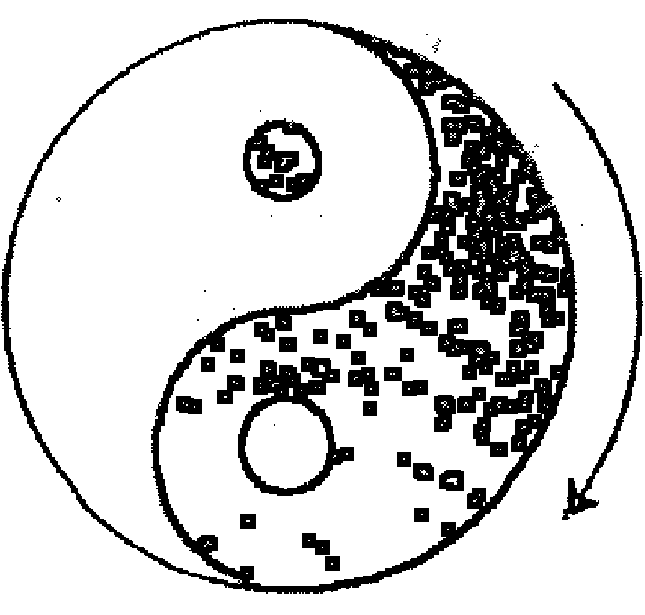

左旋图

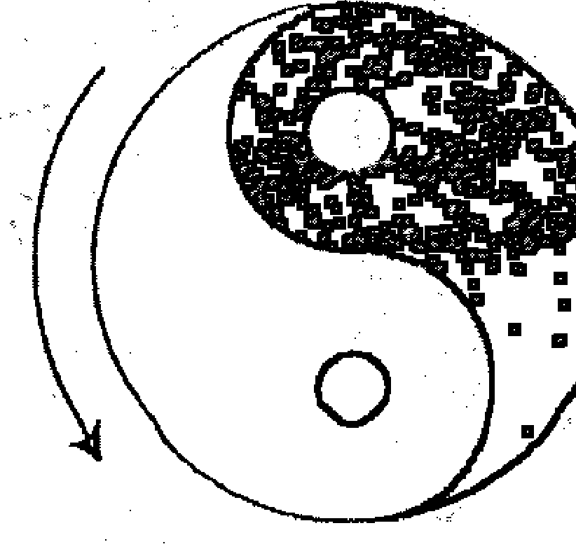

右旋图

## 第一章 易卜时空的基本概念

日月运行：夫周天365度4分度之一，是天度数也，日行迟，一岁一周天，月行疾，一月一周天。日，一日行一度，月，一日行13度19分度之7--29日半强。月行天逐日与会，一年十二会，是为十二月。每月29天半，年分出小月6，是每岁余6日。又大岁366日，小岁365日。一岁余11天，未满三年已成一月，则置闰。若三年不置闰，正月为二月。九年差三月，则以春为夏。十七年差六月，则四时皆反。从此岁不正，岁不成。

地轴和北极星在一条直线上，人在地球看北极星总是正北。太阳在一年当中从圆周的天区“黄道”上不断的移动位置，形成周期。围绕北极星旋转的北斗七星，是天体的枢纽。从北斗星的斗柄所指方位，可以确定季节，如正北为冬至，正东为春分，正南为夏至，正西为秋分，即为四正。二十八宿环列于四方，围绕天体北极星而转。其半隐半现，随北斗以定四季，其实，地球随着太阳，而太阳绕其“黄道”旋转一周，则绕经北极星转360度，途经北斗星及二十八宿。二十八宿随天而四转，东方七宿自角至箕，为青龙，以次舍而言，有朱雀象。虚为北方七宿 之中星，昴为西方七宿之中星。星本不移，附天而移。

仲春之月，星火在东，星鸟在南，星昴在西，星虚在北。仲夏之月，则鸟转而西，火转而南，虚转而东，昴转而北。至仲秋则火转而西，虚转而南，昴转而东，鸟转而北。至仲冬，则虚转而西，昴转而南，鸟转而东，火转而北。来年仲春，则火复又转而东。

日月五星周天 。

> 「木仁也，火礼也，土信也，金义也，水智也。金星与日同，南北之行为赢，出出早为日食，晚为天妖，主兵象也木星所在国不可伐，可以伐人。超舍（宿）为赢，退舍为缩出入不当，其次必有天妖。水星出早为日食，出晚为”

彗，四时不出则天下大饥，出于房主地也，火星一舍二舍是为不祥，东行急则兵聚于东方，西行疾则兵聚于西方，镇星失次而上一舍而舍，则为大水，失次而下二舍，有后戚五纬的之变。木近日则迟，远日则疾，火近日则疾。远日则迟。土平行无大迟大疾。金水辅日而行。凡五星，东行则为顺，西行则为逆，趋舍而前为盈，退舍而后为缩光，其明来不定。日月及岁星、荧火星、太白星、辰星、镇星，古人称之为七政。

## （河洛图）

### 1、河图象数

河图是阐释五行顺行自然无为之道的。天地间造化之道，不过是一个阳五行，一个阴五行，一生一成而已。天地阴阳化生五行，五行衍生万物。河图之文，前七二，后一六，左三八，右九四，居中者五与十。前二七即二七合，后一六即一六合，左三八即三八合，右四九即四九合，居中者五与十合。天一地二，天三地四，天五地六，天七地八，天九地十，天数

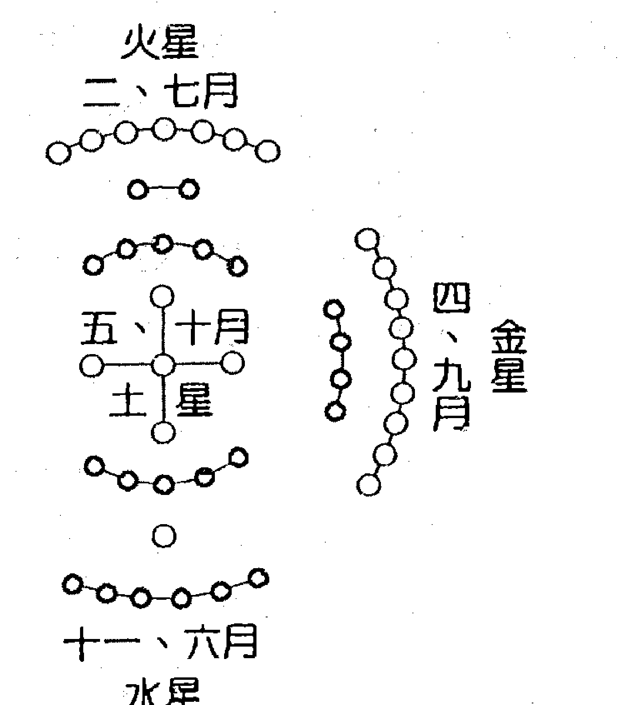

五，地数五，五位相得，而合有合。天数二十有五，地数三十。凡天地之数一十有五，此所以成变化而行之鬼神是也。

## （洛书范数）

洛书是阐释五行逆行阴阳变化之道的。由中央之土为始，中土克北方水，北方水克西方火，西方火克南方金，南方金克东方木，东方木克中央土，阴阳交错，动静变化。

洛书之文，戴九履一，左三右七，二四有肩，八六为足，五居中央。一合九而为十，二合八而为十，三合七而为十，四合六而为十，五居中此洛书纵横皆十五数合矣。初一曰五行，次二曰敬用五事，次三曰农用八政，次四曰协用五纪，次五曰建用皇极，次六曰又用三德，次七曰明用稽疑，次八曰念用庶征，次九曰向用五福，威用六极。

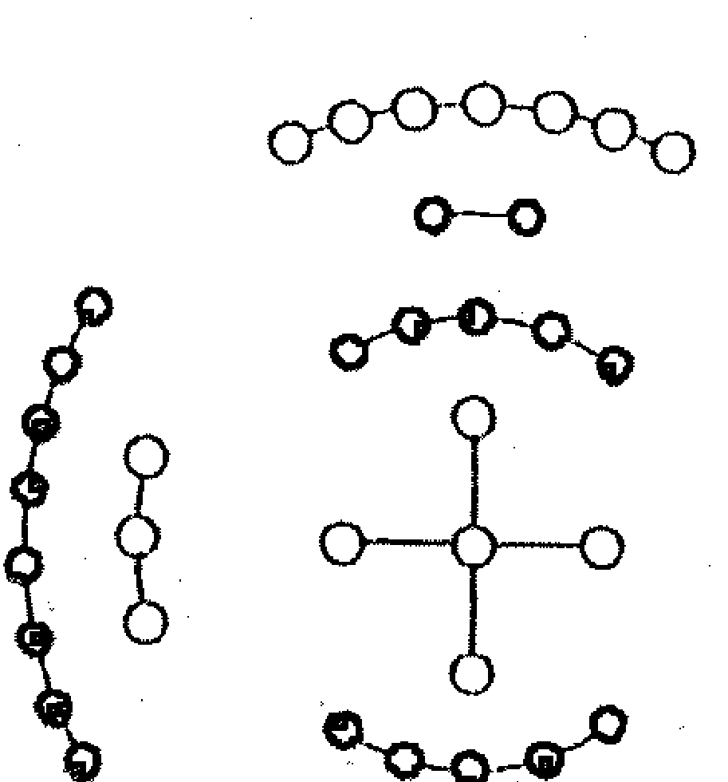

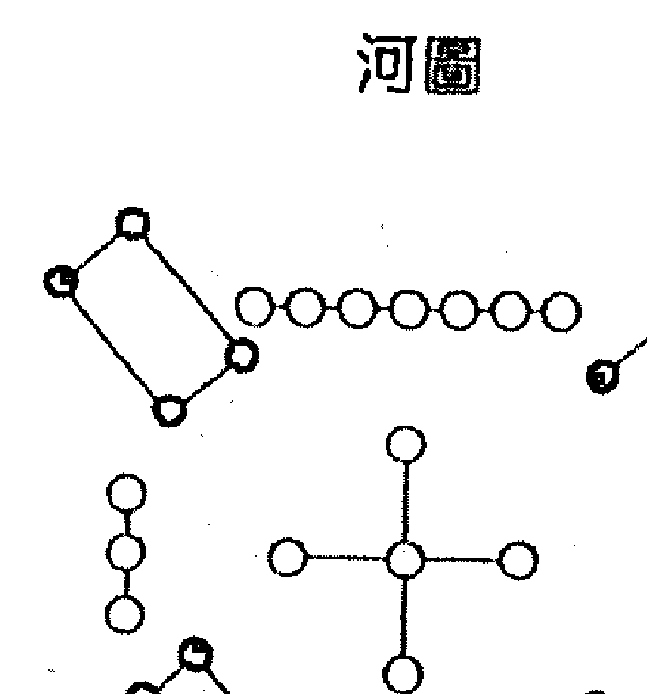

## 《八卦图》

### 1、伏羲先天八卦图

先天八卦卦序为：乾一、兑二、离三、震四、巽五、坎六、艮七、坤八。
先天八卦方位为：乾南、坤北、离东、坎西、震东北、兑东南、巽西南、艮西北。自震卦至乾卦为顺，自巽卦至坤卦为逆。天地定位，山泽通气，雷风相薄，水火不相射。八卦相错，数往者顺，知来者逆。是故易逆数也。

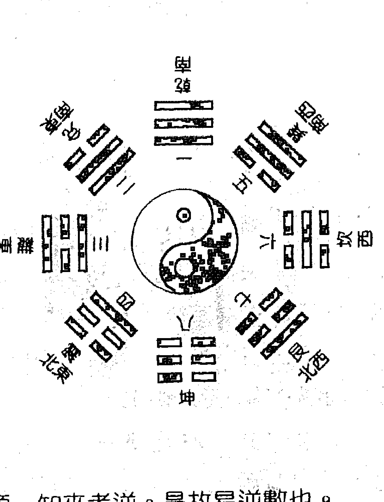

### 2、文王后天八卦图

后天八卦卦序为：乾为父、坤为母、震为长男、坎为中男、艮为少男、巽为长女、离为中女、兑为少女。
后天八卦方位为：乾西北、坤西南、震东、坎北、艮东北、巽东南、离南、兑西。

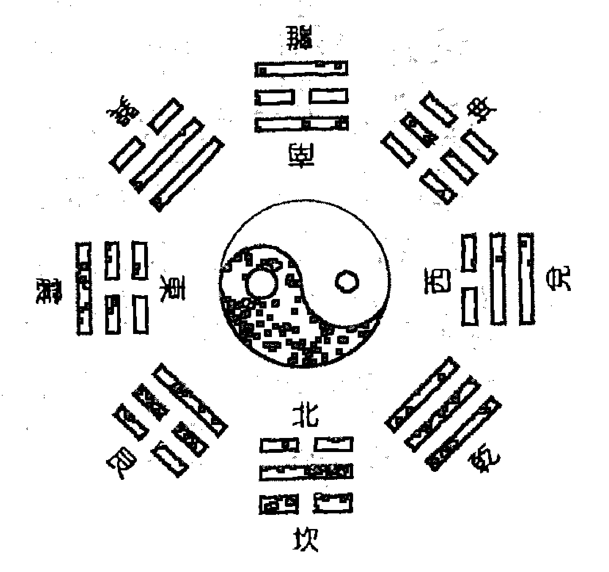

帝出乎震（正春也），齐乎巽（春末夏初），相见乎离（正夏也），致役乎坤（夏末秋初），说乎兑（正秋也），战乎乾（秋末冬初），劳乎坎（正冬也），成乎艮（冬未止也，万物所藏，文王八卦以丽春夏秋冬四时之序也）。天一生水，坎之气孕于乾金，立冬时节；地二生火，离之气孕于巽木，立夏时节；天三生木，震之气孕于艮水（山高地厚，水泉出焉），立春时节；地四生金，兑之气孕于坤土，立秋时节；天五生土，离寄戊而土气，孕于离火，长夏时节。天一与地六合而成水，乾、坎合而成水成于金，冬至节；地二与天七合而成火，巽、离合而成火成于木，夏至节；天三与地八合而成木，艮、震合而成木成于水，春分节；地四与天九合而成金，坤、兑合而成金成于土，秋分节；天五与地十合而成土，离寄于己土成于火。

### 3、实用八卦图

我们在预测实践中应用的是，先天八卦的卦序，后天八卦的八卦方位。

乾一、兑二、离三、震四、巽五、坎六、艮七、坤八。

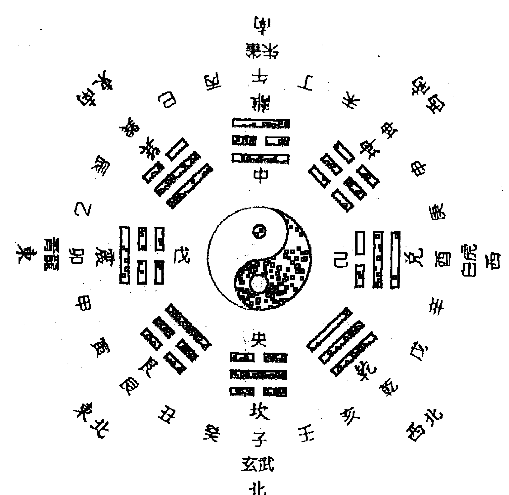

乾宫、金，西北；兑宫、金·西方；离宫、火·南方；震宫、木·东方；巽宫、木·东南；坎宫、水·北方；艮宫、土·东北；坤宫、土·西南。

## 基础篇

### 4、论八卦性情及取象

乾卦健也，取象天；坤卦顺也，取象地；震卦起也，取象雷；艮卦止也，取象山；坎卦陷也，取象水；离卦丽也，取象火；兑卦说也，取象泽；巽卦入也，取象风也。

## 天干地支

### 1、十天干

- 甲、乙、丙、丁、戊、己、庚、辛、壬、癸。
甲乙（东方木），丙丁（南方火），戊己（中央土），庚辛（西方金），壬癸（北方水）。

### 2、十二地支

- 子、丑、寅、卯、辰、巳、午、未、申、酉、戌、亥。
子鼠 水，坎宫；丑牛 土，艮宫；寅虎 木，艮宫；
卯兔 木，震宫；辰龙 土，巽宫；巳蛇 火，巽宫；
午马 火，离宫；未羊 土，坤宫；申猴 金，坤宫；
酉鸡 金，兑宫；戌狗 土，乾宫；亥猪 水，乾宫。

## 第三章 易卜时空的作用关系

事物的发展变化总是在一定时间和空间进行的，时间、空间是变化中的事物存在的基本形式。

## 阴阳学说

阴阳，是我们先民几千年前在劳动中，对各种自然现象和客观事物经过观察，把世界上的事物归为两大类，即阴和阳。

世界上的事物纷繁复杂，但是归根结底，无非是物质和精神两大类现象；世界上的多种关系和矛盾特别是人们认识世界和改造世界的多种关系和矛盾，千差万别，但从根本上说就是物质和精神的关系。物质为实为阳，精神为虚为阴。

随着自然科学的发展，人们对事物的具体形态、结构、属性的认识不断深化。现代科学发现，物质除了实物形态之外，还有场的形态，如电磁场、引力场、核力场等。实物存在的形态，为实为阳，场态形态存在的形态，为虚为阴。

## 基础篇

阴阳者，天地之道，万物之纲，变化之本，消长之始。阴阳互根，阴阳对立，阴阳转化，阴阳就是运动，这是阴阳的本质。整部《易经》就是一套阴阳符号系统。

《河洛原理》说：「太极一气产阴阳，阴阳化合生五行，五行既萌，随含万物。」天地分阴阳，乾，阳物也；坤，阴物也；阴阳合德，而刚柔有体，以体天地之撰，以通神明之德。易理推原于“太极”，托始于乾坤。古代朴素哲学观，把万事万物一分为二，阴阳这两种现象，既是对立或矛盾的，又是同一或统一，“一阴一阳之谓道”，这是宇宙自然现象的大规律，万物变化无出其理。在一定条件下事物间的关系又可以转化。如太极图中阳中有阴，阴中有阳。在现实生活中，事物发展到顶峰，则有“物极必反”之虑，提醒人们得意不可忘形；在失意的时候要坚强，“山重水复疑无路，柳暗花明又一村”等。人立天地间，无处不阴阳。万象繁杂的世界，可以划归两类，五行也可归为两行。

一切预测方法都应法于阴阳，合于术数，阴阳是预测学的最基本的规律。

日月、昼夜、幽明、男女、奇偶、虚实、动静、圆方、死生、上下、高低、前后、左右、里外、正反、对错等，这些相对概念皆属阴阳之范畴，用途非常广泛，这一对作用关系贯穿事物变化始终。

## ❬五行学说❭

五行源于阴阳，五行学说是以阴阳理论为核心的，阴阳是五行内在的根本，五行可以理解是阴阳关系的外在表现。古人认为宇宙中有五种物性的能量影响着我们，世上万物自然秉受其五行之气，就把繁杂的万物归类五行，阐释阴阳。五行关系揭示了宇宙万事万物宏观分类，归类、组合以及事物间相互联系、生克制化、循环运行的规律。1水、2火、3木、4金、5土，只不过是五大类特性特征基本事物的代号。任何事物，都有它的特性和特征，只有把握了事物的特性、特征，才便于归类和分类。

- 水类的特征：气寒、味咸、色黑、音羽、时间冬、方位北。
- 木类的特征：气风、味酸、色青、音角、时间春、方位东。
- 火类的特征：气暑、味苦、色赤、音徵、时间夏、方位南。
- 土类的特征：气湿、色黄、味甘、音宫、时季末、方位中。
- 金类的特征：气燥、味辛、色白、音商、时间秋、方位西。

## ❬阴阳五行生克制化❭

阴阳五行，是把宇宙的生成和演化看作大系统，又是事物存在和发展中对立的两个方面，是相互依存，相互联系，又是相互对立，相互矛盾的统一体。世界上万物都是普遍联系和不断运动发展的。宇宙间一切事物都同其他周围事物相互联系着，世界就是一张普遍联系的网，联系是物质世界的一个基本特征，是事物存在的基本条件，它无处不在，无时不在。从宏观到微观，现代系统论、资讯理论都提出了有力证明。普遍联系和永恒发展是物质世界的两大基本特征。事物是怎样联系的呢？事物内部诸要素、各部分之间是内部联系，事物同周围其他事物的联系是外部联系。这些联系都是通过五行生克制化实现的。不经任何中间环节而发生的联系是直接联系，是指五行生剋作用关系；有些联系经过了中间环节而发生的是间接联系，是指五行通关作用。有些联系可以决定事物性质和发展趋势，是指五行生剋关系；有些联系只能在一定程度上影响事物发展的进程，是指五行耗泄、通关关系。事物是怎样永恒发展的呢？世界上万事万物不离阴阳，阴阳是事物发展变化的根本动力，宇宙间一切事物都处于永恒的产生和消亡中，处于运动、变化和发展中。

### 1、五行相生，是事物相互联系，含有滋生助长，促进生育的意思。
如：金生水、水生木、木生火、火生土、土生金。金赖土生，土多埋金，土赖火生，火多土焦，火赖木生，木多火塞，木赖水生，水多木漂，水赖金生，金多水浊。
金能生水，水多金沉，水能生木，木多水缩，木能生火，火多木焚，火能生土，土多火晦，土能生金，金多土变。

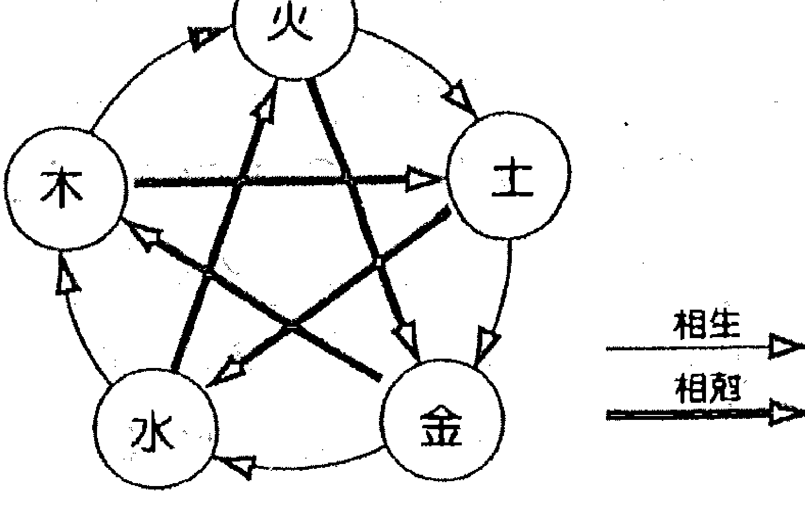

### 2、五行相克，就是事物矛盾着的双方相互制约，克制或抑制过程。

如：金克木，木克土，土克水，水克火，火克金。金能克木，木坚金缺，木能克土，土重木折，土能克水，水多土荡，水能克火，火多水沸，火能克金，金多火熄。
金旺得火，方成器皿，火旺得水，方成相济，水旺得土，方成池沼，土旺得木，方能疏通，木旺得金，方成栋梁。金弱见火，必见消溶，火弱逢水，必见熄灭，水弱逢土，必为淤塞，土弱逢木，必为倾陷，木弱逢金，必为砍折。
强金得水，方挫其锋，强水得木，方泄其势，强木得火，方化其顽，强火得土，方止其焰，强土得金，方制其壅。

### 3、五行相生相克不是绝对的，一定条件下可以相互转化。

如：水虽生木，寒冬冷水难生木；木虽生火，湿木反熄火焰；
火虽生土，炎火反使土焦；土虽生金，燥土反而熔金；金虽生水，寒金益增水寒；水虽克火，夏火逢水如遇甘霖；火虽克金，冬金逢火适暖其性；土虽克水，冻土见水相通；土虽泄火，燥土反增火焰。

这一节要很好地领悟，世界上没有绝对的事情。任何事物都有相反的两个方面，这是一种思路。相生相克是有路线的，是五行作用的主流，反克过泄等是有条件的。
五行分别以动态和静态两种形式存在。

## 第三章

## 易卜时空与现实生活的联系

## 天人合一思想

天人合一的思想是古代预测学的重要理论之一，它是建立在宇宙就是阴阳五行全息大系统基础上的。宇宙间一切事物都同其他周围事物相互联系着；每一事物内部各要素、各部分之间，也相互影响、相互制约着；整个世界就是一个相互联系的统一整体。万事万物是相互联系的，这种联系就是五行生克制化规律。在这种联系中，每一个具体事物又是相对独立地存在的。正是体现了其大无外，其小无内的易学思维。任何事物都是作为系统而存在的，系统是事物普遍联系的具体表现。

> 前苏联科学家B.N.雷德尼克曾在书中写道：越来越深邃的粒子内层反映着越来越广阔的宇宙范围！我们世界中的每个粒子都同整个宇宙紧密联系着，在自己的结构上带有宇宙的宏大形象的烙印。而反过来，整个宇宙的性质，也是那么牢不可破地同它的结构或粒子的性状和结构联系着。

人是宇宙大系统的一部分，建立了天地人互感互动的全息联系，所谓天地是一大人身，人身是一小天地。人既可以从宇宙场中吸收能量，又可向宇宙场辐射能量。人可以与天合一，与地合一，与人合一，与金合一，与木合一，与水合一，与土合一，与火合一，与世界万事万物合一，人可以与人，与天，与地，与物，与事等发生感应，人作为这个大系统中局部，完全能够体现出属于系统的共性来，反之亦然。由此及彼，由表及里，往复推衍，达到知此喻彼，知来数往的目的，所以强调“占卜之道要变通，得变通之道者在‘心易’之妙耳”。

### ③时空影响着人们生活③

史达林有句名言：一切以条件、地点和时间为转移。时空是事物的存在形式。所谓时间是表示事物的持续性和顺序性，所谓空间表示事物的广延性、结构性和并存性。宇宙强烈的时空作用，无时不在影响着人们的生活，人们在不断认识自然的同时，也在进行着征服自然改造自然的工作。春夏秋冬四时流转，沧海桑田更替变迁，风霜雪雨，潮汐地震，哪项自然规律没在人们生活中留下深深的烙印？落叶知秋，酷暑远去，天气渐凉，北雁南飞，人们也脱去夏衣换上秋装，农民准备收获庄稼，商人备战仲秋，学子将迈进新的校园等等，社会各行各业都因时序更替有了相应行动。人与时空联系是不是很密切？山河易容，斗转星移，遵循的是自然规律；革故鼎新，随行就市，遵循的是社会规律；日出而作，日落而息，人们在生活中自觉地运用着自然规律。这一切看似凌乱的事情，实

## 基础篇

际上都是宇宙阴阳五行运化的结果。事物是以时空的形式存在和运动，但是，事物的存在和运动又决定时空的结构，表现为引力场。预测就是要探索和掌握这些规律，服务和指导人们的生活。

## 远取诸物 近取诸身

八卦取象表

| 卦名 | 乾 | 坤 | 震 | 巽 | 坎 | 离 | 艮 | 兑 |
|------|----|----|----|----|----|----|----|----|
| 卦象 | ☰ | ☷ | ☳ | ☴ | ☵ | ☲ | ☶ | ☱ |
| 德性 | 健 | 顺 | 动 | 入 | 陷 | 丽 | 止 | 悦 |
| 人伦 | 父 | 母 | 长男 | 长女 | 中男 | 中女 | 少男 | 少女 |
| 动物 | 马 | 牛 | 龙 | 鸡 | 豕 | 雉 | 狗 | 羊 |
| 身体 | 首 | 腹 | 足 | 股 | 耳 | 目 | 手鼻背 | 口 |
| 自然 | 天 | 地 | 雷 | 风 | 水 | 日 | 山 | 泽 |
| 方位 | 西北 | 西南 | 东 | 东南 | 北 | 南 | 东北 | 西 |
| 季节 | 冬秋间 | 夏秋间 | 春 | 春夏间 | 冬 | 夏 | 冬春间 | 秋 |
| 五行 | 金 | 黄土 | 木 | 青木 | 水黑 | 火赤 | 土 | 白金 |## 事物在不同时空存在形态

物理學研究表明，物質存在有兩種形態：一種是由基本粒子組成的實體；一種是感官不能覺察的場態。實體和場態不可分割，是一個事物的兩個方面，在一定條件下可以相互轉化。

客觀事物就是以這兩種形態存在時空中，時空具有連續性、廣延性。當客觀事物的實體形態離開了某個時空點時，那個不被感知的場態可能還滯留原時空點，這就是預測為什麼能夠追述客觀事物過去的原因。這些論點已被科學家證實。科學家還無意中破譯了，事物場態也會存在於實體之前的秘密。前蘇聯生物學家為研究花卉生長過程，用一架相機日夜不間斷的拍攝。一天他發現照片中有個葉子長在枝丫某點，花卉實際部位並沒有這片葉子，他感到疑惑不解，可是，後來發生的事情震驚了他，在花卉的那個部位，就真的長出一片與照片中一模一樣的葉子來。場態預先洩露了實體資訊，這也就是預測為什麼能夠推斷客觀事未來的原因。

預測學所研究的就是，客觀事物在不同時空中存在和發展變化的規律，我們對事物過去和未來的推斷，即是運用實體資訊與場態資訊辯證關係。

## 第四章
## 八卦萬物類象

無論任何一種預測學都離不開八卦類象。世界事物無窮無盡，誰也不能都遇到，為便於預測操作，運用八卦類象原理，將其歸為八類。對於沒收錄或新出現的事物，大家可以依據陰陽、五行、八卦原理，歸類所屬。

## 乾

三個陽爻，純陽剛健，如天體周而復始，運動不止，形象如天，高大寬廣，明亮健全，高高在上，無所不包，它主宰萬物，其行動積極、主動、遇事穩妥，爭勝心強而又不驕不躁，有威嚴、統帥、決斷之意。

- [象意]：圓、起始、原始、向上、本源、盈滿、高廣、純質、精華、核心、堅恒、強盛、強制、規範、恩惠、仁德、亨達、老成、主觀、威嚴、傲慢、霸道、健全、充滿、迅速、囊括、永久、吉利、道德、創造性、蓬勃、所向披靡、只爭朝夕、激烈、活動、邁進、決斷、功勳、統帥、遮政、老人、行人、擴大、發光、任性、懲罰、憤怒、侵略、制裁、冷酷、過份、輕視、壓抑、災害、專橫、思想意識、自然法則。
- [性格]：剛健武勇、果決、重義氣、動而少靜、威嚴、昭明豁達、自尊、正直、勤勉、驕傲、霸道。
- [形態]：完美無缺的、高檔的、精緻的、古老的、堅硬的、老實的、圓的、轉圈的、大的、高的、舊的、苛刻的、寒冰的、光澤的、趾高氣揚的、大赤色的、金黃色的。
- [天時]：天、冰、雪、霰。寒冷、太陽、宇宙、大自然、晴天。
- [地理]：西北方、京都、大郡、形勝之地（險要、名勝）、高亢之所（高而乾燥）、公廁、樓臺、高堂、驛館（旅店、飯店）。曠闊地，豪華城市、聖地、宮殿、大會堂、廣場、高大圓形、建築、省城、博物館、體育館、寺院、機關大院、大學、高級住宅、車站、大廈、郊野、遠處、彎曲大道、辦公室、會議室、招待所、金屬加工廠、五金商店、配件商店。
- [人物]：君、父、大人、老人、長者、宦官、名人、公門人（政府工作人員）。首腦、領袖、元老、會長、主席、使節、議員、代表、專家、名流、廠長、書記、經理、老闆、銀行家、一把手、當權者、班主任、專橫者、傲慢者、祖父、父親、家長、長輩、公務員、贅婿、公安、幹警、軍人、丈夫、無賴、地痞、黑社會老大、強壯瘦骨之人、執法者、经济工作者、管钱的人、乞丐、下人。
- [身體]：首、骨、肺。脑、男性生殖器阴茎、胸、大肠、右足、右下腹、精液、体质寒凉、骨瘦之人、颧骨突出。
- [疾病]：头面之疾、肺疾、筋骨疾、上焦疾、夏占不利。骨病、老病、陈旧性损伤、硬化性疾病、伤寒、急性病、节肠疾病、便闭壅结、变化异常之病、发烧、阳萎、结石。
- [靜物]：金玉、宝珠、圆物、木果、刚物、冠、镜、高档用品、金钱、钟表、眼镜、古董、文物、首节、神物、高级轿车、火车、飞机、圆形金属、玛瑙、机器、实心金属制品、刚硬物、高大物、小米、木果、瓜、珍味、腊肉、辛辣之物、帽子。
- [動物]：马、天鹅、狮子、象、龙、虎。
- [飲食]：马肉珍味、多骨、肝肺、乾肉、木果、诸物之首、圆物、辛辣之物。
- [方位]：西北
- [色彩]：大赤色、玄色、金黄、强烈的颜色。
- [數目]：一（先天数）、六（后天数）、四、九（河图数）。
- [姓字]：带金榜者，行住一四九（此人在兄弟中排行老大，老四，老九）。
- [五味]：辛辣
- [時序]：秋，九十月之交，戌亥年月日时，五金年月日时。
- [家宅]：秋占兴隆，夏占有祸，冬占冷落，春光吉利。
- [墳墓]：宜向西北，宜乾山气脉，宜天穴，宜高，秋占出贵，夏占大凶。
- [求名]：有名，宜随内任、武职、掌权、天使、驿官、宜向西北之任。
- [谋财]：有成、利公门、宜动中有财，夏占不成，各占多谋少遂。
- [交易]：宜金玉宝珠贵货，易成，夏占不利。
- [求利]：有财、金玉之利，公门中得财，秋占大利，夏占损财，冬占无财。
- [出行]：宜入京师，利西北之行，夏占不利。
- [谒见]：利见大人，有德行之人，宜见贵官，可见。
- [官讼]：有贵人助、秋占得胜，夏占失理。

## ☷ 坤 ☷

三个阴爻，纯阴方正，受天影响，顺从被动，有生化万物之功，能收藏万物，顺势而动，平衡发展，动静有序而无衝。

- [象意]：谨慎正直、勤劳忍耐、复杂、吝啬、优柔寡断、逆来顺受、懦弱迟缓、依赖衰微、敬奉神佛、恭敬抚养、伏藏疑惑、思想狭隘。柔顺、虚静、厚载、平衡、滋育、包容、内含、谦让、本份、消极、沉默、寡断、卑贱、丑陋、昏暗、富裕、平安、宽阔、文雅、贞节、欲望、古老、堆积、平均、混乱、故乡、仓库、能容之物、粗笨之物。
- [性格]：多重性格、溫厚柔順、恭敬謙讓、貞節、儉約、守信誠實、吝嗇、懦弱、卑賤狹小、感情曖昧、不斷改進、固執遲鈍、邪惡。
- [形態]：柔軟的、平常的、數多的、四角形的、舊的、並用的、附屬的、虛空的、包容的、隱伏的、潛在的、平整的、複雜的、黃色的、粉狀的。
- [天時]：陰雲、霧氣、冰霜、露、低氣壓、濕度大。
- [地理]：西南方、田野、鄉里、平地。平原、田埂、鄉村、矮屋、土階、城邑、幫困、角落、大地、曠野、森林、牧場、郊外、原籍、故鄉、草坪、廣場空地、貯藏室、農貿市場、肉類加工廠、雞窩豬舍、兔籠、古陵、糧庫、平房、舊房。
- [人物]：老母、後母、老婦人、農夫、鄉人、眾人、大人。母輩、皇后、老闆娘、女首領、胖女人、大腹人、勞動者、群眾、副職、謀士、同鄉人、土匪、泥瓦匠、房地產商、建築工、女主人、鄉村幹部、小人、母子、祖母、忠厚之人、小氣者、膽怯者、屍、紡織工、隨從、助手、臣民、顧問、稅吏、好好先生、陰氣重者、寡婦。
- [身體]：腹、脾、胃、肉。腸、消化器官、女性生殖器、右肩、肌肉。
- [疾病]：腹疾、脾胃之疾、飲食停滯、穀食不化。胃腸消化不良、肚子痛、浮腫、濕重、濕疹、肌膚病、疲乏、慢性病、中氣虛、癌症、疣、聾病、婦科病、久病者死亡。
- [靜物]：方物、柔物、布帛、絲綿、五穀、車、斧、瓦器。藥、漿、布囊、衣服、海綿、盆景、瓷器、粉狀物、運輸工具、飯店、婦女用品、日用品、容器、文章、書報、紙張、箱包、袋子、轎子、大車、車輪、土中之物、石灰、水泥、磚砂、五穀雜糧、牛肉、野味、甘美之物、柄把、米、雜糧、麵粉、肉類、飴糖、腐草、四萬平面之物。
- [動物]：牛、百獸、馬。母馬、百禽、百獸（雌性）、地下蟲類、貓、孕牛、夜行動物。
- [飲食]：牛肉、土中之物、甘味、野味、五穀之味、芋筍之物、腹臓之物。
- [方位]：西南。
- [色彩]：黃、黑。
- [數目]：八、二、五、十、萬。
- [姓字]：帶土姓人、行位八五十。
- [五味]：甘。
- [時序]：辰戌丑未月，未、申年月日時、八五十月日。
- [家宅]：多陰氣，春占宅舍不安，安穩。
- [墳墓]：宜向西南之穴、平陽之地、近田野、宜低葬、春不可葬。
- [求名]：宜西南方或教官、農官守立之職、春占虛。
- [謀財]：宜田地交易、宜五穀利、賤貨、重物、布帛、靜中有財、春占不利。
- [求利]：宜土中之利、贱买重物之利、静中得财、春占无财、多中取利。
- [出行]：宜西南行、乡里行、陆行、春不宜。
- [遇见]：利见多人、亲朋或阴人、春不宜见。
- [官讼]：顺理得众情、讼当解散。

## 震

卦爻上部展开，如爆炸向外放射状，故为雷象。雷的作用是使万物运动，其勇猛直前，势不可遏，在下时犯上，在上时易逃脱。

- [象意]：奮進、勇氣、積極、果斷、顯現、緊迫、自立、上升、勤勉、躁動、輕率、粗糙、虛驚、驚恐、過失、盲從、妄動、多動、打擊、誇張、興起、發怒、進步、出發、新生、高大、功名大、仁慈、追求、勤思、影響大、意氣風發、粗心、性急、衝突、無禮、響動、高聲、震動、鼓舞、命令、決斷、狂暴、迅速、茁壯、成功、可塑性、可動性、轉捩點。
- [性格]：多動少靜、勤奮、有和幹、仁慈、直爽、性急、易怒、易心煩、倔強、自尊心強。
- [形態]：朝氣蓬勃的、有聲有響的、華而實的、外虛內實的、上虛下實的、上大下小的、向外發展的、生長的健康的、勇敢的、高速的、振動的、競爭的、激烈的、吃驚的、憤怒的、急躁的、粗糙的、移動的。
- [天時]：雷。雷雨、雷鳴、地震、火山噴發。
- [地理]：東方、樹木、鬧市、大途、竹林、草木茂盛之所、山林之處、樓閣、東向之居。山林野地、春季原野、田園菜地、庭院、公園、菜市場、靶場、戰場、機場、劇場、運動場、遊樂場、試車場、停車場、卡拉OK廳、歌舞廳、喧嘩之地、廣播電臺、電器商店、花店、熱鬧街道、大馬路、郵電局、競技場、發射場、軍警公安部門、營房、軍隊。
- [人物]：長男。長子、青年、名人、將帥、員警、駕駛員、運動員、舞蹈者、音樂家、鼓動者、忙碌者、活躍分子、掮客、神經過敏者、朝氣蓬勃者、騷亂分子、說大話者、易發怒者、乘務員、指揮員、當頭的、行政人員、保安、竹木匠、法官、飛行員、狂人、壯士、黑社會、稅務工商、關卡、外交、市場管理、交通管理。
- [身體]：足、肝、發、聲音。腿、腳、神經、筋、頭髮（鬱而稀少）、左脅、左肩臂、關節、臉孔、眼睛、拇指。
- [疾病]：精神病、狂躁症、神經衰弱、舞蹈症、婦科病、肝火旺、疼痛性症狀、腿痛、多動症、外傷（碰撞）、突發性症狀、咳嗽、聲帶咽喉病、肝病、足美籍、神經衰弱、羊癲病。
- [靜物]：木竹、葦、樂器（竹木）、花草繁鮮之物、核。樹木、柴、蔬菜、嫩芽、鮮花、青綠色之物、多節物、蹄、筋、鮮肉、菜、裙子、褲子、鬧鐘、電話、BB機、音響、樂器、鋼琴、鼓、車類、廣播、飛機、鞭炮、武器、新產品、會動的玩具、球類、反生植物、豆類帶殼植物。
- [動物]：龍、蛇、昆蟲、馬鳴。駱駝、鹿、雕、鷹、鵲、雲雀、金絲雀等善鳴之鳥、蜂、蟒、長形的動物、魚、壁虎、鵪。
- [飲食]：蹄、肉、山林野味、鮮肉、果酸味、蔬菜、鯉魚。
- [方位]：東。
- [色彩]：黑青、綠碧、深藍。
- [數目]：四、三、八。
- [姓字]：帶木姓人、行位三、四、八。
- [五味]：甘、酸。
- [時序]：春二月、卯年月日時，四、三、八日。
- [家宅]：春各吉，秋占不利、宅中不時有虛驚。
- [墳墓]：利於東南、山林中穴、秋不利。
- [求名]：有名，宜東方之任、施號發令之職、掌弄獄之官木茶稅課之任、或鬧市市發之職。
- [謀財]：宜動中謀、秋占不遂。
- [交易]：動而可成、山林、竹木、茶貨之利，秋占難成。
- [求利]：動處求財、山林竹木、茶貨之利。
- [出行]：利東方，利山林之人、秋占不宜行，但恐虛驚。
- [遇見]：利見山林之人，有聲名之人。
- [官訟]：健訟、有虛驚、行移取甚反覆。

## 巽

卦象如飛箭之狀，無孔不入，故為風。風的作用是使萬物消散，其好動而漫，進退無常。遇難，其與交合則安就之，遭困難則居中不脫，動則搖閃而上。

- [象意]：基礎不穩、直爽、渙散、清潔乾淨、整齊、附和、傳達、營業生意、繁榮昌盛、交流、新鮮、言語、書信、教令、捷報、舉薦、奔波、薄情、怪石、幻覺、忙碌、輕浮、掃蕩、憂疑、煩躁、膽略、魄力、多欲、權謀、數術、滲透、散佈、長驅、進退調動、消息、命令、空虛、靈氣、暫時、精細、流動、徘徊、舞蹈、歌唱、榮譽、普遍性、繩索狀、沒有固定地點、自由運動。
- [性格]：柔和、不定、鼓舞、進退不果。細心、責任心強、反覆不定難以決斷，心志不定，仁慈直爽、諂誤，奸妄、多欲、薄情、極愛清潔、疑惑隱伏、說謊。
- [形態]：上實下虛的、外實內虛的、外剛內柔的，向下滲透的、不確定的、基礎差的、飄動的、流動的、浸液的、傳輸的、順風的、神奇的、細緻的、精巧的、忙碌的、輕浮的、長形、條形、薄形、煙狀、氣態。
- [天時]：風。刮風、旋風、颶風、高空帶狀或長條的雲。
- [地理]：東南方之地、草木茂秀之所、花果菜園、東南向之居、寺觀樓臺、山林之居。草原、竹林、奇觀、郵局、指揮部、商店、碼頭、機場、設計院、工藝工廠、道路、隘路、過道、長廊、各種管道處、電梯、樓閣院子、通風道、通氣道、出入通道、港口、機場、發射場、索道、升降機、傳送帶。
- [人物]：長女、秀士、寡婦、山林仙道之人、僧道。處女、宗教人士、氣功師、教師、商人、木材商、證券商、能工巧匠、汽車售票員、公關人員、新聞人員、科技人員、氣象人員、會談人員、造謠傳謠者，優柔寡斷者、額寬髮細者、文質彬彬讀書人，仙人、尼姑、練功者、行者、好事者、探險家、游泳者、狡猾者。
- [身體]：肱、股、氣、風疾。頭髮（細、直、稀、少）神經、氣管、膽、筋、腸道、左肩、淋巴系統、元氣、食道、血管。
- [疾病]：股肱之疾、風疾、腸疾、中風、塞邪氣疾。傷風感冒、受風、神經症狀、潔癖、膽疾、傳染病、坐骨神經痛、淋巴疾病、抽筋、強直強硬症、喘息、哮喘、血管病、神經炎、胯股病、筋骨病、脹氣、宿酒痞滿、憂鬱症、血管病、寒痺症、支氣管炎、病情不穩定、四肢殘疾、禿頂白眼、呼號驚奔。
- [靜物]：木香、繩、直物、長物、竹木、工巧之器、臭、雞毛、帆、扇、臼。木材、木製品、纖維品、絲線、鏈條、麻、郵件、旗杆、長條桌相、床、標槍、筆、管形物、刀斧類、薄的器物、褲帶、桑帛、氣球、氣艇、帆船、賽艇、飛機、飛船、救生圈、草木之香、有香味之花草樹木、香料、草藥、蚊香、花草、柴薪、枝葉、海帶、柳、風機、乾燥機、升降機、下麵有口之物、報紙、宣傳品、債券、信用卡、匯票、股票、郵票、香煙、充氣設施。
- [動物]：雞、百禽、山林中之禽、蟲、蛇。鴨、鵝、禽、山林禽蟲、蚯蚓類地蟲、蝴蝶、蜻蜓、帶魚、鰻魚、鱔魚等細長魚類、虎、貓、斑馬等條紋之獸、勇猛帶風聲之獸。
- [飲食]：雞肉、山林之味、蔬果酸味。
- [方位]：東南。
- [色彩]：青綠、碧。
- [數字]：五、三、八。
- [姓字]：草木旁氏、行位五、三、八。
- [五味]：酸
- [時序]：春夏之交、辰日年、月、日、時、五、三、八月日時。
- [家宅]：安穩利市，春占吉、秋占不安。
- [墳墓]：宜東方向、山林之穴、多樹林、秋占不利。
- [求名]：宜文職、有風憲（法律）之力、宜入風憲、宜茶、果竹、木稅貨之利、宜東南之任。
- [謀財]：有財、可成，秋占多謀少遂。
- [交易]：宜山林之條之利、進退不一，可成。
- [求利]：有利三倍，宜山林、竹、木貨之類、秋占不吉。
- [出行]：宜向東南行、有出人之利、秋占不利。
- [謁見]：利見山林之人、文人秀士。
- [官訟]：宜和、恐遭風憲之責。

## 坎

卦爻為一陽爻被圍在二陰爻之中，有陷落之象。卦象有如流動之水，永不止息，故為水、為勞。

- [象意]：險陷、沉溺、隱伏、曲折、多變、通達、外柔內剛、晚成、棄舊、漂泊、憂慮、進補、暗昧、欺詐、疑惑、義氣、仁慈、勞碌、賊盜、聚集、思想、陰謀、多欲、沉淪、追求、時尚、聰明、智慧、密謀、有主張、堅持不懈、以柔勝剛、坎坷、患病、哭泣、狡猾、訟獄、狠毒、破壞、罪惡、法律、流血、月、酒、桎梏、丟失、不測、傷痕、愁悶、苦難、陰影、滋潤、氾濫、志氣、驚惕、引導、條例、刑具、心急好動、不規則形。
- [性格]：卑下、外示以柔、記憶體以剛、漂泊不成、隨波逐流、足謀多智、善算計、追求時尚、多心計、陰險卑鄙、城府深、奸詐、捧上壓下、有主見。
- [形態]：勞碌的、辛苦的、中等的、忍耐的、不懈的、不良的、不悅的、狠毒的、狡詐的、暗昧的、守信的、寂靜的、變化的、流動的、寒冷的、實存的、彎曲的、弓形的、輪形的。
- [天時]：月、雨、雪、露、霜、水。寒冷、陰濕、積雨雲、水災、半夜、滿月。
- [地理]：北方、江湖、溪、澗、泉、井、卑濕之地、溝瀆、地沼、有水之處、向北之居、近水、水閣、江樓、茶酒肆、宅中濕地之處。海、河、渠、下水道、水槽、塗地、窪地、魚塘、水池、浴場、浴室、酒吧、冷飲店、魚市、水族館、消防隊、水廠、妓院、按摩髮廊、桑拿屋、牢獄、地下室、貧民區、水庫、血庫、車庫、冷庫、茶藝館、漆胎廠、暗室。
- [人物]：中男、江湖之人、盜賊、匪、舟人。船上工作人員、思想家、發明家、數學家、書法家、心理學家、安全保安人員、自來水公司工人、勞苦者、勞務者、印刷工人、貧困者、水貨商、冒險者、酒鬼、病人、多情輕浮者、誘惑者、詐騙者、有犯罪歷史者、失敗破產者、中毒者、娼婦、受災者、流亡者、吸毒者、亡命徒、黑幫分子。
- [身體]：耳、血、腎。膀胱、泌尿系統、生殖器、體液、背脊骨、腰、肛門、血液、循環系統、水份體液循環系統、子宮、卵巢、臀。
- [疾病]：肝腎、膀胱、泌尿系統疾病、腎冷水瀉、消渴症、血液病、出血症、免疫系統疾病、遺精、性病、中毒（食物藥物）、病毒性疾病、耳病、腰背疾病、心臟病、疲乏過度、渴冷病、拉肚子、水腫症、病情較重。
- [靜物]：液體、水、油、酒杯、飲料、墨水、湯、冷飲、染料、塗料、毒物、酒瓶、壺、杯、鹽、貨車、輪子、弓箭、刑具、叢棘、帶核之梅杏桃李等物、冷藏櫃、排水設備、計算器、磁片、錄音帶、錄相帶、影音光碟、黑色物、圓或弓形物、潛艇、棟樑、樂器、手銬、豎心或缺齒之物、蒺藜、軟柔扯蔓植物。
- [動物]：猪、鱼、水族、水中之物、狐。水鸟、脊椎动物、四足动物、美脊之马，蹄损拖行之马，惊辕之马。
- [飲食]：带核之物、带血、掩藏之物、多骨之物、猪肉、海味、酸味、冷味、酒、汤、鱼、宿食。
- [方位]：北方
- [色彩]：黑、紫。
- [數目]：一、六。
- [姓字]：点水旁之姓字。
- [五味]：咸、酸。
- [時序]：冬十一月，子年月日、一、六、月日。
- [家宅]：不安、暗昧、防盗匪。
- [坟墓]：宜北向之穴，近水旁之墓，不利葬。
- [求名]：艰难，恐有灾险，宜北方之任，鱼盐河泊之职，酒兼醋。
- [谋财]：秋冬占可谋，馀则不能成就。
- [交易]：不利成交，恐防失陷，宜水边交易，宜鱼盐酒货之利，防阴失，防盗。
- [求利]：有财防尖，宜水边财，恐有失险，宜鱼盐酒货之利，防阴失，防盗。
- [出行]：不宜远行，宜涉舟，宜北方之行，防盗匪，恐遇险阻陷溺之事。
- [谒见]：难见，宜见江湖之人，或有水旁姓氏之人。
- [官讼]：有阴险，有失因讼，失陷。

## 离

卦象中虚，外刚内柔，如太阳、火焰向外放射能量，令万物光明，其性好动而躁，变化迅速明快。

-   象意：光明、文明、前进、上升、华丽、鲜艳、依附、礼仪、发现、明察，磊落，扩张，漫延、外强中干、热躁不安、煽动、排斥，抗争、批判否定、流行、检举、侦察、轻浮、显示、自满、花言巧语、撒谎、乾枯、枯燥、空虚、文饰、美术、文学、文章、影相、巧言、聪明。

-   性格：重礼、好美、有依赖性、聪明好学、虚心处事、知书达理、内心空虚、爱好书画和文章、性急、易冲动、好动、孝顺、邪恶。

-   形态：明亮的、鲜艳的、闪耀的、发光的、中柔的、美丽的、升发的、膨胀的、可燃的、冒火的、随和的、带亮的、中空的、中陷的、网状的。

-   天时：日、电、虹、霓、霞。
晴天、热天、酷暑烈日、干旱、丽日、彩虹、光、云霞、闪电。

-   地理：南方、乾亢之地、窑、炉冶之所、刚燥厥地、其地面阳。
南舍之居、阳明之宅、明窗、虚室。
向阳地、火山、火灾处、名胜地、教学、教会、阳台、画廊、图书馆、博物馆、展览馆、影剧院、繁华大道、医院、学校、军营、派出所、公安局、法院、检察院、银行、证券交易所、电视台、火车站、猪场、殿堂、炉冶场所、仓库、空屋、桥、立交桥、轿子、棚子、放射科、矿厂、工厂、向南的建筑、光亮的窗、电厂、印刷厂、厨房、监视塔、看板、文明单位、交通指挥事、小巷。

### [人物]
中女、文人、大腹、止疾人、甲胄之士（士兵）、戴头盔的人、美女、中产者、白领人员、学者、演员、画家、艺术家、美容师、名流、革命者、抗上者、公众人物、多情者、幻想者、中层干部、财会人员、纪检人员、监察人员、军人、侦察员、读书人、新娘、贤人、贵族、虚荣者。

### [身体]
目、心、上焦。视力、头面、额、辅颊、喉、红血球、血液、乳房、小腹。

### [疾病]
眼病、近视、远视、青光眼、白内障、玻璃体混浊、心脏病、火烧伤、烫伤、灼伤、放射性疾病、乳腺疾病、发烧、热病、炎症、尿赤黄、血液病、妇科病、囊肿扩散性疾病、肥大症、前列腺肥大增生、乳腺增生、心脏肥大、血压疾病、口舌生疮、中暑。

### [静物]
火、书、文、甲骨、干戈、槁衣、乾燥之物。档、文章、书报杂志、课本、文学艺术、美术字画、文科、医科、文书印章、证件、证券、信、合同、鲜艳物品、花、旗帜、广告、奖状、电话、电报、火柴、打火机、火炉、锅炉、电动机、发动机、空船、玻璃门窗、火车厢、电车、轿车、火焰喷射器、燃烧弹、焊枪、乾肉、果脯、煎炒、烧烤食品、液化气灶、箱子、笼子、瓶罐、网带、花衣服、霓虹灯、照明用具、望远镜、照像机、摄像机、录相机、电脑、电视机、印刷机、影印机、屏风、幕、帘子、供神用品、化妆品、匾额、股票、焰火、瓦盆、枯槁空心树木或植物。

### [动物]
雉、龟、蚌、蟹。鸟、孔雀、鸡等羽毛美丽的鸟类、金鱼、热带鱼、螺贝类、萤火虫、有壳动物、变色龙、硬壳虫。

### [饮食]
雉肉、熟肉、煎炒、炮炙之物、乾脯之类。

### [方位]
南。

### [色彩]
红、赤、紫、花色。

### [数目]
三、二、七。

### [姓字]
带火或立人傍姓氏，行住三、二、七。

### [五味]
苦。

### [时序]
夏五月、午火年月日时、三二七日。

### [家宅]
安稳、平善、各占不安、克体主火灾。

### [坟墓]
南向之墓、无树木之所、阳穴、夏占出文人，冬占不利。

### [求名]
有名、宜南方之职、文官之任、宜炉冶亢场之职。

### [谋财]
可以谋旺，利文书之事。

### [交易]
可成、易有文书交易。

### [求利]
有财、宜南方求、有文书之财、冬占有失。

### [出行]
可行，宜动向南方，就文书之行，冬占不宜行，不宜行舟。

### [谒见]
利见南方人，冬占不顺，秋见文书考察才上。

### [官讼]
易散、文书动、词讼明辨。

## 艮

卦象为山状，山的作用是使万物保持固定状态，为阻隔、艰难之意。

-   〔象意〕：静止、诚实、慎重、信任、浑厚、威严、等待、牵引、取得、投掷、攻击、侵占、拘留、障碍、展望、远大、稳定、贞固、安居、阻挡、终止、慎守、主观、任性、存在、抑止、禁止、不通、变化、界限、困难、独立、保守、沉着、固执、迟滞、乖戾、更替、更替、隐藏、标准、转折、讼狱、笃实、消亡、叮咛、厚重、表皮、背、至少、顶多。

-   〔性格〕：保守、固执、憨厚、安静、笃实、诚实、守信用、迟滞、审慎、乖戾。

-   〔形态〕：坚硬的、顽固的、不动的、向下发展的、上硬下软的、高的、坐着的、弯腰的、逞能脱附身的、变化的、相反的、与手脚有关的。

-   〔天时〕：云、雾、山风。有云天雨、多云间阴、气候转捩点、雾、光芒。

-   〔地理〕：山、径路、近山城、丘陵、坟墓、东北方。高台、假山、大楼、仓库、城墙、堤坝、宗庙、祠堂、矿山、采石厂、边界、山路、围墙、监狱、派出所、银行、近岩石的近路的建筑、土包、土墩、交叉点、最高点、洞穴、幽谷、巷弄、门庭、宫室、亭台、停车场、山村寺观。

### ［人物］
少男、闲人、山中人、童子。
儿童、继承人、亲属、贵族、官僚、法官、房地产商、矿山、木匠、闲人、仆人、犯人、守墓火、公寓管理员、保守者、忠实者、小儿子、门卫、领头的、信徒、学生、宦官、小人、独裁者、顽固分子、修炼之人、猪户、守门员、训犬人、看守、孤独人、哺乳期母亲。

### ［身体］
手指、骨、鼻、背。
颧骨、手背、拇指、关节、胃、趾、脚背、左足、乳房、皮尾、子宫。

### ［疾病］
手指之症、脾胃之疾。
鼻炎、手脚、背之病、不食、虚胀、麻木、关节病、血病、血液循环不良、各种痘疹、皮肤过敏、肿胀、凸起的炎症、疑难症、营养不良症、肿瘤、结石症、血脉、气血不通、肠胃病、口舌、咽喉病、气逆咳喘、瘾瘾、血栓。

### ［静物］
土石、瓜果、黄物、土中之物、阉寺、木生之物、藤生之瓜。
山、山坡、土堆、坟墓、岩石、大楼、金库、纪念碑、台阶、墙壁、门、门槛、阶梯、座位、屏风、桌子、凳子、厨相、柜台、箱子、床、磁器、石刻、石块、斧、钱袋、鞋、手套、硬果、门户、黄色物体、列车、药、钟磬、粟、硕果。

### ［动物］
狗、虎、鼠、百兽、黔喙之物、狐。
狼、熊、喜鹊、啄木鸟、有牙、有角的动物、有尾动物、爬虫、家畜、鹰隼、螺类。

### ［饮食］
土中物味、诸兽之肉、墓畔竹笋之属、野味。

### ［方位］
东北方。

### ［色彩］
微黄、棕、咖啡、棕黄。

### ［数目］
五、七、十。

### ［姓字］
带土字旁之姓氏、行位五、七、十。

### ［五味］
甘、甜。

### ［时序］
冬春之月、十二月、丑寅年月日时、七五十月日。

### ［家宅］
安稳、诸事有阻、家人不健、春占不安。

### ［坟墓］
东北之穴、山中之穴、近路旁有石、春占不利。

### ［求名］
阻隔天名、宜东北之任、宜土官山城之职。

### ［谋财］
阻隔难成、进退不决。

### ［交易］
难成、有山林田土之交易、春占有损。

### ［求利］
求财阻隔、宜山林中取财、春占不利、有失。

### ［出行］
不宜远行、有阻、宜见山林之人。

### ［谒见］
不可见、有阻

### ［官讼］
贵人阻滞、官讼未解、牵连不决。

## 兑

卦爻象一阴在上，两阳居下承护，喜悦之意，其性偏激好静，动而下沉，至喜反忧，但与邻无碍。

-   [象意]：恩泽、恩惠、诉病、敬爱、和睦、神经质、刚卤、喜悦、湿润、缺勒、脱落、潜伏、仰视、不足、吵闹、议论、讲演、言谈、音乐、娱乐、片面、伪装、狭小、设谤、告知、爱欲、亲密、魅力、拍马屁、笑、骂、吵、雄辩、叫卖、口舌、不便、信仰、刑、右边的、破坏、外软内坚、上面开口、敞开。

-   [性格]：喜悦、口舌、谗、毁、谤说。拍马屁、卑劣、奉承、色情、开朗、亲热、热情、温和、喜唱歌、活跃、重感情、重义气、忧愁、口谗。

-   [形态]：坚硬的、顽固的、不动的、向下发展的、高的、坐着的、弯腰的、逞能的、附身的、变化的、相反的、与手脚有关的。

-   [天时]：雨泽、新月、星。小雨、露水、潮湿、气压低。

-   [地理]：泽、水际、缺池、废井、山崩破裂之地、其地为刚卤，西向之居，近洋之后、败墙壁宅、户有损。沼泽、水池、湿地、洼地、泥泞、低谷、碱土板结、凹地、水井、浅沟、湖泊、地潭、废墟、并坑、洞穴、巢穴、山洞、墓穴、山口、垃圾站、峡谷之地、旧宅、穴、山洞、墓穴、路口、门口、音乐厅、溜冰场、会议室、饭店、工会、公关部、影剧院、娱乐场、咖啡馆、妓院、发廊、废品收购站、游乐园、音乐厅。

### ［人物］
- 少女
- 妾
- 歌妓
- 伶人
- 泽人
- 巫师
- 奴仆婢
- 处女
- 美女
- 艺妓
- 情妇
- 翻译
- 说客
- 播音员
- 评论家
- 发言人
- 巫婆
- 神汉
- 媒婆
- 小女孩
- 可爱小姑娘
- 欢乐性职业
- 破坏性职业
- 与说唱有关的职业
- 人员
- 老师
- 教授
- 解说员
- 行人
- 导游
- 外科
- 牙科医生
- 食品厂长工人
- 饭店员工
- 金器加工者
- 秘书
- 亲戚
- 和谐可亲的人
- 性魅力者
- 刑官
- 县集结
- 副手
- 二把手
- 邻居
- 清洁工
- 传达人员
- 服务员
- 话务员
- 资讯台小姐
- 钢琴家
- 音乐家
- 娱乐场所人员
- 坐台小姐
- 歌手
- 小丑
- 金融界人士
- 经销人员
- 失败者
- 搞破坏的人
- 相声演员
- 小姨
- 牧师
- 律师
- 宗教信徒
- 僧人

### ［身体］
- 舌
- 口
- 牙
- 喉
- 气管
- 胃
- 痰
- 涎
- 辅颊
- 女性生殖器
- 右肋
- 肛门
- 右肩臂
- 口角

### ［疾病］
- 口舌
- 咽喉之症
- 气逆喘疾
- 饮食不餐
- 辅颊之病
- 子宫炎症
- 妇科病
- 口
- 齿
- 舌
- 咽喉等口腔疾病
- 咳嗽
- 痰喘
- 胸痞
- 胸部疾病
- 食欲不佳
- 膀胱
- 尿道口炎症
- 肛站疾病
- 性病
- 血压低
- 贫血
- 外伤
- 手术
- 皮肤病
- 头部伤
- 破相
- 金属器物致伤

### ［静物］
- 金刀
- 金类
- 乐器
- 废物
- 缺器
- 带口之物
- 毁折之物
- 破损物
- 处理
- 修理物
- 浴缸
- 垃圾箱
- 邮筒
- 冷藏车
- 冷柜
- 瓶
- 罐
- 锅
- 钥匙
- 小刀
- 剪
- 手术刀
- 耳环
- 手表
- 硬币
- 金属制品
- 喇叭
- 扩音器

### [动物]
羊、泽中之物。虎、鳅、鳝、蚯蚓等泽中之物、豹豺狼、水鸟、兔、或小动物。

### [饮食]
羊肉、泽中之物、辛辣之物。

### [方位]
西方。

### [色彩]
白。

### [数目]
四、二、九。

### [姓字]
带口、带金字旁姓氏、行位四、二、九。

### [五味]
辛辣。

### [时序]
秋八月、酉年月日时、金年月日、二、四、九月。

### [家宅]
不安、防口舌、秋占喜悦、夏占宅有损。

### [坟墓]
宜西向，防穴中有水、近泽之墓、夏占不宜、或葬废穴。

### [求名]
难成、因名有损、利西之任、宜刑官武职、惨官泽官。

### [求利]
无利有损、财利主口舌、秋占财喜、夏占不利。

### [出行]
不宜远行、防口舌、有竞争、秋占有财喜、夏占不利。

### [谒见]
利行西方、见有咒诅。

### [官讼]
争讼不已、曲直未决、因讼有损、防刑、秋占为体得理胜讼。

## 俏梅花信

主讲人：邓海一教授

## 俏梅花外应预测学

1.  破译时空密码的一把金钥匙
2.  外应选择的唯一标准
3.  外应的四大类别
4.  外应取用的八条秘诀
5.  解读外应的两大法宝
6.  外应组合及应期详解
7.  外应技法的三个层次
8.  外应中月破旬空之运用
9.  核心技法八论
10. 固定外应资讯与对应事项等

## 俏梅花相法预测学

1.  意外伤灾流月流日民间掌相秘图
2.  面相断家居环境及祖坟风水秘传技法
3.  相学动象五行分类，决断财运官运，一生运程
4.  相学千变万化之符号五行归类法
5.  相卦结合，动静作用，相法预测快速准确
6.  曾经被传为相学界神话的穿宫纹秘踪大法全解
7.  实相精解，虚相精论
8.  面相十字分析法
9.  象卦思维解读相学符号

## 俏梅花风水预测学

1.  揭开洛书千古之迷及其在风水上的关键作用
2.  宇宙能量（场）的存在模式
3.  内局、外局能量（场）类别
4.  形法分万物，五行归其类
5.  俏梅花风水要诀及应用
6.  风水外应运用的重要诀窍
7.  风水吉凶应期及调理
8.  秘传梅花煞流年方位
9.  阴宅风水要诀及符咒解灾

咨询中心：（北京）中国俏梅花国际策略机构

网址：www.qiaomeihua.com

咨询电话：86-13062060978

## 第三篇

## 技巧篇

群芳一枝梅俏也不争春

## 第五章

## 借梅花外应 预测仙人诀

## 易占原理

宇宙是一个万物一体的大系统，由于整体间各局部的相互关联，大自然表现了极强的规律性。这种规律性不仅表现在四时流转等宏观方面，而且再现于各个细小方面，其中有很多是人们日用而不知的。先民仰观天象，俯察物形，近取诸身，远取诸物，总结出了阴阳五行规律在不同时刻，不同情况下的表演状态，并从颜色、位置、动作、方向、对象、物类、语气、气味及转换过程诸方面作出归纳。怎样对尚未发生的事情迅速作出判断？首先要从相关联的事物中，提取最有把握的资讯，然后，依据我们掌握的易卜知识及感应思维进行推导。

易卜仙人诀的占卜原理，是以人为太极，取用时空显现的外应，通过解读外应，来预测事物发展变化趋势。宇宙就是一部打开的《易经》，万事万物都呈现在人们面前，道法自然，吉凶自明。我们依据五行八卦原理把世上的事物已作了归类，接下来要做

## ○第五章 俏梅花外应预测仙人诀○

的就是按照事物属性，遵循阴阳变化规律，五行相生相克作用规律，预测推断事物发展变化的过程和结果。打个比方就如下象棋，车、马、炮就是事物类象的外应，「马走日象走田，车走直路炮翻山」，就是外应事物阴阳五行作用规则，能否取胜还要看执子者的技艺。思维方式的差异决定胜负，断卦的准确程度取决于思维方式。学易就要深究易之思维方式。在预测实践中，我们习惯于把天时、地理、人物等外应仅作断卦的参照，极少有人直接用外应预测。外应预测，古往今来，鲜见笔墨遗世，只有少数高人心领神会，多数预测师抓到外应也不敢大胆去运用，只称为灵感，归结为玄乎，白白错过了很多宝贵机会。邵康节大师的《梅花易数》大家不陌生，多数学易之人都是由此入门，但是，真正运用精当的可以说寥若星辰，话又说回来，纵观古今预测典籍，哪一个易卜高手，又不是梅花易数的思维方式呢？外应预测是易林中的一枝奇葩，是梅花易数最为娇艳俏丽的一枝，可以说是其最为精华的部分，历来被易家视为秘不外传出奇制胜的暗器。何时何地出现何事物，或我们何时何地得见何事物，均是我们破译时空密码的金钥匙。

预测学，我划归了两大体系：一是虚拟资讯体系，主要指没有实质资讯载体，直接提取时间资讯，宫位资讯，然后通过运算导出预测结果的预测体系，包括八字、六爻、奇门、六壬、各类神数等；二是实体资讯体系，主要指依靠实质资讯载体，读取资讯，导出预测结果的预测体系，包括星象、风水、相学等。

两大体系皆有长处和不足，二者合璧强强联手，才真正是既快捷又准确。这就是俏梅花外应预测学的魅力所在。

## 易占真诀

-   天地造化妙无穷 阴阳五行显其功
道法自然明真性 古今不见几人通
形若有情以形辨 物非同类不归踪
日月只在时上寻 宫看本宫与对冲
象数颠倒象还数 亦分亦合来回用
先入为主须直取 动观其变静听声
即收即放莫迟疑 临渴凿井白费功
世间没有活神仙 易占真诀在其中

蒙恩师传授真诀，我在实战中运用验证，效果确实出神入化。真传一句话，假传万卷书，其他预测学入门容易，断卦困难，程式推导繁杂，结论多样，造成判断时不知取舍，失误常见。预测学本来就是思维方式的表现，岂能用僵死模式生搬硬套？俏梅花预测只在活用易理，机动运用十项法则，不须死记硬背条条框框。如何取用外应是重点，是关键，以下我将详解决中的十项法则，各位只要用心揣摩，融会贯通，再参悟后边的实例，人人定能技艺精进，铁口直断，不同凡响。

### 第一诀：形若有情以形辨

> 《系辞》说：「在天成象，在地成形，变化见也。」

我归结为形论法测。当我们进行预测时，面对众多事物，有时间、人物、山川、河流、建筑、树木、车辆等，常常会感到老虎吃天无处下牙，不知如何取用外应。很简单，凡物皆有形，形真神似者为有情，曲者周折直为顺，圆者成功方者困，山川大地，世上万物集结成形者，皆见天地灵气。远取诸物，

-   木形：修长、挺拔
-   火形：尖凸、直锐
-   金形：方正、端庄
-   水形：清秀、圆肥
-   土形：厚重、沉稳

这是大的分类方法，再往细里找要把成形外应与十二地支对应，鼠、牛、虎、兔、龙、蛇、马、羊、猴、鸡、狗、猪、这样就明确了，根据十二地支的类象意义来解读。

### 【例1】
辛巳年七月，某单位主要领导邀我调理风水，尚未进单位大门。见其迎面假山横逼大门口，距离太近，我当即直断：

> 「你目前工作如鲠在喉，进退不得，有口难言，不是经营方面的问题，而是人事问题难处理。」

我指着假山坤方的一块极像猴子的山石说：

> 「在本月（申）有下属找你的麻烦，是不是闹了一阵？而且这个人该是属猴的。」

实际情况正是如此。该领导见我未进其门，即神断其事，钦佩不已。为什么断是人事情况而不是经营情况？（面授班再讲解）

### 【例2】
广东学员曾东升电话求测恋爱事项，我取电话机旁一瓶摩丝为外应，断道：

> 「你现在正交了个女朋友，这女孩子突出特点头发发质特别好，身材苗条高个头，四季爱穿红衣服。」

回馈：

> 「邓老师您说的对，我交了一个女孩，和您说的情况一样，请您看一下我们俩能成吗？」

我说：

> 「祝贺你了，国庆日前后关系定下来。」

为什么要这样断？想一想。

### 第二诀：物非同类不归踪

我归结为类比法则。世上万物，我们不可能都遇到，古人认识世界的朴素观点，是把万事万物根据性质特征属性，进行类比归纳。彩虹又称彩桥，为什么是彩桥？因为和桥相像，桥以渡人，天上的彩虹不也是肩负着仙男仙女相会的使命吗？我们在预测时，主要任务是辨别清楚，取用的外应与对应预测事物之间，是否存在联系，是否有类比关系，不能生拉硬扯，胡乱联系，只有外应与预测事项之间存在类比关系时，才使用此诀预测。诸如西瓜与足球，直路与长箭等等。

### 【例1】
壬午年夏，朋友请我到其家做客，天热，就把桌子摆到院子里。边吃边聊，他无意间把啤酒瓶盖反正在桌上拍，不小心啤酒瓶盖掉到了地上，直滚到他自行车前轮处停下。我随口说：「今天你补自行车胎了，而且是前轮。」他夫人一惊：「不错。这样的小事您也能测出来，真神了！」不是我神，而是天机显示，一动一兆万事万物都逃不出一个理字。啤酒瓶盖与车轮相像，以啤酒瓶盖作外应，预测事项即车轮，二者之间存在类比关系。所以才能对上号。

### 【例2】

癸未年九月，我應河北省廊坊市周易研究會邀請前往授課。十月份我應邀赴北京預測時，路過廊坊又委派助手殷老師為廊坊學員再作輔導。一周之後，我和殷老師去河北高碑店，廊坊市周易研究會會長王金宇先生陪同。

在路上，王會長問殷老師：「上次你測的幾件事很精彩，但有一件事當時沒法驗證，現在已得驗證，預測結果錯了。我想弄清是什麼原因錯的，能講講嗎？」

殷老師問：「哪件事？」

王會長說：「當時霸州市一個鄉鎮領導，請求預測市檢查團會不會到他所在的鄉鎮來檢查（15個鄉鎮抽查3個）。殷老師預測不會來，實際情況是檢查團來了。」

我問殷老師：「你當時取的什麼外應？」

殷老師答：「當時在房間裏，研究會副會長劉輝出去複印資料，就取他動象作外應。」

我聽了後對王會長說：「這個問題我來解答。」

我問：「被檢查鄉鎮在霸州市什麼方位？」

王會長答：「在霸州西南，可是抽查的村莊在這個鄉鎮的東南。」

我說：「現在知道結果了，我來還原當時預測現場。道理是一樣的，能根據現場預測未來，也可以依據預測結果還原（反推）現場。一、你們預測時所在的房間是西南門。」

王會長回饋：「對。」

「二、劉輝副會長出去後到過這個房子的東南方。」

王會長回饋：「對，他經過東南方。」

「三、你們在一起時，殷老師坐東北方位。」

王會長回饋：「對，是這樣的，鄧老師推斷的非常準確，如親臨現場一樣。」

我總結說：「咱們分析一下殷老師失誤的原因，主要是沒有把握住劉輝出去這個外應的實質，他出去是為搞材料，檢查團來也是為搞材料，這二者關聯相當密切，有類比性。殷老師只看到了動象，而沒找出相關聯的核心，這是出現失誤的關鍵。」

### 第三訣：日月只在時上尋

我歸結為取時法則。我們生活在時間長河，時時刻刻秉受時間的影響。所有預測學無不看重時間，外應預測學也不例外。只是本門預測學，隨機性強，時上用得多些。有時用實際的鐘點作外應，有時以地支代表的時間作外應，子時夜23～凌晨1點，丑時1～3點，寅時3～5點，卯時5～7點，辰時7～9點，巳時9～11點，午時11～13點，未時13～15點，申時15～17點，酉時17～19點，戌時19～21點，亥時21～23點。我們的祖先使用世界上獨特的干支紀年法，干支浸淫了中國古文化的精髓，是東方文化獨具魅力的載體。天干地支作外應時，多用於複雜推斷，一般而言，用現在時分推斷就行。

### 【例1】

有次我去一理髮店理髮，老闆見是我，笑著說：「您要能測準我今天幹了幾個活（為多少人理了髮），理髮錢我不要了，還請您吃晚飯。」

我直取理髮店牆上鐘錶的時間作外應，當時是晚7點整，就答道：「算上我是第七個，你今天賺了70元錢，對吧？」

老闆開玩笑說：「您站在我店門口數的，正巧是七個，錢倒沒數，估計也是那個數。」

### 【例2】

癸未年8月30日，易友來訪，我坐西方他坐東北。他請教取用外應事情，以我為例該取什麼方位。我說：「取酉方啊，你看能斷出什麼事來？」

他回答看不出情況來。我說：「很好斷的，當其他外應不明顯時，就以干支外應來斷。別看一天快過去了（下午六點左右），就根據你問的這個資訊，我斷今天我先得資訊後的財。」他笑了笑沒作答。

僅過5分鐘，我的電話響了，廣西一易友諮詢購買我的資料。我接完電話，他深吸一口氣：「神機妙算，不得不服。」

那天干支是乙亥日，水生木，印為文書為資訊，酉生亥水為財。

### 第四訣：宮看本宮與對沖

我歸結為宮位法則。本門預測中，宮位法佔有很重要的位置，用得也多。八卦無處不在，我們置身其中。預測時，視被測人物，事情發生地點，與預測師所占的宮位關係取用外應，有時是同宮位，有時是對沖宮位，多在連續預測中運用。同宮指，乾宮包括地支的戌、亥；兌宮包括地支的酉；坤宮包括地支的未、申；離宮包括地支的午；巽宮包括地支的辰、巳；震宮包括地支的卯；艮宮包括地支的寅、丑；坎宮包括地支的子。對沖的宮位象數是“七”。“七”是宇宙最奇特的數字，凡事到了第七，就有完盡、休止的意味。天干地支的排列，順數到第七位，會反沖第一位。六十花甲子中取任何一位當第一位到了第七位，就會出現與第一位“天剋地沖”。對沖的作用規律非常普遍，可以適用於任何發展性的事項中。對沖關係的卦宮：乾巽對沖，震兌對沖，坎離對沖，坤艮對沖。對沖關係的地支：子午對沖，丑未對沖，寅申對沖，卯酉對沖，辰戌對沖，巳亥對沖。預測時用途非常廣泛。

### 【例1】

壬午年我同銅山縣風水師殷先生、大六壬高手孫先生及他人，一同去宿州市拜訪年近八旬的老風水師劉先生。
在車上談到預測，殷先生說：「今天車上同坐三個屬蛇的，誰能測點什麼？」
我說：「既然談到屬相，我就測個屬相吧。」
一指我和並排坐著的孫先生：「你今年63歲，屬大龍的。」
孫先生大驚：「這麼厲害，比我的六壬還快，我屬大龍，63歲。久聞鄧老師大名，初次見面，開了眼界。
其實很簡單，辰巳同宮。外應是殷先生講了“三個屬蛇的”，這句話中有數字“3”，有屬相蛇，蛇即巳，辰巳同居巽宮。我屬蛇，孫先生和我並排坐，視為同宮，辰就是屬相大龍，按年齡推算個位是3的屬大龍歲數應該是63歲。

我又指著與孫先生坐對沖位的司機師傅說：「這位師傅應該屬狗。」回答正是。
孫先生屬大龍，這個外應明顯，應驗了，辰的對沖地支是戌，戌即是狗。

；

### 【例2】

癸未年8月15日，山東郯城趙光前來學習。趙請求測下運氣，我隨口說：「你94年不錯，發點財，95年有窩心事，鬧了糾紛，很尖銳，差點被人算計了，99年又發了財，2000年至今一直走下坡路。」
趙回饋：「鄧老師測的對，94年我上著班時做些生意賺了錢，95年因主張正義捲入一場官司，把我整得夠嗆，99年我又大發了一下，2000年至今開始不順，二、三年也沒起色。」
斷他2000年開始不順，就是用了地支對沖的作用關係，94年是戌，2000年是辰，辰與戌對沖。

### 第五訣：象數顛倒象還數

我歸結為象數法則。習易者都知道，有象就有數，有數就成象，象是八卦之象，數是八卦的序數。乾一、兌二、離三、震四、巽五、坎六、艮七、坤八，此訣中的“顛倒”，是指象和數之間的推算，由象可得數，由數可立象。俏梅花外應預測學，是在傳統象數預測的理論基礎上，重新搭建的平臺。以易理為主，象數並重，區別於其他象數預測的是，不用繁雜推算，直接以象取數，以數取象。

### 【例】

辛巳年春，商業單位一女工求測，營業款少了，疑心被同事偷走。她進門後，不在客廳坐，而是直接坐在書房我的寫字臺前，嚷著搖錢算卦。我沒有起卦，張口就說：「是少了七百元吧？」
她說：「對。」
我說：「就在櫃檯底下。」
她說：「都找遍了，沒有。」
我說：「就在靠左邊的前腿處。」
原因是寫字臺類象艮，寫字臺是外應，與預測事項的工作環境櫃檯有類比關聯關係，所以取用。艮卦序為七。當她說櫃檯下已找過時，左腳無意碰了寫字臺的前腿。
第二天早晨，她回電話，果然在櫃檯左邊破夾縫中找到。解開心中的疑團，避免了紛爭。易與人們的生活最為密切，實用性很強，生老病死，繁榮昌盛升官發財哪一點，不都在易的預測範圍之內？只有掌握過硬的預測本領，才能更好地為人民服務。

### 第六訣：亦分亦合來回用

我歸結為合分法則。“合”是指外應物象集聚成形，以合取用；“分”是指外應物象可以拆開獨立作外應取用時，就各自單個取用。在實際預測中，對於複雜事項的判斷，外應取用常常是時而合論，時而分論。無論分合，只要能正確反映所測之事項的本性特徵，尋找外應與所測事項的關聯，就是應用得當，相機而動，並無定論。

### 【例1】

壬午年巳月，我到一易友家，見其院牆外酉方是鄰居頹舊的屋山頭，狀如△，斷其93年因超生被計劃生育部門罰款。原因是酉方破敗之屋山，財位不吉，有損財之象，這是以“合”取外應；屋山△可“分”上半部“人”字形，下半部是“口”字形，“人口”之因已明，推斷時間應期，壬午年他接近四十，那麼93年左右正是他生育高峰，故斷因超生計劃生育部門罰款。

### 【例2】

癸未年7月，北京學員劉江電話求測職務競聘事項。當時取用外應是二人並肩前行。

我說：“你這次競聘的對手和你關係不錯，差不多時間參加工作，資歷條件也相當，最後結果你失利。有結果後請把情況回饋給我。”

後來回饋落聘。二人並行可以合起來作一個外應用，通觀總體，反映兩個人的情況，判斷競聘結果又需要把兩人分開比較，各自考察優劣勢勢，才能下最後結論。

### 第七訣：先入為主須直取

我歸結為先後法則。當我們取用外應時，天地時空，社會自然，眾象紛呈，是不是有點難以把握，到底該以哪樣外應取用呢？面對時間外應，宮位外應，景象外應等，取用並不難，這裏有個外應順序問題，外應以層次分第一性外應，第二性外應。第一性外應與所測事項的關聯最密切，這是預測時，首先要確定的。不論何種外應，均以最突出的取用，即抓住事項的核心，所以定為第一性外應；第二性外應是指外應特徵與事項關聯不明顯，非事項核心問題，起到輔助作用的外應。這樣一來，取用外應的脈絡就清楚了，不再犯眉毛鬍子一把抓的錯誤。有關怎樣確定第一性外應，第二性外應，及其之間是怎樣相互作的，可以在後面授中逐步學習領會。

### 第八訣：動觀其變靜聽聲

我歸結為動靜法則。動觀其態勢、舉止、氣色；靜時要尋其動點，雖然沒動，有聲音，聲響即是動點，一動一兆，神機在其中。動則格局已變，舉止成象，敏銳地抓住瞬間的外應，迅速作出判斷。

### 【例1】

庚辰年冬，我在外埠正和學員講解相學，談到可否憑小孩之相測其父母。這時有一小孩在教室門口游動，忽然站住，兩腿叉開望著我們。

我向學員示例說：“你們看，就以這個小孩為例，用相學推斷其父母情況不明朗，我用外應預測學敢斷他父母已離婚，且在今年四月，不信問一問。”

有學員把小孩叫進來一問果然如此。學員要求講講原因，很簡單，我們談到以小孩測父母時，他就站在我們門口，兩腿叉開。門可代表一家，一個家庭，叉開即是分開，他的家庭分開了，父母肯定離婚。斷今年四月，是因為他距離我們太近，有臨近之意，可斷年內，確定四月，是因為他站在巳位。巳代表數字4，因為地支在流月中的順序，是正月起寅、二月卯、三月辰、四月巳、五月午、六月未、七月申、八月辰、九月戌、十月亥、十一月子、十二月丑。巳是四月。

### 【例2】

癸未年8月，山東德州董翔武前來學習，陪他來的謝軍，並不相信預測。

吃飯時，謝軍請求我為他預測，我隨口說：“你以前是一個單位的負責人，一把手，現在景況差了，跟別人打工了。”

> 回饋：“一點不錯，我以前是公司經理，現在給他人打工。”

他不僅相信了預測，還要求拜師學藝。他問我時坐姿端莊，有情有勢，就在瞬間頹首塌腰，氣勢全無。

### 第九、十訣：即收即放莫遲疑，臨渴掘井白費功。

這兩訣是指總體運用法則。預測學運用的是全息方法論，萬事萬物之間是有規律的普遍聯繫的。訓練有素的預測師，心裏就像一面鏡子，所有物象全景式攝進來，各自又按照固有的角度，路線對應地反射出去。本門預測學由於太直觀，外應來得快，斷語下得快，全在閃念之間，一定要抓住就放，不能左思右想老是沒把握，甚至加入主觀臆造的成份，那樣就失準了。強調的是快、大膽。當然，水準提高後，有時抓到外應，當時沒用，可以像電腦存檔一樣儲存起來，待機而發。外應預測的外應，都是偶然天成的，切不可為求外應效果人為製造外應，那樣只能是徒勞無功。比如說有的人想測出個“3”數來，一時沒取到與“3”相關聯適合的外應，就故意製造“3”的象，或“3”的數，結果是可想而知的。

### 【例1】

甲申年6月，河北邯鄲的邢軍前來學習，他年近七旬，易學造詣深厚，尤其奇門技藝不凡。一天下午快下課時，他問：「鄧老師，我能請您測個事嗎？」
我說：「可以。」
他說：「我請您測個人，您看他是不是有牢獄之災？」
我說：「有牢獄之災呀，要坐牢的。」
他說：「是這樣，我也測他有災，您是怎樣斷的？」
我說：「看看你的姿態啊。」
他一愣神恍然大悟，笑著說：「我上午就想問您這個問題，怕您取到不吉外應，考慮很久費盡心思，才選擇這個位置和姿勢，還是沒逃過您的眼睛，真是人算不如天算啊。」
聽他一解釋，同來的學員也笑了。一動一兆，天機盡現，任何人為做作，到頭來都是徒勞。

***

以上我已把《俏梅花外應仙人訣》一把金鑰匙預測原理，十項取用法則，詳細講解並有示例。大家會發現沒有複雜的程式，都是直取外應。關鍵在取用外應上下功夫，這要靠易學素養的積累。舞蹈演員，聽到音樂就想跳舞，什麼樂曲就跳什麼舞；公安幹警，可以從人群中，一眼認出嫌疑分子，靠的就是經驗，素養。拳無定勢，文無定法，說白了，初習此術時，可以按步驟選取外應，也可以按自己的感覺或習慣取用外應，大膽去實踐，有了積累之後就理出思路，方能嫻熟地運用訣中法則。預測時，所有法則不一定全用上，可以單項操作，也可以綜合運用，這要根據預測事項的難易程度及各人的習慣而定。

在以後章節實例中，我有的例子是運用了1條口訣，有的例子是運用了幾條口訣，文中沒有註明，請易友仔細參悟。

可能少數易友會產生這樣的念頭：簡單，沒有什麼學頭。這就大錯特錯了，文字少，是因為我寫得簡略，理論淺，是因為我寫得直白，其內涵非常豐富，實用性相當強，並適用於其他門類的預測中。一部《道德經》總共才五千多字，不是流傳幾千年，傾倒幾代人嗎？當然，不能與之相提並論，但是，帶你快速進入高層預測的功用，絕不可輕視。試一試，你會有意想不到的收穫，方信我所言不虛。

## # 學習方法

我談點修習本門預測學的學習方法。要把周易預測與現實合理推斷很好地結合起來。周易預測是特異思維，應用易學象數理論，辨析推斷人、事、物的過去和將來。現實合理推斷是指，現實社會中客觀允許的或是符合客觀現實的推斷。無論哪個門類的預測學，只有把握住這兩點，才能推斷得更妥貼、更符合當時情況，才能進入更高層次。

六爻搖錢成卦（或其他方式成卦），目的是為了提取預測資訊。本門預測學，直取自然本性資訊，所以來得快、來得真、來得奇。對自然現象、社會現象熟視無睹的易友，是很難進入高層預測的。要做個有心人，要用我們的易學眼光去看這些現象，破解出其中的密碼象意。俗話說「會看的看門道，不會看的看熱鬧」，我們要做會看的人。比如一支鋼筆，學生看是為了看看好用吧，商人看是為了看看賣個什麼價錢，收藏家看是為了看看多少年以後的價值，同是一對象，看出的想法不一樣，所處角度不同而已。

這個世界上，天天來來往往那麼多人，熱熱鬧鬧發生那麼多事，與我們本人有緊密聯繫的少，但一點聯繫沒有的也少，這就足以說明眾多的人和事是相互聯繫的，資訊是相通的，外應取用是可行的。有的易友取用外應，多是瞪著眼睛，等待發現那些特殊外應，好像只有特殊外應才寄寓徵兆，其實不然，什麼時候學會了，從日日見的普通事物間取用外應，那時候，外應預測功夫就趨向成熟了，外應取之不盡，用之不竭。

我在實際預測外應取用時，都是信手拈來，抓到什麼是什麼。

## 第五章 俏梅花外應預測仙人訣

### 【例1】

日前，易友趙先生陪一位遠方的朋友正在某賓館，約我過去。人貴有自知之明，自己除了懂點預測學，別無長物，約見的客人十之八九是求測的。見面落座後，我直奔主題，開口說：「你剛接了樁生意，合同或是企劃案，是對方框定好的，你無權改動，是被動接受，到底幹不幹，你拿不定主意才來問問，是不是這回事？」

我的開場白，令對方目瞪口呆，緩過神來，連說：「高、高，真是高手。就是這麼回事，南方一老闆，委託我搞煤炭生意。他給的條件太死，這裏行情不穩，我不敢運作。您說能不能做？」

我說：「不做。」

他接著說：「這些年，我在外闖蕩，也接觸不少大師，沒有一個像您這樣預測的，也不問什麼，張口就說，還奇準。我再請您測一下我的家庭、孩子、工作行嗎？」

我一一作了預測之後，他追問：「鄧老師，我還是奇怪，這些事您說的那麼到位，那麼具體，到底是怎麼測出的。」

我笑了：「所有這些預測，只有斷你生一個男孩，是從面相上看出的外，其他事項均是本門獨特外應技法。」

易友趙先生邊聽邊歎：「高深莫測，斷他做生意，到底是什麼外應測出的？」

我告訴他：「太簡單了，我快到賓館大門口，一個發廣告的塞給了我一份廣告，僅此而已。」

### 【例2】

4月7日晚10點半左右，我偶得一外應。當即去電黑龍江“三姓易學”盛書笙先生，告诉他明天将有两个购买本资料的。第二天，我收到盛书笙先生发来的电子邮件，除两位邮购资料易友的位址外，另有一行字：昨日预测很准，今天确实两个。

本门预测学的口诀既是招数、又是思路。金钥匙所指临时外应，为什么可以反映过去，预知未来，因为现在，一半是过去，一半是未来。随着修习的加深，大家会有更多的理解和感悟。

## 易占步骤

外应预测就是通过取用外应，破译外应，破译时空密码，从中提取对应事项的资讯进行预测。完成预测要经过三个步骤。

### 一、获取外应

| 时间外应资讯 | 宫位外应信息 |
| 特殊外应资讯 | 储存外应资讯 |

从以上四个方面提取外应后，从中提取与事项关联最突出的资讯。

### 二、提取資訊

- 1. 破譯外應

取到外應後，就要運用易學思維來破譯，解讀外應表現出的本性資訊。

- 2. 組合外應

動態外應靜態外應之間的聯繫
外應五行生剋制化的作用關係
這兩條是推斷過程，看外應動靜、強弱變化，從中再理出外應生剋制化作用路線，導出結論。

### 三、預測結論

對於簡單或單純事項的預測，只通過第一步四個方面就可完成，有什麼樣的外應，就對應什麼樣的事項，一定要理出外應與事項之間關聯關係，口訣中都已講到。

對於複雜事項的預測，下斷語之前，可深層推斷，分析外應組合，提取出第一性外應，第二性外應。

第一性外應，對應事項核心問題，第二性外應，對應其他關係問題。

斷語要簡潔，一步到位，不能像江湖術士模棱兩可，若一語不中，直取對沖宮位，口訣中也已講到。

## 第六章 梅花花风水术

世間萬物各有所主，又各有所指。萬物萬象無不秉受五行之氣的影響，五行既是天地間的五種能量（場）。五行生剋制化的運行，就蘊涵著吉凶禍福。日月星辰，山川大地可分五行，其大無外，其小無內，一座城市、一個村莊、一家公司、一戶人家，及至每件物品亦可進行五行分類。

察陰陽辨五行，揭示天地奧秘。比如一家公司，我們在進行風水勘察時，不仅要對其所處位置的周遍環境（外局）考察五行，還要考察其內部五行分佈，更重要的是要弄清其機構（部門）的五行屬性，老總辦公室、招待室、會議室、人力資源部、公關部、宣傳策劃部、銷售部、財務部、保安部、倉庫和車間等都是什麼屬性，該怎樣安置才能是五行和諧。

當我們掌握了這些五行屬性，運用五行生剋原理，吉凶自明，看一眼，就能知道是哪個地方（部門）出了問題，什麼樣的問題。是領導決策失誤還是產品品質不過關？是市場銷售不力還是財務管理混亂？是策劃宣傳不到位還是安全保衛沒盡職守？確定病症，才能藥到病除，達到趨吉避凶，旺財催官的目的。再不會像從前一樣，不論哪方面出問題，都要改大門，調整領導的辦公室。

外五行與內五行對一處風水吉凶禍福的影響各占50%，外五行為禍主要引發意外災禍，內行為禍主要引發疾病和人為因素造成的事件。分清這些，就有利於我們明晰快速地判斷。

俏梅花風水術自成一體，獨樹一幟，特點鮮明，判斷快速，定位準確，定量具體，調整到位，效果明顯，易學易懂，操作簡便。

俏梅花風水術的神奇之處，在於揭開了洛書的千古之謎，這是對風水乃至易學發展的又一大貢獻。古人講東西總愛半現半隱，喜歡講一半留一半，讓後人猜謎。洛書到底是講什麼的？又隱藏了些什麼呢？在風水上是如何應用的？告訴大家，洛書在風水上起到至關重要的作用。凡是學過“金鎖玉關”的易友都知道，1、2、3、4要砂，5、6、7、8要水，但是，哪個宮位最高？哪個宮位最底？他們的順序是怎樣的等等？有人提出看對宮比較，這也是不確切的模糊的，不能從根本上解決問題。這些問題，成為制約風水技法提高的瓶頸，使得廣大易友風水預測始終徘徊不前，無法精進。天地萬物皆是遵循易道，源自易理。突破這一點，風水技法就會有質的飛躍，若具備其他門派風水基礎的易友，更會是如虎添翼。

一般風水師勘地時，手不離羅盤，非要親臨實地才可操作，而俏梅花風水術隨時隨地即可操作，有時僅憑事主的講述或草圖就能鐵口直斷，更顯出高層風水技法的神奇魅力！

### 【例】

2005年12月初，我在北京大學講授“俏梅花思維預測學”課間，河北學員王慕請教：「鄧老師，我想要個男孩，可是我妻子習慣性流產，以前也請風水師看過，但都不湊效，您能幫我調理## 技巧篇

「嗎？」
我對他講：「你家的廚房是在東北方位，對嗎？」
他答：「對」
我說：「臥室安在了西南方位，對嗎？」
他答：「對」
我接著說：「你家臥室床上有一盞吊燈，是花瓣形的尖兒朝下，睡覺時正照在你妻子的腹部。你妻子不只是習慣性流產，平時還有痛經現象。」
他驚奇地說：「一點沒錯是這樣啊，您就跟到家裏看見的一樣。」隨後，我向他講了應該怎樣調理的方法。

***

人類為什麼生活在地球上而不是生活在其他星球上？因為地球的環境適宜人類生存，這是生存風水；有人為什麼調整風水後財運旺了仕途順了？因為風水可以催官旺財，這是功利風水。俏梅花風水術從人們生活實用性出發，研究了家居風水、商用風水、辦公風水、高考風水等，源自易理，密切聯繫生活實際，與時俱進，最大程度地滿足人們不斷增長的生活需求。

### 【實例1】

2005年年底，為江蘇南京××機械製造有限公司進行風水勘察。當時，公司老總把我接到賓館，談話間畫出公司草圖，該公司2003年建成，占地近200畝，地形南北長東西短。如圖一所示。我看著草圖給他講：「從整體來看，目前公司經濟效益不好，投入多收益少，處於困頓境地；公司最大的優勢是技術力量雄厚，處在整個行業的前沿地位；老總身心疲倦，力不從心，決策受制於技術人員，有技術人員以技術相要挾，提出不合理的高報酬等條件；效益不好的原因，出在產品品質上。A車間員工會出現口舌糾紛、工傷麻煩事，B車間也會有口舌糾紛，但更重要的是有火災，其他車間相對安定，尤其C車間讓你最省心，從沒發生任何事。

老總一邊聽一邊點頭：「您分析的幾點完全對，我們的技術是一流的，是國內唯一一家能與國際高端品牌接軌的公司，確有技術人員提出不合理要求，已經解決了，A車間亂事不斷，B車間剛發生了火災，C車間最順當，從生產到現在什麼事也沒有過。」休息後，我到其公司實地勘察，針對存在的問題提出了九條風水調整建議。

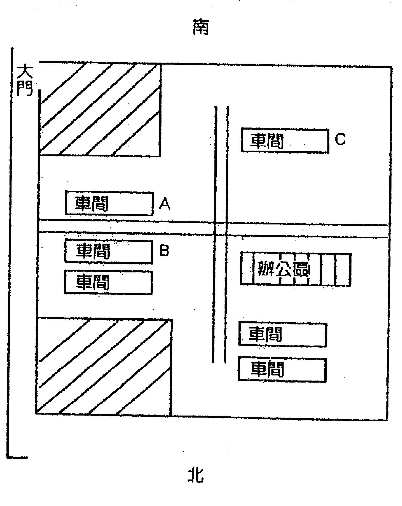

### 【實例2】

2005年11月，在“俏梅花風水術”面授班上，來自瀋陽的學員嚴華，課堂上畫出他家的室內圖，如圖二所示：

「你在社會上交際不廣，人事關係受挫，工作積極認真但得不到領導賞識，導致目前仕途受阻；你們家人身體多病，從住這房子以來就這樣；你妻子子宮有病，99年最嚴重。」

「對、對，就這情況，我妻子99年子宮手術。」

「一高興，再給你說點隱秘的，我知道你家的錢在哪兒放著，讓我說嗎？」

「沒關係，老師您說吧。」

其他學員也興致勃勃等待著。

我用手指著圖上的A處。嚴華點頭鼓掌，課堂上響起一片掌聲。

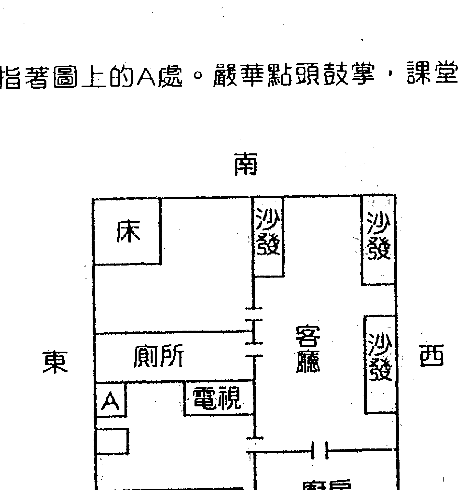

## 第六章 俏梅花風水術

相法預測由來已久，上至皇權，下至民間，中外盛行。這是人們聰明智慧的又一體現。從一個符號、一個紋路、一個斑痣的積累，經過大量的統計歸納，產生了完整的用以預測人生的預測體系。古今中外大量的史料記載，相法預測具有很高的準確性。相信每位相學愛好者都能說出幾則鮮活的事例。但是，儘管手面相上的斑點紋路能夠反映人生的一些事項，卻不會與現實完全吻合。古今聖賢又在精、氣、神上作了有益探討，還是不能盡如人意。有人認為記住幾個紋路，背會幾條口訣，就可以替人預測吉凶福禍了。這三招兩勢在江湖混飯吃尚且不足，距離真正的相法預測那就相差更遠了。相法預測和其他預測門類一樣，都離不開易理來指導分析，綜合全面地看待相學符號組合才是正途。人秉天地之氣來到世間，各色人種，芸芸眾生，千人千面，能是幾個符號概括得了的？所以，死背教條永遠達不到相法高層境界。相學符號和卦象一樣，都是為了提取資訊，可看作是卦象的另一種反映形式，掌握易理，活用易理，一通百通，千變萬化，卻逃不出一個理字。

## 第七章 神相閃電眼

象卦思維解讀相學符號，概括為八大法則：

- 1. 重點部位論變化：用以預測近期或具體事項。
- 2. 左右有別論陰陽：用以預測人生某個側面。
- 3. 形態舉止論動靜：用以預測人生品德貴賤。
- 4. 符號組合論遠近：用以預測人生陰陽宅的風水。
- 5. 相格五行論宮位：用以預測人生事業，近幾年運程興衰。
- 6. 六、七、八：略（面授班講解）。

相學符號是死的，怎樣才能在實際預測中鮮活起來斷出神采呢？古人以心、神、氣、色等論之，又找出光線不好不看，酒後氣色不正不看諸多理由，束手束腳難以深入。現代生活節奏快，哪有時間來等你瞧半天。我在實際預測時，都是運用象卦思維解讀相學符號，即快捷又準確效果很好。

### 【例】

癸未年丑月，易友某易學研究會會長李教授邀我去交談，我和他談話，另一個易友為我添水時水撒了，我當即用本門俏梅花外應技法斷他剛花掉一筆錢。答日果然。
李會長反應快，馬上問到：「鄧老師，我現在沒倒水，看看我的財運如何？」
我說：「可以。你也花了一筆錢，是在前天。」
李會長回答：「是前天，我為家屬買了藥，平時只買一個療程的藥，現在要到年底了就買了三個療程的。還能測出花了多少錢嗎？」
我回答：「2400元左右吧。」

李會長奇怪我測得這麼具體，非讓我講解是怎麼斷出來的。說來很簡單，他問我時，我看了他一眼，問錢財重點觀察鼻頭財帛宮位，財運好正常狀態是黃明潤澤，但是我看到的是一個黑影，他戴著眼鏡，在晚上燈光下，眼鏡架形成一個黑影正落在鼻頭，失財之象，故斷他花了筆錢款。為什麼是2400元左右？加入了外應技法。為什麼是前天？因為當天是巳日，前天不就是卯日嗎？加入外應技法。這也打破了傳統相學晚間不能看相、酒後不能看相的陳規。只要技術過硬，什麼時候不能看呀？

### 一、重點部位論變化

相法預測不一定非看著面孔，扳著手掌的，領會了心、氣、神、形、色要旨，掌握了象卦思維法則，就能從全局來把握求測者。一般情況是有了什麼事才求測的，他們關心的是所求測重點事項準確度，對他近年發生的一些大事能把握住，就足以讓他信服。至於測出他爺爺兄弟幾人來，對他來說不痛不癢，那不是他真正關心的。沒有對象的測對象，婚姻不好的測婚姻，官場測仕途，經商測交易，人生不外乎生老病死，升官發財，結婚生子幾件事，只要用心揣摩，就能做到。

### 二、左右有別論陰陽

在相法預測中，不僅分男女還要分陰陽，面相左右分別看，手相兩隻不同論。具體法則：男以左為主右為輔，女以右為主左為輔。實際操作左右同看，綜合論斷，左為先天自我潛意識，右為後天外在社會性，善於觀察不同點，抓主要矛盾，才能反映根本問題。

### 【例】

壬午年，我在濟南開會，有易友求測，觀其相突出特徵是左右耳不一樣，左耳靠山，右耳前翻。我告訴他：「你家妻子地位高，女人掌權，你的積蓄就依靠你固定工資收入，下海你不行，外邊的錢來得快你花得也快，根本剩不下。財運中等，溫飽型的，一生與大款無緣。」他回答說實際情況就是這樣。看財運本來部位不是耳朵，可是他兩耳差別特徵太明顯。相書云：「兩耳靠山守祖業。」又云：「對面不見耳富有千倉。左耳為先天，右耳為後天。」左耳資訊是內在骨子裏本份節儉，但右耳反差太大，招風耳，這就說明他社會情況財運差，不適宜自己創業，花起錢來大手大腳，存不住錢。

### 三、形態舉止論動靜

相法預測是從符號的角度破譯人生資訊，其實人們在舉手頭足間就已把學識、性情、修養、品德等表露出來了。相法高人可以通過言語行動，坐臥形態中，準確判斷來者的品行才學，繼而推斷過去和將來。步履沉穩有膽有識，腳跟不沾地一生難有大富大貴，言語刻薄常嘆懷才不遇，小聰明難有大成就，待人寬厚常懷仁愛之心，身處困境也終會出人頭地。

### 【例】

在一次宴會上接觸一個朋友，有人介紹這是個有成就的老闆，其席間言語平和真誠坦率，我已心中留意，用飯時他的一個動作，讓我對他有了更深刻瞭解。我們這裏主食是煎餅，他吃的時候，一手拿著一手在嘴巴下接著（乾的煎餅比較酥，容易掉渣）。休息時，他請我預測，我沒加思索就告訴他：「你三十歲前日子過的窮，發跡不過十年。你的錢來得不容易，花的時候更是咬牙。近期你是不是要擴大經營，再上個新項目？」
他說：「已經考察一段時間了，還在猶豫，想請您預測下前景。」
我告訴他大膽幹還有十年好運氣。
今年春節來拜訪我時，很興奮地說：「按您說的我投資二百萬，上了兩台機器，行情也好，效益增加近一半。」

### 四、符號組合論遠近

相法預測觀察符號時，一定要全面綜合來看符號組合，把符號割裂開就有片面性。怎麼樣把符號串聯起來呢？就是象卦思維。

### 【例】

癸未年八月，有個推銷員到我辦公室。我用外應預測了他公司的一些事，他很驚奇，要求我進一步預測時，我用相法預測談了他的居住風水。
我說：「你家是正南大門，東西兩邊鄰居少，西邊三十米內有高坡，院外遠處西北角有個大坑。你家住在村莊的西北角，在你家看西北人家少，東南人家多。」

我說的這些，有的就不是相學符號能看出來的。此人長相，長方臉小額頭瘦面頰，右顴外有個肉瘤，法令紋呈括弧形，除此以外並無其他特徵。他進門我就看出，是農村出身文化不高，但很精明那種人。法令呈括弧形，準頭正，標準午方大門向，兩頰無肉，東西方少鄰居。既然西邊鄰居少，這個肉瘤也主先天財位不吉，再根據顏色判斷，應該是個高坡。他是農村出身現在開公司，說明他以前生活不如現在好，也就說明他陽宅後天風水好於先天風水。所以，我斷他住在村莊的西北，東南人家多，西北人家少。

有些相學愛好者，學習時間不短了，書籍秘訣也讀了不少，看書的時候頭頭是道，一旦臨場應用，卻總是手忙腳亂說不到點子上。學習不可謂不用功，只是不得法而已。

相學符號繁若星辰，各類組合千變萬化。人的大腦畢竟不是電腦，誰也記不全，況且記住了，也是書本上的死符號。要想學好用好相法預測，就要掌握象卦思維。每個符號好比粒粒珍珠，象卦思維是根紅線，串起來才是光彩奪目的項鍊。該從那些方面著手呢？一是，具備扎實的相學基本知識，瞭解線紋痕痣的意義；二是，具備易學基本知識，熟悉八宮十二支分佈；三是，運用五行生剋、八卦象意綜合解讀相學符號，大膽應用走自己的路。

## 第八章 俏梅花命理術

命理預測何突破？枝頭梅花報春色！

命理學是優秀的傳統預測學之一，因其時空資訊具有終生不可改變的特殊性，故而，在系統預測人生資訊中占有相當重要地位，古往今來，引無數英雄競折腰。

命理學領域一直熱鬧異常，百家爭鳴，仁者見仁，智者見智，湧現了許多光耀古今的命學大師。然而，眾說紛紜的背後又說明什麼呢？說明還沒有形成一個成熟的體系，沒有從根本上解決問題，皆屬盲人摸象，面紅耳赤各執一端。究其原因，是因為他們的研究，都囿於八字命局現象的分析，在泥沼中越陷越深，儘管不斷有人提出新見解，終還是穿新鞋走老路，進展不大。

縱觀當今命理學領域，前仆後繼地探討，取得了許多寶貴經驗，突破了神煞的束縛，學會了兩條腿走路（用神與忌神），陰陽辨析也作了有效嘗試，八字預測體系在日漸完善。仅有这些还是不够的，有个本质问题要弄清，八字命局研究的对象是人，人有自身特定的运动规律，必须把这个因素加进去预测体系才完善。传统八字分析，难懂难记难操作，许多人东奔西走地参加学习班，到头来还是丈二和尚摸不着头脑，不要说预测技法难以掌握，就是想入门，也非要下番功夫不可。怎么解决这个问题呢？换个角度来研究，跳出现现在八字分析模式的束缚，要从方式方法上解决问题。世上八字虽有万万千，但是道理却一个。从根本易理出发，化繁为简，直取关键。

数字是科学王冠上的珍珠，世上万物皆数，数字简洁直观，易懂易记，可操作性强。俏梅花命理术，就是化八字为数字，运用易理指导快捷有效的推演人生命运资讯。

阿基米德曾说：「给我个支点，我就能撬动地球」。八字命局的支点在哪里？什么是命局作用的杠杆？怎样才能撬开命局神秘的大门，打开人生奥秘的资讯库？换个思维方式，就会有全新的收获。

在俏梅花命理术中，我们不仅探讨实命局虚命局，还要探讨内命局和外命局的呼应关系。

### 【例】

时间：2005年10月23日
地点：北京某饭店
在场人员：邓海一老师、北京易林盛世文化研究中心总经理赵凤琳女士、樊教授、来自西安的铁板神数大师陈智武先生、誉满海内外的某特异功能大师的弟子李女士以及八字专家刘洋先生。

中午用餐。因为是初次见面，李女士对俏梅花命理预测学不了解，李女士试探性地问：「邓老师，能否展现一下您的俏梅花命理术呢？」

邓老师说：「可以。」

李女士说：「有个男的是（阴历）57年9月12日上午10点左右出生的，能看出是干什么的吗？」

邓老师随口即说：「这个人是武行里的文职人员，师级干部。」

李女士兴奋地答：「对，是个师政委。再请教一个可以吗？也是男的生于……，您能看出这人如何？」

邓老师微笑著说：「这个人不简单。不当官却很有权，不做生意却很有钱，黑白两道通吃，一生很有建树，在某个领域里是个霸主人物。可能跟我们这行有关。」

李女士钦佩地说：「您说得不错，这人是我师父。」（因涉及某位名人，故其出生时间隐去）

当时，技惊四座，一问一答，未见演算，速度之快定位之准，前无所闻。

在返回宾馆的路上，八字专家刘洋先生心存疑惑，请教邓老师：「俏梅花命理术真是神奇，没见您排八字呀，是怎样断出的呢？」

邓老师说：「即使你排出八字，也不见得断出这样的结果。」

刘洋先生感叹说：「我算开了眼界了，其他命理预测学与之相比显得逊色多了，今后我一定好好跟您修习俏梅花命理预测学。」

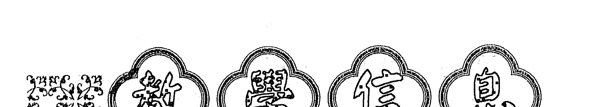

主讲人：邓海一教授

## 主题：俏梅花管理应用易学（完整版）

课程融俏梅花外应学、风水学、相学为一体，综合应用。

- 教学内容：
- 1、中西方文化融合是世界文明的新曙光
- 2、易经是中国智慧的瑰宝
- 3、管理学的第三次革命是心本管理，心本管理的核心是易经智慧
- 4、易学基础知识及易学原理
- 5、俏梅花易学原理在管理中的运用
- 6、易经是研究天地人和谐的大学问
- 7、天时（选时），洞察时机，克敌制胜
- 8、地利（选地），调理布局，催官旺财
- 9、人和（选人），识人用人，壮大发展

## 主题：俏梅花管理应用易学（简略版）

课程融俏梅花外应学、风水学、相学为一体，综合应用。

- 教学内容：
- 1、中西方文化融合是世界文明的新曙光
- 2、易经是中国智慧的瑰宝
- 3、易学基础知识及易学原理
- 4、俏梅花易学原理在管理中的运用
- 5、易经是研究天地人和谐的大学问
- 6、天时（选时），洞察时机，克敌制胜
- 7、地利（选地），调理布局，催官旺财
- 8、人和（选人），识人用人，壮大发展。

咨询中心：（北京）中国俏梅花国际策略机构
网址：www.qiaomeihua.com
咨询电话：86-13062060978

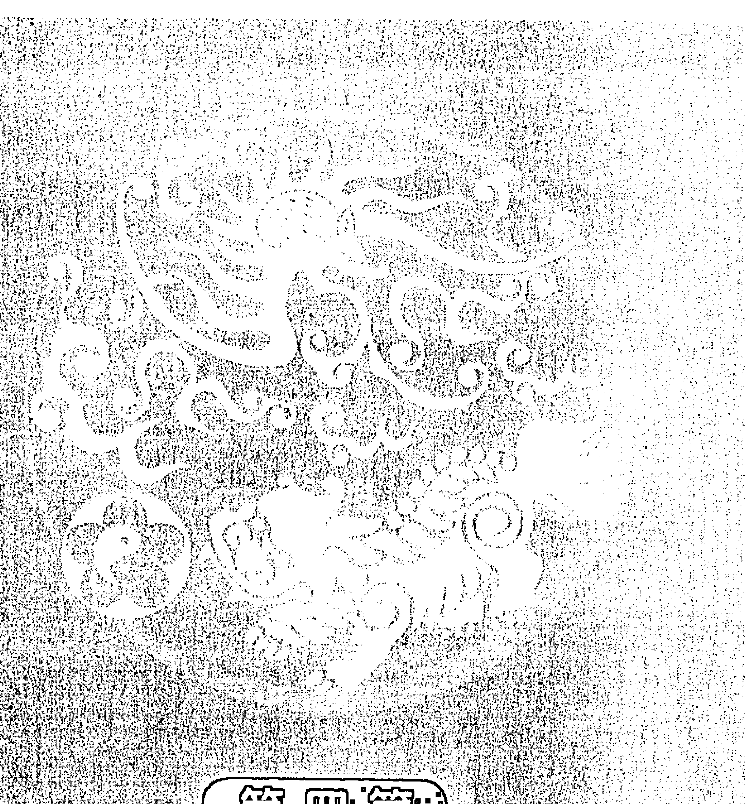

## 第四篇 应制篇

俏也不争春 只把春来报

## 第九章 测婚姻类

### 【例1】不用排八字，也知婚姻事

壬午年十月初，朋友找到我，请我测一个四柱的婚姻情况，79年5月6日戌时。由于当时在街上，手头没有万年历，他又着急，我只得用“梅花数”排出8—5—6—11，此时，有一女青年走过，我决定先用外应方法测一测，当即断道：「这是一个姑娘的八字。」
回馈：「对。」
我就按刚才走过去的女青年的外貌特征，发型、脸形、肤色、体态等描述一遍。
回馈：「太形象了，就跟您见了一样。」
我说：「女孩的家，是咱现在位置的西南方。」
回馈：「对。」
我说：「她现在正谈的对象，家在咱这儿看东南方向。」
回馈：「不对。」
我马上说：「那一定是西北方。」
回馈：「对。」
我接着说：「女孩家的西北角是不是有两棵大树或电线杆？」

回馈：「有两棵大树。」

我进一步思索我断男方家在异方结果不对，总感觉5数的作用，我还没挖出来。我断卦从不放过任何一个反映出来的外应资讯。

猛然醒悟，断道：「男方是属小龙的。」

回馈：「对，65年生。」

这些情况相符后，说明我的思路是正确的，再深层预测：「女孩婚姻不顺，这个对象不能成，她现在思想压力大，要拖一拖，劝一劝，不要硬性强迫，那样容易出事，特别提醒女孩局中有明显车祸标志」（“梅花数的命理预测”不在本书探讨范围，故略，以后讲解）。

回馈：「这女孩找了个对象，父母嫌男方年龄大，不同意，女孩坚持愿意，正要死要活地和家里闹得厉害。」

我嘱咐其回去让女孩父母把院子里的东西，重新调整，十一月底可平安。

日前，朋友领女孩父母特来感谢，告诉我女孩和男方散了，情绪稳定了。

判断思路：外应女青年，即断八字是姑娘八字；8数，坤方，女孩家在西南；5数巽宫；男方家在西北方的原因，一是巽宫对冲，二是11为乾宫。

## 【例2】吉林弟子李家裕测

6月2日中午，我正在看电视，电视中夫妇吵架，这时，易友杨景林打来电话，我问杨景林是否和太太吵架了，杨问我听谁说的，我说是测出来的，杨说确实和太太吵架了，已经十多天未回家了。来电话问我能否离婚，此时电视画面正演到夫妻和好，我告诉杨离不了，杨不太相信，几天后，杨的太太打电话说，她请有名的卦师预测婚姻，说必离无异。

我说：「你们肯定离不了。」

七月二十四日，杨景林打电话说，夫妻已和好，果如所测。

#### 【例3】吉林弟子李家裕测

5月20日，在起名社碰到了教武术的杨教练，他常到起名社与张师傅闲聊，这回和他大师兄刘某一起来，据说刘某在营城一带算卦批八字较有名气，这次到吉林看望杨教练，顺便会会同行。

张师傅说：「我的强项是地理风水，预测一类，你和李师傅谈。」

我和他们讲我正在学习易卜仙人诀，他们很感兴趣，要求试一试，刘某说：「你看我几时结的婚？」

说着站起来，从丑位起到辰位又移动到卯位，我说：「你二十四岁结婚，两个孩子，一男一女。」

刘某说：「对，他们差两岁。」

我又说：「你爱人属鸡，个子不高，体形稍胖，剪短发。你儿子属狗，34岁，女儿属猴，36岁，不知对不对？」

刘某大惊，说：「太对了，我也久走江湖，预测如此神速还是头一次。以前看大仙预测，那是装神弄鬼，但也没你快。这次吉林没白来。以后有时间我也跟邓老师学习学习，这个技法太神了。」

判断思路：他先坐在丑位为2，后又移到卯位、震宫均为4，故断24岁结婚，有一妇女领一男一女两小孩从窗前经过，故断子女为一男一女，刘某太太属鸡，乃是看对宫，太太体形高矮与发型，是经过窗前妇女之形象，刘某先到辰位后到卯位，也说明小孩为一男一女，巽为女，震为男，最后站到震位，应是女孩大，男孩小，辰对宫为戌，故断他儿子属狗。

### 【例4】广东弟子施金延测

2004年2月12日，受香港亲戚之托带了一些物品，要送到其胞妹家，这天晚上十点，过关后刚踏入深圳火车站口的阶梯，人群安静地急忙赶路，突然在我的右边一声巨响，我即朝右边一看，原来是与我并排走着的一位约三十多岁的女子，其右手提的旅行箱把柄断了，手中只抓住了一个把，与箱子完全分离。
我便说了「喔，断掉了。」
随即又想这突然现象一定是某事情之“外应”，似乎象征不好的事情，会是什么事？便想：此女走在我身旁，此事会否与我有直接关联？忽然明白，我肩上背着亲戚胞妹家的东西，应该是她们家的事，那么，是这一家人要分家了！应是这一家的大儿媳闹分家的。
果然，三天后从电话里得知，是正准备分家，是这一家的大媳妇（30岁）竭力要分家的。

判断思路：此女子手提的旅行箱把子断掉了，按常理也可以断其“离婚”，但我即时第一感觉是“分家”，因此女手中只抓住一個靶，“靶”是她的丈夫（杖），箱子就是“大家庭”，她手中抓住的靶子與箱子斷開，表明她和丈夫一起與“大家”分開（分家）。我們向北走，該女子在我右邊，是東面，屬震宮，震為長男，但是個女的，應是長男的老婆即大兒媳，在安靜場合，唯她那裏發生巨響，箱靶子斷了所以是她鬧分家的。

果真是，後聽其家人說，因大兒媳不想多做事，鬧著要分家很久了，後來，家中長輩及鄰里認為分家也好，因大兒媳愛賭，常向家裏要錢，分家後她賭輸就不致連累家中微薄的財產。終於在3月5日正式分家了（注：3月5日是出現外應資訊後第22天，正應“外應”凸顯時間是在22時（晚上十點鐘。定量“在時上尋”），但我當時只想著會出現什麼事，而沒想應期問題。

【例5】山東學員張光軍測

2003年古曆10月17日（丁亥日）過午，我與人談論預測的事，當談到仙人訣講義中鄧老師測外遇，連楊姓都測出來了的時候，他不信，說：「你別吹，你測我有沒有外遇？」

我說：「有，最少是兩個，可能是去年春或今年春天開始的。」

他又問：「叫什麼名字？」

我說：「這個很難說，不過我可以測一下，一個叫“河”一個叫“××福”，如果不對，可能也與這些字有關聯。不過，你們的關係可能已經中斷了。因為現在感情不太好了。」

此人聽後，眼神臉色都變了。緩過神來後，連聲說：「神奇！神奇！」後來，他承認我的預測完全正確。我也更嘆服鄧老師的仙人訣，學好了真能洞察秋毫，盡泄天機！

判斷思路：他問我話時，正在割兩副春聯，春聯音同春戀，故斷春天開始的。說最少兩個，因為是兩張（兩副）春聯，說有，是因為上下聯印在一張紙上，需折疊合起來割，又是親熱、接吻、交媾之象。說關係已中斷，是因為他正用刀割開。說感情不太好了，是因為割時反面朝上，白色在外紅色在裏面，是反臉之象。另，春聯的詞句是：滿庭喜祥春，闔家歡樂年，也與他所問之事似有通意。至於斷他戀人的姓名，心裏也不是很有把握，但全斷對了能說只是巧合嗎？“河”是“闔家”二字斷出來的（是其一戀人的乳名）。另一戀人的字名是聯想出來的：紙以x為單位，春聯分上下聯，所以取x字，春聯又叫對字，論副，所以三個字是：××福，是另一戀人之名。

也許是巧合，也許是一種理性，不管怎麼說，此例讓我感到驚訝。正像鄧老師說的：「有些預測的效果，讓你自己也會吃驚。」（注：因為是真名實姓，在編審時很費腦筋，既要反映出預測實際，又要保護當事人，只能這樣了，大家可以自己去推敲。）

【例6】廣東弟子施金延測

曾有一外地學友遊廣州時，因受人之託要買木製頭梳，請我幫助尋找，買到了許多大小不一、形狀各異的木梳子，回去分給親朋們享用；那其中一人，於2003年11月26日直接打電話找我，要求再幫買一種“魚”形的梳子，我為其先後費了很多時間，都找不到那種“魚形”的梳子了，只好買些其他形狀的梳子寄去，她收到後來電話說，是因為那種“魚形”的梳子最好用，梳頭時感覺特別舒適，但都被其丈夫拿去討好他的情人了，所以想再託我專買那種“魚形”的，買不到了，她及其夫都很失望，並說出她的丈夫情人多，「少也有七個八個」，說「他是想要魚和熊掌兼得」（其實是貪財好色）。

我聽了即對她說：「你的丈夫將是什麼都得不到了。」

她表示懷疑，認為她的丈夫壞習性無可救藥。

我則說：「不是你的丈夫能改邪歸正，而是他的情人們都會一個個離開他，他以後連一個也纏不上了。」她說怎麼可能。

我說：「這是明擺著的，因為他本來是想要“魚和熊掌兼得”，但卻把你家原有的“魚”都送走了，又想要買新的，可是再也買不到了，這不就是說明舊的離開了，想再追新的也沒人理他了，不是嗎？」

她聽著笑了，以為我是說笑話安慰她。其實，這是應用老師的“俏梅花”預測技術，直取凸顯的外應資訊--“魚”為斷事依據。而天地間的事也真那麼巧合，果於今年2月初回饋，證實了我的“玩笑話”正與其結果完全相符。

【例7】江蘇學員任永芳測

見一女孩在深情地唱周傳雄的歌曲，我記得這首歌是在2002年底流行的。於是斷她在2002年底有一段刻骨銘心的愛情。女孩回答正是這樣。再次感謝鄧老師傳授我神技。

【例8】學員（企業家）穆老闆測

這個預測實例是用手機短信為相隔千里的女企業家斷測的。

2005年11月培訓班上，來自上海的穆老闆，以前沒有易學基礎，在短短幾天裹，學習和運用了俏梅花外應技法，談起體會興奮地說：「這兩天，我跟外地的生意夥伴談事，電話裹隨便給他們測幾條太準了，引起他們濃厚興趣，願意跟我聊跟我溝通，並主動邀請我去做客，今後我的生意好做了，談笑間即可成交，我學了預測，有把握企業利潤增加20%。」

穆老闆：「你在房間裹，剛脫了外套，穿件黃色的褂子，坐在床上看電視，對吧？」

女老闆：「是的，你怎麼知道？」

穆老闆：「我現在正跟鄧海一老師學習預測啊。你的房間還有個男的，對吧？」

女老闆：「預測真的這麼神嗎？是有個男的，我剛交的男友，那你測一下我和他是怎麼認識的吧？」

穆老闆：「你們倆是在天上認識的，在飛機上。」

女老闆：「哎呀，你真的神了！我是一次坐飛機偶然結識他的。你還能看出些什麼？」

穆老闆：「能看出的多了，下次再說吧。」

女老闆：「你是不是像別人說的開天眼了？近期來我這兒吧，正好有筆業務我們談談，順便我再請教點問題。」

【例9】內蒙古學員宋振龍測

2005年9月26日，我在家欣賞花瓶圖案，花瓶為2001年造，圖案為牡丹和梅花，梅花枝頭有一個月亮，月亮裏面的枝上落了兩隻鳥，月亮外面還有一隻鳥向這邊飛來。這時，一男子來電話求測，問財運和婚姻。

我斷：「今年得貴人相助多為女性，財運4至8月最好，但都沒抓住，做事沒膽量，肝氣不舒，有時兩肋疼，離過婚，現在交一女友，準備今年臘月結婚，女友皮膚白，清秀可愛，端莊穩重。」

他連說對對對，就好奇地問我怎麼算得這樣清楚的？

我跟他開玩笑說：「我在你面前了呢。」他嚇了一跳。

我接著跟他說：「最近五天將有口舌臨門，事出怪異。」

他的屬相在花瓶上，又告知他的床頭不應擺放電器物品，床向為坐北向南，如不改之，陰曆11月將犯桃花劫。

【例10】江蘇學員宋慶遠測

2005年9月6日，我從朋友處回家，路經一村莊，見一戶人家大門朝南，門西邊栽著棵棗樹，門東邊栽棵梨樹，於是我就驚訝地說：「樹怎麼能這麼栽啊！」

這時有人聽見走過來問：「這樹栽的怎麼了？」

我說：「棗梨，早離，早早分離之意，但不能離掉，只是鬧的厲害。」

這人又問：「您看在哪年鬧離婚？」

我說：「2001年鬧得最凶。」

這人嘆服說：「對，真準！」（因大門在午方；梨樹尚小）。

【例11】山東淄博學員王玲測

2006年，有一朋友對我說，他的一位朋友感情出了問題讓我幫忙，當時要他八字，因以前家境不好，父母把生日時辰都沒記下，沒辦法我只好用俏梅花以解燃眉之急。

經主人邀請我去了他家，剛一進門東南角放一魚缸，06年4月放的。當即斷男主人4月已亥沖，有桃色之事發生，對象應是西北方位女性，歲數小，有能力有公職之事，此插曲現在已經影響夫妻感情。

男主人點頭：「是。」

隨即看兒子的房間，當時我坐沙發，朋友斜躺在床上和我形成對沖。

我當即斷：「99年女主人有工作上的大的變化。05年也有（主人說對）。01年02年家中和外面有窩心之事，是因為親戚朋友事工作上出了點麻煩（巽宮書桌亂並有一答錄機）」

主人證實那年因為侄女帳目上的事受到牽連鬧的很窩心。

「2000年有外出旅遊之象，去了東南方，現在你的上司為女領導，關係不錯，短髮中等個。」

斷到這時，這朋友跳下床來笑者說：「所斷正確，打一百分。」

我說：「別慌，還有你家中上輩子有想不開的人，不是屬羊就是屬猴的。」

站在我身後的朋友突插話：「自殺應是上吊吧！」

朋友取巽宮有一鐵絲鉤子掛著，受我影響，朋友看了幾遍鄧老師的書，雖無易學知識，但時不時的用這些技法作一些精彩的表演，所斷之事讓她自己都瞠目結舌，語驚四座，因是公務員沒有太多時間研易，但是悟性特強，經常是出口驚人，感嘆俏梅花確實神奇！

女主人驚嘆：「確實有，是我家舅舅，因去世早我老公都不知道，屬相是猴。」然後欣喜的直呼：「神！」口中還連說：「再斷，再斷。」

我又斷道：「你們以前住過高樓並且是樓頂。」

回答對。04年男主人有提升之事但曲折（西南有一樓梯），又斷男主人工作性質管的是綜合性的事，事多瑣碎，是管後勤政務。

這時手機收到了兩個資訊（已時）祝福情人節快樂的事。

「你老公的事再也不要掛在心上了，不長時間內你們會和好如初，幸福美滿。」

由於所斷之事準確，我便用易理之法為他們遇到的感情插曲和他們的平時一些不足，做了一些評說和耐心的引導，他們心服口服，問題迎刃而解，不長時間後兩口子和好如初，互相照顧體貼像初戀的感覺，同時我們也成了很好的朋友。我由此感覺自己有了成就感，也做了一件善事、圓滿事。

【例12】湖北學員一兵測

元月8日晚，聊天時西安的實習生李永求問姻緣。

「你以前交過女朋友，並且關係非常密切，你女友喜歡穿紅衣服。」

「對！你怎知道？」

「她還特喜歡展現自己，愛出風頭。」

「您說的太對了，交過三個女朋友，名字裏都有“紅”字，怪吧？談了幾年，最終還是分手了。」

我接著說：「你們從03年開始的，前年分的手。」

他說：「有六年吧，反正從初三就和她相處了，分手快兩年了。」

最後，他問何時才會有姻緣。我說：「卯年。」

此次，現場一問一答的預測，使所有在場的人大開眼界，也再一次印證了俏梅花外應預測的快速準確，令人信服的神奇！過後，他還在感嘆，說：「過去不相信預測，這次是親眼見識了。」

據李永說，他三個女友有兩個的名字一模一樣，都是“紅”字，另一個是“宏”，音同。其對應的是兩個一樣的紅本本，而午位為離為紅為同性。此例讓我又有深的感悟，更深刻地領悟了易理的精妙，慨嘆造化的神奇！

## 第九章 測婚姻類

## 应用篇

### 测谋事类

- 【例1】我听打电话，他事变了卦

庚辰年辰月，我在济南易友处，正遇一包工头求测，包工头承揽了一项商场装修的工程，双方接触一段时间，事情有了眉目，估计近期签约，他问投标的情况。易友请当时在场的一位颇有名气的预测家为其预测，易友走到一旁打电话，那位预测家根据六爻演变，一条条为包工头推算，结论是夺标可成，利润丰厚。这时易友电话也打完了。我不便说什么就写个纸条，递给易友。当时是这样写的：此项工程承包，夺标无望，第五天见分晓。事后请把结果告我知。半月，我收到这位易友的回馈，实际情况真的没成功，在第五天的竞标会上，另一个竞争者以只比他稍强的优势，占了先机。并问我是如何测出结果的。

判断思路：预测刚进行，易友忙着打电话，实为走漏消息，即包工头拟定标的，由于保密工作没做好，被对手知道了底线；另外易友所打电话内容，也是在谈找人办某件事，谈论的结果是不欢而散；第五天，是因为我们当时4人，都坐着又加了一天。

- 【例2】悟通一煙圈，破財還賺錢

辛已年初六，某大酒店新年開業，我應邀前往。吉時一到，樂炮齊鳴。異狀發生了，在繚繞的煙霧中有個因鞭炮煙霧聚集而成的大圓圈，飄飄悠悠，由東向西，越過老闆的頭頂又轉向西北飄去。當時，在場的十幾人，熱熱鬧鬧，沒人去注意這個煙圈。只有我留心到這個現象，這就是我們與其他人不同之處。由於是新年開業第一天，不便掃老闆的興頭，沒多言語。

- (1) 今年春季二月前，因酒店經營問題，要發生嚴重口舌之爭，你的頂頭上司要找你麻煩。
- (2) 本年開支大，與口舌之爭有關。
- (3) 入秋以後，生意越來越好，整個經營狀況好於往年，但收支相抵，與往年持平。

「目前沒有異常跡象，我和局領導關係很好，節前走訪時，他還鼓勵我好好幹。這才幾天，應該不會有麻煩。真要有麻煩時，我再找您。」

實際情況是，正月十五過後，市直部門領導班子調整，來了個新局長，燒上三把火，打開新局面。其中一把火就燒到老闆頭上，有人反映他經營酒店時間太長，局委會研究決定更換承包人。老闆這才慌了手腳找到我說：「又讓您測對了，想不到的事。」他聽了我的建議，四下活動，著實耗費了錢財。經過反覆交涉，最終答應再讓他繼續承包，不過局長為了挽回影響，增加了酒店年上繳利潤。入秋後，生意果然紅火，天天爆滿。

判断思路：煙霧圓圈似人口形，由東方發起，直指西方，兌亦為口舌，兩項相逢，當見口舌之爭；木旺於寅卯月，金不利，好在當時煙圈先是豎著向西沖，越過老闆頭頂處，轉形平移，可見這事與頂頭上司有關聯；煙霧繼續飄向乾方，乾，錢也，所以入秋之後金旺時生意好。

- 【例3】內蒙古學員宋振龍測

2005年2月17日，市某領導請我為其家勘察風水，見面後看我年輕顯得不太熱情。我即用外應面授技法，單刀直入斷其31歲開始走官運，2001年仕途受阻，總體官運比較平穩，今後上升空間不大。有才華但傲氣，不會來事，不擅交際，不愛求人辦事。31歲前從事財務工作，96年財運最好，02年財運不佳，妻子下崗，05年單位有提職機會但無人推薦他。

句句說到實處，他坐不住了馬上給我遞煙、倒茶水，熱情起來，並說能否再去單位看看辦公室風水。

我說：「現在即可給你看。」

話一出口，大腦一片空靈，繼而出現圖像。我斷其辦公室西南角有個金屬大衣架。聽此言，他驚訝得從沙發上彈起來，連說我有特異功能。我告訴他是用俏梅花外應技法預測的（緣起面授時，第一天講課前老師談了個例子，老師講話時，我高度集中，直覺胸中有個圓球裂開，分成五瓣並旋轉著。老師例子還沒講完，我已知道例子中的人死了。從此，我即有了點特異功能，是老師的能量激發出了我的潛能，寫至此我已是滿眼感激的淚水，謝謝您鄧海一老師！）。

由於他的打擾，我大腦中圖像消退了，我只好憑記憶畫出他辦公室狀況，我說他坐東向西辦公，時常頭昏，門開西北，東為沙發，北為書櫃。他見此圖甚感驚奇，完全正確。晚上請我吃飯時，又故意問我酒名，我大腦再次出現圖像，顯示“西鳳”字樣，直說是西鳳酒，他在佩服聲裏把西鳳酒打開。以上所寫句句是實，如你邊有特異功能者請他考察，你也可以預測一下，我在寫緣起時，眼中滿是感激鄧海一老師的淚水！

- 【例4】山東學員潘忠傑測

甲申年2月初，應農機站長邀去閒聊，見其辦公室的西牆南邊掛著一塊畫匾，畫面是“大海行船，一帆風順”紅日彩霞加時鐘，我說：「你今年權位難保啊。」

他問：「為什麼？」

我答：「你看那塊匾即知，人家本來日出東方，你卻日落西山，今逢猴年，匾在猴位，且時針已停止不動了。」

「唉，今年正月初八，鎮上通知我去開會，說叫我退休了。」

我言此乃天意。又根據室內外佈局我斷言：「你在97、98年發大財，2001年也不錯，2002年開發新專案（馬年、有門）但掙的錢拿不回來，（南院有自來水）在午位，別人正在使用之。」

「可不是，錢是掙了，至今也未給咱，他貨沒銷出去（與韓國聯營），真晦氣。你看看今年怎麼樣？」

「今年你在東北方位仍有財可發，可能是水產、水利方面。其他不理想。」

「我在東北方有兩個養魚池，上百畝，還有連生樹林。」

- 【例5】山東學員潘忠傑測

上個月，某學校長來預測，他問要把辦公室改為二層樓是否可以，並邀我去了學校，一看才知他已拆了上蓋，我心中一愣，有不祥之感，看了學校環境我說：「此園吉凶參半，我還以為你只打算改建，你卻已經拆了。」
帶我去了臨時辦公室在丙位，落坐後觀其佈局，我說：「你在94年有好事，工資漲幅很大。」
「是啊，94年我結婚，那年工薪確實長的最大。」
「02年你變了單位。」
「對，正是02年調到本校。」
看其末位放一高型座鐘，擺動很慢。我說：「你去年想動，但未動成。」
「那今年能動否？」
「今年不可動，動則有不好的事。」原因申位空無吉物，坐空無人，不吉之兆。過不久聽說他已被拘留，因賣學校地產之故，我悔自己學得不深，沒能再深入斷出事來。

- 【例6】河南林州市學員鐘與昌測

我有一個姓任的同事，因電信局要在2003年庚申月戊日以業務技能考核為依據，淘汰後幾名人員作為下崗對象，為此，他庚申月庚申日酉時到我家求測考試能否過關一事。
其四柱是：乾：乙卯 戊寅 庚子 丙戌
卯流月，流日庚申，酉時，是庚坐比為忌最旺之時，比劫為競爭場所，意味競爭有失敗的徵兆，在求測中，求測人又不斷變化座位，先從和本人並坐的沙發東移到西方座位，更印證了本人思路的正確，所以我直斷，落選下崗，其人的確在本月底捲鋪蓋回家。

## 第十章 測謀事類

- 【例7】江蘇學員戎建豐測

某副省長問工作能否有變動。我見他從一張舊椅子上坐到旁邊新沙發上，空調邊有本《潛能速醒》的書。我判斷說：「您馬上要去黨校學習，高升在即。」

此後兩天，通知即到，通知他到中央黨校學習。現在已學習十多天了，昨天來看我，非常高興。

- 【例8】江蘇學員戎建豐測

一個朋友問：「你知道我要問你什麼事嗎？」
此時，他腳尖點著地面上的黑色瓷磚。
我答：「是與土地有關。」
他說：「對。」
我繼續說道：「你想問挖煤專案的結果，對吧？」
他說：「是。」他雙手交叉，兩大拇指在咽喉處點了兩下。
我說：「你的項目被卡住了二次，沒批下來。現在是關鍵時刻。」他答是這樣。他邊說話邊把一本書放在手機旁，又向空調處挪移。

我說：「你的一位貴人應該很快就與你聯繫，請人家幫忙就能成功，不要沒信心。」話音剛落，有電話找他，原來是他的病號，某重要領導的夫人。他在交談中說起這個事情，對方答應幫忙。現在這個項目已經批下來了。

### 测交易类

- 【例1】江苏学员戎建丰测

癸未年九月的一天，一位姓王的朋友来测事，当时有四个人在坐，不便讲，待其他二位相继走后，他问我最近有一项工程准备投标，看有没有中标的可能？

我正寻找外应，这时电话忽然响了。我接完电话后对姓王的朋友说：“你中标的希望非常小，因为消息已经走漏。”

判断思路：按照老师《讲义》中的例子，刚要测事，电话响了，又是坏消息，故断中标无望。请老师点评。

- 【例2】天津学员吴春明测

我的一个朋友，计划把他研究开发的软件卖给国外一家公司，不知应该报价多少，要价高了，交易难成，要价低了，自己吃亏，就打来电话咨询。我当时在看电视，依据外应取断，让他报价50万元，最后成交价会是37.8万元。双方接触，经过激烈的讨价还价，结果以37.8万元成交。

- 【例3】江苏学员戎建豊测

我有个朋友在银行工作，负责管理贷款业务。一天，打来电话咨询，说：一家公司申请贷款，他考察后仍然拿不准是不是该发放这笔贷款，特来电请我预测情况。

我在闭目间，突然看到一个巨型三角撞坏一个大门的图像，睁眼又看到桌子乾方有半碗水。我问道：“这家公司当前的效益还可以是吧？”回馈：是的。

我对朋友说：“这家公司虽然目前效益还好，但是近期要有麻烦，要惹上很大的官司，收货时就困难了，这笔贷款还是不放为好。”隔几天，朋友又来电话，声声言谢，告诉我说这家公司果然惹上了大官司，幸亏听信我的话，那笔贷款没放，要不然二百万元可怎么收回啊！我要感谢老天让我遇到了邓老师，得到了老师的指导，受益终生。

- 【例4】山东学员张光军测

有一天，我有事去朋友家，朋友正在吃饭，边吃边问我，有一项安装工程（安装铝合金门窗）能不能接到手？正在这时，他不小心弄翻了饭碗，饭撒了一地。见此我说不成了，工程让别人接去了。后来朋友去一问，果然被别人包去了。

判断思路：干活与挣饭吃有直接联系，饭撒于地是挣不到饭了的类象，也就说明工程包不成了。

## 第十章 测谋事类

（注：此章节标题在原文末尾重复出现，但根据上下文结构，应为“第十章 测交易类”的后续内容或排版错误，故按原文保留，但调整格式使其清晰。）

- 【例5】山东学员潘忠杰测（原文在“第十章 测谋事类”标题下直接开始此例）

甲申年2月初，应农机站长邀去闲聊，见其办公室的西墙南边挂着一块画匾，画面是“大海行船，一帆风顺”红日彩霞加时钟，我说：“你今年权位难保啊。”

他问：“为什么？”

我答：“你看那块匾即知，人家本来日出东方，你却日落西山，今逢猴年，匾在猴位，且时针已停止不动了。”

“唉，今年正月初八，镇上通知我去开会，说叫我退休了。”

我言此乃天意。又根据室内外布局我断言：“你在97、98年发大财，2001年也不错，2002年开发新项目（马年、有门）但挣的钱拿不回来，（南院有自来水）在午位，别人正在使用之。”

“可不是，钱是挣了，至今也未给咱，他货没销出去（与韩国联营），真晦气。你看看今年怎么样？”

“今年你在东北方位仍有财可发，可能是水产、水利方面。其他不理想。”

“我在东北方有两个养鱼池，上百亩，还有连生树林。”

（注：此例内容与前文“【例4】山东学员潘忠杰测”高度重复，疑为OCR识别错误或原文重复，按原文结构保留在此处。）

- 【例6】山东学员潘忠杰测（原文在“第十章 测谋事类”标题下直接开始此例）

上个月，某学校校长来预测，他问要把办公室改为二层楼是否可以，并邀我去了学校，一看才知他已拆了上盖，我心中一愣，有不祥之感，看了学校环境我说：“此园吉凶参半，我还认为你只打算改建，你却已经拆了。”
带我去了临时办公室在丙位，落坐后观其布局，我说：“你在94年有好事，工资涨幅很大。”
“是啊，94年我结婚，那年工薪确实长的最大。”
“02年你变了单位。”
“对，正是02年调到本校。”
看其末位放一高型座钟，摆动很慢。我说：“你去年想动，但未动成。”
“那今年能动否？”
“今年不可动，动则有不好的事。”原因申位空无吉物，坐空无人，不吉之兆。不久听说他已被拘留，因卖学校地产之故，我悔自己学得不深，没能再深入断出事来。

（注：此例内容与前文“【例5】山东学员潘忠杰测”高度重复，疑为OCR识别错误或原文重复，按原文结构保留在此处。）

## 應用篇

【例5】山東學員張光軍測

古曆11月25日上午（乙丑日）吃午飯時，我與妻子邊吃邊議論今年春聯的銷售情況。在我的銷售客戶中，有一名叫呂秀林的，每年替我銷不少貨，不知今年還能不能來。正在這時，電話響了。我妻子去接電話，原來是其二妹子打來的電話，談的是替我妻子做衣服的事。

我妻子放下電話，我說：「呂秀林會來的。」果然，只過了幾分鐘，呂秀林就打電話來訂貨。

判斷思路：1、正在吃飯，談起了生意，有共同性，能掙到飯象。2、其二妹打電話，談的是為我妻子怎樣做衣服的事，衣服為印星，是保護之神，顧客是財星，是“上帝”，也有共同性。

【例6】山東學員潘忠傑測

三月初的一天晚上，一青年來問做一生意成否，其人來時，面赤，酒氣足，當即坐在兌宮。我說：「你要做的生意不動資金，不費力氣，以口為業，資訊方面。」

「對，我一表兄單位用煤炭，另一親戚在煤礦銷售煤，倆人不相識，都願幫我作點生意，我從中搭橋，他們給我一點資訊費，少則幾萬，多則幾十萬元。」

此時，他接一電話，又電視中小火車被炸，少劍波（電視劇《林海雪原》）被土匪騙了。我又說：「你這生意做不成了。因資訊透露，他們之間直接做了，反你拋在一邊。」

## 第十二章 測錢財類

【例1】日柱論八字，外應顯天機

辛巳年秋，我在教學員探討八字，有學員說，單憑日柱也可斷事，比如壬辰……他沒說完這句話時，一抬手碰翻了茶杯，水灑在他剛寫的“壬辰”二字上。我當即說：「我先給你斷件事，後天你將得財，但到手後，又要支出一部分。」

學員道：「不可能，發工資的日子不到，我不做生意不做買賣又不當官，何處來財？」

我說：「你先不要否定，事實勝於雄辯，到時候把結果告訴我就行。」

三天過後，學員的回饋是這樣的：第二天一上班，上級主管部門打電話通知他們派人領存摺，發房差補助。這可是意料之外的錢財。學員心想得財讓我測對了，但是日期不對。奇就奇在，當天下午主管部門又打電話，讓把存摺再收回去，數額算錯了，調整後再發。真的是第三天才發到手。在第三天還有另外一樁奇事，上午來個親戚，欠了他一年多的300元錢，偏偏今天想起來還錢。他當時心裏是抑制不住地興奮，不是因為這300元錢，而是驚奇於我們預測學神奇的準確性。下午又來個朋友向他借200元錢，本來想不答應，挑戰我預測的準確性，但是左右權衡礙於情面，跟預測過不去，不能得罪朋友呀，天意難違，還是借出去了。

判斷思路：壬辰日柱，本身壬水見辰土就為財，巧了他杯中之水又流出來；當天是申日，第三天戌土沖辰土，所以得財又支出，皆戌土之故。

【例2】山東學員張光軍測

2003年古曆10月24日（甲午日）上午9點10分左右，我坐在炕上邊看書邊喝茶。忽然不小心弄翻茶壺，水撒於地上（炕上，快而急之象，又在眼前），我急忙扶起茶壺，壺中水已不多了。我立即想到是破財或耗財的事要發生，數額在千元左右，應期該在最近，最多不超過七天。

對此事我立即作了記錄。結果10月26日就驗證了。原來是我妻子的二弟開石材廠，鋸片掉下來砸傷了工人的腿（嚴重骨折），住院急需交押金，其石材廠剛建廠不久，效益不好，負債很多，我得知消息，礙於親情，無償地送去一千元相助。

【例3】山東萊州學員潘忠傑測

癸未年臘月初七日（子月，丙子日）某單位文書邀我去聊天（問兒子婚事），其辦公室還有一位打工者，坐在兌位，我居卯辰位，文書在艮位。

我對打工者說：「你在兄弟排行中絕不是老大。」
「對，是排老二。」
「99年，你有是非，又不像官司那麼嚴重。」（因他手中不時地打火吸煙，話也不少），答曰：「是跟我三弟爭吵打架，為父母的事。」

「你三弟屬大龍的，1米73的個頭，長髮，」

「對，對，對」

「你在兄妹中話最多，你家東北方有水溝，且98年運氣較好，對吧？」

「是這樣的，先生神算。」

此時，文書從寫字臺下拿出不滿的一瓶酒送給他，因打工者說年底急於回家，討要工錢，文書說明天（初八日）再來吧，經理今日開會去了。我插言：「後天初九準拿到錢。」（酒為九音，文書送到眼前的良方。斷98有水溝之應，初八日，被月令子所絆合不得之故。）

過了幾天，文書來電話約給其他人測事，便提起了以上之事，他說打工者的工錢我給他送去了。我說：「對呀，那酒就是你送到人家跟前的，是初九吧？」

「是呀！」

「是四千多元吧？且你沒給齊錢。」

「對，你怎麼知道？」

「哈哈都在你的那瓶酒上啊。」對方驚喜大笑。

【例4】山東學員張光軍測

2003年10月25日（乙未日），上午10點多鐘一女士來我家購買結婚對聯，付了她一半多一點貨後，其他幾樣我怎麼也找不到了。急得我團團轉，始終沒找到，最後我說你先把這些拿著走吧，以後我找到叫人送去。

在我沒找到東西時，忽然平度一個朋友來電話，說他在外面有4、5千元款沒收上來，對方有些不講理，看看是否還好要？我一時沒取到外應，便打電話問鄧老師請教，是否還能給，老師說能給，給一半（注：4、5千元款，卻沒有打欠條）。

放下電話我心想鄧老師真神了，這樣的問題，張口就說。我卻不知道鄧老師是用什麼外應斷出的。這時猛然省悟了，剛才付結婚對聯的情景不就是外應嗎？她來拿對聯，我沒找齊貨，還欠她一小部分，她拿著一半多一點的貨就走了，也可引申為追款之象嘛。於是我拿起電話對我朋友說了。我說不要鬆口，他最少付一半給你，可能一半還要多一點（注：我是第一外應現場，鄧老師是第二外應現場，鄧老師張口就回答，實在不簡單）。

【例5】浙江寧波學員鄭鋼測

2004年4月21日晚妻下班回到家，見餐桌上有菜，說道我餓了，然後端起鹹肉冬瓜湯就喝，邊喝邊問我：「能否測出我們今天做了多少營業額？」

我說：「你們今天做了六千二百元左右。」

妻說：「正確，剛好六千二百元，本事長了啊。」

斷此數所取外應是妻喝湯，湯為水為坎故為六，嘴動象明顯，嘴為兌為二，不正是六千二百元嗎？

【例6】河北學員丁聰測

癸未年5月，我到一朋友開的服裝店去玩。進門正趕上一相師為女服務員看手相，只聽女服務員說道：「你說我前幾年破財，你看是哪年，什麼時候？」相師面露難色，半晌不敢輕下斷語。

我說：「去年八月，陰曆。」一語中的。

取用外應：女服務員當時站在南方，問話時，邊說邊走，引起我的注意，一直看她繞到了正西方才停下，所以斷是壬午年酉月。

【例7】浙江寧波學員鄭鋼測

2004年4月18日下午，公司有塊很大的玻璃要處理掉，因此找來收舊貨的人問他是否要買，收舊貨人說他的朋友要，詢問賣多少錢？單位同事王某說這麼大的玻璃最起碼能賣四五十元錢。他剛說完，我接上說到最多只能賣20元。之後，我出車去接晚班經理來上班，幾分鐘後回公司剛走到門衛處，看見那個收舊貨的人和其他二人一起，把一塊一角有缺損的大玻璃抬出來。我問收舊貨的人，是不是二十元錢買的？他說對，正好二十元。

斷此價格所取的外應，其一是王某說能賣四五十元時，旁邊的另一位同志沈某，剛好拿出一把鑰匙來玩，鑰匙外應明顯，鑰匙為兌為二；其二，回來時看到玻璃一角缺損，缺也為兌為二，故斷為二十元。

【例8】吉林弟子李家裕測

2003年七月份，一天，星期六晚上九時多，我關燈準備睡覺，電話鈴響了，是山東青州一位易友打來的電話，詢問鄧海一老師的住址及電話號碼，又問了一些關於外應預測方面的事，隨後很客氣地說：

「不用別的方法，只用外應預測一下我今年和明年的財運。」

我說：

「你今年財運不如往年，財運下降，銷路不暢，找買主困難，明年財運好，有待於驗證。」

他說：

「你說得很對，今年財運確實不如往年，我用六爻算了一下，明年財運和你斷的一樣。」

判斷思路：接電話時未開燈，室內黑暗，以此為外應，黑暗代表下降等，故斷今年財運不好。他買的是盜版書，不知道鄧老師的位址及電話，以此為外應斷他找買主困難，斷他明年財運好，晚上過去，明天必然光明，光明代表上升，故斷他明年財運好（此有待驗正）。

【例9】吉林弟子李家裕測

2004年2月20日，易友唐明君到我家來，他在工作中出點小毛病，怕罰款，自己搖了一卦，卦中兄弟爻動，他認為要破財，找我問此事，並拿出卦讓我看法，我說不破財，而且還要增加收入，在百元左右，他不相信，3月份打電話來說，果然沒罰款，確實增加收入八十多元。

判斷思路：我二人看卦時，我愛人端了一杯茶水放在唐的面前，水為財，故斷他不破財，還要增加收入在百元左右。

【例10】山東學員張光軍測

這個例子雖然是照搬鄧老師資料，卻準得讓人驚奇。
9月27日（戊辰日）早飯後，一朋友來我家閑坐，我老婆泡茶招待。當我老婆給我添水時，水沒有先添到茶杯裏，而是添在茶杯外的乾位，我一看，她在巽宮，我在乾宮，灑在杯外的水不多，今天又是辰日，在巽宮。她給我倒水先灑於杯外，後添入杯內，是快的類象，水為財，灑出的少，花錢不多之象。我何不按鄧老師的思路斷一下，看是否驗證？
於是我告訴對象說：「你可能要去東南方一趟，要花一點錢，不過花不多，並且今天上午就能驗證。」
我老婆說：「你這麼說了我偏不去，試試靈不靈？」
可是不到一個小時，我老婆笑著對我說：「還是讓你測對了，剛才來了個賣豆腐的，我去買了兩元錢的豆腐，正是在東南方向，買回來我才反應過來，想不出門也不成！」

【例11】吉林弟子李家裕測

2003年5月31日，我到易學起名社去，李興橋和我半開玩笑地說：「我明早去龍潭山，你看能有什麼事？」
我本來不想回答，這時停在門口的兩輛自行車在無風的情況下，突然倒了，壓在一起。我想，這不就是外應嗎？就說：「你明早是騎自行車去，要和別人相撞，破財二十元。」
李興橋不信，說：「是騎自行車去，為什麼是我與別人相撞，而不是你？」
我說：「這也很簡單，因為是你問我，再說，明早我也不去龍潭山。」

李興橋不服：「明早你也去，看看應在誰身上，事情發生在幾點？」

因自行車放在辰和巳的地点，又說明早去，故不會辰時，辰為5，我說：「時間在明早5~6點。」

李興橋說：「那好，明早五點整，我到你家找你。」

6月1日早不到5點，我就到樓下等李興橋，等到5點15分，李興橋才來，見了我說：「讓你說對了，剛才我和一婦女騎車相撞，說來奇怪，大馬路上沒車沒人，人家停在那兒，我就把人撞了，花了10元錢，買了瓶藥給人家。」

從龍潭山回來，我請他吃早點，他仍然有點不服，說：「你只對了百分之七十，你說破財20元，實際我破財10元。」

我說：「這只是試驗，不足為憑。」

6月2日，他碰到我，說：「這回真服了，我昨天回去，腿有點腫，又花10元錢買了一瓶藥，正好和你預測的一樣，騎車相撞，破財20元。時間也對，鄧老師的外應預測學真是叫人嘆服。」

判斷思路：兩車倒在一起，即有相撞之意，車有坎象，水位1，故破財20元。

【例12】山東萊州學員潘忠傑測

去年臘月八日（丁丑日），兩位臨村婦女來算命，進門坐在丁位，剛一坐下，我說：「你今日去南邊，花了六十多元。」

「七、八十塊。」她搶著答。

「不對，你好好算算，應該六十多一點。」她又仔細一算，是不足七十元。

外應是，丁丑日，丁為4丑為2，且她坐丁位，因日干生坐下丑土未動，斷花錢而非進財，丁4，丑2，並且不可能是6元，日常中花六十元即不少。

【例13】山東萊州學員潘忠傑測

二月初，在某商店一女職員問其婚姻，我說：“先說說你商店的情況吧，去年收入不太好，至少不如前年。”

未位雖有飲水機但空而無水。午位有兩隻暖瓶且有水。此時老闆（女）進來，我說：“02年你有口舌或官司。”火爐在離方。

答：“對，98年收入最好。”寅位有水盆……

## 第十二章 測尋人類

【例1】山炮一聲響，尋人在當場

辛已年春，我的一位朋友有急事要到山地採石場找人，因為只知道大概地方，沒有電話無法聯繫，找起來有困難，就拽上我同去。開玩笑說：「今天找您當定位儀，您說能不能找到那個人？」

我也笑著說：「你不是找到我了嘛，就能找到他。今天你是要考考我的本事。」

我們驅車一個多小時，來到接近他說的地方。一條南北大路，我們向南行駛，路東、路西都有山，我們不熟悉當地環境，弄不清該去東邊山頭，還是西邊山頭。他問我怎麼辦？

我說：「你請我來了就聽我的，保你找到人，不走冤枉路。」

現在去位於路東的東南方山頭，他在那裏，到了山下再定具體方位。為什麼去東南方的山頭而不是西南方的山頭？因為當天是巳日，東南也。到了山下，一看山上有五、六個採石場，又不知該去哪一個了。忽然，左邊一採石場炮聲響起，沙石飛揚。

我說：「你就去剛才放炮的那個採石場，要找的人正在石場的左邊站著。」朋友按圖索驥，很快找到了那個人。

判斷思路：訣中有『動觀其變靜聽聲』，靜中求動，聲即動。聲，分音、數、方位。這個例子雖然是講日辰取用外應的，但是在實際預測中，幾種法則往往綜合運用。

【例2】

癸未年正月初七（辛亥日）辰時，一婦女面色恐慌，登門求測其女兒出走事項。

我對她略作安慰，說：「你閨女和你吵架了。」
回答：「是，我批評了她幾句。」
我又說：「因為男友的事吧。」
回答：「雖說女大不由娘，大人說兩句，那也不能說走就走呀。您幫幫我的忙，看看她上哪兒去啦，在外邊不會出什麼事吧，哪天能回來？」

我說：「你放心，沒事。她和男友一塊走的，去了西北方可能想找點什麼活幹，5天就回來。」

聽我這麼一說，婦人神色安然了，又關切地問：「有多遠？」
我說：「100里左右，是個城市，就是說去中州了。」

我明確地說：「我不是用好話安慰你，十一那天回來，到時候給我打個電話。」

實際情況：十一日下午，我接到回饋電話，說2點多鐘回來的，其他情況如我所測。

推斷思路：其他外應沒有明顯特點，大過年的，大家對日子（時間）都較敏感，所以取日辰作外應。辛亥日，干支同屬陰性，與母女相對應，辰時，辰為水庫又為官，這事又與女兒男友有關，少女為兌為口舌，再看日辰組合，亥水受剋輕，事情不大。女兒（亥水）並無凶象，能回來。亥屬乾宮，乾為都市也說城市，乾為1，1里、10里、100里等，1里不可能，10里起點，亥水受生旺應該在100里以上，但有辰之作用可斷100里。5天回來，因為辰為5。

【例3】吉林弟子李家裕測

2003年6月10日上午，在易友起名社與張師傅閒談，這時來了一個張師傅的朋友，姓常，此人在火車站前設攤算卦有十幾年，他拿來一個他朋友求測的卦例，他朋友有一相好女人，已經一年多了，最近突然不來了，也無消息，測一下此女做什麼去了，能否回來，常易友斷此女已另有新歡，回不來了，問張師傅這麼斷有沒有出入。

這時進來一位姓郭女士，想讓張師傅測一下兒子考大學的事，張師傅忙著接待客人，就指著我對常易友說：「讓李師傅給你解答吧。」

我說：「你朋友的相好離過婚，她有一男孩，今年考大學，她為此事奔忙，此事一過，就會回來，大約在七月十日左右，此女身高1.60米左右。」

常易友說：「你也沒看卦，根據什麼這麼斷？」

張師傅說：「李師傅正跟山東一位姓鄧的高人學外應預測學，他就是用這種方法。」

七月十五日，常易友又來了，說：「太神了，你所測的，我問了我朋友和你說的一樣，前天，女友也回來了。」表示佩服，中午請我和張師傅吃飯。

【例4】四川省閬中市學員鄢發彬測

去年冬天的一個早晨，（辰時）我坐在桌旁看書，突然見一條狗從大街上由乾位向我直奔而來，猝不及防，我被嚇了一跳。不動不占，無異狀不占，何時何地見何物占之。

於是我心動而測：狗為戌居乾位，又從乾位來，今日當見老者來訪。辰時見戌狗，辰衝動戌，辰時即見，而居本市乾位的老者又時常相聚者，只有李易友。

過了一會兒，果然李易友如期到來，我說：“我知你這時會來！”他問為什麼，我把事情原委向他講了，我倆會意相視而笑。

【例5】浙江寧波學員鄭鋼測

2004年7月19日早上十點左右，送公司經理去本市的公證處辦事，見經理過去很久還沒回來，於是就想能否試用外應斷他們多久回來，當時，我車子停在公證處對面不遠處的一家大酒店停車場，有旁邊三輛車同時起動，經過我車前開出停車場，我立斷十八分鐘可回來。我看了一下手機上時間，以便驗證對錯。結果是對了。

判斷思路：三輛車同時起動開走為快速之象，車為6×3輛不就是十八分鐘嗎？

【例6】廣東弟子施金延測

2003年12月26日，有一外地學友的朋友打來電話，說起一件事，他有個小學時候的女同學，因做生意被人騙光了錢，五年前借款去了新疆做地產生意，說等掙夠錢還完了債再回來見他，同時要還給向他借的一萬元；後來聽其家人說，與她同去的一個好朋友過了兩年患癌症回來後死了，但其本人至今一直沒有消息。他準備過年回家鄉向其家人打聽情況，順便問其在新疆的電話號碼。

我聽了即對他說：「怕已經不在新疆了，你永遠見不到這個人了。」

他說「她臨走時說，等掙夠錢回來一定會給我打電話，一直沒有打，肯定還在新疆，一定能見到。」

過了十天又打電話要我替他測看看，我覺得他太自信，不想為其費精神，就說：「你不是會用氣功感應嗎？就自己感應看看嘛，你自己感應一定行的。」

又隔了三天，來電話說他用手掌感應，開始很久都沒有感覺，等到十五分鐘後才有感覺，所以還是能見面的。但我聽他所說，更認為見不到了。

後又在春節前一星期來電話說：「因外出辦事，距那同學家鄉不遠，就特地抽出半天時間，想到她家中問消息，很奇怪本來很熟悉她住家房屋，可是此次轉了半天怎麼也找不到她們家的房子，只好轉回來了。」

聽他所述情況我即說：「你不必再找了，已經不可能再見到了。」可是他仍堅持說能見到。

過了春節，正月十六又來電話，說找到那同學家裏的電話號碼，本想向她的兒子問她在新疆的電話號碼，打通後是其兒媳婦接電話的，聽其兒媳說，婆婆已於年初五早晨死在其好朋友家裏（腦溢血），是兩年前已從新疆回來了，因為躲債一直住在那好友家，連自己家人都不知道，直至死了，那好友才通知她家，至今連兒子都還不知道母親已死，只有其媳婦知道此事。

判斷思路：初次聽說時，直取話音新疆（諧音→“僵”）、做地產（→“在地上”。因他普通話發音不好，總是聽到他說“在地上”）；去了兩年後其好友患癌症回來死了（→“回來死了”）。第二次是取其說“手感”情況的開頭語“很久都沒有感覺”→沒有。第三次直取其專程去“轉了半天怎麼也找不到”，更加明確不可能找到。對此事的預測，前後共延續了20多天時間，三次直取外應資訊都是一致的，而我本來也沒有想測它，可見“俏梅花”外應資訊，是與之直接關聯的事物本身在自然界的反映(自然表露)，真奧妙！

## 第十四章

### 測失物災類

#### 【例1】來路即是去路，未土即是小羊

辛巳年夏，我去鄉下親戚家。親戚一鄰居聽說我來了，急匆匆跑來說：「早就聽說您能掐會算，俺的羊跑了，找了大半天也沒找到，快給俺幫忙查一查，找到活的俺餵著，找到死的您就喝羊湯。」

我見她是從西南方位跑來，丟失的又是羊（未也），就說：「你從這裏往西南找。」

她說：「整個村子都找遍了，西南也去了幾趟，就是沒有。」

她說話的時候，就站在一草垛的旁邊，草垛的底下也有一隻小羊在睡覺。我明確對她說：「在村子西南方是不是有一個草垛，你家的羊就在草垛的西邊草堆裏，吃飽了睡大覺呢。快去吧，仔細找。」

二十多分鐘後，她牽著羊，歡歡喜喜地來謝我。

來就是去，未就是羊，了悟天機即是仙。

#### 【例2】鄧老師您救了我啊！

2005年春，星期一剛上班某金融機構大客戶經理打來電話。

大客戶經理：「鄧老師求您一件事，我為企業辦了份一千五百萬的銀行承兌匯找不到了，請您幫幫忙好嗎？」

鄧老師：「別緊張慢慢說。」

大客戶經理：「是這樣的，我上星期五為企業辦了這份匯票，因時間晚了沒及時送達企業，數額太大也不敢帶回家，就收藏在辦公室了。今天一上班企業財務人員來取匯票，匯票卻找不到了。嚇死我了，我到處都找了，行長也來幫著找了沒找到。實在沒辦法，把最後的希望寄託在您身上了，請您測一下這匯票是被人盜走了還是在辦公室裏？」

鄧老師：「這份匯票是放在一個信封裏的吧？」

大客戶經理：「是放在信封裏的，可是，這個信封還在，裏邊的匯票沒有了。要是弄丟了這下我的麻煩可就大了。」

鄧老師：「放心這匯票沒丟，還在你屋裏。等一會我過去。」

鄧老師趕到其辦公室，看到企業財務人員也在，大客戶經理正急得手足無措，見鄧老師到來，眼中露出希望的光芒。

鄧老師進門站定，兩隻手插在褲兜，笑著說：「不要緊張，這匯票沒丟。我現在只動口不動手，你按我說的做，叫你找哪兒你就找哪兒好嗎？」

大客戶經理：「一切聽您的，您怎麼說我就怎麼做。」

鄧老師：「我斷定這匯票還在一個信封裏。第一步，把你桌子的抽屜都打開；第二步，把你的書和筆記本檢查一遍，有夾著的信封拿出來，沒有信封的全部清理到一邊；第三步，把你所有的信封都拿出來，拆開，不要弄亂順序，因為匯票在上層信封裏。」

大客戶經理動手把書和本子清理到屋子的角落，然後見到信封就撕開，找到的信封都拆開了還沒見匯票，攤開兩手表示沒有信封了。

鄧老師：「不對，還有信封，再找。」

大客戶經理在桌子抽屜洞的最裏頭又拽出一捆新信封，封條封著的。

大客戶經理：「這捆信封從沒用過，不可能在這裹邊吧？」

鄧老師：「拆！」

當拆開第三個信封時，大客戶經理狂喜地大叫一聲「啊！」，激動的蹲在地上，淚水湧出了眼眶。在大家催促下才用顫抖的手，從第三個信封裹抽出了那份銀行承兌匯票。

原來，當天時間晚了匯票沒有送達企業，又不敢往家帶，藏在桌子抽洞裹，總感覺不安全，換了幾個地方，最後藏在那捆新信封裹。過了大禮拜忘了，越著急越想不起來。如果不是鄧老師指點及時找到，就需要上報上級行，在全國發堵截令了。即使將來的某個時間能找到，那時案件也已形成，對當事人造成的損失就不好估計了。

（筆者以一個信封為外應作上述斷測，具體預測思路面授班講解。）

#### 【例3】被盜轎車找到了，謝謝您鄧老師！

2005年夏的一天上午，山東某礦務局的周經理電話求測。

周經理：「鄧老師，我朋友一輛轎車，停在我單位院子裏，昨天夜裏被盜了，請您測測還能找到嗎？」

鄧老師：「車輛被盜的時間應該是夜裏一點到兩點，對吧？」

周經理：「詢問了門衛和保衛人員，根據掌握的情況判斷就在個時間。」

鄧老師：「這輛車出了你們單位院子，向北方去了，又拐向東方。目前這輛車還在本地，停在八、九里路東北方一個破舊院落裏，重點到農村找找，很快就能找到，丟不了。」

下午三點多鐘，周經理又來電話：「給您報喜啊鄧老師，轎車找到了。按照您指點的情況，警方在新市委東北的一家農戶院子裏找到的，車輛停放在院子裏，用亂草偽裝著，還沒來得及轉移。謝謝您了鄧老師！」

（鄧老師以一把鑰匙為外應作上述斷測，具體預測思路面授班講解。）

#### 【例4】吉林弟子李家裕測

3月31日晚7時多，我太太和兒媳婦在家找小孩衣服，找了許久也沒找到。當時是戌時，在我們房間戌位沒有箱子、櫃子（無法裝衣服），我直取對宮位辰位，東南角電視機下有一小櫃子。我叫太太到那裏找，太太說：「不可能，根本就沒往那裏放過衣服。」

此時，小孫子正玩塑膠球，一扔，正好滾到電視機下面小櫃子的門邊。我肯定地說：「就在那裏邊，還是用塑膠袋裝著的。」我愛人抱著試試看的心理打開小櫃門，衣服果然就在裏邊。

#### 【例5】吉林弟子李家裕測

5月9日，樺皮廠的李長海請我到他家去做客，吃飯時，有一個李長海朋友作陪，此人是當地有名的地理大師，叫韓君，第二天請我到他家吃午飯，九時多，我三人上街，正趕上樺皮廠集市，韓師傅說：「我給你買活鯰魚，不知能否買到，李師傅可否測一下。」

當時快到十字路口，電線杆上掛一牌子，牌上寫“養魚池”，上面畫三條鯉魚，鯰魚在下面。這時李長海說：「這個集市七、八回也沒有賣鯰魚的。」並示意我不要預測，免得不準。

我說：「能買到，鯰魚放在鯉魚下面。」

到魚市去了一圈也沒有看到有鯰魚，這時韓君說：「李師傅沒這個口福，咱們買鯉魚吃吧。」

買鯉魚時，韓君與賣魚的說：「怎麼沒看到有鯰魚呢？」

賣魚的說：「有哇，在鯉魚的下面放著。」說著從放鯉魚的容器下面拿出兩條鯰魚，韓君看了看我說：「真神了。今天算是開了眼界了，令人佩服。」

這時李長海說：「人家受過名人指點，得到了真傳。」

#### 【例6】山東學員張光軍測

癸未年九月初六日大清早，一女士匆匆忙忙來到我家說她的保險單不見了，到處找也找不到，測一下是否真的丟失了，能否找到。

她一開始坐在北方，後是戌位，我在辰位，一會她站起來走到我的寫字臺前，用雙手按著桌子，看我寫什麼。而我在找本子時又在東南方的窗臺上的一個木盒內找到。於是我說：「你的保險單並沒丟失，是在東南方向一個木製小盒內放著，找到後給我打電

該人回家後果然找到了保險單，原來放在東南方壁子的閣棚上一個木盒中，時間久了，記不起來了。

判斷思路：我知道該人五行土多，老鼠見了她都跑不動。該日是丁未日，火生土，土更旺，她坐於北，為水、為財，說明財沒丟（強土剋水）。我在東南方木盒中找到本子，而她又雙手按著桌子看我寫東西，故斷在東南木盒中。

#### 【例7】山東學員潘忠傑測

甲申年2月初6日酉時，接電話問鑰匙丟在哪裏？我答：「丟不了，在腰裏。」

可事情並非這麼簡單。當時電視劇中一大學生出走，家人找得正急，我認為大學生非玩童，丟不了。並下意識，用手摸摸腰中的鑰匙，即回答了他。

當時回饋說沒有。7點過後又來電說：「找到了，在腰裏，被兜布窩在裏面了，坐下吃飯時，感到兜中有硬物，才知鑰匙在腰帶的裏面，特告知，一來道歉二來驗證。」

## 應用篇

## 第十五章

### 調災病災類

#### 【例1】乾宮垃圾道，老父命不保

壬午年初，市委黨校的劉軍，邀我去其家調理室內風水。他居住的是二室一廳，為增加室內面積，整幢樓把外部凹進去的部分從底層建上來。他家凹進的部分在乾宮，且改造之後把樓房垃圾道包在了室內。這次他想打掉垃圾道（已廢棄不用）。

見此景狀，我說：「你父親身體不好，有病。」
他問：「嚴重嗎？什麼病？」
我說：「食道出問題，很嚴重，動過手術（他家菜刀就掛在近前）。」。
他又問：「那您看有多長時間了？」
我說：「自從你家樓房改造之後，過了大約半年。」
他心服口服地說：「您說的一點不錯，我父親是食道癌，動過手術，也是您說的時間。我以前不很相信預測，今天我不能不信服。我還想問我父親不在我這裏住，您為什麼也能看出他的情況？還有什麼辦法補救嗎？別的風水師都是又用羅盤，又推算，忙活半天，您怎麼什麼也不用張口就說。」

我說：「你父親在這裏不在這裏不影響我的判斷，實際是我在破譯你存在的資訊。凶象成形，格局已定，別費精力了，保持現狀能撐到年底，再改造只會縮短生命。至於別的風水師用羅盤什麼的，他們有他們的道理，本門預測的招法，都在心裏。各有其道。」後來他父親果於壬午年十一月去世。

有易友問：「您為什麼斷其父有病？」

因為乾宮不整。

又問：「為什麼斷是食道癌？」

因為垃圾通道，在人體可反映是食道。

再問：「整幢樓都改造了，是不是每一家都有相似的事情發生？」

不對，此時此地我去的是他家。

「您以垃圾道取象食道，是不是取象排泄系統或腸道也可以？為什麼斷手術是在樓房改造後半年？」

從理論上講垃圾道取象腸道也是可以的，但是用來判斷本例的病症就不準確了。我判斷食道而沒有判斷是腸道的依據是，整幢樓高三層，劉某家住三樓，屬上部，垃圾道在室內可看見，食道外部也是可見的，而斷腸道就不具備這些條件，就是這點細微的差別，我斷的食道癌，令對方折服。第二個問題他父親在樓房改造半年左右動手術，是因為風水導致的災害，有一個應期最少三個月至半年。

#### 【例2】巧遇张工长，测妻卧病床

戊寅年冬，我在法院某庭长家中聊天，巧遇矿务局某煤矿工区区长张辰，庭长相互介绍后对张说：「我这位朋友善预测，你何不趁机让他为你指点一二。」

我也不便推辞，便以相学一一为张推算，猛见庭长夫人躺在床上面露痛色。断然说：「张工长，你家卧室在西南角。」

张说：「对。」

我接着说：「赶快回家，你妻子卧床不起。」

张不信，笑着说：「算卦的就会吓唬人，我今天刚从家里来，出门时妻子还送我，好好的。」

为了引起他的重视，分手之时我正色嘱咐说：「回家看看吧，你妻子真的病在床上，是真是假立刻兑现。」

庭长也劝他：「老邓平时测算很准，不会错的。退一步说宁可信其有，不可信其无，万一耽误了病，后悔晚了。」

张工长就没去上班转头回家，果然其妻正躺在床上呻吟。原来，妻子送他出家门后，想干点活，不小心闪了腰，动弹不得，只好躺在床上，痛苦的也没法动弹。妻子见他突然回家，吃惊地问咋回事，他高兴地说：遇着神仙啦。

#### 【例3】吉林弟子李家裕测

5月1日，我到易学起名社去，正赶上张师傅和一梅河口来吉林的易友谈话，张师傅介绍说：「李师傅现在正跟山东的邓老师学易卜仙人诀。据说不用起卦即能预测，并且出奇的准。」

梅河口市来的郭师傅不信，说：「我虽然不是易学高手，但我也见识不少，此种方法还头一次听说过。我试一下可以吗？」

我說：「可以，不過我才學習一個月，未必能測準。」
郭師傅說：「不用客氣，你看我小孩身體如何？」
此時天熱，門正開著，我正尋取外應，這時有兩個小姑娘在玩（10歲左右），一個小姑娘說：「你氣得我肝疼」。
我馬上說：「郭師傅你的小孩為女孩，在上小學，她肝有病。」

郭師傅不信，說：「我來時好好的，不可能有病。」並和解的說：「測不準沒關係，我學此道七八年了，有時也不準，你才一個月，你再努力學習吧。」

當時無法驗證，也就不了了之，三天後，郭師傅從梅河口來，打電話約我到起名社，對我說：「你測準了，我回梅河口後，妻子對我說『學校檢查身體，發現姑娘有肝炎』，現在正打針，今天特意從梅河口趕來，想讓你給我介紹一下你用的什麼方法，這方法既快又準，太神奇了。」

#### 【例4】內蒙古學員宋振龍測

2005年10月29日，有女子電話求測。我說其面向東，她說不對。我據此斷她有輕微肝病，膽病嚴重，有結石。我邊脫衣服邊喝水，接著斷她求測之事是單位上與資金帳目有關，找麻煩的是個女性，小巧玲瓏，這次主要責任人是個男的，中等身材，方形臉，愛吃肉，有資金和色情上的事。這事件對她本人並無大影響。她回饋說：「膽部確實有嚴重的病，急切地求問化解之法。」

我依上述斷測，尋去其原位之吊角位破解。第二天中午來電話感謝，化解當晚即見奇效。

#### 【例5】哈尔滨学员孙岩测

2006年元月2日，中午回家吃饭（听邓老师讲课才一天半），
弟弟说：「我们要珍惜每分每秒，生活要有品质，身体最重要。」
哥哥好奇地问：「怎么发出如此感叹，出什么事了我帮你。」
弟弟说：「单位同事，上班时突然晕到，送进了医院还不知现在情况如何。」
谈话间，父亲起身去盛饭，左脚绊到沙发腿有倾倒之象。我插话问弟弟：「你同事身高1米8左右，心地善良，脾气暴躁，穿灰色褂子，蓝色裤子，被抬上救护车时只是右脚穿鞋，左脚的鞋掉了对吧？问题不大，过几天就出院。」
弟弟睁大眼睛冲著我直点头，一时间空气像凝结了似的全家人都望著我。我笑著说：「神奇吧，这是上午我刚学习的俏梅花外应预测。」

#### 【例6】哈尔滨学员孙岩测

2006年4月底，朋友的妻子来电话：「孙岩，我把遗书写好了，你看我得的是不治之症吗？」我很吃惊，因为正月裏我们还在一块闲聊。
她说：「哈市几家医院都治不了，我刚从北京确诊回来。」
我当时在公司裏，我的目光落到朋友送的水晶球上，球裏有拳头大小的杂质，我立刻判断她得的是脑瘤。只得安慰她不要胡思乱想，多休息多保重，抓紧治疗等寒暄几句便放了电话。过一会儿，我给朋友打电话询问他妻子的病情，我的判断得到了证实，医院确诊为脑角质瘤晚期。放下电话心情久久不能平静（事事无常，何须思量），更感到邓老师的“俏梅花”神奇无比（注：其21天后病故）。

## 第十六章 测属相类

### 【例1】与蛇坐对冲，当见属猪拱

壬午年冬，我与几位易友去看风水。中午用餐时，我们又在讨论预测。
这时，一易友说：“邓老师，再用您的外应仙人诀，测一下这位出租司机师傅是什么属相。”
司机师傅坐在我对面，他在乾宫，我说：“别看司机师傅现在为我们开车，但他朴实外表遮挡不住不凡的气质，以前是当领导的，应是坐小车的。”
司机师傅回馈：“真是好眼力，退休前是矿务局某机厂的厂长。”
我继续说：“我断你是属猪的。”
回馈：“正是属猪。”

判断思路：乾者，首领也，加之气质出众；亥居乾宫，与我坐对面，我居巽宫我属蛇，所以他居乾宫他属猪。

## 【例2】山東學員張光軍測

2003年古曆十月16日（丙戌日），一女士來測事。落坐後我見她坐於戌位，我在辰位。我想說：「你是屬狗的吧？」但怕錯，沒敢說，後來問她，果真是屬狗的。我不由感到非常驚訝，鄧老師的外應斷事法真神奇。

此例我是根據鄧老師進階篇例子：鄧老師站在戌位，又是戌日，所以說打電話者是屬狗的。此例是戌日，她又坐於戌位，有統一性，共同點，故認為是屬狗的。只可惜的是沒敢明斷，但啟發卻很大。

### 【例3】四川閬中市學員鄧發彬測

一天夜晚，我和李易友談到有關“奇門”的話題，想請教擅長“奇門”、“六壬”預測的張師傅，於是電話相約而至，同來的還有另外一位老風水師。大家相讓而坐，我坐桌子東方和張師傅對坐，李易友坐北和風水師對坐。話題談到了俏梅花外應預測上。因為我和李易友剛接觸此術不久，心中無底，於是李易友試探性地問對坐風水師屬相，答曰：「屬牛」。李易友直指坐我對面的張師傅斷其「屬蛇」。

眾問其故，李易友解釋說：「我屬牛，坐我對面也屬牛，發彬（指我）屬蛇，所以，坐在他對面的張師傅也一定屬蛇了。」

張師傅聽了半晌無語，似乎心有不甘，就將手中的茶杯往桌上一頓，說：「那你根據我這個杯子能看出我今天有什麼事嗎？」

李易友說：「你今天進了財，三數或六數。」

張師傅回答：「我今天給人算命掙了三十元。」說完了請教預測依據。

李易友解答：「你說話時，剛好服務員給你斟水，得水得財。你茶杯外有一朵紅花圖案，為離為坎，坎六離三，故斷得財三數或六數。」眾人聽了皆歎俏梅花外應預測真是出神入化。

### 【例4】山東學員張光軍測

癸未年臘月初5日，一位姓翟的朋友，一進門，當著許多人的面說：「張大哥，你說我是來幹什麼的吧？說對了輸200元錢給你。」

我一看，他站在屋中央問我話，中央為土，今日是甲戌日，也為土，甲木 戌土，戌土為財，我在辰位，他在戌位，間隔桌子，為工作而來。

於是我說：「我也不想掙你的錢，不過可以說出來試試靈不靈。你可能是為與土有關的事而來，房子也為土，你站在屋中問問我，是與房子有關的事，又是與錢有關聯（木 土，為財），此事又與你的工作有關。」

回饋：「正確。」

問我：「三歪屬馬（綽號），他老婆是屬什麼的？」

我回答說：「也屬馬。」

他笑著說：「我這200元這不真輸給你了啦？」我一笑了之。

判斷思路：運用的是宮位法則加日建分析。在測屬相時，他站於北面，朝向南，他又提到三歪屬馬，對宮為離，故斷其對象也屬馬。

### 【例5】浙江鄭鋼測

2004年3月31日，我打電話與山東的一位易友聯繫，因沒通幾次電話，所以不知道對方有多大。當時通電話時，我說易友是否屬雞，今年36歲。對方聽後立即驗證是36歲，屬雞的。我當時向他說：「我是利用外應斷的。」他感到很驚訝。其實，此外應是當天我收到他的來信，在看信時候我家電視正在播放六頻道，且當日的地支為酉金，酉者雞也，再加上通話時所聽到聲音不像年齡很大，再者36歲剛剛屬雞，二者結合而斷。

### 【例6】河北學員丁聰測

甲申年卯月，一熟人領一女前來找我預測，此女坐在我的酉方，我看她年齡30上下，於是說：「你是屬兔嗎？」她說：「是呀！屬兔的。」我思索她坐酉方，本宮又反映什麼資訊呢？正在想呢，她問道：「先給我看看婚姻。」我說：「你結婚早。」她說：「是。」我說：「那你是93年結婚。」她回答：「對了。」又問：「看我會離婚嗎？」我看到她毫無憂愁之象，立刻說道：「你不要考我，你現在婚姻很好的。」我們都笑了。

### 【例7】河南學員了無塵測

2007年正月初八晚上點10分（庚寅）有一位本縣善堂老鄉，

叫道：「老三（我的小名）給我測一下運氣。」

我說：「你屬相蛇，兄弟四個，排行不是老小就是老大，今年運氣不佳，你妻子屬相羊，姐妹是三個，排行也不是老小就是老大。」

他們講道：「你說的都對。是怎麼樣學會這一手的，別人都沒有這手活，要好好學下去，是個活佛。」

判斷思路：老鄉坐卯方，而他妻子在我艮方坐，有一個街坊也站在我的午方。兄弟姐妹數以按人數為四個，卯為震為老大。關於她妻子的屬相用對沖取外應，兄弟姐妹數按日辰取。寅為三個，寅為正月取是老大。

### 【例8】山西晉中學員王然德測

二00四年四月初九日中午，商貿城做看板業務的肖老闆請我吃飯。一間大包間，放著兩張大圓桌，我們十二人坐在東方的一張桌子，我坐在桌子的艮方，我的右邊是學易經的，平時知道，但不很來往。

席間，有人問肖老闆的屬相，我藉此機會，問我右邊的劉先生，我說：「劉先生是屬牛的吧！」

劉說：「對。」

他說：「你是怎麼知道的？」

我沒有回答，便問左邊的康先生說：「你是屬猴的。」

康說：「對。」

## 應用篇

判斷思路：我坐在桌子的艮方，艮的右邊一定是丑。艮的左邊一定是寅，我屬虎，已經占了此位，按老師《易卜仙人訣》、宮看本宮與對沖，寅對沖申，申即是猴。

正說時，一個年青人進來了，肖老闆起來迎接，握手後，讓年青人坐在了他的座位上，因有人問肖老闆的屬相是屬兔的，借此外應，對年輕人說：「你是屬兔的。」

肖老闆介紹說：「對，他是屬兔的，我正好比他大一輪。」

# 第十七章 測風水類

### 【例1】東西兩屋山，財官分別斷

壬午年巳月，銅山縣民間風水師殷先生，其大門院牆外，正東方、正西方分別是鄰居的兩個屋山頭，卯酉相沖。
見面後，我直斷其99年有口舌官司之事。
他問原因，我說卯山之故。
問：「卯方有房屋已二十多年，為什麼您斷應期是99年而不是其他的年份？」
我說：「我是此時此地見到此物，近幾年內只有99年是應期。」
又問：「為什麼斷官司而不是病災或傷災？」
我說：「屋山頭的形狀台，實際可看作上半部是「人」字，下半部是「口」了，震位主官貴，形穢，當吉不吉招惹官非。震又為長男，觀你之相是老三，定是你大哥99年出了官司，把你牽進去的，對吧？」
我繼續斷道：「你93年破財了，計劃生育超生罰款。」
他驚問：「怎麼看出來的？」

## 應用篇

我說：「財位不吉，當然是財上受損，屋山頭形狀合，還離不開“人口”的事因，依據年齡推斷，那個時間前後，正是你生育高峰，發生因人口破財的事，肯定你超生了，計劃生育部門找你罰款。」

殷先生研究風水很有造詣，且在當地聲譽頗佳，自然知道我其中運用了風水理論，但見我並沒有複雜操作而是張口直斷，甚是稱奇。

## 【例2】吉林弟子李家裕測

2004年2月28日，丁丑日，一雜貨店老闆打電話問，說近幾天心煩，能發生什麼事不。

我說：「你的雜貨店可能被拆，就在最近幾天。」

他說：「不可能，我幹得好好的，拆它幹什麼。」

3月1日打電話告訴我說：「果然被你說中了，我自己拆了，原因是2月份吉林市一場大火，燒死五十餘人，上邊下命令，靠樓房的一些棚子必須拆出。」

判斷思路：接電話時，樓下的副食店正拆，所以斷他雜貨店要拆，為什麼說近幾天，因為樓下正拆，所以說快。

## 【例3】河南林州學員鍾興昌測

2004年丁卯月乙酉日已時，我去南方，在大街一家出殯人家的門前遇到了一位易友，他說要借我的書看，就跟我一起回到家。他與我面北並坐客廳，他坐東邊，茶几上正好放了一瓶剛開口的酒，易友拿起即喝，面有憤色，我說：「您肯定是為陰陽宅的事不順心而煩惱。」

易友驚問：「你咋知道的？」

我說：「你的日元是丙火，流月丁卯，流日乙酉，丁、卯為你命局中有的實神為印，酉沖卯，這是其一，其二你借書為印，印為保護層，其三在出殯地相遇，其四酉為酒，所以說你為陰陽宅煩心借酒沖。」

由於我點破了他的心病，易友就把因與兒子房子及自己的陰宅糾紛事，哭訴了2個時辰。

## 【例4】江蘇學員宋慶遠測

2005年冬，有人請我看風水，路過一村莊，見一戶人家，大門直沖西邊鄰居的頑舊屋山頭，連續三個，最東邊的是平房，其狀如“口”字。

於是我斷：「這戶人家今年不順，損人口又破財。」

一塊來的朋友不解地問：「您怎麼看出來的？」

我說：「今年是酉年，西方破敗，財上不吉，屋山頭上“人”下“口”，最靠近他大門的是個平房，不是損人口是什麼？」

這朋友熟悉這兒情況，聽後讚嘆說：「您真是名不虛傳！」

然後對我講：「原來這家婦女不知道自己懷孕了，在鎮裏計劃生育檢查時，被檢查出來做了流產手術。丈夫在外地打工，剛走不到二十天，聽說後急忙趕回來，結果還是人財兩空。」

## 【例5】河北學員李龍飛測

2004年9月初，王棟師傅來我家工作，問我能否預測出來他家的環境。我看工作室的北方和南方放著他的兩件衣服，西北放著很長很亂的馬尾，西方有很長的馬尾拖到了地上，而且是從箱子裹露出來的，箱子很高，東北放著工具，東方放著一瓶水。

我便斷了幾點：

- 南方和北方有你家的親戚。
- 西北那家運氣不順，院裏放著一大堆木柴之類的垃圾。
- 東北那家是個修理或耍手藝的。
- 東邊那家條件不錯。
- 西邊這家不是破財就是出桃色新聞了，因為箱子裹露出馬尾了。

事實驗證，環境情況都對，西邊那家出風流事了。

## 【例6】河北學員李龍飛測

2004年11月中旬，我回老家參加葬禮，見到在北京工作的堂哥，他問我他財運如何？當時我叔叔正把一杯涼水倒向西南方。

我說：「你近期有千元花費的專案。」

他說：「很對，最近買房，歸還按揭貸款的日子。」

我說：「你工作地點在你家的東北方，你單位的北方有一條很窄的馬路，東北方有一高大建築物但不是樓房，東方和東南方是片空地，西邊有食堂或飯店，西北有寺廟，北方偏西點有飯店。」

他聽後呆了半天，驚嘆說真準，真神奇！

## 【例7】河南學員姬亞平測

乙酉年農曆七月傍晚，一個五十歲左右的婦女，到預測師張師傅跟前詢問家中陰宅一事。張坐北朝南，老年婦女坐東朝西，我距離問卦人約五米。張問這一老婦家中墓向及周圍山水情況，這老婦不能清楚回答。張說表示沒法看。

此時，我把鄧老師的俏梅花外應預測學用了出來。

我對婦女說：「你家住山區，墓地面朝山靠河。」女方認可，我又接著說：「你家墓地坐東朝西，卯山西向。」婦女答對。

「（1）墳地虎砂轉案，案上有兩個貴人山，墳地西北約20米處有一古墓，東南來水，西南而出。墳左右有兩個人形石，墳後約15米處有一河自北而南流動，左邊有一寬闊大道。（2）此地你家祖上用後，三門出兩個功名之人，二門出一名醫，長門主富。並且二三門各出一位能掐會算的易道之人。（3） 此處地力已盡，墓地正在走下。」

# 第十八章 測數字類

## 【例1】摩托車號，在家我知道

辛巳年夏，一天我正吃午飯，妻子進家，和我開玩笑說：「你不是神通廣大嘛，那你測測我今天給摩托車安的什麼號碼？」

我說：「前兩位是固定的，我測後邊三位數。第一位是7（妻與7同音；妻子坐在艮方也為7）。」

這時孩子走過來，挨著媽媽看熱鬧，我說：「第二位是2（娘倆2人為人；說著第二位數也為2）。第三位是9（我當時正喝酒，酒與9同音）。連起來就是729。」

妻子心悅誠服，以後更加支持我研究易學了。

## 【例2】小姐把酒勸，手機號碼現

壬午年夏，我與易學名家程之海先生在一飯館小聚。服務員小姐的手機響了，程先生打趣地問：「小姐手機多少號？」

小姐很機靈，馬上端起酒杯勸程先生：「先把酒起了，再說。」

這時，我插話說：「我知道。」

他倆不信，小姐說：「您要說準了，這杯酒我喝。」

我說：「後四位是3897，對吧？」

回饋：「對。」

我說：「前幾位數有1，有4有2還有2。（移動或聯通用戶在此保密）你的手機號碼是XXX14223897。」

判斷思路：當時是4號房間，在坐3人，可分解為1女，2男，男性重複，2重“先把酒起了”的諧音是3897。

## 【例3】江蘇無錫市 徐曉光測

4月23日中午，有一位朋友打電話問，明天她女兒考英語如何？

那時我正吃好中飯，面向著西方接電話，而這時又剛好西面有一個女服務員，吃好飯拿著盆子臉上笑嘻嘻地走過。

我用老師的口訣，馬上回答朋友：「明天考試考得肯定很好，我斷是99分。」

過幾天，朋友打電話對我說：你測得太準了，確實是99分。

判斷思路：那時我正吃好飯，飽滿之象，面朝西方，見一女服務員也吃好飯，臉上笑著，成功得意之象，且西方為兌，為少女，女服務員也為少女，當天為壬申日，壬為9，申也為9，所以不加思索，直斷99分。我激動之餘，感嘆老師仙人訣太妙了。

## 【例4】萊州半百愚人潘忠杰測

7月29日，辛未日酉時，下雨。

我在私人醫療室聊天，一中年男子扶老母進來求診，直進西方位治療室。

我在心中起卦：辛金日主，秋天金旺，酉金旺，直奔西方金旺地，未日，雖然未土脆金，但今天是雨天濕土反而要生金，金過旺，必為五行酉金之疾—肺、呼吸系統病。原來我們共三人，3數，未日為8數，又進來二人，總人數為5數，必為發燒38.5度。

一會測體溫果然38.5度。又觀其老母年齡70多歲，未日，酉時，必見71或73歲。

次日得知其母果然71歲，屬雞，因去西方又酉時。可惜首次用外應未敢直言。

第二次，有人來問現在進貨，冬春出售如何？我開始用六爻，（也按老師您的時日法），正遇有人接貨歸來，言說所帶錢款不夠，借了別人的錢，裝貨袋上寫著“1444元”。

取此外應我馬上說：「你這次進貨有利可圖，但手頭資金不足，缺少一千四、五百元吧？」

此人回答：「對、對、對，正是錢不湊手，才猶豫不定。今天你怎麼不讓我搖卦了啊，啥時長的本事不起卦也能測準？」（此人是我常客）

我說：「我有緣遇鄧姓高人，教我此術。」因此，通過學習和應用，我很欽佩和感謝老師傳此秘術，再次感謝您。

## 【例5】遼寧東港學員曹益發測

6月15日傍晚，我用塑膠管接在自家室內的自來水開關接頭上澆芸豆菜地，不一會幾，妻子邊作晚飯邊叫喊，我一看在接頭處塑膠管掉了下來，自來水跑了些在地上。我急忙接上管子接頭。不動不占，我斷明日我破點財。水為財，水跑了，為耗財，漏的不是破財數少，破是小財，此時我一看，在我院外坤方有三個人，其中一女約30歲，一男35歲，站著看，另一個男子約45歲爬上電話線桿，維修電話線（原來是我東房王家電話線不通），我取用外應斷，我明日耗財與電或線有關，可能與有線電視收費有關（可是歷年都在年底收費），耗財為120元上下。

證實：6月16日上午8點鐘，廣播站小施來單位收04年全年有線電視費，我付了120元正。

## 【例6】遼寧東港學員曹益發測

6月13日（癸亥日）在農技推廣站藥店共坐著站著6個人，準備打麻將。政府王老師和另一農民（採購貨）坐在離方，小王和老周站在門口裹外，另一個農民坐艮方，我站在震方，此時，小學倪老師找麻將友也進來了，不一會他又走了。室內仍為6人。他們在議論昨日麻將輸贏情況。王老師說他昨天輸了200元，小王輸了不到150元，老周說贏了300元正。我利用他們議論數字額斷，或利用房內人數斷，今天輸錢總額在600元以上，和600～650元之間，（因老師進來又走了，為半數）。

到中午我一打聽，共輸了620元，全叫老周贏了，當時沒斷出是誰輸贏（他們在上屋，我沒到現場看坐向）。

## 【例7】廣西學員韋保橋測

上個月，我村一個姓唐的朋友，早上到我家後就被朋友邀去打牌（麻將），直到下午我們正吃晚飯，他笑咪咪地走進我家坐在艮方，我們為他倒了一杯酒，其他朋友猜說他贏錢了，有說幾十，有說二、三百元的，我說是七佰元，果然是七佰元。因酒一杯為一佰，艮為七，當然為七佰。

# 第十九章 測詐騙類

## 【例1】吉林弟子李家裕測

六月十九日，農曆五月二十日，癸亥日，我在張師傅起名社，午時，來了一姓孟女士，她想算一算，問找一個人能否找到，她說被這個人騙了，這時張師傅的弟子李興橋穿了一身新衣服騎自行車回來了，就站在門口聽我二人說話。

我說：「不用算卦，馬上就能給你說，騙你的這個人，是個搞預測的，也就是算卦的，57歲，屬豬的。此人能說會道，騙去你一萬七千元左右，你還給此人做了一套新衣服，又送給他一輛自行車，你已經報了官，此人明天就能抓住。」

孟女士大驚，說：「除了明天能抓到此人不能準確以外，其他的都準了，你是否有特異功能？」

我說：「沒有，只是用了鄧海一老師的外應預測學。」

六月二十二日，孟女士又來了，說：「二十日中午在河灣子公安人員將騙子抓獲，供認騙去一萬七千元和價值三千元的衣物和自行車等。」

孟女士當場要拜師學習外應預測學，我說：「我也是剛學，只得此皮毛，沒資格當你的老師，要學，跟我老師鄧海一學習，他得過真傳。」

我把鄧老師的位址、電話告訴了孟女士，孟女士高興而去。

判斷思路：斷此人是搞預測的，李興橋正幹此行，他屬豬，亥日也為豬，57歲，他騎車回來，站在門口，離我近，所以此事快，門可以看作□，人在□中間視為囚、犯人，只有公安人員能把人變成階下囚，所以說，報了官，此人能抓住。當時孟女士坐在子位，我坐在午位，子為一午為七，說話時孟女士眼淚汪汪，說明破財大，故斷破財一萬七千元，當時是午時，午對沖為子，故斷明天子時能抓獲此人。

## 【例2】山東學員張光軍測

癸未年臘月26日，一司機因出車禍，問是否有牢獄之災。我說有，可能是兩個月或兩年。

判斷思路：該人坐在醜位，雙膝夾住兩手，身後是窗，為□，加人為“囚”字，還有他神態木然，無生機，對宮為未，為8，其數象為手銬，故斷有牢獄之災。說兩個月或兩年是取了醜數2之故。（醜為2，為流男，手銬8，鎖流男2）。

## 【例3】廣東弟子施金延測

去年（2003年）12月29日中午，我從小食店買了一盒某地特色湯水餃，用以提此湯盒的塑膠袋紮得很穩妥，手中除提此盒外別無他物，所以一路提到家門前都很安穩，卻偏偏在將要開門的時刻，突然聽見一聲“啪”響，此時我才發現，手中所提的塑膠袋連水餃盒一起，已掉落在門檻外的水泥地上，正感奇怪為何此物會在此時不知不覺地掉落，就在感到奇怪的同時也立刻從地上再提起袋子察看，袋子是完好無損的，全部保持原樣不歪不斜，自覺滿意，開門踏進屋內。當轉身正要關門時，忽然想：剛才發生的事必定是某種事情的“外應”，那麼，將會出現什麼事呢？喔！應是與這餃子“產地”的人和事有關，便聯想三年來我曾被那地方的幾個貪財者騙取了不少財物資助，現在這湯餃子還未拿進門就已掉落在門外了，這是提醒我，那裏的人又要再找我騙，必須“將其拒於門外”，便不會失敗（盒袋落於六外而湯水無外流），因而，從這天起我特別警惕來自那個地方的電話。

果然到第七天（即2004年1月5日）中午，突然接到那地方一個人的電話，說是要攜其外孫女來我們這裏手術治病，要我幫忙尋找好的醫院，我立刻明白這是“外應”期到了（因這“外應”現象凸顯於“午”時，地支數為7），應該給予拒絕，立即回答：「你們那裏有那麼好的醫院，為什麼不就近醫治，卻偏要千里迢迢跑到我們這麼遠的地方來找醫院？而我也不知道該找哪個醫院才合適？」

對方聽我這麼“問”，就笑了，說是只想我們這裏會有好醫院，而沒想起就近的那個好醫院，說謝謝我的建議，要就近醫治。其目的不是很明白嗎？！我心中萬分感謝老師的“俏梅花”預測技術，幫我避免了一大筆不必要的損失！

判斷思路：因這盒“地方特色水餃”的“動靜”，明顯與那個地方的人事直接關聯，所以直取此水餃凸顯的資訊進行思考斷事。

## 【例4】山東淄博學員王玲測

2006年我去泰安老家，一家公司副總電話約我去為她辦公室看風水，因這個公司是剛組建時間不久，主要產品以泰安四大名藥為主做深加工，模仿安利的模式做直銷。下車後由於迷失方向，西北看成是東北，實際方位西北有一鐵塔，東北有一高樓並且有一尖直射。

還未坐定我直斷：「女副總的辦公室對她不利，並有迫在眉睫的口舌官司和小人陷害（正北有一廁）早了會發生在10月，晚在07年3、9、10月，要她特別注意。」

三天後我正在臥室調整床位，女副總打來電話說公司出了點事讓我看一下，其餘資訊未提供（當時是晚上7~9點戌時）。

我說：「你公司內部出了大問題，發生內亂並且不是小事，牽扯到老總並有分離之事發生。公司有重新組合之象，對否？」

女總回答：「是。」

我又問：「你現在在自己家打電話，對吧？坐在沙發上並且是在鏡子前？」

她說：「對。」

隨後我便說：「你們發生的這個事會被新聞媒體曝光，並且直接會牽扯到你，你有被審視檢查之象並驚動司法部門，有官災之嫌。」

我又問：「你坐的正南方有一電通訊對象放著，西北方向是否供的神位，供桌高約30公分左右，供桌上供品不多？」

此時女副總驚呼：「老師你是不是會過陰呀？」

我笑笑又問：「我說的對不對？」

女總激動的回答：「完全正確！」

斷到這時我方問：「你公司到底出了什麼事？」
這位女總嘆一口氣說：「昨天我們老總被綁架了，被詐去20~30萬，交錢後，人倒是被放回來了，此時公安機關已經插手調查，中午我被傳訊，現在我已經是重點懷疑對象，你說這個事會牽扯到我，有無大事？」
我當即告訴她：「你不會有什麼大事，但當時會被冤枉，理不出頭緒會牽扯入內，等過一段時間公司會有大的調整和組合，到時你才會無事，應期會在年底兩個月吧。」
接著我又斷：「這次參加綁架的共七個人，實施者4個人，主謀為長髮、眼睛有損傷或斜視。」
然後，女總又問了好多細節問題，我給了她一些化解方法，女老總千恩萬謝，以後女總再沒與我聯繫。
07年2月中午，突然接一電話正是女總，她說：她被收審三個月，今天剛被恢復自由，首先表示感激（當時我和副總的通話也被有關部門監聽），事實正如我所測，主謀為一女子、長髮，參與者七人都繩之依法。
女總感概的說：如有機會要拜我為師。當時蒙不白之冤，尋死的心都有了，但記得我的話，堅信總有一天她會清清白白並且感謝易學救了她，從逆境中獲得新生，同時我也衷心感謝鄧海一老師授之俏梅花，福瑞千萬家！
這個例子讓我明白大道至簡，利用俏梅花確實是高速高效，準確預測所發生之事。俏梅花靈感覺維，對現實景物在潛意識的背境能量輻射下的意象感知，所以從易幾載深得俏梅之實用，並以此易術打開人與人溝通難的癥結，為有緣求測者解決人生道路上所遇到的疑難和痛苦，服務於人，服務於社會！

# 第三十章 測字彩票

## 【例1】浙江寧波鄭鋼測

2004年4月14日下午16：00左右，公司總務科有二麻袋信件要送到郵局寄出，到了郵局後，我下車看到對面有一家書店內有福利彩票投注站，我想去買二注彩票試試運氣，但走到書店前五米處，取一外應就知道今天買彩不會中獎，連小獎都沒有，但為了驗證這個外應，還是買了二注。
二天後開獎號碼出來，果然連小獎都沒有，但我覺得外應斷對了還是值得的。
實際情況是我快到店前時，剛好有一要飯的，趕到這家書店門口向老闆娘乞討，卻沒討到一分錢，所以我斷連小獎都沒有；就是沒見到要飯的，也不可能中獎，理由在於我們寄信，信為離，彩票也為離，二者相同之意，信寄出去了當然是有去無回了，怎能中獎呢？鄧老師，我現在每取一外應立斷後，也儘量去驗證它的結果，不管是對還是錯，我覺得只有這樣，技術才能逐步提高，不知說的對否？

## 【例2】浙江寧波鄭鋼測

2004年2月10日，同事王某問他所買的一隻黑化股份的股票，今天行情如何？（當時他問我時，該股比早上開盤時上漲一毛）

我聽後馬上對他說：「這隻黑化股票到晚上收盤時，不但沒得生，還要下跌一毛左右。」

他聽後不信。到下午三點收盤後，我碰到他問起結果如何。他說收盤果然比早上開盤時下跌一毛三，不但沒賺還要賠錢。

判斷思路：此例取外應在於他問我時，旁邊停在二樓很久的貨梯突然下到一樓。所以我取電梯下來為外應為股票下跌，從二樓到一樓，二者相差為一，所以斷為下跌一毛左右。

## 【例3】重慶學員開亮測

一日我去買彩票，正愁不知選什麼號時，突然我抬頭看見一位送牛奶的人過來了，一手拿兩瓶，一手拿三瓶，袋子還有四瓶。我暗暗高興老師的俏梅花用上了，我馬上花兩元錢買了一注號碼234，開獎結果234我中了。雖獎金不多但老師的俏梅花太好了！

## 【例4】湖北學員樊一兵測

2007年5月壬戌日巳時，我正給朋友發短信。因忘記了夙願的夙字，於是去另一辦公室問同事。同事回答說一個筐字一個歹。當時她們幾個正在談眼下正熱的股市，這時一個女同事說今天股市又漲了三百點，簡直瘋了。我心中一動，對她說行情不會太久了，外面風光內有歹心，眾人都沒當回事。第二天，股票還在瘋漲。三十號凌晨突然出消息說上調印花稅，大盤連跌三天。上千隻股票跌停百分之三十的市值，頃刻間蒸發了。

## 【例5】重庆学员郭刚彩票预测实例

老师您好！我今天断了个精彩案例与您分享成功快乐！在此深表感谢！我在取测彩票时，看见三个和尚从身边走过，于是我就取这三个和尚作为外应。这三个和尚中，有一个和尚手里拿着一个不锈钢的杯子，于是我就取数为361数，结果中奖一千元！

判断思路：
| 项目 | 取数依据 | 对应数 |
| :--- | :--- | :--- |
| 三个和尚 | 取数为三 | 3 |
| 水杯 | 取水为坎 | 6 |
| 不锈钢 | 为金，为乾 | 1 |

# 测伤灾类

## 【例1】吉林弟子李家裕测

2003年农历十二月廿二日，易友孙兴卯到我家来，我见其面部气色蜡暗，问他最近有什么不顺心的事，他说农历二十到连襟家串门，留吃饭，二人都有半斤的酒量，刚喝一杯酒，连襟突然说：

> 说不定哪一天我打死你。

孙感到奇怪，刚喝酒，又没醉，平时二人关系较好，怎么会说出这样的话来，就拍了拍连襟的手背，说：

> 刚喝怎么就醉了。

连襟又说：

> 我和我儿子把你打死。

孙很不高兴，朝连襟的脸拍了几下，连襟的妻子说：

> 你怎么打我们呢？

孙说：

> 没打，只是拍了几下。

其妻说：

> 我都听见响声了。

孙觉得没趣，吃了几个饺子告辞回家，问我能有什么事没有？我问当时是什么时间，坐的方位，孙说：

> 他坐在南边，大约午的位置，他连襟坐东边，卯的位置。

我说：

> 你的亲属当中，属鸡的最近有死亡之象，伤在头部，凶手是和丽难的不错的朋友，很可能和他儿子一起动手，注意25日这天。

孙说：“我弟弟丽难，但我看他八字，看不出有灾。”

我说：“我根据你说的情况用外应进行推测，未必准，叫你弟弟注意些就行了。”

廿七日，孙打电话，叫我在家等他，他来了以后，告诉我说：他弟弟在农历廿五日甲午日被朋友请去喝酒，被朋友和其儿子打死，伤在头部，大约在酉时，弟弟的朋友和儿子去郊外抛尸，回来的路上，巡警发现车窗上有血手印，当即扣押，问其带血手印，弟弟的朋友说杀猪弄的，在派出所追问到半夜，供出了杀人经过，孙对此事表示叹惜，同时也对外应预测感到惊叹。

判断思路：连襟说要打死人，孙拍了拍连襟手背，说明此事要发生（合掌拍手可成功），时，为6，二十日至廿五日，正好是6天，孙坐午位，廿五日甲午，所以说应在廿五日，事后细推此事，罪犯很快被抓也应推出，因为连襟妻说：我听见响声了，朋友所为，因连襟和孙关系很好，但我没有断出是兄弟。事后问邓老师，邓老师问哪一天，我说二十日，己丑，邓老师说，看当日干支，己丑为比劫关系，当然是兄弟了，我恍然大悟，是我推断不细所致。

## 应用篇

## 【例2】浙江宁波学员郑钢测

2004年3月9日下午4点左右，公司总经办秘书，外出去工商局办理执照年检，上车后，她对我说：“看我的头，前几天真倒霉，坐三轮车与汽车相撞，受了伤。”

我立即说道：“是否在路口与轿车相撞，而且是一辆黑色的别克轿车，开车的是一个女的。

她听完后瞪大眼睛看着我，说：“你怎么知道得这么清楚，那天你也在现场吗？”

我说：“这都是算出来的。”

她不信，又问道：“既然是你算出来的，那后来怎样了？”

我说：“不了了之，对方走了，没有赔钱，你也找不到她们的，这辆车可能是外地的。”

她说：“这你也知道啊，虽然没注意到车牌，但女驾驶员说的不是本地话，肯定不是本地车，由于当时我心慌害怕，没注意，让对方的车跑了，是三轮车夫赔我的钱去看医生。”

我说：“是否花了七十元左右的医药费？”

她说：“花了79元，你真的快成半仙了，要知这样，早点让你算，我也不会弄伤头了。”

判断思路：这一切我是根据秘书上车前五分钟，我停车的公司门口发生一起二车相刮擦的贮存外应断的。当时，开着一辆外地牌照黑色别克轿车的女驾驶员，和一辆本地的货车在相互倒车时有一些刮擦，由于问题不大，这女的后来开着车走了，不了了之，至于医药费七十元，是当时她说去看医生的时候，突然有一辆中巴车超车到我的车前，我是根据它车牌的最后二数70而断的，不过我看她受伤的头，也没有大问题，只是皮肉之伤，因此才断70元左右，以上所断方法就是根据老师所授的方法。

# 第二十二章 测子女几

## 【例1】山东学员张光军测

此比例是我学习外应断事后，第一个预测实例，已验证确实生的是女孩，录于此。

2003年古历9月初9日，我一位梁姓朋友来我家，问他儿媳妇能生男孩生女孩。话音刚落，他的头歪向西方（我们坐在北面，我在东，他在西），我当即说是应生女孩（西为兑为女）。

他问：“你凭什么说生女孩？”

我说明原因后，他却矢口否认，说他是先往东歪的头。这时我一抬头，又发现院墙西边笼里养着鸡（为酉，为兑，为女），又说：“一定是女孩。”

姓梁的朋友还不信，用手上下点划着说：“我让好几个人算过，都说是生男孩。”

我一看，他无意中点划着茶杯（为口，为兑，为女），我又说：“定了，一定是女孩。”

他有点扫兴，用手捂住嘴，歪着头思忖（口为兑，为阴象，为女），我大笑起来说：“一切迹象都是女孩。”（结果确实生了个女孩）当时无法验证，现在验证结果确实生了个女孩。

## 【例2】吉林弟子李家裕测

二月二十日，我在梅河口市办完事后，就到易友李清海家串门，李清海正和他的易友刘、张两位师傅闲聊，李清海介绍说：“李师傅和咱们是同行，现在正研究俏梅花外应预测学。”

刘师傅很客气地说：“我试一下可以不？”

我说：“我也是刚学，不一定测得准。”

刘师傅说：“我儿媳妇正在医院生小孩，你看是男是女？什么时候生？”

李清海住的是平房，门窗都开着，当时李清海妻子正和小外孙在门口玩，听她在外面喊小外孙：“小子快过来，小子快过来。”

我借此外应说：“现在已生，是男孩。”

刘师傅不信，给儿子打电话，儿子告知：刚生，是男孩，正想给刘师傅打电话报喜呢。这时张师傅起来递灯，不巧碰倒了半杯水，我说：“张师傅今天破财五十元左右。”

张师傅说：“真神了，今天确实破财五十元，谁也不知道，你是怎么知道的？”

我跟他讲：“是利用外应测出来的。”他们都感到很神奇。

# 第十三章 测其他类

### 【例1】

辛巳年丑月，山东临沂的孙应明与弟子老王来访，刚落座，其弟子老王说：“邓老师，这一带研究易经的，我没遇到高手。”言外之意只有他孙老师厉害。因为是初次相识，我看了他一眼没答话。

中午，我在饭店招待他们，孙应明说：“邓老师，一会儿还有人找您吃饭。”

我说：“没约别人，就咱们三个。”话音才落，我的手机响了，果然一朋友邀我。

老孙又说：“给您打电话的这个人属狗。”

我说：“不错，58年出生。”

进餐时，老孙一指电视说：“邓老师，您前几天去咱现在位置的东北方向，参加了一个葬礼，去世的是老年妇女。”

我抬头看了看画面，电视机里正播放戏曲，一老妇吊孝正哭得痛不欲生。灵犀相通，莞尔一笑。实际情况是，我参加了老家一位长辈妇人的葬礼。断东北方，是因为电视在饭桌的东北方。我问他能测出是哪一天吗？老孙回答是初六。初六是丙戌日，当天是戊戌日，戌地支对应的属相就是狗，他断打电话的朋友属狗，也是戊戌日的原因。

话题扯到住房上，我说：“老孙家住三楼。”

他弟子老王忙答：“对对对，我知道我作证。”

我又补充说：“是三楼半，底下有间储藏室。”

他听了很吃惊，问我是用什么方法测出来的。

我笑答：“你用什么方法我就用什么方法，今天我其他方法不用。我们三人在这里吃饭，我说话时，服务员进来又出去，所以我给你加了间储藏室。”

他听后不甘心，又问：“老邓，您能测出我家有几个党员吗？”

他有意将我的军，我不能再用“三个”外应了，他已知道了我的方法。这时，隔壁有人大声说话，我冲口而出：“五个！”

他平时没统计过家里到底有几个党员，只觉得多，听我一说，掰着手指头数一圈，双手一拱：“邓老师，服了，正好五个。五个是怎么得出来的呢？”正是隔壁的信息，隔壁房间在整个饭店来看属巽宫，巽为五数。

喝完酒，服务员端上来的面条上有辣椒，他不愿吃辣椒，顺手用筷子夹放在碗旁的菜盘子边沿上。我注意到这个动作，马上断道：“你大姐脾气粗暴、强悍，不饶人，第一胎是男孩，这小孩恐怕很难长大成人。”

他应声道：“真是这样，我大姐脾气特别瞎，我都这个岁数了，前段时间吵了两句，她一巴掌还打了我三个手指印。她头胎就是男孩，小外甥十二岁时，被开水烫伤，没治好死了。”

判断思路：他放辣椒的盘子在整个桌面的巽方，辣椒又放在盘子边沿的乾方。

在预测时要注意，任何八卦宫位中还包涵着八卦宫位，这就是八卦的其大无外，其小无内之理。当时盘子是放在桌子巽方的，巽为女，为长女，老孙坐桌子离方，都是在桌子同一平面上的不同方位，所以断巽女为老孙平辈，他大姐，而盘子从属于巽方，盘子的乾方是巽宫之内的乾方，那么这里的乾，就不能看作是她的父亲，而应作其孩子来看，乾为一，头胎男孩。这点好理解吧？你的意思，乾为金，巽为木，金克木才对，为什么乾金反而被伤？我们知道五行生克律中，有相生、有相克、还有反克，即某一被克五行，成党成众成势时，有相克关系的五行不但克不动被克之五行，反而会被力量绝对优势的被克之五行反克。如水多土散，木多金钝之理。试想一炉旺火，浇上一小勺水，火不但没被浇灭，反而使水化成了蒸汽。乾金在巽宫，木多伤金这是其一；其二是乾方放的辣椒，辣椒属火，毒性大，故伤乾金。因此断伤头胎男孩。另外，老孙的外甥十二岁时烫伤死亡，也是有外应的，我当时就坐在丑方，况且月份也是丑月，丑就是十二，只是预测时没抓住这些外应信息。

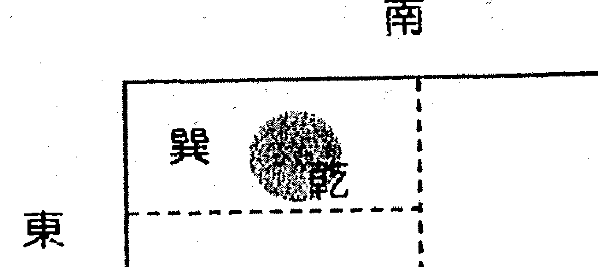

# 第二十三章 测其他类

告别时，他弟子老王为刚见面时的那句话道歉：“对不起，邓老师，我冒犯了。”我一笑了之，中国预测学源远流长，博大精深，人外有人，天外有天。不过说句实在话，老孙是我迄今为止，遇到的唯一一个使用类似本门技法，并且出手不凡的易友。所以，我称这顿饭是酒逢知己，棋逢对手。

壬午年巳月，易友孙应明第二次来访，我们是在街上相遇的，就站在路边聊。他站在巽方，我站在乾方。

老孙问：“邓老师，您看我近来有什么事吗？”
我说：“有忧愁之事。”
他问：“是谁的事？”
我说：“你父亲的事。”
他问：“我父亲怎样了？”
我说：“躺倒起不来了，不是病了，就是伤灾。”
他问：“事情在什么地方发生？”
我说：“离屋门不远的地方。”
他再问：“我花了多少钱？”
我说：“6百至7百吧。”

实际情况是他父亲吃饭时，到厨房（他老家住平房，厨房在院子里）盛饭没留神摔倒了，至今卧床不起。

说着话，有人打我手机，他说：“有人请您客，在咱这儿看东南方向，您去后坐东北方位。”

我确实去了东南方向的饭店，同桌的人已给我留好座位，就在桌子东北方。我连说：“奇准、奇准。”马上给他电话，验证了他的预测。因为当时在街上遇到后，我站在乾方，他站在巽方交谈，我有要动的信息，他直取乾宫的对冲宫位，巽，东南方；我坐东北方的外应是，我们交谈时，来一老者正坐在艮方。

判断思路：他问事时面带忧色，当是忧愁之事；谁的事，我在乾方，其父之事；为什么说躺倒？立于路边，路是躺倒之象；屋门口的原因，在于我站在临街店铺的门口；6--7百之数，是因为他问我这句话的时候，他由巳方走向午方。巳代表的数字是6，地支的顺序，子、丑、寅、卯、辰、巳、午、未、申、酉、戌、亥，巳是第六位。

## 【例2】把手牵衣袖，局长不让走

壬午年亥月，市某地税局职员张兵，慕名前来预测。

落座后，我到另一房间拿笔和记录本，忽然衣袖挂在了门把手上，走不动，我暗记在心。预测时，得天风姤之乾卦，依六爻分析，是来测工作调动的，调动不成功的信息明显，联系到我刚才衣袖被门把手牵住的外应，也是走不了之象，两象定一象，调不走。

我写断语时，把“走不了”的“走”字，顺笔写成了“赵”字，又立即抓住“赵”字外应，断道：“你单位有个姓赵的领导。”

回馈：“有，副局长。”

我说：“就是他不让你走的，也不是故意刁难你，而是看你个人才想培养你。”又分析了其他事情。

回馈：“实际调动之事，已活动了一段时间，其他领导基本同意，就是赵副局长阻力大，今天就为这事来的。”

## 【例3】举动现天机，泄了情人姓

壬午年夏，某领导请客，就我们俩交谈。正题叙完来个小插曲开开心，他忽然问我，能否测出他有没有情人。
我见服务员正把空啤酒瓶撤下，桌上还剩一瓶啤酒，断道：“你有情人，以前不止一个，但是现在关系固定的只有一个啦。”
他说：“真有您的，不错，现在就还有一个。”
他边说边不停地用勺子搅拌桌上的羊肉汤，我笑着说：“我还知道你情人是个姓杨的。”
他的脸色立刻变了：“您怎么知道得这么清楚，听谁说的，是不是有风声？”
我说：“别紧张，什么风声也没有，我是测出来。”
他长舒一口气：“让您说对了，真姓杨。”

## 【例4】山东淄博王玲

在参加俏梅花预测学学习的第二天，晚上到街上去吃饭。坐下后，我问老板娘：“03年你们家裏是不是有官司？”
老板娘立刻很警惕的问：“你问这个干什么？”
我边吃边说：“我只是随便聊，没其他意思。”这时老板走过来问怎么回事。
我就说：“你家03年或98年肯定有官司，应在老大身上，是因为土地纷争的事，并且闹到村委去了。”
他说：“对呀！你怎么知道的？”
我笑了笑说：“那个官司最终也没分出理非，不欢而散。”
老板急忙点头，然后凑到我桌旁，坐到我戌方，老板娘站在他身边，我立即断：“你家里外当家做主的应是老板说了算。”

老板娘说对。

我又断：“你家有比你大的女人比老板有能力，并且家庭条件优越，财旺，是你的贵人，很能给你帮忙。”

他说：“对，我家大姐很好，我开店的房子都是她的。”

我又说：“你今年财运不如往年，买卖利润薄，这两个月开销不够，但关不了门。”

这时来了几个男的，说了些话又走了，最后那个人从巽方提起暖瓶倒了点水就走了。我说：“老板你今年5月份有破财之事，或者有人向你借钱，从今年3月下半月，生意开始好起来，4月有两个女人来给你帮忙。”

他说：“每年的这个时候，生意就会红火，大姐、二姐都来帮忙。”

我继续断道：“96、97年你们家里烦事多，盆盆罐罐的，不顺，02年有动房之象或改行。”

他说：“对，02年盖的这饭店，03年开始干的。”

我说：“你家里父亲有妨，不吉。”

他说：“已经去世了。”

我接着说：“是在01年去世的，并且是下半年。”

他说：“对，12月8日去世的。”

我又说：“你们家的坟地迁出来了，新点的穴位，是在01年8、9月份。”

他说：“是那时间点的新穴。”

我说：“点穴时，没花多少钱，只是喝几场酒，点穴的不是外人并且是个属兔的。”

老板说：“对呀！”老板娘惊奇地睁大眼睛，把她儿子推到我眼前：“你看得太准了，再给俺看看儿子能不能成器？”

我说：“别慌，还没说完。你父亲是久病去世，躺了有半年才去世的。孩子学习成绩一般，有个最大的爱好打篮球，还爱玩电脑电视。”

老板娘听后哈哈笑了：“他就是不爱学习，要是用玩的劲头来学习肯定占上游。”

我又对老板娘说：“你小时候住宅，出门南面都是坑，现在结婚后的住宅，西北方有个庙，香火不好，香客少。”

我又给他们随便断了些其他事，老板两口子感激得千恩万谢，其实，我比他们还激动，现学现卖，初战告捷，断出的一些事项连我自己也吃惊，心里感叹邵老师传授的预测学真是神了！

## 【例5】宁波学员郑钢测

2004年4月15日中午，我在爸妈家吃饭，吃完后我帮我妈洗碗，这时，我妈说：“气象台说今天多云到晴，怎么上午小雨下了好几次，不知下午还会下雨否？”

我立断下午不会下雨，原因在于我妈问的时候，我刚把碗洗好，正用干布把洒在水台旁的水渍抹干，水被抹干了。

事实下午一直到晚上没有下过雨。

## 【例6】河北任丘学员丁聪测

甲申年寅月，朋友们过年喝酒，拿一个硬币放在手里，让我猜在左手还是右手，输了罚酒。
第一次，朋友握紧双手伸出，我一看他的双手下方是两个菜碟，右手下有菜，左手下的空空，当即猜在右手，对了。
第二次，朋友握紧双手伸出，仍在两碟之上，还猜右手有硬币，又对了。
“再来！”他这次伸出双手，边说边翻了翻腾，我当时想：噢反过来了，那是在左手裏了，结果再次猜中。

## 【例7】河北任丘学员丁聪测

甲申年卯月，一朋友打电话求测买房，问明天能否谈成，我当即说：“不能。”
“后天呢？”
“后天能成”我说。
对方说：“说好了，明天定的。”
看他还有些不信，我说：“你现在面向西方，坐着的。”
“是呀！”
“那就没错了。”我说。果然后天才谈成。
判断思路：自己正有一事处理，要后天才能完成。我接电话时坐着，面向西方。

## 【例8】河南僧人释德光测

辛酉日上午十点左右，我去张易友起名社聊天，我们在谈到邓老师教材时，有一个洛阳女易友走到跟前，谈了一会话说到易经俏梅花的外应预测。女易友问能否测出她姐的一些情况来，当时为她断以下事：

- 06年有凶，从车上摔下。
- 06年5月份甲戌日午时出事。
- 出事时她姐跟前有两个人在身边。
- 两个男人，一老一少。
- 她姐属相狗，在姐妹中排行老大，兄弟姐妹共四人。

这位女易友大吃一惊，情况完全相符，叹说：“这还了得，简直通神了！”

判断思路：女易友是从巽方位向艮方到坎位是逆时针走的路线，到我坎位坐下。以我为外应，乾宫为狗，对冲的宫。她是坐西向卯方面，取震为四为大，巽的卦象又为车，巽宫停放一辆汽车。

## 【例9】吉林弟子李家裕测

4月4日，我到一个易学起名社去看朋友。碰巧主人张师傅的徒弟正和一人共同研究八字。

那人说：“看看这个人（指八字命主）的父亲现在怎样？”

张师傅的徒弟沉思着没说话。此时，张师傅开门进来，我想：何不用此外应试一试，于是，我插话说：

“此人父亲身体健康，无病无灾，能吃能走，76岁。”

那人大惊：“确实如此，可是你并没看八字，是怎么测出来的？岁数特准，就是76。”
我回答说：“我是用山东邵海一老师的俏梅花外应预测学测出的。”
他问我：“你学几年了？”
我说：“学了才几天。”他有些不敢相信，世上会有这样好学好用的预测学（我和张师傅是熟人，知道他的身体状况和实际年龄）。

## 【例10】吉林弟子李家裕测

4月中旬，我又去张师傅易学起名社闲聊。他的徒弟李兴桥说：“药材公司招聘人员，我报了名，不知能否去上班。”
说话间小窗户被风吹开。我抓住这个外应，果断地说：“去吧，准能成，看看门都为你开了。”
李兴桥半信半疑说：“那好，我去看看。”
不久的功夫回来了，欢喜地说：“又让你测对了，您老人家长本事了。”
我也有遗憾，他们这次共招聘8人，当时我没测出来几个人。

## 【例11】吉林弟子李家裕测

4月20日，我在街上遇到李兴桥。他说：“有人请我批个八字，你要有时间和我一塊去。”
事主的家里有一个老太太、一个中年妇女。中年妇女报上生辰八字，李兴桥忙着翻万年历查四柱。我坐在旁边，老太太正收拾衣服，床上有一堆烧纸。我马上抓住这个外应，判定八字命主已不在人世。因为是坏信息，我试着说：“此人都不在了，还测什么八字呢？”中年妇女一惊：“你是怎么看出来的？”我指了指那堆烧纸说：“用外应看出来的。”她们俩连连点头，说是给亡人烧周年纸呢。

## 應用篇

### 【例12】吉林弟子李家裕測

4月27日，一個八字愛好者拿來一個命局：

辛酉 己亥 辛丑 甲午

問我2000年庚辰，01年辛巳，02年壬午，這三年有什麼事。

我明確地說：「2000年庚辰年，01年辛巳年，兩年考大學都沒考上，02年壬午年考上大學。」

來人佩服地說：「我只是剛說了八字，又沒說大運，你也沒進行八字分析，立馬就判斷，並且還特別準，看樣子你真是個精通八字的高手。」

我實話實說：「對八字我只是略知一二，我是用鄧海一老師的外應預測學預測的。」

來人驚奇，非讓我講解講解：當時正是學生中午上學（此項與學生有關聯），有一個學生騎自行車，另一個學生說我也上去，這天正下陣雨，另一學生上去自行車時，正趕上下雨，我所以推斷壬年考上大學。

### 【例13】河北任丘市丁聪测

甲申年卯月，外地一易友来电话，闲聊中，我心中一动，问道：『你的电话在左手，还是右手？』
他回：『左手。』
我：『那你应该面朝西，坐着，一脚着地，是左脚，右腿放在左腿上。』全对。

### 【例14】山西省晋中学员王然德测

2004年6月7日下午5点后，我到商贸城佛像店找易友康、刘二先生，一女士（35岁属狗）进门坐在了巽方，让康先生给她预测，康先生坐在兑方，当时我坐在乾方，没听清她要测什么。正预测时，三位男士进了门，也是来找康先生预测的，我们都站了起来。因楼下人多，地方小，三位男士与康先生一起上了二楼。此时这位女士由巽方移到兑方，又转到乾方，坐下了，我即坐在了巽方。

女士要我说说她的事，我说：『不知你想测哪方面？』
她说：『看儿子学习怎么样。』
我说：『学习成绩不好。』
她说：『何止是不好，而是特别不好。』
她又说：『看我的婚姻如何？』
我说：『你的婚姻不顺，夫妻貌合神离，想法不一致，意见不统一，说不到一起。』
她说：『一点也不錯。』

判断思路：

1. 巽到兑为六煞，到乾为祸害，都是金克木，到乾坐下不动了，断她婚姻不顺。六煞主淫乱，此女不贞洁，六煞加祸害，其儿子贪玩不爱学习，成绩如何能好！

2. 正在预测之间，三个男人进门，连同康先生一起上了二楼，四个男人走了，再找一个，不正是五个男人了吗？

3. 坤造：庚戌 庚辰 辛巳 壬辰

辛巳日生于辰日旺相，月干庚金坐月今生扶助身有力，但壬水坐辰土库根泄身无伤，日元从，身偏旺，以克泄耗为用神。日支巳火为用神，被月、时支辰夹晦或泄，巳火官星严重受伤。年支戌以为用，但辰戌冲减力，官用神被制，老夫信息明显。巳火官星亦主工作，不在夫妻宫，其工作婚姻自然就不顺了。不见木，木为财，但用神弱而受制，也很难发达，只是有钱而已。官在地支很难找到正式工作，不为行政部门公务员，可为经商之人。

> 我说：「你和爱人都是做买卖的。」 她说：「对。」

壬水伤官在时干，在辰月不旺，又坐墓库之地，儿子学习自然是不佳。因其四柱组合不佳，层次下降了。49岁行大运，有凶无吉。

### 【例15】辽宁东港学员 曹益发测

2004年6月4日下午6点45分左右，我的前院（南边居民）姓荀的家妇女约60岁，正和一人家妇女因为地边地角一事争吵，此时我看见后，劝解她们，也争吵了几句嘴，我也上前劝解她们别为了鸡毛蒜皮小事伤了邻居和气。不动不占，根据此事我断：明日我站种子农药店有口舌，从离方有一农家妇女约60岁左右，为了土地上之事来药站吵闹。

果然，6月5日早7点半钟，我上班到站里药店一看，正好一位58岁农妇正与药店老周争吵起来，是为了水田地里杂草用农药没除干净一事而吵嘴仗，一打听此妇人是从石桥村（离方）而来。

### 【例16】辽宁东港学员曹益发测

6月7日傍晚5时10分，我打电话找我妹妹叫她们明后天回老家（父亲家），把坟地上风吹雨打的槐树砍一砍。
妹妹说：「待晚上妹夫回来后合计一下有无时间再说。」
吃完晚饭，我后院子老师（中学教师）来我院观看花，手中拿了把镰刀，观完花后说，我要割一支好看的花朵回去。她就到西北方（乾方）（我老家坟地正好是乾方）割了一支槐花走了。
我断明日我家坟地的槐树一定能砍伐。是我父亲雇用外边人去砍伐。但是男是女我当时无断出来。
第三天我回老家一打听是父亲雇用本队老谷（男57岁）来砍伐的。

### 【例17】广西学员韦保桥测

甲申年丁卯月庚子日酉时，我正下班，身后一位女同事于酉方突然说：「好久没喝酒了，不知今晚有没有人请喝酒？」
我当时借这个外应说：「今晚有人请喝酒，并且是同事或朋友请的。」
果然在晚上九点钟，我的一位朋友就到我家请我去茶吧喝酒了。可惜我没有断出是谁被请（取用外应：酉为兑，为泽为酒杯，并且是子日，子为坎，为水为酒）。

### 【例18】广西学员韦保桥测

上个月初的一个星期天，我朋友的一个工人打电话（巳时）给我说：有一个产品的颜色有问题，叫我去看看（我帮朋友调各种产品的颜色），当时我到厂里后见到这位工人，我马上说：「是红色的产品对吧？」

他说：「正是。」（取用外应：巳为火为红色）。

### 【例19】黑龙江学员王瑞喜测

27日晨时，有两妇人赶集归来，路过本店（起名馆）时，看到”处理婚纱”广告便来到店里。其中一人拎着蔬菜，一人夹着一卷”地革”。由我妻子接待看处理婚纱，当时我正在内室书房俯案拜读《仙人诀》，只听一阵短暂的喧哗后，一人说：「等有时间再来看吧！」她们走出店门后，我因此感悟，今天能有人来询问起名事宜，当时不能起，但今天定有人来起名，来者急。我将此外应储备下来，待以验证。

当未时过半时，听到门前停下了一辆摩托车声，随后进来一位男子，问有关起名事宜，临走时说回家商量再说。事隔几分钟，该男子再次返回店来（后得知此人家距本店10多里路），示意讨价。此时他的手机突然响起，他走到店外回话去了。

这时我妻问到：「你看他能回来起名吗？」

我说：「邵老师的书我刚刚看，哪有这么神，一看就会，不过我可以试试。」

我将昨夜看过书中的记忆理顺片刻，很自信的说：「放心吧，他一定会回来起名的。」

话音刚落，人已进门，为刚生不久的贵子起名付了款，并说：

> 早点起好，我着急落户。

第二天清晨，此人来取回“取名策划书”。

总结思路：二妇看婚纱一幕，一妇拎菜，财也，一妇夹着一卷“地革”，夹有沉重之意，与给其子起名很珍重同理；一卷“地革”似一张取名策划书，等有时间再来看，有事急之象，该男子着急落户也同存急象；二妇看婚纱无购而退，示意再来，有退也有回旋之象，而该男子二次走出站门重演回退之象；手机响起，有信也，断能起名与“菜”、“地革”之间吻合。此用外应资讯储存后释施的结果，万没想到，能如此的灵验神奇。

### 【例20】黑龙江学员王瑞喜测

4月29日巳时，夫妻二人走进店内，询问书写牌匾价格后说一定送来牌匾，当我回到书房的时候，无意中透过窗户看到夫妻二人，站在路南量什么。

> 我对妻子说：「可能刚才来写牌匾两人不会来了。」
> 妻子说：「不是谈价格了吗？怎么不会呢？」
> 我说：「等着看看吧。」话音刚落该妻又登门而入，最终讨价未成。

接着吃早饭，我用木勺从铁钵中盛米饭，盛完后我把木勺放回铁钵中，当放回缩手时不慎右手碰着勺把，将勺子碰到桌子上，因当时正在想能否回来写牌匾之事（我们是当地唯一一家书写牌匾的），我灵机一断，对妻子说：「他们不会来写牌匾了。」后来果然未来。

总结思路：通过窗户看到夫妻二人站在十字路口，犹豫举棋不定之象。饭桌在室内巽方，木勺为木，为女为该妻，铁钵为铁为圆为金为兑为口，为该妻因钱之事讨价还价；后未来原因，左手碰木勺，左为阳为乾为难为男为其丈夫，木勺落于饭桌坤方，坤为女为其妻子，夫妻意见不统一，还下不来价故没来。

## 第十四章 辅导学员实例预测

### 【例1】

辽宁抚顺易友王成来信，并附了他自己预测的一例，用电脑绘了图示。我很高兴，大家已经实际应用，但是，我在看他的图示时，当即判定此人现在身体欠佳，病了。在这之前，他没与我联系过，我没有他任何信息。我在回信时特别嘱咐，要他近来注意身体健康。

4月24日上午，他来电话询问其他事项，当时，为了验证我的预测，就问他收到我的回信了没有？

回答：「没有。」

我就说：「你目前身体健康不佳，是病了对吧？」

他回答：「对，确实这样，近来身体不好。」

他既没有主动要求我预测身体状况，我又不了解他的任何情况，那么，我是怎么测出他身体不佳的呢？这一切的外应信息，都来自于他信中实例图示。王成易友实例如下：

2003年4月11日晚10点左右，妻看完电视回房间，走进门，在门口笑着说：「我来了。」

当时我正在床上看《俏梅花易卜仙人诀讲义》。见此状况，我忽然想用此一断，断家中有喜事。

妻问：「有何喜事？」

我没有答上来。随后妻说：「是我考上博士吗？」（妻3月初刚考完博士，有一门学科考得不理想，如不及格就考不上）。

我随即说：「对，就是考博士。」

妻又问：「什么时候得到消息？」

我答：「8天内。」

妻在我坤位。以上是学生的鲁断，望老师给予指正。

该事例是预测喜庆之事，并没有一点生病信息。我的外应就在那个图上。依据类比法则，人躺在床上的样子，很明显病了。再依据先后法则，我第一信息就是他生病，直取这个外应信息，果然如此。

当日下午广西易友李建打来电话，忽然问我，本门预测学能否测身体状况，测一下他的身体如何。

我干脆回答：「有病。」

他感到奇怪，怎么测出来的，很简单，就是把上午验证了的生病外应信息，转给他用。这就是特殊信息的贮存与应用。

### 【例2】

4月7日下午，济宁市的朱某来访，请教外应取用诀窍。我讲了一通后告诉他，其取用法则都在资料中，一定要细心领会，多加实践，熟能生巧，才能运用自如。

他问：「邓老师，您能举个例子吗？」

我说：「完全可以，随手就抓，你今天就有情况，你有一个关系相当不错的女子（当时想说明是他情人，没好意思），并且今天你们有联系。」

这个易友听了，很惊讶：「邓老师真的神断，既然您说了，我也不瞒您，上午来的时候，在车上我接到一个电话，一年多没见面了她今天约我。因为太想见您了，就改了时间。」

我笑了笑，又说：「前天，也就是5号，你发了点外财。」

他兴奋地叫起来：「这两点都测对了！我随便拿2块钱买张彩票中了500元，我们老祖宗的智慧真是了不起。」连忙请教我是取用的什么外应。

我说：「咱们在一起所看到所听到的都是一样的。我就是用了你八字的日元，你日元丙辰，今天是庚戌，丙见庚，庚为偏财，庚在天干为情人；前天是戊申，丙见申，申也为偏财，申在地支为财富为外财。」

他马上领悟：「原来是这样，您的这种情人和外财的分法，在八字分析中适用吗？」

我告诉他：「当然能用。」

今天（4月26日）我在写这段文字时，易界名流周成来访，一落座，我直接说：「老周，你昨天接触了一个也是搞周易的同道，对吧？」

老周点头称是：「好家伙，这也能测出来。是这样，有一个爱好钻研的青年，搞了几年进展不大，经人介绍，昨天正式拜我为师。」

并跟我开玩笑说：「老邓，您可别是听人说了我收徒的事，故意说测出来的。」

我就把刚写的上一段文字拿给他看，并讲解：「我写这一段就是以日元为外应断事，忽然想起你的日元己酉，昨天是戊辰，戊己比劫，我们俩都搞这个，所以断你昨天也接触一个搞这行的同道。」

老周说：「有道理，断今天也对啊，我这不是上您这儿来了嘛。」

外应取用既丰富又灵活，易友们一定要把金钥匙装在心里，外应与事项一定要有关联，这样才能反映预测事项的真意。

### 【例3】

近来接到易友们咨询预测电话，预测失误的仅占一、二例，失误的情况是，要求测几项事情，其中有一项或二项不对。如天津蓟县刘易友收到我的覆信后，打来电话致谢，顺便问一下：「邓老师您能测出我是从事什么工作的吗？」

我当时答：「从事教育或律师工作。」

测错了，他本人是公务员。

再问：「我最近出点事，您能看出是什么事吗？」

我说：「交通事故，一个青年人骑辆摩托车。」

刘易友回馈：「太对了，我骑自行车去上班，身后一个小青年骑着摩托车，不知怎么就撞上来了。您是怎么测出来的，这么快？」

我说：「我接电话时面向窗外，你问我时正有一个小青年骑着摩托车过去，我就取了这个外应。」

他会心地笑了：「本门预测学真是神奇，听您一讲我更增强信心了，一定努力把您的本领都学来。」

现在我们共同来分析我对其工作测错的原因：

1. 我测其工作时是提取的他来信的信息之象（信上实际也没有写工作情况）。放下电话，我感到遗憾，怎么测错了呢？我找出他的来信一看才明白，来信的信息之象提错了，记忆中把别人的信件当成他的了。
2. 他是5月18日来的电话，那天是辛巳日，如取辛金来断，就不会出现失误了。以上两点说明，预测时，尽量不用或少用贮存时间长的外应之象，多用临时抓取的外应。

### 【例4】

湖北有位易友求测工作调动，前后大约二十天，已应验，我把几次电话预测情况写下来供大家学习。（因涉及有关人员，为保护易友避免招惹麻烦，故不公开姓名）。

4月底易友来电话：「邓老师，您能否对我的工作指点一下？」
我说：「可以。你要调动，是往你办公室西北方向。」
易友：「您看什么时间？」
我说：「很快，5月中旬。」

易友：「去后境况是好是坏？」

我说：「不乐观。」

易友惊叹：「太神奇了，现在公司要竞争上岗，我心里刚有往西北方部门去的想法，所以想请您测一测，心里想的您也能测出来，真是不可思议。我会不会下岗？」

我说：「绝对不会。你想竞聘那个部门的正职，对吧？」（此前我并不知道易友的工作职务）

易友：「对对对，您看顺利不？」

我说：「不顺利。有两个人阻挠此事，一个年龄大点，一个年龄与你差不多。」

易友：「哎呀，真的佩服，您跟看见的一样。年龄大的是公司老总，年龄和我差不多的是人事部门经理。他们两个决定此事。您说我还要不要做点工作？」

我说：「沟通一下可以，不需要花费。因为你要调动的新地方可能不是这个部门。原因是如果你竞聘那个部门正职，升迁，高兴才对，不符合我测出的不乐观，不理想的判断。是西北方向，你不去情愿去。顺其自然，等等看。」

5月14日又来电话：「邓老师您测得很对。那个部门没去成。县里新成立一个机构，就在西北方向，把我借调过去，真的不想去。您能测出来我哪天知道的吗？」

我说：「今天。」

易友：「对，我是刚知道的。」

以上预测，我全部使用外应，一边打电话，一边抓取外应。外应取用，分分秒秒不一样。对于复杂事项预测，外应取用要机动灵活，问题变了，外应亦变。外应变动的作用，相当于六爻中的动爻，但是，无论怎样变，最初判断的原则框架不能变，相当于六爻中的大象之意。

### 【例5】你是个珠宝商人！

2004年9月，在俏梅花预测学培训班上，邓老师精心辅导学员。

晚上，学员们怀着激动的心情讨论和运用外应技法。

> 北京女学员：「我们在用您教的技法给甄院长（参加学习时公开身份是新疆某河洛易学院院长）测事呢。」
> 甄院长：「她测我在家的东南方建了一个工厂，这个很对。」
> 北京女学员：「测工厂，我是用房间的电视柜破译的。请问邓老师这地方还有衣架、镜子不知该怎么用，能破译出什么事？」
> 邓老师：「好的，我们来共同探讨吧。既然已测出建工厂，我们就看看是生产什么产品的。」

邓老师对衣架、镜子等一一提取物象信息，一边分析一边讲解，忽然用手一指甄院长道：「我知道你的身份了，你的产品是珠宝，你是个大珠宝商，对吧？」

> 甄院长惊得从座位上忽地站起来：「哎呀老师，外应技法真是神奇，真的服了。我出门在外是河洛易学院院长，不谈我是珠宝商的身份，今天为了验证老师的神奇预测，我就不隐瞒了。这些年我也接触不少易界高手，没有像您来得这么快这么奇的。」
> 邓老师：「既然测出了产品是珠宝，那么下边再断你的销售。你的产品不是全部对外批发零售的，而是有一条主要管道能销售70%的产品，剩余的才是小量销售，对吧？」
> 甄院长：「对。」

> 邓老师：「再断一下你的产品加工。你的产品也不是你全部生产的，而是把其他人的半成品收买过来，稍做加工再出去，对吧？」
> 甄院长：「对。我们那地方零散的小型珠宝作坊很多，我把他们的产品收过来，想垄断这个行业。」
> 邓老师：「你自己产品的原料来源在你家的南偏西的位置上。效益好，发展快，财运亨通啊。」
> 甄院长：「原料来自天山南疆，是这个位置。谢谢邓老师！」

（邓老师以一个衣服架作上述断测，因涉及高层技法，具体预测思路面授班讲解）

### 【例6】女留学生求测论文能通过吗？

2005年春节假日，俏梅花预测面授班正在上课，忽然接到一个在日本的女留学生求测电话，邓老师一边预测一边为大家实例讲解。

> 女留学生：「邓老师好，我现在日本读研究生，马上就要论文答辩了，很严格很关键，我担心过不了关，想请您预测一下该从哪方面着手，该注意哪些方面。打扰您了不好意思。」
> 邓老师：「不客气。留学海外的年轻人还关注祖国的传统文化，这是对我们的支持，应该谢谢你们才对。不要担心，请教一下导师，顺利通过，祝贺你。」

事实验证：培训班还没结束，东瀛传来捷报，研究生论文顺利通过。

（邓老师取用课堂上动象为外应作上述断测，因涉及高层技法，具体预测思路面授班讲解）

### 【例7】断你95年家里一喜一忧，那年你结婚。

2004年秋，山东大学哲学博士于秀河，电话联系要求学习俏梅花预测学。邓老师当时正在济南为企业调理风水，就挤出时间为他上了一天课。

次日，于兴奋地给邓老师汇报小试牛刀初战告捷，并要求继续修习俏梅花相法预测学。再次见面时间充足，邓老师用外应技法，详细推断了他近几年的情况。当断到95年时，邓老师说他该年结婚，是家里的一桩大喜事，可又发生了一件口舌惊忧之事，与结婚有关。

于秀河回馈说：

> 完全正确，我是这年结婚。我兄弟两个，原计划都在这年结婚，后来，家中老年人受旧风俗“同年一家不能办两条喜事”的影响，我是哥决定我先结婚，于是，弟弟未婚妻的家人不乐意，来我家吵闹一通。

（邓老师取其睡衣为外应作断测，因涉及高层技法，具体预测思路面授班讲解）

### 【例8】香港学员热烈的掌声

2005年6月初，为香港学员上课。香港易界名家林千博先生为了能切实领会邓老师讲授的内容，特聘口语秘书周小姐和文字秘书陈小姐。

一天下午课程即将结束时，周小姐请求预测，邓老师回答完她关心的问题，兴尤未尽继续推断。

> 周小姐，我再给你说件眼前的事，今天晚上你将与你的哥哥见面。

邓老师话音刚落，林千博先生带头为神奇的预测鼓掌，并介绍说：「在中午他和周小姐用餐时已约定晚上邀请她哥哥。」

## 第二十四章 辅导学员实例预测

晚餐时，周小姐激动地向哥哥讲述了邓老师预测经过。她哥哥是海外归国专家，从事纳米技术的研发与推广，听后心驰神往，邀请邓老师为其勘宅推运气和经营指导。

> （邓老师取用周小姐动象为外应作出断测，因涉及高层技法，具体预测思路面授班讲解）

## 第三十五章 群英荟萃 各显神通

2003年4月，黑龙江北安市通北镇的朱景华易友来说：
经过一段学习后，就开始应用，有几例确实很准确。如我一朋友打电话问我，他的货物能否出手。我一抬头，抓住了电视中一年轻男子打电话的外应信息，张口便说：「能出手，这几天就会有人来要货。」几天后，真的有人来要货了。

在信的末尾他还写了这样一段：

> > 辛巳年秋，我的一个朋友因打伤了人，怕官方抓捕，要出去躲几天。当他刚上汽车时，车胎却爆了。此外应说明了什么？是说明其不用出去躲事情不会太坏呢？还是说明其去了别处也不如意？或是这件事情后果会很严重？能否请老师解答，指点其中奥秘。

我在复信时，大体断了三点：

- 1. 此人去了西南方向。
- 2. 逃也没用，不如不逃。
- 3. 事经官方，和中受损。

2003年5月，又收到朱景华易友的来信：

您断的三点完全正确。我那朋友确实躲去了西南方（约60华里处），三天后，经官方和解，给对方部分钱财了事。

＊ ＊ ＊

这是我收到的第一个要求我测过去事项的信，我希望也是最后一封。过去的事项再测已无意义，我理解大家的心情，是想印证一下本门预测学的准确性。所有来电要求预测的易友，我都在电话中当即答复，效果非常好。本门预测学就是这么快、这么奇。

关于朱景华信上例子我是怎么断出这三条的，函授时曾让学员们各抒己见，谈谈自己的思路。从收到来信情况看，真是仁者见仁，智者见智，异彩纷呈，其中不乏闪光的火花，有些分析很精彩很深刻，也颇有道理，但是，抓到要害的少，大都是围绕车胎爆了来分析的。实际原理并不在这些，因涉及本门一项面授核心技法，这里就不讲了，很简单，面授时再讲。

下面把大家来信中有代表性的思路汇集如下，供大家借鉴研究：

## 一、广东施金延

试测老师布置的思考题：老师从学友朱景华的信中取信息断了三条完全正确的结论，是取了什么外应？在老师诚心鼓舞下，我壮了肚胆试试看。想法如下：

- 1. 那人是火性人（爆性子爱打架），自然性急，虽然汽车胎爆开不动了，但因心急仍然要逃，可能转搭摩托的（因秋天为酉金，酉有摩托车之象）。那么逃向何方？车胎爆了开不动——停住了（止住了），“止”为艮卦，艮位丑；艮既为“止”又为“起”，即朝着（丑）的对面（对冲）坤（未）是西南方。丑2未8，以丑2为起点到未8，正好是6，6公里，但他想逃远一些不会被抓到，所以60公里；这或许是凑巧。
- 2. 可是事情已暴露（车胎“爆”了），逃也没用。
- 3. 终究要由官方出面解决。因事出于辛巳年（巳）秋天（酉）已在年上代表上级，酉为肇事者，巳酉为三合中之半合，克合，巳火克酉金，意为官方找肇事者罚款，罚款入金库（丑，即前面所述之丑，代表被打者），即成巳酉丑三合，而得和解。至于罚多少钱，没有经验、也不知当地情况，数目与丑、艮有关（艮也表示“了结”）20太少，7000太多，可能200——700元适中，视伤势轻重而定。

以上是以“车胎爆了”和“辛巳年秋”为信息立刻想到的。

又忽然想起，老师强调取外应事物要直观、直取，越简单越好，以上的想法可能太复杂繁琐了，便想再看看有什么更直观简单的。就又有下面的想法：

## ○ 第二十五章 群英荟萃 各显神通 ○

因肇事者是男性，取申（阳）月为秋天，申位在西南；巳刑申为特势之刑（官方找到肇事者），申对冲寅也在艮丑位，寅巳申构成三刑，这样是能看到罚款，而看不出和解了。

又再想，老师说要“直取”，随想“车胎爆了”，火克金（爆即是火，车是金属的），与辛巳年巳火及金秋相对应，金秋取申，申位西南方。从西南方把肇事者找回来了结此事。至于60公里，就直取坎卦数“6”来分析。所以老师直断三条结论。可否？请老师指导。谢谢老师！！

## 二、浙江郑钢

就朱景华学友“车胎爆了”例，老师取信中外应断了三点，学生在此试断，不知对否，还望老师讲解指点。

学生认为：此信中唯有可取外应一为辛巳年秋，二为车胎爆了，不知对否。

老师断第一点，此人去了西南方向，是否取庚辛为金为西，巳午为火为南之意合而为西南。二、逃也没用，不如不逃，是否取了车胎爆了外应，车胎爆为破为缺，所以说逃也无用。三、事经官方和中受损，此点学生认为重点为辛巳年秋四字，日主辛受巳火之克，所以要经官方，克我者官也，和中受损乃是秋也为金，与日主比劫，比劫为劫财，但与日主同性属金，因此受克之力不强，只受一些损失，以上三点学生鲁莽断之，错误难免，还望老师不会见怪。

## 三、广西韦保桥

黑龙江学友朱景华一例：我认为“老师断的三点和60华里，三天”这几个的信息，完全可从汽车来取外应。

- 1、车为坤，坤为西南，所以此人去了西南方向。
- 2、车胎爆了，就必须修补整理，才能正常运行，既然能通过调理修补后，就能正常运行，那逃有何用，这里暗示了那位朋友，打坏了人后经过调解后当然就可正常了。
- 3、事经官方和中受损：因车胎爆了，补胎当然要付钱；这里的补胎人暗指官方人，因为补胎是调理汽车正常行驶的人，而官方是调理矛盾的人。
- 4、60华里的外应：车为坤，坤为8（汽车四个支撑点4×2=8）今车胎爆了，仅剩下三个支撑点为3×2=6，故断60华里（因为是坐汽车走，不可能是6华里或600华里--只打伤人不是非常严重的事情）。
- 5、三天的外应：汽车四个支撑点爆了一胎，当然只剩下3数，经修补后就能正常运行，也就是说三天后经调解事件平息，趋于正常，那为何不取三小时，三个月或三年呢？因为车胎爆停须经修补，故不能断三小时，又车胎初好后，汽车就能飞速行驶，当然就不能断三个月以后了。

以上就是我的分析，不知是否正确，请点评。

（当然以上我的分析，如果没有老师先指出那提纲为前提，我也不知从何下手）。

## 第二十五章 群英荟萃 各显神通

以下的两封信是河南张小松写来的，很有代表性，问题细致深入，对大家打开研究思路很有帮助，故录于此。第一封是只收到《讲义》时，心存许多疑惑写来的；第二封是收到了《答疑》及我的复信后写来的。两信对比可以看出其思想变化，我们从信中还可看出其易学造诣之精深。

### (一)

邓老师：您好！

我购得大作看过几遍，对思路的打开很有启示，也反映了您易学功底的深厚，书中一些例子分别从不同的角度阐述了外应的取法和断法，但是书中所述的例子，其中的思路未能全盘托出，当然，我可以理解邓老师对盗版风气的困扰，不过本书读后意犹未尽，不能不说是有点遗憾的，这些遗憾通过对答疑材料的陆续寄送，或可解决一部分，另外通过面授不知能否彻底讲解清楚？下面是我读书时的学习笔记，其中包含了一些我的疑问，因为我们是函授，所以书面提出来，请您指导比较有条理，也方便您对答疑工作的管理。

从本书中我了解到您的外应断法包含了以下特点：

- 1、类比法：

如（第十五章测疾病类）例2中，在法院庭长家，遇到张工长，当看到庭长妻子躺在床上面露痛色，直接联想到张工长的妻子也有病痛发生，这是否就是物以类聚，人以群分的原理呢？但是您为什么断张工长的妻子也在家卧床不起，而不是断他妻子有其他的不顺呢？另外在此例中，断张工长家的卧室在西南角，回馈正确，

## 应用篇

原理没有透露，这条断语和后面断张工长妻子卧床不起有什么直接联系也没有交代，希望您能解释。

类比法还见诸于〈第九章测婚姻类〉例1中，看到有一女青年走过，就按其体貌特征断另一个四柱，此例非常精彩，但是其中为什么断女孩家西北角有两棵树或电线杆，没有解释推断的过程。另外，现代建筑的环境趋于复杂，如果没有树或电线杆，但是能类比的事象还有那些？也请邓老师耐心解答。

另一例：第五章第二诀例子中，壬午年夏在朋友家作客，看到啤酒瓶盖掉落在自行车前轮处，断朋友的自行车前轮补胎，比例中用了类比法，但啤酒瓶盖可类比的事象很多，而且按类比的方面也可分为许多类型。如单以外观来类比，啤酒瓶盖除了可以类比为自行车轮之外，也可以类比为眼镜，还可以类比为镜子、手表、电扇等等一切圆形之物，为什么您很肯定地断与自行车轮有关呢？难道就因为啤酒瓶盖落在自行车旁吗？为什么只断补胎而不是换车条？为什么只断当日补胎而不是其他时间呢？请您耐心给予解释，像这些看起来很繁琐的问题恰恰是需要攻克的难题，怎样正确地类比以及类比的各种方法，请您能够给出指导。因为我们接触到的各种思路太多太多了，但仅有思路是不够的，预测是一门技术，凡是技术性的问题，都需要有固定的操作模式，没有可操作性的理论不能称作技术，只能称作巫术，这在近几年来流传的各种易学书籍中屡见不鲜。

### 2、宫位推断：

这种断法在本书中多次出现，有很高的研究价值，例如〈第二十三章测其他类〉第1例，孙应明和弟子与您会面，孙看到电视

## 第二十五章 群英荟萃 各显神通

机中播放吊孝的戏曲，推断您去过东北方出殡，原因是电视机在东北方，这就是很明显的宫位推断方法，但为什么孙能推出是丙戌日呢？书中没有详细交代，令读者有些摸不着头脑。另外，此例中您断老孙的大姐脾气性格和子女情况也很神奇，但书中只交待了放辣椒的盘子在桌面的巽方，辣椒又放在盘子边沿的乾方这两个素材，更详细的思路没有。我知道巽代表长女，为什么您不断是他的大女儿呢？辣椒代表大姐的性格，这一点还好理解，为什么大姐的头胎是男孩呢？为什么孩子会有大灾呢？

同例中老孙看到您的手机响了，断有人请您客，方位在东南方，座位留在东北方，这一例也用了宫位推断，老孙站在您的东南方，所以老孙断请客的在东南方，是这样吗？但为什么断请客，而不是其他的事呢？为什么留的座位在东北方呢？此又是一些疑惑。

### 3、谐音法：

按照谐音推断从易理上完全说得通，只不过很少有人应用或见诸文字。在《第二十三章测其他类》例3中，看到某领导用勺子搅羊肉汤，断他的情人姓杨就是精彩的一例。但是您也完全可以断他的情人姓汤、姓唐、姓邵等等，或断他的情人属羊。这些都不是不成立，也不是不可能，但偏偏您用了谐音“羊”，如果只是灵感的话，那么就存在灵感不可复制的难题，您自己不能复制这种灵感，别人也就更不能复制。如果有另外的方法加以辅助，还要请您详细解释。

在《第十八章测数字类》的例1中，又有用谐音的过程，比如以“妻”谐音“7”，以“酒”谐音“9”，但是取这几个数字的先后顺序没有交代，就算知道谐音的用法，如果先后顺序颠倒，效果

## 应用篇

也不会太好的。接下来的例2同样是用谐音法推测数字，以小姐说的：“先把酒起了”谐音“3”，这样的推论是能够接受的，但是“1422”的推论就有一些难以理解。4号房间的“4”可以作推测的依据，但，在坐3人的“3”如果分解的话不太好掌握，“1”是从何推论出来的，起码跟大多数人的思维习惯有些不符，另外，这个例子同样没有说明如何把数字的先后顺序排列出来，您能够把数字推测的方法再条理化一些传授给我吗？

- 4、时间取外应法：

书中有一个令人激动、拍案称绝的例子，就是附录中应用答疑的例子，在没有明显外应可取之时，用日干支的关系先找出线索，癸卯日如果以日干为体，以日支为用的话，那么就能推测所问之事的一个大致范围，即所问之事与食伤有关。再看阳宅平面图的卯方有缺，所以断与子女缺乏有关，按流年看98年、99年都不吉。如果依此类推，就能发展出一种稳定可靠的预测形式。这正是所有学易之人梦寐以求的目标和理想，在此例中，邓老师把癸卯日这一信息称作外应，实际上我觉得太笼统了，本门的梅花易数自成一派，按预测方式来看是高于其他预测种类的。按邓老师的思路，“癸卯”已经成为主要预测信息和对象了，而不应该再混称为外应，以免使人误解本门之术为小道。当然，我才疏学浅，可能表达的不够准确。

## ### 5、直观取数法：

〈第二十三章测其他类〉的例子中某领导问有没有情人，您以桌上的啤酒数来断就属于此类取数法，非常直观，非常好学，是否非常准确，还要看学员的实践经验如何。但我认为这种方法符合易道，是真正的大道至简。类似的例子还有第五章第三诀例1中，去理发店看到钟表在七点，断老周共有七个客人，共赚70元钱，这也是直接取数法。

另外稍微有一些变化的例子，例如〈第二十三章测其他类〉例1，当看到屋子中有三个人在座，服务员进进出出时，断老孙家住三楼半。此例中我有个疑问：老孙没有问，而您是主动判断，这样一问一答要有难度吧？其中有没有什么诀窍呢？

## ### 6、直观取象法：

这种例子比较多，例如〈第二十三章测其他类〉例1，老孙第二次来枣庄，老孙问他的父亲有什么事，您看到的路是横的，就联想到其父亲躺倒了，他问在什么地方，您看到自己在临街店铺门口，就回答在离屋门不远的地方。直观取象法需要丰富而正确的联想力，对于一般人而言，平时没有训练过，所以根本不可能达到应有的状态，您能否提供必要的现成材料或训练的方法呢？再有就是怎样排除相似的资讯而能准确定位，比如在这个例子中您断老孙因父亲之事忧愁，思路好像是因为当时您站在老孙的乾方，乾卦主父亲之象，但是乾卦也主领导。张延生看到柿子落下，砸到学员的背上，断他的领导降职，为什么不断他的父亲有灾呢？乾卦还主贵重之物，也主工作，也主名声，也主金钱，为什么当时您偏偏选择了“父亲”这一资讯呢？

## 应用篇

另一例在第五章第一诀中例1，当看到假山坤方有一块像猴子的山石，就判断有一个属猴的给领导找麻烦，也属于这种直观取象法，但是为什么认为是属猴的而不是姓侯的，一直是我心中的疑惑，像这种似是而非的问题，亟待解决，您不要嫌我啰嗦。

在第六诀中的例1也属于直观取象法，以屋山头取“人口”之象确实很有道理，以形法风水来看属于“探头山”同样不吉，但此例中断“西方有破败之屋山，财位不吉，有损财之象”为什么此房屋的西方是财位呢？书中没有交代。

第八诀中的例1：看到小孩在门口两腿叉开，断父母离异，也是直观取象，但书中没有交代清楚，其叉开的两腿是跨门叉开还是及门平行叉开，如果是跨门叉开，就比较形象地传达出家庭破裂之象，如果是及门平行叉开，就很难理解为家庭破裂，或许可以理解成其不是亲生父母收养也不是不可以的。

> > 〈第十五章测疾病类〉例1中，看到刘军家乾方有垃圾道，断其父有食道疾病，我虽然能理解乾方代表父亲，有垃圾道父亲会有病，但是准确定位在食道的原理书中并未交代。另外，此例中的应期判断同样不清楚，没有线索，您什么时候公布呢？是固定信息还是靠推理出来的。如果是固定资讯，能不能把此类的所有固定资讯编列出一份完整的资料，没有这样的资料等于盲人摸象，永远在门外打转。如果有推理的思路，请您将这种思路也整理出来，如果符合逻辑法要求的类比或排除等定律，同样能够指导实际操作。

〈第十章测谋事〉例1中，也可以说是用了类比方法，也可以说是用了直观取象法，此例容易理解，但应期的判断还不太好理解，以在座四人为外应，应该断四天后见分晓，如果因为所有的人都坐着，应期才又加一天的话，书中是这样写的：“易友走到一旁

## 打电话”

打电话”。既然易友走到一旁打电话，就不能算四个人都坐着，那么比例应期的判断就不能使人信服。另外，传统梅花易数取应期的方法是“站取原数，坐加倍，卧再加倍”，似乎与本门有差异，您能否就应期的方法做一个完整的结论，否则容易使学员产生不必要的误会。

〈第二十三章测其他类〉例2中，为张兵测工作，正巧被门拉手挂住衣袖，直观断为领导不让走，此例很形象，容易理解，但是在判断是姓赵的领导不让走时，又用了另外一个外应：「我写断语时，把走不了的“走”顺笔写成了“赵”字，我立即抓住“赵”字外应……」，这个外应的取法让人感到稍微有些牵强，因为平时靠这种失误取外应的概率太小了。其实当您判断走不成时，“走”字加上一个“又”不就是“赵”字吗？根本就不用再取外应了。当然我也是事后诸葛，临场让我断，可能什么也断不出来。

### 其他一些问题：

第五章第一诀例1：辛巳年七月，见单位的大门前有假山横逼在大门口，断其领导有人事问题难处理，而不是经营方面的问题，这一条也没有说出原因，希望能详解。同时断有下属找麻烦，为什么不断上级找麻烦？

〈第十三章测寻人类〉例1中，书中交待定位于东南方山头的原因，是当天日辰是巳日，但是到了山下，面对五六个采石场再细分方位时，您是以刚放炮的那个彩石场作为复选目标，如果那五六个采石场都在放炮或都不放炮时，又该如何决定呢？书中没有交待。所以请您不要保守，该公开的就要公开，该出手的就出手，不要让学员猜来猜去了。

## ## 应用篇

〈第十二章测钱财类〉例1中，您在书中的推断思路是：“壬辰日柱，本身壬水见辰土就为财”。按照正常的五行十神逻辑，壬水见辰土应为官杀才对，或称为墓库也行，怎么可能是财呢？如果体用颠倒过来说壬水是辰土的财倒是能够理解，但是您又把得财的应期放在了戌日，戌和辰的关系是比劫，这一天破财的可能性倒是很大，如何又能得财呢？此例让我百思不得其解，不得不报告给您，希望能够指点迷津。

〈第十章测谋事类〉例2中，也是让我有些糊涂，书中交代看到烟圈自东向西越过老板头顶向西北飘去，断有口舌之争，且在春季二月前发生，是顶头上司找麻烦，入秋后生意越来越好。此例中烟圈类比卦象兑卦，兑又有口舌之象，这些是能够理解的，既然如此，您在分析时又说木旺于寅卯月金不利。金不利不是兑卦就不利吗？如果兑不利则可能口舌就不会发生，怎么又断春季有口舌呢？既然兑主口舌，入秋后兑卦旺，应该口舌重才对，为什么您又断老板的生意在入秋后越来越好呢？如果兑卦不仅代表口舌，也代表老板的生意，那么您的推断是有些符合事实，但是兑卦在夏天处死地，怎么不断老板的生意在夏天最不好或夏天的口舌最重呢？

第五章第五诀例子，商业单位一女工求测丢钱之事，您断丢失的钱数在700元，理由是看到该女士在写字台前问卦，而写字台的艮卦，艮数为七，所以断700元，但是艮能反映五、七、十这三个数，七是艮的先天卦序数，那么什么时候才能到五和十这两个数呢？为什么您断丢失的是700元，不断70或7000元呢？它们出现的概率不是不可能的，请问您是怎样排除70元和7000元的可能性，我也能掌握这种方法吗？

在外应类象这一章中，第一项五行外应形体类象，第二项五行

## 外应性情类象

外应性情类象，这两部分从五行的常态不及和太过三个方面进行了描述，但是在实际应用中怎样去区分什么是常态，不及和太过却没有交代，没有标准可参考，所以对此部分也有疑惑。

以上是我近日思考的一些问题，书不尽言，言不尽意，词语中如有质疑或礼貌不周之处还望邓老师海涵，但是，我没有任何恶意，只是性情直爽，对于学术性的问题，不喜欢拐弯抹角，容易钻牛角尖，我相信我的问题同样反映了大多数学员想问的问题，对于邓老师来说，这些问题可能提得非常幼稚，但是对于大多数学员来说，这些问题都是阻碍前进的拦路虎，不解决的话，只能永远徘徊在门外。出于对您的信任，这才提出来希望能得到您的解答。今打扰并占用您宝贵的时间，非常抱歉。祝您事业蒸蒸日上、财源滚滚。

河南开封学员 张小松

### （二）

邓老师：您好！
来信及《答疑》材料收悉。谢谢您，不厌其烦地回答我提出的问题，书中未讲明的地方，经您补充一些关联的细节，疑云顿消，另有书中不便明言之秘法也谢谢您无私相授，请放心我一定会守口如瓶，尊重您的劳动成果。从您的文章和来信中可知，您是真心想传授技术，推动易学事业的发展，不比社会上那些沽名钓誉之辈，腹中空空，却挖空心思大肆搜刮易友们的钱财，鉴于您的学识人品以及对我的真诚帮助，我会终生对您以师礼相待。
关于五行固定类象，这正是我长久以来所苦思寻觅的材料，不但如此，我還曾設想，若固定類象經過組合，一定會有更豐富的資訊可挖掘。可惜，由於我的天資魯鈍，對於固定類象的收集和整理始終沒有頭緒。看到您書中所說有固定類象的消息，非常令人振奮，我想，這一定是一個最好的學習機會。知識無價，情誼更無價。我一定會常敘師生之情的。

通過一段時間來對《易卜仙人訣》的研究，我更深刻地認識到，預測學就是對規律的總結，對一些帶有共性事物的歸納和提煉，然後還原於生活，那是一門技術，又是一門藝術，在收集材料歸納總結的時候需要有嚴謹的邏輯思維，細緻入微的觀察、觸類旁通的悟性，還要有對材料的組織和分辨力。在判斷時，要有準確的語言表達能力，開放的形象思維，豐富而正確的聯想，以及對知識的融會貫通，所以預測學是無止境的，只有更好的目標，沒有最好的模式。

您在書中指出了一條光明之路，給久學不進的人帶來了曙光，《易卜仙人訣》真正體現了大道至簡的易學精神，攝取外應不離時空，儲存外應道盡天機，可以說這些看似簡單的技法，實際上正是解決一些瓶頸問題的良策。反觀我以前接觸的教學思維知識結構，無不是脫離了正確方法而造成了極大的資源浪費，六爻、梅易、四柱、風水、相法等都曾積累過一些基礎知識，但如何運用這些知識卻成了一個空白，我想，現今和我有同感的易友一定成千上萬，我的情況是有一定代表性的，由此可以設想，無論何種預測方法，它們之間必然帶有某種關聯，只是在沒有得到鑰匙之前，存在盲點，只能各自為用罷了。所以，相、卦、風水一體論的時代就會來到。前提就是對《易卜仙人訣》進行深度的挖掘。

易占的方法很多，從思路上來說不外乎直觀斷卦和推理斷卦，从方法上来说涉及到类比法和隐喻法。直观断卦是一种形象思维方法，例如见到圆形之物就代表成功和圆满，见到缺损之物，代表损失和失败等，这种直观断卦方法与八卦等万物类象有密切的联系，所以，对八卦、干支、五行等原始意象，根据宫位、时间、颜色、数字、动作、物象等简单素材，进行对号入座式的判断。此外更为直观的就是邓老师所传授的“以景言景”，也就是利用磁场能够共振的原理以此喻彼。如《答疑》范例中，当求测者问近日发生什么事时，邓老师看到窗外有一青年骑摩托车，根据这一物象回答有车祸发生，并且是跟一个骑摩托车的青年有关，像这样精彩的判断，如果用其他任何的预测方法都不会这么轻松得出答案的。

推理断卦，属于正常的定式分析，并有一定复杂的作用关系，我现在的体会是，这种方法应该放在辅助的位置，因为所谓推理断卦，就是不断地变换分析的角度，层层打开逻辑的多权树，以深度和广度取得应验的成效。但是，其缺陷就是定位模糊，换句话说，这种方式犹如道路的路标，只能提供前进的方向，而具体的结论需要再经过复选才能靠近事实，但是复选的形式已经属于《易卜仙人诀》的外应范围。举例说明：例如某人八字用神是丙火，根据这一线索，推测其职业方面的情况，则可以得出这样的思路：丙火的原始含義为太阳的能源，与其可类比的是光明、是火焰、是文明、是文学，所以该人的职业可能是文化学者。第二条思路：丙火的原始含義为太阳的能源，与其可类比的是光明、是火焰、是火炮、是战火，所以该人的职业可能是军警、执法部门。第三条思路：丙火的原始含義为太阳的能源与其可类比的是光明、是希望、是新技术、是新科技，所以该人的职业可能是科学家。
每一种答案都有成立的可能，所以这只是初选，复选的结果才能與事實更加靠近，複選的前提是能否有足夠的初選，如果連初選都沒有準備，就談不上複選的結果。假如準備好了足夠的初選材料，按照《易卜仙人訣》的理論，複選其實是很簡單的一件事，那就是迅速找出一個和初選能夠類比的事物，根據此事物的特徵進行合理的聯想。仍以上面的丙火為例，假如一眼看到有一本紅色封面的書籍，則就可以大膽地推斷測其人的職業是文化學者，因為丙火從顏色上來看是紅色，正好有一本書也是紅色，這兩個事物之間有了關聯，初選結果也有“文化”這一元素，所以複選答案一定是文化學者。假如一眼看到南邊有一台電腦，就應該肯定地將科學家作為複選答案，這是因為丙火在方位上對應的是南方，而映入眼簾的是丙火所代表的方位，正好有一台電腦，電腦與高科技是有可類比性的事物，丙火與南方也是有可類比性的，所以複選答案一定是科學家。再假如，當沒有任何提示的情況下還可以注意一下干支，如今天正好是丙申日，申金有白虎之象，也是驛馬之一，符合這個類象的只有軍警執法部門。因為白虎主殺戮，驛馬主奔波調動，複選答案只能是軍警執法部門。

這個例子雖然只是一種假設，但是從原理上來講是經得起實戰檢驗的，有許多人像我一樣，以前對物象的定位拿不準。只是一味從書中找答案，可悲的是，永遠不會有哪本書會告訴你具體答案的。

類比法則是預測學的靈魂，沒有任何一門大宗之法能離開類比法則的指導獨立出來。它的使用是建立在「物以類聚，人以群分」這一理論基礎之上的，通過對同一類事物的認知和把握，進而推測出與其有共性的未知之物。這種例子在《易卜仙人訣》中隨處可見。如《第二十三章測其他類》例1中，當鄧老師看到易友老孫把辣椒放在桌子的巽宮盤子上時，判斷老孫大姐的情況就是以巽宮類比長女，以盤子類比乾卦，又如書中〈第十五章測疾病類〉例2中，以庭長妻子類比張工長的妻子，這一例也是很典型的類比法。

隱喻法是輔助類斷卦方法，在實際應用當中也是不可或缺的方法之一，所謂隱喻，就是不明顯的類似特徵，需要人們主觀聯想的成分多一些，但這種聯想不是毫無根據的聯想，而是緊緊圍繞著求測者展開的，如書中〈第十五章測疾病類〉例1中，以乾宮垃圾道這一物象判斷其父親得食道癌，這一例之所以精彩，就是鄧老師在宮位取象的基礎上，又根據外形以隱喻的方法準確定位的。

下面向鄧老師彙報一下學習後的實踐情況，6月19日下午，我接到了您寄來的回信和答疑材料，晚上剛看過一遍，就接到了求測電話，對方是外地一女士，求測工作調動之事，在夜深人靜難以抓取動態外應的情況下，我馬上立出當時的四柱進行分析：
癸未、戊午、癸亥、癸亥
根據卦象斷：
1. 她想去的單位西南方，目前效益好。
2. 目前所在的單位效益下滑人事關係複雜，同事之間在利益面前明爭暗鬥。
3. 今年本應有提升的機會，但是被有靠山的人爭走。
4. 婚姻不吉，丈夫有外遇。
5. 丈夫在32歲時事業達到了頂峰，目前運氣不好。

回饋：判斷正確，該女士原在市公安局工作，因分局收入多，故調到分局工作，現在分局的效益下滑，人事關係難以處好；加上市局的效益增加，所以想調回市局，市局正是處於家的西南方，丈夫因外遇問題與自己離婚，目前單身一人。丈夫曾在30歲時提升為副處，主管全市的娛樂行業治理工作，後因婚姻問題葬送了前程，目前已無實權。

就在我們談話的時候，電話莫明其妙地斷開了，對於這個外應我一時判斷不出其含義，所以暫時儲存起來，過了一會兒，對方又接通電話，話題由工作轉到了她的婚姻，她與丈夫很早就相識，沒與別人戀愛就結婚了。想不到，當日子開始好過了，丈夫卻變心與她分手，說到這裏我突然有了靈感，馬上判斷她在婚前應該有過一個對象，本來感情很好卻莫明其妙地突然中斷了，這個判斷出乎對方意料，她不得不承認有這回事，原因是由於害怕戀愛對象變心。於是單方面決定中斷了兩個人的關係，現在很後悔。

分析：
1. 以四柱中日干代表求測者，戊土正官代表目前的工作，未土七殺代表想調動的單位，所以市局在其家西南方，未土得月令午火所生。市局目前的效益好。
2. 戊土正官本來合身吉，應有提升的機會，但年干癸水坐下太歲撐腰爭合官星，所以被有背景的人搶走了提升的機會。
3. 正官被群比爭合，所以丈夫有外遇，年干癸水力大，所以丈夫與別的女人結婚了。
4. 以四柱大限分法，每柱管16年，月干官星坐下午火最得力，所以其夫32歲事業達到頂峰，日柱時柱全是癸亥，戊土無根，所以目前行運階段其夫已無實權，電話中斷時是突然的，沒有徵兆，我擔心電話接通後，該女士接著問工作的事情，那樣就是調不成的外應了，但是對方沒有問工作，而是談婚姻之事，所以我判斷，外應指的是婚姻方面的事，但對方已經離婚，只能斷結婚前的事了。

另一個例子發生在昨天，有四個朋友請客，我到場後有人問起單位的事，看能否預測一下，我看到四人當中只有西北方是一位女士，在她的頭上有一台空調掛在牆上，馬上判斷她們單位的正職領導不在位，現在是副職掌權，正職領導有腸道或腦血管疾病，回饋正確，又問這種情況能持續多長時間，我回答要持續四年。

另有一位坐在巽方的人問我，他想轉賣一輛客車，看順利否？我正在猶豫的時候，門開了，服務員端上一盤大魚放在了桌子的坎方，魚頭也沖坎方，我脫口而出：「目前沒有合適的買主，要脫手須等到子月。」

分析：
西北方為乾卦，代表領導，但是卻坐著一位女士，陰陽不得位，所以正職不在、副職掌權。牆上的空調代表正職，被高高掛起，也不是正職當權之兆。空調五行屬水，匯乾宮之氣，所以斷腸道或腦血管疾病，腸道疾病被證實了，可能是因為當時在飯館預測的原因，腦血管疾病沒有人知道，但是我們坐在樓上空調又在高處，所以也沒有排除有腦血管病的可能，屋中共有四人在坐，所以應期定在四年。

以上判斷有失誤、錯誤之處，請鄧老師一批評指正，算是我近期的作業吧，另外鄧老師對入室弟子的要求是什麼，請通知我，現在我先報個名，如果論悟性和天賦，可能我不算是最好的，但是對預測我有極大的興趣，願意為之付出全部的熱情去研究，如果條件允許，我定當親自去山東當面拜訪。

祝萬事如意 桃李滿天下！

河南開封學員 張小松

> （張小松於2003年8月前來面授）

## 附录

> 劍鋒磨歷出 梅香苦寒來

# 應用答疑

問：俏梅花外應預測學是不是全部使用外應？
答：對。俏梅花預測學在實際預測中，對所測事項的推斷，完全是依據外應資訊。

問：預測時，取不到外應怎麼辦？
答：外應有四大類別，無時無處不在，不可能取不到外應，有天地在就有外應在。人立天地間，三才已分，四時流轉，外應俯拾即是。白天有太陽、有雲彩、有光線的明暗變化，朝日出震、夕陽落兌，太陽移動的方位也可取作外應。麗日風清、彩雲朵朵、或分或合，形狀各異，物象有別。光線強弱，可分明暗，明者，光明、開朗、向上、快樂、長者、主宰、正義、充滿信心的；暗者，陰暗、齷齪、下降、傷感、從屬、後者、非正義的、事情難辦等。夜裏有月亮、有星辰，月有圓缺星有幽明。冬雪夏雨、秋菊春蘭，各自寓意不同。地有山河，逶迤綿遠者，福祿康壽；短促形惡者，出暴。翠柏紅花，謀事有望；朽木枯葉，諸事可歎。樓房街道，橋樑廣場，形整者俊朗；頹舊破敗者，都是負面作用。花草、瓜、果、猛獸、飛禽，皆可取作外應。遠取諸物，近取諸身。頭為乾，腹為坤。動作變化，快者，陽剛、向上、堅定；過快者，不容易聽取別人意見；慢者，陰柔、善心計、穩重，過慢者、多變化不容易成功。天地分定乾坤，形物各占宮位。預測師與被測者一見面，宮位已分明，西北為乾宮，西方為兌宮，西南為坤宮，南方為離宮，東南為巽宮，東方為震宮，東北為艮宮，北方為坎宮。預測，就是預測師對所有萬事萬物全景式攝入，全息式辨析，抓住主要事物，從事物的組合中找出矛盾點，即太極點。世界就是一部打開的《易經》，外應資訊時時處處不在，只是我們有沒有掌握發現外應、運用外應的思維方式。這個世界不是缺少美，而是缺少發現美的眼光；這個世界不是缺少外應，而是缺少發現外應的眼光。外應很豐富，不必擔心取不到外應。

> 問：我是一個易學愛好者，看了神奇的易卜仙人訣後非常激動。我的基礎差，感覺本門預測學好是好，只是難以把握，也許是我學習其他預測學習慣了固定程式化，能不能詳細講解本門預測獲取外應的步驟，第一步先怎麼做，第二步再做什麼？

> 答：很多易友都問到這個問題。在《講義》中已講過，預測時可以從四個方面去操作：
1. 時間的外應資訊
2. 宮位的外應信息
3. 人、事、物組合的外應資訊（特殊的外應資訊）
4. 儲存的外應資訊

> 時間外應，就是天干地支日辰的資訊，一個易卜愛好者，每天的日辰是應該記住的，哪一旬，哪一天心中要有數。這是預測時首先要考慮的；第二步是觀察所測事項，所處宮位及宮位組合；第三步是特殊外應資訊提取，這是最重要，也是本門預測的突出特點，抓住主要矛盾，主要是指當時現場的人、事、物靜態或動態的外應徵兆，所帶資訊是很靈敏的；第四步是從資訊外應儲存庫中提取資訊，儲存的資訊，一般是特殊夢境，或临近发生的特殊事项，或是临近抓到外应后，却没有对应的事项释放出去，当前三步瞬间审查完之后，就从储存的外应中提取。

根据四个步骤顺序，运用口诀法则，选取外应，完成预测。写出步骤的目的，是让大家有个遵守的秩序，循序渐进，起到过渡作用，其实本门预测是一项综合性极强的预测学，整个过程在瞬间推断。我的预测实例也并非一一按步骤进行，有易友建议，能不能把实例按步骤一步一步套出来，我觉得这样不好，因为我本来就是随机收放，事后再按步骤取舍，就失去了原有的韵味，一切在熟能生巧。下面我举一个例子，按步骤分析。

【例】
一次座谈，有易友让我测一测他有几个舅舅。
第一步、首先考虑日辰，癸卯日、癸天干为10数，卯地支为4数，再从五行角度分析，癸水为1数，卯木为3数，不统一，没特点舍弃不用。
第二步、取宫位，他坐在正西方，特征明显，兑宫，2数。
第三步、从现场人、事、物中取用外应，在场人多杂乱，又无特别外应，也只得舍弃。
第四步、从临近储存的外应中提取。上午我与另一易友坐计程车来会场时，开车的女司机，莫名其妙地问“就你们两个人”，说者无心，听者有意，我当时没有破译出这句话的意思，外应一直没发放出去，这“两个”与兑宫二数不正吻合嘛，所以我就断定易友是两个舅舅。

悟通道理，勤於實踐，水準提高後，外應預測很象條件反射，有什麼外應就對應什麼事項，如一步步地演出程式，反而多增加了外應，造成推斷困難。

問：本門預測學預測時是否必須到現場？
答：到現場與不到現場的目的，都是為了提取外應資訊。現場分第一現場，事發地，外應效果好些，第二現場為預測地點，也同樣可取外應。就跟電視機一樣，不是非到演出現場或電視臺附近，圖像才清楚。根據具體事項，具體條件來定，只要技術過硬，在哪裏預測效果都一樣。

【例】
我在安陽參加易學研討會，住在賓館，同室湖北易友李明水，以一陽宅圖形，問我能否測出什麼事。
我看了圖形說：「此宅最憂心兒女。」就問李先生，此宅現在是老年人居住，還是青年人居住？李先生答是：「青年人。」我斷道：「自98年到現在，此宅沒添人口，少子嗣。」李先生回答：「實際就是這樣，一對青年夫妻住在此宅，結婚四年了沒生小孩，兩口子到處求醫問藥，求神拜佛。

李先生接著問：「此宅按《陽宅愛眾篇》講，是吉宅，訣云『前窄後寬居之穩，富貴平安旺子孫，資財廣有人口吉，金玉珠寶滿庫門』，應該斷吉才對，您怎麼就斷出沒生小孩呢？」

我講道：「住宅的形狀是死的，歌訣是死的，預測的方法是靈活多變的，預測者的思路是靈活的。咱們不是親臨其宅，缺少外應，這個房間是第二現場，外應不明顯，也只得捨棄。以上外應條件不具備（或不充分），就從日辰上考慮，今天是癸卯日，日主癸水，癸水生卯木，卯木是癸水的孩子，再看看你畫的圖形，從寅位往下相繼缺失，不正是缺兒少女的資訊嗎？其他外應不明顯，只有日辰外應明顯，並與所測之意相對應，因此取日辰癸卯作外應，不到現場照樣可斷。我所以講不要死讀書，不要讀死書，條條框框多了，害人。」

聽我一席話，李先生恍然大悟，困擾他很久的疑問，被我一語道破。欽佩之餘，開始跟我研習外應預測學。

問：學習外應預測學需要哪些相關知識？
答：這個問題有點大，說來話長。整理本資料的出發點意在提升易卜愛好者的層次，因此寫得較簡略，易學基礎不牢固的，感到缺乏連貫性，可以理解。需要牢記的基礎知識有：陰陽辯證思維理論、五行特徵屬性、天干地支意象，先後天八卦象數。八卦只用八純卦，以後天八卦方位定宮位，順序是乾一西北、兌二西方、離三南方、震四東方、巽五東南、坎六北方、艮七東北、坤八西南。以上是本門預測學中最基本的知識，必須耳熟能詳，了然於胸。其他有關風水、相學、命學等預測知識，能知道多少是多少，多學有益，少了也不影響外應預測學的應用。知識靠積累，技巧靠歸結，只要有熱愛易學的興趣，有不怕困難的決心，持之以恒定會學有所成。

> 問：預測時，是否與自己的心情有關係？
答：當然有。我想任何預測學在進行預測時，都與施術者的心情有關系。占卜尤甚，而在本門預測中，施術者的心情如何，本身就是一種外應，包括身體某一部位不適的感覺等。

【例】
一次，我給一女孩預測了婚姻之後，忽然心情煩燥，似有心事。該女孩又問其母親身體如何？我說其母身體有病，長遠病，應該是女孩牽腸挂肚的事了，這正是我心情的反映。她問能否測出哪方面的病，我的胃部陣痛，當即回答她其母是長年老胃病。

> 問：老師在本資料實例篇中，測婚姻一例，生辰排出恰有一女青年經過，取作外應預測。我想請教您，如果當時是一頭豬經過時，是否可取作外應？
答：一切景物皆可作外應，但哪種外應與預測事項對應關係最密切，就是最充分、最明顯的外應。本門預測的原理是何時何地出現何物，或何時何地得見何事物，均是我們破譯時空密碼的金鑰匙。那一例是女青年經過，與所測事項有內在關系，所以取作外應。退一步說真的有頭豬經過，首先要考慮，是不是還有別的突出外應，沒有的話，豬也可以作外應。豬可斷亥，就屬相而言，此例中女孩79年生，屬羊，此外應明顯與女孩不吻合，那麼就可以測是她對象的屬相。這個例子女孩的對象測屬豬也不對，但馬上尋找對沖地支，亥與巳對沖該是屬蛇，實際就是屬蛇。雖然你的提問是隨意以豬為例，但是，我把豬取作外應也順理成章，這就是天機。易理通了諸事明。另外，以豬的神情、毛色、形態、破譯女孩對象的體貌特徵也未嘗不可。

問：易占訣第一訣「形若有情以形辨」例解中，大門迎面假山逼近，事情不順之斷語，可否用風水學解釋？
答：任何預測學，都是為現實生活服務的。仁者見仁，智者見智，正確的理論是相通的。此例中，大門為水，假山為土，相距太近，就有土剋水之意，也應不順。

問：老師在資料中的例子，都很神奇，我若見到同樣的事情，可不可以重複使用您的斷語？
答：有些可以，有些不可以。外應預測隨機性強，原理是何時何地出現何事物，或何時何地得見何事物，若是死搬硬套斷語，時過景遷，弄不好驢頭不對馬嘴，要鬧出笑話。但是掌握住易理，以不變應萬變，萬事萬物都離不開一個理字。我說的最多的也是讓大家學習和掌握我的思路。天下沒有兩片絕對相同的樹葉，人不能兩次踏進同一條河流，任何門類的斷語都是有使用條件的，記住再多的例子，不如掌握一條思路。除了一些固定的類象斷語可以重複使用外，其他的要根據實際情況靈活運用。

问：老师在资料中的例子，新颖神奇，的确与其他门派不同，我问一下，您在预测时都是这么准确神奇吗？有没有测错的时候？

答：测错的时候肯定有。任何预测学都不是百分之百准确的，就概率讲，对与错，各占百分之五十的机会，一点不懂预测的，瞎蒙也有50%的准确机会，可见准确率达不到85%以上的预测学都不可信。据我掌握和研究的预测学来看，本门预测学准确程度确实极高。概率可占95%以上，实际预测中，很少失误。如果水准高，再配合其他方法，达到百不失一的神验境界，就算不得什么难事。关键是取用外应，就像八字预测中选取用神一样。开口第一件事对了，说明思路对了，往下都顺。如果一上来错了，就要调整思路，说明外应取错了。预测学同其他技术一样，也是在发展中不断走向完善的，医学是我们公认的一门科学，医院里不是也常有死亡的病人和出现的医疗事故吗？谁也不会傻到就因为出现这些情况，而怀疑和否定医学的正确性吧。失误的出现，我分析有两条：一是这门学问或技术本身存有不足之处；二是施术者本人的水准高低不同。失误，是任何预测学都无可避免的，区别预测学优劣，应该以相对失误多少为标准。实践是试金石，要想知道梨子的滋味，就要亲口尝尝，神奇不神奇，一试就知道。

问：您在资料中多次讲要抛开推演程式，是不是什么程式都不用，那怎么预测？

答：我讲的是不要受繁杂程式的束缚，因为使用程式（或公式）的目的，是想推导出正确的结果，程式（或公式）本身就不一定正确，试想推导出来的结果还会有多正确？所以学习预测绝不要陷入程式越多越复杂，预测就越准确的泥潭中。重在凸显易理，复杂的程式只会束缚人的灵性。认为多背几条断语，预测水准就提高了的想法，是懒汉思想。基础知识要牢固掌握，思维方式要合乎易理，预测推断时越简单、越直观，效果越好。

【例1】

癸未年大年初一，有女孩来拜年，顺便请我预测下找对象情况。大年初一我实在不想测。如果测出不太好的情况，说吧，恐怕影响新年的兴头，大过年的都愿图个吉利；违心地奉承几句吧，事后不应验，又会说预测不准，给预测抹黑。左右为难，我只能挑着说，既让她信服、高兴，又不是无原则讨吉利。当时大家坐在客厅茶几周围，她坐在坎方。

我说：“你目前交了个对象，这个人在家里兄弟排行是老二，坐办公室的，但是常出差，好动，不从事教育行业也要从事文字工作，长相有点胖，身高1.71米，能成不能成，决定权在你自己。”这是我癸未年预测的第一个实例。结果正是如此，女孩讲，她现在确实交了个对象，在市某医院办公室工作，以前是当老师的，排行是老二，尤其是身高特别精确1.71米，长相也对。

判断思路：所有的一切主要是依据她坐在坎方推断出来的。她在坎方，坎为男，为有男朋友，坎为中男，排行老二，坎为水，文教卫生职业，坎为水，水形人长相胖。断坐办公室又常出差，是因为她坐着，问我时两只脚乱动。断身高1.71米，是因为1米是基数，就在我要讲身高的时候，她站起来了，借了“起”字的音作“7”用，直着身子不就是“1”嘛，合起来1.71米。易友们可以看出，我哪用什么繁杂程式？不是照样可断！另外还有一个外应信息当时没取到，她对象面向南或面向北办公。写本段文字时，我专门打电话核实，其对象坐南面北办公。

【例2】

大年初二我回老家拜年，村里人讲，某某出了车祸，宅子是不是有毛病，他在家里院子的西方煮猪头肉卖。我说：“你们认定是这点引起的毛病，第一意念最重要，我就利用这个外应信息，还原现场，你们看吧。”我说：“车祸是在东西路上发生的，在路南边发生，汽车从身后撞上来，伤在头部。”事实就是这样。判断思路：在兑方煮猪头，炉灶为火，兑为金，火克金，祸害根源在火，火为离，离为南，所以断车祸地点在路南。东西路，车祸在南边，说明他是靠路南边向东去的，兑为西，兑为金，金引申为汽车，所以汽车应该是从他身后撞上来的。伤在头部是因为火克金，煮的是猪头，猪即亥居乾宫，乾为金，为头，再者猪头亦有头的外应信息。众人见预测学不但能预测未来，还能还原事发现场的情景，皆称奇。整个过程，就是依据口诀而断，活用易理，并没有复杂程式。

问：在实例篇中，某包工头求测工程竞标您用外应测对了，那位预测师用六爻测错了，是不是六爻预测不如仙人诀外应预测准确？

答：也不能这么说。六爻预测，自京房创制纳甲筮法以来，历代术数家在实践中积累了大量宝贵经验，六爻纳甲筮法已成为易卜预测中的大宗之法。近几年有不少易卜高手悟创出新的路子，实践中效果也不错。这也从另一方面说明，六爻预测学是不断发展的、不断完善。既然这样，就说明原来的模式，还存在不足。那位预测家实际水准很高，在省内乃至全国范围都有一定影响，智者千虑偶有一失，不能以此一例否定其他，谁都有失误，百分之百准确那是神。六爻预测、外应预测与其他预测学一样，都是各有千秋，拥有自己的风格，只是外应预测自有其独到的奇妙之处，这个问题就回答到这里。

问：易占真诀第九诀“即收即放莫迟疑”，可是您又讲外应信息可以像电脑存档一样储存，怎么理解？

答：“即收即放莫迟疑”，是讲预测时，抓到外应，立刻有的放矢，这是对的。外应信息储存，是讲预测时抓到的外应，可能不是全部能使用了，或没用上，在一段连续的时间内特征明显的外应，一定有用。平时，也要留心周围，外应信息要随时细心提取，比如我讲预测者要知道每日的干支，并且旬空是什么地支，这就是外应信息储存，当然其他很多，像行车连吃红灯，或被什么动物猛然冲撞等等。

【例】

壬午年十一月，朋友夫妻吵架后妻子负气出走，请我帮助找回来。事过两天，话题还未淡去。甲戌日上午8点多，有一男子来求测，进门就坐在巽方。他才要开口，我示意他别讲话，我说：“你两口子吵架了，媳妇离家出走了是吧？”

只一句话，该男子听后长舒一口气，目光中露出希望，问我到哪个方向去找。我说东南方向是否有亲戚，就在东南五十里，她还在人家家里呢。该男子想了想，说是有个不大来往的表亲，当初没考虑媳妇会到那里去。结果就是在那里找到了媳妇。

判断思路：一、甲戌日，甲为木，戌为土，甲木克戌土，戌土为财为妻，他又是8点多辰时来的，辰戌相冲，一冲就动。可不就是妻子出走了；二、两天前，朋友夫妻吵架的外应信息。去东南方向找，是因为他来后坐定东南巽宫。日常生活中，就要培养取用功夫，才能训练有素。实践证明，特殊外应信息储存是很有必要的、很有价值的。

问：在资料中，您讲不问不占，可是您的举例有很多是主动预测，请讲解原因好吗？

答：易卜的原则是不问不占、不动不占、无事不占。主要考虑爻不妄发，信息提取问题。本门预测学依靠外应提取信息，外应有了，就已经把事项的信息破译了，发与不发，只是个人把握问题，水准提高后，确认外应信息提取无误，随时可以发用，真正做到收放自如。

附录

问：在预测实践中，是只用本门外应预测法，还是兼用其他方法？

答：本门预测学有自己独特的预测原理，取用法则，完全能够达到所要求的预测效果。但本门预测学最大的优点是可以相容其他预测学，把命理学、风水学、相学等门类中，已成定论的精华部分吸收过来，作为外应或外应引发点。我在举例中，像“甲戊日”，以戊论财，就是借用了命理学的观点，以天干甲为日元，视坐下地支与天干的生克关系，灵活取用。外应预测学是一门综合性的学问，它具有调整、连贯各门类突出特点的功能，这是其他预测学所达不到的效果。初学者的感觉往往是，外应预测固然神奇，但是没什么学头，简单，没有那么一套一套的程式，其实越是规律性的东西越简单，越简单的东西，内涵越丰富，要想达到出神入化的境地，没有深厚的相关知识作基础，困难不小。但有一点是可以肯定的，不掌握本门预测法则诀窍，其他预测学更是达不到出神入化的地步。

问：阴阳学说在本门预测中有什么作用？

答：阴阳学说是对世界本质的高度抽象概括，在本门预测中它既是指导我们预测事物及事物变化的灵魂，又可以具体应用于预测。

【例】

在一次培训班上，有学员指着两只拖鞋问：“老师，现在这鞋子能断出事来吗？”我断其在酉年离婚了，回馈断得正确。

判断思路：我看到那两只拖鞋不是一双，而是一只脚上的两只鞋放在一起的，违反了阴阳相合的原理。

问：老师，您能不能再解释解释金钥匙的运用？

答：何时何地出现何事物或何时何地得见何事物，均是我们破译时空密码的金钥匙。这里的何时、何地、何事物，均是外应及外应之间的联系，是我们进行预测的切入点。有的易友提出，外应预测程式简单反而不好掌握有点像没把的葫芦。简单是真的，八八六十四卦，只用八纯卦。什么是葫芦的把？金钥匙就是，它是预测的切入点，一定要牢牢记住，有了它才有后边口诀的运用，有了它才会感觉思想畅通。有些八字高手，可以用八字测来意并且称作秘不示人的法宝。其实流年感应之论用金钥匙一捅就开。我不厌其烦地讲解易理，多举实例，就是想让大家悟通其中道理，简单操作之后，一切问题都可迎刃而解。

问：易占真诀第三诀“日月只在时上寻”是不是不用日月取用？

答：在外应预测取用中，没有不起作用的外应，此诀中日、月、时，都是外应取用对象。我在实例中已经应用了日辰作外应的取用法则，但怎么理解“只在时上寻”？这句话不点不透，日、月、时均可作外应，是用来定性的，定量一般在时上取外应。我在举例中理发店的钟表是七点，断七个理发的，还有甲戌日测妻子出走我断东南五十里，因为辰时冲动戌土，他又坐辰位。地支顺序在五位，所以定量五十里。

问：外应预测是测一件事还是测多件事？

答：大家在实际预测中，都曾运用过外应，并体验了外应的神奇，一事一测还可以，一但连续进行预测就显得力不从心了，说明缺乏一套完整的外应预测思路。不论是单测一件事，还是全面系统预测，都可运用外应预测。这与六爻预测中单一问事和一卦多断一个道理。全面预测时是不是担心外应不够用，不会的，如果一个外应不能全面反映事物的特性时，按照层次选取第一性外应，第二性外应，相机而变，分别预测，对方要求预测的问题变了，我们外应取用也要变，我在资料中举了这方面的例子。

问：俏梅花预测学能否解灾？

答：如果医学只能查出病来，不能解除病人的病痛，是医学发展的不完善，就达不到造福人类的目的。一个医生只会诊病，不会开药方，其医术也可想而知。本门有独特的解灾方法，与预测学一样简单、实用、神奇。欢迎有志于研究解灾除灾，为社会奉献爱心的朋友来函来电联系。关心社会，造福人类，善莫大焉。预测功力也自然随之开悟提升。

问：邓老师，我想问一下<第十八章测数字类>例2中手机号码为什么那样排列？能否用来测彩票？

答：我欢迎大家来提问题。本例中几个手机号码数字预测出来的，正确排列是难点。为什么是×××14223897，而不是其他排列形式，这还是涉及外应层次第一性，第二性问题。我与程先生两个是当时场所（或固定范围）的主题，好比包裹最里层，外一层是房间，再外一层才是为这个房间客人（主题）提供服务的小姐，她是这个固定场所之外的人，所以“1”就排列在第一位，第二位是房间号“4”，第三、四位是“2”，“2”，“3897”最先测出后就固定了是后四位。预测数字时，位数少时可一个数字一个数字来测，位数多时，可以测出后重新排列顺序。关于数字预测在面授详细讲解，有些学员应用来预测彩票都取得了神奇效果。对数字预测有兴趣的朋友，可以试着预测彩票号码，会收到很好的效果，中了大奖别忘了让我分享喜悦。

问：很多易友问到断卦时用的方位，是不是实际地理方位？在不能辨清方位时候，该怎么确定方位？

答：资料中我讲的实例方位，都是目测的实际地理方位，并不是用罗盘精确分定的。本门预测学以简单、快速见长，如果到哪里都背着个罗盘，是不是俗气？再说三个罗盘放到一起，也不见得方位全部一致，还是有出入。预测时，以预测师为中心，把四周看成一个球形，时空方位都有了。比如我们在一个房间，四面墙就是四正方，夹角也就是东北、东南、西南、西北。

【例】

今年阳历4月初，一男性亲戚来串门，我在书桌面向南看书，他坐在书桌东头面向西，谈话间他把右肘搁在桌面上，右手抚在右脸颊，歪着头，神态极像女人状。

我说：“前几天，3月30日（阳历）是不是有个家在东北，和你不错的女人找你？”

他听我一说马上站起身，一边说：“有、有、有”一边不自觉地把裤腰带解开扣上，解开扣上来回整理。
我继续说：“她是来跟你说说她男人的事，她男的作风不正、风流。”
回馈：“是这样。”

这里别的不讲，重点讲讲方位判断。他坐在我书桌的东桌头，右手动，东北方向明显，但东北有两个方位寅和丑，为什么是寅而不是丑？因为他坐在东方，卯与寅同气，相近，所以舍丑而取寅，断3月30日，因为那天是寅日。时间和方位都出来了。还有一种方法判断方位，如果在特殊情况下，实在无法辨别方向，可以以预测师为中心，按面南背北，左东右西确定方位，可以这样理解，黑夜无灯无火，萤火虫的光亮也是光明，也是信息。此法偶尔一用有效，多用不验。

问：邓老师，本门预测学可否断来意？应期如何确定？

答：实例中有很多都是我主动讲出预测事项，可参看断来意。

应期是大多数易友关心的问题，资料中没有专讲，这里作讲解。总的原则是根据取用外应的法则判断应期。

1.  以形论法则取用外应时，应期以十二生肖所代表的年、月、日、时作应期，再根据预测事项大小程度，综合确定。
2.  以取时法则取用外应时，以时上之数取应期，再根据预测事项缓急程度，综合确定。
3.  以宫位法则取用外应时，视距离远近或宫位数取应期，再根据预测事项缓急程度，综合确定。
4.  以象数法则取用外应时，直接以象的序数取应期，再根据预测事项的缓急程度，综合确定。
5.  以动静法则取用外应时，动则急，静则缓，再根据预测事项缓急程度，综合确定。
6.  方位、数目明显时，以取用外应所代表的时间，再结合预测事项大小，缓急程度，综合确定。情况千差万别，不好统一而论套死框框，大体是这样，可参看实例。

问：邓老师，本门预测学能否判断来意吉凶？

答：我们研易之目的，即是为了趋吉避凶。吉凶之象，外在是有反映的，既有固定信息类象，又有易理推断可察。外应预测学在于提取瞬间信息，发挥易理推断，吉凶预测是理所当然之事。吉凶预测大体原则，外应吉则吉，凶则凶，具体事项再组合论断。有些事情的取用一定要遵循自然法则，不能主观臆造。我们习俗上喜鹊报喜，乌鸦报忧，外应取用不是不可，但一定要结合实际情况。比如我们北方，习惯上把黑喜鹊称作乌鸦，北方冬季鸟类少，鸟类的鸣叫声自然少，开春之后，鸟类渐多，黑喜鹊不住地“呀呀”鸣叫，是不是不祥之兆，作凶断呢？非也，自然之叫声，绝不可断凶，怪异之声，才可作凶断。再如棺材是作吉象还是作凶象断呢？预测官运时，见棺材为吉，预测疾病时，见棺材为凶。这里讲一个道理，不动不占，不问不占，无事不占，无异状不占，随意乱占，其多不验可想而知，如一个人正在谈话，或正在笑，忽然声音变了腔调，即可判断近日必有事端，这一条易友们可以是试一试，很灵验。

❧作者在全国第四届中华易学大会上的发言记录

尊敬的各位领导、各位来宾、女士们、先生们！

春光明媚好时节，福地洞天北戴河。今天的阳光格外灿烂，是因为众多智慧的星光聚会于此，交相辉映！

衷心地感谢广大易友多年来对我易学研究的关注和支持！

俏梅花预测技法，一直在民间流传，我发掘完善，并创立了其预测体系，已经向社会公开的有：俏梅花外应预测学、俏梅花相法预测学和俏梅花风水预测学；俏梅花命理预测学等其他预测方法，尚未公开。

这里，主要介绍俏梅花外应预测学，其特点在于，集象数一体，彰显易理，灵活实用，简、快、准、奇。大道至简，不用起卦，直接解读外应资讯。我们知道，预测是依据资讯推断的，甲乙丙丁子丑寅卯，六十四卦颠来倒去，不论排列组合成哪种形式，也都是提取资讯的工具。其实，人，才是完成预测最高级的工具。因而，只有不断提高自身修为，才有可能达到‘善易者不占’之境界。世界就是一部打开的《易经》，生活是活生生的资讯库，易道在生活中，不在书本上。生活时空，资讯无处不在，就看我们怎样去体验，怎样去感悟！

外应预测，这种高层心易预测方法，在预测实践中大家都曾经运用，也有过惊喜的收获。可是，一些易友在运用时，简单的一事一断还可以，遇到复杂的问题往往不能运用自如，显得力不从心，更难做到得心应手连续预测了。这说明缺乏运用外应预测的整体思路。

俏梅花外应预测学，有稳定的操作思路，完善的预测体系，填补了易学外应预测领域的空白。

俏梅花外应预测体系，我简要地概括为八个方面。

-   即：破译时空的一把金钥匙；
-   解读外应的两件法宝；
-   外应修习的三个层次；
-   外应资讯的四大类别；
-   外应运用的五个要点；
-   外应组合的六种形式；
-   外应选取的七种技巧；
-   实战预测的八个核心。

俏梅花外应预测神奇并不神秘，简单易懂，好学好用。只要领悟易理，把握住阴阳五行，熟悉八个纯卦的性质作用，就能掌握好俏梅花外应预测。

下面以实例讲解，我们共同研究探讨。

【实例1】

2005年6月初，我为香港学员上课。其中，香港易界名家林千博先生为了能切实体会讲授的内容，聘请了口语秘书周小姐和文字秘书陈小姐。

一天下午，课程即将结束，口语秘书周小姐请求预测。

我随即断道：“你目前情况不太好，处于困境中，正准备寻找新出路。马上要出趟远门，到北方，为学习技术而去。”

谈话过程中外应在变化，我继续讲道：“周小姐，我再给你说”

【实例2】

2005年12月初，我在北京大学讲课。一天课后，在休息室，有学员给了我两张相片，一张是释迦牟尼佛祖的法相，一张是南怀瑾先生的法相。进入我的房间，看到一个女学员正在休息，怕打扰她，就轻轻地走到办公桌前，准备打开包把这两张法相放进去，越小心越出错，包，掉在了地上，把学员惊醒了。

她看到是我，就说：“老师，我在等您，请给我测件事好吗？”

我说：“可以啊。”

她说：“我妈妈要做手术，您看效果怎么样？”

我说：“是肿瘤，对吧？”

她说：“是。”

我说：“是在腹部，恶性的。”

她说：“对，肠癌。”

我突然问：“你妈妈信仰佛教，对吗？”
她说：“我妈妈是虔诚的佛教徒。”
我告诉她：“手术一定会做，但效果不理想，就尽心照顾照顾吧。”

我取的外应就是包和照片。

分析思路：问病，包类象肿瘤，包为坤卦，为腹部。我手里拿着的是佛祖的法相，什么人能见到佛祖呢？在哪儿才能见到佛祖呢？什么人才能去西天呢？

【实例3】

2006年7月，我在哈尔滨讲课。一天课前，我正在课堂与黑龙江七台河市的学员李景琴探讨命理。哈尔滨的女学员孙岩到来，进门后，她就在自己的提包裹找东西，一边找，一边自言自语：“怎么找不到呢？”

随后，找到一个写着八字的纸条，递给我说：“老师，您看看这个人的八字好吗？”

我把纸条放在桌上，并没看，直接说：“这个人失踪了，已经寻找了很长时间。”

她说：“是，寻找两年了。”

我说：“在西南方向失踪的。”

她说：“对。从哈尔滨出发去青岛，打电话说好第二天回来，不料，从此杳无音信。他家里人去青岛找了多少次，都是活不见人，死不见尸。”

她边说边把给我买的雪糕放在桌上，天热怕化掉，用快餐饭盒盛着。这时，学员李景琴起身擦掉了黑板上探讨的八字。

## 附录

我接着說：「這個人做環保工作。」
她說：「對，在我們哈市的環衛局。」
我說：「凶多吉少，人已死了。」（最近有消息回饋，證實了我的推斷。）
取用外應：語言、動作、包、飯盒。

## 【實例4】

2006年9月，一天晚上，大陸駐香港記者金某，從香港打來電話求測。
金某問：「鄧老師，我的一個朋友病了，您看情況如何？」
我說：「很危險，有生命之憂，凶象。」
金某說：「您的意思我聽懂了，這是事實。還想問一下，能測出是什麼病嗎？」
我說：「腎病。」
金某驚嘆地說：「是腎病，割掉了一個腎，您為什麼一點也不含糊直接就斷腎病呢？我從香港易學界朋友那裏聽說了您的大名，只當是傳奇，今天親見親聞，才感到真是名不虛傳。我心裏還是奇怪，這麼遠的距離，您隨問隨答，又快又準確，乾脆利索，到底是怎麼測出來的？我一點不懂易學知識，就為了弄清您是怎麼測出來的我也要去聽您的課。最近有課嗎？」
我說：「這個月的面授班再有兩天就開課了，你參加下期班吧。」
金某說：「趕得上，我明天就坐飛機去。」
他按時參加了這期面授班，解開了心中的迷團，並在學習班上談了自己的感受。他同班的學員也來參加了這次大會。

## ○ 作者在全國第四屆中華易學大會上的發言記錄 ○

我取用的外應是：飯盒、水。

- 難點在於：
  1.  遠距離怎樣提取外應資訊？
  2.  怎樣在複雜的事物當中，辨別提取對應的資訊外應？

大家可以看到，我並沒有使用複雜奇怪的東西，都是生活中信手拈來的事物，推斷過程也是簡單流暢，只是在分析思路上有匠心獨運之處。我們研究預測達到一定程度，想要再提高，只是轉換角度，調整思路的問題。同樣是個包，是飯盒，我可以斷出不同的事項。更精彩的預測思路，由於時間關係，不多講了。

再次感謝大會授予我「中華易學和諧大使」的榮譽，這是對我的鼓勵和鞭策，我將會再接再厲，為易學事業做出新貢獻！《易經》是研究天地人大和諧的學問，身心需要和諧，家庭需要和諧，社會需要和諧，我們易學事業的發展更需要和諧！讓我們敞開心懷，攜起手來，為弘揚祖國優秀的傳統文化，共同創造和諧繁榮的易學明天，而奉獻出自己更多的智慧吧！

衷心祝願第四屆中華易學大會圓滿成功！！謝謝大家！

## ◎ 五行类象特性歌诀 ◎

### 一、木

- 木表东方寅卯辰 一年四季来回轮
  春暖花开气最旺 肝胆四肢身上存
  神经系统毛发真 正直倔强向上伸
  善良仁慈身高大 五常对应木主仁
  五色对应木绿新 对应五味酸到筋

### 二、火

- 火表南方巳午未 春季过后紧跟随
  引吭高歌靠咽喉 高瞻远瞩好眼神
  心脏系统小肠位 文明礼仪有情趣
  光明热烈向上追 对应五味属于苦
  五常对应礼相随 对应五色主红美

### 三、土

- 土表四季带内地 辰戌丑未月四季
  代表本地与中心 肌肉脾胃面表皮
  消化系统来聚会 诚实守信可交际
  迟缓笃静身不高 对应五味爱甜食
  五常对应又主信 对应五色黄土地

### 四、金

- 金表西方申酉戌　　每年時節賞秋菊
- 豐收藏孕果累累　　堅定剛強自做主
- 牙齒經絡強健骨　　呼吸系統肺當補
- 冷酷蕭殺又重義　　對應五味辛辣物
- 五常對應主義氣　　對應五色白龍駒

### 五、水

- 水表北方亥子丑　　寒冷冬季難出手
- 腎臟泌尿血液有　　耳部器官象配偶
- 聰明智慧喜變化　　陰暗潤下彎轉流
- 身肥肚圓面不白　　對應五味喜鹹粥
- 五常對應主智謀　　對應五色黑黝黝

## 觀物洞玄歌

《洞問歌》者，洞達問妙之說也。此歌多為占宅氣而發，昔牛思晦，嘗入人家，知其吉凶先兆。蓋此術云。是故家之興衰，必有禎祥妖孼之徵兆。識者鑒之，不識者昧之。故此歌發其蘊奧，皆理之必然者，切勿以淺近目之也。世間萬物無非數，吉凶悔吝理先知。其五行金木水火土，生剋先為主。青黃赤黑白五形，辨察要分明。

- 人家吉凶何堪見，祇向玄中判。
  入門辨察見聞時，於此察興衰。
  若還宅氣如春意，家室生和氣。
  若然冷落似秋時，從此漸衰微。
  自然馨香如蘭室，福至無虛日。
  雞豚貓犬穢薰狸，貧病至相侵。
  男女依飾皆齊整，此去門風盛。
  家人垢面與蓬頭，定見有悲憂。
  鬼啼婦歎情懷消，禍害到陰小。
  老人無故泣雙垂，不見日愁悲。
  門前牆壁缺磚瓦，家道中漸歇。
  溜漕水勢向門流，財帛去難收。
  忽然屋上生奇草，益蔭人家好。
  門戶幽爽絕塵埃，必定出高才。
  偶懸破履當門戶，必有奴欺主。
  長長破碎左邊門，斷不利家君。
  遮門臨井桃花豔，內有風情染。

## ○ 觀物洞玄歌 ○

- 屋前屋後有高桐，離別主人翁。
  井邊倘種高梨樹，長有離鄉土。
  祠堂神主忽焚香，火厄恐災殃。
  簷前瓦片當門墜，諸事愁崩破。
  若施破碗廁坑中，從此見貧窮。
  白畫不宜燈在地，死者還相繼。
  公然鼠向日中來，不日耗資財。
  牝雞司晨鳴喔啼，陰盛家蕭索。
  清晨鵲噪連聲繼，遠行人將至。
  蟒蛇偶爾入人家，人病見妖邪。
  雀群爭逐當門盛，口舌紛紛定。
  偶然鸚鳥叫當門，人口有災連。
  入門若見有群羊，家主病瘟黃。
  舟船若安在平地，雖穩成淹滯。
  他家樹陰過牆來，多得橫財來。
  階前石砌多殘缺，成事多衰減。
  入門茶果應聲來，中饋主家財。
  三餐時候炊煙早，漸基好連宵。
  千門萬戶難詳備，理在吾心地。
  斯文引路發先天，深奥人玄妙。

## ❀觀物玄妙歌❀

觀物戲驗者，雖云無益於世，學者以此驗數，而知古人作《易》之靈耳。物之於世，必有數焉。故天圓地方，物之形也；天玄地黃，物之色也；天動地靜，物之性也；天上地下，物之位也；《乾》鋼《坤》柔，物之體也。

故《乾》之為卦，剛則圓，貴而堅，為金為玉，為赤為圓，為大為首，為上之果物。見《兌》為毀拆；逢《坎》而沉溺；見《離》為煉煅之金；《震》為有動之物；《巽》為木呆為圓；《坤》《艮》土中之石，得火而成器；《兌》為劍鋒之銳，秋得而價高，夏得之而襲矣。

《坤》之為卦，其形真而方，其色黑而黃，為文為布，為輿為金，其物象牛，其性惡動。得《乾》乃可圓可方，可貴為賤；《震》、《巽》為長器；《離》為文章；《兌》為士中出之金；《艮》為帶剛之土石也。

《震》之為卦，其色玄期而多青，為木為聲，為竹為萑蒂，為蕃鮮及生形，上柔下剛，是性震動而可驚。得《乾》乃為聲價之物；得《兌》為無用之木；見《艮》山林間之後；見《坎》有氣之類；《巽》為有枝葉；見《離》為帶花。

《巽》之為卦，其色青，其氣香，為草木，為剛為柔。見《離》為文書；見《兌》、《乾》為不用，乃遇金刀之物；《坤》、《艮》為草木之類；《坎》、《兌》為可食之物，為長為直；並《震》而春生夏長，草木榴案室果蔬。

《坎》之為卦，其色黑，亦可圓可方之物，為柔為腐，內則剛物，得之卑濕之所，多為水中之物。見《乾》亦圓；見《兌》亦毀，又乃汗濕；得《震》、《巽》而可食；《離》水火《既濟》，假水而出，假火而成，又為滯於物；《兌》為帶口也；《震》、《巽》為帶枝葉，為帶花也。

《離》之為卦也，其色黃而青，體燥，其性則上剛下柔，為山石之物，土瓦之類，小石於大山，為門途之處，為物。見《乾》而剛，《兌》而毀折；《坤》而土塊；《巽》為草之物；而《震》為木物類也；《坎》並為河岸之物；《離》並為瓦器；《震》、《巽》並見離壁之物。

《兌》之為卦，其色白，其性少柔而多剛，為毀折而下，全帶口而圓。見《乾》先圓後缺；《艮》則金鼓廢器；見《震》《巽》為剝削之物；見《坎》為水之類；得《乾》而多剛；得《坤》而多柔；工於凱撒之內，於水中之類得柔而成器也。

## 《萬物象卦賦》

人禀陰陽，卦分先後。
逢時務者，近取諸身，遠取諸物；
觀物理者，靜則乎地，動則乎天。
原夫萬物有數，《易》數無窮；
動靜可知，不出於玄天之外；吉凶必見，莫逃乎爻象之中。
未成卦以前，必虛心而求應；既成卦以後，觀克應以為斷。
當遇形影往來，我心指實皆是。
及其六爻以定，三才天地既生。
如尋卦象之端，終測克應之理。
是以逢吉兆，而終知有喜；若然見凶徵，而免乎凶。
欲知人家之事，須憑我之間見。
未成卦而聞見之，乃已生之事既定；
卦而觀察之，乃未來之機；或聞何處喧鬧，主有鬥爭；
或聽此間笑語，必逢吉慶；見婦哭啼，歎家陰小有災；
樂至軍來，必有官司詞訟；或逢枷鎖，而枷鎖臨身；
倘遇鞭杖，而鞭杖必至；訟若屠而負肉，此為骨肉有災；
陰人至，則女子有厄；陽人至，則男子當災。
又須八卦中分，不可一例而論。
卦吉而爻象大吉，禍患終無；卦凶而爻象又凶，災殃難免。
披麻帶孝，必然孝服臨頭。
持杖而號，定主號滿室。
其人憂，終是為憂。
其人喜，還須有喜。

## ◎萬物象卦賦◎

故當觀色察形，以為決意斷心。
其或鼓樂聲喧，又見酒杯器皿，
若不迎婚嫁娶，定須會客宴酣。
欲知應在何日，須觀爻象值數。
《巽》五日而《坤》八日，《離》三朝而《坎》六朝。
又觀遠近剋應，以斷準頭之相期。
應遠，則全卦相同；應近，而各時同斷。
假如天地《否》卦，上天一而下地八；
設若澤火《革》卦，上《兌》二而下《離》三，
依此推之，萬無一失。此人物之兆，察之可推也。
及其鳥獸之應，仍驗之有準。
鵲噪而喜色已動，鴉鳴而禍事將來。
牛羊豬犬，日辰不見；金日遇之，六畜有損。
木日見豬，養豬必成。
庚日見雞鳴，丁日見羊過，此乃凶刃之殺。
己日值馬來，壬日有豬過，此皆食祿之兆。
見吉兆而百事亨通，逢凶而諸事阻滯。
或若求財問利，須憑剋應。
以言簣箱為藏財之用，繩索為穿錢之物。
逢金帛寶貨之類，理必有成；遇刀刃劍具之器，損而無益。
凡物成器，方系得金；缺損破碎，有之不足。
或問婚姻，理亦相似。
物團圓，指日而成；物破損，中途阻折。
此又是一家聞與？
斯理明萬物昭然。

## 附錄

逢柴應，主憂；遇折麥，主悲；米必奇，豆必傷。

柿與鞋，萬事和諧。棋與藥，與人期約。

斧鋸，必有修造；食豬，必有遠行。

聞禽鳴，謀事虛。

說聽鼓聲，交易空虛。

拭目掩睫，內有哭泣之事。

持刃見血，外有毒蟲之講。

剋應既明，飲食同斷。

見水為飲食酒湯。

遇水為煎炮煽炙，見米為一飯之得，提壺為酌杯之禮。

水乃魚蝦水中物味，土乃牛羊、土內菜蔬、麥面，為辛苦辣羹、刀砧，乃薰腥美味。

此三天之剋應，萬物之樞機。

能達此者，尚其秘之。

## ◇諸事回應歌◇

- 混沌開闢立人極，吉凶回應尤難避。
- 先賢遺下預知音，皇極觀梅出周易。
- 玄微浩瀚總無涯，各述繁言人莫記。
- 大抵體宜用卦生，旺相謀為終有益。
- 比和為吉剋為凶，生用亦為凶兆矣。
- 問雨天晴無坎兌，亢旱言之終則是。
- 天時連雨問晴明，艮離貢卦回應耳。
- 乾明坤晦巽多風，震主雷霆定莫疑。
- 凡占人事體剋用，諸事亨通須有幸。
- 比和為妙剋為凶，又看其中何卦證。
- 乾主公門是老人，坤遇陰人曰土應。
- 震為東方或山林，巽亦山林蔬果品。
- 坎為北方並水姓，酒財魚鹽才取定。
- 離言文書爐冶利，亦曰南方顏色雜。
- 艮為東北山林才，兌曰西方喜悅是。
- 生體剋體亦同方，編記以為諸事應。
- 凡問家宅體為主，旺相須知進田土。
- 生用須雲耗散財，比和家世安居處。
- 剋體為凶決斷之，生戶以體為其母。
- 雨宜生旺不宜衰，奇偶之中察男女。
- 乾盤為陽坤為陰，又有來人爻內取。
- 陰多生女陽生男，此數分明縣男理。
- 婚姻生用必難成，比剋和用大吉利。

若問飲食用生體，必知有豐味厚喜。
生用剋體飲食難，剋用必無比和美。
坎兌為酒震為魚，八卦推求裏旺取。
求財稱意是比和，剋用謀為遲可已。
求財剋用日有財，生體比和俱稱意。
交易生體及比和，有利必成無後慮。
出行剋用用生體，所至其方多得意。
坎則乘舟離旱途，乾震動則坤艮止。
行人剋用必來遲，生體比和人即至。
咸遙恆遲升不回，艮直坎險君須記。
若去謁人體剋用，速可追尋依卦斷。
相生比和終可尋，總臨缺並井畔離。
離為治爐及南方，坤主方器憑推看。
疾病最宜體旺相，剋用易安藥有效。
比和凶則有救是，體卦受剋為凶兆。
離宜服熱的服冷，坤土卦溫補料享。
亦把鬼神卦象推，震主矯怪為狀貌。
巽為自縊牛鎖枷，坤艮落水及自衄。
凡占公訟用宜剋，體卦旺相終得理；
比和助解最為奇，非止全仗他人力。
若問基次在何地，坤則平陽巽林裏；
乾宜高葬艮臨山，離近人煙兌興廢；
比和生體宜葬之，剋用尤為大吉利。
若人臨問聽旁言，笑語難鳴亦吉美；
美物是為祥瑞推，略舉片言通萬類。

## 邵康節逸事

邵康節（康節為諡號）名雍，字堯夫。宋朝時代的著名思想家、易學大家。北宋真宗大中祥符四年（西元1011年）12月25日（辛亥年辛丑月甲子日甲戌辰）生於范陽（今河北涿州大邵村）。幼年隨父邵古遷衡漳（今河南林縣康節村），又遷共城（今河南輝縣），37歲時移居洛陽。是中國易學界的主要代表人物。《梅花易數》是他的發明的占卜方法。先天易學是他的主要代表作。邵康節是象數派易學的代表人物。我們直接研究他的思想只有《皇極經世書》一書。他的宇宙觀和方法論從《皇》書的觀物篇可以看出。

邵康節祖上姬姓，出於召公世系，為周文王後代。他自幼胸懷大志，一心致力於科舉進取之學。居共城時，其母李氏過世，他便築廬於蘇門山，布衣蔬食守喪三年。當時李挺之為共城縣令，聽說邵康節好學，便親自造訪其廬。邵康節遂拜其為師，從學義理之學、性命之學與物理之學。數年之後，邵康節學有所成，但從不到處張揚，所以瞭解他的人卻很少。時有新鄉人王豫同邵康節論學，他自恃自己的學問足可讓邵康節師事之，誰知議論過後卻深為邵康節的學識所折服，於是便虔誠地拜邵康節為師。

邵康節移居洛陽之後，所悟先天之學進一步完善，又收張岷為弟子，傳授《先天圖》及先天之學。邵康節40歲時娶王允修之妹為妻，後二年得子伯溫。51歲時（嘉佑6年），丞相富弼曾讓邵康節出來作官，甚至說「如不欲仕，亦可奉致一開名目」，均被他婉言謝絕了。嘉佑7年，王宣微就洛陽天宮寺天津橋南五代節度使安審珂的舊宅基地，建屋三十間，請邵康節居住，富弼又給他買一花園。熙寧初，朝廷實行買官田新法，邵康節的天津之居園劃為官田，司馬光等二十餘家又集資為他買下。邵康節命其園居為「安樂窩」。這時神宗下詔要天下舉士，呂公著、吳充、祖龍圖等人推薦邵康節，朝廷連著發下三道詔書，讓邵康節除秘書省校書郎、潁川團練推官。邵康節再三推辭不得已而受官，可是他又稱疾不肯赴職。

邵康節57歲時，父親邵古（伊川丈人）去世。邵康節與程顥在伊川神陰原（今伊川縣伊水西紫荊山下）「不盡用葬書，亦不信陰陽拘忌之說」選擇了一塊墓地予以安葬。又過兩年，邵康節的同父異母弟弟邵睦猝死於東籬之下。他與弟睦手足情深，詠詩數首以表思念之情。

邵康節在洛陽閒居近30年。冬夏則閉門讀書，春秋兩季出遊。每出遊必著道裝乘小車。城中的士大夫聽到車聲，均倒屣出門相迎，兒童和僕人也高興地尊奉他。久之，在洛陽城裏有「行窩十二家」。他樂天知命，常以詩言志，以園林景色、醇酒茗茶自娛平生。他雖言「此身甘老在樵漁」、「身為無事人」，然而他卻是在一心效法聖人，觀物得理，究天人之際，要為後人留下一門大學問。他嘗有這樣的詩句：「只恐身閒心未閒」、「若蘊奇才必奇用，不然須負一生閒」。可見他是具有遠大抱負的人。

二程兄弟與邵康節同巷裏居住近三十年，世間事無所不論。程顥嘗說：「邵堯夫於物理上盡說得，亦大段洩露他天機。」又說：「堯夫之學，先從理上推意，言象數，言天下之理。」以「內聖外王之道」評論邵康節之學，以「振古之豪傑」評論邵康節其人。

邵康節《閒行吟》一詩曰：「買卜稽疑是買疑，病深何藥可能醫。夢中說夢重重妄，床上安床疊疊非。列子禦風徒有待，話夫逐日豈無疲。勞多未有收功處，踏盡人間閃路岐。」可見他是一個不信世俗之命也不搞卜筮稽疑那一套智數的人。

程頤前來探病，詼諧地說：「先生至此，他人無以致力，願先生自主張。」

邵康節說：「平生學道固至此矣，然亦無主張。」

程頤還是跟他戲謔，邵康節也開玩笑地說：「正叔可謂生蟲樹頭生，必是樹頭生也。」

這時邵康節的聲息已很微弱，就舉起兩手做手勢，程頤不明白，問：「從此與先生訣矣，更有可以見告者乎？」

邵康節說：「面前路徑常領寬，路徑窄則無著身處，況能使人行也！」

邵康節病重之中猶有「以命聽于天，于心何所失」、「唯將以命聽於天，此外誰能閒計較」、「死生都一致，利害漫相尋。湯劑功非淺，膏肓疾已深。然而猶灼艾，用慰友朋心」等詩句，足見他對待生死的樂天態度。

邵康節去世後，邵伯溫請程顥為其父作墓誌銘。程顥月下渡步於庭，思索良久對程頤說：「顥已得堯夫墓誌矣。堯夫之學可謂安且成。」遂於《墓誌》中有「先生之學為有傳也，語成德者，昔難其居。若先生之道，就所至而論之，可謂安且成矣」之語。哲宗元佑中，賜謚「康節」。歐陽修之子歐陽棐作《謚議》：「雍少篤學，有大志，久而後知道德之歸。且以為學者之患，在於好惡，惡先成於心，而挾其私智以求於道，則弊於所好，而不得其真。故求之至於四方萬里之遠，天地陰陽屈伸消長之變，無所折衷於聖人。雖深於象數，先見默識未嘗以自名也。其學純一不雜，居之而安，行之能成，平夷渾大不見圭角，其自得深矣。按謚法，溫良好樂曰康，能固所守曰節，謚曰康節先生。」崇寧初，從祀孔子文廟，追封新安伯。明嘉靖中，祀稱「先儒邵子」。

邵康節的著作，除《皇極經世》、《觀物篇》、《擊壤集》和《漁樵問對》外，據程頤和朱熹講，還有《無名公傳》。另外，還有邵伯溫據邵康節講學語錄整理而成的《觀物外篇》。兩宋間人王湜《易學》曰：「康節先生遺書，或得於家之草稿，或得於外之傳聞。草稿則必欲刪而未及，傳聞則有訛謬而不實。」

又於《皇極經世節要序》中說：
> 康節先生衍《易》作《經》，曰《皇極經世》。其書浩大，凡十二冊，積千三百餘板。以元經會二策，以會經運二策，以運經世二策，聲音律呂兩相唱和四册，准《繫辭》而作者二册。

其實，王湜所見十二卷本的《皇極經世書》，已是邵伯溫於邵康節去世後將《皇極經世》與《觀物篇》合在一起，又加入其祖父邵古的聲音律呂之學與張岷聽邵康節講學時所作的筆錄（定名為《觀物外篇》）釐訂而成。一至六卷為元、會、運、世，七至十卷為律呂聲音，十一卷為《觀物內篇》，十二卷為《觀物外篇》。對此，清王植於《皇極經世書解·例言》中已有說明。

## 邵康節神奇預測逸聞

### （一）

一日，先生正在午休，睡意正濃這際，突然一隻老鼠跑到床前來，倉促之間，先生便用腦下的瓦枕（一說是桌上的磁瓶）投向老鼠，老鼠沒打著，瓦枕卻摔碎了。此時在瓦枕碎片中，赫然發現有字，上面竟書寫著：「此枕將予賢人康節，並於某年某日某時，擊鼠枕破。」先生覺得這真是一件怪事，急忙跑到陶製這個瓦枕的老闆家去個究竟。瓦枕老闆說：「從前有一個老人手中拿著一部《周易》，曾憩坐於此枕，那幾行字一定是他寫的。他已經很久沒有來過了，但我還記得他的家址。」於是老闆便帶著邵康節先生一道去找那位老人。

幾經周折，終於找到老人的家，但卻已是人事皆非，該老人已經過世了。幸好其家人尚在，在表明來意之後，其家人捧一冊古書，對邵先生說道：「他老人家臨終時曾留下話來：『某年某月某日某時，有一位文人來訪，你們逕可將此書送給他，此人一定能完成我的志業！』沒想到他老人家所言不虛，今天你果然來了，請接受他老人家用一生心血所著下的書吧！」

邵先生雙手捧過，打開書頁一看，才知道這是一部談論《易經》文章，並附有口訣和實例，根據所言推演，甚為靈驗。邵先生用書上記載的方法推演後告訴其家人：「令尊大人健在時曾把一罌黃金放在睡床西北窖中，你可以用它來辦理後事。」其家人依言而行，果然到得一罌黃金。先生拿著老人的易書，回到家中，終日細心研究而獲益非淺。

### （二）

某日先生看见梅花树上有二雀相争，心血来潮便起卦推算，得知第二天晚上必有邻家少女因折花而损伤大腿之事。后果如先生所言。之后邵先生又陆续流传出几个脍炙人口的神占，如算落花之日为马蹄为践踏；又算西林寺匾额，知有阴人有祸；见老人有忧色而知老人食鱼之祸；见少年有喜色而知有婚媾之喜；闻鸣啼而知鸡将烹；观枯枝坠地而知其树当伐；听牛鸣而知牛当杀等。流传千古的神验奇占。

### （三）

有一年冬天，下着大雪。傍晚时分，邵康节正与他的儿子在家里烤火。突然听到院子外面有人叩门，先敲一声，停了一下再敲五声，并且说是来借东西的。

当时，邵康节正在教儿子研习《易经》，为了使儿子能够理论联系实际，使《易经》学以致用，叫儿子暂不开门，先用所学的《梅花易数》推断一下，这个邻居将借什么东西？

他儿子按敲门声起卦，得到天风姤卦，四爻动变巽卦，他儿子分析卦意说：“这是一个器具，木长金短的，一定是借锄头了。”

邵康节看了一下卦象，果断地说：“你错了，他一定是借斧子的。”并且叫他把斧子拿到院子外门口去，果然，邻居借的是斧子。

为什么邵康节断卦如此神奇？他的《易经》八卦思维是这样的：根据《天风姤》卦的卦象，上乾为金，下巽为木，变卦又为巽，必定为金木之物，且金短木长。按象数易理，锄头、斧子都类象。但邵康节治易义理细致入微，加入时空分析：傍晚下雪天是砍柴起炉烤火之时，必非下田锄地之时候，再分析变卦、动爻。变卦是巽也为木，说明这个金短木长的器具是为克木之用的东西。因而果断判定为邻居借斧劈柴之用。

### （四）

熙宁十年的夏天，邵康节开始感觉到自己的身体有些不妙。有一次和司马光等人闲谈，忽然笑着说：“我要观看万物轮回去了。”

程颐担心地说：“先生的病他人爱莫能助，您自己可要想办法调养调养。”

邵康节却坦然地说：“调养也没用啊。”

到了秋天，邵康节的病更加厉害了，一天到晚躺在床上。司马光、富弼、张载和程颐、程颢等几位朋友天天来看望他，守候在他的身边。邵康节虽然四肢不能动弹，头脑却十分清楚，谁来了就和谁谈这谈那的，讲起学问来滔滔不绝。

有一回程颐来看望邵康节。临走时邵康节说：“看来我们要永别了。”

程颐不免有些心酸，问邵康节道：“先生有什么话要留给我吗？”

邵康节说：“要使面前的道路宽阔一些，路窄了连自己的立身之地都没有，怎么能使人行走呢？”程颐点头称是。

## 附录

冬季的一天，邵康节已经奄奄一息了。亲戚朋友们都赶来，开始给他准备后事。二程兄弟和司马光、吕公著等人聚在外屋商量着如何办丧事，你一言，我一语，一时也难以定夺。躺在屋里面的邵康节听到了他们的议论，就把儿子伯温叫到床前，对他说：“我有三个要求，一定要满足我。”

伯温哭着说：“您就讲吧。”

邵康节断断续续地说：“第一，我死后不要把我埋在洛阳，要葬在伊川先人茔地。第二，墓志铭要由程颢程伯淳来写。第三，不要陪葬任何东西，头枕辘轳头，身穿粗布黑衣，衣服要抹上油。入殓的时候把李家的小秃闺女找来，让她看着。”说完，等伯温一一点头答应，邵康节便闭上双眼，离开了人世。

家人和朋友们按照邵康节的遗嘱，入殓的时候把李家的小秃闺女找了来，让她看着给邵康节穿上粗布黑衣，在衣服上抹上油，然后装进棺材，枕上辘轳头，又让小秃闺女看了看里面随葬什么东西，才钉好棺盖，送往伊川墓地。

送葬的路上，两边站着许多人，男女老少一个个哭天抹泪，不住地念叨着邵先生的种种好处。棺椁由八个膀小伙子抬着，起初他们沉着重得很，肩膀压得生疼，所以走得特别慢。可是出去十来里地以后，越往前走越轻巧，抬着一点也不费劲，觉得很奇怪。到后来，人们发现遇到上坡的时候，里面“咕噜咕噜”地响，声音由前往后，下坡的时候，里面也“咕噜咕噜”地响，声音由后往前。有人害怕起来，自言自语地说：“啥在响？”

一个人说：“像是那辘轳头在来回滚动。”那辘轳头怎么会滚动？老人们说，那是邵夫子得升天了，棺材里没人了，空荡荡的，只剩下一个辘轳头。

## 邵康节神奇预测逸闻

一晃六七十年过去了，那个小秃闺女嫁人了，生了儿子，儿子又娶了媳妇，生了孙子。她的这个孙子长大以后不成器，专干那些偷棺劫墓的勾当。有一天，和别人嘀咕着要去偷邵康节的坟墓，恰巧被小秃闺女听见了，赶忙阻拦说：“你们可别去，邵先生入殓的时候，我看得清楚，里面什么东西也没有装，连衣裳也不是好的，还抹上了油。”

孙子问：“是真的吗？”

“千真万确，我亲眼看到的。”这样，邵康节的坟墓便没有遭劫。

原来，邵康节死前就料到，小秃闺女的孙子是个偷棺劫墓之人。

《梅花易数》自邵康节之后一直被视为秘传绝学，由于其起卦简单方便又断卦神验，一般皆流传于历朝文人士大夫之间，故《梅花易数》又有‘君子易’之美称。

## 先贤袁天罡与李淳风的逸事

据说袁天罡是李淳风的师傅，他们都是隋末知识渊博的高道。袁天罡曾经筑舍居于阆州蟠龙山前，李淳风因久慕其名，故带着金条自远而来，拜于门下。袁天罡很喜欢这个徒弟，经常带着这位既聪明博闻又酷爱学习的徒弟一起散步。因为，这个徒弟对自己所讲述的示范的内容均能举一反三，所以，他觉得今后能真正继承自己衣钵真传的必定是李淳风无疑。

某天，他们师徒二人又在美丽幽静的蟠龙山的山道上踏青散步。忽然，他们看到了路上有两行牛的蹄迹。袁天罡便对李淳风说：“就凭这路上的牛蹄迹，你现在能知道它是公牛还是母牛？”一句话把李淳风给问愣了，他老老实实地对老师说：“我不能判断。”

袁天罡笑一笑说：“凭这牛的蹄迹，我知道这是一头母牛，它怀有身孕，且左目必然伤盲，不久当产一公牛犊。”

李淳风惊讶地道：“真的吗？”

袁天罡不无自信地说：“那当然！”

李淳风事后悄悄去调查询问，一切果然如先生所言。他觉得很神奇，忙去先生处求问其间学问道理。

他说：“我从先生求学已经很久了，从未听先生讲述过这一类的法术啊？”

袁天罡慈祥地看了一眼爱徒，说：“这并非是什么法术。牛之有孕，身体左边重为公胎，右边重为母始。那天我看到牛的蹄迹左侧深，右侧浅，故断定其必产公犊；又见它只吃山道右边的草，而左边的草基本未动，想必是左目已经伤盲了。”

李淳风听了这番话后，不由得感叹道：“怪不得前哲说，大匠能诲人以规矩，但不能赋予每个人灵活机变的智巧。我若经过一段时间的刻苦学习，或许可以在术数方面达到很高的程度；但是老师的思辨智慧，我必须活到老学到老啊！”

从此以后，他更加刻苦钻研和学习，更加细致地观察各种事物的现状及其内在的变化和联系，终于成为术数界的一位著名大师。

## 后记

书成之日，兴尤未尽，还想再写上几句题外话。沉思良久，又不知从何说起。凭窗而立，仰望苍穹，繁星点点，或远或近，或明或暗，多么像古今圣贤的智慧光芒，交相辉映在易学发展的长河里啊！

人类是宇宙间的生灵，是地球上的高等动物。伟大又渺小。我们人与人相比，一般来讲智力相差无多。一块成长的伙伴，有人功成名就，为社会发展进步做出了贡献，有人却流于平庸，甚至成为社会的负担，是时间拉开了人与人的差距，相同时间做了多少有用功。鲁迅先生曾说，他是把别人喝咖啡的时间都用在了学习上。我们国家现在提倡创造学习型社会，促进全民素质提高，实乃民族兴盛之举。勤学多悟，业精于勤。术业有专攻，行行出状元，敬业爱岗，天助自助者。

易学是人类文明发展的一部分，由于种种原因，在历史上也是潮涨潮落，在今天我们要感谢邵伟华先生，是他让更多的人了解了周易，认识了周易，学习应用周易，推动了易学的发展。

俏梅花预测学一直在民间流传，我得高人授业，现在又介绍给广大易学爱好者。教学的这几年时间里，白天要尽心尽责，夜晚的时间，我就在易海中遨游，接听电话，解惑答疑，每信必覆，有针对性地辅导不同层次的学员。丰富完善本门技法的同时，又应广大易友的要求，不断推出新的资料，很少外出应酬，我耽误不起我的时间，生怕做得不好，凉了大家的心，辜负了对我的信任和期望。写作时，我有抽烟的习惯，怕影响家人，我就在阳台上伏案挥笔，大部分文字，都是在这里写出的。有时写至深夜，再想睡时已睡意全无。到底有多少不眠之夜，我也记不清了。我抱着审慎的态度继续着我的夜间工作，讲出去的每句话要经得住时间的考验，经得住事实的检验。讲多了怕束缚大家的思维，讲少了又怕大家领悟不到。我常对学员们说，做学问和做人一样，一定要实实在在，来不得半点虚假。虚大空是没有生命力的。我们要为易学正名，不能染有江湖习气。

当今易界，伪书伪学成风，泥沙俱下，鱼龙混杂，“大师”们如雨后春笋，一不留神，就会被冒出的尖儿扎了脚。很多易友学习应用本门技法后兴奋不已，纷纷来信来电，一些过誉之辞愧不敢当。有的称开创外应预测“一代宗师”，有的言必称“大师”，有的一口一个“您老人家”，我笑着说：别把我喊老了。我的信条：永不称“大师”，“大师”是到了顶峰的，那样还怎么能向前发展？永不安言“天下第一”，井底之蛙的天地就小了，呱呱叫只有孤芳自赏。有学员说得好：“邓老师，我喜欢这样叫您，不叫您大师。”师者授业解惑也，尊我声老师，我就感到很荣幸了，大家各有所长。在教学中，我喜欢与大家亦师亦友的关系，喜欢共学共进的氛围。

有的买了盗版资料，几经周折得知我的电话后，通话时第一句话：“邓老师，与您通上电话了，我真幸福。”有的乘飞机、坐火车遥遥几千里，是为了想和我见一面。我知道这是大家对我的尊重和鼓励，同时又是一种无形的压力，督促我更勤奋更努力，拿出更好的东西奉献给大家。我是一个平凡的人，我自己知道自己的份量，天才是百分之九十九的勤奋，加上百分之一的灵感。我只能说我还算一个勤奋的人。

多数易友心态平和，也有极少数人，由于参加过这函授班那面授班，钱花了不少，本领没见长多少，有过上当受骗的经历。在来电咨询时，反复考问，我能理解大家的心情，可是这样的态度我也免不了心烦，就有这么几个，一个是新疆的××，来电咨询时我作了答复，知道我年龄后，似乎感觉年轻，说开自己年纪有多大，××年大学毕业，在邵××处学过什么，又在李××处学过什么，还在安阳周易学院学了几年，最后说，我要跟您学。可是，没隔三分钟电话又打过来了，提了个问题，说：“邓老师，我正填写汇款单，现在您测一下我在几楼？测对就给您汇，测不对不汇。”

我听了又想生气又想笑，直接告诉他：“你在二楼。”

只听电话那头，惊喜地大声说：“对！邓老师，我这就汇款，跟您学。”

还有一天晚上，安徽的××来电，竟说：“邓老师，都盛传您的预测神奇，我很想学，可是我得知道老师水准有多深。我这会儿正和朋友聚会，您测一下我们是几个人？测对了，我倾家荡产花五十万跟您学，测不对不学。”

我给他讲：“预测学没有百分之百的，我做不到百分之百，也教不到你百分之百。我是人不是神，投缘者我可以分文不取，无缘者一百万元我也不一定教你。你再有钱，要知道还有些东西是金钱买不到的。”

话说到这份上，他还是一个劲地追问：“我真心想学，就想知道老师的水准，快测一下我们是几个人。”

我真的生气了：“还没有人这样强迫我，你是想考我吗？就你一个人，咋呼啥？！”

对方当时应声：“邓老师，是我一个人。您是真水准，我跟您学。”

现在，他们也都成了我的学生，这里且不说出名字（讲这些不是批评你们，看到这段文字时需端正心态，也请对我多理解些）。我有事就想一气做完，把心里的东西快点都讲出来，有段时间，连续通宵劳作，虚火太盛，牙疼吃不下东西，真是累了，身心疲惫，也有过歇一歇的念头。可是，想一想易友们渴望的心情，想一想易友们在来电来信中，祝福我要为大家多保重身体深切的话语，心中就有一股暖流。广州的施金延女士，年届七旬了，多次来电来信嘱咐我注意休息，保重身体。真诚地关心，我心存感激。我很敬佩她勤奋好学、开朗向上的人生态度，也同样祝福她身体健康，乐享晚年。在此，也祝愿广大易友劳逸结合，弘易大成，事事如意！

《易经》是研究天地人和谐的大学问，与时代和，与自然和，与他人和，其大无外，其小无内，一个人身心和，一个家庭男女和，一个单位干群和等，处处和，时时和，圆融昌盛，才构建了社会的大和谐，世界的大和谐。诸恶莫做，众善奉行。百善孝为先，孝道始于尊重，尊重自己，尊重他人；诚信是根本，无信不立，有立才有和。

为弘扬祖国优秀的传统文化，推动易学事业发展，让更多人了解俏梅花预测技法，还易与民，推出此书，少不了冷雨热风，也会有红眼绿光，我都将如蛛丝般轻轻抹去，天理在上，易道在心，好自为之吧。又因我本着实事求是的态度，书中的事例及学员，都是真实的，这样又怕给他们增添麻烦，社会上就有那么一些人，喜欢招摇撞骗，今后一定会有人打着我的旗号（现在就有不知天高地厚的败类，大言不惭妄称我师门长者），借钱借物，我在此特别声明，除规定学费外，我任何时候不以任何方式任何借口向易友伸手，现在不会，将来也不会，如遇类似情况，直接用我的话揭露其嘴脸，不论他（她）说得多么巧妙，都不要理睬！必要时请一定和我联系，避免钱财受损，切记！！就是让骗子们无缝可钻，没有市场。

我出生于山东薛城。薛城曾是古代大贤士孟尝君的封地，人杰地灵，改革开放的今天更加美丽富饶。京沪铁路横贯南北，京福高速畅通全境；东边接壤世界最大石榴园，漫山遍野虬枝硕果；西边濒临江北最大淡水湖，千顷荷花一望无际；国家森林公园抱犊崮，素有齐鲁小泰山之美称；铁道游击队弹唱的“土琵琶”，至今回荡在城乡阡陌。而今的薛城又迎来了，枣庄市委市府迁驻之喜。景象繁荣，商机无限。欢迎海内外朋友前来观光旅游，交流学习，投资兴业，共谋发展。我热爱我的家乡，更热爱我的祖国。

诚邀八方朋友，共执一壶老酒，笑谈古今兴衰事，漫道阴阳孕化时，岂不快意？易学的使命是什么？我我以为应该是提高人生品味，促进社会进步。

您愿意来吗？我期待着电话铃声骤然响起……